# Parent Section Magnitude-Probability Distributions

Only fault sections with at least one triggered aftershock are plotted. Sections are sorted by total supraseismogenic trigger rate (decreasing)

## Table Of Contents

* [San Andreas (Parkfield)](#san-andreas-parkfield)
* [San Andreas (Creeping Section) 2011 CFM](#san-andreas-creeping-section-2011-cfm)
* [San Andreas (Mojave S)](#san-andreas-mojave-s)
* [Mendocino](#mendocino)
* [Cerro Prieto](#cerro-prieto)
* [Brawley (Seismic Zone) alt 1](#brawley-seismic-zone-alt-1)
* [Imperial](#imperial)
* [Hayward (So) 2011 CFM](#hayward-so-2011-cfm)
* [San Andreas (San Bernardino N)](#san-andreas-san-bernardino-n)
* [Elsinore (Glen Ivy) rev](#elsinore-glen-ivy-rev)
* [Calaveras (So) - Paicines extension 2011 CFM](#calaveras-so---paicines-extension-2011-cfm)
* [Hayward (So) extension 2011 CFM](#hayward-so-extension-2011-cfm)
* [San Andreas (Offshore) 2011 CFM](#san-andreas-offshore-2011-cfm)
* [San Andreas (Cholame) rev](#san-andreas-cholame-rev)
* [Calaveras (Central) 2011 CFM](#calaveras-central-2011-cfm)
* [Laguna Salada](#laguna-salada)
* [Hunting Creek - Berryessa 2011 CFM](#hunting-creek---berryessa-2011-cfm)
* [San Andreas (Carrizo) rev](#san-andreas-carrizo-rev)
* [Calaveras (So) 2011 CFM](#calaveras-so-2011-cfm)
* [San Andreas (San Bernardino S)](#san-andreas-san-bernardino-s)
* [San Andreas (Big Bend)](#san-andreas-big-bend)
* [San Andreas (Coachella) rev](#san-andreas-coachella-rev)
* [San Andreas (Mojave N)](#san-andreas-mojave-n)
* [Green Valley 2011 CFM](#green-valley-2011-cfm)
* [San Andreas (San Gorgonio Pass-Garnet HIll)](#san-andreas-san-gorgonio-pass-garnet-hill)
* [West Napa 2011 CFM](#west-napa-2011-cfm)
* [Hayward (No) 2011 CFM](#hayward-no-2011-cfm)
* [San Jacinto (Superstition Mtn)](#san-jacinto-superstition-mtn)
* [Ortigalita (North)](#ortigalita-north)
* [San Andreas (Santa Cruz Mts) 2011 CFM](#san-andreas-santa-cruz-mts-2011-cfm)
* [Maacama 2011 CFM](#maacama-2011-cfm)
* [Rodgers Creek - Healdsburg 2011 CFM](#rodgers-creek---healdsburg-2011-cfm)
* [Mission Ridge-Arroyo Parida-Santa Ana](#mission-ridge-arroyo-parida-santa-ana)
* [Elmore Ranch](#elmore-ranch)
* [Calaveras (No) 2011 CFM](#calaveras-no-2011-cfm)
* [Honey Lake 2011 CFM](#honey-lake-2011-cfm)
* [Santa Ynez (West)](#santa-ynez-west)
* [San Clemente](#san-clemente)
* [Calico-Hidalgo](#calico-hidalgo)
* [Eaton Roughs 2011 CFM](#eaton-roughs-2011-cfm)
* [Chino alt 1](#chino-alt-1)
* [Red Mountain](#red-mountain)
* [San Andreas (North Coast) 2011 CFM](#san-andreas-north-coast-2011-cfm)
* [Owl Lake](#owl-lake)
* [Concord 2011 CFM](#concord-2011-cfm)
* [Hunting Creek - Bartlett Springs connector 2011](#hunting-creek---bartlett-springs-connector-2011)
* [Cady](#cady)
* [Pinto Mtn](#pinto-mtn)
* [San Diego Trough south](#san-diego-trough-south)
* [Great Valley 09 (Laguna Seca)](#great-valley-09-laguna-seca)
* [Rose Canyon](#rose-canyon)
* [Garlock (East)](#garlock-east)
* [San Diego Trough north alt1](#san-diego-trough-north-alt1)
* [Bartlett Springs 2011 CFM](#bartlett-springs-2011-cfm)
* [Great Valley 04b Gordon Valley](#great-valley-04b-gordon-valley)
* [King Range 2011 CFM](#king-range-2011-cfm)
* [Bullion Mountains](#bullion-mountains)
* [Garberville - Briceland 2011 CFM](#garberville---briceland-2011-cfm)
* [Pisgah-Bullion Mtn-Mesquite Lk](#pisgah-bullion-mtn-mesquite-lk)
* [Whittier alt 1](#whittier-alt-1)
* [Coronado Bank alt1](#coronado-bank-alt1)
* [Greenville (No) 2011 CFM](#greenville-no-2011-cfm)
* [Monte Vista - Shannon 2011 CFM](#monte-vista---shannon-2011-cfm)
* [Almanor 2011 CFM](#almanor-2011-cfm)
* [Pleito](#pleito)
* [Mission (connected) 2011 CFM](#mission-connected-2011-cfm)
* [Santa Ynez (East)](#santa-ynez-east)
* [South Klamath Lake West](#south-klamath-lake-west)
* [Trinidad (alt1)](#trinidad-alt1)
* [Goldstone Lake](#goldstone-lake)
* [Ludlow](#ludlow)
* [South Klamath Lake East](#south-klamath-lake-east)
* [Coyote Canyon](#coyote-canyon)
* [Sargent 2011 CFM](#sargent-2011-cfm)
* [Tank Canyon](#tank-canyon)
* [Great Valley 07 (Orestimba)](#great-valley-07-orestimba)
* [Garlock (Central)](#garlock-central)
* [Bennett Valley 2011 CFM](#bennett-valley-2011-cfm)
* [Ortigalita (South)](#ortigalita-south)
* [Great Valley 03 Mysterious Ridge](#great-valley-03-mysterious-ridge)
* [White Mountains](#white-mountains)
* [Ventura-Pitas Point](#ventura-pitas-point)
* [Santa Cruz Island](#santa-cruz-island)
* [Santa Rosa Island](#santa-rosa-island)
* [Gravel Hills-Harper Lk](#gravel-hills-harper-lk)
* [Little Salmon (Onshore)](#little-salmon-onshore)
* [Great Valley 05 Pittsburg - Kirby Hills alt1](#great-valley-05-pittsburg---kirby-hills-alt1)
* [Quien Sabe 2011 CFM](#quien-sabe-2011-cfm)
* [Mount Diablo Thrust South](#mount-diablo-thrust-south)
* [Palos Verdes](#palos-verdes)
* [Surprise Valley 2011 CFM](#surprise-valley-2011-cfm)
* [Keddie Ridge 2011 CFM](#keddie-ridge-2011-cfm)
* [Elysian Park (Upper)](#elysian-park-upper)
* [San Pedro Basin](#san-pedro-basin)
* [Bicycle Lake](#bicycle-lake)
* [Greenville (So) 2011 CFM](#greenville-so-2011-cfm)
* [Cleghorn Pass](#cleghorn-pass)
* [Blue Cut](#blue-cut)
* [Lost Hills](#lost-hills)
* [San Jacinto (San Bernardino)](#san-jacinto-san-bernardino)
* [Monterey Bay-Tularcitos](#monterey-bay-tularcitos)
* [San Jacinto (Anza) rev](#san-jacinto-anza-rev)
* [Hunter Mountain-Saline Valley](#hunter-mountain-saline-valley)
* [Lenwood-Lockhart-Old Woman Springs](#lenwood-lockhart-old-woman-springs)
* [Oceanic - West Huasna](#oceanic---west-huasna)
* [McLean Lake](#mclean-lake)
* [Bear River fault zone](#bear-river-fault-zone)
* [San Jacinto (Borrego)](#san-jacinto-borrego)
* [San Gregorio (North) 2011 CFM](#san-gregorio-north-2011-cfm)
* [Death Valley (So)](#death-valley-so)
* [Santa Susana East (connector)](#santa-susana-east-connector)
* [Garlic Springs](#garlic-springs)
* [Death Valley (Fish Lake Valley)](#death-valley-fish-lake-valley)
* [Elsinore (Coyote Mountains)](#elsinore-coyote-mountains)
* [Great Valley 03a Dunnigan Hills](#great-valley-03a-dunnigan-hills)
* [San Jacinto (San Jacinto Valley) rev](#san-jacinto-san-jacinto-valley-rev)
* [Cleghorn Lake](#cleghorn-lake)
* [Nelson Lake](#nelson-lake)
* [Contra Costa Shear Zone (connector) 2011 CFM](#contra-costa-shear-zone-connector-2011-cfm)
* [Big Lagoon - Bald Mtn 2011 CFM](#big-lagoon---bald-mtn-2011-cfm)
* [Great Valley 04a Trout Creek](#great-valley-04a-trout-creek)
* [San Andreas (North Branch Mill Creek)](#san-andreas-north-branch-mill-creek)
* [Santa Ynez River](#santa-ynez-river)
* [Blackwater](#blackwater)
* [Hat Creek-McArthur-Mayfield](#hat-creek-mcarthur-mayfield)
* [Franklin 2011 CFM](#franklin-2011-cfm)
* [Mono Lake 2011 CFM](#mono-lake-2011-cfm)
* [San Jacinto (Stepovers Combined)](#san-jacinto-stepovers-combined)
* [Great Valley 08 (Quinto)](#great-valley-08-quinto)
* [Earthquake Valley (So Extension)](#earthquake-valley-so-extension)
* [Hosgri](#hosgri)
* [Little Salmon (Offshore)](#little-salmon-offshore)
* [Robinson Creek](#robinson-creek)
* [San Cayetano](#san-cayetano)
* [Carson Range (Genoa)](#carson-range-genoa)
* [Raymond](#raymond)
* [Pitas Point (Lower West)](#pitas-point-lower-west)
* [Newport-Inglewood alt 1](#newport-inglewood-alt-1)
* [Antelope Valley 2011](#antelope-valley-2011)
* [San Andreas (Peninsula) 2011 CFM](#san-andreas-peninsula-2011-cfm)
* [Superstition Hills](#superstition-hills)
* [Santa Cruz Catalina Ridge alt1](#santa-cruz-catalina-ridge-alt1)
* [Ash Hill](#ash-hill)
* [Panamint Valley](#panamint-valley)
* [Great Valley 06 (Midland) 2011 CFM alt1](#great-valley-06-midland-2011-cfm-alt1)
* [Cedar Mtn-Mahogany Mtn](#cedar-mtn-mahogany-mtn)
* [McKinleyville (alt1)](#mckinleyville-alt1)
* [Reliz 2011 CFM](#reliz-2011-cfm)
* [Channel Islands Thrust](#channel-islands-thrust)
* [Oak Ridge (Onshore)](#oak-ridge-onshore)
* [Garlock (West)](#garlock-west)
* [Manix-Afton Hills](#manix-afton-hills)
* [Santa Susana alt 1](#santa-susana-alt-1)
* [Paradise](#paradise)
* [San Juan](#san-juan)
* [Mission Creek](#mission-creek)
* [Mount Diablo Thrust North CFM](#mount-diablo-thrust-north-cfm)
* [Coyote Lake](#coyote-lake)
* [Mission Hills 2011](#mission-hills-2011)
* [Davis Creek](#davis-creek)
* [Gillem - Big Crack 2011 CFM](#gillem---big-crack-2011-cfm)
* [Great Valley 11](#great-valley-11)
* [San Jacinto (Coyote Creek)](#san-jacinto-coyote-creek)
* [Collayami 2011 CFM](#collayami-2011-cfm)
* [Big Pine (Central)](#big-pine-central)
* [Malibu Coast alt 1](#malibu-coast-alt-1)
* [Johnson Valley (No) 2011 rev](#johnson-valley-no-2011-rev)
* [Elsinore (Stepovers Combined)](#elsinore-stepovers-combined)
* [Death Valley (Black Mtns Frontal)](#death-valley-black-mtns-frontal)
* [Likely 2011 CFM](#likely-2011-cfm)
* [Mad River (alt1)](#mad-river-alt1)
* [Death Valley (No)](#death-valley-no)
* [North Frontal  (East)](#north-frontal--east)
* [Pittville 2011 CFM](#pittville-2011-cfm)
* [Little Lake](#little-lake)
* [Cleghorn](#cleghorn)
* [San Gabriel](#san-gabriel)
* [West Tahoe](#west-tahoe)
* [Simi-Santa Rosa](#simi-santa-rosa)
* [Burnt Mtn](#burnt-mtn)
* [Table Bluff](#table-bluff)
* [Homestead Valley 2011](#homestead-valley-2011)
* [Hollywood](#hollywood)
* [Big Pine (East)](#big-pine-east)
* [Earthquake Valley](#earthquake-valley)
* [Helendale-So Lockhart](#helendale-so-lockhart)
* [Clayton](#clayton)
* [Rinconada 2011 CFM](#rinconada-2011-cfm)
* [Deep Springs](#deep-springs)
* [So Sierra Nevada](#so-sierra-nevada)
* [Earthquake Valley (No  Extension)](#earthquake-valley-no--extension)
* [Owens Valley Keough Hot Springs](#owens-valley-keough-hot-springs)
* [Sierra Nevada  (No Extension)](#sierra-nevada--no-extension)
* [Point Reyes 2011 CFM](#point-reyes-2011-cfm)
* [Hartley Springs 2011 CFM](#hartley-springs-2011-cfm)
* [San Jacinto (Clark) rev](#san-jacinto-clark-rev)
* [Hector Mine](#hector-mine)
* [Independence rev 2011](#independence-rev-2011)
* [Cucamonga](#cucamonga)
* [Red Pass](#red-pass)
* [Pitas Point (Lower)-Montalvo](#pitas-point-lower-montalvo)
* [Eureka Peak](#eureka-peak)
* [Russ 2011 CFM](#russ-2011-cfm)
* [Rocky Ledge 2011 CFM](#rocky-ledge-2011-cfm)
* [Goose Lake 2011 CFM](#goose-lake-2011-cfm)
* [Elsinore (Temecula) rev](#elsinore-temecula-rev)
* [Channel Islands Western Deep Ramp](#channel-islands-western-deep-ramp)
* [Walker Spring 2011 CFM](#walker-spring-2011-cfm)
* [San Gorgonio Pass](#san-gorgonio-pass)
* [San Luis Range 2011 CFM](#san-luis-range-2011-cfm)
* [Redondo Canyon alt 1](#redondo-canyon-alt-1)
* [Mohawk Valley 2011 CFM](#mohawk-valley-2011-cfm)
* [Clamshell-Sawpit](#clamshell-sawpit)
* [Great Valley 10 (Panoche)](#great-valley-10-panoche)
* [Thirty Mile Bank](#thirty-mile-bank)
* [San Gabriel (Extension)](#san-gabriel-extension)
* [Emerson-Copper Mtn 2011](#emerson-copper-mtn-2011)
* [Oceanside alt1](#oceanside-alt1)
* [Pilarcitos 2011 CFM](#pilarcitos-2011-cfm)
* [Polaris 2011 CFM](#polaris-2011-cfm)
* [Towne Pass](#towne-pass)
* [Malibu Coast (Extension) alt 1](#malibu-coast-extension-alt-1)
* [Peralta Hills](#peralta-hills)
* [Los Alamos 2011 CFM](#los-alamos-2011-cfm)
* [Contra Costa (Lafayette) 2011 CFM](#contra-costa-lafayette-2011-cfm)
* [Dry Mountain](#dry-mountain)
* [Fontana (Seismicity)](#fontana-seismicity)
* [Airport Lake](#airport-lake)
* [Santa Monica alt 1](#santa-monica-alt-1)
* [Morales (East)](#morales-east)
* [North Frontal  (West)](#north-frontal--west)
* [Sheephole](#sheephole)
* [Joshua Tree (Seismicity)](#joshua-tree-seismicity)
* [Swain Ravine - Spenceville](#swain-ravine---spenceville)
* [Newport-Inglewood (Offshore)](#newport-inglewood-offshore)
* [Las Positas](#las-positas)
* [Sierra Madre](#sierra-madre)
* [Del Valle](#del-valle)
* [Northridge](#northridge)
* [San Gregorio (South) 2011 CFM](#san-gregorio-south-2011-cfm)
* [Pine Mtn](#pine-mtn)
* [La Panza 2011](#la-panza-2011)
* [Round Valley](#round-valley)
* [White Wolf (Extension)](#white-wolf-extension)
* [Canada David (Detachment)](#canada-david-detachment)
* [Los Osos 2011](#los-osos-2011)
* [Scodie Lineament](#scodie-lineament)
* [Shoreline](#shoreline)
* [North Tahoe 2011 CFM](#north-tahoe-2011-cfm)
* [Puente Hills](#puente-hills)
* [Los Alamos extension](#los-alamos-extension)
* [Silver Creek 2011 CFM](#silver-creek-2011-cfm)
* [Fitzhugh Creek](#fitzhugh-creek)
* [Hilton Creek 2011 CFM](#hilton-creek-2011-cfm)
* [Owens Valley](#owens-valley)
* [Hosgri (Extension)](#hosgri-extension)
* [Fickle Hill (alt1)](#fickle-hill-alt1)
* [Elsinore (Julian)](#elsinore-julian)
* [Great Valley 02](#great-valley-02)
* [Verdugo](#verdugo)
* [San Jacinto (Lytle Creek connector)](#san-jacinto-lytle-creek-connector)
* [North Salt Lake](#north-salt-lake)
* [Sisar](#sisar)
* [Fish Slough 2011 CFM](#fish-slough-2011-cfm)
* [Compton](#compton)
* [Butano 2011 CFM](#butano-2011-cfm)
* [Tin Mountain](#tin-mountain)
* [Holser alt 1](#holser-alt-1)
* [Yorba Linda](#yorba-linda)
* [Lake Isabella (Seismicity)](#lake-isabella-seismicity)
* [Skinner Flat 2011 CFM](#skinner-flat-2011-cfm)
* [Sierra Madre (San Fernando)](#sierra-madre-san-fernando)
* [Northridge Hills](#northridge-hills)
* [Camp Rock 2011](#camp-rock-2011)
* [Baker](#baker)
* [San Jose](#san-jose)
* [Elysian Park (Lower CFM)](#elysian-park-lower-cfm)
* [Anacapa-Dume alt 1](#anacapa-dume-alt-1)
* [San Joaquin Hills](#san-joaquin-hills)
* [San Luis Range - Pecho 2011 CFM](#san-luis-range---pecho-2011-cfm)
* [Great Valley 12](#great-valley-12)
* [Carlsbad](#carlsbad)
* [Great Valley 01](#great-valley-01)
* [Morales (West)](#morales-west)
* [East Huasna 2011 CFM](#east-huasna-2011-cfm)
* [Richfield](#richfield)
* [Great Valley 14 (Kettleman Hills)](#great-valley-14-kettleman-hills)
* [South Cuyama](#south-cuyama)
* [Great Valley 13 (Coalinga)](#great-valley-13-coalinga)
* [Kern Canyon (North Kern) 2011](#kern-canyon-north-kern-2011)
* [Incline Village 2011 CFM](#incline-village-2011-cfm)
* [Battle Creek 2011 CFM](#battle-creek-2011-cfm)
* [Kern Canyon (Lake Isabella) 2011](#kern-canyon-lake-isabella-2011)
* [Kern Canyon (South Kern) 2011](#kern-canyon-south-kern-2011)
* [Jess Valley](#jess-valley)
* [San Luis Range - Oceano 2011 CFM](#san-luis-range---oceano-2011-cfm)
* [Anaheim](#anaheim)
* [Santa Monica Bay](#santa-monica-bay)
* [Dog Valley](#dog-valley)

## San Andreas (Parkfield)
*[(top)](#table-of-contents)*

| 1 Week | 1 Month | 1 Year | 10 Year |
|-----|-----|-----|-----|
| 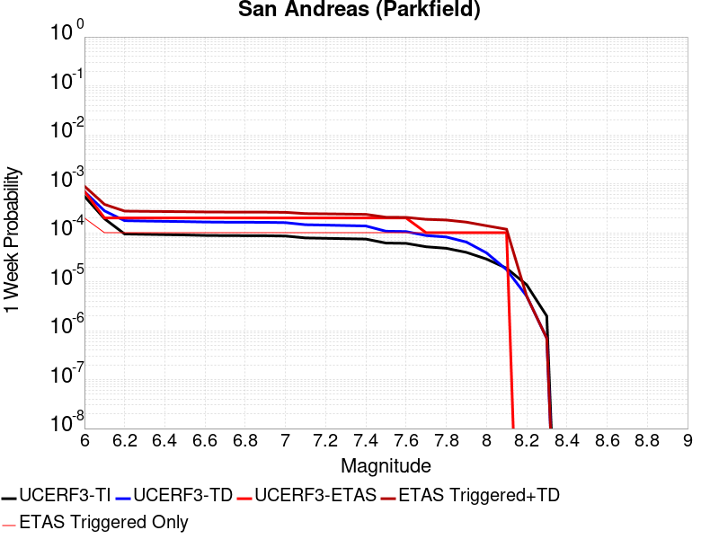 | 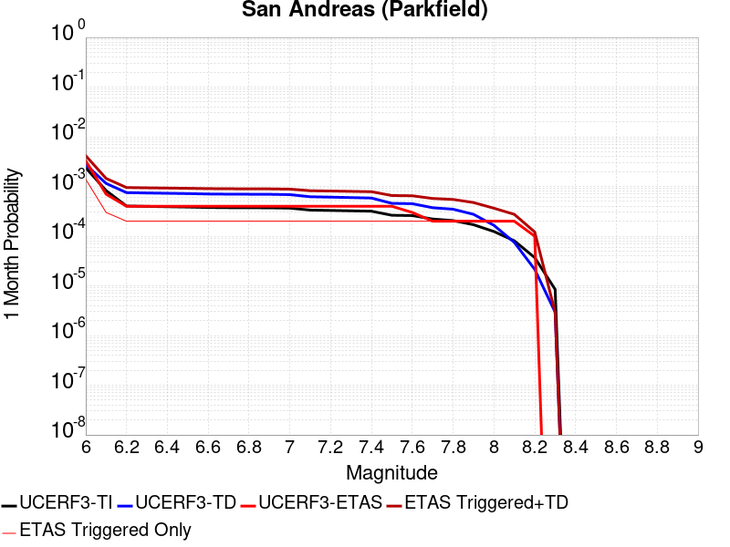 | 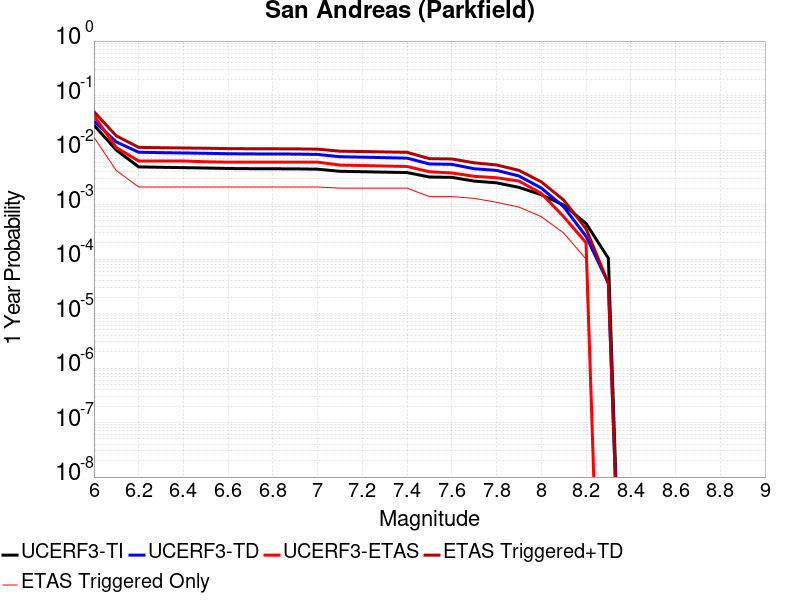 | 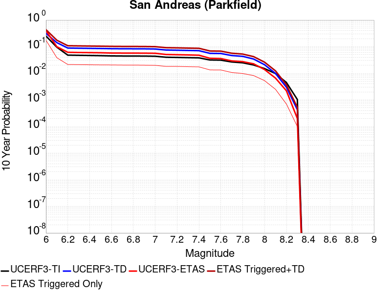 |

| Magnitude | 1 wk TI Prob | 1 wk TD Prob | 1 wk ETAS Prob | 1 wk ETAS/TD Gain | 1 wk ETAS Triggered+TD | 1 wk ETAS Triggered Only | 1 mo TI Prob | 1 mo TD Prob | 1 mo ETAS Prob | 1 mo ETAS/TD Gain | 1 mo ETAS Triggered+TD | 1 mo ETAS Triggered Only | 1 yr TI Prob | 1 yr TD Prob | 1 yr ETAS Prob | 1 yr ETAS/TD Gain | 1 yr ETAS Triggered+TD | 1 yr ETAS Triggered Only | 10 yr TI Prob | 10 yr TD Prob | 10 yr ETAS Prob | 10 yr ETAS/TD Gain | 10 yr ETAS Triggered+TD | 10 yr ETAS Triggered Only |
|-----|-----|-----|-----|-----|-----|-----|-----|-----|-----|-----|-----|-----|-----|-----|-----|-----|-----|-----|-----|-----|-----|-----|-----|-----|
| 6.0 | 5.556969E-4 | 6.915928E-4 | 7.0E-4 | 1.0121562 | 8.914545E-4 | 2.0E-4 | 0.0023793848 | 0.0029610072 | 0.0033 | 1.1144856 | 0.0043568616 | 0.0014 | 0.028586963 | 0.036040716 | 0.0429 | 1.1903204 | 0.052620817 | 0.0172 | 0.25176284 | 0.32376227 | 0.4058 | 1.2533889 | 0.4430506 | 0.1764 |
| 6.1 | 1.925858E-4 | 2.7917596E-4 | 2.0E-4 | 0.71639407 | 3.7914806E-4 | 1.0E-4 | 8.2510663E-4 | 0.0011959877 | 7.0E-4 | 0.5852903 | 0.0014956289 | 3.0E-4 | 0.0099994885 | 0.014605583 | 0.0111 | 0.7599834 | 0.01874424 | 0.0042 | 0.095613256 | 0.14387657 | 0.0995 | 0.691565 | 0.1767517 | 0.0384 |
| 6.2 | 9.4306815E-5 | 1.7635812E-4 | 2.0E-4 | 1.134056 | 2.763405E-4 | 1.0E-4 | 4.0410945E-4 | 7.5560284E-4 | 4.0E-4 | 0.52937865 | 9.554517E-4 | 2.0E-4 | 0.0049089384 | 0.009160873 | 0.0063 | 0.68770736 | 0.011241635 | 0.0021 | 0.048019063 | 0.08919295 | 0.0614 | 0.6883952 | 0.10868422 | 0.0214 |
| 6.3 | 9.283051E-5 | 1.7334851E-4 | 2.0E-4 | 1.1537452 | 2.7333118E-4 | 1.0E-4 | 3.9778434E-4 | 7.427118E-4 | 4.0E-4 | 0.5385669 | 9.425633E-4 | 2.0E-4 | 0.0048322747 | 0.009005226 | 0.0063 | 0.6995937 | 0.011086315 | 0.0021 | 0.047285385 | 0.08785068 | 0.0604 | 0.6875302 | 0.10718825 | 0.0212 |
| 6.4 | 9.138826E-5 | 1.7101326E-4 | 2.0E-4 | 1.1695 | 2.7099616E-4 | 1.0E-4 | 3.916052E-4 | 7.3270925E-4 | 4.0E-4 | 0.5459191 | 9.325627E-4 | 2.0E-4 | 0.0047573745 | 0.008884443 | 0.0063 | 0.70910466 | 0.010965785 | 0.0021 | 0.046568092 | 0.08676816 | 0.0598 | 0.68919295 | 0.105854705 | 0.0209 |
| 6.5 | 9.000255E-5 | 1.6863071E-4 | 2.0E-4 | 1.1860236 | 2.6861386E-4 | 1.0E-4 | 3.8566816E-4 | 7.22504E-4 | 4.0E-4 | 0.5536301 | 9.223595E-4 | 2.0E-4 | 0.0046854047 | 0.008761203 | 0.0061 | 0.6962514 | 0.010842805 | 0.0021 | 0.045878403 | 0.08566827 | 0.0591 | 0.6898703 | 0.104594946 | 0.0207 |
| 6.6 | 8.8109264E-5 | 1.655251E-4 | 2.0E-4 | 1.208276 | 2.6550854E-4 | 1.0E-4 | 3.7755648E-4 | 7.092015E-4 | 4.0E-4 | 0.56401455 | 9.0905966E-4 | 2.0E-4 | 0.0045870654 | 0.008600547 | 0.006 | 0.69763005 | 0.010682486 | 0.0021 | 0.04493529 | 0.08422824 | 0.0577 | 0.6850434 | 0.10309314 | 0.0206 |
| 6.7 | 8.738073E-5 | 1.6421343E-4 | 2.0E-4 | 1.2179272 | 2.64197E-4 | 1.0E-4 | 3.7443507E-4 | 7.035831E-4 | 4.0E-4 | 0.56851846 | 9.0344244E-4 | 2.0E-4 | 0.0045492216 | 0.008532719 | 0.006 | 0.7031756 | 0.0106148 | 0.0021 | 0.04457213 | 0.08363384 | 0.0574 | 0.6863251 | 0.10232771 | 0.0204 |
| 6.8 | 8.710195E-5 | 1.6368246E-4 | 2.0E-4 | 1.221878 | 2.636661E-4 | 1.0E-4 | 3.7324068E-4 | 7.013088E-4 | 4.0E-4 | 0.57036215 | 9.011685E-4 | 2.0E-4 | 0.0045347405 | 0.008505253 | 0.006 | 0.70544636 | 0.010587392 | 0.0021 | 0.04443313 | 0.08338616 | 0.0573 | 0.68716437 | 0.10208508 | 0.0204 |
| 6.9 | 8.6801556E-5 | 1.6310447E-4 | 2.0E-4 | 1.2262079 | 2.6308818E-4 | 1.0E-4 | 3.7195362E-4 | 6.98833E-4 | 4.0E-4 | 0.5723828 | 8.986933E-4 | 2.0E-4 | 0.0045191357 | 0.008475346 | 0.006 | 0.7079357 | 0.010557548 | 0.0021 | 0.044283327 | 0.08311642 | 0.057 | 0.6857851 | 0.10163747 | 0.0202 |
| 7.0 | 8.5571606E-5 | 1.6068204E-4 | 2.0E-4 | 1.2446941 | 2.6066598E-4 | 1.0E-4 | 3.6668387E-4 | 6.884567E-4 | 4.0E-4 | 0.5810097 | 8.88319E-4 | 2.0E-4 | 0.004455241 | 0.008349989 | 0.006 | 0.71856385 | 0.010432454 | 0.0021 | 0.043669727 | 0.08198201 | 0.0564 | 0.6879558 | 0.10025057 | 0.0199 |
| 7.1 | 7.82589E-5 | 1.4571106E-4 | 2.0E-4 | 1.3725793 | 2.456965E-4 | 1.0E-4 | 3.3535215E-4 | 6.243273E-4 | 4.0E-4 | 0.6406896 | 8.242024E-4 | 2.0E-4 | 0.0040752706 | 0.007574851 | 0.0053 | 0.6996837 | 0.009559701 | 0.002 | 0.040013418 | 0.074967965 | 0.0508 | 0.6776228 | 0.091711044 | 0.0181 |
| 7.2 | 7.690929E-5 | 1.4312443E-4 | 2.0E-4 | 1.3973855 | 2.4311012E-4 | 1.0E-4 | 3.2956956E-4 | 6.132469E-4 | 4.0E-4 | 0.6522658 | 8.131243E-4 | 2.0E-4 | 0.004005129 | 0.0074408767 | 0.0052 | 0.69884235 | 0.009425995 | 0.002 | 0.0393371 | 0.07375384 | 0.0499 | 0.67657495 | 0.0905189 | 0.0181 |
| 7.3 | 7.5543794E-5 | 1.401607E-4 | 2.0E-4 | 1.4269335 | 2.4014668E-4 | 1.0E-4 | 3.2371894E-4 | 6.005511E-4 | 4.0E-4 | 0.6660549 | 8.00431E-4 | 2.0E-4 | 0.003934157 | 0.0072873486 | 0.0051 | 0.69984305 | 0.009272774 | 0.002 | 0.038652334 | 0.07233999 | 0.049 | 0.677357 | 0.08875957 | 0.0177 |
| 7.4 | 7.4214564E-5 | 1.3724575E-4 | 2.0E-4 | 1.45724 | 2.3723203E-4 | 1.0E-4 | 3.1802364E-4 | 5.8806414E-4 | 4.0E-4 | 0.6801979 | 7.879465E-4 | 2.0E-4 | 0.003865065 | 0.0071363254 | 0.005 | 0.7006407 | 0.009122053 | 0.002 | 0.03798529 | 0.07094129 | 0.0477 | 0.67238694 | 0.08710691 | 0.0174 |
| 7.5 | 6.149578E-5 | 1.0727601E-4 | 2.0E-4 | 1.8643497 | 2.0726529E-4 | 1.0E-4 | 2.6352672E-4 | 4.5967344E-4 | 4.0E-4 | 0.870183 | 6.595815E-4 | 2.0E-4 | 0.0032037178 | 0.0055821915 | 0.004 | 0.7165645 | 0.0069743763 | 0.0014 | 0.03157923 | 0.056411415 | 0.0366 | 0.64880484 | 0.069055505 | 0.0134 |
| 7.6 | 6.0643448E-5 | 1.0560471E-4 | 2.0E-4 | 1.8938549 | 2.0559414E-4 | 1.0E-4 | 2.598746E-4 | 4.5251322E-4 | 3.0E-4 | 0.66296405 | 6.524227E-4 | 2.0E-4 | 0.0031593828 | 0.005495459 | 0.0038 | 0.69148 | 0.006887765 | 0.0014 | 0.031148417 | 0.0555888 | 0.0357 | 0.64221567 | 0.06814947 | 0.0133 |
| 7.7 | 5.1652263E-5 | 8.763357E-5 | 1.0E-4 | 1.1411152 | 1.876248E-4 | 1.0E-4 | 2.2134806E-4 | 3.755184E-4 | 2.0E-4 | 0.53259706 | 5.7544326E-4 | 2.0E-4 | 0.002691582 | 0.0045623607 | 0.0033 | 0.72330976 | 0.0058564297 | 0.0013 | 0.026592141 | 0.046601843 | 0.0292 | 0.62658465 | 0.056803204 | 0.0107 |
| 7.8 | 4.8090482E-5 | 8.180837E-5 | 1.0E-4 | 1.2223688 | 1.8180019E-4 | 1.0E-4 | 2.060858E-4 | 3.505602E-4 | 2.0E-4 | 0.5705154 | 5.504901E-4 | 2.0E-4 | 0.0025062072 | 0.0042597246 | 0.0031 | 0.72774655 | 0.005355039 | 0.0011 | 0.024781305 | 0.043516047 | 0.0274 | 0.6296528 | 0.05288959 | 0.0098 |
| 7.9 | 3.970278E-5 | 6.4554115E-5 | 1.0E-4 | 1.549088 | 1.6454766E-4 | 1.0E-4 | 1.7014367E-4 | 2.7663115E-4 | 2.0E-4 | 0.7229844 | 4.7657583E-4 | 2.0E-4 | 0.002069531 | 0.0033627863 | 0.0027 | 0.8029056 | 0.0042597596 | 9.0E-4 | 0.020503636 | 0.03446445 | 0.0227 | 0.65864974 | 0.042381838 | 0.0082 |
| 8.0 | 2.8982335E-5 | 3.8823757E-5 | 1.0E-4 | 2.5757425 | 1.3881987E-4 | 1.0E-4 | 1.2420409E-4 | 1.6637692E-4 | 2.0E-4 | 1.2020898 | 3.6634365E-4 | 2.0E-4 | 0.0015111357 | 0.0020237581 | 0.0016 | 0.7906083 | 0.002622544 | 6.0E-4 | 0.015009012 | 0.021072684 | 0.0138 | 0.6548763 | 0.026260998 | 0.0053 |
| 8.1 | 1.8836186E-5 | 1.7631566E-5 | 1.0E-4 | 5.6716456 | 1.176298E-4 | 1.0E-4 | 8.0724014E-5 | 7.556167E-5 | 2.0E-4 | 2.6468446 | 2.7554657E-4 | 2.0E-4 | 9.823717E-4 | 9.195756E-4 | 6.0E-4 | 0.6524749 | 0.0012192997 | 3.0E-4 | 0.009780403 | 0.009935726 | 0.0066 | 0.6642695 | 0.0124108875 | 0.0025 |
| 8.2 | 8.643924E-6 | 5.06885E-6 | 0.0 | 0.0 | 5.06885E-6 | 0.0 | 3.704486E-5 | 2.1723463E-5 | 1.0E-4 | 4.6033177 | 1.2172129E-4 | 1.0E-4 | 4.5092785E-4 | 2.6445114E-4 | 2.0E-4 | 0.7562834 | 3.644247E-4 | 1.0E-4 | 0.0045001395 | 0.0030259273 | 0.0022 | 0.7270499 | 0.003723809 | 7.0E-4 |
| 8.3 | 1.983087E-6 | 6.9765395E-7 | 0.0 | 0.0 | 6.9765395E-7 | 0.0 | 8.498917E-6 | 2.9899422E-6 | 0.0 | 0.0 | 2.9899422E-6 | 0.0 | 1.034694E-4 | 3.640195E-5 | 0.0 | 0.0 | 3.640195E-5 | 0.0 | 0.0010342124 | 4.3255524E-4 | 2.0E-4 | 0.46236867 | 5.32512E-4 | 1.0E-4 |

## San Andreas (Creeping Section) 2011 CFM
*[(top)](#table-of-contents)*

| 1 Week | 1 Month | 1 Year | 10 Year |
|-----|-----|-----|-----|
| 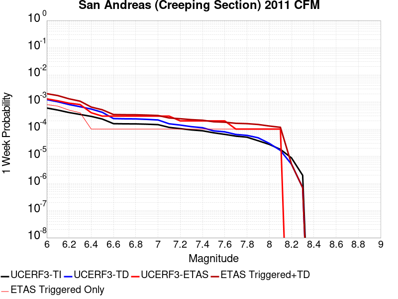 | 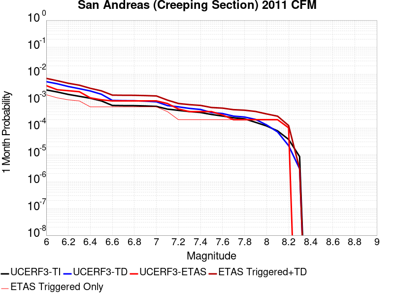 | 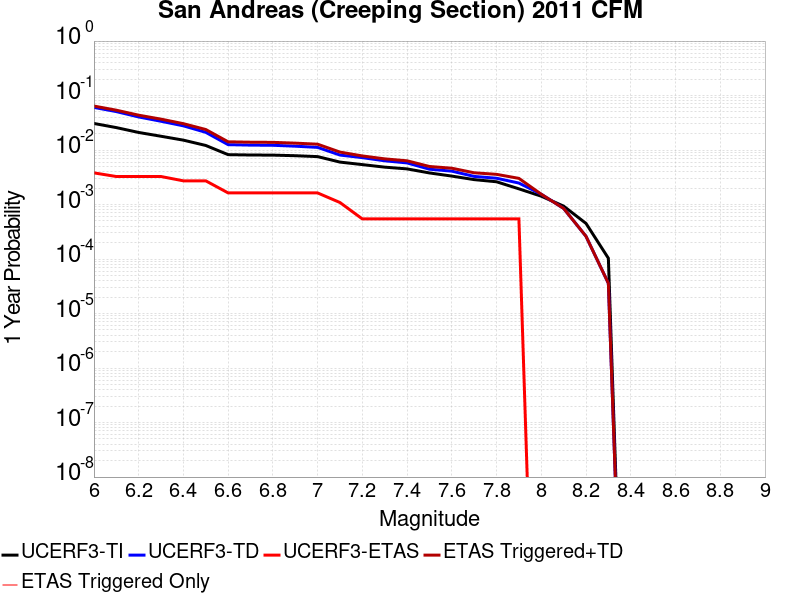 | 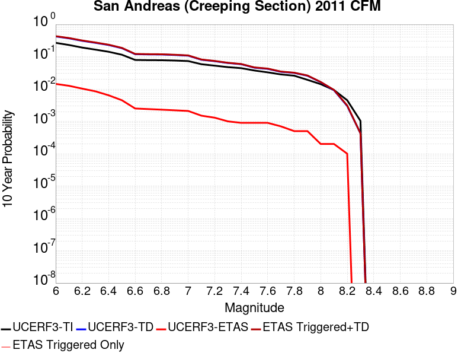 |

| Magnitude | 1 wk TI Prob | 1 wk TD Prob | 1 wk ETAS Prob | 1 wk ETAS/TD Gain | 1 wk ETAS Triggered+TD | 1 wk ETAS Triggered Only | 1 mo TI Prob | 1 mo TD Prob | 1 mo ETAS Prob | 1 mo ETAS/TD Gain | 1 mo ETAS Triggered+TD | 1 mo ETAS Triggered Only | 1 yr TI Prob | 1 yr TD Prob | 1 yr ETAS Prob | 1 yr ETAS/TD Gain | 1 yr ETAS Triggered+TD | 1 yr ETAS Triggered Only | 10 yr TI Prob | 10 yr TD Prob | 10 yr ETAS Prob | 10 yr ETAS/TD Gain | 10 yr ETAS Triggered+TD | 10 yr ETAS Triggered Only |
|-----|-----|-----|-----|-----|-----|-----|-----|-----|-----|-----|-----|-----|-----|-----|-----|-----|-----|-----|-----|-----|-----|-----|-----|-----|
| 6.0 | 5.986481E-4 | 0.0012183406 | 0.0013 | 1.0670252 | 0.0020173658 | 8.0E-4 | 0.0025631124 | 0.0052061584 | 0.0037 | 0.71069676 | 0.006897308 | 0.0017 | 0.030762846 | 0.06075491 | 0.0378 | 0.62217194 | 0.07296509 | 0.013 | 0.26835477 | 0.4235579 | 0.3282 | 0.77486455 | 0.48206678 | 0.1015 |
| 6.1 | 5.015945E-4 | 0.001014465 | 0.0011 | 1.0843153 | 0.0017137548 | 7.0E-4 | 0.00214792 | 0.004336627 | 0.0026 | 0.5995443 | 0.0056309896 | 0.0013 | 0.025839351 | 0.0508862 | 0.0307 | 0.603307 | 0.061136626 | 0.0108 | 0.23032776 | 0.37064585 | 0.2665 | 0.7190152 | 0.42275637 | 0.0828 |
| 6.2 | 4.073338E-4 | 8.035464E-4 | 9.0E-4 | 1.1200349 | 0.0013031446 | 5.0E-4 | 0.0017445484 | 0.0034364844 | 0.0024 | 0.69838816 | 0.004532704 | 0.0011 | 0.021034058 | 0.040573902 | 0.0243 | 0.5989072 | 0.04892091 | 0.0087 | 0.19150782 | 0.31064123 | 0.2191 | 0.70531523 | 0.35875848 | 0.0698 |
| 6.3 | 3.464099E-4 | 6.667307E-4 | 8.0E-4 | 1.1998848 | 0.001066464 | 4.0E-4 | 0.0014837692 | 0.0028522785 | 0.0022 | 0.7713132 | 0.0038494263 | 0.001 | 0.017915873 | 0.033827774 | 0.0202 | 0.59714246 | 0.040880833 | 0.0073 | 0.16538359 | 0.26877975 | 0.1861 | 0.6923884 | 0.31214112 | 0.0593 |
| 6.4 | 2.935057E-4 | 5.472123E-4 | 4.0E-4 | 0.7309777 | 6.471576E-4 | 1.0E-4 | 0.0012572751 | 0.002341721 | 0.0013 | 0.5551473 | 0.002940316 | 6.0E-4 | 0.015200248 | 0.027899187 | 0.0165 | 0.5914151 | 0.033731792 | 0.006 | 0.14201577 | 0.23030765 | 0.1563 | 0.6786574 | 0.26856136 | 0.0497 |
| 6.5 | 2.3409708E-4 | 4.1372047E-4 | 3.0E-4 | 0.7251273 | 5.136791E-4 | 1.0E-4 | 0.0010028875 | 0.0017711387 | 0.0011 | 0.6210694 | 0.002370076 | 6.0E-4 | 0.012141965 | 0.021219624 | 0.0126 | 0.59378994 | 0.026015649 | 0.0049 | 0.11499573 | 0.18398552 | 0.1202 | 0.6533123 | 0.21572848 | 0.0389 |
| 6.6 | 1.5842178E-4 | 2.4354956E-4 | 3.0E-4 | 1.2317822 | 3.435252E-4 | 1.0E-4 | 6.7877385E-4 | 0.0010433596 | 0.001 | 0.9584423 | 0.0016427336 | 6.0E-4 | 0.0082328 | 0.012627537 | 0.0082 | 0.6493745 | 0.015688391 | 0.0031 | 0.07934396 | 0.12010763 | 0.0756 | 0.6294355 | 0.14184096 | 0.0247 |
| 6.7 | 1.5616413E-4 | 2.3893468E-4 | 3.0E-4 | 1.2555733 | 3.389108E-4 | 1.0E-4 | 6.691031E-4 | 0.0010236005 | 0.001 | 0.9769437 | 0.0016229863 | 6.0E-4 | 0.0081159435 | 0.012390325 | 0.008 | 0.64566505 | 0.015353153 | 0.003 | 0.0782586 | 0.11813531 | 0.0742 | 0.62809336 | 0.13947643 | 0.0242 |
| 6.8 | 1.5538467E-4 | 2.3719038E-4 | 3.0E-4 | 1.2648067 | 3.3716668E-4 | 1.0E-4 | 6.6576427E-4 | 0.0010161317 | 0.001 | 0.98412436 | 0.0016155221 | 6.0E-4 | 0.008075596 | 0.012300573 | 0.008 | 0.6503762 | 0.015263672 | 0.003 | 0.07788358 | 0.11737025 | 0.0738 | 0.6287795 | 0.13864163 | 0.0241 |
| 6.9 | 1.5153569E-4 | 2.2834647E-4 | 3.0E-4 | 1.3137931 | 3.2832363E-4 | 1.0E-4 | 6.49277E-4 | 9.782626E-4 | 0.001 | 1.0222204 | 0.0015776757 | 6.0E-4 | 0.007876333 | 0.0118457945 | 0.0077 | 0.6500197 | 0.014612626 | 0.0028 | 0.07602952 | 0.11345131 | 0.071 | 0.62581915 | 0.13375327 | 0.0229 |
| 7.0 | 1.4588932E-4 | 2.1704847E-4 | 3.0E-4 | 1.3821799 | 3.1702674E-4 | 1.0E-4 | 6.250901E-4 | 9.29878E-4 | 0.001 | 1.0754099 | 0.00152932 | 6.0E-4 | 0.0075839474 | 0.011262964 | 0.0075 | 0.6658993 | 0.014031428 | 0.0028 | 0.073302895 | 0.10833193 | 0.0681 | 0.6286235 | 0.12821613 | 0.0223 |
| 7.1 | 1.1565079E-4 | 1.5682573E-4 | 3.0E-4 | 1.9129515 | 2.5681005E-4 | 1.0E-4 | 4.955521E-4 | 6.719379E-4 | 8.0E-4 | 1.1905862 | 0.0010716692 | 4.0E-4 | 0.006016669 | 0.008150345 | 0.0061 | 0.7484346 | 0.010530784 | 0.0024 | 0.058563538 | 0.08097166 | 0.0508 | 0.62738 | 0.096227534 | 0.0166 |
| 7.2 | 1.0393792E-4 | 1.4054266E-4 | 2.0E-4 | 1.4230555 | 2.4052859E-4 | 1.0E-4 | 4.4537216E-4 | 6.0218736E-4 | 5.0E-4 | 0.8303064 | 8.020669E-4 | 2.0E-4 | 0.005408933 | 0.007307142 | 0.0053 | 0.7253178 | 0.009292528 | 0.002 | 0.052791595 | 0.07306646 | 0.0461 | 0.63093245 | 0.08715585 | 0.0152 |
| 7.3 | 9.332884E-5 | 1.2286415E-4 | 2.0E-4 | 1.627814 | 2.2285187E-4 | 1.0E-4 | 3.999194E-4 | 5.26455E-4 | 4.0E-4 | 0.759799 | 7.263497E-4 | 2.0E-4 | 0.0048581534 | 0.0063908785 | 0.0046 | 0.71977586 | 0.008278736 | 0.0019 | 0.047533102 | 0.0641969 | 0.041 | 0.63866013 | 0.07720456 | 0.0139 |
| 7.4 | 8.670252E-5 | 1.1232113E-4 | 2.0E-4 | 1.7806088 | 2.123099E-4 | 1.0E-4 | 3.715293E-4 | 4.8128804E-4 | 4.0E-4 | 0.83110315 | 6.811918E-4 | 2.0E-4 | 0.004513991 | 0.0058440515 | 0.0042 | 0.7186795 | 0.0075341165 | 0.0017 | 0.044233937 | 0.058958188 | 0.0378 | 0.6411323 | 0.07100353 | 0.0128 |
| 7.5 | 7.3036405E-5 | 8.6087464E-5 | 2.0E-4 | 2.3232186 | 1.8607885E-4 | 1.0E-4 | 3.129756E-4 | 3.6889417E-4 | 4.0E-4 | 1.0843219 | 5.688204E-4 | 2.0E-4 | 0.0038038217 | 0.004482057 | 0.0035 | 0.7808915 | 0.0057762302 | 0.0013 | 0.03739367 | 0.045975607 | 0.0289 | 0.6285942 | 0.055229645 | 0.0097 |
| 7.6 | 6.3935775E-5 | 7.9179175E-5 | 2.0E-4 | 2.5259166 | 1.7917126E-4 | 1.0E-4 | 2.7398168E-4 | 3.3929528E-4 | 3.0E-4 | 0.8841856 | 5.392274E-4 | 2.0E-4 | 0.0033306254 | 0.0041231127 | 0.0033 | 0.8003662 | 0.0054177525 | 0.0013 | 0.032811474 | 0.04225656 | 0.0272 | 0.643687 | 0.051355124 | 0.0095 |
| 7.7 | 5.5050095E-5 | 6.341782E-5 | 1.0E-4 | 1.5768439 | 1.6341147E-4 | 1.0E-4 | 2.3590765E-4 | 2.7176237E-4 | 2.0E-4 | 0.7359371 | 4.7170802E-4 | 2.0E-4 | 0.0028683927 | 0.0033036903 | 0.0028 | 0.84753704 | 0.0044000563 | 0.0011 | 0.0283165 | 0.034240767 | 0.0217 | 0.6337475 | 0.04129081 | 0.0073 |
| 7.8 | 5.027131E-5 | 5.869966E-5 | 1.0E-4 | 1.7035874 | 1.5869379E-4 | 1.0E-4 | 2.1543067E-4 | 2.5154572E-4 | 2.0E-4 | 0.79508406 | 4.514954E-4 | 2.0E-4 | 0.0026197135 | 0.0030582712 | 0.0026 | 0.8501535 | 0.003955519 | 9.0E-4 | 0.025890453 | 0.03169936 | 0.0201 | 0.63408226 | 0.037993312 | 0.0065 |
| 7.9 | 3.7271806E-5 | 4.786388E-5 | 1.0E-4 | 2.0892582 | 1.4785909E-4 | 1.0E-4 | 1.5972654E-4 | 2.0511479E-4 | 2.0E-4 | 0.97506374 | 4.0507378E-4 | 2.0E-4 | 0.0019429359 | 0.0024944143 | 0.0023 | 0.92206013 | 0.0032924188 | 8.0E-4 | 0.019260362 | 0.025904132 | 0.0171 | 0.6601264 | 0.031553887 | 0.0058 |
| 8.0 | 2.7310243E-5 | 2.986441E-5 | 1.0E-4 | 3.3484674 | 1.2986142E-4 | 1.0E-4 | 1.17038646E-4 | 1.2798405E-4 | 2.0E-4 | 1.5626947 | 3.2795846E-4 | 2.0E-4 | 0.0014240141 | 0.0015570929 | 0.0014 | 0.8991114 | 0.0020563144 | 5.0E-4 | 0.014149235 | 0.016417434 | 0.0107 | 0.65174615 | 0.019958332 | 0.0036 |
| 8.1 | 1.7940547E-5 | 1.6404678E-5 | 1.0E-4 | 6.095822 | 1.1640304E-4 | 1.0E-4 | 7.688579E-5 | 7.0303875E-5 | 2.0E-4 | 2.8447936 | 2.702898E-4 | 2.0E-4 | 9.3568244E-4 | 8.5561397E-4 | 6.0E-4 | 0.7012508 | 0.0011553573 | 3.0E-4 | 0.009317525 | 0.009273962 | 0.0063 | 0.6793213 | 0.011552632 | 0.0023 |
| 8.2 | 8.643924E-6 | 5.06885E-6 | 0.0 | 0.0 | 5.06885E-6 | 0.0 | 3.704486E-5 | 2.1723463E-5 | 1.0E-4 | 4.6033177 | 1.2172129E-4 | 1.0E-4 | 4.5092785E-4 | 2.6445114E-4 | 2.0E-4 | 0.7562834 | 3.644247E-4 | 1.0E-4 | 0.0045001395 | 0.0030259273 | 0.0022 | 0.7270499 | 0.003723809 | 7.0E-4 |
| 8.3 | 1.983087E-6 | 6.9765395E-7 | 0.0 | 0.0 | 6.9765395E-7 | 0.0 | 8.498917E-6 | 2.9899422E-6 | 0.0 | 0.0 | 2.9899422E-6 | 0.0 | 1.034694E-4 | 3.640195E-5 | 0.0 | 0.0 | 3.640195E-5 | 0.0 | 0.0010342124 | 4.3255524E-4 | 2.0E-4 | 0.46236867 | 5.32512E-4 | 1.0E-4 |

## San Andreas (Mojave S)
*[(top)](#table-of-contents)*

| 1 Week | 1 Month | 1 Year | 10 Year |
|-----|-----|-----|-----|
| 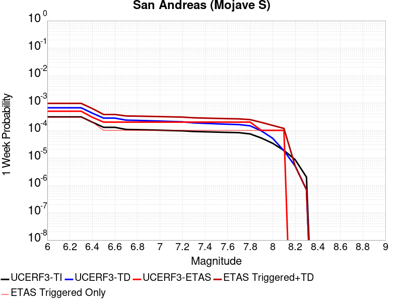 | 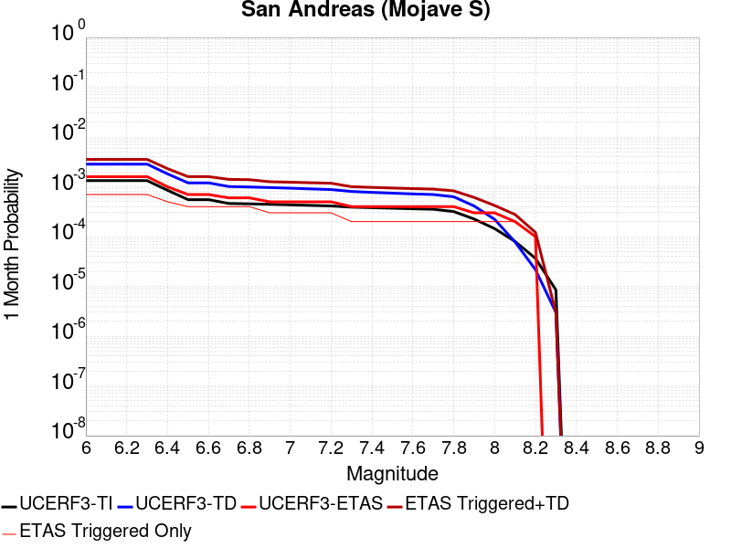 | 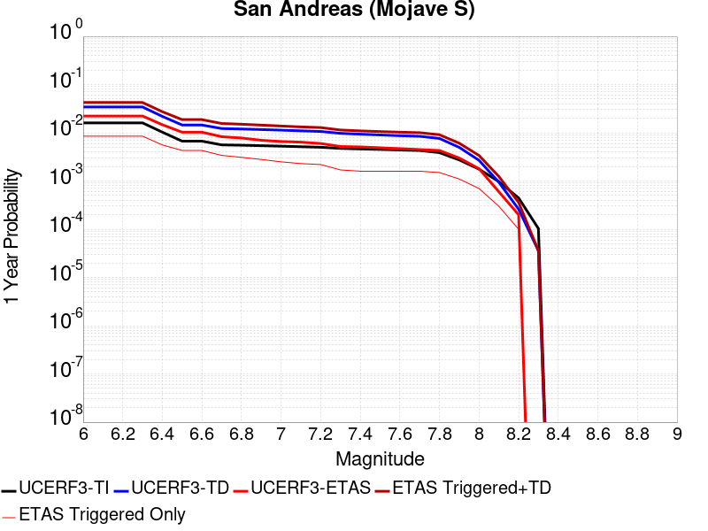 | 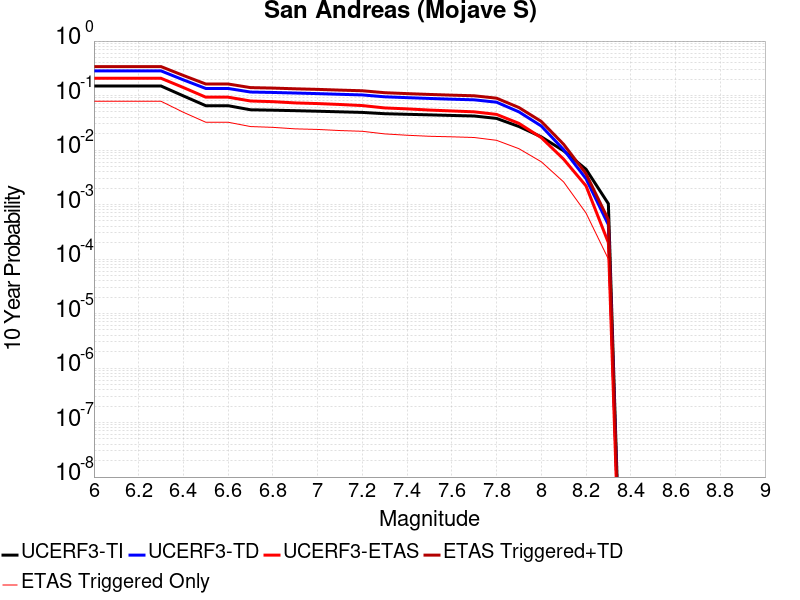 |

| Magnitude | 1 wk TI Prob | 1 wk TD Prob | 1 wk ETAS Prob | 1 wk ETAS/TD Gain | 1 wk ETAS Triggered+TD | 1 wk ETAS Triggered Only | 1 mo TI Prob | 1 mo TD Prob | 1 mo ETAS Prob | 1 mo ETAS/TD Gain | 1 mo ETAS Triggered+TD | 1 mo ETAS Triggered Only | 1 yr TI Prob | 1 yr TD Prob | 1 yr ETAS Prob | 1 yr ETAS/TD Gain | 1 yr ETAS Triggered+TD | 1 yr ETAS Triggered Only | 10 yr TI Prob | 10 yr TD Prob | 10 yr ETAS Prob | 10 yr ETAS/TD Gain | 10 yr ETAS Triggered+TD | 10 yr ETAS Triggered Only |
|-----|-----|-----|-----|-----|-----|-----|-----|-----|-----|-----|-----|-----|-----|-----|-----|-----|-----|-----|-----|-----|-----|-----|-----|-----|
| 6.0 | 3.1064058E-4 | 6.6695944E-4 | 5.0E-4 | 0.74967074 | 9.6675934E-4 | 3.0E-4 | 0.0013306376 | 0.0028553943 | 0.0016 | 0.5603429 | 0.0035533954 | 7.0E-4 | 0.016080605 | 0.034179125 | 0.0223 | 0.652445 | 0.042388603 | 0.0085 | 0.1496549 | 0.2840769 | 0.2074 | 0.730084 | 0.34034845 | 0.0786 |
| 6.1 | 3.1064058E-4 | 6.6695944E-4 | 5.0E-4 | 0.74967074 | 9.6675934E-4 | 3.0E-4 | 0.0013306376 | 0.0028553943 | 0.0016 | 0.5603429 | 0.0035533954 | 7.0E-4 | 0.016080605 | 0.034179125 | 0.0223 | 0.652445 | 0.042388603 | 0.0085 | 0.1496549 | 0.2840769 | 0.2074 | 0.730084 | 0.34034845 | 0.0786 |
| 6.2 | 3.1064058E-4 | 6.6695944E-4 | 5.0E-4 | 0.74967074 | 9.6675934E-4 | 3.0E-4 | 0.0013306376 | 0.0028553943 | 0.0016 | 0.5603429 | 0.0035533954 | 7.0E-4 | 0.016080605 | 0.034179125 | 0.0223 | 0.652445 | 0.042388603 | 0.0085 | 0.1496549 | 0.2840769 | 0.2074 | 0.730084 | 0.34034845 | 0.0786 |
| 6.3 | 3.1064058E-4 | 6.6695944E-4 | 5.0E-4 | 0.74967074 | 9.6675934E-4 | 3.0E-4 | 0.0013306376 | 0.0028553943 | 0.0016 | 0.5603429 | 0.0035533954 | 7.0E-4 | 0.016080605 | 0.034179125 | 0.0223 | 0.652445 | 0.042388603 | 0.0085 | 0.1496549 | 0.2840769 | 0.2074 | 0.730084 | 0.34034845 | 0.0786 |
| 6.4 | 1.9872203E-4 | 4.2452608E-4 | 3.0E-4 | 0.70667034 | 6.244412E-4 | 2.0E-4 | 8.5138786E-4 | 0.001818157 | 0.001 | 0.5500075 | 0.002317248 | 5.0E-4 | 0.010316478 | 0.021917434 | 0.0147 | 0.67069894 | 0.027394695 | 0.0056 | 0.098504856 | 0.19425216 | 0.1403 | 0.7222571 | 0.23397553 | 0.0493 |
| 6.5 | 1.291105E-4 | 2.8063892E-4 | 2.0E-4 | 0.71265954 | 3.8061084E-4 | 1.0E-4 | 5.5321335E-4 | 0.0012021866 | 7.0E-4 | 0.58227235 | 0.0016017057 | 4.0E-4 | 0.006714592 | 0.01453919 | 0.0103 | 0.7084301 | 0.018776672 | 0.0043 | 0.065152965 | 0.13517067 | 0.0934 | 0.6909783 | 0.16319114 | 0.0324 |
| 6.6 | 1.291105E-4 | 2.8063892E-4 | 2.0E-4 | 0.71265954 | 3.8061084E-4 | 1.0E-4 | 5.5321335E-4 | 0.0012021866 | 7.0E-4 | 0.58227235 | 0.0016017057 | 4.0E-4 | 0.006714592 | 0.01453919 | 0.0103 | 0.7084301 | 0.018776672 | 0.0043 | 0.065152965 | 0.13517067 | 0.0934 | 0.6909783 | 0.16319114 | 0.0324 |
| 6.7 | 1.08001186E-4 | 2.365581E-4 | 2.0E-4 | 0.84545827 | 3.3653443E-4 | 1.0E-4 | 4.6278012E-4 | 0.001013427 | 6.0E-4 | 0.5920505 | 0.0014130217 | 4.0E-4 | 0.0056198016 | 0.01226895 | 0.0083 | 0.6765045 | 0.015627237 | 0.0034 | 0.054797906 | 0.1162747 | 0.0795 | 0.6837257 | 0.14013529 | 0.027 |
| 6.8 | 1.0624356E-4 | 2.317545E-4 | 2.0E-4 | 0.86298215 | 3.3173134E-4 | 1.0E-4 | 4.5525006E-4 | 9.92856E-4 | 6.0E-4 | 0.60431725 | 0.0013924589 | 4.0E-4 | 0.0055285925 | 0.01202128 | 0.0078 | 0.64884937 | 0.015084013 | 0.0031 | 0.053930566 | 0.11422407 | 0.0773 | 0.67674005 | 0.13734283 | 0.0261 |
| 6.9 | 1.0393785E-4 | 2.2548415E-4 | 2.0E-4 | 0.8869803 | 3.2546162E-4 | 1.0E-4 | 4.4537184E-4 | 9.660032E-4 | 5.0E-4 | 0.5175966 | 0.0012657134 | 3.0E-4 | 0.0054089287 | 0.011697898 | 0.007 | 0.59839815 | 0.014465143 | 0.0028 | 0.05279156 | 0.11151534 | 0.0733 | 0.65730864 | 0.13328321 | 0.0245 |
| 7.0 | 1.0155622E-4 | 2.1920961E-4 | 2.0E-4 | 0.9123688 | 3.191877E-4 | 1.0E-4 | 4.3516833E-4 | 9.391319E-4 | 5.0E-4 | 0.53240657 | 0.0012388502 | 3.0E-4 | 0.005285311 | 0.011374196 | 0.0066 | 0.5802608 | 0.01384576 | 0.0025 | 0.05161361 | 0.10878251 | 0.0713 | 0.6554363 | 0.1300826 | 0.0239 |
| 7.1 | 9.885595E-5 | 2.1212734E-4 | 2.0E-4 | 0.9428299 | 3.1210613E-4 | 1.0E-4 | 4.2359953E-4 | 9.0880075E-4 | 5.0E-4 | 0.5501756 | 0.0012085282 | 3.0E-4 | 0.0051451353 | 0.0110086985 | 0.0064 | 0.58135843 | 0.013283378 | 0.0023 | 0.05027629 | 0.10567342 | 0.0686 | 0.64916986 | 0.12606406 | 0.0228 |
| 7.2 | 9.6411415E-5 | 2.0578885E-4 | 2.0E-4 | 0.97186995 | 3.0576828E-4 | 1.0E-4 | 4.1312634E-4 | 8.8165444E-4 | 5.0E-4 | 0.5671156 | 0.0011813899 | 3.0E-4 | 0.005018219 | 0.010681479 | 0.006 | 0.56171995 | 0.01285798 | 0.0022 | 0.049064007 | 0.10286741 | 0.0655 | 0.636742 | 0.12269404 | 0.0221 |
| 7.3 | 9.1180635E-5 | 1.8825143E-4 | 2.0E-4 | 1.0624089 | 2.882326E-4 | 1.0E-4 | 3.907156E-4 | 8.0654246E-4 | 4.0E-4 | 0.4959441 | 0.0010063812 | 2.0E-4 | 0.004746591 | 0.009775544 | 0.0052 | 0.53193974 | 0.011458925 | 0.0017 | 0.046464786 | 0.09512141 | 0.0593 | 0.6234138 | 0.11303801 | 0.0198 |
| 7.4 | 8.887388E-5 | 1.8081242E-4 | 2.0E-4 | 1.1061187 | 2.8079434E-4 | 1.0E-4 | 3.8083247E-4 | 7.746803E-4 | 4.0E-4 | 0.51634204 | 9.7452535E-4 | 2.0E-4 | 0.0046267817 | 0.009391031 | 0.0051 | 0.5430713 | 0.010976005 | 0.0016 | 0.045316286 | 0.09177658 | 0.057 | 0.6210735 | 0.10876036 | 0.0187 |
| 7.5 | 8.6750515E-5 | 1.7419644E-4 | 2.0E-4 | 1.1481291 | 2.74179E-4 | 1.0E-4 | 3.7173493E-4 | 7.4634264E-4 | 4.0E-4 | 0.53594685 | 9.4619335E-4 | 2.0E-4 | 0.004516484 | 0.009048939 | 0.0049 | 0.5414999 | 0.0106344605 | 0.0016 | 0.04425787 | 0.088759765 | 0.0542 | 0.61063707 | 0.10507096 | 0.0179 |
| 7.6 | 8.453092E-5 | 1.6815437E-4 | 2.0E-4 | 1.1893834 | 2.6813755E-4 | 1.0E-4 | 3.6222505E-4 | 7.204626E-4 | 4.0E-4 | 0.55519885 | 9.203185E-4 | 2.0E-4 | 0.0044011753 | 0.0087364195 | 0.0047 | 0.5379778 | 0.010322441 | 0.0016 | 0.04315024 | 0.08594257 | 0.0522 | 0.60738236 | 0.101938576 | 0.0175 |
| 7.7 | 8.259102E-5 | 1.6344519E-4 | 2.0E-4 | 1.2236518 | 2.6342884E-4 | 1.0E-4 | 3.539135E-4 | 7.002914E-4 | 4.0E-4 | 0.5711908 | 9.001513E-4 | 2.0E-4 | 0.004300386 | 0.008492777 | 0.0045 | 0.529862 | 0.010079189 | 0.0016 | 0.042181134 | 0.08371713 | 0.0503 | 0.6008329 | 0.09929393 | 0.017 |
| 7.8 | 7.444844E-5 | 1.4721302E-4 | 2.0E-4 | 1.3585755 | 2.471983E-4 | 1.0E-4 | 3.1902574E-4 | 6.3076045E-4 | 4.0E-4 | 0.63415515 | 8.306343E-4 | 2.0E-4 | 0.0038772223 | 0.0076525114 | 0.0043 | 0.56190705 | 0.009141033 | 0.0015 | 0.03810269 | 0.075767994 | 0.0451 | 0.5952381 | 0.0897239 | 0.0151 |
| 7.9 | 5.2586525E-5 | 9.6212076E-5 | 1.0E-4 | 1.0393705 | 1.9620245E-4 | 1.0E-4 | 2.2535135E-4 | 4.1227232E-4 | 3.0E-4 | 0.72767437 | 6.121899E-4 | 2.0E-4 | 0.0027402006 | 0.005007873 | 0.003 | 0.5990567 | 0.0061023645 | 0.0011 | 0.027066574 | 0.050396647 | 0.0309 | 0.613136 | 0.060462445 | 0.0106 |
| 8.0 | 3.379877E-5 | 5.18389E-5 | 1.0E-4 | 1.9290533 | 1.5183371E-4 | 1.0E-4 | 1.4484383E-4 | 2.2214779E-4 | 3.0E-4 | 1.3504523 | 4.2210336E-4 | 2.0E-4 | 0.0017620471 | 0.0027012965 | 0.0018 | 0.6663467 | 0.0033994056 | 7.0E-4 | 0.017481409 | 0.027737081 | 0.0169 | 0.6092927 | 0.033667885 | 0.0061 |
| 8.1 | 1.8668277E-5 | 1.8253817E-5 | 1.0E-4 | 5.4783063 | 1.1825199E-4 | 1.0E-4 | 8.000444E-5 | 7.82283E-5 | 2.0E-4 | 2.5566194 | 2.7821265E-4 | 2.0E-4 | 9.736188E-4 | 9.52014E-4 | 6.0E-4 | 0.6302428 | 0.0012517284 | 3.0E-4 | 0.009693642 | 0.010245123 | 0.0068 | 0.66373044 | 0.012818486 | 0.0026 |
| 8.2 | 8.541571E-6 | 5.0561516E-6 | 0.0 | 0.0 | 5.0561516E-6 | 0.0 | 3.660622E-5 | 2.166904E-5 | 1.0E-4 | 4.6148787 | 1.21666875E-4 | 1.0E-4 | 4.455896E-4 | 2.637887E-4 | 2.0E-4 | 0.7581826 | 3.6376234E-4 | 1.0E-4 | 0.0044469717 | 0.0030187676 | 0.0022 | 0.72877425 | 0.0037166544 | 7.0E-4 |
| 8.3 | 1.983087E-6 | 6.9765395E-7 | 0.0 | 0.0 | 6.9765395E-7 | 0.0 | 8.498917E-6 | 2.9899422E-6 | 0.0 | 0.0 | 2.9899422E-6 | 0.0 | 1.034694E-4 | 3.640195E-5 | 0.0 | 0.0 | 3.640195E-5 | 0.0 | 0.0010342124 | 4.3255524E-4 | 2.0E-4 | 0.46236867 | 5.32512E-4 | 1.0E-4 |

## Mendocino
*[(top)](#table-of-contents)*

| 1 Week | 1 Month | 1 Year | 10 Year |
|-----|-----|-----|-----|
| 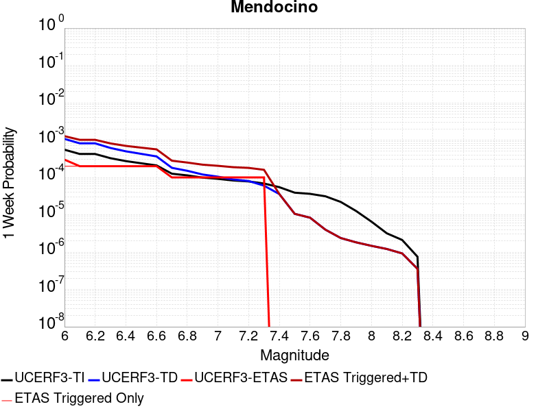 | 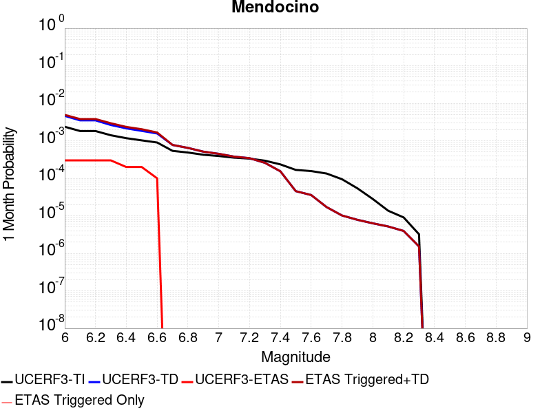 | 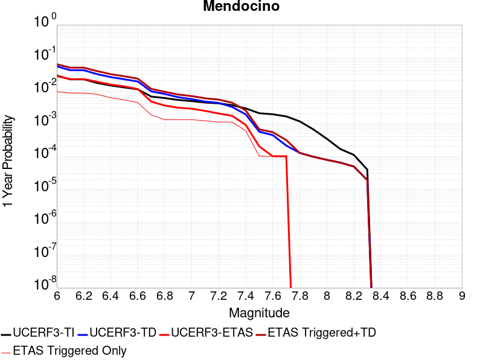 | 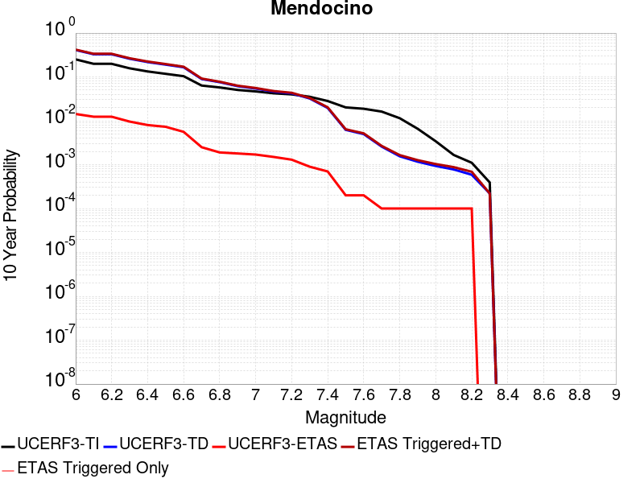 |

| Magnitude | 1 wk TI Prob | 1 wk TD Prob | 1 wk ETAS Prob | 1 wk ETAS/TD Gain | 1 wk ETAS Triggered+TD | 1 wk ETAS Triggered Only | 1 mo TI Prob | 1 mo TD Prob | 1 mo ETAS Prob | 1 mo ETAS/TD Gain | 1 mo ETAS Triggered+TD | 1 mo ETAS Triggered Only | 1 yr TI Prob | 1 yr TD Prob | 1 yr ETAS Prob | 1 yr ETAS/TD Gain | 1 yr ETAS Triggered+TD | 1 yr ETAS Triggered Only | 10 yr TI Prob | 10 yr TD Prob | 10 yr ETAS Prob | 10 yr ETAS/TD Gain | 10 yr ETAS Triggered+TD | 10 yr ETAS Triggered Only |
|-----|-----|-----|-----|-----|-----|-----|-----|-----|-----|-----|-----|-----|-----|-----|-----|-----|-----|-----|-----|-----|-----|-----|-----|-----|
| 6.0 | 5.5409013E-4 | 0.0010796934 | 3.0E-4 | 0.27785665 | 0.0012794775 | 2.0E-4 | 0.0023725112 | 0.0046170084 | 0.0024 | 0.5198171 | 0.005512853 | 9.0E-4 | 0.028505474 | 0.05446236 | 0.0273 | 0.5012636 | 0.063161306 | 0.0092 | 0.25113493 | 0.41066006 | 0.2478 | 0.60341877 | 0.45951635 | 0.0829 |
| 6.1 | 4.2515888E-4 | 8.1907253E-4 | 2.0E-4 | 0.24417862 | 0.0010189087 | 2.0E-4 | 0.0018208373 | 0.0035039976 | 0.002 | 0.57077664 | 0.004400844 | 9.0E-4 | 0.021944538 | 0.041563198 | 0.0223 | 0.53653234 | 0.049614068 | 0.0084 | 0.19899574 | 0.32874507 | 0.2121 | 0.64518076 | 0.38083446 | 0.0776 |
| 6.2 | 4.2515888E-4 | 8.1907253E-4 | 2.0E-4 | 0.24417862 | 0.0010189087 | 2.0E-4 | 0.0018208373 | 0.0035039976 | 0.002 | 0.57077664 | 0.004400844 | 9.0E-4 | 0.021944538 | 0.041563198 | 0.0223 | 0.53653234 | 0.049614068 | 0.0084 | 0.19899574 | 0.32874507 | 0.2121 | 0.64518076 | 0.38083446 | 0.0776 |
| 6.3 | 3.2773745E-4 | 6.1586214E-4 | 2.0E-4 | 0.324748 | 8.15739E-4 | 2.0E-4 | 0.0014038329 | 0.0026356152 | 0.002 | 0.75883615 | 0.003533243 | 9.0E-4 | 0.016958237 | 0.031419706 | 0.0185 | 0.58880246 | 0.038877774 | 0.0077 | 0.1572094 | 0.25955155 | 0.1681 | 0.64765555 | 0.30642194 | 0.0633 |
| 6.4 | 2.7417165E-4 | 5.014441E-4 | 2.0E-4 | 0.39884803 | 7.013438E-4 | 2.0E-4 | 0.0011744922 | 0.002146392 | 0.0014 | 0.65225744 | 0.002745104 | 6.0E-4 | 0.014205975 | 0.025670903 | 0.0152 | 0.59211004 | 0.03151688 | 0.006 | 0.13331394 | 0.21823153 | 0.1376 | 0.630523 | 0.25833625 | 0.0513 |
| 6.5 | 2.3984899E-4 | 4.2912093E-4 | 2.0E-4 | 0.4660691 | 6.290351E-4 | 2.0E-4 | 0.0010275192 | 0.0018371117 | 0.0014 | 0.76206577 | 0.0024360095 | 6.0E-4 | 0.012438473 | 0.022018315 | 0.0134 | 0.6085843 | 0.027103819 | 0.0052 | 0.11764851 | 0.19078137 | 0.12 | 0.6289922 | 0.2275199 | 0.0454 |
| 6.6 | 2.1023539E-4 | 3.6620436E-4 | 2.0E-4 | 0.5461432 | 5.661311E-4 | 2.0E-4 | 9.0069766E-4 | 0.0015679767 | 0.001 | 0.63776463 | 0.0020671927 | 5.0E-4 | 0.010910975 | 0.018831093 | 0.0111 | 0.58945066 | 0.023050118 | 0.0043 | 0.10390546 | 0.16622992 | 0.1024 | 0.61601424 | 0.19816332 | 0.0383 |
| 6.7 | 1.2592976E-4 | 1.812945E-4 | 1.0E-4 | 0.5515887 | 2.8127639E-4 | 1.0E-4 | 5.395873E-4 | 7.7668705E-4 | 2.0E-4 | 0.257504 | 8.7660935E-4 | 1.0E-4 | 0.006549705 | 0.009403987 | 0.0046 | 0.48915422 | 0.01118706 | 0.0018 | 0.063599944 | 0.089650325 | 0.0472 | 0.52649 | 0.10521731 | 0.0171 |
| 6.8 | 1.13663555E-4 | 1.5119594E-4 | 1.0E-4 | 0.6613934 | 2.511808E-4 | 1.0E-4 | 4.8703855E-4 | 6.477909E-4 | 2.0E-4 | 0.3087416 | 7.477261E-4 | 1.0E-4 | 0.0059135845 | 0.007854334 | 0.0035 | 0.44561386 | 0.009144124 | 0.0013 | 0.057586733 | 0.076110475 | 0.038 | 0.49927425 | 0.08904493 | 0.014 |
| 6.9 | 9.926894E-5 | 1.2036246E-4 | 1.0E-4 | 0.8308238 | 2.2035043E-4 | 1.0E-4 | 4.2536893E-4 | 5.1573163E-4 | 2.0E-4 | 0.38779858 | 6.1568007E-4 | 1.0E-4 | 0.0051665753 | 0.0062600407 | 0.003 | 0.4792301 | 0.0075519024 | 0.0013 | 0.050480947 | 0.061634526 | 0.0302 | 0.4899851 | 0.07308258 | 0.0122 |
| 7.0 | 9.168125E-5 | 1.0529014E-4 | 1.0E-4 | 0.9497565 | 2.0527962E-4 | 1.0E-4 | 3.9286047E-4 | 4.511643E-4 | 2.0E-4 | 0.44329748 | 5.511192E-4 | 1.0E-4 | 0.004772591 | 0.00547874 | 0.0028 | 0.5110664 | 0.006771618 | 0.0013 | 0.04671385 | 0.054426186 | 0.0276 | 0.5071088 | 0.06520573 | 0.0114 |
| 7.1 | 8.2854116E-5 | 8.860998E-5 | 1.0E-4 | 1.1285411 | 1.8860112E-4 | 1.0E-4 | 3.5504074E-4 | 3.7970228E-4 | 2.0E-4 | 0.52672845 | 4.796643E-4 | 1.0E-4 | 0.004314056 | 0.0046131397 | 0.0024 | 0.52025306 | 0.0058076037 | 0.0012 | 0.042312626 | 0.046324518 | 0.0251 | 0.5418297 | 0.056338113 | 0.0105 |
| 7.2 | 7.8255274E-5 | 8.06163E-5 | 1.0E-4 | 1.240444 | 1.8060824E-4 | 1.0E-4 | 3.3533663E-4 | 3.4545347E-4 | 2.0E-4 | 0.5789492 | 4.454189E-4 | 1.0E-4 | 0.0040750825 | 0.004197925 | 0.002 | 0.4764259 | 0.005293307 | 0.0011 | 0.040011603 | 0.04238875 | 0.023 | 0.5425968 | 0.05129453 | 0.0093 |
| 7.3 | 6.887904E-5 | 6.0630904E-5 | 1.0E-4 | 1.6493239 | 1.6062484E-4 | 1.0E-4 | 2.9516246E-4 | 2.598214E-4 | 2.0E-4 | 0.7697596 | 3.597954E-4 | 1.0E-4 | 0.0035876823 | 0.0031588287 | 0.0017 | 0.53817415 | 0.004255354 | 0.0011 | 0.035303112 | 0.03239243 | 0.0183 | 0.5649468 | 0.03984301 | 0.0077 |
| 7.4 | 5.4898497E-5 | 3.6060723E-5 | 0.0 | 0.0 | 3.6060723E-5 | 0.0 | 2.3525805E-4 | 1.545371E-4 | 1.0E-4 | 0.6470938 | 1.545371E-4 | 0.0 | 0.0028605047 | 0.0018799186 | 9.0E-4 | 0.47874412 | 0.0024787907 | 6.0E-4 | 0.02823963 | 0.01972282 | 0.0103 | 0.5222377 | 0.023839984 | 0.0042 |
| 7.5 | 3.9103943E-5 | 1.0709808E-5 | 0.0 | 0.0 | 1.0709808E-5 | 0.0 | 1.6757756E-4 | 4.5898378E-5 | 1.0E-4 | 2.1787262 | 4.5898378E-5 | 0.0 | 0.0020383475 | 5.5867096E-4 | 2.0E-4 | 0.35799247 | 6.586151E-4 | 1.0E-4 | 0.020197518 | 0.0062736664 | 0.0029 | 0.46224964 | 0.0070686475 | 8.0E-4 |
| 7.6 | 3.641042E-5 | 8.449839E-6 | 0.0 | 0.0 | 8.449839E-6 | 0.0 | 1.5603533E-4 | 3.62131E-5 | 0.0 | 0.0 | 3.62131E-5 | 0.0 | 0.0018980748 | 4.4080656E-4 | 1.0E-4 | 0.22685687 | 5.407625E-4 | 1.0E-4 | 0.018819444 | 0.0050302963 | 0.0019 | 0.37771133 | 0.0056272782 | 6.0E-4 |
| 7.7 | 3.1318774E-5 | 4.0567656E-6 | 0.0 | 0.0 | 4.0567656E-6 | 0.0 | 1.342164E-4 | 1.7386024E-5 | 0.0 | 0.0 | 1.7386024E-5 | 0.0 | 0.0016328598 | 2.1165445E-4 | 1.0E-4 | 0.47246823 | 3.1163328E-4 | 1.0E-4 | 0.016209139 | 0.0026171117 | 8.0E-4 | 0.30568048 | 0.0029163265 | 3.0E-4 |
| 7.8 | 2.209241E-5 | 2.4255278E-6 | 0.0 | 0.0 | 2.4255278E-6 | 0.0 | 9.467832E-5 | 1.0395078E-5 | 0.0 | 0.0 | 1.0395078E-5 | 0.0 | 0.001152099 | 1.2655274E-4 | 0.0 | 0.0 | 1.2655274E-4 | 0.0 | 0.011461443 | 0.0015782781 | 3.0E-4 | 0.19008057 | 0.0016781203 | 1.0E-4 |
| 7.9 | 1.2640477E-5 | 1.8575885E-6 | 0.0 | 0.0 | 1.8575885E-6 | 0.0 | 5.4172346E-5 | 7.961069E-6 | 0.0 | 0.0 | 7.961069E-6 | 0.0 | 6.593487E-4 | 9.692173E-5 | 0.0 | 0.0 | 9.692173E-5 | 0.0 | 0.006573958 | 0.0011860284 | 3.0E-4 | 0.25294507 | 0.0012859097 | 1.0E-4 |
| 8.0 | 6.5548907E-6 | 1.4963324E-6 | 0.0 | 0.0 | 1.4963324E-6 | 0.0 | 2.8092087E-5 | 6.412837E-6 | 0.0 | 0.0 | 6.412837E-6 | 0.0 | 3.4196748E-4 | 7.807351E-5 | 0.0 | 0.0 | 7.807351E-5 | 0.0 | 0.0034144172 | 9.470385E-4 | 2.0E-4 | 0.21118465 | 0.0010469438 | 1.0E-4 |
| 8.1 | 3.1916707E-6 | 1.2333625E-6 | 0.0 | 0.0 | 1.2333625E-6 | 0.0 | 1.3678517E-5 | 5.2858286E-6 | 0.0 | 0.0 | 5.2858286E-6 | 0.0 | 1.6652321E-4 | 6.435308E-5 | 0.0 | 0.0 | 6.435308E-5 | 0.0 | 0.0016639848 | 7.898634E-4 | 2.0E-4 | 0.25320834 | 8.897844E-4 | 1.0E-4 |
| 8.2 | 2.1193785E-6 | 9.373281E-7 | 0.0 | 0.0 | 9.373281E-7 | 0.0 | 9.083019E-6 | 4.0171144E-6 | 0.0 | 0.0 | 4.0171144E-6 | 0.0 | 1.1058014E-4 | 4.8907285E-5 | 0.0 | 0.0 | 4.8907285E-5 | 0.0 | 0.0011052513 | 5.969148E-4 | 2.0E-4 | 0.33505622 | 6.968551E-4 | 1.0E-4 |
| 8.3 | 7.536878E-7 | 3.609915E-7 | 0.0 | 0.0 | 3.609915E-7 | 0.0 | 3.2300866E-6 | 1.5471055E-6 | 0.0 | 0.0 | 1.5471055E-6 | 0.0 | 3.9325594E-5 | 1.8835857E-5 | 0.0 | 0.0 | 1.8835857E-5 | 0.0 | 3.9318635E-4 | 2.2327069E-4 | 0.0 | 0.0 | 2.2327069E-4 | 0.0 |

## Cerro Prieto
*[(top)](#table-of-contents)*

| 1 Week | 1 Month | 1 Year | 10 Year |
|-----|-----|-----|-----|
|  | 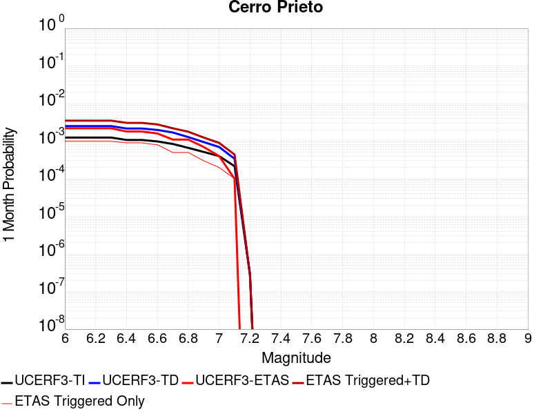 | 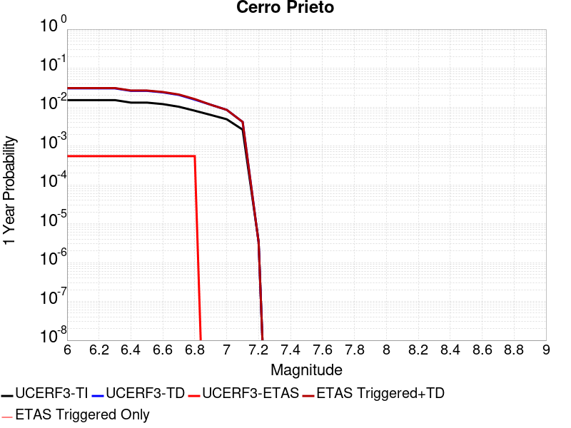 | 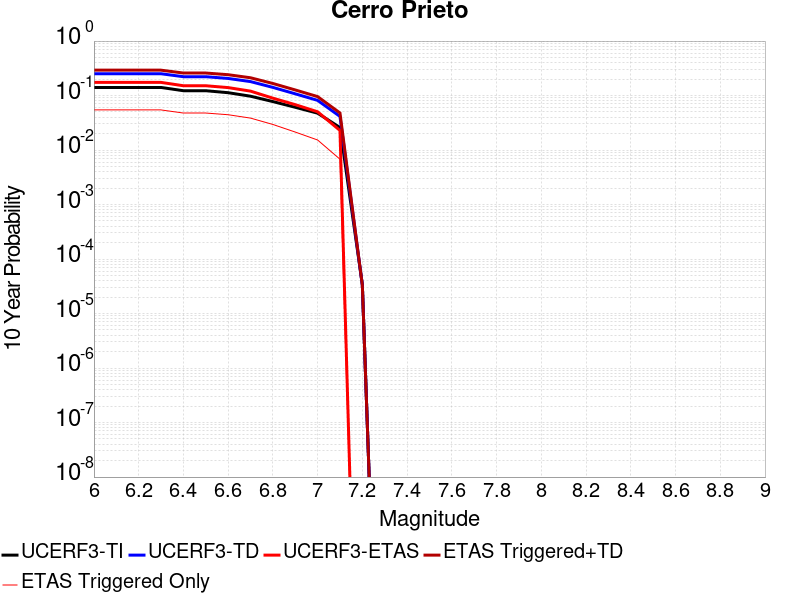 |

| Magnitude | 1 wk TI Prob | 1 wk TD Prob | 1 wk ETAS Prob | 1 wk ETAS/TD Gain | 1 wk ETAS Triggered+TD | 1 wk ETAS Triggered Only | 1 mo TI Prob | 1 mo TD Prob | 1 mo ETAS Prob | 1 mo ETAS/TD Gain | 1 mo ETAS Triggered+TD | 1 mo ETAS Triggered Only | 1 yr TI Prob | 1 yr TD Prob | 1 yr ETAS Prob | 1 yr ETAS/TD Gain | 1 yr ETAS Triggered+TD | 1 yr ETAS Triggered Only | 10 yr TI Prob | 10 yr TD Prob | 10 yr ETAS Prob | 10 yr ETAS/TD Gain | 10 yr ETAS Triggered+TD | 10 yr ETAS Triggered Only |
|-----|-----|-----|-----|-----|-----|-----|-----|-----|-----|-----|-----|-----|-----|-----|-----|-----|-----|-----|-----|-----|-----|-----|-----|-----|
| 6.0 | 2.9101528E-4 | 5.876785E-4 | 4.0E-4 | 0.6806443 | 7.8756094E-4 | 2.0E-4 | 0.0012466122 | 0.002516427 | 0.0022 | 0.8742554 | 0.0035139106 | 0.001 | 0.015072231 | 0.030233428 | 0.0182 | 0.6019827 | 0.037215747 | 0.0072 | 0.14089979 | 0.2514084 | 0.1744 | 0.69369197 | 0.29220665 | 0.0545 |
| 6.1 | 2.9101528E-4 | 5.876785E-4 | 4.0E-4 | 0.6806443 | 7.8756094E-4 | 2.0E-4 | 0.0012466122 | 0.002516427 | 0.0022 | 0.8742554 | 0.0035139106 | 0.001 | 0.015072231 | 0.030233428 | 0.0182 | 0.6019827 | 0.037215747 | 0.0072 | 0.14089979 | 0.2514084 | 0.1744 | 0.69369197 | 0.29220665 | 0.0545 |
| 6.2 | 2.9101528E-4 | 5.876785E-4 | 4.0E-4 | 0.6806443 | 7.8756094E-4 | 2.0E-4 | 0.0012466122 | 0.002516427 | 0.0022 | 0.8742554 | 0.0035139106 | 0.001 | 0.015072231 | 0.030233428 | 0.0182 | 0.6019827 | 0.037215747 | 0.0072 | 0.14089979 | 0.2514084 | 0.1744 | 0.69369197 | 0.29220665 | 0.0545 |
| 6.3 | 2.9101528E-4 | 5.876785E-4 | 4.0E-4 | 0.6806443 | 7.8756094E-4 | 2.0E-4 | 0.0012466122 | 0.002516427 | 0.0022 | 0.8742554 | 0.0035139106 | 0.001 | 0.015072231 | 0.030233428 | 0.0182 | 0.6019827 | 0.037215747 | 0.0072 | 0.14089979 | 0.2514084 | 0.1744 | 0.69369197 | 0.29220665 | 0.0545 |
| 6.4 | 2.508648E-4 | 5.056167E-4 | 3.0E-4 | 0.59333485 | 7.0551556E-4 | 2.0E-4 | 0.0010746918 | 0.0021653222 | 0.0018 | 0.83128506 | 0.0030633733 | 9.0E-4 | 0.013006088 | 0.02607972 | 0.0156 | 0.5981659 | 0.032118026 | 0.0062 | 0.12270685 | 0.22188032 | 0.1514 | 0.68234986 | 0.25907445 | 0.0478 |
| 6.5 | 2.508648E-4 | 5.056167E-4 | 3.0E-4 | 0.59333485 | 7.0551556E-4 | 2.0E-4 | 0.0010746918 | 0.0021653222 | 0.0018 | 0.83128506 | 0.0030633733 | 9.0E-4 | 0.013006088 | 0.02607972 | 0.0156 | 0.5981659 | 0.032118026 | 0.0062 | 0.12270685 | 0.22188032 | 0.1514 | 0.68234986 | 0.25907445 | 0.0478 |
| 6.6 | 2.294914E-4 | 4.6307954E-4 | 3.0E-4 | 0.64783686 | 6.6298695E-4 | 2.0E-4 | 9.831638E-4 | 0.0019832992 | 0.0016 | 0.8067366 | 0.0027817125 | 8.0E-4 | 0.011904482 | 0.023857418 | 0.0144 | 0.60358584 | 0.029323816 | 0.0056 | 0.11286586 | 0.20606163 | 0.14 | 0.6794084 | 0.24139188 | 0.0445 |
| 6.7 | 1.9621674E-4 | 3.965335E-4 | 2.0E-4 | 0.50437105 | 4.964938E-4 | 1.0E-4 | 8.4065786E-4 | 0.0016984757 | 0.0011 | 0.6476395 | 0.0021976265 | 5.0E-4 | 0.010187071 | 0.020493843 | 0.0122 | 0.59530073 | 0.025293423 | 0.0049 | 0.09732539 | 0.18046996 | 0.1206 | 0.66825527 | 0.21210381 | 0.0386 |
| 6.8 | 1.5476145E-4 | 2.9933505E-4 | 2.0E-4 | 0.6681476 | 3.993051E-4 | 1.0E-4 | 6.6309475E-4 | 0.0012823322 | 0.0011 | 0.85781205 | 0.0017816911 | 5.0E-4 | 0.008043335 | 0.0154983625 | 0.009 | 0.5807065 | 0.019633269 | 0.0042 | 0.07758363 | 0.14124227 | 0.0896 | 0.63437104 | 0.16657561 | 0.0295 |
| 6.9 | 1.20509176E-4 | 2.2068103E-4 | 1.0E-4 | 0.45314273 | 2.2068103E-4 | 0.0 | 5.1636563E-4 | 9.4549364E-4 | 7.0E-4 | 0.740354 | 0.0012452101 | 3.0E-4 | 0.006268645 | 0.011465097 | 0.0061 | 0.5320496 | 0.013936434 | 0.0025 | 0.060947374 | 0.10765188 | 0.0681 | 0.63259465 | 0.12674813 | 0.0214 |
| 7.0 | 9.3269155E-5 | 1.6304594E-4 | 0.0 | 0.0 | 1.6304594E-4 | 0.0 | 3.9966372E-4 | 6.986223E-4 | 4.0E-4 | 0.5725554 | 8.9848257E-4 | 2.0E-4 | 0.0048550544 | 0.008479855 | 0.0038 | 0.44812086 | 0.009867983 | 0.0014 | 0.04750344 | 0.08164473 | 0.0504 | 0.6173087 | 0.09569556 | 0.0153 |
| 7.1 | 5.029709E-5 | 7.938922E-5 | 0.0 | 0.0 | 7.938922E-5 | 0.0 | 2.1554115E-4 | 3.4021336E-4 | 1.0E-4 | 0.29393318 | 4.4017934E-4 | 1.0E-4 | 0.0026210553 | 0.0041374615 | 0.0016 | 0.38671055 | 0.0048345653 | 7.0E-4 | 0.025903556 | 0.041418772 | 0.0229 | 0.5528894 | 0.047937125 | 0.0068 |
| 7.2 | 6.5445185E-8 | 6.3428644E-8 | 0.0 | 0.0 | 6.3428644E-8 | 0.0 | 2.8047933E-7 | 2.7183705E-7 | 0.0 | 0.0 | 2.7183705E-7 | 0.0 | 3.4148304E-6 | 3.309616E-6 | 0.0 | 0.0 | 3.309616E-6 | 0.0 | 3.414778E-5 | 3.309616E-5 | 0.0 | 0.0 | 3.309616E-5 | 0.0 |

## Brawley (Seismic Zone) alt 1
*[(top)](#table-of-contents)*

| 1 Week | 1 Month | 1 Year | 10 Year |
|-----|-----|-----|-----|
| 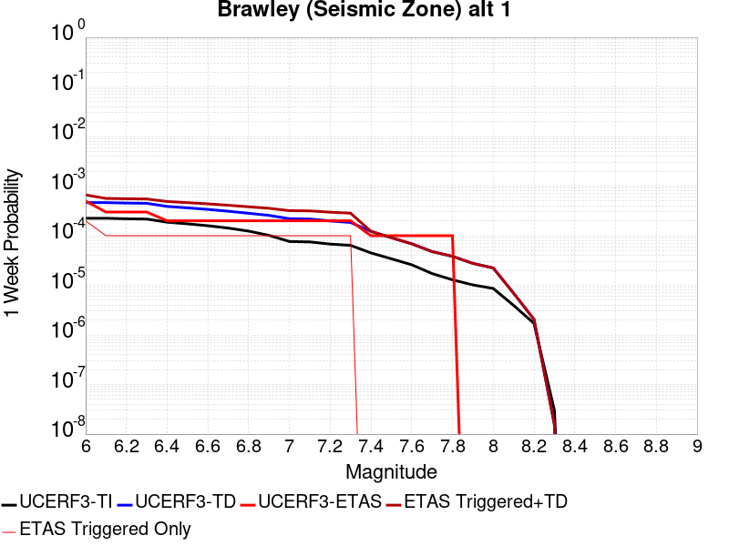 | 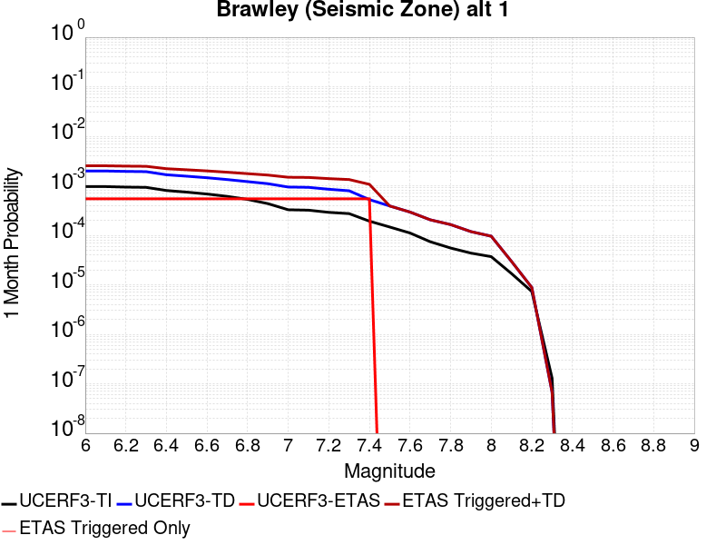 | 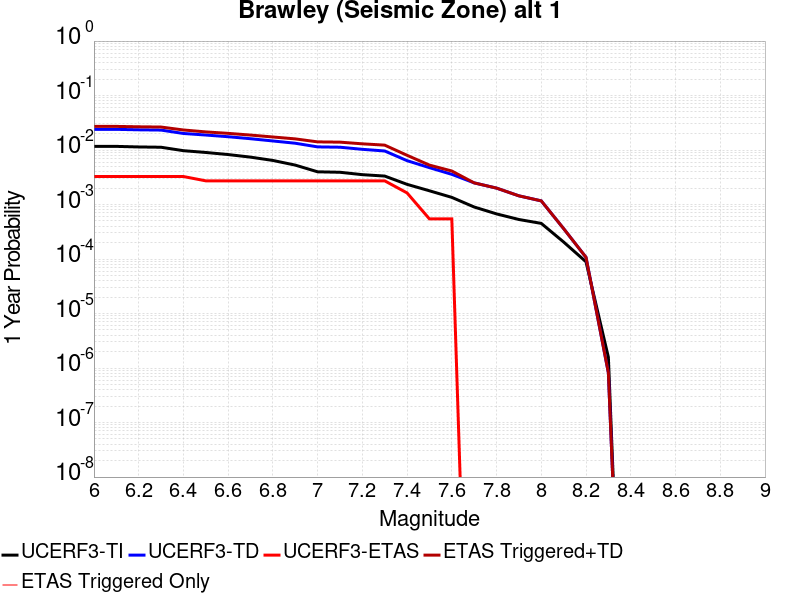 | 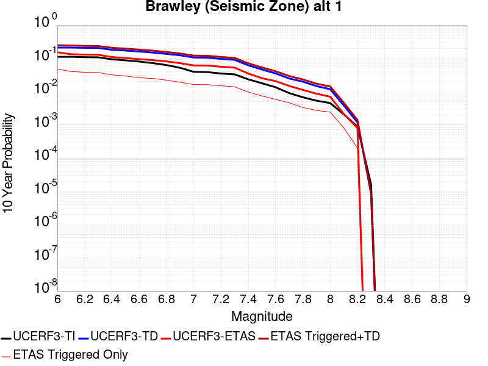 |

| Magnitude | 1 wk TI Prob | 1 wk TD Prob | 1 wk ETAS Prob | 1 wk ETAS/TD Gain | 1 wk ETAS Triggered+TD | 1 wk ETAS Triggered Only | 1 mo TI Prob | 1 mo TD Prob | 1 mo ETAS Prob | 1 mo ETAS/TD Gain | 1 mo ETAS Triggered+TD | 1 mo ETAS Triggered Only | 1 yr TI Prob | 1 yr TD Prob | 1 yr ETAS Prob | 1 yr ETAS/TD Gain | 1 yr ETAS Triggered+TD | 1 yr ETAS Triggered Only | 10 yr TI Prob | 10 yr TD Prob | 10 yr ETAS Prob | 10 yr ETAS/TD Gain | 10 yr ETAS Triggered+TD | 10 yr ETAS Triggered Only |
|-----|-----|-----|-----|-----|-----|-----|-----|-----|-----|-----|-----|-----|-----|-----|-----|-----|-----|-----|-----|-----|-----|-----|-----|-----|
| 6.0 | 2.2521618E-4 | 4.6808246E-4 | 5.0E-4 | 1.0681878 | 6.6798885E-4 | 2.0E-4 | 9.6485513E-4 | 0.0020045617 | 0.0013 | 0.6485208 | 0.0025035595 | 5.0E-4 | 0.011683988 | 0.024126746 | 0.0177 | 0.73362565 | 0.030665096 | 0.0067 | 0.11088423 | 0.21067296 | 0.1521 | 0.7219721 | 0.248166 | 0.0475 |
| 6.1 | 2.2521618E-4 | 4.6808246E-4 | 3.0E-4 | 0.6409127 | 5.6803564E-4 | 1.0E-4 | 9.6485513E-4 | 0.0020045617 | 0.001 | 0.49886218 | 0.0024037599 | 4.0E-4 | 0.011683988 | 0.024126746 | 0.0152 | 0.63000625 | 0.029591637 | 0.0056 | 0.11088423 | 0.21067296 | 0.1326 | 0.6294116 | 0.24232498 | 0.0401 |
| 6.2 | 2.198148E-4 | 4.5911694E-4 | 3.0E-4 | 0.6534283 | 5.59071E-4 | 1.0E-4 | 9.417233E-4 | 0.001966196 | 0.001 | 0.50859624 | 0.0023654096 | 4.0E-4 | 0.011405343 | 0.023670143 | 0.0146 | 0.61681086 | 0.028747058 | 0.0052 | 0.10837428 | 0.20714925 | 0.1291 | 0.6232221 | 0.2371983 | 0.0379 |
| 6.3 | 2.1704129E-4 | 4.5351146E-4 | 3.0E-4 | 0.66150475 | 5.5346615E-4 | 1.0E-4 | 9.298453E-4 | 0.0019422086 | 9.0E-4 | 0.46338996 | 0.002241626 | 3.0E-4 | 0.011262234 | 0.023385217 | 0.0142 | 0.60722125 | 0.02826829 | 0.005 | 0.107082725 | 0.2050432 | 0.1274 | 0.6213325 | 0.23461558 | 0.0372 |
| 6.4 | 1.876142E-4 | 3.9275855E-4 | 2.0E-4 | 0.5092187 | 4.927193E-4 | 1.0E-4 | 8.038131E-4 | 0.0016821788 | 7.0E-4 | 0.416127 | 0.0019816742 | 3.0E-4 | 0.00974259 | 0.02028862 | 0.0115 | 0.5668202 | 0.024207465 | 0.004 | 0.093263686 | 0.18180731 | 0.1089 | 0.59898585 | 0.20774402 | 0.0317 |
| 6.5 | 1.7390939E-4 | 3.6738385E-4 | 2.0E-4 | 0.5443897 | 4.673471E-4 | 1.0E-4 | 7.45113E-4 | 0.0015735638 | 7.0E-4 | 0.44485012 | 0.0018730917 | 3.0E-4 | 0.009034078 | 0.018991657 | 0.0109 | 0.5739362 | 0.022719488 | 0.0038 | 0.086755216 | 0.171686 | 0.102 | 0.59410787 | 0.1959556 | 0.0293 |
| 6.6 | 1.591791E-4 | 3.4193942E-4 | 2.0E-4 | 0.58489895 | 4.4190523E-4 | 1.0E-4 | 6.8201777E-4 | 0.0014646412 | 7.0E-4 | 0.47793275 | 0.0017642018 | 3.0E-4 | 0.008271996 | 0.017689798 | 0.0101 | 0.57095057 | 0.021226116 | 0.0036 | 0.07970774 | 0.16118653 | 0.094 | 0.5831753 | 0.18299568 | 0.026 |
| 6.7 | 1.4268003E-4 | 3.1407524E-4 | 2.0E-4 | 0.6367901 | 4.140438E-4 | 1.0E-4 | 6.1134255E-4 | 0.00134535 | 7.0E-4 | 0.52031064 | 0.0016449465 | 3.0E-4 | 0.007417723 | 0.016260115 | 0.0093 | 0.5719517 | 0.019506456 | 0.0033 | 0.07174956 | 0.14943002 | 0.0882 | 0.5902428 | 0.17043911 | 0.0247 |
| 6.8 | 1.239713E-4 | 2.8513794E-4 | 2.0E-4 | 0.7014149 | 3.8510942E-4 | 1.0E-4 | 5.3119735E-4 | 0.0012214533 | 7.0E-4 | 0.5730878 | 0.0015210869 | 3.0E-4 | 0.0064481674 | 0.014771148 | 0.0088 | 0.595756 | 0.017726835 | 0.003 | 0.06264243 | 0.1362273 | 0.0806 | 0.59165823 | 0.1552303 | 0.022 |
| 6.9 | 1.0180238E-4 | 2.584756E-4 | 2.0E-4 | 0.7737675 | 3.5844973E-4 | 1.0E-4 | 4.3622297E-4 | 0.0011072864 | 7.0E-4 | 0.6321761 | 0.0014069543 | 3.0E-4 | 0.005298089 | 0.013398845 | 0.0078 | 0.58213973 | 0.016259989 | 0.0029 | 0.05173543 | 0.123307586 | 0.0713 | 0.57822883 | 0.13996474 | 0.019 |
| 7.0 | 7.6619996E-5 | 2.2098933E-4 | 2.0E-4 | 0.9050211 | 3.2096723E-4 | 1.0E-4 | 3.283301E-4 | 9.467565E-4 | 7.0E-4 | 0.7393665 | 0.0012464725 | 3.0E-4 | 0.0039900932 | 0.011466531 | 0.0069 | 0.6017513 | 0.013839011 | 0.0024 | 0.039192066 | 0.10603327 | 0.061 | 0.5752911 | 0.12051553 | 0.0162 |
| 7.1 | 7.5127435E-5 | 2.178644E-4 | 2.0E-4 | 0.9180022 | 3.178426E-4 | 1.0E-4 | 3.2193496E-4 | 9.333736E-4 | 7.0E-4 | 0.74996763 | 0.0012330936 | 3.0E-4 | 0.0039125155 | 0.011305296 | 0.0068 | 0.601488 | 0.013678163 | 0.0024 | 0.038443442 | 0.104612865 | 0.0604 | 0.5773669 | 0.11902859 | 0.0161 |
| 7.2 | 6.788582E-5 | 1.9925722E-4 | 2.0E-4 | 1.0037278 | 2.992373E-4 | 1.0E-4 | 2.9090676E-4 | 8.53683E-4 | 7.0E-4 | 0.8199765 | 0.001153427 | 3.0E-4 | 0.0035360386 | 0.010344682 | 0.0065 | 0.62834215 | 0.01262089 | 0.0023 | 0.034803 | 0.09631735 | 0.0557 | 0.5782966 | 0.10978223 | 0.0149 |
| 7.3 | 6.399602E-5 | 1.856939E-4 | 2.0E-4 | 1.0770413 | 2.8567534E-4 | 1.0E-4 | 2.7423984E-4 | 7.955911E-4 | 7.0E-4 | 0.87984896 | 0.0010953525 | 3.0E-4 | 0.0033337586 | 0.009643878 | 0.0063 | 0.6532642 | 0.011921696 | 0.0023 | 0.03284188 | 0.090255514 | 0.0524 | 0.5805739 | 0.10290097 | 0.0139 |
| 7.4 | 4.506759E-5 | 1.2317323E-4 | 1.0E-4 | 0.81186473 | 1.2317323E-4 | 0.0 | 1.9313251E-4 | 5.2777934E-4 | 5.0E-4 | 0.94736564 | 7.2767376E-4 | 2.0E-4 | 0.0023488526 | 0.006406951 | 0.0042 | 0.65553796 | 0.007897341 | 0.0015 | 0.023241805 | 0.0614344 | 0.0347 | 0.5648301 | 0.07044463 | 0.0096 |
| 7.5 | 3.43289E-5 | 9.161006E-5 | 1.0E-4 | 1.0915831 | 9.161006E-5 | 0.0 | 1.4711556E-4 | 3.9255578E-4 | 3.0E-4 | 0.7642226 | 4.925165E-4 | 1.0E-4 | 0.0017896603 | 0.004768953 | 0.0029 | 0.6080999 | 0.005565138 | 8.0E-4 | 0.01775316 | 0.046273734 | 0.0252 | 0.5445854 | 0.053331308 | 0.0074 |
| 7.6 | 2.5980507E-5 | 6.9008114E-5 | 1.0E-4 | 1.4491049 | 6.9008114E-5 | 0.0 | 1.1134028E-4 | 2.9571567E-4 | 3.0E-4 | 1.014488 | 3.956861E-4 | 1.0E-4 | 0.001354725 | 0.0035944178 | 0.0022 | 0.6120601 | 0.004291902 | 7.0E-4 | 0.013464959 | 0.035150543 | 0.0206 | 0.5860507 | 0.04074667 | 0.0058 |
| 7.7 | 1.7292105E-5 | 4.8103666E-5 | 1.0E-4 | 2.0788436 | 4.8103666E-5 | 0.0 | 7.4106916E-5 | 2.0614231E-4 | 2.0E-4 | 0.9702036 | 3.0612168E-4 | 1.0E-4 | 9.018782E-4 | 0.0025068994 | 9.0E-4 | 0.35900924 | 0.0029058966 | 4.0E-4 | 0.008982267 | 0.024695786 | 0.0147 | 0.5952433 | 0.029182184 | 0.0046 |
| 7.8 | 1.2927471E-5 | 3.8554692E-5 | 1.0E-4 | 2.593718 | 3.8554692E-5 | 0.0 | 5.5402274E-5 | 1.6522394E-4 | 2.0E-4 | 1.2104783 | 2.652074E-4 | 1.0E-4 | 6.743139E-4 | 0.002009748 | 8.0E-4 | 0.39805987 | 0.002408944 | 4.0E-4 | 0.0067227143 | 0.019911647 | 0.0112 | 0.56248486 | 0.023145938 | 0.0033 |
| 7.9 | 1.0200774E-5 | 2.7821396E-5 | 0.0 | 0.0 | 2.7821396E-5 | 0.0 | 4.371687E-5 | 1.192291E-4 | 1.0E-4 | 0.8387214 | 2.1921718E-4 | 1.0E-4 | 5.321229E-4 | 0.0014506488 | 6.0E-4 | 0.41360804 | 0.0017502136 | 3.0E-4 | 0.005308505 | 0.014562595 | 0.0086 | 0.5905541 | 0.017223276 | 0.0027 |
| 8.0 | 8.650396E-6 | 2.2482072E-5 | 0.0 | 0.0 | 2.2482072E-5 | 0.0 | 3.70726E-5 | 9.634819E-5 | 1.0E-4 | 1.0379022 | 1.9633856E-4 | 1.0E-4 | 4.5126543E-4 | 0.0011724087 | 5.0E-4 | 0.42647243 | 0.0014720571 | 3.0E-4 | 0.0045035016 | 0.011839272 | 0.007 | 0.5912525 | 0.014210858 | 0.0024 |
| 8.1 | 3.9368224E-6 | 6.982285E-6 | 0.0 | 0.0 | 6.982285E-6 | 0.0 | 1.6871985E-5 | 2.9923734E-5 | 1.0E-4 | 3.3418288 | 1.2992074E-4 | 1.0E-4 | 2.0539707E-4 | 3.642607E-4 | 1.0E-4 | 0.27452865 | 4.6422426E-4 | 1.0E-4 | 0.0020520731 | 0.003829169 | 0.0021 | 0.54842186 | 0.004626106 | 8.0E-4 |
| 8.2 | 1.7101195E-6 | 2.0818159E-6 | 0.0 | 0.0 | 2.0818159E-6 | 0.0 | 7.329063E-6 | 8.9220375E-6 | 1.0E-4 | 11.208201 | 1.08921144E-4 | 1.0E-4 | 8.922769E-5 | 1.0862042E-4 | 1.0E-4 | 0.9206372 | 2.0860956E-4 | 1.0E-4 | 8.9191867E-4 | 0.0011966586 | 8.0E-4 | 0.6685282 | 0.0013964192 | 2.0E-4 |
| 8.3 | 3.0346666E-8 | 1.5886812E-8 | 0.0 | 0.0 | 1.5886812E-8 | 0.0 | 1.3005713E-7 | 6.808634E-8 | 0.0 | 0.0 | 6.808634E-8 | 0.0 | 1.5834444E-6 | 8.2895104E-7 | 0.0 | 0.0 | 8.2895104E-7 | 0.0 | 1.5834332E-5 | 8.65772E-6 | 0.0 | 0.0 | 8.65772E-6 | 0.0 |

## Imperial
*[(top)](#table-of-contents)*

| 1 Week | 1 Month | 1 Year | 10 Year |
|-----|-----|-----|-----|
| 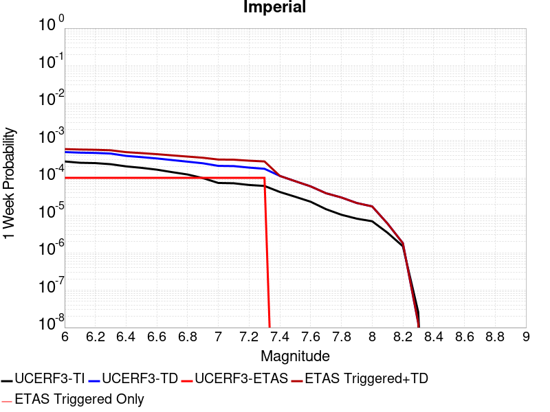 | 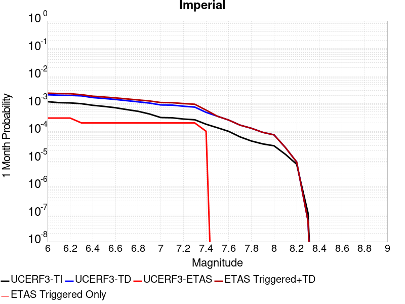 | 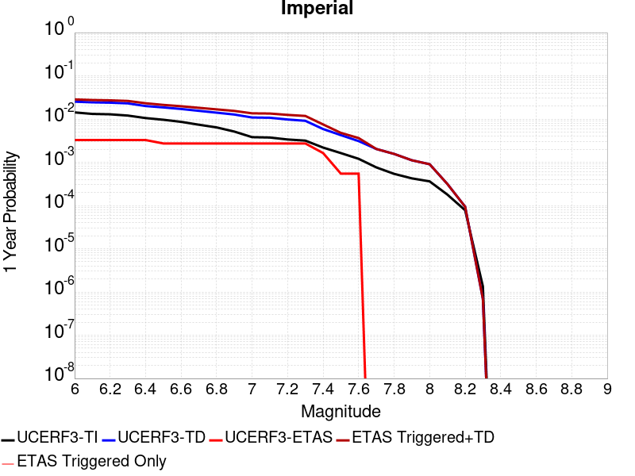 | 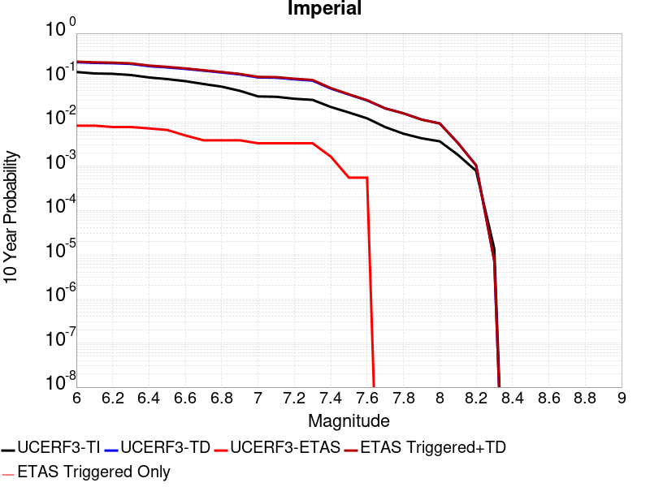 |

| Magnitude | 1 wk TI Prob | 1 wk TD Prob | 1 wk ETAS Prob | 1 wk ETAS/TD Gain | 1 wk ETAS Triggered+TD | 1 wk ETAS Triggered Only | 1 mo TI Prob | 1 mo TD Prob | 1 mo ETAS Prob | 1 mo ETAS/TD Gain | 1 mo ETAS Triggered+TD | 1 mo ETAS Triggered Only | 1 yr TI Prob | 1 yr TD Prob | 1 yr ETAS Prob | 1 yr ETAS/TD Gain | 1 yr ETAS Triggered+TD | 1 yr ETAS Triggered Only | 10 yr TI Prob | 10 yr TD Prob | 10 yr ETAS Prob | 10 yr ETAS/TD Gain | 10 yr ETAS Triggered+TD | 10 yr ETAS Triggered Only |
|-----|-----|-----|-----|-----|-----|-----|-----|-----|-----|-----|-----|-----|-----|-----|-----|-----|-----|-----|-----|-----|-----|-----|-----|-----|
| 6.0 | 2.7496446E-4 | 4.941084E-4 | 3.0E-4 | 0.60715425 | 5.94059E-4 | 1.0E-4 | 0.0011778869 | 0.0021159272 | 0.001 | 0.4726061 | 0.002614869 | 5.0E-4 | 0.0142467655 | 0.02547419 | 0.0161 | 0.63201225 | 0.031321343 | 0.006 | 0.13367249 | 0.22422479 | 0.1419 | 0.6328471 | 0.25859165 | 0.0443 |
| 6.1 | 2.5356023E-4 | 4.7646931E-4 | 3.0E-4 | 0.62963134 | 5.764217E-4 | 1.0E-4 | 0.001086234 | 0.0020404507 | 9.0E-4 | 0.44107905 | 0.0024396344 | 4.0E-4 | 0.013144928 | 0.024563523 | 0.0154 | 0.6269459 | 0.030221054 | 0.0058 | 0.123940155 | 0.21605164 | 0.1364 | 0.63133055 | 0.24882068 | 0.0418 |
| 6.2 | 2.4820742E-4 | 4.676119E-4 | 3.0E-4 | 0.64155763 | 5.6756515E-4 | 1.0E-4 | 0.0010633124 | 0.002002549 | 9.0E-4 | 0.44942725 | 0.0024017477 | 4.0E-4 | 0.01286919 | 0.024112629 | 0.0148 | 0.6137863 | 0.02938242 | 0.0054 | 0.12148927 | 0.21259417 | 0.1329 | 0.62513477 | 0.24377544 | 0.0396 |
| 6.3 | 2.3205351E-4 | 4.4995442E-4 | 3.0E-4 | 0.6667342 | 5.499094E-4 | 1.0E-4 | 9.94136E-4 | 0.001926987 | 8.0E-4 | 0.4151559 | 0.0022264088 | 3.0E-4 | 0.012036599 | 0.02320783 | 0.0141 | 0.60755354 | 0.028091792 | 0.005 | 0.11405133 | 0.20481737 | 0.1269 | 0.61957633 | 0.2345572 | 0.0374 |
| 6.4 | 2.0304754E-4 | 3.9014025E-4 | 2.0E-4 | 0.5126362 | 4.901012E-4 | 1.0E-4 | 8.6991355E-4 | 0.0016709722 | 7.0E-4 | 0.4189178 | 0.0019704709 | 3.0E-4 | 0.010539869 | 0.020158699 | 0.0115 | 0.5704734 | 0.024078064 | 0.004 | 0.100537635 | 0.18195471 | 0.1087 | 0.59740144 | 0.20805036 | 0.0319 |
| 6.5 | 1.854992E-4 | 3.6183832E-4 | 2.0E-4 | 0.55273306 | 4.6180215E-4 | 1.0E-4 | 7.9475436E-4 | 0.0015498258 | 7.0E-4 | 0.45166367 | 0.0018493609 | 3.0E-4 | 0.009633281 | 0.018713417 | 0.0109 | 0.5824698 | 0.022442305 | 0.0038 | 0.0922623 | 0.1703268 | 0.1011 | 0.5935648 | 0.19438733 | 0.029 |
| 6.6 | 1.6586106E-4 | 3.3304666E-4 | 2.0E-4 | 0.6005165 | 4.3301334E-4 | 1.0E-4 | 7.106394E-4 | 0.0014265716 | 7.0E-4 | 0.4906869 | 0.0017261436 | 3.0E-4 | 0.008617763 | 0.017235743 | 0.01 | 0.58018965 | 0.020675419 | 0.0035 | 0.08291132 | 0.15800339 | 0.0916 | 0.5797344 | 0.1792217 | 0.0252 |
| 6.7 | 1.4224656E-4 | 3.0128242E-4 | 2.0E-4 | 0.66382897 | 4.0125227E-4 | 1.0E-4 | 6.094856E-4 | 0.0012905791 | 7.0E-4 | 0.5423922 | 0.001590192 | 3.0E-4 | 0.0073952693 | 0.015603036 | 0.0092 | 0.5896288 | 0.018753106 | 0.0032 | 0.07153955 | 0.14399408 | 0.0848 | 0.5889131 | 0.16428141 | 0.0237 |
| 6.8 | 1.2317259E-4 | 2.7265126E-4 | 2.0E-4 | 0.7335378 | 3.72624E-4 | 1.0E-4 | 5.2777573E-4 | 0.0011679879 | 7.0E-4 | 0.59932125 | 0.0014676375 | 3.0E-4 | 0.0064067547 | 0.014128845 | 0.0087 | 0.6157616 | 0.016987871 | 0.0029 | 0.06225166 | 0.13081221 | 0.0774 | 0.59168786 | 0.14915207 | 0.0211 |
| 6.9 | 9.859898E-5 | 2.462987E-4 | 2.0E-4 | 0.81202215 | 3.462741E-4 | 1.0E-4 | 4.2249862E-4 | 0.001055143 | 7.0E-4 | 0.6634172 | 0.0013548264 | 3.0E-4 | 0.0051317946 | 0.012771627 | 0.0077 | 0.6028989 | 0.015535867 | 0.0028 | 0.05014893 | 0.11783075 | 0.0681 | 0.5779476 | 0.13379802 | 0.0181 |
| 7.0 | 7.3191884E-5 | 2.0989825E-4 | 2.0E-4 | 0.9528426 | 3.0987727E-4 | 1.0E-4 | 3.136418E-4 | 8.992569E-4 | 7.0E-4 | 0.77842045 | 0.0011989871 | 3.0E-4 | 0.003811904 | 0.010894161 | 0.0068 | 0.6241876 | 0.013169104 | 0.0023 | 0.037471764 | 0.1009212 | 0.058 | 0.5747058 | 0.114767015 | 0.0154 |
| 7.1 | 7.1760296E-5 | 2.069551E-4 | 2.0E-4 | 0.9663932 | 3.069344E-4 | 1.0E-4 | 3.0750787E-4 | 8.8665204E-4 | 7.0E-4 | 0.7894867 | 0.0011863861 | 3.0E-4 | 0.003737482 | 0.010742219 | 0.0067 | 0.62370723 | 0.013017513 | 0.0023 | 0.03675245 | 0.09957358 | 0.0574 | 0.57645816 | 0.1133501 | 0.0153 |
| 7.2 | 6.46614E-5 | 1.8875535E-4 | 2.0E-4 | 1.0595726 | 2.8873648E-4 | 1.0E-4 | 2.7709085E-4 | 8.087037E-4 | 7.0E-4 | 0.86558276 | 0.0011084611 | 3.0E-4 | 0.0033683628 | 0.009802124 | 0.0064 | 0.65291965 | 0.01198056 | 0.0022 | 0.033177625 | 0.09141615 | 0.0527 | 0.57648456 | 0.10422718 | 0.0141 |
| 7.3 | 6.088115E-5 | 1.7559815E-4 | 2.0E-4 | 1.1389642 | 2.755806E-4 | 1.0E-4 | 2.6089314E-4 | 7.5234927E-4 | 7.0E-4 | 0.9304189 | 0.0010521236 | 3.0E-4 | 0.0031717476 | 0.009121943 | 0.0062 | 0.6796797 | 0.011301875 | 0.0022 | 0.031268585 | 0.08551075 | 0.0494 | 0.5777051 | 0.097490564 | 0.0131 |
| 7.4 | 4.199346E-5 | 1.1321578E-4 | 1.0E-4 | 0.88326913 | 1.1321578E-4 | 0.0 | 1.7995955E-4 | 4.851211E-4 | 5.0E-4 | 1.0306705 | 6.850241E-4 | 2.0E-4 | 0.0021888057 | 0.005890519 | 0.0041 | 0.6960338 | 0.007282272 | 0.0014 | 0.02167372 | 0.056605965 | 0.0317 | 0.5600117 | 0.064907834 | 0.0088 |
| 7.5 | 3.130448E-5 | 8.1818864E-5 | 1.0E-4 | 1.2222121 | 8.1818864E-5 | 0.0 | 1.3415517E-4 | 3.5060546E-4 | 3.0E-4 | 0.85566264 | 4.505704E-4 | 1.0E-4 | 0.0016321153 | 0.004260325 | 0.0028 | 0.65722686 | 0.0049573425 | 7.0E-4 | 0.016201803 | 0.04144808 | 0.0222 | 0.53560984 | 0.047774523 | 0.0066 |
| 7.6 | 2.3074248E-5 | 5.9549977E-5 | 1.0E-4 | 1.6792618 | 5.9549977E-5 | 0.0 | 9.888588E-5 | 2.5518934E-4 | 3.0E-4 | 1.1755977 | 3.5516382E-4 | 1.0E-4 | 0.0012032706 | 0.0031025265 | 0.0021 | 0.6768677 | 0.003700665 | 6.0E-4 | 0.011967761 | 0.03043447 | 0.0176 | 0.57829165 | 0.0352823 | 0.005 |
| 7.7 | 1.45864815E-5 | 3.9047158E-5 | 1.0E-4 | 2.5610058 | 3.9047158E-5 | 0.0 | 6.2511994E-5 | 1.6733426E-4 | 2.0E-4 | 1.1952125 | 2.6731752E-4 | 1.0E-4 | 7.608177E-4 | 0.0020353962 | 8.0E-4 | 0.39304388 | 0.0023347856 | 3.0E-4 | 0.007582182 | 0.020132141 | 0.0119 | 0.5910946 | 0.02385564 | 0.0038 |
| 7.8 | 1.0352979E-5 | 3.004081E-5 | 1.0E-4 | 3.328805 | 3.004081E-5 | 0.0 | 4.4369157E-5 | 1.2874E-4 | 2.0E-4 | 1.5535189 | 2.2872712E-4 | 1.0E-4 | 5.400606E-4 | 0.0015662847 | 7.0E-4 | 0.44691747 | 0.0018658148 | 3.0E-4 | 0.0053875 | 0.015593325 | 0.0084 | 0.53869206 | 0.018054342 | 0.0025 |
| 7.9 | 8.137906E-6 | 2.1405322E-5 | 0.0 | 0.0 | 2.1405322E-5 | 0.0 | 3.4876273E-5 | 9.173387E-5 | 1.0E-4 | 1.09011 | 1.917247E-4 | 1.0E-4 | 4.2453592E-4 | 0.0011162885 | 5.0E-4 | 0.44791287 | 0.0013160653 | 2.0E-4 | 0.004237258 | 0.011269916 | 0.0063 | 0.5590104 | 0.013148502 | 0.0019 |
| 8.0 | 6.93792E-6 | 1.736568E-5 | 0.0 | 0.0 | 1.736568E-5 | 0.0 | 2.9733603E-5 | 7.442223E-5 | 1.0E-4 | 1.3436847 | 1.7441479E-4 | 1.0E-4 | 3.6194647E-4 | 9.0571464E-4 | 4.0E-4 | 0.4416402 | 0.0011055334 | 2.0E-4 | 0.0036135751 | 0.009198632 | 0.0051 | 0.5544303 | 0.010783914 | 0.0016 |
| 8.1 | 3.4286315E-6 | 6.075972E-6 | 0.0 | 0.0 | 6.075972E-6 | 0.0 | 1.4694053E-5 | 2.6039621E-5 | 1.0E-4 | 3.8403015 | 1.2603702E-4 | 1.0E-4 | 1.7888541E-4 | 3.1698638E-4 | 1.0E-4 | 0.31547096 | 4.169547E-4 | 1.0E-4 | 0.0017874148 | 0.0033346196 | 0.0019 | 0.5697802 | 0.0040322854 | 7.0E-4 |
| 8.2 | 1.4906886E-6 | 1.816707E-6 | 0.0 | 0.0 | 1.816707E-6 | 0.0 | 6.3886496E-6 | 7.785864E-6 | 1.0E-4 | 12.84379 | 1.0778508E-4 | 1.0E-4 | 7.7779034E-5 | 9.47888E-5 | 1.0E-4 | 1.0549769 | 1.9477932E-4 | 1.0E-4 | 7.775182E-4 | 0.0010457897 | 8.0E-4 | 0.76497215 | 0.0012455806 | 2.0E-4 |
| 8.3 | 2.5758007E-8 | 1.33742954E-8 | 0.0 | 0.0 | 1.33742954E-8 | 0.0 | 1.10391454E-7 | 5.731841E-8 | 0.0 | 0.0 | 5.731841E-8 | 0.0 | 1.3440151E-6 | 6.978516E-7 | 0.0 | 0.0 | 6.978516E-7 | 0.0 | 1.344007E-5 | 7.2859425E-6 | 0.0 | 0.0 | 7.2859425E-6 | 0.0 |

## Hayward (So) 2011 CFM
*[(top)](#table-of-contents)*

| 1 Week | 1 Month | 1 Year | 10 Year |
|-----|-----|-----|-----|
| 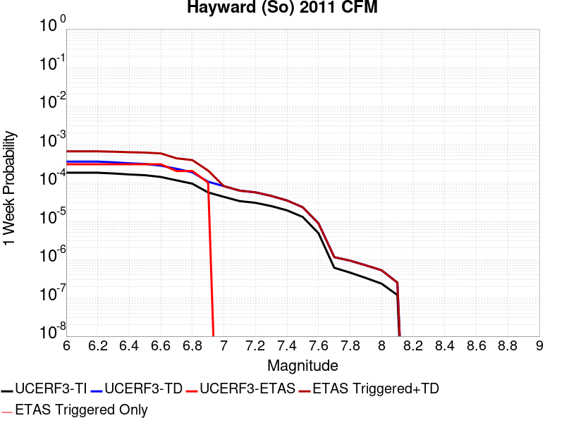 | 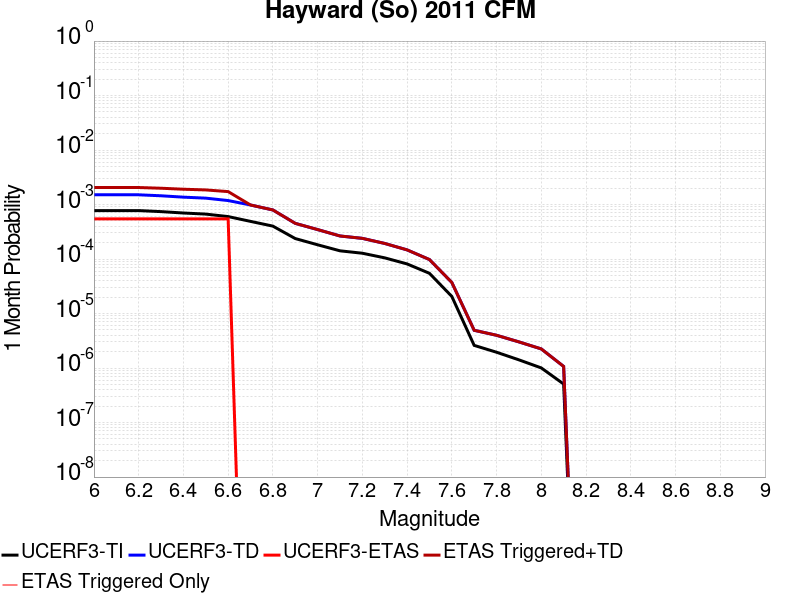 | 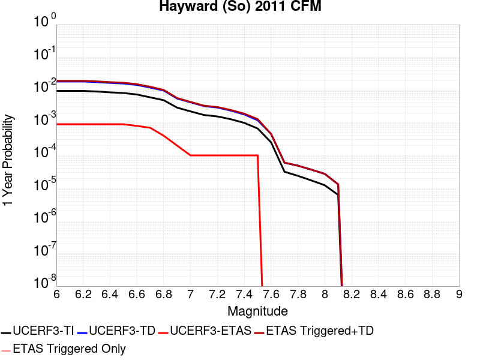 | 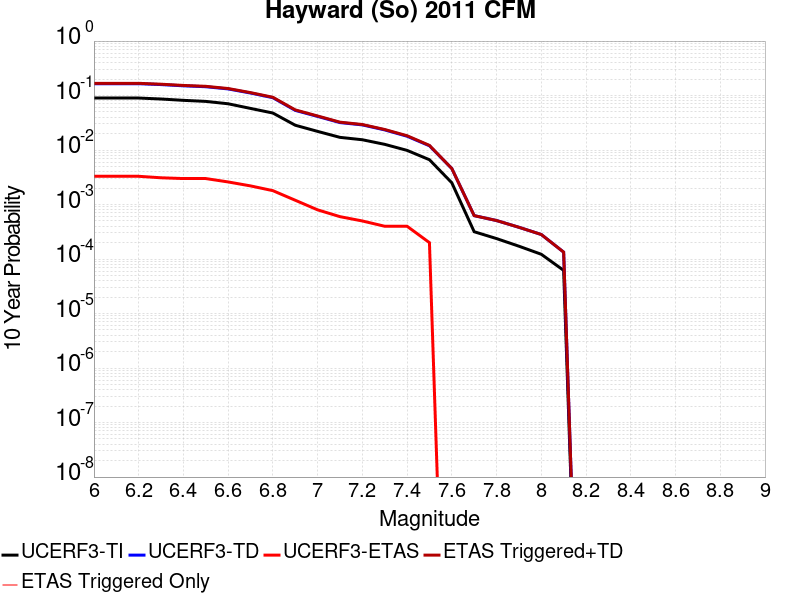 |

| Magnitude | 1 wk TI Prob | 1 wk TD Prob | 1 wk ETAS Prob | 1 wk ETAS/TD Gain | 1 wk ETAS Triggered+TD | 1 wk ETAS Triggered Only | 1 mo TI Prob | 1 mo TD Prob | 1 mo ETAS Prob | 1 mo ETAS/TD Gain | 1 mo ETAS Triggered+TD | 1 mo ETAS Triggered Only | 1 yr TI Prob | 1 yr TD Prob | 1 yr ETAS Prob | 1 yr ETAS/TD Gain | 1 yr ETAS Triggered+TD | 1 yr ETAS Triggered Only | 10 yr TI Prob | 10 yr TD Prob | 10 yr ETAS Prob | 10 yr ETAS/TD Gain | 10 yr ETAS Triggered+TD | 10 yr ETAS Triggered Only |
|-----|-----|-----|-----|-----|-----|-----|-----|-----|-----|-----|-----|-----|-----|-----|-----|-----|-----|-----|-----|-----|-----|-----|-----|-----|
| 6.0 | 1.8091932E-4 | 3.539255E-4 | 3.0E-4 | 0.847636 | 6.5381936E-4 | 3.0E-4 | 7.751381E-4 | 0.0015159517 | 8.0E-4 | 0.5277213 | 0.0021150422 | 6.0E-4 | 0.00939654 | 0.018302882 | 0.0134 | 0.73212516 | 0.023604047 | 0.0054 | 0.090090066 | 0.16552255 | 0.1179 | 0.7122897 | 0.1986513 | 0.0397 |
| 6.1 | 1.8091932E-4 | 3.539255E-4 | 3.0E-4 | 0.847636 | 6.5381936E-4 | 3.0E-4 | 7.751381E-4 | 0.0015159517 | 8.0E-4 | 0.5277213 | 0.0021150422 | 6.0E-4 | 0.00939654 | 0.018302882 | 0.0134 | 0.73212516 | 0.023604047 | 0.0054 | 0.090090066 | 0.16552255 | 0.1179 | 0.7122897 | 0.1986513 | 0.0397 |
| 6.2 | 1.8091932E-4 | 3.539255E-4 | 3.0E-4 | 0.847636 | 6.5381936E-4 | 3.0E-4 | 7.751381E-4 | 0.0015159517 | 8.0E-4 | 0.5277213 | 0.0021150422 | 6.0E-4 | 0.00939654 | 0.018302882 | 0.0134 | 0.73212516 | 0.023604047 | 0.0054 | 0.090090066 | 0.16552255 | 0.1179 | 0.7122897 | 0.1986513 | 0.0397 |
| 6.3 | 1.7322872E-4 | 3.3957043E-4 | 3.0E-4 | 0.88346916 | 6.3946855E-4 | 3.0E-4 | 7.4219756E-4 | 0.0014544997 | 8.0E-4 | 0.5500173 | 0.002053627 | 6.0E-4 | 0.0089988755 | 0.017566977 | 0.013 | 0.74002486 | 0.022577386 | 0.0051 | 0.08643075 | 0.1594756 | 0.1135 | 0.71170765 | 0.19116336 | 0.0377 |
| 6.4 | 1.6334097E-4 | 3.204747E-4 | 3.0E-4 | 0.93611133 | 6.2037853E-4 | 3.0E-4 | 6.998449E-4 | 0.0013727486 | 8.0E-4 | 0.58277243 | 0.001971925 | 6.0E-4 | 0.008487372 | 0.016587108 | 0.0126 | 0.7596261 | 0.021504173 | 0.005 | 0.081704415 | 0.1514034 | 0.1092 | 0.72125196 | 0.18195288 | 0.036 |
| 6.5 | 1.5600289E-4 | 3.073029E-4 | 3.0E-4 | 0.9762355 | 6.072107E-4 | 3.0E-4 | 6.684125E-4 | 0.0013163559 | 8.0E-4 | 0.6077384 | 0.001915566 | 6.0E-4 | 0.008107598 | 0.015910717 | 0.0119 | 0.74792355 | 0.020732755 | 0.0049 | 0.078181036 | 0.14570418 | 0.1045 | 0.7172066 | 0.17509195 | 0.0344 |
| 6.6 | 1.4046066E-4 | 2.7758576E-4 | 3.0E-4 | 1.080747 | 5.775025E-4 | 3.0E-4 | 6.018354E-4 | 0.0011891176 | 8.0E-4 | 0.67276776 | 0.0017884041 | 6.0E-4 | 0.0073027555 | 0.014382874 | 0.0111 | 0.7717512 | 0.018916711 | 0.0046 | 0.07067384 | 0.13282835 | 0.0949 | 0.7144559 | 0.1593638 | 0.0306 |
| 6.7 | 1.14696966E-4 | 2.3023236E-4 | 2.0E-4 | 0.8686876 | 4.301863E-4 | 2.0E-4 | 4.914658E-4 | 9.86342E-4 | 6.0E-4 | 0.6083083 | 0.0013859475 | 4.0E-4 | 0.0059671924 | 0.011943632 | 0.0094 | 0.7870303 | 0.015797053 | 0.0039 | 0.058094822 | 0.111717105 | 0.0774 | 0.6928214 | 0.13312472 | 0.0241 |
| 6.8 | 9.3874296E-5 | 1.8655111E-4 | 2.0E-4 | 1.0720922 | 3.865138E-4 | 2.0E-4 | 4.0225635E-4 | 7.992634E-4 | 5.0E-4 | 0.62557596 | 0.0010990236 | 3.0E-4 | 0.0048864787 | 0.009688334 | 0.0073 | 0.75348353 | 0.012758301 | 0.0031 | 0.047804173 | 0.09170098 | 0.0633 | 0.6902871 | 0.109321974 | 0.0194 |
| 6.9 | 5.551852E-5 | 1.0598216E-4 | 1.0E-4 | 0.94355506 | 2.0597156E-4 | 1.0E-4 | 2.3791482E-4 | 4.541308E-4 | 3.0E-4 | 0.6606027 | 5.5408536E-4 | 1.0E-4 | 0.0028927654 | 0.005515141 | 0.0032 | 0.5802209 | 0.0066090743 | 0.0011 | 0.028553981 | 0.053640194 | 0.0351 | 0.65436006 | 0.063198425 | 0.0101 |
| 7.0 | 4.2662363E-5 | 8.141774E-5 | 0.0 | 0.0 | 8.141774E-5 | 0.0 | 1.8282588E-4 | 3.488869E-4 | 2.0E-4 | 0.57325166 | 3.488869E-4 | 0.0 | 0.0022236328 | 0.004239497 | 0.0019 | 0.4481664 | 0.0049365293 | 7.0E-4 | 0.022015138 | 0.04157589 | 0.0261 | 0.6277677 | 0.048668228 | 0.0074 |
| 7.1 | 3.305886E-5 | 6.2143736E-5 | 0.0 | 0.0 | 6.2143736E-5 | 0.0 | 1.4167312E-4 | 2.663032E-4 | 2.0E-4 | 0.75102365 | 2.663032E-4 | 0.0 | 0.0017235056 | 0.0032374393 | 0.0015 | 0.46332914 | 0.003835497 | 6.0E-4 | 0.017101998 | 0.032036316 | 0.0211 | 0.65862757 | 0.037650503 | 0.0058 |
| 7.2 | 2.9856887E-5 | 5.6185974E-5 | 0.0 | 0.0 | 5.6185974E-5 | 0.0 | 1.2795182E-4 | 2.407749E-4 | 1.0E-4 | 0.41532567 | 2.407749E-4 | 0.0 | 0.0015567001 | 0.00292751 | 0.0014 | 0.47822207 | 0.0035257537 | 6.0E-4 | 0.015458403 | 0.029057471 | 0.0198 | 0.6814082 | 0.03449475 | 0.0056 |
| 7.3 | 2.4559737E-5 | 4.5321412E-5 | 0.0 | 0.0 | 4.5321412E-5 | 0.0 | 1.0525176E-4 | 1.9422024E-4 | 1.0E-4 | 0.5148794 | 1.9422024E-4 | 0.0 | 0.0012806869 | 0.0023620797 | 0.0012 | 0.5080269 | 0.0029606624 | 6.0E-4 | 0.012733313 | 0.023532469 | 0.0154 | 0.65441495 | 0.027828926 | 0.0044 |
| 7.4 | 1.9002231E-5 | 3.451874E-5 | 0.0 | 0.0 | 3.451874E-5 | 0.0 | 8.143559E-5 | 1.4792912E-4 | 1.0E-4 | 0.67599946 | 1.4792912E-4 | 0.0 | 9.910273E-4 | 0.0017995588 | 0.0011 | 0.61126095 | 0.002398479 | 6.0E-4 | 0.009866194 | 0.01799831 | 0.0127 | 0.70562184 | 0.021729916 | 0.0038 |
| 7.5 | 1.2783333E-5 | 2.2958719E-5 | 0.0 | 0.0 | 2.2958719E-5 | 0.0 | 5.4784563E-5 | 9.839083E-5 | 1.0E-4 | 1.0163549 | 9.839083E-5 | 0.0 | 6.667979E-4 | 0.0011972557 | 7.0E-4 | 0.5846704 | 0.0015967768 | 4.0E-4 | 0.006648007 | 0.0120266555 | 0.0087 | 0.72339314 | 0.014496589 | 0.0025 |
| 7.6 | 4.8149627E-6 | 8.725462E-6 | 0.0 | 0.0 | 8.725462E-6 | 0.0 | 2.063539E-5 | 3.7394308E-5 | 0.0 | 0.0 | 3.7394308E-5 | 0.0 | 2.5120692E-4 | 4.5518178E-4 | 1.0E-4 | 0.21969245 | 5.5513624E-4 | 1.0E-4 | 0.0025092314 | 0.004600609 | 0.0029 | 0.6303513 | 0.0053969286 | 8.0E-4 |
| 7.7 | 6.0838227E-7 | 1.1582868E-6 | 0.0 | 0.0 | 1.1582868E-6 | 0.0 | 2.6073499E-6 | 4.9640767E-6 | 0.0 | 0.0 | 4.9640767E-6 | 0.0 | 3.174402E-5 | 6.0435963E-5 | 0.0 | 0.0 | 6.0435963E-5 | 0.0 | 3.1739488E-4 | 6.2984857E-4 | 4.0E-4 | 0.6350733 | 8.297226E-4 | 2.0E-4 |
| 7.8 | 4.5542808E-7 | 9.379453E-7 | 0.0 | 0.0 | 9.379453E-7 | 0.0 | 1.9518332E-6 | 4.019759E-6 | 0.0 | 0.0 | 4.019759E-6 | 0.0 | 2.376331E-5 | 4.8939473E-5 | 0.0 | 0.0 | 4.8939473E-5 | 0.0 | 2.3760769E-4 | 5.120918E-4 | 2.0E-4 | 0.390555 | 6.120406E-4 | 1.0E-4 |
| 7.9 | 3.3016747E-7 | 7.085488E-7 | 0.0 | 0.0 | 7.085488E-7 | 0.0 | 1.4150027E-6 | 3.036634E-6 | 0.0 | 0.0 | 3.036634E-6 | 0.0 | 1.7227521E-5 | 3.6970396E-5 | 0.0 | 0.0 | 3.6970396E-5 | 0.0 | 1.7226185E-4 | 3.847631E-4 | 2.0E-4 | 0.51980036 | 4.8472462E-4 | 1.0E-4 |
| 8.0 | 2.347038E-7 | 5.261874E-7 | 0.0 | 0.0 | 5.261874E-7 | 0.0 | 1.0058731E-6 | 2.2550869E-6 | 0.0 | 0.0 | 2.2550869E-6 | 0.0 | 1.2246436E-5 | 2.7455339E-5 | 0.0 | 0.0 | 2.7455339E-5 | 0.0 | 1.2245761E-4 | 2.834492E-4 | 1.0E-4 | 0.3527969 | 3.8342085E-4 | 1.0E-4 |
| 8.1 | 1.18822804E-7 | 2.510997E-7 | 0.0 | 0.0 | 2.510997E-7 | 0.0 | 5.092405E-7 | 1.0761411E-6 | 0.0 | 0.0 | 1.0761411E-6 | 0.0 | 6.1999854E-6 | 1.3101941E-5 | 0.0 | 0.0 | 1.3101941E-5 | 0.0 | 6.199812E-5 | 1.3453381E-4 | 0.0 | 0.0 | 1.3453381E-4 | 0.0 |

## San Andreas (San Bernardino N)
*[(top)](#table-of-contents)*

| 1 Week | 1 Month | 1 Year | 10 Year |
|-----|-----|-----|-----|
| 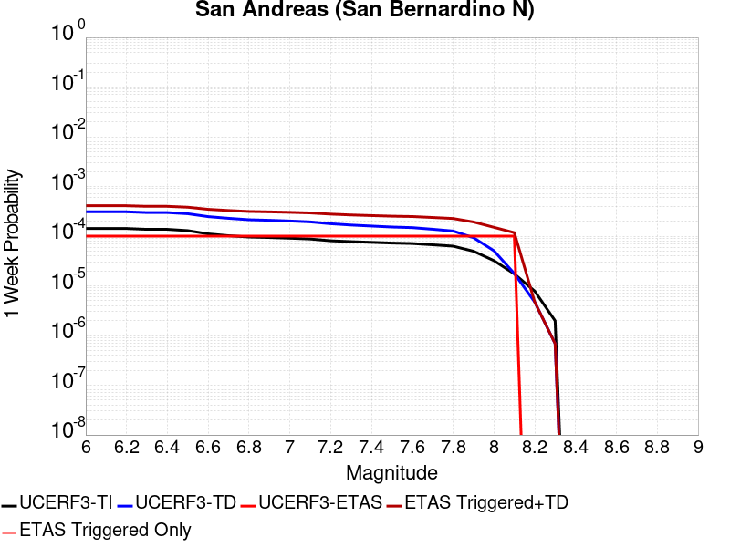 | 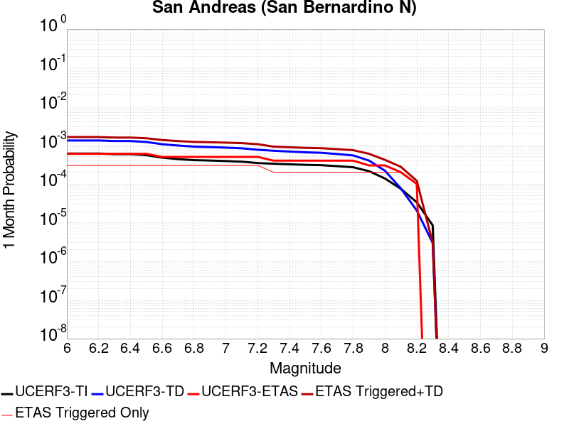 | 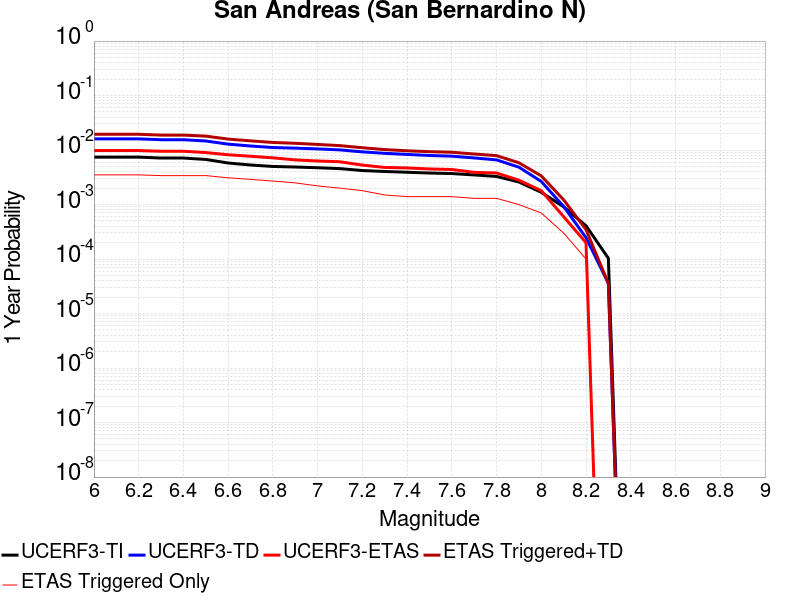 | 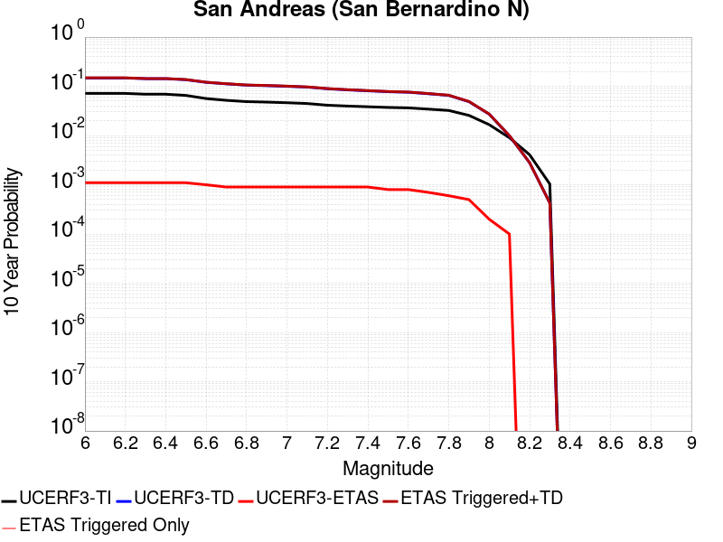 |

| Magnitude | 1 wk TI Prob | 1 wk TD Prob | 1 wk ETAS Prob | 1 wk ETAS/TD Gain | 1 wk ETAS Triggered+TD | 1 wk ETAS Triggered Only | 1 mo TI Prob | 1 mo TD Prob | 1 mo ETAS Prob | 1 mo ETAS/TD Gain | 1 mo ETAS Triggered+TD | 1 mo ETAS Triggered Only | 1 yr TI Prob | 1 yr TD Prob | 1 yr ETAS Prob | 1 yr ETAS/TD Gain | 1 yr ETAS Triggered+TD | 1 yr ETAS Triggered Only | 10 yr TI Prob | 10 yr TD Prob | 10 yr ETAS Prob | 10 yr ETAS/TD Gain | 10 yr ETAS Triggered+TD | 10 yr ETAS Triggered Only |
|-----|-----|-----|-----|-----|-----|-----|-----|-----|-----|-----|-----|-----|-----|-----|-----|-----|-----|-----|-----|-----|-----|-----|-----|-----|
| 6.0 | 1.4273766E-4 | 3.1027544E-4 | 3.0E-4 | 0.9668828 | 4.1024442E-4 | 1.0E-4 | 6.115894E-4 | 0.0013290802 | 6.0E-4 | 0.45144004 | 0.0016286814 | 3.0E-4 | 0.0074207084 | 0.016062956 | 0.0098 | 0.6100994 | 0.019506736 | 0.0035 | 0.07177748 | 0.14784859 | 0.0981 | 0.66351664 | 0.1743505 | 0.0311 |
| 6.1 | 1.4273766E-4 | 3.1027544E-4 | 3.0E-4 | 0.9668828 | 4.1024442E-4 | 1.0E-4 | 6.115894E-4 | 0.0013290802 | 6.0E-4 | 0.45144004 | 0.0016286814 | 3.0E-4 | 0.0074207084 | 0.016062956 | 0.0098 | 0.6100994 | 0.019506736 | 0.0035 | 0.07177748 | 0.14784859 | 0.0981 | 0.66351664 | 0.1743505 | 0.0311 |
| 6.2 | 1.4273766E-4 | 3.1027544E-4 | 3.0E-4 | 0.9668828 | 4.1024442E-4 | 1.0E-4 | 6.115894E-4 | 0.0013290802 | 6.0E-4 | 0.45144004 | 0.0016286814 | 3.0E-4 | 0.0074207084 | 0.016062956 | 0.0098 | 0.6100994 | 0.019506736 | 0.0035 | 0.07177748 | 0.14784859 | 0.0981 | 0.66351664 | 0.1743505 | 0.0311 |
| 6.3 | 1.3730655E-4 | 2.993538E-4 | 3.0E-4 | 1.0021588 | 3.9932385E-4 | 1.0E-4 | 5.883239E-4 | 0.0012823195 | 6.0E-4 | 0.46790206 | 0.0015819349 | 3.0E-4 | 0.0071393442 | 0.01550185 | 0.0095 | 0.6128301 | 0.018849144 | 0.0034 | 0.06914291 | 0.1431491 | 0.095 | 0.6636437 | 0.16876894 | 0.0299 |
| 6.4 | 1.3730655E-4 | 2.993538E-4 | 3.0E-4 | 1.0021588 | 3.9932385E-4 | 1.0E-4 | 5.883239E-4 | 0.0012823195 | 6.0E-4 | 0.46790206 | 0.0015819349 | 3.0E-4 | 0.0071393442 | 0.01550185 | 0.0095 | 0.6128301 | 0.018849144 | 0.0034 | 0.06914291 | 0.1431491 | 0.095 | 0.6636437 | 0.16876894 | 0.0299 |
| 6.5 | 1.2942807E-4 | 2.8354194E-4 | 3.0E-4 | 1.0580446 | 3.8351357E-4 | 1.0E-4 | 5.545738E-4 | 0.0012146189 | 6.0E-4 | 0.4939821 | 0.0015142545 | 3.0E-4 | 0.0067310524 | 0.014688933 | 0.009 | 0.6127062 | 0.018038992 | 0.0034 | 0.06530788 | 0.13630696 | 0.0903 | 0.66247535 | 0.16074948 | 0.0283 |
| 6.6 | 1.1125901E-4 | 2.480459E-4 | 2.0E-4 | 0.80630237 | 3.480211E-4 | 1.0E-4 | 4.767372E-4 | 0.001062623 | 5.0E-4 | 0.47053376 | 0.0013623042 | 3.0E-4 | 0.005788839 | 0.012861304 | 0.0082 | 0.63757145 | 0.015921434 | 0.0031 | 0.056403454 | 0.12057618 | 0.081 | 0.67177445 | 0.14335325 | 0.0259 |
| 6.7 | 1.02209575E-4 | 2.2943947E-4 | 2.0E-4 | 0.8716896 | 3.294165E-4 | 1.0E-4 | 4.3796748E-4 | 9.829428E-4 | 5.0E-4 | 0.5086766 | 0.001282648 | 3.0E-4 | 0.0053192247 | 0.011902068 | 0.0077 | 0.64694643 | 0.014767552 | 0.0029 | 0.051936906 | 0.112358645 | 0.075 | 0.6675054 | 0.13348451 | 0.0238 |
| 6.8 | 9.610582E-5 | 2.1477597E-4 | 2.0E-4 | 0.9312029 | 3.147545E-4 | 1.0E-4 | 4.1181705E-4 | 9.2014443E-4 | 5.0E-4 | 0.54339296 | 0.0012198684 | 3.0E-4 | 0.0050023515 | 0.011145466 | 0.0072 | 0.6460026 | 0.013815373 | 0.0027 | 0.048912346 | 0.10578429 | 0.0704 | 0.66550523 | 0.12590414 | 0.0225 |
| 6.9 | 9.3877505E-5 | 2.0935519E-4 | 2.0E-4 | 0.9553142 | 3.0933425E-4 | 1.0E-4 | 4.0227012E-4 | 8.9692866E-4 | 5.0E-4 | 0.5574579 | 0.0011966596 | 3.0E-4 | 0.0048866454 | 0.010865662 | 0.0066 | 0.6074181 | 0.013338499 | 0.0025 | 0.04780577 | 0.1033734 | 0.0676 | 0.65393996 | 0.12256121 | 0.0214 |
| 7.0 | 9.1019785E-5 | 2.0265987E-4 | 2.0E-4 | 0.9868752 | 3.0263962E-4 | 1.0E-4 | 3.900265E-4 | 8.682538E-4 | 5.0E-4 | 0.5758685 | 0.0011679933 | 3.0E-4 | 0.0047382377 | 0.0105199665 | 0.0063 | 0.5988612 | 0.012696822 | 0.0022 | 0.046384744 | 0.10035603 | 0.0651 | 0.64869046 | 0.118798725 | 0.0205 |
| 7.1 | 8.771155E-5 | 1.9444637E-4 | 2.0E-4 | 1.0285612 | 2.9442692E-4 | 1.0E-4 | 3.758525E-4 | 8.3307596E-4 | 5.0E-4 | 0.60018533 | 0.0011328261 | 3.0E-4 | 0.0045664064 | 0.010095717 | 0.0061 | 0.60421664 | 0.012075526 | 0.002 | 0.044737056 | 0.09668185 | 0.0623 | 0.6443816 | 0.11420622 | 0.0194 |
| 7.2 | 8.0830236E-5 | 1.7858752E-4 | 2.0E-4 | 1.119899 | 2.7856967E-4 | 1.0E-4 | 3.4636928E-4 | 7.6515076E-4 | 5.0E-4 | 0.653466 | 0.0010649213 | 3.0E-4 | 0.0042088944 | 0.009276018 | 0.0053 | 0.5713659 | 0.0110593205 | 0.0018 | 0.041300658 | 0.08945525 | 0.057 | 0.63719016 | 0.1059361 | 0.0181 |
| 7.3 | 7.7668235E-5 | 1.6811478E-4 | 2.0E-4 | 1.1896634 | 2.6809797E-4 | 1.0E-4 | 3.328214E-4 | 7.20293E-4 | 4.0E-4 | 0.5553295 | 9.20149E-4 | 2.0E-4 | 0.0040445733 | 0.008734378 | 0.0048 | 0.54955256 | 0.010221276 | 0.0015 | 0.03971748 | 0.08475616 | 0.054 | 0.63712186 | 0.10049835 | 0.0172 |
| 7.4 | 7.520177E-5 | 1.6038917E-4 | 2.0E-4 | 1.246967 | 2.6037314E-4 | 1.0E-4 | 3.2225347E-4 | 6.8720116E-4 | 4.0E-4 | 0.5820712 | 8.8706374E-4 | 2.0E-4 | 0.0039163795 | 0.008334639 | 0.0047 | 0.5639117 | 0.0097229695 | 0.0014 | 0.038480744 | 0.0812339 | 0.0513 | 0.6315098 | 0.096026026 | 0.0161 |
| 7.5 | 7.274697E-5 | 1.5333353E-4 | 2.0E-4 | 1.3043462 | 2.533182E-4 | 1.0E-4 | 3.1173544E-4 | 6.569782E-4 | 4.0E-4 | 0.60884815 | 8.5684686E-4 | 2.0E-4 | 0.003788775 | 0.007969426 | 0.0045 | 0.564658 | 0.009358269 | 0.0014 | 0.03724827 | 0.07797131 | 0.0481 | 0.6168936 | 0.09189394 | 0.0151 |
| 7.6 | 7.1185845E-5 | 1.4907555E-4 | 2.0E-4 | 1.3416016 | 2.4906066E-4 | 1.0E-4 | 3.0504653E-4 | 6.3873886E-4 | 4.0E-4 | 0.62623405 | 8.386111E-4 | 2.0E-4 | 0.0037076178 | 0.007748963 | 0.0044 | 0.5678179 | 0.009138115 | 0.0014 | 0.036463667 | 0.07597367 | 0.0467 | 0.61468667 | 0.08974166 | 0.0149 |
| 7.7 | 6.709961E-5 | 1.3828526E-4 | 2.0E-4 | 1.4462857 | 2.3827143E-4 | 1.0E-4 | 2.8753807E-4 | 5.9251656E-4 | 4.0E-4 | 0.6750866 | 7.9239806E-4 | 2.0E-4 | 0.003495157 | 0.007190062 | 0.0039 | 0.5424153 | 0.008480716 | 0.0013 | 0.034406938 | 0.07084266 | 0.0434 | 0.61262524 | 0.08385086 | 0.014 |
| 7.8 | 6.300812E-5 | 1.2737786E-4 | 2.0E-4 | 1.5701317 | 2.2736512E-4 | 1.0E-4 | 2.7000686E-4 | 5.457909E-4 | 4.0E-4 | 0.7328814 | 7.4568175E-4 | 2.0E-4 | 0.0032823787 | 0.0066247834 | 0.0038 | 0.57360363 | 0.007916171 | 0.0013 | 0.032343175 | 0.065600194 | 0.0395 | 0.6021324 | 0.07737363 | 0.0126 |
| 7.9 | 4.983037E-5 | 9.3563816E-5 | 1.0E-4 | 1.0687892 | 1.9355446E-4 | 1.0E-4 | 2.1354125E-4 | 4.009262E-4 | 3.0E-4 | 0.7482674 | 6.00846E-4 | 2.0E-4 | 0.0025967648 | 0.0048703603 | 0.0028 | 0.5749062 | 0.00586549 | 0.001 | 0.025666296 | 0.048933394 | 0.0294 | 0.60081667 | 0.058348954 | 0.0099 |
| 8.0 | 3.2211527E-5 | 5.1141207E-5 | 1.0E-4 | 1.9553703 | 1.5113609E-4 | 1.0E-4 | 1.380421E-4 | 2.191582E-4 | 3.0E-4 | 1.3688742 | 4.1911437E-4 | 2.0E-4 | 0.0016793669 | 0.002664988 | 0.0018 | 0.67542523 | 0.0033631222 | 7.0E-4 | 0.016667323 | 0.027303511 | 0.0166 | 0.60798043 | 0.03313969 | 0.006 |
| 8.1 | 1.743376E-5 | 1.7819275E-5 | 1.0E-4 | 5.611901 | 1.1781749E-4 | 1.0E-4 | 7.471398E-5 | 7.636609E-5 | 2.0E-4 | 2.6189635 | 2.7635082E-4 | 2.0E-4 | 9.0926304E-4 | 9.293611E-4 | 6.0E-4 | 0.6456048 | 0.0012290824 | 3.0E-4 | 0.009055517 | 0.009959804 | 0.0065 | 0.65262324 | 0.012434904 | 0.0025 |
| 8.2 | 7.831616E-6 | 4.781141E-6 | 0.0 | 0.0 | 4.781141E-6 | 0.0 | 3.3563636E-5 | 2.0490445E-5 | 1.0E-4 | 4.880324 | 1.20488396E-4 | 1.0E-4 | 4.0856065E-4 | 2.4944267E-4 | 2.0E-4 | 0.80178744 | 3.494177E-4 | 1.0E-4 | 0.004078103 | 0.0028377294 | 0.002 | 0.70478886 | 0.0034360266 | 6.0E-4 |
| 8.3 | 1.983087E-6 | 6.9765395E-7 | 0.0 | 0.0 | 6.9765395E-7 | 0.0 | 8.498917E-6 | 2.9899422E-6 | 0.0 | 0.0 | 2.9899422E-6 | 0.0 | 1.034694E-4 | 3.640195E-5 | 0.0 | 0.0 | 3.640195E-5 | 0.0 | 0.0010342124 | 4.3255524E-4 | 2.0E-4 | 0.46236867 | 5.32512E-4 | 1.0E-4 |

## Elsinore (Glen Ivy) rev
*[(top)](#table-of-contents)*

| 1 Week | 1 Month | 1 Year | 10 Year |
|-----|-----|-----|-----|
| 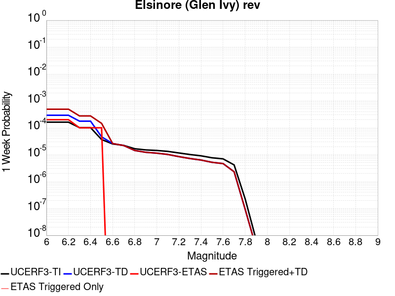 | 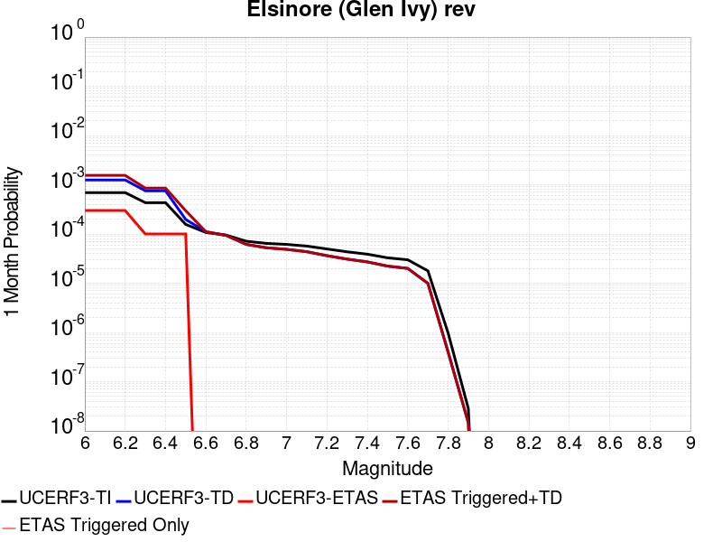 | 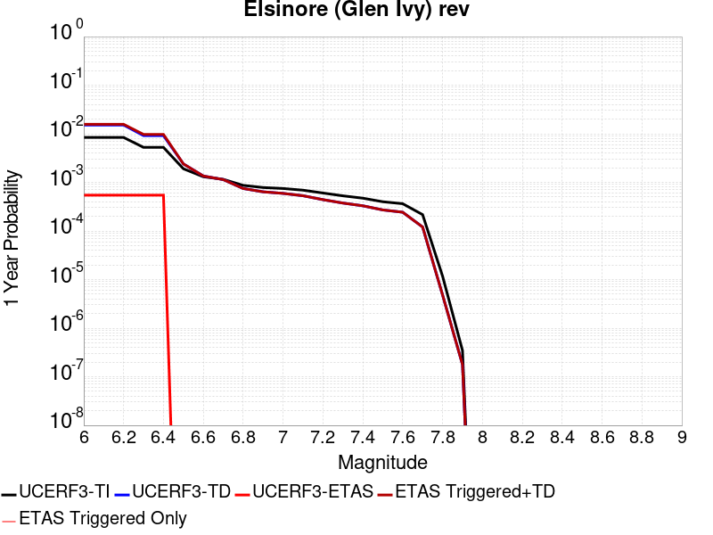 | 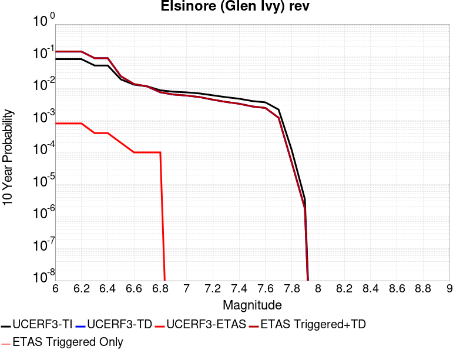 |

| Magnitude | 1 wk TI Prob | 1 wk TD Prob | 1 wk ETAS Prob | 1 wk ETAS/TD Gain | 1 wk ETAS Triggered+TD | 1 wk ETAS Triggered Only | 1 mo TI Prob | 1 mo TD Prob | 1 mo ETAS Prob | 1 mo ETAS/TD Gain | 1 mo ETAS Triggered+TD | 1 mo ETAS Triggered Only | 1 yr TI Prob | 1 yr TD Prob | 1 yr ETAS Prob | 1 yr ETAS/TD Gain | 1 yr ETAS Triggered+TD | 1 yr ETAS Triggered Only | 10 yr TI Prob | 10 yr TD Prob | 10 yr ETAS Prob | 10 yr ETAS/TD Gain | 10 yr ETAS Triggered+TD | 10 yr ETAS Triggered Only |
|-----|-----|-----|-----|-----|-----|-----|-----|-----|-----|-----|-----|-----|-----|-----|-----|-----|-----|-----|-----|-----|-----|-----|-----|-----|
| 6.0 | 1.6204086E-4 | 2.9251605E-4 | 2.0E-4 | 0.68372315 | 4.9245753E-4 | 2.0E-4 | 6.94276E-4 | 0.0012531171 | 8.0E-4 | 0.638408 | 0.0018523652 | 6.0E-4 | 0.008420097 | 0.015171497 | 0.0095 | 0.6261742 | 0.018322948 | 0.0032 | 0.081081145 | 0.13933165 | 0.0915 | 0.65670645 | 0.1641189 | 0.0288 |
| 6.1 | 1.6204086E-4 | 2.9251605E-4 | 2.0E-4 | 0.68372315 | 4.9245753E-4 | 2.0E-4 | 6.94276E-4 | 0.0012531171 | 8.0E-4 | 0.638408 | 0.0018523652 | 6.0E-4 | 0.008420097 | 0.015171497 | 0.0095 | 0.6261742 | 0.018322948 | 0.0032 | 0.081081145 | 0.13933165 | 0.0915 | 0.65670645 | 0.1641189 | 0.0288 |
| 6.2 | 1.6204086E-4 | 2.9251605E-4 | 2.0E-4 | 0.68372315 | 4.9245753E-4 | 2.0E-4 | 6.94276E-4 | 0.0012531171 | 8.0E-4 | 0.638408 | 0.0018523652 | 6.0E-4 | 0.008420097 | 0.015171497 | 0.0095 | 0.6261742 | 0.018322948 | 0.0032 | 0.081081145 | 0.13933165 | 0.0915 | 0.65670645 | 0.1641189 | 0.0288 |
| 6.3 | 1.0111737E-4 | 1.7629775E-4 | 1.0E-4 | 0.56722224 | 2.7628013E-4 | 1.0E-4 | 4.332882E-4 | 7.554589E-4 | 3.0E-4 | 0.39710963 | 8.5538335E-4 | 1.0E-4 | 0.005262531 | 0.009179472 | 0.006 | 0.65363234 | 0.010962949 | 0.0018 | 0.0513964 | 0.08675405 | 0.0624 | 0.7192748 | 0.10410572 | 0.019 |
| 6.4 | 1.0111737E-4 | 1.7629775E-4 | 1.0E-4 | 0.56722224 | 2.7628013E-4 | 1.0E-4 | 4.332882E-4 | 7.554589E-4 | 3.0E-4 | 0.39710963 | 8.5538335E-4 | 1.0E-4 | 0.005262531 | 0.009179472 | 0.006 | 0.65363234 | 0.010962949 | 0.0018 | 0.0513964 | 0.08675405 | 0.0624 | 0.7192748 | 0.10410572 | 0.019 |
| 6.5 | 3.6624708E-5 | 4.609726E-5 | 1.0E-4 | 2.1693263 | 1.4609264E-4 | 1.0E-4 | 1.569536E-4 | 1.9754675E-4 | 3.0E-4 | 1.5186279 | 2.97527E-4 | 1.0E-4 | 0.001909235 | 0.0024028358 | 0.0018 | 0.74911493 | 0.0027021149 | 3.0E-4 | 0.01892915 | 0.023553308 | 0.0191 | 0.81092644 | 0.028826121 | 0.0054 |
| 6.6 | 2.5051324E-5 | 2.597092E-5 | 0.0 | 0.0 | 2.597092E-5 | 0.0 | 1.073584E-4 | 1.1129944E-4 | 1.0E-4 | 0.89847714 | 1.1129944E-4 | 0.0 | 0.0013063047 | 0.0013542724 | 0.0011 | 0.8122443 | 0.0015540015 | 2.0E-4 | 0.012986525 | 0.013476744 | 0.0101 | 0.7494391 | 0.016140357 | 0.0027 |
| 6.7 | 2.2189772E-5 | 2.1921272E-5 | 0.0 | 0.0 | 2.1921272E-5 | 0.0 | 9.509556E-5 | 9.394513E-5 | 1.0E-4 | 1.0644511 | 9.394513E-5 | 0.0 | 0.0011571734 | 0.0011432177 | 8.0E-4 | 0.6997792 | 0.0012431034 | 1.0E-4 | 0.011511663 | 0.01139007 | 0.0076 | 0.66724783 | 0.013169568 | 0.0018 |
| 6.8 | 1.6654378E-5 | 1.4349544E-5 | 0.0 | 0.0 | 1.4349544E-5 | 0.0 | 7.137396E-5 | 6.149663E-5 | 1.0E-4 | 1.6261055 | 6.149663E-5 | 0.0 | 8.686314E-4 | 7.4846926E-4 | 4.0E-4 | 0.53442407 | 8.483944E-4 | 1.0E-4 | 0.008652439 | 0.007464598 | 0.0053 | 0.71001816 | 0.00865564 | 0.0012 |
| 6.9 | 1.5042909E-5 | 1.2265607E-5 | 0.0 | 0.0 | 1.2265607E-5 | 0.0 | 6.446802E-5 | 5.2565847E-5 | 0.0 | 0.0 | 5.2565847E-5 | 0.0 | 7.8461546E-4 | 6.398044E-4 | 3.0E-4 | 0.46889332 | 7.397404E-4 | 1.0E-4 | 0.007818509 | 0.0063835797 | 0.0045 | 0.70493364 | 0.007178473 | 8.0E-4 |
| 7.0 | 1.4361385E-5 | 1.1392162E-5 | 0.0 | 0.0 | 1.1392162E-5 | 0.0 | 6.154734E-5 | 4.8822654E-5 | 0.0 | 0.0 | 4.8822654E-5 | 0.0 | 7.490812E-4 | 5.9425656E-4 | 3.0E-4 | 0.50483245 | 6.9419714E-4 | 1.0E-4 | 0.007465612 | 0.005930479 | 0.0042 | 0.7082058 | 0.006526921 | 6.0E-4 |
| 7.1 | 1.3265571E-5 | 1.0195621E-5 | 0.0 | 0.0 | 1.0195621E-5 | 0.0 | 5.6851208E-5 | 4.3694803E-5 | 0.0 | 0.0 | 4.3694803E-5 | 0.0 | 6.919436E-4 | 5.3185684E-4 | 3.0E-4 | 0.5640615 | 6.318037E-4 | 1.0E-4 | 0.006897931 | 0.005309098 | 0.0042 | 0.79109484 | 0.0059059127 | 6.0E-4 |
| 7.2 | 1.1596403E-5 | 8.46623E-6 | 0.0 | 0.0 | 8.46623E-6 | 0.0 | 4.9697923E-5 | 3.6283345E-5 | 0.0 | 0.0 | 3.6283345E-5 | 0.0 | 6.049042E-4 | 4.4166186E-4 | 3.0E-4 | 0.6792527 | 5.416177E-4 | 1.0E-4 | 0.006032603 | 0.0044091586 | 0.0037 | 0.8391624 | 0.005006513 | 6.0E-4 |
| 7.3 | 1.0150827E-5 | 7.2083226E-6 | 0.0 | 0.0 | 7.2083226E-6 | 0.0 | 4.3502816E-5 | 3.0892454E-5 | 0.0 | 0.0 | 3.0892454E-5 | 0.0 | 5.2951806E-4 | 3.7605214E-4 | 3.0E-4 | 0.79776174 | 4.7601454E-4 | 1.0E-4 | 0.005282581 | 0.0037545003 | 0.0035 | 0.93221456 | 0.0042526233 | 5.0E-4 |
| 7.4 | 9.080705E-6 | 6.32672E-6 | 0.0 | 0.0 | 6.32672E-6 | 0.0 | 3.8916725E-5 | 2.7114238E-5 | 0.0 | 0.0 | 2.7114238E-5 | 0.0 | 4.7370812E-4 | 3.300672E-4 | 3.0E-4 | 0.9089058 | 4.3003418E-4 | 1.0E-4 | 0.004726996 | 0.0032959157 | 0.0028 | 0.8495363 | 0.0037942675 | 5.0E-4 |
| 7.5 | 7.671649E-6 | 5.204376E-6 | 0.0 | 0.0 | 5.204376E-6 | 0.0 | 3.287808E-5 | 2.2304284E-5 | 0.0 | 0.0 | 2.2304284E-5 | 0.0 | 4.0021708E-4 | 2.7152206E-4 | 3.0E-4 | 1.1048826 | 3.714949E-4 | 1.0E-4 | 0.0039949706 | 0.0027120274 | 0.0021 | 0.7743285 | 0.0032106712 | 5.0E-4 |
| 7.6 | 6.990086E-6 | 4.6680852E-6 | 0.0 | 0.0 | 4.6680852E-6 | 0.0 | 2.9957167E-5 | 2.0005933E-5 | 0.0 | 0.0 | 2.0005933E-5 | 0.0 | 3.6466747E-4 | 2.4354616E-4 | 3.0E-4 | 1.2317994 | 3.4352182E-4 | 1.0E-4 | 0.0036406964 | 0.002432908 | 0.002 | 0.8220615 | 0.0029316915 | 5.0E-4 |
| 7.7 | 4.163505E-6 | 2.3176701E-6 | 0.0 | 0.0 | 2.3176701E-6 | 0.0 | 1.7843471E-5 | 9.932838E-6 | 0.0 | 0.0 | 9.932838E-6 | 0.0 | 2.172226E-4 | 1.20926336E-4 | 0.0 | 0.0 | 1.20926336E-4 | 0.0 | 0.0021701038 | 0.0012086778 | 8.0E-4 | 0.6618803 | 0.001408436 | 2.0E-4 |
| 7.8 | 2.2692414E-7 | 9.313546E-8 | 0.0 | 0.0 | 9.313546E-8 | 0.0 | 9.725317E-7 | 3.9915196E-7 | 0.0 | 0.0 | 3.9915196E-7 | 0.0 | 1.1840509E-5 | 4.8596676E-6 | 0.0 | 0.0 | 4.8596676E-6 | 0.0 | 1.1839878E-4 | 4.859593E-5 | 0.0 | 0.0 | 4.859593E-5 | 0.0 |
| 7.9 | 6.676829E-9 | 3.4267709E-9 | 0.0 | 0.0 | 3.4267709E-9 | 0.0 | 2.861498E-8 | 1.4686159E-8 | 0.0 | 0.0 | 1.4686159E-8 | 0.0 | 3.4838732E-7 | 1.7880397E-7 | 0.0 | 0.0 | 1.7880397E-7 | 0.0 | 3.4838679E-6 | 1.7880385E-6 | 0.0 | 0.0 | 1.7880385E-6 | 0.0 |

## Calaveras (So) - Paicines extension 2011 CFM
*[(top)](#table-of-contents)*

| 1 Week | 1 Month | 1 Year | 10 Year |
|-----|-----|-----|-----|
| 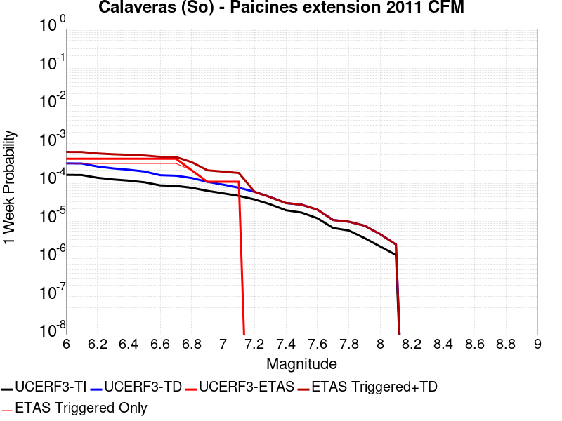 | 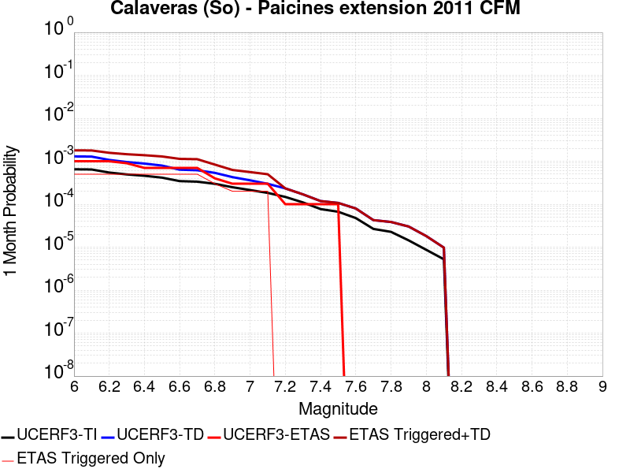 | 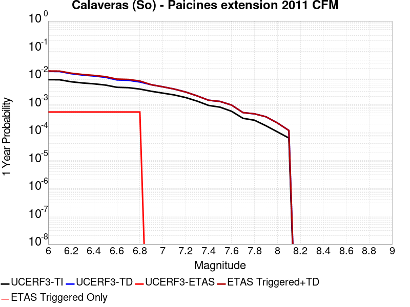 | 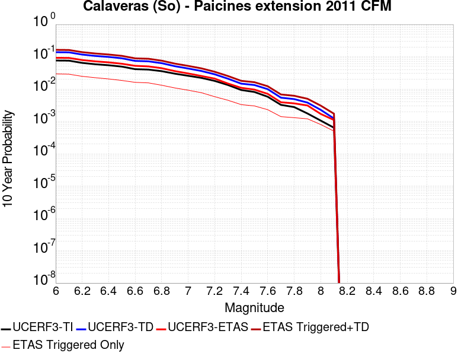 |

| Magnitude | 1 wk TI Prob | 1 wk TD Prob | 1 wk ETAS Prob | 1 wk ETAS/TD Gain | 1 wk ETAS Triggered+TD | 1 wk ETAS Triggered Only | 1 mo TI Prob | 1 mo TD Prob | 1 mo ETAS Prob | 1 mo ETAS/TD Gain | 1 mo ETAS Triggered+TD | 1 mo ETAS Triggered Only | 1 yr TI Prob | 1 yr TD Prob | 1 yr ETAS Prob | 1 yr ETAS/TD Gain | 1 yr ETAS Triggered+TD | 1 yr ETAS Triggered Only | 10 yr TI Prob | 10 yr TD Prob | 10 yr ETAS Prob | 10 yr ETAS/TD Gain | 10 yr ETAS Triggered+TD | 10 yr ETAS Triggered Only |
|-----|-----|-----|-----|-----|-----|-----|-----|-----|-----|-----|-----|-----|-----|-----|-----|-----|-----|-----|-----|-----|-----|-----|-----|-----|
| 6.0 | 1.5183659E-4 | 3.032064E-4 | 4.0E-4 | 1.3192333 | 6.031154E-4 | 3.0E-4 | 6.5056595E-4 | 0.0012982524 | 0.001 | 0.77026623 | 0.0017976033 | 5.0E-4 | 0.007891912 | 0.015593609 | 0.0104 | 0.6669399 | 0.019629674 | 0.0041 | 0.076174594 | 0.13766919 | 0.0923 | 0.6704477 | 0.1629355 | 0.0293 |
| 6.1 | 1.5024997E-4 | 3.0015956E-4 | 4.0E-4 | 1.3326246 | 6.000695E-4 | 3.0E-4 | 6.437695E-4 | 0.0012852083 | 0.001 | 0.778084 | 0.0017845657 | 5.0E-4 | 0.0078097614 | 0.015437521 | 0.0102 | 0.66072786 | 0.019375771 | 0.004 | 0.075409345 | 0.13634166 | 0.0916 | 0.6718416 | 0.16121502 | 0.0288 |
| 6.2 | 1.2743923E-4 | 2.5119618E-4 | 4.0E-4 | 1.5923809 | 5.5112084E-4 | 3.0E-4 | 5.460538E-4 | 0.0010756905 | 0.001 | 0.9296354 | 0.0015751527 | 5.0E-4 | 0.0066279583 | 0.012947148 | 0.0085 | 0.65651524 | 0.016204422 | 0.0033 | 0.064337276 | 0.11644054 | 0.0789 | 0.6775991 | 0.13826446 | 0.0247 |
| 6.3 | 1.1525114E-4 | 2.2406246E-4 | 4.0E-4 | 1.7852165 | 5.2399526E-4 | 3.0E-4 | 4.9383997E-4 | 9.5960597E-4 | 9.0E-4 | 0.9378849 | 0.0014591261 | 5.0E-4 | 0.0059959386 | 0.0115687195 | 0.0075 | 0.64829993 | 0.014534013 | 0.003 | 0.058367174 | 0.1055504 | 0.0717 | 0.6792963 | 0.12558608 | 0.0224 |
| 6.4 | 1.07200925E-4 | 2.0648453E-4 | 4.0E-4 | 1.937191 | 5.064226E-4 | 3.0E-4 | 4.5935164E-4 | 8.843949E-4 | 7.0E-4 | 0.79150164 | 0.0013839527 | 5.0E-4 | 0.0055782744 | 0.0106741395 | 0.0072 | 0.67452747 | 0.013543184 | 0.0029 | 0.0544031 | 0.098371424 | 0.0668 | 0.67905897 | 0.11685481 | 0.0205 |
| 6.5 | 9.69631E-5 | 1.8546813E-4 | 4.0E-4 | 2.1567047 | 4.8541249E-4 | 3.0E-4 | 4.1548995E-4 | 7.944251E-4 | 7.0E-4 | 0.88114035 | 0.0012940279 | 5.0E-4 | 0.0050468626 | 0.009598055 | 0.0066 | 0.6876393 | 0.0121731 | 0.0026 | 0.04933773 | 0.08927215 | 0.0605 | 0.67770296 | 0.10602954 | 0.0184 |
| 6.6 | 8.0552316E-5 | 1.4884338E-4 | 4.0E-4 | 2.6873887 | 4.4879873E-4 | 3.0E-4 | 3.4517853E-4 | 6.377057E-4 | 7.0E-4 | 1.097685 | 0.0011373869 | 5.0E-4 | 0.0041944524 | 0.007730144 | 0.0056 | 0.7244367 | 0.010111592 | 0.0024 | 0.04116161 | 0.07403277 | 0.0522 | 0.7050932 | 0.08894084 | 0.0161 |
| 6.7 | 7.815757E-5 | 1.4426565E-4 | 4.0E-4 | 2.7726629 | 4.4422236E-4 | 3.0E-4 | 3.34918E-4 | 6.181004E-4 | 7.0E-4 | 1.1325021 | 0.0011177914 | 5.0E-4 | 0.004070005 | 0.007493781 | 0.0055 | 0.7339419 | 0.009875796 | 0.0024 | 0.039962657 | 0.07188739 | 0.0501 | 0.6969234 | 0.086273134 | 0.0155 |
| 6.8 | 6.965264E-5 | 1.2550168E-4 | 2.0E-4 | 1.5936042 | 3.2547658E-4 | 2.0E-4 | 2.9847719E-4 | 5.377415E-4 | 4.0E-4 | 0.74385184 | 8.375802E-4 | 3.0E-4 | 0.0036279052 | 0.006524231 | 0.0044 | 0.67440903 | 0.008511182 | 0.002 | 0.03569247 | 0.06302707 | 0.0441 | 0.6996994 | 0.07530141 | 0.0131 |
| 6.9 | 5.8000453E-5 | 9.988629E-5 | 1.0E-4 | 1.0011383 | 1.998763E-4 | 1.0E-4 | 2.4854968E-4 | 4.2801443E-4 | 3.0E-4 | 0.7009109 | 6.279288E-4 | 2.0E-4 | 0.0030218933 | 0.00519872 | 0.0033 | 0.63477165 | 0.0065914416 | 0.0014 | 0.029811295 | 0.050786078 | 0.0358 | 0.7049176 | 0.06103759 | 0.0108 |
| 7.0 | 4.9865852E-5 | 8.426625E-5 | 1.0E-4 | 1.1867148 | 1.8425782E-4 | 1.0E-4 | 2.1369329E-4 | 3.6109154E-4 | 3.0E-4 | 0.83081424 | 5.6101935E-4 | 2.0E-4 | 0.0025986114 | 0.0043875147 | 0.0027 | 0.61538255 | 0.0055822497 | 0.0012 | 0.025684336 | 0.043122705 | 0.0303 | 0.7026461 | 0.051925976 | 0.0092 |
| 7.1 | 4.283875E-5 | 6.986125E-5 | 1.0E-4 | 1.4314088 | 1.6985426E-4 | 1.0E-4 | 1.8358172E-4 | 2.9937128E-4 | 3.0E-4 | 1.0021001 | 4.993114E-4 | 2.0E-4 | 0.0022328163 | 0.003638809 | 0.0024 | 0.65955645 | 0.0048344424 | 0.0012 | 0.022105146 | 0.036136176 | 0.0253 | 0.7001294 | 0.043557927 | 0.0077 |
| 7.2 | 3.450115E-5 | 5.468102E-5 | 0.0 | 0.0 | 5.468102E-5 | 0.0 | 1.478537E-4 | 2.3432633E-4 | 1.0E-4 | 0.42675528 | 2.3432633E-4 | 0.0 | 0.0017986323 | 0.0028492191 | 0.0017 | 0.5966547 | 0.0036469398 | 8.0E-4 | 0.017841442 | 0.028552301 | 0.021 | 0.73549235 | 0.0341867 | 0.0058 |
| 7.3 | 2.5709045E-5 | 3.9722894E-5 | 0.0 | 0.0 | 3.9722894E-5 | 0.0 | 1.1017697E-4 | 1.7022996E-4 | 1.0E-4 | 0.58744067 | 1.7022996E-4 | 0.0 | 0.0013405791 | 0.0020705962 | 0.0014 | 0.67613375 | 0.0027691468 | 7.0E-4 | 0.013325208 | 0.020875327 | 0.0148 | 0.70897096 | 0.025281388 | 0.0045 |
| 7.4 | 1.8003093E-5 | 2.7765243E-5 | 0.0 | 0.0 | 2.7765243E-5 | 0.0 | 7.715383E-5 | 1.18988486E-4 | 1.0E-4 | 0.84041744 | 1.18988486E-4 | 0.0 | 9.3894306E-4 | 0.0014477244 | 0.0011 | 0.75981313 | 0.0019470005 | 5.0E-4 | 0.009349857 | 0.014686927 | 0.0109 | 0.74215657 | 0.017938461 | 0.0033 |
| 7.5 | 1.5595824E-5 | 2.5115387E-5 | 0.0 | 0.0 | 2.5115387E-5 | 0.0 | 6.683753E-5 | 1.0763294E-4 | 1.0E-4 | 0.9290836 | 1.0763294E-4 | 0.0 | 8.134431E-4 | 0.0013096455 | 9.0E-4 | 0.6872089 | 0.0018089907 | 5.0E-4 | 0.008104719 | 0.013305535 | 0.0096 | 0.7215043 | 0.016265618 | 0.003 |
| 7.6 | 1.1110309E-5 | 1.8640747E-5 | 0.0 | 0.0 | 1.8640747E-5 | 0.0 | 4.761474E-5 | 7.988648E-5 | 0.0 | 0.0 | 7.988648E-5 | 0.0 | 5.795553E-4 | 9.721852E-4 | 6.0E-4 | 0.61716634 | 0.0013717964 | 4.0E-4 | 0.0057804612 | 0.009919345 | 0.0071 | 0.71577305 | 0.012196531 | 0.0023 |
| 7.7 | 6.2140443E-6 | 9.999991E-6 | 0.0 | 0.0 | 9.999991E-6 | 0.0 | 2.6631347E-5 | 4.2856398E-5 | 0.0 | 0.0 | 4.2856398E-5 | 0.0 | 3.241884E-4 | 5.216518E-4 | 3.0E-4 | 0.5750962 | 7.215475E-4 | 2.0E-4 | 0.0032371588 | 0.005405837 | 0.0039 | 0.7214424 | 0.0067982688 | 0.0014 |
| 7.8 | 5.305533E-6 | 9.042565E-6 | 0.0 | 0.0 | 9.042565E-6 | 0.0 | 2.27378E-5 | 3.875327E-5 | 0.0 | 0.0 | 3.875327E-5 | 0.0 | 2.7679754E-4 | 4.7171902E-4 | 3.0E-4 | 0.6359718 | 6.716247E-4 | 2.0E-4 | 0.0027645302 | 0.0048840386 | 0.0036 | 0.73709494 | 0.006177689 | 0.0013 |
| 7.9 | 3.363505E-6 | 7.0971623E-6 | 0.0 | 0.0 | 7.0971623E-6 | 0.0 | 1.4414942E-5 | 3.0416057E-5 | 0.0 | 0.0 | 3.0416057E-5 | 0.0 | 1.7548777E-4 | 3.7025264E-4 | 3.0E-4 | 0.81025755 | 5.7017856E-4 | 2.0E-4 | 0.0017534926 | 0.0038095808 | 0.0031 | 0.81373787 | 0.005005009 | 0.0012 |
| 8.0 | 2.0271132E-6 | 4.2518654E-6 | 0.0 | 0.0 | 4.2518654E-6 | 0.0 | 8.687599E-6 | 1.8222154E-5 | 0.0 | 0.0 | 1.8222154E-5 | 0.0 | 1.05766376E-4 | 2.2183218E-4 | 1.0E-4 | 0.45079124 | 3.2181E-4 | 1.0E-4 | 0.0010571606 | 0.0022725454 | 0.0017 | 0.74805987 | 0.0030707275 | 8.0E-4 |
| 8.1 | 1.2206116E-6 | 2.2872487E-6 | 0.0 | 0.0 | 2.2872487E-6 | 0.0 | 5.2311816E-6 | 9.8024575E-6 | 0.0 | 0.0 | 9.8024575E-6 | 0.0 | 6.3687774E-5 | 1.1933842E-4 | 1.0E-4 | 0.8379531 | 2.193265E-4 | 1.0E-4 | 6.366953E-4 | 0.0012269221 | 0.0011 | 0.8965524 | 0.0017263087 | 5.0E-4 |

## Hayward (So) extension 2011 CFM
*[(top)](#table-of-contents)*

| 1 Week | 1 Month | 1 Year | 10 Year |
|-----|-----|-----|-----|
| 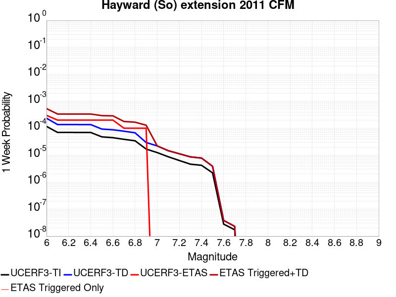 | 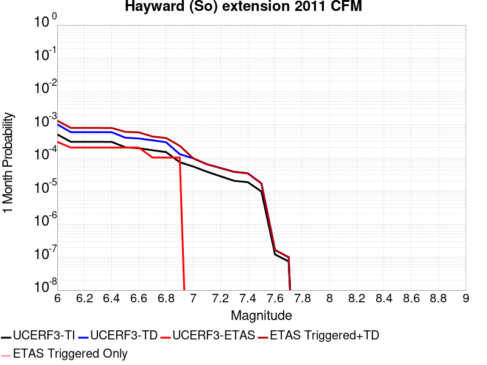 | 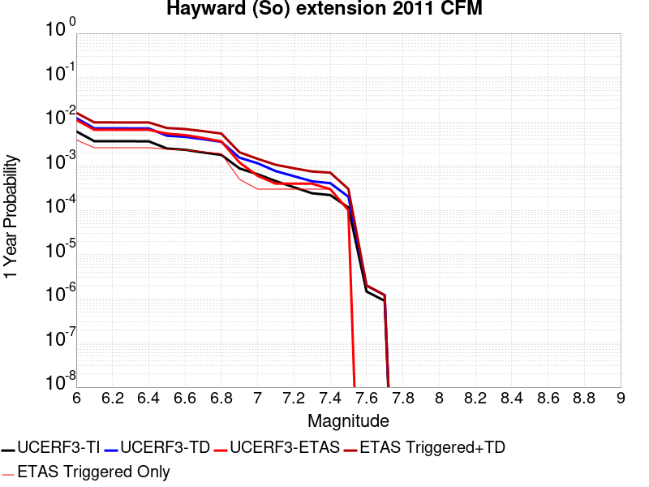 | 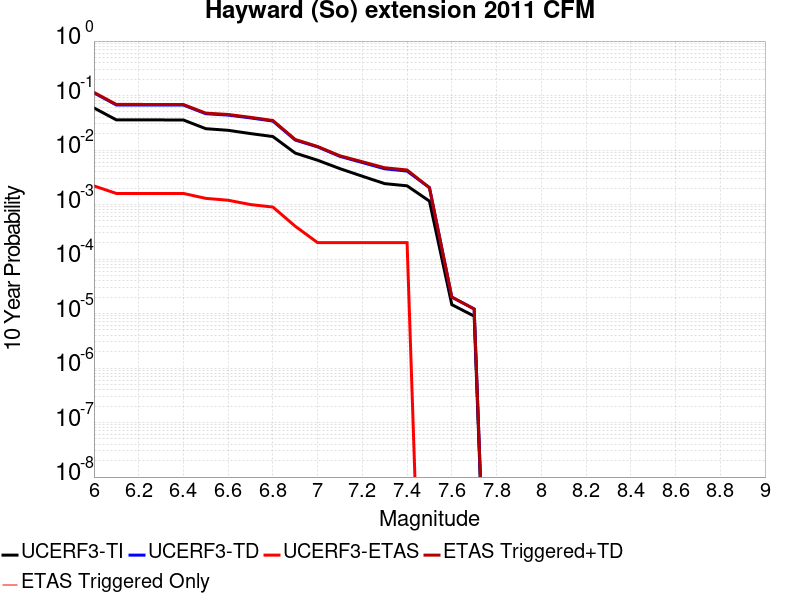 |

| Magnitude | 1 wk TI Prob | 1 wk TD Prob | 1 wk ETAS Prob | 1 wk ETAS/TD Gain | 1 wk ETAS Triggered+TD | 1 wk ETAS Triggered Only | 1 mo TI Prob | 1 mo TD Prob | 1 mo ETAS Prob | 1 mo ETAS/TD Gain | 1 mo ETAS Triggered+TD | 1 mo ETAS Triggered Only | 1 yr TI Prob | 1 yr TD Prob | 1 yr ETAS Prob | 1 yr ETAS/TD Gain | 1 yr ETAS Triggered+TD | 1 yr ETAS Triggered Only | 10 yr TI Prob | 10 yr TD Prob | 10 yr ETAS Prob | 10 yr ETAS/TD Gain | 10 yr ETAS Triggered+TD | 10 yr ETAS Triggered Only |
|-----|-----|-----|-----|-----|-----|-----|-----|-----|-----|-----|-----|-----|-----|-----|-----|-----|-----|-----|-----|-----|-----|-----|-----|-----|
| 6.0 | 1.1721256E-4 | 2.3552943E-4 | 3.0E-4 | 1.2737262 | 5.354588E-4 | 3.0E-4 | 5.022428E-4 | 0.0010087783 | 7.0E-4 | 0.69390863 | 0.0016081731 | 6.0E-4 | 0.0060976758 | 0.012189463 | 0.011 | 0.9024188 | 0.016041923 | 0.0039 | 0.0593305 | 0.11236339 | 0.0926 | 0.8241118 | 0.13721721 | 0.028 |
| 6.1 | 6.99169E-5 | 1.3713294E-4 | 2.0E-4 | 1.4584389 | 3.371055E-4 | 2.0E-4 | 2.9960944E-4 | 5.874885E-4 | 4.0E-4 | 0.68086433 | 8.873123E-4 | 3.0E-4 | 0.0036416445 | 0.007123227 | 0.0066 | 0.9265463 | 0.009704707 | 0.0026 | 0.035825435 | 0.06739801 | 0.0496 | 0.73592675 | 0.08297247 | 0.0167 |
| 6.2 | 6.99169E-5 | 1.3713294E-4 | 2.0E-4 | 1.4584389 | 3.371055E-4 | 2.0E-4 | 2.9960944E-4 | 5.874885E-4 | 4.0E-4 | 0.68086433 | 8.873123E-4 | 3.0E-4 | 0.0036416445 | 0.007123227 | 0.0066 | 0.9265463 | 0.009704707 | 0.0026 | 0.035825435 | 0.06739801 | 0.0496 | 0.73592675 | 0.08297247 | 0.0167 |
| 6.3 | 6.970908E-5 | 1.3681513E-4 | 2.0E-4 | 1.4618267 | 3.3678775E-4 | 2.0E-4 | 2.9871898E-4 | 5.861274E-4 | 4.0E-4 | 0.68244547 | 8.8595157E-4 | 3.0E-4 | 0.0036308395 | 0.007106802 | 0.0066 | 0.92868775 | 0.009688324 | 0.0026 | 0.035720866 | 0.06724723 | 0.0495 | 0.7360898 | 0.0828242 | 0.0167 |
| 6.4 | 6.9517155E-5 | 1.3648531E-4 | 2.0E-4 | 1.4653592 | 3.36458E-4 | 2.0E-4 | 2.9789665E-4 | 5.847147E-4 | 4.0E-4 | 0.6840943 | 8.845393E-4 | 3.0E-4 | 0.0036208609 | 0.0070897634 | 0.0066 | 0.93091965 | 0.0096713295 | 0.0026 | 0.03562429 | 0.06709161 | 0.0493 | 0.73481625 | 0.082577884 | 0.0166 |
| 6.5 | 4.786248E-5 | 9.3337476E-5 | 2.0E-4 | 2.1427622 | 2.933188E-4 | 2.0E-4 | 2.0510878E-4 | 3.9995875E-4 | 3.0E-4 | 0.75007737 | 6.9983874E-4 | 3.0E-4 | 0.0024943394 | 0.0048590563 | 0.0054 | 1.1113269 | 0.0072473944 | 0.0024 | 0.02466527 | 0.04654288 | 0.0346 | 0.7434005 | 0.057698328 | 0.0117 |
| 6.6 | 4.4662214E-5 | 8.802983E-5 | 2.0E-4 | 2.2719572 | 2.8801223E-4 | 2.0E-4 | 1.9139545E-4 | 3.772187E-4 | 3.0E-4 | 0.79529464 | 6.771055E-4 | 3.0E-4 | 0.0023277493 | 0.0045834226 | 0.005 | 1.0908879 | 0.0068728807 | 0.0023 | 0.02303517 | 0.04394475 | 0.0325 | 0.739565 | 0.05427015 | 0.0108 |
| 6.7 | 3.884542E-5 | 7.791142E-5 | 1.0E-4 | 1.2835089 | 1.7790362E-4 | 1.0E-4 | 1.6646975E-4 | 3.3386578E-4 | 2.0E-4 | 0.5990431 | 5.33799E-4 | 2.0E-4 | 0.002024885 | 0.004057677 | 0.0043 | 1.0597197 | 0.0061491556 | 0.0021 | 0.020065336 | 0.03900498 | 0.0275 | 0.70503813 | 0.047846135 | 0.0092 |
| 6.8 | 3.4221863E-5 | 6.790448E-5 | 1.0E-4 | 1.4726567 | 1.678977E-4 | 1.0E-4 | 1.4665688E-4 | 2.909891E-4 | 2.0E-4 | 0.687311 | 4.909309E-4 | 2.0E-4 | 0.0017840851 | 0.0035374507 | 0.0036 | 1.0176821 | 0.0054307296 | 0.0019 | 0.017698295 | 0.034127906 | 0.0238 | 0.69737655 | 0.041275356 | 0.0074 |
| 6.9 | 1.6927712E-5 | 2.97324E-5 | 1.0E-4 | 3.3633342 | 1.2972942E-4 | 1.0E-4 | 7.2545314E-5 | 1.2741867E-4 | 1.0E-4 | 0.78481436 | 2.2740592E-4 | 1.0E-4 | 8.828813E-4 | 0.001550274 | 0.0012 | 0.77405673 | 0.002049499 | 5.0E-4 | 0.008793819 | 0.01530549 | 0.009 | 0.5880243 | 0.017570287 | 0.0023 |
| 7.0 | 1.2509653E-5 | 2.2215043E-5 | 0.0 | 0.0 | 2.2215043E-5 | 0.0 | 5.3611697E-5 | 9.5204094E-5 | 0.0 | 0.0 | 9.5204094E-5 | 0.0 | 6.525269E-4 | 0.0011585366 | 6.0E-4 | 0.51789474 | 0.001458189 | 3.0E-4 | 0.0065061417 | 0.011463639 | 0.006 | 0.523394 | 0.012946444 | 0.0015 |
| 7.1 | 8.751583E-6 | 1.4751799E-5 | 0.0 | 0.0 | 1.4751799E-5 | 0.0 | 3.750624E-5 | 6.32205E-5 | 0.0 | 0.0 | 6.32205E-5 | 0.0 | 4.5654282E-4 | 7.6944346E-4 | 4.0E-4 | 0.5198563 | 0.0010692126 | 3.0E-4 | 0.0045560603 | 0.0076783346 | 0.0047 | 0.6121119 | 0.009166817 | 0.0015 |
| 7.2 | 6.354379E-6 | 1.1349041E-5 | 0.0 | 0.0 | 1.1349041E-5 | 0.0 | 2.7232769E-5 | 4.8637867E-5 | 0.0 | 0.0 | 4.8637867E-5 | 0.0 | 3.3150852E-4 | 5.9200986E-4 | 4.0E-4 | 0.6756644 | 8.918322E-4 | 3.0E-4 | 0.0033101442 | 0.005926665 | 0.0041 | 0.69178873 | 0.007119553 | 0.0012 |
| 7.3 | 4.645554E-6 | 8.697949E-6 | 0.0 | 0.0 | 8.697949E-6 | 0.0 | 1.9909365E-5 | 3.727641E-5 | 0.0 | 0.0 | 3.727641E-5 | 0.0 | 2.4236954E-4 | 4.5374964E-4 | 4.0E-4 | 0.8815434 | 7.5361354E-4 | 3.0E-4 | 0.0024210536 | 0.004550928 | 0.0034 | 0.7471004 | 0.0054468317 | 9.0E-4 |
| 7.4 | 4.23437E-6 | 7.884618E-6 | 0.0 | 0.0 | 7.884618E-6 | 0.0 | 1.8147173E-5 | 3.3790802E-5 | 0.0 | 0.0 | 3.3790802E-5 | 0.0 | 2.2091944E-4 | 4.113291E-4 | 3.0E-4 | 0.729343 | 7.112057E-4 | 3.0E-4 | 0.0022069993 | 0.004128105 | 0.003 | 0.7267257 | 0.00502439 | 9.0E-4 |
| 7.5 | 2.2187417E-6 | 3.9043584E-6 | 0.0 | 0.0 | 3.9043584E-6 | 0.0 | 9.508858E-6 | 1.6732873E-5 | 0.0 | 0.0 | 1.6732873E-5 | 0.0 | 1.157642E-4 | 2.0370622E-4 | 1.0E-4 | 0.49090302 | 3.0368584E-4 | 1.0E-4 | 0.0011570391 | 0.0020493872 | 0.0014 | 0.68313104 | 0.0022489773 | 2.0E-4 |
| 7.6 | 2.7952495E-8 | 3.8377937E-8 | 0.0 | 0.0 | 3.8377937E-8 | 0.0 | 1.1979641E-7 | 1.6447686E-7 | 0.0 | 0.0 | 1.6447686E-7 | 0.0 | 1.4585203E-6 | 2.0025038E-6 | 0.0 | 0.0 | 2.0025038E-6 | 0.0 | 1.4585107E-5 | 2.0106805E-5 | 0.0 | 0.0 | 2.0106805E-5 | 0.0 |
| 7.7 | 1.7192724E-8 | 2.318467E-8 | 0.0 | 0.0 | 2.318467E-8 | 0.0 | 7.36831E-8 | 9.9362865E-8 | 0.0 | 0.0 | 9.9362865E-8 | 0.0 | 8.9709135E-7 | 1.2097422E-6 | 0.0 | 0.0 | 1.2097422E-6 | 0.0 | 8.970877E-6 | 1.2155684E-5 | 0.0 | 0.0 | 1.2155684E-5 | 0.0 |

## San Andreas (Offshore) 2011 CFM
*[(top)](#table-of-contents)*

| 1 Week | 1 Month | 1 Year | 10 Year |
|-----|-----|-----|-----|
| 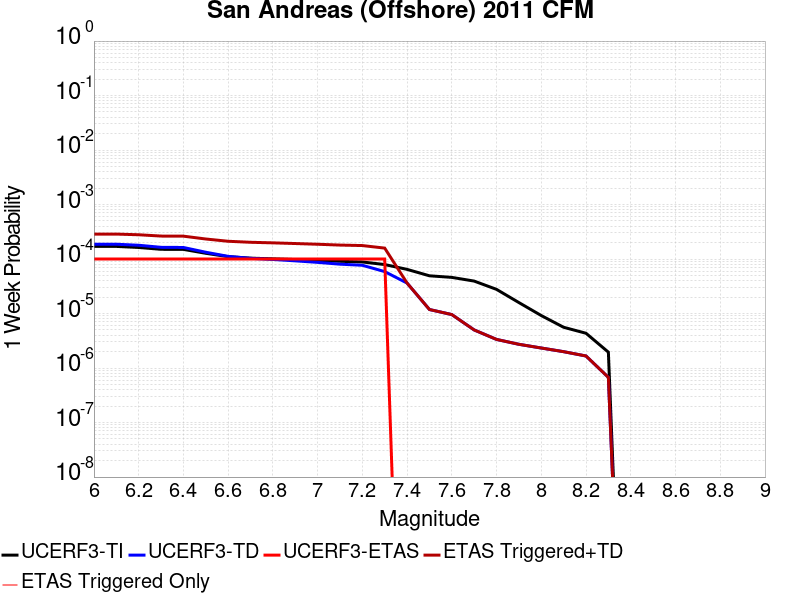 | 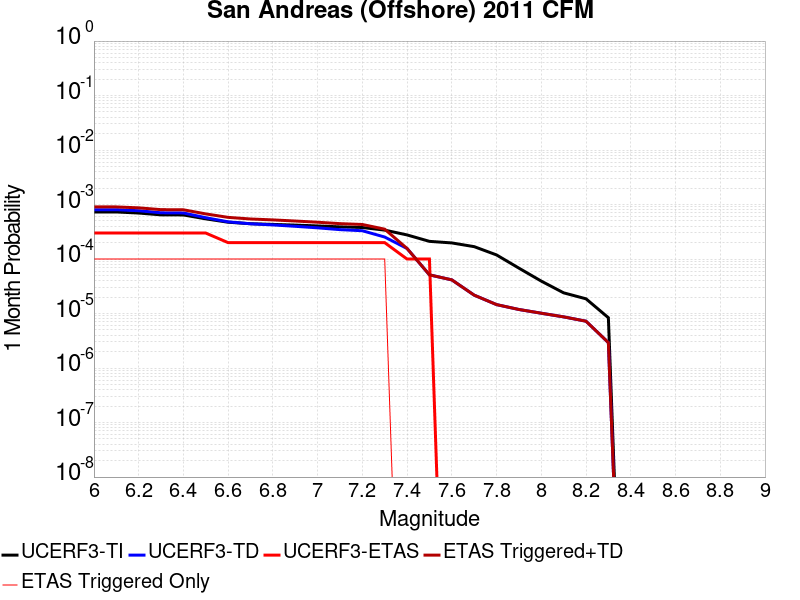 | 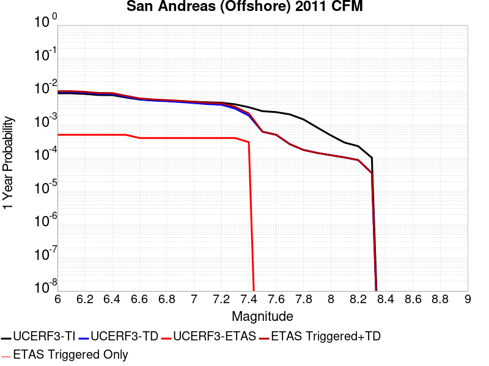 | 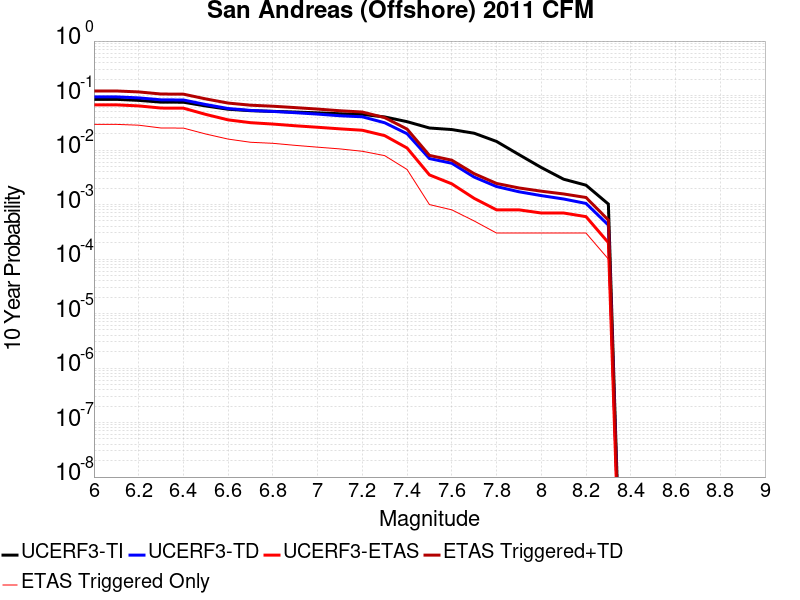 |

| Magnitude | 1 wk TI Prob | 1 wk TD Prob | 1 wk ETAS Prob | 1 wk ETAS/TD Gain | 1 wk ETAS Triggered+TD | 1 wk ETAS Triggered Only | 1 mo TI Prob | 1 mo TD Prob | 1 mo ETAS Prob | 1 mo ETAS/TD Gain | 1 mo ETAS Triggered+TD | 1 mo ETAS Triggered Only | 1 yr TI Prob | 1 yr TD Prob | 1 yr ETAS Prob | 1 yr ETAS/TD Gain | 1 yr ETAS Triggered+TD | 1 yr ETAS Triggered Only | 10 yr TI Prob | 10 yr TD Prob | 10 yr ETAS Prob | 10 yr ETAS/TD Gain | 10 yr ETAS Triggered+TD | 10 yr ETAS Triggered Only |
|-----|-----|-----|-----|-----|-----|-----|-----|-----|-----|-----|-----|-----|-----|-----|-----|-----|-----|-----|-----|-----|-----|-----|-----|-----|
| 6.0 | 1.7072787E-4 | 1.8788998E-4 | 1.0E-4 | 0.5322264 | 2.878712E-4 | 1.0E-4 | 7.3148566E-4 | 8.049966E-4 | 3.0E-4 | 0.37267238 | 9.049161E-4 | 1.0E-4 | 0.008869528 | 0.009757282 | 0.0065 | 0.6661691 | 0.012529962 | 0.0028 | 0.085237645 | 0.09488444 | 0.0675 | 0.7113916 | 0.121675864 | 0.0296 |
| 6.1 | 1.7072787E-4 | 1.8788998E-4 | 1.0E-4 | 0.5322264 | 2.878712E-4 | 1.0E-4 | 7.3148566E-4 | 8.049966E-4 | 3.0E-4 | 0.37267238 | 9.049161E-4 | 1.0E-4 | 0.008869528 | 0.009757282 | 0.0065 | 0.6661691 | 0.012529962 | 0.0028 | 0.085237645 | 0.09488444 | 0.0675 | 0.7113916 | 0.121675864 | 0.0296 |
| 6.2 | 1.6312556E-4 | 1.7988299E-4 | 1.0E-4 | 0.5559169 | 2.79865E-4 | 1.0E-4 | 6.989222E-4 | 7.707017E-4 | 3.0E-4 | 0.38925567 | 8.7062456E-4 | 1.0E-4 | 0.008476226 | 0.009343399 | 0.0063 | 0.67427284 | 0.012117237 | 0.0028 | 0.08160117 | 0.09097799 | 0.0646 | 0.71006185 | 0.11697602 | 0.0286 |
| 6.3 | 1.5103363E-4 | 1.6488209E-4 | 1.0E-4 | 0.606494 | 2.648656E-4 | 1.0E-4 | 6.471264E-4 | 7.064483E-4 | 3.0E-4 | 0.42465955 | 8.063776E-4 | 1.0E-4 | 0.007850339 | 0.008567513 | 0.0059 | 0.6886479 | 0.011046095 | 0.0025 | 0.075787395 | 0.08371411 | 0.059 | 0.7047796 | 0.106987774 | 0.0254 |
| 6.4 | 1.5047993E-4 | 1.6374406E-4 | 1.0E-4 | 0.6107092 | 2.6372768E-4 | 1.0E-4 | 6.4475456E-4 | 7.015736E-4 | 3.0E-4 | 0.42761016 | 8.015034E-4 | 1.0E-4 | 0.007821669 | 0.008508627 | 0.0059 | 0.6934138 | 0.010987356 | 0.0025 | 0.0755203 | 0.08319424 | 0.0587 | 0.7055777 | 0.106389426 | 0.0253 |
| 6.5 | 1.2760791E-4 | 1.3392228E-4 | 1.0E-4 | 0.7467018 | 2.3390888E-4 | 1.0E-4 | 5.467764E-4 | 5.738277E-4 | 3.0E-4 | 0.52280504 | 6.737703E-4 | 1.0E-4 | 0.0066367025 | 0.0069642337 | 0.0042 | 0.60308146 | 0.008950305 | 0.002 | 0.064419635 | 0.06866497 | 0.0451 | 0.65681237 | 0.08701227 | 0.0197 |
| 6.6 | 1.1063525E-4 | 1.1251009E-4 | 1.0E-4 | 0.88880914 | 2.1249884E-4 | 1.0E-4 | 4.740649E-4 | 4.82098E-4 | 2.0E-4 | 0.4148534 | 5.820498E-4 | 1.0E-4 | 0.0057564764 | 0.005853939 | 0.0027 | 0.46122792 | 0.0070469137 | 0.0012 | 0.05609626 | 0.05804642 | 0.0358 | 0.6167478 | 0.07302348 | 0.0159 |
| 6.7 | 1.0391049E-4 | 1.03543854E-4 | 1.0E-4 | 0.96577436 | 2.035335E-4 | 1.0E-4 | 4.4525467E-4 | 4.4368487E-4 | 2.0E-4 | 0.45077038 | 5.436405E-4 | 1.0E-4 | 0.0054075094 | 0.005388662 | 0.0025 | 0.46393704 | 0.006482735 | 0.0011 | 0.052778035 | 0.053603534 | 0.0318 | 0.5932445 | 0.06675845 | 0.0139 |
| 6.8 | 1.0096706E-4 | 9.873078E-5 | 1.0E-4 | 1.0128554 | 1.9872091E-4 | 1.0E-4 | 4.3264418E-4 | 4.230642E-4 | 2.0E-4 | 0.47274148 | 5.230219E-4 | 1.0E-4 | 0.0052547283 | 0.00513881 | 0.0023 | 0.44757447 | 0.006133671 | 0.001 | 0.051321987 | 0.051328793 | 0.03 | 0.5844673 | 0.06394612 | 0.0133 |
| 6.9 | 9.800265E-5 | 9.309545E-5 | 1.0E-4 | 1.0741663 | 1.9308615E-4 | 1.0E-4 | 4.1994374E-4 | 3.9892035E-4 | 2.0E-4 | 0.5013532 | 4.9888046E-4 | 1.0E-4 | 0.0051008356 | 0.004846199 | 0.0022 | 0.45396402 | 0.005841353 | 0.001 | 0.049853306 | 0.048679516 | 0.0279 | 0.5731363 | 0.060285624 | 0.0122 |
| 7.0 | 9.4642375E-5 | 8.730125E-5 | 1.0E-4 | 1.1454589 | 1.8729252E-4 | 1.0E-4 | 4.0554712E-4 | 3.740954E-4 | 2.0E-4 | 0.53462297 | 4.7405798E-4 | 1.0E-4 | 0.004926363 | 0.0045452532 | 0.0022 | 0.48402143 | 0.005540708 | 0.001 | 0.048185747 | 0.045889534 | 0.0262 | 0.57093626 | 0.056670982 | 0.0113 |
| 7.1 | 9.0996844E-5 | 8.090374E-5 | 1.0E-4 | 1.2360368 | 1.8089564E-4 | 1.0E-4 | 3.8992817E-4 | 3.4668506E-4 | 2.0E-4 | 0.5768925 | 4.4665037E-4 | 1.0E-4 | 0.004737046 | 0.0042128693 | 0.0021 | 0.4984726 | 0.0052086567 | 0.001 | 0.04637333 | 0.04277487 | 0.0245 | 0.5727662 | 0.052825734 | 0.0105 |
| 7.2 | 8.848287E-5 | 7.724345E-5 | 1.0E-4 | 1.2946081 | 1.7723572E-4 | 1.0E-4 | 3.791572E-4 | 3.3100217E-4 | 2.0E-4 | 0.60422564 | 4.3096908E-4 | 1.0E-4 | 0.004606472 | 0.0040226504 | 0.0019 | 0.4723254 | 0.0050186277 | 0.001 | 0.045121472 | 0.04094475 | 0.0231 | 0.56417483 | 0.050055776 | 0.0095 |
| 7.3 | 7.9280784E-5 | 5.9151804E-5 | 1.0E-4 | 1.6905655 | 1.5914589E-4 | 1.0E-4 | 3.3973053E-4 | 2.5348365E-4 | 2.0E-4 | 0.7890055 | 3.534583E-4 | 1.0E-4 | 0.004128377 | 0.0030818924 | 0.0016 | 0.5191615 | 0.0040788106 | 0.001 | 0.040525194 | 0.031847615 | 0.0184 | 0.5777513 | 0.039496016 | 0.0079 |
| 7.4 | 6.468038E-5 | 3.6469926E-5 | 0.0 | 0.0 | 3.6469926E-5 | 0.0 | 2.771722E-4 | 1.5629063E-4 | 1.0E-4 | 0.6398337 | 1.5629063E-4 | 0.0 | 0.0033693502 | 0.0019012319 | 9.0E-4 | 0.4733773 | 0.0025000912 | 6.0E-4 | 0.0331872 | 0.02006188 | 0.0109 | 0.543319 | 0.024373608 | 0.0044 |
| 7.5 | 4.930574E-5 | 1.1981234E-5 | 0.0 | 0.0 | 1.1981234E-5 | 0.0 | 2.1129321E-4 | 5.1347146E-5 | 1.0E-4 | 1.947528 | 5.1347146E-5 | 0.0 | 0.0025694598 | 6.249737E-4 | 2.0E-4 | 0.3200135 | 7.2491117E-4 | 1.0E-4 | 0.02539953 | 0.0070586544 | 0.0035 | 0.4958452 | 0.008051596 | 0.001 |
| 7.6 | 4.612566E-5 | 9.685278E-6 | 0.0 | 0.0 | 9.685278E-6 | 0.0 | 1.9766642E-4 | 4.1507683E-5 | 0.0 | 0.0 | 4.1507683E-5 | 0.0 | 0.0024039324 | 5.052401E-4 | 1.0E-4 | 0.19792569 | 6.051896E-4 | 1.0E-4 | 0.023780935 | 0.0057867896 | 0.0024 | 0.41473773 | 0.0065821605 | 8.0E-4 |
| 7.7 | 3.9435414E-5 | 5.0818167E-6 | 0.0 | 0.0 | 5.0818167E-6 | 0.0 | 1.6899795E-4 | 2.1779033E-5 | 0.0 | 0.0 | 2.1779033E-5 | 0.0 | 0.0020556084 | 2.6512763E-4 | 1.0E-4 | 0.37717685 | 3.6510112E-4 | 1.0E-4 | 0.020366974 | 0.0032383797 | 0.0013 | 0.40143532 | 0.0037367605 | 5.0E-4 |
| 7.8 | 2.7787428E-5 | 3.4085647E-6 | 0.0 | 0.0 | 3.4085647E-6 | 0.0 | 1.1908354E-4 | 1.4608052E-5 | 0.0 | 0.0 | 1.4608052E-5 | 0.0 | 0.0014488777 | 1.7783855E-4 | 0.0 | 0.0 | 1.7783855E-4 | 0.0 | 0.014394675 | 0.0021755663 | 8.0E-4 | 0.36772034 | 0.0024749136 | 3.0E-4 |
| 7.9 | 1.590671E-5 | 2.771042E-6 | 0.0 | 0.0 | 2.771042E-6 | 0.0 | 6.816983E-5 | 1.1875841E-5 | 0.0 | 0.0 | 1.1875841E-5 | 0.0 | 8.2965166E-4 | 1.445788E-4 | 0.0 | 0.0 | 1.445788E-4 | 0.0 | 0.008265611 | 0.0017431267 | 8.0E-4 | 0.45894542 | 0.0020426037 | 3.0E-4 |
| 8.0 | 9.193638E-6 | 2.3671562E-6 | 0.0 | 0.0 | 2.3671562E-6 | 0.0 | 3.940071E-5 | 1.0144915E-5 | 0.0 | 0.0 | 1.0144915E-5 | 0.0 | 4.7959806E-4 | 1.2350736E-4 | 0.0 | 0.0 | 1.2350736E-4 | 0.0 | 0.0047856434 | 0.0014800847 | 7.0E-4 | 0.4729459 | 0.0017796407 | 3.0E-4 |
| 8.1 | 5.601576E-6 | 2.0290495E-6 | 0.0 | 0.0 | 2.0290495E-6 | 0.0 | 2.4006533E-5 | 8.695897E-6 | 0.0 | 0.0 | 8.695897E-6 | 0.0 | 2.9224035E-4 | 1.05867424E-4 | 0.0 | 0.0 | 1.05867424E-4 | 0.0 | 0.0029185633 | 0.0012829766 | 7.0E-4 | 0.5456062 | 0.0015825917 | 3.0E-4 |
| 8.2 | 4.3508785E-6 | 1.689455E-6 | 0.0 | 0.0 | 1.689455E-6 | 0.0 | 1.864649E-5 | 7.2405014E-6 | 0.0 | 0.0 | 7.2405014E-6 | 0.0 | 2.2699735E-4 | 8.814956E-5 | 0.0 | 0.0 | 8.814956E-5 | 0.0 | 0.0022676561 | 0.0010627359 | 6.0E-4 | 0.56458056 | 0.001362417 | 3.0E-4 |
| 8.3 | 1.9573292E-6 | 6.8427966E-7 | 0.0 | 0.0 | 6.8427966E-7 | 0.0 | 8.388526E-6 | 2.932624E-6 | 0.0 | 0.0 | 2.932624E-6 | 0.0 | 1.0212552E-4 | 3.5704124E-5 | 0.0 | 0.0 | 3.5704124E-5 | 0.0 | 0.001020786 | 4.2527242E-4 | 2.0E-4 | 0.47028682 | 5.252299E-4 | 1.0E-4 |

## San Andreas (Cholame) rev
*[(top)](#table-of-contents)*

| 1 Week | 1 Month | 1 Year | 10 Year |
|-----|-----|-----|-----|
| 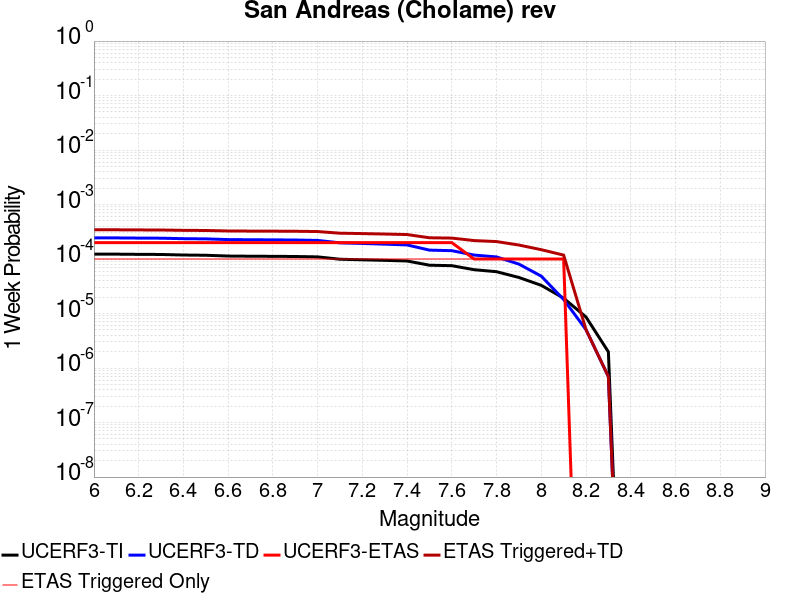 | 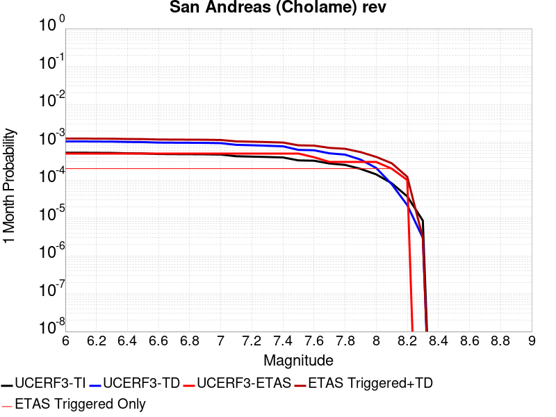 | 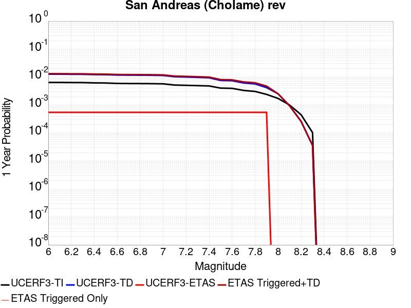 | 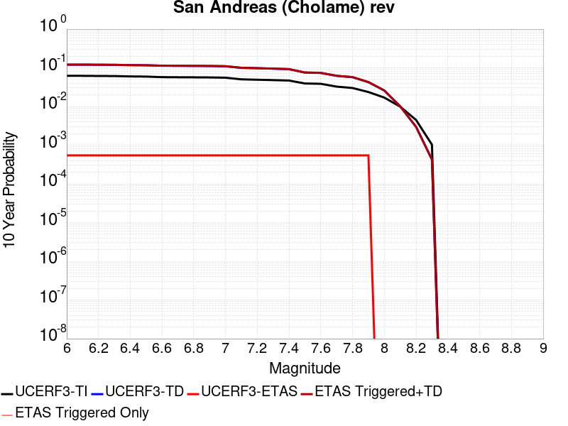 |

| Magnitude | 1 wk TI Prob | 1 wk TD Prob | 1 wk ETAS Prob | 1 wk ETAS/TD Gain | 1 wk ETAS Triggered+TD | 1 wk ETAS Triggered Only | 1 mo TI Prob | 1 mo TD Prob | 1 mo ETAS Prob | 1 mo ETAS/TD Gain | 1 mo ETAS Triggered+TD | 1 mo ETAS Triggered Only | 1 yr TI Prob | 1 yr TD Prob | 1 yr ETAS Prob | 1 yr ETAS/TD Gain | 1 yr ETAS Triggered+TD | 1 yr ETAS Triggered Only | 10 yr TI Prob | 10 yr TD Prob | 10 yr ETAS Prob | 10 yr ETAS/TD Gain | 10 yr ETAS Triggered+TD | 10 yr ETAS Triggered Only |
|-----|-----|-----|-----|-----|-----|-----|-----|-----|-----|-----|-----|-----|-----|-----|-----|-----|-----|-----|-----|-----|-----|-----|-----|-----|
| 6.0 | 1.2302514E-4 | 2.443905E-4 | 2.0E-4 | 0.81836236 | 3.443661E-4 | 1.0E-4 | 5.27144E-4 | 0.0010469691 | 5.0E-4 | 0.477569 | 0.0012467597 | 2.0E-4 | 0.0063991086 | 0.012672823 | 0.0078 | 0.6154903 | 0.015634805 | 0.003 | 0.06217949 | 0.12118142 | 0.0815 | 0.6725453 | 0.14728233 | 0.0297 |
| 6.1 | 1.2302514E-4 | 2.443905E-4 | 2.0E-4 | 0.81836236 | 3.443661E-4 | 1.0E-4 | 5.27144E-4 | 0.0010469691 | 5.0E-4 | 0.477569 | 0.0012467597 | 2.0E-4 | 0.0063991086 | 0.012672823 | 0.0078 | 0.6154903 | 0.015634805 | 0.003 | 0.06217949 | 0.12118142 | 0.0815 | 0.6725453 | 0.14728233 | 0.0297 |
| 6.2 | 1.2203569E-4 | 2.4256832E-4 | 2.0E-4 | 0.82451 | 3.4254405E-4 | 1.0E-4 | 5.2290526E-4 | 0.0010391659 | 5.0E-4 | 0.48115513 | 0.0012389581 | 2.0E-4 | 0.006347804 | 0.0125789195 | 0.0077 | 0.61213523 | 0.015442441 | 0.0029 | 0.061695136 | 0.12036795 | 0.0811 | 0.6737674 | 0.14622913 | 0.0294 |
| 6.3 | 1.2142645E-4 | 2.4143397E-4 | 2.0E-4 | 0.82838386 | 3.4140982E-4 | 1.0E-4 | 5.202953E-4 | 0.0010343082 | 5.0E-4 | 0.4834149 | 0.0012341014 | 2.0E-4 | 0.006316212 | 0.0125204595 | 0.0077 | 0.61499345 | 0.01538415 | 0.0029 | 0.06139677 | 0.119861625 | 0.081 | 0.6757792 | 0.14564969 | 0.0293 |
| 6.4 | 1.1865206E-4 | 2.36538E-4 | 2.0E-4 | 0.8455301 | 3.3651435E-4 | 1.0E-4 | 5.0840975E-4 | 0.001013342 | 5.0E-4 | 0.49341685 | 0.0012131393 | 2.0E-4 | 0.006172335 | 0.012268093 | 0.0077 | 0.62764436 | 0.015132517 | 0.0029 | 0.060036868 | 0.11767016 | 0.0797 | 0.677317 | 0.14272833 | 0.0284 |
| 6.5 | 1.17443946E-4 | 2.3450455E-4 | 2.0E-4 | 0.8528619 | 3.344811E-4 | 1.0E-4 | 5.032341E-4 | 0.001004634 | 5.0E-4 | 0.49769375 | 0.001204433 | 2.0E-4 | 0.006109677 | 0.012163259 | 0.0075 | 0.61661106 | 0.015027985 | 0.0029 | 0.059444077 | 0.11675669 | 0.0789 | 0.67576426 | 0.14166416 | 0.0282 |
| 6.6 | 1.13579066E-4 | 2.2769204E-4 | 2.0E-4 | 0.8783794 | 3.2766926E-4 | 1.0E-4 | 4.866766E-4 | 9.754596E-4 | 5.0E-4 | 0.5125789 | 0.0011752645 | 2.0E-4 | 0.0059092017 | 0.011811963 | 0.0072 | 0.6095515 | 0.014480071 | 0.0027 | 0.057545185 | 0.11370243 | 0.0761 | 0.6692909 | 0.13798699 | 0.0274 |
| 6.7 | 1.1271412E-4 | 2.261541E-4 | 2.0E-4 | 0.8843528 | 3.2613147E-4 | 1.0E-4 | 4.829711E-4 | 9.6887327E-4 | 5.0E-4 | 0.5160634 | 0.0011686794 | 2.0E-4 | 0.005864331 | 0.011732642 | 0.0072 | 0.61367255 | 0.014400964 | 0.0027 | 0.057119697 | 0.11301033 | 0.0755 | 0.6680805 | 0.13704775 | 0.0271 |
| 6.8 | 1.1217975E-4 | 2.2505703E-4 | 2.0E-4 | 0.88866365 | 3.2503452E-4 | 1.0E-4 | 4.8068175E-4 | 9.6417504E-4 | 5.0E-4 | 0.51857805 | 0.0011639822 | 2.0E-4 | 0.005836608 | 0.011676055 | 0.0072 | 0.6166466 | 0.01434453 | 0.0027 | 0.056856725 | 0.1125135 | 0.0753 | 0.66925305 | 0.13647564 | 0.027 |
| 6.9 | 1.1146753E-4 | 2.2356493E-4 | 2.0E-4 | 0.8945947 | 3.2354257E-4 | 1.0E-4 | 4.7763053E-4 | 9.57785E-4 | 5.0E-4 | 0.5220378 | 0.0011575934 | 2.0E-4 | 0.0057996577 | 0.011599088 | 0.0071 | 0.61211705 | 0.014267771 | 0.0027 | 0.056506127 | 0.111840345 | 0.0748 | 0.66881055 | 0.1354654 | 0.0266 |
| 7.0 | 1.0965793E-4 | 2.198592E-4 | 2.0E-4 | 0.9096731 | 3.198372E-4 | 1.0E-4 | 4.698779E-4 | 9.419149E-4 | 5.0E-4 | 0.53083354 | 0.0011417265 | 2.0E-4 | 0.005705768 | 0.011407909 | 0.0071 | 0.6223752 | 0.014077108 | 0.0027 | 0.055614736 | 0.11016121 | 0.0739 | 0.6708351 | 0.13356397 | 0.0263 |
| 7.1 | 9.927982E-5 | 1.9833326E-4 | 2.0E-4 | 1.0084037 | 2.9831342E-4 | 1.0E-4 | 4.2541555E-4 | 8.497238E-4 | 5.0E-4 | 0.58842653 | 0.0010495539 | 2.0E-4 | 0.0051671406 | 0.010296586 | 0.0062 | 0.6021413 | 0.012572904 | 0.0023 | 0.05048634 | 0.100334436 | 0.0662 | 0.6597934 | 0.12111671 | 0.0231 |
| 7.2 | 9.696786E-5 | 1.9342742E-4 | 2.0E-4 | 1.0339797 | 2.9340808E-4 | 1.0E-4 | 4.1551032E-4 | 8.2871225E-4 | 5.0E-4 | 0.60334575 | 0.0010285465 | 2.0E-4 | 0.00504711 | 0.010043155 | 0.0062 | 0.61733586 | 0.012320057 | 0.0023 | 0.04934009 | 0.098083615 | 0.0647 | 0.65964127 | 0.11855712 | 0.0227 |
| 7.3 | 9.4727984E-5 | 1.8783515E-4 | 2.0E-4 | 1.0647634 | 2.8781637E-4 | 1.0E-4 | 4.0591392E-4 | 8.047604E-4 | 5.0E-4 | 0.62130296 | 0.0010045994 | 2.0E-4 | 0.0049308087 | 0.009754189 | 0.0061 | 0.6253723 | 0.0120317545 | 0.0023 | 0.048228268 | 0.09548677 | 0.0631 | 0.66082454 | 0.11547651 | 0.0221 |
| 7.4 | 9.220358E-5 | 1.8167321E-4 | 2.0E-4 | 1.1008778 | 2.8165506E-4 | 1.0E-4 | 3.9509835E-4 | 7.7836803E-4 | 5.0E-4 | 0.6423696 | 9.782123E-4 | 2.0E-4 | 0.004799717 | 0.009435683 | 0.006 | 0.63588405 | 0.011713981 | 0.0023 | 0.046973653 | 0.09261491 | 0.0606 | 0.65432227 | 0.11194222 | 0.0213 |
| 7.5 | 7.71631E-5 | 1.4588078E-4 | 2.0E-4 | 1.3709825 | 2.458662E-4 | 1.0E-4 | 3.306571E-4 | 6.250537E-4 | 5.0E-4 | 0.7999312 | 8.249287E-4 | 2.0E-4 | 0.0040183207 | 0.00758354 | 0.0049 | 0.6461362 | 0.009270648 | 0.0017 | 0.03946433 | 0.075632 | 0.048 | 0.634652 | 0.09097651 | 0.0166 |
| 7.6 | 7.5634416E-5 | 1.4255154E-4 | 2.0E-4 | 1.4030013 | 2.4253728E-4 | 1.0E-4 | 3.241072E-4 | 6.107923E-4 | 4.0E-4 | 0.65488714 | 8.1067014E-4 | 2.0E-4 | 0.0039388672 | 0.007411101 | 0.0047 | 0.63418376 | 0.009098502 | 0.0017 | 0.038697794 | 0.0740237 | 0.0468 | 0.63223 | 0.089209706 | 0.0164 |
| 7.7 | 6.3783E-5 | 1.18372816E-4 | 1.0E-4 | 0.84478855 | 2.1836098E-4 | 1.0E-4 | 2.7332708E-4 | 5.0721347E-4 | 3.0E-4 | 0.5914669 | 7.07112E-4 | 2.0E-4 | 0.0033226798 | 0.006157862 | 0.004 | 0.6495761 | 0.0077480096 | 0.0016 | 0.032734364 | 0.062154178 | 0.0378 | 0.6081651 | 0.074721314 | 0.0134 |
| 7.8 | 5.863422E-5 | 1.0941851E-4 | 1.0E-4 | 0.9139221 | 2.0940758E-4 | 1.0E-4 | 2.512653E-4 | 4.6885226E-4 | 3.0E-4 | 0.6398604 | 6.6875847E-4 | 2.0E-4 | 0.003054864 | 0.005693354 | 0.0038 | 0.6674449 | 0.0070853834 | 0.0014 | 0.030132094 | 0.057480242 | 0.0349 | 0.60716516 | 0.06907324 | 0.0123 |
| 7.9 | 4.595283E-5 | 8.0794285E-5 | 1.0E-4 | 1.2377113 | 1.8078621E-4 | 1.0E-4 | 1.9692584E-4 | 3.462153E-4 | 3.0E-4 | 0.86651284 | 5.4614607E-4 | 2.0E-4 | 0.0023949358 | 0.00420703 | 0.003 | 0.7130921 | 0.005302402 | 0.0011 | 0.023692891 | 0.04271993 | 0.0273 | 0.639046 | 0.052101273 | 0.0098 |
| 8.0 | 3.2950178E-5 | 4.8598806E-5 | 1.0E-4 | 2.0576637 | 1.4859394E-4 | 1.0E-4 | 1.412074E-4 | 2.0826398E-4 | 3.0E-4 | 1.4404795 | 4.0822232E-4 | 2.0E-4 | 0.0017178444 | 0.002532667 | 0.0018 | 0.7107132 | 0.0032308942 | 7.0E-4 | 0.017046256 | 0.026106775 | 0.0166 | 0.63585025 | 0.032047525 | 0.0061 |
| 8.1 | 1.9177472E-5 | 1.8116843E-5 | 1.0E-4 | 5.5197253 | 1.1811503E-4 | 1.0E-4 | 8.218658E-5 | 7.764131E-5 | 2.0E-4 | 2.5759485 | 2.7762578E-4 | 2.0E-4 | 0.0010001622 | 9.448735E-4 | 6.0E-4 | 0.63500565 | 0.00124459 | 3.0E-4 | 0.009956728 | 0.010196007 | 0.0068 | 0.66692775 | 0.012769497 | 0.0026 |
| 8.2 | 8.643924E-6 | 5.06885E-6 | 0.0 | 0.0 | 5.06885E-6 | 0.0 | 3.704486E-5 | 2.1723463E-5 | 1.0E-4 | 4.6033177 | 1.2172129E-4 | 1.0E-4 | 4.5092785E-4 | 2.6445114E-4 | 2.0E-4 | 0.7562834 | 3.644247E-4 | 1.0E-4 | 0.0045001395 | 0.0030259273 | 0.0022 | 0.7270499 | 0.003723809 | 7.0E-4 |
| 8.3 | 1.983087E-6 | 6.9765395E-7 | 0.0 | 0.0 | 6.9765395E-7 | 0.0 | 8.498917E-6 | 2.9899422E-6 | 0.0 | 0.0 | 2.9899422E-6 | 0.0 | 1.034694E-4 | 3.640195E-5 | 0.0 | 0.0 | 3.640195E-5 | 0.0 | 0.0010342124 | 4.3255524E-4 | 2.0E-4 | 0.46236867 | 5.32512E-4 | 1.0E-4 |

## Calaveras (Central) 2011 CFM
*[(top)](#table-of-contents)*

| 1 Week | 1 Month | 1 Year | 10 Year |
|-----|-----|-----|-----|
| 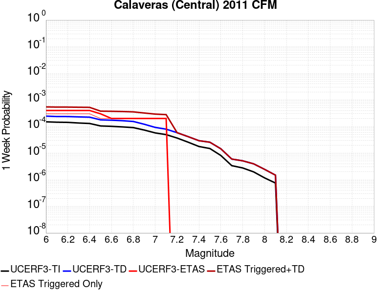 |  | 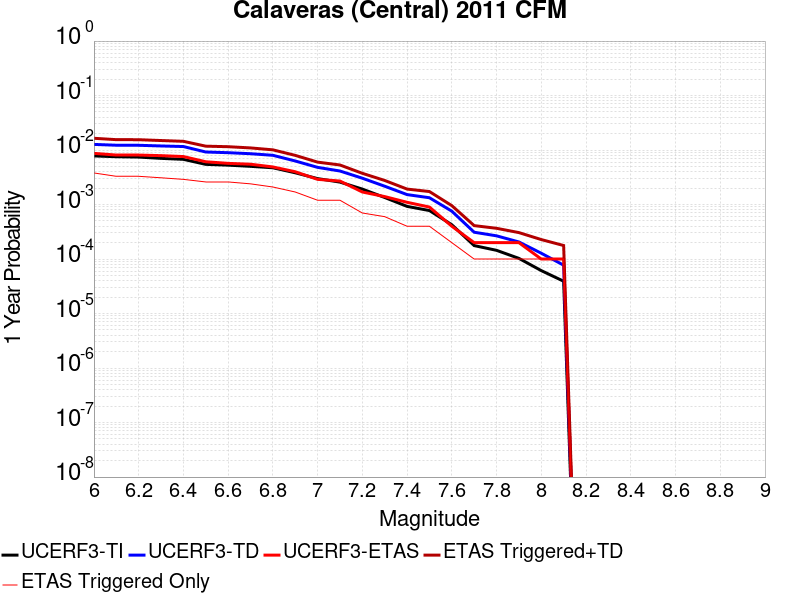 | 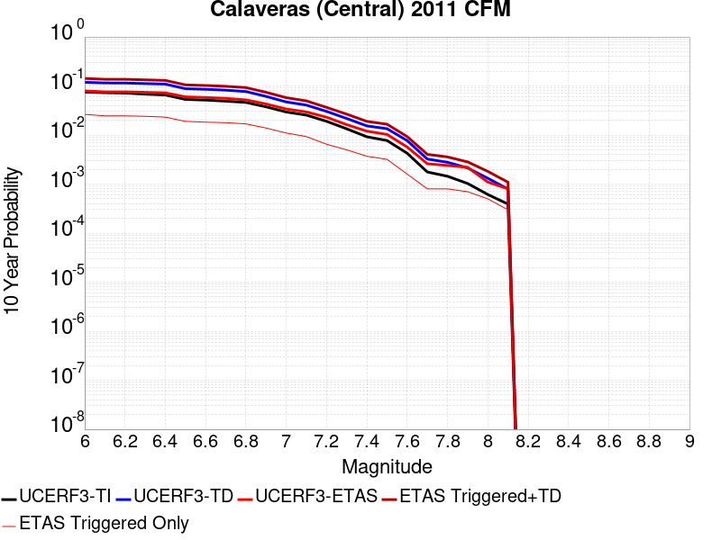 |

| Magnitude | 1 wk TI Prob | 1 wk TD Prob | 1 wk ETAS Prob | 1 wk ETAS/TD Gain | 1 wk ETAS Triggered+TD | 1 wk ETAS Triggered Only | 1 mo TI Prob | 1 mo TD Prob | 1 mo ETAS Prob | 1 mo ETAS/TD Gain | 1 mo ETAS Triggered+TD | 1 mo ETAS Triggered Only | 1 yr TI Prob | 1 yr TD Prob | 1 yr ETAS Prob | 1 yr ETAS/TD Gain | 1 yr ETAS Triggered+TD | 1 yr ETAS Triggered Only | 10 yr TI Prob | 10 yr TD Prob | 10 yr ETAS Prob | 10 yr ETAS/TD Gain | 10 yr ETAS Triggered+TD | 10 yr ETAS Triggered Only |
|-----|-----|-----|-----|-----|-----|-----|-----|-----|-----|-----|-----|-----|-----|-----|-----|-----|-----|-----|-----|-----|-----|-----|-----|-----|
| 6.0 | 1.5010907E-4 | 2.4544963E-4 | 4.0E-4 | 1.6296623 | 5.45376E-4 | 3.0E-4 | 6.4316596E-4 | 0.0010513924 | 0.001 | 0.9511197 | 0.0016507615 | 6.0E-4 | 0.0078024664 | 0.012716977 | 0.0087 | 0.6841248 | 0.016468653 | 0.0038 | 0.07534136 | 0.119297616 | 0.0796 | 0.66723883 | 0.14254816 | 0.0264 |
| 6.1 | 1.4521465E-4 | 2.3709307E-4 | 4.0E-4 | 1.6871011 | 5.3702196E-4 | 3.0E-4 | 6.222001E-4 | 0.0010156208 | 9.0E-4 | 0.8861576 | 0.0016150114 | 6.0E-4 | 0.0075490056 | 0.01228778 | 0.0081 | 0.6591915 | 0.015547231 | 0.0033 | 0.07297657 | 0.11557705 | 0.0759 | 0.6567048 | 0.13733386 | 0.0246 |
| 6.2 | 1.429998E-4 | 2.3643125E-4 | 4.0E-4 | 1.6918237 | 5.363603E-4 | 3.0E-4 | 6.127123E-4 | 0.0010127869 | 9.0E-4 | 0.8886371 | 0.0016121792 | 6.0E-4 | 0.007434286 | 0.012253713 | 0.0081 | 0.66102415 | 0.015513276 | 0.0033 | 0.07190444 | 0.11524468 | 0.0758 | 0.657731 | 0.13700967 | 0.0246 |
| 6.3 | 1.3536277E-4 | 2.298372E-4 | 4.0E-4 | 1.7403623 | 5.2976824E-4 | 3.0E-4 | 5.799972E-4 | 9.845498E-4 | 8.0E-4 | 0.8125542 | 0.0014840575 | 5.0E-4 | 0.0070386264 | 0.011914644 | 0.0079 | 0.6630496 | 0.014977708 | 0.0031 | 0.0681982 | 0.11219911 | 0.0743 | 0.6622156 | 0.13359511 | 0.0241 |
| 6.4 | 1.2993296E-4 | 2.2418803E-4 | 4.0E-4 | 1.7842166 | 5.2412075E-4 | 3.0E-4 | 5.5673666E-4 | 9.603574E-4 | 7.0E-4 | 0.72889525 | 0.0013599733 | 4.0E-4 | 0.006757223 | 0.011623348 | 0.0076 | 0.65385634 | 0.0144896405 | 0.0029 | 0.06555412 | 0.109525286 | 0.0725 | 0.6619476 | 0.1301843 | 0.0232 |
| 6.5 | 1.0498927E-4 | 1.7770223E-4 | 3.0E-4 | 1.6882174 | 3.776667E-4 | 2.0E-4 | 4.498764E-4 | 7.613576E-4 | 5.0E-4 | 0.65672165 | 0.0010611292 | 3.0E-4 | 0.005463498 | 0.0092300465 | 0.0061 | 0.6608851 | 0.011806048 | 0.0026 | 0.053311124 | 0.088270396 | 0.0601 | 0.6808625 | 0.10559326 | 0.019 |
| 6.6 | 1.0157505E-4 | 1.7261496E-4 | 2.0E-4 | 1.1586481 | 3.7258043E-4 | 2.0E-4 | 4.35249E-4 | 7.395678E-4 | 4.0E-4 | 0.5408564 | 0.001039346 | 3.0E-4 | 0.0052862884 | 0.008967002 | 0.0057 | 0.635664 | 0.011543687 | 0.0026 | 0.05162293 | 0.08586156 | 0.0583 | 0.679 | 0.10259029 | 0.0183 |
| 6.7 | 9.660386E-5 | 1.6526728E-4 | 2.0E-4 | 1.2101609 | 3.6523424E-4 | 2.0E-4 | 4.1395082E-4 | 7.080952E-4 | 4.0E-4 | 0.5648958 | 0.0010078828 | 3.0E-4 | 0.0050282106 | 0.008586943 | 0.0055 | 0.6405073 | 0.0109663345 | 0.0024 | 0.049159497 | 0.08237361 | 0.056 | 0.67982936 | 0.098799124 | 0.0179 |
| 6.8 | 9.089927E-5 | 1.5451256E-4 | 2.0E-4 | 1.2943932 | 3.5448166E-4 | 2.0E-4 | 3.8951015E-4 | 6.62028E-4 | 4.0E-4 | 0.60420406 | 9.618294E-4 | 3.0E-4 | 0.0047319788 | 0.00803037 | 0.0049 | 0.6101836 | 0.010113507 | 0.0021 | 0.046324775 | 0.07730841 | 0.0522 | 0.6752176 | 0.0929019 | 0.0169 |
| 6.9 | 7.353187E-5 | 1.21389705E-4 | 2.0E-4 | 1.6475861 | 3.2136543E-4 | 2.0E-4 | 3.150985E-4 | 5.201385E-4 | 4.0E-4 | 0.769026 | 8.1998244E-4 | 3.0E-4 | 0.0038295772 | 0.006314416 | 0.004 | 0.63347113 | 0.008003681 | 0.0017 | 0.037642512 | 0.061467934 | 0.043 | 0.69955176 | 0.07451353 | 0.0139 |
| 7.0 | 5.746064E-5 | 9.2639624E-5 | 2.0E-4 | 2.1589034 | 2.926211E-4 | 2.0E-4 | 2.4623662E-4 | 3.969669E-4 | 4.0E-4 | 1.0076407 | 6.968478E-4 | 3.0E-4 | 0.0029938098 | 0.004822431 | 0.0029 | 0.60135645 | 0.006016644 | 0.0012 | 0.02953797 | 0.047399387 | 0.034 | 0.7173089 | 0.05787799 | 0.011 |
| 7.1 | 4.9557195E-5 | 7.9420795E-5 | 2.0E-4 | 2.518232 | 2.7940492E-4 | 2.0E-4 | 2.123707E-4 | 3.4033076E-4 | 4.0E-4 | 1.1753272 | 6.402287E-4 | 3.0E-4 | 0.0025825473 | 0.0041357162 | 0.0027 | 0.65284944 | 0.0053307535 | 0.0012 | 0.0255274 | 0.040848695 | 0.0296 | 0.72462535 | 0.0497688 | 0.0093 |
| 7.2 | 3.687595E-5 | 5.860752E-5 | 0.0 | 0.0 | 5.860752E-5 | 0.0 | 1.5803022E-4 | 2.5115107E-4 | 1.0E-4 | 0.39816675 | 2.5115107E-4 | 0.0 | 0.0019223199 | 0.0030535052 | 0.0017 | 0.55673724 | 0.0037513678 | 7.0E-4 | 0.01905776 | 0.030441998 | 0.0231 | 0.7588201 | 0.036744125 | 0.0065 |
| 7.3 | 2.5846984E-5 | 4.1754945E-5 | 0.0 | 0.0 | 4.1754945E-5 | 0.0 | 1.1076809E-4 | 1.7893758E-4 | 1.0E-4 | 0.5588541 | 1.7893758E-4 | 0.0 | 0.0013477671 | 0.0021764056 | 0.0014 | 0.64326245 | 0.0027750998 | 6.0E-4 | 0.013396223 | 0.021826541 | 0.0163 | 0.7467972 | 0.026717408 | 0.005 |
| 7.4 | 1.7747854E-5 | 2.9332767E-5 | 0.0 | 0.0 | 2.9332767E-5 | 0.0 | 7.6060016E-5 | 1.2570582E-4 | 1.0E-4 | 0.79550815 | 1.2570582E-4 | 0.0 | 9.2563726E-4 | 0.0015293966 | 0.0011 | 0.71923786 | 0.0019287849 | 4.0E-4 | 0.009217911 | 0.015413866 | 0.012 | 0.77851975 | 0.019056836 | 0.0037 |
| 7.5 | 1.4883479E-5 | 2.5675161E-5 | 0.0 | 0.0 | 2.5675161E-5 | 0.0 | 6.378478E-5 | 1.10031775E-4 | 1.0E-4 | 0.9088284 | 1.10031775E-4 | 0.0 | 7.76303E-4 | 0.0013388164 | 9.0E-4 | 0.6722356 | 0.0017382808 | 4.0E-4 | 0.0077359667 | 0.013523881 | 0.0103 | 0.7616157 | 0.016680604 | 0.0032 |
| 7.6 | 8.166975E-6 | 1.4557649E-5 | 0.0 | 0.0 | 1.4557649E-5 | 0.0 | 3.5000852E-5 | 6.238844E-5 | 0.0 | 0.0 | 6.238844E-5 | 0.0 | 4.2605202E-4 | 7.593158E-4 | 4.0E-4 | 0.52679 | 9.5916394E-4 | 2.0E-4 | 0.004252361 | 0.0077398284 | 0.0057 | 0.73645043 | 0.009327445 | 0.0016 |
| 7.7 | 3.3858064E-6 | 5.987491E-6 | 0.0 | 0.0 | 5.987491E-6 | 0.0 | 1.4510518E-5 | 2.5660423E-5 | 0.0 | 0.0 | 2.5660423E-5 | 0.0 | 1.7665124E-4 | 3.1237092E-4 | 2.0E-4 | 0.64026445 | 4.123397E-4 | 1.0E-4 | 0.0017651088 | 0.0032567768 | 0.0026 | 0.7983353 | 0.0040541715 | 8.0E-4 |
| 7.8 | 2.7721615E-6 | 5.13817E-6 | 0.0 | 0.0 | 5.13817E-6 | 0.0 | 1.1880637E-5 | 2.2020542E-5 | 0.0 | 0.0 | 2.2020542E-5 | 0.0 | 1.4463716E-4 | 2.6806715E-4 | 2.0E-4 | 0.7460817 | 3.6804035E-4 | 1.0E-4 | 0.0014454306 | 0.002795346 | 0.0024 | 0.8585699 | 0.0035931098 | 8.0E-4 |
| 7.9 | 1.9736292E-6 | 3.9626007E-6 | 0.0 | 0.0 | 3.9626007E-6 | 0.0 | 8.4583835E-6 | 1.6982463E-5 | 0.0 | 0.0 | 1.6982463E-5 | 0.0 | 1.0297595E-4 | 2.0674191E-4 | 2.0E-4 | 0.9673897 | 3.0672122E-4 | 1.0E-4 | 0.0010292825 | 0.002142844 | 0.0022 | 1.026673 | 0.0028413439 | 7.0E-4 |
| 8.0 | 1.1767289E-6 | 2.4601638E-6 | 0.0 | 0.0 | 2.4601638E-6 | 0.0 | 5.0431145E-6 | 1.0543517E-5 | 0.0 | 0.0 | 1.0543517E-5 | 0.0 | 6.139818E-5 | 1.2835978E-4 | 1.0E-4 | 0.7790602 | 2.2834695E-4 | 1.0E-4 | 6.1381224E-4 | 0.0013201305 | 0.0011 | 0.8332509 | 0.0018194705 | 5.0E-4 |
| 8.1 | 7.5112825E-7 | 1.4854528E-6 | 0.0 | 0.0 | 1.4854528E-6 | 0.0 | 3.2191172E-6 | 6.3662105E-6 | 0.0 | 0.0 | 6.3662105E-6 | 0.0 | 3.9192048E-5 | 7.750588E-5 | 1.0E-4 | 1.2902247 | 1.7749814E-4 | 1.0E-4 | 3.9185135E-4 | 7.962679E-4 | 8.0E-4 | 1.0046871 | 0.001096029 | 3.0E-4 |

## Laguna Salada
*[(top)](#table-of-contents)*

| 1 Week | 1 Month | 1 Year | 10 Year |
|-----|-----|-----|-----|
| 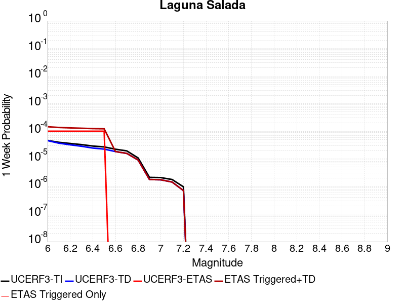 | 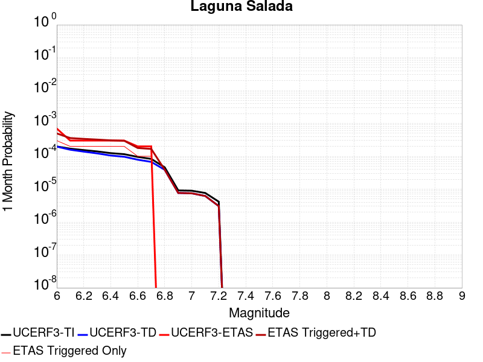 | 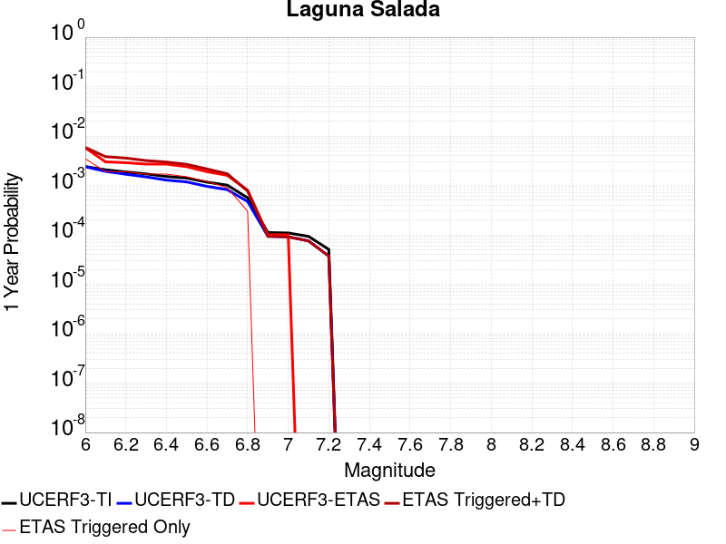 | 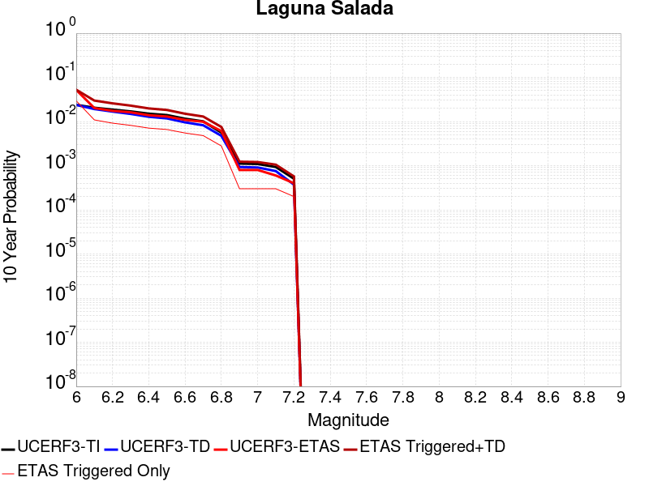 |

| Magnitude | 1 wk TI Prob | 1 wk TD Prob | 1 wk ETAS Prob | 1 wk ETAS/TD Gain | 1 wk ETAS Triggered+TD | 1 wk ETAS Triggered Only | 1 mo TI Prob | 1 mo TD Prob | 1 mo ETAS Prob | 1 mo ETAS/TD Gain | 1 mo ETAS Triggered+TD | 1 mo ETAS Triggered Only | 1 yr TI Prob | 1 yr TD Prob | 1 yr ETAS Prob | 1 yr ETAS/TD Gain | 1 yr ETAS Triggered+TD | 1 yr ETAS Triggered Only | 10 yr TI Prob | 10 yr TD Prob | 10 yr ETAS Prob | 10 yr ETAS/TD Gain | 10 yr ETAS Triggered+TD | 10 yr ETAS Triggered Only |
|-----|-----|-----|-----|-----|-----|-----|-----|-----|-----|-----|-----|-----|-----|-----|-----|-----|-----|-----|-----|-----|-----|-----|-----|-----|
| 6.0 | 4.6465593E-5 | 4.6047095E-5 | 1.0E-4 | 2.1716897 | 1.4604248E-4 | 1.0E-4 | 1.9912305E-4 | 1.973304E-4 | 7.0E-4 | 3.54735 | 4.972712E-4 | 3.0E-4 | 0.0024216278 | 0.0023999254 | 0.0058 | 2.4167418 | 0.0058915257 | 0.0035 | 0.02395408 | 0.023787132 | 0.0521 | 2.19026 | 0.05258541 | 0.0295 |
| 6.1 | 3.982297E-5 | 3.69807E-5 | 1.0E-4 | 2.7041135 | 1.36977E-4 | 1.0E-4 | 1.706587E-4 | 1.5847947E-4 | 3.0E-4 | 1.8929896 | 3.5844778E-4 | 2.0E-4 | 0.0020757897 | 0.0019278713 | 0.003 | 1.5561205 | 0.0038242084 | 0.0019 | 0.020565065 | 0.01915973 | 0.0202 | 1.0542946 | 0.029850889 | 0.0109 |
| 6.2 | 3.6067784E-5 | 3.2347285E-5 | 1.0E-4 | 3.0914497 | 1.3234405E-4 | 1.0E-4 | 1.5456705E-4 | 1.3862418E-4 | 3.0E-4 | 2.1641247 | 3.3859644E-4 | 2.0E-4 | 0.0018802295 | 0.0016865331 | 0.0029 | 1.7195038 | 0.0035833288 | 0.0019 | 0.018644003 | 0.016806161 | 0.0175 | 1.0412848 | 0.025851544 | 0.0092 |
| 6.3 | 3.2859112E-5 | 2.860466E-5 | 1.0E-4 | 3.495934 | 1.286018E-4 | 1.0E-4 | 1.4081717E-4 | 1.2258608E-4 | 3.0E-4 | 2.44726 | 3.2256157E-4 | 2.0E-4 | 0.0017131006 | 0.0014915534 | 0.0027 | 1.8101934 | 0.0031890178 | 0.0017 | 0.016999546 | 0.014879571 | 0.0162 | 1.0887411 | 0.022957558 | 0.0082 |
| 6.4 | 2.9132116E-5 | 2.4622716E-5 | 1.0E-4 | 4.0612903 | 1.2462026E-4 | 1.0E-4 | 1.2484594E-4 | 1.0552216E-4 | 3.0E-4 | 2.8430047 | 3.0550105E-4 | 2.0E-4 | 0.0015189396 | 0.0012840616 | 0.0027 | 2.1027029 | 0.0029818786 | 0.0017 | 0.015085992 | 0.012819267 | 0.0139 | 1.0843054 | 0.019828249 | 0.0071 |
| 6.5 | 2.7075037E-5 | 2.2603566E-5 | 1.0E-4 | 4.424081 | 1.2260131E-4 | 1.0E-4 | 1.1603071E-4 | 9.686931E-5 | 3.0E-4 | 3.096956 | 2.9684993E-4 | 2.0E-4 | 0.0014117584 | 0.0011788317 | 0.0024 | 2.035914 | 0.0026770635 | 0.0015 | 0.014028233 | 0.011774382 | 0.013 | 1.104092 | 0.01829667 | 0.0066 |
| 6.6 | 2.2367465E-5 | 1.839545E-5 | 0.0 | 0.0 | 1.839545E-5 | 0.0 | 9.5857045E-5 | 7.883572E-5 | 2.0E-4 | 2.536921 | 1.7882783E-4 | 1.0E-4 | 0.0011664346 | 9.5948234E-4 | 0.0019 | 1.9802345 | 0.002158331 | 0.0012 | 0.011603311 | 0.00959434 | 0.0109 | 1.1360865 | 0.015041571 | 0.0055 |
| 6.7 | 1.9458053E-5 | 1.5768637E-5 | 0.0 | 0.0 | 1.5768637E-5 | 0.0 | 8.338899E-5 | 6.757856E-5 | 2.0E-4 | 2.9595184 | 1.6757181E-4 | 1.0E-4 | 0.001014788 | 8.225366E-4 | 0.0016 | 1.9452021 | 0.0017217963 | 9.0E-4 | 0.010101665 | 0.008242495 | 0.0099 | 1.2010926 | 0.013002931 | 0.0048 |
| 6.8 | 1.0767866E-5 | 9.067874E-6 | 0.0 | 0.0 | 9.067874E-6 | 0.0 | 4.614718E-5 | 3.8862112E-5 | 0.0 | 0.0 | 3.8862112E-5 | 0.0 | 5.6169706E-4 | 4.7311006E-4 | 8.0E-4 | 1.6909385 | 7.729681E-4 | 3.0E-4 | 0.0056027942 | 0.0047480883 | 0.0061 | 1.2847276 | 0.0075347936 | 0.0028 |
| 6.9 | 2.1384765E-6 | 1.7897423E-6 | 0.0 | 0.0 | 1.7897423E-6 | 0.0 | 9.164866E-6 | 7.670304E-6 | 0.0 | 0.0 | 7.670304E-6 | 0.0 | 1.1157654E-4 | 9.338234E-5 | 1.0E-4 | 1.0708663 | 9.338234E-5 | 0.0 | 0.0011152053 | 9.3346916E-4 | 8.0E-4 | 0.8570181 | 0.0012331891 | 3.0E-4 |
| 7.0 | 2.0952946E-6 | 1.7476945E-6 | 0.0 | 0.0 | 1.7476945E-6 | 0.0 | 8.979802E-6 | 7.4901E-6 | 0.0 | 0.0 | 7.4901E-6 | 0.0 | 1.0932361E-4 | 9.1188536E-5 | 1.0E-4 | 1.096629 | 9.1188536E-5 | 0.0 | 0.0010926984 | 9.115493E-4 | 8.0E-4 | 0.87762666 | 0.0012112758 | 3.0E-4 |
| 7.1 | 1.7887576E-6 | 1.4485462E-6 | 0.0 | 0.0 | 1.4485462E-6 | 0.0 | 7.666081E-6 | 6.208042E-6 | 0.0 | 0.0 | 6.208042E-6 | 0.0 | 9.333054E-5 | 7.55806E-5 | 0.0 | 0.0 | 7.55806E-5 | 0.0 | 9.329135E-4 | 7.5557927E-4 | 6.0E-4 | 0.7940927 | 0.0010553526 | 3.0E-4 |
| 7.2 | 9.723109E-7 | 7.125322E-7 | 0.0 | 0.0 | 7.125322E-7 | 0.0 | 4.16704E-6 | 3.053707E-6 | 0.0 | 0.0 | 3.053707E-6 | 0.0 | 5.073253E-5 | 3.717841E-5 | 0.0 | 0.0 | 3.717841E-5 | 0.0 | 5.072095E-4 | 3.7173813E-4 | 4.0E-4 | 1.0760263 | 5.716638E-4 | 2.0E-4 |

## Hunting Creek - Berryessa 2011 CFM
*[(top)](#table-of-contents)*

| 1 Week | 1 Month | 1 Year | 10 Year |
|-----|-----|-----|-----|
| 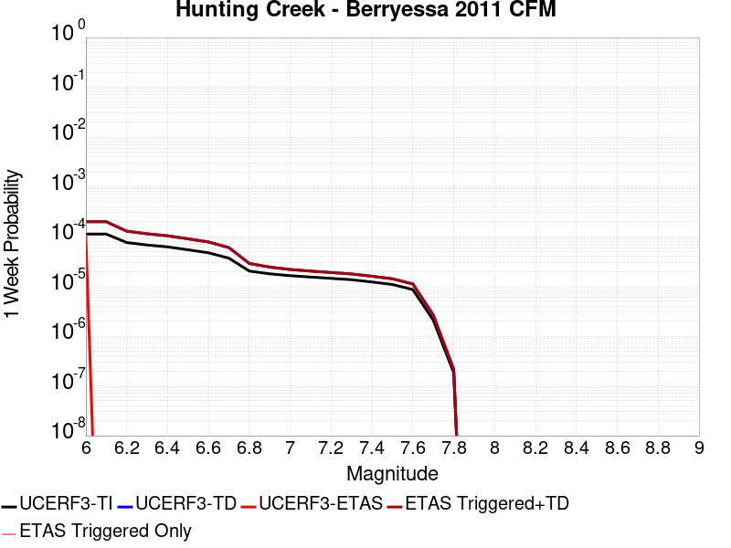 | 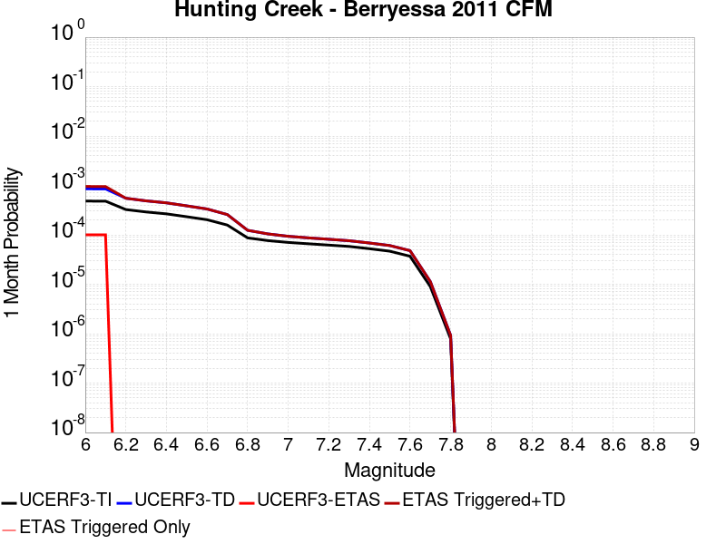 | 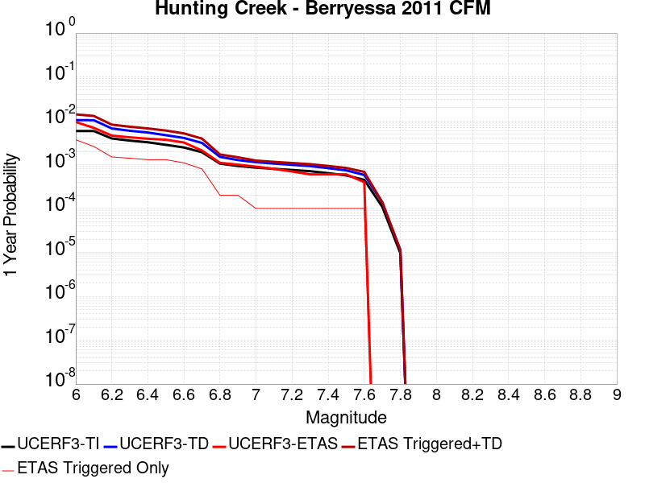 | 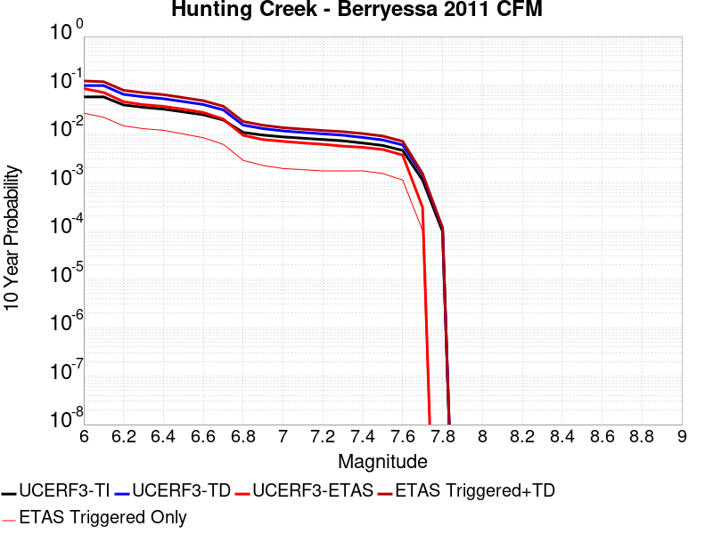 |

| Magnitude | 1 wk TI Prob | 1 wk TD Prob | 1 wk ETAS Prob | 1 wk ETAS/TD Gain | 1 wk ETAS Triggered+TD | 1 wk ETAS Triggered Only | 1 mo TI Prob | 1 mo TD Prob | 1 mo ETAS Prob | 1 mo ETAS/TD Gain | 1 mo ETAS Triggered+TD | 1 mo ETAS Triggered Only | 1 yr TI Prob | 1 yr TD Prob | 1 yr ETAS Prob | 1 yr ETAS/TD Gain | 1 yr ETAS Triggered+TD | 1 yr ETAS Triggered Only | 10 yr TI Prob | 10 yr TD Prob | 10 yr ETAS Prob | 10 yr ETAS/TD Gain | 10 yr ETAS Triggered+TD | 10 yr ETAS Triggered Only |
|-----|-----|-----|-----|-----|-----|-----|-----|-----|-----|-----|-----|-----|-----|-----|-----|-----|-----|-----|-----|-----|-----|-----|-----|-----|
| 6.0 | 1.1270982E-4 | 1.9940689E-4 | 1.0E-4 | 0.5014872 | 1.9940689E-4 | 0.0 | 4.8295266E-4 | 8.542511E-4 | 4.0E-4 | 0.46824643 | 0.0010540802 | 2.0E-4 | 0.0058641075 | 0.01034132 | 0.0094 | 0.9089748 | 0.014003057 | 0.0037 | 0.057117578 | 0.09765978 | 0.0847 | 0.86729664 | 0.12139133 | 0.0263 |
| 6.1 | 1.1239393E-4 | 1.988906E-4 | 0.0 | 0.0 | 1.988906E-4 | 0.0 | 4.8159933E-4 | 8.5203996E-4 | 2.0E-4 | 0.23473078 | 9.5195475E-4 | 1.0E-4 | 0.0058477195 | 0.01031468 | 0.0069 | 0.66894954 | 0.012887862 | 0.0026 | 0.056962132 | 0.09741914 | 0.0702 | 0.72059757 | 0.11700515 | 0.0217 |
| 6.2 | 7.596265E-5 | 1.2870526E-4 | 0.0 | 0.0 | 1.2870526E-4 | 0.0 | 3.2551357E-4 | 5.51466E-4 | 1.0E-4 | 0.18133484 | 5.51466E-4 | 0.0 | 0.0039559277 | 0.0066889296 | 0.0046 | 0.6877035 | 0.008178896 | 0.0015 | 0.038862433 | 0.06430455 | 0.0453 | 0.7044602 | 0.07777857 | 0.0144 |
| 6.3 | 6.78794E-5 | 1.13912276E-4 | 0.0 | 0.0 | 1.13912276E-4 | 0.0 | 2.9087928E-4 | 4.8809202E-4 | 1.0E-4 | 0.2048794 | 4.8809202E-4 | 0.0 | 0.003535705 | 0.0059231822 | 0.0042 | 0.7090783 | 0.0073148897 | 0.0014 | 0.034799766 | 0.057201747 | 0.0394 | 0.68879014 | 0.069081 | 0.0126 |
| 6.4 | 6.2165134E-5 | 1.0382523E-4 | 0.0 | 0.0 | 1.0382523E-4 | 0.0 | 2.6639478E-4 | 4.4488598E-4 | 1.0E-4 | 0.22477669 | 4.4488598E-4 | 0.0 | 0.0032385332 | 0.0054004393 | 0.0039 | 0.7221635 | 0.0066934186 | 0.0013 | 0.03191742 | 0.052307636 | 0.0363 | 0.69397134 | 0.063395634 | 0.0117 |
| 6.5 | 5.4368087E-5 | 9.023392E-5 | 0.0 | 0.0 | 9.023392E-5 | 0.0 | 2.3298527E-4 | 3.8665588E-4 | 1.0E-4 | 0.25862792 | 3.8665588E-4 | 0.0 | 0.0028329059 | 0.004695443 | 0.0037 | 0.7879981 | 0.0059893387 | 0.0013 | 0.027970633 | 0.04565968 | 0.0318 | 0.6964569 | 0.055012215 | 0.0098 |
| 6.6 | 4.729947E-5 | 7.8045974E-5 | 0.0 | 0.0 | 7.8045974E-5 | 0.0 | 2.0269625E-4 | 3.344384E-4 | 1.0E-4 | 0.29900873 | 3.344384E-4 | 0.0 | 0.002465034 | 0.004062789 | 0.0032 | 0.7876362 | 0.00515832 | 0.0011 | 0.02437869 | 0.03965023 | 0.0272 | 0.6859985 | 0.0475251 | 0.0082 |
| 6.7 | 3.6875328E-5 | 6.0107366E-5 | 0.0 | 0.0 | 6.0107366E-5 | 0.0 | 1.5802756E-4 | 2.575781E-4 | 0.0 | 0.0 | 2.575781E-4 | 0.0 | 0.0019222875 | 0.0031308257 | 0.0021 | 0.6707496 | 0.003928321 | 8.0E-4 | 0.019057442 | 0.03073008 | 0.0199 | 0.64757395 | 0.0365457 | 0.006 |
| 6.8 | 2.0292036E-5 | 2.8875764E-5 | 0.0 | 0.0 | 2.8875764E-5 | 0.0 | 8.6962966E-5 | 1.2374739E-4 | 0.0 | 0.0 | 1.2374739E-4 | 0.0 | 0.0010582599 | 0.0015055726 | 0.0011 | 0.7306191 | 0.0017052714 | 2.0E-4 | 0.010532344 | 0.014927712 | 0.0092 | 0.6163034 | 0.017685914 | 0.0028 |
| 6.9 | 1.7871042E-5 | 2.440453E-5 | 0.0 | 0.0 | 2.440453E-5 | 0.0 | 7.658793E-5 | 1.0458663E-4 | 0.0 | 0.0 | 1.0458663E-4 | 0.0 | 9.320591E-4 | 0.0012725984 | 0.001 | 0.7857939 | 0.0014723438 | 2.0E-4 | 0.009281595 | 0.012644729 | 0.0075 | 0.59313256 | 0.01481691 | 0.0022 |
| 7.0 | 1.6415532E-5 | 2.1844406E-5 | 0.0 | 0.0 | 2.1844406E-5 | 0.0 | 7.035038E-5 | 9.361554E-5 | 0.0 | 0.0 | 9.361554E-5 | 0.0 | 8.561793E-4 | 0.0011391746 | 9.0E-4 | 0.7900457 | 0.0012390607 | 1.0E-4 | 0.008528882 | 0.011332817 | 0.0069 | 0.60885125 | 0.013211285 | 0.0019 |
| 7.1 | 1.5409885E-5 | 2.0292511E-5 | 0.0 | 0.0 | 2.0292511E-5 | 0.0 | 6.6040695E-5 | 8.6965025E-5 | 0.0 | 0.0 | 8.6965025E-5 | 0.0 | 8.0374884E-4 | 0.0010582876 | 8.0E-4 | 0.75593823 | 0.0011581817 | 1.0E-4 | 0.00800848 | 0.0105329 | 0.0064 | 0.60761994 | 0.012313941 | 0.0018 |
| 7.2 | 1.4497423E-5 | 1.9004163E-5 | 0.0 | 0.0 | 1.9004163E-5 | 0.0 | 6.213033E-5 | 8.144388E-5 | 0.0 | 0.0 | 8.144388E-5 | 0.0 | 7.5617427E-4 | 9.911313E-4 | 7.0E-4 | 0.70626366 | 0.0010910322 | 1.0E-4 | 0.0075360634 | 0.009867775 | 0.006 | 0.6080398 | 0.011551 | 0.0017 |
| 7.3 | 1.3615175E-5 | 1.7777578E-5 | 0.0 | 0.0 | 1.7777578E-5 | 0.0 | 5.8349444E-5 | 7.618741E-5 | 0.0 | 0.0 | 7.618741E-5 | 0.0 | 7.101729E-4 | 9.2718995E-4 | 6.0E-4 | 0.6471166 | 0.0010270972 | 1.0E-4 | 0.0070790765 | 0.009233719 | 0.0055 | 0.59564304 | 0.010918021 | 0.0017 |
| 7.4 | 1.2252825E-5 | 1.5983189E-5 | 0.0 | 0.0 | 1.5983189E-5 | 0.0 | 5.251105E-5 | 6.8497604E-5 | 0.0 | 0.0 | 6.8497604E-5 | 0.0 | 6.391345E-4 | 8.3364197E-4 | 6.0E-4 | 0.7197334 | 9.335586E-4 | 1.0E-4 | 0.0063729943 | 0.008305561 | 0.0052 | 0.62608653 | 0.009991442 | 0.0017 |
| 7.5 | 1.0913301E-5 | 1.4202664E-5 | 0.0 | 0.0 | 1.4202664E-5 | 0.0 | 4.6770452E-5 | 6.0867154E-5 | 0.0 | 0.0 | 6.0867154E-5 | 0.0 | 5.6928146E-4 | 7.408084E-4 | 6.0E-4 | 0.80992603 | 8.407343E-4 | 1.0E-4 | 0.0056782532 | 0.0073837684 | 0.0047 | 0.6365313 | 0.008872693 | 0.0015 |
| 7.6 | 8.623192E-6 | 1.1203514E-5 | 0.0 | 0.0 | 1.1203514E-5 | 0.0 | 3.6956015E-5 | 4.8014193E-5 | 0.0 | 0.0 | 4.8014193E-5 | 0.0 | 4.4984656E-4 | 5.8441854E-4 | 4.0E-4 | 0.684441 | 6.843601E-4 | 1.0E-4 | 0.00448937 | 0.005829101 | 0.0036 | 0.61759096 | 0.006922689 | 0.0011 |
| 7.7 | 2.0993634E-6 | 2.655011E-6 | 0.0 | 0.0 | 2.655011E-6 | 0.0 | 8.997241E-6 | 1.137857E-5 | 0.0 | 0.0 | 1.137857E-5 | 0.0 | 1.09535904E-4 | 1.3852536E-4 | 0.0 | 0.0 | 1.3852536E-4 | 0.0 | 0.0010948193 | 0.001384442 | 3.0E-4 | 0.2166938 | 0.0014843036 | 1.0E-4 |
| 7.8 | 1.8428308E-7 | 2.164475E-7 | 0.0 | 0.0 | 2.164475E-7 | 0.0 | 7.897844E-7 | 9.276319E-7 | 0.0 | 0.0 | 9.276319E-7 | 0.0 | 9.615583E-6 | 1.1293863E-5 | 0.0 | 0.0 | 1.1293863E-5 | 0.0 | 9.615166E-5 | 1.1294148E-4 | 0.0 | 0.0 | 1.1294148E-4 | 0.0 |

## San Andreas (Carrizo) rev
*[(top)](#table-of-contents)*

| 1 Week | 1 Month | 1 Year | 10 Year |
|-----|-----|-----|-----|
| 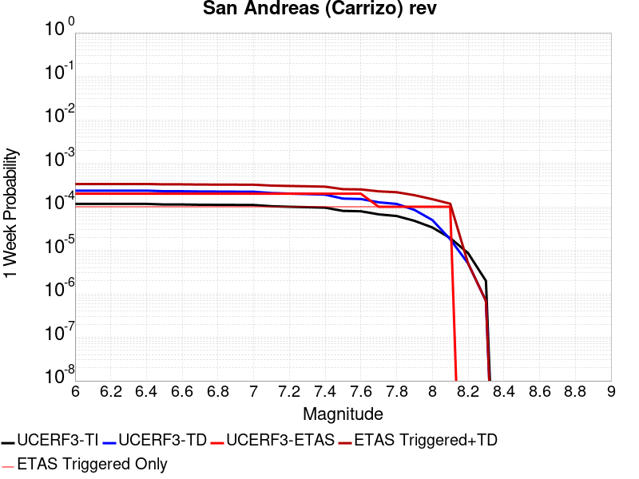 | 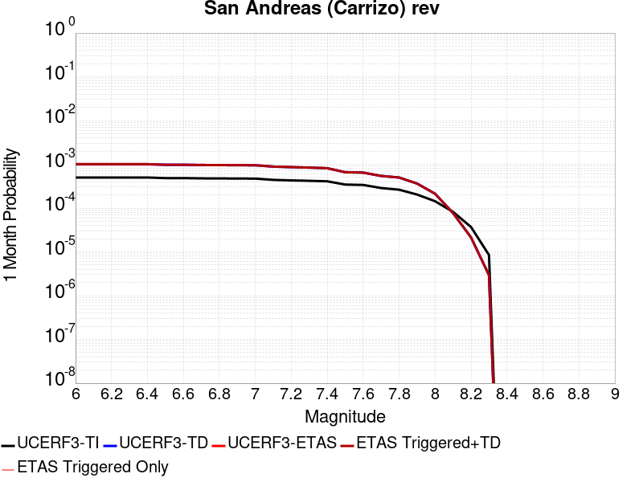 | 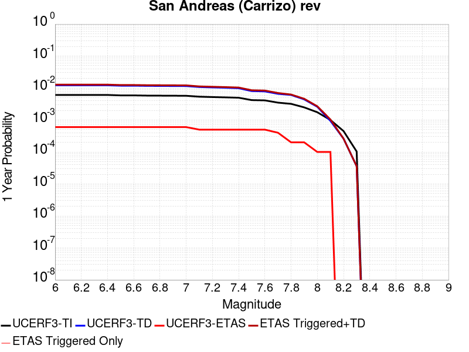 | 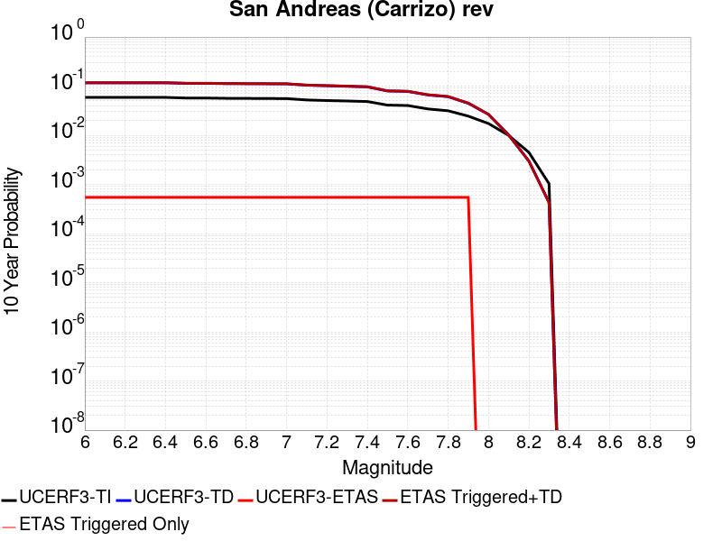 |

| Magnitude | 1 wk TI Prob | 1 wk TD Prob | 1 wk ETAS Prob | 1 wk ETAS/TD Gain | 1 wk ETAS Triggered+TD | 1 wk ETAS Triggered Only | 1 mo TI Prob | 1 mo TD Prob | 1 mo ETAS Prob | 1 mo ETAS/TD Gain | 1 mo ETAS Triggered+TD | 1 mo ETAS Triggered Only | 1 yr TI Prob | 1 yr TD Prob | 1 yr ETAS Prob | 1 yr ETAS/TD Gain | 1 yr ETAS Triggered+TD | 1 yr ETAS Triggered Only | 10 yr TI Prob | 10 yr TD Prob | 10 yr ETAS Prob | 10 yr ETAS/TD Gain | 10 yr ETAS Triggered+TD | 10 yr ETAS Triggered Only |
|-----|-----|-----|-----|-----|-----|-----|-----|-----|-----|-----|-----|-----|-----|-----|-----|-----|-----|-----|-----|-----|-----|-----|-----|-----|
| 6.0 | 1.1674632E-4 | 2.3566867E-4 | 2.0E-4 | 0.8486491 | 3.356451E-4 | 1.0E-4 | 5.002454E-4 | 0.0010096192 | 5.0E-4 | 0.49523622 | 0.0012094172 | 2.0E-4 | 0.006073493 | 0.0122232875 | 0.0072 | 0.58903956 | 0.014791506 | 0.0026 | 0.0591016 | 0.11745107 | 0.0777 | 0.6615521 | 0.14083862 | 0.0265 |
| 6.1 | 1.1674632E-4 | 2.3566867E-4 | 2.0E-4 | 0.8486491 | 3.356451E-4 | 1.0E-4 | 5.002454E-4 | 0.0010096192 | 5.0E-4 | 0.49523622 | 0.0012094172 | 2.0E-4 | 0.006073493 | 0.0122232875 | 0.0072 | 0.58903956 | 0.014791506 | 0.0026 | 0.0591016 | 0.11745107 | 0.0777 | 0.6615521 | 0.14083862 | 0.0265 |
| 6.2 | 1.1674632E-4 | 2.3566867E-4 | 2.0E-4 | 0.8486491 | 3.356451E-4 | 1.0E-4 | 5.002454E-4 | 0.0010096192 | 5.0E-4 | 0.49523622 | 0.0012094172 | 2.0E-4 | 0.006073493 | 0.0122232875 | 0.0072 | 0.58903956 | 0.014791506 | 0.0026 | 0.0591016 | 0.11745107 | 0.0777 | 0.6615521 | 0.14083862 | 0.0265 |
| 6.3 | 1.1674632E-4 | 2.3566867E-4 | 2.0E-4 | 0.8486491 | 3.356451E-4 | 1.0E-4 | 5.002454E-4 | 0.0010096192 | 5.0E-4 | 0.49523622 | 0.0012094172 | 2.0E-4 | 0.006073493 | 0.0122232875 | 0.0072 | 0.58903956 | 0.014791506 | 0.0026 | 0.0591016 | 0.11745107 | 0.0777 | 0.6615521 | 0.14083862 | 0.0265 |
| 6.4 | 1.1674632E-4 | 2.3566867E-4 | 2.0E-4 | 0.8486491 | 3.356451E-4 | 1.0E-4 | 5.002454E-4 | 0.0010096192 | 5.0E-4 | 0.49523622 | 0.0012094172 | 2.0E-4 | 0.006073493 | 0.0122232875 | 0.0072 | 0.58903956 | 0.014791506 | 0.0026 | 0.0591016 | 0.11745107 | 0.0777 | 0.6615521 | 0.14083862 | 0.0265 |
| 6.5 | 1.13136164E-4 | 2.2890302E-4 | 2.0E-4 | 0.87373245 | 3.2888015E-4 | 1.0E-4 | 4.847792E-4 | 9.806457E-4 | 5.0E-4 | 0.5098682 | 0.0011804495 | 2.0E-4 | 0.0058862255 | 0.01187442 | 0.0072 | 0.6063454 | 0.014443546 | 0.0026 | 0.057327334 | 0.11442959 | 0.0764 | 0.66765946 | 0.13763154 | 0.0262 |
| 6.6 | 1.13136164E-4 | 2.2890302E-4 | 2.0E-4 | 0.87373245 | 3.2888015E-4 | 1.0E-4 | 4.847792E-4 | 9.806457E-4 | 5.0E-4 | 0.5098682 | 0.0011804495 | 2.0E-4 | 0.0058862255 | 0.01187442 | 0.0072 | 0.6063454 | 0.014443546 | 0.0026 | 0.057327334 | 0.11442959 | 0.0764 | 0.66765946 | 0.13763154 | 0.0262 |
| 6.7 | 1.1149675E-4 | 2.2583081E-4 | 2.0E-4 | 0.88561875 | 3.258082E-4 | 1.0E-4 | 4.777557E-4 | 9.6748874E-4 | 5.0E-4 | 0.5168019 | 0.0011672953 | 2.0E-4 | 0.0058011734 | 0.011715965 | 0.0072 | 0.614546 | 0.014285504 | 0.0026 | 0.05652051 | 0.113049 | 0.0751 | 0.66431373 | 0.13619842 | 0.0261 |
| 6.8 | 1.1103589E-4 | 2.2486152E-4 | 2.0E-4 | 0.8894363 | 3.2483903E-4 | 1.0E-4 | 4.7578133E-4 | 9.633377E-4 | 5.0E-4 | 0.5190288 | 0.0011631451 | 2.0E-4 | 0.005777263 | 0.011665969 | 0.0072 | 0.61717975 | 0.014235637 | 0.0026 | 0.056293584 | 0.11261146 | 0.0747 | 0.66334283 | 0.13550608 | 0.0258 |
| 6.9 | 1.1053259E-4 | 2.2379539E-4 | 2.0E-4 | 0.8936735 | 3.23773E-4 | 1.0E-4 | 4.7362508E-4 | 9.5877197E-4 | 5.0E-4 | 0.5215004 | 0.0011585802 | 2.0E-4 | 0.0057511497 | 0.0116109755 | 0.0071 | 0.6114904 | 0.014180787 | 0.0026 | 0.05604569 | 0.11213082 | 0.0743 | 0.6626189 | 0.13486028 | 0.0256 |
| 7.0 | 1.1005377E-4 | 2.2281319E-4 | 2.0E-4 | 0.8976129 | 3.227909E-4 | 1.0E-4 | 4.7157376E-4 | 9.5456565E-4 | 5.0E-4 | 0.52379847 | 0.0011543747 | 2.0E-4 | 0.0057263062 | 0.011560308 | 0.0071 | 0.6141705 | 0.014130251 | 0.0026 | 0.055809796 | 0.11168503 | 0.074 | 0.6625776 | 0.1344259 | 0.0256 |
| 7.1 | 1.0308142E-4 | 2.0805502E-4 | 2.0E-4 | 0.96128416 | 3.080342E-4 | 1.0E-4 | 4.417027E-4 | 8.913607E-4 | 5.0E-4 | 0.56094015 | 0.0010911823 | 2.0E-4 | 0.0053644776 | 0.010798607 | 0.0062 | 0.5741481 | 0.01307377 | 0.0023 | 0.052368138 | 0.104947984 | 0.0684 | 0.65175146 | 0.1258922 | 0.0234 |
| 7.2 | 1.0027479E-4 | 2.0219231E-4 | 2.0E-4 | 0.98915726 | 3.021721E-4 | 1.0E-4 | 4.296783E-4 | 8.662517E-4 | 5.0E-4 | 0.57719946 | 0.0010660784 | 2.0E-4 | 0.0052187922 | 0.010495889 | 0.0062 | 0.5907074 | 0.012771749 | 0.0023 | 0.050979212 | 0.10226731 | 0.0667 | 0.6522123 | 0.12291516 | 0.023 |
| 7.3 | 9.816942E-5 | 1.9704713E-4 | 2.0E-4 | 1.0149856 | 2.9702744E-4 | 1.0E-4 | 4.2065824E-4 | 8.4421533E-4 | 5.0E-4 | 0.59226596 | 0.0010440465 | 2.0E-4 | 0.005109493 | 0.010230146 | 0.0062 | 0.6060519 | 0.012506617 | 0.0023 | 0.049935985 | 0.09987908 | 0.0654 | 0.6547918 | 0.1201318 | 0.0225 |
| 7.4 | 9.5634205E-5 | 1.908743E-4 | 2.0E-4 | 1.04781 | 2.908552E-4 | 1.0E-4 | 4.0979648E-4 | 8.177771E-4 | 5.0E-4 | 0.61141354 | 0.0010176136 | 2.0E-4 | 0.0049778637 | 0.009911227 | 0.0061 | 0.6154636 | 0.012188432 | 0.0023 | 0.048678253 | 0.09701487 | 0.063 | 0.64938504 | 0.11669994 | 0.0218 |
| 7.5 | 8.052417E-5 | 1.5494163E-4 | 2.0E-4 | 1.2908087 | 2.5492613E-4 | 1.0E-4 | 3.4505792E-4 | 6.6386675E-4 | 5.0E-4 | 0.7531632 | 8.63734E-4 | 2.0E-4 | 0.0041929903 | 0.0080526965 | 0.005 | 0.62091 | 0.009739007 | 0.0017 | 0.04114753 | 0.080045626 | 0.0505 | 0.6308902 | 0.09577684 | 0.0171 |
| 7.6 | 7.897024E-5 | 1.5155076E-4 | 2.0E-4 | 1.3196899 | 2.515356E-4 | 1.0E-4 | 3.384E-4 | 6.4934173E-4 | 4.0E-4 | 0.61600846 | 8.492119E-4 | 2.0E-4 | 0.0041122385 | 0.007877147 | 0.0048 | 0.6093577 | 0.009563755 | 0.0017 | 0.040369697 | 0.07841491 | 0.0494 | 0.62998223 | 0.0939897 | 0.0169 |
| 7.7 | 6.707427E-5 | 1.2726369E-4 | 1.0E-4 | 0.7857701 | 2.2725096E-4 | 1.0E-4 | 2.8742946E-4 | 5.453018E-4 | 3.0E-4 | 0.55015403 | 7.4519275E-4 | 2.0E-4 | 0.003493839 | 0.006618868 | 0.0041 | 0.6194413 | 0.008208278 | 0.0016 | 0.034394164 | 0.0665482 | 0.0405 | 0.6085815 | 0.07961652 | 0.014 |
| 7.8 | 6.147705E-5 | 1.1699638E-4 | 1.0E-4 | 0.8547273 | 2.1698468E-4 | 1.0E-4 | 2.6344648E-4 | 5.0131674E-4 | 3.0E-4 | 0.5984241 | 7.0121646E-4 | 2.0E-4 | 0.0032027436 | 0.006086472 | 0.0038 | 0.6243354 | 0.007477951 | 0.0014 | 0.031569764 | 0.061238818 | 0.0374 | 0.61072373 | 0.07325496 | 0.0128 |
| 7.9 | 4.7636717E-5 | 8.5202E-5 | 1.0E-4 | 1.1736814 | 1.8519348E-4 | 1.0E-4 | 2.0414138E-4 | 3.6510034E-4 | 3.0E-4 | 0.82169193 | 5.6502735E-4 | 2.0E-4 | 0.0024825884 | 0.0044360436 | 0.003 | 0.6762783 | 0.005531164 | 0.0011 | 0.024550365 | 0.04493226 | 0.0286 | 0.6365137 | 0.05438743 | 0.0099 |
| 8.0 | 3.3554235E-5 | 4.99211E-5 | 1.0E-4 | 2.003161 | 1.499161E-4 | 1.0E-4 | 1.4379594E-4 | 2.1393002E-4 | 3.0E-4 | 1.4023277 | 4.1388723E-4 | 2.0E-4 | 0.0017493097 | 0.0026014885 | 0.0018 | 0.6919115 | 0.0032996675 | 7.0E-4 | 0.017356034 | 0.026788611 | 0.017 | 0.634598 | 0.0327252 | 0.0061 |
| 8.1 | 1.9175432E-5 | 1.8116692E-5 | 1.0E-4 | 5.5197716 | 1.18114884E-4 | 1.0E-4 | 8.217783E-5 | 7.764066E-5 | 2.0E-4 | 2.57597 | 2.7762513E-4 | 2.0E-4 | 0.0010000558 | 9.448657E-4 | 6.0E-4 | 0.6350109 | 0.0012445822 | 3.0E-4 | 0.009955673 | 0.0101959035 | 0.0068 | 0.6669345 | 0.012769395 | 0.0026 |
| 8.2 | 8.643924E-6 | 5.06885E-6 | 0.0 | 0.0 | 5.06885E-6 | 0.0 | 3.704486E-5 | 2.1723463E-5 | 1.0E-4 | 4.6033177 | 1.2172129E-4 | 1.0E-4 | 4.5092785E-4 | 2.6445114E-4 | 2.0E-4 | 0.7562834 | 3.644247E-4 | 1.0E-4 | 0.0045001395 | 0.0030259273 | 0.0022 | 0.7270499 | 0.003723809 | 7.0E-4 |
| 8.3 | 1.983087E-6 | 6.9765395E-7 | 0.0 | 0.0 | 6.9765395E-7 | 0.0 | 8.498917E-6 | 2.9899422E-6 | 0.0 | 0.0 | 2.9899422E-6 | 0.0 | 1.034694E-4 | 3.640195E-5 | 0.0 | 0.0 | 3.640195E-5 | 0.0 | 0.0010342124 | 4.3255524E-4 | 2.0E-4 | 0.46236867 | 5.32512E-4 | 1.0E-4 |

## Calaveras (So) 2011 CFM
*[(top)](#table-of-contents)*

| 1 Week | 1 Month | 1 Year | 10 Year |
|-----|-----|-----|-----|
| 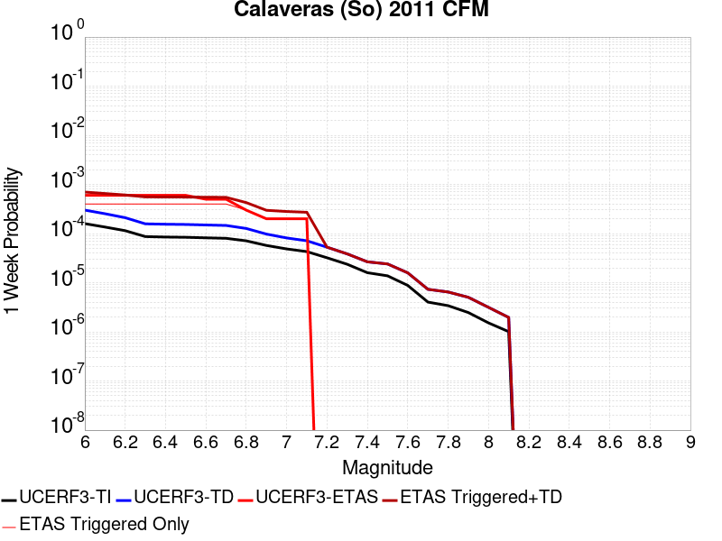 | 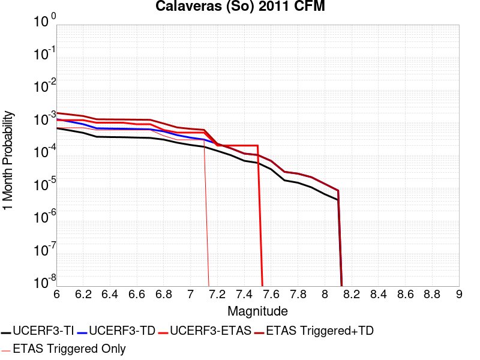 | 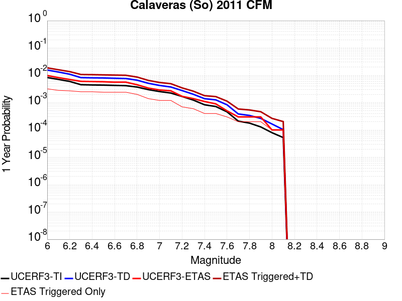 | 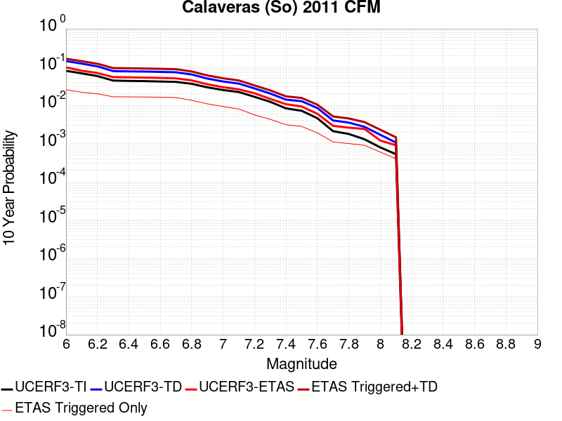 |

| Magnitude | 1 wk TI Prob | 1 wk TD Prob | 1 wk ETAS Prob | 1 wk ETAS/TD Gain | 1 wk ETAS Triggered+TD | 1 wk ETAS Triggered Only | 1 mo TI Prob | 1 mo TD Prob | 1 mo ETAS Prob | 1 mo ETAS/TD Gain | 1 mo ETAS Triggered+TD | 1 mo ETAS Triggered Only | 1 yr TI Prob | 1 yr TD Prob | 1 yr ETAS Prob | 1 yr ETAS/TD Gain | 1 yr ETAS Triggered+TD | 1 yr ETAS Triggered Only | 10 yr TI Prob | 10 yr TD Prob | 10 yr ETAS Prob | 10 yr ETAS/TD Gain | 10 yr ETAS Triggered+TD | 10 yr ETAS Triggered Only |
|-----|-----|-----|-----|-----|-----|-----|-----|-----|-----|-----|-----|-----|-----|-----|-----|-----|-----|-----|-----|-----|-----|-----|-----|-----|
| 6.0 | 1.5950744E-4 | 3.005846E-4 | 6.0E-4 | 1.9961102 | 7.0046436E-4 | 4.0E-4 | 6.834242E-4 | 0.001287444 | 0.0012 | 0.9320794 | 0.0019865427 | 7.0E-4 | 0.00828899 | 0.015540312 | 0.0098 | 0.630618 | 0.018690582 | 0.0032 | 0.079865426 | 0.14351726 | 0.0982 | 0.68423826 | 0.16535757 | 0.0255 |
| 6.1 | 1.3584697E-4 | 2.539517E-4 | 6.0E-4 | 2.362654 | 6.538501E-4 | 4.0E-4 | 5.8207137E-4 | 0.0010878303 | 0.0012 | 1.1031132 | 0.0017870688 | 7.0E-4 | 0.007063716 | 0.013150011 | 0.0082 | 0.6235736 | 0.01591319 | 0.0028 | 0.06843361 | 0.123182006 | 0.0802 | 0.6510691 | 0.14238432 | 0.0219 |
| 6.2 | 1.14676266E-4 | 2.1086262E-4 | 6.0E-4 | 2.8454545 | 6.107783E-4 | 4.0E-4 | 4.9137714E-4 | 9.033606E-4 | 0.0012 | 1.3283732 | 0.0016027283 | 7.0E-4 | 0.0059661185 | 0.01093883 | 0.007 | 0.6399222 | 0.013609295 | 0.0027 | 0.058084648 | 0.10419942 | 0.0699 | 0.6708291 | 0.122115426 | 0.02 |
| 6.3 | 8.691518E-5 | 1.5810462E-4 | 6.0E-4 | 3.7949555 | 5.580414E-4 | 4.0E-4 | 3.7244044E-4 | 6.7737664E-4 | 0.001 | 1.4762837 | 0.0012769701 | 6.0E-4 | 0.004525038 | 0.0082094055 | 0.006 | 0.730869 | 0.010688881 | 0.0025 | 0.044339992 | 0.07855428 | 0.0545 | 0.69378775 | 0.093942426 | 0.0167 |
| 6.4 | 8.50982E-5 | 1.5519738E-4 | 6.0E-4 | 3.8660445 | 5.551353E-4 | 4.0E-4 | 3.646556E-4 | 6.649234E-4 | 0.001 | 1.5039326 | 0.0012645244 | 6.0E-4 | 0.0044306475 | 0.008058916 | 0.0059 | 0.7321084 | 0.010538768 | 0.0025 | 0.04343345 | 0.07717166 | 0.0538 | 0.69714713 | 0.09249061 | 0.0166 |
| 6.5 | 8.4062965E-5 | 1.5345492E-4 | 6.0E-4 | 3.9099429 | 5.5339356E-4 | 4.0E-4 | 3.602201E-4 | 6.574603E-4 | 0.001 | 1.5210043 | 0.0012570658 | 6.0E-4 | 0.004376863 | 0.007968811 | 0.0058 | 0.72783756 | 0.010349686 | 0.0024 | 0.042916555 | 0.07634799 | 0.053 | 0.69418985 | 0.09158825 | 0.0165 |
| 6.6 | 8.194716E-5 | 1.4983947E-4 | 5.0E-4 | 3.3369045 | 5.497795E-4 | 4.0E-4 | 3.5115483E-4 | 6.419747E-4 | 9.0E-4 | 1.4019245 | 0.0012415894 | 6.0E-4 | 0.0042669317 | 0.007782005 | 0.0056 | 0.7196089 | 0.010163328 | 0.0024 | 0.04185927 | 0.07464305 | 0.052 | 0.6966489 | 0.08972637 | 0.0163 |
| 6.7 | 8.012326E-5 | 1.4653517E-4 | 5.0E-4 | 3.4121504 | 5.4647657E-4 | 4.0E-4 | 3.433402E-4 | 6.278225E-4 | 9.0E-4 | 1.4335263 | 0.0012274458 | 6.0E-4 | 0.004172157 | 0.007611339 | 0.0056 | 0.73574436 | 0.009993072 | 0.0024 | 0.040946912 | 0.07309096 | 0.0507 | 0.6936562 | 0.087828815 | 0.0159 |
| 6.8 | 7.119773E-5 | 1.2726037E-4 | 3.0E-4 | 2.3573718 | 4.2722217E-4 | 3.0E-4 | 3.0509746E-4 | 5.452755E-4 | 6.0E-4 | 1.1003611 | 9.450574E-4 | 4.0E-4 | 0.0037082357 | 0.006615392 | 0.0045 | 0.6802318 | 0.008602161 | 0.002 | 0.036469642 | 0.063984774 | 0.0447 | 0.6986037 | 0.07662098 | 0.0135 |
| 6.9 | 5.7343088E-5 | 9.786235E-5 | 2.0E-4 | 2.0436869 | 2.9784278E-4 | 2.0E-4 | 2.4573295E-4 | 4.193431E-4 | 5.0E-4 | 1.1923411 | 7.192173E-4 | 3.0E-4 | 0.0029876942 | 0.005093624 | 0.0034 | 0.6675012 | 0.0064864927 | 0.0014 | 0.02947844 | 0.049890667 | 0.0354 | 0.7095516 | 0.06024686 | 0.0109 |
| 7.0 | 4.8746577E-5 | 8.166659E-5 | 2.0E-4 | 2.4489818 | 2.8165025E-4 | 2.0E-4 | 2.0889717E-4 | 3.4995307E-4 | 5.0E-4 | 1.428763 | 6.498481E-4 | 3.0E-4 | 0.0025403565 | 0.00425242 | 0.0029 | 0.68196464 | 0.005447317 | 0.0012 | 0.025115121 | 0.04192746 | 0.0298 | 0.71075135 | 0.050837535 | 0.0093 |
| 7.1 | 4.2998014E-5 | 7.1568575E-5 | 2.0E-4 | 2.7945228 | 2.7155425E-4 | 2.0E-4 | 1.8426418E-4 | 3.066867E-4 | 5.0E-4 | 1.6303282 | 6.065947E-4 | 3.0E-4 | 0.002241108 | 0.003727577 | 0.0027 | 0.72433114 | 0.004923104 | 0.0012 | 0.022186412 | 0.036909323 | 0.0261 | 0.7071384 | 0.044614047 | 0.008 |
| 7.2 | 3.221292E-5 | 5.299794E-5 | 0.0 | 0.0 | 5.299794E-5 | 0.0 | 1.3804805E-4 | 2.271144E-4 | 2.0E-4 | 0.88061345 | 2.271144E-4 | 0.0 | 0.0016794393 | 0.0027616392 | 0.0017 | 0.61557645 | 0.003459706 | 7.0E-4 | 0.016668037 | 0.027598785 | 0.0206 | 0.7464097 | 0.03304423 | 0.0056 |
| 7.3 | 2.3756531E-5 | 3.8752434E-5 | 0.0 | 0.0 | 3.8752434E-5 | 0.0 | 1.0180973E-4 | 1.6607139E-4 | 2.0E-4 | 1.2043014 | 1.6607139E-4 | 0.0 | 0.0012388286 | 0.0020200608 | 0.0014 | 0.6930484 | 0.0026188488 | 6.0E-4 | 0.012319452 | 0.020294076 | 0.0147 | 0.7243493 | 0.024506813 | 0.0043 |
| 7.4 | 1.5997684E-5 | 2.6730915E-5 | 0.0 | 0.0 | 2.6730915E-5 | 0.0 | 6.8559704E-5 | 1.1455605E-4 | 2.0E-4 | 1.7458702 | 1.1455605E-4 | 0.0 | 8.343947E-4 | 0.0013938299 | 0.0011 | 0.7891924 | 0.0017932724 | 4.0E-4 | 0.008312687 | 0.0140787335 | 0.0107 | 0.76001155 | 0.01713509 | 0.0031 |
| 7.5 | 1.3814293E-5 | 2.4194247E-5 | 0.0 | 0.0 | 2.4194247E-5 | 0.0 | 5.9202768E-5 | 1.03685525E-4 | 2.0E-4 | 1.9289095 | 1.03685525E-4 | 0.0 | 7.205553E-4 | 0.0012616426 | 9.0E-4 | 0.7133558 | 0.0016611379 | 4.0E-4 | 0.007182234 | 0.01276821 | 0.0093 | 0.7283715 | 0.015532459 | 0.0028 |
| 7.6 | 8.817309E-6 | 1.5965174E-5 | 0.0 | 0.0 | 1.5965174E-5 | 0.0 | 3.7787922E-5 | 6.8420384E-5 | 0.0 | 0.0 | 6.8420384E-5 | 0.0 | 4.5997082E-4 | 8.327011E-4 | 5.0E-4 | 0.6004555 | 0.0011324513 | 3.0E-4 | 0.004590199 | 0.008491839 | 0.006 | 0.7065607 | 0.010375706 | 0.0019 |
| 7.7 | 4.0352206E-6 | 7.382077E-6 | 0.0 | 0.0 | 7.382077E-6 | 0.0 | 1.7293689E-5 | 3.163709E-5 | 0.0 | 0.0 | 3.163709E-5 | 0.0 | 2.1053031E-4 | 3.8511356E-4 | 3.0E-4 | 0.778991 | 5.850365E-4 | 2.0E-4 | 0.0021033096 | 0.00400553 | 0.0029 | 0.723999 | 0.005101124 | 0.0011 |
| 7.8 | 3.413169E-6 | 6.5029626E-6 | 0.0 | 0.0 | 6.5029626E-6 | 0.0 | 1.4627784E-5 | 2.7869542E-5 | 0.0 | 0.0 | 2.7869542E-5 | 0.0 | 1.7807873E-4 | 3.392589E-4 | 3.0E-4 | 0.8842804 | 5.3919107E-4 | 2.0E-4 | 0.0017793609 | 0.0035274676 | 0.0026 | 0.7370727 | 0.00452394 | 0.001 |
| 7.9 | 2.4740732E-6 | 5.0703898E-6 | 0.0 | 0.0 | 5.0703898E-6 | 0.0 | 1.06031275E-5 | 2.173006E-5 | 0.0 | 0.0 | 2.173006E-5 | 0.0 | 1.2908543E-4 | 2.6453144E-4 | 3.0E-4 | 1.1340808 | 4.6447854E-4 | 2.0E-4 | 0.0012901047 | 0.0027334618 | 0.0024 | 0.87800753 | 0.0036310018 | 9.0E-4 |
| 8.0 | 1.5231818E-6 | 3.167996E-6 | 0.0 | 0.0 | 3.167996E-6 | 0.0 | 6.527906E-6 | 1.3577056E-5 | 0.0 | 0.0 | 1.3577056E-5 | 0.0 | 7.9474354E-5 | 1.6528815E-4 | 1.0E-4 | 0.605004 | 2.6527164E-4 | 1.0E-4 | 7.944594E-4 | 0.00169748 | 0.0012 | 0.7069303 | 0.0022964615 | 6.0E-4 |
| 8.1 | 1.0104524E-6 | 1.9716344E-6 | 0.0 | 0.0 | 1.9716344E-6 | 0.0 | 4.330503E-6 | 8.449834E-6 | 0.0 | 0.0 | 8.449834E-6 | 0.0 | 5.2722597E-5 | 1.0287191E-4 | 1.0E-4 | 0.9720827 | 2.0286163E-4 | 1.0E-4 | 5.271009E-4 | 0.0010564383 | 9.0E-4 | 0.8519191 | 0.0014560157 | 4.0E-4 |

## San Andreas (San Bernardino S)
*[(top)](#table-of-contents)*

| 1 Week | 1 Month | 1 Year | 10 Year |
|-----|-----|-----|-----|
| 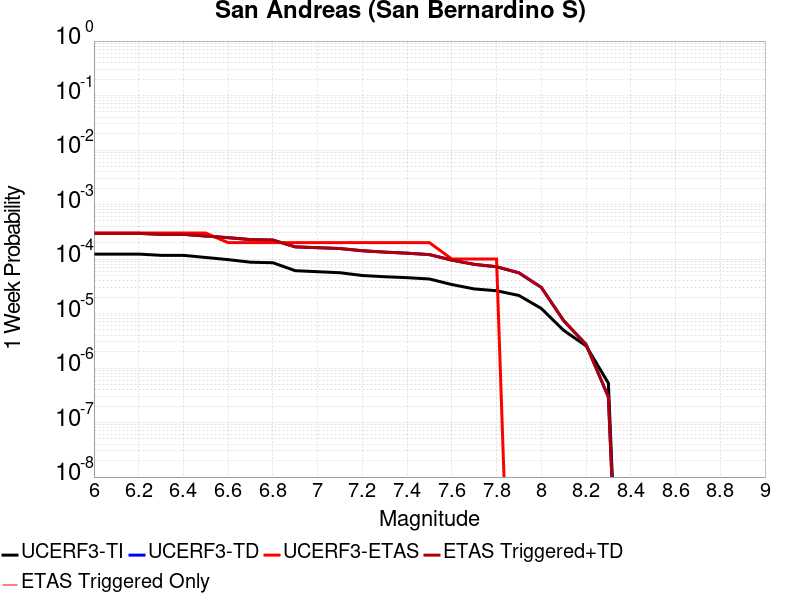 | 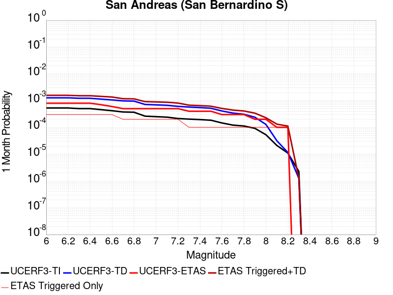 | 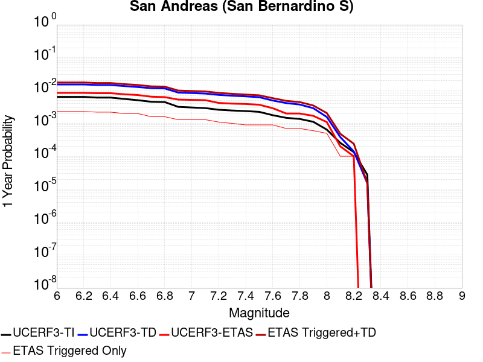 | 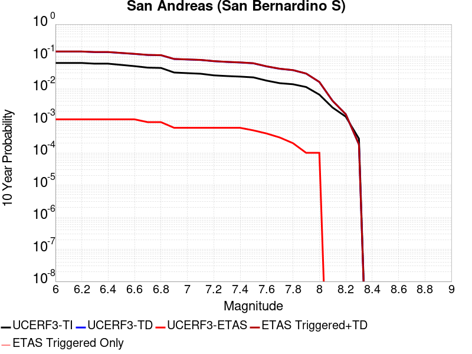 |

| Magnitude | 1 wk TI Prob | 1 wk TD Prob | 1 wk ETAS Prob | 1 wk ETAS/TD Gain | 1 wk ETAS Triggered+TD | 1 wk ETAS Triggered Only | 1 mo TI Prob | 1 mo TD Prob | 1 mo ETAS Prob | 1 mo ETAS/TD Gain | 1 mo ETAS Triggered+TD | 1 mo ETAS Triggered Only | 1 yr TI Prob | 1 yr TD Prob | 1 yr ETAS Prob | 1 yr ETAS/TD Gain | 1 yr ETAS Triggered+TD | 1 yr ETAS Triggered Only | 10 yr TI Prob | 10 yr TD Prob | 10 yr ETAS Prob | 10 yr ETAS/TD Gain | 10 yr ETAS Triggered+TD | 10 yr ETAS Triggered Only |
|-----|-----|-----|-----|-----|-----|-----|-----|-----|-----|-----|-----|-----|-----|-----|-----|-----|-----|-----|-----|-----|-----|-----|-----|-----|
| 6.0 | 1.2336002E-4 | 2.9618776E-4 | 3.0E-4 | 1.012871 | 2.9618776E-4 | 0.0 | 5.2857865E-4 | 0.0012687844 | 8.0E-4 | 0.6305248 | 0.0015684037 | 3.0E-4 | 0.006416472 | 0.015342925 | 0.0085 | 0.5540013 | 0.017607635 | 0.0023 | 0.06234337 | 0.14110295 | 0.0865 | 0.6130276 | 0.16111526 | 0.0233 |
| 6.1 | 1.2336002E-4 | 2.9618776E-4 | 3.0E-4 | 1.012871 | 2.9618776E-4 | 0.0 | 5.2857865E-4 | 0.0012687844 | 8.0E-4 | 0.6305248 | 0.0015684037 | 3.0E-4 | 0.006416472 | 0.015342925 | 0.0085 | 0.5540013 | 0.017607635 | 0.0023 | 0.06234337 | 0.14110295 | 0.0865 | 0.6130276 | 0.16111526 | 0.0233 |
| 6.2 | 1.2336002E-4 | 2.9618776E-4 | 3.0E-4 | 1.012871 | 2.9618776E-4 | 0.0 | 5.2857865E-4 | 0.0012687844 | 8.0E-4 | 0.6305248 | 0.0015684037 | 3.0E-4 | 0.006416472 | 0.015342925 | 0.0085 | 0.5540013 | 0.017607635 | 0.0023 | 0.06234337 | 0.14110295 | 0.0865 | 0.6130276 | 0.16111526 | 0.0233 |
| 6.3 | 1.1712257E-4 | 2.8411296E-4 | 3.0E-4 | 1.0559181 | 2.8411296E-4 | 0.0 | 5.018573E-4 | 0.0012170841 | 8.0E-4 | 0.6573087 | 0.001516719 | 3.0E-4 | 0.006093008 | 0.014722097 | 0.0083 | 0.5637784 | 0.016889708 | 0.0022 | 0.059286322 | 0.13579075 | 0.0828 | 0.6097617 | 0.15514904 | 0.0224 |
| 6.4 | 1.1712257E-4 | 2.8411296E-4 | 3.0E-4 | 1.0559181 | 2.8411296E-4 | 0.0 | 5.018573E-4 | 0.0012170841 | 8.0E-4 | 0.6573087 | 0.001516719 | 3.0E-4 | 0.006093008 | 0.014722097 | 0.0083 | 0.5637784 | 0.016889708 | 0.0022 | 0.059286322 | 0.13579075 | 0.0828 | 0.6097617 | 0.15514904 | 0.0224 |
| 6.5 | 1.0689076E-4 | 2.6430876E-4 | 3.0E-4 | 1.1350361 | 2.6430876E-4 | 0.0 | 4.5802278E-4 | 0.0011322846 | 7.0E-4 | 0.61821914 | 0.0014319449 | 3.0E-4 | 0.0055621783 | 0.013702982 | 0.0077 | 0.5619215 | 0.015675576 | 0.002 | 0.05425003 | 0.12707 | 0.0776 | 0.6106871 | 0.14531423 | 0.0209 |
| 6.6 | 9.7648895E-5 | 2.4682246E-4 | 2.0E-4 | 0.81029904 | 2.4682246E-4 | 0.0 | 4.1842813E-4 | 0.001057405 | 6.0E-4 | 0.56742686 | 0.0013570879 | 3.0E-4 | 0.005082469 | 0.012802218 | 0.0073 | 0.5702137 | 0.014776614 | 0.002 | 0.049677886 | 0.119251 | 0.0732 | 0.61383134 | 0.13704214 | 0.0202 |
| 6.7 | 8.757013E-5 | 2.2759548E-4 | 2.0E-4 | 0.8787521 | 2.2759548E-4 | 0.0 | 3.7524657E-4 | 9.750665E-4 | 5.0E-4 | 0.5127855 | 0.0011748715 | 2.0E-4 | 0.00455906 | 0.011810845 | 0.0065 | 0.55034167 | 0.013391947 | 0.0016 | 0.04466656 | 0.11054304 | 0.0672 | 0.607908 | 0.12699799 | 0.0185 |
| 6.8 | 8.562978E-5 | 2.2322101E-4 | 2.0E-4 | 0.895973 | 2.2322101E-4 | 0.0 | 3.6693315E-4 | 9.5633266E-4 | 5.0E-4 | 0.5228306 | 0.0011561414 | 2.0E-4 | 0.004458263 | 0.0115852 | 0.0063 | 0.54379725 | 0.013166663 | 0.0016 | 0.043698758 | 0.10856522 | 0.0658 | 0.6060873 | 0.12478933 | 0.0182 |
| 6.9 | 6.124075E-5 | 1.6741737E-4 | 2.0E-4 | 1.1946192 | 1.6741737E-4 | 0.0 | 2.6243398E-4 | 7.1730657E-4 | 5.0E-4 | 0.69705206 | 9.171631E-4 | 2.0E-4 | 0.0031904527 | 0.008698438 | 0.0053 | 0.6093048 | 0.00998713 | 0.0013 | 0.031450346 | 0.0827536 | 0.0503 | 0.6078285 | 0.09550333 | 0.0139 |
| 7.0 | 5.8598747E-5 | 1.6174205E-4 | 2.0E-4 | 1.2365369 | 1.6174205E-4 | 0.0 | 2.5111332E-4 | 6.9299684E-4 | 5.0E-4 | 0.72150403 | 8.9285825E-4 | 2.0E-4 | 0.0030530186 | 0.008404786 | 0.0052 | 0.6186951 | 0.00969386 | 0.0013 | 0.03011414 | 0.08008375 | 0.048 | 0.59937257 | 0.09231863 | 0.0133 |
| 7.1 | 5.613814E-5 | 1.5595989E-4 | 2.0E-4 | 1.2823809 | 1.5595989E-4 | 0.0 | 2.4056983E-4 | 6.6822907E-4 | 5.0E-4 | 0.74824643 | 8.6809543E-4 | 2.0E-4 | 0.0029250039 | 0.0081055155 | 0.0051 | 0.6292012 | 0.009394979 | 0.0013 | 0.028868021 | 0.07739528 | 0.046 | 0.5943515 | 0.089481406 | 0.0131 |
| 7.2 | 4.991222E-5 | 1.4210024E-4 | 2.0E-4 | 1.4074572 | 1.4210024E-4 | 0.0 | 2.1389198E-4 | 6.0885923E-4 | 5.0E-4 | 0.8212079 | 8.087375E-4 | 2.0E-4 | 0.002601025 | 0.0073877648 | 0.0042 | 0.56850755 | 0.008479638 | 0.0011 | 0.025707912 | 0.07090222 | 0.0414 | 0.5839027 | 0.082237214 | 0.0122 |
| 7.3 | 4.7410045E-5 | 1.3410991E-4 | 2.0E-4 | 1.4913142 | 1.3410991E-4 | 0.0 | 2.0317009E-4 | 5.7463045E-4 | 4.0E-4 | 0.6960995 | 6.74573E-4 | 1.0E-4 | 0.0024707897 | 0.006973766 | 0.004 | 0.5735782 | 0.007966792 | 0.001 | 0.024434982 | 0.06721762 | 0.0394 | 0.58615583 | 0.078411005 | 0.012 |
| 7.4 | 4.5556746E-5 | 1.2824156E-4 | 2.0E-4 | 1.5595568 | 1.2824156E-4 | 0.0 | 1.952286E-4 | 5.494912E-4 | 4.0E-4 | 0.72794616 | 6.4943626E-4 | 1.0E-4 | 0.002374317 | 0.0066696093 | 0.0039 | 0.5847419 | 0.007563607 | 9.0E-4 | 0.023491086 | 0.06448845 | 0.0379 | 0.58770216 | 0.075059734 | 0.0113 |
| 7.5 | 4.3084514E-5 | 1.20658246E-4 | 2.0E-4 | 1.6575742 | 1.20658246E-4 | 0.0 | 1.8463485E-4 | 5.170046E-4 | 4.0E-4 | 0.77368754 | 6.169529E-4 | 1.0E-4 | 0.0022456115 | 0.006276433 | 0.0037 | 0.5895068 | 0.007170784 | 9.0E-4 | 0.022230545 | 0.06091187 | 0.0347 | 0.5696755 | 0.07067838 | 0.0104 |
| 7.6 | 3.408608E-5 | 9.567774E-5 | 1.0E-4 | 1.0451752 | 9.567774E-5 | 0.0 | 1.4607502E-4 | 4.099831E-4 | 3.0E-4 | 0.7317375 | 5.0994207E-4 | 1.0E-4 | 0.0017770125 | 0.004980144 | 0.0029 | 0.58231246 | 0.005875662 | 9.0E-4 | 0.017628696 | 0.04883141 | 0.0293 | 0.6000236 | 0.057296813 | 0.0089 |
| 7.7 | 2.8315713E-5 | 7.997012E-5 | 1.0E-4 | 1.250467 | 7.997012E-5 | 0.0 | 1.2134742E-4 | 3.4268413E-4 | 3.0E-4 | 0.8754418 | 4.4264985E-4 | 1.0E-4 | 0.0014764034 | 0.004164206 | 0.002 | 0.48028368 | 0.004861291 | 7.0E-4 | 0.01466633 | 0.041144393 | 0.0253 | 0.61490756 | 0.04881524 | 0.008 |
| 7.8 | 2.6222975E-5 | 7.227602E-5 | 1.0E-4 | 1.3835847 | 7.227602E-5 | 0.0 | 1.1237934E-4 | 3.097176E-4 | 3.0E-4 | 0.96862423 | 4.0968665E-4 | 1.0E-4 | 0.0013673597 | 0.0037642978 | 0.002 | 0.5313076 | 0.004461663 | 7.0E-4 | 0.013589768 | 0.037376933 | 0.0222 | 0.5939492 | 0.044115297 | 0.007 |
| 7.9 | 2.1469694E-5 | 5.5910103E-5 | 0.0 | 0.0 | 5.5910103E-5 | 0.0 | 9.200973E-5 | 2.3959273E-4 | 2.0E-4 | 0.8347499 | 3.3956877E-4 | 1.0E-4 | 0.0011196428 | 0.0029131423 | 0.0017 | 0.5835623 | 0.0035113944 | 6.0E-4 | 0.011140184 | 0.029254515 | 0.0172 | 0.58794343 | 0.03469069 | 0.0056 |
| 8.0 | 1.2420249E-5 | 3.0215788E-5 | 0.0 | 0.0 | 3.0215788E-5 | 0.0 | 5.322855E-5 | 1.2948981E-4 | 2.0E-4 | 1.544523 | 2.2947686E-4 | 1.0E-4 | 6.478649E-4 | 0.0015753993 | 0.0011 | 0.6982357 | 0.0020746116 | 5.0E-4 | 0.0064597935 | 0.016005795 | 0.0094 | 0.5872873 | 0.019351374 | 0.0034 |
| 8.1 | 4.9197724E-6 | 7.4157283E-6 | 0.0 | 0.0 | 7.4157283E-6 | 0.0 | 2.1084568E-5 | 3.1781306E-5 | 1.0E-4 | 3.146504 | 1.3177813E-4 | 1.0E-4 | 2.566744E-4 | 3.868688E-4 | 2.0E-4 | 0.5169711 | 4.8683013E-4 | 1.0E-4 | 0.002563781 | 0.0041793785 | 0.0022 | 0.52639407 | 0.004976035 | 8.0E-4 |
| 8.2 | 2.5634774E-6 | 2.7189453E-6 | 0.0 | 0.0 | 2.7189453E-6 | 0.0 | 1.0986286E-5 | 1.1652571E-5 | 1.0E-4 | 8.581798 | 1.116514E-4 | 1.0E-4 | 1.3374983E-4 | 1.4186084E-4 | 1.0E-4 | 0.7049161 | 2.4184666E-4 | 1.0E-4 | 0.0013366934 | 0.0016060494 | 0.0011 | 0.6849105 | 0.002005407 | 4.0E-4 |
| 8.3 | 5.2850464E-7 | 2.9571643E-7 | 0.0 | 0.0 | 2.9571643E-7 | 0.0 | 2.2650179E-6 | 1.2673556E-6 | 0.0 | 0.0 | 1.2673556E-6 | 0.0 | 2.7576245E-5 | 1.5429956E-5 | 0.0 | 0.0 | 1.5429956E-5 | 0.0 | 2.7572823E-4 | 1.8442706E-4 | 0.0 | 0.0 | 1.8442706E-4 | 0.0 |

## San Andreas (Big Bend)
*[(top)](#table-of-contents)*

| 1 Week | 1 Month | 1 Year | 10 Year |
|-----|-----|-----|-----|
|  | 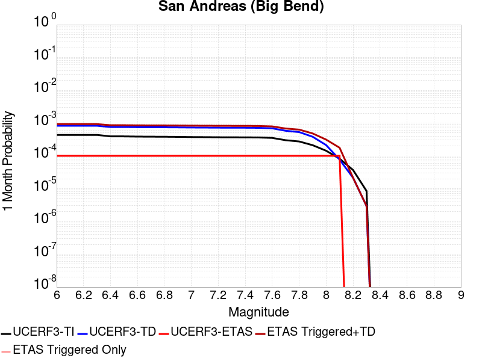 | 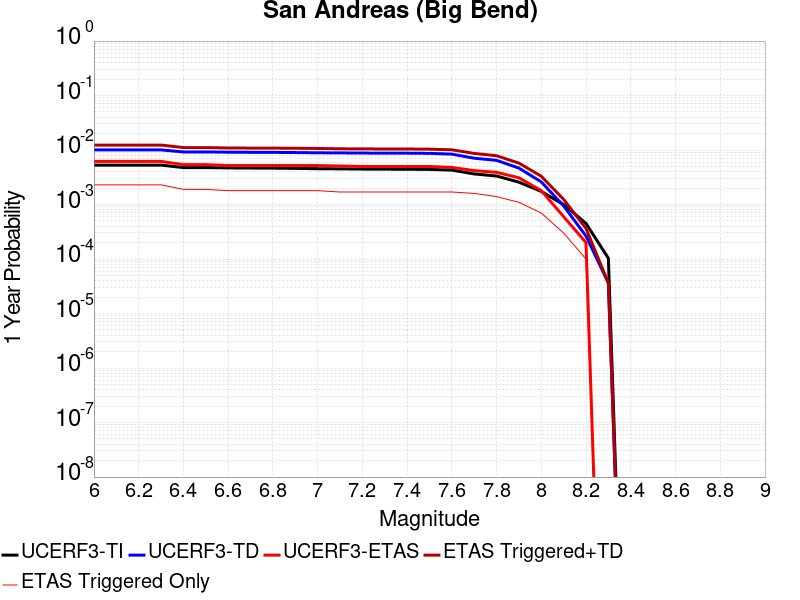 | 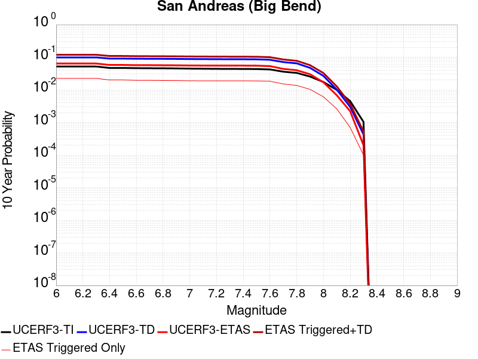 |

| Magnitude | 1 wk TI Prob | 1 wk TD Prob | 1 wk ETAS Prob | 1 wk ETAS/TD Gain | 1 wk ETAS Triggered+TD | 1 wk ETAS Triggered Only | 1 mo TI Prob | 1 mo TD Prob | 1 mo ETAS Prob | 1 mo ETAS/TD Gain | 1 mo ETAS Triggered+TD | 1 mo ETAS Triggered Only | 1 yr TI Prob | 1 yr TD Prob | 1 yr ETAS Prob | 1 yr ETAS/TD Gain | 1 yr ETAS Triggered+TD | 1 yr ETAS Triggered Only | 10 yr TI Prob | 10 yr TD Prob | 10 yr ETAS Prob | 10 yr ETAS/TD Gain | 10 yr ETAS Triggered+TD | 10 yr ETAS Triggered Only |
|-----|-----|-----|-----|-----|-----|-----|-----|-----|-----|-----|-----|-----|-----|-----|-----|-----|-----|-----|-----|-----|-----|-----|-----|-----|
| 6.0 | 1.0179969E-4 | 1.9400888E-4 | 2.0E-4 | 1.0308806 | 2.939895E-4 | 1.0E-4 | 4.362114E-4 | 8.312027E-4 | 4.0E-4 | 0.48123038 | 0.0010310365 | 2.0E-4 | 0.0052979486 | 0.010073204 | 0.0062 | 0.6154944 | 0.012350036 | 0.0023 | 0.051734097 | 0.09853886 | 0.0639 | 0.6484751 | 0.11873159 | 0.0224 |
| 6.1 | 1.0179969E-4 | 1.9400888E-4 | 2.0E-4 | 1.0308806 | 2.939895E-4 | 1.0E-4 | 4.362114E-4 | 8.312027E-4 | 4.0E-4 | 0.48123038 | 0.0010310365 | 2.0E-4 | 0.0052979486 | 0.010073204 | 0.0062 | 0.6154944 | 0.012350036 | 0.0023 | 0.051734097 | 0.09853886 | 0.0639 | 0.6484751 | 0.11873159 | 0.0224 |
| 6.2 | 1.0179969E-4 | 1.9400888E-4 | 2.0E-4 | 1.0308806 | 2.939895E-4 | 1.0E-4 | 4.362114E-4 | 8.312027E-4 | 4.0E-4 | 0.48123038 | 0.0010310365 | 2.0E-4 | 0.0052979486 | 0.010073204 | 0.0062 | 0.6154944 | 0.012350036 | 0.0023 | 0.051734097 | 0.09853886 | 0.0639 | 0.6484751 | 0.11873159 | 0.0224 |
| 6.3 | 1.0179969E-4 | 1.9400888E-4 | 2.0E-4 | 1.0308806 | 2.939895E-4 | 1.0E-4 | 4.362114E-4 | 8.312027E-4 | 4.0E-4 | 0.48123038 | 0.0010310365 | 2.0E-4 | 0.0052979486 | 0.010073204 | 0.0062 | 0.6154944 | 0.012350036 | 0.0023 | 0.051734097 | 0.09853886 | 0.0639 | 0.6484751 | 0.11873159 | 0.0224 |
| 6.4 | 9.1639464E-5 | 1.7771713E-4 | 2.0E-4 | 1.1253839 | 2.7769935E-4 | 1.0E-4 | 3.9268145E-4 | 7.6142274E-4 | 4.0E-4 | 0.52533233 | 9.612705E-4 | 2.0E-4 | 0.0047704205 | 0.009231024 | 0.0054 | 0.5849838 | 0.011113485 | 0.0019 | 0.046693064 | 0.09087049 | 0.0578 | 0.6360701 | 0.10905308 | 0.02 |
| 6.5 | 9.1639464E-5 | 1.7771713E-4 | 2.0E-4 | 1.1253839 | 2.7769935E-4 | 1.0E-4 | 3.9268145E-4 | 7.6142274E-4 | 4.0E-4 | 0.52533233 | 9.612705E-4 | 2.0E-4 | 0.0047704205 | 0.009231024 | 0.0054 | 0.5849838 | 0.011113485 | 0.0019 | 0.046693064 | 0.09087049 | 0.0578 | 0.6360701 | 0.10905308 | 0.02 |
| 6.6 | 9.042622E-5 | 1.7580374E-4 | 2.0E-4 | 1.1376323 | 2.7578615E-4 | 1.0E-4 | 3.8748336E-4 | 7.532272E-4 | 4.0E-4 | 0.53104824 | 9.530766E-4 | 2.0E-4 | 0.0047074095 | 0.009132083 | 0.0052 | 0.56942105 | 0.010915645 | 0.0018 | 0.046089325 | 0.08997144 | 0.0569 | 0.6324229 | 0.10771699 | 0.0195 |
| 6.7 | 8.9836685E-5 | 1.7495266E-4 | 2.0E-4 | 1.1431664 | 2.7493516E-4 | 1.0E-4 | 3.8495753E-4 | 7.4958184E-4 | 4.0E-4 | 0.53363085 | 9.494319E-4 | 2.0E-4 | 0.00467679 | 0.00908807 | 0.0052 | 0.57217866 | 0.010871712 | 0.0018 | 0.045795817 | 0.08956706 | 0.0569 | 0.6352782 | 0.107320495 | 0.0195 |
| 6.8 | 8.9471854E-5 | 1.7442678E-4 | 2.0E-4 | 1.1466129 | 2.7440934E-4 | 1.0E-4 | 3.8339442E-4 | 7.473294E-4 | 4.0E-4 | 0.5352392 | 9.471799E-4 | 2.0E-4 | 0.004657841 | 0.009060875 | 0.0052 | 0.573896 | 0.010844565 | 0.0018 | 0.04561414 | 0.089316614 | 0.0565 | 0.63258106 | 0.10689281 | 0.0193 |
| 6.9 | 8.858234E-5 | 1.732572E-4 | 2.0E-4 | 1.1543531 | 2.732399E-4 | 1.0E-4 | 3.7958333E-4 | 7.4231974E-4 | 4.0E-4 | 0.5388514 | 9.4217126E-4 | 2.0E-4 | 0.004611638 | 0.009000388 | 0.0052 | 0.5777529 | 0.010784187 | 0.0018 | 0.04517103 | 0.08875989 | 0.0562 | 0.6331689 | 0.1062557 | 0.0192 |
| 7.0 | 8.7433385E-5 | 1.716617E-4 | 2.0E-4 | 1.1650823 | 2.7164453E-4 | 1.0E-4 | 3.746607E-4 | 7.354857E-4 | 4.0E-4 | 0.5438583 | 9.353386E-4 | 2.0E-4 | 0.004551957 | 0.008917867 | 0.0052 | 0.58309907 | 0.010701816 | 0.0018 | 0.044598386 | 0.0879994 | 0.0555 | 0.63068604 | 0.10523622 | 0.0189 |
| 7.1 | 8.684964E-5 | 1.7079155E-4 | 2.0E-4 | 1.1710181 | 2.7077447E-4 | 1.0E-4 | 3.7215967E-4 | 7.317586E-4 | 4.0E-4 | 0.54662836 | 9.316123E-4 | 2.0E-4 | 0.0045216335 | 0.00887286 | 0.0051 | 0.5747864 | 0.010557776 | 0.0017 | 0.04430731 | 0.08758441 | 0.0553 | 0.63139087 | 0.104737826 | 0.0188 |
| 7.2 | 8.606521E-5 | 1.6970815E-4 | 2.0E-4 | 1.1784939 | 2.6969117E-4 | 1.0E-4 | 3.6879873E-4 | 7.2711805E-4 | 4.0E-4 | 0.550117 | 9.2697266E-4 | 2.0E-4 | 0.0044808835 | 0.008816821 | 0.005 | 0.56709784 | 0.010501832 | 0.0017 | 0.043916024 | 0.08706802 | 0.0552 | 0.63398707 | 0.10423114 | 0.0188 |
| 7.3 | 8.568266E-5 | 1.6914045E-4 | 2.0E-4 | 1.1824493 | 2.6912353E-4 | 1.0E-4 | 3.6715972E-4 | 7.246864E-4 | 4.0E-4 | 0.55196285 | 9.245415E-4 | 2.0E-4 | 0.0044610105 | 0.008787454 | 0.005 | 0.568993 | 0.010472516 | 0.0017 | 0.043725148 | 0.08679365 | 0.0551 | 0.63483906 | 0.10396194 | 0.0188 |
| 7.4 | 8.5432206E-5 | 1.687742E-4 | 2.0E-4 | 1.1850152 | 2.687573E-4 | 1.0E-4 | 3.6608664E-4 | 7.231177E-4 | 4.0E-4 | 0.5531603 | 9.2297303E-4 | 2.0E-4 | 0.004447999 | 0.008768509 | 0.005 | 0.5702224 | 0.010453602 | 0.0017 | 0.043600157 | 0.08661687 | 0.0551 | 0.6361348 | 0.103788465 | 0.0188 |
| 7.5 | 8.4791965E-5 | 1.6749436E-4 | 2.0E-4 | 1.1940701 | 2.6747762E-4 | 1.0E-4 | 3.633435E-4 | 7.176357E-4 | 4.0E-4 | 0.55738586 | 9.1749214E-4 | 2.0E-4 | 0.0044147377 | 0.0087023005 | 0.005 | 0.5745607 | 0.010387506 | 0.0017 | 0.043280575 | 0.086004674 | 0.0548 | 0.63717467 | 0.10309639 | 0.0187 |
| 7.6 | 8.241105E-5 | 1.6205799E-4 | 2.0E-4 | 1.2341261 | 2.6204178E-4 | 1.0E-4 | 3.531424E-4 | 6.943495E-4 | 4.0E-4 | 0.5760787 | 8.9421065E-4 | 2.0E-4 | 0.0042910352 | 0.008421018 | 0.0048 | 0.5700024 | 0.010106701 | 0.0017 | 0.042091176 | 0.083418645 | 0.0532 | 0.6377471 | 0.100192085 | 0.0183 |
| 7.7 | 7.00432E-5 | 1.3631982E-4 | 1.0E-4 | 0.733569 | 2.363062E-4 | 1.0E-4 | 3.001506E-4 | 5.84097E-4 | 3.0E-4 | 0.5136133 | 7.839802E-4 | 2.0E-4 | 0.0036482112 | 0.007088228 | 0.0042 | 0.59253174 | 0.008676887 | 0.0016 | 0.035888977 | 0.07092976 | 0.0437 | 0.61610246 | 0.08495872 | 0.0151 |
| 7.8 | 6.415362E-5 | 1.2452235E-4 | 1.0E-4 | 0.80306864 | 2.245099E-4 | 1.0E-4 | 2.749151E-4 | 5.3355814E-4 | 3.0E-4 | 0.562263 | 7.334514E-4 | 2.0E-4 | 0.0033419547 | 0.0064767473 | 0.0039 | 0.60215414 | 0.00786768 | 0.0014 | 0.03292141 | 0.064902715 | 0.0398 | 0.61322546 | 0.077620044 | 0.0136 |
| 7.9 | 4.939911E-5 | 8.969914E-5 | 1.0E-4 | 1.1148379 | 1.8969017E-4 | 1.0E-4 | 2.116933E-4 | 3.8436826E-4 | 3.0E-4 | 0.7805015 | 5.842914E-4 | 2.0E-4 | 0.0025743195 | 0.0046696505 | 0.0031 | 0.6638613 | 0.0057645137 | 0.0011 | 0.025447013 | 0.04717012 | 0.03 | 0.63599586 | 0.056984268 | 0.0103 |
| 8.0 | 3.344983E-5 | 5.001127E-5 | 1.0E-4 | 1.9995493 | 1.5000626E-4 | 1.0E-4 | 1.4334853E-4 | 2.1431642E-4 | 3.0E-4 | 1.3997995 | 4.1427356E-4 | 2.0E-4 | 0.0017438711 | 0.0026061817 | 0.0018 | 0.6906656 | 0.0033043572 | 7.0E-4 | 0.017302496 | 0.026830563 | 0.017 | 0.6336058 | 0.032766897 | 0.0061 |
| 8.1 | 1.9104898E-5 | 1.8106268E-5 | 1.0E-4 | 5.522949 | 1.1810446E-4 | 1.0E-4 | 8.1875565E-5 | 7.7595985E-5 | 2.0E-4 | 2.577453 | 2.7758046E-4 | 2.0E-4 | 9.963791E-4 | 9.443222E-4 | 6.0E-4 | 0.63537633 | 0.0012440389 | 3.0E-4 | 0.009919235 | 0.01018861 | 0.0068 | 0.6674119 | 0.01276212 | 0.0026 |
| 8.2 | 8.643924E-6 | 5.06885E-6 | 0.0 | 0.0 | 5.06885E-6 | 0.0 | 3.704486E-5 | 2.1723463E-5 | 1.0E-4 | 4.6033177 | 1.2172129E-4 | 1.0E-4 | 4.5092785E-4 | 2.6445114E-4 | 2.0E-4 | 0.7562834 | 3.644247E-4 | 1.0E-4 | 0.0045001395 | 0.0030259273 | 0.0022 | 0.7270499 | 0.003723809 | 7.0E-4 |
| 8.3 | 1.983087E-6 | 6.9765395E-7 | 0.0 | 0.0 | 6.9765395E-7 | 0.0 | 8.498917E-6 | 2.9899422E-6 | 0.0 | 0.0 | 2.9899422E-6 | 0.0 | 1.034694E-4 | 3.640195E-5 | 0.0 | 0.0 | 3.640195E-5 | 0.0 | 0.0010342124 | 4.3255524E-4 | 2.0E-4 | 0.46236867 | 5.32512E-4 | 1.0E-4 |

## San Andreas (Coachella) rev
*[(top)](#table-of-contents)*

| 1 Week | 1 Month | 1 Year | 10 Year |
|-----|-----|-----|-----|
| 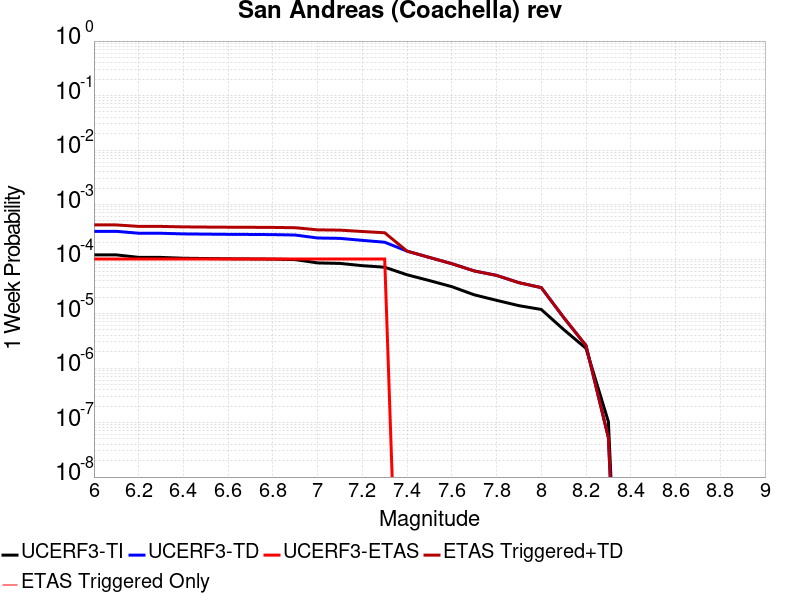 | 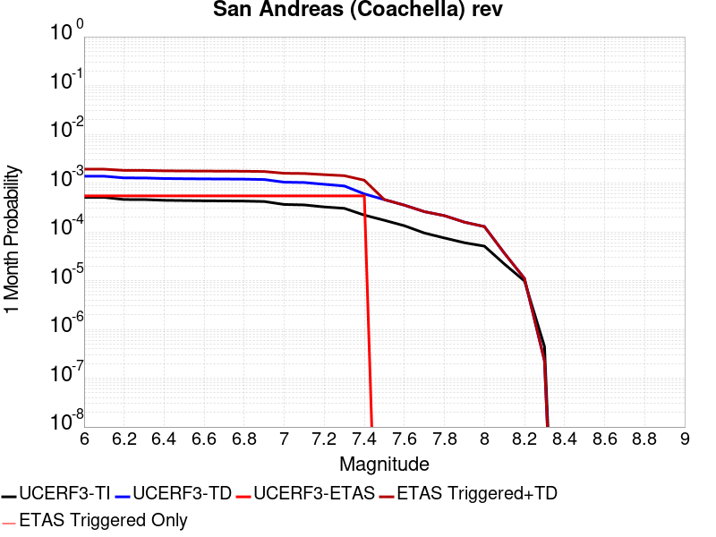 | 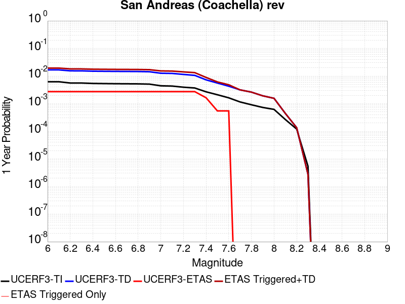 | 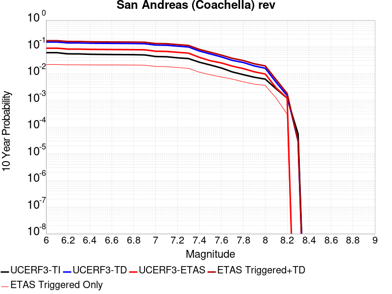 |

| Magnitude | 1 wk TI Prob | 1 wk TD Prob | 1 wk ETAS Prob | 1 wk ETAS/TD Gain | 1 wk ETAS Triggered+TD | 1 wk ETAS Triggered Only | 1 mo TI Prob | 1 mo TD Prob | 1 mo ETAS Prob | 1 mo ETAS/TD Gain | 1 mo ETAS Triggered+TD | 1 mo ETAS Triggered Only | 1 yr TI Prob | 1 yr TD Prob | 1 yr ETAS Prob | 1 yr ETAS/TD Gain | 1 yr ETAS Triggered+TD | 1 yr ETAS Triggered Only | 10 yr TI Prob | 10 yr TD Prob | 10 yr ETAS Prob | 10 yr ETAS/TD Gain | 10 yr ETAS Triggered+TD | 10 yr ETAS Triggered Only |
|-----|-----|-----|-----|-----|-----|-----|-----|-----|-----|-----|-----|-----|-----|-----|-----|-----|-----|-----|-----|-----|-----|-----|-----|-----|
| 6.0 | 1.1925945E-4 | 3.2356716E-4 | 3.0E-4 | 0.9271645 | 4.235348E-4 | 1.0E-4 | 5.110118E-4 | 0.0013859841 | 0.001 | 0.721509 | 0.0016855684 | 3.0E-4 | 0.0062038354 | 0.016745102 | 0.0096 | 0.57330203 | 0.020186493 | 0.0035 | 0.060334753 | 0.15119813 | 0.089 | 0.58863163 | 0.16978689 | 0.0219 |
| 6.1 | 1.1925945E-4 | 3.2356716E-4 | 3.0E-4 | 0.9271645 | 4.235348E-4 | 1.0E-4 | 5.110118E-4 | 0.0013859841 | 0.001 | 0.721509 | 0.0016855684 | 3.0E-4 | 0.0062038354 | 0.016745102 | 0.0096 | 0.57330203 | 0.020186493 | 0.0035 | 0.060334753 | 0.15119813 | 0.089 | 0.58863163 | 0.16978689 | 0.0219 |
| 6.2 | 1.07432395E-4 | 2.9859913E-4 | 3.0E-4 | 1.0046915 | 3.9856927E-4 | 1.0E-4 | 4.603433E-4 | 0.0012790869 | 0.001 | 0.7818077 | 0.0015787032 | 3.0E-4 | 0.005590286 | 0.015462755 | 0.009 | 0.58204377 | 0.018810183 | 0.0034 | 0.05451731 | 0.14036946 | 0.0822 | 0.5855975 | 0.15867959 | 0.0213 |
| 6.3 | 1.0718766E-4 | 2.980524E-4 | 3.0E-4 | 1.0065345 | 3.980226E-4 | 1.0E-4 | 4.592948E-4 | 0.0012767459 | 0.001 | 0.78324115 | 0.001576363 | 3.0E-4 | 0.005577586 | 0.015434659 | 0.009 | 0.5831033 | 0.018782182 | 0.0034 | 0.054396555 | 0.14013737 | 0.0822 | 0.5865673 | 0.15845245 | 0.0213 |
| 6.4 | 1.0355944E-4 | 2.9013876E-4 | 3.0E-4 | 1.033988 | 3.9010975E-4 | 1.0E-4 | 4.4375064E-4 | 0.0012428632 | 9.0E-4 | 0.7241344 | 0.0015424903 | 3.0E-4 | 0.0053892885 | 0.015027897 | 0.0088 | 0.5855776 | 0.018278306 | 0.0033 | 0.052604496 | 0.13668689 | 0.0804 | 0.58820564 | 0.1549028 | 0.0211 |
| 6.5 | 1.0227914E-4 | 2.8733484E-4 | 3.0E-4 | 1.044078 | 3.8730612E-4 | 1.0E-4 | 4.382655E-4 | 0.0012308578 | 9.0E-4 | 0.7311974 | 0.0015304885 | 3.0E-4 | 0.0053228354 | 0.014883738 | 0.0088 | 0.59124935 | 0.018134622 | 0.0033 | 0.051971316 | 0.13546863 | 0.0799 | 0.5898045 | 0.15362379 | 0.021 |
| 6.6 | 1.0116757E-4 | 2.8499638E-4 | 3.0E-4 | 1.052645 | 3.8496786E-4 | 1.0E-4 | 4.3350324E-4 | 0.0012208452 | 9.0E-4 | 0.73719424 | 0.0015204789 | 3.0E-4 | 0.0052651367 | 0.014763491 | 0.0088 | 0.596065 | 0.018014772 | 0.0033 | 0.051421247 | 0.13444701 | 0.0793 | 0.5898235 | 0.15262362 | 0.021 |
| 6.7 | 1.0050676E-4 | 2.8358385E-4 | 3.0E-4 | 1.0578882 | 3.8355548E-4 | 1.0E-4 | 4.3067214E-4 | 0.0012147971 | 9.0E-4 | 0.74086446 | 0.0015144326 | 3.0E-4 | 0.005230834 | 0.014690852 | 0.0087 | 0.5922053 | 0.01784384 | 0.0032 | 0.051094085 | 0.13383092 | 0.0789 | 0.5895499 | 0.15193385 | 0.0209 |
| 6.8 | 9.976819E-5 | 2.8162592E-4 | 3.0E-4 | 1.0652429 | 3.8159775E-4 | 1.0E-4 | 4.2750788E-4 | 0.0012064138 | 9.0E-4 | 0.7460127 | 0.0015060519 | 3.0E-4 | 0.0051924936 | 0.014590157 | 0.0087 | 0.5962924 | 0.017743468 | 0.0032 | 0.050728295 | 0.13298313 | 0.0781 | 0.5872925 | 0.15101708 | 0.0208 |
| 6.9 | 9.77719E-5 | 2.766273E-4 | 3.0E-4 | 1.0844916 | 3.7659964E-4 | 1.0E-4 | 4.1895514E-4 | 0.0011850108 | 9.0E-4 | 0.7594868 | 0.0014846553 | 3.0E-4 | 0.0050888555 | 0.014333033 | 0.0085 | 0.5930357 | 0.017290033 | 0.003 | 0.049738888 | 0.13081968 | 0.0775 | 0.59241855 | 0.14863788 | 0.0205 |
| 7.0 | 8.500761E-5 | 2.4420972E-4 | 3.0E-4 | 1.2284523 | 3.441853E-4 | 1.0E-4 | 3.6426744E-4 | 0.0010461964 | 9.0E-4 | 0.86025906 | 0.0013458825 | 3.0E-4 | 0.0044259406 | 0.012663806 | 0.0078 | 0.6159286 | 0.015329613 | 0.0027 | 0.04338823 | 0.116740264 | 0.0684 | 0.5859161 | 0.13299224 | 0.0184 |
| 7.1 | 8.319876E-5 | 2.4028315E-4 | 3.0E-4 | 1.248527 | 3.402591E-4 | 1.0E-4 | 3.5651738E-4 | 0.0010293816 | 9.0E-4 | 0.87431127 | 0.0013290729 | 3.0E-4 | 0.004331963 | 0.012461445 | 0.0076 | 0.6098811 | 0.015029046 | 0.0026 | 0.042484846 | 0.114976116 | 0.0673 | 0.58533895 | 0.13099505 | 0.0181 |
| 7.2 | 7.563917E-5 | 2.2088508E-4 | 3.0E-4 | 1.3581723 | 3.20863E-4 | 1.0E-4 | 3.2412758E-4 | 9.4630994E-4 | 9.0E-4 | 0.9510626 | 0.001246026 | 3.0E-4 | 0.0039391145 | 0.011461131 | 0.0072 | 0.62821025 | 0.013833624 | 0.0024 | 0.03870018 | 0.10641468 | 0.0623 | 0.5854455 | 0.12142692 | 0.0168 |
| 7.3 | 7.082985E-5 | 2.0418932E-4 | 3.0E-4 | 1.4692248 | 3.041689E-4 | 1.0E-4 | 3.0352117E-4 | 8.748064E-4 | 9.0E-4 | 1.028799 | 0.001174544 | 3.0E-4 | 0.0036891096 | 0.010599364 | 0.0069 | 0.6509825 | 0.012973925 | 0.0024 | 0.03628465 | 0.09898346 | 0.058 | 0.5859565 | 0.113039315 | 0.0156 |
| 7.4 | 5.146215E-5 | 1.4023531E-4 | 2.0E-4 | 1.4261744 | 1.4023531E-4 | 0.0 | 2.2053342E-4 | 6.008709E-4 | 7.0E-4 | 1.1649758 | 8.007507E-4 | 2.0E-4 | 0.0026816884 | 0.0072912476 | 0.0048 | 0.6583235 | 0.0088795815 | 0.0016 | 0.02649557 | 0.0697578 | 0.0402 | 0.57627964 | 0.08017651 | 0.0112 |
| 7.5 | 4.0285166E-5 | 1.072944E-4 | 2.0E-4 | 1.8640302 | 1.072944E-4 | 0.0 | 1.7263928E-4 | 4.5975242E-4 | 5.0E-4 | 1.0875418 | 5.597064E-4 | 1.0E-4 | 0.002099857 | 0.0055831866 | 0.0034 | 0.6089712 | 0.006478162 | 9.0E-4 | 0.020801254 | 0.05406535 | 0.0301 | 0.5567336 | 0.06257876 | 0.009 |
| 7.6 | 3.1168736E-5 | 8.250048E-5 | 1.0E-4 | 1.2121141 | 8.250048E-5 | 0.0 | 1.3357346E-4 | 3.535257E-4 | 4.0E-4 | 1.1314595 | 4.5349036E-4 | 1.0E-4 | 0.0016250437 | 0.0042957067 | 0.0025 | 0.5819764 | 0.00509227 | 8.0E-4 | 0.016132116 | 0.041957147 | 0.0249 | 0.59346265 | 0.049046665 | 0.0074 |
| 7.7 | 2.2100989E-5 | 6.0723614E-5 | 1.0E-4 | 1.6468058 | 6.0723614E-5 | 0.0 | 9.4715084E-5 | 2.6021813E-4 | 3.0E-4 | 1.1528789 | 3.6019212E-4 | 1.0E-4 | 0.001152546 | 0.0031635594 | 0.0012 | 0.37931958 | 0.0036619776 | 5.0E-4 | 0.011465867 | 0.031142674 | 0.0189 | 0.6068843 | 0.03714959 | 0.0062 |
| 7.8 | 1.7484861E-5 | 5.0309278E-5 | 1.0E-4 | 1.987705 | 5.0309278E-5 | 0.0 | 7.493296E-5 | 2.1559339E-4 | 3.0E-4 | 1.3915083 | 3.1557182E-4 | 1.0E-4 | 9.1192697E-4 | 0.0026216926 | 0.0011 | 0.41957626 | 0.0031203819 | 5.0E-4 | 0.009081938 | 0.02596122 | 0.0153 | 0.58934057 | 0.03073401 | 0.0049 |
| 7.9 | 1.3967285E-5 | 3.7001482E-5 | 0.0 | 0.0 | 3.7001482E-5 | 0.0 | 5.985842E-5 | 1.5856815E-4 | 2.0E-4 | 1.2612873 | 2.585523E-4 | 1.0E-4 | 7.2853256E-4 | 0.0019288589 | 9.0E-4 | 0.4665971 | 0.0023280873 | 4.0E-4 | 0.0072614877 | 0.019343149 | 0.0116 | 0.5996955 | 0.023265777 | 0.004 |
| 8.0 | 1.1887396E-5 | 3.0013814E-5 | 0.0 | 0.0 | 3.0013814E-5 | 0.0 | 5.094499E-5 | 1.286243E-4 | 2.0E-4 | 1.5549161 | 2.2861143E-4 | 1.0E-4 | 6.200787E-4 | 0.0015648769 | 8.0E-4 | 0.51122236 | 0.0019642508 | 4.0E-4 | 0.006183513 | 0.015787795 | 0.0096 | 0.60806465 | 0.019330958 | 0.0036 |
| 8.1 | 5.100864E-6 | 8.54409E-6 | 0.0 | 0.0 | 8.54409E-6 | 0.0 | 2.1860664E-5 | 3.6617013E-5 | 1.0E-4 | 2.7309709 | 1.3661335E-4 | 1.0E-4 | 2.6612106E-4 | 4.4572106E-4 | 1.0E-4 | 0.22435556 | 5.456765E-4 | 1.0E-4 | 0.002658026 | 0.004703141 | 0.0029 | 0.6166092 | 0.0058974973 | 0.0012 |
| 8.2 | 2.3004484E-6 | 2.6136363E-6 | 0.0 | 0.0 | 2.6136363E-6 | 0.0 | 9.859027E-6 | 1.120125E-5 | 1.0E-4 | 8.927575 | 1.1120013E-4 | 1.0E-4 | 1.2002704E-4 | 1.3636671E-4 | 1.0E-4 | 0.7333168 | 2.3635308E-4 | 1.0E-4 | 0.0011996223 | 0.0015078917 | 0.0012 | 0.7958131 | 0.0018074394 | 3.0E-4 |
| 8.3 | 1.0424446E-7 | 5.368235E-8 | 0.0 | 0.0 | 5.368235E-8 | 0.0 | 4.4676187E-7 | 2.300672E-7 | 0.0 | 0.0 | 2.300672E-7 | 0.0 | 5.439312E-6 | 2.8010647E-6 | 0.0 | 0.0 | 2.8010647E-6 | 0.0 | 5.4391792E-5 | 2.9512299E-5 | 0.0 | 0.0 | 2.9512299E-5 | 0.0 |

## San Andreas (Mojave N)
*[(top)](#table-of-contents)*

| 1 Week | 1 Month | 1 Year | 10 Year |
|-----|-----|-----|-----|
| 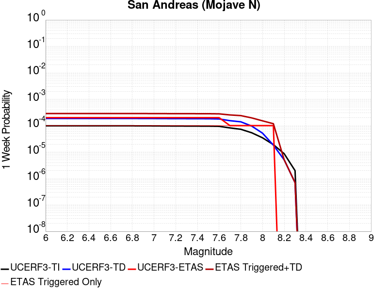 | 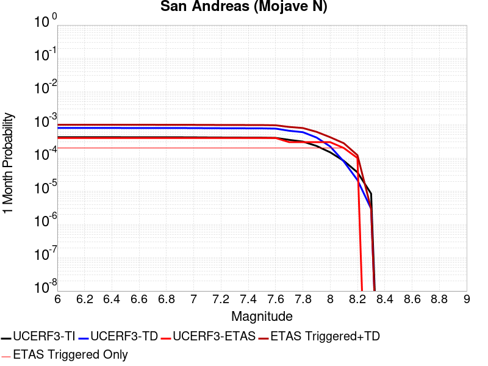 | 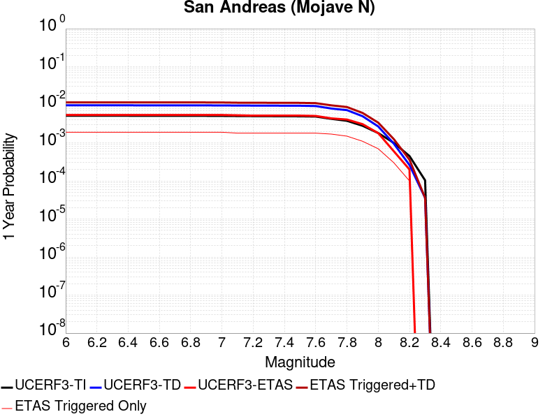 | 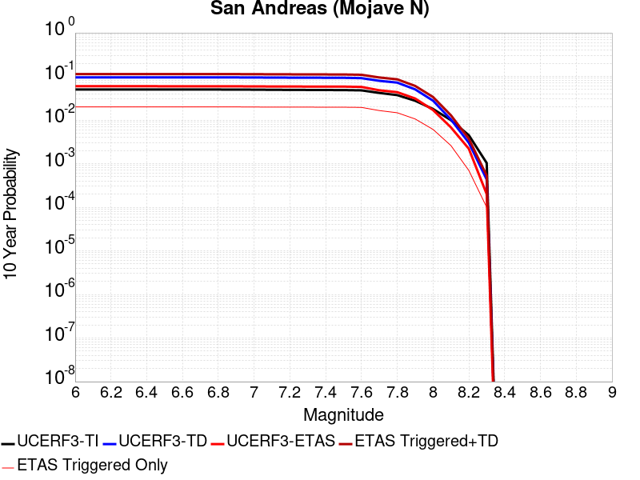 |

| Magnitude | 1 wk TI Prob | 1 wk TD Prob | 1 wk ETAS Prob | 1 wk ETAS/TD Gain | 1 wk ETAS Triggered+TD | 1 wk ETAS Triggered Only | 1 mo TI Prob | 1 mo TD Prob | 1 mo ETAS Prob | 1 mo ETAS/TD Gain | 1 mo ETAS Triggered+TD | 1 mo ETAS Triggered Only | 1 yr TI Prob | 1 yr TD Prob | 1 yr ETAS Prob | 1 yr ETAS/TD Gain | 1 yr ETAS Triggered+TD | 1 yr ETAS Triggered Only | 10 yr TI Prob | 10 yr TD Prob | 10 yr ETAS Prob | 10 yr ETAS/TD Gain | 10 yr ETAS Triggered+TD | 10 yr ETAS Triggered Only |
|-----|-----|-----|-----|-----|-----|-----|-----|-----|-----|-----|-----|-----|-----|-----|-----|-----|-----|-----|-----|-----|-----|-----|-----|-----|
| 6.0 | 9.877682E-5 | 1.871493E-4 | 2.0E-4 | 1.0686655 | 2.871306E-4 | 1.0E-4 | 4.2326056E-4 | 8.0182205E-4 | 4.0E-4 | 0.49886382 | 0.0010016616 | 2.0E-4 | 0.0051410277 | 0.009718601 | 0.0054 | 0.5556355 | 0.011600136 | 0.0019 | 0.05023708 | 0.09529735 | 0.0599 | 0.62855893 | 0.11339141 | 0.02 |
| 6.1 | 9.877682E-5 | 1.871493E-4 | 2.0E-4 | 1.0686655 | 2.871306E-4 | 1.0E-4 | 4.2326056E-4 | 8.0182205E-4 | 4.0E-4 | 0.49886382 | 0.0010016616 | 2.0E-4 | 0.0051410277 | 0.009718601 | 0.0054 | 0.5556355 | 0.011600136 | 0.0019 | 0.05023708 | 0.09529735 | 0.0599 | 0.62855893 | 0.11339141 | 0.02 |
| 6.2 | 9.877682E-5 | 1.871493E-4 | 2.0E-4 | 1.0686655 | 2.871306E-4 | 1.0E-4 | 4.2326056E-4 | 8.0182205E-4 | 4.0E-4 | 0.49886382 | 0.0010016616 | 2.0E-4 | 0.0051410277 | 0.009718601 | 0.0054 | 0.5556355 | 0.011600136 | 0.0019 | 0.05023708 | 0.09529735 | 0.0599 | 0.62855893 | 0.11339141 | 0.02 |
| 6.3 | 9.877682E-5 | 1.871493E-4 | 2.0E-4 | 1.0686655 | 2.871306E-4 | 1.0E-4 | 4.2326056E-4 | 8.0182205E-4 | 4.0E-4 | 0.49886382 | 0.0010016616 | 2.0E-4 | 0.0051410277 | 0.009718601 | 0.0054 | 0.5556355 | 0.011600136 | 0.0019 | 0.05023708 | 0.09529735 | 0.0599 | 0.62855893 | 0.11339141 | 0.02 |
| 6.4 | 9.877682E-5 | 1.871493E-4 | 2.0E-4 | 1.0686655 | 2.871306E-4 | 1.0E-4 | 4.2326056E-4 | 8.0182205E-4 | 4.0E-4 | 0.49886382 | 0.0010016616 | 2.0E-4 | 0.0051410277 | 0.009718601 | 0.0054 | 0.5556355 | 0.011600136 | 0.0019 | 0.05023708 | 0.09529735 | 0.0599 | 0.62855893 | 0.11339141 | 0.02 |
| 6.5 | 9.861474E-5 | 1.8688908E-4 | 2.0E-4 | 1.0701535 | 2.868704E-4 | 1.0E-4 | 4.2256617E-4 | 8.007075E-4 | 4.0E-4 | 0.4995582 | 0.0010005473 | 2.0E-4 | 0.0051326132 | 0.009705152 | 0.0054 | 0.5564055 | 0.011586713 | 0.0019 | 0.050156746 | 0.09517572 | 0.0594 | 0.62410873 | 0.113272205 | 0.02 |
| 6.6 | 9.861474E-5 | 1.8688908E-4 | 2.0E-4 | 1.0701535 | 2.868704E-4 | 1.0E-4 | 4.2256617E-4 | 8.007075E-4 | 4.0E-4 | 0.4995582 | 0.0010005473 | 2.0E-4 | 0.0051326132 | 0.009705152 | 0.0054 | 0.5564055 | 0.011586713 | 0.0019 | 0.050156746 | 0.09517572 | 0.0594 | 0.62410873 | 0.113272205 | 0.02 |
| 6.7 | 9.8552715E-5 | 1.8678943E-4 | 2.0E-4 | 1.0707244 | 2.8677075E-4 | 1.0E-4 | 4.223004E-4 | 8.002807E-4 | 4.0E-4 | 0.49982464 | 0.0010001207 | 2.0E-4 | 0.0051293927 | 0.009700002 | 0.0054 | 0.5567009 | 0.011581573 | 0.0019 | 0.050125998 | 0.09512895 | 0.0594 | 0.6244156 | 0.11322638 | 0.02 |
| 6.8 | 9.8464974E-5 | 1.8664311E-4 | 2.0E-4 | 1.0715637 | 2.8662445E-4 | 1.0E-4 | 4.219245E-4 | 7.9965405E-4 | 4.0E-4 | 0.5002163 | 9.994941E-4 | 2.0E-4 | 0.0051248376 | 0.009692441 | 0.0054 | 0.5571352 | 0.011574025 | 0.0019 | 0.05008251 | 0.0950595 | 0.0594 | 0.6248718 | 0.11315831 | 0.02 |
| 6.9 | 9.825824E-5 | 1.8632699E-4 | 2.0E-4 | 1.0733818 | 2.8630835E-4 | 1.0E-4 | 4.2103877E-4 | 7.983E-4 | 4.0E-4 | 0.5010648 | 9.981403E-4 | 2.0E-4 | 0.0051141046 | 0.009676102 | 0.0054 | 0.55807596 | 0.011557718 | 0.0019 | 0.049980022 | 0.094909616 | 0.0594 | 0.6258586 | 0.11301142 | 0.02 |
| 7.0 | 9.781462E-5 | 1.8564856E-4 | 2.0E-4 | 1.0773042 | 2.8563E-4 | 1.0E-4 | 4.1913814E-4 | 7.953943E-4 | 4.0E-4 | 0.50289524 | 9.952352E-4 | 2.0E-4 | 0.005091073 | 0.009641038 | 0.0054 | 0.5601056 | 0.011522721 | 0.0019 | 0.04976007 | 0.09458864 | 0.0591 | 0.62481076 | 0.112606324 | 0.0199 |
| 7.1 | 9.7121134E-5 | 1.8467633E-4 | 2.0E-4 | 1.0829757 | 2.8465787E-4 | 1.0E-4 | 4.1616702E-4 | 7.912301E-4 | 4.0E-4 | 0.5055419 | 9.910719E-4 | 2.0E-4 | 0.005055068 | 0.009590787 | 0.0053 | 0.5526137 | 0.011373524 | 0.0018 | 0.04941613 | 0.094128594 | 0.0589 | 0.62573975 | 0.112064846 | 0.0198 |
| 7.2 | 9.663819E-5 | 1.8399193E-4 | 2.0E-4 | 1.0870042 | 2.8397352E-4 | 1.0E-4 | 4.1409794E-4 | 7.882987E-4 | 4.0E-4 | 0.50742185 | 9.88141E-4 | 2.0E-4 | 0.0050299936 | 0.0095554115 | 0.0052 | 0.5441943 | 0.011338212 | 0.0018 | 0.049176537 | 0.09380427 | 0.0588 | 0.62683713 | 0.111746944 | 0.0198 |
| 7.3 | 9.6277574E-5 | 1.8352667E-4 | 2.0E-4 | 1.0897598 | 2.8350833E-4 | 1.0E-4 | 4.125529E-4 | 7.863059E-4 | 4.0E-4 | 0.5087078 | 9.861487E-4 | 2.0E-4 | 0.0050112694 | 0.009531362 | 0.0052 | 0.5455674 | 0.011314205 | 0.0018 | 0.04899759 | 0.09358144 | 0.0586 | 0.62619257 | 0.11152852 | 0.0198 |
| 7.4 | 9.593308E-5 | 1.8293511E-4 | 2.0E-4 | 1.0932838 | 2.8291682E-4 | 1.0E-4 | 4.1107697E-4 | 7.837722E-4 | 4.0E-4 | 0.5103524 | 9.836155E-4 | 2.0E-4 | 0.0049933824 | 0.009500783 | 0.0052 | 0.5473233 | 0.011283682 | 0.0018 | 0.04882661 | 0.09330343 | 0.0585 | 0.6269866 | 0.11116535 | 0.0197 |
| 7.5 | 9.561707E-5 | 1.8240555E-4 | 2.0E-4 | 1.0964578 | 2.823873E-4 | 1.0E-4 | 4.0972308E-4 | 7.815041E-4 | 4.0E-4 | 0.51183355 | 9.813478E-4 | 2.0E-4 | 0.0049769743 | 0.009473409 | 0.0052 | 0.54890484 | 0.011256357 | 0.0018 | 0.048669744 | 0.0930533 | 0.0585 | 0.62867194 | 0.11092015 | 0.0197 |
| 7.6 | 9.418194E-5 | 1.7898521E-4 | 2.0E-4 | 1.1174108 | 2.7896732E-4 | 1.0E-4 | 4.0357444E-4 | 7.6685415E-4 | 4.0E-4 | 0.5216116 | 9.667008E-4 | 2.0E-4 | 0.004902454 | 0.009296581 | 0.0051 | 0.54858875 | 0.011079848 | 0.0018 | 0.047957025 | 0.09145252 | 0.0575 | 0.62874156 | 0.10916919 | 0.0195 |
| 7.7 | 8.202141E-5 | 1.5405942E-4 | 1.0E-4 | 0.6491002 | 2.5404402E-4 | 1.0E-4 | 3.51473E-4 | 6.600876E-4 | 3.0E-4 | 0.45448512 | 8.599556E-4 | 2.0E-4 | 0.00427079 | 0.008007003 | 0.0044 | 0.549519 | 0.009693391 | 0.0017 | 0.04189639 | 0.07947151 | 0.0481 | 0.6052483 | 0.09466024 | 0.0165 |
| 7.8 | 7.2859846E-5 | 1.3962708E-4 | 1.0E-4 | 0.71619344 | 2.3961312E-4 | 1.0E-4 | 3.1221908E-4 | 5.9826457E-4 | 3.0E-4 | 0.5014504 | 7.981449E-4 | 2.0E-4 | 0.003794643 | 0.007259581 | 0.0041 | 0.5647709 | 0.0087486915 | 0.0015 | 0.037304975 | 0.07222319 | 0.0436 | 0.60368425 | 0.08586151 | 0.0147 |
| 7.9 | 5.3874453E-5 | 9.656534E-5 | 1.0E-4 | 1.0355682 | 1.9655569E-4 | 1.0E-4 | 2.3087008E-4 | 4.1378583E-4 | 3.0E-4 | 0.7250128 | 6.1370304E-4 | 2.0E-4 | 0.0028072202 | 0.005026215 | 0.0031 | 0.6167663 | 0.0061206864 | 0.0011 | 0.02772022 | 0.0506002 | 0.0312 | 0.61659837 | 0.060663838 | 0.0106 |
| 8.0 | 3.468538E-5 | 5.2004732E-5 | 1.0E-4 | 1.9229019 | 1.5199953E-4 | 1.0E-4 | 1.4864317E-4 | 2.2285839E-4 | 3.0E-4 | 1.3461463 | 4.228138E-4 | 2.0E-4 | 0.0018082283 | 0.0027099266 | 0.0018 | 0.6642246 | 0.0034080297 | 7.0E-4 | 0.017935853 | 0.027838226 | 0.017 | 0.6106711 | 0.03376841 | 0.0061 |
| 8.1 | 1.9152367E-5 | 1.8336963E-5 | 1.0E-4 | 5.453466 | 1.1833513E-4 | 1.0E-4 | 8.207899E-5 | 7.858462E-5 | 2.0E-4 | 2.5450273 | 2.785689E-4 | 2.0E-4 | 9.988535E-4 | 9.563484E-4 | 6.0E-4 | 0.62738645 | 0.0012560615 | 3.0E-4 | 0.009943757 | 0.010296682 | 0.0068 | 0.66040695 | 0.01286991 | 0.0026 |
| 8.2 | 8.643924E-6 | 5.06885E-6 | 0.0 | 0.0 | 5.06885E-6 | 0.0 | 3.704486E-5 | 2.1723463E-5 | 1.0E-4 | 4.6033177 | 1.2172129E-4 | 1.0E-4 | 4.5092785E-4 | 2.6445114E-4 | 2.0E-4 | 0.7562834 | 3.644247E-4 | 1.0E-4 | 0.0045001395 | 0.0030259273 | 0.0022 | 0.7270499 | 0.003723809 | 7.0E-4 |
| 8.3 | 1.983087E-6 | 6.9765395E-7 | 0.0 | 0.0 | 6.9765395E-7 | 0.0 | 8.498917E-6 | 2.9899422E-6 | 0.0 | 0.0 | 2.9899422E-6 | 0.0 | 1.034694E-4 | 3.640195E-5 | 0.0 | 0.0 | 3.640195E-5 | 0.0 | 0.0010342124 | 4.3255524E-4 | 2.0E-4 | 0.46236867 | 5.32512E-4 | 1.0E-4 |

## Green Valley 2011 CFM
*[(top)](#table-of-contents)*

| 1 Week | 1 Month | 1 Year | 10 Year |
|-----|-----|-----|-----|
| 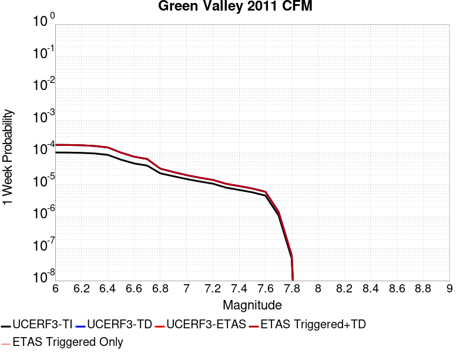 | 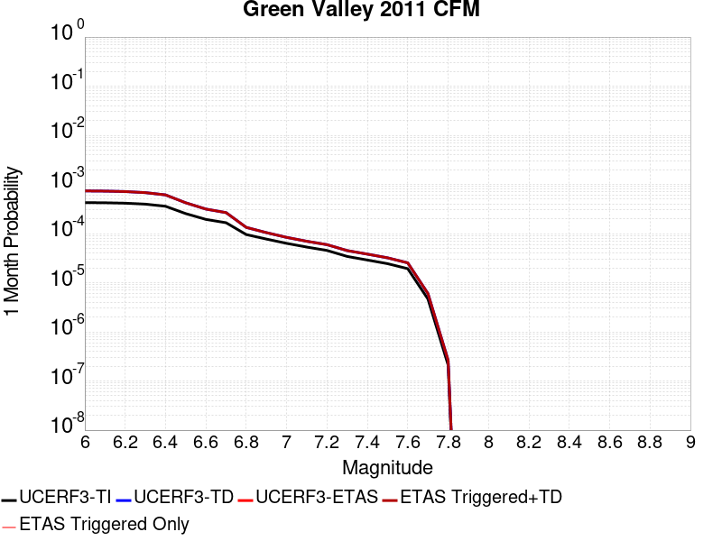 |  | 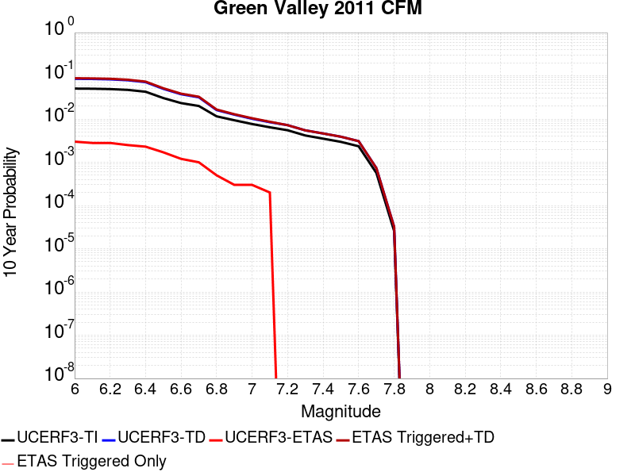 |

| Magnitude | 1 wk TI Prob | 1 wk TD Prob | 1 wk ETAS Prob | 1 wk ETAS/TD Gain | 1 wk ETAS Triggered+TD | 1 wk ETAS Triggered Only | 1 mo TI Prob | 1 mo TD Prob | 1 mo ETAS Prob | 1 mo ETAS/TD Gain | 1 mo ETAS Triggered+TD | 1 mo ETAS Triggered Only | 1 yr TI Prob | 1 yr TD Prob | 1 yr ETAS Prob | 1 yr ETAS/TD Gain | 1 yr ETAS Triggered+TD | 1 yr ETAS Triggered Only | 10 yr TI Prob | 10 yr TD Prob | 10 yr ETAS Prob | 10 yr ETAS/TD Gain | 10 yr ETAS Triggered+TD | 10 yr ETAS Triggered Only |
|-----|-----|-----|-----|-----|-----|-----|-----|-----|-----|-----|-----|-----|-----|-----|-----|-----|-----|-----|-----|-----|-----|-----|-----|-----|
| 6.0 | 9.9629346E-5 | 1.723003E-4 | 0.0 | 0.0 | 1.723003E-4 | 0.0 | 4.2691303E-4 | 7.3821814E-4 | 1.0E-4 | 0.13546132 | 8.3814433E-4 | 1.0E-4 | 0.0051852856 | 0.008949381 | 0.0057 | 0.63691556 | 0.011030587 | 0.0021 | 0.050659515 | 0.08519073 | 0.0564 | 0.66204387 | 0.10110841 | 0.0174 |
| 6.1 | 9.88615E-5 | 1.7077432E-4 | 0.0 | 0.0 | 1.7077432E-4 | 0.0 | 4.2362334E-4 | 7.3168206E-4 | 1.0E-4 | 0.1366714 | 8.316089E-4 | 1.0E-4 | 0.0051454236 | 0.008870459 | 0.0056 | 0.6313089 | 0.010951832 | 0.0021 | 0.050279044 | 0.08447853 | 0.0546 | 0.6463181 | 0.099676184 | 0.0166 |
| 6.2 | 9.696895E-5 | 1.6717147E-4 | 0.0 | 0.0 | 1.6717147E-4 | 0.0 | 4.15515E-4 | 7.1624975E-4 | 1.0E-4 | 0.1396161 | 8.1617816E-4 | 1.0E-4 | 0.0050471667 | 0.008684165 | 0.0053 | 0.61030626 | 0.010666797 | 0.002 | 0.04934063 | 0.08278945 | 0.0533 | 0.6438018 | 0.0978317 | 0.0164 |
| 6.3 | 9.275224E-5 | 1.589701E-4 | 0.0 | 0.0 | 1.589701E-4 | 0.0 | 3.9744904E-4 | 6.811196E-4 | 0.0 | 0.0 | 6.811196E-4 | 0.0 | 0.0048282105 | 0.008259743 | 0.0049 | 0.5932388 | 0.009945702 | 0.0017 | 0.047246475 | 0.07892925 | 0.0511 | 0.6474152 | 0.09329796 | 0.0156 |
| 6.4 | 8.391499E-5 | 1.4298713E-4 | 0.0 | 0.0 | 1.4298713E-4 | 0.0 | 3.595861E-4 | 6.126609E-4 | 0.0 | 0.0 | 6.126609E-4 | 0.0 | 0.004369175 | 0.007432519 | 0.0043 | 0.5785387 | 0.00892137 | 0.0015 | 0.04284265 | 0.071316466 | 0.0469 | 0.6576322 | 0.08478238 | 0.0145 |
| 6.5 | 5.9519385E-5 | 9.880607E-5 | 0.0 | 0.0 | 9.880607E-5 | 0.0 | 2.5505814E-4 | 4.2338544E-4 | 0.0 | 0.0 | 4.2338544E-4 | 0.0 | 0.0031009112 | 0.0051414133 | 0.0034 | 0.6612968 | 0.006534215 | 0.0014 | 0.030579966 | 0.049905717 | 0.0344 | 0.68929976 | 0.05940666 | 0.01 |
| 6.6 | 4.5361558E-5 | 7.362437E-5 | 0.0 | 0.0 | 7.362437E-5 | 0.0 | 1.9439218E-4 | 3.1549318E-4 | 0.0 | 0.0 | 3.1549318E-4 | 0.0 | 0.0023641558 | 0.003833405 | 0.0026 | 0.6782482 | 0.004929188 | 0.0011 | 0.023391623 | 0.03748022 | 0.0262 | 0.6990354 | 0.044506613 | 0.0073 |
| 6.7 | 3.8808106E-5 | 6.230829E-5 | 0.0 | 0.0 | 6.230829E-5 | 0.0 | 1.6630985E-4 | 2.670088E-4 | 0.0 | 0.0 | 2.670088E-4 | 0.0 | 0.0020229418 | 0.0032453204 | 0.0021 | 0.64708555 | 0.0041424 | 9.0E-4 | 0.020046256 | 0.03184677 | 0.0211 | 0.6625476 | 0.03746206 | 0.0058 |
| 6.8 | 2.2284667E-5 | 3.1184663E-5 | 0.0 | 0.0 | 3.1184663E-5 | 0.0 | 9.550222E-5 | 1.3364178E-4 | 0.0 | 0.0 | 1.3364178E-4 | 0.0 | 0.0011621192 | 0.0016258745 | 0.0011 | 0.676559 | 0.0019253867 | 3.0E-4 | 0.011560607 | 0.016117869 | 0.0105 | 0.6514509 | 0.018872738 | 0.0028 |
| 6.9 | 1.8050168E-5 | 2.4380426E-5 | 0.0 | 0.0 | 2.4380426E-5 | 0.0 | 7.735557E-5 | 1.0448336E-4 | 0.0 | 0.0 | 1.0448336E-4 | 0.0 | 9.4139716E-4 | 0.0012713457 | 0.001 | 0.7865681 | 0.0015709642 | 3.0E-4 | 0.009374191 | 0.012633375 | 0.0081 | 0.6411589 | 0.014706844 | 0.0021 |
| 7.0 | 1.4763166E-5 | 1.95367E-5 | 0.0 | 0.0 | 1.95367E-5 | 0.0 | 6.326917E-5 | 8.3726045E-5 | 0.0 | 0.0 | 8.3726045E-5 | 0.0 | 7.7002996E-4 | 0.0010188891 | 9.0E-4 | 0.8833149 | 0.0012186854 | 2.0E-4 | 0.007673672 | 0.010142356 | 0.0073 | 0.71975386 | 0.0119241 | 0.0018 |
| 7.1 | 1.2399713E-5 | 1.626603E-5 | 0.0 | 0.0 | 1.626603E-5 | 0.0 | 5.3140546E-5 | 6.9709706E-5 | 0.0 | 0.0 | 6.9709706E-5 | 0.0 | 6.467941E-4 | 8.483872E-4 | 7.0E-4 | 0.82509494 | 9.4830233E-4 | 1.0E-4 | 0.006449148 | 0.008452031 | 0.0063 | 0.74538296 | 0.009939353 | 0.0015 |
| 7.2 | 1.0584195E-5 | 1.3887744E-5 | 0.0 | 0.0 | 1.3887744E-5 | 0.0 | 4.5360044E-5 | 5.9517555E-5 | 0.0 | 0.0 | 5.9517555E-5 | 0.0 | 5.521186E-4 | 7.243869E-4 | 7.0E-4 | 0.9663344 | 8.243145E-4 | 1.0E-4 | 0.0055074887 | 0.007221006 | 0.0055 | 0.7616668 | 0.008412341 | 0.0012 |
| 7.3 | 7.998173E-6 | 1.0516018E-5 | 0.0 | 0.0 | 1.0516018E-5 | 0.0 | 3.4277433E-5 | 4.5067874E-5 | 0.0 | 0.0 | 4.5067874E-5 | 0.0 | 4.1724785E-4 | 5.485643E-4 | 5.0E-4 | 0.9114702 | 6.485095E-4 | 1.0E-4 | 0.004164653 | 0.005472412 | 0.004 | 0.73093915 | 0.006466939 | 0.001 |
| 7.4 | 6.7571127E-6 | 8.911162E-6 | 0.0 | 0.0 | 8.911162E-6 | 0.0 | 2.8958733E-5 | 3.819014E-5 | 0.0 | 0.0 | 3.819014E-5 | 0.0 | 3.5251552E-4 | 4.6486672E-4 | 5.0E-4 | 1.0755771 | 5.6482025E-4 | 1.0E-4 | 0.0035195686 | 0.0046391184 | 0.0034 | 0.7328979 | 0.005534943 | 9.0E-4 |
| 7.5 | 5.69878E-6 | 7.4981904E-6 | 0.0 | 0.0 | 7.4981904E-6 | 0.0 | 2.4423114E-5 | 3.213471E-5 | 0.0 | 0.0 | 3.213471E-5 | 0.0 | 2.9731085E-4 | 3.9117076E-4 | 5.0E-4 | 1.2782142 | 4.911316E-4 | 1.0E-4 | 0.002969134 | 0.0039049806 | 0.0029 | 0.7426413 | 0.0046022474 | 7.0E-4 |
| 7.6 | 4.503664E-6 | 5.9203985E-6 | 0.0 | 0.0 | 5.9203985E-6 | 0.0 | 1.9301275E-5 | 2.5372896E-5 | 0.0 | 0.0 | 2.5372896E-5 | 0.0 | 2.3496768E-4 | 3.0887203E-4 | 4.0E-4 | 1.2950346 | 4.0884115E-4 | 1.0E-4 | 0.002347194 | 0.0030845234 | 0.0025 | 0.810498 | 0.0036826727 | 6.0E-4 |
| 7.7 | 1.0873546E-6 | 1.4062297E-6 | 0.0 | 0.0 | 1.4062297E-6 | 0.0 | 4.6600826E-6 | 6.0266852E-6 | 0.0 | 0.0 | 6.0266852E-6 | 0.0 | 5.6735033E-5 | 7.337245E-5 | 0.0 | 0.0 | 7.337245E-5 | 0.0 | 5.672055E-4 | 7.335298E-4 | 1.0E-4 | 0.13632712 | 7.335298E-4 | 0.0 |
| 7.8 | 4.9373917E-8 | 6.172147E-8 | 0.0 | 0.0 | 6.172147E-8 | 0.0 | 2.1160248E-7 | 2.645206E-7 | 0.0 | 0.0 | 2.645206E-7 | 0.0 | 2.5762572E-6 | 3.2205346E-6 | 0.0 | 0.0 | 3.2205346E-6 | 0.0 | 2.5762274E-5 | 3.221324E-5 | 0.0 | 0.0 | 3.221324E-5 | 0.0 |

## San Andreas (San Gorgonio Pass-Garnet HIll)
*[(top)](#table-of-contents)*

| 1 Week | 1 Month | 1 Year | 10 Year |
|-----|-----|-----|-----|
| 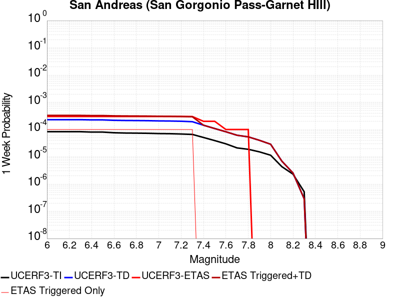 | 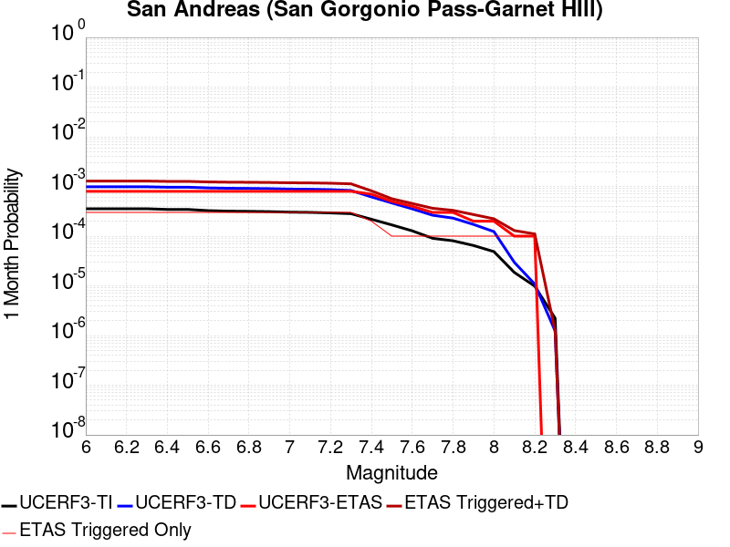 | 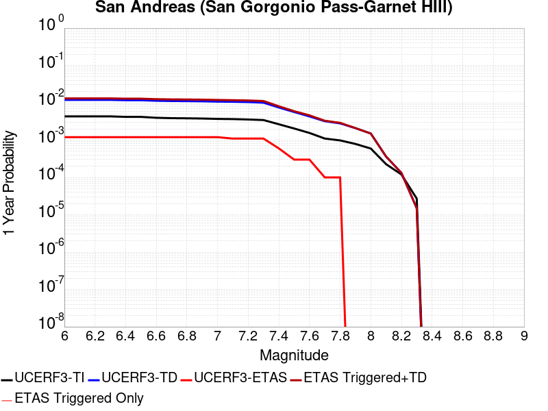 | 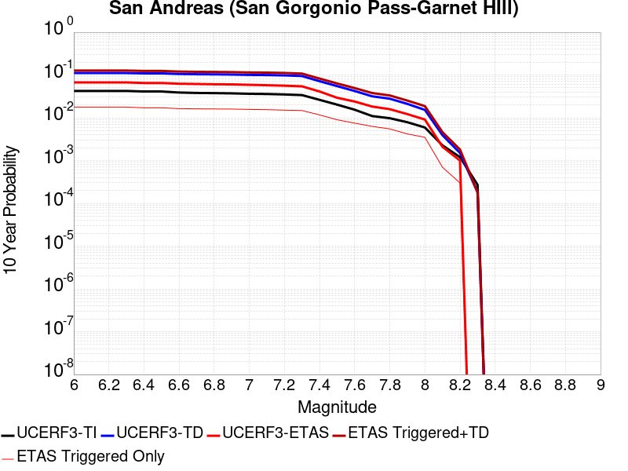 |

| Magnitude | 1 wk TI Prob | 1 wk TD Prob | 1 wk ETAS Prob | 1 wk ETAS/TD Gain | 1 wk ETAS Triggered+TD | 1 wk ETAS Triggered Only | 1 mo TI Prob | 1 mo TD Prob | 1 mo ETAS Prob | 1 mo ETAS/TD Gain | 1 mo ETAS Triggered+TD | 1 mo ETAS Triggered Only | 1 yr TI Prob | 1 yr TD Prob | 1 yr ETAS Prob | 1 yr ETAS/TD Gain | 1 yr ETAS Triggered+TD | 1 yr ETAS Triggered Only | 10 yr TI Prob | 10 yr TD Prob | 10 yr ETAS Prob | 10 yr ETAS/TD Gain | 10 yr ETAS Triggered+TD | 10 yr ETAS Triggered Only |
|-----|-----|-----|-----|-----|-----|-----|-----|-----|-----|-----|-----|-----|-----|-----|-----|-----|-----|-----|-----|-----|-----|-----|-----|-----|
| 6.0 | 8.31567E-5 | 2.3059062E-4 | 3.0E-4 | 1.3010069 | 3.3056756E-4 | 1.0E-4 | 3.5633717E-4 | 9.878688E-4 | 8.0E-4 | 0.80982417 | 0.0012875723 | 3.0E-4 | 0.004329778 | 0.011960901 | 0.0083 | 0.69392765 | 0.014727411 | 0.0028 | 0.042463828 | 0.11124487 | 0.0671 | 0.6031739 | 0.1270647 | 0.0178 |
| 6.1 | 8.31567E-5 | 2.3059062E-4 | 3.0E-4 | 1.3010069 | 3.3056756E-4 | 1.0E-4 | 3.5633717E-4 | 9.878688E-4 | 8.0E-4 | 0.80982417 | 0.0012875723 | 3.0E-4 | 0.004329778 | 0.011960901 | 0.0083 | 0.69392765 | 0.014727411 | 0.0028 | 0.042463828 | 0.11124487 | 0.0671 | 0.6031739 | 0.1270647 | 0.0178 |
| 6.2 | 8.31567E-5 | 2.3059062E-4 | 3.0E-4 | 1.3010069 | 3.3056756E-4 | 1.0E-4 | 3.5633717E-4 | 9.878688E-4 | 8.0E-4 | 0.80982417 | 0.0012875723 | 3.0E-4 | 0.004329778 | 0.011960901 | 0.0083 | 0.69392765 | 0.014727411 | 0.0028 | 0.042463828 | 0.11124487 | 0.0671 | 0.6031739 | 0.1270647 | 0.0178 |
| 6.3 | 8.31567E-5 | 2.3059062E-4 | 3.0E-4 | 1.3010069 | 3.3056756E-4 | 1.0E-4 | 3.5633717E-4 | 9.878688E-4 | 8.0E-4 | 0.80982417 | 0.0012875723 | 3.0E-4 | 0.004329778 | 0.011960901 | 0.0083 | 0.69392765 | 0.014727411 | 0.0028 | 0.042463828 | 0.11124487 | 0.0671 | 0.6031739 | 0.1270647 | 0.0178 |
| 6.4 | 8.059055E-5 | 2.261841E-4 | 3.0E-4 | 1.3263532 | 3.2616148E-4 | 1.0E-4 | 3.4534236E-4 | 9.6900074E-4 | 8.0E-4 | 0.82559276 | 0.00126871 | 3.0E-4 | 0.0041964394 | 0.011734002 | 0.0082 | 0.69882375 | 0.014501147 | 0.0028 | 0.041180745 | 0.109230734 | 0.0651 | 0.59598607 | 0.124462895 | 0.0171 |
| 6.5 | 8.059055E-5 | 2.261841E-4 | 3.0E-4 | 1.3263532 | 3.2616148E-4 | 1.0E-4 | 3.4534236E-4 | 9.6900074E-4 | 8.0E-4 | 0.82559276 | 0.00126871 | 3.0E-4 | 0.0041964394 | 0.011734002 | 0.0082 | 0.69882375 | 0.014501147 | 0.0028 | 0.041180745 | 0.109230734 | 0.0651 | 0.59598607 | 0.124462895 | 0.0171 |
| 6.6 | 7.619237E-5 | 2.1865996E-4 | 3.0E-4 | 1.3719933 | 3.186381E-4 | 1.0E-4 | 3.2649786E-4 | 9.3677983E-4 | 8.0E-4 | 0.85398936 | 0.0012364988 | 3.0E-4 | 0.0039678677 | 0.011346183 | 0.008 | 0.70508295 | 0.014114413 | 0.0028 | 0.03897764 | 0.105775096 | 0.0625 | 0.59087634 | 0.120440386 | 0.0164 |
| 6.7 | 7.440636E-5 | 2.1542578E-4 | 3.0E-4 | 1.392591 | 3.1540424E-4 | 1.0E-4 | 3.188454E-4 | 9.2292886E-4 | 8.0E-4 | 0.8668057 | 0.001222652 | 3.0E-4 | 0.0038750346 | 0.011179286 | 0.0078 | 0.697719 | 0.013849102 | 0.0027 | 0.038081564 | 0.10428466 | 0.0617 | 0.59164983 | 0.118795246 | 0.0162 |
| 6.8 | 7.3735864E-5 | 2.1390217E-4 | 3.0E-4 | 1.4025104 | 3.1388077E-4 | 1.0E-4 | 3.1597257E-4 | 9.1640366E-4 | 8.0E-4 | 0.87297773 | 0.0012161288 | 3.0E-4 | 0.0038401815 | 0.011100656 | 0.0077 | 0.6936527 | 0.013770685 | 0.0027 | 0.03774495 | 0.10358733 | 0.0608 | 0.5869444 | 0.11801957 | 0.0161 |
| 6.9 | 7.27575E-5 | 2.1159927E-4 | 3.0E-4 | 1.4177742 | 3.115781E-4 | 1.0E-4 | 3.117806E-4 | 9.0654107E-4 | 8.0E-4 | 0.8824752 | 0.0012062691 | 3.0E-4 | 0.003789323 | 0.010981795 | 0.0077 | 0.7011604 | 0.013652145 | 0.0027 | 0.037253562 | 0.10253687 | 0.0604 | 0.5890564 | 0.11689628 | 0.016 |
| 7.0 | 7.102591E-5 | 2.0745603E-4 | 3.0E-4 | 1.4460895 | 3.074353E-4 | 1.0E-4 | 3.0436125E-4 | 8.887965E-4 | 8.0E-4 | 0.90009356 | 0.0011885299 | 3.0E-4 | 0.003699303 | 0.010767909 | 0.0076 | 0.70580095 | 0.013438835 | 0.0027 | 0.03638325 | 0.10064339 | 0.059 | 0.5862283 | 0.11476328 | 0.0157 |
| 7.1 | 7.028513E-5 | 2.0582002E-4 | 3.0E-4 | 1.4575841 | 3.0579945E-4 | 1.0E-4 | 3.0118722E-4 | 8.817898E-4 | 8.0E-4 | 0.9072457 | 0.0011815253 | 3.0E-4 | 0.0036607897 | 0.0106834425 | 0.0074 | 0.6926606 | 0.013255665 | 0.0026 | 0.036010686 | 0.099888735 | 0.0577 | 0.57764274 | 0.11384045 | 0.0155 |
| 7.2 | 6.8498244E-5 | 2.0191442E-4 | 3.0E-4 | 1.485778 | 3.0189424E-4 | 1.0E-4 | 2.9353087E-4 | 8.650627E-4 | 8.0E-4 | 0.9247885 | 0.0011648032 | 3.0E-4 | 0.003567883 | 0.010481765 | 0.0071 | 0.67736685 | 0.012856608 | 0.0024 | 0.035111405 | 0.09808491 | 0.0563 | 0.57399243 | 0.111703835 | 0.0151 |
| 7.3 | 6.622592E-5 | 1.942334E-4 | 3.0E-4 | 1.5445335 | 2.94214E-4 | 1.0E-4 | 2.8379448E-4 | 8.321655E-4 | 8.0E-4 | 0.9613473 | 0.0011319158 | 3.0E-4 | 0.0034497243 | 0.0100850165 | 0.0068 | 0.67426765 | 0.012460812 | 0.0024 | 0.033966612 | 0.09459592 | 0.0544 | 0.5750777 | 0.1079959 | 0.0148 |
| 7.4 | 5.1050705E-5 | 1.442501E-4 | 2.0E-4 | 1.3864809 | 1.442501E-4 | 0.0 | 2.1877038E-4 | 6.180691E-4 | 7.0E-4 | 1.1325594 | 8.1794546E-4 | 2.0E-4 | 0.002660276 | 0.0074992147 | 0.0051 | 0.68007123 | 0.009186466 | 0.0017 | 0.02628654 | 0.071720764 | 0.0412 | 0.57445014 | 0.08258163 | 0.0117 |
| 7.5 | 3.9302922E-5 | 1.090516E-4 | 2.0E-4 | 1.8339942 | 1.090516E-4 | 0.0 | 1.6843023E-4 | 4.6728062E-4 | 5.0E-4 | 1.0700208 | 5.672339E-4 | 1.0E-4 | 0.0020487092 | 0.0056743682 | 0.0036 | 0.63443184 | 0.006668694 | 0.001 | 0.020299247 | 0.055015538 | 0.0294 | 0.5343945 | 0.0635204 | 0.009 |
| 7.6 | 2.9851626E-5 | 8.29471E-5 | 1.0E-4 | 1.2055876 | 8.29471E-5 | 0.0 | 1.2792926E-4 | 3.5543926E-4 | 4.0E-4 | 1.1253681 | 4.554037E-4 | 1.0E-4 | 0.0015564259 | 0.0043189107 | 0.0027 | 0.62515765 | 0.0052150236 | 9.0E-4 | 0.0154556995 | 0.04229576 | 0.024 | 0.5674327 | 0.049478546 | 0.0075 |
| 7.7 | 2.1135214E-5 | 6.1746876E-5 | 1.0E-4 | 1.6195152 | 6.1746876E-5 | 0.0 | 9.0576345E-5 | 2.6460266E-4 | 3.0E-4 | 1.1337755 | 3.645762E-4 | 1.0E-4 | 0.0011022091 | 0.0032167835 | 0.0014 | 0.43521735 | 0.0038148533 | 6.0E-4 | 0.010967582 | 0.031777527 | 0.0183 | 0.5758786 | 0.03787733 | 0.0063 |
| 7.8 | 1.883379E-5 | 5.400391E-5 | 1.0E-4 | 1.8517178 | 5.400391E-5 | 0.0 | 8.0713755E-5 | 2.3142481E-4 | 3.0E-4 | 1.2963173 | 3.3140168E-4 | 1.0E-4 | 9.822468E-4 | 0.0028139595 | 0.0014 | 0.4975196 | 0.0034122712 | 6.0E-4 | 0.0097791655 | 0.027952103 | 0.0159 | 0.5688302 | 0.033298366 | 0.0055 |
| 7.9 | 1.5156185E-5 | 4.0309144E-5 | 0.0 | 0.0 | 4.0309144E-5 | 0.0 | 6.495346E-5 | 1.7274205E-4 | 2.0E-4 | 1.1577958 | 2.7272478E-4 | 1.0E-4 | 7.9052144E-4 | 0.002101107 | 0.0012 | 0.57112753 | 0.0026000564 | 5.0E-4 | 0.007877152 | 0.021137748 | 0.0122 | 0.5771665 | 0.02524897 | 0.0042 |
| 8.0 | 1.1405907E-5 | 2.8952269E-5 | 0.0 | 0.0 | 2.8952269E-5 | 0.0 | 4.8881542E-5 | 1.2407526E-4 | 2.0E-4 | 1.6119249 | 2.2406285E-4 | 1.0E-4 | 5.9497025E-4 | 0.0015095704 | 0.0011 | 0.7286841 | 0.0020088155 | 5.0E-4 | 0.005933798 | 0.015296753 | 0.0091 | 0.5948975 | 0.018743213 | 0.0035 |
| 8.1 | 4.3511436E-6 | 6.9981506E-6 | 0.0 | 0.0 | 6.9981506E-6 | 0.0 | 1.8647626E-5 | 2.999173E-5 | 1.0E-4 | 3.3342524 | 1.2998874E-4 | 1.0E-4 | 2.2701119E-4 | 3.6508826E-4 | 2.0E-4 | 0.54781276 | 4.6505174E-4 | 1.0E-4 | 0.0022677942 | 0.0039306437 | 0.0021 | 0.5342636 | 0.0046278923 | 7.0E-4 |
| 8.2 | 2.3042528E-6 | 2.5601144E-6 | 0.0 | 0.0 | 2.5601144E-6 | 0.0 | 9.875332E-6 | 1.0971872E-5 | 1.0E-4 | 9.114215 | 1.10970774E-4 | 1.0E-4 | 1.2022553E-4 | 1.335744E-4 | 1.0E-4 | 0.7486465 | 2.3356103E-4 | 1.0E-4 | 0.0012016051 | 0.0015073891 | 0.001 | 0.66339874 | 0.0018069368 | 3.0E-4 |
| 8.3 | 5.202968E-7 | 2.9122552E-7 | 0.0 | 0.0 | 2.9122552E-7 | 0.0 | 2.2298414E-6 | 1.2481089E-6 | 0.0 | 0.0 | 1.2481089E-6 | 0.0 | 2.714798E-5 | 1.519563E-5 | 0.0 | 0.0 | 1.519563E-5 | 0.0 | 2.7144665E-4 | 1.8159587E-4 | 0.0 | 0.0 | 1.8159587E-4 | 0.0 |

## West Napa 2011 CFM
*[(top)](#table-of-contents)*

| 1 Week | 1 Month | 1 Year | 10 Year |
|-----|-----|-----|-----|
| 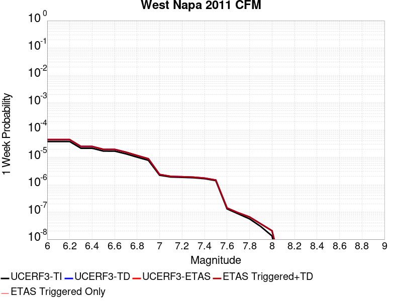 | 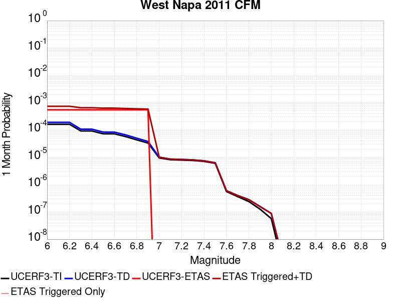 | 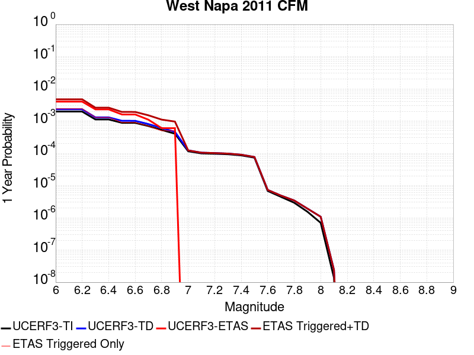 |  |

| Magnitude | 1 wk TI Prob | 1 wk TD Prob | 1 wk ETAS Prob | 1 wk ETAS/TD Gain | 1 wk ETAS Triggered+TD | 1 wk ETAS Triggered Only | 1 mo TI Prob | 1 mo TD Prob | 1 mo ETAS Prob | 1 mo ETAS/TD Gain | 1 mo ETAS Triggered+TD | 1 mo ETAS Triggered Only | 1 yr TI Prob | 1 yr TD Prob | 1 yr ETAS Prob | 1 yr ETAS/TD Gain | 1 yr ETAS Triggered+TD | 1 yr ETAS Triggered Only | 10 yr TI Prob | 10 yr TD Prob | 10 yr ETAS Prob | 10 yr ETAS/TD Gain | 10 yr ETAS Triggered+TD | 10 yr ETAS Triggered Only |
|-----|-----|-----|-----|-----|-----|-----|-----|-----|-----|-----|-----|-----|-----|-----|-----|-----|-----|-----|-----|-----|-----|-----|-----|-----|
| 6.0 | 3.773104E-5 | 4.4435765E-5 | 1.0E-4 | 2.2504394 | 4.4435765E-5 | 0.0 | 1.6169442E-4 | 1.9042689E-4 | 6.0E-4 | 3.1508155 | 4.9036974E-4 | 3.0E-4 | 0.001966852 | 0.0023162982 | 0.004 | 1.7268934 | 0.004710739 | 0.0024 | 0.019495348 | 0.022954646 | 0.0266 | 1.1588068 | 0.036633283 | 0.014 |
| 6.1 | 3.773104E-5 | 4.4435765E-5 | 1.0E-4 | 2.2504394 | 4.4435765E-5 | 0.0 | 1.6169442E-4 | 1.9042689E-4 | 6.0E-4 | 3.1508155 | 4.9036974E-4 | 3.0E-4 | 0.001966852 | 0.0023162982 | 0.004 | 1.7268934 | 0.004710739 | 0.0024 | 0.019495348 | 0.022954646 | 0.0266 | 1.1588068 | 0.036633283 | 0.014 |
| 6.2 | 3.773104E-5 | 4.4435765E-5 | 1.0E-4 | 2.2504394 | 4.4435765E-5 | 0.0 | 1.6169442E-4 | 1.9042689E-4 | 6.0E-4 | 3.1508155 | 4.9036974E-4 | 3.0E-4 | 0.001966852 | 0.0023162982 | 0.004 | 1.7268934 | 0.004710739 | 0.0024 | 0.019495348 | 0.022954646 | 0.0266 | 1.1588068 | 0.036633283 | 0.014 |
| 6.3 | 2.147964E-5 | 2.4935453E-5 | 1.0E-4 | 4.010354 | 2.4935453E-5 | 0.0 | 9.2052345E-5 | 1.0686237E-4 | 4.0E-4 | 3.7431326 | 3.06841E-4 | 2.0E-4 | 0.001120161 | 0.0013003643 | 0.0023 | 1.7687353 | 0.0025986738 | 0.0013 | 0.011145315 | 0.012937902 | 0.0148 | 1.1439259 | 0.020439573 | 0.0076 |
| 6.4 | 2.147964E-5 | 2.4935453E-5 | 1.0E-4 | 4.010354 | 2.4935453E-5 | 0.0 | 9.2052345E-5 | 1.0686237E-4 | 4.0E-4 | 3.7431326 | 3.06841E-4 | 2.0E-4 | 0.001120161 | 0.0013003643 | 0.0023 | 1.7687353 | 0.0025986738 | 0.0013 | 0.011145315 | 0.012937902 | 0.0148 | 1.1439259 | 0.020439573 | 0.0076 |
| 6.5 | 1.688201E-5 | 1.9506135E-5 | 1.0E-4 | 5.126592 | 1.9506135E-5 | 0.0 | 7.234947E-5 | 8.359545E-5 | 4.0E-4 | 4.7849493 | 2.8357873E-4 | 2.0E-4 | 8.804988E-4 | 0.0010173719 | 0.0016 | 1.5726796 | 0.0019164563 | 9.0E-4 | 0.008770182 | 0.010135547 | 0.0114 | 1.1247543 | 0.015579802 | 0.0055 |
| 6.6 | 1.6846381E-5 | 1.9465882E-5 | 1.0E-4 | 5.137193 | 1.9465882E-5 | 0.0 | 7.219678E-5 | 8.342295E-5 | 4.0E-4 | 4.794843 | 2.8340626E-4 | 2.0E-4 | 8.7864127E-4 | 0.0010152736 | 0.0016 | 1.5759298 | 0.0019143599 | 9.0E-4 | 0.008751754 | 0.010114756 | 0.0114 | 1.1270663 | 0.015559125 | 0.0055 |
| 6.7 | 1.3396501E-5 | 1.5433696E-5 | 1.0E-4 | 6.4793296 | 1.5433696E-5 | 0.0 | 5.7412315E-5 | 6.614309E-5 | 3.0E-4 | 4.535621 | 2.6612985E-4 | 2.0E-4 | 6.9877075E-4 | 8.050579E-4 | 0.0011 | 1.3663614 | 0.0015044943 | 7.0E-4 | 0.0069657755 | 0.008028875 | 0.0089 | 1.1084989 | 0.011897563 | 0.0039 |
| 6.8 | 1.0139058E-5 | 1.1644727E-5 | 0.0 | 0.0 | 1.1644727E-5 | 0.0 | 4.3452383E-5 | 4.990533E-5 | 1.0E-4 | 2.003794 | 1.4990034E-4 | 1.0E-4 | 5.289043E-4 | 6.074833E-4 | 6.0E-4 | 0.9876814 | 0.0011071796 | 5.0E-4 | 0.005276473 | 0.0060648876 | 0.006 | 0.9893011 | 0.008748513 | 0.0027 |
| 6.9 | 7.761281E-6 | 8.868197E-6 | 0.0 | 0.0 | 8.868197E-6 | 0.0 | 3.326221E-5 | 3.8006292E-5 | 1.0E-4 | 2.631143 | 1.3800249E-4 | 1.0E-4 | 4.0489217E-4 | 4.6267957E-4 | 6.0E-4 | 1.2967938 | 9.6244825E-4 | 5.0E-4 | 0.0040415525 | 0.004623417 | 0.0045 | 0.9733062 | 0.006813245 | 0.0022 |
| 7.0 | 2.2109202E-6 | 2.3560385E-6 | 0.0 | 0.0 | 2.3560385E-6 | 0.0 | 9.475338E-6 | 1.0097269E-5 | 0.0 | 0.0 | 1.0097269E-5 | 0.0 | 1.1535613E-4 | 1.2292739E-4 | 0.0 | 0.0 | 1.2292739E-4 | 0.0 | 0.0011529627 | 0.0012298371 | 8.0E-4 | 0.65049267 | 0.0016293451 | 4.0E-4 |
| 7.1 | 1.9008926E-6 | 2.0032421E-6 | 0.0 | 0.0 | 2.0032421E-6 | 0.0 | 8.146657E-6 | 8.585295E-6 | 0.0 | 0.0 | 8.585295E-6 | 0.0 | 9.918104E-5 | 1.0452099E-4 | 0.0 | 0.0 | 1.0452099E-4 | 0.0 | 9.913679E-4 | 0.0010459563 | 7.0E-4 | 0.66924405 | 0.0013456425 | 3.0E-4 |
| 7.2 | 1.8495944E-6 | 1.9461174E-6 | 0.0 | 0.0 | 1.9461174E-6 | 0.0 | 7.926808E-6 | 8.340477E-6 | 0.0 | 0.0 | 8.340477E-6 | 0.0 | 9.650462E-5 | 1.015406E-4 | 0.0 | 0.0 | 1.015406E-4 | 0.0 | 9.6462725E-4 | 0.00101618 | 7.0E-4 | 0.6888543 | 0.0013158752 | 3.0E-4 |
| 7.3 | 1.7883189E-6 | 1.8781811E-6 | 0.0 | 0.0 | 1.8781811E-6 | 0.0 | 7.664201E-6 | 8.049323E-6 | 0.0 | 0.0 | 8.049323E-6 | 0.0 | 9.330765E-5 | 9.7996126E-5 | 0.0 | 0.0 | 9.7996126E-5 | 0.0 | 9.3268487E-4 | 9.807666E-4 | 7.0E-4 | 0.7137274 | 0.0012804724 | 3.0E-4 |
| 7.4 | 1.6520572E-6 | 1.7319906E-6 | 0.0 | 0.0 | 1.7319906E-6 | 0.0 | 7.0802257E-6 | 7.4227955E-6 | 0.0 | 0.0 | 7.4227955E-6 | 0.0 | 8.6198335E-5 | 9.036881E-5 | 0.0 | 0.0 | 9.036881E-5 | 0.0 | 8.616491E-4 | 9.045526E-4 | 6.0E-4 | 0.66331136 | 0.0012042812 | 3.0E-4 |
| 7.5 | 1.4040345E-6 | 1.4710724E-6 | 0.0 | 0.0 | 1.4710724E-6 | 0.0 | 6.0172765E-6 | 6.304581E-6 | 0.0 | 0.0 | 6.304581E-6 | 0.0 | 7.325788E-5 | 7.67556E-5 | 0.0 | 0.0 | 7.67556E-5 | 0.0 | 7.3233736E-4 | 7.6848734E-4 | 5.0E-4 | 0.6506288 | 9.683337E-4 | 2.0E-4 |
| 7.6 | 1.3013842E-7 | 1.4044763E-7 | 0.0 | 0.0 | 1.4044763E-7 | 0.0 | 5.57736E-7 | 6.0191826E-7 | 0.0 | 0.0 | 6.0191826E-7 | 0.0 | 6.790414E-6 | 7.32833E-6 | 0.0 | 0.0 | 7.32833E-6 | 0.0 | 6.790207E-5 | 7.421106E-5 | 2.0E-4 | 2.6950161 | 1.7420364E-4 | 1.0E-4 |
| 7.7 | 8.541512E-8 | 9.388289E-8 | 0.0 | 0.0 | 9.388289E-8 | 0.0 | 3.6606474E-7 | 4.0235517E-7 | 0.0 | 0.0 | 4.0235517E-7 | 0.0 | 4.456829E-6 | 4.898663E-6 | 0.0 | 0.0 | 4.898663E-6 | 0.0 | 4.4567398E-5 | 4.9890572E-5 | 0.0 | 0.0 | 4.9890572E-5 | 0.0 |
| 7.8 | 5.6074793E-8 | 6.6233895E-8 | 0.0 | 0.0 | 6.6233895E-8 | 0.0 | 2.403205E-7 | 2.8385952E-7 | 0.0 | 0.0 | 2.8385952E-7 | 0.0 | 2.9258983E-6 | 3.4559841E-6 | 0.0 | 0.0 | 3.4559841E-6 | 0.0 | 2.9258597E-5 | 3.539599E-5 | 0.0 | 0.0 | 3.539599E-5 | 0.0 |
| 7.9 | 2.9475839E-8 | 3.6982183E-8 | 0.0 | 0.0 | 3.6982183E-8 | 0.0 | 1.2632502E-7 | 1.5849507E-7 | 0.0 | 0.0 | 1.5849507E-7 | 0.0 | 1.538006E-6 | 1.9296756E-6 | 0.0 | 0.0 | 1.9296756E-6 | 0.0 | 1.5379954E-5 | 1.9840134E-5 | 0.0 | 0.0 | 1.9840134E-5 | 0.0 |
| 8.0 | 1.3337122E-8 | 2.0687857E-8 | 0.0 | 0.0 | 2.0687857E-8 | 0.0 | 5.7159088E-8 | 8.866224E-8 | 0.0 | 0.0 | 8.866224E-8 | 0.0 | 6.959117E-7 | 1.0794622E-6 | 0.0 | 0.0 | 1.0794622E-6 | 0.0 | 6.959095E-6 | 1.1155702E-5 | 0.0 | 0.0 | 1.1155702E-5 | 0.0 |
| 8.1 | 2.6589986E-10 | 4.6516824E-10 | 0.0 | 0.0 | 4.6516824E-10 | 0.0 | 1.1395708E-9 | 1.9935782E-9 | 0.0 | 0.0 | 1.9935782E-9 | 0.0 | 1.3874274E-8 | 2.4271815E-8 | 0.0 | 0.0 | 2.4271815E-8 | 0.0 | 1.3874273E-7 | 2.495504E-7 | 0.0 | 0.0 | 2.495504E-7 | 0.0 |

## Hayward (No) 2011 CFM
*[(top)](#table-of-contents)*

| 1 Week | 1 Month | 1 Year | 10 Year |
|-----|-----|-----|-----|
| 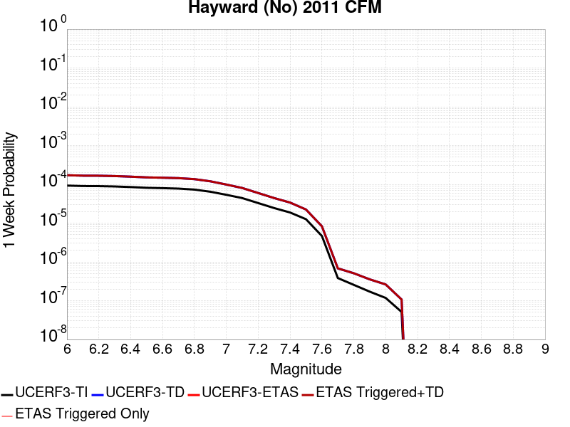 | 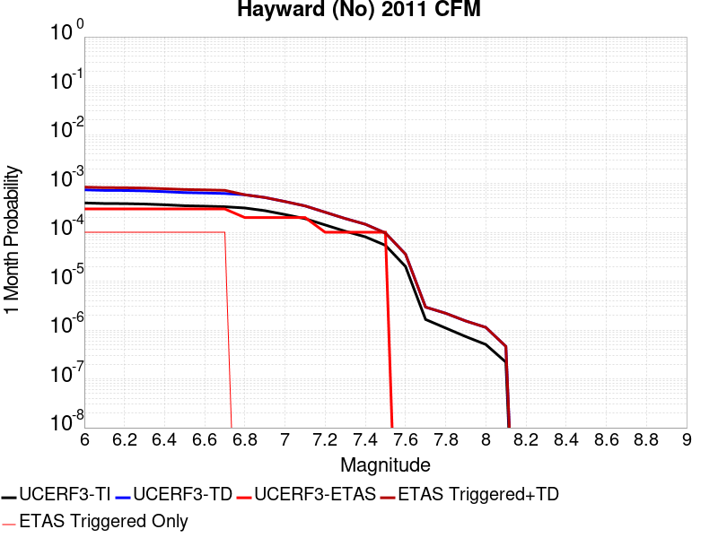 | 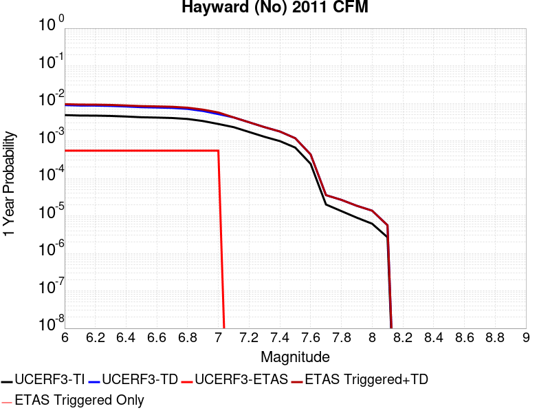 | 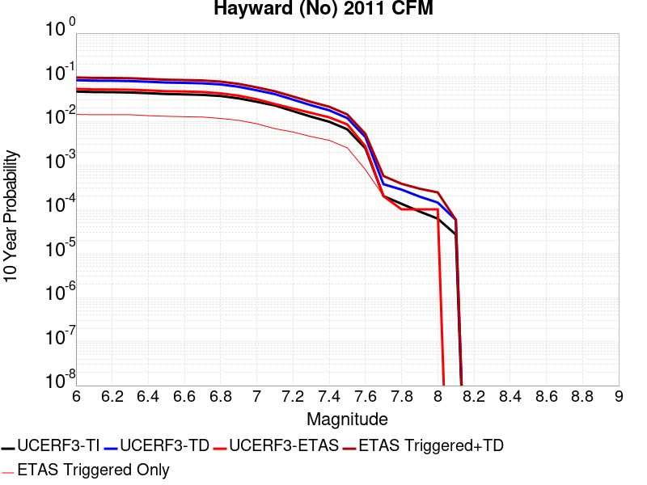 |

| Magnitude | 1 wk TI Prob | 1 wk TD Prob | 1 wk ETAS Prob | 1 wk ETAS/TD Gain | 1 wk ETAS Triggered+TD | 1 wk ETAS Triggered Only | 1 mo TI Prob | 1 mo TD Prob | 1 mo ETAS Prob | 1 mo ETAS/TD Gain | 1 mo ETAS Triggered+TD | 1 mo ETAS Triggered Only | 1 yr TI Prob | 1 yr TD Prob | 1 yr ETAS Prob | 1 yr ETAS/TD Gain | 1 yr ETAS Triggered+TD | 1 yr ETAS Triggered Only | 10 yr TI Prob | 10 yr TD Prob | 10 yr ETAS Prob | 10 yr ETAS/TD Gain | 10 yr ETAS Triggered+TD | 10 yr ETAS Triggered Only |
|-----|-----|-----|-----|-----|-----|-----|-----|-----|-----|-----|-----|-----|-----|-----|-----|-----|-----|-----|-----|-----|-----|-----|-----|-----|
| 6.0 | 9.3068506E-5 | 1.725135E-4 | 0.0 | 0.0 | 1.725135E-4 | 0.0 | 3.9880406E-4 | 7.3913194E-4 | 3.0E-4 | 0.40588152 | 8.39058E-4 | 1.0E-4 | 0.0048446343 | 0.008961689 | 0.0045 | 0.5021375 | 0.010448246 | 0.0015 | 0.047403704 | 0.08572861 | 0.0543 | 0.6333941 | 0.09880269 | 0.0143 |
| 6.1 | 9.055486E-5 | 1.6804136E-4 | 0.0 | 0.0 | 1.6804136E-4 | 0.0 | 3.880345E-4 | 7.1997853E-4 | 3.0E-4 | 0.41667908 | 8.1990653E-4 | 1.0E-4 | 0.0047140904 | 0.008730584 | 0.0041 | 0.4696135 | 0.010118362 | 0.0014 | 0.046153355 | 0.08363212 | 0.0529 | 0.6325321 | 0.09655291 | 0.0141 |
| 6.2 | 9.006742E-5 | 1.6725084E-4 | 0.0 | 0.0 | 1.6725084E-4 | 0.0 | 3.859461E-4 | 7.165929E-4 | 3.0E-4 | 0.41864777 | 8.1652123E-4 | 1.0E-4 | 0.0046887742 | 0.008689726 | 0.0039 | 0.4488059 | 0.010077559 | 0.0014 | 0.0459107 | 0.08325764 | 0.0527 | 0.632975 | 0.0961837 | 0.0141 |
| 6.3 | 8.8336754E-5 | 1.6405726E-4 | 0.0 | 0.0 | 1.6405726E-4 | 0.0 | 3.7853114E-4 | 7.0291373E-4 | 3.0E-4 | 0.42679492 | 8.028434E-4 | 1.0E-4 | 0.004598882 | 0.008524548 | 0.0039 | 0.45750225 | 0.009912614 | 0.0014 | 0.04504866 | 0.08175838 | 0.0521 | 0.63724357 | 0.09470558 | 0.0141 |
| 6.4 | 8.526157E-5 | 1.5834384E-4 | 0.0 | 0.0 | 1.5834384E-4 | 0.0 | 3.6535555E-4 | 6.784406E-4 | 3.0E-4 | 0.4421905 | 7.7837275E-4 | 1.0E-4 | 0.0044391346 | 0.008228888 | 0.0039 | 0.47394013 | 0.009617367 | 0.0014 | 0.043514993 | 0.07904674 | 0.0503 | 0.6363324 | 0.09138751 | 0.0134 |
| 6.5 | 8.152396E-5 | 1.5169044E-4 | 0.0 | 0.0 | 1.5169044E-4 | 0.0 | 3.493416E-4 | 6.4994063E-4 | 3.0E-4 | 0.4615806 | 7.498756E-4 | 1.0E-4 | 0.0042449418 | 0.007884464 | 0.0037 | 0.46927726 | 0.009174215 | 0.0013 | 0.04164765 | 0.07588829 | 0.0481 | 0.6338264 | 0.08790174 | 0.013 |
| 6.6 | 7.987405E-5 | 1.4874262E-4 | 0.0 | 0.0 | 1.4874262E-4 | 0.0 | 3.4227243E-4 | 6.373133E-4 | 3.0E-4 | 0.4707261 | 7.3724956E-4 | 1.0E-4 | 0.0041592065 | 0.0077318386 | 0.0037 | 0.47854078 | 0.009021787 | 0.0013 | 0.04082218 | 0.07448446 | 0.0475 | 0.6377169 | 0.0862385 | 0.0127 |
| 6.7 | 7.777665E-5 | 1.4514761E-4 | 0.0 | 0.0 | 1.4514761E-4 | 0.0 | 3.332859E-4 | 6.219135E-4 | 3.0E-4 | 0.48238215 | 7.2185136E-4 | 1.0E-4 | 0.004050208 | 0.0075456616 | 0.0037 | 0.49034798 | 0.008835852 | 0.0013 | 0.039771806 | 0.0727652 | 0.0462 | 0.63491887 | 0.08435564 | 0.0125 |
| 6.8 | 7.3284005E-5 | 1.3671412E-4 | 0.0 | 0.0 | 1.3671412E-4 | 0.0 | 3.140365E-4 | 5.857867E-4 | 2.0E-4 | 0.3414212 | 5.857867E-4 | 0.0 | 0.0038166929 | 0.0071087657 | 0.0033 | 0.4642156 | 0.0083002355 | 0.0012 | 0.037518036 | 0.06870273 | 0.0431 | 0.6273405 | 0.07950577 | 0.0116 |
| 6.9 | 6.458263E-5 | 1.2015803E-4 | 0.0 | 0.0 | 1.2015803E-4 | 0.0 | 2.7675333E-4 | 5.1486184E-4 | 2.0E-4 | 0.38845372 | 5.1486184E-4 | 0.0 | 0.0033642664 | 0.0062505254 | 0.0029 | 0.463961 | 0.007244275 | 0.001 | 0.033137884 | 0.06068818 | 0.0381 | 0.62779933 | 0.070550956 | 0.0105 |
| 7.0 | 5.3853604E-5 | 9.924897E-5 | 0.0 | 0.0 | 9.924897E-5 | 0.0 | 2.3078074E-4 | 4.252837E-4 | 2.0E-4 | 0.4702743 | 4.252837E-4 | 0.0 | 0.0028061352 | 0.0051655998 | 0.0027 | 0.52268857 | 0.0060609505 | 9.0E-4 | 0.027709642 | 0.050485056 | 0.0316 | 0.6259278 | 0.05884079 | 0.0088 |
| 7.1 | 4.4308683E-5 | 8.082263E-5 | 0.0 | 0.0 | 8.082263E-5 | 0.0 | 1.8988053E-4 | 3.4633692E-4 | 2.0E-4 | 0.5774723 | 3.4633692E-4 | 0.0 | 0.0023093442 | 0.00420854 | 0.002 | 0.47522417 | 0.0048060147 | 6.0E-4 | 0.022854926 | 0.041401397 | 0.0246 | 0.59418285 | 0.04791987 | 0.0068 |
| 7.2 | 3.295973E-5 | 6.0015085E-5 | 0.0 | 0.0 | 6.0015085E-5 | 0.0 | 1.4124835E-4 | 2.5718228E-4 | 1.0E-4 | 0.3888293 | 2.5718228E-4 | 0.0 | 0.0017183421 | 0.0031267207 | 0.0016 | 0.5117183 | 0.0037248447 | 6.0E-4 | 0.017051157 | 0.03100248 | 0.0195 | 0.6289819 | 0.036525767 | 0.0057 |
| 7.3 | 2.452256E-5 | 4.4564884E-5 | 0.0 | 0.0 | 4.4564884E-5 | 0.0 | 1.05092455E-4 | 1.9097845E-4 | 1.0E-4 | 0.5236193 | 1.9097845E-4 | 0.0 | 0.0012787496 | 0.0023226966 | 0.0014 | 0.6027477 | 0.002921303 | 6.0E-4 | 0.0127141625 | 0.023140486 | 0.0155 | 0.6698217 | 0.027536355 | 0.0045 |
| 7.4 | 1.8829967E-5 | 3.4095287E-5 | 0.0 | 0.0 | 3.4095287E-5 | 0.0 | 8.069736E-5 | 1.4611453E-4 | 1.0E-4 | 0.6843946 | 1.4611453E-4 | 0.0 | 9.820475E-4 | 0.0017775025 | 0.0011 | 0.6188458 | 0.002376436 | 6.0E-4 | 0.009777189 | 0.017770462 | 0.0123 | 0.69215983 | 0.02140471 | 0.0037 |
| 7.5 | 1.26374125E-5 | 2.2572262E-5 | 0.0 | 0.0 | 2.2572262E-5 | 0.0 | 5.4159216E-5 | 9.673471E-5 | 1.0E-4 | 1.0337552 | 9.673471E-5 | 0.0 | 6.5918895E-4 | 0.0011771143 | 7.0E-4 | 0.5946746 | 0.0015766436 | 4.0E-4 | 0.00657237 | 0.011816552 | 0.0085 | 0.71932995 | 0.014287011 | 0.0025 |
| 7.6 | 4.666429E-6 | 8.338984E-6 | 0.0 | 0.0 | 8.338984E-6 | 0.0 | 1.9998828E-5 | 3.573802E-5 | 0.0 | 0.0 | 3.573802E-5 | 0.0 | 2.4345852E-4 | 4.350247E-4 | 1.0E-4 | 0.229872 | 5.349812E-4 | 1.0E-4 | 0.0024319198 | 0.0043889293 | 0.0027 | 0.6151842 | 0.0051854183 | 8.0E-4 |
| 7.7 | 3.8399318E-7 | 6.8722426E-7 | 0.0 | 0.0 | 6.8722426E-7 | 0.0 | 1.6456839E-6 | 2.9452435E-6 | 0.0 | 0.0 | 2.9452435E-6 | 0.0 | 2.003602E-5 | 3.585775E-5 | 0.0 | 0.0 | 3.585775E-5 | 0.0 | 2.0034213E-4 | 3.7331492E-4 | 2.0E-4 | 0.53574073 | 5.732403E-4 | 2.0E-4 |
| 7.8 | 2.5637698E-7 | 5.140948E-7 | 0.0 | 0.0 | 5.140948E-7 | 0.0 | 1.098758E-6 | 2.2032614E-6 | 0.0 | 0.0 | 2.2032614E-6 | 0.0 | 1.3377297E-5 | 2.6824378E-5 | 0.0 | 0.0 | 2.6824378E-5 | 0.0 | 1.3376492E-4 | 2.8144897E-4 | 1.0E-4 | 0.3553042 | 3.8142083E-4 | 1.0E-4 |
| 7.9 | 1.7141245E-7 | 3.5750372E-7 | 0.0 | 0.0 | 3.5750372E-7 | 0.0 | 7.3462456E-7 | 1.532158E-6 | 0.0 | 0.0 | 1.532158E-6 | 0.0 | 8.944017E-6 | 1.8653864E-5 | 0.0 | 0.0 | 1.8653864E-5 | 0.0 | 8.943657E-5 | 1.9497327E-4 | 1.0E-4 | 0.5128908 | 2.9495376E-4 | 1.0E-4 |
| 8.0 | 1.1808895E-7 | 2.643345E-7 | 0.0 | 0.0 | 2.643345E-7 | 0.0 | 5.060954E-7 | 1.1328616E-6 | 0.0 | 0.0 | 1.1328616E-6 | 0.0 | 6.161694E-6 | 1.37925035E-5 | 0.0 | 0.0 | 1.37925035E-5 | 0.0 | 6.161523E-5 | 1.4298939E-4 | 1.0E-4 | 0.69935256 | 2.4297509E-4 | 1.0E-4 |
| 8.1 | 5.138535E-8 | 1.0803121E-7 | 0.0 | 0.0 | 1.0803121E-7 | 0.0 | 2.2022292E-7 | 4.629908E-7 | 0.0 | 0.0 | 4.629908E-7 | 0.0 | 2.6812106E-6 | 5.636899E-6 | 0.0 | 0.0 | 5.636899E-6 | 0.0 | 2.6811784E-5 | 5.8068086E-5 | 0.0 | 0.0 | 5.8068086E-5 | 0.0 |

## San Jacinto (Superstition Mtn)
*[(top)](#table-of-contents)*

| 1 Week | 1 Month | 1 Year | 10 Year |
|-----|-----|-----|-----|
| 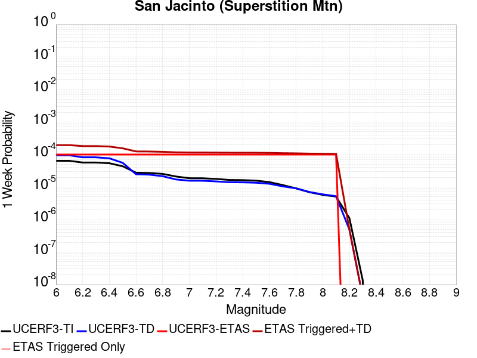 | 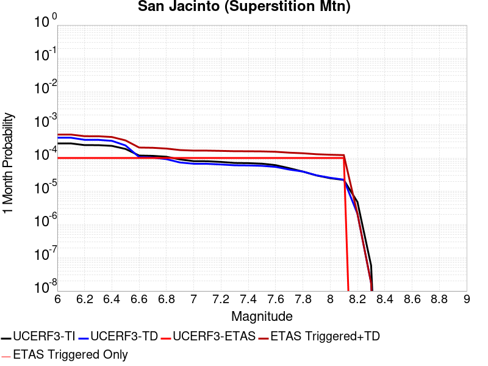 | 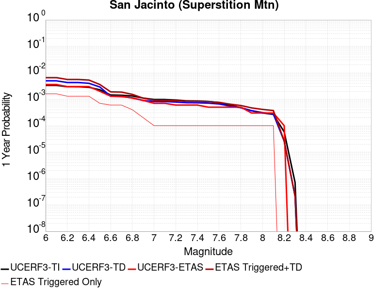 | 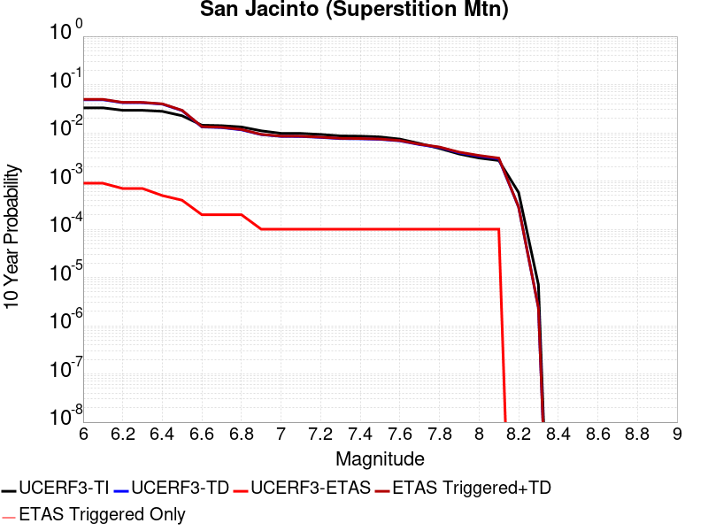 |

| Magnitude | 1 wk TI Prob | 1 wk TD Prob | 1 wk ETAS Prob | 1 wk ETAS/TD Gain | 1 wk ETAS Triggered+TD | 1 wk ETAS Triggered Only | 1 mo TI Prob | 1 mo TD Prob | 1 mo ETAS Prob | 1 mo ETAS/TD Gain | 1 mo ETAS Triggered+TD | 1 mo ETAS Triggered Only | 1 yr TI Prob | 1 yr TD Prob | 1 yr ETAS Prob | 1 yr ETAS/TD Gain | 1 yr ETAS Triggered+TD | 1 yr ETAS Triggered Only | 10 yr TI Prob | 10 yr TD Prob | 10 yr ETAS Prob | 10 yr ETAS/TD Gain | 10 yr ETAS Triggered+TD | 10 yr ETAS Triggered Only |
|-----|-----|-----|-----|-----|-----|-----|-----|-----|-----|-----|-----|-----|-----|-----|-----|-----|-----|-----|-----|-----|-----|-----|-----|-----|
| 6.0 | 6.4193904E-5 | 9.526121E-5 | 1.0E-4 | 1.0497452 | 1.9525169E-4 | 1.0E-4 | 2.7508775E-4 | 4.082048E-4 | 7.0E-4 | 1.7148256 | 5.0816394E-4 | 1.0E-4 | 0.0033440501 | 0.0049599917 | 0.0036 | 0.72580767 | 0.0065520555 | 0.0016 | 0.03294174 | 0.048500113 | 0.0356 | 0.7340189 | 0.06105991 | 0.0132 |
| 6.1 | 6.4193904E-5 | 9.526121E-5 | 1.0E-4 | 1.0497452 | 1.9525169E-4 | 1.0E-4 | 2.7508775E-4 | 4.082048E-4 | 7.0E-4 | 1.7148256 | 5.0816394E-4 | 1.0E-4 | 0.0033440501 | 0.0049599917 | 0.0036 | 0.72580767 | 0.0065520555 | 0.0016 | 0.03294174 | 0.048500113 | 0.0356 | 0.7340189 | 0.06105991 | 0.0132 |
| 6.2 | 5.7023593E-5 | 8.244546E-5 | 1.0E-4 | 1.212923 | 1.8243722E-4 | 1.0E-4 | 2.4436394E-4 | 3.5329885E-4 | 5.0E-4 | 1.4152325 | 4.532635E-4 | 1.0E-4 | 0.002971072 | 0.004294566 | 0.003 | 0.6985572 | 0.005588983 | 0.0013 | 0.029316625 | 0.04215797 | 0.0299 | 0.70923716 | 0.052790016 | 0.0111 |
| 6.3 | 5.6940098E-5 | 8.229117E-5 | 1.0E-4 | 1.2151972 | 1.8228294E-4 | 1.0E-4 | 2.4400617E-4 | 3.5263775E-4 | 5.0E-4 | 1.4178855 | 4.526025E-4 | 1.0E-4 | 0.002966728 | 0.004286549 | 0.003 | 0.6998637 | 0.0055809766 | 0.0013 | 0.029274331 | 0.04208148 | 0.0299 | 0.71052635 | 0.052714378 | 0.0111 |
| 6.4 | 5.4171585E-5 | 7.6791446E-5 | 1.0E-4 | 1.3022283 | 1.7678377E-4 | 1.0E-4 | 2.3214328E-4 | 3.2907393E-4 | 5.0E-4 | 1.5194154 | 4.2904104E-4 | 1.0E-4 | 0.0028226813 | 0.004000755 | 0.003 | 0.74985844 | 0.005295554 | 0.0013 | 0.02787096 | 0.039372634 | 0.0283 | 0.71877337 | 0.049555283 | 0.0106 |
| 6.5 | 4.375144E-5 | 5.5749737E-5 | 1.0E-4 | 1.7937304 | 1.5574416E-4 | 1.0E-4 | 1.874927E-4 | 2.3891217E-4 | 3.0E-4 | 1.2556916 | 3.3888826E-4 | 1.0E-4 | 0.0022803338 | 0.0029060438 | 0.002 | 0.68822086 | 0.0036040095 | 7.0E-4 | 0.022570757 | 0.028898444 | 0.0184 | 0.6367125 | 0.035210606 | 0.0065 |
| 6.6 | 2.772192E-5 | 2.4909828E-5 | 1.0E-4 | 4.0144796 | 1.2490734E-4 | 1.0E-4 | 1.1880282E-4 | 1.06752144E-4 | 2.0E-4 | 1.8734987 | 2.0674148E-4 | 1.0E-4 | 0.0014454646 | 0.0012989512 | 0.0013 | 1.0008074 | 0.0018981718 | 6.0E-4 | 0.014360986 | 0.013240181 | 0.009 | 0.679749 | 0.016003108 | 0.0028 |
| 6.7 | 2.7124124E-5 | 2.412848E-5 | 1.0E-4 | 4.14448 | 1.2412606E-4 | 1.0E-4 | 1.1624106E-4 | 1.0340377E-4 | 2.0E-4 | 1.9341654 | 2.0339343E-4 | 1.0E-4 | 0.0014143161 | 0.0012582325 | 0.0013 | 1.0331954 | 0.0018574775 | 6.0E-4 | 0.014053487 | 0.01283759 | 0.0087 | 0.6776973 | 0.015404212 | 0.0026 |
| 6.8 | 2.5475807E-5 | 2.1622998E-5 | 1.0E-4 | 4.624706 | 1.2162083E-4 | 1.0E-4 | 1.0917746E-4 | 9.266676E-5 | 2.0E-4 | 2.158271 | 1.9265749E-4 | 1.0E-4 | 0.001328425 | 0.0011276455 | 0.0011 | 0.9754839 | 0.0015271944 | 4.0E-4 | 0.0132051185 | 0.011539911 | 0.0072 | 0.62392163 | 0.013615677 | 0.0021 |
| 6.9 | 2.1162023E-5 | 1.7161407E-5 | 1.0E-4 | 5.8270283 | 1.1715969E-4 | 1.0E-4 | 9.069123E-5 | 7.3546835E-5 | 2.0E-4 | 2.7193558 | 1.7353948E-4 | 1.0E-4 | 0.0011036064 | 8.9506846E-4 | 9.0E-4 | 1.0055096 | 0.0010948895 | 2.0E-4 | 0.010981417 | 0.009203641 | 0.0053 | 0.57585907 | 0.010491676 | 0.0013 |
| 7.0 | 1.8754288E-5 | 1.5732507E-5 | 1.0E-4 | 6.3562665 | 1.1573093E-4 | 1.0E-4 | 8.037304E-5 | 6.7423294E-5 | 1.0E-4 | 1.4831669 | 1.6741655E-4 | 1.0E-4 | 9.781026E-4 | 8.2057185E-4 | 7.0E-4 | 0.85306364 | 9.204898E-4 | 1.0E-4 | 0.009738087 | 0.008445316 | 0.0045 | 0.5328397 | 0.009337715 | 9.0E-4 |
| 7.1 | 1.8678527E-5 | 1.5658765E-5 | 1.0E-4 | 6.3862 | 1.15657196E-4 | 1.0E-4 | 8.0048376E-5 | 6.710728E-5 | 1.0E-4 | 1.4901513 | 1.6710057E-4 | 1.0E-4 | 9.7415317E-4 | 8.1672723E-4 | 7.0E-4 | 0.8570793 | 9.166456E-4 | 1.0E-4 | 0.009698939 | 0.008406885 | 0.0043 | 0.5114855 | 0.009299319 | 9.0E-4 |
| 7.2 | 1.7804578E-5 | 1.4961859E-5 | 1.0E-4 | 6.6836615 | 1.1496036E-4 | 1.0E-4 | 7.6303106E-5 | 6.4120686E-5 | 1.0E-4 | 1.5595591 | 1.6411427E-4 | 1.0E-4 | 9.285943E-4 | 7.80392E-4 | 6.0E-4 | 0.7688444 | 8.803139E-4 | 1.0E-4 | 0.009247236 | 0.00804255 | 0.0042 | 0.52222246 | 0.008935311 | 9.0E-4 |
| 7.3 | 1.6583685E-5 | 1.4119139E-5 | 1.0E-4 | 7.082585 | 1.1411773E-4 | 1.0E-4 | 7.1070994E-5 | 6.0509203E-5 | 1.0E-4 | 1.6526412 | 1.6050316E-4 | 1.0E-4 | 8.649459E-4 | 7.3645246E-4 | 6.0E-4 | 0.8147165 | 8.3637884E-4 | 1.0E-4 | 0.00861587 | 0.007602046 | 0.0041 | 0.5393285 | 0.008495204 | 9.0E-4 |
| 7.4 | 1.6387552E-5 | 1.3984926E-5 | 1.0E-4 | 7.150556 | 1.1398353E-4 | 1.0E-4 | 7.023047E-5 | 5.9934035E-5 | 1.0E-4 | 1.6685011 | 1.5992804E-4 | 1.0E-4 | 8.5472054E-4 | 7.294545E-4 | 6.0E-4 | 0.8225325 | 8.293815E-4 | 1.0E-4 | 0.008514405 | 0.007531886 | 0.0041 | 0.54435235 | 0.008425107 | 9.0E-4 |
| 7.5 | 1.5790754E-5 | 1.3629862E-5 | 1.0E-4 | 7.3368316 | 1.136285E-4 | 1.0E-4 | 6.767291E-5 | 5.8412395E-5 | 1.0E-4 | 1.7119653 | 1.5840656E-4 | 1.0E-4 | 8.236062E-4 | 7.109408E-4 | 5.0E-4 | 0.70329344 | 8.108697E-4 | 1.0E-4 | 0.008205604 | 0.0073446203 | 0.0039 | 0.5310009 | 0.00823801 | 9.0E-4 |
| 7.6 | 1.4248672E-5 | 1.2659667E-5 | 1.0E-4 | 7.899102 | 1.126584E-4 | 1.0E-4 | 6.106431E-5 | 5.4254597E-5 | 1.0E-4 | 1.8431618 | 1.5424917E-4 | 1.0E-4 | 7.432043E-4 | 6.603511E-4 | 5.0E-4 | 0.7571729 | 7.602851E-4 | 1.0E-4 | 0.007407237 | 0.0068327114 | 0.0039 | 0.5707837 | 0.0077265617 | 9.0E-4 |
| 7.7 | 1.15449975E-5 | 1.0530548E-5 | 1.0E-4 | 9.4961815 | 1.10529494E-4 | 1.0E-4 | 4.947762E-5 | 4.5130142E-5 | 1.0E-4 | 2.2158139 | 1.4512562E-4 | 1.0E-4 | 6.022235E-4 | 5.493217E-4 | 5.0E-4 | 0.9102135 | 6.4926676E-4 | 1.0E-4 | 0.006005941 | 0.0057139946 | 0.0033 | 0.57752943 | 0.0065094233 | 8.0E-4 |
| 7.8 | 9.1391985E-6 | 9.158651E-6 | 1.0E-4 | 10.918639 | 1.09157736E-4 | 1.0E-4 | 3.9167408E-5 | 3.925077E-5 | 1.0E-4 | 2.5477207 | 1.3924684E-4 | 1.0E-4 | 4.767588E-4 | 4.777739E-4 | 5.0E-4 | 1.0465201 | 5.777261E-4 | 1.0E-4 | 0.0047573727 | 0.0049894555 | 0.0032 | 0.64135253 | 0.005785464 | 8.0E-4 |
| 7.9 | 6.973017E-6 | 7.0668393E-6 | 1.0E-4 | 14.150599 | 1.0706613E-4 | 1.0E-4 | 2.9884017E-5 | 3.0286104E-5 | 1.0E-4 | 3.3018444 | 1.3028308E-4 | 1.0E-4 | 3.6377716E-4 | 3.6867143E-4 | 3.0E-4 | 0.81373274 | 4.6863456E-4 | 1.0E-4 | 0.0036318225 | 0.0038853926 | 0.0025 | 0.6434356 | 0.004582673 | 7.0E-4 |
| 8.0 | 5.7638235E-6 | 5.9720514E-6 | 1.0E-4 | 16.744665 | 1.05971456E-4 | 1.0E-4 | 2.4701867E-5 | 2.5594258E-5 | 1.0E-4 | 3.9071264 | 1.255917E-4 | 1.0E-4 | 3.0070372E-4 | 3.1156596E-4 | 3.0E-4 | 0.9628779 | 4.1153483E-4 | 1.0E-4 | 0.0030029714 | 0.003301288 | 0.0021 | 0.6361154 | 0.0038993072 | 6.0E-4 |
| 8.1 | 5.1124434E-6 | 5.2342634E-6 | 1.0E-4 | 19.104885 | 1.0523374E-4 | 1.0E-4 | 2.1910288E-5 | 2.2432367E-5 | 1.0E-4 | 4.4578443 | 1.2243012E-4 | 1.0E-4 | 2.6672508E-4 | 2.7308028E-4 | 3.0E-4 | 1.098578 | 3.73053E-4 | 1.0E-4 | 0.0026640517 | 0.0029019194 | 0.0019 | 0.654739 | 0.0035001785 | 6.0E-4 |
| 8.2 | 1.1075938E-6 | 4.960156E-7 | 0.0 | 0.0 | 4.960156E-7 | 0.0 | 4.7468216E-6 | 2.1257797E-6 | 0.0 | 0.0 | 2.1257797E-6 | 0.0 | 5.779102E-5 | 2.5881078E-5 | 1.0E-4 | 3.8638265 | 2.5881078E-5 | 0.0 | 5.777599E-4 | 2.9245572E-4 | 3.0E-4 | 1.0257963 | 2.9245572E-4 | 0.0 |
| 8.3 | 1.3584393E-8 | 4.120862E-9 | 0.0 | 0.0 | 4.120862E-9 | 0.0 | 5.8218827E-8 | 1.7660836E-8 | 0.0 | 0.0 | 1.7660836E-8 | 0.0 | 7.0881396E-7 | 2.1502069E-7 | 0.0 | 0.0 | 2.1502069E-7 | 0.0 | 7.0881174E-6 | 2.418362E-6 | 0.0 | 0.0 | 2.418362E-6 | 0.0 |

## Ortigalita (North)
*[(top)](#table-of-contents)*

| 1 Week | 1 Month | 1 Year | 10 Year |
|-----|-----|-----|-----|
| 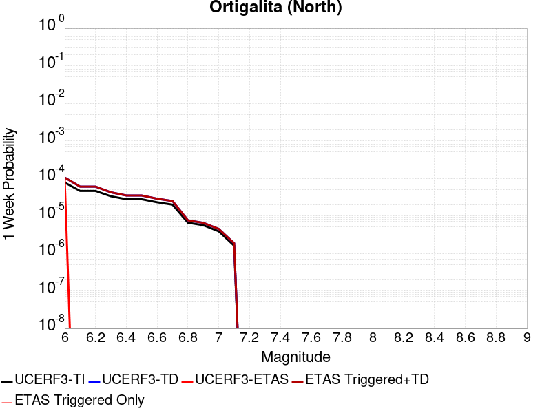 | 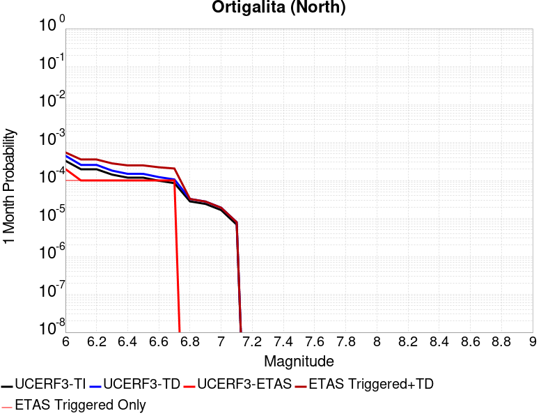 | 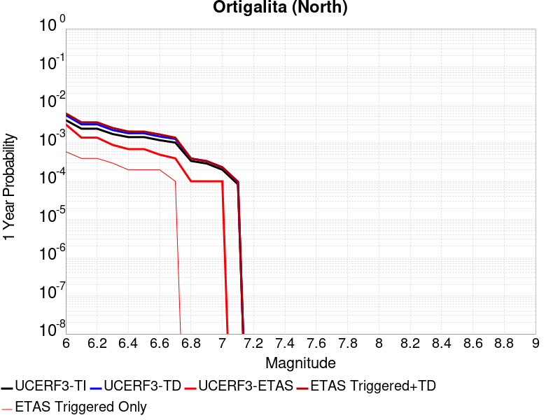 | 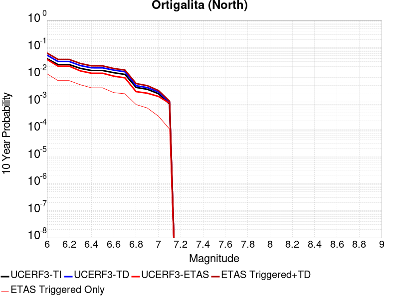 |

| Magnitude | 1 wk TI Prob | 1 wk TD Prob | 1 wk ETAS Prob | 1 wk ETAS/TD Gain | 1 wk ETAS Triggered+TD | 1 wk ETAS Triggered Only | 1 mo TI Prob | 1 mo TD Prob | 1 mo ETAS Prob | 1 mo ETAS/TD Gain | 1 mo ETAS Triggered+TD | 1 mo ETAS Triggered Only | 1 yr TI Prob | 1 yr TD Prob | 1 yr ETAS Prob | 1 yr ETAS/TD Gain | 1 yr ETAS Triggered+TD | 1 yr ETAS Triggered Only | 10 yr TI Prob | 10 yr TD Prob | 10 yr ETAS Prob | 10 yr ETAS/TD Gain | 10 yr ETAS Triggered+TD | 10 yr ETAS Triggered Only |
|-----|-----|-----|-----|-----|-----|-----|-----|-----|-----|-----|-----|-----|-----|-----|-----|-----|-----|-----|-----|-----|-----|-----|-----|-----|
| 6.0 | 7.711876E-5 | 1.0468789E-4 | 1.0E-4 | 0.9552203 | 1.0468789E-4 | 0.0 | 3.3046713E-4 | 4.4859215E-4 | 2.0E-4 | 0.4458393 | 5.485473E-4 | 1.0E-4 | 0.004016016 | 0.0054490888 | 0.0031 | 0.5689025 | 0.0060458193 | 6.0E-4 | 0.039442103 | 0.053277437 | 0.0372 | 0.6982318 | 0.063691385 | 0.011 |
| 6.1 | 4.607858E-5 | 6.0052193E-5 | 0.0 | 0.0 | 6.0052193E-5 | 0.0 | 1.9746469E-4 | 2.573422E-4 | 1.0E-4 | 0.38858765 | 3.5731646E-4 | 1.0E-4 | 0.0024014818 | 0.0031289689 | 0.0014 | 0.44743174 | 0.0035277172 | 4.0E-4 | 0.023756953 | 0.030881127 | 0.0208 | 0.67355055 | 0.03679275 | 0.0061 |
| 6.2 | 4.607858E-5 | 6.0052193E-5 | 0.0 | 0.0 | 6.0052193E-5 | 0.0 | 1.9746469E-4 | 2.573422E-4 | 1.0E-4 | 0.38858765 | 3.5731646E-4 | 1.0E-4 | 0.0024014818 | 0.0031289689 | 0.0014 | 0.44743174 | 0.0035277172 | 4.0E-4 | 0.023756953 | 0.030881127 | 0.0208 | 0.67355055 | 0.03679275 | 0.0061 |
| 6.3 | 3.327423E-5 | 4.2353746E-5 | 0.0 | 0.0 | 4.2353746E-5 | 0.0 | 1.4259605E-4 | 1.8150471E-4 | 1.0E-4 | 0.5509499 | 2.8148654E-4 | 1.0E-4 | 0.0017347244 | 0.0022078266 | 9.0E-4 | 0.4076407 | 0.0025071644 | 3.0E-4 | 0.017212452 | 0.021883437 | 0.0139 | 0.6351836 | 0.026089339 | 0.0043 |
| 6.4 | 2.7732503E-5 | 3.4902085E-5 | 0.0 | 0.0 | 3.4902085E-5 | 0.0 | 1.1884817E-4 | 1.4957308E-4 | 1.0E-4 | 0.6685695 | 2.4955813E-4 | 1.0E-4 | 0.001446016 | 0.0018197665 | 7.0E-4 | 0.38466474 | 0.0020194026 | 2.0E-4 | 0.014366428 | 0.018071692 | 0.0114 | 0.6308208 | 0.021312056 | 0.0033 |
| 6.5 | 2.7689714E-5 | 3.485199E-5 | 0.0 | 0.0 | 3.485199E-5 | 0.0 | 1.186648E-4 | 1.4935841E-4 | 1.0E-4 | 0.6695304 | 2.493435E-4 | 1.0E-4 | 0.0014437864 | 0.0018171573 | 7.0E-4 | 0.38521707 | 0.0020167937 | 2.0E-4 | 0.014344421 | 0.018046025 | 0.0114 | 0.6317181 | 0.021286473 | 0.0033 |
| 6.6 | 2.2976905E-5 | 2.8641503E-5 | 0.0 | 0.0 | 2.8641503E-5 | 0.0 | 9.846873E-5 | 1.2274482E-4 | 1.0E-4 | 0.81469834 | 2.2273255E-4 | 1.0E-4 | 0.0011981975 | 0.0014936309 | 5.0E-4 | 0.3347547 | 0.0016933322 | 2.0E-4 | 0.011917574 | 0.014859187 | 0.0089 | 0.59895605 | 0.017026497 | 0.0022 |
| 6.7 | 1.9871539E-5 | 2.4836998E-5 | 0.0 | 0.0 | 2.4836998E-5 | 0.0 | 8.516096E-5 | 1.064412E-4 | 1.0E-4 | 0.93948585 | 2.0643056E-4 | 1.0E-4 | 0.0010363415 | 0.0012953919 | 4.0E-4 | 0.30878687 | 0.0013952623 | 1.0E-4 | 0.010315218 | 0.012901974 | 0.0077 | 0.5968079 | 0.01487617 | 0.002 |
| 6.8 | 6.5640475E-6 | 7.5928892E-6 | 0.0 | 0.0 | 7.5928892E-6 | 0.0 | 2.813133E-5 | 3.2540564E-5 | 0.0 | 0.0 | 3.2540564E-5 | 0.0 | 3.424451E-4 | 3.961122E-4 | 1.0E-4 | 0.2524537 | 3.961122E-4 | 0.0 | 0.0034191788 | 0.0039543477 | 0.0024 | 0.6069269 | 0.0047511845 | 8.0E-4 |
| 6.9 | 5.6219683E-6 | 6.491215E-6 | 0.0 | 0.0 | 6.491215E-6 | 0.0 | 2.4093928E-5 | 2.7819211E-5 | 0.0 | 0.0 | 2.7819211E-5 | 0.0 | 2.933041E-4 | 3.3864882E-4 | 1.0E-4 | 0.29529116 | 3.3864882E-4 | 0.0 | 0.0029291727 | 0.0033815838 | 0.0021 | 0.6210108 | 0.003979555 | 6.0E-4 |
| 7.0 | 3.875591E-6 | 4.4773983E-6 | 0.0 | 0.0 | 4.4773983E-6 | 0.0 | 1.6609569E-5 | 1.9188721E-5 | 0.0 | 0.0 | 1.9188721E-5 | 0.0 | 2.0220275E-4 | 2.3359974E-4 | 1.0E-4 | 0.42808267 | 2.3359974E-4 | 0.0 | 0.0020201886 | 0.0023337496 | 0.0016 | 0.685592 | 0.0026330494 | 3.0E-4 |
| 7.1 | 1.6017933E-6 | 1.8539527E-6 | 0.0 | 0.0 | 1.8539527E-6 | 0.0 | 6.8648105E-6 | 7.945493E-6 | 0.0 | 0.0 | 7.945493E-6 | 0.0 | 8.357586E-5 | 9.673315E-5 | 0.0 | 0.0 | 9.673315E-5 | 0.0 | 8.3544437E-4 | 9.6701476E-4 | 9.0E-4 | 0.93069935 | 0.001066918 | 1.0E-4 |

## San Andreas (Santa Cruz Mts) 2011 CFM
*[(top)](#table-of-contents)*

| 1 Week | 1 Month | 1 Year | 10 Year |
|-----|-----|-----|-----|
| 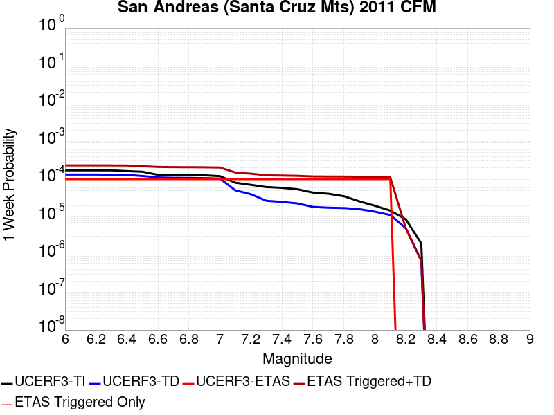 | 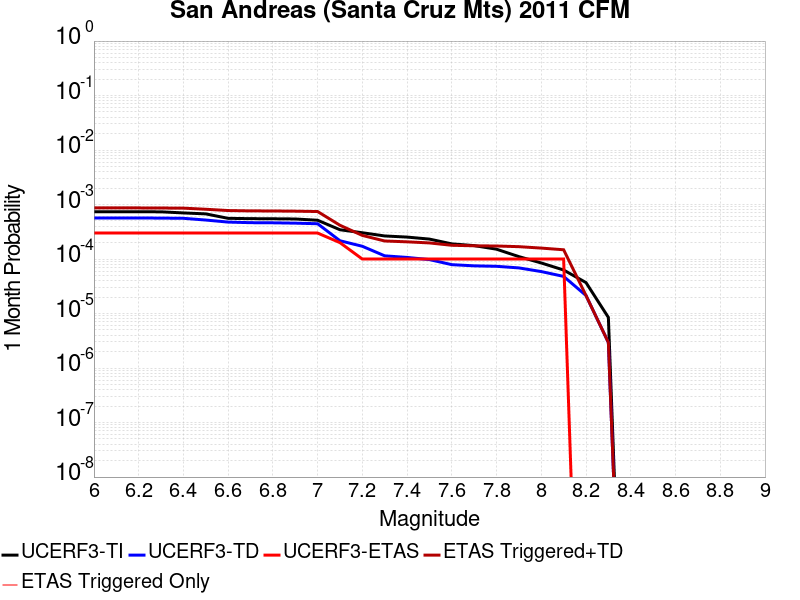 | 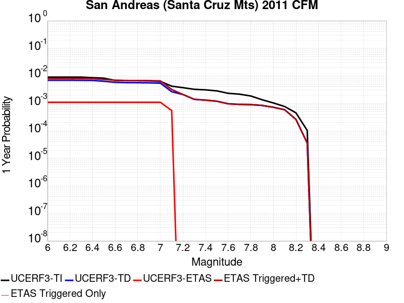 | 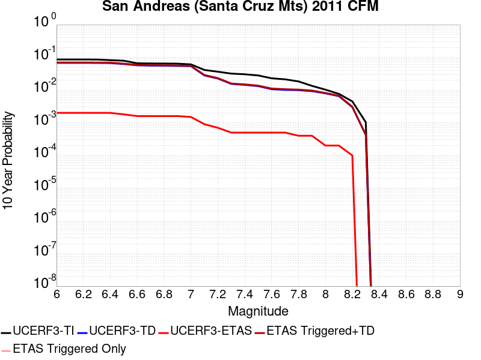 |

| Magnitude | 1 wk TI Prob | 1 wk TD Prob | 1 wk ETAS Prob | 1 wk ETAS/TD Gain | 1 wk ETAS Triggered+TD | 1 wk ETAS Triggered Only | 1 mo TI Prob | 1 mo TD Prob | 1 mo ETAS Prob | 1 mo ETAS/TD Gain | 1 mo ETAS Triggered+TD | 1 mo ETAS Triggered Only | 1 yr TI Prob | 1 yr TD Prob | 1 yr ETAS Prob | 1 yr ETAS/TD Gain | 1 yr ETAS Triggered+TD | 1 yr ETAS Triggered Only | 10 yr TI Prob | 10 yr TD Prob | 10 yr ETAS Prob | 10 yr ETAS/TD Gain | 10 yr ETAS Triggered+TD | 10 yr ETAS Triggered Only |
|-----|-----|-----|-----|-----|-----|-----|-----|-----|-----|-----|-----|-----|-----|-----|-----|-----|-----|-----|-----|-----|-----|-----|-----|-----|
| 6.0 | 1.7221631E-4 | 1.3359381E-4 | 2.0E-4 | 1.4970754 | 2.3358045E-4 | 1.0E-4 | 7.378611E-4 | 5.7242124E-4 | 7.0E-4 | 1.2228757 | 0.001072135 | 5.0E-4 | 0.008946515 | 0.00694732 | 0.0039 | 0.5613676 | 0.008238289 | 0.0013 | 0.08594794 | 0.068459615 | 0.0423 | 0.61788255 | 0.080476485 | 0.0129 |
| 6.1 | 1.7221631E-4 | 1.3359381E-4 | 2.0E-4 | 1.4970754 | 2.3358045E-4 | 1.0E-4 | 7.378611E-4 | 5.7242124E-4 | 7.0E-4 | 1.2228757 | 0.001072135 | 5.0E-4 | 0.008946515 | 0.00694732 | 0.0039 | 0.5613676 | 0.008238289 | 0.0013 | 0.08594794 | 0.068459615 | 0.0423 | 0.61788255 | 0.080476485 | 0.0129 |
| 6.2 | 1.7221631E-4 | 1.3359381E-4 | 2.0E-4 | 1.4970754 | 2.3358045E-4 | 1.0E-4 | 7.378611E-4 | 5.7242124E-4 | 7.0E-4 | 1.2228757 | 0.001072135 | 5.0E-4 | 0.008946515 | 0.00694732 | 0.0039 | 0.5613676 | 0.008238289 | 0.0013 | 0.08594794 | 0.068459615 | 0.0423 | 0.61788255 | 0.080476485 | 0.0129 |
| 6.3 | 1.716926E-4 | 1.3279845E-4 | 2.0E-4 | 1.5060416 | 2.3278517E-4 | 1.0E-4 | 7.3561794E-4 | 5.6901405E-4 | 7.0E-4 | 1.230198 | 0.0010687296 | 5.0E-4 | 0.008919428 | 0.0069061005 | 0.0039 | 0.5647181 | 0.008197122 | 0.0013 | 0.08569809 | 0.06807798 | 0.0423 | 0.6213463 | 0.08009978 | 0.0129 |
| 6.4 | 1.6392978E-4 | 1.3165445E-4 | 2.0E-4 | 1.5191282 | 2.3164129E-4 | 1.0E-4 | 7.02367E-4 | 5.641133E-4 | 7.0E-4 | 1.2408854 | 0.0010638313 | 5.0E-4 | 0.008517839 | 0.0068468098 | 0.0039 | 0.5696084 | 0.008137909 | 0.0013 | 0.08198654 | 0.06737431 | 0.042 | 0.623383 | 0.07931192 | 0.0128 |
| 6.5 | 1.5742714E-4 | 1.2240767E-4 | 2.0E-4 | 1.6338845 | 2.2239542E-4 | 1.0E-4 | 6.745133E-4 | 5.245005E-4 | 7.0E-4 | 1.3346032 | 0.0010242382 | 5.0E-4 | 0.00818132 | 0.006367395 | 0.0036 | 0.56538033 | 0.007559754 | 0.0012 | 0.078865945 | 0.062878974 | 0.0393 | 0.6250102 | 0.074124426 | 0.012 |
| 6.6 | 1.3038084E-4 | 1.12178415E-4 | 2.0E-4 | 1.7828742 | 2.121672E-4 | 1.0E-4 | 5.5865536E-4 | 4.806773E-4 | 7.0E-4 | 1.4562784 | 9.804369E-4 | 5.0E-4 | 0.006780438 | 0.005836761 | 0.0035 | 0.59964764 | 0.007029757 | 0.0012 | 0.0657725 | 0.05756303 | 0.0356 | 0.6184525 | 0.06764711 | 0.0107 |
| 6.7 | 1.2867592E-4 | 1.0947125E-4 | 2.0E-4 | 1.8269637 | 2.094603E-4 | 1.0E-4 | 5.5135164E-4 | 4.6907936E-4 | 7.0E-4 | 1.4922848 | 9.688448E-4 | 5.0E-4 | 0.0066920654 | 0.005696302 | 0.0034 | 0.59687847 | 0.0067900363 | 0.0011 | 0.06494093 | 0.056283895 | 0.0346 | 0.61474067 | 0.06600417 | 0.0103 |
| 6.8 | 1.2801298E-4 | 1.0885359E-4 | 2.0E-4 | 1.8373305 | 2.088427E-4 | 1.0E-4 | 5.485117E-4 | 4.6643318E-4 | 7.0E-4 | 1.5007509 | 9.6619996E-4 | 5.0E-4 | 0.0066577005 | 0.0056642666 | 0.0034 | 0.60025424 | 0.006758036 | 0.0011 | 0.06461738 | 0.056000307 | 0.0345 | 0.61606807 | 0.0657235 | 0.0103 |
| 6.9 | 1.269149E-4 | 1.0729105E-4 | 2.0E-4 | 1.8640884 | 2.0728032E-4 | 1.0E-4 | 5.4380763E-4 | 4.5973898E-4 | 7.0E-4 | 1.5226032 | 9.595091E-4 | 5.0E-4 | 0.006600777 | 0.0055831852 | 0.0034 | 0.6089714 | 0.0066770436 | 0.0011 | 0.06408122 | 0.05527711 | 0.0342 | 0.618701 | 0.06491328 | 0.0102 |
| 7.0 | 1.2030331E-4 | 1.0465304E-4 | 2.0E-4 | 1.9110769 | 2.0464257E-4 | 1.0E-4 | 5.154837E-4 | 4.4843715E-4 | 7.0E-4 | 1.5609769 | 9.482129E-4 | 5.0E-4 | 0.006257969 | 0.005446281 | 0.0033 | 0.60591805 | 0.00654029 | 0.0011 | 0.06084648 | 0.053984426 | 0.0335 | 0.6205493 | 0.063444585 | 0.01 |
| 7.1 | 8.049617E-5 | 5.119293E-5 | 2.0E-4 | 3.9067895 | 1.511878E-4 | 1.0E-4 | 3.4493793E-4 | 2.1937999E-4 | 5.0E-4 | 2.2791505 | 5.193142E-4 | 3.0E-4 | 0.0041915346 | 0.002667712 | 0.002 | 0.74970615 | 0.0032661112 | 6.0E-4 | 0.041133516 | 0.028252317 | 0.0169 | 0.59818107 | 0.032916706 | 0.0048 |
| 7.2 | 7.093979E-5 | 4.053063E-5 | 1.0E-4 | 2.4672697 | 1.4052658E-4 | 1.0E-4 | 3.0399222E-4 | 1.7369125E-4 | 3.0E-4 | 1.7272027 | 3.736565E-4 | 2.0E-4 | 0.0036948253 | 0.002112661 | 0.0015 | 0.71000504 | 0.0025118159 | 4.0E-4 | 0.03633994 | 0.022721484 | 0.0131 | 0.57654685 | 0.026532872 | 0.0039 |
| 7.3 | 6.193693E-5 | 2.7079577E-5 | 1.0E-4 | 3.6928198 | 1.2707687E-4 | 1.0E-4 | 2.6541698E-4 | 1.1605017E-4 | 2.0E-4 | 1.7233925 | 3.1602697E-4 | 2.0E-4 | 0.0032266637 | 0.0014119967 | 9.0E-4 | 0.6373953 | 0.001711573 | 3.0E-4 | 0.031802133 | 0.015540426 | 0.0089 | 0.5726999 | 0.018198466 | 0.0027 |
| 7.4 | 5.906492E-5 | 2.5300913E-5 | 1.0E-4 | 3.9524267 | 1.2529838E-4 | 1.0E-4 | 2.5311083E-4 | 1.0842798E-4 | 2.0E-4 | 1.8445424 | 3.084063E-4 | 2.0E-4 | 0.0030772698 | 0.0013193125 | 8.0E-4 | 0.6063764 | 0.0016189166 | 3.0E-4 | 0.030350044 | 0.0145563455 | 0.0085 | 0.58393776 | 0.017019955 | 0.0025 |
| 7.5 | 5.424296E-5 | 2.308302E-5 | 1.0E-4 | 4.332189 | 1.2308071E-4 | 1.0E-4 | 2.324491E-4 | 9.8923476E-5 | 2.0E-4 | 2.0217648 | 2.989037E-4 | 2.0E-4 | 0.002826395 | 0.001203729 | 8.0E-4 | 0.66460145 | 0.0015033678 | 3.0E-4 | 0.027907165 | 0.013312764 | 0.0079 | 0.5934155 | 0.015483475 | 0.0022 |
| 7.6 | 4.43084E-5 | 1.861554E-5 | 1.0E-4 | 5.3718557 | 1.1861368E-4 | 1.0E-4 | 1.8987931E-4 | 7.9778445E-5 | 2.0E-4 | 2.5069427 | 2.797625E-4 | 2.0E-4 | 0.0023093296 | 9.7087E-4 | 8.0E-4 | 0.8240032 | 0.0012705787 | 3.0E-4 | 0.022854783 | 0.010722251 | 0.0069 | 0.6435216 | 0.012799733 | 0.0021 |
| 7.7 | 4.118098E-5 | 1.770064E-5 | 1.0E-4 | 5.649513 | 1.1769887E-4 | 1.0E-4 | 1.7647797E-4 | 7.5857686E-5 | 2.0E-4 | 2.636516 | 2.7584253E-4 | 2.0E-4 | 0.002146502 | 9.231762E-4 | 8.0E-4 | 0.86657345 | 0.0012228993 | 3.0E-4 | 0.021258866 | 0.010208172 | 0.0068 | 0.666133 | 0.012286735 | 0.0021 |
| 7.8 | 3.5408906E-5 | 1.7357746E-5 | 1.0E-4 | 5.7611165 | 1.1735601E-4 | 1.0E-4 | 1.5174363E-4 | 7.438822E-5 | 2.0E-4 | 2.6885977 | 2.7437333E-4 | 2.0E-4 | 0.0018459131 | 9.053005E-4 | 7.0E-4 | 0.77322394 | 0.0011051195 | 2.0E-4 | 0.018306552 | 0.010006634 | 0.0066 | 0.65956247 | 0.011986621 | 0.002 |
| 7.9 | 2.5860836E-5 | 1.6212196E-5 | 1.0E-4 | 6.168196 | 1.1621058E-4 | 1.0E-4 | 1.10827445E-4 | 6.9478985E-5 | 2.0E-4 | 2.8785682 | 2.694651E-4 | 2.0E-4 | 0.001348489 | 8.455786E-4 | 7.0E-4 | 0.8278355 | 0.0010454095 | 2.0E-4 | 0.013403354 | 0.009321108 | 0.006 | 0.64370024 | 0.011203399 | 0.0019 |
| 8.0 | 1.9777332E-5 | 1.389101E-5 | 1.0E-4 | 7.1989007 | 1.1388962E-4 | 1.0E-4 | 8.4757245E-5 | 5.953154E-5 | 2.0E-4 | 3.3595636 | 2.5951964E-4 | 2.0E-4 | 0.0010314309 | 7.2455563E-4 | 6.0E-4 | 0.8280937 | 9.2441076E-4 | 2.0E-4 | 0.010266567 | 0.008004486 | 0.0051 | 0.6371427 | 0.009393279 | 0.0014 |
| 8.1 | 1.468494E-5 | 1.132595E-5 | 1.0E-4 | 8.829281 | 1.11324814E-4 | 1.0E-4 | 6.293394E-5 | 4.8538885E-5 | 2.0E-4 | 4.1204076 | 2.485292E-4 | 2.0E-4 | 7.6595135E-4 | 5.9080083E-4 | 4.0E-4 | 0.6770471 | 7.906827E-4 | 2.0E-4 | 0.0076331664 | 0.006551777 | 0.0041 | 0.6257844 | 0.00784326 | 0.0013 |
| 8.2 | 8.63836E-6 | 5.063271E-6 | 0.0 | 0.0 | 5.063271E-6 | 0.0 | 3.7021015E-5 | 2.1699554E-5 | 1.0E-4 | 4.60839 | 1.2169738E-4 | 1.0E-4 | 4.5063766E-4 | 2.641601E-4 | 2.0E-4 | 0.7571166 | 3.6413368E-4 | 1.0E-4 | 0.004497249 | 0.0030230249 | 0.0022 | 0.72774786 | 0.003720909 | 7.0E-4 |
| 8.3 | 1.983087E-6 | 6.9765395E-7 | 0.0 | 0.0 | 6.9765395E-7 | 0.0 | 8.498917E-6 | 2.9899422E-6 | 0.0 | 0.0 | 2.9899422E-6 | 0.0 | 1.034694E-4 | 3.640195E-5 | 0.0 | 0.0 | 3.640195E-5 | 0.0 | 0.0010342124 | 4.3255524E-4 | 2.0E-4 | 0.46236867 | 5.32512E-4 | 1.0E-4 |

## Maacama 2011 CFM
*[(top)](#table-of-contents)*

| 1 Week | 1 Month | 1 Year | 10 Year |
|-----|-----|-----|-----|
| 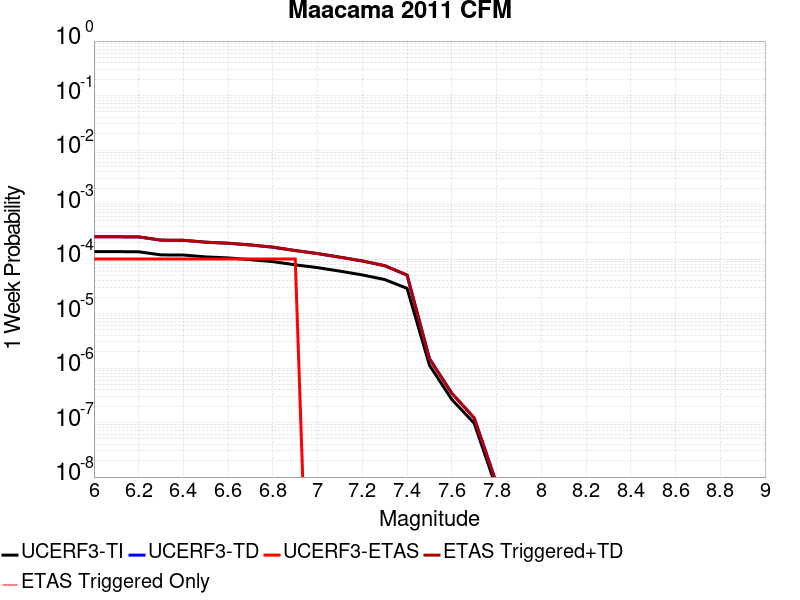 | 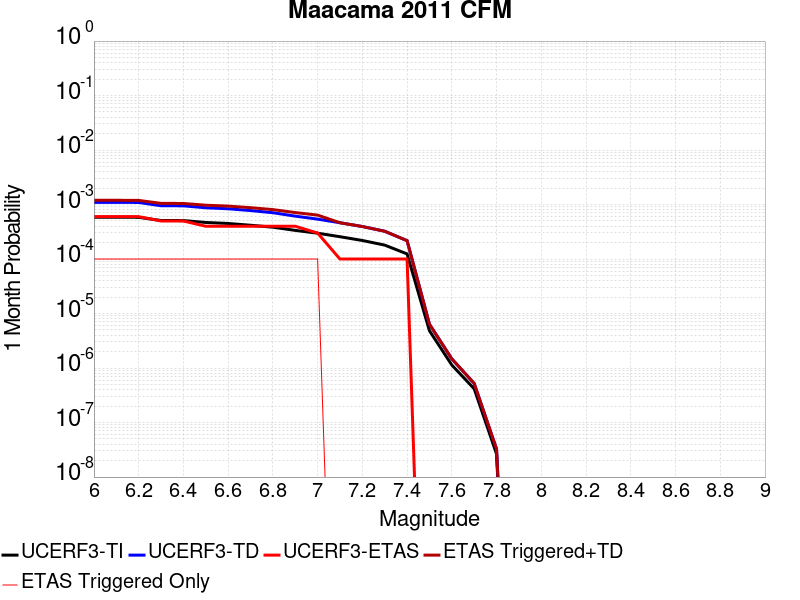 | 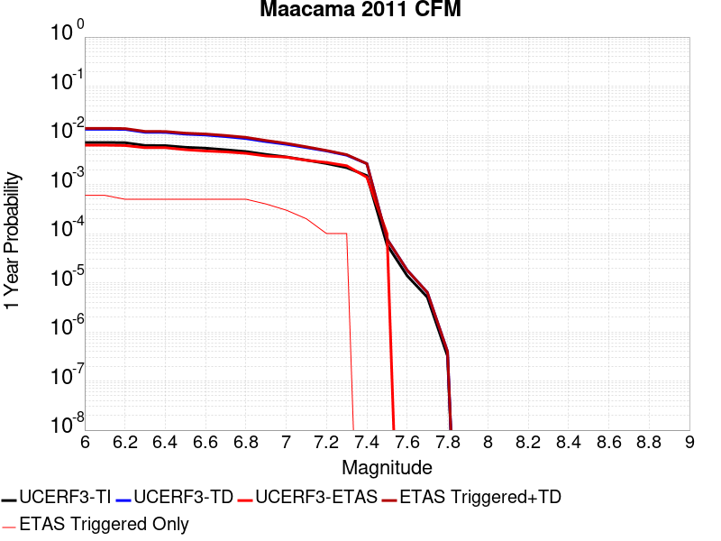 | 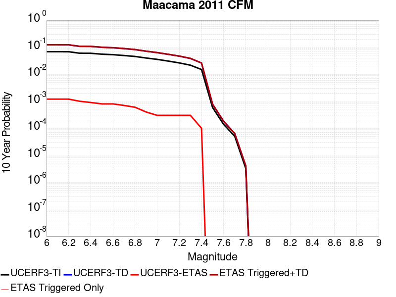 |

| Magnitude | 1 wk TI Prob | 1 wk TD Prob | 1 wk ETAS Prob | 1 wk ETAS/TD Gain | 1 wk ETAS Triggered+TD | 1 wk ETAS Triggered Only | 1 mo TI Prob | 1 mo TD Prob | 1 mo ETAS Prob | 1 mo ETAS/TD Gain | 1 mo ETAS Triggered+TD | 1 mo ETAS Triggered Only | 1 yr TI Prob | 1 yr TD Prob | 1 yr ETAS Prob | 1 yr ETAS/TD Gain | 1 yr ETAS Triggered+TD | 1 yr ETAS Triggered Only | 10 yr TI Prob | 10 yr TD Prob | 10 yr ETAS Prob | 10 yr ETAS/TD Gain | 10 yr ETAS Triggered+TD | 10 yr ETAS Triggered Only |
|-----|-----|-----|-----|-----|-----|-----|-----|-----|-----|-----|-----|-----|-----|-----|-----|-----|-----|-----|-----|-----|-----|-----|-----|-----|
| 6.0 | 1.368203E-4 | 2.5635184E-4 | 1.0E-4 | 0.3900889 | 2.5635184E-4 | 0.0 | 5.862409E-4 | 0.0010980846 | 6.0E-4 | 0.546406 | 0.0011979748 | 1.0E-4 | 0.0071141496 | 0.01327047 | 0.0063 | 0.47473824 | 0.013862508 | 6.0E-4 | 0.06890667 | 0.12352369 | 0.063 | 0.5100236 | 0.13465494 | 0.0127 |
| 6.1 | 1.368203E-4 | 2.5635184E-4 | 1.0E-4 | 0.3900889 | 2.5635184E-4 | 0.0 | 5.862409E-4 | 0.0010980846 | 6.0E-4 | 0.546406 | 0.0011979748 | 1.0E-4 | 0.0071141496 | 0.01327047 | 0.0063 | 0.47473824 | 0.013862508 | 6.0E-4 | 0.06890667 | 0.12352369 | 0.063 | 0.5100236 | 0.13465494 | 0.0127 |
| 6.2 | 1.360743E-4 | 2.5510418E-4 | 1.0E-4 | 0.3919967 | 2.5510418E-4 | 0.0 | 5.8304524E-4 | 0.0010927428 | 6.0E-4 | 0.5490771 | 0.0011926334 | 1.0E-4 | 0.007075496 | 0.013206296 | 0.0062 | 0.46947306 | 0.013699692 | 5.0E-4 | 0.06854413 | 0.12295995 | 0.0627 | 0.50992215 | 0.13392295 | 0.0125 |
| 6.3 | 1.1917239E-4 | 2.2215783E-4 | 1.0E-4 | 0.4501304 | 2.2215783E-4 | 0.0 | 5.1063887E-4 | 9.516658E-4 | 5.0E-4 | 0.5253945 | 0.0010515706 | 1.0E-4 | 0.0061993203 | 0.0115129175 | 0.0056 | 0.48641014 | 0.012007161 | 5.0E-4 | 0.060292065 | 0.10821077 | 0.0553 | 0.5110397 | 0.11793128 | 0.0109 |
| 6.4 | 1.1859289E-4 | 2.2119796E-4 | 1.0E-4 | 0.45208374 | 2.2119796E-4 | 0.0 | 5.0815626E-4 | 9.4755524E-4 | 5.0E-4 | 0.5276737 | 0.0010474605 | 1.0E-4 | 0.006169266 | 0.01146345 | 0.0056 | 0.48850912 | 0.011957719 | 5.0E-4 | 0.06000784 | 0.10776911 | 0.0552 | 0.51220614 | 0.117405206 | 0.0108 |
| 6.5 | 1.09512424E-4 | 2.0379502E-4 | 1.0E-4 | 0.49068913 | 2.0379502E-4 | 0.0 | 4.6925453E-4 | 8.7303045E-4 | 4.0E-4 | 0.45817417 | 9.7294315E-4 | 1.0E-4 | 0.005698218 | 0.010567845 | 0.0051 | 0.48259604 | 0.011062561 | 5.0E-4 | 0.055543028 | 0.09987926 | 0.0508 | 0.5086141 | 0.10861043 | 0.0097 |
| 6.6 | 1.0502928E-4 | 1.9539754E-4 | 1.0E-4 | 0.51177716 | 1.9539754E-4 | 0.0 | 4.500478E-4 | 8.370793E-4 | 4.0E-4 | 0.477852 | 9.369956E-4 | 1.0E-4 | 0.0054655746 | 0.010135436 | 0.0048 | 0.47358593 | 0.010630368 | 5.0E-4 | 0.053330887 | 0.096041255 | 0.0485 | 0.5049913 | 0.10453847 | 0.0094 |
| 6.7 | 9.739358E-5 | 1.8128623E-4 | 1.0E-4 | 0.55161387 | 1.8128623E-4 | 0.0 | 4.173343E-4 | 7.76656E-4 | 4.0E-4 | 0.5150286 | 8.7657827E-4 | 1.0E-4 | 0.0050692135 | 0.009408074 | 0.0046 | 0.48894173 | 0.00990337 | 5.0E-4 | 0.049551267 | 0.08953129 | 0.0453 | 0.5059684 | 0.097452365 | 0.0087 |
| 6.8 | 8.969524E-5 | 1.6537543E-4 | 1.0E-4 | 0.6046847 | 1.6537543E-4 | 0.0 | 3.8435153E-4 | 7.085191E-4 | 4.0E-4 | 0.56455785 | 8.0844824E-4 | 1.0E-4 | 0.0046694432 | 0.008586911 | 0.0043 | 0.50076216 | 0.009082617 | 5.0E-4 | 0.045725387 | 0.08210195 | 0.0412 | 0.5018151 | 0.089353345 | 0.0079 |
| 6.9 | 7.838291E-5 | 1.4312066E-4 | 1.0E-4 | 0.69871116 | 1.4312066E-4 | 0.0 | 3.358835E-4 | 6.132103E-4 | 4.0E-4 | 0.65230477 | 7.1314897E-4 | 1.0E-4 | 0.0040817154 | 0.007436715 | 0.0038 | 0.5109783 | 0.00783374 | 4.0E-4 | 0.04007554 | 0.07155836 | 0.0346 | 0.48352146 | 0.07740754 | 0.0063 |
| 7.0 | 6.961957E-5 | 1.2612199E-4 | 0.0 | 0.0 | 1.2612199E-4 | 0.0 | 2.9833548E-4 | 5.403989E-4 | 3.0E-4 | 0.5551455 | 6.403448E-4 | 1.0E-4 | 0.0036261857 | 0.0065571754 | 0.0036 | 0.5490169 | 0.0068552084 | 3.0E-4 | 0.035675827 | 0.063420855 | 0.0305 | 0.48091435 | 0.06847838 | 0.0054 |
| 7.1 | 5.999398E-5 | 1.0820933E-4 | 0.0 | 0.0 | 1.0820933E-4 | 0.0 | 2.570917E-4 | 4.6366043E-4 | 1.0E-4 | 0.21567509 | 4.6366043E-4 | 0.0 | 0.0031255994 | 0.0056291055 | 0.0031 | 0.5507091 | 0.0058279797 | 2.0E-4 | 0.030820016 | 0.054735687 | 0.0264 | 0.48231786 | 0.059367485 | 0.0049 |
| 7.2 | 5.116532E-5 | 9.23087E-5 | 0.0 | 0.0 | 9.23087E-5 | 0.0 | 2.1926152E-4 | 3.955426E-4 | 1.0E-4 | 0.25281727 | 3.955426E-4 | 0.0 | 0.002666241 | 0.004804493 | 0.0028 | 0.5827878 | 0.0049040127 | 1.0E-4 | 0.026344774 | 0.046942685 | 0.0234 | 0.4984802 | 0.050754916 | 0.004 |
| 7.3 | 4.2087835E-5 | 7.556372E-5 | 0.0 | 0.0 | 7.556372E-5 | 0.0 | 1.8036396E-4 | 3.2380017E-4 | 1.0E-4 | 0.30883247 | 3.2380017E-4 | 0.0 | 0.0021937196 | 0.0039347745 | 0.0024 | 0.609946 | 0.004034381 | 1.0E-4 | 0.0217219 | 0.03860835 | 0.0204 | 0.52838314 | 0.04178094 | 0.0033 |
| 7.4 | 2.8991652E-5 | 5.077215E-5 | 0.0 | 0.0 | 5.077215E-5 | 0.0 | 1.2424402E-4 | 2.1757593E-4 | 1.0E-4 | 0.45960966 | 2.1757593E-4 | 0.0 | 0.0015116213 | 0.0026457685 | 0.0014 | 0.5291468 | 0.0026457685 | 0.0 | 0.015013801 | 0.02613686 | 0.0145 | 0.5547721 | 0.028571518 | 0.0025 |
| 7.5 | 1.1292299E-6 | 1.4882911E-6 | 0.0 | 0.0 | 1.4882911E-6 | 0.0 | 4.8395473E-6 | 6.378382E-6 | 0.0 | 0.0 | 6.378382E-6 | 0.0 | 5.8919897E-5 | 7.765527E-5 | 1.0E-4 | 1.2877426 | 7.765527E-5 | 0.0 | 5.890428E-4 | 7.769498E-4 | 2.0E-4 | 0.25741687 | 8.768721E-4 | 1.0E-4 |
| 7.6 | 2.6535366E-7 | 3.4464765E-7 | 0.0 | 0.0 | 3.4464765E-7 | 0.0 | 1.1372296E-6 | 1.4770604E-6 | 0.0 | 0.0 | 1.4770604E-6 | 0.0 | 1.3845682E-5 | 1.7983064E-5 | 0.0 | 0.0 | 1.7983064E-5 | 0.0 | 1.3844819E-4 | 1.8031562E-4 | 1.0E-4 | 0.55458313 | 2.802976E-4 | 1.0E-4 |
| 7.7 | 9.727789E-8 | 1.217252E-7 | 0.0 | 0.0 | 1.217252E-7 | 0.0 | 4.1690518E-7 | 5.216793E-7 | 0.0 | 0.0 | 5.216793E-7 | 0.0 | 5.0758085E-6 | 6.3514267E-6 | 0.0 | 0.0 | 6.3514267E-6 | 0.0 | 5.0756928E-5 | 6.3888314E-5 | 1.0E-4 | 1.5652314 | 1.6388192E-4 | 1.0E-4 |
| 7.8 | 6.1939325E-9 | 7.616068E-9 | 0.0 | 0.0 | 7.616068E-9 | 0.0 | 2.6545425E-8 | 3.2640294E-8 | 0.0 | 0.0 | 3.2640294E-8 | 0.0 | 3.231905E-7 | 3.973955E-7 | 0.0 | 0.0 | 3.973955E-7 | 0.0 | 3.2319003E-6 | 4.0111067E-6 | 0.0 | 0.0 | 4.0111067E-6 | 0.0 |

## Rodgers Creek - Healdsburg 2011 CFM
*[(top)](#table-of-contents)*

| 1 Week | 1 Month | 1 Year | 10 Year |
|-----|-----|-----|-----|
| 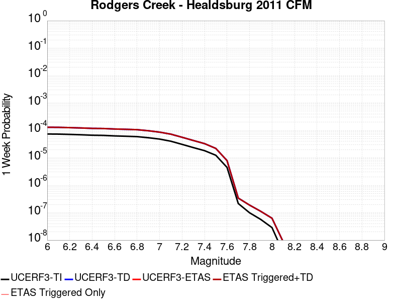 | 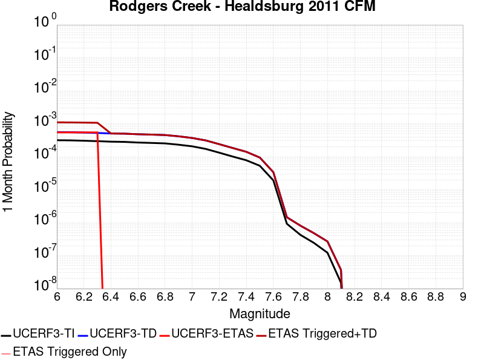 | 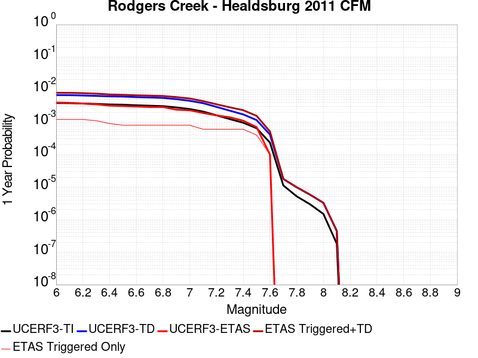 | 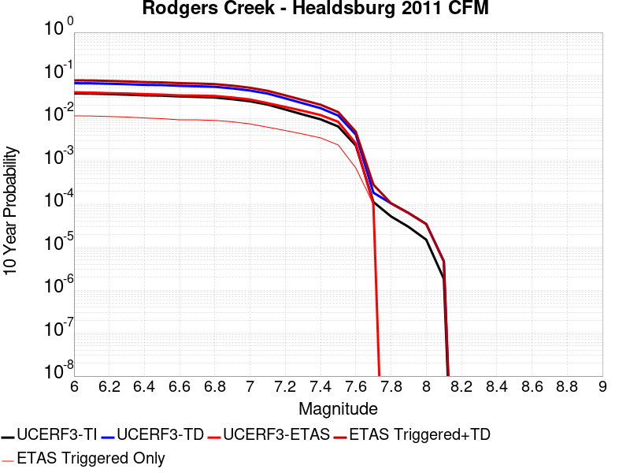 |

| Magnitude | 1 wk TI Prob | 1 wk TD Prob | 1 wk ETAS Prob | 1 wk ETAS/TD Gain | 1 wk ETAS Triggered+TD | 1 wk ETAS Triggered Only | 1 mo TI Prob | 1 mo TD Prob | 1 mo ETAS Prob | 1 mo ETAS/TD Gain | 1 mo ETAS Triggered+TD | 1 mo ETAS Triggered Only | 1 yr TI Prob | 1 yr TD Prob | 1 yr ETAS Prob | 1 yr ETAS/TD Gain | 1 yr ETAS Triggered+TD | 1 yr ETAS Triggered Only | 10 yr TI Prob | 10 yr TD Prob | 10 yr ETAS Prob | 10 yr ETAS/TD Gain | 10 yr ETAS Triggered+TD | 10 yr ETAS Triggered Only |
|-----|-----|-----|-----|-----|-----|-----|-----|-----|-----|-----|-----|-----|-----|-----|-----|-----|-----|-----|-----|-----|-----|-----|-----|-----|
| 6.0 | 7.390182E-5 | 1.3031342E-4 | 2.0E-4 | 1.5347613 | 2.3030039E-4 | 1.0E-4 | 3.1668364E-4 | 5.5836583E-4 | 4.0E-4 | 0.71637625 | 7.5825414E-4 | 2.0E-4 | 0.0038488081 | 0.0067768767 | 0.004 | 0.5902424 | 0.007968744 | 0.0012 | 0.037828278 | 0.06568972 | 0.0403 | 0.6134902 | 0.076340854 | 0.0114 |
| 6.1 | 7.318768E-5 | 1.2929743E-4 | 1.0E-4 | 0.7734106 | 2.292845E-4 | 1.0E-4 | 3.1362378E-4 | 5.5401365E-4 | 3.0E-4 | 0.5415029 | 7.5390283E-4 | 2.0E-4 | 0.0038116854 | 0.006724231 | 0.0039 | 0.57999194 | 0.007916162 | 0.0012 | 0.037469655 | 0.06519586 | 0.0396 | 0.60740054 | 0.07575914 | 0.0113 |
| 6.2 | 7.1379836E-5 | 1.2623613E-4 | 1.0E-4 | 0.79216623 | 2.262235E-4 | 1.0E-4 | 3.058777E-4 | 5.408993E-4 | 3.0E-4 | 0.5546319 | 7.407911E-4 | 2.0E-4 | 0.003717703 | 0.006565535 | 0.0037 | 0.5635489 | 0.0077576563 | 0.0012 | 0.0365612 | 0.06372185 | 0.0385 | 0.6041883 | 0.074020915 | 0.011 |
| 6.3 | 6.9255926E-5 | 1.2279439E-4 | 1.0E-4 | 0.81436944 | 2.2278211E-4 | 1.0E-4 | 2.9677735E-4 | 5.261558E-4 | 3.0E-4 | 0.5701733 | 7.260506E-4 | 2.0E-4 | 0.0036072785 | 0.00638718 | 0.0035 | 0.5479726 | 0.0074801543 | 0.0011 | 0.035492823 | 0.062059175 | 0.0377 | 0.6074847 | 0.07209514 | 0.0107 |
| 6.4 | 6.6757144E-5 | 1.1857733E-4 | 0.0 | 0.0 | 1.1857733E-4 | 0.0 | 2.8607066E-4 | 5.080899E-4 | 1.0E-4 | 0.19681557 | 5.080899E-4 | 0.0 | 0.0034773487 | 0.0061685205 | 0.0032 | 0.51876295 | 0.007062969 | 9.0E-4 | 0.034234364 | 0.060015246 | 0.0365 | 0.6081788 | 0.06960309 | 0.0102 |
| 6.5 | 6.5735134E-5 | 1.1707417E-4 | 0.0 | 0.0 | 1.1707417E-4 | 0.0 | 2.8169158E-4 | 5.016503E-4 | 1.0E-4 | 0.19934203 | 5.016503E-4 | 0.0 | 0.003424202 | 0.0060905716 | 0.0031 | 0.50898343 | 0.0068856995 | 8.0E-4 | 0.03371918 | 0.059280805 | 0.0356 | 0.60053164 | 0.068499856 | 0.0098 |
| 6.6 | 6.289601E-5 | 1.1244678E-4 | 0.0 | 0.0 | 1.1244678E-4 | 0.0 | 2.6952647E-4 | 4.8182617E-4 | 1.0E-4 | 0.20754373 | 4.8182617E-4 | 0.0 | 0.0032765474 | 0.0058505335 | 0.003 | 0.51277375 | 0.006645853 | 8.0E-4 | 0.032286562 | 0.057026185 | 0.0341 | 0.5979709 | 0.065701544 | 0.0092 |
| 6.7 | 6.115274E-5 | 1.0962786E-4 | 0.0 | 0.0 | 1.0962786E-4 | 0.0 | 2.6205686E-4 | 4.6974944E-4 | 1.0E-4 | 0.21287943 | 4.6974944E-4 | 0.0 | 0.0031858748 | 0.0057042795 | 0.0029 | 0.50839025 | 0.006499716 | 8.0E-4 | 0.031405866 | 0.05564904 | 0.0338 | 0.607378 | 0.06433707 | 0.0092 |
| 6.8 | 5.9232367E-5 | 1.06314415E-4 | 0.0 | 0.0 | 1.06314415E-4 | 0.0 | 2.538283E-4 | 4.55554E-4 | 1.0E-4 | 0.21951294 | 4.55554E-4 | 0.0 | 0.0030859804 | 0.00553234 | 0.0029 | 0.5241905 | 0.0063279145 | 8.0E-4 | 0.030434765 | 0.054020785 | 0.0331 | 0.6127271 | 0.06244 | 0.0089 |
| 6.9 | 5.4030377E-5 | 9.731323E-5 | 0.0 | 0.0 | 9.731323E-5 | 0.0 | 2.315382E-4 | 4.1699034E-4 | 1.0E-4 | 0.23981372 | 4.1699034E-4 | 0.0 | 0.0028153337 | 0.005065104 | 0.0024 | 0.47383034 | 0.005861052 | 8.0E-4 | 0.027799325 | 0.04958083 | 0.0305 | 0.61515707 | 0.057469312 | 0.0083 |
| 7.0 | 4.8260714E-5 | 8.655727E-5 | 0.0 | 0.0 | 8.655727E-5 | 0.0 | 2.0681522E-4 | 3.7090728E-4 | 1.0E-4 | 0.26960918 | 3.7090728E-4 | 0.0 | 0.0025150678 | 0.004506499 | 0.0023 | 0.510374 | 0.0053028935 | 8.0E-4 | 0.024867928 | 0.044259977 | 0.0274 | 0.61906946 | 0.051332455 | 0.0074 |
| 7.1 | 4.0294493E-5 | 7.31159E-5 | 0.0 | 0.0 | 7.31159E-5 | 0.0 | 1.7267925E-4 | 3.1331644E-4 | 1.0E-4 | 0.31916615 | 3.1331644E-4 | 0.0 | 0.0021003427 | 0.003807993 | 0.0019 | 0.4989505 | 0.004405708 | 6.0E-4 | 0.02080602 | 0.037548725 | 0.0225 | 0.5992214 | 0.043515924 | 0.0062 |
| 7.2 | 3.096388E-5 | 5.6294935E-5 | 0.0 | 0.0 | 5.6294935E-5 | 0.0 | 1.326956E-4 | 2.4124181E-4 | 1.0E-4 | 0.41452184 | 2.4124181E-4 | 0.0 | 0.0016143717 | 0.0029331848 | 0.0016 | 0.54548216 | 0.0035314248 | 6.0E-4 | 0.01602694 | 0.029103395 | 0.0184 | 0.6322287 | 0.034152057 | 0.0052 |
| 7.3 | 2.3615226E-5 | 4.3046974E-5 | 0.0 | 0.0 | 4.3046974E-5 | 0.0 | 1.0120418E-4 | 1.8447405E-4 | 1.0E-4 | 0.54208165 | 1.8447405E-4 | 0.0 | 0.0012314644 | 0.0022436716 | 0.0014 | 0.62397724 | 0.0028423253 | 6.0E-4 | 0.0122466255 | 0.022352643 | 0.0149 | 0.6665878 | 0.026556527 | 0.0043 |
| 7.4 | 1.8251132E-5 | 3.3060413E-5 | 0.0 | 0.0 | 3.3060413E-5 | 0.0 | 7.821679E-5 | 1.4167985E-4 | 1.0E-4 | 0.7058167 | 1.4167985E-4 | 0.0 | 9.518733E-4 | 0.0017235968 | 0.0011 | 0.6382003 | 0.0023225627 | 6.0E-4 | 0.009478063 | 0.017229114 | 0.0119 | 0.69069135 | 0.020668812 | 0.0035 |
| 7.5 | 1.2411432E-5 | 2.2128861E-5 | 0.0 | 0.0 | 2.2128861E-5 | 0.0 | 5.3190768E-5 | 9.483456E-5 | 1.0E-4 | 1.0544679 | 9.483456E-5 | 0.0 | 6.4740516E-4 | 0.0011540048 | 7.0E-4 | 0.60658324 | 0.0015535433 | 4.0E-4 | 0.006455223 | 0.011579441 | 0.0083 | 0.71678764 | 0.013951651 | 0.0024 |
| 7.6 | 4.4771446E-6 | 7.959984E-6 | 0.0 | 0.0 | 7.959984E-6 | 0.0 | 1.918762E-5 | 3.411378E-5 | 0.0 | 0.0 | 3.411378E-5 | 0.0 | 2.3358424E-4 | 4.1525727E-4 | 1.0E-4 | 0.24081457 | 5.1521574E-4 | 1.0E-4 | 0.0023333887 | 0.0041836957 | 0.0026 | 0.62146014 | 0.004880767 | 7.0E-4 |
| 7.7 | 2.157941E-7 | 3.4273316E-7 | 0.0 | 0.0 | 3.4273316E-7 | 0.0 | 9.248315E-7 | 1.4688554E-6 | 0.0 | 0.0 | 1.4688554E-6 | 0.0 | 1.1259765E-5 | 1.7883169E-5 | 0.0 | 0.0 | 1.7883169E-5 | 0.0 | 1.1259195E-4 | 1.8532724E-4 | 1.0E-4 | 0.53958607 | 2.8530872E-4 | 1.0E-4 |
| 7.8 | 9.9623286E-8 | 1.9087027E-7 | 0.0 | 0.0 | 1.9087027E-7 | 0.0 | 4.269569E-7 | 8.1801517E-7 | 0.0 | 0.0 | 8.1801517E-7 | 0.0 | 5.1981874E-6 | 9.959289E-6 | 0.0 | 0.0 | 9.959289E-6 | 0.0 | 5.198066E-5 | 1.05007646E-4 | 0.0 | 0.0 | 1.05007646E-4 | 0.0 |
| 7.9 | 5.6745257E-8 | 1.1275879E-7 | 0.0 | 0.0 | 1.1275879E-7 | 0.0 | 2.4319394E-7 | 4.832519E-7 | 0.0 | 0.0 | 4.832519E-7 | 0.0 | 2.960882E-6 | 5.883576E-6 | 0.0 | 0.0 | 5.883576E-6 | 0.0 | 2.9608427E-5 | 6.2265266E-5 | 0.0 | 0.0 | 6.2265266E-5 | 0.0 |
| 8.0 | 2.8614323E-8 | 6.316886E-8 | 0.0 | 0.0 | 6.316886E-8 | 0.0 | 1.2263281E-7 | 2.7072366E-7 | 0.0 | 0.0 | 2.7072366E-7 | 0.0 | 1.4930534E-6 | 3.2960556E-6 | 0.0 | 0.0 | 3.2960556E-6 | 0.0 | 1.4930434E-5 | 3.45655E-5 | 0.0 | 0.0 | 3.45655E-5 | 0.0 |
| 8.1 | 3.5045191E-9 | 8.63407E-9 | 0.0 | 0.0 | 8.63407E-9 | 0.0 | 1.5019367E-8 | 3.7003158E-8 | 0.0 | 0.0 | 3.7003158E-8 | 0.0 | 1.8286079E-7 | 4.5051337E-7 | 0.0 | 0.0 | 4.5051337E-7 | 0.0 | 1.8286064E-6 | 4.6761565E-6 | 0.0 | 0.0 | 4.6761565E-6 | 0.0 |

## Mission Ridge-Arroyo Parida-Santa Ana
*[(top)](#table-of-contents)*

| 1 Week | 1 Month | 1 Year | 10 Year |
|-----|-----|-----|-----|
| 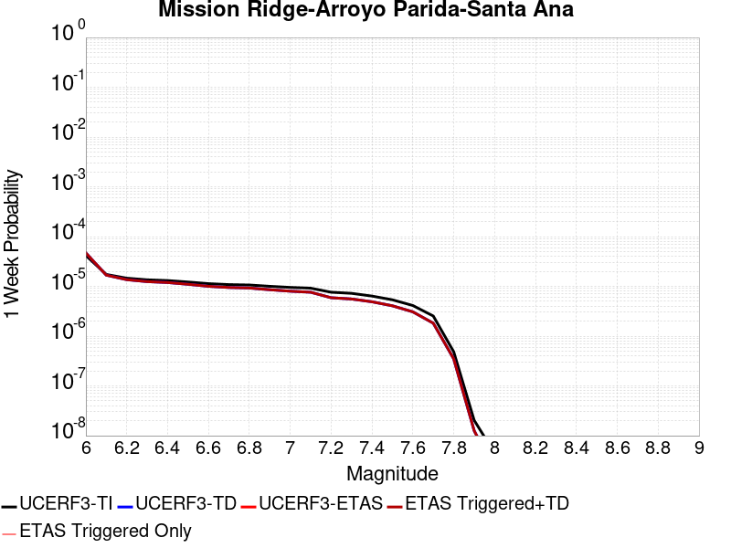 | 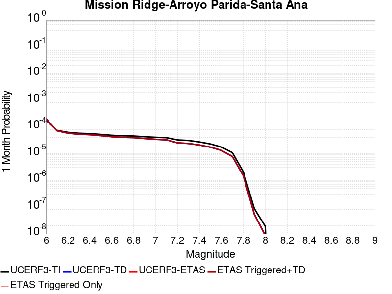 | 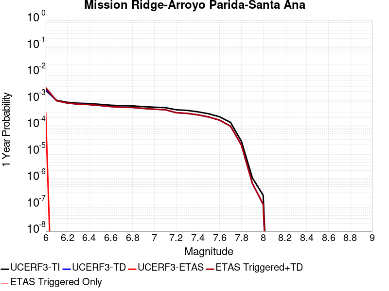 | 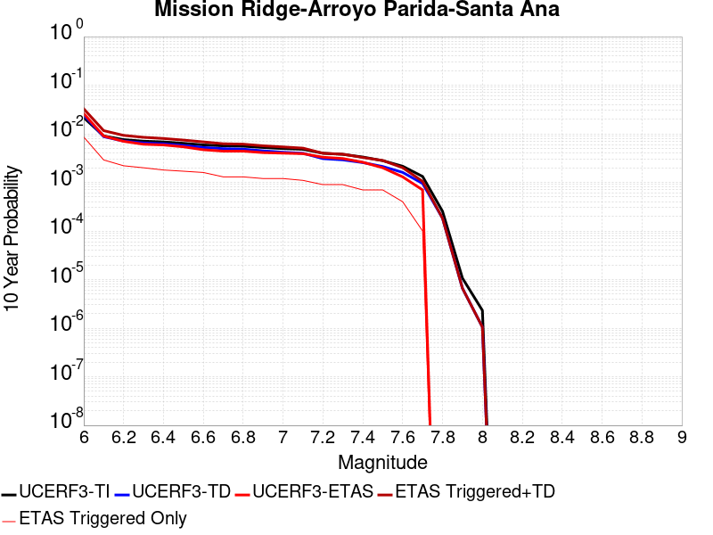 |

| Magnitude | 1 wk TI Prob | 1 wk TD Prob | 1 wk ETAS Prob | 1 wk ETAS/TD Gain | 1 wk ETAS Triggered+TD | 1 wk ETAS Triggered Only | 1 mo TI Prob | 1 mo TD Prob | 1 mo ETAS Prob | 1 mo ETAS/TD Gain | 1 mo ETAS Triggered+TD | 1 mo ETAS Triggered Only | 1 yr TI Prob | 1 yr TD Prob | 1 yr ETAS Prob | 1 yr ETAS/TD Gain | 1 yr ETAS Triggered+TD | 1 yr ETAS Triggered Only | 10 yr TI Prob | 10 yr TD Prob | 10 yr ETAS Prob | 10 yr ETAS/TD Gain | 10 yr ETAS Triggered+TD | 10 yr ETAS Triggered Only |
|-----|-----|-----|-----|-----|-----|-----|-----|-----|-----|-----|-----|-----|-----|-----|-----|-----|-----|-----|-----|-----|-----|-----|-----|-----|
| 6.0 | 4.169034E-5 | 4.7031077E-5 | 0.0 | 0.0 | 4.7031077E-5 | 0.0 | 1.7866064E-4 | 2.0155103E-4 | 1.0E-4 | 0.49615228 | 2.0155103E-4 | 0.0 | 0.0021730233 | 0.002451958 | 0.0028 | 1.1419445 | 0.0032499963 | 8.0E-4 | 0.021518968 | 0.024330473 | 0.0261 | 1.0727289 | 0.032721233 | 0.0086 |
| 6.1 | 1.73813E-5 | 1.6825945E-5 | 0.0 | 0.0 | 1.6825945E-5 | 0.0 | 7.4489166E-5 | 7.210926E-5 | 0.0 | 0.0 | 7.210926E-5 | 0.0 | 9.065282E-4 | 8.7758724E-4 | 0.0012 | 1.3673854 | 0.001177324 | 3.0E-4 | 0.009028391 | 0.008742256 | 0.009 | 1.0294826 | 0.011616903 | 0.0029 |
| 6.2 | 1.4622182E-5 | 1.3650147E-5 | 0.0 | 0.0 | 1.3650147E-5 | 0.0 | 6.2664985E-5 | 5.8499336E-5 | 0.0 | 0.0 | 5.8499336E-5 | 0.0 | 7.6267915E-4 | 7.1200053E-4 | 9.0E-4 | 1.2640439 | 9.1185817E-4 | 2.0E-4 | 0.007600669 | 0.007097535 | 0.007 | 0.9862579 | 0.00928192 | 0.0022 |
| 6.3 | 1.3552434E-5 | 1.2460481E-5 | 0.0 | 0.0 | 1.2460481E-5 | 0.0 | 5.8080568E-5 | 5.340099E-5 | 0.0 | 0.0 | 5.340099E-5 | 0.0 | 7.069015E-4 | 6.4996624E-4 | 7.0E-4 | 1.076979 | 8.498362E-4 | 2.0E-4 | 0.00704657 | 0.0064809136 | 0.0061 | 0.94122535 | 0.008467952 | 0.002 |
| 6.4 | 1.30977305E-5 | 1.1957998E-5 | 0.0 | 0.0 | 1.1957998E-5 | 0.0 | 5.613192E-5 | 5.124757E-5 | 0.0 | 0.0 | 5.124757E-5 | 0.0 | 6.831918E-4 | 6.237636E-4 | 7.0E-4 | 1.12222 | 8.236388E-4 | 2.0E-4 | 0.006810953 | 0.006220371 | 0.0059 | 0.94849646 | 0.008009175 | 0.0018 |
| 6.5 | 1.225205E-5 | 1.1028621E-5 | 0.0 | 0.0 | 1.1028621E-5 | 0.0 | 5.2507727E-5 | 4.7264675E-5 | 0.0 | 0.0 | 4.7264675E-5 | 0.0 | 6.3909404E-4 | 5.7529815E-4 | 7.0E-4 | 1.2167603 | 7.7518314E-4 | 2.0E-4 | 0.006372592 | 0.0057382965 | 0.0054 | 0.9410458 | 0.0074285413 | 0.0017 |
| 6.6 | 1.1352241E-5 | 1.004433E-5 | 0.0 | 0.0 | 1.004433E-5 | 0.0 | 4.8651553E-5 | 4.304643E-5 | 0.0 | 0.0 | 4.304643E-5 | 0.0 | 5.921717E-4 | 5.239664E-4 | 5.0E-4 | 0.9542597 | 6.23914E-4 | 1.0E-4 | 0.0059059616 | 0.0052274545 | 0.0047 | 0.8990992 | 0.0068190903 | 0.0016 |
| 6.7 | 1.0864116E-5 | 9.498515E-6 | 0.0 | 0.0 | 9.498515E-6 | 0.0 | 4.6559664E-5 | 4.07073E-5 | 0.0 | 0.0 | 4.07073E-5 | 0.0 | 5.667165E-4 | 4.9550063E-4 | 4.0E-4 | 0.8072643 | 4.9550063E-4 | 0.0 | 0.005652734 | 0.0049440903 | 0.0044 | 0.8899514 | 0.006237663 | 0.0013 |
| 6.8 | 1.0666365E-5 | 9.281492E-6 | 0.0 | 0.0 | 9.281492E-6 | 0.0 | 4.571219E-5 | 3.9777227E-5 | 0.0 | 0.0 | 3.9777227E-5 | 0.0 | 5.564038E-4 | 4.8418212E-4 | 4.0E-4 | 0.8261354 | 4.8418212E-4 | 0.0 | 0.005550127 | 0.0048314026 | 0.0044 | 0.91070867 | 0.006125122 | 0.0013 |
| 6.9 | 1.0038665E-5 | 8.574703E-6 | 0.0 | 0.0 | 8.574703E-6 | 0.0 | 4.302214E-5 | 3.674822E-5 | 0.0 | 0.0 | 3.674822E-5 | 0.0 | 5.236687E-4 | 4.4731953E-4 | 3.0E-4 | 0.6706615 | 4.4731953E-4 | 0.0 | 0.005224364 | 0.0044643003 | 0.0041 | 0.918397 | 0.005658943 | 0.0012 |
| 7.0 | 9.5379955E-6 | 8.008555E-6 | 0.0 | 0.0 | 8.008555E-6 | 0.0 | 4.0876483E-5 | 3.4321936E-5 | 0.0 | 0.0 | 3.4321936E-5 | 0.0 | 4.975576E-4 | 4.1779116E-4 | 3.0E-4 | 0.7180621 | 4.1779116E-4 | 0.0 | 0.00496445 | 0.0041701547 | 0.004 | 0.95919704 | 0.0053651505 | 0.0012 |
| 7.1 | 9.207389E-6 | 7.63643E-6 | 0.0 | 0.0 | 7.63643E-6 | 0.0 | 3.945964E-5 | 3.2727155E-5 | 0.0 | 0.0 | 3.2727155E-5 | 0.0 | 4.803152E-4 | 3.9838196E-4 | 3.0E-4 | 0.7530461 | 3.9838196E-4 | 0.0 | 0.004792784 | 0.0039767725 | 0.0039 | 0.9806948 | 0.005072398 | 0.0011 |
| 7.2 | 7.638091E-6 | 5.9180916E-6 | 0.0 | 0.0 | 5.9180916E-6 | 0.0 | 3.2734264E-5 | 2.5363004E-5 | 0.0 | 0.0 | 2.5363004E-5 | 0.0 | 3.984668E-4 | 3.0875113E-4 | 3.0E-4 | 0.9716563 | 3.0875113E-4 | 0.0 | 0.0039775306 | 0.0030831771 | 0.0033 | 1.0703245 | 0.0039804024 | 9.0E-4 |
| 7.3 | 7.2500147E-6 | 5.58367E-6 | 0.0 | 0.0 | 5.58367E-6 | 0.0 | 3.1071122E-5 | 2.3929797E-5 | 0.0 | 0.0 | 2.3929797E-5 | 0.0 | 3.7822526E-4 | 2.913066E-4 | 3.0E-4 | 1.0298427 | 2.913066E-4 | 0.0 | 0.0037758215 | 0.0029092017 | 0.0031 | 1.0655844 | 0.0038065834 | 9.0E-4 |
| 7.4 | 6.3899715E-6 | 4.907415E-6 | 0.0 | 0.0 | 4.907415E-6 | 0.0 | 2.7385306E-5 | 2.103161E-5 | 0.0 | 0.0 | 2.103161E-5 | 0.0 | 3.3336508E-4 | 2.5602998E-4 | 2.0E-4 | 0.7811585 | 2.5602998E-4 | 0.0 | 0.0033286542 | 0.002557293 | 0.0026 | 1.0167 | 0.003255503 | 7.0E-4 |
| 7.5 | 5.379025E-6 | 4.07452E-6 | 0.0 | 0.0 | 4.07452E-6 | 0.0 | 2.305276E-5 | 1.7462113E-5 | 0.0 | 0.0 | 1.7462113E-5 | 0.0 | 2.806312E-4 | 2.1258058E-4 | 1.0E-4 | 0.47040984 | 2.1258058E-4 | 0.0 | 0.0028027708 | 0.0021237836 | 0.002 | 0.94171554 | 0.002822297 | 7.0E-4 |
| 7.6 | 4.1270696E-6 | 3.0808028E-6 | 0.0 | 0.0 | 3.0808028E-6 | 0.0 | 1.768732E-5 | 1.3203375E-5 | 0.0 | 0.0 | 1.3203375E-5 | 0.0 | 2.1532185E-4 | 1.607393E-4 | 1.0E-4 | 0.6221254 | 1.607393E-4 | 0.0 | 0.0021511333 | 0.0016062384 | 0.0013 | 0.80934435 | 0.002005596 | 4.0E-4 |
| 7.7 | 2.5406805E-6 | 1.8229407E-6 | 0.0 | 0.0 | 1.8229407E-6 | 0.0 | 1.0888585E-5 | 7.8125795E-6 | 0.0 | 0.0 | 7.8125795E-6 | 0.0 | 1.3256045E-4 | 9.511407E-5 | 0.0 | 0.0 | 9.511407E-5 | 0.0 | 0.0013248142 | 9.5073966E-4 | 7.0E-4 | 0.7362689 | 0.0010506446 | 1.0E-4 |
| 7.8 | 4.8608285E-7 | 3.502888E-7 | 0.0 | 0.0 | 3.502888E-7 | 0.0 | 2.0832106E-6 | 1.5012369E-6 | 0.0 | 0.0 | 1.5012369E-6 | 0.0 | 2.5362791E-5 | 1.8277406E-5 | 0.0 | 0.0 | 1.8277406E-5 | 0.0 | 2.5359896E-4 | 1.8275915E-4 | 0.0 | 0.0 | 1.8275915E-4 | 0.0 |
| 7.9 | 2.0472514E-8 | 1.2655905E-8 | 0.0 | 0.0 | 1.2655905E-8 | 0.0 | 8.7739345E-8 | 5.4239592E-8 | 0.0 | 0.0 | 5.4239592E-8 | 0.0 | 1.068226E-6 | 6.603668E-7 | 0.0 | 0.0 | 6.603668E-7 | 0.0 | 1.0682209E-5 | 6.60365E-6 | 0.0 | 0.0 | 6.60365E-6 | 0.0 |
| 8.0 | 4.443582E-9 | 2.0207183E-9 | 0.0 | 0.0 | 2.0207183E-9 | 0.0 | 1.9043922E-8 | 8.660222E-9 | 0.0 | 0.0 | 8.660222E-9 | 0.0 | 2.3185973E-7 | 1.054382E-7 | 0.0 | 0.0 | 1.054382E-7 | 0.0 | 2.3185949E-6 | 1.0543815E-6 | 0.0 | 0.0 | 1.0543815E-6 | 0.0 |

## Elmore Ranch
*[(top)](#table-of-contents)*

| 1 Week | 1 Month | 1 Year | 10 Year |
|-----|-----|-----|-----|
| 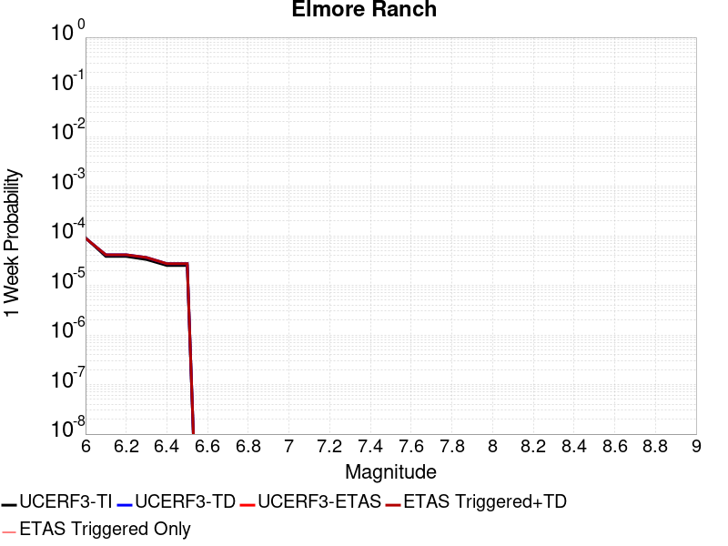 | 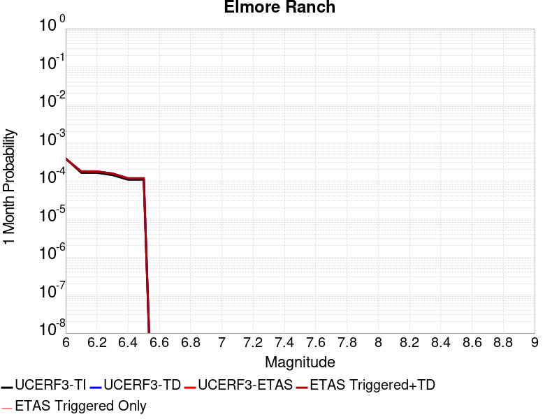 | 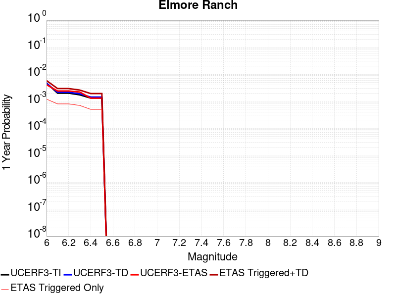 | 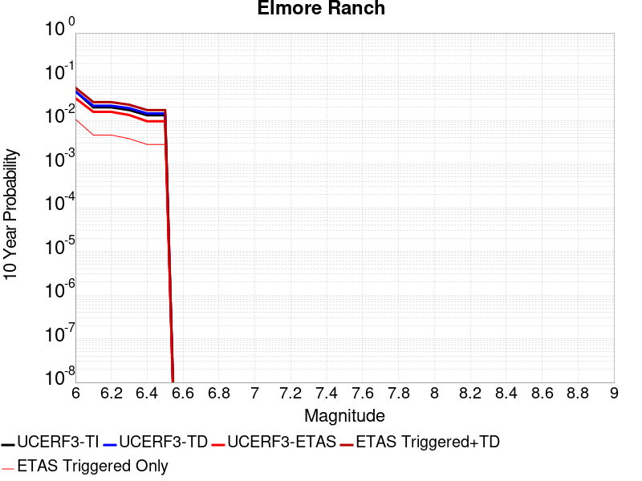 |

| Magnitude | 1 wk TI Prob | 1 wk TD Prob | 1 wk ETAS Prob | 1 wk ETAS/TD Gain | 1 wk ETAS Triggered+TD | 1 wk ETAS Triggered Only | 1 mo TI Prob | 1 mo TD Prob | 1 mo ETAS Prob | 1 mo ETAS/TD Gain | 1 mo ETAS Triggered+TD | 1 mo ETAS Triggered Only | 1 yr TI Prob | 1 yr TD Prob | 1 yr ETAS Prob | 1 yr ETAS/TD Gain | 1 yr ETAS Triggered+TD | 1 yr ETAS Triggered Only | 10 yr TI Prob | 10 yr TD Prob | 10 yr ETAS Prob | 10 yr ETAS/TD Gain | 10 yr ETAS Triggered+TD | 10 yr ETAS Triggered Only |
|-----|-----|-----|-----|-----|-----|-----|-----|-----|-----|-----|-----|-----|-----|-----|-----|-----|-----|-----|-----|-----|-----|-----|-----|-----|
| 6.0 | 9.102099E-5 | 8.916474E-5 | 0.0 | 0.0 | 8.916474E-5 | 0.0 | 3.9003167E-4 | 3.82064E-4 | 2.0E-4 | 0.5234725 | 3.82064E-4 | 0.0 | 0.0047383 | 0.004642422 | 0.0041 | 0.88315976 | 0.0058368505 | 0.0012 | 0.046385348 | 0.045659773 | 0.0322 | 0.70521593 | 0.05577578 | 0.0106 |
| 6.1 | 3.8306698E-5 | 4.1321364E-5 | 0.0 | 0.0 | 4.1321364E-5 | 0.0 | 1.6416123E-4 | 1.7708354E-4 | 1.0E-4 | 0.5647052 | 1.7708354E-4 | 0.0 | 0.0019968306 | 0.0021543251 | 0.0024 | 1.1140379 | 0.0029526018 | 8.0E-4 | 0.019789828 | 0.021515239 | 0.0156 | 0.72506744 | 0.026016269 | 0.0046 |
| 6.2 | 3.8306698E-5 | 4.1321364E-5 | 0.0 | 0.0 | 4.1321364E-5 | 0.0 | 1.6416123E-4 | 1.7708354E-4 | 1.0E-4 | 0.5647052 | 1.7708354E-4 | 0.0 | 0.0019968306 | 0.0021543251 | 0.0024 | 1.1140379 | 0.0029526018 | 8.0E-4 | 0.019789828 | 0.021515239 | 0.0156 | 0.72506744 | 0.026016269 | 0.0046 |
| 6.3 | 3.3197924E-5 | 3.6413116E-5 | 0.0 | 0.0 | 3.6413116E-5 | 0.0 | 1.4226905E-4 | 1.5605082E-4 | 1.0E-4 | 0.64081687 | 1.5605082E-4 | 0.0 | 0.0017307495 | 0.0018988051 | 0.0022 | 1.1586233 | 0.002597476 | 7.0E-4 | 0.017173318 | 0.018994208 | 0.0132 | 0.6949487 | 0.02272203 | 0.0038 |
| 6.4 | 2.5148964E-5 | 2.7331169E-5 | 0.0 | 0.0 | 2.7331169E-5 | 0.0 | 1.0777682E-4 | 1.1713195E-4 | 1.0E-4 | 0.853738 | 1.1713195E-4 | 0.0 | 0.0013113929 | 0.0014257922 | 0.0013 | 0.9117738 | 0.0019250794 | 5.0E-4 | 0.01303681 | 0.014326015 | 0.0095 | 0.6631293 | 0.0170859 | 0.0028 |
| 6.5 | 2.5148964E-5 | 2.7331169E-5 | 0.0 | 0.0 | 2.7331169E-5 | 0.0 | 1.0777682E-4 | 1.1713195E-4 | 1.0E-4 | 0.853738 | 1.1713195E-4 | 0.0 | 0.0013113929 | 0.0014257922 | 0.0013 | 0.9117738 | 0.0019250794 | 5.0E-4 | 0.01303681 | 0.014326015 | 0.0095 | 0.6631293 | 0.0170859 | 0.0028 |

## Calaveras (No) 2011 CFM
*[(top)](#table-of-contents)*

| 1 Week | 1 Month | 1 Year | 10 Year |
|-----|-----|-----|-----|
| 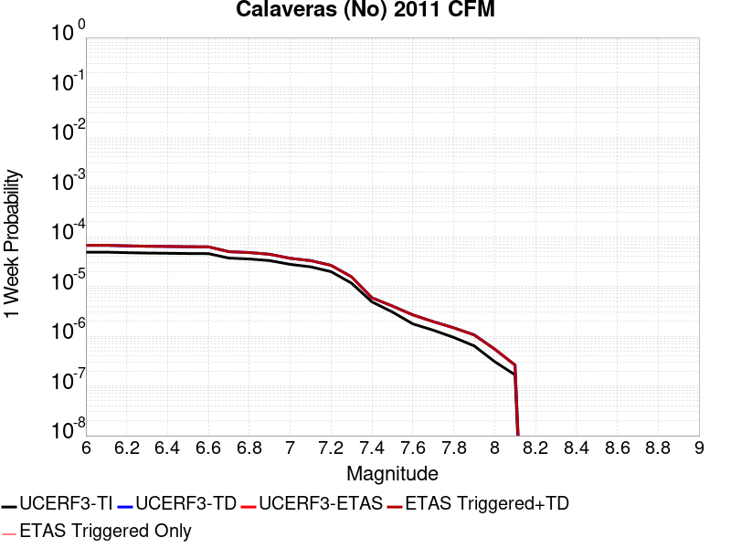 | 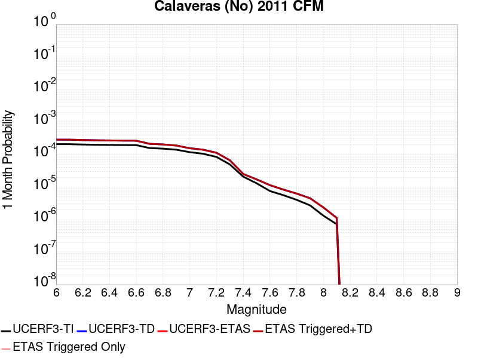 | 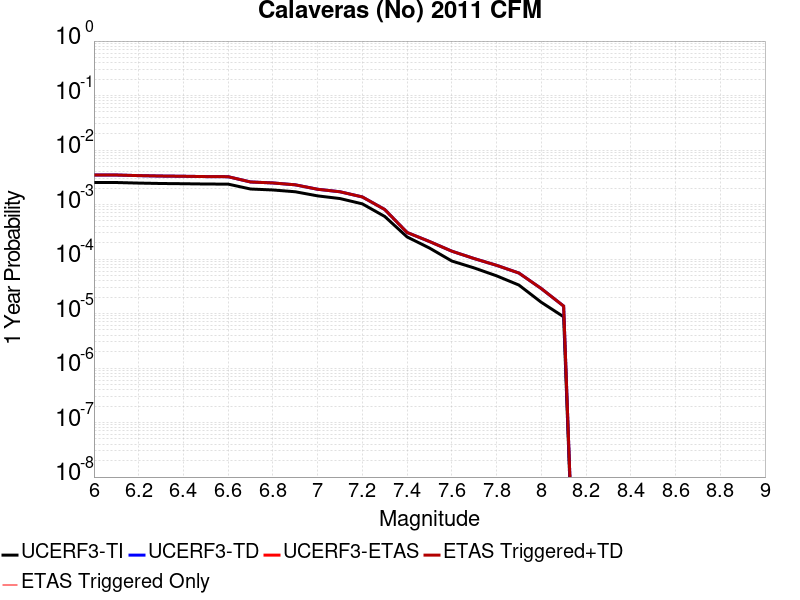 | 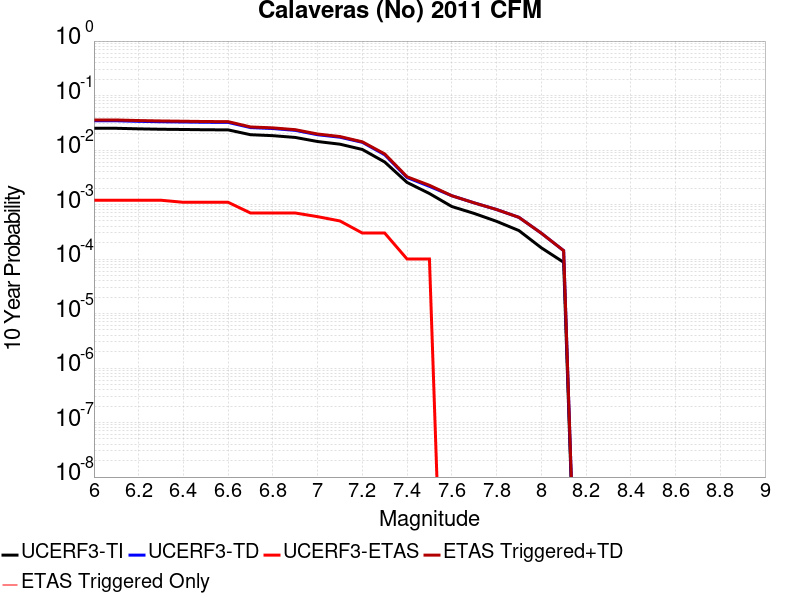 |

| Magnitude | 1 wk TI Prob | 1 wk TD Prob | 1 wk ETAS Prob | 1 wk ETAS/TD Gain | 1 wk ETAS Triggered+TD | 1 wk ETAS Triggered Only | 1 mo TI Prob | 1 mo TD Prob | 1 mo ETAS Prob | 1 mo ETAS/TD Gain | 1 mo ETAS Triggered+TD | 1 mo ETAS Triggered Only | 1 yr TI Prob | 1 yr TD Prob | 1 yr ETAS Prob | 1 yr ETAS/TD Gain | 1 yr ETAS Triggered+TD | 1 yr ETAS Triggered Only | 10 yr TI Prob | 10 yr TD Prob | 10 yr ETAS Prob | 10 yr ETAS/TD Gain | 10 yr ETAS Triggered+TD | 10 yr ETAS Triggered Only |
|-----|-----|-----|-----|-----|-----|-----|-----|-----|-----|-----|-----|-----|-----|-----|-----|-----|-----|-----|-----|-----|-----|-----|-----|-----|
| 6.0 | 4.8694856E-5 | 6.6912864E-5 | 2.0E-4 | 2.9889617 | 2.6689947E-4 | 2.0E-4 | 2.0867554E-4 | 2.867386E-4 | 2.0E-4 | 0.69749945 | 4.8668124E-4 | 2.0E-4 | 0.0025376645 | 0.0034854615 | 0.003 | 0.86071813 | 0.004481976 | 0.001 | 0.02508881 | 0.034494597 | 0.0281 | 0.8146203 | 0.044149652 | 0.01 |
| 6.1 | 4.8694856E-5 | 6.6912864E-5 | 2.0E-4 | 2.9889617 | 2.6689947E-4 | 2.0E-4 | 2.0867554E-4 | 2.867386E-4 | 2.0E-4 | 0.69749945 | 4.8668124E-4 | 2.0E-4 | 0.0025376645 | 0.0034854615 | 0.003 | 0.86071813 | 0.004481976 | 0.001 | 0.02508881 | 0.034494597 | 0.028 | 0.8117213 | 0.044149652 | 0.01 |
| 6.2 | 4.7541962E-5 | 6.525071E-5 | 2.0E-4 | 3.0651007 | 2.6523767E-4 | 2.0E-4 | 2.0373536E-4 | 2.7961668E-4 | 2.0E-4 | 0.7152649 | 4.7956075E-4 | 2.0E-4 | 0.0024776561 | 0.0033990468 | 0.003 | 0.88260037 | 0.004395648 | 0.001 | 0.024502134 | 0.03365904 | 0.0272 | 0.8081038 | 0.043129183 | 0.0098 |
| 6.3 | 4.6717287E-5 | 6.408853E-5 | 2.0E-4 | 3.1206834 | 2.640757E-4 | 2.0E-4 | 2.0020158E-4 | 2.7463702E-4 | 2.0E-4 | 0.728234 | 4.7458208E-4 | 2.0E-4 | 0.0024347296 | 0.003338614 | 0.003 | 0.89857644 | 0.0043352754 | 0.001 | 0.024082264 | 0.033073444 | 0.0268 | 0.81031775 | 0.042259246 | 0.0095 |
| 6.4 | 4.6276386E-5 | 6.345275E-5 | 2.0E-4 | 3.1519513 | 2.6344007E-4 | 2.0E-4 | 1.983123E-4 | 2.7191287E-4 | 2.0E-4 | 0.7355297 | 4.7185848E-4 | 2.0E-4 | 0.0024117786 | 0.0033055563 | 0.0029 | 0.87731075 | 0.004202581 | 9.0E-4 | 0.02385771 | 0.032753475 | 0.0264 | 0.80602133 | 0.041652143 | 0.0092 |
| 6.5 | 4.5720994E-5 | 6.265719E-5 | 2.0E-4 | 3.1919718 | 2.6264467E-4 | 2.0E-4 | 1.9593239E-4 | 2.6850423E-4 | 2.0E-4 | 0.7448672 | 4.6845054E-4 | 2.0E-4 | 0.002382867 | 0.0032641885 | 0.0028 | 0.85779357 | 0.004161251 | 9.0E-4 | 0.023574775 | 0.032352775 | 0.0262 | 0.8098223 | 0.04125513 | 0.0092 |
| 6.6 | 4.549134E-5 | 6.231187E-5 | 2.0E-4 | 3.2096612 | 2.622994E-4 | 2.0E-4 | 1.949483E-4 | 2.670246E-4 | 2.0E-4 | 0.7489947 | 4.669712E-4 | 2.0E-4 | 0.0023709119 | 0.0032462277 | 0.0027 | 0.83173466 | 0.004143306 | 9.0E-4 | 0.023457756 | 0.03217897 | 0.026 | 0.80798113 | 0.041082922 | 0.0092 |
| 6.7 | 3.701047E-5 | 4.9871855E-5 | 2.0E-4 | 4.0102777 | 2.4986189E-4 | 2.0E-4 | 1.5860666E-4 | 2.1371925E-4 | 2.0E-4 | 0.9358071 | 4.1367652E-4 | 2.0E-4 | 0.0019293258 | 0.0025989695 | 0.0018 | 0.6925822 | 0.0032971504 | 7.0E-4 | 0.019126613 | 0.025882177 | 0.018 | 0.69545925 | 0.031629473 | 0.0059 |
| 6.8 | 3.5523568E-5 | 4.7866695E-5 | 2.0E-4 | 4.178271 | 2.4785713E-4 | 2.0E-4 | 1.5223498E-4 | 2.0512709E-4 | 2.0E-4 | 0.9750053 | 4.0508606E-4 | 2.0E-4 | 0.0018518851 | 0.002494604 | 0.0017 | 0.6814709 | 0.0031928578 | 7.0E-4 | 0.018365284 | 0.02486094 | 0.0177 | 0.7119602 | 0.030419232 | 0.0057 |
| 6.9 | 3.2946147E-5 | 4.4215958E-5 | 2.0E-4 | 4.523254 | 2.4420713E-4 | 2.0E-4 | 1.4119013E-4 | 1.8948343E-4 | 2.0E-4 | 1.0555013 | 3.8944554E-4 | 2.0E-4 | 0.0017176344 | 0.0023045614 | 0.0017 | 0.7376675 | 0.0030029481 | 7.0E-4 | 0.017044188 | 0.022996224 | 0.0163 | 0.708812 | 0.028174344 | 0.0053 |
| 7.0 | 2.7682381E-5 | 3.6654685E-5 | 2.0E-4 | 5.456329 | 2.3664735E-4 | 2.0E-4 | 1.1863338E-4 | 1.570822E-4 | 2.0E-4 | 1.2732186 | 3.570508E-4 | 2.0E-4 | 0.0014434044 | 0.001910828 | 0.0013 | 0.6803333 | 0.0025096815 | 6.0E-4 | 0.01434065 | 0.01912627 | 0.014 | 0.7319775 | 0.02363829 | 0.0046 |
| 7.1 | 2.471967E-5 | 3.296512E-5 | 2.0E-4 | 6.067019 | 2.3295853E-4 | 2.0E-4 | 1.05937135E-4 | 1.412716E-4 | 2.0E-4 | 1.4157128 | 3.4124334E-4 | 2.0E-4 | 0.0012890215 | 0.0017186532 | 0.0013 | 0.75640625 | 0.002317622 | 6.0E-4 | 0.0128157 | 0.017224036 | 0.0129 | 0.74895334 | 0.021253418 | 0.0041 |
| 7.2 | 1.9748062E-5 | 2.6486183E-5 | 0.0 | 0.0 | 2.6486183E-5 | 0.0 | 8.463181E-5 | 1.13507405E-4 | 0.0 | 0.0 | 1.13507405E-4 | 0.0 | 0.0010299052 | 0.0013810998 | 9.0E-4 | 0.6516546 | 0.0017805473 | 4.0E-4 | 0.01025145 | 0.013884725 | 0.0106 | 0.76342887 | 0.016744459 | 0.0029 |
| 7.3 | 1.1603734E-5 | 1.5594125E-5 | 0.0 | 0.0 | 1.5594125E-5 | 0.0 | 4.9729337E-5 | 6.683033E-5 | 0.0 | 0.0 | 6.683033E-5 | 0.0 | 6.052865E-4 | 8.133695E-4 | 7.0E-4 | 0.86061746 | 0.0011131255 | 3.0E-4 | 0.0060364045 | 0.008212586 | 0.0062 | 0.75493884 | 0.010295339 | 0.0021 |
| 7.4 | 4.885381E-6 | 5.912488E-6 | 0.0 | 0.0 | 5.912488E-6 | 0.0 | 2.0937177E-5 | 2.533899E-5 | 0.0 | 0.0 | 2.533899E-5 | 0.0 | 2.5488032E-4 | 3.084587E-4 | 4.0E-4 | 1.29677 | 4.0842785E-4 | 1.0E-4 | 0.0025458818 | 0.0031391063 | 0.0026 | 0.8282612 | 0.004135967 | 0.001 |
| 7.5 | 3.0571264E-6 | 4.0416694E-6 | 0.0 | 0.0 | 4.0416694E-6 | 0.0 | 1.3101904E-5 | 1.7321327E-5 | 0.0 | 0.0 | 1.7321327E-5 | 0.0 | 1.5950401E-4 | 2.1086683E-4 | 2.0E-4 | 0.9484659 | 3.1084573E-4 | 1.0E-4 | 0.0015938957 | 0.0021636873 | 0.0016 | 0.7394784 | 0.0028621727 | 7.0E-4 |
| 7.6 | 1.764948E-6 | 2.687692E-6 | 0.0 | 0.0 | 2.687692E-6 | 0.0 | 7.564041E-6 | 1.1518629E-5 | 0.0 | 0.0 | 1.1518629E-5 | 0.0 | 9.208831E-5 | 1.4023036E-4 | 2.0E-4 | 1.4262247 | 2.4021634E-4 | 1.0E-4 | 9.205016E-4 | 0.0014581193 | 0.0013 | 0.8915594 | 0.0020572445 | 6.0E-4 |
| 7.7 | 1.3173734E-6 | 1.9671156E-6 | 0.0 | 0.0 | 1.9671156E-6 | 0.0 | 5.645874E-6 | 8.4304675E-6 | 0.0 | 0.0 | 8.4304675E-6 | 0.0 | 6.873634E-5 | 1.02636135E-4 | 1.0E-4 | 0.97431576 | 2.0262587E-4 | 1.0E-4 | 6.8715087E-4 | 0.0010798593 | 9.0E-4 | 0.8334419 | 0.0015793194 | 5.0E-4 |
| 7.8 | 9.4429885E-7 | 1.4786972E-6 | 0.0 | 0.0 | 1.4786972E-6 | 0.0 | 4.0469886E-6 | 6.3372586E-6 | 0.0 | 0.0 | 6.3372586E-6 | 0.0 | 4.9270973E-5 | 7.71534E-5 | 1.0E-4 | 1.2961191 | 1.7714569E-4 | 1.0E-4 | 4.926005E-4 | 8.1469695E-4 | 8.0E-4 | 0.98196024 | 0.0013142896 | 5.0E-4 |
| 7.9 | 6.388233E-7 | 1.0661734E-6 | 0.0 | 0.0 | 1.0661734E-6 | 0.0 | 2.7378112E-6 | 4.5693064E-6 | 0.0 | 0.0 | 4.5693064E-6 | 0.0 | 3.3332344E-5 | 5.5629895E-5 | 1.0E-4 | 1.7975947 | 1.5562434E-4 | 1.0E-4 | 3.3327343E-4 | 5.8521796E-4 | 6.0E-4 | 1.025259 | 9.849839E-4 | 4.0E-4 |
| 8.0 | 3.087986E-7 | 5.5286125E-7 | 0.0 | 0.0 | 5.5286125E-7 | 0.0 | 1.323422E-6 | 2.369403E-6 | 0.0 | 0.0 | 2.369403E-6 | 0.0 | 1.6112543E-5 | 2.8847104E-5 | 1.0E-4 | 3.4665525 | 1.2884421E-4 | 1.0E-4 | 1.6111376E-4 | 2.9974311E-4 | 4.0E-4 | 1.334476 | 5.996532E-4 | 3.0E-4 |
| 8.1 | 1.6725647E-7 | 2.6365475E-7 | 0.0 | 0.0 | 2.6365475E-7 | 0.0 | 7.168133E-7 | 1.1299484E-6 | 0.0 | 0.0 | 1.1299484E-6 | 0.0 | 8.7271665E-6 | 1.3757037E-5 | 1.0E-4 | 7.269007 | 1.1375566E-4 | 1.0E-4 | 8.726824E-5 | 1.4317138E-4 | 3.0E-4 | 2.095391 | 3.4314275E-4 | 2.0E-4 |

## Honey Lake 2011 CFM
*[(top)](#table-of-contents)*

| 1 Week | 1 Month | 1 Year | 10 Year |
|-----|-----|-----|-----|
| 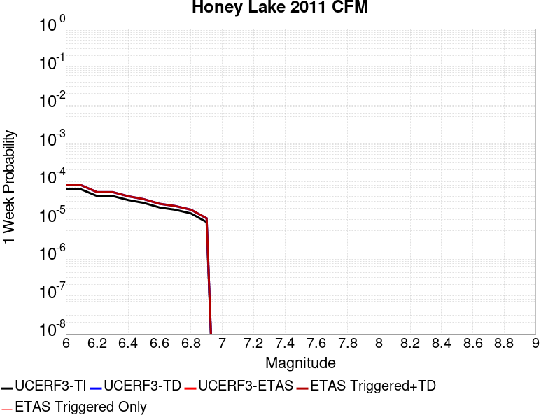 | 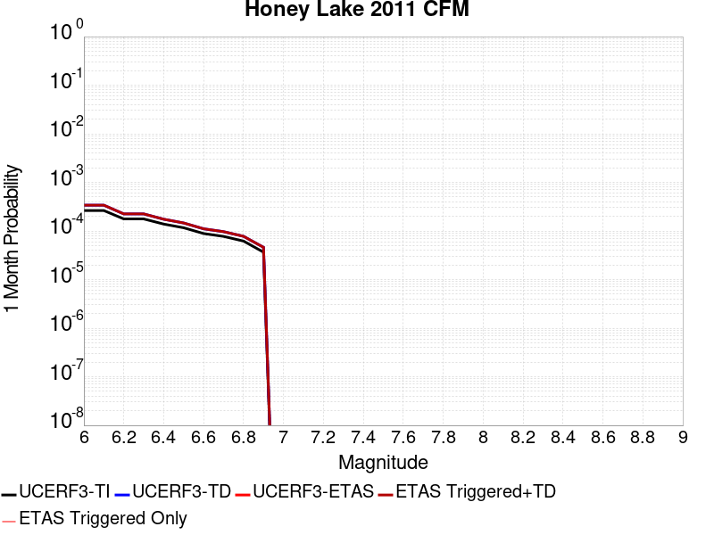 | 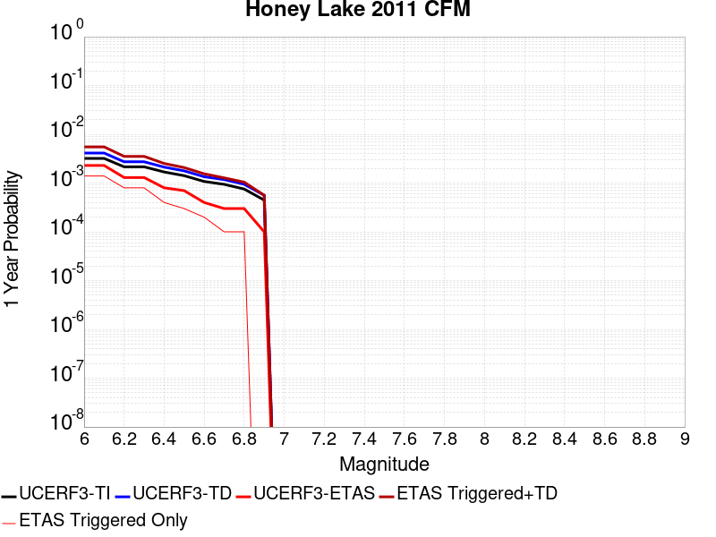 |  |

| Magnitude | 1 wk TI Prob | 1 wk TD Prob | 1 wk ETAS Prob | 1 wk ETAS/TD Gain | 1 wk ETAS Triggered+TD | 1 wk ETAS Triggered Only | 1 mo TI Prob | 1 mo TD Prob | 1 mo ETAS Prob | 1 mo ETAS/TD Gain | 1 mo ETAS Triggered+TD | 1 mo ETAS Triggered Only | 1 yr TI Prob | 1 yr TD Prob | 1 yr ETAS Prob | 1 yr ETAS/TD Gain | 1 yr ETAS Triggered+TD | 1 yr ETAS Triggered Only | 10 yr TI Prob | 10 yr TD Prob | 10 yr ETAS Prob | 10 yr ETAS/TD Gain | 10 yr ETAS Triggered+TD | 10 yr ETAS Triggered Only |
|-----|-----|-----|-----|-----|-----|-----|-----|-----|-----|-----|-----|-----|-----|-----|-----|-----|-----|-----|-----|-----|-----|-----|-----|-----|
| 6.0 | 6.155506E-5 | 7.931081E-5 | 0.0 | 0.0 | 7.931081E-5 | 0.0 | 2.6378073E-4 | 3.3986222E-4 | 1.0E-4 | 0.2942369 | 4.3982823E-4 | 1.0E-4 | 0.0032068014 | 0.004130419 | 0.0023 | 0.55684423 | 0.0055246362 | 0.0014 | 0.03160919 | 0.040585518 | 0.0262 | 0.64555043 | 0.04941213 | 0.0092 |
| 6.1 | 6.155506E-5 | 7.931081E-5 | 0.0 | 0.0 | 7.931081E-5 | 0.0 | 2.6378073E-4 | 3.3986222E-4 | 1.0E-4 | 0.2942369 | 4.3982823E-4 | 1.0E-4 | 0.0032068014 | 0.004130419 | 0.0023 | 0.55684423 | 0.0055246362 | 0.0014 | 0.03160919 | 0.040585518 | 0.0247 | 0.60859144 | 0.048932426 | 0.0087 |
| 6.2 | 4.1335024E-5 | 5.242969E-5 | 0.0 | 0.0 | 5.242969E-5 | 0.0 | 1.7713808E-4 | 2.2468017E-4 | 0.0 | 0.0 | 2.2468017E-4 | 0.0 | 0.0021545228 | 0.0027322022 | 0.0013 | 0.47580665 | 0.0035300164 | 8.0E-4 | 0.021337535 | 0.027002474 | 0.0157 | 0.5814282 | 0.031770162 | 0.0049 |
| 6.3 | 4.1335024E-5 | 5.242969E-5 | 0.0 | 0.0 | 5.242969E-5 | 0.0 | 1.7713808E-4 | 2.2468017E-4 | 0.0 | 0.0 | 2.2468017E-4 | 0.0 | 0.0021545228 | 0.0027322022 | 0.0013 | 0.47580665 | 0.0035300164 | 8.0E-4 | 0.021337535 | 0.027002474 | 0.0157 | 0.5814282 | 0.031770162 | 0.0049 |
| 6.4 | 3.2393702E-5 | 4.077656E-5 | 0.0 | 0.0 | 4.077656E-5 | 0.0 | 1.3882275E-4 | 1.7474558E-4 | 0.0 | 0.0 | 1.7474558E-4 | 0.0 | 0.0016888566 | 0.0021255575 | 8.0E-4 | 0.37637183 | 0.0025247075 | 4.0E-4 | 0.016760793 | 0.021063395 | 0.0116 | 0.5507184 | 0.024881247 | 0.0039 |
| 6.5 | 2.7205504E-5 | 3.412049E-5 | 0.0 | 0.0 | 3.412049E-5 | 0.0 | 1.1658981E-4 | 1.4622297E-4 | 0.0 | 0.0 | 1.4622297E-4 | 0.0 | 0.0014185566 | 0.0017789049 | 7.0E-4 | 0.39350054 | 0.0020783711 | 3.0E-4 | 0.014095354 | 0.017656205 | 0.0096 | 0.54371816 | 0.020505004 | 0.0029 |
| 6.6 | 2.069265E-5 | 2.5886791E-5 | 0.0 | 0.0 | 2.5886791E-5 | 0.0 | 8.867977E-5 | 1.1093912E-4 | 0.0 | 0.0 | 1.1093912E-4 | 0.0 | 0.0010791414 | 0.0013499307 | 4.0E-4 | 0.2963115 | 0.0015496607 | 2.0E-4 | 0.010739161 | 0.0134256575 | 0.0075 | 0.55863184 | 0.015793435 | 0.0024 |
| 6.7 | 1.8060919E-5 | 2.2596809E-5 | 0.0 | 0.0 | 2.2596809E-5 | 0.0 | 7.7401644E-5 | 9.684032E-5 | 0.0 | 0.0 | 9.684032E-5 | 0.0 | 9.419576E-4 | 0.0011784737 | 3.0E-4 | 0.25456658 | 0.0012783558 | 1.0E-4 | 0.009379748 | 0.011730251 | 0.0065 | 0.55412287 | 0.013607963 | 0.0019 |
| 6.8 | 1.4474663E-5 | 1.8132809E-5 | 0.0 | 0.0 | 1.8132809E-5 | 0.0 | 6.203279E-5 | 7.7710145E-5 | 0.0 | 0.0 | 7.7710145E-5 | 0.0 | 7.5498753E-4 | 9.4578636E-4 | 3.0E-4 | 0.31719637 | 0.0010456918 | 1.0E-4 | 0.007524277 | 0.009425106 | 0.0054 | 0.57293785 | 0.011010026 | 0.0016 |
| 6.9 | 8.564552E-6 | 1.0772938E-5 | 0.0 | 0.0 | 1.0772938E-5 | 0.0 | 3.6704707E-5 | 4.6169287E-5 | 0.0 | 0.0 | 4.6169287E-5 | 0.0 | 4.4678818E-4 | 5.6203216E-4 | 1.0E-4 | 0.17792577 | 5.6203216E-4 | 0.0 | 0.0044589094 | 0.005612575 | 0.0027 | 0.48106262 | 0.006507524 | 9.0E-4 |

## Santa Ynez (West)
*[(top)](#table-of-contents)*

| 1 Week | 1 Month | 1 Year | 10 Year |
|-----|-----|-----|-----|
| 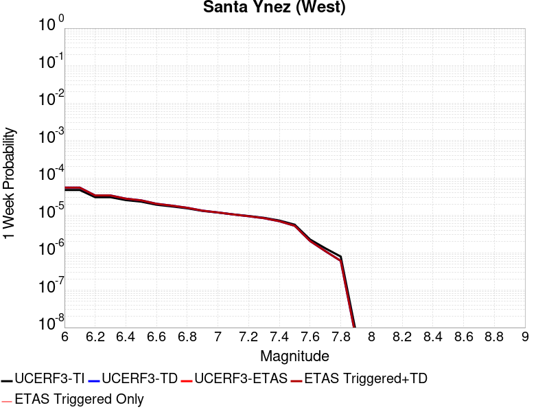 | 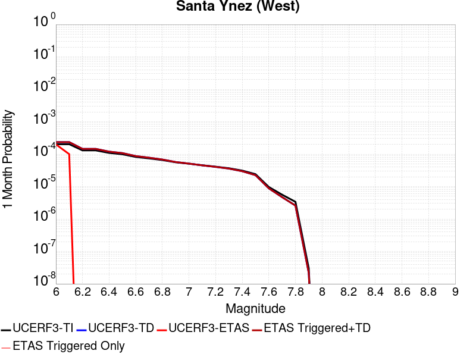 | 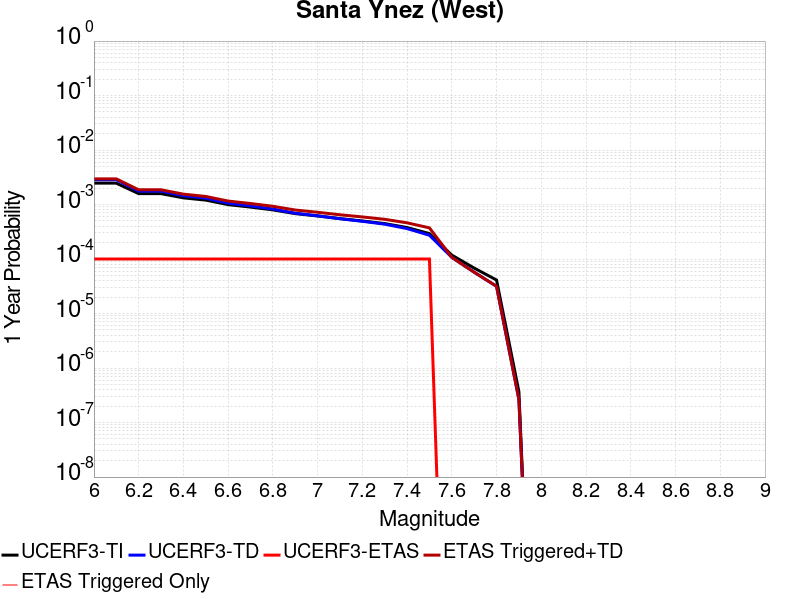 | 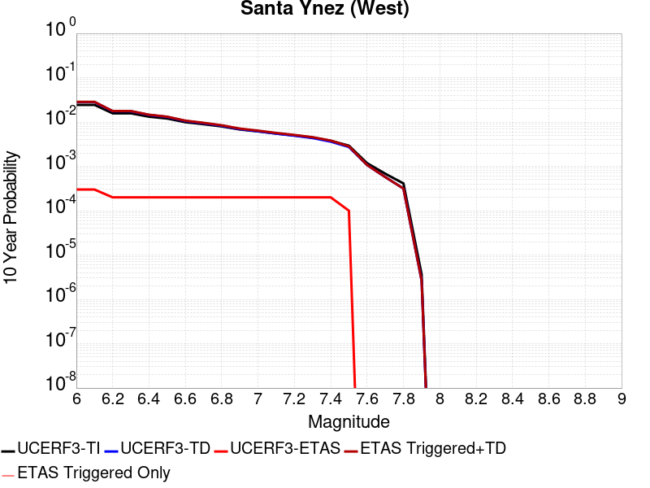 |

| Magnitude | 1 wk TI Prob | 1 wk TD Prob | 1 wk ETAS Prob | 1 wk ETAS/TD Gain | 1 wk ETAS Triggered+TD | 1 wk ETAS Triggered Only | 1 mo TI Prob | 1 mo TD Prob | 1 mo ETAS Prob | 1 mo ETAS/TD Gain | 1 mo ETAS Triggered+TD | 1 mo ETAS Triggered Only | 1 yr TI Prob | 1 yr TD Prob | 1 yr ETAS Prob | 1 yr ETAS/TD Gain | 1 yr ETAS Triggered+TD | 1 yr ETAS Triggered Only | 10 yr TI Prob | 10 yr TD Prob | 10 yr ETAS Prob | 10 yr ETAS/TD Gain | 10 yr ETAS Triggered+TD | 10 yr ETAS Triggered Only |
|-----|-----|-----|-----|-----|-----|-----|-----|-----|-----|-----|-----|-----|-----|-----|-----|-----|-----|-----|-----|-----|-----|-----|-----|-----|
| 6.0 | 4.7352758E-5 | 5.4863427E-5 | 0.0 | 0.0 | 5.4863427E-5 | 0.0 | 2.0292461E-4 | 2.3510944E-4 | 2.0E-4 | 0.85066766 | 2.3510944E-4 | 0.0 | 0.0024678076 | 0.002858967 | 0.0019 | 0.6645757 | 0.0034572517 | 6.0E-4 | 0.024405818 | 0.028250016 | 0.0234 | 0.8283181 | 0.034857914 | 0.0068 |
| 6.1 | 4.7352758E-5 | 5.4863427E-5 | 0.0 | 0.0 | 5.4863427E-5 | 0.0 | 2.0292461E-4 | 2.3510944E-4 | 1.0E-4 | 0.42533383 | 2.3510944E-4 | 0.0 | 0.0024678076 | 0.002858967 | 0.0016 | 0.5596427 | 0.0034572517 | 6.0E-4 | 0.024405818 | 0.028250016 | 0.0197 | 0.6973447 | 0.03378899 | 0.0057 |
| 6.2 | 3.0415853E-5 | 3.387049E-5 | 0.0 | 0.0 | 3.387049E-5 | 0.0 | 1.3034715E-4 | 1.4515137E-4 | 0.0 | 0.0 | 1.4515137E-4 | 0.0 | 0.0015858212 | 0.0017658203 | 9.0E-4 | 0.5096781 | 0.002165114 | 4.0E-4 | 0.015745522 | 0.017521858 | 0.013 | 0.7419305 | 0.021550018 | 0.0041 |
| 6.3 | 3.0415853E-5 | 3.387049E-5 | 0.0 | 0.0 | 3.387049E-5 | 0.0 | 1.3034715E-4 | 1.4515137E-4 | 0.0 | 0.0 | 1.4515137E-4 | 0.0 | 0.0015858212 | 0.0017658203 | 9.0E-4 | 0.5096781 | 0.002165114 | 4.0E-4 | 0.015745522 | 0.017521858 | 0.013 | 0.7419305 | 0.021550018 | 0.0041 |
| 6.4 | 2.5452082E-5 | 2.7871116E-5 | 0.0 | 0.0 | 2.7871116E-5 | 0.0 | 1.09075794E-4 | 1.1944228E-4 | 0.0 | 0.0 | 1.1944228E-4 | 0.0 | 0.0013271887 | 0.0014532587 | 7.0E-4 | 0.48167613 | 0.0018526773 | 4.0E-4 | 0.013192902 | 0.014439725 | 0.0106 | 0.734086 | 0.0180863 | 0.0037 |
| 6.5 | 2.3143784E-5 | 2.5092928E-5 | 0.0 | 0.0 | 2.5092928E-5 | 0.0 | 9.9183875E-5 | 1.07536776E-4 | 0.0 | 0.0 | 1.07536776E-4 | 0.0 | 0.0012068948 | 0.0013084883 | 7.0E-4 | 0.53496844 | 0.0017079649 | 4.0E-4 | 0.012003611 | 0.013009507 | 0.0102 | 0.78404194 | 0.016365275 | 0.0034 |
| 6.6 | 1.9118515E-5 | 2.0328342E-5 | 0.0 | 0.0 | 2.0328342E-5 | 0.0 | 8.193392E-5 | 8.71186E-5 | 0.0 | 0.0 | 8.71186E-5 | 0.0 | 9.97089E-4 | 0.0010601607 | 5.0E-4 | 0.4716266 | 0.0012599487 | 2.0E-4 | 0.00992627 | 0.010551942 | 0.0085 | 0.80553895 | 0.013421341 | 0.0029 |
| 6.7 | 1.722807E-5 | 1.8124241E-5 | 0.0 | 0.0 | 1.8124241E-5 | 0.0 | 7.3832496E-5 | 7.7673045E-5 | 0.0 | 0.0 | 7.7673045E-5 | 0.0 | 8.985399E-4 | 9.452646E-4 | 5.0E-4 | 0.5289524 | 0.0011450755 | 2.0E-4 | 0.008949154 | 0.009413082 | 0.0076 | 0.807387 | 0.01188955 | 0.0025 |
| 6.8 | 1.5317364E-5 | 1.5908156E-5 | 0.0 | 0.0 | 1.5908156E-5 | 0.0 | 6.56442E-5 | 6.817605E-5 | 0.0 | 0.0 | 6.817605E-5 | 0.0 | 7.98925E-4 | 8.2973164E-4 | 5.0E-4 | 0.6026045 | 0.0010295657 | 2.0E-4 | 0.007960589 | 0.008266823 | 0.0072 | 0.87095124 | 0.010646983 | 0.0024 |
| 6.9 | 1.3071226E-5 | 1.3315548E-5 | 0.0 | 0.0 | 1.3315548E-5 | 0.0 | 5.6018336E-5 | 5.7065397E-5 | 0.0 | 0.0 | 5.7065397E-5 | 0.0 | 6.8180985E-4 | 6.94552E-4 | 3.0E-4 | 0.4319331 | 7.9448253E-4 | 1.0E-4 | 0.0067972173 | 0.0069240727 | 0.0061 | 0.8809844 | 0.009009532 | 0.0021 |
| 7.0 | 1.1836986E-5 | 1.1920642E-5 | 0.0 | 0.0 | 1.1920642E-5 | 0.0 | 5.0728955E-5 | 5.1087474E-5 | 0.0 | 0.0 | 5.1087474E-5 | 0.0 | 6.1745E-4 | 6.2181416E-4 | 3.0E-4 | 0.48245928 | 7.2175195E-4 | 1.0E-4 | 0.006157372 | 0.006200935 | 0.0058 | 0.9353427 | 0.008188534 | 0.002 |
| 7.1 | 1.0597169E-5 | 1.0531843E-5 | 0.0 | 0.0 | 1.0531843E-5 | 0.0 | 4.541565E-5 | 4.5135694E-5 | 0.0 | 0.0 | 4.5135694E-5 | 0.0 | 5.5279525E-4 | 5.493897E-4 | 2.0E-4 | 0.36404034 | 6.4933475E-4 | 1.0E-4 | 0.0055142213 | 0.0054804455 | 0.0049 | 0.8940879 | 0.007171129 | 0.0017 |
| 7.2 | 9.59113E-6 | 9.449662E-6 | 0.0 | 0.0 | 9.449662E-6 | 0.0 | 4.11042E-5 | 4.0497926E-5 | 0.0 | 0.0 | 4.0497926E-5 | 0.0 | 5.0032866E-4 | 4.929518E-4 | 2.0E-4 | 0.40571922 | 5.929025E-4 | 1.0E-4 | 0.004992037 | 0.0049187015 | 0.0046 | 0.9352062 | 0.0066103395 | 0.0017 |
| 7.3 | 8.586084E-6 | 8.370943E-6 | 0.0 | 0.0 | 8.370943E-6 | 0.0 | 3.679698E-5 | 3.587498E-5 | 0.0 | 0.0 | 3.587498E-5 | 0.0 | 4.4791115E-4 | 4.3669136E-4 | 2.0E-4 | 0.45798936 | 5.366477E-4 | 1.0E-4 | 0.004470094 | 0.0043584434 | 0.0044 | 1.0095347 | 0.006051034 | 0.0017 |
| 7.4 | 7.2622997E-6 | 6.9441107E-6 | 0.0 | 0.0 | 6.9441107E-6 | 0.0 | 3.112377E-5 | 2.976014E-5 | 0.0 | 0.0 | 2.976014E-5 | 0.0 | 3.78866E-4 | 3.6227042E-4 | 2.0E-4 | 0.5520738 | 4.622342E-4 | 1.0E-4 | 0.0037822074 | 0.0036168988 | 0.0033 | 0.91238385 | 0.0049121967 | 0.0013 |
| 7.5 | 5.627296E-6 | 5.245828E-6 | 0.0 | 0.0 | 5.245828E-6 | 0.0 | 2.411676E-5 | 2.248193E-5 | 0.0 | 0.0 | 2.248193E-5 | 0.0 | 2.9358198E-4 | 2.7368384E-4 | 1.0E-4 | 0.36538512 | 3.7365645E-4 | 1.0E-4 | 0.0029319443 | 0.0027335398 | 0.0028 | 1.0243129 | 0.0039302595 | 0.0012 |
| 7.6 | 2.265244E-6 | 2.0583977E-6 | 0.0 | 0.0 | 2.0583977E-6 | 0.0 | 9.708152E-6 | 8.821676E-6 | 0.0 | 0.0 | 8.821676E-6 | 0.0 | 1.18190335E-4 | 1.0739869E-4 | 0.0 | 0.0 | 1.0739869E-4 | 0.0 | 0.001181275 | 0.0010734765 | 0.0011 | 1.024708 | 0.0016728324 | 6.0E-4 |
| 7.7 | 1.3099874E-6 | 1.099968E-6 | 0.0 | 0.0 | 1.099968E-6 | 0.0 | 5.61422E-6 | 4.7141402E-6 | 0.0 | 0.0 | 4.7141402E-6 | 0.0 | 6.8350986E-5 | 5.739317E-5 | 0.0 | 0.0 | 5.739317E-5 | 0.0 | 6.832996E-4 | 5.7378586E-4 | 5.0E-4 | 0.87140524 | 7.736711E-4 | 2.0E-4 |
| 7.8 | 7.903951E-7 | 6.059593E-7 | 0.0 | 0.0 | 6.059593E-7 | 0.0 | 3.3874032E-6 | 2.596966E-6 | 0.0 | 0.0 | 2.596966E-6 | 0.0 | 4.1240855E-5 | 3.1617616E-5 | 0.0 | 0.0 | 3.1617616E-5 | 0.0 | 4.12332E-4 | 3.161325E-4 | 3.0E-4 | 0.9489692 | 3.161325E-4 | 0.0 |
| 7.9 | 7.0753297E-9 | 5.087606E-9 | 0.0 | 0.0 | 5.087606E-9 | 0.0 | 3.032284E-8 | 2.1804023E-8 | 0.0 | 0.0 | 2.1804023E-8 | 0.0 | 3.6918053E-7 | 2.6546397E-7 | 0.0 | 0.0 | 2.6546397E-7 | 0.0 | 3.691799E-6 | 2.6546375E-6 | 0.0 | 0.0 | 2.6546375E-6 | 0.0 |

## San Clemente
*[(top)](#table-of-contents)*

| 1 Week | 1 Month | 1 Year | 10 Year |
|-----|-----|-----|-----|
| 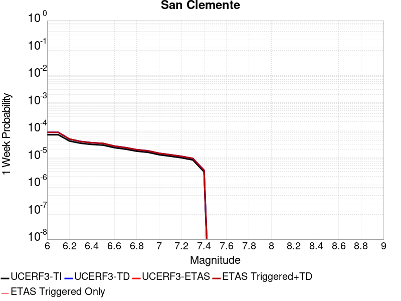 | 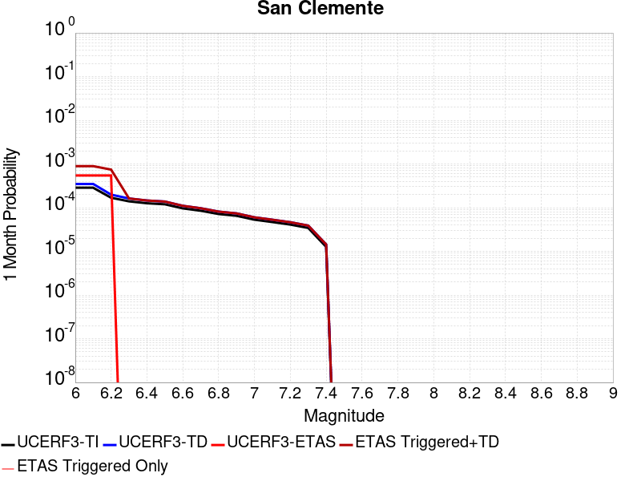 | 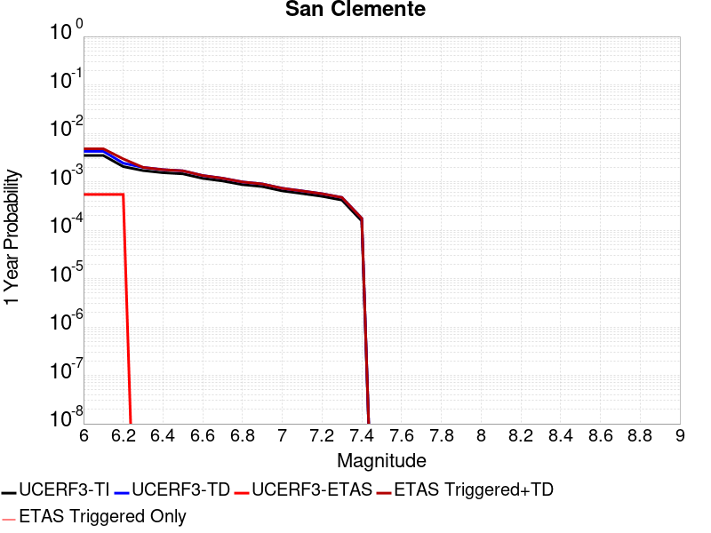 | 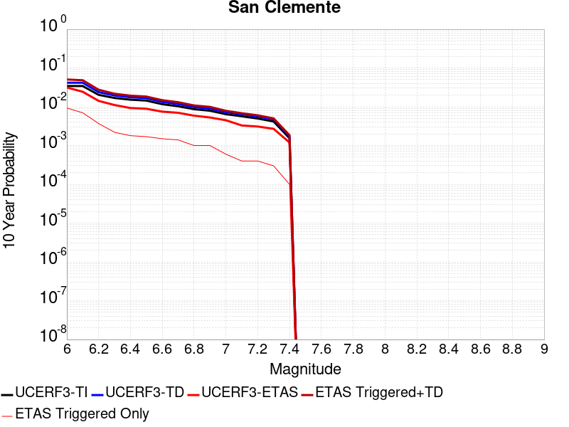 |

| Magnitude | 1 wk TI Prob | 1 wk TD Prob | 1 wk ETAS Prob | 1 wk ETAS/TD Gain | 1 wk ETAS Triggered+TD | 1 wk ETAS Triggered Only | 1 mo TI Prob | 1 mo TD Prob | 1 mo ETAS Prob | 1 mo ETAS/TD Gain | 1 mo ETAS Triggered+TD | 1 mo ETAS Triggered Only | 1 yr TI Prob | 1 yr TD Prob | 1 yr ETAS Prob | 1 yr ETAS/TD Gain | 1 yr ETAS Triggered+TD | 1 yr ETAS Triggered Only | 10 yr TI Prob | 10 yr TD Prob | 10 yr ETAS Prob | 10 yr ETAS/TD Gain | 10 yr ETAS Triggered+TD | 10 yr ETAS Triggered Only |
|-----|-----|-----|-----|-----|-----|-----|-----|-----|-----|-----|-----|-----|-----|-----|-----|-----|-----|-----|-----|-----|-----|-----|-----|-----|
| 6.0 | 6.681379E-5 | 8.144936E-5 | 0.0 | 0.0 | 8.144936E-5 | 0.0 | 2.8631336E-4 | 3.4902518E-4 | 3.0E-4 | 0.8595368 | 5.489554E-4 | 2.0E-4 | 0.003480294 | 0.004241595 | 0.0039 | 0.9194655 | 0.0054365047 | 0.0012 | 0.03426291 | 0.0416618 | 0.0315 | 0.7560883 | 0.050574344 | 0.0093 |
| 6.1 | 6.681379E-5 | 8.144936E-5 | 0.0 | 0.0 | 8.144936E-5 | 0.0 | 2.8631336E-4 | 3.4902518E-4 | 2.0E-4 | 0.5730245 | 4.489903E-4 | 1.0E-4 | 0.003480294 | 0.004241595 | 0.0027 | 0.63655305 | 0.0050382013 | 8.0E-4 | 0.03426291 | 0.0416618 | 0.0244 | 0.5856684 | 0.048370168 | 0.007 |
| 6.2 | 3.9400576E-5 | 4.6365072E-5 | 0.0 | 0.0 | 4.6365072E-5 | 0.0 | 1.6884868E-4 | 1.9869264E-4 | 2.0E-4 | 1.0065799 | 2.9867276E-4 | 1.0E-4 | 0.0020537945 | 0.0024164524 | 0.0017 | 0.70351064 | 0.002915244 | 5.0E-4 | 0.020349167 | 0.023908481 | 0.0142 | 0.5939315 | 0.02752002 | 0.0037 |
| 6.3 | 3.2590255E-5 | 3.7863927E-5 | 0.0 | 0.0 | 3.7863927E-5 | 0.0 | 1.3966505E-4 | 1.6226407E-4 | 1.0E-4 | 0.61627936 | 1.6226407E-4 | 0.0 | 0.0016990956 | 0.0019738053 | 0.001 | 0.50663555 | 0.0022732131 | 3.0E-4 | 0.01686163 | 0.019566547 | 0.0111 | 0.5672948 | 0.021723501 | 0.0022 |
| 6.4 | 2.9454652E-5 | 3.4041437E-5 | 0.0 | 0.0 | 3.4041437E-5 | 0.0 | 1.2622811E-4 | 1.4588387E-4 | 1.0E-4 | 0.6854768 | 1.4588387E-4 | 0.0 | 0.0015357438 | 0.0017747153 | 9.0E-4 | 0.5071236 | 0.0020741827 | 3.0E-4 | 0.015251739 | 0.017608598 | 0.0093 | 0.5281511 | 0.019376902 | 0.0018 |
| 6.5 | 2.790836E-5 | 3.2194945E-5 | 0.0 | 0.0 | 3.2194945E-5 | 0.0 | 1.1960178E-4 | 1.3797119E-4 | 1.0E-4 | 0.724789 | 1.3797119E-4 | 0.0 | 0.001455179 | 0.0016785304 | 9.0E-4 | 0.5361833 | 0.001978027 | 3.0E-4 | 0.014456868 | 0.016661536 | 0.0089 | 0.5341644 | 0.018333212 | 0.0017 |
| 6.6 | 2.2492153E-5 | 2.5723535E-5 | 0.0 | 0.0 | 2.5723535E-5 | 0.0 | 9.639138E-5 | 1.10239154E-4 | 1.0E-4 | 0.90711874 | 1.10239154E-4 | 0.0 | 0.0011729331 | 0.00134135 | 7.0E-4 | 0.5218623 | 0.0016409475 | 3.0E-4 | 0.011667615 | 0.013334249 | 0.0075 | 0.5624614 | 0.014814248 | 0.0015 |
| 6.7 | 1.9862755E-5 | 2.2633001E-5 | 0.0 | 0.0 | 2.2633001E-5 | 0.0 | 8.512331E-5 | 9.6995034E-5 | 1.0E-4 | 1.0309806 | 9.6995034E-5 | 0.0 | 0.0010358836 | 0.001180286 | 6.0E-4 | 0.5083513 | 0.001479932 | 3.0E-4 | 0.010310682 | 0.011741463 | 0.007 | 0.5961778 | 0.013125025 | 0.0014 |
| 6.8 | 1.6697575E-5 | 1.8950665E-5 | 0.0 | 0.0 | 1.8950665E-5 | 0.0 | 7.155907E-5 | 8.121466E-5 | 1.0E-4 | 1.2313048 | 8.121466E-5 | 0.0 | 8.7088346E-4 | 9.883493E-4 | 4.0E-4 | 0.4047152 | 0.0011881517 | 2.0E-4 | 0.008674784 | 0.009840561 | 0.0059 | 0.5995593 | 0.010830721 | 0.001 |
| 6.9 | 1.5218415E-5 | 1.724512E-5 | 0.0 | 0.0 | 1.724512E-5 | 0.0 | 6.522015E-5 | 7.390561E-5 | 1.0E-4 | 1.3530773 | 7.390561E-5 | 0.0 | 7.93766E-4 | 8.9943816E-4 | 4.0E-4 | 0.4447221 | 0.0010992583 | 2.0E-4 | 0.007909367 | 0.008958922 | 0.0053 | 0.5915891 | 0.009949963 | 0.001 |
| 7.0 | 1.2392958E-5 | 1.4013647E-5 | 0.0 | 0.0 | 1.4013647E-5 | 0.0 | 5.3111595E-5 | 6.0057147E-5 | 1.0E-4 | 1.6650808 | 6.0057147E-5 | 0.0 | 6.4644177E-4 | 7.30958E-4 | 3.0E-4 | 0.4104203 | 8.308849E-4 | 1.0E-4 | 0.0064456454 | 0.0072863214 | 0.0045 | 0.61759555 | 0.00788195 | 6.0E-4 |
| 7.1 | 1.0934128E-5 | 1.2358129E-5 | 0.0 | 0.0 | 1.2358129E-5 | 0.0 | 4.6859706E-5 | 5.2962376E-5 | 1.0E-4 | 1.8881328 | 5.2962376E-5 | 0.0 | 5.7036756E-4 | 6.446335E-4 | 3.0E-4 | 0.46538076 | 7.44569E-4 | 1.0E-4 | 0.0056890585 | 0.0064283796 | 0.0033 | 0.51334864 | 0.0068258084 | 4.0E-4 |
| 7.2 | 9.5798805E-6 | 1.083E-5 | 0.0 | 0.0 | 1.083E-5 | 0.0 | 4.1055984E-5 | 4.64135E-5 | 1.0E-4 | 2.1545455 | 4.64135E-5 | 0.0 | 4.9974193E-4 | 5.6494505E-4 | 3.0E-4 | 0.5310251 | 6.6488853E-4 | 1.0E-4 | 0.0049861963 | 0.0056358106 | 0.0031 | 0.550054 | 0.006033556 | 4.0E-4 |
| 7.3 | 8.0167365E-6 | 9.071307E-6 | 0.0 | 0.0 | 9.071307E-6 | 0.0 | 3.4356988E-5 | 3.8876493E-5 | 1.0E-4 | 2.5722485 | 3.8876493E-5 | 0.0 | 4.1821605E-4 | 4.7322555E-4 | 3.0E-4 | 0.6339472 | 5.7317823E-4 | 1.0E-4 | 0.0041742986 | 0.0047228793 | 0.0027 | 0.5716852 | 0.005021462 | 3.0E-4 |
| 7.4 | 2.9581017E-6 | 3.3575877E-6 | 0.0 | 0.0 | 3.3575877E-6 | 0.0 | 1.2677518E-5 | 1.438961E-5 | 1.0E-4 | 6.949458 | 1.438961E-5 | 0.0 | 1.5433785E-4 | 1.7518445E-4 | 2.0E-4 | 1.1416538 | 2.7516694E-4 | 1.0E-4 | 0.001542307 | 0.0017509572 | 0.0012 | 0.6853394 | 0.0018507822 | 1.0E-4 |

## Calico-Hidalgo
*[(top)](#table-of-contents)*

| 1 Week | 1 Month | 1 Year | 10 Year |
|-----|-----|-----|-----|
| 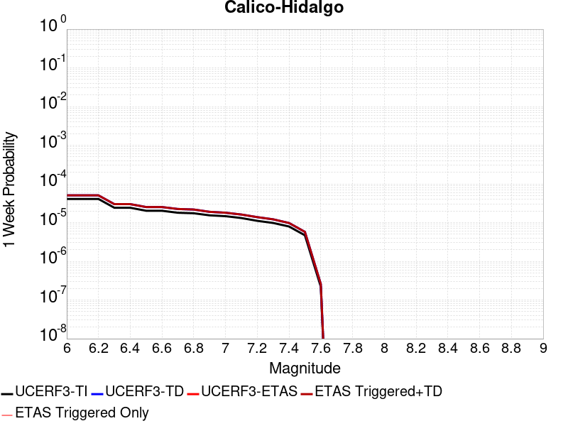 | 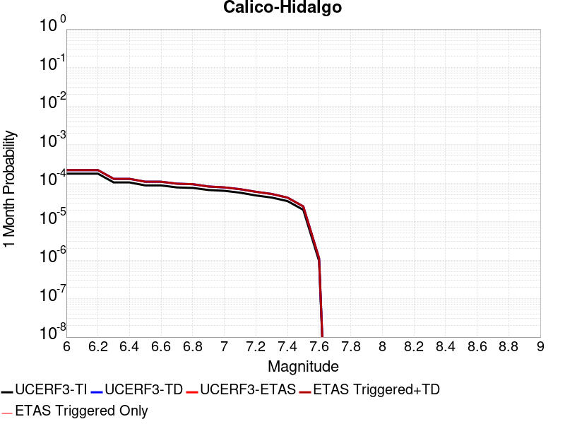 | 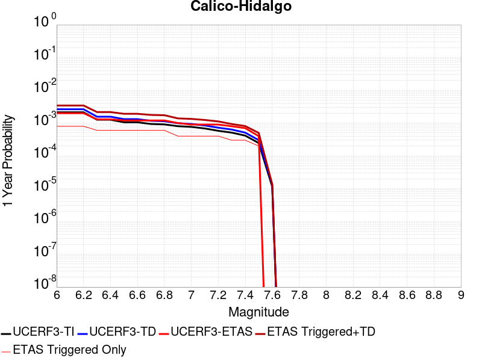 | 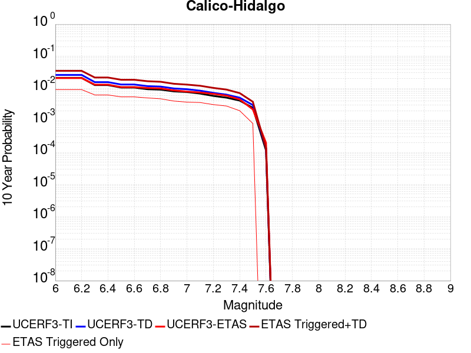 |

| Magnitude | 1 wk TI Prob | 1 wk TD Prob | 1 wk ETAS Prob | 1 wk ETAS/TD Gain | 1 wk ETAS Triggered+TD | 1 wk ETAS Triggered Only | 1 mo TI Prob | 1 mo TD Prob | 1 mo ETAS Prob | 1 mo ETAS/TD Gain | 1 mo ETAS Triggered+TD | 1 mo ETAS Triggered Only | 1 yr TI Prob | 1 yr TD Prob | 1 yr ETAS Prob | 1 yr ETAS/TD Gain | 1 yr ETAS Triggered+TD | 1 yr ETAS Triggered Only | 10 yr TI Prob | 10 yr TD Prob | 10 yr ETAS Prob | 10 yr ETAS/TD Gain | 10 yr ETAS Triggered+TD | 10 yr ETAS Triggered Only |
|-----|-----|-----|-----|-----|-----|-----|-----|-----|-----|-----|-----|-----|-----|-----|-----|-----|-----|-----|-----|-----|-----|-----|-----|-----|
| 6.0 | 4.0906612E-5 | 5.0609746E-5 | 0.0 | 0.0 | 5.0609746E-5 | 0.0 | 1.7530227E-4 | 2.1688285E-4 | 0.0 | 0.0 | 2.1688285E-4 | 0.0 | 0.0021322158 | 0.002637748 | 0.002 | 0.7582226 | 0.0034356376 | 8.0E-4 | 0.02111873 | 0.026104556 | 0.0208 | 0.7967958 | 0.034967005 | 0.0091 |
| 6.1 | 4.0906612E-5 | 5.0609746E-5 | 0.0 | 0.0 | 5.0609746E-5 | 0.0 | 1.7530227E-4 | 2.1688285E-4 | 0.0 | 0.0 | 2.1688285E-4 | 0.0 | 0.0021322158 | 0.002637748 | 0.002 | 0.7582226 | 0.0034356376 | 8.0E-4 | 0.02111873 | 0.026104556 | 0.0208 | 0.7967958 | 0.034967005 | 0.0091 |
| 6.2 | 4.0906612E-5 | 5.0609746E-5 | 0.0 | 0.0 | 5.0609746E-5 | 0.0 | 1.7530227E-4 | 2.1688285E-4 | 0.0 | 0.0 | 2.1688285E-4 | 0.0 | 0.0021322158 | 0.002637748 | 0.002 | 0.7582226 | 0.0034356376 | 8.0E-4 | 0.02111873 | 0.026104556 | 0.0208 | 0.7967958 | 0.034967005 | 0.0091 |
| 6.3 | 2.4242801E-5 | 3.0043078E-5 | 0.0 | 0.0 | 3.0043078E-5 | 0.0 | 1.0389358E-4 | 1.2874989E-4 | 0.0 | 0.0 | 1.2874989E-4 | 0.0 | 0.0012641704 | 0.001566436 | 0.0013 | 0.82990944 | 0.0021654961 | 6.0E-4 | 0.01257003 | 0.015557621 | 0.013 | 0.83560336 | 0.021661164 | 0.0062 |
| 6.4 | 2.4242801E-5 | 3.0043078E-5 | 0.0 | 0.0 | 3.0043078E-5 | 0.0 | 1.0389358E-4 | 1.2874989E-4 | 0.0 | 0.0 | 1.2874989E-4 | 0.0 | 0.0012641704 | 0.001566436 | 0.0013 | 0.82990944 | 0.0021654961 | 6.0E-4 | 0.01257003 | 0.015557621 | 0.013 | 0.83560336 | 0.021661164 | 0.0062 |
| 6.5 | 2.0286952E-5 | 2.5277262E-5 | 0.0 | 0.0 | 2.5277262E-5 | 0.0 | 8.694118E-5 | 1.0832672E-4 | 0.0 | 0.0 | 1.0832672E-4 | 0.0 | 0.0010579949 | 0.0013180969 | 0.0012 | 0.91040343 | 0.0019173061 | 6.0E-4 | 0.010529719 | 0.013104719 | 0.0109 | 0.8317614 | 0.018433955 | 0.0054 |
| 6.6 | 2.0269223E-5 | 2.5258227E-5 | 0.0 | 0.0 | 2.5258227E-5 | 0.0 | 8.6865206E-5 | 1.0824514E-4 | 0.0 | 0.0 | 1.0824514E-4 | 0.0 | 0.0010570707 | 0.0013171049 | 0.0012 | 0.9110891 | 0.0019163147 | 6.0E-4 | 0.010520565 | 0.013094917 | 0.0109 | 0.83238405 | 0.018424204 | 0.0054 |
| 6.7 | 1.799852E-5 | 2.2505792E-5 | 0.0 | 0.0 | 2.2505792E-5 | 0.0 | 7.713423E-5 | 9.6449905E-5 | 0.0 | 0.0 | 9.6449905E-5 | 0.0 | 9.3870464E-4 | 0.0011736596 | 0.0012 | 1.0224429 | 0.0017729554 | 6.0E-4 | 0.009347493 | 0.011676218 | 0.0102 | 0.8735705 | 0.016617838 | 0.005 |
| 6.8 | 1.7458793E-5 | 2.1810776E-5 | 0.0 | 0.0 | 2.1810776E-5 | 0.0 | 7.4821255E-5 | 9.3471484E-5 | 0.0 | 0.0 | 9.3471484E-5 | 0.0 | 9.10568E-4 | 0.0011374357 | 0.0012 | 1.0550047 | 0.0017367532 | 6.0E-4 | 0.009068459 | 0.01131772 | 0.0099 | 0.8747345 | 0.015964527 | 0.0047 |
| 6.9 | 1.542884E-5 | 1.9007482E-5 | 0.0 | 0.0 | 1.9007482E-5 | 0.0 | 6.612192E-5 | 8.1458165E-5 | 0.0 | 0.0 | 8.1458165E-5 | 0.0 | 8.04737E-4 | 9.913151E-4 | 0.001 | 1.008761 | 0.0013909185 | 4.0E-4 | 0.008018291 | 0.009870326 | 0.0086 | 0.87129843 | 0.013830845 | 0.004 |
| 7.0 | 1.468253E-5 | 1.801497E-5 | 0.0 | 0.0 | 1.801497E-5 | 0.0 | 6.292361E-5 | 7.72048E-5 | 0.0 | 0.0 | 7.72048E-5 | 0.0 | 7.658257E-4 | 9.3957613E-4 | 9.0E-4 | 0.95787877 | 0.0013392003 | 4.0E-4 | 0.0076319184 | 0.009357401 | 0.0079 | 0.8442515 | 0.013022779 | 0.0037 |
| 7.1 | 1.3139281E-5 | 1.6186945E-5 | 0.0 | 0.0 | 1.6186945E-5 | 0.0 | 5.6309986E-5 | 6.937084E-5 | 0.0 | 0.0 | 6.937084E-5 | 0.0 | 6.853584E-4 | 8.4427535E-4 | 9.0E-4 | 1.066003 | 0.0012439376 | 4.0E-4 | 0.0068324856 | 0.008411975 | 0.0074 | 0.87969834 | 0.011981691 | 0.0036 |
| 7.2 | 1.1127404E-5 | 1.3854261E-5 | 0.0 | 0.0 | 1.3854261E-5 | 0.0 | 4.7688E-5 | 5.9374113E-5 | 0.0 | 0.0 | 5.9374113E-5 | 0.0 | 5.8044674E-4 | 7.2265096E-4 | 9.0E-4 | 1.2454145 | 0.0011223619 | 4.0E-4 | 0.0057893298 | 0.0072041163 | 0.0067 | 0.93002385 | 0.0102817835 | 0.0031 |
| 7.3 | 9.808154E-6 | 1.2166212E-5 | 0.0 | 0.0 | 1.2166212E-5 | 0.0 | 4.2034266E-5 | 5.2139927E-5 | 0.0 | 0.0 | 5.2139927E-5 | 0.0 | 5.11647E-4 | 6.346294E-4 | 8.0E-4 | 1.2605782 | 9.34439E-4 | 3.0E-4 | 0.0051047057 | 0.0063292454 | 0.0059 | 0.93218064 | 0.009111524 | 0.0028 |
| 7.4 | 7.942452E-6 | 9.784373E-6 | 0.0 | 0.0 | 9.784373E-6 | 0.0 | 3.4038632E-5 | 4.1932406E-5 | 0.0 | 0.0 | 4.1932406E-5 | 0.0 | 4.1434157E-4 | 5.104169E-4 | 7.0E-4 | 1.3714279 | 8.102638E-4 | 3.0E-4 | 0.0041356985 | 0.005093386 | 0.0045 | 0.8834987 | 0.0070831995 | 0.002 |
| 7.5 | 4.7121216E-6 | 5.769255E-6 | 0.0 | 0.0 | 5.769255E-6 | 0.0 | 2.019465E-5 | 2.4725188E-5 | 0.0 | 0.0 | 2.4725188E-5 | 0.0 | 2.4584212E-4 | 3.0099522E-4 | 4.0E-4 | 1.3289248 | 5.00935E-4 | 2.0E-4 | 0.0024557032 | 0.0030066273 | 0.0022 | 0.73171693 | 0.003804222 | 8.0E-4 |
| 7.6 | 2.21172E-7 | 2.602981E-7 | 0.0 | 0.0 | 2.602981E-7 | 0.0 | 9.478797E-7 | 1.115563E-6 | 0.0 | 0.0 | 1.115563E-6 | 0.0 | 1.1540374E-5 | 1.3581924E-5 | 0.0 | 0.0 | 1.3581924E-5 | 0.0 | 1.1539775E-4 | 1.3581375E-4 | 2.0E-4 | 1.472605 | 1.3581375E-4 | 0.0 |

## Eaton Roughs 2011 CFM
*[(top)](#table-of-contents)*

| 1 Week | 1 Month | 1 Year | 10 Year |
|-----|-----|-----|-----|
| 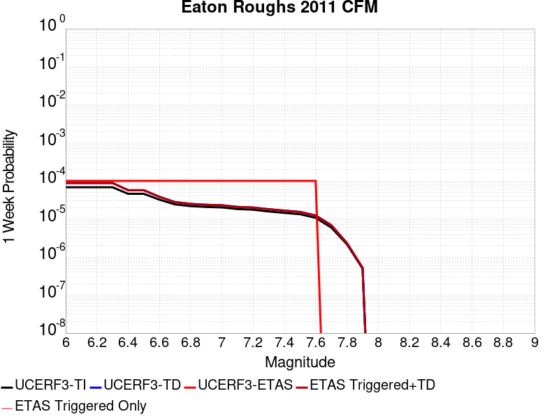 | 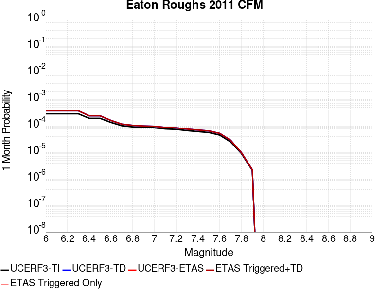 | 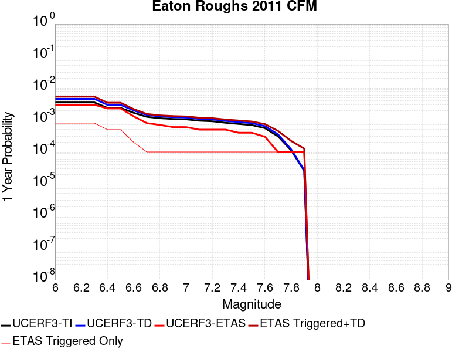 | 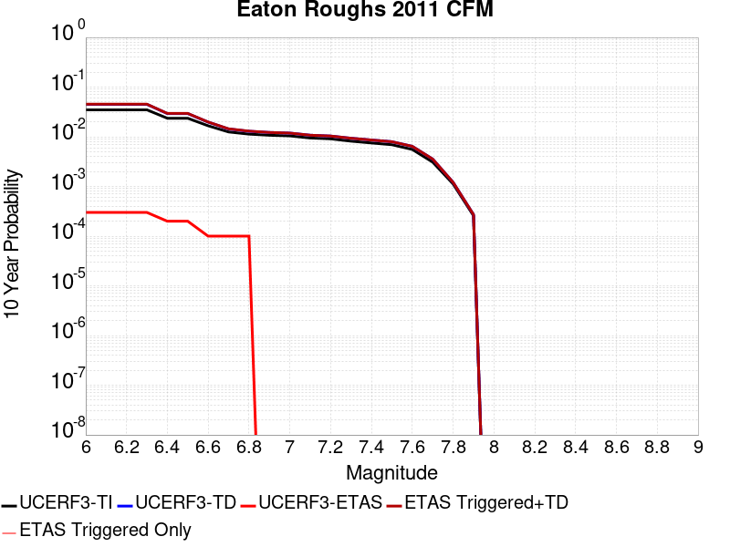 |

| Magnitude | 1 wk TI Prob | 1 wk TD Prob | 1 wk ETAS Prob | 1 wk ETAS/TD Gain | 1 wk ETAS Triggered+TD | 1 wk ETAS Triggered Only | 1 mo TI Prob | 1 mo TD Prob | 1 mo ETAS Prob | 1 mo ETAS/TD Gain | 1 mo ETAS Triggered+TD | 1 mo ETAS Triggered Only | 1 yr TI Prob | 1 yr TD Prob | 1 yr ETAS Prob | 1 yr ETAS/TD Gain | 1 yr ETAS Triggered+TD | 1 yr ETAS Triggered Only | 10 yr TI Prob | 10 yr TD Prob | 10 yr ETAS Prob | 10 yr ETAS/TD Gain | 10 yr ETAS Triggered+TD | 10 yr ETAS Triggered Only |
|-----|-----|-----|-----|-----|-----|-----|-----|-----|-----|-----|-----|-----|-----|-----|-----|-----|-----|-----|-----|-----|-----|-----|-----|-----|
| 6.0 | 6.8044945E-5 | 8.817112E-5 | 1.0E-4 | 1.1341583 | 8.817112E-5 | 0.0 | 2.9158857E-4 | 3.7782674E-4 | 4.0E-4 | 1.0586864 | 4.7778894E-4 | 1.0E-4 | 0.0035443127 | 0.004591065 | 0.003 | 0.65344316 | 0.0053873924 | 8.0E-4 | 0.03488314 | 0.045034718 | 0.0292 | 0.6483886 | 0.052865434 | 0.0082 |
| 6.1 | 6.8044945E-5 | 8.817112E-5 | 1.0E-4 | 1.1341583 | 8.817112E-5 | 0.0 | 2.9158857E-4 | 3.7782674E-4 | 4.0E-4 | 1.0586864 | 4.7778894E-4 | 1.0E-4 | 0.0035443127 | 0.004591065 | 0.003 | 0.65344316 | 0.0053873924 | 8.0E-4 | 0.03488314 | 0.045034718 | 0.0292 | 0.6483886 | 0.052865434 | 0.0082 |
| 6.2 | 6.8044945E-5 | 8.817112E-5 | 1.0E-4 | 1.1341583 | 8.817112E-5 | 0.0 | 2.9158857E-4 | 3.7782674E-4 | 4.0E-4 | 1.0586864 | 4.7778894E-4 | 1.0E-4 | 0.0035443127 | 0.004591065 | 0.003 | 0.65344316 | 0.0053873924 | 8.0E-4 | 0.03488314 | 0.045034718 | 0.0292 | 0.6483886 | 0.052865434 | 0.0082 |
| 6.3 | 6.8044945E-5 | 8.817112E-5 | 1.0E-4 | 1.1341583 | 8.817112E-5 | 0.0 | 2.9158857E-4 | 3.7782674E-4 | 4.0E-4 | 1.0586864 | 4.7778894E-4 | 1.0E-4 | 0.0035443127 | 0.004591065 | 0.003 | 0.65344316 | 0.0053873924 | 8.0E-4 | 0.03488314 | 0.045034718 | 0.0292 | 0.6483886 | 0.052865434 | 0.0082 |
| 6.4 | 4.5830013E-5 | 5.7010613E-5 | 1.0E-4 | 1.7540594 | 5.7010613E-5 | 0.0 | 1.9639956E-4 | 2.4431135E-4 | 2.0E-4 | 0.8186276 | 2.4431135E-4 | 0.0 | 0.0023885423 | 0.002970821 | 0.0023 | 0.77419674 | 0.0034693356 | 5.0E-4 | 0.023630321 | 0.029349273 | 0.0207 | 0.70529854 | 0.03468785 | 0.0055 |
| 6.5 | 4.5830013E-5 | 5.7010613E-5 | 1.0E-4 | 1.7540594 | 5.7010613E-5 | 0.0 | 1.9639956E-4 | 2.4431135E-4 | 2.0E-4 | 0.8186276 | 2.4431135E-4 | 0.0 | 0.0023885423 | 0.002970821 | 0.0023 | 0.77419674 | 0.0034693356 | 5.0E-4 | 0.023630321 | 0.029349273 | 0.0207 | 0.70529854 | 0.03468785 | 0.0055 |
| 6.6 | 3.222194E-5 | 3.8187813E-5 | 1.0E-4 | 2.6186366 | 3.8187813E-5 | 0.0 | 1.3808672E-4 | 1.6365242E-4 | 1.0E-4 | 0.61105114 | 1.6365242E-4 | 0.0 | 0.0016799092 | 0.0019907374 | 0.0013 | 0.6530243 | 0.0021903394 | 2.0E-4 | 0.016672665 | 0.01973844 | 0.014 | 0.7092759 | 0.023267383 | 0.0036 |
| 6.7 | 2.4155654E-5 | 2.774278E-5 | 1.0E-4 | 3.6045413 | 2.774278E-5 | 0.0 | 1.0352012E-4 | 1.1889226E-4 | 1.0E-4 | 0.84109765 | 1.1889226E-4 | 0.0 | 0.0012596287 | 0.0014465603 | 8.0E-4 | 0.55303603 | 0.0015464156 | 1.0E-4 | 0.012525126 | 0.014372619 | 0.0091 | 0.6331484 | 0.016639562 | 0.0023 |
| 6.8 | 2.1814667E-5 | 2.4903855E-5 | 1.0E-4 | 4.0154424 | 2.4903855E-5 | 0.0 | 9.348808E-5 | 1.0672646E-4 | 1.0E-4 | 0.93697476 | 1.0672646E-4 | 0.0 | 0.001137623 | 0.0012986239 | 7.0E-4 | 0.5390321 | 0.001398494 | 1.0E-4 | 0.011318169 | 0.012911002 | 0.0075 | 0.5808999 | 0.014687762 | 0.0018 |
| 6.9 | 2.0700467E-5 | 2.3594372E-5 | 1.0E-4 | 4.238299 | 2.3594372E-5 | 0.0 | 8.871327E-5 | 1.01114834E-4 | 1.0E-4 | 0.9889746 | 1.01114834E-4 | 0.0 | 0.0010795488 | 0.0012303811 | 6.0E-4 | 0.4876538 | 0.0013302581 | 1.0E-4 | 0.010743194 | 0.012236249 | 0.0067 | 0.5475534 | 0.013816671 | 0.0016 |
| 7.0 | 2.0104066E-5 | 2.2903117E-5 | 1.0E-4 | 4.366218 | 2.2903117E-5 | 0.0 | 8.615744E-5 | 9.8152545E-5 | 1.0E-4 | 1.0188223 | 9.8152545E-5 | 0.0 | 0.0010484619 | 0.0011943552 | 6.0E-4 | 0.50236315 | 0.0012942357 | 1.0E-4 | 0.010435291 | 0.011879887 | 0.0063 | 0.530308 | 0.01346088 | 0.0016 |
| 7.1 | 1.8225232E-5 | 2.0743106E-5 | 1.0E-4 | 4.820879 | 2.0743106E-5 | 0.0 | 7.81058E-5 | 8.8896006E-5 | 1.0E-4 | 1.1249099 | 8.8896006E-5 | 0.0 | 9.5052324E-4 | 0.0010817731 | 5.0E-4 | 0.46220416 | 0.0011816649 | 1.0E-4 | 0.009464677 | 0.010765398 | 0.0059 | 0.5480522 | 0.012348174 | 0.0016 |
| 7.2 | 1.7526572E-5 | 1.9964516E-5 | 1.0E-4 | 5.008887 | 1.9964516E-5 | 0.0 | 7.511172E-5 | 8.555942E-5 | 1.0E-4 | 1.1687784 | 8.555942E-5 | 0.0 | 9.141015E-4 | 0.0010411895 | 5.0E-4 | 0.48021996 | 0.0011410854 | 1.0E-4 | 0.009103506 | 0.010363418 | 0.0052 | 0.50176495 | 0.011748909 | 0.0014 |
| 7.3 | 1.5727232E-5 | 1.7994558E-5 | 1.0E-4 | 5.5572352 | 1.7994558E-5 | 0.0 | 6.740067E-5 | 7.711726E-5 | 1.0E-4 | 1.2967265 | 7.711726E-5 | 0.0 | 8.2029426E-4 | 9.384995E-4 | 5.0E-4 | 0.5327653 | 0.0010384057 | 1.0E-4 | 0.008172729 | 0.009345609 | 0.005 | 0.53501064 | 0.010633459 | 0.0013 |
| 7.4 | 1.4457361E-5 | 1.6573253E-5 | 1.0E-4 | 6.0338187 | 1.6573253E-5 | 0.0 | 6.195865E-5 | 7.10263E-5 | 1.0E-4 | 1.4079292 | 7.10263E-5 | 0.0 | 7.540854E-4 | 8.64403E-4 | 4.0E-4 | 0.46274713 | 9.6431654E-4 | 1.0E-4 | 0.007515317 | 0.008610596 | 0.0046 | 0.5342255 | 0.009800263 | 0.0012 |
| 7.5 | 1.33280955E-5 | 1.5321804E-5 | 1.0E-4 | 6.526646 | 1.5321804E-5 | 0.0 | 5.711916E-5 | 6.566323E-5 | 1.0E-4 | 1.5229223 | 6.566323E-5 | 0.0 | 6.9520384E-4 | 7.991575E-4 | 4.0E-4 | 0.50052714 | 8.9907757E-4 | 1.0E-4 | 0.00693033 | 0.0079630045 | 0.0043 | 0.53999716 | 0.009054245 | 0.0011 |
| 7.6 | 1.0699478E-5 | 1.2368158E-5 | 1.0E-4 | 8.085278 | 1.2368158E-5 | 0.0 | 4.5854096E-5 | 5.300532E-5 | 1.0E-4 | 1.8866031 | 5.300532E-5 | 0.0 | 5.581306E-4 | 6.451492E-4 | 3.0E-4 | 0.46500868 | 7.450847E-4 | 1.0E-4 | 0.005567309 | 0.0064328723 | 0.0035 | 0.54408044 | 0.007227726 | 8.0E-4 |
| 7.7 | 5.9390236E-6 | 6.84246E-6 | 0.0 | 0.0 | 6.84246E-6 | 0.0 | 2.545271E-5 | 2.9324501E-5 | 0.0 | 0.0 | 2.9324501E-5 | 0.0 | 3.0984267E-4 | 3.5696756E-4 | 1.0E-4 | 0.2801375 | 4.5693186E-4 | 1.0E-4 | 0.0030941102 | 0.0035640104 | 0.002 | 0.5611656 | 0.0040622284 | 5.0E-4 |
| 7.8 | 2.1622036E-6 | 2.3278722E-6 | 0.0 | 0.0 | 2.3278722E-6 | 0.0 | 9.266554E-6 | 9.9765575E-6 | 0.0 | 0.0 | 9.9765575E-6 | 0.0 | 1.1281446E-4 | 1.2145789E-4 | 1.0E-4 | 0.82333064 | 2.2144575E-4 | 1.0E-4 | 0.001127572 | 0.0012139308 | 0.001 | 0.8237702 | 0.0015135666 | 3.0E-4 |
| 7.9 | 4.9586197E-7 | 5.216062E-7 | 0.0 | 0.0 | 5.216062E-7 | 0.0 | 2.125121E-6 | 2.2354534E-6 | 0.0 | 0.0 | 2.2354534E-6 | 0.0 | 2.5873042E-5 | 2.7216325E-5 | 1.0E-4 | 3.6742651 | 1.272136E-4 | 1.0E-4 | 2.5870028E-4 | 2.7213202E-4 | 2.0E-4 | 0.7349374 | 4.720776E-4 | 2.0E-4 |

## Chino alt 1
*[(top)](#table-of-contents)*

| 1 Week | 1 Month | 1 Year | 10 Year |
|-----|-----|-----|-----|
| 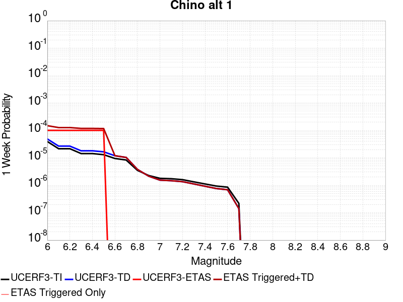 | 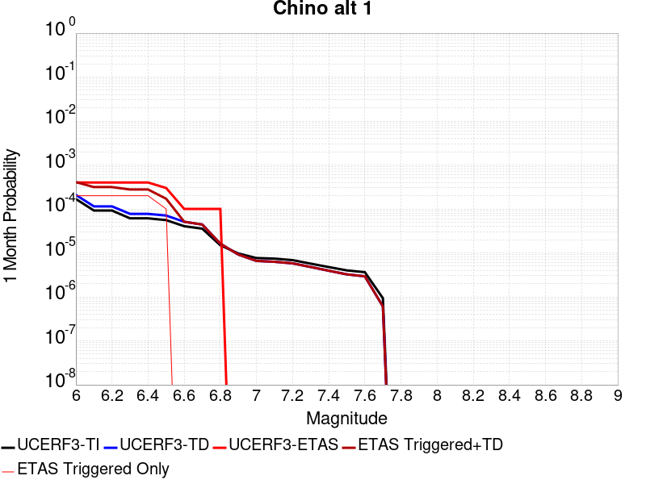 | 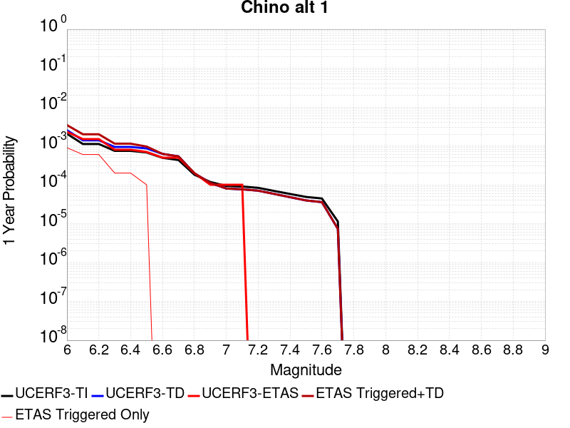 | 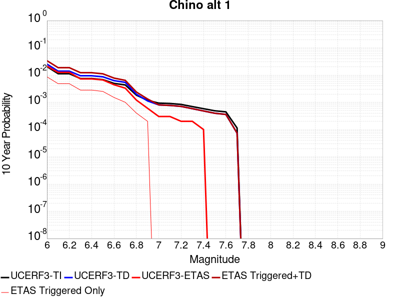 |

| Magnitude | 1 wk TI Prob | 1 wk TD Prob | 1 wk ETAS Prob | 1 wk ETAS/TD Gain | 1 wk ETAS Triggered+TD | 1 wk ETAS Triggered Only | 1 mo TI Prob | 1 mo TD Prob | 1 mo ETAS Prob | 1 mo ETAS/TD Gain | 1 mo ETAS Triggered+TD | 1 mo ETAS Triggered Only | 1 yr TI Prob | 1 yr TD Prob | 1 yr ETAS Prob | 1 yr ETAS/TD Gain | 1 yr ETAS Triggered+TD | 1 yr ETAS Triggered Only | 10 yr TI Prob | 10 yr TD Prob | 10 yr ETAS Prob | 10 yr ETAS/TD Gain | 10 yr ETAS Triggered+TD | 10 yr ETAS Triggered Only |
|-----|-----|-----|-----|-----|-----|-----|-----|-----|-----|-----|-----|-----|-----|-----|-----|-----|-----|-----|-----|-----|-----|-----|-----|-----|
| 6.0 | 3.939946E-5 | 4.8761474E-5 | 1.0E-4 | 2.0507994 | 1.4875659E-4 | 1.0E-4 | 1.6884391E-4 | 2.0896389E-4 | 4.0E-4 | 1.9142064 | 4.089221E-4 | 2.0E-4 | 0.0020537362 | 0.0025416764 | 0.0023 | 0.9049146 | 0.003439389 | 9.0E-4 | 0.020348595 | 0.025185952 | 0.0213 | 0.8457095 | 0.033569355 | 0.0086 |
| 6.1 | 2.1505624E-5 | 2.6745702E-5 | 1.0E-4 | 3.7389185 | 1.2674303E-4 | 1.0E-4 | 9.2163704E-5 | 1.1461999E-4 | 4.0E-4 | 3.4897928 | 3.1459707E-4 | 2.0E-4 | 0.0011215154 | 0.0013947141 | 0.0015 | 1.0754893 | 0.0019938773 | 6.0E-4 | 0.011158722 | 0.013879712 | 0.0125 | 0.90059507 | 0.018613089 | 0.0048 |
| 6.2 | 2.1505624E-5 | 2.6745702E-5 | 1.0E-4 | 3.7389185 | 1.2674303E-4 | 1.0E-4 | 9.2163704E-5 | 1.1461999E-4 | 4.0E-4 | 3.4897928 | 3.1459707E-4 | 2.0E-4 | 0.0011215154 | 0.0013947141 | 0.0015 | 1.0754893 | 0.0019938773 | 6.0E-4 | 0.011158722 | 0.013879712 | 0.0125 | 0.90059507 | 0.018613089 | 0.0048 |
| 6.3 | 1.4290785E-5 | 1.805055E-5 | 1.0E-4 | 5.539997 | 1.18048745E-4 | 1.0E-4 | 6.1244784E-5 | 7.7357465E-5 | 4.0E-4 | 5.1708 | 2.7734198E-4 | 2.0E-4 | 7.454001E-4 | 9.4146485E-4 | 8.0E-4 | 0.8497396 | 0.0011412766 | 2.0E-4 | 0.007429048 | 0.009388474 | 0.0072 | 0.7668978 | 0.012162186 | 0.0028 |
| 6.4 | 1.4290785E-5 | 1.805055E-5 | 1.0E-4 | 5.539997 | 1.18048745E-4 | 1.0E-4 | 6.1244784E-5 | 7.7357465E-5 | 4.0E-4 | 5.1708 | 2.7734198E-4 | 2.0E-4 | 7.454001E-4 | 9.4146485E-4 | 8.0E-4 | 0.8497396 | 0.0011412766 | 2.0E-4 | 0.007429048 | 0.009388474 | 0.0072 | 0.7668978 | 0.012162186 | 0.0028 |
| 6.5 | 1.3017944E-5 | 1.6540487E-5 | 1.0E-4 | 6.045771 | 1.1653883E-4 | 1.0E-4 | 5.5789995E-5 | 7.088612E-5 | 3.0E-4 | 4.2321405 | 1.7087904E-4 | 1.0E-4 | 6.790315E-4 | 8.6274E-4 | 7.0E-4 | 0.8113684 | 9.626537E-4 | 1.0E-4 | 0.0067696036 | 0.00860746 | 0.0066 | 0.7667767 | 0.011085941 | 0.0025 |
| 6.6 | 9.470016E-6 | 1.1944894E-5 | 0.0 | 0.0 | 1.1944894E-5 | 0.0 | 4.058515E-5 | 5.1191586E-5 | 1.0E-4 | 1.953446 | 5.1191586E-5 | 0.0 | 4.940122E-4 | 6.2311284E-4 | 5.0E-4 | 0.8024229 | 6.2311284E-4 | 0.0 | 0.004929154 | 0.0062260013 | 0.0044 | 0.7067136 | 0.0077166623 | 0.0015 |
| 6.7 | 8.314155E-6 | 1.0328306E-5 | 0.0 | 0.0 | 1.0328306E-5 | 0.0 | 3.5631605E-5 | 4.4263597E-5 | 1.0E-4 | 2.2591927 | 4.4263597E-5 | 0.0 | 4.3372845E-4 | 5.388079E-4 | 5.0E-4 | 0.9279745 | 5.388079E-4 | 0.0 | 0.004328829 | 0.0053875856 | 0.0033 | 0.61251926 | 0.006382198 | 0.001 |
| 6.8 | 3.4856364E-6 | 3.781823E-6 | 0.0 | 0.0 | 3.781823E-6 | 0.0 | 1.4938357E-5 | 1.6207723E-5 | 1.0E-4 | 6.169898 | 1.6207723E-5 | 0.0 | 1.8185932E-4 | 1.9731317E-4 | 2.0E-4 | 1.013617 | 1.9731317E-4 | 0.0 | 0.0018171056 | 0.0019730001 | 0.0012 | 0.6082108 | 0.002372211 | 4.0E-4 |
| 6.9 | 2.2645952E-6 | 2.1416872E-6 | 0.0 | 0.0 | 2.1416872E-6 | 0.0 | 9.705372E-6 | 9.178629E-6 | 0.0 | 0.0 | 9.178629E-6 | 0.0 | 1.18156495E-4 | 1.1174428E-4 | 1.0E-4 | 0.8949004 | 1.1174428E-4 | 0.0 | 0.0011809369 | 0.0011174479 | 6.0E-4 | 0.5369378 | 0.0013172243 | 2.0E-4 |
| 7.0 | 1.7864003E-6 | 1.5371073E-6 | 0.0 | 0.0 | 1.5371073E-6 | 0.0 | 7.655979E-6 | 6.5875865E-6 | 0.0 | 0.0 | 6.5875865E-6 | 0.0 | 9.3207556E-5 | 8.0200974E-5 | 1.0E-4 | 1.2468677 | 8.0200974E-5 | 0.0 | 9.316847E-4 | 8.0216007E-4 | 3.0E-4 | 0.3739902 | 8.0216007E-4 | 0.0 |
| 7.1 | 1.7315456E-6 | 1.4677553E-6 | 0.0 | 0.0 | 1.4677553E-6 | 0.0 | 7.420889E-6 | 6.290365E-6 | 0.0 | 0.0 | 6.290365E-6 | 0.0 | 9.034557E-5 | 7.658256E-5 | 1.0E-4 | 1.3057804 | 7.658256E-5 | 0.0 | 9.0308854E-4 | 7.659947E-4 | 3.0E-4 | 0.3916476 | 7.659947E-4 | 0.0 |
| 7.2 | 1.6008337E-6 | 1.352271E-6 | 0.0 | 0.0 | 1.352271E-6 | 0.0 | 6.860698E-6 | 5.795435E-6 | 0.0 | 0.0 | 5.795435E-6 | 0.0 | 8.352579E-5 | 7.055719E-5 | 0.0 | 0.0 | 7.055719E-5 | 0.0 | 8.34944E-4 | 7.057674E-4 | 2.0E-4 | 0.28337947 | 7.057674E-4 | 0.0 |
| 7.3 | 1.3320939E-6 | 1.1177666E-6 | 0.0 | 0.0 | 1.1177666E-6 | 0.0 | 5.7089615E-6 | 4.79042E-6 | 0.0 | 0.0 | 4.79042E-6 | 0.0 | 6.9504385E-5 | 5.832185E-5 | 0.0 | 0.0 | 5.832185E-5 | 0.0 | 6.9482654E-4 | 5.831893E-4 | 2.0E-4 | 0.3429418 | 5.831893E-4 | 0.0 |
| 7.4 | 1.114294E-6 | 9.204411E-7 | 0.0 | 0.0 | 9.204411E-7 | 0.0 | 4.775537E-6 | 3.944742E-6 | 0.0 | 0.0 | 3.944742E-6 | 0.0 | 5.8140613E-5 | 4.802621E-5 | 0.0 | 0.0 | 4.802621E-5 | 0.0 | 5.81254E-4 | 4.8017106E-4 | 1.0E-4 | 0.2082591 | 4.8017106E-4 | 0.0 |
| 7.5 | 9.354081E-7 | 7.600677E-7 | 0.0 | 0.0 | 7.600677E-7 | 0.0 | 4.0088858E-6 | 3.257429E-6 | 0.0 | 0.0 | 3.257429E-6 | 0.0 | 4.8807087E-5 | 3.965851E-5 | 0.0 | 0.0 | 3.965851E-5 | 0.0 | 4.879637E-4 | 3.965177E-4 | 0.0 | 0.0 | 3.965177E-4 | 0.0 |
| 7.6 | 8.521771E-7 | 6.8604237E-7 | 0.0 | 0.0 | 6.8604237E-7 | 0.0 | 3.6521824E-6 | 2.9401785E-6 | 0.0 | 0.0 | 2.9401785E-6 | 0.0 | 4.4464414E-5 | 3.5796118E-5 | 0.0 | 0.0 | 3.5796118E-5 | 0.0 | 4.4455516E-4 | 3.5790668E-4 | 0.0 | 0.0 | 3.5790668E-4 | 0.0 |
| 7.7 | 2.1803626E-7 | 1.4132844E-7 | 0.0 | 0.0 | 1.4132844E-7 | 0.0 | 9.344408E-7 | 6.0569323E-7 | 0.0 | 0.0 | 6.0569323E-7 | 0.0 | 1.1376757E-5 | 7.3743E-6 | 0.0 | 0.0 | 7.3743E-6 | 0.0 | 1.13761744E-4 | 7.37415E-5 | 0.0 | 0.0 | 7.37415E-5 | 0.0 |

## Red Mountain
*[(top)](#table-of-contents)*

| 1 Week | 1 Month | 1 Year | 10 Year |
|-----|-----|-----|-----|
| 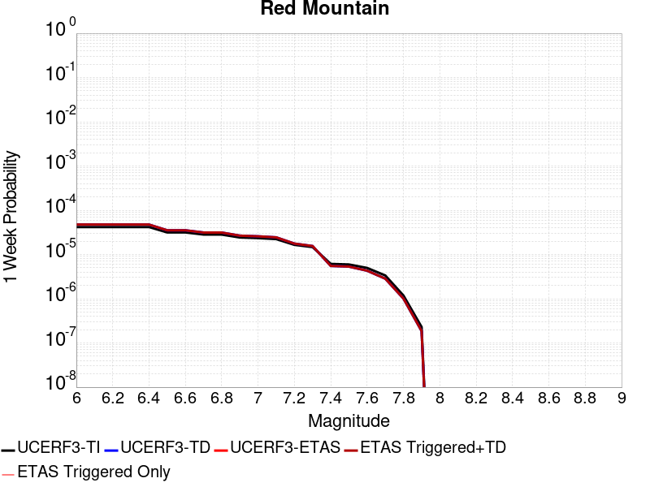 | 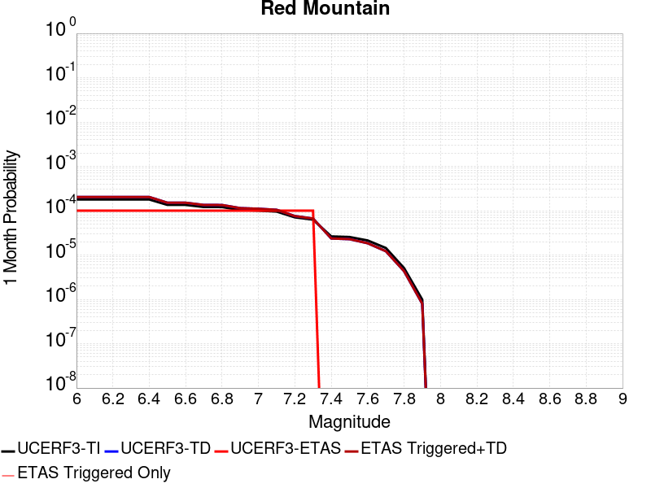 | 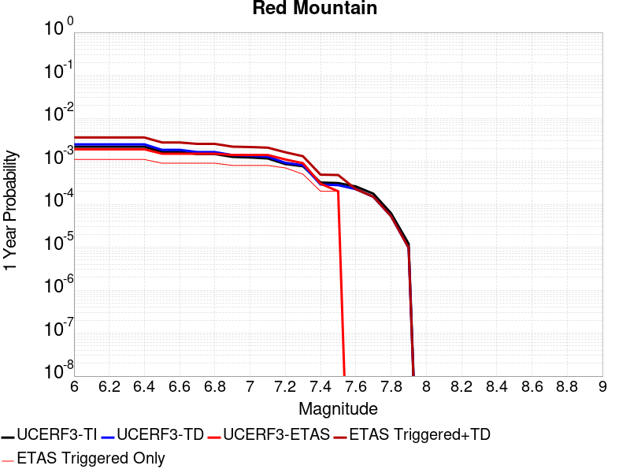 |  |

| Magnitude | 1 wk TI Prob | 1 wk TD Prob | 1 wk ETAS Prob | 1 wk ETAS/TD Gain | 1 wk ETAS Triggered+TD | 1 wk ETAS Triggered Only | 1 mo TI Prob | 1 mo TD Prob | 1 mo ETAS Prob | 1 mo ETAS/TD Gain | 1 mo ETAS Triggered+TD | 1 mo ETAS Triggered Only | 1 yr TI Prob | 1 yr TD Prob | 1 yr ETAS Prob | 1 yr ETAS/TD Gain | 1 yr ETAS Triggered+TD | 1 yr ETAS Triggered Only | 10 yr TI Prob | 10 yr TD Prob | 10 yr ETAS Prob | 10 yr ETAS/TD Gain | 10 yr ETAS Triggered+TD | 10 yr ETAS Triggered Only |
|-----|-----|-----|-----|-----|-----|-----|-----|-----|-----|-----|-----|-----|-----|-----|-----|-----|-----|-----|-----|-----|-----|-----|-----|-----|
| 6.0 | 4.1810763E-5 | 4.7503363E-5 | 0.0 | 0.0 | 4.7503363E-5 | 0.0 | 1.7917668E-4 | 2.0357087E-4 | 1.0E-4 | 0.49122941 | 2.0357087E-4 | 0.0 | 0.0021792934 | 0.0024758223 | 0.0019 | 0.7674218 | 0.003573099 | 0.0011 | 0.021580452 | 0.024499949 | 0.0205 | 0.83673644 | 0.0316211 | 0.0073 |
| 6.1 | 4.1810763E-5 | 4.7503363E-5 | 0.0 | 0.0 | 4.7503363E-5 | 0.0 | 1.7917668E-4 | 2.0357087E-4 | 1.0E-4 | 0.49122941 | 2.0357087E-4 | 0.0 | 0.0021792934 | 0.0024758223 | 0.0019 | 0.7674218 | 0.003573099 | 0.0011 | 0.021580452 | 0.024499949 | 0.0205 | 0.83673644 | 0.0316211 | 0.0073 |
| 6.2 | 4.1810763E-5 | 4.7503363E-5 | 0.0 | 0.0 | 4.7503363E-5 | 0.0 | 1.7917668E-4 | 2.0357087E-4 | 1.0E-4 | 0.49122941 | 2.0357087E-4 | 0.0 | 0.0021792934 | 0.0024758223 | 0.0019 | 0.7674218 | 0.003573099 | 0.0011 | 0.021580452 | 0.024499949 | 0.0205 | 0.83673644 | 0.0316211 | 0.0073 |
| 6.3 | 4.1810763E-5 | 4.7503363E-5 | 0.0 | 0.0 | 4.7503363E-5 | 0.0 | 1.7917668E-4 | 2.0357087E-4 | 1.0E-4 | 0.49122941 | 2.0357087E-4 | 0.0 | 0.0021792934 | 0.0024758223 | 0.0019 | 0.7674218 | 0.003573099 | 0.0011 | 0.021580452 | 0.024499949 | 0.0205 | 0.83673644 | 0.0316211 | 0.0073 |
| 6.4 | 4.1810763E-5 | 4.7503363E-5 | 0.0 | 0.0 | 4.7503363E-5 | 0.0 | 1.7917668E-4 | 2.0357087E-4 | 1.0E-4 | 0.49122941 | 2.0357087E-4 | 0.0 | 0.0021792934 | 0.0024758223 | 0.0019 | 0.7674218 | 0.003573099 | 0.0011 | 0.021580452 | 0.024499949 | 0.0205 | 0.83673644 | 0.0316211 | 0.0073 |
| 6.5 | 3.154503E-5 | 3.529748E-5 | 0.0 | 0.0 | 3.529748E-5 | 0.0 | 1.3518598E-4 | 1.5126665E-4 | 1.0E-4 | 0.66108423 | 1.5126665E-4 | 0.0 | 0.0016446467 | 0.0018402075 | 0.0015 | 0.81512547 | 0.0027385512 | 9.0E-4 | 0.01632528 | 0.018259306 | 0.0161 | 0.8817422 | 0.023364358 | 0.0052 |
| 6.6 | 3.1535834E-5 | 3.5286877E-5 | 0.0 | 0.0 | 3.5286877E-5 | 0.0 | 1.3514658E-4 | 1.5122122E-4 | 1.0E-4 | 0.66128284 | 1.5122122E-4 | 0.0 | 0.0016441676 | 0.0018396553 | 0.0015 | 0.81537014 | 0.0027379997 | 9.0E-4 | 0.01632056 | 0.018253874 | 0.0161 | 0.8820045 | 0.023358954 | 0.0052 |
| 6.7 | 2.8267326E-5 | 3.1414645E-5 | 0.0 | 0.0 | 3.1414645E-5 | 0.0 | 1.2114006E-4 | 1.3462773E-4 | 1.0E-4 | 0.74278903 | 1.3462773E-4 | 0.0 | 0.0014738824 | 0.0016379451 | 0.0015 | 0.9157816 | 0.0025364708 | 9.0E-4 | 0.014641452 | 0.016267456 | 0.0142 | 0.8729085 | 0.020989371 | 0.0048 |
| 6.8 | 2.8212884E-5 | 3.1352625E-5 | 0.0 | 0.0 | 3.1352625E-5 | 0.0 | 1.20906756E-4 | 1.3436195E-4 | 1.0E-4 | 0.74425834 | 1.3436195E-4 | 0.0 | 0.0014710457 | 0.001634714 | 0.0015 | 0.91759175 | 0.0025332428 | 9.0E-4 | 0.014613459 | 0.016235618 | 0.0142 | 0.8746202 | 0.020957688 | 0.0048 |
| 6.9 | 2.4227871E-5 | 2.6661177E-5 | 0.0 | 0.0 | 2.6661177E-5 | 0.0 | 1.03829596E-4 | 1.1425761E-4 | 1.0E-4 | 0.87521523 | 1.1425761E-4 | 0.0 | 0.0012633923 | 0.0013902743 | 0.0014 | 1.0069956 | 0.0021891622 | 8.0E-4 | 0.012562336 | 0.013823427 | 0.0128 | 0.9259643 | 0.018261222 | 0.0045 |
| 7.0 | 2.348524E-5 | 2.5791536E-5 | 0.0 | 0.0 | 2.5791536E-5 | 0.0 | 1.0064714E-4 | 1.1053089E-4 | 1.0E-4 | 0.9047244 | 1.1053089E-4 | 0.0 | 0.0012246901 | 0.0013449582 | 0.0014 | 1.0409245 | 0.0021438822 | 8.0E-4 | 0.012179627 | 0.013375791 | 0.0126 | 0.9420004 | 0.0178156 | 0.0045 |
| 7.1 | 2.2311642E-5 | 2.4421044E-5 | 0.0 | 0.0 | 2.4421044E-5 | 0.0 | 9.561782E-5 | 1.0465784E-4 | 1.0E-4 | 0.9554946 | 1.0465784E-4 | 0.0 | 0.0011635252 | 0.0012735389 | 0.0014 | 1.099299 | 0.00207252 | 8.0E-4 | 0.01157452 | 0.012669896 | 0.0121 | 0.9550197 | 0.016816681 | 0.0042 |
| 7.2 | 1.6533986E-5 | 1.7641007E-5 | 0.0 | 0.0 | 1.7641007E-5 | 0.0 | 7.085802E-5 | 7.560248E-5 | 1.0E-4 | 1.3227079 | 7.560248E-5 | 0.0 | 8.623549E-4 | 9.201348E-4 | 0.0011 | 1.195477 | 0.0016194907 | 7.0E-4 | 0.008590161 | 0.009169505 | 0.0097 | 1.0578543 | 0.012538329 | 0.0034 |
| 7.3 | 1.4703092E-5 | 1.5533577E-5 | 0.0 | 0.0 | 1.5533577E-5 | 0.0 | 6.301173E-5 | 6.657111E-5 | 1.0E-4 | 1.5021529 | 6.657111E-5 | 0.0 | 7.668978E-4 | 8.1026333E-4 | 9.0E-4 | 1.11075 | 0.0013098582 | 5.0E-4 | 0.0076425658 | 0.008079143 | 0.0086 | 1.0644693 | 0.0111540975 | 0.0031 |
| 7.4 | 6.1331984E-6 | 5.520798E-6 | 0.0 | 0.0 | 5.520798E-6 | 0.0 | 2.6284872E-5 | 2.366035E-5 | 0.0 | 0.0 | 2.366035E-5 | 0.0 | 3.199713E-4 | 2.8802722E-4 | 3.0E-4 | 1.0415683 | 4.879696E-4 | 2.0E-4 | 0.0031951098 | 0.0028765933 | 0.0042 | 1.4600604 | 0.0046714153 | 0.0018 |
| 7.5 | 5.954766E-6 | 5.330598E-6 | 0.0 | 0.0 | 5.330598E-6 | 0.0 | 2.5520176E-5 | 2.2845223E-5 | 0.0 | 0.0 | 2.2845223E-5 | 0.0 | 3.1066386E-4 | 2.781056E-4 | 2.0E-4 | 0.71915126 | 4.7805E-4 | 2.0E-4 | 0.003102299 | 0.0027776295 | 0.004 | 1.4400768 | 0.00457263 | 0.0018 |
| 7.6 | 4.9726646E-6 | 4.3082373E-6 | 0.0 | 0.0 | 4.3082373E-6 | 0.0 | 2.1311245E-5 | 1.8463745E-5 | 0.0 | 0.0 | 1.8463745E-5 | 0.0 | 2.5943352E-4 | 2.2477323E-4 | 0.0 | 0.0 | 2.2477323E-4 | 0.0 | 0.0025913084 | 0.0022454935 | 0.0025 | 1.1133411 | 0.003243248 | 0.001 |
| 7.7 | 3.3613894E-6 | 2.8472539E-6 | 0.0 | 0.0 | 2.8472539E-6 | 0.0 | 1.4405875E-5 | 1.2202461E-5 | 0.0 | 0.0 | 1.2202461E-5 | 0.0 | 1.7537741E-4 | 1.485551E-4 | 0.0 | 0.0 | 1.485551E-4 | 0.0 | 0.0017523908 | 0.0014845841 | 0.0014 | 0.94302505 | 0.0018839902 | 4.0E-4 |
| 7.8 | 1.1828961E-6 | 1.0112911E-6 | 0.0 | 0.0 | 1.0112911E-6 | 0.0 | 5.069545E-6 | 4.334098E-6 | 0.0 | 0.0 | 4.334098E-6 | 0.0 | 6.171996E-5 | 5.2766394E-5 | 0.0 | 0.0 | 5.2766394E-5 | 0.0 | 6.170282E-4 | 5.275416E-4 | 5.0E-4 | 0.9477926 | 7.274361E-4 | 2.0E-4 |
| 7.9 | 2.2967266E-7 | 1.8605115E-7 | 0.0 | 0.0 | 1.8605115E-7 | 0.0 | 9.843111E-7 | 7.9736185E-7 | 0.0 | 0.0 | 7.9736185E-7 | 0.0 | 1.19839215E-5 | 9.70784E-6 | 0.0 | 0.0 | 9.70784E-6 | 0.0 | 1.1983275E-4 | 9.707445E-5 | 1.0E-4 | 1.0301372 | 9.707445E-5 | 0.0 |

## San Andreas (North Coast) 2011 CFM
*[(top)](#table-of-contents)*

| 1 Week | 1 Month | 1 Year | 10 Year |
|-----|-----|-----|-----|
| 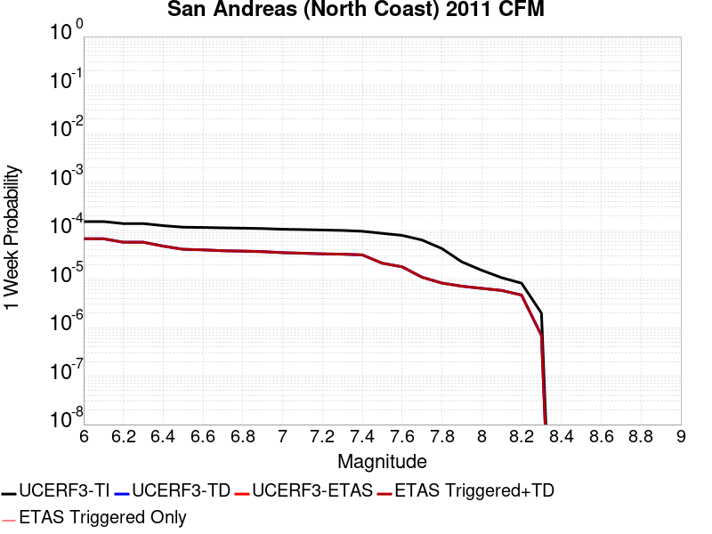 | 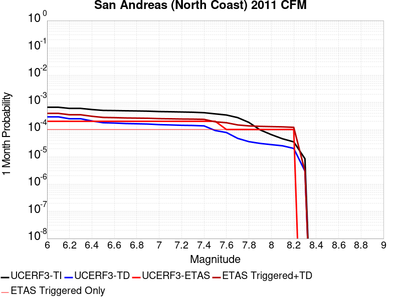 | 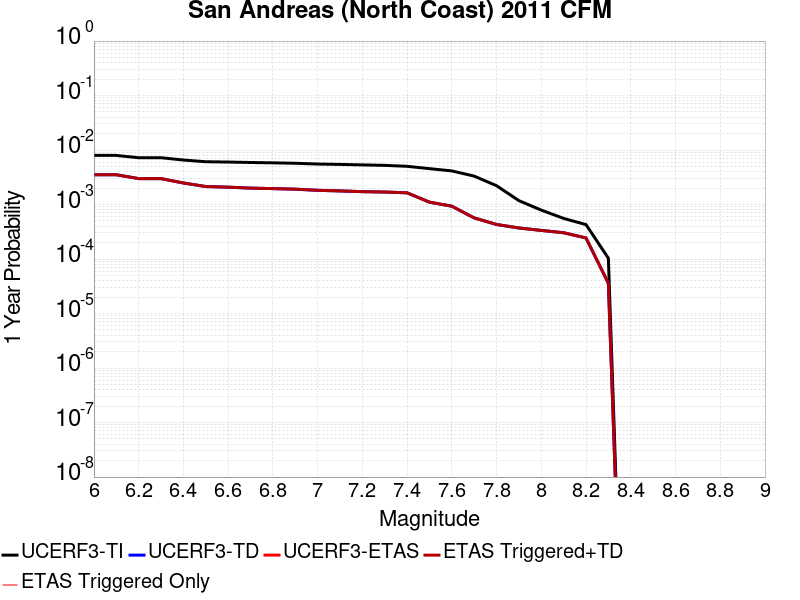 | 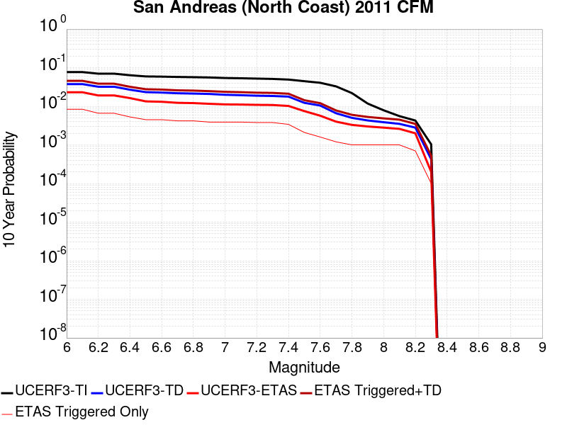 |

| Magnitude | 1 wk TI Prob | 1 wk TD Prob | 1 wk ETAS Prob | 1 wk ETAS/TD Gain | 1 wk ETAS Triggered+TD | 1 wk ETAS Triggered Only | 1 mo TI Prob | 1 mo TD Prob | 1 mo ETAS Prob | 1 mo ETAS/TD Gain | 1 mo ETAS Triggered+TD | 1 mo ETAS Triggered Only | 1 yr TI Prob | 1 yr TD Prob | 1 yr ETAS Prob | 1 yr ETAS/TD Gain | 1 yr ETAS Triggered+TD | 1 yr ETAS Triggered Only | 10 yr TI Prob | 10 yr TD Prob | 10 yr ETAS Prob | 10 yr ETAS/TD Gain | 10 yr ETAS Triggered+TD | 10 yr ETAS Triggered Only |
|-----|-----|-----|-----|-----|-----|-----|-----|-----|-----|-----|-----|-----|-----|-----|-----|-----|-----|-----|-----|-----|-----|-----|-----|-----|
| 6.0 | 1.5333705E-4 | 6.817388E-5 | 0.0 | 0.0 | 6.817388E-5 | 0.0 | 6.5699324E-4 | 2.9214122E-4 | 2.0E-4 | 0.6846004 | 3.92112E-4 | 1.0E-4 | 0.007969595 | 0.00355105 | 0.0013 | 0.3660889 | 0.0040492746 | 5.0E-4 | 0.0768977 | 0.03783077 | 0.0231 | 0.61061406 | 0.045912992 | 0.0084 |
| 6.1 | 1.5333705E-4 | 6.817388E-5 | 0.0 | 0.0 | 6.817388E-5 | 0.0 | 6.5699324E-4 | 2.9214122E-4 | 2.0E-4 | 0.6846004 | 3.92112E-4 | 1.0E-4 | 0.007969595 | 0.00355105 | 0.0013 | 0.3660889 | 0.0040492746 | 5.0E-4 | 0.0768977 | 0.03783077 | 0.0231 | 0.61061406 | 0.045912992 | 0.0084 |
| 6.2 | 1.3912938E-4 | 5.7897167E-5 | 0.0 | 0.0 | 5.7897167E-5 | 0.0 | 5.961325E-4 | 2.4810724E-4 | 2.0E-4 | 0.806103 | 3.4808242E-4 | 1.0E-4 | 0.007233787 | 0.0030165468 | 0.0011 | 0.36465538 | 0.00341534 | 4.0E-4 | 0.07002798 | 0.032311305 | 0.0191 | 0.59112436 | 0.03869805 | 0.0066 |
| 6.3 | 1.3912938E-4 | 5.7897167E-5 | 0.0 | 0.0 | 5.7897167E-5 | 0.0 | 5.961325E-4 | 2.4810724E-4 | 2.0E-4 | 0.806103 | 3.4808242E-4 | 1.0E-4 | 0.007233787 | 0.0030165468 | 0.0011 | 0.36465538 | 0.00341534 | 4.0E-4 | 0.07002798 | 0.032311305 | 0.0191 | 0.59112436 | 0.03869805 | 0.0066 |
| 6.4 | 1.2623647E-4 | 4.8136004E-5 | 0.0 | 0.0 | 4.8136004E-5 | 0.0 | 5.4090127E-4 | 2.0628095E-4 | 2.0E-4 | 0.9695515 | 3.062603E-4 | 1.0E-4 | 0.0065656058 | 0.0025085965 | 0.0011 | 0.4384922 | 0.002907593 | 4.0E-4 | 0.06374981 | 0.02706821 | 0.0163 | 0.6021824 | 0.03222475 | 0.0053 |
| 6.5 | 1.1736096E-4 | 4.142292E-5 | 0.0 | 0.0 | 4.142292E-5 | 0.0 | 5.028786E-4 | 1.7751481E-4 | 2.0E-4 | 1.1266665 | 2.7749705E-4 | 1.0E-4 | 0.006105373 | 0.0021591156 | 8.0E-4 | 0.37052205 | 0.002558252 | 4.0E-4 | 0.05940335 | 0.023446878 | 0.0134 | 0.57150465 | 0.027841367 | 0.0045 |
| 6.6 | 1.1586959E-4 | 4.0356917E-5 | 0.0 | 0.0 | 4.0356917E-5 | 0.0 | 4.964894E-4 | 1.7294683E-4 | 2.0E-4 | 1.1564248 | 2.7292955E-4 | 1.0E-4 | 0.006028018 | 0.0021036093 | 8.0E-4 | 0.38029873 | 0.0025027678 | 4.0E-4 | 0.058671024 | 0.022867141 | 0.0131 | 0.57287437 | 0.02726424 | 0.0045 |
| 6.7 | 1.13693764E-4 | 3.8717855E-5 | 0.0 | 0.0 | 3.8717855E-5 | 0.0 | 4.87168E-4 | 1.659232E-4 | 2.0E-4 | 1.205377 | 2.659066E-4 | 1.0E-4 | 0.005915152 | 0.0020182582 | 8.0E-4 | 0.3963814 | 0.0024174508 | 4.0E-4 | 0.057601593 | 0.021981029 | 0.0123 | 0.5595734 | 0.026088709 | 0.0042 |
| 6.8 | 1.1204889E-4 | 3.796954E-5 | 0.0 | 0.0 | 3.796954E-5 | 0.0 | 4.8012115E-4 | 1.6271653E-4 | 2.0E-4 | 1.2291315 | 2.6270025E-4 | 1.0E-4 | 0.005829819 | 0.0019792886 | 8.0E-4 | 0.40418562 | 0.0023784968 | 4.0E-4 | 0.05679232 | 0.021559075 | 0.0121 | 0.5612486 | 0.025668526 | 0.0042 |
| 6.9 | 1.1005794E-4 | 3.706962E-5 | 0.0 | 0.0 | 3.706962E-5 | 0.0 | 4.7159163E-4 | 1.5886022E-4 | 2.0E-4 | 1.2589685 | 2.5884432E-4 | 1.0E-4 | 0.0057265228 | 0.0019324222 | 8.0E-4 | 0.41398823 | 0.0023316492 | 4.0E-4 | 0.055811852 | 0.021047438 | 0.0116 | 0.551136 | 0.024865352 | 0.0039 |
| 7.0 | 1.0647948E-4 | 3.5310954E-5 | 0.0 | 0.0 | 3.5310954E-5 | 0.0 | 4.562608E-4 | 1.5132395E-4 | 2.0E-4 | 1.3216678 | 2.5130884E-4 | 1.0E-4 | 0.0055408357 | 0.0018408269 | 8.0E-4 | 0.4345873 | 0.0022400906 | 4.0E-4 | 0.054047033 | 0.020051537 | 0.0112 | 0.55856067 | 0.023873337 | 0.0039 |
| 7.1 | 1.04795035E-4 | 3.4402434E-5 | 0.0 | 0.0 | 3.4402434E-5 | 0.0 | 4.4904428E-4 | 1.4743075E-4 | 2.0E-4 | 1.356569 | 2.47416E-4 | 1.0E-4 | 0.0054534175 | 0.001793506 | 8.0E-4 | 0.4460537 | 0.0021927885 | 4.0E-4 | 0.053215165 | 0.01954094 | 0.0111 | 0.5680382 | 0.02336473 | 0.0039 |
| 7.2 | 1.02724036E-4 | 3.335853E-5 | 0.0 | 0.0 | 3.335853E-5 | 0.0 | 4.401716E-4 | 1.4295737E-4 | 2.0E-4 | 1.3990184 | 2.4294308E-4 | 1.0E-4 | 0.0053459285 | 0.0017391308 | 8.0E-4 | 0.4599999 | 0.0021384351 | 4.0E-4 | 0.052191395 | 0.018953018 | 0.0109 | 0.5751063 | 0.022680996 | 0.0038 |
| 7.3 | 1.00650694E-4 | 3.286369E-5 | 0.0 | 0.0 | 3.286369E-5 | 0.0 | 4.312888E-4 | 1.4083686E-4 | 2.0E-4 | 1.4200828 | 2.4082277E-4 | 1.0E-4 | 0.005238306 | 0.0017133545 | 8.0E-4 | 0.46692032 | 0.0021126692 | 4.0E-4 | 0.051165357 | 0.018651623 | 0.0108 | 0.579038 | 0.022380747 | 0.0038 |
| 7.4 | 9.672919E-5 | 3.17352E-5 | 0.0 | 0.0 | 3.17352E-5 | 0.0 | 4.144878E-4 | 1.3600098E-4 | 2.0E-4 | 1.4705776 | 2.3598738E-4 | 1.0E-4 | 0.005034718 | 0.0016545686 | 8.0E-4 | 0.48350975 | 0.0020539067 | 4.0E-4 | 0.049221683 | 0.017970715 | 0.0102 | 0.5675901 | 0.021309614 | 0.0034 |
| 7.5 | 8.7600405E-5 | 2.1435255E-5 | 0.0 | 0.0 | 2.1435255E-5 | 0.0 | 3.753763E-4 | 9.186215E-5 | 2.0E-4 | 2.1771753 | 1.9185296E-4 | 1.0E-4 | 0.0045606326 | 0.0011178495 | 7.0E-4 | 0.62620234 | 0.0014175142 | 3.0E-4 | 0.04468165 | 0.012406979 | 0.0075 | 0.6044985 | 0.014480924 | 0.0021 |
| 7.6 | 7.9562284E-5 | 1.8080447E-5 | 0.0 | 0.0 | 1.8080447E-5 | 0.0 | 3.4093665E-4 | 7.748533E-5 | 1.0E-4 | 1.2905668 | 1.7747759E-4 | 1.0E-4 | 0.0041430052 | 9.42977E-4 | 4.0E-4 | 0.42418846 | 0.0011427884 | 2.0E-4 | 0.040666126 | 0.010562464 | 0.0057 | 0.5396468 | 0.012145564 | 0.0016 |
| 7.7 | 6.3866544E-5 | 1.105408E-5 | 0.0 | 0.0 | 1.105408E-5 | 0.0 | 2.7368503E-4 | 4.7373767E-5 | 1.0E-4 | 2.110873 | 1.4736904E-4 | 1.0E-4 | 0.0033270244 | 5.766232E-4 | 4.0E-4 | 0.69369394 | 7.765079E-4 | 2.0E-4 | 0.032776527 | 0.0066874176 | 0.004 | 0.5981382 | 0.007879393 | 0.0012 |
| 7.8 | 4.2543215E-5 | 8.374025E-6 | 0.0 | 0.0 | 8.374025E-6 | 0.0 | 1.8231533E-4 | 3.5888184E-5 | 1.0E-4 | 2.7864323 | 1.3588459E-4 | 1.0E-4 | 0.0022174292 | 4.3685114E-4 | 3.0E-4 | 0.6867328 | 5.3680746E-4 | 1.0E-4 | 0.021954332 | 0.0050814785 | 0.0033 | 0.6494173 | 0.006076397 | 0.001 |
| 7.9 | 2.2636612E-5 | 7.2195207E-6 | 0.0 | 0.0 | 7.2195207E-6 | 0.0 | 9.7010445E-5 | 3.094044E-5 | 1.0E-4 | 3.2320163 | 1.3093735E-4 | 1.0E-4 | 0.0011804621 | 3.766348E-4 | 2.0E-4 | 0.5310184 | 4.765971E-4 | 1.0E-4 | 0.011742111 | 0.0043471423 | 0.003 | 0.69010854 | 0.005342795 | 0.001 |
| 8.0 | 1.5167874E-5 | 6.511471E-6 | 0.0 | 0.0 | 6.511471E-6 | 0.0 | 6.500356E-5 | 2.7906006E-5 | 1.0E-4 | 3.583458 | 1.2790321E-4 | 1.0E-4 | 7.9113094E-4 | 3.3970273E-4 | 2.0E-4 | 0.58875006 | 4.3966874E-4 | 1.0E-4 | 0.007883203 | 0.0039160713 | 0.0028 | 0.71500236 | 0.004912155 | 0.001 |
| 8.1 | 1.0681047E-5 | 5.8976484E-6 | 0.0 | 0.0 | 5.8976484E-6 | 0.0 | 4.5775112E-5 | 2.527539E-5 | 1.0E-4 | 3.9564176 | 1.2527287E-4 | 1.0E-4 | 5.5716943E-4 | 3.076845E-4 | 2.0E-4 | 0.6500165 | 4.0765374E-4 | 1.0E-4 | 0.0055577457 | 0.0035470135 | 0.0026 | 0.733011 | 0.0045434665 | 0.001 |
| 8.2 | 8.226114E-6 | 4.731175E-6 | 0.0 | 0.0 | 4.731175E-6 | 0.0 | 3.52543E-5 | 2.0276306E-5 | 1.0E-4 | 4.9318647 | 1.2027428E-4 | 1.0E-4 | 4.2913653E-4 | 2.4683613E-4 | 2.0E-4 | 0.81025416 | 3.4681146E-4 | 1.0E-4 | 0.004283088 | 0.0028340062 | 0.002 | 0.70571476 | 0.0035320225 | 7.0E-4 |
| 8.3 | 1.983087E-6 | 6.9765395E-7 | 0.0 | 0.0 | 6.9765395E-7 | 0.0 | 8.498917E-6 | 2.9899422E-6 | 0.0 | 0.0 | 2.9899422E-6 | 0.0 | 1.034694E-4 | 3.640195E-5 | 0.0 | 0.0 | 3.640195E-5 | 0.0 | 0.0010342124 | 4.3255524E-4 | 2.0E-4 | 0.46236867 | 5.32512E-4 | 1.0E-4 |

## Owl Lake
*[(top)](#table-of-contents)*

| 1 Week | 1 Month | 1 Year | 10 Year |
|-----|-----|-----|-----|
| 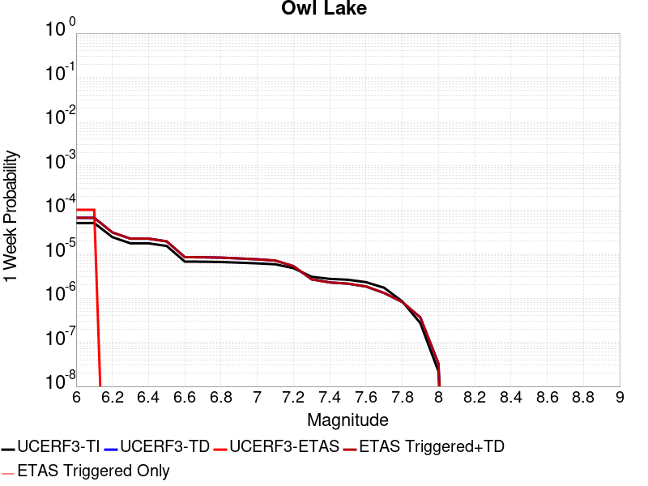 | 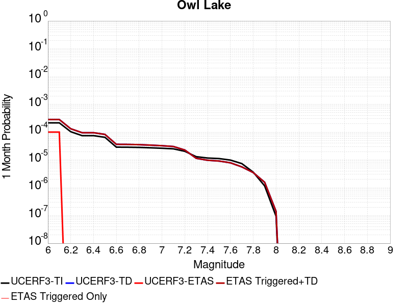 | 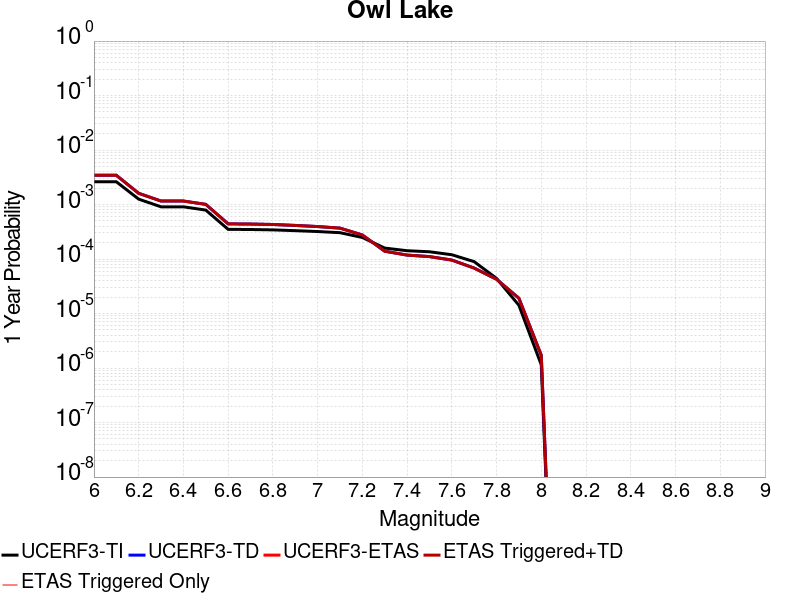 | 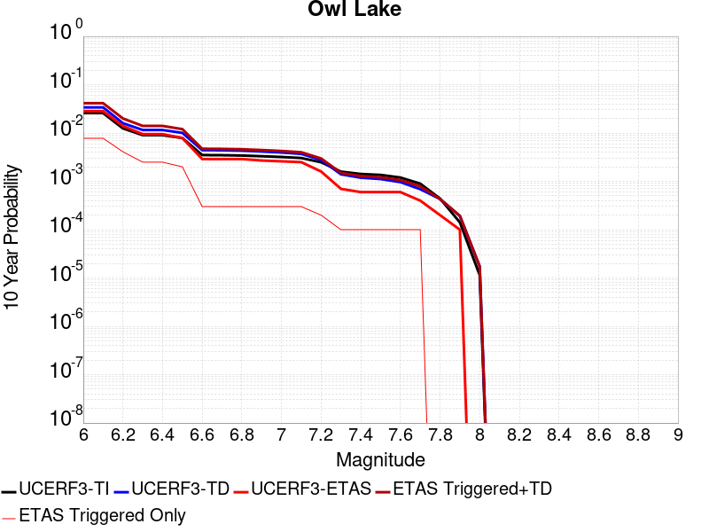 |

| Magnitude | 1 wk TI Prob | 1 wk TD Prob | 1 wk ETAS Prob | 1 wk ETAS/TD Gain | 1 wk ETAS Triggered+TD | 1 wk ETAS Triggered Only | 1 mo TI Prob | 1 mo TD Prob | 1 mo ETAS Prob | 1 mo ETAS/TD Gain | 1 mo ETAS Triggered+TD | 1 mo ETAS Triggered Only | 1 yr TI Prob | 1 yr TD Prob | 1 yr ETAS Prob | 1 yr ETAS/TD Gain | 1 yr ETAS Triggered+TD | 1 yr ETAS Triggered Only | 10 yr TI Prob | 10 yr TD Prob | 10 yr ETAS Prob | 10 yr ETAS/TD Gain | 10 yr ETAS Triggered+TD | 10 yr ETAS Triggered Only |
|-----|-----|-----|-----|-----|-----|-----|-----|-----|-----|-----|-----|-----|-----|-----|-----|-----|-----|-----|-----|-----|-----|-----|-----|-----|
| 6.0 | 5.0320643E-5 | 6.610865E-5 | 1.0E-4 | 1.5126613 | 6.610865E-5 | 0.0 | 2.1564208E-4 | 2.832925E-4 | 1.0E-4 | 0.35299206 | 2.832925E-4 | 0.0 | 0.0026222812 | 0.0034445445 | 0.0026 | 0.7548168 | 0.004042478 | 6.0E-4 | 0.02591553 | 0.034015566 | 0.0284 | 0.8349119 | 0.041550245 | 0.0078 |
| 6.1 | 5.0320643E-5 | 6.610865E-5 | 1.0E-4 | 1.5126613 | 6.610865E-5 | 0.0 | 2.1564208E-4 | 2.832925E-4 | 1.0E-4 | 0.35299206 | 2.832925E-4 | 0.0 | 0.0026222812 | 0.0034445445 | 0.0026 | 0.7548168 | 0.004042478 | 6.0E-4 | 0.02591553 | 0.034015566 | 0.0284 | 0.8349119 | 0.041550245 | 0.0078 |
| 6.2 | 2.4125871E-5 | 3.0850777E-5 | 0.0 | 0.0 | 3.0850777E-5 | 0.0 | 1.0339249E-4 | 1.3221161E-4 | 0.0 | 0.0 | 1.3221161E-4 | 0.0 | 0.0012580766 | 0.0016086652 | 0.0016 | 0.9946134 | 0.0018083436 | 2.0E-4 | 0.012509781 | 0.01600398 | 0.014 | 0.8747824 | 0.020038364 | 0.0041 |
| 6.3 | 1.7433485E-5 | 2.2251088E-5 | 0.0 | 0.0 | 2.2251088E-5 | 0.0 | 7.471279E-5 | 9.535874E-5 | 0.0 | 0.0 | 9.535874E-5 | 0.0 | 9.0924866E-4 | 0.0011605151 | 9.0E-4 | 0.77551764 | 0.0012603991 | 1.0E-4 | 0.009055373 | 0.011575016 | 0.0095 | 0.8207332 | 0.014046079 | 0.0025 |
| 6.4 | 1.7433485E-5 | 2.2251088E-5 | 0.0 | 0.0 | 2.2251088E-5 | 0.0 | 7.471279E-5 | 9.535874E-5 | 0.0 | 0.0 | 9.535874E-5 | 0.0 | 9.0924866E-4 | 0.0011605151 | 9.0E-4 | 0.77551764 | 0.0012603991 | 1.0E-4 | 0.009055373 | 0.011575016 | 0.0095 | 0.8207332 | 0.014046079 | 0.0025 |
| 6.5 | 1.5182742E-5 | 1.9333509E-5 | 0.0 | 0.0 | 1.9333509E-5 | 0.0 | 6.506727E-5 | 8.285564E-5 | 0.0 | 0.0 | 8.285564E-5 | 0.0 | 7.919061E-4 | 0.0010084395 | 7.0E-4 | 0.6941418 | 0.0011083387 | 1.0E-4 | 0.0078909 | 0.010068925 | 0.0079 | 0.78459215 | 0.012048787 | 0.002 |
| 6.6 | 6.7271576E-6 | 8.483211E-6 | 0.0 | 0.0 | 8.483211E-6 | 0.0 | 2.8830356E-5 | 3.6356145E-5 | 0.0 | 0.0 | 3.6356145E-5 | 0.0 | 3.5095305E-4 | 4.4255177E-4 | 3.0E-4 | 0.6778868 | 4.4255177E-4 | 0.0 | 0.0035039932 | 0.00443432 | 0.0029 | 0.6539898 | 0.0047329897 | 3.0E-4 |
| 6.7 | 6.682835E-6 | 8.415928E-6 | 0.0 | 0.0 | 8.415928E-6 | 0.0 | 2.8640408E-5 | 3.60678E-5 | 0.0 | 0.0 | 3.60678E-5 | 0.0 | 3.4864116E-4 | 4.3904255E-4 | 3.0E-4 | 0.6833051 | 4.3904255E-4 | 0.0 | 0.003480947 | 0.004399369 | 0.0029 | 0.65918547 | 0.004698049 | 3.0E-4 |
| 6.8 | 6.5774975E-6 | 8.262786E-6 | 0.0 | 0.0 | 8.262786E-6 | 0.0 | 2.8188972E-5 | 3.541149E-5 | 0.0 | 0.0 | 3.541149E-5 | 0.0 | 3.4314668E-4 | 4.310552E-4 | 3.0E-4 | 0.69596654 | 4.310552E-4 | 0.0 | 0.0034261728 | 0.0043197465 | 0.0029 | 0.6713357 | 0.0046184505 | 3.0E-4 |
| 6.9 | 6.363419E-6 | 7.936828E-6 | 0.0 | 0.0 | 7.936828E-6 | 0.0 | 2.727151E-5 | 3.4014567E-5 | 0.0 | 0.0 | 3.4014567E-5 | 0.0 | 3.3198006E-4 | 4.140542E-4 | 2.0E-4 | 0.48302856 | 4.140542E-4 | 0.0 | 0.0033148455 | 0.004150196 | 0.0027 | 0.65057164 | 0.004448951 | 3.0E-4 |
| 7.0 | 6.1342453E-6 | 7.5701437E-6 | 0.0 | 0.0 | 7.5701437E-6 | 0.0 | 2.6289357E-5 | 3.2443102E-5 | 0.0 | 0.0 | 3.2443102E-5 | 0.0 | 3.2002592E-4 | 3.9492862E-4 | 2.0E-4 | 0.5064206 | 3.9492862E-4 | 0.0 | 0.0031956544 | 0.0039594485 | 0.0026 | 0.65665716 | 0.0042582606 | 3.0E-4 |
| 7.1 | 5.842926E-6 | 7.0823116E-6 | 0.0 | 0.0 | 7.0823116E-6 | 0.0 | 2.504087E-5 | 3.0352441E-5 | 0.0 | 0.0 | 3.0352441E-5 | 0.0 | 3.0482994E-4 | 3.6948366E-4 | 2.0E-4 | 0.5412959 | 3.6948366E-4 | 0.0 | 0.0030441214 | 0.0037056594 | 0.0025 | 0.67464375 | 0.004004548 | 3.0E-4 |
| 7.2 | 4.77173E-6 | 5.30405E-6 | 0.0 | 0.0 | 5.30405E-6 | 0.0 | 2.045011E-5 | 2.2731467E-5 | 0.0 | 0.0 | 2.2731467E-5 | 0.0 | 2.4895166E-4 | 2.7672446E-4 | 0.0 | 0.0 | 2.7672446E-4 | 0.0 | 0.0024867293 | 0.0027800193 | 0.0016 | 0.5755356 | 0.0029794634 | 2.0E-4 |
| 7.3 | 3.0494948E-6 | 2.6699274E-6 | 0.0 | 0.0 | 2.6699274E-6 | 0.0 | 1.3069198E-5 | 1.14424965E-5 | 0.0 | 0.0 | 1.14424965E-5 | 0.0 | 1.5910587E-4 | 1.3930365E-4 | 0.0 | 0.0 | 1.3930365E-4 | 0.0 | 0.0015899199 | 0.0014019739 | 7.0E-4 | 0.49929604 | 0.0015018337 | 1.0E-4 |
| 7.4 | 2.7263884E-6 | 2.267595E-6 | 0.0 | 0.0 | 2.267595E-6 | 0.0 | 1.1684469E-5 | 9.718228E-6 | 0.0 | 0.0 | 9.718228E-6 | 0.0 | 1.4224913E-4 | 1.183131E-4 | 0.0 | 0.0 | 1.183131E-4 | 0.0 | 0.0014215811 | 0.0011911908 | 6.0E-4 | 0.50369763 | 0.0012910716 | 1.0E-4 |
| 7.5 | 2.6090431E-6 | 2.128379E-6 | 0.0 | 0.0 | 2.128379E-6 | 0.0 | 1.1181565E-5 | 9.121593E-6 | 0.0 | 0.0 | 9.121593E-6 | 0.0 | 1.3612706E-4 | 1.11049834E-4 | 0.0 | 0.0 | 1.11049834E-4 | 0.0 | 0.001360437 | 0.00111836 | 6.0E-4 | 0.53649986 | 0.0012182482 | 1.0E-4 |
| 7.6 | 2.3008756E-6 | 1.8373528E-6 | 0.0 | 0.0 | 1.8373528E-6 | 0.0 | 9.860858E-6 | 7.874346E-6 | 0.0 | 0.0 | 7.874346E-6 | 0.0 | 1.20049335E-4 | 9.5866024E-5 | 0.0 | 0.0 | 9.5866024E-5 | 0.0 | 0.001199845 | 9.6632546E-4 | 6.0E-4 | 0.62090886 | 0.0010662288 | 1.0E-4 |
| 7.7 | 1.7184348E-6 | 1.3092924E-6 | 0.0 | 0.0 | 1.3092924E-6 | 0.0 | 7.3646997E-6 | 5.6112412E-6 | 0.0 | 0.0 | 5.6112412E-6 | 0.0 | 8.966153E-5 | 6.831476E-5 | 0.0 | 0.0 | 6.831476E-5 | 0.0 | 8.962536E-4 | 6.905961E-4 | 4.0E-4 | 0.57920974 | 7.905271E-4 | 1.0E-4 |
| 7.8 | 8.4612907E-7 | 8.1721214E-7 | 0.0 | 0.0 | 8.1721214E-7 | 0.0 | 3.6262625E-6 | 3.5023331E-6 | 0.0 | 0.0 | 3.5023331E-6 | 0.0 | 4.4148852E-5 | 4.264009E-5 | 0.0 | 0.0 | 4.264009E-5 | 0.0 | 4.414008E-4 | 4.31662E-4 | 2.0E-4 | 0.4633255 | 4.31662E-4 | 0.0 |
| 7.9 | 2.716738E-7 | 3.6626787E-7 | 0.0 | 0.0 | 3.6626787E-7 | 0.0 | 1.1643157E-6 | 1.5697185E-6 | 0.0 | 0.0 | 1.5697185E-6 | 0.0 | 1.4175452E-5 | 1.9111167E-5 | 0.0 | 0.0 | 1.9111167E-5 | 0.0 | 1.4174548E-4 | 1.9276784E-4 | 1.0E-4 | 0.5187587 | 1.9276784E-4 | 0.0 |
| 8.0 | 2.1995428E-8 | 3.2906875E-8 | 0.0 | 0.0 | 3.2906875E-8 | 0.0 | 9.426611E-8 | 1.4102946E-7 | 0.0 | 0.0 | 1.4102946E-7 | 0.0 | 1.1476893E-6 | 1.717033E-6 | 0.0 | 0.0 | 1.717033E-6 | 0.0 | 1.14768345E-5 | 1.7378075E-5 | 0.0 | 0.0 | 1.7378075E-5 | 0.0 |

## Concord 2011 CFM
*[(top)](#table-of-contents)*

| 1 Week | 1 Month | 1 Year | 10 Year |
|-----|-----|-----|-----|
| 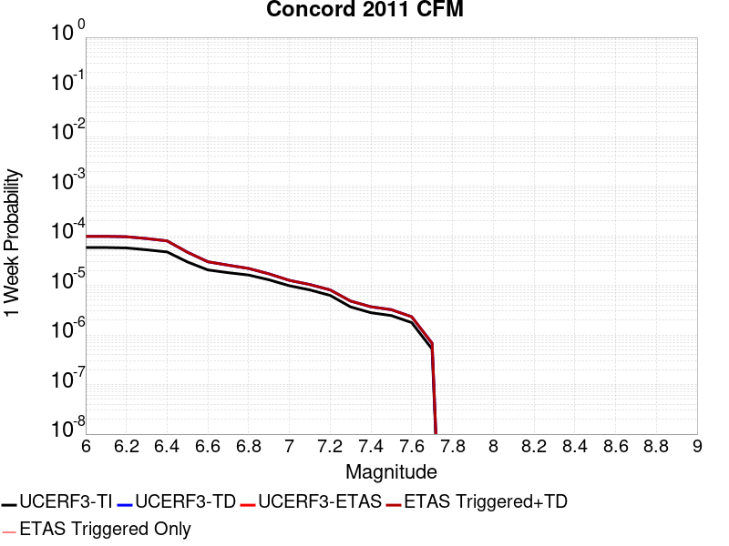 | 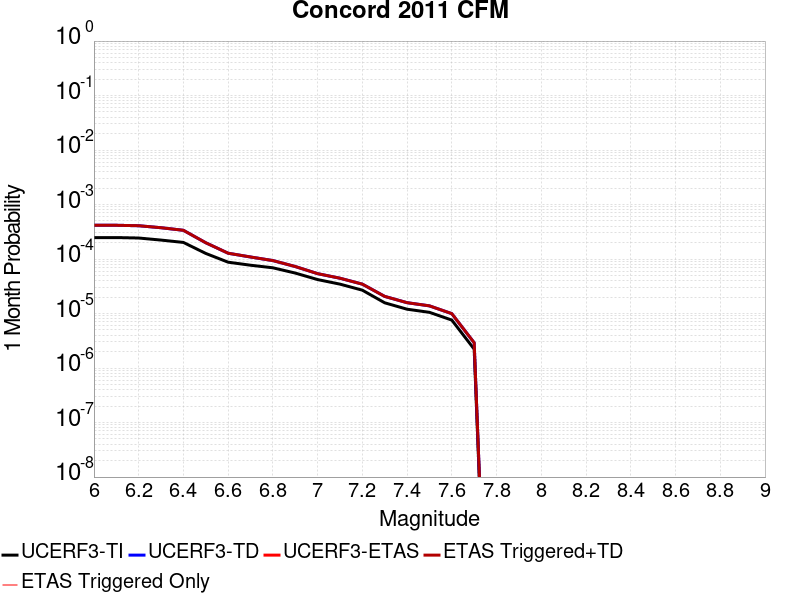 | 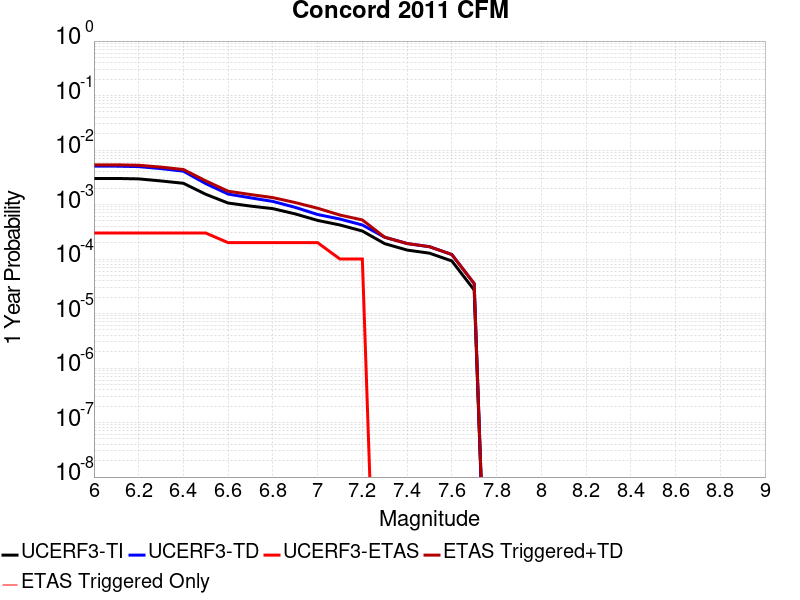 |  |

| Magnitude | 1 wk TI Prob | 1 wk TD Prob | 1 wk ETAS Prob | 1 wk ETAS/TD Gain | 1 wk ETAS Triggered+TD | 1 wk ETAS Triggered Only | 1 mo TI Prob | 1 mo TD Prob | 1 mo ETAS Prob | 1 mo ETAS/TD Gain | 1 mo ETAS Triggered+TD | 1 mo ETAS Triggered Only | 1 yr TI Prob | 1 yr TD Prob | 1 yr ETAS Prob | 1 yr ETAS/TD Gain | 1 yr ETAS Triggered+TD | 1 yr ETAS Triggered Only | 10 yr TI Prob | 10 yr TD Prob | 10 yr ETAS Prob | 10 yr ETAS/TD Gain | 10 yr ETAS Triggered+TD | 10 yr ETAS Triggered Only |
|-----|-----|-----|-----|-----|-----|-----|-----|-----|-----|-----|-----|-----|-----|-----|-----|-----|-----|-----|-----|-----|-----|-----|-----|-----|
| 6.0 | 5.7865112E-5 | 9.7227785E-5 | 0.0 | 0.0 | 9.7227785E-5 | 0.0 | 2.4796976E-4 | 4.166246E-4 | 0.0 | 0.0 | 4.166246E-4 | 0.0 | 0.0030148525 | 0.0050611263 | 0.0024 | 0.47420272 | 0.0058570774 | 8.0E-4 | 0.029742775 | 0.04907589 | 0.03 | 0.6112981 | 0.056968562 | 0.0083 |
| 6.1 | 5.7865112E-5 | 9.7227785E-5 | 0.0 | 0.0 | 9.7227785E-5 | 0.0 | 2.4796976E-4 | 4.166246E-4 | 0.0 | 0.0 | 4.166246E-4 | 0.0 | 0.0030148525 | 0.0050611263 | 0.0024 | 0.47420272 | 0.0058570774 | 8.0E-4 | 0.029742775 | 0.04907589 | 0.03 | 0.6112981 | 0.056968562 | 0.0083 |
| 6.2 | 5.6789337E-5 | 9.543774E-5 | 0.0 | 0.0 | 9.543774E-5 | 0.0 | 2.4336016E-4 | 4.0895652E-4 | 0.0 | 0.0 | 4.0895652E-4 | 0.0 | 0.0029588845 | 0.004968242 | 0.0024 | 0.48306826 | 0.0057642674 | 8.0E-4 | 0.029197963 | 0.04819583 | 0.0296 | 0.61416095 | 0.056000628 | 0.0082 |
| 6.3 | 5.203322E-5 | 8.771259E-5 | 0.0 | 0.0 | 8.771259E-5 | 0.0 | 2.2298045E-4 | 3.7586133E-4 | 0.0 | 0.0 | 3.7586133E-4 | 0.0 | 0.0027114071 | 0.004567288 | 0.0023 | 0.5035811 | 0.005264091 | 7.0E-4 | 0.026785625 | 0.044380765 | 0.0273 | 0.6151314 | 0.051930156 | 0.0079 |
| 6.4 | 4.7120942E-5 | 7.866446E-5 | 0.0 | 0.0 | 7.866446E-5 | 0.0 | 2.0193127E-4 | 3.37094E-4 | 0.0 | 0.0 | 3.37094E-4 | 0.0 | 0.0024557412 | 0.0040971357 | 0.002 | 0.48814592 | 0.0046946774 | 6.0E-4 | 0.024287801 | 0.039909057 | 0.0254 | 0.636447 | 0.04701373 | 0.0074 |
| 6.5 | 2.9598437E-5 | 4.6468846E-5 | 0.0 | 0.0 | 4.6468846E-5 | 0.0 | 1.2684427E-4 | 1.9913817E-4 | 0.0 | 0.0 | 1.9913817E-4 | 0.0 | 0.001543235 | 0.0024220194 | 0.0013 | 0.5367422 | 0.0029208083 | 5.0E-4 | 0.015325619 | 0.023813063 | 0.0163 | 0.68449825 | 0.028401142 | 0.0047 |
| 6.6 | 2.0443718E-5 | 2.9870673E-5 | 0.0 | 0.0 | 2.9870673E-5 | 0.0 | 8.7613E-5 | 1.2801109E-4 | 0.0 | 0.0 | 1.2801109E-4 | 0.0 | 0.0010661662 | 0.0015574567 | 0.001 | 0.64207244 | 0.0019568338 | 4.0E-4 | 0.010610655 | 0.015412929 | 0.0107 | 0.6942224 | 0.018563608 | 0.0032 |
| 6.7 | 1.798539E-5 | 2.5471327E-5 | 0.0 | 0.0 | 2.5471327E-5 | 0.0 | 7.7077966E-5 | 1.0915838E-4 | 0.0 | 0.0 | 1.0915838E-4 | 0.0 | 9.380202E-4 | 0.0013282145 | 7.0E-4 | 0.5270233 | 0.001627816 | 3.0E-4 | 0.009340706 | 0.013176453 | 0.0087 | 0.6602687 | 0.015840877 | 0.0027 |
| 6.8 | 1.613555E-5 | 2.1890408E-5 | 0.0 | 0.0 | 2.1890408E-5 | 0.0 | 6.915052E-5 | 9.381274E-5 | 0.0 | 0.0 | 9.381274E-5 | 0.0 | 8.4158237E-4 | 0.0011415855 | 7.0E-4 | 0.61318225 | 0.0014412431 | 3.0E-4 | 0.008384023 | 0.01134584 | 0.0076 | 0.66984904 | 0.01371861 | 0.0024 |
| 6.9 | 1.2916435E-5 | 1.7027736E-5 | 0.0 | 0.0 | 1.7027736E-5 | 0.0 | 5.5354973E-5 | 7.2974006E-5 | 0.0 | 0.0 | 7.2974006E-5 | 0.0 | 6.7373837E-4 | 8.8810216E-4 | 7.0E-4 | 0.7881976 | 0.0011878357 | 3.0E-4 | 0.006716994 | 0.00884014 | 0.0061 | 0.69003433 | 0.01082246 | 0.002 |
| 7.0 | 9.81129E-6 | 1.2596236E-5 | 0.0 | 0.0 | 1.2596236E-5 | 0.0 | 4.2047708E-5 | 5.398276E-5 | 0.0 | 0.0 | 5.398276E-5 | 0.0 | 5.118106E-4 | 6.5704354E-4 | 6.0E-4 | 0.9131815 | 8.569121E-4 | 2.0E-4 | 0.005106334 | 0.0065519335 | 0.0052 | 0.79365885 | 0.008141451 | 0.0016 |
| 7.1 | 8.0889195E-6 | 1.0385969E-5 | 0.0 | 0.0 | 1.0385969E-5 | 0.0 | 3.4666336E-5 | 4.4510547E-5 | 0.0 | 0.0 | 4.4510547E-5 | 0.0 | 4.219809E-4 | 5.417822E-4 | 4.0E-4 | 0.7383041 | 6.41728E-4 | 1.0E-4 | 0.004211805 | 0.0054050833 | 0.0044 | 0.8140485 | 0.0065985974 | 0.0012 |
| 7.2 | 6.267438E-6 | 8.088033E-6 | 0.0 | 0.0 | 8.088033E-6 | 0.0 | 2.6860173E-5 | 3.4662542E-5 | 0.0 | 0.0 | 3.4662542E-5 | 0.0 | 3.2697353E-4 | 4.2193543E-4 | 4.0E-4 | 0.9480123 | 5.2189326E-4 | 1.0E-4 | 0.0032649285 | 0.0042119 | 0.0038 | 0.9022057 | 0.005207688 | 0.001 |
| 7.3 | 3.6761196E-6 | 4.8197294E-6 | 0.0 | 0.0 | 4.8197294E-6 | 0.0 | 1.5754704E-5 | 2.0655822E-5 | 0.0 | 0.0 | 2.0655822E-5 | 0.0 | 1.9179663E-4 | 2.5145581E-4 | 1.0E-4 | 0.3976842 | 2.5145581E-4 | 0.0 | 0.0019163118 | 0.0025119635 | 0.0024 | 0.95542794 | 0.0031104563 | 6.0E-4 |
| 7.4 | 2.8044356E-6 | 3.6945266E-6 | 0.0 | 0.0 | 3.6945266E-6 | 0.0 | 1.2018954E-5 | 1.583359E-5 | 0.0 | 0.0 | 1.583359E-5 | 0.0 | 1.4632095E-4 | 1.9275701E-4 | 1.0E-4 | 0.51878786 | 1.9275701E-4 | 0.0 | 0.0014622464 | 0.0019260531 | 0.0019 | 0.9864733 | 0.00242509 | 5.0E-4 |
| 7.5 | 2.4578699E-6 | 3.2311568E-6 | 0.0 | 0.0 | 3.2311568E-6 | 0.0 | 1.0533685E-5 | 1.3847743E-5 | 0.0 | 0.0 | 1.3847743E-5 | 0.0 | 1.2824008E-4 | 1.6858333E-4 | 1.0E-4 | 0.59317845 | 1.6858333E-4 | 0.0 | 0.0012816609 | 0.001684676 | 0.0015 | 0.8903789 | 0.0019841706 | 3.0E-4 |
| 7.6 | 1.7713267E-6 | 2.3238626E-6 | 0.0 | 0.0 | 2.3238626E-6 | 0.0 | 7.591378E-6 | 9.9593735E-6 | 0.0 | 0.0 | 9.9593735E-6 | 0.0 | 9.2421105E-5 | 1.2124872E-4 | 0.0 | 0.0 | 1.2124872E-4 | 0.0 | 9.2382677E-4 | 0.0012119251 | 0.0013 | 1.0726736 | 0.0015115616 | 3.0E-4 |
| 7.7 | 5.1912366E-7 | 6.796827E-7 | 0.0 | 0.0 | 6.796827E-7 | 0.0 | 2.2248137E-6 | 2.9129228E-6 | 0.0 | 0.0 | 2.9129228E-6 | 0.0 | 2.708677E-5 | 3.5464273E-5 | 0.0 | 0.0 | 3.5464273E-5 | 0.0 | 2.708347E-4 | 3.5461446E-4 | 1.0E-4 | 0.2819964 | 3.5461446E-4 | 0.0 |

## Hunting Creek - Bartlett Springs connector 2011
*[(top)](#table-of-contents)*

| 1 Week | 1 Month | 1 Year | 10 Year |
|-----|-----|-----|-----|
| 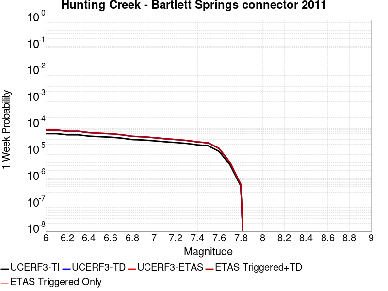 | 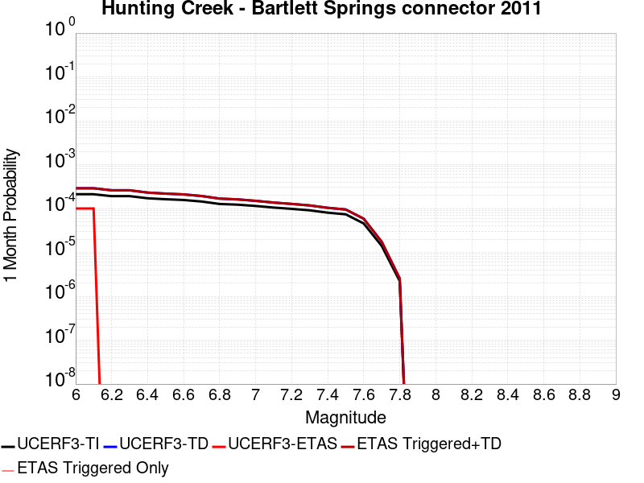 | 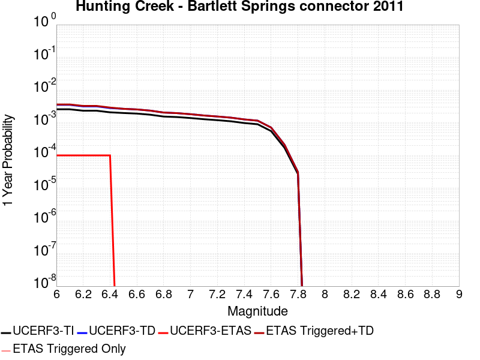 | 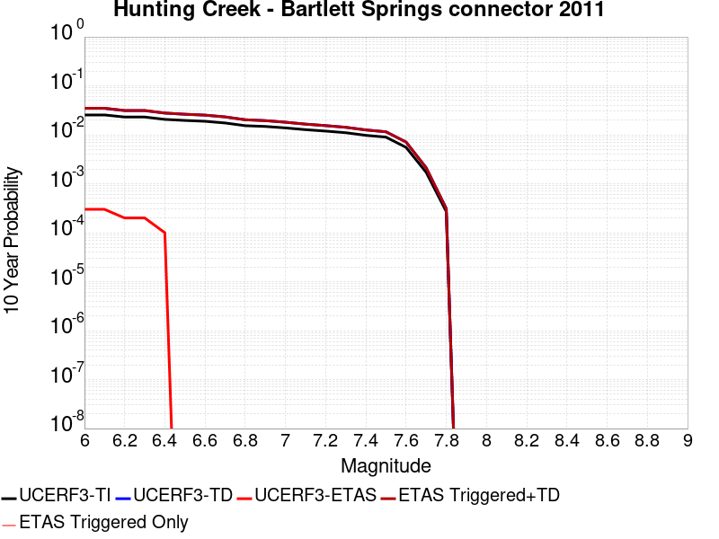 |

| Magnitude | 1 wk TI Prob | 1 wk TD Prob | 1 wk ETAS Prob | 1 wk ETAS/TD Gain | 1 wk ETAS Triggered+TD | 1 wk ETAS Triggered Only | 1 mo TI Prob | 1 mo TD Prob | 1 mo ETAS Prob | 1 mo ETAS/TD Gain | 1 mo ETAS Triggered+TD | 1 mo ETAS Triggered Only | 1 yr TI Prob | 1 yr TD Prob | 1 yr ETAS Prob | 1 yr ETAS/TD Gain | 1 yr ETAS Triggered+TD | 1 yr ETAS Triggered Only | 10 yr TI Prob | 10 yr TD Prob | 10 yr ETAS Prob | 10 yr ETAS/TD Gain | 10 yr ETAS Triggered+TD | 10 yr ETAS Triggered Only |
|-----|-----|-----|-----|-----|-----|-----|-----|-----|-----|-----|-----|-----|-----|-----|-----|-----|-----|-----|-----|-----|-----|-----|-----|-----|
| 6.0 | 4.940016E-5 | 6.7636094E-5 | 0.0 | 0.0 | 6.7636094E-5 | 0.0 | 2.1169778E-4 | 2.8983652E-4 | 1.0E-4 | 0.34502208 | 2.8983652E-4 | 0.0 | 0.002574374 | 0.003522902 | 0.0028 | 0.79479927 | 0.004519379 | 0.001 | 0.025447546 | 0.03465753 | 0.0275 | 0.7934783 | 0.042187203 | 0.0078 |
| 6.1 | 4.940016E-5 | 6.7636094E-5 | 0.0 | 0.0 | 6.7636094E-5 | 0.0 | 2.1169778E-4 | 2.8983652E-4 | 1.0E-4 | 0.34502208 | 2.8983652E-4 | 0.0 | 0.002574374 | 0.003522902 | 0.0028 | 0.79479927 | 0.004519379 | 0.001 | 0.025447546 | 0.03465753 | 0.0275 | 0.7934783 | 0.042187203 | 0.0078 |
| 6.2 | 4.472471E-5 | 6.0799062E-5 | 0.0 | 0.0 | 6.0799062E-5 | 0.0 | 1.9166325E-4 | 2.6054154E-4 | 0.0 | 0.0 | 2.6054154E-4 | 0.0 | 0.0023310026 | 0.0031673922 | 0.0022 | 0.6945777 | 0.0039648586 | 8.0E-4 | 0.02306703 | 0.031213867 | 0.0229 | 0.7336483 | 0.037898492 | 0.0069 |
| 6.3 | 4.472471E-5 | 6.0799062E-5 | 0.0 | 0.0 | 6.0799062E-5 | 0.0 | 1.9166325E-4 | 2.6054154E-4 | 0.0 | 0.0 | 2.6054154E-4 | 0.0 | 0.0023310026 | 0.0031673922 | 0.0022 | 0.6945777 | 0.0039648586 | 8.0E-4 | 0.02306703 | 0.031213867 | 0.0229 | 0.7336483 | 0.037898492 | 0.0069 |
| 6.4 | 4.0001003E-5 | 5.3926353E-5 | 0.0 | 0.0 | 5.3926353E-5 | 0.0 | 1.714216E-4 | 2.3109278E-4 | 0.0 | 0.0 | 2.3109278E-4 | 0.0 | 0.0020850603 | 0.002809889 | 0.0018 | 0.6405947 | 0.003408203 | 6.0E-4 | 0.02065605 | 0.027738636 | 0.0185 | 0.6669398 | 0.03337775 | 0.0058 |
| 6.5 | 3.8033053E-5 | 5.1099152E-5 | 0.0 | 0.0 | 5.1099152E-5 | 0.0 | 1.6298861E-4 | 2.1897825E-4 | 0.0 | 0.0 | 2.1897825E-4 | 0.0 | 0.0019825802 | 0.0026627893 | 0.0016 | 0.60087365 | 0.003161458 | 5.0E-4 | 0.019649856 | 0.026306137 | 0.0165 | 0.62723005 | 0.031174606 | 0.005 |
| 6.6 | 3.653754E-5 | 4.897064E-5 | 0.0 | 0.0 | 4.897064E-5 | 0.0 | 1.5658008E-4 | 2.0985756E-4 | 0.0 | 0.0 | 2.0985756E-4 | 0.0 | 0.0019046954 | 0.0025520264 | 0.0015 | 0.5877682 | 0.0030507504 | 5.0E-4 | 0.018884527 | 0.025226098 | 0.0154 | 0.61047894 | 0.029710056 | 0.0046 |
| 6.7 | 3.372024E-5 | 4.4996686E-5 | 0.0 | 0.0 | 4.4996686E-5 | 0.0 | 1.4450731E-4 | 1.928289E-4 | 0.0 | 0.0 | 1.928289E-4 | 0.0 | 0.0017579567 | 0.0023451848 | 0.0013 | 0.55432737 | 0.0026444811 | 3.0E-4 | 0.017441148 | 0.023205193 | 0.0139 | 0.59900385 | 0.027112372 | 0.004 |
| 6.8 | 2.9650024E-5 | 3.929196E-5 | 0.0 | 0.0 | 3.929196E-5 | 0.0 | 1.2706534E-4 | 1.6838325E-4 | 0.0 | 0.0 | 1.6838325E-4 | 0.0 | 0.0015459227 | 0.0020481308 | 0.001 | 0.48825008 | 0.0022477212 | 2.0E-4 | 0.015352124 | 0.020290205 | 0.0112 | 0.55199045 | 0.023327306 | 0.0031 |
| 6.9 | 2.860775E-5 | 3.7701204E-5 | 0.0 | 0.0 | 3.7701204E-5 | 0.0 | 1.2259888E-4 | 1.6156661E-4 | 0.0 | 0.0 | 1.6156661E-4 | 0.0 | 0.0014916194 | 0.0019653058 | 0.001 | 0.5088267 | 0.0021649126 | 2.0E-4 | 0.014816469 | 0.019478736 | 0.0106 | 0.54418314 | 0.0224203 | 0.003 |
| 7.0 | 2.6696067E-5 | 3.4966903E-5 | 0.0 | 0.0 | 3.4966903E-5 | 0.0 | 1.144067E-4 | 1.4984961E-4 | 0.0 | 0.0 | 1.4984961E-4 | 0.0 | 0.0013920115 | 0.0018229008 | 0.001 | 0.5485762 | 0.0020225362 | 2.0E-4 | 0.013833242 | 0.01808013 | 0.0099 | 0.5475625 | 0.020731313 | 0.0027 |
| 7.1 | 2.456087E-5 | 3.1925734E-5 | 0.0 | 0.0 | 3.1925734E-5 | 0.0 | 1.0525662E-4 | 1.3681744E-4 | 0.0 | 0.0 | 1.3681744E-4 | 0.0 | 0.001280746 | 0.0016644886 | 9.0E-4 | 0.54070663 | 0.0018641558 | 2.0E-4 | 0.012733897 | 0.016521595 | 0.0091 | 0.55079424 | 0.018980293 | 0.0025 |
| 7.2 | 2.295761E-5 | 2.9741363E-5 | 0.0 | 0.0 | 2.9741363E-5 | 0.0 | 9.8386045E-5 | 1.274568E-4 | 0.0 | 0.0 | 1.274568E-4 | 0.0 | 0.0011971919 | 0.0015506912 | 8.0E-4 | 0.515899 | 0.0017503811 | 2.0E-4 | 0.011907627 | 0.015400236 | 0.0083 | 0.5389528 | 0.017566355 | 0.0022 |
| 7.3 | 2.1256936E-5 | 2.7465583E-5 | 0.0 | 0.0 | 2.7465583E-5 | 0.0 | 9.109797E-5 | 1.1770438E-4 | 0.0 | 0.0 | 1.1770438E-4 | 0.0 | 0.0011085535 | 0.0014321175 | 7.0E-4 | 0.48878667 | 0.0016318312 | 2.0E-4 | 0.011030397 | 0.014230171 | 0.0077 | 0.54110384 | 0.016300287 | 0.0021 |
| 7.4 | 1.8784336E-5 | 2.4240306E-5 | 0.0 | 0.0 | 2.4240306E-5 | 0.0 | 8.050181E-5 | 1.03882936E-4 | 0.0 | 0.0 | 1.03882936E-4 | 0.0 | 9.796688E-4 | 0.0012640484 | 7.0E-4 | 0.55377626 | 0.0014637957 | 2.0E-4 | 0.009753612 | 0.01256961 | 0.0066 | 0.525076 | 0.01454447 | 0.002 |
| 7.5 | 1.7248298E-5 | 2.2208003E-5 | 0.0 | 0.0 | 2.2208003E-5 | 0.0 | 7.391918E-5 | 9.5173724E-5 | 0.0 | 0.0 | 9.5173724E-5 | 0.0 | 8.9959445E-4 | 0.0011581316 | 7.0E-4 | 0.6044218 | 0.0013579 | 2.0E-4 | 0.008959615 | 0.011521938 | 0.0061 | 0.5294248 | 0.013301199 | 0.0018 |
| 7.6 | 1.0653709E-5 | 1.36851195E-5 | 0.0 | 0.0 | 1.36851195E-5 | 0.0 | 4.5657955E-5 | 5.864921E-5 | 0.0 | 0.0 | 5.864921E-5 | 0.0 | 5.557438E-4 | 7.138229E-4 | 4.0E-4 | 0.5603631 | 8.137515E-4 | 1.0E-4 | 0.0055435603 | 0.0071156183 | 0.0039 | 0.5480901 | 0.008207791 | 0.0011 |
| 7.7 | 3.286316E-6 | 4.079729E-6 | 0.0 | 0.0 | 4.079729E-6 | 0.0 | 1.4084137E-5 | 1.7484437E-5 | 0.0 | 0.0 | 1.7484437E-5 | 0.0 | 1.7146087E-4 | 2.1285238E-4 | 0.0 | 0.0 | 2.1285238E-4 | 0.0 | 0.0017132863 | 0.002126546 | 5.0E-4 | 0.23512304 | 0.0022263336 | 1.0E-4 |
| 7.8 | 5.1855085E-7 | 5.9636176E-7 | 0.0 | 0.0 | 5.9636176E-7 | 0.0 | 2.222359E-6 | 2.5558336E-6 | 0.0 | 0.0 | 2.5558336E-6 | 0.0 | 2.7056883E-5 | 3.111684E-5 | 0.0 | 0.0 | 3.111684E-5 | 0.0 | 2.705359E-4 | 3.1113403E-4 | 1.0E-4 | 0.3214049 | 3.1113403E-4 | 0.0 |

## Cady
*[(top)](#table-of-contents)*

| 1 Week | 1 Month | 1 Year | 10 Year |
|-----|-----|-----|-----|
| 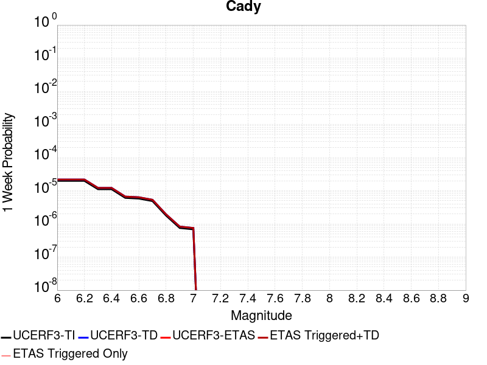 | 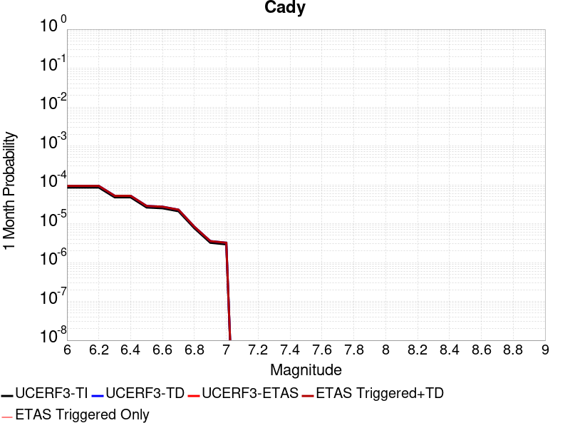 | 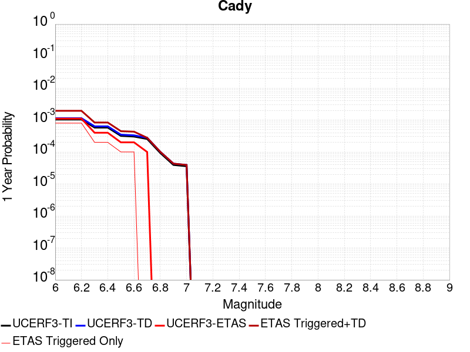 | 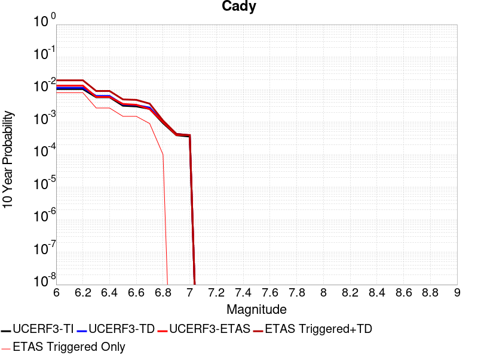 |

| Magnitude | 1 wk TI Prob | 1 wk TD Prob | 1 wk ETAS Prob | 1 wk ETAS/TD Gain | 1 wk ETAS Triggered+TD | 1 wk ETAS Triggered Only | 1 mo TI Prob | 1 mo TD Prob | 1 mo ETAS Prob | 1 mo ETAS/TD Gain | 1 mo ETAS Triggered+TD | 1 mo ETAS Triggered Only | 1 yr TI Prob | 1 yr TD Prob | 1 yr ETAS Prob | 1 yr ETAS/TD Gain | 1 yr ETAS Triggered+TD | 1 yr ETAS Triggered Only | 10 yr TI Prob | 10 yr TD Prob | 10 yr ETAS Prob | 10 yr ETAS/TD Gain | 10 yr ETAS Triggered+TD | 10 yr ETAS Triggered Only |
|-----|-----|-----|-----|-----|-----|-----|-----|-----|-----|-----|-----|-----|-----|-----|-----|-----|-----|-----|-----|-----|-----|-----|-----|-----|
| 6.0 | 1.9892565E-5 | 2.1836178E-5 | 0.0 | 0.0 | 2.1836178E-5 | 0.0 | 8.525106E-5 | 9.358078E-5 | 0.0 | 0.0 | 9.358078E-5 | 0.0 | 0.0010374374 | 0.0011388412 | 0.0011 | 0.96589416 | 0.00193793 | 8.0E-4 | 0.010326075 | 0.011339046 | 0.0132 | 1.1641191 | 0.019248333 | 0.008 |
| 6.1 | 1.9892565E-5 | 2.1836178E-5 | 0.0 | 0.0 | 2.1836178E-5 | 0.0 | 8.525106E-5 | 9.358078E-5 | 0.0 | 0.0 | 9.358078E-5 | 0.0 | 0.0010374374 | 0.0011388412 | 0.0011 | 0.96589416 | 0.00193793 | 8.0E-4 | 0.010326075 | 0.011339046 | 0.0132 | 1.1641191 | 0.019248333 | 0.008 |
| 6.2 | 1.9892565E-5 | 2.1836178E-5 | 0.0 | 0.0 | 2.1836178E-5 | 0.0 | 8.525106E-5 | 9.358078E-5 | 0.0 | 0.0 | 9.358078E-5 | 0.0 | 0.0010374374 | 0.0011388412 | 0.0011 | 0.96589416 | 0.00193793 | 8.0E-4 | 0.010326075 | 0.011339046 | 0.0132 | 1.1641191 | 0.019248333 | 0.008 |
| 6.3 | 1.1117327E-5 | 1.2164474E-5 | 0.0 | 0.0 | 1.2164474E-5 | 0.0 | 4.764482E-5 | 5.2132596E-5 | 0.0 | 0.0 | 5.2132596E-5 | 0.0 | 5.7992124E-4 | 6.3456094E-4 | 4.0E-4 | 0.6303571 | 8.3443406E-4 | 2.0E-4 | 0.0057841022 | 0.0063305898 | 0.0059 | 0.93198264 | 0.009013497 | 0.0027 |
| 6.4 | 1.1117327E-5 | 1.2164474E-5 | 0.0 | 0.0 | 1.2164474E-5 | 0.0 | 4.764482E-5 | 5.2132596E-5 | 0.0 | 0.0 | 5.2132596E-5 | 0.0 | 5.7992124E-4 | 6.3456094E-4 | 4.0E-4 | 0.6303571 | 8.3443406E-4 | 2.0E-4 | 0.0057841022 | 0.0063305898 | 0.0059 | 0.93198264 | 0.009013497 | 0.0027 |
| 6.5 | 6.103093E-6 | 6.665527E-6 | 0.0 | 0.0 | 6.665527E-6 | 0.0 | 2.615585E-5 | 2.8566303E-5 | 0.0 | 0.0 | 2.8566303E-5 | 0.0 | 3.1840094E-4 | 3.4775175E-4 | 2.0E-4 | 0.5751229 | 4.4771697E-4 | 1.0E-4 | 0.0031794512 | 0.0034733072 | 0.0036 | 1.0364761 | 0.0049680974 | 0.0015 |
| 6.6 | 5.817237E-6 | 6.3593943E-6 | 0.0 | 0.0 | 6.3593943E-6 | 0.0 | 2.4930776E-5 | 2.7254331E-5 | 0.0 | 0.0 | 2.7254331E-5 | 0.0 | 3.034899E-4 | 3.3178338E-4 | 2.0E-4 | 0.60280293 | 4.317502E-4 | 1.0E-4 | 0.0030307577 | 0.0033141 | 0.0034 | 1.0259196 | 0.004809129 | 0.0015 |
| 6.7 | 4.8846314E-6 | 5.335364E-6 | 0.0 | 0.0 | 5.335364E-6 | 0.0 | 2.0933967E-5 | 2.2865712E-5 | 0.0 | 0.0 | 2.2865712E-5 | 0.0 | 2.5484123E-4 | 2.7836623E-4 | 1.0E-4 | 0.35923895 | 2.7836623E-4 | 0.0 | 0.0025454918 | 0.0027813287 | 0.0025 | 0.898851 | 0.0036788255 | 9.0E-4 |
| 6.8 | 1.7788773E-6 | 1.9380745E-6 | 0.0 | 0.0 | 1.9380745E-6 | 0.0 | 7.6237375E-6 | 8.306017E-6 | 0.0 | 0.0 | 8.306017E-6 | 0.0 | 9.281505E-5 | 1.01122634E-4 | 0.0 | 0.0 | 1.01122634E-4 | 0.0 | 9.2776294E-4 | 0.0010109205 | 0.001 | 0.98919743 | 0.0011108194 | 1.0E-4 |
| 6.9 | 7.5455404E-7 | 8.2884713E-7 | 0.0 | 0.0 | 8.2884713E-7 | 0.0 | 3.233799E-6 | 3.5521991E-6 | 0.0 | 0.0 | 3.5521991E-6 | 0.0 | 3.937079E-5 | 4.3247503E-5 | 0.0 | 0.0 | 4.3247503E-5 | 0.0 | 3.9363815E-4 | 4.3242372E-4 | 4.0E-4 | 0.9250186 | 4.3242372E-4 | 0.0 |
| 7.0 | 6.8578805E-7 | 7.53397E-7 | 0.0 | 0.0 | 7.53397E-7 | 0.0 | 2.9390883E-6 | 3.2288422E-6 | 0.0 | 0.0 | 3.2288422E-6 | 0.0 | 3.578281E-5 | 3.9310773E-5 | 0.0 | 0.0 | 3.9310773E-5 | 0.0 | 3.577705E-4 | 3.930706E-4 | 4.0E-4 | 1.0176289 | 3.930706E-4 | 0.0 |

## Pinto Mtn
*[(top)](#table-of-contents)*

| 1 Week | 1 Month | 1 Year | 10 Year |
|-----|-----|-----|-----|
| 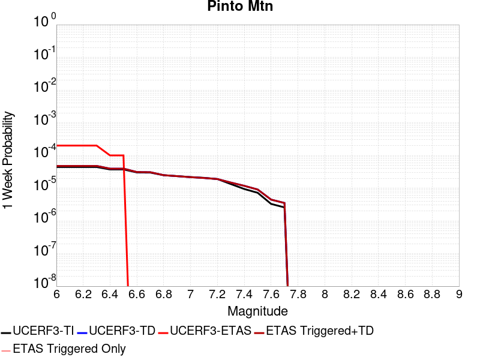 |  | 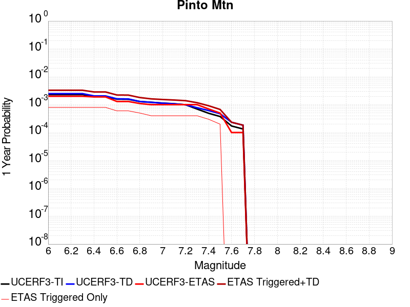 |  |

| Magnitude | 1 wk TI Prob | 1 wk TD Prob | 1 wk ETAS Prob | 1 wk ETAS/TD Gain | 1 wk ETAS Triggered+TD | 1 wk ETAS Triggered Only | 1 mo TI Prob | 1 mo TD Prob | 1 mo ETAS Prob | 1 mo ETAS/TD Gain | 1 mo ETAS Triggered+TD | 1 mo ETAS Triggered Only | 1 yr TI Prob | 1 yr TD Prob | 1 yr ETAS Prob | 1 yr ETAS/TD Gain | 1 yr ETAS Triggered+TD | 1 yr ETAS Triggered Only | 10 yr TI Prob | 10 yr TD Prob | 10 yr ETAS Prob | 10 yr ETAS/TD Gain | 10 yr ETAS Triggered+TD | 10 yr ETAS Triggered Only |
|-----|-----|-----|-----|-----|-----|-----|-----|-----|-----|-----|-----|-----|-----|-----|-----|-----|-----|-----|-----|-----|-----|-----|-----|-----|
| 6.0 | 4.4194956E-5 | 4.7720834E-5 | 2.0E-4 | 4.1910415 | 4.7720834E-5 | 0.0 | 1.893932E-4 | 2.0450275E-4 | 2.0E-4 | 0.977982 | 2.0450275E-4 | 0.0 | 0.0023034236 | 0.002487141 | 0.002 | 0.80413616 | 0.0032851512 | 8.0E-4 | 0.022796938 | 0.024610516 | 0.0202 | 0.8207874 | 0.031730857 | 0.0073 |
| 6.1 | 4.4194956E-5 | 4.7720834E-5 | 2.0E-4 | 4.1910415 | 4.7720834E-5 | 0.0 | 1.893932E-4 | 2.0450275E-4 | 2.0E-4 | 0.977982 | 2.0450275E-4 | 0.0 | 0.0023034236 | 0.002487141 | 0.002 | 0.80413616 | 0.0032851512 | 8.0E-4 | 0.022796938 | 0.024610516 | 0.0202 | 0.8207874 | 0.031730857 | 0.0073 |
| 6.2 | 4.4194956E-5 | 4.7720834E-5 | 2.0E-4 | 4.1910415 | 4.7720834E-5 | 0.0 | 1.893932E-4 | 2.0450275E-4 | 2.0E-4 | 0.977982 | 2.0450275E-4 | 0.0 | 0.0023034236 | 0.002487141 | 0.002 | 0.80413616 | 0.0032851512 | 8.0E-4 | 0.022796938 | 0.024610516 | 0.0202 | 0.8207874 | 0.031730857 | 0.0073 |
| 6.3 | 4.4194956E-5 | 4.7720834E-5 | 2.0E-4 | 4.1910415 | 4.7720834E-5 | 0.0 | 1.893932E-4 | 2.0450275E-4 | 2.0E-4 | 0.977982 | 2.0450275E-4 | 0.0 | 0.0023034236 | 0.002487141 | 0.002 | 0.80413616 | 0.0032851512 | 8.0E-4 | 0.022796938 | 0.024610516 | 0.0202 | 0.8207874 | 0.031730857 | 0.0073 |
| 6.4 | 3.729929E-5 | 3.948728E-5 | 1.0E-4 | 2.5324612 | 3.948728E-5 | 0.0 | 1.5984432E-4 | 1.6922074E-4 | 1.0E-4 | 0.5909441 | 1.6922074E-4 | 0.0 | 0.0019443673 | 0.0020584087 | 0.0019 | 0.92304313 | 0.002856762 | 8.0E-4 | 0.019274427 | 0.020403415 | 0.0167 | 0.8184904 | 0.027162632 | 0.0069 |
| 6.5 | 3.729929E-5 | 3.948728E-5 | 1.0E-4 | 2.5324612 | 3.948728E-5 | 0.0 | 1.5984432E-4 | 1.6922074E-4 | 1.0E-4 | 0.5909441 | 1.6922074E-4 | 0.0 | 0.0019443673 | 0.0020584087 | 0.0019 | 0.92304313 | 0.002856762 | 8.0E-4 | 0.019274427 | 0.020403415 | 0.0167 | 0.8184904 | 0.027162632 | 0.0069 |
| 6.6 | 3.0204548E-5 | 3.110548E-5 | 0.0 | 0.0 | 3.110548E-5 | 0.0 | 1.2944164E-4 | 1.3330257E-4 | 0.0 | 0.0 | 1.3330257E-4 | 0.0 | 0.0015748127 | 0.0016217852 | 0.0013 | 0.8015858 | 0.002220812 | 6.0E-4 | 0.015636992 | 0.01610335 | 0.013 | 0.8072855 | 0.02171156 | 0.0057 |
| 6.7 | 2.9857754E-5 | 3.071538E-5 | 0.0 | 0.0 | 3.071538E-5 | 0.0 | 1.2795553E-4 | 1.3163088E-4 | 0.0 | 0.0 | 1.3163088E-4 | 0.0 | 0.0015567453 | 0.0016014624 | 0.0013 | 0.8117581 | 0.0022005015 | 6.0E-4 | 0.015458848 | 0.015903043 | 0.0129 | 0.8111655 | 0.021512395 | 0.0057 |
| 6.8 | 2.4819734E-5 | 2.491932E-5 | 0.0 | 0.0 | 2.491932E-5 | 0.0 | 1.0636595E-4 | 1.0679283E-4 | 0.0 | 0.0 | 1.0679283E-4 | 0.0 | 0.0012942362 | 0.0012994488 | 0.0011 | 0.84651273 | 0.0017987991 | 5.0E-4 | 0.012867244 | 0.012920861 | 0.0106 | 0.8203787 | 0.017560134 | 0.0047 |
| 6.9 | 2.331124E-5 | 2.3249495E-5 | 0.0 | 0.0 | 2.3249495E-5 | 0.0 | 9.990149E-5 | 9.963701E-5 | 0.0 | 0.0 | 9.963701E-5 | 0.0 | 0.001215622 | 0.0012124258 | 0.001 | 0.8247928 | 0.0016119408 | 4.0E-4 | 0.012089936 | 0.012060293 | 0.0099 | 0.8208756 | 0.016506022 | 0.0045 |
| 7.0 | 2.1818534E-5 | 2.1674205E-5 | 0.0 | 0.0 | 2.1674205E-5 | 0.0 | 9.3504656E-5 | 9.288626E-5 | 0.0 | 0.0 | 9.288626E-5 | 0.0 | 0.0011378246 | 0.0011303232 | 0.001 | 0.8847027 | 0.001529871 | 4.0E-4 | 0.011320163 | 0.011247833 | 0.0092 | 0.8179353 | 0.015400592 | 0.0042 |
| 7.1 | 2.066081E-5 | 2.0455356E-5 | 0.0 | 0.0 | 2.0455356E-5 | 0.0 | 8.854332E-5 | 8.766297E-5 | 0.0 | 0.0 | 8.766297E-5 | 0.0 | 0.0010774818 | 0.0010667936 | 0.001 | 0.9373884 | 0.0014663669 | 4.0E-4 | 0.010722724 | 0.010618767 | 0.009 | 0.84755605 | 0.014774168 | 0.0042 |
| 7.2 | 1.8990233E-5 | 1.8971818E-5 | 0.0 | 0.0 | 1.8971818E-5 | 0.0 | 8.138417E-5 | 8.130536E-5 | 0.0 | 0.0 | 8.130536E-5 | 0.0 | 9.904018E-4 | 9.894625E-4 | 0.001 | 1.0106498 | 0.0013890667 | 4.0E-4 | 0.009859995 | 0.009852559 | 0.0083 | 0.8424207 | 0.01361512 | 0.0038 |
| 7.3 | 1.3335872E-5 | 1.4832578E-5 | 0.0 | 0.0 | 1.4832578E-5 | 0.0 | 5.7152483E-5 | 6.356672E-5 | 0.0 | 0.0 | 6.356672E-5 | 0.0 | 6.956093E-4 | 7.7366264E-4 | 0.001 | 1.2925531 | 0.0011733532 | 4.0E-4 | 0.006934359 | 0.0077109854 | 0.0072 | 0.9337328 | 0.010787081 | 0.0031 |
| 7.4 | 9.414066E-6 | 1.1790612E-5 | 0.0 | 0.0 | 1.1790612E-5 | 0.0 | 4.0345374E-5 | 5.0530267E-5 | 0.0 | 0.0 | 5.0530267E-5 | 0.0 | 4.910942E-4 | 6.150417E-4 | 7.0E-4 | 1.1381341 | 9.148572E-4 | 3.0E-4 | 0.0049001034 | 0.006134338 | 0.0052 | 0.8476872 | 0.008420229 | 0.0023 |
| 7.5 | 7.2101157E-6 | 9.0914455E-6 | 0.0 | 0.0 | 9.0914455E-6 | 0.0 | 3.090013E-5 | 3.89628E-5 | 0.0 | 0.0 | 3.89628E-5 | 0.0 | 3.7614413E-4 | 4.7427657E-4 | 5.0E-4 | 1.0542371 | 6.7418173E-4 | 2.0E-4 | 0.0037550807 | 0.004733414 | 0.0034 | 0.7182976 | 0.006027261 | 0.0013 |
| 7.6 | 3.296375E-6 | 4.4818053E-6 | 0.0 | 0.0 | 4.4818053E-6 | 0.0 | 1.4127245E-5 | 1.9207604E-5 | 0.0 | 0.0 | 1.9207604E-5 | 0.0 | 1.7198564E-4 | 2.3382882E-4 | 1.0E-4 | 0.42766327 | 2.3382882E-4 | 0.0 | 0.0017185259 | 0.0023359607 | 0.002 | 0.85617876 | 0.0030343255 | 7.0E-4 |
| 7.7 | 2.5741092E-6 | 3.5248079E-6 | 0.0 | 0.0 | 3.5248079E-6 | 0.0 | 1.103185E-5 | 1.5106239E-5 | 0.0 | 0.0 | 1.5106239E-5 | 0.0 | 1.3430449E-4 | 1.8390421E-4 | 1.0E-4 | 0.5437614 | 1.8390421E-4 | 0.0 | 0.0013422335 | 0.0018376457 | 0.0015 | 0.8162618 | 0.002436543 | 6.0E-4 |

## San Diego Trough south
*[(top)](#table-of-contents)*

| 1 Week | 1 Month | 1 Year | 10 Year |
|-----|-----|-----|-----|
| 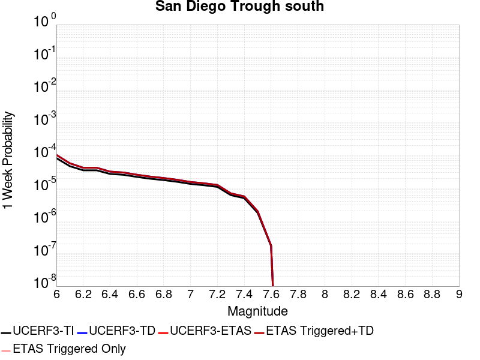 | 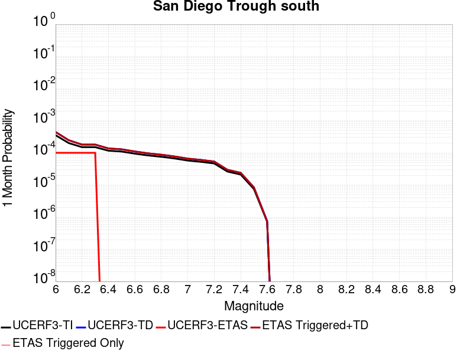 | 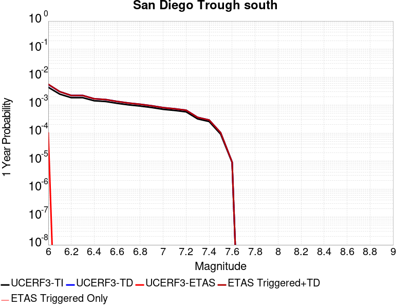 | 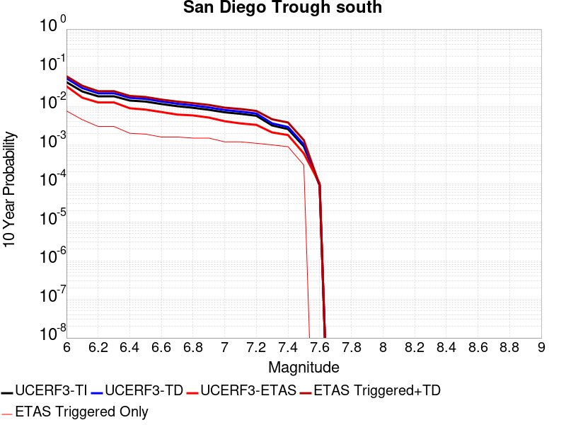 |

| Magnitude | 1 wk TI Prob | 1 wk TD Prob | 1 wk ETAS Prob | 1 wk ETAS/TD Gain | 1 wk ETAS Triggered+TD | 1 wk ETAS Triggered Only | 1 mo TI Prob | 1 mo TD Prob | 1 mo ETAS Prob | 1 mo ETAS/TD Gain | 1 mo ETAS Triggered+TD | 1 mo ETAS Triggered Only | 1 yr TI Prob | 1 yr TD Prob | 1 yr ETAS Prob | 1 yr ETAS/TD Gain | 1 yr ETAS Triggered+TD | 1 yr ETAS Triggered Only | 10 yr TI Prob | 10 yr TD Prob | 10 yr ETAS Prob | 10 yr ETAS/TD Gain | 10 yr ETAS Triggered+TD | 10 yr ETAS Triggered Only |
|-----|-----|-----|-----|-----|-----|-----|-----|-----|-----|-----|-----|-----|-----|-----|-----|-----|-----|-----|-----|-----|-----|-----|-----|-----|
| 6.0 | 8.279495E-5 | 1.0398335E-4 | 0.0 | 0.0 | 1.0398335E-4 | 0.0 | 3.5478722E-4 | 4.4557097E-4 | 1.0E-4 | 0.22443113 | 4.4557097E-4 | 0.0 | 0.004310982 | 0.0054117716 | 0.0031 | 0.5728253 | 0.00640636 | 0.001 | 0.042283054 | 0.052859753 | 0.033 | 0.6242935 | 0.06005802 | 0.0076 |
| 6.1 | 4.6961468E-5 | 5.7593406E-5 | 0.0 | 0.0 | 5.7593406E-5 | 0.0 | 2.0124791E-4 | 2.4680578E-4 | 1.0E-4 | 0.40517688 | 2.4680578E-4 | 0.0 | 0.00244744 | 0.0030007784 | 0.0017 | 0.5665197 | 0.0036986778 | 7.0E-4 | 0.024206603 | 0.029610973 | 0.0167 | 0.5639801 | 0.033977725 | 0.0045 |
| 6.2 | 3.5079658E-5 | 4.2053834E-5 | 0.0 | 0.0 | 4.2053834E-5 | 0.0 | 1.5033272E-4 | 1.8021835E-4 | 1.0E-4 | 0.5548824 | 1.8021835E-4 | 0.0 | 0.0018287642 | 0.0021919683 | 0.0016 | 0.72993755 | 0.0028904339 | 7.0E-4 | 0.018137876 | 0.021706074 | 0.0126 | 0.58048266 | 0.024640957 | 0.003 |
| 6.3 | 3.5079658E-5 | 4.2053834E-5 | 0.0 | 0.0 | 4.2053834E-5 | 0.0 | 1.5033272E-4 | 1.8021835E-4 | 1.0E-4 | 0.5548824 | 1.8021835E-4 | 0.0 | 0.0018287642 | 0.0021919683 | 0.0016 | 0.72993755 | 0.0028904339 | 7.0E-4 | 0.018137876 | 0.021706074 | 0.0126 | 0.58048266 | 0.024640957 | 0.003 |
| 6.4 | 2.7196904E-5 | 3.2026568E-5 | 0.0 | 0.0 | 3.2026568E-5 | 0.0 | 1.16552954E-4 | 1.372496E-4 | 0.0 | 0.0 | 1.372496E-4 | 0.0 | 0.0014181085 | 0.0016697448 | 0.0011 | 0.6587833 | 0.002268743 | 6.0E-4 | 0.014090929 | 0.016573627 | 0.0089 | 0.53699774 | 0.01854048 | 0.002 |
| 6.5 | 2.5584688E-5 | 3.004582E-5 | 0.0 | 0.0 | 3.004582E-5 | 0.0 | 1.0964406E-4 | 1.2876153E-4 | 0.0 | 0.0 | 1.2876153E-4 | 0.0 | 0.0013340989 | 0.0015665563 | 0.001 | 0.63834286 | 0.0020657731 | 5.0E-4 | 0.013261181 | 0.0155567005 | 0.0082 | 0.527104 | 0.017427143 | 0.0019 |
| 6.6 | 2.2034688E-5 | 2.5697242E-5 | 0.0 | 0.0 | 2.5697242E-5 | 0.0 | 9.443096E-5 | 1.10126435E-4 | 0.0 | 0.0 | 1.10126435E-4 | 0.0 | 0.0011490905 | 0.0013399721 | 8.0E-4 | 0.59702736 | 0.0017394362 | 4.0E-4 | 0.011431668 | 0.0133199245 | 0.0071 | 0.53303605 | 0.014898613 | 0.0016 |
| 6.7 | 1.9394853E-5 | 2.2503391E-5 | 0.0 | 0.0 | 2.2503391E-5 | 0.0 | 8.311815E-5 | 9.643957E-5 | 0.0 | 0.0 | 9.643957E-5 | 0.0 | 0.0010114936 | 0.0011735245 | 8.0E-4 | 0.6817071 | 0.0015730552 | 4.0E-4 | 0.01006902 | 0.011673977 | 0.0061 | 0.5225297 | 0.013255299 | 0.0016 |
| 6.8 | 1.7615313E-5 | 2.0369338E-5 | 0.0 | 0.0 | 2.0369338E-5 | 0.0 | 7.549201E-5 | 8.729427E-5 | 0.0 | 0.0 | 8.729427E-5 | 0.0 | 9.1872766E-4 | 0.0010622938 | 7.0E-4 | 0.6589514 | 0.0013619751 | 3.0E-4 | 0.009149387 | 0.010572723 | 0.0058 | 0.5485815 | 0.012056865 | 0.0015 |
| 6.9 | 1.5621423E-5 | 1.7997054E-5 | 0.0 | 0.0 | 1.7997054E-5 | 0.0 | 6.6947236E-5 | 7.7127974E-5 | 0.0 | 0.0 | 7.7127974E-5 | 0.0 | 8.147778E-4 | 9.38632E-4 | 7.0E-4 | 0.74576616 | 0.0012383504 | 3.0E-4 | 0.008117969 | 0.009347118 | 0.0051 | 0.5456227 | 0.010833098 | 0.0015 |
| 7.0 | 1.3444376E-5 | 1.5423993E-5 | 0.0 | 0.0 | 1.5423993E-5 | 0.0 | 5.7617483E-5 | 6.610117E-5 | 0.0 | 0.0 | 6.610117E-5 | 0.0 | 7.0126704E-4 | 8.044873E-4 | 6.0E-4 | 0.7458166 | 0.001104246 | 3.0E-4 | 0.006990582 | 0.008016082 | 0.0041 | 0.5114718 | 0.009206463 | 0.0012 |
| 7.1 | 1.2268361E-5 | 1.4051366E-5 | 0.0 | 0.0 | 1.4051366E-5 | 0.0 | 5.2577634E-5 | 6.021876E-5 | 0.0 | 0.0 | 6.021876E-5 | 0.0 | 6.399447E-4 | 7.3291943E-4 | 6.0E-4 | 0.81864387 | 0.0010326996 | 3.0E-4 | 0.0063810493 | 0.0073053264 | 0.0036 | 0.49279112 | 0.00849656 | 0.0012 |
| 7.2 | 1.0922655E-5 | 1.24944845E-5 | 0.0 | 0.0 | 1.24944845E-5 | 0.0 | 4.681054E-5 | 5.3546704E-5 | 0.0 | 0.0 | 5.3546704E-5 | 0.0 | 5.697693E-4 | 6.5173866E-4 | 6.0E-4 | 0.9206144 | 9.515431E-4 | 3.0E-4 | 0.0056831064 | 0.0064985524 | 0.0033 | 0.5078054 | 0.007591404 | 0.0011 |
| 7.3 | 6.1106753E-6 | 6.9192024E-6 | 0.0 | 0.0 | 6.9192024E-6 | 0.0 | 2.6188345E-5 | 2.9653389E-5 | 0.0 | 0.0 | 2.9653389E-5 | 0.0 | 3.1879646E-4 | 3.6097062E-4 | 4.0E-4 | 1.1081234 | 5.608984E-4 | 2.0E-4 | 0.0031833951 | 0.003603888 | 0.0021 | 0.582704 | 0.004600284 | 0.001 |
| 7.4 | 4.933187E-6 | 5.5817527E-6 | 0.0 | 0.0 | 5.5817527E-6 | 0.0 | 2.114206E-5 | 2.392158E-5 | 0.0 | 0.0 | 2.392158E-5 | 0.0 | 2.5737417E-4 | 2.912067E-4 | 3.0E-4 | 1.0301961 | 3.911776E-4 | 1.0E-4 | 0.002570763 | 0.0029082922 | 0.0018 | 0.6189199 | 0.0038056748 | 9.0E-4 |
| 7.5 | 1.7489613E-6 | 1.967052E-6 | 0.0 | 0.0 | 1.967052E-6 | 0.0 | 7.495527E-6 | 8.430196E-6 | 0.0 | 0.0 | 8.430196E-6 | 0.0 | 9.125422E-5 | 1.0263303E-4 | 2.0E-4 | 1.9486904 | 2.0262276E-4 | 1.0E-4 | 9.1216754E-4 | 0.0010258782 | 6.0E-4 | 0.58486474 | 0.0013255705 | 3.0E-4 |
| 7.6 | 1.6988751E-7 | 1.7527951E-7 | 0.0 | 0.0 | 1.7527951E-7 | 0.0 | 7.2808916E-7 | 7.5119766E-7 | 0.0 | 0.0 | 7.5119766E-7 | 0.0 | 8.864449E-6 | 9.145795E-6 | 0.0 | 0.0 | 9.145795E-6 | 0.0 | 8.8640954E-5 | 9.1454385E-5 | 1.0E-4 | 1.0934412 | 9.1454385E-5 | 0.0 |

## Great Valley 09 (Laguna Seca)
*[(top)](#table-of-contents)*

| 1 Week | 1 Month | 1 Year | 10 Year |
|-----|-----|-----|-----|
| 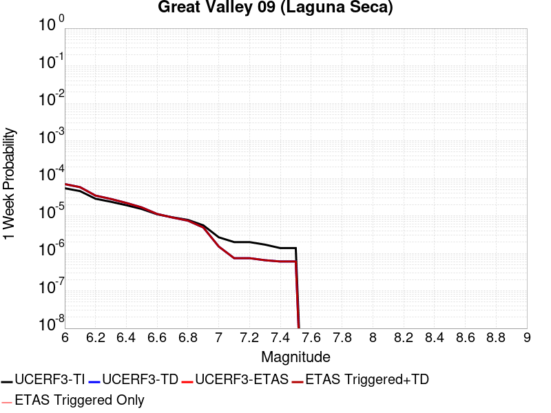 | 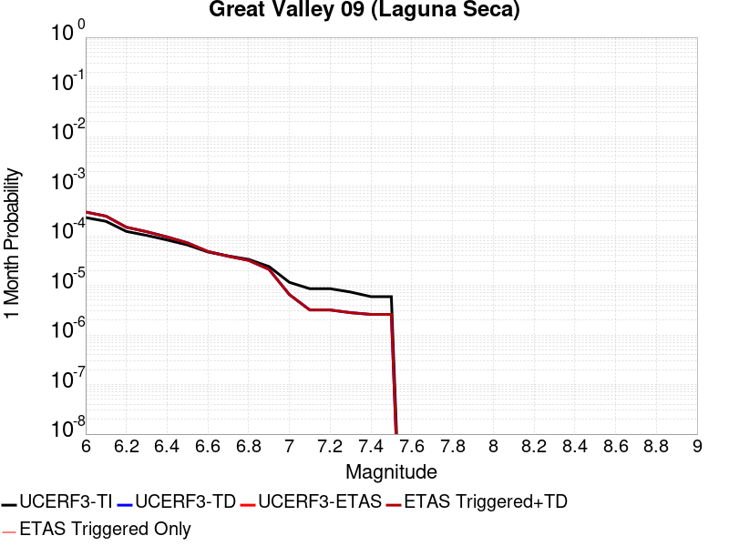 | 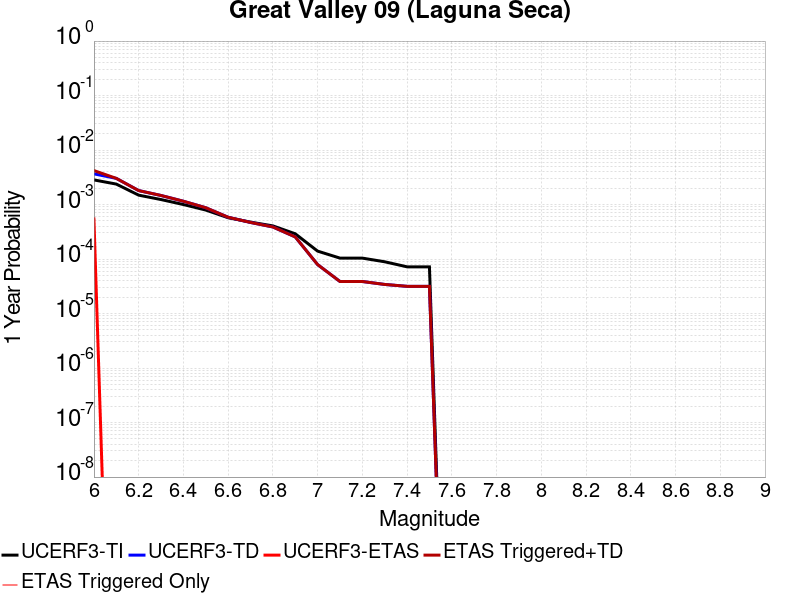 | 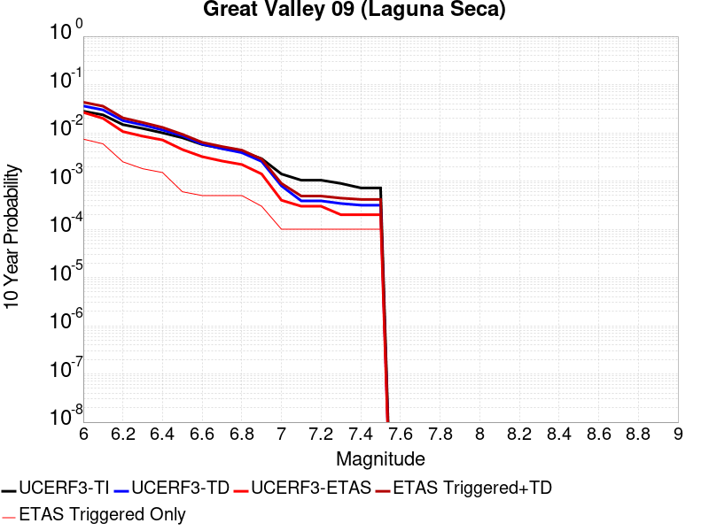 |

| Magnitude | 1 wk TI Prob | 1 wk TD Prob | 1 wk ETAS Prob | 1 wk ETAS/TD Gain | 1 wk ETAS Triggered+TD | 1 wk ETAS Triggered Only | 1 mo TI Prob | 1 mo TD Prob | 1 mo ETAS Prob | 1 mo ETAS/TD Gain | 1 mo ETAS Triggered+TD | 1 mo ETAS Triggered Only | 1 yr TI Prob | 1 yr TD Prob | 1 yr ETAS Prob | 1 yr ETAS/TD Gain | 1 yr ETAS Triggered+TD | 1 yr ETAS Triggered Only | 10 yr TI Prob | 10 yr TD Prob | 10 yr ETAS Prob | 10 yr ETAS/TD Gain | 10 yr ETAS Triggered+TD | 10 yr ETAS Triggered Only |
|-----|-----|-----|-----|-----|-----|-----|-----|-----|-----|-----|-----|-----|-----|-----|-----|-----|-----|-----|-----|-----|-----|-----|-----|-----|
| 6.0 | 5.4353277E-5 | 7.0272334E-5 | 0.0 | 0.0 | 7.0272334E-5 | 0.0 | 2.3292181E-4 | 3.0113247E-4 | 2.0E-4 | 0.66415954 | 4.0110236E-4 | 1.0E-4 | 0.0028321352 | 0.0036601317 | 0.0027 | 0.7376784 | 0.0047561056 | 0.0011 | 0.02796312 | 0.0360027 | 0.0265 | 0.7360559 | 0.04313628 | 0.0074 |
| 6.1 | 4.5578287E-5 | 5.80379E-5 | 0.0 | 0.0 | 5.80379E-5 | 0.0 | 1.953209E-4 | 2.4871025E-4 | 1.0E-4 | 0.40207428 | 3.486854E-4 | 1.0E-4 | 0.0023754383 | 0.003023848 | 0.0021 | 0.6944794 | 0.0038214289 | 8.0E-4 | 0.023502063 | 0.029828679 | 0.0199 | 0.66714317 | 0.03555269 | 0.0059 |
| 6.2 | 2.8536782E-5 | 3.4637753E-5 | 0.0 | 0.0 | 3.4637753E-5 | 0.0 | 1.2229476E-4 | 1.4843907E-4 | 1.0E-4 | 0.67367715 | 2.484242E-4 | 1.0E-4 | 0.0014879217 | 0.0018057277 | 0.001 | 0.5537934 | 0.0020053666 | 2.0E-4 | 0.014779986 | 0.01790838 | 0.0106 | 0.5919017 | 0.020363608 | 0.0025 |
| 6.3 | 2.3698774E-5 | 2.8136803E-5 | 0.0 | 0.0 | 2.8136803E-5 | 0.0 | 1.01562226E-4 | 1.205806E-4 | 1.0E-4 | 0.82932085 | 2.2056853E-4 | 1.0E-4 | 0.0012358186 | 0.00146707 | 8.0E-4 | 0.5453046 | 0.0016667766 | 2.0E-4 | 0.012289686 | 0.014572562 | 0.0085 | 0.58328795 | 0.016346332 | 0.0018 |
| 6.4 | 1.9191197E-5 | 2.206722E-5 | 0.0 | 0.0 | 2.206722E-5 | 0.0 | 8.2245395E-5 | 9.45706E-5 | 0.0 | 0.0 | 9.45706E-5 | 0.0 | 0.0010008777 | 0.0011507921 | 6.0E-4 | 0.52138 | 0.001250677 | 1.0E-4 | 0.009963818 | 0.01144856 | 0.0071 | 0.6201653 | 0.012931388 | 0.0015 |
| 6.5 | 1.5203241E-5 | 1.67631E-5 | 0.0 | 0.0 | 1.67631E-5 | 0.0 | 6.5155116E-5 | 7.1840055E-5 | 0.0 | 0.0 | 7.1840055E-5 | 0.0 | 7.9297484E-4 | 8.7431574E-4 | 3.0E-4 | 0.3431255 | 8.7431574E-4 | 0.0 | 0.007901512 | 0.00870998 | 0.0045 | 0.5166487 | 0.009304754 | 6.0E-4 |
| 6.6 | 1.0984925E-5 | 1.1222065E-5 | 0.0 | 0.0 | 1.1222065E-5 | 0.0 | 4.70774E-5 | 4.8093694E-5 | 0.0 | 0.0 | 4.8093694E-5 | 0.0 | 5.730166E-4 | 5.853872E-4 | 2.0E-4 | 0.34165418 | 5.853872E-4 | 0.0 | 0.005715413 | 0.0058388454 | 0.0032 | 0.54805356 | 0.006335926 | 5.0E-4 |
| 6.7 | 9.134616E-6 | 9.004035E-6 | 0.0 | 0.0 | 9.004035E-6 | 0.0 | 3.9147766E-5 | 3.858816E-5 | 0.0 | 0.0 | 3.858816E-5 | 0.0 | 4.7651984E-4 | 4.6971196E-4 | 1.0E-4 | 0.21289644 | 4.6971196E-4 | 0.0 | 0.004754993 | 0.004687436 | 0.0026 | 0.55467427 | 0.005185092 | 5.0E-4 |
| 6.8 | 7.785589E-6 | 7.4387403E-6 | 0.0 | 0.0 | 7.4387403E-6 | 0.0 | 3.3366385E-5 | 3.187994E-5 | 0.0 | 0.0 | 3.187994E-5 | 0.0 | 4.0616E-4 | 3.8807112E-4 | 1.0E-4 | 0.25768474 | 3.8807112E-4 | 0.0 | 0.0040541845 | 0.0038741378 | 0.0022 | 0.5678683 | 0.004372201 | 5.0E-4 |
| 6.9 | 5.579095E-6 | 4.8894753E-6 | 0.0 | 0.0 | 4.8894753E-6 | 0.0 | 2.3910188E-5 | 2.0954734E-5 | 0.0 | 0.0 | 2.0954734E-5 | 0.0 | 2.9106764E-4 | 2.550954E-4 | 1.0E-4 | 0.3920102 | 2.550954E-4 | 0.0 | 0.002906867 | 0.0025481626 | 0.0014 | 0.54941547 | 0.0028473982 | 3.0E-4 |
| 7.0 | 2.6816688E-6 | 1.51843E-6 | 0.0 | 0.0 | 1.51843E-6 | 0.0 | 1.1492816E-5 | 6.5075415E-6 | 0.0 | 0.0 | 6.5075415E-6 | 0.0 | 1.3991605E-4 | 7.922653E-5 | 1.0E-4 | 1.2622036 | 7.922653E-5 | 0.0 | 0.0013982799 | 7.919915E-4 | 4.0E-4 | 0.5050559 | 8.919123E-4 | 1.0E-4 |
| 7.1 | 1.9951021E-6 | 7.4325794E-7 | 0.0 | 0.0 | 7.4325794E-7 | 0.0 | 8.55041E-6 | 3.1853874E-6 | 0.0 | 0.0 | 3.1853874E-6 | 0.0 | 1.0409627E-4 | 3.8781443E-5 | 0.0 | 0.0 | 3.8781443E-5 | 0.0 | 0.0010404752 | 3.877509E-4 | 3.0E-4 | 0.7736926 | 4.877121E-4 | 1.0E-4 |
| 7.2 | 1.9951021E-6 | 7.4325794E-7 | 0.0 | 0.0 | 7.4325794E-7 | 0.0 | 8.55041E-6 | 3.1853874E-6 | 0.0 | 0.0 | 3.1853874E-6 | 0.0 | 1.0409627E-4 | 3.8781443E-5 | 0.0 | 0.0 | 3.8781443E-5 | 0.0 | 0.0010404752 | 3.877509E-4 | 3.0E-4 | 0.7736926 | 4.877121E-4 | 1.0E-4 |
| 7.3 | 1.7087556E-6 | 6.5603325E-7 | 0.0 | 0.0 | 6.5603325E-7 | 0.0 | 7.3232177E-6 | 2.8115683E-6 | 0.0 | 0.0 | 2.8115683E-6 | 0.0 | 8.915652E-5 | 3.4230347E-5 | 0.0 | 0.0 | 3.4230347E-5 | 0.0 | 8.9120766E-4 | 3.4225476E-4 | 2.0E-4 | 0.58436 | 4.4222054E-4 | 1.0E-4 |
| 7.4 | 1.3804846E-6 | 6.057212E-7 | 0.0 | 0.0 | 6.057212E-7 | 0.0 | 5.916349E-6 | 2.5959457E-6 | 0.0 | 0.0 | 2.5959457E-6 | 0.0 | 7.2029165E-5 | 3.160522E-5 | 0.0 | 0.0 | 3.160522E-5 | 0.0 | 7.200583E-4 | 3.1601125E-4 | 2.0E-4 | 0.63288885 | 4.1597965E-4 | 1.0E-4 |
| 7.5 | 1.3804846E-6 | 6.057212E-7 | 0.0 | 0.0 | 6.057212E-7 | 0.0 | 5.916349E-6 | 2.5959457E-6 | 0.0 | 0.0 | 2.5959457E-6 | 0.0 | 7.2029165E-5 | 3.160522E-5 | 0.0 | 0.0 | 3.160522E-5 | 0.0 | 7.200583E-4 | 3.1601125E-4 | 2.0E-4 | 0.63288885 | 4.1597965E-4 | 1.0E-4 |

## Rose Canyon
*[(top)](#table-of-contents)*

| 1 Week | 1 Month | 1 Year | 10 Year |
|-----|-----|-----|-----|
| 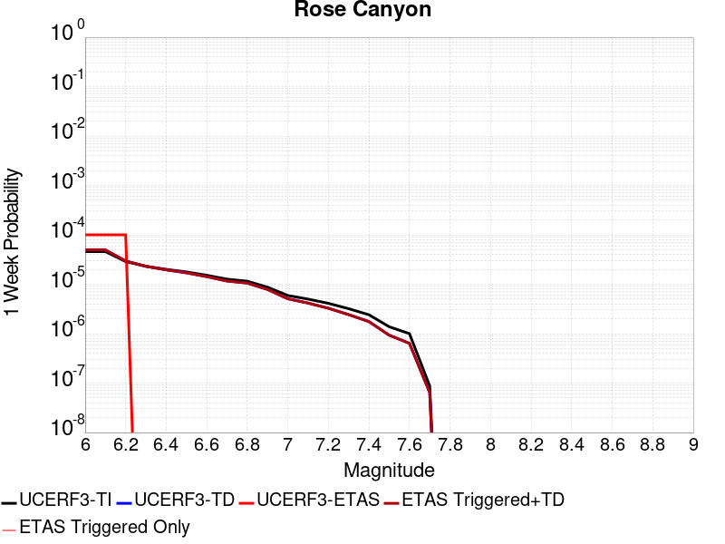 | 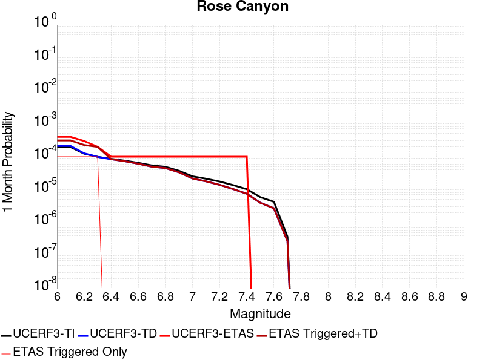 | 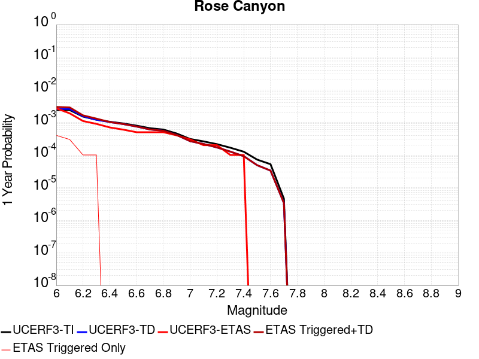 | 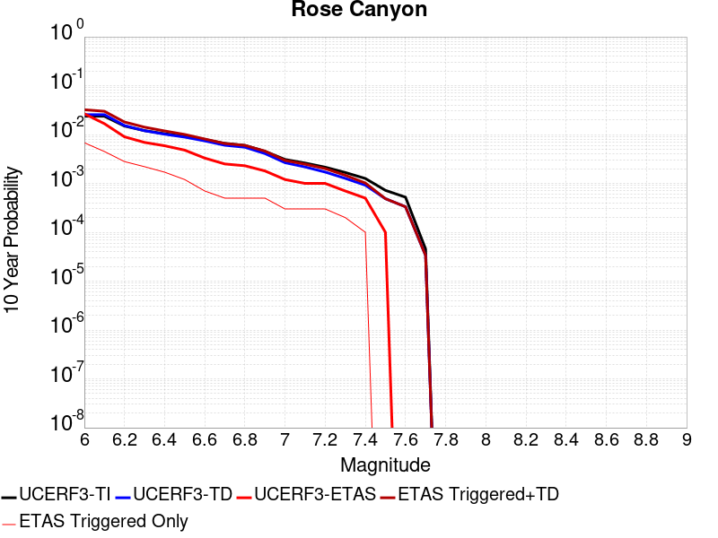 |

| Magnitude | 1 wk TI Prob | 1 wk TD Prob | 1 wk ETAS Prob | 1 wk ETAS/TD Gain | 1 wk ETAS Triggered+TD | 1 wk ETAS Triggered Only | 1 mo TI Prob | 1 mo TD Prob | 1 mo ETAS Prob | 1 mo ETAS/TD Gain | 1 mo ETAS Triggered+TD | 1 mo ETAS Triggered Only | 1 yr TI Prob | 1 yr TD Prob | 1 yr ETAS Prob | 1 yr ETAS/TD Gain | 1 yr ETAS Triggered+TD | 1 yr ETAS Triggered Only | 10 yr TI Prob | 10 yr TD Prob | 10 yr ETAS Prob | 10 yr ETAS/TD Gain | 10 yr ETAS Triggered+TD | 10 yr ETAS Triggered Only |
|-----|-----|-----|-----|-----|-----|-----|-----|-----|-----|-----|-----|-----|-----|-----|-----|-----|-----|-----|-----|-----|-----|-----|-----|-----|
| 6.0 | 4.5923203E-5 | 4.956853E-5 | 1.0E-4 | 2.017409 | 4.956853E-5 | 0.0 | 1.9679888E-4 | 2.1242037E-4 | 4.0E-4 | 1.8830584 | 3.1239915E-4 | 1.0E-4 | 0.0023933933 | 0.0025833491 | 0.0027 | 1.0451548 | 0.0029823158 | 4.0E-4 | 0.023677798 | 0.025569102 | 0.0267 | 1.044229 | 0.032195233 | 0.0068 |
| 6.1 | 4.5923203E-5 | 4.956853E-5 | 1.0E-4 | 2.017409 | 4.956853E-5 | 0.0 | 1.9679888E-4 | 2.1242037E-4 | 4.0E-4 | 1.8830584 | 3.1239915E-4 | 1.0E-4 | 0.0023933933 | 0.0025833491 | 0.0019 | 0.73547935 | 0.0028825742 | 3.0E-4 | 0.023677798 | 0.025569102 | 0.0167 | 0.653132 | 0.02995404 | 0.0045 |
| 6.2 | 2.8844734E-5 | 2.959061E-5 | 1.0E-4 | 3.3794503 | 2.959061E-5 | 0.0 | 1.2361443E-4 | 1.2681072E-4 | 3.0E-4 | 2.3657308 | 2.2679803E-4 | 1.0E-4 | 0.0015039665 | 0.0015428562 | 0.0011 | 0.7129634 | 0.0016427019 | 1.0E-4 | 0.0149382865 | 0.015320393 | 0.009 | 0.5874523 | 0.018077496 | 0.0028 |
| 6.3 | 2.3171577E-5 | 2.3104067E-5 | 0.0 | 0.0 | 2.3104067E-5 | 0.0 | 9.9302975E-5 | 9.901375E-5 | 2.0E-4 | 2.0199215 | 1.9900384E-4 | 1.0E-4 | 0.0012083431 | 0.001204839 | 9.0E-4 | 0.74698776 | 0.0013047185 | 1.0E-4 | 0.012017938 | 0.011984598 | 0.0069 | 0.57573897 | 0.014158231 | 0.0022 |
| 6.4 | 2.0066604E-5 | 1.961547E-5 | 0.0 | 0.0 | 1.961547E-5 | 0.0 | 8.599689E-5 | 8.406365E-5 | 1.0E-4 | 1.1895748 | 8.406365E-5 | 0.0 | 0.0010465092 | 0.0010230043 | 7.0E-4 | 0.68425906 | 0.0010230043 | 0.0 | 0.010415946 | 0.010179668 | 0.0059 | 0.57958674 | 0.011862362 | 0.0017 |
| 6.5 | 1.776989E-5 | 1.7066739E-5 | 0.0 | 0.0 | 1.7066739E-5 | 0.0 | 7.615444E-5 | 7.314116E-5 | 1.0E-4 | 1.3672193 | 7.314116E-5 | 0.0 | 9.267859E-4 | 8.901367E-4 | 6.0E-4 | 0.6740538 | 8.901367E-4 | 0.0 | 0.009229303 | 0.008862977 | 0.0048 | 0.54157877 | 0.010052341 | 0.0012 |
| 6.6 | 1.5227364E-5 | 1.4300016E-5 | 0.0 | 0.0 | 1.4300016E-5 | 0.0 | 6.52585E-5 | 6.128437E-5 | 1.0E-4 | 1.6317374 | 6.128437E-5 | 0.0 | 7.942326E-4 | 7.45887E-4 | 5.0E-4 | 0.67034286 | 7.45887E-4 | 0.0 | 0.007914 | 0.0074209324 | 0.0033 | 0.44468805 | 0.008115738 | 7.0E-4 |
| 6.7 | 1.2703898E-5 | 1.1645403E-5 | 0.0 | 0.0 | 1.1645403E-5 | 0.0 | 5.4444143E-5 | 4.9907936E-5 | 1.0E-4 | 2.0036893 | 4.9907936E-5 | 0.0 | 6.626558E-4 | 6.0746394E-4 | 5.0E-4 | 0.8230941 | 6.0746394E-4 | 0.0 | 0.006606833 | 0.0060429107 | 0.0025 | 0.41370794 | 0.006539889 | 5.0E-4 |
| 6.8 | 1.1554917E-5 | 1.0585705E-5 | 0.0 | 0.0 | 1.0585705E-5 | 0.0 | 4.9520135E-5 | 4.536654E-5 | 1.0E-4 | 2.2042677 | 4.536654E-5 | 0.0 | 6.0274085E-4 | 5.522017E-4 | 5.0E-4 | 0.90546626 | 5.522017E-4 | 0.0 | 0.0060110865 | 0.005498397 | 0.0023 | 0.41830373 | 0.005995648 | 5.0E-4 |
| 6.9 | 8.732078E-6 | 7.867251E-6 | 0.0 | 0.0 | 7.867251E-6 | 0.0 | 3.7422655E-5 | 3.371637E-5 | 1.0E-4 | 2.9659183 | 3.371637E-5 | 0.0 | 4.5552556E-4 | 4.1042242E-4 | 4.0E-4 | 0.9746056 | 4.1042242E-4 | 0.0 | 0.0045459294 | 0.0040817247 | 0.0018 | 0.4409901 | 0.0045796838 | 5.0E-4 |
| 7.0 | 5.9337494E-6 | 5.097115E-6 | 0.0 | 0.0 | 5.097115E-6 | 0.0 | 2.5430107E-5 | 2.1844595E-5 | 1.0E-4 | 4.577791 | 2.1844595E-5 | 0.0 | 3.0956755E-4 | 2.6592563E-4 | 3.0E-4 | 1.128135 | 2.6592563E-4 | 0.0 | 0.0030913667 | 0.0026560896 | 0.0012 | 0.45179197 | 0.0029552928 | 3.0E-4 |
| 7.1 | 5.013409E-6 | 4.1690255E-6 | 0.0 | 0.0 | 4.1690255E-6 | 0.0 | 2.1485863E-5 | 1.786713E-5 | 1.0E-4 | 5.59687 | 1.786713E-5 | 0.0 | 2.6155898E-4 | 2.175107E-4 | 2.0E-4 | 0.919495 | 2.175107E-4 | 0.0 | 0.0026125133 | 0.0021729898 | 0.001 | 0.46019548 | 0.0024723378 | 3.0E-4 |
| 7.2 | 4.120763E-6 | 3.2745982E-6 | 0.0 | 0.0 | 3.2745982E-6 | 0.0 | 1.7660293E-5 | 1.4033917E-5 | 1.0E-4 | 7.125594 | 1.4033917E-5 | 0.0 | 2.1499286E-4 | 1.7084964E-4 | 2.0E-4 | 1.17062 | 1.7084964E-4 | 0.0 | 0.0021478499 | 0.0017071924 | 0.001 | 0.5857571 | 0.0020066802 | 3.0E-4 |
| 7.3 | 3.2081239E-6 | 2.4343676E-6 | 0.0 | 0.0 | 2.4343676E-6 | 0.0 | 1.374903E-5 | 1.0432963E-5 | 1.0E-4 | 9.585005 | 1.0432963E-5 | 0.0 | 1.6738157E-4 | 1.2701399E-4 | 1.0E-4 | 0.7873149 | 1.2701399E-4 | 0.0 | 0.0016725556 | 0.0012694208 | 7.0E-4 | 0.55143255 | 0.001469167 | 2.0E-4 |
| 7.4 | 2.4194755E-6 | 1.7629421E-6 | 0.0 | 0.0 | 1.7629421E-6 | 0.0 | 1.0369139E-5 | 7.5554444E-6 | 1.0E-4 | 13.235489 | 7.5554444E-6 | 0.0 | 1.2623696E-4 | 9.198371E-5 | 1.0E-4 | 1.087149 | 9.198371E-5 | 0.0 | 0.0012616527 | 9.1946166E-4 | 5.0E-4 | 0.5437965 | 0.0010193697 | 1.0E-4 |
| 7.5 | 1.3842889E-6 | 9.33772E-7 | 0.0 | 0.0 | 9.33772E-7 | 0.0 | 5.9326535E-6 | 4.001874E-6 | 0.0 | 0.0 | 4.001874E-6 | 0.0 | 7.222766E-5 | 4.8721762E-5 | 0.0 | 0.0 | 4.8721762E-5 | 0.0 | 7.220419E-4 | 4.871143E-4 | 1.0E-4 | 0.20529062 | 4.871143E-4 | 0.0 |
| 7.6 | 1.0021575E-6 | 6.3823694E-7 | 0.0 | 0.0 | 6.3823694E-7 | 0.0 | 4.2949537E-6 | 2.7352985E-6 | 0.0 | 0.0 | 2.7352985E-6 | 0.0 | 5.2289808E-5 | 3.330177E-5 | 0.0 | 0.0 | 3.330177E-5 | 0.0 | 5.2277505E-4 | 3.3296994E-4 | 0.0 | 0.0 | 3.3296994E-4 | 0.0 |
| 7.7 | 8.7620116E-8 | 6.445977E-8 | 0.0 | 0.0 | 6.445977E-8 | 0.0 | 3.7551473E-7 | 2.7625612E-7 | 0.0 | 0.0 | 2.7625612E-7 | 0.0 | 4.5718825E-6 | 3.3634135E-6 | 0.0 | 0.0 | 3.3634135E-6 | 0.0 | 4.5717883E-5 | 3.3633652E-5 | 0.0 | 0.0 | 3.3633652E-5 | 0.0 |

## Garlock (East)
*[(top)](#table-of-contents)*

| 1 Week | 1 Month | 1 Year | 10 Year |
|-----|-----|-----|-----|
| 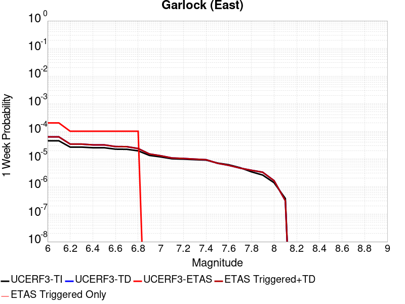 | 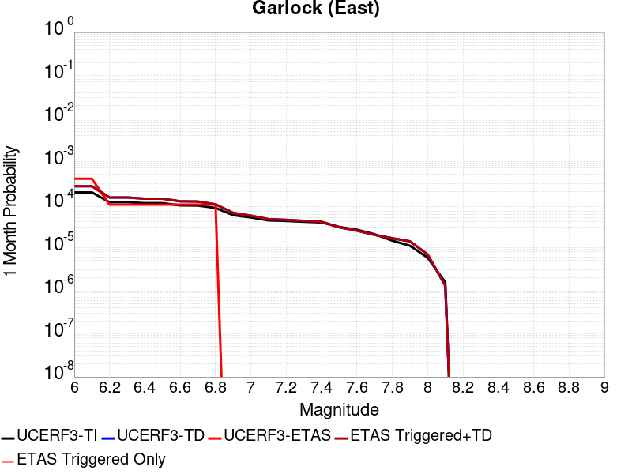 | 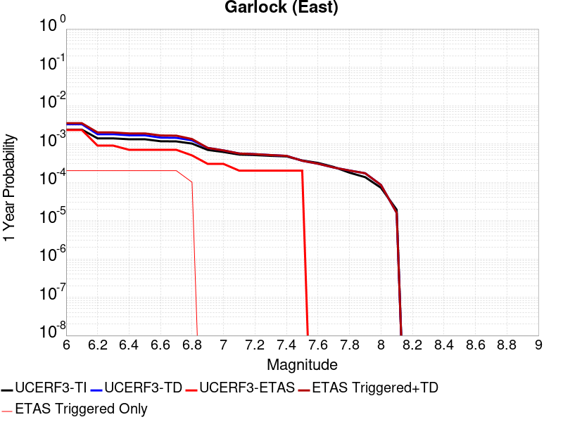 | 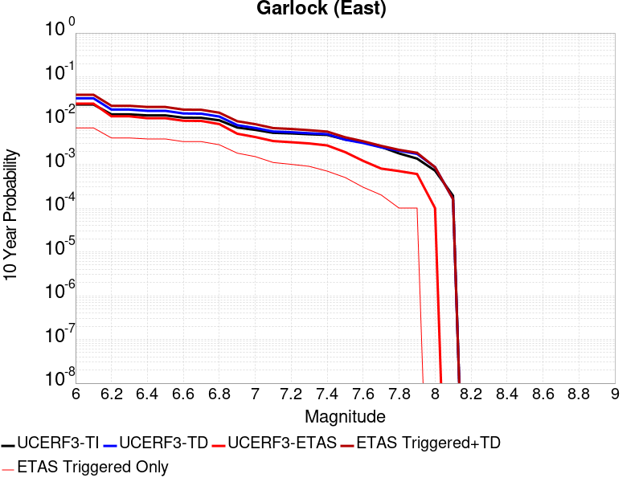 |

| Magnitude | 1 wk TI Prob | 1 wk TD Prob | 1 wk ETAS Prob | 1 wk ETAS/TD Gain | 1 wk ETAS Triggered+TD | 1 wk ETAS Triggered Only | 1 mo TI Prob | 1 mo TD Prob | 1 mo ETAS Prob | 1 mo ETAS/TD Gain | 1 mo ETAS Triggered+TD | 1 mo ETAS Triggered Only | 1 yr TI Prob | 1 yr TD Prob | 1 yr ETAS Prob | 1 yr ETAS/TD Gain | 1 yr ETAS Triggered+TD | 1 yr ETAS Triggered Only | 10 yr TI Prob | 10 yr TD Prob | 10 yr ETAS Prob | 10 yr ETAS/TD Gain | 10 yr ETAS Triggered+TD | 10 yr ETAS Triggered Only |
|-----|-----|-----|-----|-----|-----|-----|-----|-----|-----|-----|-----|-----|-----|-----|-----|-----|-----|-----|-----|-----|-----|-----|-----|-----|
| 6.0 | 4.5092507E-5 | 6.262008E-5 | 2.0E-4 | 3.1938639 | 6.262008E-5 | 0.0 | 1.9323928E-4 | 2.6834666E-4 | 4.0E-4 | 1.4906093 | 2.6834666E-4 | 0.0 | 0.0023501497 | 0.00326267 | 0.0023 | 0.7049441 | 0.0034620175 | 2.0E-4 | 0.023254504 | 0.03222349 | 0.0243 | 0.7541083 | 0.038804367 | 0.0068 |
| 6.1 | 4.5092507E-5 | 6.262008E-5 | 2.0E-4 | 3.1938639 | 6.262008E-5 | 0.0 | 1.9323928E-4 | 2.6834666E-4 | 4.0E-4 | 1.4906093 | 2.6834666E-4 | 0.0 | 0.0023501497 | 0.00326267 | 0.0023 | 0.7049441 | 0.0034620175 | 2.0E-4 | 0.023254504 | 0.03222349 | 0.0243 | 0.7541083 | 0.038804367 | 0.0068 |
| 6.2 | 2.6674514E-5 | 3.4284723E-5 | 1.0E-4 | 2.9167511 | 3.4284723E-5 | 0.0 | 1.1431433E-4 | 1.4692644E-4 | 1.0E-4 | 0.68061274 | 1.4692644E-4 | 0.0 | 0.0013908884 | 0.0017873944 | 9.0E-4 | 0.5035263 | 0.001987037 | 2.0E-4 | 0.01382215 | 0.017797733 | 0.0125 | 0.70233667 | 0.021726541 | 0.004 |
| 6.3 | 2.6674514E-5 | 3.4284723E-5 | 1.0E-4 | 2.9167511 | 3.4284723E-5 | 0.0 | 1.1431433E-4 | 1.4692644E-4 | 1.0E-4 | 0.68061274 | 1.4692644E-4 | 0.0 | 0.0013908884 | 0.0017873944 | 9.0E-4 | 0.5035263 | 0.001987037 | 2.0E-4 | 0.01382215 | 0.017797733 | 0.0125 | 0.70233667 | 0.021726541 | 0.004 |
| 6.4 | 2.5312667E-5 | 3.2118973E-5 | 1.0E-4 | 3.1134245 | 3.2118973E-5 | 0.0 | 1.0847834E-4 | 1.3764565E-4 | 1.0E-4 | 0.7265032 | 1.3764565E-4 | 0.0 | 0.0013199237 | 0.0016745767 | 7.0E-4 | 0.41801608 | 0.0018742417 | 2.0E-4 | 0.013121112 | 0.016671875 | 0.0113 | 0.6777882 | 0.020408522 | 0.0038 |
| 6.5 | 2.5312667E-5 | 3.2118973E-5 | 1.0E-4 | 3.1134245 | 3.2118973E-5 | 0.0 | 1.0847834E-4 | 1.3764565E-4 | 1.0E-4 | 0.7265032 | 1.3764565E-4 | 0.0 | 0.0013199237 | 0.0016745767 | 7.0E-4 | 0.41801608 | 0.0018742417 | 2.0E-4 | 0.013121112 | 0.016671875 | 0.0113 | 0.6777882 | 0.020408522 | 0.0038 |
| 6.6 | 2.246556E-5 | 2.7922182E-5 | 1.0E-4 | 3.5813818 | 2.7922182E-5 | 0.0 | 9.627742E-5 | 1.1966114E-4 | 1.0E-4 | 0.8356932 | 1.1966114E-4 | 0.0 | 0.0011715472 | 0.0014559241 | 7.0E-4 | 0.48079428 | 0.001655633 | 2.0E-4 | 0.011653901 | 0.014516794 | 0.0099 | 0.68196875 | 0.017768888 | 0.0033 |
| 6.7 | 2.2241198E-5 | 2.7592509E-5 | 1.0E-4 | 3.624172 | 2.7592509E-5 | 0.0 | 9.531594E-5 | 1.1824838E-4 | 1.0E-4 | 0.8456775 | 1.1824838E-4 | 0.0 | 0.0011598538 | 0.0014387466 | 7.0E-4 | 0.4865346 | 0.0016384589 | 2.0E-4 | 0.011538187 | 0.014346733 | 0.0098 | 0.68308234 | 0.017599389 | 0.0033 |
| 6.8 | 1.9528685E-5 | 2.3700766E-5 | 1.0E-4 | 4.219273 | 2.3700766E-5 | 0.0 | 8.369167E-5 | 1.0157087E-4 | 1.0E-4 | 0.98453426 | 1.0157087E-4 | 0.0 | 0.0010184698 | 0.0012359433 | 5.0E-4 | 0.4045493 | 0.0013358197 | 1.0E-4 | 0.010138147 | 0.012334178 | 0.0083 | 0.67292684 | 0.015099643 | 0.0028 |
| 6.9 | 1.3318621E-5 | 1.5027202E-5 | 0.0 | 0.0 | 1.5027202E-5 | 0.0 | 5.7078556E-5 | 6.440074E-5 | 0.0 | 0.0 | 6.440074E-5 | 0.0 | 6.9470983E-4 | 7.8380253E-4 | 3.0E-4 | 0.38274947 | 7.8380253E-4 | 0.0 | 0.0069254204 | 0.007851048 | 0.005 | 0.6368576 | 0.009636917 | 0.0018 |
| 7.0 | 1.1760853E-5 | 1.2941798E-5 | 0.0 | 0.0 | 1.2941798E-5 | 0.0 | 5.0402683E-5 | 5.5463697E-5 | 0.0 | 0.0 | 5.5463697E-5 | 0.0 | 6.134799E-4 | 6.7506626E-4 | 3.0E-4 | 0.44440082 | 6.7506626E-4 | 0.0 | 0.0061178906 | 0.00677051 | 0.0042 | 0.62033725 | 0.008260354 | 0.0015 |
| 7.1 | 1.0064758E-5 | 1.0742595E-5 | 0.0 | 0.0 | 1.0742595E-5 | 0.0 | 4.3133965E-5 | 4.6038902E-5 | 0.0 | 0.0 | 4.6038902E-5 | 0.0 | 5.2502943E-4 | 5.603829E-4 | 2.0E-4 | 0.3568988 | 5.603829E-4 | 0.0 | 0.005237907 | 0.0056293267 | 0.0034 | 0.6039799 | 0.0067231343 | 0.0011 |
| 7.2 | 9.768808E-6 | 1.0340137E-5 | 0.0 | 0.0 | 1.0340137E-5 | 0.0 | 4.186565E-5 | 4.431414E-5 | 0.0 | 0.0 | 4.431414E-5 | 0.0 | 5.095951E-4 | 5.3939456E-4 | 2.0E-4 | 0.3707861 | 5.3939456E-4 | 0.0 | 0.0050842804 | 0.005420548 | 0.0032 | 0.5903463 | 0.0064151273 | 0.001 |
| 7.3 | 9.344516E-6 | 9.7887205E-6 | 0.0 | 0.0 | 9.7887205E-6 | 0.0 | 4.004731E-5 | 4.1951003E-5 | 0.0 | 0.0 | 4.1951003E-5 | 0.0 | 4.8746695E-4 | 5.106372E-4 | 2.0E-4 | 0.39166754 | 5.106372E-4 | 0.0 | 0.0048639905 | 0.005133724 | 0.003 | 0.58437115 | 0.0060291034 | 9.0E-4 |
| 7.4 | 9.023491E-6 | 9.337981E-6 | 0.0 | 0.0 | 9.337981E-6 | 0.0 | 3.867153E-5 | 4.0019324E-5 | 0.0 | 0.0 | 4.0019324E-5 | 0.0 | 4.7072413E-4 | 4.8712967E-4 | 2.0E-4 | 0.4105683 | 4.8712967E-4 | 0.0 | 0.004697283 | 0.0048987195 | 0.0027 | 0.55116445 | 0.00559529 | 7.0E-4 |
| 7.5 | 7.081253E-6 | 6.9513176E-6 | 0.0 | 0.0 | 6.9513176E-6 | 0.0 | 3.0347876E-5 | 2.9791025E-5 | 0.0 | 0.0 | 2.9791025E-5 | 0.0 | 3.6942272E-4 | 3.626461E-4 | 2.0E-4 | 0.55150187 | 3.626461E-4 | 0.0 | 0.003688092 | 0.0036532064 | 0.0019 | 0.52009106 | 0.0041513797 | 5.0E-4 |
| 7.6 | 6.116396E-6 | 5.8294945E-6 | 0.0 | 0.0 | 5.8294945E-6 | 0.0 | 2.6212863E-5 | 2.498331E-5 | 0.0 | 0.0 | 2.498331E-5 | 0.0 | 3.1909486E-4 | 3.041296E-4 | 0.0 | 0.0 | 3.041296E-4 | 0.0 | 0.0031863707 | 0.0030680262 | 0.0012 | 0.39113095 | 0.0033671057 | 3.0E-4 |
| 7.7 | 4.797145E-6 | 4.6360797E-6 | 0.0 | 0.0 | 4.6360797E-6 | 0.0 | 2.055903E-5 | 1.9868761E-5 | 0.0 | 0.0 | 1.9868761E-5 | 0.0 | 2.5027743E-4 | 2.4187544E-4 | 0.0 | 0.0 | 2.4187544E-4 | 0.0 | 0.0024999576 | 0.0024460873 | 8.0E-4 | 0.32705292 | 0.002645598 | 2.0E-4 |
| 7.8 | 3.4028885E-6 | 3.870148E-6 | 0.0 | 0.0 | 3.870148E-6 | 0.0 | 1.4583726E-5 | 1.6586244E-5 | 0.0 | 0.0 | 1.6586244E-5 | 0.0 | 1.775424E-4 | 2.0191887E-4 | 0.0 | 0.0 | 2.0191887E-4 | 0.0 | 0.0017740062 | 0.0020447583 | 7.0E-4 | 0.34233874 | 0.002144554 | 1.0E-4 |
| 7.9 | 2.5928412E-6 | 3.2804935E-6 | 0.0 | 0.0 | 3.2804935E-6 | 0.0 | 1.1112129E-5 | 1.4059183E-5 | 0.0 | 0.0 | 1.4059183E-5 | 0.0 | 1.3528178E-4 | 1.7115717E-4 | 0.0 | 0.0 | 1.7115717E-4 | 0.0 | 0.0013519945 | 0.0017333033 | 6.0E-4 | 0.34615985 | 0.0018331299 | 1.0E-4 |
| 8.0 | 1.3743648E-6 | 1.6307154E-6 | 0.0 | 0.0 | 1.6307154E-6 | 0.0 | 5.8901214E-6 | 6.9887615E-6 | 0.0 | 0.0 | 6.9887615E-6 | 0.0 | 7.1709874E-5 | 8.5084874E-5 | 0.0 | 0.0 | 8.5084874E-5 | 0.0 | 7.1686733E-4 | 8.6138607E-4 | 1.0E-4 | 0.11609196 | 8.6138607E-4 | 0.0 |
| 8.1 | 3.6733252E-7 | 3.0569248E-7 | 0.0 | 0.0 | 3.0569248E-7 | 0.0 | 1.5742813E-6 | 1.3101101E-6 | 0.0 | 0.0 | 1.3101101E-6 | 0.0 | 1.9166706E-5 | 1.5950489E-5 | 0.0 | 0.0 | 1.5950489E-5 | 0.0 | 1.9165053E-4 | 1.615787E-4 | 0.0 | 0.0 | 1.615787E-4 | 0.0 |

## San Diego Trough north alt1
*[(top)](#table-of-contents)*

| 1 Week | 1 Month | 1 Year | 10 Year |
|-----|-----|-----|-----|
| 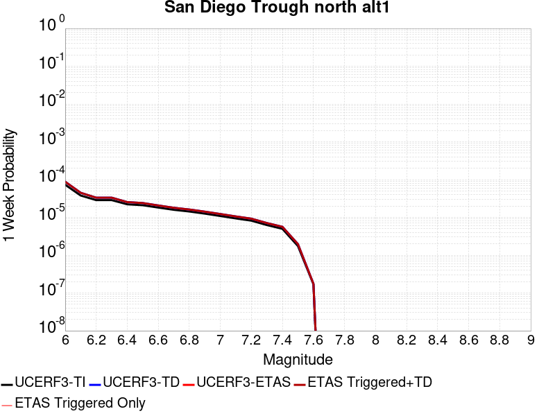 | 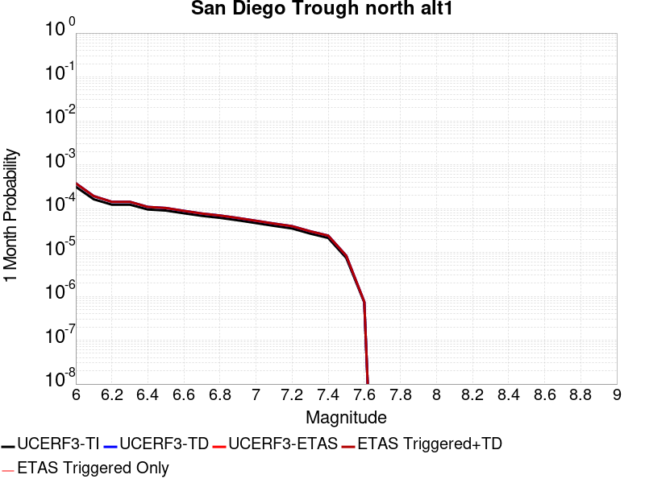 | 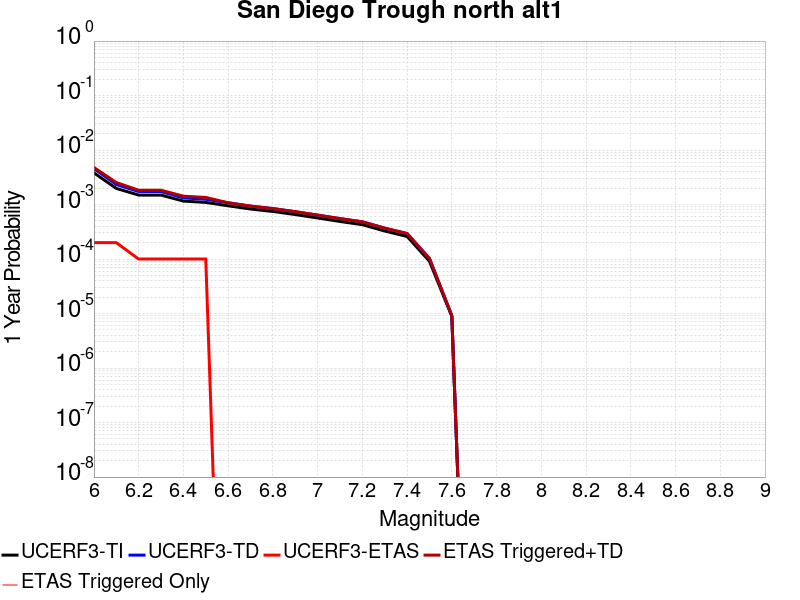 | 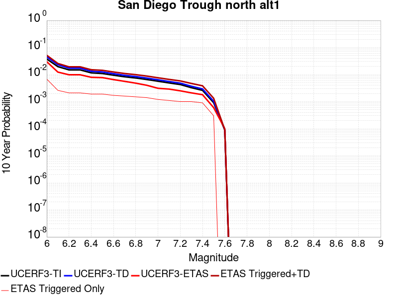 |

| Magnitude | 1 wk TI Prob | 1 wk TD Prob | 1 wk ETAS Prob | 1 wk ETAS/TD Gain | 1 wk ETAS Triggered+TD | 1 wk ETAS Triggered Only | 1 mo TI Prob | 1 mo TD Prob | 1 mo ETAS Prob | 1 mo ETAS/TD Gain | 1 mo ETAS Triggered+TD | 1 mo ETAS Triggered Only | 1 yr TI Prob | 1 yr TD Prob | 1 yr ETAS Prob | 1 yr ETAS/TD Gain | 1 yr ETAS Triggered+TD | 1 yr ETAS Triggered Only | 10 yr TI Prob | 10 yr TD Prob | 10 yr ETAS Prob | 10 yr ETAS/TD Gain | 10 yr ETAS Triggered+TD | 10 yr ETAS Triggered Only |
|-----|-----|-----|-----|-----|-----|-----|-----|-----|-----|-----|-----|-----|-----|-----|-----|-----|-----|-----|-----|-----|-----|-----|-----|-----|
| 6.0 | 7.329252E-5 | 8.8024135E-5 | 0.0 | 0.0 | 8.8024135E-5 | 0.0 | 3.14073E-4 | 3.7719536E-4 | 0.0 | 0.0 | 3.7719536E-4 | 0.0 | 0.0038171355 | 0.0045832642 | 0.0028 | 0.61091834 | 0.0052800556 | 7.0E-4 | 0.03752231 | 0.044951465 | 0.0299 | 0.66516185 | 0.051445793 | 0.0068 |
| 6.1 | 3.7940346E-5 | 4.4798235E-5 | 0.0 | 0.0 | 4.4798235E-5 | 0.0 | 1.6259136E-4 | 1.9197886E-4 | 0.0 | 0.0 | 1.9197886E-4 | 0.0 | 0.0019777524 | 0.0023349184 | 0.0014 | 0.5995927 | 0.002833751 | 5.0E-4 | 0.019602431 | 0.023112651 | 0.0123 | 0.5321761 | 0.025652558 | 0.0026 |
| 6.2 | 2.8645263E-5 | 3.3239627E-5 | 0.0 | 0.0 | 3.3239627E-5 | 0.0 | 1.2275964E-4 | 1.4244791E-4 | 0.0 | 0.0 | 1.4244791E-4 | 0.0 | 0.0014935739 | 0.0017329459 | 0.001 | 0.57705206 | 0.0021322528 | 4.0E-4 | 0.0148357535 | 0.017197017 | 0.0098 | 0.5698663 | 0.019260902 | 0.0021 |
| 6.3 | 2.8645263E-5 | 3.3239627E-5 | 0.0 | 0.0 | 3.3239627E-5 | 0.0 | 1.2275964E-4 | 1.4244791E-4 | 0.0 | 0.0 | 1.4244791E-4 | 0.0 | 0.0014935739 | 0.0017329459 | 0.001 | 0.57705206 | 0.0021322528 | 4.0E-4 | 0.0148357535 | 0.017197017 | 0.0098 | 0.5698663 | 0.019260902 | 0.0021 |
| 6.4 | 2.2204576E-5 | 2.5409145E-5 | 0.0 | 0.0 | 2.5409145E-5 | 0.0 | 9.5159E-5 | 1.0889184E-4 | 0.0 | 0.0 | 1.0889184E-4 | 0.0 | 0.001157945 | 0.0013249613 | 8.0E-4 | 0.60379124 | 0.0017244313 | 4.0E-4 | 0.011519298 | 0.013171791 | 0.0079 | 0.5997666 | 0.015046764 | 0.0019 |
| 6.5 | 2.1004838E-5 | 2.3988314E-5 | 0.0 | 0.0 | 2.3988314E-5 | 0.0 | 9.0017624E-5 | 1.0280306E-4 | 0.0 | 0.0 | 1.0280306E-4 | 0.0 | 0.0010954136 | 0.0012509173 | 8.0E-4 | 0.63953066 | 0.001650417 | 4.0E-4 | 0.010900296 | 0.012439845 | 0.0077 | 0.61897874 | 0.01431621 | 0.0019 |
| 6.6 | 1.820557E-5 | 2.0674883E-5 | 0.0 | 0.0 | 2.0674883E-5 | 0.0 | 7.802154E-5 | 8.8603665E-5 | 0.0 | 0.0 | 8.8603665E-5 | 0.0 | 9.4949827E-4 | 0.001078221 | 5.0E-4 | 0.46372682 | 0.0012780054 | 2.0E-4 | 0.009454516 | 0.010730566 | 0.0065 | 0.6057462 | 0.012412325 | 0.0017 |
| 6.7 | 1.5884485E-5 | 1.7958651E-5 | 0.0 | 0.0 | 1.7958651E-5 | 0.0 | 6.807459E-5 | 7.696339E-5 | 0.0 | 0.0 | 7.696339E-5 | 0.0 | 8.284929E-4 | 9.3662925E-4 | 5.0E-4 | 0.53382915 | 0.001136442 | 2.0E-4 | 0.008254109 | 0.009327182 | 0.0056 | 0.6003957 | 0.010912258 | 0.0016 |
| 6.8 | 1.4331171E-5 | 1.6178852E-5 | 0.0 | 0.0 | 1.6178852E-5 | 0.0 | 6.141786E-5 | 6.933611E-5 | 0.0 | 0.0 | 6.933611E-5 | 0.0 | 7.4750587E-4 | 8.4384216E-4 | 5.0E-4 | 0.59252787 | 0.0010436734 | 2.0E-4 | 0.0074499645 | 0.008406646 | 0.0048 | 0.57097685 | 0.009894036 | 0.0015 |
| 6.9 | 1.2574203E-5 | 1.4186481E-5 | 0.0 | 0.0 | 1.4186481E-5 | 0.0 | 5.3888325E-5 | 6.0797796E-5 | 0.0 | 0.0 | 6.0797796E-5 | 0.0 | 6.558929E-4 | 7.3996314E-4 | 4.0E-4 | 0.54056746 | 9.398152E-4 | 2.0E-4 | 0.0065396037 | 0.0073751784 | 0.004 | 0.54235977 | 0.008764854 | 0.0014 |
| 7.0 | 1.0883844E-5 | 1.22726E-5 | 0.0 | 0.0 | 1.22726E-5 | 0.0 | 4.664421E-5 | 5.25958E-5 | 0.0 | 0.0 | 5.25958E-5 | 0.0 | 5.677453E-4 | 6.401667E-4 | 4.0E-4 | 0.6248372 | 8.400387E-4 | 2.0E-4 | 0.00566297 | 0.006383354 | 0.0031 | 0.48563814 | 0.007575694 | 0.0012 |
| 7.1 | 9.393088E-6 | 1.0592619E-5 | 0.0 | 0.0 | 1.0592619E-5 | 0.0 | 4.025547E-5 | 4.5396155E-5 | 0.0 | 0.0 | 4.5396155E-5 | 0.0 | 4.900001E-4 | 5.525588E-4 | 4.0E-4 | 0.7239049 | 7.524483E-4 | 2.0E-4 | 0.0048892107 | 0.005511945 | 0.0029 | 0.5261301 | 0.0066058817 | 0.0011 |
| 7.2 | 8.190791E-6 | 9.245941E-6 | 0.0 | 0.0 | 9.245941E-6 | 0.0 | 3.510292E-5 | 3.962486E-5 | 0.0 | 0.0 | 3.962486E-5 | 0.0 | 4.2729423E-4 | 4.823266E-4 | 4.0E-4 | 0.8293136 | 6.822301E-4 | 2.0E-4 | 0.0042647356 | 0.0048128776 | 0.0025 | 0.51943976 | 0.0058080647 | 0.001 |
| 7.3 | 6.268162E-6 | 7.079958E-6 | 0.0 | 0.0 | 7.079958E-6 | 0.0 | 2.6863276E-5 | 3.0342326E-5 | 0.0 | 0.0 | 3.0342326E-5 | 0.0 | 3.2701128E-4 | 3.693556E-4 | 4.0E-4 | 1.0829672 | 5.6928175E-4 | 2.0E-4 | 0.003265305 | 0.003687463 | 0.0021 | 0.5694972 | 0.004683776 | 0.001 |
| 7.4 | 4.985186E-6 | 5.63487E-6 | 0.0 | 0.0 | 5.63487E-6 | 0.0 | 2.1364907E-5 | 2.414922E-5 | 0.0 | 0.0 | 2.414922E-5 | 0.0 | 2.600867E-4 | 2.9397747E-4 | 3.0E-4 | 1.0204864 | 3.9394808E-4 | 1.0E-4 | 0.002597825 | 0.0029359271 | 0.0018 | 0.6130942 | 0.0038332848 | 9.0E-4 |
| 7.5 | 1.7489613E-6 | 1.967052E-6 | 0.0 | 0.0 | 1.967052E-6 | 0.0 | 7.495527E-6 | 8.430196E-6 | 0.0 | 0.0 | 8.430196E-6 | 0.0 | 9.125422E-5 | 1.0263303E-4 | 2.0E-4 | 1.9486904 | 2.0262276E-4 | 1.0E-4 | 9.1216754E-4 | 0.0010258782 | 6.0E-4 | 0.58486474 | 0.0013255705 | 3.0E-4 |
| 7.6 | 1.6988751E-7 | 1.7527951E-7 | 0.0 | 0.0 | 1.7527951E-7 | 0.0 | 7.2808916E-7 | 7.5119766E-7 | 0.0 | 0.0 | 7.5119766E-7 | 0.0 | 8.864449E-6 | 9.145795E-6 | 0.0 | 0.0 | 9.145795E-6 | 0.0 | 8.8640954E-5 | 9.1454385E-5 | 1.0E-4 | 1.0934412 | 9.1454385E-5 | 0.0 |

## Bartlett Springs 2011 CFM
*[(top)](#table-of-contents)*

| 1 Week | 1 Month | 1 Year | 10 Year |
|-----|-----|-----|-----|
| 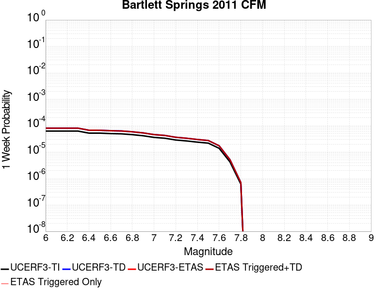 | 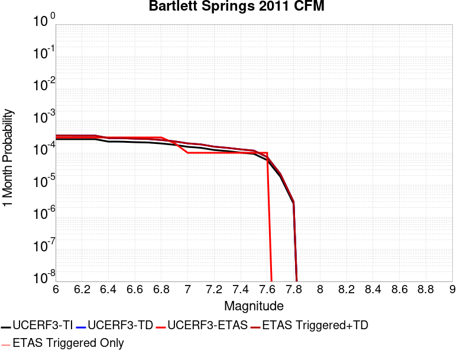 | 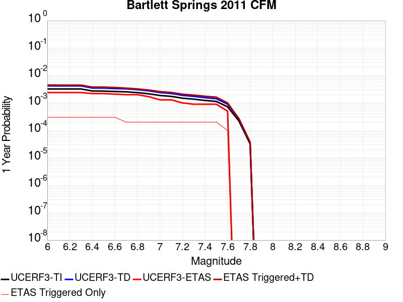 | 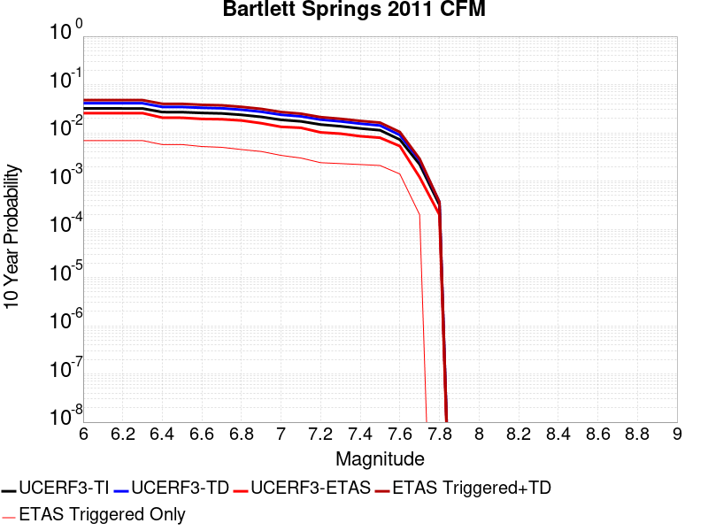 |

| Magnitude | 1 wk TI Prob | 1 wk TD Prob | 1 wk ETAS Prob | 1 wk ETAS/TD Gain | 1 wk ETAS Triggered+TD | 1 wk ETAS Triggered Only | 1 mo TI Prob | 1 mo TD Prob | 1 mo ETAS Prob | 1 mo ETAS/TD Gain | 1 mo ETAS Triggered+TD | 1 mo ETAS Triggered Only | 1 yr TI Prob | 1 yr TD Prob | 1 yr ETAS Prob | 1 yr ETAS/TD Gain | 1 yr ETAS Triggered+TD | 1 yr ETAS Triggered Only | 10 yr TI Prob | 10 yr TD Prob | 10 yr ETAS Prob | 10 yr ETAS/TD Gain | 10 yr ETAS Triggered+TD | 10 yr ETAS Triggered Only |
|-----|-----|-----|-----|-----|-----|-----|-----|-----|-----|-----|-----|-----|-----|-----|-----|-----|-----|-----|-----|-----|-----|-----|-----|-----|
| 6.0 | 6.2326144E-5 | 8.037504E-5 | 3.0E-4 | 3.7325022 | 8.037504E-5 | 0.0 | 2.6708472E-4 | 3.4441956E-4 | 3.0E-4 | 0.8710307 | 3.4441956E-4 | 0.0 | 0.003246908 | 0.004185348 | 0.0024 | 0.57342905 | 0.004484092 | 3.0E-4 | 0.031998757 | 0.04108245 | 0.0256 | 0.6231371 | 0.047698982 | 0.0069 |
| 6.1 | 6.227657E-5 | 8.0312704E-5 | 3.0E-4 | 3.7353992 | 8.0312704E-5 | 0.0 | 2.668723E-4 | 3.441525E-4 | 3.0E-4 | 0.8717066 | 3.441525E-4 | 0.0 | 0.0032443295 | 0.0041821087 | 0.0024 | 0.57387316 | 0.004480854 | 3.0E-4 | 0.031973712 | 0.041051265 | 0.0256 | 0.6236105 | 0.04766801 | 0.0069 |
| 6.2 | 6.22452E-5 | 8.0273414E-5 | 3.0E-4 | 3.7372274 | 8.0273414E-5 | 0.0 | 2.6673786E-4 | 3.4398414E-4 | 3.0E-4 | 0.8721332 | 3.4398414E-4 | 0.0 | 0.0032426978 | 0.0041800668 | 0.0024 | 0.5741535 | 0.004478813 | 3.0E-4 | 0.03195787 | 0.041031603 | 0.0256 | 0.6239093 | 0.047648486 | 0.0069 |
| 6.3 | 6.219006E-5 | 8.020344E-5 | 3.0E-4 | 3.7404878 | 8.020344E-5 | 0.0 | 2.6650162E-4 | 3.4368437E-4 | 3.0E-4 | 0.8728939 | 3.4368437E-4 | 0.0 | 0.00323983 | 0.0041764313 | 0.0024 | 0.5746533 | 0.004475178 | 3.0E-4 | 0.031930014 | 0.0409966 | 0.0256 | 0.62444204 | 0.04761372 | 0.0069 |
| 6.4 | 5.2175856E-5 | 6.706463E-5 | 3.0E-4 | 4.4732966 | 6.706463E-5 | 0.0 | 2.2359163E-4 | 2.873884E-4 | 3.0E-4 | 1.0438836 | 2.873884E-4 | 0.0 | 0.0027188298 | 0.0034933877 | 0.0022 | 0.62976116 | 0.0037923397 | 3.0E-4 | 0.026858058 | 0.03439411 | 0.0206 | 0.5989397 | 0.039898064 | 0.0057 |
| 6.5 | 5.205166E-5 | 6.6907734E-5 | 3.0E-4 | 4.4837866 | 6.6907734E-5 | 0.0 | 2.2305945E-4 | 2.867161E-4 | 3.0E-4 | 1.0463312 | 2.867161E-4 | 0.0 | 0.0027123666 | 0.003485229 | 0.0022 | 0.6312354 | 0.0037841834 | 3.0E-4 | 0.026794989 | 0.034315065 | 0.0205 | 0.59740525 | 0.039819468 | 0.0057 |
| 6.6 | 5.0085426E-5 | 6.431246E-5 | 3.0E-4 | 4.6647263 | 6.431246E-5 | 0.0 | 2.1463417E-4 | 2.75596E-4 | 3.0E-4 | 1.08855 | 2.75596E-4 | 0.0 | 0.0026100394 | 0.0033502688 | 0.0021 | 0.6268154 | 0.0036492636 | 3.0E-4 | 0.025795965 | 0.033006705 | 0.0194 | 0.5877593 | 0.038035072 | 0.0052 |
| 6.7 | 4.8930866E-5 | 6.284131E-5 | 3.0E-4 | 4.7739296 | 6.284131E-5 | 0.0 | 2.0968684E-4 | 2.692924E-4 | 3.0E-4 | 1.1140307 | 2.692924E-4 | 0.0 | 0.0025499484 | 0.0032737555 | 0.002 | 0.6109191 | 0.003473101 | 2.0E-4 | 0.025208864 | 0.0322641 | 0.0191 | 0.5919892 | 0.037102778 | 0.005 |
| 6.8 | 4.5679535E-5 | 5.8579746E-5 | 3.0E-4 | 5.121224 | 5.8579746E-5 | 0.0 | 1.9575475E-4 | 2.510321E-4 | 3.0E-4 | 1.1950663 | 2.510321E-4 | 0.0 | 0.002380709 | 0.0030520703 | 0.002 | 0.6552929 | 0.0032514597 | 2.0E-4 | 0.023553653 | 0.03010846 | 0.018 | 0.59783864 | 0.034472972 | 0.0045 |
| 6.9 | 4.1439176E-5 | 5.307531E-5 | 2.0E-4 | 3.7682304 | 5.307531E-5 | 0.0 | 1.7758438E-4 | 2.2744594E-4 | 2.0E-4 | 0.87932986 | 2.2744594E-4 | 0.0 | 0.002159946 | 0.0027656634 | 0.0017 | 0.61468077 | 0.0029651101 | 2.0E-4 | 0.021390721 | 0.02731738 | 0.0158 | 0.57838637 | 0.03130538 | 0.0041 |
| 7.0 | 3.5920104E-5 | 4.588693E-5 | 1.0E-4 | 2.1792698 | 4.588693E-5 | 0.0 | 1.5393422E-4 | 1.9664354E-4 | 1.0E-4 | 0.5085344 | 1.9664354E-4 | 0.0 | 0.001872538 | 0.0023915223 | 0.0013 | 0.54358685 | 0.002591044 | 2.0E-4 | 0.018568378 | 0.023661038 | 0.0133 | 0.56210554 | 0.02698059 | 0.0034 |
| 7.1 | 3.338812E-5 | 4.2578507E-5 | 1.0E-4 | 2.3486028 | 4.2578507E-5 | 0.0 | 1.430841E-4 | 1.8246664E-4 | 1.0E-4 | 0.5480454 | 1.8246664E-4 | 0.0 | 0.0017406568 | 0.0022192823 | 0.0013 | 0.5857749 | 0.0024188387 | 2.0E-4 | 0.017270854 | 0.021973928 | 0.0127 | 0.5779577 | 0.024908006 | 0.003 |
| 7.2 | 2.8619615E-5 | 3.6309073E-5 | 1.0E-4 | 2.7541327 | 3.6309073E-5 | 0.0 | 1.2264973E-4 | 1.5560108E-4 | 1.0E-4 | 0.6426691 | 1.5560108E-4 | 0.0 | 0.0014922376 | 0.0018928067 | 0.001 | 0.52831596 | 0.002092428 | 2.0E-4 | 0.014822568 | 0.018768791 | 0.0102 | 0.54345536 | 0.021123746 | 0.0024 |
| 7.3 | 2.6376783E-5 | 3.3337503E-5 | 1.0E-4 | 2.9996247 | 3.3337503E-5 | 0.0 | 1.13038455E-4 | 1.4286724E-4 | 1.0E-4 | 0.6999505 | 1.4286724E-4 | 0.0 | 0.0013753743 | 0.0017380301 | 9.0E-4 | 0.51782763 | 0.0019376825 | 2.0E-4 | 0.01366893 | 0.017245973 | 0.0096 | 0.5566517 | 0.019506307 | 0.0023 |
| 7.4 | 2.3738676E-5 | 2.9904191E-5 | 1.0E-4 | 3.3440127 | 2.9904191E-5 | 0.0 | 1.0173322E-4 | 1.2815457E-4 | 1.0E-4 | 0.7803077 | 1.2815457E-4 | 0.0 | 0.0012378981 | 0.0015591731 | 9.0E-4 | 0.577229 | 0.0017588614 | 2.0E-4 | 0.012310251 | 0.015483612 | 0.0085 | 0.5489675 | 0.017649548 | 0.0022 |
| 7.5 | 2.1789481E-5 | 2.7371283E-5 | 1.0E-4 | 3.653464 | 2.7371283E-5 | 0.0 | 9.338015E-5 | 1.1730027E-4 | 1.0E-4 | 0.85251296 | 1.1730027E-4 | 0.0 | 0.0011363103 | 0.0014272031 | 9.0E-4 | 0.630604 | 0.0016269176 | 2.0E-4 | 0.011305175 | 0.014181548 | 0.0079 | 0.5570619 | 0.016251767 | 0.0021 |
| 7.6 | 1.3895281E-5 | 1.732663E-5 | 1.0E-4 | 5.7714624 | 1.732663E-5 | 0.0 | 5.9549846E-5 | 7.425489E-5 | 1.0E-4 | 1.3467126 | 7.425489E-5 | 0.0 | 7.2477816E-4 | 9.0368115E-4 | 5.0E-4 | 0.55329245 | 0.0010035908 | 1.0E-4 | 0.0072241887 | 0.009000443 | 0.0053 | 0.5888599 | 0.010387842 | 0.0014 |
| 7.7 | 4.245981E-6 | 5.150537E-6 | 0.0 | 0.0 | 5.150537E-6 | 0.0 | 1.8196934E-5 | 2.2073546E-5 | 0.0 | 0.0 | 2.2073546E-5 | 0.0 | 2.2152514E-4 | 2.6871247E-4 | 0.0 | 0.0 | 2.6871247E-4 | 0.0 | 0.0022130446 | 0.0026839403 | 0.0012 | 0.44710383 | 0.0028834036 | 2.0E-4 |
| 7.8 | 6.145192E-7 | 7.037207E-7 | 0.0 | 0.0 | 7.037207E-7 | 0.0 | 2.633651E-6 | 3.0159424E-6 | 0.0 | 0.0 | 3.0159424E-6 | 0.0 | 3.206423E-5 | 3.671849E-5 | 0.0 | 0.0 | 3.671849E-5 | 0.0 | 3.2059604E-4 | 3.6713365E-4 | 2.0E-4 | 0.54476076 | 3.6713365E-4 | 0.0 |

## Great Valley 04b Gordon Valley
*[(top)](#table-of-contents)*

| 1 Week | 1 Month | 1 Year | 10 Year |
|-----|-----|-----|-----|
| 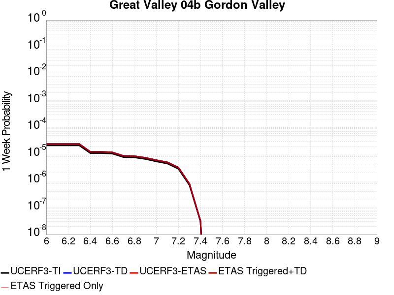 | 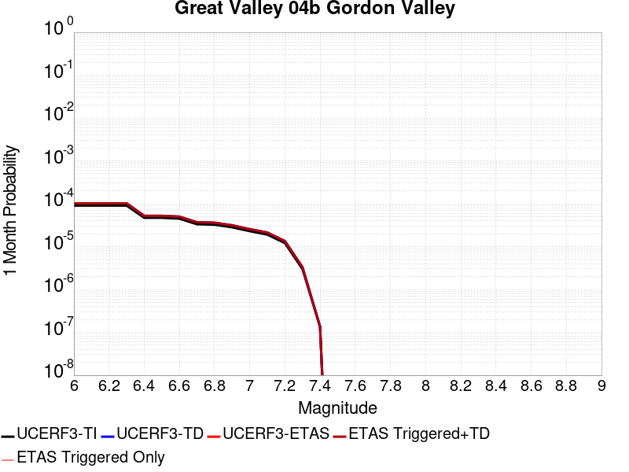 | 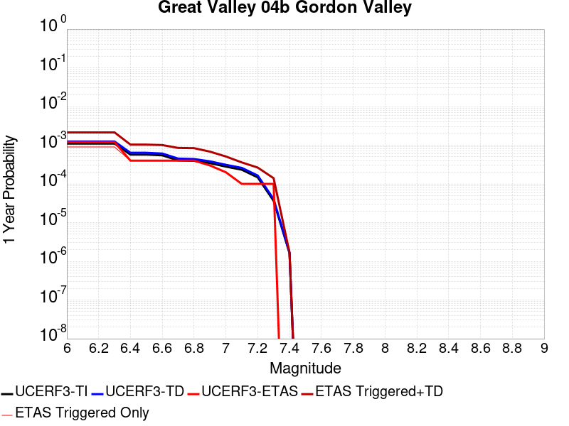 | 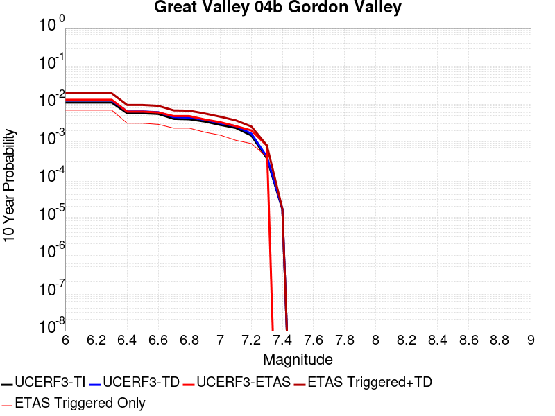 |

| Magnitude | 1 wk TI Prob | 1 wk TD Prob | 1 wk ETAS Prob | 1 wk ETAS/TD Gain | 1 wk ETAS Triggered+TD | 1 wk ETAS Triggered Only | 1 mo TI Prob | 1 mo TD Prob | 1 mo ETAS Prob | 1 mo ETAS/TD Gain | 1 mo ETAS Triggered+TD | 1 mo ETAS Triggered Only | 1 yr TI Prob | 1 yr TD Prob | 1 yr ETAS Prob | 1 yr ETAS/TD Gain | 1 yr ETAS Triggered+TD | 1 yr ETAS Triggered Only | 10 yr TI Prob | 10 yr TD Prob | 10 yr ETAS Prob | 10 yr ETAS/TD Gain | 10 yr ETAS Triggered+TD | 10 yr ETAS Triggered Only |
|-----|-----|-----|-----|-----|-----|-----|-----|-----|-----|-----|-----|-----|-----|-----|-----|-----|-----|-----|-----|-----|-----|-----|-----|-----|
| 6.0 | 2.1181217E-5 | 2.3948787E-5 | 0.0 | 0.0 | 2.3948787E-5 | 0.0 | 9.077348E-5 | 1.02634556E-4 | 0.0 | 0.0 | 1.02634556E-4 | 0.0 | 0.0011046068 | 0.0012490256 | 0.0012 | 0.960749 | 0.0021479013 | 9.0E-4 | 0.010991322 | 0.012436455 | 0.013 | 1.045314 | 0.019250643 | 0.0069 |
| 6.1 | 2.1181217E-5 | 2.3948787E-5 | 0.0 | 0.0 | 2.3948787E-5 | 0.0 | 9.077348E-5 | 1.02634556E-4 | 0.0 | 0.0 | 1.02634556E-4 | 0.0 | 0.0011046068 | 0.0012490256 | 0.0012 | 0.960749 | 0.0021479013 | 9.0E-4 | 0.010991322 | 0.012436455 | 0.013 | 1.045314 | 0.019250643 | 0.0069 |
| 6.2 | 2.1181217E-5 | 2.3948787E-5 | 0.0 | 0.0 | 2.3948787E-5 | 0.0 | 9.077348E-5 | 1.02634556E-4 | 0.0 | 0.0 | 1.02634556E-4 | 0.0 | 0.0011046068 | 0.0012490256 | 0.0012 | 0.960749 | 0.0021479013 | 9.0E-4 | 0.010991322 | 0.012436455 | 0.013 | 1.045314 | 0.019250643 | 0.0069 |
| 6.3 | 2.1181217E-5 | 2.3948787E-5 | 0.0 | 0.0 | 2.3948787E-5 | 0.0 | 9.077348E-5 | 1.02634556E-4 | 0.0 | 0.0 | 1.02634556E-4 | 0.0 | 0.0011046068 | 0.0012490256 | 0.0012 | 0.960749 | 0.0021479013 | 9.0E-4 | 0.010991322 | 0.012436455 | 0.013 | 1.045314 | 0.019250643 | 0.0069 |
| 6.4 | 1.0988268E-5 | 1.22397605E-5 | 0.0 | 0.0 | 1.22397605E-5 | 0.0 | 4.7091726E-5 | 5.245515E-5 | 0.0 | 0.0 | 5.245515E-5 | 0.0 | 5.731909E-4 | 6.384702E-4 | 4.0E-4 | 0.6264975 | 0.0010382149 | 4.0E-4 | 0.005717147 | 0.006367942 | 0.0063 | 0.9893306 | 0.009448201 | 0.0031 |
| 6.5 | 1.0988268E-5 | 1.22397605E-5 | 0.0 | 0.0 | 1.22397605E-5 | 0.0 | 4.7091726E-5 | 5.245515E-5 | 0.0 | 0.0 | 5.245515E-5 | 0.0 | 5.731909E-4 | 6.384702E-4 | 4.0E-4 | 0.6264975 | 0.0010382149 | 4.0E-4 | 0.005717147 | 0.006367942 | 0.0063 | 0.9893306 | 0.009448201 | 0.0031 |
| 6.6 | 1.0517822E-5 | 1.1710029E-5 | 0.0 | 0.0 | 1.1710029E-5 | 0.0 | 4.5075605E-5 | 5.018496E-5 | 0.0 | 0.0 | 5.018496E-5 | 0.0 | 5.4865726E-4 | 6.108462E-4 | 4.0E-4 | 0.6548293 | 0.0010106019 | 4.0E-4 | 0.0054730466 | 0.0060932217 | 0.006 | 0.9847008 | 0.008975551 | 0.0029 |
| 6.7 | 7.789219E-6 | 8.667313E-6 | 0.0 | 0.0 | 8.667313E-6 | 0.0 | 3.3381937E-5 | 3.7145124E-5 | 0.0 | 0.0 | 3.7145124E-5 | 0.0 | 4.063493E-4 | 4.521532E-4 | 4.0E-4 | 0.8846559 | 8.519724E-4 | 4.0E-4 | 0.004056071 | 0.0045128483 | 0.0048 | 1.0636297 | 0.006802469 | 0.0023 |
| 6.8 | 7.5850853E-6 | 8.4423E-6 | 0.0 | 0.0 | 8.4423E-6 | 0.0 | 3.2507105E-5 | 3.6180812E-5 | 0.0 | 0.0 | 3.6180812E-5 | 0.0 | 3.957021E-4 | 4.404175E-4 | 4.0E-4 | 0.9082291 | 8.402413E-4 | 4.0E-4 | 0.0039499826 | 0.004395958 | 0.0048 | 1.0919122 | 0.006685847 | 0.0023 |
| 6.9 | 6.604105E-6 | 7.349773E-6 | 0.0 | 0.0 | 7.349773E-6 | 0.0 | 2.8303E-5 | 3.149867E-5 | 0.0 | 0.0 | 3.149867E-5 | 0.0 | 3.4453452E-4 | 3.8343266E-4 | 3.0E-4 | 0.7824059 | 6.8331766E-4 | 3.0E-4 | 0.0034400085 | 0.0038280967 | 0.0039 | 1.0187831 | 0.005621206 | 0.0018 |
| 7.0 | 5.3701115E-6 | 5.9812187E-6 | 0.0 | 0.0 | 5.9812187E-6 | 0.0 | 2.301456E-5 | 2.5633559E-5 | 0.0 | 0.0 | 2.5633559E-5 | 0.0 | 2.8016625E-4 | 3.120468E-4 | 2.0E-4 | 0.6409295 | 5.119844E-4 | 2.0E-4 | 0.0027981328 | 0.0031163741 | 0.0033 | 1.0589229 | 0.0046116994 | 0.0015 |
| 7.1 | 4.4685607E-6 | 4.980442E-6 | 0.0 | 0.0 | 4.980442E-6 | 0.0 | 1.9150835E-5 | 2.1344591E-5 | 0.0 | 0.0 | 2.1344591E-5 | 0.0 | 2.3313647E-4 | 2.5984188E-4 | 1.0E-4 | 0.38484943 | 3.598159E-4 | 1.0E-4 | 0.0023289204 | 0.002595625 | 0.0026 | 1.0016856 | 0.0036927697 | 0.0011 |
| 7.2 | 2.833378E-6 | 3.160555E-6 | 0.0 | 0.0 | 3.160555E-6 | 0.0 | 1.2142991E-5 | 1.3545175E-5 | 0.0 | 0.0 | 1.3545175E-5 | 0.0 | 1.4783088E-4 | 1.6490176E-4 | 1.0E-4 | 0.60642165 | 2.6488528E-4 | 1.0E-4 | 0.0014773258 | 0.0016479655 | 0.002 | 1.2136177 | 0.0025464823 | 9.0E-4 |
| 7.3 | 7.0087293E-7 | 7.763911E-7 | 0.0 | 0.0 | 7.763911E-7 | 0.0 | 3.0037377E-6 | 3.3273889E-6 | 0.0 | 0.0 | 3.3273889E-6 | 0.0 | 3.656989E-5 | 4.0510662E-5 | 1.0E-4 | 2.4684858 | 1.4050661E-4 | 1.0E-4 | 3.6563876E-4 | 4.0507765E-4 | 8.0E-4 | 1.97493 | 8.049156E-4 | 4.0E-4 |
| 7.4 | 3.112171E-8 | 3.2058175E-8 | 0.0 | 0.0 | 3.2058175E-8 | 0.0 | 1.3337875E-7 | 1.3739218E-7 | 0.0 | 0.0 | 1.3739218E-7 | 0.0 | 1.6238852E-6 | 1.6727486E-6 | 0.0 | 0.0 | 1.6727486E-6 | 0.0 | 1.6238733E-5 | 1.6727368E-5 | 0.0 | 0.0 | 1.6727368E-5 | 0.0 |

## King Range 2011 CFM
*[(top)](#table-of-contents)*

| 1 Week | 1 Month | 1 Year | 10 Year |
|-----|-----|-----|-----|
| 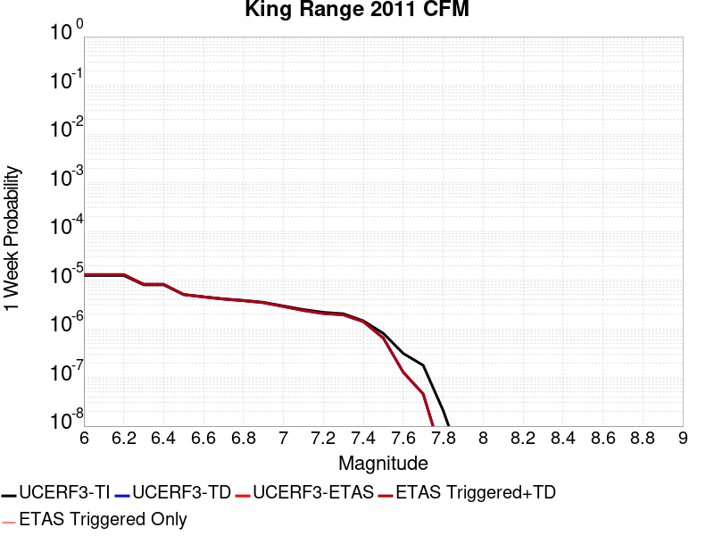 | 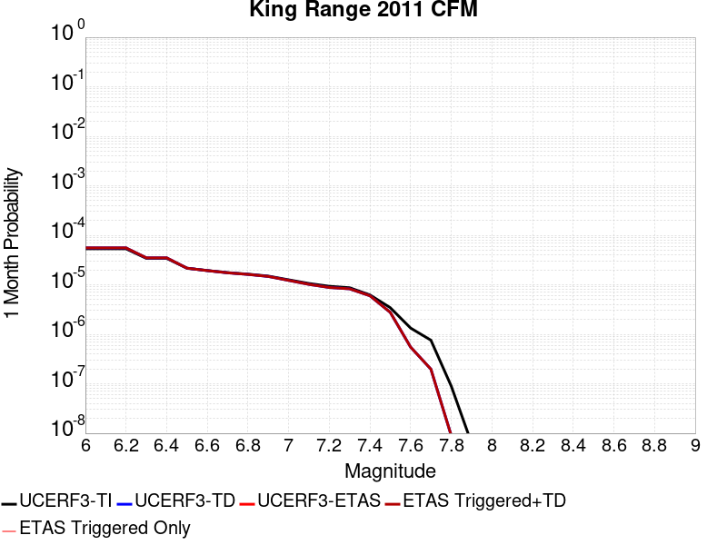 | 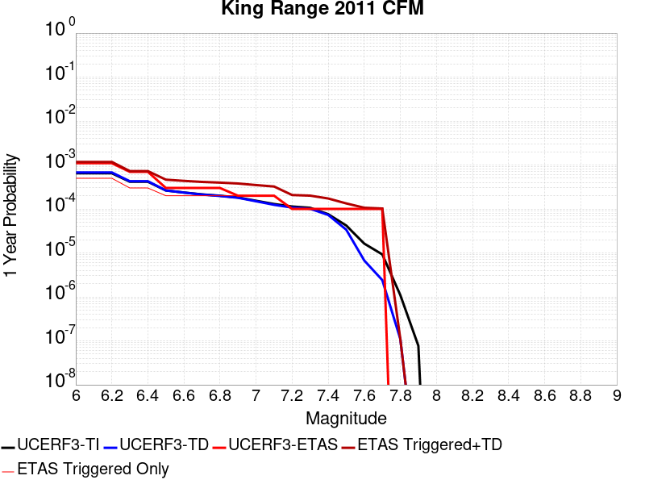 | 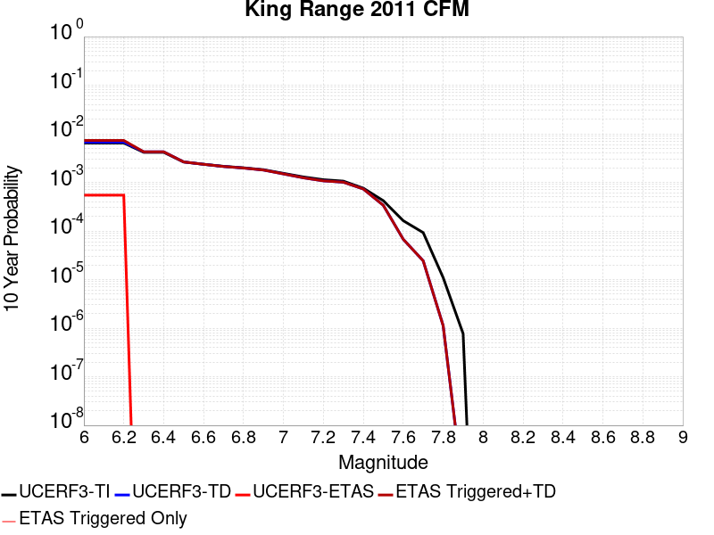 |

| Magnitude | 1 wk TI Prob | 1 wk TD Prob | 1 wk ETAS Prob | 1 wk ETAS/TD Gain | 1 wk ETAS Triggered+TD | 1 wk ETAS Triggered Only | 1 mo TI Prob | 1 mo TD Prob | 1 mo ETAS Prob | 1 mo ETAS/TD Gain | 1 mo ETAS Triggered+TD | 1 mo ETAS Triggered Only | 1 yr TI Prob | 1 yr TD Prob | 1 yr ETAS Prob | 1 yr ETAS/TD Gain | 1 yr ETAS Triggered+TD | 1 yr ETAS Triggered Only | 10 yr TI Prob | 10 yr TD Prob | 10 yr ETAS Prob | 10 yr ETAS/TD Gain | 10 yr ETAS Triggered+TD | 10 yr ETAS Triggered Only |
|-----|-----|-----|-----|-----|-----|-----|-----|-----|-----|-----|-----|-----|-----|-----|-----|-----|-----|-----|-----|-----|-----|-----|-----|-----|
| 6.0 | 1.2462566E-5 | 1.2997194E-5 | 0.0 | 0.0 | 1.2997194E-5 | 0.0 | 5.34099E-5 | 5.5701268E-5 | 0.0 | 0.0 | 5.5701268E-5 | 0.0 | 6.5007154E-4 | 6.7798677E-4 | 0.0011 | 1.6224506 | 0.0011776477 | 5.0E-4 | 0.0064817313 | 0.006763527 | 0.0118 | 1.7446518 | 0.013418212 | 0.0067 |
| 6.1 | 1.2462566E-5 | 1.2997194E-5 | 0.0 | 0.0 | 1.2997194E-5 | 0.0 | 5.34099E-5 | 5.5701268E-5 | 0.0 | 0.0 | 5.5701268E-5 | 0.0 | 6.5007154E-4 | 6.7798677E-4 | 0.0011 | 1.6224506 | 0.0011776477 | 5.0E-4 | 0.0064817313 | 0.006763527 | 0.0118 | 1.7446518 | 0.013418212 | 0.0067 |
| 6.2 | 1.2462566E-5 | 1.2997194E-5 | 0.0 | 0.0 | 1.2997194E-5 | 0.0 | 5.34099E-5 | 5.5701268E-5 | 0.0 | 0.0 | 5.5701268E-5 | 0.0 | 6.5007154E-4 | 6.7798677E-4 | 0.0011 | 1.6224506 | 0.0011776477 | 5.0E-4 | 0.0064817313 | 0.006763527 | 0.0118 | 1.7446518 | 0.013418212 | 0.0067 |
| 6.3 | 7.988484E-6 | 8.192066E-6 | 0.0 | 0.0 | 8.192066E-6 | 0.0 | 3.423591E-5 | 3.5108456E-5 | 0.0 | 0.0 | 3.5108456E-5 | 0.0 | 4.1674246E-4 | 4.2737453E-4 | 7.0E-4 | 1.6379076 | 7.2724634E-4 | 3.0E-4 | 0.004159618 | 0.0042677047 | 0.0066 | 1.5464988 | 0.007951914 | 0.0037 |
| 6.4 | 7.988484E-6 | 8.192066E-6 | 0.0 | 0.0 | 8.192066E-6 | 0.0 | 3.423591E-5 | 3.5108456E-5 | 0.0 | 0.0 | 3.5108456E-5 | 0.0 | 4.1674246E-4 | 4.2737453E-4 | 7.0E-4 | 1.6379076 | 7.2724634E-4 | 3.0E-4 | 0.004159618 | 0.0042677047 | 0.0066 | 1.5464988 | 0.007951914 | 0.0037 |
| 6.5 | 5.0522513E-6 | 5.0627064E-6 | 0.0 | 0.0 | 5.0627064E-6 | 0.0 | 2.1652326E-5 | 2.1697138E-5 | 0.0 | 0.0 | 2.1697138E-5 | 0.0 | 2.6358519E-4 | 2.6413158E-4 | 3.0E-4 | 1.1357976 | 4.6407874E-4 | 2.0E-4 | 0.0026327274 | 0.002639178 | 0.0027 | 1.0230458 | 0.0041352194 | 0.0015 |
| 6.6 | 4.53682E-6 | 4.519797E-6 | 0.0 | 0.0 | 4.519797E-6 | 0.0 | 1.944337E-5 | 1.9370418E-5 | 0.0 | 0.0 | 1.9370418E-5 | 0.0 | 2.3669732E-4 | 2.3580993E-4 | 3.0E-4 | 1.2722111 | 4.3576278E-4 | 2.0E-4 | 0.0023644536 | 0.0023565663 | 0.0019 | 0.80625784 | 0.0033542097 | 0.001 |
| 6.7 | 4.1144335E-6 | 4.0780697E-6 | 0.0 | 0.0 | 4.0780697E-6 | 0.0 | 1.7633167E-5 | 1.7477325E-5 | 0.0 | 0.0 | 1.7477325E-5 | 0.0 | 2.1466266E-4 | 2.1276606E-4 | 3.0E-4 | 1.4099994 | 4.1272352E-4 | 2.0E-4 | 0.0021445542 | 0.0021265717 | 0.0016 | 0.75238466 | 0.0029248705 | 8.0E-4 |
| 6.8 | 3.8321214E-6 | 3.7889977E-6 | 0.0 | 0.0 | 3.7889977E-6 | 0.0 | 1.6423275E-5 | 1.6238462E-5 | 0.0 | 0.0 | 1.6238462E-5 | 0.0 | 1.9993502E-4 | 1.9768567E-4 | 3.0E-4 | 1.5175606 | 3.9764613E-4 | 2.0E-4 | 0.0019975523 | 0.0019760402 | 0.0011 | 0.5566688 | 0.002674657 | 7.0E-4 |
| 6.9 | 3.4999944E-6 | 3.4458687E-6 | 0.0 | 0.0 | 3.4458687E-6 | 0.0 | 1.499989E-5 | 1.47679275E-5 | 0.0 | 0.0 | 1.47679275E-5 | 0.0 | 1.8260835E-4 | 1.7978493E-4 | 2.0E-4 | 1.1124402 | 3.7974896E-4 | 2.0E-4 | 0.0018245836 | 0.001797329 | 8.0E-4 | 0.44510493 | 0.002496071 | 7.0E-4 |
| 7.0 | 2.9470837E-6 | 2.8697934E-6 | 0.0 | 0.0 | 2.8697934E-6 | 0.0 | 1.26302975E-5 | 1.2299058E-5 | 0.0 | 0.0 | 1.2299058E-5 | 0.0 | 1.5376302E-4 | 1.4973091E-4 | 2.0E-4 | 1.3357295 | 3.4970097E-4 | 2.0E-4 | 0.0015365666 | 0.0014972248 | 7.0E-4 | 0.46753168 | 0.0020963263 | 6.0E-4 |
| 7.1 | 2.4850247E-6 | 2.383142E-6 | 0.0 | 0.0 | 2.383142E-6 | 0.0 | 1.0650062E-5 | 1.0213426E-5 | 0.0 | 0.0 | 1.0213426E-5 | 0.0 | 1.296568E-4 | 1.243415E-4 | 2.0E-4 | 1.6084733 | 3.2431664E-4 | 2.0E-4 | 0.0012958117 | 0.0012436406 | 5.0E-4 | 0.40204543 | 0.0016431431 | 4.0E-4 |
| 7.2 | 2.1800304E-6 | 2.062209E-6 | 0.0 | 0.0 | 2.062209E-6 | 0.0 | 9.342954E-6 | 8.838009E-6 | 0.0 | 0.0 | 8.838009E-6 | 0.0 | 1.1374453E-4 | 1.0759754E-4 | 1.0E-4 | 0.9293893 | 2.0758678E-4 | 1.0E-4 | 0.0011368633 | 0.0010763576 | 4.0E-4 | 0.37162372 | 0.0013760346 | 3.0E-4 |
| 7.3 | 2.0378504E-6 | 1.9371457E-6 | 0.0 | 0.0 | 1.9371457E-6 | 0.0 | 8.733615E-6 | 8.302027E-6 | 0.0 | 0.0 | 8.302027E-6 | 0.0 | 1.0632657E-4 | 1.01072575E-4 | 1.0E-4 | 0.98938805 | 2.0106247E-4 | 1.0E-4 | 0.0010627571 | 0.0010111535 | 4.0E-4 | 0.39558783 | 0.00131085 | 3.0E-4 |
| 7.4 | 1.4577047E-6 | 1.4024962E-6 | 0.0 | 0.0 | 1.4024962E-6 | 0.0 | 6.247291E-6 | 6.0106845E-6 | 0.0 | 0.0 | 6.0106845E-6 | 0.0 | 7.605811E-5 | 7.3177696E-5 | 1.0E-4 | 1.3665365 | 1.7317038E-4 | 1.0E-4 | 7.603208E-4 | 7.323645E-4 | 3.0E-4 | 0.4096321 | 9.3221804E-4 | 2.0E-4 |
| 7.5 | 8.0685743E-7 | 6.4841555E-7 | 0.0 | 0.0 | 6.4841555E-7 | 0.0 | 3.457956E-6 | 2.7789213E-6 | 0.0 | 0.0 | 2.7789213E-6 | 0.0 | 4.20998E-5 | 3.3832886E-5 | 1.0E-4 | 2.955704 | 1.3382951E-4 | 1.0E-4 | 4.2091825E-4 | 3.3895596E-4 | 2.0E-4 | 0.5900471 | 5.3888815E-4 | 2.0E-4 |
| 7.6 | 3.1239435E-7 | 1.2903283E-7 | 0.0 | 0.0 | 1.2903283E-7 | 0.0 | 1.3388321E-6 | 5.5299773E-7 | 0.0 | 0.0 | 5.5299773E-7 | 0.0 | 1.630016E-5 | 6.7327273E-6 | 1.0E-4 | 14.852822 | 1.06732055E-4 | 1.0E-4 | 1.6298964E-4 | 6.795989E-5 | 1.0E-4 | 1.4714562 | 1.679531E-4 | 1.0E-4 |
| 7.7 | 1.7747207E-7 | 4.616173E-8 | 0.0 | 0.0 | 4.616173E-8 | 0.0 | 7.605944E-7 | 1.9783597E-7 | 0.0 | 0.0 | 1.9783597E-7 | 0.0 | 9.260198E-6 | 2.4086503E-6 | 1.0E-4 | 41.517025 | 1.0240841E-4 | 1.0E-4 | 9.2598115E-5 | 2.4489005E-5 | 1.0E-4 | 4.083465 | 1.2448656E-4 | 1.0E-4 |
| 7.8 | 2.1035538E-8 | 2.1083004E-9 | 0.0 | 0.0 | 2.1083004E-9 | 0.0 | 9.0152305E-8 | 9.035576E-9 | 0.0 | 0.0 | 9.035576E-9 | 0.0 | 1.0976038E-6 | 1.1000813E-7 | 0.0 | 0.0 | 1.1000813E-7 | 0.0 | 1.0975983E-5 | 1.1349382E-6 | 0.0 | 0.0 | 1.1349382E-6 | 0.0 |
| 7.9 | 1.4782963E-9 | 6.515899E-13 | 0.0 | 0.0 | 6.515899E-13 | 0.0 | 6.335555E-9 | 2.792544E-12 | 0.0 | 0.0 | 2.792544E-12 | 0.0 | 7.713538E-8 | 3.3998915E-11 | 0.0 | 0.0 | 3.3998915E-11 | 0.0 | 7.7135354E-7 | 4.9558346E-10 | 0.0 | 0.0 | 4.9558346E-10 | 0.0 |

## Bullion Mountains
*[(top)](#table-of-contents)*

| 1 Week | 1 Month | 1 Year | 10 Year |
|-----|-----|-----|-----|
| 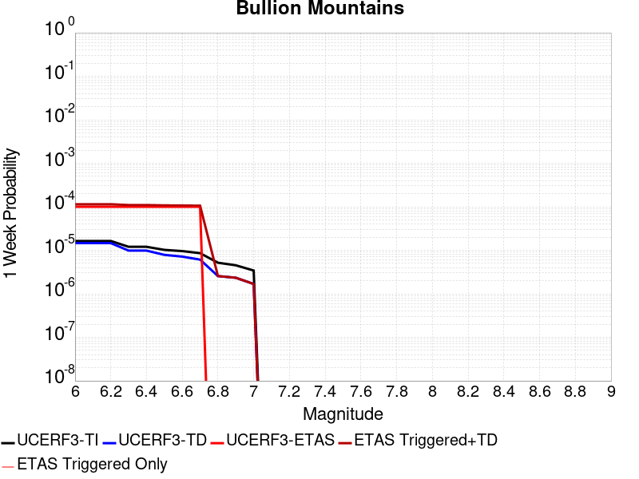 | 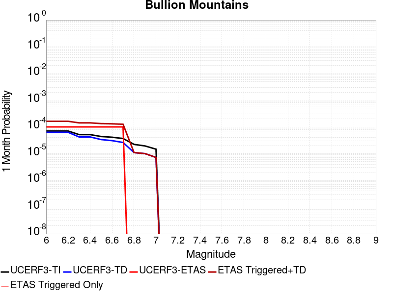 | 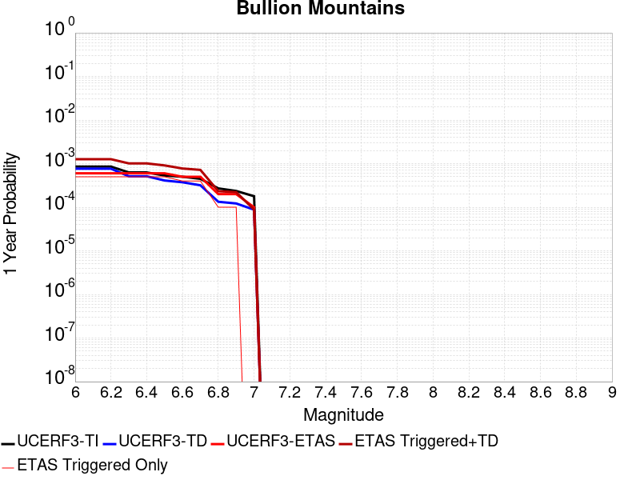 | 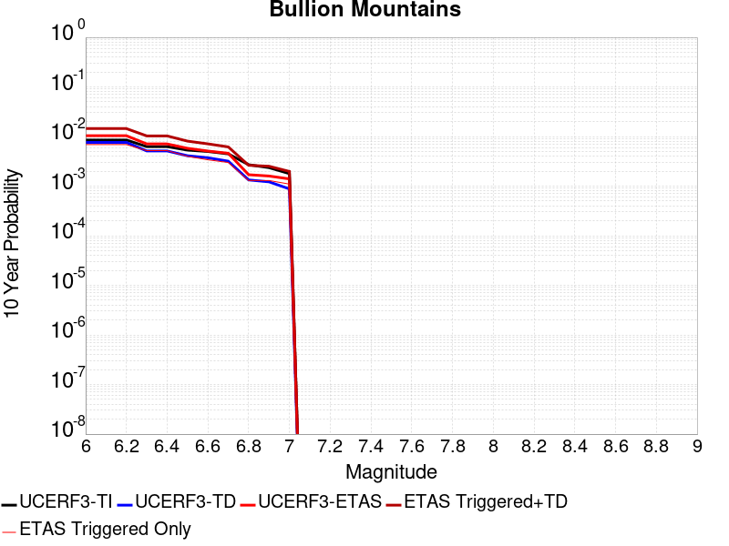 |

| Magnitude | 1 wk TI Prob | 1 wk TD Prob | 1 wk ETAS Prob | 1 wk ETAS/TD Gain | 1 wk ETAS Triggered+TD | 1 wk ETAS Triggered Only | 1 mo TI Prob | 1 mo TD Prob | 1 mo ETAS Prob | 1 mo ETAS/TD Gain | 1 mo ETAS Triggered+TD | 1 mo ETAS Triggered Only | 1 yr TI Prob | 1 yr TD Prob | 1 yr ETAS Prob | 1 yr ETAS/TD Gain | 1 yr ETAS Triggered+TD | 1 yr ETAS Triggered Only | 10 yr TI Prob | 10 yr TD Prob | 10 yr ETAS Prob | 10 yr ETAS/TD Gain | 10 yr ETAS Triggered+TD | 10 yr ETAS Triggered Only |
|-----|-----|-----|-----|-----|-----|-----|-----|-----|-----|-----|-----|-----|-----|-----|-----|-----|-----|-----|-----|-----|-----|-----|-----|-----|
| 6.0 | 1.6420427E-5 | 1.4674631E-5 | 1.0E-4 | 6.8144813 | 1.1467317E-4 | 1.0E-4 | 7.037136E-5 | 6.288997E-5 | 1.0E-4 | 1.5900786 | 1.6288369E-4 | 1.0E-4 | 8.5643446E-4 | 7.654547E-4 | 6.0E-4 | 0.7838478 | 0.001265072 | 5.0E-4 | 0.008531413 | 0.0076319664 | 0.0104 | 1.3626894 | 0.014479306 | 0.0069 |
| 6.1 | 1.6420427E-5 | 1.4674631E-5 | 1.0E-4 | 6.8144813 | 1.1467317E-4 | 1.0E-4 | 7.037136E-5 | 6.288997E-5 | 1.0E-4 | 1.5900786 | 1.6288369E-4 | 1.0E-4 | 8.5643446E-4 | 7.654547E-4 | 6.0E-4 | 0.7838478 | 0.001265072 | 5.0E-4 | 0.008531413 | 0.0076319664 | 0.0104 | 1.3626894 | 0.014479306 | 0.0069 |
| 6.2 | 1.6420427E-5 | 1.4674631E-5 | 1.0E-4 | 6.8144813 | 1.1467317E-4 | 1.0E-4 | 7.037136E-5 | 6.288997E-5 | 1.0E-4 | 1.5900786 | 1.6288369E-4 | 1.0E-4 | 8.5643446E-4 | 7.654547E-4 | 6.0E-4 | 0.7838478 | 0.001265072 | 5.0E-4 | 0.008531413 | 0.0076319664 | 0.0104 | 1.3626894 | 0.014479306 | 0.0069 |
| 6.3 | 1.2046778E-5 | 9.850133E-6 | 1.0E-4 | 10.152146 | 1.0984915E-4 | 1.0E-4 | 5.1628023E-5 | 4.2214306E-5 | 1.0E-4 | 2.3688653 | 1.4221009E-4 | 1.0E-4 | 6.283899E-4 | 5.138611E-4 | 6.0E-4 | 1.1676308 | 0.0010136041 | 5.0E-4 | 0.0062661595 | 0.0051290053 | 0.0071 | 1.384284 | 0.010302334 | 0.0052 |
| 6.4 | 1.2046778E-5 | 9.850133E-6 | 1.0E-4 | 10.152146 | 1.0984915E-4 | 1.0E-4 | 5.1628023E-5 | 4.2214306E-5 | 1.0E-4 | 2.3688653 | 1.4221009E-4 | 1.0E-4 | 6.283899E-4 | 5.138611E-4 | 6.0E-4 | 1.1676308 | 0.0010136041 | 5.0E-4 | 0.0062661595 | 0.0051290053 | 0.0071 | 1.384284 | 0.010302334 | 0.0052 |
| 6.5 | 1.0244343E-5 | 7.869328E-6 | 1.0E-4 | 12.707565 | 1.0786854E-4 | 1.0E-4 | 4.390359E-5 | 3.3725373E-5 | 1.0E-4 | 2.9651268 | 1.33722E-4 | 1.0E-4 | 5.343951E-4 | 4.105497E-4 | 6.0E-4 | 1.4614553 | 9.103444E-4 | 5.0E-4 | 0.005331118 | 0.004099939 | 0.0058 | 1.4146552 | 0.008083539 | 0.004 |
| 6.6 | 9.605408E-6 | 7.168089E-6 | 1.0E-4 | 13.95072 | 1.0716737E-4 | 1.0E-4 | 4.1165385E-5 | 3.0720134E-5 | 1.0E-4 | 3.2551942 | 1.3071706E-4 | 1.0E-4 | 5.010733E-4 | 3.7397374E-4 | 5.0E-4 | 1.3369923 | 7.738241E-4 | 4.0E-4 | 0.00499945 | 0.0037354366 | 0.0051 | 1.3653022 | 0.007122736 | 0.0034 |
| 6.7 | 8.60418E-6 | 6.116E-6 | 1.0E-4 | 16.350555 | 1.0611539E-4 | 1.0E-4 | 3.687454E-5 | 2.6211275E-5 | 1.0E-4 | 3.8151522 | 1.2620866E-4 | 1.0E-4 | 4.48855E-4 | 3.1909498E-4 | 5.0E-4 | 1.5669316 | 7.1896735E-4 | 4.0E-4 | 0.004479495 | 0.0031882757 | 0.0046 | 1.4427862 | 0.0061787106 | 0.003 |
| 6.8 | 5.187994E-6 | 2.559023E-6 | 0.0 | 0.0 | 2.559023E-6 | 0.0 | 2.223407E-5 | 1.0967218E-5 | 0.0 | 0.0 | 1.0967218E-5 | 0.0 | 2.7066618E-4 | 1.3352168E-4 | 2.0E-4 | 1.4978842 | 2.3350833E-4 | 1.0E-4 | 0.0027033675 | 0.0013348049 | 0.0017 | 1.2735944 | 0.0026330696 | 0.0013 |
| 6.9 | 4.5302368E-6 | 2.3407447E-6 | 0.0 | 0.0 | 2.3407447E-6 | 0.0 | 1.9415156E-5 | 1.0031747E-5 | 0.0 | 0.0 | 1.0031747E-5 | 0.0 | 2.3635388E-4 | 1.2213363E-4 | 2.0E-4 | 1.6375506 | 2.2212142E-4 | 1.0E-4 | 0.0023610266 | 0.001221053 | 0.0016 | 1.3103445 | 0.0025194655 | 0.0013 |
| 7.0 | 3.431668E-6 | 1.6854751E-6 | 0.0 | 0.0 | 1.6854751E-6 | 0.0 | 1.4707065E-5 | 7.2234648E-6 | 0.0 | 0.0 | 7.2234648E-6 | 0.0 | 1.7904381E-4 | 8.7945686E-5 | 1.0E-4 | 1.1370654 | 8.7945686E-5 | 0.0 | 0.0017889962 | 8.794568E-4 | 0.0014 | 1.5918916 | 0.0019784893 | 0.0011 |

## Garberville - Briceland 2011 CFM
*[(top)](#table-of-contents)*

| 1 Week | 1 Month | 1 Year | 10 Year |
|-----|-----|-----|-----|
| 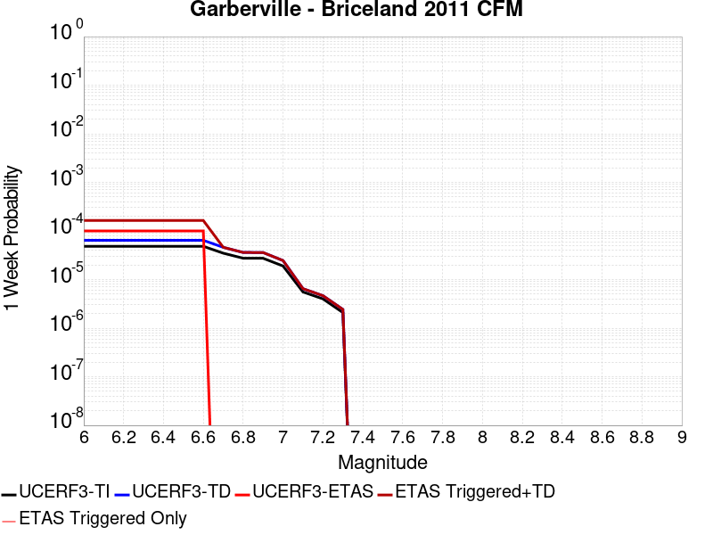 | 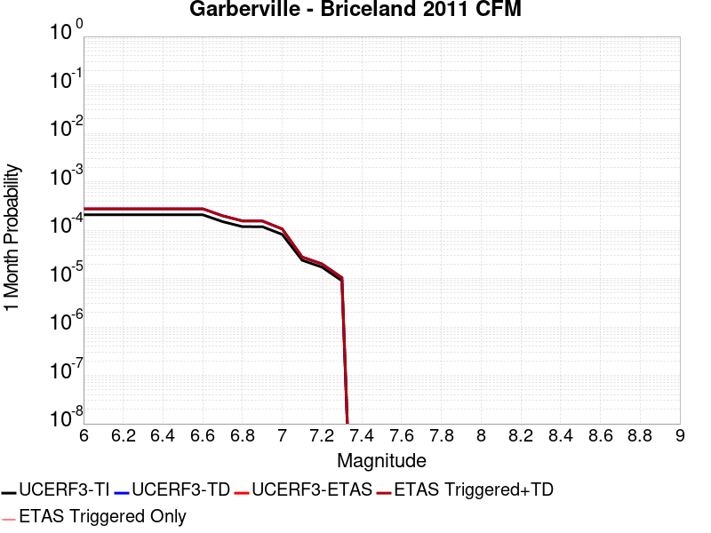 | 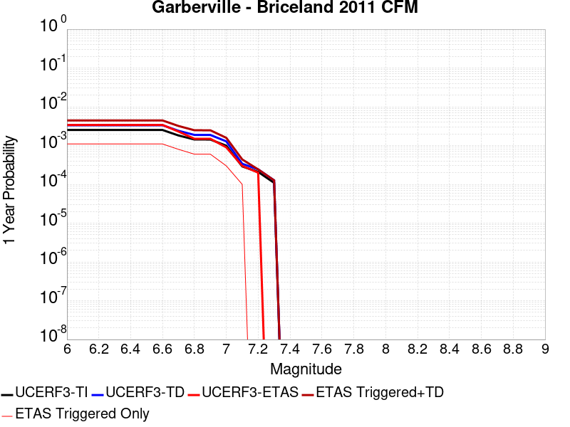 | 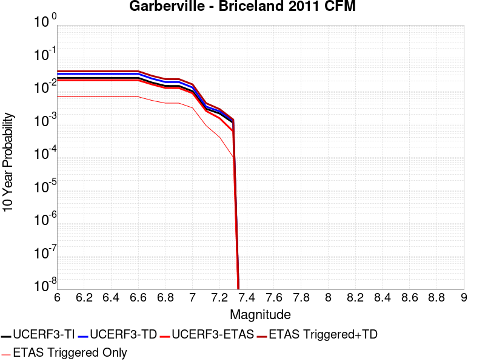 |

| Magnitude | 1 wk TI Prob | 1 wk TD Prob | 1 wk ETAS Prob | 1 wk ETAS/TD Gain | 1 wk ETAS Triggered+TD | 1 wk ETAS Triggered Only | 1 mo TI Prob | 1 mo TD Prob | 1 mo ETAS Prob | 1 mo ETAS/TD Gain | 1 mo ETAS Triggered+TD | 1 mo ETAS Triggered Only | 1 yr TI Prob | 1 yr TD Prob | 1 yr ETAS Prob | 1 yr ETAS/TD Gain | 1 yr ETAS Triggered+TD | 1 yr ETAS Triggered Only | 10 yr TI Prob | 10 yr TD Prob | 10 yr ETAS Prob | 10 yr ETAS/TD Gain | 10 yr ETAS Triggered+TD | 10 yr ETAS Triggered Only |
|-----|-----|-----|-----|-----|-----|-----|-----|-----|-----|-----|-----|-----|-----|-----|-----|-----|-----|-----|-----|-----|-----|-----|-----|-----|
| 6.0 | 4.8399295E-5 | 6.430683E-5 | 1.0E-4 | 1.5550449 | 1.6430039E-4 | 1.0E-4 | 2.0740906E-4 | 2.7557573E-4 | 5.0E-4 | 1.8143833 | 5.7549303E-4 | 3.0E-4 | 0.002522281 | 0.0033506495 | 0.0034 | 1.0147287 | 0.004446964 | 0.0011 | 0.024938442 | 0.033067785 | 0.0212 | 0.6411074 | 0.03954623 | 0.0067 |
| 6.1 | 4.8399295E-5 | 6.430683E-5 | 1.0E-4 | 1.5550449 | 1.6430039E-4 | 1.0E-4 | 2.0740906E-4 | 2.7557573E-4 | 5.0E-4 | 1.8143833 | 5.7549303E-4 | 3.0E-4 | 0.002522281 | 0.0033506495 | 0.0034 | 1.0147287 | 0.004446964 | 0.0011 | 0.024938442 | 0.033067785 | 0.0212 | 0.6411074 | 0.03954623 | 0.0067 |
| 6.2 | 4.8399295E-5 | 6.430683E-5 | 1.0E-4 | 1.5550449 | 1.6430039E-4 | 1.0E-4 | 2.0740906E-4 | 2.7557573E-4 | 5.0E-4 | 1.8143833 | 5.7549303E-4 | 3.0E-4 | 0.002522281 | 0.0033506495 | 0.0034 | 1.0147287 | 0.004446964 | 0.0011 | 0.024938442 | 0.033067785 | 0.0212 | 0.6411074 | 0.03954623 | 0.0067 |
| 6.3 | 4.8399295E-5 | 6.430683E-5 | 1.0E-4 | 1.5550449 | 1.6430039E-4 | 1.0E-4 | 2.0740906E-4 | 2.7557573E-4 | 5.0E-4 | 1.8143833 | 5.7549303E-4 | 3.0E-4 | 0.002522281 | 0.0033506495 | 0.0034 | 1.0147287 | 0.004446964 | 0.0011 | 0.024938442 | 0.033067785 | 0.0212 | 0.6411074 | 0.03954623 | 0.0067 |
| 6.4 | 4.8399295E-5 | 6.430683E-5 | 1.0E-4 | 1.5550449 | 1.6430039E-4 | 1.0E-4 | 2.0740906E-4 | 2.7557573E-4 | 5.0E-4 | 1.8143833 | 5.7549303E-4 | 3.0E-4 | 0.002522281 | 0.0033506495 | 0.0034 | 1.0147287 | 0.004446964 | 0.0011 | 0.024938442 | 0.033067785 | 0.0212 | 0.6411074 | 0.03954623 | 0.0067 |
| 6.5 | 4.8399295E-5 | 6.430683E-5 | 1.0E-4 | 1.5550449 | 1.6430039E-4 | 1.0E-4 | 2.0740906E-4 | 2.7557573E-4 | 5.0E-4 | 1.8143833 | 5.7549303E-4 | 3.0E-4 | 0.002522281 | 0.0033506495 | 0.0034 | 1.0147287 | 0.004446964 | 0.0011 | 0.024938442 | 0.033067785 | 0.0212 | 0.6411074 | 0.03954623 | 0.0067 |
| 6.6 | 4.8399295E-5 | 6.430683E-5 | 1.0E-4 | 1.5550449 | 1.6430039E-4 | 1.0E-4 | 2.0740906E-4 | 2.7557573E-4 | 5.0E-4 | 1.8143833 | 5.7549303E-4 | 3.0E-4 | 0.002522281 | 0.0033506495 | 0.0034 | 1.0147287 | 0.004446964 | 0.0011 | 0.024938442 | 0.033067785 | 0.0212 | 0.6411074 | 0.03954623 | 0.0067 |
| 6.7 | 3.495179E-5 | 4.6151727E-5 | 0.0 | 0.0 | 4.6151727E-5 | 0.0 | 1.4978478E-4 | 1.9778109E-4 | 2.0E-4 | 1.011219 | 2.9776132E-4 | 1.0E-4 | 0.0018221042 | 0.0024058553 | 0.0023 | 0.956001 | 0.0032039306 | 8.0E-4 | 0.018072363 | 0.02385034 | 0.0159 | 0.66665715 | 0.028926319 | 0.0052 |
| 6.8 | 2.7517597E-5 | 3.612118E-5 | 0.0 | 0.0 | 3.612118E-5 | 0.0 | 1.1792722E-4 | 1.5479849E-4 | 1.0E-4 | 0.64600116 | 1.5479849E-4 | 0.0 | 0.0014348183 | 0.0018835143 | 0.0015 | 0.7963837 | 0.0024823842 | 6.0E-4 | 0.014255894 | 0.018721653 | 0.0124 | 0.6623347 | 0.02294115 | 0.0043 |
| 6.9 | 2.74461E-5 | 3.6039033E-5 | 0.0 | 0.0 | 3.6039033E-5 | 0.0 | 1.1762084E-4 | 1.5444648E-4 | 1.0E-4 | 0.6474735 | 1.5444648E-4 | 0.0 | 0.001431093 | 0.001879236 | 0.0015 | 0.79819673 | 0.0024781085 | 6.0E-4 | 0.014219119 | 0.01867959 | 0.0123 | 0.65847266 | 0.022899268 | 0.0043 |
| 7.0 | 1.9023773E-5 | 2.4629906E-5 | 0.0 | 0.0 | 2.4629906E-5 | 0.0 | 8.152791E-5 | 1.05554755E-4 | 0.0 | 0.0 | 1.05554755E-4 | 0.0 | 9.921503E-4 | 0.0012847697 | 9.0E-4 | 0.7005147 | 0.0015843842 | 3.0E-4 | 0.009877323 | 0.012812283 | 0.0086 | 0.6712309 | 0.015872564 | 0.0031 |
| 7.1 | 5.566844E-6 | 6.5005743E-6 | 0.0 | 0.0 | 6.5005743E-6 | 0.0 | 2.3857683E-5 | 2.785933E-5 | 0.0 | 0.0 | 2.785933E-5 | 0.0 | 2.9042858E-4 | 3.3913882E-4 | 3.0E-4 | 0.88459355 | 4.391049E-4 | 1.0E-4 | 0.002900493 | 0.0033866316 | 0.0025 | 0.7381966 | 0.0042835837 | 9.0E-4 |
| 7.2 | 4.011353E-6 | 4.6665573E-6 | 0.0 | 0.0 | 4.6665573E-6 | 0.0 | 1.7191402E-5 | 1.9999396E-5 | 0.0 | 0.0 | 1.9999396E-5 | 0.0 | 2.0928521E-4 | 2.4346886E-4 | 2.0E-4 | 0.82146025 | 2.4346886E-4 | 0.0 | 0.0020908823 | 0.0024323578 | 0.0015 | 0.6166856 | 0.0028313848 | 4.0E-4 |
| 7.3 | 2.0974871E-6 | 2.4354429E-6 | 0.0 | 0.0 | 2.4354429E-6 | 0.0 | 8.989199E-6 | 1.0437585E-5 | 0.0 | 0.0 | 1.0437585E-5 | 0.0 | 1.09438006E-4 | 1.2707268E-4 | 0.0 | 0.0 | 1.2707268E-4 | 0.0 | 0.0010938413 | 0.0012702446 | 6.0E-4 | 0.47235 | 0.0013701175 | 1.0E-4 |

## Pisgah-Bullion Mtn-Mesquite Lk
*[(top)](#table-of-contents)*

| 1 Week | 1 Month | 1 Year | 10 Year |
|-----|-----|-----|-----|
| 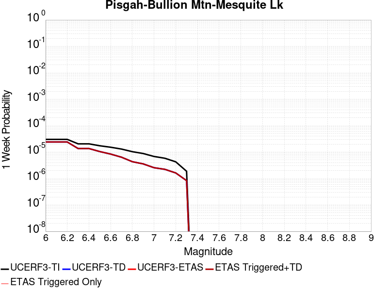 | 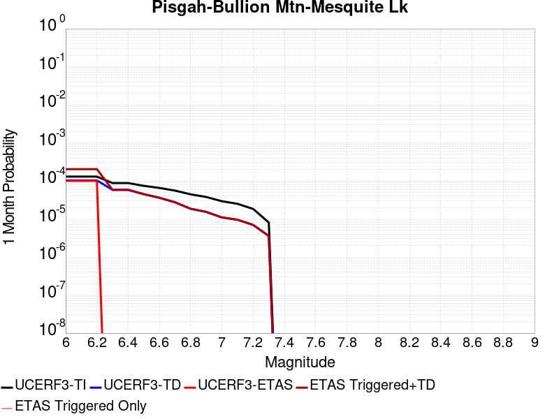 | 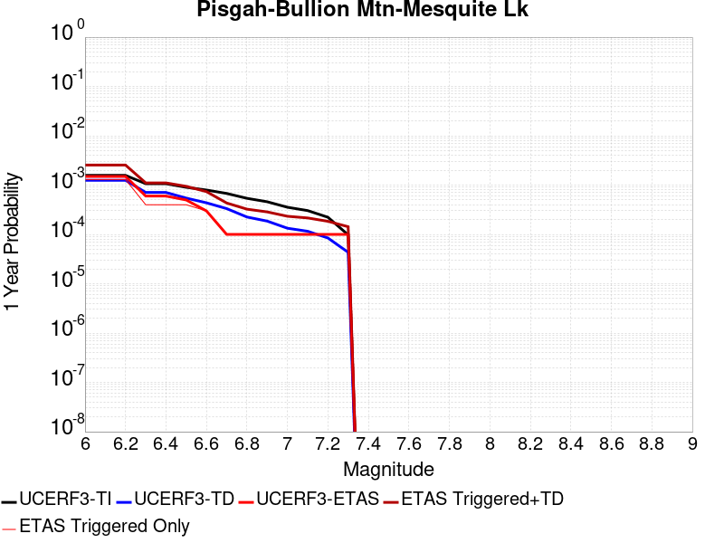 | 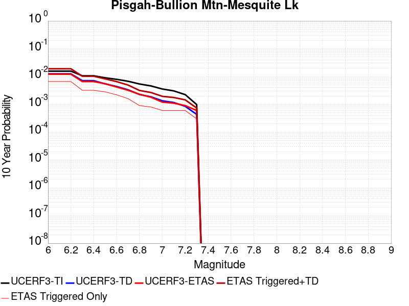 |

| Magnitude | 1 wk TI Prob | 1 wk TD Prob | 1 wk ETAS Prob | 1 wk ETAS/TD Gain | 1 wk ETAS Triggered+TD | 1 wk ETAS Triggered Only | 1 mo TI Prob | 1 mo TD Prob | 1 mo ETAS Prob | 1 mo ETAS/TD Gain | 1 mo ETAS Triggered+TD | 1 mo ETAS Triggered Only | 1 yr TI Prob | 1 yr TD Prob | 1 yr ETAS Prob | 1 yr ETAS/TD Gain | 1 yr ETAS Triggered+TD | 1 yr ETAS Triggered Only | 10 yr TI Prob | 10 yr TD Prob | 10 yr ETAS Prob | 10 yr ETAS/TD Gain | 10 yr ETAS Triggered+TD | 10 yr ETAS Triggered Only |
|-----|-----|-----|-----|-----|-----|-----|-----|-----|-----|-----|-----|-----|-----|-----|-----|-----|-----|-----|-----|-----|-----|-----|-----|-----|
| 6.0 | 3.0240792E-5 | 2.4053566E-5 | 0.0 | 0.0 | 2.4053566E-5 | 0.0 | 1.2959696E-4 | 1.03083206E-4 | 1.0E-4 | 0.9700901 | 2.0307291E-4 | 1.0E-4 | 0.0015767008 | 0.0012544158 | 0.0015 | 1.1957756 | 0.0025527852 | 0.0013 | 0.015655609 | 0.0124833435 | 0.0121 | 0.96929157 | 0.019000953 | 0.0066 |
| 6.1 | 3.0240792E-5 | 2.4053566E-5 | 0.0 | 0.0 | 2.4053566E-5 | 0.0 | 1.2959696E-4 | 1.03083206E-4 | 1.0E-4 | 0.9700901 | 2.0307291E-4 | 1.0E-4 | 0.0015767008 | 0.0012544158 | 0.0015 | 1.1957756 | 0.0025527852 | 0.0013 | 0.015655609 | 0.0124833435 | 0.0121 | 0.96929157 | 0.019000953 | 0.0066 |
| 6.2 | 3.0240792E-5 | 2.4053566E-5 | 0.0 | 0.0 | 2.4053566E-5 | 0.0 | 1.2959696E-4 | 1.03083206E-4 | 1.0E-4 | 0.9700901 | 2.0307291E-4 | 1.0E-4 | 0.0015767008 | 0.0012544158 | 0.0015 | 1.1957756 | 0.0025527852 | 0.0013 | 0.015655609 | 0.0124833435 | 0.0121 | 0.96929157 | 0.019000953 | 0.0066 |
| 6.3 | 2.0498217E-5 | 1.3616239E-5 | 0.0 | 0.0 | 1.3616239E-5 | 0.0 | 8.784654E-5 | 5.8354093E-5 | 0.0 | 0.0 | 5.8354093E-5 | 0.0 | 0.0010690069 | 7.102457E-4 | 6.0E-4 | 0.84477806 | 0.0011099617 | 4.0E-4 | 0.01063879 | 0.00708138 | 0.0066 | 0.93202174 | 0.010258719 | 0.0032 |
| 6.4 | 2.0498217E-5 | 1.3616239E-5 | 0.0 | 0.0 | 1.3616239E-5 | 0.0 | 8.784654E-5 | 5.8354093E-5 | 0.0 | 0.0 | 5.8354093E-5 | 0.0 | 0.0010690069 | 7.102457E-4 | 6.0E-4 | 0.84477806 | 0.0011099617 | 4.0E-4 | 0.01063879 | 0.00708138 | 0.0066 | 0.93202174 | 0.010258719 | 0.0032 |
| 6.5 | 1.7316182E-5 | 1.0459129E-5 | 0.0 | 0.0 | 1.0459129E-5 | 0.0 | 7.42101E-5 | 4.4824123E-5 | 0.0 | 0.0 | 4.4824123E-5 | 0.0 | 9.0313336E-4 | 5.45607E-4 | 5.0E-4 | 0.9164105 | 9.453888E-4 | 4.0E-4 | 0.008994718 | 0.0054436685 | 0.0055 | 1.0103481 | 0.008228426 | 0.0028 |
| 6.6 | 1.5251077E-5 | 8.399045E-6 | 0.0 | 0.0 | 8.399045E-6 | 0.0 | 6.536012E-5 | 3.5995454E-5 | 0.0 | 0.0 | 3.5995454E-5 | 0.0 | 7.9546886E-4 | 4.3816376E-4 | 3.0E-4 | 0.6846756 | 7.380323E-4 | 3.0E-4 | 0.007926274 | 0.0043737143 | 0.0042 | 0.9602822 | 0.006564092 | 0.0022 |
| 6.7 | 1.2997425E-5 | 6.4018914E-6 | 0.0 | 0.0 | 6.4018914E-6 | 0.0 | 5.570206E-5 | 2.7436414E-5 | 0.0 | 0.0 | 2.7436414E-5 | 0.0 | 6.7796157E-4 | 3.339918E-4 | 1.0E-4 | 0.29940856 | 4.339584E-4 | 1.0E-4 | 0.0067589693 | 0.0033353579 | 0.0032 | 0.9594173 | 0.0049300212 | 0.0016 |
| 6.8 | 1.035386E-5 | 4.3263112E-6 | 0.0 | 0.0 | 4.3263112E-6 | 0.0 | 4.437293E-5 | 1.8541206E-5 | 0.0 | 0.0 | 1.8541206E-5 | 0.0 | 5.401065E-4 | 2.2571668E-4 | 1.0E-4 | 0.44303328 | 3.256941E-4 | 1.0E-4 | 0.0053879567 | 0.0022549608 | 0.0023 | 1.0199734 | 0.0031529313 | 9.0E-4 |
| 6.9 | 8.816252E-6 | 3.5749674E-6 | 0.0 | 0.0 | 3.5749674E-6 | 0.0 | 3.778339E-5 | 1.5321202E-5 | 0.0 | 0.0 | 1.5321202E-5 | 0.0 | 4.5991567E-4 | 1.8652025E-4 | 1.0E-4 | 0.5361348 | 2.865016E-4 | 1.0E-4 | 0.00458965 | 0.0018636953 | 0.0018 | 0.96582305 | 0.0026622044 | 8.0E-4 |
| 7.0 | 6.8232207E-6 | 2.563406E-6 | 0.0 | 0.0 | 2.563406E-6 | 0.0 | 2.9242048E-5 | 1.0985981E-5 | 0.0 | 0.0 | 1.0985981E-5 | 0.0 | 3.5596377E-4 | 1.3374642E-4 | 1.0E-4 | 0.7476836 | 2.3373305E-4 | 1.0E-4 | 0.0035539411 | 0.0013366903 | 0.0012 | 0.89773977 | 0.0019358883 | 6.0E-4 |
| 7.1 | 5.837013E-6 | 2.2239994E-6 | 0.0 | 0.0 | 2.2239994E-6 | 0.0 | 2.501553E-5 | 9.5313935E-6 | 0.0 | 0.0 | 9.5313935E-6 | 0.0 | 3.045215E-4 | 1.1603883E-4 | 1.0E-4 | 0.8617805 | 2.1602723E-4 | 1.0E-4 | 0.0030410455 | 0.0011598113 | 0.0011 | 0.9484301 | 0.0017591155 | 6.0E-4 |
| 7.2 | 4.278052E-6 | 1.6252338E-6 | 0.0 | 0.0 | 1.6252338E-6 | 0.0 | 1.833438E-5 | 6.9652706E-6 | 0.0 | 0.0 | 6.9652706E-6 | 0.0 | 2.231982E-4 | 8.47991E-5 | 1.0E-4 | 1.1792578 | 1.8479062E-4 | 1.0E-4 | 0.0022297418 | 8.476906E-4 | 9.0E-4 | 1.0617081 | 0.001447182 | 6.0E-4 |
| 7.3 | 1.8803692E-6 | 8.3333214E-7 | 0.0 | 0.0 | 8.3333214E-7 | 0.0 | 8.0587E-6 | 3.5714195E-6 | 0.0 | 0.0 | 3.5714195E-6 | 0.0 | 9.811026E-5 | 4.3481312E-5 | 1.0E-4 | 2.2998385 | 1.4347697E-4 | 1.0E-4 | 9.806695E-4 | 4.3474248E-4 | 6.0E-4 | 1.3801274 | 7.3461205E-4 | 3.0E-4 |

## Whittier alt 1
*[(top)](#table-of-contents)*

| 1 Week | 1 Month | 1 Year | 10 Year |
|-----|-----|-----|-----|
| 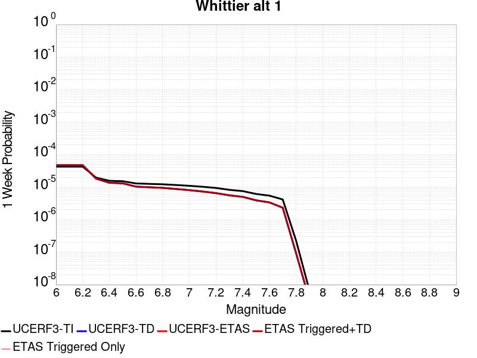 | 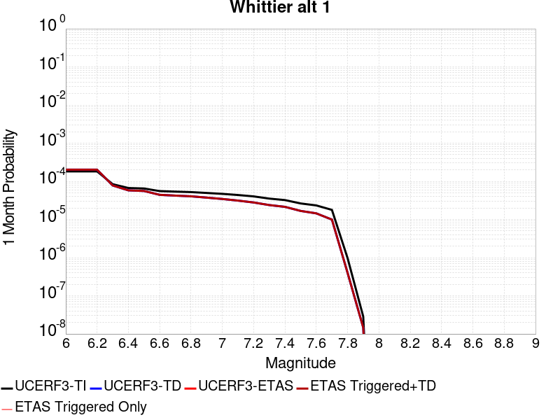 | 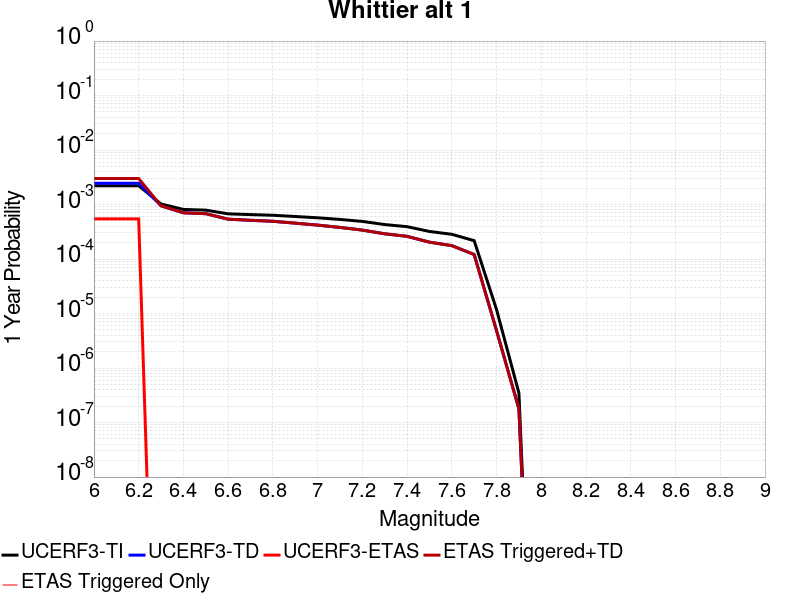 | 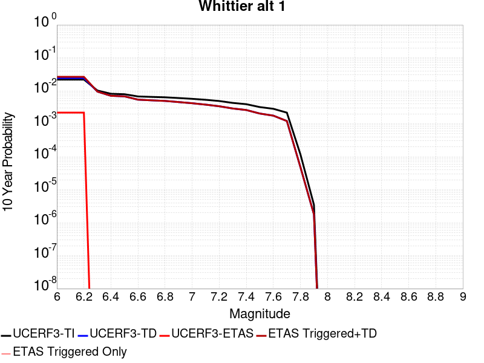 |

| Magnitude | 1 wk TI Prob | 1 wk TD Prob | 1 wk ETAS Prob | 1 wk ETAS/TD Gain | 1 wk ETAS Triggered+TD | 1 wk ETAS Triggered Only | 1 mo TI Prob | 1 mo TD Prob | 1 mo ETAS Prob | 1 mo ETAS/TD Gain | 1 mo ETAS Triggered+TD | 1 mo ETAS Triggered Only | 1 yr TI Prob | 1 yr TD Prob | 1 yr ETAS Prob | 1 yr ETAS/TD Gain | 1 yr ETAS Triggered+TD | 1 yr ETAS Triggered Only | 10 yr TI Prob | 10 yr TD Prob | 10 yr ETAS Prob | 10 yr ETAS/TD Gain | 10 yr ETAS Triggered+TD | 10 yr ETAS Triggered Only |
|-----|-----|-----|-----|-----|-----|-----|-----|-----|-----|-----|-----|-----|-----|-----|-----|-----|-----|-----|-----|-----|-----|-----|-----|-----|
| 6.0 | 4.2554693E-5 | 4.7141246E-5 | 0.0 | 0.0 | 4.7141246E-5 | 0.0 | 1.8236451E-4 | 2.0202008E-4 | 1.0E-4 | 0.49500033 | 3.0199988E-4 | 1.0E-4 | 0.002218027 | 0.0024571407 | 0.0022 | 0.8953496 | 0.003255175 | 8.0E-4 | 0.02196019 | 0.024333641 | 0.0172 | 0.70684034 | 0.03048034 | 0.0063 |
| 6.1 | 4.2554693E-5 | 4.7141246E-5 | 0.0 | 0.0 | 4.7141246E-5 | 0.0 | 1.8236451E-4 | 2.0202008E-4 | 1.0E-4 | 0.49500033 | 3.0199988E-4 | 1.0E-4 | 0.002218027 | 0.0024571407 | 0.0022 | 0.8953496 | 0.003255175 | 8.0E-4 | 0.02196019 | 0.024333641 | 0.0172 | 0.70684034 | 0.03048034 | 0.0063 |
| 6.2 | 4.2554693E-5 | 4.7141246E-5 | 0.0 | 0.0 | 4.7141246E-5 | 0.0 | 1.8236451E-4 | 2.0202008E-4 | 1.0E-4 | 0.49500033 | 3.0199988E-4 | 1.0E-4 | 0.002218027 | 0.0024571407 | 0.0022 | 0.8953496 | 0.003255175 | 8.0E-4 | 0.02196019 | 0.024333641 | 0.0172 | 0.70684034 | 0.03048034 | 0.0063 |
| 6.3 | 1.9617712E-5 | 1.8201868E-5 | 0.0 | 0.0 | 1.8201868E-5 | 0.0 | 8.40732E-5 | 7.800578E-5 | 0.0 | 0.0 | 7.800578E-5 | 0.0 | 0.0010231105 | 9.4932545E-4 | 9.0E-4 | 0.94804156 | 0.0012490407 | 3.0E-4 | 0.01018413 | 0.009455963 | 0.0072 | 0.7614243 | 0.011833268 | 0.0024 |
| 6.4 | 1.5611336E-5 | 1.354535E-5 | 0.0 | 0.0 | 1.354535E-5 | 0.0 | 6.690401E-5 | 5.8050246E-5 | 0.0 | 0.0 | 5.8050246E-5 | 0.0 | 8.142519E-4 | 7.0653844E-4 | 6.0E-4 | 0.8492107 | 8.064678E-4 | 1.0E-4 | 0.008112748 | 0.0070448644 | 0.0055 | 0.7807105 | 0.008534297 | 0.0015 |
| 6.5 | 1.5150166E-5 | 1.3042504E-5 | 0.0 | 0.0 | 1.3042504E-5 | 0.0 | 6.492767E-5 | 5.589528E-5 | 0.0 | 0.0 | 5.589528E-5 | 0.0 | 7.9020765E-4 | 6.803184E-4 | 6.0E-4 | 0.88194 | 7.8025035E-4 | 1.0E-4 | 0.007874036 | 0.0067842854 | 0.0053 | 0.78121716 | 0.008174787 | 0.0014 |
| 6.6 | 1.295588E-5 | 1.0340121E-5 | 0.0 | 0.0 | 1.0340121E-5 | 0.0 | 5.552402E-5 | 4.431406E-5 | 0.0 | 0.0 | 4.431406E-5 | 0.0 | 6.7579525E-4 | 5.3939206E-4 | 4.0E-4 | 0.7415756 | 6.393381E-4 | 1.0E-4 | 0.006737438 | 0.0053822575 | 0.0039 | 0.724603 | 0.00607849 | 7.0E-4 |
| 6.7 | 1.2542085E-5 | 9.861623E-6 | 0.0 | 0.0 | 9.861623E-6 | 0.0 | 5.3750682E-5 | 4.2263426E-5 | 0.0 | 0.0 | 4.2263426E-5 | 0.0 | 6.542181E-4 | 5.1443756E-4 | 3.0E-4 | 0.5831611 | 5.1443756E-4 | 0.0 | 0.006522954 | 0.005133877 | 0.0035 | 0.681746 | 0.00563131 | 5.0E-4 |
| 6.8 | 1.2195878E-5 | 9.45888E-6 | 0.0 | 0.0 | 9.45888E-6 | 0.0 | 5.2267E-5 | 4.0537438E-5 | 0.0 | 0.0 | 4.0537438E-5 | 0.0 | 6.36165E-4 | 4.934334E-4 | 2.0E-4 | 0.4053232 | 4.934334E-4 | 0.0 | 0.0063434686 | 0.0049247057 | 0.0034 | 0.6903966 | 0.0054222434 | 5.0E-4 |
| 6.9 | 1.1580298E-5 | 8.738248E-6 | 0.0 | 0.0 | 8.738248E-6 | 0.0 | 4.9628903E-5 | 3.7449103E-5 | 0.0 | 0.0 | 3.7449103E-5 | 0.0 | 6.040644E-4 | 4.5584908E-4 | 2.0E-4 | 0.4387417 | 4.5584908E-4 | 0.0 | 0.00602425 | 0.0045503434 | 0.0031 | 0.6812673 | 0.004848978 | 3.0E-4 |
| 7.0 | 1.0964795E-5 | 8.051233E-6 | 0.0 | 0.0 | 8.051233E-6 | 0.0 | 4.6991136E-5 | 3.4504832E-5 | 0.0 | 0.0 | 3.4504832E-5 | 0.0 | 5.7196687E-4 | 4.200169E-4 | 2.0E-4 | 0.4761713 | 4.200169E-4 | 0.0 | 0.0057049696 | 0.004193428 | 0.0028 | 0.6677115 | 0.00449217 | 3.0E-4 |
| 7.1 | 1.0230601E-5 | 7.296619E-6 | 0.0 | 0.0 | 7.296619E-6 | 0.0 | 4.3844695E-5 | 3.1270858E-5 | 0.0 | 0.0 | 3.1270858E-5 | 0.0 | 5.336784E-4 | 3.8065747E-4 | 2.0E-4 | 0.5254068 | 3.8065747E-4 | 0.0 | 0.005323986 | 0.003801133 | 0.0028 | 0.73662245 | 0.0040999926 | 3.0E-4 |
| 7.2 | 9.40865E-6 | 6.5162267E-6 | 0.0 | 0.0 | 6.5162267E-6 | 0.0 | 4.032216E-5 | 2.7926393E-5 | 0.0 | 0.0 | 2.7926393E-5 | 0.0 | 4.908117E-4 | 3.39952E-4 | 1.0E-4 | 0.29415917 | 3.39952E-4 | 0.0 | 0.0048972913 | 0.0033953136 | 0.0026 | 0.7657614 | 0.003694295 | 3.0E-4 |
| 7.3 | 8.237384E-6 | 5.5742876E-6 | 0.0 | 0.0 | 5.5742876E-6 | 0.0 | 3.5302593E-5 | 2.388959E-5 | 0.0 | 0.0 | 2.388959E-5 | 0.0 | 4.2972428E-4 | 2.90818E-4 | 1.0E-4 | 0.34385768 | 2.90818E-4 | 0.0 | 0.0042889426 | 0.0029046668 | 0.0024 | 0.8262565 | 0.003104086 | 2.0E-4 |
| 7.4 | 7.5316966E-6 | 5.0062195E-6 | 0.0 | 0.0 | 5.0062195E-6 | 0.0 | 3.2278298E-5 | 2.1455056E-5 | 0.0 | 0.0 | 2.1455056E-5 | 0.0 | 3.9291743E-4 | 2.61185E-4 | 1.0E-4 | 0.38287038 | 2.61185E-4 | 0.0 | 0.0039222343 | 0.0026088874 | 0.0021 | 0.8049409 | 0.0028083655 | 2.0E-4 |
| 7.5 | 6.149649E-6 | 3.916163E-6 | 0.0 | 0.0 | 3.916163E-6 | 0.0 | 2.6355372E-5 | 1.6783453E-5 | 0.0 | 0.0 | 1.6783453E-5 | 0.0 | 3.208294E-4 | 2.0432028E-4 | 1.0E-4 | 0.4894277 | 2.0432028E-4 | 0.0 | 0.003203666 | 0.0020414128 | 0.0014 | 0.6857996 | 0.0022410045 | 2.0E-4 |
| 7.6 | 5.457711E-6 | 3.3794513E-6 | 0.0 | 0.0 | 3.3794513E-6 | 0.0 | 2.338998E-5 | 1.4483287E-5 | 0.0 | 0.0 | 1.4483287E-5 | 0.0 | 2.8473578E-4 | 1.7632057E-4 | 1.0E-4 | 0.56714886 | 1.7632057E-4 | 0.0 | 0.0028437122 | 0.0017618868 | 0.0013 | 0.7378454 | 0.0019615344 | 2.0E-4 |
| 7.7 | 4.1676276E-6 | 2.3213304E-6 | 0.0 | 0.0 | 2.3213304E-6 | 0.0 | 1.7861139E-5 | 9.948525E-6 | 0.0 | 0.0 | 9.948525E-6 | 0.0 | 2.1743766E-4 | 1.2111729E-4 | 0.0 | 0.0 | 1.2111729E-4 | 0.0 | 0.0021722503 | 0.0012105854 | 8.0E-4 | 0.66083735 | 0.0014103432 | 2.0E-4 |
| 7.8 | 2.2692414E-7 | 9.313546E-8 | 0.0 | 0.0 | 9.313546E-8 | 0.0 | 9.725317E-7 | 3.9915196E-7 | 0.0 | 0.0 | 3.9915196E-7 | 0.0 | 1.1840509E-5 | 4.8596676E-6 | 0.0 | 0.0 | 4.8596676E-6 | 0.0 | 1.1839878E-4 | 4.859593E-5 | 0.0 | 0.0 | 4.859593E-5 | 0.0 |
| 7.9 | 6.676829E-9 | 3.4267709E-9 | 0.0 | 0.0 | 3.4267709E-9 | 0.0 | 2.861498E-8 | 1.4686159E-8 | 0.0 | 0.0 | 1.4686159E-8 | 0.0 | 3.4838732E-7 | 1.7880397E-7 | 0.0 | 0.0 | 1.7880397E-7 | 0.0 | 3.4838679E-6 | 1.7880385E-6 | 0.0 | 0.0 | 1.7880385E-6 | 0.0 |

## Coronado Bank alt1
*[(top)](#table-of-contents)*

| 1 Week | 1 Month | 1 Year | 10 Year |
|-----|-----|-----|-----|
| 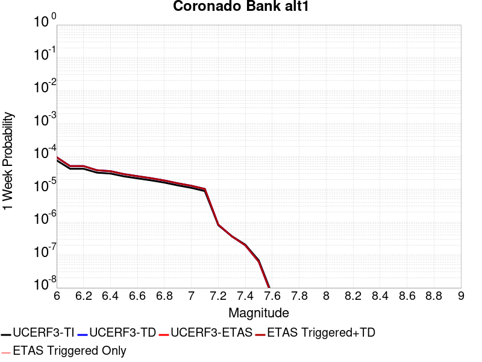 | 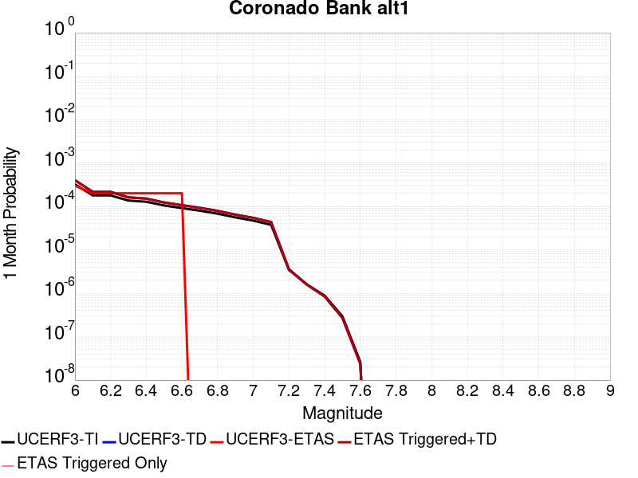 | 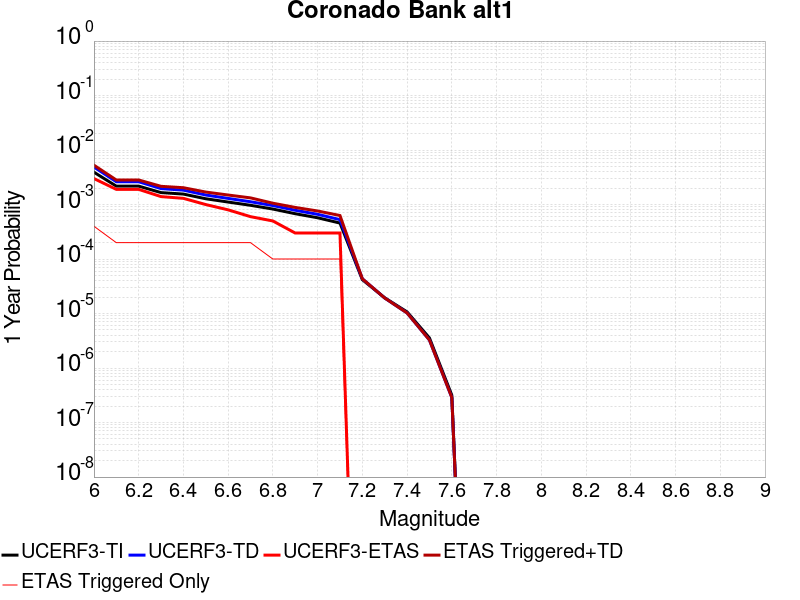 | 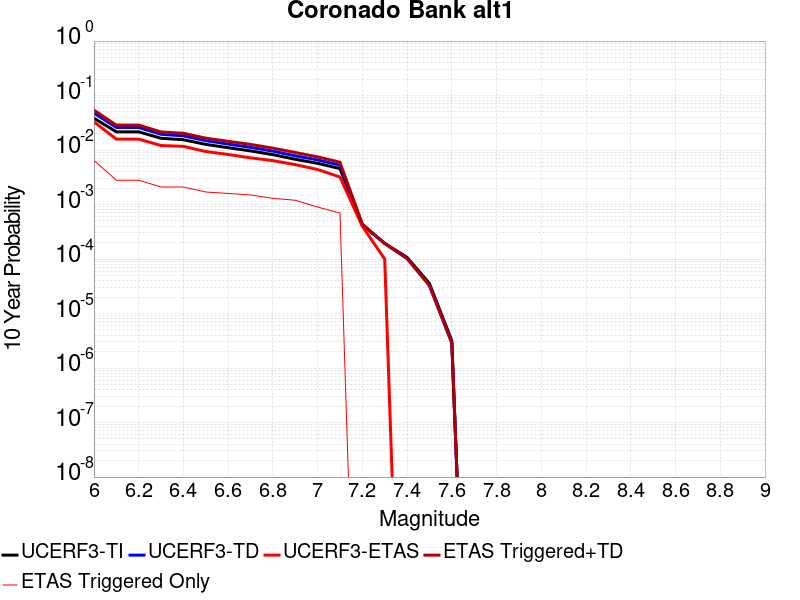 |

| Magnitude | 1 wk TI Prob | 1 wk TD Prob | 1 wk ETAS Prob | 1 wk ETAS/TD Gain | 1 wk ETAS Triggered+TD | 1 wk ETAS Triggered Only | 1 mo TI Prob | 1 mo TD Prob | 1 mo ETAS Prob | 1 mo ETAS/TD Gain | 1 mo ETAS Triggered+TD | 1 mo ETAS Triggered Only | 1 yr TI Prob | 1 yr TD Prob | 1 yr ETAS Prob | 1 yr ETAS/TD Gain | 1 yr ETAS Triggered+TD | 1 yr ETAS Triggered Only | 10 yr TI Prob | 10 yr TD Prob | 10 yr ETAS Prob | 10 yr ETAS/TD Gain | 10 yr ETAS Triggered+TD | 10 yr ETAS Triggered Only |
|-----|-----|-----|-----|-----|-----|-----|-----|-----|-----|-----|-----|-----|-----|-----|-----|-----|-----|-----|-----|-----|-----|-----|-----|-----|
| 6.0 | 7.533492E-5 | 9.371127E-5 | 0.0 | 0.0 | 9.371127E-5 | 0.0 | 3.22824E-4 | 4.0156196E-4 | 3.0E-4 | 0.7470827 | 4.0156196E-4 | 0.0 | 0.0039233007 | 0.004878674 | 0.003 | 0.61492115 | 0.005276723 | 4.0E-4 | 0.03854755 | 0.047785383 | 0.0329 | 0.68849504 | 0.053974777 | 0.0065 |
| 6.1 | 4.1807285E-5 | 5.0382987E-5 | 0.0 | 0.0 | 5.0382987E-5 | 0.0 | 1.7916178E-4 | 2.1590963E-4 | 2.0E-4 | 0.92631346 | 2.1590963E-4 | 0.0 | 0.0021791123 | 0.0026256111 | 0.0019 | 0.72364104 | 0.002825086 | 2.0E-4 | 0.021578677 | 0.025955353 | 0.0159 | 0.61259043 | 0.028682677 | 0.0028 |
| 6.2 | 4.1807285E-5 | 5.0382987E-5 | 0.0 | 0.0 | 5.0382987E-5 | 0.0 | 1.7916178E-4 | 2.1590963E-4 | 2.0E-4 | 0.92631346 | 2.1590963E-4 | 0.0 | 0.0021791123 | 0.0026256111 | 0.0019 | 0.72364104 | 0.002825086 | 2.0E-4 | 0.021578677 | 0.025955353 | 0.0159 | 0.61259043 | 0.028682677 | 0.0028 |
| 6.3 | 3.1793104E-5 | 3.7637154E-5 | 0.0 | 0.0 | 3.7637154E-5 | 0.0 | 1.3624904E-4 | 1.6129231E-4 | 2.0E-4 | 1.2399848 | 1.6129231E-4 | 0.0 | 0.0016575698 | 0.001961998 | 0.0014 | 0.7135584 | 0.0021616055 | 2.0E-4 | 0.016452603 | 0.019450694 | 0.0121 | 0.6220858 | 0.021509847 | 0.0021 |
| 6.4 | 2.9878007E-5 | 3.5267756E-5 | 0.0 | 0.0 | 3.5267756E-5 | 0.0 | 1.2804232E-4 | 1.5113896E-4 | 2.0E-4 | 1.3232856 | 1.5113896E-4 | 0.0 | 0.0015578003 | 0.0018385961 | 0.0013 | 0.70706123 | 0.0020382283 | 2.0E-4 | 0.015469253 | 0.018237632 | 0.0117 | 0.64153063 | 0.020299334 | 0.0021 |
| 6.5 | 2.4512565E-5 | 2.8711425E-5 | 0.0 | 0.0 | 2.8711425E-5 | 0.0 | 1.0504962E-4 | 1.2304333E-4 | 2.0E-4 | 1.6254438 | 1.2304333E-4 | 0.0 | 0.0012782287 | 0.0014970498 | 0.001 | 0.6679805 | 0.0016967504 | 2.0E-4 | 0.012709012 | 0.014872616 | 0.0094 | 0.63203406 | 0.016547333 | 0.0017 |
| 6.6 | 2.1317413E-5 | 2.4862336E-5 | 0.0 | 0.0 | 2.4862336E-5 | 0.0 | 9.135714E-5 | 1.0654864E-4 | 2.0E-4 | 1.8770769 | 1.0654864E-4 | 0.0 | 0.0011117056 | 0.00129648 | 8.0E-4 | 0.6170554 | 0.0014962207 | 2.0E-4 | 0.011061605 | 0.012891568 | 0.0083 | 0.6438317 | 0.014470941 | 0.0016 |
| 6.7 | 1.8585655E-5 | 2.1597303E-5 | 0.0 | 0.0 | 2.1597303E-5 | 0.0 | 7.9650374E-5 | 9.25567E-5 | 0.0 | 0.0 | 9.25567E-5 | 0.0 | 9.6931186E-4 | 0.0011263157 | 6.0E-4 | 0.5327103 | 0.0013260904 | 2.0E-4 | 0.0096509475 | 0.011208227 | 0.0072 | 0.6423853 | 0.012691414 | 0.0015 |
| 6.8 | 1.5862879E-5 | 1.8387993E-5 | 0.0 | 0.0 | 1.8387993E-5 | 0.0 | 6.798199E-5 | 7.880341E-5 | 0.0 | 0.0 | 7.880341E-5 | 0.0 | 8.273665E-4 | 9.590284E-4 | 5.0E-4 | 0.521361 | 0.0010589325 | 1.0E-4 | 0.008242928 | 0.009550872 | 0.0064 | 0.67009586 | 0.0108384555 | 0.0013 |
| 6.9 | 1.3021509E-5 | 1.5069695E-5 | 0.0 | 0.0 | 1.5069695E-5 | 0.0 | 5.5805274E-5 | 6.4582906E-5 | 0.0 | 0.0 | 6.4582906E-5 | 0.0 | 6.792174E-4 | 7.860313E-4 | 3.0E-4 | 0.3816642 | 8.859527E-4 | 1.0E-4 | 0.006771452 | 0.007834327 | 0.0054 | 0.6892742 | 0.009024926 | 0.0012 |
| 7.0 | 1.0974371E-5 | 1.2698521E-5 | 0.0 | 0.0 | 1.2698521E-5 | 0.0 | 4.7032172E-5 | 5.4421194E-5 | 0.0 | 0.0 | 5.4421194E-5 | 0.0 | 5.7246623E-4 | 6.623941E-4 | 3.0E-4 | 0.45290256 | 7.6232787E-4 | 1.0E-4 | 0.0057099373 | 0.0066059404 | 0.0044 | 0.6660672 | 0.0074999947 | 9.0E-4 |
| 7.1 | 8.766221E-6 | 1.0146468E-5 | 0.0 | 0.0 | 1.0146468E-5 | 0.0 | 3.7568978E-5 | 4.3484237E-5 | 0.0 | 0.0 | 4.3484237E-5 | 0.0 | 4.573063E-4 | 5.293091E-4 | 3.0E-4 | 0.5667766 | 6.292562E-4 | 1.0E-4 | 0.0045636636 | 0.005282177 | 0.0032 | 0.6058108 | 0.0059784795 | 7.0E-4 |
| 7.2 | 8.026024E-7 | 8.325458E-7 | 0.0 | 0.0 | 8.325458E-7 | 0.0 | 3.43972E-6 | 3.5680487E-6 | 0.0 | 0.0 | 3.5680487E-6 | 0.0 | 4.1877785E-5 | 4.3440137E-5 | 0.0 | 0.0 | 4.3440137E-5 | 0.0 | 4.1869894E-4 | 4.3431757E-4 | 4.0E-4 | 0.9209851 | 4.3431757E-4 | 0.0 |
| 7.3 | 3.7293114E-7 | 3.6976198E-7 | 0.0 | 0.0 | 3.6976198E-7 | 0.0 | 1.5982754E-6 | 1.5846932E-6 | 0.0 | 0.0 | 1.5846932E-6 | 0.0 | 1.9458828E-5 | 1.929347E-5 | 0.0 | 0.0 | 1.929347E-5 | 0.0 | 1.9457124E-4 | 1.9291801E-4 | 1.0E-4 | 0.5183549 | 1.9291801E-4 | 0.0 |
| 7.4 | 2.0557036E-7 | 1.966083E-7 | 0.0 | 0.0 | 1.966083E-7 | 0.0 | 8.810155E-7 | 8.426067E-7 | 0.0 | 0.0 | 8.426067E-7 | 0.0 | 1.0726311E-5 | 1.0258689E-5 | 0.0 | 0.0 | 1.0258689E-5 | 0.0 | 1.0725793E-4 | 1.02582184E-4 | 0.0 | 0.0 | 1.02582184E-4 | 0.0 |
| 7.5 | 6.845446E-8 | 6.275112E-8 | 0.0 | 0.0 | 6.275112E-8 | 0.0 | 2.9337625E-7 | 2.6893335E-7 | 0.0 | 0.0 | 2.6893335E-7 | 0.0 | 3.5718497E-6 | 3.2742587E-6 | 0.0 | 0.0 | 3.2742587E-6 | 0.0 | 3.5717923E-5 | 3.274211E-5 | 0.0 | 0.0 | 3.274211E-5 | 0.0 |
| 7.6 | 6.0975145E-9 | 5.531051E-9 | 0.0 | 0.0 | 5.531051E-9 | 0.0 | 2.6132206E-8 | 2.3704503E-8 | 0.0 | 0.0 | 2.3704503E-8 | 0.0 | 3.1815955E-7 | 2.886023E-7 | 0.0 | 0.0 | 2.886023E-7 | 0.0 | 3.181591E-6 | 2.8860202E-6 | 0.0 | 0.0 | 2.8860202E-6 | 0.0 |

## Greenville (No) 2011 CFM
*[(top)](#table-of-contents)*

| 1 Week | 1 Month | 1 Year | 10 Year |
|-----|-----|-----|-----|
| 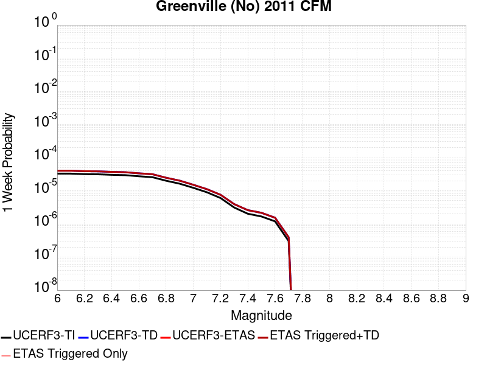 | 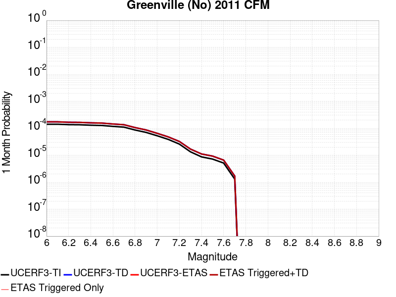 | 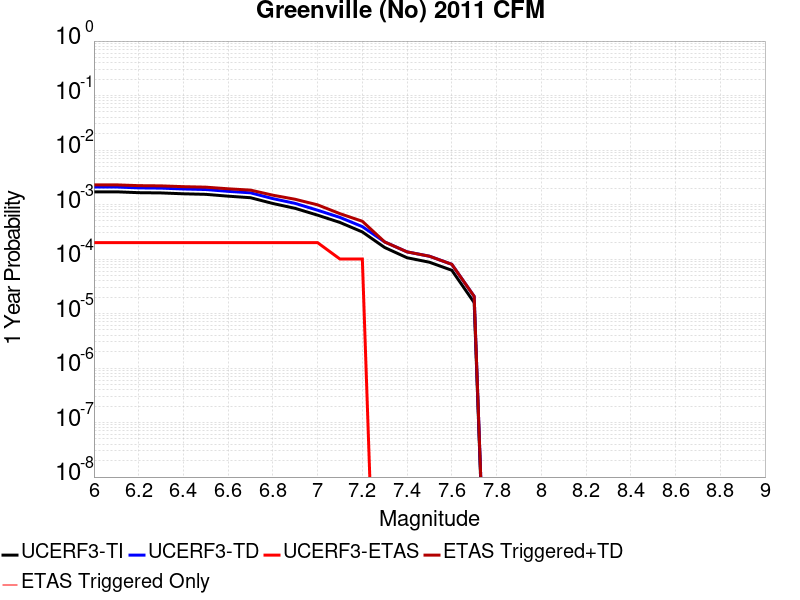 | 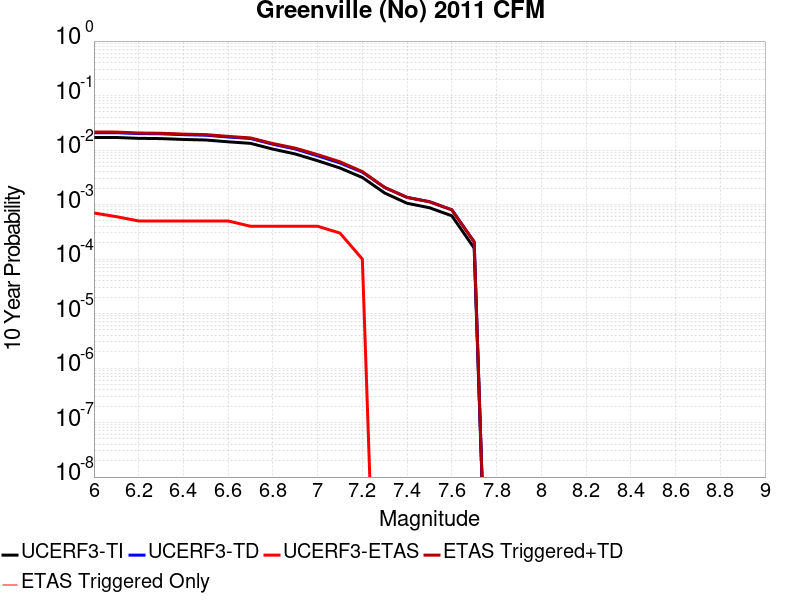 |

| Magnitude | 1 wk TI Prob | 1 wk TD Prob | 1 wk ETAS Prob | 1 wk ETAS/TD Gain | 1 wk ETAS Triggered+TD | 1 wk ETAS Triggered Only | 1 mo TI Prob | 1 mo TD Prob | 1 mo ETAS Prob | 1 mo ETAS/TD Gain | 1 mo ETAS Triggered+TD | 1 mo ETAS Triggered Only | 1 yr TI Prob | 1 yr TD Prob | 1 yr ETAS Prob | 1 yr ETAS/TD Gain | 1 yr ETAS Triggered+TD | 1 yr ETAS Triggered Only | 10 yr TI Prob | 10 yr TD Prob | 10 yr ETAS Prob | 10 yr ETAS/TD Gain | 10 yr ETAS Triggered+TD | 10 yr ETAS Triggered Only |
|-----|-----|-----|-----|-----|-----|-----|-----|-----|-----|-----|-----|-----|-----|-----|-----|-----|-----|-----|-----|-----|-----|-----|-----|-----|
| 6.0 | 3.286654E-5 | 4.0269028E-5 | 0.0 | 0.0 | 4.0269028E-5 | 0.0 | 1.4084899E-4 | 1.7257035E-4 | 0.0 | 0.0 | 1.7257035E-4 | 0.0 | 0.0017134876 | 0.0020990572 | 0.0012 | 0.57168525 | 0.0025980077 | 5.0E-4 | 0.017003356 | 0.020797431 | 0.015 | 0.7212429 | 0.026966408 | 0.0063 |
| 6.1 | 3.286654E-5 | 4.0269028E-5 | 0.0 | 0.0 | 4.0269028E-5 | 0.0 | 1.4084899E-4 | 1.7257035E-4 | 0.0 | 0.0 | 1.7257035E-4 | 0.0 | 0.0017134876 | 0.0020990572 | 0.0011 | 0.5240448 | 0.0024982176 | 4.0E-4 | 0.017003356 | 0.020797431 | 0.0123 | 0.5914192 | 0.025301762 | 0.0046 |
| 6.2 | 3.1697953E-5 | 3.883535E-5 | 0.0 | 0.0 | 3.883535E-5 | 0.0 | 1.358413E-4 | 1.6642682E-4 | 0.0 | 0.0 | 1.6642682E-4 | 0.0 | 0.0016526132 | 0.0020244005 | 0.0011 | 0.5433707 | 0.0024235907 | 4.0E-4 | 0.01640377 | 0.02006453 | 0.0117 | 0.58311856 | 0.024278253 | 0.0043 |
| 6.3 | 3.1363317E-5 | 3.8425198E-5 | 0.0 | 0.0 | 3.8425198E-5 | 0.0 | 1.344073E-4 | 1.6466924E-4 | 0.0 | 0.0 | 1.6466924E-4 | 0.0 | 0.0016351803 | 0.0020030416 | 0.0011 | 0.54916483 | 0.0024022402 | 4.0E-4 | 0.016232004 | 0.019854784 | 0.0116 | 0.58424205 | 0.024069408 | 0.0043 |
| 6.4 | 3.0228604E-5 | 3.7035607E-5 | 0.0 | 0.0 | 3.7035607E-5 | 0.0 | 1.2954473E-4 | 1.5871458E-4 | 0.0 | 0.0 | 1.5871458E-4 | 0.0 | 0.0015760659 | 0.0019306737 | 0.0011 | 0.5697493 | 0.0023299016 | 4.0E-4 | 0.015649348 | 0.019143766 | 0.0112 | 0.5850468 | 0.023165276 | 0.0041 |
| 6.5 | 2.9537814E-5 | 3.6193007E-5 | 0.0 | 0.0 | 3.6193007E-5 | 0.0 | 1.2658449E-4 | 1.5510386E-4 | 0.0 | 0.0 | 1.5510386E-4 | 0.0 | 0.0015400766 | 0.0018867902 | 0.0011 | 0.5830007 | 0.0022860356 | 4.0E-4 | 0.01529447 | 0.018712403 | 0.0107 | 0.5718132 | 0.022343168 | 0.0037 |
| 6.6 | 2.7345395E-5 | 3.3508666E-5 | 0.0 | 0.0 | 3.3508666E-5 | 0.0 | 1.1718928E-4 | 1.4360083E-4 | 0.0 | 0.0 | 1.4360083E-4 | 0.0 | 0.0014258457 | 0.0017469691 | 0.001 | 0.57242 | 0.002046445 | 3.0E-4 | 0.014167317 | 0.017336408 | 0.0099 | 0.57105255 | 0.020579198 | 0.0033 |
| 6.7 | 2.5615784E-5 | 3.148919E-5 | 0.0 | 0.0 | 3.148919E-5 | 0.0 | 1.09777306E-4 | 1.3494687E-4 | 0.0 | 0.0 | 1.3494687E-4 | 0.0 | 0.0013357193 | 0.0016417704 | 9.0E-4 | 0.5481887 | 0.0019412779 | 3.0E-4 | 0.013277191 | 0.016300317 | 0.0091 | 0.55827135 | 0.019054675 | 0.0028 |
| 6.8 | 2.0059057E-5 | 2.4650924E-5 | 0.0 | 0.0 | 2.4650924E-5 | 0.0 | 8.596455E-5 | 1.0564263E-4 | 0.0 | 0.0 | 1.0564263E-4 | 0.0 | 0.0010461159 | 0.0012854564 | 6.0E-4 | 0.46676028 | 0.0014851993 | 2.0E-4 | 0.0104120495 | 0.012782466 | 0.0075 | 0.58674127 | 0.0151517885 | 0.0024 |
| 6.9 | 1.6321746E-5 | 2.0133579E-5 | 0.0 | 0.0 | 2.0133579E-5 | 0.0 | 6.9948466E-5 | 8.628399E-5 | 0.0 | 0.0 | 8.628399E-5 | 0.0 | 8.5128983E-4 | 0.0010500136 | 5.0E-4 | 0.4761843 | 0.0012498036 | 2.0E-4 | 0.008480361 | 0.010452295 | 0.0067 | 0.64100754 | 0.012629299 | 0.0022 |
| 7.0 | 1.22527645E-5 | 1.50970345E-5 | 0.0 | 0.0 | 1.50970345E-5 | 0.0 | 5.2510793E-5 | 6.47E-5 | 0.0 | 0.0 | 6.47E-5 | 0.0 | 6.3913135E-4 | 7.8744197E-4 | 5.0E-4 | 0.6349674 | 9.872845E-4 | 2.0E-4 | 0.0063729626 | 0.007847438 | 0.0049 | 0.6244076 | 0.009534097 | 0.0017 |
| 7.1 | 8.996482E-6 | 1.1133471E-5 | 0.0 | 0.0 | 1.1133471E-5 | 0.0 | 3.8555783E-5 | 4.771401E-5 | 0.0 | 0.0 | 4.771401E-5 | 0.0 | 4.6931554E-4 | 5.8076443E-4 | 3.0E-4 | 0.51656055 | 6.8070635E-4 | 1.0E-4 | 0.004683256 | 0.0057929195 | 0.004 | 0.6904981 | 0.006985968 | 0.0012 |
| 7.2 | 6.0273087E-6 | 7.544417E-6 | 0.0 | 0.0 | 7.544417E-6 | 0.0 | 2.5831067E-5 | 3.233282E-5 | 0.0 | 0.0 | 3.233282E-5 | 0.0 | 3.1444785E-4 | 3.9358166E-4 | 2.0E-4 | 0.5081538 | 4.935423E-4 | 1.0E-4 | 0.0031400328 | 0.0039292723 | 0.003 | 0.76350015 | 0.004825736 | 9.0E-4 |
| 7.3 | 3.1209995E-6 | 3.9481756E-6 | 0.0 | 0.0 | 3.9481756E-6 | 0.0 | 1.3375643E-5 | 1.6920645E-5 | 0.0 | 0.0 | 1.6920645E-5 | 0.0 | 1.6283628E-4 | 2.0598953E-4 | 0.0 | 0.0 | 2.0598953E-4 | 0.0 | 0.0016271701 | 0.0020581102 | 0.0016 | 0.77741224 | 0.0025570812 | 5.0E-4 |
| 7.4 | 2.0254208E-6 | 2.596744E-6 | 0.0 | 0.0 | 2.596744E-6 | 0.0 | 8.680347E-6 | 1.11288555E-5 | 0.0 | 0.0 | 1.11288555E-5 | 0.0 | 1.0567809E-4 | 1.3548545E-4 | 0.0 | 0.0 | 1.3548545E-4 | 0.0 | 0.0010562785 | 0.0013540613 | 0.0012 | 0.8862228 | 0.0017535198 | 4.0E-4 |
| 7.5 | 1.6763418E-6 | 2.1614228E-6 | 0.0 | 0.0 | 2.1614228E-6 | 0.0 | 7.184302E-6 | 9.263208E-6 | 0.0 | 0.0 | 9.263208E-6 | 0.0 | 8.746537E-5 | 1.1277378E-4 | 0.0 | 0.0 | 1.1277378E-4 | 0.0 | 8.743095E-4 | 0.0011271731 | 0.0011 | 0.9758927 | 0.001426835 | 3.0E-4 |
| 7.6 | 1.1935462E-6 | 1.5358892E-6 | 0.0 | 0.0 | 1.5358892E-6 | 0.0 | 5.115188E-6 | 6.5823656E-6 | 0.0 | 0.0 | 6.5823656E-6 | 0.0 | 6.2275634E-5 | 8.01374E-5 | 0.0 | 0.0 | 8.01374E-5 | 0.0 | 6.2258187E-4 | 8.010764E-4 | 0.001 | 1.2483203 | 0.0011008361 | 3.0E-4 |
| 7.7 | 3.0464201E-7 | 3.9616813E-7 | 0.0 | 0.0 | 3.9616813E-7 | 0.0 | 1.3056081E-6 | 1.6978623E-6 | 0.0 | 0.0 | 1.6978623E-6 | 0.0 | 1.589566E-5 | 2.0671283E-5 | 0.0 | 0.0 | 2.0671283E-5 | 0.0 | 1.5894524E-4 | 2.0669866E-4 | 1.0E-4 | 0.48379606 | 2.0669866E-4 | 0.0 |

## Monte Vista - Shannon 2011 CFM
*[(top)](#table-of-contents)*

| 1 Week | 1 Month | 1 Year | 10 Year |
|-----|-----|-----|-----|
| 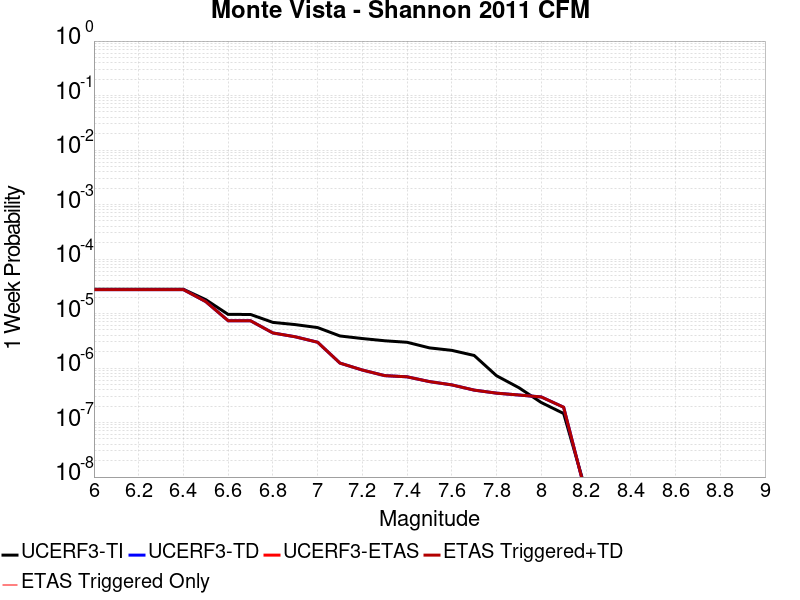 | 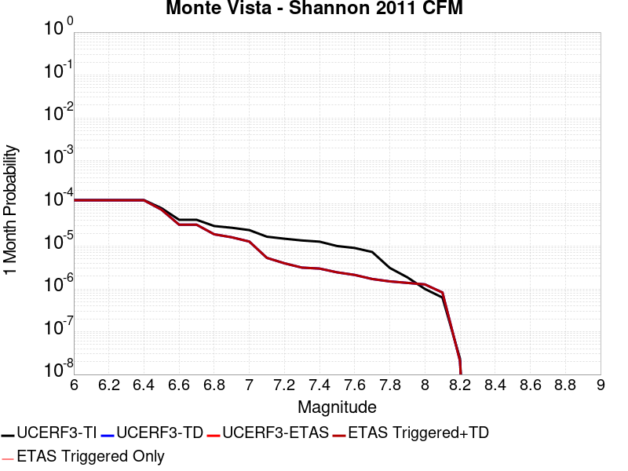 | 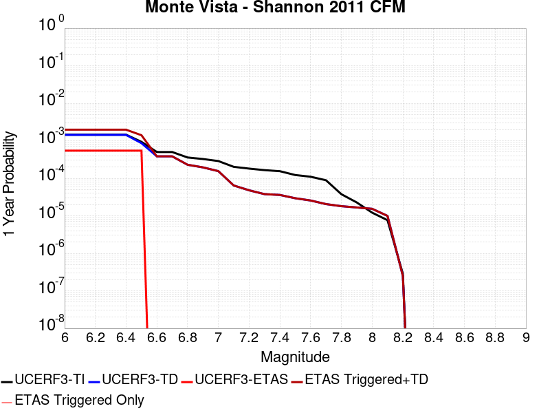 | 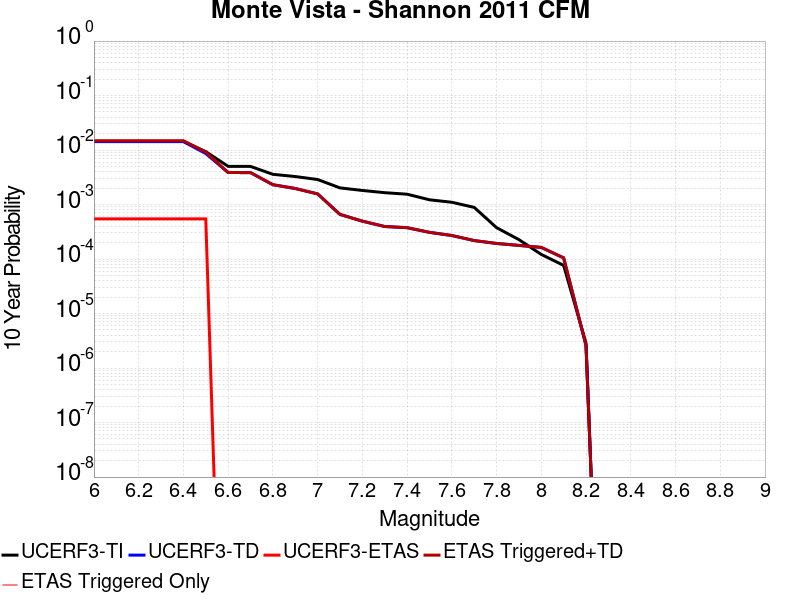 |

| Magnitude | 1 wk TI Prob | 1 wk TD Prob | 1 wk ETAS Prob | 1 wk ETAS/TD Gain | 1 wk ETAS Triggered+TD | 1 wk ETAS Triggered Only | 1 mo TI Prob | 1 mo TD Prob | 1 mo ETAS Prob | 1 mo ETAS/TD Gain | 1 mo ETAS Triggered+TD | 1 mo ETAS Triggered Only | 1 yr TI Prob | 1 yr TD Prob | 1 yr ETAS Prob | 1 yr ETAS/TD Gain | 1 yr ETAS Triggered+TD | 1 yr ETAS Triggered Only | 10 yr TI Prob | 10 yr TD Prob | 10 yr ETAS Prob | 10 yr ETAS/TD Gain | 10 yr ETAS Triggered+TD | 10 yr ETAS Triggered Only |
|-----|-----|-----|-----|-----|-----|-----|-----|-----|-----|-----|-----|-----|-----|-----|-----|-----|-----|-----|-----|-----|-----|-----|-----|-----|
| 6.0 | 2.7907707E-5 | 2.7513914E-5 | 0.0 | 0.0 | 2.7513914E-5 | 0.0 | 1.19598975E-4 | 1.1791214E-4 | 0.0 | 0.0 | 1.1791214E-4 | 0.0 | 0.0014551448 | 0.0014347584 | 0.0012 | 0.83637774 | 0.0020338974 | 6.0E-4 | 0.014456532 | 0.014283666 | 0.0131 | 0.9171315 | 0.020197963 | 0.006 |
| 6.1 | 2.7907707E-5 | 2.7513914E-5 | 0.0 | 0.0 | 2.7513914E-5 | 0.0 | 1.19598975E-4 | 1.1791214E-4 | 0.0 | 0.0 | 1.1791214E-4 | 0.0 | 0.0014551448 | 0.0014347584 | 0.0012 | 0.83637774 | 0.0020338974 | 6.0E-4 | 0.014456532 | 0.014283666 | 0.0131 | 0.9171315 | 0.020197963 | 0.006 |
| 6.2 | 2.7907707E-5 | 2.7513914E-5 | 0.0 | 0.0 | 2.7513914E-5 | 0.0 | 1.19598975E-4 | 1.1791214E-4 | 0.0 | 0.0 | 1.1791214E-4 | 0.0 | 0.0014551448 | 0.0014347584 | 0.0012 | 0.83637774 | 0.0020338974 | 6.0E-4 | 0.014456532 | 0.014283666 | 0.0131 | 0.9171315 | 0.020197963 | 0.006 |
| 6.3 | 2.7907707E-5 | 2.7513914E-5 | 0.0 | 0.0 | 2.7513914E-5 | 0.0 | 1.19598975E-4 | 1.1791214E-4 | 0.0 | 0.0 | 1.1791214E-4 | 0.0 | 0.0014551448 | 0.0014347584 | 0.0012 | 0.83637774 | 0.0020338974 | 6.0E-4 | 0.014456532 | 0.014283666 | 0.0131 | 0.9171315 | 0.020197963 | 0.006 |
| 6.4 | 2.7907707E-5 | 2.7513914E-5 | 0.0 | 0.0 | 2.7513914E-5 | 0.0 | 1.19598975E-4 | 1.1791214E-4 | 0.0 | 0.0 | 1.1791214E-4 | 0.0 | 0.0014551448 | 0.0014347584 | 0.0012 | 0.83637774 | 0.0020338974 | 6.0E-4 | 0.014456532 | 0.014283666 | 0.0131 | 0.9171315 | 0.020197963 | 0.006 |
| 6.5 | 1.7990213E-5 | 1.6581424E-5 | 0.0 | 0.0 | 1.6581424E-5 | 0.0 | 7.709863E-5 | 7.106168E-5 | 0.0 | 0.0 | 7.106168E-5 | 0.0 | 9.382716E-4 | 8.648987E-4 | 7.0E-4 | 0.80934334 | 0.0011646393 | 3.0E-4 | 0.0093431985 | 0.008638338 | 0.0085 | 0.98398554 | 0.012603785 | 0.004 |
| 6.6 | 9.650407E-6 | 7.408367E-6 | 0.0 | 0.0 | 7.408367E-6 | 0.0 | 4.135823E-5 | 3.17498E-5 | 0.0 | 0.0 | 3.17498E-5 | 0.0 | 5.0342013E-4 | 3.8649308E-4 | 0.0 | 0.0 | 3.8649308E-4 | 0.0 | 0.005022812 | 0.0038755396 | 0.0034 | 0.87729716 | 0.005369726 | 0.0015 |
| 6.7 | 9.62828E-6 | 7.386337E-6 | 0.0 | 0.0 | 7.386337E-6 | 0.0 | 4.1263404E-5 | 3.165539E-5 | 0.0 | 0.0 | 3.165539E-5 | 0.0 | 5.022661E-4 | 3.8534403E-4 | 0.0 | 0.0 | 3.8534403E-4 | 0.0 | 0.0050113243 | 0.0038640893 | 0.0034 | 0.8798969 | 0.005358293 | 0.0015 |
| 6.8 | 6.887523E-6 | 4.4155886E-6 | 0.0 | 0.0 | 4.4155886E-6 | 0.0 | 2.9517621E-5 | 1.8923827E-5 | 0.0 | 0.0 | 1.8923827E-5 | 0.0 | 3.5931775E-4 | 2.3037544E-4 | 0.0 | 0.0 | 2.3037544E-4 | 0.0 | 0.0035873733 | 0.0023181706 | 0.002 | 0.8627493 | 0.0030165478 | 7.0E-4 |
| 6.9 | 6.2722347E-6 | 3.7580905E-6 | 0.0 | 0.0 | 3.7580905E-6 | 0.0 | 2.6880729E-5 | 1.6106014E-5 | 0.0 | 0.0 | 1.6106014E-5 | 0.0 | 3.2722374E-4 | 1.9607511E-4 | 0.0 | 0.0 | 1.9607511E-4 | 0.0 | 0.003267423 | 0.0019758113 | 0.0019 | 0.9616303 | 0.0026744283 | 7.0E-4 |
| 7.0 | 5.5320347E-6 | 2.9866828E-6 | 0.0 | 0.0 | 2.9866828E-6 | 0.0 | 2.3708504E-5 | 1.28000165E-5 | 0.0 | 0.0 | 1.28000165E-5 | 0.0 | 2.8861282E-4 | 1.5583089E-4 | 0.0 | 0.0 | 1.5583089E-4 | 0.0 | 0.0028823826 | 0.0015739927 | 0.0013 | 0.8259251 | 0.0022728909 | 7.0E-4 |
| 7.1 | 3.8794055E-6 | 1.2419758E-6 | 0.0 | 0.0 | 1.2419758E-6 | 0.0 | 1.6625918E-5 | 5.3227427E-6 | 0.0 | 0.0 | 5.3227427E-6 | 0.0 | 2.0240174E-4 | 6.480248E-5 | 0.0 | 0.0 | 6.480248E-5 | 0.0 | 0.002022175 | 6.6443667E-4 | 3.0E-4 | 0.4515103 | 7.643702E-4 | 1.0E-4 |
| 7.2 | 3.4813652E-6 | 9.2744466E-7 | 0.0 | 0.0 | 9.2744466E-7 | 0.0 | 1.49200505E-5 | 3.974757E-6 | 0.0 | 0.0 | 3.974757E-6 | 0.0 | 1.8163648E-4 | 4.8391597E-5 | 0.0 | 0.0 | 4.8391597E-5 | 0.0 | 0.0018148809 | 5.003989E-4 | 1.0E-4 | 0.19984056 | 6.0034887E-4 | 1.0E-4 |
| 7.3 | 3.1682148E-6 | 7.341844E-7 | 0.0 | 0.0 | 7.341844E-7 | 0.0 | 1.3577992E-5 | 3.1465008E-6 | 0.0 | 0.0 | 3.1465008E-6 | 0.0 | 1.6529951E-4 | 3.8307975E-5 | 0.0 | 0.0 | 3.8307975E-5 | 0.0 | 0.0016517661 | 3.9957924E-4 | 0.0 | 0.0 | 3.9957924E-4 | 0.0 |
| 7.4 | 2.9707667E-6 | 6.9803656E-7 | 0.0 | 0.0 | 6.9803656E-7 | 0.0 | 1.2731795E-5 | 2.9915818E-6 | 0.0 | 0.0 | 2.9915818E-6 | 0.0 | 1.5499859E-4 | 3.64219E-5 | 0.0 | 0.0 | 3.64219E-5 | 0.0 | 0.0015489052 | 3.8053034E-4 | 0.0 | 0.0 | 3.8053034E-4 | 0.0 |
| 7.5 | 2.3462758E-6 | 5.6967195E-7 | 0.0 | 0.0 | 5.6967195E-7 | 0.0 | 1.0055429E-5 | 2.441449E-6 | 0.0 | 0.0 | 2.441449E-6 | 0.0 | 1.2241797E-4 | 2.9724237E-5 | 0.0 | 0.0 | 2.9724237E-5 | 0.0 | 0.0012235056 | 3.1189274E-4 | 0.0 | 0.0 | 3.1189274E-4 | 0.0 |
| 7.6 | 2.112783E-6 | 4.95957E-7 | 0.0 | 0.0 | 4.95957E-7 | 0.0 | 9.054753E-6 | 2.1255282E-6 | 0.0 | 0.0 | 2.1255282E-6 | 0.0 | 1.1023604E-4 | 2.5878002E-5 | 0.0 | 0.0 | 2.5878002E-5 | 0.0 | 0.0011018137 | 2.7302778E-4 | 0.0 | 0.0 | 2.7302778E-4 | 0.0 |
| 7.7 | 1.7022471E-6 | 3.9777282E-7 | 0.0 | 0.0 | 3.9777282E-7 | 0.0 | 7.2953244E-6 | 1.7047395E-6 | 0.0 | 0.0 | 1.7047395E-6 | 0.0 | 8.881695E-5 | 2.0755007E-5 | 0.0 | 0.0 | 2.0755007E-5 | 0.0 | 8.878146E-4 | 2.2056043E-4 | 0.0 | 0.0 | 2.2056043E-4 | 0.0 |
| 7.8 | 7.230914E-7 | 3.499258E-7 | 0.0 | 0.0 | 3.499258E-7 | 0.0 | 3.0989595E-6 | 1.4996812E-6 | 0.0 | 0.0 | 1.4996812E-6 | 0.0 | 3.772918E-5 | 1.8258466E-5 | 0.0 | 0.0 | 1.8258466E-5 | 0.0 | 3.7722773E-4 | 1.9517886E-4 | 0.0 | 0.0 | 1.9517886E-4 | 0.0 |
| 7.9 | 4.3588446E-7 | 3.2301375E-7 | 0.0 | 0.0 | 3.2301375E-7 | 0.0 | 1.868075E-6 | 1.3843439E-6 | 0.0 | 0.0 | 1.3843439E-6 | 0.0 | 2.2743576E-5 | 1.685426E-5 | 0.0 | 0.0 | 1.685426E-5 | 0.0 | 2.2741247E-4 | 1.794812E-4 | 0.0 | 0.0 | 1.794812E-4 | 0.0 |
| 8.0 | 2.3317523E-7 | 2.9749458E-7 | 0.0 | 0.0 | 2.9749458E-7 | 0.0 | 9.99322E-7 | 1.2749762E-6 | 0.0 | 0.0 | 1.2749762E-6 | 0.0 | 1.2166677E-5 | 1.5522726E-5 | 0.0 | 0.0 | 1.5522726E-5 | 0.0 | 1.21660116E-4 | 1.648538E-4 | 0.0 | 0.0 | 1.648538E-4 | 0.0 |
| 8.1 | 1.4662456E-7 | 1.9242876E-7 | 0.0 | 0.0 | 1.9242876E-7 | 0.0 | 6.283908E-7 | 8.2469444E-7 | 0.0 | 0.0 | 8.2469444E-7 | 0.0 | 7.650631E-6 | 1.004061E-5 | 0.0 | 0.0 | 1.004061E-5 | 0.0 | 7.650368E-5 | 1.0582494E-4 | 0.0 | 0.0 | 1.0582494E-4 | 0.0 |
| 8.2 | 5.4931775E-9 | 4.806906E-9 | 0.0 | 0.0 | 4.806906E-9 | 0.0 | 2.3542189E-8 | 2.0601027E-8 | 0.0 | 0.0 | 2.0601027E-8 | 0.0 | 2.8662612E-7 | 2.5081746E-7 | 0.0 | 0.0 | 2.5081746E-7 | 0.0 | 2.8662573E-6 | 2.611765E-6 | 0.0 | 0.0 | 2.611765E-6 | 0.0 |

## Almanor 2011 CFM
*[(top)](#table-of-contents)*

| 1 Week | 1 Month | 1 Year | 10 Year |
|-----|-----|-----|-----|
| 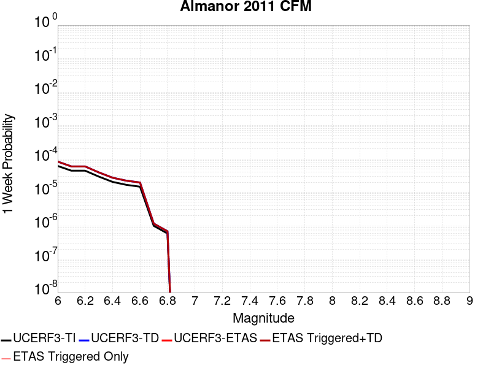 | 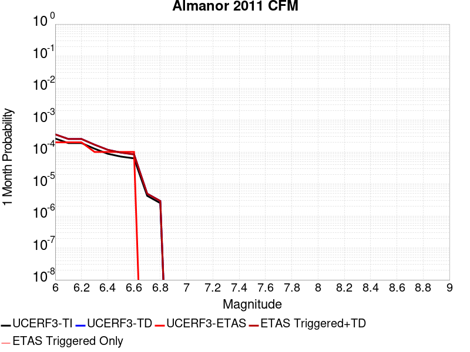 | 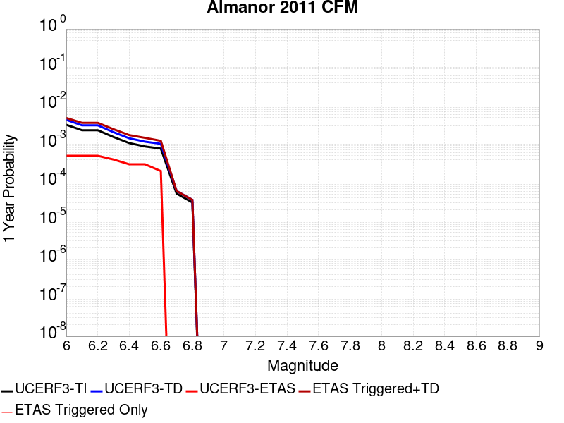 | 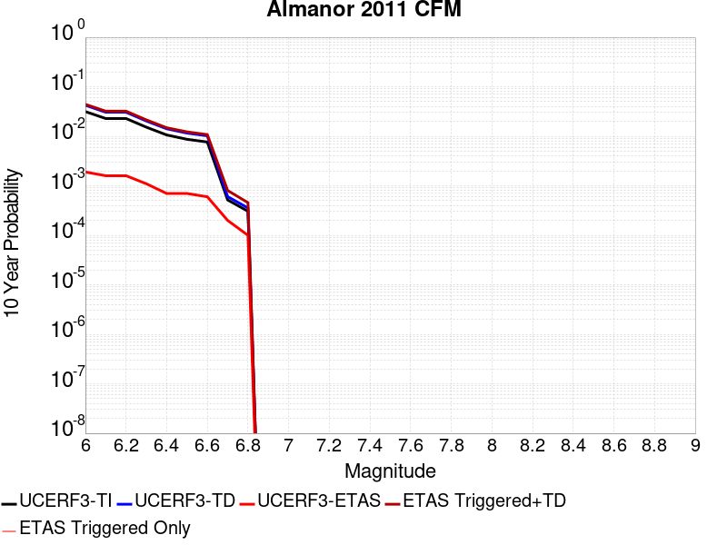 |

| Magnitude | 1 wk TI Prob | 1 wk TD Prob | 1 wk ETAS Prob | 1 wk ETAS/TD Gain | 1 wk ETAS Triggered+TD | 1 wk ETAS Triggered Only | 1 mo TI Prob | 1 mo TD Prob | 1 mo ETAS Prob | 1 mo ETAS/TD Gain | 1 mo ETAS Triggered+TD | 1 mo ETAS Triggered Only | 1 yr TI Prob | 1 yr TD Prob | 1 yr ETAS Prob | 1 yr ETAS/TD Gain | 1 yr ETAS Triggered+TD | 1 yr ETAS Triggered Only | 10 yr TI Prob | 10 yr TD Prob | 10 yr ETAS Prob | 10 yr ETAS/TD Gain | 10 yr ETAS Triggered+TD | 10 yr ETAS Triggered Only |
|-----|-----|-----|-----|-----|-----|-----|-----|-----|-----|-----|-----|-----|-----|-----|-----|-----|-----|-----|-----|-----|-----|-----|-----|-----|
| 6.0 | 6.1479834E-5 | 8.298417E-5 | 0.0 | 0.0 | 8.298417E-5 | 0.0 | 2.6345838E-4 | 3.5560352E-4 | 2.0E-4 | 0.5624241 | 3.5560352E-4 | 0.0 | 0.0032028882 | 0.004321557 | 0.0024 | 0.55535537 | 0.0051181 | 8.0E-4 | 0.031571172 | 0.042444512 | 0.0255 | 0.6007844 | 0.048189845 | 0.006 |
| 6.1 | 4.4387216E-5 | 5.956422E-5 | 0.0 | 0.0 | 5.956422E-5 | 0.0 | 1.9021705E-4 | 2.5525416E-4 | 2.0E-4 | 0.7835328 | 2.5525416E-4 | 0.0 | 0.0023134327 | 0.0031037936 | 0.0022 | 0.70881 | 0.0039013107 | 8.0E-4 | 0.022894967 | 0.03065395 | 0.0184 | 0.60024893 | 0.03530681 | 0.0048 |
| 6.2 | 4.4387216E-5 | 5.956422E-5 | 0.0 | 0.0 | 5.956422E-5 | 0.0 | 1.9021705E-4 | 2.5525416E-4 | 2.0E-4 | 0.7835328 | 2.5525416E-4 | 0.0 | 0.0023134327 | 0.0031037936 | 0.0022 | 0.70881 | 0.0039013107 | 8.0E-4 | 0.022894967 | 0.03065395 | 0.0184 | 0.60024893 | 0.03530681 | 0.0048 |
| 6.3 | 2.9523822E-5 | 3.9414223E-5 | 0.0 | 0.0 | 3.9414223E-5 | 0.0 | 1.2652454E-4 | 1.6890977E-4 | 1.0E-4 | 0.5920321 | 1.6890977E-4 | 0.0 | 0.0015393476 | 0.00205491 | 0.0012 | 0.5839672 | 0.0025538825 | 5.0E-4 | 0.015287281 | 0.020394152 | 0.0117 | 0.5736939 | 0.02362685 | 0.0033 |
| 6.4 | 2.0512744E-5 | 2.7338916E-5 | 0.0 | 0.0 | 2.7338916E-5 | 0.0 | 8.79088E-5 | 1.1716365E-4 | 1.0E-4 | 0.8535071 | 1.1716365E-4 | 0.0 | 0.001069764 | 0.0014258667 | 0.001 | 0.7013278 | 0.0018252964 | 4.0E-4 | 0.010646289 | 0.014198058 | 0.0077 | 0.5423277 | 0.016563982 | 0.0024 |
| 6.5 | 1.6750226E-5 | 2.2315515E-5 | 0.0 | 0.0 | 2.2315515E-5 | 0.0 | 7.178471E-5 | 9.563674E-5 | 1.0E-4 | 1.0456233 | 9.563674E-5 | 0.0 | 8.7362836E-4 | 0.0011640886 | 9.0E-4 | 0.773137 | 0.001563623 | 4.0E-4 | 0.008702018 | 0.011611144 | 0.0066 | 0.5684194 | 0.0137856 | 0.0022 |
| 6.6 | 1.4745303E-5 | 1.964102E-5 | 0.0 | 0.0 | 1.964102E-5 | 0.0 | 6.319262E-5 | 8.417538E-5 | 1.0E-4 | 1.1879958 | 8.417538E-5 | 0.0 | 7.690986E-4 | 0.0010246921 | 7.0E-4 | 0.68313205 | 0.0013243847 | 3.0E-4 | 0.0076644225 | 0.010231581 | 0.0056 | 0.547325 | 0.012112141 | 0.0019 |
| 6.7 | 9.951145E-7 | 1.1596063E-6 | 0.0 | 0.0 | 1.1596063E-6 | 0.0 | 4.26477E-6 | 4.969733E-6 | 0.0 | 0.0 | 4.969733E-6 | 0.0 | 5.1922336E-5 | 6.0504994E-5 | 0.0 | 0.0 | 6.0504994E-5 | 0.0 | 5.1910203E-4 | 6.049024E-4 | 3.0E-4 | 0.49594778 | 8.047814E-4 | 2.0E-4 |
| 6.8 | 5.866312E-7 | 6.837416E-7 | 0.0 | 0.0 | 6.837416E-7 | 0.0 | 2.5141312E-6 | 2.9303185E-6 | 0.0 | 0.0 | 2.9303185E-6 | 0.0 | 3.0609117E-5 | 3.5676174E-5 | 0.0 | 0.0 | 3.5676174E-5 | 0.0 | 3.06049E-4 | 3.5671727E-4 | 2.0E-4 | 0.5606682 | 4.566816E-4 | 1.0E-4 |

## Pleito
*[(top)](#table-of-contents)*

| 1 Week | 1 Month | 1 Year | 10 Year |
|-----|-----|-----|-----|
| 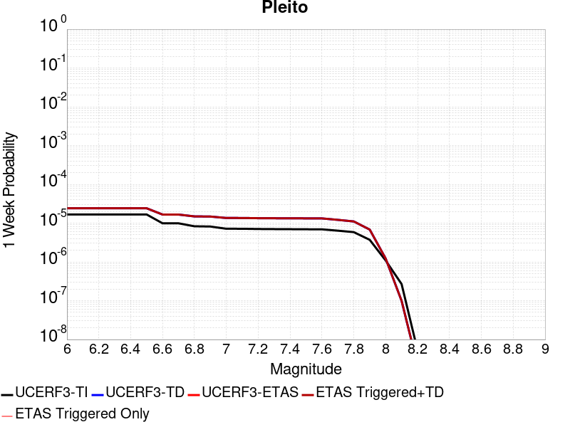 | 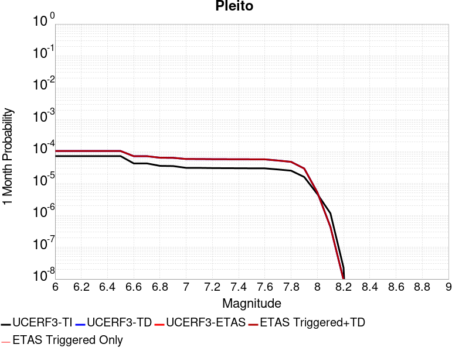 | 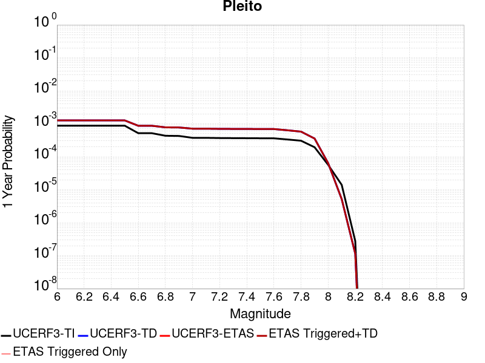 | 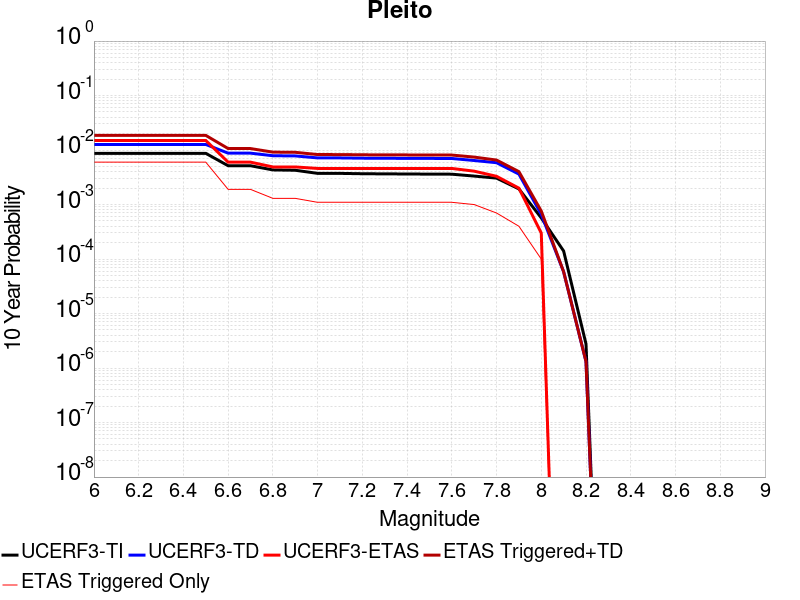 |

| Magnitude | 1 wk TI Prob | 1 wk TD Prob | 1 wk ETAS Prob | 1 wk ETAS/TD Gain | 1 wk ETAS Triggered+TD | 1 wk ETAS Triggered Only | 1 mo TI Prob | 1 mo TD Prob | 1 mo ETAS Prob | 1 mo ETAS/TD Gain | 1 mo ETAS Triggered+TD | 1 mo ETAS Triggered Only | 1 yr TI Prob | 1 yr TD Prob | 1 yr ETAS Prob | 1 yr ETAS/TD Gain | 1 yr ETAS Triggered+TD | 1 yr ETAS Triggered Only | 10 yr TI Prob | 10 yr TD Prob | 10 yr ETAS Prob | 10 yr ETAS/TD Gain | 10 yr ETAS Triggered+TD | 10 yr ETAS Triggered Only |
|-----|-----|-----|-----|-----|-----|-----|-----|-----|-----|-----|-----|-----|-----|-----|-----|-----|-----|-----|-----|-----|-----|-----|-----|-----|
| 6.0 | 1.6763008E-5 | 2.4237324E-5 | 0.0 | 0.0 | 2.4237324E-5 | 0.0 | 7.183948E-5 | 1.03870516E-4 | 0.0 | 0.0 | 1.03870516E-4 | 0.0 | 8.742947E-4 | 0.0012639618 | 9.0E-4 | 0.71204686 | 0.0017633297 | 5.0E-4 | 0.00870863 | 0.012687791 | 0.015 | 1.1822389 | 0.018611664 | 0.006 |
| 6.1 | 1.6763008E-5 | 2.4237324E-5 | 0.0 | 0.0 | 2.4237324E-5 | 0.0 | 7.183948E-5 | 1.03870516E-4 | 0.0 | 0.0 | 1.03870516E-4 | 0.0 | 8.742947E-4 | 0.0012639618 | 9.0E-4 | 0.71204686 | 0.0017633297 | 5.0E-4 | 0.00870863 | 0.012687791 | 0.015 | 1.1822389 | 0.018611664 | 0.006 |
| 6.2 | 1.6763008E-5 | 2.4237324E-5 | 0.0 | 0.0 | 2.4237324E-5 | 0.0 | 7.183948E-5 | 1.03870516E-4 | 0.0 | 0.0 | 1.03870516E-4 | 0.0 | 8.742947E-4 | 0.0012639618 | 9.0E-4 | 0.71204686 | 0.0017633297 | 5.0E-4 | 0.00870863 | 0.012687791 | 0.015 | 1.1822389 | 0.018611664 | 0.006 |
| 6.3 | 1.6763008E-5 | 2.4237324E-5 | 0.0 | 0.0 | 2.4237324E-5 | 0.0 | 7.183948E-5 | 1.03870516E-4 | 0.0 | 0.0 | 1.03870516E-4 | 0.0 | 8.742947E-4 | 0.0012639618 | 9.0E-4 | 0.71204686 | 0.0017633297 | 5.0E-4 | 0.00870863 | 0.012687791 | 0.015 | 1.1822389 | 0.018611664 | 0.006 |
| 6.4 | 1.6763008E-5 | 2.4237324E-5 | 0.0 | 0.0 | 2.4237324E-5 | 0.0 | 7.183948E-5 | 1.03870516E-4 | 0.0 | 0.0 | 1.03870516E-4 | 0.0 | 8.742947E-4 | 0.0012639618 | 9.0E-4 | 0.71204686 | 0.0017633297 | 5.0E-4 | 0.00870863 | 0.012687791 | 0.015 | 1.1822389 | 0.018611664 | 0.006 |
| 6.5 | 1.6763008E-5 | 2.4237324E-5 | 0.0 | 0.0 | 2.4237324E-5 | 0.0 | 7.183948E-5 | 1.03870516E-4 | 0.0 | 0.0 | 1.03870516E-4 | 0.0 | 8.742947E-4 | 0.0012639618 | 9.0E-4 | 0.71204686 | 0.0017633297 | 5.0E-4 | 0.00870863 | 0.012687791 | 0.015 | 1.1822389 | 0.018611664 | 0.006 |
| 6.6 | 9.910213E-6 | 1.6696109E-5 | 0.0 | 0.0 | 1.6696109E-5 | 0.0 | 4.247165E-5 | 7.1552815E-5 | 0.0 | 0.0 | 7.1552815E-5 | 0.0 | 5.169696E-4 | 8.70811E-4 | 2.0E-4 | 0.22967096 | 9.707239E-4 | 1.0E-4 | 0.0051576863 | 0.0087877065 | 0.006 | 0.682772 | 0.01067101 | 0.0019 |
| 6.7 | 9.910213E-6 | 1.6696109E-5 | 0.0 | 0.0 | 1.6696109E-5 | 0.0 | 4.247165E-5 | 7.1552815E-5 | 0.0 | 0.0 | 7.1552815E-5 | 0.0 | 5.169696E-4 | 8.70811E-4 | 2.0E-4 | 0.22967096 | 9.707239E-4 | 1.0E-4 | 0.0051576863 | 0.0087877065 | 0.006 | 0.682772 | 0.01067101 | 0.0019 |
| 6.8 | 8.300162E-6 | 1.495719E-5 | 0.0 | 0.0 | 1.495719E-5 | 0.0 | 3.557164E-5 | 6.410068E-5 | 0.0 | 0.0 | 6.410068E-5 | 0.0 | 4.3299864E-4 | 7.801477E-4 | 2.0E-4 | 0.25636172 | 8.800697E-4 | 1.0E-4 | 0.004321559 | 0.007887667 | 0.0049 | 0.621223 | 0.009177414 | 0.0013 |
| 6.9 | 8.183114E-6 | 1.482864E-5 | 0.0 | 0.0 | 1.482864E-5 | 0.0 | 3.5070017E-5 | 6.354978E-5 | 0.0 | 0.0 | 6.354978E-5 | 0.0 | 4.2689382E-4 | 7.7344524E-4 | 2.0E-4 | 0.25858328 | 8.733679E-4 | 1.0E-4 | 0.0042607468 | 0.007821116 | 0.0049 | 0.6265091 | 0.009110949 | 0.0013 |
| 7.0 | 7.1748823E-6 | 1.3622101E-5 | 0.0 | 0.0 | 1.3622101E-5 | 0.0 | 3.0749135E-5 | 5.8379126E-5 | 0.0 | 0.0 | 5.8379126E-5 | 0.0 | 3.743064E-4 | 7.105346E-4 | 2.0E-4 | 0.2814782 | 8.104635E-4 | 1.0E-4 | 0.0037367654 | 0.0071957298 | 0.0046 | 0.63926804 | 0.008287814 | 0.0011 |
| 7.1 | 7.1671807E-6 | 1.3612542E-5 | 0.0 | 0.0 | 1.3612542E-5 | 0.0 | 3.0716128E-5 | 5.8338162E-5 | 0.0 | 0.0 | 5.8338162E-5 | 0.0 | 3.7390468E-4 | 7.100362E-4 | 2.0E-4 | 0.2816758 | 8.099652E-4 | 1.0E-4 | 0.0037327618 | 0.0071907784 | 0.0046 | 0.6397082 | 0.008282868 | 0.0011 |
| 7.2 | 7.0649667E-6 | 1.34615275E-5 | 0.0 | 0.0 | 1.34615275E-5 | 0.0 | 3.0278077E-5 | 5.7690988E-5 | 0.0 | 0.0 | 5.7690988E-5 | 0.0 | 3.6857324E-4 | 7.0216187E-4 | 2.0E-4 | 0.2848346 | 8.020917E-4 | 1.0E-4 | 0.0036796255 | 0.0071123843 | 0.0046 | 0.6467592 | 0.008204561 | 0.0011 |
| 7.3 | 7.02082E-6 | 1.3405965E-5 | 0.0 | 0.0 | 1.3405965E-5 | 0.0 | 3.008888E-5 | 5.745287E-5 | 0.0 | 0.0 | 5.745287E-5 | 0.0 | 3.6627054E-4 | 6.992647E-4 | 2.0E-4 | 0.28601474 | 7.991948E-4 | 1.0E-4 | 0.0036566744 | 0.007083377 | 0.0046 | 0.64940774 | 0.008175585 | 0.0011 |
| 7.4 | 6.987146E-6 | 1.336608E-5 | 0.0 | 0.0 | 1.336608E-5 | 0.0 | 2.9944567E-5 | 5.7281944E-5 | 0.0 | 0.0 | 5.7281944E-5 | 0.0 | 3.6451413E-4 | 6.97185E-4 | 2.0E-4 | 0.28686792 | 7.9711527E-4 | 1.0E-4 | 0.0036391679 | 0.0070625907 | 0.0046 | 0.6513191 | 0.008154822 | 0.0011 |
| 7.5 | 6.9494554E-6 | 1.3323408E-5 | 0.0 | 0.0 | 1.3323408E-5 | 0.0 | 2.9783041E-5 | 5.709907E-5 | 0.0 | 0.0 | 5.709907E-5 | 0.0 | 3.625482E-4 | 6.9495995E-4 | 2.0E-4 | 0.28778636 | 7.9489045E-4 | 1.0E-4 | 0.0036195726 | 0.00704043 | 0.0046 | 0.6533692 | 0.008132685 | 0.0011 |
| 7.6 | 6.92694E-6 | 1.3283307E-5 | 0.0 | 0.0 | 1.3283307E-5 | 0.0 | 2.9686547E-5 | 5.6927223E-5 | 0.0 | 0.0 | 5.6927223E-5 | 0.0 | 3.6137376E-4 | 6.92869E-4 | 2.0E-4 | 0.28865486 | 7.9279975E-4 | 1.0E-4 | 0.0036078666 | 0.0070195766 | 0.0046 | 0.6553102 | 0.008111855 | 0.0011 |
| 7.7 | 6.395867E-6 | 1.2183972E-5 | 0.0 | 0.0 | 1.2183972E-5 | 0.0 | 2.741057E-5 | 5.2215983E-5 | 0.0 | 0.0 | 5.2215983E-5 | 0.0 | 3.336726E-4 | 6.355444E-4 | 2.0E-4 | 0.31469083 | 7.3548086E-4 | 1.0E-4 | 0.0033317201 | 0.006448918 | 0.0041 | 0.63576555 | 0.0074424692 | 0.001 |
| 7.8 | 5.8664327E-6 | 1.1093631E-5 | 0.0 | 0.0 | 1.1093631E-5 | 0.0 | 2.5141611E-5 | 4.7543264E-5 | 0.0 | 0.0 | 4.7543264E-5 | 0.0 | 3.060561E-4 | 5.786857E-4 | 2.0E-4 | 0.34561074 | 6.7862787E-4 | 1.0E-4 | 0.0030563495 | 0.0058755833 | 0.0033 | 0.56164634 | 0.0065714703 | 7.0E-4 |
| 7.9 | 3.7167474E-6 | 6.84546E-6 | 0.0 | 0.0 | 6.84546E-6 | 0.0 | 1.592882E-5 | 2.9337358E-5 | 0.0 | 0.0 | 2.9337358E-5 | 0.0 | 1.9391612E-4 | 3.5712394E-4 | 1.0E-4 | 0.28001484 | 4.5708823E-4 | 1.0E-4 | 0.0019374699 | 0.003630643 | 0.002 | 0.5508666 | 0.0040291906 | 4.0E-4 |
| 8.0 | 1.0903841E-6 | 1.2289922E-6 | 0.0 | 0.0 | 1.2289922E-6 | 0.0 | 4.6730665E-6 | 5.267099E-6 | 0.0 | 0.0 | 5.267099E-6 | 0.0 | 5.68931E-5 | 6.412506E-5 | 0.0 | 0.0 | 6.412506E-5 | 0.0 | 5.6878536E-4 | 6.632113E-4 | 3.0E-4 | 0.45234454 | 7.63145E-4 | 1.0E-4 |
| 8.1 | 2.6894583E-7 | 1.00966304E-7 | 0.0 | 0.0 | 1.00966304E-7 | 0.0 | 1.1526245E-6 | 4.3271265E-7 | 0.0 | 0.0 | 4.3271265E-7 | 0.0 | 1.4033113E-5 | 5.268264E-6 | 0.0 | 0.0 | 5.268264E-6 | 0.0 | 1.4032227E-4 | 5.9173388E-5 | 0.0 | 0.0 | 5.9173388E-5 | 0.0 |
| 8.2 | 5.2967013E-9 | 2.227298E-9 | 0.0 | 0.0 | 2.227298E-9 | 0.0 | 2.2700148E-8 | 9.545562E-9 | 0.0 | 0.0 | 9.545562E-9 | 0.0 | 2.7637427E-7 | 1.162172E-7 | 0.0 | 0.0 | 1.162172E-7 | 0.0 | 2.7637393E-6 | 1.3298658E-6 | 0.0 | 0.0 | 1.3298658E-6 | 0.0 |

## Mission (connected) 2011 CFM
*[(top)](#table-of-contents)*

| 1 Week | 1 Month | 1 Year | 10 Year |
|-----|-----|-----|-----|
| 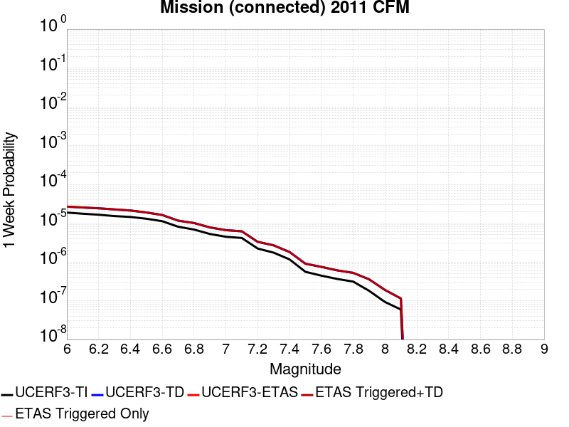 | 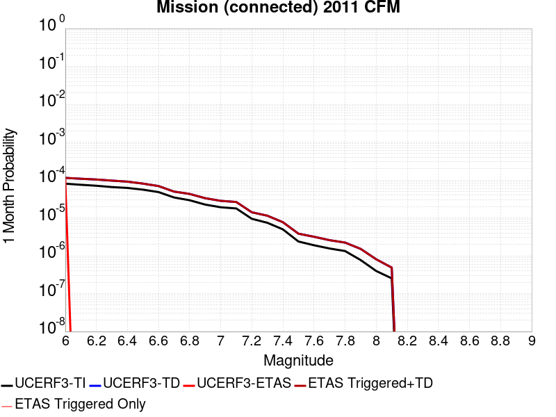 | 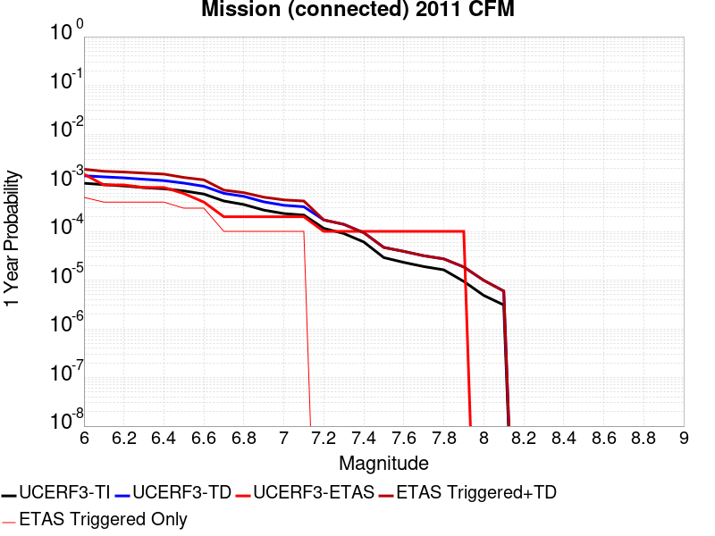 | 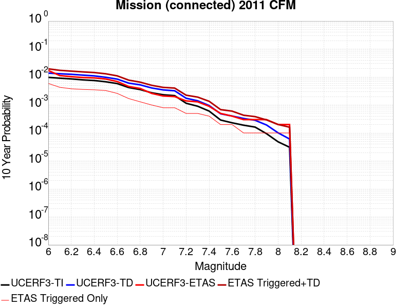 |

| Magnitude | 1 wk TI Prob | 1 wk TD Prob | 1 wk ETAS Prob | 1 wk ETAS/TD Gain | 1 wk ETAS Triggered+TD | 1 wk ETAS Triggered Only | 1 mo TI Prob | 1 mo TD Prob | 1 mo ETAS Prob | 1 mo ETAS/TD Gain | 1 mo ETAS Triggered+TD | 1 mo ETAS Triggered Only | 1 yr TI Prob | 1 yr TD Prob | 1 yr ETAS Prob | 1 yr ETAS/TD Gain | 1 yr ETAS Triggered+TD | 1 yr ETAS Triggered Only | 10 yr TI Prob | 10 yr TD Prob | 10 yr ETAS Prob | 10 yr ETAS/TD Gain | 10 yr ETAS Triggered+TD | 10 yr ETAS Triggered Only |
|-----|-----|-----|-----|-----|-----|-----|-----|-----|-----|-----|-----|-----|-----|-----|-----|-----|-----|-----|-----|-----|-----|-----|-----|-----|
| 6.0 | 1.8735573E-5 | 2.6670066E-5 | 0.0 | 0.0 | 2.6670066E-5 | 0.0 | 8.029284E-5 | 1.1429397E-4 | 1.0E-4 | 0.87493676 | 1.1429397E-4 | 0.0 | 9.771269E-4 | 0.0013905481 | 0.0015 | 1.0787114 | 0.0018898528 | 5.0E-4 | 0.009728416 | 0.013831233 | 0.0172 | 1.2435623 | 0.019649629 | 0.0059 |
| 6.1 | 1.7515964E-5 | 2.5312958E-5 | 0.0 | 0.0 | 2.5312958E-5 | 0.0 | 7.506625E-5 | 1.0847829E-4 | 0.0 | 0.0 | 1.0847829E-4 | 0.0 | 9.135484E-4 | 0.0013198298 | 9.0E-4 | 0.6819061 | 0.0017193018 | 4.0E-4 | 0.009098019 | 0.013132594 | 0.0113 | 0.86045456 | 0.017376123 | 0.0043 |
| 6.2 | 1.6486343E-5 | 2.4159106E-5 | 0.0 | 0.0 | 2.4159106E-5 | 0.0 | 7.065384E-5 | 1.0353361E-4 | 0.0 | 0.0 | 1.0353361E-4 | 0.0 | 8.5987104E-4 | 0.0012596997 | 9.0E-4 | 0.71445596 | 0.0016591959 | 4.0E-4 | 0.008565514 | 0.012538263 | 0.0103 | 0.82148546 | 0.016290616 | 0.0038 |
| 6.3 | 1.5229385E-5 | 2.2592136E-5 | 0.0 | 0.0 | 2.2592136E-5 | 0.0 | 6.526716E-5 | 9.6818534E-5 | 0.0 | 0.0 | 9.6818534E-5 | 0.0 | 7.9433795E-4 | 0.0011780353 | 8.0E-4 | 0.6790968 | 0.001577564 | 4.0E-4 | 0.007915046 | 0.01173311 | 0.0096 | 0.81819737 | 0.015290871 | 0.0036 |
| 6.4 | 1.4435828E-5 | 2.1199203E-5 | 0.0 | 0.0 | 2.1199203E-5 | 0.0 | 6.186637E-5 | 9.0849266E-5 | 0.0 | 0.0 | 9.0849266E-5 | 0.0 | 7.529627E-4 | 0.0011054366 | 8.0E-4 | 0.723696 | 0.0015049943 | 4.0E-4 | 0.007504165 | 0.011019518 | 0.0093 | 0.8439571 | 0.014480949 | 0.0035 |
| 6.5 | 1.30127955E-5 | 1.8847946E-5 | 0.0 | 0.0 | 1.8847946E-5 | 0.0 | 5.576793E-5 | 8.077415E-5 | 0.0 | 0.0 | 8.077415E-5 | 0.0 | 6.78763E-4 | 9.829501E-4 | 6.0E-4 | 0.6104074 | 0.0012826552 | 3.0E-4 | 0.0067669353 | 0.009817206 | 0.0085 | 0.8658268 | 0.013084809 | 0.0033 |
| 6.6 | 1.1220718E-5 | 1.6215632E-5 | 0.0 | 0.0 | 1.6215632E-5 | 0.0 | 4.8087906E-5 | 6.94937E-5 | 0.0 | 0.0 | 6.94937E-5 | 0.0 | 5.8531296E-4 | 8.4575714E-4 | 4.0E-4 | 0.472949 | 0.0011455034 | 3.0E-4 | 0.005837737 | 0.008460647 | 0.0069 | 0.81554043 | 0.01103865 | 0.0026 |
| 6.7 | 8.086152E-6 | 1.1600417E-5 | 0.0 | 0.0 | 1.1600417E-5 | 0.0 | 3.4654473E-5 | 4.971513E-5 | 0.0 | 0.0 | 4.971513E-5 | 0.0 | 4.2183654E-4 | 6.051144E-4 | 2.0E-4 | 0.33051604 | 7.0505386E-4 | 1.0E-4 | 0.004210367 | 0.006074099 | 0.0046 | 0.75731397 | 0.007763773 | 0.0017 |
| 6.8 | 6.8361655E-6 | 1.0061558E-5 | 0.0 | 0.0 | 1.0061558E-5 | 0.0 | 2.9297524E-5 | 4.3120253E-5 | 0.0 | 0.0 | 4.3120253E-5 | 0.0 | 3.5663895E-4 | 5.2486325E-4 | 2.0E-4 | 0.38105163 | 6.2481075E-4 | 1.0E-4 | 0.0035606713 | 0.005271206 | 0.0039 | 0.7398686 | 0.0065643536 | 0.0013 |
| 6.9 | 5.2517353E-6 | 7.75857E-6 | 0.0 | 0.0 | 7.75857E-6 | 0.0 | 2.2507242E-5 | 3.3250595E-5 | 0.0 | 0.0 | 3.3250595E-5 | 0.0 | 2.739912E-4 | 4.0475102E-4 | 2.0E-4 | 0.49413094 | 5.0471054E-4 | 1.0E-4 | 0.0027365363 | 0.004074018 | 0.0026 | 0.63819057 | 0.005069944 | 0.001 |
| 7.0 | 4.4602784E-6 | 6.6043463E-6 | 0.0 | 0.0 | 6.6043463E-6 | 0.0 | 1.911534E-5 | 2.8304035E-5 | 0.0 | 0.0 | 2.8304035E-5 | 0.0 | 2.327044E-4 | 3.445473E-4 | 2.0E-4 | 0.5804718 | 4.4451284E-4 | 1.0E-4 | 0.0023246086 | 0.003473001 | 0.0021 | 0.6046643 | 0.004270223 | 8.0E-4 |
| 7.1 | 4.1492594E-6 | 6.157248E-6 | 0.0 | 0.0 | 6.157248E-6 | 0.0 | 1.7782419E-5 | 2.6387941E-5 | 0.0 | 0.0 | 2.6387941E-5 | 0.0 | 2.1647944E-4 | 3.2122596E-4 | 2.0E-4 | 0.6226147 | 4.2119384E-4 | 1.0E-4 | 0.0021626868 | 0.0032399064 | 0.002 | 0.61730176 | 0.0040373146 | 8.0E-4 |
| 7.2 | 2.213247E-6 | 3.2959058E-6 | 0.0 | 0.0 | 3.2959058E-6 | 0.0 | 9.485309E-6 | 1.4125234E-5 | 0.0 | 0.0 | 1.4125234E-5 | 0.0 | 1.15477524E-4 | 1.7196119E-4 | 1.0E-4 | 0.5815266 | 1.7196119E-4 | 0.0 | 0.0011541754 | 0.0017479655 | 0.0014 | 0.80093116 | 0.0022470914 | 5.0E-4 |
| 7.3 | 1.7362703E-6 | 2.6794794E-6 | 0.0 | 0.0 | 2.6794794E-6 | 0.0 | 7.4411373E-6 | 1.1483433E-5 | 0.0 | 0.0 | 1.1483433E-5 | 0.0 | 9.0592075E-5 | 1.3980185E-4 | 1.0E-4 | 0.7152981 | 1.3980185E-4 | 0.0 | 9.0555154E-4 | 0.0014234576 | 0.0013 | 0.9132692 | 0.0019227458 | 5.0E-4 |
| 7.4 | 1.1628409E-6 | 1.8031382E-6 | 0.0 | 0.0 | 1.8031382E-6 | 0.0 | 4.9835944E-6 | 7.727712E-6 | 0.0 | 0.0 | 7.727712E-6 | 0.0 | 6.0673574E-5 | 9.4080846E-5 | 1.0E-4 | 1.0629156 | 9.4080846E-5 | 0.0 | 6.065701E-4 | 9.620352E-4 | 9.0E-4 | 0.93551666 | 0.0013616504 | 4.0E-4 |
| 7.5 | 5.5610667E-7 | 8.9942415E-7 | 0.0 | 0.0 | 8.9942415E-7 | 0.0 | 2.3833122E-6 | 3.854669E-6 | 0.0 | 0.0 | 3.854669E-6 | 0.0 | 2.9016439E-5 | 4.6929592E-5 | 1.0E-4 | 2.1308517 | 4.6929592E-5 | 0.0 | 2.901265E-4 | 4.8663607E-4 | 5.0E-4 | 1.0274619 | 6.8653875E-4 | 2.0E-4 |
| 7.6 | 4.4307663E-7 | 7.45915E-7 | 0.0 | 0.0 | 7.45915E-7 | 0.0 | 1.8988985E-6 | 3.1967745E-6 | 0.0 | 0.0 | 3.1967745E-6 | 0.0 | 2.3118844E-5 | 3.8920036E-5 | 1.0E-4 | 2.5693705 | 3.8920036E-5 | 0.0 | 2.3116439E-4 | 4.058705E-4 | 4.0E-4 | 0.98553604 | 6.057893E-4 | 2.0E-4 |
| 7.7 | 3.639119E-7 | 6.0639263E-7 | 0.0 | 0.0 | 6.0639263E-7 | 0.0 | 1.5596215E-6 | 2.598823E-6 | 0.0 | 0.0 | 2.598823E-6 | 0.0 | 1.8988227E-5 | 3.164021E-5 | 1.0E-4 | 3.160535 | 3.164021E-5 | 0.0 | 1.8986604E-4 | 3.323364E-4 | 3.0E-4 | 0.9026998 | 4.3230318E-4 | 1.0E-4 |
| 7.8 | 3.1152942E-7 | 5.230514E-7 | 0.0 | 0.0 | 5.230514E-7 | 0.0 | 1.3351254E-6 | 2.2416468E-6 | 0.0 | 0.0 | 2.2416468E-6 | 0.0 | 1.6255031E-5 | 2.7291711E-5 | 1.0E-4 | 3.6641161 | 2.7291711E-5 | 0.0 | 1.6253842E-4 | 2.855025E-4 | 3.0E-4 | 1.0507789 | 3.8547395E-4 | 1.0E-4 |
| 7.9 | 1.8035962E-7 | 3.5666037E-7 | 0.0 | 0.0 | 3.5666037E-7 | 0.0 | 7.729696E-7 | 1.5285435E-6 | 0.0 | 0.0 | 1.5285435E-6 | 0.0 | 9.410865E-6 | 1.860986E-5 | 1.0E-4 | 5.3734956 | 1.860986E-5 | 0.0 | 9.410465E-5 | 1.9326876E-4 | 3.0E-4 | 1.5522426 | 2.9324944E-4 | 1.0E-4 |
| 8.0 | 9.279334E-8 | 1.895648E-7 | 0.0 | 0.0 | 1.895648E-7 | 0.0 | 3.976857E-7 | 8.124203E-7 | 0.0 | 0.0 | 8.124203E-7 | 0.0 | 4.841813E-6 | 9.891172E-6 | 0.0 | 0.0 | 9.891172E-6 | 0.0 | 4.841707E-5 | 1.0164692E-4 | 2.0E-4 | 1.9675953 | 2.0163675E-4 | 1.0E-4 |
| 8.1 | 5.9253985E-8 | 1.1417911E-7 | 0.0 | 0.0 | 1.1417911E-7 | 0.0 | 2.5394561E-7 | 4.8933896E-7 | 0.0 | 0.0 | 4.8933896E-7 | 0.0 | 3.0917836E-6 | 5.957686E-6 | 0.0 | 0.0 | 5.957686E-6 | 0.0 | 3.0917407E-5 | 6.1072096E-5 | 2.0E-4 | 3.274818 | 1.61066E-4 | 1.0E-4 |

## Santa Ynez (East)
*[(top)](#table-of-contents)*

| 1 Week | 1 Month | 1 Year | 10 Year |
|-----|-----|-----|-----|
| 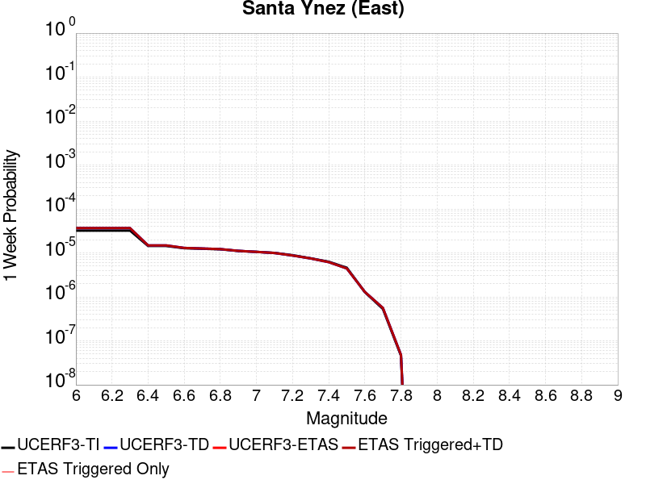 | 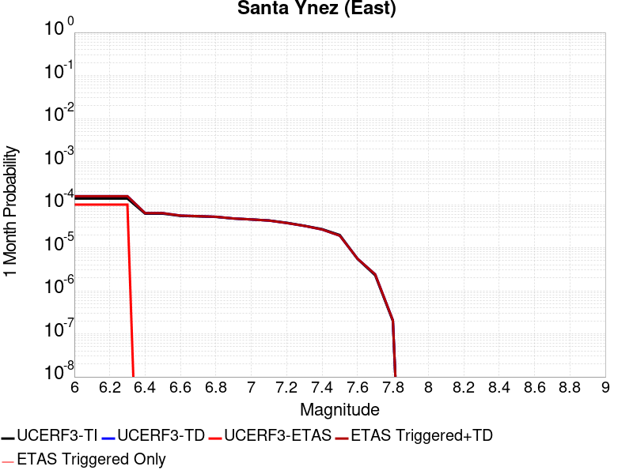 | 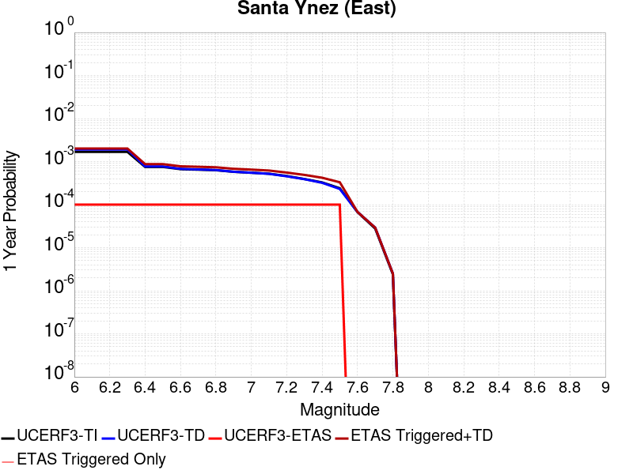 | 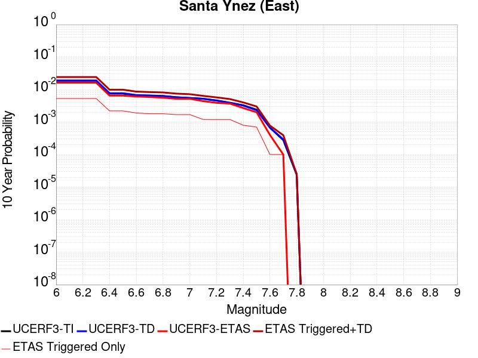 |

| Magnitude | 1 wk TI Prob | 1 wk TD Prob | 1 wk ETAS Prob | 1 wk ETAS/TD Gain | 1 wk ETAS Triggered+TD | 1 wk ETAS Triggered Only | 1 mo TI Prob | 1 mo TD Prob | 1 mo ETAS Prob | 1 mo ETAS/TD Gain | 1 mo ETAS Triggered+TD | 1 mo ETAS Triggered Only | 1 yr TI Prob | 1 yr TD Prob | 1 yr ETAS Prob | 1 yr ETAS/TD Gain | 1 yr ETAS Triggered+TD | 1 yr ETAS Triggered Only | 10 yr TI Prob | 10 yr TD Prob | 10 yr ETAS Prob | 10 yr ETAS/TD Gain | 10 yr ETAS Triggered+TD | 10 yr ETAS Triggered Only |
|-----|-----|-----|-----|-----|-----|-----|-----|-----|-----|-----|-----|-----|-----|-----|-----|-----|-----|-----|-----|-----|-----|-----|-----|-----|
| 6.0 | 3.2269712E-5 | 3.6683814E-5 | 1.0E-4 | 2.7259977 | 3.6683814E-5 | 0.0 | 1.3829143E-4 | 1.5721019E-4 | 1.0E-4 | 0.6360911 | 1.5721019E-4 | 0.0 | 0.0016823979 | 0.001912935 | 0.0012 | 0.6273083 | 0.0022123612 | 3.0E-4 | 0.016697178 | 0.01902192 | 0.0162 | 0.851649 | 0.024221106 | 0.0053 |
| 6.1 | 3.2269712E-5 | 3.6683814E-5 | 1.0E-4 | 2.7259977 | 3.6683814E-5 | 0.0 | 1.3829143E-4 | 1.5721019E-4 | 1.0E-4 | 0.6360911 | 1.5721019E-4 | 0.0 | 0.0016823979 | 0.001912935 | 0.0012 | 0.6273083 | 0.0022123612 | 3.0E-4 | 0.016697178 | 0.01902192 | 0.0162 | 0.851649 | 0.024221106 | 0.0053 |
| 6.2 | 3.2269712E-5 | 3.6683814E-5 | 1.0E-4 | 2.7259977 | 3.6683814E-5 | 0.0 | 1.3829143E-4 | 1.5721019E-4 | 1.0E-4 | 0.6360911 | 1.5721019E-4 | 0.0 | 0.0016823979 | 0.001912935 | 0.0012 | 0.6273083 | 0.0022123612 | 3.0E-4 | 0.016697178 | 0.01902192 | 0.0162 | 0.851649 | 0.024221106 | 0.0053 |
| 6.3 | 3.2269712E-5 | 3.6683814E-5 | 1.0E-4 | 2.7259977 | 3.6683814E-5 | 0.0 | 1.3829143E-4 | 1.5721019E-4 | 1.0E-4 | 0.6360911 | 1.5721019E-4 | 0.0 | 0.0016823979 | 0.001912935 | 0.0012 | 0.6273083 | 0.0022123612 | 3.0E-4 | 0.016697178 | 0.01902192 | 0.0162 | 0.851649 | 0.024221106 | 0.0053 |
| 6.4 | 1.4404779E-5 | 1.4833643E-5 | 0.0 | 0.0 | 1.4833643E-5 | 0.0 | 6.1733306E-5 | 6.3571235E-5 | 0.0 | 0.0 | 6.3571235E-5 | 0.0 | 7.513438E-4 | 7.7371E-4 | 6.0E-4 | 0.7754843 | 9.7355526E-4 | 2.0E-4 | 0.0074880854 | 0.007710712 | 0.0065 | 0.8429831 | 0.009893748 | 0.0022 |
| 6.5 | 1.4404779E-5 | 1.4833643E-5 | 0.0 | 0.0 | 1.4833643E-5 | 0.0 | 6.1733306E-5 | 6.3571235E-5 | 0.0 | 0.0 | 6.3571235E-5 | 0.0 | 7.513438E-4 | 7.7371E-4 | 6.0E-4 | 0.7754843 | 9.7355526E-4 | 2.0E-4 | 0.0074880854 | 0.007710712 | 0.0065 | 0.8429831 | 0.009893748 | 0.0022 |
| 6.6 | 1.280208E-5 | 1.2999024E-5 | 0.0 | 0.0 | 1.2999024E-5 | 0.0 | 5.4864904E-5 | 5.5708922E-5 | 0.0 | 0.0 | 5.5708922E-5 | 0.0 | 6.6777546E-4 | 6.7804684E-4 | 6.0E-4 | 0.8848946 | 7.7797903E-4 | 1.0E-4 | 0.006657724 | 0.0067599905 | 0.0061 | 0.9023681 | 0.008647147 | 0.0019 |
| 6.7 | 1.2457027E-5 | 1.2615991E-5 | 0.0 | 0.0 | 1.2615991E-5 | 0.0 | 5.3386164E-5 | 5.4067423E-5 | 0.0 | 0.0 | 5.4067423E-5 | 0.0 | 6.497827E-4 | 6.580737E-4 | 6.0E-4 | 0.911752 | 7.580079E-4 | 1.0E-4 | 0.00647886 | 0.0065614474 | 0.0059 | 0.89919186 | 0.008349637 | 0.0018 |
| 6.8 | 1.2095134E-5 | 1.2218848E-5 | 0.0 | 0.0 | 1.2218848E-5 | 0.0 | 5.1835254E-5 | 5.2365445E-5 | 0.0 | 0.0 | 5.2365445E-5 | 0.0 | 6.309115E-4 | 6.373644E-4 | 5.0E-4 | 0.7844806 | 7.3730067E-4 | 1.0E-4 | 0.0062912325 | 0.006355552 | 0.0056 | 0.8811194 | 0.008144112 | 0.0018 |
| 6.9 | 1.1104036E-5 | 1.1146226E-5 | 0.0 | 0.0 | 1.1146226E-5 | 0.0 | 4.758786E-5 | 4.7768674E-5 | 0.0 | 0.0 | 4.7768674E-5 | 0.0 | 5.7922816E-4 | 5.8142963E-4 | 4.0E-4 | 0.68795943 | 6.813715E-4 | 1.0E-4 | 0.005777207 | 0.0057992297 | 0.0052 | 0.8966708 | 0.0074893706 | 0.0017 |
| 7.0 | 1.0577444E-5 | 1.0571121E-5 | 0.0 | 0.0 | 1.0571121E-5 | 0.0 | 4.5331115E-5 | 4.5304023E-5 | 0.0 | 0.0 | 4.5304023E-5 | 0.0 | 5.5176654E-4 | 5.514381E-4 | 4.0E-4 | 0.72537607 | 6.5138296E-4 | 1.0E-4 | 0.0055039856 | 0.0055008354 | 0.0052 | 0.94531095 | 0.0071914843 | 0.0017 |
| 7.1 | 1.0021775E-5 | 9.970943E-6 | 0.0 | 0.0 | 9.970943E-6 | 0.0 | 4.294976E-5 | 4.2731917E-5 | 0.0 | 0.0 | 4.2731917E-5 | 0.0 | 5.2278786E-4 | 5.201381E-4 | 4.0E-4 | 0.7690265 | 6.200861E-4 | 1.0E-4 | 0.0052155964 | 0.005189339 | 0.0044 | 0.8478921 | 0.006383112 | 0.0012 |
| 7.2 | 8.874109E-6 | 8.7398275E-6 | 0.0 | 0.0 | 8.7398275E-6 | 0.0 | 3.8031343E-5 | 3.7455873E-5 | 0.0 | 0.0 | 3.7455873E-5 | 0.0 | 4.629332E-4 | 4.5593092E-4 | 4.0E-4 | 0.8773259 | 5.558853E-4 | 1.0E-4 | 0.0046197 | 0.004550073 | 0.0039 | 0.85712916 | 0.005744613 | 0.0012 |
| 7.3 | 7.5504267E-6 | 7.4977006E-6 | 0.0 | 0.0 | 7.4977006E-6 | 0.0 | 3.235857E-5 | 3.2132615E-5 | 0.0 | 0.0 | 3.2132615E-5 | 0.0 | 3.9389438E-4 | 3.9114535E-4 | 3.0E-4 | 0.76697826 | 4.9110624E-4 | 1.0E-4 | 0.0039319694 | 0.0039046758 | 0.0037 | 0.9475818 | 0.0050999904 | 0.0012 |
| 7.4 | 6.309394E-6 | 6.176964E-6 | 0.0 | 0.0 | 6.176964E-6 | 0.0 | 2.703998E-5 | 2.6472439E-5 | 0.0 | 0.0 | 2.6472439E-5 | 0.0 | 3.2916202E-4 | 3.2225522E-4 | 2.0E-4 | 0.6206261 | 4.22223E-4 | 1.0E-4 | 0.003286749 | 0.0032179763 | 0.0027 | 0.83903664 | 0.004015402 | 8.0E-4 |
| 7.5 | 4.6103073E-6 | 4.4365092E-6 | 0.0 | 0.0 | 4.4365092E-6 | 0.0 | 1.975831E-5 | 1.9013476E-5 | 0.0 | 0.0 | 1.9013476E-5 | 0.0 | 2.4053088E-4 | 2.3146518E-4 | 1.0E-4 | 0.43203044 | 3.3144202E-4 | 1.0E-4 | 0.002402707 | 0.0023123103 | 0.002 | 0.8649358 | 0.0030106916 | 7.0E-4 |
| 7.6 | 1.2858658E-6 | 1.2997734E-6 | 0.0 | 0.0 | 1.2997734E-6 | 0.0 | 5.5108417E-6 | 5.5704463E-6 | 0.0 | 0.0 | 5.5704463E-6 | 0.0 | 6.7092435E-5 | 6.781814E-5 | 0.0 | 0.0 | 6.781814E-5 | 0.0 | 6.707218E-4 | 6.7798136E-4 | 4.0E-4 | 0.58998674 | 7.7791355E-4 | 1.0E-4 |
| 7.7 | 5.3302307E-7 | 5.609023E-7 | 0.0 | 0.0 | 5.609023E-7 | 0.0 | 2.2843826E-6 | 2.403865E-6 | 0.0 | 0.0 | 2.403865E-6 | 0.0 | 2.7812002E-5 | 2.9266701E-5 | 0.0 | 0.0 | 2.9266701E-5 | 0.0 | 2.7808524E-4 | 2.9263203E-4 | 1.0E-4 | 0.3417261 | 3.926028E-4 | 1.0E-4 |
| 7.8 | 4.613933E-8 | 4.8009543E-8 | 0.0 | 0.0 | 4.8009543E-8 | 0.0 | 1.9773998E-7 | 2.0575517E-7 | 0.0 | 0.0 | 2.0575517E-7 | 0.0 | 2.4074816E-6 | 2.5050665E-6 | 0.0 | 0.0 | 2.5050665E-6 | 0.0 | 2.4074554E-5 | 2.5050393E-5 | 0.0 | 0.0 | 2.5050393E-5 | 0.0 |

## South Klamath Lake West
*[(top)](#table-of-contents)*

| 1 Week | 1 Month | 1 Year | 10 Year |
|-----|-----|-----|-----|
| 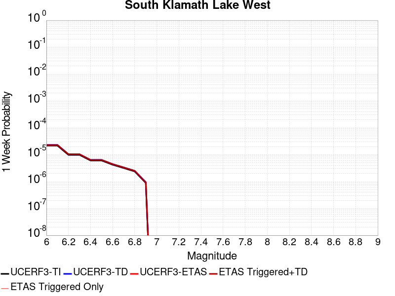 | 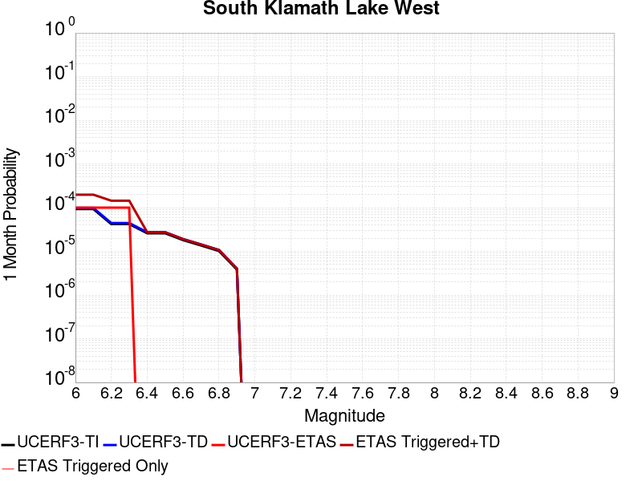 | 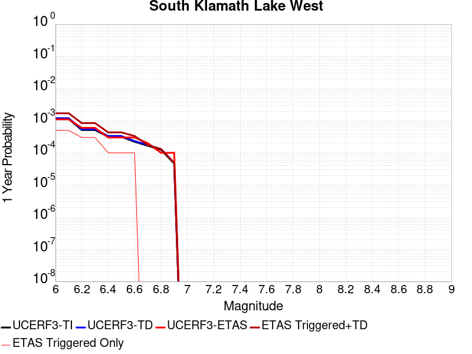 |  |

| Magnitude | 1 wk TI Prob | 1 wk TD Prob | 1 wk ETAS Prob | 1 wk ETAS/TD Gain | 1 wk ETAS Triggered+TD | 1 wk ETAS Triggered Only | 1 mo TI Prob | 1 mo TD Prob | 1 mo ETAS Prob | 1 mo ETAS/TD Gain | 1 mo ETAS Triggered+TD | 1 mo ETAS Triggered Only | 1 yr TI Prob | 1 yr TD Prob | 1 yr ETAS Prob | 1 yr ETAS/TD Gain | 1 yr ETAS Triggered+TD | 1 yr ETAS Triggered Only | 10 yr TI Prob | 10 yr TD Prob | 10 yr ETAS Prob | 10 yr ETAS/TD Gain | 10 yr ETAS Triggered+TD | 10 yr ETAS Triggered Only |
|-----|-----|-----|-----|-----|-----|-----|-----|-----|-----|-----|-----|-----|-----|-----|-----|-----|-----|-----|-----|-----|-----|-----|-----|-----|
| 6.0 | 2.174025E-5 | 2.3027618E-5 | 0.0 | 0.0 | 2.3027618E-5 | 0.0 | 9.3169176E-5 | 9.868643E-5 | 1.0E-4 | 1.0133106 | 1.9867656E-4 | 1.0E-4 | 0.0011337444 | 0.0012009108 | 0.0011 | 0.91597146 | 0.0017003103 | 5.0E-4 | 0.011279777 | 0.011950803 | 0.0124 | 1.0375872 | 0.016594635 | 0.0047 |
| 6.1 | 2.174025E-5 | 2.3027618E-5 | 0.0 | 0.0 | 2.3027618E-5 | 0.0 | 9.3169176E-5 | 9.868643E-5 | 1.0E-4 | 1.0133106 | 1.9867656E-4 | 1.0E-4 | 0.0011337444 | 0.0012009108 | 0.0011 | 0.91597146 | 0.0017003103 | 5.0E-4 | 0.011279777 | 0.011950803 | 0.0124 | 1.0375872 | 0.016594635 | 0.0047 |
| 6.2 | 9.834929E-6 | 1.03876755E-5 | 0.0 | 0.0 | 1.03876755E-5 | 0.0 | 4.2149015E-5 | 4.45179E-5 | 1.0E-4 | 2.2462873 | 1.4451345E-4 | 1.0E-4 | 5.1304343E-4 | 5.418797E-4 | 6.0E-4 | 1.1072569 | 8.417171E-4 | 3.0E-4 | 0.0051186057 | 0.0054064845 | 0.0058 | 1.0727859 | 0.00759459 | 0.0022 |
| 6.3 | 9.834929E-6 | 1.03876755E-5 | 0.0 | 0.0 | 1.03876755E-5 | 0.0 | 4.2149015E-5 | 4.45179E-5 | 1.0E-4 | 2.2462873 | 1.4451345E-4 | 1.0E-4 | 5.1304343E-4 | 5.418797E-4 | 6.0E-4 | 1.1072569 | 8.417171E-4 | 3.0E-4 | 0.0051186057 | 0.0054064845 | 0.0058 | 1.0727859 | 0.00759459 | 0.0022 |
| 6.4 | 6.066321E-6 | 6.3967505E-6 | 0.0 | 0.0 | 6.3967505E-6 | 0.0 | 2.5998259E-5 | 2.7414373E-5 | 0.0 | 0.0 | 2.7414373E-5 | 0.0 | 3.1648282E-4 | 3.3372157E-4 | 3.0E-4 | 0.89895296 | 4.336882E-4 | 1.0E-4 | 0.0031603249 | 0.0033324743 | 0.0035 | 1.0502707 | 0.0048274756 | 0.0015 |
| 6.5 | 6.066321E-6 | 6.3967505E-6 | 0.0 | 0.0 | 6.3967505E-6 | 0.0 | 2.5998259E-5 | 2.7414373E-5 | 0.0 | 0.0 | 2.7414373E-5 | 0.0 | 3.1648282E-4 | 3.3372157E-4 | 3.0E-4 | 0.89895296 | 4.336882E-4 | 1.0E-4 | 0.0031603249 | 0.0033324743 | 0.0035 | 1.0502707 | 0.0048274756 | 0.0015 |
| 6.6 | 4.2321803E-6 | 4.4587705E-6 | 0.0 | 0.0 | 4.4587705E-6 | 0.0 | 1.8137789E-5 | 1.9108884E-5 | 0.0 | 0.0 | 1.9108884E-5 | 0.0 | 2.208052E-4 | 2.3262684E-4 | 3.0E-4 | 1.2896191 | 3.3260358E-4 | 1.0E-4 | 0.0022058594 | 0.002323935 | 0.0024 | 1.032731 | 0.0035211463 | 0.0012 |
| 6.7 | 3.186646E-6 | 3.358394E-6 | 0.0 | 0.0 | 3.358394E-6 | 0.0 | 1.3656982E-5 | 1.4393042E-5 | 0.0 | 0.0 | 1.4393042E-5 | 0.0 | 1.6626107E-4 | 1.7522187E-4 | 2.0E-4 | 1.14141 | 1.7522187E-4 | 0.0 | 0.0016613674 | 0.0017509041 | 0.002 | 1.142267 | 0.0026493284 | 9.0E-4 |
| 6.8 | 2.380121E-6 | 2.509467E-6 | 0.0 | 0.0 | 2.509467E-6 | 0.0 | 1.0200479E-5 | 1.0754818E-5 | 0.0 | 0.0 | 1.0754818E-5 | 0.0 | 1.2418375E-4 | 1.309325E-4 | 1.0E-4 | 0.76375234 | 1.309325E-4 | 0.0 | 0.0012411437 | 0.0013085994 | 0.0013 | 0.9934286 | 0.0017080759 | 4.0E-4 |
| 6.9 | 8.928287E-7 | 9.4247173E-7 | 0.0 | 0.0 | 9.4247173E-7 | 0.0 | 3.826403E-6 | 4.0391596E-6 | 0.0 | 0.0 | 4.0391596E-6 | 0.0 | 4.658546E-5 | 4.917588E-5 | 1.0E-4 | 2.0335174 | 4.917588E-5 | 0.0 | 4.6575698E-4 | 4.9167156E-4 | 5.0E-4 | 1.016939 | 7.915241E-4 | 3.0E-4 |

## Trinidad (alt1)
*[(top)](#table-of-contents)*

| 1 Week | 1 Month | 1 Year | 10 Year |
|-----|-----|-----|-----|
| 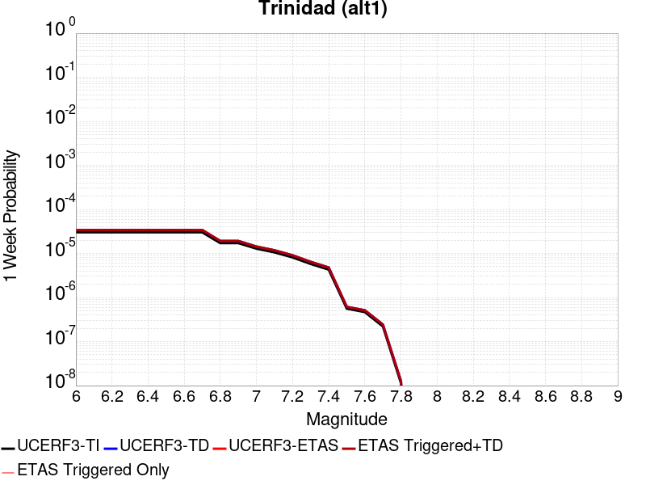 | 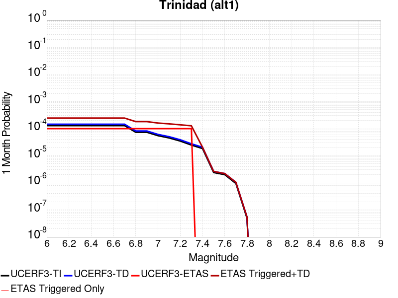 | 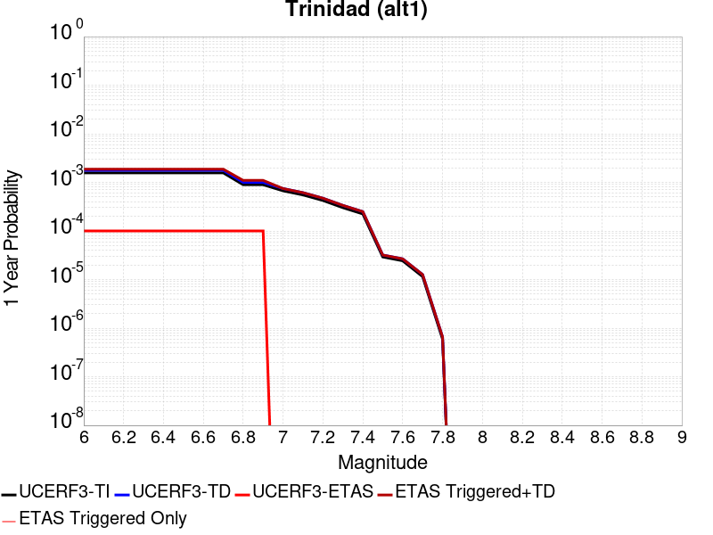 | 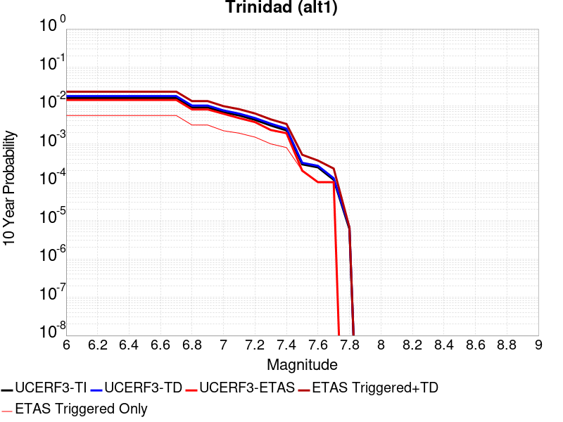 |

| Magnitude | 1 wk TI Prob | 1 wk TD Prob | 1 wk ETAS Prob | 1 wk ETAS/TD Gain | 1 wk ETAS Triggered+TD | 1 wk ETAS Triggered Only | 1 mo TI Prob | 1 mo TD Prob | 1 mo ETAS Prob | 1 mo ETAS/TD Gain | 1 mo ETAS Triggered+TD | 1 mo ETAS Triggered Only | 1 yr TI Prob | 1 yr TD Prob | 1 yr ETAS Prob | 1 yr ETAS/TD Gain | 1 yr ETAS Triggered+TD | 1 yr ETAS Triggered Only | 10 yr TI Prob | 10 yr TD Prob | 10 yr ETAS Prob | 10 yr ETAS/TD Gain | 10 yr ETAS Triggered+TD | 10 yr ETAS Triggered Only |
|-----|-----|-----|-----|-----|-----|-----|-----|-----|-----|-----|-----|-----|-----|-----|-----|-----|-----|-----|-----|-----|-----|-----|-----|-----|
| 6.0 | 3.0167168E-5 | 3.3987628E-5 | 0.0 | 0.0 | 3.3987628E-5 | 0.0 | 1.2928146E-4 | 1.4565406E-4 | 1.0E-4 | 0.68655825 | 2.456395E-4 | 1.0E-4 | 0.0015728653 | 0.0017720638 | 0.0012 | 0.67717654 | 0.0023710006 | 6.0E-4 | 0.0156177925 | 0.017596241 | 0.014 | 0.7956245 | 0.022999462 | 0.0055 |
| 6.1 | 3.0167168E-5 | 3.3987628E-5 | 0.0 | 0.0 | 3.3987628E-5 | 0.0 | 1.2928146E-4 | 1.4565406E-4 | 1.0E-4 | 0.68655825 | 2.456395E-4 | 1.0E-4 | 0.0015728653 | 0.0017720638 | 0.0012 | 0.67717654 | 0.0023710006 | 6.0E-4 | 0.0156177925 | 0.017596241 | 0.014 | 0.7956245 | 0.022999462 | 0.0055 |
| 6.2 | 3.0167168E-5 | 3.3987628E-5 | 0.0 | 0.0 | 3.3987628E-5 | 0.0 | 1.2928146E-4 | 1.4565406E-4 | 1.0E-4 | 0.68655825 | 2.456395E-4 | 1.0E-4 | 0.0015728653 | 0.0017720638 | 0.0012 | 0.67717654 | 0.0023710006 | 6.0E-4 | 0.0156177925 | 0.017596241 | 0.014 | 0.7956245 | 0.022999462 | 0.0055 |
| 6.3 | 3.0167168E-5 | 3.3987628E-5 | 0.0 | 0.0 | 3.3987628E-5 | 0.0 | 1.2928146E-4 | 1.4565406E-4 | 1.0E-4 | 0.68655825 | 2.456395E-4 | 1.0E-4 | 0.0015728653 | 0.0017720638 | 0.0012 | 0.67717654 | 0.0023710006 | 6.0E-4 | 0.0156177925 | 0.017596241 | 0.014 | 0.7956245 | 0.022999462 | 0.0055 |
| 6.4 | 3.0167168E-5 | 3.3987628E-5 | 0.0 | 0.0 | 3.3987628E-5 | 0.0 | 1.2928146E-4 | 1.4565406E-4 | 1.0E-4 | 0.68655825 | 2.456395E-4 | 1.0E-4 | 0.0015728653 | 0.0017720638 | 0.0012 | 0.67717654 | 0.0023710006 | 6.0E-4 | 0.0156177925 | 0.017596241 | 0.014 | 0.7956245 | 0.022999462 | 0.0055 |
| 6.5 | 3.0167168E-5 | 3.3987628E-5 | 0.0 | 0.0 | 3.3987628E-5 | 0.0 | 1.2928146E-4 | 1.4565406E-4 | 1.0E-4 | 0.68655825 | 2.456395E-4 | 1.0E-4 | 0.0015728653 | 0.0017720638 | 0.0012 | 0.67717654 | 0.0023710006 | 6.0E-4 | 0.0156177925 | 0.017596241 | 0.014 | 0.7956245 | 0.022999462 | 0.0055 |
| 6.6 | 3.0167168E-5 | 3.3987628E-5 | 0.0 | 0.0 | 3.3987628E-5 | 0.0 | 1.2928146E-4 | 1.4565406E-4 | 1.0E-4 | 0.68655825 | 2.456395E-4 | 1.0E-4 | 0.0015728653 | 0.0017720638 | 0.0012 | 0.67717654 | 0.0023710006 | 6.0E-4 | 0.0156177925 | 0.017596241 | 0.014 | 0.7956245 | 0.022999462 | 0.0055 |
| 6.7 | 3.0167168E-5 | 3.3987628E-5 | 0.0 | 0.0 | 3.3987628E-5 | 0.0 | 1.2928146E-4 | 1.4565406E-4 | 1.0E-4 | 0.68655825 | 2.456395E-4 | 1.0E-4 | 0.0015728653 | 0.0017720638 | 0.0012 | 0.67717654 | 0.0023710006 | 6.0E-4 | 0.0156177925 | 0.017596241 | 0.014 | 0.7956245 | 0.022999462 | 0.0055 |
| 6.8 | 1.717077E-5 | 1.917205E-5 | 0.0 | 0.0 | 1.917205E-5 | 0.0 | 7.358694E-5 | 8.21636E-5 | 1.0E-4 | 1.217084 | 1.8215537E-4 | 1.0E-4 | 8.9555274E-4 | 9.99927E-4 | 8.0E-4 | 0.80005836 | 0.0014994271 | 5.0E-4 | 0.008919522 | 0.009958718 | 0.0079 | 0.79327476 | 0.013027846 | 0.0031 |
| 6.9 | 1.717077E-5 | 1.917205E-5 | 0.0 | 0.0 | 1.917205E-5 | 0.0 | 7.358694E-5 | 8.21636E-5 | 1.0E-4 | 1.217084 | 1.8215537E-4 | 1.0E-4 | 8.9555274E-4 | 9.99927E-4 | 8.0E-4 | 0.80005836 | 0.0014994271 | 5.0E-4 | 0.008919522 | 0.009958718 | 0.0079 | 0.79327476 | 0.013027846 | 0.0031 |
| 7.0 | 1.2858572E-5 | 1.4320156E-5 | 0.0 | 0.0 | 1.4320156E-5 | 0.0 | 5.5107E-5 | 6.137083E-5 | 1.0E-4 | 1.6294385 | 1.613647E-4 | 1.0E-4 | 6.707212E-4 | 7.4696576E-4 | 6.0E-4 | 0.80324966 | 0.0010467417 | 3.0E-4 | 0.006687004 | 0.0074477214 | 0.0061 | 0.81904244 | 0.009631337 | 0.0022 |
| 7.1 | 1.0588431E-5 | 1.1787157E-5 | 0.0 | 0.0 | 1.1787157E-5 | 0.0 | 4.53782E-5 | 5.0515573E-5 | 1.0E-4 | 1.9795877 | 1.5051052E-4 | 1.0E-4 | 5.5233954E-4 | 6.1488233E-4 | 5.0E-4 | 0.8131637 | 9.146979E-4 | 3.0E-4 | 0.005509687 | 0.006134653 | 0.0047 | 0.7661395 | 0.008022997 | 0.0019 |
| 7.2 | 8.138061E-6 | 9.056403E-6 | 0.0 | 0.0 | 9.056403E-6 | 0.0 | 3.487694E-5 | 3.8812716E-5 | 1.0E-4 | 2.5764751 | 1.3880884E-4 | 1.0E-4 | 4.2454398E-4 | 4.7246713E-4 | 5.0E-4 | 1.0582746 | 7.723254E-4 | 3.0E-4 | 0.0042373384 | 0.0047170613 | 0.0037 | 0.78438663 | 0.006209986 | 0.0015 |
| 7.3 | 5.787542E-6 | 6.4524816E-6 | 0.0 | 0.0 | 6.4524816E-6 | 0.0 | 2.4803514E-5 | 2.7653321E-5 | 1.0E-4 | 3.6162024 | 1.2765055E-4 | 1.0E-4 | 3.0194095E-4 | 3.3664863E-4 | 2.0E-4 | 0.59409124 | 5.365813E-4 | 2.0E-4 | 0.00301531 | 0.0033634922 | 0.0023 | 0.6838131 | 0.0043601287 | 0.001 |
| 7.4 | 4.303563E-6 | 4.7950593E-6 | 0.0 | 0.0 | 4.7950593E-6 | 0.0 | 1.844371E-5 | 2.0550204E-5 | 0.0 | 0.0 | 2.0550204E-5 | 0.0 | 2.2452902E-4 | 2.501897E-4 | 1.0E-4 | 0.39969668 | 3.5016472E-4 | 1.0E-4 | 0.0022430231 | 0.002501014 | 0.0019 | 0.7596919 | 0.003299013 | 8.0E-4 |
| 7.5 | 5.6063425E-7 | 6.136845E-7 | 0.0 | 0.0 | 6.136845E-7 | 0.0 | 2.402716E-6 | 2.630074E-6 | 0.0 | 0.0 | 2.630074E-6 | 0.0 | 2.9252675E-5 | 3.2020696E-5 | 0.0 | 0.0 | 3.2020696E-5 | 0.0 | 2.9248823E-4 | 3.2016236E-4 | 2.0E-4 | 0.624683 | 5.200984E-4 | 2.0E-4 |
| 7.6 | 4.6699128E-7 | 5.120578E-7 | 0.0 | 0.0 | 5.120578E-7 | 0.0 | 2.0013897E-6 | 2.1945316E-6 | 0.0 | 0.0 | 2.1945316E-6 | 0.0 | 2.4366647E-5 | 2.671811E-5 | 0.0 | 0.0 | 2.671811E-5 | 0.0 | 2.4363975E-4 | 2.6715038E-4 | 1.0E-4 | 0.374321 | 3.6712366E-4 | 1.0E-4 |
| 7.7 | 2.2080937E-7 | 2.4320832E-7 | 0.0 | 0.0 | 2.4320832E-7 | 0.0 | 9.4632554E-7 | 1.0423211E-6 | 0.0 | 0.0 | 1.0423211E-6 | 0.0 | 1.15214525E-5 | 1.26901905E-5 | 0.0 | 0.0 | 1.26901905E-5 | 0.0 | 1.1520855E-4 | 1.2689526E-4 | 1.0E-4 | 0.78805155 | 2.2688256E-4 | 1.0E-4 |
| 7.8 | 1.1438307E-8 | 1.2668568E-8 | 0.0 | 0.0 | 1.2668568E-8 | 0.0 | 4.9021317E-8 | 5.4293867E-8 | 0.0 | 0.0 | 5.4293867E-8 | 0.0 | 5.9683435E-7 | 6.610278E-7 | 0.0 | 0.0 | 6.610278E-7 | 0.0 | 5.9683275E-6 | 6.610278E-6 | 0.0 | 0.0 | 6.610278E-6 | 0.0 |

## Goldstone Lake
*[(top)](#table-of-contents)*

| 1 Week | 1 Month | 1 Year | 10 Year |
|-----|-----|-----|-----|
| 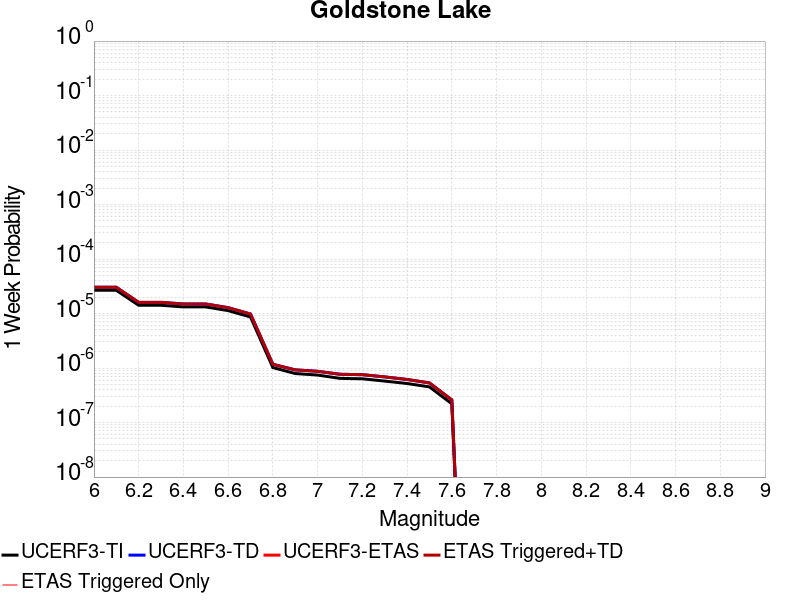 | 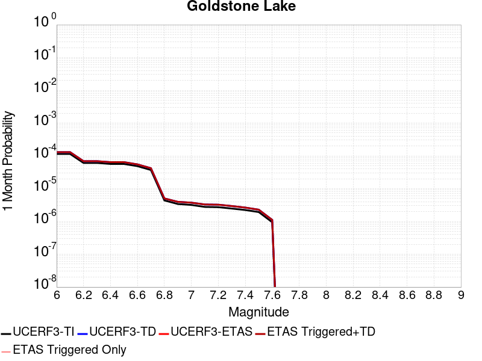 | 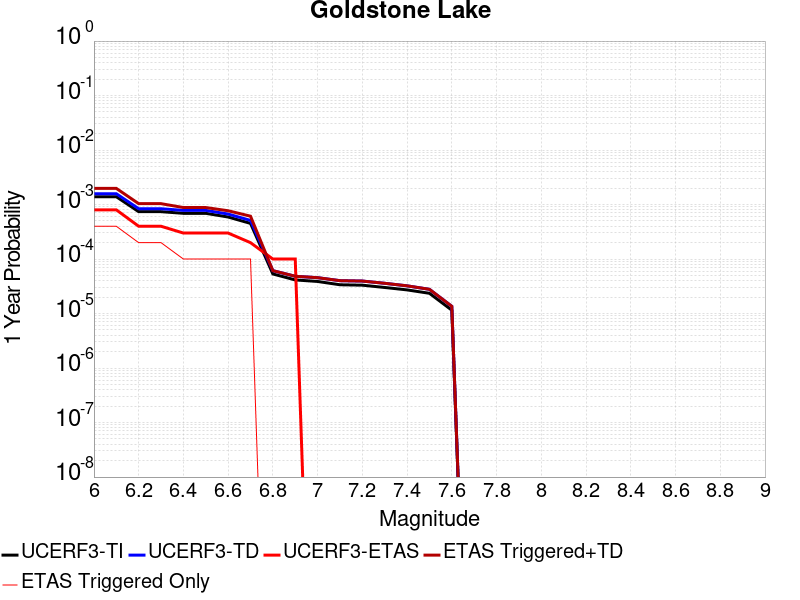 | 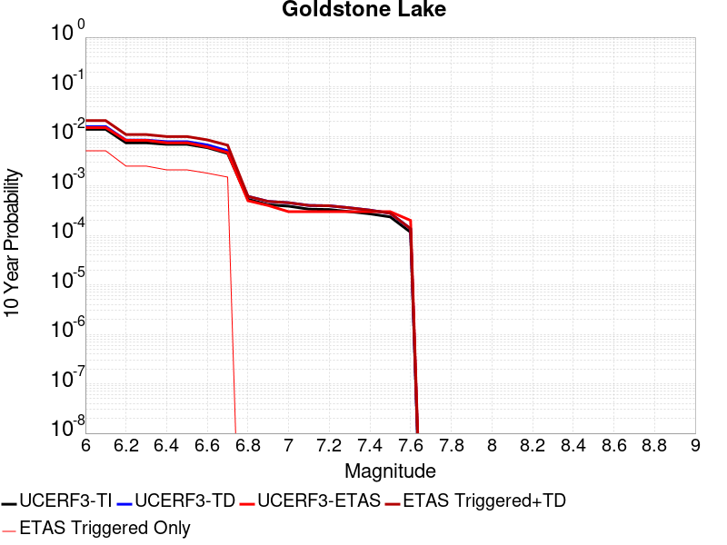 |

| Magnitude | 1 wk TI Prob | 1 wk TD Prob | 1 wk ETAS Prob | 1 wk ETAS/TD Gain | 1 wk ETAS Triggered+TD | 1 wk ETAS Triggered Only | 1 mo TI Prob | 1 mo TD Prob | 1 mo ETAS Prob | 1 mo ETAS/TD Gain | 1 mo ETAS Triggered+TD | 1 mo ETAS Triggered Only | 1 yr TI Prob | 1 yr TD Prob | 1 yr ETAS Prob | 1 yr ETAS/TD Gain | 1 yr ETAS Triggered+TD | 1 yr ETAS Triggered Only | 10 yr TI Prob | 10 yr TD Prob | 10 yr ETAS Prob | 10 yr ETAS/TD Gain | 10 yr ETAS Triggered+TD | 10 yr ETAS Triggered Only |
|-----|-----|-----|-----|-----|-----|-----|-----|-----|-----|-----|-----|-----|-----|-----|-----|-----|-----|-----|-----|-----|-----|-----|-----|-----|
| 6.0 | 2.671352E-5 | 3.0331994E-5 | 0.0 | 0.0 | 3.0331994E-5 | 0.0 | 1.1448149E-4 | 1.2998888E-4 | 0.0 | 0.0 | 1.2998888E-4 | 0.0 | 0.001392921 | 0.0015816615 | 8.0E-4 | 0.5057972 | 0.0019810288 | 4.0E-4 | 0.013842222 | 0.015723487 | 0.015 | 0.9539869 | 0.020743297 | 0.0051 |
| 6.1 | 2.671352E-5 | 3.0331994E-5 | 0.0 | 0.0 | 3.0331994E-5 | 0.0 | 1.1448149E-4 | 1.2998888E-4 | 0.0 | 0.0 | 1.2998888E-4 | 0.0 | 0.001392921 | 0.0015816615 | 8.0E-4 | 0.5057972 | 0.0019810288 | 4.0E-4 | 0.013842222 | 0.015723487 | 0.015 | 0.9539869 | 0.020743297 | 0.0051 |
| 6.2 | 1.4197047E-5 | 1.6073136E-5 | 0.0 | 0.0 | 1.6073136E-5 | 0.0 | 6.0843064E-5 | 6.88836E-5 | 0.0 | 0.0 | 6.88836E-5 | 0.0 | 7.4051257E-4 | 8.384335E-4 | 4.0E-4 | 0.47708017 | 0.0010382659 | 2.0E-4 | 0.007380498 | 0.008362372 | 0.0083 | 0.9925414 | 0.0108414665 | 0.0025 |
| 6.3 | 1.4197047E-5 | 1.6073136E-5 | 0.0 | 0.0 | 1.6073136E-5 | 0.0 | 6.0843064E-5 | 6.88836E-5 | 0.0 | 0.0 | 6.88836E-5 | 0.0 | 7.4051257E-4 | 8.384335E-4 | 4.0E-4 | 0.47708017 | 0.0010382659 | 2.0E-4 | 0.007380498 | 0.008362372 | 0.0083 | 0.9925414 | 0.0108414665 | 0.0025 |
| 6.4 | 1.3238931E-5 | 1.4986886E-5 | 0.0 | 0.0 | 1.4986886E-5 | 0.0 | 5.6737044E-5 | 6.422848E-5 | 0.0 | 0.0 | 6.422848E-5 | 0.0 | 6.9055456E-4 | 7.817989E-4 | 3.0E-4 | 0.38373038 | 8.8172074E-4 | 1.0E-4 | 0.006884126 | 0.007800085 | 0.0074 | 0.94870764 | 0.009883705 | 0.0021 |
| 6.5 | 1.3238931E-5 | 1.4986886E-5 | 0.0 | 0.0 | 1.4986886E-5 | 0.0 | 5.6737044E-5 | 6.422848E-5 | 0.0 | 0.0 | 6.422848E-5 | 0.0 | 6.9055456E-4 | 7.817989E-4 | 3.0E-4 | 0.38373038 | 8.8172074E-4 | 1.0E-4 | 0.006884126 | 0.007800085 | 0.0074 | 0.94870764 | 0.009883705 | 0.0021 |
| 6.6 | 1.1328278E-5 | 1.2836445E-5 | 0.0 | 0.0 | 1.2836445E-5 | 0.0 | 4.8548856E-5 | 5.5012715E-5 | 0.0 | 0.0 | 5.5012715E-5 | 0.0 | 5.90922E-4 | 6.6966936E-4 | 3.0E-4 | 0.44798225 | 7.696024E-4 | 1.0E-4 | 0.0058935313 | 0.0066858768 | 0.0061 | 0.912371 | 0.008473842 | 0.0018 |
| 6.7 | 8.651175E-6 | 9.810019E-6 | 0.0 | 0.0 | 9.810019E-6 | 0.0 | 3.707594E-5 | 4.2042768E-5 | 0.0 | 0.0 | 4.2042768E-5 | 0.0 | 4.5130608E-4 | 5.1184074E-4 | 2.0E-4 | 0.39074653 | 6.117896E-4 | 1.0E-4 | 0.0045039062 | 0.0051154727 | 0.0047 | 0.9187812 | 0.0066077993 | 0.0015 |
| 6.8 | 1.0215377E-6 | 1.1729769E-6 | 0.0 | 0.0 | 1.1729769E-6 | 0.0 | 4.378012E-6 | 5.027035E-6 | 0.0 | 0.0 | 5.027035E-6 | 0.0 | 5.3300988E-5 | 6.120255E-5 | 1.0E-4 | 1.633919 | 6.120255E-5 | 0.0 | 5.3288206E-4 | 6.118681E-4 | 5.0E-4 | 0.81716955 | 6.118681E-4 | 0.0 |
| 6.9 | 7.9360774E-7 | 9.2606354E-7 | 0.0 | 0.0 | 9.2606354E-7 | 0.0 | 3.4011714E-6 | 3.968838E-6 | 0.0 | 0.0 | 3.968838E-6 | 0.0 | 4.1408475E-5 | 4.83196E-5 | 1.0E-4 | 2.0695534 | 4.83196E-5 | 0.0 | 4.140076E-4 | 4.8309792E-4 | 4.0E-4 | 0.82798946 | 4.8309792E-4 | 0.0 |
| 7.0 | 7.4382757E-7 | 8.724997E-7 | 0.0 | 0.0 | 8.724997E-7 | 0.0 | 3.1878285E-6 | 3.7392795E-6 | 0.0 | 0.0 | 3.7392795E-6 | 0.0 | 3.8811122E-5 | 4.5524845E-5 | 0.0 | 0.0 | 4.5524845E-5 | 0.0 | 3.8804344E-4 | 4.551618E-4 | 3.0E-4 | 0.65910625 | 4.551618E-4 | 0.0 |
| 7.1 | 6.4709513E-7 | 7.689736E-7 | 0.0 | 0.0 | 7.689736E-7 | 0.0 | 2.773262E-6 | 3.2955975E-6 | 0.0 | 0.0 | 3.2955975E-6 | 0.0 | 3.376394E-5 | 4.012322E-5 | 0.0 | 0.0 | 4.012322E-5 | 0.0 | 3.375881E-4 | 4.011657E-4 | 3.0E-4 | 0.7478207 | 4.011657E-4 | 0.0 |
| 7.2 | 6.356704E-7 | 7.5668936E-7 | 0.0 | 0.0 | 7.5668936E-7 | 0.0 | 2.7242988E-6 | 3.2429507E-6 | 0.0 | 0.0 | 3.2429507E-6 | 0.0 | 3.3167835E-5 | 3.948227E-5 | 0.0 | 0.0 | 3.948227E-5 | 0.0 | 3.3162883E-4 | 3.9475845E-4 | 3.0E-4 | 0.7599584 | 3.9475845E-4 | 0.0 |
| 7.3 | 5.7695723E-7 | 6.8827575E-7 | 0.0 | 0.0 | 6.8827575E-7 | 0.0 | 2.4726714E-6 | 2.9497503E-6 | 0.0 | 0.0 | 2.9497503E-6 | 0.0 | 3.0104358E-5 | 3.5912675E-5 | 0.0 | 0.0 | 3.5912675E-5 | 0.0 | 3.0100282E-4 | 3.5907442E-4 | 3.0E-4 | 0.8354814 | 3.5907442E-4 | 0.0 |
| 7.4 | 5.209647E-7 | 6.18126E-7 | 0.0 | 0.0 | 6.18126E-7 | 0.0 | 2.232704E-6 | 2.649109E-6 | 0.0 | 0.0 | 2.649109E-6 | 0.0 | 2.718283E-5 | 3.2252483E-5 | 0.0 | 0.0 | 3.2252483E-5 | 0.0 | 2.7179506E-4 | 3.2248354E-4 | 3.0E-4 | 0.93028 | 3.2248354E-4 | 0.0 |
| 7.5 | 4.512955E-7 | 5.33711E-7 | 0.0 | 0.0 | 5.33711E-7 | 0.0 | 1.934122E-6 | 2.2873312E-6 | 0.0 | 0.0 | 2.2873312E-6 | 0.0 | 2.3547682E-5 | 2.7847955E-5 | 0.0 | 0.0 | 2.7847955E-5 | 0.0 | 2.3545188E-4 | 2.7844994E-4 | 3.0E-4 | 1.0773929 | 2.7844994E-4 | 0.0 |
| 7.6 | 2.21172E-7 | 2.602981E-7 | 0.0 | 0.0 | 2.602981E-7 | 0.0 | 9.478797E-7 | 1.115563E-6 | 0.0 | 0.0 | 1.115563E-6 | 0.0 | 1.1540374E-5 | 1.3581924E-5 | 0.0 | 0.0 | 1.3581924E-5 | 0.0 | 1.1539775E-4 | 1.3581375E-4 | 2.0E-4 | 1.472605 | 1.3581375E-4 | 0.0 |

## Ludlow
*[(top)](#table-of-contents)*

| 1 Week | 1 Month | 1 Year | 10 Year |
|-----|-----|-----|-----|
| 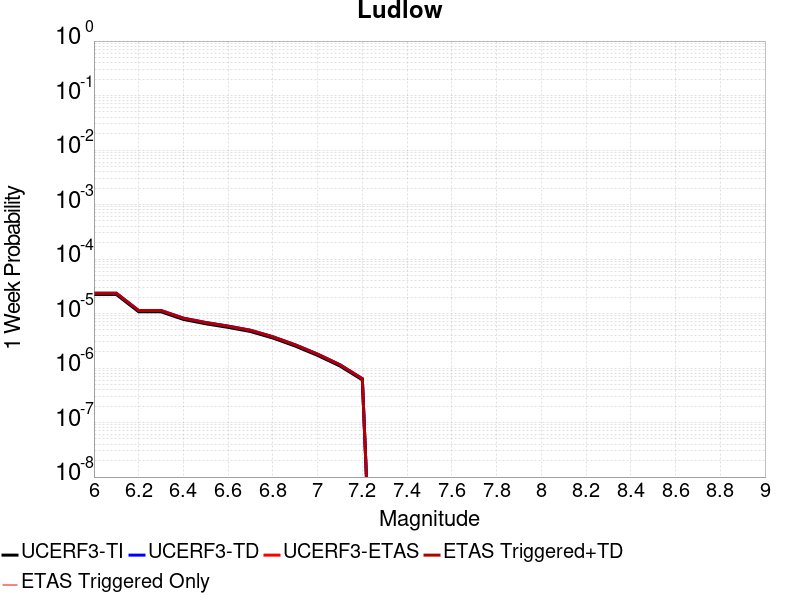 | 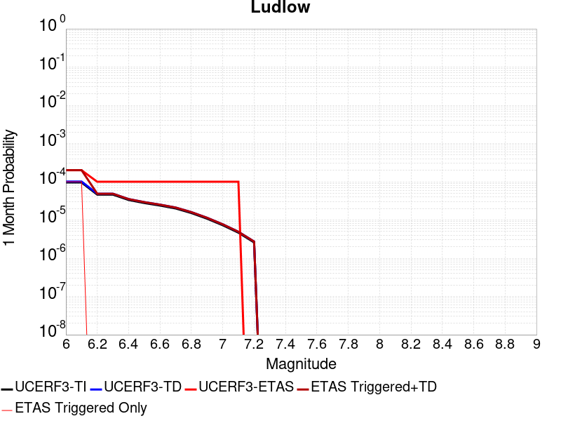 | 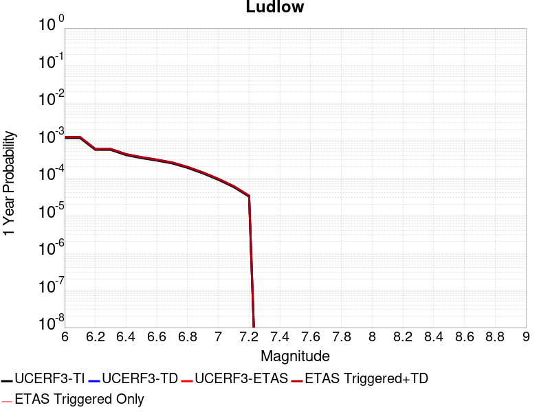 | 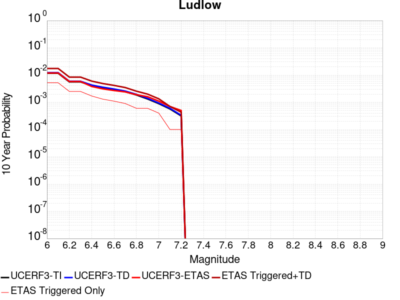 |

| Magnitude | 1 wk TI Prob | 1 wk TD Prob | 1 wk ETAS Prob | 1 wk ETAS/TD Gain | 1 wk ETAS Triggered+TD | 1 wk ETAS Triggered Only | 1 mo TI Prob | 1 mo TD Prob | 1 mo ETAS Prob | 1 mo ETAS/TD Gain | 1 mo ETAS Triggered+TD | 1 mo ETAS Triggered Only | 1 yr TI Prob | 1 yr TD Prob | 1 yr ETAS Prob | 1 yr ETAS/TD Gain | 1 yr ETAS Triggered+TD | 1 yr ETAS Triggered Only | 10 yr TI Prob | 10 yr TD Prob | 10 yr ETAS Prob | 10 yr ETAS/TD Gain | 10 yr ETAS Triggered+TD | 10 yr ETAS Triggered Only |
|-----|-----|-----|-----|-----|-----|-----|-----|-----|-----|-----|-----|-----|-----|-----|-----|-----|-----|-----|-----|-----|-----|-----|-----|-----|
| 6.0 | 2.2407607E-5 | 2.3643477E-5 | 0.0 | 0.0 | 2.3643477E-5 | 0.0 | 9.602906E-5 | 1.013255E-4 | 2.0E-4 | 1.9738368 | 2.0131537E-4 | 1.0E-4 | 0.0011685267 | 0.0012329839 | 6.0E-4 | 0.48662436 | 0.001532614 | 3.0E-4 | 0.011624013 | 0.012265936 | 0.0119 | 0.9701665 | 0.017402153 | 0.0052 |
| 6.1 | 2.2407607E-5 | 2.3643477E-5 | 0.0 | 0.0 | 2.3643477E-5 | 0.0 | 9.602906E-5 | 1.013255E-4 | 2.0E-4 | 1.9738368 | 2.0131537E-4 | 1.0E-4 | 0.0011685267 | 0.0012329839 | 6.0E-4 | 0.48662436 | 0.001532614 | 3.0E-4 | 0.011624013 | 0.012265936 | 0.0119 | 0.9701665 | 0.017402153 | 0.0052 |
| 6.2 | 1.0781252E-5 | 1.13592305E-5 | 0.0 | 0.0 | 1.13592305E-5 | 0.0 | 4.620455E-5 | 4.868153E-5 | 1.0E-4 | 2.054167 | 4.868153E-5 | 0.0 | 5.623952E-4 | 5.925405E-4 | 4.0E-4 | 0.6750594 | 7.92422E-4 | 2.0E-4 | 0.00560974 | 0.005910024 | 0.0058 | 0.9813835 | 0.008395249 | 0.0025 |
| 6.3 | 1.0781252E-5 | 1.13592305E-5 | 0.0 | 0.0 | 1.13592305E-5 | 0.0 | 4.620455E-5 | 4.868153E-5 | 1.0E-4 | 2.054167 | 4.868153E-5 | 0.0 | 5.623952E-4 | 5.925405E-4 | 4.0E-4 | 0.6750594 | 7.92422E-4 | 2.0E-4 | 0.00560974 | 0.005910024 | 0.0058 | 0.9813835 | 0.008395249 | 0.0025 |
| 6.4 | 7.814439E-6 | 8.233069E-6 | 0.0 | 0.0 | 8.233069E-6 | 0.0 | 3.3490025E-5 | 3.5284113E-5 | 1.0E-4 | 2.8341367 | 3.5284113E-5 | 0.0 | 4.0766477E-4 | 4.295008E-4 | 3.0E-4 | 0.6984853 | 6.2941486E-4 | 2.0E-4 | 0.0040691774 | 0.004286853 | 0.0038 | 0.8864311 | 0.0059795654 | 0.0017 |
| 6.5 | 6.4986366E-6 | 6.8470413E-6 | 0.0 | 0.0 | 6.8470413E-6 | 0.0 | 2.7851002E-5 | 2.9344137E-5 | 1.0E-4 | 3.4078357 | 2.9344137E-5 | 0.0 | 3.390332E-4 | 3.5720723E-4 | 3.0E-4 | 0.83984864 | 5.571358E-4 | 2.0E-4 | 0.003385164 | 0.0035664267 | 0.0031 | 0.8692174 | 0.00486179 | 0.0013 |
| 6.6 | 5.582177E-6 | 5.8826595E-6 | 0.0 | 0.0 | 5.8826595E-6 | 0.0 | 2.3923398E-5 | 2.5211159E-5 | 1.0E-4 | 3.9664977 | 2.5211159E-5 | 0.0 | 2.9122844E-4 | 3.0690333E-4 | 3.0E-4 | 0.97750646 | 5.068419E-4 | 2.0E-4 | 0.0029084706 | 0.0030648683 | 0.0027 | 0.8809514 | 0.0041614966 | 0.0011 |
| 6.7 | 4.6858763E-6 | 4.9376245E-6 | 0.0 | 0.0 | 4.9376245E-6 | 0.0 | 2.0082172E-5 | 2.1161079E-5 | 1.0E-4 | 4.725657 | 2.1161079E-5 | 0.0 | 2.4447302E-4 | 2.5760624E-4 | 3.0E-4 | 1.1645681 | 4.575547E-4 | 2.0E-4 | 0.0024420423 | 0.0025731325 | 0.0024 | 0.93271524 | 0.0034708166 | 9.0E-4 |
| 6.8 | 3.5584908E-6 | 3.7498878E-6 | 0.0 | 0.0 | 3.7498878E-6 | 0.0 | 1.5250586E-5 | 1.6070851E-5 | 1.0E-4 | 6.2224455 | 1.6070851E-5 | 0.0 | 1.8566006E-4 | 1.9564545E-4 | 3.0E-4 | 1.533386 | 3.9560633E-4 | 2.0E-4 | 0.0018550502 | 0.0019547732 | 0.0019 | 0.9719798 | 0.0025536004 | 6.0E-4 |
| 6.9 | 2.532834E-6 | 2.6694825E-6 | 0.0 | 0.0 | 2.6694825E-6 | 0.0 | 1.0854958E-5 | 1.144059E-5 | 1.0E-4 | 8.740808 | 1.144059E-5 | 0.0 | 1.3215111E-4 | 1.3928056E-4 | 3.0E-4 | 2.153926 | 3.392527E-4 | 2.0E-4 | 0.0013207254 | 0.0013919603 | 0.0016 | 1.149458 | 0.001991125 | 6.0E-4 |
| 7.0 | 1.7083285E-6 | 1.8009131E-6 | 0.0 | 0.0 | 1.8009131E-6 | 0.0 | 7.3213873E-6 | 7.718178E-6 | 1.0E-4 | 12.956428 | 7.718178E-6 | 0.0 | 8.913424E-5 | 9.3964925E-5 | 3.0E-4 | 3.1926808 | 2.9394613E-4 | 2.0E-4 | 8.9098496E-4 | 9.392684E-4 | 0.0011 | 1.1711242 | 0.0013388927 | 4.0E-4 |
| 7.1 | 1.0905424E-6 | 1.1491103E-6 | 0.0 | 0.0 | 1.1491103E-6 | 0.0 | 4.6737446E-6 | 4.9247496E-6 | 1.0E-4 | 20.305601 | 4.9247496E-6 | 0.0 | 5.6901354E-5 | 5.9957274E-5 | 1.0E-4 | 1.6678543 | 5.9957274E-5 | 0.0 | 5.6886784E-4 | 5.9942075E-4 | 7.0E-4 | 1.1677941 | 6.993608E-4 | 1.0E-4 |
| 7.2 | 6.06668E-7 | 6.3837547E-7 | 0.0 | 0.0 | 6.3837547E-7 | 0.0 | 2.600003E-6 | 2.7358924E-6 | 0.0 | 0.0 | 2.7358924E-6 | 0.0 | 3.1654577E-5 | 3.330905E-5 | 0.0 | 0.0 | 3.330905E-5 | 0.0 | 3.1650066E-4 | 3.330474E-4 | 5.0E-4 | 1.5012877 | 4.330141E-4 | 1.0E-4 |

## South Klamath Lake East
*[(top)](#table-of-contents)*

| 1 Week | 1 Month | 1 Year | 10 Year |
|-----|-----|-----|-----|
| 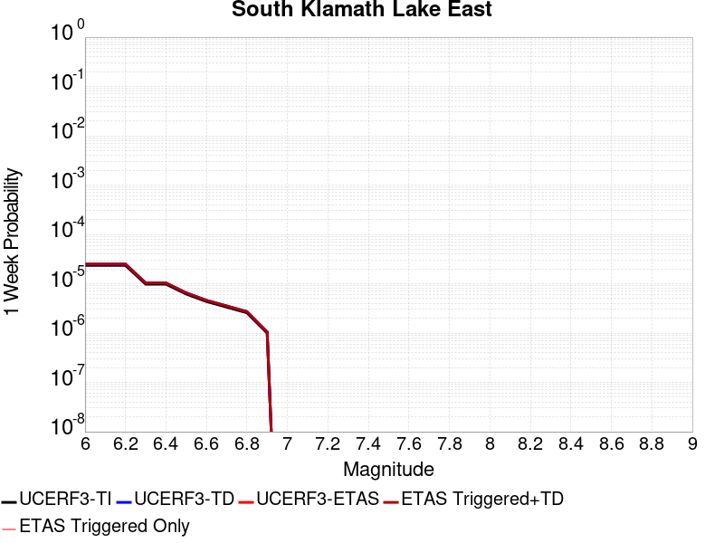 | 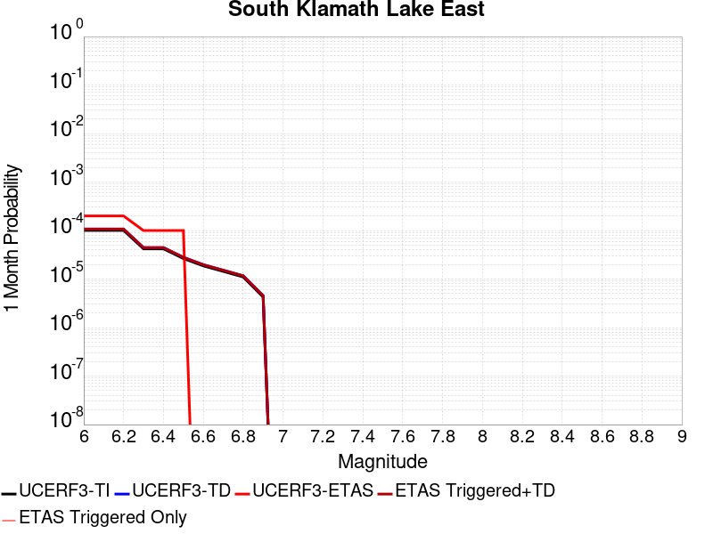 | 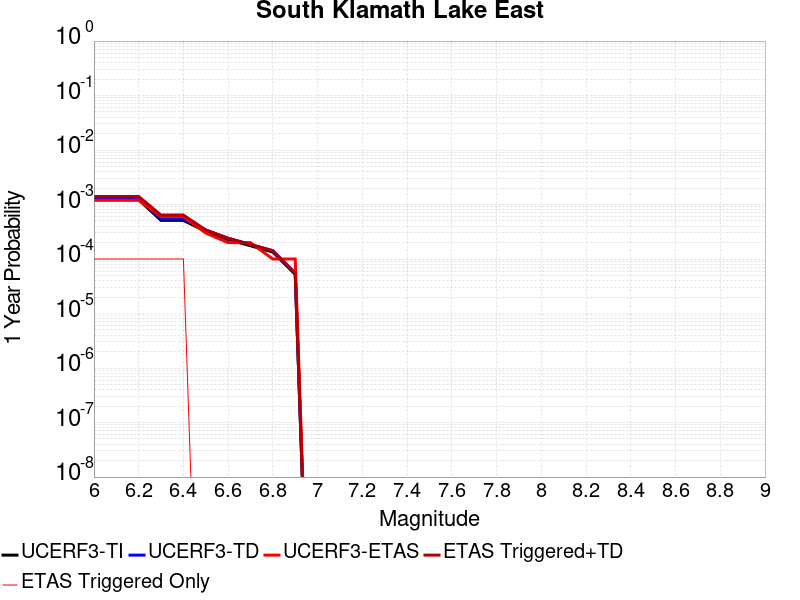 | 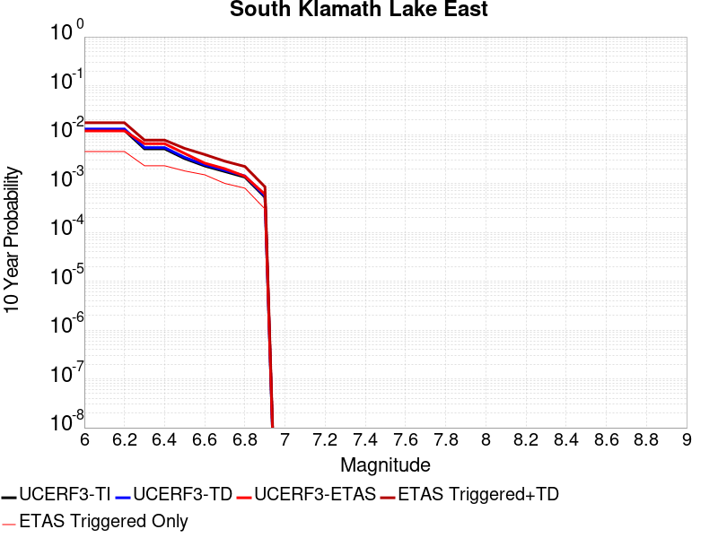 |

| Magnitude | 1 wk TI Prob | 1 wk TD Prob | 1 wk ETAS Prob | 1 wk ETAS/TD Gain | 1 wk ETAS Triggered+TD | 1 wk ETAS Triggered Only | 1 mo TI Prob | 1 mo TD Prob | 1 mo ETAS Prob | 1 mo ETAS/TD Gain | 1 mo ETAS Triggered+TD | 1 mo ETAS Triggered Only | 1 yr TI Prob | 1 yr TD Prob | 1 yr ETAS Prob | 1 yr ETAS/TD Gain | 1 yr ETAS Triggered+TD | 1 yr ETAS Triggered Only | 10 yr TI Prob | 10 yr TD Prob | 10 yr ETAS Prob | 10 yr ETAS/TD Gain | 10 yr ETAS Triggered+TD | 10 yr ETAS Triggered Only |
|-----|-----|-----|-----|-----|-----|-----|-----|-----|-----|-----|-----|-----|-----|-----|-----|-----|-----|-----|-----|-----|-----|-----|-----|-----|
| 6.0 | 2.3539369E-5 | 2.5030551E-5 | 0.0 | 0.0 | 2.5030551E-5 | 0.0 | 1.0087911E-4 | 1.0726984E-4 | 2.0E-4 | 1.8644569 | 1.0726984E-4 | 0.0 | 0.0012275111 | 0.001305311 | 0.0012 | 0.9193211 | 0.0014051804 | 1.0E-4 | 0.012207527 | 0.012984774 | 0.0119 | 0.916458 | 0.017426342 | 0.0045 |
| 6.1 | 2.3539369E-5 | 2.5030551E-5 | 0.0 | 0.0 | 2.5030551E-5 | 0.0 | 1.0087911E-4 | 1.0726984E-4 | 2.0E-4 | 1.8644569 | 1.0726984E-4 | 0.0 | 0.0012275111 | 0.001305311 | 0.0012 | 0.9193211 | 0.0014051804 | 1.0E-4 | 0.012207527 | 0.012984774 | 0.0119 | 0.916458 | 0.017426342 | 0.0045 |
| 6.2 | 2.3539369E-5 | 2.5030551E-5 | 0.0 | 0.0 | 2.5030551E-5 | 0.0 | 1.0087911E-4 | 1.0726984E-4 | 2.0E-4 | 1.8644569 | 1.0726984E-4 | 0.0 | 0.0012275111 | 0.001305311 | 0.0012 | 0.9193211 | 0.0014051804 | 1.0E-4 | 0.012207527 | 0.012984774 | 0.0119 | 0.916458 | 0.017426342 | 0.0045 |
| 6.3 | 9.807823E-6 | 1.03895345E-5 | 0.0 | 0.0 | 1.03895345E-5 | 0.0 | 4.2032847E-5 | 4.4525863E-5 | 1.0E-4 | 2.2458858 | 4.4525863E-5 | 0.0 | 5.1162974E-4 | 5.419759E-4 | 6.0E-4 | 1.1070603 | 6.419217E-4 | 1.0E-4 | 0.005104534 | 0.0054073767 | 0.0065 | 1.2020617 | 0.0076949396 | 0.0023 |
| 6.4 | 9.807823E-6 | 1.03895345E-5 | 0.0 | 0.0 | 1.03895345E-5 | 0.0 | 4.2032847E-5 | 4.4525863E-5 | 1.0E-4 | 2.2458858 | 4.4525863E-5 | 0.0 | 5.1162974E-4 | 5.419759E-4 | 6.0E-4 | 1.1070603 | 6.419217E-4 | 1.0E-4 | 0.005104534 | 0.0054073767 | 0.0065 | 1.2020617 | 0.0076949396 | 0.0023 |
| 6.5 | 6.191981E-6 | 6.546877E-6 | 0.0 | 0.0 | 6.546877E-6 | 0.0 | 2.653679E-5 | 2.8057759E-5 | 1.0E-4 | 3.5640764 | 2.8057759E-5 | 0.0 | 3.2303753E-4 | 3.4155246E-4 | 3.0E-4 | 0.8783424 | 3.4155246E-4 | 0.0 | 0.0032256835 | 0.0034105529 | 0.0041 | 1.2021511 | 0.005204414 | 0.0018 |
| 6.6 | 4.3693776E-6 | 4.6138316E-6 | 0.0 | 0.0 | 4.6138316E-6 | 0.0 | 1.8725768E-5 | 1.977342E-5 | 0.0 | 0.0 | 1.977342E-5 | 0.0 | 2.2796239E-4 | 2.4071593E-4 | 2.0E-4 | 0.83085483 | 2.4071593E-4 | 0.0 | 0.0022772867 | 0.0024046644 | 0.0026 | 1.081232 | 0.0039010574 | 0.0015 |
| 6.7 | 3.360834E-6 | 3.5491405E-6 | 0.0 | 0.0 | 3.5491405E-6 | 0.0 | 1.4403494E-5 | 1.5210518E-5 | 0.0 | 0.0 | 1.5210518E-5 | 0.0 | 1.7534842E-4 | 1.8517312E-4 | 2.0E-4 | 1.0800704 | 1.8517312E-4 | 0.0 | 0.0017521014 | 0.0018502681 | 0.002 | 1.0809244 | 0.0028484177 | 0.001 |
| 6.8 | 2.57873E-6 | 2.7235558E-6 | 0.0 | 0.0 | 2.7235558E-6 | 0.0 | 1.1051653E-5 | 1.1672333E-5 | 0.0 | 0.0 | 1.1672333E-5 | 0.0 | 1.3454557E-4 | 1.42102E-4 | 1.0E-4 | 0.70371985 | 1.42102E-4 | 0.0 | 0.0013446413 | 0.0014201719 | 0.0014 | 0.98579615 | 0.0022190358 | 8.0E-4 |
| 6.9 | 9.987825E-7 | 1.0559827E-6 | 0.0 | 0.0 | 1.0559827E-6 | 0.0 | 4.2804895E-6 | 4.5256343E-6 | 0.0 | 0.0 | 4.5256343E-6 | 0.0 | 5.211371E-5 | 5.5098528E-5 | 1.0E-4 | 1.8149304 | 5.5098528E-5 | 0.0 | 5.210149E-4 | 5.508808E-4 | 6.0E-4 | 1.0891649 | 8.5071556E-4 | 3.0E-4 |

## Coyote Canyon
*[(top)](#table-of-contents)*

| 1 Week | 1 Month | 1 Year | 10 Year |
|-----|-----|-----|-----|
| 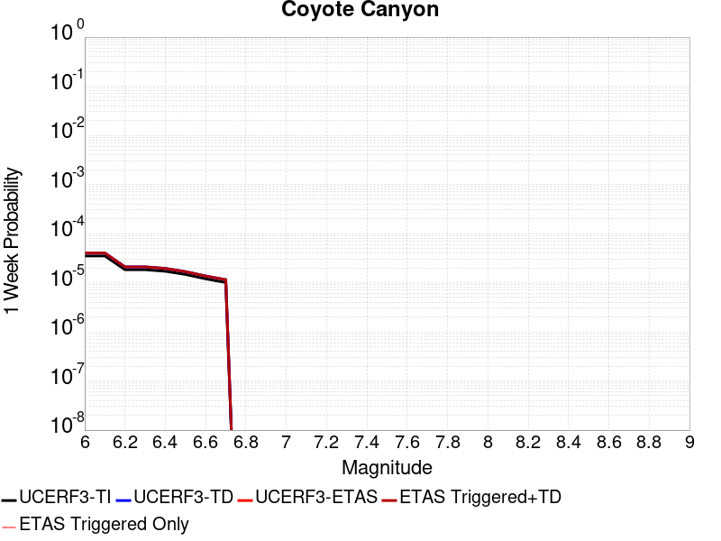 | 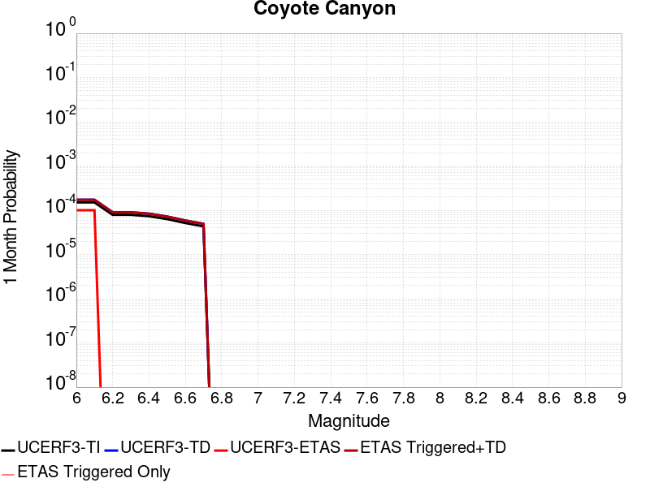 | 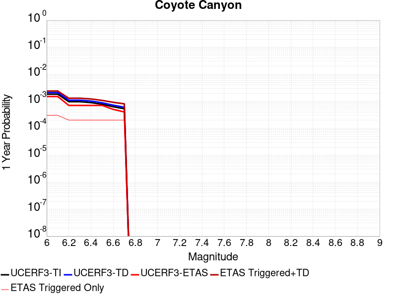 | 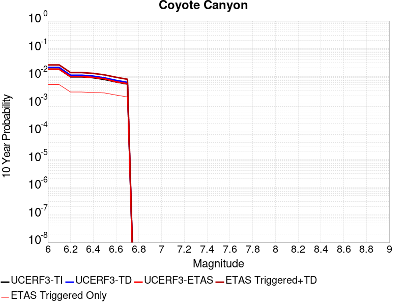 |

| Magnitude | 1 wk TI Prob | 1 wk TD Prob | 1 wk ETAS Prob | 1 wk ETAS/TD Gain | 1 wk ETAS Triggered+TD | 1 wk ETAS Triggered Only | 1 mo TI Prob | 1 mo TD Prob | 1 mo ETAS Prob | 1 mo ETAS/TD Gain | 1 mo ETAS Triggered+TD | 1 mo ETAS Triggered Only | 1 yr TI Prob | 1 yr TD Prob | 1 yr ETAS Prob | 1 yr ETAS/TD Gain | 1 yr ETAS Triggered+TD | 1 yr ETAS Triggered Only | 10 yr TI Prob | 10 yr TD Prob | 10 yr ETAS Prob | 10 yr ETAS/TD Gain | 10 yr ETAS Triggered+TD | 10 yr ETAS Triggered Only |
|-----|-----|-----|-----|-----|-----|-----|-----|-----|-----|-----|-----|-----|-----|-----|-----|-----|-----|-----|-----|-----|-----|-----|-----|-----|
| 6.0 | 3.5090034E-5 | 4.030101E-5 | 0.0 | 0.0 | 4.030101E-5 | 0.0 | 1.503772E-4 | 1.7270862E-4 | 1.0E-4 | 0.5790099 | 1.7270862E-4 | 0.0 | 0.0018293047 | 0.0021009562 | 0.0015 | 0.71396065 | 0.0024003258 | 3.0E-4 | 0.018143194 | 0.020836774 | 0.018 | 0.8638573 | 0.02573259 | 0.005 |
| 6.1 | 3.5090034E-5 | 4.030101E-5 | 0.0 | 0.0 | 4.030101E-5 | 0.0 | 1.503772E-4 | 1.7270862E-4 | 1.0E-4 | 0.5790099 | 1.7270862E-4 | 0.0 | 0.0018293047 | 0.0021009562 | 0.0015 | 0.71396065 | 0.0024003258 | 3.0E-4 | 0.018143194 | 0.020836774 | 0.018 | 0.8638573 | 0.02573259 | 0.005 |
| 6.2 | 1.841879E-5 | 2.1028296E-5 | 0.0 | 0.0 | 2.1028296E-5 | 0.0 | 7.8935285E-5 | 9.011873E-5 | 0.0 | 0.0 | 9.011873E-5 | 0.0 | 9.606133E-4 | 0.001096745 | 7.0E-4 | 0.63825226 | 0.0012965257 | 2.0E-4 | 0.0095647145 | 0.01092338 | 0.0097 | 0.8880035 | 0.013593887 | 0.0027 |
| 6.3 | 1.841879E-5 | 2.1028296E-5 | 0.0 | 0.0 | 2.1028296E-5 | 0.0 | 7.8935285E-5 | 9.011873E-5 | 0.0 | 0.0 | 9.011873E-5 | 0.0 | 9.606133E-4 | 0.001096745 | 7.0E-4 | 0.63825226 | 0.0012965257 | 2.0E-4 | 0.0095647145 | 0.01092338 | 0.0097 | 0.8880035 | 0.013593887 | 0.0027 |
| 6.4 | 1.712201E-5 | 1.9536092E-5 | 0.0 | 0.0 | 1.9536092E-5 | 0.0 | 7.337798E-5 | 8.3723986E-5 | 0.0 | 0.0 | 8.3723986E-5 | 0.0 | 8.930107E-4 | 0.0010189632 | 7.0E-4 | 0.68697286 | 0.0012187593 | 2.0E-4 | 0.008894307 | 0.010152799 | 0.0091 | 0.8963046 | 0.012726401 | 0.0026 |
| 6.5 | 1.4744935E-5 | 1.6812055E-5 | 0.0 | 0.0 | 1.6812055E-5 | 0.0 | 6.3191044E-5 | 7.20502E-5 | 0.0 | 0.0 | 7.20502E-5 | 0.0 | 7.6907943E-4 | 8.769513E-4 | 7.0E-4 | 0.7982199 | 0.001076776 | 2.0E-4 | 0.007664232 | 0.008744077 | 0.0081 | 0.9263414 | 0.011222216 | 0.0025 |
| 6.6 | 1.2017839E-5 | 1.3703764E-5 | 0.0 | 0.0 | 1.3703764E-5 | 0.0 | 5.150401E-5 | 5.872959E-5 | 0.0 | 0.0 | 5.872959E-5 | 0.0 | 6.268809E-4 | 7.148865E-4 | 5.0E-4 | 0.6994117 | 9.147435E-4 | 2.0E-4 | 0.0062511545 | 0.0071345353 | 0.0063 | 0.8830288 | 0.009219552 | 0.0021 |
| 6.7 | 1.00956095E-5 | 1.1516381E-5 | 0.0 | 0.0 | 1.1516381E-5 | 0.0 | 4.326618E-5 | 4.9355476E-5 | 0.0 | 0.0 | 4.9355476E-5 | 0.0 | 5.266384E-4 | 6.0082396E-4 | 4.0E-4 | 0.6657524 | 8.0070377E-4 | 2.0E-4 | 0.005253921 | 0.006000497 | 0.0054 | 0.8999255 | 0.007789696 | 0.0018 |

## Sargent 2011 CFM
*[(top)](#table-of-contents)*

| 1 Week | 1 Month | 1 Year | 10 Year |
|-----|-----|-----|-----|
| 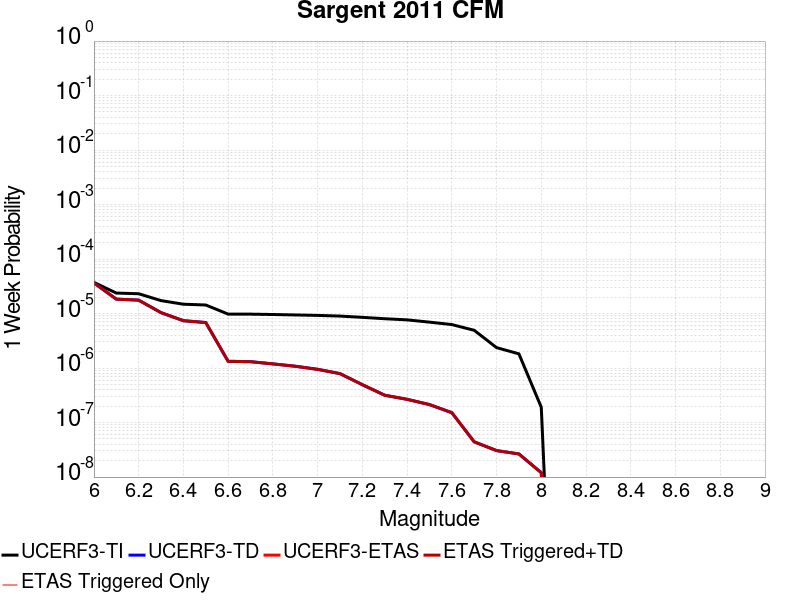 | 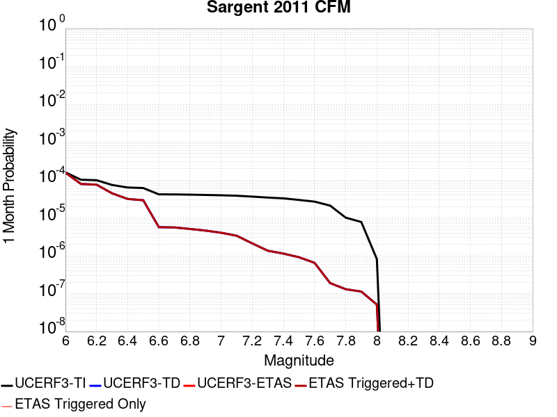 | 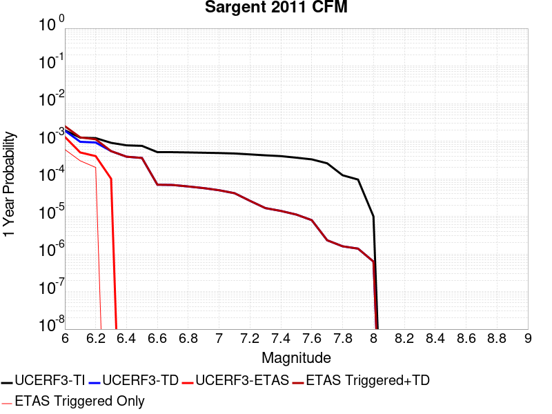 | 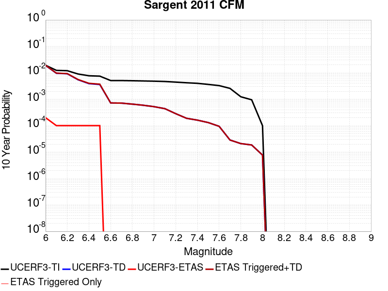 |

| Magnitude | 1 wk TI Prob | 1 wk TD Prob | 1 wk ETAS Prob | 1 wk ETAS/TD Gain | 1 wk ETAS Triggered+TD | 1 wk ETAS Triggered Only | 1 mo TI Prob | 1 mo TD Prob | 1 mo ETAS Prob | 1 mo ETAS/TD Gain | 1 mo ETAS Triggered+TD | 1 mo ETAS Triggered Only | 1 yr TI Prob | 1 yr TD Prob | 1 yr ETAS Prob | 1 yr ETAS/TD Gain | 1 yr ETAS Triggered+TD | 1 yr ETAS Triggered Only | 10 yr TI Prob | 10 yr TD Prob | 10 yr ETAS Prob | 10 yr ETAS/TD Gain | 10 yr ETAS Triggered+TD | 10 yr ETAS Triggered Only |
|-----|-----|-----|-----|-----|-----|-----|-----|-----|-----|-----|-----|-----|-----|-----|-----|-----|-----|-----|-----|-----|-----|-----|-----|-----|
| 6.0 | 3.7327867E-5 | 3.651451E-5 | 0.0 | 0.0 | 3.651451E-5 | 0.0 | 1.5996677E-4 | 1.5648414E-4 | 1.0E-4 | 0.6390424 | 2.5646848E-4 | 1.0E-4 | 0.0019458556 | 0.0019039542 | 0.0013 | 0.68278956 | 0.0025028118 | 6.0E-4 | 0.01928905 | 0.018946584 | 0.0164 | 0.86559135 | 0.024048062 | 0.0052 |
| 6.1 | 2.3771476E-5 | 1.8403885E-5 | 0.0 | 0.0 | 1.8403885E-5 | 0.0 | 1.01873775E-4 | 7.8871904E-5 | 1.0E-4 | 1.2678787 | 1.7886401E-4 | 1.0E-4 | 0.0012396075 | 9.599245E-4 | 5.0E-4 | 0.5208743 | 0.0012596365 | 3.0E-4 | 0.012327154 | 0.009595184 | 0.0074 | 0.77122027 | 0.011972155 | 0.0024 |
| 6.2 | 2.3112721E-5 | 1.7636581E-5 | 0.0 | 0.0 | 1.7636581E-5 | 0.0 | 9.9050754E-5 | 7.558365E-5 | 1.0E-4 | 1.3230375 | 1.7557609E-4 | 1.0E-4 | 0.0012052758 | 9.19924E-4 | 4.0E-4 | 0.43481854 | 0.0011197401 | 2.0E-4 | 0.011987597 | 0.009198511 | 0.0069 | 0.7501214 | 0.011378274 | 0.0022 |
| 6.3 | 1.728509E-5 | 1.0403356E-5 | 0.0 | 0.0 | 1.0403356E-5 | 0.0 | 7.407686E-5 | 4.4585315E-5 | 0.0 | 0.0 | 4.4585315E-5 | 0.0 | 9.015125E-4 | 5.4273725E-4 | 1.0E-4 | 0.18425123 | 5.4273725E-4 | 0.0 | 0.008978641 | 0.005448196 | 0.0045 | 0.8259614 | 0.0067411135 | 0.0013 |
| 6.4 | 1.48395575E-5 | 7.4075137E-6 | 0.0 | 0.0 | 7.4075137E-6 | 0.0 | 6.3596555E-5 | 3.1746313E-5 | 0.0 | 0.0 | 3.1746313E-5 | 0.0 | 7.7401294E-4 | 3.8648045E-4 | 0.0 | 0.0 | 3.8648045E-4 | 0.0 | 0.0077132257 | 0.0038913693 | 0.003 | 0.77093685 | 0.004987089 | 0.0011 |
| 6.5 | 1.4358964E-5 | 6.8472837E-6 | 0.0 | 0.0 | 6.8472837E-6 | 0.0 | 6.1536964E-5 | 2.9345385E-5 | 0.0 | 0.0 | 2.9345385E-5 | 0.0 | 7.48955E-4 | 3.5725898E-4 | 0.0 | 0.0 | 3.5725898E-4 | 0.0 | 0.0074643586 | 0.003600127 | 0.0029 | 0.80552715 | 0.0045965267 | 0.001 |
| 6.6 | 9.772591E-6 | 1.3378667E-6 | 0.0 | 0.0 | 1.3378667E-6 | 0.0 | 4.188186E-5 | 5.733702E-6 | 0.0 | 0.0 | 5.733702E-6 | 0.0 | 5.097923E-4 | 6.980561E-5 | 0.0 | 0.0 | 6.980561E-5 | 0.0 | 0.005086244 | 7.27548E-4 | 5.0E-4 | 0.6872399 | 0.0010273297 | 3.0E-4 |
| 6.7 | 9.752745E-6 | 1.3165744E-6 | 0.0 | 0.0 | 1.3165744E-6 | 0.0 | 4.179681E-5 | 5.6424497E-6 | 0.0 | 0.0 | 5.6424497E-6 | 0.0 | 5.0875737E-4 | 6.869469E-5 | 0.0 | 0.0 | 6.869469E-5 | 0.0 | 0.005075942 | 7.1644597E-4 | 5.0E-4 | 0.6978893 | 0.001016231 | 3.0E-4 |
| 6.8 | 9.608213E-6 | 1.2010591E-6 | 0.0 | 0.0 | 1.2010591E-6 | 0.0 | 4.1177405E-5 | 5.147386E-6 | 0.0 | 0.0 | 5.147386E-6 | 0.0 | 5.012196E-4 | 6.266765E-5 | 0.0 | 0.0 | 6.266765E-5 | 0.0 | 0.005000906 | 6.559142E-4 | 5.0E-4 | 0.7622948 | 9.5571746E-4 | 3.0E-4 |
| 6.9 | 9.427164E-6 | 1.0874114E-6 | 0.0 | 0.0 | 1.0874114E-6 | 0.0 | 4.04015E-5 | 4.6603263E-6 | 0.0 | 0.0 | 4.6603263E-6 | 0.0 | 4.9177726E-4 | 5.6738016E-5 | 0.0 | 0.0 | 5.6738016E-5 | 0.0 | 0.004906904 | 5.959632E-4 | 5.0E-4 | 0.838978 | 8.957844E-4 | 3.0E-4 |
| 7.0 | 9.247601E-6 | 9.549095E-7 | 0.0 | 0.0 | 9.549095E-7 | 0.0 | 3.9631974E-5 | 4.0924633E-6 | 0.0 | 0.0 | 4.0924633E-6 | 0.0 | 4.8241246E-4 | 4.9824615E-5 | 0.0 | 0.0 | 4.9824615E-5 | 0.0 | 0.0048136655 | 5.2636495E-4 | 5.0E-4 | 0.9499113 | 8.2620705E-4 | 3.0E-4 |
| 7.1 | 8.995454E-6 | 7.9654967E-7 | 0.0 | 0.0 | 7.9654967E-7 | 0.0 | 3.8551374E-5 | 3.41378E-6 | 0.0 | 0.0 | 3.41378E-6 | 0.0 | 4.6926187E-4 | 4.156199E-5 | 0.0 | 0.0 | 4.156199E-5 | 0.0 | 0.004682722 | 4.4285922E-4 | 5.0E-4 | 1.1290269 | 7.427264E-4 | 3.0E-4 |
| 7.2 | 8.520861E-6 | 5.009059E-7 | 0.0 | 0.0 | 5.009059E-7 | 0.0 | 3.6517464E-5 | 2.1467379E-6 | 0.0 | 0.0 | 2.1467379E-6 | 0.0 | 4.445094E-4 | 2.6136227E-5 | 0.0 | 0.0 | 2.6136227E-5 | 0.0 | 0.004436213 | 2.8692777E-4 | 2.0E-4 | 0.69703954 | 4.8687038E-4 | 2.0E-4 |
| 7.3 | 8.043592E-6 | 3.2212097E-7 | 0.0 | 0.0 | 3.2212097E-7 | 0.0 | 3.4472083E-5 | 1.3805177E-6 | 0.0 | 0.0 | 1.3805177E-6 | 0.0 | 4.196168E-4 | 1.6807675E-5 | 0.0 | 0.0 | 1.6807675E-5 | 0.0 | 0.004188253 | 1.9238579E-4 | 1.0E-4 | 0.51978886 | 2.9236655E-4 | 1.0E-4 |
| 7.4 | 7.662316E-6 | 2.713081E-7 | 0.0 | 0.0 | 2.713081E-7 | 0.0 | 3.2838085E-5 | 1.1627485E-6 | 0.0 | 0.0 | 1.1627485E-6 | 0.0 | 3.9973034E-4 | 1.4156371E-5 | 0.0 | 0.0 | 1.4156371E-5 | 0.0 | 0.0039901207 | 1.6415649E-4 | 1.0E-4 | 0.6091748 | 2.6414008E-4 | 1.0E-4 |
| 7.5 | 6.961638E-6 | 2.1747023E-7 | 0.0 | 0.0 | 2.1747023E-7 | 0.0 | 2.9835252E-5 | 9.320149E-7 | 0.0 | 0.0 | 9.320149E-7 | 0.0 | 3.6318362E-4 | 1.1347223E-5 | 0.0 | 0.0 | 1.1347223E-5 | 0.0 | 0.0036259065 | 1.3282755E-4 | 0.0 | 0.0 | 1.3282755E-4 | 0.0 |
| 7.6 | 6.282332E-6 | 1.546953E-7 | 0.0 | 0.0 | 1.546953E-7 | 0.0 | 2.6924003E-5 | 6.629797E-7 | 0.0 | 0.0 | 6.629797E-7 | 0.0 | 3.2775043E-4 | 8.071748E-6 | 0.0 | 0.0 | 8.071748E-6 | 0.0 | 0.0032726745 | 9.6151045E-5 | 0.0 | 0.0 | 9.6151045E-5 | 0.0 |
| 7.7 | 4.934408E-6 | 4.5195517E-8 | 0.0 | 0.0 | 4.5195517E-8 | 0.0 | 2.114729E-5 | 1.9369506E-7 | 0.0 | 0.0 | 1.9369506E-7 | 0.0 | 2.5743784E-4 | 2.3582347E-6 | 0.0 | 0.0 | 2.3582347E-6 | 0.0 | 0.0025713982 | 2.9234143E-5 | 0.0 | 0.0 | 2.9234143E-5 | 0.0 |
| 7.8 | 2.373212E-6 | 3.1301674E-8 | 0.0 | 0.0 | 3.1301674E-8 | 0.0 | 1.0170869E-5 | 1.3415003E-7 | 0.0 | 0.0 | 1.3415003E-7 | 0.0 | 1.238233E-4 | 1.6332752E-6 | 0.0 | 0.0 | 1.6332752E-6 | 0.0 | 0.0012375432 | 2.1434753E-5 | 0.0 | 0.0 | 2.1434753E-5 | 0.0 |
| 7.9 | 1.8227792E-6 | 2.7169365E-8 | 0.0 | 0.0 | 2.7169365E-8 | 0.0 | 7.811887E-6 | 1.16440134E-7 | 0.0 | 0.0 | 1.16440134E-7 | 0.0 | 9.510558E-5 | 1.4176577E-6 | 0.0 | 0.0 | 1.4176577E-6 | 0.0 | 9.5064886E-4 | 1.900042E-5 | 0.0 | 0.0 | 1.900042E-5 | 0.0 |
| 8.0 | 1.9095137E-7 | 1.2203386E-8 | 0.0 | 0.0 | 1.2203386E-8 | 0.0 | 8.1836276E-7 | 5.2300226E-8 | 0.0 | 0.0 | 5.2300226E-8 | 0.0 | 9.963521E-6 | 6.367551E-7 | 0.0 | 0.0 | 6.367551E-7 | 0.0 | 9.963074E-5 | 7.807775E-6 | 0.0 | 0.0 | 7.807775E-6 | 0.0 |

## Tank Canyon
*[(top)](#table-of-contents)*

| 1 Week | 1 Month | 1 Year | 10 Year |
|-----|-----|-----|-----|
|  | 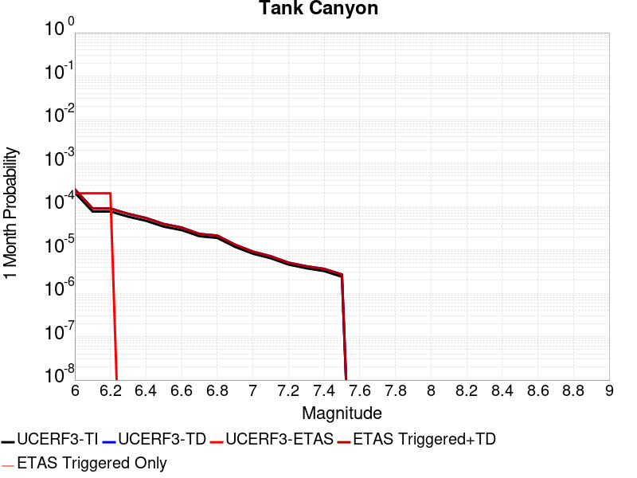 | 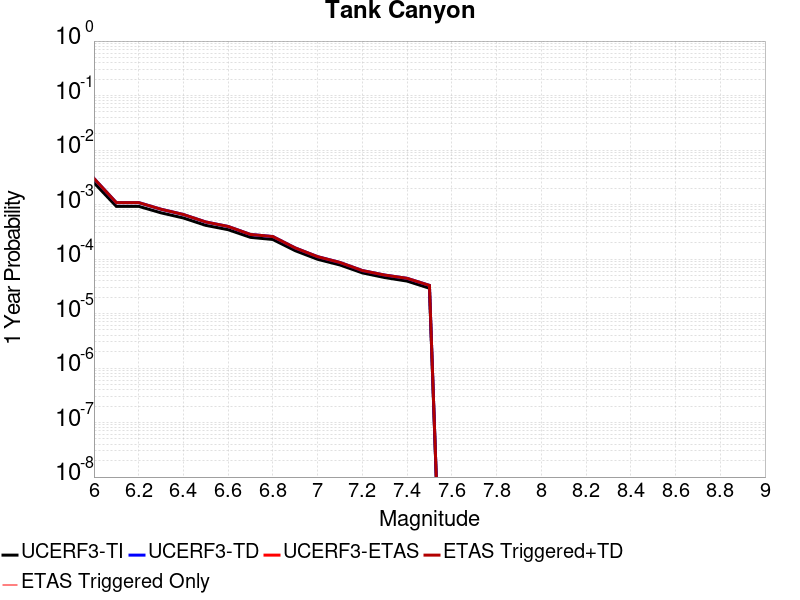 | 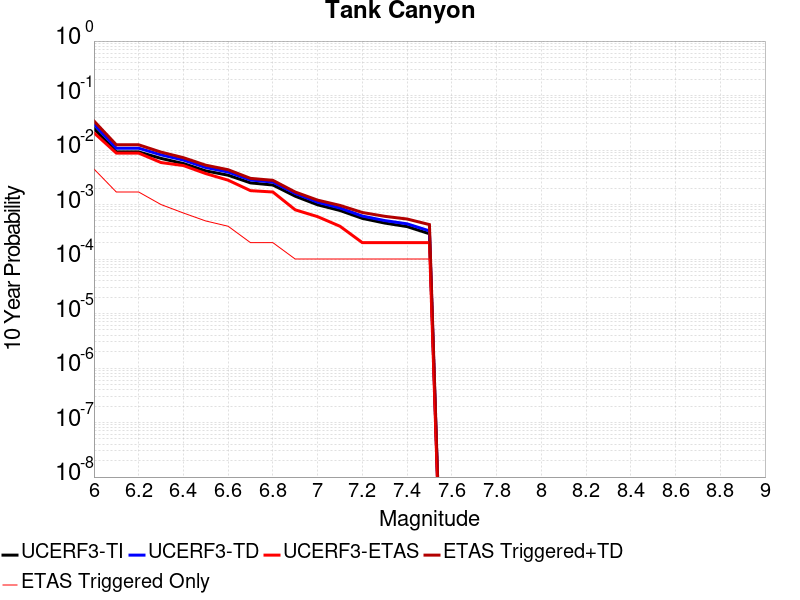 |

| Magnitude | 1 wk TI Prob | 1 wk TD Prob | 1 wk ETAS Prob | 1 wk ETAS/TD Gain | 1 wk ETAS Triggered+TD | 1 wk ETAS Triggered Only | 1 mo TI Prob | 1 mo TD Prob | 1 mo ETAS Prob | 1 mo ETAS/TD Gain | 1 mo ETAS Triggered+TD | 1 mo ETAS Triggered Only | 1 yr TI Prob | 1 yr TD Prob | 1 yr ETAS Prob | 1 yr ETAS/TD Gain | 1 yr ETAS Triggered+TD | 1 yr ETAS Triggered Only | 10 yr TI Prob | 10 yr TD Prob | 10 yr ETAS Prob | 10 yr ETAS/TD Gain | 10 yr ETAS Triggered+TD | 10 yr ETAS Triggered Only |
|-----|-----|-----|-----|-----|-----|-----|-----|-----|-----|-----|-----|-----|-----|-----|-----|-----|-----|-----|-----|-----|-----|-----|-----|-----|
| 6.0 | 4.8284557E-5 | 5.7840167E-5 | 0.0 | 0.0 | 5.7840167E-5 | 0.0 | 2.0691741E-4 | 2.4786626E-4 | 2.0E-4 | 0.80688673 | 2.4786626E-4 | 0.0 | 0.0025163088 | 0.0030142586 | 0.002 | 0.66351306 | 0.0033133544 | 3.0E-4 | 0.02488006 | 0.029800545 | 0.0208 | 0.6979738 | 0.034166444 | 0.0045 |
| 6.1 | 1.7796336E-5 | 2.083262E-5 | 0.0 | 0.0 | 2.083262E-5 | 0.0 | 7.626778E-5 | 8.927982E-5 | 2.0E-4 | 2.2401478 | 8.927982E-5 | 0.0 | 9.281647E-4 | 0.0010864778 | 0.0012 | 1.1044865 | 0.0011863691 | 1.0E-4 | 0.009242975 | 0.010815719 | 0.0088 | 0.8136306 | 0.012497333 | 0.0017 |
| 6.2 | 1.7796336E-5 | 2.083262E-5 | 0.0 | 0.0 | 2.083262E-5 | 0.0 | 7.626778E-5 | 8.927982E-5 | 2.0E-4 | 2.2401478 | 8.927982E-5 | 0.0 | 9.281647E-4 | 0.0010864778 | 0.0012 | 1.1044865 | 0.0011863691 | 1.0E-4 | 0.009242975 | 0.010815719 | 0.0088 | 0.8136306 | 0.012497333 | 0.0017 |
| 6.3 | 1.3515912E-5 | 1.5729276E-5 | 0.0 | 0.0 | 1.5729276E-5 | 0.0 | 5.792405E-5 | 6.740957E-5 | 0.0 | 0.0 | 6.740957E-5 | 0.0 | 7.049971E-4 | 8.2042604E-4 | 7.0E-4 | 0.8532152 | 9.2034397E-4 | 1.0E-4 | 0.007027647 | 0.008176551 | 0.0059 | 0.72157556 | 0.009168375 | 0.001 |
| 6.4 | 1.0870146E-5 | 1.2593871E-5 | 0.0 | 0.0 | 1.2593871E-5 | 0.0 | 4.658551E-5 | 5.397272E-5 | 0.0 | 0.0 | 5.397272E-5 | 0.0 | 5.67031E-4 | 6.569374E-4 | 6.0E-4 | 0.913329 | 7.568717E-4 | 1.0E-4 | 0.005655863 | 0.0065519316 | 0.0052 | 0.7936591 | 0.007247345 | 7.0E-4 |
| 6.5 | 7.964826E-6 | 9.178247E-6 | 0.0 | 0.0 | 9.178247E-6 | 0.0 | 3.4134522E-5 | 3.933481E-5 | 0.0 | 0.0 | 3.933481E-5 | 0.0 | 4.1550855E-4 | 4.788066E-4 | 5.0E-4 | 1.0442629 | 5.787587E-4 | 1.0E-4 | 0.0041473247 | 0.0047790254 | 0.0037 | 0.7742164 | 0.005276636 | 5.0E-4 |
| 6.6 | 6.6317E-6 | 7.5974126E-6 | 0.0 | 0.0 | 7.5974126E-6 | 0.0 | 2.8421264E-5 | 3.2559987E-5 | 0.0 | 0.0 | 3.2559987E-5 | 0.0 | 3.4597394E-4 | 3.9635476E-4 | 3.0E-4 | 0.7568977 | 4.9631513E-4 | 1.0E-4 | 0.0034543579 | 0.0039576045 | 0.0028 | 0.7074987 | 0.0043560215 | 4.0E-4 |
| 6.7 | 4.793663E-6 | 5.4198917E-6 | 0.0 | 0.0 | 5.4198917E-6 | 0.0 | 2.0544108E-5 | 2.3227925E-5 | 0.0 | 0.0 | 2.3227925E-5 | 0.0 | 2.500958E-4 | 2.8276767E-4 | 1.0E-4 | 0.35364723 | 2.8276767E-4 | 0.0 | 0.0024981452 | 0.0028247444 | 0.0018 | 0.6372258 | 0.0030241795 | 2.0E-4 |
| 6.8 | 4.382823E-6 | 4.959133E-6 | 0.0 | 0.0 | 4.959133E-6 | 0.0 | 1.8783392E-5 | 2.125328E-5 | 0.0 | 0.0 | 2.125328E-5 | 0.0 | 2.286638E-4 | 2.587322E-4 | 1.0E-4 | 0.3865 | 2.587322E-4 | 0.0 | 0.0022842865 | 0.002584962 | 0.0017 | 0.65764993 | 0.002784445 | 2.0E-4 |
| 6.9 | 2.729601E-6 | 3.0660856E-6 | 0.0 | 0.0 | 3.0660856E-6 | 0.0 | 1.1698237E-5 | 1.3140308E-5 | 0.0 | 0.0 | 1.3140308E-5 | 0.0 | 1.4241673E-4 | 1.5997273E-4 | 1.0E-4 | 0.6251066 | 1.5997273E-4 | 0.0 | 0.001423255 | 0.0015988793 | 8.0E-4 | 0.5003505 | 0.0016987195 | 1.0E-4 |
| 7.0 | 1.8987357E-6 | 2.1211877E-6 | 0.0 | 0.0 | 2.1211877E-6 | 0.0 | 8.137413E-6 | 9.090776E-6 | 0.0 | 0.0 | 9.090776E-6 | 0.0 | 9.90685E-5 | 1.10675275E-4 | 1.0E-4 | 0.9035441 | 1.10675275E-4 | 0.0 | 9.902435E-4 | 0.0011062701 | 6.0E-4 | 0.542363 | 0.0012061595 | 1.0E-4 |
| 7.1 | 1.4928986E-6 | 1.6591971E-6 | 0.0 | 0.0 | 1.6591971E-6 | 0.0 | 6.398121E-6 | 7.110829E-6 | 0.0 | 0.0 | 7.110829E-6 | 0.0 | 7.789434E-5 | 8.657149E-5 | 1.0E-4 | 1.1551147 | 8.657149E-5 | 0.0 | 7.786704E-4 | 8.654354E-4 | 4.0E-4 | 0.4621951 | 9.6534885E-4 | 1.0E-4 |
| 7.2 | 1.069082E-6 | 1.179496E-6 | 0.0 | 0.0 | 1.179496E-6 | 0.0 | 4.581772E-6 | 5.0549766E-6 | 0.0 | 0.0 | 5.0549766E-6 | 0.0 | 5.5781646E-5 | 6.1543135E-5 | 1.0E-4 | 1.6248766 | 6.1543135E-5 | 0.0 | 5.576765E-4 | 6.1531307E-4 | 2.0E-4 | 0.3250378 | 7.1525155E-4 | 1.0E-4 |
| 7.3 | 8.776551E-7 | 9.750752E-7 | 0.0 | 0.0 | 9.750752E-7 | 0.0 | 3.7613736E-6 | 4.17889E-6 | 0.0 | 0.0 | 4.17889E-6 | 0.0 | 4.579376E-5 | 5.0877316E-5 | 1.0E-4 | 1.9655125 | 5.0877316E-5 | 0.0 | 4.5784327E-4 | 5.087076E-4 | 2.0E-4 | 0.39315313 | 6.0865673E-4 | 1.0E-4 |
| 7.4 | 7.55721E-7 | 8.493275E-7 | 0.0 | 0.0 | 8.493275E-7 | 0.0 | 3.2388E-6 | 3.6399726E-6 | 0.0 | 0.0 | 3.6399726E-6 | 0.0 | 3.9431678E-5 | 4.4316283E-5 | 1.0E-4 | 2.256507 | 4.4316283E-5 | 0.0 | 3.942468E-4 | 4.4312523E-4 | 2.0E-4 | 0.45133966 | 5.430809E-4 | 1.0E-4 |
| 7.5 | 5.587665E-7 | 6.303491E-7 | 0.0 | 0.0 | 6.303491E-7 | 0.0 | 2.3947114E-6 | 2.7014962E-6 | 0.0 | 0.0 | 2.7014962E-6 | 0.0 | 2.915522E-5 | 3.289072E-5 | 1.0E-4 | 3.0403714 | 3.289072E-5 | 0.0 | 2.9151395E-4 | 3.2890716E-4 | 2.0E-4 | 0.6080743 | 4.2887428E-4 | 1.0E-4 |

## Great Valley 07 (Orestimba)
*[(top)](#table-of-contents)*

| 1 Week | 1 Month | 1 Year | 10 Year |
|-----|-----|-----|-----|
| 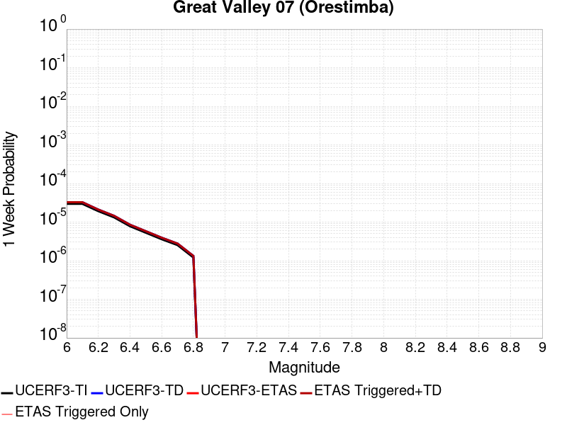 | 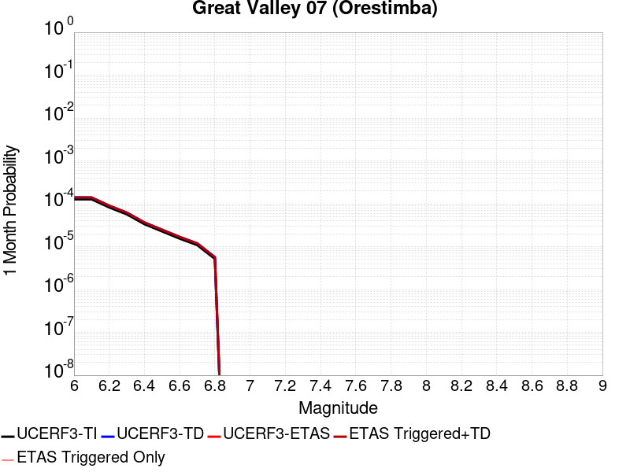 | 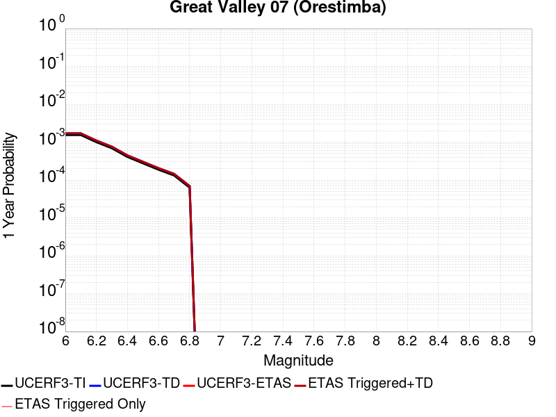 | 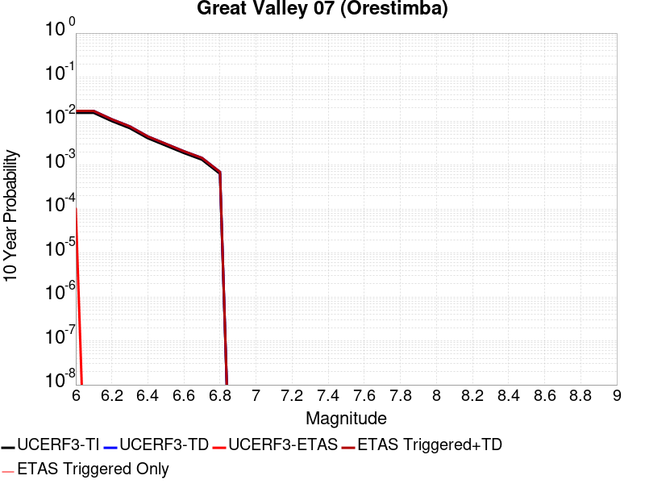 |

| Magnitude | 1 wk TI Prob | 1 wk TD Prob | 1 wk ETAS Prob | 1 wk ETAS/TD Gain | 1 wk ETAS Triggered+TD | 1 wk ETAS Triggered Only | 1 mo TI Prob | 1 mo TD Prob | 1 mo ETAS Prob | 1 mo ETAS/TD Gain | 1 mo ETAS Triggered+TD | 1 mo ETAS Triggered Only | 1 yr TI Prob | 1 yr TD Prob | 1 yr ETAS Prob | 1 yr ETAS/TD Gain | 1 yr ETAS Triggered+TD | 1 yr ETAS Triggered Only | 10 yr TI Prob | 10 yr TD Prob | 10 yr ETAS Prob | 10 yr ETAS/TD Gain | 10 yr ETAS Triggered+TD | 10 yr ETAS Triggered Only |
|-----|-----|-----|-----|-----|-----|-----|-----|-----|-----|-----|-----|-----|-----|-----|-----|-----|-----|-----|-----|-----|-----|-----|-----|-----|
| 6.0 | 2.9687902E-5 | 3.272214E-5 | 0.0 | 0.0 | 3.272214E-5 | 0.0 | 1.2722766E-4 | 1.402306E-4 | 1.0E-4 | 0.7131111 | 2.4021657E-4 | 1.0E-4 | 0.0015478961 | 0.0017060422 | 0.0015 | 0.87922794 | 0.0022051893 | 5.0E-4 | 0.015371585 | 0.016936978 | 0.0168 | 0.9919124 | 0.021852294 | 0.005 |
| 6.1 | 2.9687902E-5 | 3.272214E-5 | 0.0 | 0.0 | 3.272214E-5 | 0.0 | 1.2722766E-4 | 1.402306E-4 | 1.0E-4 | 0.7131111 | 2.4021657E-4 | 1.0E-4 | 0.0015478961 | 0.0017060422 | 0.0011 | 0.64476717 | 0.0020055305 | 3.0E-4 | 0.015371585 | 0.016936978 | 0.0139 | 0.82068944 | 0.020574313 | 0.0037 |
| 6.2 | 1.9231524E-5 | 2.113703E-5 | 0.0 | 0.0 | 2.113703E-5 | 0.0 | 8.2418206E-5 | 9.058425E-5 | 0.0 | 0.0 | 9.058425E-5 | 0.0 | 0.0010029797 | 0.0011023284 | 4.0E-4 | 0.36286828 | 0.0011023284 | 0.0 | 0.00998465 | 0.010971011 | 0.0084 | 0.76565415 | 0.012949069 | 0.002 |
| 6.3 | 1.324766E-5 | 1.4533626E-5 | 0.0 | 0.0 | 1.4533626E-5 | 0.0 | 5.6774446E-5 | 6.228553E-5 | 0.0 | 0.0 | 6.228553E-5 | 0.0 | 6.910097E-4 | 7.5807166E-4 | 2.0E-4 | 0.2638273 | 7.5807166E-4 | 0.0 | 0.006888649 | 0.0075558014 | 0.0057 | 0.7543872 | 0.008945224 | 0.0014 |
| 6.4 | 7.818645E-6 | 8.564213E-6 | 0.0 | 0.0 | 8.564213E-6 | 0.0 | 3.3508048E-5 | 3.6703274E-5 | 0.0 | 0.0 | 3.6703274E-5 | 0.0 | 4.078841E-4 | 4.4677407E-4 | 2.0E-4 | 0.44765356 | 4.4677407E-4 | 0.0 | 0.004071363 | 0.0044590984 | 0.0026 | 0.58307755 | 0.0050564227 | 6.0E-4 |
| 6.5 | 5.3076565E-6 | 5.8119676E-6 | 0.0 | 0.0 | 5.8119676E-6 | 0.0 | 2.27469E-5 | 2.4908206E-5 | 0.0 | 0.0 | 2.4908206E-5 | 0.0 | 2.7690834E-4 | 3.0321733E-4 | 0.0 | 0.0 | 3.0321733E-4 | 0.0 | 0.0027656353 | 0.003028245 | 0.0021 | 0.693471 | 0.0035267307 | 5.0E-4 |
| 6.6 | 3.6003578E-6 | 3.9445126E-6 | 0.0 | 0.0 | 3.9445126E-6 | 0.0 | 1.5430012E-5 | 1.6904953E-5 | 0.0 | 0.0 | 1.6904953E-5 | 0.0 | 1.8784421E-4 | 2.0579992E-4 | 0.0 | 0.0 | 2.0579992E-4 | 0.0 | 0.0018768552 | 0.002056247 | 0.0016 | 0.7781166 | 0.002255836 | 2.0E-4 |
| 6.7 | 2.5361826E-6 | 2.7806368E-6 | 0.0 | 0.0 | 2.7806368E-6 | 0.0 | 1.0869308E-5 | 1.1916968E-5 | 0.0 | 0.0 | 1.1916968E-5 | 0.0 | 1.3232579E-4 | 1.4508075E-4 | 0.0 | 0.0 | 1.4508075E-4 | 0.0 | 0.0013224703 | 0.00144999 | 0.001 | 0.68965995 | 0.001549845 | 1.0E-4 |
| 6.8 | 1.2115831E-6 | 1.3300066E-6 | 0.0 | 0.0 | 1.3300066E-6 | 0.0 | 5.1924885E-6 | 5.7000216E-6 | 0.0 | 0.0 | 5.7000216E-6 | 0.0 | 6.3216714E-5 | 6.939652E-5 | 0.0 | 0.0 | 6.939652E-5 | 0.0 | 6.3198735E-4 | 6.938434E-4 | 3.0E-4 | 0.43237424 | 6.938434E-4 | 0.0 |

## Garlock (Central)
*[(top)](#table-of-contents)*

| 1 Week | 1 Month | 1 Year | 10 Year |
|-----|-----|-----|-----|
| 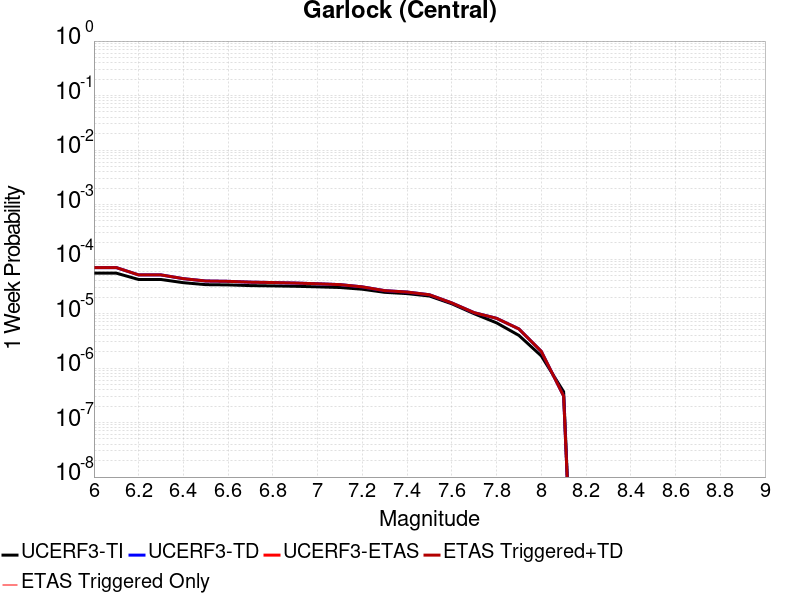 | 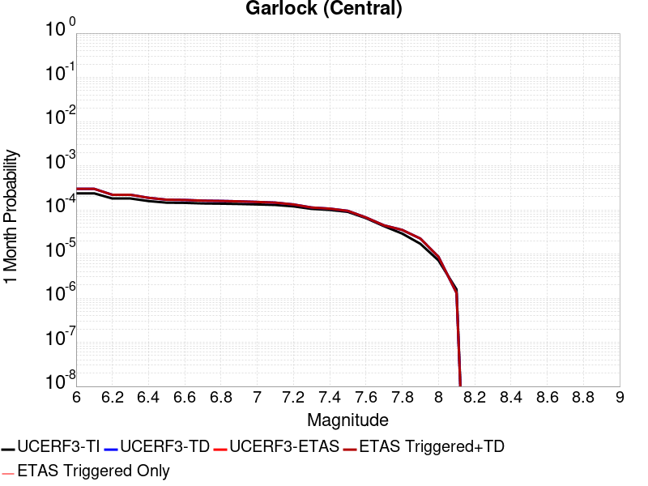 | 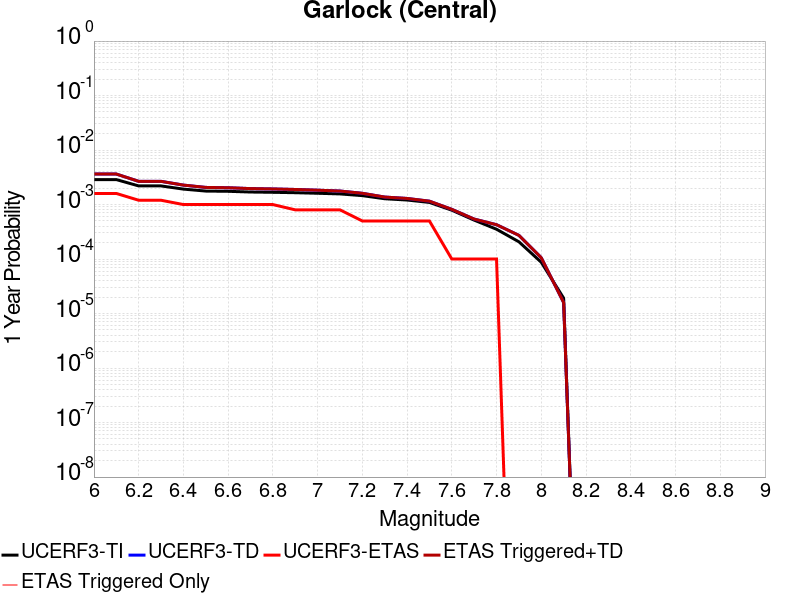 | 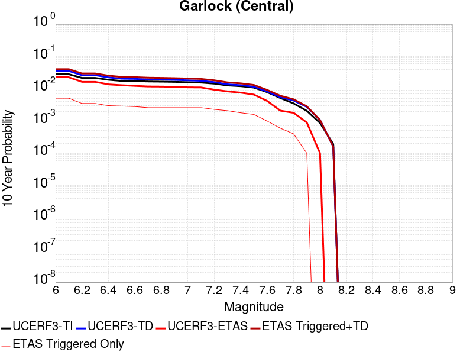 |

| Magnitude | 1 wk TI Prob | 1 wk TD Prob | 1 wk ETAS Prob | 1 wk ETAS/TD Gain | 1 wk ETAS Triggered+TD | 1 wk ETAS Triggered Only | 1 mo TI Prob | 1 mo TD Prob | 1 mo ETAS Prob | 1 mo ETAS/TD Gain | 1 mo ETAS Triggered+TD | 1 mo ETAS Triggered Only | 1 yr TI Prob | 1 yr TD Prob | 1 yr ETAS Prob | 1 yr ETAS/TD Gain | 1 yr ETAS Triggered+TD | 1 yr ETAS Triggered Only | 10 yr TI Prob | 10 yr TD Prob | 10 yr ETAS Prob | 10 yr ETAS/TD Gain | 10 yr ETAS Triggered+TD | 10 yr ETAS Triggered Only |
|-----|-----|-----|-----|-----|-----|-----|-----|-----|-----|-----|-----|-----|-----|-----|-----|-----|-----|-----|-----|-----|-----|-----|-----|-----|
| 6.0 | 5.5131142E-5 | 6.972457E-5 | 0.0 | 0.0 | 6.972457E-5 | 0.0 | 2.3625491E-4 | 2.9878572E-4 | 0.0 | 0.0 | 2.9878572E-4 | 0.0 | 0.0028726095 | 0.0036317124 | 0.0016 | 0.44056353 | 0.0036317124 | 0.0 | 0.028357591 | 0.035786107 | 0.0228 | 0.63711876 | 0.0407036 | 0.0051 |
| 6.1 | 5.5131142E-5 | 6.972457E-5 | 0.0 | 0.0 | 6.972457E-5 | 0.0 | 2.3625491E-4 | 2.9878572E-4 | 0.0 | 0.0 | 2.9878572E-4 | 0.0 | 0.0028726095 | 0.0036317124 | 0.0016 | 0.44056353 | 0.0036317124 | 0.0 | 0.028357591 | 0.035786107 | 0.0228 | 0.63711876 | 0.0407036 | 0.0051 |
| 6.2 | 4.216245E-5 | 5.118433E-5 | 0.0 | 0.0 | 5.118433E-5 | 0.0 | 1.806837E-4 | 2.1934314E-4 | 0.0 | 0.0 | 2.1934314E-4 | 0.0 | 0.0021976046 | 0.0026672634 | 0.0012 | 0.44989932 | 0.0026672634 | 0.0 | 0.021759989 | 0.026443232 | 0.0164 | 0.62019646 | 0.029850682 | 0.0035 |
| 6.3 | 4.216245E-5 | 5.118433E-5 | 0.0 | 0.0 | 5.118433E-5 | 0.0 | 1.806837E-4 | 2.1934314E-4 | 0.0 | 0.0 | 2.1934314E-4 | 0.0 | 0.0021976046 | 0.0026672634 | 0.0012 | 0.44989932 | 0.0026672634 | 0.0 | 0.021759989 | 0.026443232 | 0.0164 | 0.62019646 | 0.029850682 | 0.0035 |
| 6.4 | 3.6858168E-5 | 4.365805E-5 | 0.0 | 0.0 | 4.365805E-5 | 0.0 | 1.5795401E-4 | 1.8709265E-4 | 0.0 | 0.0 | 1.8709265E-4 | 0.0 | 0.0019213937 | 0.0022754984 | 0.001 | 0.43946418 | 0.0022754984 | 0.0 | 0.019048655 | 0.02262665 | 0.0137 | 0.60548073 | 0.025558768 | 0.003 |
| 6.5 | 3.39199E-5 | 3.9581115E-5 | 0.0 | 0.0 | 3.9581115E-5 | 0.0 | 1.453629E-4 | 1.6962244E-4 | 0.0 | 0.0 | 1.6962244E-4 | 0.0 | 0.0017683565 | 0.0020632187 | 0.001 | 0.4846796 | 0.0020632187 | 0.0 | 0.017543508 | 0.020543262 | 0.0129 | 0.6279431 | 0.023383688 | 0.0029 |
| 6.6 | 3.3571985E-5 | 3.903634E-5 | 0.0 | 0.0 | 3.903634E-5 | 0.0 | 1.4387199E-4 | 1.6728799E-4 | 0.0 | 0.0 | 1.6728799E-4 | 0.0 | 0.0017502342 | 0.0020348502 | 0.001 | 0.49143666 | 0.0020348502 | 0.0 | 0.017365133 | 0.020267662 | 0.0123 | 0.6068781 | 0.023010913 | 0.0028 |
| 6.7 | 3.2580007E-5 | 3.7657028E-5 | 0.0 | 0.0 | 3.7657028E-5 | 0.0 | 1.3962112E-4 | 1.613774E-4 | 0.0 | 0.0 | 1.613774E-4 | 0.0 | 0.0016985617 | 0.0019630205 | 0.001 | 0.509419 | 0.0019630205 | 0.0 | 0.016856372 | 0.019555299 | 0.0118 | 0.60341704 | 0.022104455 | 0.0026 |
| 6.8 | 3.2185937E-5 | 3.708589E-5 | 0.0 | 0.0 | 3.708589E-5 | 0.0 | 1.3793244E-4 | 1.5892998E-4 | 0.0 | 0.0 | 1.5892998E-4 | 0.0 | 0.0016780337 | 0.0019332764 | 0.001 | 0.5172566 | 0.0019332764 | 0.0 | 0.016654192 | 0.019262735 | 0.0117 | 0.6073904 | 0.021812651 | 0.0026 |
| 6.9 | 3.165394E-5 | 3.629276E-5 | 0.0 | 0.0 | 3.629276E-5 | 0.0 | 1.3565269E-4 | 1.5553125E-4 | 0.0 | 0.0 | 1.5553125E-4 | 0.0 | 0.0016503202 | 0.0018919695 | 8.0E-4 | 0.4228398 | 0.0018919695 | 0.0 | 0.01638118 | 0.018856093 | 0.0115 | 0.6098825 | 0.021407068 | 0.0026 |
| 7.0 | 3.0903822E-5 | 3.5201345E-5 | 0.0 | 0.0 | 3.5201345E-5 | 0.0 | 1.3243823E-4 | 1.508543E-4 | 0.0 | 0.0 | 1.508543E-4 | 0.0 | 0.0016112428 | 0.0018351249 | 8.0E-4 | 0.4359376 | 0.0018351249 | 0.0 | 0.015996104 | 0.018295098 | 0.0111 | 0.6067199 | 0.020847531 | 0.0026 |
| 7.1 | 3.0069863E-5 | 3.3973374E-5 | 0.0 | 0.0 | 3.3973374E-5 | 0.0 | 1.2886449E-4 | 1.4559216E-4 | 0.0 | 0.0 | 1.4559216E-4 | 0.0 | 0.0015677959 | 0.0017711642 | 8.0E-4 | 0.4516803 | 0.0017711642 | 0.0 | 0.01556781 | 0.017665599 | 0.011 | 0.6226792 | 0.020219669 | 0.0026 |
| 7.2 | 2.7957109E-5 | 3.0872176E-5 | 0.0 | 0.0 | 3.0872176E-5 | 0.0 | 1.1981068E-4 | 1.3230272E-4 | 0.0 | 0.0 | 1.3230272E-4 | 0.0 | 0.0014577188 | 0.0016096147 | 5.0E-4 | 0.31063333 | 0.0016096147 | 0.0 | 0.014481937 | 0.016073726 | 0.0094 | 0.58480525 | 0.018336758 | 0.0023 |
| 7.3 | 2.4519275E-5 | 2.632938E-5 | 0.0 | 0.0 | 2.632938E-5 | 0.0 | 1.0507837E-4 | 1.128354E-4 | 0.0 | 0.0 | 1.128354E-4 | 0.0 | 0.0012785783 | 0.0013729198 | 5.0E-4 | 0.36418733 | 0.0013729198 | 0.0 | 0.012712469 | 0.013729924 | 0.0083 | 0.604519 | 0.01580109 | 0.0021 |
| 7.4 | 2.3225532E-5 | 2.4826628E-5 | 0.0 | 0.0 | 2.4826628E-5 | 0.0 | 9.95342E-5 | 1.0639558E-4 | 0.0 | 0.0 | 1.0639558E-4 | 0.0 | 0.0012111551 | 0.0012946107 | 5.0E-4 | 0.3862165 | 0.0012946107 | 0.0 | 0.012045753 | 0.012953843 | 0.0076 | 0.5866985 | 0.014730526 | 0.0018 |
| 7.5 | 2.097765E-5 | 2.2129163E-5 | 0.0 | 0.0 | 2.2129163E-5 | 0.0 | 8.9901114E-5 | 9.483589E-5 | 0.0 | 0.0 | 9.483589E-5 | 0.0 | 0.0010939965 | 0.0011540271 | 5.0E-4 | 0.43326542 | 0.0011540271 | 0.0 | 0.010886264 | 0.011557779 | 0.0066 | 0.57104397 | 0.013139287 | 0.0016 |
| 7.6 | 1.511254E-5 | 1.5671667E-5 | 0.0 | 0.0 | 1.5671667E-5 | 0.0 | 6.476642E-5 | 6.7162604E-5 | 0.0 | 0.0 | 6.7162604E-5 | 0.0 | 7.882459E-4 | 8.174057E-4 | 1.0E-4 | 0.12233827 | 8.174057E-4 | 0.0 | 0.007854558 | 0.008218579 | 0.0042 | 0.51103723 | 0.00921036 | 0.001 |
| 7.7 | 9.934069E-6 | 1.0383669E-5 | 0.0 | 0.0 | 1.0383669E-5 | 0.0 | 4.2573887E-5 | 4.4500684E-5 | 0.0 | 0.0 | 4.4500684E-5 | 0.0 | 5.182138E-4 | 5.416615E-4 | 1.0E-4 | 0.18461715 | 5.416615E-4 | 0.0 | 0.00517007 | 0.0054743094 | 0.0021 | 0.38361 | 0.006071025 | 6.0E-4 |
| 7.8 | 6.7562896E-6 | 8.187173E-6 | 0.0 | 0.0 | 8.187173E-6 | 0.0 | 2.8955206E-5 | 3.5087414E-5 | 0.0 | 0.0 | 3.5087414E-5 | 0.0 | 3.5247262E-4 | 4.2710567E-4 | 1.0E-4 | 0.2341341 | 4.2710567E-4 | 0.0 | 0.0035191406 | 0.004321299 | 0.0018 | 0.4165414 | 0.0047195707 | 4.0E-4 |
| 7.9 | 3.975453E-6 | 5.2223595E-6 | 0.0 | 0.0 | 5.2223595E-6 | 0.0 | 1.7037546E-5 | 2.238135E-5 | 0.0 | 0.0 | 2.238135E-5 | 0.0 | 2.0741238E-4 | 2.7245894E-4 | 0.0 | 0.0 | 2.7245894E-4 | 0.0 | 0.002072189 | 0.002756357 | 9.0E-4 | 0.32651794 | 0.0028560814 | 1.0E-4 |
| 8.0 | 1.6729537E-6 | 2.0246855E-6 | 0.0 | 0.0 | 2.0246855E-6 | 0.0 | 7.169782E-6 | 8.677195E-6 | 0.0 | 0.0 | 8.677195E-6 | 0.0 | 8.7288594E-5 | 1.0563977E-4 | 0.0 | 0.0 | 1.0563977E-4 | 0.0 | 8.7254314E-4 | 0.0010694105 | 1.0E-4 | 0.093509465 | 0.0010694105 | 0.0 |
| 8.1 | 3.6733252E-7 | 3.0569248E-7 | 0.0 | 0.0 | 3.0569248E-7 | 0.0 | 1.5742813E-6 | 1.3101101E-6 | 0.0 | 0.0 | 1.3101101E-6 | 0.0 | 1.9166706E-5 | 1.5950489E-5 | 0.0 | 0.0 | 1.5950489E-5 | 0.0 | 1.9165053E-4 | 1.615787E-4 | 0.0 | 0.0 | 1.615787E-4 | 0.0 |

## Bennett Valley 2011 CFM
*[(top)](#table-of-contents)*

| 1 Week | 1 Month | 1 Year | 10 Year |
|-----|-----|-----|-----|
| 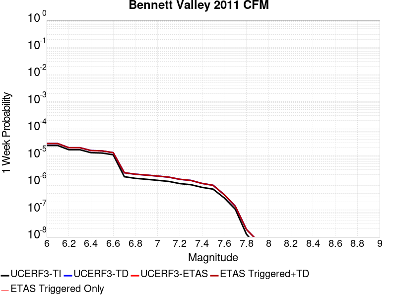 | 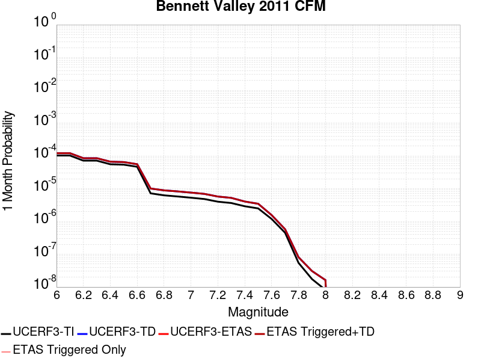 | 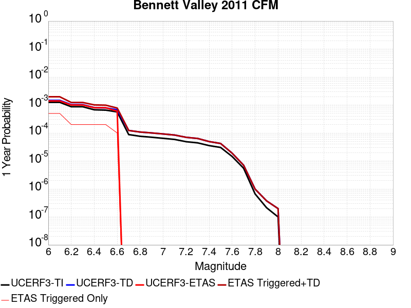 | 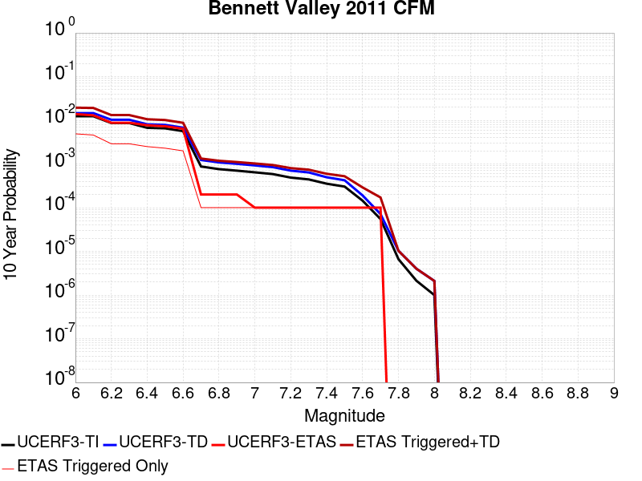 |

| Magnitude | 1 wk TI Prob | 1 wk TD Prob | 1 wk ETAS Prob | 1 wk ETAS/TD Gain | 1 wk ETAS Triggered+TD | 1 wk ETAS Triggered Only | 1 mo TI Prob | 1 mo TD Prob | 1 mo ETAS Prob | 1 mo ETAS/TD Gain | 1 mo ETAS Triggered+TD | 1 mo ETAS Triggered Only | 1 yr TI Prob | 1 yr TD Prob | 1 yr ETAS Prob | 1 yr ETAS/TD Gain | 1 yr ETAS Triggered+TD | 1 yr ETAS Triggered Only | 10 yr TI Prob | 10 yr TD Prob | 10 yr ETAS Prob | 10 yr ETAS/TD Gain | 10 yr ETAS Triggered+TD | 10 yr ETAS Triggered Only |
|-----|-----|-----|-----|-----|-----|-----|-----|-----|-----|-----|-----|-----|-----|-----|-----|-----|-----|-----|-----|-----|-----|-----|-----|-----|
| 6.0 | 2.3893934E-5 | 2.8179129E-5 | 0.0 | 0.0 | 2.8179129E-5 | 0.0 | 1.0239855E-4 | 1.2076314E-4 | 0.0 | 0.0 | 1.2076314E-4 | 0.0 | 0.0012459893 | 0.001469484 | 0.0014 | 0.95271546 | 0.001968749 | 5.0E-4 | 0.012390262 | 0.014620208 | 0.0139 | 0.95073885 | 0.019448569 | 0.0049 |
| 6.1 | 2.3893934E-5 | 2.8179129E-5 | 0.0 | 0.0 | 2.8179129E-5 | 0.0 | 1.0239855E-4 | 1.2076314E-4 | 0.0 | 0.0 | 1.2076314E-4 | 0.0 | 0.0012459893 | 0.001469484 | 0.0014 | 0.95271546 | 0.001968749 | 5.0E-4 | 0.012390262 | 0.014620208 | 0.013 | 0.8891802 | 0.019152956 | 0.0046 |
| 6.2 | 1.6657146E-5 | 1.9807883E-5 | 0.0 | 0.0 | 1.9807883E-5 | 0.0 | 7.138582E-5 | 8.488896E-5 | 0.0 | 0.0 | 8.488896E-5 | 0.0 | 8.6877577E-4 | 0.001033174 | 0.001 | 0.96789116 | 0.0012329674 | 2.0E-4 | 0.008653872 | 0.010301877 | 0.0088 | 0.8542133 | 0.013172002 | 0.0029 |
| 6.3 | 1.6657146E-5 | 1.9807883E-5 | 0.0 | 0.0 | 1.9807883E-5 | 0.0 | 7.138582E-5 | 8.488896E-5 | 0.0 | 0.0 | 8.488896E-5 | 0.0 | 8.6877577E-4 | 0.001033174 | 0.001 | 0.96789116 | 0.0012329674 | 2.0E-4 | 0.008653872 | 0.010301877 | 0.0088 | 0.8542133 | 0.013172002 | 0.0029 |
| 6.4 | 1.29418495E-5 | 1.5528469E-5 | 0.0 | 0.0 | 1.5528469E-5 | 0.0 | 5.546389E-5 | 6.654962E-5 | 0.0 | 0.0 | 6.654962E-5 | 0.0 | 6.7506364E-4 | 8.100702E-4 | 8.0E-4 | 0.98756874 | 0.0010099082 | 2.0E-4 | 0.0067301663 | 0.008088221 | 0.0077 | 0.95200175 | 0.010567999 | 0.0025 |
| 6.5 | 1.2582504E-5 | 1.5096242E-5 | 0.0 | 0.0 | 1.5096242E-5 | 0.0 | 5.39239E-5 | 6.4697306E-5 | 0.0 | 0.0 | 6.4697306E-5 | 0.0 | 6.563257E-4 | 7.875348E-4 | 8.0E-4 | 1.0158281 | 9.873773E-4 | 2.0E-4 | 0.006543907 | 0.007864505 | 0.0073 | 0.9282211 | 0.010146417 | 0.0023 |
| 6.6 | 1.0846706E-5 | 1.3002023E-5 | 0.0 | 0.0 | 1.3002023E-5 | 0.0 | 4.6485053E-5 | 5.5722485E-5 | 0.0 | 0.0 | 5.5722485E-5 | 0.0 | 5.6580856E-4 | 6.78338E-4 | 6.0E-4 | 0.8845148 | 7.782701E-4 | 1.0E-4 | 0.005643701 | 0.006779612 | 0.0064 | 0.9440068 | 0.008766052 | 0.002 |
| 6.7 | 1.6803231E-6 | 2.360248E-6 | 0.0 | 0.0 | 2.360248E-6 | 0.0 | 7.2013645E-6 | 1.0115309E-5 | 0.0 | 0.0 | 1.0115309E-5 | 0.0 | 8.7673085E-5 | 1.2314707E-4 | 0.0 | 0.0 | 1.2314707E-4 | 0.0 | 8.76385E-4 | 0.0012353868 | 2.0E-4 | 0.16189261 | 0.0013352633 | 1.0E-4 |
| 6.8 | 1.4609833E-6 | 2.0768407E-6 | 0.0 | 0.0 | 2.0768407E-6 | 0.0 | 6.261342E-6 | 8.900716E-6 | 0.0 | 0.0 | 8.900716E-6 | 0.0 | 7.6229175E-5 | 1.083609E-4 | 0.0 | 0.0 | 1.083609E-4 | 0.0 | 7.620303E-4 | 0.0010876227 | 2.0E-4 | 0.18388729 | 0.0011875139 | 1.0E-4 |
| 6.9 | 1.3492396E-6 | 1.9291392E-6 | 0.0 | 0.0 | 1.9291392E-6 | 0.0 | 5.7824427E-6 | 8.267714E-6 | 0.0 | 0.0 | 8.267714E-6 | 0.0 | 7.0398964E-5 | 1.0065483E-4 | 0.0 | 0.0 | 1.0065483E-4 | 0.0 | 7.037667E-4 | 0.0010106054 | 2.0E-4 | 0.19790117 | 0.0011105044 | 1.0E-4 |
| 7.0 | 1.2347921E-6 | 1.7734027E-6 | 0.0 | 0.0 | 1.7734027E-6 | 0.0 | 5.291955E-6 | 7.6002752E-6 | 0.0 | 0.0 | 7.6002752E-6 | 0.0 | 6.442765E-5 | 9.252947E-5 | 0.0 | 0.0 | 9.252947E-5 | 0.0 | 6.440897E-4 | 9.293887E-4 | 1.0E-4 | 0.107597604 | 0.0010292957 | 1.0E-4 |
| 7.1 | 1.1262973E-6 | 1.6207623E-6 | 0.0 | 0.0 | 1.6207623E-6 | 0.0 | 4.8269794E-6 | 6.9461057E-6 | 0.0 | 0.0 | 6.9461057E-6 | 0.0 | 5.876689E-5 | 8.456561E-5 | 0.0 | 0.0 | 8.456561E-5 | 0.0 | 5.875135E-4 | 8.4978825E-4 | 1.0E-4 | 0.11767637 | 9.497033E-4 | 1.0E-4 |
| 7.2 | 9.351744E-7 | 1.3464277E-6 | 0.0 | 0.0 | 1.3464277E-6 | 0.0 | 4.007884E-6 | 5.770392E-6 | 0.0 | 0.0 | 5.770392E-6 | 0.0 | 4.8794896E-5 | 7.0252274E-5 | 0.0 | 0.0 | 7.0252274E-5 | 0.0 | 4.878418E-4 | 7.0671E-4 | 1.0E-4 | 0.14150076 | 8.066393E-4 | 1.0E-4 |
| 7.3 | 8.5039534E-7 | 1.2247554E-6 | 0.0 | 0.0 | 1.2247554E-6 | 0.0 | 3.6445463E-6 | 5.248941E-6 | 0.0 | 0.0 | 5.248941E-6 | 0.0 | 4.437145E-5 | 6.3904E-5 | 0.0 | 0.0 | 6.3904E-5 | 0.0 | 4.436259E-4 | 6.429697E-4 | 1.0E-4 | 0.15552832 | 7.4290537E-4 | 1.0E-4 |
| 7.4 | 6.7875015E-7 | 9.49036E-7 | 0.0 | 0.0 | 9.49036E-7 | 0.0 | 2.908926E-6 | 4.067291E-6 | 0.0 | 0.0 | 4.067291E-6 | 0.0 | 3.54156E-5 | 4.9518152E-5 | 0.0 | 0.0 | 4.9518152E-5 | 0.0 | 3.5409955E-4 | 4.9843313E-4 | 1.0E-4 | 0.20062873 | 5.9838325E-4 | 1.0E-4 |
| 7.5 | 5.826867E-7 | 8.0970125E-7 | 0.0 | 0.0 | 8.0970125E-7 | 0.0 | 2.4972264E-6 | 3.4701436E-6 | 0.0 | 0.0 | 3.4701436E-6 | 0.0 | 3.0403306E-5 | 4.224819E-5 | 0.0 | 0.0 | 4.224819E-5 | 0.0 | 3.0399146E-4 | 4.253213E-4 | 1.0E-4 | 0.23511636 | 5.252788E-4 | 1.0E-4 |
| 7.6 | 2.7734902E-7 | 3.6489635E-7 | 0.0 | 0.0 | 3.6489635E-7 | 0.0 | 1.1886381E-6 | 1.5638406E-6 | 0.0 | 0.0 | 1.5638406E-6 | 0.0 | 1.4471572E-5 | 1.9039593E-5 | 0.0 | 0.0 | 1.9039593E-5 | 0.0 | 1.447063E-4 | 1.9137803E-4 | 1.0E-4 | 0.522526 | 2.9135888E-4 | 1.0E-4 |
| 7.7 | 1.0530888E-7 | 1.3556676E-7 | 0.0 | 0.0 | 1.3556676E-7 | 0.0 | 4.513237E-7 | 5.810003E-7 | 0.0 | 0.0 | 5.810003E-7 | 0.0 | 5.4948523E-6 | 7.0736555E-6 | 0.0 | 0.0 | 7.0736555E-6 | 0.0 | 5.4947162E-5 | 7.1564835E-5 | 1.0E-4 | 1.3973343 | 1.7155768E-4 | 1.0E-4 |
| 7.8 | 1.2714258E-8 | 1.9016808E-8 | 0.0 | 0.0 | 1.9016808E-8 | 0.0 | 5.448968E-8 | 8.15006E-8 | 0.0 | 0.0 | 8.15006E-8 | 0.0 | 6.6341164E-7 | 9.922693E-7 | 0.0 | 0.0 | 9.922693E-7 | 0.0 | 6.6340967E-6 | 1.03479015E-5 | 0.0 | 0.0 | 1.03479015E-5 | 0.0 |
| 7.9 | 4.075888E-9 | 7.228229E-9 | 0.0 | 0.0 | 7.228229E-9 | 0.0 | 1.7468091E-8 | 3.097812E-8 | 0.0 | 0.0 | 3.097812E-8 | 0.0 | 2.12674E-7 | 3.7715856E-7 | 0.0 | 0.0 | 3.7715856E-7 | 0.0 | 2.1267379E-6 | 4.0287814E-6 | 0.0 | 0.0 | 4.0287814E-6 | 0.0 |
| 8.0 | 1.9126138E-9 | 3.826022E-9 | 0.0 | 0.0 | 3.826022E-9 | 0.0 | 8.196917E-9 | 1.6397236E-8 | 0.0 | 0.0 | 1.6397236E-8 | 0.0 | 9.9797454E-8 | 1.9963633E-7 | 0.0 | 0.0 | 1.9963633E-7 | 0.0 | 9.979741E-7 | 2.11456E-6 | 0.0 | 0.0 | 2.11456E-6 | 0.0 |

## Ortigalita (South)
*[(top)](#table-of-contents)*

| 1 Week | 1 Month | 1 Year | 10 Year |
|-----|-----|-----|-----|
| 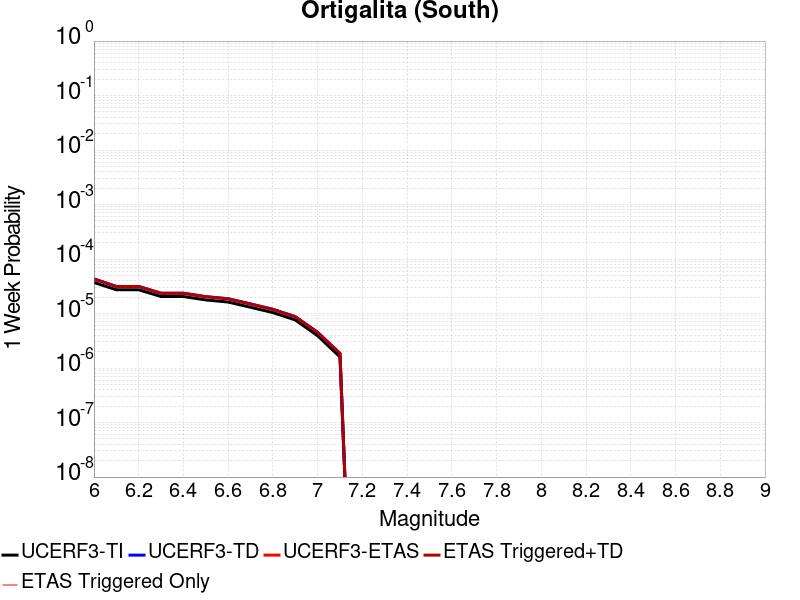 | 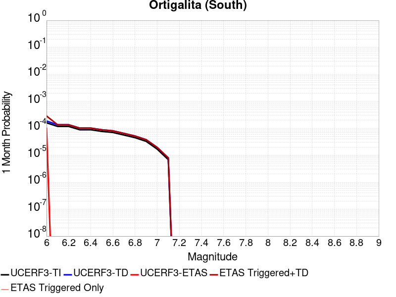 | 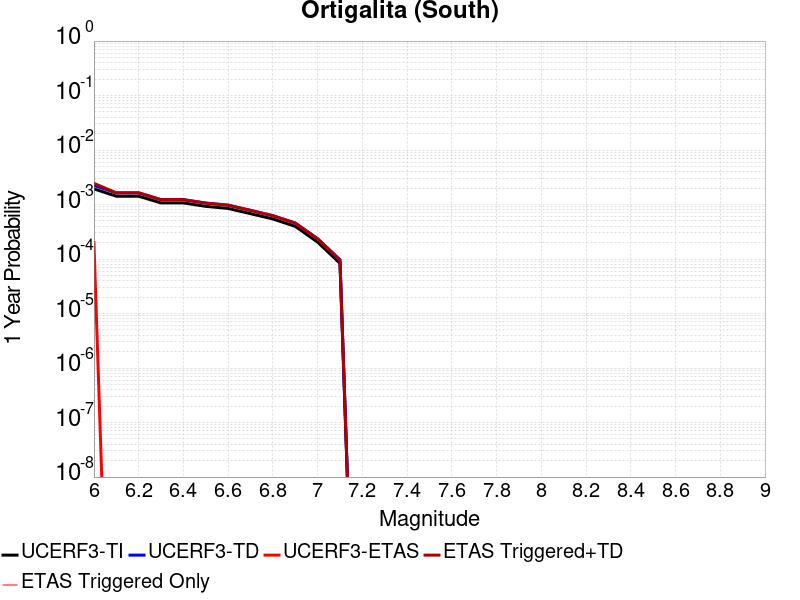 | 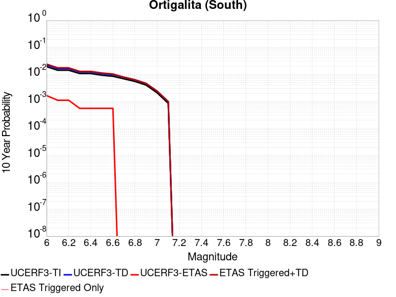 |

| Magnitude | 1 wk TI Prob | 1 wk TD Prob | 1 wk ETAS Prob | 1 wk ETAS/TD Gain | 1 wk ETAS Triggered+TD | 1 wk ETAS Triggered Only | 1 mo TI Prob | 1 mo TD Prob | 1 mo ETAS Prob | 1 mo ETAS/TD Gain | 1 mo ETAS Triggered+TD | 1 mo ETAS Triggered Only | 1 yr TI Prob | 1 yr TD Prob | 1 yr ETAS Prob | 1 yr ETAS/TD Gain | 1 yr ETAS Triggered+TD | 1 yr ETAS Triggered Only | 10 yr TI Prob | 10 yr TD Prob | 10 yr ETAS Prob | 10 yr ETAS/TD Gain | 10 yr ETAS Triggered+TD | 10 yr ETAS Triggered Only |
|-----|-----|-----|-----|-----|-----|-----|-----|-----|-----|-----|-----|-----|-----|-----|-----|-----|-----|-----|-----|-----|-----|-----|-----|-----|
| 6.0 | 3.72394E-5 | 4.3182466E-5 | 0.0 | 0.0 | 4.3182466E-5 | 0.0 | 1.5958765E-4 | 1.8505547E-4 | 1.0E-4 | 0.5403785 | 2.8503698E-4 | 1.0E-4 | 0.0019412481 | 0.002250878 | 0.0016 | 0.7108337 | 0.0026499776 | 4.0E-4 | 0.019243775 | 0.022297136 | 0.0172 | 0.7713995 | 0.02689234 | 0.0047 |
| 6.1 | 2.7299884E-5 | 3.1441457E-5 | 0.0 | 0.0 | 3.1441457E-5 | 0.0 | 1.16994255E-4 | 1.3474245E-4 | 0.0 | 0.0 | 1.3474245E-4 | 0.0 | 0.0014234743 | 0.0016393106 | 9.0E-4 | 0.54901123 | 0.0017391468 | 1.0E-4 | 0.014143906 | 0.016278092 | 0.0125 | 0.7679032 | 0.019622747 | 0.0034 |
| 6.2 | 2.7299884E-5 | 3.1441457E-5 | 0.0 | 0.0 | 3.1441457E-5 | 0.0 | 1.16994255E-4 | 1.3474245E-4 | 0.0 | 0.0 | 1.3474245E-4 | 0.0 | 0.0014234743 | 0.0016393106 | 9.0E-4 | 0.54901123 | 0.0017391468 | 1.0E-4 | 0.014143906 | 0.016278092 | 0.0125 | 0.7679032 | 0.019622747 | 0.0034 |
| 6.3 | 2.0546433E-5 | 2.3594344E-5 | 0.0 | 0.0 | 2.3594344E-5 | 0.0 | 8.805317E-5 | 1.01114805E-4 | 0.0 | 0.0 | 1.01114805E-4 | 0.0 | 0.00107152 | 0.0012303964 | 4.0E-4 | 0.32509848 | 0.0012303964 | 0.0 | 0.010663681 | 0.0122379 | 0.0083 | 0.6782209 | 0.014509752 | 0.0023 |
| 6.4 | 2.0546433E-5 | 2.3594344E-5 | 0.0 | 0.0 | 2.3594344E-5 | 0.0 | 8.805317E-5 | 1.01114805E-4 | 0.0 | 0.0 | 1.01114805E-4 | 0.0 | 0.00107152 | 0.0012303964 | 4.0E-4 | 0.32509848 | 0.0012303964 | 0.0 | 0.010663681 | 0.0122379 | 0.0083 | 0.6782209 | 0.014509752 | 0.0023 |
| 6.5 | 1.7779594E-5 | 2.0414887E-5 | 0.0 | 0.0 | 2.0414887E-5 | 0.0 | 7.619603E-5 | 8.748951E-5 | 0.0 | 0.0 | 8.748951E-5 | 0.0 | 9.272918E-4 | 0.0010646778 | 4.0E-4 | 0.3757005 | 0.0010646778 | 0.0 | 0.009234319 | 0.010597234 | 0.008 | 0.754914 | 0.01277392 | 0.0022 |
| 6.6 | 1.6272212E-5 | 1.8685576E-5 | 0.0 | 0.0 | 1.8685576E-5 | 0.0 | 6.973618E-5 | 8.007865E-5 | 0.0 | 0.0 | 8.007865E-5 | 0.0 | 8.487073E-4 | 9.745337E-4 | 3.0E-4 | 0.30783954 | 9.745337E-4 | 0.0 | 0.008454733 | 0.009703899 | 0.007 | 0.72135955 | 0.011684491 | 0.002 |
| 6.7 | 1.3051484E-5 | 1.5014794E-5 | 0.0 | 0.0 | 1.5014794E-5 | 0.0 | 5.593373E-5 | 6.434759E-5 | 0.0 | 0.0 | 6.434759E-5 | 0.0 | 6.807804E-4 | 7.831597E-4 | 3.0E-4 | 0.3830636 | 7.831597E-4 | 0.0 | 0.006786986 | 0.007804978 | 0.0054 | 0.6918661 | 0.009293271 | 0.0015 |
| 6.8 | 1.04277415E-5 | 1.1968504E-5 | 0.0 | 0.0 | 1.1968504E-5 | 0.0 | 4.4689557E-5 | 5.129262E-5 | 0.0 | 0.0 | 5.129262E-5 | 0.0 | 5.439595E-4 | 6.243161E-4 | 3.0E-4 | 0.4805258 | 6.243161E-4 | 0.0 | 0.0054262993 | 0.0062263743 | 0.0043 | 0.6906106 | 0.0076176575 | 0.0014 |
| 6.9 | 7.639968E-6 | 8.777665E-6 | 0.0 | 0.0 | 8.777665E-6 | 0.0 | 3.274231E-5 | 3.7618054E-5 | 0.0 | 0.0 | 3.7618054E-5 | 0.0 | 3.9856473E-4 | 4.5790945E-4 | 2.0E-4 | 0.43676758 | 4.5790945E-4 | 0.0 | 0.003978506 | 0.0045702434 | 0.0032 | 0.7001815 | 0.005665216 | 0.0011 |
| 7.0 | 3.919831E-6 | 4.525994E-6 | 0.0 | 0.0 | 4.525994E-6 | 0.0 | 1.679917E-5 | 1.9396986E-5 | 0.0 | 0.0 | 1.9396986E-5 | 0.0 | 2.045107E-4 | 2.3613482E-4 | 1.0E-4 | 0.4234869 | 2.3613482E-4 | 0.0 | 0.0020432258 | 0.0023590468 | 0.0016 | 0.67824 | 0.0026583392 | 3.0E-4 |
| 7.1 | 1.6017933E-6 | 1.8539527E-6 | 0.0 | 0.0 | 1.8539527E-6 | 0.0 | 6.8648105E-6 | 7.945493E-6 | 0.0 | 0.0 | 7.945493E-6 | 0.0 | 8.357586E-5 | 9.673315E-5 | 0.0 | 0.0 | 9.673315E-5 | 0.0 | 8.3544437E-4 | 9.6701476E-4 | 9.0E-4 | 0.93069935 | 0.001066918 | 1.0E-4 |

## Great Valley 03 Mysterious Ridge
*[(top)](#table-of-contents)*

| 1 Week | 1 Month | 1 Year | 10 Year |
|-----|-----|-----|-----|
| 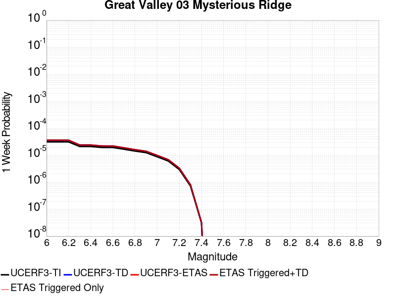 | 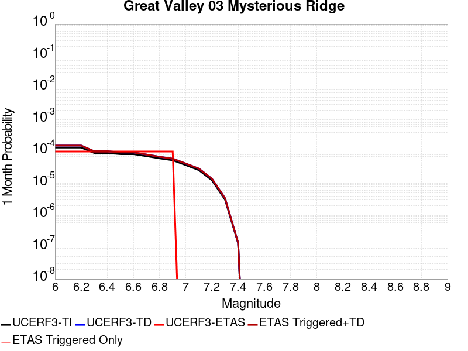 | 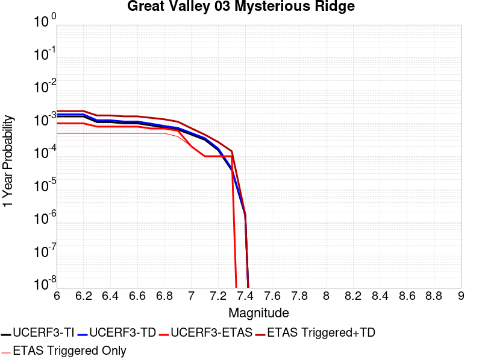 | 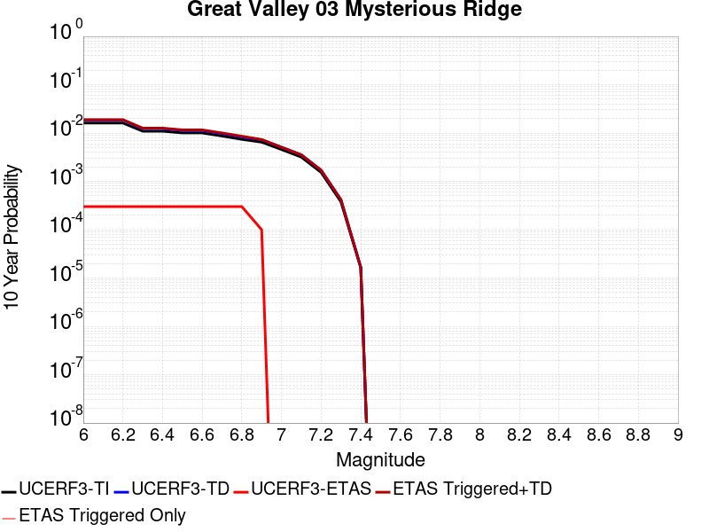 |

| Magnitude | 1 wk TI Prob | 1 wk TD Prob | 1 wk ETAS Prob | 1 wk ETAS/TD Gain | 1 wk ETAS Triggered+TD | 1 wk ETAS Triggered Only | 1 mo TI Prob | 1 mo TD Prob | 1 mo ETAS Prob | 1 mo ETAS/TD Gain | 1 mo ETAS Triggered+TD | 1 mo ETAS Triggered Only | 1 yr TI Prob | 1 yr TD Prob | 1 yr ETAS Prob | 1 yr ETAS/TD Gain | 1 yr ETAS Triggered+TD | 1 yr ETAS Triggered Only | 10 yr TI Prob | 10 yr TD Prob | 10 yr ETAS Prob | 10 yr ETAS/TD Gain | 10 yr ETAS Triggered+TD | 10 yr ETAS Triggered Only |
|-----|-----|-----|-----|-----|-----|-----|-----|-----|-----|-----|-----|-----|-----|-----|-----|-----|-----|-----|-----|-----|-----|-----|-----|-----|
| 6.0 | 3.1182444E-5 | 3.5975117E-5 | 0.0 | 0.0 | 3.5975117E-5 | 0.0 | 1.336322E-4 | 1.5417102E-4 | 1.0E-4 | 0.6486303 | 1.5417102E-4 | 0.0 | 0.0016257578 | 0.0018756017 | 0.001 | 0.53316224 | 0.002374664 | 5.0E-4 | 0.016139153 | 0.018616395 | 0.0132 | 0.7090524 | 0.02313076 | 0.0046 |
| 6.1 | 3.1182444E-5 | 3.5975117E-5 | 0.0 | 0.0 | 3.5975117E-5 | 0.0 | 1.336322E-4 | 1.5417102E-4 | 1.0E-4 | 0.6486303 | 1.5417102E-4 | 0.0 | 0.0016257578 | 0.0018756017 | 0.001 | 0.53316224 | 0.002374664 | 5.0E-4 | 0.016139153 | 0.018616395 | 0.0132 | 0.7090524 | 0.02313076 | 0.0046 |
| 6.2 | 3.1182444E-5 | 3.5975117E-5 | 0.0 | 0.0 | 3.5975117E-5 | 0.0 | 1.336322E-4 | 1.5417102E-4 | 1.0E-4 | 0.6486303 | 1.5417102E-4 | 0.0 | 0.0016257578 | 0.0018756017 | 0.001 | 0.53316224 | 0.002374664 | 5.0E-4 | 0.016139153 | 0.018616395 | 0.0132 | 0.7090524 | 0.02313076 | 0.0046 |
| 6.3 | 2.106934E-5 | 2.3817278E-5 | 0.0 | 0.0 | 2.3817278E-5 | 0.0 | 9.0294045E-5 | 1.02070226E-4 | 1.0E-4 | 0.9797176 | 1.02070226E-4 | 0.0 | 0.0010987755 | 0.0012420276 | 8.0E-4 | 0.64410806 | 0.0017414066 | 5.0E-4 | 0.010933585 | 0.012354098 | 0.009 | 0.72850317 | 0.015712095 | 0.0034 |
| 6.4 | 2.106934E-5 | 2.3817278E-5 | 0.0 | 0.0 | 2.3817278E-5 | 0.0 | 9.0294045E-5 | 1.02070226E-4 | 1.0E-4 | 0.9797176 | 1.02070226E-4 | 0.0 | 0.0010987755 | 0.0012420276 | 8.0E-4 | 0.64410806 | 0.0017414066 | 5.0E-4 | 0.010933585 | 0.012354098 | 0.009 | 0.72850317 | 0.015712095 | 0.0034 |
| 6.5 | 1.9389783E-5 | 2.1855454E-5 | 0.0 | 0.0 | 2.1855454E-5 | 0.0 | 8.309642E-5 | 9.3663024E-5 | 1.0E-4 | 1.0676572 | 9.3663024E-5 | 0.0 | 0.0010112294 | 0.0011397784 | 8.0E-4 | 0.70189077 | 0.0016392085 | 5.0E-4 | 0.010066401 | 0.011342193 | 0.0087 | 0.7670474 | 0.01470363 | 0.0034 |
| 6.6 | 1.9370193E-5 | 2.183538E-5 | 0.0 | 0.0 | 2.183538E-5 | 0.0 | 8.301247E-5 | 9.3577E-5 | 1.0E-4 | 1.0686387 | 9.3577E-5 | 0.0 | 0.0010102082 | 0.0011387322 | 8.0E-4 | 0.7025357 | 0.0016381629 | 5.0E-4 | 0.010056281 | 0.011331838 | 0.0087 | 0.7677484 | 0.01469331 | 0.0034 |
| 6.7 | 1.6723505E-5 | 1.8774837E-5 | 0.0 | 0.0 | 1.8774837E-5 | 0.0 | 7.16702E-5 | 8.046122E-5 | 1.0E-4 | 1.2428348 | 8.046122E-5 | 0.0 | 8.722353E-4 | 9.791945E-4 | 7.0E-4 | 0.71487325 | 0.001478705 | 5.0E-4 | 0.008688197 | 0.009750803 | 0.007 | 0.71788955 | 0.012919601 | 0.0032 |
| 6.8 | 1.426937E-5 | 1.597693E-5 | 0.0 | 0.0 | 1.597693E-5 | 0.0 | 6.115301E-5 | 6.847084E-5 | 1.0E-4 | 1.4604757 | 6.847084E-5 | 0.0 | 7.4428355E-4 | 8.3332806E-4 | 7.0E-4 | 0.84000534 | 0.0013329114 | 5.0E-4 | 0.007417957 | 0.008303506 | 0.0064 | 0.77075875 | 0.011278596 | 0.003 |
| 6.9 | 1.2469891E-5 | 1.393951E-5 | 0.0 | 0.0 | 1.393951E-5 | 0.0 | 5.3441294E-5 | 5.9739454E-5 | 1.0E-4 | 1.6739355 | 5.9739454E-5 | 0.0 | 6.504535E-4 | 7.270972E-4 | 6.0E-4 | 0.8251991 | 0.0011268064 | 4.0E-4 | 0.006485529 | 0.0072484035 | 0.0053 | 0.7311955 | 0.009631007 | 0.0024 |
| 7.0 | 8.7746275E-6 | 9.779858E-6 | 0.0 | 0.0 | 9.779858E-6 | 0.0 | 3.7605005E-5 | 4.1913045E-5 | 0.0 | 0.0 | 4.1913045E-5 | 0.0 | 4.5774475E-4 | 5.1017915E-4 | 2.0E-4 | 0.39201915 | 7.100771E-4 | 2.0E-4 | 0.00456803 | 0.00509081 | 0.0042 | 0.825016 | 0.006881647 | 0.0018 |
| 7.1 | 6.1067153E-6 | 6.805472E-6 | 0.0 | 0.0 | 6.805472E-6 | 0.0 | 2.6171374E-5 | 2.9166014E-5 | 0.0 | 0.0 | 2.9166014E-5 | 0.0 | 3.1858988E-4 | 3.550439E-4 | 1.0E-4 | 0.28165528 | 4.550084E-4 | 1.0E-4 | 0.0031813353 | 0.0035453162 | 0.0031 | 0.8743931 | 0.0048407074 | 0.0013 |
| 7.2 | 2.939283E-6 | 3.2702005E-6 | 0.0 | 0.0 | 3.2702005E-6 | 0.0 | 1.2596866E-5 | 1.401508E-5 | 0.0 | 0.0 | 1.401508E-5 | 0.0 | 1.5335606E-4 | 1.7062198E-4 | 1.0E-4 | 0.586091 | 2.706049E-4 | 1.0E-4 | 0.0015325027 | 0.0017050814 | 0.002 | 1.1729646 | 0.0026035467 | 9.0E-4 |
| 7.3 | 7.2387763E-7 | 7.99954E-7 | 0.0 | 0.0 | 7.99954E-7 | 0.0 | 3.102329E-6 | 3.4283726E-6 | 0.0 | 0.0 | 3.4283726E-6 | 0.0 | 3.77702E-5 | 4.174009E-5 | 1.0E-4 | 2.3957782 | 1.4173592E-4 | 1.0E-4 | 3.7763783E-4 | 4.1736738E-4 | 8.0E-4 | 1.9167764 | 8.1720046E-4 | 4.0E-4 |
| 7.4 | 3.112171E-8 | 3.2058175E-8 | 0.0 | 0.0 | 3.2058175E-8 | 0.0 | 1.3337875E-7 | 1.3739218E-7 | 0.0 | 0.0 | 1.3739218E-7 | 0.0 | 1.6238852E-6 | 1.6727486E-6 | 0.0 | 0.0 | 1.6727486E-6 | 0.0 | 1.6238733E-5 | 1.6727368E-5 | 0.0 | 0.0 | 1.6727368E-5 | 0.0 |

## White Mountains
*[(top)](#table-of-contents)*

| 1 Week | 1 Month | 1 Year | 10 Year |
|-----|-----|-----|-----|
| 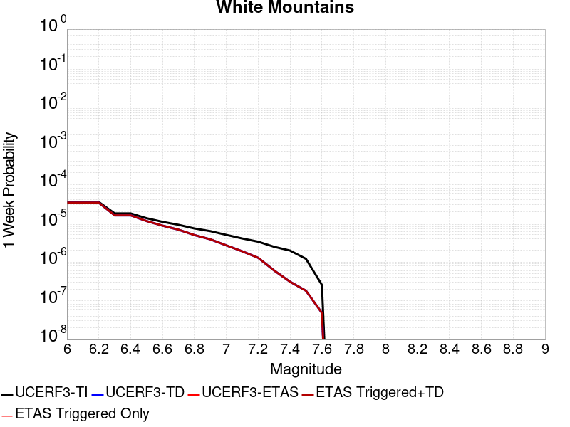 | 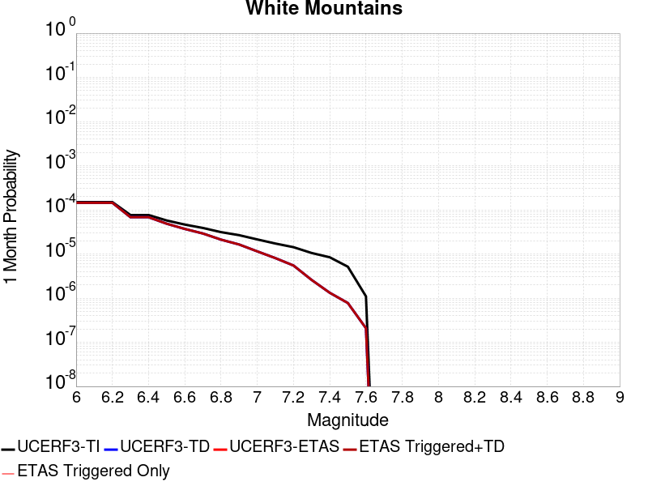 | 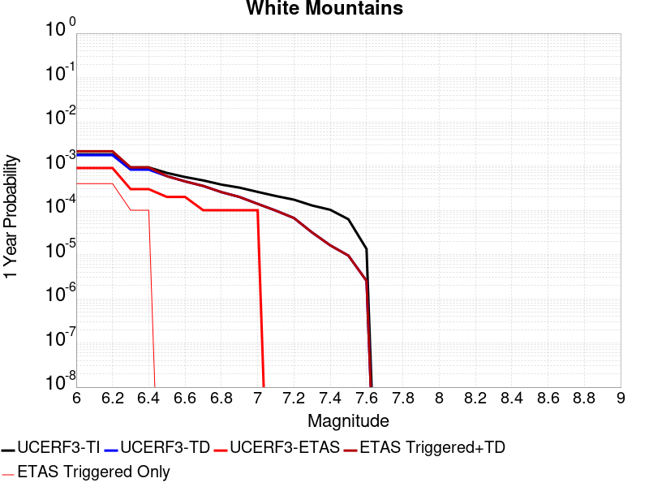 | 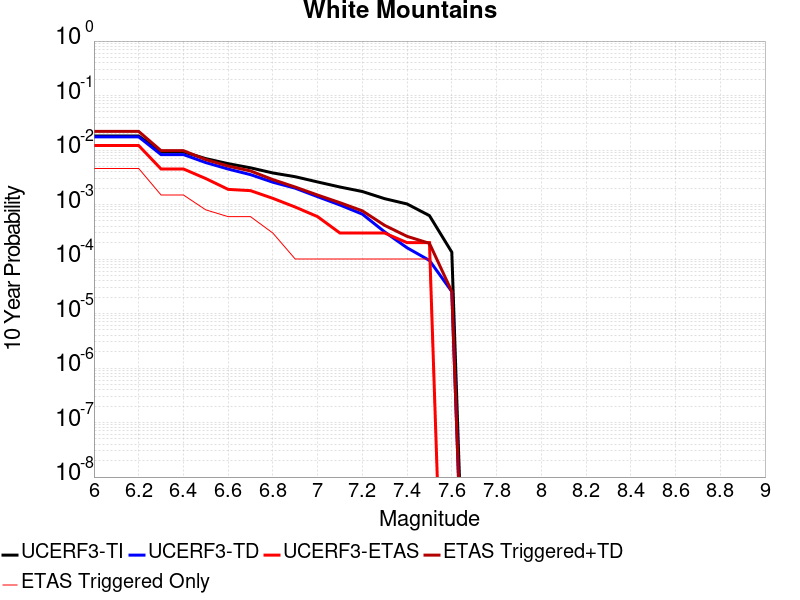 |

| Magnitude | 1 wk TI Prob | 1 wk TD Prob | 1 wk ETAS Prob | 1 wk ETAS/TD Gain | 1 wk ETAS Triggered+TD | 1 wk ETAS Triggered Only | 1 mo TI Prob | 1 mo TD Prob | 1 mo ETAS Prob | 1 mo ETAS/TD Gain | 1 mo ETAS Triggered+TD | 1 mo ETAS Triggered Only | 1 yr TI Prob | 1 yr TD Prob | 1 yr ETAS Prob | 1 yr ETAS/TD Gain | 1 yr ETAS Triggered+TD | 1 yr ETAS Triggered Only | 10 yr TI Prob | 10 yr TD Prob | 10 yr ETAS Prob | 10 yr ETAS/TD Gain | 10 yr ETAS Triggered+TD | 10 yr ETAS Triggered Only |
|-----|-----|-----|-----|-----|-----|-----|-----|-----|-----|-----|-----|-----|-----|-----|-----|-----|-----|-----|-----|-----|-----|-----|-----|-----|
| 6.0 | 3.503579E-5 | 3.375359E-5 | 0.0 | 0.0 | 3.375359E-5 | 0.0 | 1.5014476E-4 | 1.4465091E-4 | 0.0 | 0.0 | 1.4465091E-4 | 0.0 | 0.0018264796 | 0.0017598227 | 9.0E-4 | 0.5114152 | 0.0021591187 | 4.0E-4 | 0.018115403 | 0.017471178 | 0.0121 | 0.69256926 | 0.02199081 | 0.0046 |
| 6.1 | 3.503579E-5 | 3.375359E-5 | 0.0 | 0.0 | 3.375359E-5 | 0.0 | 1.5014476E-4 | 1.4465091E-4 | 0.0 | 0.0 | 1.4465091E-4 | 0.0 | 0.0018264796 | 0.0017598227 | 9.0E-4 | 0.5114152 | 0.0021591187 | 4.0E-4 | 0.018115403 | 0.017471178 | 0.0121 | 0.69256926 | 0.02199081 | 0.0046 |
| 6.2 | 3.503579E-5 | 3.375359E-5 | 0.0 | 0.0 | 3.375359E-5 | 0.0 | 1.5014476E-4 | 1.4465091E-4 | 0.0 | 0.0 | 1.4465091E-4 | 0.0 | 0.0018264796 | 0.0017598227 | 9.0E-4 | 0.5114152 | 0.0021591187 | 4.0E-4 | 0.018115403 | 0.017471178 | 0.0121 | 0.69256926 | 0.02199081 | 0.0046 |
| 6.3 | 1.7818425E-5 | 1.5902306E-5 | 0.0 | 0.0 | 1.5902306E-5 | 0.0 | 7.636245E-5 | 6.8151036E-5 | 0.0 | 0.0 | 6.8151036E-5 | 0.0 | 9.293162E-4 | 8.294372E-4 | 3.0E-4 | 0.36169103 | 9.293543E-4 | 1.0E-4 | 0.009254395 | 0.00826487 | 0.0045 | 0.5444731 | 0.009752474 | 0.0015 |
| 6.4 | 1.7818425E-5 | 1.5902306E-5 | 0.0 | 0.0 | 1.5902306E-5 | 0.0 | 7.636245E-5 | 6.8151036E-5 | 0.0 | 0.0 | 6.8151036E-5 | 0.0 | 9.293162E-4 | 8.294372E-4 | 3.0E-4 | 0.36169103 | 9.293543E-4 | 1.0E-4 | 0.009254395 | 0.00826487 | 0.0045 | 0.5444731 | 0.009752474 | 0.0015 |
| 6.5 | 1.3397557E-5 | 1.1326395E-5 | 0.0 | 0.0 | 1.1326395E-5 | 0.0 | 5.741684E-5 | 4.8540827E-5 | 0.0 | 0.0 | 4.8540827E-5 | 0.0 | 6.988258E-4 | 5.908313E-4 | 2.0E-4 | 0.3385061 | 5.908313E-4 | 0.0 | 0.006966323 | 0.005893309 | 0.003 | 0.50905186 | 0.0066885944 | 8.0E-4 |
| 6.6 | 1.0818695E-5 | 8.617659E-6 | 0.0 | 0.0 | 8.617659E-6 | 0.0 | 4.6365014E-5 | 3.6932324E-5 | 0.0 | 0.0 | 3.6932324E-5 | 0.0 | 5.6434784E-4 | 4.4956262E-4 | 2.0E-4 | 0.44487685 | 4.4956262E-4 | 0.0 | 0.005629168 | 0.0044869673 | 0.0019 | 0.42344856 | 0.0050842753 | 6.0E-4 |
| 6.7 | 9.067908E-6 | 6.7961637E-6 | 0.0 | 0.0 | 6.7961637E-6 | 0.0 | 3.8861883E-5 | 2.9126108E-5 | 0.0 | 0.0 | 2.9126108E-5 | 0.0 | 4.7304068E-4 | 3.5455584E-4 | 1.0E-4 | 0.282043 | 3.5455584E-4 | 0.0 | 0.00472035 | 0.0035402183 | 0.0018 | 0.5084432 | 0.0041380944 | 6.0E-4 |
| 6.8 | 7.295947E-6 | 4.9315304E-6 | 0.0 | 0.0 | 4.9315304E-6 | 0.0 | 3.126797E-5 | 2.1134965E-5 | 0.0 | 0.0 | 2.1134965E-5 | 0.0 | 3.8062103E-4 | 2.5728895E-4 | 1.0E-4 | 0.38866806 | 2.5728895E-4 | 0.0 | 0.0037996976 | 0.0025700235 | 0.0013 | 0.50583196 | 0.0028692526 | 3.0E-4 |
| 6.9 | 6.2243444E-6 | 3.8280837E-6 | 0.0 | 0.0 | 3.8280837E-6 | 0.0 | 2.6675489E-5 | 1.6405973E-5 | 0.0 | 0.0 | 1.6405973E-5 | 0.0 | 3.2472567E-4 | 1.9972493E-4 | 1.0E-4 | 0.5006886 | 1.9972493E-4 | 0.0 | 0.0032425157 | 0.001995507 | 9.0E-4 | 0.4510132 | 0.0020953075 | 1.0E-4 |
| 7.0 | 4.9878413E-6 | 2.6758087E-6 | 0.0 | 0.0 | 2.6758087E-6 | 0.0 | 2.1376287E-5 | 1.1467702E-5 | 0.0 | 0.0 | 1.1467702E-5 | 0.0 | 2.602252E-4 | 1.396106E-4 | 1.0E-4 | 0.716278 | 1.396106E-4 | 0.0 | 0.002599207 | 0.0013952551 | 6.0E-4 | 0.4300289 | 0.0014951156 | 1.0E-4 |
| 7.1 | 4.0252844E-6 | 1.8825854E-6 | 0.0 | 0.0 | 1.8825854E-6 | 0.0 | 1.7251105E-5 | 8.068199E-6 | 0.0 | 0.0 | 8.068199E-6 | 0.0 | 2.1001195E-4 | 9.8226024E-5 | 0.0 | 0.0 | 9.8226024E-5 | 0.0 | 0.0020981359 | 9.818389E-4 | 3.0E-4 | 0.30554911 | 0.0010817407 | 1.0E-4 |
| 7.2 | 3.3284066E-6 | 1.2795153E-6 | 0.0 | 0.0 | 1.2795153E-6 | 0.0 | 1.4264522E-5 | 5.4836264E-6 | 0.0 | 0.0 | 5.4836264E-6 | 0.0 | 1.736567E-4 | 6.6761204E-5 | 0.0 | 0.0 | 6.6761204E-5 | 0.0 | 0.0017352107 | 6.6742155E-4 | 3.0E-4 | 0.44949102 | 7.6735485E-4 | 1.0E-4 |
| 7.3 | 2.458226E-6 | 6.03523E-7 | 0.0 | 0.0 | 6.03523E-7 | 0.0 | 1.0535211E-5 | 2.586525E-6 | 0.0 | 0.0 | 2.586525E-6 | 0.0 | 1.2825865E-4 | 3.1490523E-5 | 0.0 | 0.0 | 3.1490523E-5 | 0.0 | 0.0012818464 | 3.1486436E-4 | 3.0E-4 | 0.9527912 | 4.1483287E-4 | 1.0E-4 |
| 7.4 | 1.965953E-6 | 3.0899133E-7 | 0.0 | 0.0 | 3.0899133E-7 | 0.0 | 8.425486E-6 | 1.3242478E-6 | 0.0 | 0.0 | 1.3242478E-6 | 0.0 | 1.0257547E-4 | 1.61226E-5 | 0.0 | 0.0 | 1.61226E-5 | 0.0 | 0.0010252813 | 1.6121443E-4 | 2.0E-4 | 1.2405838 | 2.611983E-4 | 1.0E-4 |
| 7.5 | 1.2014192E-6 | 1.8112678E-7 | 0.0 | 0.0 | 1.8112678E-7 | 0.0 | 5.148929E-6 | 7.7625737E-7 | 0.0 | 0.0 | 7.7625737E-7 | 0.0 | 6.2686406E-5 | 9.450893E-6 | 0.0 | 0.0 | 9.450893E-6 | 0.0 | 6.266873E-4 | 9.4505E-5 | 2.0E-4 | 2.11629 | 1.9449554E-4 | 1.0E-4 |
| 7.6 | 2.5612175E-7 | 4.859889E-8 | 0.0 | 0.0 | 4.859889E-8 | 0.0 | 1.0976642E-6 | 2.0828094E-7 | 0.0 | 0.0 | 2.0828094E-7 | 0.0 | 1.3363979E-5 | 2.5358179E-6 | 0.0 | 0.0 | 2.5358179E-6 | 0.0 | 1.3363175E-4 | 2.5357926E-5 | 0.0 | 0.0 | 2.5357926E-5 | 0.0 |

## Ventura-Pitas Point
*[(top)](#table-of-contents)*

| 1 Week | 1 Month | 1 Year | 10 Year |
|-----|-----|-----|-----|
| 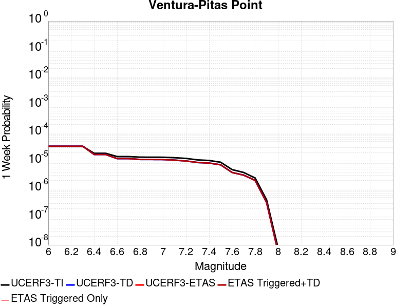 | 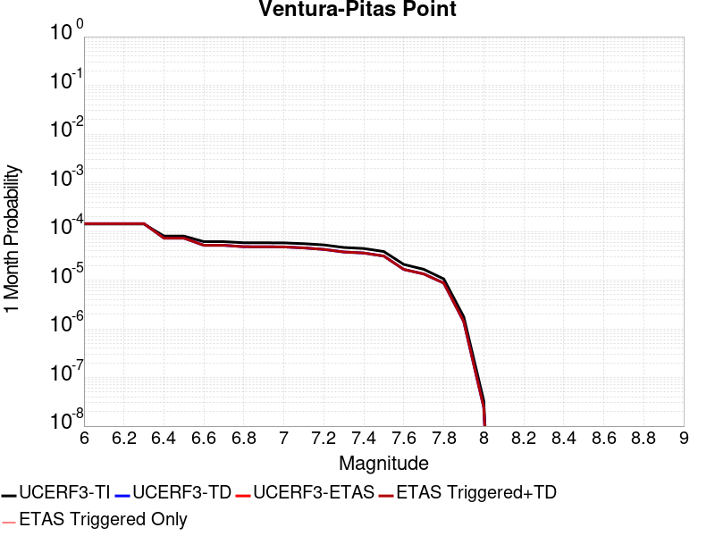 | 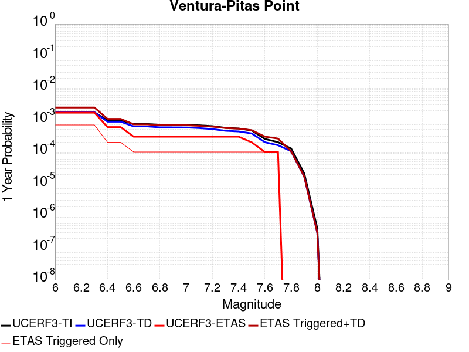 |  |

| Magnitude | 1 wk TI Prob | 1 wk TD Prob | 1 wk ETAS Prob | 1 wk ETAS/TD Gain | 1 wk ETAS Triggered+TD | 1 wk ETAS Triggered Only | 1 mo TI Prob | 1 mo TD Prob | 1 mo ETAS Prob | 1 mo ETAS/TD Gain | 1 mo ETAS Triggered+TD | 1 mo ETAS Triggered Only | 1 yr TI Prob | 1 yr TD Prob | 1 yr ETAS Prob | 1 yr ETAS/TD Gain | 1 yr ETAS Triggered+TD | 1 yr ETAS Triggered Only | 10 yr TI Prob | 10 yr TD Prob | 10 yr ETAS Prob | 10 yr ETAS/TD Gain | 10 yr ETAS Triggered+TD | 10 yr ETAS Triggered Only |
|-----|-----|-----|-----|-----|-----|-----|-----|-----|-----|-----|-----|-----|-----|-----|-----|-----|-----|-----|-----|-----|-----|-----|-----|-----|
| 6.0 | 3.3179622E-5 | 3.3681055E-5 | 0.0 | 0.0 | 3.3681055E-5 | 0.0 | 1.4219063E-4 | 1.4434083E-4 | 0.0 | 0.0 | 1.4434083E-4 | 0.0 | 0.0017297962 | 0.001756189 | 0.0017 | 0.9680051 | 0.0024549598 | 7.0E-4 | 0.017163932 | 0.017448444 | 0.0155 | 0.8883313 | 0.021869928 | 0.0045 |
| 6.1 | 3.3179622E-5 | 3.3681055E-5 | 0.0 | 0.0 | 3.3681055E-5 | 0.0 | 1.4219063E-4 | 1.4434083E-4 | 0.0 | 0.0 | 1.4434083E-4 | 0.0 | 0.0017297962 | 0.001756189 | 0.0017 | 0.9680051 | 0.0024549598 | 7.0E-4 | 0.017163932 | 0.017448444 | 0.0155 | 0.8883313 | 0.021869928 | 0.0045 |
| 6.2 | 3.3179622E-5 | 3.3681055E-5 | 0.0 | 0.0 | 3.3681055E-5 | 0.0 | 1.4219063E-4 | 1.4434083E-4 | 0.0 | 0.0 | 1.4434083E-4 | 0.0 | 0.0017297962 | 0.001756189 | 0.0017 | 0.9680051 | 0.0024549598 | 7.0E-4 | 0.017163932 | 0.017448444 | 0.0155 | 0.8883313 | 0.021869928 | 0.0045 |
| 6.3 | 3.3179622E-5 | 3.3681055E-5 | 0.0 | 0.0 | 3.3681055E-5 | 0.0 | 1.4219063E-4 | 1.4434083E-4 | 0.0 | 0.0 | 1.4434083E-4 | 0.0 | 0.0017297962 | 0.001756189 | 0.0017 | 0.9680051 | 0.0024549598 | 7.0E-4 | 0.017163932 | 0.017448444 | 0.0155 | 0.8883313 | 0.021869928 | 0.0045 |
| 6.4 | 1.8754668E-5 | 1.6993197E-5 | 0.0 | 0.0 | 1.6993197E-5 | 0.0 | 8.037467E-5 | 7.2826086E-5 | 0.0 | 0.0 | 7.2826086E-5 | 0.0 | 9.781223E-4 | 8.8631996E-4 | 6.0E-4 | 0.6769564 | 0.0010861427 | 2.0E-4 | 0.009738282 | 0.008830075 | 0.0062 | 0.70214576 | 0.010415947 | 0.0016 |
| 6.5 | 1.8754668E-5 | 1.6993197E-5 | 0.0 | 0.0 | 1.6993197E-5 | 0.0 | 8.037467E-5 | 7.2826086E-5 | 0.0 | 0.0 | 7.2826086E-5 | 0.0 | 9.781223E-4 | 8.8631996E-4 | 6.0E-4 | 0.6769564 | 0.0010861427 | 2.0E-4 | 0.009738282 | 0.008830075 | 0.0062 | 0.70214576 | 0.010415947 | 0.0016 |
| 6.6 | 1.4361558E-5 | 1.21017265E-5 | 0.0 | 0.0 | 1.21017265E-5 | 0.0 | 6.154808E-5 | 5.1863524E-5 | 0.0 | 0.0 | 5.1863524E-5 | 0.0 | 7.490902E-4 | 6.312578E-4 | 3.0E-4 | 0.4752417 | 7.311946E-4 | 1.0E-4 | 0.0074657016 | 0.006294796 | 0.0045 | 0.71487623 | 0.007586613 | 0.0013 |
| 6.7 | 1.4361558E-5 | 1.21017265E-5 | 0.0 | 0.0 | 1.21017265E-5 | 0.0 | 6.154808E-5 | 5.1863524E-5 | 0.0 | 0.0 | 5.1863524E-5 | 0.0 | 7.490902E-4 | 6.312578E-4 | 3.0E-4 | 0.4752417 | 7.311946E-4 | 1.0E-4 | 0.0074657016 | 0.006294796 | 0.0045 | 0.71487623 | 0.007586613 | 0.0013 |
| 6.8 | 1.3663846E-5 | 1.1324802E-5 | 0.0 | 0.0 | 1.1324802E-5 | 0.0 | 5.8558027E-5 | 4.8533973E-5 | 0.0 | 0.0 | 4.8533973E-5 | 0.0 | 7.127108E-4 | 5.9074286E-4 | 3.0E-4 | 0.5078352 | 6.906838E-4 | 1.0E-4 | 0.007104293 | 0.0058918335 | 0.0043 | 0.7298237 | 0.0070847636 | 0.0012 |
| 6.9 | 1.3644157E-5 | 1.1302928E-5 | 0.0 | 0.0 | 1.1302928E-5 | 0.0 | 5.8473648E-5 | 4.844023E-5 | 0.0 | 0.0 | 4.844023E-5 | 0.0 | 7.116841E-4 | 5.8960216E-4 | 3.0E-4 | 0.5088177 | 6.895432E-4 | 1.0E-4 | 0.007094092 | 0.005880487 | 0.0043 | 0.7312319 | 0.007073431 | 0.0012 |
| 7.0 | 1.3568845E-5 | 1.122261E-5 | 0.0 | 0.0 | 1.122261E-5 | 0.0 | 5.8150898E-5 | 4.8096026E-5 | 0.0 | 0.0 | 4.8096026E-5 | 0.0 | 7.077572E-4 | 5.854137E-4 | 3.0E-4 | 0.5124581 | 6.8535516E-4 | 1.0E-4 | 0.007055073 | 0.0058388235 | 0.0043 | 0.7364497 | 0.007031817 | 0.0012 |
| 7.1 | 1.306572E-5 | 1.0701786E-5 | 0.0 | 0.0 | 1.0701786E-5 | 0.0 | 5.599474E-5 | 4.5864002E-5 | 0.0 | 0.0 | 4.5864002E-5 | 0.0 | 6.815227E-4 | 5.58253E-4 | 3.0E-4 | 0.53739077 | 6.581972E-4 | 1.0E-4 | 0.0067943637 | 0.005568604 | 0.0042 | 0.7542285 | 0.0066624787 | 0.0011 |
| 7.2 | 1.232604E-5 | 9.977696E-6 | 0.0 | 0.0 | 9.977696E-6 | 0.0 | 5.2824813E-5 | 4.276086E-5 | 0.0 | 0.0 | 4.276086E-5 | 0.0 | 6.429523E-4 | 5.204909E-4 | 3.0E-4 | 0.57637894 | 6.2043883E-4 | 1.0E-4 | 0.0064109527 | 0.005192803 | 0.004 | 0.7702969 | 0.0061876103 | 0.001 |
| 7.3 | 1.0917261E-5 | 8.82862E-6 | 0.0 | 0.0 | 8.82862E-6 | 0.0 | 4.678742E-5 | 3.7836402E-5 | 0.0 | 0.0 | 3.7836402E-5 | 0.0 | 5.69488E-4 | 4.6056238E-4 | 3.0E-4 | 0.65137756 | 5.605163E-4 | 1.0E-4 | 0.0056803077 | 0.0045961374 | 0.0037 | 0.8050237 | 0.0054920013 | 9.0E-4 |
| 7.4 | 1.039959E-5 | 8.40925E-6 | 0.0 | 0.0 | 8.40925E-6 | 0.0 | 4.456891E-5 | 3.6039153E-5 | 0.0 | 0.0 | 3.6039153E-5 | 0.0 | 5.424914E-4 | 4.3868987E-4 | 3.0E-4 | 0.6838544 | 5.38646E-4 | 1.0E-4 | 0.0054116896 | 0.004378293 | 0.0034 | 0.77655834 | 0.0052743526 | 9.0E-4 |
| 7.5 | 9.015877E-6 | 7.285164E-6 | 0.0 | 0.0 | 7.285164E-6 | 0.0 | 3.86389E-5 | 3.1221763E-5 | 0.0 | 0.0 | 3.1221763E-5 | 0.0 | 4.7032707E-4 | 3.8006008E-4 | 2.0E-4 | 0.5262326 | 4.8002208E-4 | 1.0E-4 | 0.004693329 | 0.0037941386 | 0.003 | 0.7906933 | 0.004690724 | 9.0E-4 |
| 7.6 | 4.900162E-6 | 3.866396E-6 | 0.0 | 0.0 | 3.866396E-6 | 0.0 | 2.1000526E-5 | 1.6570164E-5 | 0.0 | 0.0 | 1.6570164E-5 | 0.0 | 2.556514E-4 | 2.017232E-4 | 1.0E-4 | 0.4957288 | 3.0170302E-4 | 1.0E-4 | 0.0025535747 | 0.0020154144 | 0.0018 | 0.89311653 | 0.0026142052 | 6.0E-4 |
| 7.7 | 3.8850626E-6 | 3.1215277E-6 | 0.0 | 0.0 | 3.1215277E-6 | 0.0 | 1.6650163E-5 | 1.3377908E-5 | 0.0 | 0.0 | 1.3377908E-5 | 0.0 | 2.0269687E-4 | 1.6286394E-4 | 1.0E-4 | 0.6140095 | 2.6284766E-4 | 1.0E-4 | 0.002025121 | 0.001627455 | 0.0015 | 0.92168444 | 0.0021266413 | 5.0E-4 |
| 7.8 | 2.4654719E-6 | 2.0277116E-6 | 0.0 | 0.0 | 2.0277116E-6 | 0.0 | 1.0566265E-5 | 8.690165E-6 | 0.0 | 0.0 | 8.690165E-6 | 0.0 | 1.2863669E-4 | 1.05797655E-4 | 0.0 | 0.0 | 1.05797655E-4 | 0.0 | 0.0012856225 | 0.0010574776 | 0.001 | 0.9456465 | 0.0012572662 | 2.0E-4 |
| 7.9 | 4.095894E-7 | 3.2740417E-7 | 0.0 | 0.0 | 3.2740417E-7 | 0.0 | 1.7553821E-6 | 1.40316E-6 | 0.0 | 0.0 | 1.40316E-6 | 0.0 | 2.1371567E-5 | 1.7083343E-5 | 0.0 | 0.0 | 1.7083343E-5 | 0.0 | 2.1369511E-4 | 1.708206E-4 | 1.0E-4 | 0.58540946 | 1.708206E-4 | 0.0 |
| 8.0 | 7.791402E-9 | 5.6791927E-9 | 0.0 | 0.0 | 5.6791927E-9 | 0.0 | 3.3391725E-8 | 2.4339396E-8 | 0.0 | 0.0 | 2.4339396E-8 | 0.0 | 4.0654416E-7 | 2.9633213E-7 | 0.0 | 0.0 | 2.9633213E-7 | 0.0 | 4.065434E-6 | 2.9633193E-6 | 0.0 | 0.0 | 2.9633193E-6 | 0.0 |

## Santa Cruz Island
*[(top)](#table-of-contents)*

| 1 Week | 1 Month | 1 Year | 10 Year |
|-----|-----|-----|-----|
| 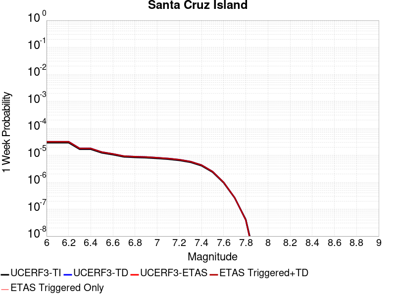 | 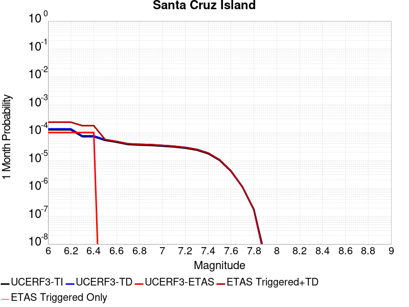 | 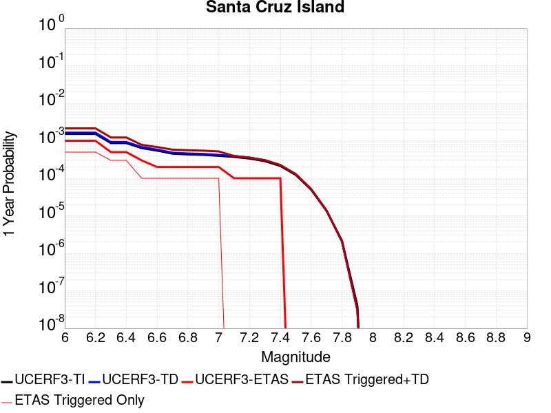 | 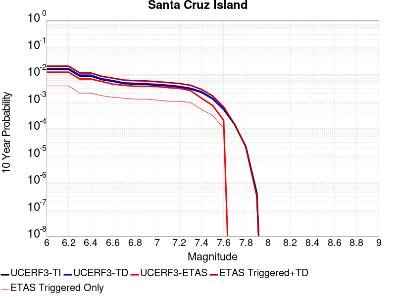 |

| Magnitude | 1 wk TI Prob | 1 wk TD Prob | 1 wk ETAS Prob | 1 wk ETAS/TD Gain | 1 wk ETAS Triggered+TD | 1 wk ETAS Triggered Only | 1 mo TI Prob | 1 mo TD Prob | 1 mo ETAS Prob | 1 mo ETAS/TD Gain | 1 mo ETAS Triggered+TD | 1 mo ETAS Triggered Only | 1 yr TI Prob | 1 yr TD Prob | 1 yr ETAS Prob | 1 yr ETAS/TD Gain | 1 yr ETAS Triggered+TD | 1 yr ETAS Triggered Only | 10 yr TI Prob | 10 yr TD Prob | 10 yr ETAS Prob | 10 yr ETAS/TD Gain | 10 yr ETAS Triggered+TD | 10 yr ETAS Triggered Only |
|-----|-----|-----|-----|-----|-----|-----|-----|-----|-----|-----|-----|-----|-----|-----|-----|-----|-----|-----|-----|-----|-----|-----|-----|-----|
| 6.0 | 2.9164563E-5 | 3.1572003E-5 | 0.0 | 0.0 | 3.1572003E-5 | 0.0 | 1.2498499E-4 | 1.3530234E-4 | 1.0E-4 | 0.73908556 | 2.3528881E-4 | 1.0E-4 | 0.0015206301 | 0.0016461972 | 0.001 | 0.6074607 | 0.002145374 | 5.0E-4 | 0.015102667 | 0.01635373 | 0.012 | 0.7337776 | 0.019993221 | 0.0037 |
| 6.1 | 2.9164563E-5 | 3.1572003E-5 | 0.0 | 0.0 | 3.1572003E-5 | 0.0 | 1.2498499E-4 | 1.3530234E-4 | 1.0E-4 | 0.73908556 | 2.3528881E-4 | 1.0E-4 | 0.0015206301 | 0.0016461972 | 0.001 | 0.6074607 | 0.002145374 | 5.0E-4 | 0.015102667 | 0.01635373 | 0.012 | 0.7337776 | 0.019993221 | 0.0037 |
| 6.2 | 2.9164563E-5 | 3.1572003E-5 | 0.0 | 0.0 | 3.1572003E-5 | 0.0 | 1.2498499E-4 | 1.3530234E-4 | 1.0E-4 | 0.73908556 | 2.3528881E-4 | 1.0E-4 | 0.0015206301 | 0.0016461972 | 0.001 | 0.6074607 | 0.002145374 | 5.0E-4 | 0.015102667 | 0.01635373 | 0.012 | 0.7337776 | 0.019993221 | 0.0037 |
| 6.3 | 1.6635553E-5 | 1.779119E-5 | 0.0 | 0.0 | 1.779119E-5 | 0.0 | 7.1293274E-5 | 7.624584E-5 | 1.0E-4 | 1.311547 | 1.7623822E-4 | 1.0E-4 | 8.6765E-4 | 9.279159E-4 | 5.0E-4 | 0.53884196 | 0.0012276375 | 3.0E-4 | 0.008642701 | 0.009242283 | 0.0067 | 0.72492915 | 0.011223799 | 0.002 |
| 6.4 | 1.6635553E-5 | 1.779119E-5 | 0.0 | 0.0 | 1.779119E-5 | 0.0 | 7.1293274E-5 | 7.624584E-5 | 1.0E-4 | 1.311547 | 1.7623822E-4 | 1.0E-4 | 8.6765E-4 | 9.279159E-4 | 5.0E-4 | 0.53884196 | 0.0012276375 | 3.0E-4 | 0.008642701 | 0.009242283 | 0.0067 | 0.72492915 | 0.011223799 | 0.002 |
| 6.5 | 1.2238748E-5 | 1.3033949E-5 | 0.0 | 0.0 | 1.3033949E-5 | 0.0 | 5.2450723E-5 | 5.5858603E-5 | 0.0 | 0.0 | 5.5858603E-5 | 0.0 | 6.3840044E-4 | 6.7987E-4 | 3.0E-4 | 0.44126084 | 7.79802E-4 | 1.0E-4 | 0.0063656955 | 0.0067782984 | 0.0054 | 0.7966601 | 0.008367454 | 0.0016 |
| 6.6 | 1.0489767E-5 | 1.1149135E-5 | 0.0 | 0.0 | 1.1149135E-5 | 0.0 | 4.495537E-5 | 4.7781148E-5 | 0.0 | 0.0 | 4.7781148E-5 | 0.0 | 5.4719415E-4 | 5.815824E-4 | 2.0E-4 | 0.34388936 | 6.815243E-4 | 1.0E-4 | 0.005458487 | 0.0058008446 | 0.0043 | 0.7412714 | 0.0071927235 | 0.0014 |
| 6.7 | 8.699222E-6 | 9.230729E-6 | 0.0 | 0.0 | 9.230729E-6 | 0.0 | 3.7281847E-5 | 3.9559673E-5 | 0.0 | 0.0 | 3.9559673E-5 | 0.0 | 4.5381195E-4 | 4.8153312E-4 | 2.0E-4 | 0.4153401 | 5.814849E-4 | 1.0E-4 | 0.0045288634 | 0.0048049646 | 0.0039 | 0.81166047 | 0.0060987184 | 0.0013 |
| 6.8 | 8.307732E-6 | 8.811169E-6 | 0.0 | 0.0 | 8.811169E-6 | 0.0 | 3.560408E-5 | 3.776161E-5 | 0.0 | 0.0 | 3.776161E-5 | 0.0 | 4.3339343E-4 | 4.5965103E-4 | 2.0E-4 | 0.43511268 | 5.596051E-4 | 1.0E-4 | 0.004325492 | 0.0045870566 | 0.0036 | 0.78481704 | 0.005781552 | 0.0012 |
| 6.9 | 8.073121E-6 | 8.559399E-6 | 0.0 | 0.0 | 8.559399E-6 | 0.0 | 3.459863E-5 | 3.6682628E-5 | 0.0 | 0.0 | 3.6682628E-5 | 0.0 | 4.2115687E-4 | 4.4651987E-4 | 2.0E-4 | 0.4479084 | 5.4647523E-4 | 1.0E-4 | 0.004203596 | 0.0044562784 | 0.0036 | 0.807849 | 0.0056509306 | 0.0012 |
| 7.0 | 7.617019E-6 | 8.069512E-6 | 0.0 | 0.0 | 8.069512E-6 | 0.0 | 3.264396E-5 | 3.4583165E-5 | 0.0 | 0.0 | 3.4583165E-5 | 0.0 | 3.9736772E-4 | 4.2096907E-4 | 2.0E-4 | 0.4750943 | 5.2092696E-4 | 1.0E-4 | 0.003966579 | 0.004201764 | 0.0035 | 0.8329835 | 0.005297142 | 0.0011 |
| 7.1 | 7.1224836E-6 | 7.5410208E-6 | 0.0 | 0.0 | 7.5410208E-6 | 0.0 | 3.052457E-5 | 3.231826E-5 | 0.0 | 0.0 | 3.231826E-5 | 0.0 | 3.715733E-4 | 3.9340416E-4 | 1.0E-4 | 0.25419152 | 3.9340416E-4 | 0.0 | 0.003709526 | 0.0039271205 | 0.0032 | 0.81484646 | 0.0049231932 | 0.001 |
| 7.2 | 6.441115E-6 | 6.8230265E-6 | 0.0 | 0.0 | 6.8230265E-6 | 0.0 | 2.7604487E-5 | 2.9241217E-5 | 0.0 | 0.0 | 2.9241217E-5 | 0.0 | 3.360328E-4 | 3.5595387E-4 | 1.0E-4 | 0.28093526 | 3.5595387E-4 | 0.0 | 0.0033552512 | 0.0035538657 | 0.003 | 0.8441512 | 0.0045503117 | 0.001 |
| 7.3 | 5.494274E-6 | 5.8163123E-6 | 0.0 | 0.0 | 5.8163123E-6 | 0.0 | 2.3546674E-5 | 2.4926814E-5 | 0.0 | 0.0 | 2.4926814E-5 | 0.0 | 2.8664304E-4 | 3.0344192E-4 | 1.0E-4 | 0.32955238 | 3.0344192E-4 | 0.0 | 0.002862736 | 0.0030302987 | 0.0025 | 0.8250011 | 0.0039275717 | 9.0E-4 |
| 7.4 | 4.0802624E-6 | 4.309619E-6 | 0.0 | 0.0 | 4.309619E-6 | 0.0 | 1.7486722E-5 | 1.8469664E-5 | 0.0 | 0.0 | 1.8469664E-5 | 0.0 | 2.1288003E-4 | 2.2484503E-4 | 1.0E-4 | 0.44475076 | 2.2484503E-4 | 0.0 | 0.0021267622 | 0.0022461845 | 0.0013 | 0.57875925 | 0.0027450614 | 5.0E-4 |
| 7.5 | 2.3584746E-6 | 2.4739577E-6 | 0.0 | 0.0 | 2.4739577E-6 | 0.0 | 1.0107709E-5 | 1.0602633E-5 | 0.0 | 0.0 | 1.0602633E-5 | 0.0 | 1.2305441E-4 | 1.2907945E-4 | 0.0 | 0.0 | 1.2907945E-4 | 0.0 | 0.0012298629 | 0.0012900499 | 7.0E-4 | 0.5426147 | 0.0015896627 | 3.0E-4 |
| 7.6 | 9.4981914E-7 | 9.856386E-7 | 0.0 | 0.0 | 9.856386E-7 | 0.0 | 4.0706473E-6 | 4.2241586E-6 | 0.0 | 0.0 | 4.2241586E-6 | 0.0 | 4.9559E-5 | 5.142793E-5 | 0.0 | 0.0 | 5.142793E-5 | 0.0 | 4.954795E-4 | 5.141616E-4 | 2.0E-4 | 0.38898274 | 6.141102E-4 | 1.0E-4 |
| 7.7 | 2.6013532E-7 | 2.640751E-7 | 0.0 | 0.0 | 2.640751E-7 | 0.0 | 1.1148652E-6 | 1.13175E-6 | 0.0 | 0.0 | 1.13175E-6 | 0.0 | 1.3573399E-5 | 1.3778969E-5 | 0.0 | 0.0 | 1.3778969E-5 | 0.0 | 1.357257E-4 | 1.3778122E-4 | 0.0 | 0.0 | 1.3778122E-4 | 0.0 |
| 7.8 | 4.1522263E-8 | 3.964669E-8 | 0.0 | 0.0 | 3.964669E-8 | 0.0 | 1.7795254E-7 | 1.6991437E-7 | 0.0 | 0.0 | 1.6991437E-7 | 0.0 | 2.16657E-6 | 2.0687057E-6 | 0.0 | 0.0 | 2.0687057E-6 | 0.0 | 2.1665488E-5 | 2.0686886E-5 | 0.0 | 0.0 | 2.0686886E-5 | 0.0 |
| 7.9 | 7.7242046E-10 | 5.944937E-10 | 0.0 | 0.0 | 5.944937E-10 | 0.0 | 3.3103735E-9 | 2.54783E-9 | 0.0 | 0.0 | 2.54783E-9 | 0.0 | 4.0303796E-8 | 3.101983E-8 | 0.0 | 0.0 | 3.101983E-8 | 0.0 | 4.030379E-7 | 3.101983E-7 | 0.0 | 0.0 | 3.101983E-7 | 0.0 |

## Santa Rosa Island
*[(top)](#table-of-contents)*

| 1 Week | 1 Month | 1 Year | 10 Year |
|-----|-----|-----|-----|
| 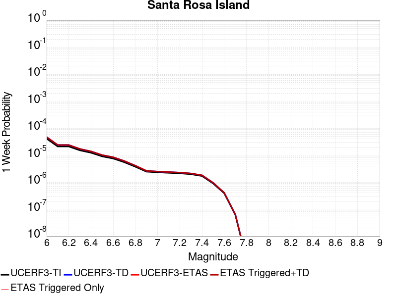 | 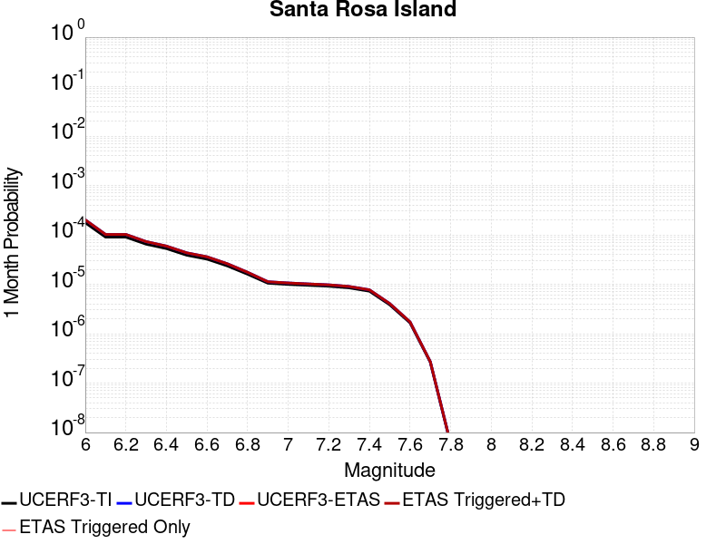 | 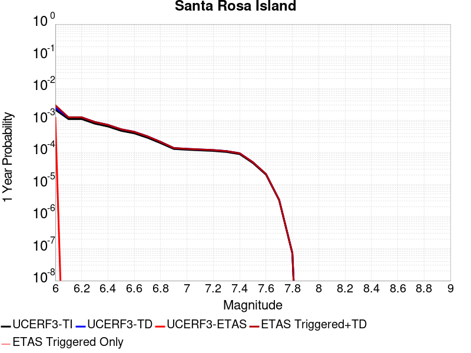 | 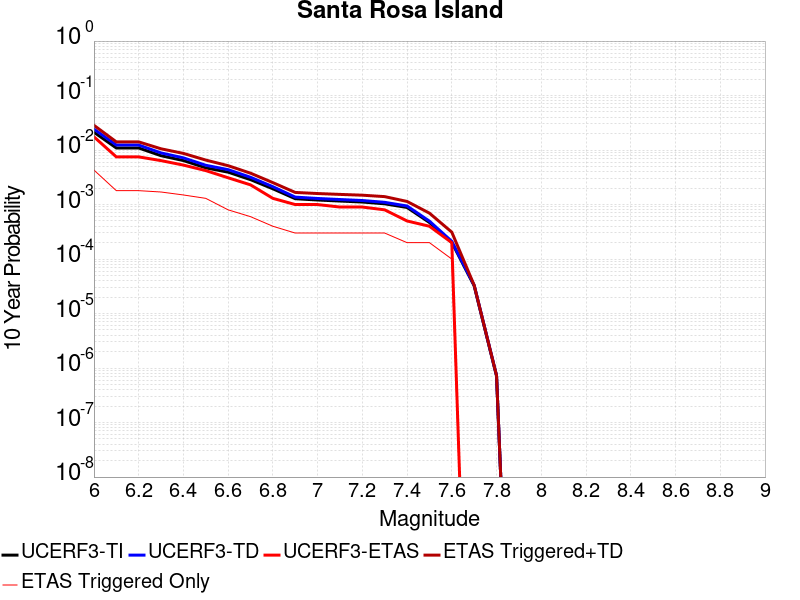 |

| Magnitude | 1 wk TI Prob | 1 wk TD Prob | 1 wk ETAS Prob | 1 wk ETAS/TD Gain | 1 wk ETAS Triggered+TD | 1 wk ETAS Triggered Only | 1 mo TI Prob | 1 mo TD Prob | 1 mo ETAS Prob | 1 mo ETAS/TD Gain | 1 mo ETAS Triggered+TD | 1 mo ETAS Triggered Only | 1 yr TI Prob | 1 yr TD Prob | 1 yr ETAS Prob | 1 yr ETAS/TD Gain | 1 yr ETAS Triggered+TD | 1 yr ETAS Triggered Only | 10 yr TI Prob | 10 yr TD Prob | 10 yr ETAS Prob | 10 yr ETAS/TD Gain | 10 yr ETAS Triggered+TD | 10 yr ETAS Triggered Only |
|-----|-----|-----|-----|-----|-----|-----|-----|-----|-----|-----|-----|-----|-----|-----|-----|-----|-----|-----|-----|-----|-----|-----|-----|-----|
| 6.0 | 4.1143165E-5 | 4.701977E-5 | 0.0 | 0.0 | 4.701977E-5 | 0.0 | 1.7631594E-4 | 2.0149884E-4 | 0.0 | 0.0 | 2.0149884E-4 | 0.0 | 0.002144533 | 0.002450684 | 0.0012 | 0.4896592 | 0.0029494588 | 5.0E-4 | 0.021239553 | 0.024257159 | 0.0175 | 0.7214365 | 0.028452853 | 0.0043 |
| 6.1 | 2.1061249E-5 | 2.3831648E-5 | 0.0 | 0.0 | 2.3831648E-5 | 0.0 | 9.0259375E-5 | 1.021318E-4 | 0.0 | 0.0 | 1.021318E-4 | 0.0 | 0.0010983539 | 0.0012427742 | 0.0 | 0.0 | 0.0012427742 | 0.0 | 0.01092941 | 0.012361274 | 0.0075 | 0.60673356 | 0.014139025 | 0.0018 |
| 6.2 | 2.1061249E-5 | 2.3831648E-5 | 0.0 | 0.0 | 2.3831648E-5 | 0.0 | 9.0259375E-5 | 1.021318E-4 | 0.0 | 0.0 | 1.021318E-4 | 0.0 | 0.0010983539 | 0.0012427742 | 0.0 | 0.0 | 0.0012427742 | 0.0 | 0.01092941 | 0.012361274 | 0.0075 | 0.60673356 | 0.014139025 | 0.0018 |
| 6.3 | 1.5158236E-5 | 1.7051776E-5 | 0.0 | 0.0 | 1.7051776E-5 | 0.0 | 6.496225E-5 | 7.307706E-5 | 0.0 | 0.0 | 7.307706E-5 | 0.0 | 7.906284E-4 | 8.89362E-4 | 0.0 | 0.0 | 8.89362E-4 | 0.0 | 0.007878214 | 0.008859277 | 0.0064 | 0.72240657 | 0.010544216 | 0.0017 |
| 6.4 | 1.2341918E-5 | 1.3835114E-5 | 0.0 | 0.0 | 1.3835114E-5 | 0.0 | 5.2892858E-5 | 5.9292044E-5 | 0.0 | 0.0 | 5.9292044E-5 | 0.0 | 6.437803E-4 | 7.216496E-4 | 0.0 | 0.0 | 7.216496E-4 | 0.0 | 0.006419184 | 0.007193897 | 0.0053 | 0.7367356 | 0.008683106 | 0.0015 |
| 6.5 | 9.061158E-6 | 1.0104637E-5 | 0.0 | 0.0 | 1.0104637E-5 | 0.0 | 3.883296E-5 | 4.33049E-5 | 0.0 | 0.0 | 4.33049E-5 | 0.0 | 4.726887E-4 | 5.271149E-4 | 0.0 | 0.0 | 5.271149E-4 | 0.0 | 0.004716845 | 0.005259183 | 0.0042 | 0.7986032 | 0.006552346 | 0.0013 |
| 6.6 | 7.5461685E-6 | 8.390719E-6 | 0.0 | 0.0 | 8.390719E-6 | 0.0 | 3.2340322E-5 | 3.595975E-5 | 0.0 | 0.0 | 3.595975E-5 | 0.0 | 3.936723E-4 | 4.377263E-4 | 0.0 | 0.0 | 4.377263E-4 | 0.0 | 0.003929756 | 0.00436907 | 0.0031 | 0.7095332 | 0.005165574 | 8.0E-4 |
| 6.7 | 5.5023775E-6 | 6.080548E-6 | 0.0 | 0.0 | 6.080548E-6 | 0.0 | 2.3581404E-5 | 2.605925E-5 | 0.0 | 0.0 | 2.605925E-5 | 0.0 | 2.8706578E-4 | 3.172284E-4 | 0.0 | 0.0 | 3.172284E-4 | 0.0 | 0.0028669522 | 0.0031680765 | 0.0023 | 0.72599256 | 0.0037661756 | 6.0E-4 |
| 6.8 | 3.7351679E-6 | 4.079111E-6 | 0.0 | 0.0 | 4.079111E-6 | 0.0 | 1.6007763E-5 | 1.7481801E-5 | 0.0 | 0.0 | 1.7481801E-5 | 0.0 | 1.948771E-4 | 2.1282263E-4 | 0.0 | 0.0 | 2.1282263E-4 | 0.0 | 0.0019470629 | 0.0021264327 | 0.0013 | 0.6113525 | 0.0025255822 | 4.0E-4 |
| 6.9 | 2.456366E-6 | 2.6273171E-6 | 0.0 | 0.0 | 2.6273171E-6 | 0.0 | 1.0527241E-5 | 1.1259883E-5 | 0.0 | 0.0 | 1.1259883E-5 | 0.0 | 1.2816161E-4 | 1.3708047E-4 | 0.0 | 0.0 | 1.3708047E-4 | 0.0 | 0.0012808773 | 0.0013699621 | 0.001 | 0.7299472 | 0.0016695511 | 3.0E-4 |
| 7.0 | 2.3245157E-6 | 2.480995E-6 | 0.0 | 0.0 | 2.480995E-6 | 0.0 | 9.962172E-6 | 1.0632792E-5 | 0.0 | 0.0 | 1.0632792E-5 | 0.0 | 1.2128269E-4 | 1.2944658E-4 | 0.0 | 0.0 | 1.2944658E-4 | 0.0 | 0.0012121652 | 0.0012937139 | 0.001 | 0.7729684 | 0.0015933259 | 3.0E-4 |
| 7.1 | 2.2248344E-6 | 2.3715795E-6 | 0.0 | 0.0 | 2.3715795E-6 | 0.0 | 9.53497E-6 | 1.0163873E-5 | 0.0 | 0.0 | 1.0163873E-5 | 0.0 | 1.1608207E-4 | 1.2373815E-4 | 0.0 | 0.0 | 1.2373815E-4 | 0.0 | 0.0011602144 | 0.0012366944 | 9.0E-4 | 0.7277464 | 0.0015363235 | 3.0E-4 |
| 7.2 | 2.1350402E-6 | 2.274566E-6 | 0.0 | 0.0 | 2.274566E-6 | 0.0 | 9.150141E-6 | 9.748104E-6 | 0.0 | 0.0 | 9.748104E-6 | 0.0 | 1.1139726E-4 | 1.1867672E-4 | 0.0 | 0.0 | 1.1867672E-4 | 0.0 | 0.0011134144 | 0.0011861353 | 9.0E-4 | 0.7587667 | 0.0014857795 | 3.0E-4 |
| 7.3 | 1.9793572E-6 | 2.1072633E-6 | 0.0 | 0.0 | 2.1072633E-6 | 0.0 | 8.482932E-6 | 9.031098E-6 | 0.0 | 0.0 | 9.031098E-6 | 0.0 | 1.032748E-4 | 1.0994809E-4 | 0.0 | 0.0 | 1.0994809E-4 | 0.0 | 0.0010322682 | 0.0010989386 | 8.0E-4 | 0.72797513 | 0.001398609 | 3.0E-4 |
| 7.4 | 1.6951194E-6 | 1.8033405E-6 | 0.0 | 0.0 | 1.8033405E-6 | 0.0 | 7.264777E-6 | 7.7285795E-6 | 0.0 | 0.0 | 7.7285795E-6 | 0.0 | 8.844508E-5 | 9.409141E-5 | 0.0 | 0.0 | 9.409141E-5 | 0.0 | 8.840988E-4 | 9.4051735E-4 | 5.0E-4 | 0.5316223 | 0.0011403293 | 2.0E-4 |
| 7.5 | 8.987207E-7 | 9.5062643E-7 | 0.0 | 0.0 | 9.5062643E-7 | 0.0 | 3.8516546E-6 | 4.074107E-6 | 0.0 | 0.0 | 4.074107E-6 | 0.0 | 4.6892885E-5 | 4.9601134E-5 | 0.0 | 0.0 | 4.9601134E-5 | 0.0 | 4.688299E-4 | 4.959018E-4 | 4.0E-4 | 0.8066113 | 6.958026E-4 | 2.0E-4 |
| 7.6 | 3.8783037E-7 | 4.0509016E-7 | 0.0 | 0.0 | 4.0509016E-7 | 0.0 | 1.6621291E-6 | 1.7360995E-6 | 0.0 | 0.0 | 1.7360995E-6 | 0.0 | 2.0236233E-5 | 2.1136813E-5 | 0.0 | 0.0 | 2.1136813E-5 | 0.0 | 2.023439E-4 | 2.1134868E-4 | 2.0E-4 | 0.9463035 | 3.1132755E-4 | 1.0E-4 |
| 7.7 | 6.181804E-8 | 6.336573E-8 | 0.0 | 0.0 | 6.336573E-8 | 0.0 | 2.6493444E-7 | 2.7156742E-7 | 0.0 | 0.0 | 2.7156742E-7 | 0.0 | 3.225572E-6 | 3.3063282E-6 | 0.0 | 0.0 | 3.3063282E-6 | 0.0 | 3.225525E-5 | 3.3062795E-5 | 0.0 | 0.0 | 3.3062795E-5 | 0.0 |
| 7.8 | 1.3704449E-9 | 1.3961391E-9 | 0.0 | 0.0 | 1.3961391E-9 | 0.0 | 5.873335E-9 | 5.983453E-9 | 0.0 | 0.0 | 5.983453E-9 | 0.0 | 7.1507856E-8 | 7.2848536E-8 | 0.0 | 0.0 | 7.2848536E-8 | 0.0 | 7.1507833E-7 | 7.2848525E-7 | 0.0 | 0.0 | 7.2848525E-7 | 0.0 |

## Gravel Hills-Harper Lk
*[(top)](#table-of-contents)*

| 1 Week | 1 Month | 1 Year | 10 Year |
|-----|-----|-----|-----|
| 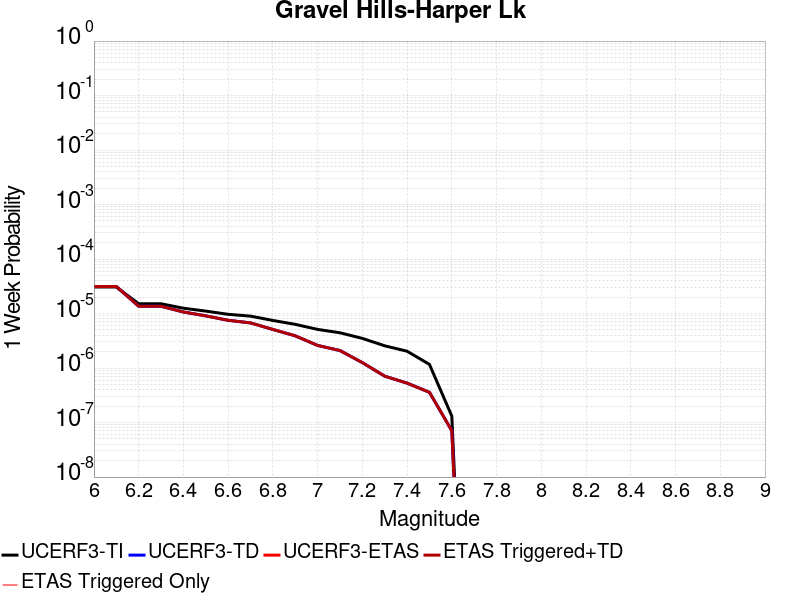 | 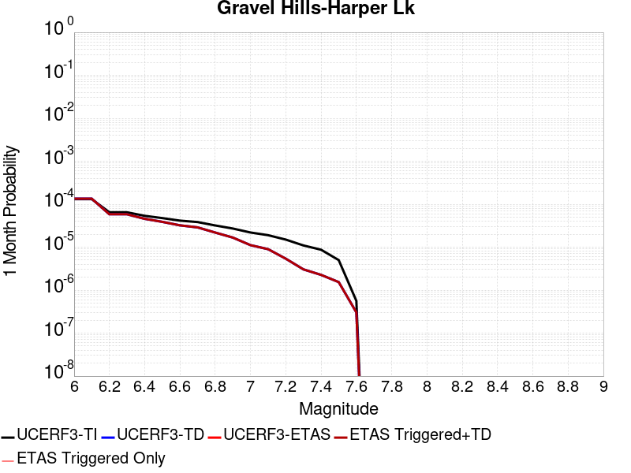 | 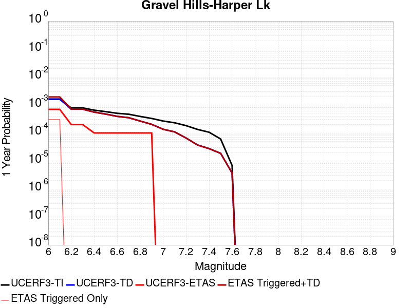 | 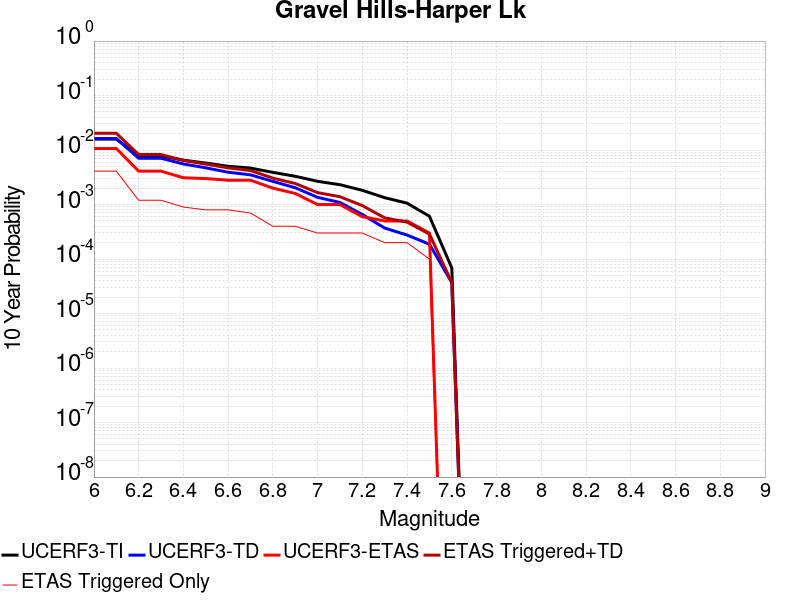 |

| Magnitude | 1 wk TI Prob | 1 wk TD Prob | 1 wk ETAS Prob | 1 wk ETAS/TD Gain | 1 wk ETAS Triggered+TD | 1 wk ETAS Triggered Only | 1 mo TI Prob | 1 mo TD Prob | 1 mo ETAS Prob | 1 mo ETAS/TD Gain | 1 mo ETAS Triggered+TD | 1 mo ETAS Triggered Only | 1 yr TI Prob | 1 yr TD Prob | 1 yr ETAS Prob | 1 yr ETAS/TD Gain | 1 yr ETAS Triggered+TD | 1 yr ETAS Triggered Only | 10 yr TI Prob | 10 yr TD Prob | 10 yr ETAS Prob | 10 yr ETAS/TD Gain | 10 yr ETAS Triggered+TD | 10 yr ETAS Triggered Only |
|-----|-----|-----|-----|-----|-----|-----|-----|-----|-----|-----|-----|-----|-----|-----|-----|-----|-----|-----|-----|-----|-----|-----|-----|-----|
| 6.0 | 3.0679566E-5 | 3.142192E-5 | 0.0 | 0.0 | 3.142192E-5 | 0.0 | 1.3147724E-4 | 1.3465965E-4 | 0.0 | 0.0 | 1.3465965E-4 | 0.0 | 0.0015995599 | 0.0016384645 | 7.0E-4 | 0.42722926 | 0.001937973 | 3.0E-4 | 0.015880952 | 0.01628534 | 0.0107 | 0.65703267 | 0.02031857 | 0.0041 |
| 6.1 | 3.0679566E-5 | 3.142192E-5 | 0.0 | 0.0 | 3.142192E-5 | 0.0 | 1.3147724E-4 | 1.3465965E-4 | 0.0 | 0.0 | 1.3465965E-4 | 0.0 | 0.0015995599 | 0.0016384645 | 7.0E-4 | 0.42722926 | 0.001937973 | 3.0E-4 | 0.015880952 | 0.01628534 | 0.0107 | 0.65703267 | 0.02031857 | 0.0041 |
| 6.2 | 1.514536E-5 | 1.3620233E-5 | 0.0 | 0.0 | 1.3620233E-5 | 0.0 | 6.490707E-5 | 5.8371188E-5 | 0.0 | 0.0 | 5.8371188E-5 | 0.0 | 7.8995706E-4 | 7.1044936E-4 | 2.0E-4 | 0.28151196 | 7.1044936E-4 | 0.0 | 0.007871548 | 0.007082979 | 0.0041 | 0.5788525 | 0.00827448 | 0.0012 |
| 6.3 | 1.514536E-5 | 1.3620233E-5 | 0.0 | 0.0 | 1.3620233E-5 | 0.0 | 6.490707E-5 | 5.8371188E-5 | 0.0 | 0.0 | 5.8371188E-5 | 0.0 | 7.8995706E-4 | 7.1044936E-4 | 2.0E-4 | 0.28151196 | 7.1044936E-4 | 0.0 | 0.007871548 | 0.007082979 | 0.0041 | 0.5788525 | 0.00827448 | 0.0012 |
| 6.4 | 1.2532521E-5 | 1.0678651E-5 | 0.0 | 0.0 | 1.0678651E-5 | 0.0 | 5.37097E-5 | 4.576488E-5 | 0.0 | 0.0 | 4.576488E-5 | 0.0 | 6.537194E-4 | 5.5705075E-4 | 1.0E-4 | 0.17951685 | 5.5705075E-4 | 0.0 | 0.0065179965 | 0.0055571334 | 0.0031 | 0.5578416 | 0.0064521316 | 9.0E-4 |
| 6.5 | 1.1094058E-5 | 9.074583E-6 | 0.0 | 0.0 | 9.074583E-6 | 0.0 | 4.7545094E-5 | 3.8890514E-5 | 0.0 | 0.0 | 3.8890514E-5 | 0.0 | 5.787078E-4 | 4.7339316E-4 | 1.0E-4 | 0.2112409 | 4.7339316E-4 | 0.0 | 0.0057720304 | 0.004724254 | 0.003 | 0.6350209 | 0.0055204746 | 8.0E-4 |
| 6.6 | 9.688328E-6 | 7.524305E-6 | 0.0 | 0.0 | 7.524305E-6 | 0.0 | 4.1520743E-5 | 3.2246637E-5 | 0.0 | 0.0 | 3.2246637E-5 | 0.0 | 5.053978E-4 | 3.9253465E-4 | 1.0E-4 | 0.25475457 | 3.9253465E-4 | 0.0 | 0.0050424994 | 0.003918669 | 0.0028 | 0.7145283 | 0.0047155344 | 8.0E-4 |
| 6.7 | 8.974824E-6 | 6.7428123E-6 | 0.0 | 0.0 | 6.7428123E-6 | 0.0 | 3.8462964E-5 | 2.8897459E-5 | 0.0 | 0.0 | 2.8897459E-5 | 0.0 | 4.6818596E-4 | 3.5177195E-4 | 1.0E-4 | 0.28427508 | 3.5177195E-4 | 0.0 | 0.004672008 | 0.0035123718 | 0.0028 | 0.7971821 | 0.0042099133 | 7.0E-4 |
| 6.8 | 7.4780046E-6 | 5.111148E-6 | 0.0 | 0.0 | 5.111148E-6 | 0.0 | 3.20482E-5 | 2.1904742E-5 | 0.0 | 0.0 | 2.1904742E-5 | 0.0 | 3.9011694E-4 | 2.66659E-4 | 1.0E-4 | 0.3750108 | 2.66659E-4 | 0.0 | 0.0038943281 | 0.002663528 | 0.002 | 0.75088376 | 0.0030624627 | 4.0E-4 |
| 6.9 | 6.3409307E-6 | 3.903478E-6 | 0.0 | 0.0 | 3.903478E-6 | 0.0 | 2.7175134E-5 | 1.6729091E-5 | 0.0 | 0.0 | 1.6729091E-5 | 0.0 | 3.3080703E-4 | 2.0365864E-4 | 1.0E-4 | 0.49101773 | 2.0365864E-4 | 0.0 | 0.0033031502 | 0.0020348178 | 0.0016 | 0.78631115 | 0.0024340039 | 4.0E-4 |
| 7.0 | 5.1239335E-6 | 2.6029281E-6 | 0.0 | 0.0 | 2.6029281E-6 | 0.0 | 2.195953E-5 | 1.115536E-5 | 0.0 | 0.0 | 1.115536E-5 | 0.0 | 2.6732447E-4 | 1.358083E-4 | 0.0 | 0.0 | 1.358083E-4 | 0.0 | 0.0026700313 | 0.0013572782 | 0.001 | 0.7367686 | 0.001656871 | 3.0E-4 |
| 7.1 | 4.438899E-6 | 2.095965E-6 | 0.0 | 0.0 | 2.095965E-6 | 0.0 | 1.9023713E-5 | 8.982678E-6 | 0.0 | 0.0 | 8.982678E-6 | 0.0 | 2.315891E-4 | 1.09358836E-4 | 0.0 | 0.0 | 1.09358836E-4 | 0.0 | 0.002313479 | 0.001093072 | 0.001 | 0.9148528 | 0.0013927441 | 3.0E-4 |
| 7.2 | 3.50367E-6 | 1.2596217E-6 | 0.0 | 0.0 | 1.2596217E-6 | 0.0 | 1.5015643E-5 | 5.398368E-6 | 0.0 | 0.0 | 5.398368E-6 | 0.0 | 1.8280011E-4 | 6.572323E-5 | 0.0 | 0.0 | 6.572323E-5 | 0.0 | 0.0018264982 | 6.5704616E-4 | 6.0E-4 | 0.91317785 | 9.56849E-4 | 3.0E-4 |
| 7.3 | 2.561638E-6 | 7.1034464E-7 | 0.0 | 0.0 | 7.1034464E-7 | 0.0 | 1.0978401E-5 | 3.0443307E-6 | 0.0 | 0.0 | 3.0443307E-6 | 0.0 | 1.3365384E-4 | 3.7064114E-5 | 0.0 | 0.0 | 3.7064114E-5 | 0.0 | 0.0013357349 | 3.705813E-4 | 5.0E-4 | 1.3492315 | 5.705072E-4 | 2.0E-4 |
| 7.4 | 2.0368864E-6 | 5.291731E-7 | 0.0 | 0.0 | 5.291731E-7 | 0.0 | 8.729483E-6 | 2.267883E-6 | 0.0 | 0.0 | 2.267883E-6 | 0.0 | 1.06276275E-4 | 2.761113E-5 | 0.0 | 0.0 | 2.761113E-5 | 0.0 | 0.0010622547 | 2.7607754E-4 | 5.0E-4 | 1.8110855 | 4.760223E-4 | 2.0E-4 |
| 7.5 | 1.1681728E-6 | 3.5940548E-7 | 0.0 | 0.0 | 3.5940548E-7 | 0.0 | 5.0064455E-6 | 1.5403083E-6 | 0.0 | 0.0 | 1.5403083E-6 | 0.0 | 6.0951766E-5 | 1.8753097E-5 | 0.0 | 0.0 | 1.8753097E-5 | 0.0 | 6.093505E-4 | 1.8751562E-4 | 3.0E-4 | 1.5998669 | 2.8749686E-4 | 1.0E-4 |
| 7.6 | 1.3154387E-7 | 7.0908634E-8 | 0.0 | 0.0 | 7.0908634E-8 | 0.0 | 5.6375933E-7 | 3.0389413E-7 | 0.0 | 0.0 | 3.0389413E-7 | 0.0 | 6.863748E-6 | 3.6999063E-6 | 0.0 | 0.0 | 3.6999063E-6 | 0.0 | 6.863536E-5 | 3.69986E-5 | 0.0 | 0.0 | 3.69986E-5 | 0.0 |

## Little Salmon (Onshore)
*[(top)](#table-of-contents)*

| 1 Week | 1 Month | 1 Year | 10 Year |
|-----|-----|-----|-----|
| 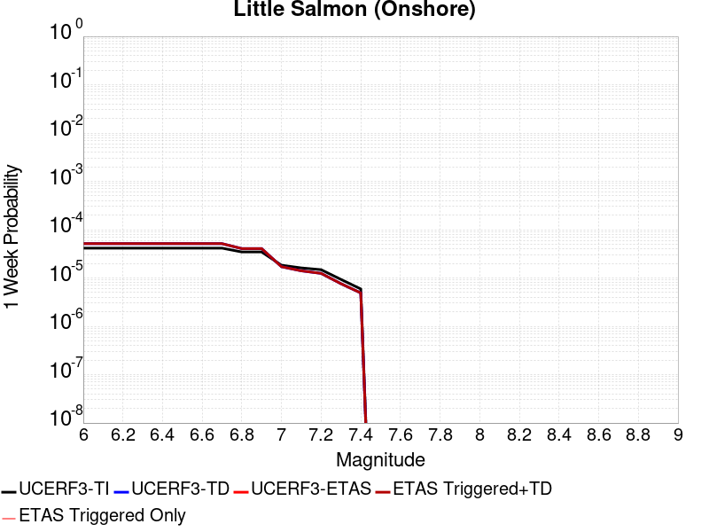 |  | 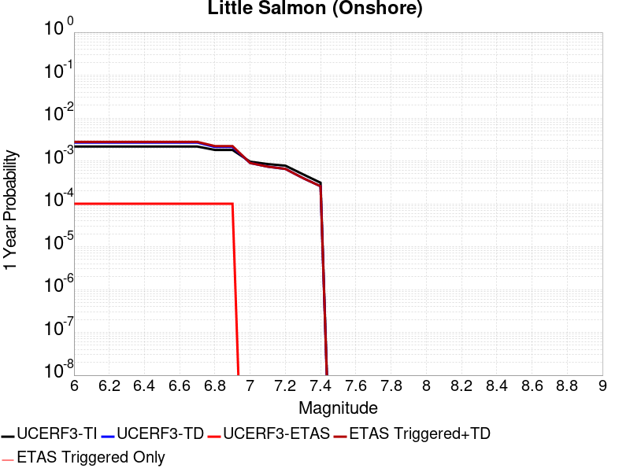 |  |

| Magnitude | 1 wk TI Prob | 1 wk TD Prob | 1 wk ETAS Prob | 1 wk ETAS/TD Gain | 1 wk ETAS Triggered+TD | 1 wk ETAS Triggered Only | 1 mo TI Prob | 1 mo TD Prob | 1 mo ETAS Prob | 1 mo ETAS/TD Gain | 1 mo ETAS Triggered+TD | 1 mo ETAS Triggered Only | 1 yr TI Prob | 1 yr TD Prob | 1 yr ETAS Prob | 1 yr ETAS/TD Gain | 1 yr ETAS Triggered+TD | 1 yr ETAS Triggered Only | 10 yr TI Prob | 10 yr TD Prob | 10 yr ETAS Prob | 10 yr ETAS/TD Gain | 10 yr ETAS Triggered+TD | 10 yr ETAS Triggered Only |
|-----|-----|-----|-----|-----|-----|-----|-----|-----|-----|-----|-----|-----|-----|-----|-----|-----|-----|-----|-----|-----|-----|-----|-----|-----|
| 6.0 | 4.1582247E-5 | 5.143167E-5 | 0.0 | 0.0 | 5.143167E-5 | 0.0 | 1.7819746E-4 | 2.2040741E-4 | 0.0 | 0.0 | 2.2040741E-4 | 0.0 | 0.0021673953 | 0.002680972 | 0.0018 | 0.6713983 | 0.0031796314 | 5.0E-4 | 0.021463778 | 0.026835978 | 0.0176 | 0.655836 | 0.031020584 | 0.0043 |
| 6.1 | 4.1582247E-5 | 5.143167E-5 | 0.0 | 0.0 | 5.143167E-5 | 0.0 | 1.7819746E-4 | 2.2040741E-4 | 0.0 | 0.0 | 2.2040741E-4 | 0.0 | 0.0021673953 | 0.002680972 | 0.0018 | 0.6713983 | 0.0031796314 | 5.0E-4 | 0.021463778 | 0.026835978 | 0.0176 | 0.655836 | 0.031020584 | 0.0043 |
| 6.2 | 4.1582247E-5 | 5.143167E-5 | 0.0 | 0.0 | 5.143167E-5 | 0.0 | 1.7819746E-4 | 2.2040741E-4 | 0.0 | 0.0 | 2.2040741E-4 | 0.0 | 0.0021673953 | 0.002680972 | 0.0018 | 0.6713983 | 0.0031796314 | 5.0E-4 | 0.021463778 | 0.026835978 | 0.0176 | 0.655836 | 0.031020584 | 0.0043 |
| 6.3 | 4.1582247E-5 | 5.143167E-5 | 0.0 | 0.0 | 5.143167E-5 | 0.0 | 1.7819746E-4 | 2.2040741E-4 | 0.0 | 0.0 | 2.2040741E-4 | 0.0 | 0.0021673953 | 0.002680972 | 0.0018 | 0.6713983 | 0.0031796314 | 5.0E-4 | 0.021463778 | 0.026835978 | 0.0176 | 0.655836 | 0.031020584 | 0.0043 |
| 6.4 | 4.1582247E-5 | 5.143167E-5 | 0.0 | 0.0 | 5.143167E-5 | 0.0 | 1.7819746E-4 | 2.2040741E-4 | 0.0 | 0.0 | 2.2040741E-4 | 0.0 | 0.0021673953 | 0.002680972 | 0.0018 | 0.6713983 | 0.0031796314 | 5.0E-4 | 0.021463778 | 0.026835978 | 0.0176 | 0.655836 | 0.031020584 | 0.0043 |
| 6.5 | 4.1582247E-5 | 5.143167E-5 | 0.0 | 0.0 | 5.143167E-5 | 0.0 | 1.7819746E-4 | 2.2040741E-4 | 0.0 | 0.0 | 2.2040741E-4 | 0.0 | 0.0021673953 | 0.002680972 | 0.0018 | 0.6713983 | 0.0031796314 | 5.0E-4 | 0.021463778 | 0.026835978 | 0.0176 | 0.655836 | 0.031020584 | 0.0043 |
| 6.6 | 4.1582247E-5 | 5.143167E-5 | 0.0 | 0.0 | 5.143167E-5 | 0.0 | 1.7819746E-4 | 2.2040741E-4 | 0.0 | 0.0 | 2.2040741E-4 | 0.0 | 0.0021673953 | 0.002680972 | 0.0018 | 0.6713983 | 0.0031796314 | 5.0E-4 | 0.021463778 | 0.026835978 | 0.0176 | 0.655836 | 0.031020584 | 0.0043 |
| 6.7 | 4.1582247E-5 | 5.143167E-5 | 0.0 | 0.0 | 5.143167E-5 | 0.0 | 1.7819746E-4 | 2.2040741E-4 | 0.0 | 0.0 | 2.2040741E-4 | 0.0 | 0.0021673953 | 0.002680972 | 0.0018 | 0.6713983 | 0.0031796314 | 5.0E-4 | 0.021463778 | 0.026835978 | 0.0176 | 0.655836 | 0.031020584 | 0.0043 |
| 6.8 | 3.4607925E-5 | 4.0632807E-5 | 0.0 | 0.0 | 4.0632807E-5 | 0.0 | 1.4831126E-4 | 1.7413315E-4 | 0.0 | 0.0 | 1.7413315E-4 | 0.0 | 0.001804194 | 0.0021187498 | 0.0014 | 0.660767 | 0.0026176905 | 5.0E-4 | 0.01789616 | 0.021293357 | 0.0133 | 0.6246079 | 0.024523089 | 0.0033 |
| 6.9 | 3.4607925E-5 | 4.0632807E-5 | 0.0 | 0.0 | 4.0632807E-5 | 0.0 | 1.4831126E-4 | 1.7413315E-4 | 0.0 | 0.0 | 1.7413315E-4 | 0.0 | 0.001804194 | 0.0021187498 | 0.0014 | 0.660767 | 0.0026176905 | 5.0E-4 | 0.01789616 | 0.021293357 | 0.0133 | 0.6246079 | 0.024523089 | 0.0033 |
| 7.0 | 1.8411014E-5 | 1.7161936E-5 | 0.0 | 0.0 | 1.7161936E-5 | 0.0 | 7.8901954E-5 | 7.3549374E-5 | 0.0 | 0.0 | 7.3549374E-5 | 0.0 | 9.6020795E-4 | 8.9514843E-4 | 4.0E-4 | 0.44685328 | 9.950589E-4 | 1.0E-4 | 0.009560696 | 0.008940588 | 0.0061 | 0.6822818 | 0.010526283 | 0.0016 |
| 7.1 | 1.6183103E-5 | 1.4098013E-5 | 0.0 | 0.0 | 1.4098013E-5 | 0.0 | 6.935431E-5 | 6.041892E-5 | 0.0 | 0.0 | 6.041892E-5 | 0.0 | 8.440616E-4 | 7.353988E-4 | 3.0E-4 | 0.4079419 | 8.353253E-4 | 1.0E-4 | 0.008408628 | 0.007354235 | 0.005 | 0.6798804 | 0.008644674 | 0.0013 |
| 7.2 | 1.4868988E-5 | 1.2485594E-5 | 0.0 | 0.0 | 1.2485594E-5 | 0.0 | 6.372268E-5 | 5.350884E-5 | 0.0 | 0.0 | 5.350884E-5 | 0.0 | 7.755474E-4 | 6.513198E-4 | 2.0E-4 | 0.30706882 | 6.513198E-4 | 0.0 | 0.0077284635 | 0.006518235 | 0.0045 | 0.6903709 | 0.007710413 | 0.0012 |
| 7.3 | 9.3599865E-6 | 7.63674E-6 | 0.0 | 0.0 | 7.63674E-6 | 0.0 | 4.011361E-5 | 3.2728673E-5 | 0.0 | 0.0 | 3.2728673E-5 | 0.0 | 4.8827377E-4 | 3.9843383E-4 | 1.0E-4 | 0.2509827 | 3.9843383E-4 | 0.0 | 0.004872023 | 0.0039928746 | 0.0025 | 0.6261153 | 0.00469008 | 7.0E-4 |
| 7.4 | 5.941556E-6 | 4.913584E-6 | 0.0 | 0.0 | 4.913584E-6 | 0.0 | 2.5463563E-5 | 2.1058217E-5 | 0.0 | 0.0 | 2.1058217E-5 | 0.0 | 3.0997477E-4 | 2.5638376E-4 | 1.0E-4 | 0.39004028 | 2.5638376E-4 | 0.0 | 0.0030954275 | 0.0025715034 | 0.0013 | 0.50554085 | 0.0030702178 | 5.0E-4 |

## Great Valley 05 Pittsburg - Kirby Hills alt1
*[(top)](#table-of-contents)*

| 1 Week | 1 Month | 1 Year | 10 Year |
|-----|-----|-----|-----|
| 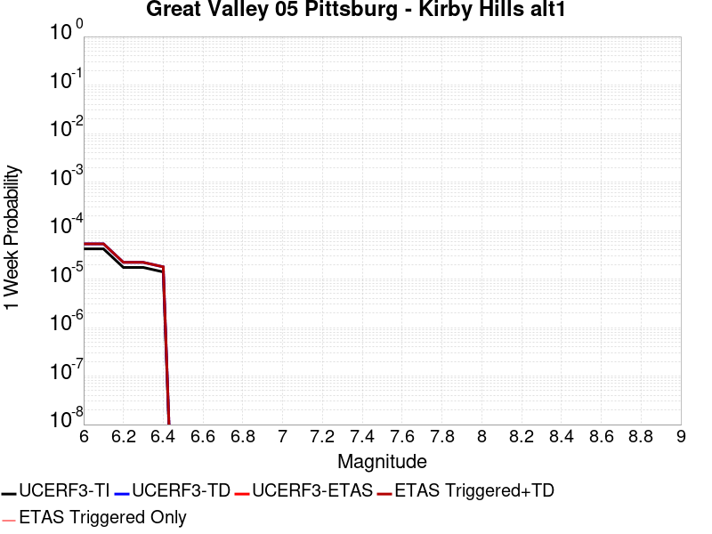 | 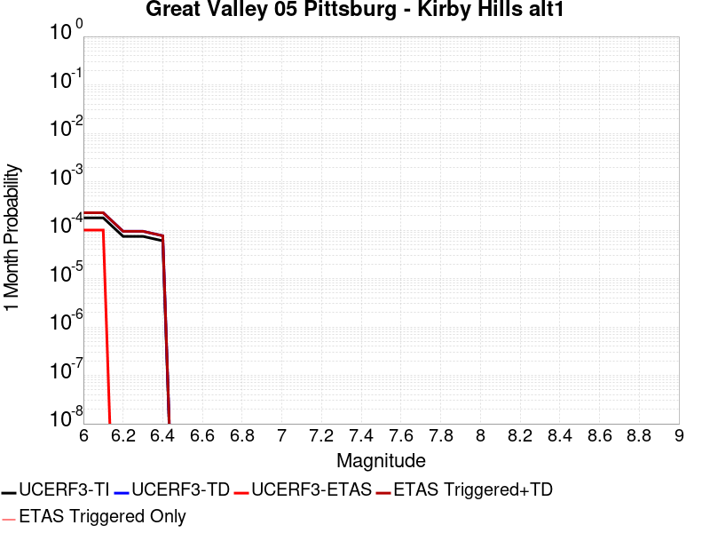 | 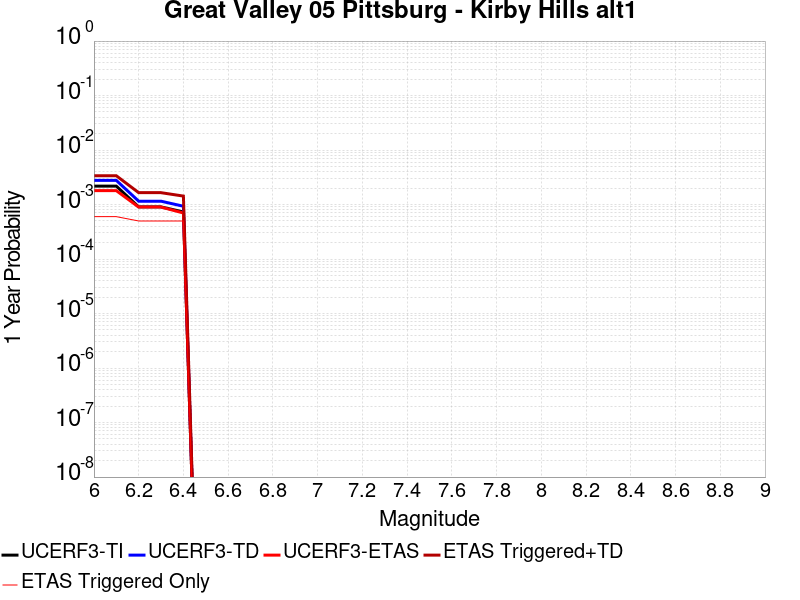 | 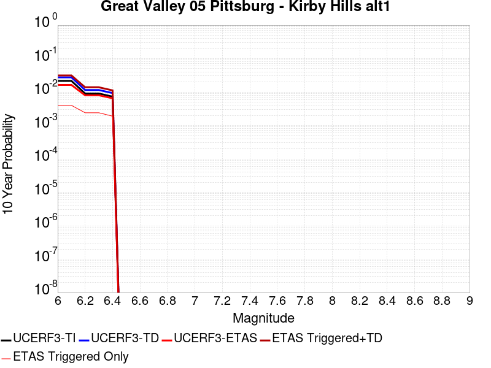 |

| Magnitude | 1 wk TI Prob | 1 wk TD Prob | 1 wk ETAS Prob | 1 wk ETAS/TD Gain | 1 wk ETAS Triggered+TD | 1 wk ETAS Triggered Only | 1 mo TI Prob | 1 mo TD Prob | 1 mo ETAS Prob | 1 mo ETAS/TD Gain | 1 mo ETAS Triggered+TD | 1 mo ETAS Triggered Only | 1 yr TI Prob | 1 yr TD Prob | 1 yr ETAS Prob | 1 yr ETAS/TD Gain | 1 yr ETAS Triggered+TD | 1 yr ETAS Triggered Only | 10 yr TI Prob | 10 yr TD Prob | 10 yr ETAS Prob | 10 yr ETAS/TD Gain | 10 yr ETAS Triggered+TD | 10 yr ETAS Triggered Only |
|-----|-----|-----|-----|-----|-----|-----|-----|-----|-----|-----|-----|-----|-----|-----|-----|-----|-----|-----|-----|-----|-----|-----|-----|-----|
| 6.0 | 4.187212E-5 | 5.3292064E-5 | 0.0 | 0.0 | 5.3292064E-5 | 0.0 | 1.794396E-4 | 2.2838028E-4 | 1.0E-4 | 0.43786618 | 2.2838028E-4 | 0.0 | 0.002182488 | 0.0027779457 | 0.0018 | 0.64796084 | 0.003376279 | 6.0E-4 | 0.021611776 | 0.027526524 | 0.0163 | 0.5921561 | 0.031416416 | 0.004 |
| 6.1 | 4.187212E-5 | 5.3292064E-5 | 0.0 | 0.0 | 5.3292064E-5 | 0.0 | 1.794396E-4 | 2.2838028E-4 | 1.0E-4 | 0.43786618 | 2.2838028E-4 | 0.0 | 0.002182488 | 0.0027779457 | 0.0018 | 0.64796084 | 0.003376279 | 6.0E-4 | 0.021611776 | 0.027526524 | 0.0163 | 0.5921561 | 0.031416416 | 0.004 |
| 6.2 | 1.7353306E-5 | 2.2091923E-5 | 0.0 | 0.0 | 2.2091923E-5 | 0.0 | 7.436919E-5 | 9.467852E-5 | 0.0 | 0.0 | 9.467852E-5 | 0.0 | 9.050688E-4 | 0.0011524927 | 9.0E-4 | 0.780916 | 0.0016519165 | 5.0E-4 | 0.009013915 | 0.011502856 | 0.008 | 0.69547945 | 0.013875249 | 0.0024 |
| 6.3 | 1.7353306E-5 | 2.2091923E-5 | 0.0 | 0.0 | 2.2091923E-5 | 0.0 | 7.436919E-5 | 9.467852E-5 | 0.0 | 0.0 | 9.467852E-5 | 0.0 | 9.050688E-4 | 0.0011524927 | 9.0E-4 | 0.780916 | 0.0016519165 | 5.0E-4 | 0.009013915 | 0.011502856 | 0.008 | 0.69547945 | 0.013875249 | 0.0024 |
| 6.4 | 1.4028824E-5 | 1.7850445E-5 | 0.0 | 0.0 | 1.7850445E-5 | 0.0 | 6.0122147E-5 | 7.650191E-5 | 0.0 | 0.0 | 7.650191E-5 | 0.0 | 7.3174125E-4 | 9.3139714E-4 | 7.0E-4 | 0.7515591 | 0.0014309314 | 5.0E-4 | 0.0072933645 | 0.009312032 | 0.0065 | 0.69802165 | 0.011194339 | 0.0019 |

## Quien Sabe 2011 CFM
*[(top)](#table-of-contents)*

| 1 Week | 1 Month | 1 Year | 10 Year |
|-----|-----|-----|-----|
| 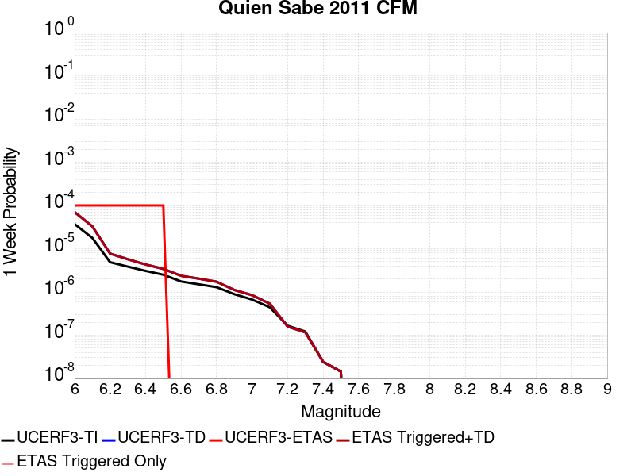 | 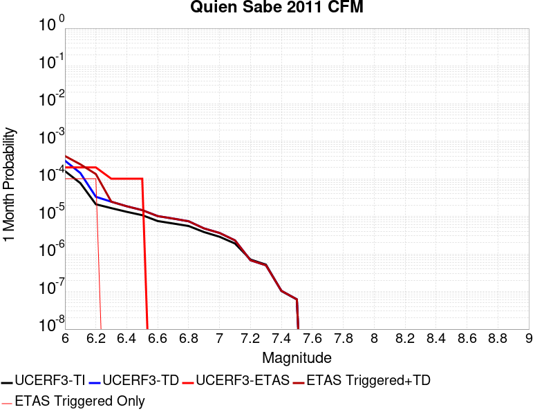 | 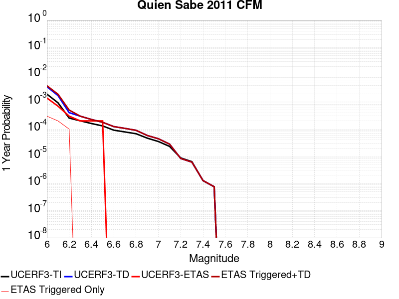 | 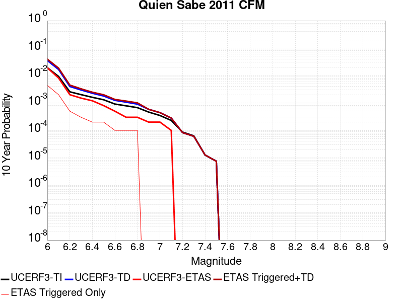 |

| Magnitude | 1 wk TI Prob | 1 wk TD Prob | 1 wk ETAS Prob | 1 wk ETAS/TD Gain | 1 wk ETAS Triggered+TD | 1 wk ETAS Triggered Only | 1 mo TI Prob | 1 mo TD Prob | 1 mo ETAS Prob | 1 mo ETAS/TD Gain | 1 mo ETAS Triggered+TD | 1 mo ETAS Triggered Only | 1 yr TI Prob | 1 yr TD Prob | 1 yr ETAS Prob | 1 yr ETAS/TD Gain | 1 yr ETAS Triggered+TD | 1 yr ETAS Triggered Only | 10 yr TI Prob | 10 yr TD Prob | 10 yr ETAS Prob | 10 yr ETAS/TD Gain | 10 yr ETAS Triggered+TD | 10 yr ETAS Triggered Only |
|-----|-----|-----|-----|-----|-----|-----|-----|-----|-----|-----|-----|-----|-----|-----|-----|-----|-----|-----|-----|-----|-----|-----|-----|-----|
| 6.0 | 3.729899E-5 | 7.0656744E-5 | 1.0E-4 | 1.4152931 | 7.0656744E-5 | 0.0 | 1.5984301E-4 | 3.0272678E-4 | 2.0E-4 | 0.6606617 | 4.0269652E-4 | 1.0E-4 | 0.0019443515 | 0.0036704058 | 0.0014 | 0.3814292 | 0.0039693047 | 3.0E-4 | 0.019274272 | 0.03522367 | 0.0192 | 0.545088 | 0.039468683 | 0.0044 |
| 6.1 | 1.7825725E-5 | 3.304955E-5 | 1.0E-4 | 3.0257597 | 3.304955E-5 | 0.0 | 7.639373E-5 | 1.4161988E-4 | 2.0E-4 | 1.4122311 | 2.4160573E-4 | 1.0E-4 | 9.296967E-4 | 0.0017186059 | 7.0E-4 | 0.40730688 | 0.0019182621 | 2.0E-4 | 0.009258169 | 0.016628573 | 0.0081 | 0.4871134 | 0.018595316 | 0.002 |
| 6.2 | 4.8865336E-6 | 7.735542E-6 | 1.0E-4 | 12.927343 | 7.735542E-6 | 0.0 | 2.0942118E-5 | 3.315186E-5 | 2.0E-4 | 6.032844 | 1.3314854E-4 | 1.0E-4 | 2.5494045E-4 | 4.0320857E-4 | 3.0E-4 | 0.7440318 | 5.0316827E-4 | 1.0E-4 | 0.0025464818 | 0.0039798548 | 0.002 | 0.50253093 | 0.0044778646 | 5.0E-4 |
| 6.3 | 3.858491E-6 | 5.7251405E-6 | 1.0E-4 | 17.46682 | 5.7251405E-6 | 0.0 | 1.6536285E-5 | 2.4536112E-5 | 1.0E-4 | 4.0756254 | 2.4536112E-5 | 0.0 | 2.0131067E-4 | 2.986908E-4 | 2.0E-4 | 0.66958874 | 2.986908E-4 | 0.0 | 0.002011284 | 0.002971274 | 0.0015 | 0.50483394 | 0.0032703828 | 3.0E-4 |
| 6.4 | 3.0771805E-6 | 4.3299387E-6 | 1.0E-4 | 23.095016 | 4.3299387E-6 | 0.0 | 1.318785E-5 | 1.855676E-5 | 1.0E-4 | 5.3888717 | 1.855676E-5 | 0.0 | 1.6055023E-4 | 2.2590751E-4 | 2.0E-4 | 0.8853181 | 2.2590751E-4 | 0.0 | 0.001604343 | 0.0022601688 | 0.0012 | 0.5309338 | 0.0024597168 | 2.0E-4 |
| 6.5 | 2.5081235E-6 | 3.4178722E-6 | 1.0E-4 | 29.257969 | 3.4178722E-6 | 0.0 | 1.0749056E-5 | 1.464795E-5 | 1.0E-4 | 6.8268943 | 1.464795E-5 | 0.0 | 1.308619E-4 | 1.7832562E-4 | 2.0E-4 | 1.1215439 | 1.7832562E-4 | 0.0 | 0.0013078486 | 0.0017902973 | 8.0E-4 | 0.44685316 | 0.0019899393 | 2.0E-4 |
| 6.6 | 1.7505364E-6 | 2.3721368E-6 | 0.0 | 0.0 | 2.3721368E-6 | 0.0 | 7.502277E-6 | 1.01662645E-5 | 0.0 | 0.0 | 1.01662645E-5 | 0.0 | 9.13364E-5 | 1.2376794E-4 | 0.0 | 0.0 | 1.2376794E-4 | 0.0 | 9.129886E-4 | 0.0012434211 | 5.0E-4 | 0.4021164 | 0.0013432967 | 1.0E-4 |
| 6.7 | 1.505737E-6 | 2.038067E-6 | 0.0 | 0.0 | 2.038067E-6 | 0.0 | 6.4531428E-6 | 8.734547E-6 | 0.0 | 0.0 | 8.734547E-6 | 0.0 | 7.8564175E-5 | 1.063385E-4 | 0.0 | 0.0 | 1.063385E-4 | 0.0 | 7.853641E-4 | 0.0010690737 | 3.0E-4 | 0.2806168 | 0.0011689668 | 1.0E-4 |
| 6.8 | 1.2924105E-6 | 1.7285423E-6 | 0.0 | 0.0 | 1.7285423E-6 | 0.0 | 5.5388905E-6 | 7.4080203E-6 | 0.0 | 0.0 | 7.4080203E-6 | 0.0 | 6.74339E-5 | 9.0189445E-5 | 0.0 | 0.0 | 9.0189445E-5 | 0.0 | 6.741344E-4 | 9.061659E-4 | 3.0E-4 | 0.3310652 | 0.0010060753 | 1.0E-4 |
| 6.9 | 8.9075286E-7 | 1.1150751E-6 | 0.0 | 0.0 | 1.1150751E-6 | 0.0 | 3.8175067E-6 | 4.7788853E-6 | 0.0 | 0.0 | 4.7788853E-6 | 0.0 | 4.6477155E-5 | 5.81816E-5 | 0.0 | 0.0 | 5.81816E-5 | 0.0 | 4.6467435E-4 | 5.8528245E-4 | 2.0E-4 | 0.34171537 | 5.8528245E-4 | 0.0 |
| 7.0 | 6.6891175E-7 | 8.455752E-7 | 0.0 | 0.0 | 8.455752E-7 | 0.0 | 2.8667614E-6 | 3.6238898E-6 | 0.0 | 0.0 | 3.6238898E-6 | 0.0 | 3.4902263E-5 | 4.412016E-5 | 0.0 | 0.0 | 4.412016E-5 | 0.0 | 3.4896782E-4 | 4.4360769E-4 | 2.0E-4 | 0.45084882 | 4.4360769E-4 | 0.0 |
| 7.1 | 4.4205015E-7 | 5.368283E-7 | 0.0 | 0.0 | 5.368283E-7 | 0.0 | 1.8944993E-6 | 2.3006914E-6 | 0.0 | 0.0 | 2.3006914E-6 | 0.0 | 2.3065284E-5 | 2.8010727E-5 | 0.0 | 0.0 | 2.8010727E-5 | 0.0 | 2.3062891E-4 | 2.8143072E-4 | 1.0E-4 | 0.35532722 | 2.8143072E-4 | 0.0 |
| 7.2 | 1.6620965E-7 | 1.5892638E-7 | 0.0 | 0.0 | 1.5892638E-7 | 0.0 | 7.123269E-7 | 6.811129E-7 | 0.0 | 0.0 | 6.811129E-7 | 0.0 | 8.672545E-6 | 8.292523E-6 | 0.0 | 0.0 | 8.292523E-6 | 0.0 | 8.6722066E-5 | 8.3031395E-5 | 0.0 | 0.0 | 8.3031395E-5 | 0.0 |
| 7.3 | 1.2142488E-7 | 1.1671374E-7 | 0.0 | 0.0 | 1.1671374E-7 | 0.0 | 5.2039223E-7 | 5.002017E-7 | 0.0 | 0.0 | 5.002017E-7 | 0.0 | 6.335757E-6 | 6.089942E-6 | 0.0 | 0.0 | 6.089942E-6 | 0.0 | 6.3355765E-5 | 6.092829E-5 | 0.0 | 0.0 | 6.092829E-5 | 0.0 |
| 7.4 | 2.4192937E-8 | 2.4460066E-8 | 0.0 | 0.0 | 2.4460066E-8 | 0.0 | 1.0368401E-7 | 1.0482885E-7 | 0.0 | 0.0 | 1.0482885E-7 | 0.0 | 1.2623522E-6 | 1.2762905E-6 | 0.0 | 0.0 | 1.2762905E-6 | 0.0 | 1.2623449E-5 | 1.2724002E-5 | 0.0 | 0.0 | 1.2724002E-5 | 0.0 |
| 7.5 | 1.4432802E-8 | 1.4478527E-8 | 0.0 | 0.0 | 1.4478527E-8 | 0.0 | 6.185486E-8 | 6.205083E-8 | 0.0 | 0.0 | 6.205083E-8 | 0.0 | 7.530827E-7 | 7.5546865E-7 | 0.0 | 0.0 | 7.5546865E-7 | 0.0 | 7.530801E-6 | 7.5131766E-6 | 0.0 | 0.0 | 7.5131766E-6 | 0.0 |

## Mount Diablo Thrust South
*[(top)](#table-of-contents)*

| 1 Week | 1 Month | 1 Year | 10 Year |
|-----|-----|-----|-----|
| 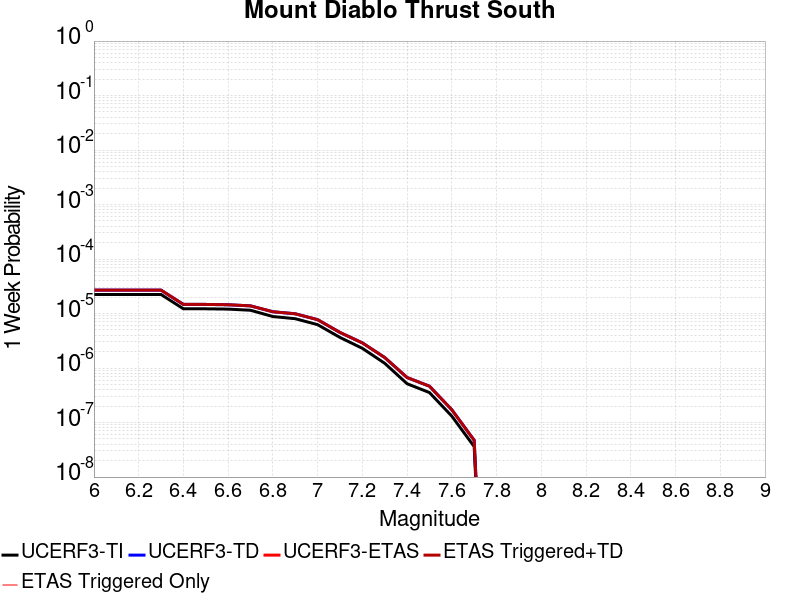 | 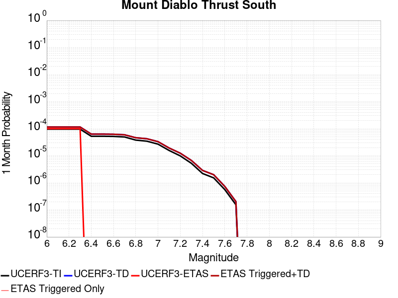 | 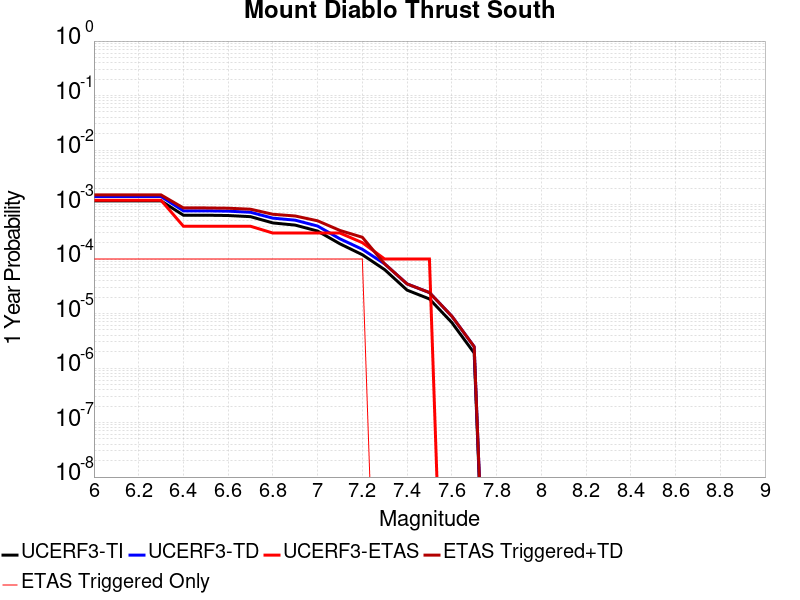 | 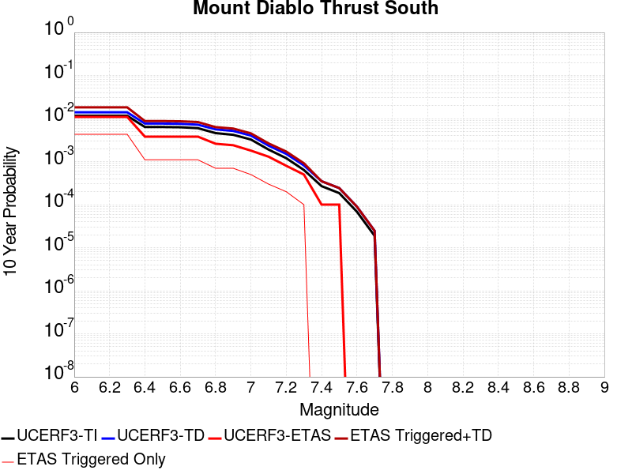 |

| Magnitude | 1 wk TI Prob | 1 wk TD Prob | 1 wk ETAS Prob | 1 wk ETAS/TD Gain | 1 wk ETAS Triggered+TD | 1 wk ETAS Triggered Only | 1 mo TI Prob | 1 mo TD Prob | 1 mo ETAS Prob | 1 mo ETAS/TD Gain | 1 mo ETAS Triggered+TD | 1 mo ETAS Triggered Only | 1 yr TI Prob | 1 yr TD Prob | 1 yr ETAS Prob | 1 yr ETAS/TD Gain | 1 yr ETAS Triggered+TD | 1 yr ETAS Triggered Only | 10 yr TI Prob | 10 yr TD Prob | 10 yr ETAS Prob | 10 yr ETAS/TD Gain | 10 yr ETAS Triggered+TD | 10 yr ETAS Triggered Only |
|-----|-----|-----|-----|-----|-----|-----|-----|-----|-----|-----|-----|-----|-----|-----|-----|-----|-----|-----|-----|-----|-----|-----|-----|-----|
| 6.0 | 2.2377444E-5 | 2.6891565E-5 | 0.0 | 0.0 | 2.6891565E-5 | 0.0 | 9.5899806E-5 | 1.1524554E-4 | 1.0E-4 | 0.86771256 | 1.1524554E-4 | 0.0 | 0.0011669548 | 0.0014024085 | 0.0012 | 0.8556708 | 0.0015022682 | 1.0E-4 | 0.011608457 | 0.013955617 | 0.0109 | 0.7810475 | 0.018195609 | 0.0043 |
| 6.1 | 2.2377444E-5 | 2.6891565E-5 | 0.0 | 0.0 | 2.6891565E-5 | 0.0 | 9.5899806E-5 | 1.1524554E-4 | 1.0E-4 | 0.86771256 | 1.1524554E-4 | 0.0 | 0.0011669548 | 0.0014024085 | 0.0012 | 0.8556708 | 0.0015022682 | 1.0E-4 | 0.011608457 | 0.013955617 | 0.0109 | 0.7810475 | 0.018195609 | 0.0043 |
| 6.2 | 2.2377444E-5 | 2.6891565E-5 | 0.0 | 0.0 | 2.6891565E-5 | 0.0 | 9.5899806E-5 | 1.1524554E-4 | 1.0E-4 | 0.86771256 | 1.1524554E-4 | 0.0 | 0.0011669548 | 0.0014024085 | 0.0012 | 0.8556708 | 0.0015022682 | 1.0E-4 | 0.011608457 | 0.013955617 | 0.0109 | 0.7810475 | 0.018195609 | 0.0043 |
| 6.3 | 2.2377444E-5 | 2.6891565E-5 | 0.0 | 0.0 | 2.6891565E-5 | 0.0 | 9.5899806E-5 | 1.1524554E-4 | 1.0E-4 | 0.86771256 | 1.1524554E-4 | 0.0 | 0.0011669548 | 0.0014024085 | 0.0012 | 0.8556708 | 0.0015022682 | 1.0E-4 | 0.011608457 | 0.013955617 | 0.0109 | 0.7810475 | 0.018195609 | 0.0043 |
| 6.4 | 1.2228463E-5 | 1.4708772E-5 | 0.0 | 0.0 | 1.4708772E-5 | 0.0 | 5.2406645E-5 | 6.303615E-5 | 0.0 | 0.0 | 6.303615E-5 | 0.0 | 6.378641E-4 | 7.672076E-4 | 4.0E-4 | 0.52137125 | 8.671309E-4 | 1.0E-4 | 0.0063603627 | 0.007647469 | 0.0038 | 0.49689642 | 0.008739057 | 0.0011 |
| 6.5 | 1.2228463E-5 | 1.4708772E-5 | 0.0 | 0.0 | 1.4708772E-5 | 0.0 | 5.2406645E-5 | 6.303615E-5 | 0.0 | 0.0 | 6.303615E-5 | 0.0 | 6.378641E-4 | 7.672076E-4 | 4.0E-4 | 0.52137125 | 8.671309E-4 | 1.0E-4 | 0.0063603627 | 0.007647469 | 0.0038 | 0.49689642 | 0.008739057 | 0.0011 |
| 6.6 | 1.2068118E-5 | 1.4514011E-5 | 0.0 | 0.0 | 1.4514011E-5 | 0.0 | 5.1719482E-5 | 6.220149E-5 | 0.0 | 0.0 | 6.220149E-5 | 0.0 | 6.2950276E-4 | 7.570528E-4 | 4.0E-4 | 0.5283647 | 8.5697713E-4 | 1.0E-4 | 0.006277225 | 0.007546615 | 0.0038 | 0.503537 | 0.008638314 | 0.0011 |
| 6.7 | 1.1499428E-5 | 1.3838028E-5 | 0.0 | 0.0 | 1.3838028E-5 | 0.0 | 4.9282335E-5 | 5.930456E-5 | 0.0 | 0.0 | 5.930456E-5 | 0.0 | 5.9984723E-4 | 7.218065E-4 | 4.0E-4 | 0.5541651 | 8.217343E-4 | 1.0E-4 | 0.0059823063 | 0.007196482 | 0.0038 | 0.52803576 | 0.008288566 | 0.0011 |
| 6.8 | 8.82118E-6 | 1.0797723E-5 | 0.0 | 0.0 | 1.0797723E-5 | 0.0 | 3.780451E-5 | 4.6275163E-5 | 0.0 | 0.0 | 4.6275163E-5 | 0.0 | 4.601727E-4 | 5.6326005E-4 | 3.0E-4 | 0.5326137 | 6.632037E-4 | 1.0E-4 | 0.0045922096 | 0.00561947 | 0.0026 | 0.46267706 | 0.0063155363 | 7.0E-4 |
| 6.9 | 8.047112E-6 | 9.908106E-6 | 0.0 | 0.0 | 9.908106E-6 | 0.0 | 3.4487166E-5 | 4.246265E-5 | 0.0 | 0.0 | 4.246265E-5 | 0.0 | 4.1980037E-4 | 5.1686534E-4 | 3.0E-4 | 0.5804219 | 6.1681366E-4 | 1.0E-4 | 0.004190082 | 0.005157742 | 0.0024 | 0.4653199 | 0.0058541317 | 7.0E-4 |
| 7.0 | 6.2574763E-6 | 7.73202E-6 | 0.0 | 0.0 | 7.73202E-6 | 0.0 | 2.681748E-5 | 3.313683E-5 | 0.0 | 0.0 | 3.313683E-5 | 0.0 | 3.264539E-4 | 4.0336986E-4 | 3.0E-4 | 0.74373424 | 5.0332956E-4 | 1.0E-4 | 0.0032597475 | 0.004027368 | 0.0018 | 0.446942 | 0.0045253546 | 5.0E-4 |
| 7.1 | 3.6485903E-6 | 4.5020347E-6 | 0.0 | 0.0 | 4.5020347E-6 | 0.0 | 1.5636722E-5 | 1.9294295E-5 | 0.0 | 0.0 | 1.9294295E-5 | 0.0 | 1.9036046E-4 | 2.3488312E-4 | 3.0E-4 | 1.277231 | 3.3485962E-4 | 1.0E-4 | 0.0019019748 | 0.0023466544 | 0.0013 | 0.5539802 | 0.0026459503 | 3.0E-4 |
| 7.2 | 2.3034274E-6 | 2.8973452E-6 | 0.0 | 0.0 | 2.8973452E-6 | 0.0 | 9.871795E-6 | 1.2417136E-5 | 0.0 | 0.0 | 1.2417136E-5 | 0.0 | 1.2018247E-4 | 1.5116838E-4 | 2.0E-4 | 1.323028 | 2.5115325E-4 | 1.0E-4 | 0.0012011749 | 0.0015108308 | 8.0E-4 | 0.52951 | 0.0017105286 | 2.0E-4 |
| 7.3 | 1.224035E-6 | 1.5621736E-6 | 0.0 | 0.0 | 1.5621736E-6 | 0.0 | 5.245854E-6 | 6.695013E-6 | 0.0 | 0.0 | 6.695013E-6 | 0.0 | 6.38664E-5 | 8.150884E-5 | 1.0E-4 | 1.2268608 | 8.150884E-5 | 0.0 | 6.384805E-4 | 8.14873E-4 | 5.0E-4 | 0.6135925 | 9.1479154E-4 | 1.0E-4 |
| 7.4 | 5.1601154E-7 | 6.7047233E-7 | 0.0 | 0.0 | 6.7047233E-7 | 0.0 | 2.2114762E-6 | 2.8734498E-6 | 0.0 | 0.0 | 2.8734498E-6 | 0.0 | 2.6924388E-5 | 3.4983706E-5 | 1.0E-4 | 2.8584735 | 3.4983706E-5 | 0.0 | 2.6921128E-4 | 3.4979658E-4 | 1.0E-4 | 0.28588045 | 3.4979658E-4 | 0.0 |
| 7.5 | 3.552894E-7 | 4.6502333E-7 | 0.0 | 0.0 | 4.6502333E-7 | 0.0 | 1.5226678E-6 | 1.9929557E-6 | 0.0 | 0.0 | 1.9929557E-6 | 0.0 | 1.8538323E-5 | 2.426398E-5 | 1.0E-4 | 4.1213355 | 2.426398E-5 | 0.0 | 1.8536777E-4 | 2.4257129E-4 | 1.0E-4 | 0.41224992 | 2.4257129E-4 | 0.0 |
| 7.6 | 1.3124082E-7 | 1.7187479E-7 | 0.0 | 0.0 | 1.7187479E-7 | 0.0 | 5.6246057E-7 | 7.3660607E-7 | 0.0 | 0.0 | 7.3660607E-7 | 0.0 | 6.8479358E-6 | 8.968151E-6 | 0.0 | 0.0 | 8.968151E-6 | 0.0 | 6.8477246E-5 | 8.96526E-5 | 0.0 | 0.0 | 8.96526E-5 | 0.0 |
| 7.7 | 3.6193022E-8 | 4.7321272E-8 | 0.0 | 0.0 | 4.7321272E-8 | 0.0 | 1.5511293E-7 | 2.0280545E-7 | 0.0 | 0.0 | 2.0280545E-7 | 0.0 | 1.8884983E-6 | 2.4691547E-6 | 0.0 | 0.0 | 2.4691547E-6 | 0.0 | 1.8884823E-5 | 2.4696754E-5 | 0.0 | 0.0 | 2.4696754E-5 | 0.0 |

## Palos Verdes
*[(top)](#table-of-contents)*

| 1 Week | 1 Month | 1 Year | 10 Year |
|-----|-----|-----|-----|
| 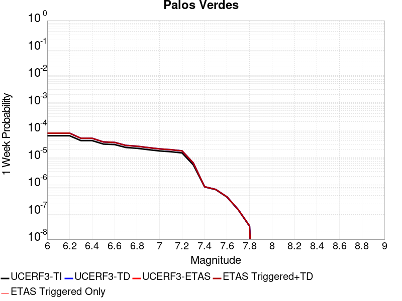 | 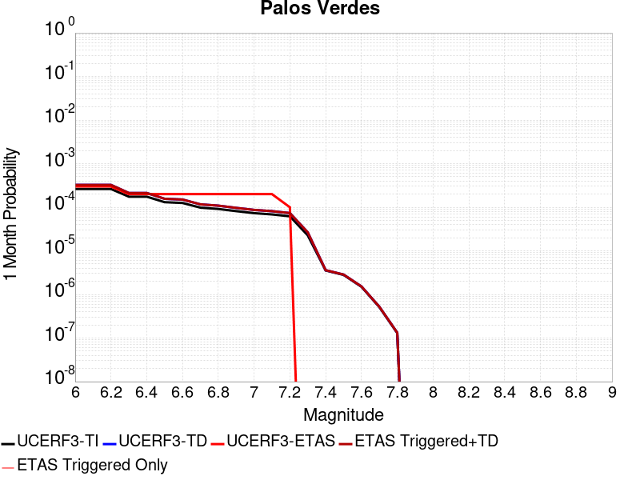 | 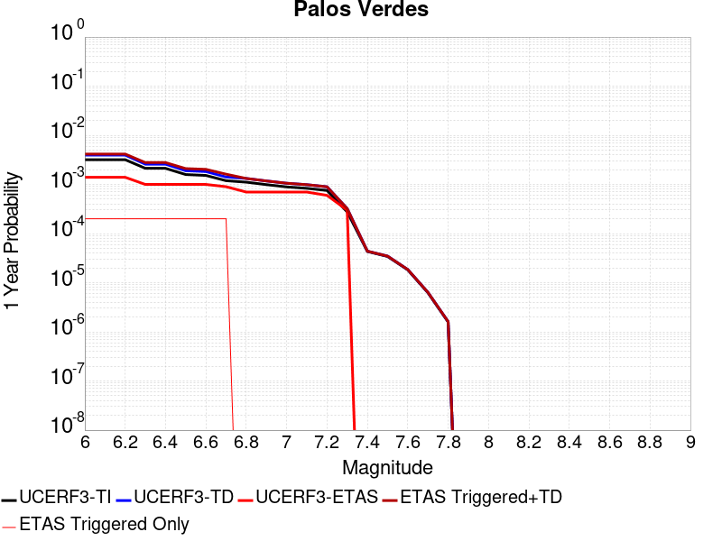 | 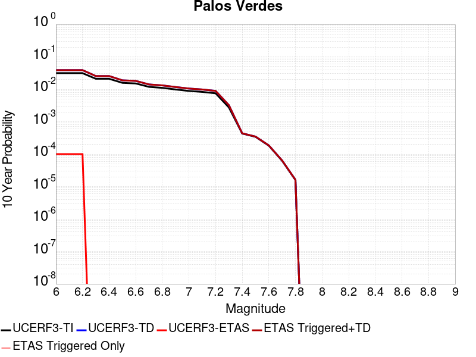 |

| Magnitude | 1 wk TI Prob | 1 wk TD Prob | 1 wk ETAS Prob | 1 wk ETAS/TD Gain | 1 wk ETAS Triggered+TD | 1 wk ETAS Triggered Only | 1 mo TI Prob | 1 mo TD Prob | 1 mo ETAS Prob | 1 mo ETAS/TD Gain | 1 mo ETAS Triggered+TD | 1 mo ETAS Triggered Only | 1 yr TI Prob | 1 yr TD Prob | 1 yr ETAS Prob | 1 yr ETAS/TD Gain | 1 yr ETAS Triggered+TD | 1 yr ETAS Triggered Only | 10 yr TI Prob | 10 yr TD Prob | 10 yr ETAS Prob | 10 yr ETAS/TD Gain | 10 yr ETAS Triggered+TD | 10 yr ETAS Triggered Only |
|-----|-----|-----|-----|-----|-----|-----|-----|-----|-----|-----|-----|-----|-----|-----|-----|-----|-----|-----|-----|-----|-----|-----|-----|-----|
| 6.0 | 6.126063E-5 | 7.6033015E-5 | 0.0 | 0.0 | 7.6033015E-5 | 0.0 | 2.6251914E-4 | 3.258184E-4 | 3.0E-4 | 0.9207583 | 3.258184E-4 | 0.0 | 0.0031914865 | 0.003960153 | 0.0014 | 0.3535217 | 0.0041593607 | 2.0E-4 | 0.031460393 | 0.038952567 | 0.0183 | 0.46980217 | 0.043181177 | 0.0044 |
| 6.1 | 6.126063E-5 | 7.6033015E-5 | 0.0 | 0.0 | 7.6033015E-5 | 0.0 | 2.6251914E-4 | 3.258184E-4 | 3.0E-4 | 0.9207583 | 3.258184E-4 | 0.0 | 0.0031914865 | 0.003960153 | 0.0014 | 0.3535217 | 0.0041593607 | 2.0E-4 | 0.031460393 | 0.038952567 | 0.0183 | 0.46980217 | 0.043181177 | 0.0044 |
| 6.2 | 6.126063E-5 | 7.6033015E-5 | 0.0 | 0.0 | 7.6033015E-5 | 0.0 | 2.6251914E-4 | 3.258184E-4 | 3.0E-4 | 0.9207583 | 3.258184E-4 | 0.0 | 0.0031914865 | 0.003960153 | 0.0014 | 0.3535217 | 0.0041593607 | 2.0E-4 | 0.031460393 | 0.038952567 | 0.0183 | 0.46980217 | 0.043181177 | 0.0044 |
| 6.3 | 4.0838047E-5 | 4.9635695E-5 | 0.0 | 0.0 | 4.9635695E-5 | 0.0 | 1.7500846E-4 | 2.1270833E-4 | 2.0E-4 | 0.9402547 | 2.1270833E-4 | 0.0 | 0.0021286458 | 0.0025868537 | 0.001 | 0.38657 | 0.0027863362 | 2.0E-4 | 0.021083709 | 0.025589142 | 0.0128 | 0.50021213 | 0.028512375 | 0.003 |
| 6.4 | 4.0838047E-5 | 4.9635695E-5 | 0.0 | 0.0 | 4.9635695E-5 | 0.0 | 1.7500846E-4 | 2.1270833E-4 | 2.0E-4 | 0.9402547 | 2.1270833E-4 | 0.0 | 0.0021286458 | 0.0025868537 | 0.001 | 0.38657 | 0.0027863362 | 2.0E-4 | 0.021083709 | 0.025589142 | 0.0128 | 0.50021213 | 0.028512375 | 0.003 |
| 6.5 | 3.0512005E-5 | 3.6485533E-5 | 0.0 | 0.0 | 3.6485533E-5 | 0.0 | 1.3075917E-4 | 1.5635787E-4 | 2.0E-4 | 1.2791169 | 1.5635787E-4 | 0.0 | 0.0015908304 | 0.001902111 | 0.001 | 0.5257317 | 0.0021017306 | 2.0E-4 | 0.015794903 | 0.01887022 | 0.0091 | 0.48224133 | 0.021126818 | 0.0023 |
| 6.6 | 2.9255087E-5 | 3.5080087E-5 | 0.0 | 0.0 | 3.5080087E-5 | 0.0 | 1.2537291E-4 | 1.5033523E-4 | 2.0E-4 | 1.3303603 | 1.5033523E-4 | 0.0 | 0.0015253464 | 0.0018289083 | 0.001 | 0.54677427 | 0.0020285426 | 2.0E-4 | 0.015149189 | 0.018150162 | 0.0089 | 0.49035373 | 0.020310232 | 0.0022 |
| 6.7 | 2.287198E-5 | 2.71935E-5 | 0.0 | 0.0 | 2.71935E-5 | 0.0 | 9.801909E-5 | 1.1653888E-4 | 2.0E-4 | 1.7161654 | 1.1653888E-4 | 0.0 | 0.001192729 | 0.0014180287 | 9.0E-4 | 0.6346839 | 0.0016177451 | 2.0E-4 | 0.011863477 | 0.014098996 | 0.0073 | 0.51776737 | 0.015972208 | 0.0019 |
| 6.8 | 2.1325764E-5 | 2.538045E-5 | 0.0 | 0.0 | 2.538045E-5 | 0.0 | 9.139293E-5 | 1.0876933E-4 | 2.0E-4 | 1.8387537 | 1.0876933E-4 | 0.0 | 0.001112141 | 0.001323552 | 7.0E-4 | 0.5288799 | 0.001323552 | 0.0 | 0.011065915 | 0.013165689 | 0.0067 | 0.50889856 | 0.014843307 | 0.0017 |
| 6.9 | 1.9009392E-5 | 2.2568487E-5 | 0.0 | 0.0 | 2.2568487E-5 | 0.0 | 8.1466285E-5 | 9.671899E-5 | 2.0E-4 | 2.0678463 | 9.671899E-5 | 0.0 | 9.914007E-4 | 0.0011770045 | 7.0E-4 | 0.5947301 | 0.0011770045 | 0.0 | 0.009869894 | 0.011716356 | 0.0059 | 0.50356954 | 0.013099953 | 0.0014 |
| 7.0 | 1.7098473E-5 | 2.027909E-5 | 0.0 | 0.0 | 2.027909E-5 | 0.0 | 7.3277115E-5 | 8.6907974E-5 | 2.0E-4 | 2.3012848 | 8.6907974E-5 | 0.0 | 8.917837E-4 | 0.0010576758 | 7.0E-4 | 0.6618285 | 0.0010576758 | 0.0 | 0.008882134 | 0.010534819 | 0.0056 | 0.5315706 | 0.011821124 | 0.0013 |
| 7.1 | 1.5982785E-5 | 1.89571E-5 | 0.0 | 0.0 | 1.89571E-5 | 0.0 | 6.849585E-5 | 8.1242666E-5 | 2.0E-4 | 2.4617608 | 8.1242666E-5 | 0.0 | 8.336179E-4 | 9.887649E-4 | 7.0E-4 | 0.70795393 | 9.887649E-4 | 0.0 | 0.008304977 | 0.009851984 | 0.0053 | 0.53796273 | 0.011139177 | 0.0013 |
| 7.2 | 1.4468002E-5 | 1.716309E-5 | 0.0 | 0.0 | 1.716309E-5 | 0.0 | 6.200425E-5 | 7.3554496E-5 | 1.0E-4 | 1.3595362 | 7.3554496E-5 | 0.0 | 7.546402E-4 | 8.9524174E-4 | 6.0E-4 | 0.67021006 | 8.9524174E-4 | 0.0 | 0.007520827 | 0.008924588 | 0.0045 | 0.504225 | 0.010113878 | 0.0012 |
| 7.3 | 5.288233E-6 | 6.192199E-6 | 0.0 | 0.0 | 6.192199E-6 | 0.0 | 2.2663658E-5 | 2.6537922E-5 | 0.0 | 0.0 | 2.6537922E-5 | 0.0 | 2.7589512E-4 | 3.2308605E-4 | 3.0E-4 | 0.9285452 | 3.2308605E-4 | 0.0 | 0.0027555283 | 0.0032295715 | 0.0014 | 0.43349406 | 0.0038276338 | 6.0E-4 |
| 7.4 | 8.279556E-7 | 8.406981E-7 | 0.0 | 0.0 | 8.406981E-7 | 0.0 | 3.5483763E-6 | 3.6029871E-6 | 0.0 | 0.0 | 3.6029871E-6 | 0.0 | 4.3200624E-5 | 4.386556E-5 | 0.0 | 0.0 | 4.386556E-5 | 0.0 | 4.3192226E-4 | 4.3857621E-4 | 2.0E-4 | 0.45602107 | 5.385324E-4 | 1.0E-4 |
| 7.5 | 6.559831E-7 | 6.666089E-7 | 0.0 | 0.0 | 6.666089E-7 | 0.0 | 2.8113532E-6 | 2.8568925E-6 | 0.0 | 0.0 | 2.8568925E-6 | 0.0 | 3.4227687E-5 | 3.478218E-5 | 0.0 | 0.0 | 3.478218E-5 | 0.0 | 3.4222414E-4 | 3.4777398E-4 | 2.0E-4 | 0.5750862 | 4.477392E-4 | 1.0E-4 |
| 7.6 | 3.5018968E-7 | 3.5613644E-7 | 0.0 | 0.0 | 3.5613644E-7 | 0.0 | 1.500812E-6 | 1.5262984E-6 | 0.0 | 0.0 | 1.5262984E-6 | 0.0 | 1.8272232E-5 | 1.8582572E-5 | 0.0 | 0.0 | 1.8582572E-5 | 0.0 | 1.8270731E-4 | 1.8581477E-4 | 0.0 | 0.0 | 1.8581477E-4 | 0.0 |
| 7.7 | 1.1986104E-7 | 1.2196121E-7 | 0.0 | 0.0 | 1.2196121E-7 | 0.0 | 5.1369005E-7 | 5.226908E-7 | 0.0 | 0.0 | 5.226908E-7 | 0.0 | 6.2541585E-6 | 6.363742E-6 | 0.0 | 0.0 | 6.363742E-6 | 0.0 | 6.2539824E-5 | 6.363564E-5 | 0.0 | 0.0 | 6.363564E-5 | 0.0 |
| 7.8 | 3.0445005E-8 | 3.1021386E-8 | 0.0 | 0.0 | 3.1021386E-8 | 0.0 | 1.3047858E-7 | 1.3294878E-7 | 0.0 | 0.0 | 1.3294878E-7 | 0.0 | 1.5885756E-6 | 1.6186506E-6 | 0.0 | 0.0 | 1.6186506E-6 | 0.0 | 1.5885644E-5 | 1.6186408E-5 | 0.0 | 0.0 | 1.6186408E-5 | 0.0 |

## Surprise Valley 2011 CFM
*[(top)](#table-of-contents)*

| 1 Week | 1 Month | 1 Year | 10 Year |
|-----|-----|-----|-----|
| 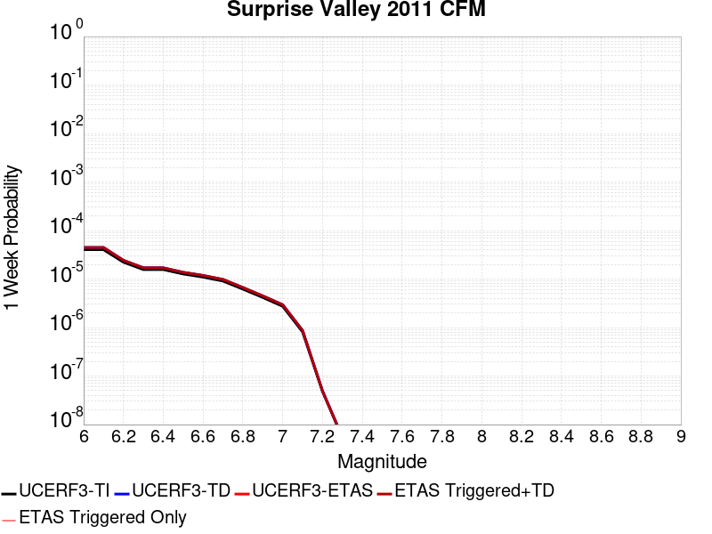 | 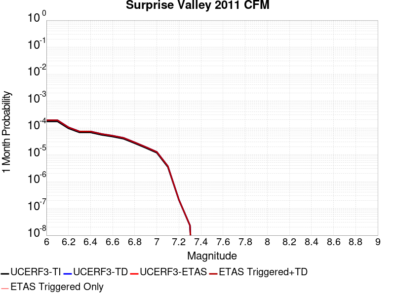 | 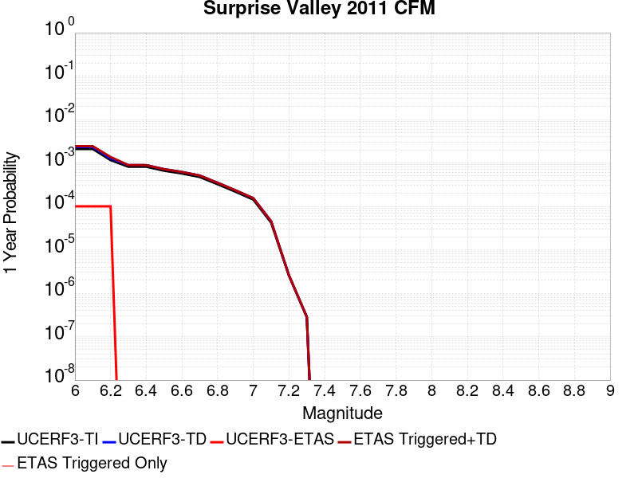 | 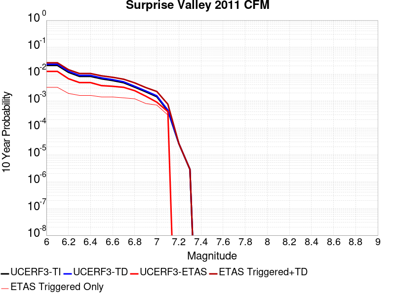 |

| Magnitude | 1 wk TI Prob | 1 wk TD Prob | 1 wk ETAS Prob | 1 wk ETAS/TD Gain | 1 wk ETAS Triggered+TD | 1 wk ETAS Triggered Only | 1 mo TI Prob | 1 mo TD Prob | 1 mo ETAS Prob | 1 mo ETAS/TD Gain | 1 mo ETAS Triggered+TD | 1 mo ETAS Triggered Only | 1 yr TI Prob | 1 yr TD Prob | 1 yr ETAS Prob | 1 yr ETAS/TD Gain | 1 yr ETAS Triggered+TD | 1 yr ETAS Triggered Only | 10 yr TI Prob | 10 yr TD Prob | 10 yr ETAS Prob | 10 yr ETAS/TD Gain | 10 yr ETAS Triggered+TD | 10 yr ETAS Triggered Only |
|-----|-----|-----|-----|-----|-----|-----|-----|-----|-----|-----|-----|-----|-----|-----|-----|-----|-----|-----|-----|-----|-----|-----|-----|-----|
| 6.0 | 4.0396248E-5 | 4.479939E-5 | 0.0 | 0.0 | 4.479939E-5 | 0.0 | 1.7311527E-4 | 1.9198445E-4 | 0.0 | 0.0 | 1.9198445E-4 | 0.0 | 0.002105641 | 0.0023351142 | 0.0012 | 0.5138935 | 0.00273418 | 4.0E-4 | 0.020858008 | 0.023127439 | 0.0125 | 0.54048353 | 0.026253432 | 0.0032 |
| 6.1 | 4.0396248E-5 | 4.479939E-5 | 0.0 | 0.0 | 4.479939E-5 | 0.0 | 1.7311527E-4 | 1.9198445E-4 | 0.0 | 0.0 | 1.9198445E-4 | 0.0 | 0.002105641 | 0.0023351142 | 0.0012 | 0.5138935 | 0.00273418 | 4.0E-4 | 0.020858008 | 0.023127439 | 0.0125 | 0.54048353 | 0.026253432 | 0.0032 |
| 6.2 | 2.2295266E-5 | 2.4377101E-5 | 0.0 | 0.0 | 2.4377101E-5 | 0.0 | 9.554764E-5 | 1.0446928E-4 | 0.0 | 0.0 | 1.0446928E-4 | 0.0 | 0.0011626717 | 0.0012712021 | 6.0E-4 | 0.4719942 | 0.0015708207 | 3.0E-4 | 0.011566074 | 0.012642533 | 0.0067 | 0.5299571 | 0.0145185115 | 0.0019 |
| 6.3 | 1.572643E-5 | 1.7081213E-5 | 0.0 | 0.0 | 1.7081213E-5 | 0.0 | 6.7397246E-5 | 7.3203206E-5 | 0.0 | 0.0 | 7.3203206E-5 | 0.0 | 8.202525E-4 | 8.908951E-4 | 2.0E-4 | 0.22449332 | 9.90806E-4 | 1.0E-4 | 0.008172315 | 0.00887434 | 0.0048 | 0.54088527 | 0.010460141 | 0.0016 |
| 6.4 | 1.5714395E-5 | 1.7069036E-5 | 0.0 | 0.0 | 1.7069036E-5 | 0.0 | 6.734567E-5 | 7.315102E-5 | 0.0 | 0.0 | 7.315102E-5 | 0.0 | 8.1962504E-4 | 8.902603E-4 | 2.0E-4 | 0.22465341 | 9.901712E-4 | 1.0E-4 | 0.008166086 | 0.008868042 | 0.0048 | 0.54126936 | 0.010453854 | 0.0016 |
| 6.5 | 1.2733495E-5 | 1.3789486E-5 | 0.0 | 0.0 | 1.3789486E-5 | 0.0 | 5.457098E-5 | 5.9096496E-5 | 0.0 | 0.0 | 5.9096496E-5 | 0.0 | 6.641992E-4 | 7.19269E-4 | 1.0E-4 | 0.13903005 | 8.1919704E-4 | 1.0E-4 | 0.0066221743 | 0.0071701026 | 0.0037 | 0.5160317 | 0.008560064 | 0.0014 |
| 6.6 | 1.0983784E-5 | 1.1876331E-5 | 0.0 | 0.0 | 1.1876331E-5 | 0.0 | 4.7072506E-5 | 5.0897597E-5 | 0.0 | 0.0 | 5.0897597E-5 | 0.0 | 5.7295704E-4 | 6.195074E-4 | 1.0E-4 | 0.16141857 | 7.1944547E-4 | 1.0E-4 | 0.0057148207 | 0.0061783525 | 0.0035 | 0.56649405 | 0.007569703 | 0.0014 |
| 6.7 | 9.104806E-6 | 9.831182E-6 | 0.0 | 0.0 | 9.831182E-6 | 0.0 | 3.902001E-5 | 4.213298E-5 | 0.0 | 0.0 | 4.213298E-5 | 0.0 | 4.7496508E-4 | 5.128522E-4 | 1.0E-4 | 0.19498795 | 6.128009E-4 | 1.0E-4 | 0.004739512 | 0.005117083 | 0.0032 | 0.6253563 | 0.0064104307 | 0.0013 |
| 6.8 | 6.2162403E-6 | 6.6986236E-6 | 0.0 | 0.0 | 6.6986236E-6 | 0.0 | 2.6640759E-5 | 2.8708082E-5 | 0.0 | 0.0 | 2.8708082E-5 | 0.0 | 3.2430296E-4 | 3.4946707E-4 | 1.0E-4 | 0.28614998 | 4.4943212E-4 | 1.0E-4 | 0.003238301 | 0.0034893982 | 0.0024 | 0.68779767 | 0.004685211 | 0.0012 |
| 6.9 | 4.1792696E-6 | 4.499571E-6 | 0.0 | 0.0 | 4.499571E-6 | 0.0 | 1.7911032E-5 | 1.9283741E-5 | 0.0 | 0.0 | 1.9283741E-5 | 0.0 | 2.1804498E-4 | 2.347558E-4 | 1.0E-4 | 0.42597458 | 3.3473232E-4 | 1.0E-4 | 0.0021783116 | 0.0023452311 | 0.0015 | 0.6395958 | 0.003143355 | 8.0E-4 |
| 7.0 | 2.7478413E-6 | 2.9598184E-6 | 0.0 | 0.0 | 2.9598184E-6 | 0.0 | 1.177641E-5 | 1.2684882E-5 | 0.0 | 0.0 | 1.2684882E-5 | 0.0 | 1.4336836E-4 | 1.5442874E-4 | 0.0 | 0.0 | 1.5442874E-4 | 0.0 | 0.001432759 | 0.0015433364 | 9.0E-4 | 0.5831522 | 0.0022422562 | 7.0E-4 |
| 7.1 | 8.128648E-7 | 8.718175E-7 | 0.0 | 0.0 | 8.718175E-7 | 0.0 | 3.4837017E-6 | 3.7363588E-6 | 0.0 | 0.0 | 3.7363588E-6 | 0.0 | 4.2413245E-5 | 4.5489818E-5 | 0.0 | 0.0 | 4.5489818E-5 | 0.0 | 4.2405148E-4 | 4.5486377E-4 | 4.0E-4 | 0.87938416 | 7.5472734E-4 | 3.0E-4 |
| 7.2 | 4.8641045E-8 | 4.9393996E-8 | 0.0 | 0.0 | 4.9393996E-8 | 0.0 | 2.084616E-7 | 2.1168853E-7 | 0.0 | 0.0 | 2.1168853E-7 | 0.0 | 2.538017E-6 | 2.577305E-6 | 0.0 | 0.0 | 2.577305E-6 | 0.0 | 2.537988E-5 | 2.5772762E-5 | 0.0 | 0.0 | 2.5772762E-5 | 0.0 |
| 7.3 | 5.3911844E-9 | 5.474917E-9 | 0.0 | 0.0 | 5.474917E-9 | 0.0 | 2.3105075E-8 | 2.346393E-8 | 0.0 | 0.0 | 2.346393E-8 | 0.0 | 2.8130427E-7 | 2.856733E-7 | 0.0 | 0.0 | 2.856733E-7 | 0.0 | 2.8130391E-6 | 2.856731E-6 | 0.0 | 0.0 | 2.856731E-6 | 0.0 |

## Keddie Ridge 2011 CFM
*[(top)](#table-of-contents)*

| 1 Week | 1 Month | 1 Year | 10 Year |
|-----|-----|-----|-----|
| 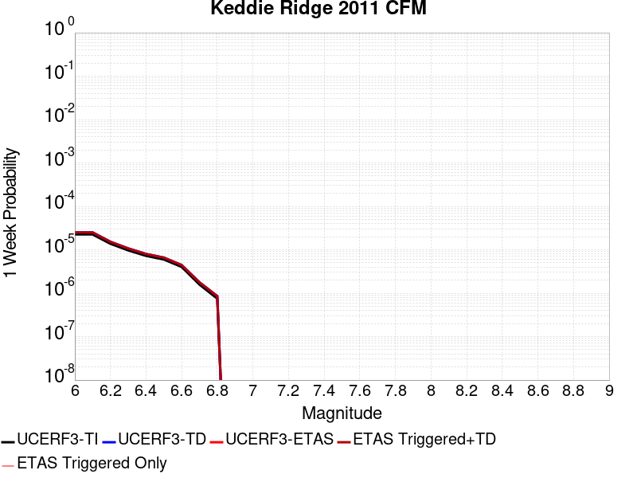 | 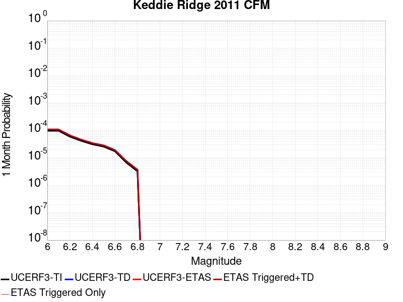 | 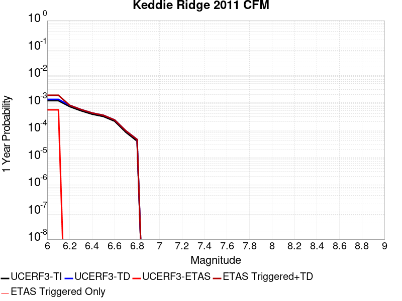 | 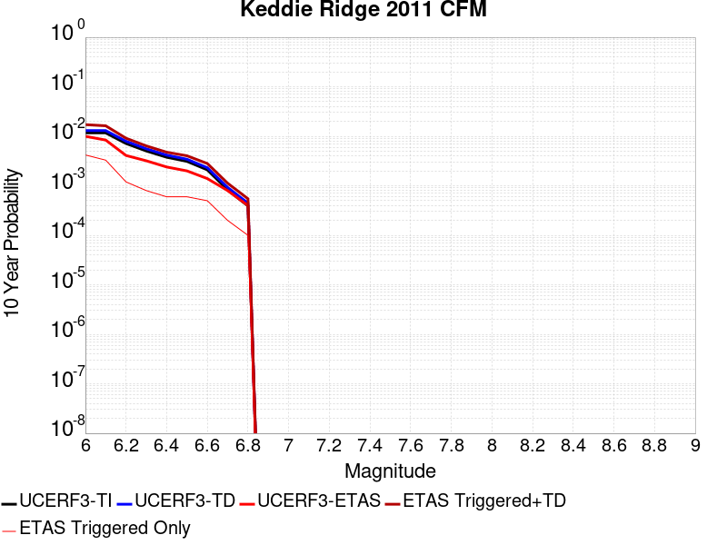 |

| Magnitude | 1 wk TI Prob | 1 wk TD Prob | 1 wk ETAS Prob | 1 wk ETAS/TD Gain | 1 wk ETAS Triggered+TD | 1 wk ETAS Triggered Only | 1 mo TI Prob | 1 mo TD Prob | 1 mo ETAS Prob | 1 mo ETAS/TD Gain | 1 mo ETAS Triggered+TD | 1 mo ETAS Triggered Only | 1 yr TI Prob | 1 yr TD Prob | 1 yr ETAS Prob | 1 yr ETAS/TD Gain | 1 yr ETAS Triggered+TD | 1 yr ETAS Triggered Only | 10 yr TI Prob | 10 yr TD Prob | 10 yr ETAS Prob | 10 yr ETAS/TD Gain | 10 yr ETAS Triggered+TD | 10 yr ETAS Triggered Only |
|-----|-----|-----|-----|-----|-----|-----|-----|-----|-----|-----|-----|-----|-----|-----|-----|-----|-----|-----|-----|-----|-----|-----|-----|-----|
| 6.0 | 2.2591947E-5 | 2.5158795E-5 | 0.0 | 0.0 | 2.5158795E-5 | 0.0 | 9.6819036E-5 | 1.078194E-4 | 1.0E-4 | 0.9274769 | 1.078194E-4 | 0.0 | 0.0011781343 | 0.0013119896 | 0.0013 | 0.99086154 | 0.0018113336 | 5.0E-4 | 0.011719079 | 0.013050364 | 0.01 | 0.7662621 | 0.017195553 | 0.0042 |
| 6.1 | 2.2591947E-5 | 2.5158795E-5 | 0.0 | 0.0 | 2.5158795E-5 | 0.0 | 9.6819036E-5 | 1.078194E-4 | 1.0E-4 | 0.9274769 | 1.078194E-4 | 0.0 | 0.0011781343 | 0.0013119896 | 0.0013 | 0.99086154 | 0.0018113336 | 5.0E-4 | 0.011719079 | 0.013050364 | 0.0084 | 0.6436602 | 0.016307298 | 0.0033 |
| 6.2 | 1.3775145E-5 | 1.5304711E-5 | 0.0 | 0.0 | 1.5304711E-5 | 0.0 | 5.9035E-5 | 6.559011E-5 | 1.0E-4 | 1.5246202 | 6.559011E-5 | 0.0 | 7.185141E-4 | 7.982911E-4 | 7.0E-4 | 0.8768731 | 9.981315E-4 | 2.0E-4 | 0.0071619535 | 0.007956649 | 0.0041 | 0.5152923 | 0.009147101 | 0.0012 |
| 6.3 | 9.705435E-6 | 1.07559135E-5 | 0.0 | 0.0 | 1.07559135E-5 | 0.0 | 4.1594063E-5 | 4.6096025E-5 | 1.0E-4 | 2.1693842 | 4.6096025E-5 | 0.0 | 5.0629E-4 | 5.61087E-4 | 5.0E-4 | 0.8911274 | 6.610309E-4 | 1.0E-4 | 0.005051381 | 0.005597932 | 0.0032 | 0.5716397 | 0.0063934536 | 8.0E-4 |
| 6.4 | 7.2549733E-6 | 8.018234E-6 | 0.0 | 0.0 | 8.018234E-6 | 0.0 | 3.109237E-5 | 3.4363453E-5 | 1.0E-4 | 2.9100685 | 3.4363453E-5 | 0.0 | 3.7848388E-4 | 4.183027E-4 | 4.0E-4 | 0.95624536 | 5.182609E-4 | 1.0E-4 | 0.003778399 | 0.004175939 | 0.0024 | 0.57472104 | 0.0047734333 | 6.0E-4 |
| 6.5 | 5.983293E-6 | 6.6056505E-6 | 0.0 | 0.0 | 6.6056505E-6 | 0.0 | 2.5642432E-5 | 2.8309662E-5 | 0.0 | 0.0 | 2.8309662E-5 | 0.0 | 3.1215188E-4 | 3.4462236E-4 | 3.0E-4 | 0.87051815 | 4.4458787E-4 | 1.0E-4 | 0.0031171376 | 0.0034415408 | 0.002 | 0.58113503 | 0.0040394757 | 6.0E-4 |
| 6.6 | 4.0336154E-6 | 4.4528106E-6 | 0.0 | 0.0 | 4.4528106E-6 | 0.0 | 1.728681E-5 | 1.9083356E-5 | 0.0 | 0.0 | 1.9083356E-5 | 0.0 | 2.1044657E-4 | 2.3231911E-4 | 1.0E-4 | 0.4304424 | 2.3231911E-4 | 0.0 | 0.002102474 | 0.002321158 | 0.0014 | 0.6031472 | 0.0028199975 | 5.0E-4 |
| 6.7 | 1.5832104E-6 | 1.7792295E-6 | 0.0 | 0.0 | 1.7792295E-6 | 0.0 | 6.7851697E-6 | 7.6252486E-6 | 0.0 | 0.0 | 7.6252486E-6 | 0.0 | 8.260631E-5 | 9.283372E-5 | 0.0 | 0.0 | 9.283372E-5 | 0.0 | 8.2575605E-4 | 9.27976E-4 | 8.0E-4 | 0.8620913 | 0.0011277904 | 2.0E-4 |
| 6.8 | 7.5177275E-7 | 8.5773416E-7 | 0.0 | 0.0 | 8.5773416E-7 | 0.0 | 3.221879E-6 | 3.6759993E-6 | 0.0 | 0.0 | 3.6759993E-6 | 0.0 | 3.9225673E-5 | 4.4754543E-5 | 0.0 | 0.0 | 4.4754543E-5 | 0.0 | 3.921875E-4 | 4.4747177E-4 | 4.0E-4 | 0.8939111 | 5.4742704E-4 | 1.0E-4 |

## Elysian Park (Upper)
*[(top)](#table-of-contents)*

| 1 Week | 1 Month | 1 Year | 10 Year |
|-----|-----|-----|-----|
| 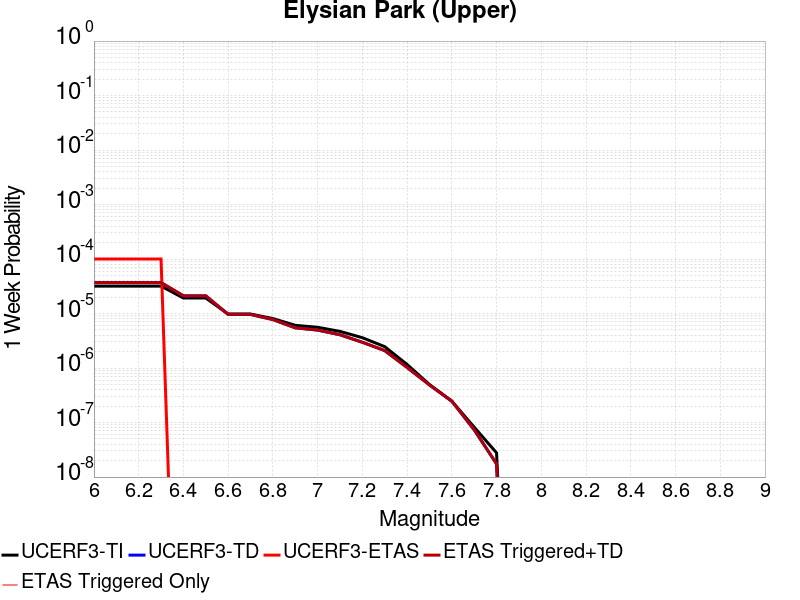 | 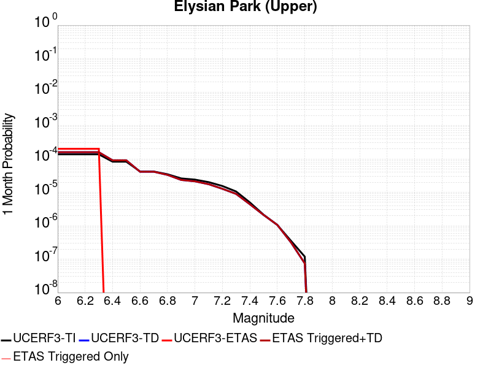 | 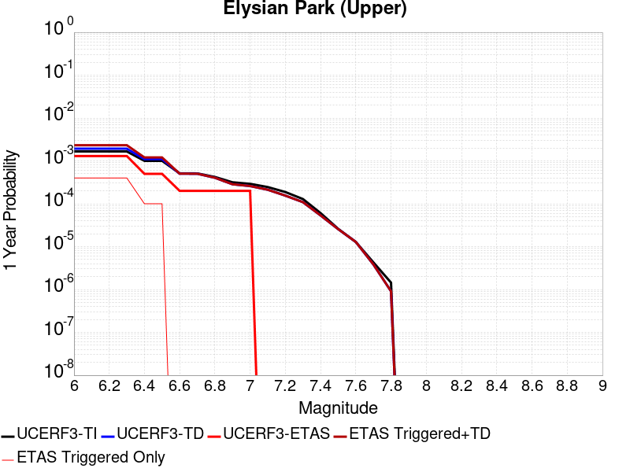 | 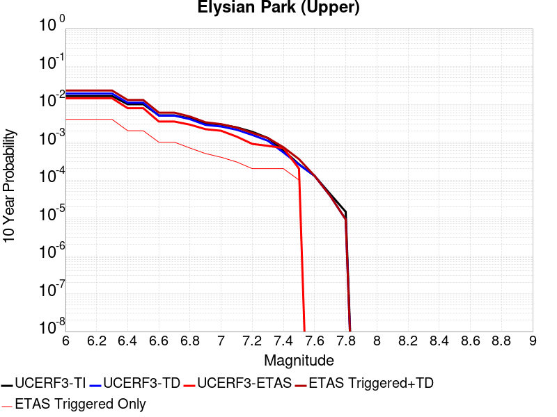 |

| Magnitude | 1 wk TI Prob | 1 wk TD Prob | 1 wk ETAS Prob | 1 wk ETAS/TD Gain | 1 wk ETAS Triggered+TD | 1 wk ETAS Triggered Only | 1 mo TI Prob | 1 mo TD Prob | 1 mo ETAS Prob | 1 mo ETAS/TD Gain | 1 mo ETAS Triggered+TD | 1 mo ETAS Triggered Only | 1 yr TI Prob | 1 yr TD Prob | 1 yr ETAS Prob | 1 yr ETAS/TD Gain | 1 yr ETAS Triggered+TD | 1 yr ETAS Triggered Only | 10 yr TI Prob | 10 yr TD Prob | 10 yr ETAS Prob | 10 yr ETAS/TD Gain | 10 yr ETAS Triggered+TD | 10 yr ETAS Triggered Only |
|-----|-----|-----|-----|-----|-----|-----|-----|-----|-----|-----|-----|-----|-----|-----|-----|-----|-----|-----|-----|-----|-----|-----|-----|-----|
| 6.0 | 3.1876025E-5 | 3.695652E-5 | 1.0E-4 | 2.7058825 | 3.695652E-5 | 0.0 | 1.3660437E-4 | 1.5837819E-4 | 2.0E-4 | 1.2628001 | 1.5837819E-4 | 0.0 | 0.0016618895 | 0.0019270205 | 0.0013 | 0.6746166 | 0.0023262496 | 4.0E-4 | 0.016495159 | 0.019149428 | 0.0144 | 0.75198066 | 0.023072831 | 0.004 |
| 6.1 | 3.1876025E-5 | 3.695652E-5 | 1.0E-4 | 2.7058825 | 3.695652E-5 | 0.0 | 1.3660437E-4 | 1.5837819E-4 | 2.0E-4 | 1.2628001 | 1.5837819E-4 | 0.0 | 0.0016618895 | 0.0019270205 | 0.0013 | 0.6746166 | 0.0023262496 | 4.0E-4 | 0.016495159 | 0.019149428 | 0.0144 | 0.75198066 | 0.023072831 | 0.004 |
| 6.2 | 3.1876025E-5 | 3.695652E-5 | 1.0E-4 | 2.7058825 | 3.695652E-5 | 0.0 | 1.3660437E-4 | 1.5837819E-4 | 2.0E-4 | 1.2628001 | 1.5837819E-4 | 0.0 | 0.0016618895 | 0.0019270205 | 0.0013 | 0.6746166 | 0.0023262496 | 4.0E-4 | 0.016495159 | 0.019149428 | 0.0144 | 0.75198066 | 0.023072831 | 0.004 |
| 6.3 | 3.1876025E-5 | 3.695652E-5 | 1.0E-4 | 2.7058825 | 3.695652E-5 | 0.0 | 1.3660437E-4 | 1.5837819E-4 | 2.0E-4 | 1.2628001 | 1.5837819E-4 | 0.0 | 0.0016618895 | 0.0019270205 | 0.0013 | 0.6746166 | 0.0023262496 | 4.0E-4 | 0.016495159 | 0.019149428 | 0.0144 | 0.75198066 | 0.023072831 | 0.004 |
| 6.4 | 1.9273462E-5 | 2.1165475E-5 | 0.0 | 0.0 | 2.1165475E-5 | 0.0 | 8.259794E-5 | 9.0707E-5 | 0.0 | 0.0 | 9.0707E-5 | 0.0 | 0.001005166 | 0.0011039689 | 5.0E-4 | 0.4529113 | 0.0012038586 | 1.0E-4 | 0.010006315 | 0.011001604 | 0.0079 | 0.7180771 | 0.012979601 | 0.002 |
| 6.5 | 1.9273462E-5 | 2.1165475E-5 | 0.0 | 0.0 | 2.1165475E-5 | 0.0 | 8.259794E-5 | 9.0707E-5 | 0.0 | 0.0 | 9.0707E-5 | 0.0 | 0.001005166 | 0.0011039689 | 5.0E-4 | 0.4529113 | 0.0012038586 | 1.0E-4 | 0.010006315 | 0.011001604 | 0.0079 | 0.7180771 | 0.012979601 | 0.002 |
| 6.6 | 9.813258E-6 | 9.654885E-6 | 0.0 | 0.0 | 9.654885E-6 | 0.0 | 4.205614E-5 | 4.137746E-5 | 0.0 | 0.0 | 4.137746E-5 | 0.0 | 5.119132E-4 | 5.036614E-4 | 2.0E-4 | 0.3970922 | 5.036614E-4 | 0.0 | 0.005107356 | 0.005025921 | 0.0035 | 0.6963898 | 0.0060208947 | 0.001 |
| 6.7 | 9.801478E-6 | 9.642462E-6 | 0.0 | 0.0 | 9.642462E-6 | 0.0 | 4.2005657E-5 | 4.1324223E-5 | 0.0 | 0.0 | 4.1324223E-5 | 0.0 | 5.112989E-4 | 5.030135E-4 | 2.0E-4 | 0.39760366 | 5.030135E-4 | 0.0 | 0.0051012407 | 0.005019471 | 0.0035 | 0.69728464 | 0.0060144514 | 0.001 |
| 6.8 | 8.102489E-6 | 7.764399E-6 | 0.0 | 0.0 | 7.764399E-6 | 0.0 | 3.4724493E-5 | 3.32756E-5 | 0.0 | 0.0 | 3.32756E-5 | 0.0 | 4.2268867E-4 | 4.0506007E-4 | 2.0E-4 | 0.49375394 | 4.0506007E-4 | 0.0 | 0.004218856 | 0.00404371 | 0.0029 | 0.7171632 | 0.0047408794 | 7.0E-4 |
| 6.9 | 6.08275E-6 | 5.4760635E-6 | 0.0 | 0.0 | 5.4760635E-6 | 0.0 | 2.6068668E-5 | 2.3468636E-5 | 0.0 | 0.0 | 2.3468636E-5 | 0.0 | 3.173398E-4 | 2.8569394E-4 | 2.0E-4 | 0.7000498 | 2.8569394E-4 | 0.0 | 0.0031688702 | 0.0028533442 | 0.0022 | 0.7710251 | 0.0033519175 | 5.0E-4 |
| 7.0 | 5.5995934E-6 | 4.9778587E-6 | 0.0 | 0.0 | 4.9778587E-6 | 0.0 | 2.3998036E-5 | 2.133351E-5 | 0.0 | 0.0 | 2.133351E-5 | 0.0 | 2.9213692E-4 | 2.5970518E-4 | 2.0E-4 | 0.770104 | 2.5970518E-4 | 0.0 | 0.0029175316 | 0.002594084 | 0.002 | 0.77098507 | 0.0029930465 | 4.0E-4 |
| 7.1 | 4.709881E-6 | 4.0832947E-6 | 0.0 | 0.0 | 4.0832947E-6 | 0.0 | 2.0185047E-5 | 1.749972E-5 | 0.0 | 0.0 | 1.749972E-5 | 0.0 | 2.4572524E-4 | 2.1303867E-4 | 0.0 | 0.0 | 2.1303867E-4 | 0.0 | 0.002454537 | 0.0021283857 | 0.0014 | 0.6577755 | 0.0024277472 | 3.0E-4 |
| 7.2 | 3.6063436E-6 | 2.974887E-6 | 0.0 | 0.0 | 2.974887E-6 | 0.0 | 1.5455667E-5 | 1.2749454E-5 | 0.0 | 0.0 | 1.2749454E-5 | 0.0 | 1.881565E-4 | 1.5521365E-4 | 0.0 | 0.0 | 1.5521365E-4 | 0.0 | 0.0018799726 | 0.0015510637 | 9.0E-4 | 0.580247 | 0.0017507535 | 2.0E-4 |
| 7.3 | 2.471135E-6 | 2.093369E-6 | 0.0 | 0.0 | 2.093369E-6 | 0.0 | 1.0590536E-5 | 8.97155E-6 | 0.0 | 0.0 | 8.97155E-6 | 0.0 | 1.2893214E-4 | 1.0922323E-4 | 0.0 | 0.0 | 1.0922323E-4 | 0.0 | 0.0012885736 | 0.0010917026 | 8.0E-4 | 0.7328003 | 0.0012914843 | 2.0E-4 |
| 7.4 | 1.163943E-6 | 1.0265575E-6 | 0.0 | 0.0 | 1.0265575E-6 | 0.0 | 4.988318E-6 | 4.3995246E-6 | 0.0 | 0.0 | 4.3995246E-6 | 0.0 | 6.0731076E-5 | 5.3562926E-5 | 0.0 | 0.0 | 5.3562926E-5 | 0.0 | 6.071448E-4 | 5.3550315E-4 | 7.0E-4 | 1.307182 | 7.3539605E-4 | 2.0E-4 |
| 7.5 | 4.99459E-7 | 4.9131404E-7 | 0.0 | 0.0 | 4.9131404E-7 | 0.0 | 2.140537E-6 | 2.1056298E-6 | 0.0 | 0.0 | 2.1056298E-6 | 0.0 | 2.6060725E-5 | 2.5635758E-5 | 0.0 | 0.0 | 2.5635758E-5 | 0.0 | 2.605767E-4 | 2.5632957E-4 | 2.0E-4 | 0.78024554 | 3.5630394E-4 | 1.0E-4 |
| 7.6 | 2.4667852E-7 | 2.4751705E-7 | 0.0 | 0.0 | 2.4751705E-7 | 0.0 | 1.0571932E-6 | 1.060787E-6 | 0.0 | 0.0 | 1.060787E-6 | 0.0 | 1.2871251E-5 | 1.29150085E-5 | 0.0 | 0.0 | 1.29150085E-5 | 0.0 | 1.2870505E-4 | 1.2914295E-4 | 0.0 | 0.0 | 1.2914295E-4 | 0.0 |
| 7.7 | 8.2312795E-8 | 7.371992E-8 | 0.0 | 0.0 | 7.371992E-8 | 0.0 | 3.527691E-7 | 3.1594246E-7 | 0.0 | 0.0 | 3.1594246E-7 | 0.0 | 4.294955E-6 | 3.8465937E-6 | 0.0 | 0.0 | 3.8465937E-6 | 0.0 | 4.2948723E-5 | 3.8465387E-5 | 0.0 | 0.0 | 3.8465387E-5 | 0.0 |
| 7.8 | 2.7819295E-8 | 1.7463728E-8 | 0.0 | 0.0 | 1.7463728E-8 | 0.0 | 1.1922555E-7 | 7.484455E-8 | 0.0 | 0.0 | 7.484455E-8 | 0.0 | 1.45157E-6 | 9.112322E-7 | 0.0 | 0.0 | 9.112322E-7 | 0.0 | 1.45156055E-5 | 9.112299E-6 | 0.0 | 0.0 | 9.112299E-6 | 0.0 |

## San Pedro Basin
*[(top)](#table-of-contents)*

| 1 Week | 1 Month | 1 Year | 10 Year |
|-----|-----|-----|-----|
| 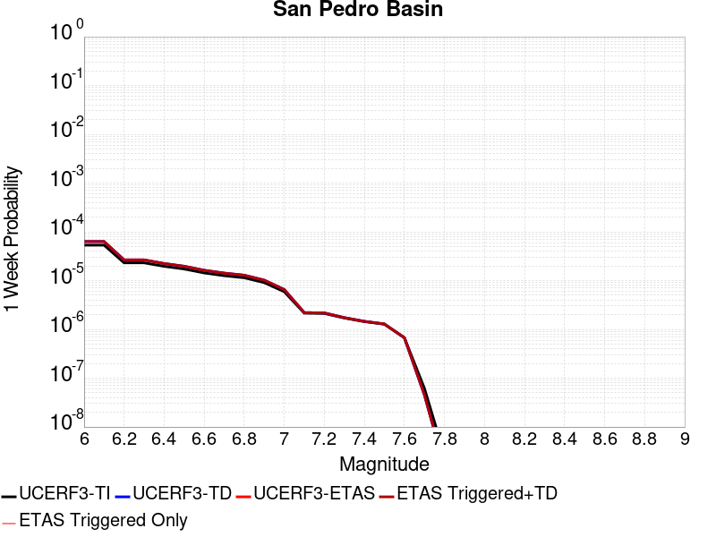 | 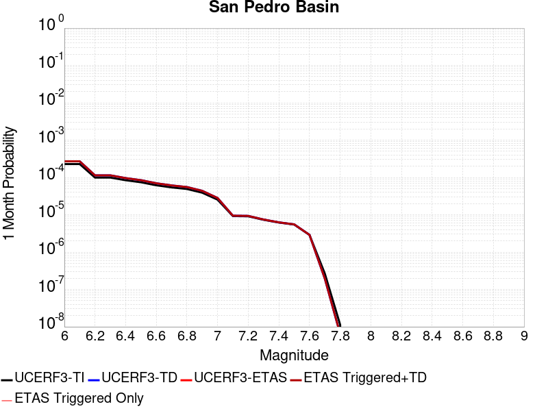 | 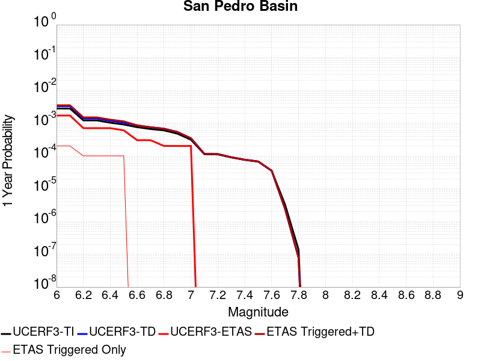 | 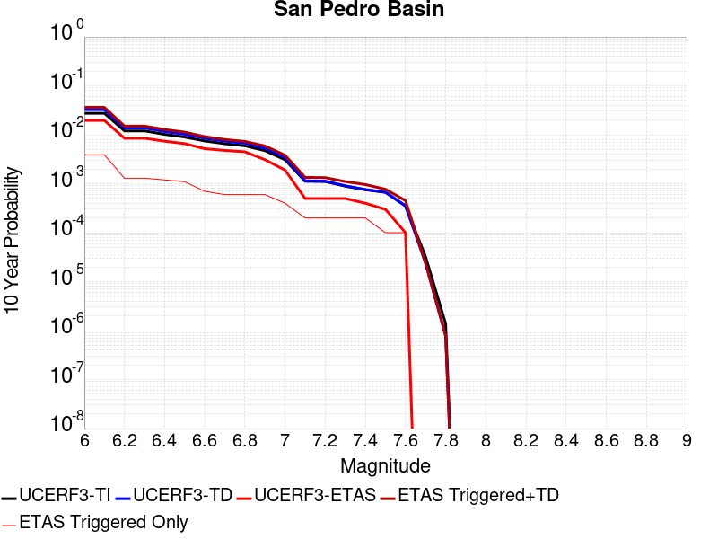 |

| Magnitude | 1 wk TI Prob | 1 wk TD Prob | 1 wk ETAS Prob | 1 wk ETAS/TD Gain | 1 wk ETAS Triggered+TD | 1 wk ETAS Triggered Only | 1 mo TI Prob | 1 mo TD Prob | 1 mo ETAS Prob | 1 mo ETAS/TD Gain | 1 mo ETAS Triggered+TD | 1 mo ETAS Triggered Only | 1 yr TI Prob | 1 yr TD Prob | 1 yr ETAS Prob | 1 yr ETAS/TD Gain | 1 yr ETAS Triggered+TD | 1 yr ETAS Triggered Only | 10 yr TI Prob | 10 yr TD Prob | 10 yr ETAS Prob | 10 yr ETAS/TD Gain | 10 yr ETAS Triggered+TD | 10 yr ETAS Triggered Only |
|-----|-----|-----|-----|-----|-----|-----|-----|-----|-----|-----|-----|-----|-----|-----|-----|-----|-----|-----|-----|-----|-----|-----|-----|-----|
| 6.0 | 5.3449043E-5 | 6.324608E-5 | 0.0 | 0.0 | 6.324608E-5 | 0.0 | 2.2904722E-4 | 2.7102992E-4 | 0.0 | 0.0 | 2.7102992E-4 | 0.0 | 0.0027850836 | 0.0032953976 | 0.0017 | 0.515871 | 0.0034947386 | 2.0E-4 | 0.027504366 | 0.032526672 | 0.0196 | 0.6025824 | 0.036299817 | 0.0039 |
| 6.1 | 5.3449043E-5 | 6.324608E-5 | 0.0 | 0.0 | 6.324608E-5 | 0.0 | 2.2904722E-4 | 2.7102992E-4 | 0.0 | 0.0 | 2.7102992E-4 | 0.0 | 0.0027850836 | 0.0032953976 | 0.0017 | 0.515871 | 0.0034947386 | 2.0E-4 | 0.027504366 | 0.032526672 | 0.0196 | 0.6025824 | 0.036299817 | 0.0039 |
| 6.2 | 2.3189454E-5 | 2.6600585E-5 | 0.0 | 0.0 | 2.6600585E-5 | 0.0 | 9.9379584E-5 | 1.1399779E-4 | 0.0 | 0.0 | 1.1399779E-4 | 0.0 | 0.0012092749 | 0.0013870863 | 7.0E-4 | 0.50465494 | 0.0014869476 | 1.0E-4 | 0.012027155 | 0.013789141 | 0.0085 | 0.6164271 | 0.015071214 | 0.0013 |
| 6.3 | 2.3189454E-5 | 2.6600585E-5 | 0.0 | 0.0 | 2.6600585E-5 | 0.0 | 9.9379584E-5 | 1.1399779E-4 | 0.0 | 0.0 | 1.1399779E-4 | 0.0 | 0.0012092749 | 0.0013870863 | 7.0E-4 | 0.50465494 | 0.0014869476 | 1.0E-4 | 0.012027155 | 0.013789141 | 0.0085 | 0.6164271 | 0.015071214 | 0.0013 |
| 6.4 | 1.966056E-5 | 2.2429225E-5 | 0.0 | 0.0 | 2.2429225E-5 | 0.0 | 8.425682E-5 | 9.6121934E-5 | 0.0 | 0.0 | 9.6121934E-5 | 0.0 | 0.001025344 | 0.0011696962 | 7.0E-4 | 0.598446 | 0.0012695793 | 1.0E-4 | 0.010206259 | 0.01163947 | 0.0074 | 0.63576776 | 0.012825503 | 0.0012 |
| 6.5 | 1.7342953E-5 | 1.9715859E-5 | 0.0 | 0.0 | 1.9715859E-5 | 0.0 | 7.4324824E-5 | 8.4494015E-5 | 0.0 | 0.0 | 8.4494015E-5 | 0.0 | 9.04529E-4 | 0.0010282659 | 6.0E-4 | 0.58350664 | 0.0011281631 | 1.0E-4 | 0.009008561 | 0.010238793 | 0.0066 | 0.64460725 | 0.011327529 | 0.0011 |
| 6.6 | 1.439804E-5 | 1.6299215E-5 | 0.0 | 0.0 | 1.6299215E-5 | 0.0 | 6.170443E-5 | 6.985209E-5 | 0.0 | 0.0 | 6.985209E-5 | 0.0 | 7.509924E-4 | 8.501493E-4 | 3.0E-4 | 0.3528792 | 8.501493E-4 | 0.0 | 0.0074845953 | 0.008472162 | 0.0052 | 0.61377484 | 0.009166232 | 7.0E-4 |
| 6.7 | 1.2634884E-5 | 1.42651015E-5 | 0.0 | 0.0 | 1.42651015E-5 | 0.0 | 5.414838E-5 | 6.113489E-5 | 0.0 | 0.0 | 6.113489E-5 | 0.0 | 6.590571E-4 | 7.4409344E-4 | 3.0E-4 | 0.40317518 | 7.4409344E-4 | 0.0 | 0.006571059 | 0.0074190306 | 0.0048 | 0.64698476 | 0.008014579 | 6.0E-4 |
| 6.8 | 1.146091E-5 | 1.2915136E-5 | 0.0 | 0.0 | 1.2915136E-5 | 0.0 | 4.911726E-5 | 5.5349574E-5 | 0.0 | 0.0 | 5.5349574E-5 | 0.0 | 5.9783855E-4 | 6.737024E-4 | 2.0E-4 | 0.29686698 | 6.737024E-4 | 0.0 | 0.0059623276 | 0.0067195306 | 0.0045 | 0.66968966 | 0.007315499 | 6.0E-4 |
| 6.9 | 9.109035E-6 | 1.0221103E-5 | 0.0 | 0.0 | 1.0221103E-5 | 0.0 | 3.9038136E-5 | 4.3804153E-5 | 0.0 | 0.0 | 4.3804153E-5 | 0.0 | 4.7518566E-4 | 5.3321297E-4 | 2.0E-4 | 0.37508467 | 5.3321297E-4 | 0.0 | 0.0047417083 | 0.0053220806 | 0.0031 | 0.58247894 | 0.0059188874 | 6.0E-4 |
| 7.0 | 5.9351028E-6 | 6.575783E-6 | 0.0 | 0.0 | 6.575783E-6 | 0.0 | 2.5435906E-5 | 2.8181757E-5 | 0.0 | 0.0 | 2.8181757E-5 | 0.0 | 3.0963816E-4 | 3.430824E-4 | 2.0E-4 | 0.5829503 | 3.430824E-4 | 0.0 | 0.0030920706 | 0.0034278368 | 0.0019 | 0.5542854 | 0.0038264657 | 4.0E-4 |
| 7.1 | 2.1557585E-6 | 2.2086524E-6 | 0.0 | 0.0 | 2.2086524E-6 | 0.0 | 9.238933E-6 | 9.46562E-6 | 0.0 | 0.0 | 9.46562E-6 | 0.0 | 1.1247819E-4 | 1.1523798E-4 | 0.0 | 0.0 | 1.1523798E-4 | 0.0 | 0.0011242128 | 0.0011517976 | 5.0E-4 | 0.43410406 | 0.0013515672 | 2.0E-4 |
| 7.2 | 2.1251979E-6 | 2.1770104E-6 | 0.0 | 0.0 | 2.1770104E-6 | 0.0 | 9.107958E-6 | 9.330012E-6 | 0.0 | 0.0 | 9.330012E-6 | 0.0 | 1.1088375E-4 | 1.13587135E-4 | 0.0 | 0.0 | 1.13587135E-4 | 0.0 | 0.0011082845 | 0.0011353061 | 5.0E-4 | 0.44040987 | 0.001335079 | 2.0E-4 |
| 7.3 | 1.7145798E-6 | 1.7435585E-6 | 0.0 | 0.0 | 1.7435585E-6 | 0.0 | 7.3481783E-6 | 7.4723725E-6 | 0.0 | 0.0 | 7.4723725E-6 | 0.0 | 8.94604E-5 | 9.097243E-5 | 0.0 | 0.0 | 9.097243E-5 | 0.0 | 8.9424395E-4 | 9.09361E-4 | 5.0E-4 | 0.54983664 | 0.0011091791 | 2.0E-4 |
| 7.4 | 1.4467993E-6 | 1.4635926E-6 | 0.0 | 0.0 | 1.4635926E-6 | 0.0 | 6.200554E-6 | 6.2725253E-6 | 0.0 | 0.0 | 6.2725253E-6 | 0.0 | 7.548913E-5 | 7.6365395E-5 | 0.0 | 0.0 | 7.6365395E-5 | 0.0 | 7.546349E-4 | 7.633988E-4 | 4.0E-4 | 0.5239725 | 9.6324616E-4 | 2.0E-4 |
| 7.5 | 1.2803735E-6 | 1.2926255E-6 | 0.0 | 0.0 | 1.2926255E-6 | 0.0 | 5.487303E-6 | 5.5398123E-6 | 0.0 | 0.0 | 5.5398123E-6 | 0.0 | 6.680587E-5 | 6.7445195E-5 | 0.0 | 0.0 | 6.7445195E-5 | 0.0 | 6.678579E-4 | 6.742544E-4 | 3.0E-4 | 0.44493595 | 7.741869E-4 | 1.0E-4 |
| 7.6 | 6.755009E-7 | 6.7667E-7 | 0.0 | 0.0 | 6.7667E-7 | 0.0 | 2.8950008E-6 | 2.9000116E-6 | 0.0 | 0.0 | 2.9000116E-6 | 0.0 | 3.5246063E-5 | 3.5307126E-5 | 0.0 | 0.0 | 3.5307126E-5 | 0.0 | 3.5240475E-4 | 3.530209E-4 | 1.0E-4 | 0.28326935 | 4.529856E-4 | 1.0E-4 |
| 7.7 | 6.211885E-8 | 4.567464E-8 | 0.0 | 0.0 | 4.567464E-8 | 0.0 | 2.6622362E-7 | 1.9574844E-7 | 0.0 | 0.0 | 1.9574844E-7 | 0.0 | 3.2412677E-6 | 2.383235E-6 | 0.0 | 0.0 | 2.383235E-6 | 0.0 | 3.2412205E-5 | 2.3832114E-5 | 0.0 | 0.0 | 2.3832114E-5 | 0.0 |
| 7.8 | 2.6580573E-9 | 1.5097251E-9 | 0.0 | 0.0 | 1.5097251E-9 | 0.0 | 1.1391674E-8 | 6.4702506E-9 | 0.0 | 0.0 | 6.4702506E-9 | 0.0 | 1.3869362E-7 | 7.87753E-8 | 0.0 | 0.0 | 7.87753E-8 | 0.0 | 1.3869354E-6 | 7.8775304E-7 | 0.0 | 0.0 | 7.8775304E-7 | 0.0 |

## Bicycle Lake
*[(top)](#table-of-contents)*

| 1 Week | 1 Month | 1 Year | 10 Year |
|-----|-----|-----|-----|
| 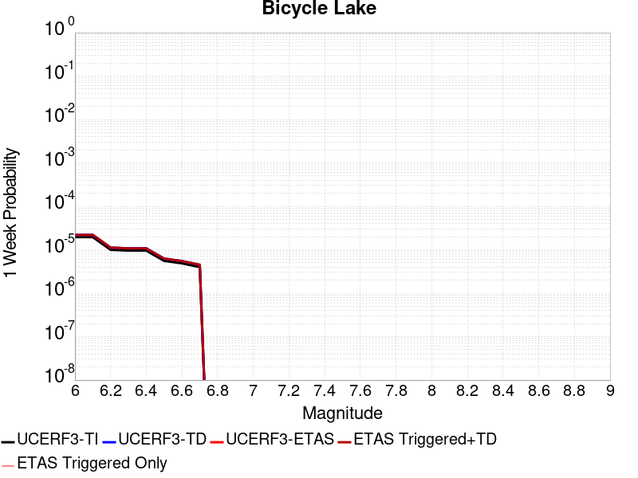 | 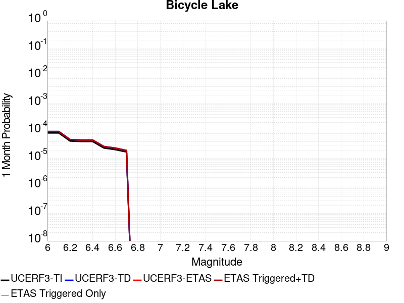 | 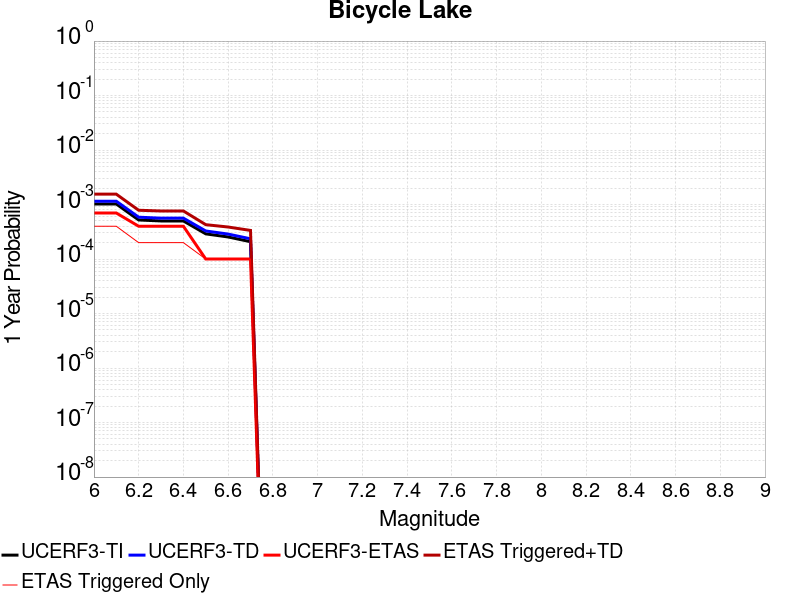 | 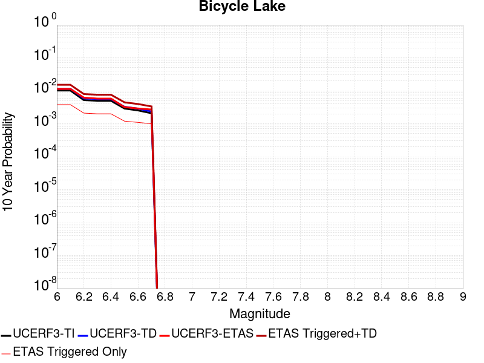 |

| Magnitude | 1 wk TI Prob | 1 wk TD Prob | 1 wk ETAS Prob | 1 wk ETAS/TD Gain | 1 wk ETAS Triggered+TD | 1 wk ETAS Triggered Only | 1 mo TI Prob | 1 mo TD Prob | 1 mo ETAS Prob | 1 mo ETAS/TD Gain | 1 mo ETAS Triggered+TD | 1 mo ETAS Triggered Only | 1 yr TI Prob | 1 yr TD Prob | 1 yr ETAS Prob | 1 yr ETAS/TD Gain | 1 yr ETAS Triggered+TD | 1 yr ETAS Triggered Only | 10 yr TI Prob | 10 yr TD Prob | 10 yr ETAS Prob | 10 yr ETAS/TD Gain | 10 yr ETAS Triggered+TD | 10 yr ETAS Triggered Only |
|-----|-----|-----|-----|-----|-----|-----|-----|-----|-----|-----|-----|-----|-----|-----|-----|-----|-----|-----|-----|-----|-----|-----|-----|-----|
| 6.0 | 1.9621975E-5 | 2.2067992E-5 | 0.0 | 0.0 | 2.2067992E-5 | 0.0 | 8.4091465E-5 | 9.457444E-5 | 0.0 | 0.0 | 9.457444E-5 | 0.0 | 0.0010233327 | 0.0011509702 | 7.0E-4 | 0.60818255 | 0.0015505098 | 4.0E-4 | 0.01018633 | 0.011463366 | 0.0114 | 0.9944722 | 0.015219806 | 0.0038 |
| 6.1 | 1.9621975E-5 | 2.2067992E-5 | 0.0 | 0.0 | 2.2067992E-5 | 0.0 | 8.4091465E-5 | 9.457444E-5 | 0.0 | 0.0 | 9.457444E-5 | 0.0 | 0.0010233327 | 0.0011509702 | 7.0E-4 | 0.60818255 | 0.0015505098 | 4.0E-4 | 0.01018633 | 0.011463366 | 0.0114 | 0.9944722 | 0.015219806 | 0.0038 |
| 6.2 | 9.9971285E-6 | 1.1240861E-5 | 0.0 | 0.0 | 1.1240861E-5 | 0.0 | 4.2844134E-5 | 4.817452E-5 | 0.0 | 0.0 | 4.817452E-5 | 0.0 | 5.2150246E-4 | 5.864188E-4 | 4.0E-4 | 0.6821064 | 7.863015E-4 | 2.0E-4 | 0.0052028033 | 0.005853805 | 0.0062 | 1.0591401 | 0.007941512 | 0.0021 |
| 6.3 | 9.589428E-6 | 1.0784147E-5 | 0.0 | 0.0 | 1.0784147E-5 | 0.0 | 4.10969E-5 | 4.6217247E-5 | 0.0 | 0.0 | 4.6217247E-5 | 0.0 | 5.002399E-4 | 5.6260143E-4 | 4.0E-4 | 0.7109829 | 7.624889E-4 | 2.0E-4 | 0.0049911533 | 0.005616848 | 0.0058 | 1.0326077 | 0.007605614 | 0.002 |
| 6.4 | 9.589428E-6 | 1.0784147E-5 | 0.0 | 0.0 | 1.0784147E-5 | 0.0 | 4.10969E-5 | 4.6217247E-5 | 0.0 | 0.0 | 4.6217247E-5 | 0.0 | 5.002399E-4 | 5.6260143E-4 | 4.0E-4 | 0.7109829 | 7.624889E-4 | 2.0E-4 | 0.0049911533 | 0.005616848 | 0.0058 | 1.0326077 | 0.007605614 | 0.002 |
| 6.5 | 5.557707E-6 | 6.2770173E-6 | 0.0 | 0.0 | 6.2770173E-6 | 0.0 | 2.3818526E-5 | 2.6901376E-5 | 0.0 | 0.0 | 2.6901376E-5 | 0.0 | 2.8995197E-4 | 3.2750185E-4 | 1.0E-4 | 0.30534178 | 4.274691E-4 | 1.0E-4 | 0.0028957394 | 0.003272821 | 0.0032 | 0.97774976 | 0.0044688936 | 0.0012 |
| 6.6 | 4.8742945E-6 | 5.505753E-6 | 0.0 | 0.0 | 5.505753E-6 | 0.0 | 2.0889667E-5 | 2.359602E-5 | 0.0 | 0.0 | 2.359602E-5 | 0.0 | 2.54302E-4 | 2.872698E-4 | 1.0E-4 | 0.34810483 | 3.8724105E-4 | 1.0E-4 | 0.002540112 | 0.0028715462 | 0.0029 | 1.0099089 | 0.0039683874 | 0.0011 |
| 6.7 | 3.991108E-6 | 4.5097186E-6 | 0.0 | 0.0 | 4.5097186E-6 | 0.0 | 1.7104636E-5 | 1.9327364E-5 | 0.0 | 0.0 | 1.9327364E-5 | 0.0 | 2.0822904E-4 | 2.3531067E-4 | 1.0E-4 | 0.42497012 | 3.3528713E-4 | 1.0E-4 | 0.0020803404 | 0.0023531066 | 0.0027 | 1.1474193 | 0.0033507536 | 0.001 |

## Greenville (So) 2011 CFM
*[(top)](#table-of-contents)*

| 1 Week | 1 Month | 1 Year | 10 Year |
|-----|-----|-----|-----|
| 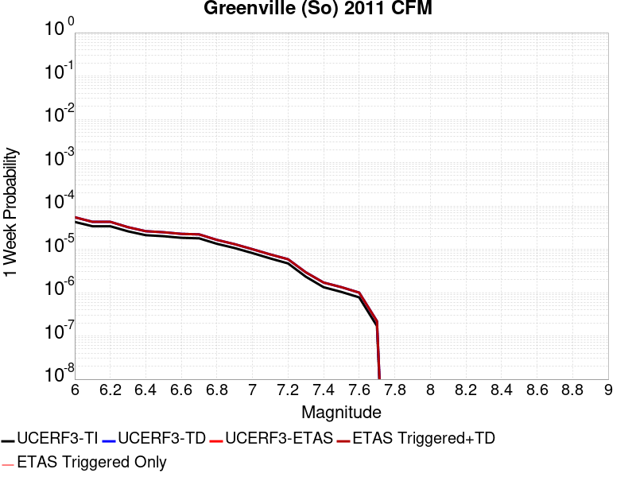 | 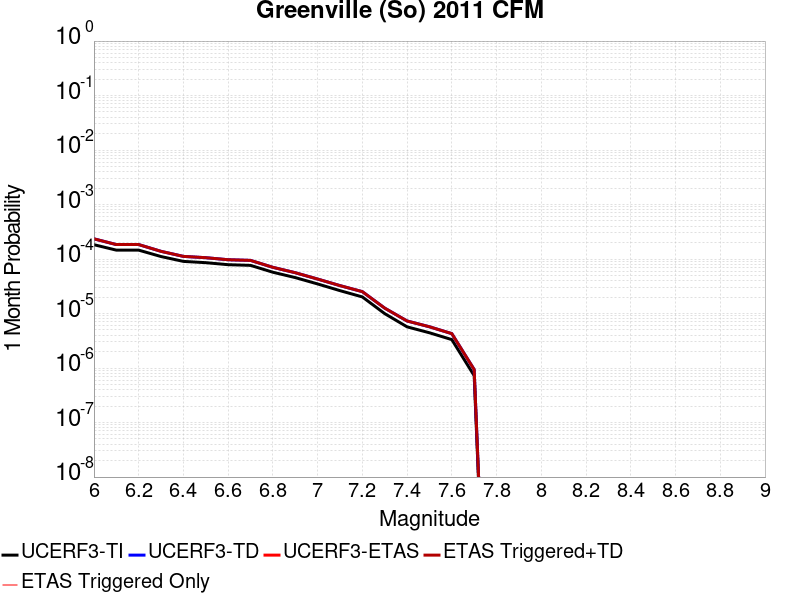 | 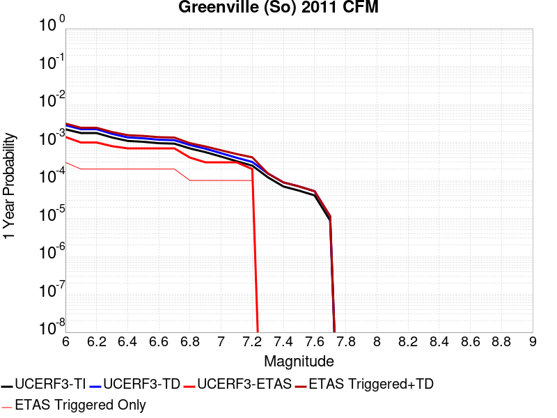 | 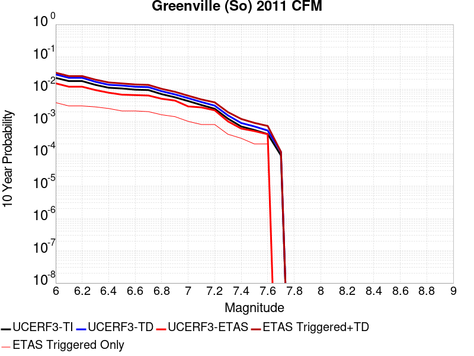 |

| Magnitude | 1 wk TI Prob | 1 wk TD Prob | 1 wk ETAS Prob | 1 wk ETAS/TD Gain | 1 wk ETAS Triggered+TD | 1 wk ETAS Triggered Only | 1 mo TI Prob | 1 mo TD Prob | 1 mo ETAS Prob | 1 mo ETAS/TD Gain | 1 mo ETAS Triggered+TD | 1 mo ETAS Triggered Only | 1 yr TI Prob | 1 yr TD Prob | 1 yr ETAS Prob | 1 yr ETAS/TD Gain | 1 yr ETAS Triggered+TD | 1 yr ETAS Triggered Only | 10 yr TI Prob | 10 yr TD Prob | 10 yr ETAS Prob | 10 yr ETAS/TD Gain | 10 yr ETAS Triggered+TD | 10 yr ETAS Triggered Only |
|-----|-----|-----|-----|-----|-----|-----|-----|-----|-----|-----|-----|-----|-----|-----|-----|-----|-----|-----|-----|-----|-----|-----|-----|-----|
| 6.0 | 4.279693E-5 | 5.4871653E-5 | 0.0 | 0.0 | 5.4871653E-5 | 0.0 | 1.8340252E-4 | 2.35145E-4 | 0.0 | 0.0 | 2.35145E-4 | 0.0 | 0.0022306389 | 0.002859405 | 0.0014 | 0.48961237 | 0.003158547 | 3.0E-4 | 0.022083808 | 0.028253423 | 0.015 | 0.5309091 | 0.03194606 | 0.0038 |
| 6.1 | 3.4037297E-5 | 4.3064574E-5 | 0.0 | 0.0 | 4.3064574E-5 | 0.0 | 1.4586597E-4 | 1.8455059E-4 | 0.0 | 0.0 | 1.8455059E-4 | 0.0 | 0.0017744715 | 0.002244753 | 0.001 | 0.4454833 | 0.002444304 | 2.0E-4 | 0.01760369 | 0.02223786 | 0.0118 | 0.5306266 | 0.025171146 | 0.003 |
| 6.2 | 3.4037297E-5 | 4.3064574E-5 | 0.0 | 0.0 | 4.3064574E-5 | 0.0 | 1.4586597E-4 | 1.8455059E-4 | 0.0 | 0.0 | 1.8455059E-4 | 0.0 | 0.0017744715 | 0.002244753 | 0.001 | 0.4454833 | 0.002444304 | 2.0E-4 | 0.01760369 | 0.02223786 | 0.0118 | 0.5306266 | 0.025171146 | 0.003 |
| 6.3 | 2.5956324E-5 | 3.2337128E-5 | 0.0 | 0.0 | 3.2337128E-5 | 0.0 | 1.11236644E-4 | 1.3858077E-4 | 0.0 | 0.0 | 1.3858077E-4 | 0.0 | 0.0013534647 | 0.0016859788 | 8.0E-4 | 0.47450182 | 0.0018856416 | 2.0E-4 | 0.013452509 | 0.016738787 | 0.0093 | 0.5555958 | 0.019491918 | 0.0028 |
| 6.4 | 2.1145053E-5 | 2.6124151E-5 | 0.0 | 0.0 | 2.6124151E-5 | 0.0 | 9.061851E-5 | 1.1195603E-4 | 0.0 | 0.0 | 1.1195603E-4 | 0.0 | 0.0011027219 | 0.0013622439 | 7.0E-4 | 0.5138581 | 0.0015619714 | 2.0E-4 | 0.01097266 | 0.0135424305 | 0.0077 | 0.5685833 | 0.016008575 | 0.0025 |
| 6.5 | 2.0030959E-5 | 2.4726009E-5 | 0.0 | 0.0 | 2.4726009E-5 | 0.0 | 8.584414E-5 | 1.0596449E-4 | 0.0 | 0.0 | 1.0596449E-4 | 0.0 | 0.0010446513 | 0.0012893851 | 7.0E-4 | 0.5428944 | 0.0014891273 | 2.0E-4 | 0.010397541 | 0.012822466 | 0.0067 | 0.5225204 | 0.014895539 | 0.0021 |
| 6.6 | 1.8395405E-5 | 2.2689894E-5 | 0.0 | 0.0 | 2.2689894E-5 | 0.0 | 7.8835066E-5 | 9.723894E-5 | 0.0 | 0.0 | 9.723894E-5 | 0.0 | 9.5939427E-4 | 0.0011832695 | 7.0E-4 | 0.5915812 | 0.0013830329 | 2.0E-4 | 0.009552629 | 0.011772812 | 0.0065 | 0.55211955 | 0.01384809 | 0.0021 |
| 6.7 | 1.7883482E-5 | 2.2062428E-5 | 0.0 | 0.0 | 2.2062428E-5 | 0.0 | 7.664124E-5 | 9.454999E-5 | 0.0 | 0.0 | 9.454999E-5 | 0.0 | 9.3270757E-4 | 0.0011505667 | 7.0E-4 | 0.6083958 | 0.0013503366 | 2.0E-4 | 0.009288026 | 0.011449214 | 0.0063 | 0.5502561 | 0.013426316 | 0.002 |
| 6.8 | 1.3373564E-5 | 1.6457283E-5 | 0.0 | 0.0 | 1.6457283E-5 | 0.0 | 5.7314013E-5 | 7.0529386E-5 | 0.0 | 0.0 | 7.0529386E-5 | 0.0 | 6.975747E-4 | 8.583717E-4 | 4.0E-4 | 0.46599856 | 9.582859E-4 | 1.0E-4 | 0.0069538904 | 0.008552243 | 0.005 | 0.58464193 | 0.010138559 | 0.0016 |
| 6.9 | 1.06692905E-5 | 1.3112284E-5 | 0.0 | 0.0 | 1.3112284E-5 | 0.0 | 4.5724726E-5 | 5.619436E-5 | 0.0 | 0.0 | 5.619436E-5 | 0.0 | 5.5655633E-4 | 6.839628E-4 | 3.0E-4 | 0.43862036 | 7.838944E-4 | 1.0E-4 | 0.005551645 | 0.006819882 | 0.0044 | 0.6451724 | 0.008210334 | 0.0014 |
| 7.0 | 8.157512E-6 | 1.0029763E-5 | 0.0 | 0.0 | 1.0029763E-5 | 0.0 | 3.4960296E-5 | 4.298401E-5 | 0.0 | 0.0 | 4.298401E-5 | 0.0 | 4.2555845E-4 | 5.2320835E-4 | 3.0E-4 | 0.57338536 | 6.23156E-4 | 1.0E-4 | 0.004247444 | 0.0052203177 | 0.0029 | 0.5555217 | 0.006215098 | 0.001 |
| 7.1 | 6.1467113E-6 | 7.599936E-6 | 0.0 | 0.0 | 7.599936E-6 | 0.0 | 2.6342783E-5 | 3.257075E-5 | 0.0 | 0.0 | 3.257075E-5 | 0.0 | 3.206762E-4 | 3.964776E-4 | 3.0E-4 | 0.75666314 | 4.9643795E-4 | 1.0E-4 | 0.0032021382 | 0.0039579673 | 0.0027 | 0.68216836 | 0.004754801 | 8.0E-4 |
| 7.2 | 4.713467E-6 | 5.890499E-6 | 0.0 | 0.0 | 5.890499E-6 | 0.0 | 2.0200418E-5 | 2.5244755E-5 | 0.0 | 0.0 | 2.5244755E-5 | 0.0 | 2.4591232E-4 | 3.0731212E-4 | 2.0E-4 | 0.6508041 | 4.072814E-4 | 1.0E-4 | 0.0024564038 | 0.0030691908 | 0.0022 | 0.71680135 | 0.0038667354 | 8.0E-4 |
| 7.3 | 2.3266216E-6 | 2.9365724E-6 | 0.0 | 0.0 | 2.9365724E-6 | 0.0 | 9.971197E-6 | 1.258525E-5 | 0.0 | 0.0 | 1.258525E-5 | 0.0 | 1.2139256E-4 | 1.532148E-4 | 0.0 | 0.0 | 1.532148E-4 | 0.0 | 0.0012132627 | 0.0015311961 | 0.001 | 0.6530842 | 0.0019305836 | 4.0E-4 |
| 7.4 | 1.3314E-6 | 1.7055879E-6 | 0.0 | 0.0 | 1.7055879E-6 | 0.0 | 5.7059874E-6 | 7.309642E-6 | 0.0 | 0.0 | 7.309642E-6 | 0.0 | 6.946818E-5 | 8.899131E-5 | 0.0 | 0.0 | 8.899131E-5 | 0.0 | 6.9446466E-4 | 8.8957E-4 | 6.0E-4 | 0.6744832 | 0.0011893031 | 3.0E-4 |
| 7.5 | 1.0362941E-6 | 1.3353753E-6 | 0.0 | 0.0 | 1.3353753E-6 | 0.0 | 4.4412527E-6 | 5.7230245E-6 | 0.0 | 0.0 | 5.7230245E-6 | 0.0 | 5.407091E-5 | 6.967564E-5 | 0.0 | 0.0 | 6.967564E-5 | 0.0 | 5.405776E-4 | 6.9652876E-4 | 5.0E-4 | 0.71784544 | 8.963894E-4 | 2.0E-4 |
| 7.6 | 7.764784E-7 | 9.991577E-7 | 0.0 | 0.0 | 9.991577E-7 | 0.0 | 3.3277602E-6 | 4.2820975E-6 | 0.0 | 0.0 | 4.2820975E-6 | 0.0 | 4.0514726E-5 | 5.213333E-5 | 0.0 | 0.0 | 5.213333E-5 | 0.0 | 4.050734E-4 | 5.21178E-4 | 4.0E-4 | 0.7674921 | 7.2107377E-4 | 2.0E-4 |
| 7.7 | 1.6927763E-7 | 2.191352E-7 | 0.0 | 0.0 | 2.191352E-7 | 0.0 | 7.2547533E-7 | 9.3915054E-7 | 0.0 | 0.0 | 9.3915054E-7 | 0.0 | 8.832627E-6 | 1.1434101E-5 | 0.0 | 0.0 | 1.1434101E-5 | 0.0 | 8.8322755E-5 | 1.1434293E-4 | 0.0 | 0.0 | 1.1434293E-4 | 0.0 |

## Cleghorn Pass
*[(top)](#table-of-contents)*

| 1 Week | 1 Month | 1 Year | 10 Year |
|-----|-----|-----|-----|
| 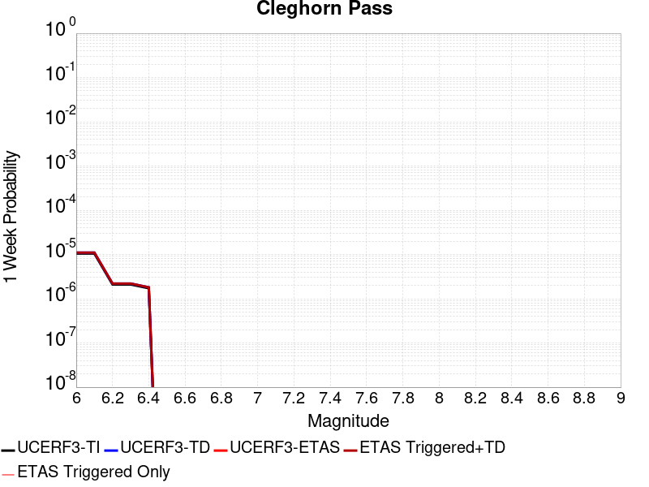 | 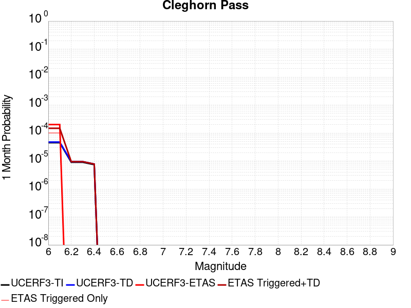 | 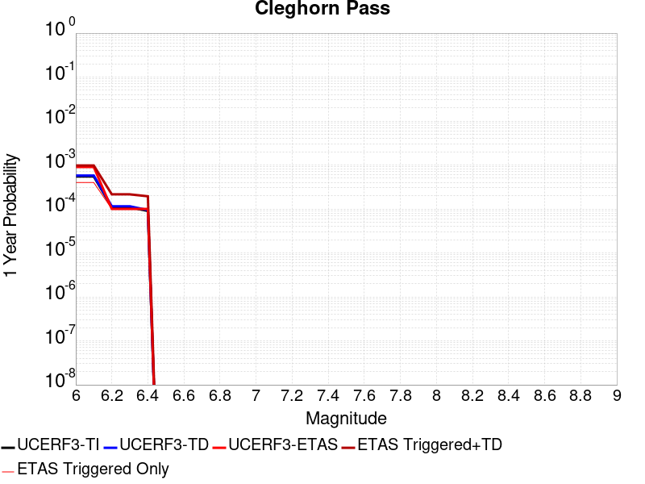 | 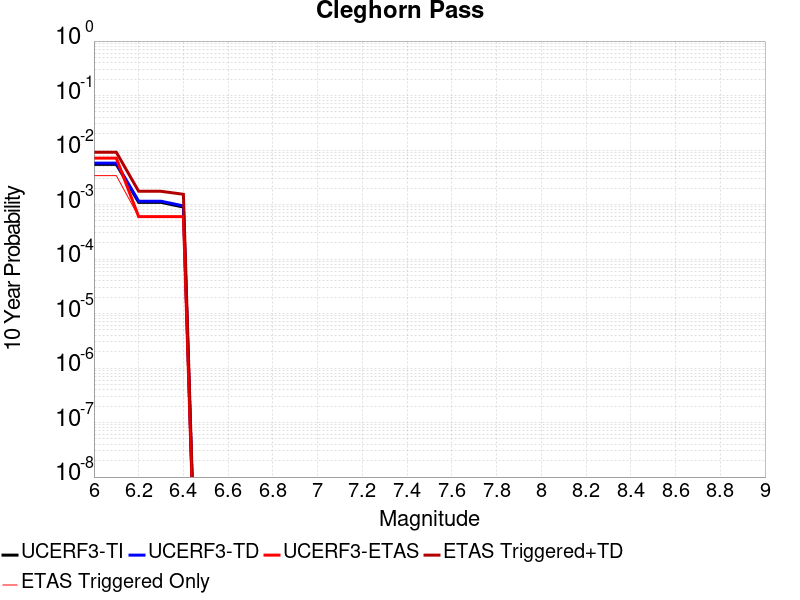 |

| Magnitude | 1 wk TI Prob | 1 wk TD Prob | 1 wk ETAS Prob | 1 wk ETAS/TD Gain | 1 wk ETAS Triggered+TD | 1 wk ETAS Triggered Only | 1 mo TI Prob | 1 mo TD Prob | 1 mo ETAS Prob | 1 mo ETAS/TD Gain | 1 mo ETAS Triggered+TD | 1 mo ETAS Triggered Only | 1 yr TI Prob | 1 yr TD Prob | 1 yr ETAS Prob | 1 yr ETAS/TD Gain | 1 yr ETAS Triggered+TD | 1 yr ETAS Triggered Only | 10 yr TI Prob | 10 yr TD Prob | 10 yr ETAS Prob | 10 yr ETAS/TD Gain | 10 yr ETAS Triggered+TD | 10 yr ETAS Triggered Only |
|-----|-----|-----|-----|-----|-----|-----|-----|-----|-----|-----|-----|-----|-----|-----|-----|-----|-----|-----|-----|-----|-----|-----|-----|-----|
| 6.0 | 1.0522846E-5 | 1.1034972E-5 | 0.0 | 0.0 | 1.1034972E-5 | 0.0 | 4.509713E-5 | 4.7292175E-5 | 2.0E-4 | 4.229029 | 1.4728744E-4 | 1.0E-4 | 5.4891926E-4 | 5.7568273E-4 | 9.0E-4 | 1.5633612 | 9.754524E-4 | 4.0E-4 | 0.0054756533 | 0.0057470747 | 0.0071 | 1.2354112 | 0.009127535 | 0.0034 |
| 6.1 | 1.0522846E-5 | 1.1034972E-5 | 0.0 | 0.0 | 1.1034972E-5 | 0.0 | 4.509713E-5 | 4.7292175E-5 | 2.0E-4 | 4.229029 | 1.4728744E-4 | 1.0E-4 | 5.4891926E-4 | 5.7568273E-4 | 9.0E-4 | 1.5633612 | 9.754524E-4 | 4.0E-4 | 0.0054756533 | 0.0057470747 | 0.0071 | 1.2354112 | 0.009127535 | 0.0034 |
| 6.2 | 2.1045846E-6 | 2.2070678E-6 | 0.0 | 0.0 | 2.2070678E-6 | 0.0 | 9.019617E-6 | 9.458851E-6 | 0.0 | 0.0 | 9.458851E-6 | 0.0 | 1.098083E-4 | 1.1515962E-4 | 1.0E-4 | 0.8683599 | 2.151481E-4 | 1.0E-4 | 0.0010975406 | 0.0011514104 | 6.0E-4 | 0.52110004 | 0.0017507196 | 6.0E-4 |
| 6.3 | 2.1045846E-6 | 2.2070678E-6 | 0.0 | 0.0 | 2.2070678E-6 | 0.0 | 9.019617E-6 | 9.458851E-6 | 0.0 | 0.0 | 9.458851E-6 | 0.0 | 1.098083E-4 | 1.1515962E-4 | 1.0E-4 | 0.8683599 | 2.151481E-4 | 1.0E-4 | 0.0010975406 | 0.0011514104 | 6.0E-4 | 0.52110004 | 0.0017507196 | 6.0E-4 |
| 6.4 | 1.7259927E-6 | 1.8099477E-6 | 0.0 | 0.0 | 1.8099477E-6 | 0.0 | 7.3970905E-6 | 7.756918E-6 | 0.0 | 0.0 | 7.756918E-6 | 0.0 | 9.005586E-5 | 9.444048E-5 | 1.0E-4 | 1.0588679 | 1.9443104E-4 | 1.0E-4 | 9.001937E-4 | 9.444048E-4 | 6.0E-4 | 0.6353208 | 0.0015438382 | 6.0E-4 |

## Blue Cut
*[(top)](#table-of-contents)*

| 1 Week | 1 Month | 1 Year | 10 Year |
|-----|-----|-----|-----|
| 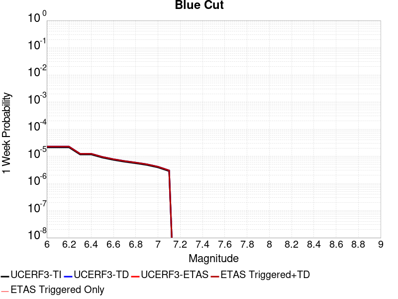 | 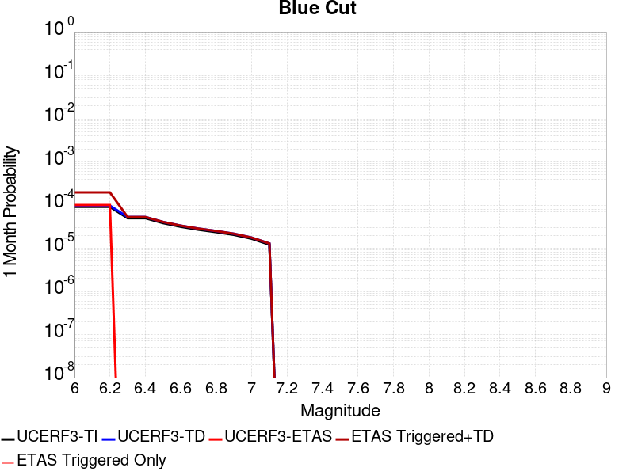 | 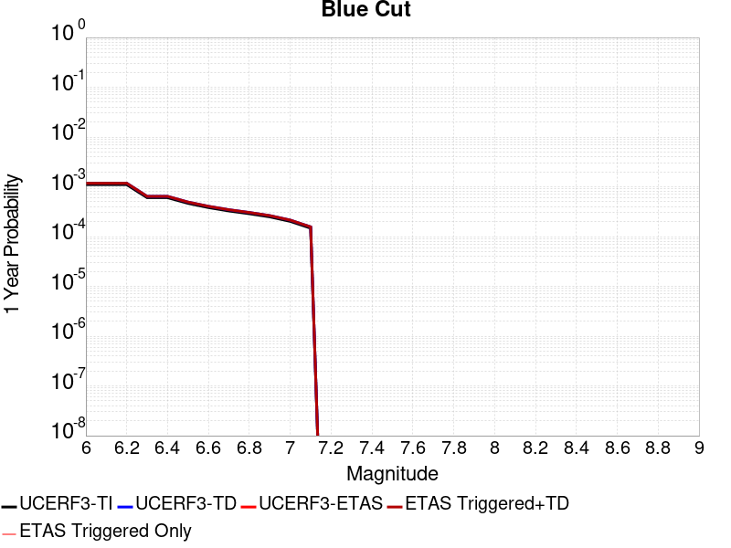 | 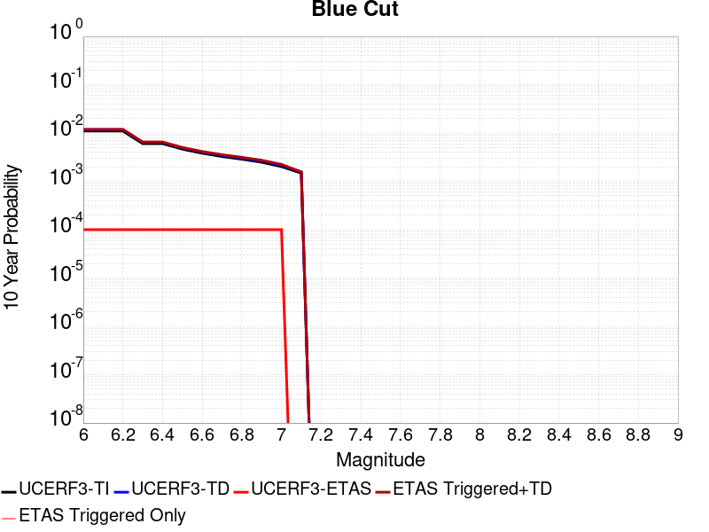 |

| Magnitude | 1 wk TI Prob | 1 wk TD Prob | 1 wk ETAS Prob | 1 wk ETAS/TD Gain | 1 wk ETAS Triggered+TD | 1 wk ETAS Triggered Only | 1 mo TI Prob | 1 mo TD Prob | 1 mo ETAS Prob | 1 mo ETAS/TD Gain | 1 mo ETAS Triggered+TD | 1 mo ETAS Triggered Only | 1 yr TI Prob | 1 yr TD Prob | 1 yr ETAS Prob | 1 yr ETAS/TD Gain | 1 yr ETAS Triggered+TD | 1 yr ETAS Triggered Only | 10 yr TI Prob | 10 yr TD Prob | 10 yr ETAS Prob | 10 yr ETAS/TD Gain | 10 yr ETAS Triggered+TD | 10 yr ETAS Triggered Only |
|-----|-----|-----|-----|-----|-----|-----|-----|-----|-----|-----|-----|-----|-----|-----|-----|-----|-----|-----|-----|-----|-----|-----|-----|-----|
| 6.0 | 2.1227985E-5 | 2.270289E-5 | 0.0 | 0.0 | 2.270289E-5 | 0.0 | 9.097391E-5 | 9.7294804E-5 | 1.0E-4 | 1.0278041 | 1.9728507E-4 | 1.0E-4 | 0.0011070445 | 0.0011839785 | 9.0E-4 | 0.76014894 | 0.0013837417 | 2.0E-4 | 0.011015458 | 0.011782538 | 0.0097 | 0.82325214 | 0.015537765 | 0.0038 |
| 6.1 | 2.1227985E-5 | 2.270289E-5 | 0.0 | 0.0 | 2.270289E-5 | 0.0 | 9.097391E-5 | 9.7294804E-5 | 1.0E-4 | 1.0278041 | 1.9728507E-4 | 1.0E-4 | 0.0011070445 | 0.0011839785 | 9.0E-4 | 0.76014894 | 0.0013837417 | 2.0E-4 | 0.011015458 | 0.011782538 | 0.0097 | 0.82325214 | 0.015537765 | 0.0038 |
| 6.2 | 2.1227985E-5 | 2.270289E-5 | 0.0 | 0.0 | 2.270289E-5 | 0.0 | 9.097391E-5 | 9.7294804E-5 | 1.0E-4 | 1.0278041 | 1.9728507E-4 | 1.0E-4 | 0.0011070445 | 0.0011839785 | 9.0E-4 | 0.76014894 | 0.0013837417 | 2.0E-4 | 0.011015458 | 0.011782538 | 0.0097 | 0.82325214 | 0.015537765 | 0.0038 |
| 6.3 | 1.1613981E-5 | 1.2345328E-5 | 0.0 | 0.0 | 1.2345328E-5 | 0.0 | 4.9773254E-5 | 5.2907548E-5 | 0.0 | 0.0 | 5.2907548E-5 | 0.0 | 6.0582085E-4 | 6.4397143E-4 | 4.0E-4 | 0.62114555 | 7.4390706E-4 | 1.0E-4 | 0.0060417196 | 0.006422299 | 0.0046 | 0.7162544 | 0.008310096 | 0.0019 |
| 6.4 | 1.1613981E-5 | 1.2345328E-5 | 0.0 | 0.0 | 1.2345328E-5 | 0.0 | 4.9773254E-5 | 5.2907548E-5 | 0.0 | 0.0 | 5.2907548E-5 | 0.0 | 6.0582085E-4 | 6.4397143E-4 | 4.0E-4 | 0.62114555 | 7.4390706E-4 | 1.0E-4 | 0.0060417196 | 0.006422299 | 0.0046 | 0.7162544 | 0.008310096 | 0.0019 |
| 6.5 | 8.931326E-6 | 9.475502E-6 | 0.0 | 0.0 | 9.475502E-6 | 0.0 | 3.8276554E-5 | 4.0608713E-5 | 0.0 | 0.0 | 4.0608713E-5 | 0.0 | 4.6591737E-4 | 4.943081E-4 | 4.0E-4 | 0.8092119 | 5.9425866E-4 | 1.0E-4 | 0.0046494175 | 0.004932994 | 0.004 | 0.8108666 | 0.006525101 | 0.0016 |
| 6.6 | 7.345353E-6 | 7.785355E-6 | 0.0 | 0.0 | 7.785355E-6 | 0.0 | 3.1479703E-5 | 3.3365424E-5 | 0.0 | 0.0 | 3.3365424E-5 | 0.0 | 3.83198E-4 | 4.0615632E-4 | 3.0E-4 | 0.7386319 | 5.0611567E-4 | 1.0E-4 | 0.0038253788 | 0.0040549305 | 0.0033 | 0.81382406 | 0.005349659 | 0.0013 |
| 6.7 | 6.2775666E-6 | 6.6509715E-6 | 0.0 | 0.0 | 6.6509715E-6 | 0.0 | 2.690358E-5 | 2.8503895E-5 | 0.0 | 0.0 | 2.8503895E-5 | 0.0 | 3.2750185E-4 | 3.4698716E-4 | 3.0E-4 | 0.8645853 | 4.4695247E-4 | 1.0E-4 | 0.0032701963 | 0.0034651938 | 0.0031 | 0.8946108 | 0.004760689 | 0.0013 |
| 6.8 | 5.5234095E-6 | 5.851442E-6 | 0.0 | 0.0 | 5.851442E-6 | 0.0 | 2.367154E-5 | 2.5077408E-5 | 0.0 | 0.0 | 2.5077408E-5 | 0.0 | 2.8816288E-4 | 3.0528192E-4 | 2.0E-4 | 0.6551321 | 4.052514E-4 | 1.0E-4 | 0.002877895 | 0.0030493408 | 0.0028 | 0.91823125 | 0.0043453765 | 0.0013 |
| 6.9 | 4.7780054E-6 | 5.0622407E-6 | 0.0 | 0.0 | 5.0622407E-6 | 0.0 | 2.0477004E-5 | 2.1695178E-5 | 0.0 | 0.0 | 2.1695178E-5 | 0.0 | 2.4927902E-4 | 2.641138E-4 | 1.0E-4 | 0.37862468 | 3.6408738E-4 | 1.0E-4 | 0.0024899957 | 0.0026386904 | 0.0025 | 0.9474397 | 0.003835524 | 0.0012 |
| 7.0 | 3.883171E-6 | 4.115883E-6 | 0.0 | 0.0 | 4.115883E-6 | 0.0 | 1.6642054E-5 | 1.7639417E-5 | 0.0 | 0.0 | 1.7639417E-5 | 0.0 | 2.0259817E-4 | 2.1474561E-4 | 1.0E-4 | 0.46566725 | 3.1472414E-4 | 1.0E-4 | 0.0020241356 | 0.002146056 | 0.0019 | 0.8853451 | 0.002944339 | 8.0E-4 |
| 7.1 | 2.8358215E-6 | 3.00779E-6 | 0.0 | 0.0 | 3.00779E-6 | 0.0 | 1.2153464E-5 | 1.2890502E-5 | 0.0 | 0.0 | 1.2890502E-5 | 0.0 | 1.4795837E-4 | 1.5693712E-4 | 0.0 | 0.0 | 1.5693712E-4 | 0.0 | 0.001478599 | 0.0015689074 | 0.0014 | 0.8923408 | 0.0019682797 | 4.0E-4 |

## Lost Hills
*[(top)](#table-of-contents)*

| 1 Week | 1 Month | 1 Year | 10 Year |
|-----|-----|-----|-----|
| 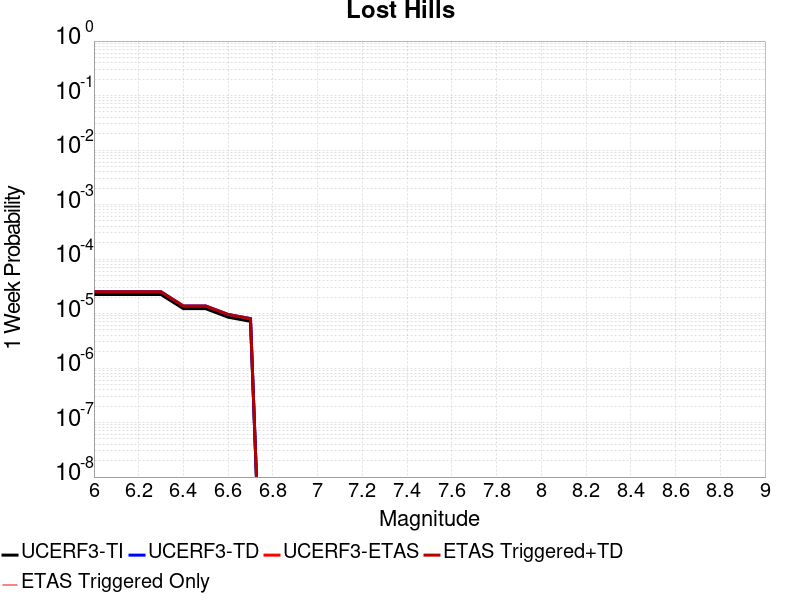 | 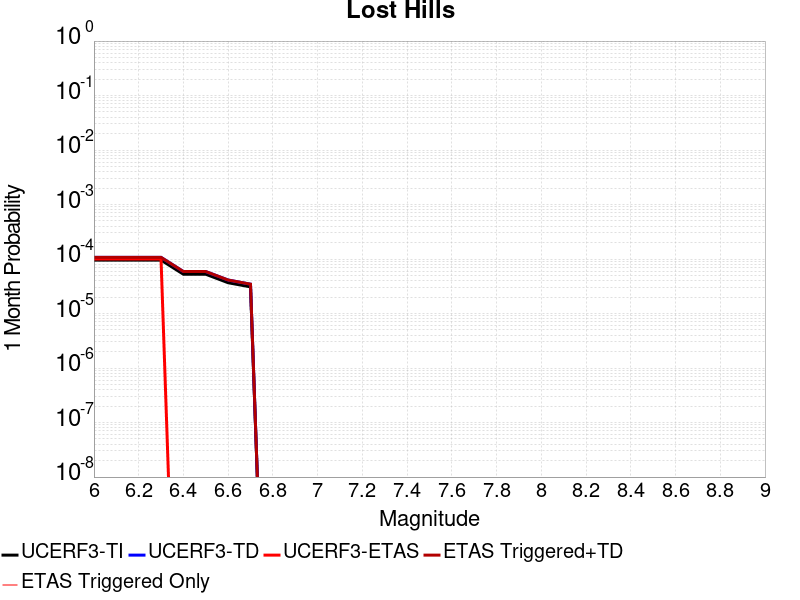 | 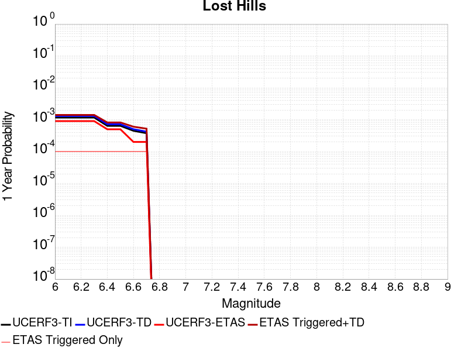 | 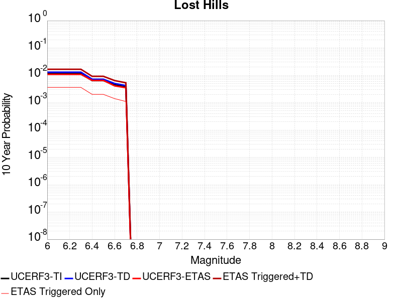 |

| Magnitude | 1 wk TI Prob | 1 wk TD Prob | 1 wk ETAS Prob | 1 wk ETAS/TD Gain | 1 wk ETAS Triggered+TD | 1 wk ETAS Triggered Only | 1 mo TI Prob | 1 mo TD Prob | 1 mo ETAS Prob | 1 mo ETAS/TD Gain | 1 mo ETAS Triggered+TD | 1 mo ETAS Triggered Only | 1 yr TI Prob | 1 yr TD Prob | 1 yr ETAS Prob | 1 yr ETAS/TD Gain | 1 yr ETAS Triggered+TD | 1 yr ETAS Triggered Only | 10 yr TI Prob | 10 yr TD Prob | 10 yr ETAS Prob | 10 yr ETAS/TD Gain | 10 yr ETAS Triggered+TD | 10 yr ETAS Triggered Only |
|-----|-----|-----|-----|-----|-----|-----|-----|-----|-----|-----|-----|-----|-----|-----|-----|-----|-----|-----|-----|-----|-----|-----|-----|-----|
| 6.0 | 2.233523E-5 | 2.5074094E-5 | 0.0 | 0.0 | 2.5074094E-5 | 0.0 | 9.571891E-5 | 1.0745692E-4 | 1.0E-4 | 0.9306055 | 1.0745692E-4 | 0.0 | 0.0011647546 | 0.0013076705 | 9.0E-4 | 0.6882467 | 0.0014075398 | 1.0E-4 | 0.011586686 | 0.013016312 | 0.0108 | 0.82972807 | 0.016569454 | 0.0036 |
| 6.1 | 2.233523E-5 | 2.5074094E-5 | 0.0 | 0.0 | 2.5074094E-5 | 0.0 | 9.571891E-5 | 1.0745692E-4 | 1.0E-4 | 0.9306055 | 1.0745692E-4 | 0.0 | 0.0011647546 | 0.0013076705 | 9.0E-4 | 0.6882467 | 0.0014075398 | 1.0E-4 | 0.011586686 | 0.013016312 | 0.0108 | 0.82972807 | 0.016569454 | 0.0036 |
| 6.2 | 2.233523E-5 | 2.5074094E-5 | 0.0 | 0.0 | 2.5074094E-5 | 0.0 | 9.571891E-5 | 1.0745692E-4 | 1.0E-4 | 0.9306055 | 1.0745692E-4 | 0.0 | 0.0011647546 | 0.0013076705 | 9.0E-4 | 0.6882467 | 0.0014075398 | 1.0E-4 | 0.011586686 | 0.013016312 | 0.0108 | 0.82972807 | 0.016569454 | 0.0036 |
| 6.3 | 2.233523E-5 | 2.5074094E-5 | 0.0 | 0.0 | 2.5074094E-5 | 0.0 | 9.571891E-5 | 1.0745692E-4 | 1.0E-4 | 0.9306055 | 1.0745692E-4 | 0.0 | 0.0011647546 | 0.0013076705 | 9.0E-4 | 0.6882467 | 0.0014075398 | 1.0E-4 | 0.011586686 | 0.013016312 | 0.0108 | 0.82972807 | 0.016569454 | 0.0036 |
| 6.4 | 1.2288092E-5 | 1.3763646E-5 | 0.0 | 0.0 | 1.3763646E-5 | 0.0 | 5.2662188E-5 | 5.8986247E-5 | 0.0 | 0.0 | 5.8986247E-5 | 0.0 | 6.409735E-4 | 7.180145E-4 | 5.0E-4 | 0.69636476 | 8.1794267E-4 | 1.0E-4 | 0.006391279 | 0.007166129 | 0.0065 | 0.9070448 | 0.009151797 | 0.002 |
| 6.5 | 1.2288092E-5 | 1.3763646E-5 | 0.0 | 0.0 | 1.3763646E-5 | 0.0 | 5.2662188E-5 | 5.8986247E-5 | 0.0 | 0.0 | 5.8986247E-5 | 0.0 | 6.409735E-4 | 7.180145E-4 | 5.0E-4 | 0.69636476 | 8.1794267E-4 | 1.0E-4 | 0.006391279 | 0.007166129 | 0.0065 | 0.9070448 | 0.009151797 | 0.002 |
| 6.6 | 8.58281E-6 | 9.621468E-6 | 0.0 | 0.0 | 9.621468E-6 | 0.0 | 3.6782953E-5 | 4.123468E-5 | 0.0 | 0.0 | 4.123468E-5 | 0.0 | 4.4774043E-4 | 5.019996E-4 | 2.0E-4 | 0.3984067 | 6.019494E-4 | 1.0E-4 | 0.0044683935 | 0.0050167954 | 0.0041 | 0.8172548 | 0.0064097717 | 0.0014 |
| 6.7 | 7.205685E-6 | 8.07797E-6 | 0.0 | 0.0 | 8.07797E-6 | 0.0 | 3.088114E-5 | 3.4619872E-5 | 0.0 | 0.0 | 3.4619872E-5 | 0.0 | 3.7591302E-4 | 4.2149695E-4 | 2.0E-4 | 0.4744993 | 5.214548E-4 | 1.0E-4 | 0.0037527776 | 0.0042149695 | 0.0035 | 0.83037376 | 0.005310333 | 0.0011 |

## San Jacinto (San Bernardino)
*[(top)](#table-of-contents)*

| 1 Week | 1 Month | 1 Year | 10 Year |
|-----|-----|-----|-----|
| 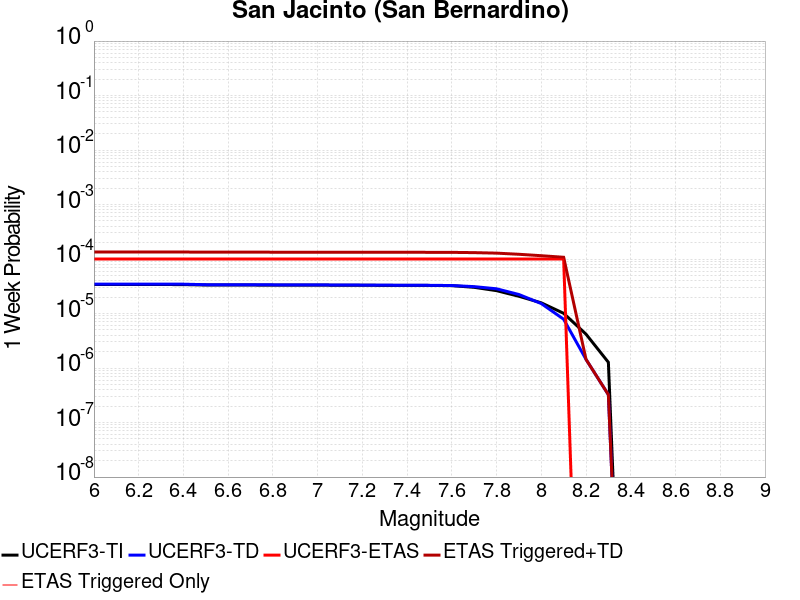 | 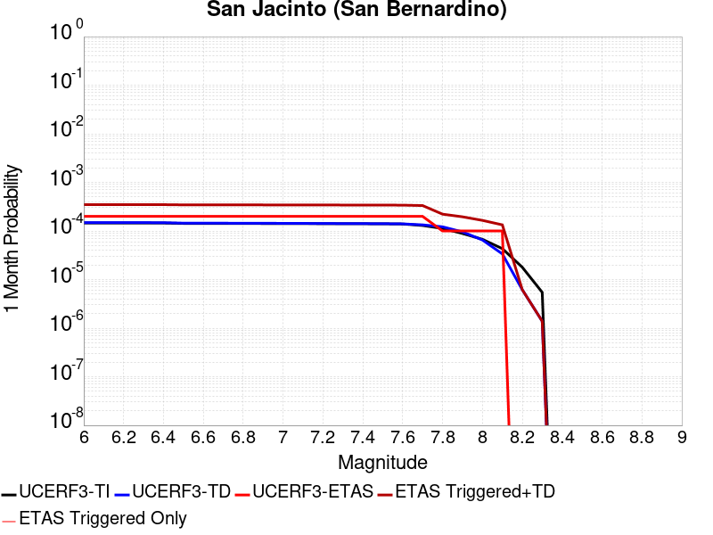 | 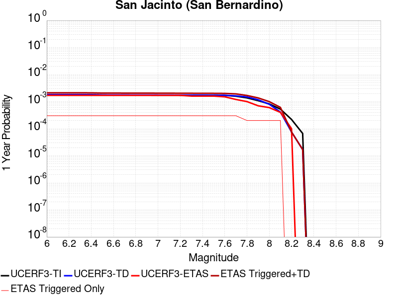 | 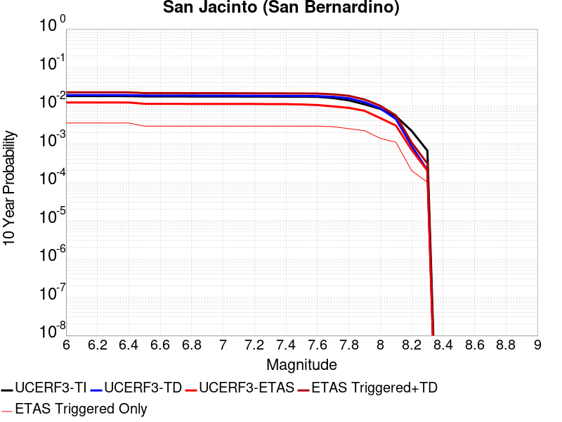 |

| Magnitude | 1 wk TI Prob | 1 wk TD Prob | 1 wk ETAS Prob | 1 wk ETAS/TD Gain | 1 wk ETAS Triggered+TD | 1 wk ETAS Triggered Only | 1 mo TI Prob | 1 mo TD Prob | 1 mo ETAS Prob | 1 mo ETAS/TD Gain | 1 mo ETAS Triggered+TD | 1 mo ETAS Triggered Only | 1 yr TI Prob | 1 yr TD Prob | 1 yr ETAS Prob | 1 yr ETAS/TD Gain | 1 yr ETAS Triggered+TD | 1 yr ETAS Triggered Only | 10 yr TI Prob | 10 yr TD Prob | 10 yr ETAS Prob | 10 yr ETAS/TD Gain | 10 yr ETAS Triggered+TD | 10 yr ETAS Triggered Only |
|-----|-----|-----|-----|-----|-----|-----|-----|-----|-----|-----|-----|-----|-----|-----|-----|-----|-----|-----|-----|-----|-----|-----|-----|-----|
| 6.0 | 3.409352E-5 | 3.4715773E-5 | 1.0E-4 | 2.8805351 | 1.347123E-4 | 1.0E-4 | 1.461069E-4 | 1.487734E-4 | 2.0E-4 | 1.3443264 | 3.4874363E-4 | 2.0E-4 | 0.0017774 | 0.0018098128 | 0.0017 | 0.9393236 | 0.00210927 | 3.0E-4 | 0.01763251 | 0.018698314 | 0.012 | 0.6417691 | 0.02213287 | 0.0035 |
| 6.1 | 3.409352E-5 | 3.4715773E-5 | 1.0E-4 | 2.8805351 | 1.347123E-4 | 1.0E-4 | 1.461069E-4 | 1.487734E-4 | 2.0E-4 | 1.3443264 | 3.4874363E-4 | 2.0E-4 | 0.0017774 | 0.0018098128 | 0.0017 | 0.9393236 | 0.00210927 | 3.0E-4 | 0.01763251 | 0.018698314 | 0.012 | 0.6417691 | 0.02213287 | 0.0035 |
| 6.2 | 3.409352E-5 | 3.4715773E-5 | 1.0E-4 | 2.8805351 | 1.347123E-4 | 1.0E-4 | 1.461069E-4 | 1.487734E-4 | 2.0E-4 | 1.3443264 | 3.4874363E-4 | 2.0E-4 | 0.0017774 | 0.0018098128 | 0.0017 | 0.9393236 | 0.00210927 | 3.0E-4 | 0.01763251 | 0.018698314 | 0.012 | 0.6417691 | 0.02213287 | 0.0035 |
| 6.3 | 3.409352E-5 | 3.4715773E-5 | 1.0E-4 | 2.8805351 | 1.347123E-4 | 1.0E-4 | 1.461069E-4 | 1.487734E-4 | 2.0E-4 | 1.3443264 | 3.4874363E-4 | 2.0E-4 | 0.0017774 | 0.0018098128 | 0.0017 | 0.9393236 | 0.00210927 | 3.0E-4 | 0.01763251 | 0.018698314 | 0.012 | 0.6417691 | 0.02213287 | 0.0035 |
| 6.4 | 3.400795E-5 | 3.4608718E-5 | 1.0E-4 | 2.8894455 | 1.3460526E-4 | 1.0E-4 | 1.4574021E-4 | 1.4831465E-4 | 2.0E-4 | 1.3484845 | 3.48285E-4 | 2.0E-4 | 0.0017729428 | 0.0018042369 | 0.0017 | 0.9422266 | 0.0021036956 | 3.0E-4 | 0.017588645 | 0.018643502 | 0.012 | 0.6436559 | 0.02207825 | 0.0035 |
| 6.5 | 3.341482E-5 | 3.3871227E-5 | 1.0E-4 | 2.9523582 | 1.3386784E-4 | 1.0E-4 | 1.4319851E-4 | 1.4515434E-4 | 2.0E-4 | 1.3778439 | 3.451253E-4 | 2.0E-4 | 0.0017420477 | 0.0017658228 | 0.0017 | 0.96272403 | 0.002065293 | 3.0E-4 | 0.017284546 | 0.018265752 | 0.0111 | 0.6076946 | 0.021112781 | 0.0029 |
| 6.6 | 3.3364955E-5 | 3.380861E-5 | 1.0E-4 | 2.9578261 | 1.3380522E-4 | 1.0E-4 | 1.4298483E-4 | 1.4488601E-4 | 2.0E-4 | 1.3803955 | 3.4485702E-4 | 2.0E-4 | 0.0017394501 | 0.0017625613 | 0.0017 | 0.9645055 | 0.0020620325 | 3.0E-4 | 0.017258976 | 0.018233681 | 0.0111 | 0.6087635 | 0.021080803 | 0.0029 |
| 6.7 | 3.335922E-5 | 3.3798413E-5 | 1.0E-4 | 2.9587188 | 1.3379504E-4 | 1.0E-4 | 1.4296026E-4 | 1.4484231E-4 | 2.0E-4 | 1.380812 | 3.4481334E-4 | 2.0E-4 | 0.0017391514 | 0.0017620301 | 0.0017 | 0.96479625 | 0.0020615014 | 3.0E-4 | 0.017256035 | 0.018228482 | 0.0111 | 0.60893714 | 0.021075621 | 0.0029 |
| 6.8 | 3.327683E-5 | 3.369278E-5 | 1.0E-4 | 2.967995 | 1.336894E-4 | 1.0E-4 | 1.4260718E-4 | 1.4438965E-4 | 2.0E-4 | 1.3851409 | 3.4436077E-4 | 2.0E-4 | 0.0017348597 | 0.0017565277 | 0.0017 | 0.9678185 | 0.0020560008 | 3.0E-4 | 0.017213784 | 0.01817437 | 0.011 | 0.6052479 | 0.021021666 | 0.0029 |
| 6.9 | 3.3235785E-5 | 3.3633925E-5 | 1.0E-4 | 2.9731886 | 1.3363056E-4 | 1.0E-4 | 1.4243131E-4 | 1.4413743E-4 | 2.0E-4 | 1.3875647 | 3.4410862E-4 | 2.0E-4 | 0.0017327217 | 0.001753462 | 0.0017 | 0.9695106 | 0.002052936 | 3.0E-4 | 0.017192734 | 0.018144315 | 0.011 | 0.6062505 | 0.020991696 | 0.0029 |
| 7.0 | 3.3197095E-5 | 3.3574073E-5 | 1.0E-4 | 2.9784887 | 1.3357072E-4 | 1.0E-4 | 1.422655E-4 | 1.4388096E-4 | 2.0E-4 | 1.390038 | 3.4385218E-4 | 2.0E-4 | 0.0017307063 | 0.0017503445 | 0.0017 | 0.97123736 | 0.0020498193 | 3.0E-4 | 0.017172894 | 0.018113783 | 0.011 | 0.6072724 | 0.020961251 | 0.0029 |
| 7.1 | 3.3129716E-5 | 3.345478E-5 | 1.0E-4 | 2.9891095 | 1.3345144E-4 | 1.0E-4 | 1.4197677E-4 | 1.4336975E-4 | 2.0E-4 | 1.3949944 | 3.433411E-4 | 2.0E-4 | 0.0017271966 | 0.0017441305 | 0.0017 | 0.9746977 | 0.0020436072 | 3.0E-4 | 0.017138338 | 0.018053066 | 0.011 | 0.6093148 | 0.020900711 | 0.0029 |
| 7.2 | 3.3034008E-5 | 3.3322613E-5 | 1.0E-4 | 3.0009654 | 1.3331928E-4 | 1.0E-4 | 1.4156665E-4 | 1.4280339E-4 | 2.0E-4 | 1.4005271 | 3.4277482E-4 | 2.0E-4 | 0.0017222111 | 0.0017372459 | 0.0017 | 0.9785603 | 0.002036725 | 3.0E-4 | 0.017089253 | 0.017985618 | 0.011 | 0.61159974 | 0.02083346 | 0.0029 |
| 7.3 | 3.2956614E-5 | 3.319111E-5 | 1.0E-4 | 3.012855 | 1.3318779E-4 | 1.0E-4 | 1.4123498E-4 | 1.4223986E-4 | 2.0E-4 | 1.4060756 | 3.4221142E-4 | 2.0E-4 | 0.0017181796 | 0.0017303961 | 0.0016 | 0.9246438 | 0.002029877 | 3.0E-4 | 0.017049557 | 0.017918685 | 0.0109 | 0.60830355 | 0.020766722 | 0.0029 |
| 7.4 | 3.2915937E-5 | 3.3113418E-5 | 1.0E-4 | 3.019924 | 1.3311011E-4 | 1.0E-4 | 1.4106068E-4 | 1.4190693E-4 | 2.0E-4 | 1.4093744 | 3.4187856E-4 | 2.0E-4 | 0.0017160608 | 0.0017263491 | 0.0016 | 0.9268114 | 0.0020258313 | 3.0E-4 | 0.017028693 | 0.017879225 | 0.0109 | 0.6096461 | 0.020727376 | 0.0029 |
| 7.5 | 3.281791E-5 | 3.29793E-5 | 1.0E-4 | 3.0322049 | 1.32976E-4 | 1.0E-4 | 1.406406E-4 | 1.4133222E-4 | 2.0E-4 | 1.4151056 | 3.4130394E-4 | 2.0E-4 | 0.0017109542 | 0.0017193629 | 0.0016 | 0.9305772 | 0.0020188473 | 3.0E-4 | 0.016978411 | 0.017810553 | 0.0107 | 0.60076743 | 0.020658903 | 0.0029 |
| 7.6 | 3.2521442E-5 | 3.270698E-5 | 1.0E-4 | 3.0574512 | 1.3270372E-4 | 1.0E-4 | 1.3937015E-4 | 1.4016526E-4 | 2.0E-4 | 1.4268872 | 3.4013722E-4 | 2.0E-4 | 0.0016955109 | 0.0017051775 | 0.0015 | 0.87967384 | 0.002004666 | 3.0E-4 | 0.016826328 | 0.017669486 | 0.0103 | 0.58292586 | 0.020518245 | 0.0029 |
| 7.7 | 3.0287873E-5 | 3.1210213E-5 | 1.0E-4 | 3.2040796 | 1.312071E-4 | 1.0E-4 | 1.297987E-4 | 1.337512E-4 | 2.0E-4 | 1.4953138 | 3.3372446E-4 | 2.0E-4 | 0.0015791537 | 0.0016272055 | 0.0012 | 0.7374606 | 0.0019267173 | 3.0E-4 | 0.01567979 | 0.016889963 | 0.0095 | 0.56246424 | 0.019642672 | 0.0028 |
| 7.8 | 2.6316151E-5 | 2.8470704E-5 | 1.0E-4 | 3.5123825 | 1.2846786E-4 | 1.0E-4 | 1.1277862E-4 | 1.22011596E-4 | 1.0E-4 | 0.8195942 | 2.2199939E-4 | 1.0E-4 | 0.0013722149 | 0.0014844799 | 0.001 | 0.6736366 | 0.001684183 | 2.0E-4 | 0.013637724 | 0.015455983 | 0.0087 | 0.56288886 | 0.017917342 | 0.0025 |
| 7.9 | 2.0761147E-5 | 2.2380264E-5 | 1.0E-4 | 4.4682226 | 1.2237803E-4 | 1.0E-4 | 8.897331E-5 | 9.591189E-5 | 1.0E-4 | 1.0426235 | 1.959023E-4 | 1.0E-4 | 0.0010827117 | 0.0011671025 | 7.0E-4 | 0.5997759 | 0.0013668691 | 2.0E-4 | 0.010774517 | 0.012255458 | 0.0073 | 0.59565294 | 0.014428496 | 0.0022 |
| 8.0 | 1.5738568E-5 | 1.5253041E-5 | 1.0E-4 | 6.55607 | 1.1525152E-4 | 1.0E-4 | 6.744926E-5 | 6.536854E-5 | 1.0E-4 | 1.5297879 | 1.65362E-4 | 1.0E-4 | 8.2088535E-4 | 7.95572E-4 | 6.0E-4 | 0.75417435 | 9.954129E-4 | 2.0E-4 | 0.008178596 | 0.008453973 | 0.0047 | 0.55595165 | 0.009842137 | 0.0014 |
| 8.1 | 1.0105832E-5 | 7.877704E-6 | 1.0E-4 | 12.694055 | 1.0787691E-4 | 1.0E-4 | 4.3309992E-5 | 3.3761153E-5 | 1.0E-4 | 2.9619842 | 1.3375777E-4 | 1.0E-4 | 5.2717153E-4 | 4.1096497E-4 | 4.0E-4 | 0.97331893 | 6.1088277E-4 | 2.0E-4 | 0.005259227 | 0.0044326363 | 0.003 | 0.6767981 | 0.0055277604 | 0.0011 |
| 8.2 | 4.189207E-6 | 1.444258E-6 | 0.0 | 0.0 | 1.444258E-6 | 0.0 | 1.7953622E-5 | 6.1896626E-6 | 0.0 | 0.0 | 6.1896626E-6 | 0.0 | 2.1856341E-4 | 7.535656E-5 | 1.0E-4 | 1.3270245 | 7.535656E-5 | 0.0 | 0.0021834858 | 8.795245E-4 | 7.0E-4 | 0.79588455 | 0.0010793486 | 2.0E-4 |
| 8.3 | 1.2758221E-6 | 3.2481879E-7 | 0.0 | 0.0 | 3.2481879E-7 | 0.0 | 5.4677976E-6 | 1.3920799E-6 | 0.0 | 0.0 | 1.3920799E-6 | 0.0 | 6.65684E-5 | 1.6948443E-5 | 0.0 | 0.0 | 1.6948443E-5 | 0.0 | 6.6548464E-4 | 2.058492E-4 | 2.0E-4 | 0.97158504 | 3.058286E-4 | 1.0E-4 |

## Monterey Bay-Tularcitos
*[(top)](#table-of-contents)*

| 1 Week | 1 Month | 1 Year | 10 Year |
|-----|-----|-----|-----|
| 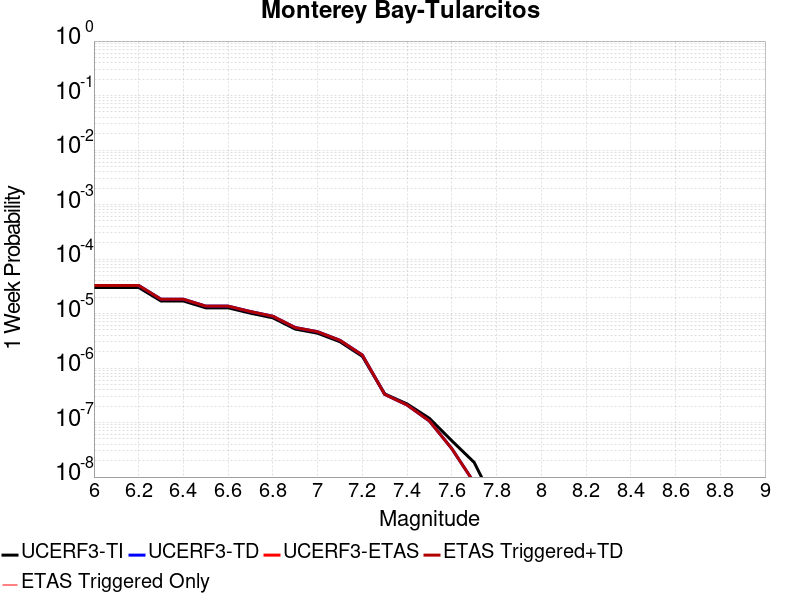 |  | 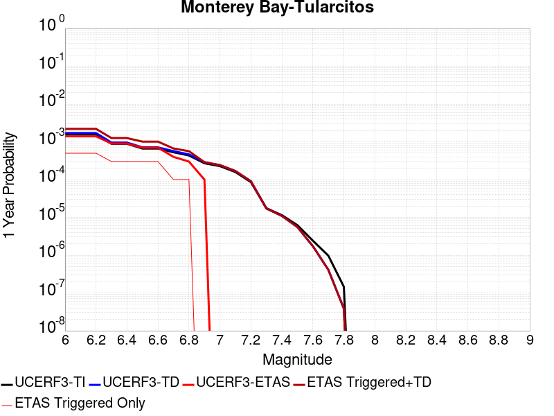 | 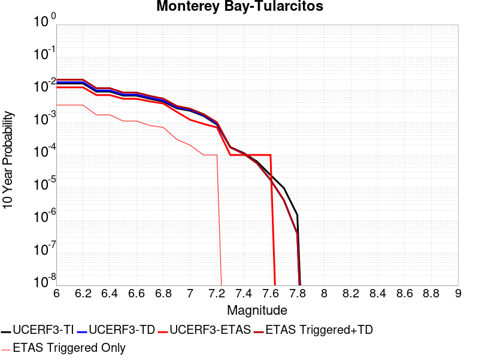 |

| Magnitude | 1 wk TI Prob | 1 wk TD Prob | 1 wk ETAS Prob | 1 wk ETAS/TD Gain | 1 wk ETAS Triggered+TD | 1 wk ETAS Triggered Only | 1 mo TI Prob | 1 mo TD Prob | 1 mo ETAS Prob | 1 mo ETAS/TD Gain | 1 mo ETAS Triggered+TD | 1 mo ETAS Triggered Only | 1 yr TI Prob | 1 yr TD Prob | 1 yr ETAS Prob | 1 yr ETAS/TD Gain | 1 yr ETAS Triggered+TD | 1 yr ETAS Triggered Only | 10 yr TI Prob | 10 yr TD Prob | 10 yr ETAS Prob | 10 yr ETAS/TD Gain | 10 yr ETAS Triggered+TD | 10 yr ETAS Triggered Only |
|-----|-----|-----|-----|-----|-----|-----|-----|-----|-----|-----|-----|-----|-----|-----|-----|-----|-----|-----|-----|-----|-----|-----|-----|-----|
| 6.0 | 3.0131365E-5 | 3.2767963E-5 | 0.0 | 0.0 | 3.2767963E-5 | 0.0 | 1.2912804E-4 | 1.4042716E-4 | 2.0E-4 | 1.4242259 | 2.4041311E-4 | 1.0E-4 | 0.001571 | 0.001708465 | 0.0014 | 0.819449 | 0.0022076108 | 5.0E-4 | 0.015599402 | 0.01696409 | 0.0119 | 0.7014818 | 0.02030641 | 0.0034 |
| 6.1 | 3.0131365E-5 | 3.2767963E-5 | 0.0 | 0.0 | 3.2767963E-5 | 0.0 | 1.2912804E-4 | 1.4042716E-4 | 2.0E-4 | 1.4242259 | 2.4041311E-4 | 1.0E-4 | 0.001571 | 0.001708465 | 0.0014 | 0.819449 | 0.0022076108 | 5.0E-4 | 0.015599402 | 0.01696409 | 0.0119 | 0.7014818 | 0.02030641 | 0.0034 |
| 6.2 | 3.0131365E-5 | 3.2767963E-5 | 0.0 | 0.0 | 3.2767963E-5 | 0.0 | 1.2912804E-4 | 1.4042716E-4 | 2.0E-4 | 1.4242259 | 2.4041311E-4 | 1.0E-4 | 0.001571 | 0.001708465 | 0.0014 | 0.819449 | 0.0022076108 | 5.0E-4 | 0.015599402 | 0.01696409 | 0.0119 | 0.7014818 | 0.02030641 | 0.0034 |
| 6.3 | 1.6998249E-5 | 1.8315357E-5 | 0.0 | 0.0 | 1.8315357E-5 | 0.0 | 7.28476E-5 | 7.8492136E-5 | 2.0E-4 | 2.548026 | 1.7848429E-4 | 1.0E-4 | 8.865586E-4 | 9.552414E-4 | 9.0E-4 | 0.9421702 | 0.0012549548 | 3.0E-4 | 0.0088303005 | 0.009513274 | 0.0069 | 0.72530234 | 0.011197101 | 0.0017 |
| 6.4 | 1.6998249E-5 | 1.8315357E-5 | 0.0 | 0.0 | 1.8315357E-5 | 0.0 | 7.28476E-5 | 7.8492136E-5 | 2.0E-4 | 2.548026 | 1.7848429E-4 | 1.0E-4 | 8.865586E-4 | 9.552414E-4 | 9.0E-4 | 0.9421702 | 0.0012549548 | 3.0E-4 | 0.0088303005 | 0.009513274 | 0.0069 | 0.72530234 | 0.011197101 | 0.0017 |
| 6.5 | 1.27470785E-5 | 1.3682275E-5 | 0.0 | 0.0 | 1.3682275E-5 | 0.0 | 5.4629192E-5 | 5.863706E-5 | 2.0E-4 | 3.4108121 | 1.586312E-4 | 1.0E-4 | 6.649074E-4 | 7.136827E-4 | 7.0E-4 | 0.98082805 | 0.0010134686 | 3.0E-4 | 0.0066292146 | 0.007114958 | 0.0053 | 0.7449095 | 0.008207131 | 0.0011 |
| 6.6 | 1.2739422E-5 | 1.3674364E-5 | 0.0 | 0.0 | 1.3674364E-5 | 0.0 | 5.4596385E-5 | 5.860316E-5 | 2.0E-4 | 3.4127853 | 1.585973E-4 | 1.0E-4 | 6.645082E-4 | 7.132702E-4 | 7.0E-4 | 0.98139524 | 0.0010130563 | 3.0E-4 | 0.0066252467 | 0.0071108597 | 0.0053 | 0.74533886 | 0.008203038 | 0.0011 |
| 6.7 | 1.0160109E-5 | 1.0877216E-5 | 0.0 | 0.0 | 1.0877216E-5 | 0.0 | 4.35426E-5 | 4.6615845E-5 | 1.0E-4 | 2.1451933 | 1.4661119E-4 | 1.0E-4 | 5.300022E-4 | 5.674072E-4 | 4.0E-4 | 0.7049611 | 6.673504E-4 | 1.0E-4 | 0.005287399 | 0.005660295 | 0.0044 | 0.77734464 | 0.0064557665 | 8.0E-4 |
| 6.8 | 8.349859E-6 | 8.925659E-6 | 0.0 | 0.0 | 8.925659E-6 | 0.0 | 3.578462E-5 | 3.8252296E-5 | 1.0E-4 | 2.6142223 | 1.3824846E-4 | 1.0E-4 | 4.3559066E-4 | 4.6562782E-4 | 3.0E-4 | 0.6442914 | 5.6558126E-4 | 1.0E-4 | 0.004347378 | 0.004647086 | 0.0038 | 0.8177167 | 0.005343833 | 7.0E-4 |
| 6.9 | 5.193639E-6 | 5.532197E-6 | 0.0 | 0.0 | 5.532197E-6 | 0.0 | 2.2258262E-5 | 2.3709219E-5 | 0.0 | 0.0 | 2.3709219E-5 | 0.0 | 2.7096065E-4 | 2.8862475E-4 | 1.0E-4 | 0.34647062 | 2.8862475E-4 | 0.0 | 0.0027063051 | 0.0028828194 | 0.0021 | 0.7284535 | 0.0031819546 | 3.0E-4 |
| 7.0 | 4.359381E-6 | 4.639791E-6 | 0.0 | 0.0 | 4.639791E-6 | 0.0 | 1.8682927E-5 | 1.9884685E-5 | 0.0 | 0.0 | 1.9884685E-5 | 0.0 | 2.274409E-4 | 2.420721E-4 | 0.0 | 0.0 | 2.420721E-4 | 0.0 | 0.0022720827 | 0.0024183765 | 0.0012 | 0.49620062 | 0.002617893 | 2.0E-4 |
| 7.1 | 3.0398533E-6 | 3.2285054E-6 | 0.0 | 0.0 | 3.2285054E-6 | 0.0 | 1.3027877E-5 | 1.3836393E-5 | 0.0 | 0.0 | 1.3836393E-5 | 0.0 | 1.5860285E-4 | 1.6844769E-4 | 0.0 | 0.0 | 1.6844769E-4 | 0.0 | 0.001584897 | 0.0016834573 | 9.0E-4 | 0.5346141 | 0.0017832889 | 1.0E-4 |
| 7.2 | 1.642335E-6 | 1.7319009E-6 | 0.0 | 0.0 | 1.7319009E-6 | 0.0 | 7.0385595E-6 | 7.4224226E-6 | 0.0 | 0.0 | 7.4224226E-6 | 0.0 | 8.569109E-5 | 9.036631E-5 | 0.0 | 0.0 | 9.036631E-5 | 0.0 | 8.5658056E-4 | 9.0349803E-4 | 7.0E-4 | 0.7747665 | 0.0010034076 | 1.0E-4 |
| 7.3 | 3.356842E-7 | 3.2920042E-7 | 0.0 | 0.0 | 3.2920042E-7 | 0.0 | 1.4386458E-6 | 1.4108582E-6 | 0.0 | 0.0 | 1.4108582E-6 | 0.0 | 1.7515373E-5 | 1.7177064E-5 | 0.0 | 0.0 | 1.7177064E-5 | 0.0 | 1.7513991E-4 | 1.7175746E-4 | 1.0E-4 | 0.5822163 | 1.7175746E-4 | 0.0 |
| 7.4 | 2.1973483E-7 | 2.0977869E-7 | 0.0 | 0.0 | 2.0977869E-7 | 0.0 | 9.417204E-7 | 8.990512E-7 | 0.0 | 0.0 | 8.990512E-7 | 0.0 | 1.1465385E-5 | 1.0945894E-5 | 0.0 | 0.0 | 1.0945894E-5 | 0.0 | 1.1464794E-4 | 1.09453584E-4 | 1.0E-4 | 0.9136293 | 1.09453584E-4 | 0.0 |
| 7.5 | 1.1944135E-7 | 1.0671424E-7 | 0.0 | 0.0 | 1.0671424E-7 | 0.0 | 5.118914E-7 | 4.5734666E-7 | 0.0 | 0.0 | 4.5734666E-7 | 0.0 | 6.23226E-6 | 5.5681817E-6 | 0.0 | 0.0 | 5.5681817E-6 | 0.0 | 6.2320854E-5 | 5.5680433E-5 | 1.0E-4 | 1.795963 | 5.5680433E-5 | 0.0 |
| 7.6 | 4.636058E-8 | 3.317159E-8 | 0.0 | 0.0 | 3.317159E-8 | 0.0 | 1.9868818E-7 | 1.4216396E-7 | 0.0 | 0.0 | 1.4216396E-7 | 0.0 | 2.419026E-6 | 1.7308448E-6 | 0.0 | 0.0 | 1.7308448E-6 | 0.0 | 2.4189996E-5 | 1.7308315E-5 | 1.0E-4 | 5.77757 | 1.7308315E-5 | 0.0 |
| 7.7 | 1.8588572E-8 | 7.884243E-9 | 0.0 | 0.0 | 7.884243E-9 | 0.0 | 7.9665305E-8 | 3.3789608E-8 | 0.0 | 0.0 | 3.3789608E-8 | 0.0 | 9.699246E-7 | 4.1138838E-7 | 0.0 | 0.0 | 4.1138838E-7 | 0.0 | 9.699204E-6 | 4.1138765E-6 | 0.0 | 0.0 | 4.1138765E-6 | 0.0 |
| 7.8 | 2.7960154E-9 | 7.415153E-10 | 0.0 | 0.0 | 7.415153E-10 | 0.0 | 1.1982923E-8 | 3.177922E-9 | 0.0 | 0.0 | 3.177922E-9 | 0.0 | 1.4589209E-7 | 3.86912E-8 | 0.0 | 0.0 | 3.86912E-8 | 0.0 | 1.4589199E-6 | 3.8691198E-7 | 0.0 | 0.0 | 3.8691198E-7 | 0.0 |

## San Jacinto (Anza) rev
*[(top)](#table-of-contents)*

| 1 Week | 1 Month | 1 Year | 10 Year |
|-----|-----|-----|-----|
| 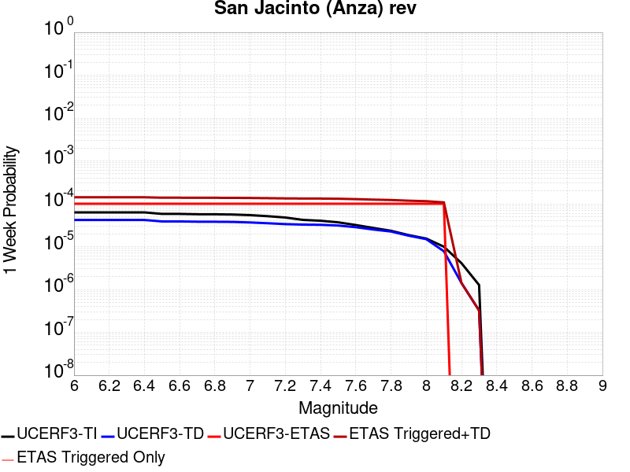 | 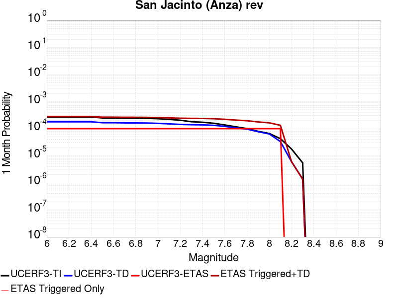 |  | 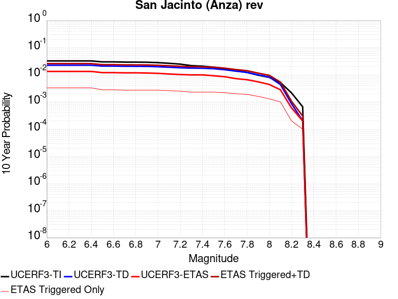 |

| Magnitude | 1 wk TI Prob | 1 wk TD Prob | 1 wk ETAS Prob | 1 wk ETAS/TD Gain | 1 wk ETAS Triggered+TD | 1 wk ETAS Triggered Only | 1 mo TI Prob | 1 mo TD Prob | 1 mo ETAS Prob | 1 mo ETAS/TD Gain | 1 mo ETAS Triggered+TD | 1 mo ETAS Triggered Only | 1 yr TI Prob | 1 yr TD Prob | 1 yr ETAS Prob | 1 yr ETAS/TD Gain | 1 yr ETAS Triggered+TD | 1 yr ETAS Triggered Only | 10 yr TI Prob | 10 yr TD Prob | 10 yr ETAS Prob | 10 yr ETAS/TD Gain | 10 yr ETAS Triggered+TD | 10 yr ETAS Triggered Only |
|-----|-----|-----|-----|-----|-----|-----|-----|-----|-----|-----|-----|-----|-----|-----|-----|-----|-----|-----|-----|-----|-----|-----|-----|-----|
| 6.0 | 6.3015636E-5 | 4.1937816E-5 | 1.0E-4 | 2.3844826 | 1.4193362E-4 | 1.0E-4 | 2.7003905E-4 | 1.7972119E-4 | 1.0E-4 | 0.55641747 | 2.797032E-4 | 1.0E-4 | 0.0032827691 | 0.002185921 | 0.0017 | 0.77770424 | 0.0025850467 | 4.0E-4 | 0.032346968 | 0.02259413 | 0.0133 | 0.5886485 | 0.025819568 | 0.0033 |
| 6.1 | 6.3015636E-5 | 4.1937816E-5 | 1.0E-4 | 2.3844826 | 1.4193362E-4 | 1.0E-4 | 2.7003905E-4 | 1.7972119E-4 | 1.0E-4 | 0.55641747 | 2.797032E-4 | 1.0E-4 | 0.0032827691 | 0.002185921 | 0.0017 | 0.77770424 | 0.0025850467 | 4.0E-4 | 0.032346968 | 0.02259413 | 0.0133 | 0.5886485 | 0.025819568 | 0.0033 |
| 6.2 | 6.3015636E-5 | 4.1937816E-5 | 1.0E-4 | 2.3844826 | 1.4193362E-4 | 1.0E-4 | 2.7003905E-4 | 1.7972119E-4 | 1.0E-4 | 0.55641747 | 2.797032E-4 | 1.0E-4 | 0.0032827691 | 0.002185921 | 0.0017 | 0.77770424 | 0.0025850467 | 4.0E-4 | 0.032346968 | 0.02259413 | 0.0133 | 0.5886485 | 0.025819568 | 0.0033 |
| 6.3 | 6.3015636E-5 | 4.1937816E-5 | 1.0E-4 | 2.3844826 | 1.4193362E-4 | 1.0E-4 | 2.7003905E-4 | 1.7972119E-4 | 1.0E-4 | 0.55641747 | 2.797032E-4 | 1.0E-4 | 0.0032827691 | 0.002185921 | 0.0017 | 0.77770424 | 0.0025850467 | 4.0E-4 | 0.032346968 | 0.02259413 | 0.0133 | 0.5886485 | 0.025819568 | 0.0033 |
| 6.4 | 6.3015636E-5 | 4.1937816E-5 | 1.0E-4 | 2.3844826 | 1.4193362E-4 | 1.0E-4 | 2.7003905E-4 | 1.7972119E-4 | 1.0E-4 | 0.55641747 | 2.797032E-4 | 1.0E-4 | 0.0032827691 | 0.002185921 | 0.0017 | 0.77770424 | 0.0025850467 | 4.0E-4 | 0.032346968 | 0.02259413 | 0.0133 | 0.5886485 | 0.025819568 | 0.0033 |
| 6.5 | 5.811017E-5 | 3.87847E-5 | 1.0E-4 | 2.5783362 | 1.3878082E-4 | 1.0E-4 | 2.4901982E-4 | 1.6620959E-4 | 1.0E-4 | 0.60165 | 2.6619298E-4 | 1.0E-4 | 0.0030276014 | 0.002021729 | 0.0016 | 0.7914018 | 0.0023211224 | 3.0E-4 | 0.02986684 | 0.020924775 | 0.012 | 0.5734829 | 0.023666186 | 0.0028 |
| 6.6 | 5.811017E-5 | 3.87847E-5 | 1.0E-4 | 2.5783362 | 1.3878082E-4 | 1.0E-4 | 2.4901982E-4 | 1.6620959E-4 | 1.0E-4 | 0.60165 | 2.6619298E-4 | 1.0E-4 | 0.0030276014 | 0.002021729 | 0.0016 | 0.7914018 | 0.0023211224 | 3.0E-4 | 0.02986684 | 0.020924775 | 0.012 | 0.5734829 | 0.023666186 | 0.0028 |
| 6.7 | 5.712442E-5 | 3.8221522E-5 | 1.0E-4 | 2.6163268 | 1.382177E-4 | 1.0E-4 | 2.4479596E-4 | 1.6379627E-4 | 1.0E-4 | 0.6105145 | 2.637799E-4 | 1.0E-4 | 0.0029763177 | 0.001992401 | 0.0016 | 0.80305123 | 0.0022918032 | 3.0E-4 | 0.029367693 | 0.020623794 | 0.0118 | 0.57215464 | 0.023268111 | 0.0027 |
| 6.8 | 5.6967532E-5 | 3.8080452E-5 | 1.0E-4 | 2.6260192 | 1.3807665E-4 | 1.0E-4 | 2.4412372E-4 | 1.6319177E-4 | 1.0E-4 | 0.61277604 | 2.6317543E-4 | 1.0E-4 | 0.0029681553 | 0.0019850545 | 0.0016 | 0.80602324 | 0.0022844588 | 3.0E-4 | 0.029288229 | 0.02054924 | 0.0118 | 0.5742305 | 0.023193756 | 0.0027 |
| 6.9 | 5.6211324E-5 | 3.7795686E-5 | 1.0E-4 | 2.6458046 | 1.3779191E-4 | 1.0E-4 | 2.4088343E-4 | 1.6197147E-4 | 1.0E-4 | 0.61739266 | 2.6195528E-4 | 1.0E-4 | 0.0029288116 | 0.0019702243 | 0.0015 | 0.7613346 | 0.0022696333 | 3.0E-4 | 0.028905109 | 0.020393342 | 0.0116 | 0.5688131 | 0.02303828 | 0.0027 |
| 7.0 | 5.4383527E-5 | 3.6687936E-5 | 1.0E-4 | 2.7256916 | 1.3668426E-4 | 1.0E-4 | 2.3305144E-4 | 1.5722455E-4 | 1.0E-4 | 0.63603294 | 2.5720883E-4 | 1.0E-4 | 0.0028337094 | 0.0019125331 | 0.0015 | 0.7843002 | 0.0022119593 | 3.0E-4 | 0.027978465 | 0.019796526 | 0.0113 | 0.5708072 | 0.022443077 | 0.0027 |
| 7.1 | 5.1393665E-5 | 3.5196244E-5 | 1.0E-4 | 2.8412123 | 1.3519272E-4 | 1.0E-4 | 2.2023996E-4 | 1.5083235E-4 | 1.0E-4 | 0.66298777 | 2.5081728E-4 | 1.0E-4 | 0.0026781242 | 0.0018348411 | 0.0015 | 0.8175095 | 0.0021342908 | 3.0E-4 | 0.026460782 | 0.018991832 | 0.0107 | 0.5634001 | 0.021542452 | 0.0026 |
| 7.2 | 4.785222E-5 | 3.3597305E-5 | 1.0E-4 | 2.9764292 | 1.3359395E-4 | 1.0E-4 | 2.0506482E-4 | 1.4398052E-4 | 1.0E-4 | 0.6945384 | 2.4396612E-4 | 1.0E-4 | 0.0024938055 | 0.0017515568 | 0.0014 | 0.799289 | 0.0020510312 | 3.0E-4 | 0.024660049 | 0.018129954 | 0.0102 | 0.56260484 | 0.02058463 | 0.0025 |
| 7.3 | 4.2143256E-5 | 3.2723412E-5 | 1.0E-4 | 3.055916 | 1.3272015E-4 | 1.0E-4 | 1.8060145E-4 | 1.4023567E-4 | 1.0E-4 | 0.7130853 | 2.4022165E-4 | 1.0E-4 | 0.002196605 | 0.0017060355 | 0.0013 | 0.76200056 | 0.0019056943 | 2.0E-4 | 0.02175019 | 0.017657457 | 0.0099 | 0.56066966 | 0.019916844 | 0.0023 |
| 7.4 | 4.0264713E-5 | 3.2373166E-5 | 1.0E-4 | 3.0889783 | 1.3236993E-4 | 1.0E-4 | 1.7255165E-4 | 1.3873477E-4 | 1.0E-4 | 0.7207998 | 2.387209E-4 | 1.0E-4 | 0.002098792 | 0.0016877905 | 0.0013 | 0.7702378 | 0.0018874529 | 2.0E-4 | 0.020790804 | 0.017468251 | 0.0099 | 0.5667425 | 0.019728074 | 0.0023 |
| 7.5 | 3.694492E-5 | 3.111128E-5 | 1.0E-4 | 3.2142682 | 1.3110817E-4 | 1.0E-4 | 1.5832575E-4 | 1.3332727E-4 | 1.0E-4 | 0.75003415 | 2.3331393E-4 | 1.0E-4 | 0.0019259118 | 0.0016220538 | 0.0012 | 0.73980284 | 0.0018217294 | 2.0E-4 | 0.01909306 | 0.016796973 | 0.0092 | 0.54771775 | 0.01905834 | 0.0023 |
| 7.6 | 3.200565E-5 | 2.8461809E-5 | 1.0E-4 | 3.51348 | 1.2845897E-4 | 1.0E-4 | 1.3715986E-4 | 1.2197349E-4 | 1.0E-4 | 0.81985027 | 2.219613E-4 | 1.0E-4 | 0.001668642 | 0.0014840178 | 0.0012 | 0.8086156 | 0.001683721 | 2.0E-4 | 0.01656168 | 0.015402355 | 0.0085 | 0.5518637 | 0.017568469 | 0.0022 |
| 7.7 | 2.731642E-5 | 2.5089785E-5 | 1.0E-4 | 3.9856858 | 1.2508727E-4 | 1.0E-4 | 1.1706512E-4 | 1.0752322E-4 | 1.0E-4 | 0.93003166 | 2.0751246E-4 | 1.0E-4 | 0.001424336 | 0.00130831 | 0.001 | 0.7643448 | 0.0015080484 | 2.0E-4 | 0.014152412 | 0.013642608 | 0.0072 | 0.5277583 | 0.015615323 | 0.002 |
| 7.8 | 2.3466424E-5 | 2.254624E-5 | 1.0E-4 | 4.435329 | 1.2254399E-4 | 1.0E-4 | 1.0056651E-4 | 9.6623175E-5 | 1.0E-4 | 1.0349485 | 1.9661352E-4 | 1.0E-4 | 0.0012237094 | 0.0011757531 | 9.0E-4 | 0.76546687 | 0.0013755179 | 2.0E-4 | 0.012169928 | 0.012306737 | 0.0066 | 0.5362916 | 0.014183355 | 0.0019 |
| 7.9 | 1.8611925E-5 | 1.8046654E-5 | 1.0E-4 | 5.5411935 | 1.1804485E-4 | 1.0E-4 | 7.9762955E-5 | 7.734051E-5 | 1.0E-4 | 1.2929834 | 1.7733278E-4 | 1.0E-4 | 9.7068126E-4 | 9.412146E-4 | 6.0E-4 | 0.6374742 | 0.0011410264 | 2.0E-4 | 0.0096645225 | 0.009940827 | 0.0055 | 0.55327386 | 0.011524922 | 0.0016 |
| 8.0 | 1.5460775E-5 | 1.4976475E-5 | 1.0E-4 | 6.677139 | 1.1497497E-4 | 1.0E-4 | 6.6258784E-5 | 6.418332E-5 | 1.0E-4 | 1.5580373 | 1.6417689E-4 | 1.0E-4 | 8.0640207E-4 | 7.8115234E-4 | 6.0E-4 | 0.768096 | 9.809961E-4 | 2.0E-4 | 0.008034821 | 0.008299375 | 0.0044 | 0.5301604 | 0.009588585 | 0.0013 |
| 8.1 | 9.983884E-6 | 7.822582E-6 | 1.0E-4 | 12.783503 | 1.078218E-4 | 1.0E-4 | 4.2787375E-5 | 3.3524924E-5 | 1.0E-4 | 2.9828553 | 1.3352158E-4 | 1.0E-4 | 5.2081177E-4 | 4.0808998E-4 | 4.0E-4 | 0.980176 | 6.0800835E-4 | 2.0E-4 | 0.0051959283 | 0.0043985066 | 0.0028 | 0.6365797 | 0.005394108 | 0.001 |
| 8.2 | 4.1226E-6 | 1.4212799E-6 | 0.0 | 0.0 | 1.4212799E-6 | 0.0 | 1.7668166E-5 | 6.0911852E-6 | 0.0 | 0.0 | 6.0911852E-6 | 0.0 | 2.1508869E-4 | 7.415768E-5 | 1.0E-4 | 1.348478 | 7.415768E-5 | 0.0 | 0.0021488064 | 8.64887E-4 | 6.0E-4 | 0.69373226 | 0.001064714 | 2.0E-4 |
| 8.3 | 1.2750878E-6 | 3.245552E-7 | 0.0 | 0.0 | 3.245552E-7 | 0.0 | 5.4646503E-6 | 1.39095E-6 | 0.0 | 0.0 | 1.39095E-6 | 0.0 | 6.653009E-5 | 1.693469E-5 | 0.0 | 0.0 | 1.693469E-5 | 0.0 | 6.6510175E-4 | 2.0569154E-4 | 2.0E-4 | 0.97232974 | 3.0567095E-4 | 1.0E-4 |

## Hunter Mountain-Saline Valley
*[(top)](#table-of-contents)*

| 1 Week | 1 Month | 1 Year | 10 Year |
|-----|-----|-----|-----|
| 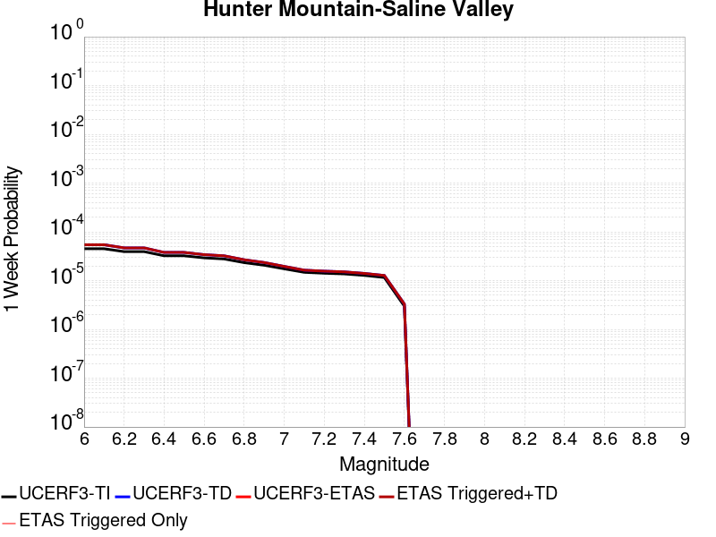 | 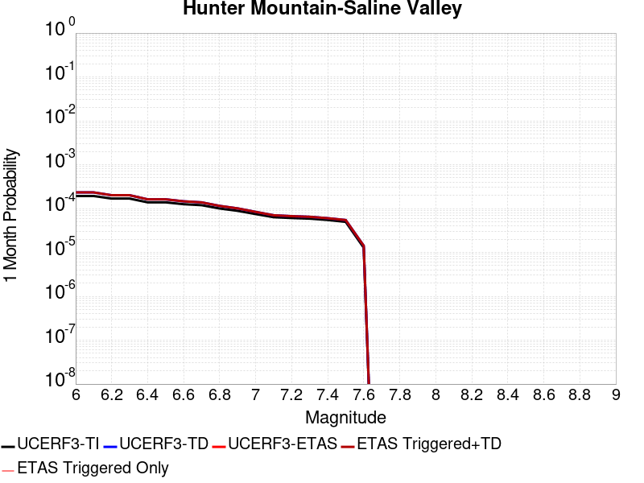 | 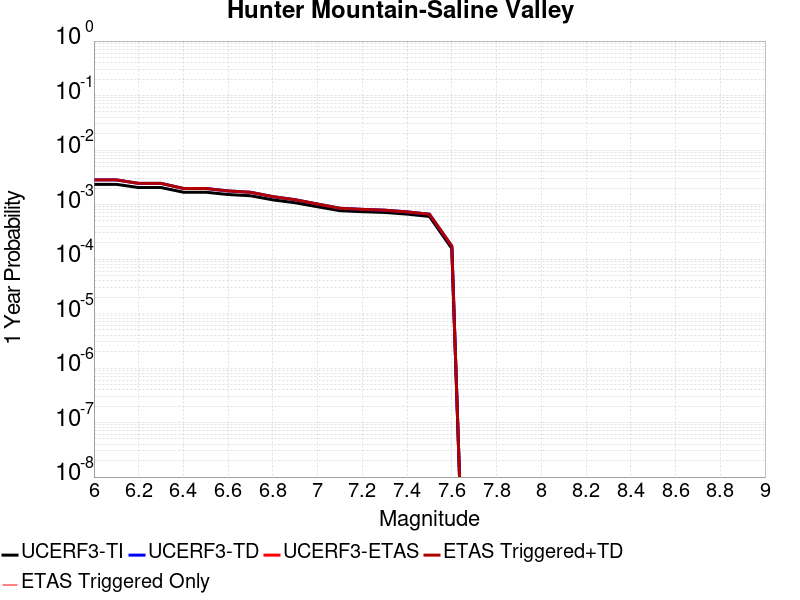 | 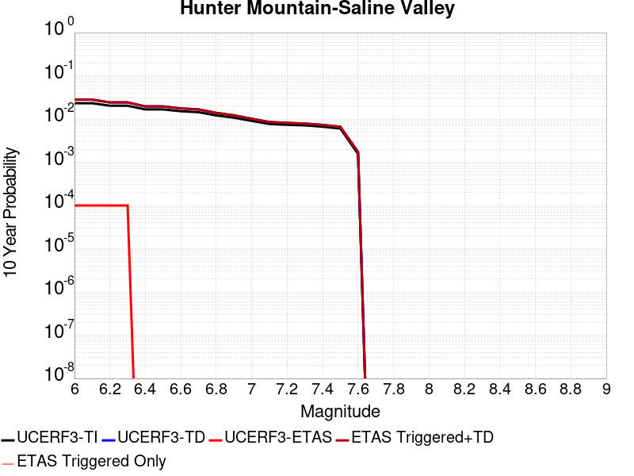 |

| Magnitude | 1 wk TI Prob | 1 wk TD Prob | 1 wk ETAS Prob | 1 wk ETAS/TD Gain | 1 wk ETAS Triggered+TD | 1 wk ETAS Triggered Only | 1 mo TI Prob | 1 mo TD Prob | 1 mo ETAS Prob | 1 mo ETAS/TD Gain | 1 mo ETAS Triggered+TD | 1 mo ETAS Triggered Only | 1 yr TI Prob | 1 yr TD Prob | 1 yr ETAS Prob | 1 yr ETAS/TD Gain | 1 yr ETAS Triggered+TD | 1 yr ETAS Triggered Only | 10 yr TI Prob | 10 yr TD Prob | 10 yr ETAS Prob | 10 yr ETAS/TD Gain | 10 yr ETAS Triggered+TD | 10 yr ETAS Triggered Only |
|-----|-----|-----|-----|-----|-----|-----|-----|-----|-----|-----|-----|-----|-----|-----|-----|-----|-----|-----|-----|-----|-----|-----|-----|-----|
| 6.0 | 4.5103672E-5 | 5.4413267E-5 | 0.0 | 0.0 | 5.4413267E-5 | 0.0 | 1.9328714E-4 | 2.3317964E-4 | 0.0 | 0.0 | 2.3317964E-4 | 0.0 | 0.002350731 | 0.002835441 | 0.0017 | 0.599554 | 0.003334023 | 5.0E-4 | 0.023260195 | 0.02801385 | 0.0158 | 0.56400675 | 0.031124206 | 0.0032 |
| 6.1 | 4.5103672E-5 | 5.4413267E-5 | 0.0 | 0.0 | 5.4413267E-5 | 0.0 | 1.9328714E-4 | 2.3317964E-4 | 0.0 | 0.0 | 2.3317964E-4 | 0.0 | 0.002350731 | 0.002835441 | 0.0017 | 0.599554 | 0.003334023 | 5.0E-4 | 0.023260195 | 0.02801385 | 0.0158 | 0.56400675 | 0.031124206 | 0.0032 |
| 6.2 | 3.9363465E-5 | 4.6930167E-5 | 0.0 | 0.0 | 4.6930167E-5 | 0.0 | 1.6868966E-4 | 2.0111441E-4 | 0.0 | 0.0 | 2.0111441E-4 | 0.0 | 0.002051862 | 0.002445953 | 0.0014 | 0.57237405 | 0.0027452193 | 3.0E-4 | 0.020330196 | 0.02420684 | 0.0139 | 0.57421786 | 0.02684148 | 0.0027 |
| 6.3 | 3.9363465E-5 | 4.6930167E-5 | 0.0 | 0.0 | 4.6930167E-5 | 0.0 | 1.6868966E-4 | 2.0111441E-4 | 0.0 | 0.0 | 2.0111441E-4 | 0.0 | 0.002051862 | 0.002445953 | 0.0014 | 0.57237405 | 0.0027452193 | 3.0E-4 | 0.020330196 | 0.02420684 | 0.0139 | 0.57421786 | 0.02684148 | 0.0027 |
| 6.4 | 3.2311684E-5 | 3.784555E-5 | 0.0 | 0.0 | 3.784555E-5 | 0.0 | 1.384713E-4 | 1.621855E-4 | 0.0 | 0.0 | 1.621855E-4 | 0.0 | 0.0016845843 | 0.0019728886 | 0.0012 | 0.6082452 | 0.0022722967 | 3.0E-4 | 0.016718714 | 0.019563187 | 0.0115 | 0.58783877 | 0.021916235 | 0.0024 |
| 6.5 | 3.2311684E-5 | 3.784555E-5 | 0.0 | 0.0 | 3.784555E-5 | 0.0 | 1.384713E-4 | 1.621855E-4 | 0.0 | 0.0 | 1.621855E-4 | 0.0 | 0.0016845843 | 0.0019728886 | 0.0012 | 0.6082452 | 0.0022722967 | 3.0E-4 | 0.016718714 | 0.019563187 | 0.0115 | 0.58783877 | 0.021916235 | 0.0024 |
| 6.6 | 2.9305844E-5 | 3.408624E-5 | 0.0 | 0.0 | 3.408624E-5 | 0.0 | 1.2559042E-4 | 1.4607605E-4 | 0.0 | 0.0 | 1.4607605E-4 | 0.0 | 0.0015279909 | 0.0017770866 | 0.0011 | 0.61899066 | 0.0020765534 | 3.0E-4 | 0.015175272 | 0.017637318 | 0.0107 | 0.6066682 | 0.019896753 | 0.0023 |
| 6.7 | 2.7826512E-5 | 3.2253232E-5 | 0.0 | 0.0 | 3.2253232E-5 | 0.0 | 1.19251024E-4 | 1.3822115E-4 | 0.0 | 0.0 | 1.3822115E-4 | 0.0 | 0.0014509142 | 0.0016816035 | 9.0E-4 | 0.53520346 | 0.0018812672 | 2.0E-4 | 0.014414776 | 0.016697118 | 0.0102 | 0.6108839 | 0.018762054 | 0.0021 |
| 6.8 | 2.3389874E-5 | 2.6789065E-5 | 0.0 | 0.0 | 2.6789065E-5 | 0.0 | 1.0023846E-4 | 1.14805494E-4 | 0.0 | 0.0 | 1.14805494E-4 | 0.0 | 0.00121972 | 0.0013969077 | 7.0E-4 | 0.50110686 | 0.0015966283 | 2.0E-4 | 0.01213047 | 0.013888132 | 0.0076 | 0.5472298 | 0.015465911 | 0.0016 |
| 6.9 | 2.069209E-5 | 2.3500012E-5 | 0.0 | 0.0 | 2.3500012E-5 | 0.0 | 8.867737E-5 | 1.00710655E-4 | 0.0 | 0.0 | 1.00710655E-4 | 0.0 | 0.0010791123 | 0.0012254985 | 7.0E-4 | 0.57119614 | 0.0014252533 | 2.0E-4 | 0.010738871 | 0.012193091 | 0.0068 | 0.5576929 | 0.01347724 | 0.0013 |
| 7.0 | 1.7462342E-5 | 1.9572502E-5 | 0.0 | 0.0 | 1.9572502E-5 | 0.0 | 7.483646E-5 | 8.387958E-5 | 0.0 | 0.0 | 8.387958E-5 | 0.0 | 9.1075303E-4 | 0.001020778 | 7.0E-4 | 0.68575144 | 0.0012205739 | 2.0E-4 | 0.009070295 | 0.01016519 | 0.0064 | 0.62959963 | 0.011352992 | 0.0012 |
| 7.1 | 1.4807709E-5 | 1.6387437E-5 | 0.0 | 0.0 | 1.6387437E-5 | 0.0 | 6.3460066E-5 | 7.0230075E-5 | 0.0 | 0.0 | 7.0230075E-5 | 0.0 | 7.723524E-4 | 8.547322E-4 | 7.0E-4 | 0.81897 | 0.0010545612 | 2.0E-4 | 0.007696735 | 0.0085181035 | 0.0055 | 0.64568365 | 0.009509585 | 0.001 |
| 7.2 | 1.4180048E-5 | 1.564545E-5 | 0.0 | 0.0 | 1.564545E-5 | 0.0 | 6.077022E-5 | 6.70503E-5 | 0.0 | 0.0 | 6.70503E-5 | 0.0 | 7.396263E-4 | 8.160477E-4 | 7.0E-4 | 0.857793 | 0.0010158846 | 2.0E-4 | 0.0073716943 | 0.008134132 | 0.0054 | 0.66386926 | 0.009125997 | 0.001 |
| 7.3 | 1.3730402E-5 | 1.5120152E-5 | 0.0 | 0.0 | 1.5120152E-5 | 0.0 | 5.8843252E-5 | 6.479913E-5 | 0.0 | 0.0 | 6.479913E-5 | 0.0 | 7.161811E-4 | 7.8865985E-4 | 7.0E-4 | 0.8875816 | 9.885022E-4 | 2.0E-4 | 0.007138774 | 0.007862212 | 0.0052 | 0.66139144 | 0.00885435 | 0.001 |
| 7.4 | 1.2810095E-5 | 1.4059342E-5 | 0.0 | 0.0 | 1.4059342E-5 | 0.0 | 5.489925E-5 | 6.025302E-5 | 0.0 | 0.0 | 6.025302E-5 | 0.0 | 6.681934E-4 | 7.3334936E-4 | 7.0E-4 | 0.95452464 | 9.332027E-4 | 2.0E-4 | 0.006661878 | 0.0073128585 | 0.005 | 0.68372715 | 0.008305546 | 0.001 |
| 7.5 | 1.1595659E-5 | 1.275406E-5 | 0.0 | 0.0 | 1.275406E-5 | 0.0 | 4.9694736E-5 | 5.46592E-5 | 0.0 | 0.0 | 5.46592E-5 | 0.0 | 6.0486543E-4 | 6.652881E-4 | 6.0E-4 | 0.9018648 | 7.652216E-4 | 1.0E-4 | 0.006032217 | 0.0066365097 | 0.0043 | 0.6479309 | 0.0073318644 | 7.0E-4 |
| 7.6 | 2.997694E-6 | 3.3143867E-6 | 0.0 | 0.0 | 3.3143867E-6 | 0.0 | 1.28471975E-5 | 1.4204477E-5 | 0.0 | 0.0 | 1.4204477E-5 | 0.0 | 1.564034E-4 | 1.7293303E-4 | 0.0 | 0.0 | 1.7293303E-4 | 0.0 | 0.0015629337 | 0.00173029 | 0.0012 | 0.6935254 | 0.001830117 | 1.0E-4 |

## Lenwood-Lockhart-Old Woman Springs
*[(top)](#table-of-contents)*

| 1 Week | 1 Month | 1 Year | 10 Year |
|-----|-----|-----|-----|
| 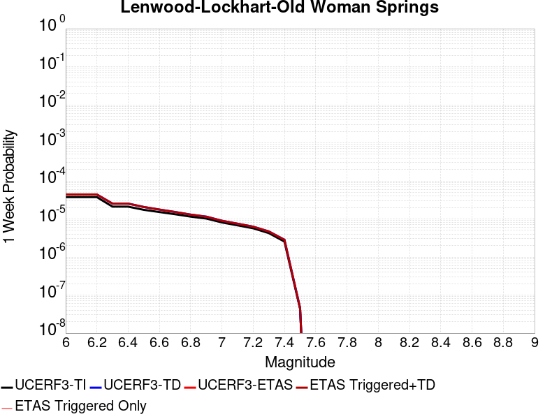 | 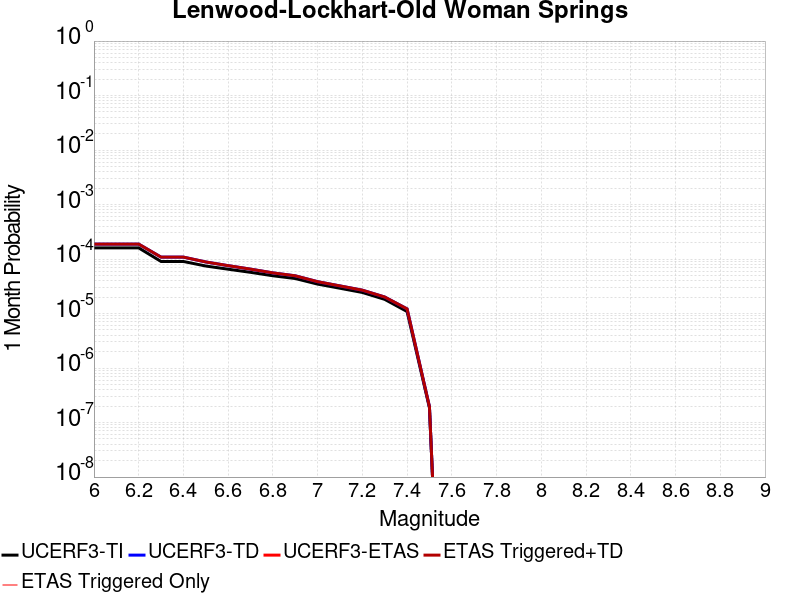 | 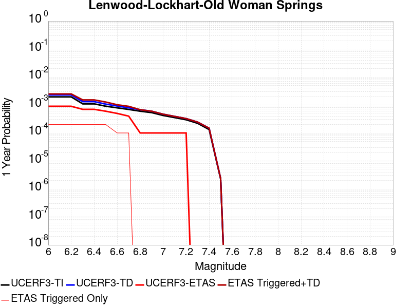 | 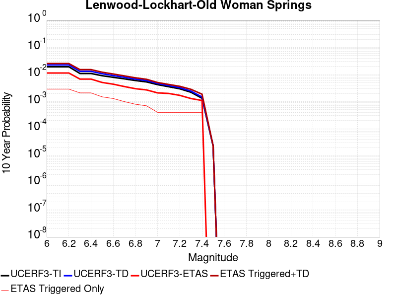 |

| Magnitude | 1 wk TI Prob | 1 wk TD Prob | 1 wk ETAS Prob | 1 wk ETAS/TD Gain | 1 wk ETAS Triggered+TD | 1 wk ETAS Triggered Only | 1 mo TI Prob | 1 mo TD Prob | 1 mo ETAS Prob | 1 mo ETAS/TD Gain | 1 mo ETAS Triggered+TD | 1 mo ETAS Triggered Only | 1 yr TI Prob | 1 yr TD Prob | 1 yr ETAS Prob | 1 yr ETAS/TD Gain | 1 yr ETAS Triggered+TD | 1 yr ETAS Triggered Only | 10 yr TI Prob | 10 yr TD Prob | 10 yr ETAS Prob | 10 yr ETAS/TD Gain | 10 yr ETAS Triggered+TD | 10 yr ETAS Triggered Only |
|-----|-----|-----|-----|-----|-----|-----|-----|-----|-----|-----|-----|-----|-----|-----|-----|-----|-----|-----|-----|-----|-----|-----|-----|-----|
| 6.0 | 3.744542E-5 | 4.3915243E-5 | 0.0 | 0.0 | 4.3915243E-5 | 0.0 | 1.604705E-4 | 1.8819557E-4 | 0.0 | 0.0 | 1.8819557E-4 | 0.0 | 0.0019519776 | 0.002289045 | 9.0E-4 | 0.3931771 | 0.002488587 | 2.0E-4 | 0.019349206 | 0.02267263 | 0.0114 | 0.50280887 | 0.02550688 | 0.0029 |
| 6.1 | 3.744542E-5 | 4.3915243E-5 | 0.0 | 0.0 | 4.3915243E-5 | 0.0 | 1.604705E-4 | 1.8819557E-4 | 0.0 | 0.0 | 1.8819557E-4 | 0.0 | 0.0019519776 | 0.002289045 | 9.0E-4 | 0.3931771 | 0.002488587 | 2.0E-4 | 0.019349206 | 0.02267263 | 0.0114 | 0.50280887 | 0.02550688 | 0.0029 |
| 6.2 | 3.744542E-5 | 4.3915243E-5 | 0.0 | 0.0 | 4.3915243E-5 | 0.0 | 1.604705E-4 | 1.8819557E-4 | 0.0 | 0.0 | 1.8819557E-4 | 0.0 | 0.0019519776 | 0.002289045 | 9.0E-4 | 0.3931771 | 0.002488587 | 2.0E-4 | 0.019349206 | 0.02267263 | 0.0114 | 0.50280887 | 0.02550688 | 0.0029 |
| 6.3 | 2.1079984E-5 | 2.5328589E-5 | 0.0 | 0.0 | 2.5328589E-5 | 0.0 | 9.0339665E-5 | 1.0854669E-4 | 0.0 | 0.0 | 1.0854669E-4 | 0.0 | 0.0010993304 | 0.0013207747 | 7.0E-4 | 0.529992 | 0.0015205105 | 2.0E-4 | 0.010939079 | 0.01313146 | 0.0068 | 0.5178403 | 0.015203884 | 0.0021 |
| 6.4 | 2.1079984E-5 | 2.5328589E-5 | 0.0 | 0.0 | 2.5328589E-5 | 0.0 | 9.0339665E-5 | 1.0854669E-4 | 0.0 | 0.0 | 1.0854669E-4 | 0.0 | 0.0010993304 | 0.0013207747 | 7.0E-4 | 0.529992 | 0.0015205105 | 2.0E-4 | 0.010939079 | 0.01313146 | 0.0068 | 0.5178403 | 0.015203884 | 0.0021 |
| 6.5 | 1.7397282E-5 | 2.0640626E-5 | 0.0 | 0.0 | 2.0640626E-5 | 0.0 | 7.455765E-5 | 8.8456894E-5 | 0.0 | 0.0 | 8.8456894E-5 | 0.0 | 9.073613E-4 | 0.0010764423 | 6.0E-4 | 0.5573917 | 0.0012762271 | 2.0E-4 | 0.009036654 | 0.010713574 | 0.0051 | 0.47603163 | 0.012197504 | 0.0015 |
| 6.6 | 1.52050325E-5 | 1.765924E-5 | 0.0 | 0.0 | 1.765924E-5 | 0.0 | 6.51628E-5 | 7.5680306E-5 | 0.0 | 0.0 | 7.5680306E-5 | 0.0 | 7.9306826E-4 | 9.210261E-4 | 5.0E-4 | 0.5428728 | 0.001020934 | 1.0E-4 | 0.007902439 | 0.00917295 | 0.0044 | 0.4796712 | 0.010461025 | 0.0013 |
| 6.7 | 1.332523E-5 | 1.5245194E-5 | 0.0 | 0.0 | 1.5245194E-5 | 0.0 | 5.7106878E-5 | 6.533494E-5 | 0.0 | 0.0 | 6.533494E-5 | 0.0 | 6.950544E-4 | 7.9516845E-4 | 4.0E-4 | 0.5030381 | 8.950889E-4 | 1.0E-4 | 0.006928845 | 0.007923861 | 0.0036 | 0.45432398 | 0.008915937 | 0.001 |
| 6.8 | 1.1525329E-5 | 1.3013368E-5 | 0.0 | 0.0 | 1.3013368E-5 | 0.0 | 4.9393333E-5 | 5.5770404E-5 | 0.0 | 0.0 | 5.5770404E-5 | 0.0 | 6.011979E-4 | 6.7879737E-4 | 1.0E-4 | 0.14731936 | 6.7879737E-4 | 0.0 | 0.00599574 | 0.00676769 | 0.003 | 0.4432827 | 0.007562276 | 8.0E-4 |
| 6.9 | 1.0253909E-5 | 1.1497721E-5 | 0.0 | 0.0 | 1.1497721E-5 | 0.0 | 4.3944583E-5 | 4.9275037E-5 | 0.0 | 0.0 | 4.9275037E-5 | 0.0 | 5.3489394E-4 | 5.99762E-4 | 1.0E-4 | 0.16673279 | 5.99762E-4 | 0.0 | 0.0053360825 | 0.005981812 | 0.0027 | 0.45136824 | 0.006677625 | 7.0E-4 |
| 7.0 | 8.104563E-6 | 8.976321E-6 | 0.0 | 0.0 | 8.976321E-6 | 0.0 | 3.4733377E-5 | 3.8469392E-5 | 0.0 | 0.0 | 3.8469392E-5 | 0.0 | 4.2279682E-4 | 4.6826657E-4 | 1.0E-4 | 0.21355358 | 4.6826657E-4 | 0.0 | 0.0042199334 | 0.004673046 | 0.0021 | 0.4493857 | 0.0050711767 | 4.0E-4 |
| 7.1 | 6.7986157E-6 | 7.501446E-6 | 0.0 | 0.0 | 7.501446E-6 | 0.0 | 2.91366E-5 | 3.214867E-5 | 0.0 | 0.0 | 3.214867E-5 | 0.0 | 3.5468035E-4 | 3.913419E-4 | 1.0E-4 | 0.25553104 | 3.913419E-4 | 0.0 | 0.003541148 | 0.003906743 | 0.002 | 0.5119354 | 0.00430518 | 4.0E-4 |
| 7.2 | 5.6893327E-6 | 6.2681474E-6 | 0.0 | 0.0 | 6.2681474E-6 | 0.0 | 2.4382627E-5 | 2.6863223E-5 | 0.0 | 0.0 | 2.6863223E-5 | 0.0 | 2.9681803E-4 | 3.2701265E-4 | 1.0E-4 | 0.3057986 | 3.2701265E-4 | 0.0 | 0.002964219 | 0.0032655122 | 0.0017 | 0.52059215 | 0.003664206 | 4.0E-4 |
| 7.3 | 4.253348E-6 | 4.6957107E-6 | 0.0 | 0.0 | 4.6957107E-6 | 0.0 | 1.8228506E-5 | 2.012433E-5 | 0.0 | 0.0 | 2.012433E-5 | 0.0 | 2.2190946E-4 | 2.4498798E-4 | 0.0 | 0.0 | 2.4498798E-4 | 0.0 | 0.00221688 | 0.0024473593 | 0.0013 | 0.5311848 | 0.0028463802 | 4.0E-4 |
| 7.4 | 2.5448119E-6 | 2.8424663E-6 | 0.0 | 0.0 | 2.8424663E-6 | 0.0 | 1.0906291E-5 | 1.218195E-5 | 0.0 | 0.0 | 1.218195E-5 | 0.0 | 1.3277601E-4 | 1.483068E-4 | 0.0 | 0.0 | 1.483068E-4 | 0.0 | 0.001326967 | 0.0014822397 | 0.0011 | 0.7421202 | 0.0018816468 | 4.0E-4 |
| 7.5 | 4.3706837E-8 | 4.5608147E-8 | 0.0 | 0.0 | 4.5608147E-8 | 0.0 | 1.8731501E-7 | 1.9546347E-7 | 0.0 | 0.0 | 1.9546347E-7 | 0.0 | 2.2805577E-6 | 2.3797656E-6 | 0.0 | 0.0 | 2.3797656E-6 | 0.0 | 2.2805343E-5 | 2.3797458E-5 | 0.0 | 0.0 | 2.3797458E-5 | 0.0 |

## Oceanic - West Huasna
*[(top)](#table-of-contents)*

| 1 Week | 1 Month | 1 Year | 10 Year |
|-----|-----|-----|-----|
| 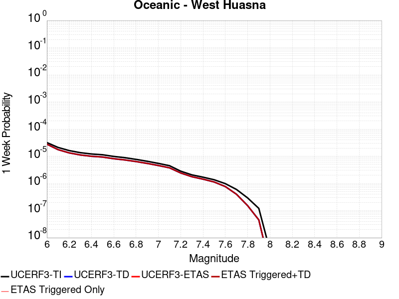 | 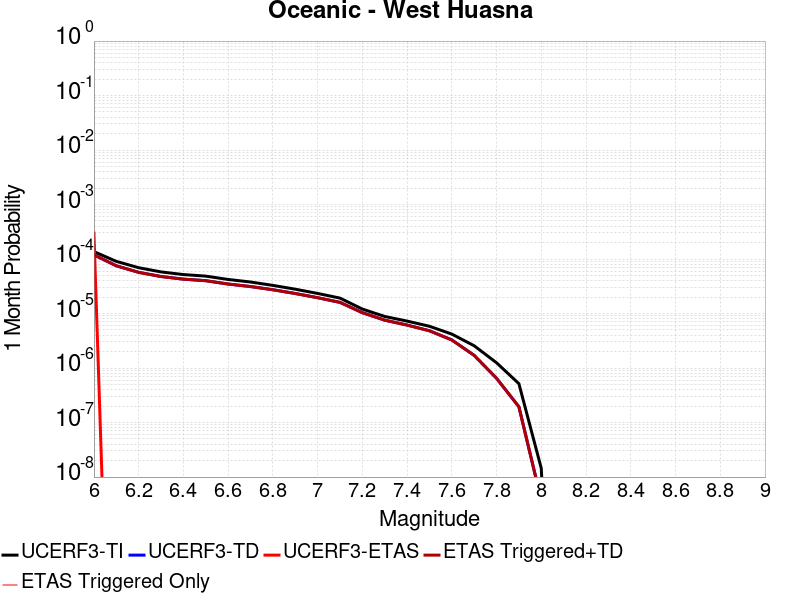 | 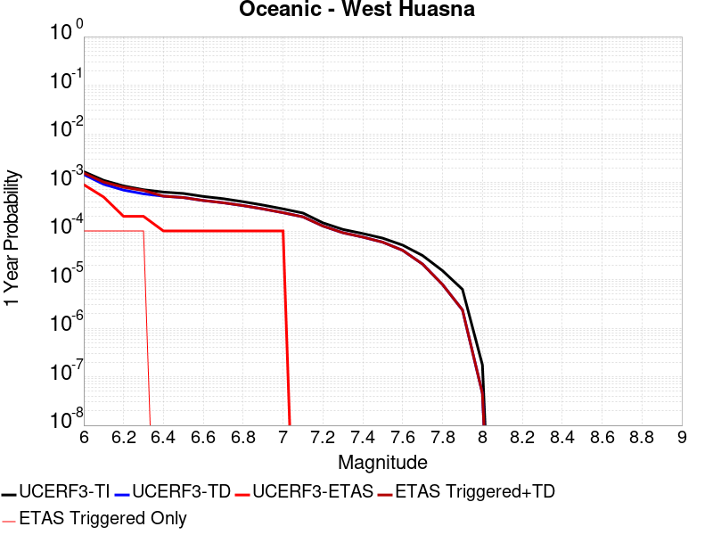 | 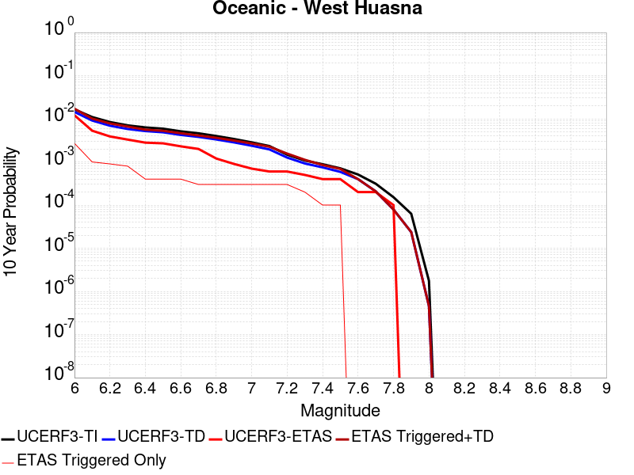 |

| Magnitude | 1 wk TI Prob | 1 wk TD Prob | 1 wk ETAS Prob | 1 wk ETAS/TD Gain | 1 wk ETAS Triggered+TD | 1 wk ETAS Triggered Only | 1 mo TI Prob | 1 mo TD Prob | 1 mo ETAS Prob | 1 mo ETAS/TD Gain | 1 mo ETAS Triggered+TD | 1 mo ETAS Triggered Only | 1 yr TI Prob | 1 yr TD Prob | 1 yr ETAS Prob | 1 yr ETAS/TD Gain | 1 yr ETAS Triggered+TD | 1 yr ETAS Triggered Only | 10 yr TI Prob | 10 yr TD Prob | 10 yr ETAS Prob | 10 yr ETAS/TD Gain | 10 yr ETAS Triggered+TD | 10 yr ETAS Triggered Only |
|-----|-----|-----|-----|-----|-----|-----|-----|-----|-----|-----|-----|-----|-----|-----|-----|-----|-----|-----|-----|-----|-----|-----|-----|-----|
| 6.0 | 3.195567E-5 | 2.7896494E-5 | 0.0 | 0.0 | 2.7896494E-5 | 0.0 | 1.3694567E-4 | 1.19551165E-4 | 3.0E-4 | 2.5093858 | 1.19551165E-4 | 0.0 | 0.0016660384 | 0.0014546067 | 9.0E-4 | 0.618724 | 0.0015544612 | 1.0E-4 | 0.016536033 | 0.014455398 | 0.0121 | 0.8370576 | 0.017116368 | 0.0027 |
| 6.1 | 2.1156782E-5 | 1.755236E-5 | 0.0 | 0.0 | 1.755236E-5 | 0.0 | 9.066878E-5 | 7.5222284E-5 | 0.0 | 0.0 | 7.5222284E-5 | 0.0 | 0.0011033333 | 9.1545586E-4 | 5.0E-4 | 0.54617596 | 0.0010153643 | 1.0E-4 | 0.010978713 | 0.009117853 | 0.0053 | 0.5812772 | 0.010108735 | 0.001 |
| 6.2 | 1.6195117E-5 | 1.3309846E-5 | 0.0 | 0.0 | 1.3309846E-5 | 0.0 | 6.9405796E-5 | 5.704096E-5 | 0.0 | 0.0 | 5.704096E-5 | 0.0 | 8.44688E-4 | 6.94255E-4 | 2.0E-4 | 0.28807858 | 7.9418556E-4 | 1.0E-4 | 0.008414844 | 0.0069211544 | 0.0039 | 0.5634898 | 0.007814925 | 9.0E-4 |
| 6.3 | 1.3559345E-5 | 1.1164041E-5 | 0.0 | 0.0 | 1.1164041E-5 | 0.0 | 5.811018E-5 | 4.7845017E-5 | 0.0 | 0.0 | 4.7845017E-5 | 0.0 | 7.072618E-4 | 5.8235833E-4 | 2.0E-4 | 0.34343114 | 6.8230013E-4 | 1.0E-4 | 0.0070501505 | 0.0058084405 | 0.0033 | 0.5681387 | 0.0066037937 | 8.0E-4 |
| 6.4 | 1.2120619E-5 | 9.987031E-6 | 0.0 | 0.0 | 9.987031E-6 | 0.0 | 5.1944477E-5 | 4.2800864E-5 | 0.0 | 0.0 | 4.2800864E-5 | 0.0 | 6.322405E-4 | 5.2097643E-4 | 1.0E-4 | 0.19194727 | 5.2097643E-4 | 0.0 | 0.006304447 | 0.005197618 | 0.0028 | 0.5387083 | 0.0055955388 | 4.0E-4 |
| 6.5 | 1.13511915E-5 | 9.354076E-6 | 0.0 | 0.0 | 9.354076E-6 | 0.0 | 4.8647056E-5 | 4.0088282E-5 | 0.0 | 0.0 | 4.0088282E-5 | 0.0 | 5.9211696E-4 | 4.8796597E-4 | 1.0E-4 | 0.20493232 | 4.8796597E-4 | 0.0 | 0.0059054173 | 0.004869004 | 0.0027 | 0.55452824 | 0.005267056 | 4.0E-4 |
| 6.6 | 9.850605E-6 | 8.122999E-6 | 0.0 | 0.0 | 8.122999E-6 | 0.0 | 4.2216197E-5 | 3.481239E-5 | 0.0 | 0.0 | 3.481239E-5 | 0.0 | 5.1386096E-4 | 4.2375864E-4 | 1.0E-4 | 0.23598339 | 4.2375864E-4 | 0.0 | 0.0051267436 | 0.004229538 | 0.0023 | 0.5437946 | 0.0046278466 | 4.0E-4 |
| 6.7 | 8.8558645E-6 | 7.3066158E-6 | 0.0 | 0.0 | 7.3066158E-6 | 0.0 | 3.7953152E-5 | 3.131369E-5 | 0.0 | 0.0 | 3.131369E-5 | 0.0 | 4.6198163E-4 | 3.811777E-4 | 1.0E-4 | 0.26234484 | 3.811777E-4 | 0.0 | 0.004610224 | 0.0038052641 | 0.002 | 0.5255877 | 0.0041041225 | 3.0E-4 |
| 6.8 | 7.67136E-6 | 6.3804887E-6 | 0.0 | 0.0 | 6.3804887E-6 | 0.0 | 3.2876844E-5 | 2.7344664E-5 | 0.0 | 0.0 | 2.7344664E-5 | 0.0 | 4.0020206E-4 | 3.3287058E-4 | 1.0E-4 | 0.30041704 | 3.3287058E-4 | 0.0 | 0.003994821 | 0.0033237408 | 0.0012 | 0.36103898 | 0.0036227438 | 3.0E-4 |
| 6.9 | 6.534529E-6 | 5.447591E-6 | 0.0 | 0.0 | 5.447591E-6 | 0.0 | 2.8004823E-5 | 2.334661E-5 | 0.0 | 0.0 | 2.334661E-5 | 0.0 | 3.4090536E-4 | 2.8420804E-4 | 1.0E-4 | 0.35185492 | 2.8420804E-4 | 0.0 | 0.0034038287 | 0.0028384624 | 9.0E-4 | 0.31707308 | 0.0031376106 | 3.0E-4 |
| 7.0 | 5.460525E-6 | 4.559767E-6 | 0.0 | 0.0 | 4.559767E-6 | 0.0 | 2.3402039E-5 | 1.9541714E-5 | 0.0 | 0.0 | 1.9541714E-5 | 0.0 | 2.8488258E-4 | 2.378945E-4 | 1.0E-4 | 0.4203544 | 2.378945E-4 | 0.0 | 0.0028451765 | 0.002376412 | 7.0E-4 | 0.2945617 | 0.0026756993 | 3.0E-4 |
| 7.1 | 4.4825083E-6 | 3.744255E-6 | 0.0 | 0.0 | 3.744255E-6 | 0.0 | 1.9210609E-5 | 1.604671E-5 | 0.0 | 0.0 | 1.604671E-5 | 0.0 | 2.3386406E-4 | 1.9535127E-4 | 0.0 | 0.0 | 1.9535127E-4 | 0.0 | 0.002336181 | 0.0019518073 | 6.0E-4 | 0.3074074 | 0.0022512218 | 3.0E-4 |
| 7.2 | 2.821708E-6 | 2.4217536E-6 | 0.0 | 0.0 | 2.4217536E-6 | 0.0 | 1.2092979E-5 | 1.03789025E-5 | 0.0 | 0.0 | 1.03789025E-5 | 0.0 | 1.4722206E-4 | 1.2635582E-4 | 0.0 | 0.0 | 1.2635582E-4 | 0.0 | 0.0014712457 | 0.0012628422 | 6.0E-4 | 0.47511873 | 0.0015624634 | 3.0E-4 |
| 7.3 | 2.0644757E-6 | 1.7660155E-6 | 0.0 | 0.0 | 1.7660155E-6 | 0.0 | 8.847723E-6 | 7.568616E-6 | 0.0 | 0.0 | 7.568616E-6 | 0.0 | 1.0771569E-4 | 9.214401E-5 | 0.0 | 0.0 | 9.214401E-5 | 0.0 | 0.001076635 | 9.210598E-4 | 5.0E-4 | 0.5428529 | 0.0011208756 | 2.0E-4 |
| 7.4 | 1.6980367E-6 | 1.4354491E-6 | 0.0 | 0.0 | 1.4354491E-6 | 0.0 | 7.27728E-6 | 6.1519104E-6 | 0.0 | 0.0 | 6.1519104E-6 | 0.0 | 8.8597284E-5 | 7.489694E-5 | 0.0 | 0.0 | 7.489694E-5 | 0.0 | 8.8561967E-4 | 7.487186E-4 | 4.0E-4 | 0.5342461 | 8.486437E-4 | 1.0E-4 |
| 7.5 | 1.3637683E-6 | 1.1279529E-6 | 0.0 | 0.0 | 1.1279529E-6 | 0.0 | 5.844708E-6 | 4.834075E-6 | 0.0 | 0.0 | 4.834075E-6 | 0.0 | 7.1156996E-5 | 5.885327E-5 | 0.0 | 0.0 | 5.885327E-5 | 0.0 | 7.1134215E-4 | 5.883784E-4 | 4.0E-4 | 0.6798346 | 6.883196E-4 | 1.0E-4 |
| 7.6 | 9.802994E-7 | 7.6560275E-7 | 0.0 | 0.0 | 7.6560275E-7 | 0.0 | 4.2012766E-6 | 3.2811506E-6 | 0.0 | 0.0 | 3.2811506E-6 | 0.0 | 5.1149345E-5 | 3.9947277E-5 | 0.0 | 0.0 | 3.9947277E-5 | 0.0 | 5.113757E-4 | 3.9940243E-4 | 2.0E-4 | 0.5007481 | 3.9940243E-4 | 0.0 |
| 7.7 | 5.986191E-7 | 3.986794E-7 | 0.0 | 0.0 | 3.986794E-7 | 0.0 | 2.5655079E-6 | 1.7086248E-6 | 0.0 | 0.0 | 1.7086248E-6 | 0.0 | 3.1234613E-5 | 2.0802308E-5 | 0.0 | 0.0 | 2.0802308E-5 | 0.0 | 3.123022E-4 | 2.0800502E-4 | 2.0E-4 | 0.9615153 | 2.0800502E-4 | 0.0 |
| 7.8 | 2.9189815E-7 | 1.5152165E-7 | 0.0 | 0.0 | 1.5152165E-7 | 0.0 | 1.2509914E-6 | 6.493783E-7 | 0.0 | 0.0 | 6.493783E-7 | 0.0 | 1.5230714E-5 | 7.906152E-6 | 0.0 | 0.0 | 7.906152E-6 | 0.0 | 1.522967E-4 | 7.9060075E-5 | 1.0E-4 | 1.264861 | 7.9060075E-5 | 0.0 |
| 7.9 | 1.2057845E-7 | 4.5461977E-8 | 0.0 | 0.0 | 4.5461977E-8 | 0.0 | 5.1676466E-7 | 1.9483704E-7 | 0.0 | 0.0 | 1.9483704E-7 | 0.0 | 6.2915915E-6 | 2.3721384E-6 | 0.0 | 0.0 | 2.3721384E-6 | 0.0 | 6.2914136E-5 | 2.3722485E-5 | 0.0 | 0.0 | 2.3722485E-5 | 0.0 |
| 8.0 | 3.3806387E-9 | 8.7480223E-10 | 0.0 | 0.0 | 8.7480223E-10 | 0.0 | 1.4488451E-8 | 3.749153E-9 | 0.0 | 0.0 | 3.749153E-9 | 0.0 | 1.7639688E-7 | 4.5645937E-8 | 0.0 | 0.0 | 4.5645937E-8 | 0.0 | 1.7639674E-6 | 4.57594E-7 | 0.0 | 0.0 | 4.57594E-7 | 0.0 |

## McLean Lake
*[(top)](#table-of-contents)*

| 1 Week | 1 Month | 1 Year | 10 Year |
|-----|-----|-----|-----|
| 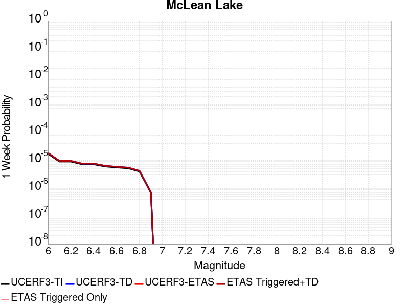 | 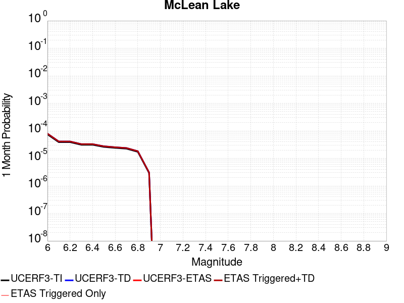 | 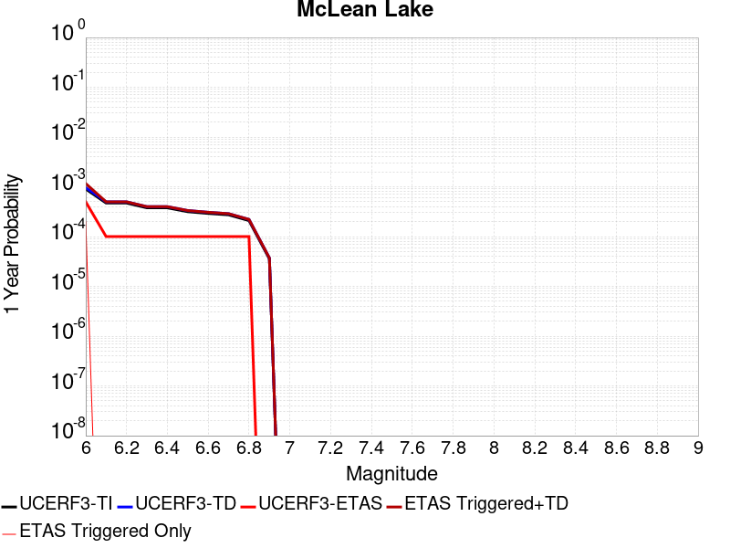 | 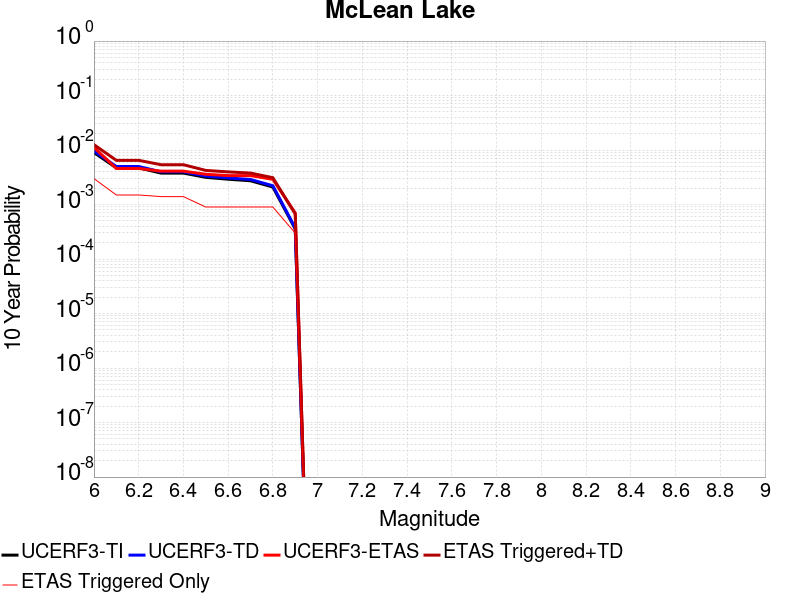 |

| Magnitude | 1 wk TI Prob | 1 wk TD Prob | 1 wk ETAS Prob | 1 wk ETAS/TD Gain | 1 wk ETAS Triggered+TD | 1 wk ETAS Triggered Only | 1 mo TI Prob | 1 mo TD Prob | 1 mo ETAS Prob | 1 mo ETAS/TD Gain | 1 mo ETAS Triggered+TD | 1 mo ETAS Triggered Only | 1 yr TI Prob | 1 yr TD Prob | 1 yr ETAS Prob | 1 yr ETAS/TD Gain | 1 yr ETAS Triggered+TD | 1 yr ETAS Triggered Only | 10 yr TI Prob | 10 yr TD Prob | 10 yr ETAS Prob | 10 yr ETAS/TD Gain | 10 yr ETAS Triggered+TD | 10 yr ETAS Triggered Only |
|-----|-----|-----|-----|-----|-----|-----|-----|-----|-----|-----|-----|-----|-----|-----|-----|-----|-----|-----|-----|-----|-----|-----|-----|-----|
| 6.0 | 1.7360222E-5 | 1.848891E-5 | 0.0 | 0.0 | 1.848891E-5 | 0.0 | 7.439883E-5 | 7.923606E-5 | 0.0 | 0.0 | 7.923606E-5 | 0.0 | 9.0542925E-4 | 9.643206E-4 | 5.0E-4 | 0.5184998 | 0.0011641277 | 2.0E-4 | 0.009017491 | 0.009606195 | 0.0112 | 1.1659143 | 0.012577376 | 0.003 |
| 6.1 | 9.062689E-6 | 9.586339E-6 | 0.0 | 0.0 | 9.586339E-6 | 0.0 | 3.8839516E-5 | 4.108371E-5 | 0.0 | 0.0 | 4.108371E-5 | 0.0 | 4.727685E-4 | 5.0008827E-4 | 1.0E-4 | 0.1999647 | 5.0008827E-4 | 0.0 | 0.0047176396 | 0.0049905106 | 0.0046 | 0.92174935 | 0.006483025 | 0.0015 |
| 6.2 | 9.062689E-6 | 9.586339E-6 | 0.0 | 0.0 | 9.586339E-6 | 0.0 | 3.8839516E-5 | 4.108371E-5 | 0.0 | 0.0 | 4.108371E-5 | 0.0 | 4.727685E-4 | 5.0008827E-4 | 1.0E-4 | 0.1999647 | 5.0008827E-4 | 0.0 | 0.0047176396 | 0.0049905106 | 0.0046 | 0.92174935 | 0.006483025 | 0.0015 |
| 6.3 | 7.2575485E-6 | 7.663183E-6 | 0.0 | 0.0 | 7.663183E-6 | 0.0 | 3.110341E-5 | 3.284184E-5 | 0.0 | 0.0 | 3.284184E-5 | 0.0 | 3.786182E-4 | 3.9978314E-4 | 1.0E-4 | 0.2501356 | 3.9978314E-4 | 0.0 | 0.0037797375 | 0.0039913435 | 0.0041 | 1.0272231 | 0.0053857556 | 0.0014 |
| 6.4 | 7.2575485E-6 | 7.663183E-6 | 0.0 | 0.0 | 7.663183E-6 | 0.0 | 3.110341E-5 | 3.284184E-5 | 0.0 | 0.0 | 3.284184E-5 | 0.0 | 3.786182E-4 | 3.9978314E-4 | 1.0E-4 | 0.2501356 | 3.9978314E-4 | 0.0 | 0.0037797375 | 0.0039913435 | 0.0041 | 1.0272231 | 0.0053857556 | 0.0014 |
| 6.5 | 6.06582E-6 | 6.4001492E-6 | 0.0 | 0.0 | 6.4001492E-6 | 0.0 | 2.5996113E-5 | 2.742896E-5 | 0.0 | 0.0 | 2.742896E-5 | 0.0 | 3.164567E-4 | 3.339029E-4 | 1.0E-4 | 0.29948828 | 3.339029E-4 | 0.0 | 0.0031600643 | 0.0033346498 | 0.0036 | 1.0795736 | 0.0042316485 | 9.0E-4 |
| 6.6 | 5.598744E-6 | 5.9068275E-6 | 0.0 | 0.0 | 5.9068275E-6 | 0.0 | 2.3994397E-5 | 2.5314765E-5 | 0.0 | 0.0 | 2.5314765E-5 | 0.0 | 2.9209262E-4 | 3.0817007E-4 | 1.0E-4 | 0.32449615 | 3.0817007E-4 | 0.0 | 0.0029170897 | 0.0030780556 | 0.0034 | 1.1045934 | 0.003975285 | 9.0E-4 |
| 6.7 | 5.246996E-6 | 5.5359405E-6 | 0.0 | 0.0 | 5.5359405E-6 | 0.0 | 2.2486933E-5 | 2.372528E-5 | 0.0 | 0.0 | 2.372528E-5 | 0.0 | 2.73744E-4 | 2.8882333E-4 | 1.0E-4 | 0.3462324 | 2.8882333E-4 | 0.0 | 0.0027340704 | 0.0028851028 | 0.0034 | 1.1784675 | 0.003782506 | 9.0E-4 |
| 6.8 | 4.02324E-6 | 4.2444385E-6 | 0.0 | 0.0 | 4.2444385E-6 | 0.0 | 1.7242342E-5 | 1.8190356E-5 | 0.0 | 0.0 | 1.8190356E-5 | 0.0 | 2.099053E-4 | 2.2145103E-4 | 1.0E-4 | 0.4515671 | 2.2145103E-4 | 0.0 | 0.0020970714 | 0.0022128872 | 0.0029 | 1.3105052 | 0.0031108956 | 9.0E-4 |
| 6.9 | 6.835972E-7 | 7.1366145E-7 | 0.0 | 0.0 | 7.1366145E-7 | 0.0 | 2.9296991E-6 | 3.0585475E-6 | 0.0 | 0.0 | 3.0585475E-6 | 0.0 | 3.56685E-5 | 3.7237496E-5 | 0.0 | 0.0 | 3.7237496E-5 | 0.0 | 3.5662777E-4 | 3.7234378E-4 | 7.0E-4 | 1.879983 | 6.7223207E-4 | 3.0E-4 |

## Bear River fault zone
*[(top)](#table-of-contents)*

| 1 Week | 1 Month | 1 Year | 10 Year |
|-----|-----|-----|-----|
| 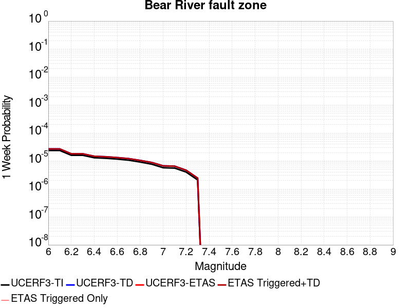 | 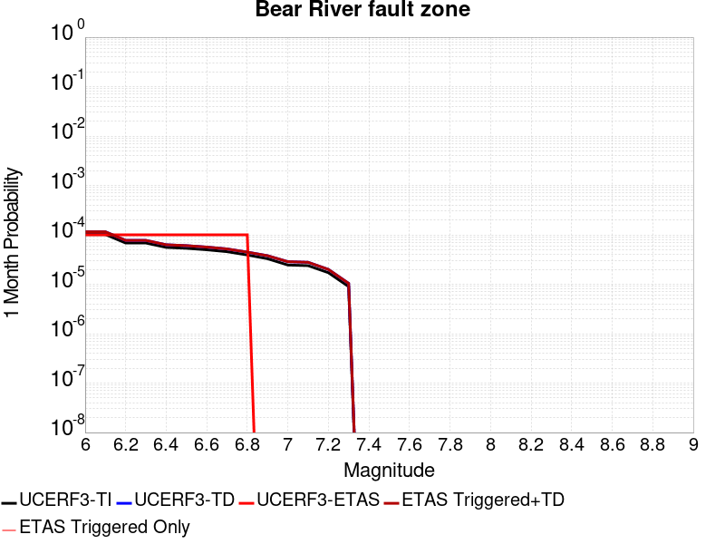 | 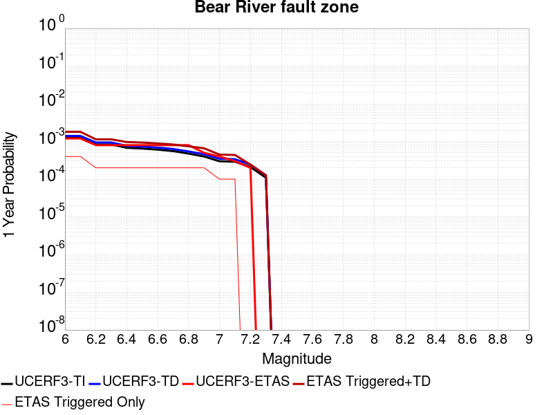 | 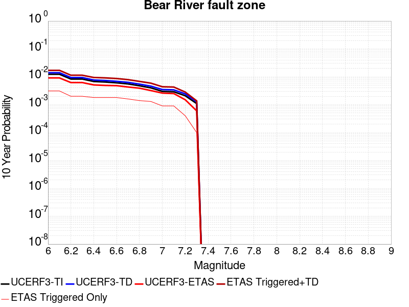 |

| Magnitude | 1 wk TI Prob | 1 wk TD Prob | 1 wk ETAS Prob | 1 wk ETAS/TD Gain | 1 wk ETAS Triggered+TD | 1 wk ETAS Triggered Only | 1 mo TI Prob | 1 mo TD Prob | 1 mo ETAS Prob | 1 mo ETAS/TD Gain | 1 mo ETAS Triggered+TD | 1 mo ETAS Triggered Only | 1 yr TI Prob | 1 yr TD Prob | 1 yr ETAS Prob | 1 yr ETAS/TD Gain | 1 yr ETAS Triggered+TD | 1 yr ETAS Triggered Only | 10 yr TI Prob | 10 yr TD Prob | 10 yr ETAS Prob | 10 yr ETAS/TD Gain | 10 yr ETAS Triggered+TD | 10 yr ETAS Triggered Only |
|-----|-----|-----|-----|-----|-----|-----|-----|-----|-----|-----|-----|-----|-----|-----|-----|-----|-----|-----|-----|-----|-----|-----|-----|-----|
| 6.0 | 2.3773342E-5 | 2.69424E-5 | 0.0 | 0.0 | 2.69424E-5 | 0.0 | 1.0188177E-4 | 1.1546284E-4 | 1.0E-4 | 0.8660795 | 1.1546284E-4 | 0.0 | 0.0012397047 | 0.0014049468 | 0.0012 | 0.85412484 | 0.0018043849 | 4.0E-4 | 0.012328116 | 0.013970025 | 0.0091 | 0.65139467 | 0.017026719 | 0.0031 |
| 6.1 | 2.3773342E-5 | 2.69424E-5 | 0.0 | 0.0 | 2.69424E-5 | 0.0 | 1.0188177E-4 | 1.1546284E-4 | 1.0E-4 | 0.8660795 | 1.1546284E-4 | 0.0 | 0.0012397047 | 0.0014049468 | 0.0012 | 0.85412484 | 0.0018043849 | 4.0E-4 | 0.012328116 | 0.013970025 | 0.0091 | 0.65139467 | 0.017026719 | 0.0031 |
| 6.2 | 1.5973403E-5 | 1.8037237E-5 | 0.0 | 0.0 | 1.8037237E-5 | 0.0 | 6.845564E-5 | 7.730028E-5 | 1.0E-4 | 1.2936563 | 7.730028E-5 | 0.0 | 8.3312875E-4 | 9.407481E-4 | 8.0E-4 | 0.85038704 | 0.0011405599 | 2.0E-4 | 0.008300122 | 0.009370046 | 0.0062 | 0.661683 | 0.011351305 | 0.002 |
| 6.3 | 1.5973403E-5 | 1.8037237E-5 | 0.0 | 0.0 | 1.8037237E-5 | 0.0 | 6.845564E-5 | 7.730028E-5 | 1.0E-4 | 1.2936563 | 7.730028E-5 | 0.0 | 8.3312875E-4 | 9.407481E-4 | 8.0E-4 | 0.85038704 | 0.0011405599 | 2.0E-4 | 0.008300122 | 0.009370046 | 0.0062 | 0.661683 | 0.011351305 | 0.002 |
| 6.4 | 1.3027338E-5 | 1.4720553E-5 | 0.0 | 0.0 | 1.4720553E-5 | 0.0 | 5.5830256E-5 | 6.3086634E-5 | 1.0E-4 | 1.5851218 | 6.3086634E-5 | 0.0 | 6.7952136E-4 | 7.678229E-4 | 8.0E-4 | 1.041907 | 9.6766936E-4 | 2.0E-4 | 0.0067744725 | 0.0076530976 | 0.0051 | 0.66639686 | 0.009439322 | 0.0018 |
| 6.5 | 1.2489152E-5 | 1.4123917E-5 | 0.0 | 0.0 | 1.4123917E-5 | 0.0 | 5.352384E-5 | 6.0529746E-5 | 1.0E-4 | 1.6520803 | 6.0529746E-5 | 0.0 | 6.514579E-4 | 7.3671405E-4 | 8.0E-4 | 1.085903 | 9.365667E-4 | 2.0E-4 | 0.0064955144 | 0.0073440894 | 0.0049 | 0.6672032 | 0.00913087 | 0.0018 |
| 6.6 | 1.1662849E-5 | 1.3209397E-5 | 0.0 | 0.0 | 1.3209397E-5 | 0.0 | 4.9982682E-5 | 5.661055E-5 | 1.0E-4 | 1.7664553 | 5.661055E-5 | 0.0 | 6.083692E-4 | 6.8902835E-4 | 8.0E-4 | 1.1610552 | 8.888905E-4 | 2.0E-4 | 0.006067064 | 0.006870217 | 0.0048 | 0.6986679 | 0.008657851 | 0.0018 |
| 6.7 | 1.0667623E-5 | 1.2110522E-5 | 0.0 | 0.0 | 1.2110522E-5 | 0.0 | 4.5717585E-5 | 5.1901272E-5 | 1.0E-4 | 1.926735 | 5.1901272E-5 | 0.0 | 5.5646943E-4 | 6.317266E-4 | 8.0E-4 | 1.2663707 | 8.316002E-4 | 2.0E-4 | 0.0055507803 | 0.006300487 | 0.0043 | 0.68248695 | 0.007890406 | 0.0016 |
| 6.8 | 9.154534E-6 | 1.0443577E-5 | 0.0 | 0.0 | 1.0443577E-5 | 0.0 | 3.923313E-5 | 4.475748E-5 | 1.0E-4 | 2.2342634 | 4.475748E-5 | 0.0 | 4.7755867E-4 | 5.447965E-4 | 8.0E-4 | 1.468438 | 7.4468757E-4 | 2.0E-4 | 0.004765337 | 0.005435654 | 0.0039 | 0.71748495 | 0.006828044 | 0.0014 |
| 6.9 | 7.68501E-6 | 8.831835E-6 | 0.0 | 0.0 | 8.831835E-6 | 0.0 | 3.2935342E-5 | 3.7850223E-5 | 0.0 | 0.0 | 3.7850223E-5 | 0.0 | 4.0091402E-4 | 4.6073832E-4 | 5.0E-4 | 1.0852147 | 6.606462E-4 | 2.0E-4 | 0.004001915 | 0.00459875 | 0.0032 | 0.69584125 | 0.0058927718 | 0.0013 |
| 7.0 | 5.7315733E-6 | 6.69178E-6 | 0.0 | 0.0 | 6.69178E-6 | 0.0 | 2.4563653E-5 | 2.8678767E-5 | 0.0 | 0.0 | 2.8678767E-5 | 0.0 | 2.9902143E-4 | 3.491123E-4 | 4.0E-4 | 1.1457632 | 4.4907737E-4 | 1.0E-4 | 0.0029861939 | 0.0034860587 | 0.0026 | 0.745828 | 0.0043829214 | 9.0E-4 |
| 7.1 | 5.566844E-6 | 6.5005743E-6 | 0.0 | 0.0 | 6.5005743E-6 | 0.0 | 2.3857683E-5 | 2.785933E-5 | 0.0 | 0.0 | 2.785933E-5 | 0.0 | 2.9042858E-4 | 3.3913882E-4 | 3.0E-4 | 0.88459355 | 4.391049E-4 | 1.0E-4 | 0.002900493 | 0.0033866316 | 0.0025 | 0.7381966 | 0.0042835837 | 9.0E-4 |
| 7.2 | 4.011353E-6 | 4.6665573E-6 | 0.0 | 0.0 | 4.6665573E-6 | 0.0 | 1.7191402E-5 | 1.9999396E-5 | 0.0 | 0.0 | 1.9999396E-5 | 0.0 | 2.0928521E-4 | 2.4346886E-4 | 2.0E-4 | 0.82146025 | 2.4346886E-4 | 0.0 | 0.0020908823 | 0.0024323578 | 0.0015 | 0.6166856 | 0.0028313848 | 4.0E-4 |
| 7.3 | 2.0974871E-6 | 2.4354429E-6 | 0.0 | 0.0 | 2.4354429E-6 | 0.0 | 8.989199E-6 | 1.0437585E-5 | 0.0 | 0.0 | 1.0437585E-5 | 0.0 | 1.09438006E-4 | 1.2707268E-4 | 0.0 | 0.0 | 1.2707268E-4 | 0.0 | 0.0010938413 | 0.0012702446 | 6.0E-4 | 0.47235 | 0.0013701175 | 1.0E-4 |

## San Jacinto (Borrego)
*[(top)](#table-of-contents)*

| 1 Week | 1 Month | 1 Year | 10 Year |
|-----|-----|-----|-----|
| 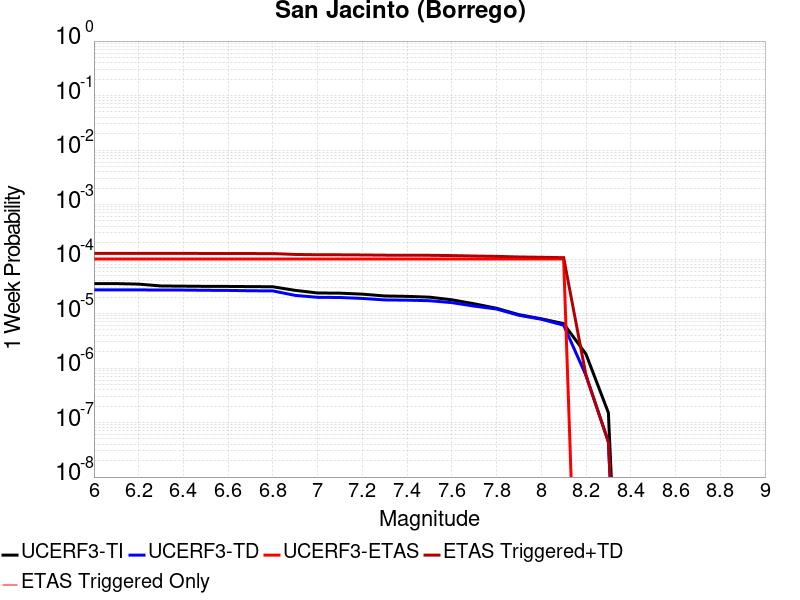 | 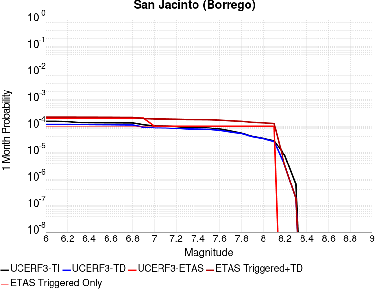 | 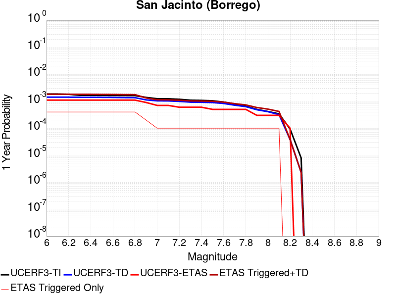 | 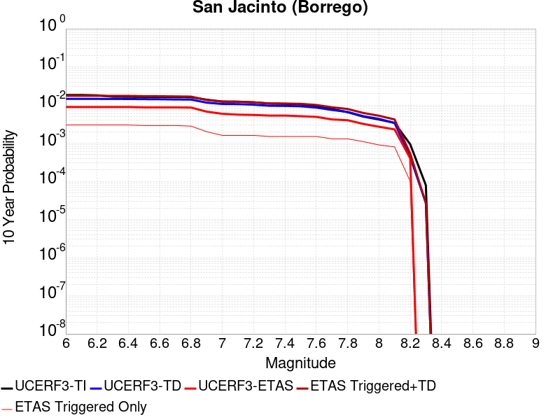 |

| Magnitude | 1 wk TI Prob | 1 wk TD Prob | 1 wk ETAS Prob | 1 wk ETAS/TD Gain | 1 wk ETAS Triggered+TD | 1 wk ETAS Triggered Only | 1 mo TI Prob | 1 mo TD Prob | 1 mo ETAS Prob | 1 mo ETAS/TD Gain | 1 mo ETAS Triggered+TD | 1 mo ETAS Triggered Only | 1 yr TI Prob | 1 yr TD Prob | 1 yr ETAS Prob | 1 yr ETAS/TD Gain | 1 yr ETAS Triggered+TD | 1 yr ETAS Triggered Only | 10 yr TI Prob | 10 yr TD Prob | 10 yr ETAS Prob | 10 yr ETAS/TD Gain | 10 yr ETAS Triggered+TD | 10 yr ETAS Triggered Only |
|-----|-----|-----|-----|-----|-----|-----|-----|-----|-----|-----|-----|-----|-----|-----|-----|-----|-----|-----|-----|-----|-----|-----|-----|-----|
| 6.0 | 3.543992E-5 | 2.7247179E-5 | 1.0E-4 | 3.6701047 | 1.2724445E-4 | 1.0E-4 | 1.5187653E-4 | 1.1676846E-4 | 2.0E-4 | 1.7127913 | 2.1675679E-4 | 1.0E-4 | 0.0018475284 | 0.0014207407 | 0.0011 | 0.774244 | 0.0018201724 | 4.0E-4 | 0.018322436 | 0.014516087 | 0.0089 | 0.61311287 | 0.01747254 | 0.003 |
| 6.1 | 3.542281E-5 | 2.7247179E-5 | 1.0E-4 | 3.6701047 | 1.2724445E-4 | 1.0E-4 | 1.5180321E-4 | 1.1676846E-4 | 2.0E-4 | 1.7127913 | 2.1675679E-4 | 1.0E-4 | 0.0018466372 | 0.0014207407 | 0.0011 | 0.774244 | 0.0018201724 | 4.0E-4 | 0.018313672 | 0.014516087 | 0.0089 | 0.61311287 | 0.01747254 | 0.003 |
| 6.2 | 3.4688688E-5 | 2.7247179E-5 | 1.0E-4 | 3.6701047 | 1.2724445E-4 | 1.0E-4 | 1.4865733E-4 | 1.1676846E-4 | 2.0E-4 | 1.7127913 | 2.1675679E-4 | 1.0E-4 | 0.0018084005 | 0.0014207407 | 0.0011 | 0.774244 | 0.0018201724 | 4.0E-4 | 0.017937548 | 0.014516087 | 0.0089 | 0.61311287 | 0.01747254 | 0.003 |
| 6.3 | 3.2087122E-5 | 2.7092876E-5 | 1.0E-4 | 3.6910071 | 1.2709017E-4 | 1.0E-4 | 1.3750899E-4 | 1.1610723E-4 | 2.0E-4 | 1.7225457 | 2.1609562E-4 | 1.0E-4 | 0.0016728862 | 0.0014127006 | 0.0011 | 0.77865046 | 0.0018121356 | 4.0E-4 | 0.016603488 | 0.014437389 | 0.0089 | 0.61645496 | 0.017394077 | 0.003 |
| 6.4 | 3.1828724E-5 | 2.705998E-5 | 1.0E-4 | 3.6954942 | 1.2705727E-4 | 1.0E-4 | 1.364017E-4 | 1.1596626E-4 | 2.0E-4 | 1.7246397 | 2.1595466E-4 | 1.0E-4 | 0.0016594254 | 0.0014109865 | 0.0011 | 0.7795964 | 0.001810422 | 4.0E-4 | 0.016470885 | 0.014420639 | 0.0089 | 0.617171 | 0.017377377 | 0.003 |
| 6.5 | 3.1563577E-5 | 2.6800688E-5 | 1.0E-4 | 3.7312474 | 1.2679801E-4 | 1.0E-4 | 1.3526545E-4 | 1.148551E-4 | 2.0E-4 | 1.7413244 | 2.1484362E-4 | 1.0E-4 | 0.0016456128 | 0.0013974756 | 0.0011 | 0.7871336 | 0.0017969166 | 4.0E-4 | 0.0163348 | 0.014287161 | 0.0087 | 0.60893834 | 0.017145727 | 0.0029 |
| 6.6 | 3.1467625E-5 | 2.6645346E-5 | 1.0E-4 | 3.7530005 | 1.2664268E-4 | 1.0E-4 | 1.3485427E-4 | 1.1418941E-4 | 2.0E-4 | 1.7514759 | 2.1417798E-4 | 1.0E-4 | 0.0016406142 | 0.0013893811 | 0.0011 | 0.7917194 | 0.0017888254 | 4.0E-4 | 0.016285548 | 0.014207699 | 0.0087 | 0.612344 | 0.017066497 | 0.0029 |
| 6.7 | 3.1223695E-5 | 2.6265376E-5 | 1.0E-4 | 3.8072937 | 1.2626275E-4 | 1.0E-4 | 1.3380898E-4 | 1.125611E-4 | 2.0E-4 | 1.7768127 | 2.1254984E-4 | 1.0E-4 | 0.0016279068 | 0.0013695816 | 0.0011 | 0.80316496 | 0.0017690337 | 4.0E-4 | 0.01616033 | 0.014013237 | 0.0087 | 0.62084156 | 0.016872598 | 0.0029 |
| 6.8 | 3.1015585E-5 | 2.6088208E-5 | 1.0E-4 | 3.8331494 | 1.260856E-4 | 1.0E-4 | 1.3291716E-4 | 1.1180188E-4 | 2.0E-4 | 1.7888787 | 2.117907E-4 | 1.0E-4 | 0.001617065 | 0.0013603496 | 0.0011 | 0.8086157 | 0.0017598055 | 4.0E-4 | 0.016053487 | 0.013921397 | 0.0086 | 0.6177541 | 0.016682416 | 0.0028 |
| 6.9 | 2.6641965E-5 | 2.1587382E-5 | 1.0E-4 | 4.6323357 | 1.21585224E-4 | 1.0E-4 | 1.1417485E-4 | 9.251409E-5 | 2.0E-4 | 2.1618328 | 1.9250484E-4 | 1.0E-4 | 0.0013891924 | 0.0011257809 | 9.0E-4 | 0.7994451 | 0.0013255557 | 2.0E-4 | 0.0138054015 | 0.011570384 | 0.0067 | 0.5790646 | 0.013547243 | 0.002 |
| 7.0 | 2.3854353E-5 | 1.9918738E-5 | 1.0E-4 | 5.0203986 | 1.19916745E-4 | 1.0E-4 | 1.02228936E-4 | 8.536324E-5 | 1.0E-4 | 1.1714644 | 1.853547E-4 | 1.0E-4 | 0.0012439266 | 0.0010388044 | 7.0E-4 | 0.6738516 | 0.0011387005 | 1.0E-4 | 0.012369866 | 0.010689501 | 0.0059 | 0.5519435 | 0.012272398 | 0.0016 |
| 7.1 | 2.3672901E-5 | 1.9756502E-5 | 1.0E-4 | 5.0616245 | 1.1975453E-4 | 1.0E-4 | 1.0145135E-4 | 8.466799E-5 | 1.0E-4 | 1.1810838 | 1.8465953E-4 | 1.0E-4 | 0.0012344702 | 0.0010303478 | 7.0E-4 | 0.67938226 | 0.0011302448 | 1.0E-4 | 0.0122763505 | 0.010605348 | 0.0056 | 0.52803546 | 0.01218838 | 0.0016 |
| 7.2 | 2.2717244E-5 | 1.8992536E-5 | 1.0E-4 | 5.2652264 | 1.1899064E-4 | 1.0E-4 | 9.735599E-5 | 8.139406E-5 | 1.0E-4 | 1.228591 | 1.8138591E-4 | 1.0E-4 | 0.0011846646 | 9.905243E-4 | 6.0E-4 | 0.6057398 | 0.0010904253 | 1.0E-4 | 0.01178369 | 0.010207092 | 0.0055 | 0.538841 | 0.011790761 | 0.0016 |
| 7.3 | 2.1016205E-5 | 1.784509E-5 | 1.0E-4 | 5.603782 | 1.1784331E-4 | 1.0E-4 | 9.006634E-5 | 7.6476725E-5 | 1.0E-4 | 1.3075874 | 1.7646908E-4 | 1.0E-4 | 0.001096006 | 9.3070837E-4 | 6.0E-4 | 0.64467025 | 0.0010306153 | 1.0E-4 | 0.010906163 | 0.009608309 | 0.0053 | 0.5516059 | 0.011093897 | 0.0015 |
| 7.4 | 2.0683625E-5 | 1.7649298E-5 | 1.0E-4 | 5.6659474 | 1.17647534E-4 | 1.0E-4 | 8.86411E-5 | 7.563767E-5 | 1.0E-4 | 1.3220925 | 1.756301E-4 | 1.0E-4 | 0.001078671 | 9.2050154E-4 | 6.0E-4 | 0.6518186 | 0.0010204095 | 1.0E-4 | 0.010734501 | 0.009505889 | 0.0053 | 0.5575491 | 0.01099163 | 0.0015 |
| 7.5 | 1.9993966E-5 | 1.7249082E-5 | 1.0E-4 | 5.79741 | 1.1724736E-4 | 1.0E-4 | 8.568561E-5 | 7.392256E-5 | 1.0E-4 | 1.3527671 | 1.7391516E-4 | 1.0E-4 | 0.001042723 | 8.996374E-4 | 5.0E-4 | 0.55577946 | 9.995474E-4 | 1.0E-4 | 0.010378438 | 0.009295228 | 0.0051 | 0.5486686 | 0.010781285 | 0.0015 |
| 7.6 | 1.788966E-5 | 1.591599E-5 | 1.0E-4 | 6.28299 | 1.159144E-4 | 1.0E-4 | 7.666772E-5 | 6.820961E-5 | 1.0E-4 | 1.4660691 | 1.682028E-4 | 1.0E-4 | 9.3302975E-4 | 8.301373E-4 | 5.0E-4 | 0.60231 | 9.300543E-4 | 1.0E-4 | 0.00929122 | 0.008594018 | 0.0049 | 0.57016397 | 0.010081128 | 0.0015 |
| 7.7 | 1.5125781E-5 | 1.374054E-5 | 1.0E-4 | 7.2777343 | 1.1373917E-4 | 1.0E-4 | 6.4823165E-5 | 5.8886704E-5 | 1.0E-4 | 1.6981761 | 1.5888082E-4 | 1.0E-4 | 7.889362E-4 | 7.167105E-4 | 5.0E-4 | 0.6976317 | 8.166389E-4 | 1.0E-4 | 0.007861412 | 0.007453066 | 0.0042 | 0.5635265 | 0.0087433765 | 0.0013 |
| 7.8 | 1.250089E-5 | 1.2154955E-5 | 1.0E-4 | 8.2270975 | 1.1215374E-4 | 1.0E-4 | 5.3574146E-5 | 5.2091626E-5 | 1.0E-4 | 1.9196943 | 1.5208642E-4 | 1.0E-4 | 6.5207E-4 | 6.340316E-4 | 5.0E-4 | 0.78860426 | 7.3396816E-4 | 1.0E-4 | 0.006501599 | 0.0066174488 | 0.004 | 0.60446256 | 0.007908846 | 0.0013 |
| 7.9 | 9.561E-6 | 9.333654E-6 | 1.0E-4 | 10.713918 | 1.0933272E-4 | 1.0E-4 | 4.0975072E-5 | 4.0000763E-5 | 1.0E-4 | 2.4999523 | 1.3999676E-4 | 1.0E-4 | 4.987573E-4 | 4.8690097E-4 | 3.0E-4 | 0.61614174 | 5.8685226E-4 | 1.0E-4 | 0.0049763937 | 0.005130066 | 0.0032 | 0.62377363 | 0.006224423 | 0.0011 |
| 8.0 | 8.01699E-6 | 7.909673E-6 | 1.0E-4 | 12.642749 | 1.0790888E-4 | 1.0E-4 | 3.4358076E-5 | 3.389816E-5 | 1.0E-4 | 2.9500127 | 1.3389476E-4 | 1.0E-4 | 4.1822926E-4 | 4.1263242E-4 | 3.0E-4 | 0.72703934 | 5.1259116E-4 | 1.0E-4 | 0.0041744304 | 0.004370312 | 0.0027 | 0.6178048 | 0.005266379 | 9.0E-4 |
| 8.1 | 6.541947E-6 | 6.1497162E-6 | 1.0E-4 | 16.260912 | 1.061491E-4 | 1.0E-4 | 2.8036617E-5 | 2.6355663E-5 | 1.0E-4 | 3.794251 | 1.2635303E-4 | 1.0E-4 | 3.4129233E-4 | 3.208334E-4 | 3.0E-4 | 0.93506473 | 4.2080134E-4 | 1.0E-4 | 0.0034076865 | 0.003414587 | 0.0023 | 0.67358077 | 0.004211855 | 8.0E-4 |
| 8.2 | 1.7968189E-6 | 7.389951E-7 | 0.0 | 0.0 | 7.389951E-7 | 0.0 | 7.70063E-6 | 3.167118E-6 | 0.0 | 0.0 | 3.167118E-6 | 0.0 | 9.3751136E-5 | 3.8559E-5 | 1.0E-4 | 2.5934284 | 3.8559E-5 | 0.0 | 9.371159E-4 | 4.385441E-4 | 4.0E-4 | 0.9121089 | 5.3850026E-4 | 1.0E-4 |
| 8.3 | 1.5167889E-7 | 4.4875055E-8 | 0.0 | 0.0 | 4.4875055E-8 | 0.0 | 6.500522E-7 | 1.9232165E-7 | 0.0 | 0.0 | 1.9232165E-7 | 0.0 | 7.9143565E-6 | 2.341514E-6 | 0.0 | 0.0 | 2.341514E-6 | 0.0 | 7.914075E-5 | 2.7336682E-5 | 0.0 | 0.0 | 2.7336682E-5 | 0.0 |

## San Gregorio (North) 2011 CFM
*[(top)](#table-of-contents)*

| 1 Week | 1 Month | 1 Year | 10 Year |
|-----|-----|-----|-----|
| 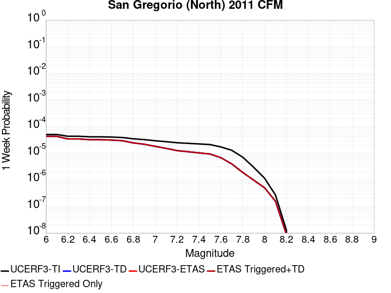 | 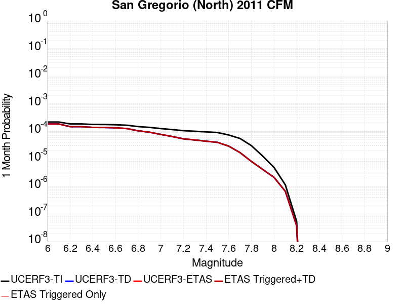 | 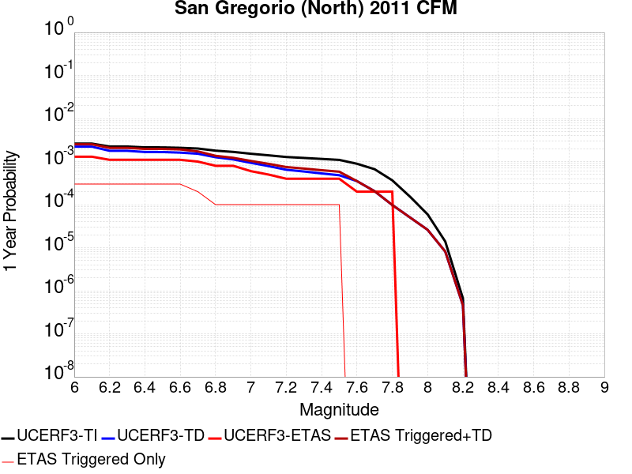 | 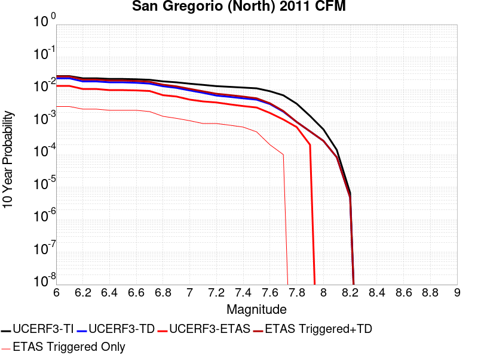 |

| Magnitude | 1 wk TI Prob | 1 wk TD Prob | 1 wk ETAS Prob | 1 wk ETAS/TD Gain | 1 wk ETAS Triggered+TD | 1 wk ETAS Triggered Only | 1 mo TI Prob | 1 mo TD Prob | 1 mo ETAS Prob | 1 mo ETAS/TD Gain | 1 mo ETAS Triggered+TD | 1 mo ETAS Triggered Only | 1 yr TI Prob | 1 yr TD Prob | 1 yr ETAS Prob | 1 yr ETAS/TD Gain | 1 yr ETAS Triggered+TD | 1 yr ETAS Triggered Only | 10 yr TI Prob | 10 yr TD Prob | 10 yr ETAS Prob | 10 yr ETAS/TD Gain | 10 yr ETAS Triggered+TD | 10 yr ETAS Triggered Only |
|-----|-----|-----|-----|-----|-----|-----|-----|-----|-----|-----|-----|-----|-----|-----|-----|-----|-----|-----|-----|-----|-----|-----|-----|-----|
| 6.0 | 5.0283932E-5 | 4.2773794E-5 | 0.0 | 0.0 | 4.2773794E-5 | 0.0 | 2.1548476E-4 | 1.8330345E-4 | 0.0 | 0.0 | 1.8330345E-4 | 0.0 | 0.0026203706 | 0.002229451 | 0.0013 | 0.58310324 | 0.002528782 | 3.0E-4 | 0.02589687 | 0.0221488 | 0.0129 | 0.5824244 | 0.025082352 | 0.003 |
| 6.1 | 5.0283932E-5 | 4.2773794E-5 | 0.0 | 0.0 | 4.2773794E-5 | 0.0 | 2.1548476E-4 | 1.8330345E-4 | 0.0 | 0.0 | 1.8330345E-4 | 0.0 | 0.0026203706 | 0.002229451 | 0.0013 | 0.58310324 | 0.002528782 | 3.0E-4 | 0.02589687 | 0.0221488 | 0.0129 | 0.5824244 | 0.025082352 | 0.003 |
| 6.2 | 4.2998647E-5 | 3.418205E-5 | 0.0 | 0.0 | 3.418205E-5 | 0.0 | 1.842669E-4 | 1.4648635E-4 | 0.0 | 0.0 | 1.4648635E-4 | 0.0 | 0.0022411412 | 0.0017820253 | 0.0011 | 0.6172752 | 0.0020814908 | 3.0E-4 | 0.022186736 | 0.017753888 | 0.0104 | 0.5857872 | 0.020209504 | 0.0025 |
| 6.3 | 4.2998647E-5 | 3.418205E-5 | 0.0 | 0.0 | 3.418205E-5 | 0.0 | 1.842669E-4 | 1.4648635E-4 | 0.0 | 0.0 | 1.4648635E-4 | 0.0 | 0.0022411412 | 0.0017820253 | 0.0011 | 0.6172752 | 0.0020814908 | 3.0E-4 | 0.022186736 | 0.017753888 | 0.0104 | 0.5857872 | 0.020209504 | 0.0025 |
| 6.4 | 4.1101295E-5 | 3.2074437E-5 | 0.0 | 0.0 | 3.2074437E-5 | 0.0 | 1.7613651E-4 | 1.374547E-4 | 0.0 | 0.0 | 1.374547E-4 | 0.0 | 0.0021423528 | 0.00167224 | 0.0011 | 0.6578003 | 0.0019717384 | 3.0E-4 | 0.02121817 | 0.016672377 | 0.0096 | 0.57580274 | 0.01893403 | 0.0023 |
| 6.5 | 4.1032585E-5 | 3.199264E-5 | 0.0 | 0.0 | 3.199264E-5 | 0.0 | 1.7584208E-4 | 1.3710419E-4 | 0.0 | 0.0 | 1.3710419E-4 | 0.0 | 0.0021387753 | 0.001667979 | 0.0011 | 0.6594807 | 0.0019674788 | 3.0E-4 | 0.021183075 | 0.016630411 | 0.0096 | 0.5772557 | 0.01889216 | 0.0023 |
| 6.6 | 4.011629E-5 | 3.1018204E-5 | 0.0 | 0.0 | 3.1018204E-5 | 0.0 | 1.7191563E-4 | 1.3292847E-4 | 0.0 | 0.0 | 1.3292847E-4 | 0.0 | 0.0020910634 | 0.0016172166 | 0.0011 | 0.68018097 | 0.0019167315 | 3.0E-4 | 0.020714961 | 0.016128613 | 0.0094 | 0.5828151 | 0.018391518 | 0.0023 |
| 6.7 | 3.8583938E-5 | 2.9211233E-5 | 0.0 | 0.0 | 2.9211233E-5 | 0.0 | 1.6534925E-4 | 1.2518506E-4 | 0.0 | 0.0 | 1.2518506E-4 | 0.0 | 0.0020112682 | 0.0015230769 | 0.001 | 0.65656567 | 0.0017227723 | 2.0E-4 | 0.019931622 | 0.015199281 | 0.009 | 0.5921333 | 0.017267363 | 0.0021 |
| 6.8 | 3.44341E-5 | 2.422224E-5 | 0.0 | 0.0 | 2.422224E-5 | 0.0 | 1.4756636E-4 | 1.0380553E-4 | 0.0 | 0.0 | 1.0380553E-4 | 0.0 | 0.0017951399 | 0.00126311 | 8.0E-4 | 0.63335735 | 0.0013629837 | 1.0E-4 | 0.017807078 | 0.012630954 | 0.0067 | 0.5304429 | 0.014112008 | 0.0015 |
| 6.9 | 3.221199E-5 | 2.1556862E-5 | 0.0 | 0.0 | 2.1556862E-5 | 0.0 | 1.3804408E-4 | 9.238332E-5 | 0.0 | 0.0 | 9.238332E-5 | 0.0 | 0.0016793909 | 0.0011241948 | 8.0E-4 | 0.71162045 | 0.0012240824 | 1.0E-4 | 0.01666756 | 0.011255729 | 0.0061 | 0.54194623 | 0.012541097 | 0.0013 |
| 7.0 | 2.9186718E-5 | 1.7935594E-5 | 0.0 | 0.0 | 1.7935594E-5 | 0.0 | 1.2507994E-4 | 7.686459E-5 | 0.0 | 0.0 | 7.686459E-5 | 0.0 | 0.0015217843 | 9.35429E-4 | 6.0E-4 | 0.6414169 | 0.0010353355 | 1.0E-4 | 0.015114053 | 0.009384712 | 0.0049 | 0.5221258 | 0.010474389 | 0.0011 |
| 7.1 | 2.6840138E-5 | 1.5081114E-5 | 0.0 | 0.0 | 1.5081114E-5 | 0.0 | 1.1502409E-4 | 6.463175E-5 | 0.0 | 0.0 | 6.463175E-5 | 0.0 | 0.0013995186 | 7.866095E-4 | 5.0E-4 | 0.6356394 | 8.865308E-4 | 1.0E-4 | 0.013907375 | 0.007907454 | 0.0043 | 0.5437907 | 0.008800338 | 9.0E-4 |
| 7.2 | 2.453002E-5 | 1.2407991E-5 | 0.0 | 0.0 | 1.2407991E-5 | 0.0 | 1.05124425E-4 | 5.3176023E-5 | 0.0 | 0.0 | 5.3176023E-5 | 0.0 | 0.0012791384 | 6.4722635E-4 | 4.0E-4 | 0.61802185 | 7.471616E-4 | 1.0E-4 | 0.012718005 | 0.006521651 | 0.004 | 0.6133416 | 0.0074157813 | 9.0E-4 |
| 7.3 | 2.3330727E-5 | 1.129663E-5 | 0.0 | 0.0 | 1.129663E-5 | 0.0 | 9.9985E-5 | 4.8413232E-5 | 0.0 | 0.0 | 4.8413232E-5 | 0.0 | 0.0012166376 | 5.892721E-4 | 4.0E-4 | 0.6788035 | 6.892132E-4 | 1.0E-4 | 0.012099981 | 0.005943869 | 0.0035 | 0.5888421 | 0.0067391135 | 8.0E-4 |
| 7.4 | 2.2136466E-5 | 1.018564E-5 | 0.0 | 0.0 | 1.018564E-5 | 0.0 | 9.486712E-5 | 4.3652017E-5 | 0.0 | 0.0 | 4.3652017E-5 | 0.0 | 0.0011543952 | 5.3133396E-4 | 4.0E-4 | 0.7528222 | 6.312808E-4 | 1.0E-4 | 0.011484168 | 0.005366112 | 0.0031 | 0.5776994 | 0.006062356 | 7.0E-4 |
| 7.5 | 2.0994974E-5 | 9.25319E-6 | 0.0 | 0.0 | 9.25319E-6 | 0.0 | 8.997535E-5 | 3.965593E-5 | 0.0 | 0.0 | 3.965593E-5 | 0.0 | 0.0010948994 | 4.8270417E-4 | 4.0E-4 | 0.8286649 | 5.826559E-4 | 1.0E-4 | 0.010895205 | 0.004880022 | 0.0028 | 0.5737679 | 0.005377582 | 5.0E-4 |
| 7.6 | 1.7091823E-5 | 6.75925E-6 | 0.0 | 0.0 | 6.75925E-6 | 0.0 | 7.3248615E-5 | 2.8967892E-5 | 0.0 | 0.0 | 2.8967892E-5 | 0.0 | 8.9143694E-4 | 3.526271E-4 | 2.0E-4 | 0.5671714 | 3.526271E-4 | 0.0 | 0.008878695 | 0.0035755618 | 0.0019 | 0.531385 | 0.0037748467 | 2.0E-4 |
| 7.7 | 1.2772179E-5 | 3.9304655E-6 | 0.0 | 0.0 | 3.9304655E-6 | 0.0 | 5.473676E-5 | 1.6844744E-5 | 0.0 | 0.0 | 1.6844744E-5 | 0.0 | 6.6621625E-4 | 2.0506547E-4 | 2.0E-4 | 0.9752982 | 2.0506547E-4 | 0.0 | 0.006642225 | 0.0020875481 | 0.0012 | 0.5748371 | 0.0021873394 | 1.0E-4 |
| 7.8 | 7.041923E-6 | 1.8848308E-6 | 0.0 | 0.0 | 1.8848308E-6 | 0.0 | 3.017932E-5 | 8.077821E-6 | 0.0 | 0.0 | 8.077821E-6 | 0.0 | 3.6737128E-4 | 9.834304E-5 | 2.0E-4 | 2.0336976 | 9.834304E-5 | 0.0 | 0.0036676454 | 0.0010074166 | 7.0E-4 | 0.6948466 | 0.0010074166 | 0.0 |
| 7.9 | 2.946768E-6 | 9.704357E-7 | 0.0 | 0.0 | 9.704357E-7 | 0.0 | 1.2628945E-5 | 4.1590033E-6 | 0.0 | 0.0 | 4.1590033E-6 | 0.0 | 1.5374656E-4 | 5.0634688E-5 | 0.0 | 0.0 | 5.0634688E-5 | 0.0 | 0.0015364023 | 5.1644776E-4 | 2.0E-4 | 0.38726085 | 5.1644776E-4 | 0.0 |
| 8.0 | 1.1433375E-6 | 4.9951683E-7 | 0.0 | 0.0 | 4.9951683E-7 | 0.0 | 4.9000087E-6 | 2.1407845E-6 | 0.0 | 0.0 | 2.1407845E-6 | 0.0 | 5.965597E-5 | 2.6063739E-5 | 0.0 | 0.0 | 2.6063739E-5 | 0.0 | 5.963996E-4 | 2.641859E-4 | 0.0 | 0.0 | 2.641859E-4 | 0.0 |
| 8.1 | 2.6675295E-7 | 1.5582033E-7 | 0.0 | 0.0 | 1.5582033E-7 | 0.0 | 1.1432264E-6 | 6.6780126E-7 | 0.0 | 0.0 | 6.6780126E-7 | 0.0 | 1.3918692E-5 | 8.13045E-6 | 0.0 | 0.0 | 8.13045E-6 | 0.0 | 1.391782E-4 | 8.2648345E-5 | 0.0 | 0.0 | 8.2648345E-5 | 0.0 |
| 8.2 | 1.2704569E-8 | 8.804293E-9 | 0.0 | 0.0 | 8.804293E-9 | 0.0 | 5.444815E-8 | 3.7732686E-8 | 0.0 | 0.0 | 3.7732686E-8 | 0.0 | 6.629061E-7 | 4.5939538E-7 | 0.0 | 0.0 | 4.5939538E-7 | 0.0 | 6.629041E-6 | 4.7779613E-6 | 0.0 | 0.0 | 4.7779613E-6 | 0.0 |

## Death Valley (So)
*[(top)](#table-of-contents)*

| 1 Week | 1 Month | 1 Year | 10 Year |
|-----|-----|-----|-----|
| 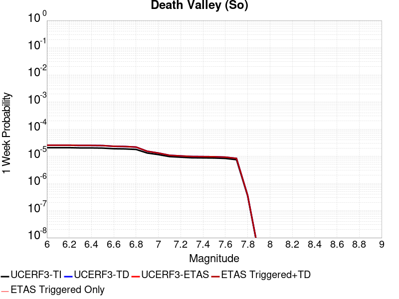 | 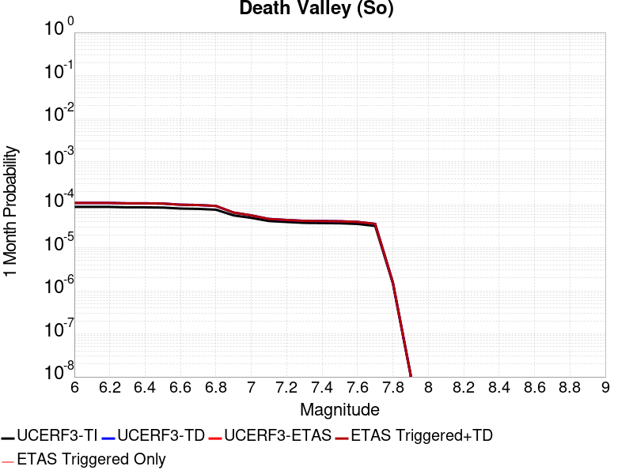 | 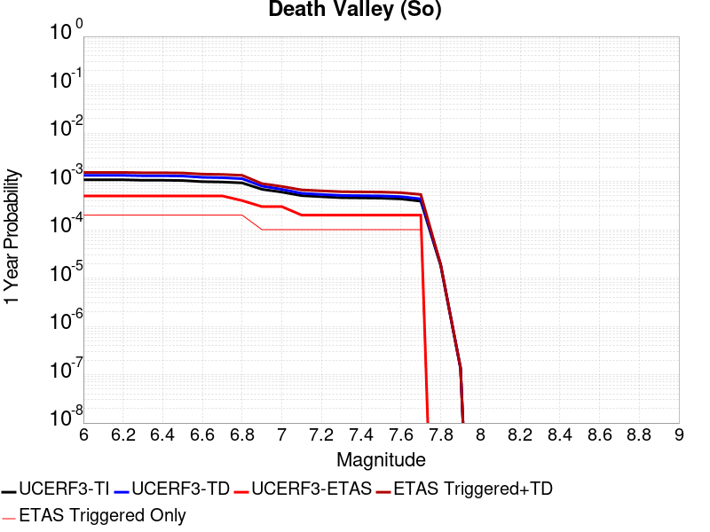 | 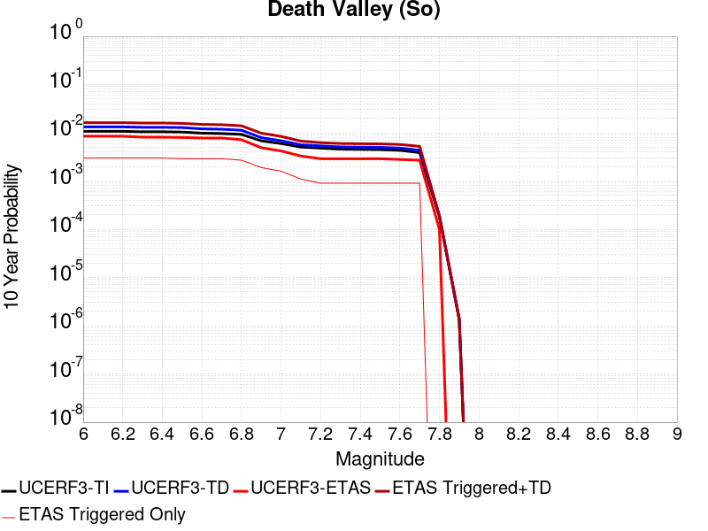 |

| Magnitude | 1 wk TI Prob | 1 wk TD Prob | 1 wk ETAS Prob | 1 wk ETAS/TD Gain | 1 wk ETAS Triggered+TD | 1 wk ETAS Triggered Only | 1 mo TI Prob | 1 mo TD Prob | 1 mo ETAS Prob | 1 mo ETAS/TD Gain | 1 mo ETAS Triggered+TD | 1 mo ETAS Triggered Only | 1 yr TI Prob | 1 yr TD Prob | 1 yr ETAS Prob | 1 yr ETAS/TD Gain | 1 yr ETAS Triggered+TD | 1 yr ETAS Triggered Only | 10 yr TI Prob | 10 yr TD Prob | 10 yr ETAS Prob | 10 yr ETAS/TD Gain | 10 yr ETAS Triggered+TD | 10 yr ETAS Triggered Only |
|-----|-----|-----|-----|-----|-----|-----|-----|-----|-----|-----|-----|-----|-----|-----|-----|-----|-----|-----|-----|-----|-----|-----|-----|-----|
| 6.0 | 2.0684236E-5 | 2.5566584E-5 | 0.0 | 0.0 | 2.5566584E-5 | 0.0 | 8.864371E-5 | 1.0956657E-4 | 0.0 | 0.0 | 1.0956657E-4 | 0.0 | 0.0010787029 | 0.0013331735 | 5.0E-4 | 0.37504497 | 0.0015329069 | 2.0E-4 | 0.010734817 | 0.013255823 | 0.0085 | 0.6412276 | 0.016216056 | 0.003 |
| 6.1 | 2.0684236E-5 | 2.5566584E-5 | 0.0 | 0.0 | 2.5566584E-5 | 0.0 | 8.864371E-5 | 1.0956657E-4 | 0.0 | 0.0 | 1.0956657E-4 | 0.0 | 0.0010787029 | 0.0013331735 | 5.0E-4 | 0.37504497 | 0.0015329069 | 2.0E-4 | 0.010734817 | 0.013255823 | 0.0085 | 0.6412276 | 0.016216056 | 0.003 |
| 6.2 | 2.0684236E-5 | 2.5566584E-5 | 0.0 | 0.0 | 2.5566584E-5 | 0.0 | 8.864371E-5 | 1.0956657E-4 | 0.0 | 0.0 | 1.0956657E-4 | 0.0 | 0.0010787029 | 0.0013331735 | 5.0E-4 | 0.37504497 | 0.0015329069 | 2.0E-4 | 0.010734817 | 0.013255823 | 0.0085 | 0.6412276 | 0.016216056 | 0.003 |
| 6.3 | 2.0240292E-5 | 2.5067327E-5 | 0.0 | 0.0 | 2.5067327E-5 | 0.0 | 8.6741224E-5 | 1.0742708E-4 | 0.0 | 0.0 | 1.0742708E-4 | 0.0 | 0.0010555626 | 0.0013071565 | 5.0E-4 | 0.38250965 | 0.0015068951 | 2.0E-4 | 0.010505628 | 0.012998716 | 0.0081 | 0.6231385 | 0.01595972 | 0.003 |
| 6.4 | 2.0240292E-5 | 2.5067327E-5 | 0.0 | 0.0 | 2.5067327E-5 | 0.0 | 8.6741224E-5 | 1.0742708E-4 | 0.0 | 0.0 | 1.0742708E-4 | 0.0 | 0.0010555626 | 0.0013071565 | 5.0E-4 | 0.38250965 | 0.0015068951 | 2.0E-4 | 0.010505628 | 0.012998716 | 0.0081 | 0.6231385 | 0.01595972 | 0.003 |
| 6.5 | 1.9962767E-5 | 2.475697E-5 | 0.0 | 0.0 | 2.475697E-5 | 0.0 | 8.55519E-5 | 1.06097075E-4 | 0.0 | 0.0 | 1.06097075E-4 | 0.0 | 0.0010410968 | 0.001290983 | 5.0E-4 | 0.38730174 | 0.0014907249 | 2.0E-4 | 0.010362327 | 0.012838858 | 0.008 | 0.6231084 | 0.015701625 | 0.0029 |
| 6.6 | 1.8937297E-5 | 2.3263085E-5 | 0.0 | 0.0 | 2.3263085E-5 | 0.0 | 8.115732E-5 | 9.96952E-5 | 0.0 | 0.0 | 9.96952E-5 | 0.0 | 9.876423E-4 | 0.0012131276 | 5.0E-4 | 0.41215777 | 0.001412885 | 2.0E-4 | 0.009832645 | 0.0120687 | 0.0078 | 0.64629996 | 0.014933701 | 0.0029 |
| 6.7 | 1.8621096E-5 | 2.2864237E-5 | 0.0 | 0.0 | 2.2864237E-5 | 0.0 | 7.980225E-5 | 9.798598E-5 | 0.0 | 0.0 | 9.798598E-5 | 0.0 | 9.711593E-4 | 0.0011923409 | 5.0E-4 | 0.41934314 | 0.0013921025 | 2.0E-4 | 0.009669261 | 0.011863078 | 0.0078 | 0.6575022 | 0.014728676 | 0.0029 |
| 6.8 | 1.7830353E-5 | 2.1761223E-5 | 0.0 | 0.0 | 2.1761223E-5 | 0.0 | 7.641356E-5 | 9.325913E-5 | 0.0 | 0.0 | 9.325913E-5 | 0.0 | 9.29938E-4 | 0.0011348524 | 4.0E-4 | 0.35246873 | 0.0013346255 | 2.0E-4 | 0.009260561 | 0.011293159 | 0.0072 | 0.6375541 | 0.013962667 | 0.0027 |
| 6.9 | 1.3135183E-5 | 1.5278363E-5 | 0.0 | 0.0 | 1.5278363E-5 | 0.0 | 5.6292425E-5 | 6.547709E-5 | 0.0 | 0.0 | 6.547709E-5 | 0.0 | 6.8514474E-4 | 7.968985E-4 | 3.0E-4 | 0.3764595 | 8.968188E-4 | 1.0E-4 | 0.006830362 | 0.007941812 | 0.0049 | 0.61698765 | 0.009826723 | 0.0019 |
| 7.0 | 1.1507512E-5 | 1.3134225E-5 | 0.0 | 0.0 | 1.3134225E-5 | 0.0 | 4.9316975E-5 | 5.6288354E-5 | 0.0 | 0.0 | 5.6288354E-5 | 0.0 | 6.002687E-4 | 6.8510097E-4 | 3.0E-4 | 0.43789166 | 7.8503246E-4 | 1.0E-4 | 0.0059864987 | 0.0068309656 | 0.0042 | 0.6148472 | 0.008420036 | 0.0016 |
| 7.1 | 9.715903E-6 | 1.0850871E-5 | 0.0 | 0.0 | 1.0850871E-5 | 0.0 | 4.1638916E-5 | 4.6502926E-5 | 0.0 | 0.0 | 4.6502926E-5 | 0.0 | 5.068359E-4 | 5.660303E-4 | 2.0E-4 | 0.35333797 | 6.659737E-4 | 1.0E-4 | 0.0050568148 | 0.0056462246 | 0.0033 | 0.5844614 | 0.0067400136 | 0.0011 |
| 7.2 | 9.233269E-6 | 1.0273522E-5 | 0.0 | 0.0 | 1.0273522E-5 | 0.0 | 3.9570554E-5 | 4.4028664E-5 | 0.0 | 0.0 | 4.4028664E-5 | 0.0 | 4.81665E-4 | 5.359213E-4 | 2.0E-4 | 0.3731891 | 6.3586776E-4 | 1.0E-4 | 0.0048062233 | 0.0053467196 | 0.0029 | 0.5423887 | 0.0062419074 | 9.0E-4 |
| 7.3 | 8.8041315E-6 | 9.79644E-6 | 0.0 | 0.0 | 9.79644E-6 | 0.0 | 3.7731446E-5 | 4.1984094E-5 | 0.0 | 0.0 | 4.1984094E-5 | 0.0 | 4.592835E-4 | 5.110407E-4 | 2.0E-4 | 0.3913583 | 6.109895E-4 | 1.0E-4 | 0.0045833546 | 0.00509908 | 0.0029 | 0.56873006 | 0.005994491 | 9.0E-4 |
| 7.4 | 8.708749E-6 | 9.6955155E-6 | 0.0 | 0.0 | 9.6955155E-6 | 0.0 | 3.7322676E-5 | 4.155157E-5 | 0.0 | 0.0 | 4.155157E-5 | 0.0 | 4.5430884E-4 | 5.0577713E-4 | 2.0E-4 | 0.39543107 | 6.0572656E-4 | 1.0E-4 | 0.004533812 | 0.005046685 | 0.0029 | 0.5746346 | 0.0059421435 | 9.0E-4 |
| 7.5 | 8.612678E-6 | 9.593229E-6 | 0.0 | 0.0 | 9.593229E-6 | 0.0 | 3.6910955E-5 | 4.1113217E-5 | 0.0 | 0.0 | 4.1113217E-5 | 0.0 | 4.492982E-4 | 5.0044263E-4 | 2.0E-4 | 0.3996462 | 6.003926E-4 | 1.0E-4 | 0.004483909 | 0.004993581 | 0.0029 | 0.5807455 | 0.005889087 | 9.0E-4 |
| 7.6 | 8.319024E-6 | 9.272643E-6 | 0.0 | 0.0 | 9.272643E-6 | 0.0 | 3.5652476E-5 | 3.973932E-5 | 0.0 | 0.0 | 3.973932E-5 | 0.0 | 4.3398244E-4 | 4.8372298E-4 | 2.0E-4 | 0.41345978 | 5.8367464E-4 | 1.0E-4 | 0.0043313587 | 0.0048271236 | 0.0028 | 0.5800556 | 0.005722779 | 9.0E-4 |
| 7.7 | 7.4718328E-6 | 8.334961E-6 | 0.0 | 0.0 | 8.334961E-6 | 0.0 | 3.2021748E-5 | 3.5720797E-5 | 0.0 | 0.0 | 3.5720797E-5 | 0.0 | 3.8979502E-4 | 4.3481795E-4 | 2.0E-4 | 0.4599626 | 5.347745E-4 | 1.0E-4 | 0.00389112 | 0.004340076 | 0.0027 | 0.62210894 | 0.00523617 | 9.0E-4 |
| 7.8 | 3.4586725E-7 | 3.6461634E-7 | 0.0 | 0.0 | 3.6461634E-7 | 0.0 | 1.4822873E-6 | 1.5626406E-6 | 0.0 | 0.0 | 1.5626406E-6 | 0.0 | 1.80467E-5 | 1.9024988E-5 | 0.0 | 0.0 | 1.9024988E-5 | 0.0 | 1.8045233E-4 | 1.9023403E-4 | 1.0E-4 | 0.5256683 | 1.9023403E-4 | 0.0 |
| 7.9 | 2.5591178E-9 | 2.6684681E-9 | 0.0 | 0.0 | 2.6684681E-9 | 0.0 | 1.0967647E-8 | 1.1436292E-8 | 0.0 | 0.0 | 1.1436292E-8 | 0.0 | 1.335311E-7 | 1.3923685E-7 | 0.0 | 0.0 | 1.3923685E-7 | 0.0 | 1.3353102E-6 | 1.3923685E-6 | 0.0 | 0.0 | 1.3923685E-6 | 0.0 |

## Santa Susana East (connector)
*[(top)](#table-of-contents)*

| 1 Week | 1 Month | 1 Year | 10 Year |
|-----|-----|-----|-----|
| 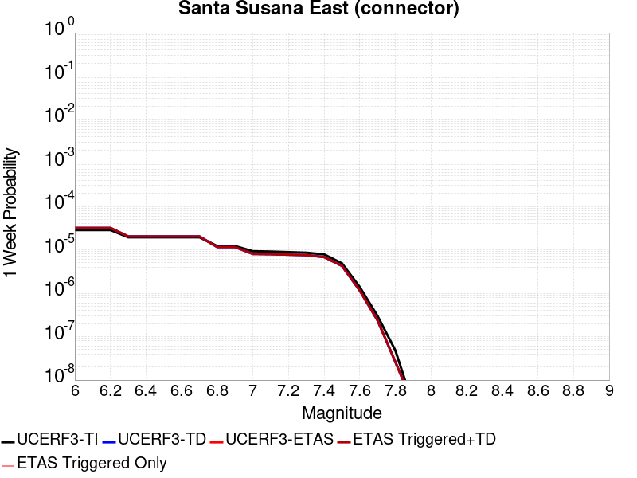 | 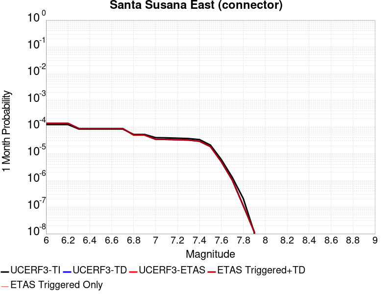 | 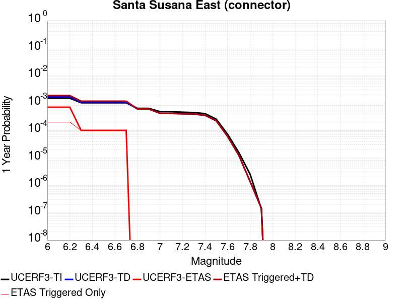 | 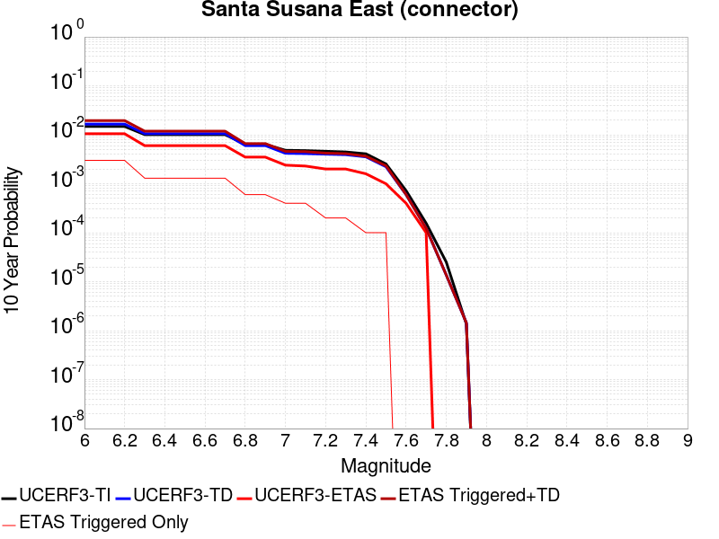 |

| Magnitude | 1 wk TI Prob | 1 wk TD Prob | 1 wk ETAS Prob | 1 wk ETAS/TD Gain | 1 wk ETAS Triggered+TD | 1 wk ETAS Triggered Only | 1 mo TI Prob | 1 mo TD Prob | 1 mo ETAS Prob | 1 mo ETAS/TD Gain | 1 mo ETAS Triggered+TD | 1 mo ETAS Triggered Only | 1 yr TI Prob | 1 yr TD Prob | 1 yr ETAS Prob | 1 yr ETAS/TD Gain | 1 yr ETAS Triggered+TD | 1 yr ETAS Triggered Only | 10 yr TI Prob | 10 yr TD Prob | 10 yr ETAS Prob | 10 yr ETAS/TD Gain | 10 yr ETAS Triggered+TD | 10 yr ETAS Triggered Only |
|-----|-----|-----|-----|-----|-----|-----|-----|-----|-----|-----|-----|-----|-----|-----|-----|-----|-----|-----|-----|-----|-----|-----|-----|-----|
| 6.0 | 2.858397E-5 | 3.1946336E-5 | 0.0 | 0.0 | 3.1946336E-5 | 0.0 | 1.2249697E-4 | 1.3690727E-4 | 0.0 | 0.0 | 1.3690727E-4 | 0.0 | 0.0014903803 | 0.0016658398 | 7.0E-4 | 0.42020845 | 0.0018655066 | 2.0E-4 | 0.014804244 | 0.016560068 | 0.0105 | 0.6340554 | 0.019510388 | 0.003 |
| 6.1 | 2.858397E-5 | 3.1946336E-5 | 0.0 | 0.0 | 3.1946336E-5 | 0.0 | 1.2249697E-4 | 1.3690727E-4 | 0.0 | 0.0 | 1.3690727E-4 | 0.0 | 0.0014903803 | 0.0016658398 | 7.0E-4 | 0.42020845 | 0.0018655066 | 2.0E-4 | 0.014804244 | 0.016560068 | 0.0105 | 0.6340554 | 0.019510388 | 0.003 |
| 6.2 | 2.858397E-5 | 3.1946336E-5 | 0.0 | 0.0 | 3.1946336E-5 | 0.0 | 1.2249697E-4 | 1.3690727E-4 | 0.0 | 0.0 | 1.3690727E-4 | 0.0 | 0.0014903803 | 0.0016658398 | 7.0E-4 | 0.42020845 | 0.0018655066 | 2.0E-4 | 0.014804244 | 0.016560068 | 0.0105 | 0.6340554 | 0.019510388 | 0.003 |
| 6.3 | 1.943582E-5 | 2.0324567E-5 | 0.0 | 0.0 | 2.0324567E-5 | 0.0 | 8.329371E-5 | 8.7103006E-5 | 0.0 | 0.0 | 8.7103006E-5 | 0.0 | 0.001013629 | 0.0010600747 | 1.0E-4 | 0.09433297 | 0.0011599687 | 1.0E-4 | 0.010090181 | 0.010561222 | 0.006 | 0.56811607 | 0.011847493 | 0.0013 |
| 6.4 | 1.943582E-5 | 2.0324567E-5 | 0.0 | 0.0 | 2.0324567E-5 | 0.0 | 8.329371E-5 | 8.7103006E-5 | 0.0 | 0.0 | 8.7103006E-5 | 0.0 | 0.001013629 | 0.0010600747 | 1.0E-4 | 0.09433297 | 0.0011599687 | 1.0E-4 | 0.010090181 | 0.010561222 | 0.006 | 0.56811607 | 0.011847493 | 0.0013 |
| 6.5 | 1.943582E-5 | 2.0324567E-5 | 0.0 | 0.0 | 2.0324567E-5 | 0.0 | 8.329371E-5 | 8.7103006E-5 | 0.0 | 0.0 | 8.7103006E-5 | 0.0 | 0.001013629 | 0.0010600747 | 1.0E-4 | 0.09433297 | 0.0011599687 | 1.0E-4 | 0.010090181 | 0.010561222 | 0.006 | 0.56811607 | 0.011847493 | 0.0013 |
| 6.6 | 1.943582E-5 | 2.0324567E-5 | 0.0 | 0.0 | 2.0324567E-5 | 0.0 | 8.329371E-5 | 8.7103006E-5 | 0.0 | 0.0 | 8.7103006E-5 | 0.0 | 0.001013629 | 0.0010600747 | 1.0E-4 | 0.09433297 | 0.0011599687 | 1.0E-4 | 0.010090181 | 0.010561222 | 0.006 | 0.56811607 | 0.011847493 | 0.0013 |
| 6.7 | 1.9404439E-5 | 2.0312018E-5 | 0.0 | 0.0 | 2.0312018E-5 | 0.0 | 8.3159226E-5 | 8.704923E-5 | 0.0 | 0.0 | 8.704923E-5 | 0.0 | 0.0010119933 | 0.0010594206 | 1.0E-4 | 0.09439122 | 0.0011593146 | 1.0E-4 | 0.010073971 | 0.010554744 | 0.006 | 0.56846476 | 0.011841022 | 0.0013 |
| 6.8 | 1.2217526E-5 | 1.1573364E-5 | 0.0 | 0.0 | 1.1573364E-5 | 0.0 | 5.2359774E-5 | 4.9599283E-5 | 0.0 | 0.0 | 4.9599283E-5 | 0.0 | 6.372938E-4 | 6.037207E-4 | 0.0 | 0.0 | 6.037207E-4 | 0.0 | 0.0063546924 | 0.0060225115 | 0.0035 | 0.58115286 | 0.0066188984 | 6.0E-4 |
| 6.9 | 1.2217526E-5 | 1.1573364E-5 | 0.0 | 0.0 | 1.1573364E-5 | 0.0 | 5.2359774E-5 | 4.9599283E-5 | 0.0 | 0.0 | 4.9599283E-5 | 0.0 | 6.372938E-4 | 6.037207E-4 | 0.0 | 0.0 | 6.037207E-4 | 0.0 | 0.0063546924 | 0.0060225115 | 0.0035 | 0.58115286 | 0.0066188984 | 6.0E-4 |
| 7.0 | 9.276017E-6 | 8.0473355E-6 | 0.0 | 0.0 | 8.0473355E-6 | 0.0 | 3.9753755E-5 | 3.4488145E-5 | 0.0 | 0.0 | 3.4488145E-5 | 0.0 | 4.8389446E-4 | 4.198157E-4 | 0.0 | 0.0 | 4.198157E-4 | 0.0 | 0.0048284214 | 0.0041906163 | 0.0024 | 0.57270813 | 0.0045889397 | 4.0E-4 |
| 7.1 | 9.130355E-6 | 7.930853E-6 | 0.0 | 0.0 | 7.930853E-6 | 0.0 | 3.9129503E-5 | 3.3988945E-5 | 0.0 | 0.0 | 3.3988945E-5 | 0.0 | 4.7629757E-4 | 4.1374026E-4 | 0.0 | 0.0 | 4.1374026E-4 | 0.0 | 0.00475278 | 0.0041300887 | 0.0023 | 0.55688876 | 0.004528437 | 4.0E-4 |
| 7.2 | 8.851015E-6 | 7.730185E-6 | 0.0 | 0.0 | 7.730185E-6 | 0.0 | 3.7932372E-5 | 3.3128963E-5 | 0.0 | 0.0 | 3.3128963E-5 | 0.0 | 4.6172875E-4 | 4.0327388E-4 | 0.0 | 0.0 | 4.0327388E-4 | 0.0 | 0.0046077054 | 0.004025807 | 0.002 | 0.49679482 | 0.0042250017 | 2.0E-4 |
| 7.3 | 8.573006E-6 | 7.5391154E-6 | 0.0 | 0.0 | 7.5391154E-6 | 0.0 | 3.6740938E-5 | 3.2310112E-5 | 0.0 | 0.0 | 3.2310112E-5 | 0.0 | 4.472291E-4 | 3.9330803E-4 | 0.0 | 0.0 | 3.9330803E-4 | 0.0 | 0.004463301 | 0.003926496 | 0.002 | 0.50936 | 0.0041257106 | 2.0E-4 |
| 7.4 | 7.852282E-6 | 6.807881E-6 | 0.0 | 0.0 | 6.807881E-6 | 0.0 | 3.36522E-5 | 2.9176324E-5 | 0.0 | 0.0 | 2.9176324E-5 | 0.0 | 4.096385E-4 | 3.5516685E-4 | 0.0 | 0.0 | 3.5516685E-4 | 0.0 | 0.0040888423 | 0.003546303 | 0.0016 | 0.4511741 | 0.0036459481 | 1.0E-4 |
| 7.5 | 4.8869324E-6 | 4.2724428E-6 | 0.0 | 0.0 | 4.2724428E-6 | 0.0 | 2.0943828E-5 | 1.831035E-5 | 0.0 | 0.0 | 1.831035E-5 | 0.0 | 2.5496128E-4 | 2.2290736E-4 | 0.0 | 0.0 | 2.2290736E-4 | 0.0 | 0.0025466895 | 0.0022268945 | 0.001 | 0.44905585 | 0.0023266717 | 1.0E-4 |
| 7.6 | 1.3894544E-6 | 1.1539248E-6 | 0.0 | 0.0 | 1.1539248E-6 | 0.0 | 5.954791E-6 | 4.945384E-6 | 0.0 | 0.0 | 4.945384E-6 | 0.0 | 7.249717E-5 | 6.0208604E-5 | 0.0 | 0.0 | 6.0208604E-5 | 0.0 | 7.247352E-4 | 6.019447E-4 | 4.0E-4 | 0.6645129 | 6.019447E-4 | 0.0 |
| 7.7 | 2.9924632E-7 | 2.361965E-7 | 0.0 | 0.0 | 2.361965E-7 | 0.0 | 1.2824837E-6 | 1.0122703E-6 | 0.0 | 0.0 | 1.0122703E-6 | 0.0 | 1.5614127E-5 | 1.2324329E-5 | 0.0 | 0.0 | 1.2324329E-5 | 0.0 | 1.5613029E-4 | 1.2323717E-4 | 1.0E-4 | 0.8114435 | 1.2323717E-4 | 0.0 |
| 7.8 | 4.8188564E-8 | 2.6208957E-8 | 0.0 | 0.0 | 2.6208957E-8 | 0.0 | 2.065224E-7 | 1.12324095E-7 | 0.0 | 0.0 | 1.12324095E-7 | 0.0 | 2.5144072E-6 | 1.3675451E-6 | 0.0 | 0.0 | 1.3675451E-6 | 0.0 | 2.5143789E-5 | 1.3675375E-5 | 0.0 | 0.0 | 1.3675375E-5 | 0.0 |
| 7.9 | 2.6127251E-9 | 2.7663922E-9 | 0.0 | 0.0 | 2.7663922E-9 | 0.0 | 1.1197393E-8 | 1.1855967E-8 | 0.0 | 0.0 | 1.1855967E-8 | 0.0 | 1.3632825E-7 | 1.443464E-7 | 0.0 | 0.0 | 1.443464E-7 | 0.0 | 1.3632817E-6 | 1.4434639E-6 | 0.0 | 0.0 | 1.4434639E-6 | 0.0 |

## Garlic Springs
*[(top)](#table-of-contents)*

| 1 Week | 1 Month | 1 Year | 10 Year |
|-----|-----|-----|-----|
| 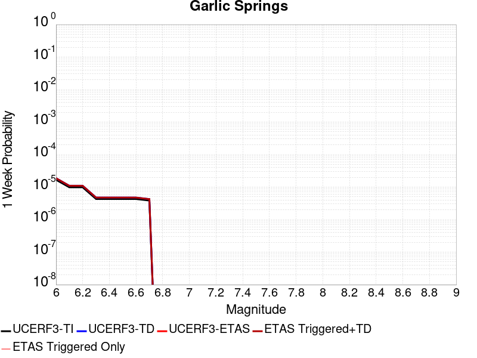 | 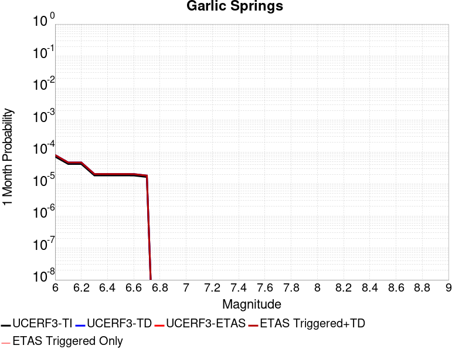 | 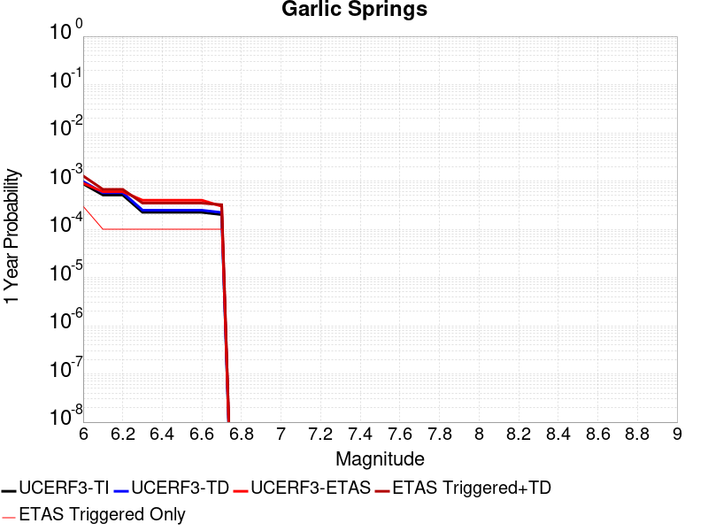 | 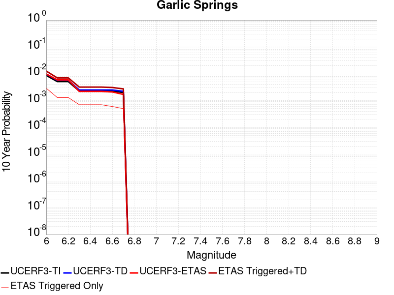 |

| Magnitude | 1 wk TI Prob | 1 wk TD Prob | 1 wk ETAS Prob | 1 wk ETAS/TD Gain | 1 wk ETAS Triggered+TD | 1 wk ETAS Triggered Only | 1 mo TI Prob | 1 mo TD Prob | 1 mo ETAS Prob | 1 mo ETAS/TD Gain | 1 mo ETAS Triggered+TD | 1 mo ETAS Triggered Only | 1 yr TI Prob | 1 yr TD Prob | 1 yr ETAS Prob | 1 yr ETAS/TD Gain | 1 yr ETAS Triggered+TD | 1 yr ETAS Triggered Only | 10 yr TI Prob | 10 yr TD Prob | 10 yr ETAS Prob | 10 yr ETAS/TD Gain | 10 yr ETAS Triggered+TD | 10 yr ETAS Triggered Only |
|-----|-----|-----|-----|-----|-----|-----|-----|-----|-----|-----|-----|-----|-----|-----|-----|-----|-----|-----|-----|-----|-----|-----|-----|-----|
| 6.0 | 1.6760017E-5 | 1.875325E-5 | 0.0 | 0.0 | 1.875325E-5 | 0.0 | 7.182667E-5 | 8.036925E-5 | 0.0 | 0.0 | 8.036925E-5 | 0.0 | 8.7413884E-4 | 9.781736E-4 | 9.0E-4 | 0.92008215 | 0.00127788 | 3.0E-4 | 0.008707083 | 0.009750196 | 0.0098 | 1.005108 | 0.012621921 | 0.0029 |
| 6.1 | 9.852767E-6 | 1.0960564E-5 | 0.0 | 0.0 | 1.0960564E-5 | 0.0 | 4.222546E-5 | 4.69734E-5 | 0.0 | 0.0 | 4.69734E-5 | 0.0 | 5.139737E-4 | 5.718219E-4 | 6.0E-4 | 1.0492778 | 6.7176466E-4 | 1.0E-4 | 0.005127866 | 0.0057104467 | 0.0059 | 1.0331942 | 0.007003023 | 0.0013 |
| 6.2 | 9.852767E-6 | 1.0960564E-5 | 0.0 | 0.0 | 1.0960564E-5 | 0.0 | 4.222546E-5 | 4.69734E-5 | 0.0 | 0.0 | 4.69734E-5 | 0.0 | 5.139737E-4 | 5.718219E-4 | 6.0E-4 | 1.0492778 | 6.7176466E-4 | 1.0E-4 | 0.005127866 | 0.0057104467 | 0.0059 | 1.0331942 | 0.007003023 | 0.0013 |
| 6.3 | 4.3167724E-6 | 4.7727035E-6 | 0.0 | 0.0 | 4.7727035E-6 | 0.0 | 1.8500323E-5 | 2.0454414E-5 | 0.0 | 0.0 | 2.0454414E-5 | 0.0 | 2.2521814E-4 | 2.49027E-4 | 4.0E-4 | 1.6062515 | 3.490021E-4 | 1.0E-4 | 0.0022499003 | 0.0024897328 | 0.0022 | 0.88362896 | 0.00318799 | 7.0E-4 |
| 6.4 | 4.3167724E-6 | 4.7727035E-6 | 0.0 | 0.0 | 4.7727035E-6 | 0.0 | 1.8500323E-5 | 2.0454414E-5 | 0.0 | 0.0 | 2.0454414E-5 | 0.0 | 2.2521814E-4 | 2.49027E-4 | 4.0E-4 | 1.6062515 | 3.490021E-4 | 1.0E-4 | 0.0022499003 | 0.0024897328 | 0.0022 | 0.88362896 | 0.00318799 | 7.0E-4 |
| 6.5 | 4.3167724E-6 | 4.7727035E-6 | 0.0 | 0.0 | 4.7727035E-6 | 0.0 | 1.8500323E-5 | 2.0454414E-5 | 0.0 | 0.0 | 2.0454414E-5 | 0.0 | 2.2521814E-4 | 2.49027E-4 | 4.0E-4 | 1.6062515 | 3.490021E-4 | 1.0E-4 | 0.0022499003 | 0.0024897328 | 0.0022 | 0.88362896 | 0.00318799 | 7.0E-4 |
| 6.6 | 4.301311E-6 | 4.7555914E-6 | 0.0 | 0.0 | 4.7555914E-6 | 0.0 | 1.8434059E-5 | 2.0381076E-5 | 0.0 | 0.0 | 2.0381076E-5 | 0.0 | 2.2441156E-4 | 2.481343E-4 | 4.0E-4 | 1.6120301 | 3.4810952E-4 | 1.0E-4 | 0.0022418506 | 0.0024808259 | 0.0021 | 0.8464923 | 0.0030793375 | 6.0E-4 |
| 6.7 | 3.8599724E-6 | 4.2663155E-6 | 0.0 | 0.0 | 4.2663155E-6 | 0.0 | 1.6542634E-5 | 1.828421E-5 | 0.0 | 0.0 | 1.828421E-5 | 0.0 | 2.0138794E-4 | 2.2261025E-4 | 3.0E-4 | 1.3476468 | 3.22588E-4 | 1.0E-4 | 0.0020120554 | 0.0022261024 | 0.0017 | 0.7636665 | 0.0027249896 | 5.0E-4 |

## Death Valley (Fish Lake Valley)
*[(top)](#table-of-contents)*

| 1 Week | 1 Month | 1 Year | 10 Year |
|-----|-----|-----|-----|
| 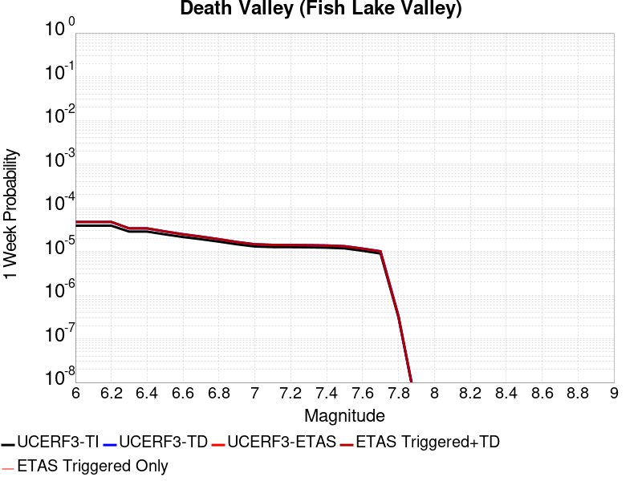 | 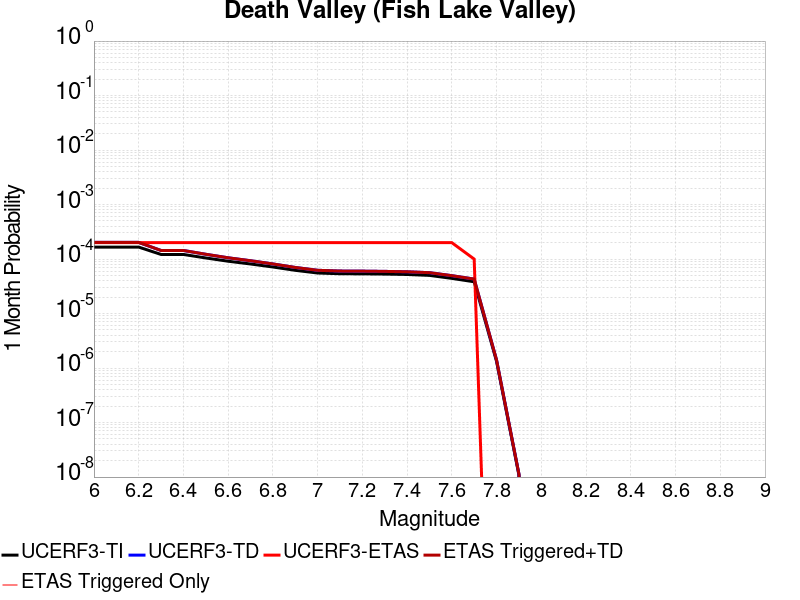 | 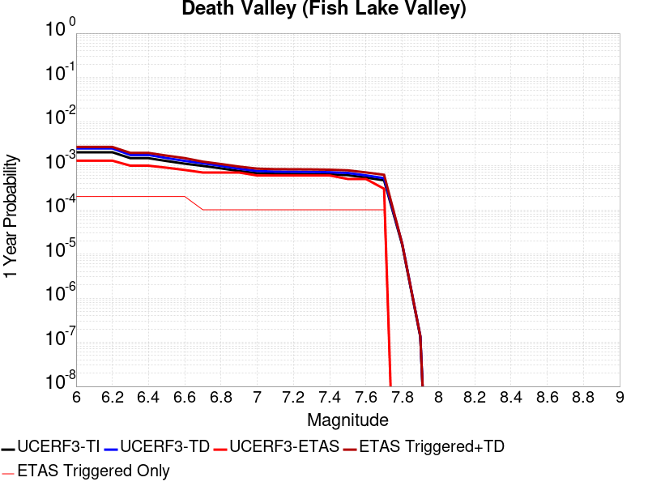 | 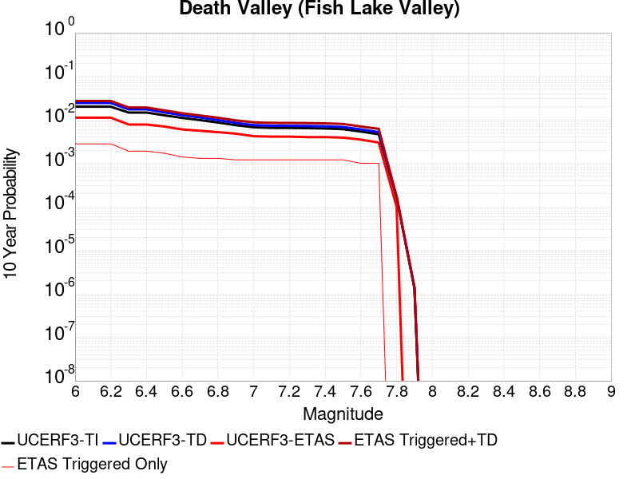 |

| Magnitude | 1 wk TI Prob | 1 wk TD Prob | 1 wk ETAS Prob | 1 wk ETAS/TD Gain | 1 wk ETAS Triggered+TD | 1 wk ETAS Triggered Only | 1 mo TI Prob | 1 mo TD Prob | 1 mo ETAS Prob | 1 mo ETAS/TD Gain | 1 mo ETAS Triggered+TD | 1 mo ETAS Triggered Only | 1 yr TI Prob | 1 yr TD Prob | 1 yr ETAS Prob | 1 yr ETAS/TD Gain | 1 yr ETAS Triggered+TD | 1 yr ETAS Triggered Only | 10 yr TI Prob | 10 yr TD Prob | 10 yr ETAS Prob | 10 yr ETAS/TD Gain | 10 yr ETAS Triggered+TD | 10 yr ETAS Triggered Only |
|-----|-----|-----|-----|-----|-----|-----|-----|-----|-----|-----|-----|-----|-----|-----|-----|-----|-----|-----|-----|-----|-----|-----|-----|-----|
| 6.0 | 3.872328E-5 | 4.7157107E-5 | 0.0 | 0.0 | 4.7157107E-5 | 0.0 | 1.6594635E-4 | 2.0208675E-4 | 2.0E-4 | 0.989674 | 2.0208675E-4 | 0.0 | 0.0020185246 | 0.0024578883 | 0.0013 | 0.5289093 | 0.0026573967 | 2.0E-4 | 0.02000288 | 0.024332998 | 0.0112 | 0.46028033 | 0.027064865 | 0.0028 |
| 6.1 | 3.872328E-5 | 4.7157107E-5 | 0.0 | 0.0 | 4.7157107E-5 | 0.0 | 1.6594635E-4 | 2.0208675E-4 | 2.0E-4 | 0.989674 | 2.0208675E-4 | 0.0 | 0.0020185246 | 0.0024578883 | 0.0013 | 0.5289093 | 0.0026573967 | 2.0E-4 | 0.02000288 | 0.024332998 | 0.0112 | 0.46028033 | 0.027064865 | 0.0028 |
| 6.2 | 3.872328E-5 | 4.7157107E-5 | 0.0 | 0.0 | 4.7157107E-5 | 0.0 | 1.6594635E-4 | 2.0208675E-4 | 2.0E-4 | 0.989674 | 2.0208675E-4 | 0.0 | 0.0020185246 | 0.0024578883 | 0.0013 | 0.5289093 | 0.0026573967 | 2.0E-4 | 0.02000288 | 0.024332998 | 0.0112 | 0.46028033 | 0.027064865 | 0.0028 |
| 6.3 | 2.8356371E-5 | 3.354422E-5 | 0.0 | 0.0 | 3.354422E-5 | 0.0 | 1.2152165E-4 | 1.4375345E-4 | 2.0E-4 | 1.391271 | 1.4375345E-4 | 0.0 | 0.0014785219 | 0.001748861 | 0.001 | 0.5718007 | 0.0019485113 | 2.0E-4 | 0.014687235 | 0.017358216 | 0.0078 | 0.44935495 | 0.019225234 | 0.0019 |
| 6.4 | 2.8356371E-5 | 3.354422E-5 | 0.0 | 0.0 | 3.354422E-5 | 0.0 | 1.2152165E-4 | 1.4375345E-4 | 2.0E-4 | 1.391271 | 1.4375345E-4 | 0.0 | 0.0014785219 | 0.001748861 | 0.001 | 0.5718007 | 0.0019485113 | 2.0E-4 | 0.014687235 | 0.017358216 | 0.0078 | 0.44935495 | 0.019225234 | 0.0019 |
| 6.5 | 2.4448687E-5 | 2.8556286E-5 | 0.0 | 0.0 | 2.8556286E-5 | 0.0 | 1.0477588E-4 | 1.2237861E-4 | 2.0E-4 | 1.6342725 | 1.2237861E-4 | 0.0 | 0.0012748998 | 0.0014889877 | 9.0E-4 | 0.6044375 | 0.0016886899 | 2.0E-4 | 0.012676105 | 0.014795017 | 0.007 | 0.47313225 | 0.016469866 | 0.0017 |
| 6.6 | 2.1298161E-5 | 2.4619052E-5 | 0.0 | 0.0 | 2.4619052E-5 | 0.0 | 9.127464E-5 | 1.0550614E-4 | 2.0E-4 | 1.8956243 | 1.0550614E-4 | 0.0 | 0.0011107022 | 0.001283813 | 8.0E-4 | 0.62314373 | 0.0014835562 | 2.0E-4 | 0.011051672 | 0.012767389 | 0.006 | 0.46994728 | 0.014149515 | 0.0014 |
| 6.7 | 1.8959729E-5 | 2.1746893E-5 | 0.0 | 0.0 | 2.1746893E-5 | 0.0 | 8.125345E-5 | 9.3197785E-5 | 2.0E-4 | 2.1459737 | 9.3197785E-5 | 0.0 | 9.888117E-4 | 0.0011341178 | 7.0E-4 | 0.6172198 | 0.0012340044 | 1.0E-4 | 0.009844234 | 0.01128595 | 0.0056 | 0.49619216 | 0.012571279 | 0.0013 |
| 6.8 | 1.6691629E-5 | 1.89905E-5 | 0.0 | 0.0 | 1.89905E-5 | 0.0 | 7.153359E-5 | 8.138541E-5 | 2.0E-4 | 2.4574428 | 8.138541E-5 | 0.0 | 8.7057345E-4 | 9.904337E-4 | 7.0E-4 | 0.70676106 | 0.0010903347 | 1.0E-4 | 0.008671708 | 0.009861947 | 0.0052 | 0.5272792 | 0.011149127 | 0.0013 |
| 6.9 | 1.450505E-5 | 1.636723E-5 | 0.0 | 0.0 | 1.636723E-5 | 0.0 | 6.216302E-5 | 7.014343E-5 | 2.0E-4 | 2.8513002 | 7.014343E-5 | 0.0 | 7.5657194E-4 | 8.5367047E-4 | 7.0E-4 | 0.81998855 | 9.5358514E-4 | 1.0E-4 | 0.007540013 | 0.008504841 | 0.0048 | 0.56438446 | 0.009694635 | 0.0012 |
| 7.0 | 1.2940855E-5 | 1.4519209E-5 | 0.0 | 0.0 | 1.4519209E-5 | 0.0 | 5.545963E-5 | 6.222373E-5 | 2.0E-4 | 3.214208 | 6.222373E-5 | 0.0 | 6.750118E-4 | 7.5731636E-4 | 6.0E-4 | 0.79227126 | 8.5724064E-4 | 1.0E-4 | 0.006729651 | 0.007547972 | 0.0042 | 0.55644083 | 0.0087389145 | 0.0012 |
| 7.1 | 1.2544658E-5 | 1.4060214E-5 | 0.0 | 0.0 | 1.4060214E-5 | 0.0 | 5.3761712E-5 | 6.02567E-5 | 2.0E-4 | 3.3191328 | 6.02567E-5 | 0.0 | 6.5435225E-4 | 7.33384E-4 | 6.0E-4 | 0.8181253 | 8.3331065E-4 | 1.0E-4 | 0.006524288 | 0.0073102294 | 0.0041 | 0.56085795 | 0.008501457 | 0.0012 |
| 7.2 | 1.2489416E-5 | 1.3997767E-5 | 0.0 | 0.0 | 1.3997767E-5 | 0.0 | 5.3524967E-5 | 5.9989085E-5 | 2.0E-4 | 3.33394 | 5.9989085E-5 | 0.0 | 6.514716E-4 | 7.301279E-4 | 6.0E-4 | 0.82177377 | 8.300549E-4 | 1.0E-4 | 0.006495651 | 0.007277882 | 0.0041 | 0.5633507 | 0.008469149 | 0.0012 |
| 7.3 | 1.2368307E-5 | 1.386208E-5 | 0.0 | 0.0 | 1.386208E-5 | 0.0 | 5.3005948E-5 | 5.9407594E-5 | 2.0E-4 | 3.366573 | 5.9407594E-5 | 0.0 | 6.451563E-4 | 7.23053E-4 | 6.0E-4 | 0.8298147 | 8.229807E-4 | 1.0E-4 | 0.0064328653 | 0.0072075943 | 0.004 | 0.5549702 | 0.008398945 | 0.0012 |
| 7.4 | 1.2161707E-5 | 1.3630435E-5 | 0.0 | 0.0 | 1.3630435E-5 | 0.0 | 5.212056E-5 | 5.8414873E-5 | 2.0E-4 | 3.4237857 | 5.8414873E-5 | 0.0 | 6.3438306E-4 | 7.1097456E-4 | 6.0E-4 | 0.843912 | 8.109035E-4 | 1.0E-4 | 0.006325751 | 0.007087587 | 0.004 | 0.564367 | 0.008279081 | 0.0012 |
| 7.5 | 1.1707948E-5 | 1.31286515E-5 | 0.0 | 0.0 | 1.31286515E-5 | 0.0 | 5.0175953E-5 | 5.6264467E-5 | 2.0E-4 | 3.5546415 | 5.6264467E-5 | 0.0 | 6.10721E-4 | 6.8481016E-4 | 5.0E-4 | 0.73012936 | 7.8474166E-4 | 1.0E-4 | 0.0060904534 | 0.0068275803 | 0.0039 | 0.5712126 | 0.008019387 | 0.0012 |
| 7.6 | 1.0319538E-5 | 1.1564856E-5 | 0.0 | 0.0 | 1.1564856E-5 | 0.0 | 4.4225842E-5 | 4.9562757E-5 | 2.0E-4 | 4.035288 | 4.9562757E-5 | 0.0 | 5.383166E-4 | 6.0326466E-4 | 5.0E-4 | 0.8288236 | 7.0320436E-4 | 1.0E-4 | 0.0053701443 | 0.0060168006 | 0.0035 | 0.5817045 | 0.007010784 | 0.001 |
| 7.7 | 8.937764E-6 | 1.0010071E-5 | 0.0 | 0.0 | 1.0010071E-5 | 0.0 | 3.830414E-5 | 4.2899625E-5 | 1.0E-4 | 2.3310227 | 4.2899625E-5 | 0.0 | 4.6625308E-4 | 5.221828E-4 | 3.0E-4 | 0.57451147 | 6.221306E-4 | 1.0E-4 | 0.0046527605 | 0.005210066 | 0.003 | 0.5758084 | 0.006204856 | 0.001 |
| 7.8 | 3.108007E-7 | 3.282696E-7 | 0.0 | 0.0 | 3.282696E-7 | 0.0 | 1.3320023E-6 | 1.406869E-6 | 0.0 | 0.0 | 1.406869E-6 | 0.0 | 1.6217007E-5 | 1.71285E-5 | 0.0 | 0.0 | 1.71285E-5 | 0.0 | 1.6215823E-4 | 1.7127219E-4 | 1.0E-4 | 0.583866 | 1.7127219E-4 | 0.0 |
| 7.9 | 2.5591178E-9 | 2.6684681E-9 | 0.0 | 0.0 | 2.6684681E-9 | 0.0 | 1.0967647E-8 | 1.1436292E-8 | 0.0 | 0.0 | 1.1436292E-8 | 0.0 | 1.335311E-7 | 1.3923685E-7 | 0.0 | 0.0 | 1.3923685E-7 | 0.0 | 1.3353102E-6 | 1.3923685E-6 | 0.0 | 0.0 | 1.3923685E-6 | 0.0 |

## Elsinore (Coyote Mountains)
*[(top)](#table-of-contents)*

| 1 Week | 1 Month | 1 Year | 10 Year |
|-----|-----|-----|-----|
| 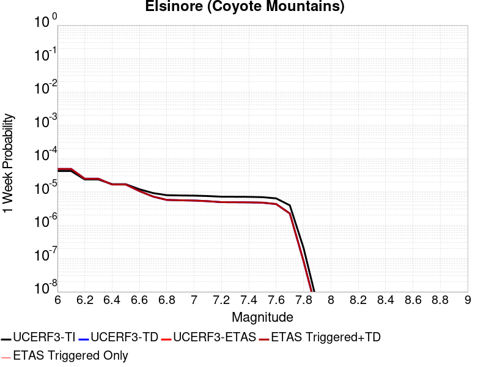 | 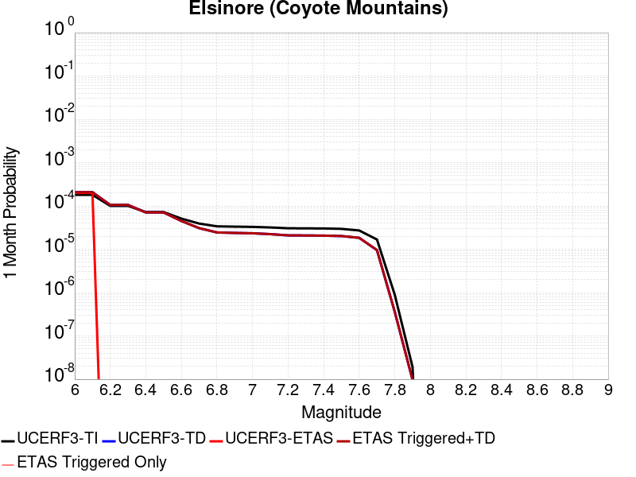 | 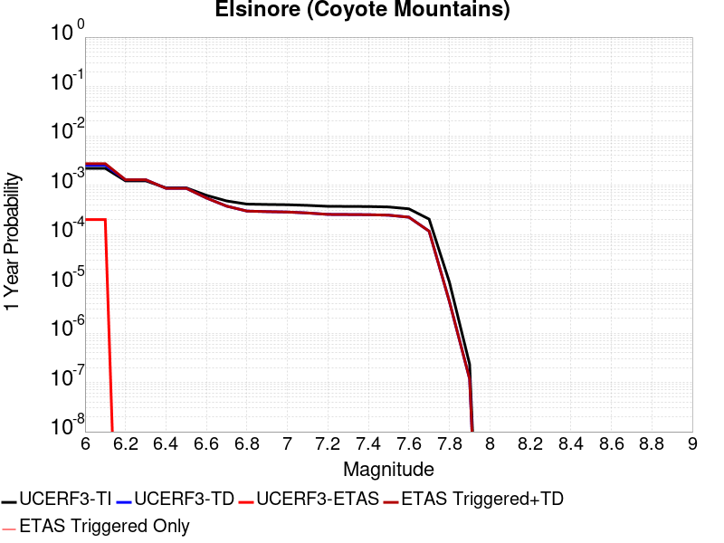 | 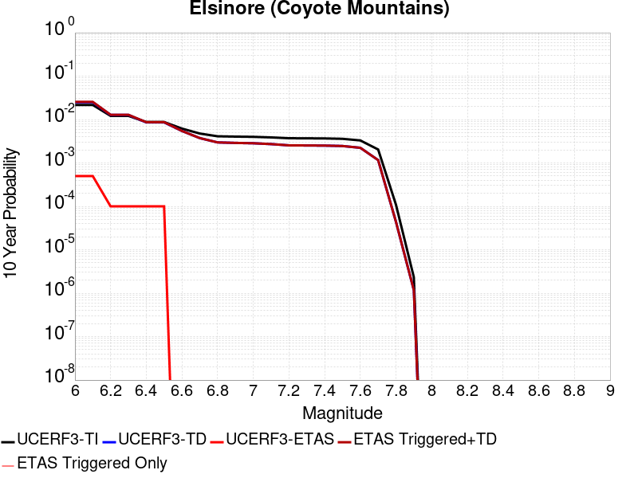 |

| Magnitude | 1 wk TI Prob | 1 wk TD Prob | 1 wk ETAS Prob | 1 wk ETAS/TD Gain | 1 wk ETAS Triggered+TD | 1 wk ETAS Triggered Only | 1 mo TI Prob | 1 mo TD Prob | 1 mo ETAS Prob | 1 mo ETAS/TD Gain | 1 mo ETAS Triggered+TD | 1 mo ETAS Triggered Only | 1 yr TI Prob | 1 yr TD Prob | 1 yr ETAS Prob | 1 yr ETAS/TD Gain | 1 yr ETAS Triggered+TD | 1 yr ETAS Triggered Only | 10 yr TI Prob | 10 yr TD Prob | 10 yr ETAS Prob | 10 yr ETAS/TD Gain | 10 yr ETAS Triggered+TD | 10 yr ETAS Triggered Only |
|-----|-----|-----|-----|-----|-----|-----|-----|-----|-----|-----|-----|-----|-----|-----|-----|-----|-----|-----|-----|-----|-----|-----|-----|-----|
| 6.0 | 4.20513E-5 | 4.8497863E-5 | 0.0 | 0.0 | 4.8497863E-5 | 0.0 | 1.8020741E-4 | 2.0783432E-4 | 2.0E-4 | 0.96230495 | 2.0783432E-4 | 0.0 | 0.0021918174 | 0.002527977 | 0.0016 | 0.63291717 | 0.0030267132 | 5.0E-4 | 0.021703249 | 0.025043545 | 0.0109 | 0.43524188 | 0.027773423 | 0.0028 |
| 6.1 | 4.20513E-5 | 4.8497863E-5 | 0.0 | 0.0 | 4.8497863E-5 | 0.0 | 1.8020741E-4 | 2.0783432E-4 | 2.0E-4 | 0.96230495 | 2.0783432E-4 | 0.0 | 0.0021918174 | 0.002527977 | 0.0016 | 0.63291717 | 0.0030267132 | 5.0E-4 | 0.021703249 | 0.025043545 | 0.0109 | 0.43524188 | 0.027773423 | 0.0028 |
| 6.2 | 2.3413893E-5 | 2.4631545E-5 | 0.0 | 0.0 | 2.4631545E-5 | 0.0 | 1.0034139E-4 | 1.05559906E-4 | 0.0 | 0.0 | 1.05559906E-4 | 0.0 | 0.0012209718 | 0.0012845232 | 6.0E-4 | 0.46709937 | 0.0015841379 | 3.0E-4 | 0.012142851 | 0.012779683 | 0.0055 | 0.43037063 | 0.014161791 | 0.0014 |
| 6.3 | 2.3413893E-5 | 2.4631545E-5 | 0.0 | 0.0 | 2.4631545E-5 | 0.0 | 1.0034139E-4 | 1.05559906E-4 | 0.0 | 0.0 | 1.05559906E-4 | 0.0 | 0.0012209718 | 0.0012845232 | 6.0E-4 | 0.46709937 | 0.0015841379 | 3.0E-4 | 0.012142851 | 0.012779683 | 0.0055 | 0.43037063 | 0.014161791 | 0.0014 |
| 6.4 | 1.6894814E-5 | 1.6525059E-5 | 0.0 | 0.0 | 1.6525059E-5 | 0.0 | 7.240433E-5 | 7.081997E-5 | 0.0 | 0.0 | 7.081997E-5 | 0.0 | 8.811662E-4 | 8.619288E-4 | 4.0E-4 | 0.46407545 | 9.6184266E-4 | 1.0E-4 | 0.0087768035 | 0.008589517 | 0.0038 | 0.44239974 | 0.009580928 | 0.001 |
| 6.5 | 1.6894814E-5 | 1.6525059E-5 | 0.0 | 0.0 | 1.6525059E-5 | 0.0 | 7.240433E-5 | 7.081997E-5 | 0.0 | 0.0 | 7.081997E-5 | 0.0 | 8.811662E-4 | 8.619288E-4 | 4.0E-4 | 0.46407545 | 9.6184266E-4 | 1.0E-4 | 0.0087768035 | 0.008589517 | 0.0038 | 0.44239974 | 0.009580928 | 0.001 |
| 6.6 | 1.1910969E-5 | 1.0500677E-5 | 0.0 | 0.0 | 1.0500677E-5 | 0.0 | 5.1046012E-5 | 4.5002198E-5 | 0.0 | 0.0 | 4.5002198E-5 | 0.0 | 6.21308E-4 | 5.477772E-4 | 4.0E-4 | 0.73022383 | 6.4772245E-4 | 1.0E-4 | 0.0061957375 | 0.0054655694 | 0.0031 | 0.567187 | 0.006261197 | 8.0E-4 |
| 6.7 | 9.1486E-6 | 7.179868E-6 | 0.0 | 0.0 | 7.179868E-6 | 0.0 | 3.9207694E-5 | 3.077052E-5 | 0.0 | 0.0 | 3.077052E-5 | 0.0 | 4.7724912E-4 | 3.745705E-4 | 4.0E-4 | 1.0678898 | 4.7453304E-4 | 1.0E-4 | 0.0047622547 | 0.003739769 | 0.0023 | 0.6150112 | 0.0044371514 | 7.0E-4 |
| 6.8 | 7.90441E-6 | 5.7088764E-6 | 0.0 | 0.0 | 5.7088764E-6 | 0.0 | 3.3875604E-5 | 2.4466392E-5 | 0.0 | 0.0 | 2.4466392E-5 | 0.0 | 4.1235742E-4 | 2.9783888E-4 | 3.0E-4 | 1.007256 | 3.9780908E-4 | 1.0E-4 | 0.0041159308 | 0.0029745249 | 0.0019 | 0.63875747 | 0.0034730376 | 5.0E-4 |
| 6.9 | 7.77015E-6 | 5.562965E-6 | 0.0 | 0.0 | 5.562965E-6 | 0.0 | 3.3300217E-5 | 2.3841067E-5 | 0.0 | 0.0 | 2.3841067E-5 | 0.0 | 4.0535472E-4 | 2.902276E-4 | 3.0E-4 | 1.0336716 | 3.9019855E-4 | 1.0E-4 | 0.004046161 | 0.0028986116 | 0.0019 | 0.6554862 | 0.0033971623 | 5.0E-4 |
| 7.0 | 7.675798E-6 | 5.4599236E-6 | 0.0 | 0.0 | 5.4599236E-6 | 0.0 | 3.289586E-5 | 2.339947E-5 | 0.0 | 0.0 | 2.339947E-5 | 0.0 | 4.004335E-4 | 2.8485255E-4 | 3.0E-4 | 1.0531764 | 3.8482406E-4 | 1.0E-4 | 0.003997127 | 0.002845 | 0.0019 | 0.66783834 | 0.0033435775 | 5.0E-4 |
| 7.1 | 7.447814E-6 | 5.2195273E-6 | 0.0 | 0.0 | 5.2195273E-6 | 0.0 | 3.191881E-5 | 2.2369217E-5 | 0.0 | 0.0 | 2.2369217E-5 | 0.0 | 3.8854225E-4 | 2.7231243E-4 | 3.0E-4 | 1.1016757 | 3.722852E-4 | 1.0E-4 | 0.003878636 | 0.002719911 | 0.0019 | 0.69855225 | 0.003218551 | 5.0E-4 |
| 7.2 | 7.128185E-6 | 4.886292E-6 | 0.0 | 0.0 | 4.886292E-6 | 0.0 | 3.0549007E-5 | 2.0941092E-5 | 0.0 | 0.0 | 2.0941092E-5 | 0.0 | 3.7187067E-4 | 2.5492912E-4 | 3.0E-4 | 1.1767976 | 3.5490363E-4 | 1.0E-4 | 0.00371249 | 0.0025464846 | 0.0019 | 0.74612665 | 0.0030452113 | 5.0E-4 |
| 7.3 | 7.0913875E-6 | 4.8550028E-6 | 0.0 | 0.0 | 4.8550028E-6 | 0.0 | 3.0391306E-5 | 2.0806996E-5 | 0.0 | 0.0 | 2.0806996E-5 | 0.0 | 3.6995133E-4 | 2.5329692E-4 | 3.0E-4 | 1.1843808 | 3.5327158E-4 | 1.0E-4 | 0.0036933604 | 0.0025301995 | 0.0019 | 0.75092894 | 0.0030289344 | 5.0E-4 |
| 7.4 | 7.051521E-6 | 4.818879E-6 | 0.0 | 0.0 | 4.818879E-6 | 0.0 | 3.0220453E-5 | 2.0652182E-5 | 0.0 | 0.0 | 2.0652182E-5 | 0.0 | 3.6787192E-4 | 2.5141248E-4 | 3.0E-4 | 1.1932583 | 3.5138734E-4 | 1.0E-4 | 0.0036726352 | 0.002511398 | 0.0019 | 0.7565508 | 0.0030101421 | 5.0E-4 |
| 7.5 | 6.910666E-6 | 4.7146323E-6 | 0.0 | 0.0 | 4.7146323E-6 | 0.0 | 2.9616802E-5 | 2.0205416E-5 | 0.0 | 0.0 | 2.0205416E-5 | 0.0 | 3.605249E-4 | 2.4597437E-4 | 3.0E-4 | 1.2196393 | 3.4594975E-4 | 1.0E-4 | 0.0035994058 | 0.0024571382 | 0.0019 | 0.7732573 | 0.0029559096 | 5.0E-4 |
| 7.6 | 6.341753E-6 | 4.2886663E-6 | 0.0 | 0.0 | 4.2886663E-6 | 0.0 | 2.7178658E-5 | 1.8379875E-5 | 0.0 | 0.0 | 1.8379875E-5 | 0.0 | 3.3084993E-4 | 2.2375316E-4 | 2.0E-4 | 0.8938421 | 3.2373078E-4 | 1.0E-4 | 0.0033035777 | 0.0022353933 | 0.0018 | 0.80522746 | 0.0027342755 | 5.0E-4 |
| 7.7 | 3.9205916E-6 | 2.2326055E-6 | 0.0 | 0.0 | 2.2326055E-6 | 0.0 | 1.6802427E-5 | 9.568278E-6 | 0.0 | 0.0 | 9.568278E-6 | 0.0 | 2.0455034E-4 | 1.1648829E-4 | 0.0 | 0.0 | 1.1648829E-4 | 0.0 | 0.0020436216 | 0.0011643447 | 8.0E-4 | 0.68708175 | 0.0013641119 | 2.0E-4 |
| 7.8 | 2.0846227E-7 | 8.4180684E-8 | 0.0 | 0.0 | 8.4180684E-8 | 0.0 | 8.9340944E-7 | 3.6077432E-7 | 0.0 | 0.0 | 3.6077432E-7 | 0.0 | 1.0877206E-5 | 4.392422E-6 | 0.0 | 0.0 | 4.392422E-6 | 0.0 | 1.0876673E-4 | 4.3923672E-5 | 0.0 | 0.0 | 4.3923672E-5 | 0.0 |
| 7.9 | 4.4969806E-9 | 2.2593856E-9 | 0.0 | 0.0 | 2.2593856E-9 | 0.0 | 1.9272775E-8 | 9.68308E-9 | 0.0 | 0.0 | 9.68308E-9 | 0.0 | 2.3464601E-7 | 1.17891496E-7 | 0.0 | 0.0 | 1.17891496E-7 | 0.0 | 2.3464577E-6 | 1.1789144E-6 | 0.0 | 0.0 | 1.1789144E-6 | 0.0 |

## Great Valley 03a Dunnigan Hills
*[(top)](#table-of-contents)*

| 1 Week | 1 Month | 1 Year | 10 Year |
|-----|-----|-----|-----|
| 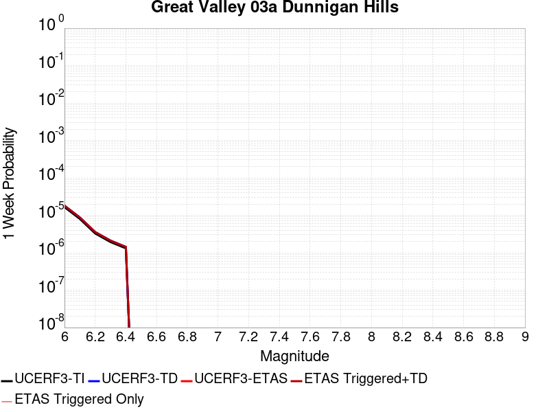 | 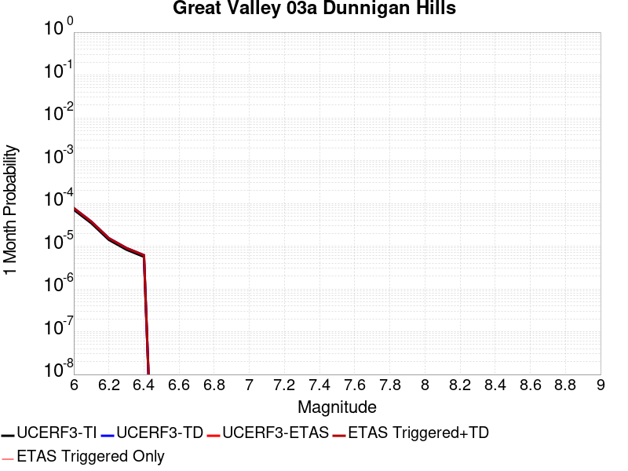 | 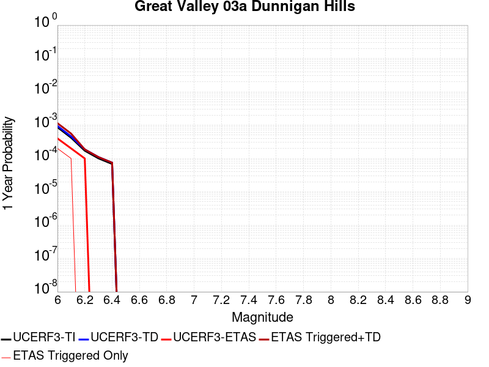 | 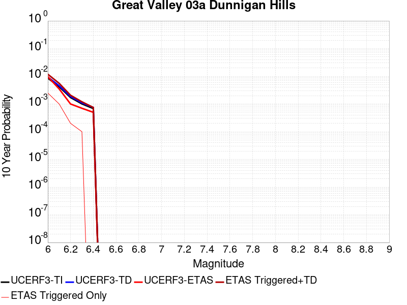 |

| Magnitude | 1 wk TI Prob | 1 wk TD Prob | 1 wk ETAS Prob | 1 wk ETAS/TD Gain | 1 wk ETAS Triggered+TD | 1 wk ETAS Triggered Only | 1 mo TI Prob | 1 mo TD Prob | 1 mo ETAS Prob | 1 mo ETAS/TD Gain | 1 mo ETAS Triggered+TD | 1 mo ETAS Triggered Only | 1 yr TI Prob | 1 yr TD Prob | 1 yr ETAS Prob | 1 yr ETAS/TD Gain | 1 yr ETAS Triggered+TD | 1 yr ETAS Triggered Only | 10 yr TI Prob | 10 yr TD Prob | 10 yr ETAS Prob | 10 yr ETAS/TD Gain | 10 yr ETAS Triggered+TD | 10 yr ETAS Triggered Only |
|-----|-----|-----|-----|-----|-----|-----|-----|-----|-----|-----|-----|-----|-----|-----|-----|-----|-----|-----|-----|-----|-----|-----|-----|-----|
| 6.0 | 1.6591328E-5 | 1.8090686E-5 | 0.0 | 0.0 | 1.8090686E-5 | 0.0 | 7.110376E-5 | 7.75296E-5 | 0.0 | 0.0 | 7.75296E-5 | 0.0 | 8.6534437E-4 | 9.435831E-4 | 4.0E-4 | 0.42391604 | 0.0011433944 | 2.0E-4 | 0.008619824 | 0.009402585 | 0.0097 | 1.0316311 | 0.011879079 | 0.0025 |
| 6.1 | 8.041125E-6 | 8.761437E-6 | 0.0 | 0.0 | 8.761437E-6 | 0.0 | 3.4461507E-5 | 3.754859E-5 | 0.0 | 0.0 | 3.754859E-5 | 0.0 | 4.194881E-4 | 4.5707848E-4 | 2.0E-4 | 0.43756163 | 5.5703276E-4 | 1.0E-4 | 0.004186971 | 0.0045633772 | 0.0035 | 0.7669758 | 0.005558814 | 0.001 |
| 6.2 | 3.2807004E-6 | 3.576167E-6 | 0.0 | 0.0 | 3.576167E-6 | 0.0 | 1.4060069E-5 | 1.5326363E-5 | 0.0 | 0.0 | 1.5326363E-5 | 0.0 | 1.7116789E-4 | 1.8658665E-4 | 1.0E-4 | 0.53594404 | 1.8658665E-4 | 0.0 | 0.0017103611 | 0.0018647071 | 0.001 | 0.53627723 | 0.0020643342 | 2.0E-4 |
| 6.3 | 1.9339366E-6 | 2.1083722E-6 | 0.0 | 0.0 | 2.1083722E-6 | 0.0 | 8.288273E-6 | 9.035865E-6 | 0.0 | 0.0 | 9.035865E-6 | 0.0 | 1.00905054E-4 | 1.1000896E-4 | 0.0 | 0.0 | 1.1000896E-4 | 0.0 | 0.0010085925 | 0.0010998244 | 7.0E-4 | 0.63646525 | 0.0011997144 | 1.0E-4 |
| 6.4 | 1.3142635E-6 | 1.4326239E-6 | 0.0 | 0.0 | 1.4326239E-6 | 0.0 | 5.6325457E-6 | 6.139817E-6 | 0.0 | 0.0 | 6.139817E-6 | 0.0 | 6.857408E-5 | 7.475227E-5 | 0.0 | 0.0 | 7.475227E-5 | 0.0 | 6.8552926E-4 | 7.475227E-4 | 5.0E-4 | 0.668876 | 7.475227E-4 | 0.0 |

## San Jacinto (San Jacinto Valley) rev
*[(top)](#table-of-contents)*

| 1 Week | 1 Month | 1 Year | 10 Year |
|-----|-----|-----|-----|
| 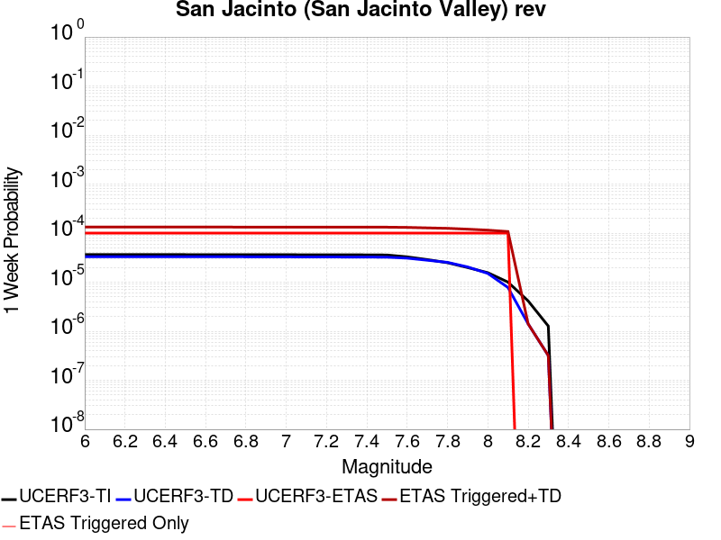 | 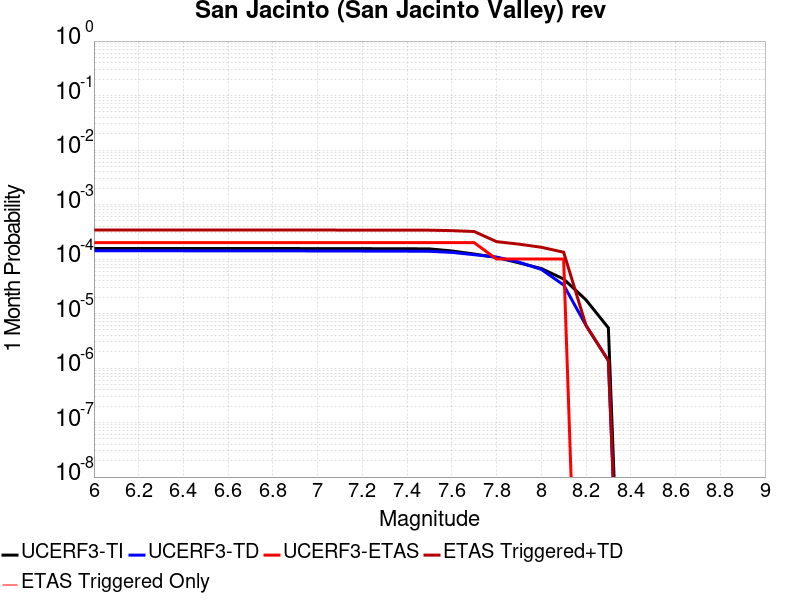 | 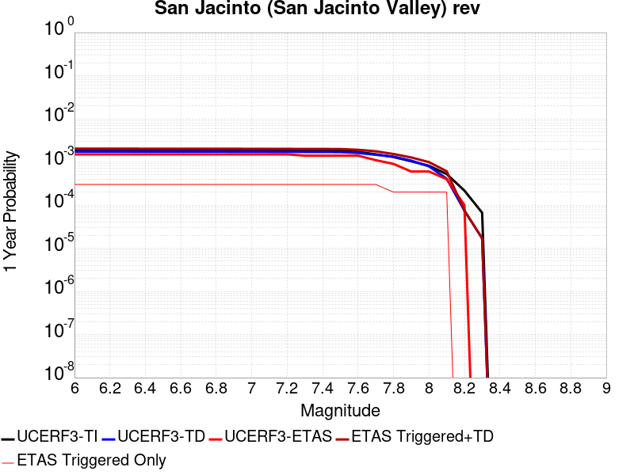 | 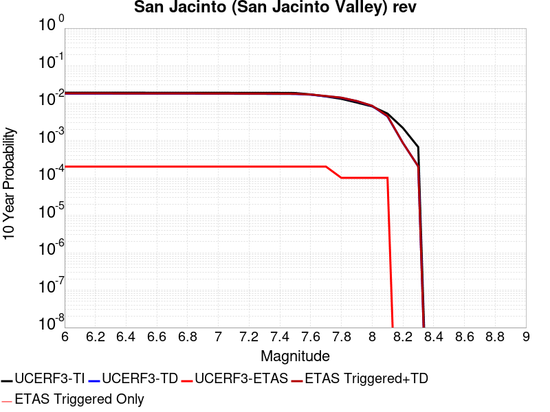 |

| Magnitude | 1 wk TI Prob | 1 wk TD Prob | 1 wk ETAS Prob | 1 wk ETAS/TD Gain | 1 wk ETAS Triggered+TD | 1 wk ETAS Triggered Only | 1 mo TI Prob | 1 mo TD Prob | 1 mo ETAS Prob | 1 mo ETAS/TD Gain | 1 mo ETAS Triggered+TD | 1 mo ETAS Triggered Only | 1 yr TI Prob | 1 yr TD Prob | 1 yr ETAS Prob | 1 yr ETAS/TD Gain | 1 yr ETAS Triggered+TD | 1 yr ETAS Triggered Only | 10 yr TI Prob | 10 yr TD Prob | 10 yr ETAS Prob | 10 yr ETAS/TD Gain | 10 yr ETAS Triggered+TD | 10 yr ETAS Triggered Only |
|-----|-----|-----|-----|-----|-----|-----|-----|-----|-----|-----|-----|-----|-----|-----|-----|-----|-----|-----|-----|-----|-----|-----|-----|-----|
| 6.0 | 3.652694E-5 | 3.322934E-5 | 1.0E-4 | 3.009389 | 1.3322601E-4 | 1.0E-4 | 1.5653463E-4 | 1.4240369E-4 | 2.0E-4 | 1.404458 | 3.4237522E-4 | 2.0E-4 | 0.0019041431 | 0.0017323879 | 0.0015 | 0.8658569 | 0.0020318683 | 3.0E-4 | 0.018879099 | 0.017919548 | 0.0108 | 0.60269374 | 0.020669375 | 0.0028 |
| 6.1 | 3.652694E-5 | 3.322934E-5 | 1.0E-4 | 3.009389 | 1.3322601E-4 | 1.0E-4 | 1.5653463E-4 | 1.4240369E-4 | 2.0E-4 | 1.404458 | 3.4237522E-4 | 2.0E-4 | 0.0019041431 | 0.0017323879 | 0.0015 | 0.8658569 | 0.0020318683 | 3.0E-4 | 0.018879099 | 0.017919548 | 0.0108 | 0.60269374 | 0.020669375 | 0.0028 |
| 6.2 | 3.652694E-5 | 3.322934E-5 | 1.0E-4 | 3.009389 | 1.3322601E-4 | 1.0E-4 | 1.5653463E-4 | 1.4240369E-4 | 2.0E-4 | 1.404458 | 3.4237522E-4 | 2.0E-4 | 0.0019041431 | 0.0017323879 | 0.0015 | 0.8658569 | 0.0020318683 | 3.0E-4 | 0.018879099 | 0.017919548 | 0.0108 | 0.60269374 | 0.020669375 | 0.0028 |
| 6.3 | 3.652694E-5 | 3.322934E-5 | 1.0E-4 | 3.009389 | 1.3322601E-4 | 1.0E-4 | 1.5653463E-4 | 1.4240369E-4 | 2.0E-4 | 1.404458 | 3.4237522E-4 | 2.0E-4 | 0.0019041431 | 0.0017323879 | 0.0015 | 0.8658569 | 0.0020318683 | 3.0E-4 | 0.018879099 | 0.017919548 | 0.0108 | 0.60269374 | 0.020669375 | 0.0028 |
| 6.4 | 3.646941E-5 | 3.315119E-5 | 1.0E-4 | 3.016483 | 1.3314787E-4 | 1.0E-4 | 1.5628811E-4 | 1.420688E-4 | 2.0E-4 | 1.4077686 | 3.4204038E-4 | 2.0E-4 | 0.0019011468 | 0.0017283175 | 0.0015 | 0.8678961 | 0.002027799 | 3.0E-4 | 0.018849645 | 0.017879544 | 0.0107 | 0.5984493 | 0.02062948 | 0.0028 |
| 6.5 | 3.646941E-5 | 3.315119E-5 | 1.0E-4 | 3.016483 | 1.3314787E-4 | 1.0E-4 | 1.5628811E-4 | 1.420688E-4 | 2.0E-4 | 1.4077686 | 3.4204038E-4 | 2.0E-4 | 0.0019011468 | 0.0017283175 | 0.0015 | 0.8678961 | 0.002027799 | 3.0E-4 | 0.018849645 | 0.017879544 | 0.0107 | 0.5984493 | 0.02062948 | 0.0028 |
| 6.6 | 3.6442503E-5 | 3.3114706E-5 | 1.0E-4 | 3.0198064 | 1.3311139E-4 | 1.0E-4 | 1.561728E-4 | 1.4191246E-4 | 2.0E-4 | 1.4093195 | 3.4188406E-4 | 2.0E-4 | 0.0018997455 | 0.0017264172 | 0.0015 | 0.8688514 | 0.0020258992 | 3.0E-4 | 0.018835869 | 0.017860865 | 0.0107 | 0.59907514 | 0.020610854 | 0.0028 |
| 6.7 | 3.6432113E-5 | 3.3100332E-5 | 1.0E-4 | 3.0211177 | 1.3309703E-4 | 1.0E-4 | 1.5612828E-4 | 1.4185088E-4 | 2.0E-4 | 1.4099314 | 3.418225E-4 | 2.0E-4 | 0.0018992044 | 0.0017256687 | 0.0015 | 0.8692283 | 0.002025151 | 3.0E-4 | 0.018830549 | 0.017853511 | 0.0107 | 0.5993219 | 0.02060352 | 0.0028 |
| 6.8 | 3.6409598E-5 | 3.3069507E-5 | 1.0E-4 | 3.0239336 | 1.330662E-4 | 1.0E-4 | 1.560318E-4 | 1.4171877E-4 | 2.0E-4 | 1.4112456 | 3.4169044E-4 | 2.0E-4 | 0.0018980318 | 0.001724063 | 0.0015 | 0.8700378 | 0.0020235458 | 3.0E-4 | 0.018819023 | 0.017837716 | 0.0106 | 0.5942465 | 0.02058777 | 0.0028 |
| 6.9 | 3.638078E-5 | 3.3030083E-5 | 1.0E-4 | 3.027543 | 1.3302678E-4 | 1.0E-4 | 1.5590832E-4 | 1.4154984E-4 | 2.0E-4 | 1.4129299 | 3.4152152E-4 | 2.0E-4 | 0.0018965311 | 0.0017220094 | 0.0015 | 0.8710754 | 0.0020214927 | 3.0E-4 | 0.018804269 | 0.017817516 | 0.0106 | 0.5949202 | 0.020567626 | 0.0028 |
| 7.0 | 3.6294874E-5 | 3.2912558E-5 | 1.0E-4 | 3.0383542 | 1.3290926E-4 | 1.0E-4 | 1.5554018E-4 | 1.410462E-4 | 2.0E-4 | 1.4179751 | 3.41018E-4 | 2.0E-4 | 0.0018920569 | 0.0017158875 | 0.0015 | 0.87418324 | 0.0020153727 | 3.0E-4 | 0.018760284 | 0.017757291 | 0.0106 | 0.5969379 | 0.02050757 | 0.0028 |
| 7.1 | 3.6260717E-5 | 3.286896E-5 | 1.0E-4 | 3.042384 | 1.3286568E-4 | 1.0E-4 | 1.5539382E-4 | 1.4085938E-4 | 2.0E-4 | 1.4198557 | 3.408312E-4 | 2.0E-4 | 0.001890278 | 0.0017136165 | 0.0015 | 0.8753417 | 0.0020131024 | 3.0E-4 | 0.018742796 | 0.017734934 | 0.0106 | 0.59769046 | 0.020485274 | 0.0028 |
| 7.2 | 3.6210204E-5 | 3.2803386E-5 | 1.0E-4 | 3.0484657 | 1.3280011E-4 | 1.0E-4 | 1.5517735E-4 | 1.4057838E-4 | 2.0E-4 | 1.4226938 | 3.4055026E-4 | 2.0E-4 | 0.001887647 | 0.0017102007 | 0.0015 | 0.87709004 | 0.0020096877 | 3.0E-4 | 0.01871693 | 0.017701307 | 0.0106 | 0.5988258 | 0.020451743 | 0.0028 |
| 7.3 | 3.6119454E-5 | 3.2692275E-5 | 1.0E-4 | 3.0588264 | 1.32689E-4 | 1.0E-4 | 1.5478847E-4 | 1.4010225E-4 | 2.0E-4 | 1.4275289 | 3.400742E-4 | 2.0E-4 | 0.0018829206 | 0.0017044127 | 0.0014 | 0.8213973 | 0.0020039014 | 3.0E-4 | 0.018670462 | 0.017644132 | 0.0105 | 0.59509873 | 0.020394728 | 0.0028 |
| 7.4 | 3.607848E-5 | 3.2640197E-5 | 1.0E-4 | 3.0637069 | 1.3263694E-4 | 1.0E-4 | 1.5461289E-4 | 1.3987908E-4 | 2.0E-4 | 1.4298064 | 3.398511E-4 | 2.0E-4 | 0.0018807866 | 0.0017017 | 0.0014 | 0.8227067 | 0.0020011894 | 3.0E-4 | 0.018649481 | 0.017617324 | 0.0105 | 0.59600425 | 0.020367997 | 0.0028 |
| 7.5 | 3.5856774E-5 | 3.245184E-5 | 1.0E-4 | 3.0814893 | 1.324486E-4 | 1.0E-4 | 1.5366284E-4 | 1.3907191E-4 | 2.0E-4 | 1.4381049 | 3.390441E-4 | 2.0E-4 | 0.0018692396 | 0.0016918881 | 0.0014 | 0.82747793 | 0.0019913805 | 3.0E-4 | 0.018535944 | 0.017519321 | 0.0103 | 0.5879223 | 0.020270268 | 0.0028 |
| 7.6 | 3.286655E-5 | 3.0997002E-5 | 1.0E-4 | 3.2261183 | 1.3099391E-4 | 1.0E-4 | 1.4084904E-4 | 1.3283755E-4 | 2.0E-4 | 1.5055984 | 3.3281097E-4 | 2.0E-4 | 0.001713488 | 0.0016160993 | 0.0014 | 0.8662834 | 0.0019156145 | 3.0E-4 | 0.017003361 | 0.016750105 | 0.0097 | 0.57910085 | 0.019404879 | 0.0027 |
| 7.7 | 2.8882527E-5 | 2.8118395E-5 | 1.0E-4 | 3.5563908 | 1.2811559E-4 | 1.0E-4 | 1.237764E-4 | 1.2050184E-4 | 2.0E-4 | 1.6597257 | 3.2047773E-4 | 2.0E-4 | 0.0015059357 | 0.0014661236 | 0.0011 | 0.7502778 | 0.0017656838 | 3.0E-4 | 0.014957713 | 0.015250562 | 0.0084 | 0.55079937 | 0.017810911 | 0.0026 |
| 7.8 | 2.4950225E-5 | 2.5456344E-5 | 1.0E-4 | 3.9282937 | 1.254538E-4 | 1.0E-4 | 1.0692515E-4 | 1.09094064E-4 | 1.0E-4 | 0.91664016 | 2.0908315E-4 | 1.0E-4 | 0.0013010362 | 0.0013274117 | 9.0E-4 | 0.6780112 | 0.0015271462 | 2.0E-4 | 0.012934455 | 0.013855233 | 0.0076 | 0.5485292 | 0.016123366 | 0.0023 |
| 7.9 | 1.9881603E-5 | 2.0547504E-5 | 1.0E-4 | 4.866771 | 1.2054545E-4 | 1.0E-4 | 8.520408E-5 | 8.8057765E-5 | 1.0E-4 | 1.1356182 | 1.8804896E-4 | 1.0E-4 | 0.001036866 | 0.0010715767 | 6.0E-4 | 0.5599226 | 0.0012713624 | 2.0E-4 | 0.010320415 | 0.0112761725 | 0.0064 | 0.5675685 | 0.013253621 | 0.002 |
| 8.0 | 1.563292E-5 | 1.5163392E-5 | 1.0E-4 | 6.59483 | 1.1516188E-4 | 1.0E-4 | 6.6996516E-5 | 6.498435E-5 | 1.0E-4 | 1.538832 | 1.6497786E-4 | 1.0E-4 | 8.153773E-4 | 7.9089793E-4 | 6.0E-4 | 0.7586314 | 9.907398E-4 | 2.0E-4 | 0.00812392 | 0.008402079 | 0.0045 | 0.5355817 | 0.009691157 | 0.0013 |
| 8.1 | 1.0045313E-5 | 7.851771E-6 | 1.0E-4 | 12.735979 | 1.0785099E-4 | 1.0E-4 | 4.305063E-5 | 3.365002E-5 | 1.0E-4 | 2.9717665 | 1.3364665E-4 | 1.0E-4 | 5.2401534E-4 | 4.0961243E-4 | 4.0E-4 | 0.9765328 | 6.0953054E-4 | 2.0E-4 | 0.0052278144 | 0.0044161067 | 0.0029 | 0.656687 | 0.005411691 | 0.001 |
| 8.2 | 4.1554413E-6 | 1.4326783E-6 | 0.0 | 0.0 | 1.4326783E-6 | 0.0 | 1.7808914E-5 | 6.1400356E-6 | 0.0 | 0.0 | 6.1400356E-6 | 0.0 | 2.1680194E-4 | 7.4752395E-5 | 1.0E-4 | 1.3377498 | 7.4752395E-5 | 0.0 | 0.0021659054 | 8.719923E-4 | 7.0E-4 | 0.8027594 | 0.0010718179 | 2.0E-4 |
| 8.3 | 1.2758221E-6 | 3.2481879E-7 | 0.0 | 0.0 | 3.2481879E-7 | 0.0 | 5.4677976E-6 | 1.3920799E-6 | 0.0 | 0.0 | 1.3920799E-6 | 0.0 | 6.65684E-5 | 1.6948443E-5 | 0.0 | 0.0 | 1.6948443E-5 | 0.0 | 6.6548464E-4 | 2.058492E-4 | 2.0E-4 | 0.97158504 | 3.058286E-4 | 1.0E-4 |

## Cleghorn Lake
*[(top)](#table-of-contents)*

| 1 Week | 1 Month | 1 Year | 10 Year |
|-----|-----|-----|-----|
| 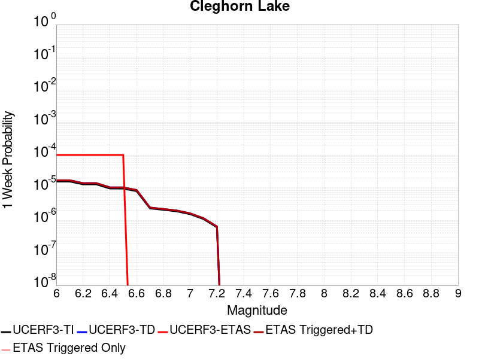 | 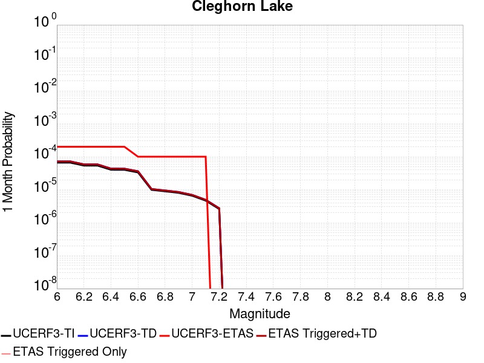 | 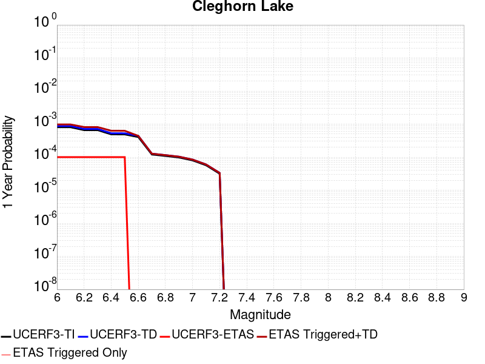 | 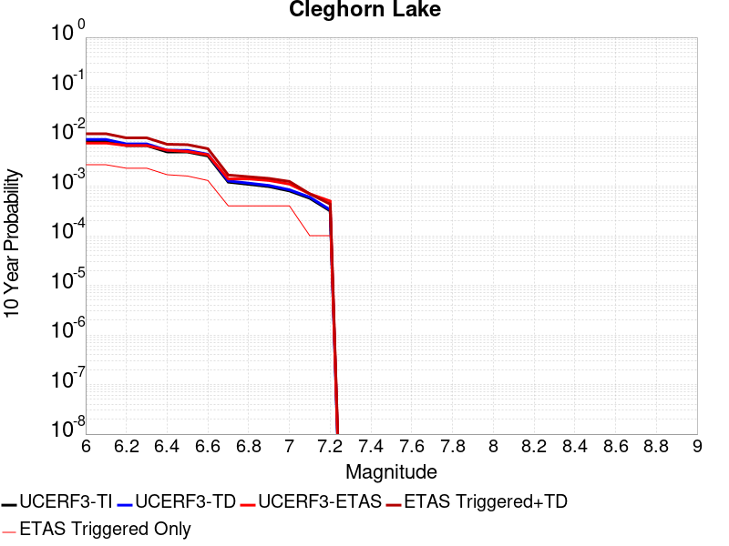 |

| Magnitude | 1 wk TI Prob | 1 wk TD Prob | 1 wk ETAS Prob | 1 wk ETAS/TD Gain | 1 wk ETAS Triggered+TD | 1 wk ETAS Triggered Only | 1 mo TI Prob | 1 mo TD Prob | 1 mo ETAS Prob | 1 mo ETAS/TD Gain | 1 mo ETAS Triggered+TD | 1 mo ETAS Triggered Only | 1 yr TI Prob | 1 yr TD Prob | 1 yr ETAS Prob | 1 yr ETAS/TD Gain | 1 yr ETAS Triggered+TD | 1 yr ETAS Triggered Only | 10 yr TI Prob | 10 yr TD Prob | 10 yr ETAS Prob | 10 yr ETAS/TD Gain | 10 yr ETAS Triggered+TD | 10 yr ETAS Triggered Only |
|-----|-----|-----|-----|-----|-----|-----|-----|-----|-----|-----|-----|-----|-----|-----|-----|-----|-----|-----|-----|-----|-----|-----|-----|-----|
| 6.0 | 1.5467183E-5 | 1.6779122E-5 | 1.0E-4 | 5.9597874 | 1.6779122E-5 | 0.0 | 6.6286244E-5 | 7.190885E-5 | 2.0E-4 | 2.7812989 | 7.190885E-5 | 0.0 | 8.067362E-4 | 8.751934E-4 | 0.0011 | 1.2568651 | 0.0014746683 | 6.0E-4 | 0.008038137 | 0.008722884 | 0.0074 | 0.8483434 | 0.0113993315 | 0.0027 |
| 6.1 | 1.5467183E-5 | 1.6779122E-5 | 1.0E-4 | 5.9597874 | 1.6779122E-5 | 0.0 | 6.6286244E-5 | 7.190885E-5 | 2.0E-4 | 2.7812989 | 7.190885E-5 | 0.0 | 8.067362E-4 | 8.751934E-4 | 0.0011 | 1.2568651 | 0.0014746683 | 6.0E-4 | 0.008038137 | 0.008722884 | 0.0074 | 0.8483434 | 0.0113993315 | 0.0027 |
| 6.2 | 1.2624631E-5 | 1.3669549E-5 | 1.0E-4 | 7.3155303 | 1.3669549E-5 | 0.0 | 5.410444E-5 | 5.858274E-5 | 2.0E-4 | 3.4139748 | 5.858274E-5 | 0.0 | 6.585225E-4 | 7.1306E-4 | 0.0011 | 1.5426471 | 0.0013126322 | 6.0E-4 | 0.0065657445 | 0.007112507 | 0.0066 | 0.9279429 | 0.009396148 | 0.0023 |
| 6.3 | 1.2624631E-5 | 1.3669549E-5 | 1.0E-4 | 7.3155303 | 1.3669549E-5 | 0.0 | 5.410444E-5 | 5.858274E-5 | 2.0E-4 | 3.4139748 | 5.858274E-5 | 0.0 | 6.585225E-4 | 7.1306E-4 | 0.0011 | 1.5426471 | 0.0013126322 | 6.0E-4 | 0.0065657445 | 0.007112507 | 0.0066 | 0.9279429 | 0.009396148 | 0.0023 |
| 6.4 | 9.417684E-6 | 1.0161601E-5 | 1.0E-4 | 9.84097 | 1.0161601E-5 | 0.0 | 4.036088E-5 | 4.354922E-5 | 2.0E-4 | 4.592505 | 4.354922E-5 | 0.0 | 4.912829E-4 | 5.3012377E-4 | 0.0011 | 2.0749872 | 0.0011298057 | 6.0E-4 | 0.004901982 | 0.0052926196 | 0.0053 | 1.0013945 | 0.0069836224 | 0.0017 |
| 6.5 | 9.368219E-6 | 1.0109062E-5 | 1.0E-4 | 9.892115 | 1.0109062E-5 | 0.0 | 4.014889E-5 | 4.332406E-5 | 2.0E-4 | 4.6163726 | 4.332406E-5 | 0.0 | 4.8870314E-4 | 5.273838E-4 | 0.001 | 1.8961523 | 0.0011270674 | 6.0E-4 | 0.004876298 | 0.00526535 | 0.005 | 0.9496045 | 0.0068569253 | 0.0016 |
| 6.6 | 7.803798E-6 | 8.434604E-6 | 0.0 | 0.0 | 8.434604E-6 | 0.0 | 3.3444423E-5 | 3.6148027E-5 | 1.0E-4 | 2.7664027 | 3.6148027E-5 | 0.0 | 4.0710976E-4 | 4.4005318E-4 | 7.0E-4 | 1.5907168 | 8.398772E-4 | 4.0E-4 | 0.0040636472 | 0.0043957275 | 0.0043 | 0.9782226 | 0.005690013 | 0.0013 |
| 6.7 | 2.3108669E-6 | 2.4423648E-6 | 0.0 | 0.0 | 2.4423648E-6 | 0.0 | 9.903678E-6 | 1.0467236E-5 | 1.0E-4 | 9.55362 | 1.0467236E-5 | 0.0 | 1.205706E-4 | 1.2743134E-4 | 3.0E-4 | 2.354209 | 3.2740584E-4 | 2.0E-4 | 0.001205052 | 0.0012736013 | 0.0014 | 1.0992451 | 0.0016730919 | 4.0E-4 |
| 6.8 | 2.0882828E-6 | 2.2049805E-6 | 0.0 | 0.0 | 2.2049805E-6 | 0.0 | 8.949753E-6 | 9.449883E-6 | 1.0E-4 | 10.582142 | 9.449883E-6 | 0.0 | 1.08957785E-4 | 1.1504642E-4 | 3.0E-4 | 2.6076431 | 3.150234E-4 | 2.0E-4 | 0.0010890438 | 0.0011498855 | 0.0014 | 1.2175126 | 0.0015494255 | 4.0E-4 |
| 6.9 | 1.876935E-6 | 1.9799038E-6 | 0.0 | 0.0 | 1.9799038E-6 | 0.0 | 8.043982E-6 | 8.485275E-6 | 1.0E-4 | 11.785121 | 8.485275E-6 | 0.0 | 9.7931086E-5 | 1.0330349E-4 | 3.0E-4 | 2.9040644 | 3.0328284E-4 | 2.0E-4 | 9.788794E-4 | 0.0010325707 | 0.0013 | 1.2589937 | 0.0014321577 | 4.0E-4 |
| 7.0 | 1.5357559E-6 | 1.6193499E-6 | 0.0 | 0.0 | 1.6193499E-6 | 0.0 | 6.5817944E-6 | 6.940053E-6 | 1.0E-4 | 14.409112 | 6.940053E-6 | 0.0 | 8.01304E-5 | 8.449199E-5 | 3.0E-4 | 3.5506322 | 2.844751E-4 | 2.0E-4 | 8.010151E-4 | 8.4461115E-4 | 0.0011 | 1.3023745 | 0.0012442733 | 4.0E-4 |
| 7.1 | 1.0905424E-6 | 1.1491103E-6 | 0.0 | 0.0 | 1.1491103E-6 | 0.0 | 4.6737446E-6 | 4.9247496E-6 | 1.0E-4 | 20.305601 | 4.9247496E-6 | 0.0 | 5.6901354E-5 | 5.9957274E-5 | 1.0E-4 | 1.6678543 | 5.9957274E-5 | 0.0 | 5.6886784E-4 | 5.9942075E-4 | 7.0E-4 | 1.1677941 | 6.993608E-4 | 1.0E-4 |
| 7.2 | 6.06668E-7 | 6.3837547E-7 | 0.0 | 0.0 | 6.3837547E-7 | 0.0 | 2.600003E-6 | 2.7358924E-6 | 0.0 | 0.0 | 2.7358924E-6 | 0.0 | 3.1654577E-5 | 3.330905E-5 | 0.0 | 0.0 | 3.330905E-5 | 0.0 | 3.1650066E-4 | 3.330474E-4 | 5.0E-4 | 1.5012877 | 4.330141E-4 | 1.0E-4 |

## Nelson Lake
*[(top)](#table-of-contents)*

| 1 Week | 1 Month | 1 Year | 10 Year |
|-----|-----|-----|-----|
| 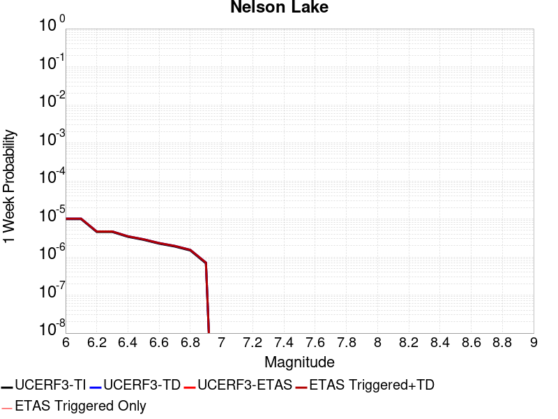 | 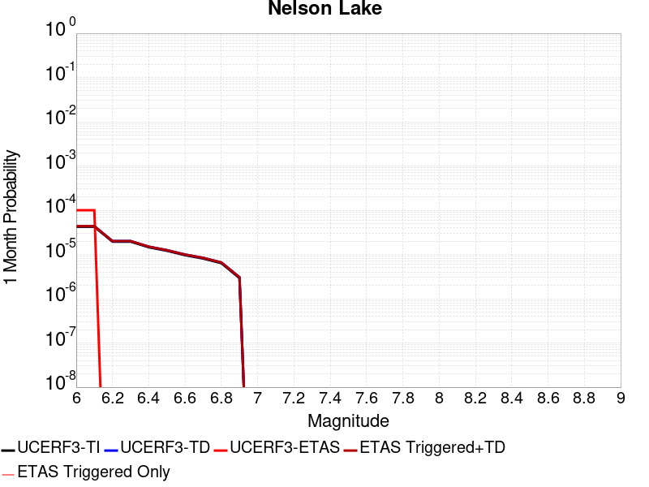 | 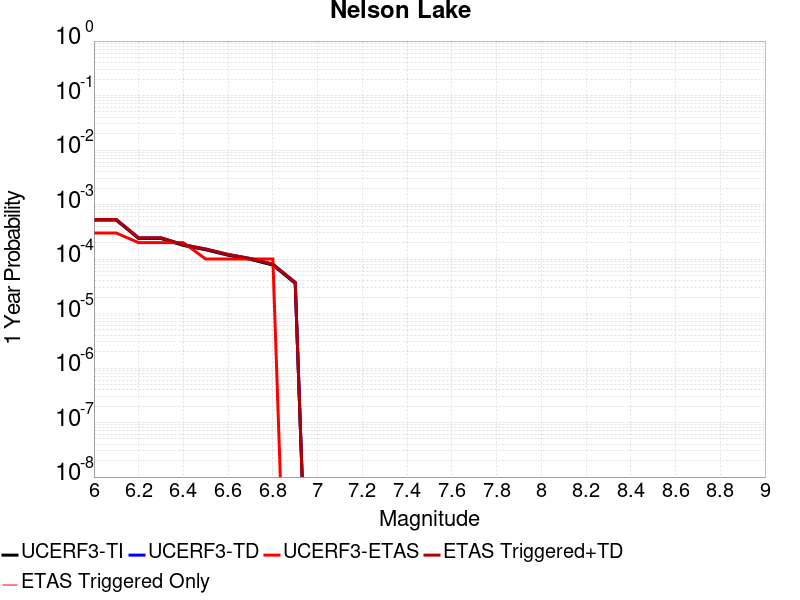 | 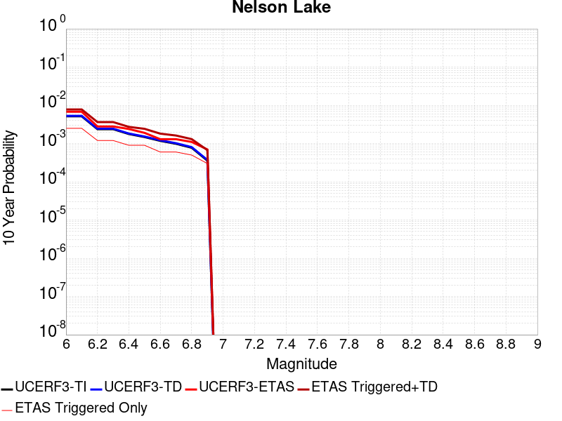 |

| Magnitude | 1 wk TI Prob | 1 wk TD Prob | 1 wk ETAS Prob | 1 wk ETAS/TD Gain | 1 wk ETAS Triggered+TD | 1 wk ETAS Triggered Only | 1 mo TI Prob | 1 mo TD Prob | 1 mo ETAS Prob | 1 mo ETAS/TD Gain | 1 mo ETAS Triggered+TD | 1 mo ETAS Triggered Only | 1 yr TI Prob | 1 yr TD Prob | 1 yr ETAS Prob | 1 yr ETAS/TD Gain | 1 yr ETAS Triggered+TD | 1 yr ETAS Triggered Only | 10 yr TI Prob | 10 yr TD Prob | 10 yr ETAS Prob | 10 yr ETAS/TD Gain | 10 yr ETAS Triggered+TD | 10 yr ETAS Triggered Only |
|-----|-----|-----|-----|-----|-----|-----|-----|-----|-----|-----|-----|-----|-----|-----|-----|-----|-----|-----|-----|-----|-----|-----|-----|-----|
| 6.0 | 9.913453E-6 | 1.0189259E-5 | 0.0 | 0.0 | 1.0189259E-5 | 0.0 | 4.2485535E-5 | 4.3667584E-5 | 1.0E-4 | 2.2900283 | 4.3667584E-5 | 0.0 | 5.1713863E-4 | 5.3153344E-4 | 3.0E-4 | 0.5644047 | 5.3153344E-4 | 0.0 | 0.0051593683 | 0.0053036483 | 0.0068 | 1.2821363 | 0.0077903895 | 0.0025 |
| 6.1 | 9.913453E-6 | 1.0189259E-5 | 0.0 | 0.0 | 1.0189259E-5 | 0.0 | 4.2485535E-5 | 4.3667584E-5 | 1.0E-4 | 2.2900283 | 4.3667584E-5 | 0.0 | 5.1713863E-4 | 5.3153344E-4 | 3.0E-4 | 0.5644047 | 5.3153344E-4 | 0.0 | 0.0051593683 | 0.0053036483 | 0.0068 | 1.2821363 | 0.0077903895 | 0.0025 |
| 6.2 | 4.5596407E-6 | 4.6948408E-6 | 0.0 | 0.0 | 4.6948408E-6 | 0.0 | 1.954117E-5 | 2.0120598E-5 | 0.0 | 0.0 | 2.0120598E-5 | 0.0 | 2.3788778E-4 | 2.44942E-4 | 2.0E-4 | 0.8165198 | 2.44942E-4 | 0.0 | 0.0023763329 | 0.0024468463 | 0.0028 | 1.1443301 | 0.0036439102 | 0.0012 |
| 6.3 | 4.5596407E-6 | 4.6948408E-6 | 0.0 | 0.0 | 4.6948408E-6 | 0.0 | 1.954117E-5 | 2.0120598E-5 | 0.0 | 0.0 | 2.0120598E-5 | 0.0 | 2.3788778E-4 | 2.44942E-4 | 2.0E-4 | 0.8165198 | 2.44942E-4 | 0.0 | 0.0023763329 | 0.0024468463 | 0.0028 | 1.1443301 | 0.0036439102 | 0.0012 |
| 6.4 | 3.4025713E-6 | 3.5087392E-6 | 0.0 | 0.0 | 3.5087392E-6 | 0.0 | 1.4582367E-5 | 1.5037371E-5 | 0.0 | 0.0 | 1.5037371E-5 | 0.0 | 1.7752586E-4 | 1.8306545E-4 | 2.0E-4 | 1.0925055 | 1.8306545E-4 | 0.0 | 0.001773841 | 0.0018292294 | 0.0024 | 1.3120279 | 0.002727583 | 9.0E-4 |
| 6.5 | 2.8352947E-6 | 2.926856E-6 | 0.0 | 0.0 | 2.926856E-6 | 0.0 | 1.2151207E-5 | 1.2543613E-5 | 0.0 | 0.0 | 1.2543613E-5 | 0.0 | 1.479309E-4 | 1.5270854E-4 | 1.0E-4 | 0.65484226 | 1.5270854E-4 | 0.0 | 0.0014783246 | 0.0015261098 | 0.0019 | 1.2449956 | 0.0024247363 | 9.0E-4 |
| 6.6 | 2.251518E-6 | 2.3282284E-6 | 0.0 | 0.0 | 2.3282284E-6 | 0.0 | 9.649328E-6 | 9.978087E-6 | 0.0 | 0.0 | 9.978087E-6 | 0.0 | 1.1747423E-4 | 1.2147706E-4 | 1.0E-4 | 0.8232007 | 1.2147706E-4 | 0.0 | 0.0011741214 | 0.0012141683 | 0.0013 | 1.0706918 | 0.0018134398 | 6.0E-4 |
| 6.7 | 1.8911853E-6 | 1.9584033E-6 | 0.0 | 0.0 | 1.9584033E-6 | 0.0 | 8.105055E-6 | 8.393134E-6 | 0.0 | 0.0 | 8.393134E-6 | 0.0 | 9.867457E-5 | 1.02182195E-4 | 1.0E-4 | 0.9786441 | 1.02182195E-4 | 0.0 | 9.863076E-4 | 0.0010214095 | 0.0013 | 1.272751 | 0.0016207967 | 6.0E-4 |
| 6.8 | 1.4874814E-6 | 1.5432189E-6 | 0.0 | 0.0 | 1.5432189E-6 | 0.0 | 6.374905E-6 | 6.613782E-6 | 0.0 | 0.0 | 6.613782E-6 | 0.0 | 7.76117E-5 | 8.052034E-5 | 1.0E-4 | 1.2419223 | 8.052034E-5 | 0.0 | 7.75846E-4 | 8.0496265E-4 | 0.0011 | 1.366523 | 0.0013045602 | 5.0E-4 |
| 6.9 | 6.835972E-7 | 7.1366145E-7 | 0.0 | 0.0 | 7.1366145E-7 | 0.0 | 2.9296991E-6 | 3.0585475E-6 | 0.0 | 0.0 | 3.0585475E-6 | 0.0 | 3.56685E-5 | 3.7237496E-5 | 0.0 | 0.0 | 3.7237496E-5 | 0.0 | 3.5662777E-4 | 3.7234378E-4 | 7.0E-4 | 1.879983 | 6.7223207E-4 | 3.0E-4 |

## Contra Costa Shear Zone (connector) 2011 CFM
*[(top)](#table-of-contents)*

| 1 Week | 1 Month | 1 Year | 10 Year |
|-----|-----|-----|-----|
| 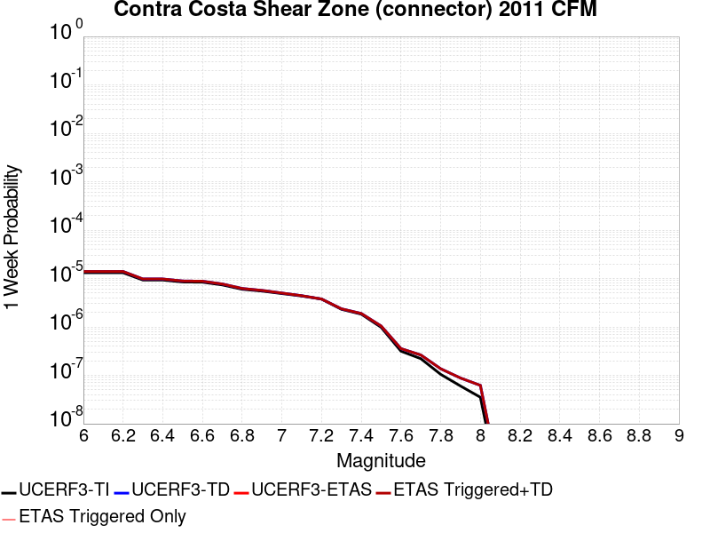 | 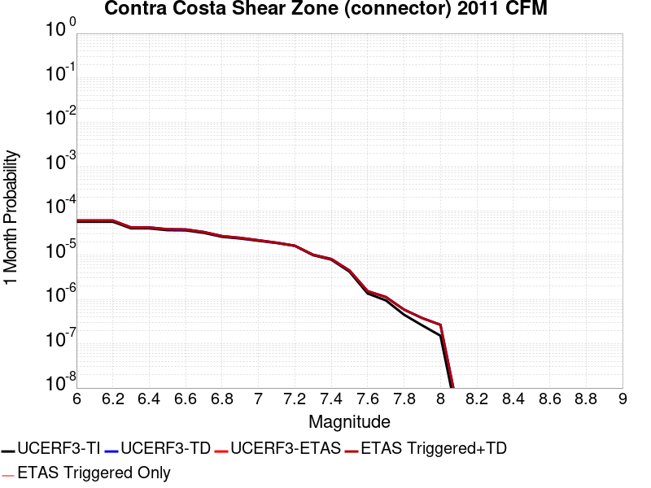 | 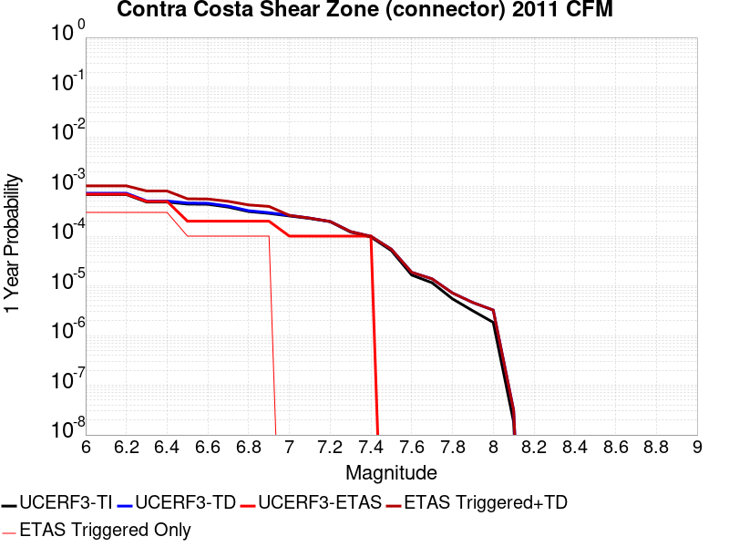 | 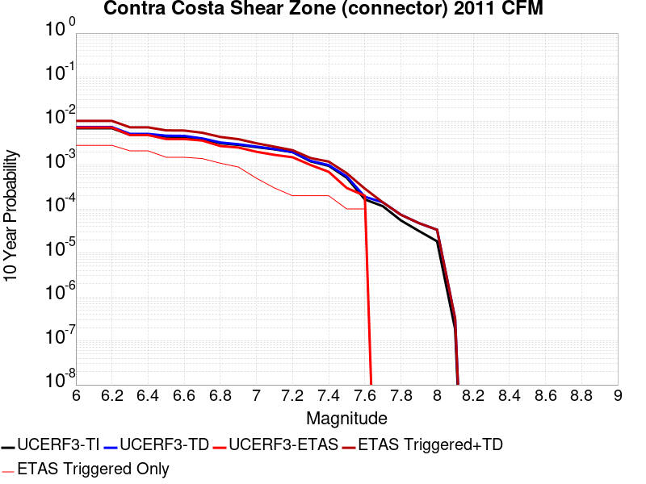 |

| Magnitude | 1 wk TI Prob | 1 wk TD Prob | 1 wk ETAS Prob | 1 wk ETAS/TD Gain | 1 wk ETAS Triggered+TD | 1 wk ETAS Triggered Only | 1 mo TI Prob | 1 mo TD Prob | 1 mo ETAS Prob | 1 mo ETAS/TD Gain | 1 mo ETAS Triggered+TD | 1 mo ETAS Triggered Only | 1 yr TI Prob | 1 yr TD Prob | 1 yr ETAS Prob | 1 yr ETAS/TD Gain | 1 yr ETAS Triggered+TD | 1 yr ETAS Triggered Only | 10 yr TI Prob | 10 yr TD Prob | 10 yr ETAS Prob | 10 yr ETAS/TD Gain | 10 yr ETAS Triggered+TD | 10 yr ETAS Triggered Only |
|-----|-----|-----|-----|-----|-----|-----|-----|-----|-----|-----|-----|-----|-----|-----|-----|-----|-----|-----|-----|-----|-----|-----|-----|-----|
| 6.0 | 1.3187427E-5 | 1.4009567E-5 | 0.0 | 0.0 | 1.4009567E-5 | 0.0 | 5.6516317E-5 | 6.0039747E-5 | 0.0 | 0.0 | 6.0039747E-5 | 0.0 | 6.878689E-4 | 7.3076156E-4 | 7.0E-4 | 0.9579048 | 0.0010305423 | 3.0E-4 | 0.006857436 | 0.0072900755 | 0.0071 | 0.97392684 | 0.010069664 | 0.0028 |
| 6.1 | 1.3187427E-5 | 1.4009567E-5 | 0.0 | 0.0 | 1.4009567E-5 | 0.0 | 5.6516317E-5 | 6.0039747E-5 | 0.0 | 0.0 | 6.0039747E-5 | 0.0 | 6.878689E-4 | 7.3076156E-4 | 7.0E-4 | 0.9579048 | 0.0010305423 | 3.0E-4 | 0.006857436 | 0.0072900755 | 0.0071 | 0.97392684 | 0.010069664 | 0.0028 |
| 6.2 | 1.3187427E-5 | 1.4009567E-5 | 0.0 | 0.0 | 1.4009567E-5 | 0.0 | 5.6516317E-5 | 6.0039747E-5 | 0.0 | 0.0 | 6.0039747E-5 | 0.0 | 6.878689E-4 | 7.3076156E-4 | 7.0E-4 | 0.9579048 | 0.0010305423 | 3.0E-4 | 0.006857436 | 0.0072900755 | 0.0071 | 0.97392684 | 0.010069664 | 0.0028 |
| 6.3 | 9.315374E-6 | 9.796418E-6 | 0.0 | 0.0 | 9.796418E-6 | 0.0 | 3.992242E-5 | 4.1984E-5 | 0.0 | 0.0 | 4.1984E-5 | 0.0 | 4.8594706E-4 | 5.110394E-4 | 5.0E-4 | 0.97839814 | 8.108861E-4 | 3.0E-4 | 0.004848858 | 0.0051032915 | 0.0048 | 0.94056946 | 0.0071925744 | 0.0021 |
| 6.4 | 9.315374E-6 | 9.796418E-6 | 0.0 | 0.0 | 9.796418E-6 | 0.0 | 3.992242E-5 | 4.1984E-5 | 0.0 | 0.0 | 4.1984E-5 | 0.0 | 4.8594706E-4 | 5.110394E-4 | 5.0E-4 | 0.97839814 | 8.108861E-4 | 3.0E-4 | 0.004848858 | 0.0051032915 | 0.0048 | 0.94056946 | 0.0071925744 | 0.0021 |
| 6.5 | 8.492638E-6 | 8.910815E-6 | 0.0 | 0.0 | 8.910815E-6 | 0.0 | 3.639651E-5 | 3.8188668E-5 | 0.0 | 0.0 | 3.8188668E-5 | 0.0 | 4.430374E-4 | 4.648512E-4 | 2.0E-4 | 0.4302452 | 5.648047E-4 | 1.0E-4 | 0.0044215517 | 0.004643362 | 0.0039 | 0.83990866 | 0.006136397 | 0.0015 |
| 6.6 | 8.402072E-6 | 8.811715E-6 | 0.0 | 0.0 | 8.811715E-6 | 0.0 | 3.6008387E-5 | 3.7763963E-5 | 0.0 | 0.0 | 3.7763963E-5 | 0.0 | 4.383139E-4 | 4.5968263E-4 | 2.0E-4 | 0.4350828 | 5.596367E-4 | 1.0E-4 | 0.0043745036 | 0.0045918906 | 0.0039 | 0.84932333 | 0.006085003 | 0.0015 |
| 6.7 | 7.383587E-6 | 7.720139E-6 | 0.0 | 0.0 | 7.720139E-6 | 0.0 | 3.164356E-5 | 3.3085904E-5 | 0.0 | 0.0 | 3.3085904E-5 | 0.0 | 3.8519225E-4 | 4.027485E-4 | 2.0E-4 | 0.4965878 | 5.0270825E-4 | 1.0E-4 | 0.0038452526 | 0.004024634 | 0.0036 | 0.89449126 | 0.0054189996 | 0.0014 |
| 6.8 | 6.004921E-6 | 6.2389877E-6 | 0.0 | 0.0 | 6.2389877E-6 | 0.0 | 2.5735122E-5 | 2.6738247E-5 | 0.0 | 0.0 | 2.6738247E-5 | 0.0 | 3.1328006E-4 | 3.2549005E-4 | 2.0E-4 | 0.6144581 | 4.2545752E-4 | 1.0E-4 | 0.0031283877 | 0.0032544278 | 0.0027 | 0.8296389 | 0.004350848 | 0.0011 |
| 6.9 | 5.505255E-6 | 5.691949E-6 | 0.0 | 0.0 | 5.691949E-6 | 0.0 | 2.3593739E-5 | 2.4393841E-5 | 0.0 | 0.0 | 2.4393841E-5 | 0.0 | 2.872159E-4 | 2.9695497E-4 | 2.0E-4 | 0.6735028 | 3.969253E-4 | 1.0E-4 | 0.0028684495 | 0.0029698673 | 0.0025 | 0.8417884 | 0.0038671945 | 9.0E-4 |
| 7.0 | 4.891922E-6 | 5.0232634E-6 | 0.0 | 0.0 | 5.0232634E-6 | 0.0 | 2.096521E-5 | 2.1528096E-5 | 0.0 | 0.0 | 2.1528096E-5 | 0.0 | 2.5522153E-4 | 2.620734E-4 | 1.0E-4 | 0.3815725 | 2.620734E-4 | 0.0 | 0.0025492862 | 0.0026219212 | 0.002 | 0.76279944 | 0.0031206103 | 5.0E-4 |
| 7.1 | 4.3599E-6 | 4.4280473E-6 | 0.0 | 0.0 | 4.4280473E-6 | 0.0 | 1.868515E-5 | 1.8977209E-5 | 0.0 | 0.0 | 1.8977209E-5 | 0.0 | 2.2746796E-4 | 2.310233E-4 | 1.0E-4 | 0.4328568 | 2.310233E-4 | 0.0 | 0.0022723526 | 0.0023121026 | 0.0017 | 0.7352615 | 0.002611409 | 3.0E-4 |
| 7.2 | 3.7647926E-6 | 3.780494E-6 | 0.0 | 0.0 | 3.780494E-6 | 0.0 | 1.6134725E-5 | 1.6202017E-5 | 0.0 | 0.0 | 1.6202017E-5 | 0.0 | 1.9642258E-4 | 1.9724196E-4 | 1.0E-4 | 0.50699157 | 1.9724196E-4 | 0.0 | 0.0019624906 | 0.0019749305 | 0.0015 | 0.75952035 | 0.0021745355 | 2.0E-4 |
| 7.3 | 2.3179882E-6 | 2.3723214E-6 | 0.0 | 0.0 | 2.3723214E-6 | 0.0 | 9.934198E-6 | 1.0167052E-5 | 0.0 | 0.0 | 1.0167052E-5 | 0.0 | 1.20942146E-4 | 1.2377687E-4 | 1.0E-4 | 0.8079053 | 1.2377687E-4 | 0.0 | 0.0012087635 | 0.0012413282 | 0.001 | 0.8055888 | 0.0014410799 | 2.0E-4 |
| 7.4 | 1.8378355E-6 | 1.9017576E-6 | 0.0 | 0.0 | 1.9017576E-6 | 0.0 | 7.876414E-6 | 8.150365E-6 | 0.0 | 0.0 | 8.150365E-6 | 0.0 | 9.5891126E-5 | 9.9226214E-5 | 1.0E-4 | 1.0077982 | 9.9226214E-5 | 0.0 | 9.584976E-4 | 9.959936E-4 | 7.0E-4 | 0.7028158 | 0.0011957944 | 2.0E-4 |
| 7.5 | 9.840493E-7 | 1.0488301E-6 | 0.0 | 0.0 | 1.0488301E-6 | 0.0 | 4.2173474E-6 | 4.4949784E-6 | 0.0 | 0.0 | 4.4949784E-6 | 0.0 | 5.1344992E-5 | 5.4725002E-5 | 0.0 | 0.0 | 5.4725002E-5 | 0.0 | 5.133313E-4 | 5.509006E-4 | 3.0E-4 | 0.5445628 | 6.508455E-4 | 1.0E-4 |
| 7.6 | 3.1602997E-7 | 3.5875496E-7 | 0.0 | 0.0 | 3.5875496E-7 | 0.0 | 1.3544135E-6 | 1.5375202E-6 | 0.0 | 0.0 | 1.5375202E-6 | 0.0 | 1.648986E-5 | 1.871915E-5 | 0.0 | 0.0 | 1.871915E-5 | 0.0 | 1.6488635E-4 | 1.9071151E-4 | 2.0E-4 | 1.0487044 | 2.9069243E-4 | 1.0E-4 |
| 7.7 | 2.2125788E-7 | 2.6523128E-7 | 0.0 | 0.0 | 2.6523128E-7 | 0.0 | 9.482477E-7 | 1.136705E-6 | 0.0 | 0.0 | 1.136705E-6 | 0.0 | 1.1544855E-5 | 1.3839296E-5 | 0.0 | 0.0 | 1.3839296E-5 | 0.0 | 1.1544255E-4 | 1.4188299E-4 | 0.0 | 0.0 | 1.4188299E-4 | 0.0 |
| 7.8 | 1.0509553E-7 | 1.3774527E-7 | 0.0 | 0.0 | 1.3774527E-7 | 0.0 | 4.5040935E-7 | 5.9033675E-7 | 0.0 | 0.0 | 5.9033675E-7 | 0.0 | 5.48372E-6 | 7.187326E-6 | 0.0 | 0.0 | 7.187326E-6 | 0.0 | 5.4835844E-5 | 7.419702E-5 | 0.0 | 0.0 | 7.419702E-5 | 0.0 |
| 7.9 | 6.029319E-8 | 8.848025E-8 | 0.0 | 0.0 | 8.848025E-8 | 0.0 | 2.5839938E-7 | 3.7920103E-7 | 0.0 | 0.0 | 3.7920103E-7 | 0.0 | 3.1460077E-6 | 4.6167625E-6 | 0.0 | 0.0 | 4.6167625E-6 | 0.0 | 3.1459633E-5 | 4.777505E-5 | 0.0 | 0.0 | 4.777505E-5 | 0.0 |
| 8.0 | 3.531068E-8 | 6.235581E-8 | 0.0 | 0.0 | 6.235581E-8 | 0.0 | 1.5133148E-7 | 2.6723916E-7 | 0.0 | 0.0 | 2.6723916E-7 | 0.0 | 1.8424593E-6 | 3.253632E-6 | 0.0 | 0.0 | 3.253632E-6 | 0.0 | 1.842444E-5 | 3.3707725E-5 | 0.0 | 0.0 | 3.3707725E-5 | 0.0 |
| 8.1 | 3.5238246E-10 | 5.9939376E-10 | 0.0 | 0.0 | 5.9939376E-10 | 0.0 | 1.5102107E-9 | 2.56883E-9 | 0.0 | 0.0 | 2.56883E-9 | 0.0 | 1.8386816E-8 | 3.1275505E-8 | 0.0 | 0.0 | 3.1275505E-8 | 0.0 | 1.8386814E-7 | 3.2094297E-7 | 0.0 | 0.0 | 3.2094297E-7 | 0.0 |

## Big Lagoon - Bald Mtn 2011 CFM
*[(top)](#table-of-contents)*

| 1 Week | 1 Month | 1 Year | 10 Year |
|-----|-----|-----|-----|
| 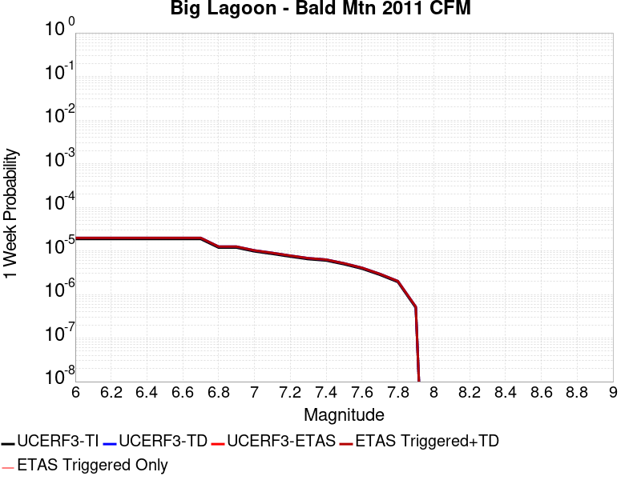 | 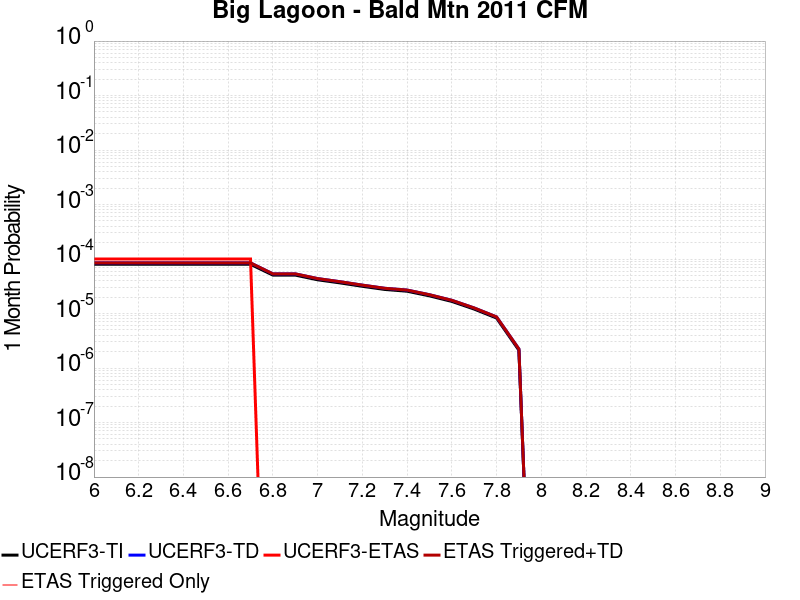 | 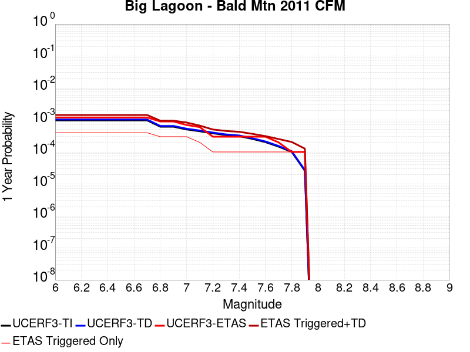 | 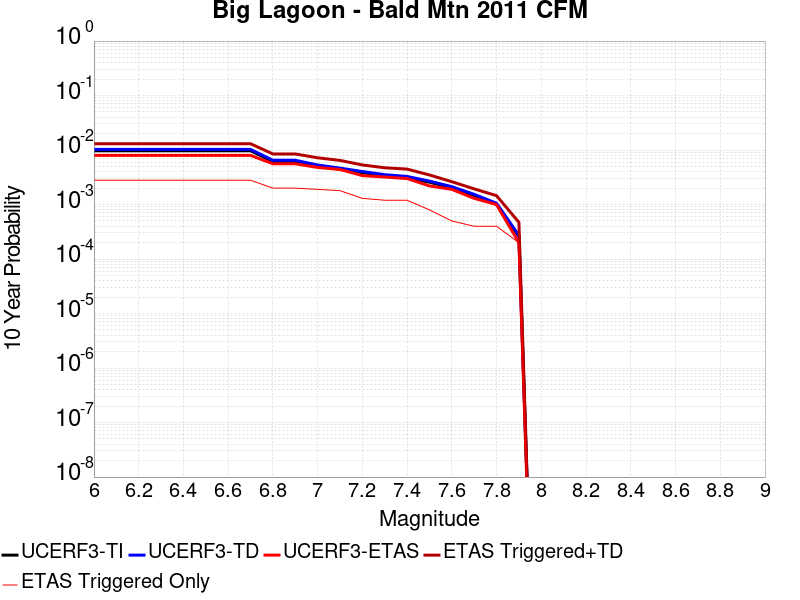 |

| Magnitude | 1 wk TI Prob | 1 wk TD Prob | 1 wk ETAS Prob | 1 wk ETAS/TD Gain | 1 wk ETAS Triggered+TD | 1 wk ETAS Triggered Only | 1 mo TI Prob | 1 mo TD Prob | 1 mo ETAS Prob | 1 mo ETAS/TD Gain | 1 mo ETAS Triggered+TD | 1 mo ETAS Triggered Only | 1 yr TI Prob | 1 yr TD Prob | 1 yr ETAS Prob | 1 yr ETAS/TD Gain | 1 yr ETAS Triggered+TD | 1 yr ETAS Triggered Only | 10 yr TI Prob | 10 yr TD Prob | 10 yr ETAS Prob | 10 yr ETAS/TD Gain | 10 yr ETAS Triggered+TD | 10 yr ETAS Triggered Only |
|-----|-----|-----|-----|-----|-----|-----|-----|-----|-----|-----|-----|-----|-----|-----|-----|-----|-----|-----|-----|-----|-----|-----|-----|-----|
| 6.0 | 1.8699735E-5 | 1.983738E-5 | 0.0 | 0.0 | 1.983738E-5 | 0.0 | 8.013926E-5 | 8.5014784E-5 | 1.0E-4 | 1.176266 | 8.5014784E-5 | 0.0 | 9.752587E-4 | 0.0010346014 | 0.0012 | 1.159867 | 0.0014341875 | 4.0E-4 | 0.009709897 | 0.010301657 | 0.008 | 0.77657413 | 0.013072812 | 0.0028 |
| 6.1 | 1.8699735E-5 | 1.983738E-5 | 0.0 | 0.0 | 1.983738E-5 | 0.0 | 8.013926E-5 | 8.5014784E-5 | 1.0E-4 | 1.176266 | 8.5014784E-5 | 0.0 | 9.752587E-4 | 0.0010346014 | 0.0012 | 1.159867 | 0.0014341875 | 4.0E-4 | 0.009709897 | 0.010301657 | 0.008 | 0.77657413 | 0.013072812 | 0.0028 |
| 6.2 | 1.8699735E-5 | 1.983738E-5 | 0.0 | 0.0 | 1.983738E-5 | 0.0 | 8.013926E-5 | 8.5014784E-5 | 1.0E-4 | 1.176266 | 8.5014784E-5 | 0.0 | 9.752587E-4 | 0.0010346014 | 0.0012 | 1.159867 | 0.0014341875 | 4.0E-4 | 0.009709897 | 0.010301657 | 0.008 | 0.77657413 | 0.013072812 | 0.0028 |
| 6.3 | 1.8699735E-5 | 1.983738E-5 | 0.0 | 0.0 | 1.983738E-5 | 0.0 | 8.013926E-5 | 8.5014784E-5 | 1.0E-4 | 1.176266 | 8.5014784E-5 | 0.0 | 9.752587E-4 | 0.0010346014 | 0.0012 | 1.159867 | 0.0014341875 | 4.0E-4 | 0.009709897 | 0.010301657 | 0.008 | 0.77657413 | 0.013072812 | 0.0028 |
| 6.4 | 1.8699735E-5 | 1.983738E-5 | 0.0 | 0.0 | 1.983738E-5 | 0.0 | 8.013926E-5 | 8.5014784E-5 | 1.0E-4 | 1.176266 | 8.5014784E-5 | 0.0 | 9.752587E-4 | 0.0010346014 | 0.0012 | 1.159867 | 0.0014341875 | 4.0E-4 | 0.009709897 | 0.010301657 | 0.008 | 0.77657413 | 0.013072812 | 0.0028 |
| 6.5 | 1.8699735E-5 | 1.983738E-5 | 0.0 | 0.0 | 1.983738E-5 | 0.0 | 8.013926E-5 | 8.5014784E-5 | 1.0E-4 | 1.176266 | 8.5014784E-5 | 0.0 | 9.752587E-4 | 0.0010346014 | 0.0012 | 1.159867 | 0.0014341875 | 4.0E-4 | 0.009709897 | 0.010301657 | 0.008 | 0.77657413 | 0.013072812 | 0.0028 |
| 6.6 | 1.8699735E-5 | 1.983738E-5 | 0.0 | 0.0 | 1.983738E-5 | 0.0 | 8.013926E-5 | 8.5014784E-5 | 1.0E-4 | 1.176266 | 8.5014784E-5 | 0.0 | 9.752587E-4 | 0.0010346014 | 0.0012 | 1.159867 | 0.0014341875 | 4.0E-4 | 0.009709897 | 0.010301657 | 0.008 | 0.77657413 | 0.013072812 | 0.0028 |
| 6.7 | 1.8699735E-5 | 1.983738E-5 | 0.0 | 0.0 | 1.983738E-5 | 0.0 | 8.013926E-5 | 8.5014784E-5 | 1.0E-4 | 1.176266 | 8.5014784E-5 | 0.0 | 9.752587E-4 | 0.0010346014 | 0.0012 | 1.159867 | 0.0014341875 | 4.0E-4 | 0.009709897 | 0.010301657 | 0.008 | 0.77657413 | 0.013072812 | 0.0028 |
| 6.8 | 1.18505095E-5 | 1.2492637E-5 | 0.0 | 0.0 | 1.2492637E-5 | 0.0 | 5.078691E-5 | 5.3538803E-5 | 0.0 | 0.0 | 5.3538803E-5 | 0.0 | 6.181552E-4 | 6.516448E-4 | 9.0E-4 | 1.3811206 | 9.5144927E-4 | 3.0E-4 | 0.006164385 | 0.0064978427 | 0.0056 | 0.86182445 | 0.008484847 | 0.002 |
| 6.9 | 1.18505095E-5 | 1.2492637E-5 | 0.0 | 0.0 | 1.2492637E-5 | 0.0 | 5.078691E-5 | 5.3538803E-5 | 0.0 | 0.0 | 5.3538803E-5 | 0.0 | 6.181552E-4 | 6.516448E-4 | 9.0E-4 | 1.3811206 | 9.5144927E-4 | 3.0E-4 | 0.006164385 | 0.0064978427 | 0.0056 | 0.86182445 | 0.008484847 | 0.002 |
| 7.0 | 9.719786E-6 | 1.0229806E-5 | 0.0 | 0.0 | 1.0229806E-5 | 0.0 | 4.1655563E-5 | 4.3841304E-5 | 0.0 | 0.0 | 4.3841304E-5 | 0.0 | 5.0703844E-4 | 5.336395E-4 | 7.0E-4 | 1.311747 | 8.334794E-4 | 3.0E-4 | 0.005058831 | 0.005323827 | 0.0048 | 0.9016071 | 0.0072137113 | 0.0019 |
| 7.1 | 8.523418E-6 | 8.964554E-6 | 0.0 | 0.0 | 8.964554E-6 | 0.0 | 3.652842E-5 | 3.841896E-5 | 0.0 | 0.0 | 3.841896E-5 | 0.0 | 4.4464276E-4 | 4.6765196E-4 | 6.0E-4 | 1.2830054 | 6.6755846E-4 | 2.0E-4 | 0.0044375416 | 0.004666842 | 0.0044 | 0.94282174 | 0.0064584417 | 0.0018 |
| 7.2 | 7.378894E-6 | 7.756907E-6 | 0.0 | 0.0 | 7.756907E-6 | 0.0 | 3.162345E-5 | 3.324347E-5 | 0.0 | 0.0 | 3.324347E-5 | 0.0 | 3.8494746E-4 | 4.0466493E-4 | 3.0E-4 | 0.74135405 | 5.0462445E-4 | 1.0E-4 | 0.0038428132 | 0.0040393765 | 0.0034 | 0.841714 | 0.0053341254 | 0.0013 |
| 7.3 | 6.4640294E-6 | 6.7888345E-6 | 0.0 | 0.0 | 6.7888345E-6 | 0.0 | 2.7702688E-5 | 2.9094685E-5 | 0.0 | 0.0 | 2.9094685E-5 | 0.0 | 3.3722803E-4 | 3.5417086E-4 | 3.0E-4 | 0.84704876 | 4.5413544E-4 | 1.0E-4 | 0.0033671674 | 0.0035361343 | 0.0032 | 0.90494305 | 0.0047318907 | 0.0012 |
| 7.4 | 5.9959093E-6 | 6.2954728E-6 | 0.0 | 0.0 | 6.2954728E-6 | 0.0 | 2.5696501E-5 | 2.6980322E-5 | 0.0 | 0.0 | 2.6980322E-5 | 0.0 | 3.1280998E-4 | 3.284365E-4 | 3.0E-4 | 0.9134186 | 4.2840364E-4 | 1.0E-4 | 0.0031237002 | 0.0032795728 | 0.003 | 0.91475326 | 0.0044756373 | 0.0012 |
| 7.5 | 4.929265E-6 | 5.1736833E-6 | 0.0 | 0.0 | 5.1736833E-6 | 0.0 | 2.112525E-5 | 2.2172742E-5 | 0.0 | 0.0 | 2.2172742E-5 | 0.0 | 2.5716957E-4 | 2.699201E-4 | 3.0E-4 | 1.1114401 | 3.698931E-4 | 1.0E-4 | 0.0025687215 | 0.0026959633 | 0.0022 | 0.81603485 | 0.0034938063 | 8.0E-4 |
| 7.6 | 3.8982403E-6 | 4.0868376E-6 | 0.0 | 0.0 | 4.0868376E-6 | 0.0 | 1.6706637E-5 | 1.7514903E-5 | 0.0 | 0.0 | 1.7514903E-5 | 0.0 | 2.0338432E-4 | 2.1322335E-4 | 3.0E-4 | 1.4069754 | 3.1320204E-4 | 1.0E-4 | 0.0020319829 | 0.0021302155 | 0.0019 | 0.89192855 | 0.0026291504 | 5.0E-4 |
| 7.7 | 2.820968E-6 | 2.9557207E-6 | 0.0 | 0.0 | 2.9557207E-6 | 0.0 | 1.2089806E-5 | 1.2667313E-5 | 0.0 | 0.0 | 1.2667313E-5 | 0.0 | 1.4718344E-4 | 1.542138E-4 | 2.0E-4 | 1.2969007 | 2.5419838E-4 | 1.0E-4 | 0.00147086 | 0.0015410855 | 0.0013 | 0.84356123 | 0.0019404691 | 4.0E-4 |
| 7.8 | 1.9314455E-6 | 2.024983E-6 | 0.0 | 0.0 | 2.024983E-6 | 0.0 | 8.277597E-6 | 8.67847E-6 | 0.0 | 0.0 | 8.67847E-6 | 0.0 | 1.0077508E-4 | 1.0565538E-4 | 1.0E-4 | 0.94647336 | 2.0564481E-4 | 1.0E-4 | 0.0010072939 | 0.0010560644 | 0.001 | 0.946912 | 0.0014556419 | 4.0E-4 |
| 7.9 | 4.9586197E-7 | 5.216062E-7 | 0.0 | 0.0 | 5.216062E-7 | 0.0 | 2.125121E-6 | 2.2354534E-6 | 0.0 | 0.0 | 2.2354534E-6 | 0.0 | 2.5873042E-5 | 2.7216325E-5 | 1.0E-4 | 3.6742651 | 1.272136E-4 | 1.0E-4 | 2.5870028E-4 | 2.7213202E-4 | 2.0E-4 | 0.7349374 | 4.720776E-4 | 2.0E-4 |

## Great Valley 04a Trout Creek
*[(top)](#table-of-contents)*

| 1 Week | 1 Month | 1 Year | 10 Year |
|-----|-----|-----|-----|
| 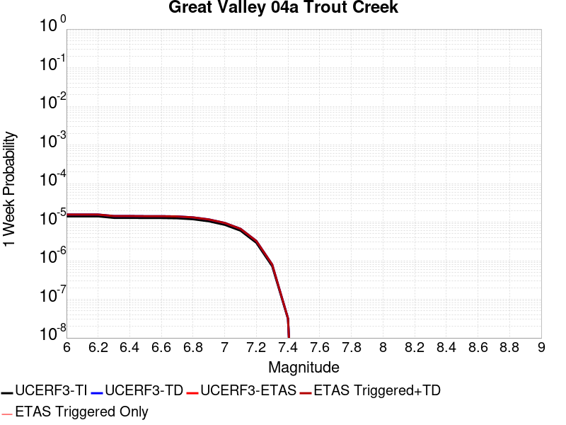 | 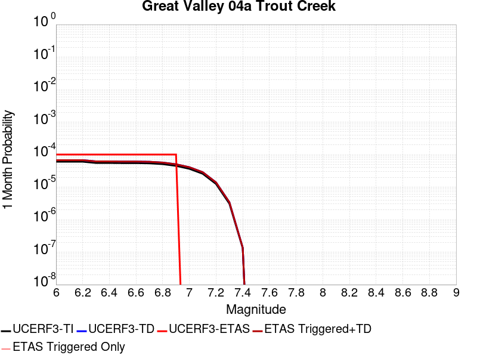 | 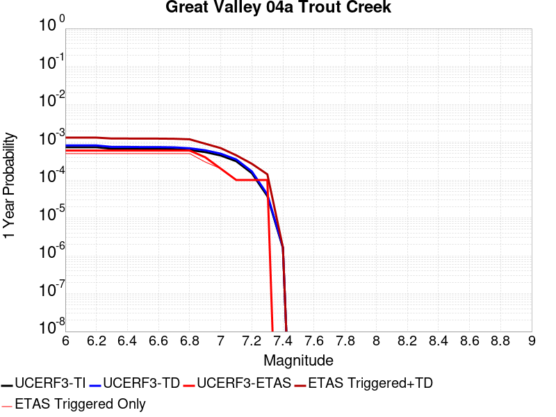 | 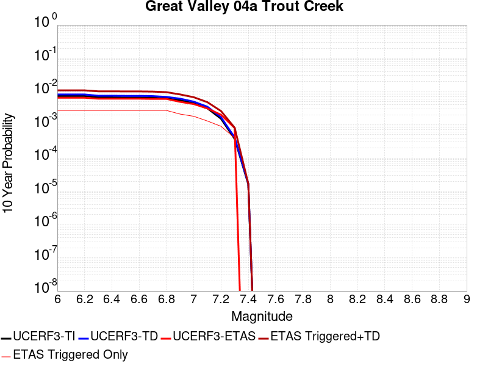 |

| Magnitude | 1 wk TI Prob | 1 wk TD Prob | 1 wk ETAS Prob | 1 wk ETAS/TD Gain | 1 wk ETAS Triggered+TD | 1 wk ETAS Triggered Only | 1 mo TI Prob | 1 mo TD Prob | 1 mo ETAS Prob | 1 mo ETAS/TD Gain | 1 mo ETAS Triggered+TD | 1 mo ETAS Triggered Only | 1 yr TI Prob | 1 yr TD Prob | 1 yr ETAS Prob | 1 yr ETAS/TD Gain | 1 yr ETAS Triggered+TD | 1 yr ETAS Triggered Only | 10 yr TI Prob | 10 yr TD Prob | 10 yr ETAS Prob | 10 yr ETAS/TD Gain | 10 yr ETAS Triggered+TD | 10 yr ETAS Triggered Only |
|-----|-----|-----|-----|-----|-----|-----|-----|-----|-----|-----|-----|-----|-----|-----|-----|-----|-----|-----|-----|-----|-----|-----|-----|-----|
| 6.0 | 1.4088538E-5 | 1.5700552E-5 | 0.0 | 0.0 | 1.5700552E-5 | 0.0 | 6.037805E-5 | 6.728642E-5 | 1.0E-4 | 1.486184 | 6.728642E-5 | 0.0 | 7.3485484E-4 | 8.189167E-4 | 6.0E-4 | 0.73267525 | 0.0013185072 | 5.0E-4 | 0.007324295 | 0.008160271 | 0.0065 | 0.79654217 | 0.0108382385 | 0.0027 |
| 6.1 | 1.4088538E-5 | 1.5700552E-5 | 0.0 | 0.0 | 1.5700552E-5 | 0.0 | 6.037805E-5 | 6.728642E-5 | 1.0E-4 | 1.486184 | 6.728642E-5 | 0.0 | 7.3485484E-4 | 8.189167E-4 | 6.0E-4 | 0.73267525 | 0.0013185072 | 5.0E-4 | 0.007324295 | 0.008160271 | 0.0065 | 0.79654217 | 0.0108382385 | 0.0027 |
| 6.2 | 1.4088538E-5 | 1.5700552E-5 | 0.0 | 0.0 | 1.5700552E-5 | 0.0 | 6.037805E-5 | 6.728642E-5 | 1.0E-4 | 1.486184 | 6.728642E-5 | 0.0 | 7.3485484E-4 | 8.189167E-4 | 6.0E-4 | 0.73267525 | 0.0013185072 | 5.0E-4 | 0.007324295 | 0.008160271 | 0.0065 | 0.79654217 | 0.0108382385 | 0.0027 |
| 6.3 | 1.2882862E-5 | 1.43611705E-5 | 0.0 | 0.0 | 1.43611705E-5 | 0.0 | 5.5211098E-5 | 6.154648E-5 | 1.0E-4 | 1.6247883 | 6.154648E-5 | 0.0 | 6.7198783E-4 | 7.4908114E-4 | 6.0E-4 | 0.8009813 | 0.0012487066 | 5.0E-4 | 0.0066995937 | 0.007466622 | 0.0061 | 0.81696916 | 0.010146462 | 0.0027 |
| 6.4 | 1.2882862E-5 | 1.43611705E-5 | 0.0 | 0.0 | 1.43611705E-5 | 0.0 | 5.5211098E-5 | 6.154648E-5 | 1.0E-4 | 1.6247883 | 6.154648E-5 | 0.0 | 6.7198783E-4 | 7.4908114E-4 | 6.0E-4 | 0.8009813 | 0.0012487066 | 5.0E-4 | 0.0066995937 | 0.007466622 | 0.0061 | 0.81696916 | 0.010146462 | 0.0027 |
| 6.5 | 1.2762329E-5 | 1.4227877E-5 | 0.0 | 0.0 | 1.4227877E-5 | 0.0 | 5.469455E-5 | 6.097525E-5 | 1.0E-4 | 1.6400096 | 6.097525E-5 | 0.0 | 6.657027E-4 | 7.4213115E-4 | 6.0E-4 | 0.80848247 | 0.0012417601 | 5.0E-4 | 0.00663712 | 0.007397585 | 0.0061 | 0.8245934 | 0.010077612 | 0.0027 |
| 6.6 | 1.2762329E-5 | 1.4227877E-5 | 0.0 | 0.0 | 1.4227877E-5 | 0.0 | 5.469455E-5 | 6.097525E-5 | 1.0E-4 | 1.6400096 | 6.097525E-5 | 0.0 | 6.657027E-4 | 7.4213115E-4 | 6.0E-4 | 0.80848247 | 0.0012417601 | 5.0E-4 | 0.00663712 | 0.007397585 | 0.0061 | 0.8245934 | 0.010077612 | 0.0027 |
| 6.7 | 1.2557959E-5 | 1.4002359E-5 | 0.0 | 0.0 | 1.4002359E-5 | 0.0 | 5.3818712E-5 | 6.0008788E-5 | 1.0E-4 | 1.6664226 | 6.0008788E-5 | 0.0 | 6.5504585E-4 | 7.303724E-4 | 6.0E-4 | 0.82149875 | 0.0012300072 | 5.0E-4 | 0.006531183 | 0.007280771 | 0.006 | 0.8240886 | 0.009961112 | 0.0027 |
| 6.8 | 1.1871544E-5 | 1.3242644E-5 | 0.0 | 0.0 | 1.3242644E-5 | 0.0 | 5.0877054E-5 | 5.675301E-5 | 1.0E-4 | 1.7620211 | 5.675301E-5 | 0.0 | 6.1925204E-4 | 6.9075887E-4 | 6.0E-4 | 0.86860996 | 0.0011904135 | 5.0E-4 | 0.0061752927 | 0.006887132 | 0.006 | 0.87118995 | 0.009568537 | 0.0027 |
| 6.9 | 1.0500373E-5 | 1.1716899E-5 | 0.0 | 0.0 | 1.1716899E-5 | 0.0 | 4.5000823E-5 | 5.0214363E-5 | 1.0E-4 | 1.991462 | 5.0214363E-5 | 0.0 | 5.4774724E-4 | 6.1119697E-4 | 4.0E-4 | 0.6544535 | 9.1101363E-4 | 3.0E-4 | 0.005463991 | 0.0060960236 | 0.0049 | 0.80380267 | 0.008183221 | 0.0021 |
| 7.0 | 8.524332E-6 | 9.521695E-6 | 0.0 | 0.0 | 9.521695E-6 | 0.0 | 3.653234E-5 | 4.0806663E-5 | 0.0 | 0.0 | 4.0806663E-5 | 0.0 | 4.4469046E-4 | 4.967152E-4 | 2.0E-4 | 0.40264523 | 6.9661584E-4 | 2.0E-4 | 0.0044380166 | 0.004956779 | 0.0042 | 0.84732443 | 0.0067478567 | 0.0018 |
| 7.1 | 6.006849E-6 | 6.70333E-6 | 0.0 | 0.0 | 6.70333E-6 | 0.0 | 2.5743384E-5 | 2.8728273E-5 | 0.0 | 0.0 | 2.8728273E-5 | 0.0 | 3.1338062E-4 | 3.4971617E-4 | 1.0E-4 | 0.2859462 | 4.496812E-4 | 1.0E-4 | 0.0031293905 | 0.0034922073 | 0.0031 | 0.8876907 | 0.0047876677 | 0.0013 |
| 7.2 | 2.9122193E-6 | 3.2426306E-6 | 0.0 | 0.0 | 3.2426306E-6 | 0.0 | 1.248088E-5 | 1.3896924E-5 | 0.0 | 0.0 | 1.3896924E-5 | 0.0 | 1.5194413E-4 | 1.6918367E-4 | 1.0E-4 | 0.59107363 | 2.6916675E-4 | 1.0E-4 | 0.0015184027 | 0.0016907202 | 0.002 | 1.1829278 | 0.0025891985 | 9.0E-4 |
| 7.3 | 7.2194007E-7 | 7.9798E-7 | 0.0 | 0.0 | 7.9798E-7 | 0.0 | 3.0940253E-6 | 3.4199124E-6 | 0.0 | 0.0 | 3.4199124E-6 | 0.0 | 3.7669106E-5 | 4.1637097E-5 | 1.0E-4 | 2.4017043 | 1.4163293E-4 | 1.0E-4 | 3.766272E-4 | 4.1633783E-4 | 8.0E-4 | 1.9215165 | 8.161713E-4 | 4.0E-4 |
| 7.4 | 3.112171E-8 | 3.2058175E-8 | 0.0 | 0.0 | 3.2058175E-8 | 0.0 | 1.3337875E-7 | 1.3739218E-7 | 0.0 | 0.0 | 1.3739218E-7 | 0.0 | 1.6238852E-6 | 1.6727486E-6 | 0.0 | 0.0 | 1.6727486E-6 | 0.0 | 1.6238733E-5 | 1.6727368E-5 | 0.0 | 0.0 | 1.6727368E-5 | 0.0 |

## San Andreas (North Branch Mill Creek)
*[(top)](#table-of-contents)*

| 1 Week | 1 Month | 1 Year | 10 Year |
|-----|-----|-----|-----|
|  | 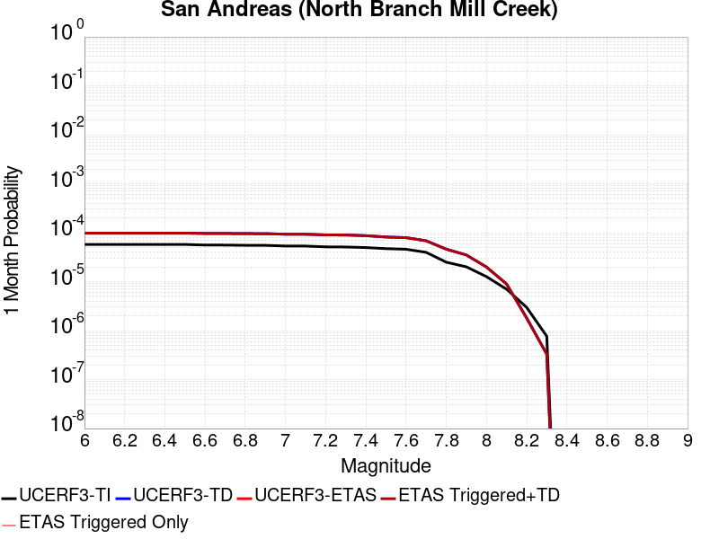 | 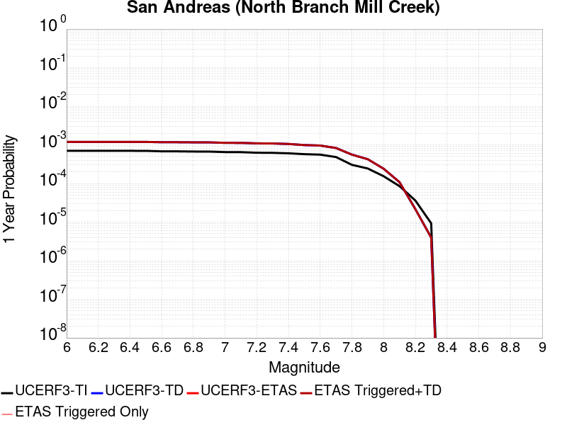 | 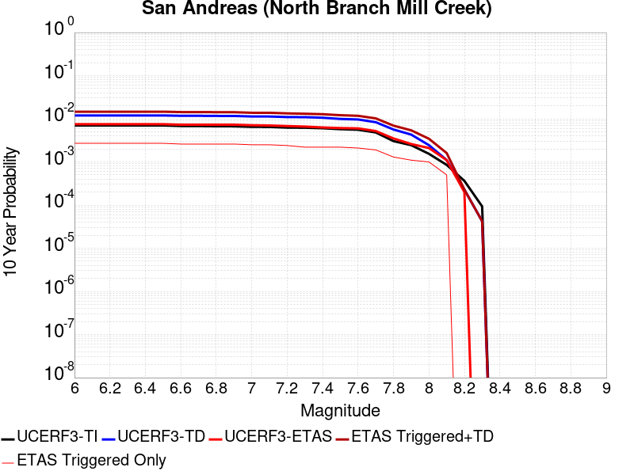 |

| Magnitude | 1 wk TI Prob | 1 wk TD Prob | 1 wk ETAS Prob | 1 wk ETAS/TD Gain | 1 wk ETAS Triggered+TD | 1 wk ETAS Triggered Only | 1 mo TI Prob | 1 mo TD Prob | 1 mo ETAS Prob | 1 mo ETAS/TD Gain | 1 mo ETAS Triggered+TD | 1 mo ETAS Triggered Only | 1 yr TI Prob | 1 yr TD Prob | 1 yr ETAS Prob | 1 yr ETAS/TD Gain | 1 yr ETAS Triggered+TD | 1 yr ETAS Triggered Only | 10 yr TI Prob | 10 yr TD Prob | 10 yr ETAS Prob | 10 yr ETAS/TD Gain | 10 yr ETAS Triggered+TD | 10 yr ETAS Triggered Only |
|-----|-----|-----|-----|-----|-----|-----|-----|-----|-----|-----|-----|-----|-----|-----|-----|-----|-----|-----|-----|-----|-----|-----|-----|-----|
| 6.0 | 1.3461156E-5 | 2.2957804E-5 | 0.0 | 0.0 | 2.2957804E-5 | 0.0 | 5.7689394E-5 | 9.838689E-5 | 0.0 | 0.0 | 9.838689E-5 | 0.0 | 7.02142E-4 | 0.0011972054 | 5.0E-4 | 0.4176393 | 0.0011972054 | 0.0 | 0.0069992766 | 0.011952524 | 0.0075 | 0.62748253 | 0.014620253 | 0.0027 |
| 6.1 | 1.3461156E-5 | 2.2957804E-5 | 0.0 | 0.0 | 2.2957804E-5 | 0.0 | 5.7689394E-5 | 9.838689E-5 | 0.0 | 0.0 | 9.838689E-5 | 0.0 | 7.02142E-4 | 0.0011972054 | 5.0E-4 | 0.4176393 | 0.0011972054 | 0.0 | 0.0069992766 | 0.011952524 | 0.0075 | 0.62748253 | 0.014620253 | 0.0027 |
| 6.2 | 1.3461156E-5 | 2.2957804E-5 | 0.0 | 0.0 | 2.2957804E-5 | 0.0 | 5.7689394E-5 | 9.838689E-5 | 0.0 | 0.0 | 9.838689E-5 | 0.0 | 7.02142E-4 | 0.0011972054 | 5.0E-4 | 0.4176393 | 0.0011972054 | 0.0 | 0.0069992766 | 0.011952524 | 0.0075 | 0.62748253 | 0.014620253 | 0.0027 |
| 6.3 | 1.3461156E-5 | 2.2957804E-5 | 0.0 | 0.0 | 2.2957804E-5 | 0.0 | 5.7689394E-5 | 9.838689E-5 | 0.0 | 0.0 | 9.838689E-5 | 0.0 | 7.02142E-4 | 0.0011972054 | 5.0E-4 | 0.4176393 | 0.0011972054 | 0.0 | 0.0069992766 | 0.011952524 | 0.0075 | 0.62748253 | 0.014620253 | 0.0027 |
| 6.4 | 1.3461156E-5 | 2.2957804E-5 | 0.0 | 0.0 | 2.2957804E-5 | 0.0 | 5.7689394E-5 | 9.838689E-5 | 0.0 | 0.0 | 9.838689E-5 | 0.0 | 7.02142E-4 | 0.0011972054 | 5.0E-4 | 0.4176393 | 0.0011972054 | 0.0 | 0.0069992766 | 0.011952524 | 0.0075 | 0.62748253 | 0.014620253 | 0.0027 |
| 6.5 | 1.3450706E-5 | 2.294677E-5 | 0.0 | 0.0 | 2.294677E-5 | 0.0 | 5.764461E-5 | 9.833961E-5 | 0.0 | 0.0 | 9.833961E-5 | 0.0 | 7.0159714E-4 | 0.0011966303 | 5.0E-4 | 0.41783997 | 0.0011966303 | 0.0 | 0.006993862 | 0.011946836 | 0.0075 | 0.6277813 | 0.014614579 | 0.0027 |
| 6.6 | 1.3074523E-5 | 2.2561248E-5 | 0.0 | 0.0 | 2.2561248E-5 | 0.0 | 5.6032466E-5 | 9.6687494E-5 | 0.0 | 0.0 | 9.6687494E-5 | 0.0 | 6.8198174E-4 | 0.0011765377 | 4.0E-4 | 0.3399806 | 0.0011765377 | 0.0 | 0.006798926 | 0.011748047 | 0.0073 | 0.6213799 | 0.014317501 | 0.0026 |
| 6.7 | 1.3050216E-5 | 2.2536578E-5 | 0.0 | 0.0 | 2.2536578E-5 | 0.0 | 5.59283E-5 | 9.6581774E-5 | 0.0 | 0.0 | 9.6581774E-5 | 0.0 | 6.8071426E-4 | 0.0011752519 | 4.0E-4 | 0.34035257 | 0.0011752519 | 0.0 | 0.0067863287 | 0.011735325 | 0.0073 | 0.6220535 | 0.014304813 | 0.0026 |
| 6.8 | 1.29049395E-5 | 2.2385098E-5 | 0.0 | 0.0 | 2.2385098E-5 | 0.0 | 5.530571E-5 | 9.593263E-5 | 0.0 | 0.0 | 9.593263E-5 | 0.0 | 6.73139E-4 | 0.0011673571 | 4.0E-4 | 0.34265438 | 0.0011673571 | 0.0 | 0.0067110364 | 0.011657205 | 0.0073 | 0.62622213 | 0.014226897 | 0.0026 |
| 6.9 | 1.2867369E-5 | 2.2344584E-5 | 0.0 | 0.0 | 2.2344584E-5 | 0.0 | 5.51447E-5 | 9.5759E-5 | 0.0 | 0.0 | 9.5759E-5 | 0.0 | 6.711799E-4 | 0.0011652454 | 4.0E-4 | 0.3432753 | 0.0011652454 | 0.0 | 0.006691564 | 0.011636311 | 0.0073 | 0.6273466 | 0.0142060565 | 0.0026 |
| 7.0 | 1.2495996E-5 | 2.1748354E-5 | 0.0 | 0.0 | 2.1748354E-5 | 0.0 | 5.3553173E-5 | 9.320391E-5 | 0.0 | 0.0 | 9.320391E-5 | 0.0 | 6.518148E-4 | 0.0011341696 | 4.0E-4 | 0.35268092 | 0.0011341696 | 0.0 | 0.0064990623 | 0.011328733 | 0.0071 | 0.626725 | 0.013800411 | 0.0025 |
| 7.1 | 1.2452067E-5 | 2.1693591E-5 | 0.0 | 0.0 | 2.1693591E-5 | 0.0 | 5.3364907E-5 | 9.296924E-5 | 0.0 | 0.0 | 9.296924E-5 | 0.0 | 6.4952404E-4 | 0.0011313155 | 4.0E-4 | 0.3535707 | 0.0011313155 | 0.0 | 0.0064762887 | 0.011300482 | 0.007 | 0.61944264 | 0.013772231 | 0.0025 |
| 7.2 | 1.2002777E-5 | 2.1075017E-5 | 0.0 | 0.0 | 2.1075017E-5 | 0.0 | 5.143946E-5 | 9.031838E-5 | 0.0 | 0.0 | 9.031838E-5 | 0.0 | 6.2609545E-4 | 0.0010990741 | 4.0E-4 | 0.36394268 | 0.0010990741 | 0.0 | 0.006243344 | 0.010981281 | 0.0068 | 0.6192356 | 0.013354926 | 0.0024 |
| 7.3 | 1.1923425E-5 | 2.0945441E-5 | 0.0 | 0.0 | 2.0945441E-5 | 0.0 | 5.109939E-5 | 8.9763096E-5 | 0.0 | 0.0 | 8.9763096E-5 | 0.0 | 6.219575E-4 | 0.0010923204 | 4.0E-4 | 0.36619294 | 0.0010923204 | 0.0 | 0.0062021962 | 0.010914448 | 0.0066 | 0.60470307 | 0.013090436 | 0.0022 |
| 7.4 | 1.16105175E-5 | 2.0325273E-5 | 0.0 | 0.0 | 2.0325273E-5 | 0.0 | 4.975841E-5 | 8.710542E-5 | 0.0 | 0.0 | 8.710542E-5 | 0.0 | 6.0564023E-4 | 0.001059995 | 3.0E-4 | 0.2830202 | 0.001059995 | 0.0 | 0.006039923 | 0.010594802 | 0.0063 | 0.5946312 | 0.012771494 | 0.0022 |
| 7.5 | 1.1037265E-5 | 1.9045498E-5 | 0.0 | 0.0 | 1.9045498E-5 | 0.0 | 4.7301706E-5 | 8.162102E-5 | 0.0 | 0.0 | 8.162102E-5 | 0.0 | 5.757461E-4 | 9.93285E-4 | 3.0E-4 | 0.30202812 | 9.93285E-4 | 0.0 | 0.005742567 | 0.009933708 | 0.0061 | 0.6140708 | 0.012111854 | 0.0022 |
| 7.6 | 1.0720915E-5 | 1.8494007E-5 | 0.0 | 0.0 | 1.8494007E-5 | 0.0 | 4.5945973E-5 | 7.925763E-5 | 0.0 | 0.0 | 7.925763E-5 | 0.0 | 5.592486E-4 | 9.645366E-4 | 3.0E-4 | 0.31103018 | 9.645366E-4 | 0.0 | 0.005578433 | 0.009648765 | 0.006 | 0.6218412 | 0.011728504 | 0.0021 |
| 7.7 | 9.276279E-6 | 1.5963993E-5 | 0.0 | 0.0 | 1.5963993E-5 | 0.0 | 3.9754876E-5 | 6.841533E-5 | 0.0 | 0.0 | 6.841533E-5 | 0.0 | 4.839081E-4 | 8.3263987E-4 | 3.0E-4 | 0.36029983 | 8.3263987E-4 | 0.0 | 0.0048285574 | 0.008340266 | 0.0052 | 0.62348133 | 0.01022442 | 0.0019 |
| 7.8 | 5.8346777E-6 | 1.0767098E-5 | 0.0 | 0.0 | 1.0767098E-5 | 0.0 | 2.5005522E-5 | 4.614389E-5 | 0.0 | 0.0 | 4.614389E-5 | 0.0 | 3.043997E-4 | 5.616571E-4 | 2.0E-4 | 0.35608912 | 5.616571E-4 | 0.0 | 0.0030398308 | 0.005647045 | 0.0035 | 0.6197932 | 0.0069397036 | 0.0013 |
| 7.9 | 4.690204E-6 | 8.185746E-6 | 0.0 | 0.0 | 8.185746E-6 | 0.0 | 2.0100719E-5 | 3.50813E-5 | 0.0 | 0.0 | 3.50813E-5 | 0.0 | 2.4469878E-4 | 4.270312E-4 | 1.0E-4 | 0.23417494 | 4.270312E-4 | 0.0 | 0.002444295 | 0.004304023 | 0.0026 | 0.604086 | 0.0053992886 | 0.0011 |
| 8.0 | 2.9570454E-6 | 4.6498953E-6 | 0.0 | 0.0 | 4.6498953E-6 | 0.0 | 1.267299E-5 | 1.9927971E-5 | 0.0 | 0.0 | 1.9927971E-5 | 0.0 | 1.5428272E-4 | 2.4259606E-4 | 1.0E-4 | 0.41220784 | 2.4259606E-4 | 0.0 | 0.0015417566 | 0.002446959 | 0.0021 | 0.85820806 | 0.0034445121 | 0.001 |
| 8.1 | 1.6376824E-6 | 2.0937894E-6 | 0.0 | 0.0 | 2.0937894E-6 | 0.0 | 7.01862E-6 | 8.973352E-6 | 0.0 | 0.0 | 8.973352E-6 | 0.0 | 8.544835E-5 | 1.092451E-4 | 0.0 | 0.0 | 1.092451E-4 | 0.0 | 8.54155E-4 | 0.0011066189 | 0.0011 | 0.99401885 | 0.0016060655 | 5.0E-4 |
| 8.2 | 6.9631557E-7 | 4.2165362E-7 | 0.0 | 0.0 | 4.2165362E-7 | 0.0 | 2.984206E-6 | 1.8070857E-6 | 0.0 | 0.0 | 1.8070857E-6 | 0.0 | 3.63321E-5 | 2.2001048E-5 | 0.0 | 0.0 | 2.2001048E-5 | 0.0 | 3.6326164E-4 | 2.2819081E-4 | 2.0E-4 | 0.8764595 | 2.2819081E-4 | 0.0 |
| 8.3 | 1.7876137E-7 | 7.711887E-8 | 0.0 | 0.0 | 7.711887E-8 | 0.0 | 7.661199E-7 | 3.3050938E-7 | 0.0 | 0.0 | 3.3050938E-7 | 0.0 | 9.32747E-6 | 4.0239447E-6 | 0.0 | 0.0 | 4.0239447E-6 | 0.0 | 9.3270784E-5 | 4.233348E-5 | 0.0 | 0.0 | 4.233348E-5 | 0.0 |

## Santa Ynez River
*[(top)](#table-of-contents)*

| 1 Week | 1 Month | 1 Year | 10 Year |
|-----|-----|-----|-----|
| 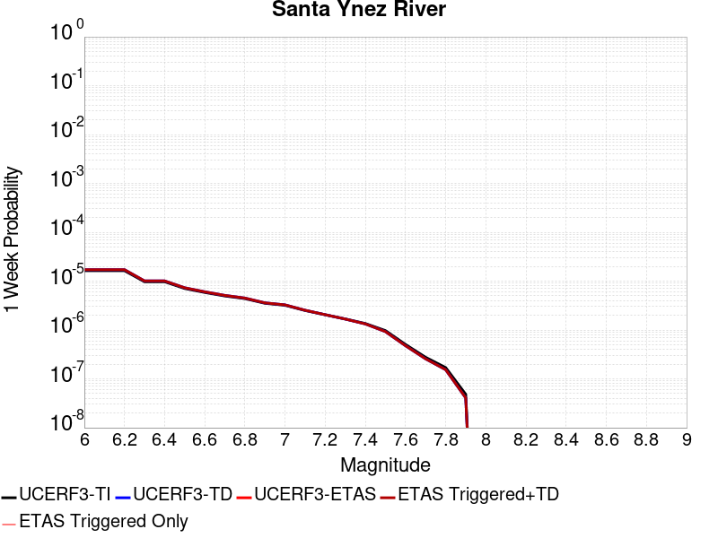 | 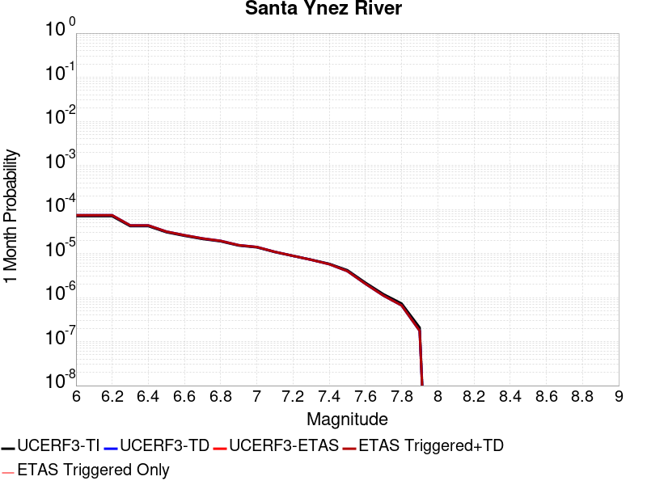 | 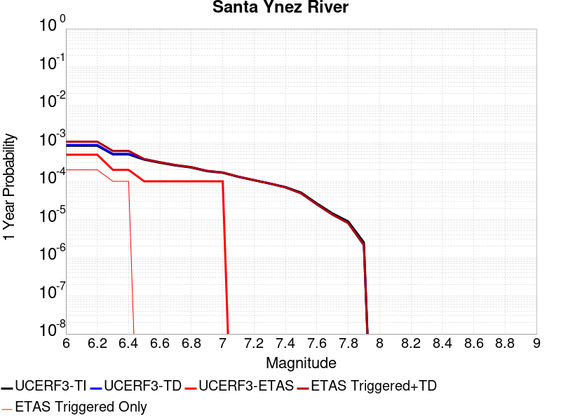 | 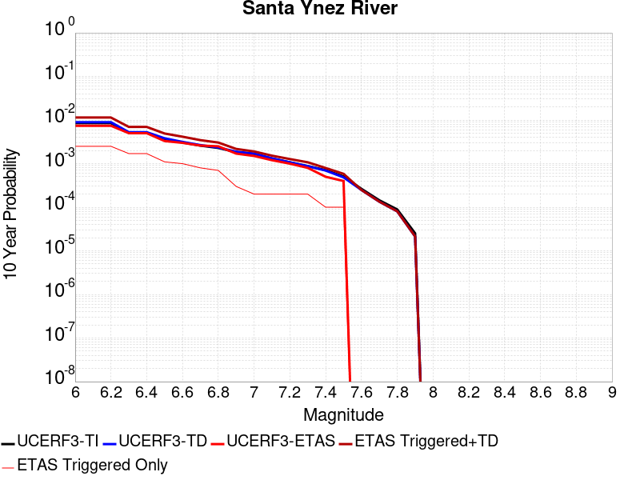 |

| Magnitude | 1 wk TI Prob | 1 wk TD Prob | 1 wk ETAS Prob | 1 wk ETAS/TD Gain | 1 wk ETAS Triggered+TD | 1 wk ETAS Triggered Only | 1 mo TI Prob | 1 mo TD Prob | 1 mo ETAS Prob | 1 mo ETAS/TD Gain | 1 mo ETAS Triggered+TD | 1 mo ETAS Triggered Only | 1 yr TI Prob | 1 yr TD Prob | 1 yr ETAS Prob | 1 yr ETAS/TD Gain | 1 yr ETAS Triggered+TD | 1 yr ETAS Triggered Only | 10 yr TI Prob | 10 yr TD Prob | 10 yr ETAS Prob | 10 yr ETAS/TD Gain | 10 yr ETAS Triggered+TD | 10 yr ETAS Triggered Only |
|-----|-----|-----|-----|-----|-----|-----|-----|-----|-----|-----|-----|-----|-----|-----|-----|-----|-----|-----|-----|-----|-----|-----|-----|-----|
| 6.0 | 1.6396456E-5 | 1.7198872E-5 | 0.0 | 0.0 | 1.7198872E-5 | 0.0 | 7.026863E-5 | 7.370757E-5 | 0.0 | 0.0 | 7.370757E-5 | 0.0 | 8.551848E-4 | 8.9705567E-4 | 5.0E-4 | 0.557379 | 0.0010968762 | 2.0E-4 | 0.0085190125 | 0.00893789 | 0.0074 | 0.82793593 | 0.011415545 | 0.0025 |
| 6.1 | 1.6396456E-5 | 1.7198872E-5 | 0.0 | 0.0 | 1.7198872E-5 | 0.0 | 7.026863E-5 | 7.370757E-5 | 0.0 | 0.0 | 7.370757E-5 | 0.0 | 8.551848E-4 | 8.9705567E-4 | 5.0E-4 | 0.557379 | 0.0010968762 | 2.0E-4 | 0.0085190125 | 0.00893789 | 0.0074 | 0.82793593 | 0.011415545 | 0.0025 |
| 6.2 | 1.6396456E-5 | 1.7198872E-5 | 0.0 | 0.0 | 1.7198872E-5 | 0.0 | 7.026863E-5 | 7.370757E-5 | 0.0 | 0.0 | 7.370757E-5 | 0.0 | 8.551848E-4 | 8.9705567E-4 | 5.0E-4 | 0.557379 | 0.0010968762 | 2.0E-4 | 0.0085190125 | 0.00893789 | 0.0074 | 0.82793593 | 0.011415545 | 0.0025 |
| 6.3 | 9.736976E-6 | 1.0116532E-5 | 0.0 | 0.0 | 1.0116532E-5 | 0.0 | 4.172923E-5 | 4.3355874E-5 | 0.0 | 0.0 | 4.3355874E-5 | 0.0 | 5.0793495E-4 | 5.277349E-4 | 2.0E-4 | 0.37897816 | 6.2768214E-4 | 1.0E-4 | 0.005067755 | 0.005265322 | 0.005 | 0.9496096 | 0.006956371 | 0.0017 |
| 6.4 | 9.736976E-6 | 1.0116532E-5 | 0.0 | 0.0 | 1.0116532E-5 | 0.0 | 4.172923E-5 | 4.3355874E-5 | 0.0 | 0.0 | 4.3355874E-5 | 0.0 | 5.0793495E-4 | 5.277349E-4 | 2.0E-4 | 0.37897816 | 6.2768214E-4 | 1.0E-4 | 0.005067755 | 0.005265322 | 0.005 | 0.9496096 | 0.006956371 | 0.0017 |
| 6.5 | 7.081964E-6 | 7.325611E-6 | 0.0 | 0.0 | 7.325611E-6 | 0.0 | 3.035092E-5 | 3.1395106E-5 | 0.0 | 0.0 | 3.1395106E-5 | 0.0 | 3.694598E-4 | 3.8216996E-4 | 1.0E-4 | 0.26166368 | 3.8216996E-4 | 0.0 | 0.0036884616 | 0.0038152891 | 0.0033 | 0.864941 | 0.004911092 | 0.0011 |
| 6.6 | 5.873247E-6 | 6.0561324E-6 | 0.0 | 0.0 | 6.0561324E-6 | 0.0 | 2.5170815E-5 | 2.59546E-5 | 0.0 | 0.0 | 2.59546E-5 | 0.0 | 3.064116E-4 | 3.159523E-4 | 1.0E-4 | 0.3165035 | 3.159523E-4 | 0.0 | 0.0030598943 | 0.0031551183 | 0.003 | 0.950836 | 0.004151963 | 0.001 |
| 6.7 | 4.973277E-6 | 5.1127713E-6 | 0.0 | 0.0 | 5.1127713E-6 | 0.0 | 2.1313872E-5 | 2.1911696E-5 | 0.0 | 0.0 | 2.1911696E-5 | 0.0 | 2.5946548E-4 | 2.6674272E-4 | 1.0E-4 | 0.3748931 | 2.6674272E-4 | 0.0 | 0.0025916274 | 0.0026642743 | 0.0026 | 0.9758755 | 0.003462143 | 8.0E-4 |
| 6.8 | 4.396492E-6 | 4.5081565E-6 | 0.0 | 0.0 | 4.5081565E-6 | 0.0 | 1.884197E-5 | 1.9320529E-5 | 0.0 | 0.0 | 1.9320529E-5 | 0.0 | 2.2937685E-4 | 2.3520239E-4 | 1.0E-4 | 0.42516574 | 2.3520239E-4 | 0.0 | 0.0022914023 | 0.00234957 | 0.0025 | 1.0640246 | 0.0030479252 | 7.0E-4 |
| 6.9 | 3.5255632E-6 | 3.5989342E-6 | 0.0 | 0.0 | 3.5989342E-6 | 0.0 | 1.5109469E-5 | 1.5423913E-5 | 0.0 | 0.0 | 1.5423913E-5 | 0.0 | 1.8394225E-4 | 1.8777013E-4 | 1.0E-4 | 0.5325661 | 1.8777013E-4 | 0.0 | 0.0018379007 | 0.0018761308 | 0.0017 | 0.9061202 | 0.002175568 | 3.0E-4 |
| 7.0 | 3.211603E-6 | 3.2714047E-6 | 0.0 | 0.0 | 3.2714047E-6 | 0.0 | 1.376394E-5 | 1.4020231E-5 | 0.0 | 0.0 | 1.4020231E-5 | 0.0 | 1.6756308E-4 | 1.7068308E-4 | 1.0E-4 | 0.5858812 | 1.7068308E-4 | 0.0 | 0.0016743679 | 0.001705534 | 0.0015 | 0.8794899 | 0.001905193 | 2.0E-4 |
| 7.1 | 2.5094619E-6 | 2.5390048E-6 | 0.0 | 0.0 | 2.5390048E-6 | 0.0 | 1.0754793E-5 | 1.0881404E-5 | 0.0 | 0.0 | 1.0881404E-5 | 0.0 | 1.3093173E-4 | 1.324731E-4 | 0.0 | 0.0 | 1.324731E-4 | 0.0 | 0.0013085462 | 0.0013239472 | 0.0012 | 0.90638053 | 0.0015236825 | 2.0E-4 |
| 7.2 | 2.0515774E-6 | 2.0602524E-6 | 0.0 | 0.0 | 2.0602524E-6 | 0.0 | 8.792445E-6 | 8.829624E-6 | 0.0 | 0.0 | 8.829624E-6 | 0.0 | 1.0704277E-4 | 1.0749541E-4 | 0.0 | 0.0 | 1.0749541E-4 | 0.0 | 0.0010699122 | 0.0010744384 | 0.001 | 0.9307188 | 0.0012742236 | 2.0E-4 |
| 7.3 | 1.6845745E-6 | 1.6758979E-6 | 0.0 | 0.0 | 1.6758979E-6 | 0.0 | 7.219585E-6 | 7.1823997E-6 | 0.0 | 0.0 | 7.1823997E-6 | 0.0 | 8.78949E-5 | 8.744224E-5 | 0.0 | 0.0 | 8.744224E-5 | 0.0 | 8.7860145E-4 | 8.7408116E-4 | 8.0E-4 | 0.9152468 | 0.0010739063 | 2.0E-4 |
| 7.4 | 1.3600285E-6 | 1.3320594E-6 | 0.0 | 0.0 | 1.3320594E-6 | 0.0 | 5.82868E-6 | 5.708813E-6 | 0.0 | 0.0 | 5.708813E-6 | 0.0 | 7.096187E-5 | 6.95026E-5 | 0.0 | 0.0 | 6.95026E-5 | 0.0 | 7.0939213E-4 | 6.9481094E-4 | 5.0E-4 | 0.7196202 | 7.9474144E-4 | 1.0E-4 |
| 7.5 | 9.735342E-7 | 9.27974E-7 | 0.0 | 0.0 | 9.27974E-7 | 0.0 | 4.172283E-6 | 3.9770252E-6 | 0.0 | 0.0 | 3.9770252E-6 | 0.0 | 5.079636E-5 | 4.8419224E-5 | 0.0 | 0.0 | 4.8419224E-5 | 0.0 | 5.0784746E-4 | 4.8408846E-4 | 4.0E-4 | 0.82629526 | 5.8404007E-4 | 1.0E-4 |
| 7.6 | 5.067187E-7 | 4.7732874E-7 | 0.0 | 0.0 | 4.7732874E-7 | 0.0 | 2.1716498E-6 | 2.045693E-6 | 0.0 | 0.0 | 2.045693E-6 | 0.0 | 2.6439517E-5 | 2.4906034E-5 | 0.0 | 0.0 | 2.4906034E-5 | 0.0 | 2.643637E-4 | 2.4903318E-4 | 0.0 | 0.0 | 2.4903318E-4 | 0.0 |
| 7.7 | 2.769089E-7 | 2.5744131E-7 | 0.0 | 0.0 | 2.5744131E-7 | 0.0 | 1.1867519E-6 | 1.1033194E-6 | 0.0 | 0.0 | 1.1033194E-6 | 0.0 | 1.4448608E-5 | 1.3432831E-5 | 0.0 | 0.0 | 1.3432831E-5 | 0.0 | 1.444767E-4 | 1.3432023E-4 | 0.0 | 0.0 | 1.3432023E-4 | 0.0 |
| 7.8 | 1.7044663E-7 | 1.5440386E-7 | 0.0 | 0.0 | 1.5440386E-7 | 0.0 | 7.3048534E-7 | 6.6173067E-7 | 0.0 | 0.0 | 6.6173067E-7 | 0.0 | 8.893623E-6 | 8.056541E-6 | 0.0 | 0.0 | 8.056541E-6 | 0.0 | 8.893267E-5 | 8.056252E-5 | 0.0 | 0.0 | 8.056252E-5 | 0.0 |
| 7.9 | 4.8344287E-8 | 4.0886555E-8 | 0.0 | 0.0 | 4.0886555E-8 | 0.0 | 2.0718979E-7 | 1.7522808E-7 | 0.0 | 0.0 | 1.7522808E-7 | 0.0 | 2.5225327E-6 | 2.1333997E-6 | 0.0 | 0.0 | 2.1333997E-6 | 0.0 | 2.5225041E-5 | 2.1333797E-5 | 0.0 | 0.0 | 2.1333797E-5 | 0.0 |

## Blackwater
*[(top)](#table-of-contents)*

| 1 Week | 1 Month | 1 Year | 10 Year |
|-----|-----|-----|-----|
|  | 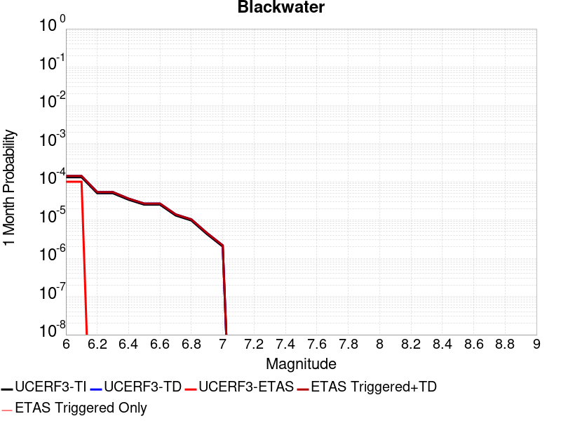 | 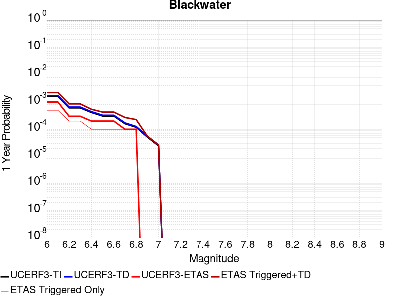 | 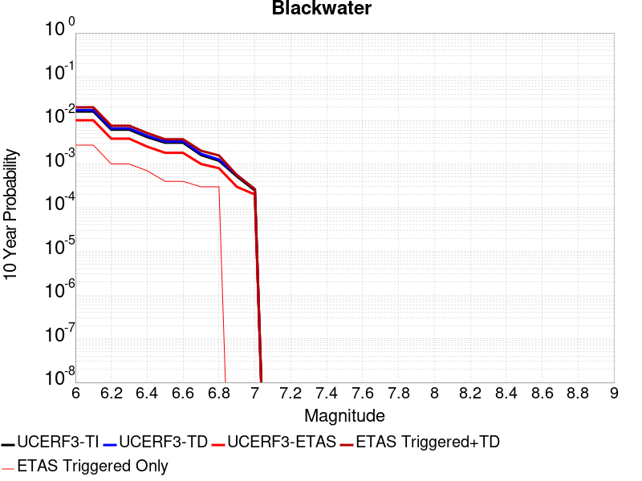 |

| Magnitude | 1 wk TI Prob | 1 wk TD Prob | 1 wk ETAS Prob | 1 wk ETAS/TD Gain | 1 wk ETAS Triggered+TD | 1 wk ETAS Triggered Only | 1 mo TI Prob | 1 mo TD Prob | 1 mo ETAS Prob | 1 mo ETAS/TD Gain | 1 mo ETAS Triggered+TD | 1 mo ETAS Triggered Only | 1 yr TI Prob | 1 yr TD Prob | 1 yr ETAS Prob | 1 yr ETAS/TD Gain | 1 yr ETAS Triggered+TD | 1 yr ETAS Triggered Only | 10 yr TI Prob | 10 yr TD Prob | 10 yr ETAS Prob | 10 yr ETAS/TD Gain | 10 yr ETAS Triggered+TD | 10 yr ETAS Triggered Only |
|-----|-----|-----|-----|-----|-----|-----|-----|-----|-----|-----|-----|-----|-----|-----|-----|-----|-----|-----|-----|-----|-----|-----|-----|-----|
| 6.0 | 3.0708583E-5 | 3.306896E-5 | 1.0E-4 | 3.0239837 | 3.306896E-5 | 0.0 | 1.3160157E-4 | 1.4171719E-4 | 1.0E-4 | 0.7056307 | 1.4171719E-4 | 0.0 | 0.0016010714 | 0.0017241776 | 0.001 | 0.57998663 | 0.0022233156 | 5.0E-4 | 0.015895851 | 0.017121818 | 0.01 | 0.5840502 | 0.019775588 | 0.0027 |
| 6.1 | 3.0708583E-5 | 3.306896E-5 | 1.0E-4 | 3.0239837 | 3.306896E-5 | 0.0 | 1.3160157E-4 | 1.4171719E-4 | 1.0E-4 | 0.7056307 | 1.4171719E-4 | 0.0 | 0.0016010714 | 0.0017241776 | 0.001 | 0.57998663 | 0.0022233156 | 5.0E-4 | 0.015895851 | 0.017121818 | 0.01 | 0.5840502 | 0.019775588 | 0.0027 |
| 6.2 | 1.1707779E-5 | 1.2535755E-5 | 0.0 | 0.0 | 1.2535755E-5 | 0.0 | 5.017523E-5 | 5.3723612E-5 | 0.0 | 0.0 | 5.3723612E-5 | 0.0 | 6.107122E-4 | 6.538983E-4 | 3.0E-4 | 0.45878696 | 8.537675E-4 | 2.0E-4 | 0.006090366 | 0.006520712 | 0.0038 | 0.5827584 | 0.0075141913 | 0.001 |
| 6.3 | 1.1707779E-5 | 1.2535755E-5 | 0.0 | 0.0 | 1.2535755E-5 | 0.0 | 5.017523E-5 | 5.3723612E-5 | 0.0 | 0.0 | 5.3723612E-5 | 0.0 | 6.107122E-4 | 6.538983E-4 | 3.0E-4 | 0.45878696 | 8.537675E-4 | 2.0E-4 | 0.006090366 | 0.006520712 | 0.0038 | 0.5827584 | 0.0075141913 | 0.001 |
| 6.4 | 7.929244E-6 | 8.4739495E-6 | 0.0 | 0.0 | 8.4739495E-6 | 0.0 | 3.3982033E-5 | 3.6316444E-5 | 0.0 | 0.0 | 3.6316444E-5 | 0.0 | 4.136527E-4 | 4.4206702E-4 | 2.0E-4 | 0.4524201 | 5.420228E-4 | 1.0E-4 | 0.0041288356 | 0.0044122813 | 0.0025 | 0.5666003 | 0.0051091923 | 7.0E-4 |
| 6.5 | 5.8832115E-6 | 6.2814997E-6 | 0.0 | 0.0 | 6.2814997E-6 | 0.0 | 2.521352E-5 | 2.692045E-5 | 0.0 | 0.0 | 2.692045E-5 | 0.0 | 3.0693135E-4 | 3.2770974E-4 | 2.0E-4 | 0.6102962 | 4.2767695E-4 | 1.0E-4 | 0.0030650778 | 0.0032725176 | 0.0018 | 0.55003524 | 0.0036712086 | 4.0E-4 |
| 6.6 | 5.8832115E-6 | 6.2814997E-6 | 0.0 | 0.0 | 6.2814997E-6 | 0.0 | 2.521352E-5 | 2.692045E-5 | 0.0 | 0.0 | 2.692045E-5 | 0.0 | 3.0693135E-4 | 3.2770974E-4 | 2.0E-4 | 0.6102962 | 4.2767695E-4 | 1.0E-4 | 0.0030650778 | 0.0032725176 | 0.0018 | 0.55003524 | 0.0036712086 | 4.0E-4 |
| 6.7 | 3.0715053E-6 | 3.2791254E-6 | 0.0 | 0.0 | 3.2791254E-6 | 0.0 | 1.3163528E-5 | 1.4053326E-5 | 0.0 | 0.0 | 1.4053326E-5 | 0.0 | 1.6025416E-4 | 1.7108697E-4 | 1.0E-4 | 0.58449805 | 2.7106988E-4 | 1.0E-4 | 0.0016013865 | 0.0017096669 | 0.001 | 0.58490926 | 0.002009154 | 3.0E-4 |
| 6.8 | 2.2722281E-6 | 2.4270078E-6 | 0.0 | 0.0 | 2.4270078E-6 | 0.0 | 9.738084E-6 | 1.0401426E-5 | 0.0 | 0.0 | 1.0401426E-5 | 0.0 | 1.1855473E-4 | 1.2663091E-4 | 1.0E-4 | 0.7896966 | 2.2661826E-4 | 1.0E-4 | 0.001184915 | 0.0012656776 | 8.0E-4 | 0.63207245 | 0.001565298 | 3.0E-4 |
| 6.9 | 9.952399E-7 | 1.0645658E-6 | 0.0 | 0.0 | 1.0645658E-6 | 0.0 | 4.265307E-6 | 4.5624197E-6 | 0.0 | 0.0 | 4.5624197E-6 | 0.0 | 5.1928873E-5 | 5.554656E-5 | 0.0 | 0.0 | 5.554656E-5 | 0.0 | 5.191674E-4 | 5.553773E-4 | 3.0E-4 | 0.5401733 | 5.553773E-4 | 0.0 |
| 7.0 | 4.7385504E-7 | 5.071793E-7 | 0.0 | 0.0 | 5.071793E-7 | 0.0 | 2.0308057E-6 | 2.1736255E-6 | 0.0 | 0.0 | 2.1736255E-6 | 0.0 | 2.4724779E-5 | 2.6463891E-5 | 0.0 | 0.0 | 2.6463891E-5 | 0.0 | 2.4722028E-4 | 2.6463892E-4 | 2.0E-4 | 0.7557468 | 2.6463892E-4 | 0.0 |

## Hat Creek-McArthur-Mayfield
*[(top)](#table-of-contents)*

| 1 Week | 1 Month | 1 Year | 10 Year |
|-----|-----|-----|-----|
| 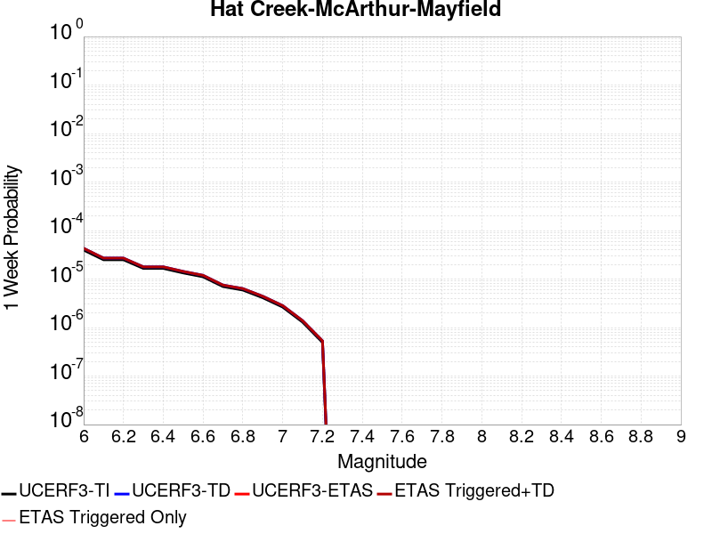 | 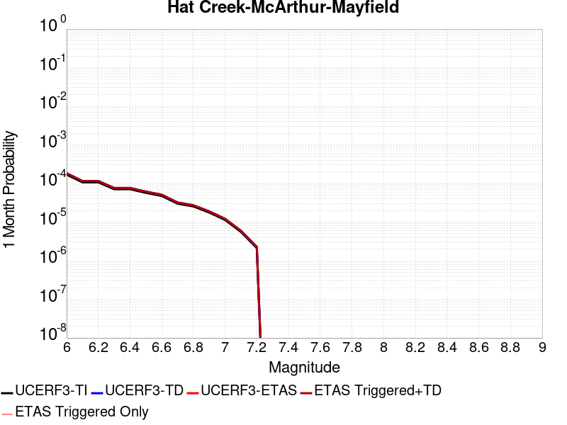 | 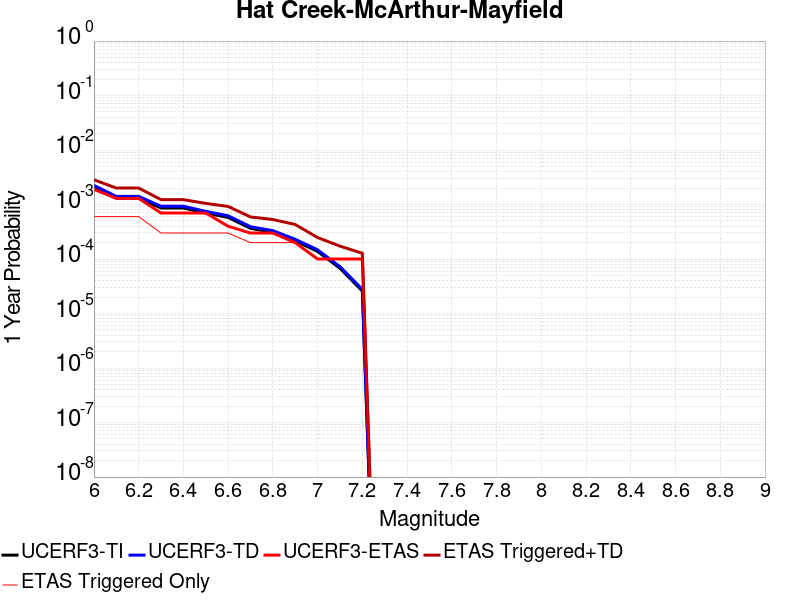 | 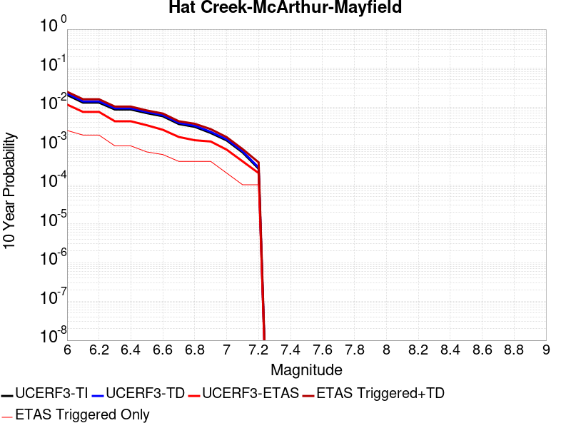 |

| Magnitude | 1 wk TI Prob | 1 wk TD Prob | 1 wk ETAS Prob | 1 wk ETAS/TD Gain | 1 wk ETAS Triggered+TD | 1 wk ETAS Triggered Only | 1 mo TI Prob | 1 mo TD Prob | 1 mo ETAS Prob | 1 mo ETAS/TD Gain | 1 mo ETAS Triggered+TD | 1 mo ETAS Triggered Only | 1 yr TI Prob | 1 yr TD Prob | 1 yr ETAS Prob | 1 yr ETAS/TD Gain | 1 yr ETAS Triggered+TD | 1 yr ETAS Triggered Only | 10 yr TI Prob | 10 yr TD Prob | 10 yr ETAS Prob | 10 yr ETAS/TD Gain | 10 yr ETAS Triggered+TD | 10 yr ETAS Triggered Only |
|-----|-----|-----|-----|-----|-----|-----|-----|-----|-----|-----|-----|-----|-----|-----|-----|-----|-----|-----|-----|-----|-----|-----|-----|-----|
| 6.0 | 3.967457E-5 | 4.3118598E-5 | 0.0 | 0.0 | 4.3118598E-5 | 0.0 | 1.7002279E-4 | 1.8478154E-4 | 0.0 | 0.0 | 1.8478154E-4 | 0.0 | 0.002068062 | 0.0022475081 | 0.0019 | 0.8453807 | 0.0028461595 | 6.0E-4 | 0.02048922 | 0.022260109 | 0.0116 | 0.52111155 | 0.02470446 | 0.0025 |
| 6.1 | 2.5044013E-5 | 2.7048232E-5 | 0.0 | 0.0 | 2.7048232E-5 | 0.0 | 1.0732707E-4 | 1.15916024E-4 | 0.0 | 0.0 | 1.15916024E-4 | 0.0 | 0.0013059238 | 0.0014103957 | 0.0013 | 0.9217272 | 0.0020095494 | 6.0E-4 | 0.01298276 | 0.014017856 | 0.0075 | 0.5350319 | 0.015891222 | 0.0019 |
| 6.2 | 2.5044013E-5 | 2.7048232E-5 | 0.0 | 0.0 | 2.7048232E-5 | 0.0 | 1.0732707E-4 | 1.15916024E-4 | 0.0 | 0.0 | 1.15916024E-4 | 0.0 | 0.0013059238 | 0.0014103957 | 0.0013 | 0.9217272 | 0.0020095494 | 6.0E-4 | 0.01298276 | 0.014017856 | 0.0075 | 0.5350319 | 0.015891222 | 0.0019 |
| 6.3 | 1.6624012E-5 | 1.7876819E-5 | 0.0 | 0.0 | 1.7876819E-5 | 0.0 | 7.124382E-5 | 7.6612734E-5 | 0.0 | 0.0 | 7.6612734E-5 | 0.0 | 8.670483E-4 | 9.3236944E-4 | 7.0E-4 | 0.75077534 | 0.0012320897 | 3.0E-4 | 0.008636732 | 0.00928551 | 0.0043 | 0.46308714 | 0.0102762235 | 0.001 |
| 6.4 | 1.6624012E-5 | 1.7876819E-5 | 0.0 | 0.0 | 1.7876819E-5 | 0.0 | 7.124382E-5 | 7.6612734E-5 | 0.0 | 0.0 | 7.6612734E-5 | 0.0 | 8.670483E-4 | 9.3236944E-4 | 7.0E-4 | 0.75077534 | 0.0012320897 | 3.0E-4 | 0.008636732 | 0.00928551 | 0.0043 | 0.46308714 | 0.0102762235 | 0.001 |
| 6.5 | 1.3394842E-5 | 1.4380942E-5 | 0.0 | 0.0 | 1.4380942E-5 | 0.0 | 5.7405203E-5 | 6.163119E-5 | 0.0 | 0.0 | 6.163119E-5 | 0.0 | 6.986842E-4 | 7.501069E-4 | 7.0E-4 | 0.93320036 | 0.0010498819 | 3.0E-4 | 0.006964916 | 0.007476342 | 0.0034 | 0.45476785 | 0.008171109 | 7.0E-4 |
| 6.6 | 1.1137514E-5 | 1.1945386E-5 | 0.0 | 0.0 | 1.1945386E-5 | 0.0 | 4.7731326E-5 | 5.1193532E-5 | 0.0 | 0.0 | 5.1193532E-5 | 0.0 | 5.809739E-4 | 6.23107E-4 | 4.0E-4 | 0.6419443 | 9.2292007E-4 | 3.0E-4 | 0.005794574 | 0.00621402 | 0.0026 | 0.41840872 | 0.006810291 | 6.0E-4 |
| 6.7 | 7.0200663E-6 | 7.518647E-6 | 0.0 | 0.0 | 7.518647E-6 | 0.0 | 3.008565E-5 | 3.2222386E-5 | 0.0 | 0.0 | 3.2222386E-5 | 0.0 | 3.6623122E-4 | 3.9223852E-4 | 3.0E-4 | 0.7648408 | 5.9216004E-4 | 2.0E-4 | 0.0036562826 | 0.003915624 | 0.0017 | 0.4341581 | 0.004314058 | 4.0E-4 |
| 6.8 | 5.940172E-6 | 6.360719E-6 | 0.0 | 0.0 | 6.360719E-6 | 0.0 | 2.545763E-5 | 2.7259946E-5 | 0.0 | 0.0 | 2.7259946E-5 | 0.0 | 3.0990256E-4 | 3.3184057E-4 | 3.0E-4 | 0.9040486 | 5.317742E-4 | 2.0E-4 | 0.0030947074 | 0.003313579 | 0.0014 | 0.4225039 | 0.0037122536 | 4.0E-4 |
| 6.9 | 4.129831E-6 | 4.4202634E-6 | 0.0 | 0.0 | 4.4202634E-6 | 0.0 | 1.7699154E-5 | 1.8943852E-5 | 0.0 | 0.0 | 1.8943852E-5 | 0.0 | 2.154659E-4 | 2.3061779E-4 | 2.0E-4 | 0.8672358 | 4.3057167E-4 | 2.0E-4 | 0.002152571 | 0.002303863 | 0.0013 | 0.5642697 | 0.0027029412 | 4.0E-4 |
| 7.0 | 2.6512955E-6 | 2.8353218E-6 | 0.0 | 0.0 | 2.8353218E-6 | 0.0 | 1.1362646E-5 | 1.2151324E-5 | 0.0 | 0.0 | 1.2151324E-5 | 0.0 | 1.3833142E-4 | 1.4793276E-4 | 1.0E-4 | 0.6759828 | 2.4791798E-4 | 1.0E-4 | 0.0013824535 | 0.0014783853 | 8.0E-4 | 0.5411309 | 0.0016780897 | 2.0E-4 |
| 7.1 | 1.2992575E-6 | 1.3899078E-6 | 0.0 | 0.0 | 1.3899078E-6 | 0.0 | 5.568235E-6 | 5.956735E-6 | 0.0 | 0.0 | 5.956735E-6 | 0.0 | 6.779115E-5 | 7.2521056E-5 | 1.0E-4 | 1.37891 | 1.725138E-4 | 1.0E-4 | 6.7770475E-4 | 7.2499545E-4 | 4.0E-4 | 0.5517276 | 8.24923E-4 | 1.0E-4 |
| 7.2 | 4.968191E-7 | 5.323132E-7 | 0.0 | 0.0 | 5.323132E-7 | 0.0 | 2.1292228E-6 | 2.2813408E-6 | 0.0 | 0.0 | 2.2813408E-6 | 0.0 | 2.592298E-5 | 2.7775097E-5 | 1.0E-4 | 3.6003473 | 1.2777232E-4 | 1.0E-4 | 2.5919956E-4 | 2.777286E-4 | 2.0E-4 | 0.72012746 | 3.7770084E-4 | 1.0E-4 |

## Franklin 2011 CFM
*[(top)](#table-of-contents)*

| 1 Week | 1 Month | 1 Year | 10 Year |
|-----|-----|-----|-----|
| 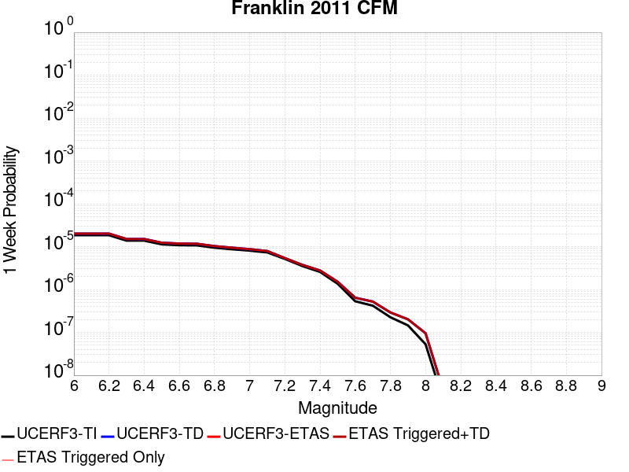 | 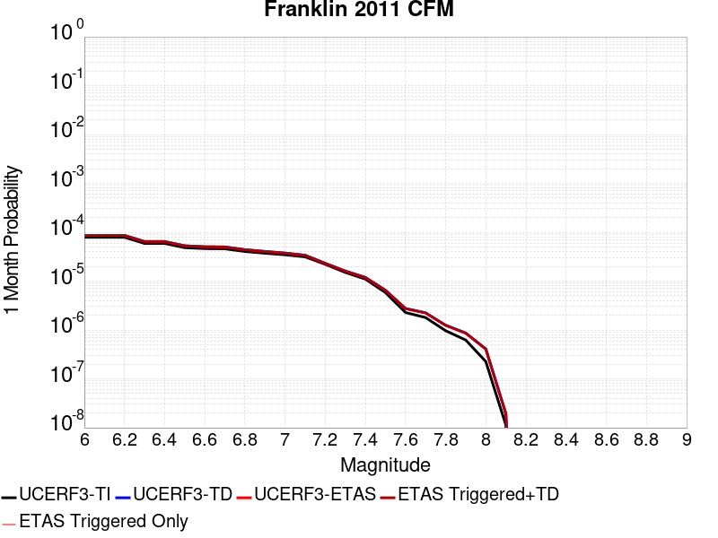 | 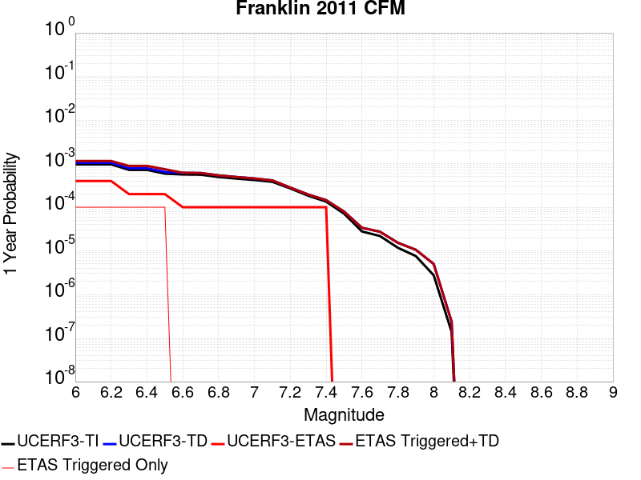 | 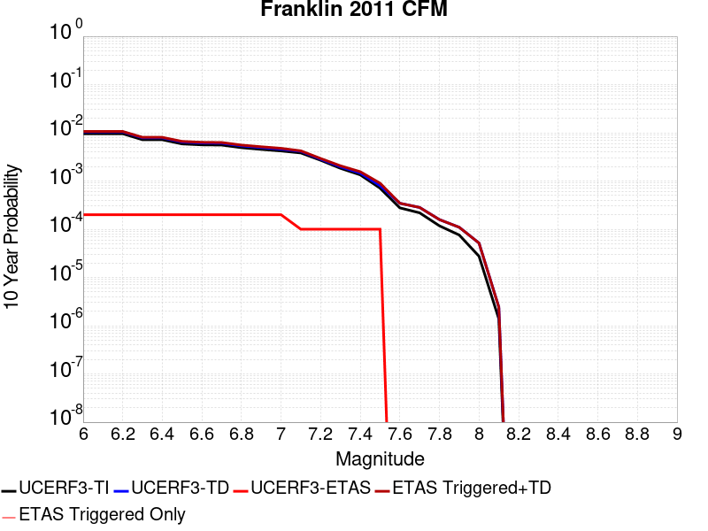 |

| Magnitude | 1 wk TI Prob | 1 wk TD Prob | 1 wk ETAS Prob | 1 wk ETAS/TD Gain | 1 wk ETAS Triggered+TD | 1 wk ETAS Triggered Only | 1 mo TI Prob | 1 mo TD Prob | 1 mo ETAS Prob | 1 mo ETAS/TD Gain | 1 mo ETAS Triggered+TD | 1 mo ETAS Triggered Only | 1 yr TI Prob | 1 yr TD Prob | 1 yr ETAS Prob | 1 yr ETAS/TD Gain | 1 yr ETAS Triggered+TD | 1 yr ETAS Triggered Only | 10 yr TI Prob | 10 yr TD Prob | 10 yr ETAS Prob | 10 yr ETAS/TD Gain | 10 yr ETAS Triggered+TD | 10 yr ETAS Triggered Only |
|-----|-----|-----|-----|-----|-----|-----|-----|-----|-----|-----|-----|-----|-----|-----|-----|-----|-----|-----|-----|-----|-----|-----|-----|-----|
| 6.0 | 1.845602E-5 | 2.0142239E-5 | 0.0 | 0.0 | 2.0142239E-5 | 0.0 | 7.9094825E-5 | 8.632118E-5 | 0.0 | 0.0 | 8.632118E-5 | 0.0 | 9.6255407E-4 | 0.0010504826 | 4.0E-4 | 0.38077736 | 0.0011503776 | 1.0E-4 | 0.009583955 | 0.010472167 | 0.0072 | 0.6875368 | 0.01304494 | 0.0026 |
| 6.1 | 1.845602E-5 | 2.0142239E-5 | 0.0 | 0.0 | 2.0142239E-5 | 0.0 | 7.9094825E-5 | 8.632118E-5 | 0.0 | 0.0 | 8.632118E-5 | 0.0 | 9.6255407E-4 | 0.0010504826 | 4.0E-4 | 0.38077736 | 0.0011503776 | 1.0E-4 | 0.009583955 | 0.010472167 | 0.0072 | 0.6875368 | 0.01304494 | 0.0026 |
| 6.2 | 1.845602E-5 | 2.0142239E-5 | 0.0 | 0.0 | 2.0142239E-5 | 0.0 | 7.9094825E-5 | 8.632118E-5 | 0.0 | 0.0 | 8.632118E-5 | 0.0 | 9.6255407E-4 | 0.0010504826 | 4.0E-4 | 0.38077736 | 0.0011503776 | 1.0E-4 | 0.009583955 | 0.010472167 | 0.0072 | 0.6875368 | 0.01304494 | 0.0026 |
| 6.3 | 1.3813506E-5 | 1.50891665E-5 | 0.0 | 0.0 | 1.50891665E-5 | 0.0 | 5.9199396E-5 | 6.4666296E-5 | 0.0 | 0.0 | 6.4666296E-5 | 0.0 | 7.205143E-4 | 7.870354E-4 | 2.0E-4 | 0.25411817 | 8.869567E-4 | 1.0E-4 | 0.007181826 | 0.0078573655 | 0.005 | 0.63634557 | 0.009742437 | 0.0019 |
| 6.4 | 1.3813506E-5 | 1.50891665E-5 | 0.0 | 0.0 | 1.50891665E-5 | 0.0 | 5.9199396E-5 | 6.4666296E-5 | 0.0 | 0.0 | 6.4666296E-5 | 0.0 | 7.205143E-4 | 7.870354E-4 | 2.0E-4 | 0.25411817 | 8.869567E-4 | 1.0E-4 | 0.007181826 | 0.0078573655 | 0.005 | 0.63634557 | 0.009742437 | 0.0019 |
| 6.5 | 1.1308949E-5 | 1.2354789E-5 | 0.0 | 0.0 | 1.2354789E-5 | 0.0 | 4.8466023E-5 | 5.294803E-5 | 0.0 | 0.0 | 5.294803E-5 | 0.0 | 5.899141E-4 | 6.444537E-4 | 2.0E-4 | 0.31034037 | 7.443892E-4 | 1.0E-4 | 0.0058835056 | 0.0064401785 | 0.004 | 0.6211008 | 0.007930518 | 0.0015 |
| 6.6 | 1.0813164E-5 | 1.1813537E-5 | 0.0 | 0.0 | 1.1813537E-5 | 0.0 | 4.6341313E-5 | 5.062847E-5 | 0.0 | 0.0 | 5.062847E-5 | 0.0 | 5.640594E-4 | 6.1622914E-4 | 1.0E-4 | 0.1622773 | 6.1622914E-4 | 0.0 | 0.005626298 | 0.006159519 | 0.0036 | 0.5844612 | 0.0075508957 | 0.0014 |
| 6.7 | 1.0706348E-5 | 1.16954325E-5 | 0.0 | 0.0 | 1.16954325E-5 | 0.0 | 4.5883542E-5 | 5.012233E-5 | 0.0 | 0.0 | 5.012233E-5 | 0.0 | 5.5848894E-4 | 6.1007036E-4 | 1.0E-4 | 0.16391551 | 6.1007036E-4 | 0.0 | 0.005570874 | 0.0060982704 | 0.0036 | 0.5903313 | 0.007489733 | 0.0014 |
| 6.8 | 9.443655E-6 | 1.028847E-5 | 0.0 | 0.0 | 1.028847E-5 | 0.0 | 4.0472176E-5 | 4.4092707E-5 | 0.0 | 0.0 | 4.4092707E-5 | 0.0 | 4.9263734E-4 | 5.366978E-4 | 1.0E-4 | 0.1863246 | 5.366978E-4 | 0.0 | 0.0049154665 | 0.005368281 | 0.0034 | 0.63334984 | 0.006561839 | 0.0012 |
| 6.9 | 8.7001645E-6 | 9.462505E-6 | 0.0 | 0.0 | 9.462505E-6 | 0.0 | 3.728589E-5 | 4.055297E-5 | 0.0 | 0.0 | 4.055297E-5 | 0.0 | 4.538611E-4 | 4.936218E-4 | 1.0E-4 | 0.20258425 | 4.936218E-4 | 0.0 | 0.0045293528 | 0.0049395054 | 0.0033 | 0.6680831 | 0.006034072 | 0.0011 |
| 7.0 | 8.074731E-6 | 8.757073E-6 | 0.0 | 0.0 | 8.757073E-6 | 0.0 | 3.460553E-5 | 3.7529782E-5 | 0.0 | 0.0 | 3.7529782E-5 | 0.0 | 4.212409E-4 | 4.5683037E-4 | 1.0E-4 | 0.21889964 | 4.5683037E-4 | 0.0 | 0.004204433 | 0.0045731524 | 0.0033 | 0.72160286 | 0.0056681223 | 0.0011 |
| 7.1 | 7.3370957E-6 | 7.905402E-6 | 0.0 | 0.0 | 7.905402E-6 | 0.0 | 3.1444317E-5 | 3.387986E-5 | 0.0 | 0.0 | 3.387986E-5 | 0.0 | 3.8276732E-4 | 4.124102E-4 | 1.0E-4 | 0.24247701 | 4.124102E-4 | 0.0 | 0.0038210868 | 0.004130564 | 0.0029 | 0.70208323 | 0.005126434 | 0.001 |
| 7.2 | 5.1750103E-6 | 5.413697E-6 | 0.0 | 0.0 | 5.413697E-6 | 0.0 | 2.2178427E-5 | 2.3201354E-5 | 0.0 | 0.0 | 2.3201354E-5 | 0.0 | 2.699889E-4 | 2.824402E-4 | 1.0E-4 | 0.35405725 | 2.824402E-4 | 0.0 | 0.002696611 | 0.0028343063 | 0.002 | 0.7056401 | 0.0033328892 | 5.0E-4 |
| 7.3 | 3.5221371E-6 | 3.7576276E-6 | 0.0 | 0.0 | 3.7576276E-6 | 0.0 | 1.5094786E-5 | 1.610402E-5 | 0.0 | 0.0 | 1.610402E-5 | 0.0 | 1.8376352E-4 | 1.960489E-4 | 1.0E-4 | 0.5100768 | 1.960489E-4 | 0.0 | 0.0018361164 | 0.0019717603 | 0.0012 | 0.6085932 | 0.0022711689 | 3.0E-4 |
| 7.4 | 2.5749775E-6 | 2.784409E-6 | 0.0 | 0.0 | 2.784409E-6 | 0.0 | 1.1035571E-5 | 1.1933127E-5 | 0.0 | 0.0 | 1.1933127E-5 | 0.0 | 1.343498E-4 | 1.4527621E-4 | 1.0E-4 | 0.68834394 | 1.4527621E-4 | 0.0 | 0.001342686 | 0.0014638033 | 9.0E-4 | 0.6148367 | 0.0017633642 | 3.0E-4 |
| 7.5 | 1.3642131E-6 | 1.5220478E-6 | 0.0 | 0.0 | 1.5220478E-6 | 0.0 | 5.8466144E-6 | 6.5230456E-6 | 0.0 | 0.0 | 6.5230456E-6 | 0.0 | 7.1180206E-5 | 7.941521E-5 | 0.0 | 0.0 | 7.941521E-5 | 0.0 | 7.115741E-4 | 8.044703E-4 | 3.0E-4 | 0.3729162 | 9.043899E-4 | 1.0E-4 |
| 7.6 | 5.329124E-7 | 6.4664414E-7 | 0.0 | 0.0 | 6.4664414E-7 | 0.0 | 2.2839083E-6 | 2.771329E-6 | 0.0 | 0.0 | 2.771329E-6 | 0.0 | 2.7806227E-5 | 3.3740413E-5 | 0.0 | 0.0 | 3.3740413E-5 | 0.0 | 2.780275E-4 | 3.4781362E-4 | 1.0E-4 | 0.2875103 | 3.4781362E-4 | 0.0 |
| 7.7 | 4.199127E-7 | 5.265315E-7 | 0.0 | 0.0 | 5.265315E-7 | 0.0 | 1.7996247E-6 | 2.2565616E-6 | 0.0 | 0.0 | 2.2565616E-6 | 0.0 | 2.191021E-5 | 2.7473296E-5 | 0.0 | 0.0 | 2.7473296E-5 | 0.0 | 2.190805E-4 | 2.8496518E-4 | 0.0 | 0.0 | 2.8496518E-4 | 0.0 |
| 7.8 | 2.2586491E-7 | 2.935528E-7 | 0.0 | 0.0 | 2.935528E-7 | 0.0 | 9.67992E-7 | 1.2580828E-6 | 0.0 | 0.0 | 1.2580828E-6 | 0.0 | 1.178524E-5 | 1.5317051E-5 | 0.0 | 0.0 | 1.5317051E-5 | 0.0 | 1.17846146E-4 | 1.5952767E-4 | 0.0 | 0.0 | 1.5952767E-4 | 0.0 |
| 7.9 | 1.4568845E-7 | 2.0296703E-7 | 0.0 | 0.0 | 2.0296703E-7 | 0.0 | 6.243789E-7 | 8.698584E-7 | 0.0 | 0.0 | 8.698584E-7 | 0.0 | 7.601787E-6 | 1.0590475E-5 | 0.0 | 0.0 | 1.0590475E-5 | 0.0 | 7.601527E-5 | 1.10412926E-4 | 0.0 | 0.0 | 1.10412926E-4 | 0.0 |
| 8.0 | 5.2868224E-8 | 9.585488E-8 | 0.0 | 0.0 | 9.585488E-8 | 0.0 | 2.2657808E-7 | 4.1080656E-7 | 0.0 | 0.0 | 4.1080656E-7 | 0.0 | 2.7585847E-6 | 5.0015583E-6 | 0.0 | 0.0 | 5.0015583E-6 | 0.0 | 2.7585504E-5 | 5.192867E-5 | 0.0 | 0.0 | 5.192867E-5 | 0.0 |
| 8.1 | 2.654434E-9 | 4.5489736E-9 | 0.0 | 0.0 | 4.5489736E-9 | 0.0 | 1.1376145E-8 | 1.94956E-8 | 0.0 | 0.0 | 1.94956E-8 | 0.0 | 1.3850456E-7 | 2.373589E-7 | 0.0 | 0.0 | 2.373589E-7 | 0.0 | 1.3850448E-6 | 2.4454946E-6 | 0.0 | 0.0 | 2.4454946E-6 | 0.0 |

## Mono Lake 2011 CFM
*[(top)](#table-of-contents)*

| 1 Week | 1 Month | 1 Year | 10 Year |
|-----|-----|-----|-----|
| 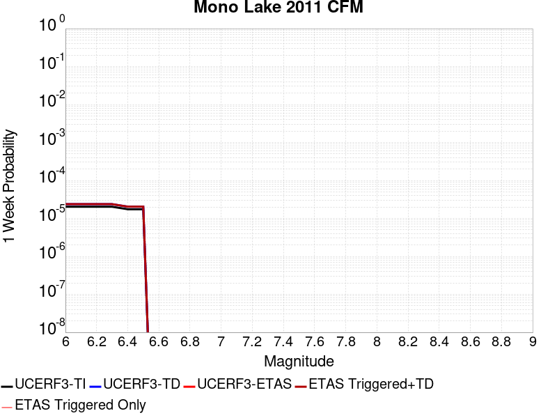 | 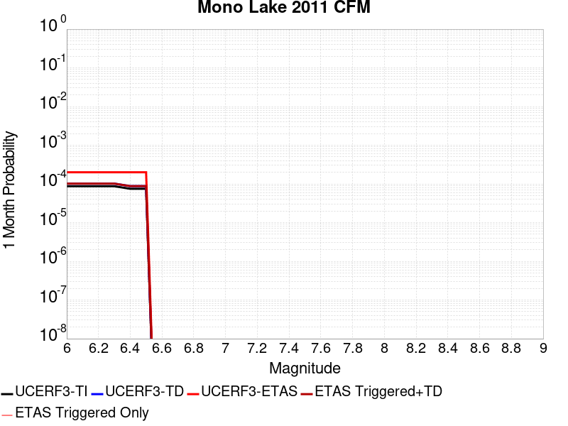 | 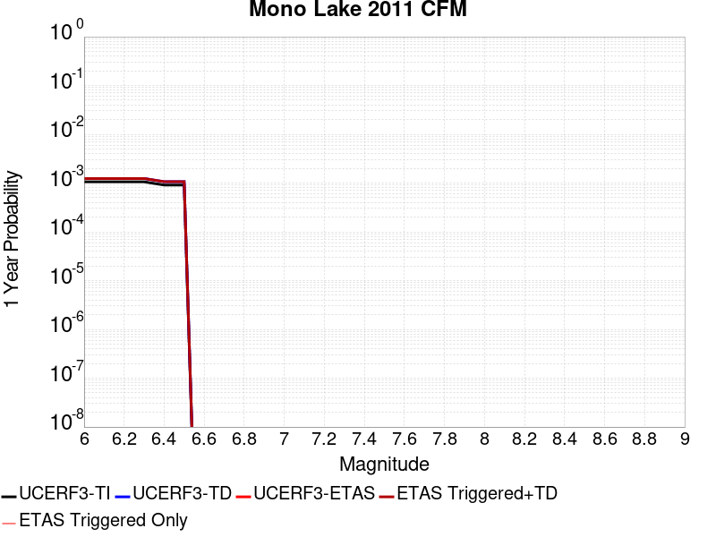 | 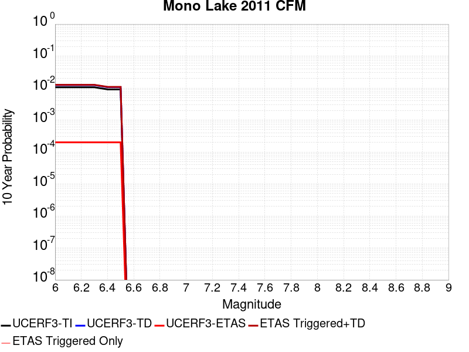 |

| Magnitude | 1 wk TI Prob | 1 wk TD Prob | 1 wk ETAS Prob | 1 wk ETAS/TD Gain | 1 wk ETAS Triggered+TD | 1 wk ETAS Triggered Only | 1 mo TI Prob | 1 mo TD Prob | 1 mo ETAS Prob | 1 mo ETAS/TD Gain | 1 mo ETAS Triggered+TD | 1 mo ETAS Triggered Only | 1 yr TI Prob | 1 yr TD Prob | 1 yr ETAS Prob | 1 yr ETAS/TD Gain | 1 yr ETAS Triggered+TD | 1 yr ETAS Triggered Only | 10 yr TI Prob | 10 yr TD Prob | 10 yr ETAS Prob | 10 yr ETAS/TD Gain | 10 yr ETAS Triggered+TD | 10 yr ETAS Triggered Only |
|-----|-----|-----|-----|-----|-----|-----|-----|-----|-----|-----|-----|-----|-----|-----|-----|-----|-----|-----|-----|-----|-----|-----|-----|-----|
| 6.0 | 2.0341662E-5 | 2.3785644E-5 | 0.0 | 0.0 | 2.3785644E-5 | 0.0 | 8.717564E-5 | 1.01937476E-4 | 2.0E-4 | 1.9619869 | 1.01937476E-4 | 0.0 | 0.0010608466 | 0.0012409115 | 7.0E-4 | 0.56410146 | 0.0012409115 | 0.0 | 0.010557966 | 0.012391717 | 0.0075 | 0.605243 | 0.014959498 | 0.0026 |
| 6.1 | 2.0341662E-5 | 2.3785644E-5 | 0.0 | 0.0 | 2.3785644E-5 | 0.0 | 8.717564E-5 | 1.01937476E-4 | 2.0E-4 | 1.9619869 | 1.01937476E-4 | 0.0 | 0.0010608466 | 0.0012409115 | 7.0E-4 | 0.56410146 | 0.0012409115 | 0.0 | 0.010557966 | 0.012391717 | 0.0075 | 0.605243 | 0.014959498 | 0.0026 |
| 6.2 | 2.0341662E-5 | 2.3785644E-5 | 0.0 | 0.0 | 2.3785644E-5 | 0.0 | 8.717564E-5 | 1.01937476E-4 | 2.0E-4 | 1.9619869 | 1.01937476E-4 | 0.0 | 0.0010608466 | 0.0012409115 | 7.0E-4 | 0.56410146 | 0.0012409115 | 0.0 | 0.010557966 | 0.012391717 | 0.0075 | 0.605243 | 0.014959498 | 0.0026 |
| 6.3 | 2.0341662E-5 | 2.3785644E-5 | 0.0 | 0.0 | 2.3785644E-5 | 0.0 | 8.717564E-5 | 1.01937476E-4 | 2.0E-4 | 1.9619869 | 1.01937476E-4 | 0.0 | 0.0010608466 | 0.0012409115 | 7.0E-4 | 0.56410146 | 0.0012409115 | 0.0 | 0.010557966 | 0.012391717 | 0.0075 | 0.605243 | 0.014959498 | 0.0026 |
| 6.4 | 1.749821E-5 | 2.04545E-5 | 0.0 | 0.0 | 2.04545E-5 | 0.0 | 7.499018E-5 | 8.766214E-5 | 2.0E-4 | 2.2814865 | 8.766214E-5 | 0.0 | 9.1262296E-4 | 0.0010672864 | 7.0E-4 | 0.65586895 | 0.0010672864 | 0.0 | 0.009088841 | 0.010672825 | 0.0063 | 0.59028417 | 0.012750412 | 0.0021 |
| 6.5 | 1.749821E-5 | 2.04545E-5 | 0.0 | 0.0 | 2.04545E-5 | 0.0 | 7.499018E-5 | 8.766214E-5 | 2.0E-4 | 2.2814865 | 8.766214E-5 | 0.0 | 9.1262296E-4 | 0.0010672864 | 7.0E-4 | 0.65586895 | 0.0010672864 | 0.0 | 0.009088841 | 0.010672825 | 0.0063 | 0.59028417 | 0.012750412 | 0.0021 |

## San Jacinto (Stepovers Combined)
*[(top)](#table-of-contents)*

| 1 Week | 1 Month | 1 Year | 10 Year |
|-----|-----|-----|-----|
| 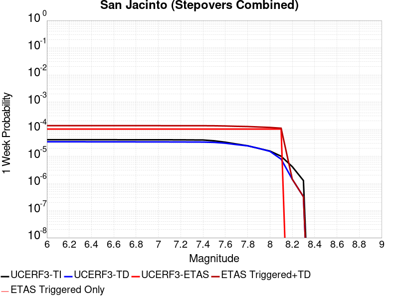 | 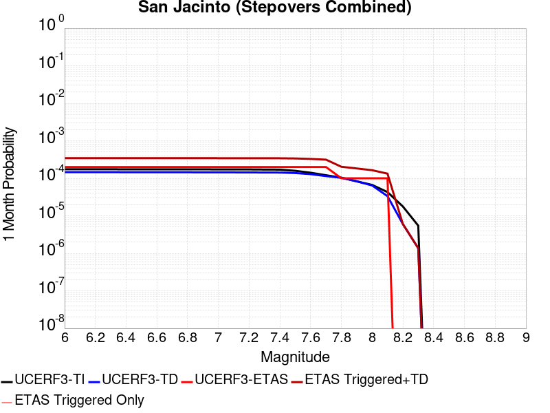 | 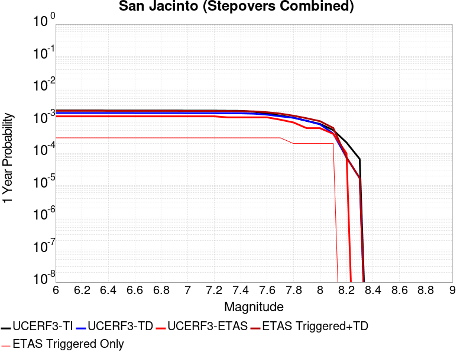 | 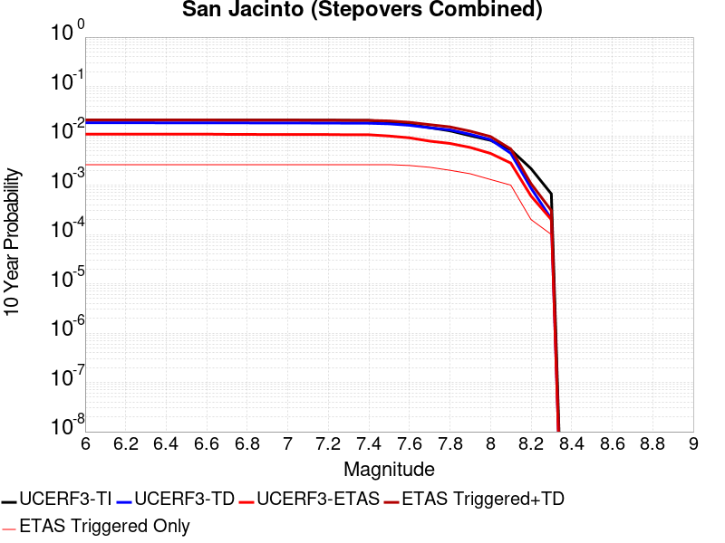 |

| Magnitude | 1 wk TI Prob | 1 wk TD Prob | 1 wk ETAS Prob | 1 wk ETAS/TD Gain | 1 wk ETAS Triggered+TD | 1 wk ETAS Triggered Only | 1 mo TI Prob | 1 mo TD Prob | 1 mo ETAS Prob | 1 mo ETAS/TD Gain | 1 mo ETAS Triggered+TD | 1 mo ETAS Triggered Only | 1 yr TI Prob | 1 yr TD Prob | 1 yr ETAS Prob | 1 yr ETAS/TD Gain | 1 yr ETAS Triggered+TD | 1 yr ETAS Triggered Only | 10 yr TI Prob | 10 yr TD Prob | 10 yr ETAS Prob | 10 yr ETAS/TD Gain | 10 yr ETAS Triggered+TD | 10 yr ETAS Triggered Only |
|-----|-----|-----|-----|-----|-----|-----|-----|-----|-----|-----|-----|-----|-----|-----|-----|-----|-----|-----|-----|-----|-----|-----|-----|-----|
| 6.0 | 4.0667746E-5 | 3.4109886E-5 | 1.0E-4 | 2.9317012 | 1.3410648E-4 | 1.0E-4 | 1.742787E-4 | 1.4617704E-4 | 2.0E-4 | 1.3682039 | 3.461478E-4 | 2.0E-4 | 0.0021197782 | 0.0017782539 | 0.0014 | 0.78728914 | 0.0020777204 | 3.0E-4 | 0.020996714 | 0.018383672 | 0.0108 | 0.5874778 | 0.020935874 | 0.0026 |
| 6.1 | 4.0667746E-5 | 3.4109886E-5 | 1.0E-4 | 2.9317012 | 1.3410648E-4 | 1.0E-4 | 1.742787E-4 | 1.4617704E-4 | 2.0E-4 | 1.3682039 | 3.461478E-4 | 2.0E-4 | 0.0021197782 | 0.0017782539 | 0.0014 | 0.78728914 | 0.0020777204 | 3.0E-4 | 0.020996714 | 0.018383672 | 0.0108 | 0.5874778 | 0.020935874 | 0.0026 |
| 6.2 | 4.0667746E-5 | 3.4109886E-5 | 1.0E-4 | 2.9317012 | 1.3410648E-4 | 1.0E-4 | 1.742787E-4 | 1.4617704E-4 | 2.0E-4 | 1.3682039 | 3.461478E-4 | 2.0E-4 | 0.0021197782 | 0.0017782539 | 0.0014 | 0.78728914 | 0.0020777204 | 3.0E-4 | 0.020996714 | 0.018383672 | 0.0108 | 0.5874778 | 0.020935874 | 0.0026 |
| 6.3 | 4.0667746E-5 | 3.4109886E-5 | 1.0E-4 | 2.9317012 | 1.3410648E-4 | 1.0E-4 | 1.742787E-4 | 1.4617704E-4 | 2.0E-4 | 1.3682039 | 3.461478E-4 | 2.0E-4 | 0.0021197782 | 0.0017782539 | 0.0014 | 0.78728914 | 0.0020777204 | 3.0E-4 | 0.020996714 | 0.018383672 | 0.0108 | 0.5874778 | 0.020935874 | 0.0026 |
| 6.4 | 4.0577226E-5 | 3.398229E-5 | 1.0E-4 | 2.9427092 | 1.3397889E-4 | 1.0E-4 | 1.738908E-4 | 1.4563027E-4 | 2.0E-4 | 1.373341 | 3.4560115E-4 | 2.0E-4 | 0.0021150648 | 0.0017716088 | 0.0014 | 0.7902422 | 0.0020710772 | 3.0E-4 | 0.020950472 | 0.018318446 | 0.0108 | 0.5895697 | 0.020870818 | 0.0026 |
| 6.5 | 4.0577226E-5 | 3.398229E-5 | 1.0E-4 | 2.9427092 | 1.3397889E-4 | 1.0E-4 | 1.738908E-4 | 1.4563027E-4 | 2.0E-4 | 1.373341 | 3.4560115E-4 | 2.0E-4 | 0.0021150648 | 0.0017716088 | 0.0014 | 0.7902422 | 0.0020710772 | 3.0E-4 | 0.020950472 | 0.018318446 | 0.0108 | 0.5895697 | 0.020870818 | 0.0026 |
| 6.6 | 4.053861E-5 | 3.392784E-5 | 1.0E-4 | 2.9474318 | 1.3392445E-4 | 1.0E-4 | 1.7372532E-4 | 1.4539695E-4 | 2.0E-4 | 1.3755448 | 3.4536785E-4 | 2.0E-4 | 0.0021130538 | 0.0017687732 | 0.0014 | 0.79150903 | 0.0020682425 | 3.0E-4 | 0.020930743 | 0.018290611 | 0.0108 | 0.5904669 | 0.020843055 | 0.0026 |
| 6.7 | 4.0516545E-5 | 3.389703E-5 | 1.0E-4 | 2.950111 | 1.3389364E-4 | 1.0E-4 | 1.7363077E-4 | 1.4526492E-4 | 2.0E-4 | 1.3767949 | 3.4523587E-4 | 2.0E-4 | 0.002111905 | 0.0017671686 | 0.0014 | 0.79222775 | 0.0020666386 | 3.0E-4 | 0.020919468 | 0.018274855 | 0.0107 | 0.58550394 | 0.02082734 | 0.0026 |
| 6.8 | 4.049434E-5 | 3.38687E-5 | 1.0E-4 | 2.9525788 | 1.3386531E-4 | 1.0E-4 | 1.7353562E-4 | 1.4514351E-4 | 2.0E-4 | 1.3779466 | 3.4511447E-4 | 2.0E-4 | 0.0021107488 | 0.001765693 | 0.0014 | 0.79288983 | 0.002065163 | 3.0E-4 | 0.020908125 | 0.018260313 | 0.0107 | 0.5859703 | 0.020812836 | 0.0026 |
| 6.9 | 4.046386E-5 | 3.3831413E-5 | 1.0E-4 | 2.9558327 | 1.3382803E-4 | 1.0E-4 | 1.73405E-4 | 1.4498373E-4 | 2.0E-4 | 1.3794651 | 3.4495475E-4 | 2.0E-4 | 0.0021091616 | 0.0017637508 | 0.0014 | 0.7937629 | 0.0020632218 | 3.0E-4 | 0.020892553 | 0.018241152 | 0.0106 | 0.5811037 | 0.020793725 | 0.0026 |
| 7.0 | 4.036382E-5 | 3.3712568E-5 | 1.0E-4 | 2.9662528 | 1.337092E-4 | 1.0E-4 | 1.7297632E-4 | 1.4447446E-4 | 2.0E-4 | 1.3843278 | 3.4444555E-4 | 2.0E-4 | 0.0021039525 | 0.0017575605 | 0.0014 | 0.7965587 | 0.0020570331 | 3.0E-4 | 0.02084144 | 0.01818003 | 0.0106 | 0.58305734 | 0.02073276 | 0.0026 |
| 7.1 | 4.0343282E-5 | 3.369114E-5 | 1.0E-4 | 2.9681394 | 1.3368778E-4 | 1.0E-4 | 1.7288832E-4 | 1.4438263E-4 | 2.0E-4 | 1.3852082 | 3.4435376E-4 | 2.0E-4 | 0.002102883 | 0.0017564442 | 0.0014 | 0.79706484 | 0.0020559174 | 3.0E-4 | 0.020830948 | 0.018168949 | 0.0106 | 0.58341295 | 0.02072171 | 0.0026 |
| 7.2 | 4.0257353E-5 | 3.3596145E-5 | 1.0E-4 | 2.9765322 | 1.3359278E-4 | 1.0E-4 | 1.725201E-4 | 1.4397554E-4 | 2.0E-4 | 1.3891249 | 3.4394674E-4 | 2.0E-4 | 0.0020984085 | 0.001751496 | 0.0014 | 0.7993167 | 0.0020509704 | 3.0E-4 | 0.020787042 | 0.018119913 | 0.0106 | 0.58499175 | 0.020672802 | 0.0026 |
| 7.3 | 3.9940667E-5 | 3.3426542E-5 | 1.0E-4 | 2.9916346 | 1.334232E-4 | 1.0E-4 | 1.7116306E-4 | 1.4324876E-4 | 2.0E-4 | 1.3961726 | 3.432201E-4 | 2.0E-4 | 0.0020819185 | 0.0017426616 | 0.0013 | 0.7459853 | 0.0020421387 | 3.0E-4 | 0.020625217 | 0.018029938 | 0.0105 | 0.58236474 | 0.02058306 | 0.0026 |
| 7.4 | 3.9721202E-5 | 3.3313936E-5 | 1.0E-4 | 3.0017467 | 1.333106E-4 | 1.0E-4 | 1.7022261E-4 | 1.4276622E-4 | 2.0E-4 | 1.4008917 | 3.4273768E-4 | 2.0E-4 | 0.0020704903 | 0.0017367961 | 0.0013 | 0.7485047 | 0.002036275 | 3.0E-4 | 0.020513052 | 0.017970078 | 0.0105 | 0.58430463 | 0.020523356 | 0.0026 |
| 7.5 | 3.7036873E-5 | 3.2401156E-5 | 1.0E-4 | 3.0863097 | 1.3239791E-4 | 1.0E-4 | 1.5871979E-4 | 1.3885472E-4 | 2.0E-4 | 1.4403543 | 3.3882694E-4 | 2.0E-4 | 0.0019307006 | 0.0016892481 | 0.0013 | 0.76957315 | 0.0019887413 | 3.0E-4 | 0.019140124 | 0.017481767 | 0.0099 | 0.5663043 | 0.020036314 | 0.0026 |
| 7.6 | 3.2940967E-5 | 3.0211093E-5 | 1.0E-4 | 3.3100424 | 1.3020808E-4 | 1.0E-4 | 1.4116794E-4 | 1.294697E-4 | 2.0E-4 | 1.544763 | 3.294438E-4 | 2.0E-4 | 0.0017173645 | 0.001575156 | 0.0013 | 0.82531506 | 0.0018746834 | 3.0E-4 | 0.01704153 | 0.016329123 | 0.0091 | 0.55728656 | 0.018788299 | 0.0025 |
| 7.7 | 2.8236149E-5 | 2.6816451E-5 | 1.0E-4 | 3.7290542 | 1.2681377E-4 | 1.0E-4 | 1.2100645E-4 | 1.14922594E-4 | 2.0E-4 | 1.7403018 | 3.148996E-4 | 2.0E-4 | 0.0014722579 | 0.0013982855 | 0.0011 | 0.7866777 | 0.001697866 | 3.0E-4 | 0.014625421 | 0.01455941 | 0.0078 | 0.535736 | 0.016825924 | 0.0023 |
| 7.8 | 2.4329287E-5 | 2.4186535E-5 | 1.0E-4 | 4.134532 | 1.2418412E-4 | 1.0E-4 | 1.042642E-4 | 1.0365246E-4 | 1.0E-4 | 0.9647624 | 2.036421E-4 | 1.0E-4 | 0.0012686774 | 0.0012612389 | 9.0E-4 | 0.713584 | 0.0014609867 | 2.0E-4 | 0.012614589 | 0.013179847 | 0.007 | 0.5311139 | 0.015153487 | 0.002 |
| 7.9 | 1.9370926E-5 | 1.9503463E-5 | 1.0E-4 | 5.1272945 | 1.19501514E-4 | 1.0E-4 | 8.301561E-5 | 8.3583596E-5 | 1.0E-4 | 1.1964071 | 1.8357523E-4 | 1.0E-4 | 0.0010102465 | 0.0010171558 | 6.0E-4 | 0.5898801 | 0.0012169525 | 2.0E-4 | 0.0100566605 | 0.010718882 | 0.0058 | 0.54110116 | 0.012400661 | 0.0017 |
| 8.0 | 1.5583017E-5 | 1.5115643E-5 | 1.0E-4 | 6.615663 | 1.1511413E-4 | 1.0E-4 | 6.6782646E-5 | 6.477972E-5 | 1.0E-4 | 1.543693 | 1.6477324E-4 | 1.0E-4 | 8.127754E-4 | 7.8840833E-4 | 6.0E-4 | 0.761027 | 9.882507E-4 | 2.0E-4 | 0.008098091 | 0.008375026 | 0.0044 | 0.5253715 | 0.009664139 | 0.0013 |
| 8.1 | 1.0024873E-5 | 7.843221E-6 | 1.0E-4 | 12.749864 | 1.0784244E-4 | 1.0E-4 | 4.2963035E-5 | 3.3613374E-5 | 1.0E-4 | 2.9750063 | 1.3361001E-4 | 1.0E-4 | 5.229494E-4 | 4.0916645E-4 | 4.0E-4 | 0.97759724 | 6.090846E-4 | 2.0E-4 | 0.0052172043 | 0.004410883 | 0.0028 | 0.6347936 | 0.005406472 | 0.001 |
| 8.2 | 4.142796E-6 | 1.4285636E-6 | 0.0 | 0.0 | 1.4285636E-6 | 0.0 | 1.775472E-5 | 6.1224014E-6 | 0.0 | 0.0 | 6.1224014E-6 | 0.0 | 2.1614227E-4 | 7.453771E-5 | 1.0E-4 | 1.3416028 | 7.453771E-5 | 0.0 | 0.0021593217 | 8.694224E-4 | 6.0E-4 | 0.69011337 | 0.0010692485 | 2.0E-4 |
| 8.3 | 1.2750878E-6 | 3.245552E-7 | 0.0 | 0.0 | 3.245552E-7 | 0.0 | 5.4646503E-6 | 1.39095E-6 | 0.0 | 0.0 | 1.39095E-6 | 0.0 | 6.653009E-5 | 1.693469E-5 | 0.0 | 0.0 | 1.693469E-5 | 0.0 | 6.6510175E-4 | 2.0569154E-4 | 2.0E-4 | 0.97232974 | 3.0567095E-4 | 1.0E-4 |

## Great Valley 08 (Quinto)
*[(top)](#table-of-contents)*

| 1 Week | 1 Month | 1 Year | 10 Year |
|-----|-----|-----|-----|
| 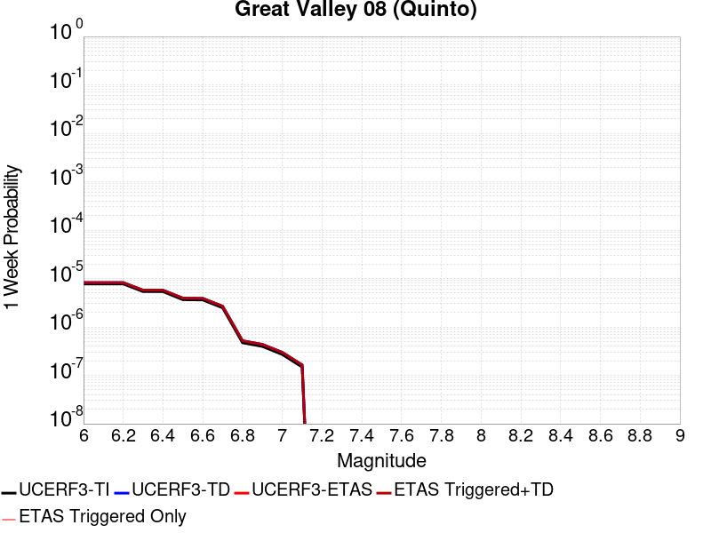 | 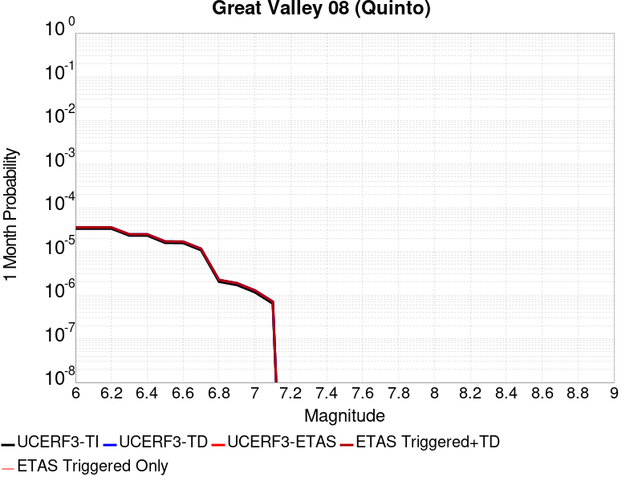 | 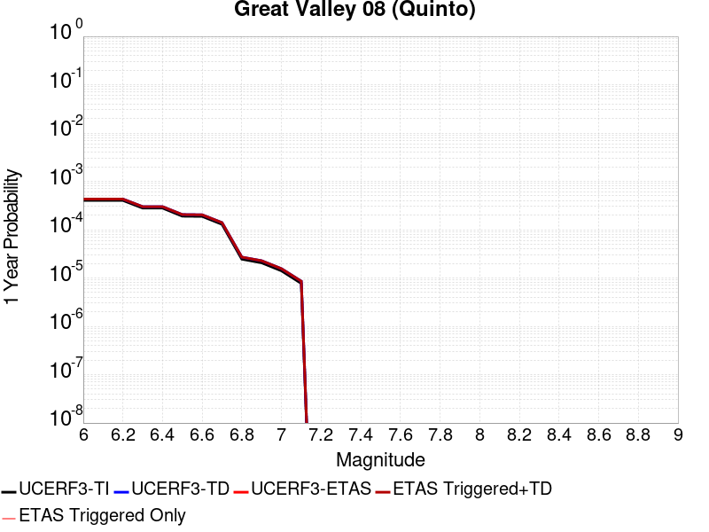 | 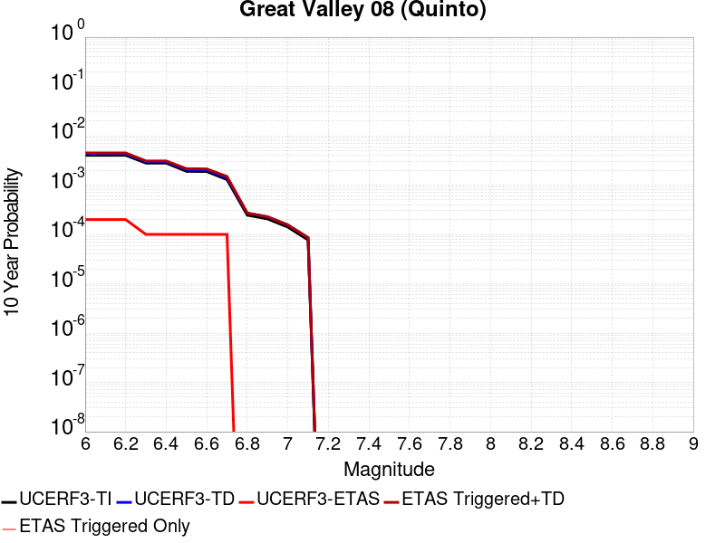 |

| Magnitude | 1 wk TI Prob | 1 wk TD Prob | 1 wk ETAS Prob | 1 wk ETAS/TD Gain | 1 wk ETAS Triggered+TD | 1 wk ETAS Triggered Only | 1 mo TI Prob | 1 mo TD Prob | 1 mo ETAS Prob | 1 mo ETAS/TD Gain | 1 mo ETAS Triggered+TD | 1 mo ETAS Triggered Only | 1 yr TI Prob | 1 yr TD Prob | 1 yr ETAS Prob | 1 yr ETAS/TD Gain | 1 yr ETAS Triggered+TD | 1 yr ETAS Triggered Only | 10 yr TI Prob | 10 yr TD Prob | 10 yr ETAS Prob | 10 yr ETAS/TD Gain | 10 yr ETAS Triggered+TD | 10 yr ETAS Triggered Only |
|-----|-----|-----|-----|-----|-----|-----|-----|-----|-----|-----|-----|-----|-----|-----|-----|-----|-----|-----|-----|-----|-----|-----|-----|-----|
| 6.0 | 7.737697E-6 | 8.247288E-6 | 0.0 | 0.0 | 8.247288E-6 | 0.0 | 3.3161137E-5 | 3.5345147E-5 | 0.0 | 0.0 | 3.5345147E-5 | 0.0 | 4.0366207E-4 | 4.3026102E-4 | 4.0E-4 | 0.92966825 | 6.30175E-4 | 2.0E-4 | 0.004029296 | 0.0042961305 | 0.0074 | 1.7224803 | 0.0066858195 | 0.0024 |
| 6.1 | 7.737697E-6 | 8.247288E-6 | 0.0 | 0.0 | 8.247288E-6 | 0.0 | 3.3161137E-5 | 3.5345147E-5 | 0.0 | 0.0 | 3.5345147E-5 | 0.0 | 4.0366207E-4 | 4.3026102E-4 | 4.0E-4 | 0.92966825 | 6.30175E-4 | 2.0E-4 | 0.004029296 | 0.0042961305 | 0.0074 | 1.7224803 | 0.0066858195 | 0.0024 |
| 6.2 | 7.737697E-6 | 8.247288E-6 | 0.0 | 0.0 | 8.247288E-6 | 0.0 | 3.3161137E-5 | 3.5345147E-5 | 0.0 | 0.0 | 3.5345147E-5 | 0.0 | 4.0366207E-4 | 4.3026102E-4 | 4.0E-4 | 0.92966825 | 6.30175E-4 | 2.0E-4 | 0.004029296 | 0.0042961305 | 0.0074 | 1.7224803 | 0.0066858195 | 0.0024 |
| 6.3 | 5.374012E-6 | 5.7463567E-6 | 0.0 | 0.0 | 5.7463567E-6 | 0.0 | 2.3031276E-5 | 2.4627074E-5 | 0.0 | 0.0 | 2.4627074E-5 | 0.0 | 2.803697E-4 | 2.998045E-4 | 1.0E-4 | 0.33355072 | 3.997745E-4 | 1.0E-4 | 0.0028001624 | 0.002995092 | 0.0041 | 1.3689061 | 0.004191498 | 0.0012 |
| 6.4 | 5.374012E-6 | 5.7463567E-6 | 0.0 | 0.0 | 5.7463567E-6 | 0.0 | 2.3031276E-5 | 2.4627074E-5 | 0.0 | 0.0 | 2.4627074E-5 | 0.0 | 2.803697E-4 | 2.998045E-4 | 1.0E-4 | 0.33355072 | 3.997745E-4 | 1.0E-4 | 0.0028001624 | 0.002995092 | 0.0041 | 1.3689061 | 0.004191498 | 0.0012 |
| 6.5 | 3.65427E-6 | 3.93809E-6 | 0.0 | 0.0 | 3.93809E-6 | 0.0 | 1.5661062E-5 | 1.6877457E-5 | 0.0 | 0.0 | 1.6877457E-5 | 0.0 | 1.9065675E-4 | 2.0547071E-4 | 0.0 | 0.0 | 2.0547071E-4 | 0.0 | 0.0019049325 | 0.002053498 | 0.0024 | 1.1687374 | 0.0027520605 | 7.0E-4 |
| 6.6 | 3.6143538E-6 | 3.895309E-6 | 0.0 | 0.0 | 3.895309E-6 | 0.0 | 1.5489995E-5 | 1.6694114E-5 | 0.0 | 0.0 | 1.6694114E-5 | 0.0 | 1.8857437E-4 | 2.0323892E-4 | 0.0 | 0.0 | 2.0323892E-4 | 0.0 | 0.0018841444 | 0.0020312208 | 0.0021 | 1.033861 | 0.002630002 | 6.0E-4 |
| 6.7 | 2.4821015E-6 | 2.6834055E-6 | 0.0 | 0.0 | 2.6834055E-6 | 0.0 | 1.0637535E-5 | 1.150029E-5 | 0.0 | 0.0 | 1.150029E-5 | 0.0 | 1.2950429E-4 | 1.400127E-4 | 0.0 | 0.0 | 1.400127E-4 | 0.0 | 0.0012942884 | 0.0013997988 | 0.0016 | 1.1430215 | 0.0019989589 | 6.0E-4 |
| 6.8 | 4.7110538E-7 | 5.187477E-7 | 0.0 | 0.0 | 5.187477E-7 | 0.0 | 2.0190216E-6 | 2.2232025E-6 | 0.0 | 0.0 | 2.2232025E-6 | 0.0 | 2.458131E-5 | 2.7067174E-5 | 0.0 | 0.0 | 2.7067174E-5 | 0.0 | 2.457859E-4 | 2.7064056E-4 | 2.0E-4 | 0.7389875 | 3.706135E-4 | 1.0E-4 |
| 6.9 | 3.958685E-7 | 4.3656033E-7 | 0.0 | 0.0 | 4.3656033E-7 | 0.0 | 1.6965782E-6 | 1.8709716E-6 | 0.0 | 0.0 | 1.8709716E-6 | 0.0 | 2.0655643E-5 | 2.2778857E-5 | 0.0 | 0.0 | 2.2778857E-5 | 0.0 | 2.0653724E-4 | 2.2776684E-4 | 2.0E-4 | 0.878091 | 3.2774406E-4 | 1.0E-4 |
| 7.0 | 2.70294E-7 | 2.9886627E-7 | 0.0 | 0.0 | 2.9886627E-7 | 0.0 | 1.1584025E-6 | 1.2808549E-6 | 0.0 | 0.0 | 1.2808549E-6 | 0.0 | 1.4103458E-5 | 1.559431E-5 | 0.0 | 0.0 | 1.559431E-5 | 0.0 | 1.4102564E-4 | 1.5593343E-4 | 1.0E-4 | 0.64129925 | 1.5593343E-4 | 0.0 |
| 7.1 | 1.4828602E-7 | 1.6450103E-7 | 0.0 | 0.0 | 1.6450103E-7 | 0.0 | 6.3551136E-7 | 7.0500425E-7 | 0.0 | 0.0 | 7.0500425E-7 | 0.0 | 7.737323E-6 | 8.583402E-6 | 0.0 | 0.0 | 8.583402E-6 | 0.0 | 7.737054E-5 | 8.5831496E-5 | 1.0E-4 | 1.1650735 | 8.5831496E-5 | 0.0 |

## Earthquake Valley (So Extension)
*[(top)](#table-of-contents)*

| 1 Week | 1 Month | 1 Year | 10 Year |
|-----|-----|-----|-----|
| 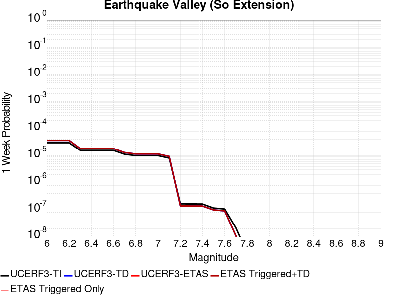 | 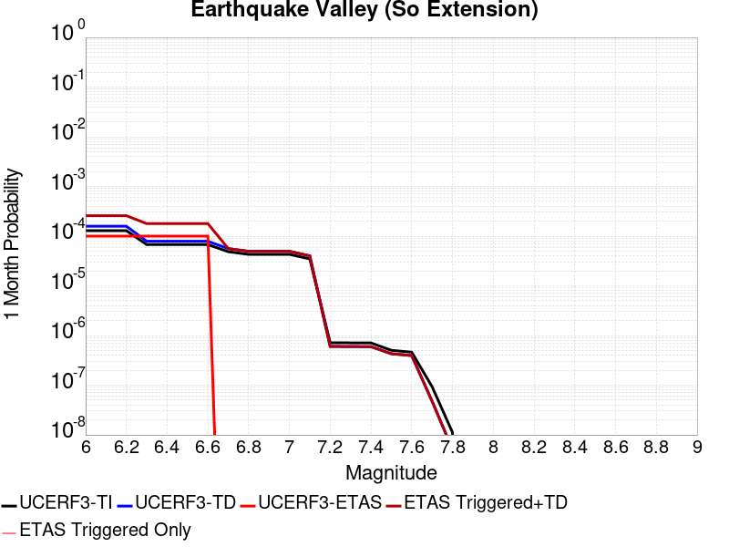 | 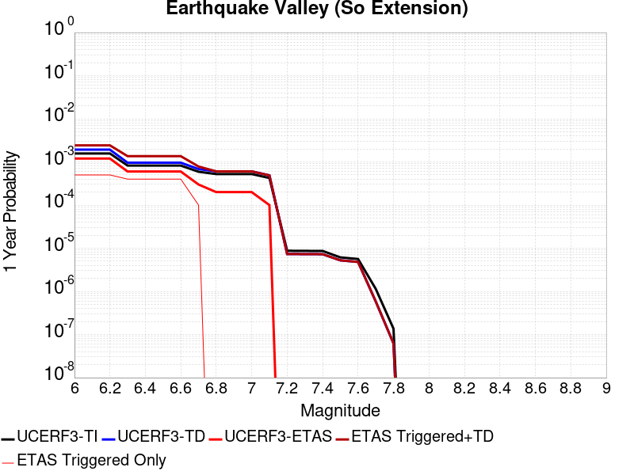 | 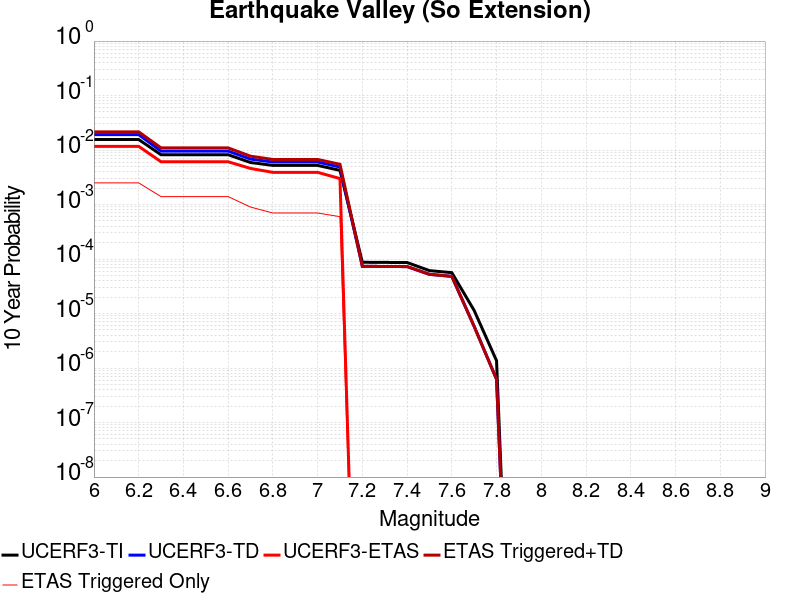 |

| Magnitude | 1 wk TI Prob | 1 wk TD Prob | 1 wk ETAS Prob | 1 wk ETAS/TD Gain | 1 wk ETAS Triggered+TD | 1 wk ETAS Triggered Only | 1 mo TI Prob | 1 mo TD Prob | 1 mo ETAS Prob | 1 mo ETAS/TD Gain | 1 mo ETAS Triggered+TD | 1 mo ETAS Triggered Only | 1 yr TI Prob | 1 yr TD Prob | 1 yr ETAS Prob | 1 yr ETAS/TD Gain | 1 yr ETAS Triggered+TD | 1 yr ETAS Triggered Only | 10 yr TI Prob | 10 yr TD Prob | 10 yr ETAS Prob | 10 yr ETAS/TD Gain | 10 yr ETAS Triggered+TD | 10 yr ETAS Triggered Only |
|-----|-----|-----|-----|-----|-----|-----|-----|-----|-----|-----|-----|-----|-----|-----|-----|-----|-----|-----|-----|-----|-----|-----|-----|-----|
| 6.0 | 3.0194888E-5 | 3.698353E-5 | 0.0 | 0.0 | 3.698353E-5 | 0.0 | 1.2940024E-4 | 1.5849427E-4 | 1.0E-4 | 0.6309377 | 2.5847842E-4 | 1.0E-4 | 0.0015743093 | 0.0019284706 | 0.0012 | 0.6222548 | 0.0024275063 | 5.0E-4 | 0.01563203 | 0.019167658 | 0.0117 | 0.61040324 | 0.021619739 | 0.0025 |
| 6.1 | 3.0194888E-5 | 3.698353E-5 | 0.0 | 0.0 | 3.698353E-5 | 0.0 | 1.2940024E-4 | 1.5849427E-4 | 1.0E-4 | 0.6309377 | 2.5847842E-4 | 1.0E-4 | 0.0015743093 | 0.0019284706 | 0.0012 | 0.6222548 | 0.0024275063 | 5.0E-4 | 0.01563203 | 0.019167658 | 0.0117 | 0.61040324 | 0.021619739 | 0.0025 |
| 6.2 | 3.0194888E-5 | 3.698353E-5 | 0.0 | 0.0 | 3.698353E-5 | 0.0 | 1.2940024E-4 | 1.5849427E-4 | 1.0E-4 | 0.6309377 | 2.5847842E-4 | 1.0E-4 | 0.0015743093 | 0.0019284706 | 0.0012 | 0.6222548 | 0.0024275063 | 5.0E-4 | 0.01563203 | 0.019167658 | 0.0117 | 0.61040324 | 0.021619739 | 0.0025 |
| 6.3 | 1.5795305E-5 | 1.8413415E-5 | 0.0 | 0.0 | 1.8413415E-5 | 0.0 | 6.769241E-5 | 7.8912875E-5 | 1.0E-4 | 1.2672204 | 1.7890499E-4 | 1.0E-4 | 8.238434E-4 | 9.604512E-4 | 6.0E-4 | 0.6247064 | 0.001360067 | 4.0E-4 | 0.008207959 | 0.009573867 | 0.0061 | 0.6371511 | 0.010960463 | 0.0014 |
| 6.4 | 1.5795305E-5 | 1.8413415E-5 | 0.0 | 0.0 | 1.8413415E-5 | 0.0 | 6.769241E-5 | 7.8912875E-5 | 1.0E-4 | 1.2672204 | 1.7890499E-4 | 1.0E-4 | 8.238434E-4 | 9.604512E-4 | 6.0E-4 | 0.6247064 | 0.001360067 | 4.0E-4 | 0.008207959 | 0.009573867 | 0.0061 | 0.6371511 | 0.010960463 | 0.0014 |
| 6.5 | 1.5795305E-5 | 1.8413415E-5 | 0.0 | 0.0 | 1.8413415E-5 | 0.0 | 6.769241E-5 | 7.8912875E-5 | 1.0E-4 | 1.2672204 | 1.7890499E-4 | 1.0E-4 | 8.238434E-4 | 9.604512E-4 | 6.0E-4 | 0.6247064 | 0.001360067 | 4.0E-4 | 0.008207959 | 0.009573867 | 0.0061 | 0.6371511 | 0.010960463 | 0.0014 |
| 6.6 | 1.5795305E-5 | 1.8413415E-5 | 0.0 | 0.0 | 1.8413415E-5 | 0.0 | 6.769241E-5 | 7.8912875E-5 | 1.0E-4 | 1.2672204 | 1.7890499E-4 | 1.0E-4 | 8.238434E-4 | 9.604512E-4 | 6.0E-4 | 0.6247064 | 0.001360067 | 4.0E-4 | 0.008207959 | 0.009573867 | 0.0061 | 0.6371511 | 0.010960463 | 0.0014 |
| 6.7 | 1.1363076E-5 | 1.31159995E-5 | 0.0 | 0.0 | 1.31159995E-5 | 0.0 | 4.8697988E-5 | 5.6210643E-5 | 0.0 | 0.0 | 5.6210643E-5 | 0.0 | 5.927367E-4 | 6.842256E-4 | 3.0E-4 | 0.4384519 | 7.8415714E-4 | 1.0E-4 | 0.0059115817 | 0.0068286373 | 0.0046 | 0.67363364 | 0.0077224914 | 9.0E-4 |
| 6.8 | 1.0049611E-5 | 1.15748635E-5 | 0.0 | 0.0 | 1.15748635E-5 | 0.0 | 4.306905E-5 | 4.9606024E-5 | 0.0 | 0.0 | 4.9606024E-5 | 0.0 | 5.242395E-4 | 6.038589E-4 | 2.0E-4 | 0.3312032 | 6.038589E-4 | 0.0 | 0.0052300454 | 0.0060293335 | 0.0039 | 0.64683765 | 0.006725113 | 7.0E-4 |
| 6.9 | 1.0049611E-5 | 1.15748635E-5 | 0.0 | 0.0 | 1.15748635E-5 | 0.0 | 4.306905E-5 | 4.9606024E-5 | 0.0 | 0.0 | 4.9606024E-5 | 0.0 | 5.242395E-4 | 6.038589E-4 | 2.0E-4 | 0.3312032 | 6.038589E-4 | 0.0 | 0.0052300454 | 0.0060293335 | 0.0039 | 0.64683765 | 0.006725113 | 7.0E-4 |
| 7.0 | 1.0049611E-5 | 1.15748635E-5 | 0.0 | 0.0 | 1.15748635E-5 | 0.0 | 4.306905E-5 | 4.9606024E-5 | 0.0 | 0.0 | 4.9606024E-5 | 0.0 | 5.242395E-4 | 6.038589E-4 | 2.0E-4 | 0.3312032 | 6.038589E-4 | 0.0 | 0.0052300454 | 0.0060293335 | 0.0039 | 0.64683765 | 0.006725113 | 7.0E-4 |
| 7.1 | 8.140254E-6 | 9.367627E-6 | 0.0 | 0.0 | 9.367627E-6 | 0.0 | 3.4886336E-5 | 4.014673E-5 | 0.0 | 0.0 | 4.014673E-5 | 0.0 | 4.2465836E-4 | 4.8874365E-4 | 1.0E-4 | 0.20460624 | 4.8874365E-4 | 0.0 | 0.0042384774 | 0.0048832423 | 0.003 | 0.6143459 | 0.0054803123 | 6.0E-4 |
| 7.2 | 1.673835E-7 | 1.410432E-7 | 0.0 | 0.0 | 1.410432E-7 | 0.0 | 7.173577E-7 | 6.044707E-7 | 0.0 | 0.0 | 6.044707E-7 | 0.0 | 8.733795E-6 | 7.3594097E-6 | 0.0 | 0.0 | 7.3594097E-6 | 0.0 | 8.733451E-5 | 7.359201E-5 | 0.0 | 0.0 | 7.359201E-5 | 0.0 |
| 7.3 | 1.6632116E-7 | 1.4002664E-7 | 0.0 | 0.0 | 1.4002664E-7 | 0.0 | 7.1280476E-7 | 6.0011405E-7 | 0.0 | 0.0 | 6.0011405E-7 | 0.0 | 8.678364E-6 | 7.306368E-6 | 0.0 | 0.0 | 7.306368E-6 | 0.0 | 8.6780245E-5 | 7.306163E-5 | 0.0 | 0.0 | 7.306163E-5 | 0.0 |
| 7.4 | 1.6569169E-7 | 1.3947373E-7 | 0.0 | 0.0 | 1.3947373E-7 | 0.0 | 7.1010703E-7 | 5.977445E-7 | 0.0 | 0.0 | 5.977445E-7 | 0.0 | 8.645519E-6 | 7.277518E-6 | 0.0 | 0.0 | 7.277518E-6 | 0.0 | 8.645182E-5 | 7.277315E-5 | 0.0 | 0.0 | 7.277315E-5 | 0.0 |
| 7.5 | 1.1764555E-7 | 1.0053396E-7 | 0.0 | 0.0 | 1.0053396E-7 | 0.0 | 5.041951E-7 | 4.3085976E-7 | 0.0 | 0.0 | 4.3085976E-7 | 0.0 | 6.138558E-6 | 5.245707E-6 | 0.0 | 0.0 | 5.245707E-6 | 0.0 | 6.1383886E-5 | 5.2456046E-5 | 0.0 | 0.0 | 5.2456046E-5 | 0.0 |
| 7.6 | 1.07927605E-7 | 9.226856E-8 | 0.0 | 0.0 | 9.226856E-8 | 0.0 | 4.6254678E-7 | 3.9543662E-7 | 0.0 | 0.0 | 3.9543662E-7 | 0.0 | 5.6314925E-6 | 4.8144325E-6 | 0.0 | 0.0 | 4.8144325E-6 | 0.0 | 5.63135E-5 | 4.8143487E-5 | 0.0 | 0.0 | 4.8143487E-5 | 0.0 |
| 7.7 | 2.1826905E-8 | 1.11334355E-8 | 0.0 | 0.0 | 1.11334355E-8 | 0.0 | 9.3543875E-8 | 4.771472E-8 | 0.0 | 0.0 | 4.771472E-8 | 0.0 | 1.1388961E-6 | 5.809266E-7 | 0.0 | 0.0 | 5.809266E-7 | 0.0 | 1.1388902E-5 | 5.8092564E-6 | 0.0 | 0.0 | 5.8092564E-6 | 0.0 |
| 7.8 | 2.6169649E-9 | 1.1922348E-9 | 0.0 | 0.0 | 1.1922348E-9 | 0.0 | 1.1215564E-8 | 5.1095776E-9 | 0.0 | 0.0 | 5.1095776E-9 | 0.0 | 1.3654947E-7 | 6.220911E-8 | 0.0 | 0.0 | 6.220911E-8 | 0.0 | 1.365494E-6 | 6.220911E-7 | 0.0 | 0.0 | 6.220911E-7 | 0.0 |

## Hosgri
*[(top)](#table-of-contents)*

| 1 Week | 1 Month | 1 Year | 10 Year |
|-----|-----|-----|-----|
| 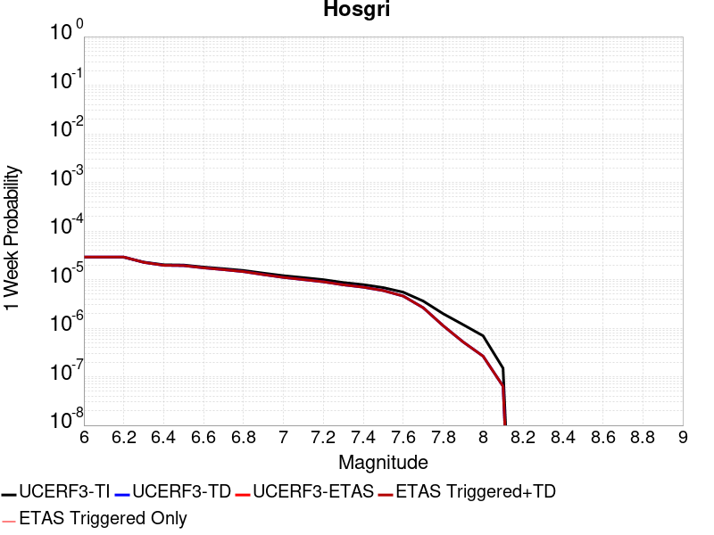 | 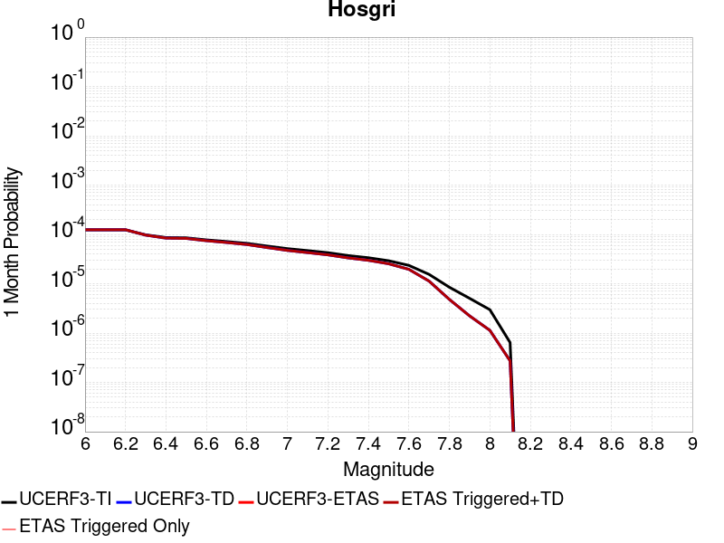 | 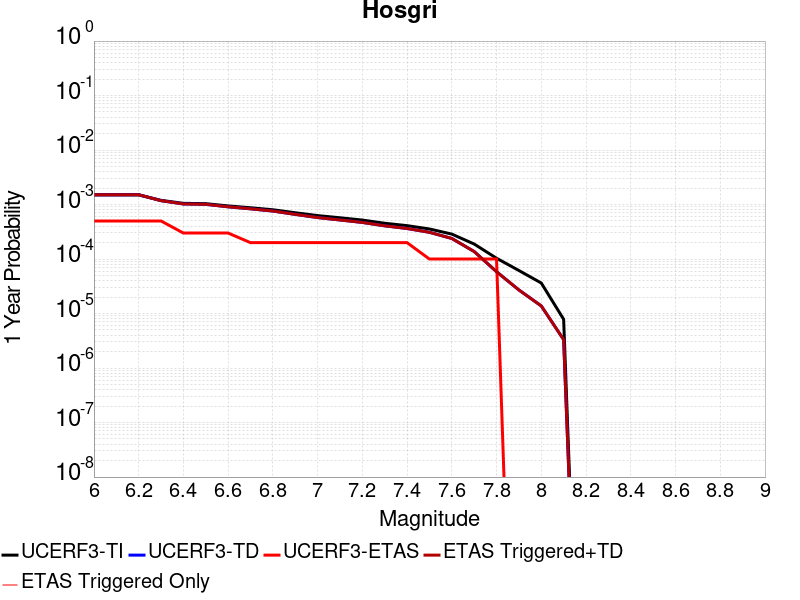 | 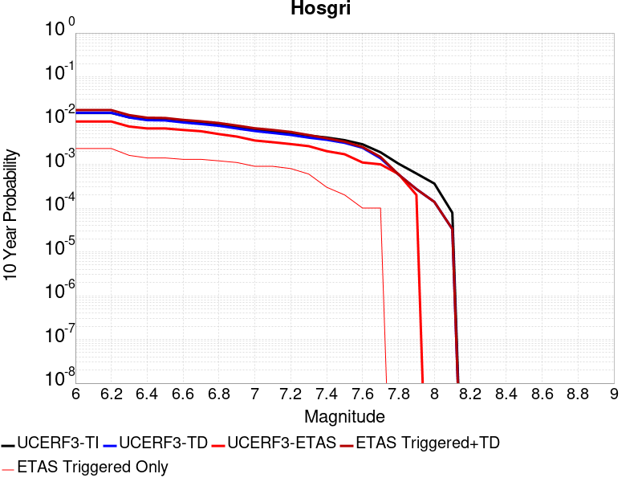 |

| Magnitude | 1 wk TI Prob | 1 wk TD Prob | 1 wk ETAS Prob | 1 wk ETAS/TD Gain | 1 wk ETAS Triggered+TD | 1 wk ETAS Triggered Only | 1 mo TI Prob | 1 mo TD Prob | 1 mo ETAS Prob | 1 mo ETAS/TD Gain | 1 mo ETAS Triggered+TD | 1 mo ETAS Triggered Only | 1 yr TI Prob | 1 yr TD Prob | 1 yr ETAS Prob | 1 yr ETAS/TD Gain | 1 yr ETAS Triggered+TD | 1 yr ETAS Triggered Only | 10 yr TI Prob | 10 yr TD Prob | 10 yr ETAS Prob | 10 yr ETAS/TD Gain | 10 yr ETAS Triggered+TD | 10 yr ETAS Triggered Only |
|-----|-----|-----|-----|-----|-----|-----|-----|-----|-----|-----|-----|-----|-----|-----|-----|-----|-----|-----|-----|-----|-----|-----|-----|-----|
| 6.0 | 2.883978E-5 | 2.9091976E-5 | 0.0 | 0.0 | 2.9091976E-5 | 0.0 | 1.235932E-4 | 1.246741E-4 | 0.0 | 0.0 | 1.246741E-4 | 0.0 | 0.0015037085 | 0.0015168773 | 5.0E-4 | 0.32962453 | 0.0015168773 | 0.0 | 0.01493574 | 0.015068997 | 0.0095 | 0.6304335 | 0.017334338 | 0.0023 |
| 6.1 | 2.883978E-5 | 2.9091976E-5 | 0.0 | 0.0 | 2.9091976E-5 | 0.0 | 1.235932E-4 | 1.246741E-4 | 0.0 | 0.0 | 1.246741E-4 | 0.0 | 0.0015037085 | 0.0015168773 | 5.0E-4 | 0.32962453 | 0.0015168773 | 0.0 | 0.01493574 | 0.015068997 | 0.0095 | 0.6304335 | 0.017334338 | 0.0023 |
| 6.2 | 2.883978E-5 | 2.9091976E-5 | 0.0 | 0.0 | 2.9091976E-5 | 0.0 | 1.235932E-4 | 1.246741E-4 | 0.0 | 0.0 | 1.246741E-4 | 0.0 | 0.0015037085 | 0.0015168773 | 5.0E-4 | 0.32962453 | 0.0015168773 | 0.0 | 0.01493574 | 0.015068997 | 0.0095 | 0.6304335 | 0.017334338 | 0.0023 |
| 6.3 | 2.2914428E-5 | 2.261196E-5 | 0.0 | 0.0 | 2.261196E-5 | 0.0 | 9.8200995E-5 | 9.690483E-5 | 0.0 | 0.0 | 9.690483E-5 | 0.0 | 0.0011949413 | 0.0011791827 | 5.0E-4 | 0.42402253 | 0.0011791827 | 0.0 | 0.011885363 | 0.011730647 | 0.0073 | 0.6223016 | 0.013311878 | 0.0016 |
| 6.4 | 2.0195741E-5 | 1.966912E-5 | 0.0 | 0.0 | 1.966912E-5 | 0.0 | 8.65503E-5 | 8.429351E-5 | 0.0 | 0.0 | 8.429351E-5 | 0.0 | 0.0010532405 | 0.0010257923 | 3.0E-4 | 0.29245687 | 0.0010257923 | 0.0 | 0.010482626 | 0.01021161 | 0.0066 | 0.64632314 | 0.011597314 | 0.0014 |
| 6.5 | 1.9924333E-5 | 1.9381732E-5 | 0.0 | 0.0 | 1.9381732E-5 | 0.0 | 8.53872E-5 | 8.306194E-5 | 0.0 | 0.0 | 8.306194E-5 | 0.0 | 0.0010390934 | 0.0010108118 | 3.0E-4 | 0.29679114 | 0.0010108118 | 0.0 | 0.010342481 | 0.010063169 | 0.0066 | 0.6558571 | 0.01144908 | 0.0014 |
| 6.6 | 1.809694E-5 | 1.7432514E-5 | 0.0 | 0.0 | 1.7432514E-5 | 0.0 | 7.7556004E-5 | 7.470864E-5 | 0.0 | 0.0 | 7.470864E-5 | 0.0 | 9.438353E-4 | 9.091994E-4 | 3.0E-4 | 0.3299606 | 9.091994E-4 | 0.0 | 0.009398366 | 0.00905573 | 0.0061 | 0.6736067 | 0.010343957 | 0.0013 |
| 6.7 | 1.675989E-5 | 1.6017977E-5 | 0.0 | 0.0 | 1.6017977E-5 | 0.0 | 7.182612E-5 | 6.8646674E-5 | 0.0 | 0.0 | 6.8646674E-5 | 0.0 | 8.7413215E-4 | 8.3545386E-4 | 2.0E-4 | 0.23939084 | 8.3545386E-4 | 0.0 | 0.008707017 | 0.008324026 | 0.0057 | 0.68476474 | 0.009613206 | 0.0013 |
| 6.8 | 1.5401129E-5 | 1.459028E-5 | 0.0 | 0.0 | 1.459028E-5 | 0.0 | 6.6003166E-5 | 6.252828E-5 | 0.0 | 0.0 | 6.252828E-5 | 0.0 | 8.032922E-4 | 7.6101674E-4 | 2.0E-4 | 0.2628063 | 7.6101674E-4 | 0.0 | 0.008003947 | 0.0075849607 | 0.0049 | 0.6460152 | 0.008775859 | 0.0012 |
| 6.9 | 1.356559E-5 | 1.2667488E-5 | 0.0 | 0.0 | 1.2667488E-5 | 0.0 | 5.8136946E-5 | 5.4288106E-5 | 0.0 | 0.0 | 5.4288106E-5 | 0.0 | 7.0758746E-4 | 6.607577E-4 | 2.0E-4 | 0.30268282 | 6.607577E-4 | 0.0 | 0.007053386 | 0.0065887254 | 0.0043 | 0.65263003 | 0.007681478 | 0.0011 |
| 7.0 | 1.2030819E-5 | 1.1074645E-5 | 0.0 | 0.0 | 1.1074645E-5 | 0.0 | 5.155963E-5 | 4.74619E-5 | 0.0 | 0.0 | 4.74619E-5 | 0.0 | 6.275577E-4 | 5.7769555E-4 | 2.0E-4 | 0.34620312 | 5.7769555E-4 | 0.0 | 0.006257884 | 0.005762689 | 0.0035 | 0.60735536 | 0.006657502 | 9.0E-4 |
| 7.1 | 1.0972698E-5 | 1.0001579E-5 | 0.0 | 0.0 | 1.0001579E-5 | 0.0 | 4.7025E-5 | 4.2863205E-5 | 0.0 | 0.0 | 4.2863205E-5 | 0.0 | 5.72379E-4 | 5.2173465E-4 | 2.0E-4 | 0.38333663 | 5.2173465E-4 | 0.0 | 0.0057090693 | 0.0052058394 | 0.0032 | 0.61469436 | 0.0061011543 | 9.0E-4 |
| 7.2 | 9.961926E-6 | 9.014676E-6 | 0.0 | 0.0 | 9.014676E-6 | 0.0 | 4.2693267E-5 | 3.8633756E-5 | 0.0 | 0.0 | 3.8633756E-5 | 0.0 | 5.1966653E-4 | 4.702645E-4 | 2.0E-4 | 0.42529258 | 4.702645E-4 | 0.0 | 0.00518453 | 0.00469343 | 0.0029 | 0.617885 | 0.0054896753 | 8.0E-4 |
| 7.3 | 8.700929E-6 | 7.808885E-6 | 0.0 | 0.0 | 7.808885E-6 | 0.0 | 3.7289166E-5 | 3.3466218E-5 | 0.0 | 0.0 | 3.3466218E-5 | 0.0 | 4.53901E-4 | 4.0737508E-4 | 2.0E-4 | 0.49094805 | 4.0737508E-4 | 0.0 | 0.00452975 | 0.0040670126 | 0.0026 | 0.63928986 | 0.0046645724 | 6.0E-4 |
| 7.4 | 7.866285E-6 | 6.979975E-6 | 0.0 | 0.0 | 6.979975E-6 | 0.0 | 3.3712215E-5 | 2.9913836E-5 | 0.0 | 0.0 | 2.9913836E-5 | 0.0 | 4.103689E-4 | 3.641401E-4 | 2.0E-4 | 0.54923916 | 3.641401E-4 | 0.0 | 0.004096119 | 0.0036361616 | 0.002 | 0.5500305 | 0.0039350707 | 3.0E-4 |
| 7.5 | 6.8381305E-6 | 5.9415765E-6 | 0.0 | 0.0 | 5.9415765E-6 | 0.0 | 2.9305946E-5 | 2.546365E-5 | 0.0 | 0.0 | 2.546365E-5 | 0.0 | 3.5674145E-4 | 3.0997585E-4 | 1.0E-4 | 0.32260576 | 3.0997585E-4 | 0.0 | 0.0035616932 | 0.0030961598 | 0.0017 | 0.54906726 | 0.0032955406 | 2.0E-4 |
| 7.6 | 5.503376E-6 | 4.578012E-6 | 0.0 | 0.0 | 4.578012E-6 | 0.0 | 2.3585684E-5 | 1.9619903E-5 | 0.0 | 0.0 | 1.9619903E-5 | 0.0 | 2.8711787E-4 | 2.3884616E-4 | 1.0E-4 | 0.41867954 | 2.3884616E-4 | 0.0 | 0.002867472 | 0.0023866175 | 0.0011 | 0.46090335 | 0.002486379 | 1.0E-4 |
| 7.7 | 3.6144982E-6 | 2.6375187E-6 | 0.0 | 0.0 | 2.6375187E-6 | 0.0 | 1.5490614E-5 | 1.1303602E-5 | 0.0 | 0.0 | 1.1303602E-5 | 0.0 | 1.8858191E-4 | 1.3761267E-4 | 1.0E-4 | 0.72667724 | 1.3761267E-4 | 0.0 | 0.0018842196 | 0.0013759957 | 0.001 | 0.72674644 | 0.0014758582 | 1.0E-4 |
| 7.8 | 1.9853494E-6 | 1.1247585E-6 | 0.0 | 0.0 | 1.1247585E-6 | 0.0 | 8.508612E-6 | 4.820384E-6 | 0.0 | 0.0 | 4.820384E-6 | 0.0 | 1.0358743E-4 | 5.86866E-5 | 1.0E-4 | 1.7039665 | 5.86866E-5 | 0.0 | 0.0010353916 | 5.8743096E-4 | 6.0E-4 | 1.0213966 | 5.8743096E-4 | 0.0 |
| 7.9 | 1.1818757E-6 | 5.208647E-7 | 0.0 | 0.0 | 5.208647E-7 | 0.0 | 5.0651715E-6 | 2.2322754E-6 | 0.0 | 0.0 | 2.2322754E-6 | 0.0 | 6.1666724E-5 | 2.7177615E-5 | 0.0 | 0.0 | 2.7177615E-5 | 0.0 | 6.1649614E-4 | 2.7242803E-4 | 2.0E-4 | 0.73413885 | 2.7242803E-4 | 0.0 |
| 8.0 | 6.962958E-7 | 2.655226E-7 | 0.0 | 0.0 | 2.655226E-7 | 0.0 | 2.9841215E-6 | 1.1379535E-6 | 0.0 | 0.0 | 1.1379535E-6 | 0.0 | 3.6331072E-5 | 1.3854496E-5 | 0.0 | 0.0 | 1.3854496E-5 | 0.0 | 3.6325134E-4 | 1.3909949E-4 | 0.0 | 0.0 | 1.3909949E-4 | 0.0 |
| 8.1 | 1.5033264E-7 | 6.395114E-8 | 0.0 | 0.0 | 6.395114E-8 | 0.0 | 6.442826E-7 | 2.7407629E-7 | 0.0 | 0.0 | 2.7407629E-7 | 0.0 | 7.844113E-6 | 3.336874E-6 | 0.0 | 0.0 | 3.336874E-6 | 0.0 | 7.843835E-5 | 3.338902E-5 | 0.0 | 0.0 | 3.338902E-5 | 0.0 |

## Little Salmon (Offshore)
*[(top)](#table-of-contents)*

| 1 Week | 1 Month | 1 Year | 10 Year |
|-----|-----|-----|-----|
| 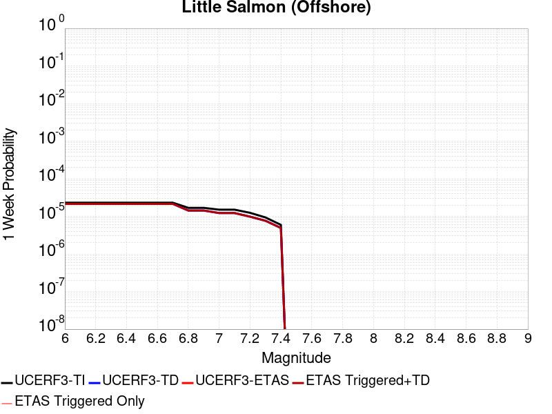 | 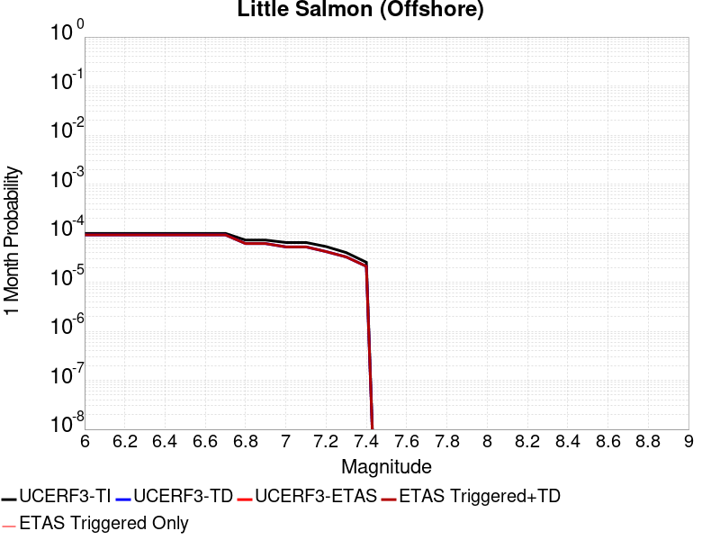 | 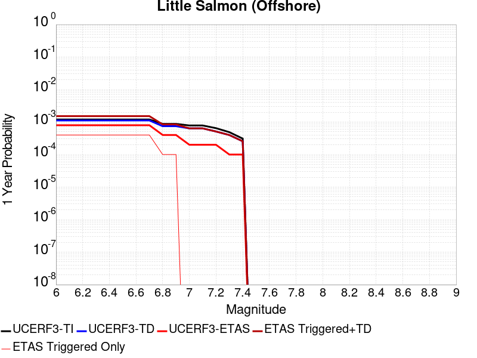 | 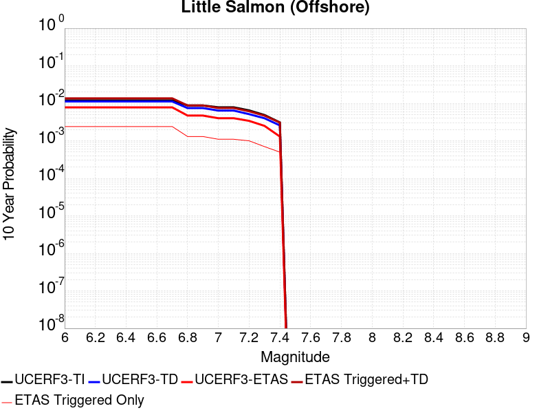 |

| Magnitude | 1 wk TI Prob | 1 wk TD Prob | 1 wk ETAS Prob | 1 wk ETAS/TD Gain | 1 wk ETAS Triggered+TD | 1 wk ETAS Triggered Only | 1 mo TI Prob | 1 mo TD Prob | 1 mo ETAS Prob | 1 mo ETAS/TD Gain | 1 mo ETAS Triggered+TD | 1 mo ETAS Triggered Only | 1 yr TI Prob | 1 yr TD Prob | 1 yr ETAS Prob | 1 yr ETAS/TD Gain | 1 yr ETAS Triggered+TD | 1 yr ETAS Triggered Only | 10 yr TI Prob | 10 yr TD Prob | 10 yr ETAS Prob | 10 yr ETAS/TD Gain | 10 yr ETAS Triggered+TD | 10 yr ETAS Triggered Only |
|-----|-----|-----|-----|-----|-----|-----|-----|-----|-----|-----|-----|-----|-----|-----|-----|-----|-----|-----|-----|-----|-----|-----|-----|-----|
| 6.0 | 2.3052053E-5 | 2.1499658E-5 | 0.0 | 0.0 | 2.1499658E-5 | 0.0 | 9.879077E-5 | 9.213878E-5 | 0.0 | 0.0 | 9.213878E-5 | 0.0 | 0.0012021139 | 0.0011213263 | 8.0E-4 | 0.71344084 | 0.0015208778 | 4.0E-4 | 0.011956319 | 0.011187837 | 0.0078 | 0.6971857 | 0.013560986 | 0.0024 |
| 6.1 | 2.3052053E-5 | 2.1499658E-5 | 0.0 | 0.0 | 2.1499658E-5 | 0.0 | 9.879077E-5 | 9.213878E-5 | 0.0 | 0.0 | 9.213878E-5 | 0.0 | 0.0012021139 | 0.0011213263 | 8.0E-4 | 0.71344084 | 0.0015208778 | 4.0E-4 | 0.011956319 | 0.011187837 | 0.0078 | 0.6971857 | 0.013560986 | 0.0024 |
| 6.2 | 2.3052053E-5 | 2.1499658E-5 | 0.0 | 0.0 | 2.1499658E-5 | 0.0 | 9.879077E-5 | 9.213878E-5 | 0.0 | 0.0 | 9.213878E-5 | 0.0 | 0.0012021139 | 0.0011213263 | 8.0E-4 | 0.71344084 | 0.0015208778 | 4.0E-4 | 0.011956319 | 0.011187837 | 0.0078 | 0.6971857 | 0.013560986 | 0.0024 |
| 6.3 | 2.3052053E-5 | 2.1499658E-5 | 0.0 | 0.0 | 2.1499658E-5 | 0.0 | 9.879077E-5 | 9.213878E-5 | 0.0 | 0.0 | 9.213878E-5 | 0.0 | 0.0012021139 | 0.0011213263 | 8.0E-4 | 0.71344084 | 0.0015208778 | 4.0E-4 | 0.011956319 | 0.011187837 | 0.0078 | 0.6971857 | 0.013560986 | 0.0024 |
| 6.4 | 2.3052053E-5 | 2.1499658E-5 | 0.0 | 0.0 | 2.1499658E-5 | 0.0 | 9.879077E-5 | 9.213878E-5 | 0.0 | 0.0 | 9.213878E-5 | 0.0 | 0.0012021139 | 0.0011213263 | 8.0E-4 | 0.71344084 | 0.0015208778 | 4.0E-4 | 0.011956319 | 0.011187837 | 0.0078 | 0.6971857 | 0.013560986 | 0.0024 |
| 6.5 | 2.3052053E-5 | 2.1499658E-5 | 0.0 | 0.0 | 2.1499658E-5 | 0.0 | 9.879077E-5 | 9.213878E-5 | 0.0 | 0.0 | 9.213878E-5 | 0.0 | 0.0012021139 | 0.0011213263 | 8.0E-4 | 0.71344084 | 0.0015208778 | 4.0E-4 | 0.011956319 | 0.011187837 | 0.0078 | 0.6971857 | 0.013560986 | 0.0024 |
| 6.6 | 2.3052053E-5 | 2.1499658E-5 | 0.0 | 0.0 | 2.1499658E-5 | 0.0 | 9.879077E-5 | 9.213878E-5 | 0.0 | 0.0 | 9.213878E-5 | 0.0 | 0.0012021139 | 0.0011213263 | 8.0E-4 | 0.71344084 | 0.0015208778 | 4.0E-4 | 0.011956319 | 0.011187837 | 0.0078 | 0.6971857 | 0.013560986 | 0.0024 |
| 6.7 | 2.3052053E-5 | 2.1499658E-5 | 0.0 | 0.0 | 2.1499658E-5 | 0.0 | 9.879077E-5 | 9.213878E-5 | 0.0 | 0.0 | 9.213878E-5 | 0.0 | 0.0012021139 | 0.0011213263 | 8.0E-4 | 0.71344084 | 0.0015208778 | 4.0E-4 | 0.011956319 | 0.011187837 | 0.0078 | 0.6971857 | 0.013560986 | 0.0024 |
| 6.8 | 1.683878E-5 | 1.4291685E-5 | 0.0 | 0.0 | 1.4291685E-5 | 0.0 | 7.21642E-5 | 6.1248924E-5 | 0.0 | 0.0 | 6.1248924E-5 | 0.0 | 8.78245E-4 | 7.455008E-4 | 4.0E-4 | 0.5365521 | 8.454262E-4 | 1.0E-4 | 0.008747822 | 0.007454923 | 0.0047 | 0.6304559 | 0.008745232 | 0.0013 |
| 6.9 | 1.683878E-5 | 1.4291685E-5 | 0.0 | 0.0 | 1.4291685E-5 | 0.0 | 7.21642E-5 | 6.1248924E-5 | 0.0 | 0.0 | 6.1248924E-5 | 0.0 | 8.78245E-4 | 7.455008E-4 | 4.0E-4 | 0.5365521 | 8.454262E-4 | 1.0E-4 | 0.008747822 | 0.007454923 | 0.0047 | 0.6304559 | 0.008745232 | 0.0013 |
| 7.0 | 1.5051273E-5 | 1.2243148E-5 | 0.0 | 0.0 | 1.2243148E-5 | 0.0 | 6.450386E-5 | 5.2469833E-5 | 0.0 | 0.0 | 5.2469833E-5 | 0.0 | 7.8505155E-4 | 6.386783E-4 | 2.0E-4 | 0.3131467 | 6.386783E-4 | 0.0 | 0.00782284 | 0.0063928757 | 0.004 | 0.6256965 | 0.0074858437 | 0.0011 |
| 7.1 | 1.5051273E-5 | 1.2243148E-5 | 0.0 | 0.0 | 1.2243148E-5 | 0.0 | 6.450386E-5 | 5.2469833E-5 | 0.0 | 0.0 | 5.2469833E-5 | 0.0 | 7.8505155E-4 | 6.386783E-4 | 2.0E-4 | 0.3131467 | 6.386783E-4 | 0.0 | 0.00782284 | 0.0063928757 | 0.004 | 0.6256965 | 0.0074858437 | 0.0011 |
| 7.2 | 1.24301405E-5 | 9.815183E-6 | 0.0 | 0.0 | 9.815183E-6 | 0.0 | 5.3270942E-5 | 4.2064614E-5 | 0.0 | 0.0 | 4.2064614E-5 | 0.0 | 6.483807E-4 | 5.120557E-4 | 2.0E-4 | 0.39058253 | 5.120557E-4 | 0.0 | 0.006464922 | 0.005132409 | 0.0034 | 0.662457 | 0.0061272765 | 0.001 |
| 7.3 | 9.3599865E-6 | 7.63674E-6 | 0.0 | 0.0 | 7.63674E-6 | 0.0 | 4.011361E-5 | 3.2728673E-5 | 0.0 | 0.0 | 3.2728673E-5 | 0.0 | 4.8827377E-4 | 3.9843383E-4 | 1.0E-4 | 0.2509827 | 3.9843383E-4 | 0.0 | 0.004872023 | 0.0039928746 | 0.0025 | 0.6261153 | 0.00469008 | 7.0E-4 |
| 7.4 | 5.941556E-6 | 4.913584E-6 | 0.0 | 0.0 | 4.913584E-6 | 0.0 | 2.5463563E-5 | 2.1058217E-5 | 0.0 | 0.0 | 2.1058217E-5 | 0.0 | 3.0997477E-4 | 2.5638376E-4 | 1.0E-4 | 0.39004028 | 2.5638376E-4 | 0.0 | 0.0030954275 | 0.0025715034 | 0.0013 | 0.50554085 | 0.0030702178 | 5.0E-4 |

## Robinson Creek
*[(top)](#table-of-contents)*

| 1 Week | 1 Month | 1 Year | 10 Year |
|-----|-----|-----|-----|
| 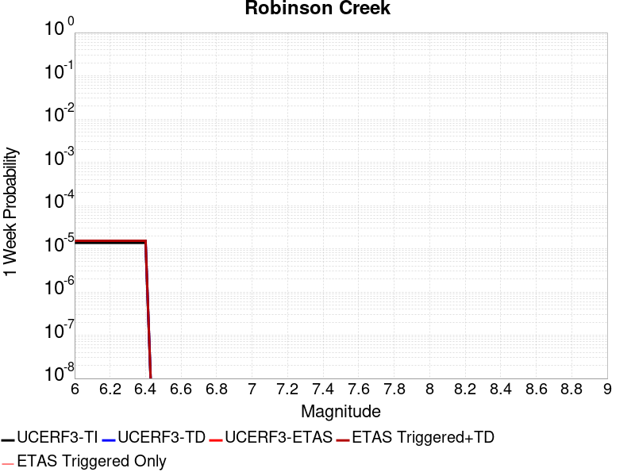 | 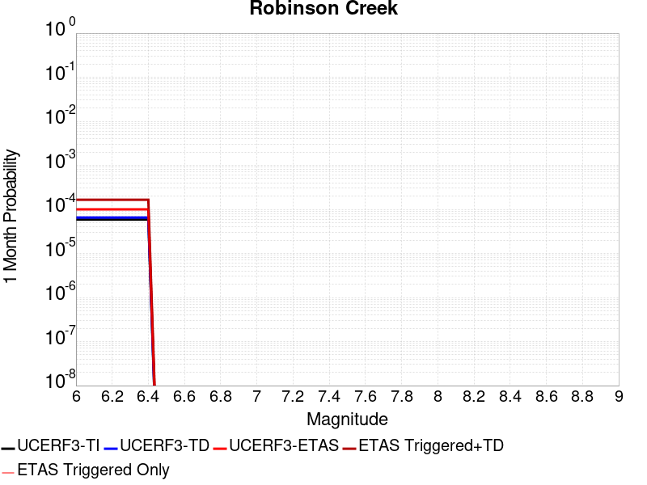 | 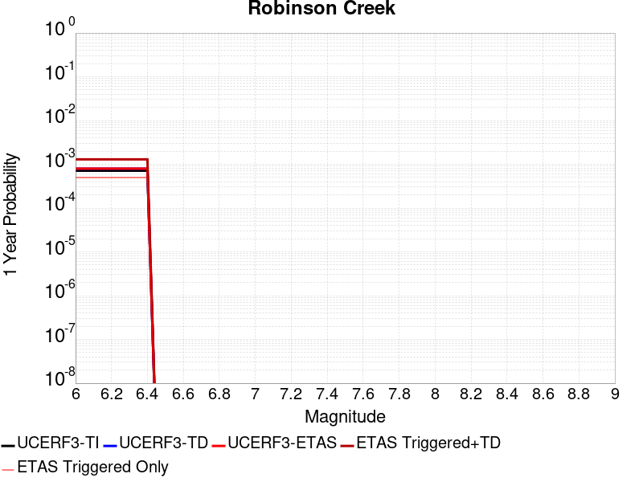 | 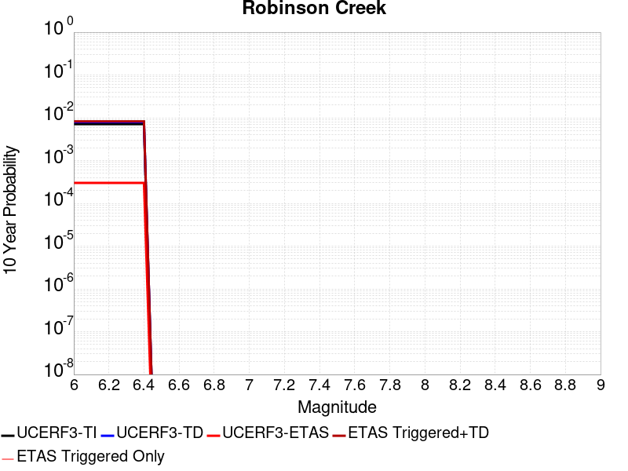 |

| Magnitude | 1 wk TI Prob | 1 wk TD Prob | 1 wk ETAS Prob | 1 wk ETAS/TD Gain | 1 wk ETAS Triggered+TD | 1 wk ETAS Triggered Only | 1 mo TI Prob | 1 mo TD Prob | 1 mo ETAS Prob | 1 mo ETAS/TD Gain | 1 mo ETAS Triggered+TD | 1 mo ETAS Triggered Only | 1 yr TI Prob | 1 yr TD Prob | 1 yr ETAS Prob | 1 yr ETAS/TD Gain | 1 yr ETAS Triggered+TD | 1 yr ETAS Triggered Only | 10 yr TI Prob | 10 yr TD Prob | 10 yr ETAS Prob | 10 yr ETAS/TD Gain | 10 yr ETAS Triggered+TD | 10 yr ETAS Triggered Only |
|-----|-----|-----|-----|-----|-----|-----|-----|-----|-----|-----|-----|-----|-----|-----|-----|-----|-----|-----|-----|-----|-----|-----|-----|-----|
| 6.0 | 1.3705327E-5 | 1.526664E-5 | 0.0 | 0.0 | 1.526664E-5 | 0.0 | 5.8735794E-5 | 6.542846E-5 | 1.0E-4 | 1.5283868 | 1.6542192E-4 | 1.0E-4 | 7.1487366E-4 | 7.965915E-4 | 8.0E-4 | 1.0042789 | 0.0012961932 | 5.0E-4 | 0.0071257832 | 0.007965915 | 0.0065 | 0.81597656 | 0.010446 | 0.0025 |
| 6.1 | 1.3705327E-5 | 1.526664E-5 | 0.0 | 0.0 | 1.526664E-5 | 0.0 | 5.8735794E-5 | 6.542846E-5 | 1.0E-4 | 1.5283868 | 1.6542192E-4 | 1.0E-4 | 7.1487366E-4 | 7.965915E-4 | 8.0E-4 | 1.0042789 | 0.0012961932 | 5.0E-4 | 0.0071257832 | 0.007965915 | 0.0065 | 0.81597656 | 0.010446 | 0.0025 |
| 6.2 | 1.3705327E-5 | 1.526664E-5 | 0.0 | 0.0 | 1.526664E-5 | 0.0 | 5.8735794E-5 | 6.542846E-5 | 1.0E-4 | 1.5283868 | 1.6542192E-4 | 1.0E-4 | 7.1487366E-4 | 7.965915E-4 | 8.0E-4 | 1.0042789 | 0.0012961932 | 5.0E-4 | 0.0071257832 | 0.007965915 | 0.0065 | 0.81597656 | 0.010446 | 0.0025 |
| 6.3 | 1.3705327E-5 | 1.526664E-5 | 0.0 | 0.0 | 1.526664E-5 | 0.0 | 5.8735794E-5 | 6.542846E-5 | 1.0E-4 | 1.5283868 | 1.6542192E-4 | 1.0E-4 | 7.1487366E-4 | 7.965915E-4 | 8.0E-4 | 1.0042789 | 0.0012961932 | 5.0E-4 | 0.0071257832 | 0.007965915 | 0.0065 | 0.81597656 | 0.010446 | 0.0025 |
| 6.4 | 1.3705327E-5 | 1.526664E-5 | 0.0 | 0.0 | 1.526664E-5 | 0.0 | 5.8735794E-5 | 6.542846E-5 | 1.0E-4 | 1.5283868 | 1.6542192E-4 | 1.0E-4 | 7.1487366E-4 | 7.965915E-4 | 8.0E-4 | 1.0042789 | 0.0012961932 | 5.0E-4 | 0.0071257832 | 0.007965915 | 0.0065 | 0.81597656 | 0.010446 | 0.0025 |

## San Cayetano
*[(top)](#table-of-contents)*

| 1 Week | 1 Month | 1 Year | 10 Year |
|-----|-----|-----|-----|
| 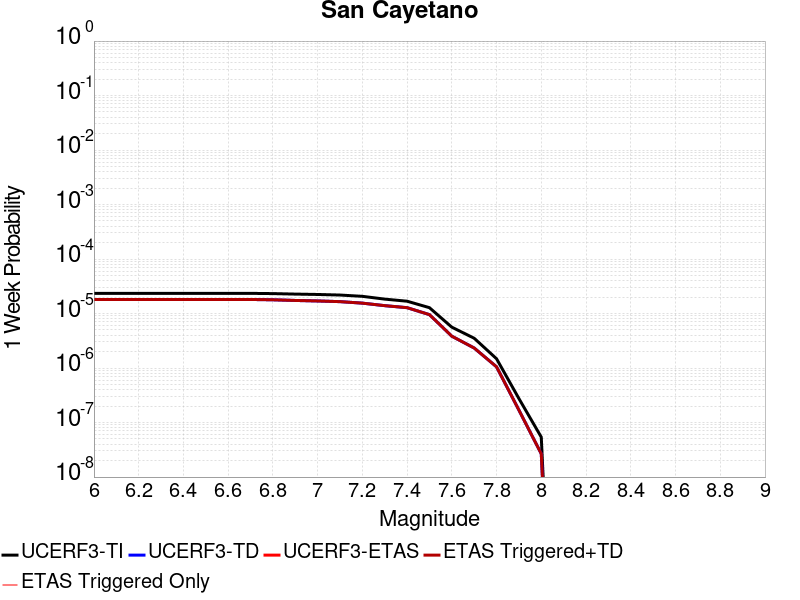 | 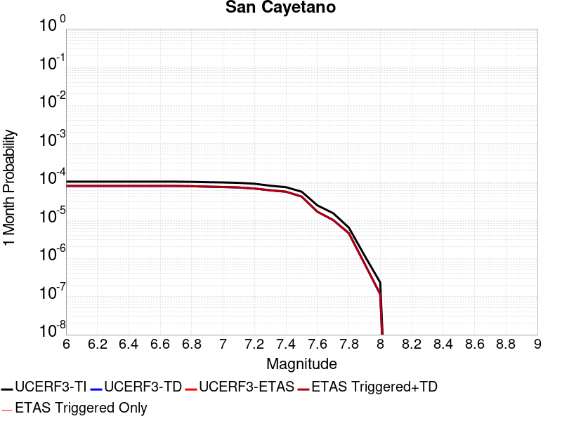 | 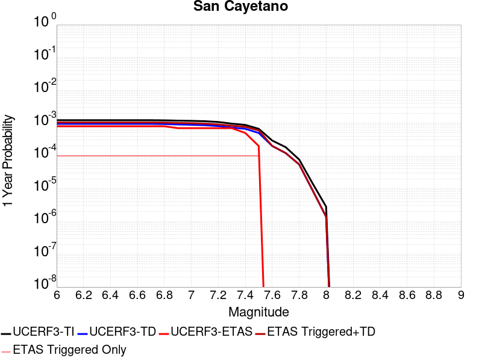 | 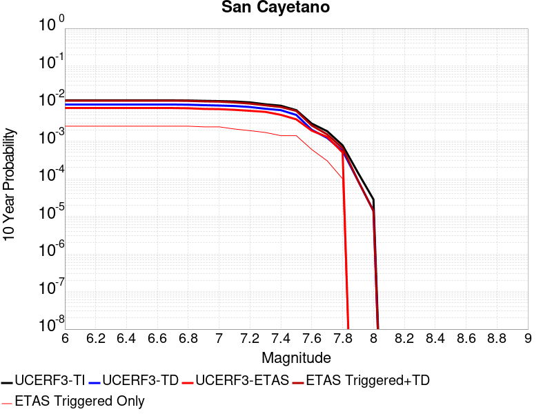 |

| Magnitude | 1 wk TI Prob | 1 wk TD Prob | 1 wk ETAS Prob | 1 wk ETAS/TD Gain | 1 wk ETAS Triggered+TD | 1 wk ETAS Triggered Only | 1 mo TI Prob | 1 mo TD Prob | 1 mo ETAS Prob | 1 mo ETAS/TD Gain | 1 mo ETAS Triggered+TD | 1 mo ETAS Triggered Only | 1 yr TI Prob | 1 yr TD Prob | 1 yr ETAS Prob | 1 yr ETAS/TD Gain | 1 yr ETAS Triggered+TD | 1 yr ETAS Triggered Only | 10 yr TI Prob | 10 yr TD Prob | 10 yr ETAS Prob | 10 yr ETAS/TD Gain | 10 yr ETAS Triggered+TD | 10 yr ETAS Triggered Only |
|-----|-----|-----|-----|-----|-----|-----|-----|-----|-----|-----|-----|-----|-----|-----|-----|-----|-----|-----|-----|-----|-----|-----|-----|-----|
| 6.0 | 2.3476267E-5 | 1.8131972E-5 | 0.0 | 0.0 | 1.8131972E-5 | 0.0 | 1.0060869E-4 | 7.770616E-5 | 0.0 | 0.0 | 7.770616E-5 | 0.0 | 0.0012242225 | 9.456655E-4 | 8.0E-4 | 0.8459651 | 0.0010455709 | 1.0E-4 | 0.012175002 | 0.0094170105 | 0.0076 | 0.80705017 | 0.011893468 | 0.0025 |
| 6.1 | 2.3476267E-5 | 1.8131972E-5 | 0.0 | 0.0 | 1.8131972E-5 | 0.0 | 1.0060869E-4 | 7.770616E-5 | 0.0 | 0.0 | 7.770616E-5 | 0.0 | 0.0012242225 | 9.456655E-4 | 8.0E-4 | 0.8459651 | 0.0010455709 | 1.0E-4 | 0.012175002 | 0.0094170105 | 0.0076 | 0.80705017 | 0.011893468 | 0.0025 |
| 6.2 | 2.3476267E-5 | 1.8131972E-5 | 0.0 | 0.0 | 1.8131972E-5 | 0.0 | 1.0060869E-4 | 7.770616E-5 | 0.0 | 0.0 | 7.770616E-5 | 0.0 | 0.0012242225 | 9.456655E-4 | 8.0E-4 | 0.8459651 | 0.0010455709 | 1.0E-4 | 0.012175002 | 0.0094170105 | 0.0076 | 0.80705017 | 0.011893468 | 0.0025 |
| 6.3 | 2.3476267E-5 | 1.8131972E-5 | 0.0 | 0.0 | 1.8131972E-5 | 0.0 | 1.0060869E-4 | 7.770616E-5 | 0.0 | 0.0 | 7.770616E-5 | 0.0 | 0.0012242225 | 9.456655E-4 | 8.0E-4 | 0.8459651 | 0.0010455709 | 1.0E-4 | 0.012175002 | 0.0094170105 | 0.0076 | 0.80705017 | 0.011893468 | 0.0025 |
| 6.4 | 2.3476267E-5 | 1.8131972E-5 | 0.0 | 0.0 | 1.8131972E-5 | 0.0 | 1.0060869E-4 | 7.770616E-5 | 0.0 | 0.0 | 7.770616E-5 | 0.0 | 0.0012242225 | 9.456655E-4 | 8.0E-4 | 0.8459651 | 0.0010455709 | 1.0E-4 | 0.012175002 | 0.0094170105 | 0.0076 | 0.80705017 | 0.011893468 | 0.0025 |
| 6.5 | 2.3476267E-5 | 1.8131972E-5 | 0.0 | 0.0 | 1.8131972E-5 | 0.0 | 1.0060869E-4 | 7.770616E-5 | 0.0 | 0.0 | 7.770616E-5 | 0.0 | 0.0012242225 | 9.456655E-4 | 8.0E-4 | 0.8459651 | 0.0010455709 | 1.0E-4 | 0.012175002 | 0.0094170105 | 0.0076 | 0.80705017 | 0.011893468 | 0.0025 |
| 6.6 | 2.3476267E-5 | 1.8131972E-5 | 0.0 | 0.0 | 1.8131972E-5 | 0.0 | 1.0060869E-4 | 7.770616E-5 | 0.0 | 0.0 | 7.770616E-5 | 0.0 | 0.0012242225 | 9.456655E-4 | 8.0E-4 | 0.8459651 | 0.0010455709 | 1.0E-4 | 0.012175002 | 0.0094170105 | 0.0076 | 0.80705017 | 0.011893468 | 0.0025 |
| 6.7 | 2.3476267E-5 | 1.8131972E-5 | 0.0 | 0.0 | 1.8131972E-5 | 0.0 | 1.0060869E-4 | 7.770616E-5 | 0.0 | 0.0 | 7.770616E-5 | 0.0 | 0.0012242225 | 9.456655E-4 | 8.0E-4 | 0.8459651 | 0.0010455709 | 1.0E-4 | 0.012175002 | 0.0094170105 | 0.0076 | 0.80705017 | 0.011893468 | 0.0025 |
| 6.8 | 2.3241924E-5 | 1.790022E-5 | 0.0 | 0.0 | 1.790022E-5 | 0.0 | 9.960445E-5 | 7.671299E-5 | 0.0 | 0.0 | 7.671299E-5 | 0.0 | 0.0012120095 | 9.3358406E-4 | 8.0E-4 | 0.8569127 | 0.0010334908 | 1.0E-4 | 0.012054204 | 0.009297145 | 0.0075 | 0.8066993 | 0.011773902 | 0.0025 |
| 6.9 | 2.2761007E-5 | 1.73967E-5 | 0.0 | 0.0 | 1.73967E-5 | 0.0 | 9.7543525E-5 | 7.455518E-5 | 0.0 | 0.0 | 7.455518E-5 | 0.0 | 0.0011869454 | 9.0733473E-4 | 7.0E-4 | 0.7714904 | 0.001007244 | 1.0E-4 | 0.011806256 | 0.009036802 | 0.0072 | 0.7967421 | 0.011415113 | 0.0024 |
| 7.0 | 2.240283E-5 | 1.7030965E-5 | 0.0 | 0.0 | 1.7030965E-5 | 0.0 | 9.600859E-5 | 7.298782E-5 | 0.0 | 0.0 | 7.298782E-5 | 0.0 | 0.0011682777 | 8.882679E-4 | 7.0E-4 | 0.78805053 | 9.88179E-4 | 1.0E-4 | 0.011621549 | 0.008847657 | 0.0071 | 0.80247235 | 0.011226422 | 0.0024 |
| 7.1 | 2.1871154E-5 | 1.6551629E-5 | 0.0 | 0.0 | 1.6551629E-5 | 0.0 | 9.373015E-5 | 7.093364E-5 | 0.0 | 0.0 | 7.093364E-5 | 0.0 | 0.0011405671 | 8.632782E-4 | 7.0E-4 | 0.8108626 | 9.631919E-4 | 1.0E-4 | 0.011347309 | 0.008599716 | 0.0068 | 0.79072374 | 0.010681657 | 0.0021 |
| 7.2 | 2.0714133E-5 | 1.5532034E-5 | 0.0 | 0.0 | 1.5532034E-5 | 0.0 | 8.8771834E-5 | 6.6564186E-5 | 0.0 | 0.0 | 6.6564186E-5 | 0.0 | 0.0010802611 | 8.1012084E-4 | 7.0E-4 | 0.8640686 | 9.100398E-4 | 1.0E-4 | 0.010750249 | 0.008072118 | 0.0064 | 0.79285264 | 0.009956781 | 0.0019 |
| 7.3 | 1.8408395E-5 | 1.3968051E-5 | 0.0 | 0.0 | 1.3968051E-5 | 0.0 | 7.8890735E-5 | 5.986172E-5 | 0.0 | 0.0 | 5.986172E-5 | 0.0 | 9.600714E-4 | 7.285757E-4 | 7.0E-4 | 0.9607787 | 8.285028E-4 | 1.0E-4 | 0.009559342 | 0.00726225 | 0.006 | 0.82619023 | 0.008949904 | 0.0017 |
| 7.4 | 1.6856795E-5 | 1.2823758E-5 | 0.0 | 0.0 | 1.2823758E-5 | 0.0 | 7.2241404E-5 | 5.495782E-5 | 0.0 | 0.0 | 5.495782E-5 | 0.0 | 8.7918417E-4 | 6.689089E-4 | 5.0E-4 | 0.74748594 | 7.68842E-4 | 1.0E-4 | 0.00875714 | 0.006669281 | 0.005 | 0.74970603 | 0.008059944 | 0.0014 |
| 7.5 | 1.2822778E-5 | 9.558636E-6 | 0.0 | 0.0 | 9.558636E-6 | 0.0 | 5.495361E-5 | 4.0964947E-5 | 0.0 | 0.0 | 4.0964947E-5 | 0.0 | 6.688548E-4 | 4.986357E-4 | 2.0E-4 | 0.40109444 | 5.985858E-4 | 1.0E-4 | 0.006668452 | 0.0049752323 | 0.0038 | 0.76378345 | 0.006368267 | 0.0014 |
| 7.6 | 5.6272684E-6 | 3.844416E-6 | 0.0 | 0.0 | 3.844416E-6 | 0.0 | 2.4116642E-5 | 1.6475964E-5 | 0.0 | 0.0 | 1.6475964E-5 | 0.0 | 2.9358055E-4 | 2.005765E-4 | 0.0 | 0.0 | 2.005765E-4 | 0.0 | 0.0029319301 | 0.0020039654 | 0.0019 | 0.9481202 | 0.002602763 | 6.0E-4 |
| 7.7 | 3.5261346E-6 | 2.3333907E-6 | 0.0 | 0.0 | 2.3333907E-6 | 0.0 | 1.5111918E-5 | 1.0000208E-5 | 0.0 | 0.0 | 1.0000208E-5 | 0.0 | 1.8397206E-4 | 1.21745805E-4 | 0.0 | 0.0 | 1.21745805E-4 | 0.0 | 0.0018381984 | 0.0012167983 | 0.0013 | 1.0683775 | 0.0015164333 | 3.0E-4 |
| 7.8 | 1.4826929E-6 | 1.0538612E-6 | 0.0 | 0.0 | 1.0538612E-6 | 0.0 | 6.354383E-6 | 4.5165402E-6 | 0.0 | 0.0 | 4.5165402E-6 | 0.0 | 7.736187E-5 | 5.498751E-5 | 0.0 | 0.0 | 5.498751E-5 | 0.0 | 7.733494E-4 | 5.497411E-4 | 5.0E-4 | 0.9095191 | 6.496861E-4 | 1.0E-4 |
| 7.9 | 2.7568166E-7 | 1.693432E-7 | 0.0 | 0.0 | 1.693432E-7 | 0.0 | 1.1814923E-6 | 7.2575637E-7 | 0.0 | 0.0 | 7.2575637E-7 | 0.0 | 1.4384574E-5 | 8.836048E-6 | 0.0 | 0.0 | 8.836048E-6 | 0.0 | 1.4383643E-4 | 8.8357E-5 | 0.0 | 0.0 | 8.8357E-5 | 0.0 |
| 8.0 | 5.407832E-8 | 2.6728667E-8 | 0.0 | 0.0 | 2.6728667E-8 | 0.0 | 2.3176422E-7 | 1.14551426E-7 | 0.0 | 0.0 | 1.14551426E-7 | 0.0 | 2.8217257E-6 | 1.3946627E-6 | 0.0 | 0.0 | 1.3946627E-6 | 0.0 | 2.8216898E-5 | 1.3946544E-5 | 0.0 | 0.0 | 1.3946544E-5 | 0.0 |

## Carson Range (Genoa)
*[(top)](#table-of-contents)*

| 1 Week | 1 Month | 1 Year | 10 Year |
|-----|-----|-----|-----|
| 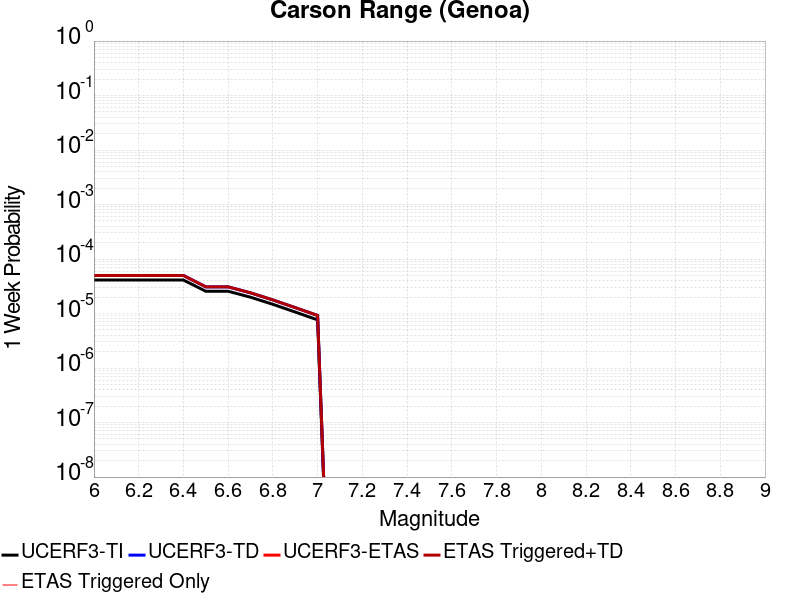 | 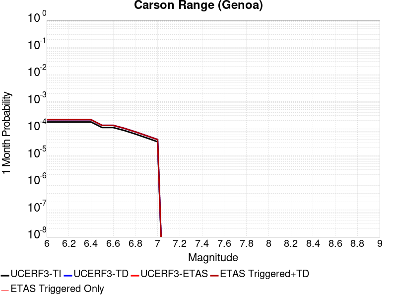 | 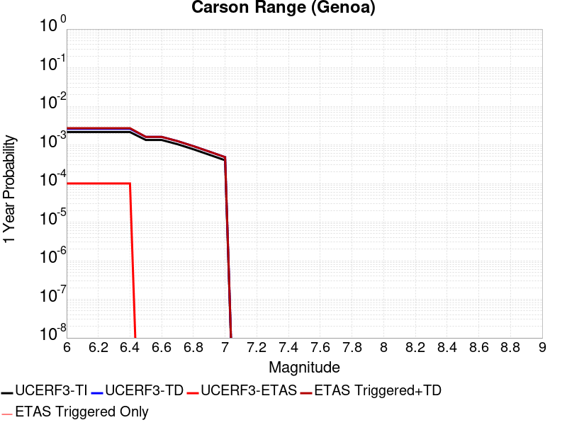 | 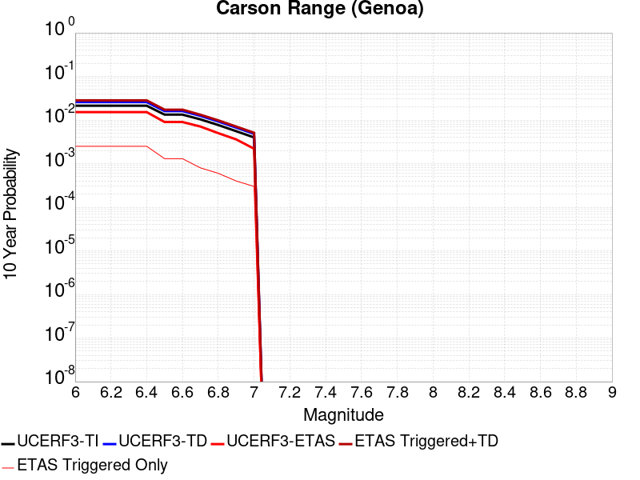 |

| Magnitude | 1 wk TI Prob | 1 wk TD Prob | 1 wk ETAS Prob | 1 wk ETAS/TD Gain | 1 wk ETAS Triggered+TD | 1 wk ETAS Triggered Only | 1 mo TI Prob | 1 mo TD Prob | 1 mo ETAS Prob | 1 mo ETAS/TD Gain | 1 mo ETAS Triggered+TD | 1 mo ETAS Triggered Only | 1 yr TI Prob | 1 yr TD Prob | 1 yr ETAS Prob | 1 yr ETAS/TD Gain | 1 yr ETAS Triggered+TD | 1 yr ETAS Triggered Only | 10 yr TI Prob | 10 yr TD Prob | 10 yr ETAS Prob | 10 yr ETAS/TD Gain | 10 yr ETAS Triggered+TD | 10 yr ETAS Triggered Only |
|-----|-----|-----|-----|-----|-----|-----|-----|-----|-----|-----|-----|-----|-----|-----|-----|-----|-----|-----|-----|-----|-----|-----|-----|-----|
| 6.0 | 4.1268457E-5 | 5.0034752E-5 | 0.0 | 0.0 | 5.0034752E-5 | 0.0 | 1.7685282E-4 | 2.1441927E-4 | 0.0 | 0.0 | 2.1441927E-4 | 0.0 | 0.0021510567 | 0.0026078215 | 0.0013 | 0.4985004 | 0.0029070391 | 3.0E-4 | 0.02130354 | 0.025811734 | 0.0152 | 0.58887947 | 0.028247204 | 0.0025 |
| 6.1 | 4.1268457E-5 | 5.0034752E-5 | 0.0 | 0.0 | 5.0034752E-5 | 0.0 | 1.7685282E-4 | 2.1441927E-4 | 0.0 | 0.0 | 2.1441927E-4 | 0.0 | 0.0021510567 | 0.0026078215 | 0.0013 | 0.4985004 | 0.0029070391 | 3.0E-4 | 0.02130354 | 0.025811734 | 0.0152 | 0.58887947 | 0.028247204 | 0.0025 |
| 6.2 | 4.1268457E-5 | 5.0034752E-5 | 0.0 | 0.0 | 5.0034752E-5 | 0.0 | 1.7685282E-4 | 2.1441927E-4 | 0.0 | 0.0 | 2.1441927E-4 | 0.0 | 0.0021510567 | 0.0026078215 | 0.0013 | 0.4985004 | 0.0029070391 | 3.0E-4 | 0.02130354 | 0.025811734 | 0.0152 | 0.58887947 | 0.028247204 | 0.0025 |
| 6.3 | 4.1268457E-5 | 5.0034752E-5 | 0.0 | 0.0 | 5.0034752E-5 | 0.0 | 1.7685282E-4 | 2.1441927E-4 | 0.0 | 0.0 | 2.1441927E-4 | 0.0 | 0.0021510567 | 0.0026078215 | 0.0013 | 0.4985004 | 0.0029070391 | 3.0E-4 | 0.02130354 | 0.025811734 | 0.0152 | 0.58887947 | 0.028247204 | 0.0025 |
| 6.4 | 4.1268457E-5 | 5.0034752E-5 | 0.0 | 0.0 | 5.0034752E-5 | 0.0 | 1.7685282E-4 | 2.1441927E-4 | 0.0 | 0.0 | 2.1441927E-4 | 0.0 | 0.0021510567 | 0.0026078215 | 0.0013 | 0.4985004 | 0.0029070391 | 3.0E-4 | 0.02130354 | 0.025811734 | 0.0152 | 0.58887947 | 0.028247204 | 0.0025 |
| 6.5 | 2.5677185E-5 | 3.091171E-5 | 0.0 | 0.0 | 3.091171E-5 | 0.0 | 1.1004044E-4 | 1.3247305E-4 | 0.0 | 0.0 | 1.3247305E-4 | 0.0 | 0.0013389189 | 0.0016118455 | 4.0E-4 | 0.24816275 | 0.0017116843 | 1.0E-4 | 0.0133088045 | 0.016019398 | 0.009 | 0.5618189 | 0.017298572 | 0.0013 |
| 6.6 | 2.5677185E-5 | 3.091171E-5 | 0.0 | 0.0 | 3.091171E-5 | 0.0 | 1.1004044E-4 | 1.3247305E-4 | 0.0 | 0.0 | 1.3247305E-4 | 0.0 | 0.0013389189 | 0.0016118455 | 4.0E-4 | 0.24816275 | 0.0017116843 | 1.0E-4 | 0.0133088045 | 0.016019398 | 0.009 | 0.5618189 | 0.017298572 | 0.0013 |
| 6.7 | 1.9969408E-5 | 2.401207E-5 | 0.0 | 0.0 | 2.401207E-5 | 0.0 | 8.558037E-5 | 1.0290567E-4 | 0.0 | 0.0 | 1.0290567E-4 | 0.0 | 0.0010414429 | 0.0012523093 | 4.0E-4 | 0.3194099 | 0.0013521841 | 1.0E-4 | 0.010365757 | 0.012467616 | 0.0071 | 0.56947535 | 0.013257642 | 8.0E-4 |
| 6.8 | 1.4783156E-5 | 1.7779463E-5 | 0.0 | 0.0 | 1.7779463E-5 | 0.0 | 6.335485E-5 | 7.61962E-5 | 0.0 | 0.0 | 7.61962E-5 | 0.0 | 7.710722E-4 | 9.2742353E-4 | 3.0E-4 | 0.3234768 | 9.2742353E-4 | 0.0 | 0.0076840227 | 0.009248264 | 0.005 | 0.54064196 | 0.009842715 | 6.0E-4 |
| 6.9 | 1.06660555E-5 | 1.2849217E-5 | 0.0 | 0.0 | 1.2849217E-5 | 0.0 | 4.5710865E-5 | 5.5067558E-5 | 0.0 | 0.0 | 5.5067558E-5 | 0.0 | 5.5638765E-4 | 6.70356E-4 | 3.0E-4 | 0.44752342 | 6.70356E-4 | 0.0 | 0.005549967 | 0.006694589 | 0.0036 | 0.53774774 | 0.0070919106 | 4.0E-4 |
| 7.0 | 7.664838E-6 | 9.238254E-6 | 0.0 | 0.0 | 9.238254E-6 | 0.0 | 3.2848893E-5 | 3.9592516E-5 | 0.0 | 0.0 | 3.9592516E-5 | 0.0 | 3.998619E-4 | 4.820389E-4 | 2.0E-4 | 0.4149043 | 4.820389E-4 | 0.0 | 0.0039914316 | 0.004820387 | 0.0022 | 0.4563949 | 0.005118941 | 3.0E-4 |

## Raymond
*[(top)](#table-of-contents)*

| 1 Week | 1 Month | 1 Year | 10 Year |
|-----|-----|-----|-----|
| 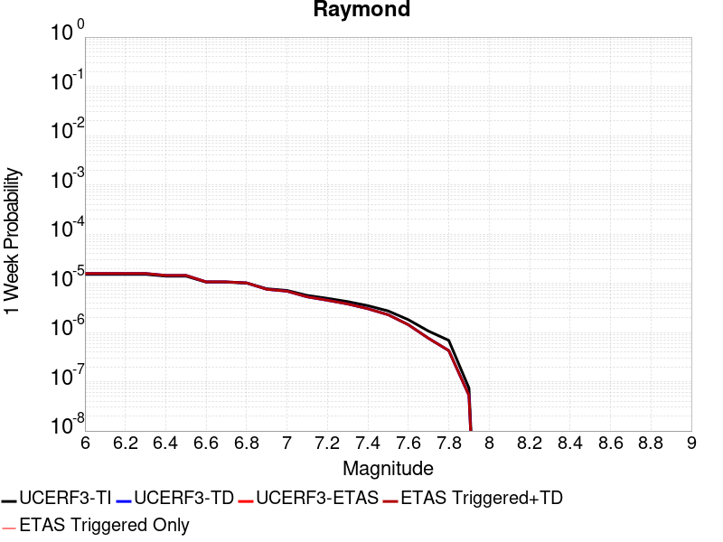 | 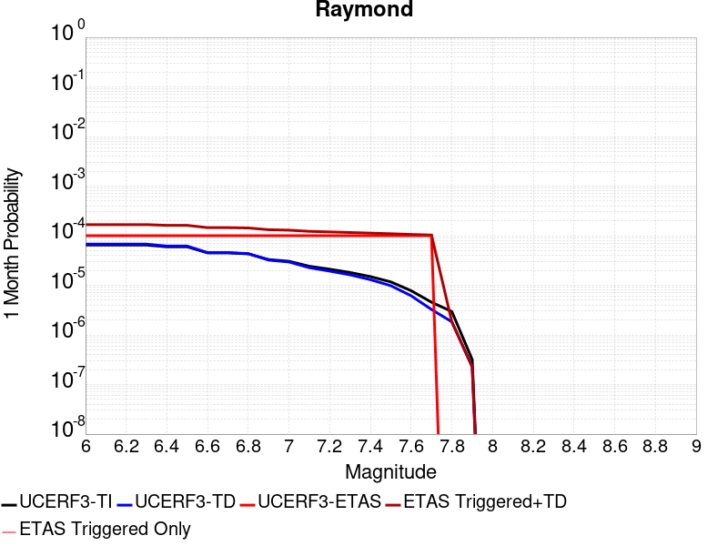 | 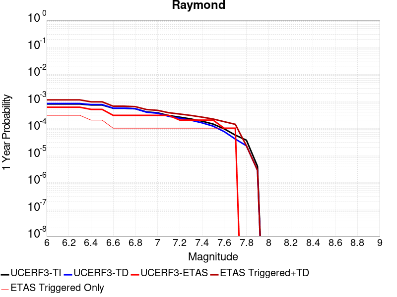 | 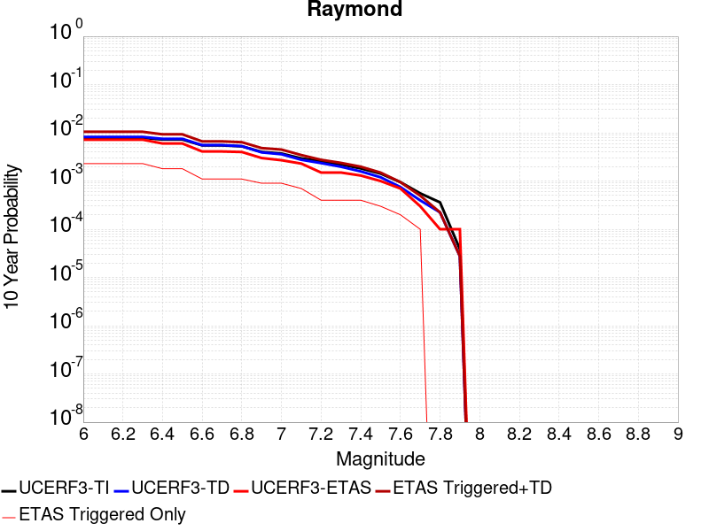 |

| Magnitude | 1 wk TI Prob | 1 wk TD Prob | 1 wk ETAS Prob | 1 wk ETAS/TD Gain | 1 wk ETAS Triggered+TD | 1 wk ETAS Triggered Only | 1 mo TI Prob | 1 mo TD Prob | 1 mo ETAS Prob | 1 mo ETAS/TD Gain | 1 mo ETAS Triggered+TD | 1 mo ETAS Triggered Only | 1 yr TI Prob | 1 yr TD Prob | 1 yr ETAS Prob | 1 yr ETAS/TD Gain | 1 yr ETAS Triggered+TD | 1 yr ETAS Triggered Only | 10 yr TI Prob | 10 yr TD Prob | 10 yr ETAS Prob | 10 yr ETAS/TD Gain | 10 yr ETAS Triggered+TD | 10 yr ETAS Triggered Only |
|-----|-----|-----|-----|-----|-----|-----|-----|-----|-----|-----|-----|-----|-----|-----|-----|-----|-----|-----|-----|-----|-----|-----|-----|-----|
| 6.0 | 1.5157413E-5 | 1.5789356E-5 | 0.0 | 0.0 | 1.5789356E-5 | 0.0 | 6.4958724E-5 | 6.766705E-5 | 1.0E-4 | 1.4778241 | 1.6766028E-4 | 1.0E-4 | 7.905855E-4 | 8.2356E-4 | 6.0E-4 | 0.72854435 | 0.001123313 | 3.0E-4 | 0.007877788 | 0.008207573 | 0.0072 | 0.87723863 | 0.010488695 | 0.0023 |
| 6.1 | 1.5157413E-5 | 1.5789356E-5 | 0.0 | 0.0 | 1.5789356E-5 | 0.0 | 6.4958724E-5 | 6.766705E-5 | 1.0E-4 | 1.4778241 | 1.6766028E-4 | 1.0E-4 | 7.905855E-4 | 8.2356E-4 | 6.0E-4 | 0.72854435 | 0.001123313 | 3.0E-4 | 0.007877788 | 0.008207573 | 0.0072 | 0.87723863 | 0.010488695 | 0.0023 |
| 6.2 | 1.5157413E-5 | 1.5789356E-5 | 0.0 | 0.0 | 1.5789356E-5 | 0.0 | 6.4958724E-5 | 6.766705E-5 | 1.0E-4 | 1.4778241 | 1.6766028E-4 | 1.0E-4 | 7.905855E-4 | 8.2356E-4 | 6.0E-4 | 0.72854435 | 0.001123313 | 3.0E-4 | 0.007877788 | 0.008207573 | 0.0072 | 0.87723863 | 0.010488695 | 0.0023 |
| 6.3 | 1.5157413E-5 | 1.5789356E-5 | 0.0 | 0.0 | 1.5789356E-5 | 0.0 | 6.4958724E-5 | 6.766705E-5 | 1.0E-4 | 1.4778241 | 1.6766028E-4 | 1.0E-4 | 7.905855E-4 | 8.2356E-4 | 6.0E-4 | 0.72854435 | 0.001123313 | 3.0E-4 | 0.007877788 | 0.008207573 | 0.0072 | 0.87723863 | 0.010488695 | 0.0023 |
| 6.4 | 1.3941944E-5 | 1.4435546E-5 | 0.0 | 0.0 | 1.4435546E-5 | 0.0 | 5.9749822E-5 | 6.186529E-5 | 1.0E-4 | 1.6164153 | 1.618591E-4 | 1.0E-4 | 7.2721124E-4 | 7.529729E-4 | 5.0E-4 | 0.66403455 | 9.528223E-4 | 2.0E-4 | 0.007248361 | 0.007506525 | 0.006 | 0.7993046 | 0.009293013 | 0.0018 |
| 6.5 | 1.3941944E-5 | 1.4435546E-5 | 0.0 | 0.0 | 1.4435546E-5 | 0.0 | 5.9749822E-5 | 6.186529E-5 | 1.0E-4 | 1.6164153 | 1.618591E-4 | 1.0E-4 | 7.2721124E-4 | 7.529729E-4 | 5.0E-4 | 0.66403455 | 9.528223E-4 | 2.0E-4 | 0.007248361 | 0.007506525 | 0.006 | 0.7993046 | 0.009293013 | 0.0018 |
| 6.6 | 1.0542609E-5 | 1.06564285E-5 | 0.0 | 0.0 | 1.06564285E-5 | 0.0 | 4.5181827E-5 | 4.566964E-5 | 1.0E-4 | 2.1896384 | 1.4566508E-4 | 1.0E-4 | 5.499499E-4 | 5.558915E-4 | 3.0E-4 | 0.5396737 | 6.5583584E-4 | 1.0E-4 | 0.005485909 | 0.00554555 | 0.0041 | 0.73933154 | 0.00663945 | 0.0011 |
| 6.7 | 1.0542609E-5 | 1.06564285E-5 | 0.0 | 0.0 | 1.06564285E-5 | 0.0 | 4.5181827E-5 | 4.566964E-5 | 1.0E-4 | 2.1896384 | 1.4566508E-4 | 1.0E-4 | 5.499499E-4 | 5.558915E-4 | 3.0E-4 | 0.5396737 | 6.5583584E-4 | 1.0E-4 | 0.005485909 | 0.00554555 | 0.0041 | 0.73933154 | 0.00663945 | 0.0011 |
| 6.8 | 1.0079132E-5 | 1.01623145E-5 | 0.0 | 0.0 | 1.01623145E-5 | 0.0 | 4.3195567E-5 | 4.355208E-5 | 1.0E-4 | 2.2961016 | 1.4354773E-4 | 1.0E-4 | 5.257791E-4 | 5.301229E-4 | 3.0E-4 | 0.56590647 | 6.3006993E-4 | 1.0E-4 | 0.0052453685 | 0.005289112 | 0.004 | 0.7562706 | 0.006383294 | 0.0011 |
| 6.9 | 7.721598E-6 | 7.5377466E-6 | 0.0 | 0.0 | 7.5377466E-6 | 0.0 | 3.3092143E-5 | 3.2304233E-5 | 1.0E-4 | 3.0955694 | 1.3230101E-4 | 1.0E-4 | 4.0282236E-4 | 3.9323428E-4 | 3.0E-4 | 0.762904 | 4.9319497E-4 | 1.0E-4 | 0.0040209293 | 0.0039254986 | 0.003 | 0.7642341 | 0.004821966 | 9.0E-4 |
| 7.0 | 7.137566E-6 | 6.9007624E-6 | 0.0 | 0.0 | 6.9007624E-6 | 0.0 | 3.058921E-5 | 2.9574367E-5 | 1.0E-4 | 3.3813066 | 1.295714E-4 | 1.0E-4 | 3.7236E-4 | 3.600095E-4 | 3.0E-4 | 0.8333114 | 4.599735E-4 | 1.0E-4 | 0.0037173668 | 0.0035943615 | 0.0027 | 0.75117654 | 0.0044911266 | 9.0E-4 |
| 7.1 | 5.654976E-6 | 5.290467E-6 | 0.0 | 0.0 | 5.290467E-6 | 0.0 | 2.4235387E-5 | 2.2673234E-5 | 1.0E-4 | 4.4104867 | 1.2267097E-4 | 1.0E-4 | 2.9502588E-4 | 2.7601188E-4 | 3.0E-4 | 1.0869098 | 3.7598427E-4 | 1.0E-4 | 0.0029463451 | 0.0027567022 | 0.0023 | 0.8343302 | 0.0034547725 | 7.0E-4 |
| 7.2 | 4.9358455E-6 | 4.5183588E-6 | 0.0 | 0.0 | 4.5183588E-6 | 0.0 | 2.1153453E-5 | 1.9364252E-5 | 1.0E-4 | 5.164155 | 1.1936232E-4 | 1.0E-4 | 2.5751285E-4 | 2.357344E-4 | 2.0E-4 | 0.84841245 | 3.3571082E-4 | 1.0E-4 | 0.0025721465 | 0.002354846 | 0.0015 | 0.6369843 | 0.0027539043 | 4.0E-4 |
| 7.3 | 4.2368597E-6 | 3.797935E-6 | 0.0 | 0.0 | 3.797935E-6 | 0.0 | 1.8157843E-5 | 1.6276765E-5 | 1.0E-4 | 6.1437273 | 1.16275136E-4 | 1.0E-4 | 2.2104931E-4 | 1.9815168E-4 | 2.0E-4 | 1.0093278 | 2.9813187E-4 | 1.0E-4 | 0.0022082955 | 0.0019797494 | 0.0015 | 0.75767165 | 0.0023789576 | 4.0E-4 |
| 7.4 | 3.4999923E-6 | 3.0367755E-6 | 0.0 | 0.0 | 3.0367755E-6 | 0.0 | 1.49998805E-5 | 1.3014688E-5 | 1.0E-4 | 7.6836267 | 1.1301339E-4 | 1.0E-4 | 1.8260824E-4 | 1.5844239E-4 | 2.0E-4 | 1.2622886 | 2.5842653E-4 | 1.0E-4 | 0.0018245826 | 0.0015832905 | 0.0013 | 0.82107484 | 0.0019826572 | 4.0E-4 |
| 7.5 | 2.738017E-6 | 2.2962731E-6 | 0.0 | 0.0 | 2.2962731E-6 | 0.0 | 1.1734306E-5 | 9.841134E-6 | 1.0E-4 | 10.16143 | 1.0984015E-4 | 1.0E-4 | 1.428558E-4 | 1.1980929E-4 | 2.0E-4 | 1.6693196 | 2.1979731E-4 | 1.0E-4 | 0.0014276401 | 0.001197442 | 0.001 | 0.8351136 | 0.0014970826 | 3.0E-4 |
| 7.6 | 1.8186392E-6 | 1.4382472E-6 | 0.0 | 0.0 | 1.4382472E-6 | 0.0 | 7.794145E-6 | 6.163902E-6 | 1.0E-4 | 16.22349 | 1.0616329E-4 | 1.0E-4 | 9.488958E-5 | 7.504297E-5 | 1.0E-4 | 1.33257 | 1.7503546E-4 | 1.0E-4 | 9.4849075E-4 | 7.501684E-4 | 7.0E-4 | 0.9331238 | 9.5001835E-4 | 2.0E-4 |
| 7.7 | 1.0660348E-6 | 7.611681E-7 | 0.0 | 0.0 | 7.611681E-7 | 0.0 | 4.5687125E-6 | 3.2621451E-6 | 1.0E-4 | 30.654676 | 1.0326182E-4 | 1.0E-4 | 5.5622655E-5 | 3.971591E-5 | 1.0E-4 | 2.5178826 | 1.3971193E-4 | 1.0E-4 | 5.5608735E-4 | 3.9707785E-4 | 3.0E-4 | 0.75551933 | 4.970381E-4 | 1.0E-4 |
| 7.8 | 6.913602E-7 | 4.293088E-7 | 0.0 | 0.0 | 4.293088E-7 | 0.0 | 2.962969E-6 | 1.8398936E-6 | 0.0 | 0.0 | 1.8398936E-6 | 0.0 | 3.607355E-5 | 2.240048E-5 | 0.0 | 0.0 | 2.240048E-5 | 0.0 | 3.6067693E-4 | 2.2397022E-4 | 1.0E-4 | 0.44648796 | 2.2397022E-4 | 0.0 |
| 7.9 | 7.425201E-8 | 5.298211E-8 | 0.0 | 0.0 | 5.298211E-8 | 0.0 | 3.1822285E-7 | 2.2706617E-7 | 0.0 | 0.0 | 2.2706617E-7 | 0.0 | 3.874356E-6 | 2.7645285E-6 | 0.0 | 0.0 | 2.7645285E-6 | 0.0 | 3.8742884E-5 | 2.7645068E-5 | 1.0E-4 | 3.6172817 | 2.7645068E-5 | 0.0 |

## Pitas Point (Lower West)
*[(top)](#table-of-contents)*

| 1 Week | 1 Month | 1 Year | 10 Year |
|-----|-----|-----|-----|
| 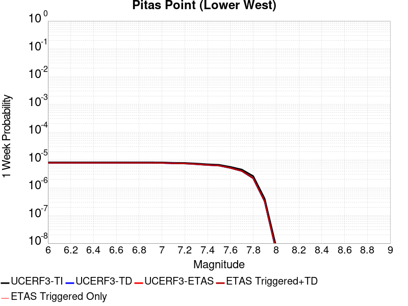 | 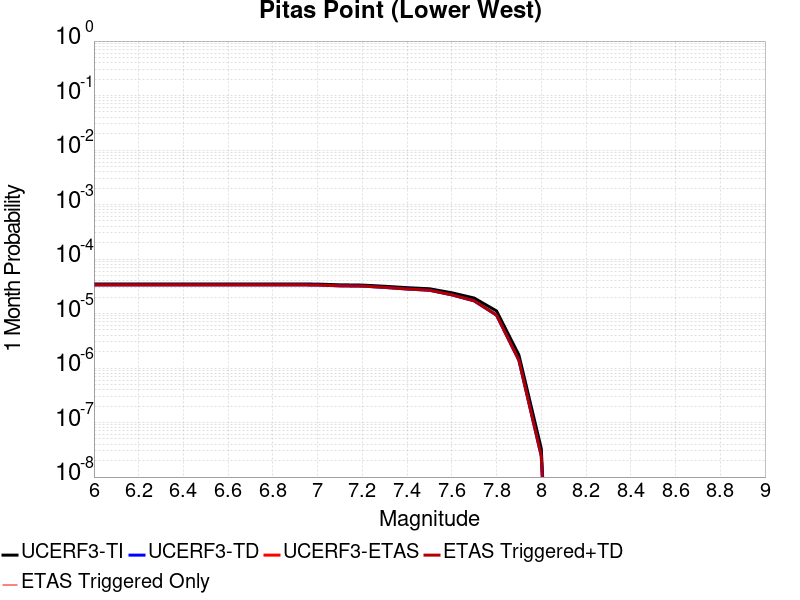 | 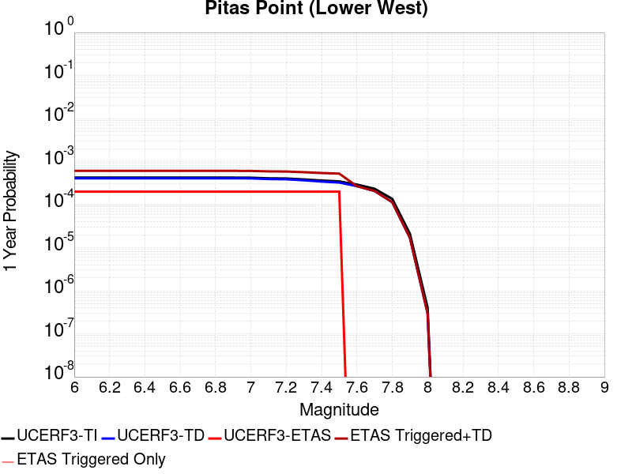 |  |

| Magnitude | 1 wk TI Prob | 1 wk TD Prob | 1 wk ETAS Prob | 1 wk ETAS/TD Gain | 1 wk ETAS Triggered+TD | 1 wk ETAS Triggered Only | 1 mo TI Prob | 1 mo TD Prob | 1 mo ETAS Prob | 1 mo ETAS/TD Gain | 1 mo ETAS Triggered+TD | 1 mo ETAS Triggered Only | 1 yr TI Prob | 1 yr TD Prob | 1 yr ETAS Prob | 1 yr ETAS/TD Gain | 1 yr ETAS Triggered+TD | 1 yr ETAS Triggered Only | 10 yr TI Prob | 10 yr TD Prob | 10 yr ETAS Prob | 10 yr ETAS/TD Gain | 10 yr ETAS Triggered+TD | 10 yr ETAS Triggered Only |
|-----|-----|-----|-----|-----|-----|-----|-----|-----|-----|-----|-----|-----|-----|-----|-----|-----|-----|-----|-----|-----|-----|-----|-----|-----|
| 6.0 | 8.151497E-6 | 7.848986E-6 | 0.0 | 0.0 | 7.848986E-6 | 0.0 | 3.493452E-5 | 3.363808E-5 | 0.0 | 0.0 | 3.363808E-5 | 0.0 | 4.252448E-4 | 4.094674E-4 | 2.0E-4 | 0.48843938 | 6.093855E-4 | 2.0E-4 | 0.0042443196 | 0.0040872097 | 0.0048 | 1.1743953 | 0.0064774007 | 0.0024 |
| 6.1 | 8.151497E-6 | 7.848986E-6 | 0.0 | 0.0 | 7.848986E-6 | 0.0 | 3.493452E-5 | 3.363808E-5 | 0.0 | 0.0 | 3.363808E-5 | 0.0 | 4.252448E-4 | 4.094674E-4 | 2.0E-4 | 0.48843938 | 6.093855E-4 | 2.0E-4 | 0.0042443196 | 0.0040872097 | 0.0048 | 1.1743953 | 0.0064774007 | 0.0024 |
| 6.2 | 8.151497E-6 | 7.848986E-6 | 0.0 | 0.0 | 7.848986E-6 | 0.0 | 3.493452E-5 | 3.363808E-5 | 0.0 | 0.0 | 3.363808E-5 | 0.0 | 4.252448E-4 | 4.094674E-4 | 2.0E-4 | 0.48843938 | 6.093855E-4 | 2.0E-4 | 0.0042443196 | 0.0040872097 | 0.0048 | 1.1743953 | 0.0064774007 | 0.0024 |
| 6.3 | 8.151497E-6 | 7.848986E-6 | 0.0 | 0.0 | 7.848986E-6 | 0.0 | 3.493452E-5 | 3.363808E-5 | 0.0 | 0.0 | 3.363808E-5 | 0.0 | 4.252448E-4 | 4.094674E-4 | 2.0E-4 | 0.48843938 | 6.093855E-4 | 2.0E-4 | 0.0042443196 | 0.0040872097 | 0.0048 | 1.1743953 | 0.0064774007 | 0.0024 |
| 6.4 | 8.151497E-6 | 7.848986E-6 | 0.0 | 0.0 | 7.848986E-6 | 0.0 | 3.493452E-5 | 3.363808E-5 | 0.0 | 0.0 | 3.363808E-5 | 0.0 | 4.252448E-4 | 4.094674E-4 | 2.0E-4 | 0.48843938 | 6.093855E-4 | 2.0E-4 | 0.0042443196 | 0.0040872097 | 0.0048 | 1.1743953 | 0.0064774007 | 0.0024 |
| 6.5 | 8.151497E-6 | 7.848986E-6 | 0.0 | 0.0 | 7.848986E-6 | 0.0 | 3.493452E-5 | 3.363808E-5 | 0.0 | 0.0 | 3.363808E-5 | 0.0 | 4.252448E-4 | 4.094674E-4 | 2.0E-4 | 0.48843938 | 6.093855E-4 | 2.0E-4 | 0.0042443196 | 0.0040872097 | 0.0048 | 1.1743953 | 0.0064774007 | 0.0024 |
| 6.6 | 8.151497E-6 | 7.848986E-6 | 0.0 | 0.0 | 7.848986E-6 | 0.0 | 3.493452E-5 | 3.363808E-5 | 0.0 | 0.0 | 3.363808E-5 | 0.0 | 4.252448E-4 | 4.094674E-4 | 2.0E-4 | 0.48843938 | 6.093855E-4 | 2.0E-4 | 0.0042443196 | 0.0040872097 | 0.0048 | 1.1743953 | 0.0064774007 | 0.0024 |
| 6.7 | 8.151497E-6 | 7.848986E-6 | 0.0 | 0.0 | 7.848986E-6 | 0.0 | 3.493452E-5 | 3.363808E-5 | 0.0 | 0.0 | 3.363808E-5 | 0.0 | 4.252448E-4 | 4.094674E-4 | 2.0E-4 | 0.48843938 | 6.093855E-4 | 2.0E-4 | 0.0042443196 | 0.0040872097 | 0.0048 | 1.1743953 | 0.0064774007 | 0.0024 |
| 6.8 | 8.151497E-6 | 7.848986E-6 | 0.0 | 0.0 | 7.848986E-6 | 0.0 | 3.493452E-5 | 3.363808E-5 | 0.0 | 0.0 | 3.363808E-5 | 0.0 | 4.252448E-4 | 4.094674E-4 | 2.0E-4 | 0.48843938 | 6.093855E-4 | 2.0E-4 | 0.0042443196 | 0.0040872097 | 0.0048 | 1.1743953 | 0.0064774007 | 0.0024 |
| 6.9 | 8.151497E-6 | 7.848986E-6 | 0.0 | 0.0 | 7.848986E-6 | 0.0 | 3.493452E-5 | 3.363808E-5 | 0.0 | 0.0 | 3.363808E-5 | 0.0 | 4.252448E-4 | 4.094674E-4 | 2.0E-4 | 0.48843938 | 6.093855E-4 | 2.0E-4 | 0.0042443196 | 0.0040872097 | 0.0048 | 1.1743953 | 0.0064774007 | 0.0024 |
| 7.0 | 8.103535E-6 | 7.798444E-6 | 0.0 | 0.0 | 7.798444E-6 | 0.0 | 3.4728975E-5 | 3.342148E-5 | 0.0 | 0.0 | 3.342148E-5 | 0.0 | 4.2274324E-4 | 4.0683127E-4 | 2.0E-4 | 0.4916043 | 6.067499E-4 | 2.0E-4 | 0.0042193993 | 0.004060945 | 0.0048 | 1.1819909 | 0.006451199 | 0.0024 |
| 7.1 | 7.853298E-6 | 7.53429E-6 | 0.0 | 0.0 | 7.53429E-6 | 0.0 | 3.3656554E-5 | 3.228942E-5 | 0.0 | 0.0 | 3.228942E-5 | 0.0 | 4.096915E-4 | 3.9305346E-4 | 2.0E-4 | 0.5088366 | 5.929749E-4 | 2.0E-4 | 0.00408937 | 0.0039236587 | 0.0046 | 1.1723751 | 0.006115027 | 0.0022 |
| 7.2 | 7.771102E-6 | 7.446634E-6 | 0.0 | 0.0 | 7.446634E-6 | 0.0 | 3.33043E-5 | 3.1913758E-5 | 0.0 | 0.0 | 3.1913758E-5 | 0.0 | 4.0540437E-4 | 3.8848142E-4 | 2.0E-4 | 0.5148251 | 5.884037E-4 | 2.0E-4 | 0.0040466557 | 0.0038780987 | 0.0046 | 1.1861483 | 0.006069567 | 0.0022 |
| 7.3 | 7.3945344E-6 | 7.043044E-6 | 0.0 | 0.0 | 7.043044E-6 | 0.0 | 3.1690477E-5 | 3.0184128E-5 | 0.0 | 0.0 | 3.0184128E-5 | 0.0 | 3.8576324E-4 | 3.6743042E-4 | 2.0E-4 | 0.5443207 | 5.6735694E-4 | 2.0E-4 | 0.0038509427 | 0.0036682968 | 0.0046 | 1.2539879 | 0.0058602267 | 0.0022 |
| 7.4 | 6.964645E-6 | 6.5842196E-6 | 0.0 | 0.0 | 6.5842196E-6 | 0.0 | 2.9848137E-5 | 2.821778E-5 | 0.0 | 0.0 | 2.821778E-5 | 0.0 | 3.6334046E-4 | 3.434978E-4 | 2.0E-4 | 0.58224535 | 5.434291E-4 | 2.0E-4 | 0.0036274698 | 0.003429722 | 0.0041 | 1.1954322 | 0.0054228627 | 0.002 |
| 7.5 | 6.6525035E-6 | 6.2534677E-6 | 0.0 | 0.0 | 6.2534677E-6 | 0.0 | 2.851042E-5 | 2.6800304E-5 | 0.0 | 0.0 | 2.6800304E-5 | 0.0 | 3.4705905E-4 | 3.2624532E-4 | 2.0E-4 | 0.6130356 | 5.261801E-4 | 2.0E-4 | 0.0034651754 | 0.0032577151 | 0.0041 | 1.2585508 | 0.0052512 | 0.002 |
| 7.6 | 5.613338E-6 | 5.1465113E-6 | 0.0 | 0.0 | 5.1465113E-6 | 0.0 | 2.405694E-5 | 2.2056292E-5 | 0.0 | 0.0 | 2.2056292E-5 | 0.0 | 2.928539E-4 | 2.6850257E-4 | 0.0 | 0.0 | 2.6850257E-4 | 0.0 | 0.0029246826 | 0.0026818132 | 0.0024 | 0.89491695 | 0.0036791314 | 0.001 |
| 7.7 | 4.494704E-6 | 3.992926E-6 | 0.0 | 0.0 | 3.992926E-6 | 0.0 | 1.9262876E-5 | 1.7112428E-5 | 0.0 | 0.0 | 1.7112428E-5 | 0.0 | 2.3450027E-4 | 2.0832413E-4 | 0.0 | 0.0 | 2.0832413E-4 | 0.0 | 0.0023425296 | 0.0020813125 | 0.0017 | 0.8167923 | 0.0026800635 | 6.0E-4 |
| 7.8 | 2.6075882E-6 | 2.1812211E-6 | 0.0 | 0.0 | 2.1812211E-6 | 0.0 | 1.117533E-5 | 9.348057E-6 | 0.0 | 0.0 | 9.348057E-6 | 0.0 | 1.3605114E-4 | 1.13806695E-4 | 0.0 | 0.0 | 1.13806695E-4 | 0.0 | 0.0013596788 | 0.0011374889 | 0.001 | 0.8791295 | 0.0013372613 | 2.0E-4 |
| 7.9 | 4.045984E-7 | 3.2399964E-7 | 0.0 | 0.0 | 3.2399964E-7 | 0.0 | 1.733992E-6 | 1.3885691E-6 | 0.0 | 0.0 | 1.3885691E-6 | 0.0 | 2.1111147E-5 | 1.69057E-5 | 0.0 | 0.0 | 1.69057E-5 | 0.0 | 2.1109142E-4 | 1.6904446E-4 | 1.0E-4 | 0.59156036 | 1.6904446E-4 | 0.0 |
| 8.0 | 7.791402E-9 | 5.6791927E-9 | 0.0 | 0.0 | 5.6791927E-9 | 0.0 | 3.3391725E-8 | 2.4339396E-8 | 0.0 | 0.0 | 2.4339396E-8 | 0.0 | 4.0654416E-7 | 2.9633213E-7 | 0.0 | 0.0 | 2.9633213E-7 | 0.0 | 4.065434E-6 | 2.9633193E-6 | 0.0 | 0.0 | 2.9633193E-6 | 0.0 |

## Newport-Inglewood alt 1
*[(top)](#table-of-contents)*

| 1 Week | 1 Month | 1 Year | 10 Year |
|-----|-----|-----|-----|
| 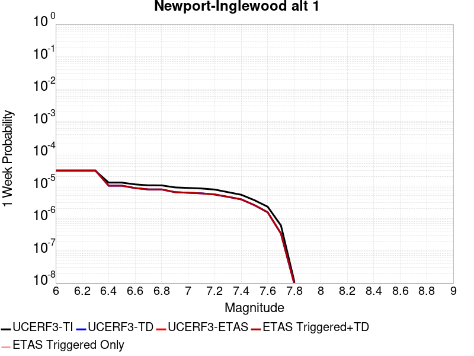 | 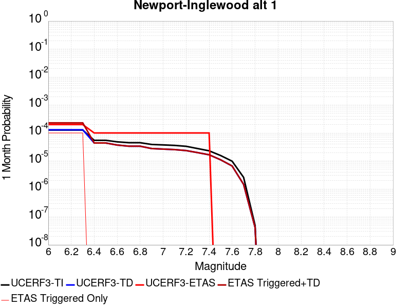 | 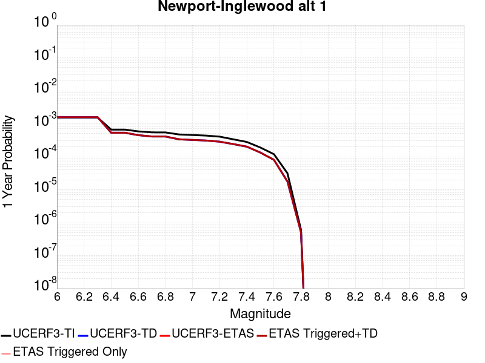 | 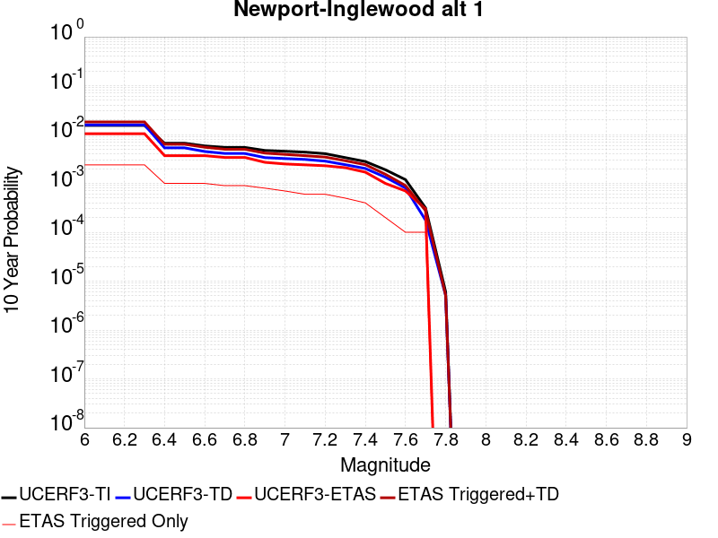 |

| Magnitude | 1 wk TI Prob | 1 wk TD Prob | 1 wk ETAS Prob | 1 wk ETAS/TD Gain | 1 wk ETAS Triggered+TD | 1 wk ETAS Triggered Only | 1 mo TI Prob | 1 mo TD Prob | 1 mo ETAS Prob | 1 mo ETAS/TD Gain | 1 mo ETAS Triggered+TD | 1 mo ETAS Triggered Only | 1 yr TI Prob | 1 yr TD Prob | 1 yr ETAS Prob | 1 yr ETAS/TD Gain | 1 yr ETAS Triggered+TD | 1 yr ETAS Triggered Only | 10 yr TI Prob | 10 yr TD Prob | 10 yr ETAS Prob | 10 yr ETAS/TD Gain | 10 yr ETAS Triggered+TD | 10 yr ETAS Triggered Only |
|-----|-----|-----|-----|-----|-----|-----|-----|-----|-----|-----|-----|-----|-----|-----|-----|-----|-----|-----|-----|-----|-----|-----|-----|-----|
| 6.0 | 2.9668912E-5 | 3.0343248E-5 | 0.0 | 0.0 | 3.0343248E-5 | 0.0 | 1.2714628E-4 | 1.3003874E-4 | 2.0E-4 | 1.5380032 | 2.3002575E-4 | 1.0E-4 | 0.0015469068 | 0.0015825545 | 5.0E-4 | 0.31594488 | 0.0017822381 | 2.0E-4 | 0.015361829 | 0.015760278 | 0.0104 | 0.65988684 | 0.018122453 | 0.0024 |
| 6.1 | 2.9668912E-5 | 3.0343248E-5 | 0.0 | 0.0 | 3.0343248E-5 | 0.0 | 1.2714628E-4 | 1.3003874E-4 | 2.0E-4 | 1.5380032 | 2.3002575E-4 | 1.0E-4 | 0.0015469068 | 0.0015825545 | 5.0E-4 | 0.31594488 | 0.0017822381 | 2.0E-4 | 0.015361829 | 0.015760278 | 0.0104 | 0.65988684 | 0.018122453 | 0.0024 |
| 6.2 | 2.9668912E-5 | 3.0343248E-5 | 0.0 | 0.0 | 3.0343248E-5 | 0.0 | 1.2714628E-4 | 1.3003874E-4 | 2.0E-4 | 1.5380032 | 2.3002575E-4 | 1.0E-4 | 0.0015469068 | 0.0015825545 | 5.0E-4 | 0.31594488 | 0.0017822381 | 2.0E-4 | 0.015361829 | 0.015760278 | 0.0104 | 0.65988684 | 0.018122453 | 0.0024 |
| 6.3 | 2.9668912E-5 | 3.0343248E-5 | 0.0 | 0.0 | 3.0343248E-5 | 0.0 | 1.2714628E-4 | 1.3003874E-4 | 2.0E-4 | 1.5380032 | 2.3002575E-4 | 1.0E-4 | 0.0015469068 | 0.0015825545 | 5.0E-4 | 0.31594488 | 0.0017822381 | 2.0E-4 | 0.015361829 | 0.015760278 | 0.0104 | 0.65988684 | 0.018122453 | 0.0024 |
| 6.4 | 1.275942E-5 | 1.0253584E-5 | 0.0 | 0.0 | 1.0253584E-5 | 0.0 | 5.4682085E-5 | 4.3943215E-5 | 1.0E-4 | 2.275664 | 4.3943215E-5 | 0.0 | 6.65551E-4 | 5.3488143E-4 | 3.0E-4 | 0.56087196 | 6.3482794E-4 | 1.0E-4 | 0.0066356123 | 0.005336364 | 0.0037 | 0.69335604 | 0.0063310275 | 0.001 |
| 6.5 | 1.275942E-5 | 1.0253584E-5 | 0.0 | 0.0 | 1.0253584E-5 | 0.0 | 5.4682085E-5 | 4.3943215E-5 | 1.0E-4 | 2.275664 | 4.3943215E-5 | 0.0 | 6.65551E-4 | 5.3488143E-4 | 3.0E-4 | 0.56087196 | 6.3482794E-4 | 1.0E-4 | 0.0066356123 | 0.005336364 | 0.0037 | 0.69335604 | 0.0063310275 | 0.001 |
| 6.6 | 1.1255358E-5 | 8.645304E-6 | 0.0 | 0.0 | 8.645304E-6 | 0.0 | 4.8236358E-5 | 3.7050788E-5 | 1.0E-4 | 2.698998 | 3.7050788E-5 | 0.0 | 5.871194E-4 | 4.5100166E-4 | 3.0E-4 | 0.66518605 | 5.509565E-4 | 1.0E-4 | 0.005855706 | 0.00450104 | 0.0037 | 0.82203215 | 0.005496539 | 0.001 |
| 6.7 | 1.0504745E-5 | 7.884053E-6 | 0.0 | 0.0 | 7.884053E-6 | 0.0 | 4.5019555E-5 | 3.378837E-5 | 1.0E-4 | 2.9595983 | 3.378837E-5 | 0.0 | 5.4797524E-4 | 4.1129696E-4 | 3.0E-4 | 0.7294 | 5.112559E-4 | 1.0E-4 | 0.0054662596 | 0.004105487 | 0.0034 | 0.82816 | 0.005001792 | 9.0E-4 |
| 6.8 | 1.0476007E-5 | 7.865446E-6 | 0.0 | 0.0 | 7.865446E-6 | 0.0 | 4.4896402E-5 | 3.3708624E-5 | 1.0E-4 | 2.9666 | 3.3708624E-5 | 0.0 | 5.464766E-4 | 4.1032644E-4 | 3.0E-4 | 0.73112524 | 5.102854E-4 | 1.0E-4 | 0.005451347 | 0.0040958175 | 0.0034 | 0.83011514 | 0.004992131 | 9.0E-4 |
| 6.9 | 9.076797E-6 | 6.4752685E-6 | 0.0 | 0.0 | 6.4752685E-6 | 0.0 | 3.889998E-5 | 2.7750857E-5 | 1.0E-4 | 3.6034925 | 2.7750857E-5 | 0.0 | 4.7350433E-4 | 3.3781462E-4 | 3.0E-4 | 0.888061 | 4.3778084E-4 | 1.0E-4 | 0.004724967 | 0.0033730483 | 0.0027 | 0.8004629 | 0.00417035 | 8.0E-4 |
| 7.0 | 8.73795E-6 | 6.1977316E-6 | 0.0 | 0.0 | 6.1977316E-6 | 0.0 | 3.7447822E-5 | 2.6561438E-5 | 1.0E-4 | 3.7648563 | 2.6561438E-5 | 0.0 | 4.5583185E-4 | 3.233378E-4 | 3.0E-4 | 0.92782223 | 4.2330546E-4 | 1.0E-4 | 0.0045489795 | 0.003228705 | 0.0025 | 0.7743043 | 0.003926445 | 7.0E-4 |
| 7.1 | 8.391299E-6 | 5.941712E-6 | 0.0 | 0.0 | 5.941712E-6 | 0.0 | 3.5962214E-5 | 2.5464233E-5 | 1.0E-4 | 3.9270768 | 2.5464233E-5 | 0.0 | 4.37752E-4 | 3.099832E-4 | 3.0E-4 | 0.96779436 | 4.099522E-4 | 1.0E-4 | 0.004368907 | 0.0030955374 | 0.0024 | 0.7753096 | 0.00369368 | 6.0E-4 |
| 7.2 | 7.796882E-6 | 5.484911E-6 | 0.0 | 0.0 | 5.484911E-6 | 0.0 | 3.341478E-5 | 2.350655E-5 | 1.0E-4 | 4.254133 | 2.350655E-5 | 0.0 | 4.06749E-4 | 2.861549E-4 | 3.0E-4 | 1.0483832 | 3.8612628E-4 | 1.0E-4 | 0.0040600533 | 0.002857888 | 0.0023 | 0.80479014 | 0.0034561732 | 6.0E-4 |
| 7.3 | 6.4738833E-6 | 4.63922E-6 | 0.0 | 0.0 | 4.63922E-6 | 0.0 | 2.774492E-5 | 1.988222E-5 | 1.0E-4 | 5.029619 | 1.988222E-5 | 0.0 | 3.3774204E-4 | 2.420393E-4 | 2.0E-4 | 0.82631207 | 2.420393E-4 | 0.0 | 0.0033722918 | 0.0024177735 | 0.0021 | 0.8685677 | 0.0029165647 | 5.0E-4 |
| 7.4 | 5.382145E-6 | 3.8784056E-6 | 0.0 | 0.0 | 3.8784056E-6 | 0.0 | 2.3066134E-5 | 1.6621632E-5 | 1.0E-4 | 6.0162563 | 1.6621632E-5 | 0.0 | 2.8079396E-4 | 2.0234972E-4 | 2.0E-4 | 0.9883878 | 2.0234972E-4 | 0.0 | 0.0028043943 | 0.0020216692 | 0.0017 | 0.84088933 | 0.0024208606 | 4.0E-4 |
| 7.5 | 3.648244E-6 | 2.567707E-6 | 0.0 | 0.0 | 2.567707E-6 | 0.0 | 1.5635238E-5 | 1.1004413E-5 | 0.0 | 0.0 | 1.1004413E-5 | 0.0 | 1.9034238E-4 | 1.3397059E-4 | 1.0E-4 | 0.7464325 | 1.3397059E-4 | 0.0 | 0.0019017943 | 0.0013389087 | 0.001 | 0.74687696 | 0.0015386408 | 2.0E-4 |
| 7.6 | 2.2906888E-6 | 1.5434426E-6 | 0.0 | 0.0 | 1.5434426E-6 | 0.0 | 9.817201E-6 | 6.6147377E-6 | 0.0 | 0.0 | 6.6147377E-6 | 0.0 | 1.1951787E-4 | 8.053152E-5 | 1.0E-4 | 1.2417498 | 8.053152E-5 | 0.0 | 0.0011945361 | 8.0503005E-4 | 7.0E-4 | 0.86953276 | 9.0494956E-4 | 1.0E-4 |
| 7.7 | 6.0479874E-7 | 3.3946486E-7 | 0.0 | 0.0 | 3.3946486E-7 | 0.0 | 2.5919921E-6 | 1.4548486E-6 | 0.0 | 0.0 | 1.4548486E-6 | 0.0 | 3.1557047E-5 | 1.7712651E-5 | 0.0 | 0.0 | 1.7712651E-5 | 0.0 | 3.1552566E-4 | 1.7711378E-4 | 3.0E-4 | 1.6938264 | 2.7709606E-4 | 1.0E-4 |
| 7.8 | 1.16056995E-8 | 9.781112E-9 | 0.0 | 0.0 | 9.781112E-9 | 0.0 | 4.9738713E-8 | 4.191905E-8 | 0.0 | 0.0 | 4.191905E-8 | 0.0 | 6.0556863E-7 | 5.1036443E-7 | 0.0 | 0.0 | 5.1036443E-7 | 0.0 | 6.05567E-6 | 5.1036445E-6 | 0.0 | 0.0 | 5.1036445E-6 | 0.0 |

## Antelope Valley 2011
*[(top)](#table-of-contents)*

| 1 Week | 1 Month | 1 Year | 10 Year |
|-----|-----|-----|-----|
| 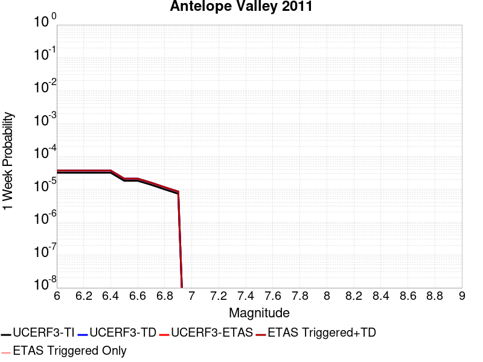 |  |  | 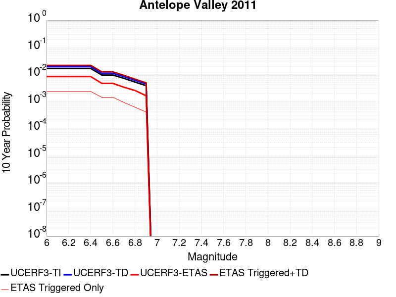 |

| Magnitude | 1 wk TI Prob | 1 wk TD Prob | 1 wk ETAS Prob | 1 wk ETAS/TD Gain | 1 wk ETAS Triggered+TD | 1 wk ETAS Triggered Only | 1 mo TI Prob | 1 mo TD Prob | 1 mo ETAS Prob | 1 mo ETAS/TD Gain | 1 mo ETAS Triggered+TD | 1 mo ETAS Triggered Only | 1 yr TI Prob | 1 yr TD Prob | 1 yr ETAS Prob | 1 yr ETAS/TD Gain | 1 yr ETAS Triggered+TD | 1 yr ETAS Triggered Only | 10 yr TI Prob | 10 yr TD Prob | 10 yr ETAS Prob | 10 yr ETAS/TD Gain | 10 yr ETAS Triggered+TD | 10 yr ETAS Triggered Only |
|-----|-----|-----|-----|-----|-----|-----|-----|-----|-----|-----|-----|-----|-----|-----|-----|-----|-----|-----|-----|-----|-----|-----|-----|-----|
| 6.0 | 3.1646934E-5 | 3.6840487E-5 | 0.0 | 0.0 | 3.6840487E-5 | 0.0 | 1.3562266E-4 | 1.5787974E-4 | 1.0E-4 | 0.6333935 | 2.5786395E-4 | 1.0E-4 | 0.0016499552 | 0.0019207548 | 8.0E-4 | 0.41650292 | 0.0021203707 | 2.0E-4 | 0.016377583 | 0.019067852 | 0.0082 | 0.4300432 | 0.021323996 | 0.0023 |
| 6.1 | 3.1646934E-5 | 3.6840487E-5 | 0.0 | 0.0 | 3.6840487E-5 | 0.0 | 1.3562266E-4 | 1.5787974E-4 | 1.0E-4 | 0.6333935 | 2.5786395E-4 | 1.0E-4 | 0.0016499552 | 0.0019207548 | 8.0E-4 | 0.41650292 | 0.0021203707 | 2.0E-4 | 0.016377583 | 0.019067852 | 0.0082 | 0.4300432 | 0.021323996 | 0.0023 |
| 6.2 | 3.1646934E-5 | 3.6840487E-5 | 0.0 | 0.0 | 3.6840487E-5 | 0.0 | 1.3562266E-4 | 1.5787974E-4 | 1.0E-4 | 0.6333935 | 2.5786395E-4 | 1.0E-4 | 0.0016499552 | 0.0019207548 | 8.0E-4 | 0.41650292 | 0.0021203707 | 2.0E-4 | 0.016377583 | 0.019067852 | 0.0082 | 0.4300432 | 0.021323996 | 0.0023 |
| 6.3 | 3.1646934E-5 | 3.6840487E-5 | 0.0 | 0.0 | 3.6840487E-5 | 0.0 | 1.3562266E-4 | 1.5787974E-4 | 1.0E-4 | 0.6333935 | 2.5786395E-4 | 1.0E-4 | 0.0016499552 | 0.0019207548 | 8.0E-4 | 0.41650292 | 0.0021203707 | 2.0E-4 | 0.016377583 | 0.019067852 | 0.0082 | 0.4300432 | 0.021323996 | 0.0023 |
| 6.4 | 3.1646934E-5 | 3.6840487E-5 | 0.0 | 0.0 | 3.6840487E-5 | 0.0 | 1.3562266E-4 | 1.5787974E-4 | 1.0E-4 | 0.6333935 | 2.5786395E-4 | 1.0E-4 | 0.0016499552 | 0.0019207548 | 8.0E-4 | 0.41650292 | 0.0021203707 | 2.0E-4 | 0.016377583 | 0.019067852 | 0.0082 | 0.4300432 | 0.021323996 | 0.0023 |
| 6.5 | 1.8034107E-5 | 2.0905773E-5 | 0.0 | 0.0 | 2.0905773E-5 | 0.0 | 7.7286735E-5 | 8.959378E-5 | 1.0E-4 | 1.116149 | 1.8958481E-4 | 1.0E-4 | 9.405598E-4 | 0.0010903804 | 4.0E-4 | 0.36684445 | 0.0011902713 | 1.0E-4 | 0.009365888 | 0.010862339 | 0.0046 | 0.42348152 | 0.012247132 | 0.0014 |
| 6.6 | 1.8034107E-5 | 2.0905773E-5 | 0.0 | 0.0 | 2.0905773E-5 | 0.0 | 7.7286735E-5 | 8.959378E-5 | 1.0E-4 | 1.116149 | 1.8958481E-4 | 1.0E-4 | 9.405598E-4 | 0.0010903804 | 4.0E-4 | 0.36684445 | 0.0011902713 | 1.0E-4 | 0.009365888 | 0.010862339 | 0.0046 | 0.42348152 | 0.012247132 | 0.0014 |
| 6.7 | 1.3567667E-5 | 1.5723108E-5 | 0.0 | 0.0 | 1.5723108E-5 | 0.0 | 5.814585E-5 | 6.7383604E-5 | 0.0 | 0.0 | 6.7383604E-5 | 0.0 | 7.076958E-4 | 8.2019245E-4 | 3.0E-4 | 0.3657678 | 8.2019245E-4 | 0.0 | 0.007054463 | 0.008182052 | 0.0033 | 0.4033218 | 0.009074688 | 9.0E-4 |
| 6.8 | 9.867387E-6 | 1.1448545E-5 | 0.0 | 0.0 | 1.1448545E-5 | 0.0 | 4.2288117E-5 | 4.90648E-5 | 0.0 | 0.0 | 4.90648E-5 | 0.0 | 5.1473617E-4 | 5.972949E-4 | 2.0E-4 | 0.33484298 | 5.972949E-4 | 0.0 | 0.005135455 | 0.005966176 | 0.0025 | 0.41902888 | 0.006562596 | 6.0E-4 |
| 6.9 | 7.273233E-6 | 8.440546E-6 | 0.0 | 0.0 | 8.440546E-6 | 0.0 | 3.1170628E-5 | 3.6173766E-5 | 0.0 | 0.0 | 3.6173766E-5 | 0.0 | 3.794363E-4 | 4.404156E-4 | 1.0E-4 | 0.22705826 | 4.404156E-4 | 0.0 | 0.0037878908 | 0.004404156 | 0.0016 | 0.36329323 | 0.004802394 | 4.0E-4 |

## San Andreas (Peninsula) 2011 CFM
*[(top)](#table-of-contents)*

| 1 Week | 1 Month | 1 Year | 10 Year |
|-----|-----|-----|-----|
| 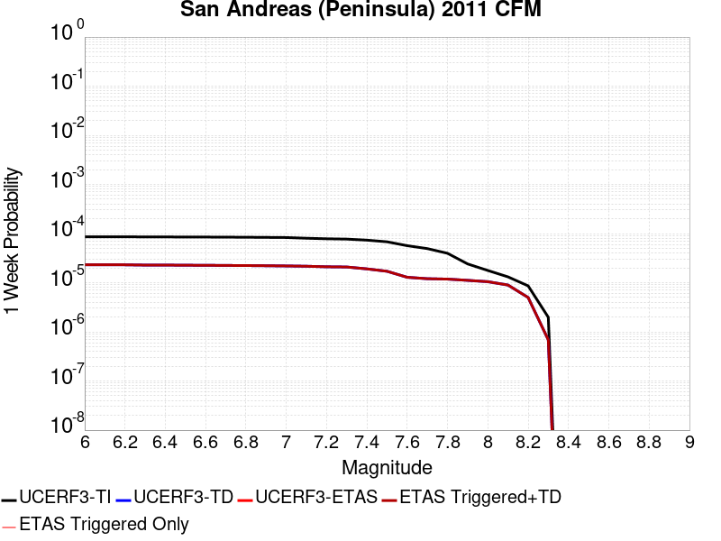 | 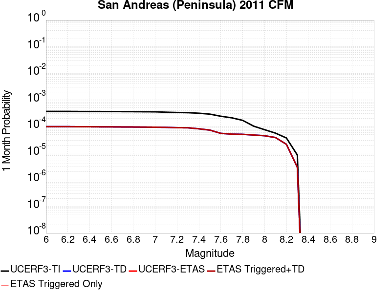 | 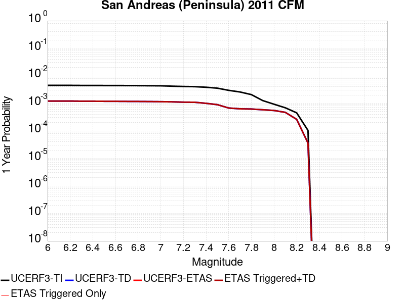 | 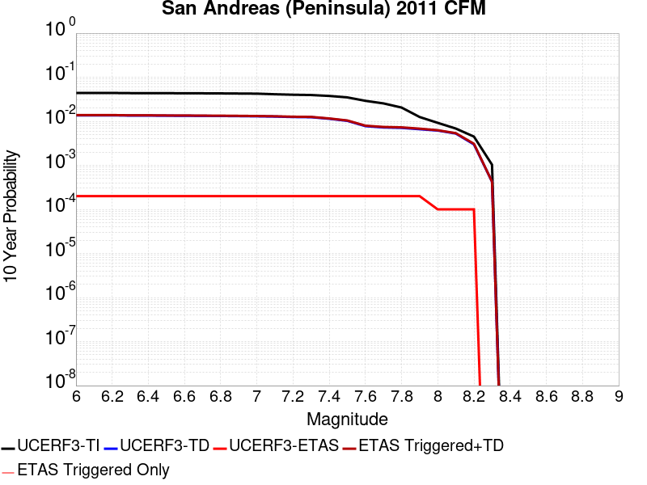 |

| Magnitude | 1 wk TI Prob | 1 wk TD Prob | 1 wk ETAS Prob | 1 wk ETAS/TD Gain | 1 wk ETAS Triggered+TD | 1 wk ETAS Triggered Only | 1 mo TI Prob | 1 mo TD Prob | 1 mo ETAS Prob | 1 mo ETAS/TD Gain | 1 mo ETAS Triggered+TD | 1 mo ETAS Triggered Only | 1 yr TI Prob | 1 yr TD Prob | 1 yr ETAS Prob | 1 yr ETAS/TD Gain | 1 yr ETAS Triggered+TD | 1 yr ETAS Triggered Only | 10 yr TI Prob | 10 yr TD Prob | 10 yr ETAS Prob | 10 yr ETAS/TD Gain | 10 yr ETAS Triggered+TD | 10 yr ETAS Triggered Only |
|-----|-----|-----|-----|-----|-----|-----|-----|-----|-----|-----|-----|-----|-----|-----|-----|-----|-----|-----|-----|-----|-----|-----|-----|-----|
| 6.0 | 8.6200685E-5 | 2.3489103E-5 | 0.0 | 0.0 | 2.3489103E-5 | 0.0 | 3.6937918E-4 | 1.0066371E-4 | 1.0E-4 | 0.99340665 | 2.0065364E-4 | 1.0E-4 | 0.0044879215 | 0.001224893 | 5.0E-4 | 0.4081989 | 0.0013247706 | 1.0E-4 | 0.043983612 | 0.0138281025 | 0.0079 | 0.5713004 | 0.016096298 | 0.0023 |
| 6.1 | 8.6200685E-5 | 2.3489103E-5 | 0.0 | 0.0 | 2.3489103E-5 | 0.0 | 3.6937918E-4 | 1.0066371E-4 | 1.0E-4 | 0.99340665 | 2.0065364E-4 | 1.0E-4 | 0.0044879215 | 0.001224893 | 5.0E-4 | 0.4081989 | 0.0013247706 | 1.0E-4 | 0.043983612 | 0.0138281025 | 0.0079 | 0.5713004 | 0.016096298 | 0.0023 |
| 6.2 | 8.6200685E-5 | 2.3489103E-5 | 0.0 | 0.0 | 2.3489103E-5 | 0.0 | 3.6937918E-4 | 1.0066371E-4 | 1.0E-4 | 0.99340665 | 2.0065364E-4 | 1.0E-4 | 0.0044879215 | 0.001224893 | 5.0E-4 | 0.4081989 | 0.0013247706 | 1.0E-4 | 0.043983612 | 0.0138281025 | 0.0079 | 0.5713004 | 0.016096298 | 0.0023 |
| 6.3 | 8.551163E-5 | 2.3193987E-5 | 0.0 | 0.0 | 2.3193987E-5 | 0.0 | 3.6642692E-4 | 9.939902E-5 | 1.0E-4 | 1.0060462 | 1.9938908E-4 | 1.0E-4 | 0.004452125 | 0.0012095126 | 5.0E-4 | 0.41338965 | 0.0013093917 | 1.0E-4 | 0.043639794 | 0.013661744 | 0.0076 | 0.55629796 | 0.015930323 | 0.0023 |
| 6.4 | 8.551163E-5 | 2.3193987E-5 | 0.0 | 0.0 | 2.3193987E-5 | 0.0 | 3.6642692E-4 | 9.939902E-5 | 1.0E-4 | 1.0060462 | 1.9938908E-4 | 1.0E-4 | 0.004452125 | 0.0012095126 | 5.0E-4 | 0.41338965 | 0.0013093917 | 1.0E-4 | 0.043639794 | 0.013661744 | 0.0076 | 0.55629796 | 0.015930323 | 0.0023 |
| 6.5 | 8.511146E-5 | 2.3022976E-5 | 0.0 | 0.0 | 2.3022976E-5 | 0.0 | 3.647124E-4 | 9.866617E-5 | 1.0E-4 | 1.0135186 | 1.986563E-4 | 1.0E-4 | 0.004431336 | 0.0012006001 | 5.0E-4 | 0.41645843 | 0.00130048 | 1.0E-4 | 0.04344007 | 0.013565183 | 0.0075 | 0.552886 | 0.01573534 | 0.0022 |
| 6.6 | 8.4985084E-5 | 2.2955874E-5 | 0.0 | 0.0 | 2.2955874E-5 | 0.0 | 3.6417096E-4 | 9.837861E-5 | 1.0E-4 | 1.0164812 | 1.9836877E-4 | 1.0E-4 | 0.0044247704 | 0.001197103 | 5.0E-4 | 0.41767505 | 0.0012969832 | 1.0E-4 | 0.043376986 | 0.013528256 | 0.0075 | 0.5543952 | 0.015698493 | 0.0022 |
| 6.7 | 8.462618E-5 | 2.2790911E-5 | 0.0 | 0.0 | 2.2790911E-5 | 0.0 | 3.6263323E-4 | 9.7671684E-5 | 1.0E-4 | 1.0238382 | 1.9766192E-4 | 1.0E-4 | 0.004406125 | 0.0011885054 | 5.0E-4 | 0.4206964 | 0.0012883866 | 1.0E-4 | 0.043197807 | 0.013436 | 0.0074 | 0.55075914 | 0.015606442 | 0.0022 |
| 6.8 | 8.42337E-5 | 2.2691791E-5 | 0.0 | 0.0 | 2.2691791E-5 | 0.0 | 3.6095164E-4 | 9.724692E-5 | 1.0E-4 | 1.0283102 | 1.972372E-4 | 1.0E-4 | 0.004385734 | 0.0011833396 | 5.0E-4 | 0.42253298 | 0.0012832213 | 1.0E-4 | 0.043001823 | 0.013379517 | 0.0074 | 0.55308425 | 0.015550082 | 0.0022 |
| 6.9 | 8.365989E-5 | 2.250335E-5 | 0.0 | 0.0 | 2.250335E-5 | 0.0 | 3.5849313E-4 | 9.643936E-5 | 1.0E-4 | 1.036921 | 1.9642971E-4 | 1.0E-4 | 0.004355922 | 0.0011735182 | 5.0E-4 | 0.42606923 | 0.0012734008 | 1.0E-4 | 0.04271523 | 0.013275492 | 0.0074 | 0.55741817 | 0.015446286 | 0.0022 |
| 7.0 | 8.30936E-5 | 2.2271633E-5 | 0.0 | 0.0 | 2.2271633E-5 | 0.0 | 3.560668E-4 | 9.5446376E-5 | 1.0E-4 | 1.0477087 | 1.9543683E-4 | 1.0E-4 | 0.004326499 | 0.0011614416 | 5.0E-4 | 0.4304995 | 0.0012613253 | 1.0E-4 | 0.042432297 | 0.013150076 | 0.0074 | 0.56273437 | 0.015321147 | 0.0022 |
| 7.1 | 8.041264E-5 | 2.1972086E-5 | 0.0 | 0.0 | 2.1972086E-5 | 0.0 | 3.4458007E-4 | 9.416269E-5 | 1.0E-4 | 1.0619918 | 1.9415327E-4 | 1.0E-4 | 0.0041871946 | 0.0011458292 | 5.0E-4 | 0.4363652 | 0.0012457146 | 1.0E-4 | 0.041091725 | 0.012980841 | 0.0073 | 0.56236726 | 0.015152283 | 0.0022 |
| 7.2 | 7.8427016E-5 | 2.1414144E-5 | 0.0 | 0.0 | 2.1414144E-5 | 0.0 | 3.3607247E-4 | 9.1771675E-5 | 1.0E-4 | 1.0896608 | 1.917625E-4 | 1.0E-4 | 0.004084008 | 0.0011167489 | 5.0E-4 | 0.44772825 | 0.0012166372 | 1.0E-4 | 0.040097635 | 0.012675119 | 0.0069 | 0.54437363 | 0.014748501 | 0.0021 |
| 7.3 | 7.721087E-5 | 2.120559E-5 | 0.0 | 0.0 | 2.120559E-5 | 0.0 | 3.3086175E-4 | 9.087793E-5 | 1.0E-4 | 1.1003771 | 1.9086884E-4 | 1.0E-4 | 0.004020803 | 0.0011058786 | 5.0E-4 | 0.4521292 | 0.0012057681 | 1.0E-4 | 0.03948827 | 0.012562558 | 0.0068 | 0.54129106 | 0.014537433 | 0.002 |
| 7.4 | 7.3536525E-5 | 1.9418134E-5 | 0.0 | 0.0 | 1.9418134E-5 | 0.0 | 3.1511846E-4 | 8.321792E-5 | 1.0E-4 | 1.2016642 | 1.832096E-4 | 1.0E-4 | 0.0038298194 | 0.0010127084 | 4.0E-4 | 0.39498043 | 0.0011126071 | 1.0E-4 | 0.037644852 | 0.01156565 | 0.0065 | 0.5620091 | 0.013443675 | 0.0019 |
| 7.5 | 6.806207E-5 | 1.7353825E-5 | 0.0 | 0.0 | 1.7353825E-5 | 0.0 | 2.9166197E-4 | 7.437142E-5 | 1.0E-4 | 1.3446026 | 1.7436397E-4 | 1.0E-4 | 0.0035452035 | 9.050968E-4 | 4.0E-4 | 0.44194168 | 0.0010050063 | 1.0E-4 | 0.034891766 | 0.010385237 | 0.006 | 0.5777432 | 0.011968621 | 0.0016 |
| 7.6 | 5.6731416E-5 | 1.3079574E-5 | 0.0 | 0.0 | 1.3079574E-5 | 0.0 | 2.43112E-4 | 5.6054116E-5 | 1.0E-4 | 1.7839904 | 1.5604851E-4 | 1.0E-4 | 0.0029558712 | 6.822453E-4 | 4.0E-4 | 0.5862994 | 7.821771E-4 | 1.0E-4 | 0.02916862 | 0.007865363 | 0.0049 | 0.6229846 | 0.009155138 | 0.0013 |
| 7.7 | 4.946994E-5 | 1.2228295E-5 | 0.0 | 0.0 | 1.2228295E-5 | 0.0 | 2.1199681E-4 | 5.240593E-5 | 1.0E-4 | 1.9081811 | 1.524007E-4 | 1.0E-4 | 0.002578006 | 6.378555E-4 | 4.0E-4 | 0.62710124 | 7.377917E-4 | 1.0E-4 | 0.02548303 | 0.0073341327 | 0.0047 | 0.6408392 | 0.008624598 | 0.0013 |
| 7.8 | 3.9718198E-5 | 1.20023415E-5 | 0.0 | 0.0 | 1.20023415E-5 | 0.0 | 1.7020974E-4 | 5.143759E-5 | 1.0E-4 | 1.9441035 | 1.5143245E-4 | 1.0E-4 | 0.0020703338 | 6.2607287E-4 | 4.0E-4 | 0.63890326 | 7.2601024E-4 | 1.0E-4 | 0.020511515 | 0.007170388 | 0.0047 | 0.6554736 | 0.0084610665 | 0.0013 |
| 7.9 | 2.4115114E-5 | 1.1310612E-5 | 0.0 | 0.0 | 1.1310612E-5 | 0.0 | 1.0334639E-4 | 4.847315E-5 | 1.0E-4 | 2.0629978 | 1.484683E-4 | 1.0E-4 | 0.001257516 | 5.900009E-4 | 4.0E-4 | 0.67796504 | 6.899419E-4 | 1.0E-4 | 0.012504238 | 0.0066810353 | 0.0045 | 0.6735483 | 0.00797235 | 0.0013 |
| 8.0 | 1.7756569E-5 | 1.0616724E-5 | 0.0 | 0.0 | 1.0616724E-5 | 0.0 | 7.6097356E-5 | 4.549945E-5 | 1.0E-4 | 2.1978288 | 1.454949E-4 | 1.0E-4 | 9.260915E-4 | 5.538151E-4 | 4.0E-4 | 0.7222627 | 6.5375975E-4 | 1.0E-4 | 0.009222416 | 0.0062310277 | 0.0043 | 0.6900948 | 0.0073241736 | 0.0011 |
| 8.1 | 1.3159258E-5 | 9.0727235E-6 | 0.0 | 0.0 | 9.0727235E-6 | 0.0 | 5.6395602E-5 | 3.888252E-5 | 1.0E-4 | 2.5718496 | 1.3887863E-4 | 1.0E-4 | 6.864001E-4 | 4.73292E-4 | 3.0E-4 | 0.6338582 | 5.7324464E-4 | 1.0E-4 | 0.0068428386 | 0.0053257253 | 0.0036 | 0.67596424 | 0.0064198673 | 0.0011 |
| 8.2 | 8.635426E-6 | 5.061278E-6 | 0.0 | 0.0 | 5.061278E-6 | 0.0 | 3.700844E-5 | 2.169101E-5 | 1.0E-4 | 4.6102047 | 1.2168884E-4 | 1.0E-4 | 4.5048463E-4 | 2.640561E-4 | 2.0E-4 | 0.75741476 | 3.6402972E-4 | 1.0E-4 | 0.004495725 | 0.0030219199 | 0.0022 | 0.728014 | 0.0037198046 | 7.0E-4 |
| 8.3 | 1.983087E-6 | 6.9765395E-7 | 0.0 | 0.0 | 6.9765395E-7 | 0.0 | 8.498917E-6 | 2.9899422E-6 | 0.0 | 0.0 | 2.9899422E-6 | 0.0 | 1.034694E-4 | 3.640195E-5 | 0.0 | 0.0 | 3.640195E-5 | 0.0 | 0.0010342124 | 4.3255524E-4 | 2.0E-4 | 0.46236867 | 5.32512E-4 | 1.0E-4 |

## Superstition Hills
*[(top)](#table-of-contents)*

| 1 Week | 1 Month | 1 Year | 10 Year |
|-----|-----|-----|-----|
| 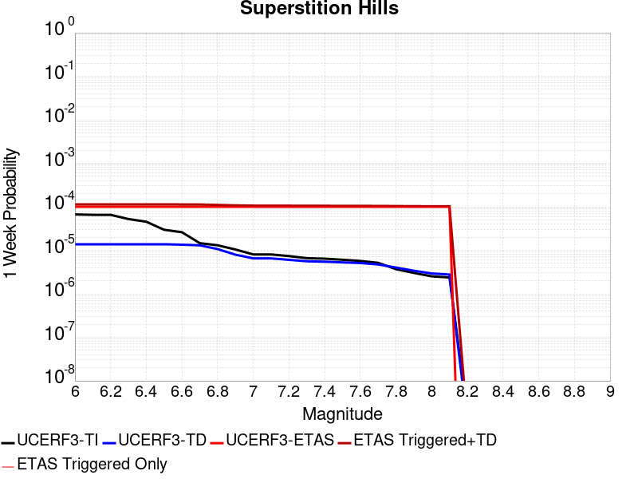 | 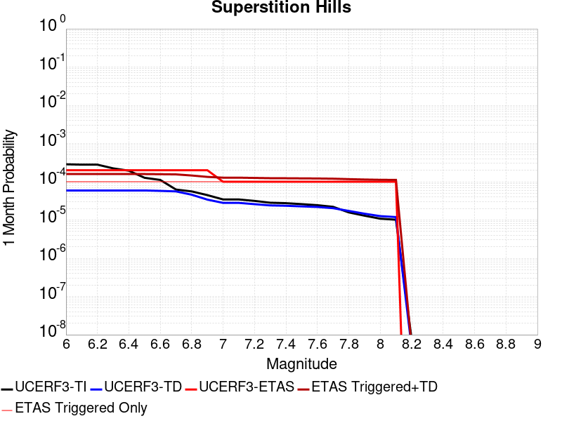 | 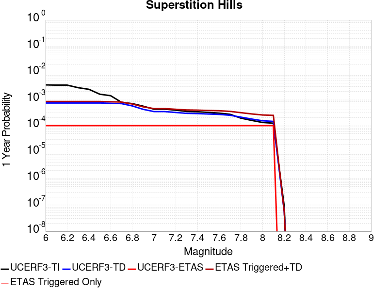 | 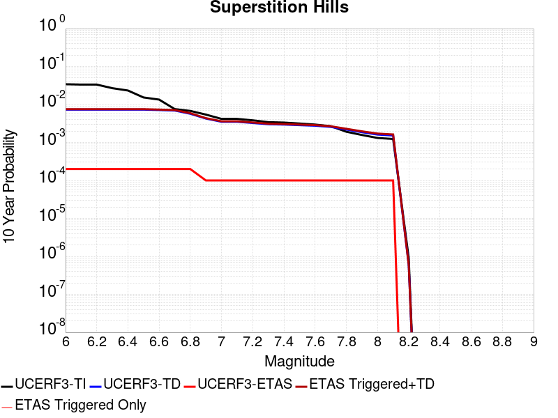 |

| Magnitude | 1 wk TI Prob | 1 wk TD Prob | 1 wk ETAS Prob | 1 wk ETAS/TD Gain | 1 wk ETAS Triggered+TD | 1 wk ETAS Triggered Only | 1 mo TI Prob | 1 mo TD Prob | 1 mo ETAS Prob | 1 mo ETAS/TD Gain | 1 mo ETAS Triggered+TD | 1 mo ETAS Triggered Only | 1 yr TI Prob | 1 yr TD Prob | 1 yr ETAS Prob | 1 yr ETAS/TD Gain | 1 yr ETAS Triggered+TD | 1 yr ETAS Triggered Only | 10 yr TI Prob | 10 yr TD Prob | 10 yr ETAS Prob | 10 yr ETAS/TD Gain | 10 yr ETAS Triggered+TD | 10 yr ETAS Triggered Only |
|-----|-----|-----|-----|-----|-----|-----|-----|-----|-----|-----|-----|-----|-----|-----|-----|-----|-----|-----|-----|-----|-----|-----|-----|-----|
| 6.0 | 6.6865185E-5 | 1.3826731E-5 | 1.0E-4 | 7.2323675 | 1.1382535E-4 | 1.0E-4 | 2.8653358E-4 | 5.9256163E-5 | 2.0E-4 | 3.3751764 | 1.5925024E-4 | 1.0E-4 | 0.0034829667 | 7.212207E-4 | 0.001 | 1.3865381 | 0.0013207879 | 6.0E-4 | 0.03428881 | 0.007358899 | 0.0059 | 0.80175036 | 0.009641973 | 0.0023 |
| 6.1 | 6.544851E-5 | 1.3826731E-5 | 1.0E-4 | 7.2323675 | 1.1382535E-4 | 1.0E-4 | 2.8046346E-4 | 5.9256163E-5 | 2.0E-4 | 3.3751764 | 1.5925024E-4 | 1.0E-4 | 0.0034092965 | 7.212207E-4 | 0.001 | 1.3865383 | 0.0013207879 | 6.0E-4 | 0.033574644 | 0.007358899 | 0.0059 | 0.8017504 | 0.009641973 | 0.0023 |
| 6.2 | 6.544851E-5 | 1.3826731E-5 | 1.0E-4 | 7.2323675 | 1.1382535E-4 | 1.0E-4 | 2.8046346E-4 | 5.9256163E-5 | 2.0E-4 | 3.3751764 | 1.5925024E-4 | 1.0E-4 | 0.0034092965 | 7.212207E-4 | 0.001 | 1.3865383 | 0.0013207879 | 6.0E-4 | 0.033574644 | 0.007358899 | 0.0059 | 0.8017504 | 0.009641973 | 0.0023 |
| 6.3 | 5.2402065E-5 | 1.38267305E-5 | 1.0E-4 | 7.2323675 | 1.1382535E-4 | 1.0E-4 | 2.2456095E-4 | 5.925616E-5 | 2.0E-4 | 3.3751764 | 1.5925024E-4 | 1.0E-4 | 0.0027306017 | 7.212206E-4 | 0.001 | 1.3865383 | 0.0013207879 | 6.0E-4 | 0.02697292 | 0.0073588965 | 0.0059 | 0.80175066 | 0.009641971 | 0.0023 |
| 6.4 | 4.542238E-5 | 1.38267305E-5 | 1.0E-4 | 7.232368 | 1.1382535E-4 | 1.0E-4 | 1.9465282E-4 | 5.925616E-5 | 2.0E-4 | 3.3751767 | 1.5925024E-4 | 1.0E-4 | 0.0023673223 | 7.212206E-4 | 0.001 | 1.3865383 | 0.0013207879 | 6.0E-4 | 0.023422617 | 0.007358895 | 0.0059 | 0.8017508 | 0.00964197 | 0.0023 |
| 6.5 | 2.9672969E-5 | 1.38267305E-5 | 1.0E-4 | 7.232368 | 1.1382535E-4 | 1.0E-4 | 1.2716366E-4 | 5.925616E-5 | 2.0E-4 | 3.3751767 | 1.5925024E-4 | 1.0E-4 | 0.0015471181 | 7.212206E-4 | 0.001 | 1.3865383 | 0.0013207878 | 6.0E-4 | 0.015363912 | 0.007358893 | 0.0059 | 0.8017511 | 0.009641967 | 0.0023 |
| 6.6 | 2.6056105E-5 | 1.3494256E-5 | 1.0E-4 | 7.4105606 | 1.13492904E-4 | 1.0E-4 | 1.1166424E-4 | 5.783133E-5 | 2.0E-4 | 3.458333 | 1.5782555E-4 | 1.0E-4 | 0.0013586642 | 7.038846E-4 | 0.001 | 1.4206876 | 0.0013034622 | 6.0E-4 | 0.013503874 | 0.0071841627 | 0.0059 | 0.8212509 | 0.009467639 | 0.0023 |
| 6.7 | 1.4611248E-5 | 1.3079803E-5 | 1.0E-4 | 7.6453753 | 1.13078495E-4 | 1.0E-4 | 6.261813E-5 | 5.6055178E-5 | 2.0E-4 | 3.5679128 | 1.5604957E-4 | 1.0E-4 | 7.6210906E-4 | 6.8227353E-4 | 0.001 | 1.4656878 | 0.0012818642 | 6.0E-4 | 0.0075950073 | 0.0069681956 | 0.0056 | 0.8036514 | 0.009053563 | 0.0021 |
| 6.8 | 1.30607E-5 | 1.0703119E-5 | 1.0E-4 | 9.343071 | 1.1070205E-4 | 1.0E-4 | 5.597323E-5 | 4.586975E-5 | 2.0E-4 | 4.360172 | 1.4586517E-4 | 1.0E-4 | 6.8126095E-4 | 5.583295E-4 | 8.0E-4 | 1.4328456 | 9.581062E-4 | 4.0E-4 | 0.006791762 | 0.005730139 | 0.0041 | 0.7155149 | 0.007320971 | 0.0016 |
| 6.9 | 1.0443096E-5 | 7.966741E-6 | 1.0E-4 | 12.552185 | 1.0796594E-4 | 1.0E-4 | 4.4755358E-5 | 3.414274E-5 | 2.0E-4 | 5.857761 | 1.3413932E-4 | 1.0E-4 | 5.447602E-4 | 4.156108E-4 | 6.0E-4 | 1.4436584 | 6.155277E-4 | 2.0E-4 | 0.005434267 | 0.0042895554 | 0.0029 | 0.67606074 | 0.0053848373 | 0.0011 |
| 7.0 | 8.045912E-6 | 6.5467984E-6 | 1.0E-4 | 15.274642 | 1.0654615E-4 | 1.0E-4 | 3.4482026E-5 | 2.8057411E-5 | 1.0E-4 | 3.5641208 | 1.2805461E-4 | 1.0E-4 | 4.197378E-4 | 3.415464E-4 | 4.0E-4 | 1.1711439 | 4.4151227E-4 | 1.0E-4 | 0.0041894587 | 0.0035321794 | 0.0021 | 0.5945338 | 0.0042297067 | 7.0E-4 |
| 7.1 | 8.045912E-6 | 6.5467984E-6 | 1.0E-4 | 15.274642 | 1.0654615E-4 | 1.0E-4 | 3.4482026E-5 | 2.8057411E-5 | 1.0E-4 | 3.5641208 | 1.2805461E-4 | 1.0E-4 | 4.197378E-4 | 3.415464E-4 | 4.0E-4 | 1.1711439 | 4.4151227E-4 | 1.0E-4 | 0.0041894587 | 0.0035321794 | 0.0021 | 0.5945338 | 0.0042297067 | 7.0E-4 |
| 7.2 | 7.375506E-6 | 6.061417E-6 | 1.0E-4 | 16.497791 | 1.0606081E-4 | 1.0E-4 | 3.1608928E-5 | 2.5977248E-5 | 1.0E-4 | 3.8495226 | 1.2597465E-4 | 1.0E-4 | 3.8477074E-4 | 3.162279E-4 | 3.0E-4 | 0.9486829 | 4.1619627E-4 | 1.0E-4 | 0.003841052 | 0.0032766748 | 0.002 | 0.6103749 | 0.003974381 | 7.0E-4 |
| 7.3 | 6.6063913E-6 | 5.6187237E-6 | 1.0E-4 | 17.797636 | 1.05618165E-4 | 1.0E-4 | 2.8312797E-5 | 2.4080025E-5 | 1.0E-4 | 4.1528196 | 1.2407762E-4 | 1.0E-4 | 3.446538E-4 | 2.9313553E-4 | 3.0E-4 | 1.0234174 | 3.9310622E-4 | 1.0E-4 | 0.0034411973 | 0.00304347 | 0.0019 | 0.6242874 | 0.0037413395 | 7.0E-4 |
| 7.4 | 6.4313126E-6 | 5.500778E-6 | 1.0E-4 | 18.179247 | 1.0550023E-4 | 1.0E-4 | 2.7562477E-5 | 2.3574554E-5 | 1.0E-4 | 4.241862 | 1.235722E-4 | 1.0E-4 | 3.355215E-4 | 2.8698304E-4 | 3.0E-4 | 1.045358 | 3.8695434E-4 | 1.0E-4 | 0.0033501536 | 0.0029815584 | 0.0019 | 0.63725066 | 0.0036794713 | 7.0E-4 |
| 7.5 | 6.0742927E-6 | 5.298938E-6 | 1.0E-4 | 18.871706 | 1.0529841E-4 | 1.0E-4 | 2.6032423E-5 | 2.270954E-5 | 1.0E-4 | 4.4034357 | 1.2270726E-4 | 1.0E-4 | 3.1689866E-4 | 2.764542E-4 | 2.0E-4 | 0.72344714 | 3.7642656E-4 | 1.0E-4 | 0.0031644711 | 0.0028746172 | 0.0018 | 0.62617034 | 0.003572605 | 7.0E-4 |
| 7.6 | 5.6987187E-6 | 5.119589E-6 | 1.0E-4 | 19.532818 | 1.0511908E-4 | 1.0E-4 | 2.4422852E-5 | 2.1940914E-5 | 1.0E-4 | 4.5576954 | 1.2193872E-4 | 1.0E-4 | 2.9730765E-4 | 2.6709848E-4 | 2.0E-4 | 0.74878746 | 3.670718E-4 | 1.0E-4 | 0.002969102 | 0.0027791231 | 0.0018 | 0.6476863 | 0.0034771778 | 7.0E-4 |
| 7.7 | 5.1658035E-6 | 4.7545986E-6 | 1.0E-4 | 21.032269 | 1.0475412E-4 | 1.0E-4 | 2.2138971E-5 | 2.0376696E-5 | 1.0E-4 | 4.907567 | 1.2037466E-4 | 1.0E-4 | 2.6950863E-4 | 2.4805858E-4 | 2.0E-4 | 0.8062611 | 3.480338E-4 | 1.0E-4 | 0.00269182 | 0.0025862658 | 0.0017 | 0.65731835 | 0.0032844555 | 7.0E-4 |
| 7.8 | 3.6864697E-6 | 4.0342643E-6 | 1.0E-4 | 24.787666 | 1.0403386E-4 | 1.0E-4 | 1.579906E-5 | 1.7289593E-5 | 1.0E-4 | 5.7838264 | 1.1728786E-4 | 1.0E-4 | 1.9233658E-4 | 2.1048088E-4 | 2.0E-4 | 0.9502051 | 3.1045984E-4 | 1.0E-4 | 0.0019217018 | 0.0022040308 | 0.0016 | 0.7259427 | 0.002902488 | 7.0E-4 |
| 7.9 | 3.0265903E-6 | 3.4139248E-6 | 1.0E-4 | 29.2918 | 1.03413586E-4 | 1.0E-4 | 1.2971037E-5 | 1.4631026E-5 | 1.0E-4 | 6.8347907 | 1.1462956E-4 | 1.0E-4 | 1.5791094E-4 | 1.7811859E-4 | 2.0E-4 | 1.1228474 | 2.7810078E-4 | 1.0E-4 | 0.0015779877 | 0.0018747033 | 0.0015 | 0.8001266 | 0.0024735786 | 6.0E-4 |
| 8.0 | 2.5271493E-6 | 2.9495843E-6 | 1.0E-4 | 33.90308 | 1.0294929E-4 | 1.0E-4 | 1.0830595E-5 | 1.2641017E-5 | 1.0E-4 | 7.910756 | 1.12639755E-4 | 1.0E-4 | 1.3185451E-4 | 1.538939E-4 | 2.0E-4 | 1.2995968 | 2.538785E-4 | 1.0E-4 | 0.0013177631 | 0.0016251742 | 0.0013 | 0.79991424 | 0.0021243617 | 5.0E-4 |
| 8.1 | 2.3749135E-6 | 2.786334E-6 | 1.0E-4 | 35.88945 | 1.02786056E-4 | 1.0E-4 | 1.0178161E-5 | 1.1941379E-5 | 1.0E-4 | 8.374242 | 1.11940186E-4 | 1.0E-4 | 1.2391206E-4 | 1.4537697E-4 | 2.0E-4 | 1.3757337 | 2.4536243E-4 | 1.0E-4 | 0.0012384299 | 0.0015359675 | 0.0013 | 0.84637207 | 0.0020351994 | 5.0E-4 |
| 8.2 | 1.7186406E-9 | 1.0762929E-9 | 0.0 | 0.0 | 1.0762929E-9 | 0.0 | 7.3656024E-9 | 4.612684E-9 | 0.0 | 0.0 | 4.612684E-9 | 0.0 | 8.9676206E-8 | 5.6159426E-8 | 0.0 | 0.0 | 5.6159426E-8 | 0.0 | 8.9676166E-7 | 6.021938E-7 | 0.0 | 0.0 | 6.021938E-7 | 0.0 |

## Santa Cruz Catalina Ridge alt1
*[(top)](#table-of-contents)*

| 1 Week | 1 Month | 1 Year | 10 Year |
|-----|-----|-----|-----|
| 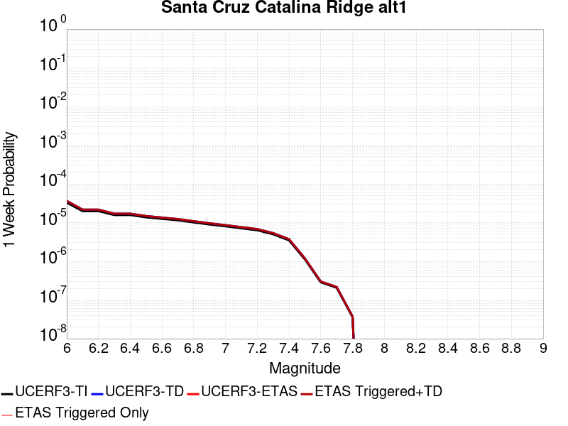 | 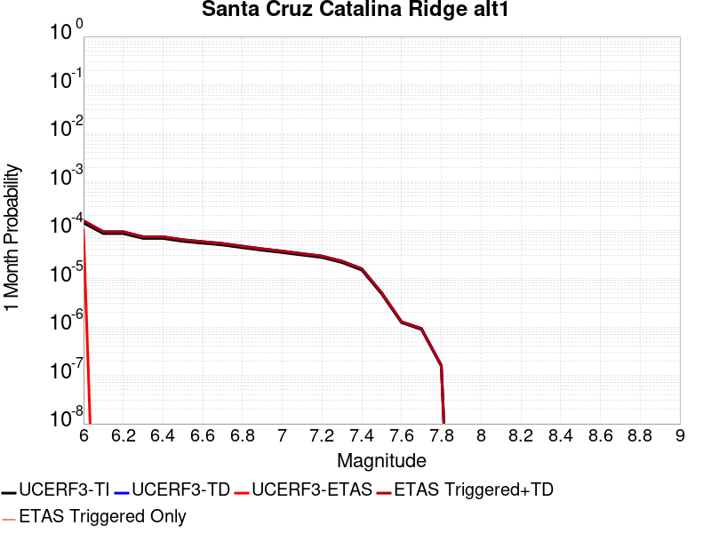 | 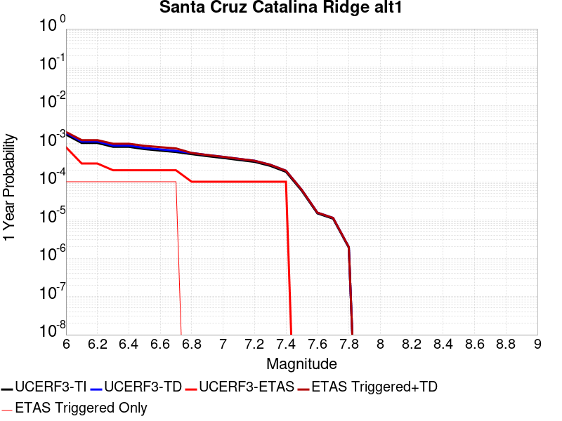 | 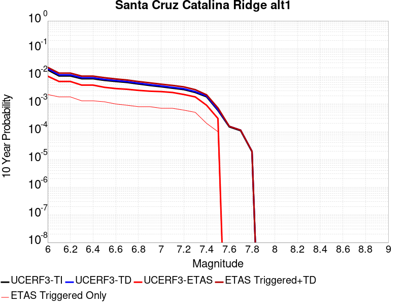 |

| Magnitude | 1 wk TI Prob | 1 wk TD Prob | 1 wk ETAS Prob | 1 wk ETAS/TD Gain | 1 wk ETAS Triggered+TD | 1 wk ETAS Triggered Only | 1 mo TI Prob | 1 mo TD Prob | 1 mo ETAS Prob | 1 mo ETAS/TD Gain | 1 mo ETAS Triggered+TD | 1 mo ETAS Triggered Only | 1 yr TI Prob | 1 yr TD Prob | 1 yr ETAS Prob | 1 yr ETAS/TD Gain | 1 yr ETAS Triggered+TD | 1 yr ETAS Triggered Only | 10 yr TI Prob | 10 yr TD Prob | 10 yr ETAS Prob | 10 yr ETAS/TD Gain | 10 yr ETAS Triggered+TD | 10 yr ETAS Triggered Only |
|-----|-----|-----|-----|-----|-----|-----|-----|-----|-----|-----|-----|-----|-----|-----|-----|-----|-----|-----|-----|-----|-----|-----|-----|-----|
| 6.0 | 3.2833184E-5 | 3.6514502E-5 | 0.0 | 0.0 | 3.6514502E-5 | 0.0 | 1.4070606E-4 | 1.5648227E-4 | 1.0E-4 | 0.63905007 | 1.5648227E-4 | 0.0 | 0.00171175 | 0.0019036726 | 8.0E-4 | 0.42024034 | 0.002003482 | 1.0E-4 | 0.016986247 | 0.0188905 | 0.0101 | 0.5346603 | 0.02104894 | 0.0022 |
| 6.1 | 1.9835548E-5 | 2.163856E-5 | 0.0 | 0.0 | 2.163856E-5 | 0.0 | 8.500672E-5 | 9.27335E-5 | 0.0 | 0.0 | 9.27335E-5 | 0.0 | 0.0010344655 | 0.0011284658 | 3.0E-4 | 0.26584768 | 0.0012283529 | 1.0E-4 | 0.010296632 | 0.0112294825 | 0.0065 | 0.5788334 | 0.01300927 | 0.0018 |
| 6.2 | 1.9835548E-5 | 2.163856E-5 | 0.0 | 0.0 | 2.163856E-5 | 0.0 | 8.500672E-5 | 9.27335E-5 | 0.0 | 0.0 | 9.27335E-5 | 0.0 | 0.0010344655 | 0.0011284658 | 3.0E-4 | 0.26584768 | 0.0012283529 | 1.0E-4 | 0.010296632 | 0.0112294825 | 0.0065 | 0.5788334 | 0.01300927 | 0.0018 |
| 6.3 | 1.5728183E-5 | 1.7019129E-5 | 0.0 | 0.0 | 1.7019129E-5 | 0.0 | 6.7404755E-5 | 7.293712E-5 | 0.0 | 0.0 | 7.293712E-5 | 0.0 | 8.2034385E-4 | 8.876537E-4 | 2.0E-4 | 0.2253131 | 9.875649E-4 | 1.0E-4 | 0.008173222 | 0.00884176 | 0.0048 | 0.5428783 | 0.010130266 | 0.0013 |
| 6.4 | 1.5728183E-5 | 1.7019129E-5 | 0.0 | 0.0 | 1.7019129E-5 | 0.0 | 6.7404755E-5 | 7.293712E-5 | 0.0 | 0.0 | 7.293712E-5 | 0.0 | 8.2034385E-4 | 8.876537E-4 | 2.0E-4 | 0.2253131 | 9.875649E-4 | 1.0E-4 | 0.008173222 | 0.00884176 | 0.0048 | 0.5428783 | 0.010130266 | 0.0013 |
| 6.5 | 1.3707734E-5 | 1.4782246E-5 | 0.0 | 0.0 | 1.4782246E-5 | 0.0 | 5.8746107E-5 | 6.335096E-5 | 0.0 | 0.0 | 6.335096E-5 | 0.0 | 7.1499916E-4 | 7.710286E-4 | 2.0E-4 | 0.25939378 | 8.7095145E-4 | 1.0E-4 | 0.0071270303 | 0.0076839323 | 0.004 | 0.52056676 | 0.008874712 | 0.0012 |
| 6.6 | 1.2539813E-5 | 1.3499282E-5 | 0.0 | 0.0 | 1.3499282E-5 | 0.0 | 5.3740947E-5 | 5.78528E-5 | 0.0 | 0.0 | 5.78528E-5 | 0.0 | 6.540996E-4 | 7.041329E-4 | 2.0E-4 | 0.2840373 | 8.0406247E-4 | 1.0E-4 | 0.0065217763 | 0.0070193214 | 0.0036 | 0.5128701 | 0.008012302 | 0.001 |
| 6.7 | 1.1504083E-5 | 1.2367549E-5 | 0.0 | 0.0 | 1.2367549E-5 | 0.0 | 4.930228E-5 | 5.3002714E-5 | 0.0 | 0.0 | 5.3002714E-5 | 0.0 | 6.0008996E-4 | 6.45119E-4 | 2.0E-4 | 0.31002033 | 7.450545E-4 | 1.0E-4 | 0.005984721 | 0.0064326916 | 0.0034 | 0.52855015 | 0.007326902 | 9.0E-4 |
| 6.8 | 1.012739E-5 | 1.0868654E-5 | 0.0 | 0.0 | 1.0868654E-5 | 0.0 | 4.340238E-5 | 4.657912E-5 | 0.0 | 0.0 | 4.657912E-5 | 0.0 | 5.282958E-4 | 5.669547E-4 | 1.0E-4 | 0.17638093 | 5.669547E-4 | 0.0 | 0.0052704164 | 0.0056552514 | 0.0031 | 0.54816306 | 0.0064507276 | 8.0E-4 |
| 6.9 | 8.9607865E-6 | 9.60185E-6 | 0.0 | 0.0 | 9.60185E-6 | 0.0 | 3.8402806E-5 | 4.1150142E-5 | 0.0 | 0.0 | 4.1150142E-5 | 0.0 | 4.6745385E-4 | 5.0088885E-4 | 1.0E-4 | 0.19964507 | 5.0088885E-4 | 0.0 | 0.0046647177 | 0.0049977186 | 0.0029 | 0.5802648 | 0.0057937205 | 8.0E-4 |
| 7.0 | 8.046829E-6 | 8.613331E-6 | 0.0 | 0.0 | 8.613331E-6 | 0.0 | 3.4485955E-5 | 3.691376E-5 | 0.0 | 0.0 | 3.691376E-5 | 0.0 | 4.1978562E-4 | 4.4933314E-4 | 1.0E-4 | 0.22255202 | 4.4933314E-4 | 0.0 | 0.004189935 | 0.004484337 | 0.0028 | 0.6243956 | 0.0051811975 | 7.0E-4 |
| 7.1 | 7.136131E-6 | 7.632046E-6 | 0.0 | 0.0 | 7.632046E-6 | 0.0 | 3.0583058E-5 | 3.270836E-5 | 0.0 | 0.0 | 3.270836E-5 | 0.0 | 3.7228514E-4 | 3.9815222E-4 | 1.0E-4 | 0.25116023 | 3.9815222E-4 | 0.0 | 0.0037166206 | 0.003974465 | 0.0026 | 0.65417606 | 0.004671683 | 7.0E-4 |
| 7.2 | 6.362014E-6 | 6.800006E-6 | 0.0 | 0.0 | 6.800006E-6 | 0.0 | 2.726549E-5 | 2.914256E-5 | 0.0 | 0.0 | 2.914256E-5 | 0.0 | 3.3190678E-4 | 3.5475355E-4 | 1.0E-4 | 0.28188583 | 3.5475355E-4 | 0.0 | 0.0033141149 | 0.0035419408 | 0.0022 | 0.6211284 | 0.004139816 | 6.0E-4 |
| 7.3 | 5.004101E-6 | 5.347829E-6 | 0.0 | 0.0 | 5.347829E-6 | 0.0 | 2.1445969E-5 | 2.2919068E-5 | 0.0 | 0.0 | 2.2919068E-5 | 0.0 | 2.6107338E-4 | 2.7900445E-4 | 1.0E-4 | 0.3584172 | 2.7900445E-4 | 0.0 | 0.002607669 | 0.0027865963 | 0.0018 | 0.6459493 | 0.0032852031 | 5.0E-4 |
| 7.4 | 3.4901443E-6 | 3.7293473E-6 | 0.0 | 0.0 | 3.7293473E-6 | 0.0 | 1.4957676E-5 | 1.5982821E-5 | 0.0 | 0.0 | 1.5982821E-5 | 0.0 | 1.8209449E-4 | 1.9457386E-4 | 1.0E-4 | 0.5139437 | 1.9457386E-4 | 0.0 | 0.0018194534 | 0.0019440735 | 9.0E-4 | 0.46294546 | 0.0021436848 | 2.0E-4 |
| 7.5 | 1.1215045E-6 | 1.188633E-6 | 0.0 | 0.0 | 1.188633E-6 | 0.0 | 4.806439E-6 | 5.094131E-6 | 0.0 | 0.0 | 5.094131E-6 | 0.0 | 5.851682E-5 | 6.201932E-5 | 0.0 | 0.0 | 6.201932E-5 | 0.0 | 5.850142E-4 | 6.200231E-4 | 3.0E-4 | 0.48385292 | 7.199611E-4 | 1.0E-4 |
| 7.6 | 2.8599047E-7 | 2.9937195E-7 | 0.0 | 0.0 | 2.9937195E-7 | 0.0 | 1.2256729E-6 | 1.283022E-6 | 0.0 | 0.0 | 1.283022E-6 | 0.0 | 1.4922465E-5 | 1.5620682E-5 | 0.0 | 0.0 | 1.5620682E-5 | 0.0 | 1.4921463E-4 | 1.5619598E-4 | 0.0 | 0.0 | 1.5619598E-4 | 0.0 |
| 7.7 | 2.0781519E-7 | 2.1733803E-7 | 0.0 | 0.0 | 2.1733803E-7 | 0.0 | 8.906362E-7 | 9.3144837E-7 | 0.0 | 0.0 | 9.3144837E-7 | 0.0 | 1.08434415E-5 | 1.1340326E-5 | 0.0 | 0.0 | 1.1340326E-5 | 0.0 | 1.0842913E-4 | 1.1339756E-4 | 0.0 | 0.0 | 1.1339756E-4 | 0.0 |
| 7.8 | 3.614776E-8 | 3.7624787E-8 | 0.0 | 0.0 | 3.7624787E-8 | 0.0 | 1.5491896E-7 | 1.6124908E-7 | 0.0 | 0.0 | 1.6124908E-7 | 0.0 | 1.8861368E-6 | 1.9632057E-6 | 0.0 | 0.0 | 1.9632057E-6 | 0.0 | 1.8861208E-5 | 1.9631896E-5 | 0.0 | 0.0 | 1.9631896E-5 | 0.0 |

## Ash Hill
*[(top)](#table-of-contents)*

| 1 Week | 1 Month | 1 Year | 10 Year |
|-----|-----|-----|-----|
| 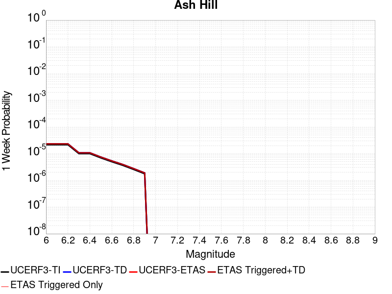 | 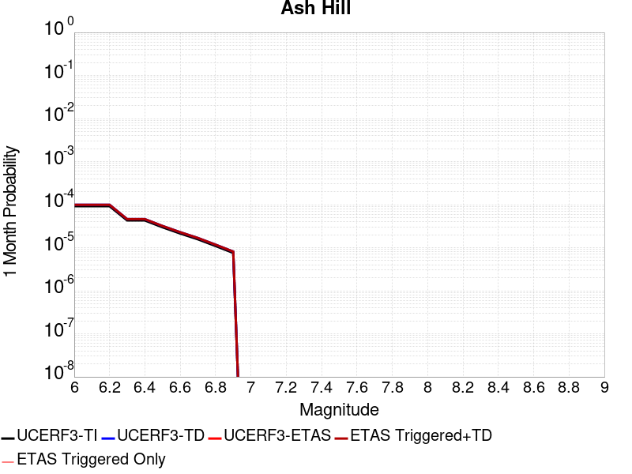 | 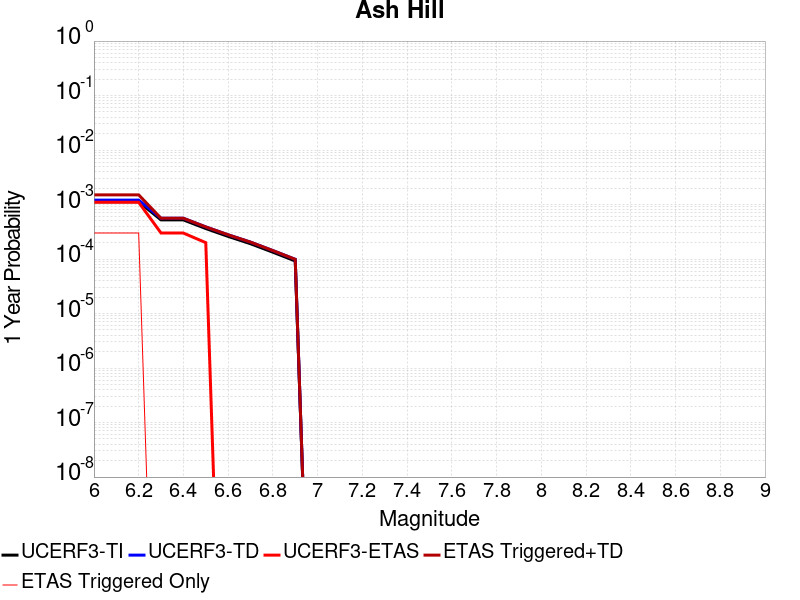 | 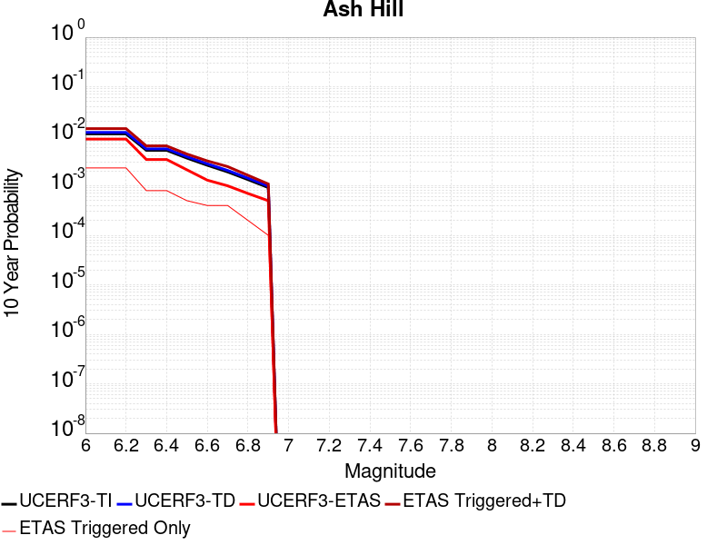 |

| Magnitude | 1 wk TI Prob | 1 wk TD Prob | 1 wk ETAS Prob | 1 wk ETAS/TD Gain | 1 wk ETAS Triggered+TD | 1 wk ETAS Triggered Only | 1 mo TI Prob | 1 mo TD Prob | 1 mo ETAS Prob | 1 mo ETAS/TD Gain | 1 mo ETAS Triggered+TD | 1 mo ETAS Triggered Only | 1 yr TI Prob | 1 yr TD Prob | 1 yr ETAS Prob | 1 yr ETAS/TD Gain | 1 yr ETAS Triggered+TD | 1 yr ETAS Triggered Only | 10 yr TI Prob | 10 yr TD Prob | 10 yr ETAS Prob | 10 yr ETAS/TD Gain | 10 yr ETAS Triggered+TD | 10 yr ETAS Triggered Only |
|-----|-----|-----|-----|-----|-----|-----|-----|-----|-----|-----|-----|-----|-----|-----|-----|-----|-----|-----|-----|-----|-----|-----|-----|-----|
| 6.0 | 2.1545662E-5 | 2.3175915E-5 | 0.0 | 0.0 | 2.3175915E-5 | 0.0 | 9.2335285E-5 | 9.9322024E-5 | 2.0E-4 | 2.013652 | 1.9931208E-4 | 1.0E-4 | 0.0011236023 | 0.0012086546 | 0.0011 | 0.91010284 | 0.001508292 | 3.0E-4 | 0.011179381 | 0.012028781 | 0.0088 | 0.7315787 | 0.014301115 | 0.0023 |
| 6.1 | 2.1545662E-5 | 2.3175915E-5 | 0.0 | 0.0 | 2.3175915E-5 | 0.0 | 9.2335285E-5 | 9.9322024E-5 | 2.0E-4 | 2.013652 | 1.9931208E-4 | 1.0E-4 | 0.0011236023 | 0.0012086546 | 0.0011 | 0.91010284 | 0.001508292 | 3.0E-4 | 0.011179381 | 0.012028781 | 0.0088 | 0.7315787 | 0.014301115 | 0.0023 |
| 6.2 | 2.1545662E-5 | 2.3175915E-5 | 0.0 | 0.0 | 2.3175915E-5 | 0.0 | 9.2335285E-5 | 9.9322024E-5 | 2.0E-4 | 2.013652 | 1.9931208E-4 | 1.0E-4 | 0.0011236023 | 0.0012086546 | 0.0011 | 0.91010284 | 0.001508292 | 3.0E-4 | 0.011179381 | 0.012028781 | 0.0088 | 0.7315787 | 0.014301115 | 0.0023 |
| 6.3 | 1.0025529E-5 | 1.0738864E-5 | 0.0 | 0.0 | 1.0738864E-5 | 0.0 | 4.2965847E-5 | 4.6022968E-5 | 1.0E-4 | 2.1728282 | 4.6022968E-5 | 0.0 | 5.229836E-4 | 5.601988E-4 | 3.0E-4 | 0.5355242 | 5.601988E-4 | 0.0 | 0.005217545 | 0.005589177 | 0.0034 | 0.60831857 | 0.0063847057 | 8.0E-4 |
| 6.4 | 1.0025529E-5 | 1.0738864E-5 | 0.0 | 0.0 | 1.0738864E-5 | 0.0 | 4.2965847E-5 | 4.6022968E-5 | 1.0E-4 | 2.1728282 | 4.6022968E-5 | 0.0 | 5.229836E-4 | 5.601988E-4 | 3.0E-4 | 0.5355242 | 5.601988E-4 | 0.0 | 0.005217545 | 0.005589177 | 0.0034 | 0.60831857 | 0.0063847057 | 8.0E-4 |
| 6.5 | 6.9617327E-6 | 7.451103E-6 | 0.0 | 0.0 | 7.451103E-6 | 0.0 | 2.9835655E-5 | 3.1932956E-5 | 1.0E-4 | 3.131561 | 3.1932956E-5 | 0.0 | 3.6318856E-4 | 3.8872304E-4 | 2.0E-4 | 0.51450515 | 3.8872304E-4 | 0.0 | 0.0036259557 | 0.003881284 | 0.0021 | 0.54105806 | 0.0043793432 | 5.0E-4 |
| 6.6 | 4.9919777E-6 | 5.3427243E-6 | 0.0 | 0.0 | 5.3427243E-6 | 0.0 | 2.1394015E-5 | 2.2897226E-5 | 0.0 | 0.0 | 2.2897226E-5 | 0.0 | 2.60441E-4 | 2.7874476E-4 | 0.0 | 0.0 | 2.7874476E-4 | 0.0 | 0.0026013597 | 0.0027846089 | 0.0013 | 0.46685192 | 0.003183495 | 4.0E-4 |
| 6.7 | 3.6630722E-6 | 3.9216998E-6 | 0.0 | 0.0 | 3.9216998E-6 | 0.0 | 1.5698786E-5 | 1.680721E-5 | 0.0 | 0.0 | 1.680721E-5 | 0.0 | 1.9111596E-4 | 2.0461428E-4 | 0.0 | 0.0 | 2.0461428E-4 | 0.0 | 0.0019095168 | 0.002044821 | 0.001 | 0.48904034 | 0.002444003 | 4.0E-4 |
| 6.8 | 2.5599613E-6 | 2.7428557E-6 | 0.0 | 0.0 | 2.7428557E-6 | 0.0 | 1.0971216E-5 | 1.1755071E-5 | 0.0 | 0.0 | 1.1755071E-5 | 0.0 | 1.3356637E-4 | 1.4311353E-4 | 0.0 | 0.0 | 1.4311353E-4 | 0.0 | 0.0013348613 | 0.0014306979 | 7.0E-4 | 0.4892717 | 0.0016304117 | 2.0E-4 |
| 6.9 | 1.7684905E-6 | 1.895434E-6 | 0.0 | 0.0 | 1.895434E-6 | 0.0 | 7.579223E-6 | 8.123288E-6 | 0.0 | 0.0 | 8.123288E-6 | 0.0 | 9.2273134E-5 | 9.890104E-5 | 0.0 | 0.0 | 9.890104E-5 | 0.0 | 9.223483E-4 | 9.890103E-4 | 5.0E-4 | 0.50555587 | 0.0010889114 | 1.0E-4 |

## Panamint Valley
*[(top)](#table-of-contents)*

| 1 Week | 1 Month | 1 Year | 10 Year |
|-----|-----|-----|-----|
| 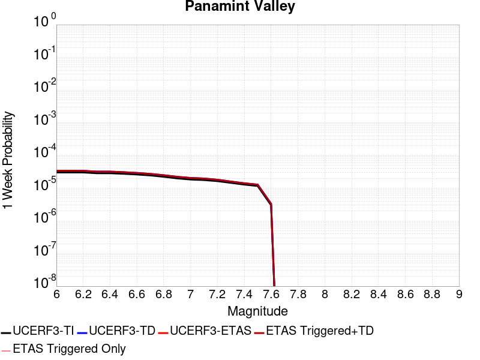 | 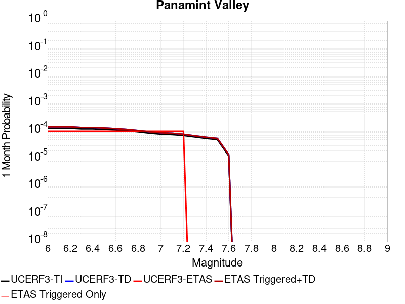 | 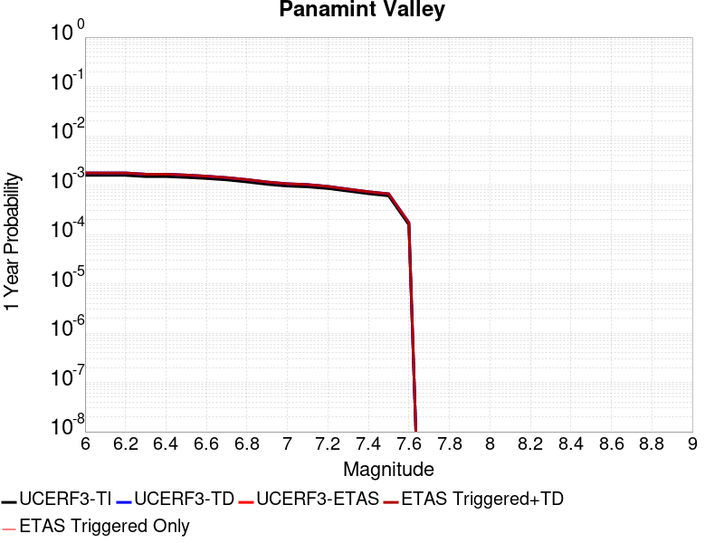 |  |

| Magnitude | 1 wk TI Prob | 1 wk TD Prob | 1 wk ETAS Prob | 1 wk ETAS/TD Gain | 1 wk ETAS Triggered+TD | 1 wk ETAS Triggered Only | 1 mo TI Prob | 1 mo TD Prob | 1 mo ETAS Prob | 1 mo ETAS/TD Gain | 1 mo ETAS Triggered+TD | 1 mo ETAS Triggered Only | 1 yr TI Prob | 1 yr TD Prob | 1 yr ETAS Prob | 1 yr ETAS/TD Gain | 1 yr ETAS Triggered+TD | 1 yr ETAS Triggered Only | 10 yr TI Prob | 10 yr TD Prob | 10 yr ETAS Prob | 10 yr ETAS/TD Gain | 10 yr ETAS Triggered+TD | 10 yr ETAS Triggered Only |
|-----|-----|-----|-----|-----|-----|-----|-----|-----|-----|-----|-----|-----|-----|-----|-----|-----|-----|-----|-----|-----|-----|-----|-----|-----|
| 6.0 | 3.0211835E-5 | 3.3884E-5 | 0.0 | 0.0 | 3.3884E-5 | 0.0 | 1.2947287E-4 | 1.4520923E-4 | 1.0E-4 | 0.6886615 | 1.4520923E-4 | 0.0 | 0.0015751923 | 0.001766518 | 0.0015 | 0.84912807 | 0.0021658114 | 4.0E-4 | 0.015640736 | 0.01753238 | 0.0116 | 0.6616329 | 0.019693809 | 0.0022 |
| 6.1 | 3.0211835E-5 | 3.3884E-5 | 0.0 | 0.0 | 3.3884E-5 | 0.0 | 1.2947287E-4 | 1.4520923E-4 | 1.0E-4 | 0.6886615 | 1.4520923E-4 | 0.0 | 0.0015751923 | 0.001766518 | 0.0015 | 0.84912807 | 0.0021658114 | 4.0E-4 | 0.015640736 | 0.01753238 | 0.0116 | 0.6616329 | 0.019693809 | 0.0022 |
| 6.2 | 3.0211835E-5 | 3.3884E-5 | 0.0 | 0.0 | 3.3884E-5 | 0.0 | 1.2947287E-4 | 1.4520923E-4 | 1.0E-4 | 0.6886615 | 1.4520923E-4 | 0.0 | 0.0015751923 | 0.001766518 | 0.0015 | 0.84912807 | 0.0021658114 | 4.0E-4 | 0.015640736 | 0.01753238 | 0.0116 | 0.6616329 | 0.019693809 | 0.0022 |
| 6.3 | 2.8573924E-5 | 3.200564E-5 | 0.0 | 0.0 | 3.200564E-5 | 0.0 | 1.2245393E-4 | 1.3715998E-4 | 1.0E-4 | 0.7290757 | 1.3715998E-4 | 0.0 | 0.001489857 | 0.0016686713 | 0.0013 | 0.779063 | 0.0020680039 | 4.0E-4 | 0.01479908 | 0.016568655 | 0.011 | 0.66390425 | 0.018633861 | 0.0021 |
| 6.4 | 2.8573924E-5 | 3.200564E-5 | 0.0 | 0.0 | 3.200564E-5 | 0.0 | 1.2245393E-4 | 1.3715998E-4 | 1.0E-4 | 0.7290757 | 1.3715998E-4 | 0.0 | 0.001489857 | 0.0016686713 | 0.0013 | 0.779063 | 0.0020680039 | 4.0E-4 | 0.01479908 | 0.016568655 | 0.011 | 0.66390425 | 0.018633861 | 0.0021 |
| 6.5 | 2.7468774E-5 | 3.0733812E-5 | 0.0 | 0.0 | 3.0733812E-5 | 0.0 | 1.1771801E-4 | 1.3170984E-4 | 1.0E-4 | 0.75924474 | 1.3170984E-4 | 0.0 | 0.0014322745 | 0.001602415 | 0.0012 | 0.7488697 | 0.0019019343 | 3.0E-4 | 0.014230782 | 0.015915751 | 0.0102 | 0.64087456 | 0.017588694 | 0.0017 |
| 6.6 | 2.6135967E-5 | 2.9160503E-5 | 0.0 | 0.0 | 2.9160503E-5 | 0.0 | 1.1200648E-4 | 1.2496774E-4 | 1.0E-4 | 0.8002065 | 1.2496774E-4 | 0.0 | 0.0013628257 | 0.0015204469 | 0.0011 | 0.7234715 | 0.0018199907 | 3.0E-4 | 0.013544982 | 0.015107549 | 0.0095 | 0.6288247 | 0.016683375 | 0.0016 |
| 6.7 | 2.4498746E-5 | 2.7250808E-5 | 0.0 | 0.0 | 2.7250808E-5 | 0.0 | 1.04990395E-4 | 1.1678409E-4 | 1.0E-4 | 0.856281 | 1.1678409E-4 | 0.0 | 0.0012775084 | 0.0014209439 | 0.0011 | 0.7741333 | 0.0017205176 | 3.0E-4 | 0.012701893 | 0.014125483 | 0.009 | 0.63714635 | 0.015604295 | 0.0015 |
| 6.8 | 2.2244329E-5 | 2.4848146E-5 | 0.0 | 0.0 | 2.4848146E-5 | 0.0 | 9.532935E-5 | 1.0648783E-4 | 1.0E-4 | 0.9390744 | 1.0648783E-4 | 0.0 | 0.0011600169 | 0.00129574 | 0.001 | 0.7717598 | 0.0014954808 | 2.0E-4 | 0.011539802 | 0.012888346 | 0.0084 | 0.6517516 | 0.014270303 | 0.0014 |
| 6.9 | 1.9902658E-5 | 2.2207269E-5 | 0.0 | 0.0 | 2.2207269E-5 | 0.0 | 8.529431E-5 | 9.517064E-5 | 1.0E-4 | 1.0507443 | 9.517064E-5 | 0.0 | 0.0010379635 | 0.001158105 | 9.0E-4 | 0.7771316 | 0.0013578733 | 2.0E-4 | 0.010331288 | 0.011526734 | 0.007 | 0.60728395 | 0.012811748 | 0.0013 |
| 7.0 | 1.8353881E-5 | 2.0486243E-5 | 0.0 | 0.0 | 2.0486243E-5 | 0.0 | 7.865712E-5 | 8.779533E-5 | 1.0E-4 | 1.1390128 | 8.779533E-5 | 0.0 | 9.5722964E-4 | 0.0010684015 | 9.0E-4 | 0.8423799 | 0.0012681879 | 2.0E-4 | 0.009531168 | 0.010638366 | 0.0066 | 0.620396 | 0.011825601 | 0.0012 |
| 7.1 | 1.7667631E-5 | 1.9694082E-5 | 0.0 | 0.0 | 1.9694082E-5 | 0.0 | 7.571623E-5 | 8.440057E-5 | 1.0E-4 | 1.1848261 | 8.440057E-5 | 0.0 | 9.2145515E-4 | 0.00102711 | 9.0E-4 | 0.87624496 | 0.0012269046 | 2.0E-4 | 0.009176437 | 0.010229308 | 0.0063 | 0.61587745 | 0.011318056 | 0.0011 |
| 7.2 | 1.6381597E-5 | 1.8084012E-5 | 0.0 | 0.0 | 1.8084012E-5 | 0.0 | 7.020495E-5 | 7.750071E-5 | 1.0E-4 | 1.2903109 | 7.750071E-5 | 0.0 | 8.544101E-4 | 9.431798E-4 | 9.0E-4 | 0.95421886 | 0.0011429912 | 2.0E-4 | 0.008511325 | 0.009397178 | 0.0059 | 0.627848 | 0.010486841 | 0.0011 |
| 7.3 | 1.4520491E-5 | 1.5905964E-5 | 0.0 | 0.0 | 1.5905964E-5 | 0.0 | 6.222919E-5 | 6.816673E-5 | 0.0 | 0.0 | 6.816673E-5 | 0.0 | 7.57377E-4 | 8.2963E-4 | 8.0E-4 | 0.96428525 | 0.0010294641 | 2.0E-4 | 0.0075480095 | 0.008269115 | 0.0054 | 0.6530324 | 0.009360019 | 0.0011 |
| 7.4 | 1.2852287E-5 | 1.4095156E-5 | 0.0 | 0.0 | 1.4095156E-5 | 0.0 | 5.5080065E-5 | 6.0406503E-5 | 0.0 | 0.0 | 6.0406503E-5 | 0.0 | 6.7039346E-4 | 7.352167E-4 | 7.0E-4 | 0.9521002 | 9.350697E-4 | 2.0E-4 | 0.0066837464 | 0.007331442 | 0.005 | 0.6819941 | 0.008324111 | 0.001 |
| 7.5 | 1.1637851E-5 | 1.2789875E-5 | 0.0 | 0.0 | 1.2789875E-5 | 0.0 | 4.987555E-5 | 5.4812685E-5 | 0.0 | 0.0 | 5.4812685E-5 | 0.0 | 6.070656E-4 | 6.6715566E-4 | 6.0E-4 | 0.89934033 | 7.6708896E-4 | 1.0E-4 | 0.006054099 | 0.006655106 | 0.0043 | 0.6461204 | 0.007350447 | 7.0E-4 |
| 7.6 | 3.0068115E-6 | 3.322222E-6 | 0.0 | 0.0 | 3.322222E-6 | 0.0 | 1.2886271E-5 | 1.4238058E-5 | 0.0 | 0.0 | 1.4238058E-5 | 0.0 | 1.5687906E-4 | 1.7334179E-4 | 0.0 | 0.0 | 1.7334179E-4 | 0.0 | 0.0015676835 | 0.0017343822 | 0.0012 | 0.691889 | 0.0018342088 | 1.0E-4 |

## Great Valley 06 (Midland) 2011 CFM alt1
*[(top)](#table-of-contents)*

| 1 Week | 1 Month | 1 Year | 10 Year |
|-----|-----|-----|-----|
| 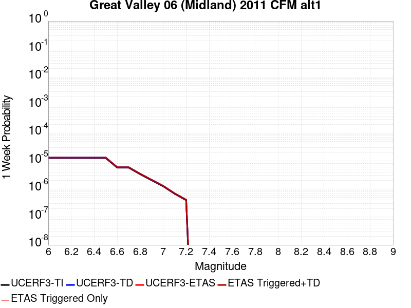 | 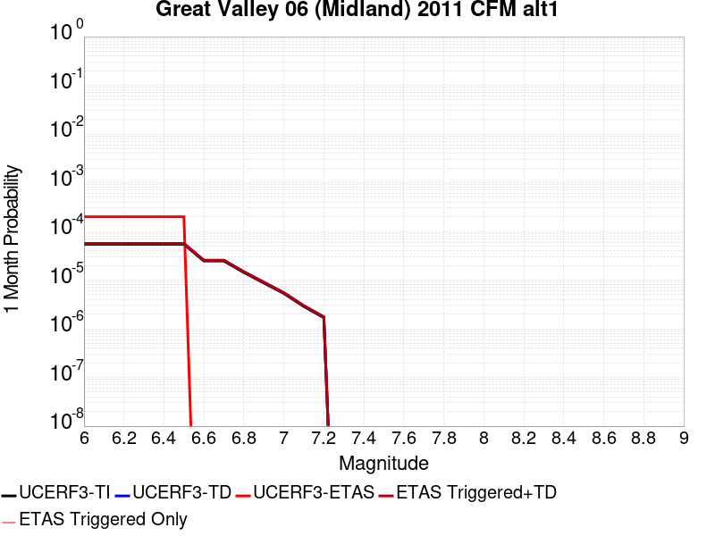 | 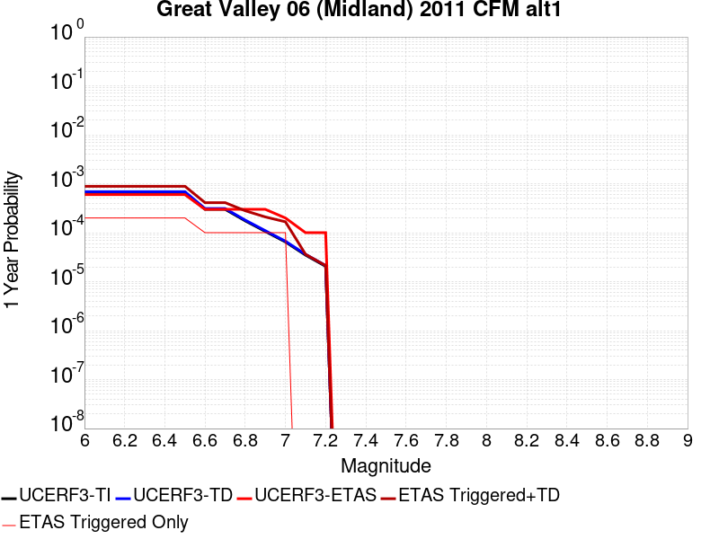 | 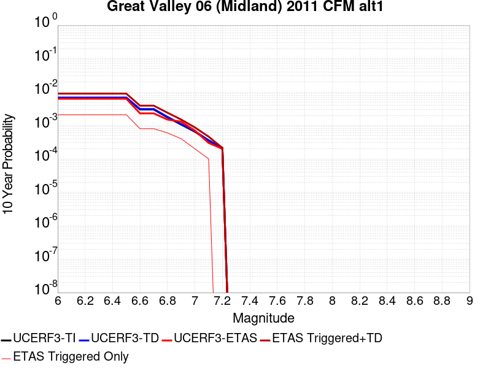 |

| Magnitude | 1 wk TI Prob | 1 wk TD Prob | 1 wk ETAS Prob | 1 wk ETAS/TD Gain | 1 wk ETAS Triggered+TD | 1 wk ETAS Triggered Only | 1 mo TI Prob | 1 mo TD Prob | 1 mo ETAS Prob | 1 mo ETAS/TD Gain | 1 mo ETAS Triggered+TD | 1 mo ETAS Triggered Only | 1 yr TI Prob | 1 yr TD Prob | 1 yr ETAS Prob | 1 yr ETAS/TD Gain | 1 yr ETAS Triggered+TD | 1 yr ETAS Triggered Only | 10 yr TI Prob | 10 yr TD Prob | 10 yr ETAS Prob | 10 yr ETAS/TD Gain | 10 yr ETAS Triggered+TD | 10 yr ETAS Triggered Only |
|-----|-----|-----|-----|-----|-----|-----|-----|-----|-----|-----|-----|-----|-----|-----|-----|-----|-----|-----|-----|-----|-----|-----|-----|-----|
| 6.0 | 1.2712525E-5 | 1.3205172E-5 | 0.0 | 0.0 | 1.3205172E-5 | 0.0 | 5.4481112E-5 | 5.6592507E-5 | 2.0E-4 | 3.5340366 | 5.6592507E-5 | 0.0 | 6.6310563E-4 | 6.8882137E-4 | 6.0E-4 | 0.87105316 | 8.886836E-4 | 2.0E-4 | 0.0066113044 | 0.006869376 | 0.0063 | 0.91711384 | 0.008954951 | 0.0021 |
| 6.1 | 1.2712525E-5 | 1.3205172E-5 | 0.0 | 0.0 | 1.3205172E-5 | 0.0 | 5.4481112E-5 | 5.6592507E-5 | 2.0E-4 | 3.5340366 | 5.6592507E-5 | 0.0 | 6.6310563E-4 | 6.8882137E-4 | 6.0E-4 | 0.87105316 | 8.886836E-4 | 2.0E-4 | 0.0066113044 | 0.006869376 | 0.0063 | 0.91711384 | 0.008954951 | 0.0021 |
| 6.2 | 1.2712525E-5 | 1.3205172E-5 | 0.0 | 0.0 | 1.3205172E-5 | 0.0 | 5.4481112E-5 | 5.6592507E-5 | 2.0E-4 | 3.5340366 | 5.6592507E-5 | 0.0 | 6.6310563E-4 | 6.8882137E-4 | 6.0E-4 | 0.87105316 | 8.886836E-4 | 2.0E-4 | 0.0066113044 | 0.006869376 | 0.0063 | 0.91711384 | 0.008954951 | 0.0021 |
| 6.3 | 1.2712525E-5 | 1.3205172E-5 | 0.0 | 0.0 | 1.3205172E-5 | 0.0 | 5.4481112E-5 | 5.6592507E-5 | 2.0E-4 | 3.5340366 | 5.6592507E-5 | 0.0 | 6.6310563E-4 | 6.8882137E-4 | 6.0E-4 | 0.87105316 | 8.886836E-4 | 2.0E-4 | 0.0066113044 | 0.006869376 | 0.0063 | 0.91711384 | 0.008954951 | 0.0021 |
| 6.4 | 1.2712525E-5 | 1.3205172E-5 | 0.0 | 0.0 | 1.3205172E-5 | 0.0 | 5.4481112E-5 | 5.6592507E-5 | 2.0E-4 | 3.5340366 | 5.6592507E-5 | 0.0 | 6.6310563E-4 | 6.8882137E-4 | 6.0E-4 | 0.87105316 | 8.886836E-4 | 2.0E-4 | 0.0066113044 | 0.006869376 | 0.0063 | 0.91711384 | 0.008954951 | 0.0021 |
| 6.5 | 1.2712525E-5 | 1.3205172E-5 | 0.0 | 0.0 | 1.3205172E-5 | 0.0 | 5.4481112E-5 | 5.6592507E-5 | 2.0E-4 | 3.5340366 | 5.6592507E-5 | 0.0 | 6.6310563E-4 | 6.8882137E-4 | 6.0E-4 | 0.87105316 | 8.886836E-4 | 2.0E-4 | 0.0066113044 | 0.006869376 | 0.0063 | 0.91711384 | 0.008954951 | 0.0021 |
| 6.6 | 5.7574384E-6 | 5.9683384E-6 | 0.0 | 0.0 | 5.9683384E-6 | 0.0 | 2.4674504E-5 | 2.5578363E-5 | 0.0 | 0.0 | 2.5578363E-5 | 0.0 | 3.0037065E-4 | 3.1137597E-4 | 3.0E-4 | 0.96346545 | 4.1134484E-4 | 1.0E-4 | 0.0029996498 | 0.0031097834 | 0.0023 | 0.7396014 | 0.0039072954 | 8.0E-4 |
| 6.7 | 5.7574384E-6 | 5.9683384E-6 | 0.0 | 0.0 | 5.9683384E-6 | 0.0 | 2.4674504E-5 | 2.5578363E-5 | 0.0 | 0.0 | 2.5578363E-5 | 0.0 | 3.0037065E-4 | 3.1137597E-4 | 3.0E-4 | 0.96346545 | 4.1134484E-4 | 1.0E-4 | 0.0029996498 | 0.0031097834 | 0.0023 | 0.7396014 | 0.0039072954 | 8.0E-4 |
| 6.8 | 3.3474828E-6 | 3.468066E-6 | 0.0 | 0.0 | 3.468066E-6 | 0.0 | 1.4346277E-5 | 1.4863063E-5 | 0.0 | 0.0 | 1.4863063E-5 | 0.0 | 1.7465191E-4 | 1.8094426E-4 | 3.0E-4 | 1.6579691 | 2.8092618E-4 | 1.0E-4 | 0.0017451472 | 0.0018081163 | 0.0015 | 0.82959265 | 0.0024070314 | 6.0E-4 |
| 6.9 | 2.035106E-6 | 2.108236E-6 | 0.0 | 0.0 | 2.108236E-6 | 0.0 | 8.721853E-6 | 9.03527E-6 | 0.0 | 0.0 | 9.03527E-6 | 0.0 | 1.0618339E-4 | 1.09999586E-4 | 3.0E-4 | 2.727283 | 2.0998859E-4 | 1.0E-4 | 0.0010613267 | 0.0010995236 | 0.0013 | 1.1823303 | 0.0014990838 | 4.0E-4 |
| 7.0 | 1.2424716E-6 | 1.287385E-6 | 0.0 | 0.0 | 1.287385E-6 | 0.0 | 5.3248673E-6 | 5.517355E-6 | 0.0 | 0.0 | 5.517355E-6 | 0.0 | 6.482833E-5 | 6.717218E-5 | 2.0E-4 | 2.9774232 | 1.6716546E-4 | 1.0E-4 | 6.480942E-4 | 6.7156303E-4 | 7.0E-4 | 1.0423445 | 8.714287E-4 | 2.0E-4 |
| 7.1 | 6.6904556E-7 | 6.936344E-7 | 0.0 | 0.0 | 6.936344E-7 | 0.0 | 2.867335E-6 | 2.9727169E-6 | 0.0 | 0.0 | 2.9727169E-6 | 0.0 | 3.4909244E-5 | 3.6192487E-5 | 1.0E-4 | 2.7630045 | 3.6192487E-5 | 0.0 | 3.490376E-4 | 3.618914E-4 | 3.0E-4 | 0.828978 | 4.618552E-4 | 1.0E-4 |
| 7.2 | 3.948168E-7 | 4.0941075E-7 | 0.0 | 0.0 | 4.0941075E-7 | 0.0 | 1.6920709E-6 | 1.7546175E-6 | 0.0 | 0.0 | 1.7546175E-6 | 0.0 | 2.0600768E-5 | 2.1362468E-5 | 1.0E-4 | 4.681107 | 2.1362468E-5 | 0.0 | 2.0598859E-4 | 2.1362468E-4 | 2.0E-4 | 0.9362214 | 2.1362468E-4 | 0.0 |

## Cedar Mtn-Mahogany Mtn
*[(top)](#table-of-contents)*

| 1 Week | 1 Month | 1 Year | 10 Year |
|-----|-----|-----|-----|
| 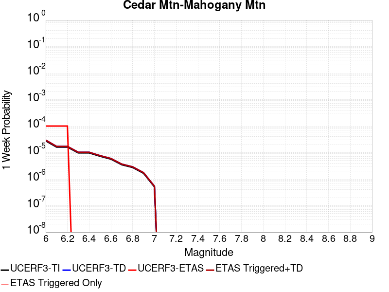 | 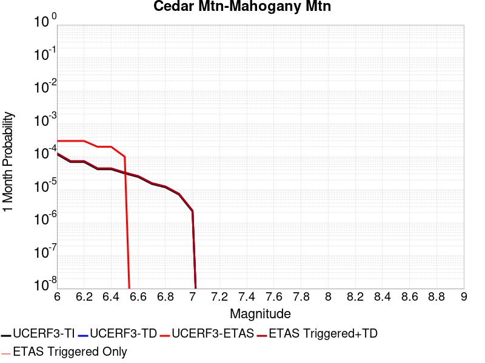 | 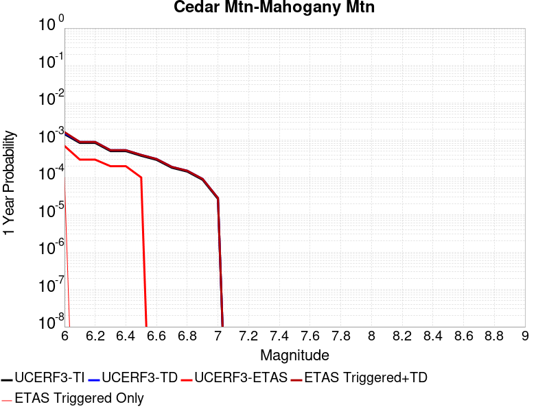 | 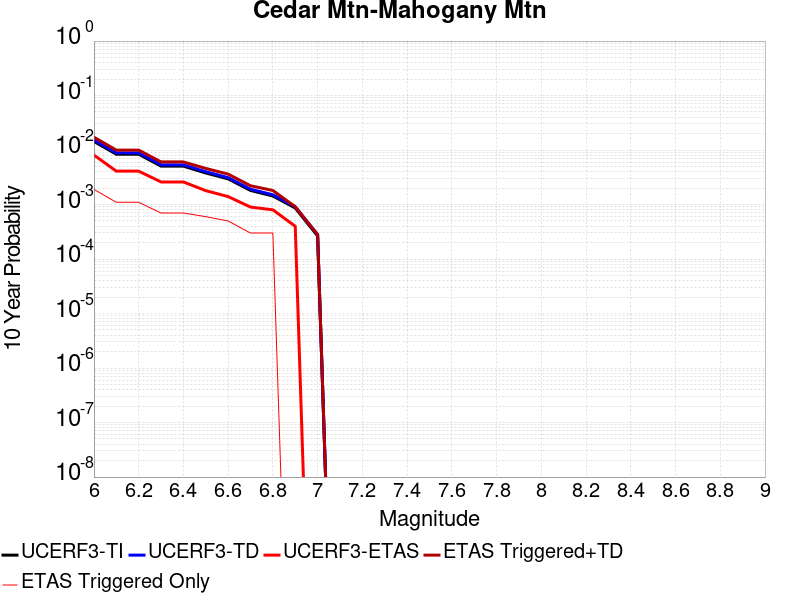 |

| Magnitude | 1 wk TI Prob | 1 wk TD Prob | 1 wk ETAS Prob | 1 wk ETAS/TD Gain | 1 wk ETAS Triggered+TD | 1 wk ETAS Triggered Only | 1 mo TI Prob | 1 mo TD Prob | 1 mo ETAS Prob | 1 mo ETAS/TD Gain | 1 mo ETAS Triggered+TD | 1 mo ETAS Triggered Only | 1 yr TI Prob | 1 yr TD Prob | 1 yr ETAS Prob | 1 yr ETAS/TD Gain | 1 yr ETAS Triggered+TD | 1 yr ETAS Triggered Only | 10 yr TI Prob | 10 yr TD Prob | 10 yr ETAS Prob | 10 yr ETAS/TD Gain | 10 yr ETAS Triggered+TD | 10 yr ETAS Triggered Only |
|-----|-----|-----|-----|-----|-----|-----|-----|-----|-----|-----|-----|-----|-----|-----|-----|-----|-----|-----|-----|-----|-----|-----|-----|-----|
| 6.0 | 2.7763876E-5 | 2.9568526E-5 | 1.0E-4 | 3.3819745 | 2.9568526E-5 | 0.0 | 1.1898261E-4 | 1.2671649E-4 | 3.0E-4 | 2.3674898 | 1.2671649E-4 | 0.0 | 0.0014476506 | 0.0015417514 | 7.0E-4 | 0.45402908 | 0.0016415972 | 1.0E-4 | 0.0143825635 | 0.015317763 | 0.0081 | 0.52879786 | 0.017188659 | 0.0019 |
| 6.1 | 1.6162443E-5 | 1.7132097E-5 | 1.0E-4 | 5.836997 | 1.7132097E-5 | 0.0 | 6.926578E-5 | 7.342131E-5 | 3.0E-4 | 4.086007 | 7.342131E-5 | 0.0 | 8.4298453E-4 | 8.935555E-4 | 3.0E-4 | 0.33573738 | 8.935555E-4 | 0.0 | 0.008397939 | 0.008901436 | 0.0041 | 0.46059987 | 0.009991644 | 0.0011 |
| 6.2 | 1.6162443E-5 | 1.7132097E-5 | 1.0E-4 | 5.836997 | 1.7132097E-5 | 0.0 | 6.926578E-5 | 7.342131E-5 | 3.0E-4 | 4.086007 | 7.342131E-5 | 0.0 | 8.4298453E-4 | 8.935555E-4 | 3.0E-4 | 0.33573738 | 8.935555E-4 | 0.0 | 0.008397939 | 0.008901436 | 0.0041 | 0.46059987 | 0.009991644 | 0.0011 |
| 6.3 | 9.746053E-6 | 1.0297002E-5 | 0.0 | 0.0 | 1.0297002E-5 | 0.0 | 4.1768133E-5 | 4.4129283E-5 | 2.0E-4 | 4.532138 | 4.4129283E-5 | 0.0 | 5.0840835E-4 | 5.3714565E-4 | 2.0E-4 | 0.37233847 | 5.3714565E-4 | 0.0 | 0.0050724675 | 0.005358892 | 0.0026 | 0.48517492 | 0.0060551404 | 7.0E-4 |
| 6.4 | 9.746053E-6 | 1.0297002E-5 | 0.0 | 0.0 | 1.0297002E-5 | 0.0 | 4.1768133E-5 | 4.4129283E-5 | 2.0E-4 | 4.532138 | 4.4129283E-5 | 0.0 | 5.0840835E-4 | 5.3714565E-4 | 2.0E-4 | 0.37233847 | 5.3714565E-4 | 0.0 | 0.0050724675 | 0.005358892 | 0.0026 | 0.48517492 | 0.0060551404 | 7.0E-4 |
| 6.5 | 7.290083E-6 | 7.690858E-6 | 0.0 | 0.0 | 7.690858E-6 | 0.0 | 3.124284E-5 | 3.296042E-5 | 1.0E-4 | 3.033942 | 3.296042E-5 | 0.0 | 3.8031515E-4 | 4.0122136E-4 | 1.0E-4 | 0.24923897 | 4.0122136E-4 | 0.0 | 0.0037966494 | 0.00400519 | 0.0018 | 0.4494169 | 0.0046027866 | 6.0E-4 |
| 6.6 | 5.67907E-6 | 5.9857393E-6 | 0.0 | 0.0 | 5.9857393E-6 | 0.0 | 2.4338644E-5 | 2.5652924E-5 | 0.0 | 0.0 | 2.5652924E-5 | 0.0 | 2.962827E-4 | 3.1228093E-4 | 0.0 | 0.0 | 3.1228093E-4 | 0.0 | 0.0029588798 | 0.0031185572 | 0.0014 | 0.44892555 | 0.0036169977 | 5.0E-4 |
| 6.7 | 3.4853963E-6 | 3.670572E-6 | 0.0 | 0.0 | 3.670572E-6 | 0.0 | 1.4937327E-5 | 1.5730931E-5 | 0.0 | 0.0 | 1.5730931E-5 | 0.0 | 1.8184677E-4 | 1.9150788E-4 | 0.0 | 0.0 | 1.9150788E-4 | 0.0 | 0.0018169804 | 0.0019134904 | 9.0E-4 | 0.47034466 | 0.0022129163 | 3.0E-4 |
| 6.8 | 2.7535168E-6 | 2.899948E-6 | 0.0 | 0.0 | 2.899948E-6 | 0.0 | 1.1800733E-5 | 1.2428292E-5 | 0.0 | 0.0 | 1.2428292E-5 | 0.0 | 1.4366445E-4 | 1.5130443E-4 | 0.0 | 0.0 | 1.5130443E-4 | 0.0 | 0.0014357162 | 0.0015120613 | 8.0E-4 | 0.5290791 | 0.0018116077 | 3.0E-4 |
| 6.9 | 1.6594106E-6 | 1.748705E-6 | 0.0 | 0.0 | 1.748705E-6 | 0.0 | 7.1117406E-6 | 7.4944305E-6 | 0.0 | 0.0 | 7.4944305E-6 | 0.0 | 8.6582E-5 | 9.124118E-5 | 0.0 | 0.0 | 9.124118E-5 | 0.0 | 8.654827E-4 | 9.120676E-4 | 4.0E-4 | 0.43856397 | 9.120676E-4 | 0.0 |
| 7.0 | 5.10215E-7 | 5.386089E-7 | 0.0 | 0.0 | 5.386089E-7 | 0.0 | 2.186634E-6 | 2.3083226E-6 | 0.0 | 0.0 | 2.3083226E-6 | 0.0 | 2.6621943E-5 | 2.8103592E-5 | 0.0 | 0.0 | 2.8103592E-5 | 0.0 | 2.6618753E-4 | 2.810129E-4 | 0.0 | 0.0 | 2.810129E-4 | 0.0 |

## McKinleyville (alt1)
*[(top)](#table-of-contents)*

| 1 Week | 1 Month | 1 Year | 10 Year |
|-----|-----|-----|-----|
| 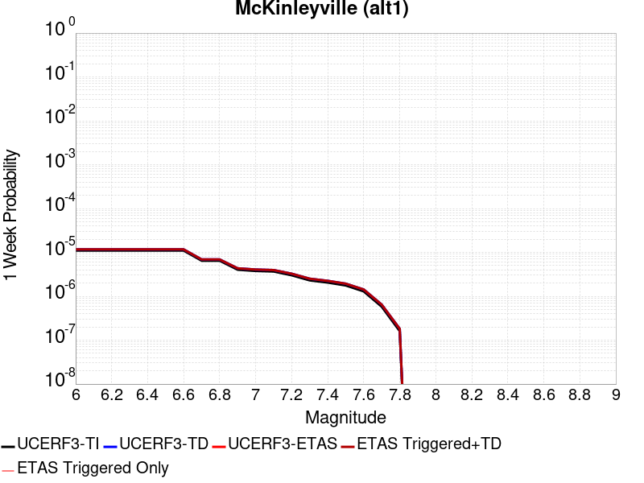 | 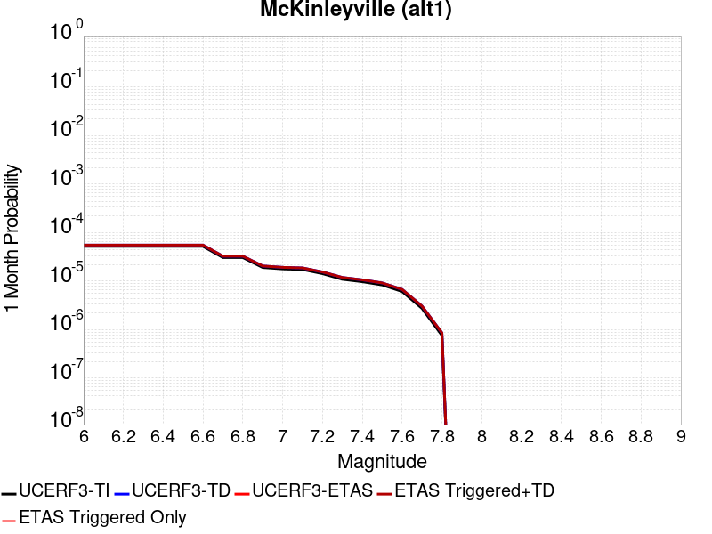 | 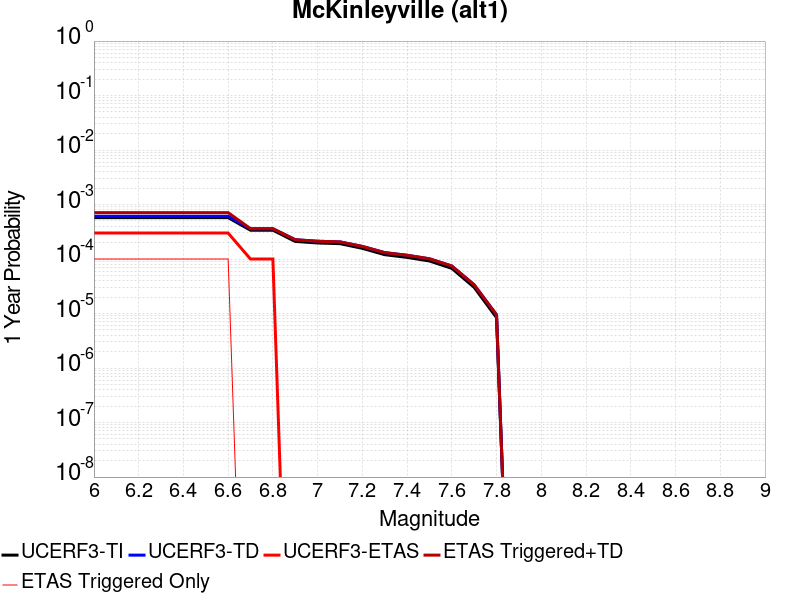 | 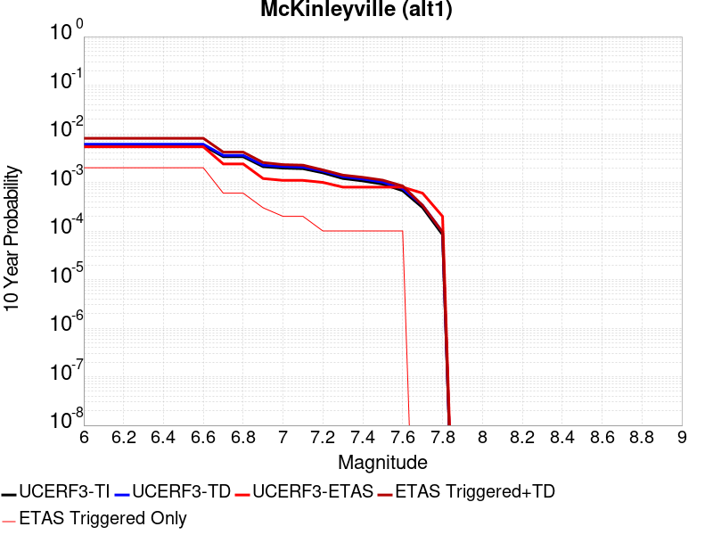 |

| Magnitude | 1 wk TI Prob | 1 wk TD Prob | 1 wk ETAS Prob | 1 wk ETAS/TD Gain | 1 wk ETAS Triggered+TD | 1 wk ETAS Triggered Only | 1 mo TI Prob | 1 mo TD Prob | 1 mo ETAS Prob | 1 mo ETAS/TD Gain | 1 mo ETAS Triggered+TD | 1 mo ETAS Triggered Only | 1 yr TI Prob | 1 yr TD Prob | 1 yr ETAS Prob | 1 yr ETAS/TD Gain | 1 yr ETAS Triggered+TD | 1 yr ETAS Triggered Only | 10 yr TI Prob | 10 yr TD Prob | 10 yr ETAS Prob | 10 yr ETAS/TD Gain | 10 yr ETAS Triggered+TD | 10 yr ETAS Triggered Only |
|-----|-----|-----|-----|-----|-----|-----|-----|-----|-----|-----|-----|-----|-----|-----|-----|-----|-----|-----|-----|-----|-----|-----|-----|-----|
| 6.0 | 1.1028524E-5 | 1.1719955E-5 | 0.0 | 0.0 | 1.1719955E-5 | 0.0 | 4.7264242E-5 | 5.0227554E-5 | 0.0 | 0.0 | 5.0227554E-5 | 0.0 | 5.7529024E-4 | 6.113743E-4 | 3.0E-4 | 0.49069777 | 7.1131316E-4 | 1.0E-4 | 0.005738032 | 0.006099429 | 0.0054 | 0.88532877 | 0.00808723 | 0.002 |
| 6.1 | 1.1028524E-5 | 1.1719955E-5 | 0.0 | 0.0 | 1.1719955E-5 | 0.0 | 4.7264242E-5 | 5.0227554E-5 | 0.0 | 0.0 | 5.0227554E-5 | 0.0 | 5.7529024E-4 | 6.113743E-4 | 3.0E-4 | 0.49069777 | 7.1131316E-4 | 1.0E-4 | 0.005738032 | 0.006099429 | 0.0054 | 0.88532877 | 0.00808723 | 0.002 |
| 6.2 | 1.1028524E-5 | 1.1719955E-5 | 0.0 | 0.0 | 1.1719955E-5 | 0.0 | 4.7264242E-5 | 5.0227554E-5 | 0.0 | 0.0 | 5.0227554E-5 | 0.0 | 5.7529024E-4 | 6.113743E-4 | 3.0E-4 | 0.49069777 | 7.1131316E-4 | 1.0E-4 | 0.005738032 | 0.006099429 | 0.0054 | 0.88532877 | 0.00808723 | 0.002 |
| 6.3 | 1.1028524E-5 | 1.1719955E-5 | 0.0 | 0.0 | 1.1719955E-5 | 0.0 | 4.7264242E-5 | 5.0227554E-5 | 0.0 | 0.0 | 5.0227554E-5 | 0.0 | 5.7529024E-4 | 6.113743E-4 | 3.0E-4 | 0.49069777 | 7.1131316E-4 | 1.0E-4 | 0.005738032 | 0.006099429 | 0.0054 | 0.88532877 | 0.00808723 | 0.002 |
| 6.4 | 1.1028524E-5 | 1.1719955E-5 | 0.0 | 0.0 | 1.1719955E-5 | 0.0 | 4.7264242E-5 | 5.0227554E-5 | 0.0 | 0.0 | 5.0227554E-5 | 0.0 | 5.7529024E-4 | 6.113743E-4 | 3.0E-4 | 0.49069777 | 7.1131316E-4 | 1.0E-4 | 0.005738032 | 0.006099429 | 0.0054 | 0.88532877 | 0.00808723 | 0.002 |
| 6.5 | 1.1028524E-5 | 1.1719955E-5 | 0.0 | 0.0 | 1.1719955E-5 | 0.0 | 4.7264242E-5 | 5.0227554E-5 | 0.0 | 0.0 | 5.0227554E-5 | 0.0 | 5.7529024E-4 | 6.113743E-4 | 3.0E-4 | 0.49069777 | 7.1131316E-4 | 1.0E-4 | 0.005738032 | 0.006099429 | 0.0054 | 0.88532877 | 0.00808723 | 0.002 |
| 6.6 | 1.1028524E-5 | 1.1719955E-5 | 0.0 | 0.0 | 1.1719955E-5 | 0.0 | 4.7264242E-5 | 5.0227554E-5 | 0.0 | 0.0 | 5.0227554E-5 | 0.0 | 5.7529024E-4 | 6.113743E-4 | 3.0E-4 | 0.49069777 | 7.1131316E-4 | 1.0E-4 | 0.005738032 | 0.006099429 | 0.0054 | 0.88532877 | 0.00808723 | 0.002 |
| 6.7 | 6.483374E-6 | 6.9122175E-6 | 0.0 | 0.0 | 6.9122175E-6 | 0.0 | 2.7785592E-5 | 2.9623488E-5 | 0.0 | 0.0 | 2.9623488E-5 | 0.0 | 3.3823706E-4 | 3.6061247E-4 | 1.0E-4 | 0.277306 | 3.6061247E-4 | 0.0 | 0.003377227 | 0.0036008852 | 0.0024 | 0.6665028 | 0.0041987244 | 6.0E-4 |
| 6.8 | 6.483374E-6 | 6.9122175E-6 | 0.0 | 0.0 | 6.9122175E-6 | 0.0 | 2.7785592E-5 | 2.9623488E-5 | 0.0 | 0.0 | 2.9623488E-5 | 0.0 | 3.3823706E-4 | 3.6061247E-4 | 1.0E-4 | 0.277306 | 3.6061247E-4 | 0.0 | 0.003377227 | 0.0036008852 | 0.0024 | 0.6665028 | 0.0041987244 | 6.0E-4 |
| 6.9 | 4.0394048E-6 | 4.341882E-6 | 0.0 | 0.0 | 4.341882E-6 | 0.0 | 1.731162E-5 | 1.8607934E-5 | 0.0 | 0.0 | 1.8607934E-5 | 0.0 | 2.1074859E-4 | 2.265286E-4 | 0.0 | 0.0 | 2.265286E-4 | 0.0 | 0.0021054882 | 0.0022630317 | 0.0012 | 0.5302621 | 0.002562353 | 3.0E-4 |
| 7.0 | 3.7791233E-6 | 4.0688788E-6 | 0.0 | 0.0 | 4.0688788E-6 | 0.0 | 1.6196142E-5 | 1.7437938E-5 | 0.0 | 0.0 | 1.7437938E-5 | 0.0 | 1.9717019E-4 | 2.1228672E-4 | 0.0 | 0.0 | 2.1228672E-4 | 0.0 | 0.0019699533 | 0.0021208893 | 0.0011 | 0.5186504 | 0.002320465 | 2.0E-4 |
| 7.1 | 3.675443E-6 | 3.960234E-6 | 0.0 | 0.0 | 3.960234E-6 | 0.0 | 1.5751802E-5 | 1.6972324E-5 | 0.0 | 0.0 | 1.6972324E-5 | 0.0 | 1.9176133E-4 | 2.0661895E-4 | 0.0 | 0.0 | 2.0661895E-4 | 0.0 | 0.0019159593 | 0.002064318 | 0.0011 | 0.5328636 | 0.002263905 | 2.0E-4 |
| 7.2 | 3.0165843E-6 | 3.2691917E-6 | 0.0 | 0.0 | 3.2691917E-6 | 0.0 | 1.2928153E-5 | 1.4010747E-5 | 0.0 | 0.0 | 1.4010747E-5 | 0.0 | 1.573889E-4 | 1.7056768E-4 | 0.0 | 0.0 | 1.7056768E-4 | 0.0 | 0.0015727748 | 0.0017043864 | 0.001 | 0.5867214 | 0.001804216 | 1.0E-4 |
| 7.3 | 2.307633E-6 | 2.5164982E-6 | 0.0 | 0.0 | 2.5164982E-6 | 0.0 | 9.889818E-6 | 1.0784948E-5 | 0.0 | 0.0 | 1.0784948E-5 | 0.0 | 1.2040188E-4 | 1.312989E-4 | 0.0 | 0.0 | 1.312989E-4 | 0.0 | 0.0012033667 | 0.0013122217 | 8.0E-4 | 0.60965306 | 0.0014120905 | 1.0E-4 |
| 7.4 | 2.0568484E-6 | 2.2494894E-6 | 0.0 | 0.0 | 2.2494894E-6 | 0.0 | 8.8150355E-6 | 9.640634E-6 | 0.0 | 0.0 | 9.640634E-6 | 0.0 | 1.0731777E-4 | 1.1736847E-4 | 0.0 | 0.0 | 1.1736847E-4 | 0.0 | 0.0010726595 | 0.0011730725 | 8.0E-4 | 0.6819698 | 0.0012729552 | 1.0E-4 |
| 7.5 | 1.7674889E-6 | 1.9394265E-6 | 0.0 | 0.0 | 1.9394265E-6 | 0.0 | 7.5749304E-6 | 8.311801E-6 | 0.0 | 0.0 | 8.311801E-6 | 0.0 | 9.222087E-5 | 1.01191545E-4 | 0.0 | 0.0 | 1.01191545E-4 | 0.0 | 9.218261E-4 | 0.0010114614 | 8.0E-4 | 0.79093486 | 0.0011113602 | 1.0E-4 |
| 7.6 | 1.2944297E-6 | 1.4280773E-6 | 0.0 | 0.0 | 1.4280773E-6 | 0.0 | 5.547544E-6 | 6.1203173E-6 | 0.0 | 0.0 | 6.1203173E-6 | 0.0 | 6.753925E-5 | 7.451236E-5 | 0.0 | 0.0 | 7.451236E-5 | 0.0 | 6.7518733E-4 | 7.448786E-4 | 8.0E-4 | 1.0740005 | 8.448041E-4 | 1.0E-4 |
| 7.7 | 5.806243E-7 | 6.4533947E-7 | 0.0 | 0.0 | 6.4533947E-7 | 0.0 | 2.4883875E-6 | 2.765738E-6 | 0.0 | 0.0 | 2.765738E-6 | 0.0 | 3.0295698E-5 | 3.3672353E-5 | 0.0 | 0.0 | 3.3672353E-5 | 0.0 | 3.0291567E-4 | 3.3667422E-4 | 6.0E-4 | 1.7821383 | 3.3667422E-4 | 0.0 |
| 7.8 | 1.6121008E-7 | 1.81592E-7 | 0.0 | 0.0 | 1.81592E-7 | 0.0 | 6.909002E-7 | 7.7825126E-7 | 0.0 | 0.0 | 7.7825126E-7 | 0.0 | 8.411677E-6 | 9.47517E-6 | 0.0 | 0.0 | 9.47517E-6 | 0.0 | 8.411359E-5 | 9.474791E-5 | 2.0E-4 | 2.1108644 | 9.474791E-5 | 0.0 |

## Reliz 2011 CFM
*[(top)](#table-of-contents)*

| 1 Week | 1 Month | 1 Year | 10 Year |
|-----|-----|-----|-----|
| 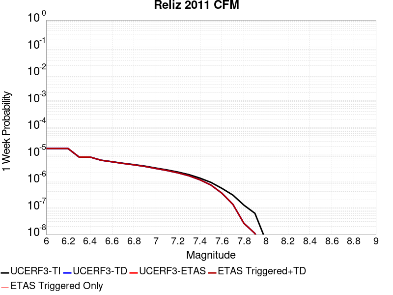 | 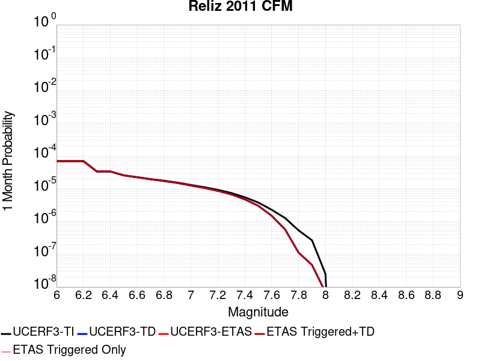 | 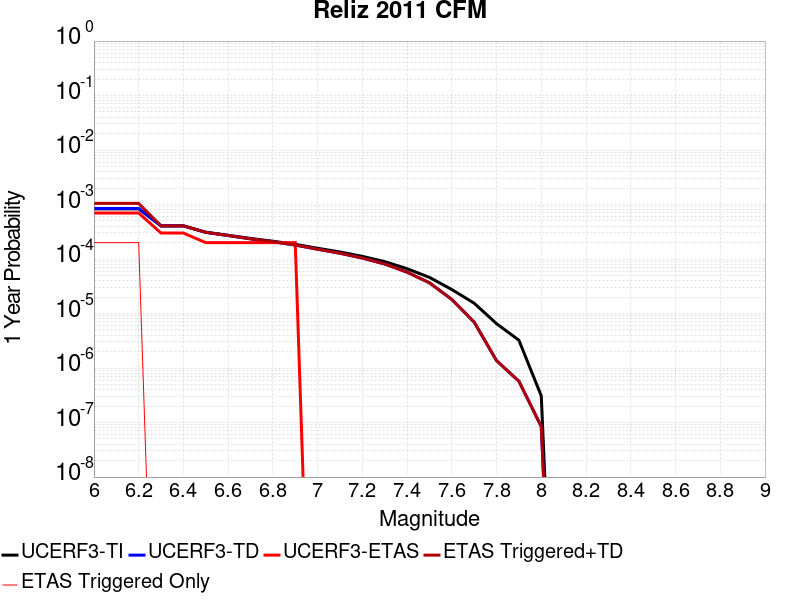 | 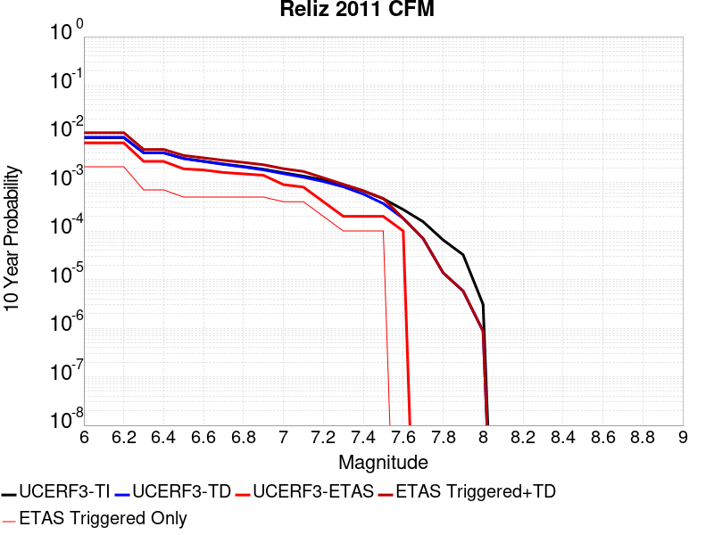 |

| Magnitude | 1 wk TI Prob | 1 wk TD Prob | 1 wk ETAS Prob | 1 wk ETAS/TD Gain | 1 wk ETAS Triggered+TD | 1 wk ETAS Triggered Only | 1 mo TI Prob | 1 mo TD Prob | 1 mo ETAS Prob | 1 mo ETAS/TD Gain | 1 mo ETAS Triggered+TD | 1 mo ETAS Triggered Only | 1 yr TI Prob | 1 yr TD Prob | 1 yr ETAS Prob | 1 yr ETAS/TD Gain | 1 yr ETAS Triggered+TD | 1 yr ETAS Triggered Only | 10 yr TI Prob | 10 yr TD Prob | 10 yr ETAS Prob | 10 yr ETAS/TD Gain | 10 yr ETAS Triggered+TD | 10 yr ETAS Triggered Only |
|-----|-----|-----|-----|-----|-----|-----|-----|-----|-----|-----|-----|-----|-----|-----|-----|-----|-----|-----|-----|-----|-----|-----|-----|-----|
| 6.0 | 1.6002472E-5 | 1.627535E-5 | 0.0 | 0.0 | 1.627535E-5 | 0.0 | 6.8580215E-5 | 6.9749745E-5 | 0.0 | 0.0 | 6.9749745E-5 | 0.0 | 8.3464425E-4 | 8.488921E-4 | 7.0E-4 | 0.8246042 | 0.0010487223 | 2.0E-4 | 0.008315164 | 0.008458683 | 0.0065 | 0.76844114 | 0.010540919 | 0.0021 |
| 6.1 | 1.6002472E-5 | 1.627535E-5 | 0.0 | 0.0 | 1.627535E-5 | 0.0 | 6.8580215E-5 | 6.9749745E-5 | 0.0 | 0.0 | 6.9749745E-5 | 0.0 | 8.3464425E-4 | 8.488921E-4 | 7.0E-4 | 0.8246042 | 0.0010487223 | 2.0E-4 | 0.008315164 | 0.008458683 | 0.0065 | 0.76844114 | 0.010540919 | 0.0021 |
| 6.2 | 1.6002472E-5 | 1.627535E-5 | 0.0 | 0.0 | 1.627535E-5 | 0.0 | 6.8580215E-5 | 6.9749745E-5 | 0.0 | 0.0 | 6.9749745E-5 | 0.0 | 8.3464425E-4 | 8.488921E-4 | 7.0E-4 | 0.8246042 | 0.0010487223 | 2.0E-4 | 0.008315164 | 0.008458683 | 0.0065 | 0.76844114 | 0.010540919 | 0.0021 |
| 6.3 | 7.792404E-6 | 7.799253E-6 | 0.0 | 0.0 | 7.799253E-6 | 0.0 | 3.339559E-5 | 3.3424945E-5 | 0.0 | 0.0 | 3.3424945E-5 | 0.0 | 4.0651546E-4 | 4.068735E-4 | 3.0E-4 | 0.7373299 | 4.068735E-4 | 0.0 | 0.0040577264 | 0.0040615564 | 0.0027 | 0.66476977 | 0.0047587133 | 7.0E-4 |
| 6.4 | 7.792404E-6 | 7.799253E-6 | 0.0 | 0.0 | 7.799253E-6 | 0.0 | 3.339559E-5 | 3.3424945E-5 | 0.0 | 0.0 | 3.3424945E-5 | 0.0 | 4.0651546E-4 | 4.068735E-4 | 3.0E-4 | 0.7373299 | 4.068735E-4 | 0.0 | 0.0040577264 | 0.0040615564 | 0.0027 | 0.66476977 | 0.0047587133 | 7.0E-4 |
| 6.5 | 5.9659374E-6 | 5.9247104E-6 | 0.0 | 0.0 | 5.9247104E-6 | 0.0 | 2.5568053E-5 | 2.539137E-5 | 0.0 | 0.0 | 2.539137E-5 | 0.0 | 3.1124658E-4 | 3.090963E-4 | 2.0E-4 | 0.6470476 | 3.090963E-4 | 0.0 | 0.00310811 | 0.0030868757 | 0.0019 | 0.6155091 | 0.003585332 | 5.0E-4 |
| 6.6 | 5.2350692E-6 | 5.1751604E-6 | 0.0 | 0.0 | 5.1751604E-6 | 0.0 | 2.2435817E-5 | 2.217907E-5 | 0.0 | 0.0 | 2.217907E-5 | 0.0 | 2.7312184E-4 | 2.6999688E-4 | 2.0E-4 | 0.7407493 | 2.6999688E-4 | 0.0 | 0.002727864 | 0.0026968927 | 0.0018 | 0.6674348 | 0.0031955442 | 5.0E-4 |
| 6.7 | 4.580206E-6 | 4.502488E-6 | 0.0 | 0.0 | 4.502488E-6 | 0.0 | 1.9629308E-5 | 1.9296236E-5 | 0.0 | 0.0 | 1.9296236E-5 | 0.0 | 2.389606E-4 | 2.3490642E-4 | 2.0E-4 | 0.8514029 | 2.3490642E-4 | 0.0 | 0.002387038 | 0.0023467771 | 0.0016 | 0.6817861 | 0.0028456037 | 5.0E-4 |
| 6.8 | 4.0765017E-6 | 3.984758E-6 | 0.0 | 0.0 | 3.984758E-6 | 0.0 | 1.7470604E-5 | 1.7077424E-5 | 0.0 | 0.0 | 1.7077424E-5 | 0.0 | 2.1268385E-4 | 2.0789784E-4 | 2.0E-4 | 0.962011 | 2.0789784E-4 | 0.0 | 0.002124804 | 0.0020772256 | 0.0015 | 0.722117 | 0.002576187 | 5.0E-4 |
| 6.9 | 3.5752896E-6 | 3.4691943E-6 | 0.0 | 0.0 | 3.4691943E-6 | 0.0 | 1.532258E-5 | 1.4867892E-5 | 0.0 | 0.0 | 1.4867892E-5 | 0.0 | 1.8653645E-4 | 1.8100157E-4 | 2.0E-4 | 1.1049628 | 1.8100157E-4 | 0.0 | 0.0018637994 | 0.0018087319 | 0.0014 | 0.77402294 | 0.0023078276 | 5.0E-4 |
| 7.0 | 3.0259848E-6 | 2.904783E-6 | 0.0 | 0.0 | 2.904783E-6 | 0.0 | 1.2968442E-5 | 1.2449011E-5 | 0.0 | 0.0 | 1.2449011E-5 | 0.0 | 1.5787935E-4 | 1.5155617E-4 | 0.0 | 0.0 | 1.5155617E-4 | 0.0 | 0.0015776722 | 0.0015147175 | 9.0E-4 | 0.5941702 | 0.0019141115 | 4.0E-4 |
| 7.1 | 2.5861116E-6 | 2.4521476E-6 | 0.0 | 0.0 | 2.4521476E-6 | 0.0 | 1.1083288E-5 | 1.0509161E-5 | 0.0 | 0.0 | 1.0509161E-5 | 0.0 | 1.3493067E-4 | 1.2794154E-4 | 0.0 | 0.0 | 1.2794154E-4 | 0.0 | 0.0013484878 | 0.0012788676 | 8.0E-4 | 0.6255534 | 0.001678356 | 4.0E-4 |
| 7.2 | 2.1482588E-6 | 2.00037E-6 | 0.0 | 0.0 | 2.00037E-6 | 0.0 | 9.20679E-6 | 8.572985E-6 | 0.0 | 0.0 | 8.572985E-6 | 0.0 | 1.12086906E-4 | 1.043711E-4 | 0.0 | 0.0 | 1.043711E-4 | 0.0 | 0.0011203039 | 0.0010434092 | 4.0E-4 | 0.38335872 | 0.0012432005 | 2.0E-4 |
| 7.3 | 1.7194744E-6 | 1.5584134E-6 | 0.0 | 0.0 | 1.5584134E-6 | 0.0 | 7.3691554E-6 | 6.678897E-6 | 0.0 | 0.0 | 6.678897E-6 | 0.0 | 8.971577E-5 | 8.131254E-5 | 0.0 | 0.0 | 8.131254E-5 | 0.0 | 8.967956E-4 | 8.1301597E-4 | 2.0E-4 | 0.24599764 | 9.1293466E-4 | 1.0E-4 |
| 7.4 | 1.2755178E-6 | 1.1031134E-6 | 0.0 | 0.0 | 1.1031134E-6 | 0.0 | 5.4664933E-6 | 4.72762E-6 | 0.0 | 0.0 | 4.72762E-6 | 0.0 | 6.655252E-5 | 5.7557256E-5 | 0.0 | 0.0 | 5.7557256E-5 | 0.0 | 6.6532596E-4 | 5.756114E-4 | 2.0E-4 | 0.34745663 | 6.7555386E-4 | 1.0E-4 |
| 7.5 | 8.8463224E-7 | 7.0342935E-7 | 0.0 | 0.0 | 7.0342935E-7 | 0.0 | 3.7912755E-6 | 3.0146934E-6 | 0.0 | 0.0 | 3.0146934E-6 | 0.0 | 4.6157802E-5 | 3.6703277E-5 | 0.0 | 0.0 | 3.6703277E-5 | 0.0 | 4.6148215E-4 | 3.6715996E-4 | 2.0E-4 | 0.5447217 | 4.6712323E-4 | 1.0E-4 |
| 7.6 | 5.291355E-7 | 3.4797085E-7 | 0.0 | 0.0 | 3.4797085E-7 | 0.0 | 2.2677216E-6 | 1.4913028E-6 | 0.0 | 0.0 | 1.4913028E-6 | 0.0 | 2.760916E-5 | 1.815646E-5 | 0.0 | 0.0 | 1.815646E-5 | 0.0 | 2.760573E-4 | 1.817364E-4 | 1.0E-4 | 0.55024755 | 1.817364E-4 | 0.0 |
| 7.7 | 2.9663357E-7 | 1.3347594E-7 | 0.0 | 0.0 | 1.3347594E-7 | 0.0 | 1.2712861E-6 | 5.7203965E-7 | 0.0 | 0.0 | 5.7203965E-7 | 0.0 | 1.5477797E-5 | 6.9645603E-6 | 0.0 | 0.0 | 6.9645603E-6 | 0.0 | 1.547672E-4 | 6.982147E-5 | 0.0 | 0.0 | 6.982147E-5 | 0.0 |
| 7.8 | 1.2509386E-7 | 2.6251898E-8 | 0.0 | 0.0 | 2.6251898E-8 | 0.0 | 5.3611643E-7 | 1.1250813E-7 | 0.0 | 0.0 | 1.1250813E-7 | 0.0 | 6.527198E-6 | 1.3697857E-6 | 0.0 | 0.0 | 1.3697857E-6 | 0.0 | 6.527006E-5 | 1.3847996E-5 | 0.0 | 0.0 | 1.3847996E-5 | 0.0 |
| 7.9 | 6.213493E-8 | 1.0995548E-8 | 0.0 | 0.0 | 1.0995548E-8 | 0.0 | 2.6629255E-7 | 4.7123777E-8 | 0.0 | 0.0 | 4.7123777E-8 | 0.0 | 3.242107E-6 | 5.737318E-7 | 0.0 | 0.0 | 5.737318E-7 | 0.0 | 3.2420594E-5 | 5.8631263E-6 | 0.0 | 0.0 | 5.8631263E-6 | 0.0 |
| 8.0 | 5.92383E-9 | 1.6225006E-9 | 0.0 | 0.0 | 1.6225006E-9 | 0.0 | 2.5387841E-8 | 6.9535737E-9 | 0.0 | 0.0 | 6.9535737E-9 | 0.0 | 3.0909692E-7 | 8.465975E-8 | 0.0 | 0.0 | 8.465975E-8 | 0.0 | 3.090965E-6 | 8.708664E-7 | 0.0 | 0.0 | 8.708664E-7 | 0.0 |

## Channel Islands Thrust
*[(top)](#table-of-contents)*

| 1 Week | 1 Month | 1 Year | 10 Year |
|-----|-----|-----|-----|
| 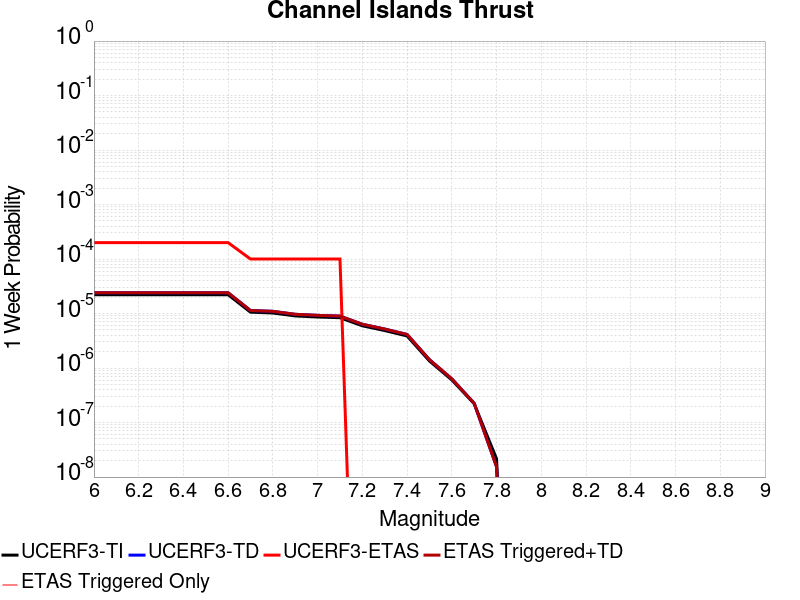 | 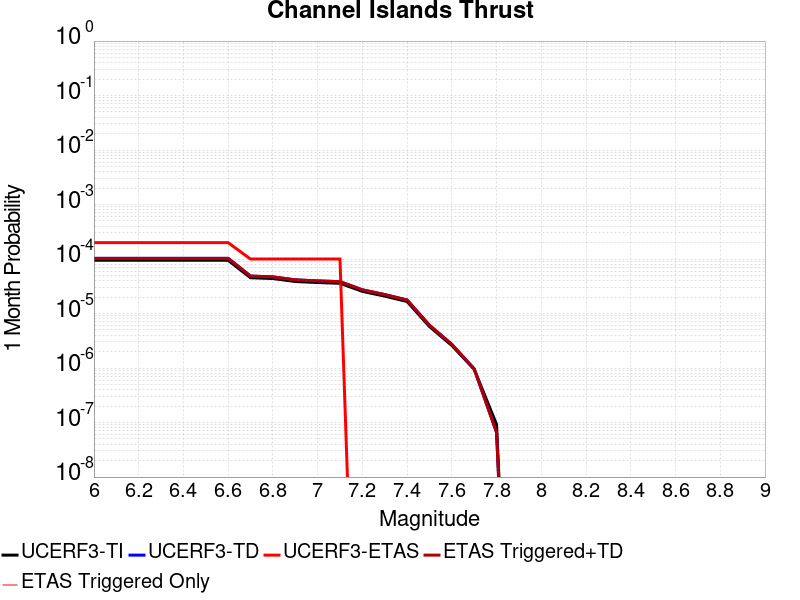 | 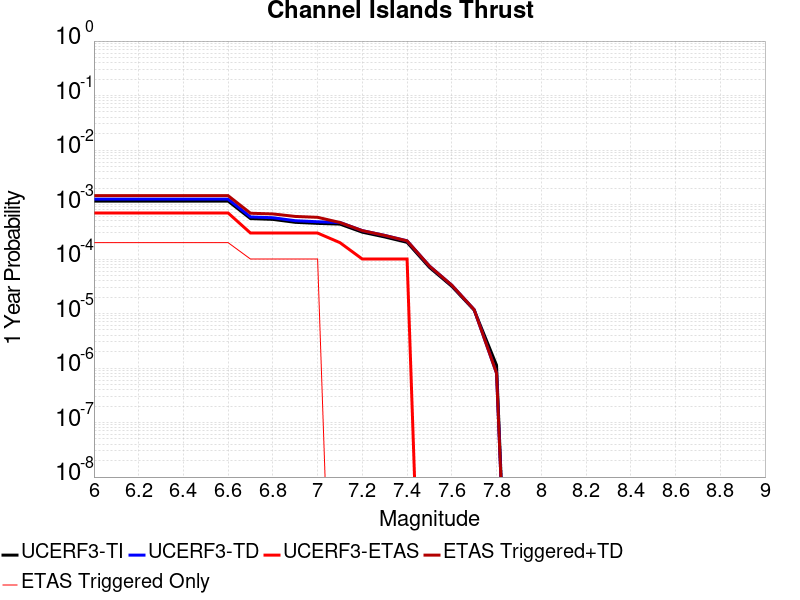 | 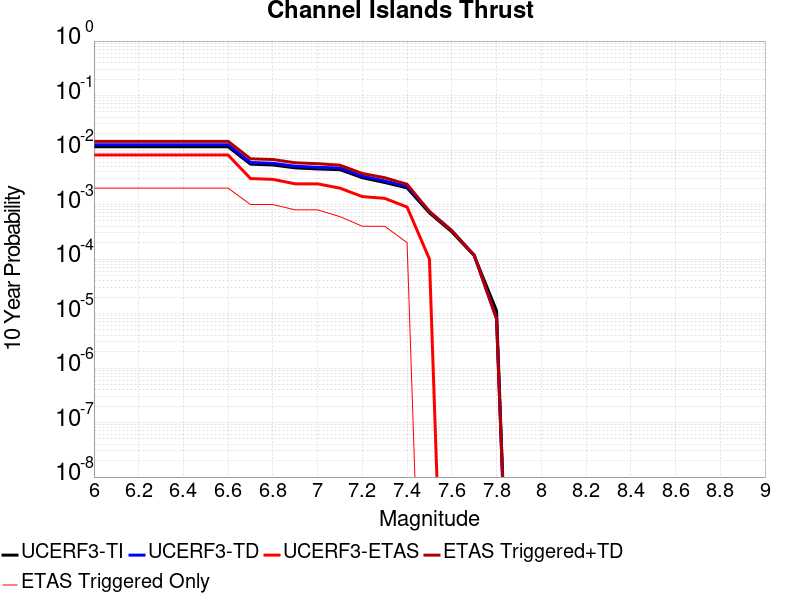 |

| Magnitude | 1 wk TI Prob | 1 wk TD Prob | 1 wk ETAS Prob | 1 wk ETAS/TD Gain | 1 wk ETAS Triggered+TD | 1 wk ETAS Triggered Only | 1 mo TI Prob | 1 mo TD Prob | 1 mo ETAS Prob | 1 mo ETAS/TD Gain | 1 mo ETAS Triggered+TD | 1 mo ETAS Triggered Only | 1 yr TI Prob | 1 yr TD Prob | 1 yr ETAS Prob | 1 yr ETAS/TD Gain | 1 yr ETAS Triggered+TD | 1 yr ETAS Triggered Only | 10 yr TI Prob | 10 yr TD Prob | 10 yr ETAS Prob | 10 yr ETAS/TD Gain | 10 yr ETAS Triggered+TD | 10 yr ETAS Triggered Only |
|-----|-----|-----|-----|-----|-----|-----|-----|-----|-----|-----|-----|-----|-----|-----|-----|-----|-----|-----|-----|-----|-----|-----|-----|-----|
| 6.0 | 2.2156251E-5 | 2.4069896E-5 | 2.0E-4 | 8.3091345 | 2.4069896E-5 | 0.0 | 9.495191E-5 | 1.03153216E-4 | 2.0E-4 | 1.9388634 | 1.03153216E-4 | 0.0 | 0.0011554264 | 0.0012552731 | 7.0E-4 | 0.5576475 | 0.0014550221 | 2.0E-4 | 0.011494373 | 0.012492395 | 0.0081 | 0.64839447 | 0.014467411 | 0.002 |
| 6.1 | 2.2156251E-5 | 2.4069896E-5 | 2.0E-4 | 8.3091345 | 2.4069896E-5 | 0.0 | 9.495191E-5 | 1.03153216E-4 | 2.0E-4 | 1.9388634 | 1.03153216E-4 | 0.0 | 0.0011554264 | 0.0012552731 | 7.0E-4 | 0.5576475 | 0.0014550221 | 2.0E-4 | 0.011494373 | 0.012492395 | 0.0081 | 0.64839447 | 0.014467411 | 0.002 |
| 6.2 | 2.2156251E-5 | 2.4069896E-5 | 2.0E-4 | 8.3091345 | 2.4069896E-5 | 0.0 | 9.495191E-5 | 1.03153216E-4 | 2.0E-4 | 1.9388634 | 1.03153216E-4 | 0.0 | 0.0011554264 | 0.0012552731 | 7.0E-4 | 0.5576475 | 0.0014550221 | 2.0E-4 | 0.011494373 | 0.012492395 | 0.0081 | 0.64839447 | 0.014467411 | 0.002 |
| 6.3 | 2.2156251E-5 | 2.4069896E-5 | 2.0E-4 | 8.3091345 | 2.4069896E-5 | 0.0 | 9.495191E-5 | 1.03153216E-4 | 2.0E-4 | 1.9388634 | 1.03153216E-4 | 0.0 | 0.0011554264 | 0.0012552731 | 7.0E-4 | 0.5576475 | 0.0014550221 | 2.0E-4 | 0.011494373 | 0.012492395 | 0.0081 | 0.64839447 | 0.014467411 | 0.002 |
| 6.4 | 2.2156251E-5 | 2.4069896E-5 | 2.0E-4 | 8.3091345 | 2.4069896E-5 | 0.0 | 9.495191E-5 | 1.03153216E-4 | 2.0E-4 | 1.9388634 | 1.03153216E-4 | 0.0 | 0.0011554264 | 0.0012552731 | 7.0E-4 | 0.5576475 | 0.0014550221 | 2.0E-4 | 0.011494373 | 0.012492395 | 0.0081 | 0.64839447 | 0.014467411 | 0.002 |
| 6.5 | 2.2156251E-5 | 2.4069896E-5 | 2.0E-4 | 8.3091345 | 2.4069896E-5 | 0.0 | 9.495191E-5 | 1.03153216E-4 | 2.0E-4 | 1.9388634 | 1.03153216E-4 | 0.0 | 0.0011554264 | 0.0012552731 | 7.0E-4 | 0.5576475 | 0.0014550221 | 2.0E-4 | 0.011494373 | 0.012492395 | 0.0081 | 0.64839447 | 0.014467411 | 0.002 |
| 6.6 | 2.2156251E-5 | 2.4069896E-5 | 2.0E-4 | 8.3091345 | 2.4069896E-5 | 0.0 | 9.495191E-5 | 1.03153216E-4 | 2.0E-4 | 1.9388634 | 1.03153216E-4 | 0.0 | 0.0011554264 | 0.0012552731 | 7.0E-4 | 0.5576475 | 0.0014550221 | 2.0E-4 | 0.011494373 | 0.012492395 | 0.0081 | 0.64839447 | 0.014467411 | 0.002 |
| 6.7 | 1.0601296E-5 | 1.1370703E-5 | 1.0E-4 | 8.794531 | 1.1370703E-5 | 0.0 | 4.5433335E-5 | 4.87307E-5 | 1.0E-4 | 2.0520945 | 4.87307E-5 | 0.0 | 5.5301044E-4 | 5.931397E-4 | 3.0E-4 | 0.5057831 | 6.930803E-4 | 1.0E-4 | 0.005516363 | 0.0059160665 | 0.003 | 0.50709367 | 0.0069101504 | 0.001 |
| 6.8 | 1.0246747E-5 | 1.0988148E-5 | 1.0E-4 | 9.100716 | 1.0988148E-5 | 0.0 | 4.391389E-5 | 4.7091235E-5 | 1.0E-4 | 2.1235373 | 4.7091235E-5 | 0.0 | 5.345204E-4 | 5.7318975E-4 | 3.0E-4 | 0.5233869 | 6.731324E-4 | 1.0E-4 | 0.0053323656 | 0.0057176026 | 0.0029 | 0.50720555 | 0.0067118853 | 0.001 |
| 6.9 | 9.049551E-6 | 9.692251E-6 | 1.0E-4 | 10.31752 | 9.692251E-6 | 0.0 | 3.878322E-5 | 4.1537583E-5 | 1.0E-4 | 2.4074583 | 4.1537583E-5 | 0.0 | 4.7208337E-4 | 5.056068E-4 | 3.0E-4 | 0.5933464 | 6.0555624E-4 | 1.0E-4 | 0.0047108172 | 0.0050449814 | 0.0024 | 0.4757203 | 0.0058409455 | 8.0E-4 |
| 7.0 | 8.6542195E-6 | 9.267544E-6 | 1.0E-4 | 10.790345 | 9.267544E-6 | 0.0 | 3.7088983E-5 | 3.9717463E-5 | 1.0E-4 | 2.517784 | 3.9717463E-5 | 0.0 | 4.5146482E-4 | 4.8345688E-4 | 3.0E-4 | 0.620531 | 5.834086E-4 | 1.0E-4 | 0.004505487 | 0.004824463 | 0.0024 | 0.49746472 | 0.005620603 | 8.0E-4 |
| 7.1 | 8.391028E-6 | 8.986072E-6 | 1.0E-4 | 11.128332 | 8.986072E-6 | 0.0 | 3.5961057E-5 | 3.8511193E-5 | 1.0E-4 | 2.5966477 | 3.8511193E-5 | 0.0 | 4.3773788E-4 | 4.6877697E-4 | 2.0E-4 | 0.42664212 | 4.6877697E-4 | 0.0 | 0.004368766 | 0.004678291 | 0.002 | 0.42750657 | 0.0052754837 | 6.0E-4 |
| 7.2 | 5.965188E-6 | 6.367049E-6 | 0.0 | 0.0 | 6.367049E-6 | 0.0 | 2.556484E-5 | 2.7287071E-5 | 0.0 | 0.0 | 2.7287071E-5 | 0.0 | 3.1120746E-4 | 3.3217E-4 | 1.0E-4 | 0.30105066 | 3.3217E-4 | 0.0 | 0.00310772 | 0.003316793 | 0.0014 | 0.4220945 | 0.0037154662 | 4.0E-4 |
| 7.3 | 4.877518E-6 | 5.202234E-6 | 0.0 | 0.0 | 5.202234E-6 | 0.0 | 2.0903482E-5 | 2.22951E-5 | 0.0 | 0.0 | 2.22951E-5 | 0.0 | 2.5447016E-4 | 2.714095E-4 | 1.0E-4 | 0.36844695 | 2.714095E-4 | 0.0 | 0.0025417898 | 0.0027108265 | 0.0013 | 0.47955856 | 0.003109742 | 4.0E-4 |
| 7.4 | 3.8829853E-6 | 4.1388685E-6 | 0.0 | 0.0 | 4.1388685E-6 | 0.0 | 1.664126E-5 | 1.7737888E-5 | 0.0 | 0.0 | 1.7737888E-5 | 0.0 | 2.0258849E-4 | 2.159378E-4 | 1.0E-4 | 0.4630963 | 2.159378E-4 | 0.0 | 0.002024039 | 0.0021573214 | 9.0E-4 | 0.417184 | 0.0023568901 | 2.0E-4 |
| 7.5 | 1.3489616E-6 | 1.4268106E-6 | 0.0 | 0.0 | 1.4268106E-6 | 0.0 | 5.7812517E-6 | 6.1148885E-6 | 0.0 | 0.0 | 6.1148885E-6 | 0.0 | 7.038446E-5 | 7.444627E-5 | 0.0 | 0.0 | 7.444627E-5 | 0.0 | 7.036218E-4 | 7.4421725E-4 | 1.0E-4 | 0.13436937 | 7.4421725E-4 | 0.0 |
| 7.6 | 6.058192E-7 | 6.349486E-7 | 0.0 | 0.0 | 6.349486E-7 | 0.0 | 2.5963652E-6 | 2.7212056E-6 | 0.0 | 0.0 | 2.7212056E-6 | 0.0 | 3.161029E-5 | 3.3130193E-5 | 0.0 | 0.0 | 3.3130193E-5 | 0.0 | 3.1605794E-4 | 3.3125412E-4 | 0.0 | 0.0 | 3.3125412E-4 | 0.0 |
| 7.7 | 2.2170494E-7 | 2.2593485E-7 | 0.0 | 0.0 | 2.2593485E-7 | 0.0 | 9.5016367E-7 | 9.682919E-7 | 0.0 | 0.0 | 9.682919E-7 | 0.0 | 1.1568181E-5 | 1.1788902E-5 | 0.0 | 0.0 | 1.1788902E-5 | 0.0 | 1.1567579E-4 | 1.1788387E-4 | 0.0 | 0.0 | 1.1788387E-4 | 0.0 |
| 7.8 | 2.1613102E-8 | 1.545333E-8 | 0.0 | 0.0 | 1.545333E-8 | 0.0 | 9.262757E-8 | 6.622856E-8 | 0.0 | 0.0 | 6.622856E-8 | 0.0 | 1.1277401E-6 | 8.063324E-7 | 0.0 | 0.0 | 8.063324E-7 | 0.0 | 1.1277344E-5 | 8.063303E-6 | 0.0 | 0.0 | 8.063303E-6 | 0.0 |

## Oak Ridge (Onshore)
*[(top)](#table-of-contents)*

| 1 Week | 1 Month | 1 Year | 10 Year |
|-----|-----|-----|-----|
| 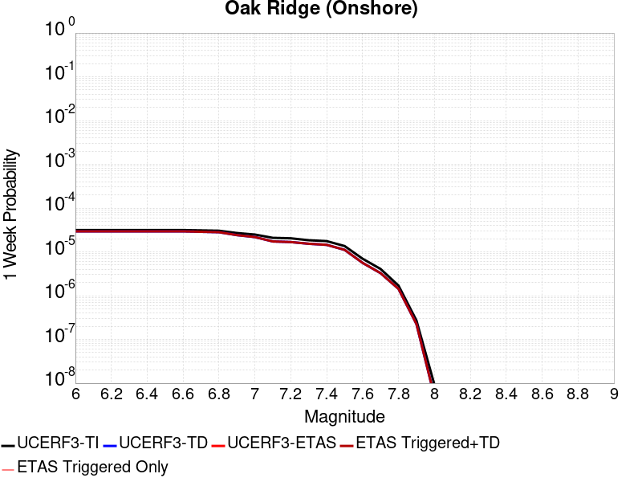 | 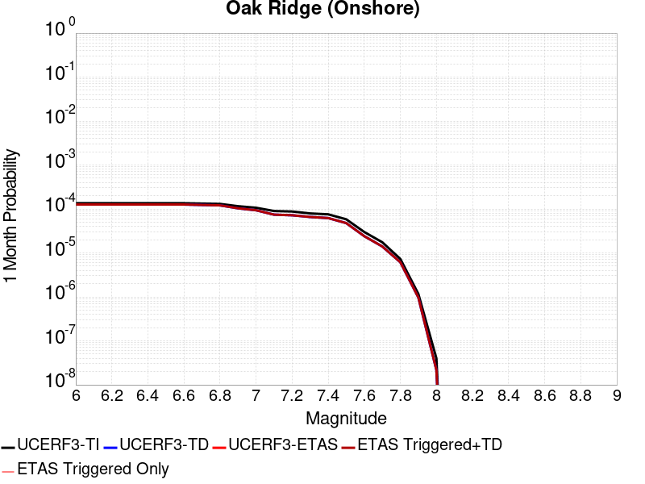 | 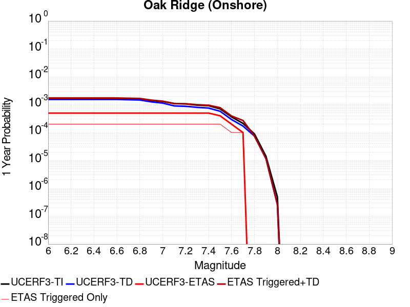 | 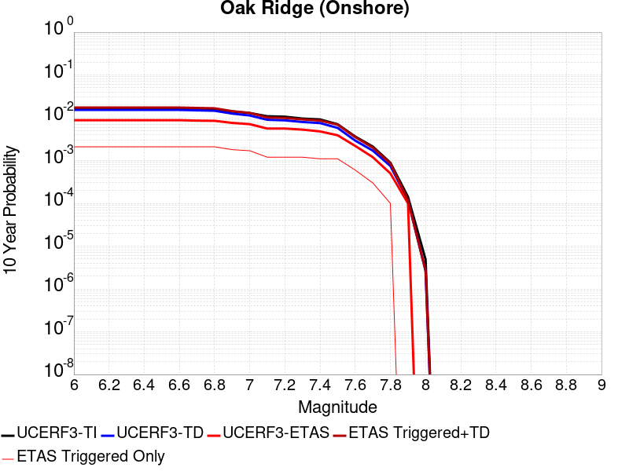 |

| Magnitude | 1 wk TI Prob | 1 wk TD Prob | 1 wk ETAS Prob | 1 wk ETAS/TD Gain | 1 wk ETAS Triggered+TD | 1 wk ETAS Triggered Only | 1 mo TI Prob | 1 mo TD Prob | 1 mo ETAS Prob | 1 mo ETAS/TD Gain | 1 mo ETAS Triggered+TD | 1 mo ETAS Triggered Only | 1 yr TI Prob | 1 yr TD Prob | 1 yr ETAS Prob | 1 yr ETAS/TD Gain | 1 yr ETAS Triggered+TD | 1 yr ETAS Triggered Only | 10 yr TI Prob | 10 yr TD Prob | 10 yr ETAS Prob | 10 yr ETAS/TD Gain | 10 yr ETAS Triggered+TD | 10 yr ETAS Triggered Only |
|-----|-----|-----|-----|-----|-----|-----|-----|-----|-----|-----|-----|-----|-----|-----|-----|-----|-----|-----|-----|-----|-----|-----|-----|-----|
| 6.0 | 3.155064E-5 | 2.9476643E-5 | 0.0 | 0.0 | 2.9476643E-5 | 0.0 | 1.3521002E-4 | 1.2632257E-4 | 0.0 | 0.0 | 1.2632257E-4 | 0.0 | 0.001644939 | 0.0015369302 | 5.0E-4 | 0.32532382 | 0.0017366228 | 2.0E-4 | 0.01632816 | 0.0152671505 | 0.0088 | 0.57640094 | 0.017335089 | 0.0021 |
| 6.1 | 3.155064E-5 | 2.9476643E-5 | 0.0 | 0.0 | 2.9476643E-5 | 0.0 | 1.3521002E-4 | 1.2632257E-4 | 0.0 | 0.0 | 1.2632257E-4 | 0.0 | 0.001644939 | 0.0015369302 | 5.0E-4 | 0.32532382 | 0.0017366228 | 2.0E-4 | 0.01632816 | 0.0152671505 | 0.0088 | 0.57640094 | 0.017335089 | 0.0021 |
| 6.2 | 3.155064E-5 | 2.9476643E-5 | 0.0 | 0.0 | 2.9476643E-5 | 0.0 | 1.3521002E-4 | 1.2632257E-4 | 0.0 | 0.0 | 1.2632257E-4 | 0.0 | 0.001644939 | 0.0015369302 | 5.0E-4 | 0.32532382 | 0.0017366228 | 2.0E-4 | 0.01632816 | 0.0152671505 | 0.0088 | 0.57640094 | 0.017335089 | 0.0021 |
| 6.3 | 3.155064E-5 | 2.9476643E-5 | 0.0 | 0.0 | 2.9476643E-5 | 0.0 | 1.3521002E-4 | 1.2632257E-4 | 0.0 | 0.0 | 1.2632257E-4 | 0.0 | 0.001644939 | 0.0015369302 | 5.0E-4 | 0.32532382 | 0.0017366228 | 2.0E-4 | 0.01632816 | 0.0152671505 | 0.0088 | 0.57640094 | 0.017335089 | 0.0021 |
| 6.4 | 3.155064E-5 | 2.9476643E-5 | 0.0 | 0.0 | 2.9476643E-5 | 0.0 | 1.3521002E-4 | 1.2632257E-4 | 0.0 | 0.0 | 1.2632257E-4 | 0.0 | 0.001644939 | 0.0015369302 | 5.0E-4 | 0.32532382 | 0.0017366228 | 2.0E-4 | 0.01632816 | 0.0152671505 | 0.0088 | 0.57640094 | 0.017335089 | 0.0021 |
| 6.5 | 3.155064E-5 | 2.9476643E-5 | 0.0 | 0.0 | 2.9476643E-5 | 0.0 | 1.3521002E-4 | 1.2632257E-4 | 0.0 | 0.0 | 1.2632257E-4 | 0.0 | 0.001644939 | 0.0015369302 | 5.0E-4 | 0.32532382 | 0.0017366228 | 2.0E-4 | 0.01632816 | 0.0152671505 | 0.0088 | 0.57640094 | 0.017335089 | 0.0021 |
| 6.6 | 3.155064E-5 | 2.9476643E-5 | 0.0 | 0.0 | 2.9476643E-5 | 0.0 | 1.3521002E-4 | 1.2632257E-4 | 0.0 | 0.0 | 1.2632257E-4 | 0.0 | 0.001644939 | 0.0015369302 | 5.0E-4 | 0.32532382 | 0.0017366228 | 2.0E-4 | 0.01632816 | 0.0152671505 | 0.0088 | 0.57640094 | 0.017335089 | 0.0021 |
| 6.7 | 3.098897E-5 | 2.8816074E-5 | 0.0 | 0.0 | 2.8816074E-5 | 0.0 | 1.328031E-4 | 1.2349183E-4 | 0.0 | 0.0 | 1.2349183E-4 | 0.0 | 0.0016156785 | 0.0015025135 | 5.0E-4 | 0.33277568 | 0.0017022131 | 2.0E-4 | 0.016039822 | 0.014927628 | 0.0086 | 0.5761129 | 0.01699628 | 0.0021 |
| 6.8 | 3.0449872E-5 | 2.8192308E-5 | 0.0 | 0.0 | 2.8192308E-5 | 0.0 | 1.3049292E-4 | 1.2081879E-4 | 0.0 | 0.0 | 1.2081879E-4 | 0.0 | 0.0015875935 | 0.0014700133 | 5.0E-4 | 0.34013298 | 0.0016697192 | 2.0E-4 | 0.015762992 | 0.0146069005 | 0.0085 | 0.58191675 | 0.016676227 | 0.0021 |
| 6.9 | 2.697928E-5 | 2.4179357E-5 | 0.0 | 0.0 | 2.4179357E-5 | 0.0 | 1.15620365E-4 | 1.0362182E-4 | 0.0 | 0.0 | 1.0362182E-4 | 0.0 | 0.0014067689 | 0.001260887 | 5.0E-4 | 0.39654624 | 0.0014606348 | 2.0E-4 | 0.0139789665 | 0.0125396885 | 0.0076 | 0.60607564 | 0.014317118 | 0.0018 |
| 7.0 | 2.4893961E-5 | 2.1825264E-5 | 0.0 | 0.0 | 2.1825264E-5 | 0.0 | 1.0668404E-4 | 9.353359E-5 | 0.0 | 0.0 | 9.353359E-5 | 0.0 | 0.0012981043 | 0.0011381942 | 5.0E-4 | 0.4392923 | 0.0013379666 | 2.0E-4 | 0.012905477 | 0.011325577 | 0.0071 | 0.6268996 | 0.013006324 | 0.0017 |
| 7.1 | 2.0945363E-5 | 1.7324513E-5 | 0.0 | 0.0 | 1.7324513E-5 | 0.0 | 8.976275E-5 | 7.424583E-5 | 0.0 | 0.0 | 7.424583E-5 | 0.0 | 0.0010923136 | 9.035728E-4 | 5.0E-4 | 0.5533588 | 0.0011033921 | 2.0E-4 | 0.0108696 | 0.008999572 | 0.0056 | 0.6222518 | 0.010188772 | 0.0012 |
| 7.2 | 2.0439404E-5 | 1.6780215E-5 | 0.0 | 0.0 | 1.6780215E-5 | 0.0 | 8.7594504E-5 | 7.191326E-5 | 0.0 | 0.0 | 7.191326E-5 | 0.0 | 0.0010659413 | 8.751968E-4 | 5.0E-4 | 0.5713 | 0.0010750218 | 2.0E-4 | 0.010608427 | 0.008718066 | 0.0056 | 0.6423443 | 0.009907604 | 0.0012 |
| 7.3 | 1.8463334E-5 | 1.5354937E-5 | 0.0 | 0.0 | 1.5354937E-5 | 0.0 | 7.912617E-5 | 6.580524E-5 | 0.0 | 0.0 | 6.580524E-5 | 0.0 | 9.6293533E-4 | 8.008886E-4 | 5.0E-4 | 0.62430656 | 0.0010007285 | 2.0E-4 | 0.009587734 | 0.007980533 | 0.0053 | 0.664116 | 0.009170956 | 0.0012 |
| 7.4 | 1.763139E-5 | 1.4491604E-5 | 0.0 | 0.0 | 1.4491604E-5 | 0.0 | 7.556091E-5 | 6.210542E-5 | 0.0 | 0.0 | 6.210542E-5 | 0.0 | 9.1956573E-4 | 7.558751E-4 | 5.0E-4 | 0.66148496 | 9.557239E-4 | 2.0E-4 | 0.009157699 | 0.007533491 | 0.0048 | 0.6371548 | 0.008625204 | 0.0011 |
| 7.5 | 1.3594944E-5 | 1.1143493E-5 | 0.0 | 0.0 | 1.1143493E-5 | 0.0 | 5.8262744E-5 | 4.7756967E-5 | 0.0 | 0.0 | 4.7756967E-5 | 0.0 | 7.0911803E-4 | 5.812885E-4 | 4.0E-4 | 0.6881265 | 7.811722E-4 | 2.0E-4 | 0.007068595 | 0.0057978434 | 0.0039 | 0.67266387 | 0.006891466 | 0.0011 |
| 7.6 | 6.9889534E-6 | 5.62372E-6 | 0.0 | 0.0 | 5.62372E-6 | 0.0 | 2.9952313E-5 | 2.4101437E-5 | 0.0 | 0.0 | 2.4101437E-5 | 0.0 | 3.646084E-4 | 2.933959E-4 | 2.0E-4 | 0.6816728 | 3.9336656E-4 | 1.0E-4 | 0.0036401073 | 0.0029301292 | 0.0022 | 0.75082016 | 0.003528371 | 6.0E-4 |
| 7.7 | 4.0824193E-6 | 3.2755165E-6 | 0.0 | 0.0 | 3.2755165E-6 | 0.0 | 1.7495966E-5 | 1.4037853E-5 | 0.0 | 0.0 | 1.4037853E-5 | 0.0 | 2.1299256E-4 | 1.7089759E-4 | 1.0E-4 | 0.5851458 | 2.708805E-4 | 1.0E-4 | 0.0021278851 | 0.0017076749 | 0.0012 | 0.70270985 | 0.0020071627 | 3.0E-4 |
| 7.8 | 1.7023609E-6 | 1.436136E-6 | 0.0 | 0.0 | 1.436136E-6 | 0.0 | 7.295812E-6 | 6.1548544E-6 | 0.0 | 0.0 | 6.1548544E-6 | 0.0 | 8.882289E-5 | 7.49328E-5 | 0.0 | 0.0 | 7.49328E-5 | 0.0 | 8.8787393E-4 | 7.490782E-4 | 5.0E-4 | 0.6674871 | 8.4900326E-4 | 1.0E-4 |
| 7.9 | 2.721225E-7 | 2.2599626E-7 | 0.0 | 0.0 | 2.2599626E-7 | 0.0 | 1.1662388E-6 | 9.685551E-7 | 0.0 | 0.0 | 9.685551E-7 | 0.0 | 1.4198865E-5 | 1.1792097E-5 | 0.0 | 0.0 | 1.1792097E-5 | 0.0 | 1.4197957E-4 | 1.1791499E-4 | 1.0E-4 | 0.8480686 | 1.1791499E-4 | 0.0 |
| 8.0 | 9.364255E-9 | 5.100385E-9 | 0.0 | 0.0 | 5.100385E-9 | 0.0 | 4.0132523E-8 | 2.1858792E-8 | 0.0 | 0.0 | 2.1858792E-8 | 0.0 | 4.8861335E-7 | 2.6613077E-7 | 0.0 | 0.0 | 2.6613077E-7 | 0.0 | 4.8861225E-6 | 2.6613047E-6 | 0.0 | 0.0 | 2.6613047E-6 | 0.0 |

## Garlock (West)
*[(top)](#table-of-contents)*

| 1 Week | 1 Month | 1 Year | 10 Year |
|-----|-----|-----|-----|
| 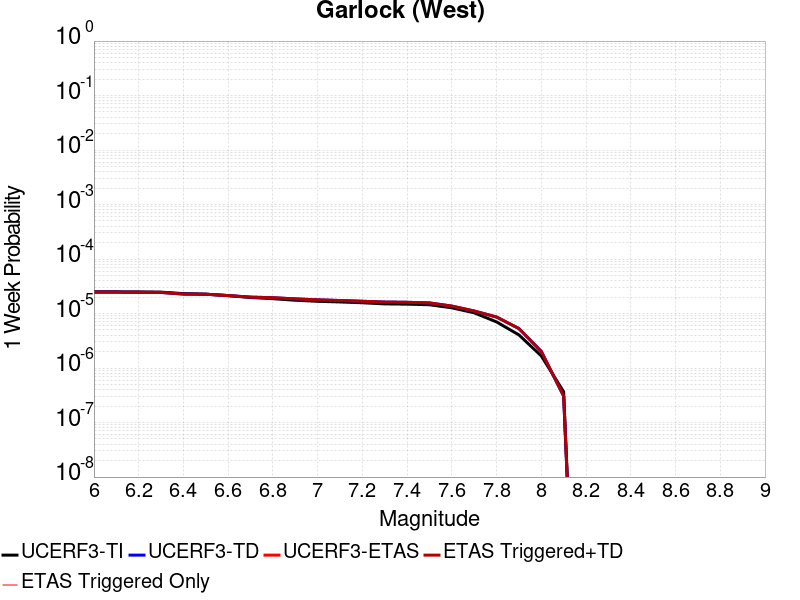 | 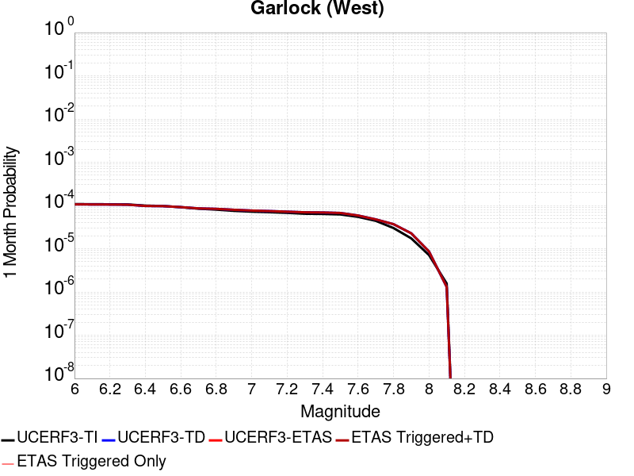 | 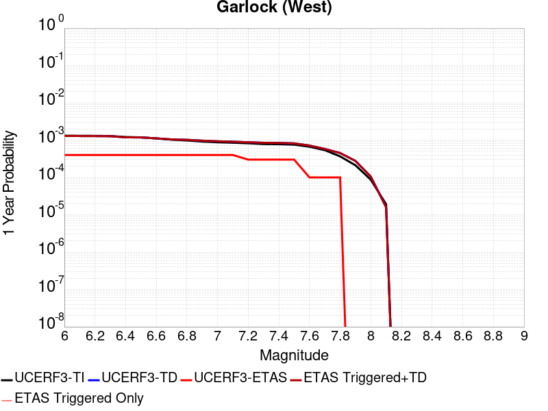 | 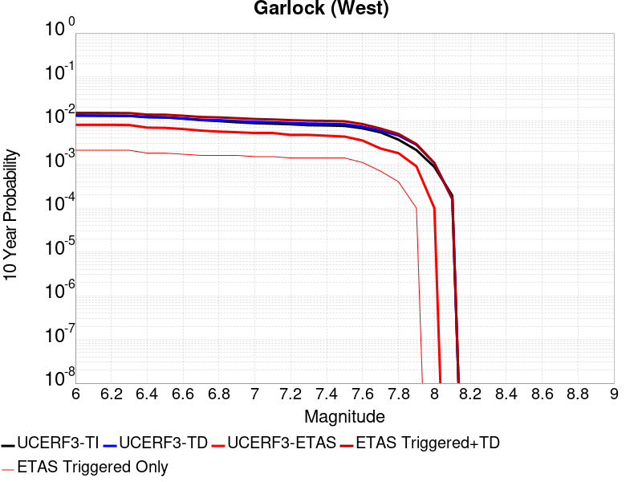 |

| Magnitude | 1 wk TI Prob | 1 wk TD Prob | 1 wk ETAS Prob | 1 wk ETAS/TD Gain | 1 wk ETAS Triggered+TD | 1 wk ETAS Triggered Only | 1 mo TI Prob | 1 mo TD Prob | 1 mo ETAS Prob | 1 mo ETAS/TD Gain | 1 mo ETAS Triggered+TD | 1 mo ETAS Triggered Only | 1 yr TI Prob | 1 yr TD Prob | 1 yr ETAS Prob | 1 yr ETAS/TD Gain | 1 yr ETAS Triggered+TD | 1 yr ETAS Triggered Only | 10 yr TI Prob | 10 yr TD Prob | 10 yr ETAS Prob | 10 yr ETAS/TD Gain | 10 yr ETAS Triggered+TD | 10 yr ETAS Triggered Only |
|-----|-----|-----|-----|-----|-----|-----|-----|-----|-----|-----|-----|-----|-----|-----|-----|-----|-----|-----|-----|-----|-----|-----|-----|-----|
| 6.0 | 2.5181727E-5 | 2.4807427E-5 | 0.0 | 0.0 | 2.4807427E-5 | 0.0 | 1.0791722E-4 | 1.0631323E-4 | 0.0 | 0.0 | 1.0631323E-4 | 0.0 | 0.0013131002 | 0.0012935984 | 4.0E-4 | 0.30921498 | 0.0012935984 | 0.0 | 0.013053683 | 0.012941501 | 0.008 | 0.6181663 | 0.015014323 | 0.0021 |
| 6.1 | 2.5077732E-5 | 2.470869E-5 | 0.0 | 0.0 | 2.470869E-5 | 0.0 | 1.0747157E-4 | 1.058901E-4 | 0.0 | 0.0 | 1.058901E-4 | 0.0 | 0.001307681 | 0.001288453 | 4.0E-4 | 0.31044984 | 0.001288453 | 0.0 | 0.013000126 | 0.012890644 | 0.008 | 0.6206051 | 0.014963575 | 0.0021 |
| 6.2 | 2.494612E-5 | 2.4590621E-5 | 0.0 | 0.0 | 2.4590621E-5 | 0.0 | 1.0690756E-4 | 1.0538414E-4 | 0.0 | 0.0 | 1.0538414E-4 | 0.0 | 0.0013008224 | 0.0012823001 | 4.0E-4 | 0.31193948 | 0.0012823001 | 0.0 | 0.012932341 | 0.012829827 | 0.008 | 0.62354696 | 0.014902885 | 0.0021 |
| 6.3 | 2.4733758E-5 | 2.4410438E-5 | 0.0 | 0.0 | 2.4410438E-5 | 0.0 | 1.0599751E-4 | 1.0461199E-4 | 0.0 | 0.0 | 1.0461199E-4 | 0.0 | 0.0012897556 | 0.0012729102 | 4.0E-4 | 0.31424057 | 0.0012729102 | 0.0 | 0.012822957 | 0.012737009 | 0.0079 | 0.62023985 | 0.01481026 | 0.0021 |
| 6.4 | 2.3237335E-5 | 2.2792507E-5 | 0.0 | 0.0 | 2.2792507E-5 | 0.0 | 9.958477E-5 | 9.767853E-5 | 0.0 | 0.0 | 9.767853E-5 | 0.0 | 0.0012117702 | 0.0011885901 | 4.0E-4 | 0.3365332 | 0.0011885901 | 0.0 | 0.012051838 | 0.011903111 | 0.0069 | 0.5796804 | 0.013681686 | 0.0018 |
| 6.5 | 2.2732203E-5 | 2.2608941E-5 | 0.0 | 0.0 | 2.2608941E-5 | 0.0 | 9.742009E-5 | 9.6891876E-5 | 0.0 | 0.0 | 9.6891876E-5 | 0.0 | 0.0011854442 | 0.001179023 | 4.0E-4 | 0.33926395 | 0.001179023 | 0.0 | 0.011791403 | 0.011808461 | 0.0068 | 0.5758583 | 0.013587206 | 0.0018 |
| 6.6 | 2.1319436E-5 | 2.1392525E-5 | 0.0 | 0.0 | 2.1392525E-5 | 0.0 | 9.136581E-5 | 9.167904E-5 | 0.0 | 0.0 | 9.167904E-5 | 0.0 | 0.001111811 | 0.001115623 | 4.0E-4 | 0.35854405 | 0.001115623 | 0.0 | 0.011062649 | 0.011180985 | 0.0064 | 0.5724004 | 0.012861977 | 0.0017 |
| 6.7 | 1.970802E-5 | 2.0016389E-5 | 0.0 | 0.0 | 2.0016389E-5 | 0.0 | 8.446021E-5 | 8.5781714E-5 | 0.0 | 0.0 | 8.5781714E-5 | 0.0 | 0.001027818 | 0.0010438936 | 4.0E-4 | 0.3831808 | 0.0010438936 | 0.0 | 0.010230771 | 0.010470631 | 0.0059 | 0.56348085 | 0.012053878 | 0.0016 |
| 6.8 | 1.8744462E-5 | 1.9526635E-5 | 0.0 | 0.0 | 1.9526635E-5 | 0.0 | 8.033094E-5 | 8.3682906E-5 | 0.0 | 0.0 | 8.3682906E-5 | 0.0 | 9.775903E-4 | 0.0010183648 | 4.0E-4 | 0.39278656 | 0.0010183648 | 0.0 | 0.009733009 | 0.010217712 | 0.0056 | 0.54806787 | 0.011801364 | 0.0016 |
| 6.9 | 1.7559682E-5 | 1.8581479E-5 | 0.0 | 0.0 | 1.8581479E-5 | 0.0 | 7.5253614E-5 | 7.963249E-5 | 0.0 | 0.0 | 7.963249E-5 | 0.0 | 9.158276E-4 | 9.6909574E-4 | 4.0E-4 | 0.4127559 | 9.6909574E-4 | 0.0 | 0.0091206245 | 0.0097292205 | 0.0054 | 0.55502903 | 0.011313654 | 0.0016 |
| 7.0 | 1.6794445E-5 | 1.7847238E-5 | 0.0 | 0.0 | 1.7847238E-5 | 0.0 | 7.197421E-5 | 7.648593E-5 | 0.0 | 0.0 | 7.648593E-5 | 0.0 | 8.759337E-4 | 9.308197E-4 | 4.0E-4 | 0.42972875 | 9.308197E-4 | 0.0 | 0.008724891 | 0.0093495855 | 0.0052 | 0.5561744 | 0.010835561 | 0.0015 |
| 7.1 | 1.6337795E-5 | 1.7352195E-5 | 0.0 | 0.0 | 1.7352195E-5 | 0.0 | 7.0017246E-5 | 7.4364434E-5 | 0.0 | 0.0 | 7.4364434E-5 | 0.0 | 8.521265E-4 | 9.050122E-4 | 4.0E-4 | 0.44198298 | 9.050122E-4 | 0.0 | 0.008488664 | 0.009093661 | 0.0052 | 0.57182693 | 0.01058002 | 0.0015 |
| 7.2 | 1.5780008E-5 | 1.6802278E-5 | 0.0 | 0.0 | 1.6802278E-5 | 0.0 | 6.762685E-5 | 7.200778E-5 | 0.0 | 0.0 | 7.200778E-5 | 0.0 | 8.2304585E-4 | 8.763434E-4 | 3.0E-4 | 0.34233156 | 8.763434E-4 | 0.0 | 0.008200042 | 0.008809188 | 0.0047 | 0.5335339 | 0.010196855 | 0.0014 |
| 7.3 | 1.5058865E-5 | 1.6258098E-5 | 0.0 | 0.0 | 1.6258098E-5 | 0.0 | 6.45364E-5 | 6.967571E-5 | 0.0 | 0.0 | 6.967571E-5 | 0.0 | 7.854473E-4 | 8.4797275E-4 | 3.0E-4 | 0.35378495 | 8.4797275E-4 | 0.0 | 0.00782677 | 0.008527247 | 0.0047 | 0.5511744 | 0.009915309 | 0.0014 |
| 7.4 | 1.4887923E-5 | 1.6095279E-5 | 0.0 | 0.0 | 1.6095279E-5 | 0.0 | 6.380382E-5 | 6.8977955E-5 | 0.0 | 0.0 | 6.8977955E-5 | 0.0 | 7.7653467E-4 | 8.3948416E-4 | 3.0E-4 | 0.35736233 | 8.3948416E-4 | 0.0 | 0.0077382675 | 0.008442663 | 0.0045 | 0.5330072 | 0.009830843 | 0.0014 |
| 7.5 | 1.4509299E-5 | 1.5689853E-5 | 0.0 | 0.0 | 1.5689853E-5 | 0.0 | 6.218123E-5 | 6.72405E-5 | 0.0 | 0.0 | 6.72405E-5 | 0.0 | 7.567935E-4 | 8.183468E-4 | 3.0E-4 | 0.36659276 | 8.183468E-4 | 0.0 | 0.0075422134 | 0.00823224 | 0.0043 | 0.5223366 | 0.009620714 | 0.0014 |
| 7.6 | 1.2756717E-5 | 1.37087E-5 | 0.0 | 0.0 | 1.37087E-5 | 0.0 | 5.4670498E-5 | 5.8750255E-5 | 0.0 | 0.0 | 5.8750255E-5 | 0.0 | 6.6541E-4 | 7.150502E-4 | 1.0E-4 | 0.13985032 | 7.150502E-4 | 0.0 | 0.006634211 | 0.0072045224 | 0.0035 | 0.48580596 | 0.008296598 | 0.0011 |
| 7.7 | 1.0328985E-5 | 1.114132E-5 | 0.0 | 0.0 | 1.114132E-5 | 0.0 | 4.4266326E-5 | 4.7747642E-5 | 0.0 | 0.0 | 4.7747642E-5 | 0.0 | 5.388092E-4 | 5.811729E-4 | 1.0E-4 | 0.17206584 | 5.811729E-4 | 0.0 | 0.0053750467 | 0.0058729206 | 0.0023 | 0.39162797 | 0.0065688095 | 7.0E-4 |
| 7.8 | 7.0306583E-6 | 8.643756E-6 | 0.0 | 0.0 | 8.643756E-6 | 0.0 | 3.0131043E-5 | 3.704414E-5 | 0.0 | 0.0 | 3.704414E-5 | 0.0 | 3.667837E-4 | 4.5091924E-4 | 1.0E-4 | 0.2217692 | 4.5091924E-4 | 0.0 | 0.003661789 | 0.004562464 | 0.0018 | 0.39452365 | 0.004960639 | 4.0E-4 |
| 7.9 | 4.060633E-6 | 5.3140034E-6 | 0.0 | 0.0 | 5.3140034E-6 | 0.0 | 1.7402595E-5 | 2.2774102E-5 | 0.0 | 0.0 | 2.2774102E-5 | 0.0 | 2.11856E-4 | 2.772395E-4 | 0.0 | 0.0 | 2.772395E-4 | 0.0 | 0.0021165414 | 0.0028055024 | 9.0E-4 | 0.32079816 | 0.002905222 | 1.0E-4 |
| 8.0 | 1.6729537E-6 | 2.0246855E-6 | 0.0 | 0.0 | 2.0246855E-6 | 0.0 | 7.169782E-6 | 8.677195E-6 | 0.0 | 0.0 | 8.677195E-6 | 0.0 | 8.7288594E-5 | 1.0563977E-4 | 0.0 | 0.0 | 1.0563977E-4 | 0.0 | 8.7254314E-4 | 0.0010694105 | 1.0E-4 | 0.093509465 | 0.0010694105 | 0.0 |
| 8.1 | 3.6733252E-7 | 3.0569248E-7 | 0.0 | 0.0 | 3.0569248E-7 | 0.0 | 1.5742813E-6 | 1.3101101E-6 | 0.0 | 0.0 | 1.3101101E-6 | 0.0 | 1.9166706E-5 | 1.5950489E-5 | 0.0 | 0.0 | 1.5950489E-5 | 0.0 | 1.9165053E-4 | 1.615787E-4 | 0.0 | 0.0 | 1.615787E-4 | 0.0 |

## Manix-Afton Hills
*[(top)](#table-of-contents)*

| 1 Week | 1 Month | 1 Year | 10 Year |
|-----|-----|-----|-----|
| 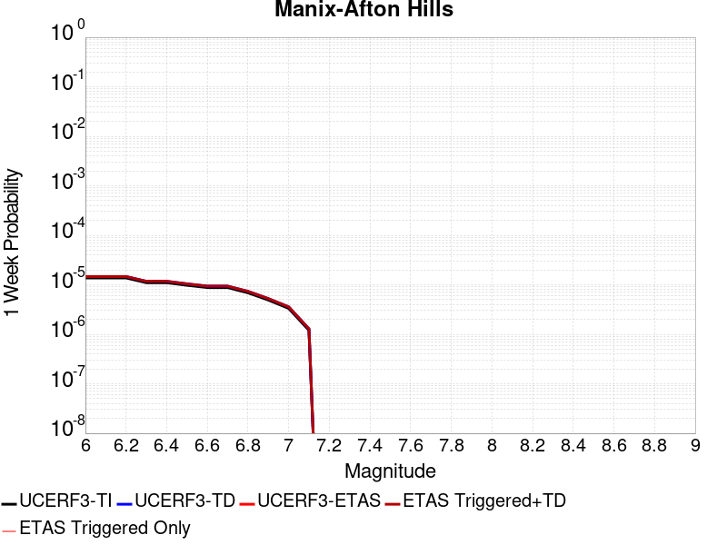 | 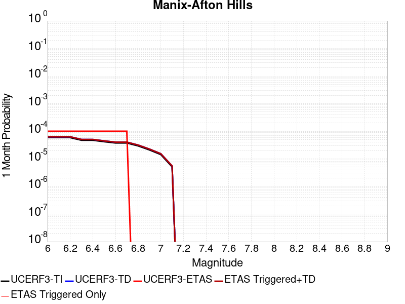 |  | 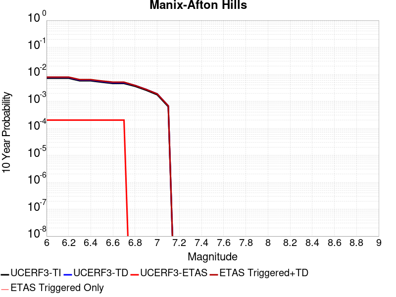 |

| Magnitude | 1 wk TI Prob | 1 wk TD Prob | 1 wk ETAS Prob | 1 wk ETAS/TD Gain | 1 wk ETAS Triggered+TD | 1 wk ETAS Triggered Only | 1 mo TI Prob | 1 mo TD Prob | 1 mo ETAS Prob | 1 mo ETAS/TD Gain | 1 mo ETAS Triggered+TD | 1 mo ETAS Triggered Only | 1 yr TI Prob | 1 yr TD Prob | 1 yr ETAS Prob | 1 yr ETAS/TD Gain | 1 yr ETAS Triggered+TD | 1 yr ETAS Triggered Only | 10 yr TI Prob | 10 yr TD Prob | 10 yr ETAS Prob | 10 yr ETAS/TD Gain | 10 yr ETAS Triggered+TD | 10 yr ETAS Triggered Only |
|-----|-----|-----|-----|-----|-----|-----|-----|-----|-----|-----|-----|-----|-----|-----|-----|-----|-----|-----|-----|-----|-----|-----|-----|-----|
| 6.0 | 1.3783202E-5 | 1.4700737E-5 | 0.0 | 0.0 | 1.4700737E-5 | 0.0 | 5.906953E-5 | 6.300173E-5 | 1.0E-4 | 1.587258 | 6.300173E-5 | 0.0 | 7.189342E-4 | 7.667936E-4 | 1.0E-4 | 0.13041319 | 7.667936E-4 | 0.0 | 0.0071661277 | 0.007643232 | 0.007 | 0.9158429 | 0.009627946 | 0.002 |
| 6.1 | 1.3783202E-5 | 1.4700737E-5 | 0.0 | 0.0 | 1.4700737E-5 | 0.0 | 5.906953E-5 | 6.300173E-5 | 1.0E-4 | 1.587258 | 6.300173E-5 | 0.0 | 7.189342E-4 | 7.667936E-4 | 1.0E-4 | 0.13041319 | 7.667936E-4 | 0.0 | 0.0071661277 | 0.007643232 | 0.007 | 0.9158429 | 0.009627946 | 0.002 |
| 6.2 | 1.3783202E-5 | 1.4700737E-5 | 0.0 | 0.0 | 1.4700737E-5 | 0.0 | 5.906953E-5 | 6.300173E-5 | 1.0E-4 | 1.587258 | 6.300173E-5 | 0.0 | 7.189342E-4 | 7.667936E-4 | 1.0E-4 | 0.13041319 | 7.667936E-4 | 0.0 | 0.0071661277 | 0.007643232 | 0.007 | 0.9158429 | 0.009627946 | 0.002 |
| 6.3 | 1.10494875E-5 | 1.1784835E-5 | 0.0 | 0.0 | 1.1784835E-5 | 0.0 | 4.7354086E-5 | 5.0505518E-5 | 1.0E-4 | 1.9799817 | 5.0505518E-5 | 0.0 | 5.763835E-4 | 6.147415E-4 | 1.0E-4 | 0.16266999 | 6.147415E-4 | 0.0 | 0.005748908 | 0.0061314492 | 0.0055 | 0.8970147 | 0.007622252 | 0.0015 |
| 6.4 | 1.10494875E-5 | 1.1784835E-5 | 0.0 | 0.0 | 1.1784835E-5 | 0.0 | 4.7354086E-5 | 5.0505518E-5 | 1.0E-4 | 1.9799817 | 5.0505518E-5 | 0.0 | 5.763835E-4 | 6.147415E-4 | 1.0E-4 | 0.16266999 | 6.147415E-4 | 0.0 | 0.005748908 | 0.0061314492 | 0.0055 | 0.8970147 | 0.007622252 | 0.0015 |
| 6.5 | 9.788949E-6 | 1.0446887E-5 | 0.0 | 0.0 | 1.0446887E-5 | 0.0 | 4.1951964E-5 | 4.4771656E-5 | 1.0E-4 | 2.233556 | 4.4771656E-5 | 0.0 | 5.1064545E-4 | 5.449679E-4 | 1.0E-4 | 0.18349706 | 5.449679E-4 | 0.0 | 0.0050947363 | 0.00543724 | 0.005 | 0.9195842 | 0.006829628 | 0.0014 |
| 6.6 | 8.810006E-6 | 9.406881E-6 | 0.0 | 0.0 | 9.406881E-6 | 0.0 | 3.775662E-5 | 4.0314633E-5 | 1.0E-4 | 2.480489 | 4.0314633E-5 | 0.0 | 4.5958988E-4 | 4.90729E-4 | 1.0E-4 | 0.20377848 | 4.90729E-4 | 0.0 | 0.0045864056 | 0.0048973346 | 0.0046 | 0.9392865 | 0.0061909677 | 0.0013 |
| 6.7 | 8.80128E-6 | 9.3973695E-6 | 0.0 | 0.0 | 9.3973695E-6 | 0.0 | 3.7719226E-5 | 4.027387E-5 | 1.0E-4 | 2.4829996 | 4.027387E-5 | 0.0 | 4.591348E-4 | 4.9023295E-4 | 1.0E-4 | 0.20398466 | 4.9023295E-4 | 0.0 | 0.004581874 | 0.004892396 | 0.0046 | 0.9402346 | 0.006186036 | 0.0013 |
| 6.8 | 6.8994877E-6 | 7.374698E-6 | 0.0 | 0.0 | 7.374698E-6 | 0.0 | 2.9568899E-5 | 3.160551E-5 | 0.0 | 0.0 | 3.160551E-5 | 0.0 | 3.5994186E-4 | 3.847373E-4 | 0.0 | 0.0 | 3.847373E-4 | 0.0 | 0.003593594 | 0.003841516 | 0.0032 | 0.8330045 | 0.004439211 | 6.0E-4 |
| 6.9 | 4.9328037E-6 | 5.2671803E-6 | 0.0 | 0.0 | 5.2671803E-6 | 0.0 | 2.1140417E-5 | 2.257347E-5 | 0.0 | 0.0 | 2.257347E-5 | 0.0 | 2.5735417E-4 | 2.748035E-4 | 0.0 | 0.0 | 2.748035E-4 | 0.0 | 0.0025705635 | 0.0027452412 | 0.0021 | 0.7649601 | 0.0032438685 | 5.0E-4 |
| 7.0 | 3.347973E-6 | 3.5873138E-6 | 0.0 | 0.0 | 3.5873138E-6 | 0.0 | 1.4348378E-5 | 1.5374135E-5 | 0.0 | 0.0 | 1.5374135E-5 | 0.0 | 1.746775E-4 | 1.8716812E-4 | 0.0 | 0.0 | 1.8716812E-4 | 0.0 | 0.0017454025 | 0.0018705068 | 0.0012 | 0.64153737 | 0.0021699455 | 3.0E-4 |
| 7.1 | 1.2073567E-6 | 1.2925193E-6 | 0.0 | 0.0 | 1.2925193E-6 | 0.0 | 5.1743755E-6 | 5.5393657E-6 | 0.0 | 0.0 | 5.5393657E-6 | 0.0 | 6.29962E-5 | 6.7441324E-5 | 0.0 | 0.0 | 6.7441324E-5 | 0.0 | 6.297835E-4 | 6.7436846E-4 | 3.0E-4 | 0.44486064 | 7.7430106E-4 | 1.0E-4 |

## Santa Susana alt 1
*[(top)](#table-of-contents)*

| 1 Week | 1 Month | 1 Year | 10 Year |
|-----|-----|-----|-----|
| 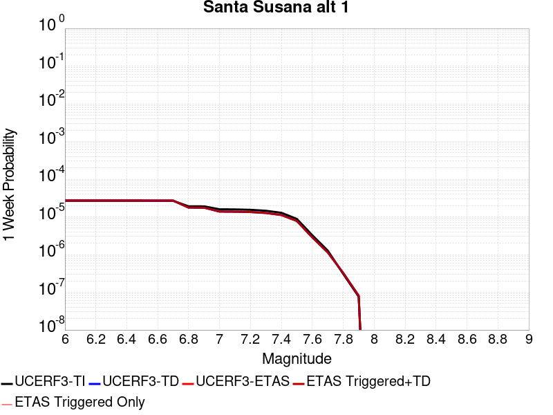 | 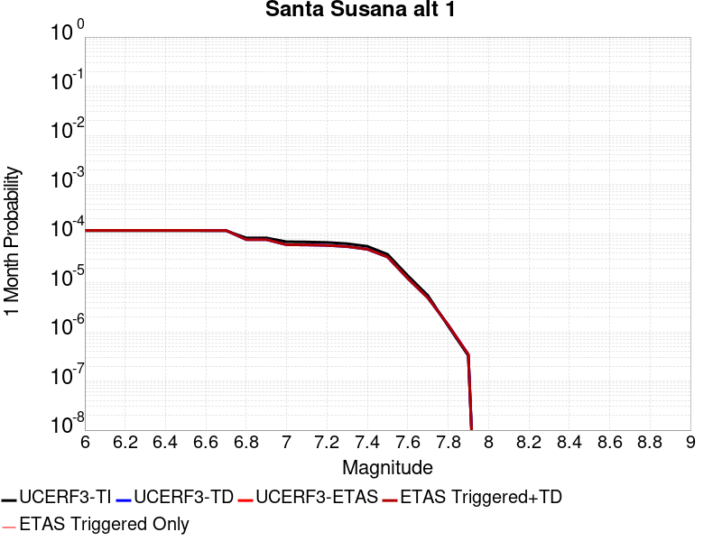 | 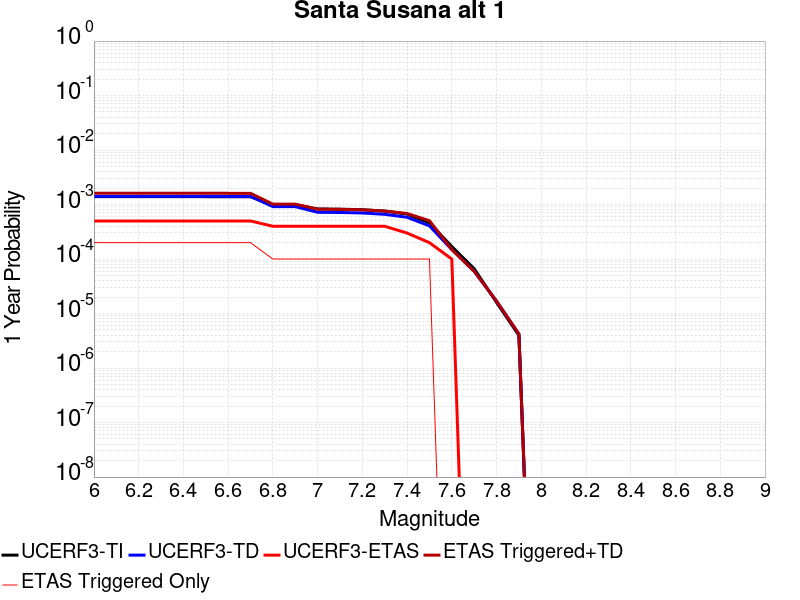 | 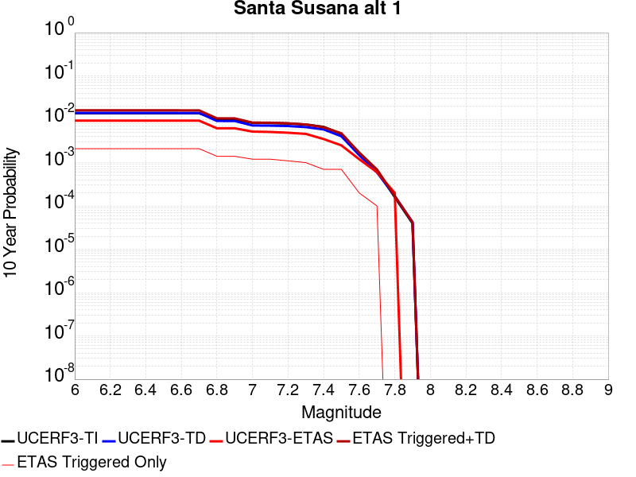 |

| Magnitude | 1 wk TI Prob | 1 wk TD Prob | 1 wk ETAS Prob | 1 wk ETAS/TD Gain | 1 wk ETAS Triggered+TD | 1 wk ETAS Triggered Only | 1 mo TI Prob | 1 mo TD Prob | 1 mo ETAS Prob | 1 mo ETAS/TD Gain | 1 mo ETAS Triggered+TD | 1 mo ETAS Triggered Only | 1 yr TI Prob | 1 yr TD Prob | 1 yr ETAS Prob | 1 yr ETAS/TD Gain | 1 yr ETAS Triggered+TD | 1 yr ETAS Triggered Only | 10 yr TI Prob | 10 yr TD Prob | 10 yr ETAS Prob | 10 yr ETAS/TD Gain | 10 yr ETAS Triggered+TD | 10 yr ETAS Triggered Only |
|-----|-----|-----|-----|-----|-----|-----|-----|-----|-----|-----|-----|-----|-----|-----|-----|-----|-----|-----|-----|-----|-----|-----|-----|-----|
| 6.0 | 2.674877E-5 | 2.7138116E-5 | 0.0 | 0.0 | 2.7138116E-5 | 0.0 | 1.1463255E-4 | 1.16301664E-4 | 0.0 | 0.0 | 1.16301664E-4 | 0.0 | 0.0013947578 | 0.0014151661 | 5.0E-4 | 0.3533154 | 0.0016148831 | 2.0E-4 | 0.013860362 | 0.014072917 | 0.0093 | 0.6608438 | 0.016143365 | 0.0021 |
| 6.1 | 2.674877E-5 | 2.7138116E-5 | 0.0 | 0.0 | 2.7138116E-5 | 0.0 | 1.1463255E-4 | 1.16301664E-4 | 0.0 | 0.0 | 1.16301664E-4 | 0.0 | 0.0013947578 | 0.0014151661 | 5.0E-4 | 0.3533154 | 0.0016148831 | 2.0E-4 | 0.013860362 | 0.014072917 | 0.0093 | 0.6608438 | 0.016143365 | 0.0021 |
| 6.2 | 2.674877E-5 | 2.7138116E-5 | 0.0 | 0.0 | 2.7138116E-5 | 0.0 | 1.1463255E-4 | 1.16301664E-4 | 0.0 | 0.0 | 1.16301664E-4 | 0.0 | 0.0013947578 | 0.0014151661 | 5.0E-4 | 0.3533154 | 0.0016148831 | 2.0E-4 | 0.013860362 | 0.014072917 | 0.0093 | 0.6608438 | 0.016143365 | 0.0021 |
| 6.3 | 2.674877E-5 | 2.7138116E-5 | 0.0 | 0.0 | 2.7138116E-5 | 0.0 | 1.1463255E-4 | 1.16301664E-4 | 0.0 | 0.0 | 1.16301664E-4 | 0.0 | 0.0013947578 | 0.0014151661 | 5.0E-4 | 0.3533154 | 0.0016148831 | 2.0E-4 | 0.013860362 | 0.014072917 | 0.0093 | 0.6608438 | 0.016143365 | 0.0021 |
| 6.4 | 2.674877E-5 | 2.7138116E-5 | 0.0 | 0.0 | 2.7138116E-5 | 0.0 | 1.1463255E-4 | 1.16301664E-4 | 0.0 | 0.0 | 1.16301664E-4 | 0.0 | 0.0013947578 | 0.0014151661 | 5.0E-4 | 0.3533154 | 0.0016148831 | 2.0E-4 | 0.013860362 | 0.014072917 | 0.0093 | 0.6608438 | 0.016143365 | 0.0021 |
| 6.5 | 2.674877E-5 | 2.7138116E-5 | 0.0 | 0.0 | 2.7138116E-5 | 0.0 | 1.1463255E-4 | 1.16301664E-4 | 0.0 | 0.0 | 1.16301664E-4 | 0.0 | 0.0013947578 | 0.0014151661 | 5.0E-4 | 0.3533154 | 0.0016148831 | 2.0E-4 | 0.013860362 | 0.014072917 | 0.0093 | 0.6608438 | 0.016143365 | 0.0021 |
| 6.6 | 2.6647976E-5 | 2.7014747E-5 | 0.0 | 0.0 | 2.7014747E-5 | 0.0 | 1.14200615E-4 | 1.15772986E-4 | 0.0 | 0.0 | 1.15772986E-4 | 0.0 | 0.0013895056 | 0.0014087377 | 5.0E-4 | 0.35492766 | 0.001608456 | 2.0E-4 | 0.013808494 | 0.01400945 | 0.0093 | 0.6638376 | 0.01608003 | 0.0021 |
| 6.7 | 2.6647976E-5 | 2.7014747E-5 | 0.0 | 0.0 | 2.7014747E-5 | 0.0 | 1.14200615E-4 | 1.15772986E-4 | 0.0 | 0.0 | 1.15772986E-4 | 0.0 | 0.0013895056 | 0.0014087377 | 5.0E-4 | 0.35492766 | 0.001608456 | 2.0E-4 | 0.013808494 | 0.01400945 | 0.0093 | 0.6638376 | 0.01608003 | 0.0021 |
| 6.8 | 1.9073179E-5 | 1.760185E-5 | 0.0 | 0.0 | 1.760185E-5 | 0.0 | 8.1739636E-5 | 7.5434415E-5 | 0.0 | 0.0 | 7.5434415E-5 | 0.0 | 9.947256E-4 | 9.180451E-4 | 4.0E-4 | 0.43570843 | 0.0010179533 | 1.0E-4 | 0.009902848 | 0.009144441 | 0.0062 | 0.67800754 | 0.010531639 | 0.0014 |
| 6.9 | 1.9041876E-5 | 1.7584009E-5 | 0.0 | 0.0 | 1.7584009E-5 | 0.0 | 8.160549E-5 | 7.5357966E-5 | 0.0 | 0.0 | 7.5357966E-5 | 0.0 | 9.930939E-4 | 9.171151E-4 | 4.0E-4 | 0.43615028 | 0.0010170233 | 1.0E-4 | 0.0098866755 | 0.009135217 | 0.0062 | 0.6786921 | 0.010522428 | 0.0014 |
| 7.0 | 1.5917482E-5 | 1.3836934E-5 | 0.0 | 0.0 | 1.3836934E-5 | 0.0 | 6.8215995E-5 | 5.9299826E-5 | 0.0 | 0.0 | 5.9299826E-5 | 0.0 | 8.302132E-4 | 7.217409E-4 | 4.0E-4 | 0.55421555 | 8.216687E-4 | 1.0E-4 | 0.008271185 | 0.007194531 | 0.0052 | 0.7227712 | 0.008385898 | 0.0012 |
| 7.1 | 1.577788E-5 | 1.37173E-5 | 0.0 | 0.0 | 1.37173E-5 | 0.0 | 6.761774E-5 | 5.8787133E-5 | 0.0 | 0.0 | 5.8787133E-5 | 0.0 | 8.2293496E-4 | 7.1550295E-4 | 4.0E-4 | 0.55904734 | 8.1543135E-4 | 1.0E-4 | 0.008198941 | 0.0071325535 | 0.0051 | 0.71503145 | 0.008323994 | 0.0012 |
| 7.2 | 1.5416446E-5 | 1.3443766E-5 | 0.0 | 0.0 | 1.3443766E-5 | 0.0 | 6.606882E-5 | 5.7614892E-5 | 0.0 | 0.0 | 5.7614892E-5 | 0.0 | 8.0409093E-4 | 7.0124015E-4 | 4.0E-4 | 0.570418 | 8.0117007E-4 | 1.0E-4 | 0.008011877 | 0.006990826 | 0.0049 | 0.7009186 | 0.008083136 | 0.0011 |
| 7.3 | 1.4534083E-5 | 1.2693164E-5 | 0.0 | 0.0 | 1.2693164E-5 | 0.0 | 6.228744E-5 | 5.4398162E-5 | 0.0 | 0.0 | 5.4398162E-5 | 0.0 | 7.580857E-4 | 6.6210085E-4 | 4.0E-4 | 0.6041376 | 7.620346E-4 | 1.0E-4 | 0.007555048 | 0.0066017928 | 0.0046 | 0.69678044 | 0.007595191 | 0.001 |
| 7.4 | 1.2858995E-5 | 1.1207861E-5 | 0.0 | 0.0 | 1.1207861E-5 | 0.0 | 5.5108816E-5 | 4.8032827E-5 | 0.0 | 0.0 | 4.8032827E-5 | 0.0 | 6.7074323E-4 | 5.846467E-4 | 3.0E-4 | 0.5131304 | 6.845882E-4 | 1.0E-4 | 0.0066872234 | 0.005831506 | 0.0035 | 0.600188 | 0.006527424 | 7.0E-4 |
| 7.5 | 8.827668E-6 | 7.790188E-6 | 0.0 | 0.0 | 7.790188E-6 | 0.0 | 3.7832317E-5 | 3.3386106E-5 | 0.0 | 0.0 | 3.3386106E-5 | 0.0 | 4.605111E-4 | 4.0640248E-4 | 2.0E-4 | 0.49212298 | 5.0636183E-4 | 1.0E-4 | 0.0045955796 | 0.004056734 | 0.0025 | 0.6162593 | 0.004753894 | 7.0E-4 |
| 7.6 | 3.2533426E-6 | 2.862524E-6 | 0.0 | 0.0 | 2.862524E-6 | 0.0 | 1.3942822E-5 | 1.2267904E-5 | 0.0 | 0.0 | 1.2267904E-5 | 0.0 | 1.6974064E-4 | 1.4935186E-4 | 1.0E-4 | 0.6695598 | 1.4935186E-4 | 0.0 | 0.0016961104 | 0.0014925515 | 0.0012 | 0.80399233 | 0.0016922529 | 2.0E-4 |
| 7.7 | 1.2751709E-6 | 1.1436905E-6 | 0.0 | 0.0 | 1.1436905E-6 | 0.0 | 5.4650063E-6 | 4.901522E-6 | 0.0 | 0.0 | 4.901522E-6 | 0.0 | 6.653442E-5 | 5.9674483E-5 | 0.0 | 0.0 | 5.9674483E-5 | 0.0 | 6.6514505E-4 | 5.9659337E-4 | 6.0E-4 | 1.0057101 | 6.965337E-4 | 1.0E-4 |
| 7.8 | 3.067544E-7 | 3.23772E-7 | 0.0 | 0.0 | 3.23772E-7 | 0.0 | 1.3146611E-6 | 1.3875937E-6 | 0.0 | 0.0 | 1.3875937E-6 | 0.0 | 1.600588E-5 | 1.6893833E-5 | 0.0 | 0.0 | 1.6893833E-5 | 0.0 | 1.6004729E-4 | 1.689265E-4 | 2.0E-4 | 1.1839467 | 1.689265E-4 | 0.0 |
| 7.9 | 7.622999E-8 | 8.082586E-8 | 0.0 | 0.0 | 8.082586E-8 | 0.0 | 3.2669993E-7 | 3.4639652E-7 | 0.0 | 0.0 | 3.4639652E-7 | 0.0 | 3.977564E-6 | 4.2173715E-6 | 0.0 | 0.0 | 4.2173715E-6 | 0.0 | 3.977493E-5 | 4.2173124E-5 | 0.0 | 0.0 | 4.2173124E-5 | 0.0 |

## Paradise
*[(top)](#table-of-contents)*

| 1 Week | 1 Month | 1 Year | 10 Year |
|-----|-----|-----|-----|
| 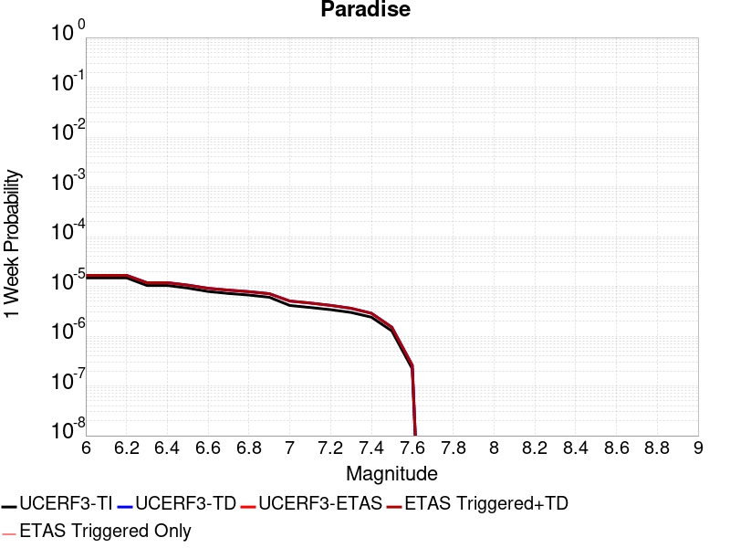 | 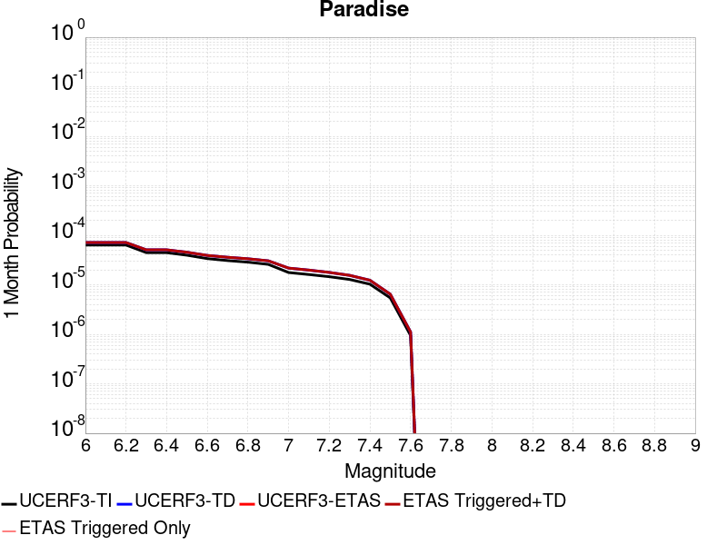 | 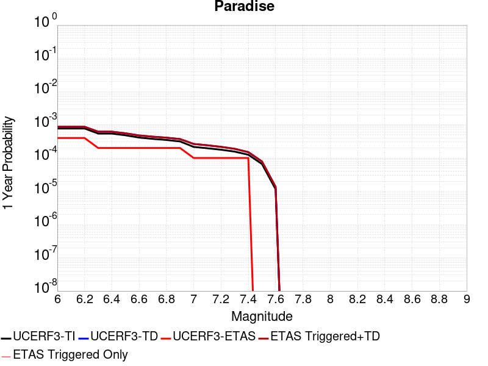 | 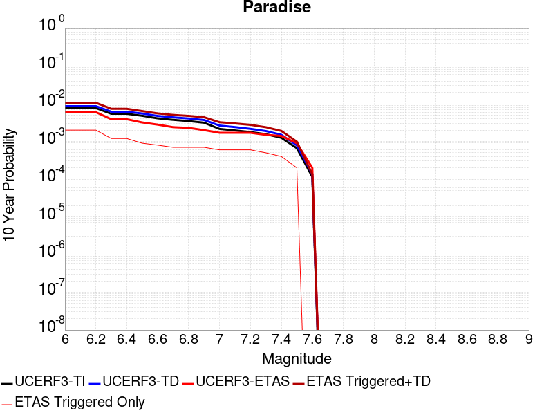 |

| Magnitude | 1 wk TI Prob | 1 wk TD Prob | 1 wk ETAS Prob | 1 wk ETAS/TD Gain | 1 wk ETAS Triggered+TD | 1 wk ETAS Triggered Only | 1 mo TI Prob | 1 mo TD Prob | 1 mo ETAS Prob | 1 mo ETAS/TD Gain | 1 mo ETAS Triggered+TD | 1 mo ETAS Triggered Only | 1 yr TI Prob | 1 yr TD Prob | 1 yr ETAS Prob | 1 yr ETAS/TD Gain | 1 yr ETAS Triggered+TD | 1 yr ETAS Triggered Only | 10 yr TI Prob | 10 yr TD Prob | 10 yr ETAS Prob | 10 yr ETAS/TD Gain | 10 yr ETAS Triggered+TD | 10 yr ETAS Triggered Only |
|-----|-----|-----|-----|-----|-----|-----|-----|-----|-----|-----|-----|-----|-----|-----|-----|-----|-----|-----|-----|-----|-----|-----|-----|-----|
| 6.0 | 1.4851273E-5 | 1.6679838E-5 | 0.0 | 0.0 | 1.6679838E-5 | 0.0 | 6.364676E-5 | 7.14832E-5 | 0.0 | 0.0 | 7.14832E-5 | 0.0 | 7.7462377E-4 | 8.69984E-4 | 4.0E-4 | 0.45977858 | 8.69984E-4 | 0.0 | 0.0077192914 | 0.008668157 | 0.006 | 0.6921887 | 0.010650821 | 0.002 |
| 6.1 | 1.4851273E-5 | 1.6679838E-5 | 0.0 | 0.0 | 1.6679838E-5 | 0.0 | 6.364676E-5 | 7.14832E-5 | 0.0 | 0.0 | 7.14832E-5 | 0.0 | 7.7462377E-4 | 8.69984E-4 | 4.0E-4 | 0.45977858 | 8.69984E-4 | 0.0 | 0.0077192914 | 0.008668157 | 0.006 | 0.6921887 | 0.010650821 | 0.002 |
| 6.2 | 1.4851273E-5 | 1.6679838E-5 | 0.0 | 0.0 | 1.6679838E-5 | 0.0 | 6.364676E-5 | 7.14832E-5 | 0.0 | 0.0 | 7.14832E-5 | 0.0 | 7.7462377E-4 | 8.69984E-4 | 4.0E-4 | 0.45977858 | 8.69984E-4 | 0.0 | 0.0077192914 | 0.008668157 | 0.006 | 0.6921887 | 0.010650821 | 0.002 |
| 6.3 | 1.0426831E-5 | 1.1878099E-5 | 0.0 | 0.0 | 1.1878099E-5 | 0.0 | 4.4685654E-5 | 5.090518E-5 | 0.0 | 0.0 | 5.090518E-5 | 0.0 | 5.43912E-4 | 6.1960024E-4 | 2.0E-4 | 0.32278877 | 6.1960024E-4 | 0.0 | 0.0054258266 | 0.0061793346 | 0.0039 | 0.6311359 | 0.007371919 | 0.0012 |
| 6.4 | 1.0426831E-5 | 1.1878099E-5 | 0.0 | 0.0 | 1.1878099E-5 | 0.0 | 4.4685654E-5 | 5.090518E-5 | 0.0 | 0.0 | 5.090518E-5 | 0.0 | 5.43912E-4 | 6.1960024E-4 | 2.0E-4 | 0.32278877 | 6.1960024E-4 | 0.0 | 0.0054258266 | 0.0061793346 | 0.0039 | 0.6311359 | 0.007371919 | 0.0012 |
| 6.5 | 9.25027E-6 | 1.0610476E-5 | 0.0 | 0.0 | 1.0610476E-5 | 0.0 | 3.964341E-5 | 4.5472705E-5 | 0.0 | 0.0 | 4.5472705E-5 | 0.0 | 4.8255164E-4 | 5.5349444E-4 | 2.0E-4 | 0.36134058 | 5.5349444E-4 | 0.0 | 0.0048150513 | 0.0055216574 | 0.0032 | 0.57953614 | 0.0064166877 | 9.0E-4 |
| 6.6 | 7.904275E-6 | 9.15134E-6 | 0.0 | 0.0 | 9.15134E-6 | 0.0 | 3.3875025E-5 | 3.9219463E-5 | 0.0 | 0.0 | 3.9219463E-5 | 0.0 | 4.1235037E-4 | 4.7739627E-4 | 2.0E-4 | 0.41893917 | 4.7739627E-4 | 0.0 | 0.0041158604 | 0.004764104 | 0.0028 | 0.5877286 | 0.0055602924 | 8.0E-4 |
| 6.7 | 7.2061953E-6 | 8.399675E-6 | 0.0 | 0.0 | 8.399675E-6 | 0.0 | 3.088333E-5 | 3.5998128E-5 | 0.0 | 0.0 | 3.5998128E-5 | 0.0 | 3.7593965E-4 | 4.3819274E-4 | 2.0E-4 | 0.45642015 | 4.3819274E-4 | 0.0 | 0.003753043 | 0.0043736557 | 0.0024 | 0.54874 | 0.005070594 | 7.0E-4 |
| 6.8 | 6.6948724E-6 | 7.835022E-6 | 0.0 | 0.0 | 7.835022E-6 | 0.0 | 2.8691995E-5 | 3.3578257E-5 | 0.0 | 0.0 | 3.3578257E-5 | 0.0 | 3.4926904E-4 | 4.0874214E-4 | 2.0E-4 | 0.48930603 | 4.0874214E-4 | 0.0 | 0.003487206 | 0.0040802606 | 0.0023 | 0.5636895 | 0.0047774045 | 7.0E-4 |
| 6.9 | 6.0421025E-6 | 7.1240197E-6 | 0.0 | 0.0 | 7.1240197E-6 | 0.0 | 2.5894467E-5 | 3.0531173E-5 | 0.0 | 0.0 | 3.0531173E-5 | 0.0 | 3.1521954E-4 | 3.7165705E-4 | 2.0E-4 | 0.5381305 | 3.7165705E-4 | 0.0 | 0.0031477278 | 0.0037106927 | 0.002 | 0.5389829 | 0.004408095 | 7.0E-4 |
| 7.0 | 4.134091E-6 | 5.0750823E-6 | 0.0 | 0.0 | 5.0750823E-6 | 0.0 | 1.7717413E-5 | 2.175018E-5 | 0.0 | 0.0 | 2.175018E-5 | 0.0 | 2.1568815E-4 | 2.647778E-4 | 1.0E-4 | 0.37767515 | 2.647778E-4 | 0.0 | 0.0021547892 | 0.0026447764 | 0.0017 | 0.6427765 | 0.0032431895 | 6.0E-4 |
| 7.1 | 3.7674888E-6 | 4.6269474E-6 | 0.0 | 0.0 | 4.6269474E-6 | 0.0 | 1.6146281E-5 | 1.9829633E-5 | 0.0 | 0.0 | 1.9829633E-5 | 0.0 | 1.9656324E-4 | 2.4140056E-4 | 1.0E-4 | 0.41424924 | 2.4140056E-4 | 0.0 | 0.0019638946 | 0.0024115338 | 0.0017 | 0.70494556 | 0.003010087 | 6.0E-4 |
| 7.2 | 3.4065345E-6 | 4.1520943E-6 | 0.0 | 0.0 | 4.1520943E-6 | 0.0 | 1.4599351E-5 | 1.7794577E-5 | 0.0 | 0.0 | 1.7794577E-5 | 0.0 | 1.777326E-4 | 2.1662892E-4 | 1.0E-4 | 0.46161887 | 2.1662892E-4 | 0.0 | 0.0017759053 | 0.0021643257 | 0.0017 | 0.7854641 | 0.002763027 | 6.0E-4 |
| 7.3 | 2.9934936E-6 | 3.6258575E-6 | 0.0 | 0.0 | 3.6258575E-6 | 0.0 | 1.2829195E-5 | 1.5539305E-5 | 0.0 | 0.0 | 1.5539305E-5 | 0.0 | 1.5618425E-4 | 1.8917609E-4 | 1.0E-4 | 0.528608 | 1.8917609E-4 | 0.0 | 0.0015607453 | 0.0018902957 | 0.0015 | 0.79352665 | 0.0023893504 | 5.0E-4 |
| 7.4 | 2.4049796E-6 | 2.8865425E-6 | 0.0 | 0.0 | 2.8865425E-6 | 0.0 | 1.0307015E-5 | 1.2370845E-5 | 0.0 | 0.0 | 1.2370845E-5 | 0.0 | 1.2548068E-4 | 1.5060607E-4 | 1.0E-4 | 0.6639838 | 1.5060607E-4 | 0.0 | 0.0012540985 | 0.0015051813 | 0.0014 | 0.93012047 | 0.0019045792 | 4.0E-4 |
| 7.5 | 1.2710091E-6 | 1.5118025E-6 | 0.0 | 0.0 | 1.5118025E-6 | 0.0 | 5.44717E-6 | 6.4791443E-6 | 0.0 | 0.0 | 6.4791443E-6 | 0.0 | 6.631728E-5 | 7.8881974E-5 | 0.0 | 0.0 | 7.8881974E-5 | 0.0 | 6.6297496E-4 | 7.8866223E-4 | 9.0E-4 | 1.141173 | 9.885045E-4 | 2.0E-4 |
| 7.6 | 2.21172E-7 | 2.602981E-7 | 0.0 | 0.0 | 2.602981E-7 | 0.0 | 9.478797E-7 | 1.115563E-6 | 0.0 | 0.0 | 1.115563E-6 | 0.0 | 1.1540374E-5 | 1.3581924E-5 | 0.0 | 0.0 | 1.3581924E-5 | 0.0 | 1.1539775E-4 | 1.3581375E-4 | 2.0E-4 | 1.472605 | 1.3581375E-4 | 0.0 |

## San Juan
*[(top)](#table-of-contents)*

| 1 Week | 1 Month | 1 Year | 10 Year |
|-----|-----|-----|-----|
| 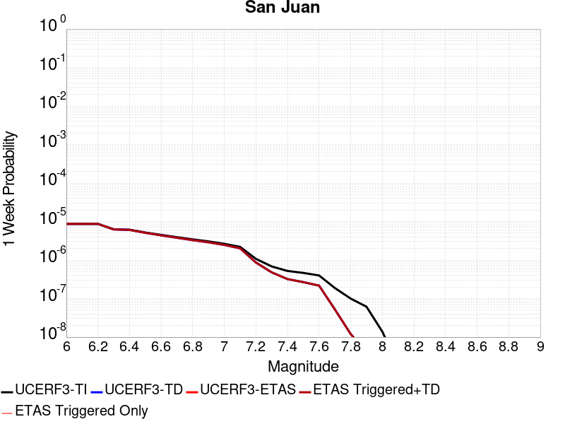 | 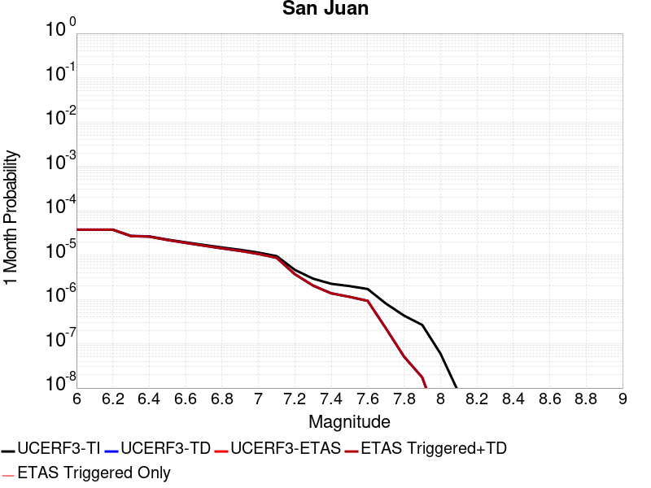 | 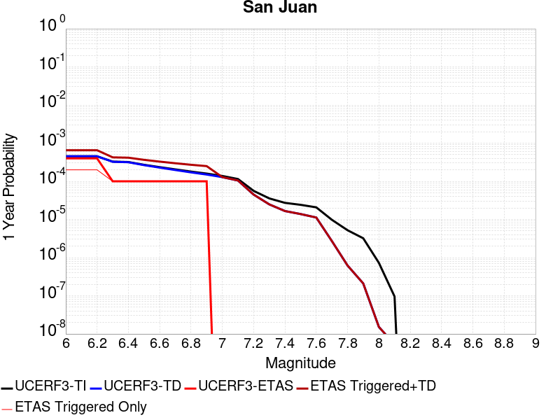 | 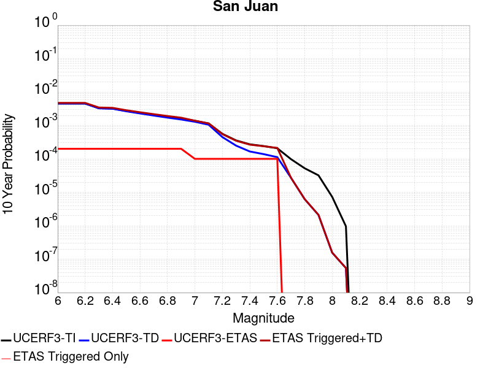 |

| Magnitude | 1 wk TI Prob | 1 wk TD Prob | 1 wk ETAS Prob | 1 wk ETAS/TD Gain | 1 wk ETAS Triggered+TD | 1 wk ETAS Triggered Only | 1 mo TI Prob | 1 mo TD Prob | 1 mo ETAS Prob | 1 mo ETAS/TD Gain | 1 mo ETAS Triggered+TD | 1 mo ETAS Triggered Only | 1 yr TI Prob | 1 yr TD Prob | 1 yr ETAS Prob | 1 yr ETAS/TD Gain | 1 yr ETAS Triggered+TD | 1 yr ETAS Triggered Only | 10 yr TI Prob | 10 yr TD Prob | 10 yr ETAS Prob | 10 yr ETAS/TD Gain | 10 yr ETAS Triggered+TD | 10 yr ETAS Triggered Only |
|-----|-----|-----|-----|-----|-----|-----|-----|-----|-----|-----|-----|-----|-----|-----|-----|-----|-----|-----|-----|-----|-----|-----|-----|-----|
| 6.0 | 8.682808E-6 | 8.717641E-6 | 0.0 | 0.0 | 8.717641E-6 | 0.0 | 3.72115E-5 | 3.7360813E-5 | 0.0 | 0.0 | 3.7360813E-5 | 0.0 | 4.5295584E-4 | 4.5477776E-4 | 4.0E-4 | 0.87955046 | 6.546868E-4 | 2.0E-4 | 0.004520337 | 0.0045390096 | 0.0049 | 1.0795306 | 0.0064303856 | 0.0019 |
| 6.1 | 8.682808E-6 | 8.717641E-6 | 0.0 | 0.0 | 8.717641E-6 | 0.0 | 3.72115E-5 | 3.7360813E-5 | 0.0 | 0.0 | 3.7360813E-5 | 0.0 | 4.5295584E-4 | 4.5477776E-4 | 4.0E-4 | 0.87955046 | 6.546868E-4 | 2.0E-4 | 0.004520337 | 0.0045390096 | 0.0049 | 1.0795306 | 0.0064303856 | 0.0019 |
| 6.2 | 8.682808E-6 | 8.717641E-6 | 0.0 | 0.0 | 8.717641E-6 | 0.0 | 3.72115E-5 | 3.7360813E-5 | 0.0 | 0.0 | 3.7360813E-5 | 0.0 | 4.5295584E-4 | 4.5477776E-4 | 4.0E-4 | 0.87955046 | 6.546868E-4 | 2.0E-4 | 0.004520337 | 0.0045390096 | 0.0049 | 1.0795306 | 0.0064303856 | 0.0019 |
| 6.3 | 6.3054235E-6 | 6.2520294E-6 | 0.0 | 0.0 | 6.2520294E-6 | 0.0 | 2.7022963E-5 | 2.6794143E-5 | 0.0 | 0.0 | 2.6794143E-5 | 0.0 | 3.2895492E-4 | 3.2617126E-4 | 1.0E-4 | 0.3065874 | 4.2613863E-4 | 1.0E-4 | 0.003284684 | 0.0032571235 | 0.0033 | 1.0131639 | 0.0046525635 | 0.0014 |
| 6.4 | 6.1490473E-6 | 6.088043E-6 | 0.0 | 0.0 | 6.088043E-6 | 0.0 | 2.6352795E-5 | 2.6091358E-5 | 0.0 | 0.0 | 2.6091358E-5 | 0.0 | 3.2079802E-4 | 3.1761735E-4 | 1.0E-4 | 0.31484425 | 4.175856E-4 | 1.0E-4 | 0.0032033534 | 0.0031718288 | 0.0033 | 1.0404093 | 0.004567388 | 0.0014 |
| 6.5 | 5.204848E-6 | 5.11165E-6 | 0.0 | 0.0 | 5.11165E-6 | 0.0 | 2.23063E-5 | 2.1906892E-5 | 0.0 | 0.0 | 2.1906892E-5 | 0.0 | 2.7154534E-4 | 2.666847E-4 | 1.0E-4 | 0.3749746 | 3.6665806E-4 | 1.0E-4 | 0.0027121378 | 0.0026637993 | 0.0032 | 1.2012917 | 0.00406007 | 0.0014 |
| 6.6 | 4.5179986E-6 | 4.39578E-6 | 0.0 | 0.0 | 4.39578E-6 | 0.0 | 1.9362706E-5 | 1.8838924E-5 | 0.0 | 0.0 | 1.8838924E-5 | 0.0 | 2.3571544E-4 | 2.2934054E-4 | 1.0E-4 | 0.4360328 | 3.293176E-4 | 1.0E-4 | 0.0023546559 | 0.0022911741 | 0.0032 | 1.3966638 | 0.0036879666 | 0.0014 |
| 6.7 | 3.9442616E-6 | 3.8025798E-6 | 0.0 | 0.0 | 3.8025798E-6 | 0.0 | 1.6903869E-5 | 1.6296672E-5 | 0.0 | 0.0 | 1.6296672E-5 | 0.0 | 2.0578515E-4 | 1.9839458E-4 | 1.0E-4 | 0.504046 | 2.9837474E-4 | 1.0E-4 | 0.002055947 | 0.0019822982 | 0.0029 | 1.4629484 | 0.0032797211 | 0.0013 |
| 6.8 | 3.4536245E-6 | 3.2997896E-6 | 0.0 | 0.0 | 3.2997896E-6 | 0.0 | 1.4801163E-5 | 1.4141882E-5 | 0.0 | 0.0 | 1.4141882E-5 | 0.0 | 1.8018926E-4 | 1.7216442E-4 | 1.0E-4 | 0.5808401 | 2.721472E-4 | 1.0E-4 | 0.0018004322 | 0.0017204278 | 0.0026 | 1.511252 | 0.0028185353 | 0.0011 |
| 6.9 | 3.059865E-6 | 2.8962093E-6 | 0.0 | 0.0 | 2.8962093E-6 | 0.0 | 1.3113641E-5 | 1.2412269E-5 | 0.0 | 0.0 | 1.2412269E-5 | 0.0 | 1.596469E-4 | 1.5110946E-4 | 1.0E-4 | 0.6617719 | 2.5109435E-4 | 1.0E-4 | 0.0015953224 | 0.0015101803 | 0.0022 | 1.4567797 | 0.002608519 | 0.0011 |
| 7.0 | 2.6504351E-6 | 2.4770434E-6 | 0.0 | 0.0 | 2.4770434E-6 | 0.0 | 1.1358958E-5 | 1.06158595E-5 | 0.0 | 0.0 | 1.06158595E-5 | 0.0 | 1.3828653E-4 | 1.2924097E-4 | 0.0 | 0.0 | 1.2924097E-4 | 0.0 | 0.0013820052 | 0.0012917684 | 0.0018 | 1.3934386 | 0.0019908643 | 7.0E-4 |
| 7.1 | 2.2039317E-6 | 2.021509E-6 | 0.0 | 0.0 | 2.021509E-6 | 0.0 | 9.445387E-6 | 8.663585E-6 | 0.0 | 0.0 | 8.663585E-6 | 0.0 | 1.1499152E-4 | 1.05474566E-4 | 0.0 | 0.0 | 1.05474566E-4 | 0.0 | 0.0011493203 | 0.0010543535 | 0.0016 | 1.5175176 | 0.0017536156 | 7.0E-4 |
| 7.2 | 1.0786707E-6 | 8.664039E-7 | 0.0 | 0.0 | 8.664039E-7 | 0.0 | 4.622866E-6 | 3.7131542E-6 | 0.0 | 0.0 | 3.7131542E-6 | 0.0 | 5.628194E-5 | 4.520673E-5 | 0.0 | 0.0 | 4.520673E-5 | 0.0 | 5.6267687E-4 | 4.5203287E-4 | 4.0E-4 | 0.8848914 | 6.5194245E-4 | 2.0E-4 |
| 7.3 | 6.846433E-7 | 4.801569E-7 | 0.0 | 0.0 | 4.801569E-7 | 0.0 | 2.9341822E-6 | 2.0578136E-6 | 0.0 | 0.0 | 2.0578136E-6 | 0.0 | 3.5723086E-5 | 2.5053594E-5 | 0.0 | 0.0 | 2.5053594E-5 | 0.0 | 3.571734E-4 | 2.505394E-4 | 4.0E-4 | 1.5965554 | 4.504893E-4 | 2.0E-4 |
| 7.4 | 5.23043E-7 | 3.2123162E-7 | 0.0 | 0.0 | 3.2123162E-7 | 0.0 | 2.2416111E-6 | 1.3767061E-6 | 0.0 | 0.0 | 1.3767061E-6 | 0.0 | 2.7291273E-5 | 1.6761269E-5 | 0.0 | 0.0 | 1.6761269E-5 | 0.0 | 2.7287923E-4 | 1.6763047E-4 | 4.0E-4 | 2.3862011 | 3.6759695E-4 | 2.0E-4 |
| 7.5 | 4.648444E-7 | 2.6797787E-7 | 0.0 | 0.0 | 2.6797787E-7 | 0.0 | 1.9921886E-6 | 1.148476E-6 | 0.0 | 0.0 | 1.148476E-6 | 0.0 | 2.4254627E-5 | 1.3982607E-5 | 0.0 | 0.0 | 1.3982607E-5 | 0.0 | 2.425198E-4 | 1.3984542E-4 | 2.0E-4 | 1.4301505 | 3.3981746E-4 | 2.0E-4 |
| 7.6 | 3.9906567E-7 | 2.173264E-7 | 0.0 | 0.0 | 2.173264E-7 | 0.0 | 1.7102802E-6 | 9.313986E-7 | 0.0 | 0.0 | 9.313986E-7 | 0.0 | 2.0822463E-5 | 1.1339719E-5 | 0.0 | 0.0 | 1.1339719E-5 | 0.0 | 2.0820512E-4 | 1.13415175E-4 | 2.0E-4 | 1.7634325 | 3.133925E-4 | 2.0E-4 |
| 7.7 | 1.8784601E-7 | 5.2426163E-8 | 0.0 | 0.0 | 5.2426163E-8 | 0.0 | 8.0505407E-7 | 2.2468355E-7 | 0.0 | 0.0 | 2.2468355E-7 | 0.0 | 9.80149E-6 | 2.7355188E-6 | 0.0 | 0.0 | 2.7355188E-6 | 0.0 | 9.801057E-5 | 2.736336E-5 | 0.0 | 0.0 | 2.736336E-5 | 0.0 |
| 7.8 | 1.00154914E-7 | 1.2025987E-8 | 0.0 | 0.0 | 1.2025987E-8 | 0.0 | 4.2923529E-7 | 5.1539942E-8 | 0.0 | 0.0 | 5.1539942E-8 | 0.0 | 5.225927E-6 | 6.2749865E-7 | 0.0 | 0.0 | 6.2749865E-7 | 0.0 | 5.225804E-5 | 6.2801464E-6 | 0.0 | 0.0 | 6.2801464E-6 | 0.0 |
| 7.9 | 6.171429E-8 | 4.09751E-9 | 0.0 | 0.0 | 4.09751E-9 | 0.0 | 2.6448978E-7 | 1.7560755E-8 | 0.0 | 0.0 | 1.7560755E-8 | 0.0 | 3.2201583E-6 | 2.138022E-7 | 0.0 | 0.0 | 2.138022E-7 | 0.0 | 3.2201115E-5 | 2.1427038E-6 | 0.0 | 0.0 | 2.1427038E-6 | 0.0 |
| 8.0 | 1.3974572E-8 | 3.0207525E-10 | 0.0 | 0.0 | 3.0207525E-10 | 0.0 | 5.989102E-8 | 1.2946066E-9 | 0.0 | 0.0 | 1.2946066E-9 | 0.0 | 7.2917294E-7 | 1.576184E-8 | 0.0 | 0.0 | 1.576184E-8 | 0.0 | 7.2917055E-6 | 1.6148208E-7 | 0.0 | 0.0 | 1.6148208E-7 | 0.0 |
| 8.1 | 1.8403477E-9 | 1.0402146E-10 | 0.0 | 0.0 | 1.0402146E-10 | 0.0 | 7.887204E-9 | 4.4580561E-10 | 0.0 | 0.0 | 4.4580561E-10 | 0.0 | 9.602671E-8 | 5.427686E-9 | 0.0 | 0.0 | 5.427686E-9 | 0.0 | 9.602667E-7 | 5.5462092E-8 | 0.0 | 0.0 | 5.5462092E-8 | 0.0 |

## Mission Creek
*[(top)](#table-of-contents)*

| 1 Week | 1 Month | 1 Year | 10 Year |
|-----|-----|-----|-----|
| 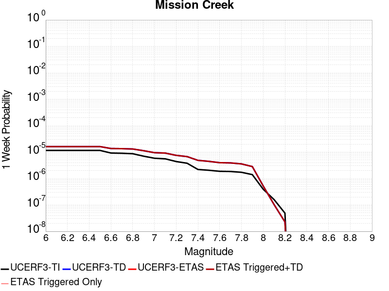 | 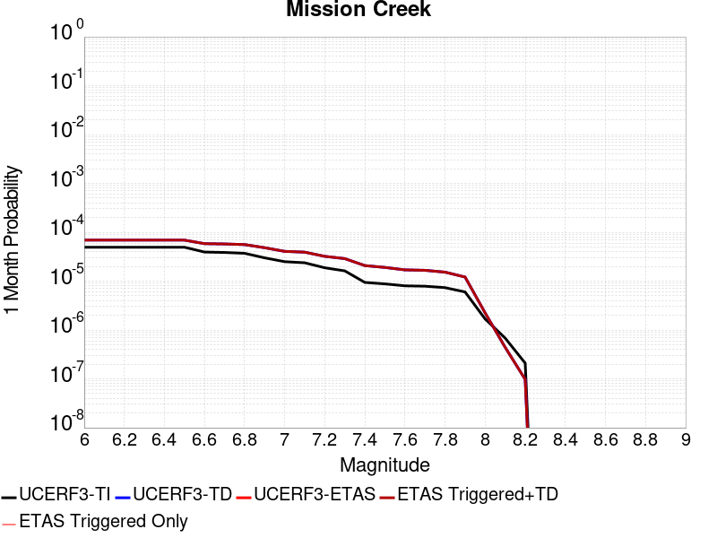 | 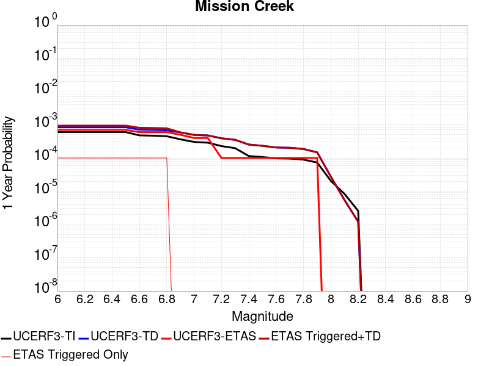 | 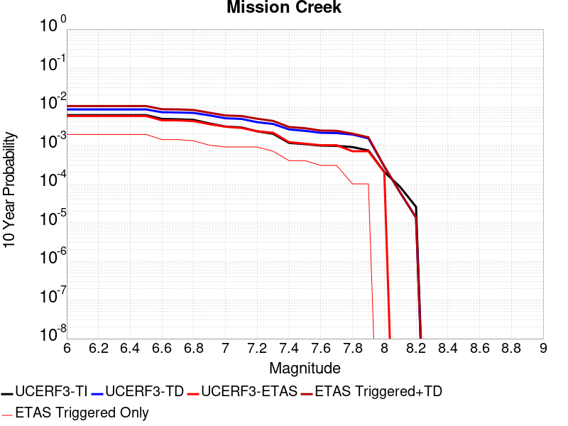 |

| Magnitude | 1 wk TI Prob | 1 wk TD Prob | 1 wk ETAS Prob | 1 wk ETAS/TD Gain | 1 wk ETAS Triggered+TD | 1 wk ETAS Triggered Only | 1 mo TI Prob | 1 mo TD Prob | 1 mo ETAS Prob | 1 mo ETAS/TD Gain | 1 mo ETAS Triggered+TD | 1 mo ETAS Triggered Only | 1 yr TI Prob | 1 yr TD Prob | 1 yr ETAS Prob | 1 yr ETAS/TD Gain | 1 yr ETAS Triggered+TD | 1 yr ETAS Triggered Only | 10 yr TI Prob | 10 yr TD Prob | 10 yr ETAS Prob | 10 yr ETAS/TD Gain | 10 yr ETAS Triggered+TD | 10 yr ETAS Triggered Only |
|-----|-----|-----|-----|-----|-----|-----|-----|-----|-----|-----|-----|-----|-----|-----|-----|-----|-----|-----|-----|-----|-----|-----|-----|-----|
| 6.0 | 1.1549387E-5 | 1.6138278E-5 | 0.0 | 0.0 | 1.6138278E-5 | 0.0 | 4.9496433E-5 | 6.916229E-5 | 0.0 | 0.0 | 6.916229E-5 | 0.0 | 6.0245243E-4 | 8.417406E-4 | 7.0E-4 | 0.83161014 | 9.416564E-4 | 1.0E-4 | 0.006008218 | 0.0084169535 | 0.0057 | 0.6772046 | 0.010300961 | 0.0019 |
| 6.1 | 1.1549387E-5 | 1.6138278E-5 | 0.0 | 0.0 | 1.6138278E-5 | 0.0 | 4.9496433E-5 | 6.916229E-5 | 0.0 | 0.0 | 6.916229E-5 | 0.0 | 6.0245243E-4 | 8.417406E-4 | 7.0E-4 | 0.83161014 | 9.416564E-4 | 1.0E-4 | 0.006008218 | 0.0084169535 | 0.0057 | 0.6772046 | 0.010300961 | 0.0019 |
| 6.2 | 1.1549387E-5 | 1.6138278E-5 | 0.0 | 0.0 | 1.6138278E-5 | 0.0 | 4.9496433E-5 | 6.916229E-5 | 0.0 | 0.0 | 6.916229E-5 | 0.0 | 6.0245243E-4 | 8.417406E-4 | 7.0E-4 | 0.83161014 | 9.416564E-4 | 1.0E-4 | 0.006008218 | 0.0084169535 | 0.0057 | 0.6772046 | 0.010300961 | 0.0019 |
| 6.3 | 1.1549387E-5 | 1.6138278E-5 | 0.0 | 0.0 | 1.6138278E-5 | 0.0 | 4.9496433E-5 | 6.916229E-5 | 0.0 | 0.0 | 6.916229E-5 | 0.0 | 6.0245243E-4 | 8.417406E-4 | 7.0E-4 | 0.83161014 | 9.416564E-4 | 1.0E-4 | 0.006008218 | 0.0084169535 | 0.0057 | 0.6772046 | 0.010300961 | 0.0019 |
| 6.4 | 1.1549387E-5 | 1.6138278E-5 | 0.0 | 0.0 | 1.6138278E-5 | 0.0 | 4.9496433E-5 | 6.916229E-5 | 0.0 | 0.0 | 6.916229E-5 | 0.0 | 6.0245243E-4 | 8.417406E-4 | 7.0E-4 | 0.83161014 | 9.416564E-4 | 1.0E-4 | 0.006008218 | 0.0084169535 | 0.0057 | 0.6772046 | 0.010300961 | 0.0019 |
| 6.5 | 1.1549387E-5 | 1.6138278E-5 | 0.0 | 0.0 | 1.6138278E-5 | 0.0 | 4.9496433E-5 | 6.916229E-5 | 0.0 | 0.0 | 6.916229E-5 | 0.0 | 6.0245243E-4 | 8.417406E-4 | 7.0E-4 | 0.83161014 | 9.416564E-4 | 1.0E-4 | 0.006008218 | 0.0084169535 | 0.0057 | 0.6772046 | 0.010300961 | 0.0019 |
| 6.6 | 9.202681E-6 | 1.3662985E-5 | 0.0 | 0.0 | 1.3662985E-5 | 0.0 | 3.9439463E-5 | 5.855439E-5 | 0.0 | 0.0 | 5.855439E-5 | 0.0 | 4.800697E-4 | 7.1267545E-4 | 6.0E-4 | 0.8418979 | 8.126042E-4 | 1.0E-4 | 0.004790339 | 0.00713476 | 0.0044 | 0.6166991 | 0.008524771 | 0.0014 |
| 6.7 | 9.019164E-6 | 1.3468774E-5 | 0.0 | 0.0 | 1.3468774E-5 | 0.0 | 3.8652986E-5 | 5.7722093E-5 | 0.0 | 0.0 | 5.7722093E-5 | 0.0 | 4.7049852E-4 | 7.0254883E-4 | 6.0E-4 | 0.8540332 | 8.024786E-4 | 1.0E-4 | 0.004695036 | 0.0070341364 | 0.0044 | 0.625521 | 0.008424289 | 0.0014 |
| 6.8 | 8.673558E-6 | 1.3091276E-5 | 0.0 | 0.0 | 1.3091276E-5 | 0.0 | 3.717186E-5 | 5.6104313E-5 | 0.0 | 0.0 | 5.6104313E-5 | 0.0 | 4.524734E-4 | 6.828647E-4 | 6.0E-4 | 0.8786514 | 7.827964E-4 | 1.0E-4 | 0.0045155324 | 0.0068385093 | 0.0042 | 0.61416894 | 0.008129619 | 0.0013 |
| 6.9 | 7.002255E-6 | 1.12969155E-5 | 0.0 | 0.0 | 1.12969155E-5 | 0.0 | 3.000932E-5 | 4.8414495E-5 | 0.0 | 0.0 | 4.8414495E-5 | 0.0 | 3.653022E-4 | 5.8929384E-4 | 5.0E-4 | 0.84847313 | 5.8929384E-4 | 0.0 | 0.0036470229 | 0.005907978 | 0.0035 | 0.59241927 | 0.00690207 | 0.001 |
| 7.0 | 5.84644E-6 | 9.503475E-6 | 0.0 | 0.0 | 9.503475E-6 | 0.0 | 2.5055931E-5 | 4.0728566E-5 | 0.0 | 0.0 | 4.0728566E-5 | 0.0 | 3.0501327E-4 | 4.95762E-4 | 4.0E-4 | 0.80683875 | 4.95762E-4 | 0.0 | 0.0030459496 | 0.0049770246 | 0.003 | 0.6027698 | 0.0058725453 | 9.0E-4 |
| 7.1 | 5.54703E-6 | 9.158573E-6 | 0.0 | 0.0 | 9.158573E-6 | 0.0 | 2.377277E-5 | 3.9250463E-5 | 0.0 | 0.0 | 3.9250463E-5 | 0.0 | 2.8939504E-4 | 4.7777404E-4 | 4.0E-4 | 0.83721584 | 4.7777404E-4 | 0.0 | 0.0028901845 | 0.0047979266 | 0.0028 | 0.58358544 | 0.0056936084 | 9.0E-4 |
| 7.2 | 4.384709E-6 | 7.51831E-6 | 0.0 | 0.0 | 7.51831E-6 | 0.0 | 1.8791474E-5 | 3.2220953E-5 | 0.0 | 0.0 | 3.2220953E-5 | 0.0 | 2.2876218E-4 | 3.9222313E-4 | 1.0E-4 | 0.25495693 | 3.9222313E-4 | 0.0 | 0.0022852682 | 0.0039457525 | 0.0023 | 0.5829053 | 0.0048422012 | 9.0E-4 |
| 7.3 | 3.7888456E-6 | 6.7554124E-6 | 0.0 | 0.0 | 6.7554124E-6 | 0.0 | 1.623781E-5 | 2.8951465E-5 | 0.0 | 0.0 | 2.8951465E-5 | 0.0 | 1.9767738E-4 | 3.5243042E-4 | 1.0E-4 | 0.28374395 | 3.5243042E-4 | 0.0 | 0.0019750162 | 0.003549155 | 0.0021 | 0.5916901 | 0.0042466708 | 7.0E-4 |
| 7.4 | 2.1982462E-6 | 4.8684906E-6 | 0.0 | 0.0 | 4.8684906E-6 | 0.0 | 9.421021E-6 | 2.0864794E-5 | 0.0 | 0.0 | 2.0864794E-5 | 0.0 | 1.1469489E-4 | 2.5399943E-4 | 1.0E-4 | 0.39370167 | 2.5399943E-4 | 0.0 | 0.0011463572 | 0.0025673127 | 0.0012 | 0.46741483 | 0.0029662857 | 4.0E-4 |
| 7.5 | 2.051923E-6 | 4.463973E-6 | 0.0 | 0.0 | 4.463973E-6 | 0.0 | 8.793926E-6 | 1.9131172E-5 | 0.0 | 0.0 | 1.9131172E-5 | 0.0 | 1.0706078E-4 | 2.3289726E-4 | 1.0E-4 | 0.42937386 | 2.3289726E-4 | 0.0 | 0.0010700922 | 0.002357037 | 0.0011 | 0.46668762 | 0.002756094 | 4.0E-4 |
| 7.6 | 1.8733427E-6 | 3.9775427E-6 | 0.0 | 0.0 | 3.9775427E-6 | 0.0 | 8.028587E-6 | 1.7046501E-5 | 0.0 | 0.0 | 1.7046501E-5 | 0.0 | 9.774366E-5 | 2.0752147E-4 | 1.0E-4 | 0.48187786 | 2.0752147E-4 | 0.0 | 9.770069E-4 | 0.0021041771 | 0.001 | 0.47524515 | 0.002403546 | 3.0E-4 |
| 7.7 | 1.8411953E-6 | 3.898195E-6 | 0.0 | 0.0 | 3.898195E-6 | 0.0 | 7.890813E-6 | 1.6706443E-5 | 0.0 | 0.0 | 1.6706443E-5 | 0.0 | 9.606641E-5 | 2.0338202E-4 | 1.0E-4 | 0.49168554 | 2.0338202E-4 | 0.0 | 9.6024893E-4 | 0.0020629582 | 0.001 | 0.48474076 | 0.0023623395 | 3.0E-4 |
| 7.8 | 1.7194251E-6 | 3.575494E-6 | 0.0 | 0.0 | 3.575494E-6 | 0.0 | 7.368944E-6 | 1.5323456E-5 | 0.0 | 0.0 | 1.5323456E-5 | 0.0 | 8.97132E-5 | 1.8654717E-4 | 1.0E-4 | 0.5360574 | 1.8654717E-4 | 0.0 | 8.967699E-4 | 0.0018940411 | 7.0E-4 | 0.36958015 | 0.0019938517 | 1.0E-4 |
| 7.9 | 1.4035052E-6 | 2.8394222E-6 | 0.0 | 0.0 | 2.8394222E-6 | 0.0 | 6.0150082E-6 | 1.2168896E-5 | 0.0 | 0.0 | 1.2168896E-5 | 0.0 | 7.3230265E-5 | 1.481463E-4 | 1.0E-4 | 0.6750085 | 1.481463E-4 | 0.0 | 7.3206134E-4 | 0.0015070711 | 7.0E-4 | 0.4644771 | 0.0016069204 | 1.0E-4 |
| 8.0 | 3.9318823E-7 | 5.259518E-7 | 0.0 | 0.0 | 5.259518E-7 | 0.0 | 1.6850913E-6 | 2.2540773E-6 | 0.0 | 0.0 | 2.2540773E-6 | 0.0 | 2.0515794E-5 | 2.744305E-5 | 0.0 | 0.0 | 2.744305E-5 | 0.0 | 2.0513899E-4 | 2.8478834E-4 | 2.0E-4 | 0.7022759 | 2.8478834E-4 | 0.0 |
| 8.1 | 1.596793E-7 | 1.0462134E-7 | 0.0 | 0.0 | 1.0462134E-7 | 0.0 | 6.8433974E-7 | 4.483771E-7 | 0.0 | 0.0 | 4.483771E-7 | 0.0 | 8.331805E-6 | 5.4589777E-6 | 0.0 | 0.0 | 5.4589777E-6 | 0.0 | 8.331492E-5 | 6.0503786E-5 | 0.0 | 0.0 | 6.0503786E-5 | 0.0 |
| 8.2 | 4.9003038E-8 | 2.3127075E-8 | 0.0 | 0.0 | 2.3127075E-8 | 0.0 | 2.10013E-7 | 9.911603E-8 | 0.0 | 0.0 | 9.911603E-8 | 0.0 | 2.5569052E-6 | 1.206737E-6 | 0.0 | 0.0 | 1.206737E-6 | 0.0 | 2.556876E-5 | 1.3668427E-5 | 0.0 | 0.0 | 1.3668427E-5 | 0.0 |

## Mount Diablo Thrust North CFM
*[(top)](#table-of-contents)*

| 1 Week | 1 Month | 1 Year | 10 Year |
|-----|-----|-----|-----|
| 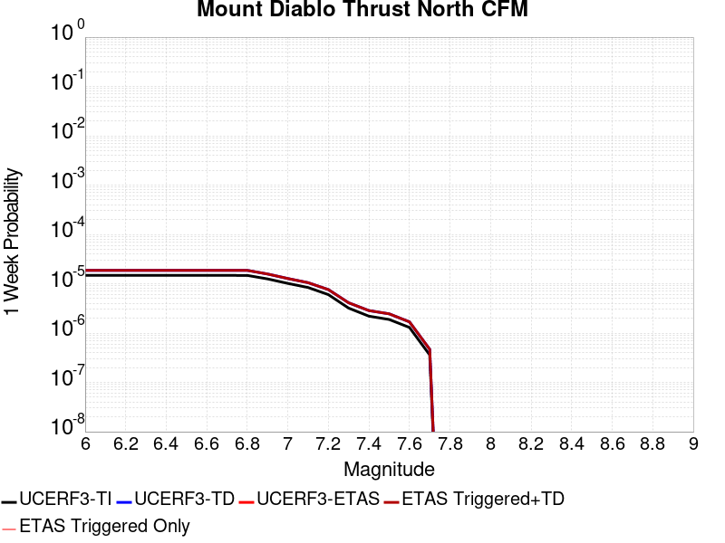 | 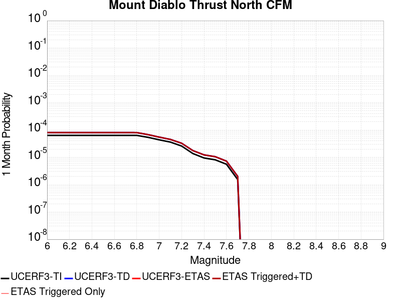 | 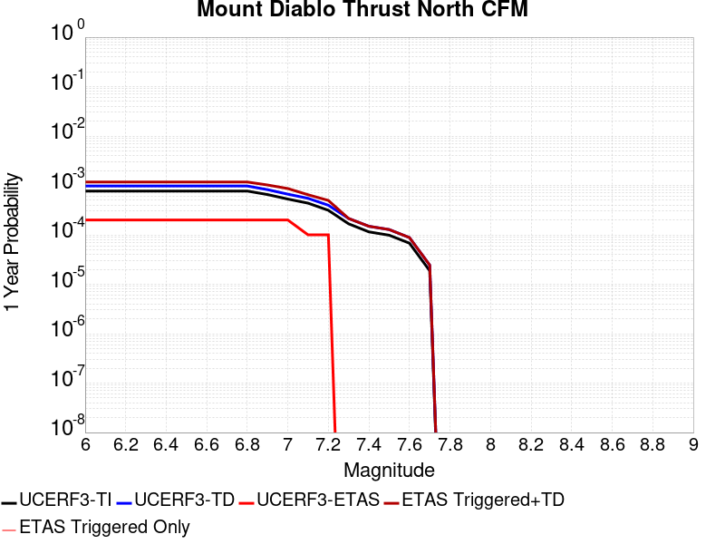 | 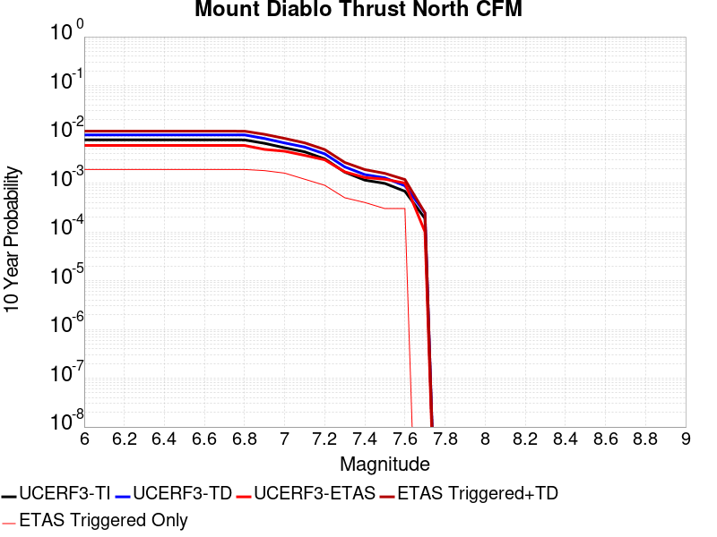 |

| Magnitude | 1 wk TI Prob | 1 wk TD Prob | 1 wk ETAS Prob | 1 wk ETAS/TD Gain | 1 wk ETAS Triggered+TD | 1 wk ETAS Triggered Only | 1 mo TI Prob | 1 mo TD Prob | 1 mo ETAS Prob | 1 mo ETAS/TD Gain | 1 mo ETAS Triggered+TD | 1 mo ETAS Triggered Only | 1 yr TI Prob | 1 yr TD Prob | 1 yr ETAS Prob | 1 yr ETAS/TD Gain | 1 yr ETAS Triggered+TD | 1 yr ETAS Triggered Only | 10 yr TI Prob | 10 yr TD Prob | 10 yr ETAS Prob | 10 yr ETAS/TD Gain | 10 yr ETAS Triggered+TD | 10 yr ETAS Triggered Only |
|-----|-----|-----|-----|-----|-----|-----|-----|-----|-----|-----|-----|-----|-----|-----|-----|-----|-----|-----|-----|-----|-----|-----|-----|-----|
| 6.0 | 1.479628E-5 | 1.8715906E-5 | 0.0 | 0.0 | 1.8715906E-5 | 0.0 | 6.341109E-5 | 8.020861E-5 | 0.0 | 0.0 | 8.020861E-5 | 0.0 | 7.717565E-4 | 9.761118E-4 | 5.0E-4 | 0.5122364 | 0.0011759166 | 2.0E-4 | 0.007690818 | 0.009722127 | 0.0059 | 0.60686314 | 0.011603654 | 0.0019 |
| 6.1 | 1.479628E-5 | 1.8715906E-5 | 0.0 | 0.0 | 1.8715906E-5 | 0.0 | 6.341109E-5 | 8.020861E-5 | 0.0 | 0.0 | 8.020861E-5 | 0.0 | 7.717565E-4 | 9.761118E-4 | 5.0E-4 | 0.5122364 | 0.0011759166 | 2.0E-4 | 0.007690818 | 0.009722127 | 0.0059 | 0.60686314 | 0.011603654 | 0.0019 |
| 6.2 | 1.479628E-5 | 1.8715906E-5 | 0.0 | 0.0 | 1.8715906E-5 | 0.0 | 6.341109E-5 | 8.020861E-5 | 0.0 | 0.0 | 8.020861E-5 | 0.0 | 7.717565E-4 | 9.761118E-4 | 5.0E-4 | 0.5122364 | 0.0011759166 | 2.0E-4 | 0.007690818 | 0.009722127 | 0.0059 | 0.60686314 | 0.011603654 | 0.0019 |
| 6.3 | 1.479628E-5 | 1.8715906E-5 | 0.0 | 0.0 | 1.8715906E-5 | 0.0 | 6.341109E-5 | 8.020861E-5 | 0.0 | 0.0 | 8.020861E-5 | 0.0 | 7.717565E-4 | 9.761118E-4 | 5.0E-4 | 0.5122364 | 0.0011759166 | 2.0E-4 | 0.007690818 | 0.009722127 | 0.0059 | 0.60686314 | 0.011603654 | 0.0019 |
| 6.4 | 1.479628E-5 | 1.8715906E-5 | 0.0 | 0.0 | 1.8715906E-5 | 0.0 | 6.341109E-5 | 8.020861E-5 | 0.0 | 0.0 | 8.020861E-5 | 0.0 | 7.717565E-4 | 9.761118E-4 | 5.0E-4 | 0.5122364 | 0.0011759166 | 2.0E-4 | 0.007690818 | 0.009722127 | 0.0059 | 0.60686314 | 0.011603654 | 0.0019 |
| 6.5 | 1.479628E-5 | 1.8715906E-5 | 0.0 | 0.0 | 1.8715906E-5 | 0.0 | 6.341109E-5 | 8.020861E-5 | 0.0 | 0.0 | 8.020861E-5 | 0.0 | 7.717565E-4 | 9.761118E-4 | 5.0E-4 | 0.5122364 | 0.0011759166 | 2.0E-4 | 0.007690818 | 0.009722127 | 0.0059 | 0.60686314 | 0.011603654 | 0.0019 |
| 6.6 | 1.479016E-5 | 1.8709026E-5 | 0.0 | 0.0 | 1.8709026E-5 | 0.0 | 6.338486E-5 | 8.0179125E-5 | 0.0 | 0.0 | 8.0179125E-5 | 0.0 | 7.714374E-4 | 9.757532E-4 | 5.0E-4 | 0.51242465 | 0.0011755581 | 2.0E-4 | 0.007687649 | 0.009718572 | 0.0059 | 0.6070851 | 0.011600106 | 0.0019 |
| 6.7 | 1.479016E-5 | 1.8709026E-5 | 0.0 | 0.0 | 1.8709026E-5 | 0.0 | 6.338486E-5 | 8.0179125E-5 | 0.0 | 0.0 | 8.0179125E-5 | 0.0 | 7.714374E-4 | 9.757532E-4 | 5.0E-4 | 0.51242465 | 0.0011755581 | 2.0E-4 | 0.007687649 | 0.009718572 | 0.0059 | 0.6070851 | 0.011600106 | 0.0019 |
| 6.8 | 1.4771667E-5 | 1.868783E-5 | 0.0 | 0.0 | 1.868783E-5 | 0.0 | 6.330561E-5 | 8.008829E-5 | 0.0 | 0.0 | 8.008829E-5 | 0.0 | 7.704732E-4 | 9.746482E-4 | 5.0E-4 | 0.5130056 | 0.0011744533 | 2.0E-4 | 0.007678074 | 0.0097076185 | 0.0059 | 0.6077701 | 0.011589174 | 0.0019 |
| 6.9 | 1.2548234E-5 | 1.577091E-5 | 0.0 | 0.0 | 1.577091E-5 | 0.0 | 5.3777036E-5 | 6.758788E-5 | 0.0 | 0.0 | 6.758788E-5 | 0.0 | 6.545387E-4 | 8.225753E-4 | 5.0E-4 | 0.6078471 | 0.0010224108 | 2.0E-4 | 0.006526142 | 0.00819642 | 0.0049 | 0.59782195 | 0.009981667 | 0.0018 |
| 7.0 | 1.01754185E-5 | 1.2775895E-5 | 0.0 | 0.0 | 1.2775895E-5 | 0.0 | 4.360821E-5 | 5.4752694E-5 | 0.0 | 0.0 | 5.4752694E-5 | 0.0 | 5.308006E-4 | 6.664118E-4 | 5.0E-4 | 0.7502868 | 8.6627854E-4 | 2.0E-4 | 0.005295345 | 0.006645098 | 0.0045 | 0.67719096 | 0.0082344655 | 0.0016 |
| 7.1 | 8.398341E-6 | 1.0523696E-5 | 0.0 | 0.0 | 1.0523696E-5 | 0.0 | 3.5992394E-5 | 4.510078E-5 | 0.0 | 0.0 | 4.510078E-5 | 0.0 | 4.3811928E-4 | 5.489647E-4 | 3.0E-4 | 0.54648316 | 6.4890983E-4 | 1.0E-4 | 0.0043725655 | 0.0054764855 | 0.0037 | 0.6756158 | 0.006669914 | 0.0012 |
| 7.2 | 6.024759E-6 | 7.622678E-6 | 0.0 | 0.0 | 7.622678E-6 | 0.0 | 2.582014E-5 | 3.2668217E-5 | 0.0 | 0.0 | 3.2668217E-5 | 0.0 | 3.1431485E-4 | 3.9766362E-4 | 3.0E-4 | 0.75440645 | 4.9762387E-4 | 1.0E-4 | 0.0031387066 | 0.003969908 | 0.003 | 0.75568503 | 0.004866335 | 9.0E-4 |
| 7.3 | 3.2099704E-6 | 4.117058E-6 | 0.0 | 0.0 | 4.117058E-6 | 0.0 | 1.3756943E-5 | 1.7644415E-5 | 0.0 | 0.0 | 1.7644415E-5 | 0.0 | 1.674779E-4 | 2.1479974E-4 | 1.0E-4 | 0.46554992 | 2.1479974E-4 | 0.0 | 0.0016735174 | 0.0021460056 | 0.0017 | 0.7921694 | 0.0026449326 | 5.0E-4 |
| 7.4 | 2.2041513E-6 | 2.8601714E-6 | 0.0 | 0.0 | 2.8601714E-6 | 0.0 | 9.4463285E-6 | 1.225782E-5 | 0.0 | 0.0 | 1.225782E-5 | 0.0 | 1.1500298E-4 | 1.4922881E-4 | 1.0E-4 | 0.67011184 | 1.4922881E-4 | 0.0 | 0.0011494348 | 0.0014912793 | 0.0013 | 0.87173474 | 0.0018906828 | 4.0E-4 |
| 7.5 | 1.8869501E-6 | 2.4573346E-6 | 0.0 | 0.0 | 2.4573346E-6 | 0.0 | 8.086904E-6 | 1.0531392E-5 | 0.0 | 0.0 | 1.0531392E-5 | 0.0 | 9.845361E-5 | 1.2821222E-4 | 1.0E-4 | 0.7799568 | 1.2821222E-4 | 0.0 | 9.841E-4 | 0.001281347 | 0.0012 | 0.93651444 | 0.0015809627 | 3.0E-4 |
| 7.6 | 1.3012458E-6 | 1.6901882E-6 | 0.0 | 0.0 | 1.6901882E-6 | 0.0 | 5.576756E-6 | 7.243644E-6 | 0.0 | 0.0 | 7.243644E-6 | 0.0 | 6.7894885E-5 | 8.818785E-5 | 0.0 | 0.0 | 8.818785E-5 | 0.0 | 6.787415E-4 | 8.81489E-4 | 0.001 | 1.1344441 | 0.0011812246 | 3.0E-4 |
| 7.7 | 3.603383E-7 | 4.6900843E-7 | 0.0 | 0.0 | 4.6900843E-7 | 0.0 | 1.5443061E-6 | 2.0100347E-6 | 0.0 | 0.0 | 2.0100347E-6 | 0.0 | 1.8801764E-5 | 2.4471903E-5 | 0.0 | 0.0 | 2.4471903E-5 | 0.0 | 1.8800174E-4 | 2.4469846E-4 | 1.0E-4 | 0.40866625 | 2.4469846E-4 | 0.0 |

## Coyote Lake
*[(top)](#table-of-contents)*

| 1 Week | 1 Month | 1 Year | 10 Year |
|-----|-----|-----|-----|
| 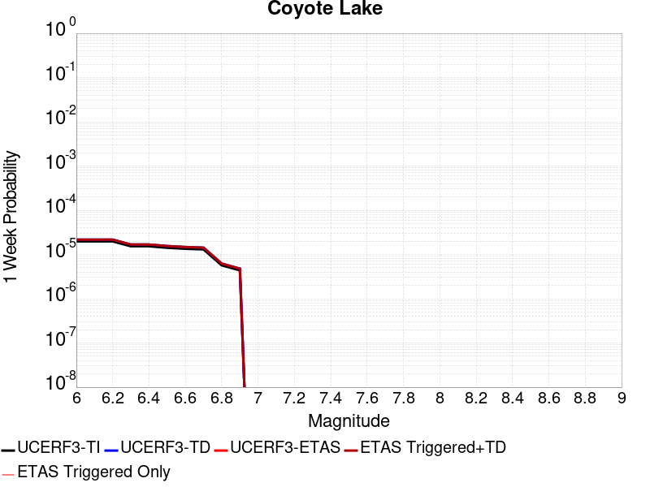 | 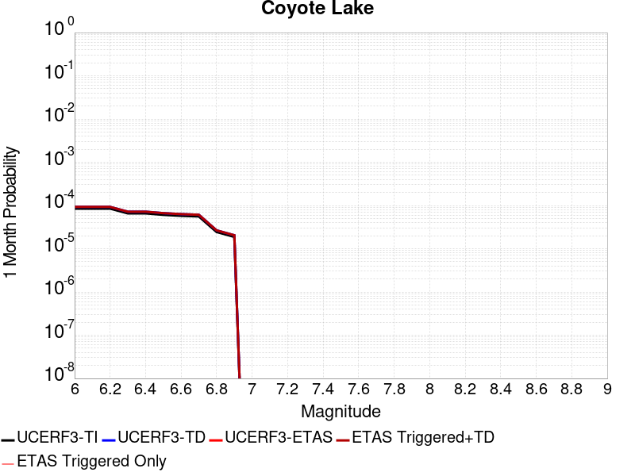 | 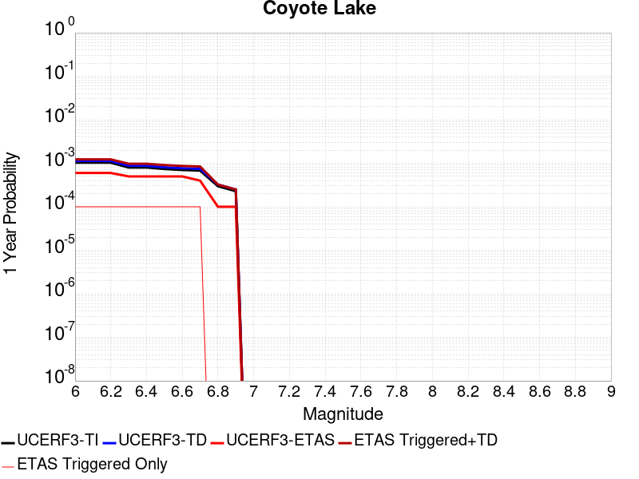 | 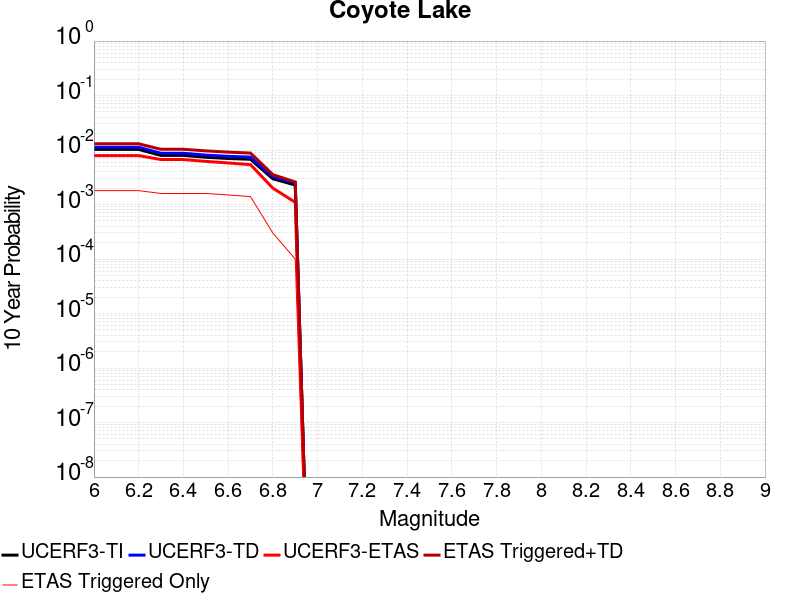 |

| Magnitude | 1 wk TI Prob | 1 wk TD Prob | 1 wk ETAS Prob | 1 wk ETAS/TD Gain | 1 wk ETAS Triggered+TD | 1 wk ETAS Triggered Only | 1 mo TI Prob | 1 mo TD Prob | 1 mo ETAS Prob | 1 mo ETAS/TD Gain | 1 mo ETAS Triggered+TD | 1 mo ETAS Triggered Only | 1 yr TI Prob | 1 yr TD Prob | 1 yr ETAS Prob | 1 yr ETAS/TD Gain | 1 yr ETAS Triggered+TD | 1 yr ETAS Triggered Only | 10 yr TI Prob | 10 yr TD Prob | 10 yr ETAS Prob | 10 yr ETAS/TD Gain | 10 yr ETAS Triggered+TD | 10 yr ETAS Triggered Only |
|-----|-----|-----|-----|-----|-----|-----|-----|-----|-----|-----|-----|-----|-----|-----|-----|-----|-----|-----|-----|-----|-----|-----|-----|-----|
| 6.0 | 1.980352E-5 | 2.1684975E-5 | 0.0 | 0.0 | 2.1684975E-5 | 0.0 | 8.486947E-5 | 9.293271E-5 | 0.0 | 0.0 | 9.293271E-5 | 0.0 | 0.0010327959 | 0.0011309403 | 6.0E-4 | 0.530532 | 0.0012308272 | 1.0E-4 | 0.010280091 | 0.011259011 | 0.0079 | 0.7016602 | 0.013038745 | 0.0018 |
| 6.1 | 1.980352E-5 | 2.1684975E-5 | 0.0 | 0.0 | 2.1684975E-5 | 0.0 | 8.486947E-5 | 9.293271E-5 | 0.0 | 0.0 | 9.293271E-5 | 0.0 | 0.0010327959 | 0.0011309403 | 6.0E-4 | 0.530532 | 0.0012308272 | 1.0E-4 | 0.010280091 | 0.011259011 | 0.0079 | 0.7016602 | 0.013038745 | 0.0018 |
| 6.2 | 1.980352E-5 | 2.1684975E-5 | 0.0 | 0.0 | 2.1684975E-5 | 0.0 | 8.486947E-5 | 9.293271E-5 | 0.0 | 0.0 | 9.293271E-5 | 0.0 | 0.0010327959 | 0.0011309403 | 6.0E-4 | 0.530532 | 0.0012308272 | 1.0E-4 | 0.010280091 | 0.011259011 | 0.0079 | 0.7016602 | 0.013038745 | 0.0018 |
| 6.3 | 1.5344787E-5 | 1.6803786E-5 | 0.0 | 0.0 | 1.6803786E-5 | 0.0 | 6.576172E-5 | 7.201458E-5 | 0.0 | 0.0 | 7.201458E-5 | 0.0 | 8.003548E-4 | 8.764859E-4 | 5.0E-4 | 0.57045984 | 9.763983E-4 | 1.0E-4 | 0.007974784 | 0.008736323 | 0.0067 | 0.76691306 | 0.0103223445 | 0.0016 |
| 6.4 | 1.5344787E-5 | 1.6803786E-5 | 0.0 | 0.0 | 1.6803786E-5 | 0.0 | 6.576172E-5 | 7.201458E-5 | 0.0 | 0.0 | 7.201458E-5 | 0.0 | 8.003548E-4 | 8.764859E-4 | 5.0E-4 | 0.57045984 | 9.763983E-4 | 1.0E-4 | 0.007974784 | 0.008736323 | 0.0067 | 0.76691306 | 0.0103223445 | 0.0016 |
| 6.5 | 1.4189697E-5 | 1.5542331E-5 | 0.0 | 0.0 | 1.5542331E-5 | 0.0 | 6.081157E-5 | 6.660863E-5 | 0.0 | 0.0 | 6.660863E-5 | 0.0 | 7.401293E-4 | 8.1071845E-4 | 5.0E-4 | 0.6167369 | 9.106374E-4 | 1.0E-4 | 0.0073766913 | 0.008083539 | 0.0062 | 0.7669908 | 0.009670606 | 0.0016 |
| 6.6 | 1.3469301E-5 | 1.47566725E-5 | 0.0 | 0.0 | 1.47566725E-5 | 0.0 | 5.7724297E-5 | 6.3241685E-5 | 0.0 | 0.0 | 6.3241685E-5 | 0.0 | 7.025667E-4 | 7.697554E-4 | 5.0E-4 | 0.649557 | 8.6967845E-4 | 1.0E-4 | 0.0070034964 | 0.0076767835 | 0.0058 | 0.75552475 | 0.009165268 | 0.0015 |
| 6.7 | 1.3027966E-5 | 1.4267402E-5 | 0.0 | 0.0 | 1.4267402E-5 | 0.0 | 5.5832945E-5 | 6.1144914E-5 | 0.0 | 0.0 | 6.1144914E-5 | 0.0 | 6.7955407E-4 | 7.4424467E-4 | 4.0E-4 | 0.5374577 | 8.441702E-4 | 1.0E-4 | 0.006774798 | 0.007423387 | 0.0054 | 0.72743076 | 0.008812995 | 0.0014 |
| 6.8 | 5.695434E-6 | 6.218387E-6 | 0.0 | 0.0 | 6.218387E-6 | 0.0 | 2.4408775E-5 | 2.6650127E-5 | 0.0 | 0.0 | 2.6650127E-5 | 0.0 | 2.971363E-4 | 3.244469E-4 | 1.0E-4 | 0.3082168 | 3.244469E-4 | 0.0 | 0.0029673933 | 0.0032426675 | 0.002 | 0.6167761 | 0.0035416947 | 3.0E-4 |
| 6.9 | 4.385688E-6 | 4.7884114E-6 | 0.0 | 0.0 | 4.7884114E-6 | 0.0 | 1.879567E-5 | 2.0521762E-5 | 0.0 | 0.0 | 2.0521762E-5 | 0.0 | 2.2881327E-4 | 2.4985246E-4 | 1.0E-4 | 0.40023622 | 2.4985246E-4 | 0.0 | 0.002285778 | 0.0024985245 | 0.0011 | 0.4402598 | 0.0025982747 | 1.0E-4 |

## Mission Hills 2011
*[(top)](#table-of-contents)*

| 1 Week | 1 Month | 1 Year | 10 Year |
|-----|-----|-----|-----|
| 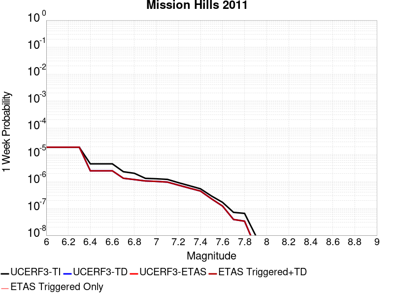 | 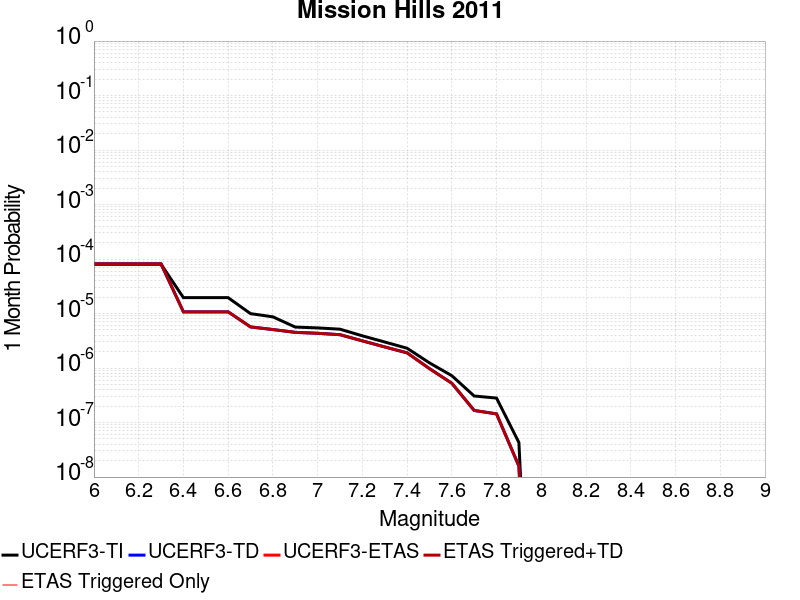 | 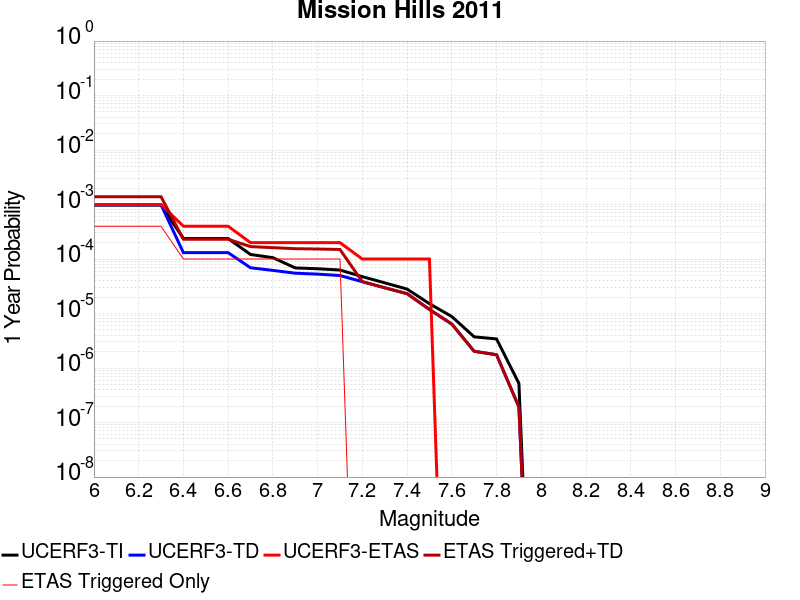 | 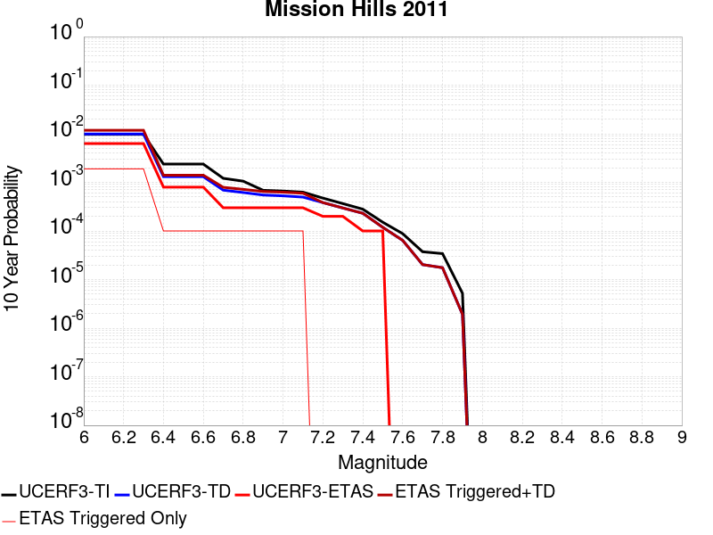 |

| Magnitude | 1 wk TI Prob | 1 wk TD Prob | 1 wk ETAS Prob | 1 wk ETAS/TD Gain | 1 wk ETAS Triggered+TD | 1 wk ETAS Triggered Only | 1 mo TI Prob | 1 mo TD Prob | 1 mo ETAS Prob | 1 mo ETAS/TD Gain | 1 mo ETAS Triggered+TD | 1 mo ETAS Triggered Only | 1 yr TI Prob | 1 yr TD Prob | 1 yr ETAS Prob | 1 yr ETAS/TD Gain | 1 yr ETAS Triggered+TD | 1 yr ETAS Triggered Only | 10 yr TI Prob | 10 yr TD Prob | 10 yr ETAS Prob | 10 yr ETAS/TD Gain | 10 yr ETAS Triggered+TD | 10 yr ETAS Triggered Only |
|-----|-----|-----|-----|-----|-----|-----|-----|-----|-----|-----|-----|-----|-----|-----|-----|-----|-----|-----|-----|-----|-----|-----|-----|-----|
| 6.0 | 1.8765717E-5 | 1.9021738E-5 | 0.0 | 0.0 | 1.9021738E-5 | 0.0 | 8.0422025E-5 | 8.152112E-5 | 0.0 | 0.0 | 8.152112E-5 | 0.0 | 9.786983E-4 | 9.924099E-4 | 0.001 | 1.0076482 | 0.0013920129 | 4.0E-4 | 0.009743992 | 0.009913333 | 0.0063 | 0.6355078 | 0.011794497 | 0.0019 |
| 6.1 | 1.8765717E-5 | 1.9021738E-5 | 0.0 | 0.0 | 1.9021738E-5 | 0.0 | 8.0422025E-5 | 8.152112E-5 | 0.0 | 0.0 | 8.152112E-5 | 0.0 | 9.786983E-4 | 9.924099E-4 | 0.001 | 1.0076482 | 0.0013920129 | 4.0E-4 | 0.009743992 | 0.009913333 | 0.0063 | 0.6355078 | 0.011794497 | 0.0019 |
| 6.2 | 1.8765717E-5 | 1.9021738E-5 | 0.0 | 0.0 | 1.9021738E-5 | 0.0 | 8.0422025E-5 | 8.152112E-5 | 0.0 | 0.0 | 8.152112E-5 | 0.0 | 9.786983E-4 | 9.924099E-4 | 0.001 | 1.0076482 | 0.0013920129 | 4.0E-4 | 0.009743992 | 0.009913333 | 0.0063 | 0.6355078 | 0.011794497 | 0.0019 |
| 6.3 | 1.8765717E-5 | 1.9021738E-5 | 0.0 | 0.0 | 1.9021738E-5 | 0.0 | 8.0422025E-5 | 8.152112E-5 | 0.0 | 0.0 | 8.152112E-5 | 0.0 | 9.786983E-4 | 9.924099E-4 | 0.001 | 1.0076482 | 0.0013920129 | 4.0E-4 | 0.009743992 | 0.009913333 | 0.0063 | 0.6355078 | 0.011794497 | 0.0019 |
| 6.4 | 4.566357E-6 | 2.510337E-6 | 0.0 | 0.0 | 2.510337E-6 | 0.0 | 1.9569954E-5 | 1.0758553E-5 | 0.0 | 0.0 | 1.0758553E-5 | 0.0 | 2.3823815E-4 | 1.3097932E-4 | 4.0E-4 | 3.0539174 | 2.3096622E-4 | 1.0E-4 | 0.002379829 | 0.0013091987 | 8.0E-4 | 0.6110608 | 0.0014090678 | 1.0E-4 |
| 6.5 | 4.566357E-6 | 2.510337E-6 | 0.0 | 0.0 | 2.510337E-6 | 0.0 | 1.9569954E-5 | 1.0758553E-5 | 0.0 | 0.0 | 1.0758553E-5 | 0.0 | 2.3823815E-4 | 1.3097932E-4 | 4.0E-4 | 3.0539174 | 2.3096622E-4 | 1.0E-4 | 0.002379829 | 0.0013091987 | 8.0E-4 | 0.6110608 | 0.0014090678 | 1.0E-4 |
| 6.6 | 4.566357E-6 | 2.510337E-6 | 0.0 | 0.0 | 2.510337E-6 | 0.0 | 1.9569954E-5 | 1.0758553E-5 | 0.0 | 0.0 | 1.0758553E-5 | 0.0 | 2.3823815E-4 | 1.3097932E-4 | 4.0E-4 | 3.0539174 | 2.3096622E-4 | 1.0E-4 | 0.002379829 | 0.0013091987 | 8.0E-4 | 0.6110608 | 0.0014090678 | 1.0E-4 |
| 6.7 | 2.3266773E-6 | 1.3274652E-6 | 0.0 | 0.0 | 1.3274652E-6 | 0.0 | 9.971435E-6 | 5.6891245E-6 | 0.0 | 0.0 | 5.6891245E-6 | 0.0 | 1.2139547E-4 | 6.926295E-5 | 2.0E-4 | 2.8875468 | 1.6925602E-4 | 1.0E-4 | 0.0012132917 | 6.9241965E-4 | 3.0E-4 | 0.43326327 | 7.9235045E-4 | 1.0E-4 |
| 6.8 | 2.032735E-6 | 1.1874546E-6 | 0.0 | 0.0 | 1.1874546E-6 | 0.0 | 8.711692E-6 | 5.0890812E-6 | 0.0 | 0.0 | 5.0890812E-6 | 0.0 | 1.06059684E-4 | 6.195785E-5 | 2.0E-4 | 3.2280009 | 1.6195166E-4 | 1.0E-4 | 0.0010600908 | 6.194106E-4 | 3.0E-4 | 0.48433137 | 7.1934867E-4 | 1.0E-4 |
| 6.9 | 1.3186259E-6 | 1.0546547E-6 | 0.0 | 0.0 | 1.0546547E-6 | 0.0 | 5.6512413E-6 | 4.519941E-6 | 0.0 | 0.0 | 4.519941E-6 | 0.0 | 6.8801695E-5 | 5.5028922E-5 | 2.0E-4 | 3.6344523 | 1.5502342E-4 | 1.0E-4 | 6.8780396E-4 | 5.5015594E-4 | 3.0E-4 | 0.54529995 | 6.5010093E-4 | 1.0E-4 |
| 7.0 | 1.2726016E-6 | 1.0144097E-6 | 0.0 | 0.0 | 1.0144097E-6 | 0.0 | 5.4539955E-6 | 4.347463E-6 | 0.0 | 0.0 | 4.347463E-6 | 0.0 | 6.6400375E-5 | 5.2929103E-5 | 2.0E-4 | 3.7786396 | 1.529238E-4 | 1.0E-4 | 6.6380535E-4 | 5.291678E-4 | 3.0E-4 | 0.5669279 | 6.291149E-4 | 1.0E-4 |
| 7.1 | 1.2063913E-6 | 9.556163E-7 | 0.0 | 0.0 | 9.556163E-7 | 0.0 | 5.170238E-6 | 4.0954924E-6 | 0.0 | 0.0 | 4.0954924E-6 | 0.0 | 6.294583E-5 | 4.9861505E-5 | 2.0E-4 | 4.0111103 | 1.4985651E-4 | 1.0E-4 | 6.2928005E-4 | 4.985057E-4 | 3.0E-4 | 0.60179853 | 5.9845584E-4 | 1.0E-4 |
| 7.2 | 9.105806E-7 | 7.364146E-7 | 0.0 | 0.0 | 7.364146E-7 | 0.0 | 3.9024826E-6 | 3.156059E-6 | 0.0 | 0.0 | 3.156059E-6 | 0.0 | 4.7511687E-5 | 3.8424354E-5 | 1.0E-4 | 2.602516 | 3.8424354E-5 | 0.0 | 4.7501532E-4 | 3.8417865E-4 | 2.0E-4 | 0.52059114 | 3.8417865E-4 | 0.0 |
| 7.3 | 7.020432E-7 | 5.7000113E-7 | 0.0 | 0.0 | 5.7000113E-7 | 0.0 | 3.0087533E-6 | 2.4428598E-6 | 0.0 | 0.0 | 2.4428598E-6 | 0.0 | 3.6630954E-5 | 2.9741426E-5 | 1.0E-4 | 3.3623135 | 2.9741426E-5 | 0.0 | 3.6624918E-4 | 2.9737578E-4 | 2.0E-4 | 0.6725497 | 2.9737578E-4 | 0.0 |
| 7.4 | 5.3900635E-7 | 4.4391058E-7 | 0.0 | 0.0 | 4.4391058E-7 | 0.0 | 2.3100251E-6 | 1.9024725E-6 | 0.0 | 0.0 | 1.9024725E-6 | 0.0 | 2.8124194E-5 | 2.3162369E-5 | 1.0E-4 | 4.3173475 | 2.3162369E-5 | 0.0 | 2.8120633E-4 | 2.3160076E-4 | 1.0E-4 | 0.4317775 | 2.3160076E-4 | 0.0 |
| 7.5 | 2.907075E-7 | 2.2805652E-7 | 0.0 | 0.0 | 2.2805652E-7 | 0.0 | 1.2458887E-6 | 9.773847E-7 | 0.0 | 0.0 | 9.773847E-7 | 0.0 | 1.5168589E-5 | 1.1899596E-5 | 1.0E-4 | 8.403646 | 1.1899596E-5 | 0.0 | 1.5167553E-4 | 1.1898976E-4 | 1.0E-4 | 0.84040844 | 1.1898976E-4 | 0.0 |
| 7.6 | 1.6903675E-7 | 1.2292864E-7 | 0.0 | 0.0 | 1.2292864E-7 | 0.0 | 7.2444305E-7 | 5.268369E-7 | 0.0 | 0.0 | 5.268369E-7 | 0.0 | 8.820059E-6 | 6.414222E-6 | 0.0 | 0.0 | 6.414222E-6 | 0.0 | 8.8197085E-5 | 6.414049E-5 | 0.0 | 0.0 | 6.414049E-5 | 0.0 |
| 7.7 | 7.168073E-8 | 3.8955854E-8 | 0.0 | 0.0 | 3.8955854E-8 | 0.0 | 3.072031E-7 | 1.6695365E-7 | 0.0 | 0.0 | 1.6695365E-7 | 0.0 | 3.7401915E-6 | 2.0326588E-6 | 0.0 | 0.0 | 2.0326588E-6 | 0.0 | 3.7401285E-5 | 2.0326414E-5 | 0.0 | 0.0 | 2.0326414E-5 | 0.0 |
| 7.8 | 6.564101E-8 | 3.3661177E-8 | 0.0 | 0.0 | 3.3661177E-8 | 0.0 | 2.813186E-7 | 1.4426219E-7 | 0.0 | 0.0 | 1.4426219E-7 | 0.0 | 3.4250486E-6 | 1.7563908E-6 | 0.0 | 0.0 | 1.7563908E-6 | 0.0 | 3.424996E-5 | 1.756378E-5 | 0.0 | 0.0 | 1.756378E-5 | 0.0 |
| 7.9 | 1.0029074E-8 | 3.7020191E-9 | 0.0 | 0.0 | 3.7020191E-9 | 0.0 | 4.2981743E-8 | 1.5865796E-8 | 0.0 | 0.0 | 1.5865796E-8 | 0.0 | 5.2330256E-7 | 1.9316606E-7 | 0.0 | 0.0 | 1.9316606E-7 | 0.0 | 5.2330133E-6 | 1.93166E-6 | 0.0 | 0.0 | 1.93166E-6 | 0.0 |

## Davis Creek
*[(top)](#table-of-contents)*

| 1 Week | 1 Month | 1 Year | 10 Year |
|-----|-----|-----|-----|
| 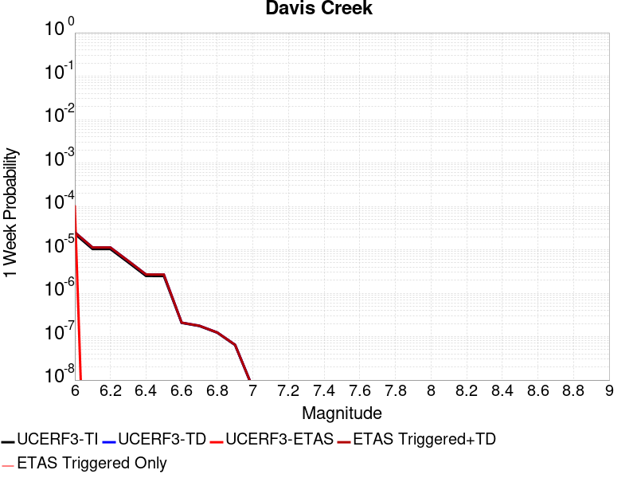 | 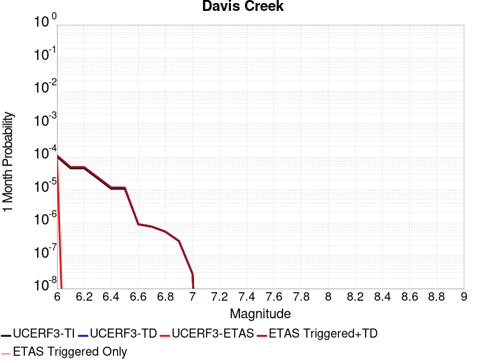 | 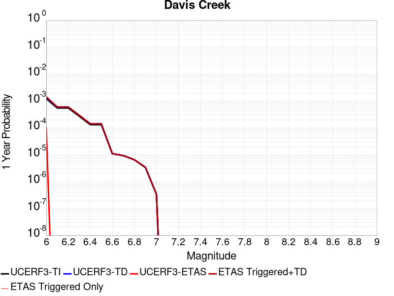 | 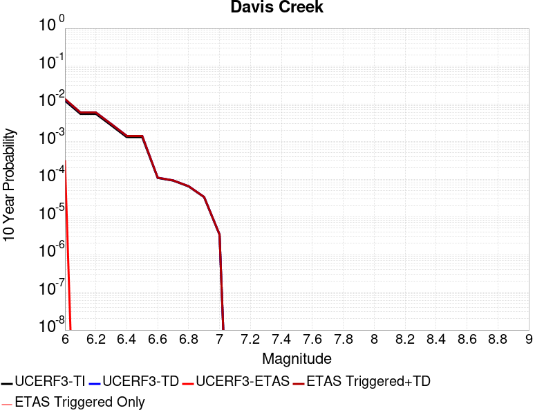 |

| Magnitude | 1 wk TI Prob | 1 wk TD Prob | 1 wk ETAS Prob | 1 wk ETAS/TD Gain | 1 wk ETAS Triggered+TD | 1 wk ETAS Triggered Only | 1 mo TI Prob | 1 mo TD Prob | 1 mo ETAS Prob | 1 mo ETAS/TD Gain | 1 mo ETAS Triggered+TD | 1 mo ETAS Triggered Only | 1 yr TI Prob | 1 yr TD Prob | 1 yr ETAS Prob | 1 yr ETAS/TD Gain | 1 yr ETAS Triggered+TD | 1 yr ETAS Triggered Only | 10 yr TI Prob | 10 yr TD Prob | 10 yr ETAS Prob | 10 yr ETAS/TD Gain | 10 yr ETAS Triggered+TD | 10 yr ETAS Triggered Only |
|-----|-----|-----|-----|-----|-----|-----|-----|-----|-----|-----|-----|-----|-----|-----|-----|-----|-----|-----|-----|-----|-----|-----|-----|-----|
| 6.0 | 2.331472E-5 | 2.5393283E-5 | 1.0E-4 | 3.938049 | 2.5393283E-5 | 0.0 | 9.99164E-5 | 1.0882449E-4 | 1.0E-4 | 0.9189108 | 1.0882449E-4 | 0.0 | 0.0012158032 | 0.0013242511 | 6.0E-4 | 0.4530863 | 0.0015239862 | 2.0E-4 | 0.01209173 | 0.013175357 | 0.0085 | 0.6451438 | 0.015050325 | 0.0019 |
| 6.1 | 1.0407654E-5 | 1.1306657E-5 | 0.0 | 0.0 | 1.1306657E-5 | 0.0 | 4.4603472E-5 | 4.8456353E-5 | 0.0 | 0.0 | 4.8456353E-5 | 0.0 | 5.4291193E-4 | 5.8982347E-4 | 2.0E-4 | 0.3390845 | 6.897645E-4 | 1.0E-4 | 0.0054158745 | 0.0058852476 | 0.004 | 0.67966557 | 0.0068793623 | 0.001 |
| 6.2 | 1.0407654E-5 | 1.1306657E-5 | 0.0 | 0.0 | 1.1306657E-5 | 0.0 | 4.4603472E-5 | 4.8456353E-5 | 0.0 | 0.0 | 4.8456353E-5 | 0.0 | 5.4291193E-4 | 5.8982347E-4 | 2.0E-4 | 0.3390845 | 6.897645E-4 | 1.0E-4 | 0.0054158745 | 0.0058852476 | 0.004 | 0.67966557 | 0.0068793623 | 0.001 |
| 6.3 | 5.1323277E-6 | 5.5636046E-6 | 0.0 | 0.0 | 5.5636046E-6 | 0.0 | 2.1995505E-5 | 2.384385E-5 | 0.0 | 0.0 | 2.384385E-5 | 0.0 | 2.6776237E-4 | 2.902688E-4 | 0.0 | 0.0 | 2.902688E-4 | 0.0 | 0.0026743996 | 0.0028997413 | 0.0018 | 0.62074506 | 0.0031988714 | 3.0E-4 |
| 6.4 | 2.4985154E-6 | 2.7021988E-6 | 0.0 | 0.0 | 2.7021988E-6 | 0.0 | 1.07078795E-5 | 1.1580821E-5 | 0.0 | 0.0 | 1.1580821E-5 | 0.0 | 1.3036063E-4 | 1.4099097E-4 | 0.0 | 0.0 | 1.4099097E-4 | 0.0 | 0.0013028418 | 0.0014093693 | 9.0E-4 | 0.6385835 | 0.0016090875 | 2.0E-4 |
| 6.5 | 2.4846438E-6 | 2.6881348E-6 | 0.0 | 0.0 | 2.6881348E-6 | 0.0 | 1.064843E-5 | 1.1520548E-5 | 0.0 | 0.0 | 1.1520548E-5 | 0.0 | 1.2963692E-4 | 1.4025725E-4 | 0.0 | 0.0 | 1.4025725E-4 | 0.0 | 0.0012956132 | 0.0014020413 | 9.0E-4 | 0.64192116 | 0.001601761 | 2.0E-4 |
| 6.6 | 2.072566E-7 | 2.1014988E-7 | 0.0 | 0.0 | 2.1014988E-7 | 0.0 | 8.882423E-7 | 9.006421E-7 | 0.0 | 0.0 | 9.006421E-7 | 0.0 | 1.0814296E-5 | 1.0965264E-5 | 0.0 | 0.0 | 1.0965264E-5 | 0.0 | 1.081377E-4 | 1.0964741E-4 | 2.0E-4 | 1.8240285 | 1.0964741E-4 | 0.0 |
| 6.7 | 1.7544528E-7 | 1.7788216E-7 | 0.0 | 0.0 | 1.7788216E-7 | 0.0 | 7.5190815E-7 | 7.6235193E-7 | 0.0 | 0.0 | 7.6235193E-7 | 0.0 | 9.154443E-6 | 9.281596E-6 | 0.0 | 0.0 | 9.281596E-6 | 0.0 | 9.1540656E-5 | 9.2812246E-5 | 1.0E-4 | 1.0774441 | 9.2812246E-5 | 0.0 |
| 6.8 | 1.2320395E-7 | 1.2479437E-7 | 0.0 | 0.0 | 1.2479437E-7 | 0.0 | 5.280168E-7 | 5.348329E-7 | 0.0 | 0.0 | 5.348329E-7 | 0.0 | 6.428586E-6 | 6.5115723E-6 | 0.0 | 0.0 | 6.5115723E-6 | 0.0 | 6.4284E-5 | 6.511393E-5 | 1.0E-4 | 1.5357697 | 6.511393E-5 | 0.0 |
| 6.9 | 6.399997E-8 | 6.485147E-8 | 0.0 | 0.0 | 6.485147E-8 | 0.0 | 2.7428555E-7 | 2.7793484E-7 | 0.0 | 0.0 | 2.7793484E-7 | 0.0 | 3.3394215E-6 | 3.3838523E-6 | 0.0 | 0.0 | 3.3838523E-6 | 0.0 | 3.3393713E-5 | 3.383807E-5 | 0.0 | 0.0 | 3.383807E-5 | 0.0 |
| 7.0 | 6.4455685E-9 | 6.5343144E-9 | 0.0 | 0.0 | 6.5343144E-9 | 0.0 | 2.7623864E-8 | 2.8004205E-8 | 0.0 | 0.0 | 2.8004205E-8 | 0.0 | 3.3632048E-7 | 3.409512E-7 | 0.0 | 0.0 | 3.409512E-7 | 0.0 | 3.3631998E-6 | 3.409512E-6 | 0.0 | 0.0 | 3.409512E-6 | 0.0 |

## Gillem - Big Crack 2011 CFM
*[(top)](#table-of-contents)*

| 1 Week | 1 Month | 1 Year | 10 Year |
|-----|-----|-----|-----|
| 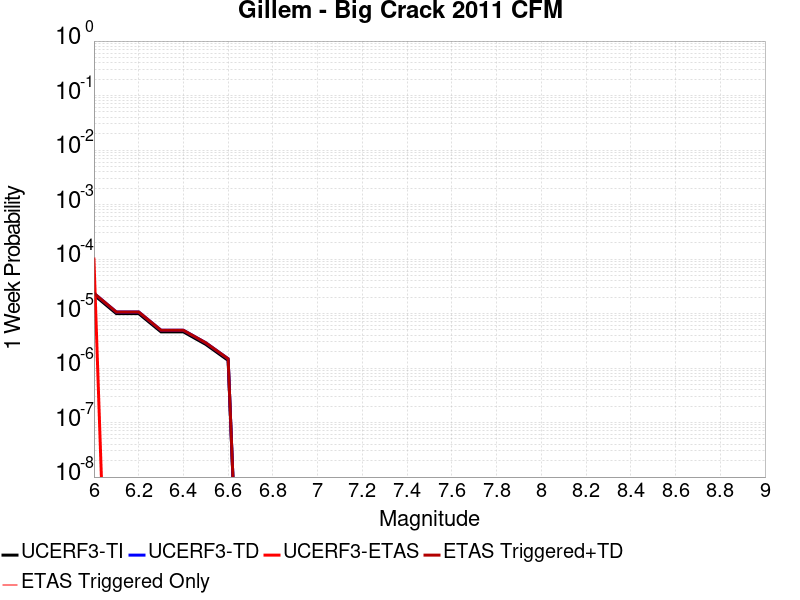 | 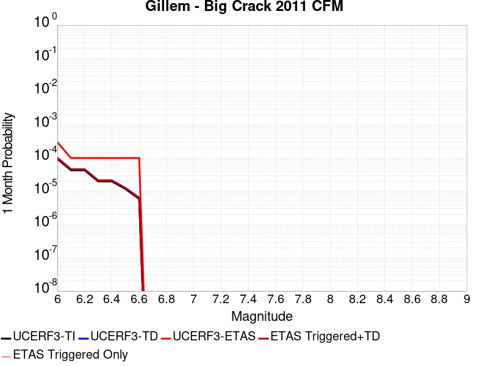 | 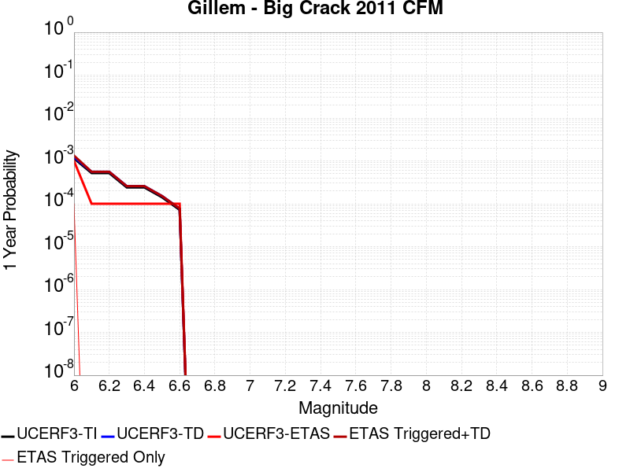 | 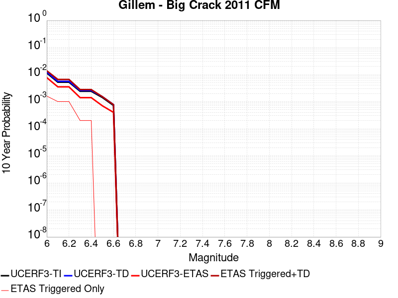 |

| Magnitude | 1 wk TI Prob | 1 wk TD Prob | 1 wk ETAS Prob | 1 wk ETAS/TD Gain | 1 wk ETAS Triggered+TD | 1 wk ETAS Triggered Only | 1 mo TI Prob | 1 mo TD Prob | 1 mo ETAS Prob | 1 mo ETAS/TD Gain | 1 mo ETAS Triggered+TD | 1 mo ETAS Triggered Only | 1 yr TI Prob | 1 yr TD Prob | 1 yr ETAS Prob | 1 yr ETAS/TD Gain | 1 yr ETAS Triggered+TD | 1 yr ETAS Triggered Only | 10 yr TI Prob | 10 yr TD Prob | 10 yr ETAS Prob | 10 yr ETAS/TD Gain | 10 yr ETAS Triggered+TD | 10 yr ETAS Triggered Only |
|-----|-----|-----|-----|-----|-----|-----|-----|-----|-----|-----|-----|-----|-----|-----|-----|-----|-----|-----|-----|-----|-----|-----|-----|-----|
| 6.0 | 2.196852E-5 | 2.358614E-5 | 1.0E-4 | 4.239778 | 2.358614E-5 | 0.0 | 9.4147406E-5 | 1.0108005E-4 | 3.0E-4 | 2.9679449 | 1.0108005E-4 | 0.0 | 0.0011456419 | 0.0012300436 | 0.001 | 0.81297934 | 0.0013299205 | 1.0E-4 | 0.011397537 | 0.012241199 | 0.0077 | 0.6290234 | 0.013821613 | 0.0016 |
| 6.1 | 9.992795E-6 | 1.0703847E-5 | 0.0 | 0.0 | 1.0703847E-5 | 0.0 | 4.2825563E-5 | 4.5872923E-5 | 1.0E-4 | 2.1799352 | 4.5872923E-5 | 0.0 | 5.2127644E-4 | 5.58378E-4 | 1.0E-4 | 0.17909014 | 5.58378E-4 | 0.0 | 0.0052005537 | 0.0055715577 | 0.0035 | 0.6281906 | 0.006565986 | 0.001 |
| 6.2 | 9.992795E-6 | 1.0703847E-5 | 0.0 | 0.0 | 1.0703847E-5 | 0.0 | 4.2825563E-5 | 4.5872923E-5 | 1.0E-4 | 2.1799352 | 4.5872923E-5 | 0.0 | 5.2127644E-4 | 5.58378E-4 | 1.0E-4 | 0.17909014 | 5.58378E-4 | 0.0 | 0.0052005537 | 0.0055715577 | 0.0035 | 0.6281906 | 0.006565986 | 0.001 |
| 6.3 | 4.6127884E-6 | 4.938969E-6 | 0.0 | 0.0 | 4.938969E-6 | 0.0 | 1.9768944E-5 | 2.1166863E-5 | 1.0E-4 | 4.7243657 | 2.1166863E-5 | 0.0 | 2.406603E-4 | 2.5768054E-4 | 1.0E-4 | 0.38807744 | 2.5768054E-4 | 0.0 | 0.0024039985 | 0.002574255 | 0.0014 | 0.54384667 | 0.00277374 | 2.0E-4 |
| 6.4 | 4.6127884E-6 | 4.938969E-6 | 0.0 | 0.0 | 4.938969E-6 | 0.0 | 1.9768944E-5 | 2.1166863E-5 | 1.0E-4 | 4.7243657 | 2.1166863E-5 | 0.0 | 2.406603E-4 | 2.5768054E-4 | 1.0E-4 | 0.38807744 | 2.5768054E-4 | 0.0 | 0.0024039985 | 0.002574255 | 0.0014 | 0.54384667 | 0.00277374 | 2.0E-4 |
| 6.5 | 2.716712E-6 | 2.9089379E-6 | 0.0 | 0.0 | 2.9089379E-6 | 0.0 | 1.1643E-5 | 1.246683E-5 | 1.0E-4 | 8.021285 | 1.246683E-5 | 0.0 | 1.417443E-4 | 1.5177552E-4 | 1.0E-4 | 0.65886784 | 1.5177552E-4 | 0.0 | 0.0014165393 | 0.0015169563 | 7.0E-4 | 0.46145037 | 0.0015169563 | 0.0 |
| 6.6 | 1.3818255E-6 | 1.480947E-6 | 0.0 | 0.0 | 1.480947E-6 | 0.0 | 5.922096E-6 | 6.346908E-6 | 1.0E-4 | 15.755704 | 6.346908E-6 | 0.0 | 7.209913E-5 | 7.727209E-5 | 1.0E-4 | 1.2941283 | 7.727209E-5 | 0.0 | 7.2075747E-4 | 7.7257294E-4 | 4.0E-4 | 0.51775044 | 7.7257294E-4 | 0.0 |

## Great Valley 11
*[(top)](#table-of-contents)*

| 1 Week | 1 Month | 1 Year | 10 Year |
|-----|-----|-----|-----|
| 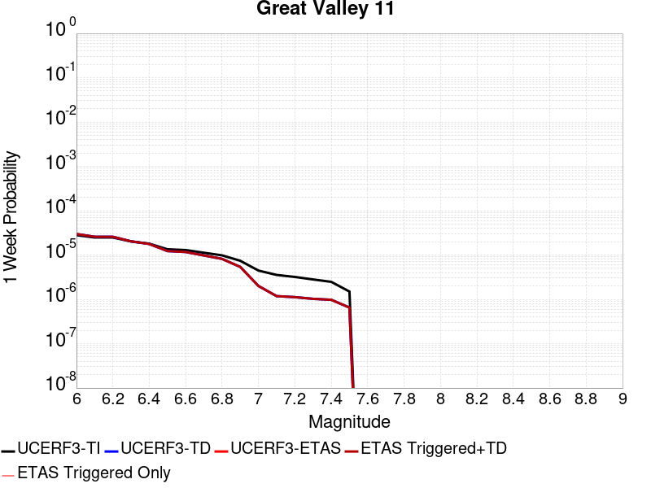 | 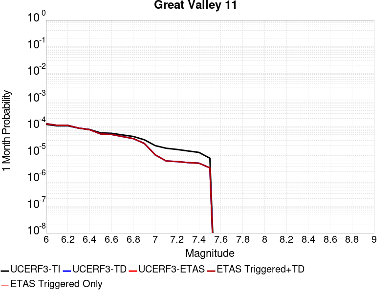 | 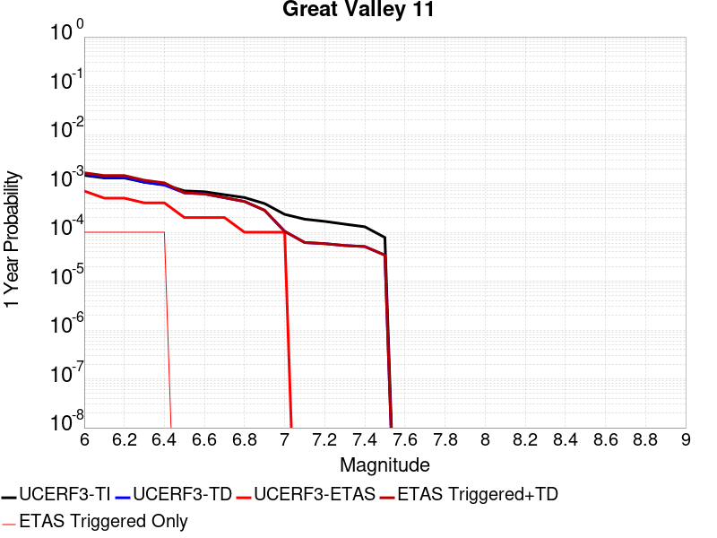 | 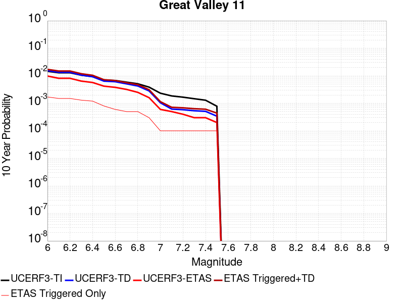 |

| Magnitude | 1 wk TI Prob | 1 wk TD Prob | 1 wk ETAS Prob | 1 wk ETAS/TD Gain | 1 wk ETAS Triggered+TD | 1 wk ETAS Triggered Only | 1 mo TI Prob | 1 mo TD Prob | 1 mo ETAS Prob | 1 mo ETAS/TD Gain | 1 mo ETAS Triggered+TD | 1 mo ETAS Triggered Only | 1 yr TI Prob | 1 yr TD Prob | 1 yr ETAS Prob | 1 yr ETAS/TD Gain | 1 yr ETAS Triggered+TD | 1 yr ETAS Triggered Only | 10 yr TI Prob | 10 yr TD Prob | 10 yr ETAS Prob | 10 yr ETAS/TD Gain | 10 yr ETAS Triggered+TD | 10 yr ETAS Triggered Only |
|-----|-----|-----|-----|-----|-----|-----|-----|-----|-----|-----|-----|-----|-----|-----|-----|-----|-----|-----|-----|-----|-----|-----|-----|-----|
| 6.0 | 2.8099583E-5 | 2.9775658E-5 | 0.0 | 0.0 | 2.9775658E-5 | 0.0 | 1.20421224E-4 | 1.2760414E-4 | 0.0 | 0.0 | 1.2760414E-4 | 0.0 | 0.0014651422 | 0.0015525466 | 7.0E-4 | 0.45087215 | 0.0016523913 | 1.0E-4 | 0.0145552 | 0.015424515 | 0.0098 | 0.63535225 | 0.017098293 | 0.0017 |
| 6.1 | 2.483194E-5 | 2.5858873E-5 | 0.0 | 0.0 | 2.5858873E-5 | 0.0 | 1.0641825E-4 | 1.1081939E-4 | 0.0 | 0.0 | 1.1081939E-4 | 0.0 | 0.0012948721 | 0.0013484543 | 5.0E-4 | 0.37079495 | 0.0014483194 | 1.0E-4 | 0.012873529 | 0.013409115 | 0.0081 | 0.60406667 | 0.014889002 | 0.0015 |
| 6.2 | 2.483194E-5 | 2.5858873E-5 | 0.0 | 0.0 | 2.5858873E-5 | 0.0 | 1.0641825E-4 | 1.1081939E-4 | 0.0 | 0.0 | 1.1081939E-4 | 0.0 | 0.0012948721 | 0.0013484543 | 5.0E-4 | 0.37079495 | 0.0014483194 | 1.0E-4 | 0.012873529 | 0.013409115 | 0.0081 | 0.60406667 | 0.014889002 | 0.0015 |
| 6.3 | 2.0257901E-5 | 2.0362342E-5 | 0.0 | 0.0 | 2.0362342E-5 | 0.0 | 8.681669E-5 | 8.7264496E-5 | 0.0 | 0.0 | 8.7264496E-5 | 0.0 | 0.0010564806 | 0.0010619687 | 4.0E-4 | 0.37665892 | 0.0011618626 | 1.0E-4 | 0.01051472 | 0.0105731 | 0.0064 | 0.60530967 | 0.0118593555 | 0.0013 |
| 6.4 | 1.8054898E-5 | 1.7749435E-5 | 0.0 | 0.0 | 1.7749435E-5 | 0.0 | 7.737584E-5 | 7.6067E-5 | 0.0 | 0.0 | 7.6067E-5 | 0.0 | 9.416436E-4 | 9.257596E-4 | 4.0E-4 | 0.43207762 | 0.0010256671 | 1.0E-4 | 0.009376635 | 0.009222761 | 0.0057 | 0.6180362 | 0.010411693 | 0.0012 |
| 6.5 | 1.34804895E-5 | 1.2300592E-5 | 0.0 | 0.0 | 1.2300592E-5 | 0.0 | 5.777225E-5 | 5.2715783E-5 | 0.0 | 0.0 | 5.2715783E-5 | 0.0 | 7.031501E-4 | 6.416298E-4 | 2.0E-4 | 0.31170622 | 6.416298E-4 | 0.0 | 0.007009294 | 0.0063982084 | 0.0042 | 0.65643376 | 0.00719309 | 8.0E-4 |
| 6.6 | 1.294883E-5 | 1.1712511E-5 | 0.0 | 0.0 | 1.1712511E-5 | 0.0 | 5.5493805E-5 | 5.0195533E-5 | 0.0 | 0.0 | 5.0195533E-5 | 0.0 | 6.754276E-4 | 6.109633E-4 | 2.0E-4 | 0.3273519 | 6.109633E-4 | 0.0 | 0.006733784 | 0.006093261 | 0.0038 | 0.6236398 | 0.006689605 | 6.0E-4 |
| 6.7 | 1.1272237E-5 | 9.795002E-6 | 0.0 | 0.0 | 9.795002E-6 | 0.0 | 4.8308695E-5 | 4.197792E-5 | 0.0 | 0.0 | 4.197792E-5 | 0.0 | 5.879996E-4 | 5.109641E-4 | 2.0E-4 | 0.39141694 | 5.109641E-4 | 0.0 | 0.005864462 | 0.0050981757 | 0.0032 | 0.62767553 | 0.005595627 | 5.0E-4 |
| 6.8 | 9.8337505E-6 | 8.178999E-6 | 0.0 | 0.0 | 8.178999E-6 | 0.0 | 4.2143965E-5 | 3.5052395E-5 | 0.0 | 0.0 | 3.5052395E-5 | 0.0 | 5.1298196E-4 | 4.266814E-4 | 1.0E-4 | 0.23436691 | 4.266814E-4 | 0.0 | 0.005117994 | 0.0042588306 | 0.0025 | 0.58701557 | 0.004756701 | 5.0E-4 |
| 6.9 | 7.4224813E-6 | 5.402811E-6 | 0.0 | 0.0 | 5.402811E-6 | 0.0 | 3.1810247E-5 | 2.3154706E-5 | 0.0 | 0.0 | 2.3154706E-5 | 0.0 | 3.872209E-4 | 2.8187348E-4 | 1.0E-4 | 0.35476908 | 2.8187348E-4 | 0.0 | 0.0038654688 | 0.0028153 | 0.0016 | 0.56832314 | 0.0031144554 | 3.0E-4 |
| 7.0 | 4.4628923E-6 | 2.0066382E-6 | 0.0 | 0.0 | 2.0066382E-6 | 0.0 | 1.912654E-5 | 8.59985E-6 | 0.0 | 0.0 | 8.59985E-6 | 0.0 | 2.3284076E-4 | 1.04698265E-4 | 1.0E-4 | 0.9551257 | 1.04698265E-4 | 0.0 | 0.0023259693 | 0.0010465009 | 6.0E-4 | 0.5733392 | 0.0011463963 | 1.0E-4 |
| 7.1 | 3.5546527E-6 | 1.1825065E-6 | 0.0 | 0.0 | 1.1825065E-6 | 0.0 | 1.5234136E-5 | 5.0678755E-6 | 0.0 | 0.0 | 5.0678755E-6 | 0.0 | 1.8545982E-4 | 6.1699706E-5 | 0.0 | 0.0 | 6.1699706E-5 | 0.0 | 0.0018530512 | 6.168325E-4 | 5.0E-4 | 0.8105928 | 7.167708E-4 | 1.0E-4 |
| 7.2 | 3.2039936E-6 | 1.1225948E-6 | 0.0 | 0.0 | 1.1225948E-6 | 0.0 | 1.3731329E-5 | 4.811112E-6 | 0.0 | 0.0 | 4.811112E-6 | 0.0 | 1.671661E-4 | 5.857378E-5 | 0.0 | 0.0 | 5.857378E-5 | 0.0 | 0.0016704041 | 5.855901E-4 | 4.0E-4 | 0.6830717 | 6.8553153E-4 | 1.0E-4 |
| 7.3 | 2.8120473E-6 | 1.0280509E-6 | 0.0 | 0.0 | 1.0280509E-6 | 0.0 | 1.2051575E-5 | 4.405925E-6 | 0.0 | 0.0 | 4.405925E-6 | 0.0 | 1.4671806E-4 | 5.3640888E-5 | 0.0 | 0.0 | 5.3640888E-5 | 0.0 | 0.0014662122 | 5.36286E-4 | 3.0E-4 | 0.559403 | 6.362324E-4 | 1.0E-4 |
| 7.4 | 2.4837766E-6 | 9.777389E-7 | 0.0 | 0.0 | 9.777389E-7 | 0.0 | 1.0644713E-5 | 4.190303E-6 | 0.0 | 0.0 | 4.190303E-6 | 0.0 | 1.2959167E-4 | 5.1015813E-5 | 0.0 | 0.0 | 5.1015813E-5 | 0.0 | 0.0012951613 | 5.1004754E-4 | 3.0E-4 | 0.5881804 | 6.0999655E-4 | 1.0E-4 |
| 7.5 | 1.5002679E-6 | 6.5287935E-7 | 0.0 | 0.0 | 6.5287935E-7 | 0.0 | 6.4297037E-6 | 2.7980518E-6 | 0.0 | 0.0 | 2.7980518E-6 | 0.0 | 7.827883E-5 | 3.406579E-5 | 0.0 | 0.0 | 3.406579E-5 | 0.0 | 7.825126E-4 | 3.406098E-4 | 2.0E-4 | 0.58718216 | 4.4057574E-4 | 1.0E-4 |

## San Jacinto (Coyote Creek)
*[(top)](#table-of-contents)*

| 1 Week | 1 Month | 1 Year | 10 Year |
|-----|-----|-----|-----|
| 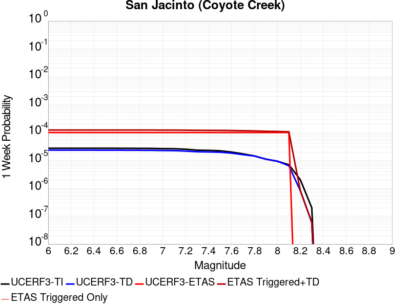 | 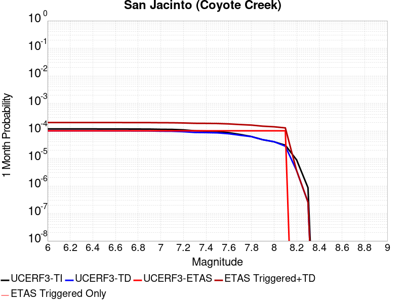 | 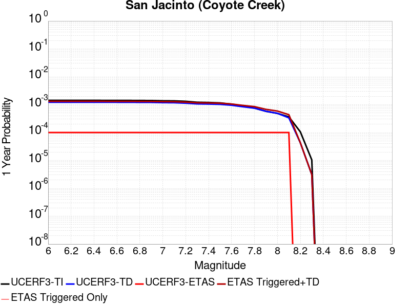 | 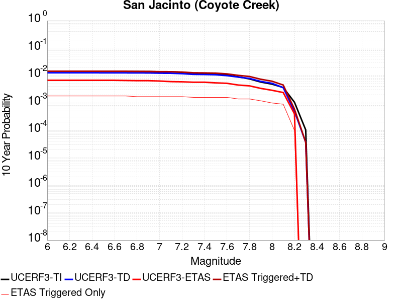 |

| Magnitude | 1 wk TI Prob | 1 wk TD Prob | 1 wk ETAS Prob | 1 wk ETAS/TD Gain | 1 wk ETAS Triggered+TD | 1 wk ETAS Triggered Only | 1 mo TI Prob | 1 mo TD Prob | 1 mo ETAS Prob | 1 mo ETAS/TD Gain | 1 mo ETAS Triggered+TD | 1 mo ETAS Triggered Only | 1 yr TI Prob | 1 yr TD Prob | 1 yr ETAS Prob | 1 yr ETAS/TD Gain | 1 yr ETAS Triggered+TD | 1 yr ETAS Triggered Only | 10 yr TI Prob | 10 yr TD Prob | 10 yr ETAS Prob | 10 yr ETAS/TD Gain | 10 yr ETAS Triggered+TD | 10 yr ETAS Triggered Only |
|-----|-----|-----|-----|-----|-----|-----|-----|-----|-----|-----|-----|-----|-----|-----|-----|-----|-----|-----|-----|-----|-----|-----|-----|-----|
| 6.0 | 2.7374346E-5 | 2.3486506E-5 | 1.0E-4 | 4.2577643 | 1.2348416E-4 | 1.0E-4 | 1.1731335E-4 | 1.00652585E-4 | 1.0E-4 | 0.9935165 | 2.0064252E-4 | 1.0E-4 | 0.0014273542 | 0.0012247588 | 8.0E-4 | 0.65318984 | 0.0014245139 | 2.0E-4 | 0.01418221 | 0.012584946 | 0.0067 | 0.5323821 | 0.014362293 | 0.0018 |
| 6.1 | 2.7374346E-5 | 2.3486506E-5 | 1.0E-4 | 4.2577643 | 1.2348416E-4 | 1.0E-4 | 1.1731335E-4 | 1.00652585E-4 | 1.0E-4 | 0.9935165 | 2.0064252E-4 | 1.0E-4 | 0.0014273542 | 0.0012247588 | 8.0E-4 | 0.65318984 | 0.0014245139 | 2.0E-4 | 0.01418221 | 0.012584946 | 0.0067 | 0.5323821 | 0.014362293 | 0.0018 |
| 6.2 | 2.7374346E-5 | 2.3486506E-5 | 1.0E-4 | 4.2577643 | 1.2348416E-4 | 1.0E-4 | 1.1731335E-4 | 1.00652585E-4 | 1.0E-4 | 0.9935165 | 2.0064252E-4 | 1.0E-4 | 0.0014273542 | 0.0012247588 | 8.0E-4 | 0.65318984 | 0.0014245139 | 2.0E-4 | 0.01418221 | 0.012584946 | 0.0067 | 0.5323821 | 0.014362293 | 0.0018 |
| 6.3 | 2.7374346E-5 | 2.3486506E-5 | 1.0E-4 | 4.2577643 | 1.2348416E-4 | 1.0E-4 | 1.1731335E-4 | 1.00652585E-4 | 1.0E-4 | 0.9935165 | 2.0064252E-4 | 1.0E-4 | 0.0014273542 | 0.0012247588 | 8.0E-4 | 0.65318984 | 0.0014245139 | 2.0E-4 | 0.01418221 | 0.012584946 | 0.0067 | 0.5323821 | 0.014362293 | 0.0018 |
| 6.4 | 2.7374346E-5 | 2.3486506E-5 | 1.0E-4 | 4.2577643 | 1.2348416E-4 | 1.0E-4 | 1.1731335E-4 | 1.00652585E-4 | 1.0E-4 | 0.9935165 | 2.0064252E-4 | 1.0E-4 | 0.0014273542 | 0.0012247588 | 8.0E-4 | 0.65318984 | 0.0014245139 | 2.0E-4 | 0.01418221 | 0.012584946 | 0.0067 | 0.5323821 | 0.014362293 | 0.0018 |
| 6.5 | 2.7282445E-5 | 2.3372866E-5 | 1.0E-4 | 4.2784657 | 1.2337053E-4 | 1.0E-4 | 1.16919524E-4 | 1.0016559E-4 | 1.0E-4 | 0.9983468 | 2.0015557E-4 | 1.0E-4 | 0.0014225657 | 0.0012188364 | 8.0E-4 | 0.6563637 | 0.0014185926 | 2.0E-4 | 0.014134934 | 0.0125263985 | 0.0067 | 0.53487045 | 0.014303851 | 0.0018 |
| 6.6 | 2.7282445E-5 | 2.3372866E-5 | 1.0E-4 | 4.2784657 | 1.2337053E-4 | 1.0E-4 | 1.16919524E-4 | 1.0016559E-4 | 1.0E-4 | 0.9983468 | 2.0015557E-4 | 1.0E-4 | 0.0014225657 | 0.0012188364 | 8.0E-4 | 0.6563637 | 0.0014185926 | 2.0E-4 | 0.014134934 | 0.0125263985 | 0.0067 | 0.53487045 | 0.014303851 | 0.0018 |
| 6.7 | 2.7216198E-5 | 2.3298173E-5 | 1.0E-4 | 4.292182 | 1.2329585E-4 | 1.0E-4 | 1.1663563E-4 | 9.984551E-5 | 1.0E-4 | 1.0015473 | 1.9983551E-4 | 1.0E-4 | 0.0014191137 | 0.0012149437 | 8.0E-4 | 0.6584667 | 0.0014147008 | 2.0E-4 | 0.014100855 | 0.012487893 | 0.0066 | 0.52851194 | 0.014265414 | 0.0018 |
| 6.8 | 2.7078617E-5 | 2.321577E-5 | 1.0E-4 | 4.307417 | 1.2321345E-4 | 1.0E-4 | 1.1604605E-4 | 9.9492376E-5 | 1.0E-4 | 1.0051022 | 1.9948243E-4 | 1.0E-4 | 0.001411945 | 0.0012106491 | 8.0E-4 | 0.6608025 | 0.001410407 | 2.0E-4 | 0.014030075 | 0.012445222 | 0.0065 | 0.5222888 | 0.014124065 | 0.0017 |
| 6.9 | 2.6982952E-5 | 2.3135748E-5 | 1.0E-4 | 4.322315 | 1.2313343E-4 | 1.0E-4 | 1.15636096E-4 | 9.914945E-5 | 1.0E-4 | 1.0085784 | 1.9913954E-4 | 1.0E-4 | 0.0014069602 | 0.0012064787 | 8.0E-4 | 0.6630867 | 0.0014062374 | 2.0E-4 | 0.013980856 | 0.012403727 | 0.0065 | 0.52403605 | 0.01408264 | 0.0017 |
| 7.0 | 2.6449972E-5 | 2.2714323E-5 | 1.0E-4 | 4.4025087 | 1.2271205E-4 | 1.0E-4 | 1.1335209E-4 | 9.734348E-5 | 1.0E-4 | 1.0272902 | 1.9733375E-4 | 1.0E-4 | 0.001379188 | 0.001184515 | 8.0E-4 | 0.6753819 | 0.0013842781 | 2.0E-4 | 0.0137065975 | 0.012185776 | 0.0063 | 0.5169962 | 0.013865059 | 0.0017 |
| 7.1 | 2.6257849E-5 | 2.2541793E-5 | 1.0E-4 | 4.4362044 | 1.2253954E-4 | 1.0E-4 | 1.1252879E-4 | 9.6604126E-5 | 1.0E-4 | 1.0351526 | 1.9659447E-4 | 1.0E-4 | 0.0013691769 | 0.001175523 | 8.0E-4 | 0.6805481 | 0.001375288 | 2.0E-4 | 0.013607717 | 0.012096384 | 0.006 | 0.496016 | 0.01377582 | 0.0017 |
| 7.2 | 2.5270041E-5 | 2.1745574E-5 | 1.0E-4 | 4.5986366 | 1.217434E-4 | 1.0E-4 | 1.0829568E-4 | 9.3192E-5 | 1.0E-4 | 1.0730535 | 1.9318268E-4 | 1.0E-4 | 0.0013177024 | 0.0011340244 | 7.0E-4 | 0.6172707 | 0.0013337976 | 2.0E-4 | 0.013099162 | 0.011681948 | 0.0059 | 0.50505275 | 0.013362089 | 0.0017 |
| 7.3 | 2.339701E-5 | 2.0489953E-5 | 1.0E-4 | 4.8804407 | 1.2048791E-4 | 1.0E-4 | 1.0026905E-4 | 8.7811146E-5 | 1.0E-4 | 1.1388077 | 1.8780236E-4 | 1.0E-4 | 0.001220092 | 0.0010685783 | 7.0E-4 | 0.65507597 | 0.0012683646 | 2.0E-4 | 0.012134149 | 0.011027225 | 0.0057 | 0.51690245 | 0.012609582 | 0.0016 |
| 7.4 | 2.296333E-5 | 2.0222698E-5 | 1.0E-4 | 4.9449387 | 1.2022068E-4 | 1.0E-4 | 9.841056E-5 | 8.666584E-5 | 1.0E-4 | 1.1538572 | 1.8665717E-4 | 1.0E-4 | 0.0011974899 | 0.0010546478 | 7.0E-4 | 0.6637287 | 0.0012544369 | 2.0E-4 | 0.011910575 | 0.010887539 | 0.0057 | 0.5235343 | 0.012470119 | 0.0016 |
| 7.5 | 2.2188895E-5 | 1.975088E-5 | 1.0E-4 | 5.0630655 | 1.19748904E-4 | 1.0E-4 | 9.50918E-5 | 8.464389E-5 | 1.0E-4 | 1.1814201 | 1.8463543E-4 | 1.0E-4 | 0.0011571277 | 0.0010300542 | 6.0E-4 | 0.58249366 | 0.0012298481 | 2.0E-4 | 0.011511209 | 0.010639824 | 0.0054 | 0.5075272 | 0.0122228 | 0.0016 |
| 7.6 | 2.0013189E-5 | 1.835124E-5 | 1.0E-4 | 5.449223 | 1.183494E-4 | 1.0E-4 | 8.5767984E-5 | 7.864581E-5 | 1.0E-4 | 1.2715235 | 1.7863794E-4 | 1.0E-4 | 0.001043725 | 9.5709384E-4 | 6.0E-4 | 0.62689775 | 0.0011569024 | 2.0E-4 | 0.010388365 | 0.009904901 | 0.0052 | 0.52499264 | 0.011489052 | 0.0016 |
| 7.7 | 1.7230794E-5 | 1.6155242E-5 | 1.0E-4 | 6.1899414 | 1.1615363E-4 | 1.0E-4 | 7.384417E-5 | 6.923491E-5 | 1.0E-4 | 1.444358 | 1.6922799E-4 | 1.0E-4 | 8.986819E-4 | 8.4260985E-4 | 6.0E-4 | 0.7120733 | 0.0010424413 | 2.0E-4 | 0.008950562 | 0.00875478 | 0.0045 | 0.51400495 | 0.010142523 | 0.0014 |
| 7.8 | 1.4478809E-5 | 1.4426429E-5 | 1.0E-4 | 6.9317226 | 1.1442498E-4 | 1.0E-4 | 6.205057E-5 | 6.182609E-5 | 1.0E-4 | 1.6174402 | 1.618199E-4 | 1.0E-4 | 7.552038E-4 | 7.5247325E-4 | 6.0E-4 | 0.79737055 | 9.523228E-4 | 2.0E-4 | 0.0075264242 | 0.007845308 | 0.0042 | 0.5353518 | 0.009234324 | 0.0014 |
| 7.9 | 1.1114467E-5 | 1.1145464E-5 | 1.0E-4 | 8.97226 | 1.1114435E-4 | 1.0E-4 | 4.7632562E-5 | 4.7765403E-5 | 1.0E-4 | 2.0935655 | 1.4776063E-4 | 1.0E-4 | 5.797721E-4 | 5.813891E-4 | 4.0E-4 | 0.68800735 | 7.812728E-4 | 2.0E-4 | 0.0057826187 | 0.0061174533 | 0.0034 | 0.55578685 | 0.007310112 | 0.0012 |
| 8.0 | 9.327402E-6 | 9.445471E-6 | 1.0E-4 | 10.587085 | 1.09444525E-4 | 1.0E-4 | 3.9973966E-5 | 4.0479965E-5 | 1.0E-4 | 2.470358 | 1.4047591E-4 | 1.0E-4 | 4.8657437E-4 | 4.927326E-4 | 4.0E-4 | 0.81179935 | 6.92634E-4 | 2.0E-4 | 0.0048551033 | 0.0052107642 | 0.0029 | 0.55654025 | 0.0062055537 | 0.001 |
| 8.1 | 7.0235833E-6 | 6.4939877E-6 | 1.0E-4 | 15.398859 | 1.0649334E-4 | 1.0E-4 | 3.0100724E-5 | 2.7831082E-5 | 1.0E-4 | 3.593105 | 1.278283E-4 | 1.0E-4 | 3.664147E-4 | 3.387912E-4 | 4.0E-4 | 1.1806682 | 5.387234E-4 | 2.0E-4 | 0.003658111 | 0.0036101425 | 0.0024 | 0.66479367 | 0.0045068935 | 9.0E-4 |
| 8.2 | 2.0358202E-6 | 8.3329155E-7 | 0.0 | 0.0 | 8.3329155E-7 | 0.0 | 8.724915E-6 | 3.5712449E-6 | 0.0 | 0.0 | 3.5712449E-6 | 0.0 | 1.06220665E-4 | 4.3479056E-5 | 1.0E-4 | 2.299958 | 4.3479056E-5 | 0.0 | 0.001061699 | 4.953407E-4 | 4.0E-4 | 0.80752504 | 5.9529115E-4 | 1.0E-4 |
| 8.3 | 2.0051264E-7 | 6.0631756E-8 | 0.0 | 0.0 | 6.0631756E-8 | 0.0 | 8.5933965E-7 | 2.5985037E-7 | 0.0 | 0.0 | 2.5985037E-7 | 0.0 | 1.046241E-5 | 3.1636741E-6 | 0.0 | 0.0 | 3.1636741E-6 | 0.0 | 1.0461917E-4 | 3.6956626E-5 | 0.0 | 0.0 | 3.6956626E-5 | 0.0 |

## Collayami 2011 CFM
*[(top)](#table-of-contents)*

| 1 Week | 1 Month | 1 Year | 10 Year |
|-----|-----|-----|-----|
| 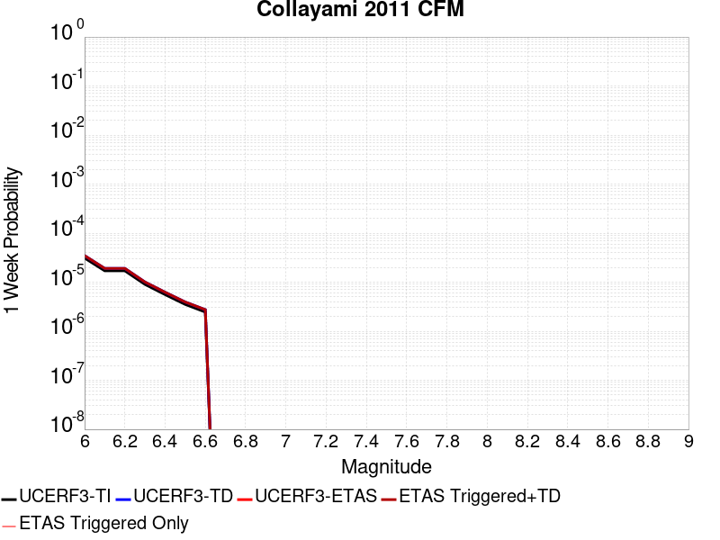 | 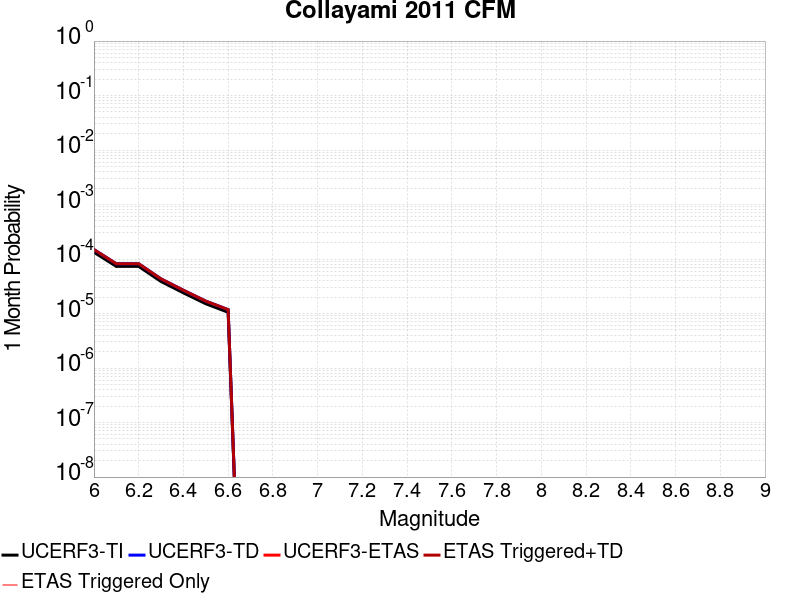 | 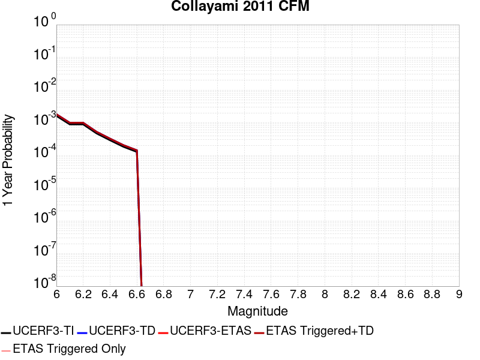 | 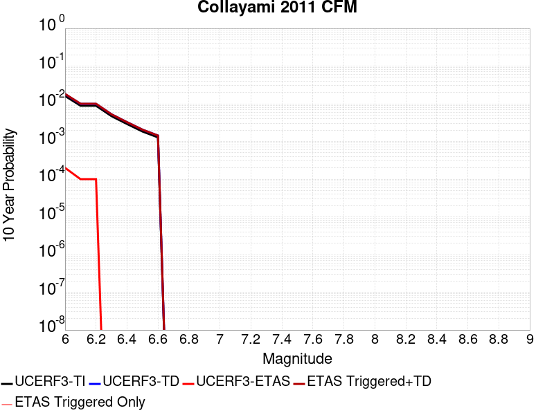 |

| Magnitude | 1 wk TI Prob | 1 wk TD Prob | 1 wk ETAS Prob | 1 wk ETAS/TD Gain | 1 wk ETAS Triggered+TD | 1 wk ETAS Triggered Only | 1 mo TI Prob | 1 mo TD Prob | 1 mo ETAS Prob | 1 mo ETAS/TD Gain | 1 mo ETAS Triggered+TD | 1 mo ETAS Triggered Only | 1 yr TI Prob | 1 yr TD Prob | 1 yr ETAS Prob | 1 yr ETAS/TD Gain | 1 yr ETAS Triggered+TD | 1 yr ETAS Triggered Only | 10 yr TI Prob | 10 yr TD Prob | 10 yr ETAS Prob | 10 yr ETAS/TD Gain | 10 yr ETAS Triggered+TD | 10 yr ETAS Triggered Only |
|-----|-----|-----|-----|-----|-----|-----|-----|-----|-----|-----|-----|-----|-----|-----|-----|-----|-----|-----|-----|-----|-----|-----|-----|-----|
| 6.0 | 3.112429E-5 | 3.4893903E-5 | 0.0 | 0.0 | 3.4893903E-5 | 0.0 | 1.33383E-4 | 1.4953771E-4 | 0.0 | 0.0 | 1.4953771E-4 | 0.0 | 0.0016227282 | 0.0018192746 | 8.0E-4 | 0.4397357 | 0.0019190927 | 1.0E-4 | 0.016109297 | 0.018061297 | 0.0092 | 0.5093765 | 0.019828785 | 0.0018 |
| 6.1 | 1.7119446E-5 | 1.9132842E-5 | 0.0 | 0.0 | 1.9132842E-5 | 0.0 | 7.336699E-5 | 8.199565E-5 | 0.0 | 0.0 | 8.199565E-5 | 0.0 | 8.92877E-4 | 9.978989E-4 | 3.0E-4 | 0.30063167 | 9.978989E-4 | 0.0 | 0.00889298 | 0.009940042 | 0.0052 | 0.5231366 | 0.010831096 | 9.0E-4 |
| 6.2 | 1.7119446E-5 | 1.9132842E-5 | 0.0 | 0.0 | 1.9132842E-5 | 0.0 | 7.336699E-5 | 8.199565E-5 | 0.0 | 0.0 | 8.199565E-5 | 0.0 | 8.92877E-4 | 9.978989E-4 | 3.0E-4 | 0.30063167 | 9.978989E-4 | 0.0 | 0.00889298 | 0.009940042 | 0.0052 | 0.5231366 | 0.010831096 | 9.0E-4 |
| 6.3 | 9.041288E-6 | 1.0093683E-5 | 0.0 | 0.0 | 1.0093683E-5 | 0.0 | 3.87478E-5 | 4.325805E-5 | 0.0 | 0.0 | 4.325805E-5 | 0.0 | 4.7165234E-4 | 5.2656134E-4 | 1.0E-4 | 0.1899114 | 5.2656134E-4 | 0.0 | 0.0047065257 | 0.005255289 | 0.0025 | 0.47571123 | 0.0057526613 | 5.0E-4 |
| 6.4 | 5.5972064E-6 | 6.2503414E-6 | 0.0 | 0.0 | 6.2503414E-6 | 0.0 | 2.3987806E-5 | 2.6786978E-5 | 0.0 | 0.0 | 2.6786978E-5 | 0.0 | 2.920124E-4 | 3.260962E-4 | 0.0 | 0.0 | 3.260962E-4 | 0.0 | 0.0029162897 | 0.003257508 | 0.0012 | 0.36837977 | 0.0033571823 | 1.0E-4 |
| 6.5 | 3.530659E-6 | 3.9471297E-6 | 0.0 | 0.0 | 3.9471297E-6 | 0.0 | 1.5131307E-5 | 1.691622E-5 | 0.0 | 0.0 | 1.691622E-5 | 0.0 | 1.842081E-4 | 2.0594586E-4 | 0.0 | 0.0 | 2.0594586E-4 | 0.0 | 0.0018405546 | 0.0020585663 | 6.0E-4 | 0.29146498 | 0.0020585663 | 0.0 |
| 6.6 | 2.4625563E-6 | 2.7538247E-6 | 0.0 | 0.0 | 2.7538247E-6 | 0.0 | 1.0553769E-5 | 1.1802105E-5 | 0.0 | 0.0 | 1.1802105E-5 | 0.0 | 1.2848456E-4 | 1.4369063E-4 | 0.0 | 0.0 | 1.4369063E-4 | 0.0 | 0.001284103 | 0.0014369063 | 4.0E-4 | 0.27837583 | 0.0014369063 | 0.0 |

## Big Pine (Central)
*[(top)](#table-of-contents)*

| 1 Week | 1 Month | 1 Year | 10 Year |
|-----|-----|-----|-----|
| 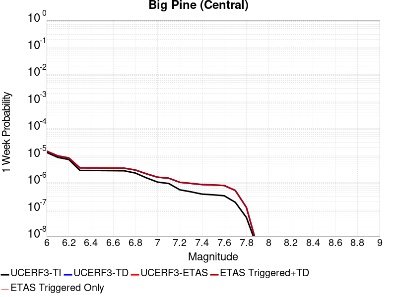 | 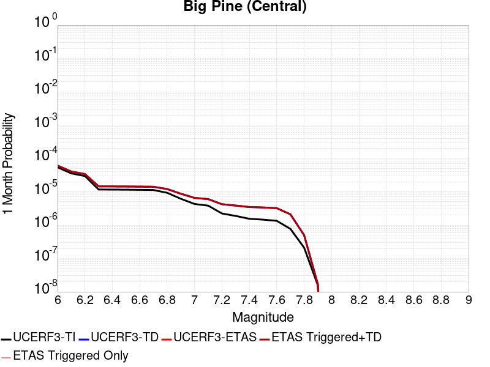 | 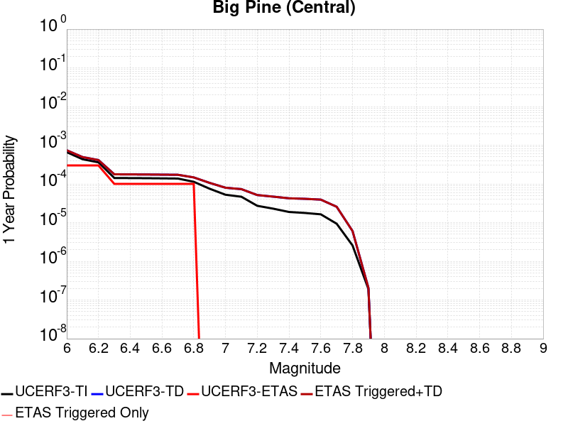 | 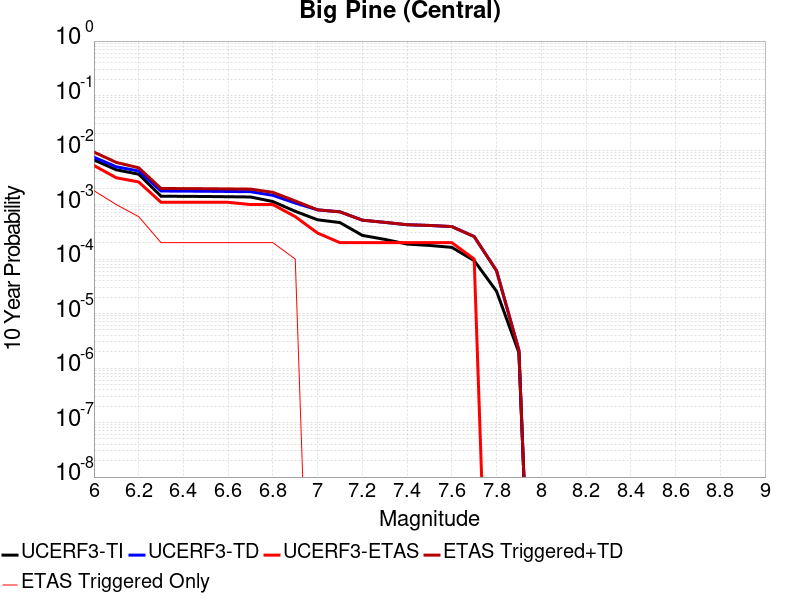 |

| Magnitude | 1 wk TI Prob | 1 wk TD Prob | 1 wk ETAS Prob | 1 wk ETAS/TD Gain | 1 wk ETAS Triggered+TD | 1 wk ETAS Triggered Only | 1 mo TI Prob | 1 mo TD Prob | 1 mo ETAS Prob | 1 mo ETAS/TD Gain | 1 mo ETAS Triggered+TD | 1 mo ETAS Triggered Only | 1 yr TI Prob | 1 yr TD Prob | 1 yr ETAS Prob | 1 yr ETAS/TD Gain | 1 yr ETAS Triggered+TD | 1 yr ETAS Triggered Only | 10 yr TI Prob | 10 yr TD Prob | 10 yr ETAS Prob | 10 yr ETAS/TD Gain | 10 yr ETAS Triggered+TD | 10 yr ETAS Triggered Only |
|-----|-----|-----|-----|-----|-----|-----|-----|-----|-----|-----|-----|-----|-----|-----|-----|-----|-----|-----|-----|-----|-----|-----|-----|-----|
| 6.0 | 1.2706755E-5 | 1.4212462E-5 | 0.0 | 0.0 | 1.4212462E-5 | 0.0 | 5.4456385E-5 | 6.0909333E-5 | 0.0 | 0.0 | 6.0909333E-5 | 0.0 | 6.628048E-4 | 7.413553E-4 | 3.0E-4 | 0.40466425 | 7.413553E-4 | 0.0 | 0.006608314 | 0.007394042 | 0.0052 | 0.70326895 | 0.009180733 | 0.0018 |
| 6.1 | 8.342579E-6 | 9.476952E-6 | 0.0 | 0.0 | 9.476952E-6 | 0.0 | 3.5753423E-5 | 4.0614996E-5 | 0.0 | 0.0 | 4.0614996E-5 | 0.0 | 4.3521097E-4 | 4.9439707E-4 | 3.0E-4 | 0.6067997 | 4.9439707E-4 | 0.0 | 0.0043435963 | 0.0049367226 | 0.0031 | 0.627947 | 0.005931786 | 0.001 |
| 6.2 | 6.923899E-6 | 7.934756E-6 | 0.0 | 0.0 | 7.934756E-6 | 0.0 | 2.9673516E-5 | 3.400576E-5 | 0.0 | 0.0 | 3.400576E-5 | 0.0 | 3.6121515E-4 | 4.139607E-4 | 3.0E-4 | 0.72470653 | 4.139607E-4 | 0.0 | 0.003606286 | 0.0041354 | 0.0026 | 0.6287179 | 0.004732919 | 6.0E-4 |
| 6.3 | 2.728396E-6 | 3.3958227E-6 | 0.0 | 0.0 | 3.3958227E-6 | 0.0 | 1.1693074E-5 | 1.455345E-5 | 0.0 | 0.0 | 1.455345E-5 | 0.0 | 1.4235388E-4 | 1.771747E-4 | 1.0E-4 | 0.5644146 | 1.771747E-4 | 0.0 | 0.0014226272 | 0.0017720415 | 0.0011 | 0.62075293 | 0.0019716872 | 2.0E-4 |
| 6.4 | 2.7136944E-6 | 3.3801273E-6 | 0.0 | 0.0 | 3.3801273E-6 | 0.0 | 1.1630066E-5 | 1.4486184E-5 | 0.0 | 0.0 | 1.4486184E-5 | 0.0 | 1.4158686E-4 | 1.7635588E-4 | 1.0E-4 | 0.5670352 | 1.7635588E-4 | 0.0 | 0.0014149669 | 0.0017638664 | 0.0011 | 0.62363 | 0.0019635137 | 2.0E-4 |
| 6.5 | 2.6971882E-6 | 3.3624854E-6 | 0.0 | 0.0 | 3.3624854E-6 | 0.0 | 1.1559327E-5 | 1.4410576E-5 | 0.0 | 0.0 | 1.4410576E-5 | 0.0 | 1.4072572E-4 | 1.754355E-4 | 1.0E-4 | 0.57001007 | 1.754355E-4 | 0.0 | 0.0014063664 | 0.0017546772 | 0.0011 | 0.62689596 | 0.0019543262 | 2.0E-4 |
| 6.6 | 2.669092E-6 | 3.3325266E-6 | 0.0 | 0.0 | 3.3325266E-6 | 0.0 | 1.1438916E-5 | 1.4282184E-5 | 0.0 | 0.0 | 1.4282184E-5 | 0.0 | 1.3925991E-4 | 1.7387258E-4 | 1.0E-4 | 0.5751338 | 1.7387258E-4 | 0.0 | 0.0013917267 | 0.0017390724 | 0.0011 | 0.6325211 | 0.0019387245 | 2.0E-4 |
| 6.7 | 2.6408059E-6 | 3.302571E-6 | 0.0 | 0.0 | 3.302571E-6 | 0.0 | 1.1317691E-5 | 1.4153804E-5 | 0.0 | 0.0 | 1.4153804E-5 | 0.0 | 1.3778417E-4 | 1.723098E-4 | 1.0E-4 | 0.58035004 | 1.723098E-4 | 0.0 | 0.0013769877 | 0.0017234689 | 0.001 | 0.58022517 | 0.0019231242 | 2.0E-4 |
| 6.8 | 2.1786943E-6 | 2.8261838E-6 | 0.0 | 0.0 | 2.8261838E-6 | 0.0 | 9.337228E-6 | 1.2112165E-5 | 0.0 | 0.0 | 1.2112165E-5 | 0.0 | 1.1367482E-4 | 1.4745635E-4 | 1.0E-4 | 0.6781668 | 1.4745635E-4 | 0.0 | 0.0011361669 | 0.0014752786 | 0.001 | 0.6778381 | 0.0016749835 | 2.0E-4 |
| 6.9 | 1.4411696E-6 | 2.0415025E-6 | 0.0 | 0.0 | 2.0415025E-6 | 0.0 | 6.1764263E-6 | 8.749269E-6 | 0.0 | 0.0 | 8.749269E-6 | 0.0 | 7.51954E-5 | 1.06517415E-4 | 0.0 | 0.0 | 1.06517415E-4 | 0.0 | 7.5169955E-4 | 0.0010663127 | 6.0E-4 | 0.56268674 | 0.001166206 | 1.0E-4 |
| 7.0 | 1.0073411E-6 | 1.5301484E-6 | 0.0 | 0.0 | 1.5301484E-6 | 0.0 | 4.317169E-6 | 6.5577633E-6 | 0.0 | 0.0 | 6.5577633E-6 | 0.0 | 5.2560266E-5 | 7.983799E-5 | 0.0 | 0.0 | 7.983799E-5 | 0.0 | 5.2547833E-4 | 7.997311E-4 | 3.0E-4 | 0.3751261 | 7.997311E-4 | 0.0 |
| 7.1 | 8.947104E-7 | 1.4064802E-6 | 0.0 | 0.0 | 1.4064802E-6 | 0.0 | 3.834468E-6 | 6.0277594E-6 | 0.0 | 0.0 | 6.0277594E-6 | 0.0 | 4.6683643E-5 | 7.338565E-5 | 0.0 | 0.0 | 7.338565E-5 | 0.0 | 4.6673836E-4 | 7.3525193E-4 | 2.0E-4 | 0.2720156 | 7.3525193E-4 | 0.0 |
| 7.2 | 5.215166E-7 | 9.889825E-7 | 0.0 | 0.0 | 9.889825E-7 | 0.0 | 2.2350691E-6 | 4.23849E-6 | 0.0 | 0.0 | 4.23849E-6 | 0.0 | 2.7211627E-5 | 5.1602434E-5 | 0.0 | 0.0 | 5.1602434E-5 | 0.0 | 2.7208295E-4 | 5.175323E-4 | 2.0E-4 | 0.3864493 | 5.175323E-4 | 0.0 |
| 7.3 | 4.4024807E-7 | 9.004307E-7 | 0.0 | 0.0 | 9.004307E-7 | 0.0 | 1.8867761E-6 | 3.8589833E-6 | 0.0 | 0.0 | 3.8589833E-6 | 0.0 | 2.2971257E-5 | 4.6982146E-5 | 0.0 | 0.0 | 4.6982146E-5 | 0.0 | 2.2968883E-4 | 4.7134963E-4 | 2.0E-4 | 0.4243135 | 4.7134963E-4 | 0.0 |
| 7.4 | 3.6130905E-7 | 8.1498945E-7 | 0.0 | 0.0 | 8.1498945E-7 | 0.0 | 1.5484665E-6 | 3.4928075E-6 | 0.0 | 0.0 | 3.4928075E-6 | 0.0 | 1.8852415E-5 | 4.2524138E-5 | 0.0 | 0.0 | 4.2524138E-5 | 0.0 | 1.8850817E-4 | 4.267772E-4 | 2.0E-4 | 0.4686286 | 4.267772E-4 | 0.0 |
| 7.5 | 3.408184E-7 | 7.9040643E-7 | 0.0 | 0.0 | 7.9040643E-7 | 0.0 | 1.4606494E-6 | 3.387452E-6 | 0.0 | 0.0 | 3.387452E-6 | 0.0 | 1.7783263E-5 | 4.1241485E-5 | 0.0 | 0.0 | 4.1241485E-5 | 0.0 | 1.778184E-4 | 4.1393653E-4 | 2.0E-4 | 0.48316586 | 4.1393653E-4 | 0.0 |
| 7.6 | 3.1428627E-7 | 7.5347396E-7 | 0.0 | 0.0 | 7.5347396E-7 | 0.0 | 1.3469405E-6 | 3.2291703E-6 | 0.0 | 0.0 | 3.2291703E-6 | 0.0 | 1.6398877E-5 | 3.9314476E-5 | 0.0 | 0.0 | 3.9314476E-5 | 0.0 | 1.6397667E-4 | 3.9464448E-4 | 2.0E-4 | 0.5067852 | 3.9464448E-4 | 0.0 |
| 7.7 | 1.7972785E-7 | 4.927424E-7 | 0.0 | 0.0 | 4.927424E-7 | 0.0 | 7.70262E-7 | 2.1117514E-6 | 0.0 | 0.0 | 2.1117514E-6 | 0.0 | 9.377899E-6 | 2.571028E-5 | 0.0 | 0.0 | 2.571028E-5 | 0.0 | 9.377503E-5 | 2.5866507E-4 | 1.0E-4 | 0.38660032 | 2.5866507E-4 | 0.0 |
| 7.8 | 4.9230927E-8 | 1.1623209E-7 | 0.0 | 0.0 | 1.1623209E-7 | 0.0 | 2.1098968E-7 | 4.981374E-7 | 0.0 | 0.0 | 4.981374E-7 | 0.0 | 2.5687964E-6 | 6.064808E-6 | 0.0 | 0.0 | 6.064808E-6 | 0.0 | 2.5687666E-5 | 6.11186E-5 | 0.0 | 0.0 | 6.11186E-5 | 0.0 |
| 7.9 | 3.6805972E-9 | 3.9603503E-9 | 0.0 | 0.0 | 3.9603503E-9 | 0.0 | 1.5773987E-8 | 1.6972932E-8 | 0.0 | 0.0 | 1.6972932E-8 | 0.0 | 1.9204828E-7 | 2.0664541E-7 | 0.0 | 0.0 | 2.0664541E-7 | 0.0 | 1.920481E-6 | 2.1139952E-6 | 0.0 | 0.0 | 2.1139952E-6 | 0.0 |

## Malibu Coast alt 1
*[(top)](#table-of-contents)*

| 1 Week | 1 Month | 1 Year | 10 Year |
|-----|-----|-----|-----|
| 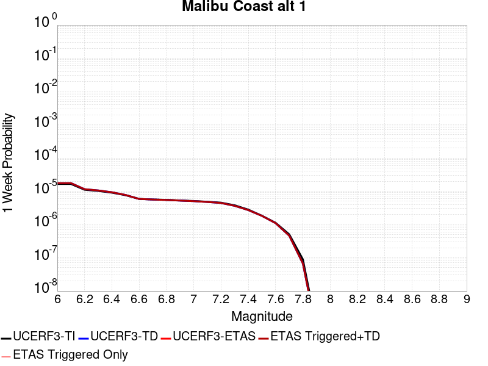 | 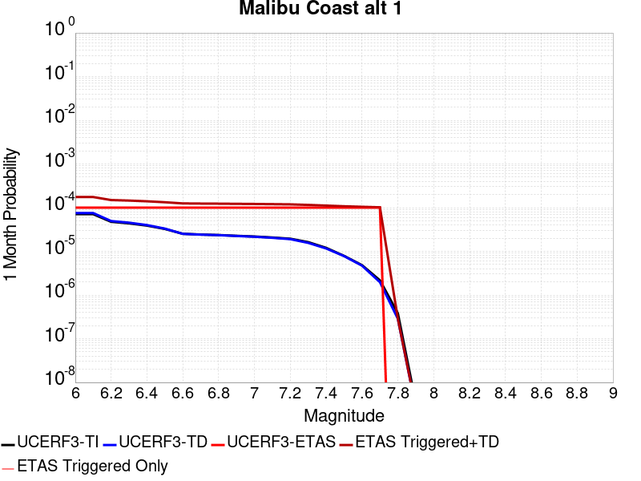 | 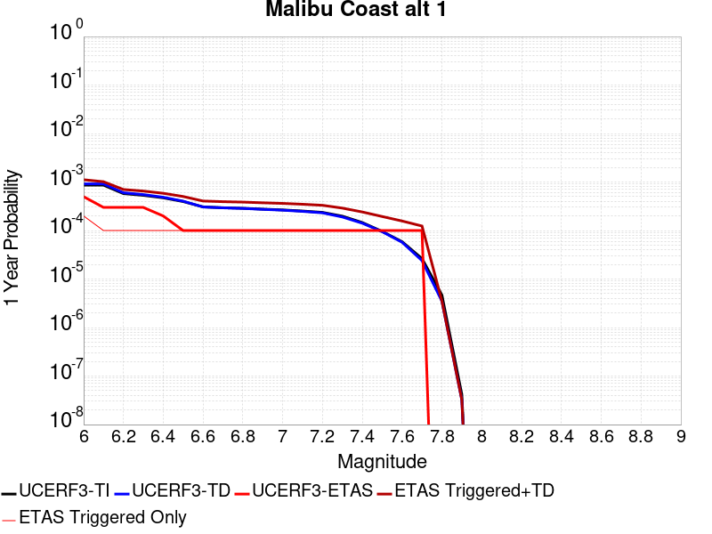 | 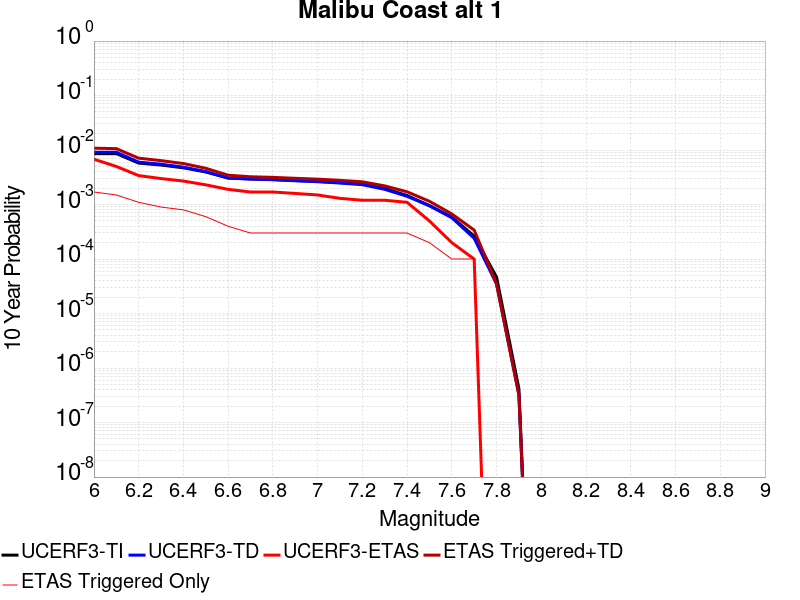 |

| Magnitude | 1 wk TI Prob | 1 wk TD Prob | 1 wk ETAS Prob | 1 wk ETAS/TD Gain | 1 wk ETAS Triggered+TD | 1 wk ETAS Triggered Only | 1 mo TI Prob | 1 mo TD Prob | 1 mo ETAS Prob | 1 mo ETAS/TD Gain | 1 mo ETAS Triggered+TD | 1 mo ETAS Triggered Only | 1 yr TI Prob | 1 yr TD Prob | 1 yr ETAS Prob | 1 yr ETAS/TD Gain | 1 yr ETAS Triggered+TD | 1 yr ETAS Triggered Only | 10 yr TI Prob | 10 yr TD Prob | 10 yr ETAS Prob | 10 yr ETAS/TD Gain | 10 yr ETAS Triggered+TD | 10 yr ETAS Triggered Only |
|-----|-----|-----|-----|-----|-----|-----|-----|-----|-----|-----|-----|-----|-----|-----|-----|-----|-----|-----|-----|-----|-----|-----|-----|-----|
| 6.0 | 1.6572556E-5 | 1.7582151E-5 | 0.0 | 0.0 | 1.7582151E-5 | 0.0 | 7.102331E-5 | 7.535001E-5 | 1.0E-4 | 1.3271399 | 1.7534247E-4 | 1.0E-4 | 8.6436566E-4 | 9.1701915E-4 | 5.0E-4 | 0.5452449 | 0.0011168357 | 2.0E-4 | 0.0086101135 | 0.00913428 | 0.0068 | 0.74444836 | 0.0108187515 | 0.0017 |
| 6.1 | 1.6572556E-5 | 1.7582151E-5 | 0.0 | 0.0 | 1.7582151E-5 | 0.0 | 7.102331E-5 | 7.535001E-5 | 1.0E-4 | 1.3271399 | 1.7534247E-4 | 1.0E-4 | 8.6436566E-4 | 9.1701915E-4 | 3.0E-4 | 0.32714695 | 0.0010169274 | 1.0E-4 | 0.0086101135 | 0.00913428 | 0.005 | 0.5473885 | 0.010620578 | 0.0015 |
| 6.2 | 1.1085717E-5 | 1.1547618E-5 | 0.0 | 0.0 | 1.1547618E-5 | 0.0 | 4.750935E-5 | 4.948887E-5 | 1.0E-4 | 2.0206563 | 1.4948392E-4 | 1.0E-4 | 5.782728E-4 | 6.0236396E-4 | 3.0E-4 | 0.4980378 | 7.023037E-4 | 1.0E-4 | 0.0057677035 | 0.0060076825 | 0.0034 | 0.56594205 | 0.007101074 | 0.0011 |
| 6.3 | 1.0208568E-5 | 1.0583719E-5 | 0.0 | 0.0 | 1.0583719E-5 | 0.0 | 4.375027E-5 | 4.535802E-5 | 1.0E-4 | 2.2046816 | 1.453535E-4 | 1.0E-4 | 5.325294E-4 | 5.520969E-4 | 3.0E-4 | 0.5433828 | 6.520417E-4 | 1.0E-4 | 0.0053125503 | 0.0055075604 | 0.003 | 0.5447058 | 0.0064026034 | 9.0E-4 |
| 6.4 | 9.0682315E-6 | 9.33537E-6 | 0.0 | 0.0 | 9.33537E-6 | 0.0 | 3.8863272E-5 | 4.000813E-5 | 1.0E-4 | 2.4994922 | 1.4000412E-4 | 1.0E-4 | 4.730576E-4 | 4.8699212E-4 | 2.0E-4 | 0.41068426 | 5.869434E-4 | 1.0E-4 | 0.0047205184 | 0.0048594624 | 0.0027 | 0.555617 | 0.005655575 | 8.0E-4 |
| 6.5 | 7.605796E-6 | 7.742821E-6 | 0.0 | 0.0 | 7.742821E-6 | 0.0 | 3.259586E-5 | 3.3183103E-5 | 1.0E-4 | 3.0135818 | 1.3317978E-4 | 1.0E-4 | 3.9678233E-4 | 4.0393072E-4 | 1.0E-4 | 0.24756719 | 5.0389033E-4 | 1.0E-4 | 0.0039607463 | 0.004032103 | 0.0023 | 0.57042193 | 0.0046296837 | 6.0E-4 |
| 6.6 | 5.889873E-6 | 5.875516E-6 | 0.0 | 0.0 | 5.875516E-6 | 0.0 | 2.5242069E-5 | 2.518054E-5 | 1.0E-4 | 3.9713209 | 1.2517802E-4 | 1.0E-4 | 3.0727885E-4 | 3.0653004E-4 | 1.0E-4 | 0.3262323 | 4.0649937E-4 | 1.0E-4 | 0.003068543 | 0.003061085 | 0.0019 | 0.62069494 | 0.0034598606 | 4.0E-4 |
| 6.7 | 5.66586E-6 | 5.6377726E-6 | 0.0 | 0.0 | 5.6377726E-6 | 0.0 | 2.428203E-5 | 2.416166E-5 | 1.0E-4 | 4.1387887 | 1.2415924E-4 | 1.0E-4 | 2.955936E-4 | 2.9412858E-4 | 1.0E-4 | 0.33998734 | 3.940992E-4 | 1.0E-4 | 0.0029520073 | 0.002937405 | 0.0017 | 0.57874215 | 0.0032365238 | 3.0E-4 |
| 6.8 | 5.521556E-6 | 5.485646E-6 | 0.0 | 0.0 | 5.485646E-6 | 0.0 | 2.3663597E-5 | 2.35097E-5 | 1.0E-4 | 4.2535634 | 1.2350734E-4 | 1.0E-4 | 2.880662E-4 | 2.861931E-4 | 1.0E-4 | 0.34941444 | 3.8616447E-4 | 1.0E-4 | 0.0028769306 | 0.002858257 | 0.0017 | 0.5947681 | 0.0031573994 | 3.0E-4 |
| 6.9 | 5.29752E-6 | 5.2463242E-6 | 0.0 | 0.0 | 5.2463242E-6 | 0.0 | 2.270346E-5 | 2.2484053E-5 | 1.0E-4 | 4.4475965 | 1.2248181E-4 | 1.0E-4 | 2.7637955E-4 | 2.7370904E-4 | 1.0E-4 | 0.36535147 | 3.7368166E-4 | 1.0E-4 | 0.0027603607 | 0.0027337295 | 0.0016 | 0.585281 | 0.0030329095 | 3.0E-4 |
| 7.0 | 5.106743E-6 | 5.044199E-6 | 0.0 | 0.0 | 5.044199E-6 | 0.0 | 2.1885859E-5 | 2.1617818E-5 | 1.0E-4 | 4.625814 | 1.2161566E-4 | 1.0E-4 | 2.6642776E-4 | 2.6316522E-4 | 1.0E-4 | 0.37998942 | 3.631389E-4 | 1.0E-4 | 0.0026610855 | 0.0026285455 | 0.0015 | 0.5706578 | 0.0029277569 | 3.0E-4 |
| 7.1 | 4.8469647E-6 | 4.76709E-6 | 0.0 | 0.0 | 4.76709E-6 | 0.0 | 2.0772539E-5 | 2.0430227E-5 | 1.0E-4 | 4.894708 | 1.2042818E-4 | 1.0E-4 | 2.528763E-4 | 2.487097E-4 | 1.0E-4 | 0.40207523 | 3.486848E-4 | 1.0E-4 | 0.0025258875 | 0.0024843214 | 0.0013 | 0.5232817 | 0.0027835763 | 3.0E-4 |
| 7.2 | 4.545514E-6 | 4.445145E-6 | 0.0 | 0.0 | 4.445145E-6 | 0.0 | 1.9480629E-5 | 1.9050482E-5 | 1.0E-4 | 5.249211 | 1.1904858E-4 | 1.0E-4 | 2.3715083E-4 | 2.31915E-4 | 1.0E-4 | 0.4311925 | 3.318918E-4 | 1.0E-4 | 0.0023689792 | 0.002316737 | 0.0012 | 0.51796985 | 0.0026160423 | 3.0E-4 |
| 7.3 | 3.794097E-6 | 3.6495244E-6 | 0.0 | 0.0 | 3.6495244E-6 | 0.0 | 1.6260314E-5 | 1.5640726E-5 | 1.0E-4 | 6.3935657 | 1.1563916E-4 | 1.0E-4 | 1.9795135E-4 | 1.9040922E-4 | 1.0E-4 | 0.52518463 | 2.903902E-4 | 1.0E-4 | 0.001977751 | 0.0019024655 | 0.0012 | 0.63076043 | 0.0022018948 | 3.0E-4 |
| 7.4 | 2.808217E-6 | 2.7172503E-6 | 0.0 | 0.0 | 2.7172503E-6 | 0.0 | 1.203516E-5 | 1.1645307E-5 | 1.0E-4 | 8.587151 | 1.1164414E-4 | 1.0E-4 | 1.4651821E-4 | 1.4177241E-4 | 1.0E-4 | 0.7053559 | 2.4175823E-4 | 1.0E-4 | 0.0014642165 | 0.0014168223 | 0.0011 | 0.7763853 | 0.0017163972 | 3.0E-4 |
| 7.5 | 1.83809E-6 | 1.8177975E-6 | 0.0 | 0.0 | 1.8177975E-6 | 0.0 | 7.877505E-6 | 7.790538E-6 | 1.0E-4 | 12.836084 | 1.0778976E-4 | 1.0E-4 | 9.59044E-5 | 9.484569E-5 | 1.0E-4 | 1.0543442 | 1.948362E-4 | 1.0E-4 | 9.5863023E-4 | 9.480541E-4 | 5.0E-4 | 0.5273961 | 0.0011478645 | 2.0E-4 |
| 7.6 | 1.1292672E-6 | 1.0993211E-6 | 0.0 | 0.0 | 1.0993211E-6 | 0.0 | 4.839708E-6 | 4.711368E-6 | 1.0E-4 | 21.225258 | 1.04710896E-4 | 1.0E-4 | 5.8921847E-5 | 5.735941E-5 | 1.0E-4 | 1.7433931 | 1.5735367E-4 | 1.0E-4 | 5.890623E-4 | 5.7344773E-4 | 2.0E-4 | 0.34876764 | 6.7339034E-4 | 1.0E-4 |
| 7.7 | 5.065272E-7 | 4.6049658E-7 | 0.0 | 0.0 | 4.6049658E-7 | 0.0 | 2.170829E-6 | 1.9735553E-6 | 1.0E-4 | 50.669975 | 1.0197336E-4 | 1.0E-4 | 2.6429525E-5 | 2.4027782E-5 | 1.0E-4 | 4.161849 | 1.2402538E-4 | 1.0E-4 | 2.642638E-4 | 2.4025296E-4 | 1.0E-4 | 0.41622794 | 3.4022896E-4 | 1.0E-4 |
| 7.8 | 8.952991E-8 | 6.6911056E-8 | 0.0 | 0.0 | 6.6911056E-8 | 0.0 | 3.8369956E-7 | 2.8676163E-7 | 0.0 | 0.0 | 2.8676163E-7 | 0.0 | 4.671532E-6 | 3.4913173E-6 | 0.0 | 0.0 | 3.4913173E-6 | 0.0 | 4.671434E-5 | 3.4912646E-5 | 0.0 | 0.0 | 3.4912646E-5 | 0.0 |
| 7.9 | 8.007447E-10 | 6.1585737E-10 | 0.0 | 0.0 | 6.1585737E-10 | 0.0 | 3.4317629E-9 | 2.6393883E-9 | 0.0 | 0.0 | 2.6393883E-9 | 0.0 | 4.1781714E-8 | 3.2134555E-8 | 0.0 | 0.0 | 3.2134555E-8 | 0.0 | 4.1781706E-7 | 3.213455E-7 | 0.0 | 0.0 | 3.213455E-7 | 0.0 |

## Johnson Valley (No) 2011 rev
*[(top)](#table-of-contents)*

| 1 Week | 1 Month | 1 Year | 10 Year |
|-----|-----|-----|-----|
| 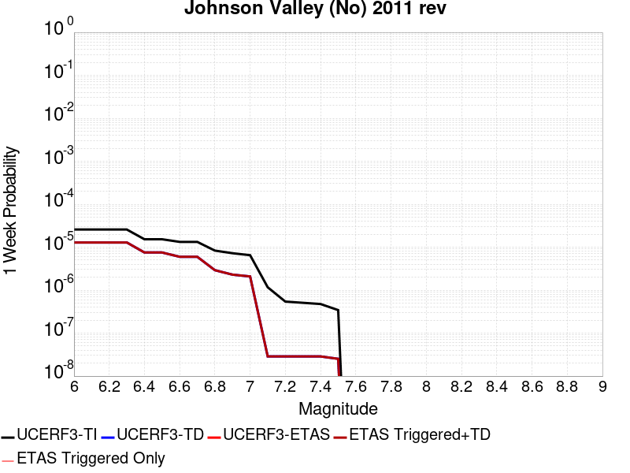 | 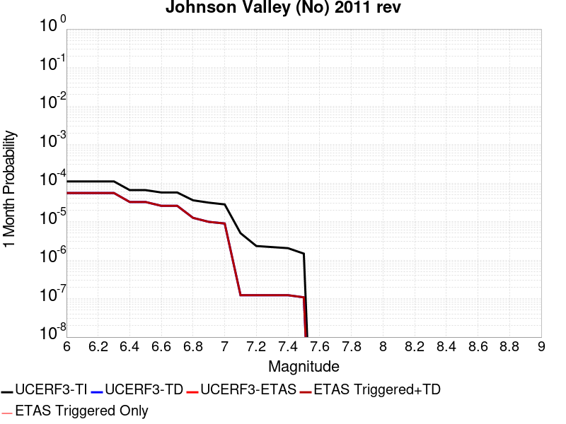 | 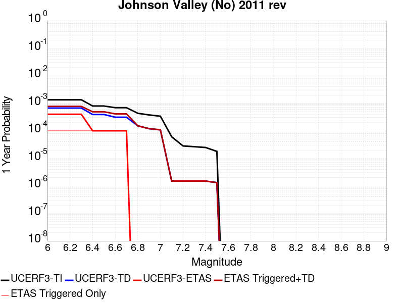 | 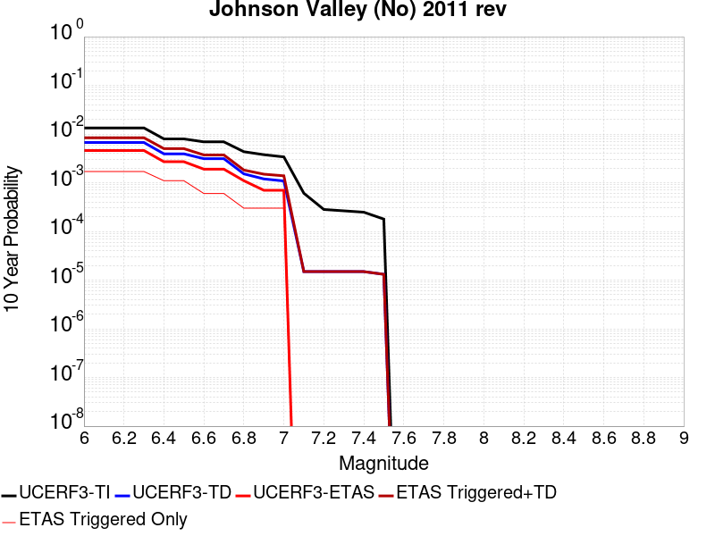 |

| Magnitude | 1 wk TI Prob | 1 wk TD Prob | 1 wk ETAS Prob | 1 wk ETAS/TD Gain | 1 wk ETAS Triggered+TD | 1 wk ETAS Triggered Only | 1 mo TI Prob | 1 mo TD Prob | 1 mo ETAS Prob | 1 mo ETAS/TD Gain | 1 mo ETAS Triggered+TD | 1 mo ETAS Triggered Only | 1 yr TI Prob | 1 yr TD Prob | 1 yr ETAS Prob | 1 yr ETAS/TD Gain | 1 yr ETAS Triggered+TD | 1 yr ETAS Triggered Only | 10 yr TI Prob | 10 yr TD Prob | 10 yr ETAS Prob | 10 yr ETAS/TD Gain | 10 yr ETAS Triggered+TD | 10 yr ETAS Triggered Only |
|-----|-----|-----|-----|-----|-----|-----|-----|-----|-----|-----|-----|-----|-----|-----|-----|-----|-----|-----|-----|-----|-----|-----|-----|-----|
| 6.0 | 2.577707E-5 | 1.2883895E-5 | 0.0 | 0.0 | 1.2883895E-5 | 0.0 | 1.1046848E-4 | 5.5215747E-5 | 0.0 | 0.0 | 5.5215747E-5 | 0.0 | 0.0013441239 | 6.72084E-4 | 4.0E-4 | 0.59516376 | 7.7201676E-4 | 1.0E-4 | 0.013360229 | 0.0067044133 | 0.0046 | 0.68611526 | 0.008393016 | 0.0017 |
| 6.1 | 2.577707E-5 | 1.2883895E-5 | 0.0 | 0.0 | 1.2883895E-5 | 0.0 | 1.1046848E-4 | 5.5215747E-5 | 0.0 | 0.0 | 5.5215747E-5 | 0.0 | 0.0013441239 | 6.72084E-4 | 4.0E-4 | 0.59516376 | 7.7201676E-4 | 1.0E-4 | 0.013360229 | 0.0067044133 | 0.0046 | 0.68611526 | 0.008393016 | 0.0017 |
| 6.2 | 2.577707E-5 | 1.2883895E-5 | 0.0 | 0.0 | 1.2883895E-5 | 0.0 | 1.1046848E-4 | 5.5215747E-5 | 0.0 | 0.0 | 5.5215747E-5 | 0.0 | 0.0013441239 | 6.72084E-4 | 4.0E-4 | 0.59516376 | 7.7201676E-4 | 1.0E-4 | 0.013360229 | 0.0067044133 | 0.0046 | 0.68611526 | 0.008393016 | 0.0017 |
| 6.3 | 2.577707E-5 | 1.2883895E-5 | 0.0 | 0.0 | 1.2883895E-5 | 0.0 | 1.1046848E-4 | 5.5215747E-5 | 0.0 | 0.0 | 5.5215747E-5 | 0.0 | 0.0013441239 | 6.72084E-4 | 4.0E-4 | 0.59516376 | 7.7201676E-4 | 1.0E-4 | 0.013360229 | 0.0067044133 | 0.0046 | 0.68611526 | 0.008393016 | 0.0017 |
| 6.4 | 1.5296591E-5 | 7.5258204E-6 | 0.0 | 0.0 | 7.5258204E-6 | 0.0 | 6.555518E-5 | 3.225322E-5 | 0.0 | 0.0 | 3.225322E-5 | 0.0 | 7.97842E-4 | 3.9263093E-4 | 1.0E-4 | 0.2546921 | 4.9259164E-4 | 1.0E-4 | 0.007949836 | 0.0039212084 | 0.0027 | 0.6885632 | 0.0050168955 | 0.0011 |
| 6.5 | 1.5296591E-5 | 7.5258204E-6 | 0.0 | 0.0 | 7.5258204E-6 | 0.0 | 6.555518E-5 | 3.225322E-5 | 0.0 | 0.0 | 3.225322E-5 | 0.0 | 7.97842E-4 | 3.9263093E-4 | 1.0E-4 | 0.2546921 | 4.9259164E-4 | 1.0E-4 | 0.007949836 | 0.0039212084 | 0.0027 | 0.6885632 | 0.0050168955 | 0.0011 |
| 6.6 | 1.3289383E-5 | 5.982473E-6 | 0.0 | 0.0 | 5.982473E-6 | 0.0 | 5.6953253E-5 | 2.5639012E-5 | 0.0 | 0.0 | 2.5639012E-5 | 0.0 | 6.9318525E-4 | 3.1212717E-4 | 1.0E-4 | 0.32038224 | 4.1209598E-4 | 1.0E-4 | 0.0069102696 | 0.0031185476 | 0.0019 | 0.609258 | 0.0037166765 | 6.0E-4 |
| 6.7 | 1.3289383E-5 | 5.982473E-6 | 0.0 | 0.0 | 5.982473E-6 | 0.0 | 5.6953253E-5 | 2.5639012E-5 | 0.0 | 0.0 | 2.5639012E-5 | 0.0 | 6.9318525E-4 | 3.1212717E-4 | 1.0E-4 | 0.32038224 | 4.1209598E-4 | 1.0E-4 | 0.0069102696 | 0.0031185476 | 0.0019 | 0.609258 | 0.0037166765 | 6.0E-4 |
| 6.8 | 8.330789E-6 | 2.9153935E-6 | 0.0 | 0.0 | 2.9153935E-6 | 0.0 | 3.570289E-5 | 1.2494516E-5 | 0.0 | 0.0 | 1.2494516E-5 | 0.0 | 4.34596E-4 | 1.521158E-4 | 0.0 | 0.0 | 1.521158E-4 | 0.0 | 0.0043374705 | 0.0015206743 | 0.0011 | 0.7233633 | 0.0018202182 | 3.0E-4 |
| 6.9 | 7.2359003E-6 | 2.2964027E-6 | 0.0 | 0.0 | 2.2964027E-6 | 0.0 | 3.1010633E-5 | 9.841719E-6 | 0.0 | 0.0 | 9.841719E-6 | 0.0 | 3.7748902E-4 | 1.1982165E-4 | 0.0 | 0.0 | 1.1982165E-4 | 0.0 | 0.0037684843 | 0.0011980911 | 7.0E-4 | 0.5842628 | 0.0014977317 | 3.0E-4 |
| 7.0 | 6.5149957E-6 | 2.0840077E-6 | 0.0 | 0.0 | 2.0840077E-6 | 0.0 | 2.792111E-5 | 8.931462E-6 | 0.0 | 0.0 | 8.931462E-6 | 0.0 | 3.398865E-4 | 1.08740394E-4 | 0.0 | 0.0 | 1.08740394E-4 | 0.0 | 0.003393671 | 0.0010873894 | 7.0E-4 | 0.64374363 | 0.0013870632 | 3.0E-4 |
| 7.1 | 1.1662233E-6 | 2.8649515E-8 | 0.0 | 0.0 | 2.8649515E-8 | 0.0 | 4.9980904E-6 | 1.2278363E-7 | 0.0 | 0.0 | 1.2278363E-7 | 0.0 | 6.0850052E-5 | 1.4948898E-6 | 0.0 | 0.0 | 1.4948898E-6 | 0.0 | 6.083339E-4 | 1.4948814E-5 | 0.0 | 0.0 | 1.4948814E-5 | 0.0 |
| 7.2 | 5.413881E-7 | 2.8649515E-8 | 0.0 | 0.0 | 2.8649515E-8 | 0.0 | 2.3202326E-6 | 1.2278363E-7 | 0.0 | 0.0 | 1.2278363E-7 | 0.0 | 2.8248465E-5 | 1.4948898E-6 | 0.0 | 0.0 | 1.4948898E-6 | 0.0 | 2.8244875E-4 | 1.4948814E-5 | 0.0 | 0.0 | 1.4948814E-5 | 0.0 |
| 7.3 | 5.076821E-7 | 2.8649515E-8 | 0.0 | 0.0 | 2.8649515E-8 | 0.0 | 2.1757785E-6 | 1.2278363E-7 | 0.0 | 0.0 | 1.2278363E-7 | 0.0 | 2.648978E-5 | 1.4948898E-6 | 0.0 | 0.0 | 1.4948898E-6 | 0.0 | 2.6486625E-4 | 1.4948814E-5 | 0.0 | 0.0 | 1.4948814E-5 | 0.0 |
| 7.4 | 4.7568687E-7 | 2.8631694E-8 | 0.0 | 0.0 | 2.8631694E-8 | 0.0 | 2.0386565E-6 | 1.2270726E-7 | 0.0 | 0.0 | 1.2270726E-7 | 0.0 | 2.482036E-5 | 1.49396E-6 | 0.0 | 0.0 | 1.49396E-6 | 0.0 | 2.4817587E-4 | 1.49395155E-5 | 0.0 | 0.0 | 1.49395155E-5 | 0.0 |
| 7.5 | 3.435626E-7 | 2.5229681E-8 | 0.0 | 0.0 | 2.5229681E-8 | 0.0 | 1.4724103E-6 | 1.081272E-7 | 0.0 | 0.0 | 1.081272E-7 | 0.0 | 1.7926448E-5 | 1.3164481E-6 | 0.0 | 0.0 | 1.3164481E-6 | 0.0 | 1.7925001E-4 | 1.3164419E-5 | 0.0 | 0.0 | 1.3164419E-5 | 0.0 |

## Elsinore (Stepovers Combined)
*[(top)](#table-of-contents)*

| 1 Week | 1 Month | 1 Year | 10 Year |
|-----|-----|-----|-----|
| 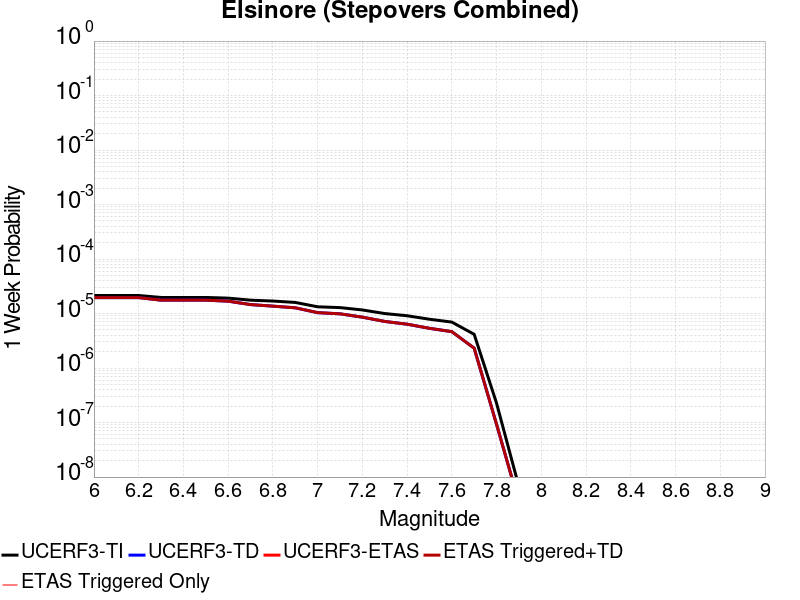 | 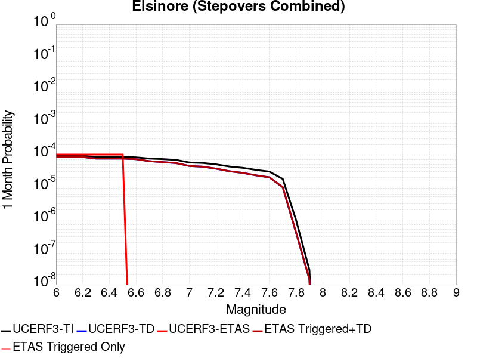 | 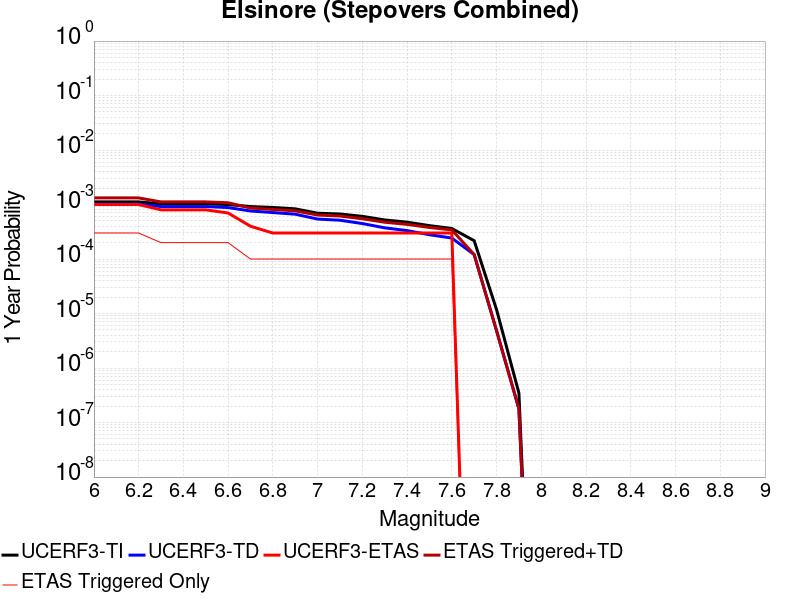 | 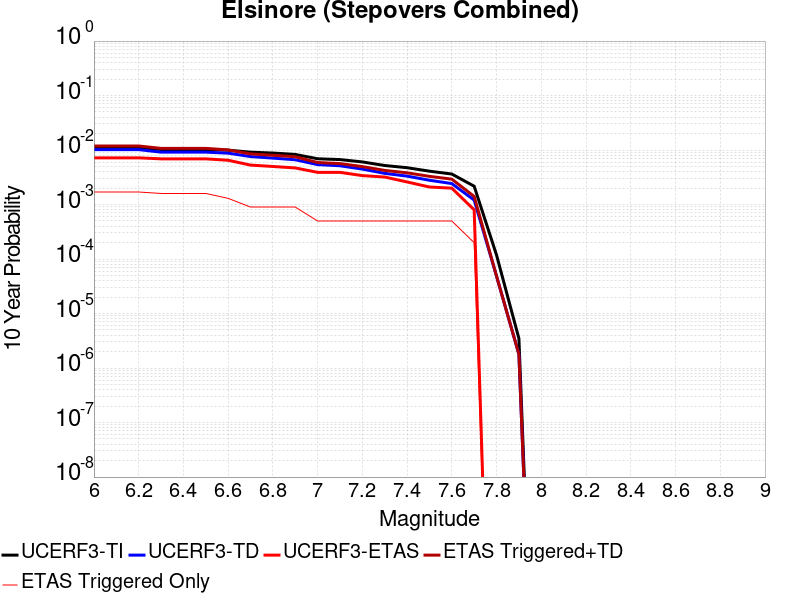 |

| Magnitude | 1 wk TI Prob | 1 wk TD Prob | 1 wk ETAS Prob | 1 wk ETAS/TD Gain | 1 wk ETAS Triggered+TD | 1 wk ETAS Triggered Only | 1 mo TI Prob | 1 mo TD Prob | 1 mo ETAS Prob | 1 mo ETAS/TD Gain | 1 mo ETAS Triggered+TD | 1 mo ETAS Triggered Only | 1 yr TI Prob | 1 yr TD Prob | 1 yr ETAS Prob | 1 yr ETAS/TD Gain | 1 yr ETAS Triggered+TD | 1 yr ETAS Triggered Only | 10 yr TI Prob | 10 yr TD Prob | 10 yr ETAS Prob | 10 yr ETAS/TD Gain | 10 yr ETAS Triggered+TD | 10 yr ETAS Triggered Only |
|-----|-----|-----|-----|-----|-----|-----|-----|-----|-----|-----|-----|-----|-----|-----|-----|-----|-----|-----|-----|-----|-----|-----|-----|-----|
| 6.0 | 2.144392E-5 | 1.9630772E-5 | 0.0 | 0.0 | 1.9630772E-5 | 0.0 | 9.189928E-5 | 8.412929E-5 | 1.0E-4 | 1.1886467 | 8.412929E-5 | 0.0 | 0.0011182994 | 0.0010238121 | 0.001 | 0.9767417 | 0.001323505 | 3.0E-4 | 0.011126885 | 0.010198043 | 0.0072 | 0.7060178 | 0.011880706 | 0.0017 |
| 6.1 | 2.144392E-5 | 1.9630772E-5 | 0.0 | 0.0 | 1.9630772E-5 | 0.0 | 9.189928E-5 | 8.412929E-5 | 1.0E-4 | 1.1886467 | 8.412929E-5 | 0.0 | 0.0011182994 | 0.0010238121 | 0.001 | 0.9767417 | 0.001323505 | 3.0E-4 | 0.011126885 | 0.010198043 | 0.0072 | 0.7060178 | 0.011880706 | 0.0017 |
| 6.2 | 2.144392E-5 | 1.9630772E-5 | 0.0 | 0.0 | 1.9630772E-5 | 0.0 | 9.189928E-5 | 8.412929E-5 | 1.0E-4 | 1.1886467 | 8.412929E-5 | 0.0 | 0.0011182994 | 0.0010238121 | 0.001 | 0.9767417 | 0.001323505 | 3.0E-4 | 0.011126885 | 0.010198043 | 0.0072 | 0.7060178 | 0.011880706 | 0.0017 |
| 6.3 | 1.9751555E-5 | 1.761608E-5 | 0.0 | 0.0 | 1.761608E-5 | 0.0 | 8.4646774E-5 | 7.549539E-5 | 1.0E-4 | 1.3245842 | 7.549539E-5 | 0.0 | 0.0010300872 | 9.187831E-4 | 8.0E-4 | 0.8707169 | 0.0011185993 | 2.0E-4 | 0.010253254 | 0.009156425 | 0.0069 | 0.7535692 | 0.010741775 | 0.0016 |
| 6.4 | 1.9751555E-5 | 1.761608E-5 | 0.0 | 0.0 | 1.761608E-5 | 0.0 | 8.4646774E-5 | 7.549539E-5 | 1.0E-4 | 1.3245842 | 7.549539E-5 | 0.0 | 0.0010300872 | 9.187831E-4 | 8.0E-4 | 0.8707169 | 0.0011185993 | 2.0E-4 | 0.010253254 | 0.009156425 | 0.0069 | 0.7535692 | 0.010741775 | 0.0016 |
| 6.5 | 1.9751555E-5 | 1.761608E-5 | 0.0 | 0.0 | 1.761608E-5 | 0.0 | 8.4646774E-5 | 7.549539E-5 | 1.0E-4 | 1.3245842 | 7.549539E-5 | 0.0 | 0.0010300872 | 9.187831E-4 | 8.0E-4 | 0.8707169 | 0.0011185993 | 2.0E-4 | 0.010253254 | 0.009156425 | 0.0069 | 0.7535692 | 0.010741775 | 0.0016 |
| 6.6 | 1.9188685E-5 | 1.6880309E-5 | 0.0 | 0.0 | 1.6880309E-5 | 0.0 | 8.2234634E-5 | 7.234226E-5 | 0.0 | 0.0 | 7.234226E-5 | 0.0 | 0.0010007467 | 8.804271E-4 | 7.0E-4 | 0.7950687 | 0.0010802511 | 2.0E-4 | 0.00996252 | 0.008776145 | 0.0065 | 0.7406441 | 0.010064736 | 0.0013 |
| 6.7 | 1.7608272E-5 | 1.4616964E-5 | 0.0 | 0.0 | 1.4616964E-5 | 0.0 | 7.546184E-5 | 6.264268E-5 | 0.0 | 0.0 | 6.264268E-5 | 0.0 | 9.183606E-4 | 7.624173E-4 | 4.0E-4 | 0.52464706 | 8.62341E-4 | 1.0E-4 | 0.009145746 | 0.007604775 | 0.0053 | 0.6969305 | 0.008497931 | 9.0E-4 |
| 6.8 | 1.697165E-5 | 1.3682772E-5 | 0.0 | 0.0 | 1.3682772E-5 | 0.0 | 7.273361E-5 | 5.863918E-5 | 0.0 | 0.0 | 5.863918E-5 | 0.0 | 8.8517193E-4 | 7.1370666E-4 | 3.0E-4 | 0.42034078 | 8.136353E-4 | 1.0E-4 | 0.008816543 | 0.0071203187 | 0.005 | 0.70221573 | 0.008013911 | 9.0E-4 |
| 6.9 | 1.600365E-5 | 1.2758175E-5 | 0.0 | 0.0 | 1.2758175E-5 | 0.0 | 6.858527E-5 | 5.467679E-5 | 0.0 | 0.0 | 5.467679E-5 | 0.0 | 8.347058E-4 | 6.654942E-4 | 3.0E-4 | 0.4507928 | 7.6542766E-4 | 1.0E-4 | 0.008315775 | 0.0066407807 | 0.0047 | 0.7077481 | 0.0075348043 | 9.0E-4 |
| 7.0 | 1.3314581E-5 | 1.0393103E-5 | 0.0 | 0.0 | 1.0393103E-5 | 0.0 | 5.7061243E-5 | 4.4541124E-5 | 0.0 | 0.0 | 4.4541124E-5 | 0.0 | 6.944992E-4 | 5.4215593E-4 | 3.0E-4 | 0.55334634 | 6.4210175E-4 | 1.0E-4 | 0.006923327 | 0.005412003 | 0.0039 | 0.72062045 | 0.005909297 | 5.0E-4 |
| 7.1 | 1.2865345E-5 | 9.890421E-6 | 0.0 | 0.0 | 9.890421E-6 | 0.0 | 5.5136024E-5 | 4.2386848E-5 | 0.0 | 0.0 | 4.2386848E-5 | 0.0 | 6.710743E-4 | 5.159402E-4 | 3.0E-4 | 0.58146274 | 6.1588857E-4 | 1.0E-4 | 0.0066905143 | 0.0051506558 | 0.0039 | 0.7571851 | 0.0056480807 | 5.0E-4 |
| 7.2 | 1.1650051E-5 | 8.595105E-6 | 0.0 | 0.0 | 8.595105E-6 | 0.0 | 4.9927836E-5 | 3.6835656E-5 | 0.0 | 0.0 | 3.6835656E-5 | 0.0 | 6.0770183E-4 | 4.4838357E-4 | 3.0E-4 | 0.66907 | 5.4833875E-4 | 1.0E-4 | 0.0060604266 | 0.0044761146 | 0.0034 | 0.75958735 | 0.0049738768 | 5.0E-4 |
| 7.3 | 1.0008533E-5 | 7.170936E-6 | 0.0 | 0.0 | 7.170936E-6 | 0.0 | 4.2893007E-5 | 3.073223E-5 | 0.0 | 0.0 | 3.073223E-5 | 0.0 | 5.220972E-4 | 3.741021E-4 | 3.0E-4 | 0.8019202 | 4.7406467E-4 | 1.0E-4 | 0.005208723 | 0.0037350664 | 0.0032 | 0.8567451 | 0.0042331987 | 5.0E-4 |
| 7.4 | 9.116759E-6 | 6.3842217E-6 | 0.0 | 0.0 | 6.3842217E-6 | 0.0 | 3.907124E-5 | 2.7360671E-5 | 0.0 | 0.0 | 2.7360671E-5 | 0.0 | 4.7558855E-4 | 3.3306662E-4 | 3.0E-4 | 0.9007207 | 4.330333E-4 | 1.0E-4 | 0.00474572 | 0.0033258214 | 0.0026 | 0.78176177 | 0.0038241583 | 5.0E-4 |
| 7.5 | 7.870524E-6 | 5.360863E-6 | 0.0 | 0.0 | 5.360863E-6 | 0.0 | 3.3730383E-5 | 2.2974931E-5 | 0.0 | 0.0 | 2.2974931E-5 | 0.0 | 4.1059E-4 | 2.7968513E-4 | 3.0E-4 | 1.0726347 | 3.7965717E-4 | 1.0E-4 | 0.0040983222 | 0.0027934571 | 0.0021 | 0.75175667 | 0.0032920605 | 5.0E-4 |
| 7.6 | 6.9774537E-6 | 4.6581627E-6 | 0.0 | 0.0 | 4.6581627E-6 | 0.0 | 2.990303E-5 | 1.9963409E-5 | 0.0 | 0.0 | 1.9963409E-5 | 0.0 | 3.640086E-4 | 2.4302855E-4 | 3.0E-4 | 1.2344229 | 3.4300424E-4 | 1.0E-4 | 0.003634129 | 0.002427743 | 0.002 | 0.8238104 | 0.0029265292 | 5.0E-4 |
| 7.7 | 4.1616954E-6 | 2.3164787E-6 | 0.0 | 0.0 | 2.3164787E-6 | 0.0 | 1.7835715E-5 | 9.927732E-6 | 0.0 | 0.0 | 9.927732E-6 | 0.0 | 2.171282E-4 | 1.2086417E-4 | 0.0 | 0.0 | 1.2086417E-4 | 0.0 | 0.0021691616 | 0.0012080568 | 8.0E-4 | 0.6622205 | 0.0014078153 | 2.0E-4 |
| 7.8 | 2.2692414E-7 | 9.313546E-8 | 0.0 | 0.0 | 9.313546E-8 | 0.0 | 9.725317E-7 | 3.9915196E-7 | 0.0 | 0.0 | 3.9915196E-7 | 0.0 | 1.1840509E-5 | 4.8596676E-6 | 0.0 | 0.0 | 4.8596676E-6 | 0.0 | 1.1839878E-4 | 4.859593E-5 | 0.0 | 0.0 | 4.859593E-5 | 0.0 |
| 7.9 | 6.676829E-9 | 3.4267709E-9 | 0.0 | 0.0 | 3.4267709E-9 | 0.0 | 2.861498E-8 | 1.4686159E-8 | 0.0 | 0.0 | 1.4686159E-8 | 0.0 | 3.4838732E-7 | 1.7880397E-7 | 0.0 | 0.0 | 1.7880397E-7 | 0.0 | 3.4838679E-6 | 1.7880385E-6 | 0.0 | 0.0 | 1.7880385E-6 | 0.0 |

## Death Valley (Black Mtns Frontal)
*[(top)](#table-of-contents)*

| 1 Week | 1 Month | 1 Year | 10 Year |
|-----|-----|-----|-----|
| 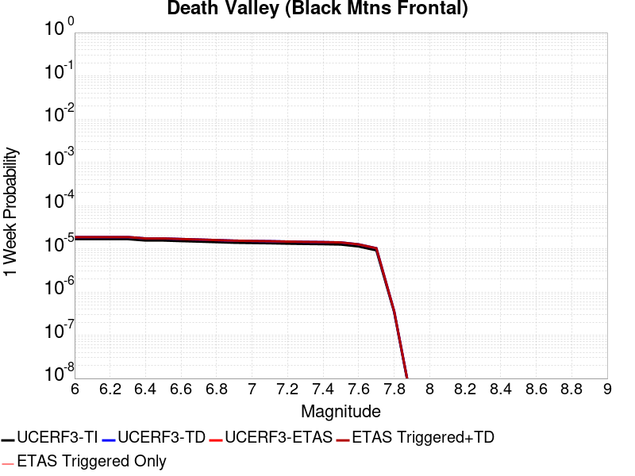 | 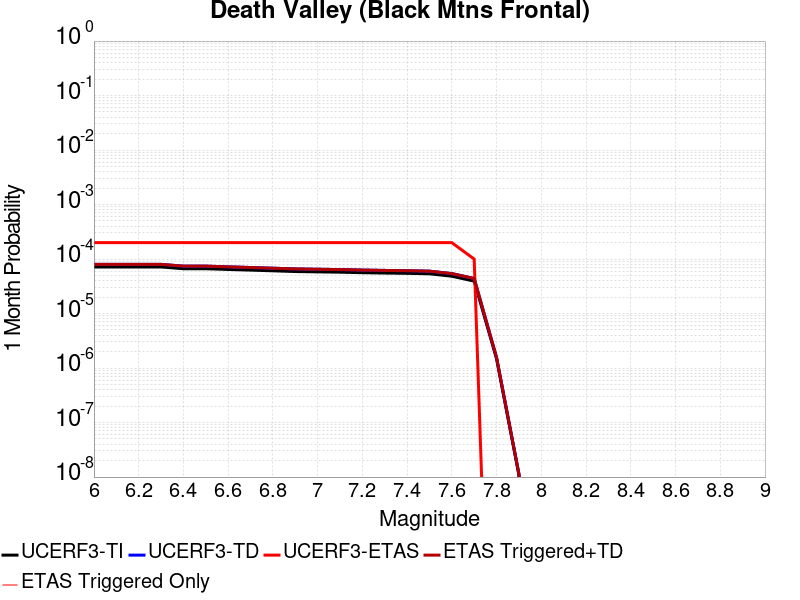 | 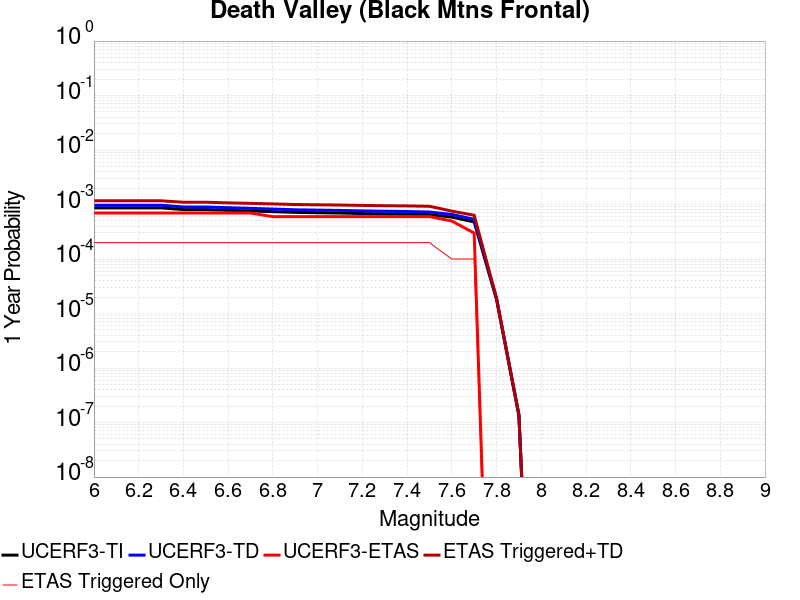 | 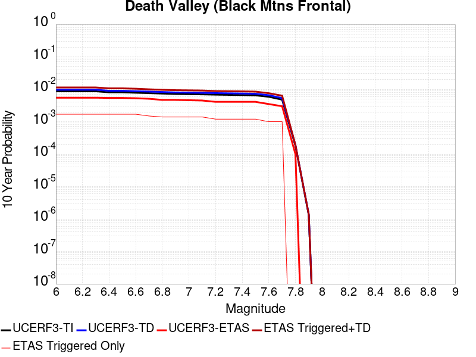 |

| Magnitude | 1 wk TI Prob | 1 wk TD Prob | 1 wk ETAS Prob | 1 wk ETAS/TD Gain | 1 wk ETAS Triggered+TD | 1 wk ETAS Triggered Only | 1 mo TI Prob | 1 mo TD Prob | 1 mo ETAS Prob | 1 mo ETAS/TD Gain | 1 mo ETAS Triggered+TD | 1 mo ETAS Triggered Only | 1 yr TI Prob | 1 yr TD Prob | 1 yr ETAS Prob | 1 yr ETAS/TD Gain | 1 yr ETAS Triggered+TD | 1 yr ETAS Triggered Only | 10 yr TI Prob | 10 yr TD Prob | 10 yr ETAS Prob | 10 yr ETAS/TD Gain | 10 yr ETAS Triggered+TD | 10 yr ETAS Triggered Only |
|-----|-----|-----|-----|-----|-----|-----|-----|-----|-----|-----|-----|-----|-----|-----|-----|-----|-----|-----|-----|-----|-----|-----|-----|-----|
| 6.0 | 1.6707214E-5 | 1.8647328E-5 | 0.0 | 0.0 | 1.8647328E-5 | 0.0 | 7.160038E-5 | 7.991472E-5 | 2.0E-4 | 2.5026681 | 7.991472E-5 | 0.0 | 8.71386E-4 | 9.7253494E-4 | 7.0E-4 | 0.71976846 | 0.0011723405 | 2.0E-4 | 0.00867977 | 0.009683641 | 0.0055 | 0.56796825 | 0.0113671785 | 0.0017 |
| 6.1 | 1.6707214E-5 | 1.8647328E-5 | 0.0 | 0.0 | 1.8647328E-5 | 0.0 | 7.160038E-5 | 7.991472E-5 | 2.0E-4 | 2.5026681 | 7.991472E-5 | 0.0 | 8.71386E-4 | 9.7253494E-4 | 7.0E-4 | 0.71976846 | 0.0011723405 | 2.0E-4 | 0.00867977 | 0.009683641 | 0.0055 | 0.56796825 | 0.0113671785 | 0.0017 |
| 6.2 | 1.6707214E-5 | 1.8647328E-5 | 0.0 | 0.0 | 1.8647328E-5 | 0.0 | 7.160038E-5 | 7.991472E-5 | 2.0E-4 | 2.5026681 | 7.991472E-5 | 0.0 | 8.71386E-4 | 9.7253494E-4 | 7.0E-4 | 0.71976846 | 0.0011723405 | 2.0E-4 | 0.00867977 | 0.009683641 | 0.0055 | 0.56796825 | 0.0113671785 | 0.0017 |
| 6.3 | 1.6707214E-5 | 1.8647328E-5 | 0.0 | 0.0 | 1.8647328E-5 | 0.0 | 7.160038E-5 | 7.991472E-5 | 2.0E-4 | 2.5026681 | 7.991472E-5 | 0.0 | 8.71386E-4 | 9.7253494E-4 | 7.0E-4 | 0.71976846 | 0.0011723405 | 2.0E-4 | 0.00867977 | 0.009683641 | 0.0055 | 0.56796825 | 0.0113671785 | 0.0017 |
| 6.4 | 1.5515609E-5 | 1.731691E-5 | 0.0 | 0.0 | 1.731691E-5 | 0.0 | 6.649377E-5 | 7.4213254E-5 | 2.0E-4 | 2.6949365 | 7.4213254E-5 | 0.0 | 8.0926094E-4 | 9.031779E-4 | 7.0E-4 | 0.7750411 | 0.0011029972 | 2.0E-4 | 0.008063202 | 0.008995756 | 0.0054 | 0.6002831 | 0.010680462 | 0.0017 |
| 6.5 | 1.5515609E-5 | 1.731691E-5 | 0.0 | 0.0 | 1.731691E-5 | 0.0 | 6.649377E-5 | 7.4213254E-5 | 2.0E-4 | 2.6949365 | 7.4213254E-5 | 0.0 | 8.0926094E-4 | 9.031779E-4 | 7.0E-4 | 0.7750411 | 0.0011029972 | 2.0E-4 | 0.008063202 | 0.008995756 | 0.0054 | 0.6002831 | 0.010680462 | 0.0017 |
| 6.6 | 1.5041828E-5 | 1.6788485E-5 | 0.0 | 0.0 | 1.6788485E-5 | 0.0 | 6.4463384E-5 | 7.19487E-5 | 2.0E-4 | 2.7797585 | 7.19487E-5 | 0.0 | 7.8455906E-4 | 8.7562925E-4 | 7.0E-4 | 0.79942507 | 0.0010754542 | 2.0E-4 | 0.00781795 | 0.008722445 | 0.0053 | 0.6076278 | 0.010407616 | 0.0017 |
| 6.7 | 1.4634985E-5 | 1.6335895E-5 | 0.0 | 0.0 | 1.6335895E-5 | 0.0 | 6.271985E-5 | 7.000913E-5 | 2.0E-4 | 2.8567703 | 7.000913E-5 | 0.0 | 7.6334673E-4 | 8.520336E-4 | 7.0E-4 | 0.82156384 | 0.0010518632 | 2.0E-4 | 0.007607299 | 0.008488304 | 0.0051 | 0.60082674 | 0.009975571 | 0.0015 |
| 6.8 | 1.4209158E-5 | 1.5862484E-5 | 0.0 | 0.0 | 1.5862484E-5 | 0.0 | 6.089497E-5 | 6.798034E-5 | 2.0E-4 | 2.942027 | 6.798034E-5 | 0.0 | 7.4114406E-4 | 8.2735193E-4 | 6.0E-4 | 0.7252053 | 0.0010271865 | 2.0E-4 | 0.007386771 | 0.008243332 | 0.0047 | 0.5701578 | 0.00963179 | 0.0014 |
| 6.9 | 1.3780098E-5 | 1.5385593E-5 | 0.0 | 0.0 | 1.5385593E-5 | 0.0 | 5.9056227E-5 | 6.593662E-5 | 2.0E-4 | 3.033216 | 6.593662E-5 | 0.0 | 7.1877235E-4 | 8.0248807E-4 | 6.0E-4 | 0.74767464 | 0.0010023275 | 2.0E-4 | 0.0071645193 | 0.007996496 | 0.0047 | 0.5877574 | 0.009385301 | 0.0014 |
| 7.0 | 1.3585064E-5 | 1.5169402E-5 | 0.0 | 0.0 | 1.5169402E-5 | 0.0 | 5.8220405E-5 | 6.5010136E-5 | 2.0E-4 | 3.0764434 | 6.5010136E-5 | 0.0 | 7.086029E-4 | 7.9121644E-4 | 6.0E-4 | 0.75832605 | 9.910582E-4 | 2.0E-4 | 0.007063476 | 0.007884584 | 0.0046 | 0.58341694 | 0.009273546 | 0.0014 |
| 7.1 | 1.3398601E-5 | 1.4962822E-5 | 0.0 | 0.0 | 1.4962822E-5 | 0.0 | 5.742131E-5 | 6.412483E-5 | 2.0E-4 | 3.1189165 | 6.412483E-5 | 0.0 | 6.9888023E-4 | 7.8044564E-4 | 6.0E-4 | 0.7687915 | 9.802895E-4 | 2.0E-4 | 0.0069668638 | 0.0077776355 | 0.0045 | 0.578582 | 0.009166746 | 0.0014 |
| 7.2 | 1.3126312E-5 | 1.4661385E-5 | 0.0 | 0.0 | 1.4661385E-5 | 0.0 | 5.6254412E-5 | 6.283302E-5 | 2.0E-4 | 3.1830397 | 6.283302E-5 | 0.0 | 6.846822E-4 | 7.64729E-4 | 6.0E-4 | 0.7845917 | 9.6457603E-4 | 2.0E-4 | 0.006825765 | 0.0076215565 | 0.0041 | 0.53794783 | 0.008812411 | 0.0012 |
| 7.3 | 1.2922429E-5 | 1.44358655E-5 | 0.0 | 0.0 | 1.44358655E-5 | 0.0 | 5.5380664E-5 | 6.186656E-5 | 2.0E-4 | 3.2327642 | 6.186656E-5 | 0.0 | 6.74051E-4 | 7.5297046E-4 | 6.0E-4 | 0.796844 | 9.528198E-4 | 2.0E-4 | 0.006720101 | 0.0075047715 | 0.0041 | 0.5463191 | 0.008695765 | 0.0012 |
| 7.4 | 1.2768878E-5 | 1.426604E-5 | 0.0 | 0.0 | 1.426604E-5 | 0.0 | 5.4722615E-5 | 6.113877E-5 | 2.0E-4 | 3.2712467 | 6.113877E-5 | 0.0 | 6.660441E-4 | 7.4411574E-4 | 6.0E-4 | 0.8063262 | 9.439669E-4 | 2.0E-4 | 0.0066405144 | 0.0074168188 | 0.0041 | 0.5527977 | 0.008607918 | 0.0012 |
| 7.5 | 1.2521929E-5 | 1.3994572E-5 | 0.0 | 0.0 | 1.3994572E-5 | 0.0 | 5.366431E-5 | 5.997539E-5 | 2.0E-4 | 3.334701 | 5.997539E-5 | 0.0 | 6.531671E-4 | 7.2996115E-4 | 6.0E-4 | 0.8219615 | 9.2981517E-4 | 2.0E-4 | 0.006512506 | 0.007276209 | 0.0041 | 0.5634802 | 0.008467478 | 0.0012 |
| 7.6 | 1.1301089E-5 | 1.2632379E-5 | 0.0 | 0.0 | 1.2632379E-5 | 0.0 | 4.8432343E-5 | 5.4137676E-5 | 2.0E-4 | 3.694285 | 5.4137676E-5 | 0.0 | 5.895042E-4 | 6.589322E-4 | 5.0E-4 | 0.7588034 | 7.5886626E-4 | 1.0E-4 | 0.0058794282 | 0.0065703345 | 0.0035 | 0.5326974 | 0.007563764 | 0.001 |
| 7.7 | 9.189108E-6 | 1.027055E-5 | 0.0 | 0.0 | 1.027055E-5 | 0.0 | 3.93813E-5 | 4.4015927E-5 | 1.0E-4 | 2.2719047 | 4.4015927E-5 | 0.0 | 4.7936183E-4 | 5.357672E-4 | 3.0E-4 | 0.5599447 | 6.3571363E-4 | 1.0E-4 | 0.004783291 | 0.005345265 | 0.003 | 0.56124437 | 0.0063399198 | 0.001 |
| 7.8 | 3.4586725E-7 | 3.6461634E-7 | 0.0 | 0.0 | 3.6461634E-7 | 0.0 | 1.4822873E-6 | 1.5626406E-6 | 0.0 | 0.0 | 1.5626406E-6 | 0.0 | 1.80467E-5 | 1.9024988E-5 | 0.0 | 0.0 | 1.9024988E-5 | 0.0 | 1.8045233E-4 | 1.9023403E-4 | 1.0E-4 | 0.5256683 | 1.9023403E-4 | 0.0 |
| 7.9 | 2.5591178E-9 | 2.6684681E-9 | 0.0 | 0.0 | 2.6684681E-9 | 0.0 | 1.0967647E-8 | 1.1436292E-8 | 0.0 | 0.0 | 1.1436292E-8 | 0.0 | 1.335311E-7 | 1.3923685E-7 | 0.0 | 0.0 | 1.3923685E-7 | 0.0 | 1.3353102E-6 | 1.3923685E-6 | 0.0 | 0.0 | 1.3923685E-6 | 0.0 |

## Likely 2011 CFM
*[(top)](#table-of-contents)*

| 1 Week | 1 Month | 1 Year | 10 Year |
|-----|-----|-----|-----|
| 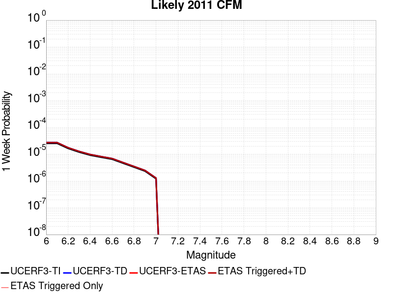 | 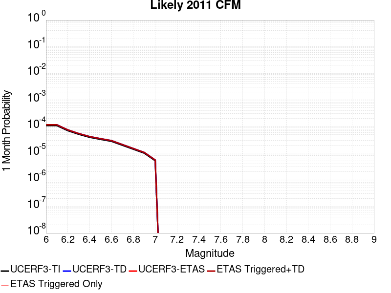 | 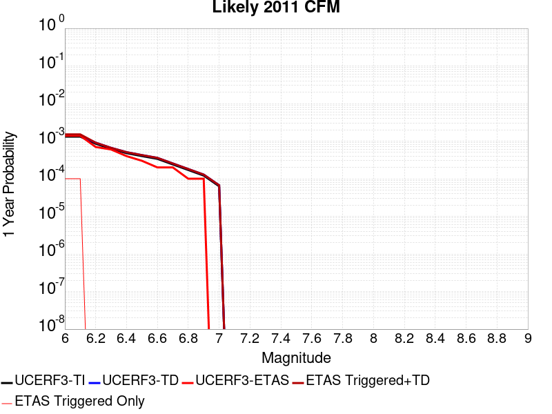 | 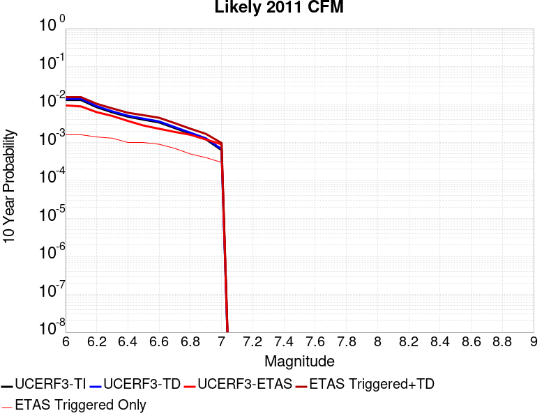 |

| Magnitude | 1 wk TI Prob | 1 wk TD Prob | 1 wk ETAS Prob | 1 wk ETAS/TD Gain | 1 wk ETAS Triggered+TD | 1 wk ETAS Triggered Only | 1 mo TI Prob | 1 mo TD Prob | 1 mo ETAS Prob | 1 mo ETAS/TD Gain | 1 mo ETAS Triggered+TD | 1 mo ETAS Triggered Only | 1 yr TI Prob | 1 yr TD Prob | 1 yr ETAS Prob | 1 yr ETAS/TD Gain | 1 yr ETAS Triggered+TD | 1 yr ETAS Triggered Only | 10 yr TI Prob | 10 yr TD Prob | 10 yr ETAS Prob | 10 yr ETAS/TD Gain | 10 yr ETAS Triggered+TD | 10 yr ETAS Triggered Only |
|-----|-----|-----|-----|-----|-----|-----|-----|-----|-----|-----|-----|-----|-----|-----|-----|-----|-----|-----|-----|-----|-----|-----|-----|-----|
| 6.0 | 2.5315949E-5 | 2.7084729E-5 | 0.0 | 0.0 | 2.7084729E-5 | 0.0 | 1.0849241E-4 | 1.160725E-4 | 0.0 | 0.0 | 1.160725E-4 | 0.0 | 0.0013200947 | 0.001412311 | 0.0014 | 0.99128306 | 0.0015121697 | 1.0E-4 | 0.013122803 | 0.014038003 | 0.0095 | 0.67673445 | 0.015615542 | 0.0016 |
| 6.1 | 2.5315949E-5 | 2.7084729E-5 | 0.0 | 0.0 | 2.7084729E-5 | 0.0 | 1.0849241E-4 | 1.160725E-4 | 0.0 | 0.0 | 1.160725E-4 | 0.0 | 0.0013200947 | 0.001412311 | 0.0014 | 0.99128306 | 0.0015121697 | 1.0E-4 | 0.013122803 | 0.014038003 | 0.0089 | 0.6339933 | 0.015615542 | 0.0016 |
| 6.2 | 1.6375941E-5 | 1.7453698E-5 | 0.0 | 0.0 | 1.7453698E-5 | 0.0 | 7.0180715E-5 | 7.479949E-5 | 0.0 | 0.0 | 7.479949E-5 | 0.0 | 8.5411523E-4 | 9.1031555E-4 | 7.0E-4 | 0.7689641 | 9.1031555E-4 | 0.0 | 0.008508399 | 0.009067152 | 0.0063 | 0.6948158 | 0.010454457 | 0.0014 |
| 6.3 | 1.1945543E-5 | 1.2704063E-5 | 0.0 | 0.0 | 1.2704063E-5 | 0.0 | 5.119418E-5 | 5.4444878E-5 | 0.0 | 0.0 | 5.4444878E-5 | 0.0 | 6.2311086E-4 | 6.626701E-4 | 6.0E-4 | 0.9054279 | 6.626701E-4 | 0.0 | 0.0062136655 | 0.0066074952 | 0.005 | 0.7567164 | 0.007898905 | 0.0013 |
| 6.4 | 9.192729E-6 | 9.7621005E-6 | 0.0 | 0.0 | 9.7621005E-6 | 0.0 | 3.939681E-5 | 4.183692E-5 | 0.0 | 0.0 | 4.183692E-5 | 0.0 | 4.7955062E-4 | 5.092482E-4 | 4.0E-4 | 0.7854717 | 5.092482E-4 | 0.0 | 0.004785171 | 0.005081093 | 0.0037 | 0.72818977 | 0.006076012 | 0.001 |
| 6.5 | 7.67906E-6 | 8.1473745E-6 | 0.0 | 0.0 | 8.1473745E-6 | 0.0 | 3.2909844E-5 | 3.4916862E-5 | 0.0 | 0.0 | 3.4916862E-5 | 0.0 | 4.006037E-4 | 4.2503176E-4 | 3.0E-4 | 0.7058296 | 4.2503176E-4 | 0.0 | 0.0039988225 | 0.004242381 | 0.0028 | 0.6600067 | 0.005238139 | 0.001 |
| 6.6 | 6.4884057E-6 | 6.880361E-6 | 0.0 | 0.0 | 6.880361E-6 | 0.0 | 2.7807157E-5 | 2.9486937E-5 | 0.0 | 0.0 | 2.9486937E-5 | 0.0 | 3.3849955E-4 | 3.5894575E-4 | 2.0E-4 | 0.55718726 | 3.5894575E-4 | 0.0 | 0.003379844 | 0.0035838045 | 0.0023 | 0.6417761 | 0.004480579 | 9.0E-4 |
| 6.7 | 4.6060636E-6 | 4.880965E-6 | 0.0 | 0.0 | 4.880965E-6 | 0.0 | 1.9740122E-5 | 2.091826E-5 | 0.0 | 0.0 | 2.091826E-5 | 0.0 | 2.403095E-4 | 2.5465086E-4 | 2.0E-4 | 0.78538907 | 2.5465086E-4 | 0.0 | 0.002400498 | 0.0025436736 | 0.0019 | 0.74695116 | 0.003241893 | 7.0E-4 |
| 6.8 | 3.2795615E-6 | 3.4751843E-6 | 0.0 | 0.0 | 3.4751843E-6 | 0.0 | 1.4055187E-5 | 1.4893565E-5 | 0.0 | 0.0 | 1.4893565E-5 | 0.0 | 1.7110848E-4 | 1.8131462E-4 | 1.0E-4 | 0.5515275 | 1.8131462E-4 | 0.0 | 0.0017097679 | 0.0018117221 | 0.0016 | 0.88313764 | 0.0023108162 | 5.0E-4 |
| 6.9 | 2.3289967E-6 | 2.4689898E-6 | 0.0 | 0.0 | 2.4689898E-6 | 0.0 | 9.981376E-6 | 1.0581344E-5 | 0.0 | 0.0 | 1.0581344E-5 | 0.0 | 1.2151648E-4 | 1.2882068E-4 | 1.0E-4 | 0.77627283 | 1.2882068E-4 | 0.0 | 0.0012145005 | 0.001287503 | 0.0012 | 0.93203664 | 0.001686988 | 4.0E-4 |
| 7.0 | 1.211292E-6 | 1.2855635E-6 | 0.0 | 0.0 | 1.2855635E-6 | 0.0 | 5.1912407E-6 | 5.5095475E-6 | 0.0 | 0.0 | 5.5095475E-6 | 0.0 | 6.320152E-5 | 6.707698E-5 | 0.0 | 0.0 | 6.707698E-5 | 0.0 | 6.3183554E-4 | 6.7059713E-4 | 9.0E-4 | 1.3420874 | 9.70396E-4 | 3.0E-4 |

## Mad River (alt1)
*[(top)](#table-of-contents)*

| 1 Week | 1 Month | 1 Year | 10 Year |
|-----|-----|-----|-----|
| 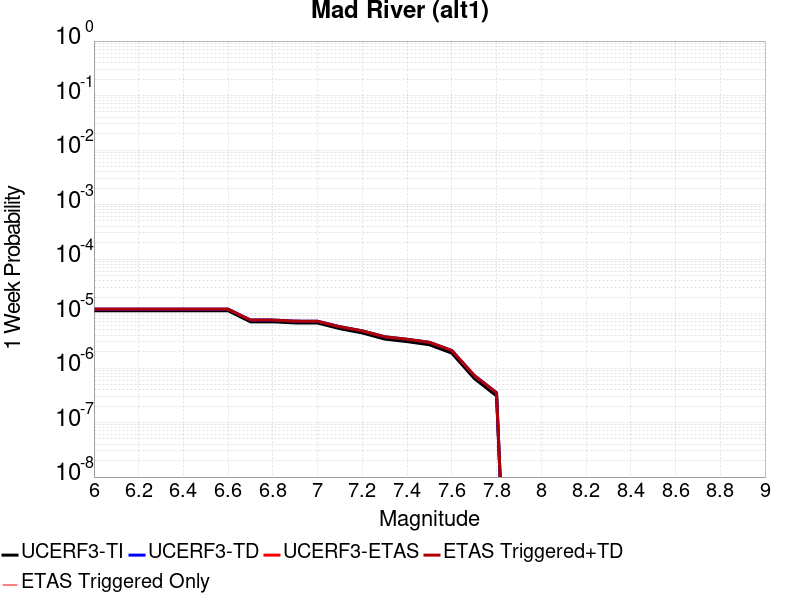 | 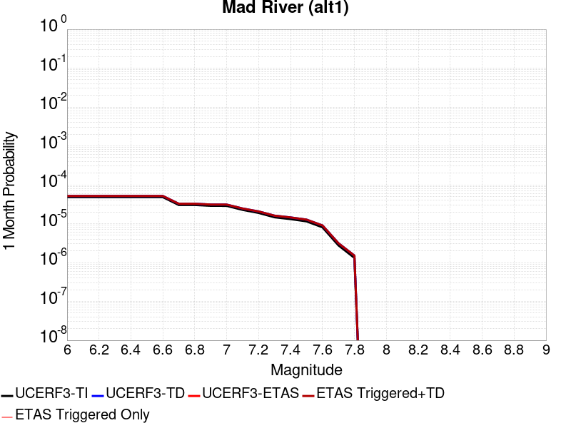 | 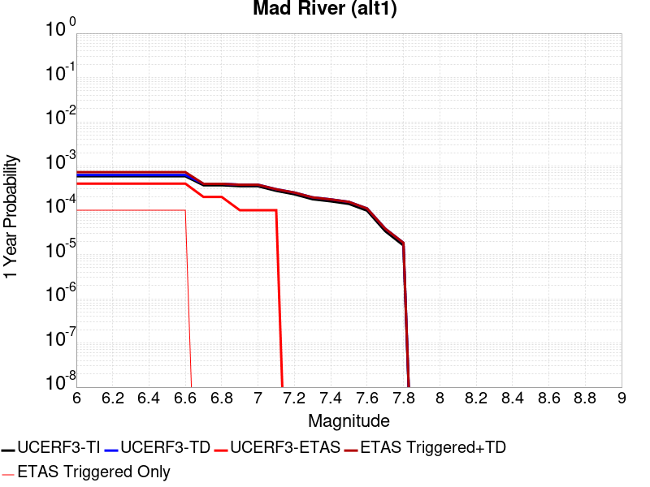 | 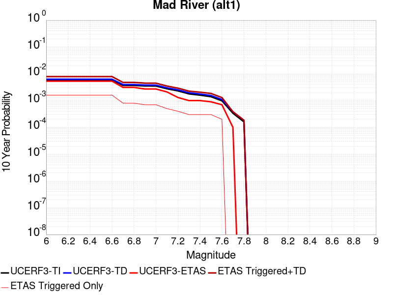 |

| Magnitude | 1 wk TI Prob | 1 wk TD Prob | 1 wk ETAS Prob | 1 wk ETAS/TD Gain | 1 wk ETAS Triggered+TD | 1 wk ETAS Triggered Only | 1 mo TI Prob | 1 mo TD Prob | 1 mo ETAS Prob | 1 mo ETAS/TD Gain | 1 mo ETAS Triggered+TD | 1 mo ETAS Triggered Only | 1 yr TI Prob | 1 yr TD Prob | 1 yr ETAS Prob | 1 yr ETAS/TD Gain | 1 yr ETAS Triggered+TD | 1 yr ETAS Triggered Only | 10 yr TI Prob | 10 yr TD Prob | 10 yr ETAS Prob | 10 yr ETAS/TD Gain | 10 yr ETAS Triggered+TD | 10 yr ETAS Triggered Only |
|-----|-----|-----|-----|-----|-----|-----|-----|-----|-----|-----|-----|-----|-----|-----|-----|-----|-----|-----|-----|-----|-----|-----|-----|-----|
| 6.0 | 1.1255216E-5 | 1.2030814E-5 | 0.0 | 0.0 | 1.2030814E-5 | 0.0 | 4.8235746E-5 | 5.1559695E-5 | 0.0 | 0.0 | 5.1559695E-5 | 0.0 | 5.87112E-4 | 6.275729E-4 | 4.0E-4 | 0.6373762 | 7.2751014E-4 | 1.0E-4 | 0.0058556325 | 0.0062594432 | 0.0053 | 0.84672064 | 0.007849428 | 0.0016 |
| 6.1 | 1.1255216E-5 | 1.2030814E-5 | 0.0 | 0.0 | 1.2030814E-5 | 0.0 | 4.8235746E-5 | 5.1559695E-5 | 0.0 | 0.0 | 5.1559695E-5 | 0.0 | 5.87112E-4 | 6.275729E-4 | 4.0E-4 | 0.6373762 | 7.2751014E-4 | 1.0E-4 | 0.0058556325 | 0.0062594432 | 0.0053 | 0.84672064 | 0.007849428 | 0.0016 |
| 6.2 | 1.1255216E-5 | 1.2030814E-5 | 0.0 | 0.0 | 1.2030814E-5 | 0.0 | 4.8235746E-5 | 5.1559695E-5 | 0.0 | 0.0 | 5.1559695E-5 | 0.0 | 5.87112E-4 | 6.275729E-4 | 4.0E-4 | 0.6373762 | 7.2751014E-4 | 1.0E-4 | 0.0058556325 | 0.0062594432 | 0.0053 | 0.84672064 | 0.007849428 | 0.0016 |
| 6.3 | 1.1255216E-5 | 1.2030814E-5 | 0.0 | 0.0 | 1.2030814E-5 | 0.0 | 4.8235746E-5 | 5.1559695E-5 | 0.0 | 0.0 | 5.1559695E-5 | 0.0 | 5.87112E-4 | 6.275729E-4 | 4.0E-4 | 0.6373762 | 7.2751014E-4 | 1.0E-4 | 0.0058556325 | 0.0062594432 | 0.0053 | 0.84672064 | 0.007849428 | 0.0016 |
| 6.4 | 1.1255216E-5 | 1.2030814E-5 | 0.0 | 0.0 | 1.2030814E-5 | 0.0 | 4.8235746E-5 | 5.1559695E-5 | 0.0 | 0.0 | 5.1559695E-5 | 0.0 | 5.87112E-4 | 6.275729E-4 | 4.0E-4 | 0.6373762 | 7.2751014E-4 | 1.0E-4 | 0.0058556325 | 0.0062594432 | 0.0053 | 0.84672064 | 0.007849428 | 0.0016 |
| 6.5 | 1.1255216E-5 | 1.2030814E-5 | 0.0 | 0.0 | 1.2030814E-5 | 0.0 | 4.8235746E-5 | 5.1559695E-5 | 0.0 | 0.0 | 5.1559695E-5 | 0.0 | 5.87112E-4 | 6.275729E-4 | 4.0E-4 | 0.6373762 | 7.2751014E-4 | 1.0E-4 | 0.0058556325 | 0.0062594432 | 0.0053 | 0.84672064 | 0.007849428 | 0.0016 |
| 6.6 | 1.1255216E-5 | 1.2030814E-5 | 0.0 | 0.0 | 1.2030814E-5 | 0.0 | 4.8235746E-5 | 5.1559695E-5 | 0.0 | 0.0 | 5.1559695E-5 | 0.0 | 5.87112E-4 | 6.275729E-4 | 4.0E-4 | 0.6373762 | 7.2751014E-4 | 1.0E-4 | 0.0058556325 | 0.0062594432 | 0.0053 | 0.84672064 | 0.007849428 | 0.0016 |
| 6.7 | 7.0564884E-6 | 7.5991843E-6 | 0.0 | 0.0 | 7.5991843E-6 | 0.0 | 3.0241743E-5 | 3.256754E-5 | 0.0 | 0.0 | 3.256754E-5 | 0.0 | 3.68131E-4 | 3.9643983E-4 | 2.0E-4 | 0.50449014 | 3.9643983E-4 | 0.0 | 0.0036752177 | 0.003957548 | 0.0031 | 0.7833133 | 0.004754382 | 8.0E-4 |
| 6.8 | 7.0564884E-6 | 7.5991843E-6 | 0.0 | 0.0 | 7.5991843E-6 | 0.0 | 3.0241743E-5 | 3.256754E-5 | 0.0 | 0.0 | 3.256754E-5 | 0.0 | 3.68131E-4 | 3.9643983E-4 | 2.0E-4 | 0.50449014 | 3.9643983E-4 | 0.0 | 0.0036752177 | 0.003957548 | 0.0031 | 0.7833133 | 0.004754382 | 8.0E-4 |
| 6.9 | 6.727494E-6 | 7.251248E-6 | 0.0 | 0.0 | 7.251248E-6 | 0.0 | 2.8831799E-5 | 3.107642E-5 | 0.0 | 0.0 | 3.107642E-5 | 0.0 | 3.509706E-4 | 3.7829185E-4 | 1.0E-4 | 0.26434618 | 3.7829185E-4 | 0.0 | 0.003504168 | 0.0037766942 | 0.0027 | 0.7149109 | 0.0044740504 | 7.0E-4 |
| 7.0 | 6.7021124E-6 | 7.224108E-6 | 0.0 | 0.0 | 7.224108E-6 | 0.0 | 2.8723021E-5 | 3.0960106E-5 | 0.0 | 0.0 | 3.0960106E-5 | 0.0 | 3.4964667E-4 | 3.7687624E-4 | 1.0E-4 | 0.2653391 | 3.7687624E-4 | 0.0 | 0.0034909705 | 0.003762586 | 0.0027 | 0.7175915 | 0.0044599525 | 7.0E-4 |
| 7.1 | 5.2784667E-6 | 5.727039E-6 | 0.0 | 0.0 | 5.727039E-6 | 0.0 | 2.2621804E-5 | 2.4544226E-5 | 0.0 | 0.0 | 2.4544226E-5 | 0.0 | 2.7538565E-4 | 2.987859E-4 | 1.0E-4 | 0.33468783 | 2.987859E-4 | 0.0 | 0.0027504463 | 0.002983934 | 0.0021 | 0.7037689 | 0.0034824419 | 5.0E-4 |
| 7.2 | 4.4085446E-6 | 4.8148163E-6 | 0.0 | 0.0 | 4.8148163E-6 | 0.0 | 1.8893625E-5 | 2.0634765E-5 | 0.0 | 0.0 | 2.0634765E-5 | 0.0 | 2.3000561E-4 | 2.511997E-4 | 0.0 | 0.0 | 2.511997E-4 | 0.0 | 0.0022976769 | 0.0025091982 | 0.0013 | 0.51809376 | 0.0029081947 | 4.0E-4 |
| 7.3 | 3.4060627E-6 | 3.7491557E-6 | 0.0 | 0.0 | 3.7491557E-6 | 0.0 | 1.459733E-5 | 1.6067712E-5 | 0.0 | 0.0 | 1.6067712E-5 | 0.0 | 1.77708E-4 | 1.9560708E-4 | 0.0 | 0.0 | 1.9560708E-4 | 0.0 | 0.0017756595 | 0.0019543723 | 0.001 | 0.5116732 | 0.002253786 | 3.0E-4 |
| 7.4 | 3.0570902E-6 | 3.3765443E-6 | 0.0 | 0.0 | 3.3765443E-6 | 0.0 | 1.310175E-5 | 1.4470826E-5 | 0.0 | 0.0 | 1.4470826E-5 | 0.0 | 1.5950213E-4 | 1.7616827E-4 | 0.0 | 0.0 | 1.7616827E-4 | 0.0 | 0.0015938769 | 0.0017603077 | 0.001 | 0.5680825 | 0.0020597796 | 3.0E-4 |
| 7.5 | 2.674048E-6 | 2.96583E-6 | 0.0 | 0.0 | 2.96583E-6 | 0.0 | 1.1460155E-5 | 1.2710639E-5 | 0.0 | 0.0 | 1.2710639E-5 | 0.0 | 1.3951845E-4 | 1.5474124E-4 | 0.0 | 0.0 | 1.5474124E-4 | 0.0 | 0.0013943089 | 0.0015463544 | 9.0E-4 | 0.582014 | 0.0018458905 | 3.0E-4 |
| 7.6 | 1.8806261E-6 | 2.1019816E-6 | 0.0 | 0.0 | 2.1019816E-6 | 0.0 | 8.059801E-6 | 9.008462E-6 | 0.0 | 0.0 | 9.008462E-6 | 0.0 | 9.812366E-5 | 1.09672634E-4 | 0.0 | 0.0 | 1.09672634E-4 | 0.0 | 9.808034E-4 | 0.0010961975 | 7.0E-4 | 0.6385711 | 0.0012959782 | 2.0E-4 |
| 7.7 | 6.461283E-7 | 7.330341E-7 | 0.0 | 0.0 | 7.330341E-7 | 0.0 | 2.7691183E-6 | 3.1415711E-6 | 0.0 | 0.0 | 3.1415711E-6 | 0.0 | 3.371349E-5 | 3.824797E-5 | 0.0 | 0.0 | 3.824797E-5 | 0.0 | 3.370838E-4 | 3.824154E-4 | 1.0E-4 | 0.26149574 | 3.824154E-4 | 0.0 |
| 7.8 | 3.0785324E-7 | 3.5236104E-7 | 0.0 | 0.0 | 3.5236104E-7 | 0.0 | 1.3193703E-6 | 1.510118E-6 | 0.0 | 0.0 | 1.510118E-6 | 0.0 | 1.6063215E-5 | 1.8385537E-5 | 0.0 | 0.0 | 1.8385537E-5 | 0.0 | 1.6062055E-4 | 1.8384079E-4 | 0.0 | 0.0 | 1.8384079E-4 | 0.0 |

## Death Valley (No)
*[(top)](#table-of-contents)*

| 1 Week | 1 Month | 1 Year | 10 Year |
|-----|-----|-----|-----|
| 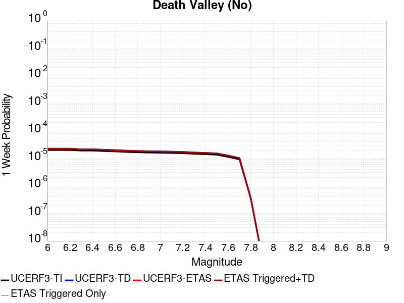 | 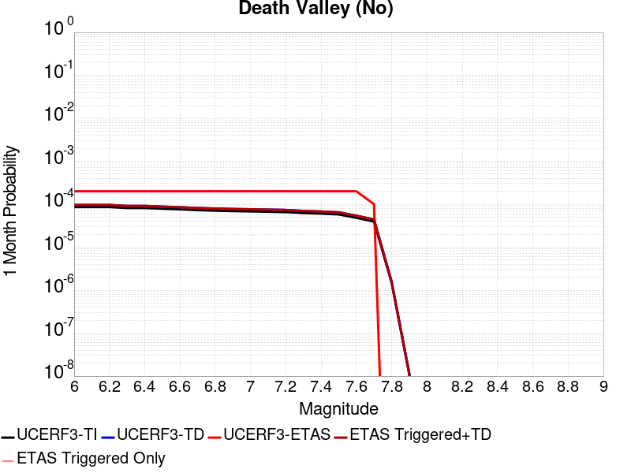 | 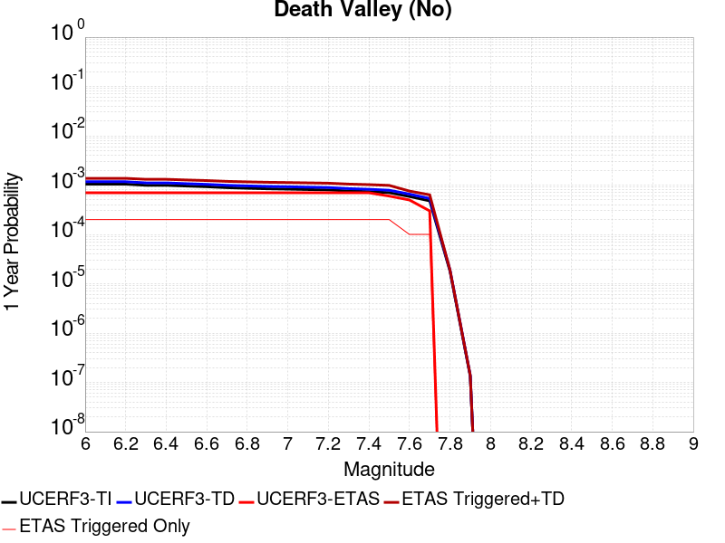 | 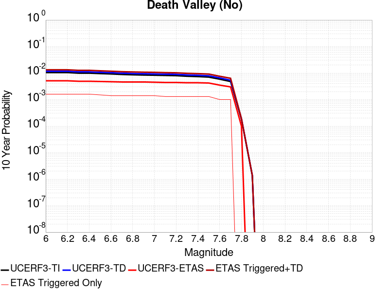 |

| Magnitude | 1 wk TI Prob | 1 wk TD Prob | 1 wk ETAS Prob | 1 wk ETAS/TD Gain | 1 wk ETAS Triggered+TD | 1 wk ETAS Triggered Only | 1 mo TI Prob | 1 mo TD Prob | 1 mo ETAS Prob | 1 mo ETAS/TD Gain | 1 mo ETAS Triggered+TD | 1 mo ETAS Triggered Only | 1 yr TI Prob | 1 yr TD Prob | 1 yr ETAS Prob | 1 yr ETAS/TD Gain | 1 yr ETAS Triggered+TD | 1 yr ETAS Triggered Only | 10 yr TI Prob | 10 yr TD Prob | 10 yr ETAS Prob | 10 yr ETAS/TD Gain | 10 yr ETAS Triggered+TD | 10 yr ETAS Triggered Only |
|-----|-----|-----|-----|-----|-----|-----|-----|-----|-----|-----|-----|-----|-----|-----|-----|-----|-----|-----|-----|-----|-----|-----|-----|-----|
| 6.0 | 2.0074807E-5 | 2.2471604E-5 | 0.0 | 0.0 | 2.2471604E-5 | 0.0 | 8.603206E-5 | 9.630336E-5 | 2.0E-4 | 2.0767708 | 9.630336E-5 | 0.0 | 0.001046937 | 0.0011718702 | 7.0E-4 | 0.5973358 | 0.0013716357 | 2.0E-4 | 0.010420183 | 0.011657817 | 0.0051 | 0.4374747 | 0.013239165 | 0.0016 |
| 6.1 | 2.0074807E-5 | 2.2471604E-5 | 0.0 | 0.0 | 2.2471604E-5 | 0.0 | 8.603206E-5 | 9.630336E-5 | 2.0E-4 | 2.0767708 | 9.630336E-5 | 0.0 | 0.001046937 | 0.0011718702 | 7.0E-4 | 0.5973358 | 0.0013716357 | 2.0E-4 | 0.010420183 | 0.011657817 | 0.0051 | 0.4374747 | 0.013239165 | 0.0016 |
| 6.2 | 2.0074807E-5 | 2.2471604E-5 | 0.0 | 0.0 | 2.2471604E-5 | 0.0 | 8.603206E-5 | 9.630336E-5 | 2.0E-4 | 2.0767708 | 9.630336E-5 | 0.0 | 0.001046937 | 0.0011718702 | 7.0E-4 | 0.5973358 | 0.0013716357 | 2.0E-4 | 0.010420183 | 0.011657817 | 0.0051 | 0.4374747 | 0.013239165 | 0.0016 |
| 6.3 | 1.9050609E-5 | 2.1310112E-5 | 0.0 | 0.0 | 2.1310112E-5 | 0.0 | 8.164292E-5 | 9.132589E-5 | 2.0E-4 | 2.1899593 | 9.132589E-5 | 0.0 | 9.935491E-4 | 0.0011113323 | 7.0E-4 | 0.6298746 | 0.0013111101 | 2.0E-4 | 0.009891188 | 0.01105857 | 0.0049 | 0.4430953 | 0.012640876 | 0.0016 |
| 6.4 | 1.9050609E-5 | 2.1310112E-5 | 0.0 | 0.0 | 2.1310112E-5 | 0.0 | 8.164292E-5 | 9.132589E-5 | 2.0E-4 | 2.1899593 | 9.132589E-5 | 0.0 | 9.935491E-4 | 0.0011113323 | 7.0E-4 | 0.6298746 | 0.0013111101 | 2.0E-4 | 0.009891188 | 0.01105857 | 0.0049 | 0.4430953 | 0.012640876 | 0.0016 |
| 6.5 | 1.8367004E-5 | 2.0535266E-5 | 0.0 | 0.0 | 2.0535266E-5 | 0.0 | 7.8713354E-5 | 8.8005356E-5 | 2.0E-4 | 2.272589 | 8.8005356E-5 | 0.0 | 9.5791375E-4 | 0.001070945 | 7.0E-4 | 0.6536283 | 0.0012707309 | 2.0E-4 | 0.009537951 | 0.010658625 | 0.0048 | 0.45033953 | 0.012142637 | 0.0015 |
| 6.6 | 1.779439E-5 | 1.9886103E-5 | 0.0 | 0.0 | 1.9886103E-5 | 0.0 | 7.625944E-5 | 8.522341E-5 | 2.0E-4 | 2.3467731 | 8.522341E-5 | 0.0 | 9.280632E-4 | 0.0010371074 | 7.0E-4 | 0.6749542 | 0.0012369001 | 2.0E-4 | 0.009241969 | 0.010323431 | 0.0047 | 0.455275 | 0.011708979 | 0.0014 |
| 6.7 | 1.7025437E-5 | 1.9019766E-5 | 0.0 | 0.0 | 1.9019766E-5 | 0.0 | 7.296412E-5 | 8.151077E-5 | 2.0E-4 | 2.4536636 | 8.151077E-5 | 0.0 | 8.87976E-4 | 9.91948E-4 | 7.0E-4 | 0.70568216 | 0.0011917496 | 2.0E-4 | 0.008844362 | 0.00987592 | 0.0046 | 0.4657794 | 0.011262094 | 0.0014 |
| 6.8 | 1.6545107E-5 | 1.848948E-5 | 0.0 | 0.0 | 1.848948E-5 | 0.0 | 7.090568E-5 | 7.9238256E-5 | 2.0E-4 | 2.5240333 | 7.9238256E-5 | 0.0 | 8.629347E-4 | 9.643049E-4 | 7.0E-4 | 0.7259115 | 0.001164112 | 2.0E-4 | 0.008595915 | 0.009601908 | 0.0046 | 0.47907147 | 0.010988465 | 0.0014 |
| 6.9 | 1.615478E-5 | 1.8064933E-5 | 0.0 | 0.0 | 1.8064933E-5 | 0.0 | 6.9232934E-5 | 7.741888E-5 | 2.0E-4 | 2.5833492 | 7.741888E-5 | 0.0 | 8.4258494E-4 | 9.4217336E-4 | 7.0E-4 | 0.7429631 | 0.001141985 | 2.0E-4 | 0.008393973 | 0.009382481 | 0.0046 | 0.49027544 | 0.010769345 | 0.0014 |
| 7.0 | 1.5894311E-5 | 1.7783139E-5 | 0.0 | 0.0 | 1.7783139E-5 | 0.0 | 6.81167E-5 | 7.621126E-5 | 2.0E-4 | 2.624284 | 7.621126E-5 | 0.0 | 8.2900526E-4 | 9.274832E-4 | 7.0E-4 | 0.75473064 | 0.0011272978 | 2.0E-4 | 0.008259195 | 0.009236811 | 0.0045 | 0.48718116 | 0.010623879 | 0.0014 |
| 7.1 | 1.5602263E-5 | 1.7461445E-5 | 0.0 | 0.0 | 1.7461445E-5 | 0.0 | 6.6865134E-5 | 7.483265E-5 | 2.0E-4 | 2.6726303 | 7.483265E-5 | 0.0 | 8.137789E-4 | 9.1071276E-4 | 7.0E-4 | 0.7686288 | 0.0011105306 | 2.0E-4 | 0.008108052 | 0.009070487 | 0.0044 | 0.48508975 | 0.010358695 | 0.0013 |
| 7.2 | 1.5323829E-5 | 1.7148977E-5 | 0.0 | 0.0 | 1.7148977E-5 | 0.0 | 6.56719E-5 | 7.349358E-5 | 2.0E-4 | 2.721326 | 7.349358E-5 | 0.0 | 7.99262E-4 | 8.9442305E-4 | 7.0E-4 | 0.7826274 | 0.0010942442 | 2.0E-4 | 0.007963934 | 0.008908907 | 0.0044 | 0.49388775 | 0.010197326 | 0.0013 |
| 7.3 | 1.4556212E-5 | 1.628199E-5 | 0.0 | 0.0 | 1.628199E-5 | 0.0 | 6.238227E-5 | 6.977812E-5 | 2.0E-4 | 2.8662279 | 6.977812E-5 | 0.0 | 7.592395E-4 | 8.492234E-4 | 7.0E-4 | 0.8242825 | 0.0010490535 | 2.0E-4 | 0.0075665074 | 0.008460425 | 0.0043 | 0.50824875 | 0.0097494265 | 0.0013 |
| 7.4 | 1.411725E-5 | 1.578815E-5 | 0.0 | 0.0 | 1.578815E-5 | 0.0 | 6.0501097E-5 | 6.766178E-5 | 2.0E-4 | 2.9558785 | 6.766178E-5 | 0.0 | 7.363519E-4 | 8.234766E-4 | 7.0E-4 | 0.8500545 | 0.0010233119 | 2.0E-4 | 0.0073391674 | 0.008204885 | 0.0043 | 0.5240781 | 0.009494218 | 0.0013 |
| 7.5 | 1.3503312E-5 | 1.5107272E-5 | 0.0 | 0.0 | 1.5107272E-5 | 0.0 | 5.7870053E-5 | 6.474388E-5 | 2.0E-4 | 3.089095 | 6.474388E-5 | 0.0 | 7.043401E-4 | 7.879774E-4 | 6.0E-4 | 0.76144314 | 9.878199E-4 | 2.0E-4 | 0.007021119 | 0.007852457 | 0.0042 | 0.5348644 | 0.009142249 | 0.0013 |
| 7.6 | 1.1279839E-5 | 1.2610564E-5 | 0.0 | 0.0 | 1.2610564E-5 | 0.0 | 4.834127E-5 | 5.4044183E-5 | 2.0E-4 | 3.7006757 | 5.4044183E-5 | 0.0 | 5.88396E-4 | 6.577946E-4 | 5.0E-4 | 0.76011574 | 7.577288E-4 | 1.0E-4 | 0.005868405 | 0.006559026 | 0.0035 | 0.5336158 | 0.007552467 | 0.001 |
| 7.7 | 9.189108E-6 | 1.027055E-5 | 0.0 | 0.0 | 1.027055E-5 | 0.0 | 3.93813E-5 | 4.4015927E-5 | 1.0E-4 | 2.2719047 | 4.4015927E-5 | 0.0 | 4.7936183E-4 | 5.357672E-4 | 3.0E-4 | 0.5599447 | 6.3571363E-4 | 1.0E-4 | 0.004783291 | 0.005345265 | 0.003 | 0.56124437 | 0.0063399198 | 0.001 |
| 7.8 | 3.4586725E-7 | 3.6461634E-7 | 0.0 | 0.0 | 3.6461634E-7 | 0.0 | 1.4822873E-6 | 1.5626406E-6 | 0.0 | 0.0 | 1.5626406E-6 | 0.0 | 1.80467E-5 | 1.9024988E-5 | 0.0 | 0.0 | 1.9024988E-5 | 0.0 | 1.8045233E-4 | 1.9023403E-4 | 1.0E-4 | 0.5256683 | 1.9023403E-4 | 0.0 |
| 7.9 | 2.5591178E-9 | 2.6684681E-9 | 0.0 | 0.0 | 2.6684681E-9 | 0.0 | 1.0967647E-8 | 1.1436292E-8 | 0.0 | 0.0 | 1.1436292E-8 | 0.0 | 1.335311E-7 | 1.3923685E-7 | 0.0 | 0.0 | 1.3923685E-7 | 0.0 | 1.3353102E-6 | 1.3923685E-6 | 0.0 | 0.0 | 1.3923685E-6 | 0.0 |

## North Frontal  (East)
*[(top)](#table-of-contents)*

| 1 Week | 1 Month | 1 Year | 10 Year |
|-----|-----|-----|-----|
| 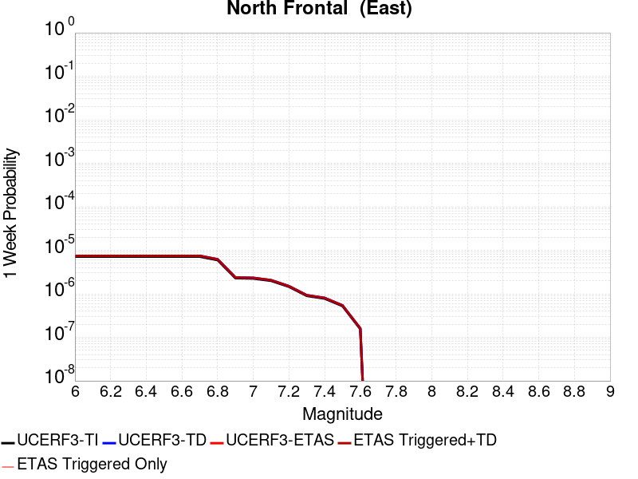 | 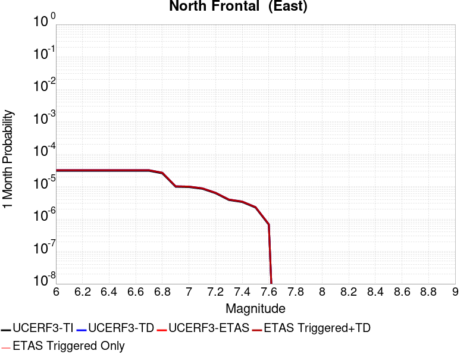 | 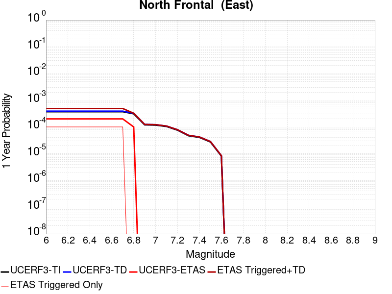 | 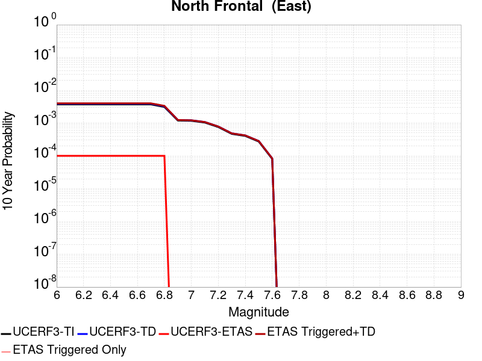 |

| Magnitude | 1 wk TI Prob | 1 wk TD Prob | 1 wk ETAS Prob | 1 wk ETAS/TD Gain | 1 wk ETAS Triggered+TD | 1 wk ETAS Triggered Only | 1 mo TI Prob | 1 mo TD Prob | 1 mo ETAS Prob | 1 mo ETAS/TD Gain | 1 mo ETAS Triggered+TD | 1 mo ETAS Triggered Only | 1 yr TI Prob | 1 yr TD Prob | 1 yr ETAS Prob | 1 yr ETAS/TD Gain | 1 yr ETAS Triggered+TD | 1 yr ETAS Triggered Only | 10 yr TI Prob | 10 yr TD Prob | 10 yr ETAS Prob | 10 yr ETAS/TD Gain | 10 yr ETAS Triggered+TD | 10 yr ETAS Triggered Only |
|-----|-----|-----|-----|-----|-----|-----|-----|-----|-----|-----|-----|-----|-----|-----|-----|-----|-----|-----|-----|-----|-----|-----|-----|-----|
| 6.0 | 7.135738E-6 | 7.473438E-6 | 0.0 | 0.0 | 7.473438E-6 | 0.0 | 3.0581377E-5 | 3.202874E-5 | 0.0 | 0.0 | 3.202874E-5 | 0.0 | 3.7226462E-4 | 3.8990006E-4 | 2.0E-4 | 0.51295197 | 4.8986106E-4 | 1.0E-4 | 0.0037164164 | 0.0038941153 | 0.0039 | 1.0015111 | 0.005487885 | 0.0016 |
| 6.1 | 7.135738E-6 | 7.473438E-6 | 0.0 | 0.0 | 7.473438E-6 | 0.0 | 3.0581377E-5 | 3.202874E-5 | 0.0 | 0.0 | 3.202874E-5 | 0.0 | 3.7226462E-4 | 3.8990006E-4 | 2.0E-4 | 0.51295197 | 4.8986106E-4 | 1.0E-4 | 0.0037164164 | 0.0038941153 | 0.0039 | 1.0015111 | 0.005487885 | 0.0016 |
| 6.2 | 7.135738E-6 | 7.473438E-6 | 0.0 | 0.0 | 7.473438E-6 | 0.0 | 3.0581377E-5 | 3.202874E-5 | 0.0 | 0.0 | 3.202874E-5 | 0.0 | 3.7226462E-4 | 3.8990006E-4 | 2.0E-4 | 0.51295197 | 4.8986106E-4 | 1.0E-4 | 0.0037164164 | 0.0038941153 | 0.0039 | 1.0015111 | 0.005487885 | 0.0016 |
| 6.3 | 7.135738E-6 | 7.473438E-6 | 0.0 | 0.0 | 7.473438E-6 | 0.0 | 3.0581377E-5 | 3.202874E-5 | 0.0 | 0.0 | 3.202874E-5 | 0.0 | 3.7226462E-4 | 3.8990006E-4 | 2.0E-4 | 0.51295197 | 4.8986106E-4 | 1.0E-4 | 0.0037164164 | 0.0038941153 | 0.0039 | 1.0015111 | 0.005487885 | 0.0016 |
| 6.4 | 7.135738E-6 | 7.473438E-6 | 0.0 | 0.0 | 7.473438E-6 | 0.0 | 3.0581377E-5 | 3.202874E-5 | 0.0 | 0.0 | 3.202874E-5 | 0.0 | 3.7226462E-4 | 3.8990006E-4 | 2.0E-4 | 0.51295197 | 4.8986106E-4 | 1.0E-4 | 0.0037164164 | 0.0038941153 | 0.0039 | 1.0015111 | 0.005487885 | 0.0016 |
| 6.5 | 7.135738E-6 | 7.473438E-6 | 0.0 | 0.0 | 7.473438E-6 | 0.0 | 3.0581377E-5 | 3.202874E-5 | 0.0 | 0.0 | 3.202874E-5 | 0.0 | 3.7226462E-4 | 3.8990006E-4 | 2.0E-4 | 0.51295197 | 4.8986106E-4 | 1.0E-4 | 0.0037164164 | 0.0038941153 | 0.0039 | 1.0015111 | 0.005487885 | 0.0016 |
| 6.6 | 7.135738E-6 | 7.473438E-6 | 0.0 | 0.0 | 7.473438E-6 | 0.0 | 3.0581377E-5 | 3.202874E-5 | 0.0 | 0.0 | 3.202874E-5 | 0.0 | 3.7226462E-4 | 3.8990006E-4 | 2.0E-4 | 0.51295197 | 4.8986106E-4 | 1.0E-4 | 0.0037164164 | 0.0038941153 | 0.0039 | 1.0015111 | 0.005487885 | 0.0016 |
| 6.7 | 7.135738E-6 | 7.473438E-6 | 0.0 | 0.0 | 7.473438E-6 | 0.0 | 3.0581377E-5 | 3.202874E-5 | 0.0 | 0.0 | 3.202874E-5 | 0.0 | 3.7226462E-4 | 3.8990006E-4 | 2.0E-4 | 0.51295197 | 4.8986106E-4 | 1.0E-4 | 0.0037164164 | 0.0038941153 | 0.0039 | 1.0015111 | 0.005487885 | 0.0016 |
| 6.8 | 5.959142E-6 | 6.2336476E-6 | 0.0 | 0.0 | 6.2336476E-6 | 0.0 | 2.553893E-5 | 2.6715461E-5 | 0.0 | 0.0 | 2.6715461E-5 | 0.0 | 3.108921E-4 | 3.2523024E-4 | 1.0E-4 | 0.3074745 | 3.2523024E-4 | 0.0 | 0.0031045752 | 0.003249314 | 0.0033 | 1.015599 | 0.00454509 | 0.0013 |
| 6.9 | 2.2946929E-6 | 2.3815082E-6 | 0.0 | 0.0 | 2.3815082E-6 | 0.0 | 9.834361E-6 | 1.0206426E-5 | 0.0 | 0.0 | 1.0206426E-5 | 0.0 | 1.1972676E-4 | 1.2425662E-4 | 0.0 | 0.0 | 1.2425662E-4 | 0.0 | 0.0011966228 | 0.001241918 | 9.0E-4 | 0.72468555 | 0.0015415454 | 3.0E-4 |
| 7.0 | 2.2468673E-6 | 2.3312286E-6 | 0.0 | 0.0 | 2.3312286E-6 | 0.0 | 9.629396E-6 | 9.990945E-6 | 0.0 | 0.0 | 9.990945E-6 | 0.0 | 1.1723159E-4 | 1.2163343E-4 | 0.0 | 0.0 | 1.2163343E-4 | 0.0 | 0.0011716976 | 0.0012157148 | 9.0E-4 | 0.7403052 | 0.0015153501 | 3.0E-4 |
| 7.1 | 1.9921076E-6 | 2.0638183E-6 | 0.0 | 0.0 | 2.0638183E-6 | 0.0 | 8.537577E-6 | 8.844909E-6 | 0.0 | 0.0 | 8.844909E-6 | 0.0 | 1.0394004E-4 | 1.0768187E-4 | 0.0 | 0.0 | 1.0768187E-4 | 0.0 | 0.0010389143 | 0.0010763396 | 7.0E-4 | 0.6503523 | 0.0012761244 | 2.0E-4 |
| 7.2 | 1.4524545E-6 | 1.5039516E-6 | 0.0 | 0.0 | 1.5039516E-6 | 0.0 | 6.2247905E-6 | 6.445492E-6 | 0.0 | 0.0 | 6.445492E-6 | 0.0 | 7.5784184E-5 | 7.847129E-5 | 0.0 | 0.0 | 7.847129E-5 | 0.0 | 7.575835E-4 | 7.844603E-4 | 6.0E-4 | 0.7648571 | 8.843818E-4 | 1.0E-4 |
| 7.3 | 8.9802575E-7 | 9.305173E-7 | 0.0 | 0.0 | 9.305173E-7 | 0.0 | 3.848676E-6 | 3.9879255E-6 | 0.0 | 0.0 | 3.9879255E-6 | 0.0 | 4.685662E-5 | 4.855203E-5 | 0.0 | 0.0 | 4.855203E-5 | 0.0 | 4.6846745E-4 | 4.854255E-4 | 3.0E-4 | 0.6180145 | 4.854255E-4 | 0.0 |
| 7.4 | 7.776139E-7 | 8.057397E-7 | 0.0 | 0.0 | 8.057397E-7 | 0.0 | 3.3326266E-6 | 3.4531663E-6 | 0.0 | 0.0 | 3.4531663E-6 | 0.0 | 4.0573974E-5 | 4.20416E-5 | 0.0 | 0.0 | 4.20416E-5 | 0.0 | 4.0566566E-4 | 4.203472E-4 | 2.0E-4 | 0.47579715 | 4.203472E-4 | 0.0 |
| 7.5 | 5.244417E-7 | 5.4390875E-7 | 0.0 | 0.0 | 5.4390875E-7 | 0.0 | 2.2476054E-6 | 2.3310358E-6 | 0.0 | 0.0 | 2.3310358E-6 | 0.0 | 2.7364253E-5 | 2.8380058E-5 | 0.0 | 0.0 | 2.8380058E-5 | 0.0 | 2.7360884E-4 | 2.8377085E-4 | 1.0E-4 | 0.35239702 | 2.8377085E-4 | 0.0 |
| 7.6 | 1.5489647E-7 | 1.6083001E-7 | 0.0 | 0.0 | 1.6083001E-7 | 0.0 | 6.6384183E-7 | 6.8927136E-7 | 0.0 | 0.0 | 6.8927136E-7 | 0.0 | 8.082245E-6 | 8.391868E-6 | 0.0 | 0.0 | 8.391868E-6 | 0.0 | 8.08195E-5 | 8.39175E-5 | 0.0 | 0.0 | 8.39175E-5 | 0.0 |

## Pittville 2011 CFM
*[(top)](#table-of-contents)*

| 1 Week | 1 Month | 1 Year | 10 Year |
|-----|-----|-----|-----|
| 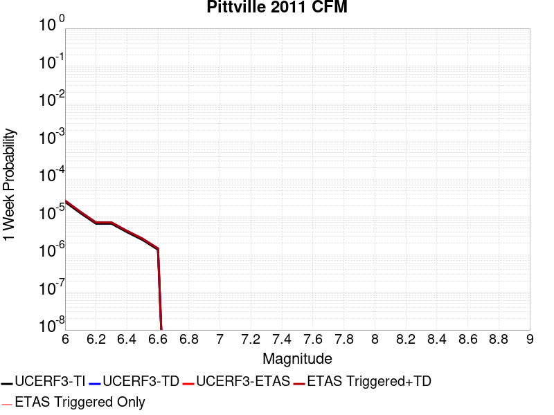 | 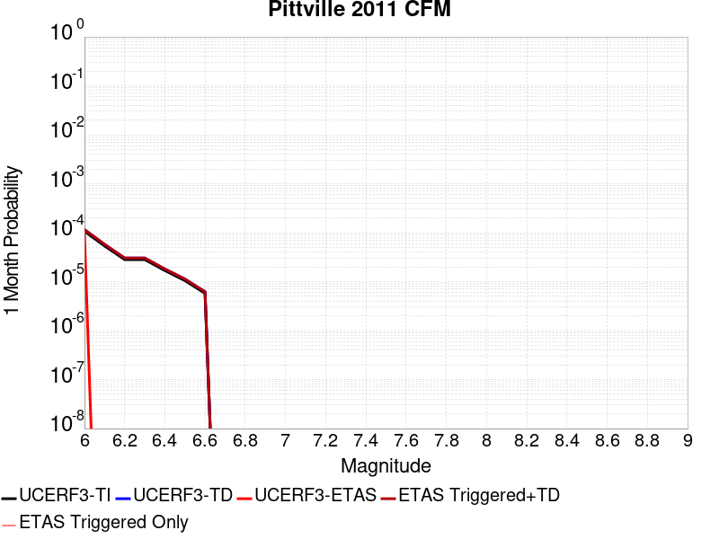 | 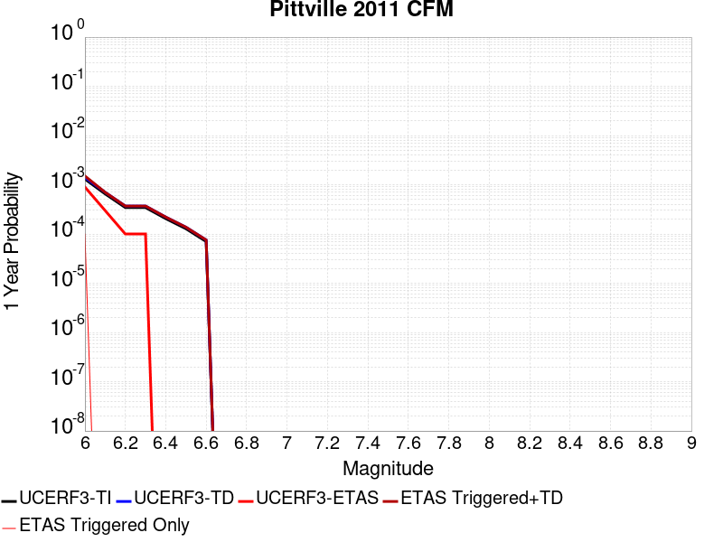 | 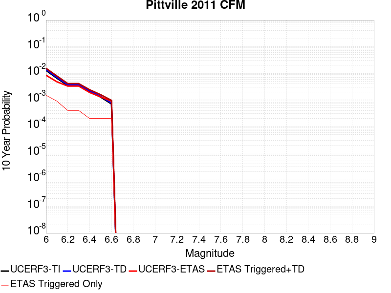 |

| Magnitude | 1 wk TI Prob | 1 wk TD Prob | 1 wk ETAS Prob | 1 wk ETAS/TD Gain | 1 wk ETAS Triggered+TD | 1 wk ETAS Triggered Only | 1 mo TI Prob | 1 mo TD Prob | 1 mo ETAS Prob | 1 mo ETAS/TD Gain | 1 mo ETAS Triggered+TD | 1 mo ETAS Triggered Only | 1 yr TI Prob | 1 yr TD Prob | 1 yr ETAS Prob | 1 yr ETAS/TD Gain | 1 yr ETAS Triggered+TD | 1 yr ETAS Triggered Only | 10 yr TI Prob | 10 yr TD Prob | 10 yr ETAS Prob | 10 yr ETAS/TD Gain | 10 yr ETAS Triggered+TD | 10 yr ETAS Triggered Only |
|-----|-----|-----|-----|-----|-----|-----|-----|-----|-----|-----|-----|-----|-----|-----|-----|-----|-----|-----|-----|-----|-----|-----|-----|-----|
| 6.0 | 2.5031832E-5 | 2.703412E-5 | 0.0 | 0.0 | 2.703412E-5 | 0.0 | 1.0727487E-4 | 1.1585592E-4 | 1.0E-4 | 0.86314106 | 1.1585592E-4 | 0.0 | 0.001305289 | 0.0014097303 | 9.0E-4 | 0.63842 | 0.0015095894 | 1.0E-4 | 0.012976485 | 0.014017642 | 0.0085 | 0.60637873 | 0.015496615 | 0.0015 |
| 6.1 | 1.2540113E-5 | 1.35021255E-5 | 0.0 | 0.0 | 1.35021255E-5 | 0.0 | 5.3742235E-5 | 5.7865094E-5 | 0.0 | 0.0 | 5.7865094E-5 | 0.0 | 6.541153E-4 | 7.043023E-4 | 3.0E-4 | 0.42595348 | 7.043023E-4 | 0.0 | 0.0065219323 | 0.0070229317 | 0.0048 | 0.68347526 | 0.007916611 | 9.0E-4 |
| 6.2 | 6.603218E-6 | 7.1015293E-6 | 0.0 | 0.0 | 7.1015293E-6 | 0.0 | 2.8299199E-5 | 3.0434807E-5 | 0.0 | 0.0 | 3.0434807E-5 | 0.0 | 3.4448825E-4 | 3.7048725E-4 | 1.0E-4 | 0.2699148 | 3.7048725E-4 | 0.0 | 0.0034395473 | 0.0036993357 | 0.0033 | 0.89205205 | 0.004097856 | 4.0E-4 |
| 6.3 | 6.603218E-6 | 7.1015293E-6 | 0.0 | 0.0 | 7.1015293E-6 | 0.0 | 2.8299199E-5 | 3.0434807E-5 | 0.0 | 0.0 | 3.0434807E-5 | 0.0 | 3.4448825E-4 | 3.7048725E-4 | 1.0E-4 | 0.2699148 | 3.7048725E-4 | 0.0 | 0.0034395473 | 0.0036993357 | 0.0033 | 0.89205205 | 0.004097856 | 4.0E-4 |
| 6.4 | 3.9389015E-6 | 4.2358033E-6 | 0.0 | 0.0 | 4.2358033E-6 | 0.0 | 1.6880897E-5 | 1.8153334E-5 | 0.0 | 0.0 | 1.8153334E-5 | 0.0 | 2.0550552E-4 | 2.2099752E-4 | 0.0 | 0.0 | 2.2099752E-4 | 0.0 | 0.0020531558 | 0.002208082 | 0.0019 | 0.8604753 | 0.0024076402 | 2.0E-4 |
| 6.5 | 2.4533072E-6 | 2.6391572E-6 | 0.0 | 0.0 | 2.6391572E-6 | 0.0 | 1.0514132E-5 | 1.1310636E-5 | 0.0 | 0.0 | 1.1310636E-5 | 0.0 | 1.2800204E-4 | 1.3770022E-4 | 0.0 | 0.0 | 1.3770022E-4 | 0.0 | 0.0012792832 | 0.0013763389 | 0.0013 | 0.94453484 | 0.0015760636 | 2.0E-4 |
| 6.6 | 1.3482367E-6 | 1.4518153E-6 | 0.0 | 0.0 | 1.4518153E-6 | 0.0 | 5.778144E-6 | 6.2220565E-6 | 0.0 | 0.0 | 6.2220565E-6 | 0.0 | 7.0346636E-5 | 7.575204E-5 | 0.0 | 0.0 | 7.575204E-5 | 0.0 | 7.032437E-4 | 7.5737305E-4 | 9.0E-4 | 1.1883179 | 9.572216E-4 | 2.0E-4 |

## Little Lake
*[(top)](#table-of-contents)*

| 1 Week | 1 Month | 1 Year | 10 Year |
|-----|-----|-----|-----|
| 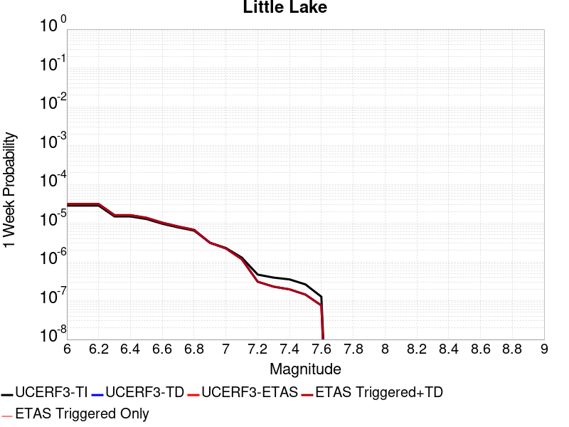 | 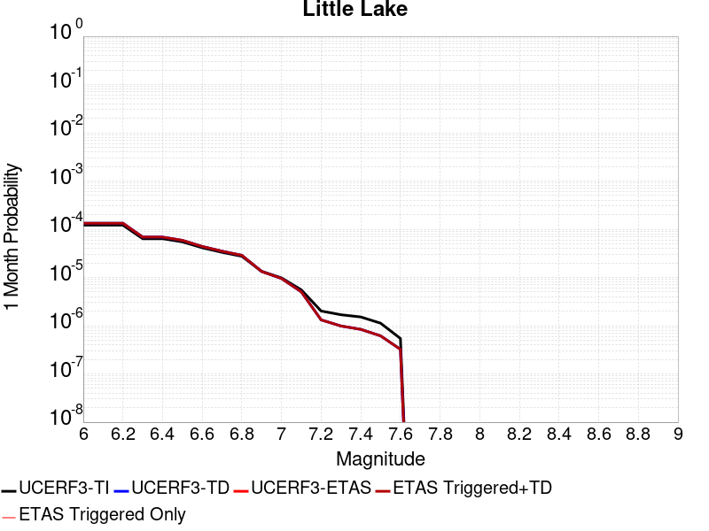 | 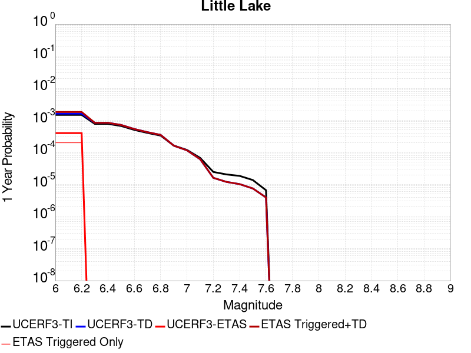 | 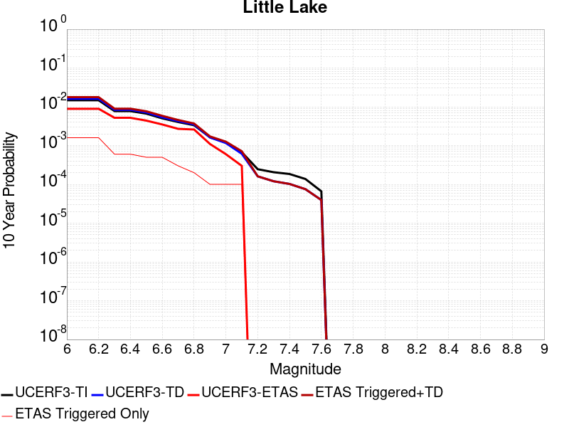 |

| Magnitude | 1 wk TI Prob | 1 wk TD Prob | 1 wk ETAS Prob | 1 wk ETAS/TD Gain | 1 wk ETAS Triggered+TD | 1 wk ETAS Triggered Only | 1 mo TI Prob | 1 mo TD Prob | 1 mo ETAS Prob | 1 mo ETAS/TD Gain | 1 mo ETAS Triggered+TD | 1 mo ETAS Triggered Only | 1 yr TI Prob | 1 yr TD Prob | 1 yr ETAS Prob | 1 yr ETAS/TD Gain | 1 yr ETAS Triggered+TD | 1 yr ETAS Triggered Only | 10 yr TI Prob | 10 yr TD Prob | 10 yr ETAS Prob | 10 yr ETAS/TD Gain | 10 yr ETAS Triggered+TD | 10 yr ETAS Triggered Only |
|-----|-----|-----|-----|-----|-----|-----|-----|-----|-----|-----|-----|-----|-----|-----|-----|-----|-----|-----|-----|-----|-----|-----|-----|-----|
| 6.0 | 2.8424427E-5 | 3.1171192E-5 | 0.0 | 0.0 | 3.1171192E-5 | 0.0 | 1.2181328E-4 | 1.3358472E-4 | 0.0 | 0.0 | 1.3358472E-4 | 0.0 | 0.0014820677 | 0.0016253135 | 4.0E-4 | 0.24610636 | 0.0018249884 | 2.0E-4 | 0.014722223 | 0.01614764 | 0.0089 | 0.55116415 | 0.017721804 | 0.0016 |
| 6.1 | 2.8424427E-5 | 3.1171192E-5 | 0.0 | 0.0 | 3.1171192E-5 | 0.0 | 1.2181328E-4 | 1.3358472E-4 | 0.0 | 0.0 | 1.3358472E-4 | 0.0 | 0.0014820677 | 0.0016253135 | 4.0E-4 | 0.24610636 | 0.0018249884 | 2.0E-4 | 0.014722223 | 0.01614764 | 0.0089 | 0.55116415 | 0.017721804 | 0.0016 |
| 6.2 | 2.8424427E-5 | 3.1171192E-5 | 0.0 | 0.0 | 3.1171192E-5 | 0.0 | 1.2181328E-4 | 1.3358472E-4 | 0.0 | 0.0 | 1.3358472E-4 | 0.0 | 0.0014820677 | 0.0016253135 | 4.0E-4 | 0.24610636 | 0.0018249884 | 2.0E-4 | 0.014722223 | 0.01614764 | 0.0089 | 0.55116415 | 0.017721804 | 0.0016 |
| 6.3 | 1.48860645E-5 | 1.6065345E-5 | 0.0 | 0.0 | 1.6065345E-5 | 0.0 | 6.379586E-5 | 6.884982E-5 | 0.0 | 0.0 | 6.884982E-5 | 0.0 | 7.7643775E-4 | 8.379523E-4 | 0.0 | 0.0 | 8.379523E-4 | 0.0 | 0.007737305 | 0.008350739 | 0.0052 | 0.6226994 | 0.008945729 | 6.0E-4 |
| 6.4 | 1.48860645E-5 | 1.6065345E-5 | 0.0 | 0.0 | 1.6065345E-5 | 0.0 | 6.379586E-5 | 6.884982E-5 | 0.0 | 0.0 | 6.884982E-5 | 0.0 | 7.7643775E-4 | 8.379523E-4 | 0.0 | 0.0 | 8.379523E-4 | 0.0 | 0.007737305 | 0.008350739 | 0.0052 | 0.6226994 | 0.008945729 | 6.0E-4 |
| 6.5 | 1.2797581E-5 | 1.375215E-5 | 0.0 | 0.0 | 1.375215E-5 | 0.0 | 5.4845623E-5 | 5.89366E-5 | 0.0 | 0.0 | 5.89366E-5 | 0.0 | 6.675408E-4 | 7.173425E-4 | 0.0 | 0.0 | 7.173425E-4 | 0.0 | 0.006655392 | 0.0071528144 | 0.0044 | 0.61514246 | 0.0076492378 | 5.0E-4 |
| 6.6 | 9.661896E-6 | 1.0279564E-5 | 0.0 | 0.0 | 1.0279564E-5 | 0.0 | 4.1407468E-5 | 4.405462E-5 | 0.0 | 0.0 | 4.405462E-5 | 0.0 | 5.040193E-4 | 5.3624925E-4 | 0.0 | 0.0 | 5.3624925E-4 | 0.0 | 0.005028777 | 0.005351154 | 0.0035 | 0.65406454 | 0.0058484785 | 5.0E-4 |
| 6.7 | 7.767871E-6 | 8.192463E-6 | 0.0 | 0.0 | 8.192463E-6 | 0.0 | 3.329045E-5 | 3.511016E-5 | 0.0 | 0.0 | 3.511016E-5 | 0.0 | 4.0523586E-4 | 4.2739607E-4 | 0.0 | 0.0 | 4.2739607E-4 | 0.0 | 0.004044977 | 0.0042670895 | 0.0027 | 0.6327498 | 0.0045658094 | 3.0E-4 |
| 6.8 | 6.4235196E-6 | 6.7298865E-6 | 0.0 | 0.0 | 6.7298865E-6 | 0.0 | 2.752908E-5 | 2.8842125E-5 | 0.0 | 0.0 | 2.8842125E-5 | 0.0 | 3.35115E-4 | 3.5110908E-4 | 0.0 | 0.0 | 3.5110908E-4 | 0.0 | 0.003346101 | 0.003506801 | 0.0026 | 0.74141645 | 0.0037060997 | 2.0E-4 |
| 6.9 | 3.1283696E-6 | 3.1101044E-6 | 0.0 | 0.0 | 3.1101044E-6 | 0.0 | 1.3407229E-5 | 1.33289595E-5 | 0.0 | 0.0 | 1.33289595E-5 | 0.0 | 1.6322079E-4 | 1.622695E-4 | 0.0 | 0.0 | 1.622695E-4 | 0.0 | 0.0016310095 | 0.0016216583 | 0.0011 | 0.678318 | 0.0017214961 | 1.0E-4 |
| 7.0 | 2.290603E-6 | 2.2271092E-6 | 0.0 | 0.0 | 2.2271092E-6 | 0.0 | 9.816834E-6 | 9.544724E-6 | 0.0 | 0.0 | 9.544724E-6 | 0.0 | 1.19513395E-4 | 1.1620186E-4 | 0.0 | 0.0 | 1.1620186E-4 | 0.0 | 0.0011944914 | 0.001161513 | 6.0E-4 | 0.5165676 | 0.0012613969 | 1.0E-4 |
| 7.1 | 1.293693E-6 | 1.176706E-6 | 0.0 | 0.0 | 1.176706E-6 | 0.0 | 5.5443866E-6 | 5.0430194E-6 | 0.0 | 0.0 | 5.0430194E-6 | 0.0 | 6.750081E-5 | 6.139773E-5 | 0.0 | 0.0 | 6.139773E-5 | 0.0 | 6.7480316E-4 | 6.138761E-4 | 3.0E-4 | 0.48869798 | 7.138147E-4 | 1.0E-4 |
| 7.2 | 4.715842E-7 | 3.087136E-7 | 0.0 | 0.0 | 3.087136E-7 | 0.0 | 2.0210737E-6 | 1.3230576E-6 | 0.0 | 0.0 | 1.3230576E-6 | 0.0 | 2.4606294E-5 | 1.6108113E-5 | 0.0 | 0.0 | 1.6108113E-5 | 0.0 | 2.460357E-4 | 1.6107E-4 | 0.0 | 0.0 | 1.6107E-4 | 0.0 |
| 7.3 | 3.9430947E-7 | 2.3054719E-7 | 0.0 | 0.0 | 2.3054719E-7 | 0.0 | 1.6898966E-6 | 9.88059E-7 | 0.0 | 0.0 | 9.88059E-7 | 0.0 | 2.0574296E-5 | 1.2029553E-5 | 0.0 | 0.0 | 1.2029553E-5 | 0.0 | 2.0572392E-4 | 1.20289085E-4 | 0.0 | 0.0 | 1.20289085E-4 | 0.0 |
| 7.4 | 3.547123E-7 | 1.9639394E-7 | 0.0 | 0.0 | 1.9639394E-7 | 0.0 | 1.5201948E-6 | 8.4168806E-7 | 0.0 | 0.0 | 8.4168806E-7 | 0.0 | 1.8508214E-5 | 1.0247504E-5 | 0.0 | 0.0 | 1.0247504E-5 | 0.0 | 1.8506673E-4 | 1.0247038E-4 | 0.0 | 0.0 | 1.0247038E-4 | 0.0 |
| 7.5 | 2.6354266E-7 | 1.4395243E-7 | 0.0 | 0.0 | 1.4395243E-7 | 0.0 | 1.129468E-6 | 6.1693885E-7 | 0.0 | 0.0 | 6.1693885E-7 | 0.0 | 1.3751187E-5 | 7.5112052E-6 | 0.0 | 0.0 | 7.5112052E-6 | 0.0 | 1.3750336E-4 | 7.5109565E-5 | 0.0 | 0.0 | 7.5109565E-5 | 0.0 |
| 7.6 | 1.269913E-7 | 7.5606714E-8 | 0.0 | 0.0 | 7.5606714E-8 | 0.0 | 5.4424834E-7 | 3.2402872E-7 | 0.0 | 0.0 | 3.2402872E-7 | 0.0 | 6.6262032E-6 | 3.945043E-6 | 0.0 | 0.0 | 3.945043E-6 | 0.0 | 6.626006E-5 | 3.9449766E-5 | 0.0 | 0.0 | 3.9449766E-5 | 0.0 |

## Cleghorn
*[(top)](#table-of-contents)*

| 1 Week | 1 Month | 1 Year | 10 Year |
|-----|-----|-----|-----|
| 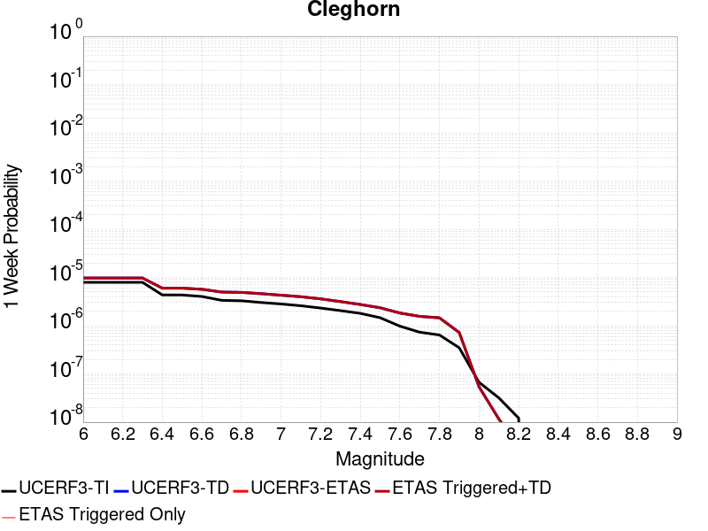 | 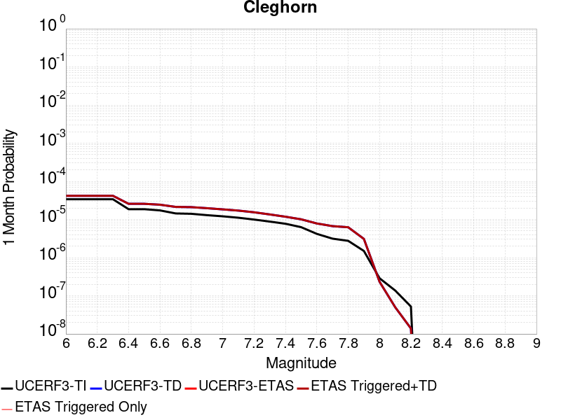 | 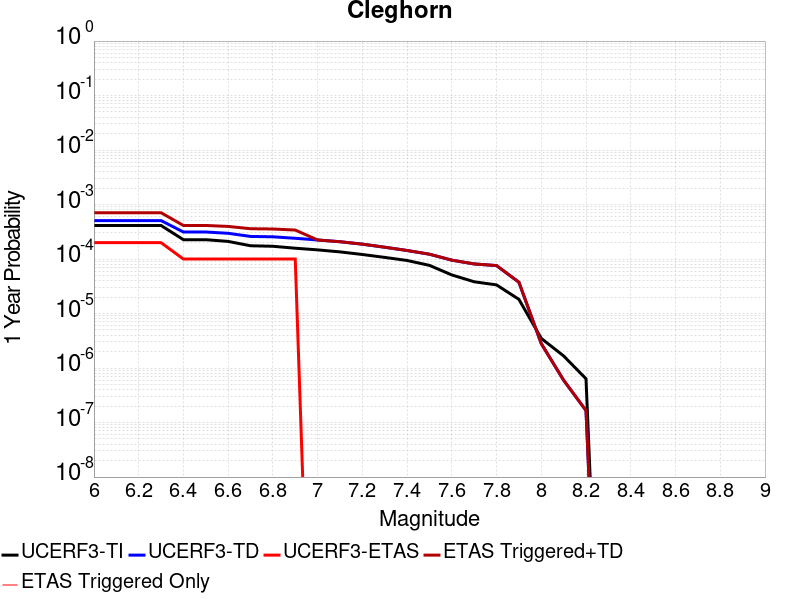 | 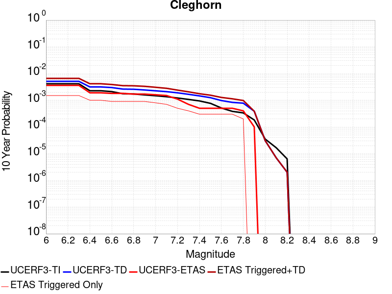 |

| Magnitude | 1 wk TI Prob | 1 wk TD Prob | 1 wk ETAS Prob | 1 wk ETAS/TD Gain | 1 wk ETAS Triggered+TD | 1 wk ETAS Triggered Only | 1 mo TI Prob | 1 mo TD Prob | 1 mo ETAS Prob | 1 mo ETAS/TD Gain | 1 mo ETAS Triggered+TD | 1 mo ETAS Triggered Only | 1 yr TI Prob | 1 yr TD Prob | 1 yr ETAS Prob | 1 yr ETAS/TD Gain | 1 yr ETAS Triggered+TD | 1 yr ETAS Triggered Only | 10 yr TI Prob | 10 yr TD Prob | 10 yr ETAS Prob | 10 yr ETAS/TD Gain | 10 yr ETAS Triggered+TD | 10 yr ETAS Triggered Only |
|-----|-----|-----|-----|-----|-----|-----|-----|-----|-----|-----|-----|-----|-----|-----|-----|-----|-----|-----|-----|-----|-----|-----|-----|-----|
| 6.0 | 7.9267165E-6 | 9.753598E-6 | 0.0 | 0.0 | 9.753598E-6 | 0.0 | 3.39712E-5 | 4.1800526E-5 | 0.0 | 0.0 | 4.1800526E-5 | 0.0 | 4.1352084E-4 | 5.0881313E-4 | 2.0E-4 | 0.3930716 | 7.087114E-4 | 2.0E-4 | 0.004127522 | 0.0050927987 | 0.0036 | 0.70688045 | 0.00658516 | 0.0015 |
| 6.1 | 7.9267165E-6 | 9.753598E-6 | 0.0 | 0.0 | 9.753598E-6 | 0.0 | 3.39712E-5 | 4.1800526E-5 | 0.0 | 0.0 | 4.1800526E-5 | 0.0 | 4.1352084E-4 | 5.0881313E-4 | 2.0E-4 | 0.3930716 | 7.087114E-4 | 2.0E-4 | 0.004127522 | 0.0050927987 | 0.0036 | 0.70688045 | 0.00658516 | 0.0015 |
| 6.2 | 7.9267165E-6 | 9.753598E-6 | 0.0 | 0.0 | 9.753598E-6 | 0.0 | 3.39712E-5 | 4.1800526E-5 | 0.0 | 0.0 | 4.1800526E-5 | 0.0 | 4.1352084E-4 | 5.0881313E-4 | 2.0E-4 | 0.3930716 | 7.087114E-4 | 2.0E-4 | 0.004127522 | 0.0050927987 | 0.0036 | 0.70688045 | 0.00658516 | 0.0015 |
| 6.3 | 7.9267165E-6 | 9.753598E-6 | 0.0 | 0.0 | 9.753598E-6 | 0.0 | 3.39712E-5 | 4.1800526E-5 | 0.0 | 0.0 | 4.1800526E-5 | 0.0 | 4.1352084E-4 | 5.0881313E-4 | 2.0E-4 | 0.3930716 | 7.087114E-4 | 2.0E-4 | 0.004127522 | 0.0050927987 | 0.0036 | 0.70688045 | 0.00658516 | 0.0015 |
| 6.4 | 4.3445207E-6 | 6.0151806E-6 | 0.0 | 0.0 | 6.0151806E-6 | 0.0 | 1.8619241E-5 | 2.5779096E-5 | 0.0 | 0.0 | 2.5779096E-5 | 0.0 | 2.2666567E-4 | 3.138163E-4 | 1.0E-4 | 0.31865776 | 4.1378493E-4 | 1.0E-4 | 0.0022643462 | 0.003149129 | 0.0019 | 0.6033414 | 0.00414598 | 0.001 |
| 6.5 | 4.3445207E-6 | 6.0151806E-6 | 0.0 | 0.0 | 6.0151806E-6 | 0.0 | 1.8619241E-5 | 2.5779096E-5 | 0.0 | 0.0 | 2.5779096E-5 | 0.0 | 2.2666567E-4 | 3.138163E-4 | 1.0E-4 | 0.31865776 | 4.1378493E-4 | 1.0E-4 | 0.0022643462 | 0.003149129 | 0.0019 | 0.6033414 | 0.00414598 | 0.001 |
| 6.6 | 4.040109E-6 | 5.697732E-6 | 0.0 | 0.0 | 5.697732E-6 | 0.0 | 1.7314638E-5 | 2.4418627E-5 | 0.0 | 0.0 | 2.4418627E-5 | 0.0 | 2.1078532E-4 | 2.9725715E-4 | 1.0E-4 | 0.33640906 | 3.9722744E-4 | 1.0E-4 | 0.002105855 | 0.002983987 | 0.0018 | 0.60321975 | 0.0038813015 | 9.0E-4 |
| 6.7 | 3.3632055E-6 | 4.991546E-6 | 0.0 | 0.0 | 4.991546E-6 | 0.0 | 1.4413658E-5 | 2.1392167E-5 | 0.0 | 0.0 | 2.1392167E-5 | 0.0 | 1.7547216E-4 | 2.604188E-4 | 1.0E-4 | 0.38399684 | 3.6039276E-4 | 1.0E-4 | 0.0017533366 | 0.0026164723 | 0.0018 | 0.6879492 | 0.0035141176 | 9.0E-4 |
| 6.8 | 3.2902772E-6 | 4.913514E-6 | 0.0 | 0.0 | 4.913514E-6 | 0.0 | 1.4101111E-5 | 2.105775E-5 | 0.0 | 0.0 | 2.105775E-5 | 0.0 | 1.716675E-4 | 2.5634826E-4 | 1.0E-4 | 0.39009434 | 3.5632262E-4 | 1.0E-4 | 0.0017153495 | 0.002575861 | 0.0017 | 0.65997344 | 0.0034735429 | 9.0E-4 |
| 6.9 | 3.031547E-6 | 4.615676E-6 | 0.0 | 0.0 | 4.615676E-6 | 0.0 | 1.299228E-5 | 1.9781319E-5 | 0.0 | 0.0 | 1.9781319E-5 | 0.0 | 1.5816953E-4 | 2.4081122E-4 | 1.0E-4 | 0.41526306 | 3.4078714E-4 | 1.0E-4 | 0.00158057 | 0.0024208366 | 0.0017 | 0.7022366 | 0.0033186579 | 9.0E-4 |
| 7.0 | 2.8259715E-6 | 4.2964193E-6 | 0.0 | 0.0 | 4.2964193E-6 | 0.0 | 1.211125E-5 | 1.8413097E-5 | 0.0 | 0.0 | 1.8413097E-5 | 0.0 | 1.4744449E-4 | 2.2415661E-4 | 0.0 | 0.0 | 2.2415661E-4 | 0.0 | 0.001473467 | 0.002254638 | 0.0016 | 0.7096483 | 0.0030528342 | 8.0E-4 |
| 7.1 | 2.5962665E-6 | 3.9923193E-6 | 0.0 | 0.0 | 3.9923193E-6 | 0.0 | 1.1126809E-5 | 1.7109829E-5 | 0.0 | 0.0 | 1.7109829E-5 | 0.0 | 1.3546048E-4 | 2.0829248E-4 | 0.0 | 0.0 | 2.0829248E-4 | 0.0 | 0.0013537793 | 0.002096313 | 0.0015 | 0.715542 | 0.0027948455 | 7.0E-4 |
| 7.2 | 2.3247253E-6 | 3.603933E-6 | 0.0 | 0.0 | 3.603933E-6 | 0.0 | 9.96307E-6 | 1.5445337E-5 | 0.0 | 0.0 | 1.5445337E-5 | 0.0 | 1.21293626E-4 | 1.8803093E-4 | 0.0 | 0.0 | 1.8803093E-4 | 0.0 | 0.0012122744 | 0.0018940753 | 0.0011 | 0.58075833 | 0.0023931284 | 5.0E-4 |
| 7.3 | 2.056928E-6 | 3.1650784E-6 | 0.0 | 0.0 | 3.1650784E-6 | 0.0 | 8.815376E-6 | 1.3564552E-5 | 0.0 | 0.0 | 1.3564552E-5 | 0.0 | 1.0732192E-4 | 1.6513607E-4 | 0.0 | 0.0 | 1.6513607E-4 | 0.0 | 0.001072701 | 0.0016655513 | 7.0E-4 | 0.42028126 | 0.002064885 | 4.0E-4 |
| 7.4 | 1.8055999E-6 | 2.758065E-6 | 0.0 | 0.0 | 2.758065E-6 | 0.0 | 7.738263E-6 | 1.1820226E-5 | 0.0 | 0.0 | 1.1820226E-5 | 0.0 | 9.4209274E-5 | 1.4390188E-4 | 0.0 | 0.0 | 1.4390188E-4 | 0.0 | 9.4169343E-4 | 0.0014536462 | 5.0E-4 | 0.34396264 | 0.0017532102 | 3.0E-4 |
| 7.5 | 1.4683443E-6 | 2.3584712E-6 | 0.0 | 0.0 | 2.3584712E-6 | 0.0 | 6.292889E-6 | 1.0107696E-5 | 0.0 | 0.0 | 1.0107696E-5 | 0.0 | 7.661323E-5 | 1.2305433E-4 | 0.0 | 0.0 | 1.2305433E-4 | 0.0 | 7.658682E-4 | 0.0012454847 | 5.0E-4 | 0.40145013 | 0.0015451111 | 3.0E-4 |
| 7.6 | 9.804088E-7 | 1.8347556E-6 | 0.0 | 0.0 | 1.8347556E-6 | 0.0 | 4.201745E-6 | 7.863215E-6 | 0.0 | 0.0 | 7.863215E-6 | 0.0 | 5.1155046E-5 | 9.573048E-5 | 0.0 | 0.0 | 9.573048E-5 | 0.0 | 5.114327E-4 | 9.725456E-4 | 5.0E-4 | 0.5141147 | 0.0012722538 | 3.0E-4 |
| 7.7 | 7.3434086E-7 | 1.5636849E-6 | 0.0 | 0.0 | 1.5636849E-6 | 0.0 | 3.1471714E-6 | 6.70149E-6 | 0.0 | 0.0 | 6.70149E-6 | 0.0 | 3.831614E-5 | 8.1587605E-5 | 0.0 | 0.0 | 8.1587605E-5 | 0.0 | 3.8309532E-4 | 8.3125685E-4 | 5.0E-4 | 0.60149884 | 0.0011310074 | 3.0E-4 |
| 7.8 | 6.434184E-7 | 1.4595439E-6 | 0.0 | 0.0 | 1.4595439E-6 | 0.0 | 2.7575045E-6 | 6.2551735E-6 | 0.0 | 0.0 | 6.2551735E-6 | 0.0 | 3.35721E-5 | 7.61541E-5 | 0.0 | 0.0 | 7.61541E-5 | 0.0 | 3.3567028E-4 | 7.765731E-4 | 4.0E-4 | 0.51508355 | 9.7641774E-4 | 2.0E-4 |
| 7.9 | 3.4943926E-7 | 7.233099E-7 | 0.0 | 0.0 | 7.233099E-7 | 0.0 | 1.497596E-6 | 3.0998958E-6 | 0.0 | 0.0 | 3.0998958E-6 | 0.0 | 1.8233079E-5 | 3.774059E-5 | 0.0 | 0.0 | 3.774059E-5 | 0.0 | 1.8231584E-4 | 3.8670455E-4 | 1.0E-4 | 0.25859538 | 3.8670455E-4 | 0.0 |
| 8.0 | 6.717524E-8 | 5.432019E-8 | 0.0 | 0.0 | 5.432019E-8 | 0.0 | 2.8789387E-7 | 2.3280079E-7 | 0.0 | 0.0 | 2.3280079E-7 | 0.0 | 3.505102E-6 | 2.8343459E-6 | 0.0 | 0.0 | 2.8343459E-6 | 0.0 | 3.5050467E-5 | 3.0539813E-5 | 0.0 | 0.0 | 3.0539813E-5 | 0.0 |
| 8.1 | 3.1984914E-8 | 1.1645436E-8 | 0.0 | 0.0 | 1.1645436E-8 | 0.0 | 1.370782E-7 | 4.9909012E-8 | 0.0 | 0.0 | 4.9909012E-8 | 0.0 | 1.6689258E-6 | 6.0764205E-7 | 0.0 | 0.0 | 6.0764205E-7 | 0.0 | 1.6689133E-5 | 7.003669E-6 | 0.0 | 0.0 | 7.003669E-6 | 0.0 |
| 8.2 | 1.21887656E-8 | 3.245712E-9 | 0.0 | 0.0 | 3.245712E-9 | 0.0 | 5.2237567E-8 | 1.3910194E-8 | 0.0 | 0.0 | 1.3910194E-8 | 0.0 | 6.359922E-7 | 1.693566E-7 | 0.0 | 0.0 | 1.693566E-7 | 0.0 | 6.3599036E-6 | 2.0133427E-6 | 0.0 | 0.0 | 2.0133427E-6 | 0.0 |

## San Gabriel
*[(top)](#table-of-contents)*

| 1 Week | 1 Month | 1 Year | 10 Year |
|-----|-----|-----|-----|
| 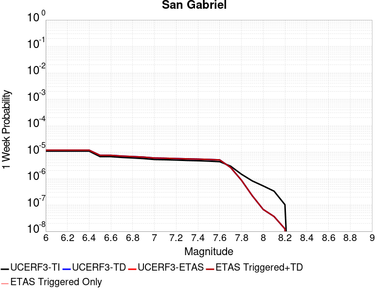 | 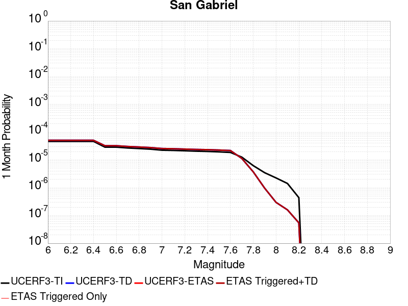 | 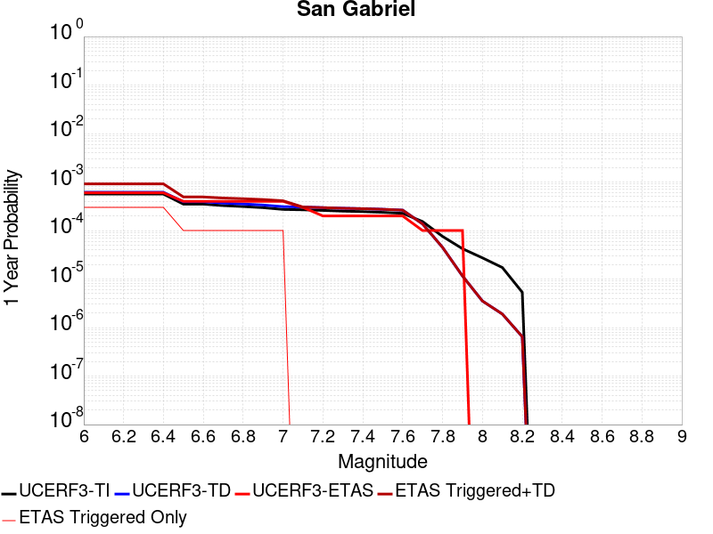 | 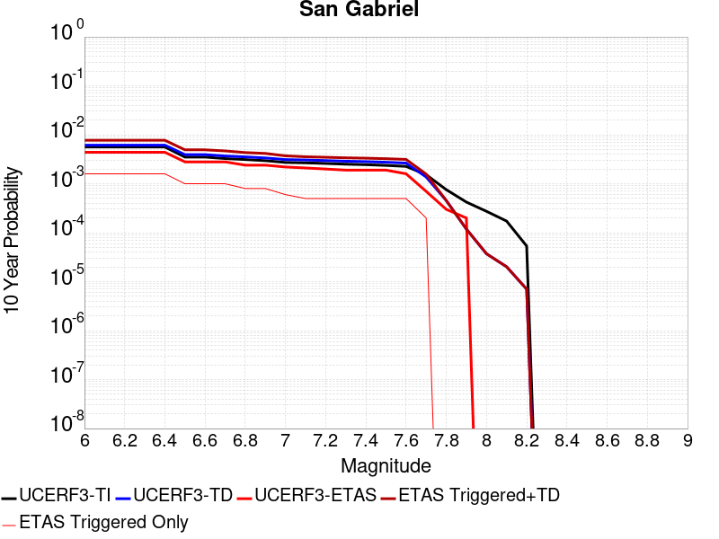 |

| Magnitude | 1 wk TI Prob | 1 wk TD Prob | 1 wk ETAS Prob | 1 wk ETAS/TD Gain | 1 wk ETAS Triggered+TD | 1 wk ETAS Triggered Only | 1 mo TI Prob | 1 mo TD Prob | 1 mo ETAS Prob | 1 mo ETAS/TD Gain | 1 mo ETAS Triggered+TD | 1 mo ETAS Triggered Only | 1 yr TI Prob | 1 yr TD Prob | 1 yr ETAS Prob | 1 yr ETAS/TD Gain | 1 yr ETAS Triggered+TD | 1 yr ETAS Triggered Only | 10 yr TI Prob | 10 yr TD Prob | 10 yr ETAS Prob | 10 yr ETAS/TD Gain | 10 yr ETAS Triggered+TD | 10 yr ETAS Triggered Only |
|-----|-----|-----|-----|-----|-----|-----|-----|-----|-----|-----|-----|-----|-----|-----|-----|-----|-----|-----|-----|-----|-----|-----|-----|-----|
| 6.0 | 1.083775E-5 | 1.1817543E-5 | 0.0 | 0.0 | 1.1817543E-5 | 0.0 | 4.6446676E-5 | 5.0645693E-5 | 0.0 | 0.0 | 5.0645693E-5 | 0.0 | 5.653415E-4 | 6.164481E-4 | 6.0E-4 | 0.97331786 | 9.162632E-4 | 3.0E-4 | 0.0056390543 | 0.0061595347 | 0.0044 | 0.7143397 | 0.0077496795 | 0.0016 |
| 6.1 | 1.083775E-5 | 1.1817543E-5 | 0.0 | 0.0 | 1.1817543E-5 | 0.0 | 4.6446676E-5 | 5.0645693E-5 | 0.0 | 0.0 | 5.0645693E-5 | 0.0 | 5.653415E-4 | 6.164481E-4 | 6.0E-4 | 0.97331786 | 9.162632E-4 | 3.0E-4 | 0.0056390543 | 0.0061595347 | 0.0044 | 0.7143397 | 0.0077496795 | 0.0016 |
| 6.2 | 1.083775E-5 | 1.1817543E-5 | 0.0 | 0.0 | 1.1817543E-5 | 0.0 | 4.6446676E-5 | 5.0645693E-5 | 0.0 | 0.0 | 5.0645693E-5 | 0.0 | 5.653415E-4 | 6.164481E-4 | 6.0E-4 | 0.97331786 | 9.162632E-4 | 3.0E-4 | 0.0056390543 | 0.0061595347 | 0.0044 | 0.7143397 | 0.0077496795 | 0.0016 |
| 6.3 | 1.083775E-5 | 1.1817543E-5 | 0.0 | 0.0 | 1.1817543E-5 | 0.0 | 4.6446676E-5 | 5.0645693E-5 | 0.0 | 0.0 | 5.0645693E-5 | 0.0 | 5.653415E-4 | 6.164481E-4 | 6.0E-4 | 0.97331786 | 9.162632E-4 | 3.0E-4 | 0.0056390543 | 0.0061595347 | 0.0044 | 0.7143397 | 0.0077496795 | 0.0016 |
| 6.4 | 1.083775E-5 | 1.1817543E-5 | 0.0 | 0.0 | 1.1817543E-5 | 0.0 | 4.6446676E-5 | 5.0645693E-5 | 0.0 | 0.0 | 5.0645693E-5 | 0.0 | 5.653415E-4 | 6.164481E-4 | 6.0E-4 | 0.97331786 | 9.162632E-4 | 3.0E-4 | 0.0056390543 | 0.0061595347 | 0.0044 | 0.7143397 | 0.0077496795 | 0.0016 |
| 6.5 | 6.7317824E-6 | 7.551062E-6 | 0.0 | 0.0 | 7.551062E-6 | 0.0 | 2.8850178E-5 | 3.23613E-5 | 0.0 | 0.0 | 3.23613E-5 | 0.0 | 3.511943E-4 | 3.939286E-4 | 4.0E-4 | 1.0154124 | 4.938892E-4 | 1.0E-4 | 0.003506398 | 0.0039434587 | 0.0028 | 0.71003664 | 0.004939515 | 0.001 |
| 6.6 | 6.7317824E-6 | 7.551062E-6 | 0.0 | 0.0 | 7.551062E-6 | 0.0 | 2.8850178E-5 | 3.23613E-5 | 0.0 | 0.0 | 3.23613E-5 | 0.0 | 3.511943E-4 | 3.939286E-4 | 4.0E-4 | 1.0154124 | 4.938892E-4 | 1.0E-4 | 0.003506398 | 0.0039434587 | 0.0028 | 0.71003664 | 0.004939515 | 0.001 |
| 6.7 | 6.274881E-6 | 7.0801348E-6 | 0.0 | 0.0 | 7.0801348E-6 | 0.0 | 2.6892068E-5 | 3.0343088E-5 | 0.0 | 0.0 | 3.0343088E-5 | 0.0 | 3.2736175E-4 | 3.6936539E-4 | 4.0E-4 | 1.0829384 | 4.6932846E-4 | 1.0E-4 | 0.0032687993 | 0.0036986636 | 0.0028 | 0.7570302 | 0.0046949647 | 0.001 |
| 6.8 | 5.996209E-6 | 6.7929477E-6 | 0.0 | 0.0 | 6.7929477E-6 | 0.0 | 2.5697784E-5 | 2.9112312E-5 | 0.0 | 0.0 | 2.9112312E-5 | 0.0 | 3.128256E-4 | 3.5438567E-4 | 4.0E-4 | 1.1287138 | 4.5435023E-4 | 1.0E-4 | 0.003123856 | 0.0035493518 | 0.0024 | 0.6761798 | 0.0043465123 | 8.0E-4 |
| 6.9 | 5.686331E-6 | 6.458656E-6 | 0.0 | 0.0 | 6.458656E-6 | 0.0 | 2.4369761E-5 | 2.7679667E-5 | 0.0 | 0.0 | 2.7679667E-5 | 0.0 | 2.9666146E-4 | 3.369487E-4 | 4.0E-4 | 1.1871244 | 4.36915E-4 | 1.0E-4 | 0.0029626573 | 0.0033755233 | 0.0024 | 0.71100086 | 0.004172823 | 8.0E-4 |
| 7.0 | 5.2329838E-6 | 5.982959E-6 | 0.0 | 0.0 | 5.982959E-6 | 0.0 | 2.242688E-5 | 2.5641004E-5 | 0.0 | 0.0 | 2.5641004E-5 | 0.0 | 2.7301308E-4 | 3.1213523E-4 | 4.0E-4 | 1.2814958 | 4.12104E-4 | 1.0E-4 | 0.002726779 | 0.0031281011 | 0.0022 | 0.7033021 | 0.0037262242 | 6.0E-4 |
| 7.1 | 5.135671E-6 | 5.873518E-6 | 0.0 | 0.0 | 5.873518E-6 | 0.0 | 2.2009834E-5 | 2.5171981E-5 | 0.0 | 0.0 | 2.5171981E-5 | 0.0 | 2.6793676E-4 | 3.0642652E-4 | 3.0E-4 | 0.97902757 | 3.0642652E-4 | 0.0 | 0.0026761394 | 0.0030711729 | 0.0021 | 0.68377787 | 0.0035696374 | 5.0E-4 |
| 7.2 | 4.989062E-6 | 5.707646E-6 | 0.0 | 0.0 | 5.707646E-6 | 0.0 | 2.1381518E-5 | 2.4461115E-5 | 0.0 | 0.0 | 2.4461115E-5 | 0.0 | 2.6028889E-4 | 2.977741E-4 | 2.0E-4 | 0.6716501 | 2.977741E-4 | 0.0 | 0.0025998424 | 0.002984884 | 0.002 | 0.6700428 | 0.0034833916 | 5.0E-4 |
| 7.3 | 4.8219395E-6 | 5.5398596E-6 | 0.0 | 0.0 | 5.5398596E-6 | 0.0 | 2.0665291E-5 | 2.3742043E-5 | 0.0 | 0.0 | 2.3742043E-5 | 0.0 | 2.5157086E-4 | 2.8902176E-4 | 2.0E-4 | 0.6919894 | 2.8902176E-4 | 0.0 | 0.0025128627 | 0.002897592 | 0.0019 | 0.65571684 | 0.0033961432 | 5.0E-4 |
| 7.4 | 4.7118383E-6 | 5.429019E-6 | 0.0 | 0.0 | 5.429019E-6 | 0.0 | 2.0193436E-5 | 2.326702E-5 | 0.0 | 0.0 | 2.326702E-5 | 0.0 | 2.4582737E-4 | 2.8323987E-4 | 2.0E-4 | 0.70611525 | 2.8323987E-4 | 0.0 | 0.002455556 | 0.0028399208 | 0.0019 | 0.66903275 | 0.0033385009 | 5.0E-4 |
| 7.5 | 4.5506545E-6 | 5.2752466E-6 | 0.0 | 0.0 | 5.2752466E-6 | 0.0 | 1.9502659E-5 | 2.2608008E-5 | 0.0 | 0.0 | 2.2608008E-5 | 0.0 | 2.37419E-4 | 2.7521845E-4 | 2.0E-4 | 0.7266955 | 2.7521845E-4 | 0.0 | 0.002371655 | 0.0027599074 | 0.0019 | 0.6884289 | 0.0032585275 | 5.0E-4 |
| 7.6 | 4.343636E-6 | 5.0695417E-6 | 0.0 | 0.0 | 5.0695417E-6 | 0.0 | 1.861545E-5 | 2.172643E-5 | 0.0 | 0.0 | 2.172643E-5 | 0.0 | 2.2661954E-4 | 2.644879E-4 | 2.0E-4 | 0.75617826 | 2.644879E-4 | 0.0 | 0.0022638857 | 0.002652853 | 0.0016 | 0.60312426 | 0.0031515267 | 5.0E-4 |
| 7.7 | 2.936235E-6 | 2.6368025E-6 | 0.0 | 0.0 | 2.6368025E-6 | 0.0 | 1.2583803E-5 | 1.13005335E-5 | 0.0 | 0.0 | 1.13005335E-5 | 0.0 | 1.5319703E-4 | 1.3757535E-4 | 1.0E-4 | 0.7268744 | 1.3757535E-4 | 0.0 | 0.0015309147 | 0.0013818853 | 7.0E-4 | 0.50655437 | 0.0015816089 | 2.0E-4 |
| 7.8 | 1.4541639E-6 | 8.6909694E-7 | 0.0 | 0.0 | 8.6909694E-7 | 0.0 | 6.232116E-6 | 3.724696E-6 | 0.0 | 0.0 | 3.724696E-6 | 0.0 | 7.587337E-5 | 4.534723E-5 | 1.0E-4 | 2.2052064 | 4.534723E-5 | 0.0 | 7.584747E-4 | 4.5795142E-4 | 3.0E-4 | 0.65509135 | 4.5795142E-4 | 0.0 |
| 7.9 | 8.098958E-7 | 2.2516076E-7 | 0.0 | 0.0 | 2.2516076E-7 | 0.0 | 3.4709774E-6 | 9.649743E-7 | 0.0 | 0.0 | 9.649743E-7 | 0.0 | 4.225833E-5 | 1.1748499E-5 | 1.0E-4 | 8.511725 | 1.1748499E-5 | 0.0 | 4.2250296E-4 | 1.2028021E-4 | 2.0E-4 | 1.662784 | 1.2028021E-4 | 0.0 |
| 8.0 | 5.2473234E-7 | 6.916505E-8 | 0.0 | 0.0 | 6.916505E-8 | 0.0 | 2.248851E-6 | 2.9642158E-7 | 0.0 | 0.0 | 2.9642158E-7 | 0.0 | 2.7379416E-5 | 3.6089268E-6 | 0.0 | 0.0 | 3.6089268E-6 | 0.0 | 2.7376044E-4 | 3.801437E-5 | 0.0 | 0.0 | 3.801437E-5 | 0.0 |
| 8.1 | 3.3162388E-7 | 3.7265536E-8 | 0.0 | 0.0 | 3.7265536E-8 | 0.0 | 1.4212444E-6 | 1.5970943E-7 | 0.0 | 0.0 | 1.5970943E-7 | 0.0 | 1.7303513E-5 | 1.9444606E-6 | 0.0 | 0.0 | 1.9444606E-6 | 0.0 | 1.7302166E-4 | 2.0641226E-5 | 0.0 | 0.0 | 2.0641226E-5 | 0.0 |
| 8.2 | 1.0235345E-7 | 1.2698635E-8 | 0.0 | 0.0 | 1.2698635E-8 | 0.0 | 4.3865757E-7 | 5.442272E-8 | 0.0 | 0.0 | 5.442272E-8 | 0.0 | 5.340643E-6 | 6.625964E-7 | 0.0 | 0.0 | 6.625964E-7 | 0.0 | 5.3405143E-5 | 7.181476E-6 | 0.0 | 0.0 | 7.181476E-6 | 0.0 |

## West Tahoe
*[(top)](#table-of-contents)*

| 1 Week | 1 Month | 1 Year | 10 Year |
|-----|-----|-----|-----|
| 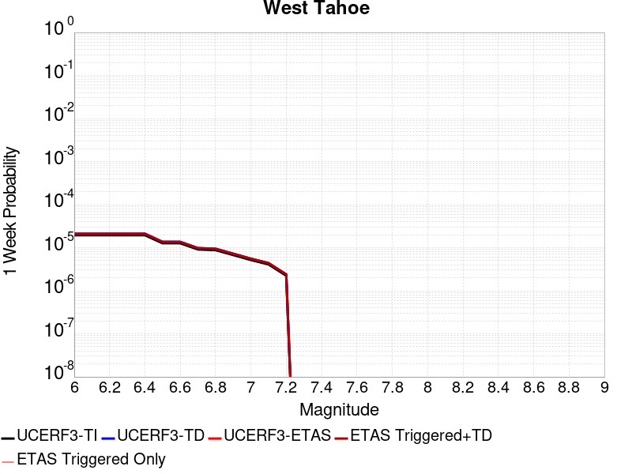 | 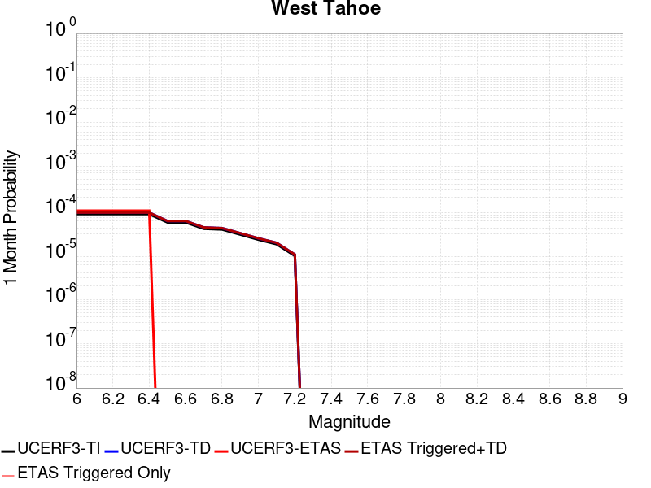 | 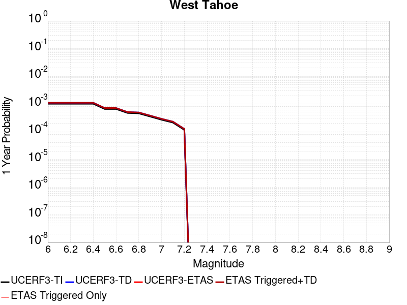 | 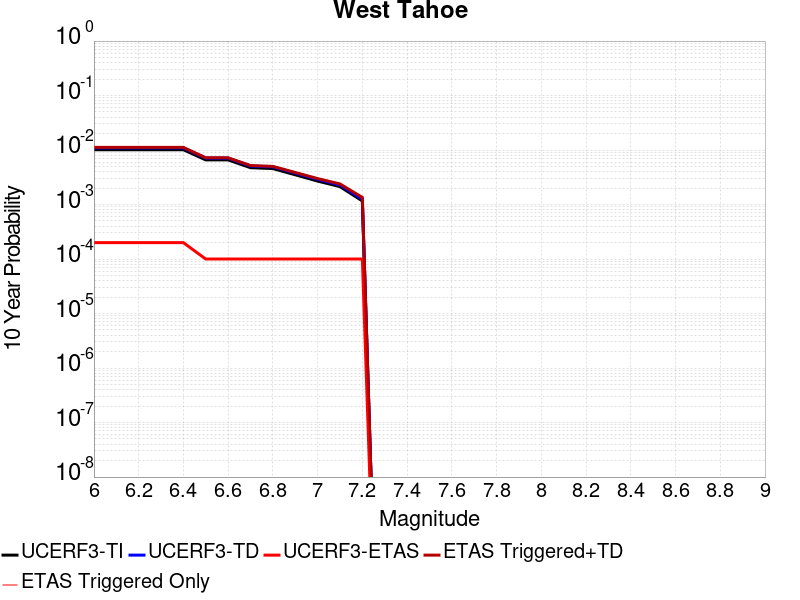 |

| Magnitude | 1 wk TI Prob | 1 wk TD Prob | 1 wk ETAS Prob | 1 wk ETAS/TD Gain | 1 wk ETAS Triggered+TD | 1 wk ETAS Triggered Only | 1 mo TI Prob | 1 mo TD Prob | 1 mo ETAS Prob | 1 mo ETAS/TD Gain | 1 mo ETAS Triggered+TD | 1 mo ETAS Triggered Only | 1 yr TI Prob | 1 yr TD Prob | 1 yr ETAS Prob | 1 yr ETAS/TD Gain | 1 yr ETAS Triggered+TD | 1 yr ETAS Triggered Only | 10 yr TI Prob | 10 yr TD Prob | 10 yr ETAS Prob | 10 yr ETAS/TD Gain | 10 yr ETAS Triggered+TD | 10 yr ETAS Triggered Only |
|-----|-----|-----|-----|-----|-----|-----|-----|-----|-----|-----|-----|-----|-----|-----|-----|-----|-----|-----|-----|-----|-----|-----|-----|-----|
| 6.0 | 1.952444E-5 | 2.1164358E-5 | 0.0 | 0.0 | 2.1164358E-5 | 0.0 | 8.367348E-5 | 9.070154E-5 | 1.0E-4 | 1.102517 | 9.070154E-5 | 0.0 | 0.0010182485 | 0.0011037865 | 0.0011 | 0.9965696 | 0.0011037865 | 0.0 | 0.010135954 | 0.010988515 | 0.0075 | 0.6825308 | 0.012570933 | 0.0016 |
| 6.1 | 1.952444E-5 | 2.1164358E-5 | 0.0 | 0.0 | 2.1164358E-5 | 0.0 | 8.367348E-5 | 9.070154E-5 | 1.0E-4 | 1.102517 | 9.070154E-5 | 0.0 | 0.0010182485 | 0.0011037865 | 0.0011 | 0.9965696 | 0.0011037865 | 0.0 | 0.010135954 | 0.010988515 | 0.0075 | 0.6825308 | 0.012570933 | 0.0016 |
| 6.2 | 1.952444E-5 | 2.1164358E-5 | 0.0 | 0.0 | 2.1164358E-5 | 0.0 | 8.367348E-5 | 9.070154E-5 | 1.0E-4 | 1.102517 | 9.070154E-5 | 0.0 | 0.0010182485 | 0.0011037865 | 0.0011 | 0.9965696 | 0.0011037865 | 0.0 | 0.010135954 | 0.010988515 | 0.0075 | 0.6825308 | 0.012570933 | 0.0016 |
| 6.3 | 1.952444E-5 | 2.1164358E-5 | 0.0 | 0.0 | 2.1164358E-5 | 0.0 | 8.367348E-5 | 9.070154E-5 | 1.0E-4 | 1.102517 | 9.070154E-5 | 0.0 | 0.0010182485 | 0.0011037865 | 0.0011 | 0.9965696 | 0.0011037865 | 0.0 | 0.010135954 | 0.010988515 | 0.0075 | 0.6825308 | 0.012570933 | 0.0016 |
| 6.4 | 1.952444E-5 | 2.1164358E-5 | 0.0 | 0.0 | 2.1164358E-5 | 0.0 | 8.367348E-5 | 9.070154E-5 | 1.0E-4 | 1.102517 | 9.070154E-5 | 0.0 | 0.0010182485 | 0.0011037865 | 0.0011 | 0.9965696 | 0.0011037865 | 0.0 | 0.010135954 | 0.010988515 | 0.0075 | 0.6825308 | 0.012570933 | 0.0016 |
| 6.5 | 1.2685271E-5 | 1.3679295E-5 | 0.0 | 0.0 | 1.3679295E-5 | 0.0 | 5.4364315E-5 | 5.8624326E-5 | 0.0 | 0.0 | 5.8624326E-5 | 0.0 | 6.616845E-4 | 7.1353384E-4 | 5.0E-4 | 0.7007376 | 7.1353384E-4 | 0.0 | 0.0065971776 | 0.007114075 | 0.004 | 0.56226563 | 0.007709807 | 6.0E-4 |
| 6.6 | 1.2685271E-5 | 1.3679295E-5 | 0.0 | 0.0 | 1.3679295E-5 | 0.0 | 5.4364315E-5 | 5.8624326E-5 | 0.0 | 0.0 | 5.8624326E-5 | 0.0 | 6.616845E-4 | 7.1353384E-4 | 5.0E-4 | 0.7007376 | 7.1353384E-4 | 0.0 | 0.0065971776 | 0.007114075 | 0.004 | 0.56226563 | 0.007709807 | 6.0E-4 |
| 6.7 | 9.117886E-6 | 9.802075E-6 | 0.0 | 0.0 | 9.802075E-6 | 0.0 | 3.9076072E-5 | 4.2008254E-5 | 0.0 | 0.0 | 4.2008254E-5 | 0.0 | 4.756473E-4 | 5.1133765E-4 | 4.0E-4 | 0.78226197 | 5.1133765E-4 | 0.0 | 0.0047463053 | 0.0051023276 | 0.0029 | 0.5683681 | 0.005400797 | 3.0E-4 |
| 6.8 | 8.786828E-6 | 9.450323E-6 | 0.0 | 0.0 | 9.450323E-6 | 0.0 | 3.7657293E-5 | 4.0500796E-5 | 0.0 | 0.0 | 4.0500796E-5 | 0.0 | 4.5838108E-4 | 4.9299264E-4 | 4.0E-4 | 0.81137115 | 4.9299264E-4 | 0.0 | 0.0045743673 | 0.00491969 | 0.0029 | 0.58946806 | 0.005218214 | 3.0E-4 |
| 6.9 | 6.7562123E-6 | 7.258113E-6 | 0.0 | 0.0 | 7.258113E-6 | 0.0 | 2.8954875E-5 | 3.1105854E-5 | 0.0 | 0.0 | 3.1105854E-5 | 0.0 | 3.5246857E-4 | 3.786527E-4 | 3.0E-4 | 0.79228276 | 3.786527E-4 | 0.0 | 0.0035191004 | 0.0037805466 | 0.0018 | 0.47612163 | 0.004079412 | 3.0E-4 |
| 7.0 | 5.1792854E-6 | 5.562985E-6 | 0.0 | 0.0 | 5.562985E-6 | 0.0 | 2.2196748E-5 | 2.3841169E-5 | 0.0 | 0.0 | 2.3841169E-5 | 0.0 | 2.702119E-4 | 2.9023134E-4 | 2.0E-4 | 0.6891054 | 2.9023134E-4 | 0.0 | 0.0026988357 | 0.0028988977 | 0.0012 | 0.41395044 | 0.003198028 | 3.0E-4 |
| 7.1 | 4.090765E-6 | 4.3939826E-6 | 0.0 | 0.0 | 4.3939826E-6 | 0.0 | 1.7531731E-5 | 1.8831237E-5 | 0.0 | 0.0 | 1.8831237E-5 | 0.0 | 2.134279E-4 | 2.2924959E-4 | 2.0E-4 | 0.8724116 | 2.2924959E-4 | 0.0 | 0.0021322304 | 0.002290465 | 9.0E-4 | 0.39293334 | 0.0025897778 | 3.0E-4 |
| 7.2 | 2.2356758E-6 | 2.4004994E-6 | 0.0 | 0.0 | 2.4004994E-6 | 0.0 | 9.581432E-6 | 1.0287825E-5 | 0.0 | 0.0 | 1.0287825E-5 | 0.0 | 1.1664769E-4 | 1.2524896E-4 | 1.0E-4 | 0.7984098 | 1.2524896E-4 | 0.0 | 0.0011658648 | 0.0012519691 | 6.0E-4 | 0.47924504 | 0.0015515935 | 3.0E-4 |

## Simi-Santa Rosa
*[(top)](#table-of-contents)*

| 1 Week | 1 Month | 1 Year | 10 Year |
|-----|-----|-----|-----|
| 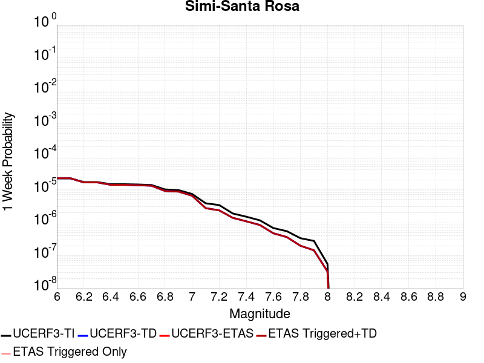 | 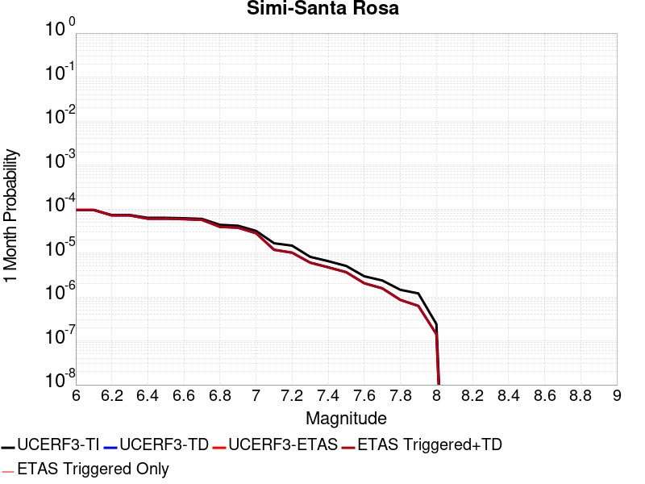 | 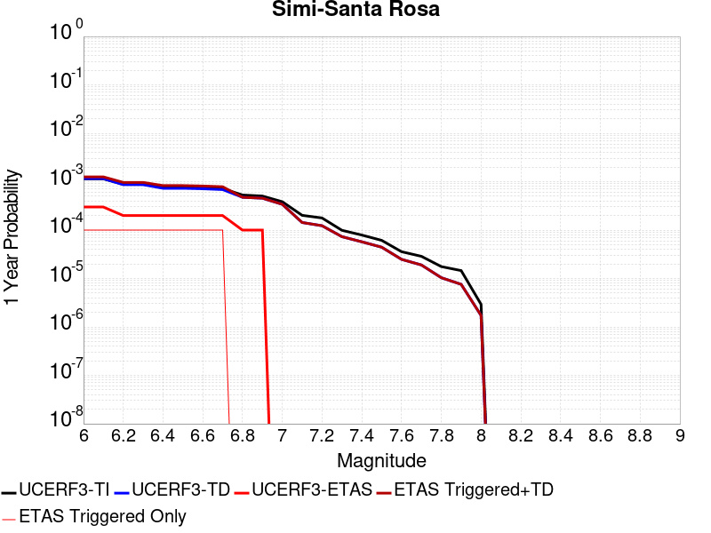 | 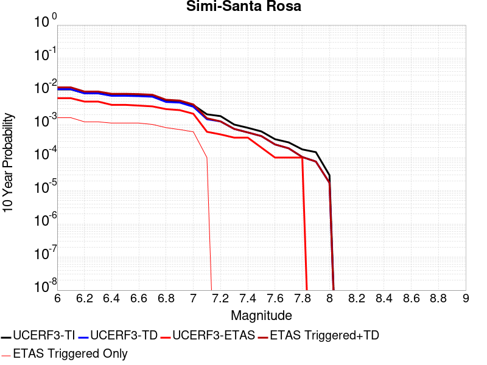 |

| Magnitude | 1 wk TI Prob | 1 wk TD Prob | 1 wk ETAS Prob | 1 wk ETAS/TD Gain | 1 wk ETAS Triggered+TD | 1 wk ETAS Triggered Only | 1 mo TI Prob | 1 mo TD Prob | 1 mo ETAS Prob | 1 mo ETAS/TD Gain | 1 mo ETAS Triggered+TD | 1 mo ETAS Triggered Only | 1 yr TI Prob | 1 yr TD Prob | 1 yr ETAS Prob | 1 yr ETAS/TD Gain | 1 yr ETAS Triggered+TD | 1 yr ETAS Triggered Only | 10 yr TI Prob | 10 yr TD Prob | 10 yr ETAS Prob | 10 yr ETAS/TD Gain | 10 yr ETAS Triggered+TD | 10 yr ETAS Triggered Only |
|-----|-----|-----|-----|-----|-----|-----|-----|-----|-----|-----|-----|-----|-----|-----|-----|-----|-----|-----|-----|-----|-----|-----|-----|-----|
| 6.0 | 2.198912E-5 | 2.2244081E-5 | 0.0 | 0.0 | 2.2244081E-5 | 0.0 | 9.4235686E-5 | 9.5328534E-5 | 0.0 | 0.0 | 9.5328534E-5 | 0.0 | 0.0011467156 | 0.0011600507 | 3.0E-4 | 0.25860938 | 0.0012599347 | 1.0E-4 | 0.011408163 | 0.011544387 | 0.0062 | 0.5370575 | 0.013125916 | 0.0016 |
| 6.1 | 2.198912E-5 | 2.2244081E-5 | 0.0 | 0.0 | 2.2244081E-5 | 0.0 | 9.4235686E-5 | 9.5328534E-5 | 0.0 | 0.0 | 9.5328534E-5 | 0.0 | 0.0011467156 | 0.0011600507 | 3.0E-4 | 0.25860938 | 0.0012599347 | 1.0E-4 | 0.011408163 | 0.011544387 | 0.0062 | 0.5370575 | 0.013125916 | 0.0016 |
| 6.2 | 1.69983E-5 | 1.6644417E-5 | 0.0 | 0.0 | 1.6644417E-5 | 0.0 | 7.284782E-5 | 7.133143E-5 | 0.0 | 0.0 | 7.133143E-5 | 0.0 | 8.865613E-4 | 8.681432E-4 | 2.0E-4 | 0.23037674 | 9.680564E-4 | 1.0E-4 | 0.008830327 | 0.0086504305 | 0.0049 | 0.5664458 | 0.00984005 | 0.0012 |
| 6.3 | 1.69983E-5 | 1.6644417E-5 | 0.0 | 0.0 | 1.6644417E-5 | 0.0 | 7.284782E-5 | 7.133143E-5 | 0.0 | 0.0 | 7.133143E-5 | 0.0 | 8.865613E-4 | 8.681432E-4 | 2.0E-4 | 0.23037674 | 9.680564E-4 | 1.0E-4 | 0.008830327 | 0.0086504305 | 0.0049 | 0.5664458 | 0.00984005 | 0.0012 |
| 6.4 | 1.4666188E-5 | 1.4031722E-5 | 0.0 | 0.0 | 1.4031722E-5 | 0.0 | 6.285358E-5 | 6.0134702E-5 | 0.0 | 0.0 | 6.0134702E-5 | 0.0 | 7.6497364E-4 | 7.319189E-4 | 2.0E-4 | 0.2732543 | 8.318457E-4 | 1.0E-4 | 0.0076234564 | 0.0072975513 | 0.0039 | 0.53442585 | 0.008389524 | 0.0011 |
| 6.5 | 1.4666188E-5 | 1.4031722E-5 | 0.0 | 0.0 | 1.4031722E-5 | 0.0 | 6.285358E-5 | 6.0134702E-5 | 0.0 | 0.0 | 6.0134702E-5 | 0.0 | 7.6497364E-4 | 7.319189E-4 | 2.0E-4 | 0.2732543 | 8.318457E-4 | 1.0E-4 | 0.0076234564 | 0.0072975513 | 0.0039 | 0.53442585 | 0.008389524 | 0.0011 |
| 6.6 | 1.4377586E-5 | 1.3709162E-5 | 0.0 | 0.0 | 1.3709162E-5 | 0.0 | 6.1616774E-5 | 5.875237E-5 | 0.0 | 0.0 | 5.875237E-5 | 0.0 | 7.4992597E-4 | 7.151001E-4 | 2.0E-4 | 0.27968112 | 8.150286E-4 | 1.0E-4 | 0.007474003 | 0.0071304515 | 0.0037 | 0.5189012 | 0.008222608 | 0.0011 |
| 6.7 | 1.3881404E-5 | 1.31879215E-5 | 0.0 | 0.0 | 1.31879215E-5 | 0.0 | 5.9490372E-5 | 5.6518576E-5 | 0.0 | 0.0 | 5.6518576E-5 | 0.0 | 7.240546E-4 | 6.8792107E-4 | 2.0E-4 | 0.290731 | 7.878523E-4 | 1.0E-4 | 0.007217 | 0.0068603586 | 0.0035 | 0.51017743 | 0.007853499 | 0.001 |
| 6.8 | 1.0176516E-5 | 9.139872E-6 | 0.0 | 0.0 | 9.139872E-6 | 0.0 | 4.3612912E-5 | 3.9170387E-5 | 0.0 | 0.0 | 3.9170387E-5 | 0.0 | 5.308578E-4 | 4.7681163E-4 | 1.0E-4 | 0.20972642 | 4.7681163E-4 | 0.0 | 0.0052959146 | 0.0047595147 | 0.0029 | 0.60930586 | 0.005555707 | 8.0E-4 |
| 6.9 | 9.699797E-6 | 8.761256E-6 | 0.0 | 0.0 | 8.761256E-6 | 0.0 | 4.15699E-5 | 3.7547794E-5 | 0.0 | 0.0 | 3.7547794E-5 | 0.0 | 5.05996E-4 | 4.570649E-4 | 1.0E-4 | 0.21878731 | 4.570649E-4 | 0.0 | 0.005048454 | 0.0045628613 | 0.0027 | 0.59173393 | 0.0052596675 | 7.0E-4 |
| 7.0 | 7.4049476E-6 | 6.5493387E-6 | 0.0 | 0.0 | 6.5493387E-6 | 0.0 | 3.1735104E-5 | 2.8068363E-5 | 0.0 | 0.0 | 2.8068363E-5 | 0.0 | 3.8630638E-4 | 3.4169134E-4 | 0.0 | 0.0 | 3.4169134E-4 | 0.0 | 0.0038563553 | 0.0034128984 | 0.0021 | 0.61531276 | 0.0040108506 | 6.0E-4 |
| 7.1 | 3.873439E-6 | 2.7551675E-6 | 0.0 | 0.0 | 2.7551675E-6 | 0.0 | 1.6600346E-5 | 1.1807809E-5 | 0.0 | 0.0 | 1.1807809E-5 | 0.0 | 2.0209046E-4 | 1.4375082E-4 | 0.0 | 0.0 | 1.4375082E-4 | 0.0 | 0.0020190678 | 0.0014366019 | 6.0E-4 | 0.41765225 | 0.0015364581 | 1.0E-4 |
| 7.2 | 3.417706E-6 | 2.363767E-6 | 0.0 | 0.0 | 2.363767E-6 | 0.0 | 1.4647229E-5 | 1.0130391E-5 | 0.0 | 0.0 | 1.0130391E-5 | 0.0 | 1.7831543E-4 | 1.2333076E-4 | 0.0 | 0.0 | 1.2333076E-4 | 0.0 | 0.0017817242 | 0.0012326454 | 5.0E-4 | 0.40563166 | 0.0012326454 | 0.0 |
| 7.3 | 1.90225E-6 | 1.4046618E-6 | 0.0 | 0.0 | 1.4046618E-6 | 0.0 | 8.152474E-6 | 6.0199654E-6 | 0.0 | 0.0 | 6.0199654E-6 | 0.0 | 9.9251854E-5 | 7.3290634E-5 | 0.0 | 0.0 | 7.3290634E-5 | 0.0 | 9.920754E-4 | 7.326669E-4 | 4.0E-4 | 0.5459507 | 7.326669E-4 | 0.0 |
| 7.4 | 1.5170556E-6 | 1.1001704E-6 | 0.0 | 0.0 | 1.1001704E-6 | 0.0 | 6.5016507E-6 | 4.7150074E-6 | 0.0 | 0.0 | 4.7150074E-6 | 0.0 | 7.915472E-5 | 5.7403715E-5 | 0.0 | 0.0 | 5.7403715E-5 | 0.0 | 7.9126534E-4 | 5.7389E-4 | 4.0E-4 | 0.6969977 | 5.7389E-4 | 0.0 |
| 7.5 | 1.178732E-6 | 8.514446E-7 | 0.0 | 0.0 | 8.514446E-7 | 0.0 | 5.0516987E-6 | 3.6490433E-6 | 0.0 | 0.0 | 3.6490433E-6 | 0.0 | 6.1502695E-5 | 4.4426204E-5 | 0.0 | 0.0 | 4.4426204E-5 | 0.0 | 6.148568E-4 | 4.4417416E-4 | 2.0E-4 | 0.4502738 | 4.4417416E-4 | 0.0 |
| 7.6 | 6.8722386E-7 | 4.775012E-7 | 0.0 | 0.0 | 4.775012E-7 | 0.0 | 2.9452417E-6 | 2.0464322E-6 | 0.0 | 0.0 | 2.0464322E-6 | 0.0 | 3.5857727E-5 | 2.4915027E-5 | 0.0 | 0.0 | 2.4915027E-5 | 0.0 | 3.5851944E-4 | 2.4912247E-4 | 1.0E-4 | 0.401409 | 2.4912247E-4 | 0.0 |
| 7.7 | 5.5126515E-7 | 3.6558748E-7 | 0.0 | 0.0 | 3.6558748E-7 | 0.0 | 2.3625628E-6 | 1.5668024E-6 | 0.0 | 0.0 | 1.5668024E-6 | 0.0 | 2.8763823E-5 | 1.9075655E-5 | 0.0 | 0.0 | 1.9075655E-5 | 0.0 | 2.87601E-4 | 1.9074028E-4 | 1.0E-4 | 0.5242731 | 1.9074028E-4 | 0.0 |
| 7.8 | 3.3860243E-7 | 1.9963709E-7 | 0.0 | 0.0 | 1.9963709E-7 | 0.0 | 1.4511525E-6 | 8.5558725E-7 | 0.0 | 0.0 | 8.5558725E-7 | 0.0 | 1.7667637E-5 | 1.0416726E-5 | 0.0 | 0.0 | 1.0416726E-5 | 0.0 | 1.7666233E-4 | 1.0416243E-4 | 1.0E-4 | 0.9600391 | 1.0416243E-4 | 0.0 |
| 7.9 | 2.7955386E-7 | 1.4550365E-7 | 0.0 | 0.0 | 1.4550365E-7 | 0.0 | 1.1980875E-6 | 6.235869E-7 | 0.0 | 0.0 | 6.235869E-7 | 0.0 | 1.4586617E-5 | 7.592145E-6 | 0.0 | 0.0 | 7.592145E-6 | 0.0 | 1.458566E-4 | 7.59189E-5 | 0.0 | 0.0 | 7.59189E-5 | 0.0 |
| 8.0 | 5.6259015E-8 | 3.3193E-8 | 0.0 | 0.0 | 3.3193E-8 | 0.0 | 2.4111003E-7 | 1.4225571E-7 | 0.0 | 0.0 | 1.4225571E-7 | 0.0 | 2.9355108E-6 | 1.731962E-6 | 0.0 | 0.0 | 1.731962E-6 | 0.0 | 2.935472E-5 | 1.7319499E-5 | 0.0 | 0.0 | 1.7319499E-5 | 0.0 |

## Burnt Mtn
*[(top)](#table-of-contents)*

| 1 Week | 1 Month | 1 Year | 10 Year |
|-----|-----|-----|-----|
| 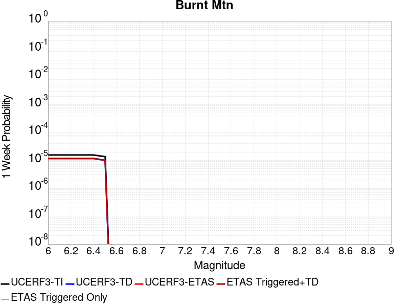 | 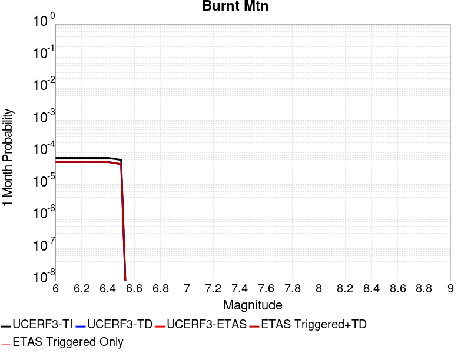 | 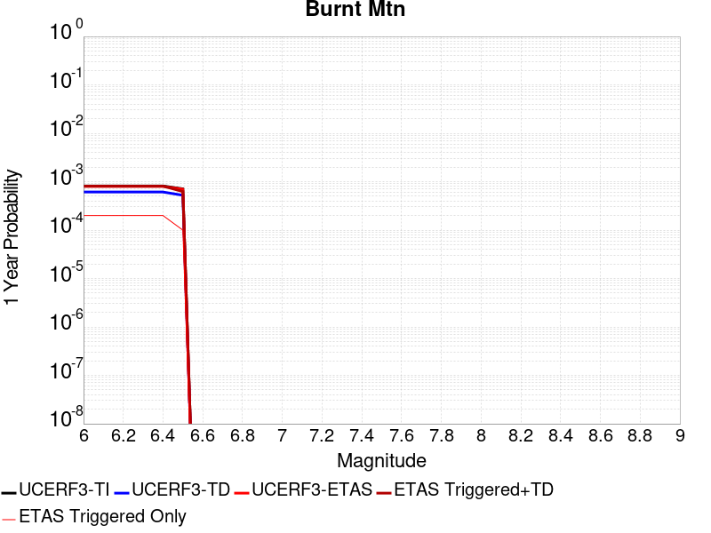 | 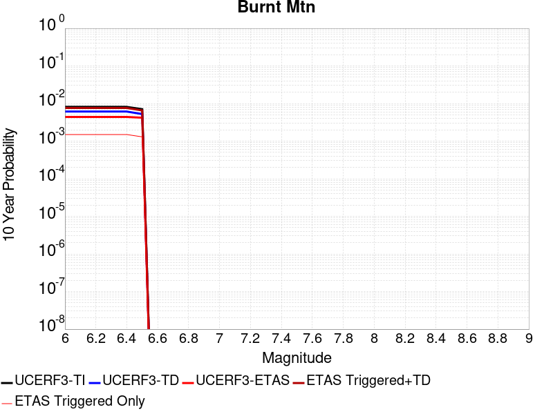 |

| Magnitude | 1 wk TI Prob | 1 wk TD Prob | 1 wk ETAS Prob | 1 wk ETAS/TD Gain | 1 wk ETAS Triggered+TD | 1 wk ETAS Triggered Only | 1 mo TI Prob | 1 mo TD Prob | 1 mo ETAS Prob | 1 mo ETAS/TD Gain | 1 mo ETAS Triggered+TD | 1 mo ETAS Triggered Only | 1 yr TI Prob | 1 yr TD Prob | 1 yr ETAS Prob | 1 yr ETAS/TD Gain | 1 yr ETAS Triggered+TD | 1 yr ETAS Triggered Only | 10 yr TI Prob | 10 yr TD Prob | 10 yr ETAS Prob | 10 yr ETAS/TD Gain | 10 yr ETAS Triggered+TD | 10 yr ETAS Triggered Only |
|-----|-----|-----|-----|-----|-----|-----|-----|-----|-----|-----|-----|-----|-----|-----|-----|-----|-----|-----|-----|-----|-----|-----|-----|-----|
| 6.0 | 1.5673151E-5 | 1.1737301E-5 | 0.0 | 0.0 | 1.1737301E-5 | 0.0 | 6.716892E-5 | 5.0302475E-5 | 0.0 | 0.0 | 5.0302475E-5 | 0.0 | 8.1747473E-4 | 6.123892E-4 | 8.0E-4 | 1.3063588 | 8.122667E-4 | 2.0E-4 | 0.008144741 | 0.006119633 | 0.0044 | 0.71899736 | 0.0076104538 | 0.0015 |
| 6.1 | 1.5673151E-5 | 1.1737301E-5 | 0.0 | 0.0 | 1.1737301E-5 | 0.0 | 6.716892E-5 | 5.0302475E-5 | 0.0 | 0.0 | 5.0302475E-5 | 0.0 | 8.1747473E-4 | 6.123892E-4 | 8.0E-4 | 1.3063588 | 8.122667E-4 | 2.0E-4 | 0.008144741 | 0.006119633 | 0.0044 | 0.71899736 | 0.0076104538 | 0.0015 |
| 6.2 | 1.5673151E-5 | 1.1737301E-5 | 0.0 | 0.0 | 1.1737301E-5 | 0.0 | 6.716892E-5 | 5.0302475E-5 | 0.0 | 0.0 | 5.0302475E-5 | 0.0 | 8.1747473E-4 | 6.123892E-4 | 8.0E-4 | 1.3063588 | 8.122667E-4 | 2.0E-4 | 0.008144741 | 0.006119633 | 0.0044 | 0.71899736 | 0.0076104538 | 0.0015 |
| 6.3 | 1.5673151E-5 | 1.1737301E-5 | 0.0 | 0.0 | 1.1737301E-5 | 0.0 | 6.716892E-5 | 5.0302475E-5 | 0.0 | 0.0 | 5.0302475E-5 | 0.0 | 8.1747473E-4 | 6.123892E-4 | 8.0E-4 | 1.3063588 | 8.122667E-4 | 2.0E-4 | 0.008144741 | 0.006119633 | 0.0044 | 0.71899736 | 0.0076104538 | 0.0015 |
| 6.4 | 1.5673151E-5 | 1.1737301E-5 | 0.0 | 0.0 | 1.1737301E-5 | 0.0 | 6.716892E-5 | 5.0302475E-5 | 0.0 | 0.0 | 5.0302475E-5 | 0.0 | 8.1747473E-4 | 6.123892E-4 | 8.0E-4 | 1.3063588 | 8.122667E-4 | 2.0E-4 | 0.008144741 | 0.006119633 | 0.0044 | 0.71899736 | 0.0076104538 | 0.0015 |
| 6.5 | 1.36191375E-5 | 1.0068775E-5 | 0.0 | 0.0 | 1.0068775E-5 | 0.0 | 5.8366426E-5 | 4.3151893E-5 | 0.0 | 0.0 | 4.3151893E-5 | 0.0 | 7.103795E-4 | 5.253743E-4 | 7.0E-4 | 1.3323834 | 6.2532176E-4 | 1.0E-4 | 0.0070811296 | 0.005253743 | 0.0042 | 0.79943 | 0.006546913 | 0.0013 |

## Table Bluff
*[(top)](#table-of-contents)*

| 1 Week | 1 Month | 1 Year | 10 Year |
|-----|-----|-----|-----|
| 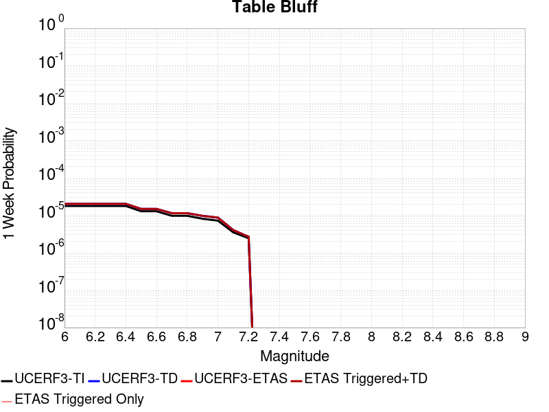 | 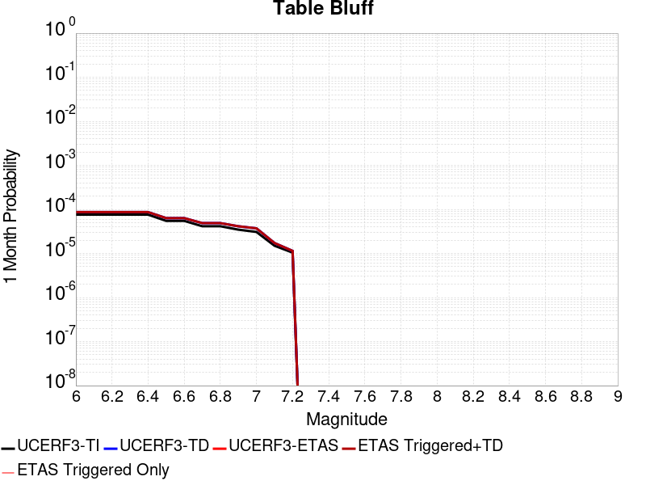 | 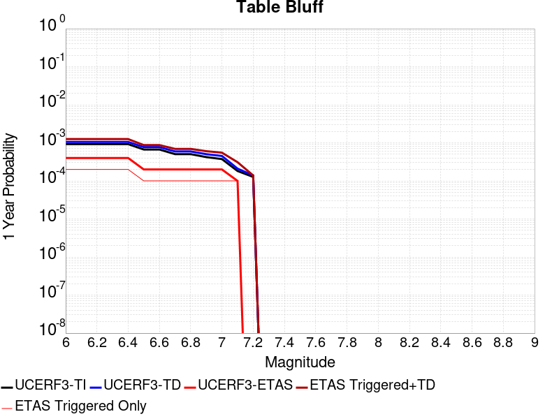 | 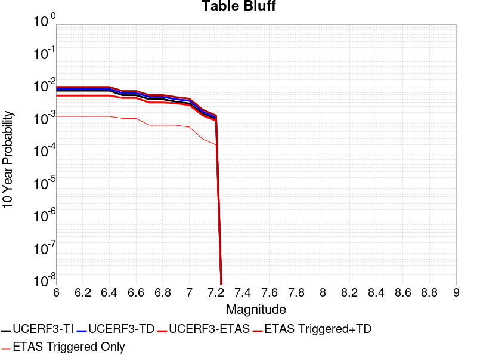 |

| Magnitude | 1 wk TI Prob | 1 wk TD Prob | 1 wk ETAS Prob | 1 wk ETAS/TD Gain | 1 wk ETAS Triggered+TD | 1 wk ETAS Triggered Only | 1 mo TI Prob | 1 mo TD Prob | 1 mo ETAS Prob | 1 mo ETAS/TD Gain | 1 mo ETAS Triggered+TD | 1 mo ETAS Triggered Only | 1 yr TI Prob | 1 yr TD Prob | 1 yr ETAS Prob | 1 yr ETAS/TD Gain | 1 yr ETAS Triggered+TD | 1 yr ETAS Triggered Only | 10 yr TI Prob | 10 yr TD Prob | 10 yr ETAS Prob | 10 yr ETAS/TD Gain | 10 yr ETAS Triggered+TD | 10 yr ETAS Triggered Only |
|-----|-----|-----|-----|-----|-----|-----|-----|-----|-----|-----|-----|-----|-----|-----|-----|-----|-----|-----|-----|-----|-----|-----|-----|-----|
| 6.0 | 1.7744695E-5 | 2.0234518E-5 | 0.0 | 0.0 | 2.0234518E-5 | 0.0 | 7.6046475E-5 | 8.671681E-5 | 0.0 | 0.0 | 8.671681E-5 | 0.0 | 9.2547253E-4 | 0.0010553253 | 4.0E-4 | 0.37903008 | 0.0012551142 | 2.0E-4 | 0.009216278 | 0.010509055 | 0.0065 | 0.6185142 | 0.011993292 | 0.0015 |
| 6.1 | 1.7744695E-5 | 2.0234518E-5 | 0.0 | 0.0 | 2.0234518E-5 | 0.0 | 7.6046475E-5 | 8.671681E-5 | 0.0 | 0.0 | 8.671681E-5 | 0.0 | 9.2547253E-4 | 0.0010553253 | 4.0E-4 | 0.37903008 | 0.0012551142 | 2.0E-4 | 0.009216278 | 0.010509055 | 0.0065 | 0.6185142 | 0.011993292 | 0.0015 |
| 6.2 | 1.7744695E-5 | 2.0234518E-5 | 0.0 | 0.0 | 2.0234518E-5 | 0.0 | 7.6046475E-5 | 8.671681E-5 | 0.0 | 0.0 | 8.671681E-5 | 0.0 | 9.2547253E-4 | 0.0010553253 | 4.0E-4 | 0.37903008 | 0.0012551142 | 2.0E-4 | 0.009216278 | 0.010509055 | 0.0065 | 0.6185142 | 0.011993292 | 0.0015 |
| 6.3 | 1.7744695E-5 | 2.0234518E-5 | 0.0 | 0.0 | 2.0234518E-5 | 0.0 | 7.6046475E-5 | 8.671681E-5 | 0.0 | 0.0 | 8.671681E-5 | 0.0 | 9.2547253E-4 | 0.0010553253 | 4.0E-4 | 0.37903008 | 0.0012551142 | 2.0E-4 | 0.009216278 | 0.010509055 | 0.0065 | 0.6185142 | 0.011993292 | 0.0015 |
| 6.4 | 1.7744695E-5 | 2.0234518E-5 | 0.0 | 0.0 | 2.0234518E-5 | 0.0 | 7.6046475E-5 | 8.671681E-5 | 0.0 | 0.0 | 8.671681E-5 | 0.0 | 9.2547253E-4 | 0.0010553253 | 4.0E-4 | 0.37903008 | 0.0012551142 | 2.0E-4 | 0.009216278 | 0.010509055 | 0.0065 | 0.6185142 | 0.011993292 | 0.0015 |
| 6.5 | 1.2822383E-5 | 1.4814618E-5 | 0.0 | 0.0 | 1.4814618E-5 | 0.0 | 5.4951914E-5 | 6.3489846E-5 | 0.0 | 0.0 | 6.3489846E-5 | 0.0 | 6.6883414E-4 | 7.727443E-4 | 2.0E-4 | 0.25881782 | 8.72667E-4 | 1.0E-4 | 0.0066682473 | 0.0077035096 | 0.0055 | 0.7139603 | 0.008993495 | 0.0013 |
| 6.6 | 1.2822383E-5 | 1.4814618E-5 | 0.0 | 0.0 | 1.4814618E-5 | 0.0 | 5.4951914E-5 | 6.3489846E-5 | 0.0 | 0.0 | 6.3489846E-5 | 0.0 | 6.6883414E-4 | 7.727443E-4 | 2.0E-4 | 0.25881782 | 8.72667E-4 | 1.0E-4 | 0.0066682473 | 0.0077035096 | 0.0055 | 0.7139603 | 0.008993495 | 0.0013 |
| 6.7 | 9.690175E-6 | 1.1394503E-5 | 0.0 | 0.0 | 1.1394503E-5 | 0.0 | 4.1528663E-5 | 4.8832782E-5 | 0.0 | 0.0 | 4.8832782E-5 | 0.0 | 5.054941E-4 | 5.9439696E-4 | 2.0E-4 | 0.3364755 | 6.9433753E-4 | 1.0E-4 | 0.005043458 | 0.005930049 | 0.004 | 0.67453074 | 0.0067253048 | 8.0E-4 |
| 6.8 | 9.690175E-6 | 1.1394503E-5 | 0.0 | 0.0 | 1.1394503E-5 | 0.0 | 4.1528663E-5 | 4.8832782E-5 | 0.0 | 0.0 | 4.8832782E-5 | 0.0 | 5.054941E-4 | 5.9439696E-4 | 2.0E-4 | 0.3364755 | 6.9433753E-4 | 1.0E-4 | 0.005043458 | 0.005930049 | 0.004 | 0.67453074 | 0.0067253048 | 8.0E-4 |
| 6.9 | 8.096043E-6 | 9.660498E-6 | 0.0 | 0.0 | 9.660498E-6 | 0.0 | 3.4696863E-5 | 4.1401574E-5 | 0.0 | 0.0 | 4.1401574E-5 | 0.0 | 4.223524E-4 | 5.039649E-4 | 2.0E-4 | 0.39685303 | 6.039145E-4 | 1.0E-4 | 0.004215506 | 0.005029926 | 0.0038 | 0.75547826 | 0.0058259023 | 8.0E-4 |
| 7.0 | 7.185906E-6 | 8.6728105E-6 | 0.0 | 0.0 | 8.6728105E-6 | 0.0 | 3.0796375E-5 | 3.716875E-5 | 0.0 | 0.0 | 3.716875E-5 | 0.0 | 3.7488135E-4 | 4.52452E-4 | 2.0E-4 | 0.44203585 | 5.5240677E-4 | 1.0E-4 | 0.0037424958 | 0.004516924 | 0.0033 | 0.7305857 | 0.005213762 | 7.0E-4 |
| 7.1 | 3.4937343E-6 | 4.0247673E-6 | 0.0 | 0.0 | 4.0247673E-6 | 0.0 | 1.497306E-5 | 1.7248929E-5 | 0.0 | 0.0 | 1.7248929E-5 | 0.0 | 1.8228177E-4 | 2.0999282E-4 | 1.0E-4 | 0.47620675 | 3.0997183E-4 | 1.0E-4 | 0.0018213232 | 0.0020986635 | 0.0016 | 0.76238996 | 0.0023980339 | 3.0E-4 |
| 7.2 | 2.4388776E-6 | 2.6704367E-6 | 0.0 | 0.0 | 2.6704367E-6 | 0.0 | 1.0452291E-5 | 1.14447075E-5 | 0.0 | 0.0 | 1.14447075E-5 | 0.0 | 1.2724921E-4 | 1.3933545E-4 | 0.0 | 0.0 | 1.3933545E-4 | 0.0 | 0.0012717636 | 0.0013929757 | 0.0011 | 0.78967637 | 0.0015926971 | 2.0E-4 |

## Homestead Valley 2011
*[(top)](#table-of-contents)*

| 1 Week | 1 Month | 1 Year | 10 Year |
|-----|-----|-----|-----|
| 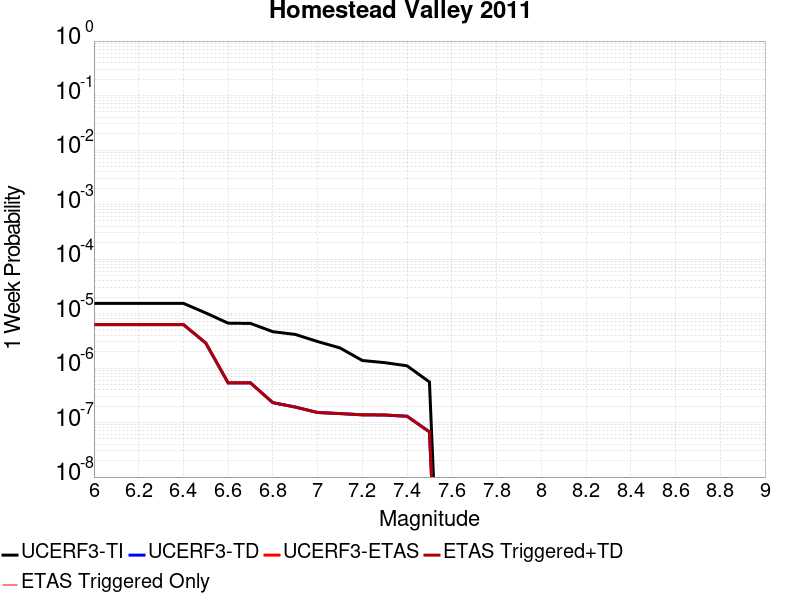 | 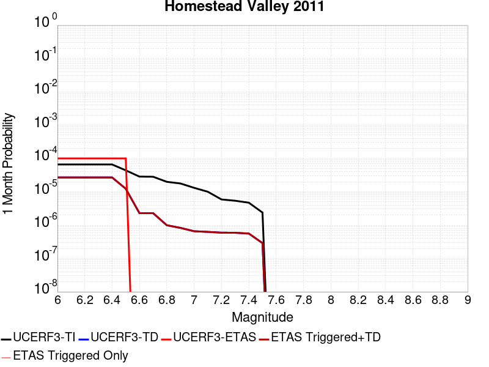 | 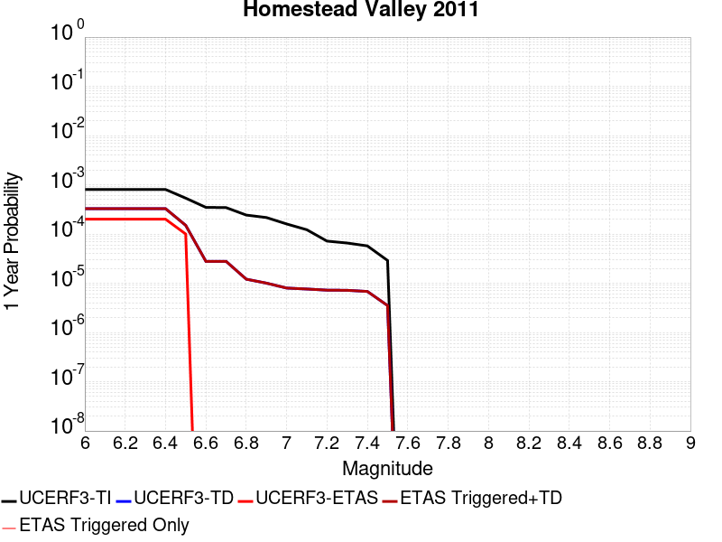 | 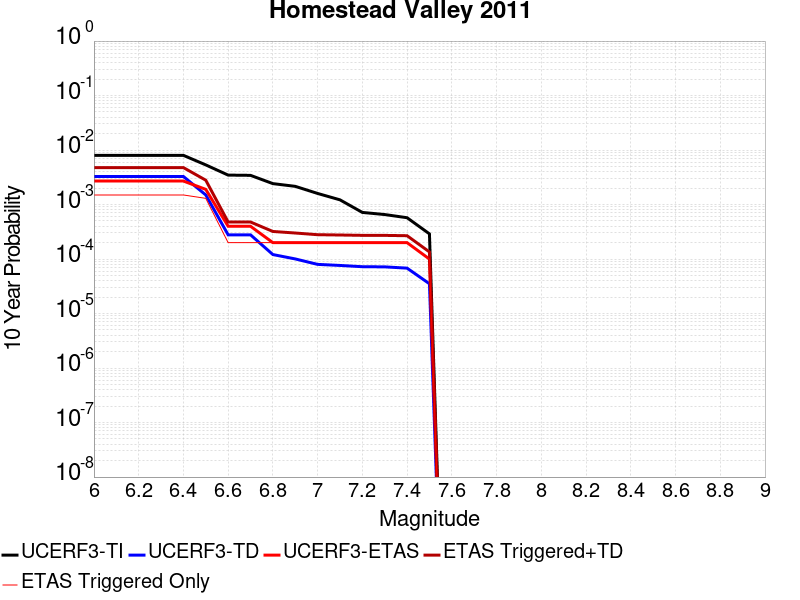 |

| Magnitude | 1 wk TI Prob | 1 wk TD Prob | 1 wk ETAS Prob | 1 wk ETAS/TD Gain | 1 wk ETAS Triggered+TD | 1 wk ETAS Triggered Only | 1 mo TI Prob | 1 mo TD Prob | 1 mo ETAS Prob | 1 mo ETAS/TD Gain | 1 mo ETAS Triggered+TD | 1 mo ETAS Triggered Only | 1 yr TI Prob | 1 yr TD Prob | 1 yr ETAS Prob | 1 yr ETAS/TD Gain | 1 yr ETAS Triggered+TD | 1 yr ETAS Triggered Only | 10 yr TI Prob | 10 yr TD Prob | 10 yr ETAS Prob | 10 yr ETAS/TD Gain | 10 yr ETAS Triggered+TD | 10 yr ETAS Triggered Only |
|-----|-----|-----|-----|-----|-----|-----|-----|-----|-----|-----|-----|-----|-----|-----|-----|-----|-----|-----|-----|-----|-----|-----|-----|-----|
| 6.0 | 1.539795E-5 | 6.2818494E-6 | 0.0 | 0.0 | 6.2818494E-6 | 0.0 | 6.5989545E-5 | 2.692205E-5 | 1.0E-4 | 3.7144275 | 2.692205E-5 | 0.0 | 8.0312655E-4 | 3.2774723E-4 | 2.0E-4 | 0.61022633 | 3.2774723E-4 | 0.0 | 0.008002302 | 0.003274657 | 0.0027 | 0.8245138 | 0.0047697453 | 0.0015 |
| 6.1 | 1.539795E-5 | 6.2818494E-6 | 0.0 | 0.0 | 6.2818494E-6 | 0.0 | 6.5989545E-5 | 2.692205E-5 | 1.0E-4 | 3.7144275 | 2.692205E-5 | 0.0 | 8.0312655E-4 | 3.2774723E-4 | 2.0E-4 | 0.61022633 | 3.2774723E-4 | 0.0 | 0.008002302 | 0.003274657 | 0.0027 | 0.8245138 | 0.0047697453 | 0.0015 |
| 6.2 | 1.539795E-5 | 6.2818494E-6 | 0.0 | 0.0 | 6.2818494E-6 | 0.0 | 6.5989545E-5 | 2.692205E-5 | 1.0E-4 | 3.7144275 | 2.692205E-5 | 0.0 | 8.0312655E-4 | 3.2774723E-4 | 2.0E-4 | 0.61022633 | 3.2774723E-4 | 0.0 | 0.008002302 | 0.003274657 | 0.0027 | 0.8245138 | 0.0047697453 | 0.0015 |
| 6.3 | 1.539795E-5 | 6.2818494E-6 | 0.0 | 0.0 | 6.2818494E-6 | 0.0 | 6.5989545E-5 | 2.692205E-5 | 1.0E-4 | 3.7144275 | 2.692205E-5 | 0.0 | 8.0312655E-4 | 3.2774723E-4 | 2.0E-4 | 0.61022633 | 3.2774723E-4 | 0.0 | 0.008002302 | 0.003274657 | 0.0027 | 0.8245138 | 0.0047697453 | 0.0015 |
| 6.4 | 1.539795E-5 | 6.2818494E-6 | 0.0 | 0.0 | 6.2818494E-6 | 0.0 | 6.5989545E-5 | 2.692205E-5 | 1.0E-4 | 3.7144275 | 2.692205E-5 | 0.0 | 8.0312655E-4 | 3.2774723E-4 | 2.0E-4 | 0.61022633 | 3.2774723E-4 | 0.0 | 0.008002302 | 0.003274657 | 0.0027 | 0.8245138 | 0.0047697453 | 0.0015 |
| 6.5 | 1.0265258E-5 | 2.876857E-6 | 0.0 | 0.0 | 2.876857E-6 | 0.0 | 4.3993223E-5 | 1.2329368E-5 | 1.0E-4 | 8.110716 | 1.2329368E-5 | 0.0 | 5.3548586E-4 | 1.5010666E-4 | 1.0E-4 | 0.66619295 | 1.5010666E-4 | 0.0 | 0.005341973 | 0.0015007341 | 0.0019 | 1.266047 | 0.0027987831 | 0.0013 |
| 6.6 | 6.664671E-6 | 5.336633E-7 | 0.0 | 0.0 | 5.336633E-7 | 0.0 | 2.8562565E-5 | 2.287127E-6 | 0.0 | 0.0 | 2.287127E-6 | 0.0 | 3.476937E-4 | 2.7845535E-5 | 0.0 | 0.0 | 2.7845535E-5 | 0.0 | 0.003471502 | 2.7843207E-4 | 4.0E-4 | 1.4366162 | 4.7837637E-4 | 2.0E-4 |
| 6.7 | 6.5954046E-6 | 5.336633E-7 | 0.0 | 0.0 | 5.336633E-7 | 0.0 | 2.8265715E-5 | 2.287127E-6 | 0.0 | 0.0 | 2.287127E-6 | 0.0 | 3.4408073E-4 | 2.7845535E-5 | 0.0 | 0.0 | 2.7845535E-5 | 0.0 | 0.0034354846 | 2.7843207E-4 | 4.0E-4 | 1.4366162 | 4.7837637E-4 | 2.0E-4 |
| 6.8 | 4.648189E-6 | 2.3185159E-7 | 0.0 | 0.0 | 2.3185159E-7 | 0.0 | 1.9920659E-5 | 9.936493E-7 | 0.0 | 0.0 | 9.936493E-7 | 0.0 | 2.4250703E-4 | 1.2097617E-5 | 0.0 | 0.0 | 1.2097617E-5 | 0.0 | 0.0024224254 | 1.2097007E-4 | 2.0E-4 | 1.6533015 | 3.2094587E-4 | 2.0E-4 |
| 6.9 | 4.1428534E-6 | 1.9271238E-7 | 0.0 | 0.0 | 1.9271238E-7 | 0.0 | 1.7754966E-5 | 8.259099E-7 | 0.0 | 0.0 | 8.259099E-7 | 0.0 | 2.1614527E-4 | 1.005541E-5 | 0.0 | 0.0 | 1.005541E-5 | 0.0 | 0.0021593515 | 1.0054985E-4 | 2.0E-4 | 1.9890631 | 3.0052973E-4 | 2.0E-4 |
| 7.0 | 3.0673707E-6 | 1.5309959E-7 | 0.0 | 0.0 | 1.5309959E-7 | 0.0 | 1.3145808E-5 | 6.561409E-7 | 0.0 | 0.0 | 6.561409E-7 | 0.0 | 1.6003846E-4 | 7.988488E-6 | 0.0 | 0.0 | 7.988488E-6 | 0.0 | 0.0015992324 | 7.9882106E-5 | 2.0E-4 | 2.5036895 | 2.7986613E-4 | 2.0E-4 |
| 7.1 | 2.340854E-6 | 1.4634182E-7 | 0.0 | 0.0 | 1.4634182E-7 | 0.0 | 1.0032193E-5 | 6.271791E-7 | 0.0 | 0.0 | 6.271791E-7 | 0.0 | 1.221351E-4 | 7.635879E-6 | 0.0 | 0.0 | 7.635879E-6 | 0.0 | 0.00122068 | 7.635627E-5 | 2.0E-4 | 2.6193001 | 2.76341E-4 | 2.0E-4 |
| 7.2 | 1.3754182E-6 | 1.3874715E-7 | 0.0 | 0.0 | 1.3874715E-7 | 0.0 | 5.8946357E-6 | 5.9463054E-7 | 0.0 | 0.0 | 5.9463054E-7 | 0.0 | 7.176483E-5 | 7.2396033E-6 | 0.0 | 0.0 | 7.2396033E-6 | 0.0 | 7.174166E-4 | 7.239377E-5 | 2.0E-4 | 2.7626688 | 2.723793E-4 | 2.0E-4 |
| 7.3 | 1.2573237E-6 | 1.3779768E-7 | 0.0 | 0.0 | 1.3779768E-7 | 0.0 | 5.388519E-6 | 5.905614E-7 | 0.0 | 0.0 | 5.905614E-7 | 0.0 | 6.560324E-5 | 7.190062E-6 | 0.0 | 0.0 | 7.190062E-6 | 0.0 | 6.558388E-4 | 7.189839E-5 | 2.0E-4 | 2.7817035 | 2.71884E-4 | 2.0E-4 |
| 7.4 | 1.0994207E-6 | 1.3061963E-7 | 0.0 | 0.0 | 1.3061963E-7 | 0.0 | 4.7117946E-6 | 5.597983E-7 | 0.0 | 0.0 | 5.597983E-7 | 0.0 | 5.736459E-5 | 6.8155236E-6 | 0.0 | 0.0 | 6.8155236E-6 | 0.0 | 5.734978E-4 | 6.815324E-5 | 2.0E-4 | 2.9345634 | 2.681396E-4 | 2.0E-4 |
| 7.5 | 5.5569126E-7 | 6.750492E-8 | 0.0 | 0.0 | 6.750492E-8 | 0.0 | 2.3815317E-6 | 2.8930677E-7 | 0.0 | 0.0 | 2.8930677E-7 | 0.0 | 2.8994764E-5 | 3.522305E-6 | 0.0 | 0.0 | 3.522305E-6 | 0.0 | 2.899098E-4 | 3.5222554E-5 | 1.0E-4 | 2.8390899 | 1.3521903E-4 | 1.0E-4 |

## Hollywood
*[(top)](#table-of-contents)*

| 1 Week | 1 Month | 1 Year | 10 Year |
|-----|-----|-----|-----|
| 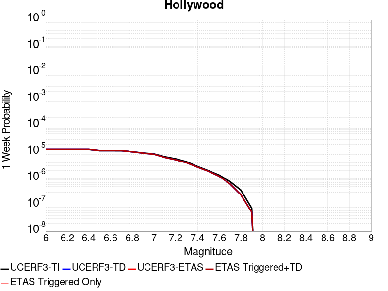 | 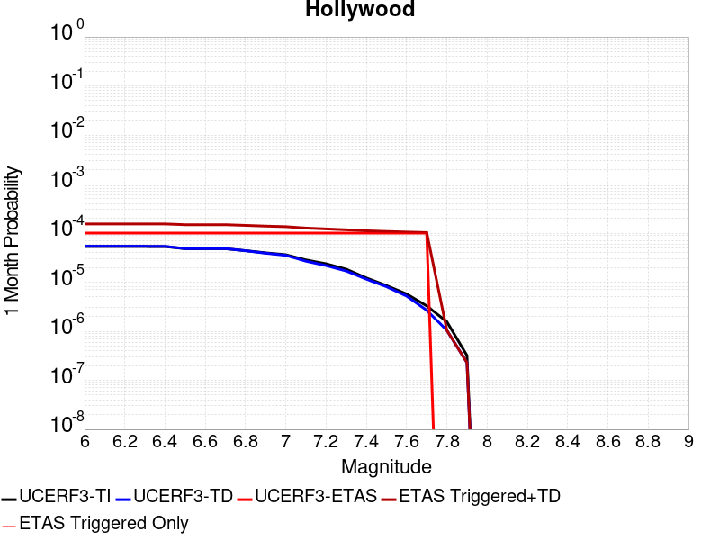 | 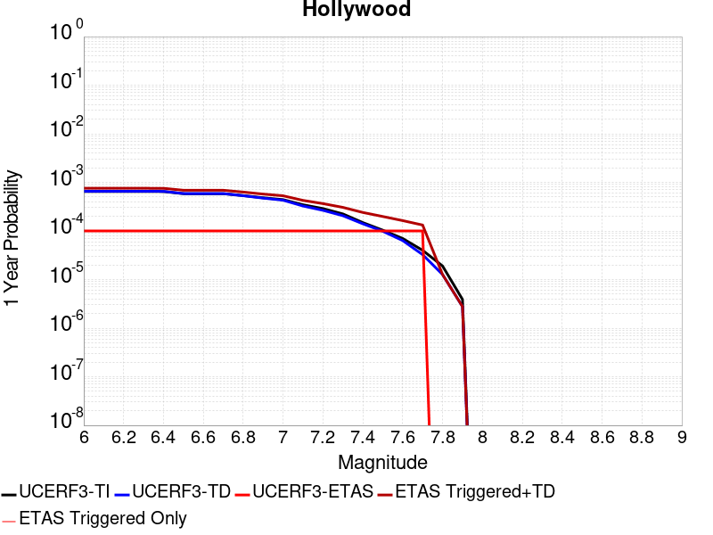 | 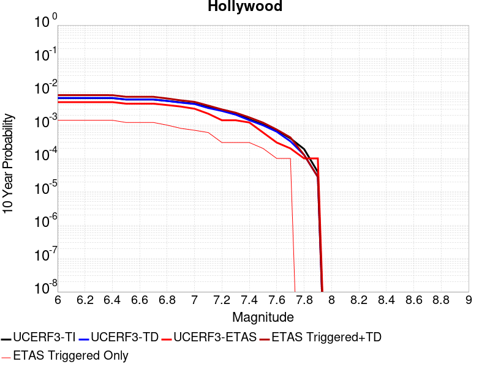 |

| Magnitude | 1 wk TI Prob | 1 wk TD Prob | 1 wk ETAS Prob | 1 wk ETAS/TD Gain | 1 wk ETAS Triggered+TD | 1 wk ETAS Triggered Only | 1 mo TI Prob | 1 mo TD Prob | 1 mo ETAS Prob | 1 mo ETAS/TD Gain | 1 mo ETAS Triggered+TD | 1 mo ETAS Triggered Only | 1 yr TI Prob | 1 yr TD Prob | 1 yr ETAS Prob | 1 yr ETAS/TD Gain | 1 yr ETAS Triggered+TD | 1 yr ETAS Triggered Only | 10 yr TI Prob | 10 yr TD Prob | 10 yr ETAS Prob | 10 yr ETAS/TD Gain | 10 yr ETAS Triggered+TD | 10 yr ETAS Triggered Only |
|-----|-----|-----|-----|-----|-----|-----|-----|-----|-----|-----|-----|-----|-----|-----|-----|-----|-----|-----|-----|-----|-----|-----|-----|-----|
| 6.0 | 1.24487615E-5 | 1.2580367E-5 | 0.0 | 0.0 | 1.2580367E-5 | 0.0 | 5.3350745E-5 | 5.391477E-5 | 1.0E-4 | 1.8547792 | 1.5390938E-4 | 1.0E-4 | 6.4935174E-4 | 6.5621926E-4 | 3.0E-4 | 0.45716426 | 7.5615366E-4 | 1.0E-4 | 0.0064745755 | 0.0065433024 | 0.0049 | 0.7488573 | 0.007934142 | 0.0014 |
| 6.1 | 1.24487615E-5 | 1.2580367E-5 | 0.0 | 0.0 | 1.2580367E-5 | 0.0 | 5.3350745E-5 | 5.391477E-5 | 1.0E-4 | 1.8547792 | 1.5390938E-4 | 1.0E-4 | 6.4935174E-4 | 6.5621926E-4 | 3.0E-4 | 0.45716426 | 7.5615366E-4 | 1.0E-4 | 0.0064745755 | 0.0065433024 | 0.0049 | 0.7488573 | 0.007934142 | 0.0014 |
| 6.2 | 1.24487615E-5 | 1.2580367E-5 | 0.0 | 0.0 | 1.2580367E-5 | 0.0 | 5.3350745E-5 | 5.391477E-5 | 1.0E-4 | 1.8547792 | 1.5390938E-4 | 1.0E-4 | 6.4935174E-4 | 6.5621926E-4 | 3.0E-4 | 0.45716426 | 7.5615366E-4 | 1.0E-4 | 0.0064745755 | 0.0065433024 | 0.0049 | 0.7488573 | 0.007934142 | 0.0014 |
| 6.3 | 1.24487615E-5 | 1.2580367E-5 | 0.0 | 0.0 | 1.2580367E-5 | 0.0 | 5.3350745E-5 | 5.391477E-5 | 1.0E-4 | 1.8547792 | 1.5390938E-4 | 1.0E-4 | 6.4935174E-4 | 6.5621926E-4 | 3.0E-4 | 0.45716426 | 7.5615366E-4 | 1.0E-4 | 0.0064745755 | 0.0065433024 | 0.0049 | 0.7488573 | 0.007934142 | 0.0014 |
| 6.4 | 1.2431024E-5 | 1.25609995E-5 | 0.0 | 0.0 | 1.25609995E-5 | 0.0 | 5.327473E-5 | 5.383177E-5 | 1.0E-4 | 1.8576391 | 1.5382639E-4 | 1.0E-4 | 6.4842677E-4 | 6.5520935E-4 | 3.0E-4 | 0.45786893 | 7.551438E-4 | 1.0E-4 | 0.0064653796 | 0.0065332623 | 0.0049 | 0.75000817 | 0.007924116 | 0.0014 |
| 6.5 | 1.1242222E-5 | 1.1305701E-5 | 0.0 | 0.0 | 1.1305701E-5 | 0.0 | 4.8180063E-5 | 4.8452122E-5 | 1.0E-4 | 2.063893 | 1.4844727E-4 | 1.0E-4 | 5.864344E-4 | 5.897476E-4 | 3.0E-4 | 0.5086922 | 6.896886E-4 | 1.0E-4 | 0.0058488925 | 0.0058821114 | 0.0044 | 0.7480307 | 0.0070750527 | 0.0012 |
| 6.6 | 1.1234066E-5 | 1.1296824E-5 | 0.0 | 0.0 | 1.1296824E-5 | 0.0 | 4.8145106E-5 | 4.8414076E-5 | 1.0E-4 | 2.065515 | 1.4840924E-4 | 1.0E-4 | 5.86009E-4 | 5.8928464E-4 | 3.0E-4 | 0.50909185 | 6.892257E-4 | 1.0E-4 | 0.005844661 | 0.0058775065 | 0.0044 | 0.7486168 | 0.0070704534 | 0.0012 |
| 6.7 | 1.12294E-5 | 1.1291574E-5 | 0.0 | 0.0 | 1.1291574E-5 | 0.0 | 4.812511E-5 | 4.839158E-5 | 1.0E-4 | 2.0664754 | 1.4838674E-4 | 1.0E-4 | 5.857657E-4 | 5.890109E-4 | 3.0E-4 | 0.5093285 | 6.88952E-4 | 1.0E-4 | 0.0058422405 | 0.0058747833 | 0.0044 | 0.74896383 | 0.0070677334 | 0.0012 |
| 6.8 | 1.0252819E-5 | 1.0207628E-5 | 0.0 | 0.0 | 1.0207628E-5 | 0.0 | 4.3939912E-5 | 4.3746255E-5 | 1.0E-4 | 2.28591 | 1.4374188E-4 | 1.0E-4 | 5.3483713E-4 | 5.3248263E-4 | 3.0E-4 | 0.56339866 | 6.324294E-4 | 1.0E-4 | 0.005335517 | 0.005312293 | 0.004 | 0.7529705 | 0.0063069807 | 0.001 |
| 6.9 | 9.252289E-6 | 9.100736E-6 | 0.0 | 0.0 | 9.100736E-6 | 0.0 | 3.9652066E-5 | 3.900258E-5 | 1.0E-4 | 2.563933 | 1.3899869E-4 | 1.0E-4 | 4.8265693E-4 | 4.747546E-4 | 3.0E-4 | 0.6319054 | 5.747071E-4 | 1.0E-4 | 0.0048161 | 0.004737577 | 0.0036 | 0.75988215 | 0.005533787 | 8.0E-4 |
| 7.0 | 8.474604E-6 | 8.24954E-6 | 0.0 | 0.0 | 8.24954E-6 | 0.0 | 3.6319227E-5 | 3.53547E-5 | 1.0E-4 | 2.8284783 | 1.3535116E-4 | 1.0E-4 | 4.4209688E-4 | 4.3035988E-4 | 3.0E-4 | 0.697091 | 5.3031684E-4 | 1.0E-4 | 0.004412184 | 0.004295415 | 0.0031 | 0.72169983 | 0.0049924077 | 7.0E-4 |
| 7.1 | 6.643643E-6 | 6.261603E-6 | 0.0 | 0.0 | 6.261603E-6 | 0.0 | 2.8472443E-5 | 2.6835169E-5 | 1.0E-4 | 3.726453 | 1.2683248E-4 | 1.0E-4 | 3.4659685E-4 | 3.2666963E-4 | 2.0E-4 | 0.61223936 | 4.2663695E-4 | 1.0E-4 | 0.0034605677 | 0.0032619403 | 0.0022 | 0.6744452 | 0.003859983 | 6.0E-4 |
| 7.2 | 5.549002E-6 | 5.1029665E-6 | 0.0 | 0.0 | 5.1029665E-6 | 0.0 | 2.378122E-5 | 2.1869675E-5 | 1.0E-4 | 4.5725417 | 1.2186749E-4 | 1.0E-4 | 2.8949787E-4 | 2.662309E-4 | 1.0E-4 | 0.3756138 | 3.6620427E-4 | 1.0E-4 | 0.0028912104 | 0.002659136 | 0.0014 | 0.5264868 | 0.0029583382 | 3.0E-4 |
| 7.3 | 4.3059727E-6 | 3.9550546E-6 | 0.0 | 0.0 | 3.9550546E-6 | 0.0 | 1.8454039E-5 | 1.6950125E-5 | 1.0E-4 | 5.8996615 | 1.1694843E-4 | 1.0E-4 | 2.2465475E-4 | 2.0634833E-4 | 1.0E-4 | 0.48461747 | 3.0632768E-4 | 1.0E-4 | 0.0022442779 | 0.0020615773 | 0.0014 | 0.6790917 | 0.0023609588 | 3.0E-4 |
| 7.4 | 2.8550733E-6 | 2.697661E-6 | 0.0 | 0.0 | 2.697661E-6 | 0.0 | 1.2235971E-5 | 1.1561354E-5 | 1.0E-4 | 8.649506 | 1.115602E-4 | 1.0E-4 | 1.4896276E-4 | 1.4075045E-4 | 1.0E-4 | 0.71047735 | 2.4073636E-4 | 1.0E-4 | 0.0014886294 | 0.001406618 | 0.0012 | 0.8531101 | 0.0017061961 | 3.0E-4 |
| 7.5 | 1.9927045E-6 | 1.8946924E-6 | 0.0 | 0.0 | 1.8946924E-6 | 0.0 | 8.540134E-6 | 8.120085E-6 | 1.0E-4 | 12.315142 | 1.08119275E-4 | 1.0E-4 | 1.0397117E-4 | 9.885759E-5 | 1.0E-4 | 1.0115561 | 1.988477E-4 | 1.0E-4 | 0.0010392254 | 9.881398E-4 | 6.0E-4 | 0.6072016 | 0.0011879421 | 2.0E-4 |
| 7.6 | 1.345084E-6 | 1.2194619E-6 | 0.0 | 0.0 | 1.2194619E-6 | 0.0 | 5.764633E-6 | 5.226255E-6 | 1.0E-4 | 19.134161 | 1.05225736E-4 | 1.0E-4 | 7.018215E-5 | 6.362781E-5 | 1.0E-4 | 1.5716398 | 1.6362146E-4 | 1.0E-4 | 7.0159987E-4 | 6.360979E-4 | 3.0E-4 | 0.47162548 | 7.360343E-4 | 1.0E-4 |
| 7.7 | 7.6835164E-7 | 6.260894E-7 | 0.0 | 0.0 | 6.260894E-7 | 0.0 | 3.2929315E-6 | 2.6832374E-6 | 1.0E-4 | 37.268414 | 1.0268297E-4 | 1.0E-4 | 4.00907E-5 | 3.266794E-5 | 1.0E-4 | 3.061105 | 1.3266467E-4 | 1.0E-4 | 4.0083472E-4 | 3.2663287E-4 | 2.0E-4 | 0.61230826 | 4.266002E-4 | 1.0E-4 |
| 7.8 | 3.6562128E-7 | 2.4391002E-7 | 0.0 | 0.0 | 2.4391002E-7 | 0.0 | 1.5669474E-6 | 1.0453283E-6 | 0.0 | 0.0 | 1.0453283E-6 | 0.0 | 1.9077417E-5 | 1.2726801E-5 | 0.0 | 0.0 | 1.2726801E-5 | 0.0 | 1.907578E-4 | 1.2726108E-4 | 1.0E-4 | 0.78578615 | 1.2726108E-4 | 0.0 |
| 7.9 | 7.5024424E-8 | 5.3576603E-8 | 0.0 | 0.0 | 5.3576603E-8 | 0.0 | 3.215332E-7 | 2.29614E-7 | 0.0 | 0.0 | 2.29614E-7 | 0.0 | 3.91466E-6 | 2.7955482E-6 | 0.0 | 0.0 | 2.7955482E-6 | 0.0 | 3.9145907E-5 | 2.7955259E-5 | 1.0E-4 | 3.5771446 | 2.7955259E-5 | 0.0 |

## Big Pine (East)
*[(top)](#table-of-contents)*

| 1 Week | 1 Month | 1 Year | 10 Year |
|-----|-----|-----|-----|
| 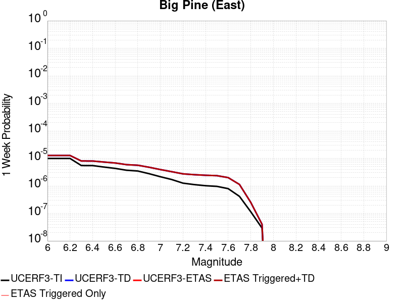 | 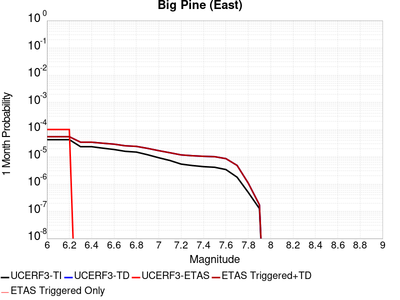 | 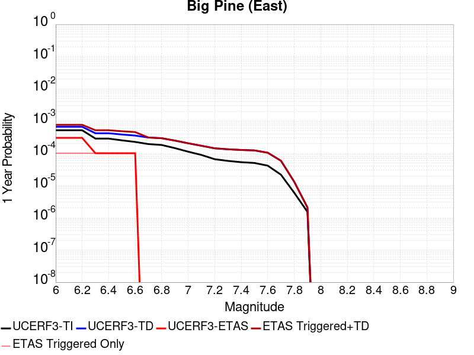 | 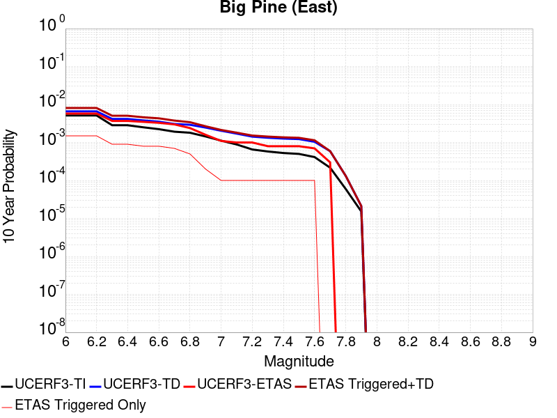 |

| Magnitude | 1 wk TI Prob | 1 wk TD Prob | 1 wk ETAS Prob | 1 wk ETAS/TD Gain | 1 wk ETAS Triggered+TD | 1 wk ETAS Triggered Only | 1 mo TI Prob | 1 mo TD Prob | 1 mo ETAS Prob | 1 mo ETAS/TD Gain | 1 mo ETAS Triggered+TD | 1 mo ETAS Triggered Only | 1 yr TI Prob | 1 yr TD Prob | 1 yr ETAS Prob | 1 yr ETAS/TD Gain | 1 yr ETAS Triggered+TD | 1 yr ETAS Triggered Only | 10 yr TI Prob | 10 yr TD Prob | 10 yr ETAS Prob | 10 yr ETAS/TD Gain | 10 yr ETAS Triggered+TD | 10 yr ETAS Triggered Only |
|-----|-----|-----|-----|-----|-----|-----|-----|-----|-----|-----|-----|-----|-----|-----|-----|-----|-----|-----|-----|-----|-----|-----|-----|-----|
| 6.0 | 9.916913E-6 | 1.2718843E-5 | 0.0 | 0.0 | 1.2718843E-5 | 0.0 | 4.250036E-5 | 5.4508313E-5 | 1.0E-4 | 1.8345826 | 5.4508313E-5 | 0.0 | 5.173191E-4 | 6.6345866E-4 | 3.0E-4 | 0.4521759 | 7.633923E-4 | 1.0E-4 | 0.0051611643 | 0.006620378 | 0.0058 | 0.87608296 | 0.008110447 | 0.0015 |
| 6.1 | 9.916913E-6 | 1.2718843E-5 | 0.0 | 0.0 | 1.2718843E-5 | 0.0 | 4.250036E-5 | 5.4508313E-5 | 1.0E-4 | 1.8345826 | 5.4508313E-5 | 0.0 | 5.173191E-4 | 6.6345866E-4 | 3.0E-4 | 0.4521759 | 7.633923E-4 | 1.0E-4 | 0.0051611643 | 0.006620378 | 0.0058 | 0.87608296 | 0.008110447 | 0.0015 |
| 6.2 | 9.916913E-6 | 1.2718843E-5 | 0.0 | 0.0 | 1.2718843E-5 | 0.0 | 4.250036E-5 | 5.4508313E-5 | 1.0E-4 | 1.8345826 | 5.4508313E-5 | 0.0 | 5.173191E-4 | 6.6345866E-4 | 3.0E-4 | 0.4521759 | 7.633923E-4 | 1.0E-4 | 0.0051611643 | 0.006620378 | 0.0058 | 0.87608296 | 0.008110447 | 0.0015 |
| 6.3 | 5.479711E-6 | 8.017763E-6 | 0.0 | 0.0 | 8.017763E-6 | 0.0 | 2.3484265E-5 | 3.436141E-5 | 0.0 | 0.0 | 3.436141E-5 | 0.0 | 2.858834E-4 | 4.1827298E-4 | 1.0E-4 | 0.23907831 | 5.182311E-4 | 1.0E-4 | 0.0028551589 | 0.0041785943 | 0.0037 | 0.8854652 | 0.005074834 | 9.0E-4 |
| 6.4 | 5.465009E-6 | 8.002068E-6 | 0.0 | 0.0 | 8.002068E-6 | 0.0 | 2.3421257E-5 | 3.4294142E-5 | 0.0 | 0.0 | 3.4294142E-5 | 0.0 | 2.851165E-4 | 4.1745434E-4 | 1.0E-4 | 0.23954715 | 5.174126E-4 | 1.0E-4 | 0.0028475097 | 0.004170439 | 0.0037 | 0.8871968 | 0.005066686 | 9.0E-4 |
| 6.5 | 4.826767E-6 | 7.327529E-6 | 0.0 | 0.0 | 7.327529E-6 | 0.0 | 2.068598E-5 | 3.1403335E-5 | 0.0 | 0.0 | 3.1403335E-5 | 0.0 | 2.518227E-4 | 3.8227125E-4 | 1.0E-4 | 0.26159436 | 4.82233E-4 | 1.0E-4 | 0.0025153751 | 0.0038198328 | 0.0035 | 0.9162705 | 0.004616777 | 8.0E-4 |
| 6.6 | 4.3146847E-6 | 6.787773E-6 | 0.0 | 0.0 | 6.787773E-6 | 0.0 | 1.8491375E-5 | 2.9090146E-5 | 0.0 | 0.0 | 2.9090146E-5 | 0.0 | 2.2510924E-4 | 3.5411736E-4 | 1.0E-4 | 0.28239223 | 4.5408195E-4 | 1.0E-4 | 0.0022488134 | 0.0035391948 | 0.0033 | 0.9324154 | 0.0043363636 | 8.0E-4 |
| 6.7 | 3.6968106E-6 | 5.9065883E-6 | 0.0 | 0.0 | 5.9065883E-6 | 0.0 | 1.5843378E-5 | 2.5313713E-5 | 0.0 | 0.0 | 2.5313713E-5 | 0.0 | 1.9287605E-4 | 3.0815238E-4 | 0.0 | 0.0 | 3.0815238E-4 | 0.0 | 0.0019270873 | 0.003080826 | 0.003 | 0.97376484 | 0.0037786695 | 7.0E-4 |
| 6.8 | 3.4671132E-6 | 5.6156905E-6 | 0.0 | 0.0 | 5.6156905E-6 | 0.0 | 1.4858972E-5 | 2.406703E-5 | 0.0 | 0.0 | 2.406703E-5 | 0.0 | 1.8089297E-4 | 2.929781E-4 | 0.0 | 0.0 | 2.929781E-4 | 0.0 | 0.0018074579 | 0.0029294856 | 0.0024 | 0.8192565 | 0.0034280207 | 5.0E-4 |
| 6.9 | 2.7686972E-6 | 4.745358E-6 | 0.0 | 0.0 | 4.745358E-6 | 0.0 | 1.1865792E-5 | 2.0337095E-5 | 0.0 | 0.0 | 2.0337095E-5 | 0.0 | 1.4445644E-4 | 2.475767E-4 | 0.0 | 0.0 | 2.475767E-4 | 0.0 | 0.0014436257 | 0.0024765097 | 0.0016 | 0.6460706 | 0.0026760143 | 2.0E-4 |
| 7.0 | 2.1472624E-6 | 3.912486E-6 | 0.0 | 0.0 | 3.912486E-6 | 0.0 | 9.20252E-6 | 1.6767692E-5 | 0.0 | 0.0 | 1.6767692E-5 | 0.0 | 1.12034926E-4 | 2.0412805E-4 | 0.0 | 0.0 | 2.0412805E-4 | 0.0 | 0.0011197845 | 0.002042854 | 0.0011 | 0.53846234 | 0.0021426498 | 1.0E-4 |
| 7.1 | 1.7018335E-6 | 3.278815E-6 | 0.0 | 0.0 | 3.278815E-6 | 0.0 | 7.293552E-6 | 1.4051991E-5 | 0.0 | 0.0 | 1.4051991E-5 | 0.0 | 8.879537E-5 | 1.710699E-4 | 0.0 | 0.0 | 1.710699E-4 | 0.0 | 8.87599E-4 | 0.0017127895 | 0.001 | 0.58384293 | 0.0018126182 | 1.0E-4 |
| 7.2 | 1.25603E-6 | 2.732077E-6 | 0.0 | 0.0 | 2.732077E-6 | 0.0 | 5.3829745E-6 | 1.170885E-5 | 0.0 | 0.0 | 1.170885E-5 | 0.0 | 6.553574E-5 | 1.4254615E-4 | 0.0 | 0.0 | 1.4254615E-4 | 0.0 | 6.551642E-4 | 0.0014279347 | 0.001 | 0.70031214 | 0.0015277918 | 1.0E-4 |
| 7.3 | 1.112297E-6 | 2.5513907E-6 | 0.0 | 0.0 | 2.5513907E-6 | 0.0 | 4.7669787E-6 | 1.0934487E-5 | 0.0 | 0.0 | 1.0934487E-5 | 0.0 | 5.803642E-5 | 1.3311945E-4 | 0.0 | 0.0 | 1.3311945E-4 | 0.0 | 5.802127E-4 | 0.0013336202 | 8.0E-4 | 0.599871 | 0.0014334868 | 1.0E-4 |
| 7.4 | 1.0137181E-6 | 2.4270673E-6 | 0.0 | 0.0 | 2.4270673E-6 | 0.0 | 4.3444993E-6 | 1.0401676E-5 | 0.0 | 0.0 | 1.0401676E-5 | 0.0 | 5.2892992E-5 | 1.2663325E-4 | 0.0 | 0.0 | 1.2663325E-4 | 0.0 | 5.288041E-4 | 0.0012685929 | 8.0E-4 | 0.63061994 | 0.0013684661 | 1.0E-4 |
| 7.5 | 9.598608E-7 | 2.3523978E-6 | 0.0 | 0.0 | 2.3523978E-6 | 0.0 | 4.1136827E-6 | 1.0081667E-5 | 0.0 | 0.0 | 1.0081667E-5 | 0.0 | 5.0082934E-5 | 1.2273759E-4 | 0.0 | 0.0 | 1.2273759E-4 | 0.0 | 5.007165E-4 | 0.001229482 | 8.0E-4 | 0.6506805 | 0.0013293591 | 1.0E-4 |
| 7.6 | 7.929459E-7 | 1.996511E-6 | 0.0 | 0.0 | 1.996511E-6 | 0.0 | 3.3983351E-6 | 8.556448E-6 | 0.0 | 0.0 | 8.556448E-6 | 0.0 | 4.1373947E-5 | 1.0416994E-4 | 0.0 | 0.0 | 1.0416994E-4 | 0.0 | 4.1366243E-4 | 0.001043943 | 7.0E-4 | 0.6705347 | 0.0011438386 | 1.0E-4 |
| 7.7 | 4.155788E-7 | 1.1263053E-6 | 0.0 | 0.0 | 1.1263053E-6 | 0.0 | 1.7810507E-6 | 4.827014E-6 | 0.0 | 0.0 | 4.827014E-6 | 0.0 | 2.1684076E-5 | 5.876735E-5 | 0.0 | 0.0 | 5.876735E-5 | 0.0 | 2.1681961E-4 | 5.91143E-4 | 3.0E-4 | 0.5074914 | 5.91143E-4 | 0.0 |
| 7.8 | 1.14666925E-7 | 2.5140702E-7 | 0.0 | 0.0 | 2.5140702E-7 | 0.0 | 4.914296E-7 | 1.0774583E-6 | 0.0 | 0.0 | 1.0774583E-6 | 0.0 | 5.9831386E-6 | 1.31179795E-5 | 0.0 | 0.0 | 1.31179795E-5 | 0.0 | 5.9829777E-5 | 1.3231969E-4 | 0.0 | 0.0 | 1.3231969E-4 | 0.0 |
| 7.9 | 2.9231824E-8 | 4.008272E-8 | 0.0 | 0.0 | 4.008272E-8 | 0.0 | 1.2527924E-7 | 1.7178307E-7 | 0.0 | 0.0 | 1.7178307E-7 | 0.0 | 1.5252737E-6 | 2.0914572E-6 | 0.0 | 0.0 | 2.0914572E-6 | 0.0 | 1.5252632E-5 | 2.1232552E-5 | 0.0 | 0.0 | 2.1232552E-5 | 0.0 |

## Earthquake Valley
*[(top)](#table-of-contents)*

| 1 Week | 1 Month | 1 Year | 10 Year |
|-----|-----|-----|-----|
| 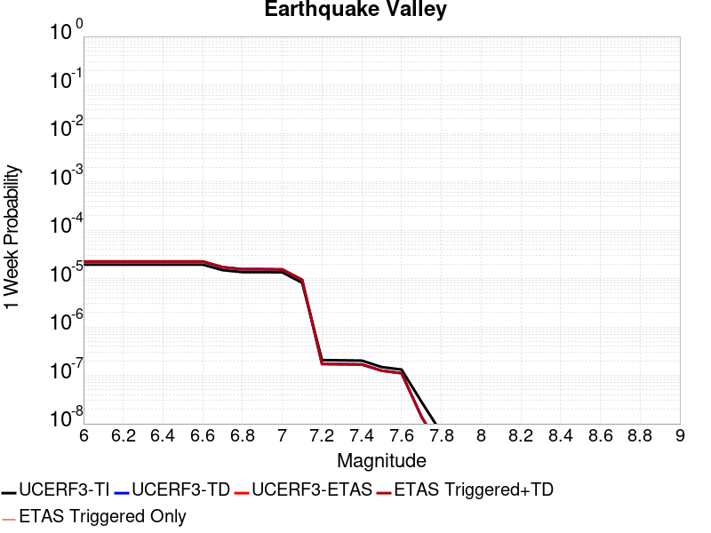 | 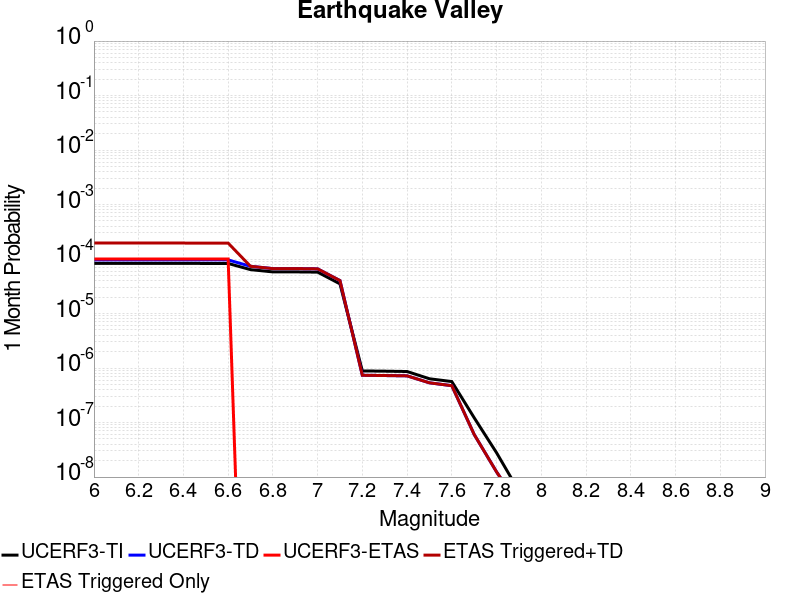 | 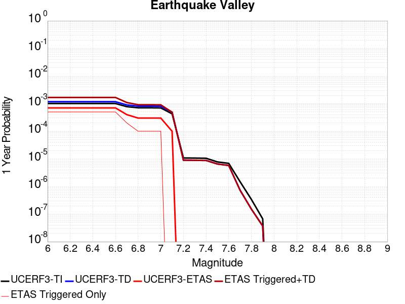 |  |

| Magnitude | 1 wk TI Prob | 1 wk TD Prob | 1 wk ETAS Prob | 1 wk ETAS/TD Gain | 1 wk ETAS Triggered+TD | 1 wk ETAS Triggered Only | 1 mo TI Prob | 1 mo TD Prob | 1 mo ETAS Prob | 1 mo ETAS/TD Gain | 1 mo ETAS Triggered+TD | 1 mo ETAS Triggered Only | 1 yr TI Prob | 1 yr TD Prob | 1 yr ETAS Prob | 1 yr ETAS/TD Gain | 1 yr ETAS Triggered+TD | 1 yr ETAS Triggered Only | 10 yr TI Prob | 10 yr TD Prob | 10 yr ETAS Prob | 10 yr ETAS/TD Gain | 10 yr ETAS Triggered+TD | 10 yr ETAS Triggered Only |
|-----|-----|-----|-----|-----|-----|-----|-----|-----|-----|-----|-----|-----|-----|-----|-----|-----|-----|-----|-----|-----|-----|-----|-----|-----|
| 6.0 | 1.9416384E-5 | 2.2544515E-5 | 0.0 | 0.0 | 2.2544515E-5 | 0.0 | 8.321042E-5 | 9.6616444E-5 | 1.0E-4 | 1.0350205 | 1.9660678E-4 | 1.0E-4 | 0.001012616 | 0.0011757897 | 7.0E-4 | 0.59534454 | 0.0016752019 | 5.0E-4 | 0.010080142 | 0.011707484 | 0.0069 | 0.5893666 | 0.013189922 | 0.0015 |
| 6.1 | 1.9416384E-5 | 2.2544515E-5 | 0.0 | 0.0 | 2.2544515E-5 | 0.0 | 8.321042E-5 | 9.6616444E-5 | 1.0E-4 | 1.0350205 | 1.9660678E-4 | 1.0E-4 | 0.001012616 | 0.0011757897 | 7.0E-4 | 0.59534454 | 0.0016752019 | 5.0E-4 | 0.010080142 | 0.011707484 | 0.0069 | 0.5893666 | 0.013189922 | 0.0015 |
| 6.2 | 1.9416384E-5 | 2.2544515E-5 | 0.0 | 0.0 | 2.2544515E-5 | 0.0 | 8.321042E-5 | 9.6616444E-5 | 1.0E-4 | 1.0350205 | 1.9660678E-4 | 1.0E-4 | 0.001012616 | 0.0011757897 | 7.0E-4 | 0.59534454 | 0.0016752019 | 5.0E-4 | 0.010080142 | 0.011707484 | 0.0069 | 0.5893666 | 0.013189922 | 0.0015 |
| 6.3 | 1.9416384E-5 | 2.2544515E-5 | 0.0 | 0.0 | 2.2544515E-5 | 0.0 | 8.321042E-5 | 9.6616444E-5 | 1.0E-4 | 1.0350205 | 1.9660678E-4 | 1.0E-4 | 0.001012616 | 0.0011757897 | 7.0E-4 | 0.59534454 | 0.0016752019 | 5.0E-4 | 0.010080142 | 0.011707484 | 0.0069 | 0.5893666 | 0.013189922 | 0.0015 |
| 6.4 | 1.9416384E-5 | 2.2544515E-5 | 0.0 | 0.0 | 2.2544515E-5 | 0.0 | 8.321042E-5 | 9.6616444E-5 | 1.0E-4 | 1.0350205 | 1.9660678E-4 | 1.0E-4 | 0.001012616 | 0.0011757897 | 7.0E-4 | 0.59534454 | 0.0016752019 | 5.0E-4 | 0.010080142 | 0.011707484 | 0.0069 | 0.5893666 | 0.013189922 | 0.0015 |
| 6.5 | 1.9389157E-5 | 2.2513153E-5 | 0.0 | 0.0 | 2.2513153E-5 | 0.0 | 8.309374E-5 | 9.648205E-5 | 1.0E-4 | 1.0364622 | 1.964724E-4 | 1.0E-4 | 0.0010111968 | 0.0011741553 | 7.0E-4 | 0.5961732 | 0.0016735683 | 5.0E-4 | 0.010066078 | 0.011691311 | 0.0069 | 0.5901819 | 0.013173774 | 0.0015 |
| 6.6 | 1.9389157E-5 | 2.2513153E-5 | 0.0 | 0.0 | 2.2513153E-5 | 0.0 | 8.309374E-5 | 9.648205E-5 | 1.0E-4 | 1.0364622 | 1.964724E-4 | 1.0E-4 | 0.0010111968 | 0.0011741553 | 7.0E-4 | 0.5961732 | 0.0016735683 | 5.0E-4 | 0.010066078 | 0.011691311 | 0.0069 | 0.5901819 | 0.013173774 | 0.0015 |
| 6.7 | 1.4925434E-5 | 1.717964E-5 | 0.0 | 0.0 | 1.717964E-5 | 0.0 | 6.396457E-5 | 7.362543E-5 | 0.0 | 0.0 | 7.362543E-5 | 0.0 | 7.7849044E-4 | 8.961057E-4 | 4.0E-4 | 0.4463759 | 0.0010959265 | 2.0E-4 | 0.007757689 | 0.008933271 | 0.0054 | 0.6044818 | 0.009924338 | 0.001 |
| 6.8 | 1.3570335E-5 | 1.559115E-5 | 0.0 | 0.0 | 1.559115E-5 | 0.0 | 5.8157282E-5 | 6.681796E-5 | 0.0 | 0.0 | 6.681796E-5 | 0.0 | 7.0783484E-4 | 8.1328687E-4 | 3.0E-4 | 0.36887354 | 9.132055E-4 | 1.0E-4 | 0.0070558446 | 0.008111149 | 0.0047 | 0.57944936 | 0.00890466 | 8.0E-4 |
| 6.9 | 1.3570335E-5 | 1.559115E-5 | 0.0 | 0.0 | 1.559115E-5 | 0.0 | 5.8157282E-5 | 6.681796E-5 | 0.0 | 0.0 | 6.681796E-5 | 0.0 | 7.0783484E-4 | 8.1328687E-4 | 3.0E-4 | 0.36887354 | 9.132055E-4 | 1.0E-4 | 0.0070558446 | 0.008111149 | 0.0047 | 0.57944936 | 0.00890466 | 8.0E-4 |
| 7.0 | 1.3433392E-5 | 1.5434925E-5 | 0.0 | 0.0 | 1.5434925E-5 | 0.0 | 5.757041E-5 | 6.614846E-5 | 0.0 | 0.0 | 6.614846E-5 | 0.0 | 7.0069433E-4 | 8.0514175E-4 | 3.0E-4 | 0.3726052 | 9.0506126E-4 | 1.0E-4 | 0.006984891 | 0.008030289 | 0.0047 | 0.5852841 | 0.008823864 | 8.0E-4 |
| 7.1 | 8.181609E-6 | 9.400889E-6 | 0.0 | 0.0 | 9.400889E-6 | 0.0 | 3.5063567E-5 | 4.028928E-5 | 0.0 | 0.0 | 4.028928E-5 | 0.0 | 4.268153E-4 | 4.904784E-4 | 1.0E-4 | 0.20388256 | 4.904784E-4 | 0.0 | 0.0042599645 | 0.0049005137 | 0.003 | 0.6121807 | 0.0054975734 | 6.0E-4 |
| 7.2 | 2.0663983E-7 | 1.7200274E-7 | 0.0 | 0.0 | 1.7200274E-7 | 0.0 | 8.855989E-7 | 7.371544E-7 | 0.0 | 0.0 | 7.371544E-7 | 0.0 | 1.0782113E-5 | 8.974822E-6 | 0.0 | 0.0 | 8.974822E-6 | 0.0 | 1.07815904E-4 | 8.974495E-5 | 0.0 | 0.0 | 8.974495E-5 | 0.0 |
| 7.3 | 2.0462376E-7 | 1.701601E-7 | 0.0 | 0.0 | 1.701601E-7 | 0.0 | 8.7695867E-7 | 7.292574E-7 | 0.0 | 0.0 | 7.292574E-7 | 0.0 | 1.0676919E-5 | 8.878676E-6 | 0.0 | 0.0 | 8.878676E-6 | 0.0 | 1.0676406E-4 | 8.878357E-5 | 0.0 | 0.0 | 8.878357E-5 | 0.0 |
| 7.4 | 2.0171088E-7 | 1.6799007E-7 | 0.0 | 0.0 | 1.6799007E-7 | 0.0 | 8.644749E-7 | 7.199572E-7 | 0.0 | 0.0 | 7.199572E-7 | 0.0 | 1.0524931E-5 | 8.765447E-6 | 0.0 | 0.0 | 8.765447E-6 | 0.0 | 1.05244326E-4 | 8.765137E-5 | 0.0 | 0.0 | 8.765137E-5 | 0.0 |
| 7.5 | 1.4847944E-7 | 1.2507505E-7 | 0.0 | 0.0 | 1.2507505E-7 | 0.0 | 6.363403E-7 | 5.360358E-7 | 0.0 | 0.0 | 5.360358E-7 | 0.0 | 7.747416E-6 | 6.526219E-6 | 0.0 | 0.0 | 6.526219E-6 | 0.0 | 7.747146E-5 | 6.526049E-5 | 0.0 | 0.0 | 6.526049E-5 | 0.0 |
| 7.6 | 1.3185847E-7 | 1.10822064E-7 | 0.0 | 0.0 | 1.10822064E-7 | 0.0 | 5.6510765E-7 | 4.7495163E-7 | 0.0 | 0.0 | 4.7495163E-7 | 0.0 | 6.8801637E-6 | 5.7825227E-6 | 0.0 | 0.0 | 5.7825227E-6 | 0.0 | 6.8799505E-5 | 5.7823934E-5 | 0.0 | 0.0 | 5.7823934E-5 | 0.0 |
| 7.7 | 2.8609954E-8 | 1.4104295E-8 | 0.0 | 0.0 | 1.4104295E-8 | 0.0 | 1.2261408E-7 | 6.044697E-8 | 0.0 | 0.0 | 6.044697E-8 | 0.0 | 1.4928254E-6 | 7.3594174E-7 | 0.0 | 0.0 | 7.3594174E-7 | 0.0 | 1.4928154E-5 | 7.3593983E-6 | 0.0 | 0.0 | 7.3593983E-6 | 0.0 |
| 7.8 | 6.527266E-9 | 2.906815E-9 | 0.0 | 0.0 | 2.906815E-9 | 0.0 | 2.7973995E-8 | 1.2457779E-8 | 0.0 | 0.0 | 1.2457779E-8 | 0.0 | 3.4058334E-7 | 1.5167345E-7 | 0.0 | 0.0 | 1.5167345E-7 | 0.0 | 3.4058282E-6 | 1.5167336E-6 | 0.0 | 0.0 | 1.5167336E-6 | 0.0 |
| 7.9 | 1.2898267E-9 | 7.108556E-10 | 0.0 | 0.0 | 7.108556E-10 | 0.0 | 5.527829E-9 | 3.046524E-9 | 0.0 | 0.0 | 3.046524E-9 | 0.0 | 6.7301315E-8 | 3.709143E-8 | 0.0 | 0.0 | 3.709143E-8 | 0.0 | 6.7301295E-7 | 3.7091428E-7 | 0.0 | 0.0 | 3.7091428E-7 | 0.0 |

## Helendale-So Lockhart
*[(top)](#table-of-contents)*

| 1 Week | 1 Month | 1 Year | 10 Year |
|-----|-----|-----|-----|
| 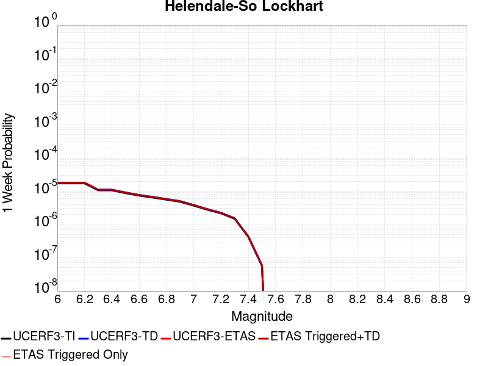 | 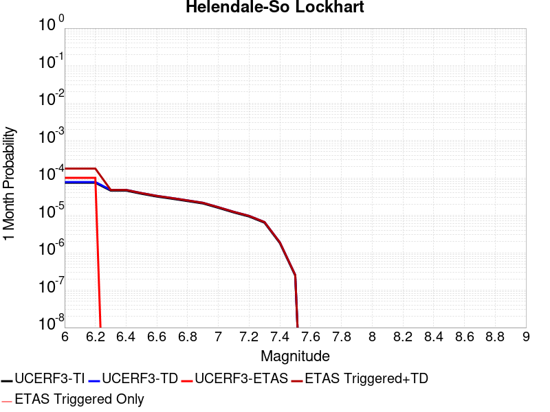 | 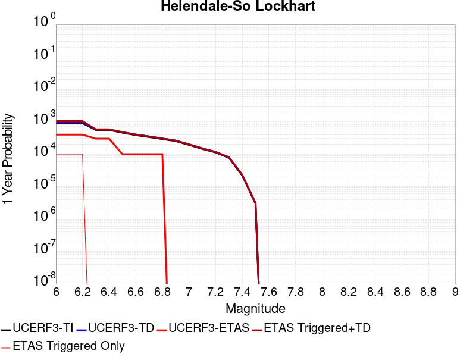 | 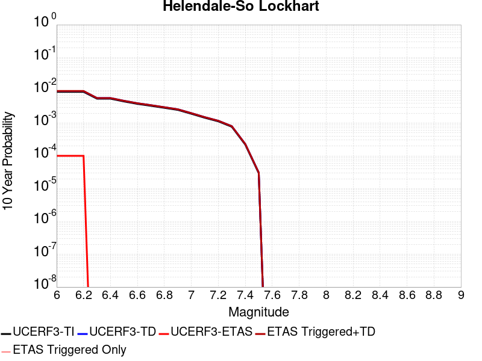 |

| Magnitude | 1 wk TI Prob | 1 wk TD Prob | 1 wk ETAS Prob | 1 wk ETAS/TD Gain | 1 wk ETAS Triggered+TD | 1 wk ETAS Triggered Only | 1 mo TI Prob | 1 mo TD Prob | 1 mo ETAS Prob | 1 mo ETAS/TD Gain | 1 mo ETAS Triggered+TD | 1 mo ETAS Triggered Only | 1 yr TI Prob | 1 yr TD Prob | 1 yr ETAS Prob | 1 yr ETAS/TD Gain | 1 yr ETAS Triggered+TD | 1 yr ETAS Triggered Only | 10 yr TI Prob | 10 yr TD Prob | 10 yr ETAS Prob | 10 yr ETAS/TD Gain | 10 yr ETAS Triggered+TD | 10 yr ETAS Triggered Only |
|-----|-----|-----|-----|-----|-----|-----|-----|-----|-----|-----|-----|-----|-----|-----|-----|-----|-----|-----|-----|-----|-----|-----|-----|-----|
| 6.0 | 1.7296055E-5 | 1.8094886E-5 | 0.0 | 0.0 | 1.8094886E-5 | 0.0 | 7.412385E-5 | 7.754733E-5 | 1.0E-4 | 1.289535 | 1.7753958E-4 | 1.0E-4 | 9.0208417E-4 | 9.437505E-4 | 4.0E-4 | 0.42384085 | 0.0010436561 | 1.0E-4 | 0.008984311 | 0.0093995435 | 0.0056 | 0.59577364 | 0.010885444 | 0.0015 |
| 6.1 | 1.7296055E-5 | 1.8094886E-5 | 0.0 | 0.0 | 1.8094886E-5 | 0.0 | 7.412385E-5 | 7.754733E-5 | 1.0E-4 | 1.289535 | 1.7753958E-4 | 1.0E-4 | 9.0208417E-4 | 9.437505E-4 | 4.0E-4 | 0.42384085 | 0.0010436561 | 1.0E-4 | 0.008984311 | 0.0093995435 | 0.0056 | 0.59577364 | 0.010885444 | 0.0015 |
| 6.2 | 1.7296055E-5 | 1.8094886E-5 | 0.0 | 0.0 | 1.8094886E-5 | 0.0 | 7.412385E-5 | 7.754733E-5 | 1.0E-4 | 1.289535 | 1.7753958E-4 | 1.0E-4 | 9.0208417E-4 | 9.437505E-4 | 4.0E-4 | 0.42384085 | 0.0010436561 | 1.0E-4 | 0.008984311 | 0.0093995435 | 0.0056 | 0.59577364 | 0.010885444 | 0.0015 |
| 6.3 | 1.0669118E-5 | 1.1130337E-5 | 0.0 | 0.0 | 1.1130337E-5 | 0.0 | 4.5723988E-5 | 4.770059E-5 | 0.0 | 0.0 | 4.770059E-5 | 0.0 | 5.5654737E-4 | 5.806027E-4 | 3.0E-4 | 0.51670444 | 5.806027E-4 | 0.0 | 0.0055515557 | 0.005791154 | 0.0036 | 0.62163776 | 0.0069842045 | 0.0012 |
| 6.4 | 1.0669118E-5 | 1.1130337E-5 | 0.0 | 0.0 | 1.1130337E-5 | 0.0 | 4.5723988E-5 | 4.770059E-5 | 0.0 | 0.0 | 4.770059E-5 | 0.0 | 5.5654737E-4 | 5.806027E-4 | 3.0E-4 | 0.51670444 | 5.806027E-4 | 0.0 | 0.0055515557 | 0.005791154 | 0.0036 | 0.62163776 | 0.0069842045 | 0.0012 |
| 6.5 | 8.790038E-6 | 9.166051E-6 | 0.0 | 0.0 | 9.166051E-6 | 0.0 | 3.767105E-5 | 3.9282495E-5 | 0.0 | 0.0 | 3.9282495E-5 | 0.0 | 4.585485E-4 | 4.7816095E-4 | 1.0E-4 | 0.20913461 | 4.7816095E-4 | 0.0 | 0.0045760344 | 0.0047714855 | 0.0029 | 0.6077772 | 0.005766714 | 0.001 |
| 6.6 | 7.396949E-6 | 7.712063E-6 | 0.0 | 0.0 | 7.712063E-6 | 0.0 | 3.1700827E-5 | 3.3051285E-5 | 0.0 | 0.0 | 3.3051285E-5 | 0.0 | 3.858892E-4 | 4.023261E-4 | 1.0E-4 | 0.24855457 | 4.023261E-4 | 0.0 | 0.003852198 | 0.0040160846 | 0.0026 | 0.64739674 | 0.00491247 | 9.0E-4 |
| 6.7 | 6.4600285E-6 | 6.7349997E-6 | 0.0 | 0.0 | 6.7349997E-6 | 0.0 | 2.7685543E-5 | 2.886397E-5 | 0.0 | 0.0 | 2.886397E-5 | 0.0 | 3.3701936E-4 | 3.5136295E-4 | 1.0E-4 | 0.28460598 | 3.5136295E-4 | 0.0 | 0.0033650869 | 0.0035081557 | 0.0023 | 0.65561515 | 0.004305349 | 8.0E-4 |
| 6.8 | 5.600104E-6 | 5.833441E-6 | 0.0 | 0.0 | 5.833441E-6 | 0.0 | 2.4000226E-5 | 2.5000225E-5 | 0.0 | 0.0 | 2.5000225E-5 | 0.0 | 2.9216358E-4 | 3.0433582E-4 | 1.0E-4 | 0.3285844 | 3.0433582E-4 | 0.0 | 0.0029177975 | 0.0030392518 | 0.002 | 0.6580567 | 0.0037371244 | 7.0E-4 |
| 6.9 | 4.839122E-6 | 5.0373296E-6 | 0.0 | 0.0 | 5.0373296E-6 | 0.0 | 2.0738931E-5 | 2.158838E-5 | 0.0 | 0.0 | 2.158838E-5 | 0.0 | 2.5246723E-4 | 2.6280727E-4 | 0.0 | 0.0 | 2.6280727E-4 | 0.0 | 0.002521806 | 0.0026250123 | 0.0014 | 0.5333308 | 0.0029242248 | 3.0E-4 |
| 7.0 | 3.6937633E-6 | 3.8435614E-6 | 0.0 | 0.0 | 3.8435614E-6 | 0.0 | 1.5830317E-5 | 1.6472304E-5 | 0.0 | 0.0 | 1.6472304E-5 | 0.0 | 1.9271708E-4 | 2.0053216E-4 | 0.0 | 0.0 | 2.0053216E-4 | 0.0 | 0.0019255003 | 0.0020035435 | 0.001 | 0.49911568 | 0.0023029426 | 3.0E-4 |
| 7.1 | 2.7858857E-6 | 2.8966379E-6 | 0.0 | 0.0 | 2.8966379E-6 | 0.0 | 1.1939455E-5 | 1.2414104E-5 | 0.0 | 0.0 | 1.2414104E-5 | 0.0 | 1.4535317E-4 | 1.5113145E-4 | 0.0 | 0.0 | 1.5113145E-4 | 0.0 | 0.0014525814 | 0.0015103082 | 8.0E-4 | 0.5296932 | 0.0017100062 | 2.0E-4 |
| 7.2 | 2.1672065E-6 | 2.2530703E-6 | 0.0 | 0.0 | 2.2530703E-6 | 0.0 | 9.2879945E-6 | 9.655981E-6 | 0.0 | 0.0 | 9.655981E-6 | 0.0 | 1.1307546E-4 | 1.17555406E-4 | 0.0 | 0.0 | 1.17555406E-4 | 0.0 | 0.0011301794 | 0.0011749504 | 5.0E-4 | 0.42554986 | 0.001274833 | 1.0E-4 |
| 7.3 | 1.4823496E-6 | 1.5415601E-6 | 0.0 | 0.0 | 1.5415601E-6 | 0.0 | 6.3529114E-6 | 6.6066705E-6 | 0.0 | 0.0 | 6.6066705E-6 | 0.0 | 7.734395E-5 | 8.04334E-5 | 0.0 | 0.0 | 8.04334E-5 | 0.0 | 7.731704E-4 | 8.040579E-4 | 5.0E-4 | 0.6218457 | 9.0397755E-4 | 1.0E-4 |
| 7.4 | 4.2321457E-7 | 4.4089322E-7 | 0.0 | 0.0 | 4.4089322E-7 | 0.0 | 1.8137755E-6 | 1.8895413E-6 | 0.0 | 0.0 | 1.8895413E-6 | 0.0 | 2.2082493E-5 | 2.3004968E-5 | 0.0 | 0.0 | 2.3004968E-5 | 0.0 | 2.2080299E-4 | 2.3003039E-4 | 3.0E-4 | 1.3041755 | 3.300074E-4 | 1.0E-4 |
| 7.5 | 5.6942316E-8 | 5.938871E-8 | 0.0 | 0.0 | 5.938871E-8 | 0.0 | 2.440385E-7 | 2.5452303E-7 | 0.0 | 0.0 | 2.5452303E-7 | 0.0 | 2.9711643E-6 | 3.0988142E-6 | 0.0 | 0.0 | 3.0988142E-6 | 0.0 | 2.9711247E-5 | 3.0987787E-5 | 0.0 | 0.0 | 3.0987787E-5 | 0.0 |

## Clayton
*[(top)](#table-of-contents)*

| 1 Week | 1 Month | 1 Year | 10 Year |
|-----|-----|-----|-----|
| 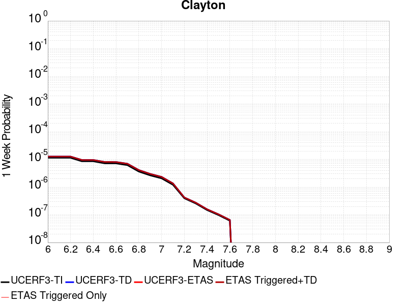 | 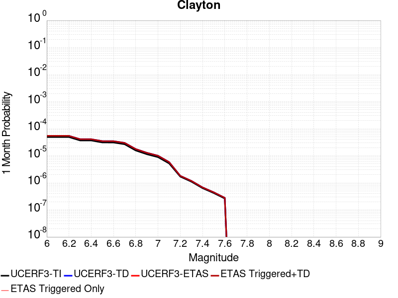 | 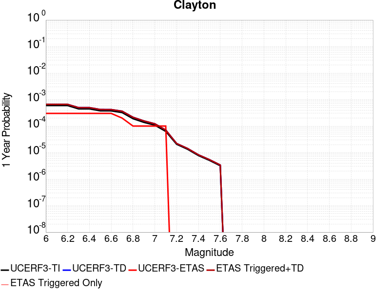 | 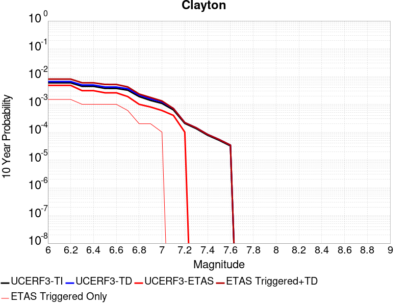 |

| Magnitude | 1 wk TI Prob | 1 wk TD Prob | 1 wk ETAS Prob | 1 wk ETAS/TD Gain | 1 wk ETAS Triggered+TD | 1 wk ETAS Triggered Only | 1 mo TI Prob | 1 mo TD Prob | 1 mo ETAS Prob | 1 mo ETAS/TD Gain | 1 mo ETAS Triggered+TD | 1 mo ETAS Triggered Only | 1 yr TI Prob | 1 yr TD Prob | 1 yr ETAS Prob | 1 yr ETAS/TD Gain | 1 yr ETAS Triggered+TD | 1 yr ETAS Triggered Only | 10 yr TI Prob | 10 yr TD Prob | 10 yr ETAS Prob | 10 yr ETAS/TD Gain | 10 yr ETAS Triggered+TD | 10 yr ETAS Triggered Only |
|-----|-----|-----|-----|-----|-----|-----|-----|-----|-----|-----|-----|-----|-----|-----|-----|-----|-----|-----|-----|-----|-----|-----|-----|-----|
| 6.0 | 1.1413061E-5 | 1.2652709E-5 | 0.0 | 0.0 | 1.2652709E-5 | 0.0 | 4.89122E-5 | 5.4224896E-5 | 0.0 | 0.0 | 5.4224896E-5 | 0.0 | 5.953433E-4 | 6.600103E-4 | 3.0E-4 | 0.45453835 | 6.600103E-4 | 0.0 | 0.005937509 | 0.0065826993 | 0.0048 | 0.72918415 | 0.008072825 | 0.0015 |
| 6.1 | 1.1413061E-5 | 1.2652709E-5 | 0.0 | 0.0 | 1.2652709E-5 | 0.0 | 4.89122E-5 | 5.4224896E-5 | 0.0 | 0.0 | 5.4224896E-5 | 0.0 | 5.953433E-4 | 6.600103E-4 | 3.0E-4 | 0.45453835 | 6.600103E-4 | 0.0 | 0.005937509 | 0.0065826993 | 0.0048 | 0.72918415 | 0.008072825 | 0.0015 |
| 6.2 | 1.1413061E-5 | 1.2652709E-5 | 0.0 | 0.0 | 1.2652709E-5 | 0.0 | 4.89122E-5 | 5.4224896E-5 | 0.0 | 0.0 | 5.4224896E-5 | 0.0 | 5.953433E-4 | 6.600103E-4 | 3.0E-4 | 0.45453835 | 6.600103E-4 | 0.0 | 0.005937509 | 0.0065826993 | 0.0048 | 0.72918415 | 0.008072825 | 0.0015 |
| 6.3 | 8.538689E-6 | 9.521361E-6 | 0.0 | 0.0 | 9.521361E-6 | 0.0 | 3.659387E-5 | 4.0805255E-5 | 0.0 | 0.0 | 4.0805255E-5 | 0.0 | 4.4543925E-4 | 4.9670145E-4 | 3.0E-4 | 0.60398453 | 4.9670145E-4 | 0.0 | 0.0044454746 | 0.004956976 | 0.0031 | 0.6253813 | 0.0059520192 | 0.001 |
| 6.4 | 8.538689E-6 | 9.521361E-6 | 0.0 | 0.0 | 9.521361E-6 | 0.0 | 3.659387E-5 | 4.0805255E-5 | 0.0 | 0.0 | 4.0805255E-5 | 0.0 | 4.4543925E-4 | 4.9670145E-4 | 3.0E-4 | 0.60398453 | 4.9670145E-4 | 0.0 | 0.0044454746 | 0.004956976 | 0.0031 | 0.6253813 | 0.0059520192 | 0.001 |
| 6.5 | 7.197462E-6 | 8.070808E-6 | 0.0 | 0.0 | 8.070808E-6 | 0.0 | 3.08459E-5 | 3.4588764E-5 | 0.0 | 0.0 | 3.4588764E-5 | 0.0 | 3.7548412E-4 | 4.2104503E-4 | 3.0E-4 | 0.71251285 | 4.2104503E-4 | 0.0 | 0.003748503 | 0.004203283 | 0.0026 | 0.61856407 | 0.00519908 | 0.001 |
| 6.6 | 7.1760483E-6 | 8.046854E-6 | 0.0 | 0.0 | 8.046854E-6 | 0.0 | 3.075413E-5 | 3.4486107E-5 | 0.0 | 0.0 | 3.4486107E-5 | 0.0 | 3.743672E-4 | 4.197957E-4 | 3.0E-4 | 0.71463335 | 4.197957E-4 | 0.0 | 0.0037373714 | 0.0041908366 | 0.0026 | 0.6204012 | 0.005186646 | 0.001 |
| 6.7 | 6.202582E-6 | 6.9678167E-6 | 0.0 | 0.0 | 6.9678167E-6 | 0.0 | 2.6582224E-5 | 2.9861772E-5 | 0.0 | 0.0 | 2.9861772E-5 | 0.0 | 3.235905E-4 | 3.635141E-4 | 2.0E-4 | 0.550185 | 3.635141E-4 | 0.0 | 0.0032311971 | 0.0036299485 | 0.0019 | 0.5234234 | 0.0042277705 | 6.0E-4 |
| 6.8 | 3.6417277E-6 | 4.115845E-6 | 0.0 | 0.0 | 4.115845E-6 | 0.0 | 1.5607311E-5 | 1.763922E-5 | 0.0 | 0.0 | 1.763922E-5 | 0.0 | 1.9000245E-4 | 2.1473711E-4 | 1.0E-4 | 0.4656857 | 2.1473711E-4 | 0.0 | 0.0018984007 | 0.0021453723 | 0.001 | 0.46611956 | 0.0023449431 | 2.0E-4 |
| 6.9 | 2.6498485E-6 | 2.9955984E-6 | 0.0 | 0.0 | 2.9955984E-6 | 0.0 | 1.1356444E-5 | 1.2838218E-5 | 0.0 | 0.0 | 1.2838218E-5 | 0.0 | 1.3825593E-4 | 1.562945E-4 | 1.0E-4 | 0.63981783 | 1.562945E-4 | 0.0 | 0.0013816995 | 0.0015618851 | 8.0E-4 | 0.51220155 | 0.0017615728 | 2.0E-4 |
| 7.0 | 2.070442E-6 | 2.3377002E-6 | 0.0 | 0.0 | 2.3377002E-6 | 0.0 | 8.873292E-6 | 1.0018678E-5 | 0.0 | 0.0 | 1.0018678E-5 | 0.0 | 1.0802698E-4 | 1.2197087E-4 | 1.0E-4 | 0.81986785 | 1.2197087E-4 | 0.0 | 0.0010797448 | 0.001219069 | 6.0E-4 | 0.49217886 | 0.0013189472 | 1.0E-4 |
| 7.1 | 1.2111691E-6 | 1.35727E-6 | 0.0 | 0.0 | 1.35727E-6 | 0.0 | 5.190714E-6 | 5.8168594E-6 | 0.0 | 0.0 | 5.8168594E-6 | 0.0 | 6.319511E-5 | 7.0818125E-5 | 1.0E-4 | 1.4120679 | 7.0818125E-5 | 0.0 | 6.3177146E-4 | 7.0797186E-4 | 4.0E-4 | 0.56499416 | 7.0797186E-4 | 0.0 |
| 7.2 | 3.9541607E-7 | 4.2207304E-7 | 0.0 | 0.0 | 4.2207304E-7 | 0.0 | 1.6946392E-6 | 1.8088832E-6 | 0.0 | 0.0 | 1.8088832E-6 | 0.0 | 2.0632036E-5 | 2.2022932E-5 | 0.0 | 0.0 | 2.2022932E-5 | 0.0 | 2.063012E-4 | 2.2020764E-4 | 1.0E-4 | 0.45411682 | 2.2020764E-4 | 0.0 |
| 7.3 | 2.5685637E-7 | 2.7442894E-7 | 0.0 | 0.0 | 2.7442894E-7 | 0.0 | 1.1008126E-6 | 1.1761234E-6 | 0.0 | 0.0 | 1.1761234E-6 | 0.0 | 1.3402311E-5 | 1.431921E-5 | 0.0 | 0.0 | 1.431921E-5 | 0.0 | 1.3401502E-4 | 1.4318294E-4 | 0.0 | 0.0 | 1.4318294E-4 | 0.0 |
| 7.4 | 1.482299E-7 | 1.5803452E-7 | 0.0 | 0.0 | 1.5803452E-7 | 0.0 | 6.3527085E-7 | 6.772906E-7 | 0.0 | 0.0 | 6.772906E-7 | 0.0 | 7.734395E-6 | 8.245982E-6 | 0.0 | 0.0 | 8.245982E-6 | 0.0 | 7.734126E-5 | 8.245679E-5 | 0.0 | 0.0 | 8.245679E-5 | 0.0 |
| 7.5 | 9.7969505E-8 | 1.0435528E-7 | 0.0 | 0.0 | 1.0435528E-7 | 0.0 | 4.1986925E-7 | 4.4723686E-7 | 0.0 | 0.0 | 4.4723686E-7 | 0.0 | 5.111896E-6 | 5.445095E-6 | 0.0 | 0.0 | 5.445095E-6 | 0.0 | 5.1117782E-5 | 5.4449636E-5 | 0.0 | 0.0 | 5.4449636E-5 | 0.0 |
| 7.6 | 6.125415E-8 | 6.521665E-8 | 0.0 | 0.0 | 6.521665E-8 | 0.0 | 2.6251774E-7 | 2.7949991E-7 | 0.0 | 0.0 | 2.7949991E-7 | 0.0 | 3.196149E-6 | 3.4029063E-6 | 0.0 | 0.0 | 3.4029063E-6 | 0.0 | 3.196103E-5 | 3.402855E-5 | 0.0 | 0.0 | 3.402855E-5 | 0.0 |

## Rinconada 2011 CFM
*[(top)](#table-of-contents)*

| 1 Week | 1 Month | 1 Year | 10 Year |
|-----|-----|-----|-----|
| 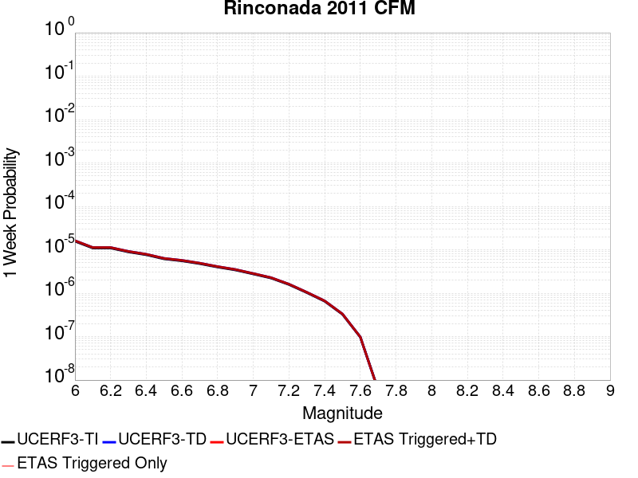 | 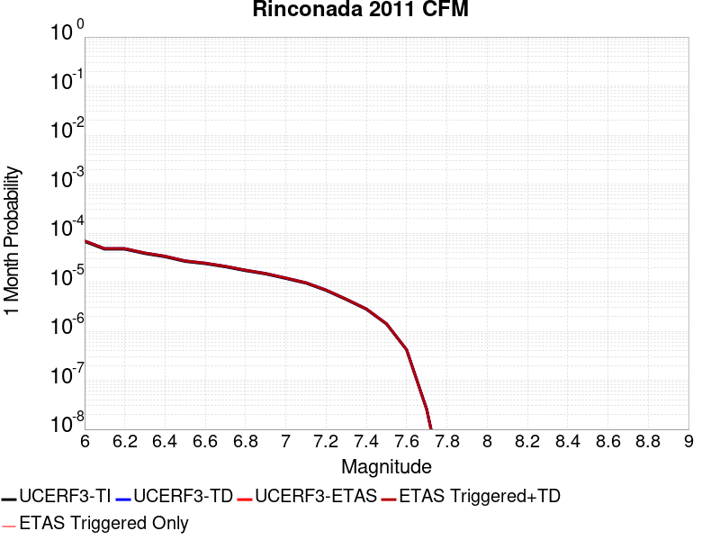 | 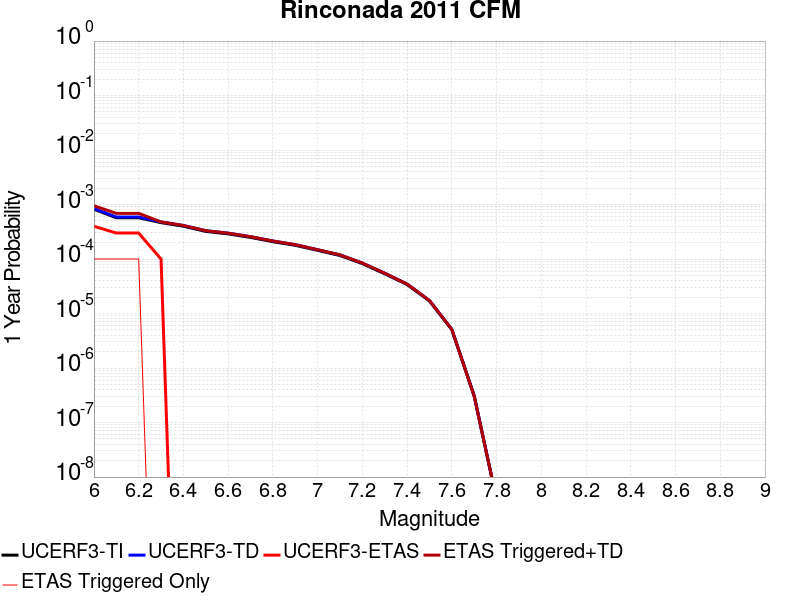 | 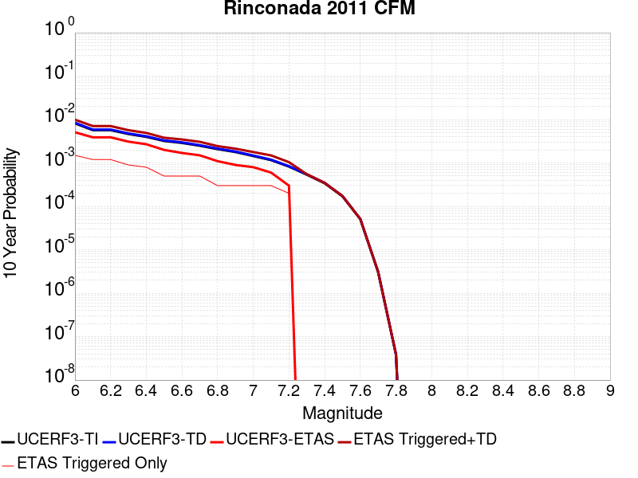 |

| Magnitude | 1 wk TI Prob | 1 wk TD Prob | 1 wk ETAS Prob | 1 wk ETAS/TD Gain | 1 wk ETAS Triggered+TD | 1 wk ETAS Triggered Only | 1 mo TI Prob | 1 mo TD Prob | 1 mo ETAS Prob | 1 mo ETAS/TD Gain | 1 mo ETAS Triggered+TD | 1 mo ETAS Triggered Only | 1 yr TI Prob | 1 yr TD Prob | 1 yr ETAS Prob | 1 yr ETAS/TD Gain | 1 yr ETAS Triggered+TD | 1 yr ETAS Triggered Only | 10 yr TI Prob | 10 yr TD Prob | 10 yr ETAS Prob | 10 yr ETAS/TD Gain | 10 yr ETAS Triggered+TD | 10 yr ETAS Triggered Only |
|-----|-----|-----|-----|-----|-----|-----|-----|-----|-----|-----|-----|-----|-----|-----|-----|-----|-----|-----|-----|-----|-----|-----|-----|-----|
| 6.0 | 1.5752368E-5 | 1.6269056E-5 | 0.0 | 0.0 | 1.6269056E-5 | 0.0 | 6.75084E-5 | 6.972268E-5 | 0.0 | 0.0 | 6.972268E-5 | 0.0 | 8.2160486E-4 | 8.4854616E-4 | 4.0E-4 | 0.4713945 | 9.484613E-4 | 1.0E-4 | 0.008185739 | 0.008453442 | 0.0051 | 0.60330456 | 0.009940761 | 0.0015 |
| 6.1 | 1.0966133E-5 | 1.1319156E-5 | 0.0 | 0.0 | 1.1319156E-5 | 0.0 | 4.6996865E-5 | 4.8509773E-5 | 0.0 | 0.0 | 4.8509773E-5 | 0.0 | 5.720366E-4 | 5.9044716E-4 | 3.0E-4 | 0.5080895 | 6.9038814E-4 | 1.0E-4 | 0.0057056635 | 0.00588888 | 0.0039 | 0.6622651 | 0.007081813 | 0.0012 |
| 6.2 | 1.0966133E-5 | 1.1319156E-5 | 0.0 | 0.0 | 1.1319156E-5 | 0.0 | 4.6996865E-5 | 4.8509773E-5 | 0.0 | 0.0 | 4.8509773E-5 | 0.0 | 5.720366E-4 | 5.9044716E-4 | 3.0E-4 | 0.5080895 | 6.9038814E-4 | 1.0E-4 | 0.0057056635 | 0.00588888 | 0.0039 | 0.6622651 | 0.007081813 | 0.0012 |
| 6.3 | 8.926149E-6 | 9.209658E-6 | 0.0 | 0.0 | 9.209658E-6 | 0.0 | 3.8254362E-5 | 3.9469367E-5 | 0.0 | 0.0 | 3.9469367E-5 | 0.0 | 4.6564735E-4 | 4.8043393E-4 | 1.0E-4 | 0.20814517 | 4.8043393E-4 | 0.0 | 0.0046467283 | 0.004793998 | 0.0031 | 0.64664197 | 0.005689683 | 9.0E-4 |
| 6.4 | 7.676955E-6 | 7.917546E-6 | 0.0 | 0.0 | 7.917546E-6 | 0.0 | 3.290082E-5 | 3.39319E-5 | 0.0 | 0.0 | 3.39319E-5 | 0.0 | 4.0049385E-4 | 4.1304276E-4 | 0.0 | 0.0 | 4.1304276E-4 | 0.0 | 0.0039977287 | 0.004122777 | 0.0027 | 0.6548984 | 0.0049194787 | 8.0E-4 |
| 6.5 | 6.1671026E-6 | 6.356865E-6 | 0.0 | 0.0 | 6.356865E-6 | 0.0 | 2.6430173E-5 | 2.7243423E-5 | 0.0 | 0.0 | 2.7243423E-5 | 0.0 | 3.2173982E-4 | 3.3163826E-4 | 0.0 | 0.0 | 3.3163826E-4 | 0.0 | 0.003212744 | 0.0033114457 | 0.002 | 0.6039658 | 0.00380979 | 5.0E-4 |
| 6.6 | 5.553456E-6 | 5.7229445E-6 | 0.0 | 0.0 | 5.7229445E-6 | 0.0 | 2.3800309E-5 | 2.4526675E-5 | 0.0 | 0.0 | 2.4526675E-5 | 0.0 | 2.897302E-4 | 2.985714E-4 | 0.0 | 0.0 | 2.985714E-4 | 0.0 | 0.0028935277 | 0.0029817112 | 0.0017 | 0.5701424 | 0.0034802204 | 5.0E-4 |
| 6.7 | 4.787857E-6 | 4.9317214E-6 | 0.0 | 0.0 | 4.9317214E-6 | 0.0 | 2.0519226E-5 | 2.1135776E-5 | 0.0 | 0.0 | 2.1135776E-5 | 0.0 | 2.4979294E-4 | 2.5729774E-4 | 0.0 | 0.0 | 2.5729774E-4 | 0.0 | 0.0024951235 | 0.0025700042 | 0.0015 | 0.58365667 | 0.003068719 | 5.0E-4 |
| 6.8 | 3.9955166E-6 | 4.1121857E-6 | 0.0 | 0.0 | 4.1121857E-6 | 0.0 | 1.7123532E-5 | 1.7623533E-5 | 0.0 | 0.0 | 1.7623533E-5 | 0.0 | 2.0845905E-4 | 2.1454542E-4 | 0.0 | 0.0 | 2.1454542E-4 | 0.0 | 0.002082636 | 0.0021433865 | 0.0011 | 0.51320654 | 0.0024427434 | 3.0E-4 |
| 6.9 | 3.4250072E-6 | 3.5213784E-6 | 0.0 | 0.0 | 3.5213784E-6 | 0.0 | 1.46785205E-5 | 1.5091535E-5 | 0.0 | 0.0 | 1.5091535E-5 | 0.0 | 1.7869633E-4 | 1.8372395E-4 | 0.0 | 0.0 | 1.8372395E-4 | 0.0 | 0.001785527 | 0.0018357232 | 9.0E-4 | 0.49027 | 0.0021351725 | 3.0E-4 |
| 7.0 | 2.7712713E-6 | 2.84587E-6 | 0.0 | 0.0 | 2.84587E-6 | 0.0 | 1.1876823E-5 | 1.21965295E-5 | 0.0 | 0.0 | 1.21965295E-5 | 0.0 | 1.4459073E-4 | 1.4848264E-4 | 0.0 | 0.0 | 1.4848264E-4 | 0.0 | 0.0014449668 | 0.0014838359 | 8.0E-4 | 0.5391432 | 0.0017833908 | 3.0E-4 |
| 7.1 | 2.227358E-6 | 2.2850531E-6 | 0.0 | 0.0 | 2.2850531E-6 | 0.0 | 9.545785E-6 | 9.793048E-6 | 0.0 | 0.0 | 9.793048E-6 | 0.0 | 1.16213734E-4 | 1.1922384E-4 | 0.0 | 0.0 | 1.1922384E-4 | 0.0 | 0.0011615298 | 0.0011915999 | 6.0E-4 | 0.5035247 | 0.0014912424 | 3.0E-4 |
| 7.2 | 1.581796E-6 | 1.6204632E-6 | 0.0 | 0.0 | 1.6204632E-6 | 0.0 | 6.779108E-6 | 6.944824E-6 | 0.0 | 0.0 | 6.944824E-6 | 0.0 | 8.253252E-5 | 8.454995E-5 | 0.0 | 0.0 | 8.454995E-5 | 0.0 | 8.250187E-4 | 8.4517844E-4 | 3.0E-4 | 0.35495463 | 0.0010450094 | 2.0E-4 |
| 7.3 | 1.0306567E-6 | 1.0543724E-6 | 0.0 | 0.0 | 1.0543724E-6 | 0.0 | 4.4170924E-6 | 4.518731E-6 | 0.0 | 0.0 | 4.518731E-6 | 0.0 | 5.3776774E-5 | 5.5014167E-5 | 0.0 | 0.0 | 5.5014167E-5 | 0.0 | 5.376376E-4 | 5.500057E-4 | 0.0 | 0.0 | 5.500057E-4 | 0.0 |
| 7.4 | 6.535541E-7 | 6.680983E-7 | 0.0 | 0.0 | 6.680983E-7 | 0.0 | 2.800943E-6 | 2.8632755E-6 | 0.0 | 0.0 | 2.8632755E-6 | 0.0 | 3.4100947E-5 | 3.4859822E-5 | 0.0 | 0.0 | 3.4859822E-5 | 0.0 | 3.4095717E-4 | 3.4854366E-4 | 0.0 | 0.0 | 3.4854366E-4 | 0.0 |
| 7.5 | 3.2656962E-7 | 3.3307805E-7 | 0.0 | 0.0 | 3.3307805E-7 | 0.0 | 1.3995833E-6 | 1.4274765E-6 | 0.0 | 0.0 | 1.4274765E-6 | 0.0 | 1.7039794E-5 | 1.7379389E-5 | 0.0 | 0.0 | 1.7379389E-5 | 0.0 | 1.7038487E-4 | 1.7378032E-4 | 0.0 | 0.0 | 1.7378032E-4 | 0.0 |
| 7.6 | 9.754343E-8 | 9.8184735E-8 | 0.0 | 0.0 | 9.8184735E-8 | 0.0 | 4.180432E-7 | 4.2079162E-7 | 0.0 | 0.0 | 4.2079162E-7 | 0.0 | 5.089664E-6 | 5.123126E-6 | 0.0 | 0.0 | 5.123126E-6 | 0.0 | 5.0895473E-5 | 5.123009E-5 | 0.0 | 0.0 | 5.123009E-5 | 0.0 |
| 7.7 | 6.0001453E-9 | 5.8470127E-9 | 0.0 | 0.0 | 5.8470127E-9 | 0.0 | 2.5714908E-8 | 2.5058625E-8 | 0.0 | 0.0 | 2.5058625E-8 | 0.0 | 3.1307894E-7 | 3.0508872E-7 | 0.0 | 0.0 | 3.0508872E-7 | 0.0 | 3.1307852E-6 | 3.0508832E-6 | 0.0 | 0.0 | 3.0508832E-6 | 0.0 |
| 7.8 | 7.400003E-11 | 7.464762E-11 | 0.0 | 0.0 | 7.464762E-11 | 0.0 | 3.171432E-10 | 3.199182E-10 | 0.0 | 0.0 | 3.199182E-10 | 0.0 | 3.861218E-9 | 3.8950034E-9 | 0.0 | 0.0 | 3.8950034E-9 | 0.0 | 3.861218E-8 | 3.8950034E-8 | 0.0 | 0.0 | 3.8950034E-8 | 0.0 |

## Deep Springs
*[(top)](#table-of-contents)*

| 1 Week | 1 Month | 1 Year | 10 Year |
|-----|-----|-----|-----|
| 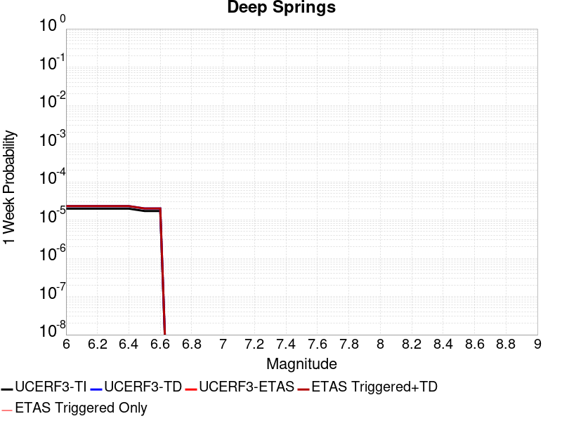 | 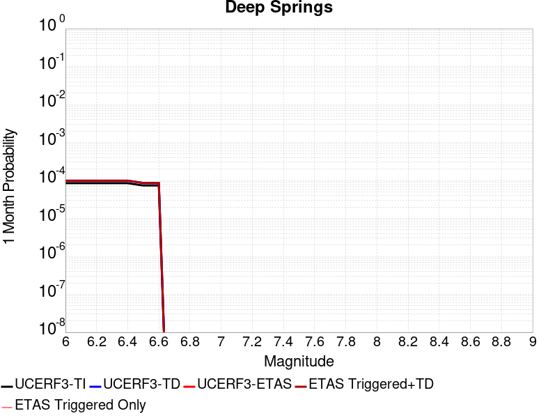 | 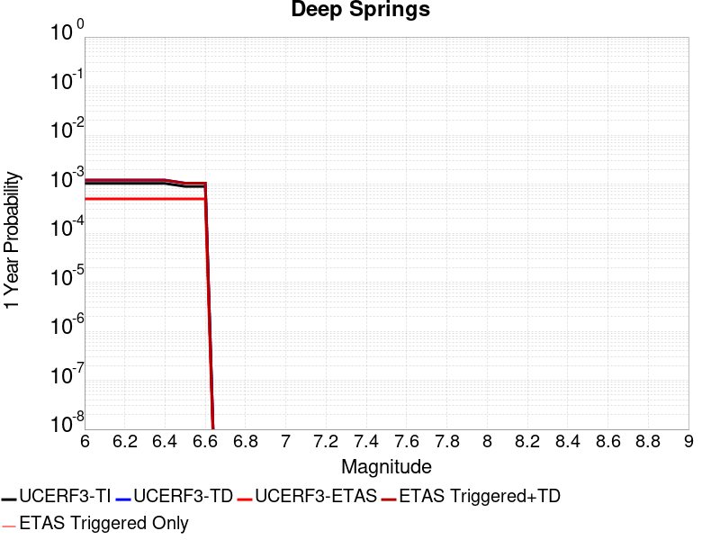 | 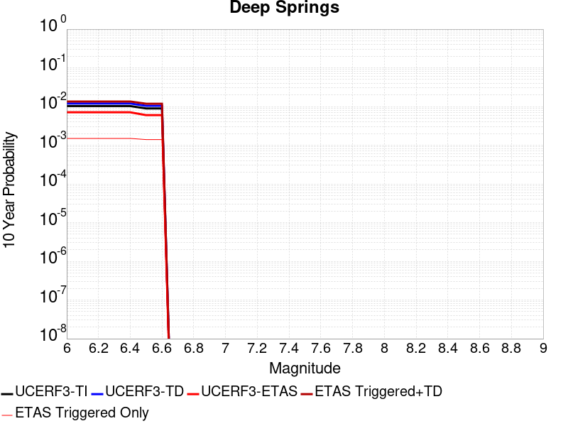 |

| Magnitude | 1 wk TI Prob | 1 wk TD Prob | 1 wk ETAS Prob | 1 wk ETAS/TD Gain | 1 wk ETAS Triggered+TD | 1 wk ETAS Triggered Only | 1 mo TI Prob | 1 mo TD Prob | 1 mo ETAS Prob | 1 mo ETAS/TD Gain | 1 mo ETAS Triggered+TD | 1 mo ETAS Triggered Only | 1 yr TI Prob | 1 yr TD Prob | 1 yr ETAS Prob | 1 yr ETAS/TD Gain | 1 yr ETAS Triggered+TD | 1 yr ETAS Triggered Only | 10 yr TI Prob | 10 yr TD Prob | 10 yr ETAS Prob | 10 yr ETAS/TD Gain | 10 yr ETAS Triggered+TD | 10 yr ETAS Triggered Only |
|-----|-----|-----|-----|-----|-----|-----|-----|-----|-----|-----|-----|-----|-----|-----|-----|-----|-----|-----|-----|-----|-----|-----|-----|-----|
| 6.0 | 1.9810619E-5 | 2.3072382E-5 | 0.0 | 0.0 | 2.3072382E-5 | 0.0 | 8.489989E-5 | 9.8880744E-5 | 0.0 | 0.0 | 9.8880744E-5 | 0.0 | 0.001033166 | 0.0012037142 | 5.0E-4 | 0.415381 | 0.0012037142 | 0.0 | 0.010283757 | 0.012021552 | 0.0071 | 0.5906059 | 0.01350352 | 0.0015 |
| 6.1 | 1.9810619E-5 | 2.3072382E-5 | 0.0 | 0.0 | 2.3072382E-5 | 0.0 | 8.489989E-5 | 9.8880744E-5 | 0.0 | 0.0 | 9.8880744E-5 | 0.0 | 0.001033166 | 0.0012037142 | 5.0E-4 | 0.415381 | 0.0012037142 | 0.0 | 0.010283757 | 0.012021552 | 0.0071 | 0.5906059 | 0.01350352 | 0.0015 |
| 6.2 | 1.9810619E-5 | 2.3072382E-5 | 0.0 | 0.0 | 2.3072382E-5 | 0.0 | 8.489989E-5 | 9.8880744E-5 | 0.0 | 0.0 | 9.8880744E-5 | 0.0 | 0.001033166 | 0.0012037142 | 5.0E-4 | 0.415381 | 0.0012037142 | 0.0 | 0.010283757 | 0.012021552 | 0.0071 | 0.5906059 | 0.01350352 | 0.0015 |
| 6.3 | 1.9810619E-5 | 2.3072382E-5 | 0.0 | 0.0 | 2.3072382E-5 | 0.0 | 8.489989E-5 | 9.8880744E-5 | 0.0 | 0.0 | 9.8880744E-5 | 0.0 | 0.001033166 | 0.0012037142 | 5.0E-4 | 0.415381 | 0.0012037142 | 0.0 | 0.010283757 | 0.012021552 | 0.0071 | 0.5906059 | 0.01350352 | 0.0015 |
| 6.4 | 1.9810619E-5 | 2.3072382E-5 | 0.0 | 0.0 | 2.3072382E-5 | 0.0 | 8.489989E-5 | 9.8880744E-5 | 0.0 | 0.0 | 9.8880744E-5 | 0.0 | 0.001033166 | 0.0012037142 | 5.0E-4 | 0.415381 | 0.0012037142 | 0.0 | 0.010283757 | 0.012021552 | 0.0071 | 0.5906059 | 0.01350352 | 0.0015 |
| 6.5 | 1.7190405E-5 | 2.00158E-5 | 0.0 | 0.0 | 2.00158E-5 | 0.0 | 7.367108E-5 | 8.5782E-5 | 0.0 | 0.0 | 8.5782E-5 | 0.0 | 8.9657627E-4 | 0.0010443956 | 5.0E-4 | 0.4787458 | 0.0010443956 | 0.0 | 0.008929676 | 0.010443928 | 0.006 | 0.5744965 | 0.011829306 | 0.0014 |
| 6.6 | 1.7190405E-5 | 2.00158E-5 | 0.0 | 0.0 | 2.00158E-5 | 0.0 | 7.367108E-5 | 8.5782E-5 | 0.0 | 0.0 | 8.5782E-5 | 0.0 | 8.9657627E-4 | 0.0010443956 | 5.0E-4 | 0.4787458 | 0.0010443956 | 0.0 | 0.008929676 | 0.010443928 | 0.006 | 0.5744965 | 0.011829306 | 0.0014 |

## So Sierra Nevada
*[(top)](#table-of-contents)*

| 1 Week | 1 Month | 1 Year | 10 Year |
|-----|-----|-----|-----|
| 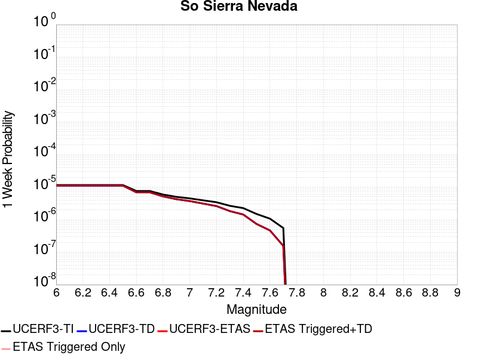 | 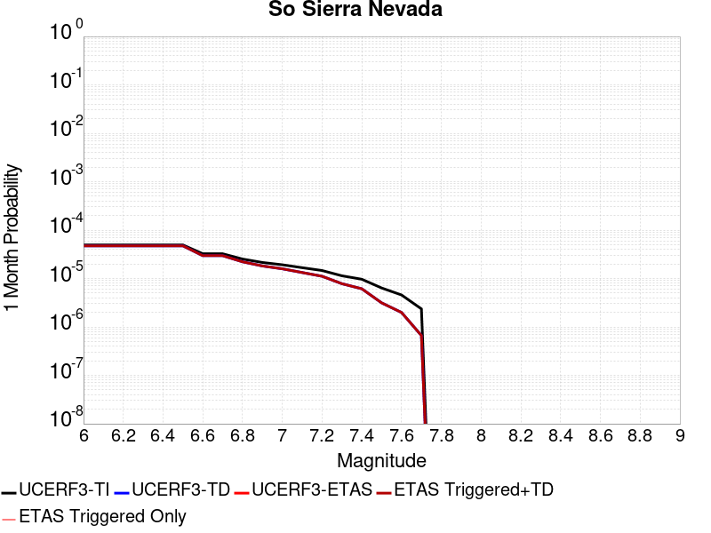 | 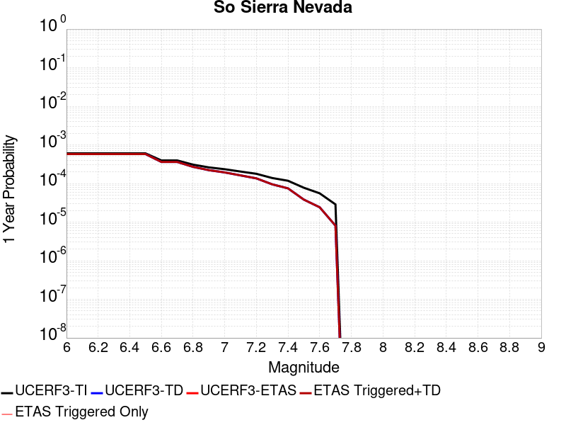 | 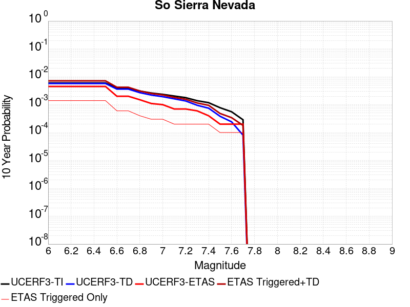 |

| Magnitude | 1 wk TI Prob | 1 wk TD Prob | 1 wk ETAS Prob | 1 wk ETAS/TD Gain | 1 wk ETAS Triggered+TD | 1 wk ETAS Triggered Only | 1 mo TI Prob | 1 mo TD Prob | 1 mo ETAS Prob | 1 mo ETAS/TD Gain | 1 mo ETAS Triggered+TD | 1 mo ETAS Triggered Only | 1 yr TI Prob | 1 yr TD Prob | 1 yr ETAS Prob | 1 yr ETAS/TD Gain | 1 yr ETAS Triggered+TD | 1 yr ETAS Triggered Only | 10 yr TI Prob | 10 yr TD Prob | 10 yr ETAS Prob | 10 yr ETAS/TD Gain | 10 yr ETAS Triggered+TD | 10 yr ETAS Triggered Only |
|-----|-----|-----|-----|-----|-----|-----|-----|-----|-----|-----|-----|-----|-----|-----|-----|-----|-----|-----|-----|-----|-----|-----|-----|-----|
| 6.0 | 1.15488665E-5 | 1.1073254E-5 | 0.0 | 0.0 | 1.1073254E-5 | 0.0 | 4.9494203E-5 | 4.7456015E-5 | 0.0 | 0.0 | 4.7456015E-5 | 0.0 | 6.024253E-4 | 5.776365E-4 | 3.0E-4 | 0.51935774 | 5.776365E-4 | 0.0 | 0.006007948 | 0.005762619 | 0.0045 | 0.78089494 | 0.0071545513 | 0.0014 |
| 6.1 | 1.15488665E-5 | 1.1073254E-5 | 0.0 | 0.0 | 1.1073254E-5 | 0.0 | 4.9494203E-5 | 4.7456015E-5 | 0.0 | 0.0 | 4.7456015E-5 | 0.0 | 6.024253E-4 | 5.776365E-4 | 3.0E-4 | 0.51935774 | 5.776365E-4 | 0.0 | 0.006007948 | 0.005762619 | 0.0045 | 0.78089494 | 0.0071545513 | 0.0014 |
| 6.2 | 1.15488665E-5 | 1.1073254E-5 | 0.0 | 0.0 | 1.1073254E-5 | 0.0 | 4.9494203E-5 | 4.7456015E-5 | 0.0 | 0.0 | 4.7456015E-5 | 0.0 | 6.024253E-4 | 5.776365E-4 | 3.0E-4 | 0.51935774 | 5.776365E-4 | 0.0 | 0.006007948 | 0.005762619 | 0.0045 | 0.78089494 | 0.0071545513 | 0.0014 |
| 6.3 | 1.15488665E-5 | 1.1073254E-5 | 0.0 | 0.0 | 1.1073254E-5 | 0.0 | 4.9494203E-5 | 4.7456015E-5 | 0.0 | 0.0 | 4.7456015E-5 | 0.0 | 6.024253E-4 | 5.776365E-4 | 3.0E-4 | 0.51935774 | 5.776365E-4 | 0.0 | 0.006007948 | 0.005762619 | 0.0045 | 0.78089494 | 0.0071545513 | 0.0014 |
| 6.4 | 1.15488665E-5 | 1.1073254E-5 | 0.0 | 0.0 | 1.1073254E-5 | 0.0 | 4.9494203E-5 | 4.7456015E-5 | 0.0 | 0.0 | 4.7456015E-5 | 0.0 | 6.024253E-4 | 5.776365E-4 | 3.0E-4 | 0.51935774 | 5.776365E-4 | 0.0 | 0.006007948 | 0.005762619 | 0.0045 | 0.78089494 | 0.0071545513 | 0.0014 |
| 6.5 | 1.15488665E-5 | 1.1073254E-5 | 0.0 | 0.0 | 1.1073254E-5 | 0.0 | 4.9494203E-5 | 4.7456015E-5 | 0.0 | 0.0 | 4.7456015E-5 | 0.0 | 6.024253E-4 | 5.776365E-4 | 3.0E-4 | 0.51935774 | 5.776365E-4 | 0.0 | 0.006007948 | 0.005762619 | 0.0045 | 0.78089494 | 0.0071545513 | 0.0014 |
| 6.6 | 7.587044E-6 | 6.9312414E-6 | 0.0 | 0.0 | 6.9312414E-6 | 0.0 | 3.2515498E-5 | 2.9705E-5 | 0.0 | 0.0 | 2.9705E-5 | 0.0 | 3.9580427E-4 | 3.6160127E-4 | 1.0E-4 | 0.2765477 | 3.6160127E-4 | 0.0 | 0.003951 | 0.0036104203 | 0.002 | 0.55395216 | 0.004208254 | 6.0E-4 |
| 6.7 | 7.587044E-6 | 6.9312414E-6 | 0.0 | 0.0 | 6.9312414E-6 | 0.0 | 3.2515498E-5 | 2.9705E-5 | 0.0 | 0.0 | 2.9705E-5 | 0.0 | 3.9580427E-4 | 3.6160127E-4 | 1.0E-4 | 0.2765477 | 3.6160127E-4 | 0.0 | 0.003951 | 0.0036104203 | 0.002 | 0.55395216 | 0.004208254 | 6.0E-4 |
| 6.8 | 5.9026956E-6 | 5.175783E-6 | 0.0 | 0.0 | 5.175783E-6 | 0.0 | 2.5297022E-5 | 2.2181744E-5 | 0.0 | 0.0 | 2.2181744E-5 | 0.0 | 3.0794772E-4 | 2.7003043E-4 | 0.0 | 0.0 | 2.7003043E-4 | 0.0 | 0.0030752132 | 0.0026971393 | 0.0015 | 0.5561448 | 0.0030960604 | 4.0E-4 |
| 6.9 | 5.0118915E-6 | 4.2492084E-6 | 0.0 | 0.0 | 4.2492084E-6 | 0.0 | 2.1479358E-5 | 1.821077E-5 | 0.0 | 0.0 | 1.821077E-5 | 0.0 | 2.614798E-4 | 2.216943E-4 | 0.0 | 0.0 | 2.216943E-4 | 0.0 | 0.0026117235 | 0.0022148038 | 0.0011 | 0.49665797 | 0.0025141395 | 3.0E-4 |
| 7.0 | 4.4924795E-6 | 3.7109107E-6 | 0.0 | 0.0 | 3.7109107E-6 | 0.0 | 1.925334E-5 | 1.590381E-5 | 0.0 | 0.0 | 1.590381E-5 | 0.0 | 2.3438422E-4 | 1.936123E-4 | 0.0 | 0.0 | 1.936123E-4 | 0.0 | 0.0023413717 | 0.0019344991 | 0.001 | 0.5169297 | 0.0022339188 | 3.0E-4 |
| 7.1 | 3.9118436E-6 | 3.1092204E-6 | 0.0 | 0.0 | 3.1092204E-6 | 0.0 | 1.6764936E-5 | 1.3325165E-5 | 0.0 | 0.0 | 1.3325165E-5 | 0.0 | 2.0409399E-4 | 1.6222238E-4 | 0.0 | 0.0 | 1.6222238E-4 | 0.0 | 0.0020390663 | 0.0016210956 | 7.0E-4 | 0.43180674 | 0.0018207714 | 2.0E-4 |
| 7.2 | 3.4200818E-6 | 2.6028977E-6 | 0.0 | 0.0 | 2.6028977E-6 | 0.0 | 1.4657411E-5 | 1.1155231E-5 | 0.0 | 0.0 | 1.1155231E-5 | 0.0 | 1.7843937E-4 | 1.3580699E-4 | 0.0 | 0.0 | 1.3580699E-4 | 0.0 | 0.0017829615 | 0.0013572895 | 7.0E-4 | 0.5157337 | 0.0015570181 | 2.0E-4 |
| 7.3 | 2.6593618E-6 | 1.8261675E-6 | 0.0 | 0.0 | 1.8261675E-6 | 0.0 | 1.13972155E-5 | 7.82641E-6 | 0.0 | 0.0 | 7.82641E-6 | 0.0 | 1.3875226E-4 | 9.5282674E-5 | 0.0 | 0.0 | 9.5282674E-5 | 0.0 | 0.0013866565 | 9.5244707E-4 | 6.0E-4 | 0.62995625 | 0.0011522566 | 2.0E-4 |
| 7.4 | 2.2577992E-6 | 1.4343696E-6 | 0.0 | 0.0 | 1.4343696E-6 | 0.0 | 9.676246E-6 | 6.1472847E-6 | 0.0 | 0.0 | 6.1472847E-6 | 0.0 | 1.1780193E-4 | 7.484088E-5 | 0.0 | 0.0 | 7.484088E-5 | 0.0 | 0.001177395 | 7.481818E-4 | 4.0E-4 | 0.53462946 | 9.4803213E-4 | 2.0E-4 |
| 7.5 | 1.489319E-6 | 7.337362E-7 | 0.0 | 0.0 | 7.337362E-7 | 0.0 | 6.3827797E-6 | 3.14458E-6 | 0.0 | 0.0 | 3.14458E-6 | 0.0 | 7.770758E-5 | 3.8284594E-5 | 0.0 | 0.0 | 3.8284594E-5 | 0.0 | 7.7680405E-4 | 3.8278042E-4 | 2.0E-4 | 0.52249277 | 4.8274212E-4 | 1.0E-4 |
| 7.6 | 1.0680322E-6 | 4.6470205E-7 | 0.0 | 0.0 | 4.6470205E-7 | 0.0 | 4.577273E-6 | 1.9915788E-6 | 0.0 | 0.0 | 1.9915788E-6 | 0.0 | 5.5726876E-5 | 2.4247203E-5 | 0.0 | 0.0 | 2.4247203E-5 | 0.0 | 5.5712904E-4 | 2.4244584E-4 | 2.0E-4 | 0.8249265 | 3.4242158E-4 | 1.0E-4 |
| 7.7 | 5.509146E-7 | 1.5509096E-7 | 0.0 | 0.0 | 1.5509096E-7 | 0.0 | 2.3610605E-6 | 6.646754E-7 | 0.0 | 0.0 | 6.646754E-7 | 0.0 | 2.8745531E-5 | 8.092394E-6 | 0.0 | 0.0 | 8.092394E-6 | 0.0 | 2.8741814E-4 | 8.0921105E-5 | 2.0E-4 | 2.471543 | 1.8091302E-4 | 1.0E-4 |

## Earthquake Valley (No  Extension)
*[(top)](#table-of-contents)*

| 1 Week | 1 Month | 1 Year | 10 Year |
|-----|-----|-----|-----|
| 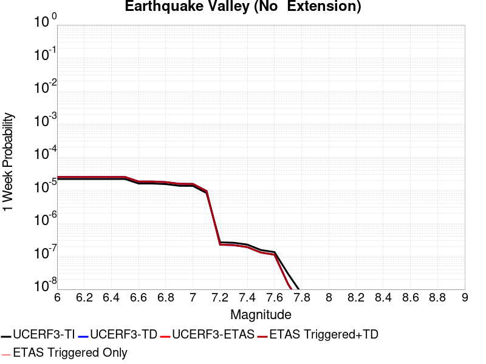 | 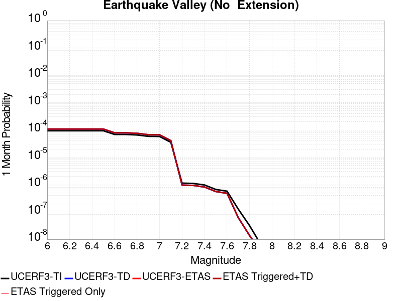 | 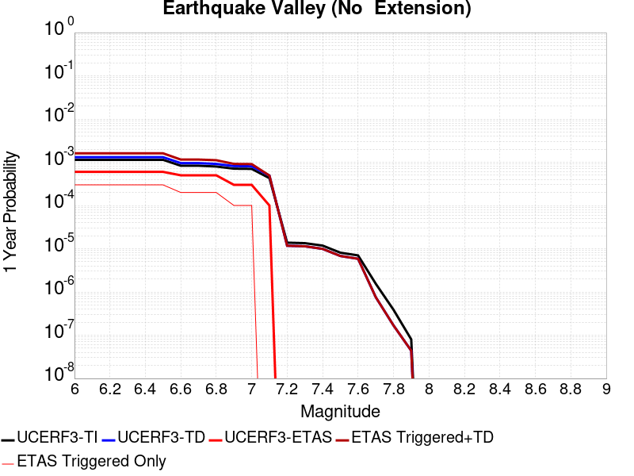 | 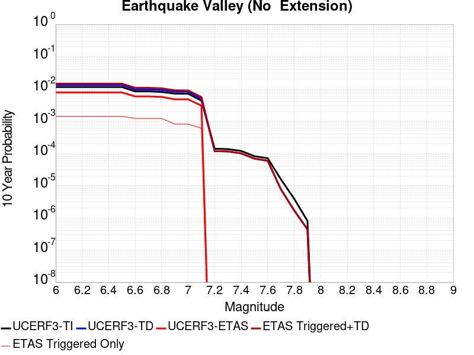 |

| Magnitude | 1 wk TI Prob | 1 wk TD Prob | 1 wk ETAS Prob | 1 wk ETAS/TD Gain | 1 wk ETAS Triggered+TD | 1 wk ETAS Triggered Only | 1 mo TI Prob | 1 mo TD Prob | 1 mo ETAS Prob | 1 mo ETAS/TD Gain | 1 mo ETAS Triggered+TD | 1 mo ETAS Triggered Only | 1 yr TI Prob | 1 yr TD Prob | 1 yr ETAS Prob | 1 yr ETAS/TD Gain | 1 yr ETAS Triggered+TD | 1 yr ETAS Triggered Only | 10 yr TI Prob | 10 yr TD Prob | 10 yr ETAS Prob | 10 yr ETAS/TD Gain | 10 yr ETAS Triggered+TD | 10 yr ETAS Triggered Only |
|-----|-----|-----|-----|-----|-----|-----|-----|-----|-----|-----|-----|-----|-----|-----|-----|-----|-----|-----|-----|-----|-----|-----|-----|-----|
| 6.0 | 2.1859703E-5 | 2.5156909E-5 | 0.0 | 0.0 | 2.5156909E-5 | 0.0 | 9.3681076E-5 | 1.07811684E-4 | 1.0E-4 | 0.9275432 | 1.07811684E-4 | 0.0 | 0.0011399703 | 0.0013119616 | 6.0E-4 | 0.4573305 | 0.0016115679 | 3.0E-4 | 0.011341401 | 0.013056477 | 0.0077 | 0.58974564 | 0.014438197 | 0.0014 |
| 6.1 | 2.1859703E-5 | 2.5156909E-5 | 0.0 | 0.0 | 2.5156909E-5 | 0.0 | 9.3681076E-5 | 1.07811684E-4 | 1.0E-4 | 0.9275432 | 1.07811684E-4 | 0.0 | 0.0011399703 | 0.0013119616 | 6.0E-4 | 0.4573305 | 0.0016115679 | 3.0E-4 | 0.011341401 | 0.013056477 | 0.0077 | 0.58974564 | 0.014438197 | 0.0014 |
| 6.2 | 2.1859703E-5 | 2.5156909E-5 | 0.0 | 0.0 | 2.5156909E-5 | 0.0 | 9.3681076E-5 | 1.07811684E-4 | 1.0E-4 | 0.9275432 | 1.07811684E-4 | 0.0 | 0.0011399703 | 0.0013119616 | 6.0E-4 | 0.4573305 | 0.0016115679 | 3.0E-4 | 0.011341401 | 0.013056477 | 0.0077 | 0.58974564 | 0.014438197 | 0.0014 |
| 6.3 | 2.1859703E-5 | 2.5156909E-5 | 0.0 | 0.0 | 2.5156909E-5 | 0.0 | 9.3681076E-5 | 1.07811684E-4 | 1.0E-4 | 0.9275432 | 1.07811684E-4 | 0.0 | 0.0011399703 | 0.0013119616 | 6.0E-4 | 0.4573305 | 0.0016115679 | 3.0E-4 | 0.011341401 | 0.013056477 | 0.0077 | 0.58974564 | 0.014438197 | 0.0014 |
| 6.4 | 2.1859703E-5 | 2.5156909E-5 | 0.0 | 0.0 | 2.5156909E-5 | 0.0 | 9.3681076E-5 | 1.07811684E-4 | 1.0E-4 | 0.9275432 | 1.07811684E-4 | 0.0 | 0.0011399703 | 0.0013119616 | 6.0E-4 | 0.4573305 | 0.0016115679 | 3.0E-4 | 0.011341401 | 0.013056477 | 0.0077 | 0.58974564 | 0.014438197 | 0.0014 |
| 6.5 | 2.1859703E-5 | 2.5156909E-5 | 0.0 | 0.0 | 2.5156909E-5 | 0.0 | 9.3681076E-5 | 1.07811684E-4 | 1.0E-4 | 0.9275432 | 1.07811684E-4 | 0.0 | 0.0011399703 | 0.0013119616 | 6.0E-4 | 0.4573305 | 0.0016115679 | 3.0E-4 | 0.011341401 | 0.013056477 | 0.0077 | 0.58974564 | 0.014438197 | 0.0014 |
| 6.6 | 1.597E-5 | 1.8326356E-5 | 0.0 | 0.0 | 1.8326356E-5 | 0.0 | 6.8441055E-5 | 7.8539655E-5 | 1.0E-4 | 1.2732421 | 7.8539655E-5 | 0.0 | 8.329513E-4 | 9.5588784E-4 | 5.0E-4 | 0.5230739 | 0.0011556967 | 2.0E-4 | 0.008298361 | 0.009526342 | 0.0058 | 0.6088381 | 0.010714911 | 0.0012 |
| 6.7 | 1.597E-5 | 1.8326356E-5 | 0.0 | 0.0 | 1.8326356E-5 | 0.0 | 6.8441055E-5 | 7.8539655E-5 | 1.0E-4 | 1.2732421 | 7.8539655E-5 | 0.0 | 8.329513E-4 | 9.5588784E-4 | 5.0E-4 | 0.5230739 | 0.0011556967 | 2.0E-4 | 0.008298361 | 0.009526342 | 0.0058 | 0.6088381 | 0.010714911 | 0.0012 |
| 6.8 | 1.5315149E-5 | 1.7573366E-5 | 0.0 | 0.0 | 1.7573366E-5 | 0.0 | 6.5634704E-5 | 7.531274E-5 | 1.0E-4 | 1.3277967 | 7.531274E-5 | 0.0 | 7.988095E-4 | 9.1663323E-4 | 5.0E-4 | 0.5454744 | 0.00111645 | 2.0E-4 | 0.007959441 | 0.009137036 | 0.0056 | 0.6128902 | 0.010326072 | 0.0012 |
| 6.9 | 1.3634728E-5 | 1.5650037E-5 | 0.0 | 0.0 | 1.5650037E-5 | 0.0 | 5.8433237E-5 | 6.707032E-5 | 0.0 | 0.0 | 6.707032E-5 | 0.0 | 7.1119244E-4 | 8.163571E-4 | 3.0E-4 | 0.36748624 | 9.162754E-4 | 1.0E-4 | 0.007089207 | 0.008141627 | 0.0047 | 0.5772802 | 0.008935113 | 8.0E-4 |
| 7.0 | 1.3496271E-5 | 1.5492302E-5 | 0.0 | 0.0 | 1.5492302E-5 | 0.0 | 5.783988E-5 | 6.639436E-5 | 0.0 | 0.0 | 6.639436E-5 | 0.0 | 7.03973E-4 | 8.081333E-4 | 3.0E-4 | 0.3712259 | 9.0805243E-4 | 1.0E-4 | 0.007017471 | 0.008059987 | 0.0047 | 0.5831275 | 0.008853539 | 8.0E-4 |
| 7.1 | 8.242798E-6 | 9.4565585E-6 | 0.0 | 0.0 | 9.4565585E-6 | 0.0 | 3.53258E-5 | 4.0527855E-5 | 0.0 | 0.0 | 4.0527855E-5 | 0.0 | 4.300067E-4 | 4.9338175E-4 | 1.0E-4 | 0.2026828 | 4.9338175E-4 | 0.0 | 0.004291756 | 0.0049294187 | 0.003 | 0.608591 | 0.005526461 | 6.0E-4 |
| 7.2 | 2.6506527E-7 | 2.2490862E-7 | 0.0 | 0.0 | 2.2490862E-7 | 0.0 | 1.1359936E-6 | 9.638937E-7 | 0.0 | 0.0 | 9.638937E-7 | 0.0 | 1.3830633E-5 | 1.17353475E-5 | 0.0 | 0.0 | 1.17353475E-5 | 0.0 | 1.3829772E-4 | 1.17347685E-4 | 0.0 | 0.0 | 1.17347685E-4 | 0.0 |
| 7.3 | 2.5810488E-7 | 2.1886828E-7 | 0.0 | 0.0 | 2.1886828E-7 | 0.0 | 1.1061633E-6 | 9.3800656E-7 | 0.0 | 0.0 | 9.3800656E-7 | 0.0 | 1.3467455E-5 | 1.1420175E-5 | 0.0 | 0.0 | 1.1420175E-5 | 0.0 | 1.3466639E-4 | 1.14196286E-4 | 0.0 | 0.0 | 1.14196286E-4 | 0.0 |
| 7.4 | 2.2676066E-7 | 1.904391E-7 | 0.0 | 0.0 | 1.904391E-7 | 0.0 | 9.71831E-7 | 8.1616736E-7 | 0.0 | 0.0 | 8.1616736E-7 | 0.0 | 1.1831979E-5 | 9.936796E-6 | 0.0 | 0.0 | 9.936796E-6 | 0.0 | 1.1831349E-4 | 9.9363904E-5 | 0.0 | 0.0 | 9.9363904E-5 | 0.0 |
| 7.5 | 1.5553917E-7 | 1.3056504E-7 | 0.0 | 0.0 | 1.3056504E-7 | 0.0 | 6.6659624E-7 | 5.5956434E-7 | 0.0 | 0.0 | 5.5956434E-7 | 0.0 | 8.115779E-6 | 6.8126765E-6 | 0.0 | 0.0 | 6.8126765E-6 | 0.0 | 8.115482E-5 | 6.812489E-5 | 0.0 | 0.0 | 6.812489E-5 | 0.0 |
| 7.6 | 1.3448629E-7 | 1.12465045E-7 | 0.0 | 0.0 | 1.12465045E-7 | 0.0 | 5.7636964E-7 | 4.8199297E-7 | 0.0 | 0.0 | 4.8199297E-7 | 0.0 | 7.017278E-6 | 5.868251E-6 | 0.0 | 0.0 | 5.868251E-6 | 0.0 | 7.0170565E-5 | 5.868117E-5 | 0.0 | 0.0 | 5.868117E-5 | 0.0 |
| 7.7 | 2.9719402E-8 | 1.4513542E-8 | 0.0 | 0.0 | 1.4513542E-8 | 0.0 | 1.2736886E-7 | 6.22009E-8 | 0.0 | 0.0 | 6.22009E-8 | 0.0 | 1.5507147E-6 | 7.572957E-7 | 0.0 | 0.0 | 7.572957E-7 | 0.0 | 1.550704E-5 | 7.5729363E-6 | 0.0 | 0.0 | 7.5729363E-6 | 0.0 |
| 7.8 | 7.4390196E-9 | 3.232151E-9 | 0.0 | 0.0 | 3.232151E-9 | 0.0 | 3.1881513E-8 | 1.3852076E-8 | 0.0 | 0.0 | 1.3852076E-8 | 0.0 | 3.8815733E-7 | 1.6864901E-7 | 0.0 | 0.0 | 1.6864901E-7 | 0.0 | 3.8815665E-6 | 1.6864891E-6 | 0.0 | 0.0 | 1.6864891E-6 | 0.0 |
| 7.9 | 1.5373532E-9 | 8.4171903E-10 | 0.0 | 0.0 | 8.4171903E-10 | 0.0 | 6.5886567E-9 | 3.6073673E-9 | 0.0 | 0.0 | 3.6073673E-9 | 0.0 | 8.021689E-8 | 4.3919695E-8 | 0.0 | 0.0 | 4.3919695E-8 | 0.0 | 8.0216864E-7 | 4.3919692E-7 | 0.0 | 0.0 | 4.3919692E-7 | 0.0 |

## Owens Valley Keough Hot Springs
*[(top)](#table-of-contents)*

| 1 Week | 1 Month | 1 Year | 10 Year |
|-----|-----|-----|-----|
| 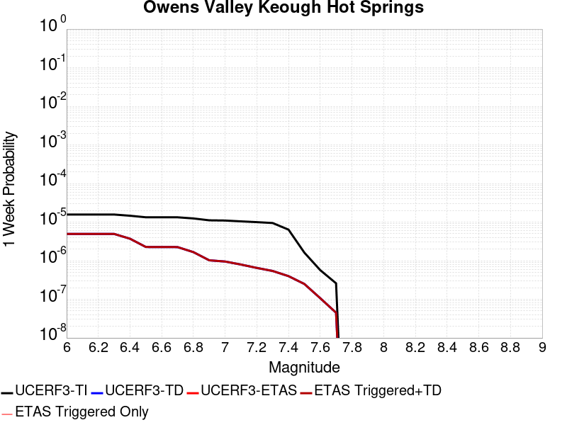 | 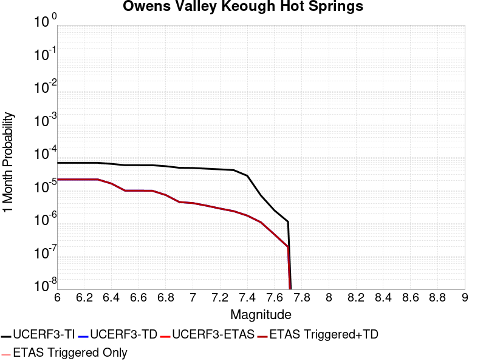 | 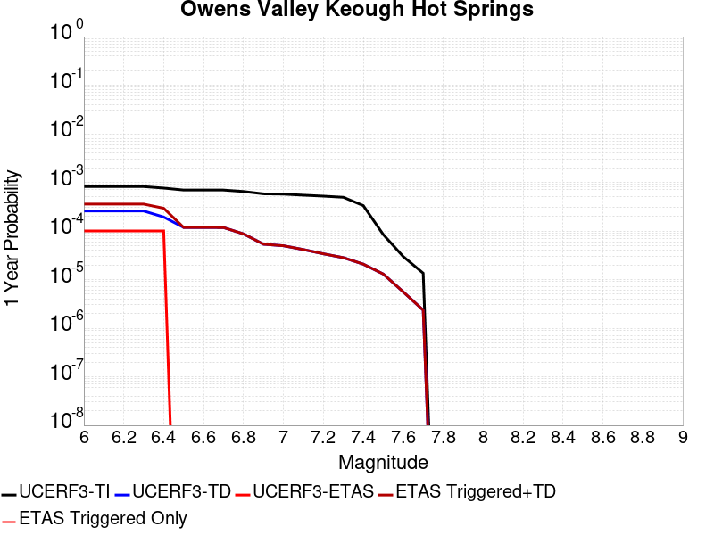 | 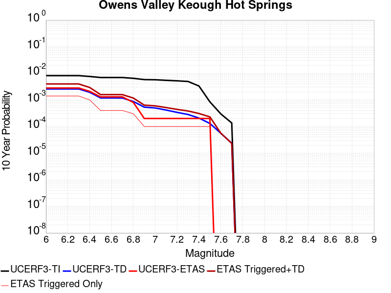 |

| Magnitude | 1 wk TI Prob | 1 wk TD Prob | 1 wk ETAS Prob | 1 wk ETAS/TD Gain | 1 wk ETAS Triggered+TD | 1 wk ETAS Triggered Only | 1 mo TI Prob | 1 mo TD Prob | 1 mo ETAS Prob | 1 mo ETAS/TD Gain | 1 mo ETAS Triggered+TD | 1 mo ETAS Triggered Only | 1 yr TI Prob | 1 yr TD Prob | 1 yr ETAS Prob | 1 yr ETAS/TD Gain | 1 yr ETAS Triggered+TD | 1 yr ETAS Triggered Only | 10 yr TI Prob | 10 yr TD Prob | 10 yr ETAS Prob | 10 yr ETAS/TD Gain | 10 yr ETAS Triggered+TD | 10 yr ETAS Triggered Only |
|-----|-----|-----|-----|-----|-----|-----|-----|-----|-----|-----|-----|-----|-----|-----|-----|-----|-----|-----|-----|-----|-----|-----|-----|-----|
| 6.0 | 1.5708529E-5 | 4.9370874E-6 | 0.0 | 0.0 | 4.9370874E-6 | 0.0 | 6.7320536E-5 | 2.1158803E-5 | 0.0 | 0.0 | 2.1158803E-5 | 0.0 | 8.193192E-4 | 2.5758307E-4 | 1.0E-4 | 0.38822424 | 3.5755732E-4 | 1.0E-4 | 0.008163051 | 0.0025734676 | 0.0028 | 1.0880262 | 0.003969865 | 0.0014 |
| 6.1 | 1.5708529E-5 | 4.9370874E-6 | 0.0 | 0.0 | 4.9370874E-6 | 0.0 | 6.7320536E-5 | 2.1158803E-5 | 0.0 | 0.0 | 2.1158803E-5 | 0.0 | 8.193192E-4 | 2.5758307E-4 | 1.0E-4 | 0.38822424 | 3.5755732E-4 | 1.0E-4 | 0.008163051 | 0.0025734676 | 0.0028 | 1.0880262 | 0.003969865 | 0.0014 |
| 6.2 | 1.5708529E-5 | 4.9370874E-6 | 0.0 | 0.0 | 4.9370874E-6 | 0.0 | 6.7320536E-5 | 2.1158803E-5 | 0.0 | 0.0 | 2.1158803E-5 | 0.0 | 8.193192E-4 | 2.5758307E-4 | 1.0E-4 | 0.38822424 | 3.5755732E-4 | 1.0E-4 | 0.008163051 | 0.0025734676 | 0.0028 | 1.0880262 | 0.003969865 | 0.0014 |
| 6.3 | 1.5708529E-5 | 4.9370874E-6 | 0.0 | 0.0 | 4.9370874E-6 | 0.0 | 6.7320536E-5 | 2.1158803E-5 | 0.0 | 0.0 | 2.1158803E-5 | 0.0 | 8.193192E-4 | 2.5758307E-4 | 1.0E-4 | 0.38822424 | 3.5755732E-4 | 1.0E-4 | 0.008163051 | 0.0025734676 | 0.0028 | 1.0880262 | 0.003969865 | 0.0014 |
| 6.4 | 1.4622509E-5 | 3.714575E-6 | 0.0 | 0.0 | 3.714575E-6 | 0.0 | 6.266639E-5 | 1.591953E-5 | 0.0 | 0.0 | 1.591953E-5 | 0.0 | 7.626962E-4 | 1.9380632E-4 | 1.0E-4 | 0.51597905 | 2.9378696E-4 | 1.0E-4 | 0.007600839 | 0.001936817 | 0.0021 | 1.0842532 | 0.00293488 | 0.001 |
| 6.5 | 1.3335527E-5 | 2.2676713E-6 | 0.0 | 0.0 | 2.2676713E-6 | 0.0 | 5.7151006E-5 | 9.718558E-6 | 0.0 | 0.0 | 9.718558E-6 | 0.0 | 6.955913E-4 | 1.183177E-4 | 0.0 | 0.0 | 1.183177E-4 | 0.0 | 0.0069341804 | 0.0011827344 | 0.0013 | 1.0991479 | 0.0015822613 | 4.0E-4 |
| 6.6 | 1.3332855E-5 | 2.2648223E-6 | 0.0 | 0.0 | 2.2648223E-6 | 0.0 | 5.7139558E-5 | 9.706349E-6 | 0.0 | 0.0 | 9.706349E-6 | 0.0 | 6.9545204E-4 | 1.18169075E-4 | 0.0 | 0.0 | 1.18169075E-4 | 0.0 | 0.0069327964 | 0.0011812497 | 0.0013 | 1.1005294 | 0.0015807772 | 4.0E-4 |
| 6.7 | 1.3318214E-5 | 2.2540792E-6 | 0.0 | 0.0 | 2.2540792E-6 | 0.0 | 5.707681E-5 | 9.660307E-6 | 0.0 | 0.0 | 9.660307E-6 | 0.0 | 6.946886E-4 | 1.1760857E-4 | 0.0 | 0.0 | 1.1760857E-4 | 0.0 | 0.0069252094 | 0.0011756506 | 0.0013 | 1.1057707 | 0.0015751803 | 4.0E-4 |
| 6.8 | 1.2441338E-5 | 1.6692123E-6 | 0.0 | 0.0 | 1.6692123E-6 | 0.0 | 5.331893E-5 | 7.1537493E-6 | 0.0 | 0.0 | 7.1537493E-6 | 0.0 | 6.489646E-4 | 8.709371E-5 | 0.0 | 0.0 | 8.709371E-5 | 0.0 | 0.0064707273 | 8.707456E-4 | 8.0E-4 | 0.91875285 | 0.0011704843 | 3.0E-4 |
| 6.9 | 1.1130476E-5 | 1.0244786E-6 | 0.0 | 0.0 | 1.0244786E-6 | 0.0 | 4.7701167E-5 | 4.3906152E-6 | 0.0 | 0.0 | 4.3906152E-6 | 0.0 | 5.806069E-4 | 5.345444E-5 | 0.0 | 0.0 | 5.345444E-5 | 0.0 | 0.0057909233 | 5.345358E-4 | 2.0E-4 | 0.37415642 | 6.3448236E-4 | 1.0E-4 |
| 7.0 | 1.0986073E-5 | 9.522665E-7 | 0.0 | 0.0 | 9.522665E-7 | 0.0 | 4.7082318E-5 | 4.0811356E-6 | 0.0 | 0.0 | 4.0811356E-6 | 0.0 | 5.730765E-4 | 4.9686707E-5 | 0.0 | 0.0 | 4.9686707E-5 | 0.0 | 0.0057160086 | 4.9687433E-4 | 2.0E-4 | 0.40251628 | 5.968246E-4 | 1.0E-4 |
| 7.1 | 1.0451338E-5 | 7.9533214E-7 | 0.0 | 0.0 | 7.9533214E-7 | 0.0 | 4.4790682E-5 | 3.408562E-6 | 0.0 | 0.0 | 3.408562E-6 | 0.0 | 5.451901E-4 | 4.1498457E-5 | 0.0 | 0.0 | 4.1498457E-5 | 0.0 | 0.005438545 | 4.1502147E-4 | 2.0E-4 | 0.48190278 | 5.1498E-4 | 1.0E-4 |
| 7.2 | 9.989061E-6 | 6.5046413E-7 | 0.0 | 0.0 | 6.5046413E-7 | 0.0 | 4.280956E-5 | 2.7877006E-6 | 0.0 | 0.0 | 2.7877006E-6 | 0.0 | 5.2108173E-4 | 3.393973E-5 | 0.0 | 0.0 | 3.393973E-5 | 0.0 | 0.0051986156 | 3.394347E-4 | 2.0E-4 | 0.589215 | 4.3940073E-4 | 1.0E-4 |
| 7.3 | 9.465365E-6 | 5.422374E-7 | 0.0 | 0.0 | 5.422374E-7 | 0.0 | 4.056522E-5 | 2.3238724E-6 | 0.0 | 0.0 | 2.3238724E-6 | 0.0 | 4.937696E-4 | 2.8292783E-5 | 0.0 | 0.0 | 2.8292783E-5 | 0.0 | 0.0049267393 | 2.8297617E-4 | 2.0E-4 | 0.70677334 | 3.8294785E-4 | 1.0E-4 |
| 7.4 | 6.3824805E-6 | 3.9849874E-7 | 0.0 | 0.0 | 3.9849874E-7 | 0.0 | 2.73532E-5 | 1.7078506E-6 | 0.0 | 0.0 | 1.7078506E-6 | 0.0 | 3.3297433E-4 | 2.0792884E-5 | 0.0 | 0.0 | 2.0792884E-5 | 0.0 | 0.0033247585 | 2.07955E-4 | 2.0E-4 | 0.9617465 | 3.079342E-4 | 1.0E-4 |
| 7.5 | 1.6192645E-6 | 2.4966084E-7 | 0.0 | 0.0 | 2.4966084E-7 | 0.0 | 6.9396865E-6 | 1.0699746E-6 | 0.0 | 0.0 | 1.0699746E-6 | 0.0 | 8.448741E-5 | 1.30268645E-5 | 0.0 | 0.0 | 1.30268645E-5 | 0.0 | 8.4455294E-4 | 1.3026113E-4 | 2.0E-4 | 1.5353774 | 2.3024812E-4 | 1.0E-4 |
| 7.6 | 5.7062545E-7 | 1.07056245E-7 | 0.0 | 0.0 | 1.07056245E-7 | 0.0 | 2.4455355E-6 | 4.588124E-7 | 0.0 | 0.0 | 4.588124E-7 | 0.0 | 2.9773988E-5 | 5.5860273E-6 | 0.0 | 0.0 | 5.5860273E-6 | 0.0 | 2.977E-4 | 5.585895E-5 | 0.0 | 0.0 | 5.585895E-5 | 0.0 |
| 7.7 | 2.5988817E-7 | 4.502109E-8 | 0.0 | 0.0 | 4.502109E-8 | 0.0 | 1.113806E-6 | 1.9294751E-7 | 0.0 | 0.0 | 1.9294751E-7 | 0.0 | 1.3560503E-5 | 2.3491339E-6 | 0.0 | 0.0 | 2.3491339E-6 | 0.0 | 1.3559677E-4 | 2.3491133E-5 | 0.0 | 0.0 | 2.3491133E-5 | 0.0 |

## Sierra Nevada  (No Extension)
*[(top)](#table-of-contents)*

| 1 Week | 1 Month | 1 Year | 10 Year |
|-----|-----|-----|-----|
| 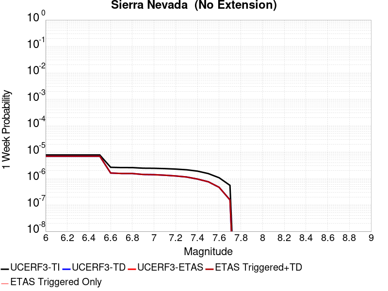 | 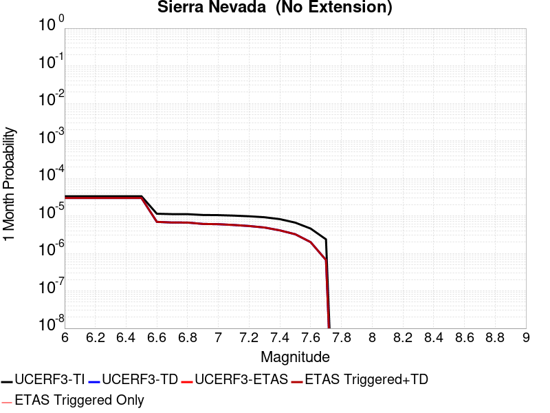 | 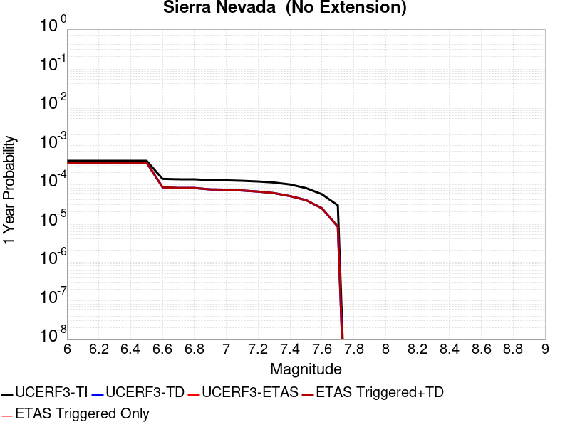 | 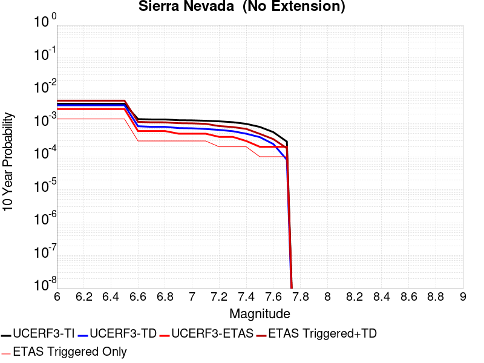 |

| Magnitude | 1 wk TI Prob | 1 wk TD Prob | 1 wk ETAS Prob | 1 wk ETAS/TD Gain | 1 wk ETAS Triggered+TD | 1 wk ETAS Triggered Only | 1 mo TI Prob | 1 mo TD Prob | 1 mo ETAS Prob | 1 mo ETAS/TD Gain | 1 mo ETAS Triggered+TD | 1 mo ETAS Triggered Only | 1 yr TI Prob | 1 yr TD Prob | 1 yr ETAS Prob | 1 yr ETAS/TD Gain | 1 yr ETAS Triggered+TD | 1 yr ETAS Triggered Only | 10 yr TI Prob | 10 yr TD Prob | 10 yr ETAS Prob | 10 yr ETAS/TD Gain | 10 yr ETAS Triggered+TD | 10 yr ETAS Triggered Only |
|-----|-----|-----|-----|-----|-----|-----|-----|-----|-----|-----|-----|-----|-----|-----|-----|-----|-----|-----|-----|-----|-----|-----|-----|-----|
| 6.0 | 7.7690465E-6 | 6.971319E-6 | 0.0 | 0.0 | 6.971319E-6 | 0.0 | 3.329549E-5 | 2.9876941E-5 | 0.0 | 0.0 | 2.9876941E-5 | 0.0 | 4.0529718E-4 | 3.6372687E-4 | 3.0E-4 | 0.8247947 | 4.636905E-4 | 1.0E-4 | 0.004045588 | 0.003634828 | 0.0028 | 0.7703253 | 0.0050297393 | 0.0014 |
| 6.1 | 7.7690465E-6 | 6.971319E-6 | 0.0 | 0.0 | 6.971319E-6 | 0.0 | 3.329549E-5 | 2.9876941E-5 | 0.0 | 0.0 | 2.9876941E-5 | 0.0 | 4.0529718E-4 | 3.6372687E-4 | 3.0E-4 | 0.8247947 | 4.636905E-4 | 1.0E-4 | 0.004045588 | 0.003634828 | 0.0028 | 0.7703253 | 0.0050297393 | 0.0014 |
| 6.2 | 7.7690465E-6 | 6.971319E-6 | 0.0 | 0.0 | 6.971319E-6 | 0.0 | 3.329549E-5 | 2.9876941E-5 | 0.0 | 0.0 | 2.9876941E-5 | 0.0 | 4.0529718E-4 | 3.6372687E-4 | 3.0E-4 | 0.8247947 | 4.636905E-4 | 1.0E-4 | 0.004045588 | 0.003634828 | 0.0028 | 0.7703253 | 0.0050297393 | 0.0014 |
| 6.3 | 7.7690465E-6 | 6.971319E-6 | 0.0 | 0.0 | 6.971319E-6 | 0.0 | 3.329549E-5 | 2.9876941E-5 | 0.0 | 0.0 | 2.9876941E-5 | 0.0 | 4.0529718E-4 | 3.6372687E-4 | 3.0E-4 | 0.8247947 | 4.636905E-4 | 1.0E-4 | 0.004045588 | 0.003634828 | 0.0028 | 0.7703253 | 0.0050297393 | 0.0014 |
| 6.4 | 7.7690465E-6 | 6.971319E-6 | 0.0 | 0.0 | 6.971319E-6 | 0.0 | 3.329549E-5 | 2.9876941E-5 | 0.0 | 0.0 | 2.9876941E-5 | 0.0 | 4.0529718E-4 | 3.6372687E-4 | 3.0E-4 | 0.8247947 | 4.636905E-4 | 1.0E-4 | 0.004045588 | 0.003634828 | 0.0028 | 0.7703253 | 0.0050297393 | 0.0014 |
| 6.5 | 7.7690465E-6 | 6.971319E-6 | 0.0 | 0.0 | 6.971319E-6 | 0.0 | 3.329549E-5 | 2.9876941E-5 | 0.0 | 0.0 | 2.9876941E-5 | 0.0 | 4.0529718E-4 | 3.6372687E-4 | 3.0E-4 | 0.8247947 | 4.636905E-4 | 1.0E-4 | 0.004045588 | 0.003634828 | 0.0028 | 0.7703253 | 0.0050297393 | 0.0014 |
| 6.6 | 2.653E-6 | 1.6125354E-6 | 0.0 | 0.0 | 1.6125354E-6 | 0.0 | 1.136995E-5 | 6.910848E-6 | 0.0 | 0.0 | 6.910848E-6 | 0.0 | 1.3842035E-4 | 8.413636E-5 | 0.0 | 0.0 | 8.413636E-5 | 0.0 | 0.0013833415 | 8.410485E-4 | 6.0E-4 | 0.71339524 | 0.0011407961 | 3.0E-4 |
| 6.7 | 2.5902466E-6 | 1.5478895E-6 | 0.0 | 0.0 | 1.5478895E-6 | 0.0 | 1.11010095E-5 | 6.6337957E-6 | 0.0 | 0.0 | 6.6337957E-6 | 0.0 | 1.351464E-4 | 8.076349E-5 | 0.0 | 0.0 | 8.076349E-5 | 0.0 | 0.0013506424 | 8.0734445E-4 | 6.0E-4 | 0.74317724 | 0.0011071023 | 3.0E-4 |
| 6.8 | 2.5853892E-6 | 1.5446997E-6 | 0.0 | 0.0 | 1.5446997E-6 | 0.0 | 1.1080193E-5 | 6.6201246E-6 | 0.0 | 0.0 | 6.6201246E-6 | 0.0 | 1.34893E-4 | 8.059706E-5 | 0.0 | 0.0 | 8.059706E-5 | 0.0 | 0.0013481114 | 8.0568134E-4 | 6.0E-4 | 0.7447113 | 0.0011054396 | 3.0E-4 |
| 6.9 | 2.458257E-6 | 1.4198212E-6 | 0.0 | 0.0 | 1.4198212E-6 | 0.0 | 1.0535345E-5 | 6.084934E-6 | 0.0 | 0.0 | 6.084934E-6 | 0.0 | 1.2826028E-4 | 7.408157E-5 | 0.0 | 0.0 | 7.408157E-5 | 0.0 | 0.0012818627 | 7.405707E-4 | 5.0E-4 | 0.675155 | 0.0010403486 | 3.0E-4 |
| 7.0 | 2.4341468E-6 | 1.3967953E-6 | 0.0 | 0.0 | 1.3967953E-6 | 0.0 | 1.0432016E-5 | 5.986252E-6 | 0.0 | 0.0 | 5.986252E-6 | 0.0 | 1.270024E-4 | 7.28802E-5 | 0.0 | 0.0 | 7.28802E-5 | 0.0 | 0.0012692984 | 7.285649E-4 | 5.0E-4 | 0.68628067 | 0.0010283464 | 3.0E-4 |
| 7.1 | 2.3652476E-6 | 1.331774E-6 | 0.0 | 0.0 | 1.331774E-6 | 0.0 | 1.0136736E-5 | 5.707591E-6 | 0.0 | 0.0 | 5.707591E-6 | 0.0 | 1.2340778E-4 | 6.9487716E-5 | 0.0 | 0.0 | 6.9487716E-5 | 0.0 | 0.0012333926 | 6.946616E-4 | 5.0E-4 | 0.7197749 | 9.944532E-4 | 3.0E-4 |
| 7.2 | 2.272158E-6 | 1.248129E-6 | 0.0 | 0.0 | 1.248129E-6 | 0.0 | 9.737784E-6 | 5.3491135E-6 | 0.0 | 0.0 | 5.3491135E-6 | 0.0 | 1.1855107E-4 | 6.5123524E-5 | 0.0 | 0.0 | 6.5123524E-5 | 0.0 | 0.0011848784 | 6.5104594E-4 | 4.0E-4 | 0.614396 | 8.5091573E-4 | 2.0E-4 |
| 7.3 | 2.1382127E-6 | 1.1398802E-6 | 0.0 | 0.0 | 1.1398802E-6 | 0.0 | 9.163737E-6 | 4.8851916E-6 | 0.0 | 0.0 | 4.8851916E-6 | 0.0 | 1.1156279E-4 | 5.9475595E-5 | 0.0 | 0.0 | 5.9475595E-5 | 0.0 | 0.001115068 | 5.9459795E-4 | 4.0E-4 | 0.6727235 | 7.9447904E-4 | 2.0E-4 |
| 7.4 | 1.9048055E-6 | 9.555373E-7 | 0.0 | 0.0 | 9.555373E-7 | 0.0 | 8.163426E-6 | 4.0951536E-6 | 0.0 | 0.0 | 4.0951536E-6 | 0.0 | 9.9385186E-5 | 4.9857357E-5 | 0.0 | 0.0 | 4.9857357E-5 | 0.0 | 9.934074E-4 | 4.984624E-4 | 3.0E-4 | 0.6018508 | 6.983627E-4 | 2.0E-4 |
| 7.5 | 1.5373403E-6 | 7.5429006E-7 | 0.0 | 0.0 | 7.5429006E-7 | 0.0 | 6.5885843E-6 | 3.2326677E-6 | 0.0 | 0.0 | 3.2326677E-6 | 0.0 | 8.021306E-5 | 3.9357023E-5 | 0.0 | 0.0 | 3.9357023E-5 | 0.0 | 8.0184115E-4 | 3.93501E-4 | 2.0E-4 | 0.5082579 | 4.934616E-4 | 1.0E-4 |
| 7.6 | 1.0680322E-6 | 4.6470205E-7 | 0.0 | 0.0 | 4.6470205E-7 | 0.0 | 4.577273E-6 | 1.9915788E-6 | 0.0 | 0.0 | 1.9915788E-6 | 0.0 | 5.5726876E-5 | 2.4247203E-5 | 0.0 | 0.0 | 2.4247203E-5 | 0.0 | 5.5712904E-4 | 2.4244584E-4 | 2.0E-4 | 0.8249265 | 3.4242158E-4 | 1.0E-4 |
| 7.7 | 5.509146E-7 | 1.5509096E-7 | 0.0 | 0.0 | 1.5509096E-7 | 0.0 | 2.3610605E-6 | 6.646754E-7 | 0.0 | 0.0 | 6.646754E-7 | 0.0 | 2.8745531E-5 | 8.092394E-6 | 0.0 | 0.0 | 8.092394E-6 | 0.0 | 2.8741814E-4 | 8.0921105E-5 | 2.0E-4 | 2.471543 | 1.8091302E-4 | 1.0E-4 |

## Point Reyes 2011 CFM
*[(top)](#table-of-contents)*

| 1 Week | 1 Month | 1 Year | 10 Year |
|-----|-----|-----|-----|
|  | 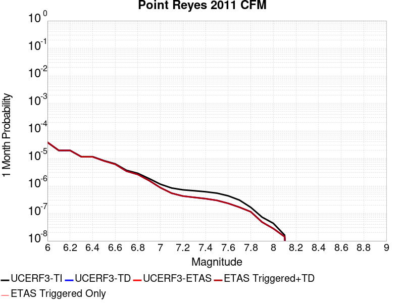 | 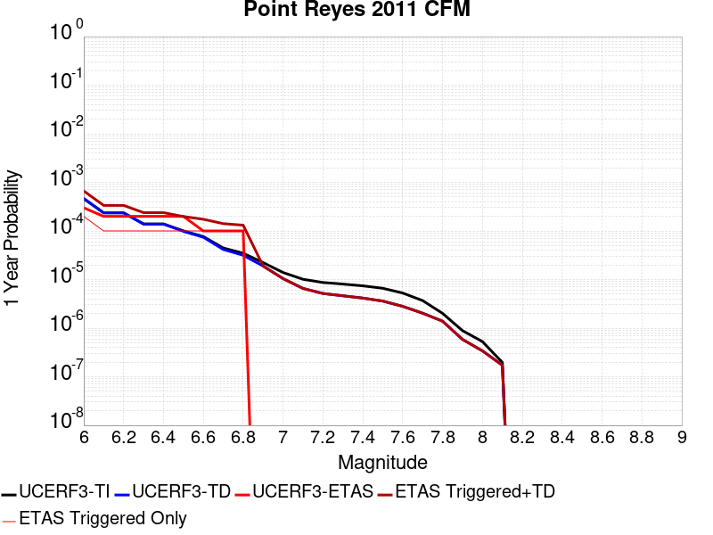 | 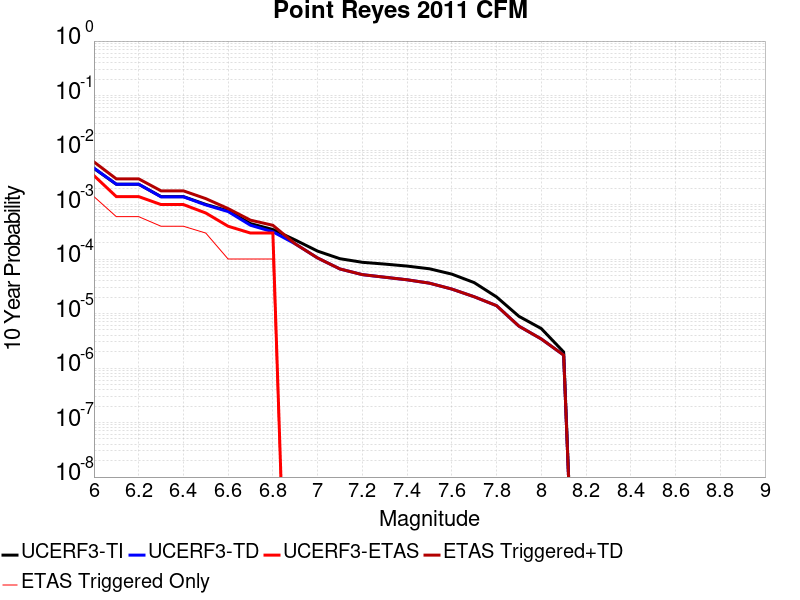 |

| Magnitude | 1 wk TI Prob | 1 wk TD Prob | 1 wk ETAS Prob | 1 wk ETAS/TD Gain | 1 wk ETAS Triggered+TD | 1 wk ETAS Triggered Only | 1 mo TI Prob | 1 mo TD Prob | 1 mo ETAS Prob | 1 mo ETAS/TD Gain | 1 mo ETAS Triggered+TD | 1 mo ETAS Triggered Only | 1 yr TI Prob | 1 yr TD Prob | 1 yr ETAS Prob | 1 yr ETAS/TD Gain | 1 yr ETAS Triggered+TD | 1 yr ETAS Triggered Only | 10 yr TI Prob | 10 yr TD Prob | 10 yr ETAS Prob | 10 yr ETAS/TD Gain | 10 yr ETAS Triggered+TD | 10 yr ETAS Triggered Only |
|-----|-----|-----|-----|-----|-----|-----|-----|-----|-----|-----|-----|-----|-----|-----|-----|-----|-----|-----|-----|-----|-----|-----|-----|-----|
| 6.0 | 8.8644965E-6 | 8.964161E-6 | 0.0 | 0.0 | 8.964161E-6 | 0.0 | 3.7990147E-5 | 3.84173E-5 | 0.0 | 0.0 | 3.84173E-5 | 0.0 | 4.624319E-4 | 4.6763654E-4 | 3.0E-4 | 0.6415239 | 6.67543E-4 | 2.0E-4 | 0.0046147075 | 0.0046671527 | 0.0034 | 0.7284956 | 0.0060606184 | 0.0014 |
| 6.1 | 4.526405E-6 | 4.5371735E-6 | 0.0 | 0.0 | 4.5371735E-6 | 0.0 | 1.9398734E-5 | 1.944489E-5 | 0.0 | 0.0 | 1.944489E-5 | 0.0 | 2.36154E-4 | 2.3671685E-4 | 2.0E-4 | 0.84489125 | 3.366932E-4 | 1.0E-4 | 0.002359032 | 0.0023647528 | 0.0014 | 0.592028 | 0.002963334 | 6.0E-4 |
| 6.2 | 4.526405E-6 | 4.5371735E-6 | 0.0 | 0.0 | 4.5371735E-6 | 0.0 | 1.9398734E-5 | 1.944489E-5 | 0.0 | 0.0 | 1.944489E-5 | 0.0 | 2.36154E-4 | 2.3671685E-4 | 2.0E-4 | 0.84489125 | 3.366932E-4 | 1.0E-4 | 0.002359032 | 0.0023647528 | 0.0014 | 0.592028 | 0.002963334 | 6.0E-4 |
| 6.3 | 2.6842322E-6 | 2.6590183E-6 | 0.0 | 0.0 | 2.6590183E-6 | 0.0 | 1.1503801E-5 | 1.1395744E-5 | 0.0 | 0.0 | 1.1395744E-5 | 0.0 | 1.4004979E-4 | 1.3873454E-4 | 2.0E-4 | 1.441602 | 2.3872066E-4 | 1.0E-4 | 0.0013996155 | 0.0013865008 | 0.001 | 0.7212401 | 0.0017859462 | 4.0E-4 |
| 6.4 | 2.6842322E-6 | 2.6590183E-6 | 0.0 | 0.0 | 2.6590183E-6 | 0.0 | 1.1503801E-5 | 1.1395744E-5 | 0.0 | 0.0 | 1.1395744E-5 | 0.0 | 1.4004979E-4 | 1.3873454E-4 | 2.0E-4 | 1.441602 | 2.3872066E-4 | 1.0E-4 | 0.0013996155 | 0.0013865008 | 0.001 | 0.7212401 | 0.0017859462 | 4.0E-4 |
| 6.5 | 1.9281833E-6 | 1.8891174E-6 | 0.0 | 0.0 | 1.8891174E-6 | 0.0 | 8.263617E-6 | 8.096193E-6 | 0.0 | 0.0 | 8.096193E-6 | 0.0 | 1.0060489E-4 | 9.856677E-5 | 2.0E-4 | 2.0290813 | 1.9855691E-4 | 1.0E-4 | 0.0010055936 | 9.85241E-4 | 7.0E-4 | 0.710486 | 0.0012849455 | 3.0E-4 |
| 6.6 | 1.4726726E-6 | 1.4255355E-6 | 0.0 | 0.0 | 1.4255355E-6 | 0.0 | 6.3114385E-6 | 6.109424E-6 | 0.0 | 0.0 | 6.109424E-6 | 0.0 | 7.683905E-5 | 7.437974E-5 | 1.0E-4 | 1.344452 | 1.7437231E-4 | 1.0E-4 | 7.6812494E-4 | 7.435553E-4 | 4.0E-4 | 0.53795594 | 8.43481E-4 | 1.0E-4 |
| 6.7 | 8.572307E-7 | 7.994137E-7 | 0.0 | 0.0 | 7.994137E-7 | 0.0 | 3.6738406E-6 | 3.4260545E-6 | 0.0 | 0.0 | 3.4260545E-6 | 0.0 | 4.472809E-5 | 4.171143E-5 | 1.0E-4 | 2.3974245 | 1.4170726E-4 | 1.0E-4 | 4.471909E-4 | 4.170396E-4 | 3.0E-4 | 0.7193561 | 5.169979E-4 | 1.0E-4 |
| 6.8 | 6.6745434E-7 | 6.0645664E-7 | 0.0 | 0.0 | 6.0645664E-7 | 0.0 | 2.8605155E-6 | 2.5990973E-6 | 0.0 | 0.0 | 2.5990973E-6 | 0.0 | 3.482622E-5 | 3.164356E-5 | 1.0E-4 | 3.1602006 | 1.316404E-4 | 1.0E-4 | 3.4820763E-4 | 3.1639353E-4 | 3.0E-4 | 0.9481862 | 4.163619E-4 | 1.0E-4 |
| 6.9 | 4.291521E-7 | 3.6412928E-7 | 0.0 | 0.0 | 3.6412928E-7 | 0.0 | 1.839222E-6 | 1.5605531E-6 | 0.0 | 0.0 | 1.5605531E-6 | 0.0 | 2.2392298E-5 | 1.8999572E-5 | 0.0 | 0.0 | 1.8999572E-5 | 0.0 | 2.2390042E-4 | 1.899818E-4 | 0.0 | 0.0 | 1.899818E-4 | 0.0 |
| 7.0 | 2.6812808E-7 | 2.0067408E-7 | 0.0 | 0.0 | 2.0067408E-7 | 0.0 | 1.1491198E-6 | 8.600315E-7 | 0.0 | 0.0 | 8.600315E-7 | 0.0 | 1.3990444E-5 | 1.0470833E-5 | 0.0 | 0.0 | 1.0470833E-5 | 0.0 | 1.3989564E-4 | 1.0470543E-4 | 0.0 | 0.0 | 1.0470543E-4 | 0.0 |
| 7.1 | 1.9451231E-7 | 1.2606914E-7 | 0.0 | 0.0 | 1.2606914E-7 | 0.0 | 8.336239E-7 | 5.4029624E-7 | 0.0 | 0.0 | 5.4029624E-7 | 0.0 | 1.0149324E-5 | 6.5780864E-6 | 0.0 | 0.0 | 6.5780864E-6 | 0.0 | 1.014886E-4 | 6.578088E-5 | 0.0 | 0.0 | 6.578088E-5 | 0.0 |
| 7.2 | 1.6715143E-7 | 9.9260205E-8 | 0.0 | 0.0 | 9.9260205E-8 | 0.0 | 7.1636305E-7 | 4.2540083E-7 | 0.0 | 0.0 | 4.2540083E-7 | 0.0 | 8.721685E-6 | 5.1792426E-6 | 0.0 | 0.0 | 5.1792426E-6 | 0.0 | 8.721343E-5 | 5.179317E-5 | 0.0 | 0.0 | 5.179317E-5 | 0.0 |
| 7.3 | 1.5503173E-7 | 8.898042E-8 | 0.0 | 0.0 | 8.898042E-8 | 0.0 | 6.644215E-7 | 3.8134462E-7 | 0.0 | 0.0 | 3.8134462E-7 | 0.0 | 8.089301E-6 | 4.6428604E-6 | 0.0 | 0.0 | 4.6428604E-6 | 0.0 | 8.089007E-5 | 4.6429588E-5 | 0.0 | 0.0 | 4.6429588E-5 | 0.0 |
| 7.4 | 1.4251614E-7 | 7.98578E-8 | 0.0 | 0.0 | 7.98578E-8 | 0.0 | 6.1078333E-7 | 3.4224766E-7 | 0.0 | 0.0 | 3.4224766E-7 | 0.0 | 7.4362615E-6 | 4.1668573E-6 | 0.0 | 0.0 | 4.1668573E-6 | 0.0 | 7.436013E-5 | 4.166974E-5 | 0.0 | 0.0 | 4.166974E-5 | 0.0 |
| 7.5 | 1.2710186E-7 | 6.922304E-8 | 0.0 | 0.0 | 6.922304E-8 | 0.0 | 5.447221E-7 | 2.9667015E-7 | 0.0 | 0.0 | 2.9667015E-7 | 0.0 | 6.6319717E-6 | 3.611953E-6 | 0.0 | 0.0 | 3.611953E-6 | 0.0 | 6.6317734E-5 | 3.6120895E-5 | 0.0 | 0.0 | 3.6120895E-5 | 0.0 |
| 7.6 | 1.0144708E-7 | 5.397705E-8 | 0.0 | 0.0 | 5.397705E-8 | 0.0 | 4.347731E-7 | 2.313302E-7 | 0.0 | 0.0 | 2.313302E-7 | 0.0 | 5.2933497E-6 | 2.8164416E-6 | 0.0 | 0.0 | 2.8164416E-6 | 0.0 | 5.293224E-5 | 2.8166009E-5 | 0.0 | 0.0 | 2.8166009E-5 | 0.0 |
| 7.7 | 7.090527E-8 | 3.9012185E-8 | 0.0 | 0.0 | 3.9012185E-8 | 0.0 | 3.038797E-7 | 1.6719507E-7 | 0.0 | 0.0 | 1.6719507E-7 | 0.0 | 3.699729E-6 | 2.035598E-6 | 0.0 | 0.0 | 2.035598E-6 | 0.0 | 3.6996673E-5 | 2.0357744E-5 | 0.0 | 0.0 | 2.0357744E-5 | 0.0 |
| 7.8 | 3.8712045E-8 | 2.6747628E-8 | 0.0 | 0.0 | 2.6747628E-8 | 0.0 | 1.6590876E-7 | 1.14632684E-7 | 0.0 | 0.0 | 1.14632684E-7 | 0.0 | 2.0199373E-6 | 1.395652E-6 | 0.0 | 0.0 | 1.395652E-6 | 0.0 | 2.0199188E-5 | 1.3958383E-5 | 0.0 | 0.0 | 1.3958383E-5 | 0.0 |
| 7.9 | 1.7068782E-8 | 1.1266032E-8 | 0.0 | 0.0 | 1.1266032E-8 | 0.0 | 7.315192E-8 | 4.8282985E-8 | 0.0 | 0.0 | 4.8282985E-8 | 0.0 | 8.906242E-7 | 5.8784514E-7 | 0.0 | 0.0 | 5.8784514E-7 | 0.0 | 8.906207E-6 | 5.880386E-6 | 0.0 | 0.0 | 5.880386E-6 | 0.0 |
| 8.0 | 1.0172592E-8 | 6.5510197E-9 | 0.0 | 0.0 | 6.5510197E-9 | 0.0 | 4.359682E-8 | 2.8075796E-8 | 0.0 | 0.0 | 2.8075796E-8 | 0.0 | 5.3079117E-7 | 3.4182275E-7 | 0.0 | 0.0 | 3.4182275E-7 | 0.0 | 5.307899E-6 | 3.4201726E-6 | 0.0 | 0.0 | 3.4201726E-6 | 0.0 |
| 8.1 | 3.7861243E-9 | 3.3142102E-9 | 0.0 | 0.0 | 3.3142102E-9 | 0.0 | 1.6226247E-8 | 1.4203758E-8 | 0.0 | 0.0 | 1.4203758E-8 | 0.0 | 1.9755454E-7 | 1.7293074E-7 | 0.0 | 0.0 | 1.7293074E-7 | 0.0 | 1.9755437E-6 | 1.7311969E-6 | 0.0 | 0.0 | 1.7311969E-6 | 0.0 |

## Hartley Springs 2011 CFM
*[(top)](#table-of-contents)*

| 1 Week | 1 Month | 1 Year | 10 Year |
|-----|-----|-----|-----|
| 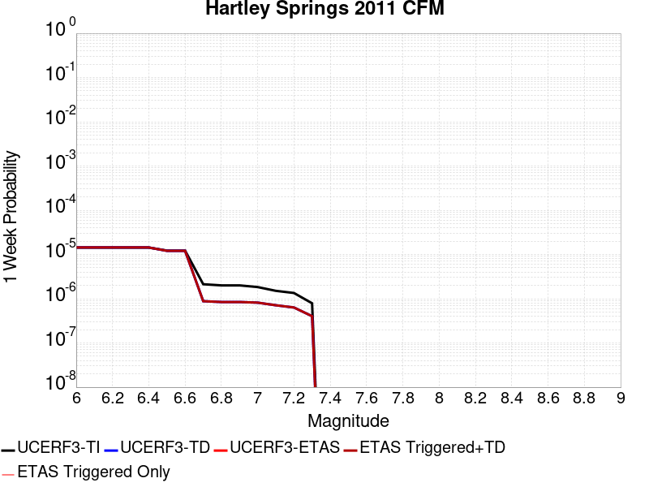 | 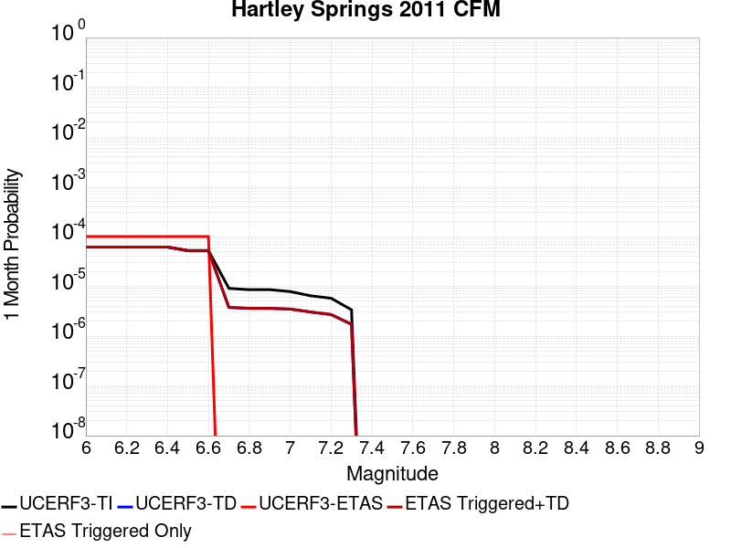 | 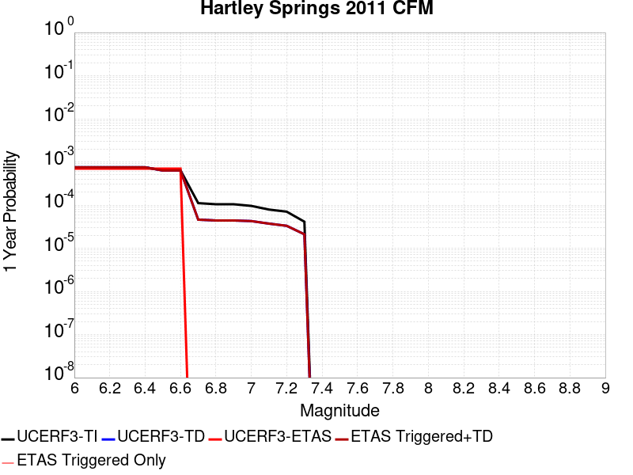 | 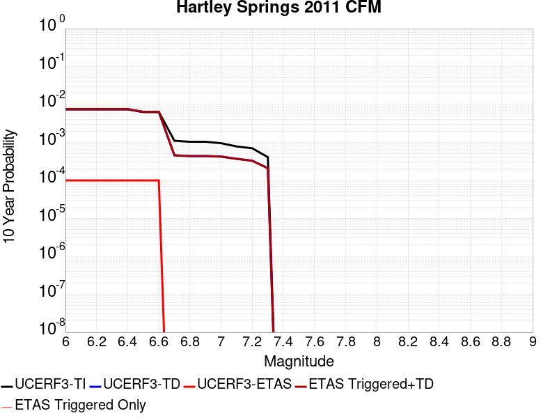 |

| Magnitude | 1 wk TI Prob | 1 wk TD Prob | 1 wk ETAS Prob | 1 wk ETAS/TD Gain | 1 wk ETAS Triggered+TD | 1 wk ETAS Triggered Only | 1 mo TI Prob | 1 mo TD Prob | 1 mo ETAS Prob | 1 mo ETAS/TD Gain | 1 mo ETAS Triggered+TD | 1 mo ETAS Triggered Only | 1 yr TI Prob | 1 yr TD Prob | 1 yr ETAS Prob | 1 yr ETAS/TD Gain | 1 yr ETAS Triggered+TD | 1 yr ETAS Triggered Only | 10 yr TI Prob | 10 yr TD Prob | 10 yr ETAS Prob | 10 yr ETAS/TD Gain | 10 yr ETAS Triggered+TD | 10 yr ETAS Triggered Only |
|-----|-----|-----|-----|-----|-----|-----|-----|-----|-----|-----|-----|-----|-----|-----|-----|-----|-----|-----|-----|-----|-----|-----|-----|-----|
| 6.0 | 1.4352418E-5 | 1.4411053E-5 | 0.0 | 0.0 | 1.4411053E-5 | 0.0 | 6.1508916E-5 | 6.1761115E-5 | 1.0E-4 | 1.6191417 | 6.1761115E-5 | 0.0 | 7.486137E-4 | 7.518462E-4 | 7.0E-4 | 0.9310415 | 7.518462E-4 | 0.0 | 0.007460968 | 0.00750911 | 0.0047 | 0.6259064 | 0.008898597 | 0.0014 |
| 6.1 | 1.4352418E-5 | 1.4411053E-5 | 0.0 | 0.0 | 1.4411053E-5 | 0.0 | 6.1508916E-5 | 6.1761115E-5 | 1.0E-4 | 1.6191417 | 6.1761115E-5 | 0.0 | 7.486137E-4 | 7.518462E-4 | 7.0E-4 | 0.9310415 | 7.518462E-4 | 0.0 | 0.007460968 | 0.00750911 | 0.0047 | 0.6259064 | 0.008898597 | 0.0014 |
| 6.2 | 1.4352418E-5 | 1.4411053E-5 | 0.0 | 0.0 | 1.4411053E-5 | 0.0 | 6.1508916E-5 | 6.1761115E-5 | 1.0E-4 | 1.6191417 | 6.1761115E-5 | 0.0 | 7.486137E-4 | 7.518462E-4 | 7.0E-4 | 0.9310415 | 7.518462E-4 | 0.0 | 0.007460968 | 0.00750911 | 0.0047 | 0.6259064 | 0.008898597 | 0.0014 |
| 6.3 | 1.4352418E-5 | 1.4411053E-5 | 0.0 | 0.0 | 1.4411053E-5 | 0.0 | 6.1508916E-5 | 6.1761115E-5 | 1.0E-4 | 1.6191417 | 6.1761115E-5 | 0.0 | 7.486137E-4 | 7.518462E-4 | 7.0E-4 | 0.9310415 | 7.518462E-4 | 0.0 | 0.007460968 | 0.00750911 | 0.0047 | 0.6259064 | 0.008898597 | 0.0014 |
| 6.4 | 1.4352418E-5 | 1.4411053E-5 | 0.0 | 0.0 | 1.4411053E-5 | 0.0 | 6.1508916E-5 | 6.1761115E-5 | 1.0E-4 | 1.6191417 | 6.1761115E-5 | 0.0 | 7.486137E-4 | 7.518462E-4 | 7.0E-4 | 0.9310415 | 7.518462E-4 | 0.0 | 0.007460968 | 0.00750911 | 0.0047 | 0.6259064 | 0.008898597 | 0.0014 |
| 6.5 | 1.2279858E-5 | 1.2112623E-5 | 0.0 | 0.0 | 1.2112623E-5 | 0.0 | 5.26269E-5 | 5.1911098E-5 | 1.0E-4 | 1.9263704 | 5.1911098E-5 | 0.0 | 6.4054417E-4 | 6.319922E-4 | 7.0E-4 | 1.1076087 | 6.319922E-4 | 0.0 | 0.0063870098 | 0.0063174255 | 0.0042 | 0.66482776 | 0.007609213 | 0.0013 |
| 6.6 | 1.2279858E-5 | 1.2112623E-5 | 0.0 | 0.0 | 1.2112623E-5 | 0.0 | 5.26269E-5 | 5.1911098E-5 | 1.0E-4 | 1.9263704 | 5.1911098E-5 | 0.0 | 6.4054417E-4 | 6.319922E-4 | 7.0E-4 | 1.1076087 | 6.319922E-4 | 0.0 | 0.0063870098 | 0.0063174255 | 0.0042 | 0.66482776 | 0.007609213 | 0.0013 |
| 6.7 | 2.1282601E-6 | 8.816144E-7 | 0.0 | 0.0 | 8.816144E-7 | 0.0 | 9.121083E-6 | 3.7783434E-6 | 0.0 | 0.0 | 3.7783434E-6 | 0.0 | 1.11043526E-4 | 4.6000612E-5 | 0.0 | 0.0 | 4.6000612E-5 | 0.0 | 0.0011098806 | 4.5993566E-4 | 3.0E-4 | 0.65226513 | 5.5988965E-4 | 1.0E-4 |
| 6.8 | 2.00516E-6 | 8.444936E-7 | 0.0 | 0.0 | 8.444936E-7 | 0.0 | 8.593515E-6 | 3.6192548E-6 | 0.0 | 0.0 | 3.6192548E-6 | 0.0 | 1.04621024E-4 | 4.406379E-5 | 0.0 | 0.0 | 4.406379E-5 | 0.0 | 0.0010457177 | 4.405751E-4 | 3.0E-4 | 0.6809282 | 5.40531E-4 | 1.0E-4 |
| 6.9 | 2.00516E-6 | 8.444936E-7 | 0.0 | 0.0 | 8.444936E-7 | 0.0 | 8.593515E-6 | 3.6192548E-6 | 0.0 | 0.0 | 3.6192548E-6 | 0.0 | 1.04621024E-4 | 4.406379E-5 | 0.0 | 0.0 | 4.406379E-5 | 0.0 | 0.0010457177 | 4.405751E-4 | 3.0E-4 | 0.6809282 | 5.40531E-4 | 1.0E-4 |
| 7.0 | 1.8366732E-6 | 8.1699494E-7 | 0.0 | 0.0 | 8.1699494E-7 | 0.0 | 7.871433E-6 | 3.5014036E-6 | 0.0 | 0.0 | 3.5014036E-6 | 0.0 | 9.583048E-5 | 4.2629006E-5 | 0.0 | 0.0 | 4.2629006E-5 | 0.0 | 9.5789164E-4 | 4.262328E-4 | 3.0E-4 | 0.70384073 | 5.2619015E-4 | 1.0E-4 |
| 7.1 | 1.5097997E-6 | 7.127997E-7 | 0.0 | 0.0 | 7.127997E-7 | 0.0 | 6.470554E-6 | 3.0548536E-6 | 0.0 | 0.0 | 3.0548536E-6 | 0.0 | 7.877615E-5 | 3.7192443E-5 | 0.0 | 0.0 | 3.7192443E-5 | 0.0 | 7.874823E-4 | 3.7188534E-4 | 3.0E-4 | 0.8067002 | 4.7184815E-4 | 1.0E-4 |
| 7.2 | 1.3490993E-6 | 6.3451904E-7 | 0.0 | 0.0 | 6.3451904E-7 | 0.0 | 5.7818415E-6 | 2.7193657E-6 | 0.0 | 0.0 | 2.7193657E-6 | 0.0 | 7.0391645E-5 | 3.3108005E-5 | 0.0 | 0.0 | 3.3108005E-5 | 0.0 | 7.0369354E-4 | 3.3105313E-4 | 3.0E-4 | 0.906199 | 4.3102002E-4 | 1.0E-4 |
| 7.3 | 7.900015E-7 | 4.0358663E-7 | 0.0 | 0.0 | 4.0358663E-7 | 0.0 | 3.3857161E-6 | 1.729657E-6 | 0.0 | 0.0 | 1.729657E-6 | 0.0 | 4.1220315E-5 | 2.1058575E-5 | 0.0 | 0.0 | 2.1058575E-5 | 0.0 | 4.121267E-4 | 2.1058574E-4 | 2.0E-4 | 0.9497319 | 3.1056468E-4 | 1.0E-4 |

## San Jacinto (Clark) rev
*[(top)](#table-of-contents)*

| 1 Week | 1 Month | 1 Year | 10 Year |
|-----|-----|-----|-----|
| 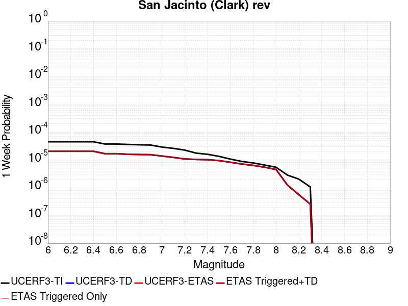 | 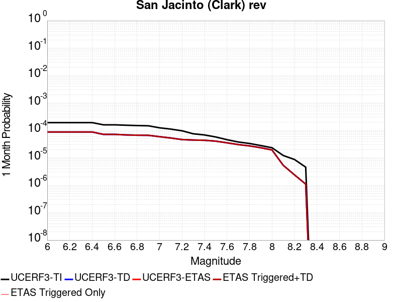 | 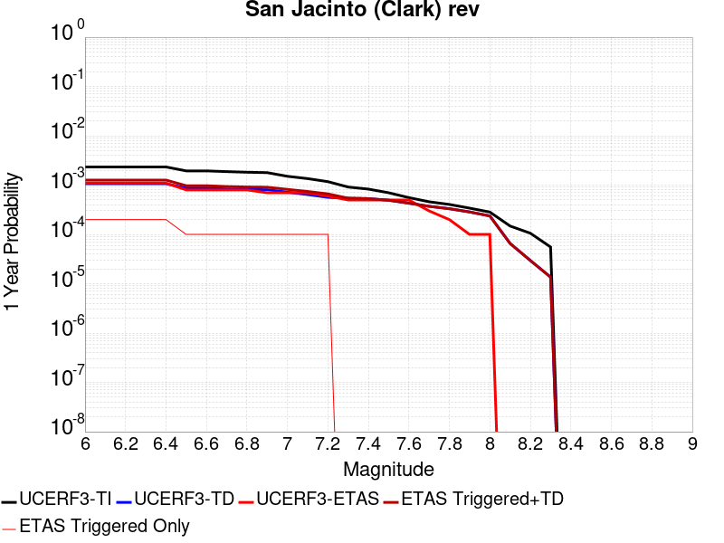 | 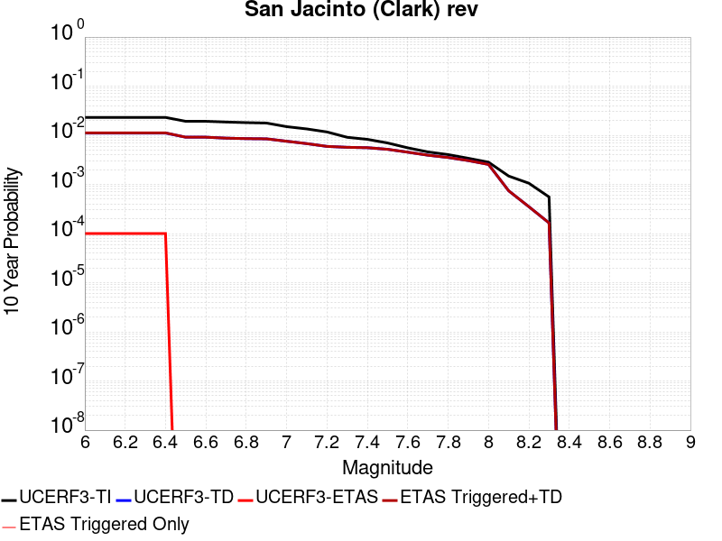 |

| Magnitude | 1 wk TI Prob | 1 wk TD Prob | 1 wk ETAS Prob | 1 wk ETAS/TD Gain | 1 wk ETAS Triggered+TD | 1 wk ETAS Triggered Only | 1 mo TI Prob | 1 mo TD Prob | 1 mo ETAS Prob | 1 mo ETAS/TD Gain | 1 mo ETAS Triggered+TD | 1 mo ETAS Triggered Only | 1 yr TI Prob | 1 yr TD Prob | 1 yr ETAS Prob | 1 yr ETAS/TD Gain | 1 yr ETAS Triggered+TD | 1 yr ETAS Triggered Only | 10 yr TI Prob | 10 yr TD Prob | 10 yr ETAS Prob | 10 yr ETAS/TD Gain | 10 yr ETAS Triggered+TD | 10 yr ETAS Triggered Only |
|-----|-----|-----|-----|-----|-----|-----|-----|-----|-----|-----|-----|-----|-----|-----|-----|-----|-----|-----|-----|-----|-----|-----|-----|-----|
| 6.0 | 4.482615E-5 | 2.0468824E-5 | 0.0 | 0.0 | 2.0468824E-5 | 0.0 | 1.9209793E-4 | 8.772063E-5 | 0.0 | 0.0 | 8.772063E-5 | 0.0 | 0.0023362834 | 0.0010674843 | 0.0011 | 1.0304601 | 0.0012672708 | 2.0E-4 | 0.02311874 | 0.011132711 | 0.007 | 0.6287777 | 0.012418238 | 0.0013 |
| 6.1 | 4.482615E-5 | 2.0468824E-5 | 0.0 | 0.0 | 2.0468824E-5 | 0.0 | 1.9209793E-4 | 8.772063E-5 | 0.0 | 0.0 | 8.772063E-5 | 0.0 | 0.0023362834 | 0.0010674843 | 0.0011 | 1.0304601 | 0.0012672708 | 2.0E-4 | 0.02311874 | 0.011132711 | 0.007 | 0.6287777 | 0.012418238 | 0.0013 |
| 6.2 | 4.482615E-5 | 2.0468824E-5 | 0.0 | 0.0 | 2.0468824E-5 | 0.0 | 1.9209793E-4 | 8.772063E-5 | 0.0 | 0.0 | 8.772063E-5 | 0.0 | 0.0023362834 | 0.0010674843 | 0.0011 | 1.0304601 | 0.0012672708 | 2.0E-4 | 0.02311874 | 0.011132711 | 0.007 | 0.6287777 | 0.012418238 | 0.0013 |
| 6.3 | 4.482615E-5 | 2.0468824E-5 | 0.0 | 0.0 | 2.0468824E-5 | 0.0 | 1.9209793E-4 | 8.772063E-5 | 0.0 | 0.0 | 8.772063E-5 | 0.0 | 0.0023362834 | 0.0010674843 | 0.0011 | 1.0304601 | 0.0012672708 | 2.0E-4 | 0.02311874 | 0.011132711 | 0.007 | 0.6287777 | 0.012418238 | 0.0013 |
| 6.4 | 4.482615E-5 | 2.0468824E-5 | 0.0 | 0.0 | 2.0468824E-5 | 0.0 | 1.9209793E-4 | 8.772063E-5 | 0.0 | 0.0 | 8.772063E-5 | 0.0 | 0.0023362834 | 0.0010674843 | 0.0011 | 1.0304601 | 0.0012672708 | 2.0E-4 | 0.02311874 | 0.011132711 | 0.007 | 0.6287777 | 0.012418238 | 0.0013 |
| 6.5 | 3.7294863E-5 | 1.6744747E-5 | 0.0 | 0.0 | 1.6744747E-5 | 0.0 | 1.5982533E-4 | 7.176126E-5 | 0.0 | 0.0 | 7.176126E-5 | 0.0 | 0.0019441366 | 8.733473E-4 | 8.0E-4 | 0.91601586 | 9.7326E-4 | 1.0E-4 | 0.01927216 | 0.009170346 | 0.0056 | 0.610664 | 0.010260259 | 0.0011 |
| 6.6 | 3.7294863E-5 | 1.6744747E-5 | 0.0 | 0.0 | 1.6744747E-5 | 0.0 | 1.5982533E-4 | 7.176126E-5 | 0.0 | 0.0 | 7.176126E-5 | 0.0 | 0.0019441366 | 8.733473E-4 | 8.0E-4 | 0.91601586 | 9.7326E-4 | 1.0E-4 | 0.01927216 | 0.009170346 | 0.0056 | 0.610664 | 0.010260259 | 0.0011 |
| 6.7 | 3.6039248E-5 | 1.6006703E-5 | 0.0 | 0.0 | 1.6006703E-5 | 0.0 | 1.5444479E-4 | 6.8598376E-5 | 0.0 | 0.0 | 6.8598376E-5 | 0.0 | 0.0018787434 | 8.348691E-4 | 8.0E-4 | 0.958234 | 9.3478564E-4 | 1.0E-4 | 0.01862939 | 0.008776889 | 0.0055 | 0.6266457 | 0.009867235 | 0.0011 |
| 6.8 | 3.5031844E-5 | 1.5645548E-5 | 0.0 | 0.0 | 1.5645548E-5 | 0.0 | 1.5012783E-4 | 6.705065E-5 | 0.0 | 0.0 | 6.705065E-5 | 0.0 | 0.0018262739 | 8.1603974E-4 | 8.0E-4 | 0.9803444 | 9.1595814E-4 | 1.0E-4 | 0.01811338 | 0.008583022 | 0.0055 | 0.64079994 | 0.0096735805 | 0.0011 |
| 6.9 | 3.435112E-5 | 1.54813E-5 | 0.0 | 0.0 | 1.54813E-5 | 0.0 | 1.4721078E-4 | 6.6346765E-5 | 0.0 | 0.0 | 6.6346765E-5 | 0.0 | 0.0017908178 | 8.0747635E-4 | 7.0E-4 | 0.8668985 | 9.0739556E-4 | 1.0E-4 | 0.017764548 | 0.008493918 | 0.0054 | 0.635749 | 0.009584575 | 0.0011 |
| 7.0 | 2.8959772E-5 | 1.380825E-5 | 0.0 | 0.0 | 1.380825E-5 | 0.0 | 1.241074E-4 | 5.9176888E-5 | 0.0 | 0.0 | 5.9176888E-5 | 0.0 | 0.0015099603 | 7.202431E-4 | 7.0E-4 | 0.9718941 | 8.2017103E-4 | 1.0E-4 | 0.014997416 | 0.00758709 | 0.0047 | 0.61947334 | 0.008579503 | 0.001 |
| 7.1 | 2.6002877E-5 | 1.2345504E-5 | 0.0 | 0.0 | 1.2345504E-5 | 0.0 | 1.11436144E-4 | 5.2908243E-5 | 0.0 | 0.0 | 5.2908243E-5 | 0.0 | 0.0013558907 | 6.4396946E-4 | 7.0E-4 | 1.087008 | 7.439051E-4 | 1.0E-4 | 0.013476475 | 0.0067876726 | 0.0041 | 0.6040362 | 0.0076815635 | 9.0E-4 |
| 7.2 | 2.2544838E-5 | 1.08275135E-5 | 0.0 | 0.0 | 1.08275135E-5 | 0.0 | 9.661716E-5 | 4.640281E-5 | 0.0 | 0.0 | 4.640281E-5 | 0.0 | 0.001175679 | 5.6480913E-4 | 6.0E-4 | 1.0623058 | 6.647527E-4 | 1.0E-4 | 0.011694785 | 0.0059576035 | 0.0036 | 0.60426986 | 0.0067528374 | 8.0E-4 |
| 7.3 | 1.75334E-5 | 1.0403712E-5 | 0.0 | 0.0 | 1.0403712E-5 | 0.0 | 7.514098E-5 | 4.458658E-5 | 0.0 | 0.0 | 4.458658E-5 | 0.0 | 9.144575E-4 | 5.4270774E-4 | 5.0E-4 | 0.9213062 | 5.4270774E-4 | 0.0 | 0.009107036 | 0.005715903 | 0.0034 | 0.59483165 | 0.006411902 | 7.0E-4 |
| 7.4 | 1.5924552E-5 | 1.0213249E-5 | 0.0 | 0.0 | 1.0213249E-5 | 0.0 | 6.82463E-5 | 4.377034E-5 | 0.0 | 0.0 | 4.377034E-5 | 0.0 | 8.305819E-4 | 5.327749E-4 | 5.0E-4 | 0.93848264 | 5.327749E-4 | 0.0 | 0.008274844 | 0.005608584 | 0.0034 | 0.6062136 | 0.006304658 | 7.0E-4 |
| 7.5 | 1.3428931E-5 | 9.472225E-6 | 0.0 | 0.0 | 9.472225E-6 | 0.0 | 5.7551293E-5 | 4.0594627E-5 | 0.0 | 0.0 | 4.0594627E-5 | 0.0 | 7.004617E-4 | 4.941285E-4 | 5.0E-4 | 1.0118825 | 4.941285E-4 | 0.0 | 0.006982579 | 0.0052039833 | 0.003 | 0.5764815 | 0.00590034 | 7.0E-4 |
| 7.6 | 1.0688787E-5 | 8.255622E-6 | 0.0 | 0.0 | 8.255622E-6 | 0.0 | 4.5808283E-5 | 3.538076E-5 | 0.0 | 0.0 | 3.538076E-5 | 0.0 | 5.5757316E-4 | 4.3067604E-4 | 5.0E-4 | 1.1609654 | 4.3067604E-4 | 0.0 | 0.005561762 | 0.004549725 | 0.0026 | 0.5714631 | 0.005146995 | 6.0E-4 |
| 7.7 | 8.81236E-6 | 7.1249465E-6 | 0.0 | 0.0 | 7.1249465E-6 | 0.0 | 3.776671E-5 | 3.0535128E-5 | 0.0 | 0.0 | 3.0535128E-5 | 0.0 | 4.597127E-4 | 3.7170196E-4 | 3.0E-4 | 0.80709827 | 3.7170196E-4 | 0.0 | 0.0045876284 | 0.0039512967 | 0.002 | 0.50616294 | 0.004548926 | 6.0E-4 |
| 7.8 | 7.780431E-6 | 6.373124E-6 | 0.0 | 0.0 | 6.373124E-6 | 0.0 | 3.3344273E-5 | 2.7313105E-5 | 0.0 | 0.0 | 2.7313105E-5 | 0.0 | 4.0589093E-4 | 3.3248647E-4 | 2.0E-4 | 0.6015282 | 3.3248647E-4 | 0.0 | 0.0040515037 | 0.0035496382 | 0.0017 | 0.47892207 | 0.004047863 | 5.0E-4 |
| 7.9 | 6.5437994E-6 | 5.4792317E-6 | 0.0 | 0.0 | 5.4792317E-6 | 0.0 | 2.8044553E-5 | 2.3482213E-5 | 0.0 | 0.0 | 2.3482213E-5 | 0.0 | 3.4138895E-4 | 2.8585858E-4 | 1.0E-4 | 0.34982333 | 2.8585858E-4 | 0.0 | 0.0034086495 | 0.0030730348 | 0.0015 | 0.48811683 | 0.0034718055 | 4.0E-4 |
| 8.0 | 5.4488164E-6 | 4.547006E-6 | 0.0 | 0.0 | 4.547006E-6 | 0.0 | 2.3351862E-5 | 1.9487023E-5 | 0.0 | 0.0 | 1.9487023E-5 | 0.0 | 2.8427184E-4 | 2.3722881E-4 | 1.0E-4 | 0.42153397 | 2.3722881E-4 | 0.0 | 0.0028390845 | 0.0025676433 | 0.0011 | 0.42840844 | 0.0028668728 | 3.0E-4 |
| 8.1 | 2.8397242E-6 | 1.2587882E-6 | 0.0 | 0.0 | 1.2587882E-6 | 0.0 | 1.217019E-5 | 5.394795E-6 | 0.0 | 0.0 | 5.394795E-6 | 0.0 | 1.4816198E-4 | 6.567966E-5 | 0.0 | 0.0 | 6.567966E-5 | 0.0 | 0.0014806325 | 7.502125E-4 | 3.0E-4 | 0.39988667 | 8.501375E-4 | 1.0E-4 |
| 8.2 | 2.030244E-6 | 5.683909E-7 | 0.0 | 0.0 | 5.683909E-7 | 0.0 | 8.701017E-6 | 2.4359585E-6 | 0.0 | 0.0 | 2.4359585E-6 | 0.0 | 1.05929736E-4 | 2.9657398E-5 | 0.0 | 0.0 | 2.9657398E-5 | 0.0 | 0.0010587925 | 3.575898E-4 | 2.0E-4 | 0.55930007 | 4.5755404E-4 | 1.0E-4 |
| 8.3 | 1.0659804E-6 | 2.616201E-7 | 0.0 | 0.0 | 2.616201E-7 | 0.0 | 4.568479E-6 | 1.1212286E-6 | 0.0 | 0.0 | 1.1212286E-6 | 0.0 | 5.5619817E-5 | 1.3650875E-5 | 0.0 | 0.0 | 1.3650875E-5 | 0.0 | 5.5605895E-4 | 1.6732894E-4 | 2.0E-4 | 1.1952505 | 2.673122E-4 | 1.0E-4 |

## Hector Mine
*[(top)](#table-of-contents)*

| 1 Week | 1 Month | 1 Year | 10 Year |
|-----|-----|-----|-----|
| 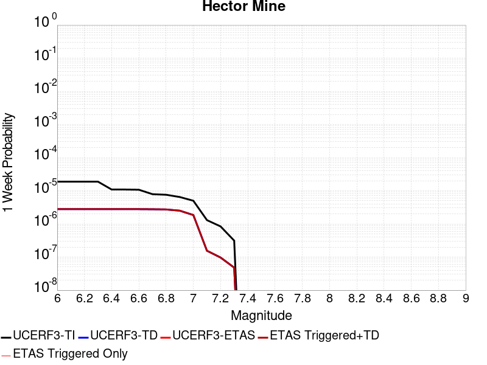 | 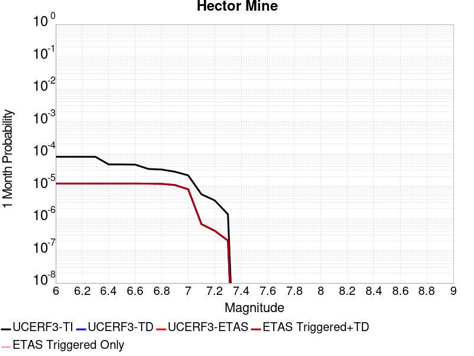 | 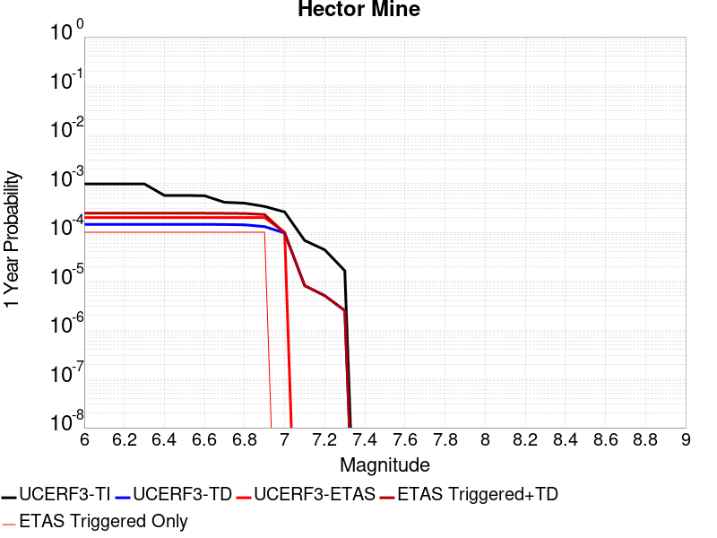 | 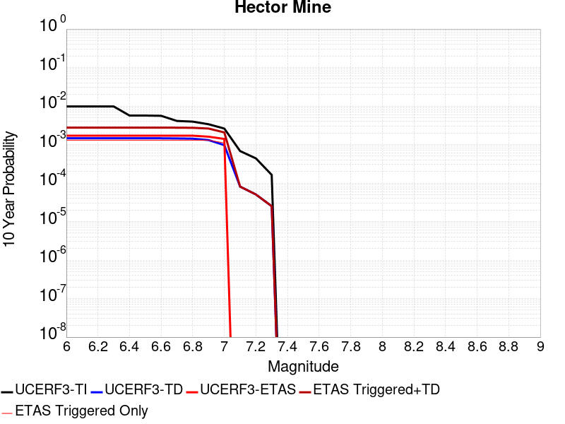 |

| Magnitude | 1 wk TI Prob | 1 wk TD Prob | 1 wk ETAS Prob | 1 wk ETAS/TD Gain | 1 wk ETAS Triggered+TD | 1 wk ETAS Triggered Only | 1 mo TI Prob | 1 mo TD Prob | 1 mo ETAS Prob | 1 mo ETAS/TD Gain | 1 mo ETAS Triggered+TD | 1 mo ETAS Triggered Only | 1 yr TI Prob | 1 yr TD Prob | 1 yr ETAS Prob | 1 yr ETAS/TD Gain | 1 yr ETAS Triggered+TD | 1 yr ETAS Triggered Only | 10 yr TI Prob | 10 yr TD Prob | 10 yr ETAS Prob | 10 yr ETAS/TD Gain | 10 yr ETAS Triggered+TD | 10 yr ETAS Triggered Only |
|-----|-----|-----|-----|-----|-----|-----|-----|-----|-----|-----|-----|-----|-----|-----|-----|-----|-----|-----|-----|-----|-----|-----|-----|-----|
| 6.0 | 1.8760093E-5 | 2.790586E-6 | 0.0 | 0.0 | 2.790586E-6 | 0.0 | 8.039792E-5 | 1.1959622E-5 | 0.0 | 0.0 | 1.1959622E-5 | 0.0 | 9.78405E-4 | 1.4560265E-4 | 2.0E-4 | 1.3736013 | 2.455881E-4 | 1.0E-4 | 0.009741086 | 0.0014554635 | 0.0017 | 1.1680129 | 0.0027535714 | 0.0013 |
| 6.1 | 1.8760093E-5 | 2.790586E-6 | 0.0 | 0.0 | 2.790586E-6 | 0.0 | 8.039792E-5 | 1.1959622E-5 | 0.0 | 0.0 | 1.1959622E-5 | 0.0 | 9.78405E-4 | 1.4560265E-4 | 2.0E-4 | 1.3736013 | 2.455881E-4 | 1.0E-4 | 0.009741086 | 0.0014554635 | 0.0017 | 1.1680129 | 0.0027535714 | 0.0013 |
| 6.2 | 1.8760093E-5 | 2.790586E-6 | 0.0 | 0.0 | 2.790586E-6 | 0.0 | 8.039792E-5 | 1.1959622E-5 | 0.0 | 0.0 | 1.1959622E-5 | 0.0 | 9.78405E-4 | 1.4560265E-4 | 2.0E-4 | 1.3736013 | 2.455881E-4 | 1.0E-4 | 0.009741086 | 0.0014554635 | 0.0017 | 1.1680129 | 0.0027535714 | 0.0013 |
| 6.3 | 1.8760093E-5 | 2.790586E-6 | 0.0 | 0.0 | 2.790586E-6 | 0.0 | 8.039792E-5 | 1.1959622E-5 | 0.0 | 0.0 | 1.1959622E-5 | 0.0 | 9.78405E-4 | 1.4560265E-4 | 2.0E-4 | 1.3736013 | 2.455881E-4 | 1.0E-4 | 0.009741086 | 0.0014554635 | 0.0017 | 1.1680129 | 0.0027535714 | 0.0013 |
| 6.4 | 1.0888055E-5 | 2.790586E-6 | 0.0 | 0.0 | 2.790586E-6 | 0.0 | 4.666226E-5 | 1.1959622E-5 | 0.0 | 0.0 | 1.1959622E-5 | 0.0 | 5.679649E-4 | 1.4560265E-4 | 2.0E-4 | 1.3736013 | 2.455881E-4 | 1.0E-4 | 0.0056651547 | 0.0014554635 | 0.0017 | 1.1680129 | 0.0027535714 | 0.0013 |
| 6.5 | 1.0888055E-5 | 2.790586E-6 | 0.0 | 0.0 | 2.790586E-6 | 0.0 | 4.666226E-5 | 1.1959622E-5 | 0.0 | 0.0 | 1.1959622E-5 | 0.0 | 5.679649E-4 | 1.4560265E-4 | 2.0E-4 | 1.3736013 | 2.455881E-4 | 1.0E-4 | 0.0056651547 | 0.0014554635 | 0.0017 | 1.1680129 | 0.0027535714 | 0.0013 |
| 6.6 | 1.0730738E-5 | 2.790586E-6 | 0.0 | 0.0 | 2.790586E-6 | 0.0 | 4.5988065E-5 | 1.1959622E-5 | 0.0 | 0.0 | 1.1959622E-5 | 0.0 | 5.5976084E-4 | 1.4560265E-4 | 2.0E-4 | 1.3736013 | 2.455881E-4 | 1.0E-4 | 0.0055835294 | 0.0014554635 | 0.0017 | 1.1680129 | 0.0027535714 | 0.0013 |
| 6.7 | 7.881326E-6 | 2.7656129E-6 | 0.0 | 0.0 | 2.7656129E-6 | 0.0 | 3.3776672E-5 | 1.1852595E-5 | 0.0 | 0.0 | 1.1852595E-5 | 0.0 | 4.111534E-4 | 1.4429977E-4 | 2.0E-4 | 1.3860035 | 2.4428536E-4 | 1.0E-4 | 0.0041039353 | 0.0014424516 | 0.0017 | 1.178549 | 0.0027405764 | 0.0013 |
| 6.8 | 7.5683483E-6 | 2.7276722E-6 | 0.0 | 0.0 | 2.7276722E-6 | 0.0 | 3.2435375E-5 | 1.1689994E-5 | 0.0 | 0.0 | 1.1689994E-5 | 0.0 | 3.9482914E-4 | 1.4232036E-4 | 2.0E-4 | 1.4052802 | 2.4230614E-4 | 1.0E-4 | 0.0039412836 | 0.001422683 | 0.0017 | 1.1949254 | 0.0027208335 | 0.0013 |
| 6.9 | 6.473048E-6 | 2.5093261E-6 | 0.0 | 0.0 | 2.5093261E-6 | 0.0 | 2.7741338E-5 | 1.0754233E-5 | 0.0 | 0.0 | 1.0754233E-5 | 0.0 | 3.3769844E-4 | 1.3092888E-4 | 2.0E-4 | 1.5275469 | 2.3091579E-4 | 1.0E-4 | 0.0033718573 | 0.0013089057 | 0.0016 | 1.2223952 | 0.002607204 | 0.0013 |
| 7.0 | 4.9959954E-6 | 1.8527618E-6 | 0.0 | 0.0 | 1.8527618E-6 | 0.0 | 2.1411232E-5 | 7.9404035E-6 | 0.0 | 0.0 | 7.9404035E-6 | 0.0 | 2.6065056E-4 | 9.667368E-5 | 1.0E-4 | 1.0344077 | 9.667368E-5 | 0.0 | 0.0026034506 | 9.666647E-4 | 0.0014 | 1.4482789 | 0.0020656013 | 0.0011 |
| 7.1 | 1.2997541E-6 | 1.5521647E-7 | 0.0 | 0.0 | 1.5521647E-7 | 0.0 | 5.5703626E-6 | 6.652133E-7 | 0.0 | 0.0 | 6.652133E-7 | 0.0 | 6.7817055E-5 | 8.098946E-6 | 0.0 | 0.0 | 8.098946E-6 | 0.0 | 6.779636E-4 | 8.09869E-5 | 0.0 | 0.0 | 8.09869E-5 | 0.0 |
| 7.2 | 8.392699E-7 | 9.691468E-8 | 0.0 | 0.0 | 9.691468E-8 | 0.0 | 3.596866E-6 | 4.1534858E-7 | 0.0 | 0.0 | 4.1534858E-7 | 0.0 | 4.3790962E-5 | 5.056859E-6 | 0.0 | 0.0 | 5.056859E-6 | 0.0 | 4.3782333E-4 | 5.0567633E-5 | 0.0 | 0.0 | 5.0567633E-5 | 0.0 |
| 7.3 | 3.13015E-7 | 4.8137956E-8 | 0.0 | 0.0 | 4.8137956E-8 | 0.0 | 1.3414921E-6 | 2.0630551E-7 | 0.0 | 0.0 | 2.0630551E-7 | 0.0 | 1.6332544E-5 | 2.5117677E-6 | 0.0 | 0.0 | 2.5117677E-6 | 0.0 | 1.6331344E-4 | 2.5117477E-5 | 0.0 | 0.0 | 2.5117477E-5 | 0.0 |

## Independence rev 2011
*[(top)](#table-of-contents)*

| 1 Week | 1 Month | 1 Year | 10 Year |
|-----|-----|-----|-----|
| 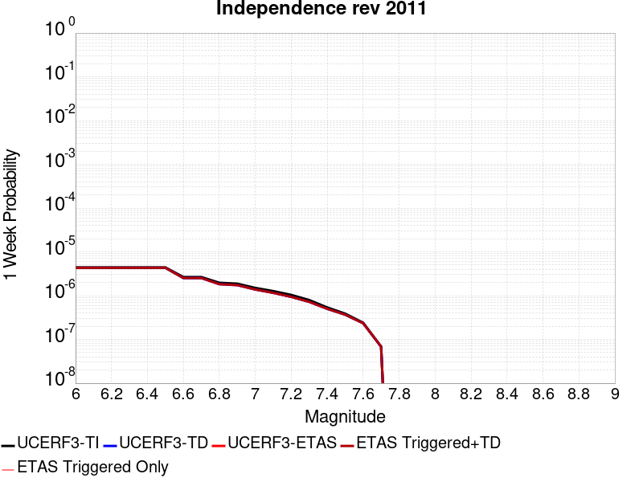 | 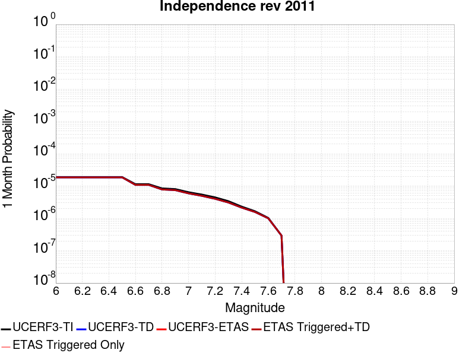 | 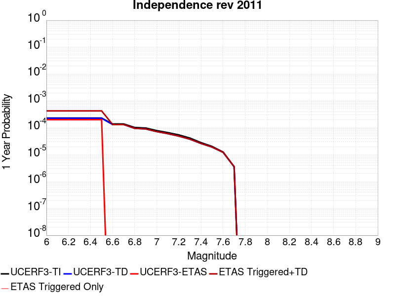 | 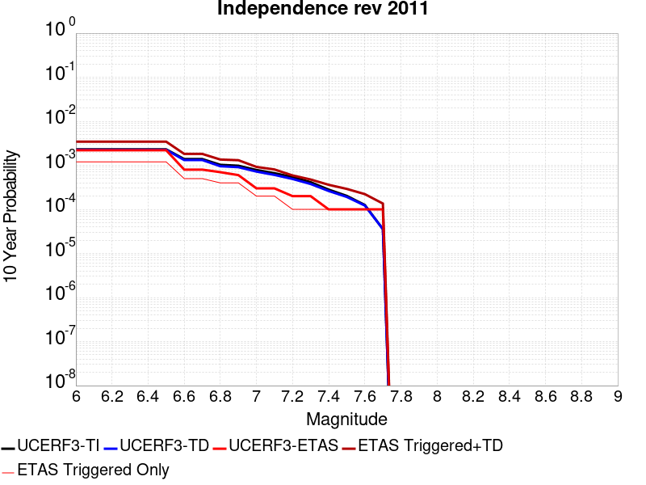 |

| Magnitude | 1 wk TI Prob | 1 wk TD Prob | 1 wk ETAS Prob | 1 wk ETAS/TD Gain | 1 wk ETAS Triggered+TD | 1 wk ETAS Triggered Only | 1 mo TI Prob | 1 mo TD Prob | 1 mo ETAS Prob | 1 mo ETAS/TD Gain | 1 mo ETAS Triggered+TD | 1 mo ETAS Triggered Only | 1 yr TI Prob | 1 yr TD Prob | 1 yr ETAS Prob | 1 yr ETAS/TD Gain | 1 yr ETAS Triggered+TD | 1 yr ETAS Triggered Only | 10 yr TI Prob | 10 yr TD Prob | 10 yr ETAS Prob | 10 yr ETAS/TD Gain | 10 yr ETAS Triggered+TD | 10 yr ETAS Triggered Only |
|-----|-----|-----|-----|-----|-----|-----|-----|-----|-----|-----|-----|-----|-----|-----|-----|-----|-----|-----|-----|-----|-----|-----|-----|-----|
| 6.0 | 4.422171E-6 | 4.324787E-6 | 0.0 | 0.0 | 4.324787E-6 | 0.0 | 1.8952025E-5 | 1.8534685E-5 | 0.0 | 0.0 | 1.8534685E-5 | 0.0 | 2.3071647E-4 | 2.2563941E-4 | 2.0E-4 | 0.88637 | 4.2559428E-4 | 2.0E-4 | 0.0023047708 | 0.0022543967 | 0.0022 | 0.9758709 | 0.0034516912 | 0.0012 |
| 6.1 | 4.422171E-6 | 4.324787E-6 | 0.0 | 0.0 | 4.324787E-6 | 0.0 | 1.8952025E-5 | 1.8534685E-5 | 0.0 | 0.0 | 1.8534685E-5 | 0.0 | 2.3071647E-4 | 2.2563941E-4 | 2.0E-4 | 0.88637 | 4.2559428E-4 | 2.0E-4 | 0.0023047708 | 0.0022543967 | 0.0022 | 0.9758709 | 0.0034516912 | 0.0012 |
| 6.2 | 4.422171E-6 | 4.324787E-6 | 0.0 | 0.0 | 4.324787E-6 | 0.0 | 1.8952025E-5 | 1.8534685E-5 | 0.0 | 0.0 | 1.8534685E-5 | 0.0 | 2.3071647E-4 | 2.2563941E-4 | 2.0E-4 | 0.88637 | 4.2559428E-4 | 2.0E-4 | 0.0023047708 | 0.0022543967 | 0.0022 | 0.9758709 | 0.0034516912 | 0.0012 |
| 6.3 | 4.422171E-6 | 4.324787E-6 | 0.0 | 0.0 | 4.324787E-6 | 0.0 | 1.8952025E-5 | 1.8534685E-5 | 0.0 | 0.0 | 1.8534685E-5 | 0.0 | 2.3071647E-4 | 2.2563941E-4 | 2.0E-4 | 0.88637 | 4.2559428E-4 | 2.0E-4 | 0.0023047708 | 0.0022543967 | 0.0022 | 0.9758709 | 0.0034516912 | 0.0012 |
| 6.4 | 4.422171E-6 | 4.324787E-6 | 0.0 | 0.0 | 4.324787E-6 | 0.0 | 1.8952025E-5 | 1.8534685E-5 | 0.0 | 0.0 | 1.8534685E-5 | 0.0 | 2.3071647E-4 | 2.2563941E-4 | 2.0E-4 | 0.88637 | 4.2559428E-4 | 2.0E-4 | 0.0023047708 | 0.0022543967 | 0.0022 | 0.9758709 | 0.0034516912 | 0.0012 |
| 6.5 | 4.422171E-6 | 4.324787E-6 | 0.0 | 0.0 | 4.324787E-6 | 0.0 | 1.8952025E-5 | 1.8534685E-5 | 0.0 | 0.0 | 1.8534685E-5 | 0.0 | 2.3071647E-4 | 2.2563941E-4 | 2.0E-4 | 0.88637 | 4.2559428E-4 | 2.0E-4 | 0.0023047708 | 0.0022543967 | 0.0022 | 0.9758709 | 0.0034516912 | 0.0012 |
| 6.6 | 2.663744E-6 | 2.5309275E-6 | 0.0 | 0.0 | 2.5309275E-6 | 0.0 | 1.1415996E-5 | 1.084679E-5 | 0.0 | 0.0 | 1.084679E-5 | 0.0 | 1.3898089E-4 | 1.3205216E-4 | 0.0 | 0.0 | 1.3205216E-4 | 0.0 | 0.0013889399 | 0.0013197851 | 8.0E-4 | 0.60615927 | 0.0018191253 | 5.0E-4 |
| 6.7 | 2.663744E-6 | 2.5309275E-6 | 0.0 | 0.0 | 2.5309275E-6 | 0.0 | 1.1415996E-5 | 1.084679E-5 | 0.0 | 0.0 | 1.084679E-5 | 0.0 | 1.3898089E-4 | 1.3205216E-4 | 0.0 | 0.0 | 1.3205216E-4 | 0.0 | 0.0013889399 | 0.0013197851 | 8.0E-4 | 0.60615927 | 0.0018191253 | 5.0E-4 |
| 6.8 | 1.9716529E-6 | 1.8313526E-6 | 0.0 | 0.0 | 1.8313526E-6 | 0.0 | 8.449913E-6 | 7.848632E-6 | 0.0 | 0.0 | 7.848632E-6 | 0.0 | 1.0287284E-4 | 9.555303E-5 | 0.0 | 0.0 | 9.555303E-5 | 0.0 | 0.0010282523 | 9.551323E-4 | 7.0E-4 | 0.73288274 | 0.0013547502 | 4.0E-4 |
| 6.9 | 1.8788617E-6 | 1.7421287E-6 | 0.0 | 0.0 | 1.7421287E-6 | 0.0 | 8.0522395E-6 | 7.4662453E-6 | 0.0 | 0.0 | 7.4662453E-6 | 0.0 | 9.80316E-5 | 9.089787E-5 | 0.0 | 0.0 | 9.089787E-5 | 0.0 | 9.798837E-4 | 9.086189E-4 | 6.0E-4 | 0.6603429 | 0.0013082555 | 4.0E-4 |
| 7.0 | 1.5045488E-6 | 1.3842305E-6 | 0.0 | 0.0 | 1.3842305E-6 | 0.0 | 6.44805E-6 | 5.932403E-6 | 0.0 | 0.0 | 5.932403E-6 | 0.0 | 7.8502184E-5 | 7.222467E-5 | 0.0 | 0.0 | 7.222467E-5 | 0.0 | 7.8474457E-4 | 7.220171E-4 | 3.0E-4 | 0.41550264 | 9.218727E-4 | 2.0E-4 |
| 7.1 | 1.272341E-6 | 1.1618819E-6 | 0.0 | 0.0 | 1.1618819E-6 | 0.0 | 5.4528787E-6 | 4.9794844E-6 | 0.0 | 0.0 | 4.9794844E-6 | 0.0 | 6.6386776E-5 | 6.0623566E-5 | 0.0 | 0.0 | 6.0623566E-5 | 0.0 | 6.636695E-4 | 6.060735E-4 | 3.0E-4 | 0.49498948 | 8.059523E-4 | 2.0E-4 |
| 7.2 | 1.0416892E-6 | 9.404476E-7 | 0.0 | 0.0 | 9.404476E-7 | 0.0 | 4.464375E-6 | 4.0304835E-6 | 0.0 | 0.0 | 4.0304835E-6 | 0.0 | 5.4352407E-5 | 4.907005E-5 | 0.0 | 0.0 | 4.907005E-5 | 0.0 | 5.4339116E-4 | 4.90594E-4 | 2.0E-4 | 0.40766907 | 5.9054495E-4 | 1.0E-4 |
| 7.3 | 7.9450155E-7 | 7.230963E-7 | 0.0 | 0.0 | 7.230963E-7 | 0.0 | 3.4050022E-6 | 3.0989806E-6 | 0.0 | 0.0 | 3.0989806E-6 | 0.0 | 4.1455114E-5 | 3.7729445E-5 | 0.0 | 0.0 | 3.7729445E-5 | 0.0 | 4.144738E-4 | 3.7723154E-4 | 2.0E-4 | 0.53017837 | 4.771938E-4 | 1.0E-4 |
| 7.4 | 5.3893444E-7 | 5.0169956E-7 | 0.0 | 0.0 | 5.0169956E-7 | 0.0 | 2.309717E-6 | 2.1501392E-6 | 0.0 | 0.0 | 2.1501392E-6 | 0.0 | 2.8120441E-5 | 2.6177635E-5 | 0.0 | 0.0 | 2.6177635E-5 | 0.0 | 2.8116882E-4 | 2.6174597E-4 | 1.0E-4 | 0.38204983 | 3.6171978E-4 | 1.0E-4 |
| 7.5 | 3.8852085E-7 | 3.6809155E-7 | 0.0 | 0.0 | 3.6809155E-7 | 0.0 | 1.6650882E-6 | 1.5775342E-6 | 0.0 | 0.0 | 1.5775342E-6 | 0.0 | 2.027226E-5 | 1.9206313E-5 | 0.0 | 0.0 | 1.9206313E-5 | 0.0 | 2.0270412E-4 | 1.9204675E-4 | 1.0E-4 | 0.52070653 | 2.9202754E-4 | 1.0E-4 |
| 7.6 | 2.414929E-7 | 2.3448993E-7 | 0.0 | 0.0 | 2.3448993E-7 | 0.0 | 1.0349692E-6 | 1.0049565E-6 | 0.0 | 0.0 | 1.0049565E-6 | 0.0 | 1.2600677E-5 | 1.2235278E-5 | 0.0 | 0.0 | 1.2235278E-5 | 0.0 | 1.2599962E-4 | 1.2234616E-4 | 1.0E-4 | 0.81735295 | 2.2233393E-4 | 1.0E-4 |
| 7.7 | 6.8298014E-8 | 6.8571616E-8 | 0.0 | 0.0 | 6.8571616E-8 | 0.0 | 2.9270575E-7 | 2.9387832E-7 | 0.0 | 0.0 | 2.9387832E-7 | 0.0 | 3.5636867E-6 | 3.577963E-6 | 0.0 | 0.0 | 3.577963E-6 | 0.0 | 3.5636294E-5 | 3.5779103E-5 | 1.0E-4 | 2.7949276 | 1.3577552E-4 | 1.0E-4 |

## Cucamonga
*[(top)](#table-of-contents)*

| 1 Week | 1 Month | 1 Year | 10 Year |
|-----|-----|-----|-----|
| 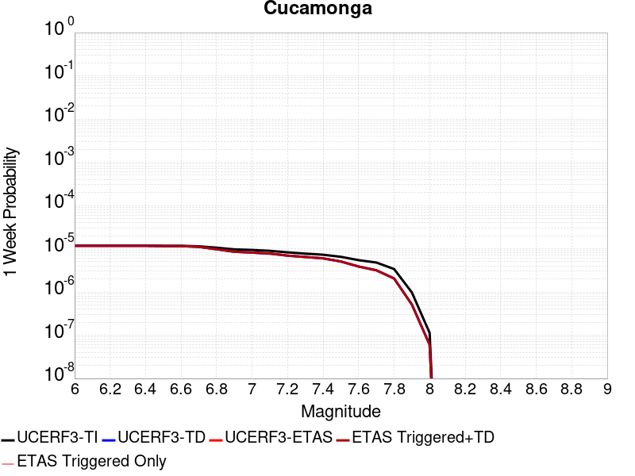 | 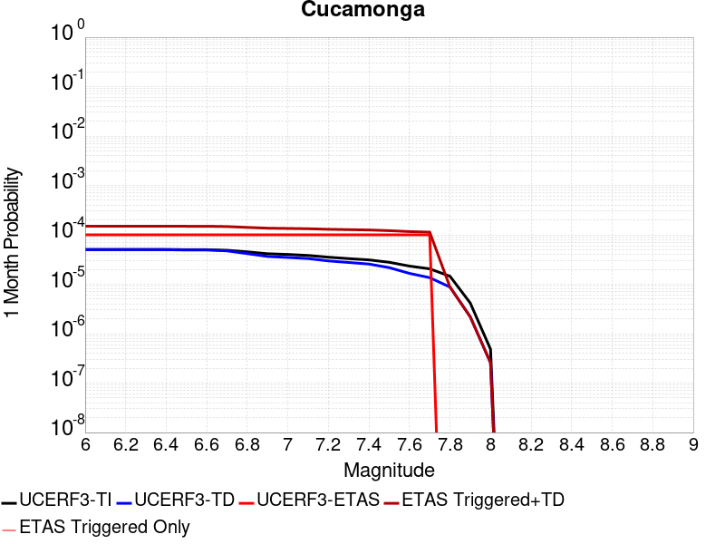 | 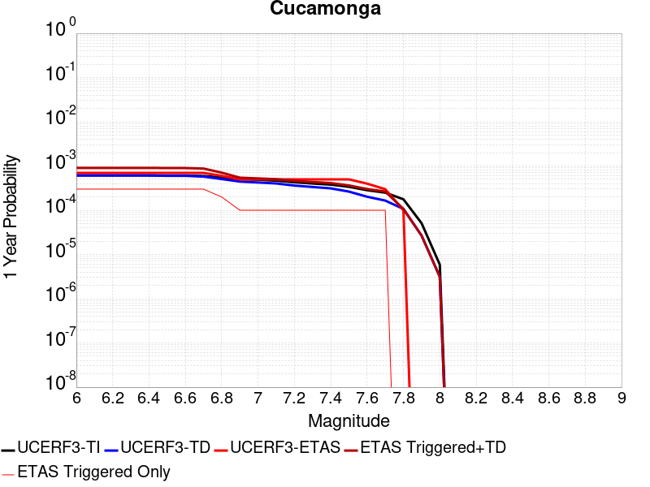 | 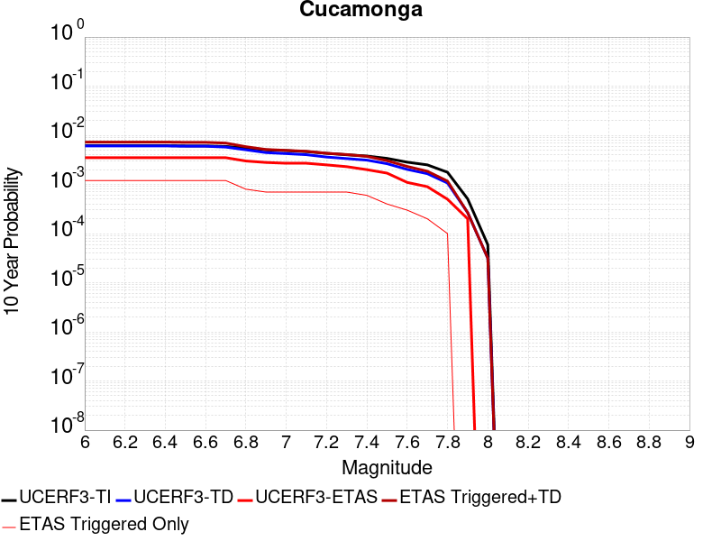 |

| Magnitude | 1 wk TI Prob | 1 wk TD Prob | 1 wk ETAS Prob | 1 wk ETAS/TD Gain | 1 wk ETAS Triggered+TD | 1 wk ETAS Triggered Only | 1 mo TI Prob | 1 mo TD Prob | 1 mo ETAS Prob | 1 mo ETAS/TD Gain | 1 mo ETAS Triggered+TD | 1 mo ETAS Triggered Only | 1 yr TI Prob | 1 yr TD Prob | 1 yr ETAS Prob | 1 yr ETAS/TD Gain | 1 yr ETAS Triggered+TD | 1 yr ETAS Triggered Only | 10 yr TI Prob | 10 yr TD Prob | 10 yr ETAS Prob | 10 yr ETAS/TD Gain | 10 yr ETAS Triggered+TD | 10 yr ETAS Triggered Only |
|-----|-----|-----|-----|-----|-----|-----|-----|-----|-----|-----|-----|-----|-----|-----|-----|-----|-----|-----|-----|-----|-----|-----|-----|-----|
| 6.0 | 1.1848348E-5 | 1.1683496E-5 | 0.0 | 0.0 | 1.1683496E-5 | 0.0 | 5.0777642E-5 | 5.007118E-5 | 1.0E-4 | 1.9971569 | 1.5006617E-4 | 1.0E-4 | 6.180424E-4 | 6.0944876E-4 | 7.0E-4 | 1.1485789 | 9.0926595E-4 | 3.0E-4 | 0.0061632637 | 0.0060790107 | 0.0035 | 0.5757516 | 0.007271716 | 0.0012 |
| 6.1 | 1.1848348E-5 | 1.1683496E-5 | 0.0 | 0.0 | 1.1683496E-5 | 0.0 | 5.0777642E-5 | 5.007118E-5 | 1.0E-4 | 1.9971569 | 1.5006617E-4 | 1.0E-4 | 6.180424E-4 | 6.0944876E-4 | 7.0E-4 | 1.1485789 | 9.0926595E-4 | 3.0E-4 | 0.0061632637 | 0.0060790107 | 0.0035 | 0.5757516 | 0.007271716 | 0.0012 |
| 6.2 | 1.1848348E-5 | 1.1683496E-5 | 0.0 | 0.0 | 1.1683496E-5 | 0.0 | 5.0777642E-5 | 5.007118E-5 | 1.0E-4 | 1.9971569 | 1.5006617E-4 | 1.0E-4 | 6.180424E-4 | 6.0944876E-4 | 7.0E-4 | 1.1485789 | 9.0926595E-4 | 3.0E-4 | 0.0061632637 | 0.0060790107 | 0.0035 | 0.5757516 | 0.007271716 | 0.0012 |
| 6.3 | 1.1848348E-5 | 1.1683496E-5 | 0.0 | 0.0 | 1.1683496E-5 | 0.0 | 5.0777642E-5 | 5.007118E-5 | 1.0E-4 | 1.9971569 | 1.5006617E-4 | 1.0E-4 | 6.180424E-4 | 6.0944876E-4 | 7.0E-4 | 1.1485789 | 9.0926595E-4 | 3.0E-4 | 0.0061632637 | 0.0060790107 | 0.0035 | 0.5757516 | 0.007271716 | 0.0012 |
| 6.4 | 1.1848348E-5 | 1.1683496E-5 | 0.0 | 0.0 | 1.1683496E-5 | 0.0 | 5.0777642E-5 | 5.007118E-5 | 1.0E-4 | 1.9971569 | 1.5006617E-4 | 1.0E-4 | 6.180424E-4 | 6.0944876E-4 | 7.0E-4 | 1.1485789 | 9.0926595E-4 | 3.0E-4 | 0.0061632637 | 0.0060790107 | 0.0035 | 0.5757516 | 0.007271716 | 0.0012 |
| 6.5 | 1.16988695E-5 | 1.1522656E-5 | 0.0 | 0.0 | 1.1522656E-5 | 0.0 | 5.013705E-5 | 4.938189E-5 | 1.0E-4 | 2.0250337 | 1.4937695E-4 | 1.0E-4 | 6.102476E-4 | 6.010613E-4 | 7.0E-4 | 1.1646066 | 9.00881E-4 | 3.0E-4 | 0.006085745 | 0.00599559 | 0.0035 | 0.5837624 | 0.007188395 | 0.0012 |
| 6.6 | 1.16988695E-5 | 1.1522656E-5 | 0.0 | 0.0 | 1.1522656E-5 | 0.0 | 5.013705E-5 | 4.938189E-5 | 1.0E-4 | 2.0250337 | 1.4937695E-4 | 1.0E-4 | 6.102476E-4 | 6.010613E-4 | 7.0E-4 | 1.1646066 | 9.00881E-4 | 3.0E-4 | 0.006085745 | 0.00599559 | 0.0035 | 0.5837624 | 0.007188395 | 0.0012 |
| 6.7 | 1.1397107E-5 | 1.1062916E-5 | 0.0 | 0.0 | 1.1062916E-5 | 0.0 | 4.884383E-5 | 4.741165E-5 | 1.0E-4 | 2.1091864 | 1.4740691E-4 | 1.0E-4 | 5.9451134E-4 | 5.770864E-4 | 7.0E-4 | 1.2129899 | 8.769133E-4 | 3.0E-4 | 0.005929234 | 0.005757091 | 0.0035 | 0.6079459 | 0.0069501824 | 0.0012 |
| 6.8 | 1.058387E-5 | 9.7391785E-6 | 0.0 | 0.0 | 9.7391785E-6 | 0.0 | 4.5358654E-5 | 4.1738673E-5 | 1.0E-4 | 2.3958595 | 1.417345E-4 | 1.0E-4 | 5.521017E-4 | 5.0805096E-4 | 6.0E-4 | 1.1809839 | 7.0794934E-4 | 2.0E-4 | 0.00550732 | 0.005069967 | 0.003 | 0.5917198 | 0.005865911 | 8.0E-4 |
| 6.9 | 9.690046E-6 | 8.537739E-6 | 0.0 | 0.0 | 8.537739E-6 | 0.0 | 4.1528107E-5 | 3.65898E-5 | 1.0E-4 | 2.7330022 | 1.3658614E-4 | 1.0E-4 | 5.054874E-4 | 4.4539015E-4 | 5.0E-4 | 1.1226113 | 5.453456E-4 | 1.0E-4 | 0.005043391 | 0.0044459747 | 0.0028 | 0.62978315 | 0.005142863 | 7.0E-4 |
| 7.0 | 9.381461E-6 | 8.14645E-6 | 0.0 | 0.0 | 8.14645E-6 | 0.0 | 4.020564E-5 | 3.4912893E-5 | 1.0E-4 | 2.8642712 | 1.3490941E-4 | 1.0E-4 | 4.893937E-4 | 4.2498196E-4 | 5.0E-4 | 1.1765206 | 5.2493945E-4 | 1.0E-4 | 0.0048831734 | 0.0042426893 | 0.0027 | 0.6363888 | 0.0049397196 | 7.0E-4 |
| 7.1 | 8.946492E-6 | 7.742037E-6 | 0.0 | 0.0 | 7.742037E-6 | 0.0 | 3.8341543E-5 | 3.317974E-5 | 1.0E-4 | 3.0138876 | 1.3317642E-4 | 1.0E-4 | 4.667083E-4 | 4.0388876E-4 | 5.0E-4 | 1.2379646 | 5.0384837E-4 | 1.0E-4 | 0.0046572937 | 0.004032547 | 0.0027 | 0.669552 | 0.004729724 | 7.0E-4 |
| 7.2 | 8.251016E-6 | 6.938091E-6 | 0.0 | 0.0 | 6.938091E-6 | 0.0 | 3.5361016E-5 | 2.9734338E-5 | 1.0E-4 | 3.363115 | 1.2973136E-4 | 1.0E-4 | 4.3043532E-4 | 3.6195567E-4 | 5.0E-4 | 1.3813846 | 4.6191947E-4 | 1.0E-4 | 0.0042960253 | 0.00361466 | 0.0025 | 0.691628 | 0.0043121297 | 7.0E-4 |
| 7.3 | 7.717881E-6 | 6.450348E-6 | 0.0 | 0.0 | 6.450348E-6 | 0.0 | 3.3076216E-5 | 2.7644057E-5 | 1.0E-4 | 3.617414 | 1.276413E-4 | 1.0E-4 | 4.026285E-4 | 3.3651464E-4 | 5.0E-4 | 1.4858195 | 4.3648097E-4 | 1.0E-4 | 0.004018998 | 0.0033610458 | 0.0023 | 0.6843108 | 0.004058693 | 7.0E-4 |
| 7.4 | 7.275623E-6 | 5.997426E-6 | 0.0 | 0.0 | 5.997426E-6 | 0.0 | 3.118087E-5 | 2.5703002E-5 | 1.0E-4 | 3.8905962 | 1.2570043E-4 | 1.0E-4 | 3.7956095E-4 | 3.1288931E-4 | 5.0E-4 | 1.5980091 | 4.1285803E-4 | 1.0E-4 | 0.0037891332 | 0.0031254815 | 0.002 | 0.6399014 | 0.0037236062 | 6.0E-4 |
| 7.5 | 6.5109502E-6 | 5.070198E-6 | 0.0 | 0.0 | 5.070198E-6 | 0.0 | 2.7903774E-5 | 2.172924E-5 | 1.0E-4 | 4.6020937 | 1.2172707E-4 | 1.0E-4 | 3.3967546E-4 | 2.645215E-4 | 5.0E-4 | 1.8902054 | 3.6449506E-4 | 1.0E-4 | 0.0033915674 | 0.0026430504 | 0.0017 | 0.6431962 | 0.0030419931 | 4.0E-4 |
| 7.6 | 5.4495326E-6 | 3.8818607E-6 | 0.0 | 0.0 | 3.8818607E-6 | 0.0 | 2.335493E-5 | 1.663644E-5 | 1.0E-4 | 6.0109015 | 1.1663478E-4 | 1.0E-4 | 2.8430918E-4 | 2.025299E-4 | 4.0E-4 | 1.975017 | 3.0250964E-4 | 1.0E-4 | 0.0028394572 | 0.0020244329 | 0.0011 | 0.5433621 | 0.0023238256 | 3.0E-4 |
| 7.7 | 4.7997164E-6 | 3.17629E-6 | 0.0 | 0.0 | 3.17629E-6 | 0.0 | 2.057005E-5 | 1.36126E-5 | 1.0E-4 | 7.346135 | 1.1361124E-4 | 1.0E-4 | 2.504116E-4 | 1.6572083E-4 | 3.0E-4 | 1.8102733 | 2.6570426E-4 | 1.0E-4 | 0.002501296 | 0.001656945 | 9.0E-4 | 0.5431683 | 0.0018566137 | 2.0E-4 |
| 7.8 | 3.3941733E-6 | 2.0509149E-6 | 0.0 | 0.0 | 2.0509149E-6 | 0.0 | 1.4546376E-5 | 8.789606E-6 | 0.0 | 0.0 | 8.789606E-6 | 0.0 | 1.7708774E-4 | 1.07008214E-4 | 1.0E-4 | 0.9345077 | 1.07008214E-4 | 0.0 | 0.0017694668 | 0.0010697367 | 5.0E-4 | 0.46740475 | 0.0011696296 | 1.0E-4 |
| 7.9 | 9.750552E-7 | 5.124722E-7 | 0.0 | 0.0 | 5.124722E-7 | 0.0 | 4.178801E-6 | 2.1963074E-6 | 0.0 | 0.0 | 2.1963074E-6 | 0.0 | 5.0875715E-5 | 2.6739719E-5 | 0.0 | 0.0 | 2.6739719E-5 | 0.0 | 5.086407E-4 | 2.6736542E-4 | 2.0E-4 | 0.7480399 | 2.6736542E-4 | 0.0 |
| 8.0 | 1.133857E-7 | 6.01962E-8 | 0.0 | 0.0 | 6.01962E-8 | 0.0 | 4.8593864E-7 | 2.579837E-7 | 0.0 | 0.0 | 2.579837E-7 | 0.0 | 5.9162867E-6 | 3.1409468E-6 | 0.0 | 0.0 | 3.1409468E-6 | 0.0 | 5.916129E-5 | 3.140904E-5 | 0.0 | 0.0 | 3.140904E-5 | 0.0 |

## Red Pass
*[(top)](#table-of-contents)*

| 1 Week | 1 Month | 1 Year | 10 Year |
|-----|-----|-----|-----|
| 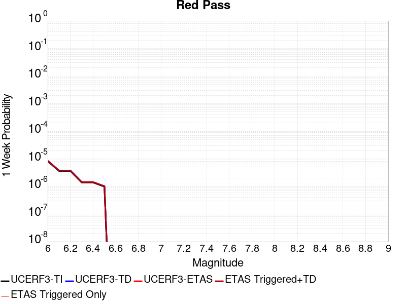 | 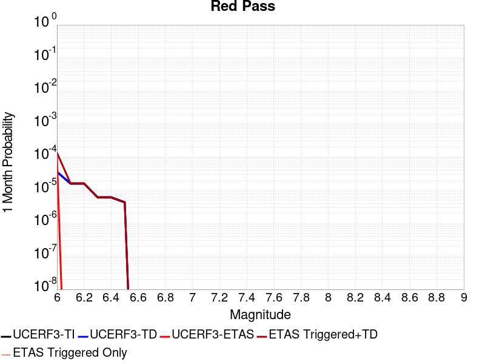 | 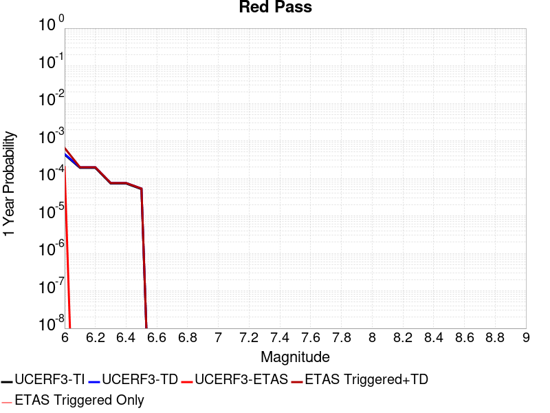 | 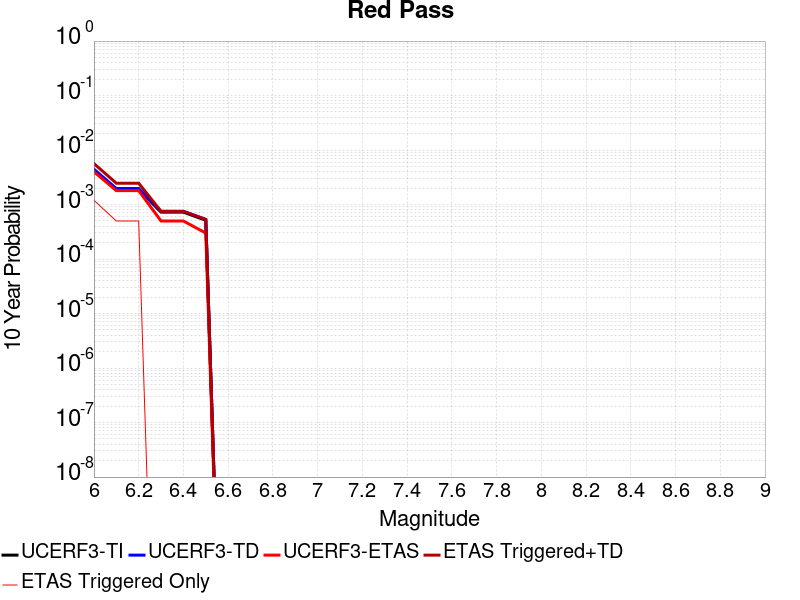 |

| Magnitude | 1 wk TI Prob | 1 wk TD Prob | 1 wk ETAS Prob | 1 wk ETAS/TD Gain | 1 wk ETAS Triggered+TD | 1 wk ETAS Triggered Only | 1 mo TI Prob | 1 mo TD Prob | 1 mo ETAS Prob | 1 mo ETAS/TD Gain | 1 mo ETAS Triggered+TD | 1 mo ETAS Triggered Only | 1 yr TI Prob | 1 yr TD Prob | 1 yr ETAS Prob | 1 yr ETAS/TD Gain | 1 yr ETAS Triggered+TD | 1 yr ETAS Triggered Only | 10 yr TI Prob | 10 yr TD Prob | 10 yr ETAS Prob | 10 yr ETAS/TD Gain | 10 yr ETAS Triggered+TD | 10 yr ETAS Triggered Only |
|-----|-----|-----|-----|-----|-----|-----|-----|-----|-----|-----|-----|-----|-----|-----|-----|-----|-----|-----|-----|-----|-----|-----|-----|-----|
| 6.0 | 8.258278E-6 | 8.548098E-6 | 0.0 | 0.0 | 8.548098E-6 | 0.0 | 3.539214E-5 | 3.6634294E-5 | 1.0E-4 | 2.729683 | 1.3663062E-4 | 1.0E-4 | 4.308141E-4 | 4.459491E-4 | 2.0E-4 | 0.44848168 | 6.458599E-4 | 2.0E-4 | 0.0042997985 | 0.0044522984 | 0.004 | 0.8984124 | 0.0056469557 | 0.0012 |
| 6.1 | 3.649988E-6 | 3.773963E-6 | 0.0 | 0.0 | 3.773963E-6 | 0.0 | 1.5642712E-5 | 1.6174054E-5 | 0.0 | 0.0 | 1.6174054E-5 | 0.0 | 1.9043336E-4 | 1.9690607E-4 | 0.0 | 0.0 | 1.9690607E-4 | 0.0 | 0.0019027026 | 0.001967783 | 0.0018 | 0.914735 | 0.002466799 | 5.0E-4 |
| 6.2 | 3.649988E-6 | 3.773963E-6 | 0.0 | 0.0 | 3.773963E-6 | 0.0 | 1.5642712E-5 | 1.6174054E-5 | 0.0 | 0.0 | 1.6174054E-5 | 0.0 | 1.9043336E-4 | 1.9690607E-4 | 0.0 | 0.0 | 1.9690607E-4 | 0.0 | 0.0019027026 | 0.001967783 | 0.0018 | 0.914735 | 0.002466799 | 5.0E-4 |
| 6.3 | 1.3924937E-6 | 1.4405914E-6 | 0.0 | 0.0 | 1.4405914E-6 | 0.0 | 5.9678164E-6 | 6.1739565E-6 | 0.0 | 0.0 | 6.1739565E-6 | 0.0 | 7.265574E-5 | 7.516674E-5 | 0.0 | 0.0 | 7.516674E-5 | 0.0 | 7.263199E-4 | 7.515518E-4 | 5.0E-4 | 0.6652901 | 7.515518E-4 | 0.0 |
| 6.4 | 1.3924937E-6 | 1.4405914E-6 | 0.0 | 0.0 | 1.4405914E-6 | 0.0 | 5.9678164E-6 | 6.1739565E-6 | 0.0 | 0.0 | 6.1739565E-6 | 0.0 | 7.265574E-5 | 7.516674E-5 | 0.0 | 0.0 | 7.516674E-5 | 0.0 | 7.263199E-4 | 7.515518E-4 | 5.0E-4 | 0.6652901 | 7.515518E-4 | 0.0 |
| 6.5 | 9.876812E-7 | 1.0218184E-6 | 0.0 | 0.0 | 1.0218184E-6 | 0.0 | 4.2329125E-6 | 4.379222E-6 | 0.0 | 0.0 | 4.379222E-6 | 0.0 | 5.153449E-5 | 5.3317024E-5 | 0.0 | 0.0 | 5.3317024E-5 | 0.0 | 5.1522546E-4 | 5.3317024E-4 | 3.0E-4 | 0.5626721 | 5.3317024E-4 | 0.0 |

## Pitas Point (Lower)-Montalvo
*[(top)](#table-of-contents)*

| 1 Week | 1 Month | 1 Year | 10 Year |
|-----|-----|-----|-----|
| 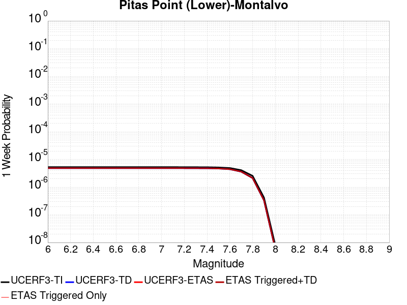 | 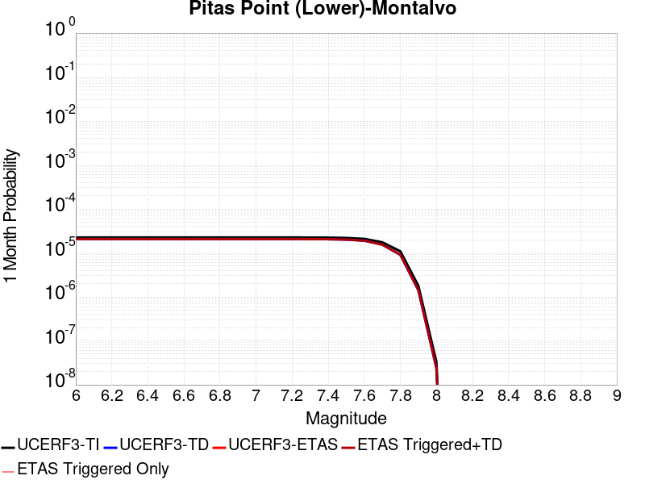 | 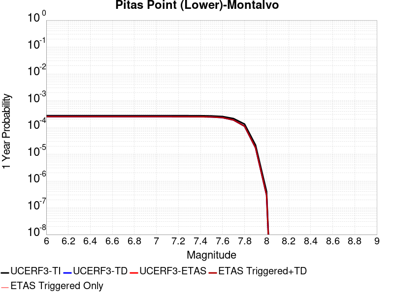 | 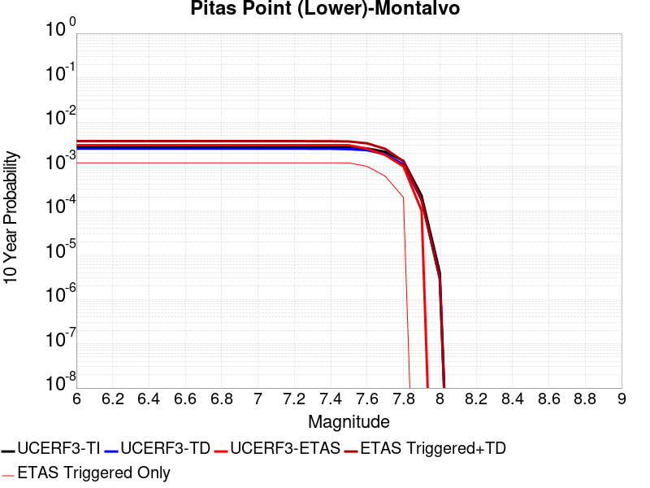 |

| Magnitude | 1 wk TI Prob | 1 wk TD Prob | 1 wk ETAS Prob | 1 wk ETAS/TD Gain | 1 wk ETAS Triggered+TD | 1 wk ETAS Triggered Only | 1 mo TI Prob | 1 mo TD Prob | 1 mo ETAS Prob | 1 mo ETAS/TD Gain | 1 mo ETAS Triggered+TD | 1 mo ETAS Triggered Only | 1 yr TI Prob | 1 yr TD Prob | 1 yr ETAS Prob | 1 yr ETAS/TD Gain | 1 yr ETAS Triggered+TD | 1 yr ETAS Triggered Only | 10 yr TI Prob | 10 yr TD Prob | 10 yr ETAS Prob | 10 yr ETAS/TD Gain | 10 yr ETAS Triggered+TD | 10 yr ETAS Triggered Only |
|-----|-----|-----|-----|-----|-----|-----|-----|-----|-----|-----|-----|-----|-----|-----|-----|-----|-----|-----|-----|-----|-----|-----|-----|-----|
| 6.0 | 5.2543637E-6 | 4.8333936E-6 | 0.0 | 0.0 | 4.8333936E-6 | 0.0 | 2.2518509E-5 | 2.071438E-5 | 0.0 | 0.0 | 2.071438E-5 | 0.0 | 2.7412834E-4 | 2.521687E-4 | 0.0 | 0.0 | 2.521687E-4 | 0.0 | 0.0027379042 | 0.002518858 | 0.003 | 1.1910158 | 0.0037158355 | 0.0012 |
| 6.1 | 5.2543637E-6 | 4.8333936E-6 | 0.0 | 0.0 | 4.8333936E-6 | 0.0 | 2.2518509E-5 | 2.071438E-5 | 0.0 | 0.0 | 2.071438E-5 | 0.0 | 2.7412834E-4 | 2.521687E-4 | 0.0 | 0.0 | 2.521687E-4 | 0.0 | 0.0027379042 | 0.002518858 | 0.003 | 1.1910158 | 0.0037158355 | 0.0012 |
| 6.2 | 5.2543637E-6 | 4.8333936E-6 | 0.0 | 0.0 | 4.8333936E-6 | 0.0 | 2.2518509E-5 | 2.071438E-5 | 0.0 | 0.0 | 2.071438E-5 | 0.0 | 2.7412834E-4 | 2.521687E-4 | 0.0 | 0.0 | 2.521687E-4 | 0.0 | 0.0027379042 | 0.002518858 | 0.003 | 1.1910158 | 0.0037158355 | 0.0012 |
| 6.3 | 5.2543637E-6 | 4.8333936E-6 | 0.0 | 0.0 | 4.8333936E-6 | 0.0 | 2.2518509E-5 | 2.071438E-5 | 0.0 | 0.0 | 2.071438E-5 | 0.0 | 2.7412834E-4 | 2.521687E-4 | 0.0 | 0.0 | 2.521687E-4 | 0.0 | 0.0027379042 | 0.002518858 | 0.003 | 1.1910158 | 0.0037158355 | 0.0012 |
| 6.4 | 5.2543637E-6 | 4.8333936E-6 | 0.0 | 0.0 | 4.8333936E-6 | 0.0 | 2.2518509E-5 | 2.071438E-5 | 0.0 | 0.0 | 2.071438E-5 | 0.0 | 2.7412834E-4 | 2.521687E-4 | 0.0 | 0.0 | 2.521687E-4 | 0.0 | 0.0027379042 | 0.002518858 | 0.003 | 1.1910158 | 0.0037158355 | 0.0012 |
| 6.5 | 5.2543637E-6 | 4.8333936E-6 | 0.0 | 0.0 | 4.8333936E-6 | 0.0 | 2.2518509E-5 | 2.071438E-5 | 0.0 | 0.0 | 2.071438E-5 | 0.0 | 2.7412834E-4 | 2.521687E-4 | 0.0 | 0.0 | 2.521687E-4 | 0.0 | 0.0027379042 | 0.002518858 | 0.003 | 1.1910158 | 0.0037158355 | 0.0012 |
| 6.6 | 5.2543637E-6 | 4.8333936E-6 | 0.0 | 0.0 | 4.8333936E-6 | 0.0 | 2.2518509E-5 | 2.071438E-5 | 0.0 | 0.0 | 2.071438E-5 | 0.0 | 2.7412834E-4 | 2.521687E-4 | 0.0 | 0.0 | 2.521687E-4 | 0.0 | 0.0027379042 | 0.002518858 | 0.003 | 1.1910158 | 0.0037158355 | 0.0012 |
| 6.7 | 5.2543637E-6 | 4.8333936E-6 | 0.0 | 0.0 | 4.8333936E-6 | 0.0 | 2.2518509E-5 | 2.071438E-5 | 0.0 | 0.0 | 2.071438E-5 | 0.0 | 2.7412834E-4 | 2.521687E-4 | 0.0 | 0.0 | 2.521687E-4 | 0.0 | 0.0027379042 | 0.002518858 | 0.003 | 1.1910158 | 0.0037158355 | 0.0012 |
| 6.8 | 5.2543637E-6 | 4.8333936E-6 | 0.0 | 0.0 | 4.8333936E-6 | 0.0 | 2.2518509E-5 | 2.071438E-5 | 0.0 | 0.0 | 2.071438E-5 | 0.0 | 2.7412834E-4 | 2.521687E-4 | 0.0 | 0.0 | 2.521687E-4 | 0.0 | 0.0027379042 | 0.002518858 | 0.003 | 1.1910158 | 0.0037158355 | 0.0012 |
| 6.9 | 5.2543637E-6 | 4.8333936E-6 | 0.0 | 0.0 | 4.8333936E-6 | 0.0 | 2.2518509E-5 | 2.071438E-5 | 0.0 | 0.0 | 2.071438E-5 | 0.0 | 2.7412834E-4 | 2.521687E-4 | 0.0 | 0.0 | 2.521687E-4 | 0.0 | 0.0027379042 | 0.002518858 | 0.003 | 1.1910158 | 0.0037158355 | 0.0012 |
| 7.0 | 5.2543637E-6 | 4.8333936E-6 | 0.0 | 0.0 | 4.8333936E-6 | 0.0 | 2.2518509E-5 | 2.071438E-5 | 0.0 | 0.0 | 2.071438E-5 | 0.0 | 2.7412834E-4 | 2.521687E-4 | 0.0 | 0.0 | 2.521687E-4 | 0.0 | 0.0027379042 | 0.002518858 | 0.003 | 1.1910158 | 0.0037158355 | 0.0012 |
| 7.1 | 5.2543637E-6 | 4.8333936E-6 | 0.0 | 0.0 | 4.8333936E-6 | 0.0 | 2.2518509E-5 | 2.071438E-5 | 0.0 | 0.0 | 2.071438E-5 | 0.0 | 2.7412834E-4 | 2.521687E-4 | 0.0 | 0.0 | 2.521687E-4 | 0.0 | 0.0027379042 | 0.002518858 | 0.003 | 1.1910158 | 0.0037158355 | 0.0012 |
| 7.2 | 5.2458695E-6 | 4.824551E-6 | 0.0 | 0.0 | 4.824551E-6 | 0.0 | 2.2482105E-5 | 2.0676485E-5 | 0.0 | 0.0 | 2.0676485E-5 | 0.0 | 2.7368523E-4 | 2.5170745E-4 | 0.0 | 0.0 | 2.5170745E-4 | 0.0 | 0.0027334841 | 0.002514256 | 0.003 | 1.1931959 | 0.0037112387 | 0.0012 |
| 7.3 | 5.22665E-6 | 4.8044776E-6 | 0.0 | 0.0 | 4.8044776E-6 | 0.0 | 2.2399736E-5 | 2.0590458E-5 | 0.0 | 0.0 | 2.0590458E-5 | 0.0 | 2.7268266E-4 | 2.506603E-4 | 0.0 | 0.0 | 2.506603E-4 | 0.0 | 0.002723483 | 0.0025038081 | 0.003 | 1.1981748 | 0.0037008035 | 0.0012 |
| 7.4 | 5.210642E-6 | 4.787699E-6 | 0.0 | 0.0 | 4.787699E-6 | 0.0 | 2.233113E-5 | 2.051855E-5 | 0.0 | 0.0 | 2.051855E-5 | 0.0 | 2.718476E-4 | 2.49785E-4 | 0.0 | 0.0 | 2.49785E-4 | 0.0 | 0.002715153 | 0.0024950749 | 0.003 | 1.2023687 | 0.0036920807 | 0.0012 |
| 7.5 | 5.1226016E-6 | 4.6956297E-6 | 0.0 | 0.0 | 4.6956297E-6 | 0.0 | 2.1953823E-5 | 2.0123975E-5 | 0.0 | 0.0 | 2.0123975E-5 | 0.0 | 2.67255E-4 | 2.4498213E-4 | 0.0 | 0.0 | 2.4498213E-4 | 0.0 | 0.0026693381 | 0.0024471525 | 0.003 | 1.2259146 | 0.0036442159 | 0.0012 |
| 7.6 | 4.8796987E-6 | 4.4406675E-6 | 0.0 | 0.0 | 4.4406675E-6 | 0.0 | 2.0912828E-5 | 1.9031293E-5 | 0.0 | 0.0 | 1.9031293E-5 | 0.0 | 2.5458392E-4 | 2.3168167E-4 | 0.0 | 0.0 | 2.3168167E-4 | 0.0 | 0.0025429246 | 0.0023144318 | 0.0025 | 1.0801787 | 0.0033121174 | 0.001 |
| 7.7 | 4.0834398E-6 | 3.605343E-6 | 0.0 | 0.0 | 3.605343E-6 | 0.0 | 1.7500339E-5 | 1.545138E-5 | 0.0 | 0.0 | 1.545138E-5 | 0.0 | 2.1304579E-4 | 1.8810453E-4 | 0.0 | 0.0 | 1.8810453E-4 | 0.0 | 0.0021284167 | 0.0018794768 | 0.0018 | 0.9577133 | 0.0024783493 | 6.0E-4 |
| 7.8 | 2.5445438E-6 | 2.1189571E-6 | 0.0 | 0.0 | 2.1189571E-6 | 0.0 | 1.0905142E-5 | 9.081214E-6 | 0.0 | 0.0 | 9.081214E-6 | 0.0 | 1.3276201E-4 | 1.10558205E-4 | 0.0 | 0.0 | 1.10558205E-4 | 0.0 | 0.0013268272 | 0.0011050367 | 0.001 | 0.9049473 | 0.0013048158 | 2.0E-4 |
| 7.9 | 4.1677114E-7 | 3.326864E-7 | 0.0 | 0.0 | 3.326864E-7 | 0.0 | 1.7861609E-6 | 1.4257981E-6 | 0.0 | 0.0 | 1.4257981E-6 | 0.0 | 2.1746291E-5 | 1.7358956E-5 | 0.0 | 0.0 | 1.7358956E-5 | 0.0 | 2.1744163E-4 | 1.7357632E-4 | 1.0E-4 | 0.5761154 | 1.7357632E-4 | 0.0 |
| 8.0 | 7.791402E-9 | 5.6791927E-9 | 0.0 | 0.0 | 5.6791927E-9 | 0.0 | 3.3391725E-8 | 2.4339396E-8 | 0.0 | 0.0 | 2.4339396E-8 | 0.0 | 4.0654416E-7 | 2.9633213E-7 | 0.0 | 0.0 | 2.9633213E-7 | 0.0 | 4.065434E-6 | 2.9633193E-6 | 0.0 | 0.0 | 2.9633193E-6 | 0.0 |

## Eureka Peak
*[(top)](#table-of-contents)*

| 1 Week | 1 Month | 1 Year | 10 Year |
|-----|-----|-----|-----|
| 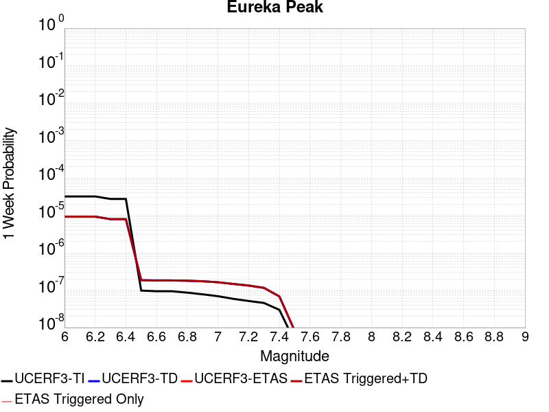 | 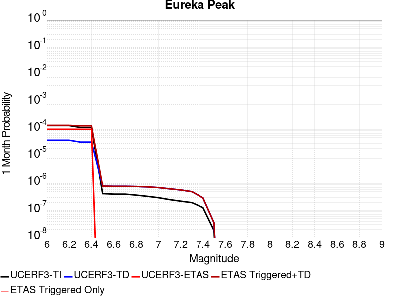 | 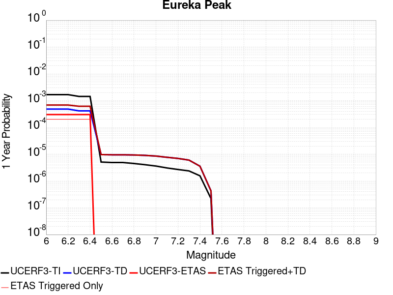 | 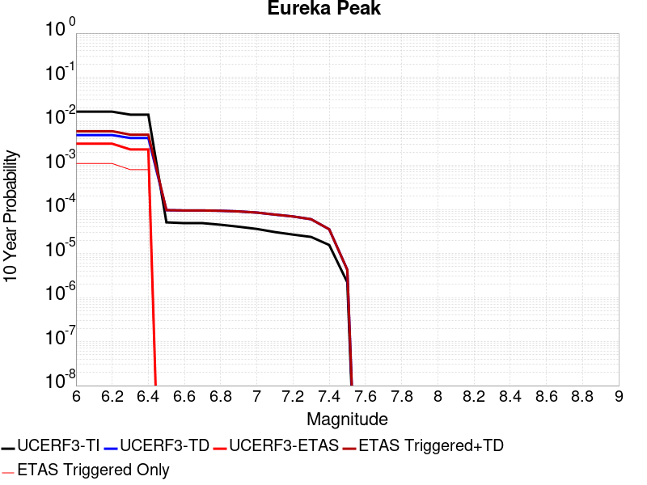 |

| Magnitude | 1 wk TI Prob | 1 wk TD Prob | 1 wk ETAS Prob | 1 wk ETAS/TD Gain | 1 wk ETAS Triggered+TD | 1 wk ETAS Triggered Only | 1 mo TI Prob | 1 mo TD Prob | 1 mo ETAS Prob | 1 mo ETAS/TD Gain | 1 mo ETAS Triggered+TD | 1 mo ETAS Triggered Only | 1 yr TI Prob | 1 yr TD Prob | 1 yr ETAS Prob | 1 yr ETAS/TD Gain | 1 yr ETAS Triggered+TD | 1 yr ETAS Triggered Only | 10 yr TI Prob | 10 yr TD Prob | 10 yr ETAS Prob | 10 yr ETAS/TD Gain | 10 yr ETAS Triggered+TD | 10 yr ETAS Triggered Only |
|-----|-----|-----|-----|-----|-----|-----|-----|-----|-----|-----|-----|-----|-----|-----|-----|-----|-----|-----|-----|-----|-----|-----|-----|-----|
| 6.0 | 3.1949054E-5 | 9.220694E-6 | 0.0 | 0.0 | 9.220694E-6 | 0.0 | 1.3691733E-4 | 3.9517094E-5 | 1.0E-4 | 2.5305505 | 1.3951314E-4 | 1.0E-4 | 0.0016656938 | 4.8109092E-4 | 3.0E-4 | 0.6235828 | 6.809947E-4 | 2.0E-4 | 0.016532637 | 0.0048736865 | 0.0031 | 0.6360688 | 0.0059683253 | 0.0011 |
| 6.1 | 3.1949054E-5 | 9.220694E-6 | 0.0 | 0.0 | 9.220694E-6 | 0.0 | 1.3691733E-4 | 3.9517094E-5 | 1.0E-4 | 2.5305505 | 1.3951314E-4 | 1.0E-4 | 0.0016656938 | 4.8109092E-4 | 3.0E-4 | 0.6235828 | 6.809947E-4 | 2.0E-4 | 0.016532637 | 0.0048736865 | 0.0031 | 0.6360688 | 0.0059683253 | 0.0011 |
| 6.2 | 3.1949054E-5 | 9.220694E-6 | 0.0 | 0.0 | 9.220694E-6 | 0.0 | 1.3691733E-4 | 3.9517094E-5 | 1.0E-4 | 2.5305505 | 1.3951314E-4 | 1.0E-4 | 0.0016656938 | 4.8109092E-4 | 3.0E-4 | 0.6235828 | 6.809947E-4 | 2.0E-4 | 0.016532637 | 0.0048736865 | 0.0031 | 0.6360688 | 0.0059683253 | 0.0011 |
| 6.3 | 2.7339745E-5 | 7.898325E-6 | 0.0 | 0.0 | 7.898325E-6 | 0.0 | 1.1716507E-4 | 3.384994E-5 | 1.0E-4 | 2.9542148 | 1.3384655E-4 | 1.0E-4 | 0.0014255513 | 4.1211947E-4 | 3.0E-4 | 0.72794425 | 6.12037E-4 | 2.0E-4 | 0.0141644105 | 0.004182418 | 0.0023 | 0.54992115 | 0.004979072 | 8.0E-4 |
| 6.4 | 2.7339745E-5 | 7.898325E-6 | 0.0 | 0.0 | 7.898325E-6 | 0.0 | 1.1716507E-4 | 3.384994E-5 | 1.0E-4 | 2.9542148 | 1.3384655E-4 | 1.0E-4 | 0.0014255513 | 4.1211947E-4 | 3.0E-4 | 0.72794425 | 6.12037E-4 | 2.0E-4 | 0.0141644105 | 0.004182418 | 0.0023 | 0.54992115 | 0.004979072 | 8.0E-4 |
| 6.5 | 9.738388E-8 | 1.8457662E-7 | 0.0 | 0.0 | 1.8457662E-7 | 0.0 | 4.1735944E-7 | 7.9104245E-7 | 0.0 | 0.0 | 7.9104245E-7 | 0.0 | 5.081339E-6 | 9.6309E-6 | 0.0 | 0.0 | 9.6309E-6 | 0.0 | 5.0812232E-5 | 9.63049E-5 | 0.0 | 0.0 | 9.63049E-5 | 0.0 |
| 6.6 | 9.3495956E-8 | 1.8166998E-7 | 0.0 | 0.0 | 1.8166998E-7 | 0.0 | 4.0069688E-7 | 7.785854E-7 | 0.0 | 0.0 | 7.785854E-7 | 0.0 | 4.8784736E-6 | 9.479237E-6 | 0.0 | 0.0 | 9.479237E-6 | 0.0 | 4.8783666E-5 | 9.4788404E-5 | 0.0 | 0.0 | 9.4788404E-5 | 0.0 |
| 6.7 | 9.3495956E-8 | 1.8166998E-7 | 0.0 | 0.0 | 1.8166998E-7 | 0.0 | 4.0069688E-7 | 7.785854E-7 | 0.0 | 0.0 | 7.785854E-7 | 0.0 | 4.8784736E-6 | 9.479237E-6 | 0.0 | 0.0 | 9.479237E-6 | 0.0 | 4.8783666E-5 | 9.4788404E-5 | 0.0 | 0.0 | 9.4788404E-5 | 0.0 |
| 6.8 | 8.591428E-8 | 1.7861369E-7 | 0.0 | 0.0 | 1.7861369E-7 | 0.0 | 3.68204E-7 | 7.65487E-7 | 0.0 | 0.0 | 7.65487E-7 | 0.0 | 4.4828744E-6 | 9.319766E-6 | 0.0 | 0.0 | 9.319766E-6 | 0.0 | 4.482784E-5 | 9.319383E-5 | 0.0 | 0.0 | 9.319383E-5 | 0.0 |
| 6.9 | 7.749723E-8 | 1.7280401E-7 | 0.0 | 0.0 | 1.7280401E-7 | 0.0 | 3.3213098E-7 | 7.405884E-7 | 0.0 | 0.0 | 7.405884E-7 | 0.0 | 4.043687E-6 | 9.016627E-6 | 0.0 | 0.0 | 9.016627E-6 | 0.0 | 4.0436134E-5 | 9.0162685E-5 | 0.0 | 0.0 | 9.0162685E-5 | 0.0 |
| 7.0 | 6.897872E-8 | 1.6261183E-7 | 0.0 | 0.0 | 1.6261183E-7 | 0.0 | 2.9562307E-7 | 6.9690765E-7 | 0.0 | 0.0 | 6.9690765E-7 | 0.0 | 3.5992048E-6 | 8.484818E-6 | 0.0 | 0.0 | 8.484818E-6 | 0.0 | 3.5991467E-5 | 8.4845014E-5 | 0.0 | 0.0 | 8.4845014E-5 | 0.0 |
| 7.1 | 5.859318E-8 | 1.4640872E-7 | 0.0 | 0.0 | 1.4640872E-7 | 0.0 | 2.5111362E-7 | 6.274658E-7 | 0.0 | 0.0 | 6.274658E-7 | 0.0 | 3.057304E-6 | 7.63937E-6 | 0.0 | 0.0 | 7.63937E-6 | 0.0 | 3.0572617E-5 | 7.639114E-5 | 0.0 | 0.0 | 7.639114E-5 | 0.0 |
| 7.2 | 5.1375338E-8 | 1.3280817E-7 | 0.0 | 0.0 | 1.3280817E-7 | 0.0 | 2.2018E-7 | 5.6917776E-7 | 0.0 | 0.0 | 5.6917776E-7 | 0.0 | 2.680688E-6 | 6.9297175E-6 | 0.0 | 0.0 | 6.9297175E-6 | 0.0 | 2.6806558E-5 | 6.929507E-5 | 0.0 | 0.0 | 6.929507E-5 | 0.0 |
| 7.3 | 4.5441396E-8 | 1.1505777E-7 | 0.0 | 0.0 | 1.1505777E-7 | 0.0 | 1.9474882E-7 | 4.9310466E-7 | 0.0 | 0.0 | 4.9310466E-7 | 0.0 | 2.3710643E-6 | 6.003533E-6 | 0.0 | 0.0 | 6.003533E-6 | 0.0 | 2.371039E-5 | 6.0033763E-5 | 0.0 | 0.0 | 6.0033763E-5 | 0.0 |
| 7.4 | 2.981918E-8 | 6.810206E-8 | 0.0 | 0.0 | 6.810206E-8 | 0.0 | 1.2779647E-7 | 2.9186594E-7 | 0.0 | 0.0 | 2.9186594E-7 | 0.0 | 1.5559209E-6 | 3.5534624E-6 | 0.0 | 0.0 | 3.5534624E-6 | 0.0 | 1.55591E-5 | 3.5534096E-5 | 0.0 | 0.0 | 3.5534096E-5 | 0.0 |
| 7.5 | 4.24214E-9 | 8.191514E-9 | 0.0 | 0.0 | 8.191514E-9 | 0.0 | 1.81806E-8 | 3.510649E-8 | 0.0 | 0.0 | 3.510649E-8 | 0.0 | 2.213488E-7 | 4.2742147E-7 | 0.0 | 0.0 | 4.2742147E-7 | 0.0 | 2.2134857E-6 | 4.2742126E-6 | 0.0 | 0.0 | 4.2742126E-6 | 0.0 |

## Russ 2011 CFM
*[(top)](#table-of-contents)*

| 1 Week | 1 Month | 1 Year | 10 Year |
|-----|-----|-----|-----|
| 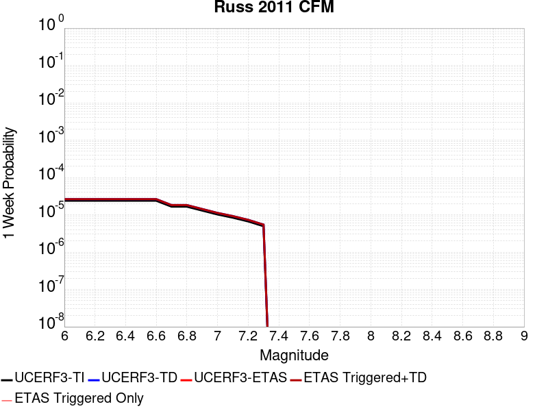 | 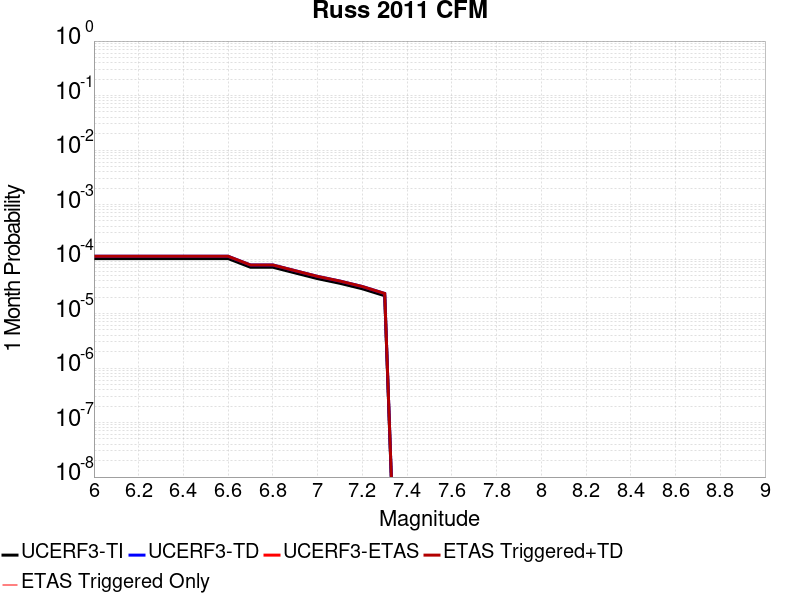 | 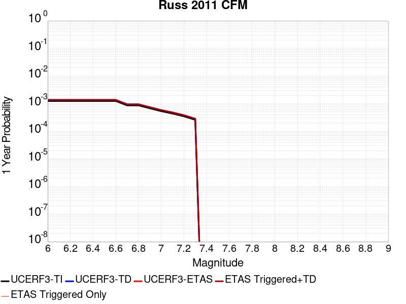 |  |

| Magnitude | 1 wk TI Prob | 1 wk TD Prob | 1 wk ETAS Prob | 1 wk ETAS/TD Gain | 1 wk ETAS Triggered+TD | 1 wk ETAS Triggered Only | 1 mo TI Prob | 1 mo TD Prob | 1 mo ETAS Prob | 1 mo ETAS/TD Gain | 1 mo ETAS Triggered+TD | 1 mo ETAS Triggered Only | 1 yr TI Prob | 1 yr TD Prob | 1 yr ETAS Prob | 1 yr ETAS/TD Gain | 1 yr ETAS Triggered+TD | 1 yr ETAS Triggered Only | 10 yr TI Prob | 10 yr TD Prob | 10 yr ETAS Prob | 10 yr ETAS/TD Gain | 10 yr ETAS Triggered+TD | 10 yr ETAS Triggered Only |
|-----|-----|-----|-----|-----|-----|-----|-----|-----|-----|-----|-----|-----|-----|-----|-----|-----|-----|-----|-----|-----|-----|-----|-----|-----|
| 6.0 | 2.3806366E-5 | 2.6225995E-5 | 0.0 | 0.0 | 2.6225995E-5 | 0.0 | 1.0202329E-4 | 1.12392634E-4 | 1.0E-4 | 0.889738 | 2.1238139E-4 | 1.0E-4 | 0.0012414258 | 0.0013675849 | 7.0E-4 | 0.5118512 | 0.0014674482 | 1.0E-4 | 0.012345135 | 0.013598154 | 0.0058 | 0.42652845 | 0.014683196 | 0.0011 |
| 6.1 | 2.3806366E-5 | 2.6225995E-5 | 0.0 | 0.0 | 2.6225995E-5 | 0.0 | 1.0202329E-4 | 1.12392634E-4 | 1.0E-4 | 0.889738 | 2.1238139E-4 | 1.0E-4 | 0.0012414258 | 0.0013675849 | 7.0E-4 | 0.5118512 | 0.0014674482 | 1.0E-4 | 0.012345135 | 0.013598154 | 0.0058 | 0.42652845 | 0.014683196 | 0.0011 |
| 6.2 | 2.3806366E-5 | 2.6225995E-5 | 0.0 | 0.0 | 2.6225995E-5 | 0.0 | 1.0202329E-4 | 1.12392634E-4 | 1.0E-4 | 0.889738 | 2.1238139E-4 | 1.0E-4 | 0.0012414258 | 0.0013675849 | 7.0E-4 | 0.5118512 | 0.0014674482 | 1.0E-4 | 0.012345135 | 0.013598154 | 0.0058 | 0.42652845 | 0.014683196 | 0.0011 |
| 6.3 | 2.3806366E-5 | 2.6225995E-5 | 0.0 | 0.0 | 2.6225995E-5 | 0.0 | 1.0202329E-4 | 1.12392634E-4 | 1.0E-4 | 0.889738 | 2.1238139E-4 | 1.0E-4 | 0.0012414258 | 0.0013675849 | 7.0E-4 | 0.5118512 | 0.0014674482 | 1.0E-4 | 0.012345135 | 0.013598154 | 0.0058 | 0.42652845 | 0.014683196 | 0.0011 |
| 6.4 | 2.3806366E-5 | 2.6225995E-5 | 0.0 | 0.0 | 2.6225995E-5 | 0.0 | 1.0202329E-4 | 1.12392634E-4 | 1.0E-4 | 0.889738 | 2.1238139E-4 | 1.0E-4 | 0.0012414258 | 0.0013675849 | 7.0E-4 | 0.5118512 | 0.0014674482 | 1.0E-4 | 0.012345135 | 0.013598154 | 0.0058 | 0.42652845 | 0.014683196 | 0.0011 |
| 6.5 | 2.3806366E-5 | 2.6225995E-5 | 0.0 | 0.0 | 2.6225995E-5 | 0.0 | 1.0202329E-4 | 1.12392634E-4 | 1.0E-4 | 0.889738 | 2.1238139E-4 | 1.0E-4 | 0.0012414258 | 0.0013675849 | 7.0E-4 | 0.5118512 | 0.0014674482 | 1.0E-4 | 0.012345135 | 0.013598154 | 0.0058 | 0.42652845 | 0.014683196 | 0.0011 |
| 6.6 | 2.3806366E-5 | 2.6225995E-5 | 0.0 | 0.0 | 2.6225995E-5 | 0.0 | 1.0202329E-4 | 1.12392634E-4 | 1.0E-4 | 0.889738 | 2.1238139E-4 | 1.0E-4 | 0.0012414258 | 0.0013675849 | 7.0E-4 | 0.5118512 | 0.0014674482 | 1.0E-4 | 0.012345135 | 0.013598154 | 0.0058 | 0.42652845 | 0.014683196 | 0.0011 |
| 6.7 | 1.6515693E-5 | 1.8168736E-5 | 0.0 | 0.0 | 1.8168736E-5 | 0.0 | 7.077962E-5 | 7.786387E-5 | 1.0E-4 | 1.2842927 | 1.7785608E-4 | 1.0E-4 | 8.6140115E-4 | 9.476141E-4 | 5.0E-4 | 0.52764094 | 0.0010475194 | 1.0E-4 | 0.008580698 | 0.009439119 | 0.0042 | 0.44495678 | 0.01042968 | 0.001 |
| 6.8 | 1.6515693E-5 | 1.8168736E-5 | 0.0 | 0.0 | 1.8168736E-5 | 0.0 | 7.077962E-5 | 7.786387E-5 | 1.0E-4 | 1.2842927 | 1.7785608E-4 | 1.0E-4 | 8.6140115E-4 | 9.476141E-4 | 5.0E-4 | 0.52764094 | 0.0010475194 | 1.0E-4 | 0.008580698 | 0.009439119 | 0.0042 | 0.44495678 | 0.01042968 | 0.001 |
| 6.9 | 1.2971182E-5 | 1.4258879E-5 | 0.0 | 0.0 | 1.4258879E-5 | 0.0 | 5.5589593E-5 | 6.110819E-5 | 1.0E-4 | 1.6364417 | 1.6110209E-4 | 1.0E-4 | 6.765931E-4 | 7.4376416E-4 | 4.0E-4 | 0.5378049 | 8.436898E-4 | 1.0E-4 | 0.0067453682 | 0.0074153175 | 0.0032 | 0.43153918 | 0.0081101265 | 7.0E-4 |
| 7.0 | 1.0201805E-5 | 1.1210207E-5 | 0.0 | 0.0 | 1.1210207E-5 | 0.0 | 4.3721288E-5 | 4.8042977E-5 | 1.0E-4 | 2.0814698 | 1.4803818E-4 | 1.0E-4 | 5.3217664E-4 | 5.84787E-4 | 4.0E-4 | 0.68400973 | 6.847285E-4 | 1.0E-4 | 0.00530904 | 0.0058345287 | 0.0026 | 0.44562295 | 0.0064310282 | 6.0E-4 |
| 7.1 | 8.3744935E-6 | 9.20305E-6 | 0.0 | 0.0 | 9.20305E-6 | 0.0 | 3.5890193E-5 | 3.9441147E-5 | 1.0E-4 | 2.535423 | 1.3943721E-4 | 1.0E-4 | 4.368755E-4 | 4.801087E-4 | 4.0E-4 | 0.8331447 | 5.8006065E-4 | 1.0E-4 | 0.004360176 | 0.004792536 | 0.0022 | 0.45904717 | 0.005190619 | 4.0E-4 |
| 7.2 | 6.649391E-6 | 7.309346E-6 | 0.0 | 0.0 | 7.309346E-6 | 0.0 | 2.8497077E-5 | 3.1325486E-5 | 1.0E-4 | 3.1922889 | 1.3132235E-4 | 1.0E-4 | 3.4689668E-4 | 3.8133762E-4 | 3.0E-4 | 0.7867044 | 4.812995E-4 | 1.0E-4 | 0.0034635565 | 0.0038084595 | 0.0017 | 0.4463747 | 0.0042069363 | 4.0E-4 |
| 7.3 | 4.9549312E-6 | 5.4488555E-6 | 0.0 | 0.0 | 5.4488555E-6 | 0.0 | 2.1235246E-5 | 2.3352111E-5 | 1.0E-4 | 4.282268 | 1.2334978E-4 | 1.0E-4 | 2.5850846E-4 | 2.8428956E-4 | 2.0E-4 | 0.7035081 | 3.8426113E-4 | 1.0E-4 | 0.0025820795 | 0.0028406996 | 0.0013 | 0.45763373 | 0.0030401316 | 2.0E-4 |

## Rocky Ledge 2011 CFM
*[(top)](#table-of-contents)*

| 1 Week | 1 Month | 1 Year | 10 Year |
|-----|-----|-----|-----|
| 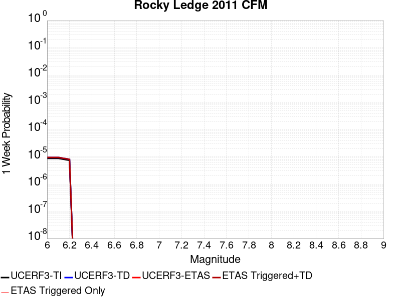 | 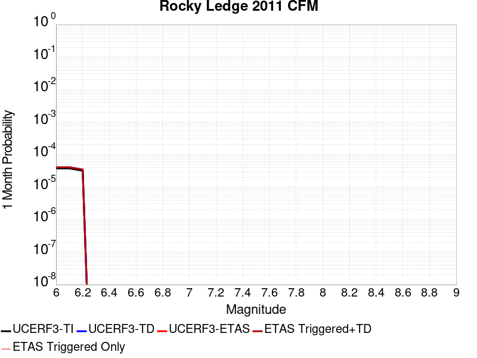 | 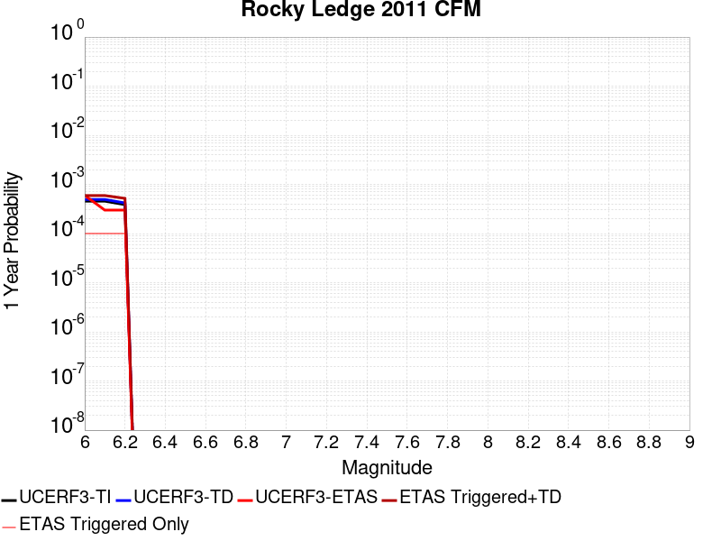 | 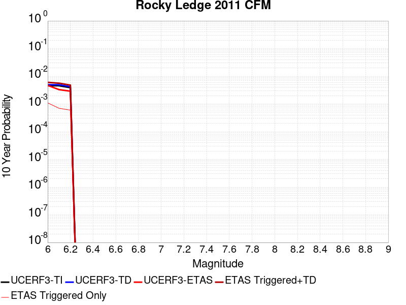 |

| Magnitude | 1 wk TI Prob | 1 wk TD Prob | 1 wk ETAS Prob | 1 wk ETAS/TD Gain | 1 wk ETAS Triggered+TD | 1 wk ETAS Triggered Only | 1 mo TI Prob | 1 mo TD Prob | 1 mo ETAS Prob | 1 mo ETAS/TD Gain | 1 mo ETAS Triggered+TD | 1 mo ETAS Triggered Only | 1 yr TI Prob | 1 yr TD Prob | 1 yr ETAS Prob | 1 yr ETAS/TD Gain | 1 yr ETAS Triggered+TD | 1 yr ETAS Triggered Only | 10 yr TI Prob | 10 yr TD Prob | 10 yr ETAS Prob | 10 yr ETAS/TD Gain | 10 yr ETAS Triggered+TD | 10 yr ETAS Triggered Only |
|-----|-----|-----|-----|-----|-----|-----|-----|-----|-----|-----|-----|-----|-----|-----|-----|-----|-----|-----|-----|-----|-----|-----|-----|-----|
| 6.0 | 8.7550525E-6 | 9.478336E-6 | 0.0 | 0.0 | 9.478336E-6 | 0.0 | 3.7521113E-5 | 4.062127E-5 | 0.0 | 0.0 | 4.062127E-5 | 0.0 | 4.567238E-4 | 4.945341E-4 | 6.0E-4 | 1.2132632 | 5.944846E-4 | 1.0E-4 | 0.0045578624 | 0.00494241 | 0.0047 | 0.95095307 | 0.006036973 | 0.0011 |
| 6.1 | 8.7550525E-6 | 9.478336E-6 | 0.0 | 0.0 | 9.478336E-6 | 0.0 | 3.7521113E-5 | 4.062127E-5 | 0.0 | 0.0 | 4.062127E-5 | 0.0 | 4.567238E-4 | 4.945341E-4 | 3.0E-4 | 0.6066316 | 5.944846E-4 | 1.0E-4 | 0.0045578624 | 0.00494241 | 0.0033 | 0.66769046 | 0.0056389505 | 7.0E-4 |
| 6.2 | 7.442295E-6 | 8.056024E-6 | 0.0 | 0.0 | 8.056024E-6 | 0.0 | 3.189516E-5 | 3.452582E-5 | 0.0 | 0.0 | 3.452582E-5 | 0.0 | 3.8825438E-4 | 4.2035183E-4 | 3.0E-4 | 0.71368784 | 5.203098E-4 | 1.0E-4 | 0.0038757676 | 0.0042035184 | 0.0029 | 0.68989825 | 0.0048009963 | 6.0E-4 |

## Goose Lake 2011 CFM
*[(top)](#table-of-contents)*

| 1 Week | 1 Month | 1 Year | 10 Year |
|-----|-----|-----|-----|
| 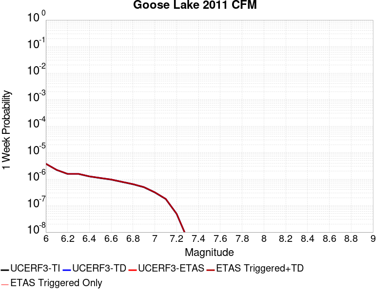 | 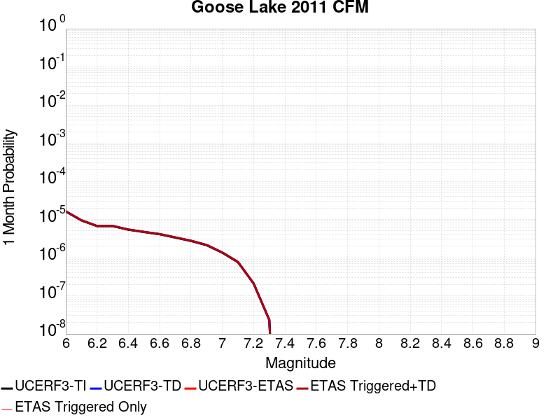 | 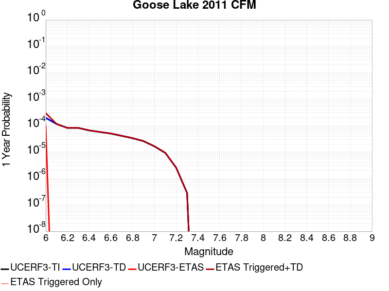 | 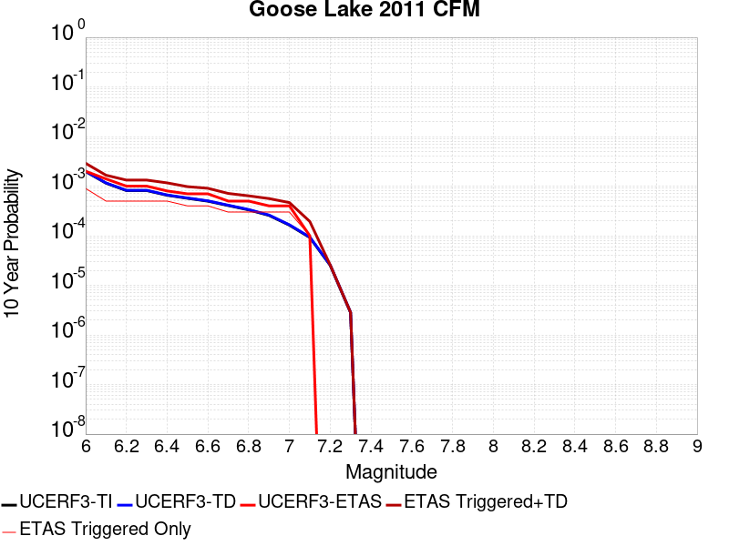 |

| Magnitude | 1 wk TI Prob | 1 wk TD Prob | 1 wk ETAS Prob | 1 wk ETAS/TD Gain | 1 wk ETAS Triggered+TD | 1 wk ETAS Triggered Only | 1 mo TI Prob | 1 mo TD Prob | 1 mo ETAS Prob | 1 mo ETAS/TD Gain | 1 mo ETAS Triggered+TD | 1 mo ETAS Triggered Only | 1 yr TI Prob | 1 yr TD Prob | 1 yr ETAS Prob | 1 yr ETAS/TD Gain | 1 yr ETAS Triggered+TD | 1 yr ETAS Triggered Only | 10 yr TI Prob | 10 yr TD Prob | 10 yr ETAS Prob | 10 yr ETAS/TD Gain | 10 yr ETAS Triggered+TD | 10 yr ETAS Triggered Only |
|-----|-----|-----|-----|-----|-----|-----|-----|-----|-----|-----|-----|-----|-----|-----|-----|-----|-----|-----|-----|-----|-----|-----|-----|-----|
| 6.0 | 3.780968E-6 | 3.8225776E-6 | 0.0 | 0.0 | 3.8225776E-6 | 0.0 | 1.6204049E-5 | 1.6382379E-5 | 0.0 | 0.0 | 1.6382379E-5 | 0.0 | 1.9726643E-4 | 1.994383E-4 | 1.0E-4 | 0.5014082 | 2.9941835E-4 | 1.0E-4 | 0.001970914 | 0.0019927013 | 0.002 | 1.0036627 | 0.002890908 | 9.0E-4 |
| 6.1 | 2.2035124E-6 | 2.2295228E-6 | 0.0 | 0.0 | 2.2295228E-6 | 0.0 | 9.443591E-6 | 9.555064E-6 | 0.0 | 0.0 | 9.555064E-6 | 0.0 | 1.1496965E-4 | 1.16326875E-4 | 0.0 | 0.0 | 1.16326875E-4 | 0.0 | 0.0011491019 | 0.0011626781 | 0.0014 | 1.2041166 | 0.0016620968 | 5.0E-4 |
| 6.2 | 1.5624689E-6 | 1.5824779E-6 | 0.0 | 0.0 | 1.5824779E-6 | 0.0 | 6.6962784E-6 | 6.7820306E-6 | 0.0 | 0.0 | 6.7820306E-6 | 0.0 | 8.152414E-5 | 8.256814E-5 | 0.0 | 0.0 | 8.256814E-5 | 0.0 | 8.1494235E-4 | 8.2537904E-4 | 0.001 | 1.2115645 | 0.0013249663 | 5.0E-4 |
| 6.3 | 1.5624689E-6 | 1.5824779E-6 | 0.0 | 0.0 | 1.5824779E-6 | 0.0 | 6.6962784E-6 | 6.7820306E-6 | 0.0 | 0.0 | 6.7820306E-6 | 0.0 | 8.152414E-5 | 8.256814E-5 | 0.0 | 0.0 | 8.256814E-5 | 0.0 | 8.1494235E-4 | 8.2537904E-4 | 0.001 | 1.2115645 | 0.0013249663 | 5.0E-4 |
| 6.4 | 1.256464E-6 | 1.2736848E-6 | 0.0 | 0.0 | 1.2736848E-6 | 0.0 | 5.3848344E-6 | 5.4586376E-6 | 0.0 | 0.0 | 5.4586376E-6 | 0.0 | 6.5558386E-5 | 6.645691E-5 | 0.0 | 0.0 | 6.645691E-5 | 0.0 | 6.553905E-4 | 6.6437235E-4 | 8.0E-4 | 1.204144 | 0.0011640402 | 5.0E-4 |
| 6.5 | 1.0910911E-6 | 1.1067721E-6 | 0.0 | 0.0 | 1.1067721E-6 | 0.0 | 4.6760965E-6 | 4.7433005E-6 | 0.0 | 0.0 | 4.7433005E-6 | 0.0 | 5.692999E-5 | 5.7748162E-5 | 0.0 | 0.0 | 5.7748162E-5 | 0.0 | 5.6915404E-4 | 5.773328E-4 | 7.0E-4 | 1.2124722 | 9.771019E-4 | 4.0E-4 |
| 6.6 | 9.546601E-7 | 9.689709E-7 | 0.0 | 0.0 | 9.689709E-7 | 0.0 | 4.091394E-6 | 4.1527255E-6 | 0.0 | 0.0 | 4.1527255E-6 | 0.0 | 4.9811584E-5 | 5.0558272E-5 | 0.0 | 0.0 | 5.0558272E-5 | 0.0 | 4.980042E-4 | 5.054686E-4 | 7.0E-4 | 1.3848536 | 9.052664E-4 | 4.0E-4 |
| 6.7 | 7.790316E-7 | 7.914627E-7 | 0.0 | 0.0 | 7.914627E-7 | 0.0 | 3.3387028E-6 | 3.3919787E-6 | 0.0 | 0.0 | 3.3919787E-6 | 0.0 | 4.0647945E-5 | 4.1296564E-5 | 0.0 | 0.0 | 4.1296564E-5 | 0.0 | 4.0640513E-4 | 4.128895E-4 | 5.0E-4 | 1.2109778 | 7.127656E-4 | 3.0E-4 |
| 6.8 | 6.3714384E-7 | 6.4775975E-7 | 0.0 | 0.0 | 6.4775975E-7 | 0.0 | 2.7306137E-6 | 2.7761103E-6 | 0.0 | 0.0 | 2.7761103E-6 | 0.0 | 3.3244716E-5 | 3.3798624E-5 | 0.0 | 0.0 | 3.3798624E-5 | 0.0 | 3.323974E-4 | 3.3793531E-4 | 5.0E-4 | 1.4795731 | 6.378339E-4 | 3.0E-4 |
| 6.9 | 4.92586E-7 | 5.012977E-7 | 0.0 | 0.0 | 5.012977E-7 | 0.0 | 2.1110811E-6 | 2.1484168E-6 | 0.0 | 0.0 | 2.1484168E-6 | 0.0 | 2.5702111E-5 | 2.6156666E-5 | 0.0 | 0.0 | 2.6156666E-5 | 0.0 | 2.569914E-4 | 2.6153625E-4 | 4.0E-4 | 1.5294248 | 5.6145777E-4 | 3.0E-4 |
| 7.0 | 3.130245E-7 | 3.1897127E-7 | 0.0 | 0.0 | 3.1897127E-7 | 0.0 | 1.3415328E-6 | 1.367019E-6 | 0.0 | 0.0 | 1.367019E-6 | 0.0 | 1.6333039E-5 | 1.6643331E-5 | 0.0 | 0.0 | 1.6643331E-5 | 0.0 | 1.6331839E-4 | 1.6642106E-4 | 4.0E-4 | 2.403542 | 4.6637113E-4 | 3.0E-4 |
| 7.1 | 1.7680084E-7 | 1.8020253E-7 | 0.0 | 0.0 | 1.8020253E-7 | 0.0 | 7.5771766E-7 | 7.7229635E-7 | 0.0 | 0.0 | 7.7229635E-7 | 0.0 | 9.225173E-6 | 9.402669E-6 | 0.0 | 0.0 | 9.402669E-6 | 0.0 | 9.22479E-5 | 9.402282E-5 | 1.0E-4 | 1.0635716 | 1.9401341E-4 | 1.0E-4 |
| 7.2 | 4.8641045E-8 | 4.9393996E-8 | 0.0 | 0.0 | 4.9393996E-8 | 0.0 | 2.084616E-7 | 2.1168853E-7 | 0.0 | 0.0 | 2.1168853E-7 | 0.0 | 2.538017E-6 | 2.577305E-6 | 0.0 | 0.0 | 2.577305E-6 | 0.0 | 2.537988E-5 | 2.5772762E-5 | 0.0 | 0.0 | 2.5772762E-5 | 0.0 |
| 7.3 | 5.3911844E-9 | 5.474917E-9 | 0.0 | 0.0 | 5.474917E-9 | 0.0 | 2.3105075E-8 | 2.346393E-8 | 0.0 | 0.0 | 2.346393E-8 | 0.0 | 2.8130427E-7 | 2.856733E-7 | 0.0 | 0.0 | 2.856733E-7 | 0.0 | 2.8130391E-6 | 2.856731E-6 | 0.0 | 0.0 | 2.856731E-6 | 0.0 |

## Elsinore (Temecula) rev
*[(top)](#table-of-contents)*

| 1 Week | 1 Month | 1 Year | 10 Year |
|-----|-----|-----|-----|
| 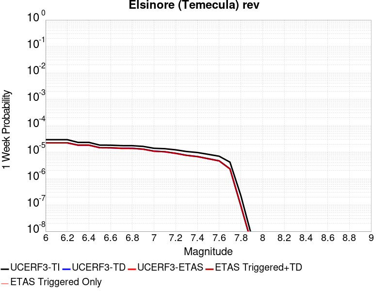 | 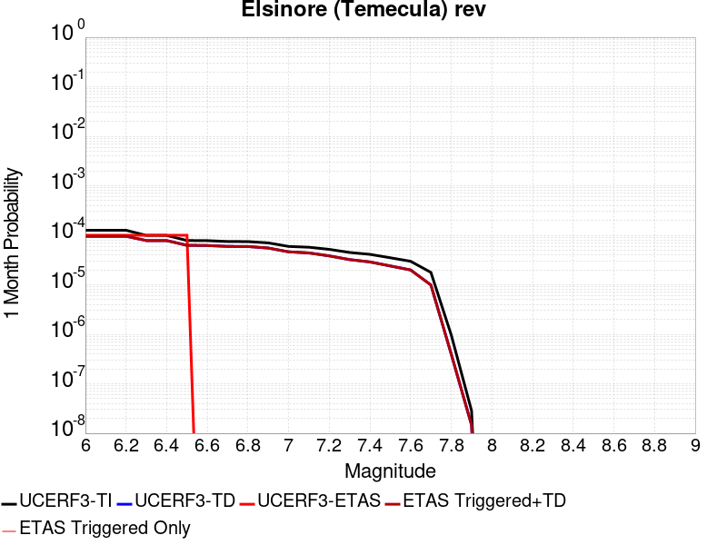 | 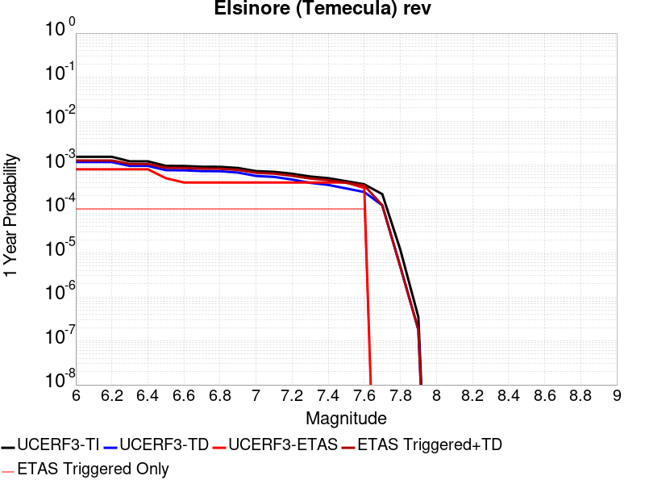 |  |

| Magnitude | 1 wk TI Prob | 1 wk TD Prob | 1 wk ETAS Prob | 1 wk ETAS/TD Gain | 1 wk ETAS Triggered+TD | 1 wk ETAS Triggered Only | 1 mo TI Prob | 1 mo TD Prob | 1 mo ETAS Prob | 1 mo ETAS/TD Gain | 1 mo ETAS Triggered+TD | 1 mo ETAS Triggered Only | 1 yr TI Prob | 1 yr TD Prob | 1 yr ETAS Prob | 1 yr ETAS/TD Gain | 1 yr ETAS Triggered+TD | 1 yr ETAS Triggered Only | 10 yr TI Prob | 10 yr TD Prob | 10 yr ETAS Prob | 10 yr ETAS/TD Gain | 10 yr ETAS Triggered+TD | 10 yr ETAS Triggered Only |
|-----|-----|-----|-----|-----|-----|-----|-----|-----|-----|-----|-----|-----|-----|-----|-----|-----|-----|-----|-----|-----|-----|-----|-----|-----|
| 6.0 | 2.9514995E-5 | 2.2366194E-5 | 0.0 | 0.0 | 2.2366194E-5 | 0.0 | 1.264867E-4 | 9.585171E-5 | 1.0E-4 | 1.0432782 | 9.585171E-5 | 0.0 | 0.0015388876 | 0.0011663915 | 8.0E-4 | 0.685876 | 0.001266275 | 1.0E-4 | 0.015282745 | 0.011629022 | 0.0079 | 0.6793349 | 0.01271623 | 0.0011 |
| 6.1 | 2.9514995E-5 | 2.2366194E-5 | 0.0 | 0.0 | 2.2366194E-5 | 0.0 | 1.264867E-4 | 9.585171E-5 | 1.0E-4 | 1.0432782 | 9.585171E-5 | 0.0 | 0.0015388876 | 0.0011663915 | 8.0E-4 | 0.685876 | 0.001266275 | 1.0E-4 | 0.015282745 | 0.011629022 | 0.0079 | 0.6793349 | 0.01271623 | 0.0011 |
| 6.2 | 2.9514995E-5 | 2.2366194E-5 | 0.0 | 0.0 | 2.2366194E-5 | 0.0 | 1.264867E-4 | 9.585171E-5 | 1.0E-4 | 1.0432782 | 9.585171E-5 | 0.0 | 0.0015388876 | 0.0011663915 | 8.0E-4 | 0.685876 | 0.001266275 | 1.0E-4 | 0.015282745 | 0.011629022 | 0.0079 | 0.6793349 | 0.01271623 | 0.0011 |
| 6.3 | 2.3223649E-5 | 1.8284612E-5 | 0.0 | 0.0 | 1.8284612E-5 | 0.0 | 9.952613E-5 | 7.836036E-5 | 1.0E-4 | 1.2761554 | 7.836036E-5 | 0.0 | 0.001211057 | 9.5363683E-4 | 8.0E-4 | 0.8388938 | 0.0010535414 | 1.0E-4 | 0.012044783 | 0.009502125 | 0.0067 | 0.7051054 | 0.010492623 | 0.001 |
| 6.4 | 2.3223649E-5 | 1.8284612E-5 | 0.0 | 0.0 | 1.8284612E-5 | 0.0 | 9.952613E-5 | 7.836036E-5 | 1.0E-4 | 1.2761554 | 7.836036E-5 | 0.0 | 0.001211057 | 9.5363683E-4 | 8.0E-4 | 0.8388938 | 0.0010535414 | 1.0E-4 | 0.012044783 | 0.009502125 | 0.0067 | 0.7051054 | 0.010492623 | 0.001 |
| 6.5 | 1.8338875E-5 | 1.4648862E-5 | 0.0 | 0.0 | 1.4648862E-5 | 0.0 | 7.8592806E-5 | 6.277937E-5 | 1.0E-4 | 1.5928799 | 6.277937E-5 | 0.0 | 9.5644733E-4 | 7.640794E-4 | 5.0E-4 | 0.6543822 | 8.64003E-4 | 1.0E-4 | 0.009523412 | 0.0076172994 | 0.0054 | 0.7089127 | 0.008311967 | 7.0E-4 |
| 6.6 | 1.8223333E-5 | 1.4511689E-5 | 0.0 | 0.0 | 1.4511689E-5 | 0.0 | 7.809766E-5 | 6.219152E-5 | 0.0 | 0.0 | 6.219152E-5 | 0.0 | 9.504242E-4 | 7.5692724E-4 | 4.0E-4 | 0.52845234 | 8.568516E-4 | 1.0E-4 | 0.009463696 | 0.0075462647 | 0.0053 | 0.7023342 | 0.008240982 | 7.0E-4 |
| 6.7 | 1.7512752E-5 | 1.3929564E-5 | 0.0 | 0.0 | 1.3929564E-5 | 0.0 | 7.505249E-5 | 5.9696813E-5 | 0.0 | 0.0 | 5.9696813E-5 | 0.0 | 9.13381E-4 | 7.2657474E-4 | 4.0E-4 | 0.55052835 | 8.265021E-4 | 1.0E-4 | 0.00909636 | 0.0072476105 | 0.0051 | 0.7036802 | 0.007942537 | 7.0E-4 |
| 6.8 | 1.7417142E-5 | 1.3854172E-5 | 0.0 | 0.0 | 1.3854172E-5 | 0.0 | 7.4642754E-5 | 5.937372E-5 | 0.0 | 0.0 | 5.937372E-5 | 0.0 | 9.083966E-4 | 7.226437E-4 | 4.0E-4 | 0.5535231 | 8.225714E-4 | 1.0E-4 | 0.009046922 | 0.0072084954 | 0.0051 | 0.70749855 | 0.007903449 | 7.0E-4 |
| 6.9 | 1.6402591E-5 | 1.2904006E-5 | 0.0 | 0.0 | 1.2904006E-5 | 0.0 | 7.0294926E-5 | 5.5301753E-5 | 0.0 | 0.0 | 5.5301753E-5 | 0.0 | 8.5550465E-4 | 6.730984E-4 | 4.0E-4 | 0.5942668 | 7.7303103E-4 | 1.0E-4 | 0.008522186 | 0.0067162444 | 0.0048 | 0.71468514 | 0.007411543 | 7.0E-4 |
| 7.0 | 1.3912486E-5 | 1.0823051E-5 | 0.0 | 0.0 | 1.0823051E-5 | 0.0 | 5.9623577E-5 | 4.638369E-5 | 0.0 | 0.0 | 4.638369E-5 | 0.0 | 7.2567526E-4 | 5.645778E-4 | 4.0E-4 | 0.708494 | 6.6452136E-4 | 1.0E-4 | 0.0072331014 | 0.0056350967 | 0.0042 | 0.7453288 | 0.006132279 | 5.0E-4 |
| 7.1 | 1.3405147E-5 | 1.0279687E-5 | 0.0 | 0.0 | 1.0279687E-5 | 0.0 | 5.7449364E-5 | 4.405507E-5 | 0.0 | 0.0 | 4.405507E-5 | 0.0 | 6.9922156E-4 | 5.36241E-4 | 4.0E-4 | 0.74593323 | 6.361874E-4 | 1.0E-4 | 0.0069702556 | 0.005352705 | 0.0041 | 0.76596785 | 0.0058500287 | 5.0E-4 |
| 7.2 | 1.21402E-5 | 8.957294E-6 | 0.0 | 0.0 | 8.957294E-6 | 0.0 | 5.202839E-5 | 3.8387847E-5 | 0.0 | 0.0 | 3.8387847E-5 | 0.0 | 6.332616E-4 | 4.6727358E-4 | 4.0E-4 | 0.8560295 | 5.6722685E-4 | 1.0E-4 | 0.0063146 | 0.004664238 | 0.0035 | 0.75039047 | 0.005161906 | 5.0E-4 |
| 7.3 | 1.05047775E-5 | 7.5408534E-6 | 0.0 | 0.0 | 7.5408534E-6 | 0.0 | 4.5019697E-5 | 3.231755E-5 | 0.0 | 0.0 | 3.231755E-5 | 0.0 | 5.4797693E-4 | 3.933966E-4 | 4.0E-4 | 1.0167856 | 4.9335725E-4 | 1.0E-4 | 0.005466277 | 0.0039273473 | 0.0033 | 0.8402619 | 0.0044253836 | 5.0E-4 |
| 7.4 | 9.624483E-6 | 6.760184E-6 | 0.0 | 0.0 | 6.760184E-6 | 0.0 | 4.124713E-5 | 2.8971905E-5 | 0.0 | 0.0 | 2.8971905E-5 | 0.0 | 5.0206814E-4 | 3.5267722E-4 | 4.0E-4 | 1.1341816 | 4.5264195E-4 | 1.0E-4 | 0.005009353 | 0.0035213241 | 0.0027 | 0.766757 | 0.0040195636 | 5.0E-4 |
| 7.5 | 8.215151E-6 | 5.613324E-6 | 0.0 | 0.0 | 5.613324E-6 | 0.0 | 3.5207315E-5 | 2.4056888E-5 | 0.0 | 0.0 | 2.4056888E-5 | 0.0 | 4.2856473E-4 | 2.9285453E-4 | 4.0E-4 | 1.365866 | 3.9282523E-4 | 1.0E-4 | 0.004277392 | 0.002924813 | 0.0022 | 0.75218487 | 0.0034233506 | 5.0E-4 |
| 7.6 | 6.975058E-6 | 4.6566042E-6 | 0.0 | 0.0 | 4.6566042E-6 | 0.0 | 2.9892764E-5 | 1.995673E-5 | 0.0 | 0.0 | 1.995673E-5 | 0.0 | 3.6388362E-4 | 2.4294725E-4 | 3.0E-4 | 1.234836 | 3.4292295E-4 | 1.0E-4 | 0.0036328835 | 0.0024269319 | 0.002 | 0.8240858 | 0.0029257184 | 5.0E-4 |
| 7.7 | 4.159604E-6 | 2.315134E-6 | 0.0 | 0.0 | 2.315134E-6 | 0.0 | 1.7826753E-5 | 9.921969E-6 | 0.0 | 0.0 | 9.921969E-6 | 0.0 | 2.1701909E-4 | 1.2079401E-4 | 0.0 | 0.0 | 1.2079401E-4 | 0.0 | 0.0021680726 | 0.001207356 | 8.0E-4 | 0.6626049 | 0.0014071146 | 2.0E-4 |
| 7.8 | 2.2692414E-7 | 9.313546E-8 | 0.0 | 0.0 | 9.313546E-8 | 0.0 | 9.725317E-7 | 3.9915196E-7 | 0.0 | 0.0 | 3.9915196E-7 | 0.0 | 1.1840509E-5 | 4.8596676E-6 | 0.0 | 0.0 | 4.8596676E-6 | 0.0 | 1.1839878E-4 | 4.859593E-5 | 0.0 | 0.0 | 4.859593E-5 | 0.0 |
| 7.9 | 6.676829E-9 | 3.4267709E-9 | 0.0 | 0.0 | 3.4267709E-9 | 0.0 | 2.861498E-8 | 1.4686159E-8 | 0.0 | 0.0 | 1.4686159E-8 | 0.0 | 3.4838732E-7 | 1.7880397E-7 | 0.0 | 0.0 | 1.7880397E-7 | 0.0 | 3.4838679E-6 | 1.7880385E-6 | 0.0 | 0.0 | 1.7880385E-6 | 0.0 |

## Channel Islands Western Deep Ramp
*[(top)](#table-of-contents)*

| 1 Week | 1 Month | 1 Year | 10 Year |
|-----|-----|-----|-----|
| 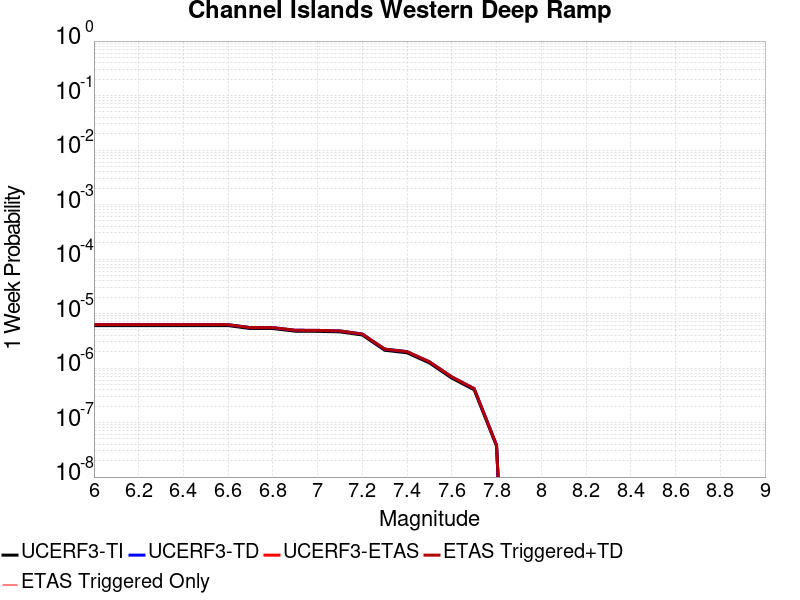 | 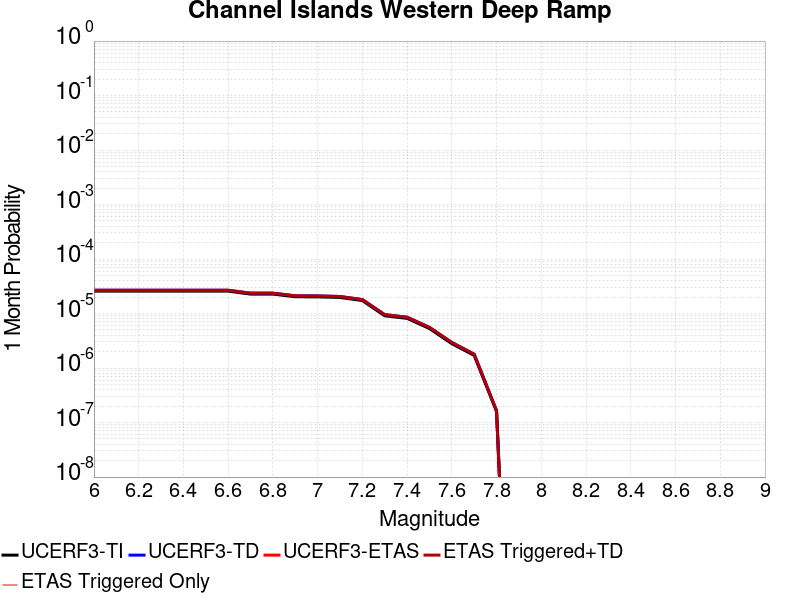 | 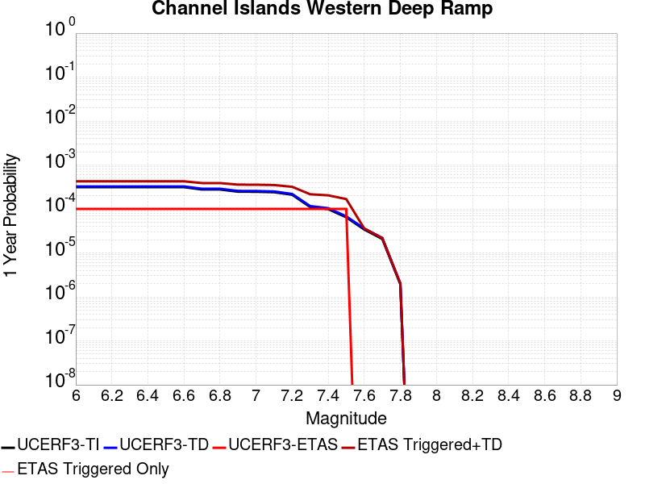 | 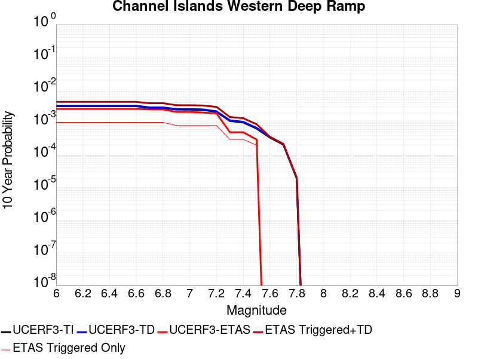 |

| Magnitude | 1 wk TI Prob | 1 wk TD Prob | 1 wk ETAS Prob | 1 wk ETAS/TD Gain | 1 wk ETAS Triggered+TD | 1 wk ETAS Triggered Only | 1 mo TI Prob | 1 mo TD Prob | 1 mo ETAS Prob | 1 mo ETAS/TD Gain | 1 mo ETAS Triggered+TD | 1 mo ETAS Triggered Only | 1 yr TI Prob | 1 yr TD Prob | 1 yr ETAS Prob | 1 yr ETAS/TD Gain | 1 yr ETAS Triggered+TD | 1 yr ETAS Triggered Only | 10 yr TI Prob | 10 yr TD Prob | 10 yr ETAS Prob | 10 yr ETAS/TD Gain | 10 yr ETAS Triggered+TD | 10 yr ETAS Triggered Only |
|-----|-----|-----|-----|-----|-----|-----|-----|-----|-----|-----|-----|-----|-----|-----|-----|-----|-----|-----|-----|-----|-----|-----|-----|-----|
| 6.0 | 6.0213506E-6 | 6.25233E-6 | 0.0 | 0.0 | 6.25233E-6 | 0.0 | 2.5805533E-5 | 2.679545E-5 | 0.0 | 0.0 | 2.679545E-5 | 0.0 | 3.1413708E-4 | 3.2619023E-4 | 1.0E-4 | 0.30656958 | 4.261576E-4 | 1.0E-4 | 0.0031369338 | 0.003257556 | 0.0026 | 0.7981444 | 0.0042542983 | 0.001 |
| 6.1 | 6.0213506E-6 | 6.25233E-6 | 0.0 | 0.0 | 6.25233E-6 | 0.0 | 2.5805533E-5 | 2.679545E-5 | 0.0 | 0.0 | 2.679545E-5 | 0.0 | 3.1413708E-4 | 3.2619023E-4 | 1.0E-4 | 0.30656958 | 4.261576E-4 | 1.0E-4 | 0.0031369338 | 0.003257556 | 0.0026 | 0.7981444 | 0.0042542983 | 0.001 |
| 6.2 | 6.0213506E-6 | 6.25233E-6 | 0.0 | 0.0 | 6.25233E-6 | 0.0 | 2.5805533E-5 | 2.679545E-5 | 0.0 | 0.0 | 2.679545E-5 | 0.0 | 3.1413708E-4 | 3.2619023E-4 | 1.0E-4 | 0.30656958 | 4.261576E-4 | 1.0E-4 | 0.0031369338 | 0.003257556 | 0.0026 | 0.7981444 | 0.0042542983 | 0.001 |
| 6.3 | 6.0213506E-6 | 6.25233E-6 | 0.0 | 0.0 | 6.25233E-6 | 0.0 | 2.5805533E-5 | 2.679545E-5 | 0.0 | 0.0 | 2.679545E-5 | 0.0 | 3.1413708E-4 | 3.2619023E-4 | 1.0E-4 | 0.30656958 | 4.261576E-4 | 1.0E-4 | 0.0031369338 | 0.003257556 | 0.0026 | 0.7981444 | 0.0042542983 | 0.001 |
| 6.4 | 6.0213506E-6 | 6.25233E-6 | 0.0 | 0.0 | 6.25233E-6 | 0.0 | 2.5805533E-5 | 2.679545E-5 | 0.0 | 0.0 | 2.679545E-5 | 0.0 | 3.1413708E-4 | 3.2619023E-4 | 1.0E-4 | 0.30656958 | 4.261576E-4 | 1.0E-4 | 0.0031369338 | 0.003257556 | 0.0026 | 0.7981444 | 0.0042542983 | 0.001 |
| 6.5 | 6.0213506E-6 | 6.25233E-6 | 0.0 | 0.0 | 6.25233E-6 | 0.0 | 2.5805533E-5 | 2.679545E-5 | 0.0 | 0.0 | 2.679545E-5 | 0.0 | 3.1413708E-4 | 3.2619023E-4 | 1.0E-4 | 0.30656958 | 4.261576E-4 | 1.0E-4 | 0.0031369338 | 0.003257556 | 0.0026 | 0.7981444 | 0.0042542983 | 0.001 |
| 6.6 | 6.0213506E-6 | 6.25233E-6 | 0.0 | 0.0 | 6.25233E-6 | 0.0 | 2.5805533E-5 | 2.679545E-5 | 0.0 | 0.0 | 2.679545E-5 | 0.0 | 3.1413708E-4 | 3.2619023E-4 | 1.0E-4 | 0.30656958 | 4.261576E-4 | 1.0E-4 | 0.0031369338 | 0.003257556 | 0.0026 | 0.7981444 | 0.0042542983 | 0.001 |
| 6.7 | 5.313309E-6 | 5.5229343E-6 | 0.0 | 0.0 | 5.5229343E-6 | 0.0 | 2.2771126E-5 | 2.3669527E-5 | 0.0 | 0.0 | 2.3669527E-5 | 0.0 | 2.772032E-4 | 2.8814247E-4 | 1.0E-4 | 0.34705055 | 3.8811367E-4 | 1.0E-4 | 0.0027685766 | 0.0028780915 | 0.0025 | 0.8686312 | 0.0038752134 | 0.001 |
| 6.8 | 5.313309E-6 | 5.5229343E-6 | 0.0 | 0.0 | 5.5229343E-6 | 0.0 | 2.2771126E-5 | 2.3669527E-5 | 0.0 | 0.0 | 2.3669527E-5 | 0.0 | 2.772032E-4 | 2.8814247E-4 | 1.0E-4 | 0.34705055 | 3.8811367E-4 | 1.0E-4 | 0.0027685766 | 0.0028780915 | 0.0025 | 0.8686312 | 0.0038752134 | 0.001 |
| 6.9 | 4.744377E-6 | 4.9373057E-6 | 0.0 | 0.0 | 4.9373057E-6 | 0.0 | 2.0332885E-5 | 2.115973E-5 | 0.0 | 0.0 | 2.115973E-5 | 0.0 | 2.4752476E-4 | 2.57593E-4 | 1.0E-4 | 0.3882093 | 3.5756725E-4 | 1.0E-4 | 0.0024724922 | 0.0025733113 | 0.0021 | 0.8160691 | 0.0033712527 | 8.0E-4 |
| 7.0 | 4.722209E-6 | 4.914357E-6 | 0.0 | 0.0 | 4.914357E-6 | 0.0 | 2.0237881E-5 | 2.106138E-5 | 0.0 | 0.0 | 2.106138E-5 | 0.0 | 2.4636835E-4 | 2.5639587E-4 | 1.0E-4 | 0.3900219 | 3.5637023E-4 | 1.0E-4 | 0.002460954 | 0.0025613676 | 0.0021 | 0.81987447 | 0.0033593185 | 8.0E-4 |
| 7.1 | 4.611174E-6 | 4.7993362E-6 | 0.0 | 0.0 | 4.7993362E-6 | 0.0 | 1.9762025E-5 | 2.0568443E-5 | 0.0 | 0.0 | 2.0568443E-5 | 0.0 | 2.4057609E-4 | 2.5039574E-4 | 1.0E-4 | 0.3993678 | 3.503707E-4 | 1.0E-4 | 0.002403158 | 0.0025015029 | 0.002 | 0.79951936 | 0.0032995017 | 8.0E-4 |
| 7.2 | 4.043994E-6 | 4.2101947E-6 | 0.0 | 0.0 | 4.2101947E-6 | 0.0 | 1.7331287E-5 | 1.8043587E-5 | 0.0 | 0.0 | 1.8043587E-5 | 0.0 | 2.10988E-4 | 2.196621E-4 | 1.0E-4 | 0.45524466 | 3.1964012E-4 | 1.0E-4 | 0.002107878 | 0.0021948004 | 0.0019 | 0.8656824 | 0.0029930444 | 8.0E-4 |
| 7.3 | 2.1233036E-6 | 2.2286192E-6 | 0.0 | 0.0 | 2.2286192E-6 | 0.0 | 9.099841E-6 | 9.5511905E-6 | 0.0 | 0.0 | 9.5511905E-6 | 0.0 | 1.1078493E-4 | 1.16279596E-4 | 1.0E-4 | 0.8599961 | 2.1626797E-4 | 1.0E-4 | 0.0011072971 | 0.0011621931 | 5.0E-4 | 0.4302211 | 0.0014618444 | 3.0E-4 |
| 7.4 | 1.9051884E-6 | 2.0004404E-6 | 0.0 | 0.0 | 2.0004404E-6 | 0.0 | 8.165067E-6 | 8.573288E-6 | 0.0 | 0.0 | 8.573288E-6 | 0.0 | 9.940516E-5 | 1.04374834E-4 | 1.0E-4 | 0.95808536 | 2.0436439E-4 | 1.0E-4 | 9.93607E-4 | 0.0010432634 | 5.0E-4 | 0.47926536 | 0.0013429504 | 3.0E-4 |
| 7.5 | 1.2408497E-6 | 1.3031918E-6 | 0.0 | 0.0 | 1.3031918E-6 | 0.0 | 5.317916E-6 | 5.585096E-6 | 0.0 | 0.0 | 5.585096E-6 | 0.0 | 6.4743705E-5 | 6.799644E-5 | 1.0E-4 | 1.4706652 | 1.6798964E-4 | 1.0E-4 | 6.4724847E-4 | 6.7975855E-4 | 3.0E-4 | 0.44133317 | 8.796226E-4 | 2.0E-4 |
| 7.6 | 6.5440025E-7 | 6.882948E-7 | 0.0 | 0.0 | 6.882948E-7 | 0.0 | 2.8045695E-6 | 2.9498317E-6 | 0.0 | 0.0 | 2.9498317E-6 | 0.0 | 3.4145098E-5 | 3.591362E-5 | 0.0 | 0.0 | 3.591362E-5 | 0.0 | 3.4139853E-4 | 3.590796E-4 | 0.0 | 0.0 | 3.590796E-4 | 0.0 |
| 7.7 | 3.985963E-7 | 4.1908018E-7 | 0.0 | 0.0 | 4.1908018E-7 | 0.0 | 1.7082689E-6 | 1.7960567E-6 | 0.0 | 0.0 | 1.7960567E-6 | 0.0 | 2.0797976E-5 | 2.1866783E-5 | 0.0 | 0.0 | 2.1866783E-5 | 0.0 | 2.0796029E-4 | 2.1864749E-4 | 0.0 | 0.0 | 2.1864749E-4 | 0.0 |
| 7.8 | 3.706329E-8 | 3.857518E-8 | 0.0 | 0.0 | 3.857518E-8 | 0.0 | 1.5884267E-7 | 1.6532219E-7 | 0.0 | 0.0 | 1.6532219E-7 | 0.0 | 1.9339077E-6 | 2.012796E-6 | 0.0 | 0.0 | 2.012796E-6 | 0.0 | 1.933891E-5 | 2.0127789E-5 | 0.0 | 0.0 | 2.0127789E-5 | 0.0 |

## Walker Spring 2011 CFM
*[(top)](#table-of-contents)*

| 1 Week | 1 Month | 1 Year | 10 Year |
|-----|-----|-----|-----|
| 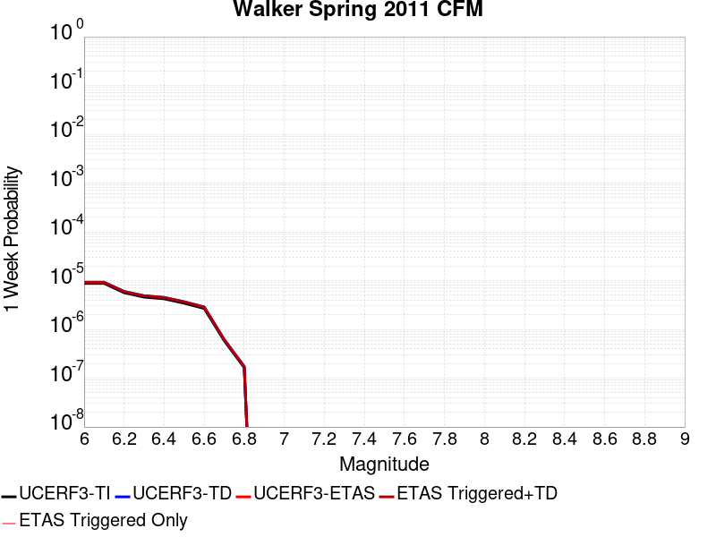 | 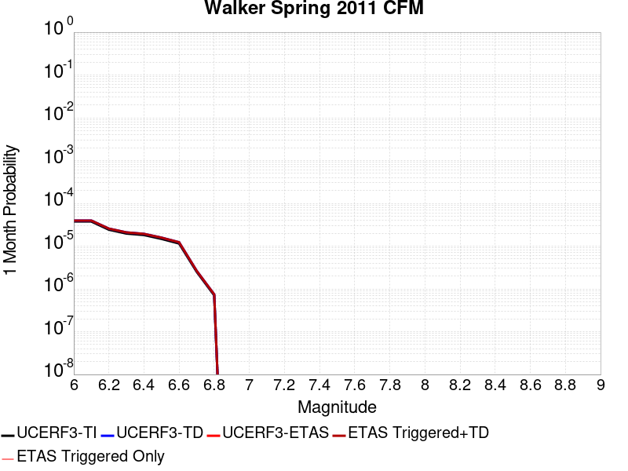 | 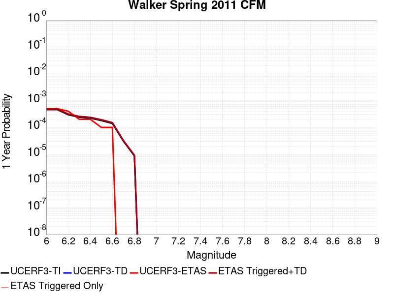 | 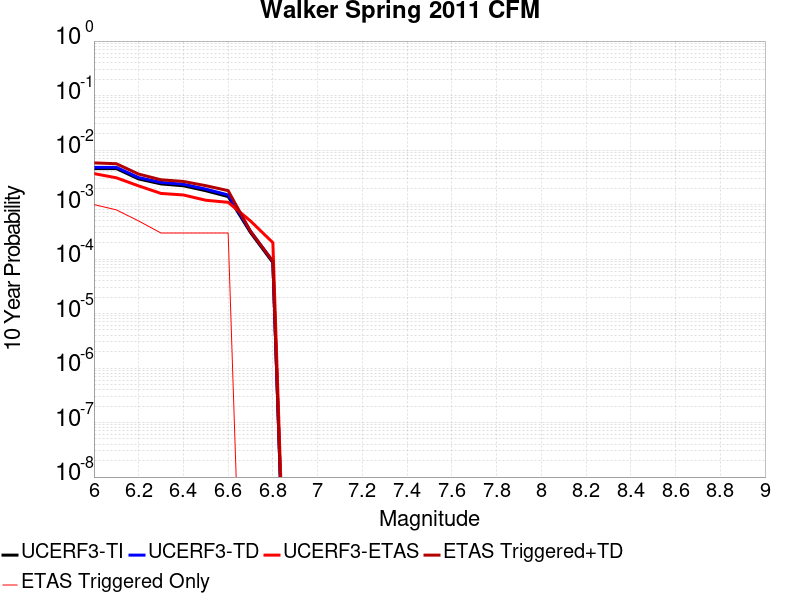 |

| Magnitude | 1 wk TI Prob | 1 wk TD Prob | 1 wk ETAS Prob | 1 wk ETAS/TD Gain | 1 wk ETAS Triggered+TD | 1 wk ETAS Triggered Only | 1 mo TI Prob | 1 mo TD Prob | 1 mo ETAS Prob | 1 mo ETAS/TD Gain | 1 mo ETAS Triggered+TD | 1 mo ETAS Triggered Only | 1 yr TI Prob | 1 yr TD Prob | 1 yr ETAS Prob | 1 yr ETAS/TD Gain | 1 yr ETAS Triggered+TD | 1 yr ETAS Triggered Only | 10 yr TI Prob | 10 yr TD Prob | 10 yr ETAS Prob | 10 yr ETAS/TD Gain | 10 yr ETAS Triggered+TD | 10 yr ETAS Triggered Only |
|-----|-----|-----|-----|-----|-----|-----|-----|-----|-----|-----|-----|-----|-----|-----|-----|-----|-----|-----|-----|-----|-----|-----|-----|-----|
| 6.0 | 8.791276E-6 | 9.258855E-6 | 0.0 | 0.0 | 9.258855E-6 | 0.0 | 3.767635E-5 | 3.9680264E-5 | 0.0 | 0.0 | 3.9680264E-5 | 0.0 | 4.58613E-4 | 4.8301095E-4 | 5.0E-4 | 1.0351732 | 4.8301095E-4 | 0.0 | 0.004576677 | 0.004820684 | 0.0037 | 0.767526 | 0.005815863 | 0.001 |
| 6.1 | 8.791276E-6 | 9.258855E-6 | 0.0 | 0.0 | 9.258855E-6 | 0.0 | 3.767635E-5 | 3.9680264E-5 | 0.0 | 0.0 | 3.9680264E-5 | 0.0 | 4.58613E-4 | 4.8301095E-4 | 5.0E-4 | 1.0351732 | 4.8301095E-4 | 0.0 | 0.004576677 | 0.004820684 | 0.0031 | 0.6430623 | 0.0056168274 | 8.0E-4 |
| 6.2 | 5.654515E-6 | 5.994926E-6 | 0.0 | 0.0 | 5.994926E-6 | 0.0 | 2.4233412E-5 | 2.5692316E-5 | 0.0 | 0.0 | 2.5692316E-5 | 0.0 | 2.9500184E-4 | 3.1276405E-4 | 4.0E-4 | 1.2789193 | 3.1276405E-4 | 0.0 | 0.0029461053 | 0.0031237327 | 0.0022 | 0.7042856 | 0.0036221708 | 5.0E-4 |
| 6.3 | 4.591685E-6 | 4.891341E-6 | 0.0 | 0.0 | 4.891341E-6 | 0.0 | 1.96785E-5 | 2.0962747E-5 | 0.0 | 0.0 | 2.0962747E-5 | 0.0 | 2.395594E-4 | 2.5519592E-4 | 2.0E-4 | 0.7837116 | 2.5519592E-4 | 0.0 | 0.002393013 | 0.0025494578 | 0.0016 | 0.6275844 | 0.0028486932 | 3.0E-4 |
| 6.4 | 4.243283E-6 | 4.5195384E-6 | 0.0 | 0.0 | 4.5195384E-6 | 0.0 | 1.8185372E-5 | 1.936933E-5 | 0.0 | 0.0 | 1.936933E-5 | 0.0 | 2.2138441E-4 | 2.358003E-4 | 2.0E-4 | 0.84817535 | 2.358003E-4 | 0.0 | 0.00221164 | 0.002355916 | 0.0015 | 0.636695 | 0.002655209 | 3.0E-4 |
| 6.5 | 3.4445666E-6 | 3.6833867E-6 | 0.0 | 0.0 | 3.6833867E-6 | 0.0 | 1.4762345E-5 | 1.578587E-5 | 0.0 | 0.0 | 1.578587E-5 | 0.0 | 1.7971672E-4 | 1.9218003E-4 | 1.0E-4 | 0.52034545 | 1.9218003E-4 | 0.0 | 0.0017957145 | 0.0019205326 | 0.0012 | 0.6248267 | 0.0022199564 | 3.0E-4 |
| 6.6 | 2.68766E-6 | 2.8772854E-6 | 0.0 | 0.0 | 2.8772854E-6 | 0.0 | 1.1518492E-5 | 1.2331187E-5 | 0.0 | 0.0 | 1.2331187E-5 | 0.0 | 1.4022861E-4 | 1.5012566E-4 | 1.0E-4 | 0.66610867 | 1.5012566E-4 | 0.0 | 0.0014014016 | 0.0015006157 | 0.0011 | 0.73303246 | 0.0018001655 | 3.0E-4 |
| 6.7 | 5.880964E-7 | 6.1962396E-7 | 0.0 | 0.0 | 6.1962396E-7 | 0.0 | 2.5204106E-6 | 2.655529E-6 | 0.0 | 0.0 | 2.655529E-6 | 0.0 | 3.0685565E-5 | 3.233068E-5 | 0.0 | 0.0 | 3.233068E-5 | 0.0 | 3.068133E-4 | 3.2326914E-4 | 5.0E-4 | 1.5466988 | 3.2326914E-4 | 0.0 |
| 6.8 | 1.6514163E-7 | 1.7399272E-7 | 0.0 | 0.0 | 1.7399272E-7 | 0.0 | 7.077497E-7 | 7.4568305E-7 | 0.0 | 0.0 | 7.4568305E-7 | 0.0 | 8.616818E-6 | 9.078692E-6 | 0.0 | 0.0 | 9.078692E-6 | 0.0 | 8.616484E-5 | 9.078691E-5 | 2.0E-4 | 2.2029607 | 9.078691E-5 | 0.0 |

## San Gorgonio Pass
*[(top)](#table-of-contents)*

| 1 Week | 1 Month | 1 Year | 10 Year |
|-----|-----|-----|-----|
| 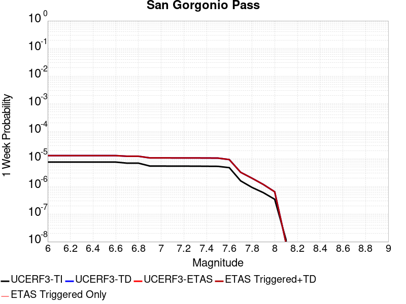 | 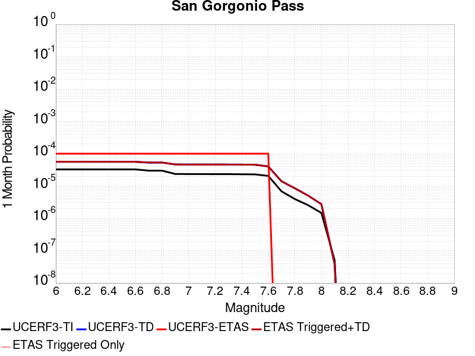 | 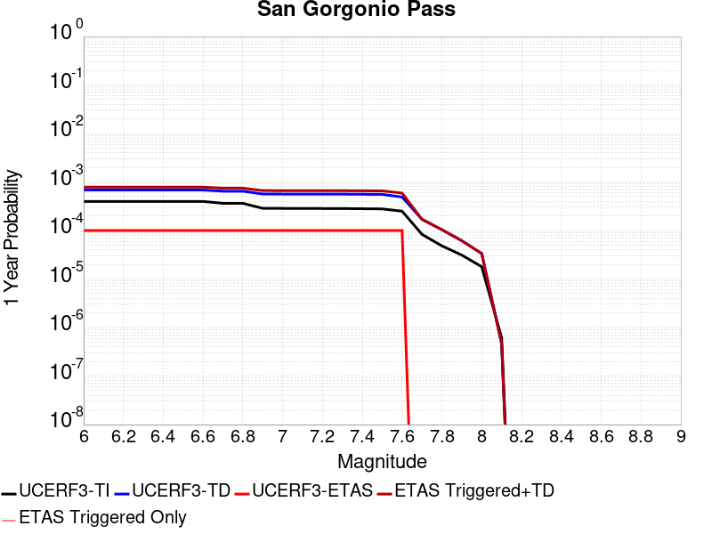 | 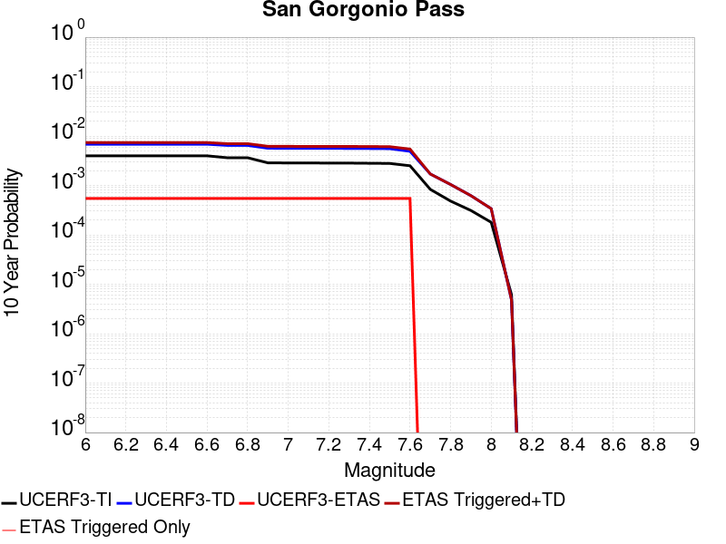 |

| Magnitude | 1 wk TI Prob | 1 wk TD Prob | 1 wk ETAS Prob | 1 wk ETAS/TD Gain | 1 wk ETAS Triggered+TD | 1 wk ETAS Triggered Only | 1 mo TI Prob | 1 mo TD Prob | 1 mo ETAS Prob | 1 mo ETAS/TD Gain | 1 mo ETAS Triggered+TD | 1 mo ETAS Triggered Only | 1 yr TI Prob | 1 yr TD Prob | 1 yr ETAS Prob | 1 yr ETAS/TD Gain | 1 yr ETAS Triggered+TD | 1 yr ETAS Triggered Only | 10 yr TI Prob | 10 yr TD Prob | 10 yr ETAS Prob | 10 yr ETAS/TD Gain | 10 yr ETAS Triggered+TD | 10 yr ETAS Triggered Only |
|-----|-----|-----|-----|-----|-----|-----|-----|-----|-----|-----|-----|-----|-----|-----|-----|-----|-----|-----|-----|-----|-----|-----|-----|-----|
| 6.0 | 7.644328E-6 | 1.31518555E-5 | 0.0 | 0.0 | 1.31518555E-5 | 0.0 | 3.2760996E-5 | 5.6363926E-5 | 1.0E-4 | 1.7741845 | 5.6363926E-5 | 0.0 | 3.987921E-4 | 6.860232E-4 | 7.0E-4 | 1.0203737 | 7.859546E-4 | 1.0E-4 | 0.003980772 | 0.0068459855 | 0.0039 | 0.56967694 | 0.00783914 | 0.001 |
| 6.1 | 7.644328E-6 | 1.31518555E-5 | 0.0 | 0.0 | 1.31518555E-5 | 0.0 | 3.2760996E-5 | 5.6363926E-5 | 1.0E-4 | 1.7741845 | 5.6363926E-5 | 0.0 | 3.987921E-4 | 6.860232E-4 | 7.0E-4 | 1.0203737 | 7.859546E-4 | 1.0E-4 | 0.003980772 | 0.0068459855 | 0.0039 | 0.56967694 | 0.00783914 | 0.001 |
| 6.2 | 7.644328E-6 | 1.31518555E-5 | 0.0 | 0.0 | 1.31518555E-5 | 0.0 | 3.2760996E-5 | 5.6363926E-5 | 1.0E-4 | 1.7741845 | 5.6363926E-5 | 0.0 | 3.987921E-4 | 6.860232E-4 | 7.0E-4 | 1.0203737 | 7.859546E-4 | 1.0E-4 | 0.003980772 | 0.0068459855 | 0.0039 | 0.56967694 | 0.00783914 | 0.001 |
| 6.3 | 7.644328E-6 | 1.31518555E-5 | 0.0 | 0.0 | 1.31518555E-5 | 0.0 | 3.2760996E-5 | 5.6363926E-5 | 1.0E-4 | 1.7741845 | 5.6363926E-5 | 0.0 | 3.987921E-4 | 6.860232E-4 | 7.0E-4 | 1.0203737 | 7.859546E-4 | 1.0E-4 | 0.003980772 | 0.0068459855 | 0.0039 | 0.56967694 | 0.00783914 | 0.001 |
| 6.4 | 7.644328E-6 | 1.31518555E-5 | 0.0 | 0.0 | 1.31518555E-5 | 0.0 | 3.2760996E-5 | 5.6363926E-5 | 1.0E-4 | 1.7741845 | 5.6363926E-5 | 0.0 | 3.987921E-4 | 6.860232E-4 | 7.0E-4 | 1.0203737 | 7.859546E-4 | 1.0E-4 | 0.003980772 | 0.0068459855 | 0.0039 | 0.56967694 | 0.00783914 | 0.001 |
| 6.5 | 7.644328E-6 | 1.31518555E-5 | 0.0 | 0.0 | 1.31518555E-5 | 0.0 | 3.2760996E-5 | 5.6363926E-5 | 1.0E-4 | 1.7741845 | 5.6363926E-5 | 0.0 | 3.987921E-4 | 6.860232E-4 | 7.0E-4 | 1.0203737 | 7.859546E-4 | 1.0E-4 | 0.003980772 | 0.0068459855 | 0.0039 | 0.56967694 | 0.00783914 | 0.001 |
| 6.6 | 7.644328E-6 | 1.31518555E-5 | 0.0 | 0.0 | 1.31518555E-5 | 0.0 | 3.2760996E-5 | 5.6363926E-5 | 1.0E-4 | 1.7741845 | 5.6363926E-5 | 0.0 | 3.987921E-4 | 6.860232E-4 | 7.0E-4 | 1.0203737 | 7.859546E-4 | 1.0E-4 | 0.003980772 | 0.0068459855 | 0.0039 | 0.56967694 | 0.00783914 | 0.001 |
| 6.7 | 6.987586E-6 | 1.2456561E-5 | 0.0 | 0.0 | 1.2456561E-5 | 0.0 | 2.9946454E-5 | 5.3384214E-5 | 1.0E-4 | 1.8732129 | 5.3384214E-5 | 0.0 | 3.645371E-4 | 6.4976694E-4 | 7.0E-4 | 1.0773093 | 7.49702E-4 | 1.0E-4 | 0.0036393967 | 0.006485555 | 0.0034 | 0.524242 | 0.0073797177 | 9.0E-4 |
| 6.8 | 6.987586E-6 | 1.2456561E-5 | 0.0 | 0.0 | 1.2456561E-5 | 0.0 | 2.9946454E-5 | 5.3384214E-5 | 1.0E-4 | 1.8732129 | 5.3384214E-5 | 0.0 | 3.645371E-4 | 6.4976694E-4 | 7.0E-4 | 1.0773093 | 7.49702E-4 | 1.0E-4 | 0.0036393967 | 0.006485555 | 0.0034 | 0.524242 | 0.0073797177 | 9.0E-4 |
| 6.9 | 5.504702E-6 | 1.0888377E-5 | 0.0 | 0.0 | 1.0888377E-5 | 0.0 | 2.3591367E-5 | 4.6663663E-5 | 1.0E-4 | 2.142995 | 4.6663663E-5 | 0.0 | 2.8718702E-4 | 5.67987E-4 | 5.0E-4 | 0.8803019 | 6.679302E-4 | 1.0E-4 | 0.0028681618 | 0.0056719333 | 0.0031 | 0.54655087 | 0.0065668286 | 9.0E-4 |
| 7.0 | 5.4825764E-6 | 1.0864735E-5 | 0.0 | 0.0 | 1.0864735E-5 | 0.0 | 2.3496545E-5 | 4.6562345E-5 | 1.0E-4 | 2.147658 | 4.6562345E-5 | 0.0 | 2.8603288E-4 | 5.66754E-4 | 5.0E-4 | 0.88221693 | 6.6669733E-4 | 1.0E-4 | 0.00285665 | 0.005659667 | 0.0031 | 0.54773545 | 0.0065545733 | 9.0E-4 |
| 7.1 | 5.4692787E-6 | 1.08504555E-5 | 0.0 | 0.0 | 1.08504555E-5 | 0.0 | 2.3439556E-5 | 4.650115E-5 | 1.0E-4 | 2.1504843 | 4.650115E-5 | 0.0 | 2.8533922E-4 | 5.660094E-4 | 5.0E-4 | 0.88337755 | 6.659528E-4 | 1.0E-4 | 0.0028497311 | 0.005652258 | 0.003 | 0.5307613 | 0.006547171 | 9.0E-4 |
| 7.2 | 5.453661E-6 | 1.0833498E-5 | 0.0 | 0.0 | 1.0833498E-5 | 0.0 | 2.3372622E-5 | 4.642848E-5 | 1.0E-4 | 2.1538506 | 4.642848E-5 | 0.0 | 2.8452452E-4 | 5.65125E-4 | 5.0E-4 | 0.88475996 | 6.650685E-4 | 1.0E-4 | 0.002841605 | 0.00564346 | 0.003 | 0.5315888 | 0.0065383804 | 9.0E-4 |
| 7.3 | 5.4422303E-6 | 1.0820456E-5 | 0.0 | 0.0 | 1.0820456E-5 | 0.0 | 2.3323635E-5 | 4.6372585E-5 | 1.0E-4 | 2.1564465 | 4.6372585E-5 | 0.0 | 2.8392827E-4 | 5.644449E-4 | 5.0E-4 | 0.88582605 | 6.6438847E-4 | 1.0E-4 | 0.0028356577 | 0.005636693 | 0.003 | 0.532227 | 0.00653162 | 9.0E-4 |
| 7.4 | 5.398595E-6 | 1.0767957E-5 | 0.0 | 0.0 | 1.0767957E-5 | 0.0 | 2.313663E-5 | 4.6147597E-5 | 1.0E-4 | 2.16696 | 4.6147597E-5 | 0.0 | 2.8165206E-4 | 5.6170713E-4 | 5.0E-4 | 0.89014363 | 6.6165096E-4 | 1.0E-4 | 0.0028129534 | 0.0056094537 | 0.003 | 0.53481144 | 0.0065044053 | 9.0E-4 |
| 7.5 | 5.3578788E-6 | 1.0695065E-5 | 0.0 | 0.0 | 1.0695065E-5 | 0.0 | 2.2962136E-5 | 4.583521E-5 | 1.0E-4 | 2.1817288 | 4.583521E-5 | 0.0 | 2.7952815E-4 | 5.5790576E-4 | 5.0E-4 | 0.8962087 | 6.5785E-4 | 1.0E-4 | 0.002791768 | 0.0055716573 | 0.0029 | 0.5204914 | 0.006466643 | 9.0E-4 |
| 7.6 | 4.8091474E-6 | 9.452444E-6 | 0.0 | 0.0 | 9.452444E-6 | 0.0 | 2.0610469E-5 | 4.0509873E-5 | 1.0E-4 | 2.468534 | 4.0509873E-5 | 0.0 | 2.5090357E-4 | 4.931008E-4 | 5.0E-4 | 1.0139915 | 5.930515E-4 | 1.0E-4 | 0.0025062046 | 0.004926936 | 0.0027 | 0.54800797 | 0.005822501 | 9.0E-4 |
| 7.7 | 1.5991155E-6 | 3.271156E-6 | 0.0 | 0.0 | 3.271156E-6 | 0.0 | 6.853334E-6 | 1.4019166E-5 | 0.0 | 0.0 | 1.4019166E-5 | 0.0 | 8.343615E-5 | 1.7067022E-4 | 1.0E-4 | 0.5859253 | 1.7067022E-4 | 0.0 | 8.340483E-4 | 0.0017108478 | 0.001 | 0.58450556 | 0.0023098213 | 6.0E-4 |
| 7.8 | 9.258398E-7 | 1.997031E-6 | 0.0 | 0.0 | 1.997031E-6 | 0.0 | 3.967879E-6 | 8.558676E-6 | 0.0 | 0.0 | 8.558676E-6 | 0.0 | 4.8307855E-5 | 1.0419692E-4 | 1.0E-4 | 0.95972127 | 1.0419692E-4 | 0.0 | 4.8297356E-4 | 0.0010469066 | 9.0E-4 | 0.8596756 | 0.0016462784 | 6.0E-4 |
| 7.9 | 5.975575E-7 | 1.1850263E-6 | 0.0 | 0.0 | 1.1850263E-6 | 0.0 | 2.5609581E-6 | 5.0786743E-6 | 0.0 | 0.0 | 5.0786743E-6 | 0.0 | 3.117922E-5 | 6.183112E-5 | 1.0E-4 | 1.6173086 | 6.183112E-5 | 0.0 | 3.1174847E-4 | 6.233562E-4 | 6.0E-4 | 0.9625315 | 0.0010231069 | 4.0E-4 |
| 8.0 | 3.4413725E-7 | 6.45078E-7 | 0.0 | 0.0 | 6.45078E-7 | 0.0 | 1.4748731E-6 | 2.764617E-6 | 0.0 | 0.0 | 2.764617E-6 | 0.0 | 1.7956432E-5 | 3.3658696E-5 | 1.0E-4 | 2.9710004 | 3.3658696E-5 | 0.0 | 1.7954981E-4 | 3.399678E-4 | 4.0E-4 | 1.176582 | 6.398658E-4 | 3.0E-4 |
| 8.1 | 1.1787731E-8 | 8.966697E-9 | 0.0 | 0.0 | 8.966697E-9 | 0.0 | 5.0518846E-8 | 3.84287E-8 | 0.0 | 0.0 | 3.84287E-8 | 0.0 | 6.1506677E-7 | 4.6786934E-7 | 0.0 | 0.0 | 4.6786934E-7 | 0.0 | 6.1506507E-6 | 4.8872425E-6 | 0.0 | 0.0 | 4.8872425E-6 | 0.0 |

## San Luis Range 2011 CFM
*[(top)](#table-of-contents)*

| 1 Week | 1 Month | 1 Year | 10 Year |
|-----|-----|-----|-----|
| 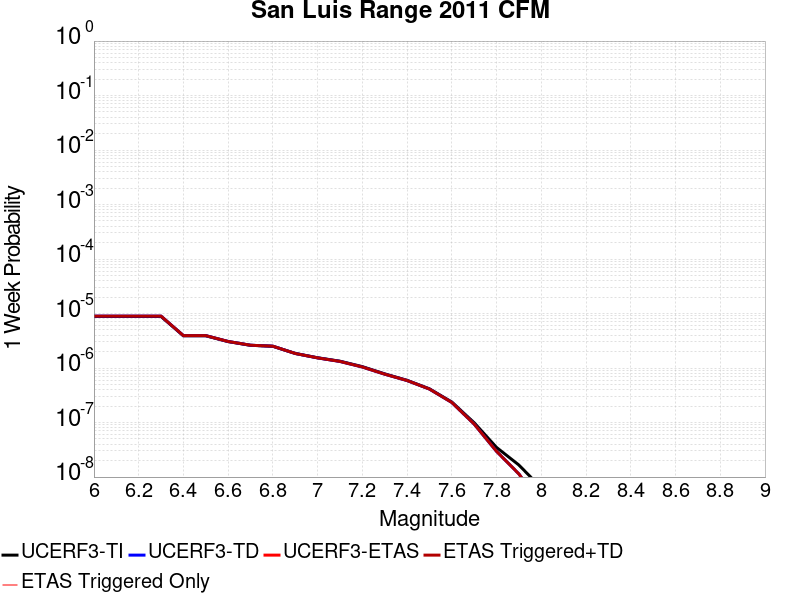 | 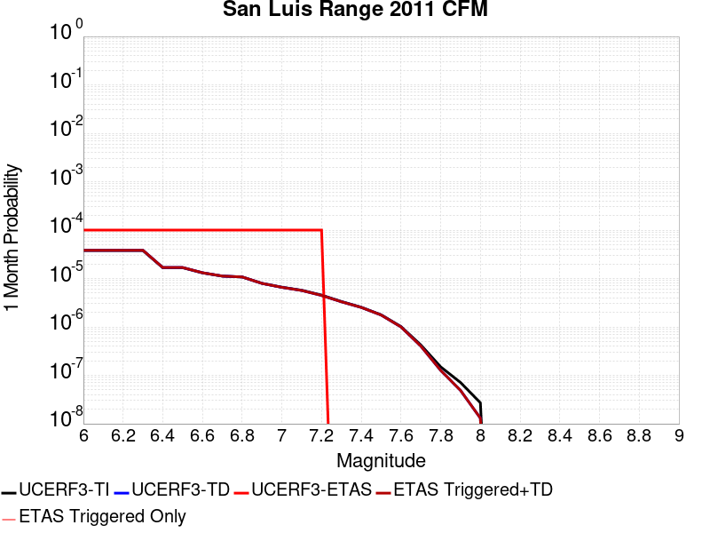 | 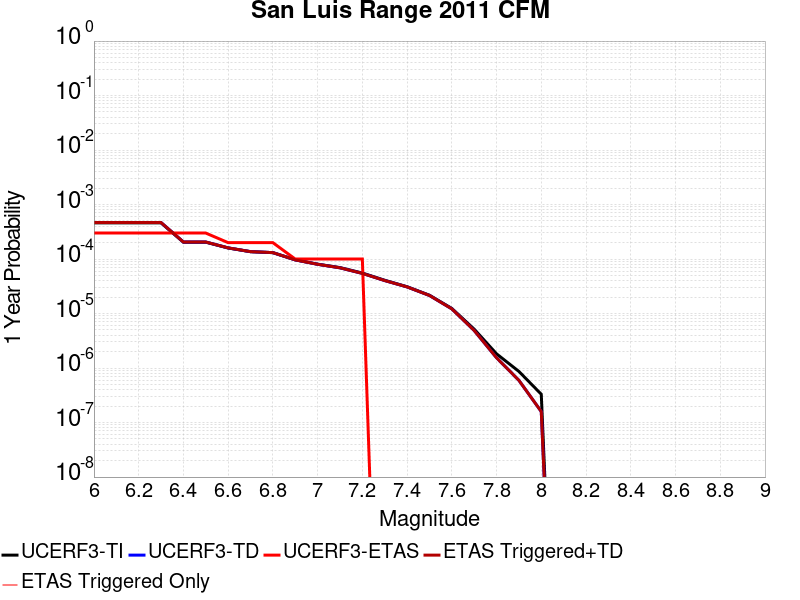 | 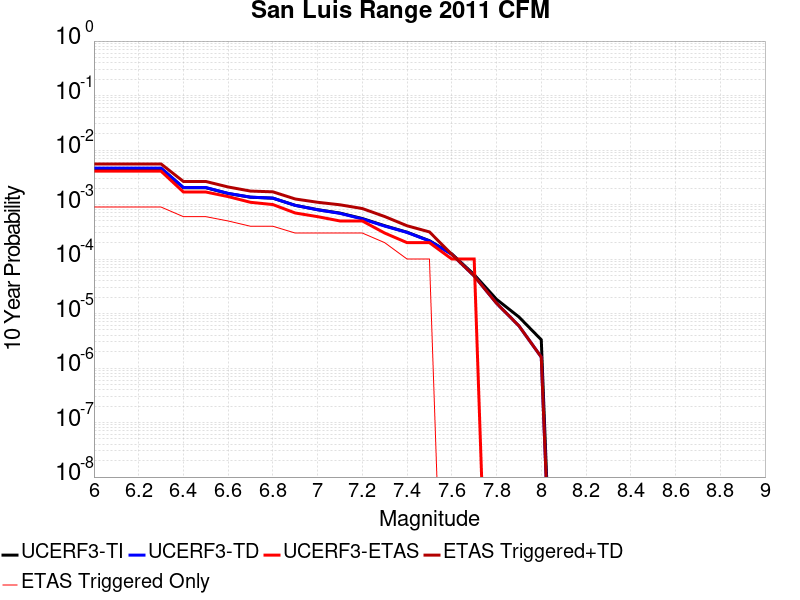 |

| Magnitude | 1 wk TI Prob | 1 wk TD Prob | 1 wk ETAS Prob | 1 wk ETAS/TD Gain | 1 wk ETAS Triggered+TD | 1 wk ETAS Triggered Only | 1 mo TI Prob | 1 mo TD Prob | 1 mo ETAS Prob | 1 mo ETAS/TD Gain | 1 mo ETAS Triggered+TD | 1 mo ETAS Triggered Only | 1 yr TI Prob | 1 yr TD Prob | 1 yr ETAS Prob | 1 yr ETAS/TD Gain | 1 yr ETAS Triggered+TD | 1 yr ETAS Triggered Only | 10 yr TI Prob | 10 yr TD Prob | 10 yr ETAS Prob | 10 yr ETAS/TD Gain | 10 yr ETAS Triggered+TD | 10 yr ETAS Triggered Only |
|-----|-----|-----|-----|-----|-----|-----|-----|-----|-----|-----|-----|-----|-----|-----|-----|-----|-----|-----|-----|-----|-----|-----|-----|-----|
| 6.0 | 8.8368415E-6 | 8.963558E-6 | 0.0 | 0.0 | 8.963558E-6 | 0.0 | 3.787163E-5 | 3.8414728E-5 | 1.0E-4 | 2.6031682 | 3.8414728E-5 | 0.0 | 4.609895E-4 | 4.6760682E-4 | 3.0E-4 | 0.64156467 | 4.6760682E-4 | 0.0 | 0.0046003438 | 0.0046670116 | 0.0041 | 0.87850654 | 0.005562811 | 9.0E-4 |
| 6.1 | 8.8368415E-6 | 8.963558E-6 | 0.0 | 0.0 | 8.963558E-6 | 0.0 | 3.787163E-5 | 3.8414728E-5 | 1.0E-4 | 2.6031682 | 3.8414728E-5 | 0.0 | 4.609895E-4 | 4.6760682E-4 | 3.0E-4 | 0.64156467 | 4.6760682E-4 | 0.0 | 0.0046003438 | 0.0046670116 | 0.0041 | 0.87850654 | 0.005562811 | 9.0E-4 |
| 6.2 | 8.8368415E-6 | 8.963558E-6 | 0.0 | 0.0 | 8.963558E-6 | 0.0 | 3.787163E-5 | 3.8414728E-5 | 1.0E-4 | 2.6031682 | 3.8414728E-5 | 0.0 | 4.609895E-4 | 4.6760682E-4 | 3.0E-4 | 0.64156467 | 4.6760682E-4 | 0.0 | 0.0046003438 | 0.0046670116 | 0.0041 | 0.87850654 | 0.005562811 | 9.0E-4 |
| 6.3 | 8.8368415E-6 | 8.963558E-6 | 0.0 | 0.0 | 8.963558E-6 | 0.0 | 3.787163E-5 | 3.8414728E-5 | 1.0E-4 | 2.6031682 | 3.8414728E-5 | 0.0 | 4.609895E-4 | 4.6760682E-4 | 3.0E-4 | 0.64156467 | 4.6760682E-4 | 0.0 | 0.0046003438 | 0.0046670116 | 0.0041 | 0.87850654 | 0.005562811 | 9.0E-4 |
| 6.4 | 3.9094193E-6 | 3.940338E-6 | 0.0 | 0.0 | 3.940338E-6 | 0.0 | 1.6754546E-5 | 1.6887056E-5 | 1.0E-4 | 5.9216957 | 1.6887056E-5 | 0.0 | 2.039675E-4 | 2.0558079E-4 | 3.0E-4 | 1.4592804 | 2.0558079E-4 | 0.0 | 0.0020378039 | 0.0020539348 | 0.0017 | 0.82767963 | 0.0026527024 | 6.0E-4 |
| 6.5 | 3.9094193E-6 | 3.940338E-6 | 0.0 | 0.0 | 3.940338E-6 | 0.0 | 1.6754546E-5 | 1.6887056E-5 | 1.0E-4 | 5.9216957 | 1.6887056E-5 | 0.0 | 2.039675E-4 | 2.0558079E-4 | 3.0E-4 | 1.4592804 | 2.0558079E-4 | 0.0 | 0.0020378039 | 0.0020539348 | 0.0017 | 0.82767963 | 0.0026527024 | 6.0E-4 |
| 6.6 | 3.0587726E-6 | 3.0746849E-6 | 0.0 | 0.0 | 3.0746849E-6 | 0.0 | 1.3108959E-5 | 1.3177155E-5 | 1.0E-4 | 7.5888915 | 1.3177155E-5 | 0.0 | 1.595899E-4 | 1.6042017E-4 | 2.0E-4 | 1.246726 | 1.6042017E-4 | 0.0 | 0.0015947534 | 0.0016030556 | 0.0014 | 0.87333214 | 0.0021022542 | 5.0E-4 |
| 6.7 | 2.6160574E-6 | 2.624504E-6 | 0.0 | 0.0 | 2.624504E-6 | 0.0 | 1.1211626E-5 | 1.12478265E-5 | 1.0E-4 | 8.890607 | 1.12478265E-5 | 0.0 | 1.3649299E-4 | 1.3693374E-4 | 2.0E-4 | 1.4605604 | 1.3693374E-4 | 0.0 | 0.0013640919 | 0.0013684998 | 0.0011 | 0.80379987 | 0.0017679525 | 4.0E-4 |
| 6.8 | 2.5110312E-6 | 2.5175377E-6 | 0.0 | 0.0 | 2.5175377E-6 | 0.0 | 1.0761518E-5 | 1.0789403E-5 | 1.0E-4 | 9.268353 | 1.0789403E-5 | 0.0 | 1.310136E-4 | 1.3135312E-4 | 2.0E-4 | 1.5226132 | 1.3135312E-4 | 0.0 | 0.0013093639 | 0.0013127608 | 0.001 | 0.76175344 | 0.0017122356 | 4.0E-4 |
| 6.9 | 1.8564405E-6 | 1.8520021E-6 | 0.0 | 0.0 | 1.8520021E-6 | 0.0 | 7.95615E-6 | 7.9371275E-6 | 1.0E-4 | 12.599016 | 7.9371275E-6 | 0.0 | 9.686181E-5 | 9.663027E-5 | 1.0E-4 | 1.0348724 | 9.663027E-5 | 0.0 | 9.68196E-4 | 9.6588454E-4 | 7.0E-4 | 0.7247243 | 0.0012655947 | 3.0E-4 |
| 7.0 | 1.546127E-6 | 1.5365243E-6 | 0.0 | 0.0 | 1.5365243E-6 | 0.0 | 6.626242E-6 | 6.5850877E-6 | 1.0E-4 | 15.185826 | 6.5850877E-6 | 0.0 | 8.06715E-5 | 8.01705E-5 | 1.0E-4 | 1.2473415 | 8.01705E-5 | 0.0 | 8.0642226E-4 | 8.014165E-4 | 6.0E-4 | 0.7486744 | 0.0011011761 | 3.0E-4 |
| 7.1 | 1.3368208E-6 | 1.3231471E-6 | 0.0 | 0.0 | 1.3231471E-6 | 0.0 | 5.7292195E-6 | 5.6706185E-6 | 1.0E-4 | 17.634762 | 5.6706185E-6 | 0.0 | 6.975101E-5 | 6.90376E-5 | 1.0E-4 | 1.4484862 | 6.90376E-5 | 0.0 | 6.972912E-4 | 6.9016195E-4 | 5.0E-4 | 0.72446764 | 9.899549E-4 | 3.0E-4 |
| 7.2 | 1.0623363E-6 | 1.0451076E-6 | 0.0 | 0.0 | 1.0451076E-6 | 0.0 | 4.5528623E-6 | 4.479025E-6 | 1.0E-4 | 22.326288 | 4.479025E-6 | 0.0 | 5.5429686E-5 | 5.4530767E-5 | 1.0E-4 | 1.8338271 | 5.4530767E-5 | 0.0 | 5.5415864E-4 | 5.451741E-4 | 5.0E-4 | 0.91713816 | 8.4501057E-4 | 3.0E-4 |
| 7.3 | 7.831679E-7 | 7.724661E-7 | 0.0 | 0.0 | 7.724661E-7 | 0.0 | 3.3564295E-6 | 3.3105648E-6 | 0.0 | 0.0 | 3.3105648E-6 | 0.0 | 4.086376E-5 | 4.0305382E-5 | 0.0 | 0.0 | 4.0305382E-5 | 0.0 | 4.0856248E-4 | 4.0298083E-4 | 3.0E-4 | 0.74445224 | 6.029002E-4 | 2.0E-4 |
| 7.4 | 5.9558846E-7 | 5.9084425E-7 | 0.0 | 0.0 | 5.9084425E-7 | 0.0 | 2.5525194E-6 | 2.5321872E-6 | 0.0 | 0.0 | 2.5321872E-6 | 0.0 | 3.107648E-5 | 3.082894E-5 | 0.0 | 0.0 | 3.082894E-5 | 0.0 | 3.1072134E-4 | 3.0824676E-4 | 2.0E-4 | 0.64883083 | 4.082159E-4 | 1.0E-4 |
| 7.5 | 4.1616502E-7 | 4.1178384E-7 | 0.0 | 0.0 | 4.1178384E-7 | 0.0 | 1.7835631E-6 | 1.7647867E-6 | 0.0 | 0.0 | 1.7647867E-6 | 0.0 | 2.1714664E-5 | 2.1486067E-5 | 0.0 | 0.0 | 2.1486067E-5 | 0.0 | 2.1712543E-4 | 2.1483995E-4 | 2.0E-4 | 0.93092555 | 3.1481846E-4 | 1.0E-4 |
| 7.6 | 2.3816014E-7 | 2.3363127E-7 | 0.0 | 0.0 | 2.3363127E-7 | 0.0 | 1.0206859E-6 | 1.0012765E-6 | 0.0 | 0.0 | 1.0012765E-6 | 0.0 | 1.242678E-5 | 1.2190472E-5 | 0.0 | 0.0 | 1.2190472E-5 | 0.0 | 1.2426086E-4 | 1.2189806E-4 | 1.0E-4 | 0.8203576 | 1.2189806E-4 | 0.0 |
| 7.7 | 9.918777E-8 | 9.376791E-8 | 0.0 | 0.0 | 9.376791E-8 | 0.0 | 4.2509038E-7 | 4.018624E-7 | 0.0 | 0.0 | 4.018624E-7 | 0.0 | 5.1754632E-6 | 4.8926636E-6 | 0.0 | 0.0 | 4.8926636E-6 | 0.0 | 5.1753424E-5 | 4.8925565E-5 | 1.0E-4 | 2.0439212 | 4.8925565E-5 | 0.0 |
| 7.8 | 3.4982556E-8 | 2.960799E-8 | 0.0 | 0.0 | 2.960799E-8 | 0.0 | 1.4992524E-7 | 1.2689138E-7 | 0.0 | 0.0 | 1.2689138E-7 | 0.0 | 1.8253382E-6 | 1.5449014E-6 | 0.0 | 0.0 | 1.5449014E-6 | 0.0 | 1.8253233E-5 | 1.5448908E-5 | 0.0 | 0.0 | 1.5448908E-5 | 0.0 |
| 7.9 | 1.6624908E-8 | 1.1412598E-8 | 0.0 | 0.0 | 1.1412598E-8 | 0.0 | 7.12496E-8 | 4.8911133E-8 | 0.0 | 0.0 | 4.8911133E-8 | 0.0 | 8.6746354E-7 | 5.9549285E-7 | 0.0 | 0.0 | 5.9549285E-7 | 0.0 | 8.674601E-6 | 5.9549125E-6 | 0.0 | 0.0 | 5.9549125E-6 | 0.0 |
| 8.0 | 6.3352315E-9 | 3.0490095E-9 | 0.0 | 0.0 | 3.0490095E-9 | 0.0 | 2.715099E-8 | 1.3067185E-8 | 0.0 | 0.0 | 1.3067185E-8 | 0.0 | 3.3056327E-7 | 1.5909296E-7 | 0.0 | 0.0 | 1.5909296E-7 | 0.0 | 3.3056278E-6 | 1.5909284E-6 | 0.0 | 0.0 | 1.5909284E-6 | 0.0 |

## Redondo Canyon alt 1
*[(top)](#table-of-contents)*

| 1 Week | 1 Month | 1 Year | 10 Year |
|-----|-----|-----|-----|
| 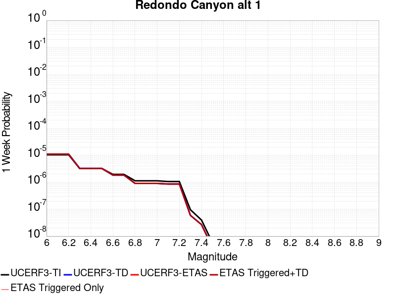 | 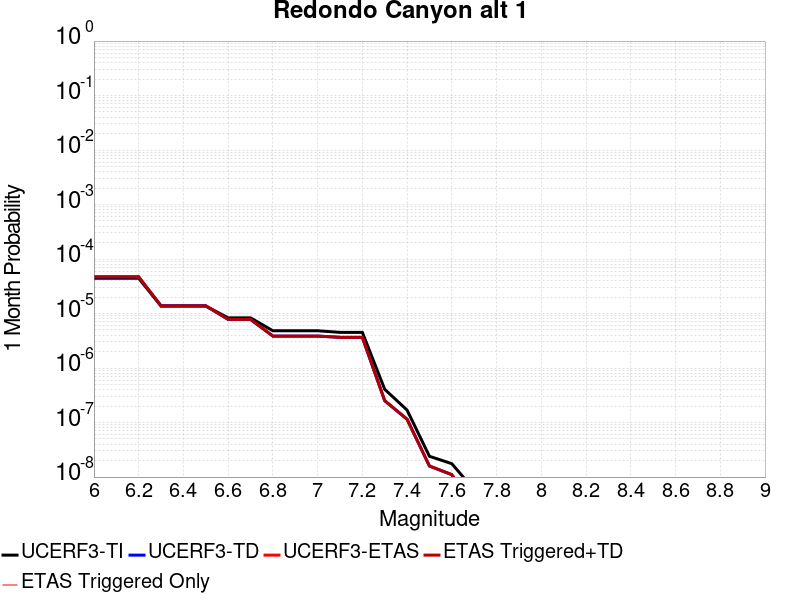 | 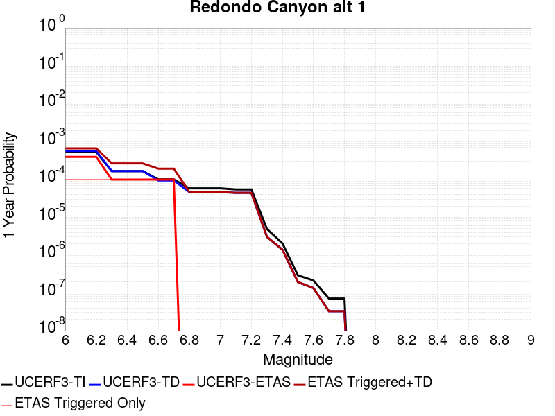 | 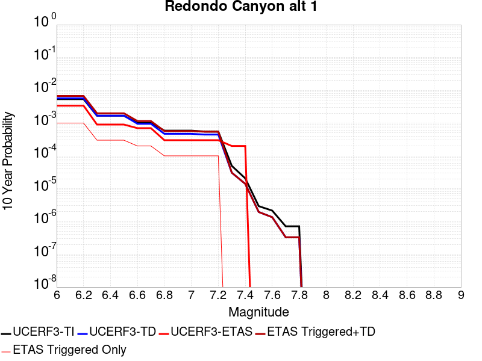 |

| Magnitude | 1 wk TI Prob | 1 wk TD Prob | 1 wk ETAS Prob | 1 wk ETAS/TD Gain | 1 wk ETAS Triggered+TD | 1 wk ETAS Triggered Only | 1 mo TI Prob | 1 mo TD Prob | 1 mo ETAS Prob | 1 mo ETAS/TD Gain | 1 mo ETAS Triggered+TD | 1 mo ETAS Triggered Only | 1 yr TI Prob | 1 yr TD Prob | 1 yr ETAS Prob | 1 yr ETAS/TD Gain | 1 yr ETAS Triggered+TD | 1 yr ETAS Triggered Only | 10 yr TI Prob | 10 yr TD Prob | 10 yr ETAS Prob | 10 yr ETAS/TD Gain | 10 yr ETAS Triggered+TD | 10 yr ETAS Triggered Only |
|-----|-----|-----|-----|-----|-----|-----|-----|-----|-----|-----|-----|-----|-----|-----|-----|-----|-----|-----|-----|-----|-----|-----|-----|-----|
| 6.0 | 1.0346246E-5 | 1.0969803E-5 | 0.0 | 0.0 | 1.0969803E-5 | 0.0 | 4.43403E-5 | 4.701304E-5 | 0.0 | 0.0 | 4.701304E-5 | 0.0 | 5.3970946E-4 | 5.7231216E-4 | 4.0E-4 | 0.69891924 | 6.7225494E-4 | 1.0E-4 | 0.0053840056 | 0.005716108 | 0.0034 | 0.5948103 | 0.0067103915 | 0.001 |
| 6.1 | 1.0346246E-5 | 1.0969803E-5 | 0.0 | 0.0 | 1.0969803E-5 | 0.0 | 4.43403E-5 | 4.701304E-5 | 0.0 | 0.0 | 4.701304E-5 | 0.0 | 5.3970946E-4 | 5.7231216E-4 | 4.0E-4 | 0.69891924 | 6.7225494E-4 | 1.0E-4 | 0.0053840056 | 0.005716108 | 0.0034 | 0.5948103 | 0.0067103915 | 0.001 |
| 6.2 | 1.0346246E-5 | 1.0969803E-5 | 0.0 | 0.0 | 1.0969803E-5 | 0.0 | 4.43403E-5 | 4.701304E-5 | 0.0 | 0.0 | 4.701304E-5 | 0.0 | 5.3970946E-4 | 5.7231216E-4 | 4.0E-4 | 0.69891924 | 6.7225494E-4 | 1.0E-4 | 0.0053840056 | 0.005716108 | 0.0034 | 0.5948103 | 0.0067103915 | 0.001 |
| 6.3 | 3.2052794E-6 | 3.2314128E-6 | 0.0 | 0.0 | 3.2314128E-6 | 0.0 | 1.373684E-5 | 1.3848861E-5 | 0.0 | 0.0 | 1.3848861E-5 | 0.0 | 1.6723319E-4 | 1.686008E-4 | 1.0E-4 | 0.593117 | 2.6858394E-4 | 1.0E-4 | 0.001671074 | 0.0016851175 | 9.0E-4 | 0.5340874 | 0.0019846119 | 3.0E-4 |
| 6.4 | 3.2052794E-6 | 3.2314128E-6 | 0.0 | 0.0 | 3.2314128E-6 | 0.0 | 1.373684E-5 | 1.3848861E-5 | 0.0 | 0.0 | 1.3848861E-5 | 0.0 | 1.6723319E-4 | 1.686008E-4 | 1.0E-4 | 0.593117 | 2.6858394E-4 | 1.0E-4 | 0.001671074 | 0.0016851175 | 9.0E-4 | 0.5340874 | 0.0019846119 | 3.0E-4 |
| 6.5 | 3.2052794E-6 | 3.2314128E-6 | 0.0 | 0.0 | 3.2314128E-6 | 0.0 | 1.373684E-5 | 1.3848861E-5 | 0.0 | 0.0 | 1.3848861E-5 | 0.0 | 1.6723319E-4 | 1.686008E-4 | 1.0E-4 | 0.593117 | 2.6858394E-4 | 1.0E-4 | 0.001671074 | 0.0016851175 | 9.0E-4 | 0.5340874 | 0.0019846119 | 3.0E-4 |
| 6.6 | 1.948328E-6 | 1.8259183E-6 | 0.0 | 0.0 | 1.8259183E-6 | 0.0 | 8.349951E-6 | 7.825349E-6 | 0.0 | 0.0 | 7.825349E-6 | 0.0 | 1.016559E-4 | 9.527095E-5 | 1.0E-4 | 1.0496378 | 1.9526143E-4 | 1.0E-4 | 0.0010160941 | 9.5244765E-4 | 7.0E-4 | 0.7349485 | 0.0011522572 | 2.0E-4 |
| 6.7 | 1.948328E-6 | 1.8259183E-6 | 0.0 | 0.0 | 1.8259183E-6 | 0.0 | 8.349951E-6 | 7.825349E-6 | 0.0 | 0.0 | 7.825349E-6 | 0.0 | 1.016559E-4 | 9.527095E-5 | 1.0E-4 | 1.0496378 | 1.9526143E-4 | 1.0E-4 | 0.0010160941 | 9.5244765E-4 | 7.0E-4 | 0.7349485 | 0.0011522572 | 2.0E-4 |
| 6.8 | 1.1278219E-6 | 9.015936E-7 | 0.0 | 0.0 | 9.015936E-7 | 0.0 | 4.8335132E-6 | 3.863969E-6 | 0.0 | 0.0 | 3.863969E-6 | 0.0 | 5.8846435E-5 | 4.704324E-5 | 0.0 | 0.0 | 4.704324E-5 | 0.0 | 5.8830855E-4 | 4.7037465E-4 | 3.0E-4 | 0.6377895 | 5.703276E-4 | 1.0E-4 |
| 6.9 | 1.1278219E-6 | 9.015936E-7 | 0.0 | 0.0 | 9.015936E-7 | 0.0 | 4.8335132E-6 | 3.863969E-6 | 0.0 | 0.0 | 3.863969E-6 | 0.0 | 5.8846435E-5 | 4.704324E-5 | 0.0 | 0.0 | 4.704324E-5 | 0.0 | 5.8830855E-4 | 4.7037465E-4 | 3.0E-4 | 0.6377895 | 5.703276E-4 | 1.0E-4 |
| 7.0 | 1.1278219E-6 | 9.015936E-7 | 0.0 | 0.0 | 9.015936E-7 | 0.0 | 4.8335132E-6 | 3.863969E-6 | 0.0 | 0.0 | 3.863969E-6 | 0.0 | 5.8846435E-5 | 4.704324E-5 | 0.0 | 0.0 | 4.704324E-5 | 0.0 | 5.8830855E-4 | 4.7037465E-4 | 3.0E-4 | 0.6377895 | 5.703276E-4 | 1.0E-4 |
| 7.1 | 1.0545139E-6 | 8.5534685E-7 | 0.0 | 0.0 | 8.5534685E-7 | 0.0 | 4.5193374E-6 | 3.6657693E-6 | 0.0 | 0.0 | 3.6657693E-6 | 0.0 | 5.5021545E-5 | 4.463025E-5 | 0.0 | 0.0 | 4.463025E-5 | 0.0 | 5.500792E-4 | 4.462545E-4 | 3.0E-4 | 0.67226213 | 5.4620986E-4 | 1.0E-4 |
| 7.2 | 1.0545139E-6 | 8.5534685E-7 | 0.0 | 0.0 | 8.5534685E-7 | 0.0 | 4.5193374E-6 | 3.6657693E-6 | 0.0 | 0.0 | 3.6657693E-6 | 0.0 | 5.5021545E-5 | 4.463025E-5 | 0.0 | 0.0 | 4.463025E-5 | 0.0 | 5.500792E-4 | 4.462545E-4 | 3.0E-4 | 0.67226213 | 5.4620986E-4 | 1.0E-4 |
| 7.3 | 9.505161E-8 | 5.8791972E-8 | 0.0 | 0.0 | 5.8791972E-8 | 0.0 | 4.0736398E-7 | 2.519656E-7 | 0.0 | 0.0 | 2.519656E-7 | 0.0 | 4.959645E-6 | 3.0676779E-6 | 0.0 | 0.0 | 3.0676779E-6 | 0.0 | 4.9595343E-5 | 3.0676474E-5 | 2.0E-4 | 6.5196543 | 3.0676474E-5 | 0.0 |
| 7.4 | 3.9520785E-8 | 2.6868836E-8 | 0.0 | 0.0 | 2.6868836E-8 | 0.0 | 1.6937479E-7 | 1.1515215E-7 | 0.0 | 0.0 | 1.1515215E-7 | 0.0 | 2.062136E-6 | 1.4019768E-6 | 0.0 | 0.0 | 1.4019768E-6 | 0.0 | 2.062117E-5 | 1.4019706E-5 | 2.0E-4 | 14.265635 | 1.4019706E-5 | 0.0 |
| 7.5 | 5.6133214E-9 | 3.722762E-9 | 0.0 | 0.0 | 3.722762E-9 | 0.0 | 2.4057092E-8 | 1.5954695E-8 | 0.0 | 0.0 | 1.5954695E-8 | 0.0 | 2.9289507E-7 | 1.942484E-7 | 0.0 | 0.0 | 1.942484E-7 | 0.0 | 2.9289467E-6 | 1.9424826E-6 | 0.0 | 0.0 | 1.9424826E-6 | 0.0 |
| 7.6 | 4.1064334E-9 | 2.5842946E-9 | 0.0 | 0.0 | 2.5842946E-9 | 0.0 | 1.7599E-8 | 1.10755485E-8 | 0.0 | 0.0 | 1.10755485E-8 | 0.0 | 2.142678E-7 | 1.348448E-7 | 0.0 | 0.0 | 1.348448E-7 | 0.0 | 2.1426758E-6 | 1.3484473E-6 | 0.0 | 0.0 | 1.3484473E-6 | 0.0 |
| 7.7 | 1.361975E-9 | 6.2969774E-10 | 0.0 | 0.0 | 6.2969774E-10 | 0.0 | 5.8370353E-9 | 2.698705E-9 | 0.0 | 0.0 | 2.698705E-9 | 0.0 | 7.1065905E-8 | 3.2856732E-8 | 0.0 | 0.0 | 3.2856732E-8 | 0.0 | 7.106588E-7 | 3.285673E-7 | 0.0 | 0.0 | 3.285673E-7 | 0.0 |
| 7.8 | 1.361975E-9 | 6.2969774E-10 | 0.0 | 0.0 | 6.2969774E-10 | 0.0 | 5.8370353E-9 | 2.698705E-9 | 0.0 | 0.0 | 2.698705E-9 | 0.0 | 7.1065905E-8 | 3.2856732E-8 | 0.0 | 0.0 | 3.2856732E-8 | 0.0 | 7.106588E-7 | 3.285673E-7 | 0.0 | 0.0 | 3.285673E-7 | 0.0 |

## Mohawk Valley 2011 CFM
*[(top)](#table-of-contents)*

| 1 Week | 1 Month | 1 Year | 10 Year |
|-----|-----|-----|-----|
| 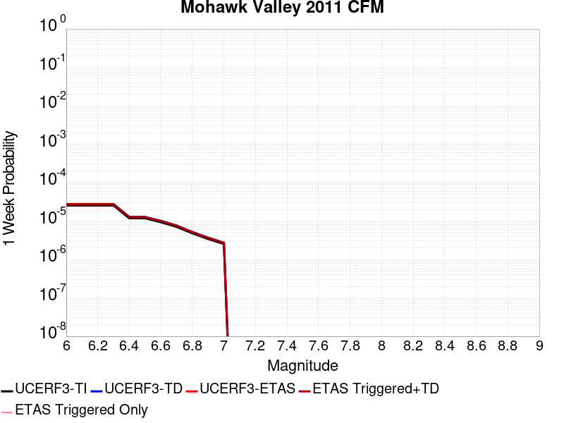 | 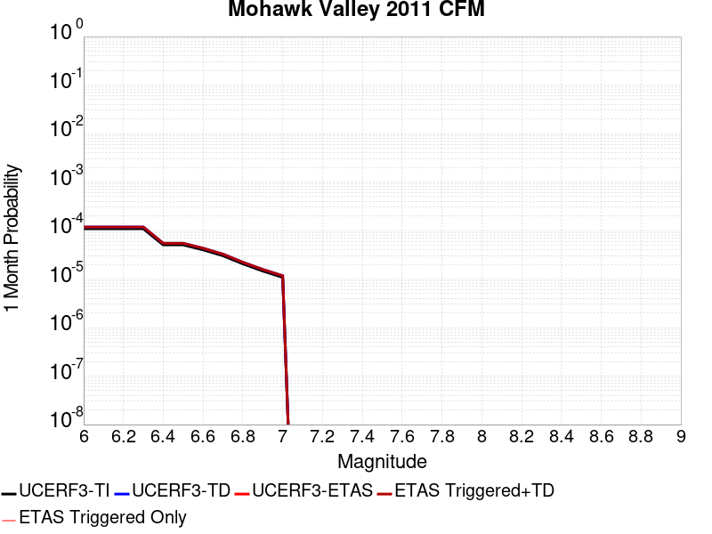 | 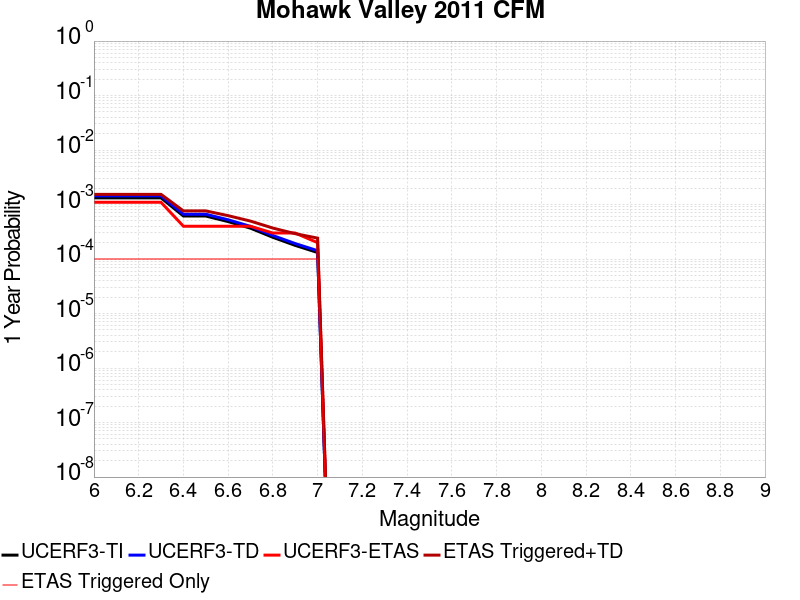 | 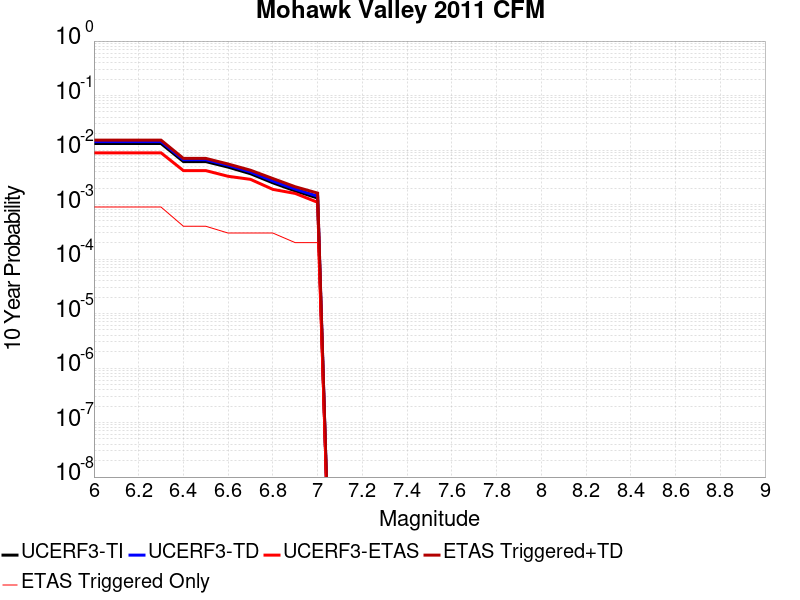 |

| Magnitude | 1 wk TI Prob | 1 wk TD Prob | 1 wk ETAS Prob | 1 wk ETAS/TD Gain | 1 wk ETAS Triggered+TD | 1 wk ETAS Triggered Only | 1 mo TI Prob | 1 mo TD Prob | 1 mo ETAS Prob | 1 mo ETAS/TD Gain | 1 mo ETAS Triggered+TD | 1 mo ETAS Triggered Only | 1 yr TI Prob | 1 yr TD Prob | 1 yr ETAS Prob | 1 yr ETAS/TD Gain | 1 yr ETAS Triggered+TD | 1 yr ETAS Triggered Only | 10 yr TI Prob | 10 yr TD Prob | 10 yr ETAS Prob | 10 yr ETAS/TD Gain | 10 yr ETAS Triggered+TD | 10 yr ETAS Triggered Only |
|-----|-----|-----|-----|-----|-----|-----|-----|-----|-----|-----|-----|-----|-----|-----|-----|-----|-----|-----|-----|-----|-----|-----|-----|-----|
| 6.0 | 2.5425423E-5 | 2.7619575E-5 | 0.0 | 0.0 | 2.7619575E-5 | 0.0 | 1.0896155E-4 | 1.1836485E-4 | 0.0 | 0.0 | 1.1836485E-4 | 0.0 | 0.0013257994 | 0.0014402476 | 0.0011 | 0.7637575 | 0.0015401037 | 1.0E-4 | 0.013179175 | 0.0143199945 | 0.0089 | 0.6215086 | 0.015207106 | 9.0E-4 |
| 6.1 | 2.5425423E-5 | 2.7619575E-5 | 0.0 | 0.0 | 2.7619575E-5 | 0.0 | 1.0896155E-4 | 1.1836485E-4 | 0.0 | 0.0 | 1.1836485E-4 | 0.0 | 0.0013257994 | 0.0014402476 | 0.0011 | 0.7637575 | 0.0015401037 | 1.0E-4 | 0.013179175 | 0.0143199945 | 0.0089 | 0.6215086 | 0.015207106 | 9.0E-4 |
| 6.2 | 2.5425423E-5 | 2.7619575E-5 | 0.0 | 0.0 | 2.7619575E-5 | 0.0 | 1.0896155E-4 | 1.1836485E-4 | 0.0 | 0.0 | 1.1836485E-4 | 0.0 | 0.0013257994 | 0.0014402476 | 0.0011 | 0.7637575 | 0.0015401037 | 1.0E-4 | 0.013179175 | 0.0143199945 | 0.0089 | 0.6215086 | 0.015207106 | 9.0E-4 |
| 6.3 | 2.5425423E-5 | 2.7619575E-5 | 0.0 | 0.0 | 2.7619575E-5 | 0.0 | 1.0896155E-4 | 1.1836485E-4 | 0.0 | 0.0 | 1.1836485E-4 | 0.0 | 0.0013257994 | 0.0014402476 | 0.0011 | 0.7637575 | 0.0015401037 | 1.0E-4 | 0.013179175 | 0.0143199945 | 0.0089 | 0.6215086 | 0.015207106 | 9.0E-4 |
| 6.4 | 1.1812642E-5 | 1.2752864E-5 | 0.0 | 0.0 | 1.2752864E-5 | 0.0 | 5.0624625E-5 | 5.465407E-5 | 0.0 | 0.0 | 5.465407E-5 | 0.0 | 6.161805E-4 | 6.6522486E-4 | 4.0E-4 | 0.6013005 | 7.6515833E-4 | 1.0E-4 | 0.0061447476 | 0.006633806 | 0.0042 | 0.6331207 | 0.0070311525 | 4.0E-4 |
| 6.5 | 1.1812642E-5 | 1.2752864E-5 | 0.0 | 0.0 | 1.2752864E-5 | 0.0 | 5.0624625E-5 | 5.465407E-5 | 0.0 | 0.0 | 5.465407E-5 | 0.0 | 6.161805E-4 | 6.6522486E-4 | 4.0E-4 | 0.6013005 | 7.6515833E-4 | 1.0E-4 | 0.0061447476 | 0.006633806 | 0.0042 | 0.6331207 | 0.0070311525 | 4.0E-4 |
| 6.6 | 9.34204E-6 | 1.0076818E-5 | 0.0 | 0.0 | 1.0076818E-5 | 0.0 | 4.0036703E-5 | 4.318572E-5 | 0.0 | 0.0 | 4.318572E-5 | 0.0 | 4.873378E-4 | 5.25671E-4 | 4.0E-4 | 0.7609322 | 6.2561844E-4 | 1.0E-4 | 0.0048627043 | 0.005245442 | 0.0033 | 0.6291176 | 0.0055438685 | 3.0E-4 |
| 6.7 | 7.0661854E-6 | 7.6179185E-6 | 0.0 | 0.0 | 7.6179185E-6 | 0.0 | 3.02833E-5 | 3.2647866E-5 | 0.0 | 0.0 | 3.2647866E-5 | 0.0 | 3.686368E-4 | 3.974243E-4 | 4.0E-4 | 1.0064809 | 4.973846E-4 | 1.0E-4 | 0.0036802588 | 0.0039680297 | 0.0029 | 0.7308413 | 0.0042668395 | 3.0E-4 |
| 6.8 | 4.806676E-6 | 5.1829315E-6 | 0.0 | 0.0 | 5.1829315E-6 | 0.0 | 2.0599877E-5 | 2.221241E-5 | 0.0 | 0.0 | 2.221241E-5 | 0.0 | 2.507746E-4 | 2.704089E-4 | 3.0E-4 | 1.1094309 | 3.7038187E-4 | 1.0E-4 | 0.0025049183 | 0.002701424 | 0.0019 | 0.7033327 | 0.0030006138 | 3.0E-4 |
| 6.9 | 3.4163209E-6 | 3.6858269E-6 | 0.0 | 0.0 | 3.6858269E-6 | 0.0 | 1.4641293E-5 | 1.5796335E-5 | 0.0 | 0.0 | 1.5796335E-5 | 0.0 | 1.7824316E-4 | 1.9230883E-4 | 3.0E-4 | 1.5599908 | 2.922896E-4 | 1.0E-4 | 0.0017810026 | 0.0019219551 | 0.0016 | 0.8324856 | 0.0021215708 | 2.0E-4 |
| 7.0 | 2.5271734E-6 | 2.7287144E-6 | 0.0 | 0.0 | 2.7287144E-6 | 0.0 | 1.0830699E-5 | 1.1694466E-5 | 0.0 | 0.0 | 1.1694466E-5 | 0.0 | 1.3185578E-4 | 1.4237575E-4 | 2.0E-4 | 1.4047337 | 2.4236151E-4 | 1.0E-4 | 0.0013177756 | 0.0014233281 | 0.0011 | 0.77283657 | 0.0016230434 | 2.0E-4 |

## Clamshell-Sawpit
*[(top)](#table-of-contents)*

| 1 Week | 1 Month | 1 Year | 10 Year |
|-----|-----|-----|-----|
| 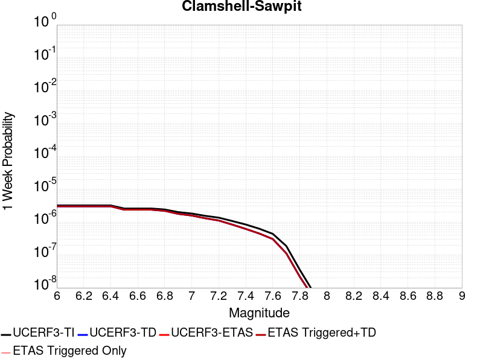 | 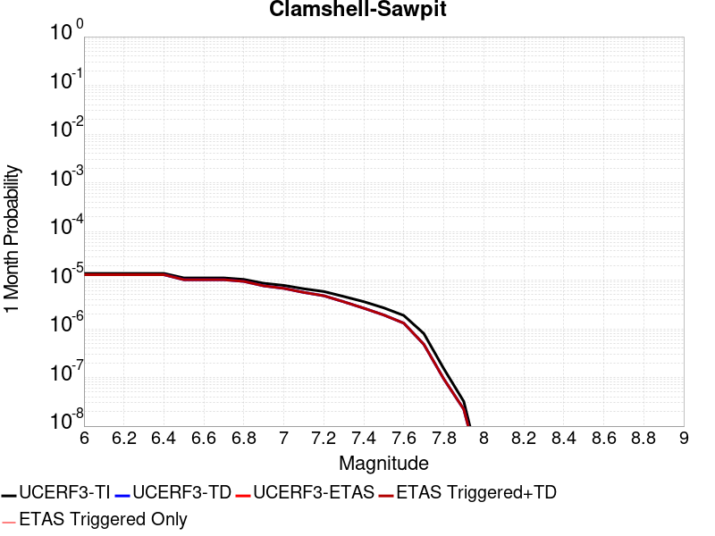 | 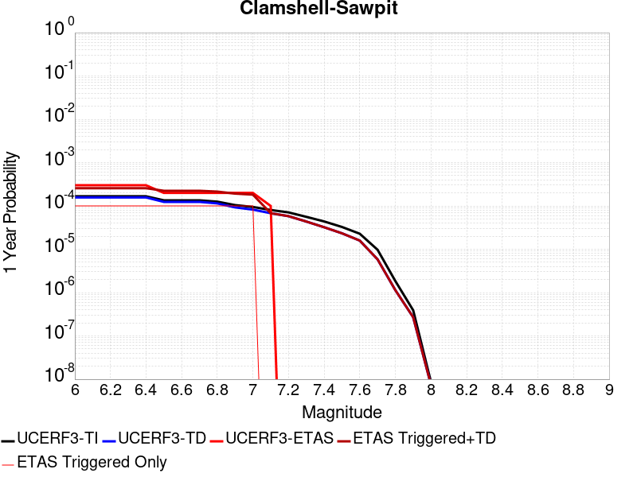 | 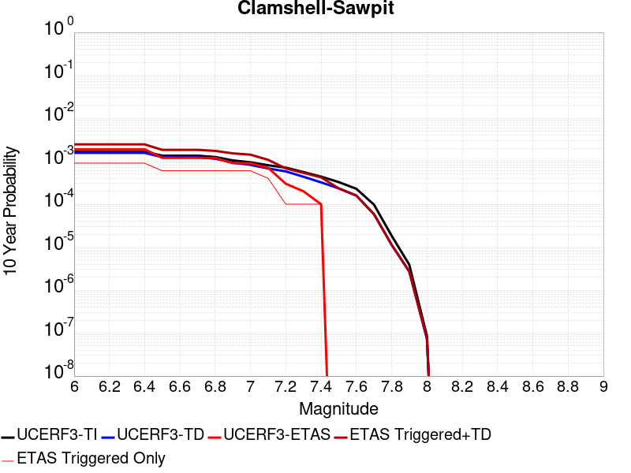 |

| Magnitude | 1 wk TI Prob | 1 wk TD Prob | 1 wk ETAS Prob | 1 wk ETAS/TD Gain | 1 wk ETAS Triggered+TD | 1 wk ETAS Triggered Only | 1 mo TI Prob | 1 mo TD Prob | 1 mo ETAS Prob | 1 mo ETAS/TD Gain | 1 mo ETAS Triggered+TD | 1 mo ETAS Triggered Only | 1 yr TI Prob | 1 yr TD Prob | 1 yr ETAS Prob | 1 yr ETAS/TD Gain | 1 yr ETAS Triggered+TD | 1 yr ETAS Triggered Only | 10 yr TI Prob | 10 yr TD Prob | 10 yr ETAS Prob | 10 yr ETAS/TD Gain | 10 yr ETAS Triggered+TD | 10 yr ETAS Triggered Only |
|-----|-----|-----|-----|-----|-----|-----|-----|-----|-----|-----|-----|-----|-----|-----|-----|-----|-----|-----|-----|-----|-----|-----|-----|-----|
| 6.0 | 3.202998E-6 | 3.0100693E-6 | 0.0 | 0.0 | 3.0100693E-6 | 0.0 | 1.3727062E-5 | 1.2900238E-5 | 0.0 | 0.0 | 1.2900238E-5 | 0.0 | 1.6711417E-4 | 1.5704989E-4 | 3.0E-4 | 1.9102211 | 2.5703417E-4 | 1.0E-4 | 0.0016698855 | 0.0015694683 | 0.0019 | 1.2106011 | 0.0024680558 | 9.0E-4 |
| 6.1 | 3.202998E-6 | 3.0100693E-6 | 0.0 | 0.0 | 3.0100693E-6 | 0.0 | 1.3727062E-5 | 1.2900238E-5 | 0.0 | 0.0 | 1.2900238E-5 | 0.0 | 1.6711417E-4 | 1.5704989E-4 | 3.0E-4 | 1.9102211 | 2.5703417E-4 | 1.0E-4 | 0.0016698855 | 0.0015694683 | 0.0019 | 1.2106011 | 0.0024680558 | 9.0E-4 |
| 6.2 | 3.202998E-6 | 3.0100693E-6 | 0.0 | 0.0 | 3.0100693E-6 | 0.0 | 1.3727062E-5 | 1.2900238E-5 | 0.0 | 0.0 | 1.2900238E-5 | 0.0 | 1.6711417E-4 | 1.5704989E-4 | 3.0E-4 | 1.9102211 | 2.5703417E-4 | 1.0E-4 | 0.0016698855 | 0.0015694683 | 0.0019 | 1.2106011 | 0.0024680558 | 9.0E-4 |
| 6.3 | 3.202998E-6 | 3.0100693E-6 | 0.0 | 0.0 | 3.0100693E-6 | 0.0 | 1.3727062E-5 | 1.2900238E-5 | 0.0 | 0.0 | 1.2900238E-5 | 0.0 | 1.6711417E-4 | 1.5704989E-4 | 3.0E-4 | 1.9102211 | 2.5703417E-4 | 1.0E-4 | 0.0016698855 | 0.0015694683 | 0.0019 | 1.2106011 | 0.0024680558 | 9.0E-4 |
| 6.4 | 3.202998E-6 | 3.0100693E-6 | 0.0 | 0.0 | 3.0100693E-6 | 0.0 | 1.3727062E-5 | 1.2900238E-5 | 0.0 | 0.0 | 1.2900238E-5 | 0.0 | 1.6711417E-4 | 1.5704989E-4 | 3.0E-4 | 1.9102211 | 2.5703417E-4 | 1.0E-4 | 0.0016698855 | 0.0015694683 | 0.0019 | 1.2106011 | 0.0024680558 | 9.0E-4 |
| 6.5 | 2.5862723E-6 | 2.3782434E-6 | 0.0 | 0.0 | 2.3782434E-6 | 0.0 | 1.1083977E-5 | 1.0192433E-5 | 0.0 | 0.0 | 1.0192433E-5 | 0.0 | 1.3493907E-4 | 1.2408612E-4 | 2.0E-4 | 1.6117839 | 2.2407371E-4 | 1.0E-4 | 0.0013485716 | 0.0012401985 | 0.0012 | 0.96758705 | 0.0018394544 | 6.0E-4 |
| 6.6 | 2.5862723E-6 | 2.3782434E-6 | 0.0 | 0.0 | 2.3782434E-6 | 0.0 | 1.1083977E-5 | 1.0192433E-5 | 0.0 | 0.0 | 1.0192433E-5 | 0.0 | 1.3493907E-4 | 1.2408612E-4 | 2.0E-4 | 1.6117839 | 2.2407371E-4 | 1.0E-4 | 0.0013485716 | 0.0012401985 | 0.0012 | 0.96758705 | 0.0018394544 | 6.0E-4 |
| 6.7 | 2.5862723E-6 | 2.3782434E-6 | 0.0 | 0.0 | 2.3782434E-6 | 0.0 | 1.1083977E-5 | 1.0192433E-5 | 0.0 | 0.0 | 1.0192433E-5 | 0.0 | 1.3493907E-4 | 1.2408612E-4 | 2.0E-4 | 1.6117839 | 2.2407371E-4 | 1.0E-4 | 0.0013485716 | 0.0012401985 | 0.0012 | 0.96758705 | 0.0018394544 | 6.0E-4 |
| 6.8 | 2.4098806E-6 | 2.1952712E-6 | 0.0 | 0.0 | 2.1952712E-6 | 0.0 | 1.0328019E-5 | 9.408273E-6 | 0.0 | 0.0 | 9.408273E-6 | 0.0 | 1.2573638E-4 | 1.1453997E-4 | 2.0E-4 | 1.7461153 | 2.1452851E-4 | 1.0E-4 | 0.0012566525 | 0.0011448358 | 0.0012 | 1.0481852 | 0.001744149 | 6.0E-4 |
| 6.9 | 2.0073985E-6 | 1.7761482E-6 | 0.0 | 0.0 | 1.7761482E-6 | 0.0 | 8.603109E-6 | 7.6120423E-6 | 0.0 | 0.0 | 7.6120423E-6 | 0.0 | 1.0473781E-4 | 9.2672795E-5 | 2.0E-4 | 2.1581306 | 1.9266353E-4 | 1.0E-4 | 0.0010468846 | 9.263533E-4 | 9.0E-4 | 0.97155154 | 0.0015257975 | 6.0E-4 |
| 7.0 | 1.8166766E-6 | 1.5785087E-6 | 0.0 | 0.0 | 1.5785087E-6 | 0.0 | 7.785734E-6 | 6.7650203E-6 | 0.0 | 0.0 | 6.7650203E-6 | 0.0 | 9.478718E-5 | 8.236111E-5 | 2.0E-4 | 2.4283307 | 1.8235287E-4 | 1.0E-4 | 9.4746763E-4 | 8.233159E-4 | 9.0E-4 | 1.0931406 | 0.0014228219 | 6.0E-4 |
| 7.1 | 1.5471421E-6 | 1.3032412E-6 | 0.0 | 0.0 | 1.3032412E-6 | 0.0 | 6.6305925E-6 | 5.585308E-6 | 0.0 | 0.0 | 5.585308E-6 | 0.0 | 8.072447E-5 | 6.7999055E-5 | 1.0E-4 | 1.4706086 | 6.7999055E-5 | 0.0 | 8.0695155E-4 | 6.7978795E-4 | 7.0E-4 | 1.029733 | 0.001079516 | 4.0E-4 |
| 7.2 | 1.3608037E-6 | 1.1133892E-6 | 0.0 | 0.0 | 1.1133892E-6 | 0.0 | 5.8320024E-6 | 4.7716594E-6 | 0.0 | 0.0 | 4.7716594E-6 | 0.0 | 7.1002316E-5 | 5.8093454E-5 | 0.0 | 0.0 | 5.8093454E-5 | 0.0 | 7.097964E-4 | 5.8078725E-4 | 3.0E-4 | 0.5165403 | 6.8072916E-4 | 1.0E-4 |
| 7.3 | 1.0749634E-6 | 8.3663514E-7 | 0.0 | 0.0 | 8.3663514E-7 | 0.0 | 4.6069777E-6 | 3.5855744E-6 | 0.0 | 0.0 | 3.5855744E-6 | 0.0 | 5.608851E-5 | 4.3653523E-5 | 0.0 | 0.0 | 4.3653523E-5 | 0.0 | 5.6074356E-4 | 4.3645228E-4 | 2.0E-4 | 0.45824024 | 5.364086E-4 | 1.0E-4 |
| 7.4 | 8.416856E-7 | 6.1835664E-7 | 0.0 | 0.0 | 6.1835664E-7 | 0.0 | 3.607219E-6 | 2.6500973E-6 | 0.0 | 0.0 | 2.6500973E-6 | 0.0 | 4.3917007E-5 | 3.2264477E-5 | 0.0 | 0.0 | 3.2264477E-5 | 0.0 | 4.390833E-4 | 3.2259987E-4 | 1.0E-4 | 0.30998152 | 4.2256762E-4 | 1.0E-4 |
| 7.5 | 6.2779594E-7 | 4.481569E-7 | 0.0 | 0.0 | 4.481569E-7 | 0.0 | 2.6905511E-6 | 1.9206711E-6 | 0.0 | 0.0 | 1.9206711E-6 | 0.0 | 3.275697E-5 | 2.3383938E-5 | 0.0 | 0.0 | 2.3383938E-5 | 0.0 | 3.275214E-4 | 2.3381662E-4 | 0.0 | 0.0 | 2.3381662E-4 | 0.0 |
| 7.6 | 4.3822078E-7 | 3.0452057E-7 | 0.0 | 0.0 | 3.0452057E-7 | 0.0 | 1.8780877E-6 | 1.3050876E-6 | 0.0 | 0.0 | 1.3050876E-6 | 0.0 | 2.2865479E-5 | 1.588934E-5 | 0.0 | 0.0 | 1.588934E-5 | 0.0 | 2.2863125E-4 | 1.5888356E-4 | 0.0 | 0.0 | 1.5888356E-4 | 0.0 |
| 7.7 | 1.8704569E-7 | 1.12234645E-7 | 0.0 | 0.0 | 1.12234645E-7 | 0.0 | 8.0162414E-7 | 4.8100554E-7 | 0.0 | 0.0 | 4.8100554E-7 | 0.0 | 9.75973E-6 | 5.8562273E-6 | 0.0 | 0.0 | 5.8562273E-6 | 0.0 | 9.7593016E-5 | 5.8560792E-5 | 0.0 | 0.0 | 5.8560792E-5 | 0.0 |
| 7.8 | 3.5378733E-8 | 2.1798302E-8 | 0.0 | 0.0 | 2.1798302E-8 | 0.0 | 1.5162313E-7 | 9.342129E-8 | 0.0 | 0.0 | 9.342129E-8 | 0.0 | 1.84601E-6 | 1.1374036E-6 | 0.0 | 0.0 | 1.1374036E-6 | 0.0 | 1.8459947E-5 | 1.1373981E-5 | 0.0 | 0.0 | 1.1373981E-5 | 0.0 |
| 7.9 | 7.504945E-9 | 5.1875597E-9 | 0.0 | 0.0 | 5.1875597E-9 | 0.0 | 3.2164053E-8 | 2.2232399E-8 | 0.0 | 0.0 | 2.2232399E-8 | 0.0 | 3.9159727E-7 | 2.7067944E-7 | 0.0 | 0.0 | 2.7067944E-7 | 0.0 | 3.915966E-6 | 2.7067917E-6 | 0.0 | 0.0 | 2.7067917E-6 | 0.0 |
| 8.0 | 1.6554036E-10 | 1.4178592E-10 | 0.0 | 0.0 | 1.4178592E-10 | 0.0 | 7.0945894E-10 | 6.0765415E-10 | 0.0 | 0.0 | 6.0765415E-10 | 0.0 | 8.637662E-9 | 7.398189E-9 | 0.0 | 0.0 | 7.398189E-9 | 0.0 | 8.6376616E-8 | 7.3981894E-8 | 0.0 | 0.0 | 7.3981894E-8 | 0.0 |

## Great Valley 10 (Panoche)
*[(top)](#table-of-contents)*

| 1 Week | 1 Month | 1 Year | 10 Year |
|-----|-----|-----|-----|
| 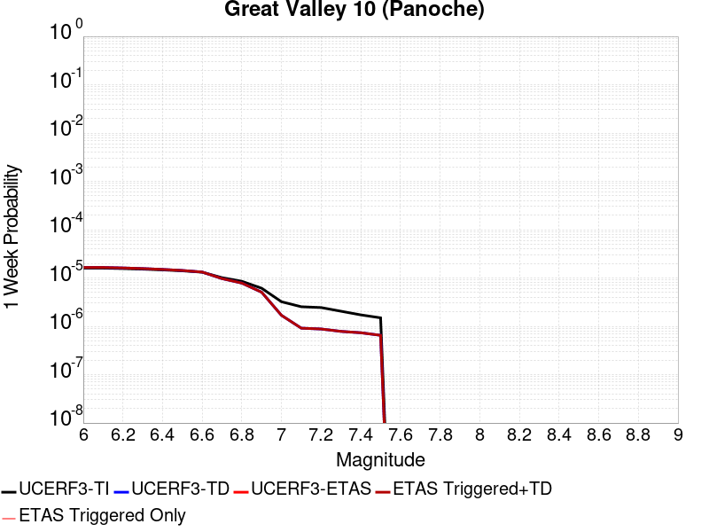 | 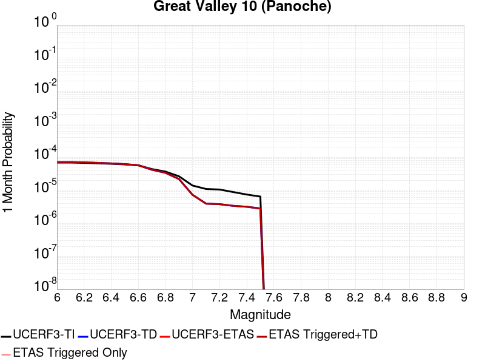 | 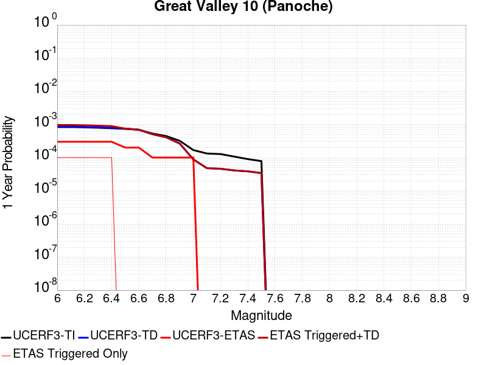 | 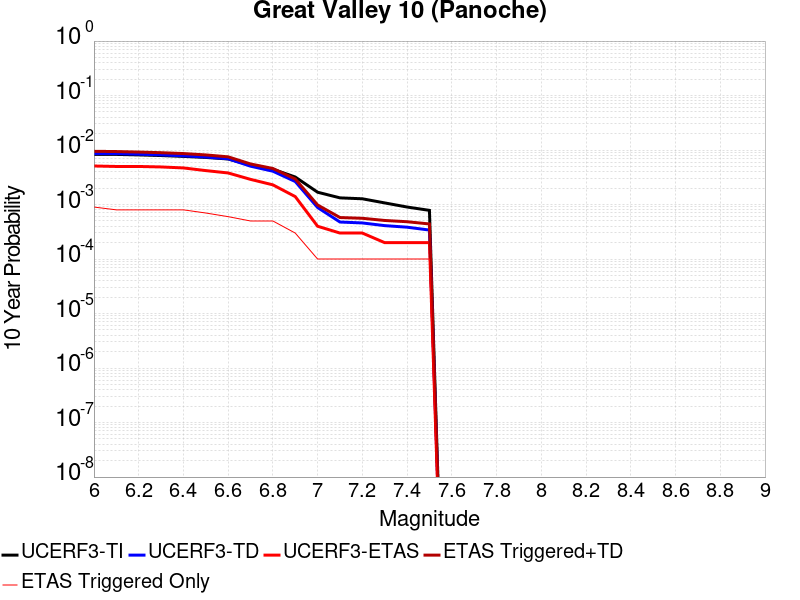 |

| Magnitude | 1 wk TI Prob | 1 wk TD Prob | 1 wk ETAS Prob | 1 wk ETAS/TD Gain | 1 wk ETAS Triggered+TD | 1 wk ETAS Triggered Only | 1 mo TI Prob | 1 mo TD Prob | 1 mo ETAS Prob | 1 mo ETAS/TD Gain | 1 mo ETAS Triggered+TD | 1 mo ETAS Triggered Only | 1 yr TI Prob | 1 yr TD Prob | 1 yr ETAS Prob | 1 yr ETAS/TD Gain | 1 yr ETAS Triggered+TD | 1 yr ETAS Triggered Only | 10 yr TI Prob | 10 yr TD Prob | 10 yr ETAS Prob | 10 yr ETAS/TD Gain | 10 yr ETAS Triggered+TD | 10 yr ETAS Triggered Only |
|-----|-----|-----|-----|-----|-----|-----|-----|-----|-----|-----|-----|-----|-----|-----|-----|-----|-----|-----|-----|-----|-----|-----|-----|-----|
| 6.0 | 1.6014626E-5 | 1.6546372E-5 | 0.0 | 0.0 | 1.6546372E-5 | 0.0 | 6.863231E-5 | 7.091112E-5 | 0.0 | 0.0 | 7.091112E-5 | 0.0 | 8.35278E-4 | 8.630065E-4 | 3.0E-4 | 0.34762195 | 9.629202E-4 | 1.0E-4 | 0.008321454 | 0.008597165 | 0.0051 | 0.59321874 | 0.009489428 | 9.0E-4 |
| 6.1 | 1.6014626E-5 | 1.6546372E-5 | 0.0 | 0.0 | 1.6546372E-5 | 0.0 | 6.863231E-5 | 7.091112E-5 | 0.0 | 0.0 | 7.091112E-5 | 0.0 | 8.35278E-4 | 8.630065E-4 | 3.0E-4 | 0.34762195 | 9.629202E-4 | 1.0E-4 | 0.008321454 | 0.008597165 | 0.005 | 0.581587 | 0.009390288 | 8.0E-4 |
| 6.2 | 1.56782E-5 | 1.6169894E-5 | 0.0 | 0.0 | 1.6169894E-5 | 0.0 | 6.719056E-5 | 6.929773E-5 | 0.0 | 0.0 | 6.929773E-5 | 0.0 | 8.17738E-4 | 8.433787E-4 | 3.0E-4 | 0.3557121 | 9.432944E-4 | 1.0E-4 | 0.008147354 | 0.008402384 | 0.005 | 0.5950692 | 0.009195661 | 8.0E-4 |
| 6.3 | 1.5263338E-5 | 1.569568E-5 | 0.0 | 0.0 | 1.569568E-5 | 0.0 | 6.541267E-5 | 6.7265486E-5 | 0.0 | 0.0 | 6.7265486E-5 | 0.0 | 7.961082E-4 | 8.18655E-4 | 3.0E-4 | 0.36645472 | 9.185732E-4 | 1.0E-4 | 0.007932622 | 0.008156981 | 0.0049 | 0.6007124 | 0.008950455 | 8.0E-4 |
| 6.4 | 1.4720723E-5 | 1.507252E-5 | 0.0 | 0.0 | 1.507252E-5 | 0.0 | 6.308728E-5 | 6.459494E-5 | 0.0 | 0.0 | 6.459494E-5 | 0.0 | 7.67817E-4 | 7.8616495E-4 | 3.0E-4 | 0.3815993 | 8.860863E-4 | 1.0E-4 | 0.007651695 | 0.007834409 | 0.0047 | 0.5999176 | 0.008628142 | 8.0E-4 |
| 6.5 | 1.408264E-5 | 1.4330397E-5 | 0.0 | 0.0 | 1.4330397E-5 | 0.0 | 6.0352773E-5 | 6.141457E-5 | 0.0 | 0.0 | 6.141457E-5 | 0.0 | 7.3454727E-4 | 7.47471E-4 | 2.0E-4 | 0.26756892 | 7.47471E-4 | 0.0 | 0.0073212404 | 0.0074501205 | 0.0042 | 0.56374925 | 0.008144906 | 7.0E-4 |
| 6.6 | 1.3197086E-5 | 1.3298128E-5 | 0.0 | 0.0 | 1.3298128E-5 | 0.0 | 5.6557717E-5 | 5.6990757E-5 | 0.0 | 0.0 | 5.6990757E-5 | 0.0 | 6.8837265E-4 | 6.9364667E-4 | 2.0E-4 | 0.28833124 | 6.9364667E-4 | 0.0 | 0.006862442 | 0.0069153504 | 0.0038 | 0.5495022 | 0.007511201 | 6.0E-4 |
| 6.7 | 1.017583E-5 | 9.728495E-6 | 0.0 | 0.0 | 9.728495E-6 | 0.0 | 4.360997E-5 | 4.1692896E-5 | 0.0 | 0.0 | 4.1692896E-5 | 0.0 | 5.30822E-4 | 5.074952E-4 | 1.0E-4 | 0.1970462 | 5.074952E-4 | 0.0 | 0.0052955584 | 0.005063614 | 0.0029 | 0.5727135 | 0.005561082 | 5.0E-4 |
| 6.8 | 8.557912E-6 | 7.858899E-6 | 0.0 | 0.0 | 7.858899E-6 | 0.0 | 3.667625E-5 | 3.3680575E-5 | 0.0 | 0.0 | 3.3680575E-5 | 0.0 | 4.4644187E-4 | 4.0998586E-4 | 1.0E-4 | 0.24391085 | 4.0998586E-4 | 0.0 | 0.0044554602 | 0.004092501 | 0.0023 | 0.56200355 | 0.0045904545 | 5.0E-4 |
| 6.9 | 6.14664E-6 | 5.08271E-6 | 0.0 | 0.0 | 5.08271E-6 | 0.0 | 2.6342475E-5 | 2.178287E-5 | 0.0 | 0.0 | 2.178287E-5 | 0.0 | 3.2067244E-4 | 2.6517553E-4 | 1.0E-4 | 0.3771087 | 2.6517553E-4 | 0.0 | 0.003202101 | 0.002648729 | 0.0014 | 0.5285554 | 0.0029479342 | 3.0E-4 |
| 7.0 | 3.2310581E-6 | 1.6916166E-6 | 0.0 | 0.0 | 1.6916166E-6 | 0.0 | 1.3847319E-5 | 7.2497655E-6 | 0.0 | 0.0 | 7.2497655E-6 | 0.0 | 1.6857806E-4 | 8.8262415E-5 | 1.0E-4 | 1.1329851 | 8.8262415E-5 | 0.0 | 0.0016845023 | 8.822829E-4 | 4.0E-4 | 0.4533693 | 9.821947E-4 | 1.0E-4 |
| 7.1 | 2.544492E-6 | 9.1644455E-7 | 0.0 | 0.0 | 9.1644455E-7 | 0.0 | 1.090492E-5 | 3.9276138E-6 | 0.0 | 0.0 | 3.9276138E-6 | 0.0 | 1.327593E-4 | 4.78177E-5 | 0.0 | 0.0 | 4.78177E-5 | 0.0 | 0.0013268003 | 4.7807884E-4 | 3.0E-4 | 0.62751156 | 5.7803106E-4 | 1.0E-4 |
| 7.2 | 2.4479045E-6 | 8.8175983E-7 | 0.0 | 0.0 | 8.8175983E-7 | 0.0 | 1.0490977E-5 | 3.7789655E-6 | 0.0 | 0.0 | 3.7789655E-6 | 0.0 | 1.2772017E-4 | 4.6007983E-5 | 0.0 | 0.0 | 4.6007983E-5 | 0.0 | 0.0012764678 | 4.599893E-4 | 3.0E-4 | 0.6521891 | 5.5994326E-4 | 1.0E-4 |
| 7.3 | 2.0559578E-6 | 7.87216E-7 | 0.0 | 0.0 | 7.87216E-7 | 0.0 | 8.811218E-6 | 3.3737786E-6 | 0.0 | 0.0 | 3.3737786E-6 | 0.0 | 1.072713E-4 | 4.107503E-5 | 0.0 | 0.0 | 4.107503E-5 | 0.0 | 0.0010721954 | 4.1067897E-4 | 2.0E-4 | 0.48699838 | 5.106379E-4 | 1.0E-4 |
| 7.4 | 1.727687E-6 | 7.369039E-7 | 0.0 | 0.0 | 7.369039E-7 | 0.0 | 7.404352E-6 | 3.1581562E-6 | 0.0 | 0.0 | 3.1581562E-6 | 0.0 | 9.0144255E-5 | 3.844992E-5 | 0.0 | 0.0 | 3.844992E-5 | 0.0 | 9.0107694E-4 | 3.8443727E-4 | 2.0E-4 | 0.52024096 | 4.8439883E-4 | 1.0E-4 |
| 7.5 | 1.5002679E-6 | 6.5287935E-7 | 0.0 | 0.0 | 6.5287935E-7 | 0.0 | 6.4297037E-6 | 2.7980518E-6 | 0.0 | 0.0 | 2.7980518E-6 | 0.0 | 7.827883E-5 | 3.406579E-5 | 0.0 | 0.0 | 3.406579E-5 | 0.0 | 7.825126E-4 | 3.406098E-4 | 2.0E-4 | 0.58718216 | 4.4057574E-4 | 1.0E-4 |

## Thirty Mile Bank
*[(top)](#table-of-contents)*

| 1 Week | 1 Month | 1 Year | 10 Year |
|-----|-----|-----|-----|
| 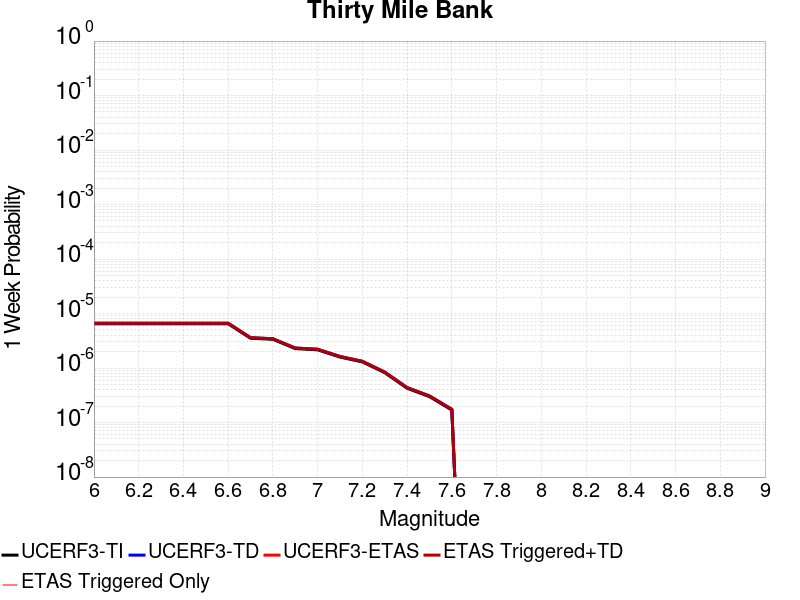 | 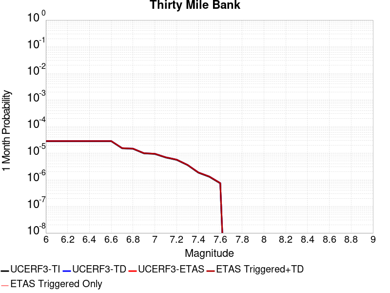 | 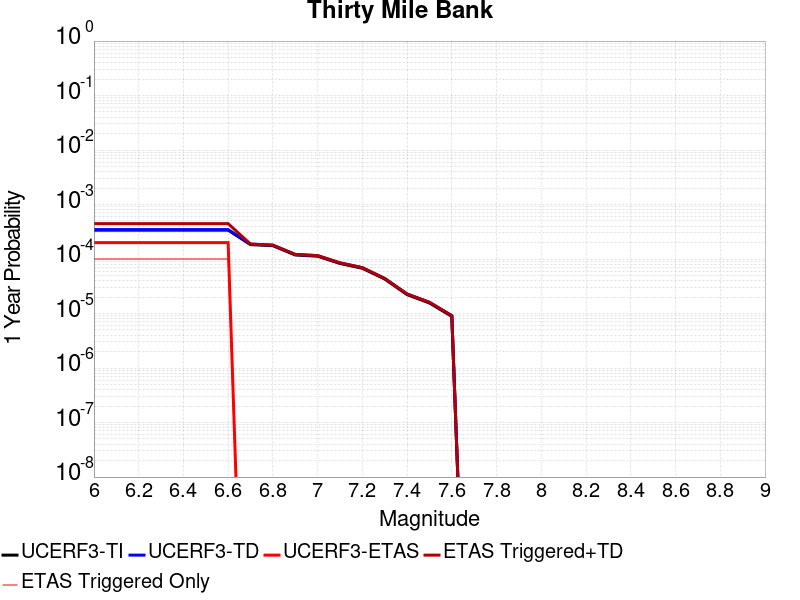 | 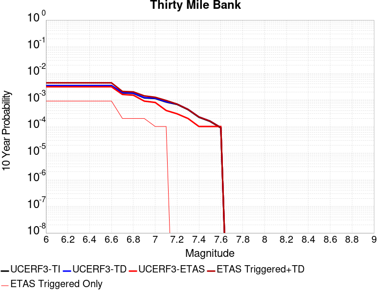 |

| Magnitude | 1 wk TI Prob | 1 wk TD Prob | 1 wk ETAS Prob | 1 wk ETAS/TD Gain | 1 wk ETAS Triggered+TD | 1 wk ETAS Triggered Only | 1 mo TI Prob | 1 mo TD Prob | 1 mo ETAS Prob | 1 mo ETAS/TD Gain | 1 mo ETAS Triggered+TD | 1 mo ETAS Triggered Only | 1 yr TI Prob | 1 yr TD Prob | 1 yr ETAS Prob | 1 yr ETAS/TD Gain | 1 yr ETAS Triggered+TD | 1 yr ETAS Triggered Only | 10 yr TI Prob | 10 yr TD Prob | 10 yr ETAS Prob | 10 yr ETAS/TD Gain | 10 yr ETAS Triggered+TD | 10 yr ETAS Triggered Only |
|-----|-----|-----|-----|-----|-----|-----|-----|-----|-----|-----|-----|-----|-----|-----|-----|-----|-----|-----|-----|-----|-----|-----|-----|-----|
| 6.0 | 6.5124755E-6 | 6.657695E-6 | 0.0 | 0.0 | 6.657695E-6 | 0.0 | 2.791031E-5 | 2.8532691E-5 | 0.0 | 0.0 | 2.8532691E-5 | 0.0 | 3.3975503E-4 | 3.4733448E-4 | 2.0E-4 | 0.57581383 | 4.4729977E-4 | 1.0E-4 | 0.0033923604 | 0.0034683477 | 0.0031 | 0.89379734 | 0.0043652263 | 9.0E-4 |
| 6.1 | 6.5124755E-6 | 6.657695E-6 | 0.0 | 0.0 | 6.657695E-6 | 0.0 | 2.791031E-5 | 2.8532691E-5 | 0.0 | 0.0 | 2.8532691E-5 | 0.0 | 3.3975503E-4 | 3.4733448E-4 | 2.0E-4 | 0.57581383 | 4.4729977E-4 | 1.0E-4 | 0.0033923604 | 0.0034683477 | 0.0031 | 0.89379734 | 0.0043652263 | 9.0E-4 |
| 6.2 | 6.5124755E-6 | 6.657695E-6 | 0.0 | 0.0 | 6.657695E-6 | 0.0 | 2.791031E-5 | 2.8532691E-5 | 0.0 | 0.0 | 2.8532691E-5 | 0.0 | 3.3975503E-4 | 3.4733448E-4 | 2.0E-4 | 0.57581383 | 4.4729977E-4 | 1.0E-4 | 0.0033923604 | 0.0034683477 | 0.0031 | 0.89379734 | 0.0043652263 | 9.0E-4 |
| 6.3 | 6.5124755E-6 | 6.657695E-6 | 0.0 | 0.0 | 6.657695E-6 | 0.0 | 2.791031E-5 | 2.8532691E-5 | 0.0 | 0.0 | 2.8532691E-5 | 0.0 | 3.3975503E-4 | 3.4733448E-4 | 2.0E-4 | 0.57581383 | 4.4729977E-4 | 1.0E-4 | 0.0033923604 | 0.0034683477 | 0.0031 | 0.89379734 | 0.0043652263 | 9.0E-4 |
| 6.4 | 6.5124755E-6 | 6.657695E-6 | 0.0 | 0.0 | 6.657695E-6 | 0.0 | 2.791031E-5 | 2.8532691E-5 | 0.0 | 0.0 | 2.8532691E-5 | 0.0 | 3.3975503E-4 | 3.4733448E-4 | 2.0E-4 | 0.57581383 | 4.4729977E-4 | 1.0E-4 | 0.0033923604 | 0.0034683477 | 0.0031 | 0.89379734 | 0.0043652263 | 9.0E-4 |
| 6.5 | 6.5124755E-6 | 6.657695E-6 | 0.0 | 0.0 | 6.657695E-6 | 0.0 | 2.791031E-5 | 2.8532691E-5 | 0.0 | 0.0 | 2.8532691E-5 | 0.0 | 3.3975503E-4 | 3.4733448E-4 | 2.0E-4 | 0.57581383 | 4.4729977E-4 | 1.0E-4 | 0.0033923604 | 0.0034683477 | 0.0031 | 0.89379734 | 0.0043652263 | 9.0E-4 |
| 6.6 | 6.5124755E-6 | 6.657695E-6 | 0.0 | 0.0 | 6.657695E-6 | 0.0 | 2.791031E-5 | 2.8532691E-5 | 0.0 | 0.0 | 2.8532691E-5 | 0.0 | 3.3975503E-4 | 3.4733448E-4 | 2.0E-4 | 0.57581383 | 4.4729977E-4 | 1.0E-4 | 0.0033923604 | 0.0034683477 | 0.0031 | 0.89379734 | 0.0043652263 | 9.0E-4 |
| 6.7 | 3.5261137E-6 | 3.609002E-6 | 0.0 | 0.0 | 3.609002E-6 | 0.0 | 1.5111828E-5 | 1.5467063E-5 | 0.0 | 0.0 | 1.5467063E-5 | 0.0 | 1.8397097E-4 | 1.8829587E-4 | 0.0 | 0.0 | 1.8829587E-4 | 0.0 | 0.0018381875 | 0.0018814283 | 0.0016 | 0.85041773 | 0.002081052 | 2.0E-4 |
| 6.8 | 3.370743E-6 | 3.4500763E-6 | 0.0 | 0.0 | 3.4500763E-6 | 0.0 | 1.4445961E-5 | 1.4785961E-5 | 0.0 | 0.0 | 1.4785961E-5 | 0.0 | 1.7586538E-4 | 1.8000483E-4 | 0.0 | 0.0 | 1.8000483E-4 | 0.0 | 0.0017572626 | 0.0017986521 | 0.0015 | 0.83395785 | 0.0019982923 | 2.0E-4 |
| 6.9 | 2.2756835E-6 | 2.332544E-6 | 0.0 | 0.0 | 2.332544E-6 | 0.0 | 9.752893E-6 | 9.99658E-6 | 0.0 | 0.0 | 9.99658E-6 | 0.0 | 1.18735006E-4 | 1.21701814E-4 | 0.0 | 0.0 | 1.21701814E-4 | 0.0 | 0.0011867158 | 0.0012163763 | 9.0E-4 | 0.7399026 | 0.001416133 | 2.0E-4 |
| 7.0 | 2.1617404E-6 | 2.2153977E-6 | 0.0 | 0.0 | 2.2153977E-6 | 0.0 | 9.264569E-6 | 9.494528E-6 | 0.0 | 0.0 | 9.494528E-6 | 0.0 | 1.1279029E-4 | 1.15589995E-4 | 0.0 | 0.0 | 1.15589995E-4 | 0.0 | 0.0011273306 | 0.0011553228 | 8.0E-4 | 0.6924472 | 0.0012552072 | 1.0E-4 |
| 7.1 | 1.5900777E-6 | 1.632243E-6 | 0.0 | 0.0 | 1.632243E-6 | 0.0 | 6.814601E-6 | 6.995309E-6 | 0.0 | 0.0 | 6.995309E-6 | 0.0 | 8.296461E-5 | 8.5164684E-5 | 0.0 | 0.0 | 8.5164684E-5 | 0.0 | 8.293364E-4 | 8.5133326E-4 | 4.0E-4 | 0.46985126 | 9.512481E-4 | 1.0E-4 |
| 7.2 | 1.2971728E-6 | 1.3325146E-6 | 0.0 | 0.0 | 1.3325146E-6 | 0.0 | 5.5593005E-6 | 5.710765E-6 | 0.0 | 0.0 | 5.710765E-6 | 0.0 | 6.768238E-5 | 6.9526446E-5 | 0.0 | 0.0 | 6.9526446E-5 | 0.0 | 6.7661767E-4 | 6.9505733E-4 | 3.0E-4 | 0.43161908 | 6.9505733E-4 | 0.0 |
| 7.3 | 8.2454284E-7 | 8.4467115E-7 | 0.0 | 0.0 | 8.4467115E-7 | 0.0 | 3.5337503E-6 | 3.6200145E-6 | 0.0 | 0.0 | 3.6200145E-6 | 0.0 | 4.302256E-5 | 4.4072847E-5 | 0.0 | 0.0 | 4.4072847E-5 | 0.0 | 4.301423E-4 | 4.406471E-4 | 2.0E-4 | 0.45387796 | 4.406471E-4 | 0.0 |
| 7.4 | 4.2619024E-7 | 4.3850085E-7 | 0.0 | 0.0 | 4.3850085E-7 | 0.0 | 1.8265283E-6 | 1.879288E-6 | 0.0 | 0.0 | 1.879288E-6 | 0.0 | 2.2237757E-5 | 2.2880095E-5 | 0.0 | 0.0 | 2.2880095E-5 | 0.0 | 2.223553E-4 | 2.2877778E-4 | 1.0E-4 | 0.4371054 | 2.2877778E-4 | 0.0 |
| 7.5 | 2.993922E-7 | 3.0854568E-7 | 0.0 | 0.0 | 3.0854568E-7 | 0.0 | 1.2831089E-6 | 1.322338E-6 | 0.0 | 0.0 | 1.322338E-6 | 0.0 | 1.5621737E-5 | 1.609935E-5 | 0.0 | 0.0 | 1.609935E-5 | 0.0 | 1.562064E-4 | 1.6098208E-4 | 1.0E-4 | 0.62118715 | 1.6098208E-4 | 0.0 |
| 7.6 | 1.6988751E-7 | 1.7527951E-7 | 0.0 | 0.0 | 1.7527951E-7 | 0.0 | 7.2808916E-7 | 7.5119766E-7 | 0.0 | 0.0 | 7.5119766E-7 | 0.0 | 8.864449E-6 | 9.145795E-6 | 0.0 | 0.0 | 9.145795E-6 | 0.0 | 8.8640954E-5 | 9.1454385E-5 | 1.0E-4 | 1.0934412 | 9.1454385E-5 | 0.0 |

## San Gabriel (Extension)
*[(top)](#table-of-contents)*

| 1 Week | 1 Month | 1 Year | 10 Year |
|-----|-----|-----|-----|
| 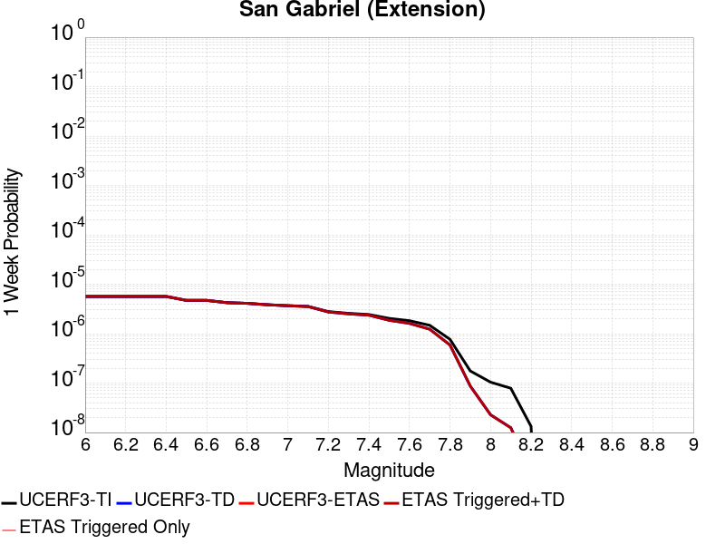 | 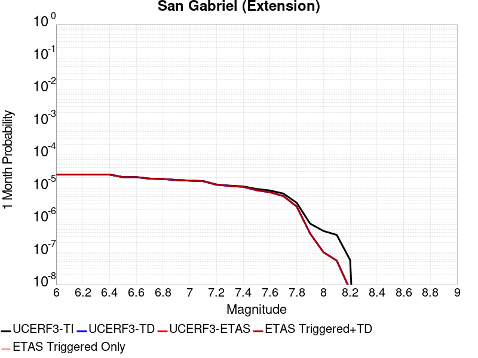 | 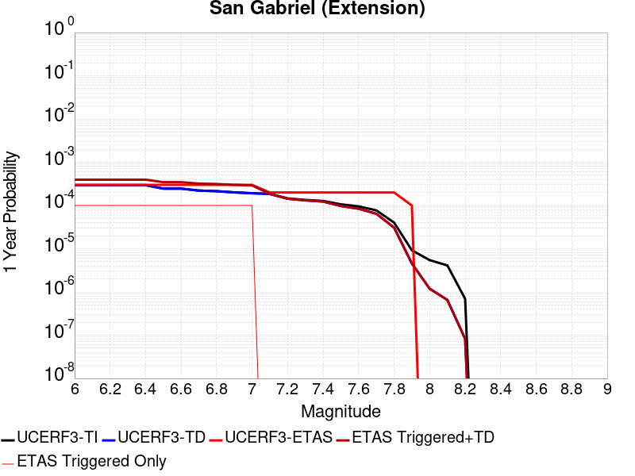 | 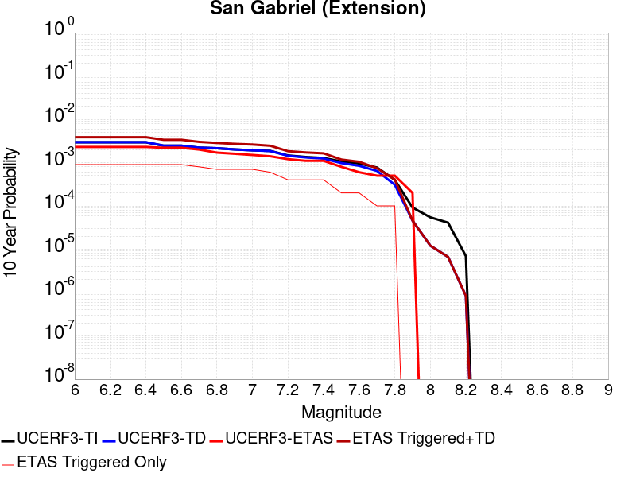 |

| Magnitude | 1 wk TI Prob | 1 wk TD Prob | 1 wk ETAS Prob | 1 wk ETAS/TD Gain | 1 wk ETAS Triggered+TD | 1 wk ETAS Triggered Only | 1 mo TI Prob | 1 mo TD Prob | 1 mo ETAS Prob | 1 mo ETAS/TD Gain | 1 mo ETAS Triggered+TD | 1 mo ETAS Triggered Only | 1 yr TI Prob | 1 yr TD Prob | 1 yr ETAS Prob | 1 yr ETAS/TD Gain | 1 yr ETAS Triggered+TD | 1 yr ETAS Triggered Only | 10 yr TI Prob | 10 yr TD Prob | 10 yr ETAS Prob | 10 yr ETAS/TD Gain | 10 yr ETAS Triggered+TD | 10 yr ETAS Triggered Only |
|-----|-----|-----|-----|-----|-----|-----|-----|-----|-----|-----|-----|-----|-----|-----|-----|-----|-----|-----|-----|-----|-----|-----|-----|-----|
| 6.0 | 5.6486106E-6 | 5.691903E-6 | 0.0 | 0.0 | 5.691903E-6 | 0.0 | 2.4208108E-5 | 2.4393648E-5 | 0.0 | 0.0 | 2.4393648E-5 | 0.0 | 2.9469383E-4 | 2.9695345E-4 | 3.0E-4 | 1.0102593 | 3.9692377E-4 | 1.0E-4 | 0.0029430336 | 0.0029656978 | 0.0023 | 0.77553415 | 0.0038630287 | 9.0E-4 |
| 6.1 | 5.6486106E-6 | 5.691903E-6 | 0.0 | 0.0 | 5.691903E-6 | 0.0 | 2.4208108E-5 | 2.4393648E-5 | 0.0 | 0.0 | 2.4393648E-5 | 0.0 | 2.9469383E-4 | 2.9695345E-4 | 3.0E-4 | 1.0102593 | 3.9692377E-4 | 1.0E-4 | 0.0029430336 | 0.0029656978 | 0.0023 | 0.77553415 | 0.0038630287 | 9.0E-4 |
| 6.2 | 5.6486106E-6 | 5.691903E-6 | 0.0 | 0.0 | 5.691903E-6 | 0.0 | 2.4208108E-5 | 2.4393648E-5 | 0.0 | 0.0 | 2.4393648E-5 | 0.0 | 2.9469383E-4 | 2.9695345E-4 | 3.0E-4 | 1.0102593 | 3.9692377E-4 | 1.0E-4 | 0.0029430336 | 0.0029656978 | 0.0023 | 0.77553415 | 0.0038630287 | 9.0E-4 |
| 6.3 | 5.6486106E-6 | 5.691903E-6 | 0.0 | 0.0 | 5.691903E-6 | 0.0 | 2.4208108E-5 | 2.4393648E-5 | 0.0 | 0.0 | 2.4393648E-5 | 0.0 | 2.9469383E-4 | 2.9695345E-4 | 3.0E-4 | 1.0102593 | 3.9692377E-4 | 1.0E-4 | 0.0029430336 | 0.0029656978 | 0.0023 | 0.77553415 | 0.0038630287 | 9.0E-4 |
| 6.4 | 5.6486106E-6 | 5.691903E-6 | 0.0 | 0.0 | 5.691903E-6 | 0.0 | 2.4208108E-5 | 2.4393648E-5 | 0.0 | 0.0 | 2.4393648E-5 | 0.0 | 2.9469383E-4 | 2.9695345E-4 | 3.0E-4 | 1.0102593 | 3.9692377E-4 | 1.0E-4 | 0.0029430336 | 0.0029656978 | 0.0023 | 0.77553415 | 0.0038630287 | 9.0E-4 |
| 6.5 | 4.7134554E-6 | 4.7296217E-6 | 0.0 | 0.0 | 4.7296217E-6 | 0.0 | 2.0200367E-5 | 2.0269654E-5 | 0.0 | 0.0 | 2.0269654E-5 | 0.0 | 2.459117E-4 | 2.4675595E-4 | 3.0E-4 | 1.2157762 | 3.4673128E-4 | 1.0E-4 | 0.0024563975 | 0.0024649086 | 0.0022 | 0.892528 | 0.00336269 | 9.0E-4 |
| 6.6 | 4.7134554E-6 | 4.7296217E-6 | 0.0 | 0.0 | 4.7296217E-6 | 0.0 | 2.0200367E-5 | 2.0269654E-5 | 0.0 | 0.0 | 2.0269654E-5 | 0.0 | 2.459117E-4 | 2.4675595E-4 | 3.0E-4 | 1.2157762 | 3.4673128E-4 | 1.0E-4 | 0.0024563975 | 0.0024649086 | 0.0022 | 0.892528 | 0.00336269 | 9.0E-4 |
| 6.7 | 4.2468837E-6 | 4.2495853E-6 | 0.0 | 0.0 | 4.2495853E-6 | 0.0 | 1.8200803E-5 | 1.8212384E-5 | 0.0 | 0.0 | 1.8212384E-5 | 0.0 | 2.2157225E-4 | 2.2171394E-4 | 3.0E-4 | 1.3530948 | 3.2169177E-4 | 1.0E-4 | 0.0022135144 | 0.0022150043 | 0.002 | 0.9029328 | 0.0030132323 | 8.0E-4 |
| 6.8 | 4.1180615E-6 | 4.1170156E-6 | 0.0 | 0.0 | 4.1170156E-6 | 0.0 | 1.7648716E-5 | 1.7644237E-5 | 0.0 | 0.0 | 1.7644237E-5 | 0.0 | 2.1485193E-4 | 2.1479813E-4 | 3.0E-4 | 1.3966602 | 3.1477664E-4 | 1.0E-4 | 0.0021464431 | 0.002145981 | 0.0017 | 0.79217845 | 0.002844479 | 7.0E-4 |
| 6.9 | 3.863861E-6 | 3.8554113E-6 | 0.0 | 0.0 | 3.8554113E-6 | 0.0 | 1.65593E-5 | 1.652309E-5 | 0.0 | 0.0 | 1.652309E-5 | 0.0 | 2.0159081E-4 | 2.0115073E-4 | 3.0E-4 | 1.4914188 | 3.011306E-4 | 1.0E-4 | 0.0020140803 | 0.002009759 | 0.0016 | 0.7961154 | 0.0027083522 | 7.0E-4 |
| 7.0 | 3.6947372E-6 | 3.681364E-6 | 0.0 | 0.0 | 3.681364E-6 | 0.0 | 1.5834492E-5 | 1.5777183E-5 | 0.0 | 0.0 | 1.5777183E-5 | 0.0 | 1.9276788E-4 | 1.9207093E-4 | 3.0E-4 | 1.5619229 | 2.9205173E-4 | 1.0E-4 | 0.0019260074 | 0.0019191204 | 0.0015 | 0.78160805 | 0.002617777 | 7.0E-4 |
| 7.1 | 3.5686835E-6 | 3.548667E-6 | 0.0 | 0.0 | 3.548667E-6 | 0.0 | 1.5294268E-5 | 1.5208489E-5 | 0.0 | 0.0 | 1.5208489E-5 | 0.0 | 1.861918E-4 | 1.8514828E-4 | 2.0E-4 | 1.0802152 | 1.8514828E-4 | 0.0 | 0.0018603588 | 0.0018500108 | 0.0014 | 0.7567523 | 0.0024489008 | 6.0E-4 |
| 7.2 | 2.8023446E-6 | 2.7529138E-6 | 0.0 | 0.0 | 2.7529138E-6 | 0.0 | 1.2009994E-5 | 1.179815E-5 | 0.0 | 0.0 | 1.179815E-5 | 0.0 | 1.4621185E-4 | 1.4363311E-4 | 2.0E-4 | 1.3924366 | 1.4363311E-4 | 0.0 | 0.001461157 | 0.0014354184 | 0.0012 | 0.83599323 | 0.0018348441 | 4.0E-4 |
| 7.3 | 2.5843012E-6 | 2.5223278E-6 | 0.0 | 0.0 | 2.5223278E-6 | 0.0 | 1.1075529E-5 | 1.0809932E-5 | 0.0 | 0.0 | 1.0809932E-5 | 0.0 | 1.3483623E-4 | 1.3160307E-4 | 2.0E-4 | 1.5197214 | 1.3160307E-4 | 0.0 | 0.0013475444 | 0.0013152658 | 0.0011 | 0.83633286 | 0.0017147397 | 4.0E-4 |
| 7.4 | 2.4464468E-6 | 2.3733642E-6 | 0.0 | 0.0 | 2.3733642E-6 | 0.0 | 1.04847295E-5 | 1.0171521E-5 | 0.0 | 0.0 | 1.0171521E-5 | 0.0 | 1.276441E-4 | 1.2383133E-4 | 2.0E-4 | 1.6151001 | 1.2383133E-4 | 0.0 | 0.0012757082 | 0.0012376376 | 0.0011 | 0.8887901 | 0.0016371425 | 4.0E-4 |
| 7.5 | 2.0420266E-6 | 1.8704536E-6 | 0.0 | 0.0 | 1.8704536E-6 | 0.0 | 8.751514E-6 | 8.016205E-6 | 0.0 | 0.0 | 8.016205E-6 | 0.0 | 1.0654447E-4 | 9.7592965E-5 | 2.0E-4 | 2.049328 | 9.7592965E-5 | 0.0 | 0.001064934 | 9.7550923E-4 | 8.0E-4 | 0.8200845 | 0.0011753141 | 2.0E-4 |
| 7.6 | 1.8326596E-6 | 1.620667E-6 | 0.0 | 0.0 | 1.620667E-6 | 0.0 | 7.854232E-6 | 6.945698E-6 | 0.0 | 0.0 | 6.945698E-6 | 0.0 | 9.562107E-5 | 8.456061E-5 | 2.0E-4 | 2.3651674 | 8.456061E-5 | 0.0 | 9.5579936E-4 | 8.452914E-4 | 6.0E-4 | 0.70981437 | 0.0010451224 | 2.0E-4 |
| 7.7 | 1.4786998E-6 | 1.2347875E-6 | 0.0 | 0.0 | 1.2347875E-6 | 0.0 | 6.3372695E-6 | 5.291936E-6 | 0.0 | 0.0 | 5.291936E-6 | 0.0 | 7.715353E-5 | 6.4427426E-5 | 2.0E-4 | 3.104268 | 6.4427426E-5 | 0.0 | 7.7126746E-4 | 6.440944E-4 | 5.0E-4 | 0.7762837 | 7.4403005E-4 | 1.0E-4 |
| 7.8 | 7.6975533E-7 | 5.9210964E-7 | 0.0 | 0.0 | 5.9210964E-7 | 0.0 | 3.2989474E-6 | 2.5376103E-6 | 0.0 | 0.0 | 2.5376103E-6 | 0.0 | 4.0163945E-5 | 3.089497E-5 | 2.0E-4 | 6.4735456 | 3.089497E-5 | 0.0 | 4.0156685E-4 | 3.0891201E-4 | 5.0E-4 | 1.6185839 | 4.088811E-4 | 1.0E-4 |
| 7.9 | 1.7645915E-7 | 8.800901E-8 | 0.0 | 0.0 | 8.800901E-8 | 0.0 | 7.562533E-7 | 3.771814E-7 | 0.0 | 0.0 | 3.771814E-7 | 0.0 | 9.207345E-6 | 4.592174E-6 | 1.0E-4 | 21.776178 | 4.592174E-6 | 0.0 | 9.206964E-5 | 4.5924426E-5 | 2.0E-4 | 4.354981 | 4.5924426E-5 | 0.0 |
| 8.0 | 1.0463461E-7 | 2.3217837E-8 | 0.0 | 0.0 | 2.3217837E-8 | 0.0 | 4.4843398E-7 | 9.950501E-8 | 0.0 | 0.0 | 9.950501E-8 | 0.0 | 5.45967E-6 | 1.2114727E-6 | 0.0 | 0.0 | 1.2114727E-6 | 0.0 | 5.459536E-5 | 1.2118292E-5 | 0.0 | 0.0 | 1.2118292E-5 | 0.0 |
| 8.1 | 7.875717E-8 | 1.2737828E-8 | 0.0 | 0.0 | 1.2737828E-8 | 0.0 | 3.3753068E-7 | 5.459069E-8 | 0.0 | 0.0 | 5.459069E-8 | 0.0 | 4.109428E-6 | 6.6464145E-7 | 0.0 | 0.0 | 6.6464145E-7 | 0.0 | 4.109352E-5 | 6.6500243E-6 | 0.0 | 0.0 | 6.6500243E-6 | 0.0 |
| 8.2 | 1.33163E-8 | 1.6080349E-9 | 0.0 | 0.0 | 1.6080349E-9 | 0.0 | 5.7069855E-8 | 6.8915784E-9 | 0.0 | 0.0 | 6.8915784E-9 | 0.0 | 6.9482525E-7 | 8.3904965E-8 | 0.0 | 0.0 | 8.3904965E-8 | 0.0 | 6.9482307E-6 | 8.408477E-7 | 0.0 | 0.0 | 8.408477E-7 | 0.0 |

## Emerson-Copper Mtn 2011
*[(top)](#table-of-contents)*

| 1 Week | 1 Month | 1 Year | 10 Year |
|-----|-----|-----|-----|
| 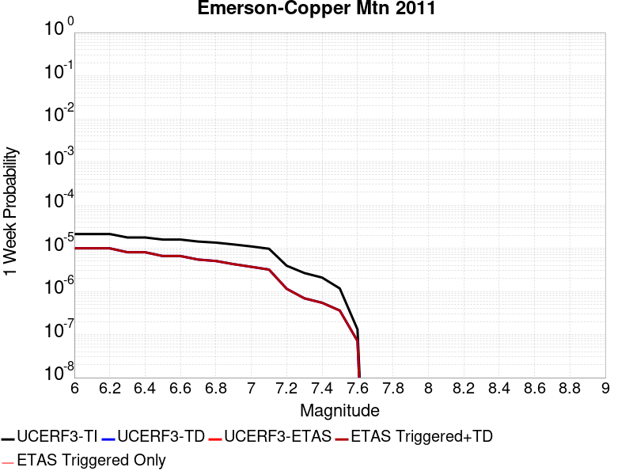 | 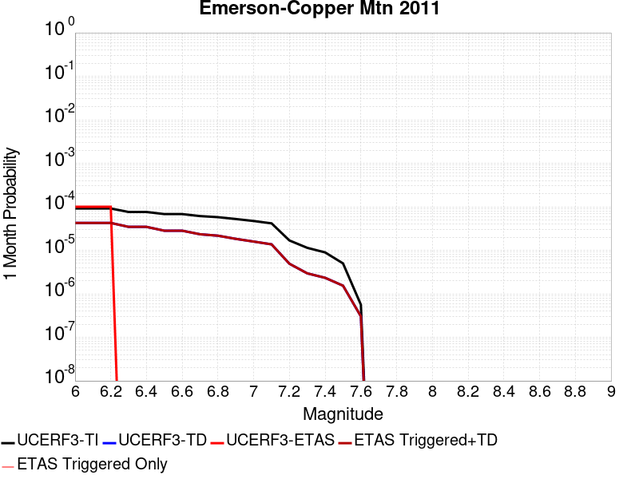 | 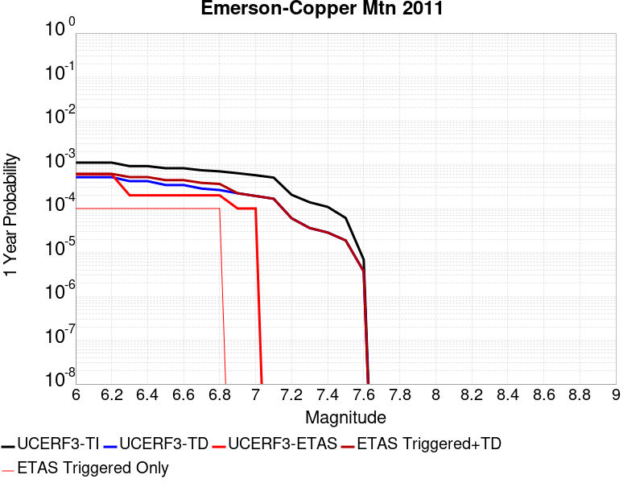 | 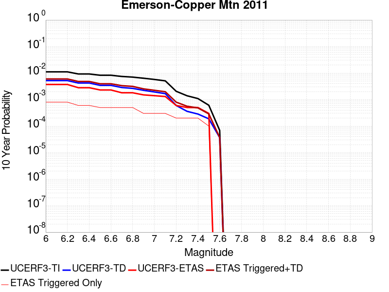 |

| Magnitude | 1 wk TI Prob | 1 wk TD Prob | 1 wk ETAS Prob | 1 wk ETAS/TD Gain | 1 wk ETAS Triggered+TD | 1 wk ETAS Triggered Only | 1 mo TI Prob | 1 mo TD Prob | 1 mo ETAS Prob | 1 mo ETAS/TD Gain | 1 mo ETAS Triggered+TD | 1 mo ETAS Triggered Only | 1 yr TI Prob | 1 yr TD Prob | 1 yr ETAS Prob | 1 yr ETAS/TD Gain | 1 yr ETAS Triggered+TD | 1 yr ETAS Triggered Only | 10 yr TI Prob | 10 yr TD Prob | 10 yr ETAS Prob | 10 yr ETAS/TD Gain | 10 yr ETAS Triggered+TD | 10 yr ETAS Triggered Only |
|-----|-----|-----|-----|-----|-----|-----|-----|-----|-----|-----|-----|-----|-----|-----|-----|-----|-----|-----|-----|-----|-----|-----|-----|-----|
| 6.0 | 2.1364202E-5 | 9.950942E-6 | 0.0 | 0.0 | 9.950942E-6 | 0.0 | 9.1557646E-5 | 4.2646243E-5 | 1.0E-4 | 2.3448725 | 4.2646243E-5 | 0.0 | 0.0011141442 | 5.19103E-4 | 6.0E-4 | 1.1558399 | 6.190511E-4 | 1.0E-4 | 0.011085749 | 0.005179771 | 0.0037 | 0.7143172 | 0.005975628 | 8.0E-4 |
| 6.1 | 2.1364202E-5 | 9.950942E-6 | 0.0 | 0.0 | 9.950942E-6 | 0.0 | 9.1557646E-5 | 4.2646243E-5 | 1.0E-4 | 2.3448725 | 4.2646243E-5 | 0.0 | 0.0011141442 | 5.19103E-4 | 6.0E-4 | 1.1558399 | 6.190511E-4 | 1.0E-4 | 0.011085749 | 0.005179771 | 0.0037 | 0.7143172 | 0.005975628 | 8.0E-4 |
| 6.2 | 2.1364202E-5 | 9.950942E-6 | 0.0 | 0.0 | 9.950942E-6 | 0.0 | 9.1557646E-5 | 4.2646243E-5 | 1.0E-4 | 2.3448725 | 4.2646243E-5 | 0.0 | 0.0011141442 | 5.19103E-4 | 6.0E-4 | 1.1558399 | 6.190511E-4 | 1.0E-4 | 0.011085749 | 0.005179771 | 0.0037 | 0.7143172 | 0.005975628 | 8.0E-4 |
| 6.3 | 1.7751237E-5 | 8.074029E-6 | 0.0 | 0.0 | 8.074029E-6 | 0.0 | 7.607452E-5 | 3.460256E-5 | 0.0 | 0.0 | 3.460256E-5 | 0.0 | 9.258136E-4 | 4.2121098E-4 | 2.0E-4 | 0.47482142 | 5.2116887E-4 | 1.0E-4 | 0.00921966 | 0.004204747 | 0.0028 | 0.66591406 | 0.0048022238 | 6.0E-4 |
| 6.4 | 1.7751237E-5 | 8.074029E-6 | 0.0 | 0.0 | 8.074029E-6 | 0.0 | 7.607452E-5 | 3.460256E-5 | 0.0 | 0.0 | 3.460256E-5 | 0.0 | 9.258136E-4 | 4.2121098E-4 | 2.0E-4 | 0.47482142 | 5.2116887E-4 | 1.0E-4 | 0.00921966 | 0.004204747 | 0.0028 | 0.66591406 | 0.0048022238 | 6.0E-4 |
| 6.5 | 1.5886664E-5 | 6.5903632E-6 | 0.0 | 0.0 | 6.5903632E-6 | 0.0 | 6.808392E-5 | 2.8244134E-5 | 0.0 | 0.0 | 2.8244134E-5 | 0.0 | 8.286065E-4 | 3.4382276E-4 | 2.0E-4 | 0.5816951 | 4.4378836E-4 | 1.0E-4 | 0.008255237 | 0.0034333707 | 0.0023 | 0.66989565 | 0.003931654 | 5.0E-4 |
| 6.6 | 1.5886664E-5 | 6.5903632E-6 | 0.0 | 0.0 | 6.5903632E-6 | 0.0 | 6.808392E-5 | 2.8244134E-5 | 0.0 | 0.0 | 2.8244134E-5 | 0.0 | 8.286065E-4 | 3.4382276E-4 | 2.0E-4 | 0.5816951 | 4.4378836E-4 | 1.0E-4 | 0.008255237 | 0.0034333707 | 0.0023 | 0.66989565 | 0.003931654 | 5.0E-4 |
| 6.7 | 1.428471E-5 | 5.4582138E-6 | 0.0 | 0.0 | 5.4582138E-6 | 0.0 | 6.121875E-5 | 2.3392156E-5 | 0.0 | 0.0 | 2.3392156E-5 | 0.0 | 7.450834E-4 | 2.847662E-4 | 2.0E-4 | 0.7023305 | 3.8473774E-4 | 1.0E-4 | 0.007425902 | 0.0028443995 | 0.0018 | 0.6328225 | 0.0033429773 | 5.0E-4 |
| 6.8 | 1.3490684E-5 | 5.0619906E-6 | 0.0 | 0.0 | 5.0619906E-6 | 0.0 | 5.7815934E-5 | 2.1694086E-5 | 0.0 | 0.0 | 2.1694086E-5 | 0.0 | 7.0368167E-4 | 2.6409735E-4 | 2.0E-4 | 0.75729656 | 3.6407093E-4 | 1.0E-4 | 0.007014576 | 0.0026382143 | 0.0018 | 0.6822797 | 0.0031368951 | 5.0E-4 |
| 6.9 | 1.2235421E-5 | 4.27862E-6 | 0.0 | 0.0 | 4.27862E-6 | 0.0 | 5.2436466E-5 | 1.8336836E-5 | 0.0 | 0.0 | 1.8336836E-5 | 0.0 | 6.38227E-4 | 2.2323168E-4 | 1.0E-4 | 0.4479651 | 2.2323168E-4 | 0.0 | 0.0063639707 | 0.0022304272 | 0.0015 | 0.6725169 | 0.0025297583 | 3.0E-4 |
| 7.0 | 1.1009851E-5 | 3.7087536E-6 | 0.0 | 0.0 | 3.7087536E-6 | 0.0 | 4.7184225E-5 | 1.589458E-5 | 0.0 | 0.0 | 1.589458E-5 | 0.0 | 5.743165E-4 | 1.9350275E-4 | 1.0E-4 | 0.5167885 | 1.9350275E-4 | 0.0 | 0.005728345 | 0.0019336791 | 0.0014 | 0.72400844 | 0.002233099 | 3.0E-4 |
| 7.1 | 9.726373E-6 | 3.2023383E-6 | 0.0 | 0.0 | 3.2023383E-6 | 0.0 | 4.168379E-5 | 1.3724254E-5 | 0.0 | 0.0 | 1.3724254E-5 | 0.0 | 5.07382E-4 | 1.6708334E-4 | 0.0 | 0.0 | 1.6708334E-4 | 0.0 | 0.0050622504 | 0.001669907 | 0.0013 | 0.77848643 | 0.0019694061 | 3.0E-4 |
| 7.2 | 3.9335127E-6 | 1.148226E-6 | 0.0 | 0.0 | 1.148226E-6 | 0.0 | 1.6857803E-5 | 4.92096E-6 | 0.0 | 0.0 | 4.92096E-6 | 0.0 | 2.0522442E-4 | 5.9911097E-5 | 0.0 | 0.0 | 5.9911097E-5 | 0.0 | 0.00205035 | 5.989553E-4 | 6.0E-4 | 1.0017442 | 7.9883554E-4 | 2.0E-4 |
| 7.3 | 2.661632E-6 | 6.894959E-7 | 0.0 | 0.0 | 6.894959E-7 | 0.0 | 1.14069435E-5 | 2.9549792E-6 | 0.0 | 0.0 | 2.9549792E-6 | 0.0 | 1.3887069E-4 | 3.597629E-5 | 0.0 | 0.0 | 3.597629E-5 | 0.0 | 0.0013878393 | 3.5970568E-4 | 5.0E-4 | 1.3900254 | 5.596337E-4 | 2.0E-4 |
| 7.4 | 2.0893426E-6 | 5.448408E-7 | 0.0 | 0.0 | 5.448408E-7 | 0.0 | 8.954295E-6 | 2.3350299E-6 | 0.0 | 0.0 | 2.3350299E-6 | 0.0 | 1.0901308E-4 | 2.8428623E-5 | 0.0 | 0.0 | 2.8428623E-5 | 0.0 | 0.0010895962 | 2.8425042E-4 | 5.0E-4 | 1.7590125 | 4.8419356E-4 | 2.0E-4 |
| 7.5 | 1.1681728E-6 | 3.5940548E-7 | 0.0 | 0.0 | 3.5940548E-7 | 0.0 | 5.0064455E-6 | 1.5403083E-6 | 0.0 | 0.0 | 1.5403083E-6 | 0.0 | 6.0951766E-5 | 1.8753097E-5 | 0.0 | 0.0 | 1.8753097E-5 | 0.0 | 6.093505E-4 | 1.8751562E-4 | 3.0E-4 | 1.5998669 | 2.8749686E-4 | 1.0E-4 |
| 7.6 | 1.3154387E-7 | 7.0908634E-8 | 0.0 | 0.0 | 7.0908634E-8 | 0.0 | 5.6375933E-7 | 3.0389413E-7 | 0.0 | 0.0 | 3.0389413E-7 | 0.0 | 6.863748E-6 | 3.6999063E-6 | 0.0 | 0.0 | 3.6999063E-6 | 0.0 | 6.863536E-5 | 3.69986E-5 | 0.0 | 0.0 | 3.69986E-5 | 0.0 |

## Oceanside alt1
*[(top)](#table-of-contents)*

| 1 Week | 1 Month | 1 Year | 10 Year |
|-----|-----|-----|-----|
|  | 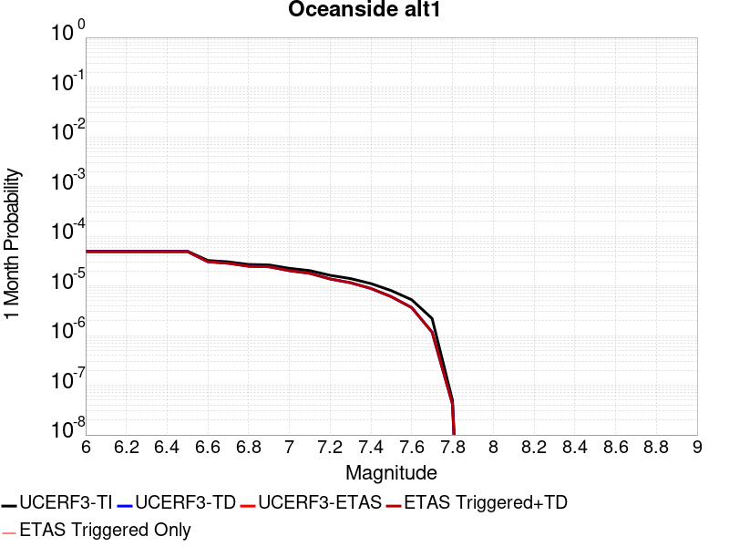 | 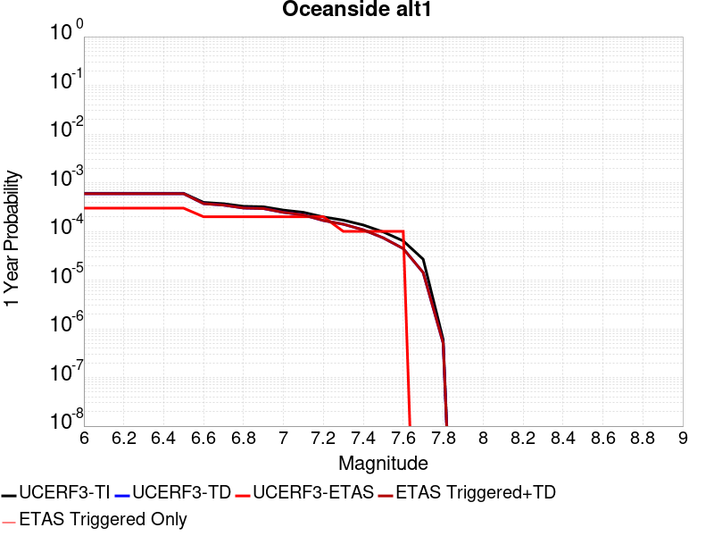 | 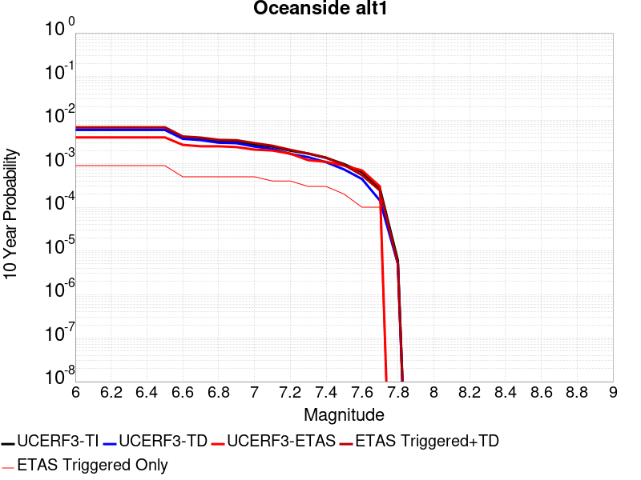 |

| Magnitude | 1 wk TI Prob | 1 wk TD Prob | 1 wk ETAS Prob | 1 wk ETAS/TD Gain | 1 wk ETAS Triggered+TD | 1 wk ETAS Triggered Only | 1 mo TI Prob | 1 mo TD Prob | 1 mo ETAS Prob | 1 mo ETAS/TD Gain | 1 mo ETAS Triggered+TD | 1 mo ETAS Triggered Only | 1 yr TI Prob | 1 yr TD Prob | 1 yr ETAS Prob | 1 yr ETAS/TD Gain | 1 yr ETAS Triggered+TD | 1 yr ETAS Triggered Only | 10 yr TI Prob | 10 yr TD Prob | 10 yr ETAS Prob | 10 yr ETAS/TD Gain | 10 yr ETAS Triggered+TD | 10 yr ETAS Triggered Only |
|-----|-----|-----|-----|-----|-----|-----|-----|-----|-----|-----|-----|-----|-----|-----|-----|-----|-----|-----|-----|-----|-----|-----|-----|-----|
| 6.0 | 1.1617542E-5 | 1.1416617E-5 | 0.0 | 0.0 | 1.1416617E-5 | 0.0 | 4.9788516E-5 | 4.892753E-5 | 0.0 | 0.0 | 4.892753E-5 | 0.0 | 6.060066E-4 | 5.95546E-4 | 3.0E-4 | 0.5037395 | 5.95546E-4 | 0.0 | 0.0060435664 | 0.0059410958 | 0.004 | 0.6732765 | 0.006835749 | 9.0E-4 |
| 6.1 | 1.1617542E-5 | 1.1416617E-5 | 0.0 | 0.0 | 1.1416617E-5 | 0.0 | 4.9788516E-5 | 4.892753E-5 | 0.0 | 0.0 | 4.892753E-5 | 0.0 | 6.060066E-4 | 5.95546E-4 | 3.0E-4 | 0.5037395 | 5.95546E-4 | 0.0 | 0.0060435664 | 0.0059410958 | 0.004 | 0.6732765 | 0.006835749 | 9.0E-4 |
| 6.2 | 1.1617542E-5 | 1.1416617E-5 | 0.0 | 0.0 | 1.1416617E-5 | 0.0 | 4.9788516E-5 | 4.892753E-5 | 0.0 | 0.0 | 4.892753E-5 | 0.0 | 6.060066E-4 | 5.95546E-4 | 3.0E-4 | 0.5037395 | 5.95546E-4 | 0.0 | 0.0060435664 | 0.0059410958 | 0.004 | 0.6732765 | 0.006835749 | 9.0E-4 |
| 6.3 | 1.1617542E-5 | 1.1416617E-5 | 0.0 | 0.0 | 1.1416617E-5 | 0.0 | 4.9788516E-5 | 4.892753E-5 | 0.0 | 0.0 | 4.892753E-5 | 0.0 | 6.060066E-4 | 5.95546E-4 | 3.0E-4 | 0.5037395 | 5.95546E-4 | 0.0 | 0.0060435664 | 0.0059410958 | 0.004 | 0.6732765 | 0.006835749 | 9.0E-4 |
| 6.4 | 1.1617542E-5 | 1.1416617E-5 | 0.0 | 0.0 | 1.1416617E-5 | 0.0 | 4.9788516E-5 | 4.892753E-5 | 0.0 | 0.0 | 4.892753E-5 | 0.0 | 6.060066E-4 | 5.95546E-4 | 3.0E-4 | 0.5037395 | 5.95546E-4 | 0.0 | 0.0060435664 | 0.0059410958 | 0.004 | 0.6732765 | 0.006835749 | 9.0E-4 |
| 6.5 | 1.1617542E-5 | 1.1416617E-5 | 0.0 | 0.0 | 1.1416617E-5 | 0.0 | 4.9788516E-5 | 4.892753E-5 | 0.0 | 0.0 | 4.892753E-5 | 0.0 | 6.060066E-4 | 5.95546E-4 | 3.0E-4 | 0.5037395 | 5.95546E-4 | 0.0 | 0.0060435664 | 0.0059410958 | 0.004 | 0.6732765 | 0.006835749 | 9.0E-4 |
| 6.6 | 7.561768E-6 | 7.1293275E-6 | 0.0 | 0.0 | 7.1293275E-6 | 0.0 | 3.2407173E-5 | 3.0553907E-5 | 0.0 | 0.0 | 3.0553907E-5 | 0.0 | 3.9448592E-4 | 3.719314E-4 | 2.0E-4 | 0.53773355 | 3.719314E-4 | 0.0 | 0.0039378637 | 0.0037132008 | 0.0027 | 0.7271355 | 0.0042113443 | 5.0E-4 |
| 6.7 | 7.1042605E-6 | 6.6516204E-6 | 0.0 | 0.0 | 6.6516204E-6 | 0.0 | 3.0446476E-5 | 2.8506636E-5 | 0.0 | 0.0 | 2.8506636E-5 | 0.0 | 3.706228E-4 | 3.4701382E-4 | 2.0E-4 | 0.5763459 | 3.4701382E-4 | 0.0 | 0.0037000529 | 0.0034648029 | 0.0025 | 0.72154176 | 0.0039630705 | 5.0E-4 |
| 6.8 | 6.285554E-6 | 5.7960474E-6 | 0.0 | 0.0 | 5.7960474E-6 | 0.0 | 2.693781E-5 | 2.483997E-5 | 0.0 | 0.0 | 2.483997E-5 | 0.0 | 3.2791847E-4 | 3.0238522E-4 | 2.0E-4 | 0.661408 | 3.0238522E-4 | 0.0 | 0.0032743502 | 0.003019795 | 0.0025 | 0.8278708 | 0.0035182852 | 5.0E-4 |
| 6.9 | 6.148883E-6 | 5.652957E-6 | 0.0 | 0.0 | 5.652957E-6 | 0.0 | 2.635209E-5 | 2.4226738E-5 | 0.0 | 0.0 | 2.4226738E-5 | 0.0 | 3.2078946E-4 | 2.9492116E-4 | 2.0E-4 | 0.6781474 | 2.9492116E-4 | 0.0 | 0.003203268 | 0.0029453544 | 0.0024 | 0.8148425 | 0.0034438819 | 5.0E-4 |
| 7.0 | 5.253857E-6 | 4.7192475E-6 | 0.0 | 0.0 | 4.7192475E-6 | 0.0 | 2.2516335E-5 | 2.0225192E-5 | 0.0 | 0.0 | 2.0225192E-5 | 0.0 | 2.7410188E-4 | 2.462142E-4 | 2.0E-4 | 0.81230086 | 2.462142E-4 | 0.0 | 0.0027376404 | 0.0024594455 | 0.0021 | 0.853851 | 0.0029582158 | 5.0E-4 |
| 7.1 | 4.730754E-6 | 4.1756125E-6 | 0.0 | 0.0 | 4.1756125E-6 | 0.0 | 2.0274503E-5 | 1.7895361E-5 | 0.0 | 0.0 | 1.7895361E-5 | 0.0 | 2.468141E-4 | 2.178545E-4 | 2.0E-4 | 0.9180439 | 2.178545E-4 | 0.0 | 0.0024654015 | 0.0021764357 | 0.002 | 0.91893363 | 0.0025755651 | 4.0E-4 |
| 7.2 | 3.7998386E-6 | 3.2116156E-6 | 0.0 | 0.0 | 3.2116156E-6 | 0.0 | 1.6284921E-5 | 1.3763995E-5 | 0.0 | 0.0 | 1.3763995E-5 | 0.0 | 1.9825088E-4 | 1.6756388E-4 | 2.0E-4 | 1.1935747 | 1.6756388E-4 | 0.0 | 0.001980741 | 0.0016743875 | 0.0017 | 1.0152967 | 0.0020737178 | 4.0E-4 |
| 7.3 | 3.2656465E-6 | 2.696179E-6 | 0.0 | 0.0 | 2.696179E-6 | 0.0 | 1.3995553E-5 | 1.1555003E-5 | 0.0 | 0.0 | 1.1555003E-5 | 0.0 | 1.7038253E-4 | 1.4067319E-4 | 1.0E-4 | 0.7108675 | 1.4067319E-4 | 0.0 | 0.0017025196 | 0.0014058525 | 0.0012 | 0.85357463 | 0.0017054308 | 3.0E-4 |
| 7.4 | 2.593703E-6 | 2.066094E-6 | 0.0 | 0.0 | 2.066094E-6 | 0.0 | 1.1115822E-5 | 8.854659E-6 | 0.0 | 0.0 | 8.854659E-6 | 0.0 | 1.3532673E-4 | 1.0780024E-4 | 1.0E-4 | 0.92764175 | 1.0780024E-4 | 0.0 | 0.0013524436 | 0.0010774883 | 0.0011 | 1.0208927 | 0.0013771651 | 3.0E-4 |
| 7.5 | 1.8715585E-6 | 1.4119665E-6 | 0.0 | 0.0 | 1.4119665E-6 | 0.0 | 8.020941E-6 | 6.051271E-6 | 0.0 | 0.0 | 6.051271E-6 | 0.0 | 9.7650576E-5 | 7.36718E-5 | 1.0E-4 | 1.3573714 | 7.36718E-5 | 0.0 | 9.7607676E-4 | 7.3647976E-4 | 9.0E-4 | 1.2220294 | 9.363325E-4 | 2.0E-4 |
| 7.6 | 1.2246786E-6 | 8.5106296E-7 | 0.0 | 0.0 | 8.5106296E-7 | 0.0 | 5.248612E-6 | 3.647408E-6 | 0.0 | 0.0 | 3.647408E-6 | 0.0 | 6.389998E-5 | 4.440633E-5 | 1.0E-4 | 2.2519312 | 4.440633E-5 | 0.0 | 6.3881604E-4 | 4.4397905E-4 | 7.0E-4 | 1.576651 | 5.4393464E-4 | 1.0E-4 |
| 7.7 | 5.140719E-7 | 2.7322062E-7 | 0.0 | 0.0 | 2.7322062E-7 | 0.0 | 2.2031636E-6 | 1.1709451E-6 | 0.0 | 0.0 | 1.1709451E-6 | 0.0 | 2.6823185E-5 | 1.4256177E-5 | 0.0 | 0.0 | 1.4256177E-5 | 0.0 | 2.6819948E-4 | 1.4255397E-4 | 3.0E-4 | 2.1044662 | 2.4253971E-4 | 1.0E-4 |
| 7.8 | 1.16056995E-8 | 9.781112E-9 | 0.0 | 0.0 | 9.781112E-9 | 0.0 | 4.9738713E-8 | 4.191905E-8 | 0.0 | 0.0 | 4.191905E-8 | 0.0 | 6.0556863E-7 | 5.1036443E-7 | 0.0 | 0.0 | 5.1036443E-7 | 0.0 | 6.05567E-6 | 5.1036445E-6 | 0.0 | 0.0 | 5.1036445E-6 | 0.0 |

## Pilarcitos 2011 CFM
*[(top)](#table-of-contents)*

| 1 Week | 1 Month | 1 Year | 10 Year |
|-----|-----|-----|-----|
| 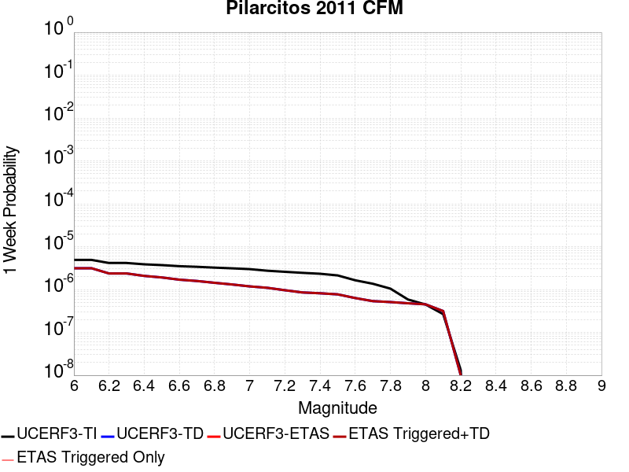 | 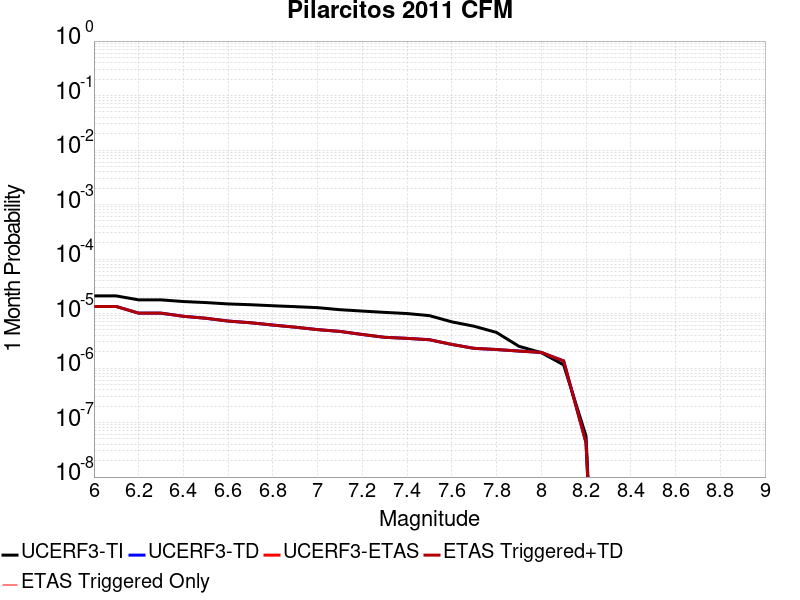 | 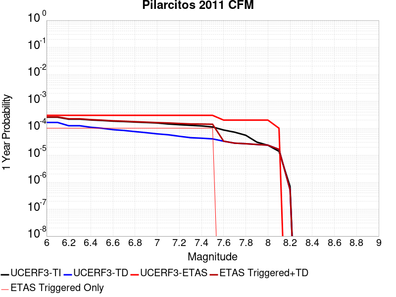 | 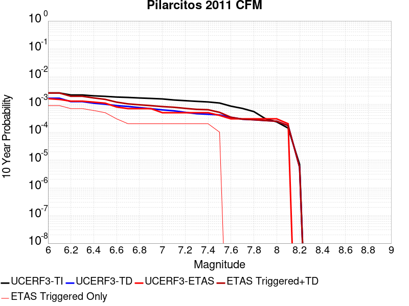 |

| Magnitude | 1 wk TI Prob | 1 wk TD Prob | 1 wk ETAS Prob | 1 wk ETAS/TD Gain | 1 wk ETAS Triggered+TD | 1 wk ETAS Triggered Only | 1 mo TI Prob | 1 mo TD Prob | 1 mo ETAS Prob | 1 mo ETAS/TD Gain | 1 mo ETAS Triggered+TD | 1 mo ETAS Triggered Only | 1 yr TI Prob | 1 yr TD Prob | 1 yr ETAS Prob | 1 yr ETAS/TD Gain | 1 yr ETAS Triggered+TD | 1 yr ETAS Triggered Only | 10 yr TI Prob | 10 yr TD Prob | 10 yr ETAS Prob | 10 yr ETAS/TD Gain | 10 yr ETAS Triggered+TD | 10 yr ETAS Triggered Only |
|-----|-----|-----|-----|-----|-----|-----|-----|-----|-----|-----|-----|-----|-----|-----|-----|-----|-----|-----|-----|-----|-----|-----|-----|-----|
| 6.0 | 4.9150476E-6 | 3.1536722E-6 | 0.0 | 0.0 | 3.1536722E-6 | 0.0 | 2.1064321E-5 | 1.351567E-5 | 0.0 | 0.0 | 1.351567E-5 | 0.0 | 2.564279E-4 | 1.6454117E-4 | 3.0E-4 | 1.823252 | 2.6452472E-4 | 1.0E-4 | 0.0025613222 | 0.0016566119 | 0.0016 | 0.9658267 | 0.002555121 | 9.0E-4 |
| 6.1 | 4.9150476E-6 | 3.1536722E-6 | 0.0 | 0.0 | 3.1536722E-6 | 0.0 | 2.1064321E-5 | 1.351567E-5 | 0.0 | 0.0 | 1.351567E-5 | 0.0 | 2.564279E-4 | 1.6454117E-4 | 3.0E-4 | 1.823252 | 2.6452472E-4 | 1.0E-4 | 0.0025613222 | 0.0016566119 | 0.0015 | 0.9054625 | 0.002555121 | 9.0E-4 |
| 6.2 | 4.162343E-6 | 2.3822647E-6 | 0.0 | 0.0 | 2.3822647E-6 | 0.0 | 1.783849E-5 | 1.02096665E-5 | 0.0 | 0.0 | 1.02096665E-5 | 0.0 | 2.1716199E-4 | 1.2429568E-4 | 3.0E-4 | 2.4135997 | 2.2428324E-4 | 1.0E-4 | 0.002169499 | 0.0012546619 | 0.0013 | 1.0361357 | 0.0019537837 | 7.0E-4 |
| 6.3 | 4.162343E-6 | 2.3822647E-6 | 0.0 | 0.0 | 2.3822647E-6 | 0.0 | 1.783849E-5 | 1.02096665E-5 | 0.0 | 0.0 | 1.02096665E-5 | 0.0 | 2.1716199E-4 | 1.2429568E-4 | 3.0E-4 | 2.4135997 | 2.2428324E-4 | 1.0E-4 | 0.002169499 | 0.0012546619 | 0.0013 | 1.0361357 | 0.0019537837 | 7.0E-4 |
| 6.4 | 3.8768926E-6 | 2.0897605E-6 | 0.0 | 0.0 | 2.0897605E-6 | 0.0 | 1.6615148E-5 | 8.956085E-6 | 0.0 | 0.0 | 8.956085E-6 | 0.0 | 2.0227065E-4 | 1.09034925E-4 | 3.0E-4 | 2.751412 | 2.0902403E-4 | 1.0E-4 | 0.0020208664 | 0.0011022129 | 0.0012 | 1.0887189 | 0.0017015516 | 6.0E-4 |
| 6.5 | 3.7137002E-6 | 1.9231952E-6 | 0.0 | 0.0 | 1.9231952E-6 | 0.0 | 1.591576E-5 | 8.242239E-6 | 0.0 | 0.0 | 8.242239E-6 | 0.0 | 1.9375715E-4 | 1.0034467E-4 | 3.0E-4 | 2.9896953 | 2.0033463E-4 | 1.0E-4 | 0.001935883 | 0.0010153922 | 0.0011 | 1.0833253 | 0.0015148845 | 5.0E-4 |
| 6.6 | 3.5048733E-6 | 1.7082274E-6 | 0.0 | 0.0 | 1.7082274E-6 | 0.0 | 1.5020799E-5 | 7.320954E-6 | 0.0 | 0.0 | 7.320954E-6 | 0.0 | 1.8286289E-4 | 8.9129E-5 | 3.0E-4 | 3.3659081 | 1.8912008E-4 | 1.0E-4 | 0.0018271249 | 9.033316E-4 | 8.0E-4 | 0.8856105 | 0.0012030606 | 3.0E-4 |
| 6.7 | 3.3908584E-6 | 1.591999E-6 | 0.0 | 0.0 | 1.591999E-6 | 0.0 | 1.453217E-5 | 6.8228346E-6 | 0.0 | 0.0 | 6.8228346E-6 | 0.0 | 1.7691481E-4 | 8.3064864E-5 | 3.0E-4 | 3.6116354 | 1.8305656E-4 | 1.0E-4 | 0.0017677402 | 8.4273756E-4 | 7.0E-4 | 0.8306263 | 0.001042569 | 2.0E-4 |
| 6.8 | 3.2451449E-6 | 1.4453325E-6 | 0.0 | 0.0 | 1.4453325E-6 | 0.0 | 1.3907689E-5 | 6.1942674E-6 | 0.0 | 0.0 | 6.1942674E-6 | 0.0 | 1.6931296E-4 | 7.541261E-5 | 3.0E-4 | 3.9781148 | 1.7540506E-4 | 1.0E-4 | 0.0016918402 | 7.662698E-4 | 7.0E-4 | 0.9135164 | 9.6611655E-4 | 2.0E-4 |
| 6.9 | 3.1239128E-6 | 1.3219544E-6 | 0.0 | 0.0 | 1.3219544E-6 | 0.0 | 1.3388129E-5 | 5.6655067E-6 | 0.0 | 0.0 | 5.6655067E-6 | 0.0 | 1.6298829E-4 | 6.8975365E-5 | 3.0E-4 | 4.3493786 | 1.6896847E-4 | 1.0E-4 | 0.001628688 | 7.0193975E-4 | 7.0E-4 | 0.9972366 | 9.0179936E-4 | 2.0E-4 |
| 7.0 | 2.9940109E-6 | 1.1934338E-6 | 0.0 | 0.0 | 1.1934338E-6 | 0.0 | 1.2831412E-5 | 5.1147063E-6 | 0.0 | 0.0 | 5.1147063E-6 | 0.0 | 1.5621124E-4 | 6.226977E-5 | 3.0E-4 | 4.8177466 | 1.6226355E-4 | 1.0E-4 | 0.0015610148 | 6.3492364E-4 | 5.0E-4 | 0.78749627 | 8.3479664E-4 | 2.0E-4 |
| 7.1 | 2.7471217E-6 | 1.1063182E-6 | 0.0 | 0.0 | 1.1063182E-6 | 0.0 | 1.1773326E-5 | 4.741355E-6 | 0.0 | 0.0 | 4.741355E-6 | 0.0 | 1.4333082E-4 | 5.7724472E-5 | 3.0E-4 | 5.1971025 | 1.577187E-4 | 1.0E-4 | 0.001432384 | 5.894482E-4 | 5.0E-4 | 0.8482509 | 7.8933034E-4 | 2.0E-4 |
| 7.2 | 2.592675E-6 | 9.729139E-7 | 0.0 | 0.0 | 9.729139E-7 | 0.0 | 1.1111417E-5 | 4.169624E-6 | 0.0 | 0.0 | 4.169624E-6 | 0.0 | 1.3527309E-4 | 5.0763992E-5 | 3.0E-4 | 5.909701 | 1.5075892E-4 | 1.0E-4 | 0.0013519078 | 5.198781E-4 | 5.0E-4 | 0.9617639 | 7.1977417E-4 | 2.0E-4 |
| 7.3 | 2.4518663E-6 | 8.643099E-7 | 0.0 | 0.0 | 8.643099E-7 | 0.0 | 1.0507956E-5 | 3.70418E-6 | 0.0 | 0.0 | 3.70418E-6 | 0.0 | 1.2792686E-4 | 4.509746E-5 | 3.0E-4 | 6.6522593 | 1.4509296E-4 | 1.0E-4 | 0.0012785323 | 4.6323563E-4 | 5.0E-4 | 1.0793643 | 6.63143E-4 | 2.0E-4 |
| 7.4 | 2.3349535E-6 | 8.2704315E-7 | 0.0 | 0.0 | 8.2704315E-7 | 0.0 | 1.0006905E-5 | 3.5444657E-6 | 0.0 | 0.0 | 3.5444657E-6 | 0.0 | 1.2182725E-4 | 4.3153017E-5 | 3.0E-4 | 6.9520054 | 1.431487E-4 | 1.0E-4 | 0.0012176048 | 4.4377695E-4 | 5.0E-4 | 1.126692 | 6.436882E-4 | 2.0E-4 |
| 7.5 | 2.1358665E-6 | 7.8060344E-7 | 0.0 | 0.0 | 7.8060344E-7 | 0.0 | 9.15368E-6 | 3.3454392E-6 | 0.0 | 0.0 | 3.3454392E-6 | 0.0 | 1.11440364E-4 | 4.072996E-5 | 3.0E-4 | 7.3655853 | 1.4072588E-4 | 1.0E-4 | 0.0011138449 | 4.1946626E-4 | 4.0E-4 | 0.9535928 | 5.194243E-4 | 1.0E-4 |
| 7.6 | 1.6445446E-6 | 6.395366E-7 | 0.0 | 0.0 | 6.395366E-7 | 0.0 | 7.048029E-6 | 2.7408682E-6 | 0.0 | 0.0 | 2.7408682E-6 | 0.0 | 8.580638E-5 | 3.336956E-5 | 2.0E-4 | 5.9934864 | 3.336956E-5 | 0.0 | 8.5773255E-4 | 3.458221E-4 | 3.0E-4 | 0.86749804 | 3.458221E-4 | 0.0 |
| 7.7 | 1.3650961E-6 | 5.4212904E-7 | 0.0 | 0.0 | 5.4212904E-7 | 0.0 | 5.850399E-6 | 2.323408E-6 | 0.0 | 0.0 | 2.323408E-6 | 0.0 | 7.122628E-5 | 2.8287126E-5 | 2.0E-4 | 7.0703545 | 2.8287126E-5 | 0.0 | 7.120345E-4 | 2.9489875E-4 | 3.0E-4 | 1.0172983 | 2.9489875E-4 | 0.0 |
| 7.8 | 1.0500993E-6 | 5.1563785E-7 | 0.0 | 0.0 | 5.1563785E-7 | 0.0 | 4.5004176E-6 | 2.2098745E-6 | 0.0 | 0.0 | 2.2098745E-6 | 0.0 | 5.4791206E-5 | 2.6904892E-5 | 2.0E-4 | 7.4335923 | 2.6904892E-5 | 0.0 | 5.47777E-4 | 2.8095968E-4 | 3.0E-4 | 1.0677689 | 2.8095968E-4 | 0.0 |
| 7.9 | 5.856431E-7 | 4.8302104E-7 | 0.0 | 0.0 | 4.8302104E-7 | 0.0 | 2.5098966E-6 | 2.0700886E-6 | 0.0 | 0.0 | 2.0700886E-6 | 0.0 | 3.0557563E-5 | 2.5203037E-5 | 2.0E-4 | 7.9355516 | 2.5203037E-5 | 0.0 | 3.055336E-4 | 2.632478E-4 | 3.0E-4 | 1.1396105 | 2.632478E-4 | 0.0 |
| 8.0 | 4.4768265E-7 | 4.5587979E-7 | 0.0 | 0.0 | 4.5587979E-7 | 0.0 | 1.9186384E-6 | 1.953769E-6 | 0.0 | 0.0 | 1.953769E-6 | 0.0 | 2.3359173E-5 | 2.3786879E-5 | 2.0E-4 | 8.407997 | 2.3786879E-5 | 0.0 | 2.3356717E-4 | 2.48579E-4 | 3.0E-4 | 1.2068598 | 2.48579E-4 | 0.0 |
| 8.1 | 2.6692538E-7 | 3.1759689E-7 | 0.0 | 0.0 | 3.1759689E-7 | 0.0 | 1.1439654E-6 | 1.3611289E-6 | 0.0 | 0.0 | 1.3611289E-6 | 0.0 | 1.392769E-5 | 1.657162E-5 | 1.0E-4 | 6.0344133 | 1.657162E-5 | 0.0 | 1.3926817E-4 | 1.7314026E-4 | 2.0E-4 | 1.1551329 | 1.7314026E-4 | 0.0 |
| 8.2 | 1.3198862E-8 | 1.0136465E-8 | 0.0 | 0.0 | 1.0136465E-8 | 0.0 | 5.656655E-8 | 4.3441997E-8 | 0.0 | 0.0 | 4.3441997E-8 | 0.0 | 6.886975E-7 | 5.289062E-7 | 0.0 | 0.0 | 5.289062E-7 | 0.0 | 6.8869535E-6 | 5.5151013E-6 | 0.0 | 0.0 | 5.5151013E-6 | 0.0 |

## Polaris 2011 CFM
*[(top)](#table-of-contents)*

| 1 Week | 1 Month | 1 Year | 10 Year |
|-----|-----|-----|-----|
| 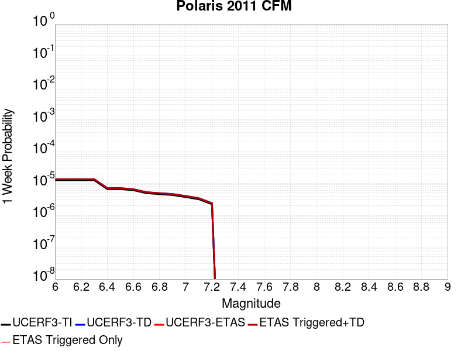 |  | 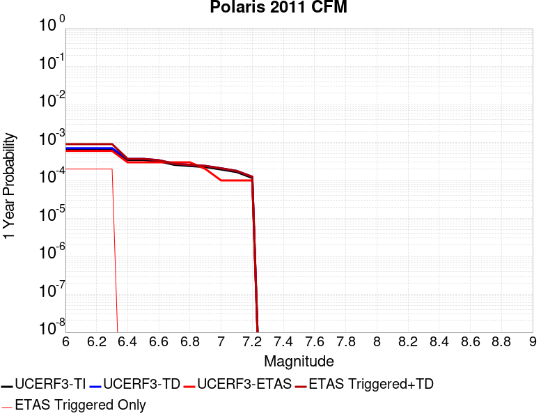 | 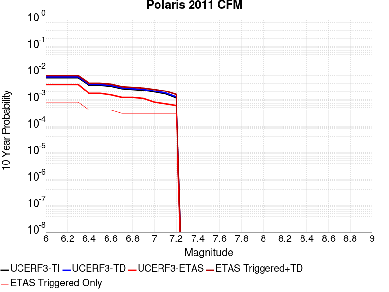 |

| Magnitude | 1 wk TI Prob | 1 wk TD Prob | 1 wk ETAS Prob | 1 wk ETAS/TD Gain | 1 wk ETAS Triggered+TD | 1 wk ETAS Triggered Only | 1 mo TI Prob | 1 mo TD Prob | 1 mo ETAS Prob | 1 mo ETAS/TD Gain | 1 mo ETAS Triggered+TD | 1 mo ETAS Triggered Only | 1 yr TI Prob | 1 yr TD Prob | 1 yr ETAS Prob | 1 yr ETAS/TD Gain | 1 yr ETAS Triggered+TD | 1 yr ETAS Triggered Only | 10 yr TI Prob | 10 yr TD Prob | 10 yr ETAS Prob | 10 yr ETAS/TD Gain | 10 yr ETAS Triggered+TD | 10 yr ETAS Triggered Only |
|-----|-----|-----|-----|-----|-----|-----|-----|-----|-----|-----|-----|-----|-----|-----|-----|-----|-----|-----|-----|-----|-----|-----|-----|-----|
| 6.0 | 1.2630823E-5 | 1.3572226E-5 | 0.0 | 0.0 | 1.3572226E-5 | 0.0 | 5.413098E-5 | 5.8165675E-5 | 1.0E-4 | 1.719227 | 1.5815986E-4 | 1.0E-4 | 6.5884535E-4 | 7.079888E-4 | 6.0E-4 | 0.847471 | 9.078472E-4 | 2.0E-4 | 0.0065689543 | 0.007062433 | 0.0037 | 0.5238988 | 0.0078567825 | 8.0E-4 |
| 6.1 | 1.2630823E-5 | 1.3572226E-5 | 0.0 | 0.0 | 1.3572226E-5 | 0.0 | 5.413098E-5 | 5.8165675E-5 | 1.0E-4 | 1.719227 | 1.5815986E-4 | 1.0E-4 | 6.5884535E-4 | 7.079888E-4 | 6.0E-4 | 0.847471 | 9.078472E-4 | 2.0E-4 | 0.0065689543 | 0.007062433 | 0.0037 | 0.5238988 | 0.0078567825 | 8.0E-4 |
| 6.2 | 1.2630823E-5 | 1.3572226E-5 | 0.0 | 0.0 | 1.3572226E-5 | 0.0 | 5.413098E-5 | 5.8165675E-5 | 1.0E-4 | 1.719227 | 1.5815986E-4 | 1.0E-4 | 6.5884535E-4 | 7.079888E-4 | 6.0E-4 | 0.847471 | 9.078472E-4 | 2.0E-4 | 0.0065689543 | 0.007062433 | 0.0037 | 0.5238988 | 0.0078567825 | 8.0E-4 |
| 6.3 | 1.2630823E-5 | 1.3572226E-5 | 0.0 | 0.0 | 1.3572226E-5 | 0.0 | 5.413098E-5 | 5.8165675E-5 | 1.0E-4 | 1.719227 | 1.5815986E-4 | 1.0E-4 | 6.5884535E-4 | 7.079888E-4 | 6.0E-4 | 0.847471 | 9.078472E-4 | 2.0E-4 | 0.0065689543 | 0.007062433 | 0.0037 | 0.5238988 | 0.0078567825 | 8.0E-4 |
| 6.4 | 6.642994E-6 | 7.1018785E-6 | 0.0 | 0.0 | 7.1018785E-6 | 0.0 | 2.8469662E-5 | 3.0436295E-5 | 0.0 | 0.0 | 3.0436295E-5 | 0.0 | 3.46563E-4 | 3.7050404E-4 | 3.0E-4 | 0.80970776 | 3.7050404E-4 | 0.0 | 0.0034602303 | 0.0036993735 | 0.0017 | 0.4595373 | 0.0040978934 | 4.0E-4 |
| 6.5 | 6.642994E-6 | 7.1018785E-6 | 0.0 | 0.0 | 7.1018785E-6 | 0.0 | 2.8469662E-5 | 3.0436295E-5 | 0.0 | 0.0 | 3.0436295E-5 | 0.0 | 3.46563E-4 | 3.7050404E-4 | 3.0E-4 | 0.80970776 | 3.7050404E-4 | 0.0 | 0.0034602303 | 0.0036993735 | 0.0017 | 0.4595373 | 0.0040978934 | 4.0E-4 |
| 6.6 | 6.1286296E-6 | 6.551398E-6 | 0.0 | 0.0 | 6.551398E-6 | 0.0 | 2.626529E-5 | 2.8077146E-5 | 0.0 | 0.0 | 2.8077146E-5 | 0.0 | 3.19733E-4 | 3.4179044E-4 | 3.0E-4 | 0.87773085 | 3.4179044E-4 | 0.0 | 0.0031927335 | 0.003413122 | 0.0015 | 0.43948033 | 0.0038117568 | 4.0E-4 |
| 6.7 | 4.9474666E-6 | 5.2943287E-6 | 0.0 | 0.0 | 5.2943287E-6 | 0.0 | 2.1203256E-5 | 2.26898E-5 | 0.0 | 0.0 | 2.26898E-5 | 0.0 | 2.5811905E-4 | 2.762161E-4 | 3.0E-4 | 1.0861061 | 2.762161E-4 | 0.0 | 0.0025781945 | 0.0027590075 | 0.0012 | 0.43493903 | 0.0030581797 | 3.0E-4 |
| 6.8 | 4.616407E-6 | 4.9425757E-6 | 0.0 | 0.0 | 4.9425757E-6 | 0.0 | 1.978445E-5 | 2.1182312E-5 | 0.0 | 0.0 | 2.1182312E-5 | 0.0 | 2.4084905E-4 | 2.578668E-4 | 3.0E-4 | 1.1633914 | 2.578668E-4 | 0.0 | 0.0024058819 | 0.0025759398 | 0.0012 | 0.46584943 | 0.002875167 | 3.0E-4 |
| 6.9 | 4.320343E-6 | 4.6274126E-6 | 0.0 | 0.0 | 4.6274126E-6 | 0.0 | 1.8515624E-5 | 1.9831632E-5 | 0.0 | 0.0 | 1.9831632E-5 | 0.0 | 2.2540441E-4 | 2.4142597E-4 | 2.0E-4 | 0.8284113 | 2.4142597E-4 | 0.0 | 0.0022517592 | 0.0024118933 | 0.0011 | 0.45607325 | 0.0027111697 | 3.0E-4 |
| 7.0 | 3.7382292E-6 | 4.006516E-6 | 0.0 | 0.0 | 4.006516E-6 | 0.0 | 1.6020884E-5 | 1.7170683E-5 | 0.0 | 0.0 | 1.7170683E-5 | 0.0 | 1.950368E-4 | 2.0903541E-4 | 1.0E-4 | 0.47838783 | 2.0903541E-4 | 0.0 | 0.0019486571 | 0.002088623 | 8.0E-4 | 0.3830275 | 0.0023879963 | 3.0E-4 |
| 7.1 | 3.193576E-6 | 3.425077E-6 | 0.0 | 0.0 | 3.425077E-6 | 0.0 | 1.3686683E-5 | 1.4678832E-5 | 0.0 | 0.0 | 1.4678832E-5 | 0.0 | 1.6662262E-4 | 1.7870234E-4 | 1.0E-4 | 0.55958974 | 1.7870234E-4 | 0.0 | 0.0016649774 | 0.0017858049 | 7.0E-4 | 0.3919801 | 0.0020852692 | 3.0E-4 |
| 7.2 | 2.2356758E-6 | 2.4004994E-6 | 0.0 | 0.0 | 2.4004994E-6 | 0.0 | 9.581432E-6 | 1.0287825E-5 | 0.0 | 0.0 | 1.0287825E-5 | 0.0 | 1.1664769E-4 | 1.2524896E-4 | 1.0E-4 | 0.7984098 | 1.2524896E-4 | 0.0 | 0.0011658648 | 0.0012519691 | 6.0E-4 | 0.47924504 | 0.0015515935 | 3.0E-4 |

## Towne Pass
*[(top)](#table-of-contents)*

| 1 Week | 1 Month | 1 Year | 10 Year |
|-----|-----|-----|-----|
| 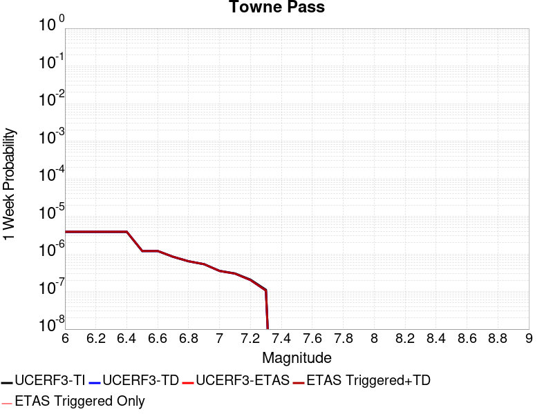 | 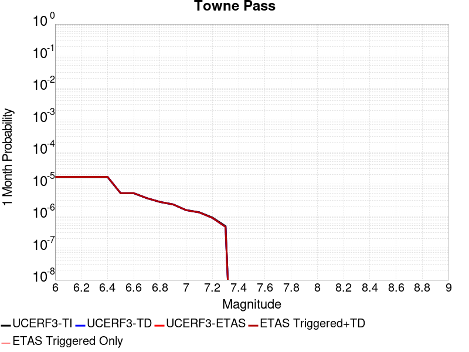 | 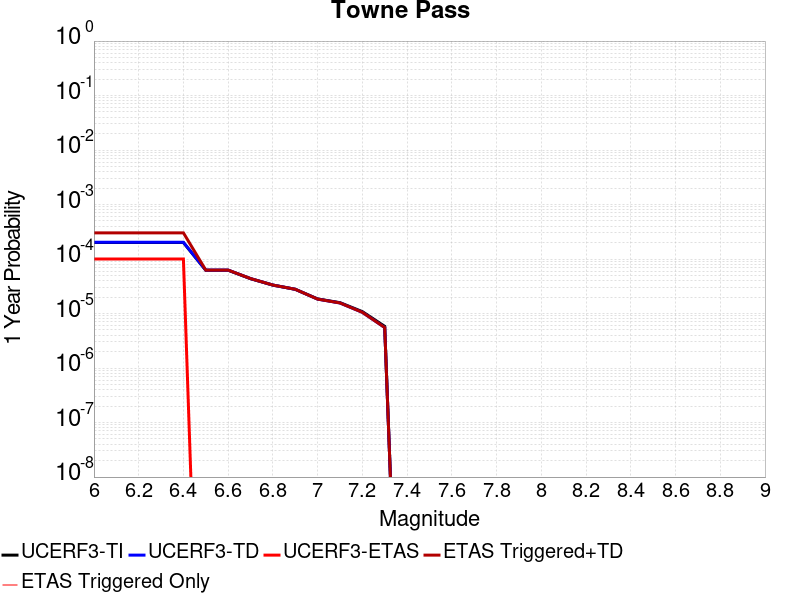 | 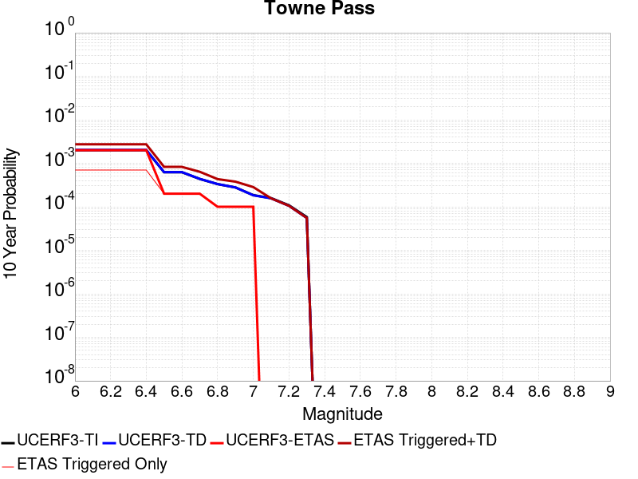 |

| Magnitude | 1 wk TI Prob | 1 wk TD Prob | 1 wk ETAS Prob | 1 wk ETAS/TD Gain | 1 wk ETAS Triggered+TD | 1 wk ETAS Triggered Only | 1 mo TI Prob | 1 mo TD Prob | 1 mo ETAS Prob | 1 mo ETAS/TD Gain | 1 mo ETAS Triggered+TD | 1 mo ETAS Triggered Only | 1 yr TI Prob | 1 yr TD Prob | 1 yr ETAS Prob | 1 yr ETAS/TD Gain | 1 yr ETAS Triggered+TD | 1 yr ETAS Triggered Only | 10 yr TI Prob | 10 yr TD Prob | 10 yr ETAS Prob | 10 yr ETAS/TD Gain | 10 yr ETAS Triggered+TD | 10 yr ETAS Triggered Only |
|-----|-----|-----|-----|-----|-----|-----|-----|-----|-----|-----|-----|-----|-----|-----|-----|-----|-----|-----|-----|-----|-----|-----|-----|-----|
| 6.0 | 3.849728E-6 | 3.8938624E-6 | 0.0 | 0.0 | 3.8938624E-6 | 0.0 | 1.649873E-5 | 1.66879E-5 | 0.0 | 0.0 | 1.66879E-5 | 0.0 | 2.0085352E-4 | 2.0316061E-4 | 1.0E-4 | 0.49222142 | 3.031403E-4 | 1.0E-4 | 0.0020067208 | 0.0020301777 | 0.002 | 0.9851354 | 0.0027287568 | 7.0E-4 |
| 6.1 | 3.849728E-6 | 3.8938624E-6 | 0.0 | 0.0 | 3.8938624E-6 | 0.0 | 1.649873E-5 | 1.66879E-5 | 0.0 | 0.0 | 1.66879E-5 | 0.0 | 2.0085352E-4 | 2.0316061E-4 | 1.0E-4 | 0.49222142 | 3.031403E-4 | 1.0E-4 | 0.0020067208 | 0.0020301777 | 0.002 | 0.9851354 | 0.0027287568 | 7.0E-4 |
| 6.2 | 3.849728E-6 | 3.8938624E-6 | 0.0 | 0.0 | 3.8938624E-6 | 0.0 | 1.649873E-5 | 1.66879E-5 | 0.0 | 0.0 | 1.66879E-5 | 0.0 | 2.0085352E-4 | 2.0316061E-4 | 1.0E-4 | 0.49222142 | 3.031403E-4 | 1.0E-4 | 0.0020067208 | 0.0020301777 | 0.002 | 0.9851354 | 0.0027287568 | 7.0E-4 |
| 6.3 | 3.849728E-6 | 3.8938624E-6 | 0.0 | 0.0 | 3.8938624E-6 | 0.0 | 1.649873E-5 | 1.66879E-5 | 0.0 | 0.0 | 1.66879E-5 | 0.0 | 2.0085352E-4 | 2.0316061E-4 | 1.0E-4 | 0.49222142 | 3.031403E-4 | 1.0E-4 | 0.0020067208 | 0.0020301777 | 0.002 | 0.9851354 | 0.0027287568 | 7.0E-4 |
| 6.4 | 3.849728E-6 | 3.8938624E-6 | 0.0 | 0.0 | 3.8938624E-6 | 0.0 | 1.649873E-5 | 1.66879E-5 | 0.0 | 0.0 | 1.66879E-5 | 0.0 | 2.0085352E-4 | 2.0316061E-4 | 1.0E-4 | 0.49222142 | 3.031403E-4 | 1.0E-4 | 0.0020067208 | 0.0020301777 | 0.002 | 0.9851354 | 0.0027287568 | 7.0E-4 |
| 6.5 | 1.1953545E-6 | 1.202766E-6 | 0.0 | 0.0 | 1.202766E-6 | 0.0 | 5.1229376E-6 | 5.154702E-6 | 0.0 | 0.0 | 5.154702E-6 | 0.0 | 6.236998E-5 | 6.2756815E-5 | 0.0 | 0.0 | 6.2756815E-5 | 0.0 | 6.235248E-4 | 6.274026E-4 | 2.0E-4 | 0.31877458 | 8.2727714E-4 | 2.0E-4 |
| 6.6 | 1.1953545E-6 | 1.202766E-6 | 0.0 | 0.0 | 1.202766E-6 | 0.0 | 5.1229376E-6 | 5.154702E-6 | 0.0 | 0.0 | 5.154702E-6 | 0.0 | 6.236998E-5 | 6.2756815E-5 | 0.0 | 0.0 | 6.2756815E-5 | 0.0 | 6.235248E-4 | 6.274026E-4 | 2.0E-4 | 0.31877458 | 8.2727714E-4 | 2.0E-4 |
| 6.7 | 8.375951E-7 | 8.4082575E-7 | 0.0 | 0.0 | 8.4082575E-7 | 0.0 | 3.5896885E-6 | 3.6035342E-6 | 0.0 | 0.0 | 3.6035342E-6 | 0.0 | 4.370358E-5 | 4.3872205E-5 | 0.0 | 0.0 | 4.3872205E-5 | 0.0 | 4.3694986E-4 | 4.3864115E-4 | 2.0E-4 | 0.45595357 | 6.385534E-4 | 2.0E-4 |
| 6.8 | 6.38041E-7 | 6.3899864E-7 | 0.0 | 0.0 | 6.3899864E-7 | 0.0 | 2.7344586E-6 | 2.738563E-6 | 0.0 | 0.0 | 2.738563E-6 | 0.0 | 3.3291526E-5 | 3.334153E-5 | 0.0 | 0.0 | 3.334153E-5 | 0.0 | 3.3286537E-4 | 3.333691E-4 | 1.0E-4 | 0.29996783 | 4.3333578E-4 | 1.0E-4 |
| 6.9 | 5.3460053E-7 | 5.343294E-7 | 0.0 | 0.0 | 5.343294E-7 | 0.0 | 2.2911431E-6 | 2.2899815E-6 | 0.0 | 0.0 | 2.2899815E-6 | 0.0 | 2.789431E-5 | 2.78802E-5 | 0.0 | 0.0 | 2.78802E-5 | 0.0 | 2.789081E-4 | 2.7877034E-4 | 1.0E-4 | 0.35871822 | 3.7874246E-4 | 1.0E-4 |
| 7.0 | 3.557783E-7 | 3.5306454E-7 | 0.0 | 0.0 | 3.5306454E-7 | 0.0 | 1.5247632E-6 | 1.5131328E-6 | 0.0 | 0.0 | 1.5131328E-6 | 0.0 | 1.8563835E-5 | 1.8422244E-5 | 0.0 | 0.0 | 1.8422244E-5 | 0.0 | 1.8562283E-4 | 1.8420802E-4 | 1.0E-4 | 0.5428645 | 2.841896E-4 | 1.0E-4 |
| 7.1 | 3.037942E-7 | 2.9985767E-7 | 0.0 | 0.0 | 2.9985767E-7 | 0.0 | 1.3019744E-6 | 1.2851036E-6 | 0.0 | 0.0 | 1.2851036E-6 | 0.0 | 1.5851423E-5 | 1.5646032E-5 | 0.0 | 0.0 | 1.5646032E-5 | 0.0 | 1.5850292E-4 | 1.5645006E-4 | 0.0 | 0.0 | 1.5645006E-4 | 0.0 |
| 7.2 | 2.0808248E-7 | 2.02036E-7 | 0.0 | 0.0 | 2.02036E-7 | 0.0 | 8.917818E-7 | 8.6586834E-7 | 0.0 | 0.0 | 8.6586834E-7 | 0.0 | 1.0857389E-5 | 1.05419E-5 | 0.0 | 0.0 | 1.05419E-5 | 0.0 | 1.0856859E-4 | 1.0541447E-4 | 0.0 | 0.0 | 1.0541447E-4 | 0.0 |
| 7.3 | 1.1162073E-7 | 1.062679E-7 | 0.0 | 0.0 | 1.062679E-7 | 0.0 | 4.7837443E-7 | 4.5543376E-7 | 0.0 | 0.0 | 4.5543376E-7 | 0.0 | 5.8241935E-6 | 5.544894E-6 | 0.0 | 0.0 | 5.544894E-6 | 0.0 | 5.8240406E-5 | 5.5447756E-5 | 0.0 | 0.0 | 5.5447756E-5 | 0.0 |

## Malibu Coast (Extension) alt 1
*[(top)](#table-of-contents)*

| 1 Week | 1 Month | 1 Year | 10 Year |
|-----|-----|-----|-----|
| 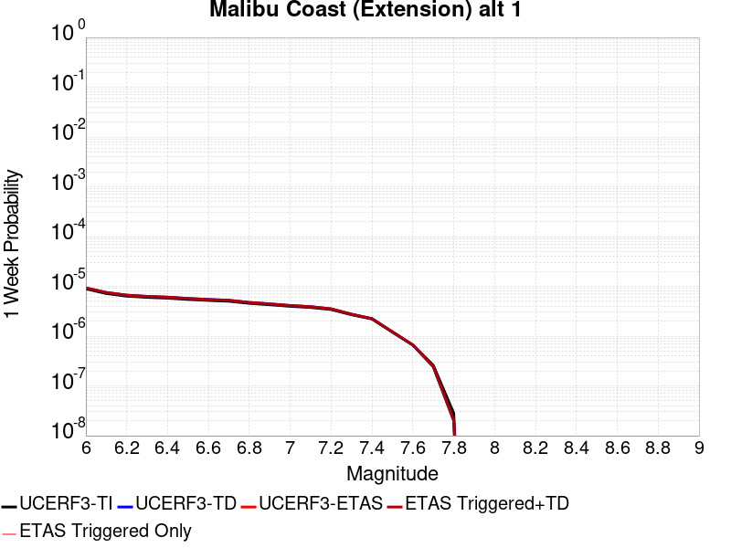 | 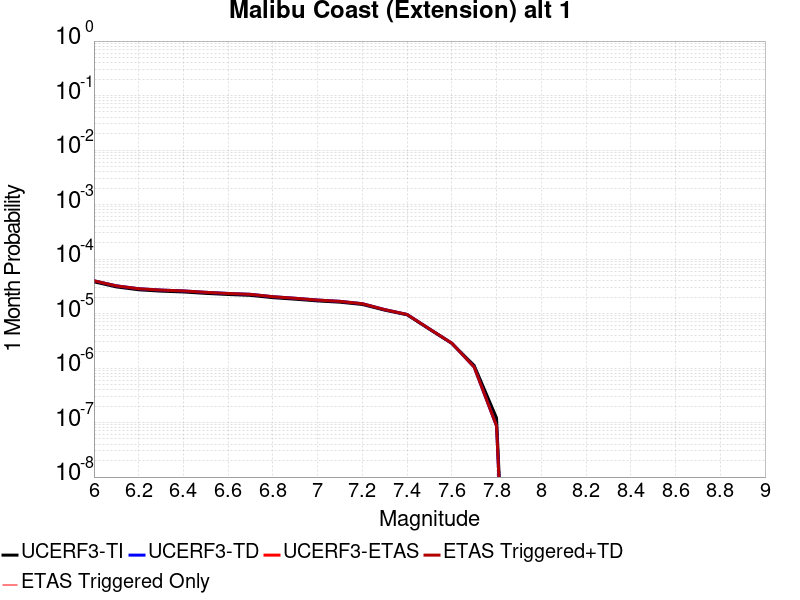 | 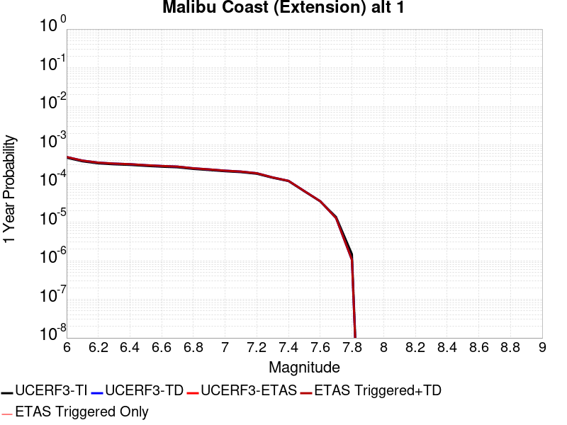 | 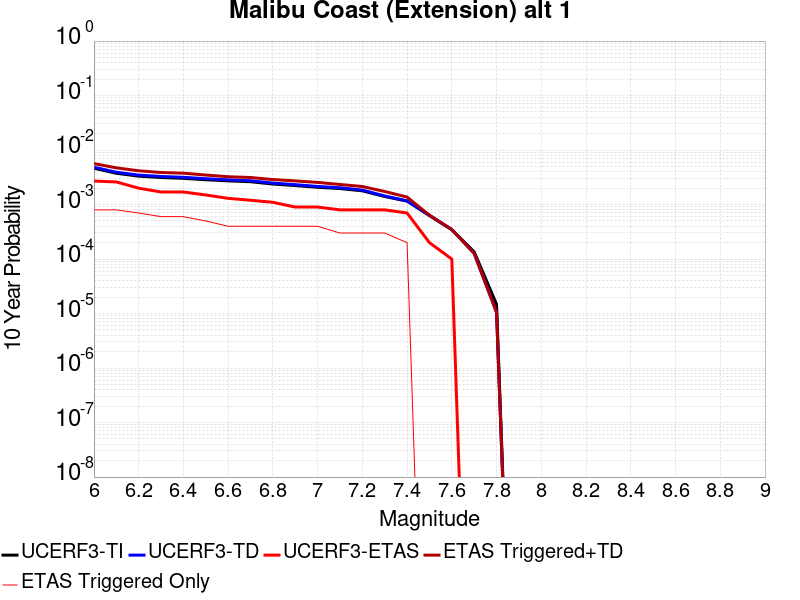 |

| Magnitude | 1 wk TI Prob | 1 wk TD Prob | 1 wk ETAS Prob | 1 wk ETAS/TD Gain | 1 wk ETAS Triggered+TD | 1 wk ETAS Triggered Only | 1 mo TI Prob | 1 mo TD Prob | 1 mo ETAS Prob | 1 mo ETAS/TD Gain | 1 mo ETAS Triggered+TD | 1 mo ETAS Triggered Only | 1 yr TI Prob | 1 yr TD Prob | 1 yr ETAS Prob | 1 yr ETAS/TD Gain | 1 yr ETAS Triggered+TD | 1 yr ETAS Triggered Only | 10 yr TI Prob | 10 yr TD Prob | 10 yr ETAS Prob | 10 yr ETAS/TD Gain | 10 yr ETAS Triggered+TD | 10 yr ETAS Triggered Only |
|-----|-----|-----|-----|-----|-----|-----|-----|-----|-----|-----|-----|-----|-----|-----|-----|-----|-----|-----|-----|-----|-----|-----|-----|-----|
| 6.0 | 8.930738E-6 | 9.323782E-6 | 0.0 | 0.0 | 9.323782E-6 | 0.0 | 3.827403E-5 | 3.9958464E-5 | 0.0 | 0.0 | 3.9958464E-5 | 0.0 | 4.6588664E-4 | 4.863874E-4 | 0.0 | 0.0 | 4.863874E-4 | 0.0 | 0.0046491115 | 0.004853411 | 0.0027 | 0.55630976 | 0.0056495285 | 8.0E-4 |
| 6.1 | 7.199952E-6 | 7.5255425E-6 | 0.0 | 0.0 | 7.5255425E-6 | 0.0 | 3.0856572E-5 | 3.225193E-5 | 0.0 | 0.0 | 3.225193E-5 | 0.0 | 3.75614E-4 | 3.9259708E-4 | 0.0 | 0.0 | 3.9259708E-4 | 0.0 | 0.0037497976 | 0.0039191013 | 0.0026 | 0.6634174 | 0.004715966 | 8.0E-4 |
| 6.2 | 6.3721413E-6 | 6.6624266E-6 | 0.0 | 0.0 | 6.6624266E-6 | 0.0 | 2.7308892E-5 | 2.8552946E-5 | 0.0 | 0.0 | 2.8552946E-5 | 0.0 | 3.3243504E-4 | 3.47577E-4 | 0.0 | 0.0 | 3.47577E-4 | 0.0 | 0.0033193815 | 0.0034703738 | 0.002 | 0.57630676 | 0.0041679447 | 7.0E-4 |
| 6.3 | 6.016345E-6 | 6.290966E-6 | 0.0 | 0.0 | 6.290966E-6 | 0.0 | 2.578408E-5 | 2.6961006E-5 | 0.0 | 0.0 | 2.6961006E-5 | 0.0 | 3.1387596E-4 | 3.2820113E-4 | 0.0 | 0.0 | 3.2820113E-4 | 0.0 | 0.00313433 | 0.0032772005 | 0.0017 | 0.51873547 | 0.0038752342 | 6.0E-4 |
| 6.4 | 5.8104883E-6 | 6.075459E-6 | 0.0 | 0.0 | 6.075459E-6 | 0.0 | 2.4901856E-5 | 2.6037425E-5 | 0.0 | 0.0 | 2.6037425E-5 | 0.0 | 3.031379E-4 | 3.1695983E-4 | 0.0 | 0.0 | 3.1695983E-4 | 0.0 | 0.0030272473 | 0.0031651123 | 0.0017 | 0.53710574 | 0.0037632133 | 6.0E-4 |
| 6.5 | 5.476925E-6 | 5.7236316E-6 | 0.0 | 0.0 | 5.7236316E-6 | 0.0 | 2.3472323E-5 | 2.4529621E-5 | 0.0 | 0.0 | 2.4529621E-5 | 0.0 | 2.8573806E-4 | 2.986075E-4 | 0.0 | 0.0 | 2.986075E-4 | 0.0 | 0.0028537093 | 0.0029820947 | 0.0015 | 0.50300217 | 0.0034806037 | 5.0E-4 |
| 6.6 | 5.222387E-6 | 5.4548573E-6 | 0.0 | 0.0 | 5.4548573E-6 | 0.0 | 2.2381464E-5 | 2.3377752E-5 | 0.0 | 0.0 | 2.3377752E-5 | 0.0 | 2.7246025E-4 | 2.8458724E-4 | 0.0 | 0.0 | 2.8458724E-4 | 0.0 | 0.0027212645 | 0.0028422587 | 0.0013 | 0.45738274 | 0.0032411218 | 4.0E-4 |
| 6.7 | 5.0337076E-6 | 5.2555E-6 | 0.0 | 0.0 | 5.2555E-6 | 0.0 | 2.1572854E-5 | 2.2523378E-5 | 0.0 | 0.0 | 2.2523378E-5 | 0.0 | 2.6261783E-4 | 2.741879E-4 | 0.0 | 0.0 | 2.741879E-4 | 0.0 | 0.002623077 | 0.002738526 | 0.0012 | 0.43819192 | 0.0031374306 | 4.0E-4 |
| 6.8 | 4.5675624E-6 | 4.7554977E-6 | 0.0 | 0.0 | 4.7554977E-6 | 0.0 | 1.9575122E-5 | 2.0380545E-5 | 0.0 | 0.0 | 2.0380545E-5 | 0.0 | 2.3830103E-4 | 2.4810506E-4 | 0.0 | 0.0 | 2.4810506E-4 | 0.0 | 0.0023804565 | 0.0024783006 | 0.0011 | 0.44385254 | 0.0028773092 | 4.0E-4 |
| 6.9 | 4.2802412E-6 | 4.4490175E-6 | 0.0 | 0.0 | 4.4490175E-6 | 0.0 | 1.8343762E-5 | 1.906708E-5 | 0.0 | 0.0 | 1.906708E-5 | 0.0 | 2.2331243E-4 | 2.3211713E-4 | 0.0 | 0.0 | 2.3211713E-4 | 0.0 | 0.0022308815 | 0.0023187636 | 9.0E-4 | 0.3881379 | 0.002717836 | 4.0E-4 |
| 7.0 | 3.9794063E-6 | 4.127332E-6 | 0.0 | 0.0 | 4.127332E-6 | 0.0 | 1.7054486E-5 | 1.7688448E-5 | 0.0 | 0.0 | 1.7688448E-5 | 0.0 | 2.0761859E-4 | 2.1533569E-4 | 0.0 | 0.0 | 2.1533569E-4 | 0.0 | 0.0020742472 | 0.002151284 | 9.0E-4 | 0.41835484 | 0.0025504234 | 4.0E-4 |
| 7.1 | 3.7730424E-6 | 3.9085894E-6 | 0.0 | 0.0 | 3.9085894E-6 | 0.0 | 1.6170083E-5 | 1.675099E-5 | 0.0 | 0.0 | 1.675099E-5 | 0.0 | 1.9685295E-4 | 2.0392434E-4 | 0.0 | 0.0 | 2.0392434E-4 | 0.0 | 0.0019667868 | 0.002037385 | 8.0E-4 | 0.3926602 | 0.0023367738 | 3.0E-4 |
| 7.2 | 3.424985E-6 | 3.5389521E-6 | 0.0 | 0.0 | 3.5389521E-6 | 0.0 | 1.4678424E-5 | 1.516685E-5 | 0.0 | 0.0 | 1.516685E-5 | 0.0 | 1.7869516E-4 | 1.8464087E-4 | 0.0 | 0.0 | 1.8464087E-4 | 0.0 | 0.0017855153 | 0.0018448866 | 8.0E-4 | 0.433631 | 0.0021443332 | 3.0E-4 |
| 7.3 | 2.6966375E-6 | 2.7578667E-6 | 0.0 | 0.0 | 2.7578667E-6 | 0.0 | 1.15569665E-5 | 1.1819375E-5 | 0.0 | 0.0 | 1.1819375E-5 | 0.0 | 1.4069698E-4 | 1.4389143E-4 | 0.0 | 0.0 | 1.4389143E-4 | 0.0 | 0.0014060794 | 0.0014379867 | 8.0E-4 | 0.55633336 | 0.0017375554 | 3.0E-4 |
| 7.4 | 2.215957E-6 | 2.2479396E-6 | 0.0 | 0.0 | 2.2479396E-6 | 0.0 | 9.496924E-6 | 9.633992E-6 | 0.0 | 0.0 | 9.633992E-6 | 0.0 | 1.1561892E-4 | 1.1728757E-4 | 0.0 | 0.0 | 1.1728757E-4 | 0.0 | 0.0011555878 | 0.0011722604 | 7.0E-4 | 0.5971369 | 0.0013720259 | 2.0E-4 |
| 7.5 | 1.2040218E-6 | 1.2210837E-6 | 0.0 | 0.0 | 1.2210837E-6 | 0.0 | 5.160083E-6 | 5.2332057E-6 | 0.0 | 0.0 | 5.2332057E-6 | 0.0 | 6.2822204E-5 | 6.371243E-5 | 0.0 | 0.0 | 6.371243E-5 | 0.0 | 6.280445E-4 | 6.3694356E-4 | 2.0E-4 | 0.31399956 | 6.3694356E-4 | 0.0 |
| 7.6 | 6.6157446E-7 | 6.674275E-7 | 0.0 | 0.0 | 6.674275E-7 | 0.0 | 2.835316E-6 | 2.8604006E-6 | 0.0 | 0.0 | 2.8604006E-6 | 0.0 | 3.4519428E-5 | 3.4824836E-5 | 0.0 | 0.0 | 3.4824836E-5 | 0.0 | 3.4514067E-4 | 3.4819532E-4 | 1.0E-4 | 0.28719515 | 3.4819532E-4 | 0.0 |
| 7.7 | 2.6012302E-7 | 2.4340684E-7 | 0.0 | 0.0 | 2.4340684E-7 | 0.0 | 1.1148124E-6 | 1.0431719E-6 | 0.0 | 0.0 | 1.0431719E-6 | 0.0 | 1.3572758E-5 | 1.2700554E-5 | 0.0 | 0.0 | 1.2700554E-5 | 0.0 | 1.3571928E-4 | 1.2699935E-4 | 0.0 | 0.0 | 1.2699935E-4 | 0.0 |
| 7.8 | 2.8323132E-8 | 2.0242826E-8 | 0.0 | 0.0 | 2.0242826E-8 | 0.0 | 1.2138484E-7 | 8.6754966E-8 | 0.0 | 0.0 | 8.6754966E-8 | 0.0 | 1.4778595E-6 | 1.0562413E-6 | 0.0 | 0.0 | 1.0562413E-6 | 0.0 | 1.4778497E-5 | 1.0562371E-5 | 0.0 | 0.0 | 1.0562371E-5 | 0.0 |

## Peralta Hills
*[(top)](#table-of-contents)*

| 1 Week | 1 Month | 1 Year | 10 Year |
|-----|-----|-----|-----|
| 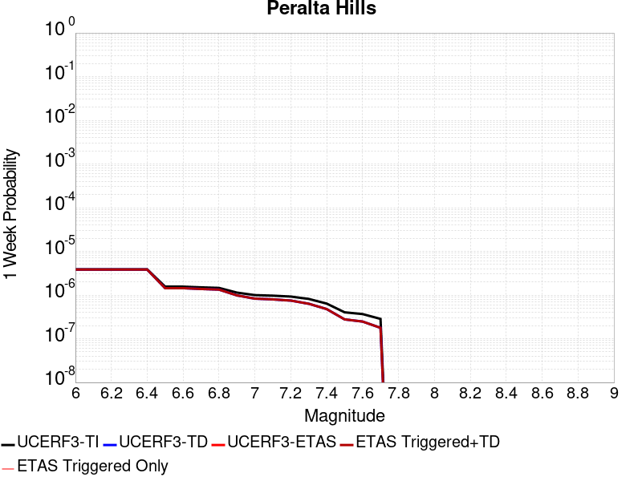 | 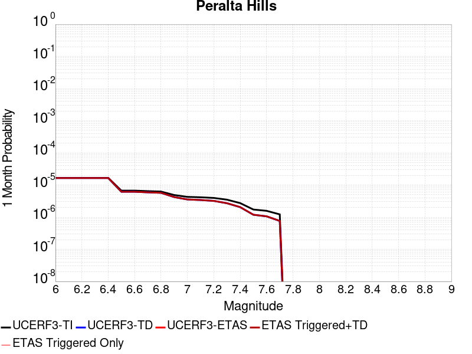 | 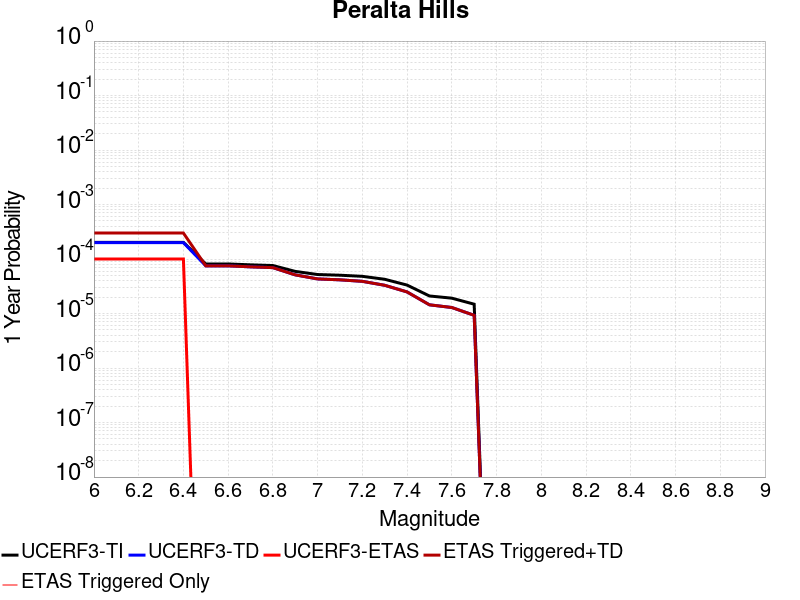 | 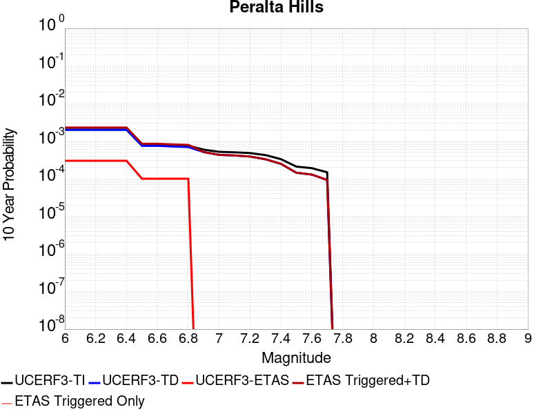 |

| Magnitude | 1 wk TI Prob | 1 wk TD Prob | 1 wk ETAS Prob | 1 wk ETAS/TD Gain | 1 wk ETAS Triggered+TD | 1 wk ETAS Triggered Only | 1 mo TI Prob | 1 mo TD Prob | 1 mo ETAS Prob | 1 mo ETAS/TD Gain | 1 mo ETAS Triggered+TD | 1 mo ETAS Triggered Only | 1 yr TI Prob | 1 yr TD Prob | 1 yr ETAS Prob | 1 yr ETAS/TD Gain | 1 yr ETAS Triggered+TD | 1 yr ETAS Triggered Only | 10 yr TI Prob | 10 yr TD Prob | 10 yr ETAS Prob | 10 yr ETAS/TD Gain | 10 yr ETAS Triggered+TD | 10 yr ETAS Triggered Only |
|-----|-----|-----|-----|-----|-----|-----|-----|-----|-----|-----|-----|-----|-----|-----|-----|-----|-----|-----|-----|-----|-----|-----|-----|-----|
| 6.0 | 3.8850067E-6 | 3.8344565E-6 | 0.0 | 0.0 | 3.8344565E-6 | 0.0 | 1.6649923E-5 | 1.6433323E-5 | 0.0 | 0.0 | 1.6433323E-5 | 0.0 | 2.0269395E-4 | 2.0006477E-4 | 2.0E-4 | 0.9996763 | 3.0004475E-4 | 1.0E-4 | 0.0020250916 | 0.0019995735 | 0.0016 | 0.8001706 | 0.002797974 | 8.0E-4 |
| 6.1 | 3.8850067E-6 | 3.8344565E-6 | 0.0 | 0.0 | 3.8344565E-6 | 0.0 | 1.6649923E-5 | 1.6433323E-5 | 0.0 | 0.0 | 1.6433323E-5 | 0.0 | 2.0269395E-4 | 2.0006477E-4 | 2.0E-4 | 0.9996763 | 3.0004475E-4 | 1.0E-4 | 0.0020250916 | 0.0019995735 | 0.0016 | 0.8001706 | 0.002797974 | 8.0E-4 |
| 6.2 | 3.8850067E-6 | 3.8344565E-6 | 0.0 | 0.0 | 3.8344565E-6 | 0.0 | 1.6649923E-5 | 1.6433323E-5 | 0.0 | 0.0 | 1.6433323E-5 | 0.0 | 2.0269395E-4 | 2.0006477E-4 | 2.0E-4 | 0.9996763 | 3.0004475E-4 | 1.0E-4 | 0.0020250916 | 0.0019995735 | 0.0016 | 0.8001706 | 0.002797974 | 8.0E-4 |
| 6.3 | 3.8850067E-6 | 3.8344565E-6 | 0.0 | 0.0 | 3.8344565E-6 | 0.0 | 1.6649923E-5 | 1.6433323E-5 | 0.0 | 0.0 | 1.6433323E-5 | 0.0 | 2.0269395E-4 | 2.0006477E-4 | 2.0E-4 | 0.9996763 | 3.0004475E-4 | 1.0E-4 | 0.0020250916 | 0.0019995735 | 0.0016 | 0.8001706 | 0.002797974 | 8.0E-4 |
| 6.4 | 3.8850067E-6 | 3.8344565E-6 | 0.0 | 0.0 | 3.8344565E-6 | 0.0 | 1.6649923E-5 | 1.6433323E-5 | 0.0 | 0.0 | 1.6433323E-5 | 0.0 | 2.0269395E-4 | 2.0006477E-4 | 2.0E-4 | 0.9996763 | 3.0004475E-4 | 1.0E-4 | 0.0020250916 | 0.0019995735 | 0.0016 | 0.8001706 | 0.002797974 | 8.0E-4 |
| 6.5 | 1.5587785E-6 | 1.4387793E-6 | 0.0 | 0.0 | 1.4387793E-6 | 0.0 | 6.6804623E-6 | 6.166184E-6 | 0.0 | 0.0 | 6.166184E-6 | 0.0 | 8.133159E-5 | 7.5070944E-5 | 0.0 | 0.0 | 7.5070944E-5 | 0.0 | 8.1301836E-4 | 7.504797E-4 | 5.0E-4 | 0.6662405 | 0.0010502546 | 3.0E-4 |
| 6.6 | 1.5587785E-6 | 1.4387793E-6 | 0.0 | 0.0 | 1.4387793E-6 | 0.0 | 6.6804623E-6 | 6.166184E-6 | 0.0 | 0.0 | 6.166184E-6 | 0.0 | 8.133159E-5 | 7.5070944E-5 | 0.0 | 0.0 | 7.5070944E-5 | 0.0 | 8.1301836E-4 | 7.504797E-4 | 5.0E-4 | 0.6662405 | 0.0010502546 | 3.0E-4 |
| 6.7 | 1.5018579E-6 | 1.3794287E-6 | 0.0 | 0.0 | 1.3794287E-6 | 0.0 | 6.436518E-6 | 5.911825E-6 | 0.0 | 0.0 | 5.911825E-6 | 0.0 | 7.836179E-5 | 7.197433E-5 | 0.0 | 0.0 | 7.197433E-5 | 0.0 | 7.833416E-4 | 7.1953365E-4 | 4.0E-4 | 0.55591565 | 9.193897E-4 | 2.0E-4 |
| 6.8 | 1.4584314E-6 | 1.3338843E-6 | 0.0 | 0.0 | 1.3338843E-6 | 0.0 | 6.250405E-6 | 5.7166358E-6 | 0.0 | 0.0 | 5.7166358E-6 | 0.0 | 7.6096025E-5 | 6.9598056E-5 | 0.0 | 0.0 | 6.9598056E-5 | 0.0 | 7.6069974E-4 | 6.957858E-4 | 4.0E-4 | 0.57488954 | 8.9564663E-4 | 2.0E-4 |
| 6.9 | 1.1382393E-6 | 9.830711E-7 | 0.0 | 0.0 | 9.830711E-7 | 0.0 | 4.8781594E-6 | 4.2131555E-6 | 0.0 | 0.0 | 4.2131555E-6 | 0.0 | 5.9389975E-5 | 5.1294046E-5 | 0.0 | 0.0 | 5.1294046E-5 | 0.0 | 5.93741E-4 | 5.128302E-4 | 2.0E-4 | 0.3899926 | 5.128302E-4 | 0.0 |
| 7.0 | 9.970413E-7 | 8.2824795E-7 | 0.0 | 0.0 | 8.2824795E-7 | 0.0 | 4.273027E-6 | 3.5496298E-6 | 0.0 | 0.0 | 3.5496298E-6 | 0.0 | 5.2022864E-5 | 4.3215954E-5 | 0.0 | 0.0 | 4.3215954E-5 | 0.0 | 5.2010687E-4 | 4.3208225E-4 | 2.0E-4 | 0.46287483 | 4.3208225E-4 | 0.0 |
| 7.1 | 9.684443E-7 | 7.9685265E-7 | 0.0 | 0.0 | 7.9685265E-7 | 0.0 | 4.150469E-6 | 3.4150787E-6 | 0.0 | 0.0 | 3.4150787E-6 | 0.0 | 5.053079E-5 | 4.157786E-5 | 0.0 | 0.0 | 4.157786E-5 | 0.0 | 5.05193E-4 | 4.1570747E-4 | 2.0E-4 | 0.48110753 | 4.1570747E-4 | 0.0 |
| 7.2 | 9.240811E-7 | 7.4785555E-7 | 0.0 | 0.0 | 7.4785555E-7 | 0.0 | 3.960342E-6 | 3.2050916E-6 | 0.0 | 0.0 | 3.2050916E-6 | 0.0 | 4.8216094E-5 | 3.9021357E-5 | 0.0 | 0.0 | 3.9021357E-5 | 0.0 | 4.8205635E-4 | 3.9015157E-4 | 2.0E-4 | 0.5126213 | 3.9015157E-4 | 0.0 |
| 7.3 | 8.158643E-7 | 6.327957E-7 | 0.0 | 0.0 | 6.327957E-7 | 0.0 | 3.4965567E-6 | 2.711979E-6 | 0.0 | 0.0 | 2.711979E-6 | 0.0 | 4.2569747E-5 | 3.3017906E-5 | 0.0 | 0.0 | 3.3017906E-5 | 0.0 | 4.2561593E-4 | 3.3013613E-4 | 2.0E-4 | 0.6058107 | 3.3013613E-4 | 0.0 |
| 7.4 | 6.3822824E-7 | 4.7784977E-7 | 0.0 | 0.0 | 4.7784977E-7 | 0.0 | 2.7352612E-6 | 2.047926E-6 | 0.0 | 0.0 | 2.047926E-6 | 0.0 | 3.3301294E-5 | 2.4933268E-5 | 0.0 | 0.0 | 2.4933268E-5 | 0.0 | 3.3296304E-4 | 2.493098E-4 | 2.0E-4 | 0.80221474 | 2.493098E-4 | 0.0 |
| 7.5 | 4.0292628E-7 | 2.7737062E-7 | 0.0 | 0.0 | 2.7737062E-7 | 0.0 | 1.7268258E-6 | 1.1887308E-6 | 0.0 | 0.0 | 1.1887308E-6 | 0.0 | 2.1023901E-5 | 1.447273E-5 | 0.0 | 0.0 | 1.447273E-5 | 0.0 | 2.1021912E-4 | 1.4472065E-4 | 1.0E-4 | 0.6909864 | 1.4472065E-4 | 0.0 |
| 7.6 | 3.672993E-7 | 2.4755946E-7 | 0.0 | 0.0 | 2.4755946E-7 | 0.0 | 1.5741389E-6 | 1.0609688E-6 | 0.0 | 0.0 | 1.0609688E-6 | 0.0 | 1.9164972E-5 | 1.2917246E-5 | 0.0 | 0.0 | 1.2917246E-5 | 0.0 | 1.916332E-4 | 1.2916765E-4 | 1.0E-4 | 0.7741877 | 1.2916765E-4 | 0.0 |
| 7.7 | 2.8466823E-7 | 1.7796732E-7 | 0.0 | 0.0 | 1.7796732E-7 | 0.0 | 1.2200061E-6 | 7.6271704E-7 | 0.0 | 0.0 | 7.6271704E-7 | 0.0 | 1.4853474E-5 | 9.286066E-6 | 0.0 | 0.0 | 9.286066E-6 | 0.0 | 1.485248E-4 | 9.2859365E-5 | 1.0E-4 | 1.0768973 | 9.2859365E-5 | 0.0 |

## Los Alamos 2011 CFM
*[(top)](#table-of-contents)*

| 1 Week | 1 Month | 1 Year | 10 Year |
|-----|-----|-----|-----|
| 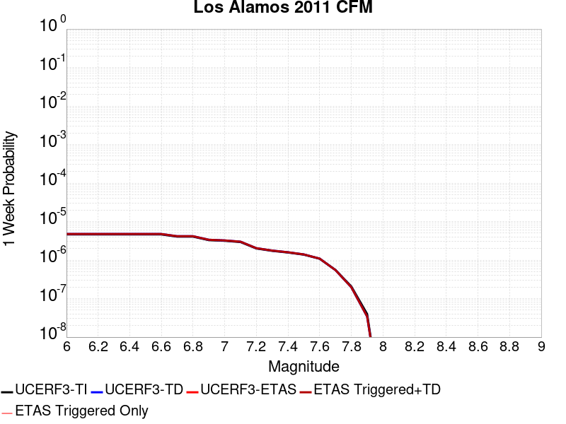 | 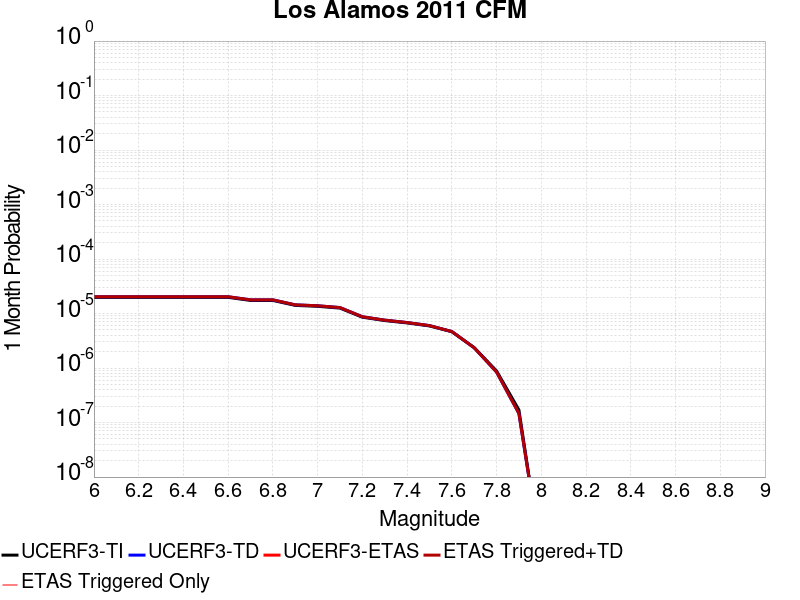 | 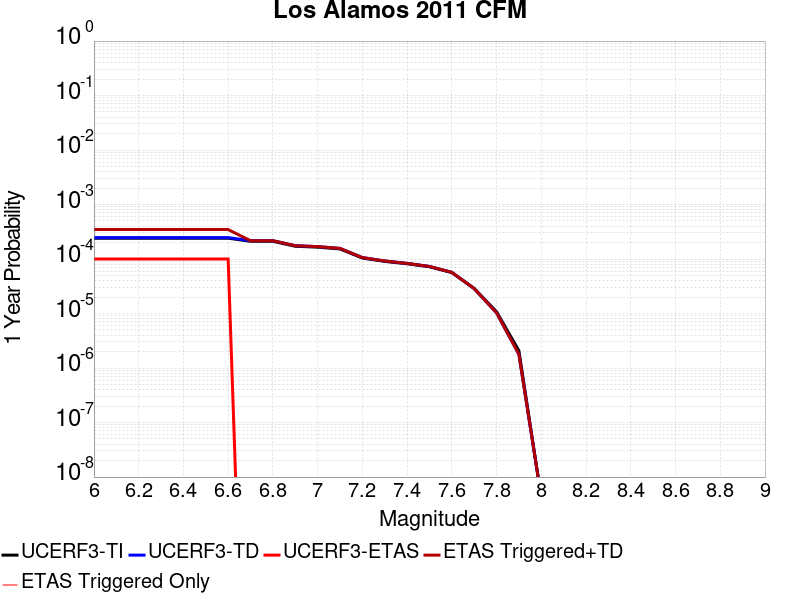 | 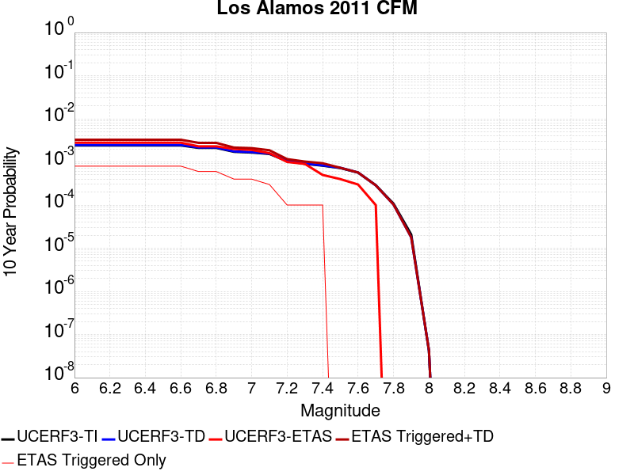 |

| Magnitude | 1 wk TI Prob | 1 wk TD Prob | 1 wk ETAS Prob | 1 wk ETAS/TD Gain | 1 wk ETAS Triggered+TD | 1 wk ETAS Triggered Only | 1 mo TI Prob | 1 mo TD Prob | 1 mo ETAS Prob | 1 mo ETAS/TD Gain | 1 mo ETAS Triggered+TD | 1 mo ETAS Triggered Only | 1 yr TI Prob | 1 yr TD Prob | 1 yr ETAS Prob | 1 yr ETAS/TD Gain | 1 yr ETAS Triggered+TD | 1 yr ETAS Triggered Only | 10 yr TI Prob | 10 yr TD Prob | 10 yr ETAS Prob | 10 yr ETAS/TD Gain | 10 yr ETAS Triggered+TD | 10 yr ETAS Triggered Only |
|-----|-----|-----|-----|-----|-----|-----|-----|-----|-----|-----|-----|-----|-----|-----|-----|-----|-----|-----|-----|-----|-----|-----|-----|-----|
| 6.0 | 4.6284417E-6 | 4.749985E-6 | 0.0 | 0.0 | 4.749985E-6 | 0.0 | 1.9836029E-5 | 2.0356929E-5 | 0.0 | 0.0 | 2.0356929E-5 | 0.0 | 2.4147688E-4 | 2.4781917E-4 | 1.0E-4 | 0.40352002 | 3.477944E-4 | 1.0E-4 | 0.0024121467 | 0.0024756023 | 0.0028 | 1.1310378 | 0.003273622 | 8.0E-4 |
| 6.1 | 4.6284417E-6 | 4.749985E-6 | 0.0 | 0.0 | 4.749985E-6 | 0.0 | 1.9836029E-5 | 2.0356929E-5 | 0.0 | 0.0 | 2.0356929E-5 | 0.0 | 2.4147688E-4 | 2.4781917E-4 | 1.0E-4 | 0.40352002 | 3.477944E-4 | 1.0E-4 | 0.0024121467 | 0.0024756023 | 0.0028 | 1.1310378 | 0.003273622 | 8.0E-4 |
| 6.2 | 4.6284417E-6 | 4.749985E-6 | 0.0 | 0.0 | 4.749985E-6 | 0.0 | 1.9836029E-5 | 2.0356929E-5 | 0.0 | 0.0 | 2.0356929E-5 | 0.0 | 2.4147688E-4 | 2.4781917E-4 | 1.0E-4 | 0.40352002 | 3.477944E-4 | 1.0E-4 | 0.0024121467 | 0.0024756023 | 0.0028 | 1.1310378 | 0.003273622 | 8.0E-4 |
| 6.3 | 4.6284417E-6 | 4.749985E-6 | 0.0 | 0.0 | 4.749985E-6 | 0.0 | 1.9836029E-5 | 2.0356929E-5 | 0.0 | 0.0 | 2.0356929E-5 | 0.0 | 2.4147688E-4 | 2.4781917E-4 | 1.0E-4 | 0.40352002 | 3.477944E-4 | 1.0E-4 | 0.0024121467 | 0.0024756023 | 0.0028 | 1.1310378 | 0.003273622 | 8.0E-4 |
| 6.4 | 4.6284417E-6 | 4.749985E-6 | 0.0 | 0.0 | 4.749985E-6 | 0.0 | 1.9836029E-5 | 2.0356929E-5 | 0.0 | 0.0 | 2.0356929E-5 | 0.0 | 2.4147688E-4 | 2.4781917E-4 | 1.0E-4 | 0.40352002 | 3.477944E-4 | 1.0E-4 | 0.0024121467 | 0.0024756023 | 0.0028 | 1.1310378 | 0.003273622 | 8.0E-4 |
| 6.5 | 4.6284417E-6 | 4.749985E-6 | 0.0 | 0.0 | 4.749985E-6 | 0.0 | 1.9836029E-5 | 2.0356929E-5 | 0.0 | 0.0 | 2.0356929E-5 | 0.0 | 2.4147688E-4 | 2.4781917E-4 | 1.0E-4 | 0.40352002 | 3.477944E-4 | 1.0E-4 | 0.0024121467 | 0.0024756023 | 0.0028 | 1.1310378 | 0.003273622 | 8.0E-4 |
| 6.6 | 4.6284417E-6 | 4.749985E-6 | 0.0 | 0.0 | 4.749985E-6 | 0.0 | 1.9836029E-5 | 2.0356929E-5 | 0.0 | 0.0 | 2.0356929E-5 | 0.0 | 2.4147688E-4 | 2.4781917E-4 | 1.0E-4 | 0.40352002 | 3.477944E-4 | 1.0E-4 | 0.0024121467 | 0.0024756023 | 0.0028 | 1.1310378 | 0.003273622 | 8.0E-4 |
| 6.7 | 4.062321E-6 | 4.1648104E-6 | 0.0 | 0.0 | 4.1648104E-6 | 0.0 | 1.7409831E-5 | 1.7849074E-5 | 0.0 | 0.0 | 1.7849074E-5 | 0.0 | 2.1194408E-4 | 2.1729231E-4 | 0.0 | 0.0 | 2.1729231E-4 | 0.0 | 0.0021174205 | 0.002170948 | 0.0023 | 1.0594449 | 0.0027696455 | 6.0E-4 |
| 6.8 | 4.062321E-6 | 4.1648104E-6 | 0.0 | 0.0 | 4.1648104E-6 | 0.0 | 1.7409831E-5 | 1.7849074E-5 | 0.0 | 0.0 | 1.7849074E-5 | 0.0 | 2.1194408E-4 | 2.1729231E-4 | 0.0 | 0.0 | 2.1729231E-4 | 0.0 | 0.0021174205 | 0.002170948 | 0.0023 | 1.0594449 | 0.0027696455 | 6.0E-4 |
| 6.9 | 3.2936077E-6 | 3.3716854E-6 | 0.0 | 0.0 | 3.3716854E-6 | 0.0 | 1.4115385E-5 | 1.4450005E-5 | 0.0 | 0.0 | 1.4450005E-5 | 0.0 | 1.7184127E-4 | 1.7591556E-4 | 0.0 | 0.0 | 1.7591556E-4 | 0.0 | 0.0017170844 | 0.0017578555 | 0.002 | 1.1377499 | 0.0021571524 | 4.0E-4 |
| 7.0 | 3.1687898E-6 | 3.2435787E-6 | 0.0 | 0.0 | 3.2435787E-6 | 0.0 | 1.3580457E-5 | 1.3900983E-5 | 0.0 | 0.0 | 1.3900983E-5 | 0.0 | 1.6532952E-4 | 1.6923224E-4 | 0.0 | 0.0 | 1.6923224E-4 | 0.0 | 0.0016520657 | 0.0016911252 | 0.0019 | 1.1235123 | 0.0020904487 | 4.0E-4 |
| 7.1 | 2.9379228E-6 | 3.0061601E-6 | 0.0 | 0.0 | 3.0061601E-6 | 0.0 | 1.25910365E-5 | 1.28834845E-5 | 0.0 | 0.0 | 1.28834845E-5 | 0.0 | 1.5328509E-4 | 1.5684604E-4 | 0.0 | 0.0 | 1.5684604E-4 | 0.0 | 0.001531794 | 0.0015674426 | 0.0016 | 1.0207711 | 0.0018669723 | 3.0E-4 |
| 7.2 | 2.0020686E-6 | 2.0407856E-6 | 0.0 | 0.0 | 2.0407856E-6 | 0.0 | 8.580266E-6 | 8.746195E-6 | 0.0 | 0.0 | 8.746195E-6 | 0.0 | 1.0445973E-4 | 1.0647976E-4 | 0.0 | 0.0 | 1.0647976E-4 | 0.0 | 0.0010441064 | 0.0010642919 | 0.001 | 0.9395919 | 0.0011641855 | 1.0E-4 |
| 7.3 | 1.7364243E-6 | 1.7671232E-6 | 0.0 | 0.0 | 1.7671232E-6 | 0.0 | 7.441797E-6 | 7.5733633E-6 | 0.0 | 0.0 | 7.5733633E-6 | 0.0 | 9.0600115E-5 | 9.220183E-5 | 0.0 | 0.0 | 9.220183E-5 | 0.0 | 9.0563187E-4 | 9.216389E-4 | 9.0E-4 | 0.97652125 | 0.0010215468 | 1.0E-4 |
| 7.4 | 1.5718434E-6 | 1.5976143E-6 | 0.0 | 0.0 | 1.5976143E-6 | 0.0 | 6.7364545E-6 | 6.8469003E-6 | 0.0 | 0.0 | 6.8469003E-6 | 0.0 | 8.201325E-5 | 8.335785E-5 | 0.0 | 0.0 | 8.335785E-5 | 0.0 | 8.198299E-4 | 8.3326886E-4 | 5.0E-4 | 0.6000464 | 9.331855E-4 | 1.0E-4 |
| 7.5 | 1.3841119E-6 | 1.403644E-6 | 0.0 | 0.0 | 1.403644E-6 | 0.0 | 5.9318945E-6 | 6.0156035E-6 | 0.0 | 0.0 | 6.0156035E-6 | 0.0 | 7.221842E-5 | 7.323754E-5 | 0.0 | 0.0 | 7.323754E-5 | 0.0 | 7.2194956E-4 | 7.321369E-4 | 4.0E-4 | 0.5463459 | 7.321369E-4 | 0.0 |
| 7.6 | 1.0843726E-6 | 1.0929272E-6 | 0.0 | 0.0 | 1.0929272E-6 | 0.0 | 4.647303E-6 | 4.6839655E-6 | 0.0 | 0.0 | 4.6839655E-6 | 0.0 | 5.6579443E-5 | 5.7025813E-5 | 0.0 | 0.0 | 5.7025813E-5 | 0.0 | 5.656504E-4 | 5.7011435E-4 | 3.0E-4 | 0.5262102 | 5.7011435E-4 | 0.0 |
| 7.7 | 5.544814E-7 | 5.499013E-7 | 0.0 | 0.0 | 5.499013E-7 | 0.0 | 2.3763469E-6 | 2.3567177E-6 | 0.0 | 0.0 | 2.3567177E-6 | 0.0 | 2.8931638E-5 | 2.869266E-5 | 0.0 | 0.0 | 2.869266E-5 | 0.0 | 2.8927872E-4 | 2.8688973E-4 | 1.0E-4 | 0.348566 | 2.8688973E-4 | 0.0 |
| 7.8 | 2.0707465E-7 | 1.9767054E-7 | 0.0 | 0.0 | 1.9767054E-7 | 0.0 | 8.874625E-7 | 8.471592E-7 | 0.0 | 0.0 | 8.471592E-7 | 0.0 | 1.08048025E-5 | 1.0314115E-5 | 0.0 | 0.0 | 1.0314115E-5 | 0.0 | 1.0804277E-4 | 1.031364E-4 | 0.0 | 0.0 | 1.031364E-4 | 0.0 |
| 7.9 | 3.9821284E-8 | 3.430984E-8 | 0.0 | 0.0 | 3.430984E-8 | 0.0 | 1.7066264E-7 | 1.4704216E-7 | 0.0 | 0.0 | 1.4704216E-7 | 0.0 | 2.0778157E-6 | 1.7902368E-6 | 0.0 | 0.0 | 1.7902368E-6 | 0.0 | 2.0777963E-5 | 1.790223E-5 | 0.0 | 0.0 | 1.790223E-5 | 0.0 |
| 8.0 | 7.880441E-11 | 8.231449E-11 | 0.0 | 0.0 | 8.231449E-11 | 0.0 | 3.3773329E-10 | 3.5277614E-10 | 0.0 | 0.0 | 3.5277614E-10 | 0.0 | 4.1119033E-9 | 4.29505E-9 | 0.0 | 0.0 | 4.29505E-9 | 0.0 | 4.1119034E-8 | 4.29505E-8 | 0.0 | 0.0 | 4.29505E-8 | 0.0 |

## Contra Costa (Lafayette) 2011 CFM
*[(top)](#table-of-contents)*

| 1 Week | 1 Month | 1 Year | 10 Year |
|-----|-----|-----|-----|
| 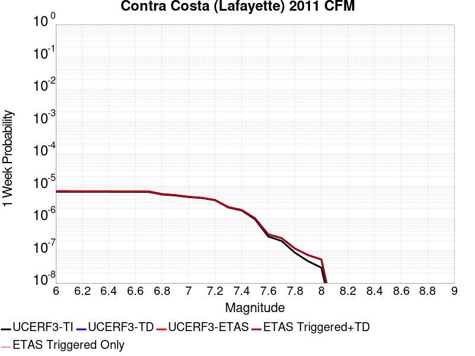 | 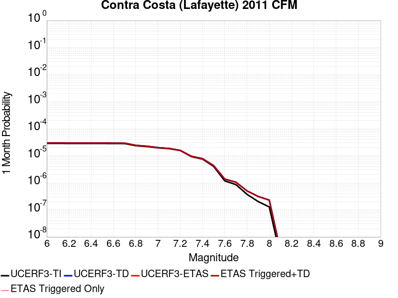 | 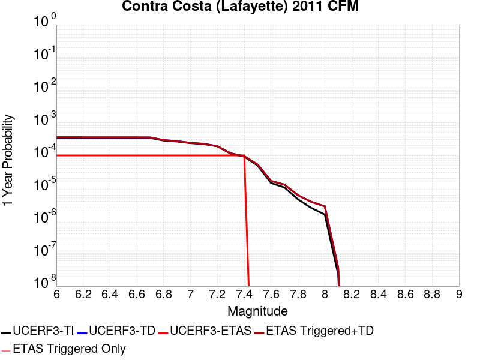 | 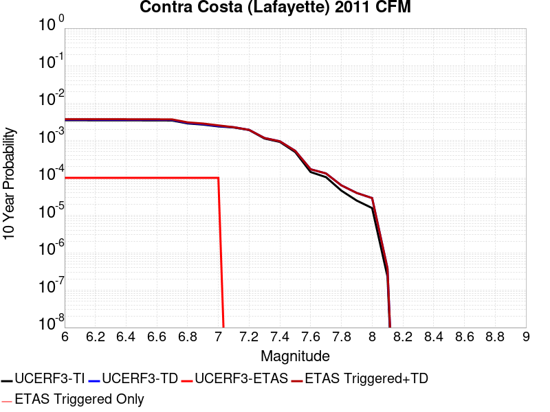 |

| Magnitude | 1 wk TI Prob | 1 wk TD Prob | 1 wk ETAS Prob | 1 wk ETAS/TD Gain | 1 wk ETAS Triggered+TD | 1 wk ETAS Triggered Only | 1 mo TI Prob | 1 mo TD Prob | 1 mo ETAS Prob | 1 mo ETAS/TD Gain | 1 mo ETAS Triggered+TD | 1 mo ETAS Triggered Only | 1 yr TI Prob | 1 yr TD Prob | 1 yr ETAS Prob | 1 yr ETAS/TD Gain | 1 yr ETAS Triggered+TD | 1 yr ETAS Triggered Only | 10 yr TI Prob | 10 yr TD Prob | 10 yr ETAS Prob | 10 yr ETAS/TD Gain | 10 yr ETAS Triggered+TD | 10 yr ETAS Triggered Only |
|-----|-----|-----|-----|-----|-----|-----|-----|-----|-----|-----|-----|-----|-----|-----|-----|-----|-----|-----|-----|-----|-----|-----|-----|-----|
| 6.0 | 6.655419E-6 | 6.9106536E-6 | 0.0 | 0.0 | 6.9106536E-6 | 0.0 | 2.8522913E-5 | 2.9616762E-5 | 0.0 | 0.0 | 2.9616762E-5 | 0.0 | 3.472111E-4 | 3.6052638E-4 | 1.0E-4 | 0.2773722 | 3.6052638E-4 | 0.0 | 0.0034666911 | 0.0036042552 | 0.0028 | 0.7768595 | 0.0043017324 | 7.0E-4 |
| 6.1 | 6.655419E-6 | 6.9106536E-6 | 0.0 | 0.0 | 6.9106536E-6 | 0.0 | 2.8522913E-5 | 2.9616762E-5 | 0.0 | 0.0 | 2.9616762E-5 | 0.0 | 3.472111E-4 | 3.6052638E-4 | 1.0E-4 | 0.2773722 | 3.6052638E-4 | 0.0 | 0.0034666911 | 0.0036042552 | 0.0028 | 0.7768595 | 0.0043017324 | 7.0E-4 |
| 6.2 | 6.6254133E-6 | 6.87908E-6 | 0.0 | 0.0 | 6.87908E-6 | 0.0 | 2.839432E-5 | 2.9481449E-5 | 0.0 | 0.0 | 2.9481449E-5 | 0.0 | 3.45646E-4 | 3.588795E-4 | 1.0E-4 | 0.27864507 | 3.588795E-4 | 0.0 | 0.003451089 | 0.0035878397 | 0.0028 | 0.7804139 | 0.004285328 | 7.0E-4 |
| 6.3 | 6.6254133E-6 | 6.87908E-6 | 0.0 | 0.0 | 6.87908E-6 | 0.0 | 2.839432E-5 | 2.9481449E-5 | 0.0 | 0.0 | 2.9481449E-5 | 0.0 | 3.45646E-4 | 3.588795E-4 | 1.0E-4 | 0.27864507 | 3.588795E-4 | 0.0 | 0.003451089 | 0.0035878397 | 0.0028 | 0.7804139 | 0.004285328 | 7.0E-4 |
| 6.4 | 6.6254133E-6 | 6.87908E-6 | 0.0 | 0.0 | 6.87908E-6 | 0.0 | 2.839432E-5 | 2.9481449E-5 | 0.0 | 0.0 | 2.9481449E-5 | 0.0 | 3.45646E-4 | 3.588795E-4 | 1.0E-4 | 0.27864507 | 3.588795E-4 | 0.0 | 0.003451089 | 0.0035878397 | 0.0028 | 0.7804139 | 0.004285328 | 7.0E-4 |
| 6.5 | 6.606445E-6 | 6.858645E-6 | 0.0 | 0.0 | 6.858645E-6 | 0.0 | 2.8313027E-5 | 2.9393874E-5 | 0.0 | 0.0 | 2.9393874E-5 | 0.0 | 3.4465658E-4 | 3.578136E-4 | 1.0E-4 | 0.27947512 | 3.578136E-4 | 0.0 | 0.0034412253 | 0.0035772151 | 0.0028 | 0.7827318 | 0.004274711 | 7.0E-4 |
| 6.6 | 6.59966E-6 | 6.851191E-6 | 0.0 | 0.0 | 6.851191E-6 | 0.0 | 2.828395E-5 | 2.9361927E-5 | 0.0 | 0.0 | 2.9361927E-5 | 0.0 | 3.4430268E-4 | 3.574248E-4 | 1.0E-4 | 0.27977914 | 3.574248E-4 | 0.0 | 0.0034376972 | 0.0035733394 | 0.0028 | 0.7835807 | 0.004270838 | 7.0E-4 |
| 6.7 | 6.5570975E-6 | 6.8052213E-6 | 0.0 | 0.0 | 6.8052213E-6 | 0.0 | 2.8101544E-5 | 2.9164918E-5 | 0.0 | 0.0 | 2.9164918E-5 | 0.0 | 3.4208258E-4 | 3.55027E-4 | 1.0E-4 | 0.28166872 | 3.55027E-4 | 0.0 | 0.0034155648 | 0.0035494382 | 0.0028 | 0.7888572 | 0.004246954 | 7.0E-4 |
| 6.8 | 5.472255E-6 | 5.6490244E-6 | 0.0 | 0.0 | 5.6490244E-6 | 0.0 | 2.345231E-5 | 2.4209881E-5 | 0.0 | 0.0 | 2.4209881E-5 | 0.0 | 2.8549446E-4 | 2.947159E-4 | 1.0E-4 | 0.3393098 | 2.947159E-4 | 0.0 | 0.0028512797 | 0.002947943 | 0.0022 | 0.74628305 | 0.0035461744 | 6.0E-4 |
| 6.9 | 5.092346E-6 | 5.2397213E-6 | 0.0 | 0.0 | 5.2397213E-6 | 0.0 | 2.1824157E-5 | 2.2455757E-5 | 0.0 | 0.0 | 2.2455757E-5 | 0.0 | 2.656767E-4 | 2.7336492E-4 | 1.0E-4 | 0.3658114 | 2.7336492E-4 | 0.0 | 0.002653593 | 0.0027349715 | 0.0021 | 0.7678325 | 0.003233604 | 5.0E-4 |
| 7.0 | 4.5525762E-6 | 4.653592E-6 | 0.0 | 0.0 | 4.653592E-6 | 0.0 | 1.9510895E-5 | 1.9943816E-5 | 0.0 | 0.0 | 1.9943816E-5 | 0.0 | 2.3751926E-4 | 2.4278919E-4 | 1.0E-4 | 0.41187996 | 2.4278919E-4 | 0.0 | 0.0023726553 | 0.0024299133 | 0.0018 | 0.7407672 | 0.0027291842 | 3.0E-4 |
| 7.1 | 4.261504E-6 | 4.3331497E-6 | 0.0 | 0.0 | 4.3331497E-6 | 0.0 | 1.826346E-5 | 1.857051E-5 | 0.0 | 0.0 | 1.857051E-5 | 0.0 | 2.2233493E-4 | 2.2607278E-4 | 1.0E-4 | 0.44233543 | 2.2607278E-4 | 0.0 | 0.002221126 | 0.0022630903 | 0.0016 | 0.7069979 | 0.0024626376 | 2.0E-4 |
| 7.2 | 3.654114E-6 | 3.6753515E-6 | 0.0 | 0.0 | 3.6753515E-6 | 0.0 | 1.5660395E-5 | 1.5751411E-5 | 0.0 | 0.0 | 1.5751411E-5 | 0.0 | 1.9064861E-4 | 1.9175682E-4 | 1.0E-4 | 0.52149385 | 1.9175682E-4 | 0.0 | 0.0019048514 | 0.0019205328 | 0.0015 | 0.7810333 | 0.0021201486 | 2.0E-4 |
| 7.3 | 2.1595129E-6 | 2.2265133E-6 | 0.0 | 0.0 | 2.2265133E-6 | 0.0 | 9.255023E-6 | 9.542166E-6 | 0.0 | 0.0 | 9.542166E-6 | 0.0 | 1.1267407E-4 | 1.16169715E-4 | 1.0E-4 | 0.86080956 | 1.16169715E-4 | 0.0 | 0.0011261696 | 0.001165726 | 0.001 | 0.8578345 | 0.0013654928 | 2.0E-4 |
| 7.4 | 1.7532738E-6 | 1.8171515E-6 | 0.0 | 0.0 | 1.8171515E-6 | 0.0 | 7.5140088E-6 | 7.787769E-6 | 0.0 | 0.0 | 7.787769E-6 | 0.0 | 9.147922E-5 | 9.481201E-5 | 1.0E-4 | 1.0547187 | 9.481201E-5 | 0.0 | 9.144157E-4 | 9.522135E-4 | 7.0E-4 | 0.73512924 | 0.0011520231 | 2.0E-4 |
| 7.5 | 9.387875E-7 | 1.0059492E-6 | 0.0 | 0.0 | 1.0059492E-6 | 0.0 | 4.0233685E-6 | 4.311204E-6 | 0.0 | 0.0 | 4.311204E-6 | 0.0 | 4.8983413E-5 | 5.2487656E-5 | 0.0 | 0.0 | 5.2487656E-5 | 0.0 | 4.897262E-4 | 5.288588E-4 | 3.0E-4 | 0.56725913 | 6.288059E-4 | 1.0E-4 |
| 7.6 | 2.7471893E-7 | 3.1997453E-7 | 0.0 | 0.0 | 3.1997453E-7 | 0.0 | 1.1773664E-6 | 1.3713186E-6 | 0.0 | 0.0 | 1.3713186E-6 | 0.0 | 1.433434E-5 | 1.6695678E-5 | 0.0 | 0.0 | 1.6695678E-5 | 0.0 | 1.4333417E-4 | 1.7081726E-4 | 2.0E-4 | 1.1708418 | 2.7080017E-4 | 1.0E-4 |
| 7.7 | 2.0057985E-7 | 2.461719E-7 | 0.0 | 0.0 | 2.461719E-7 | 0.0 | 8.596276E-7 | 1.055022E-6 | 0.0 | 0.0 | 1.055022E-6 | 0.0 | 1.0465916E-5 | 1.2844819E-5 | 0.0 | 0.0 | 1.2844819E-5 | 0.0 | 1.0465423E-4 | 1.322691E-4 | 0.0 | 0.0 | 1.322691E-4 | 0.0 |
| 7.8 | 8.7403905E-8 | 1.17281886E-7 | 0.0 | 0.0 | 1.17281886E-7 | 0.0 | 3.745881E-7 | 5.026365E-7 | 0.0 | 0.0 | 5.026365E-7 | 0.0 | 4.5606007E-6 | 6.119583E-6 | 0.0 | 0.0 | 6.119583E-6 | 0.0 | 4.560507E-5 | 6.348438E-5 | 0.0 | 0.0 | 6.348438E-5 | 0.0 |
| 7.9 | 4.740233E-8 | 7.311082E-8 | 0.0 | 0.0 | 7.311082E-8 | 0.0 | 2.0315284E-7 | 3.13332E-7 | 0.0 | 0.0 | 3.13332E-7 | 0.0 | 2.473383E-6 | 3.814811E-6 | 0.0 | 0.0 | 3.814811E-6 | 0.0 | 2.4733554E-5 | 3.9712442E-5 | 0.0 | 0.0 | 3.9712442E-5 | 0.0 |
| 8.0 | 2.99164E-8 | 5.354002E-8 | 0.0 | 0.0 | 5.354002E-8 | 0.0 | 1.2821314E-7 | 2.2945721E-7 | 0.0 | 0.0 | 2.2945721E-7 | 0.0 | 1.5609938E-6 | 2.793638E-6 | 0.0 | 0.0 | 2.793638E-6 | 0.0 | 1.5609829E-5 | 2.899184E-5 | 0.0 | 0.0 | 2.899184E-5 | 0.0 |
| 8.1 | 4.431212E-10 | 7.1242323E-10 | 0.0 | 0.0 | 7.1242323E-10 | 0.0 | 1.899091E-9 | 3.053242E-9 | 0.0 | 0.0 | 3.053242E-9 | 0.0 | 2.3121432E-8 | 3.7173223E-8 | 0.0 | 0.0 | 3.7173223E-8 | 0.0 | 2.312143E-7 | 3.8063214E-7 | 0.0 | 0.0 | 3.8063214E-7 | 0.0 |

## Dry Mountain
*[(top)](#table-of-contents)*

| 1 Week | 1 Month | 1 Year | 10 Year |
|-----|-----|-----|-----|
| 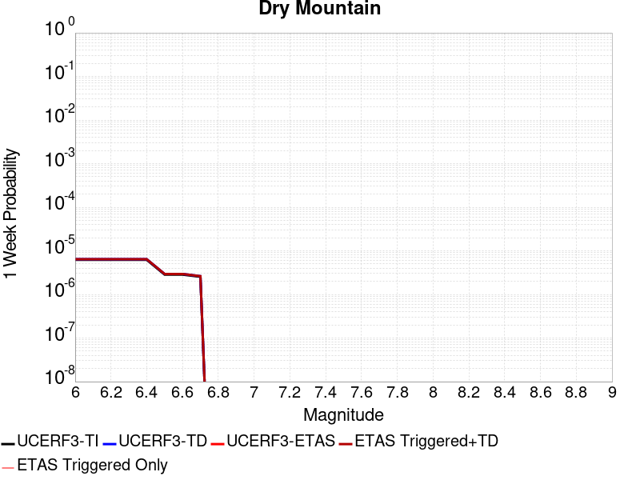 | 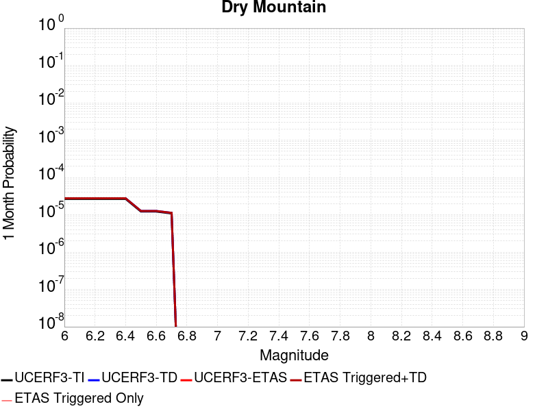 | 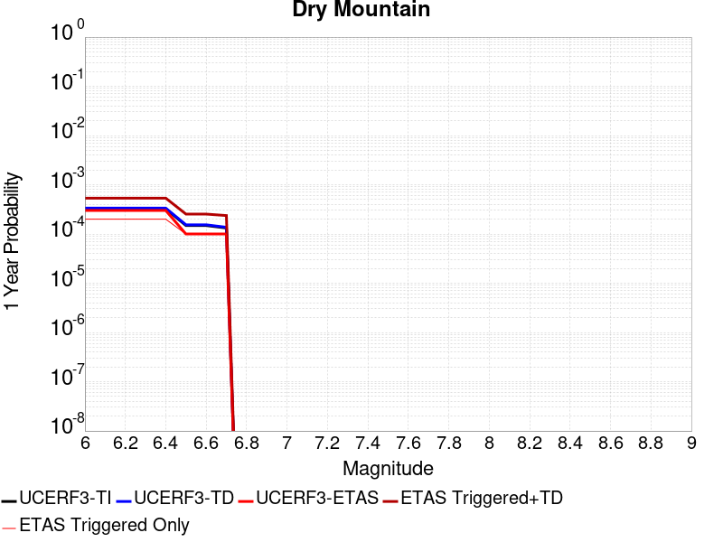 | 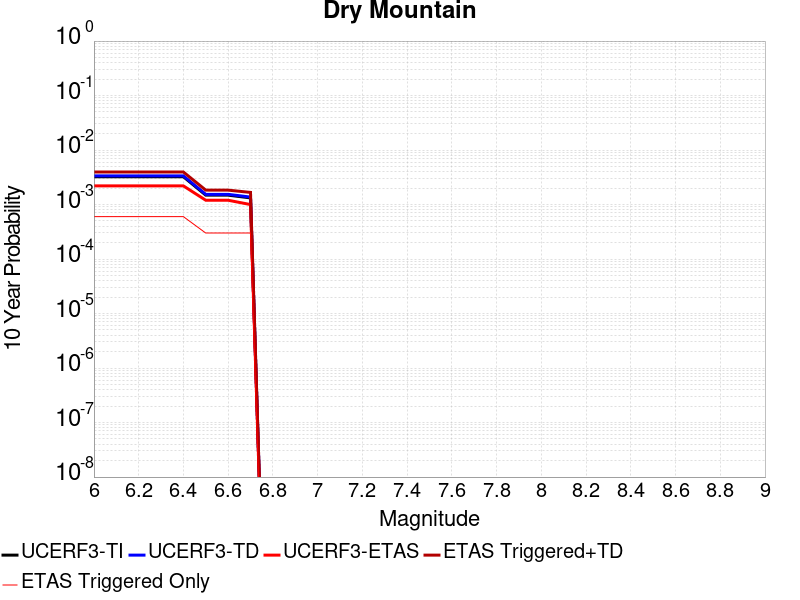 |

| Magnitude | 1 wk TI Prob | 1 wk TD Prob | 1 wk ETAS Prob | 1 wk ETAS/TD Gain | 1 wk ETAS Triggered+TD | 1 wk ETAS Triggered Only | 1 mo TI Prob | 1 mo TD Prob | 1 mo ETAS Prob | 1 mo ETAS/TD Gain | 1 mo ETAS Triggered+TD | 1 mo ETAS Triggered Only | 1 yr TI Prob | 1 yr TD Prob | 1 yr ETAS Prob | 1 yr ETAS/TD Gain | 1 yr ETAS Triggered+TD | 1 yr ETAS Triggered Only | 10 yr TI Prob | 10 yr TD Prob | 10 yr ETAS Prob | 10 yr ETAS/TD Gain | 10 yr ETAS Triggered+TD | 10 yr ETAS Triggered Only |
|-----|-----|-----|-----|-----|-----|-----|-----|-----|-----|-----|-----|-----|-----|-----|-----|-----|-----|-----|-----|-----|-----|-----|-----|-----|
| 6.0 | 6.222801E-6 | 6.437042E-6 | 0.0 | 0.0 | 6.437042E-6 | 0.0 | 2.6668875E-5 | 2.758712E-5 | 0.0 | 0.0 | 2.758712E-5 | 0.0 | 3.2464517E-4 | 3.3583734E-4 | 3.0E-4 | 0.8932896 | 5.3577014E-4 | 2.0E-4 | 0.0032417132 | 0.003354859 | 0.0022 | 0.65576524 | 0.003952846 | 6.0E-4 |
| 6.1 | 6.222801E-6 | 6.437042E-6 | 0.0 | 0.0 | 6.437042E-6 | 0.0 | 2.6668875E-5 | 2.758712E-5 | 0.0 | 0.0 | 2.758712E-5 | 0.0 | 3.2464517E-4 | 3.3583734E-4 | 3.0E-4 | 0.8932896 | 5.3577014E-4 | 2.0E-4 | 0.0032417132 | 0.003354859 | 0.0022 | 0.65576524 | 0.003952846 | 6.0E-4 |
| 6.2 | 6.222801E-6 | 6.437042E-6 | 0.0 | 0.0 | 6.437042E-6 | 0.0 | 2.6668875E-5 | 2.758712E-5 | 0.0 | 0.0 | 2.758712E-5 | 0.0 | 3.2464517E-4 | 3.3583734E-4 | 3.0E-4 | 0.8932896 | 5.3577014E-4 | 2.0E-4 | 0.0032417132 | 0.003354859 | 0.0022 | 0.65576524 | 0.003952846 | 6.0E-4 |
| 6.3 | 6.222801E-6 | 6.437042E-6 | 0.0 | 0.0 | 6.437042E-6 | 0.0 | 2.6668875E-5 | 2.758712E-5 | 0.0 | 0.0 | 2.758712E-5 | 0.0 | 3.2464517E-4 | 3.3583734E-4 | 3.0E-4 | 0.8932896 | 5.3577014E-4 | 2.0E-4 | 0.0032417132 | 0.003354859 | 0.0022 | 0.65576524 | 0.003952846 | 6.0E-4 |
| 6.4 | 6.222801E-6 | 6.437042E-6 | 0.0 | 0.0 | 6.437042E-6 | 0.0 | 2.6668875E-5 | 2.758712E-5 | 0.0 | 0.0 | 2.758712E-5 | 0.0 | 3.2464517E-4 | 3.3583734E-4 | 3.0E-4 | 0.8932896 | 5.3577014E-4 | 2.0E-4 | 0.0032417132 | 0.003354859 | 0.0022 | 0.65576524 | 0.003952846 | 6.0E-4 |
| 6.5 | 2.8528623E-6 | 2.951096E-6 | 0.0 | 0.0 | 2.951096E-6 | 0.0 | 1.22264955E-5 | 1.2647541E-5 | 0.0 | 0.0 | 1.2647541E-5 | 0.0 | 1.4884741E-4 | 1.5398163E-4 | 1.0E-4 | 0.6494281 | 2.5396622E-4 | 1.0E-4 | 0.0014874774 | 0.0015396021 | 0.0012 | 0.77942216 | 0.0018391402 | 3.0E-4 |
| 6.6 | 2.8528623E-6 | 2.951096E-6 | 0.0 | 0.0 | 2.951096E-6 | 0.0 | 1.22264955E-5 | 1.2647541E-5 | 0.0 | 0.0 | 1.2647541E-5 | 0.0 | 1.4884741E-4 | 1.5398163E-4 | 1.0E-4 | 0.6494281 | 2.5396622E-4 | 1.0E-4 | 0.0014874774 | 0.0015396021 | 0.0012 | 0.77942216 | 0.0018391402 | 3.0E-4 |
| 6.7 | 2.541E-6 | 2.6284035E-6 | 0.0 | 0.0 | 2.6284035E-6 | 0.0 | 1.0889954E-5 | 1.1264587E-5 | 0.0 | 0.0 | 1.1264587E-5 | 0.0 | 1.3257713E-4 | 1.3714634E-4 | 1.0E-4 | 0.72914815 | 2.3713263E-4 | 1.0E-4 | 0.0013249806 | 0.0013714634 | 0.001 | 0.72914815 | 0.001671052 | 3.0E-4 |

## Fontana (Seismicity)
*[(top)](#table-of-contents)*

| 1 Week | 1 Month | 1 Year | 10 Year |
|-----|-----|-----|-----|
| 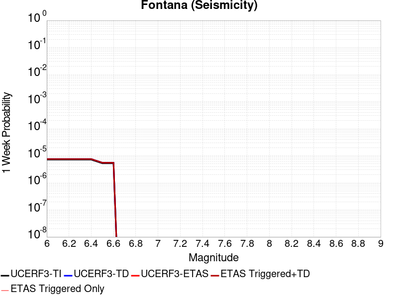 | 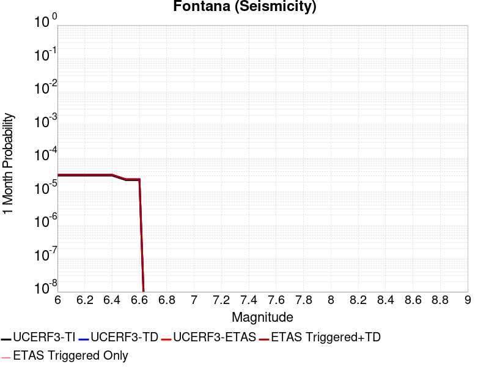 | 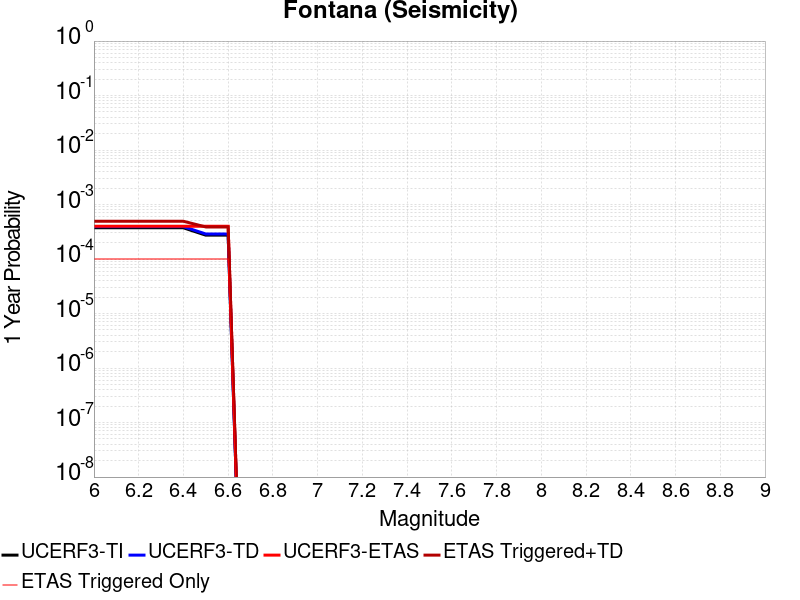 | 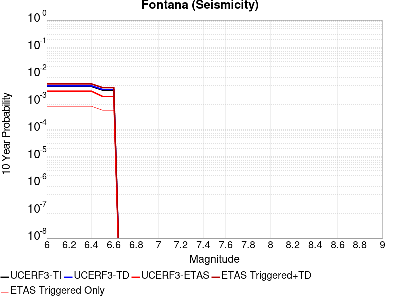 |

| Magnitude | 1 wk TI Prob | 1 wk TD Prob | 1 wk ETAS Prob | 1 wk ETAS/TD Gain | 1 wk ETAS Triggered+TD | 1 wk ETAS Triggered Only | 1 mo TI Prob | 1 mo TD Prob | 1 mo ETAS Prob | 1 mo ETAS/TD Gain | 1 mo ETAS Triggered+TD | 1 mo ETAS Triggered Only | 1 yr TI Prob | 1 yr TD Prob | 1 yr ETAS Prob | 1 yr ETAS/TD Gain | 1 yr ETAS Triggered+TD | 1 yr ETAS Triggered Only | 10 yr TI Prob | 10 yr TD Prob | 10 yr ETAS Prob | 10 yr ETAS/TD Gain | 10 yr ETAS Triggered+TD | 10 yr ETAS Triggered Only |
|-----|-----|-----|-----|-----|-----|-----|-----|-----|-----|-----|-----|-----|-----|-----|-----|-----|-----|-----|-----|-----|-----|-----|-----|-----|
| 6.0 | 7.1789214E-6 | 7.547905E-6 | 0.0 | 0.0 | 7.547905E-6 | 0.0 | 3.076644E-5 | 3.2347994E-5 | 0.0 | 0.0 | 3.2347994E-5 | 0.0 | 3.7451705E-4 | 3.9380637E-4 | 4.0E-4 | 1.0157275 | 4.9376703E-4 | 1.0E-4 | 0.003738865 | 0.0039350805 | 0.0025 | 0.635311 | 0.004632326 | 7.0E-4 |
| 6.1 | 7.1789214E-6 | 7.547905E-6 | 0.0 | 0.0 | 7.547905E-6 | 0.0 | 3.076644E-5 | 3.2347994E-5 | 0.0 | 0.0 | 3.2347994E-5 | 0.0 | 3.7451705E-4 | 3.9380637E-4 | 4.0E-4 | 1.0157275 | 4.9376703E-4 | 1.0E-4 | 0.003738865 | 0.0039350805 | 0.0025 | 0.635311 | 0.004632326 | 7.0E-4 |
| 6.2 | 7.1789214E-6 | 7.547905E-6 | 0.0 | 0.0 | 7.547905E-6 | 0.0 | 3.076644E-5 | 3.2347994E-5 | 0.0 | 0.0 | 3.2347994E-5 | 0.0 | 3.7451705E-4 | 3.9380637E-4 | 4.0E-4 | 1.0157275 | 4.9376703E-4 | 1.0E-4 | 0.003738865 | 0.0039350805 | 0.0025 | 0.635311 | 0.004632326 | 7.0E-4 |
| 6.3 | 7.1789214E-6 | 7.547905E-6 | 0.0 | 0.0 | 7.547905E-6 | 0.0 | 3.076644E-5 | 3.2347994E-5 | 0.0 | 0.0 | 3.2347994E-5 | 0.0 | 3.7451705E-4 | 3.9380637E-4 | 4.0E-4 | 1.0157275 | 4.9376703E-4 | 1.0E-4 | 0.003738865 | 0.0039350805 | 0.0025 | 0.635311 | 0.004632326 | 7.0E-4 |
| 6.4 | 7.1789214E-6 | 7.547905E-6 | 0.0 | 0.0 | 7.547905E-6 | 0.0 | 3.076644E-5 | 3.2347994E-5 | 0.0 | 0.0 | 3.2347994E-5 | 0.0 | 3.7451705E-4 | 3.9380637E-4 | 4.0E-4 | 1.0157275 | 4.9376703E-4 | 1.0E-4 | 0.003738865 | 0.0039350805 | 0.0025 | 0.635311 | 0.004632326 | 7.0E-4 |
| 6.5 | 5.2611317E-6 | 5.529745E-6 | 0.0 | 0.0 | 5.529745E-6 | 0.0 | 2.2547512E-5 | 2.3698909E-5 | 0.0 | 0.0 | 2.3698909E-5 | 0.0 | 2.744814E-4 | 2.885342E-4 | 4.0E-4 | 1.3863175 | 3.8850534E-4 | 1.0E-4 | 0.002741426 | 0.002885342 | 0.0016 | 0.554527 | 0.0033838993 | 5.0E-4 |
| 6.6 | 5.2611317E-6 | 5.529745E-6 | 0.0 | 0.0 | 5.529745E-6 | 0.0 | 2.2547512E-5 | 2.3698909E-5 | 0.0 | 0.0 | 2.3698909E-5 | 0.0 | 2.744814E-4 | 2.885342E-4 | 4.0E-4 | 1.3863175 | 3.8850534E-4 | 1.0E-4 | 0.002741426 | 0.002885342 | 0.0016 | 0.554527 | 0.0033838993 | 5.0E-4 |

## Airport Lake
*[(top)](#table-of-contents)*

| 1 Week | 1 Month | 1 Year | 10 Year |
|-----|-----|-----|-----|
| 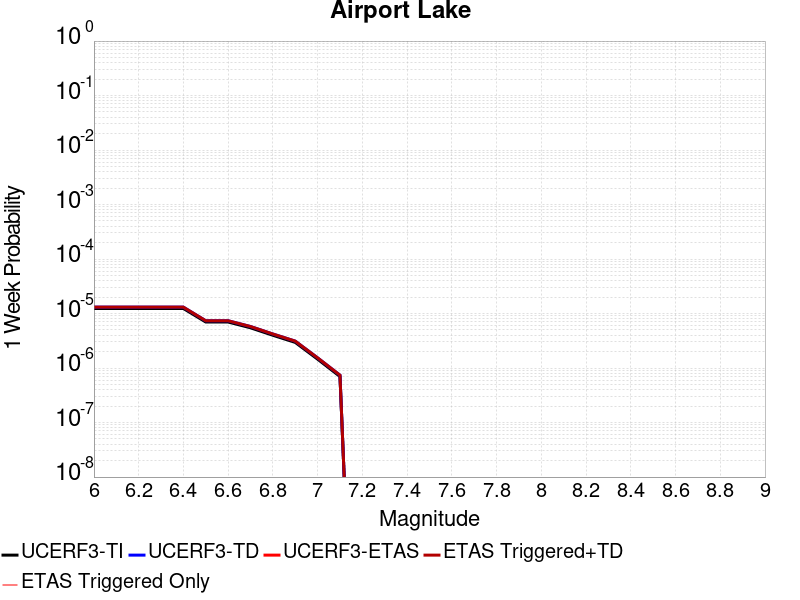 | 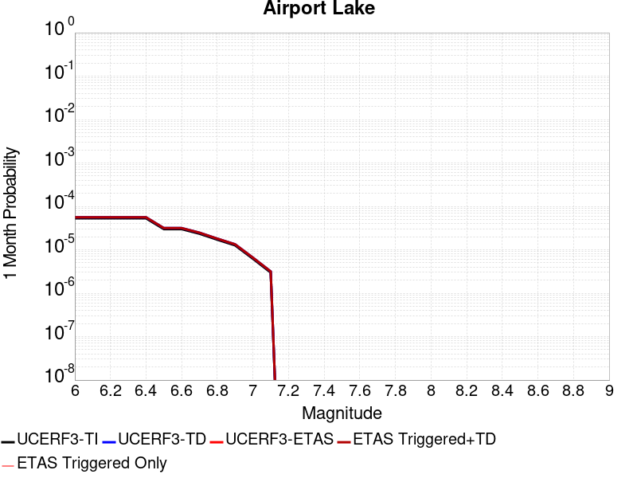 | 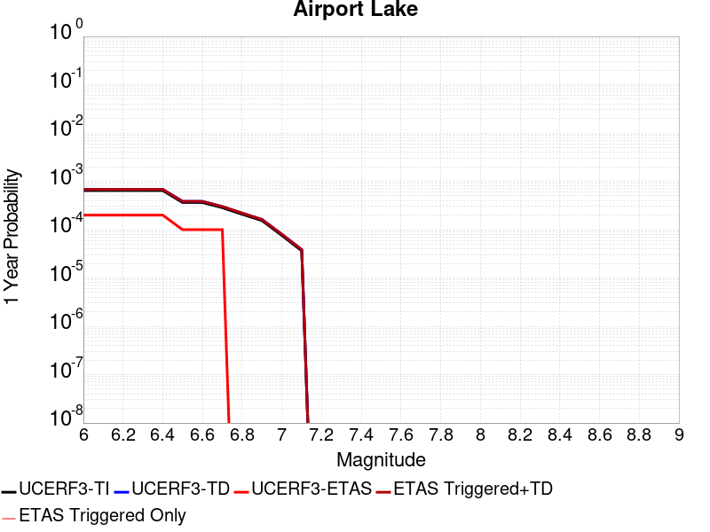 | 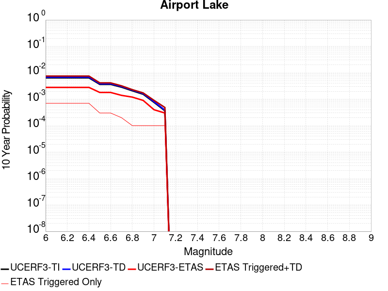 |

| Magnitude | 1 wk TI Prob | 1 wk TD Prob | 1 wk ETAS Prob | 1 wk ETAS/TD Gain | 1 wk ETAS Triggered+TD | 1 wk ETAS Triggered Only | 1 mo TI Prob | 1 mo TD Prob | 1 mo ETAS Prob | 1 mo ETAS/TD Gain | 1 mo ETAS Triggered+TD | 1 mo ETAS Triggered Only | 1 yr TI Prob | 1 yr TD Prob | 1 yr ETAS Prob | 1 yr ETAS/TD Gain | 1 yr ETAS Triggered+TD | 1 yr ETAS Triggered Only | 10 yr TI Prob | 10 yr TD Prob | 10 yr ETAS Prob | 10 yr ETAS/TD Gain | 10 yr ETAS Triggered+TD | 10 yr ETAS Triggered Only |
|-----|-----|-----|-----|-----|-----|-----|-----|-----|-----|-----|-----|-----|-----|-----|-----|-----|-----|-----|-----|-----|-----|-----|-----|-----|
| 6.0 | 1.2387061E-5 | 1.3095247E-5 | 0.0 | 0.0 | 1.3095247E-5 | 0.0 | 5.3086325E-5 | 5.612144E-5 | 0.0 | 0.0 | 5.612144E-5 | 0.0 | 6.461343E-4 | 6.830927E-4 | 2.0E-4 | 0.29278603 | 6.830927E-4 | 0.0 | 0.0064425888 | 0.006812736 | 0.0028 | 0.41099492 | 0.0075079673 | 7.0E-4 |
| 6.1 | 1.2387061E-5 | 1.3095247E-5 | 0.0 | 0.0 | 1.3095247E-5 | 0.0 | 5.3086325E-5 | 5.612144E-5 | 0.0 | 0.0 | 5.612144E-5 | 0.0 | 6.461343E-4 | 6.830927E-4 | 2.0E-4 | 0.29278603 | 6.830927E-4 | 0.0 | 0.0064425888 | 0.006812736 | 0.0028 | 0.41099492 | 0.0075079673 | 7.0E-4 |
| 6.2 | 1.2387061E-5 | 1.3095247E-5 | 0.0 | 0.0 | 1.3095247E-5 | 0.0 | 5.3086325E-5 | 5.612144E-5 | 0.0 | 0.0 | 5.612144E-5 | 0.0 | 6.461343E-4 | 6.830927E-4 | 2.0E-4 | 0.29278603 | 6.830927E-4 | 0.0 | 0.0064425888 | 0.006812736 | 0.0028 | 0.41099492 | 0.0075079673 | 7.0E-4 |
| 6.3 | 1.2387061E-5 | 1.3095247E-5 | 0.0 | 0.0 | 1.3095247E-5 | 0.0 | 5.3086325E-5 | 5.612144E-5 | 0.0 | 0.0 | 5.612144E-5 | 0.0 | 6.461343E-4 | 6.830927E-4 | 2.0E-4 | 0.29278603 | 6.830927E-4 | 0.0 | 0.0064425888 | 0.006812736 | 0.0028 | 0.41099492 | 0.0075079673 | 7.0E-4 |
| 6.4 | 1.2387061E-5 | 1.3095247E-5 | 0.0 | 0.0 | 1.3095247E-5 | 0.0 | 5.3086325E-5 | 5.612144E-5 | 0.0 | 0.0 | 5.612144E-5 | 0.0 | 6.461343E-4 | 6.830927E-4 | 2.0E-4 | 0.29278603 | 6.830927E-4 | 0.0 | 0.0064425888 | 0.006812736 | 0.0028 | 0.41099492 | 0.0075079673 | 7.0E-4 |
| 6.5 | 6.9922594E-6 | 7.380596E-6 | 0.0 | 0.0 | 7.380596E-6 | 0.0 | 2.996648E-5 | 3.1630774E-5 | 0.0 | 0.0 | 3.1630774E-5 | 0.0 | 3.6478083E-4 | 3.8504202E-4 | 1.0E-4 | 0.25971192 | 3.8504202E-4 | 0.0 | 0.003641826 | 0.0038442856 | 0.0018 | 0.46822742 | 0.0041431324 | 3.0E-4 |
| 6.6 | 6.9922594E-6 | 7.380596E-6 | 0.0 | 0.0 | 7.380596E-6 | 0.0 | 2.996648E-5 | 3.1630774E-5 | 0.0 | 0.0 | 3.1630774E-5 | 0.0 | 3.6478083E-4 | 3.8504202E-4 | 1.0E-4 | 0.25971192 | 3.8504202E-4 | 0.0 | 0.003641826 | 0.0038442856 | 0.0018 | 0.46822742 | 0.0041431324 | 3.0E-4 |
| 6.7 | 5.477277E-6 | 5.7826633E-6 | 0.0 | 0.0 | 5.7826633E-6 | 0.0 | 2.3473833E-5 | 2.478263E-5 | 0.0 | 0.0 | 2.478263E-5 | 0.0 | 2.8575645E-4 | 3.0169063E-4 | 1.0E-4 | 0.3314654 | 3.0169063E-4 | 0.0 | 0.0028538927 | 0.003013194 | 0.0014 | 0.46462324 | 0.0032125914 | 2.0E-4 |
| 6.8 | 3.9950432E-6 | 4.2166175E-6 | 0.0 | 0.0 | 4.2166175E-6 | 0.0 | 1.7121502E-5 | 1.8071109E-5 | 0.0 | 0.0 | 1.8071109E-5 | 0.0 | 2.0843433E-4 | 2.1999628E-4 | 0.0 | 0.0 | 2.1999628E-4 | 0.0 | 0.0020823893 | 0.0021980556 | 0.0012 | 0.54593706 | 0.002297836 | 1.0E-4 |
| 6.9 | 2.95695E-6 | 3.1211937E-6 | 0.0 | 0.0 | 3.1211937E-6 | 0.0 | 1.2672582E-5 | 1.3376488E-5 | 0.0 | 0.0 | 1.3376488E-5 | 0.0 | 1.5427776E-4 | 1.6284884E-4 | 0.0 | 0.0 | 1.6284884E-4 | 0.0 | 0.001541707 | 0.0016275172 | 9.0E-4 | 0.55298954 | 0.0017273545 | 1.0E-4 |
| 7.0 | 1.456072E-6 | 1.5398762E-6 | 0.0 | 0.0 | 1.5398762E-6 | 0.0 | 6.2402937E-6 | 6.5994586E-6 | 0.0 | 0.0 | 6.5994586E-6 | 0.0 | 7.597293E-5 | 8.034645E-5 | 0.0 | 0.0 | 8.034645E-5 | 0.0 | 7.594696E-4 | 8.032728E-4 | 4.0E-4 | 0.49796283 | 9.0319244E-4 | 1.0E-4 |
| 7.1 | 6.995192E-7 | 7.404401E-7 | 0.0 | 0.0 | 7.404401E-7 | 0.0 | 2.997936E-6 | 3.1733148E-6 | 0.0 | 0.0 | 3.1733148E-6 | 0.0 | 3.649926E-5 | 3.8635106E-5 | 0.0 | 0.0 | 3.8635106E-5 | 0.0 | 3.6493264E-4 | 3.8635108E-4 | 3.0E-4 | 0.7764959 | 4.8631243E-4 | 1.0E-4 |

## Santa Monica alt 1
*[(top)](#table-of-contents)*

| 1 Week | 1 Month | 1 Year | 10 Year |
|-----|-----|-----|-----|
| 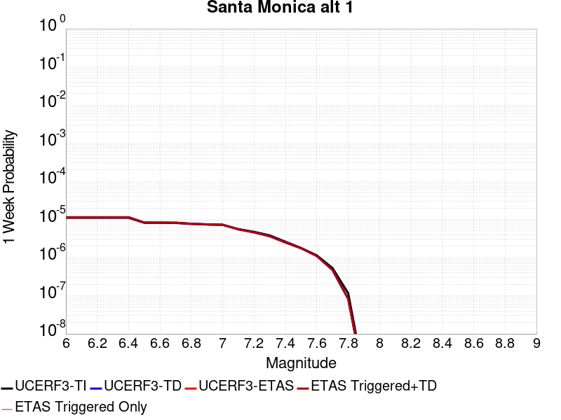 | 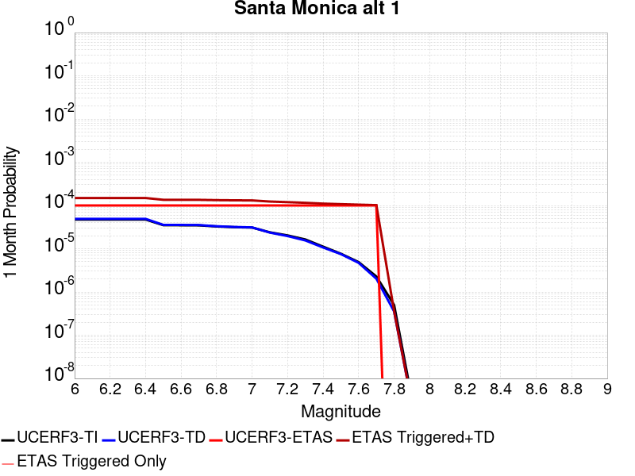 | 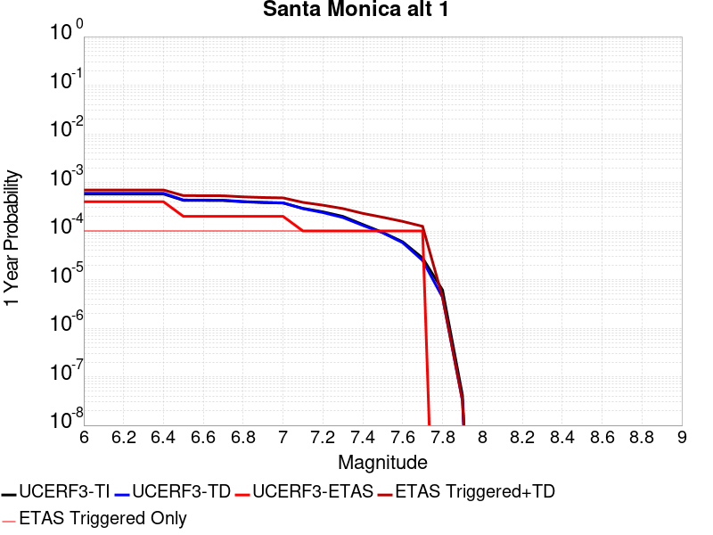 | 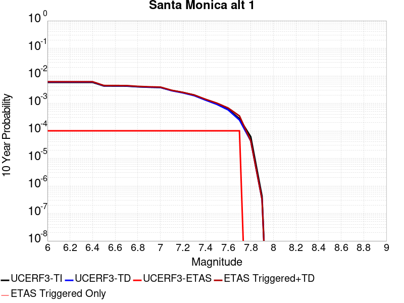 |

| Magnitude | 1 wk TI Prob | 1 wk TD Prob | 1 wk ETAS Prob | 1 wk ETAS/TD Gain | 1 wk ETAS Triggered+TD | 1 wk ETAS Triggered Only | 1 mo TI Prob | 1 mo TD Prob | 1 mo ETAS Prob | 1 mo ETAS/TD Gain | 1 mo ETAS Triggered+TD | 1 mo ETAS Triggered Only | 1 yr TI Prob | 1 yr TD Prob | 1 yr ETAS Prob | 1 yr ETAS/TD Gain | 1 yr ETAS Triggered+TD | 1 yr ETAS Triggered Only | 10 yr TI Prob | 10 yr TD Prob | 10 yr ETAS Prob | 10 yr ETAS/TD Gain | 10 yr ETAS Triggered+TD | 10 yr ETAS Triggered Only |
|-----|-----|-----|-----|-----|-----|-----|-----|-----|-----|-----|-----|-----|-----|-----|-----|-----|-----|-----|-----|-----|-----|-----|-----|-----|
| 6.0 | 1.1066008E-5 | 1.1470431E-5 | 0.0 | 0.0 | 1.1470431E-5 | 0.0 | 4.742488E-5 | 4.915814E-5 | 1.0E-4 | 2.034251 | 1.4915323E-4 | 1.0E-4 | 5.7724497E-4 | 5.9834996E-4 | 4.0E-4 | 0.66850513 | 6.982901E-4 | 1.0E-4 | 0.005757478 | 0.0059687733 | 0.0038 | 0.63664675 | 0.0065651922 | 6.0E-4 |
| 6.1 | 1.1066008E-5 | 1.1470431E-5 | 0.0 | 0.0 | 1.1470431E-5 | 0.0 | 4.742488E-5 | 4.915814E-5 | 1.0E-4 | 2.034251 | 1.4915323E-4 | 1.0E-4 | 5.7724497E-4 | 5.9834996E-4 | 4.0E-4 | 0.66850513 | 6.982901E-4 | 1.0E-4 | 0.005757478 | 0.0059687733 | 0.0038 | 0.63664675 | 0.0065651922 | 6.0E-4 |
| 6.2 | 1.1066008E-5 | 1.1470431E-5 | 0.0 | 0.0 | 1.1470431E-5 | 0.0 | 4.742488E-5 | 4.915814E-5 | 1.0E-4 | 2.034251 | 1.4915323E-4 | 1.0E-4 | 5.7724497E-4 | 5.9834996E-4 | 4.0E-4 | 0.66850513 | 6.982901E-4 | 1.0E-4 | 0.005757478 | 0.0059687733 | 0.0038 | 0.63664675 | 0.0065651922 | 6.0E-4 |
| 6.3 | 1.1066008E-5 | 1.1470431E-5 | 0.0 | 0.0 | 1.1470431E-5 | 0.0 | 4.742488E-5 | 4.915814E-5 | 1.0E-4 | 2.034251 | 1.4915323E-4 | 1.0E-4 | 5.7724497E-4 | 5.9834996E-4 | 4.0E-4 | 0.66850513 | 6.982901E-4 | 1.0E-4 | 0.005757478 | 0.0059687733 | 0.0038 | 0.63664675 | 0.0065651922 | 6.0E-4 |
| 6.4 | 1.1066008E-5 | 1.1470431E-5 | 0.0 | 0.0 | 1.1470431E-5 | 0.0 | 4.742488E-5 | 4.915814E-5 | 1.0E-4 | 2.034251 | 1.4915323E-4 | 1.0E-4 | 5.7724497E-4 | 5.9834996E-4 | 4.0E-4 | 0.66850513 | 6.982901E-4 | 1.0E-4 | 0.005757478 | 0.0059687733 | 0.0038 | 0.63664675 | 0.0065651922 | 6.0E-4 |
| 6.5 | 8.183544E-6 | 8.3285395E-6 | 0.0 | 0.0 | 8.3285395E-6 | 0.0 | 3.5071862E-5 | 3.5693258E-5 | 1.0E-4 | 2.8016493 | 1.356897E-4 | 1.0E-4 | 4.2691626E-4 | 4.3448037E-4 | 2.0E-4 | 0.46032 | 5.344369E-4 | 1.0E-4 | 0.0042609703 | 0.0043364745 | 0.0026 | 0.5995654 | 0.0049338727 | 6.0E-4 |
| 6.6 | 8.1543285E-6 | 8.296783E-6 | 0.0 | 0.0 | 8.296783E-6 | 0.0 | 3.4946657E-5 | 3.5557165E-5 | 1.0E-4 | 2.8123727 | 1.3555361E-4 | 1.0E-4 | 4.2539247E-4 | 4.3282408E-4 | 2.0E-4 | 0.46208152 | 5.327808E-4 | 1.0E-4 | 0.0042457907 | 0.004319976 | 0.0026 | 0.6018552 | 0.004917384 | 6.0E-4 |
| 6.7 | 8.110878E-6 | 8.250215E-6 | 0.0 | 0.0 | 8.250215E-6 | 0.0 | 3.4760444E-5 | 3.5357592E-5 | 1.0E-4 | 2.8282468 | 1.3535406E-4 | 1.0E-4 | 4.231262E-4 | 4.3039527E-4 | 2.0E-4 | 0.46468914 | 5.3035223E-4 | 1.0E-4 | 0.0042232145 | 0.004295782 | 0.0025 | 0.5819662 | 0.004793634 | 5.0E-4 |
| 6.8 | 7.644036E-6 | 7.7446775E-6 | 0.0 | 0.0 | 7.7446775E-6 | 0.0 | 3.275974E-5 | 3.319106E-5 | 1.0E-4 | 3.0128596 | 1.3318774E-4 | 1.0E-4 | 3.9877684E-4 | 4.040276E-4 | 2.0E-4 | 0.49501565 | 5.0398725E-4 | 1.0E-4 | 0.00398062 | 0.0040330766 | 0.0024 | 0.5950792 | 0.004431464 | 4.0E-4 |
| 6.9 | 7.3698293E-6 | 7.4495747E-6 | 0.0 | 0.0 | 7.4495747E-6 | 0.0 | 3.15846E-5 | 3.1926364E-5 | 1.0E-4 | 3.1322074 | 1.3192317E-4 | 1.0E-4 | 3.8447464E-4 | 3.8863556E-4 | 2.0E-4 | 0.51462096 | 4.885967E-4 | 1.0E-4 | 0.0038381014 | 0.0038797024 | 0.0023 | 0.592829 | 0.0042781504 | 4.0E-4 |
| 7.0 | 7.209872E-6 | 7.2795947E-6 | 0.0 | 0.0 | 7.2795947E-6 | 0.0 | 3.0899086E-5 | 3.11979E-5 | 1.0E-4 | 3.2053442 | 1.3119477E-4 | 1.0E-4 | 3.7613141E-4 | 3.7976957E-4 | 2.0E-4 | 0.5266351 | 4.797316E-4 | 1.0E-4 | 0.0037549543 | 0.0037913483 | 0.0022 | 0.5802685 | 0.0041898317 | 4.0E-4 |
| 7.1 | 5.603456E-6 | 5.5196415E-6 | 0.0 | 0.0 | 5.5196415E-6 | 0.0 | 2.4014591E-5 | 2.3655395E-5 | 1.0E-4 | 4.2273655 | 1.2365302E-4 | 1.0E-4 | 2.923384E-4 | 2.8796677E-4 | 1.0E-4 | 0.3472623 | 3.8793797E-4 | 1.0E-4 | 0.0029195412 | 0.002875978 | 0.0016 | 0.5563325 | 0.003175115 | 3.0E-4 |
| 7.2 | 4.7483613E-6 | 4.587771E-6 | 0.0 | 0.0 | 4.587771E-6 | 0.0 | 2.0349962E-5 | 1.9661727E-5 | 1.0E-4 | 5.086023 | 1.1965976E-4 | 1.0E-4 | 2.4773262E-4 | 2.3935537E-4 | 1.0E-4 | 0.41778883 | 3.3933143E-4 | 1.0E-4 | 0.0024745662 | 0.0023909898 | 0.0012 | 0.50188416 | 0.0026902726 | 3.0E-4 |
| 7.3 | 3.829015E-6 | 3.6315903E-6 | 0.0 | 0.0 | 3.6315903E-6 | 0.0 | 1.6409962E-5 | 1.5563866E-5 | 1.0E-4 | 6.4251385 | 1.1556231E-4 | 1.0E-4 | 1.9977297E-4 | 1.8947368E-4 | 1.0E-4 | 0.5277778 | 2.8945474E-4 | 1.0E-4 | 0.0019959346 | 0.0018931301 | 0.0012 | 0.63387084 | 0.0021925622 | 3.0E-4 |
| 7.4 | 2.610755E-6 | 2.4977157E-6 | 0.0 | 0.0 | 2.4977157E-6 | 0.0 | 1.1188902E-5 | 1.0704452E-5 | 1.0E-4 | 9.3419075 | 1.1070338E-4 | 1.0E-4 | 1.3621636E-4 | 1.3031895E-4 | 1.0E-4 | 0.7673481 | 2.3030592E-4 | 1.0E-4 | 0.001361329 | 0.0013024297 | 0.0011 | 0.84457535 | 0.001602039 | 3.0E-4 |
| 7.5 | 1.792146E-6 | 1.7570425E-6 | 0.0 | 0.0 | 1.7570425E-6 | 0.0 | 7.680603E-6 | 7.5301605E-6 | 1.0E-4 | 13.279929 | 1.07529406E-4 | 1.0E-4 | 9.3507326E-5 | 9.167588E-5 | 1.0E-4 | 1.0907995 | 1.9166671E-4 | 1.0E-4 | 9.3467993E-4 | 9.1638375E-4 | 5.0E-4 | 0.54562294 | 0.0011162005 | 2.0E-4 |
| 7.6 | 1.1473018E-6 | 1.1020002E-6 | 0.0 | 0.0 | 1.1020002E-6 | 0.0 | 4.9169985E-6 | 4.722849E-6 | 1.0E-4 | 21.173658 | 1.0472238E-4 | 1.0E-4 | 5.986281E-5 | 5.749919E-5 | 1.0E-4 | 1.7391549 | 1.5749344E-4 | 1.0E-4 | 5.984669E-4 | 5.748448E-4 | 2.0E-4 | 0.34792 | 6.7478727E-4 | 1.0E-4 |
| 7.7 | 5.330919E-7 | 4.740105E-7 | 0.0 | 0.0 | 4.740105E-7 | 0.0 | 2.2846775E-6 | 2.0314721E-6 | 1.0E-4 | 49.225388 | 1.0203127E-4 | 1.0E-4 | 2.7815593E-5 | 2.4732903E-5 | 1.0E-4 | 4.043197 | 1.2473043E-4 | 1.0E-4 | 2.7812112E-4 | 2.4730264E-4 | 1.0E-4 | 0.40436286 | 3.472779E-4 | 1.0E-4 |
| 7.8 | 1.1668574E-7 | 8.27032E-8 | 0.0 | 0.0 | 8.27032E-8 | 0.0 | 5.000816E-7 | 3.5444225E-7 | 0.0 | 0.0 | 3.5444225E-7 | 0.0 | 6.0884768E-6 | 4.3153264E-6 | 0.0 | 0.0 | 4.3153264E-6 | 0.0 | 6.08831E-5 | 4.3152453E-5 | 0.0 | 0.0 | 4.3152453E-5 | 0.0 |
| 7.9 | 8.007447E-10 | 6.1585737E-10 | 0.0 | 0.0 | 6.1585737E-10 | 0.0 | 3.4317629E-9 | 2.6393883E-9 | 0.0 | 0.0 | 2.6393883E-9 | 0.0 | 4.1781714E-8 | 3.2134555E-8 | 0.0 | 0.0 | 3.2134555E-8 | 0.0 | 4.1781706E-7 | 3.213455E-7 | 0.0 | 0.0 | 3.213455E-7 | 0.0 |

## Morales (East)
*[(top)](#table-of-contents)*

| 1 Week | 1 Month | 1 Year | 10 Year |
|-----|-----|-----|-----|
| 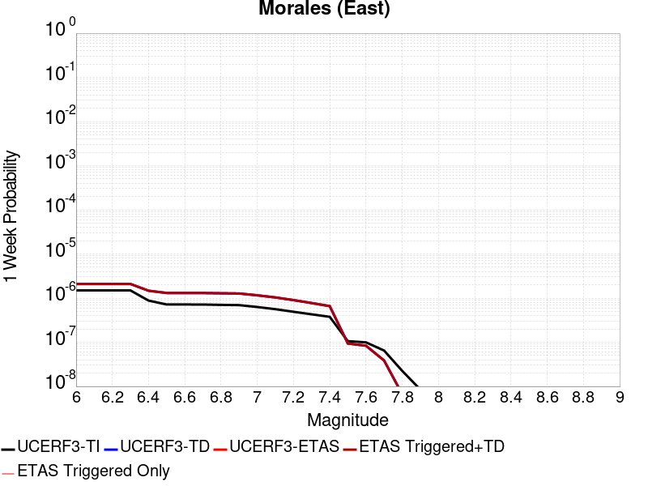 | 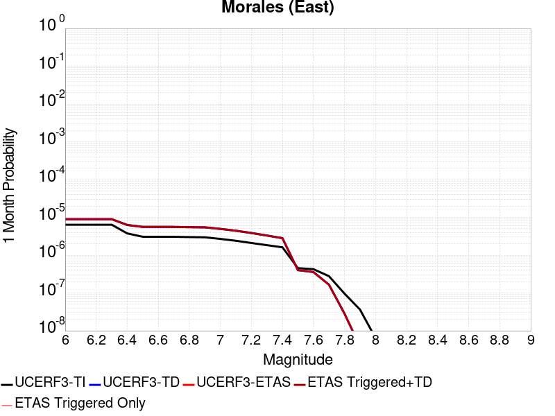 | 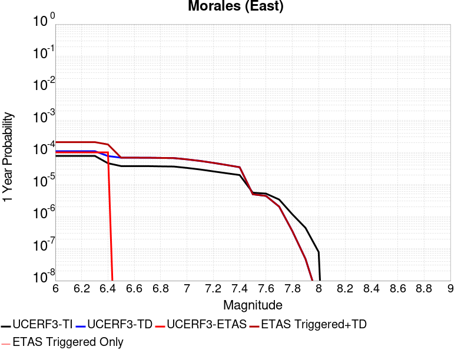 | 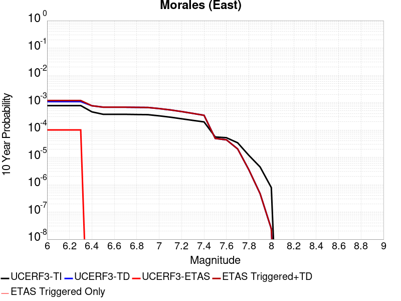 |

| Magnitude | 1 wk TI Prob | 1 wk TD Prob | 1 wk ETAS Prob | 1 wk ETAS/TD Gain | 1 wk ETAS Triggered+TD | 1 wk ETAS Triggered Only | 1 mo TI Prob | 1 mo TD Prob | 1 mo ETAS Prob | 1 mo ETAS/TD Gain | 1 mo ETAS Triggered+TD | 1 mo ETAS Triggered Only | 1 yr TI Prob | 1 yr TD Prob | 1 yr ETAS Prob | 1 yr ETAS/TD Gain | 1 yr ETAS Triggered+TD | 1 yr ETAS Triggered Only | 10 yr TI Prob | 10 yr TD Prob | 10 yr ETAS Prob | 10 yr ETAS/TD Gain | 10 yr ETAS Triggered+TD | 10 yr ETAS Triggered Only |
|-----|-----|-----|-----|-----|-----|-----|-----|-----|-----|-----|-----|-----|-----|-----|-----|-----|-----|-----|-----|-----|-----|-----|-----|-----|
| 6.0 | 1.4942771E-6 | 2.096285E-6 | 0.0 | 0.0 | 2.096285E-6 | 0.0 | 6.404029E-6 | 8.984051E-6 | 0.0 | 0.0 | 8.984051E-6 | 0.0 | 7.7966266E-5 | 1.0937591E-4 | 1.0E-4 | 0.9142781 | 2.0936497E-4 | 1.0E-4 | 7.793892E-4 | 0.0010932799 | 0.0017 | 1.5549539 | 0.0017925147 | 7.0E-4 |
| 6.1 | 1.4942771E-6 | 2.096285E-6 | 0.0 | 0.0 | 2.096285E-6 | 0.0 | 6.404029E-6 | 8.984051E-6 | 0.0 | 0.0 | 8.984051E-6 | 0.0 | 7.7966266E-5 | 1.0937591E-4 | 1.0E-4 | 0.9142781 | 2.0936497E-4 | 1.0E-4 | 7.793892E-4 | 0.0010932799 | 0.0017 | 1.5549539 | 0.0017925147 | 7.0E-4 |
| 6.2 | 1.4942771E-6 | 2.096285E-6 | 0.0 | 0.0 | 2.096285E-6 | 0.0 | 6.404029E-6 | 8.984051E-6 | 0.0 | 0.0 | 8.984051E-6 | 0.0 | 7.7966266E-5 | 1.0937591E-4 | 1.0E-4 | 0.9142781 | 2.0936497E-4 | 1.0E-4 | 7.793892E-4 | 0.0010932799 | 0.0017 | 1.5549539 | 0.0017925147 | 7.0E-4 |
| 6.3 | 1.4942771E-6 | 2.096285E-6 | 0.0 | 0.0 | 2.096285E-6 | 0.0 | 6.404029E-6 | 8.984051E-6 | 0.0 | 0.0 | 8.984051E-6 | 0.0 | 7.7966266E-5 | 1.0937591E-4 | 1.0E-4 | 0.9142781 | 2.0936497E-4 | 1.0E-4 | 7.793892E-4 | 0.0010932799 | 0.0017 | 1.5549539 | 0.0017925147 | 7.0E-4 |
| 6.4 | 8.798845E-7 | 1.4751511E-6 | 0.0 | 0.0 | 1.4751511E-6 | 0.0 | 3.7709283E-6 | 6.3220614E-6 | 0.0 | 0.0 | 6.3220614E-6 | 0.0 | 4.5910085E-5 | 7.6968485E-5 | 1.0E-4 | 1.2992331 | 1.7696079E-4 | 1.0E-4 | 4.59006E-4 | 7.694312E-4 | 0.0013 | 1.6895598 | 0.0012690465 | 5.0E-4 |
| 6.5 | 7.1751725E-7 | 1.3113165E-6 | 0.0 | 0.0 | 1.3113165E-6 | 0.0 | 3.0750705E-6 | 5.619916E-6 | 0.0 | 0.0 | 5.619916E-6 | 0.0 | 3.7438338E-5 | 6.8420406E-5 | 0.0 | 0.0 | 6.8420406E-5 | 0.0 | 3.743203E-4 | 6.84003E-4 | 9.0E-4 | 1.3157837 | 9.837977E-4 | 3.0E-4 |
| 6.6 | 7.1751725E-7 | 1.3113165E-6 | 0.0 | 0.0 | 1.3113165E-6 | 0.0 | 3.0750705E-6 | 5.619916E-6 | 0.0 | 0.0 | 5.619916E-6 | 0.0 | 3.7438338E-5 | 6.8420406E-5 | 0.0 | 0.0 | 6.8420406E-5 | 0.0 | 3.743203E-4 | 6.84003E-4 | 9.0E-4 | 1.3157837 | 9.837977E-4 | 3.0E-4 |
| 6.7 | 7.159057E-7 | 1.3087976E-6 | 0.0 | 0.0 | 1.3087976E-6 | 0.0 | 3.0681638E-6 | 5.6091208E-6 | 0.0 | 0.0 | 5.6091208E-6 | 0.0 | 3.7354253E-5 | 6.828898E-5 | 0.0 | 0.0 | 6.828898E-5 | 0.0 | 3.7347974E-4 | 6.8268954E-4 | 9.0E-4 | 1.3183151 | 9.824848E-4 | 3.0E-4 |
| 6.8 | 7.032203E-7 | 1.2905188E-6 | 0.0 | 0.0 | 1.2905188E-6 | 0.0 | 3.0137978E-6 | 5.5307833E-6 | 0.0 | 0.0 | 5.5307833E-6 | 0.0 | 3.669237E-5 | 6.7335284E-5 | 0.0 | 0.0 | 6.7335284E-5 | 0.0 | 3.6686313E-4 | 6.731583E-4 | 9.0E-4 | 1.3369812 | 9.7295636E-4 | 3.0E-4 |
| 6.9 | 6.941549E-7 | 1.2757272E-6 | 0.0 | 0.0 | 1.2757272E-6 | 0.0 | 2.974946E-6 | 5.467391E-6 | 0.0 | 0.0 | 5.467391E-6 | 0.0 | 3.6219368E-5 | 6.656353E-5 | 0.0 | 0.0 | 6.656353E-5 | 0.0 | 3.6213463E-4 | 6.654454E-4 | 9.0E-4 | 1.3524776 | 9.652458E-4 | 3.0E-4 |
| 7.0 | 6.2932247E-7 | 1.1620893E-6 | 0.0 | 0.0 | 1.1620893E-6 | 0.0 | 2.6970936E-6 | 4.980374E-6 | 0.0 | 0.0 | 4.980374E-6 | 0.0 | 3.283662E-5 | 6.0634426E-5 | 0.0 | 0.0 | 6.0634426E-5 | 0.0 | 3.283177E-4 | 6.0618715E-4 | 6.0E-4 | 0.98979336 | 8.060659E-4 | 2.0E-4 |
| 7.1 | 5.6200963E-7 | 1.0395994E-6 | 0.0 | 0.0 | 1.0395994E-6 | 0.0 | 2.4086105E-6 | 4.455419E-6 | 0.0 | 0.0 | 4.455419E-6 | 0.0 | 2.9324437E-5 | 5.424342E-5 | 0.0 | 0.0 | 5.424342E-5 | 0.0 | 2.9320567E-4 | 5.423085E-4 | 5.0E-4 | 0.92198443 | 6.422543E-4 | 1.0E-4 |
| 7.2 | 4.91044E-7 | 9.054548E-7 | 0.0 | 0.0 | 9.054548E-7 | 0.0 | 2.1044725E-6 | 3.8805147E-6 | 0.0 | 0.0 | 3.8805147E-6 | 0.0 | 2.5621652E-5 | 4.724428E-5 | 0.0 | 0.0 | 4.724428E-5 | 0.0 | 2.56187E-4 | 4.7234818E-4 | 4.0E-4 | 0.84683293 | 5.723009E-4 | 1.0E-4 |
| 7.3 | 4.2978448E-7 | 7.765883E-7 | 0.0 | 0.0 | 7.765883E-7 | 0.0 | 1.8419321E-6 | 3.3282315E-6 | 0.0 | 0.0 | 3.3282315E-6 | 0.0 | 2.2425293E-5 | 4.0520496E-5 | 0.0 | 0.0 | 4.0520496E-5 | 0.0 | 2.242303E-4 | 4.0513623E-4 | 4.0E-4 | 0.9873222 | 5.050957E-4 | 1.0E-4 |
| 7.4 | 3.774317E-7 | 6.619381E-7 | 0.0 | 0.0 | 6.619381E-7 | 0.0 | 1.6175634E-6 | 2.8368745E-6 | 0.0 | 0.0 | 2.8368745E-6 | 0.0 | 1.9693656E-5 | 3.4538425E-5 | 0.0 | 0.0 | 3.4538425E-5 | 0.0 | 1.969191E-4 | 3.453354E-4 | 3.0E-4 | 0.86872065 | 3.453354E-4 | 0.0 |
| 7.5 | 1.0603232E-7 | 9.474921E-8 | 0.0 | 0.0 | 9.474921E-8 | 0.0 | 4.5442414E-7 | 4.0606798E-7 | 0.0 | 0.0 | 4.0606798E-7 | 0.0 | 5.5326E-6 | 4.9438668E-6 | 0.0 | 0.0 | 4.9438668E-6 | 0.0 | 5.532462E-5 | 4.9439805E-5 | 0.0 | 0.0 | 4.9439805E-5 | 0.0 |
| 7.6 | 9.960384E-8 | 8.420435E-8 | 0.0 | 0.0 | 8.420435E-8 | 0.0 | 4.2687353E-7 | 3.6087576E-7 | 0.0 | 0.0 | 3.6087576E-7 | 0.0 | 5.197173E-6 | 4.393654E-6 | 0.0 | 0.0 | 4.393654E-6 | 0.0 | 5.1970514E-5 | 4.3937904E-5 | 0.0 | 0.0 | 4.3937904E-5 | 0.0 |
| 7.7 | 6.499468E-8 | 3.911688E-8 | 0.0 | 0.0 | 3.911688E-8 | 0.0 | 2.785486E-7 | 1.6764376E-7 | 0.0 | 0.0 | 1.6764376E-7 | 0.0 | 3.3913238E-6 | 2.041061E-6 | 0.0 | 0.0 | 2.041061E-6 | 0.0 | 3.3912722E-5 | 2.0412652E-5 | 0.0 | 0.0 | 2.0412652E-5 | 0.0 |
| 7.8 | 2.2517119E-8 | 6.7503243E-9 | 0.0 | 0.0 | 6.7503243E-9 | 0.0 | 9.6501935E-8 | 2.8929964E-8 | 0.0 | 0.0 | 2.8929964E-8 | 0.0 | 1.1749105E-6 | 3.5222226E-7 | 0.0 | 0.0 | 3.5222226E-7 | 0.0 | 1.1749043E-5 | 3.5244245E-6 | 0.0 | 0.0 | 3.5244245E-6 | 0.0 |
| 7.9 | 8.493023E-9 | 9.1302743E-10 | 0.0 | 0.0 | 9.1302743E-10 | 0.0 | 3.639867E-8 | 3.9129797E-9 | 0.0 | 0.0 | 3.9129797E-9 | 0.0 | 4.4315374E-7 | 4.764053E-8 | 0.0 | 0.0 | 4.764053E-8 | 0.0 | 4.4315284E-6 | 4.782057E-7 | 0.0 | 0.0 | 4.782057E-7 | 0.0 |
| 8.0 | 1.4971842E-9 | 4.6548432E-11 | 0.0 | 0.0 | 4.6548432E-11 | 0.0 | 6.4165038E-9 | 1.9949276E-10 | 0.0 | 0.0 | 1.9949276E-10 | 0.0 | 7.812093E-8 | 2.4288243E-9 | 0.0 | 0.0 | 2.4288243E-9 | 0.0 | 7.81209E-7 | 2.5369058E-8 | 0.0 | 0.0 | 2.5369058E-8 | 0.0 |

## North Frontal  (West)
*[(top)](#table-of-contents)*

| 1 Week | 1 Month | 1 Year | 10 Year |
|-----|-----|-----|-----|
| 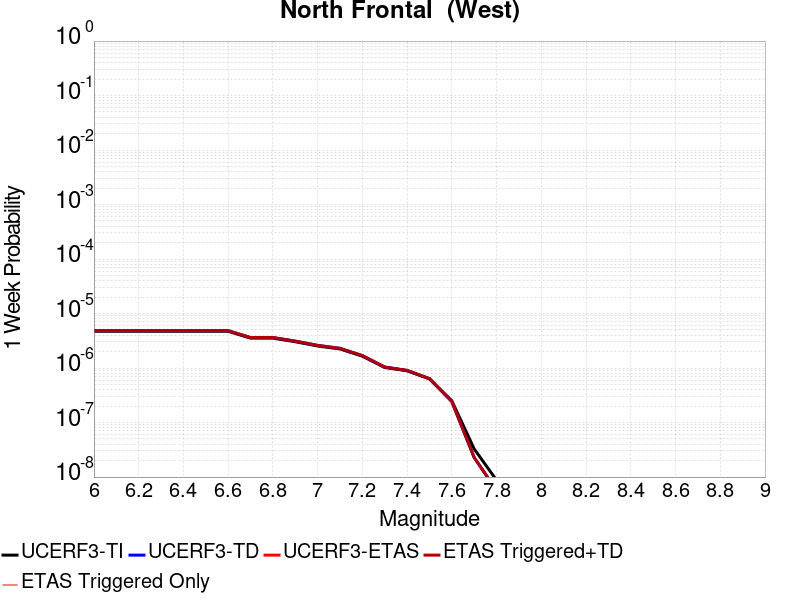 | 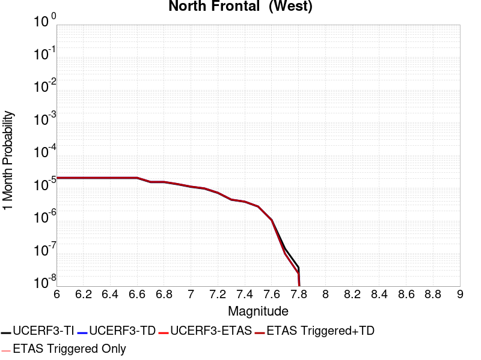 | 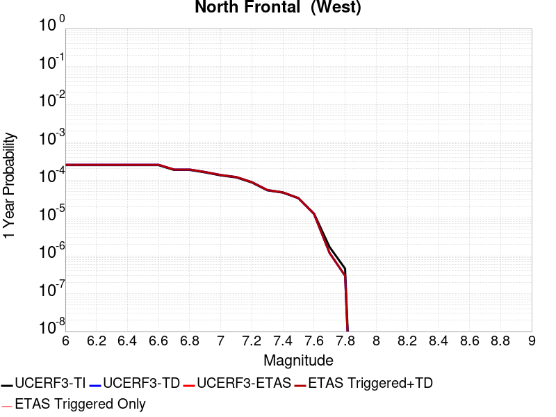 | 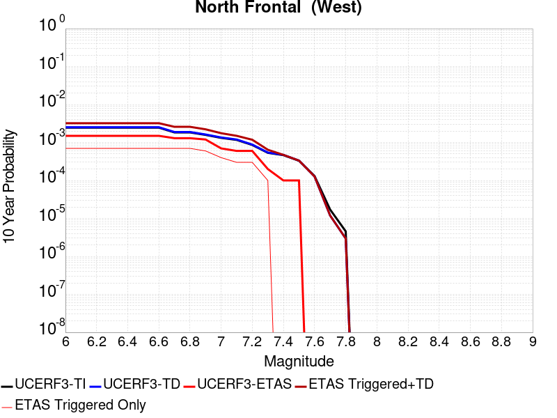 |

| Magnitude | 1 wk TI Prob | 1 wk TD Prob | 1 wk ETAS Prob | 1 wk ETAS/TD Gain | 1 wk ETAS Triggered+TD | 1 wk ETAS Triggered Only | 1 mo TI Prob | 1 mo TD Prob | 1 mo ETAS Prob | 1 mo ETAS/TD Gain | 1 mo ETAS Triggered+TD | 1 mo ETAS Triggered Only | 1 yr TI Prob | 1 yr TD Prob | 1 yr ETAS Prob | 1 yr ETAS/TD Gain | 1 yr ETAS Triggered+TD | 1 yr ETAS Triggered Only | 10 yr TI Prob | 10 yr TD Prob | 10 yr ETAS Prob | 10 yr ETAS/TD Gain | 10 yr ETAS Triggered+TD | 10 yr ETAS Triggered Only |
|-----|-----|-----|-----|-----|-----|-----|-----|-----|-----|-----|-----|-----|-----|-----|-----|-----|-----|-----|-----|-----|-----|-----|-----|-----|
| 6.0 | 4.7316266E-6 | 4.8511893E-6 | 0.0 | 0.0 | 4.8511893E-6 | 0.0 | 2.0278241E-5 | 2.0790654E-5 | 0.0 | 0.0 | 2.0790654E-5 | 0.0 | 2.4685962E-4 | 2.530983E-4 | 0.0 | 0.0 | 2.530983E-4 | 0.0 | 0.0024658558 | 0.0025282463 | 0.0015 | 0.5932966 | 0.0032264765 | 7.0E-4 |
| 6.1 | 4.7316266E-6 | 4.8511893E-6 | 0.0 | 0.0 | 4.8511893E-6 | 0.0 | 2.0278241E-5 | 2.0790654E-5 | 0.0 | 0.0 | 2.0790654E-5 | 0.0 | 2.4685962E-4 | 2.530983E-4 | 0.0 | 0.0 | 2.530983E-4 | 0.0 | 0.0024658558 | 0.0025282463 | 0.0015 | 0.5932966 | 0.0032264765 | 7.0E-4 |
| 6.2 | 4.7316266E-6 | 4.8511893E-6 | 0.0 | 0.0 | 4.8511893E-6 | 0.0 | 2.0278241E-5 | 2.0790654E-5 | 0.0 | 0.0 | 2.0790654E-5 | 0.0 | 2.4685962E-4 | 2.530983E-4 | 0.0 | 0.0 | 2.530983E-4 | 0.0 | 0.0024658558 | 0.0025282463 | 0.0015 | 0.5932966 | 0.0032264765 | 7.0E-4 |
| 6.3 | 4.7316266E-6 | 4.8511893E-6 | 0.0 | 0.0 | 4.8511893E-6 | 0.0 | 2.0278241E-5 | 2.0790654E-5 | 0.0 | 0.0 | 2.0790654E-5 | 0.0 | 2.4685962E-4 | 2.530983E-4 | 0.0 | 0.0 | 2.530983E-4 | 0.0 | 0.0024658558 | 0.0025282463 | 0.0015 | 0.5932966 | 0.0032264765 | 7.0E-4 |
| 6.4 | 4.7316266E-6 | 4.8511893E-6 | 0.0 | 0.0 | 4.8511893E-6 | 0.0 | 2.0278241E-5 | 2.0790654E-5 | 0.0 | 0.0 | 2.0790654E-5 | 0.0 | 2.4685962E-4 | 2.530983E-4 | 0.0 | 0.0 | 2.530983E-4 | 0.0 | 0.0024658558 | 0.0025282463 | 0.0015 | 0.5932966 | 0.0032264765 | 7.0E-4 |
| 6.5 | 4.7316266E-6 | 4.8511893E-6 | 0.0 | 0.0 | 4.8511893E-6 | 0.0 | 2.0278241E-5 | 2.0790654E-5 | 0.0 | 0.0 | 2.0790654E-5 | 0.0 | 2.4685962E-4 | 2.530983E-4 | 0.0 | 0.0 | 2.530983E-4 | 0.0 | 0.0024658558 | 0.0025282463 | 0.0015 | 0.5932966 | 0.0032264765 | 7.0E-4 |
| 6.6 | 4.7316266E-6 | 4.8511893E-6 | 0.0 | 0.0 | 4.8511893E-6 | 0.0 | 2.0278241E-5 | 2.0790654E-5 | 0.0 | 0.0 | 2.0790654E-5 | 0.0 | 2.4685962E-4 | 2.530983E-4 | 0.0 | 0.0 | 2.530983E-4 | 0.0 | 0.0024658558 | 0.0025282463 | 0.0015 | 0.5932966 | 0.0032264765 | 7.0E-4 |
| 6.7 | 3.5382777E-6 | 3.6297067E-6 | 0.0 | 0.0 | 3.6297067E-6 | 0.0 | 1.516396E-5 | 1.5555797E-5 | 0.0 | 0.0 | 1.5555797E-5 | 0.0 | 1.8460557E-4 | 1.8937615E-4 | 0.0 | 0.0 | 1.8937615E-4 | 0.0 | 0.0018445229 | 0.0018922247 | 0.0013 | 0.68702203 | 0.0025909 | 7.0E-4 |
| 6.8 | 3.5382777E-6 | 3.6297067E-6 | 0.0 | 0.0 | 3.6297067E-6 | 0.0 | 1.516396E-5 | 1.5555797E-5 | 0.0 | 0.0 | 1.5555797E-5 | 0.0 | 1.8460557E-4 | 1.8937615E-4 | 0.0 | 0.0 | 1.8937615E-4 | 0.0 | 0.0018445229 | 0.0018922247 | 0.0013 | 0.68702203 | 0.0025909 | 7.0E-4 |
| 6.9 | 3.0428037E-6 | 3.1217169E-6 | 0.0 | 0.0 | 3.1217169E-6 | 0.0 | 1.30405215E-5 | 1.3378722E-5 | 0.0 | 0.0 | 1.3378722E-5 | 0.0 | 1.5875678E-4 | 1.6287444E-4 | 0.0 | 0.0 | 1.6287444E-4 | 0.0 | 0.0015864341 | 0.0016276177 | 0.0012 | 0.7372739 | 0.0022266412 | 6.0E-4 |
| 7.0 | 2.538778E-6 | 2.6051819E-6 | 0.0 | 0.0 | 2.6051819E-6 | 0.0 | 1.0880432E-5 | 1.116502E-5 | 0.0 | 0.0 | 1.116502E-5 | 0.0 | 1.324612E-4 | 1.3592611E-4 | 0.0 | 0.0 | 1.3592611E-4 | 0.0 | 0.0013238228 | 0.0013584765 | 7.0E-4 | 0.5152831 | 0.0017579331 | 4.0E-4 |
| 7.1 | 2.2418935E-6 | 2.3003845E-6 | 0.0 | 0.0 | 2.3003845E-6 | 0.0 | 9.60808E-6 | 9.858756E-6 | 0.0 | 0.0 | 9.858756E-6 | 0.0 | 1.1697209E-4 | 1.2002419E-4 | 0.0 | 0.0 | 1.2002419E-4 | 0.0 | 0.0011691054 | 0.0011996375 | 6.0E-4 | 0.50015104 | 0.0014992777 | 3.0E-4 |
| 7.2 | 1.6526745E-6 | 1.6918727E-6 | 0.0 | 0.0 | 1.6918727E-6 | 0.0 | 7.082872E-6 | 7.2508647E-6 | 0.0 | 0.0 | 7.2508647E-6 | 0.0 | 8.623055E-5 | 8.8275956E-5 | 0.0 | 0.0 | 8.8275956E-5 | 0.0 | 8.61971E-4 | 8.8243396E-4 | 6.0E-4 | 0.6799376 | 0.0011821692 | 3.0E-4 |
| 7.3 | 1.0246019E-6 | 1.0438313E-6 | 0.0 | 0.0 | 1.0438313E-6 | 0.0 | 4.391144E-6 | 4.4735557E-6 | 0.0 | 0.0 | 4.4735557E-6 | 0.0 | 5.3460866E-5 | 5.4464293E-5 | 0.0 | 0.0 | 5.4464293E-5 | 0.0 | 5.344801E-4 | 5.445209E-4 | 2.0E-4 | 0.36729532 | 6.444665E-4 | 1.0E-4 |
| 7.4 | 8.9045164E-7 | 9.0530875E-7 | 0.0 | 0.0 | 9.0530875E-7 | 0.0 | 3.8162157E-6 | 3.8798894E-6 | 0.0 | 0.0 | 3.8798894E-6 | 0.0 | 4.646144E-5 | 4.7236743E-5 | 0.0 | 0.0 | 4.7236743E-5 | 0.0 | 4.6451724E-4 | 4.7227787E-4 | 1.0E-4 | 0.21173975 | 4.7227787E-4 | 0.0 |
| 7.5 | 6.3357E-7 | 6.4001466E-7 | 0.0 | 0.0 | 6.4001466E-7 | 0.0 | 2.7152971E-6 | 2.7429176E-6 | 0.0 | 0.0 | 2.7429176E-6 | 0.0 | 3.305824E-5 | 3.3394575E-5 | 0.0 | 0.0 | 3.3394575E-5 | 0.0 | 3.3053322E-4 | 3.3390214E-4 | 1.0E-4 | 0.29948893 | 3.3390214E-4 | 0.0 |
| 7.6 | 2.5087024E-7 | 2.4350663E-7 | 0.0 | 0.0 | 2.4350663E-7 | 0.0 | 1.0751578E-6 | 1.0435996E-6 | 0.0 | 0.0 | 1.0435996E-6 | 0.0 | 1.3089967E-5 | 1.2705772E-5 | 0.0 | 0.0 | 1.2705772E-5 | 0.0 | 1.3089196E-4 | 1.2705251E-4 | 0.0 | 0.0 | 1.2705251E-4 | 0.0 |
| 7.7 | 3.282987E-8 | 2.2855083E-8 | 0.0 | 0.0 | 2.2855083E-8 | 0.0 | 1.4069944E-7 | 9.795035E-8 | 0.0 | 0.0 | 9.795035E-8 | 0.0 | 1.7130144E-6 | 1.1925449E-6 | 0.0 | 0.0 | 1.1925449E-6 | 0.0 | 1.7130013E-5 | 1.1925394E-5 | 0.0 | 0.0 | 1.1925394E-5 | 0.0 |
| 7.8 | 8.77499E-9 | 5.6767404E-9 | 0.0 | 0.0 | 5.6767404E-9 | 0.0 | 3.7607098E-8 | 2.4328887E-8 | 0.0 | 0.0 | 2.4328887E-8 | 0.0 | 4.578663E-7 | 2.9620418E-7 | 0.0 | 0.0 | 2.9620418E-7 | 0.0 | 4.5786537E-6 | 2.9620392E-6 | 0.0 | 0.0 | 2.9620392E-6 | 0.0 |

## Sheephole
*[(top)](#table-of-contents)*

| 1 Week | 1 Month | 1 Year | 10 Year |
|-----|-----|-----|-----|
| 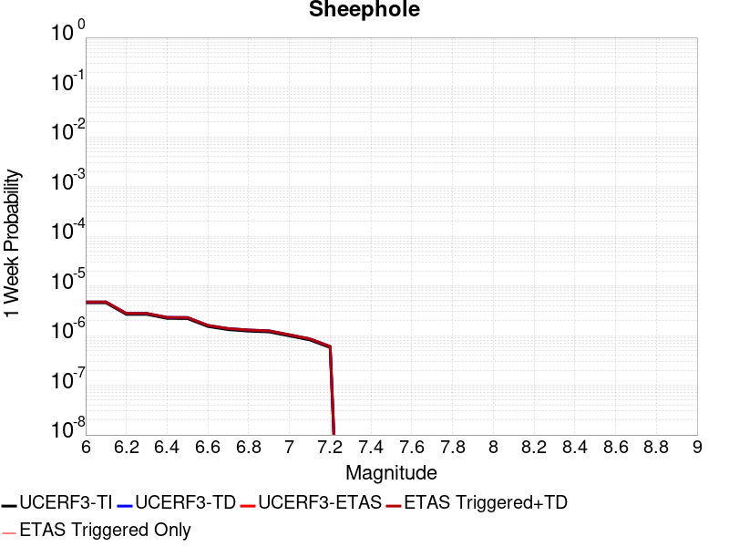 | 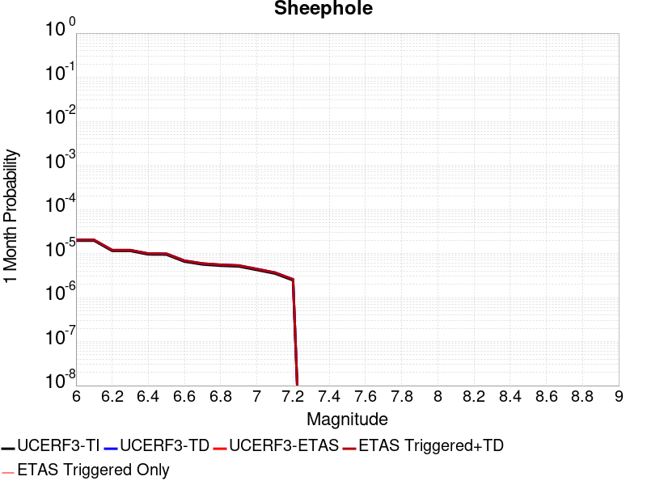 | 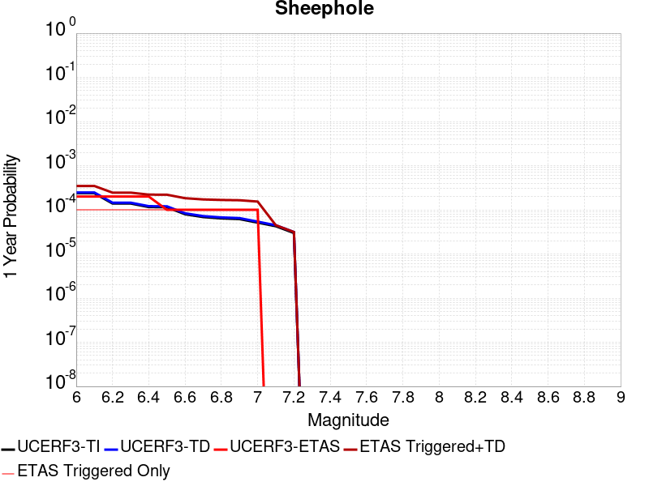 | 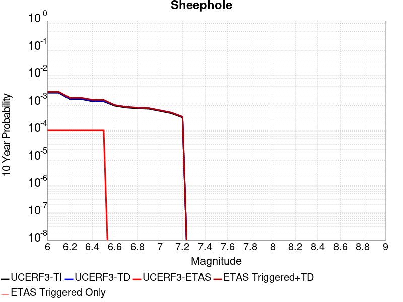 |

| Magnitude | 1 wk TI Prob | 1 wk TD Prob | 1 wk ETAS Prob | 1 wk ETAS/TD Gain | 1 wk ETAS Triggered+TD | 1 wk ETAS Triggered Only | 1 mo TI Prob | 1 mo TD Prob | 1 mo ETAS Prob | 1 mo ETAS/TD Gain | 1 mo ETAS Triggered+TD | 1 mo ETAS Triggered Only | 1 yr TI Prob | 1 yr TD Prob | 1 yr ETAS Prob | 1 yr ETAS/TD Gain | 1 yr ETAS Triggered+TD | 1 yr ETAS Triggered Only | 10 yr TI Prob | 10 yr TD Prob | 10 yr ETAS Prob | 10 yr ETAS/TD Gain | 10 yr ETAS Triggered+TD | 10 yr ETAS Triggered Only |
|-----|-----|-----|-----|-----|-----|-----|-----|-----|-----|-----|-----|-----|-----|-----|-----|-----|-----|-----|-----|-----|-----|-----|-----|-----|
| 6.0 | 4.5579695E-6 | 4.7392687E-6 | 0.0 | 0.0 | 4.7392687E-6 | 0.0 | 1.9534009E-5 | 2.0311025E-5 | 0.0 | 0.0 | 2.0311025E-5 | 0.0 | 2.3780059E-4 | 2.4726422E-4 | 2.0E-4 | 0.80885136 | 3.472395E-4 | 1.0E-4 | 0.0023754628 | 0.0024704349 | 0.0024 | 0.97148883 | 0.0031687056 | 7.0E-4 |
| 6.1 | 4.5579695E-6 | 4.7392687E-6 | 0.0 | 0.0 | 4.7392687E-6 | 0.0 | 1.9534009E-5 | 2.0311025E-5 | 0.0 | 0.0 | 2.0311025E-5 | 0.0 | 2.3780059E-4 | 2.4726422E-4 | 2.0E-4 | 0.80885136 | 3.472395E-4 | 1.0E-4 | 0.0023754628 | 0.0024704349 | 0.0024 | 0.97148883 | 0.0031687056 | 7.0E-4 |
| 6.2 | 2.6677674E-6 | 2.7860874E-6 | 0.0 | 0.0 | 2.7860874E-6 | 0.0 | 1.1433239E-5 | 1.1940326E-5 | 0.0 | 0.0 | 1.1940326E-5 | 0.0 | 1.3919079E-4 | 1.4536484E-4 | 2.0E-4 | 1.3758484 | 2.4535033E-4 | 1.0E-4 | 0.0013910364 | 0.0014528034 | 0.0014 | 0.9636541 | 0.0017523676 | 3.0E-4 |
| 6.3 | 2.6677674E-6 | 2.7860874E-6 | 0.0 | 0.0 | 2.7860874E-6 | 0.0 | 1.1433239E-5 | 1.1940326E-5 | 0.0 | 0.0 | 1.1940326E-5 | 0.0 | 1.3919079E-4 | 1.4536484E-4 | 2.0E-4 | 1.3758484 | 2.4535033E-4 | 1.0E-4 | 0.0013910364 | 0.0014528034 | 0.0014 | 0.9636541 | 0.0017523676 | 3.0E-4 |
| 6.4 | 2.2159759E-6 | 2.3217085E-6 | 0.0 | 0.0 | 2.3217085E-6 | 0.0 | 9.497005E-6 | 9.950146E-6 | 0.0 | 0.0 | 9.950146E-6 | 0.0 | 1.156199E-4 | 1.211371E-4 | 2.0E-4 | 1.6510218 | 2.2112498E-4 | 1.0E-4 | 0.0011555976 | 0.00121079 | 0.0011 | 0.9084978 | 0.0015104268 | 3.0E-4 |
| 6.5 | 2.1986082E-6 | 2.303597E-6 | 0.0 | 0.0 | 2.303597E-6 | 0.0 | 9.4225725E-6 | 9.872526E-6 | 0.0 | 0.0 | 9.872526E-6 | 0.0 | 1.1471378E-4 | 1.2019218E-4 | 1.0E-4 | 0.8320009 | 2.2018015E-4 | 1.0E-4 | 0.0011465458 | 0.0012013509 | 0.001 | 0.8323962 | 0.0015009906 | 3.0E-4 |
| 6.6 | 1.5232331E-6 | 1.6010284E-6 | 0.0 | 0.0 | 1.6010284E-6 | 0.0 | 6.5281256E-6 | 6.8615336E-6 | 0.0 | 0.0 | 6.8615336E-6 | 0.0 | 7.947703E-5 | 8.353616E-5 | 1.0E-4 | 1.1970865 | 1.8352781E-4 | 1.0E-4 | 7.9448614E-4 | 8.3506625E-4 | 8.0E-4 | 0.9580078 | 0.0010348993 | 2.0E-4 |
| 6.7 | 1.3137362E-6 | 1.3820602E-6 | 0.0 | 0.0 | 1.3820602E-6 | 0.0 | 5.6302856E-6 | 5.9231024E-6 | 0.0 | 0.0 | 5.9231024E-6 | 0.0 | 6.854657E-5 | 7.211153E-5 | 1.0E-4 | 1.3867409 | 1.7210431E-4 | 1.0E-4 | 6.8525434E-4 | 7.208951E-4 | 7.0E-4 | 0.97101504 | 9.2075096E-4 | 2.0E-4 |
| 6.8 | 1.2275751E-6 | 1.2915738E-6 | 0.0 | 0.0 | 1.2915738E-6 | 0.0 | 5.2610258E-6 | 5.535305E-6 | 0.0 | 0.0 | 5.535305E-6 | 0.0 | 6.4051106E-5 | 6.739039E-5 | 1.0E-4 | 1.4838911 | 1.6738365E-4 | 1.0E-4 | 6.4032647E-4 | 6.737129E-4 | 7.0E-4 | 1.0390183 | 8.7357813E-4 | 2.0E-4 |
| 6.9 | 1.1837088E-6 | 1.2454166E-6 | 0.0 | 0.0 | 1.2454166E-6 | 0.0 | 5.0730278E-6 | 5.3374893E-6 | 0.0 | 0.0 | 5.3374893E-6 | 0.0 | 6.176237E-5 | 6.498213E-5 | 1.0E-4 | 1.5388846 | 1.6497563E-4 | 1.0E-4 | 6.17452E-4 | 6.496444E-4 | 7.0E-4 | 1.0775125 | 8.4951444E-4 | 2.0E-4 |
| 7.0 | 9.849371E-7 | 1.036061E-6 | 0.0 | 0.0 | 1.036061E-6 | 0.0 | 4.2211523E-6 | 4.4402545E-6 | 0.0 | 0.0 | 4.4402545E-6 | 0.0 | 5.1391315E-5 | 5.405886E-5 | 1.0E-4 | 1.8498355 | 1.5405346E-4 | 1.0E-4 | 5.137943E-4 | 5.4046715E-4 | 7.0E-4 | 1.2951758 | 7.403591E-4 | 2.0E-4 |
| 7.1 | 8.1643645E-7 | 8.586976E-7 | 0.0 | 0.0 | 8.586976E-7 | 0.0 | 3.4990085E-6 | 3.680128E-6 | 0.0 | 0.0 | 3.680128E-6 | 0.0 | 4.2599597E-5 | 4.4804725E-5 | 0.0 | 0.0 | 4.4804725E-5 | 0.0 | 4.259143E-4 | 4.4796552E-4 | 5.0E-4 | 1.1161573 | 5.479207E-4 | 1.0E-4 |
| 7.2 | 5.7295756E-7 | 6.026208E-7 | 0.0 | 0.0 | 6.026208E-7 | 0.0 | 2.45553E-6 | 2.5826585E-6 | 0.0 | 0.0 | 2.5826585E-6 | 0.0 | 2.9895667E-5 | 3.144348E-5 | 0.0 | 0.0 | 3.144348E-5 | 0.0 | 2.9891645E-4 | 3.1439698E-4 | 5.0E-4 | 1.590346 | 4.1436555E-4 | 1.0E-4 |

## Joshua Tree (Seismicity)
*[(top)](#table-of-contents)*

| 1 Week | 1 Month | 1 Year | 10 Year |
|-----|-----|-----|-----|
| 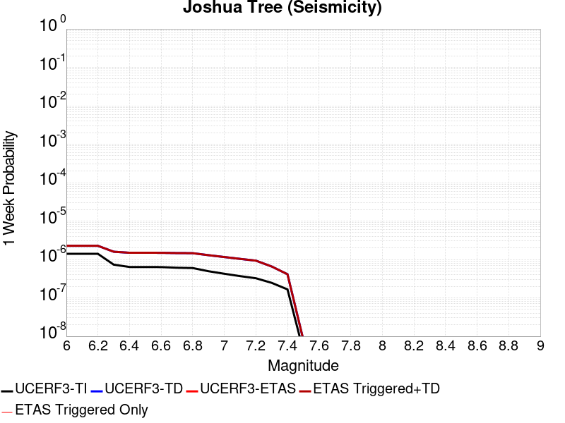 | 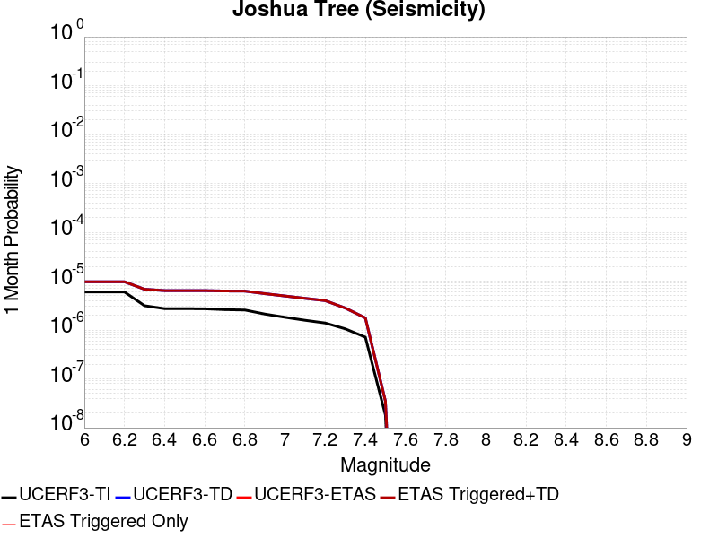 | 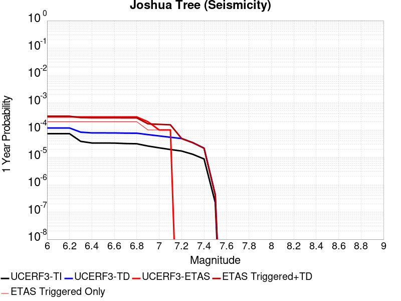 | 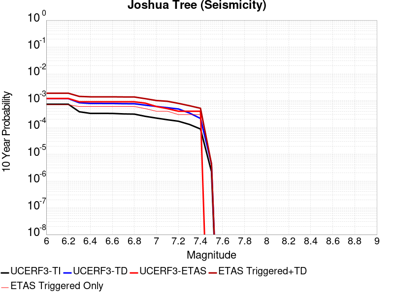 |

| Magnitude | 1 wk TI Prob | 1 wk TD Prob | 1 wk ETAS Prob | 1 wk ETAS/TD Gain | 1 wk ETAS Triggered+TD | 1 wk ETAS Triggered Only | 1 mo TI Prob | 1 mo TD Prob | 1 mo ETAS Prob | 1 mo ETAS/TD Gain | 1 mo ETAS Triggered+TD | 1 mo ETAS Triggered Only | 1 yr TI Prob | 1 yr TD Prob | 1 yr ETAS Prob | 1 yr ETAS/TD Gain | 1 yr ETAS Triggered+TD | 1 yr ETAS Triggered Only | 10 yr TI Prob | 10 yr TD Prob | 10 yr ETAS Prob | 10 yr ETAS/TD Gain | 10 yr ETAS Triggered+TD | 10 yr ETAS Triggered Only |
|-----|-----|-----|-----|-----|-----|-----|-----|-----|-----|-----|-----|-----|-----|-----|-----|-----|-----|-----|-----|-----|-----|-----|-----|-----|
| 6.0 | 1.4025588E-6 | 2.2676832E-6 | 0.0 | 0.0 | 2.2676832E-6 | 0.0 | 6.0109523E-6 | 9.718609E-6 | 0.0 | 0.0 | 9.718609E-6 | 0.0 | 7.318089E-5 | 1.183183E-4 | 3.0E-4 | 2.5355334 | 3.1829462E-4 | 2.0E-4 | 7.315679E-4 | 0.001182617 | 0.0012 | 1.0146987 | 0.0018817892 | 7.0E-4 |
| 6.1 | 1.4025588E-6 | 2.2676832E-6 | 0.0 | 0.0 | 2.2676832E-6 | 0.0 | 6.0109523E-6 | 9.718609E-6 | 0.0 | 0.0 | 9.718609E-6 | 0.0 | 7.318089E-5 | 1.183183E-4 | 3.0E-4 | 2.5355334 | 3.1829462E-4 | 2.0E-4 | 7.315679E-4 | 0.001182617 | 0.0012 | 1.0146987 | 0.0018817892 | 7.0E-4 |
| 6.2 | 1.4025588E-6 | 2.2676832E-6 | 0.0 | 0.0 | 2.2676832E-6 | 0.0 | 6.0109523E-6 | 9.718609E-6 | 0.0 | 0.0 | 9.718609E-6 | 0.0 | 7.318089E-5 | 1.183183E-4 | 3.0E-4 | 2.5355334 | 3.1829462E-4 | 2.0E-4 | 7.315679E-4 | 0.001182617 | 0.0012 | 1.0146987 | 0.0018817892 | 7.0E-4 |
| 6.3 | 7.3325685E-7 | 1.5917843E-6 | 0.0 | 0.0 | 1.5917843E-6 | 0.0 | 3.1425257E-6 | 6.821915E-6 | 0.0 | 0.0 | 6.821915E-6 | 0.0 | 3.825958E-5 | 8.305374E-5 | 3.0E-4 | 3.6121192 | 2.8303714E-4 | 2.0E-4 | 3.8252992E-4 | 8.302354E-4 | 9.0E-4 | 1.0840299 | 0.0014297373 | 6.0E-4 |
| 6.4 | 6.38256E-7 | 1.4960411E-6 | 0.0 | 0.0 | 1.4960411E-6 | 0.0 | 2.7353801E-6 | 6.4115893E-6 | 0.0 | 0.0 | 6.4115893E-6 | 0.0 | 3.3302742E-5 | 7.805838E-5 | 3.0E-4 | 3.8432775 | 2.7804277E-4 | 2.0E-4 | 3.3297754E-4 | 7.803169E-4 | 9.0E-4 | 1.1533775 | 0.0013798487 | 6.0E-4 |
| 6.5 | 6.38256E-7 | 1.4960411E-6 | 0.0 | 0.0 | 1.4960411E-6 | 0.0 | 2.7353801E-6 | 6.4115893E-6 | 0.0 | 0.0 | 6.4115893E-6 | 0.0 | 3.3302742E-5 | 7.805838E-5 | 3.0E-4 | 3.8432775 | 2.7804277E-4 | 2.0E-4 | 3.3297754E-4 | 7.803169E-4 | 9.0E-4 | 1.1533775 | 0.0013798487 | 6.0E-4 |
| 6.6 | 6.3436806E-7 | 1.4931345E-6 | 0.0 | 0.0 | 1.4931345E-6 | 0.0 | 2.7187175E-6 | 6.3991324E-6 | 0.0 | 0.0 | 6.3991324E-6 | 0.0 | 3.3099885E-5 | 7.790673E-5 | 3.0E-4 | 3.8507588 | 2.7789114E-4 | 2.0E-4 | 3.3094952E-4 | 7.7880145E-4 | 9.0E-4 | 1.1556219 | 0.0013783341 | 6.0E-4 |
| 6.7 | 6.094856E-7 | 1.4678295E-6 | 0.0 | 0.0 | 1.4678295E-6 | 0.0 | 2.6120786E-6 | 6.2906834E-6 | 0.0 | 0.0 | 6.2906834E-6 | 0.0 | 3.1801592E-5 | 7.6586446E-5 | 3.0E-4 | 3.917142 | 2.7657114E-4 | 2.0E-4 | 3.179704E-4 | 7.656078E-4 | 9.0E-4 | 1.1755366 | 0.0013651485 | 6.0E-4 |
| 6.8 | 5.984801E-7 | 1.4591386E-6 | 0.0 | 0.0 | 1.4591386E-6 | 0.0 | 2.564912E-6 | 6.253437E-6 | 0.0 | 0.0 | 6.253437E-6 | 0.0 | 3.1227355E-5 | 7.6133E-5 | 3.0E-4 | 3.9404724 | 2.761178E-4 | 2.0E-4 | 3.1222968E-4 | 7.6107646E-4 | 9.0E-4 | 1.1825356 | 0.0013606198 | 6.0E-4 |
| 6.9 | 4.94631E-7 | 1.294072E-6 | 0.0 | 0.0 | 1.294072E-6 | 0.0 | 2.1198455E-6 | 5.5460114E-6 | 0.0 | 0.0 | 5.5460114E-6 | 0.0 | 2.5808813E-5 | 6.7520654E-5 | 2.0E-4 | 2.9620564 | 1.675139E-4 | 1.0E-4 | 2.5805813E-4 | 6.750073E-4 | 8.0E-4 | 1.1851724 | 0.0011746698 | 5.0E-4 |
| 7.0 | 4.250375E-7 | 1.1582135E-6 | 0.0 | 0.0 | 1.1582135E-6 | 0.0 | 1.8215881E-6 | 4.9637633E-6 | 0.0 | 0.0 | 4.9637633E-6 | 0.0 | 2.2177608E-5 | 6.043219E-5 | 1.0E-4 | 1.6547472 | 1.6042615E-4 | 1.0E-4 | 2.2175396E-4 | 6.041625E-4 | 6.0E-4 | 0.99311024 | 0.0010039209 | 4.0E-4 |
| 7.1 | 3.6888565E-7 | 1.0370474E-6 | 0.0 | 0.0 | 1.0370474E-6 | 0.0 | 1.5809376E-6 | 4.4444814E-6 | 0.0 | 0.0 | 4.4444814E-6 | 0.0 | 1.9247746E-5 | 5.4110264E-5 | 1.0E-4 | 1.8480783 | 1.5410486E-4 | 1.0E-4 | 1.9246078E-4 | 5.409752E-4 | 5.0E-4 | 0.92425674 | 9.407588E-4 | 4.0E-4 |
| 7.2 | 3.2473773E-7 | 9.321722E-7 | 0.0 | 0.0 | 9.321722E-7 | 0.0 | 1.3917323E-6 | 3.995018E-6 | 0.0 | 0.0 | 3.995018E-6 | 0.0 | 1.694421E-5 | 4.8638296E-5 | 0.0 | 0.0 | 4.8638296E-5 | 0.0 | 1.6942917E-4 | 4.8628054E-4 | 4.0E-4 | 0.82257044 | 7.861346E-4 | 3.0E-4 |
| 7.3 | 2.465367E-7 | 6.5670247E-7 | 0.0 | 0.0 | 6.5670247E-7 | 0.0 | 1.0565853E-6 | 2.8144364E-6 | 0.0 | 0.0 | 2.8144364E-6 | 0.0 | 1.2863851E-5 | 3.4265257E-5 | 0.0 | 0.0 | 3.4265257E-5 | 0.0 | 1.2863107E-4 | 3.426031E-4 | 4.0E-4 | 1.1675317 | 6.425003E-4 | 3.0E-4 |
| 7.4 | 1.6654941E-7 | 4.128732E-7 | 0.0 | 0.0 | 4.128732E-7 | 0.0 | 7.13783E-7 | 1.7694555E-6 | 0.0 | 0.0 | 1.7694555E-6 | 0.0 | 8.690274E-6 | 2.1542934E-5 | 0.0 | 0.0 | 2.1542934E-5 | 0.0 | 8.689934E-5 | 2.1541113E-4 | 4.0E-4 | 1.8569143 | 5.1534653E-4 | 3.0E-4 |
| 7.5 | 4.24214E-9 | 8.191514E-9 | 0.0 | 0.0 | 8.191514E-9 | 0.0 | 1.81806E-8 | 3.510649E-8 | 0.0 | 0.0 | 3.510649E-8 | 0.0 | 2.213488E-7 | 4.2742147E-7 | 0.0 | 0.0 | 4.2742147E-7 | 0.0 | 2.2134857E-6 | 4.2742126E-6 | 0.0 | 0.0 | 4.2742126E-6 | 0.0 |

## Swain Ravine - Spenceville
*[(top)](#table-of-contents)*

| 1 Week | 1 Month | 1 Year | 10 Year |
|-----|-----|-----|-----|
| 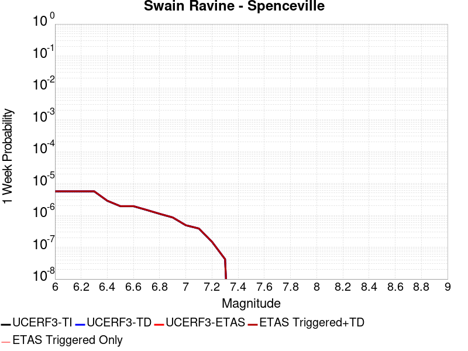 | 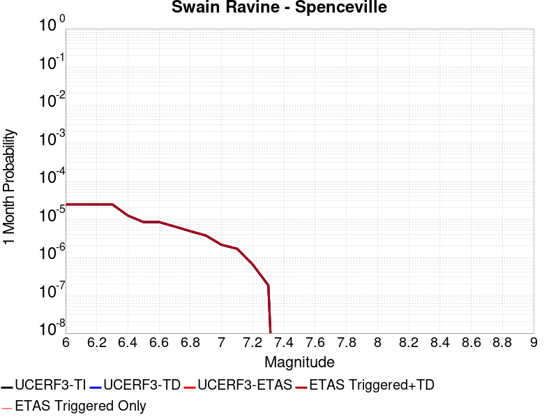 | 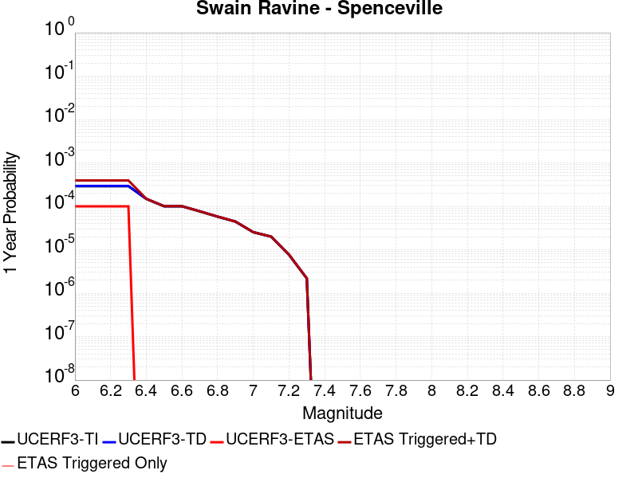 | 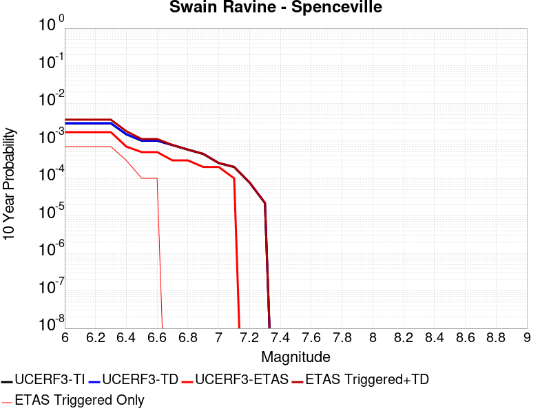 |

| Magnitude | 1 wk TI Prob | 1 wk TD Prob | 1 wk ETAS Prob | 1 wk ETAS/TD Gain | 1 wk ETAS Triggered+TD | 1 wk ETAS Triggered Only | 1 mo TI Prob | 1 mo TD Prob | 1 mo ETAS Prob | 1 mo ETAS/TD Gain | 1 mo ETAS Triggered+TD | 1 mo ETAS Triggered Only | 1 yr TI Prob | 1 yr TD Prob | 1 yr ETAS Prob | 1 yr ETAS/TD Gain | 1 yr ETAS Triggered+TD | 1 yr ETAS Triggered Only | 10 yr TI Prob | 10 yr TD Prob | 10 yr ETAS Prob | 10 yr ETAS/TD Gain | 10 yr ETAS Triggered+TD | 10 yr ETAS Triggered Only |
|-----|-----|-----|-----|-----|-----|-----|-----|-----|-----|-----|-----|-----|-----|-----|-----|-----|-----|-----|-----|-----|-----|-----|-----|-----|
| 6.0 | 5.596169E-6 | 5.6630797E-6 | 0.0 | 0.0 | 5.6630797E-6 | 0.0 | 2.398336E-5 | 2.427013E-5 | 0.0 | 0.0 | 2.427013E-5 | 0.0 | 2.9195828E-4 | 2.954515E-4 | 1.0E-4 | 0.33846503 | 3.9542196E-4 | 1.0E-4 | 0.00291575 | 0.002950856 | 0.0017 | 0.576104 | 0.0036487905 | 7.0E-4 |
| 6.1 | 5.596169E-6 | 5.6630797E-6 | 0.0 | 0.0 | 5.6630797E-6 | 0.0 | 2.398336E-5 | 2.427013E-5 | 0.0 | 0.0 | 2.427013E-5 | 0.0 | 2.9195828E-4 | 2.954515E-4 | 1.0E-4 | 0.33846503 | 3.9542196E-4 | 1.0E-4 | 0.00291575 | 0.002950856 | 0.0017 | 0.576104 | 0.0036487905 | 7.0E-4 |
| 6.2 | 5.596169E-6 | 5.6630797E-6 | 0.0 | 0.0 | 5.6630797E-6 | 0.0 | 2.398336E-5 | 2.427013E-5 | 0.0 | 0.0 | 2.427013E-5 | 0.0 | 2.9195828E-4 | 2.954515E-4 | 1.0E-4 | 0.33846503 | 3.9542196E-4 | 1.0E-4 | 0.00291575 | 0.002950856 | 0.0017 | 0.576104 | 0.0036487905 | 7.0E-4 |
| 6.3 | 5.596169E-6 | 5.6630797E-6 | 0.0 | 0.0 | 5.6630797E-6 | 0.0 | 2.398336E-5 | 2.427013E-5 | 0.0 | 0.0 | 2.427013E-5 | 0.0 | 2.9195828E-4 | 2.954515E-4 | 1.0E-4 | 0.33846503 | 3.9542196E-4 | 1.0E-4 | 0.00291575 | 0.002950856 | 0.0017 | 0.576104 | 0.0036487905 | 7.0E-4 |
| 6.4 | 2.8426775E-6 | 2.8738118E-6 | 0.0 | 0.0 | 2.8738118E-6 | 0.0 | 1.2182847E-5 | 1.231628E-5 | 0.0 | 0.0 | 1.231628E-5 | 0.0 | 1.4831607E-4 | 1.4994078E-4 | 0.0 | 0.0 | 1.4994078E-4 | 0.0 | 0.0014821711 | 0.0014984346 | 7.0E-4 | 0.4671542 | 0.001797985 | 3.0E-4 |
| 6.5 | 1.9210793E-6 | 1.9412E-6 | 0.0 | 0.0 | 1.9412E-6 | 0.0 | 8.233172E-6 | 8.319404E-6 | 0.0 | 0.0 | 8.319404E-6 | 0.0 | 1.0023425E-4 | 1.0128416E-4 | 0.0 | 0.0 | 1.0128416E-4 | 0.0 | 0.0010018905 | 0.0010123934 | 5.0E-4 | 0.49387914 | 0.0011122922 | 1.0E-4 |
| 6.6 | 1.9210793E-6 | 1.9412E-6 | 0.0 | 0.0 | 1.9412E-6 | 0.0 | 8.233172E-6 | 8.319404E-6 | 0.0 | 0.0 | 8.319404E-6 | 0.0 | 1.0023425E-4 | 1.0128416E-4 | 0.0 | 0.0 | 1.0128416E-4 | 0.0 | 0.0010018905 | 0.0010123934 | 5.0E-4 | 0.49387914 | 0.0011122922 | 1.0E-4 |
| 6.7 | 1.4667394E-6 | 1.4817335E-6 | 0.0 | 0.0 | 1.4817335E-6 | 0.0 | 6.286011E-6 | 6.350271E-6 | 0.0 | 0.0 | 6.350271E-6 | 0.0 | 7.65295E-5 | 7.731189E-5 | 0.0 | 0.0 | 7.731189E-5 | 0.0 | 7.6503144E-4 | 7.7285763E-4 | 3.0E-4 | 0.3881698 | 7.7285763E-4 | 0.0 |
| 6.8 | 1.1076943E-6 | 1.1188347E-6 | 0.0 | 0.0 | 1.1188347E-6 | 0.0 | 4.747252E-6 | 4.7949975E-6 | 0.0 | 0.0 | 4.7949975E-6 | 0.0 | 5.7796264E-5 | 5.8377573E-5 | 0.0 | 0.0 | 5.8377573E-5 | 0.0 | 5.778124E-4 | 5.836268E-4 | 3.0E-4 | 0.5140271 | 5.836268E-4 | 0.0 |
| 6.9 | 8.514296E-7 | 8.59919E-7 | 0.0 | 0.0 | 8.59919E-7 | 0.0 | 3.648979E-6 | 3.6853621E-6 | 0.0 | 0.0 | 3.6853621E-6 | 0.0 | 4.442541E-5 | 4.486839E-5 | 0.0 | 0.0 | 4.486839E-5 | 0.0 | 4.441653E-4 | 4.4859614E-4 | 2.0E-4 | 0.4458353 | 4.4859614E-4 | 0.0 |
| 7.0 | 4.8544706E-7 | 4.902785E-7 | 0.0 | 0.0 | 4.902785E-7 | 0.0 | 2.0804857E-6 | 2.1011922E-6 | 0.0 | 0.0 | 2.1011922E-6 | 0.0 | 2.532962E-5 | 2.5581727E-5 | 0.0 | 0.0 | 2.5581727E-5 | 0.0 | 2.5326732E-4 | 2.557891E-4 | 2.0E-4 | 0.7818941 | 2.557891E-4 | 0.0 |
| 7.1 | 3.829186E-7 | 3.8674702E-7 | 0.0 | 0.0 | 3.8674702E-7 | 0.0 | 1.6410787E-6 | 1.6574862E-6 | 0.0 | 0.0 | 1.6574862E-6 | 0.0 | 1.997995E-5 | 2.017972E-5 | 0.0 | 0.0 | 2.017972E-5 | 0.0 | 1.9978154E-4 | 2.0177993E-4 | 1.0E-4 | 0.49558944 | 2.0177993E-4 | 0.0 |
| 7.2 | 1.4726595E-7 | 1.4877826E-7 | 0.0 | 0.0 | 1.4877826E-7 | 0.0 | 6.3113964E-7 | 6.3762093E-7 | 0.0 | 0.0 | 6.3762093E-7 | 0.0 | 7.684098E-6 | 7.763013E-6 | 0.0 | 0.0 | 7.763013E-6 | 0.0 | 7.6838325E-5 | 7.762795E-5 | 0.0 | 0.0 | 7.762795E-5 | 0.0 |
| 7.3 | 4.1880604E-8 | 4.2319623E-8 | 0.0 | 0.0 | 4.2319623E-8 | 0.0 | 1.7948828E-7 | 1.8136981E-7 | 0.0 | 0.0 | 1.8136981E-7 | 0.0 | 2.1852677E-6 | 2.2081774E-6 | 0.0 | 0.0 | 2.2081774E-6 | 0.0 | 2.1852462E-5 | 2.2081775E-5 | 0.0 | 0.0 | 2.2081775E-5 | 0.0 |

## Newport-Inglewood (Offshore)
*[(top)](#table-of-contents)*

| 1 Week | 1 Month | 1 Year | 10 Year |
|-----|-----|-----|-----|
| 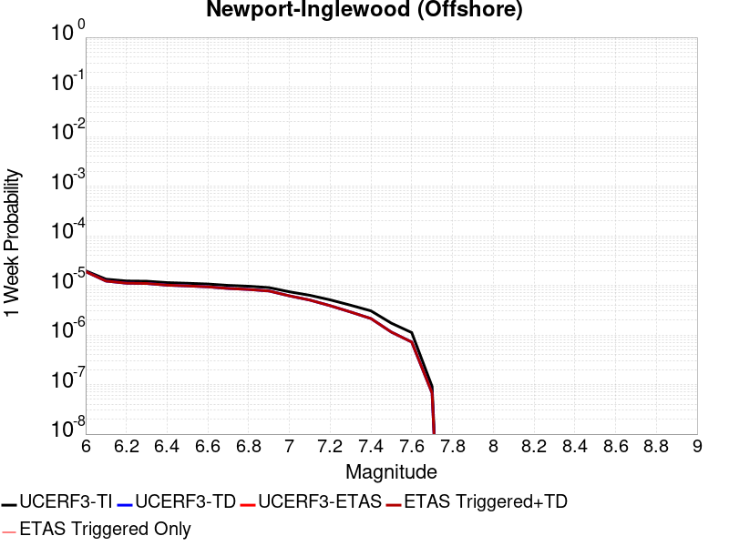 | 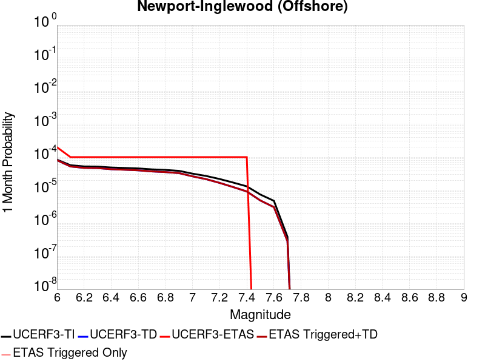 | 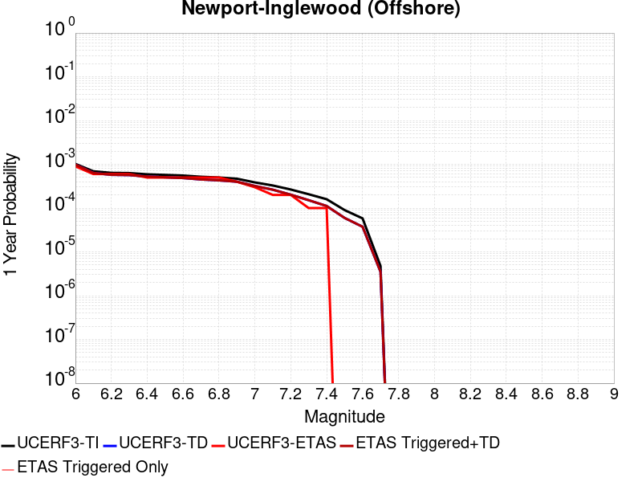 | 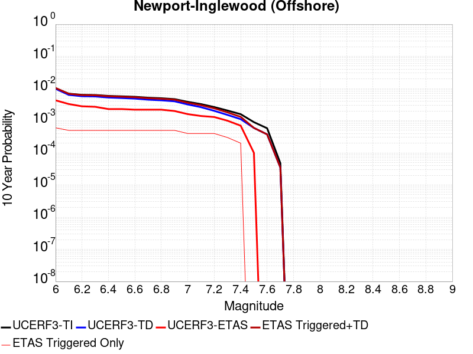 |

| Magnitude | 1 wk TI Prob | 1 wk TD Prob | 1 wk ETAS Prob | 1 wk ETAS/TD Gain | 1 wk ETAS Triggered+TD | 1 wk ETAS Triggered Only | 1 mo TI Prob | 1 mo TD Prob | 1 mo ETAS Prob | 1 mo ETAS/TD Gain | 1 mo ETAS Triggered+TD | 1 mo ETAS Triggered Only | 1 yr TI Prob | 1 yr TD Prob | 1 yr ETAS Prob | 1 yr ETAS/TD Gain | 1 yr ETAS Triggered+TD | 1 yr ETAS Triggered Only | 10 yr TI Prob | 10 yr TD Prob | 10 yr ETAS Prob | 10 yr ETAS/TD Gain | 10 yr ETAS Triggered+TD | 10 yr ETAS Triggered Only |
|-----|-----|-----|-----|-----|-----|-----|-----|-----|-----|-----|-----|-----|-----|-----|-----|-----|-----|-----|-----|-----|-----|-----|-----|-----|
| 6.0 | 1.9626508E-5 | 1.8942836E-5 | 0.0 | 0.0 | 1.8942836E-5 | 0.0 | 8.411089E-5 | 8.1181126E-5 | 2.0E-4 | 2.4636269 | 8.1181126E-5 | 0.0 | 0.001023569 | 9.879447E-4 | 9.0E-4 | 0.91098225 | 9.879447E-4 | 0.0 | 0.010188672 | 0.009836866 | 0.0043 | 0.4371311 | 0.010430964 | 6.0E-4 |
| 6.1 | 1.331886E-5 | 1.220048E-5 | 0.0 | 0.0 | 1.220048E-5 | 0.0 | 5.707958E-5 | 5.2286734E-5 | 1.0E-4 | 1.912531 | 5.2286734E-5 | 0.0 | 6.947222E-4 | 6.3640653E-4 | 6.0E-4 | 0.94279355 | 6.3640653E-4 | 0.0 | 0.006925544 | 0.0063460176 | 0.0033 | 0.5200112 | 0.0068428447 | 5.0E-4 |
| 6.2 | 1.2250852E-5 | 1.1059245E-5 | 0.0 | 0.0 | 1.1059245E-5 | 0.0 | 5.2502597E-5 | 4.7395908E-5 | 1.0E-4 | 2.109887 | 4.7395908E-5 | 0.0 | 6.3903164E-4 | 5.768934E-4 | 6.0E-4 | 1.0400535 | 5.768934E-4 | 0.0 | 0.006371971 | 0.0057540787 | 0.0028 | 0.48661134 | 0.0062512015 | 5.0E-4 |
| 6.3 | 1.2106258E-5 | 1.09022485E-5 | 0.0 | 0.0 | 1.09022485E-5 | 0.0 | 5.1882926E-5 | 4.672309E-5 | 1.0E-4 | 2.1402693 | 4.672309E-5 | 0.0 | 6.3149154E-4 | 5.6870613E-4 | 6.0E-4 | 1.0550264 | 5.6870613E-4 | 0.0 | 0.0062970007 | 0.0056726243 | 0.0027 | 0.47597018 | 0.006169788 | 5.0E-4 |
| 6.4 | 1.1348758E-5 | 1.00933E-5 | 0.0 | 0.0 | 1.00933E-5 | 0.0 | 4.8636626E-5 | 4.3256285E-5 | 1.0E-4 | 2.3118026 | 4.3256285E-5 | 0.0 | 5.919901E-4 | 5.2651885E-4 | 5.0E-4 | 0.94963366 | 5.2651885E-4 | 0.0 | 0.005904155 | 0.0052528093 | 0.0023 | 0.43786094 | 0.0057501826 | 5.0E-4 |
| 6.5 | 1.100837E-5 | 9.727614E-6 | 0.0 | 0.0 | 9.727614E-6 | 0.0 | 4.7177873E-5 | 4.1689116E-5 | 1.0E-4 | 2.3987076 | 4.1689116E-5 | 0.0 | 5.7423924E-4 | 5.074475E-4 | 5.0E-4 | 0.98532355 | 5.074475E-4 | 0.0 | 0.005727576 | 0.005062979 | 0.0023 | 0.454278 | 0.005560448 | 5.0E-4 |
| 6.6 | 1.0634696E-5 | 9.330088E-6 | 0.0 | 0.0 | 9.330088E-6 | 0.0 | 4.557647E-5 | 3.998548E-5 | 1.0E-4 | 2.5009077 | 3.998548E-5 | 0.0 | 5.5475225E-4 | 4.8671523E-4 | 5.0E-4 | 1.0272948 | 4.8671523E-4 | 0.0 | 0.0055336943 | 0.004856579 | 0.0022 | 0.45299378 | 0.0053541507 | 5.0E-4 |
| 6.7 | 9.9780855E-6 | 8.652963E-6 | 0.0 | 0.0 | 8.652963E-6 | 0.0 | 4.276252E-5 | 3.70836E-5 | 1.0E-4 | 2.6966097 | 3.70836E-5 | 0.0 | 5.205093E-4 | 4.514E-4 | 5.0E-4 | 1.1076651 | 4.514E-4 | 0.0 | 0.0051929182 | 0.0045049097 | 0.0022 | 0.48835605 | 0.0050026574 | 5.0E-4 |
| 6.8 | 9.59546E-6 | 8.258268E-6 | 0.0 | 0.0 | 8.258268E-6 | 0.0 | 4.1122752E-5 | 3.5392102E-5 | 1.0E-4 | 2.825489 | 3.5392102E-5 | 0.0 | 5.0055445E-4 | 4.308143E-4 | 5.0E-4 | 1.1605928 | 4.308143E-4 | 0.0 | 0.004994285 | 0.004299867 | 0.0022 | 0.51164377 | 0.004797717 | 5.0E-4 |
| 6.9 | 9.000614E-6 | 7.69295E-6 | 0.0 | 0.0 | 7.69295E-6 | 0.0 | 3.857349E-5 | 3.2969372E-5 | 1.0E-4 | 3.0331182 | 3.2969372E-5 | 0.0 | 4.6953102E-4 | 4.013288E-4 | 4.0E-4 | 0.99668896 | 4.013288E-4 | 0.0 | 0.004685402 | 0.004006112 | 0.002 | 0.49923718 | 0.004504109 | 5.0E-4 |
| 7.0 | 7.4070194E-6 | 6.1377764E-6 | 0.0 | 0.0 | 6.1377764E-6 | 0.0 | 3.1743984E-5 | 2.6304491E-5 | 1.0E-4 | 3.8016322 | 2.6304491E-5 | 0.0 | 3.8641447E-4 | 3.2021027E-4 | 3.0E-4 | 0.93688434 | 3.2021027E-4 | 0.0 | 0.0038574322 | 0.0031975084 | 0.0016 | 0.5003896 | 0.0035962295 | 4.0E-4 |
| 7.1 | 6.299615E-6 | 5.04755E-6 | 0.0 | 0.0 | 5.04755E-6 | 0.0 | 2.699807E-5 | 2.1632179E-5 | 1.0E-4 | 4.6227427 | 2.1632179E-5 | 0.0 | 3.2865192E-4 | 2.6334007E-4 | 2.0E-4 | 0.7594742 | 2.6334007E-4 | 0.0 | 0.003281663 | 0.002630295 | 0.0014 | 0.5322597 | 0.0030292429 | 4.0E-4 |
| 7.2 | 5.096653E-6 | 3.8846547E-6 | 0.0 | 0.0 | 3.8846547E-6 | 0.0 | 2.1842614E-5 | 1.6648415E-5 | 1.0E-4 | 6.006578 | 1.6648415E-5 | 0.0 | 2.6590136E-4 | 2.026757E-4 | 2.0E-4 | 0.98679817 | 2.026757E-4 | 0.0 | 0.0026558342 | 0.0020249197 | 0.0013 | 0.6420008 | 0.0024241097 | 4.0E-4 |
| 7.3 | 3.9753018E-6 | 2.9032703E-6 | 0.0 | 0.0 | 2.9032703E-6 | 0.0 | 1.7036897E-5 | 1.2442529E-5 | 1.0E-4 | 8.036952 | 1.2442529E-5 | 0.0 | 2.0740448E-4 | 1.5147733E-4 | 1.0E-4 | 0.6601648 | 1.5147733E-4 | 0.0 | 0.00207211 | 0.0015137489 | 0.001 | 0.66061157 | 0.0018132947 | 3.0E-4 |
| 7.4 | 3.0568392E-6 | 2.1394835E-6 | 0.0 | 0.0 | 2.1394835E-6 | 0.0 | 1.3100675E-5 | 9.169184E-6 | 1.0E-4 | 10.906096 | 9.169184E-6 | 0.0 | 1.5948903E-4 | 1.1162915E-4 | 1.0E-4 | 0.89582336 | 1.1162915E-4 | 0.0 | 0.0015937461 | 0.001115737 | 7.0E-4 | 0.627388 | 0.0013155139 | 2.0E-4 |
| 7.5 | 1.7279019E-6 | 1.1426654E-6 | 0.0 | 0.0 | 1.1426654E-6 | 0.0 | 7.405273E-6 | 4.8971283E-6 | 0.0 | 0.0 | 4.8971283E-6 | 0.0 | 9.015547E-5 | 5.9620947E-5 | 0.0 | 0.0 | 5.9620947E-5 | 0.0 | 9.01189E-4 | 5.960534E-4 | 1.0E-4 | 0.16777022 | 5.960534E-4 | 0.0 |
| 7.6 | 1.1156416E-6 | 7.1933835E-7 | 0.0 | 0.0 | 7.1933835E-7 | 0.0 | 4.7813123E-6 | 3.082875E-6 | 0.0 | 0.0 | 3.082875E-6 | 0.0 | 5.821092E-5 | 3.753338E-5 | 0.0 | 0.0 | 3.753338E-5 | 0.0 | 5.8195676E-4 | 3.7527274E-4 | 0.0 | 0.0 | 3.7527274E-4 | 0.0 |
| 7.7 | 9.117973E-8 | 6.730833E-8 | 0.0 | 0.0 | 6.730833E-8 | 0.0 | 3.907702E-7 | 2.8846424E-7 | 0.0 | 0.0 | 2.8846424E-7 | 0.0 | 4.757617E-6 | 3.5120468E-6 | 0.0 | 0.0 | 3.5120468E-6 | 0.0 | 4.7575148E-5 | 3.511994E-5 | 0.0 | 0.0 | 3.511994E-5 | 0.0 |

## Las Positas
*[(top)](#table-of-contents)*

| 1 Week | 1 Month | 1 Year | 10 Year |
|-----|-----|-----|-----|
| 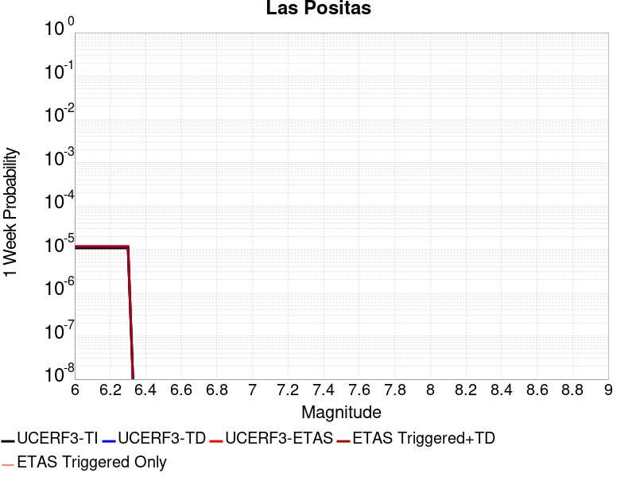 | 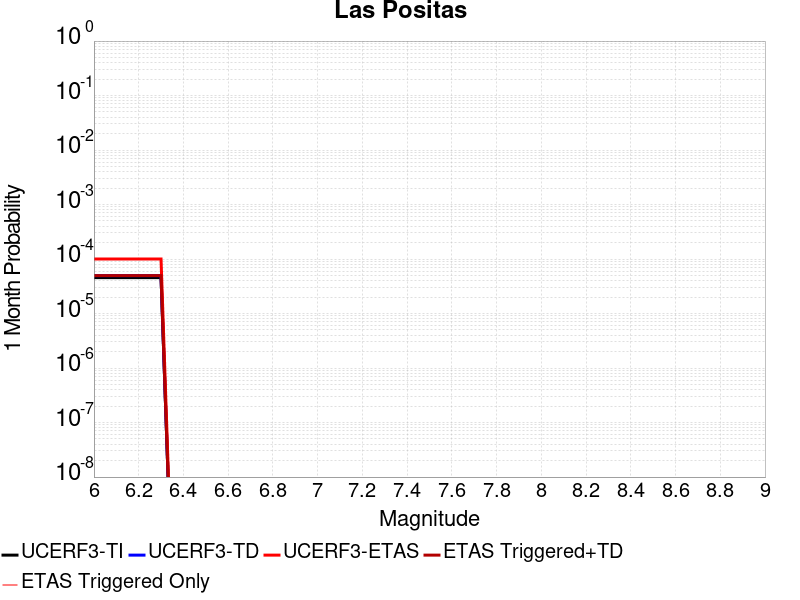 | 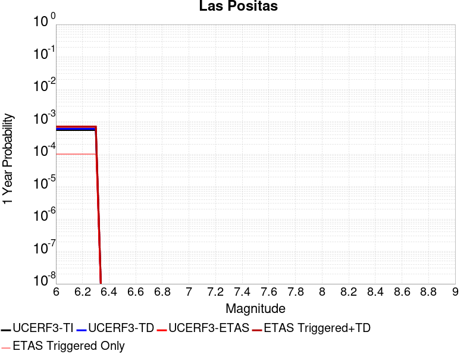 | 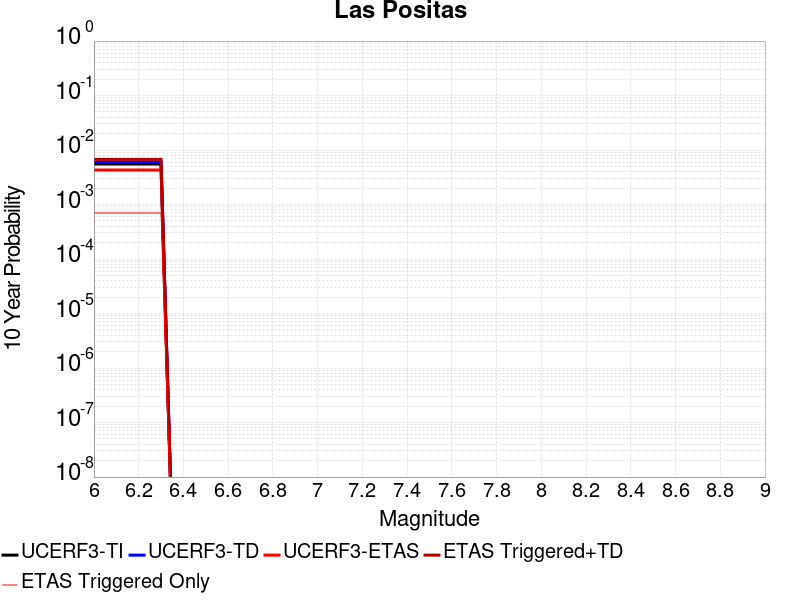 |

| Magnitude | 1 wk TI Prob | 1 wk TD Prob | 1 wk ETAS Prob | 1 wk ETAS/TD Gain | 1 wk ETAS Triggered+TD | 1 wk ETAS Triggered Only | 1 mo TI Prob | 1 mo TD Prob | 1 mo ETAS Prob | 1 mo ETAS/TD Gain | 1 mo ETAS Triggered+TD | 1 mo ETAS Triggered Only | 1 yr TI Prob | 1 yr TD Prob | 1 yr ETAS Prob | 1 yr ETAS/TD Gain | 1 yr ETAS Triggered+TD | 1 yr ETAS Triggered Only | 10 yr TI Prob | 10 yr TD Prob | 10 yr ETAS Prob | 10 yr ETAS/TD Gain | 10 yr ETAS Triggered+TD | 10 yr ETAS Triggered Only |
|-----|-----|-----|-----|-----|-----|-----|-----|-----|-----|-----|-----|-----|-----|-----|-----|-----|-----|-----|-----|-----|-----|-----|-----|-----|
| 6.0 | 1.0659424E-5 | 1.1580553E-5 | 0.0 | 0.0 | 1.1580553E-5 | 0.0 | 4.568245E-5 | 4.9630944E-5 | 1.0E-4 | 2.014872 | 4.9630944E-5 | 0.0 | 5.560419E-4 | 6.0425675E-4 | 7.0E-4 | 1.158448 | 7.0419634E-4 | 1.0E-4 | 0.005546526 | 0.0060425675 | 0.0043 | 0.711618 | 0.0067383377 | 7.0E-4 |
| 6.1 | 1.0659424E-5 | 1.1580553E-5 | 0.0 | 0.0 | 1.1580553E-5 | 0.0 | 4.568245E-5 | 4.9630944E-5 | 1.0E-4 | 2.014872 | 4.9630944E-5 | 0.0 | 5.560419E-4 | 6.0425675E-4 | 7.0E-4 | 1.158448 | 7.0419634E-4 | 1.0E-4 | 0.005546526 | 0.0060425675 | 0.0043 | 0.711618 | 0.0067383377 | 7.0E-4 |
| 6.2 | 1.0659424E-5 | 1.1580553E-5 | 0.0 | 0.0 | 1.1580553E-5 | 0.0 | 4.568245E-5 | 4.9630944E-5 | 1.0E-4 | 2.014872 | 4.9630944E-5 | 0.0 | 5.560419E-4 | 6.0425675E-4 | 7.0E-4 | 1.158448 | 7.0419634E-4 | 1.0E-4 | 0.005546526 | 0.0060425675 | 0.0043 | 0.711618 | 0.0067383377 | 7.0E-4 |
| 6.3 | 1.0659424E-5 | 1.1580553E-5 | 0.0 | 0.0 | 1.1580553E-5 | 0.0 | 4.568245E-5 | 4.9630944E-5 | 1.0E-4 | 2.014872 | 4.9630944E-5 | 0.0 | 5.560419E-4 | 6.0425675E-4 | 7.0E-4 | 1.158448 | 7.0419634E-4 | 1.0E-4 | 0.005546526 | 0.0060425675 | 0.0043 | 0.711618 | 0.0067383377 | 7.0E-4 |

## Sierra Madre
*[(top)](#table-of-contents)*

| 1 Week | 1 Month | 1 Year | 10 Year |
|-----|-----|-----|-----|
| 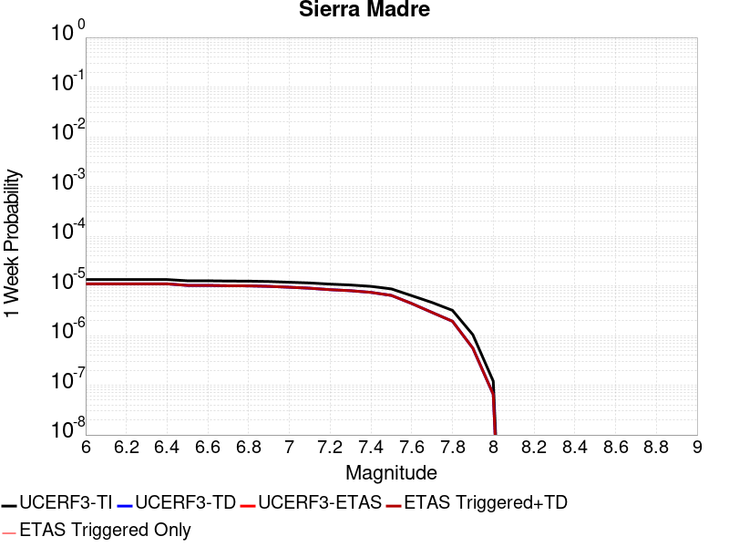 | 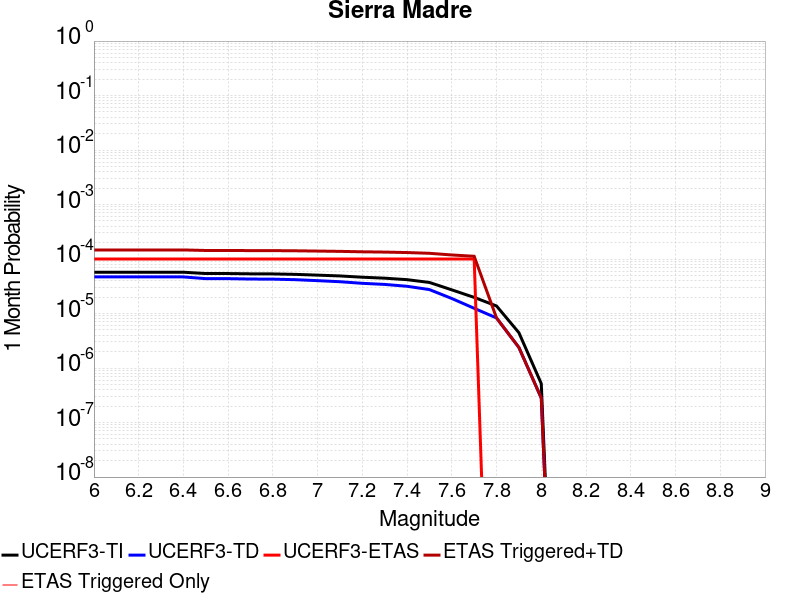 | 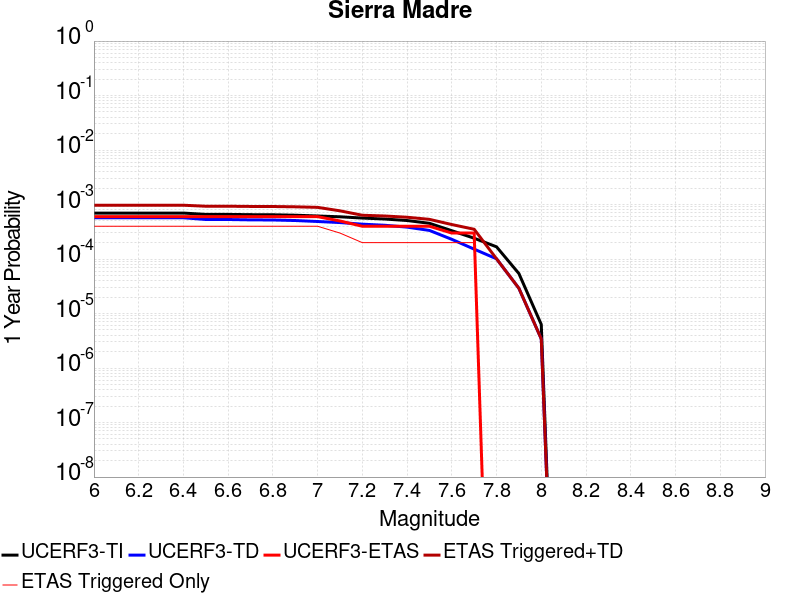 | 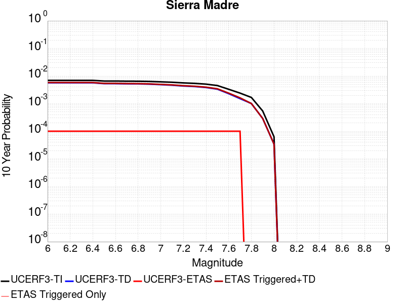 |

| Magnitude | 1 wk TI Prob | 1 wk TD Prob | 1 wk ETAS Prob | 1 wk ETAS/TD Gain | 1 wk ETAS Triggered+TD | 1 wk ETAS Triggered Only | 1 mo TI Prob | 1 mo TD Prob | 1 mo ETAS Prob | 1 mo ETAS/TD Gain | 1 mo ETAS Triggered+TD | 1 mo ETAS Triggered Only | 1 yr TI Prob | 1 yr TD Prob | 1 yr ETAS Prob | 1 yr ETAS/TD Gain | 1 yr ETAS Triggered+TD | 1 yr ETAS Triggered Only | 10 yr TI Prob | 10 yr TD Prob | 10 yr ETAS Prob | 10 yr ETAS/TD Gain | 10 yr ETAS Triggered+TD | 10 yr ETAS Triggered Only |
|-----|-----|-----|-----|-----|-----|-----|-----|-----|-----|-----|-----|-----|-----|-----|-----|-----|-----|-----|-----|-----|-----|-----|-----|-----|
| 6.0 | 1.3379373E-5 | 1.0972691E-5 | 0.0 | 0.0 | 1.0972691E-5 | 0.0 | 5.7338908E-5 | 4.7024976E-5 | 1.0E-4 | 2.1265295 | 1.4702027E-4 | 1.0E-4 | 6.978776E-4 | 5.7238014E-4 | 6.0E-4 | 1.0482544 | 9.7215123E-4 | 4.0E-4 | 0.0069569005 | 0.0057093687 | 0.0037 | 0.64805764 | 0.006405372 | 7.0E-4 |
| 6.1 | 1.3379373E-5 | 1.0972691E-5 | 0.0 | 0.0 | 1.0972691E-5 | 0.0 | 5.7338908E-5 | 4.7024976E-5 | 1.0E-4 | 2.1265295 | 1.4702027E-4 | 1.0E-4 | 6.978776E-4 | 5.7238014E-4 | 6.0E-4 | 1.0482544 | 9.7215123E-4 | 4.0E-4 | 0.0069569005 | 0.0057093687 | 0.0037 | 0.64805764 | 0.006405372 | 7.0E-4 |
| 6.2 | 1.3379373E-5 | 1.0972691E-5 | 0.0 | 0.0 | 1.0972691E-5 | 0.0 | 5.7338908E-5 | 4.7024976E-5 | 1.0E-4 | 2.1265295 | 1.4702027E-4 | 1.0E-4 | 6.978776E-4 | 5.7238014E-4 | 6.0E-4 | 1.0482544 | 9.7215123E-4 | 4.0E-4 | 0.0069569005 | 0.0057093687 | 0.0037 | 0.64805764 | 0.006405372 | 7.0E-4 |
| 6.3 | 1.3379373E-5 | 1.0972691E-5 | 0.0 | 0.0 | 1.0972691E-5 | 0.0 | 5.7338908E-5 | 4.7024976E-5 | 1.0E-4 | 2.1265295 | 1.4702027E-4 | 1.0E-4 | 6.978776E-4 | 5.7238014E-4 | 6.0E-4 | 1.0482544 | 9.7215123E-4 | 4.0E-4 | 0.0069569005 | 0.0057093687 | 0.0037 | 0.64805764 | 0.006405372 | 7.0E-4 |
| 6.4 | 1.3379373E-5 | 1.0972691E-5 | 0.0 | 0.0 | 1.0972691E-5 | 0.0 | 5.7338908E-5 | 4.7024976E-5 | 1.0E-4 | 2.1265295 | 1.4702027E-4 | 1.0E-4 | 6.978776E-4 | 5.7238014E-4 | 6.0E-4 | 1.0482544 | 9.7215123E-4 | 4.0E-4 | 0.0069569005 | 0.0057093687 | 0.0037 | 0.64805764 | 0.006405372 | 7.0E-4 |
| 6.5 | 1.26563245E-5 | 1.0202674E-5 | 0.0 | 0.0 | 1.0202674E-5 | 0.0 | 5.4240263E-5 | 4.372502E-5 | 1.0E-4 | 2.2870202 | 1.4372065E-4 | 1.0E-4 | 6.601751E-4 | 5.3222314E-4 | 6.0E-4 | 1.1273466 | 9.320103E-4 | 4.0E-4 | 0.006582173 | 0.005309752 | 0.0033 | 0.6214979 | 0.0060060355 | 7.0E-4 |
| 6.6 | 1.26563245E-5 | 1.0202674E-5 | 0.0 | 0.0 | 1.0202674E-5 | 0.0 | 5.4240263E-5 | 4.372502E-5 | 1.0E-4 | 2.2870202 | 1.4372065E-4 | 1.0E-4 | 6.601751E-4 | 5.3222314E-4 | 6.0E-4 | 1.1273466 | 9.320103E-4 | 4.0E-4 | 0.006582173 | 0.005309752 | 0.0033 | 0.6214979 | 0.0060060355 | 7.0E-4 |
| 6.7 | 1.2502474E-5 | 1.003893E-5 | 0.0 | 0.0 | 1.003893E-5 | 0.0 | 5.3580934E-5 | 4.302328E-5 | 1.0E-4 | 2.324323 | 1.4301897E-4 | 1.0E-4 | 6.521526E-4 | 5.236836E-4 | 6.0E-4 | 1.1457299 | 9.2347414E-4 | 4.0E-4 | 0.0065024206 | 0.00522476 | 0.0032 | 0.6124683 | 0.0059211026 | 7.0E-4 |
| 6.8 | 1.2454966E-5 | 9.991253E-6 | 0.0 | 0.0 | 9.991253E-6 | 0.0 | 5.3377335E-5 | 4.2818956E-5 | 1.0E-4 | 2.3354142 | 1.4281468E-4 | 1.0E-4 | 6.4967526E-4 | 5.2119716E-4 | 6.0E-4 | 1.1511958 | 9.209887E-4 | 4.0E-4 | 0.006477792 | 0.005200012 | 0.0032 | 0.6153832 | 0.005896372 | 7.0E-4 |
| 6.9 | 1.2225574E-5 | 9.765381E-6 | 0.0 | 0.0 | 9.765381E-6 | 0.0 | 5.2394265E-5 | 4.185097E-5 | 1.0E-4 | 2.389431 | 1.4184679E-4 | 1.0E-4 | 6.3771347E-4 | 5.0941744E-4 | 6.0E-4 | 1.1778159 | 9.092137E-4 | 4.0E-4 | 0.006358865 | 0.0050827586 | 0.0032 | 0.62957937 | 0.0057792007 | 7.0E-4 |
| 7.0 | 1.182946E-5 | 9.372191E-6 | 0.0 | 0.0 | 9.372191E-6 | 0.0 | 5.06967E-5 | 4.016592E-5 | 1.0E-4 | 2.489673 | 1.4016191E-4 | 1.0E-4 | 6.1705755E-4 | 4.8891135E-4 | 6.0E-4 | 1.2272164 | 8.887158E-4 | 4.0E-4 | 0.006153469 | 0.004878614 | 0.0029 | 0.5944311 | 0.0054756873 | 6.0E-4 |
| 7.1 | 1.14369095E-5 | 8.959928E-6 | 0.0 | 0.0 | 8.959928E-6 | 0.0 | 4.9014405E-5 | 3.8399132E-5 | 1.0E-4 | 2.6042256 | 1.3839529E-4 | 1.0E-4 | 5.9658696E-4 | 4.6741014E-4 | 5.0E-4 | 1.0697243 | 7.672699E-4 | 3.0E-4 | 0.005949879 | 0.004664521 | 0.0028 | 0.60027593 | 0.0051621892 | 5.0E-4 |
| 7.2 | 1.0836419E-5 | 8.37404E-6 | 0.0 | 0.0 | 8.37404E-6 | 0.0 | 4.644097E-5 | 3.5888253E-5 | 1.0E-4 | 2.786427 | 1.3588466E-4 | 1.0E-4 | 5.652721E-4 | 4.368528E-4 | 4.0E-4 | 0.91564023 | 6.3676544E-4 | 2.0E-4 | 0.0056383642 | 0.004360183 | 0.0025 | 0.57337046 | 0.004758439 | 4.0E-4 |
| 7.3 | 1.0403439E-5 | 7.995714E-6 | 0.0 | 0.0 | 7.995714E-6 | 0.0 | 4.4585406E-5 | 3.42669E-5 | 1.0E-4 | 2.918268 | 1.3426348E-4 | 1.0E-4 | 5.426921E-4 | 4.1712058E-4 | 4.0E-4 | 0.95895535 | 6.170371E-4 | 2.0E-4 | 0.005413687 | 0.004163617 | 0.0024 | 0.5764219 | 0.0045619514 | 4.0E-4 |
| 7.4 | 9.768864E-6 | 7.3900746E-6 | 0.0 | 0.0 | 7.3900746E-6 | 0.0 | 4.186589E-5 | 3.167137E-5 | 1.0E-4 | 3.1574259 | 1.316682E-4 | 1.0E-4 | 5.09598E-4 | 3.8553157E-4 | 4.0E-4 | 1.0375285 | 5.8545446E-4 | 2.0E-4 | 0.0050843097 | 0.0038488645 | 0.002 | 0.51963377 | 0.004247325 | 4.0E-4 |
| 7.5 | 8.687089E-6 | 6.427255E-6 | 0.0 | 0.0 | 6.427255E-6 | 0.0 | 3.722985E-5 | 2.7545091E-5 | 1.0E-4 | 3.630411 | 1.2754234E-4 | 1.0E-4 | 4.5317915E-4 | 3.3531073E-4 | 4.0E-4 | 1.1929233 | 5.3524366E-4 | 2.0E-4 | 0.004522561 | 0.0033482804 | 0.0019 | 0.5674554 | 0.0037469412 | 4.0E-4 |
| 7.6 | 6.3506063E-6 | 4.4101143E-6 | 0.0 | 0.0 | 4.4101143E-6 | 0.0 | 2.72166E-5 | 1.8900355E-5 | 1.0E-4 | 5.290906 | 1.1889846E-4 | 1.0E-4 | 3.3131172E-4 | 2.3008777E-4 | 3.0E-4 | 1.3038503 | 4.3004175E-4 | 2.0E-4 | 0.003308182 | 0.0022986655 | 0.0014 | 0.6090491 | 0.0025979758 | 3.0E-4 |
| 7.7 | 4.62223E-6 | 2.9155888E-6 | 0.0 | 0.0 | 2.9155888E-6 | 0.0 | 1.9809406E-5 | 1.249532E-5 | 1.0E-4 | 8.002996 | 1.1249407E-4 | 1.0E-4 | 2.4115283E-4 | 1.5211993E-4 | 3.0E-4 | 1.9721282 | 3.520895E-4 | 2.0E-4 | 0.0024089129 | 0.0015203016 | 0.001 | 0.65776426 | 0.0017199975 | 2.0E-4 |
| 7.8 | 3.2145008E-6 | 1.9377674E-6 | 0.0 | 0.0 | 1.9377674E-6 | 0.0 | 1.3776359E-5 | 8.304692E-6 | 0.0 | 0.0 | 8.304692E-6 | 0.0 | 1.6771426E-4 | 1.0110494E-4 | 0.0 | 0.0 | 1.0110494E-4 | 0.0 | 0.0016758774 | 0.0010106761 | 3.0E-4 | 0.296831 | 0.0010106761 | 0.0 |
| 7.9 | 1.0391769E-6 | 5.5709745E-7 | 0.0 | 0.0 | 5.5709745E-7 | 0.0 | 4.4536077E-6 | 2.3875582E-6 | 0.0 | 0.0 | 2.3875582E-6 | 0.0 | 5.4221324E-5 | 2.9068138E-5 | 0.0 | 0.0 | 2.9068138E-5 | 0.0 | 5.4208096E-4 | 2.9064377E-4 | 2.0E-4 | 0.6881276 | 2.9064377E-4 | 0.0 |
| 8.0 | 1.210983E-7 | 6.5793074E-8 | 0.0 | 0.0 | 6.5793074E-8 | 0.0 | 5.1899264E-7 | 2.819703E-7 | 0.0 | 0.0 | 2.819703E-7 | 0.0 | 6.3187167E-6 | 3.432983E-6 | 0.0 | 0.0 | 3.432983E-6 | 0.0 | 6.318537E-5 | 3.4329318E-5 | 0.0 | 0.0 | 3.4329318E-5 | 0.0 |

## Del Valle
*[(top)](#table-of-contents)*

| 1 Week | 1 Month | 1 Year | 10 Year |
|-----|-----|-----|-----|
| 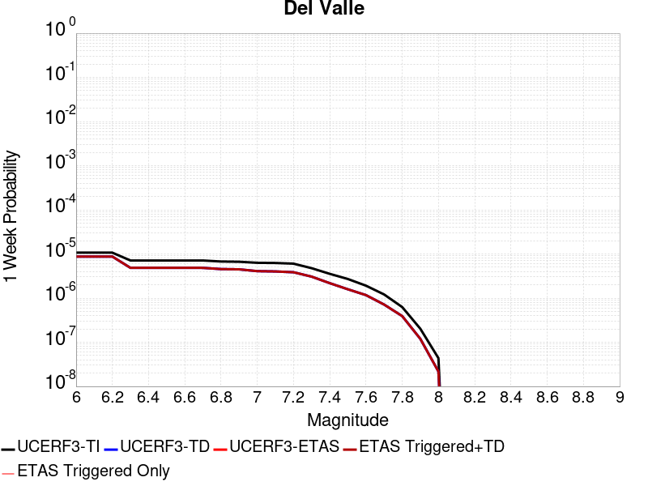 | 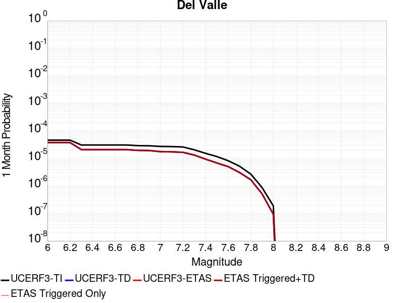 | 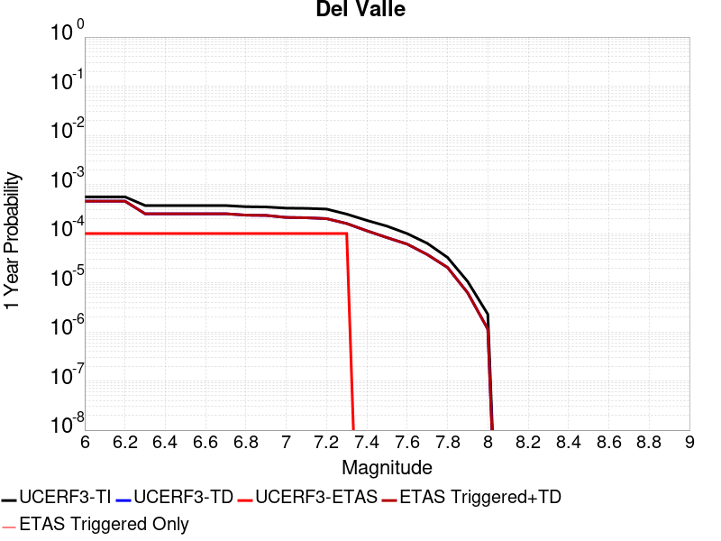 | 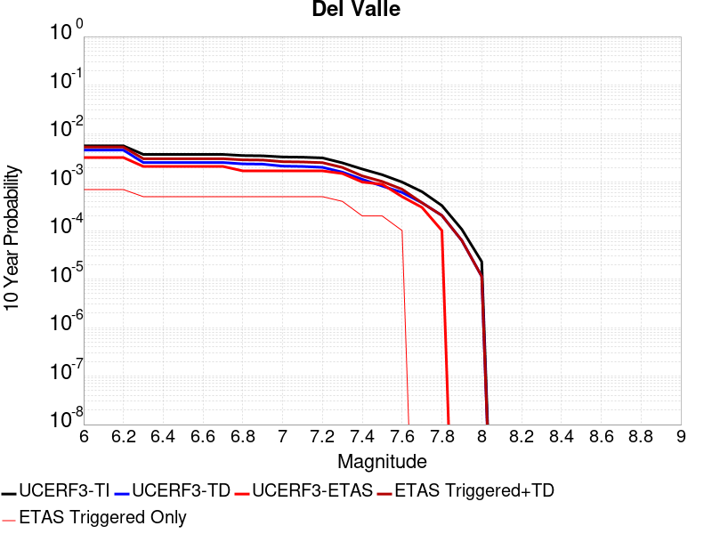 |

| Magnitude | 1 wk TI Prob | 1 wk TD Prob | 1 wk ETAS Prob | 1 wk ETAS/TD Gain | 1 wk ETAS Triggered+TD | 1 wk ETAS Triggered Only | 1 mo TI Prob | 1 mo TD Prob | 1 mo ETAS Prob | 1 mo ETAS/TD Gain | 1 mo ETAS Triggered+TD | 1 mo ETAS Triggered Only | 1 yr TI Prob | 1 yr TD Prob | 1 yr ETAS Prob | 1 yr ETAS/TD Gain | 1 yr ETAS Triggered+TD | 1 yr ETAS Triggered Only | 10 yr TI Prob | 10 yr TD Prob | 10 yr ETAS Prob | 10 yr ETAS/TD Gain | 10 yr ETAS Triggered+TD | 10 yr ETAS Triggered Only |
|-----|-----|-----|-----|-----|-----|-----|-----|-----|-----|-----|-----|-----|-----|-----|-----|-----|-----|-----|-----|-----|-----|-----|-----|-----|
| 6.0 | 1.0716125E-5 | 8.7513645E-6 | 0.0 | 0.0 | 8.7513645E-6 | 0.0 | 4.592544E-5 | 3.750542E-5 | 0.0 | 0.0 | 3.750542E-5 | 0.0 | 5.589988E-4 | 4.5655252E-4 | 1.0E-4 | 0.21903285 | 4.5655252E-4 | 0.0 | 0.0055759475 | 0.004558117 | 0.0032 | 0.70204425 | 0.0052549266 | 7.0E-4 |
| 6.1 | 1.0716125E-5 | 8.7513645E-6 | 0.0 | 0.0 | 8.7513645E-6 | 0.0 | 4.592544E-5 | 3.750542E-5 | 0.0 | 0.0 | 3.750542E-5 | 0.0 | 5.589988E-4 | 4.5655252E-4 | 1.0E-4 | 0.21903285 | 4.5655252E-4 | 0.0 | 0.0055759475 | 0.004558117 | 0.0032 | 0.70204425 | 0.0052549266 | 7.0E-4 |
| 6.2 | 1.0716125E-5 | 8.7513645E-6 | 0.0 | 0.0 | 8.7513645E-6 | 0.0 | 4.592544E-5 | 3.750542E-5 | 0.0 | 0.0 | 3.750542E-5 | 0.0 | 5.589988E-4 | 4.5655252E-4 | 1.0E-4 | 0.21903285 | 4.5655252E-4 | 0.0 | 0.0055759475 | 0.004558117 | 0.0032 | 0.70204425 | 0.0052549266 | 7.0E-4 |
| 6.3 | 7.1293784E-6 | 4.8528836E-6 | 0.0 | 0.0 | 4.8528836E-6 | 0.0 | 3.055412E-5 | 2.0797912E-5 | 0.0 | 0.0 | 2.0797912E-5 | 0.0 | 3.7193293E-4 | 2.531859E-4 | 1.0E-4 | 0.39496672 | 2.531859E-4 | 0.0 | 0.0037131102 | 0.0025290805 | 0.0021 | 0.83034134 | 0.0030278158 | 5.0E-4 |
| 6.4 | 7.1293784E-6 | 4.8528836E-6 | 0.0 | 0.0 | 4.8528836E-6 | 0.0 | 3.055412E-5 | 2.0797912E-5 | 0.0 | 0.0 | 2.0797912E-5 | 0.0 | 3.7193293E-4 | 2.531859E-4 | 1.0E-4 | 0.39496672 | 2.531859E-4 | 0.0 | 0.0037131102 | 0.0025290805 | 0.0021 | 0.83034134 | 0.0030278158 | 5.0E-4 |
| 6.5 | 7.1293784E-6 | 4.8528836E-6 | 0.0 | 0.0 | 4.8528836E-6 | 0.0 | 3.055412E-5 | 2.0797912E-5 | 0.0 | 0.0 | 2.0797912E-5 | 0.0 | 3.7193293E-4 | 2.531859E-4 | 1.0E-4 | 0.39496672 | 2.531859E-4 | 0.0 | 0.0037131102 | 0.0025290805 | 0.0021 | 0.83034134 | 0.0030278158 | 5.0E-4 |
| 6.6 | 7.1293784E-6 | 4.8528836E-6 | 0.0 | 0.0 | 4.8528836E-6 | 0.0 | 3.055412E-5 | 2.0797912E-5 | 0.0 | 0.0 | 2.0797912E-5 | 0.0 | 3.7193293E-4 | 2.531859E-4 | 1.0E-4 | 0.39496672 | 2.531859E-4 | 0.0 | 0.0037131102 | 0.0025290805 | 0.0021 | 0.83034134 | 0.0030278158 | 5.0E-4 |
| 6.7 | 7.12272E-6 | 4.8502934E-6 | 0.0 | 0.0 | 4.8502934E-6 | 0.0 | 3.0525585E-5 | 2.0786809E-5 | 0.0 | 0.0 | 2.0786809E-5 | 0.0 | 3.7158563E-4 | 2.5305076E-4 | 1.0E-4 | 0.39517763 | 2.5305076E-4 | 0.0 | 0.003709649 | 0.0025277322 | 0.0021 | 0.8307842 | 0.0030264682 | 5.0E-4 |
| 6.8 | 6.7558703E-6 | 4.547117E-6 | 0.0 | 0.0 | 4.547117E-6 | 0.0 | 2.895341E-5 | 1.9487501E-5 | 0.0 | 0.0 | 1.9487501E-5 | 0.0 | 3.5245073E-4 | 2.3723513E-4 | 1.0E-4 | 0.42152274 | 2.3723513E-4 | 0.0 | 0.0035189227 | 0.0023699142 | 0.0017 | 0.7173255 | 0.0028687292 | 5.0E-4 |
| 6.9 | 6.6700386E-6 | 4.490714E-6 | 0.0 | 0.0 | 4.490714E-6 | 0.0 | 2.8585566E-5 | 1.924578E-5 | 0.0 | 0.0 | 1.924578E-5 | 0.0 | 3.479737E-4 | 2.3429279E-4 | 1.0E-4 | 0.42681637 | 2.3429279E-4 | 0.0 | 0.003474293 | 0.002340553 | 0.0017 | 0.726324 | 0.0028393827 | 5.0E-4 |
| 7.0 | 6.3181424E-6 | 4.087541E-6 | 0.0 | 0.0 | 4.087541E-6 | 0.0 | 2.7077473E-5 | 1.7517918E-5 | 0.0 | 0.0 | 1.7517918E-5 | 0.0 | 3.2961834E-4 | 2.132602E-4 | 1.0E-4 | 0.46891075 | 2.132602E-4 | 0.0 | 0.0032912986 | 0.0021306304 | 0.0017 | 0.7978859 | 0.002629565 | 5.0E-4 |
| 7.1 | 6.248759E-6 | 4.022882E-6 | 0.0 | 0.0 | 4.022882E-6 | 0.0 | 2.678012E-5 | 1.724081E-5 | 0.0 | 0.0 | 1.724081E-5 | 0.0 | 3.2599916E-4 | 2.0988708E-4 | 1.0E-4 | 0.47644666 | 2.0988708E-4 | 0.0 | 0.0032552136 | 0.0020969633 | 0.0017 | 0.8106961 | 0.0025959148 | 5.0E-4 |
| 7.2 | 6.0411944E-6 | 3.8592575E-6 | 0.0 | 0.0 | 3.8592575E-6 | 0.0 | 2.5890577E-5 | 1.6539572E-5 | 0.0 | 0.0 | 1.6539572E-5 | 0.0 | 3.1517216E-4 | 2.0135108E-4 | 1.0E-4 | 0.49664494 | 2.0135108E-4 | 0.0 | 0.0031472554 | 0.0020117601 | 0.0017 | 0.84503114 | 0.0025107544 | 5.0E-4 |
| 7.3 | 4.7691183E-6 | 3.0697836E-6 | 0.0 | 0.0 | 3.0697836E-6 | 0.0 | 2.0438918E-5 | 1.315615E-5 | 0.0 | 0.0 | 1.315615E-5 | 0.0 | 2.488154E-4 | 1.6016456E-4 | 1.0E-4 | 0.6243578 | 1.6016456E-4 | 0.0 | 0.00248537 | 0.0016005302 | 0.0015 | 0.9371894 | 0.00199989 | 4.0E-4 |
| 7.4 | 3.5524722E-6 | 2.183009E-6 | 0.0 | 0.0 | 2.183009E-6 | 0.0 | 1.5224792E-5 | 9.35572E-6 | 0.0 | 0.0 | 9.35572E-6 | 0.0 | 1.8534607E-4 | 1.13900016E-4 | 0.0 | 0.0 | 1.13900016E-4 | 0.0 | 0.0018519156 | 0.0011384246 | 0.001 | 0.8784069 | 0.0013381969 | 2.0E-4 |
| 7.5 | 2.7133442E-6 | 1.5874688E-6 | 0.0 | 0.0 | 1.5874688E-6 | 0.0 | 1.1628566E-5 | 6.8034196E-6 | 0.0 | 0.0 | 6.8034196E-6 | 0.0 | 1.415686E-4 | 8.2828505E-5 | 0.0 | 0.0 | 8.2828505E-5 | 0.0 | 0.0014147845 | 8.2797825E-4 | 9.0E-4 | 1.0869851 | 0.0010278127 | 2.0E-4 |
| 7.6 | 1.915338E-6 | 1.1707679E-6 | 0.0 | 0.0 | 1.1707679E-6 | 0.0 | 8.208566E-6 | 5.0175668E-6 | 0.0 | 0.0 | 5.0175668E-6 | 0.0 | 9.993471E-5 | 6.108717E-5 | 0.0 | 0.0 | 6.108717E-5 | 0.0 | 9.988978E-4 | 6.107047E-4 | 5.0E-4 | 0.81872624 | 7.1064365E-4 | 1.0E-4 |
| 7.7 | 1.2120448E-6 | 7.1600573E-7 | 0.0 | 0.0 | 7.1600573E-7 | 0.0 | 5.194467E-6 | 3.0685924E-6 | 0.0 | 0.0 | 3.0685924E-6 | 0.0 | 6.3240805E-5 | 3.7359478E-5 | 0.0 | 0.0 | 3.7359478E-5 | 0.0 | 6.322281E-4 | 3.7353233E-4 | 3.0E-4 | 0.8031433 | 3.7353233E-4 | 0.0 |
| 7.8 | 6.272381E-7 | 3.9204957E-7 | 0.0 | 0.0 | 3.9204957E-7 | 0.0 | 2.6881603E-6 | 1.6802114E-6 | 0.0 | 0.0 | 1.6802114E-6 | 0.0 | 3.272786E-5 | 2.0456384E-5 | 0.0 | 0.0 | 2.0456384E-5 | 0.0 | 3.272304E-4 | 2.0454515E-4 | 1.0E-4 | 0.4888896 | 2.0454515E-4 | 0.0 |
| 7.9 | 2.0292627E-7 | 1.1965741E-7 | 0.0 | 0.0 | 1.1965741E-7 | 0.0 | 8.6968373E-7 | 5.128174E-7 | 0.0 | 0.0 | 5.128174E-7 | 0.0 | 1.0588348E-5 | 6.2435342E-6 | 0.0 | 0.0 | 6.2435342E-6 | 0.0 | 1.0587843E-4 | 6.243361E-5 | 0.0 | 0.0 | 6.243361E-5 | 0.0 |
| 8.0 | 4.374492E-8 | 2.1773769E-8 | 0.0 | 0.0 | 2.1773769E-8 | 0.0 | 1.8747821E-7 | 9.3316146E-8 | 0.0 | 0.0 | 9.3316146E-8 | 0.0 | 2.2825448E-6 | 1.1361235E-6 | 0.0 | 0.0 | 1.1361235E-6 | 0.0 | 2.2825214E-5 | 1.1361181E-5 | 0.0 | 0.0 | 1.1361181E-5 | 0.0 |

## Northridge
*[(top)](#table-of-contents)*

| 1 Week | 1 Month | 1 Year | 10 Year |
|-----|-----|-----|-----|
| 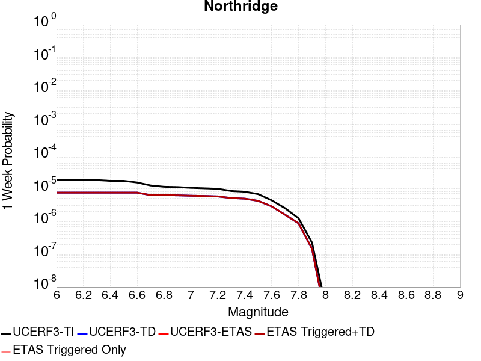 | 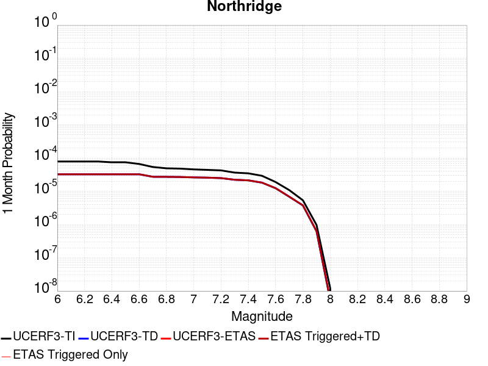 | 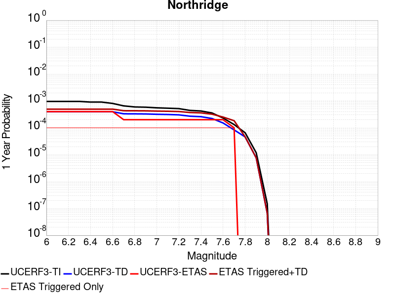 | 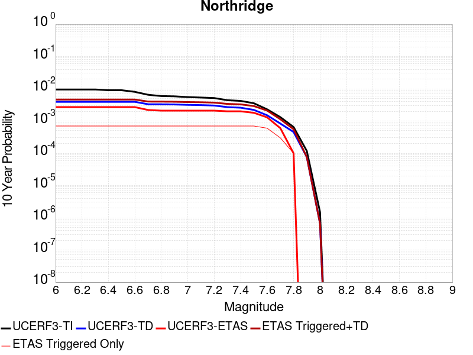 |

| Magnitude | 1 wk TI Prob | 1 wk TD Prob | 1 wk ETAS Prob | 1 wk ETAS/TD Gain | 1 wk ETAS Triggered+TD | 1 wk ETAS Triggered Only | 1 mo TI Prob | 1 mo TD Prob | 1 mo ETAS Prob | 1 mo ETAS/TD Gain | 1 mo ETAS Triggered+TD | 1 mo ETAS Triggered Only | 1 yr TI Prob | 1 yr TD Prob | 1 yr ETAS Prob | 1 yr ETAS/TD Gain | 1 yr ETAS Triggered+TD | 1 yr ETAS Triggered Only | 10 yr TI Prob | 10 yr TD Prob | 10 yr ETAS Prob | 10 yr ETAS/TD Gain | 10 yr ETAS Triggered+TD | 10 yr ETAS Triggered Only |
|-----|-----|-----|-----|-----|-----|-----|-----|-----|-----|-----|-----|-----|-----|-----|-----|-----|-----|-----|-----|-----|-----|-----|-----|-----|
| 6.0 | 1.8340852E-5 | 7.56941E-6 | 0.0 | 0.0 | 7.56941E-6 | 0.0 | 7.860128E-5 | 3.2439937E-5 | 0.0 | 0.0 | 3.2439937E-5 | 0.0 | 9.565505E-4 | 3.9488685E-4 | 4.0E-4 | 1.0129484 | 4.9484737E-4 | 1.0E-4 | 0.009524435 | 0.0039420715 | 0.0027 | 0.68491906 | 0.004639312 | 7.0E-4 |
| 6.1 | 1.8340852E-5 | 7.56941E-6 | 0.0 | 0.0 | 7.56941E-6 | 0.0 | 7.860128E-5 | 3.2439937E-5 | 0.0 | 0.0 | 3.2439937E-5 | 0.0 | 9.565505E-4 | 3.9488685E-4 | 4.0E-4 | 1.0129484 | 4.9484737E-4 | 1.0E-4 | 0.009524435 | 0.0039420715 | 0.0027 | 0.68491906 | 0.004639312 | 7.0E-4 |
| 6.2 | 1.8340852E-5 | 7.56941E-6 | 0.0 | 0.0 | 7.56941E-6 | 0.0 | 7.860128E-5 | 3.2439937E-5 | 0.0 | 0.0 | 3.2439937E-5 | 0.0 | 9.565505E-4 | 3.9488685E-4 | 4.0E-4 | 1.0129484 | 4.9484737E-4 | 1.0E-4 | 0.009524435 | 0.0039420715 | 0.0027 | 0.68491906 | 0.004639312 | 7.0E-4 |
| 6.3 | 1.8340852E-5 | 7.56941E-6 | 0.0 | 0.0 | 7.56941E-6 | 0.0 | 7.860128E-5 | 3.2439937E-5 | 0.0 | 0.0 | 3.2439937E-5 | 0.0 | 9.565505E-4 | 3.9488685E-4 | 4.0E-4 | 1.0129484 | 4.9484737E-4 | 1.0E-4 | 0.009524435 | 0.0039420715 | 0.0027 | 0.68491906 | 0.004639312 | 7.0E-4 |
| 6.4 | 1.7361892E-5 | 7.56941E-6 | 0.0 | 0.0 | 7.56941E-6 | 0.0 | 7.440598E-5 | 3.2439937E-5 | 0.0 | 0.0 | 3.2439937E-5 | 0.0 | 9.055163E-4 | 3.9488685E-4 | 4.0E-4 | 1.0129484 | 4.9484737E-4 | 1.0E-4 | 0.009018354 | 0.0039420715 | 0.0027 | 0.68491906 | 0.004639312 | 7.0E-4 |
| 6.5 | 1.7361892E-5 | 7.56941E-6 | 0.0 | 0.0 | 7.56941E-6 | 0.0 | 7.440598E-5 | 3.2439937E-5 | 0.0 | 0.0 | 3.2439937E-5 | 0.0 | 9.055163E-4 | 3.9488685E-4 | 4.0E-4 | 1.0129484 | 4.9484737E-4 | 1.0E-4 | 0.009018354 | 0.0039420715 | 0.0027 | 0.68491906 | 0.004639312 | 7.0E-4 |
| 6.6 | 1.5458201E-5 | 7.56941E-6 | 0.0 | 0.0 | 7.56941E-6 | 0.0 | 6.624775E-5 | 3.2439937E-5 | 0.0 | 0.0 | 3.2439937E-5 | 0.0 | 8.0626784E-4 | 3.9488685E-4 | 4.0E-4 | 1.0129484 | 4.9484737E-4 | 1.0E-4 | 0.008033488 | 0.0039420715 | 0.0027 | 0.68491906 | 0.004639312 | 7.0E-4 |
| 6.7 | 1.2538368E-5 | 6.365553E-6 | 0.0 | 0.0 | 6.365553E-6 | 0.0 | 5.3734755E-5 | 2.7280657E-5 | 0.0 | 0.0 | 2.7280657E-5 | 0.0 | 6.5402425E-4 | 3.3209182E-4 | 2.0E-4 | 0.60224307 | 4.3205862E-4 | 1.0E-4 | 0.0065210275 | 0.0033160015 | 0.0022 | 0.66344965 | 0.0040136804 | 7.0E-4 |
| 6.8 | 1.1438097E-5 | 6.3345274E-6 | 0.0 | 0.0 | 6.3345274E-6 | 0.0 | 4.9019498E-5 | 2.7147693E-5 | 0.0 | 0.0 | 2.7147693E-5 | 0.0 | 5.9664896E-4 | 3.3047347E-4 | 2.0E-4 | 0.6051923 | 4.304404E-4 | 1.0E-4 | 0.005950495 | 0.0032998663 | 0.0021 | 0.63638943 | 0.0039975564 | 7.0E-4 |
| 6.9 | 1.1204891E-5 | 6.27132E-6 | 0.0 | 0.0 | 6.27132E-6 | 0.0 | 4.8020076E-5 | 2.6876813E-5 | 0.0 | 0.0 | 2.6876813E-5 | 0.0 | 5.8448757E-4 | 3.271765E-4 | 2.0E-4 | 0.6112909 | 4.2714376E-4 | 1.0E-4 | 0.0058295266 | 0.003266994 | 0.0021 | 0.64279276 | 0.003964707 | 7.0E-4 |
| 7.0 | 1.061046E-5 | 6.1003047E-6 | 0.0 | 0.0 | 6.1003047E-6 | 0.0 | 4.5472607E-5 | 2.6143904E-5 | 0.0 | 0.0 | 2.6143904E-5 | 0.0 | 5.534883E-4 | 3.1825597E-4 | 2.0E-4 | 0.628425 | 4.1822414E-4 | 1.0E-4 | 0.0055211177 | 0.003178048 | 0.0021 | 0.660783 | 0.0038758235 | 7.0E-4 |
| 7.1 | 1.0266979E-5 | 5.9895015E-6 | 0.0 | 0.0 | 5.9895015E-6 | 0.0 | 4.40006E-5 | 2.5669042E-5 | 0.0 | 0.0 | 2.5669042E-5 | 0.0 | 5.355756E-4 | 3.124762E-4 | 2.0E-4 | 0.64004874 | 4.1244496E-4 | 1.0E-4 | 0.0053428668 | 0.003120414 | 0.0021 | 0.67298764 | 0.0038182295 | 7.0E-4 |
| 7.2 | 9.91273E-6 | 5.805537E-6 | 0.0 | 0.0 | 5.805537E-6 | 0.0 | 4.248244E-5 | 2.488064E-5 | 0.0 | 0.0 | 2.488064E-5 | 0.0 | 5.171009E-4 | 3.028801E-4 | 2.0E-4 | 0.6603273 | 4.028498E-4 | 1.0E-4 | 0.0051589934 | 0.0030247176 | 0.0021 | 0.69427973 | 0.0037226002 | 7.0E-4 |
| 7.3 | 8.4959265E-6 | 5.1798033E-6 | 0.0 | 0.0 | 5.1798033E-6 | 0.0 | 3.6410605E-5 | 2.219897E-5 | 0.0 | 0.0 | 2.219897E-5 | 0.0 | 4.4320893E-4 | 2.7023916E-4 | 2.0E-4 | 0.7400852 | 3.7021216E-4 | 1.0E-4 | 0.00442326 | 0.0026991316 | 0.002 | 0.7409791 | 0.0033972422 | 7.0E-4 |
| 7.4 | 8.0847185E-6 | 4.969124E-6 | 0.0 | 0.0 | 4.969124E-6 | 0.0 | 3.4648332E-5 | 2.1296071E-5 | 0.0 | 0.0 | 2.1296071E-5 | 0.0 | 4.2176177E-4 | 2.5924906E-4 | 2.0E-4 | 0.7714589 | 3.5922314E-4 | 1.0E-4 | 0.0042096223 | 0.002589492 | 0.002 | 0.7723523 | 0.0032876793 | 7.0E-4 |
| 7.5 | 6.8220684E-6 | 4.243091E-6 | 0.0 | 0.0 | 4.243091E-6 | 0.0 | 2.9237108E-5 | 1.8184552E-5 | 0.0 | 0.0 | 1.8184552E-5 | 0.0 | 3.5590364E-4 | 2.2137462E-4 | 2.0E-4 | 0.90344596 | 3.2135248E-4 | 1.0E-4 | 0.0035533418 | 0.0022115617 | 0.0018 | 0.81390446 | 0.0029100135 | 7.0E-4 |
| 7.6 | 4.4224143E-6 | 2.8922393E-6 | 0.0 | 0.0 | 2.8922393E-6 | 0.0 | 1.8953066E-5 | 1.2395253E-5 | 0.0 | 0.0 | 1.2395253E-5 | 0.0 | 2.3072914E-4 | 1.5090188E-4 | 2.0E-4 | 1.3253646 | 2.5088678E-4 | 1.0E-4 | 0.0023048974 | 0.0015080055 | 0.0013 | 0.86206585 | 0.0021071008 | 6.0E-4 |
| 7.7 | 2.5297056E-6 | 1.6004501E-6 | 0.0 | 0.0 | 1.6004501E-6 | 0.0 | 1.0841551E-5 | 6.8590543E-6 | 0.0 | 0.0 | 6.8590543E-6 | 0.0 | 1.319879E-4 | 8.350583E-5 | 1.0E-4 | 1.1975212 | 1.8349748E-4 | 1.0E-4 | 0.0013190953 | 8.347492E-4 | 6.0E-4 | 0.7187788 | 0.0011344987 | 3.0E-4 |
| 7.8 | 1.2508156E-6 | 8.773015E-7 | 0.0 | 0.0 | 8.773015E-7 | 0.0 | 5.3606273E-6 | 3.7598581E-6 | 0.0 | 0.0 | 3.7598581E-6 | 0.0 | 6.526368E-5 | 4.5775323E-5 | 0.0 | 0.0 | 4.5775323E-5 | 0.0 | 6.524452E-4 | 4.5766024E-4 | 1.0E-4 | 0.2185027 | 5.576145E-4 | 1.0E-4 |
| 7.9 | 2.262199E-7 | 1.4640791E-7 | 0.0 | 0.0 | 1.4640791E-7 | 0.0 | 9.695135E-7 | 6.274623E-7 | 0.0 | 0.0 | 6.274623E-7 | 0.0 | 1.1803763E-5 | 7.639328E-6 | 0.0 | 0.0 | 7.639328E-6 | 0.0 | 1.1803136E-4 | 7.639073E-5 | 0.0 | 0.0 | 7.639073E-5 | 0.0 |
| 8.0 | 2.865362E-9 | 1.2685119E-9 | 0.0 | 0.0 | 1.2685119E-9 | 0.0 | 1.2280123E-8 | 5.4364797E-9 | 0.0 | 0.0 | 5.4364797E-9 | 0.0 | 1.4951048E-7 | 6.618914E-8 | 0.0 | 0.0 | 6.618914E-8 | 0.0 | 1.4951038E-6 | 6.6189136E-7 | 0.0 | 0.0 | 6.6189136E-7 | 0.0 |

## San Gregorio (South) 2011 CFM
*[(top)](#table-of-contents)*

| 1 Week | 1 Month | 1 Year | 10 Year |
|-----|-----|-----|-----|
| 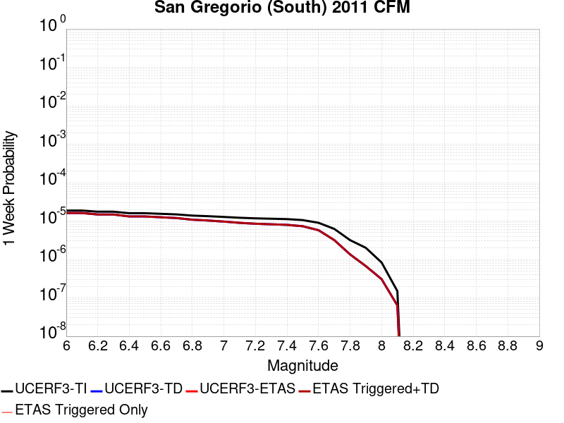 | 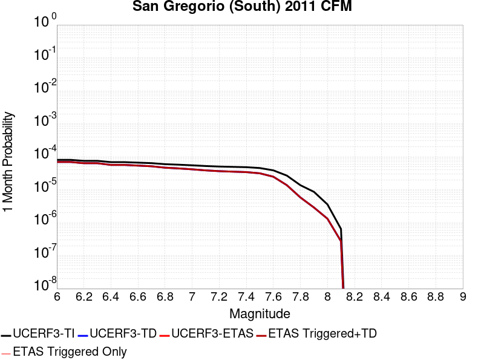 | 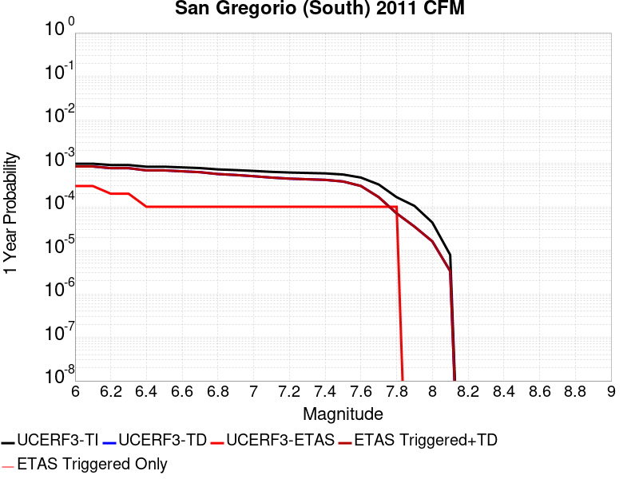 | 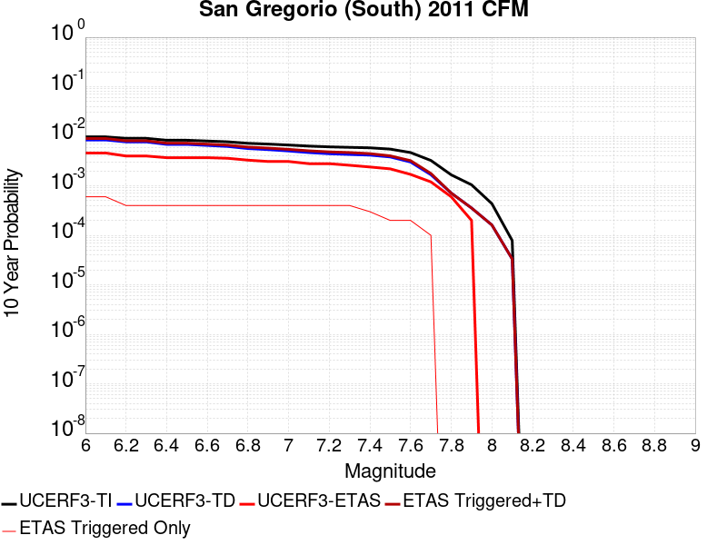 |

| Magnitude | 1 wk TI Prob | 1 wk TD Prob | 1 wk ETAS Prob | 1 wk ETAS/TD Gain | 1 wk ETAS Triggered+TD | 1 wk ETAS Triggered Only | 1 mo TI Prob | 1 mo TD Prob | 1 mo ETAS Prob | 1 mo ETAS/TD Gain | 1 mo ETAS Triggered+TD | 1 mo ETAS Triggered Only | 1 yr TI Prob | 1 yr TD Prob | 1 yr ETAS Prob | 1 yr ETAS/TD Gain | 1 yr ETAS Triggered+TD | 1 yr ETAS Triggered Only | 10 yr TI Prob | 10 yr TD Prob | 10 yr ETAS Prob | 10 yr ETAS/TD Gain | 10 yr ETAS Triggered+TD | 10 yr ETAS Triggered Only |
|-----|-----|-----|-----|-----|-----|-----|-----|-----|-----|-----|-----|-----|-----|-----|-----|-----|-----|-----|-----|-----|-----|-----|-----|-----|
| 6.0 | 1.8770423E-5 | 1.6213131E-5 | 0.0 | 0.0 | 1.6213131E-5 | 0.0 | 8.044219E-5 | 6.948302E-5 | 0.0 | 0.0 | 6.948302E-5 | 0.0 | 9.789435E-4 | 8.4563124E-4 | 3.0E-4 | 0.35476458 | 8.4563124E-4 | 0.0 | 0.009746423 | 0.008436406 | 0.0046 | 0.5452559 | 0.009031344 | 6.0E-4 |
| 6.1 | 1.8770423E-5 | 1.6213131E-5 | 0.0 | 0.0 | 1.6213131E-5 | 0.0 | 8.044219E-5 | 6.948302E-5 | 0.0 | 0.0 | 6.948302E-5 | 0.0 | 9.789435E-4 | 8.4563124E-4 | 3.0E-4 | 0.35476458 | 8.4563124E-4 | 0.0 | 0.009746423 | 0.008436406 | 0.0046 | 0.5452559 | 0.009031344 | 6.0E-4 |
| 6.2 | 1.7508692E-5 | 1.4833993E-5 | 0.0 | 0.0 | 1.4833993E-5 | 0.0 | 7.5035096E-5 | 6.357273E-5 | 0.0 | 0.0 | 6.357273E-5 | 0.0 | 9.1316935E-4 | 7.737261E-4 | 2.0E-4 | 0.2584894 | 7.737261E-4 | 0.0 | 0.00909426 | 0.007722511 | 0.004 | 0.5179662 | 0.008119422 | 4.0E-4 |
| 6.3 | 1.7508692E-5 | 1.4833993E-5 | 0.0 | 0.0 | 1.4833993E-5 | 0.0 | 7.5035096E-5 | 6.357273E-5 | 0.0 | 0.0 | 6.357273E-5 | 0.0 | 9.1316935E-4 | 7.737261E-4 | 2.0E-4 | 0.2584894 | 7.737261E-4 | 0.0 | 0.00909426 | 0.007722511 | 0.004 | 0.5179662 | 0.008119422 | 4.0E-4 |
| 6.4 | 1.6004591E-5 | 1.3185503E-5 | 0.0 | 0.0 | 1.3185503E-5 | 0.0 | 6.85893E-5 | 5.650808E-5 | 0.0 | 0.0 | 5.650808E-5 | 0.0 | 8.347548E-4 | 6.8776973E-4 | 1.0E-4 | 0.1453975 | 6.8776973E-4 | 0.0 | 0.008316261 | 0.0068683997 | 0.0037 | 0.538699 | 0.0072656525 | 4.0E-4 |
| 6.5 | 1.6004591E-5 | 1.3185503E-5 | 0.0 | 0.0 | 1.3185503E-5 | 0.0 | 6.85893E-5 | 5.650808E-5 | 0.0 | 0.0 | 5.650808E-5 | 0.0 | 8.347548E-4 | 6.8776973E-4 | 1.0E-4 | 0.1453975 | 6.8776973E-4 | 0.0 | 0.008316261 | 0.0068683997 | 0.0037 | 0.538699 | 0.0072656525 | 4.0E-4 |
| 6.6 | 1.5442201E-5 | 1.2570738E-5 | 0.0 | 0.0 | 1.2570738E-5 | 0.0 | 6.617918E-5 | 5.3873486E-5 | 0.0 | 0.0 | 5.3873486E-5 | 0.0 | 8.0543366E-4 | 6.5571314E-4 | 1.0E-4 | 0.15250571 | 6.5571314E-4 | 0.0 | 0.008025207 | 0.006549754 | 0.0037 | 0.5649067 | 0.006947134 | 4.0E-4 |
| 6.7 | 1.489921E-5 | 1.1979801E-5 | 0.0 | 0.0 | 1.1979801E-5 | 0.0 | 6.3852196E-5 | 5.1340994E-5 | 0.0 | 0.0 | 5.1340994E-5 | 0.0 | 7.7712315E-4 | 6.2489806E-4 | 1.0E-4 | 0.1600261 | 6.2489806E-4 | 0.0 | 0.0077441116 | 0.006243364 | 0.0036 | 0.57661223 | 0.0066408664 | 4.0E-4 |
| 6.8 | 1.3876024E-5 | 1.0859875E-5 | 0.0 | 0.0 | 1.0859875E-5 | 0.0 | 5.9467322E-5 | 4.6541492E-5 | 0.0 | 0.0 | 4.6541492E-5 | 0.0 | 7.237741E-4 | 5.664957E-4 | 1.0E-4 | 0.17652383 | 5.664957E-4 | 0.0 | 0.0072142133 | 0.005662437 | 0.0033 | 0.58278793 | 0.006060172 | 4.0E-4 |
| 6.9 | 1.33922495E-5 | 1.0331893E-5 | 0.0 | 0.0 | 1.0331893E-5 | 0.0 | 5.7394092E-5 | 4.427879E-5 | 0.0 | 0.0 | 4.427879E-5 | 0.0 | 6.9854903E-4 | 5.389612E-4 | 1.0E-4 | 0.1855421 | 5.389612E-4 | 0.0 | 0.0069635725 | 0.005388453 | 0.0031 | 0.57530427 | 0.005786298 | 4.0E-4 |
| 7.0 | 1.2807324E-5 | 9.69249E-6 | 0.0 | 0.0 | 9.69249E-6 | 0.0 | 5.4887376E-5 | 4.153858E-5 | 0.0 | 0.0 | 4.153858E-5 | 0.0 | 6.680489E-4 | 5.05615E-4 | 1.0E-4 | 0.19777893 | 5.05615E-4 | 0.0 | 0.006660442 | 0.0050565507 | 0.0031 | 0.61306614 | 0.005454528 | 4.0E-4 |
| 7.1 | 1.2191438E-5 | 9.002276E-6 | 0.0 | 0.0 | 9.002276E-6 | 0.0 | 5.224797E-5 | 3.8580612E-5 | 0.0 | 0.0 | 3.8580612E-5 | 0.0 | 6.3593336E-4 | 4.6961784E-4 | 1.0E-4 | 0.21293911 | 4.6961784E-4 | 0.0 | 0.0063411663 | 0.00469815 | 0.0028 | 0.5959793 | 0.0050962707 | 4.0E-4 |
| 7.2 | 1.1769438E-5 | 8.523172E-6 | 0.0 | 0.0 | 8.523172E-6 | 0.0 | 5.0439474E-5 | 3.652737E-5 | 0.0 | 0.0 | 3.652737E-5 | 0.0 | 6.1392755E-4 | 4.4463004E-4 | 1.0E-4 | 0.22490607 | 4.4463004E-4 | 0.0 | 0.0061223423 | 0.004449299 | 0.0028 | 0.62931263 | 0.004847519 | 4.0E-4 |
| 7.3 | 1.150374E-5 | 8.239518E-6 | 0.0 | 0.0 | 8.239518E-6 | 0.0 | 4.9300812E-5 | 3.5311743E-5 | 0.0 | 0.0 | 3.5311743E-5 | 0.0 | 6.0007203E-4 | 4.2983572E-4 | 1.0E-4 | 0.23264702 | 4.2983572E-4 | 0.0 | 0.0059845424 | 0.0043019173 | 0.0026 | 0.6043817 | 0.0047001964 | 4.0E-4 |
| 7.4 | 1.12514E-5 | 7.9858755E-6 | 0.0 | 0.0 | 7.9858755E-6 | 0.0 | 4.8219394E-5 | 3.4224733E-5 | 0.0 | 0.0 | 3.4224733E-5 | 0.0 | 5.8691297E-4 | 4.166065E-4 | 1.0E-4 | 0.24003465 | 4.166065E-4 | 0.0 | 0.005853653 | 0.0041701254 | 0.0024 | 0.57552224 | 0.004468874 | 3.0E-4 |
| 7.5 | 1.059696E-5 | 7.338436E-6 | 0.0 | 0.0 | 7.338436E-6 | 0.0 | 4.5414752E-5 | 3.145006E-5 | 0.0 | 0.0 | 3.145006E-5 | 0.0 | 5.5278436E-4 | 3.8283726E-4 | 1.0E-4 | 0.26120758 | 3.8283726E-4 | 0.0 | 0.0055141128 | 0.00383357 | 0.0022 | 0.57387763 | 0.0040328032 | 2.0E-4 |
| 7.6 | 9.018592E-6 | 5.786833E-6 | 0.0 | 0.0 | 5.786833E-6 | 0.0 | 3.8650534E-5 | 2.4800476E-5 | 0.0 | 0.0 | 2.4800476E-5 | 0.0 | 4.7046866E-4 | 3.0190402E-4 | 1.0E-4 | 0.33123112 | 3.0190402E-4 | 0.0 | 0.004694739 | 0.0030263641 | 0.0017 | 0.56173015 | 0.003225759 | 2.0E-4 |
| 7.7 | 6.243489E-6 | 3.2021833E-6 | 0.0 | 0.0 | 3.2021833E-6 | 0.0 | 2.6757538E-5 | 1.3723571E-5 | 0.0 | 0.0 | 1.3723571E-5 | 0.0 | 3.257243E-4 | 1.6707167E-4 | 1.0E-4 | 0.5985455 | 1.6707167E-4 | 0.0 | 0.003252473 | 0.0016793192 | 0.0012 | 0.7145753 | 0.0017791513 | 1.0E-4 |
| 7.8 | 3.1941963E-6 | 1.3594878E-6 | 0.0 | 0.0 | 1.3594878E-6 | 0.0 | 1.368934E-5 | 5.826363E-6 | 0.0 | 0.0 | 5.826363E-6 | 0.0 | 1.6665498E-4 | 7.093367E-5 | 1.0E-4 | 1.4097679 | 7.093367E-5 | 0.0 | 0.0016653005 | 7.148981E-4 | 6.0E-4 | 0.8392804 | 7.148981E-4 | 0.0 |
| 7.9 | 2.0098398E-6 | 6.758592E-7 | 0.0 | 0.0 | 6.758592E-7 | 0.0 | 8.6135715E-6 | 2.8965362E-6 | 0.0 | 0.0 | 2.8965362E-6 | 0.0 | 1.0486518E-4 | 3.526476E-5 | 0.0 | 0.0 | 3.526476E-5 | 0.0 | 0.0010481571 | 3.573426E-4 | 2.0E-4 | 0.559687 | 3.573426E-4 | 0.0 |
| 8.0 | 8.353119E-7 | 3.0900674E-7 | 0.0 | 0.0 | 3.0900674E-7 | 0.0 | 3.579903E-6 | 1.3243139E-6 | 0.0 | 0.0 | 1.3243139E-6 | 0.0 | 4.358445E-5 | 1.6123402E-5 | 0.0 | 0.0 | 1.6123402E-5 | 0.0 | 4.3575902E-4 | 1.6240262E-4 | 0.0 | 0.0 | 1.6240262E-4 | 0.0 |
| 8.1 | 1.5033264E-7 | 6.395114E-8 | 0.0 | 0.0 | 6.395114E-8 | 0.0 | 6.442826E-7 | 2.7407629E-7 | 0.0 | 0.0 | 2.7407629E-7 | 0.0 | 7.844113E-6 | 3.336874E-6 | 0.0 | 0.0 | 3.336874E-6 | 0.0 | 7.843835E-5 | 3.338902E-5 | 0.0 | 0.0 | 3.338902E-5 | 0.0 |

## Pine Mtn
*[(top)](#table-of-contents)*

| 1 Week | 1 Month | 1 Year | 10 Year |
|-----|-----|-----|-----|
| 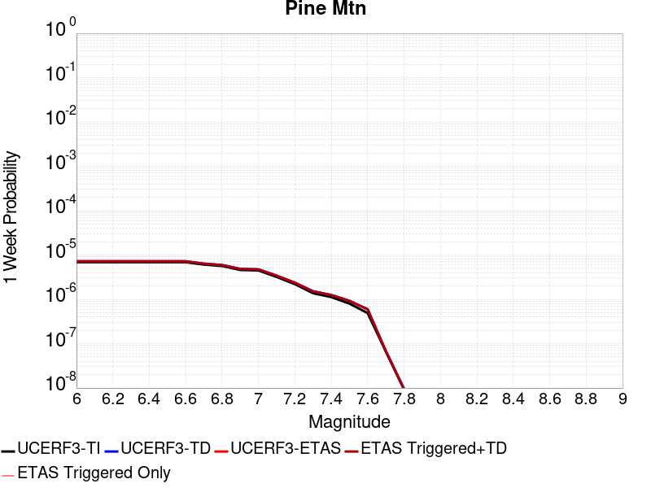 | 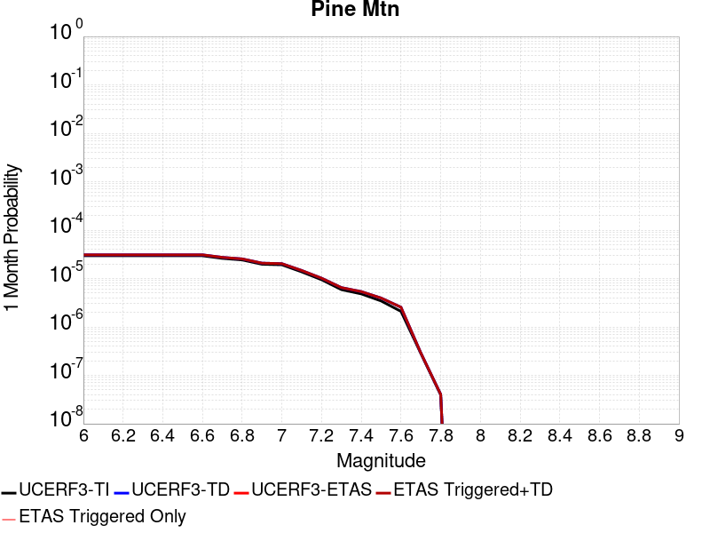 | 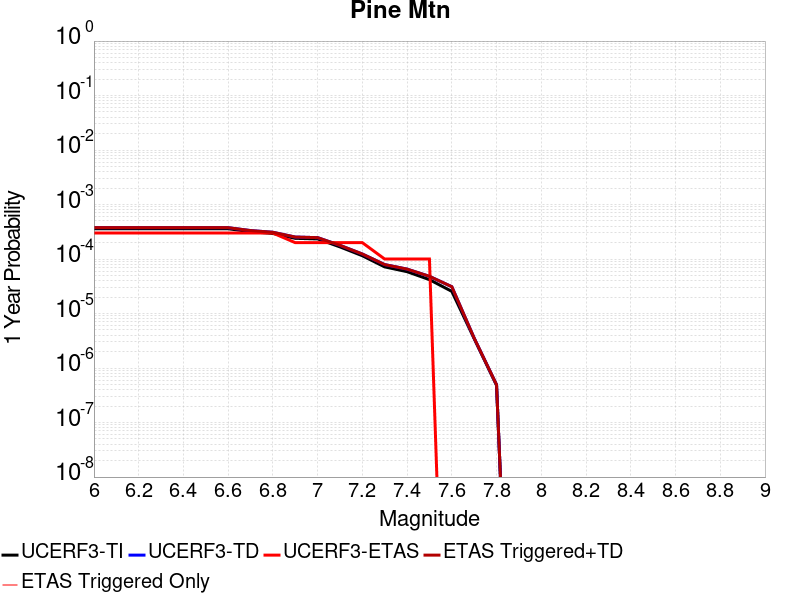 | 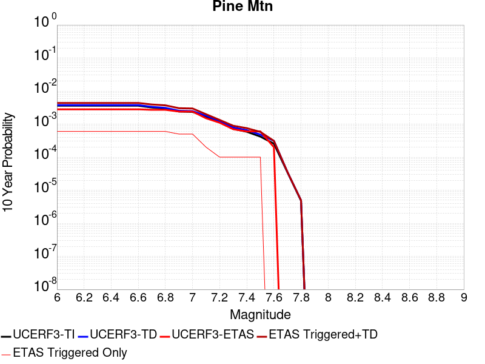 |

| Magnitude | 1 wk TI Prob | 1 wk TD Prob | 1 wk ETAS Prob | 1 wk ETAS/TD Gain | 1 wk ETAS Triggered+TD | 1 wk ETAS Triggered Only | 1 mo TI Prob | 1 mo TD Prob | 1 mo ETAS Prob | 1 mo ETAS/TD Gain | 1 mo ETAS Triggered+TD | 1 mo ETAS Triggered Only | 1 yr TI Prob | 1 yr TD Prob | 1 yr ETAS Prob | 1 yr ETAS/TD Gain | 1 yr ETAS Triggered+TD | 1 yr ETAS Triggered Only | 10 yr TI Prob | 10 yr TD Prob | 10 yr ETAS Prob | 10 yr ETAS/TD Gain | 10 yr ETAS Triggered+TD | 10 yr ETAS Triggered Only |
|-----|-----|-----|-----|-----|-----|-----|-----|-----|-----|-----|-----|-----|-----|-----|-----|-----|-----|-----|-----|-----|-----|-----|-----|-----|
| 6.0 | 6.894797E-6 | 7.217408E-6 | 0.0 | 0.0 | 7.217408E-6 | 0.0 | 2.9548795E-5 | 3.09314E-5 | 0.0 | 0.0 | 3.09314E-5 | 0.0 | 3.596972E-4 | 3.765277E-4 | 3.0E-4 | 0.7967542 | 3.765277E-4 | 0.0 | 0.0035911554 | 0.0037591944 | 0.0028 | 0.74484044 | 0.004356939 | 6.0E-4 |
| 6.1 | 6.894797E-6 | 7.217408E-6 | 0.0 | 0.0 | 7.217408E-6 | 0.0 | 2.9548795E-5 | 3.09314E-5 | 0.0 | 0.0 | 3.09314E-5 | 0.0 | 3.596972E-4 | 3.765277E-4 | 3.0E-4 | 0.7967542 | 3.765277E-4 | 0.0 | 0.0035911554 | 0.0037591944 | 0.0028 | 0.74484044 | 0.004356939 | 6.0E-4 |
| 6.2 | 6.894797E-6 | 7.217408E-6 | 0.0 | 0.0 | 7.217408E-6 | 0.0 | 2.9548795E-5 | 3.09314E-5 | 0.0 | 0.0 | 3.09314E-5 | 0.0 | 3.596972E-4 | 3.765277E-4 | 3.0E-4 | 0.7967542 | 3.765277E-4 | 0.0 | 0.0035911554 | 0.0037591944 | 0.0028 | 0.74484044 | 0.004356939 | 6.0E-4 |
| 6.3 | 6.894797E-6 | 7.217408E-6 | 0.0 | 0.0 | 7.217408E-6 | 0.0 | 2.9548795E-5 | 3.09314E-5 | 0.0 | 0.0 | 3.09314E-5 | 0.0 | 3.596972E-4 | 3.765277E-4 | 3.0E-4 | 0.7967542 | 3.765277E-4 | 0.0 | 0.0035911554 | 0.0037591944 | 0.0028 | 0.74484044 | 0.004356939 | 6.0E-4 |
| 6.4 | 6.894797E-6 | 7.217408E-6 | 0.0 | 0.0 | 7.217408E-6 | 0.0 | 2.9548795E-5 | 3.09314E-5 | 0.0 | 0.0 | 3.09314E-5 | 0.0 | 3.596972E-4 | 3.765277E-4 | 3.0E-4 | 0.7967542 | 3.765277E-4 | 0.0 | 0.0035911554 | 0.0037591944 | 0.0028 | 0.74484044 | 0.004356939 | 6.0E-4 |
| 6.5 | 6.894797E-6 | 7.217408E-6 | 0.0 | 0.0 | 7.217408E-6 | 0.0 | 2.9548795E-5 | 3.09314E-5 | 0.0 | 0.0 | 3.09314E-5 | 0.0 | 3.596972E-4 | 3.765277E-4 | 3.0E-4 | 0.7967542 | 3.765277E-4 | 0.0 | 0.0035911554 | 0.0037591944 | 0.0028 | 0.74484044 | 0.004356939 | 6.0E-4 |
| 6.6 | 6.894797E-6 | 7.217408E-6 | 0.0 | 0.0 | 7.217408E-6 | 0.0 | 2.9548795E-5 | 3.09314E-5 | 0.0 | 0.0 | 3.09314E-5 | 0.0 | 3.596972E-4 | 3.765277E-4 | 3.0E-4 | 0.7967542 | 3.765277E-4 | 0.0 | 0.0035911554 | 0.0037591944 | 0.0028 | 0.74484044 | 0.004356939 | 6.0E-4 |
| 6.7 | 6.0867933E-6 | 6.389278E-6 | 0.0 | 0.0 | 6.389278E-6 | 0.0 | 2.6085996E-5 | 2.7382344E-5 | 0.0 | 0.0 | 2.7382344E-5 | 0.0 | 3.1755073E-4 | 3.3333123E-4 | 3.0E-4 | 0.9000057 | 3.3333123E-4 | 0.0 | 0.0031709734 | 0.0033285313 | 0.0027 | 0.81116855 | 0.003926534 | 6.0E-4 |
| 6.8 | 5.6530425E-6 | 5.942897E-6 | 0.0 | 0.0 | 5.942897E-6 | 0.0 | 2.42271E-5 | 2.5469322E-5 | 0.0 | 0.0 | 2.5469322E-5 | 0.0 | 2.94925E-4 | 3.1004695E-4 | 3.0E-4 | 0.96759546 | 3.1004695E-4 | 0.0 | 0.002945339 | 0.0030963481 | 0.0027 | 0.871995 | 0.0036944903 | 6.0E-4 |
| 6.9 | 4.6015225E-6 | 4.856516E-6 | 0.0 | 0.0 | 4.856516E-6 | 0.0 | 1.9720663E-5 | 2.0813482E-5 | 0.0 | 0.0 | 2.0813482E-5 | 0.0 | 2.4007261E-4 | 2.5337614E-4 | 2.0E-4 | 0.7893403 | 2.5337614E-4 | 0.0 | 0.0023981342 | 0.0025310165 | 0.0024 | 0.94823563 | 0.003029751 | 5.0E-4 |
| 7.0 | 4.4875965E-6 | 4.7401813E-6 | 0.0 | 0.0 | 4.7401813E-6 | 0.0 | 1.9232413E-5 | 2.0314912E-5 | 0.0 | 0.0 | 2.0314912E-5 | 0.0 | 2.3412947E-4 | 2.4730744E-4 | 2.0E-4 | 0.80871 | 2.4730744E-4 | 0.0 | 0.0023388295 | 0.0024704658 | 0.0024 | 0.97147673 | 0.0029692305 | 5.0E-4 |
| 7.1 | 3.203907E-6 | 3.4224868E-6 | 0.0 | 0.0 | 3.4224868E-6 | 0.0 | 1.3730958E-5 | 1.4667722E-5 | 0.0 | 0.0 | 1.4667722E-5 | 0.0 | 1.6716159E-4 | 1.7856555E-4 | 2.0E-4 | 1.120037 | 1.7856555E-4 | 0.0 | 0.0016703589 | 0.0017842866 | 0.0015 | 0.84067214 | 0.0019839297 | 2.0E-4 |
| 7.2 | 2.2060601E-6 | 2.3728167E-6 | 0.0 | 0.0 | 2.3728167E-6 | 0.0 | 9.4545085E-6 | 1.0169177E-5 | 0.0 | 0.0 | 1.0169177E-5 | 0.0 | 1.15102564E-4 | 1.2380315E-4 | 2.0E-4 | 1.6154678 | 1.2380315E-4 | 0.0 | 0.0011504296 | 0.0012373865 | 0.0011 | 0.88897043 | 0.0013372628 | 1.0E-4 |
| 7.3 | 1.3765207E-6 | 1.516551E-6 | 0.0 | 0.0 | 1.516551E-6 | 0.0 | 5.899361E-6 | 6.499489E-6 | 0.0 | 0.0 | 6.499489E-6 | 0.0 | 7.182235E-5 | 7.912849E-5 | 1.0E-4 | 1.2637672 | 7.912849E-5 | 0.0 | 7.1799144E-4 | 7.910122E-4 | 7.0E-4 | 0.8849421 | 8.909331E-4 | 1.0E-4 |
| 7.4 | 1.1245983E-6 | 1.2541157E-6 | 0.0 | 0.0 | 1.2541157E-6 | 0.0 | 4.819698E-6 | 5.374771E-6 | 0.0 | 0.0 | 5.374771E-6 | 0.0 | 5.8678244E-5 | 6.5435954E-5 | 1.0E-4 | 1.528212 | 6.5435954E-5 | 0.0 | 5.866275E-4 | 6.5417506E-4 | 6.0E-4 | 0.9171857 | 7.5410964E-4 | 1.0E-4 |
| 7.5 | 8.031682E-7 | 9.234055E-7 | 0.0 | 0.0 | 9.234055E-7 | 0.0 | 3.4421448E-6 | 3.9574466E-6 | 0.0 | 0.0 | 3.9574466E-6 | 0.0 | 4.1907308E-5 | 4.8180915E-5 | 1.0E-4 | 2.0755107 | 4.8180915E-5 | 0.0 | 4.1899405E-4 | 4.8171135E-4 | 6.0E-4 | 1.2455592 | 5.8166316E-4 | 1.0E-4 |
| 7.6 | 4.8953444E-7 | 5.96492E-7 | 0.0 | 0.0 | 5.96492E-7 | 0.0 | 2.098003E-6 | 2.556392E-6 | 0.0 | 0.0 | 2.556392E-6 | 0.0 | 2.5542888E-5 | 3.1123676E-5 | 0.0 | 0.0 | 3.1123676E-5 | 0.0 | 2.5539953E-4 | 3.1119795E-4 | 2.0E-4 | 0.6426778 | 3.1119795E-4 | 0.0 |
| 7.7 | 6.634529E-8 | 6.7871596E-8 | 0.0 | 0.0 | 6.7871596E-8 | 0.0 | 2.843369E-7 | 2.9087823E-7 | 0.0 | 0.0 | 2.9087823E-7 | 0.0 | 3.4617963E-6 | 3.5414373E-6 | 0.0 | 0.0 | 3.5414373E-6 | 0.0 | 3.4617424E-5 | 3.5413857E-5 | 0.0 | 0.0 | 3.5413857E-5 | 0.0 |
| 7.8 | 9.235578E-9 | 9.485809E-9 | 0.0 | 0.0 | 9.485809E-9 | 0.0 | 3.9581046E-8 | 4.0653465E-8 | 0.0 | 0.0 | 4.0653465E-8 | 0.0 | 4.818991E-7 | 4.949558E-7 | 0.0 | 0.0 | 4.949558E-7 | 0.0 | 4.8189804E-6 | 4.949549E-6 | 0.0 | 0.0 | 4.949549E-6 | 0.0 |

## La Panza 2011
*[(top)](#table-of-contents)*

| 1 Week | 1 Month | 1 Year | 10 Year |
|-----|-----|-----|-----|
| 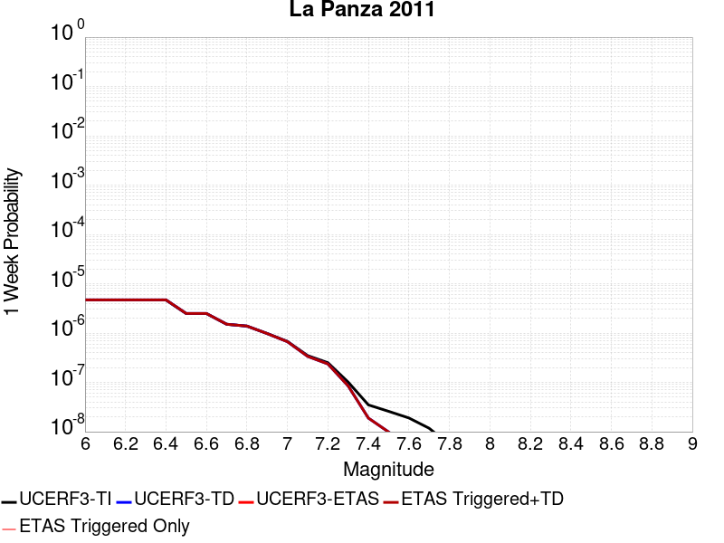 | 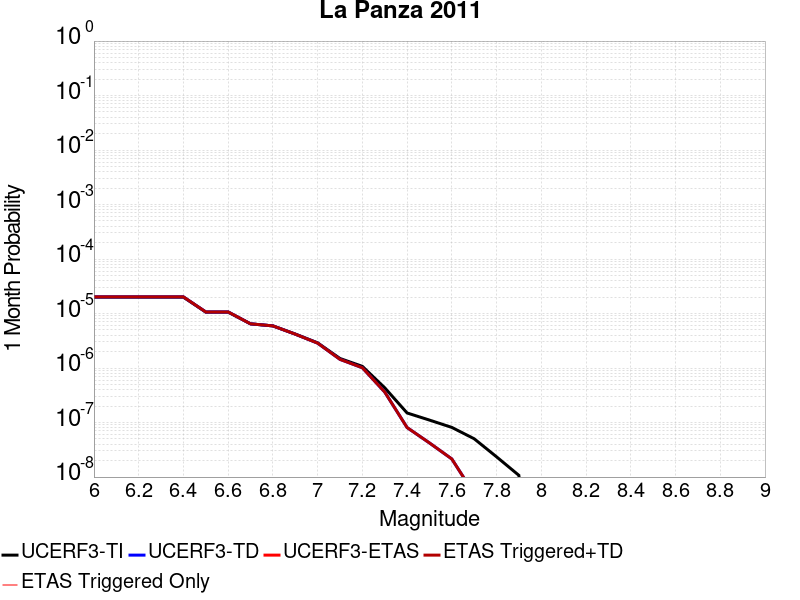 | 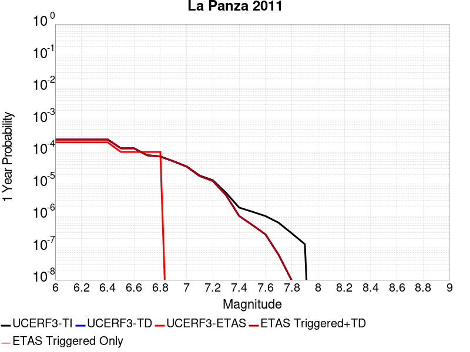 | 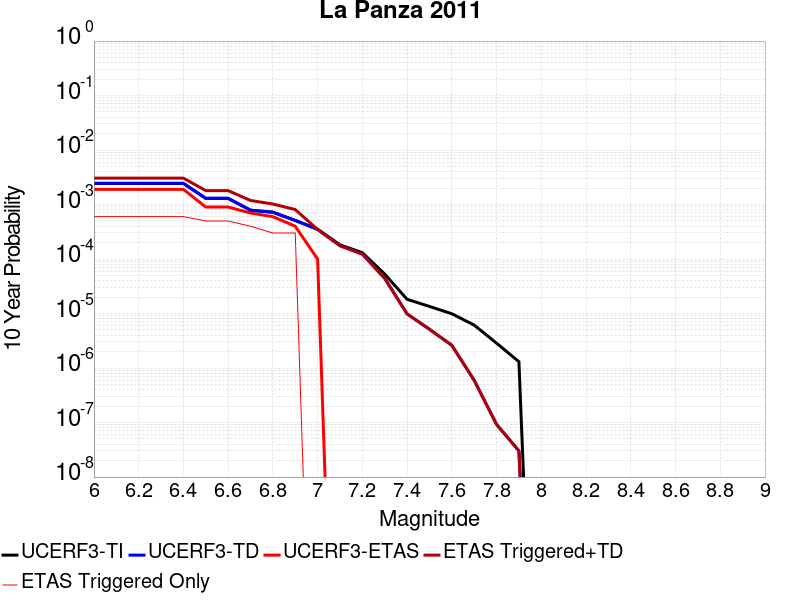 |

| Magnitude | 1 wk TI Prob | 1 wk TD Prob | 1 wk ETAS Prob | 1 wk ETAS/TD Gain | 1 wk ETAS Triggered+TD | 1 wk ETAS Triggered Only | 1 mo TI Prob | 1 mo TD Prob | 1 mo ETAS Prob | 1 mo ETAS/TD Gain | 1 mo ETAS Triggered+TD | 1 mo ETAS Triggered Only | 1 yr TI Prob | 1 yr TD Prob | 1 yr ETAS Prob | 1 yr ETAS/TD Gain | 1 yr ETAS Triggered+TD | 1 yr ETAS Triggered Only | 10 yr TI Prob | 10 yr TD Prob | 10 yr ETAS Prob | 10 yr ETAS/TD Gain | 10 yr ETAS Triggered+TD | 10 yr ETAS Triggered Only |
|-----|-----|-----|-----|-----|-----|-----|-----|-----|-----|-----|-----|-----|-----|-----|-----|-----|-----|-----|-----|-----|-----|-----|-----|-----|
| 6.0 | 4.6754544E-6 | 4.7159306E-6 | 0.0 | 0.0 | 4.7159306E-6 | 0.0 | 2.0037509E-5 | 2.0210984E-5 | 0.0 | 0.0 | 2.0210984E-5 | 0.0 | 2.4392935E-4 | 2.460429E-4 | 2.0E-4 | 0.8128663 | 2.460429E-4 | 0.0 | 0.0024366176 | 0.0024578995 | 0.0019 | 0.77301776 | 0.003056425 | 6.0E-4 |
| 6.1 | 4.6754544E-6 | 4.7159306E-6 | 0.0 | 0.0 | 4.7159306E-6 | 0.0 | 2.0037509E-5 | 2.0210984E-5 | 0.0 | 0.0 | 2.0210984E-5 | 0.0 | 2.4392935E-4 | 2.460429E-4 | 2.0E-4 | 0.8128663 | 2.460429E-4 | 0.0 | 0.0024366176 | 0.0024578995 | 0.0019 | 0.77301776 | 0.003056425 | 6.0E-4 |
| 6.2 | 4.6754544E-6 | 4.7159306E-6 | 0.0 | 0.0 | 4.7159306E-6 | 0.0 | 2.0037509E-5 | 2.0210984E-5 | 0.0 | 0.0 | 2.0210984E-5 | 0.0 | 2.4392935E-4 | 2.460429E-4 | 2.0E-4 | 0.8128663 | 2.460429E-4 | 0.0 | 0.0024366176 | 0.0024578995 | 0.0019 | 0.77301776 | 0.003056425 | 6.0E-4 |
| 6.3 | 4.6754544E-6 | 4.7159306E-6 | 0.0 | 0.0 | 4.7159306E-6 | 0.0 | 2.0037509E-5 | 2.0210984E-5 | 0.0 | 0.0 | 2.0210984E-5 | 0.0 | 2.4392935E-4 | 2.460429E-4 | 2.0E-4 | 0.8128663 | 2.460429E-4 | 0.0 | 0.0024366176 | 0.0024578995 | 0.0019 | 0.77301776 | 0.003056425 | 6.0E-4 |
| 6.4 | 4.6754544E-6 | 4.7159306E-6 | 0.0 | 0.0 | 4.7159306E-6 | 0.0 | 2.0037509E-5 | 2.0210984E-5 | 0.0 | 0.0 | 2.0210984E-5 | 0.0 | 2.4392935E-4 | 2.460429E-4 | 2.0E-4 | 0.8128663 | 2.460429E-4 | 0.0 | 0.0024366176 | 0.0024578995 | 0.0019 | 0.77301776 | 0.003056425 | 6.0E-4 |
| 6.5 | 2.485343E-6 | 2.4992264E-6 | 0.0 | 0.0 | 2.4992264E-6 | 0.0 | 1.0651426E-5 | 1.0710929E-5 | 0.0 | 0.0 | 1.0710929E-5 | 0.0 | 1.296734E-4 | 1.3039814E-4 | 1.0E-4 | 0.7668821 | 1.3039814E-4 | 0.0 | 0.0012959775 | 0.0013032546 | 9.0E-4 | 0.69057876 | 0.001802603 | 5.0E-4 |
| 6.6 | 2.485343E-6 | 2.4992264E-6 | 0.0 | 0.0 | 2.4992264E-6 | 0.0 | 1.0651426E-5 | 1.0710929E-5 | 0.0 | 0.0 | 1.0710929E-5 | 0.0 | 1.296734E-4 | 1.3039814E-4 | 1.0E-4 | 0.7668821 | 1.3039814E-4 | 0.0 | 0.0012959775 | 0.0013032546 | 9.0E-4 | 0.69057876 | 0.001802603 | 5.0E-4 |
| 6.7 | 1.5108508E-6 | 1.5133861E-6 | 0.0 | 0.0 | 1.5133861E-6 | 0.0 | 6.4750584E-6 | 6.485925E-6 | 0.0 | 0.0 | 6.485925E-6 | 0.0 | 7.8830984E-5 | 7.8963385E-5 | 1.0E-4 | 1.2664098 | 7.8963385E-5 | 0.0 | 7.880303E-4 | 7.8936404E-4 | 7.0E-4 | 0.8867898 | 0.0011890483 | 4.0E-4 |
| 6.8 | 1.3865837E-6 | 1.3872785E-6 | 0.0 | 0.0 | 1.3872785E-6 | 0.0 | 5.942488E-6 | 5.9454665E-6 | 0.0 | 0.0 | 5.9454665E-6 | 0.0 | 7.234739E-5 | 7.238375E-5 | 1.0E-4 | 1.3815256 | 7.238375E-5 | 0.0 | 7.232384E-4 | 7.236115E-4 | 6.0E-4 | 0.82917416 | 0.0010233944 | 3.0E-4 |
| 6.9 | 9.826583E-7 | 9.784494E-7 | 0.0 | 0.0 | 9.784494E-7 | 0.0 | 4.2113857E-6 | 4.193348E-6 | 0.0 | 0.0 | 4.193348E-6 | 0.0 | 5.1272415E-5 | 5.105287E-5 | 0.0 | 0.0 | 5.105287E-5 | 0.0 | 5.126059E-4 | 5.104168E-4 | 4.0E-4 | 0.7836733 | 8.102637E-4 | 3.0E-4 |
| 7.0 | 6.7797646E-7 | 6.698837E-7 | 0.0 | 0.0 | 6.698837E-7 | 0.0 | 2.9056102E-6 | 2.8709273E-6 | 0.0 | 0.0 | 2.8709273E-6 | 0.0 | 3.537523E-5 | 3.4953013E-5 | 0.0 | 0.0 | 3.4953013E-5 | 0.0 | 3.5369597E-4 | 3.4947824E-4 | 1.0E-4 | 0.28614086 | 3.4947824E-4 | 0.0 |
| 7.1 | 3.4979826E-7 | 3.3764448E-7 | 0.0 | 0.0 | 3.3764448E-7 | 0.0 | 1.4991346E-6 | 1.4470471E-6 | 0.0 | 0.0 | 1.4470471E-6 | 0.0 | 1.825181E-5 | 1.7617667E-5 | 0.0 | 0.0 | 1.7617667E-5 | 0.0 | 1.825031E-4 | 1.7616387E-4 | 0.0 | 0.0 | 1.7616387E-4 | 0.0 |
| 7.2 | 2.5088332E-7 | 2.3724064E-7 | 0.0 | 0.0 | 2.3724064E-7 | 0.0 | 1.0752137E-6 | 1.0167453E-6 | 0.0 | 0.0 | 1.0167453E-6 | 0.0 | 1.3090649E-5 | 1.2378812E-5 | 0.0 | 0.0 | 1.2378812E-5 | 0.0 | 1.3089878E-4 | 1.2378207E-4 | 0.0 | 0.0 | 1.2378207E-4 | 0.0 |
| 7.3 | 1.0159086E-7 | 8.539529E-8 | 0.0 | 0.0 | 8.539529E-8 | 0.0 | 4.3538932E-7 | 3.659798E-7 | 0.0 | 0.0 | 3.659798E-7 | 0.0 | 5.300852E-6 | 4.455795E-6 | 0.0 | 0.0 | 4.455795E-6 | 0.0 | 5.3007258E-5 | 4.4557095E-5 | 0.0 | 0.0 | 4.4557095E-5 | 0.0 |
| 7.4 | 3.5006252E-8 | 1.9066212E-8 | 0.0 | 0.0 | 1.9066212E-8 | 0.0 | 1.5002678E-7 | 8.171233E-8 | 0.0 | 0.0 | 8.171233E-8 | 0.0 | 1.8265745E-6 | 9.948471E-7 | 0.0 | 0.0 | 9.948471E-7 | 0.0 | 1.8265595E-5 | 9.94843E-6 | 0.0 | 0.0 | 9.94843E-6 | 0.0 |
| 7.5 | 2.592274E-8 | 9.989079E-9 | 0.0 | 0.0 | 9.989079E-9 | 0.0 | 1.1109746E-7 | 4.2810335E-8 | 0.0 | 0.0 | 4.2810335E-8 | 0.0 | 1.3526106E-6 | 5.212157E-7 | 0.0 | 0.0 | 5.212157E-7 | 0.0 | 1.3526024E-5 | 5.212146E-6 | 0.0 | 0.0 | 5.212146E-6 | 0.0 |
| 7.6 | 1.9016717E-8 | 5.084721E-9 | 0.0 | 0.0 | 5.084721E-9 | 0.0 | 8.150022E-8 | 2.179166E-8 | 0.0 | 0.0 | 2.179166E-8 | 0.0 | 9.922647E-7 | 2.6531342E-7 | 0.0 | 0.0 | 2.6531342E-7 | 0.0 | 9.922603E-6 | 2.653131E-6 | 0.0 | 0.0 | 2.653131E-6 | 0.0 |
| 7.7 | 1.17738495E-8 | 1.1709756E-9 | 0.0 | 0.0 | 1.1709756E-9 | 0.0 | 5.0459356E-8 | 5.018466E-9 | 0.0 | 0.0 | 5.018466E-9 | 0.0 | 6.1434247E-7 | 6.1099826E-8 | 0.0 | 0.0 | 6.1099826E-8 | 0.0 | 6.143408E-6 | 6.109981E-7 | 0.0 | 0.0 | 6.109981E-7 | 0.0 |
| 7.8 | 5.489079E-9 | 1.8319957E-10 | 0.0 | 0.0 | 1.8319957E-10 | 0.0 | 2.3524624E-8 | 7.851406E-10 | 0.0 | 0.0 | 7.851406E-10 | 0.0 | 2.8641225E-7 | 9.559084E-9 | 0.0 | 0.0 | 9.559084E-9 | 0.0 | 2.8641189E-6 | 9.5590835E-8 | 0.0 | 0.0 | 9.5590835E-8 | 0.0 |
| 7.9 | 2.5081048E-9 | 6.0068395E-11 | 0.0 | 0.0 | 6.0068395E-11 | 0.0 | 1.0749021E-8 | 2.5743574E-10 | 0.0 | 0.0 | 2.5743574E-10 | 0.0 | 1.3086932E-7 | 3.1342808E-9 | 0.0 | 0.0 | 3.1342808E-9 | 0.0 | 1.3086925E-6 | 3.1342807E-8 | 0.0 | 0.0 | 3.1342807E-8 | 0.0 |

## Round Valley
*[(top)](#table-of-contents)*

| 1 Week | 1 Month | 1 Year | 10 Year |
|-----|-----|-----|-----|
| 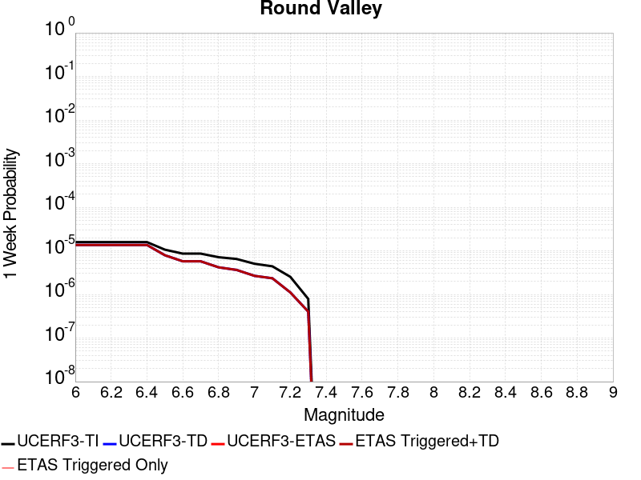 | 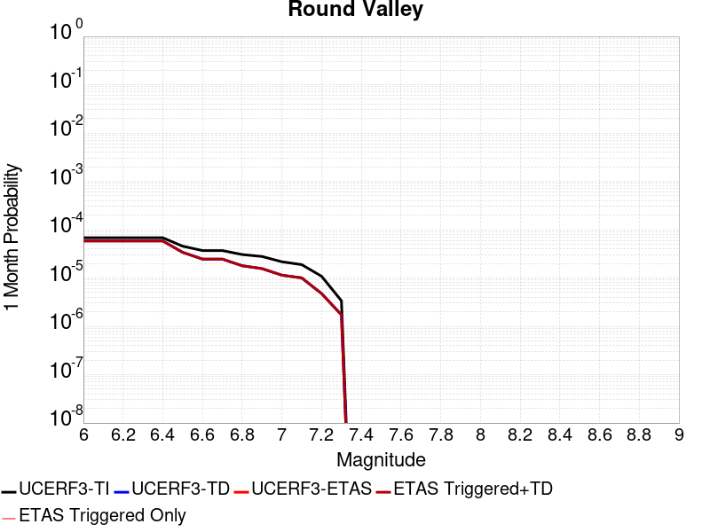 | 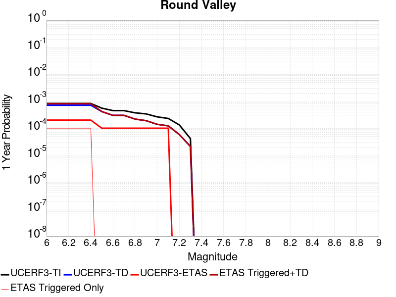 | 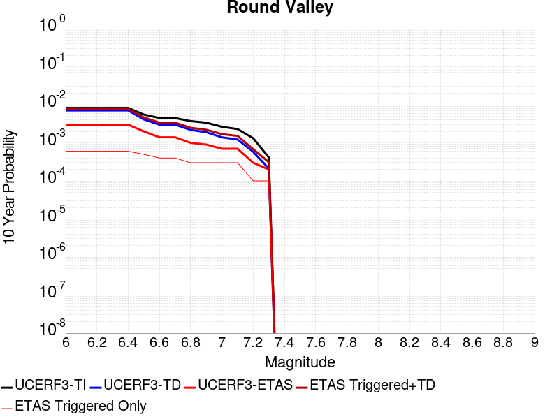 |

| Magnitude | 1 wk TI Prob | 1 wk TD Prob | 1 wk ETAS Prob | 1 wk ETAS/TD Gain | 1 wk ETAS Triggered+TD | 1 wk ETAS Triggered Only | 1 mo TI Prob | 1 mo TD Prob | 1 mo ETAS Prob | 1 mo ETAS/TD Gain | 1 mo ETAS Triggered+TD | 1 mo ETAS Triggered Only | 1 yr TI Prob | 1 yr TD Prob | 1 yr ETAS Prob | 1 yr ETAS/TD Gain | 1 yr ETAS Triggered+TD | 1 yr ETAS Triggered Only | 10 yr TI Prob | 10 yr TD Prob | 10 yr ETAS Prob | 10 yr ETAS/TD Gain | 10 yr ETAS Triggered+TD | 10 yr ETAS Triggered Only |
|-----|-----|-----|-----|-----|-----|-----|-----|-----|-----|-----|-----|-----|-----|-----|-----|-----|-----|-----|-----|-----|-----|-----|-----|-----|
| 6.0 | 1.588152E-5 | 1.3649263E-5 | 0.0 | 0.0 | 1.3649263E-5 | 0.0 | 6.806188E-5 | 5.849575E-5 | 0.0 | 0.0 | 5.849575E-5 | 0.0 | 8.283384E-4 | 7.119924E-4 | 2.0E-4 | 0.28090188 | 8.1192114E-4 | 1.0E-4 | 0.008252576 | 0.0071009914 | 0.003 | 0.4224762 | 0.007696731 | 6.0E-4 |
| 6.1 | 1.588152E-5 | 1.3649263E-5 | 0.0 | 0.0 | 1.3649263E-5 | 0.0 | 6.806188E-5 | 5.849575E-5 | 0.0 | 0.0 | 5.849575E-5 | 0.0 | 8.283384E-4 | 7.119924E-4 | 2.0E-4 | 0.28090188 | 8.1192114E-4 | 1.0E-4 | 0.008252576 | 0.0071009914 | 0.003 | 0.4224762 | 0.007696731 | 6.0E-4 |
| 6.2 | 1.588152E-5 | 1.3649263E-5 | 0.0 | 0.0 | 1.3649263E-5 | 0.0 | 6.806188E-5 | 5.849575E-5 | 0.0 | 0.0 | 5.849575E-5 | 0.0 | 8.283384E-4 | 7.119924E-4 | 2.0E-4 | 0.28090188 | 8.1192114E-4 | 1.0E-4 | 0.008252576 | 0.0071009914 | 0.003 | 0.4224762 | 0.007696731 | 6.0E-4 |
| 6.3 | 1.588152E-5 | 1.3649263E-5 | 0.0 | 0.0 | 1.3649263E-5 | 0.0 | 6.806188E-5 | 5.849575E-5 | 0.0 | 0.0 | 5.849575E-5 | 0.0 | 8.283384E-4 | 7.119924E-4 | 2.0E-4 | 0.28090188 | 8.1192114E-4 | 1.0E-4 | 0.008252576 | 0.0071009914 | 0.003 | 0.4224762 | 0.007696731 | 6.0E-4 |
| 6.4 | 1.588152E-5 | 1.3649263E-5 | 0.0 | 0.0 | 1.3649263E-5 | 0.0 | 6.806188E-5 | 5.849575E-5 | 0.0 | 0.0 | 5.849575E-5 | 0.0 | 8.283384E-4 | 7.119924E-4 | 2.0E-4 | 0.28090188 | 8.1192114E-4 | 1.0E-4 | 0.008252576 | 0.0071009914 | 0.003 | 0.4224762 | 0.007696731 | 6.0E-4 |
| 6.5 | 1.0646776E-5 | 7.937093E-6 | 0.0 | 0.0 | 7.937093E-6 | 0.0 | 4.5628243E-5 | 3.4015713E-5 | 0.0 | 0.0 | 3.4015713E-5 | 0.0 | 5.553823E-4 | 4.14071E-4 | 1.0E-4 | 0.24150448 | 4.14071E-4 | 0.0 | 0.005539963 | 0.0041338215 | 0.002 | 0.48381385 | 0.0046317545 | 5.0E-4 |
| 6.6 | 8.632956E-6 | 5.754727E-6 | 0.0 | 0.0 | 5.754727E-6 | 0.0 | 3.6997862E-5 | 2.4662906E-5 | 0.0 | 0.0 | 2.4662906E-5 | 0.0 | 4.5035584E-4 | 3.002333E-4 | 1.0E-4 | 0.3330743 | 3.002333E-4 | 0.0 | 0.0044944426 | 0.0029986536 | 0.0014 | 0.4668762 | 0.003397454 | 4.0E-4 |
| 6.7 | 8.632956E-6 | 5.754727E-6 | 0.0 | 0.0 | 5.754727E-6 | 0.0 | 3.6997862E-5 | 2.4662906E-5 | 0.0 | 0.0 | 2.4662906E-5 | 0.0 | 4.5035584E-4 | 3.002333E-4 | 1.0E-4 | 0.3330743 | 3.002333E-4 | 0.0 | 0.0044944426 | 0.0029986536 | 0.0014 | 0.4668762 | 0.003397454 | 4.0E-4 |
| 6.8 | 7.143895E-6 | 4.1891635E-6 | 0.0 | 0.0 | 4.1891635E-6 | 0.0 | 3.0616335E-5 | 1.7953444E-5 | 0.0 | 0.0 | 1.7953444E-5 | 0.0 | 3.726901E-4 | 2.1856291E-4 | 1.0E-4 | 0.45753416 | 2.1856291E-4 | 0.0 | 0.0037206567 | 0.0021836434 | 0.001 | 0.45795026 | 0.0024829882 | 3.0E-4 |
| 6.9 | 6.5120694E-6 | 3.6524418E-6 | 0.0 | 0.0 | 3.6524418E-6 | 0.0 | 2.790857E-5 | 1.5653237E-5 | 0.0 | 0.0 | 1.5653237E-5 | 0.0 | 3.3973387E-4 | 1.9056299E-4 | 1.0E-4 | 0.52476084 | 1.9056299E-4 | 0.0 | 0.0033921495 | 0.001904144 | 9.0E-4 | 0.47265336 | 0.0022035728 | 3.0E-4 |
| 7.0 | 5.0614435E-6 | 2.6732532E-6 | 0.0 | 0.0 | 2.6732532E-6 | 0.0 | 2.169172E-5 | 1.1456755E-5 | 0.0 | 0.0 | 1.1456755E-5 | 0.0 | 2.6406467E-4 | 1.3947808E-4 | 1.0E-4 | 0.7169585 | 1.3947808E-4 | 0.0 | 0.0026375111 | 0.001394006 | 7.0E-4 | 0.50214994 | 0.0016935878 | 3.0E-4 |
| 7.1 | 4.41728E-6 | 2.3479301E-6 | 0.0 | 0.0 | 2.3479301E-6 | 0.0 | 1.8931061E-5 | 1.0062525E-5 | 0.0 | 0.0 | 1.0062525E-5 | 0.0 | 2.304613E-4 | 1.2250533E-4 | 1.0E-4 | 0.81629103 | 1.2250533E-4 | 0.0 | 0.0023022245 | 0.0012244736 | 7.0E-4 | 0.5716742 | 0.0015241063 | 3.0E-4 |
| 7.2 | 2.535495E-6 | 1.1133824E-6 | 0.0 | 0.0 | 1.1133824E-6 | 0.0 | 1.0866362E-5 | 4.771633E-6 | 0.0 | 0.0 | 4.771633E-6 | 0.0 | 1.3228992E-4 | 5.80936E-5 | 0.0 | 0.0 | 5.80936E-5 | 0.0 | 0.0013221119 | 5.8083463E-4 | 3.0E-4 | 0.51649815 | 6.8077655E-4 | 1.0E-4 |
| 7.3 | 7.900015E-7 | 4.0358663E-7 | 0.0 | 0.0 | 4.0358663E-7 | 0.0 | 3.3857161E-6 | 1.729657E-6 | 0.0 | 0.0 | 1.729657E-6 | 0.0 | 4.1220315E-5 | 2.1058575E-5 | 0.0 | 0.0 | 2.1058575E-5 | 0.0 | 4.121267E-4 | 2.1058574E-4 | 2.0E-4 | 0.9497319 | 3.1056468E-4 | 1.0E-4 |

## White Wolf (Extension)
*[(top)](#table-of-contents)*

| 1 Week | 1 Month | 1 Year | 10 Year |
|-----|-----|-----|-----|
| 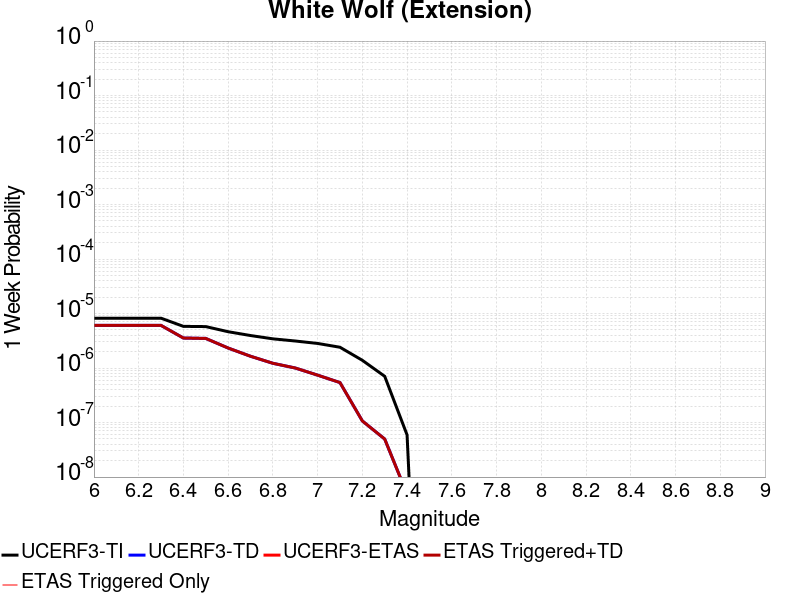 | 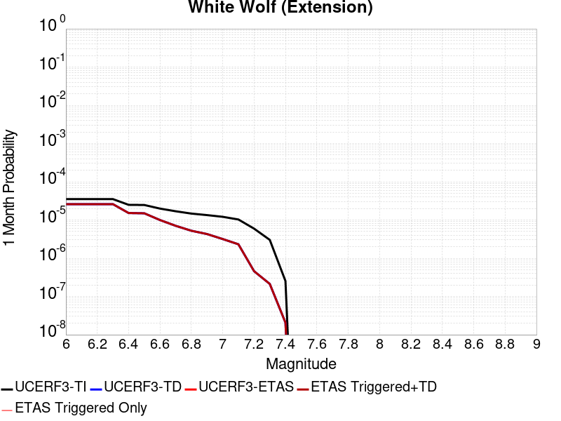 | 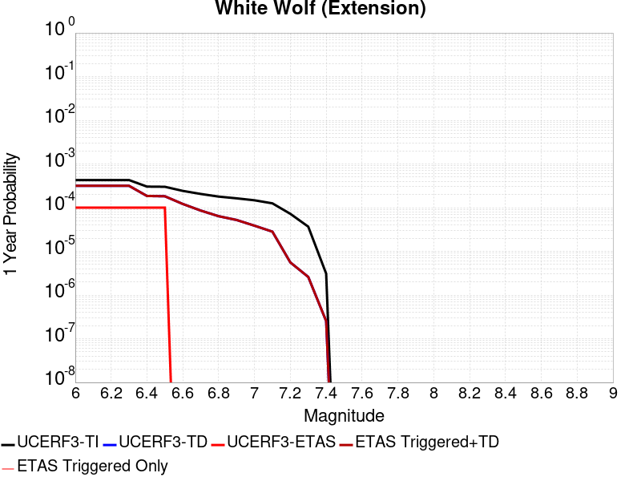 | 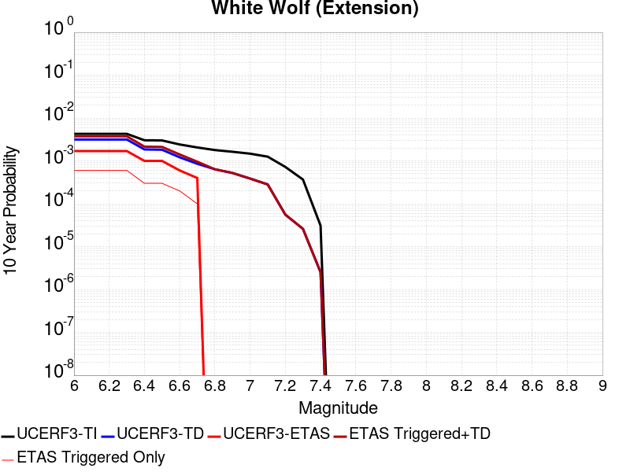 |

| Magnitude | 1 wk TI Prob | 1 wk TD Prob | 1 wk ETAS Prob | 1 wk ETAS/TD Gain | 1 wk ETAS Triggered+TD | 1 wk ETAS Triggered Only | 1 mo TI Prob | 1 mo TD Prob | 1 mo ETAS Prob | 1 mo ETAS/TD Gain | 1 mo ETAS Triggered+TD | 1 mo ETAS Triggered Only | 1 yr TI Prob | 1 yr TD Prob | 1 yr ETAS Prob | 1 yr ETAS/TD Gain | 1 yr ETAS Triggered+TD | 1 yr ETAS Triggered Only | 10 yr TI Prob | 10 yr TD Prob | 10 yr ETAS Prob | 10 yr ETAS/TD Gain | 10 yr ETAS Triggered+TD | 10 yr ETAS Triggered Only |
|-----|-----|-----|-----|-----|-----|-----|-----|-----|-----|-----|-----|-----|-----|-----|-----|-----|-----|-----|-----|-----|-----|-----|-----|-----|
| 6.0 | 8.222555E-6 | 6.063469E-6 | 0.0 | 0.0 | 6.063469E-6 | 0.0 | 3.5239045E-5 | 2.5986074E-5 | 0.0 | 0.0 | 2.5986074E-5 | 0.0 | 4.289509E-4 | 3.1634112E-4 | 1.0E-4 | 0.31611446 | 3.1634112E-4 | 0.0 | 0.0042812387 | 0.0031595596 | 0.0017 | 0.5380497 | 0.0037576638 | 6.0E-4 |
| 6.1 | 8.222555E-6 | 6.063469E-6 | 0.0 | 0.0 | 6.063469E-6 | 0.0 | 3.5239045E-5 | 2.5986074E-5 | 0.0 | 0.0 | 2.5986074E-5 | 0.0 | 4.289509E-4 | 3.1634112E-4 | 1.0E-4 | 0.31611446 | 3.1634112E-4 | 0.0 | 0.0042812387 | 0.0031595596 | 0.0017 | 0.5380497 | 0.0037576638 | 6.0E-4 |
| 6.2 | 8.222555E-6 | 6.063469E-6 | 0.0 | 0.0 | 6.063469E-6 | 0.0 | 3.5239045E-5 | 2.5986074E-5 | 0.0 | 0.0 | 2.5986074E-5 | 0.0 | 4.289509E-4 | 3.1634112E-4 | 1.0E-4 | 0.31611446 | 3.1634112E-4 | 0.0 | 0.0042812387 | 0.0031595596 | 0.0017 | 0.5380497 | 0.0037576638 | 6.0E-4 |
| 6.3 | 8.222555E-6 | 6.063469E-6 | 0.0 | 0.0 | 6.063469E-6 | 0.0 | 3.5239045E-5 | 2.5986074E-5 | 0.0 | 0.0 | 2.5986074E-5 | 0.0 | 4.289509E-4 | 3.1634112E-4 | 1.0E-4 | 0.31611446 | 3.1634112E-4 | 0.0 | 0.0042812387 | 0.0031595596 | 0.0017 | 0.5380497 | 0.0037576638 | 6.0E-4 |
| 6.4 | 5.821773E-6 | 3.5551664E-6 | 0.0 | 0.0 | 3.5551664E-6 | 0.0 | 2.4950215E-5 | 1.5236345E-5 | 0.0 | 0.0 | 1.5236345E-5 | 0.0 | 3.0372653E-4 | 1.854878E-4 | 1.0E-4 | 0.539119 | 1.854878E-4 | 0.0 | 0.0030331176 | 0.0018534381 | 0.001 | 0.53953785 | 0.002152882 | 3.0E-4 |
| 6.5 | 5.766023E-6 | 3.4971256E-6 | 0.0 | 0.0 | 3.4971256E-6 | 0.0 | 2.4711293E-5 | 1.4987601E-5 | 0.0 | 0.0 | 1.4987601E-5 | 0.0 | 3.0081844E-4 | 1.8245986E-4 | 1.0E-4 | 0.5480657 | 1.8245986E-4 | 0.0 | 0.0030041158 | 0.0018232086 | 0.001 | 0.54848355 | 0.0021226618 | 3.0E-4 |
| 6.6 | 4.643576E-6 | 2.331117E-6 | 0.0 | 0.0 | 2.331117E-6 | 0.0 | 1.9900888E-5 | 9.9904655E-6 | 0.0 | 0.0 | 9.9904655E-6 | 0.0 | 2.4226638E-4 | 1.21627556E-4 | 0.0 | 0.0 | 1.21627556E-4 | 0.0 | 0.0024200242 | 0.0012156522 | 6.0E-4 | 0.4935622 | 0.0014154091 | 2.0E-4 |
| 6.7 | 3.9529173E-6 | 1.6471313E-6 | 0.0 | 0.0 | 1.6471313E-6 | 0.0 | 1.6940963E-5 | 7.059116E-6 | 0.0 | 0.0 | 7.059116E-6 | 0.0 | 2.0623671E-4 | 8.594154E-5 | 0.0 | 0.0 | 8.594154E-5 | 0.0 | 0.002060454 | 8.591015E-4 | 4.0E-4 | 0.46560273 | 9.5901557E-4 | 1.0E-4 |
| 6.8 | 3.4377522E-6 | 1.223513E-6 | 0.0 | 0.0 | 1.223513E-6 | 0.0 | 1.473314E-5 | 5.243617E-6 | 0.0 | 0.0 | 5.243617E-6 | 0.0 | 1.7936122E-4 | 6.383926E-5 | 0.0 | 0.0 | 6.383926E-5 | 0.0 | 0.0017921652 | 6.382183E-4 | 0.0 | 0.0 | 6.382183E-4 | 0.0 |
| 6.9 | 3.1367306E-6 | 1.00249E-6 | 0.0 | 0.0 | 1.00249E-6 | 0.0 | 1.3443062E-5 | 4.2963793E-6 | 0.0 | 0.0 | 4.2963793E-6 | 0.0 | 1.63657E-4 | 5.2307238E-5 | 0.0 | 0.0 | 5.2307238E-5 | 0.0 | 0.0016353652 | 5.229569E-4 | 0.0 | 0.0 | 5.229569E-4 | 0.0 |
| 7.0 | 2.8298145E-6 | 7.420922E-7 | 0.0 | 0.0 | 7.420922E-7 | 0.0 | 1.2127721E-5 | 3.1803916E-6 | 0.0 | 0.0 | 3.1803916E-6 | 0.0 | 1.47645E-4 | 3.872063E-5 | 0.0 | 0.0 | 3.872063E-5 | 0.0 | 0.0014754693 | 3.8714384E-4 | 0.0 | 0.0 | 3.8714384E-4 | 0.0 |
| 7.1 | 2.4091064E-6 | 5.416513E-7 | 0.0 | 0.0 | 5.416513E-7 | 0.0 | 1.03247E-5 | 2.3213609E-6 | 0.0 | 0.0 | 2.3213609E-6 | 0.0 | 1.2569598E-4 | 2.8262242E-5 | 0.0 | 0.0 | 2.8262242E-5 | 0.0 | 0.001256249 | 2.825905E-4 | 0.0 | 0.0 | 2.825905E-4 | 0.0 |
| 7.2 | 1.3875518E-6 | 1.0711792E-7 | 0.0 | 0.0 | 1.0711792E-7 | 0.0 | 5.9466374E-6 | 4.5907674E-7 | 0.0 | 0.0 | 4.5907674E-7 | 0.0 | 7.23979E-5 | 5.589246E-6 | 0.0 | 0.0 | 5.589246E-6 | 0.0 | 7.2374323E-4 | 5.5891167E-5 | 0.0 | 0.0 | 5.5891167E-5 | 0.0 |
| 7.3 | 7.056077E-7 | 4.9842797E-8 | 0.0 | 0.0 | 4.9842797E-8 | 0.0 | 3.0240296E-6 | 2.1361197E-7 | 0.0 | 0.0 | 2.1361197E-7 | 0.0 | 3.681694E-5 | 2.600723E-6 | 0.0 | 0.0 | 2.600723E-6 | 0.0 | 3.681084E-4 | 2.6006972E-5 | 0.0 | 0.0 | 2.6006972E-5 | 0.0 |
| 7.4 | 5.9334678E-8 | 4.8546127E-9 | 0.0 | 0.0 | 4.8546127E-9 | 0.0 | 2.5429145E-7 | 2.0805482E-8 | 0.0 | 0.0 | 2.0805482E-8 | 0.0 | 3.095994E-6 | 2.5330672E-7 | 0.0 | 0.0 | 2.5330672E-7 | 0.0 | 3.095951E-5 | 2.5330655E-6 | 0.0 | 0.0 | 2.5330655E-6 | 0.0 |

## Canada David (Detachment)
*[(top)](#table-of-contents)*

| 1 Week | 1 Month | 1 Year | 10 Year |
|-----|-----|-----|-----|
| 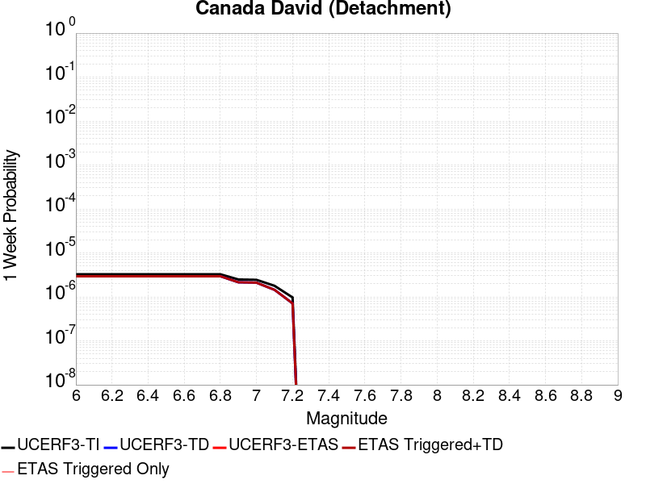 | 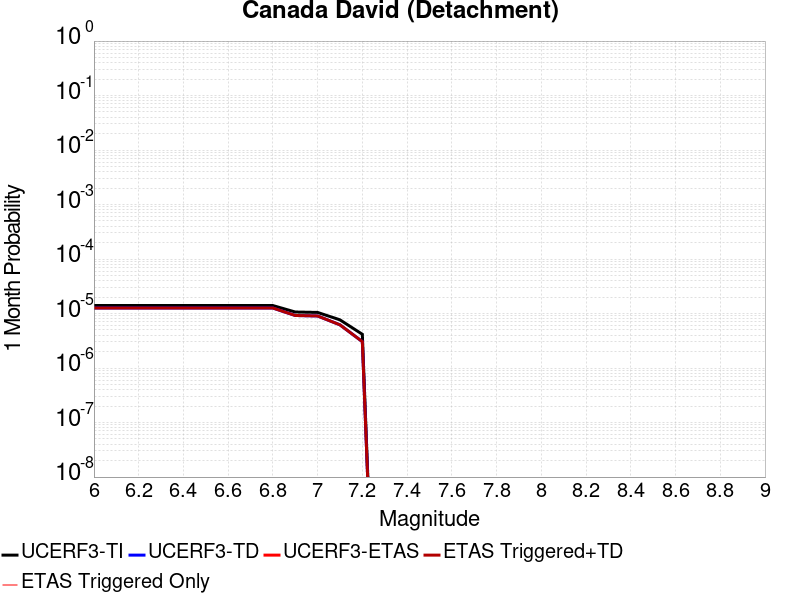 | 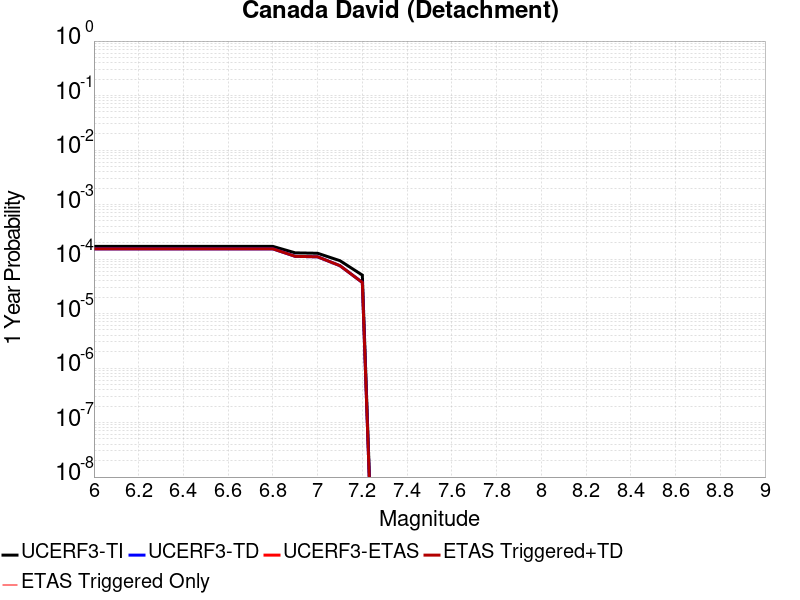 | 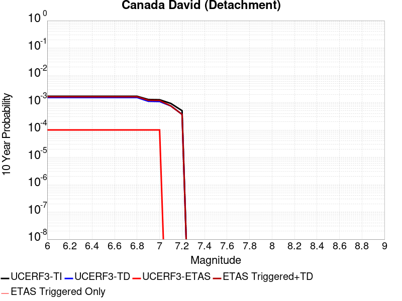 |

| Magnitude | 1 wk TI Prob | 1 wk TD Prob | 1 wk ETAS Prob | 1 wk ETAS/TD Gain | 1 wk ETAS Triggered+TD | 1 wk ETAS Triggered Only | 1 mo TI Prob | 1 mo TD Prob | 1 mo ETAS Prob | 1 mo ETAS/TD Gain | 1 mo ETAS Triggered+TD | 1 mo ETAS Triggered Only | 1 yr TI Prob | 1 yr TD Prob | 1 yr ETAS Prob | 1 yr ETAS/TD Gain | 1 yr ETAS Triggered+TD | 1 yr ETAS Triggered Only | 10 yr TI Prob | 10 yr TD Prob | 10 yr ETAS Prob | 10 yr ETAS/TD Gain | 10 yr ETAS Triggered+TD | 10 yr ETAS Triggered Only |
|-----|-----|-----|-----|-----|-----|-----|-----|-----|-----|-----|-----|-----|-----|-----|-----|-----|-----|-----|-----|-----|-----|-----|-----|-----|
| 6.0 | 3.2736298E-6 | 2.9515113E-6 | 0.0 | 0.0 | 2.9515113E-6 | 0.0 | 1.4029766E-5 | 1.264928E-5 | 0.0 | 0.0 | 1.264928E-5 | 0.0 | 1.7079902E-4 | 1.5399538E-4 | 1.0E-4 | 0.64937013 | 1.5399538E-4 | 0.0 | 0.001706678 | 0.0015390128 | 0.0016 | 1.0396276 | 0.0021380894 | 6.0E-4 |
| 6.1 | 3.2736298E-6 | 2.9515113E-6 | 0.0 | 0.0 | 2.9515113E-6 | 0.0 | 1.4029766E-5 | 1.264928E-5 | 0.0 | 0.0 | 1.264928E-5 | 0.0 | 1.7079902E-4 | 1.5399538E-4 | 1.0E-4 | 0.64937013 | 1.5399538E-4 | 0.0 | 0.001706678 | 0.0015390128 | 0.0016 | 1.0396276 | 0.0021380894 | 6.0E-4 |
| 6.2 | 3.2736298E-6 | 2.9515113E-6 | 0.0 | 0.0 | 2.9515113E-6 | 0.0 | 1.4029766E-5 | 1.264928E-5 | 0.0 | 0.0 | 1.264928E-5 | 0.0 | 1.7079902E-4 | 1.5399538E-4 | 1.0E-4 | 0.64937013 | 1.5399538E-4 | 0.0 | 0.001706678 | 0.0015390128 | 0.0016 | 1.0396276 | 0.0021380894 | 6.0E-4 |
| 6.3 | 3.2736298E-6 | 2.9515113E-6 | 0.0 | 0.0 | 2.9515113E-6 | 0.0 | 1.4029766E-5 | 1.264928E-5 | 0.0 | 0.0 | 1.264928E-5 | 0.0 | 1.7079902E-4 | 1.5399538E-4 | 1.0E-4 | 0.64937013 | 1.5399538E-4 | 0.0 | 0.001706678 | 0.0015390128 | 0.0016 | 1.0396276 | 0.0021380894 | 6.0E-4 |
| 6.4 | 3.2736298E-6 | 2.9515113E-6 | 0.0 | 0.0 | 2.9515113E-6 | 0.0 | 1.4029766E-5 | 1.264928E-5 | 0.0 | 0.0 | 1.264928E-5 | 0.0 | 1.7079902E-4 | 1.5399538E-4 | 1.0E-4 | 0.64937013 | 1.5399538E-4 | 0.0 | 0.001706678 | 0.0015390128 | 0.0016 | 1.0396276 | 0.0021380894 | 6.0E-4 |
| 6.5 | 3.2736298E-6 | 2.9515113E-6 | 0.0 | 0.0 | 2.9515113E-6 | 0.0 | 1.4029766E-5 | 1.264928E-5 | 0.0 | 0.0 | 1.264928E-5 | 0.0 | 1.7079902E-4 | 1.5399538E-4 | 1.0E-4 | 0.64937013 | 1.5399538E-4 | 0.0 | 0.001706678 | 0.0015390128 | 0.0016 | 1.0396276 | 0.0021380894 | 6.0E-4 |
| 6.6 | 3.2736298E-6 | 2.9515113E-6 | 0.0 | 0.0 | 2.9515113E-6 | 0.0 | 1.4029766E-5 | 1.264928E-5 | 0.0 | 0.0 | 1.264928E-5 | 0.0 | 1.7079902E-4 | 1.5399538E-4 | 1.0E-4 | 0.64937013 | 1.5399538E-4 | 0.0 | 0.001706678 | 0.0015390128 | 0.0016 | 1.0396276 | 0.0021380894 | 6.0E-4 |
| 6.7 | 3.2736298E-6 | 2.9515113E-6 | 0.0 | 0.0 | 2.9515113E-6 | 0.0 | 1.4029766E-5 | 1.264928E-5 | 0.0 | 0.0 | 1.264928E-5 | 0.0 | 1.7079902E-4 | 1.5399538E-4 | 1.0E-4 | 0.64937013 | 1.5399538E-4 | 0.0 | 0.001706678 | 0.0015390128 | 0.0016 | 1.0396276 | 0.0021380894 | 6.0E-4 |
| 6.8 | 3.2736298E-6 | 2.9515113E-6 | 0.0 | 0.0 | 2.9515113E-6 | 0.0 | 1.4029766E-5 | 1.264928E-5 | 0.0 | 0.0 | 1.264928E-5 | 0.0 | 1.7079902E-4 | 1.5399538E-4 | 1.0E-4 | 0.64937013 | 1.5399538E-4 | 0.0 | 0.001706678 | 0.0015390128 | 0.0016 | 1.0396276 | 0.0021380894 | 6.0E-4 |
| 6.9 | 2.4914223E-6 | 2.150532E-6 | 0.0 | 0.0 | 2.150532E-6 | 0.0 | 1.067748E-5 | 9.2165365E-6 | 0.0 | 0.0 | 9.2165365E-6 | 0.0 | 1.2999057E-4 | 1.1220611E-4 | 1.0E-4 | 0.89121705 | 1.1220611E-4 | 0.0 | 0.0012991455 | 0.0011215487 | 0.001 | 0.8916242 | 0.0015211 | 4.0E-4 |
| 7.0 | 2.4482404E-6 | 2.1084843E-6 | 0.0 | 0.0 | 2.1084843E-6 | 0.0 | 1.0492417E-5 | 9.036333E-6 | 0.0 | 0.0 | 9.036333E-6 | 0.0 | 1.2773767E-4 | 1.1001235E-4 | 1.0E-4 | 0.90898883 | 1.1001235E-4 | 0.0 | 0.0012766428 | 0.001099633 | 0.001 | 0.9093943 | 0.0014991931 | 4.0E-4 |
| 7.1 | 1.7887576E-6 | 1.4485462E-6 | 0.0 | 0.0 | 1.4485462E-6 | 0.0 | 7.666081E-6 | 6.208042E-6 | 0.0 | 0.0 | 6.208042E-6 | 0.0 | 9.333054E-5 | 7.55806E-5 | 0.0 | 0.0 | 7.55806E-5 | 0.0 | 9.329135E-4 | 7.5557927E-4 | 6.0E-4 | 0.7940927 | 0.0010553526 | 3.0E-4 |
| 7.2 | 9.723109E-7 | 7.125322E-7 | 0.0 | 0.0 | 7.125322E-7 | 0.0 | 4.16704E-6 | 3.053707E-6 | 0.0 | 0.0 | 3.053707E-6 | 0.0 | 5.073253E-5 | 3.717841E-5 | 0.0 | 0.0 | 3.717841E-5 | 0.0 | 5.072095E-4 | 3.7173813E-4 | 4.0E-4 | 1.0760263 | 5.716638E-4 | 2.0E-4 |

## Los Osos 2011
*[(top)](#table-of-contents)*

| 1 Week | 1 Month | 1 Year | 10 Year |
|-----|-----|-----|-----|
| 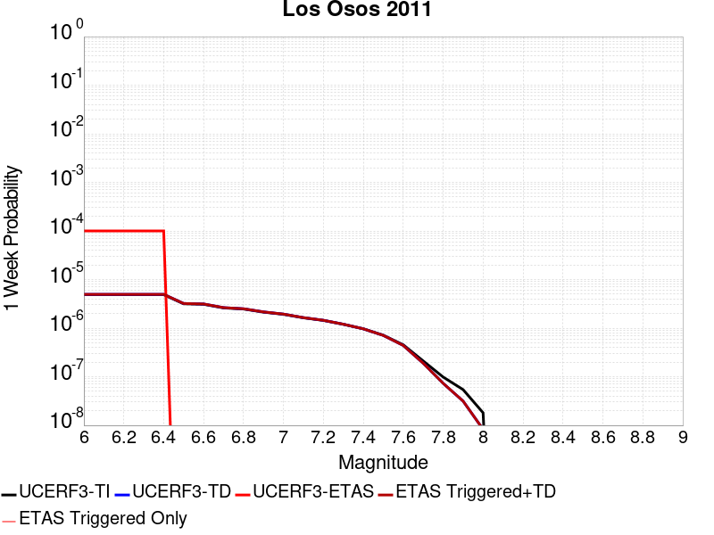 | 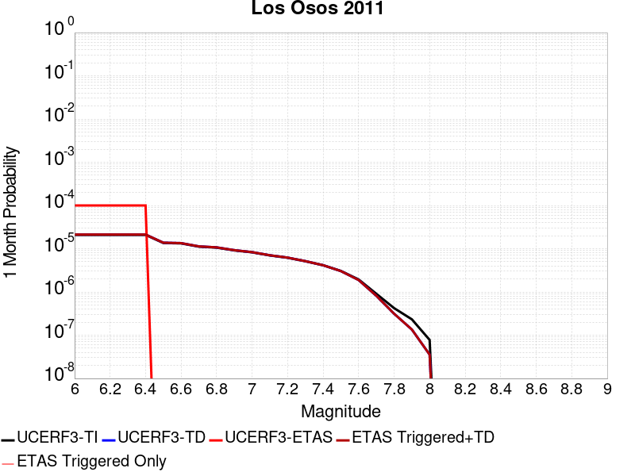 | 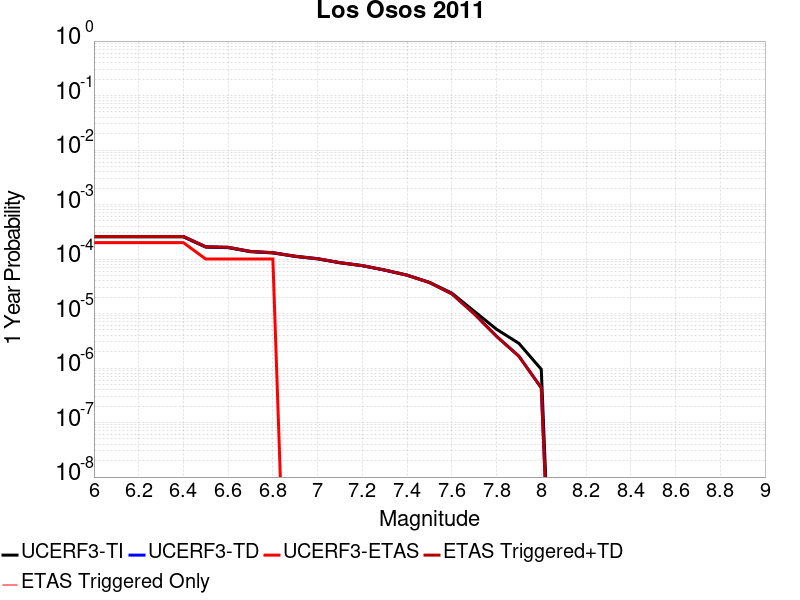 | 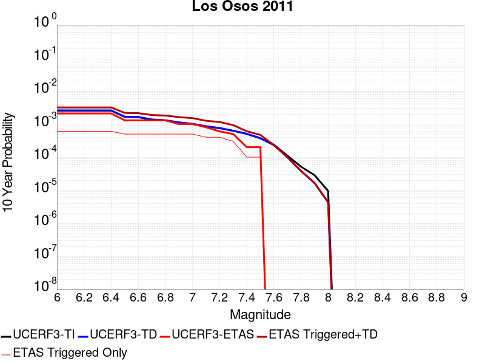 |

| Magnitude | 1 wk TI Prob | 1 wk TD Prob | 1 wk ETAS Prob | 1 wk ETAS/TD Gain | 1 wk ETAS Triggered+TD | 1 wk ETAS Triggered Only | 1 mo TI Prob | 1 mo TD Prob | 1 mo ETAS Prob | 1 mo ETAS/TD Gain | 1 mo ETAS Triggered+TD | 1 mo ETAS Triggered Only | 1 yr TI Prob | 1 yr TD Prob | 1 yr ETAS Prob | 1 yr ETAS/TD Gain | 1 yr ETAS Triggered+TD | 1 yr ETAS Triggered Only | 10 yr TI Prob | 10 yr TD Prob | 10 yr ETAS Prob | 10 yr ETAS/TD Gain | 10 yr ETAS Triggered+TD | 10 yr ETAS Triggered Only |
|-----|-----|-----|-----|-----|-----|-----|-----|-----|-----|-----|-----|-----|-----|-----|-----|-----|-----|-----|-----|-----|-----|-----|-----|-----|
| 6.0 | 4.8871775E-6 | 4.9798755E-6 | 1.0E-4 | 20.080824 | 4.9798755E-6 | 0.0 | 2.0944879E-5 | 2.1342164E-5 | 1.0E-4 | 4.68556 | 2.1342164E-5 | 0.0 | 2.5497406E-4 | 2.5981266E-4 | 2.0E-4 | 0.76978546 | 2.5981266E-4 | 0.0 | 0.002546817 | 0.0025953632 | 0.0021 | 0.80913526 | 0.0031938062 | 6.0E-4 |
| 6.1 | 4.8871775E-6 | 4.9798755E-6 | 1.0E-4 | 20.080824 | 4.9798755E-6 | 0.0 | 2.0944879E-5 | 2.1342164E-5 | 1.0E-4 | 4.68556 | 2.1342164E-5 | 0.0 | 2.5497406E-4 | 2.5981266E-4 | 2.0E-4 | 0.76978546 | 2.5981266E-4 | 0.0 | 0.002546817 | 0.0025953632 | 0.0021 | 0.80913526 | 0.0031938062 | 6.0E-4 |
| 6.2 | 4.8871775E-6 | 4.9798755E-6 | 1.0E-4 | 20.080824 | 4.9798755E-6 | 0.0 | 2.0944879E-5 | 2.1342164E-5 | 1.0E-4 | 4.68556 | 2.1342164E-5 | 0.0 | 2.5497406E-4 | 2.5981266E-4 | 2.0E-4 | 0.76978546 | 2.5981266E-4 | 0.0 | 0.002546817 | 0.0025953632 | 0.0021 | 0.80913526 | 0.0031938062 | 6.0E-4 |
| 6.3 | 4.8871775E-6 | 4.9798755E-6 | 1.0E-4 | 20.080824 | 4.9798755E-6 | 0.0 | 2.0944879E-5 | 2.1342164E-5 | 1.0E-4 | 4.68556 | 2.1342164E-5 | 0.0 | 2.5497406E-4 | 2.5981266E-4 | 2.0E-4 | 0.76978546 | 2.5981266E-4 | 0.0 | 0.002546817 | 0.0025953632 | 0.0021 | 0.80913526 | 0.0031938062 | 6.0E-4 |
| 6.4 | 4.8871775E-6 | 4.9798755E-6 | 1.0E-4 | 20.080824 | 4.9798755E-6 | 0.0 | 2.0944879E-5 | 2.1342164E-5 | 1.0E-4 | 4.68556 | 2.1342164E-5 | 0.0 | 2.5497406E-4 | 2.5981266E-4 | 2.0E-4 | 0.76978546 | 2.5981266E-4 | 0.0 | 0.002546817 | 0.0025953632 | 0.0021 | 0.80913526 | 0.0031938062 | 6.0E-4 |
| 6.5 | 3.1724062E-6 | 3.2222508E-6 | 0.0 | 0.0 | 3.2222508E-6 | 0.0 | 1.3595956E-5 | 1.3809574E-5 | 0.0 | 0.0 | 1.3809574E-5 | 0.0 | 1.6551818E-4 | 1.6811873E-4 | 1.0E-4 | 0.59481776 | 1.6811873E-4 | 0.0 | 0.0016539496 | 0.0016799289 | 0.0013 | 0.7738423 | 0.002179089 | 5.0E-4 |
| 6.6 | 3.1022591E-6 | 3.1499835E-6 | 0.0 | 0.0 | 3.1499835E-6 | 0.0 | 1.3295328E-5 | 1.349986E-5 | 0.0 | 0.0 | 1.349986E-5 | 0.0 | 1.618586E-4 | 1.6434852E-4 | 1.0E-4 | 0.60846305 | 1.6434852E-4 | 0.0 | 0.0016174077 | 0.0016422826 | 0.0013 | 0.7915812 | 0.0021414615 | 5.0E-4 |
| 6.7 | 2.611518E-6 | 2.6481819E-6 | 0.0 | 0.0 | 2.6481819E-6 | 0.0 | 1.1192172E-5 | 1.13493015E-5 | 0.0 | 0.0 | 1.13493015E-5 | 0.0 | 1.3625617E-4 | 1.3816902E-4 | 1.0E-4 | 0.72375125 | 1.3816902E-4 | 0.0 | 0.0013617266 | 0.0013808357 | 0.0013 | 0.9414589 | 0.0018801453 | 5.0E-4 |
| 6.8 | 2.4780884E-6 | 2.5111965E-6 | 0.0 | 0.0 | 2.5111965E-6 | 0.0 | 1.0620336E-5 | 1.0762226E-5 | 0.0 | 0.0 | 1.0762226E-5 | 0.0 | 1.2929492E-4 | 1.3102226E-4 | 1.0E-4 | 0.7632291 | 1.3102226E-4 | 0.0 | 0.0012921972 | 0.0013094542 | 0.0013 | 0.99278 | 0.0018087996 | 5.0E-4 |
| 6.9 | 2.1376322E-6 | 2.1626306E-6 | 0.0 | 0.0 | 2.1626306E-6 | 0.0 | 9.161248E-6 | 9.268384E-6 | 0.0 | 0.0 | 9.268384E-6 | 0.0 | 1.1153249E-4 | 1.1283675E-4 | 0.0 | 0.0 | 1.1283675E-4 | 0.0 | 0.0011147653 | 0.0011277965 | 0.001 | 0.88668483 | 0.0016272325 | 5.0E-4 |
| 7.0 | 1.9282882E-6 | 1.9486338E-6 | 0.0 | 0.0 | 1.9486338E-6 | 0.0 | 8.264066E-6 | 8.351261E-6 | 0.0 | 0.0 | 8.351261E-6 | 0.0 | 1.0061036E-4 | 1.01671874E-4 | 0.0 | 0.0 | 1.01671874E-4 | 0.0 | 0.0010056482 | 0.0010162549 | 0.001 | 0.9840051 | 0.0015157468 | 5.0E-4 |
| 7.1 | 1.6353226E-6 | 1.6493552E-6 | 0.0 | 0.0 | 1.6493552E-6 | 0.0 | 7.0085066E-6 | 7.068646E-6 | 0.0 | 0.0 | 7.068646E-6 | 0.0 | 8.532523E-5 | 8.605737E-5 | 0.0 | 0.0 | 8.605737E-5 | 0.0 | 8.529247E-4 | 8.6024124E-4 | 8.0E-4 | 0.9299717 | 0.0012598971 | 4.0E-4 |
| 7.2 | 1.4446276E-6 | 1.454621E-6 | 0.0 | 0.0 | 1.454621E-6 | 0.0 | 6.191247E-6 | 6.2340755E-6 | 0.0 | 0.0 | 6.2340755E-6 | 0.0 | 7.537582E-5 | 7.589723E-5 | 0.0 | 0.0 | 7.589723E-5 | 0.0 | 7.535026E-4 | 7.587137E-4 | 6.0E-4 | 0.79081213 | 0.0011584102 | 4.0E-4 |
| 7.3 | 1.2014582E-6 | 1.2062504E-6 | 0.0 | 0.0 | 1.2062504E-6 | 0.0 | 5.149096E-6 | 5.1696343E-6 | 0.0 | 0.0 | 5.1696343E-6 | 0.0 | 6.268844E-5 | 6.293848E-5 | 0.0 | 0.0 | 6.293848E-5 | 0.0 | 6.267076E-4 | 6.29207E-4 | 5.0E-4 | 0.7946511 | 9.290182E-4 | 3.0E-4 |
| 7.4 | 9.707733E-7 | 9.703765E-7 | 0.0 | 0.0 | 9.703765E-7 | 0.0 | 4.16045E-6 | 4.15875E-6 | 0.0 | 0.0 | 4.15875E-6 | 0.0 | 5.0652303E-5 | 5.0631606E-5 | 0.0 | 0.0 | 5.0631606E-5 | 0.0 | 5.064076E-4 | 5.0620094E-4 | 2.0E-4 | 0.3951 | 6.0615037E-4 | 1.0E-4 |
| 7.5 | 7.174908E-7 | 7.1095707E-7 | 0.0 | 0.0 | 7.1095707E-7 | 0.0 | 3.074957E-6 | 3.0469553E-6 | 0.0 | 0.0 | 3.0469553E-6 | 0.0 | 3.743696E-5 | 3.709605E-5 | 0.0 | 0.0 | 3.709605E-5 | 0.0 | 3.7430652E-4 | 3.7089875E-4 | 2.0E-4 | 0.5392307 | 4.7086168E-4 | 1.0E-4 |
| 7.6 | 4.5535776E-7 | 4.4162329E-7 | 0.0 | 0.0 | 4.4162329E-7 | 0.0 | 1.9515319E-6 | 1.8926698E-6 | 0.0 | 0.0 | 1.8926698E-6 | 0.0 | 2.3759641E-5 | 2.3043012E-5 | 0.0 | 0.0 | 2.3043012E-5 | 0.0 | 2.37571E-4 | 2.3040632E-4 | 0.0 | 0.0 | 2.3040632E-4 | 0.0 |
| 7.7 | 2.1173553E-7 | 1.9023689E-7 | 0.0 | 0.0 | 1.9023689E-7 | 0.0 | 9.0743765E-7 | 8.1530067E-7 | 0.0 | 0.0 | 8.1530067E-7 | 0.0 | 1.1047998E-5 | 9.926241E-6 | 0.0 | 0.0 | 9.926241E-6 | 0.0 | 1.1047449E-4 | 9.9258E-5 | 0.0 | 0.0 | 9.9258E-5 | 0.0 |
| 7.8 | 9.873608E-8 | 7.335165E-8 | 0.0 | 0.0 | 7.335165E-8 | 0.0 | 4.2315455E-7 | 3.1436417E-7 | 0.0 | 0.0 | 3.1436417E-7 | 0.0 | 5.1518946E-6 | 3.8273774E-6 | 0.0 | 0.0 | 3.8273774E-6 | 0.0 | 5.1517753E-5 | 3.827312E-5 | 0.0 | 0.0 | 3.827312E-5 | 0.0 |
| 7.9 | 5.4399106E-8 | 3.1599697E-8 | 0.0 | 0.0 | 3.1599697E-8 | 0.0 | 2.33139E-7 | 1.3542727E-7 | 0.0 | 0.0 | 1.3542727E-7 | 0.0 | 2.8384638E-6 | 1.6488258E-6 | 0.0 | 0.0 | 1.6488258E-6 | 0.0 | 2.8384275E-5 | 1.6488137E-5 | 0.0 | 0.0 | 1.6488137E-5 | 0.0 |
| 8.0 | 1.817203E-8 | 8.302052E-9 | 0.0 | 0.0 | 8.302052E-9 | 0.0 | 7.7880124E-8 | 3.5580225E-8 | 0.0 | 0.0 | 3.5580225E-8 | 0.0 | 9.481901E-7 | 4.3318917E-7 | 0.0 | 0.0 | 4.3318917E-7 | 0.0 | 9.481861E-6 | 4.3318837E-6 | 0.0 | 0.0 | 4.3318837E-6 | 0.0 |

## Scodie Lineament
*[(top)](#table-of-contents)*

| 1 Week | 1 Month | 1 Year | 10 Year |
|-----|-----|-----|-----|
| 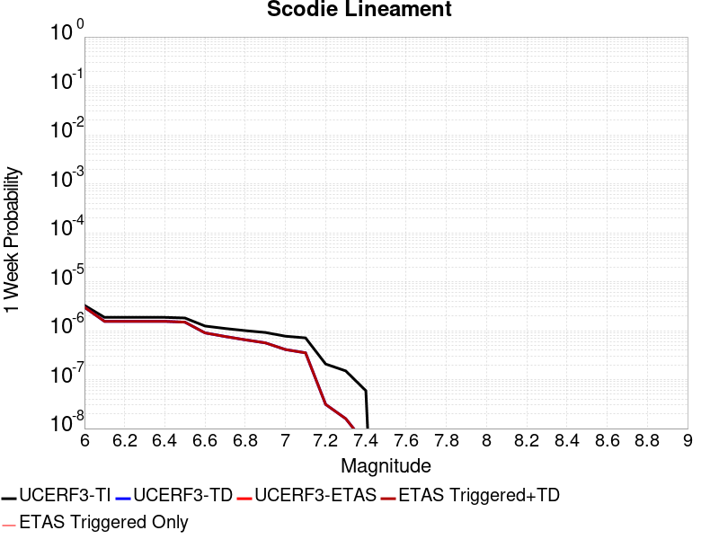 | 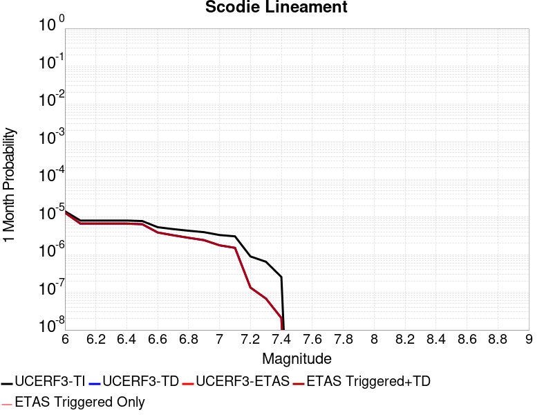 | 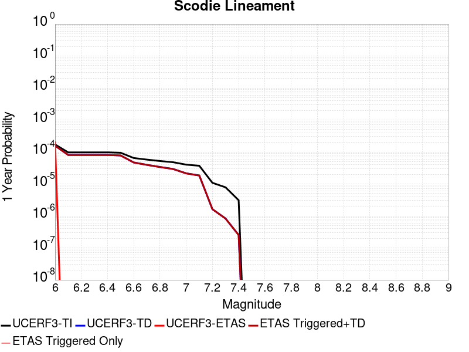 | 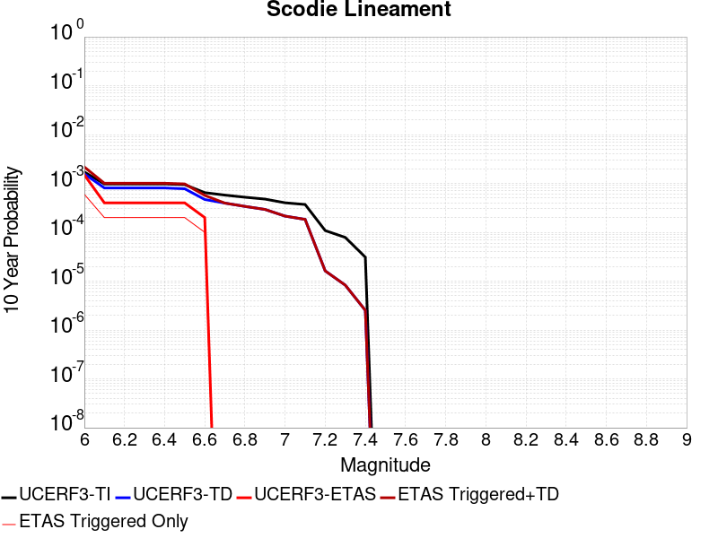 |

| Magnitude | 1 wk TI Prob | 1 wk TD Prob | 1 wk ETAS Prob | 1 wk ETAS/TD Gain | 1 wk ETAS Triggered+TD | 1 wk ETAS Triggered Only | 1 mo TI Prob | 1 mo TD Prob | 1 mo ETAS Prob | 1 mo ETAS/TD Gain | 1 mo ETAS Triggered+TD | 1 mo ETAS Triggered Only | 1 yr TI Prob | 1 yr TD Prob | 1 yr ETAS Prob | 1 yr ETAS/TD Gain | 1 yr ETAS Triggered+TD | 1 yr ETAS Triggered Only | 10 yr TI Prob | 10 yr TD Prob | 10 yr ETAS Prob | 10 yr ETAS/TD Gain | 10 yr ETAS Triggered+TD | 10 yr ETAS Triggered Only |
|-----|-----|-----|-----|-----|-----|-----|-----|-----|-----|-----|-----|-----|-----|-----|-----|-----|-----|-----|-----|-----|-----|-----|-----|-----|
| 6.0 | 3.2919327E-6 | 3.012221E-6 | 0.0 | 0.0 | 3.012221E-6 | 0.0 | 1.4108206E-5 | 1.2909472E-5 | 0.0 | 0.0 | 1.2909472E-5 | 0.0 | 1.7175387E-4 | 1.5716467E-4 | 2.0E-4 | 1.2725507 | 1.5716467E-4 | 0.0 | 0.0017162118 | 0.0015708465 | 0.0015 | 0.95489913 | 0.002169904 | 6.0E-4 |
| 6.1 | 1.8663811E-6 | 1.5483441E-6 | 0.0 | 0.0 | 1.5483441E-6 | 0.0 | 7.998751E-6 | 6.6357466E-6 | 0.0 | 0.0 | 6.6357466E-6 | 0.0 | 9.738045E-5 | 8.0787715E-5 | 0.0 | 0.0 | 8.0787715E-5 | 0.0 | 9.7337784E-4 | 8.076322E-4 | 4.0E-4 | 0.49527493 | 0.0010074707 | 2.0E-4 |
| 6.2 | 1.8663811E-6 | 1.5483441E-6 | 0.0 | 0.0 | 1.5483441E-6 | 0.0 | 7.998751E-6 | 6.6357466E-6 | 0.0 | 0.0 | 6.6357466E-6 | 0.0 | 9.738045E-5 | 8.0787715E-5 | 0.0 | 0.0 | 8.0787715E-5 | 0.0 | 9.7337784E-4 | 8.076322E-4 | 4.0E-4 | 0.49527493 | 0.0010074707 | 2.0E-4 |
| 6.3 | 1.8663811E-6 | 1.5483441E-6 | 0.0 | 0.0 | 1.5483441E-6 | 0.0 | 7.998751E-6 | 6.6357466E-6 | 0.0 | 0.0 | 6.6357466E-6 | 0.0 | 9.738045E-5 | 8.0787715E-5 | 0.0 | 0.0 | 8.0787715E-5 | 0.0 | 9.7337784E-4 | 8.076322E-4 | 4.0E-4 | 0.49527493 | 0.0010074707 | 2.0E-4 |
| 6.4 | 1.8663811E-6 | 1.5483441E-6 | 0.0 | 0.0 | 1.5483441E-6 | 0.0 | 7.998751E-6 | 6.6357466E-6 | 0.0 | 0.0 | 6.6357466E-6 | 0.0 | 9.738045E-5 | 8.0787715E-5 | 0.0 | 0.0 | 8.0787715E-5 | 0.0 | 9.7337784E-4 | 8.076322E-4 | 4.0E-4 | 0.49527493 | 0.0010074707 | 2.0E-4 |
| 6.5 | 1.8106311E-6 | 1.4903034E-6 | 0.0 | 0.0 | 1.4903034E-6 | 0.0 | 7.759824E-6 | 6.387001E-6 | 0.0 | 0.0 | 6.387001E-6 | 0.0 | 9.447177E-5 | 7.775946E-5 | 0.0 | 0.0 | 7.775946E-5 | 0.0 | 9.4431615E-4 | 7.7737117E-4 | 4.0E-4 | 0.51455474 | 9.772157E-4 | 2.0E-4 |
| 6.6 | 1.2414679E-6 | 8.9931433E-7 | 0.0 | 0.0 | 8.9931433E-7 | 0.0 | 5.320566E-6 | 3.8541993E-6 | 0.0 | 0.0 | 3.8541993E-6 | 0.0 | 6.477596E-5 | 4.6923953E-5 | 0.0 | 0.0 | 4.6923953E-5 | 0.0 | 6.475708E-4 | 4.691491E-4 | 2.0E-4 | 0.4263037 | 5.691022E-4 | 1.0E-4 |
| 6.7 | 1.1062215E-6 | 7.5904467E-7 | 0.0 | 0.0 | 7.5904467E-7 | 0.0 | 4.7409408E-6 | 3.253045E-6 | 0.0 | 0.0 | 3.253045E-6 | 0.0 | 5.7719422E-5 | 3.9605173E-5 | 0.0 | 0.0 | 3.9605173E-5 | 0.0 | 5.770443E-4 | 3.9598814E-4 | 0.0 | 0.0 | 3.9598814E-4 | 0.0 |
| 6.8 | 1.0006736E-6 | 6.496948E-7 | 0.0 | 0.0 | 6.496948E-7 | 0.0 | 4.288594E-6 | 2.7844037E-6 | 0.0 | 0.0 | 2.7844037E-6 | 0.0 | 5.221238E-5 | 3.389965E-5 | 0.0 | 0.0 | 3.389965E-5 | 0.0 | 5.220012E-4 | 3.3895086E-4 | 0.0 | 0.0 | 3.3895086E-4 | 0.0 |
| 6.9 | 9.167364E-7 | 5.628494E-7 | 0.0 | 0.0 | 5.628494E-7 | 0.0 | 3.9288643E-6 | 2.4122098E-6 | 0.0 | 0.0 | 2.4122098E-6 | 0.0 | 4.7832873E-5 | 2.9368317E-5 | 0.0 | 0.0 | 2.9368317E-5 | 0.0 | 4.782258E-4 | 2.9365002E-4 | 0.0 | 0.0 | 2.9365002E-4 | 0.0 |
| 7.0 | 7.6987664E-7 | 4.110788E-7 | 0.0 | 0.0 | 4.110788E-7 | 0.0 | 3.2994672E-6 | 1.7617652E-6 | 0.0 | 0.0 | 1.7617652E-6 | 0.0 | 4.0170275E-5 | 2.1449321E-5 | 0.0 | 0.0 | 2.1449321E-5 | 0.0 | 4.0163012E-4 | 2.1447636E-4 | 0.0 | 0.0 | 2.1447636E-4 | 0.0 |
| 7.1 | 7.1038727E-7 | 3.5187597E-7 | 0.0 | 0.0 | 3.5187597E-7 | 0.0 | 3.0445133E-6 | 1.5080392E-6 | 0.0 | 0.0 | 1.5080392E-6 | 0.0 | 3.706632E-5 | 1.8360257E-5 | 0.0 | 0.0 | 1.8360257E-5 | 0.0 | 3.7060137E-4 | 1.8359089E-4 | 0.0 | 0.0 | 1.8359089E-4 | 0.0 |
| 7.2 | 2.0799602E-7 | 3.1122056E-8 | 0.0 | 0.0 | 3.1122056E-8 | 0.0 | 8.914113E-7 | 1.3338024E-7 | 0.0 | 0.0 | 1.3338024E-7 | 0.0 | 1.0852878E-5 | 1.6239032E-6 | 0.0 | 0.0 | 1.6239032E-6 | 0.0 | 1.08523476E-4 | 1.623892E-5 | 0.0 | 0.0 | 1.623892E-5 | 0.0 |
| 7.3 | 1.5048182E-7 | 1.5902346E-8 | 0.0 | 0.0 | 1.5902346E-8 | 0.0 | 6.449219E-7 | 6.815291E-8 | 0.0 | 0.0 | 6.815291E-8 | 0.0 | 7.851896E-6 | 8.297614E-7 | 0.0 | 0.0 | 8.297614E-7 | 0.0 | 7.851618E-5 | 8.297586E-6 | 0.0 | 0.0 | 8.297586E-6 | 0.0 |
| 7.4 | 5.9334678E-8 | 4.8546127E-9 | 0.0 | 0.0 | 4.8546127E-9 | 0.0 | 2.5429145E-7 | 2.0805482E-8 | 0.0 | 0.0 | 2.0805482E-8 | 0.0 | 3.095994E-6 | 2.5330672E-7 | 0.0 | 0.0 | 2.5330672E-7 | 0.0 | 3.095951E-5 | 2.5330655E-6 | 0.0 | 0.0 | 2.5330655E-6 | 0.0 |

## Shoreline
*[(top)](#table-of-contents)*

| 1 Week | 1 Month | 1 Year | 10 Year |
|-----|-----|-----|-----|
| 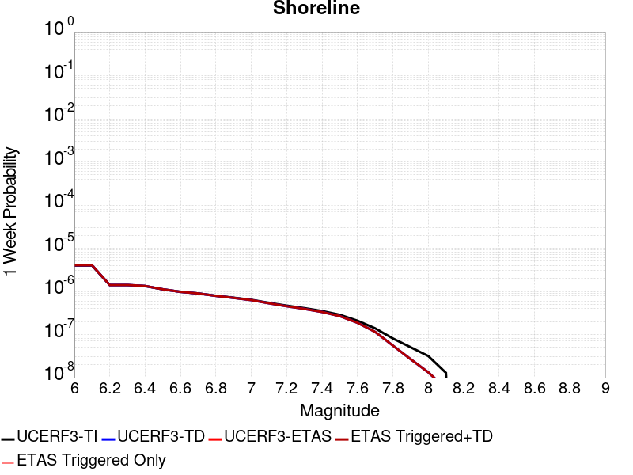 | 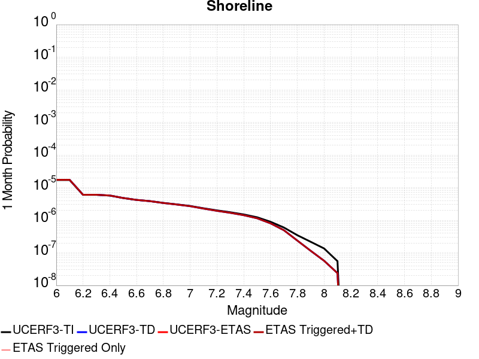 | 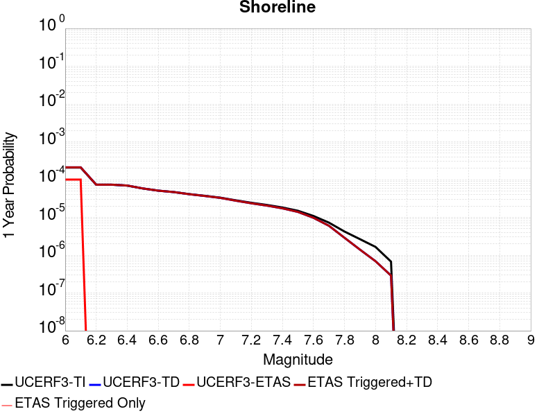 | 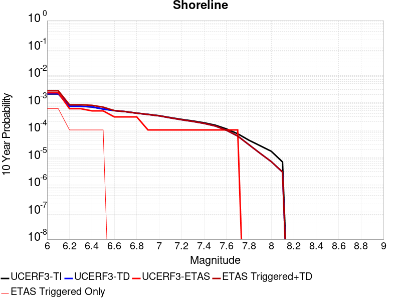 |

| Magnitude | 1 wk TI Prob | 1 wk TD Prob | 1 wk ETAS Prob | 1 wk ETAS/TD Gain | 1 wk ETAS Triggered+TD | 1 wk ETAS Triggered Only | 1 mo TI Prob | 1 mo TD Prob | 1 mo ETAS Prob | 1 mo ETAS/TD Gain | 1 mo ETAS Triggered+TD | 1 mo ETAS Triggered Only | 1 yr TI Prob | 1 yr TD Prob | 1 yr ETAS Prob | 1 yr ETAS/TD Gain | 1 yr ETAS Triggered+TD | 1 yr ETAS Triggered Only | 10 yr TI Prob | 10 yr TD Prob | 10 yr ETAS Prob | 10 yr ETAS/TD Gain | 10 yr ETAS Triggered+TD | 10 yr ETAS Triggered Only |
|-----|-----|-----|-----|-----|-----|-----|-----|-----|-----|-----|-----|-----|-----|-----|-----|-----|-----|-----|-----|-----|-----|-----|-----|-----|
| 6.0 | 3.9888673E-6 | 4.0466653E-6 | 0.0 | 0.0 | 4.0466653E-6 | 0.0 | 1.7095033E-5 | 1.7342767E-5 | 0.0 | 0.0 | 1.7342767E-5 | 0.0 | 2.0811215E-4 | 2.1113333E-4 | 1.0E-4 | 0.47363436 | 2.1113333E-4 | 0.0 | 0.0020791737 | 0.002109876 | 0.0023 | 1.0901115 | 0.00270861 | 6.0E-4 |
| 6.1 | 3.9888673E-6 | 4.0466653E-6 | 0.0 | 0.0 | 4.0466653E-6 | 0.0 | 1.7095033E-5 | 1.7342767E-5 | 0.0 | 0.0 | 1.7342767E-5 | 0.0 | 2.0811215E-4 | 2.1113333E-4 | 1.0E-4 | 0.47363436 | 2.1113333E-4 | 0.0 | 0.0020791737 | 0.002109876 | 0.0023 | 1.0901115 | 0.00270861 | 6.0E-4 |
| 6.2 | 1.4039653E-6 | 1.4093897E-6 | 0.0 | 0.0 | 1.4093897E-6 | 0.0 | 6.0169805E-6 | 6.040228E-6 | 0.0 | 0.0 | 6.040228E-6 | 0.0 | 7.325427E-5 | 7.3537354E-5 | 0.0 | 0.0 | 7.3537354E-5 | 0.0 | 7.3230127E-4 | 7.351362E-4 | 6.0E-4 | 0.8161752 | 8.350627E-4 | 1.0E-4 |
| 6.3 | 1.4039653E-6 | 1.4093897E-6 | 0.0 | 0.0 | 1.4093897E-6 | 0.0 | 6.0169805E-6 | 6.040228E-6 | 0.0 | 0.0 | 6.040228E-6 | 0.0 | 7.325427E-5 | 7.3537354E-5 | 0.0 | 0.0 | 7.3537354E-5 | 0.0 | 7.3230127E-4 | 7.351362E-4 | 6.0E-4 | 0.8161752 | 8.350627E-4 | 1.0E-4 |
| 6.4 | 1.3314152E-6 | 1.3354759E-6 | 0.0 | 0.0 | 1.3354759E-6 | 0.0 | 5.7060524E-6 | 5.7234556E-6 | 0.0 | 0.0 | 5.7234556E-6 | 0.0 | 6.946897E-5 | 6.96809E-5 | 0.0 | 0.0 | 6.96809E-5 | 0.0 | 6.9447263E-4 | 6.965959E-4 | 5.0E-4 | 0.7177763 | 7.965262E-4 | 1.0E-4 |
| 6.5 | 1.1187026E-6 | 1.119712E-6 | 0.0 | 0.0 | 1.119712E-6 | 0.0 | 4.794431E-6 | 4.798757E-6 | 0.0 | 0.0 | 4.798757E-6 | 0.0 | 5.8370628E-5 | 5.8423324E-5 | 0.0 | 0.0 | 5.8423324E-5 | 0.0 | 5.83553E-4 | 5.8408215E-4 | 5.0E-4 | 0.85604393 | 6.840238E-4 | 1.0E-4 |
| 6.6 | 9.793089E-7 | 9.778663E-7 | 0.0 | 0.0 | 9.778663E-7 | 0.0 | 4.1970316E-6 | 4.1908493E-6 | 0.0 | 0.0 | 4.1908493E-6 | 0.0 | 5.1097657E-5 | 5.1022405E-5 | 0.0 | 0.0 | 5.1022405E-5 | 0.0 | 5.108591E-4 | 5.101082E-4 | 3.0E-4 | 0.5881105 | 5.101082E-4 | 0.0 |
| 6.7 | 8.995986E-7 | 8.9667043E-7 | 0.0 | 0.0 | 8.9667043E-7 | 0.0 | 3.8554167E-6 | 3.8428675E-6 | 0.0 | 0.0 | 3.8428675E-6 | 0.0 | 4.693869E-5 | 4.6785917E-5 | 0.0 | 0.0 | 4.6785917E-5 | 0.0 | 4.6928777E-4 | 4.6776162E-4 | 3.0E-4 | 0.6413523 | 4.6776162E-4 | 0.0 |
| 6.8 | 7.931612E-7 | 7.874607E-7 | 0.0 | 0.0 | 7.874607E-7 | 0.0 | 3.3992578E-6 | 3.3748272E-6 | 0.0 | 0.0 | 3.3748272E-6 | 0.0 | 4.1385178E-5 | 4.108775E-5 | 0.0 | 0.0 | 4.108775E-5 | 0.0 | 4.1377472E-4 | 4.108021E-4 | 3.0E-4 | 0.7302786 | 4.108021E-4 | 0.0 |
| 6.9 | 7.1465956E-7 | 7.072396E-7 | 0.0 | 0.0 | 7.072396E-7 | 0.0 | 3.062823E-6 | 3.0310234E-6 | 0.0 | 0.0 | 3.0310234E-6 | 0.0 | 3.7289232E-5 | 3.690209E-5 | 0.0 | 0.0 | 3.690209E-5 | 0.0 | 3.7282976E-4 | 3.6895997E-4 | 1.0E-4 | 0.2710321 | 3.6895997E-4 | 0.0 |
| 7.0 | 6.389046E-7 | 6.294074E-7 | 0.0 | 0.0 | 6.294074E-7 | 0.0 | 2.7381598E-6 | 2.6974576E-6 | 0.0 | 0.0 | 2.6974576E-6 | 0.0 | 3.3336586E-5 | 3.2841053E-5 | 0.0 | 0.0 | 3.2841053E-5 | 0.0 | 3.3331584E-4 | 3.2836225E-4 | 1.0E-4 | 0.3045417 | 3.2836225E-4 | 0.0 |
| 7.1 | 5.4300875E-7 | 5.306064E-7 | 0.0 | 0.0 | 5.306064E-7 | 0.0 | 2.3271782E-6 | 2.2740255E-6 | 0.0 | 0.0 | 2.2740255E-6 | 0.0 | 2.8333026E-5 | 2.768591E-5 | 0.0 | 0.0 | 2.768591E-5 | 0.0 | 2.8329415E-4 | 2.768247E-4 | 1.0E-4 | 0.36123943 | 2.768247E-4 | 0.0 |
| 7.2 | 4.6768855E-7 | 4.530077E-7 | 0.0 | 0.0 | 4.530077E-7 | 0.0 | 2.0043778E-6 | 1.94146E-6 | 0.0 | 0.0 | 1.94146E-6 | 0.0 | 2.4403027E-5 | 2.363702E-5 | 0.0 | 0.0 | 2.363702E-5 | 0.0 | 2.4400349E-4 | 2.363451E-4 | 1.0E-4 | 0.4231101 | 2.363451E-4 | 0.0 |
| 7.3 | 4.0966103E-7 | 3.9339207E-7 | 0.0 | 0.0 | 3.9339207E-7 | 0.0 | 1.7556889E-6 | 1.6859649E-6 | 0.0 | 0.0 | 1.6859649E-6 | 0.0 | 2.1375303E-5 | 2.052643E-5 | 0.0 | 0.0 | 2.052643E-5 | 0.0 | 2.1373246E-4 | 2.0524536E-4 | 1.0E-4 | 0.48722172 | 2.0524536E-4 | 0.0 |
| 7.4 | 3.5105785E-7 | 3.331926E-7 | 0.0 | 0.0 | 3.331926E-7 | 0.0 | 1.5045327E-6 | 1.4279674E-6 | 0.0 | 0.0 | 1.4279674E-6 | 0.0 | 1.8317533E-5 | 1.7385364E-5 | 0.0 | 0.0 | 1.7385364E-5 | 0.0 | 1.8316023E-4 | 1.7384008E-4 | 1.0E-4 | 0.5752414 | 1.7384008E-4 | 0.0 |
| 7.5 | 2.8737534E-7 | 2.677722E-7 | 0.0 | 0.0 | 2.677722E-7 | 0.0 | 1.2316079E-6 | 1.1475946E-6 | 0.0 | 0.0 | 1.1475946E-6 | 0.0 | 1.4994724E-5 | 1.3971876E-5 | 0.0 | 0.0 | 1.3971876E-5 | 0.0 | 1.4993713E-4 | 1.3971E-4 | 1.0E-4 | 0.7157684 | 1.3971E-4 | 0.0 |
| 7.6 | 2.0924051E-7 | 1.873864E-7 | 0.0 | 0.0 | 1.873864E-7 | 0.0 | 8.967448E-7 | 8.0308433E-7 | 0.0 | 0.0 | 8.0308433E-7 | 0.0 | 1.0917813E-5 | 9.777507E-6 | 0.0 | 0.0 | 9.777507E-6 | 0.0 | 1.0917276E-4 | 9.777079E-5 | 1.0E-4 | 1.0228004 | 9.777079E-5 | 0.0 |
| 7.7 | 1.392265E-7 | 1.1505599E-7 | 0.0 | 0.0 | 1.1505599E-7 | 0.0 | 5.9668486E-7 | 4.93097E-7 | 0.0 | 0.0 | 4.93097E-7 | 0.0 | 7.2646135E-6 | 6.003439E-6 | 0.0 | 0.0 | 6.003439E-6 | 0.0 | 7.2643765E-5 | 6.0032777E-5 | 1.0E-4 | 1.6657567 | 6.0032777E-5 | 0.0 |
| 7.8 | 8.1080074E-8 | 5.551784E-8 | 0.0 | 0.0 | 5.551784E-8 | 0.0 | 3.4748598E-7 | 2.3793358E-7 | 0.0 | 0.0 | 2.3793358E-7 | 0.0 | 4.2306337E-6 | 2.8968373E-6 | 0.0 | 0.0 | 2.8968373E-6 | 0.0 | 4.230553E-5 | 2.8967997E-5 | 0.0 | 0.0 | 2.8967997E-5 | 0.0 |
| 7.9 | 5.0859036E-8 | 2.6927035E-8 | 0.0 | 0.0 | 2.6927035E-8 | 0.0 | 2.1796728E-7 | 1.15401576E-7 | 0.0 | 0.0 | 1.15401576E-7 | 0.0 | 2.6537484E-6 | 1.4050132E-6 | 0.0 | 0.0 | 1.4050132E-6 | 0.0 | 2.6537167E-5 | 1.4050044E-5 | 0.0 | 0.0 | 1.4050044E-5 | 0.0 |
| 8.0 | 3.1760536E-8 | 1.3329905E-8 | 0.0 | 0.0 | 1.3329905E-8 | 0.0 | 1.3611657E-7 | 5.7128165E-8 | 0.0 | 0.0 | 5.7128165E-8 | 0.0 | 1.6572179E-6 | 6.9553516E-7 | 0.0 | 0.0 | 6.9553516E-7 | 0.0 | 1.6572056E-5 | 6.9553303E-6 | 0.0 | 0.0 | 6.9553303E-6 | 0.0 |
| 8.1 | 1.2947896E-8 | 5.5542255E-9 | 0.0 | 0.0 | 5.5542255E-9 | 0.0 | 5.5490982E-8 | 2.3803825E-8 | 0.0 | 0.0 | 2.3803825E-8 | 0.0 | 6.756025E-7 | 2.8981154E-7 | 0.0 | 0.0 | 2.8981154E-7 | 0.0 | 6.7560045E-6 | 2.8981117E-6 | 0.0 | 0.0 | 2.8981117E-6 | 0.0 |

## North Tahoe 2011 CFM
*[(top)](#table-of-contents)*

| 1 Week | 1 Month | 1 Year | 10 Year |
|-----|-----|-----|-----|
| 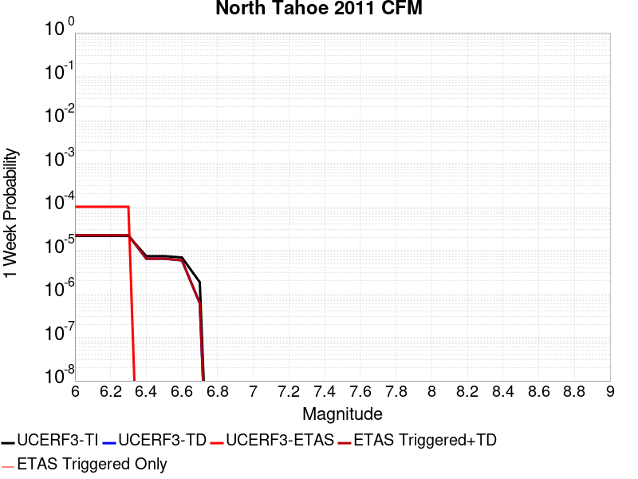 | 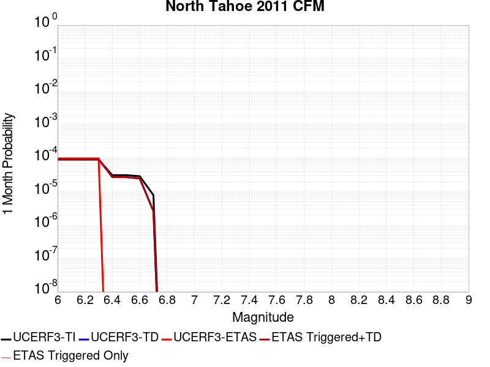 | 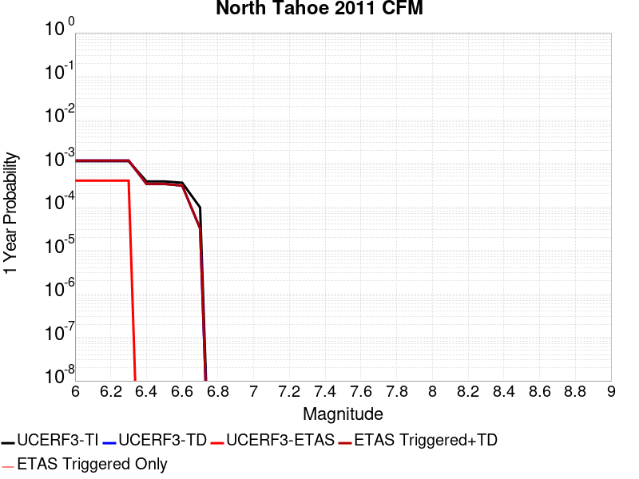 | 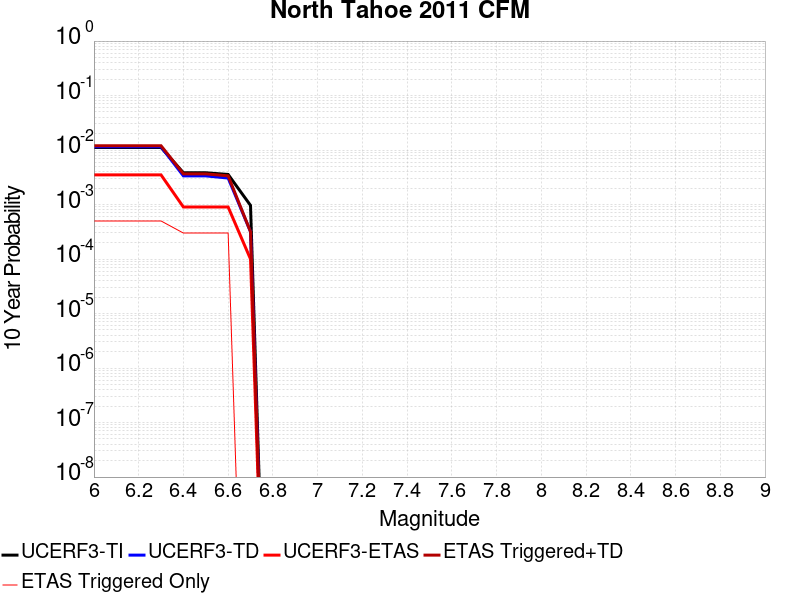 |

| Magnitude | 1 wk TI Prob | 1 wk TD Prob | 1 wk ETAS Prob | 1 wk ETAS/TD Gain | 1 wk ETAS Triggered+TD | 1 wk ETAS Triggered Only | 1 mo TI Prob | 1 mo TD Prob | 1 mo ETAS Prob | 1 mo ETAS/TD Gain | 1 mo ETAS Triggered+TD | 1 mo ETAS Triggered Only | 1 yr TI Prob | 1 yr TD Prob | 1 yr ETAS Prob | 1 yr ETAS/TD Gain | 1 yr ETAS Triggered+TD | 1 yr ETAS Triggered Only | 10 yr TI Prob | 10 yr TD Prob | 10 yr ETAS Prob | 10 yr ETAS/TD Gain | 10 yr ETAS Triggered+TD | 10 yr ETAS Triggered Only |
|-----|-----|-----|-----|-----|-----|-----|-----|-----|-----|-----|-----|-----|-----|-----|-----|-----|-----|-----|-----|-----|-----|-----|-----|-----|
| 6.0 | 2.150391E-5 | 2.2139517E-5 | 1.0E-4 | 4.5168104 | 2.2139517E-5 | 0.0 | 9.215636E-5 | 9.488129E-5 | 1.0E-4 | 1.0539485 | 9.488129E-5 | 0.0 | 0.0011214261 | 0.001154763 | 4.0E-4 | 0.3463914 | 0.001154763 | 0.0 | 0.011157839 | 0.011506836 | 0.0035 | 0.30416703 | 0.012001082 | 5.0E-4 |
| 6.1 | 2.150391E-5 | 2.2139517E-5 | 1.0E-4 | 4.5168104 | 2.2139517E-5 | 0.0 | 9.215636E-5 | 9.488129E-5 | 1.0E-4 | 1.0539485 | 9.488129E-5 | 0.0 | 0.0011214261 | 0.001154763 | 4.0E-4 | 0.3463914 | 0.001154763 | 0.0 | 0.011157839 | 0.011506836 | 0.0035 | 0.30416703 | 0.012001082 | 5.0E-4 |
| 6.2 | 2.150391E-5 | 2.2139517E-5 | 1.0E-4 | 4.5168104 | 2.2139517E-5 | 0.0 | 9.215636E-5 | 9.488129E-5 | 1.0E-4 | 1.0539485 | 9.488129E-5 | 0.0 | 0.0011214261 | 0.001154763 | 4.0E-4 | 0.3463914 | 0.001154763 | 0.0 | 0.011157839 | 0.011506836 | 0.0035 | 0.30416703 | 0.012001082 | 5.0E-4 |
| 6.3 | 2.150391E-5 | 2.2139517E-5 | 1.0E-4 | 4.5168104 | 2.2139517E-5 | 0.0 | 9.215636E-5 | 9.488129E-5 | 1.0E-4 | 1.0539485 | 9.488129E-5 | 0.0 | 0.0011214261 | 0.001154763 | 4.0E-4 | 0.3463914 | 0.001154763 | 0.0 | 0.011157839 | 0.011506836 | 0.0035 | 0.30416703 | 0.012001082 | 5.0E-4 |
| 6.4 | 7.3563056E-6 | 6.4376086E-6 | 0.0 | 0.0 | 6.4376086E-6 | 0.0 | 3.1526644E-5 | 2.7589631E-5 | 0.0 | 0.0 | 2.7589631E-5 | 0.0 | 3.8376928E-4 | 3.3588245E-4 | 0.0 | 0.0 | 3.3588245E-4 | 0.0 | 0.003831072 | 0.0033567378 | 9.0E-4 | 0.26811746 | 0.0036557307 | 3.0E-4 |
| 6.5 | 7.3563056E-6 | 6.4376086E-6 | 0.0 | 0.0 | 6.4376086E-6 | 0.0 | 3.1526644E-5 | 2.7589631E-5 | 0.0 | 0.0 | 2.7589631E-5 | 0.0 | 3.8376928E-4 | 3.3588245E-4 | 0.0 | 0.0 | 3.3588245E-4 | 0.0 | 0.003831072 | 0.0033567378 | 9.0E-4 | 0.26811746 | 0.0036557307 | 3.0E-4 |
| 6.6 | 6.8508816E-6 | 5.8774203E-6 | 0.0 | 0.0 | 5.8774203E-6 | 0.0 | 2.936059E-5 | 2.5188872E-5 | 0.0 | 0.0 | 2.5188872E-5 | 0.0 | 3.5740656E-4 | 3.0666165E-4 | 0.0 | 0.0 | 3.0666165E-4 | 0.0 | 0.0035683226 | 0.0030653551 | 9.0E-4 | 0.29360384 | 0.0033644354 | 3.0E-4 |
| 6.7 | 1.8511148E-6 | 6.0916835E-7 | 0.0 | 0.0 | 6.0916835E-7 | 0.0 | 7.933325E-6 | 2.6107216E-6 | 0.0 | 0.0 | 2.6107216E-6 | 0.0 | 9.658395E-5 | 3.1785534E-5 | 0.0 | 0.0 | 3.1785534E-5 | 0.0 | 9.6541987E-4 | 3.1785536E-4 | 1.0E-4 | 0.3146085 | 3.1785536E-4 | 0.0 |

## Puente Hills
*[(top)](#table-of-contents)*

| 1 Week | 1 Month | 1 Year | 10 Year |
|-----|-----|-----|-----|
| 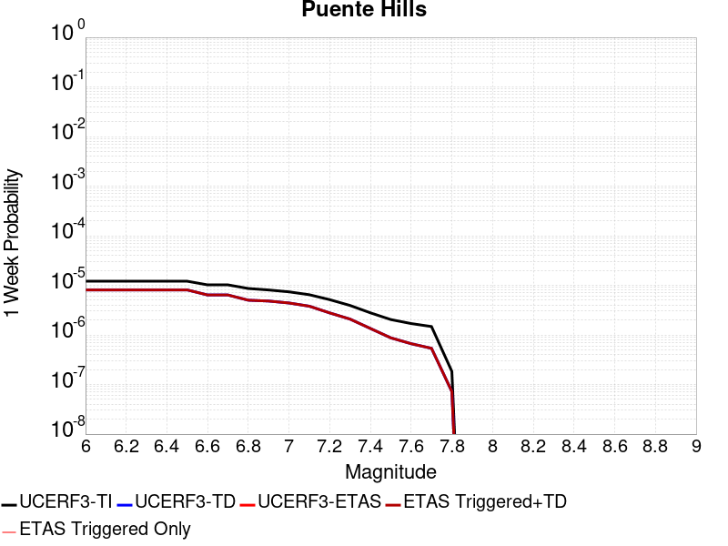 | 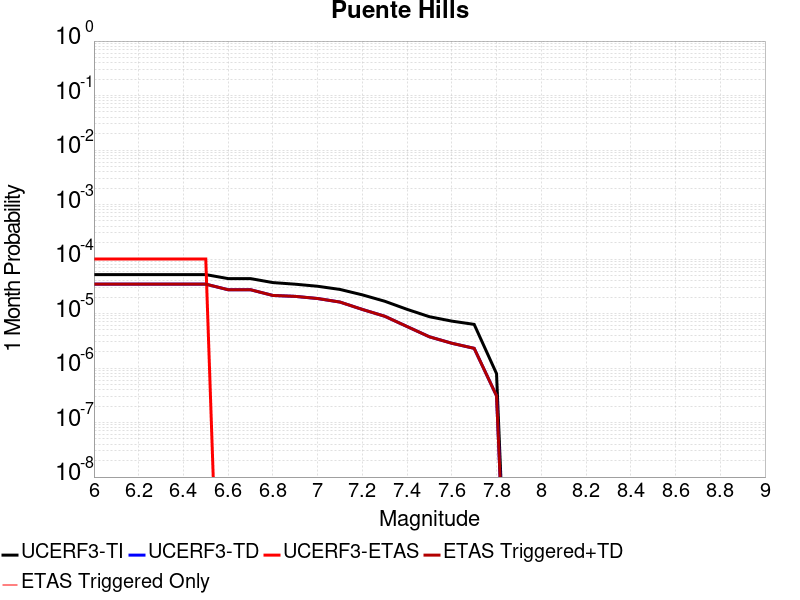 | 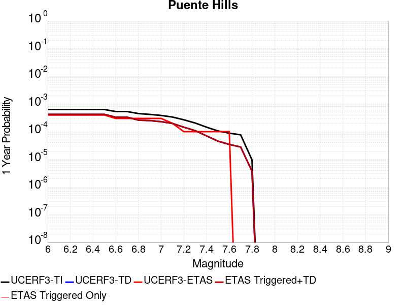 | 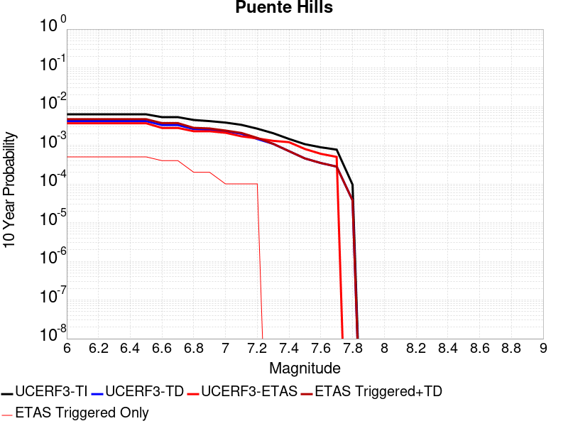 |

| Magnitude | 1 wk TI Prob | 1 wk TD Prob | 1 wk ETAS Prob | 1 wk ETAS/TD Gain | 1 wk ETAS Triggered+TD | 1 wk ETAS Triggered Only | 1 mo TI Prob | 1 mo TD Prob | 1 mo ETAS Prob | 1 mo ETAS/TD Gain | 1 mo ETAS Triggered+TD | 1 mo ETAS Triggered Only | 1 yr TI Prob | 1 yr TD Prob | 1 yr ETAS Prob | 1 yr ETAS/TD Gain | 1 yr ETAS Triggered+TD | 1 yr ETAS Triggered Only | 10 yr TI Prob | 10 yr TD Prob | 10 yr ETAS Prob | 10 yr ETAS/TD Gain | 10 yr ETAS Triggered+TD | 10 yr ETAS Triggered Only |
|-----|-----|-----|-----|-----|-----|-----|-----|-----|-----|-----|-----|-----|-----|-----|-----|-----|-----|-----|-----|-----|-----|-----|-----|-----|
| 6.0 | 1.2101656E-5 | 8.082964E-6 | 0.0 | 0.0 | 8.082964E-6 | 0.0 | 5.1863204E-5 | 3.464085E-5 | 1.0E-4 | 2.8867652 | 3.464085E-5 | 0.0 | 6.312516E-4 | 4.2167635E-4 | 4.0E-4 | 0.94859487 | 4.2167635E-4 | 0.0 | 0.0062946146 | 0.0042093215 | 0.0037 | 0.87900156 | 0.0047072168 | 5.0E-4 |
| 6.1 | 1.2101656E-5 | 8.082964E-6 | 0.0 | 0.0 | 8.082964E-6 | 0.0 | 5.1863204E-5 | 3.464085E-5 | 1.0E-4 | 2.8867652 | 3.464085E-5 | 0.0 | 6.312516E-4 | 4.2167635E-4 | 4.0E-4 | 0.94859487 | 4.2167635E-4 | 0.0 | 0.0062946146 | 0.0042093215 | 0.0037 | 0.87900156 | 0.0047072168 | 5.0E-4 |
| 6.2 | 1.2101656E-5 | 8.082964E-6 | 0.0 | 0.0 | 8.082964E-6 | 0.0 | 5.1863204E-5 | 3.464085E-5 | 1.0E-4 | 2.8867652 | 3.464085E-5 | 0.0 | 6.312516E-4 | 4.2167635E-4 | 4.0E-4 | 0.94859487 | 4.2167635E-4 | 0.0 | 0.0062946146 | 0.0042093215 | 0.0037 | 0.87900156 | 0.0047072168 | 5.0E-4 |
| 6.3 | 1.2101656E-5 | 8.082964E-6 | 0.0 | 0.0 | 8.082964E-6 | 0.0 | 5.1863204E-5 | 3.464085E-5 | 1.0E-4 | 2.8867652 | 3.464085E-5 | 0.0 | 6.312516E-4 | 4.2167635E-4 | 4.0E-4 | 0.94859487 | 4.2167635E-4 | 0.0 | 0.0062946146 | 0.0042093215 | 0.0037 | 0.87900156 | 0.0047072168 | 5.0E-4 |
| 6.4 | 1.2101656E-5 | 8.082964E-6 | 0.0 | 0.0 | 8.082964E-6 | 0.0 | 5.1863204E-5 | 3.464085E-5 | 1.0E-4 | 2.8867652 | 3.464085E-5 | 0.0 | 6.312516E-4 | 4.2167635E-4 | 4.0E-4 | 0.94859487 | 4.2167635E-4 | 0.0 | 0.0062946146 | 0.0042093215 | 0.0037 | 0.87900156 | 0.0047072168 | 5.0E-4 |
| 6.5 | 1.2101656E-5 | 8.082964E-6 | 0.0 | 0.0 | 8.082964E-6 | 0.0 | 5.1863204E-5 | 3.464085E-5 | 1.0E-4 | 2.8867652 | 3.464085E-5 | 0.0 | 6.312516E-4 | 4.2167635E-4 | 4.0E-4 | 0.94859487 | 4.2167635E-4 | 0.0 | 0.0062946146 | 0.0042093215 | 0.0037 | 0.87900156 | 0.0047072168 | 5.0E-4 |
| 6.6 | 1.0222488E-5 | 6.3847015E-6 | 0.0 | 0.0 | 6.3847015E-6 | 0.0 | 4.3809923E-5 | 2.7362734E-5 | 0.0 | 0.0 | 2.7362734E-5 | 0.0 | 5.332553E-4 | 3.3309282E-4 | 3.0E-4 | 0.9006499 | 3.3309282E-4 | 0.0 | 0.0053197746 | 0.00332618 | 0.0028 | 0.84180653 | 0.0037248496 | 4.0E-4 |
| 6.7 | 1.0222488E-5 | 6.3847015E-6 | 0.0 | 0.0 | 6.3847015E-6 | 0.0 | 4.3809923E-5 | 2.7362734E-5 | 0.0 | 0.0 | 2.7362734E-5 | 0.0 | 5.332553E-4 | 3.3309282E-4 | 3.0E-4 | 0.9006499 | 3.3309282E-4 | 0.0 | 0.0053197746 | 0.00332618 | 0.0028 | 0.84180653 | 0.0037248496 | 4.0E-4 |
| 6.8 | 8.6367845E-6 | 5.015095E-6 | 0.0 | 0.0 | 5.015095E-6 | 0.0 | 3.7014266E-5 | 2.1493091E-5 | 0.0 | 0.0 | 2.1493091E-5 | 0.0 | 4.505555E-4 | 2.616475E-4 | 3.0E-4 | 1.1465808 | 2.616475E-4 | 0.0 | 0.004496431 | 0.0026134506 | 0.0023 | 0.8800626 | 0.0028129278 | 2.0E-4 |
| 6.9 | 8.066481E-6 | 4.823201E-6 | 0.0 | 0.0 | 4.823201E-6 | 0.0 | 3.4570177E-5 | 2.0670699E-5 | 0.0 | 0.0 | 2.0670699E-5 | 0.0 | 4.2081063E-4 | 2.5163722E-4 | 3.0E-4 | 1.1921924 | 2.5163722E-4 | 0.0 | 0.0042001465 | 0.0025135765 | 0.0023 | 0.91503084 | 0.0027130737 | 2.0E-4 |
| 7.0 | 7.393828E-6 | 4.4051603E-6 | 0.0 | 0.0 | 4.4051603E-6 | 0.0 | 3.168745E-5 | 1.8879124E-5 | 0.0 | 0.0 | 1.8879124E-5 | 0.0 | 3.857264E-4 | 2.2982953E-4 | 3.0E-4 | 1.3053153 | 2.2982953E-4 | 0.0 | 0.0038505755 | 0.0022959637 | 0.0021 | 0.9146486 | 0.0023957342 | 1.0E-4 |
| 7.1 | 6.4660953E-6 | 3.793753E-6 | 0.0 | 0.0 | 3.793753E-6 | 0.0 | 2.7711543E-5 | 1.6258842E-5 | 0.0 | 0.0 | 1.6258842E-5 | 0.0 | 3.373358E-4 | 1.9793377E-4 | 2.0E-4 | 1.010439 | 1.9793377E-4 | 0.0 | 0.0033682417 | 0.0019776104 | 0.0017 | 0.85962325 | 0.0020774128 | 1.0E-4 |
| 7.2 | 5.143232E-6 | 2.7781773E-6 | 0.0 | 0.0 | 2.7781773E-6 | 0.0 | 2.2042237E-5 | 1.1906421E-5 | 0.0 | 0.0 | 1.1906421E-5 | 0.0 | 2.6833118E-4 | 1.4495112E-4 | 1.0E-4 | 0.68988776 | 1.4495112E-4 | 0.0 | 0.002680074 | 0.0014485754 | 0.0015 | 1.0355 | 0.0015484305 | 1.0E-4 |
| 7.3 | 3.928255E-6 | 2.0843436E-6 | 0.0 | 0.0 | 2.0843436E-6 | 0.0 | 1.683527E-5 | 8.932871E-6 | 0.0 | 0.0 | 8.932871E-6 | 0.0 | 2.0495013E-4 | 1.0875234E-4 | 1.0E-4 | 0.91952044 | 1.0875234E-4 | 0.0 | 0.002047612 | 0.0010869978 | 0.0013 | 1.1959546 | 0.0010869978 | 0.0 |
| 7.4 | 2.7894434E-6 | 1.3487361E-6 | 0.0 | 0.0 | 1.3487361E-6 | 0.0 | 1.1954703E-5 | 5.780285E-6 | 0.0 | 0.0 | 5.780285E-6 | 0.0 | 1.4553878E-4 | 7.037274E-5 | 1.0E-4 | 1.4210048 | 7.037274E-5 | 0.0 | 0.001454435 | 7.035089E-4 | 0.0012 | 1.7057353 | 7.035089E-4 | 0.0 |
| 7.5 | 2.041735E-6 | 8.7389367E-7 | 0.0 | 0.0 | 8.7389367E-7 | 0.0 | 8.750263E-6 | 3.7452535E-6 | 0.0 | 0.0 | 3.7452535E-6 | 0.0 | 1.06529245E-4 | 4.5597542E-5 | 1.0E-4 | 2.1931007 | 4.5597542E-5 | 0.0 | 0.0010647819 | 4.5588517E-4 | 8.0E-4 | 1.7548279 | 4.5588517E-4 | 0.0 |
| 7.6 | 1.6959062E-6 | 6.656155E-7 | 0.0 | 0.0 | 6.656155E-7 | 0.0 | 7.268149E-6 | 2.8526351E-6 | 0.0 | 0.0 | 2.8526351E-6 | 0.0 | 8.848612E-5 | 3.4730307E-5 | 1.0E-4 | 2.8793297 | 3.4730307E-5 | 0.0 | 8.84509E-4 | 3.4725165E-4 | 6.0E-4 | 1.7278537 | 3.4725165E-4 | 0.0 |
| 7.7 | 1.4767965E-6 | 5.369831E-7 | 0.0 | 0.0 | 5.369831E-7 | 0.0 | 6.3291122E-6 | 2.3013542E-6 | 0.0 | 0.0 | 2.3013542E-6 | 0.0 | 7.705422E-5 | 2.8018654E-5 | 0.0 | 0.0 | 2.8018654E-5 | 0.0 | 7.702751E-4 | 2.8015376E-4 | 5.0E-4 | 1.7847342 | 2.8015376E-4 | 0.0 |
| 7.8 | 1.8432911E-7 | 7.2190026E-8 | 0.0 | 0.0 | 7.2190026E-8 | 0.0 | 7.8998164E-7 | 3.0938583E-7 | 0.0 | 0.0 | 3.0938583E-7 | 0.0 | 9.617985E-6 | 3.7667692E-6 | 0.0 | 0.0 | 3.7667692E-6 | 0.0 | 9.617568E-5 | 3.7667374E-5 | 0.0 | 0.0 | 3.7667374E-5 | 0.0 |

## Los Alamos extension
*[(top)](#table-of-contents)*

| 1 Week | 1 Month | 1 Year | 10 Year |
|-----|-----|-----|-----|
| 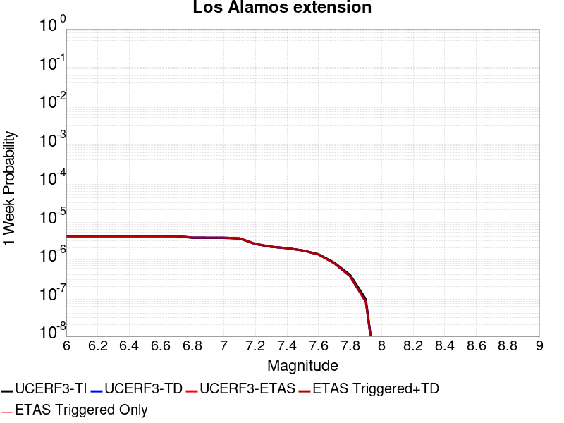 | 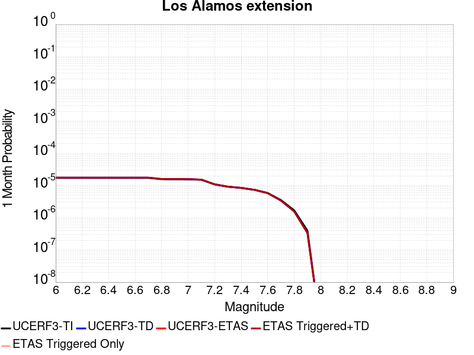 | 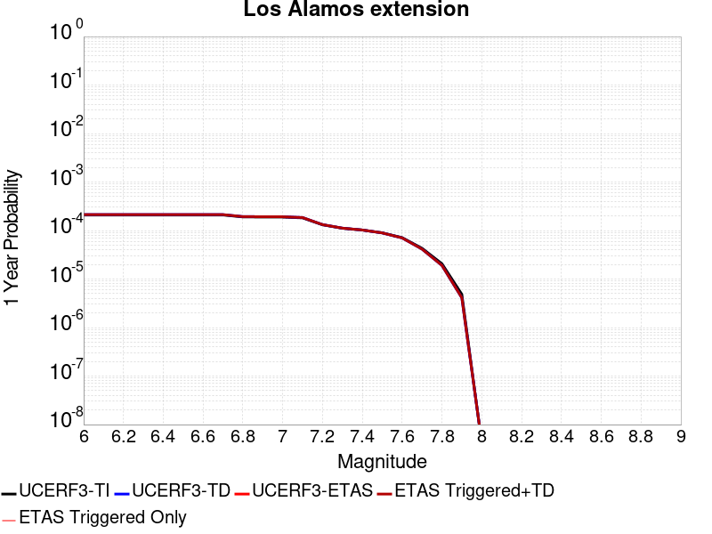 | 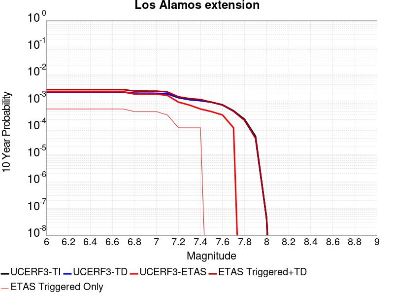 |

| Magnitude | 1 wk TI Prob | 1 wk TD Prob | 1 wk ETAS Prob | 1 wk ETAS/TD Gain | 1 wk ETAS Triggered+TD | 1 wk ETAS Triggered Only | 1 mo TI Prob | 1 mo TD Prob | 1 mo ETAS Prob | 1 mo ETAS/TD Gain | 1 mo ETAS Triggered+TD | 1 mo ETAS Triggered Only | 1 yr TI Prob | 1 yr TD Prob | 1 yr ETAS Prob | 1 yr ETAS/TD Gain | 1 yr ETAS Triggered+TD | 1 yr ETAS Triggered Only | 10 yr TI Prob | 10 yr TD Prob | 10 yr ETAS Prob | 10 yr ETAS/TD Gain | 10 yr ETAS Triggered+TD | 10 yr ETAS Triggered Only |
|-----|-----|-----|-----|-----|-----|-----|-----|-----|-----|-----|-----|-----|-----|-----|-----|-----|-----|-----|-----|-----|-----|-----|-----|-----|
| 6.0 | 4.0146506E-6 | 4.084476E-6 | 0.0 | 0.0 | 4.084476E-6 | 0.0 | 1.7205533E-5 | 1.7504786E-5 | 0.0 | 0.0 | 1.7504786E-5 | 0.0 | 2.0945723E-4 | 2.1310103E-4 | 0.0 | 0.0 | 2.1310103E-4 | 0.0 | 0.0020925992 | 0.0021290758 | 0.0022 | 1.0333122 | 0.0026280114 | 5.0E-4 |
| 6.1 | 4.0146506E-6 | 4.084476E-6 | 0.0 | 0.0 | 4.084476E-6 | 0.0 | 1.7205533E-5 | 1.7504786E-5 | 0.0 | 0.0 | 1.7504786E-5 | 0.0 | 2.0945723E-4 | 2.1310103E-4 | 0.0 | 0.0 | 2.1310103E-4 | 0.0 | 0.0020925992 | 0.0021290758 | 0.0022 | 1.0333122 | 0.0026280114 | 5.0E-4 |
| 6.2 | 4.0146506E-6 | 4.084476E-6 | 0.0 | 0.0 | 4.084476E-6 | 0.0 | 1.7205533E-5 | 1.7504786E-5 | 0.0 | 0.0 | 1.7504786E-5 | 0.0 | 2.0945723E-4 | 2.1310103E-4 | 0.0 | 0.0 | 2.1310103E-4 | 0.0 | 0.0020925992 | 0.0021290758 | 0.0022 | 1.0333122 | 0.0026280114 | 5.0E-4 |
| 6.3 | 4.0146506E-6 | 4.084476E-6 | 0.0 | 0.0 | 4.084476E-6 | 0.0 | 1.7205533E-5 | 1.7504786E-5 | 0.0 | 0.0 | 1.7504786E-5 | 0.0 | 2.0945723E-4 | 2.1310103E-4 | 0.0 | 0.0 | 2.1310103E-4 | 0.0 | 0.0020925992 | 0.0021290758 | 0.0022 | 1.0333122 | 0.0026280114 | 5.0E-4 |
| 6.4 | 4.0146506E-6 | 4.084476E-6 | 0.0 | 0.0 | 4.084476E-6 | 0.0 | 1.7205533E-5 | 1.7504786E-5 | 0.0 | 0.0 | 1.7504786E-5 | 0.0 | 2.0945723E-4 | 2.1310103E-4 | 0.0 | 0.0 | 2.1310103E-4 | 0.0 | 0.0020925992 | 0.0021290758 | 0.0022 | 1.0333122 | 0.0026280114 | 5.0E-4 |
| 6.5 | 4.0146506E-6 | 4.084476E-6 | 0.0 | 0.0 | 4.084476E-6 | 0.0 | 1.7205533E-5 | 1.7504786E-5 | 0.0 | 0.0 | 1.7504786E-5 | 0.0 | 2.0945723E-4 | 2.1310103E-4 | 0.0 | 0.0 | 2.1310103E-4 | 0.0 | 0.0020925992 | 0.0021290758 | 0.0022 | 1.0333122 | 0.0026280114 | 5.0E-4 |
| 6.6 | 4.0146506E-6 | 4.084476E-6 | 0.0 | 0.0 | 4.084476E-6 | 0.0 | 1.7205533E-5 | 1.7504786E-5 | 0.0 | 0.0 | 1.7504786E-5 | 0.0 | 2.0945723E-4 | 2.1310103E-4 | 0.0 | 0.0 | 2.1310103E-4 | 0.0 | 0.0020925992 | 0.0021290758 | 0.0022 | 1.0333122 | 0.0026280114 | 5.0E-4 |
| 6.7 | 4.0146506E-6 | 4.084476E-6 | 0.0 | 0.0 | 4.084476E-6 | 0.0 | 1.7205533E-5 | 1.7504786E-5 | 0.0 | 0.0 | 1.7504786E-5 | 0.0 | 2.0945723E-4 | 2.1310103E-4 | 0.0 | 0.0 | 2.1310103E-4 | 0.0 | 0.0020925992 | 0.0021290758 | 0.0022 | 1.0333122 | 0.0026280114 | 5.0E-4 |
| 6.8 | 3.6584688E-6 | 3.717295E-6 | 0.0 | 0.0 | 3.717295E-6 | 0.0 | 1.5679057E-5 | 1.5931171E-5 | 0.0 | 0.0 | 1.5931171E-5 | 0.0 | 1.9087581E-4 | 1.9394569E-4 | 0.0 | 0.0 | 1.9394569E-4 | 0.0 | 0.0019071194 | 0.0019378567 | 0.0018 | 0.92886126 | 0.0023370816 | 4.0E-4 |
| 6.9 | 3.644631E-6 | 3.7030097E-6 | 0.0 | 0.0 | 3.7030097E-6 | 0.0 | 1.5619753E-5 | 1.586995E-5 | 0.0 | 0.0 | 1.586995E-5 | 0.0 | 1.901539E-4 | 1.9320045E-4 | 0.0 | 0.0 | 1.9320045E-4 | 0.0 | 0.0018999127 | 0.0019304171 | 0.0018 | 0.93244094 | 0.002329645 | 4.0E-4 |
| 7.0 | 3.6318522E-6 | 3.6897752E-6 | 0.0 | 0.0 | 3.6897752E-6 | 0.0 | 1.5564989E-5 | 1.5813232E-5 | 0.0 | 0.0 | 1.5813232E-5 | 0.0 | 1.8948725E-4 | 1.9251002E-4 | 0.0 | 0.0 | 1.9251002E-4 | 0.0 | 0.0018932576 | 0.0019235249 | 0.0018 | 0.935782 | 0.0023227555 | 4.0E-4 |
| 7.1 | 3.5001724E-6 | 3.5538917E-6 | 0.0 | 0.0 | 3.5538917E-6 | 0.0 | 1.5000653E-5 | 1.523088E-5 | 0.0 | 0.0 | 1.523088E-5 | 0.0 | 1.8261763E-4 | 1.8542112E-4 | 0.0 | 0.0 | 1.8542112E-4 | 0.0 | 0.0018246764 | 0.0018527546 | 0.0016 | 0.86357903 | 0.0021521987 | 3.0E-4 |
| 7.2 | 2.5204702E-6 | 2.5425309E-6 | 0.0 | 0.0 | 2.5425309E-6 | 0.0 | 1.080197E-5 | 1.0896516E-5 | 0.0 | 0.0 | 1.0896516E-5 | 0.0 | 1.3150605E-4 | 1.3265705E-4 | 0.0 | 0.0 | 1.3265705E-4 | 0.0 | 0.0013142825 | 0.0013257843 | 9.0E-4 | 0.67884344 | 0.0014256517 | 1.0E-4 |
| 7.3 | 2.1399692E-6 | 2.1491094E-6 | 0.0 | 0.0 | 2.1491094E-6 | 0.0 | 9.1712645E-6 | 9.2104365E-6 | 0.0 | 0.0 | 9.2104365E-6 | 0.0 | 1.1165442E-4 | 1.1213132E-4 | 0.0 | 0.0 | 1.1213132E-4 | 0.0 | 0.0011159834 | 0.0011207507 | 7.0E-4 | 0.62458134 | 0.0012206386 | 1.0E-4 |
| 7.4 | 1.9660122E-6 | 1.9692782E-6 | 0.0 | 0.0 | 1.9692782E-6 | 0.0 | 8.42574E-6 | 8.439737E-6 | 0.0 | 0.0 | 8.439737E-6 | 0.0 | 1.0257855E-4 | 1.0274898E-4 | 0.0 | 0.0 | 1.0274898E-4 | 0.0 | 0.0010253121 | 0.0010270178 | 5.0E-4 | 0.48684645 | 0.0011269152 | 1.0E-4 |
| 7.5 | 1.7204633E-6 | 1.7142444E-6 | 0.0 | 0.0 | 1.7142444E-6 | 0.0 | 7.373393E-6 | 7.3467413E-6 | 0.0 | 0.0 | 7.3467413E-6 | 0.0 | 8.976737E-5 | 8.944293E-5 | 0.0 | 0.0 | 8.944293E-5 | 0.0 | 8.9731114E-4 | 8.940723E-4 | 4.0E-4 | 0.44739112 | 8.940723E-4 | 0.0 |
| 7.6 | 1.3717638E-6 | 1.3528844E-6 | 0.0 | 0.0 | 1.3528844E-6 | 0.0 | 5.878974E-6 | 5.7980633E-6 | 0.0 | 0.0 | 5.7980633E-6 | 0.0 | 7.157416E-5 | 7.058916E-5 | 0.0 | 0.0 | 7.058916E-5 | 0.0 | 7.1551115E-4 | 7.0567E-4 | 3.0E-4 | 0.4251279 | 7.0567E-4 | 0.0 |
| 7.7 | 8.272564E-7 | 7.9531037E-7 | 0.0 | 0.0 | 7.9531037E-7 | 0.0 | 3.5453797E-6 | 3.4084687E-6 | 0.0 | 0.0 | 3.4084687E-6 | 0.0 | 4.3164142E-5 | 4.149732E-5 | 0.0 | 0.0 | 4.149732E-5 | 0.0 | 4.315576E-4 | 4.1489588E-4 | 1.0E-4 | 0.24102433 | 4.1489588E-4 | 0.0 |
| 7.8 | 3.9708277E-7 | 3.6697554E-7 | 0.0 | 0.0 | 3.6697554E-7 | 0.0 | 1.7017821E-6 | 1.5727514E-6 | 0.0 | 0.0 | 1.5727514E-6 | 0.0 | 2.0719E-5 | 1.9148081E-5 | 0.0 | 0.0 | 1.9148081E-5 | 0.0 | 2.071707E-4 | 1.9146438E-4 | 0.0 | 0.0 | 1.9146438E-4 | 0.0 |
| 7.9 | 9.292528E-8 | 7.884305E-8 | 0.0 | 0.0 | 7.884305E-8 | 0.0 | 3.9825116E-7 | 3.3789874E-7 | 0.0 | 0.0 | 3.3789874E-7 | 0.0 | 4.848697E-6 | 4.1139097E-6 | 0.0 | 0.0 | 4.1139097E-6 | 0.0 | 4.8485912E-5 | 4.1138344E-5 | 0.0 | 0.0 | 4.1138344E-5 | 0.0 |
| 8.0 | 7.880441E-11 | 8.231449E-11 | 0.0 | 0.0 | 8.231449E-11 | 0.0 | 3.3773329E-10 | 3.5277614E-10 | 0.0 | 0.0 | 3.5277614E-10 | 0.0 | 4.1119033E-9 | 4.29505E-9 | 0.0 | 0.0 | 4.29505E-9 | 0.0 | 4.1119034E-8 | 4.29505E-8 | 0.0 | 0.0 | 4.29505E-8 | 0.0 |

## Silver Creek 2011 CFM
*[(top)](#table-of-contents)*

| 1 Week | 1 Month | 1 Year | 10 Year |
|-----|-----|-----|-----|
| 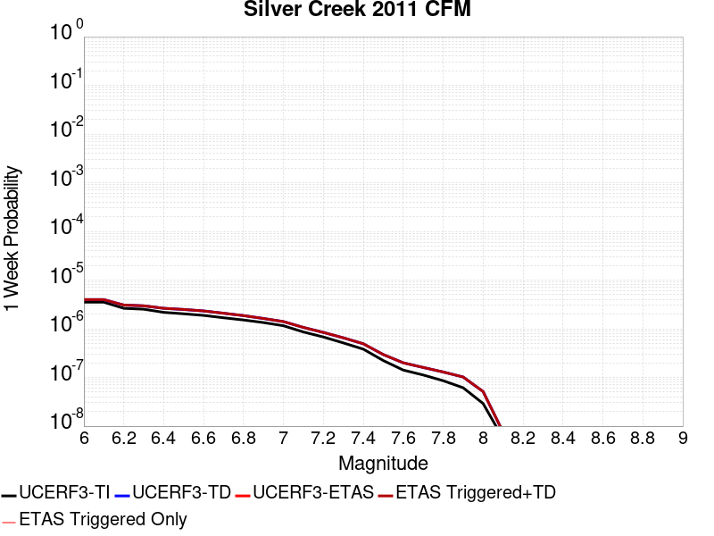 | 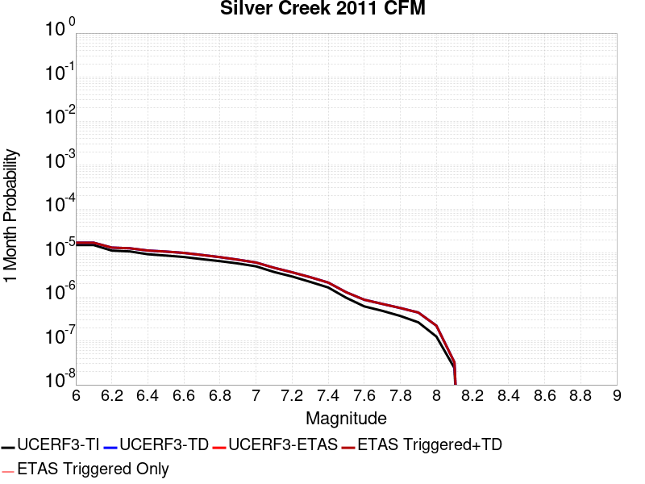 | 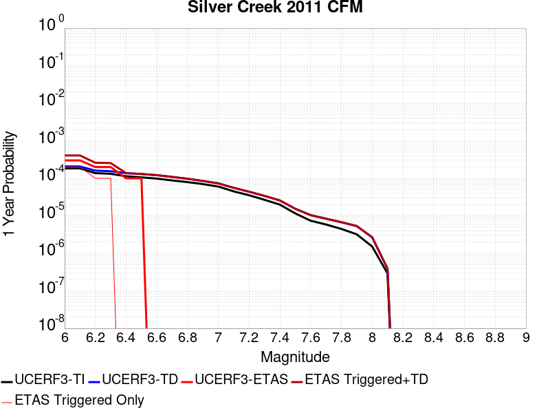 | 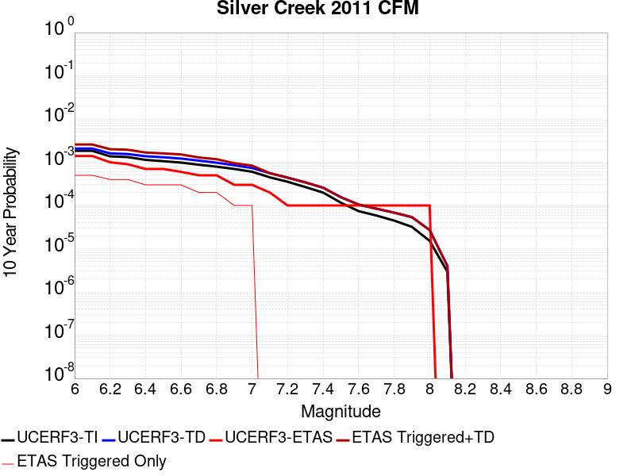 |

| Magnitude | 1 wk TI Prob | 1 wk TD Prob | 1 wk ETAS Prob | 1 wk ETAS/TD Gain | 1 wk ETAS Triggered+TD | 1 wk ETAS Triggered Only | 1 mo TI Prob | 1 mo TD Prob | 1 mo ETAS Prob | 1 mo ETAS/TD Gain | 1 mo ETAS Triggered+TD | 1 mo ETAS Triggered Only | 1 yr TI Prob | 1 yr TD Prob | 1 yr ETAS Prob | 1 yr ETAS/TD Gain | 1 yr ETAS Triggered+TD | 1 yr ETAS Triggered Only | 10 yr TI Prob | 10 yr TD Prob | 10 yr ETAS Prob | 10 yr ETAS/TD Gain | 10 yr ETAS Triggered+TD | 10 yr ETAS Triggered Only |
|-----|-----|-----|-----|-----|-----|-----|-----|-----|-----|-----|-----|-----|-----|-----|-----|-----|-----|-----|-----|-----|-----|-----|-----|-----|
| 6.0 | 3.5229125E-6 | 3.981985E-6 | 0.0 | 0.0 | 3.981985E-6 | 0.0 | 1.5098109E-5 | 1.7065542E-5 | 0.0 | 0.0 | 1.7065542E-5 | 0.0 | 1.8380396E-4 | 2.0775353E-4 | 3.0E-4 | 1.4440187 | 4.0771198E-4 | 2.0E-4 | 0.0018365202 | 0.0020759595 | 0.0014 | 0.674387 | 0.0025749214 | 5.0E-4 |
| 6.1 | 3.5229125E-6 | 3.981985E-6 | 0.0 | 0.0 | 3.981985E-6 | 0.0 | 1.5098109E-5 | 1.7065542E-5 | 0.0 | 0.0 | 1.7065542E-5 | 0.0 | 1.8380396E-4 | 2.0775353E-4 | 3.0E-4 | 1.4440187 | 4.0771198E-4 | 2.0E-4 | 0.0018365202 | 0.0020759595 | 0.0014 | 0.674387 | 0.0025749214 | 5.0E-4 |
| 6.2 | 2.6363234E-6 | 3.084488E-6 | 0.0 | 0.0 | 3.084488E-6 | 0.0 | 1.129848E-5 | 1.3219167E-5 | 0.0 | 0.0 | 1.3219167E-5 | 0.0 | 1.375503E-4 | 1.6093154E-4 | 2.0E-4 | 1.2427645 | 2.6091546E-4 | 1.0E-4 | 0.0013746519 | 0.0016084855 | 0.001 | 0.62170285 | 0.002007842 | 4.0E-4 |
| 6.3 | 2.5275126E-6 | 2.9741434E-6 | 0.0 | 0.0 | 2.9741434E-6 | 0.0 | 1.0832152E-5 | 1.2746266E-5 | 0.0 | 0.0 | 1.2746266E-5 | 0.0 | 1.3187347E-4 | 1.551748E-4 | 2.0E-4 | 1.2888691 | 2.5515928E-4 | 1.0E-4 | 0.0013179524 | 0.0015509989 | 9.0E-4 | 0.5802712 | 0.0019503785 | 4.0E-4 |
| 6.4 | 2.178732E-6 | 2.6451962E-6 | 0.0 | 0.0 | 2.6451962E-6 | 0.0 | 9.337389E-6 | 1.1336507E-5 | 0.0 | 0.0 | 1.1336507E-5 | 0.0 | 1.1367678E-4 | 1.3801326E-4 | 1.0E-4 | 0.72456807 | 1.3801326E-4 | 0.0 | 0.0011361865 | 0.0013796076 | 7.0E-4 | 0.5073907 | 0.0016791937 | 3.0E-4 |
| 6.5 | 2.0341574E-6 | 2.5044092E-6 | 0.0 | 0.0 | 2.5044092E-6 | 0.0 | 8.717788E-6 | 1.0733138E-5 | 0.0 | 0.0 | 1.0733138E-5 | 0.0 | 1.061339E-4 | 1.3066815E-4 | 1.0E-4 | 0.7652974 | 1.3066815E-4 | 0.0 | 0.0010608323 | 0.0013062449 | 7.0E-4 | 0.5358873 | 0.001605853 | 3.0E-4 |
| 6.6 | 1.8856827E-6 | 2.3364369E-6 | 0.0 | 0.0 | 2.3364369E-6 | 0.0 | 8.0814725E-6 | 1.0013262E-5 | 0.0 | 0.0 | 1.0013262E-5 | 0.0 | 9.838748E-5 | 1.2190467E-4 | 0.0 | 0.0 | 1.2190467E-4 | 0.0 | 9.834393E-4 | 0.0012187093 | 6.0E-4 | 0.49232414 | 0.0015183436 | 3.0E-4 |
| 6.7 | 1.6844668E-6 | 2.0956302E-6 | 0.0 | 0.0 | 2.0956302E-6 | 0.0 | 7.2191233E-6 | 8.981241E-6 | 0.0 | 0.0 | 8.981241E-6 | 0.0 | 8.788928E-5 | 1.09341134E-4 | 0.0 | 0.0 | 1.09341134E-4 | 0.0 | 8.785453E-4 | 0.0010932039 | 5.0E-4 | 0.4573712 | 0.0012929853 | 2.0E-4 |
| 6.8 | 1.5177161E-6 | 1.8726415E-6 | 0.0 | 0.0 | 1.8726415E-6 | 0.0 | 6.504481E-6 | 8.025582E-6 | 0.0 | 0.0 | 8.025582E-6 | 0.0 | 7.918918E-5 | 9.770709E-5 | 0.0 | 0.0 | 9.770709E-5 | 0.0 | 7.9160964E-4 | 9.769714E-4 | 5.0E-4 | 0.51178575 | 0.0011767759 | 2.0E-4 |
| 6.9 | 1.3437394E-6 | 1.6352463E-6 | 0.0 | 0.0 | 1.6352463E-6 | 0.0 | 5.7588704E-6 | 7.0081796E-6 | 0.0 | 0.0 | 7.0081796E-6 | 0.0 | 7.011199E-5 | 8.532125E-5 | 0.0 | 0.0 | 8.532125E-5 | 0.0 | 7.0089876E-4 | 8.5321453E-4 | 3.0E-4 | 0.35161147 | 9.531292E-4 | 1.0E-4 |
| 7.0 | 1.1563575E-6 | 1.411911E-6 | 0.0 | 0.0 | 1.411911E-6 | 0.0 | 4.9558084E-6 | 6.051033E-6 | 0.0 | 0.0 | 6.051033E-6 | 0.0 | 6.03353E-5 | 7.366884E-5 | 0.0 | 0.0 | 7.366884E-5 | 0.0 | 6.0318917E-4 | 7.3677365E-4 | 3.0E-4 | 0.4071807 | 8.3669997E-4 | 1.0E-4 |
| 7.1 | 8.602183E-7 | 1.071787E-6 | 0.0 | 0.0 | 1.071787E-6 | 0.0 | 3.6866445E-6 | 4.593365E-6 | 0.0 | 0.0 | 4.593365E-6 | 0.0 | 4.4883975E-5 | 5.592278E-5 | 0.0 | 0.0 | 5.592278E-5 | 0.0 | 4.4874908E-4 | 5.5941637E-4 | 2.0E-4 | 0.35751545 | 5.5941637E-4 | 0.0 |
| 7.2 | 6.788407E-7 | 8.465346E-7 | 0.0 | 0.0 | 8.465346E-7 | 0.0 | 2.9093142E-6 | 3.6280003E-6 | 0.0 | 0.0 | 3.6280003E-6 | 0.0 | 3.5420322E-5 | 4.4170007E-5 | 0.0 | 0.0 | 4.4170007E-5 | 0.0 | 3.541468E-4 | 4.4194152E-4 | 1.0E-4 | 0.22627428 | 4.4194152E-4 | 0.0 |
| 7.3 | 5.1292045E-7 | 6.558075E-7 | 0.0 | 0.0 | 6.558075E-7 | 0.0 | 2.1982287E-6 | 2.8106006E-6 | 0.0 | 0.0 | 2.8106006E-6 | 0.0 | 2.6763106E-5 | 3.4218523E-5 | 0.0 | 0.0 | 3.4218523E-5 | 0.0 | 2.6759884E-4 | 3.424618E-4 | 1.0E-4 | 0.29200336 | 3.424618E-4 | 0.0 |
| 7.4 | 3.820994E-7 | 4.948172E-7 | 0.0 | 0.0 | 4.948172E-7 | 0.0 | 1.6375678E-6 | 2.120643E-6 | 0.0 | 0.0 | 2.120643E-6 | 0.0 | 1.9937206E-5 | 2.5818526E-5 | 0.0 | 0.0 | 2.5818526E-5 | 0.0 | 1.9935417E-4 | 2.584845E-4 | 1.0E-4 | 0.38687038 | 2.584845E-4 | 0.0 |
| 7.5 | 2.2292595E-7 | 2.974808E-7 | 0.0 | 0.0 | 2.974808E-7 | 0.0 | 9.553966E-7 | 1.274917E-6 | 0.0 | 0.0 | 1.274917E-6 | 0.0 | 1.16318915E-5 | 1.5522004E-5 | 0.0 | 0.0 | 1.5522004E-5 | 0.0 | 1.16312825E-4 | 1.5553844E-4 | 1.0E-4 | 0.64292794 | 1.5553844E-4 | 0.0 |
| 7.6 | 1.420587E-7 | 2.0117409E-7 | 0.0 | 0.0 | 2.0117409E-7 | 0.0 | 6.088228E-7 | 8.621743E-7 | 0.0 | 0.0 | 8.621743E-7 | 0.0 | 7.4123927E-6 | 1.0496922E-5 | 0.0 | 0.0 | 1.0496922E-5 | 0.0 | 7.412145E-5 | 1.0529289E-4 | 1.0E-4 | 0.9497317 | 1.0529289E-4 | 0.0 |
| 7.7 | 1.1250075E-7 | 1.6151279E-7 | 0.0 | 0.0 | 1.6151279E-7 | 0.0 | 4.82146E-7 | 6.921975E-7 | 0.0 | 0.0 | 6.921975E-7 | 0.0 | 5.8701116E-6 | 8.427472E-6 | 0.0 | 0.0 | 8.427472E-6 | 0.0 | 5.8699567E-5 | 8.4595384E-5 | 1.0E-4 | 1.1820976 | 8.4595384E-5 | 0.0 |
| 7.8 | 8.592761E-8 | 1.3034986E-7 | 0.0 | 0.0 | 1.3034986E-7 | 0.0 | 3.682611E-7 | 5.586421E-7 | 0.0 | 0.0 | 5.586421E-7 | 0.0 | 4.48357E-6 | 6.8014465E-6 | 0.0 | 0.0 | 6.8014465E-6 | 0.0 | 4.4834796E-5 | 6.83253E-5 | 1.0E-4 | 1.4635867 | 6.83253E-5 | 0.0 |
| 7.9 | 6.156529E-8 | 1.02750406E-7 | 0.0 | 0.0 | 1.02750406E-7 | 0.0 | 2.638512E-7 | 4.403588E-7 | 0.0 | 0.0 | 4.403588E-7 | 0.0 | 3.212384E-6 | 5.3613553E-6 | 0.0 | 0.0 | 5.3613553E-6 | 0.0 | 3.2123375E-5 | 5.388061E-5 | 1.0E-4 | 1.8559554 | 5.388061E-5 | 0.0 |
| 8.0 | 2.9230547E-8 | 5.168103E-8 | 0.0 | 0.0 | 5.168103E-8 | 0.0 | 1.2527377E-7 | 2.2149011E-7 | 0.0 | 0.0 | 2.2149011E-7 | 0.0 | 1.525207E-6 | 2.6966388E-6 | 0.0 | 0.0 | 2.6966388E-6 | 0.0 | 1.5251966E-5 | 2.7103666E-5 | 1.0E-4 | 3.6895378 | 2.7103666E-5 | 0.0 |
| 8.1 | 5.6062213E-9 | 7.580569E-9 | 0.0 | 0.0 | 7.580569E-9 | 0.0 | 2.4026663E-8 | 3.2488153E-8 | 0.0 | 0.0 | 3.2488153E-8 | 0.0 | 2.925246E-7 | 3.955432E-7 | 0.0 | 0.0 | 3.955432E-7 | 0.0 | 2.925242E-6 | 3.992907E-6 | 0.0 | 0.0 | 3.992907E-6 | 0.0 |

## Fitzhugh Creek
*[(top)](#table-of-contents)*

| 1 Week | 1 Month | 1 Year | 10 Year |
|-----|-----|-----|-----|
| 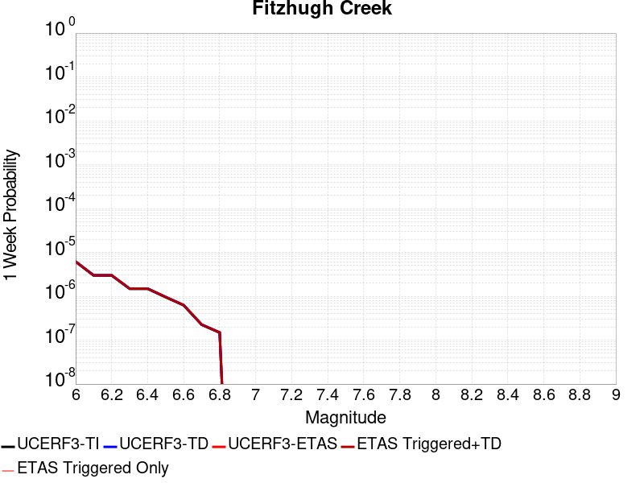 | 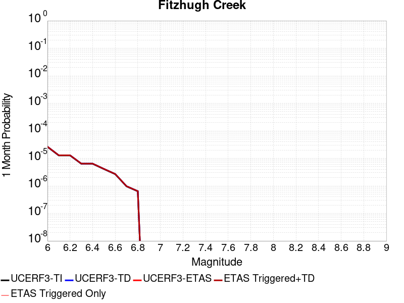 | 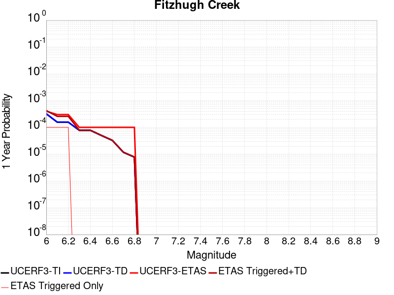 | 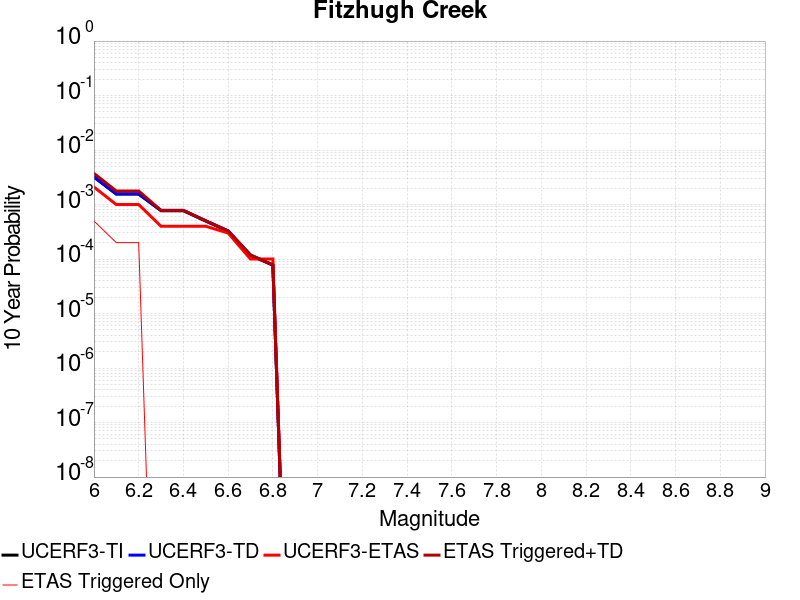 |

| Magnitude | 1 wk TI Prob | 1 wk TD Prob | 1 wk ETAS Prob | 1 wk ETAS/TD Gain | 1 wk ETAS Triggered+TD | 1 wk ETAS Triggered Only | 1 mo TI Prob | 1 mo TD Prob | 1 mo ETAS Prob | 1 mo ETAS/TD Gain | 1 mo ETAS Triggered+TD | 1 mo ETAS Triggered Only | 1 yr TI Prob | 1 yr TD Prob | 1 yr ETAS Prob | 1 yr ETAS/TD Gain | 1 yr ETAS Triggered+TD | 1 yr ETAS Triggered Only | 10 yr TI Prob | 10 yr TD Prob | 10 yr ETAS Prob | 10 yr ETAS/TD Gain | 10 yr ETAS Triggered+TD | 10 yr ETAS Triggered Only |
|-----|-----|-----|-----|-----|-----|-----|-----|-----|-----|-----|-----|-----|-----|-----|-----|-----|-----|-----|-----|-----|-----|-----|-----|-----|
| 6.0 | 6.1090436E-6 | 6.209083E-6 | 0.0 | 0.0 | 6.209083E-6 | 0.0 | 2.6181353E-5 | 2.6610109E-5 | 0.0 | 0.0 | 2.6610109E-5 | 0.0 | 3.1871133E-4 | 3.2393442E-4 | 4.0E-4 | 1.2348179 | 4.23902E-4 | 1.0E-4 | 0.0031825465 | 0.0032350663 | 0.0021 | 0.6491366 | 0.0037334487 | 5.0E-4 |
| 6.1 | 2.9741811E-6 | 3.021078E-6 | 0.0 | 0.0 | 3.021078E-6 | 0.0 | 1.2746428E-5 | 1.2947419E-5 | 0.0 | 0.0 | 1.2947419E-5 | 0.0 | 1.5517672E-4 | 1.5762437E-4 | 3.0E-4 | 1.903259 | 2.576086E-4 | 1.0E-4 | 0.001550684 | 0.0015752186 | 0.001 | 0.6348325 | 0.0017749036 | 2.0E-4 |
| 6.2 | 2.9741811E-6 | 3.021078E-6 | 0.0 | 0.0 | 3.021078E-6 | 0.0 | 1.2746428E-5 | 1.2947419E-5 | 0.0 | 0.0 | 1.2947419E-5 | 0.0 | 1.5517672E-4 | 1.5762437E-4 | 3.0E-4 | 1.903259 | 2.576086E-4 | 1.0E-4 | 0.001550684 | 0.0015752186 | 0.001 | 0.6348325 | 0.0017749036 | 2.0E-4 |
| 6.3 | 1.4781198E-6 | 1.5010254E-6 | 0.0 | 0.0 | 1.5010254E-6 | 0.0 | 6.3347834E-6 | 6.432951E-6 | 0.0 | 0.0 | 6.432951E-6 | 0.0 | 7.712326E-5 | 7.831857E-5 | 1.0E-4 | 1.2768364 | 7.831857E-5 | 0.0 | 7.70965E-4 | 7.829296E-4 | 4.0E-4 | 0.51090163 | 7.829296E-4 | 0.0 |
| 6.4 | 1.4781198E-6 | 1.5010254E-6 | 0.0 | 0.0 | 1.5010254E-6 | 0.0 | 6.3347834E-6 | 6.432951E-6 | 0.0 | 0.0 | 6.432951E-6 | 0.0 | 7.712326E-5 | 7.831857E-5 | 1.0E-4 | 1.2768364 | 7.831857E-5 | 0.0 | 7.70965E-4 | 7.829296E-4 | 4.0E-4 | 0.51090163 | 7.829296E-4 | 0.0 |
| 6.5 | 9.5176676E-7 | 9.664486E-7 | 0.0 | 0.0 | 9.664486E-7 | 0.0 | 4.078994E-6 | 4.1419166E-6 | 0.0 | 0.0 | 4.1419166E-6 | 0.0 | 4.9660623E-5 | 5.0426774E-5 | 1.0E-4 | 1.9830735 | 5.0426774E-5 | 0.0 | 4.964952E-4 | 5.0416373E-4 | 4.0E-4 | 0.793393 | 5.0416373E-4 | 0.0 |
| 6.6 | 6.21145E-7 | 6.307556E-7 | 0.0 | 0.0 | 6.307556E-7 | 0.0 | 2.662047E-6 | 2.7032359E-6 | 0.0 | 0.0 | 2.7032359E-6 | 0.0 | 3.2409942E-5 | 3.2911466E-5 | 1.0E-4 | 3.0384548 | 3.2911466E-5 | 0.0 | 3.2405215E-4 | 3.290725E-4 | 3.0E-4 | 0.9116532 | 3.290725E-4 | 0.0 |
| 6.7 | 2.2377962E-7 | 2.2730853E-7 | 0.0 | 0.0 | 2.2730853E-7 | 0.0 | 9.590551E-7 | 9.741792E-7 | 0.0 | 0.0 | 9.741792E-7 | 0.0 | 1.1676434E-5 | 1.1860599E-5 | 1.0E-4 | 8.431277 | 1.1860599E-5 | 0.0 | 1.1675821E-4 | 1.186028E-4 | 1.0E-4 | 0.8431504 | 1.186028E-4 | 0.0 |
| 6.8 | 1.4785022E-7 | 1.5018983E-7 | 0.0 | 0.0 | 1.5018983E-7 | 0.0 | 6.3364365E-7 | 6.436707E-7 | 0.0 | 0.0 | 6.436707E-7 | 0.0 | 7.714584E-6 | 7.836691E-6 | 1.0E-4 | 12.760488 | 7.836691E-6 | 0.0 | 7.714316E-5 | 7.836691E-5 | 1.0E-4 | 1.2760488 | 7.836691E-5 | 0.0 |

## Hilton Creek 2011 CFM
*[(top)](#table-of-contents)*

| 1 Week | 1 Month | 1 Year | 10 Year |
|-----|-----|-----|-----|
| 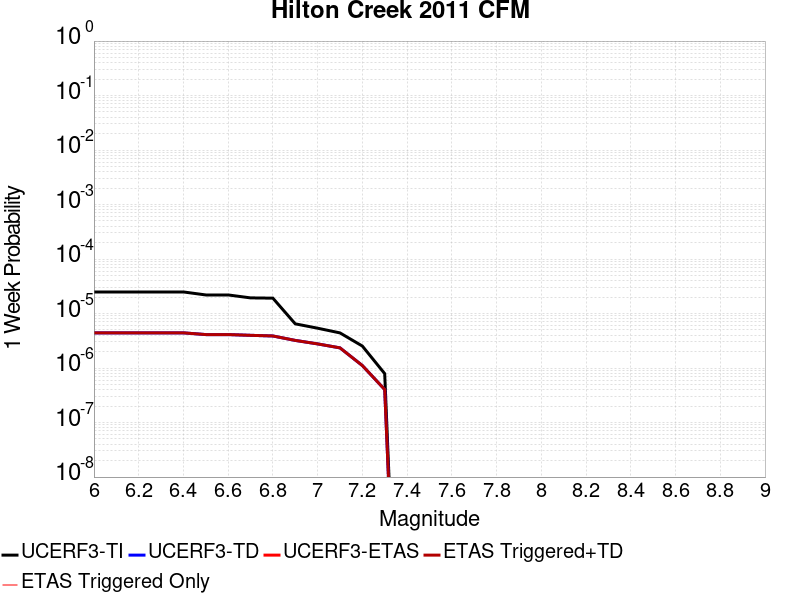 | 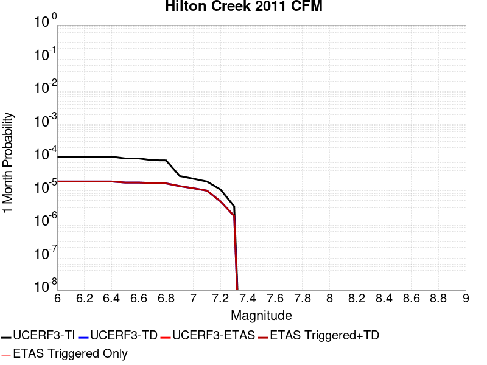 | 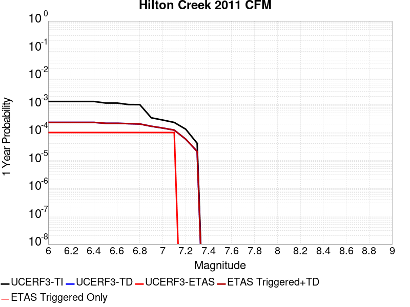 | 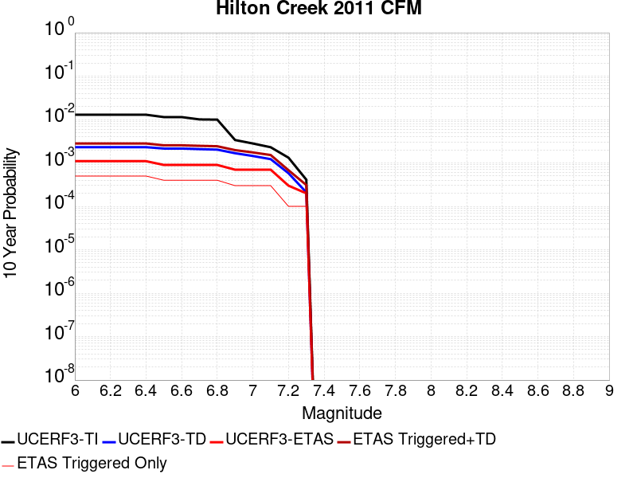 |

| Magnitude | 1 wk TI Prob | 1 wk TD Prob | 1 wk ETAS Prob | 1 wk ETAS/TD Gain | 1 wk ETAS Triggered+TD | 1 wk ETAS Triggered Only | 1 mo TI Prob | 1 mo TD Prob | 1 mo ETAS Prob | 1 mo ETAS/TD Gain | 1 mo ETAS Triggered+TD | 1 mo ETAS Triggered Only | 1 yr TI Prob | 1 yr TD Prob | 1 yr ETAS Prob | 1 yr ETAS/TD Gain | 1 yr ETAS Triggered+TD | 1 yr ETAS Triggered Only | 10 yr TI Prob | 10 yr TD Prob | 10 yr ETAS Prob | 10 yr ETAS/TD Gain | 10 yr ETAS Triggered+TD | 10 yr ETAS Triggered Only |
|-----|-----|-----|-----|-----|-----|-----|-----|-----|-----|-----|-----|-----|-----|-----|-----|-----|-----|-----|-----|-----|-----|-----|-----|-----|
| 6.0 | 2.4923684E-5 | 4.432667E-6 | 0.0 | 0.0 | 4.432667E-6 | 0.0 | 1.06811414E-4 | 1.8997016E-5 | 0.0 | 0.0 | 1.8997016E-5 | 0.0 | 0.0012996531 | 2.3126573E-4 | 1.0E-4 | 0.43240303 | 2.3126573E-4 | 0.0 | 0.012920785 | 0.0023132726 | 0.0011 | 0.47551683 | 0.002812116 | 5.0E-4 |
| 6.1 | 2.4923684E-5 | 4.432667E-6 | 0.0 | 0.0 | 4.432667E-6 | 0.0 | 1.06811414E-4 | 1.8997016E-5 | 0.0 | 0.0 | 1.8997016E-5 | 0.0 | 0.0012996531 | 2.3126573E-4 | 1.0E-4 | 0.43240303 | 2.3126573E-4 | 0.0 | 0.012920785 | 0.0023132726 | 0.0011 | 0.47551683 | 0.002812116 | 5.0E-4 |
| 6.2 | 2.4923684E-5 | 4.432667E-6 | 0.0 | 0.0 | 4.432667E-6 | 0.0 | 1.06811414E-4 | 1.8997016E-5 | 0.0 | 0.0 | 1.8997016E-5 | 0.0 | 0.0012996531 | 2.3126573E-4 | 1.0E-4 | 0.43240303 | 2.3126573E-4 | 0.0 | 0.012920785 | 0.0023132726 | 0.0011 | 0.47551683 | 0.002812116 | 5.0E-4 |
| 6.3 | 2.4923684E-5 | 4.432667E-6 | 0.0 | 0.0 | 4.432667E-6 | 0.0 | 1.06811414E-4 | 1.8997016E-5 | 0.0 | 0.0 | 1.8997016E-5 | 0.0 | 0.0012996531 | 2.3126573E-4 | 1.0E-4 | 0.43240303 | 2.3126573E-4 | 0.0 | 0.012920785 | 0.0023132726 | 0.0011 | 0.47551683 | 0.002812116 | 5.0E-4 |
| 6.4 | 2.4923684E-5 | 4.432667E-6 | 0.0 | 0.0 | 4.432667E-6 | 0.0 | 1.06811414E-4 | 1.8997016E-5 | 0.0 | 0.0 | 1.8997016E-5 | 0.0 | 0.0012996531 | 2.3126573E-4 | 1.0E-4 | 0.43240303 | 2.3126573E-4 | 0.0 | 0.012920785 | 0.0023132726 | 0.0011 | 0.47551683 | 0.002812116 | 5.0E-4 |
| 6.5 | 2.1963904E-5 | 4.121333E-6 | 0.0 | 0.0 | 4.121333E-6 | 0.0 | 9.412762E-5 | 1.7662745E-5 | 0.0 | 0.0 | 1.7662745E-5 | 0.0 | 0.0011454013 | 2.1502418E-4 | 1.0E-4 | 0.46506396 | 2.1502418E-4 | 0.0 | 0.011395155 | 0.0021530185 | 9.0E-4 | 0.4180178 | 0.0025521573 | 4.0E-4 |
| 6.6 | 2.1963904E-5 | 4.121333E-6 | 0.0 | 0.0 | 4.121333E-6 | 0.0 | 9.412762E-5 | 1.7662745E-5 | 0.0 | 0.0 | 1.7662745E-5 | 0.0 | 0.0011454013 | 2.1502418E-4 | 1.0E-4 | 0.46506396 | 2.1502418E-4 | 0.0 | 0.011395155 | 0.0021530185 | 9.0E-4 | 0.4180178 | 0.0025521573 | 4.0E-4 |
| 6.7 | 1.9397496E-5 | 3.992329E-6 | 0.0 | 0.0 | 3.992329E-6 | 0.0 | 8.3129475E-5 | 1.7109878E-5 | 0.0 | 0.0 | 1.7109878E-5 | 0.0 | 0.0010116313 | 2.0829431E-4 | 1.0E-4 | 0.48008993 | 2.0829431E-4 | 0.0 | 0.0100703845 | 0.0020854406 | 9.0E-4 | 0.4315635 | 0.0024846063 | 4.0E-4 |
| 6.8 | 1.917303E-5 | 3.885977E-6 | 0.0 | 0.0 | 3.885977E-6 | 0.0 | 8.216754E-5 | 1.6654089E-5 | 0.0 | 0.0 | 1.6654089E-5 | 0.0 | 9.999307E-4 | 2.0274613E-4 | 1.0E-4 | 0.49322766 | 2.0274613E-4 | 0.0 | 0.009954433 | 0.0020300606 | 9.0E-4 | 0.44333652 | 0.0024292485 | 4.0E-4 |
| 6.9 | 6.480681E-6 | 3.2190828E-6 | 0.0 | 0.0 | 3.2190828E-6 | 0.0 | 2.7774051E-5 | 1.3796002E-5 | 0.0 | 0.0 | 1.3796002E-5 | 0.0 | 3.380966E-4 | 1.679545E-4 | 1.0E-4 | 0.5953993 | 1.679545E-4 | 0.0 | 0.0033758266 | 0.0016783859 | 7.0E-4 | 0.41706738 | 0.0019778823 | 3.0E-4 |
| 7.0 | 5.388316E-6 | 2.7774483E-6 | 0.0 | 0.0 | 2.7774483E-6 | 0.0 | 2.3092578E-5 | 1.1903301E-5 | 0.0 | 0.0 | 1.1903301E-5 | 0.0 | 2.8111585E-4 | 1.449141E-4 | 1.0E-4 | 0.690064 | 1.449141E-4 | 0.0 | 0.002807605 | 0.0014482978 | 7.0E-4 | 0.48332602 | 0.0017478633 | 3.0E-4 |
| 7.1 | 4.41728E-6 | 2.3479301E-6 | 0.0 | 0.0 | 2.3479301E-6 | 0.0 | 1.8931061E-5 | 1.0062525E-5 | 0.0 | 0.0 | 1.0062525E-5 | 0.0 | 2.304613E-4 | 1.2250533E-4 | 1.0E-4 | 0.81629103 | 1.2250533E-4 | 0.0 | 0.0023022245 | 0.0012244736 | 7.0E-4 | 0.5716742 | 0.0015241063 | 3.0E-4 |
| 7.2 | 2.535495E-6 | 1.1133824E-6 | 0.0 | 0.0 | 1.1133824E-6 | 0.0 | 1.0866362E-5 | 4.771633E-6 | 0.0 | 0.0 | 4.771633E-6 | 0.0 | 1.3228992E-4 | 5.80936E-5 | 0.0 | 0.0 | 5.80936E-5 | 0.0 | 0.0013221119 | 5.8083463E-4 | 3.0E-4 | 0.51649815 | 6.8077655E-4 | 1.0E-4 |
| 7.3 | 7.900015E-7 | 4.0358663E-7 | 0.0 | 0.0 | 4.0358663E-7 | 0.0 | 3.3857161E-6 | 1.729657E-6 | 0.0 | 0.0 | 1.729657E-6 | 0.0 | 4.1220315E-5 | 2.1058575E-5 | 0.0 | 0.0 | 2.1058575E-5 | 0.0 | 4.121267E-4 | 2.1058574E-4 | 2.0E-4 | 0.9497319 | 3.1056468E-4 | 1.0E-4 |

## Owens Valley
*[(top)](#table-of-contents)*

| 1 Week | 1 Month | 1 Year | 10 Year |
|-----|-----|-----|-----|
| 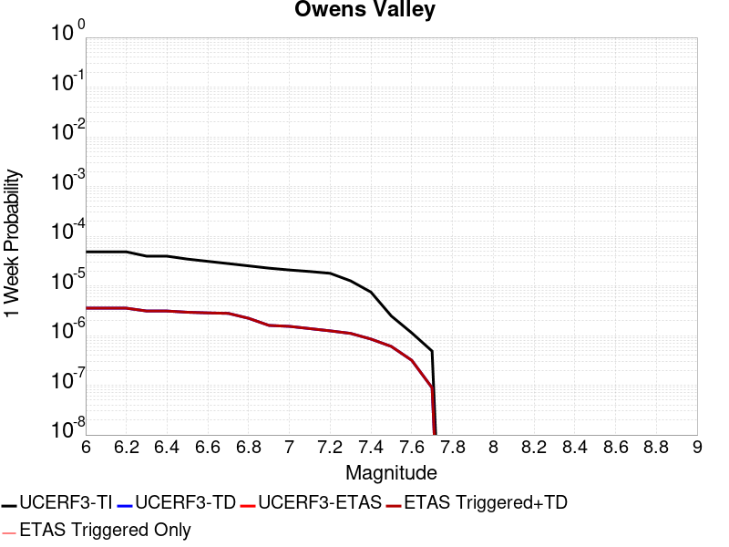 | 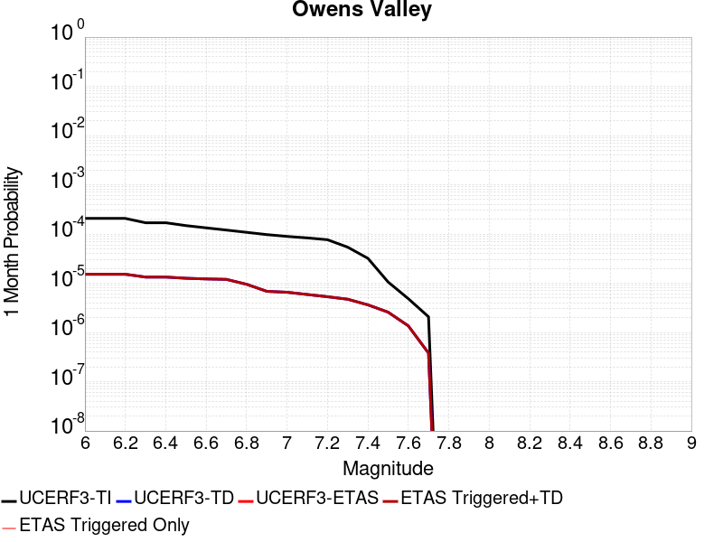 | 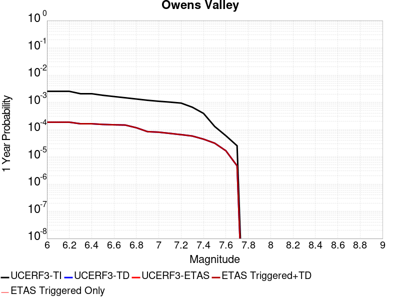 | 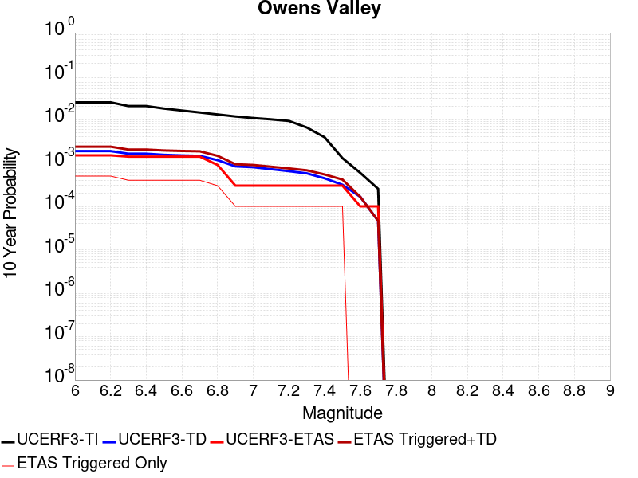 |

| Magnitude | 1 wk TI Prob | 1 wk TD Prob | 1 wk ETAS Prob | 1 wk ETAS/TD Gain | 1 wk ETAS Triggered+TD | 1 wk ETAS Triggered Only | 1 mo TI Prob | 1 mo TD Prob | 1 mo ETAS Prob | 1 mo ETAS/TD Gain | 1 mo ETAS Triggered+TD | 1 mo ETAS Triggered Only | 1 yr TI Prob | 1 yr TD Prob | 1 yr ETAS Prob | 1 yr ETAS/TD Gain | 1 yr ETAS Triggered+TD | 1 yr ETAS Triggered Only | 10 yr TI Prob | 10 yr TD Prob | 10 yr ETAS Prob | 10 yr ETAS/TD Gain | 10 yr ETAS Triggered+TD | 10 yr ETAS Triggered Only |
|-----|-----|-----|-----|-----|-----|-----|-----|-----|-----|-----|-----|-----|-----|-----|-----|-----|-----|-----|-----|-----|-----|-----|-----|-----|
| 6.0 | 4.83821E-5 | 3.5588455E-6 | 0.0 | 0.0 | 3.5588455E-6 | 0.0 | 2.0733538E-4 | 1.5252111E-5 | 0.0 | 0.0 | 1.5252111E-5 | 0.0 | 0.002521386 | 1.8567957E-4 | 0.0 | 0.0 | 1.8567957E-4 | 0.0 | 0.024929691 | 0.0018915578 | 0.0015 | 0.7929972 | 0.002390612 | 5.0E-4 |
| 6.1 | 4.83821E-5 | 3.5588455E-6 | 0.0 | 0.0 | 3.5588455E-6 | 0.0 | 2.0733538E-4 | 1.5252111E-5 | 0.0 | 0.0 | 1.5252111E-5 | 0.0 | 0.002521386 | 1.8567957E-4 | 0.0 | 0.0 | 1.8567957E-4 | 0.0 | 0.024929691 | 0.0018915578 | 0.0015 | 0.7929972 | 0.002390612 | 5.0E-4 |
| 6.2 | 4.83821E-5 | 3.5588455E-6 | 0.0 | 0.0 | 3.5588455E-6 | 0.0 | 2.0733538E-4 | 1.5252111E-5 | 0.0 | 0.0 | 1.5252111E-5 | 0.0 | 0.002521386 | 1.8567957E-4 | 0.0 | 0.0 | 1.8567957E-4 | 0.0 | 0.024929691 | 0.0018915578 | 0.0015 | 0.7929972 | 0.002390612 | 5.0E-4 |
| 6.3 | 3.953008E-5 | 3.1199816E-6 | 0.0 | 0.0 | 3.1199816E-6 | 0.0 | 1.6940363E-4 | 1.3371285E-5 | 0.0 | 0.0 | 1.3371285E-5 | 0.0 | 0.002060538 | 1.6278395E-4 | 0.0 | 0.0 | 1.6278395E-4 | 0.0 | 0.020415364 | 0.0016401078 | 0.0014 | 0.8536024 | 0.0020394519 | 4.0E-4 |
| 6.4 | 3.953008E-5 | 3.1199816E-6 | 0.0 | 0.0 | 3.1199816E-6 | 0.0 | 1.6940363E-4 | 1.3371285E-5 | 0.0 | 0.0 | 1.3371285E-5 | 0.0 | 0.002060538 | 1.6278395E-4 | 0.0 | 0.0 | 1.6278395E-4 | 0.0 | 0.020415364 | 0.0016401078 | 0.0014 | 0.8536024 | 0.0020394519 | 4.0E-4 |
| 6.5 | 3.457342E-5 | 2.9477112E-6 | 0.0 | 0.0 | 2.9477112E-6 | 0.0 | 1.4816338E-4 | 1.2632991E-5 | 0.0 | 0.0 | 1.2632991E-5 | 0.0 | 0.0018023965 | 1.537965E-4 | 0.0 | 0.0 | 1.537965E-4 | 0.0 | 0.017878477 | 0.0015437598 | 0.0014 | 0.9068768 | 0.0019431424 | 4.0E-4 |
| 6.6 | 3.1127765E-5 | 2.85787E-6 | 0.0 | 0.0 | 2.85787E-6 | 0.0 | 1.3339789E-4 | 1.22479605E-5 | 0.0 | 0.0 | 1.22479605E-5 | 0.0 | 0.0016229092 | 1.491094E-4 | 0.0 | 0.0 | 1.491094E-4 | 0.0 | 0.016111081 | 0.0014928672 | 0.0014 | 0.93779266 | 0.0018922702 | 4.0E-4 |
| 6.7 | 2.806885E-5 | 2.7980836E-6 | 0.0 | 0.0 | 2.7980836E-6 | 0.0 | 1.2028952E-4 | 1.1991736E-5 | 0.0 | 0.0 | 1.1991736E-5 | 0.0 | 0.001463541 | 1.4599029E-4 | 0.0 | 0.0 | 1.4599029E-4 | 0.0 | 0.014539397 | 0.0014592598 | 0.0014 | 0.9593905 | 0.0018586761 | 4.0E-4 |
| 6.8 | 2.524524E-5 | 2.2246643E-6 | 0.0 | 0.0 | 2.2246643E-6 | 0.0 | 1.0818939E-4 | 9.534242E-6 | 0.0 | 0.0 | 9.534242E-6 | 0.0 | 0.0013164099 | 1.1607352E-4 | 0.0 | 0.0 | 1.1607352E-4 | 0.0 | 0.01308639 | 0.0011603516 | 9.0E-4 | 0.775627 | 0.0014600034 | 3.0E-4 |
| 6.9 | 2.2704568E-5 | 1.6002263E-6 | 0.0 | 0.0 | 1.6002263E-6 | 0.0 | 9.730166E-5 | 6.8580944E-6 | 0.0 | 0.0 | 6.8580944E-6 | 0.0 | 0.0011840039 | 8.349412E-5 | 0.0 | 0.0 | 8.349412E-5 | 0.0 | 0.011777153 | 8.3480065E-4 | 3.0E-4 | 0.35936722 | 9.347172E-4 | 1.0E-4 |
| 7.0 | 2.0871712E-5 | 1.532024E-6 | 0.0 | 0.0 | 1.532024E-6 | 0.0 | 8.944713E-5 | 6.565801E-6 | 0.0 | 0.0 | 6.565801E-6 | 0.0 | 0.0010884746 | 7.9935715E-5 | 0.0 | 0.0 | 7.9935715E-5 | 0.0 | 0.010831586 | 7.9920277E-4 | 3.0E-4 | 0.37537408 | 8.9912285E-4 | 1.0E-4 |
| 7.1 | 1.944928E-5 | 1.3799643E-6 | 0.0 | 0.0 | 1.3799643E-6 | 0.0 | 8.335139E-5 | 5.9141194E-6 | 0.0 | 0.0 | 5.9141194E-6 | 0.0 | 0.0010143308 | 7.200203E-5 | 0.0 | 0.0 | 7.200203E-5 | 0.0 | 0.010097133 | 7.1990775E-4 | 3.0E-4 | 0.41672006 | 8.1983575E-4 | 1.0E-4 |
| 7.2 | 1.7876306E-5 | 1.2432217E-6 | 0.0 | 0.0 | 1.2432217E-6 | 0.0 | 7.6610486E-5 | 5.328082E-6 | 0.0 | 0.0 | 5.328082E-6 | 0.0 | 9.3233347E-4 | 6.4867476E-5 | 0.0 | 0.0 | 6.4867476E-5 | 0.0 | 0.009284316 | 6.4857514E-4 | 3.0E-4 | 0.4625524 | 7.485103E-4 | 1.0E-4 |
| 7.3 | 1.2618672E-5 | 1.1062237E-6 | 0.0 | 0.0 | 1.1062237E-6 | 0.0 | 5.40789E-5 | 4.7409503E-6 | 0.0 | 0.0 | 4.7409503E-6 | 0.0 | 6.582117E-4 | 5.7719546E-5 | 0.0 | 0.0 | 5.7719546E-5 | 0.0 | 0.0065626553 | 5.7713035E-4 | 3.0E-4 | 0.51981324 | 6.770727E-4 | 1.0E-4 |
| 7.4 | 7.4874442E-6 | 8.5038874E-7 | 0.0 | 0.0 | 8.5038874E-7 | 0.0 | 3.208865E-5 | 3.644518E-6 | 0.0 | 0.0 | 3.644518E-6 | 0.0 | 3.906093E-4 | 4.437111E-5 | 0.0 | 0.0 | 4.437111E-5 | 0.0 | 0.003899234 | 4.4366837E-4 | 3.0E-4 | 0.6761807 | 5.43624E-4 | 1.0E-4 |
| 7.5 | 2.4734156E-6 | 6.0384053E-7 | 0.0 | 0.0 | 6.0384053E-7 | 0.0 | 1.060031E-5 | 2.5878855E-6 | 0.0 | 0.0 | 2.5878855E-6 | 0.0 | 1.2905113E-4 | 3.1507054E-5 | 0.0 | 0.0 | 3.1507054E-5 | 0.0 | 0.0012897621 | 3.1502618E-4 | 3.0E-4 | 0.9523018 | 4.149947E-4 | 1.0E-4 |
| 7.6 | 1.1328841E-6 | 3.1808455E-7 | 0.0 | 0.0 | 3.1808455E-7 | 0.0 | 4.8552088E-6 | 1.3632188E-6 | 0.0 | 0.0 | 1.3632188E-6 | 0.0 | 5.9110564E-5 | 1.6597063E-5 | 0.0 | 0.0 | 1.6597063E-5 | 0.0 | 5.9094845E-4 | 1.6595842E-4 | 1.0E-4 | 0.6025605 | 1.6595842E-4 | 0.0 |
| 7.7 | 4.8613185E-7 | 8.894766E-8 | 0.0 | 0.0 | 8.894766E-8 | 0.0 | 2.0834207E-6 | 3.812042E-7 | 0.0 | 0.0 | 3.812042E-7 | 0.0 | 2.536535E-5 | 4.641152E-6 | 0.0 | 0.0 | 4.641152E-6 | 0.0 | 2.5362454E-4 | 4.6410616E-5 | 1.0E-4 | 2.1546795 | 4.6410616E-5 | 0.0 |

## Hosgri (Extension)
*[(top)](#table-of-contents)*

| 1 Week | 1 Month | 1 Year | 10 Year |
|-----|-----|-----|-----|
| 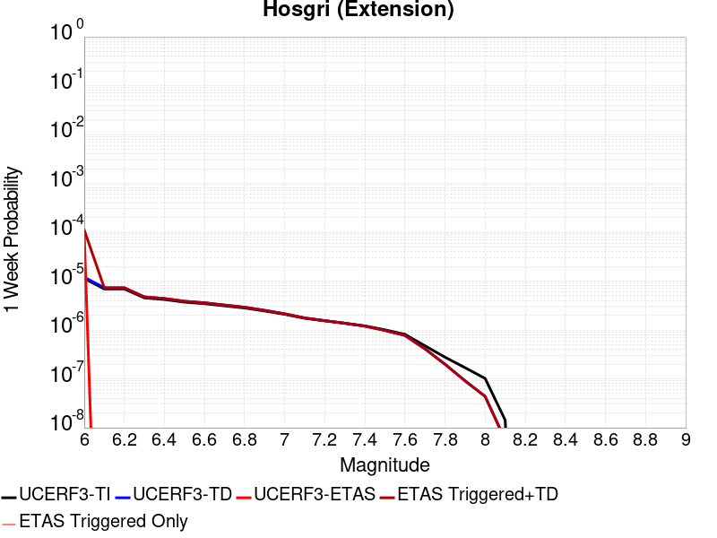 | 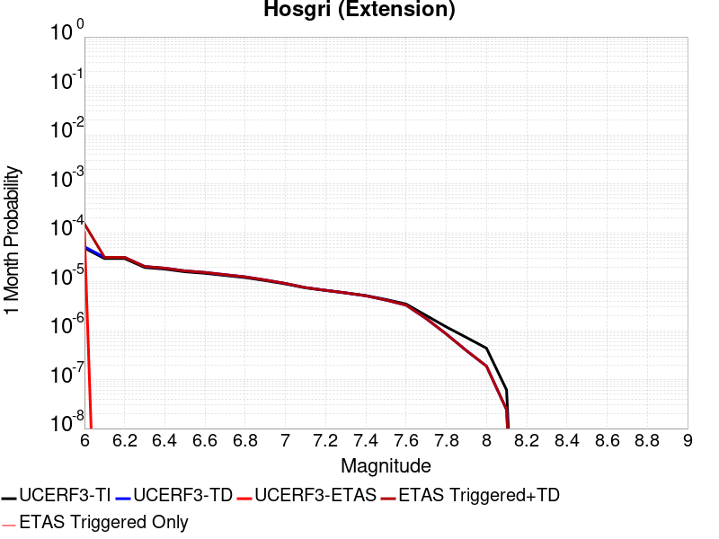 | 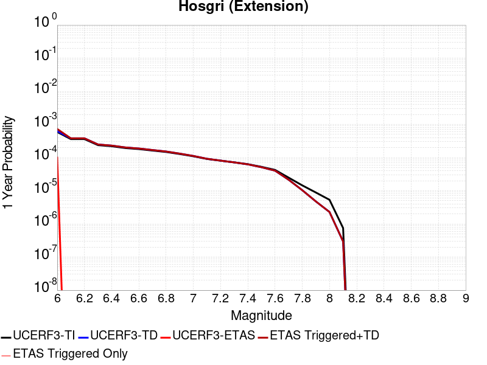 | 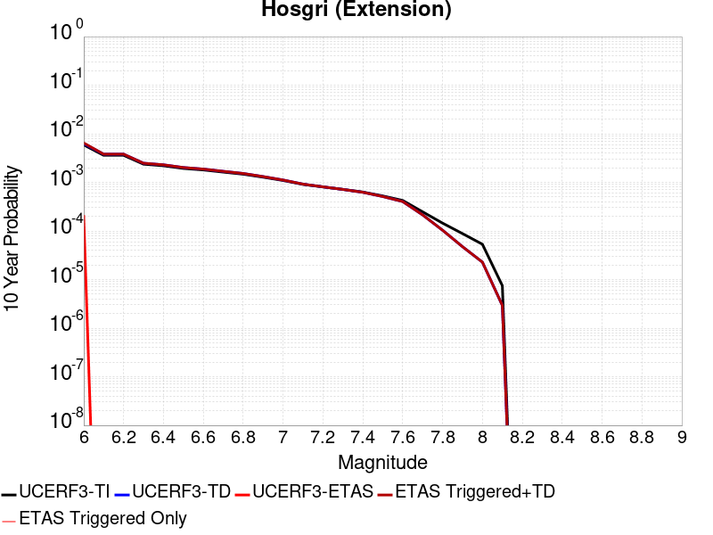 |

| Magnitude | 1 wk TI Prob | 1 wk TD Prob | 1 wk ETAS Prob | 1 wk ETAS/TD Gain | 1 wk ETAS Triggered+TD | 1 wk ETAS Triggered Only | 1 mo TI Prob | 1 mo TD Prob | 1 mo ETAS Prob | 1 mo ETAS/TD Gain | 1 mo ETAS Triggered+TD | 1 mo ETAS Triggered Only | 1 yr TI Prob | 1 yr TD Prob | 1 yr ETAS Prob | 1 yr ETAS/TD Gain | 1 yr ETAS Triggered+TD | 1 yr ETAS Triggered Only | 10 yr TI Prob | 10 yr TD Prob | 10 yr ETAS Prob | 10 yr ETAS/TD Gain | 10 yr ETAS Triggered+TD | 10 yr ETAS Triggered Only |
|-----|-----|-----|-----|-----|-----|-----|-----|-----|-----|-----|-----|-----|-----|-----|-----|-----|-----|-----|-----|-----|-----|-----|-----|-----|
| 6.0 | 1.1369135E-5 | 1.2073038E-5 | 1.0E-4 | 8.282919 | 1.1207183E-4 | 1.0E-4 | 4.8723956E-5 | 5.174069E-5 | 1.0E-4 | 1.9327147 | 1.5173551E-4 | 1.0E-4 | 5.9305265E-4 | 6.2978355E-4 | 5.0E-4 | 0.79392356 | 7.297206E-4 | 1.0E-4 | 0.005914725 | 0.006282233 | 0.0042 | 0.6685521 | 0.006779092 | 5.0E-4 |
| 6.1 | 6.934979E-6 | 7.3181563E-6 | 0.0 | 0.0 | 7.3181563E-6 | 0.0 | 2.9721E-5 | 3.136317E-5 | 0.0 | 0.0 | 3.136317E-5 | 0.0 | 3.617931E-4 | 3.8178387E-4 | 1.0E-4 | 0.2619283 | 3.8178387E-4 | 0.0 | 0.0036120464 | 0.003811692 | 0.0019 | 0.4984663 | 0.0040109293 | 2.0E-4 |
| 6.2 | 6.934979E-6 | 7.3181563E-6 | 0.0 | 0.0 | 7.3181563E-6 | 0.0 | 2.9721E-5 | 3.136317E-5 | 0.0 | 0.0 | 3.136317E-5 | 0.0 | 3.617931E-4 | 3.8178387E-4 | 1.0E-4 | 0.2619283 | 3.8178387E-4 | 0.0 | 0.0036120464 | 0.003811692 | 0.0019 | 0.4984663 | 0.0040109293 | 2.0E-4 |
| 6.3 | 4.5484676E-6 | 4.764817E-6 | 0.0 | 0.0 | 4.764817E-6 | 0.0 | 1.9493287E-5 | 2.0420486E-5 | 0.0 | 0.0 | 2.0420486E-5 | 0.0 | 2.3730492E-4 | 2.4859147E-4 | 1.0E-4 | 0.4022664 | 2.4859147E-4 | 0.0 | 0.0023705168 | 0.0024831765 | 0.0012 | 0.483252 | 0.0025829282 | 1.0E-4 |
| 6.4 | 4.218095E-6 | 4.4125945E-6 | 0.0 | 0.0 | 4.4125945E-6 | 0.0 | 1.8077424E-5 | 1.8910983E-5 | 0.0 | 0.0 | 1.8910983E-5 | 0.0 | 2.2007042E-4 | 2.3021722E-4 | 1.0E-4 | 0.43437237 | 2.3021722E-4 | 0.0 | 0.002198526 | 0.0022998208 | 0.0012 | 0.5217798 | 0.0023995908 | 1.0E-4 |
| 6.5 | 3.717374E-6 | 3.879969E-6 | 0.0 | 0.0 | 3.879969E-6 | 0.0 | 1.5931506E-5 | 1.6628333E-5 | 0.0 | 0.0 | 1.6628333E-5 | 0.0 | 1.9394881E-4 | 2.0243134E-4 | 1.0E-4 | 0.49399465 | 2.0243134E-4 | 0.0 | 0.0019377962 | 0.0020224883 | 0.001 | 0.49444047 | 0.002122286 | 1.0E-4 |
| 6.6 | 3.4605036E-6 | 3.6046067E-6 | 0.0 | 0.0 | 3.6046067E-6 | 0.0 | 1.4830645E-5 | 1.5448224E-5 | 0.0 | 0.0 | 1.5448224E-5 | 0.0 | 1.8054814E-4 | 1.8806604E-4 | 1.0E-4 | 0.5317281 | 1.8806604E-4 | 0.0 | 0.0018040152 | 0.0018790835 | 0.001 | 0.53217435 | 0.0019788956 | 1.0E-4 |
| 6.7 | 3.123439E-6 | 3.2431458E-6 | 0.0 | 0.0 | 3.2431458E-6 | 0.0 | 1.33860985E-5 | 1.3899123E-5 | 0.0 | 0.0 | 1.3899123E-5 | 0.0 | 1.6296357E-4 | 1.6920878E-4 | 1.0E-4 | 0.5909859 | 1.6920878E-4 | 0.0 | 0.001628441 | 0.0016908103 | 0.001 | 0.5914324 | 0.0017906412 | 1.0E-4 |
| 6.8 | 2.8290783E-6 | 2.9273601E-6 | 0.0 | 0.0 | 2.9273601E-6 | 0.0 | 1.2124565E-5 | 1.2545769E-5 | 0.0 | 0.0 | 1.2545769E-5 | 0.0 | 1.4760658E-4 | 1.5273411E-4 | 1.0E-4 | 0.6547326 | 1.5273411E-4 | 0.0 | 0.0014750857 | 0.0015263001 | 7.0E-4 | 0.4586254 | 0.0016261475 | 1.0E-4 |
| 6.9 | 2.454112E-6 | 2.5254444E-6 | 0.0 | 0.0 | 2.5254444E-6 | 0.0 | 1.0517581E-5 | 1.0823288E-5 | 0.0 | 0.0 | 1.0823288E-5 | 0.0 | 1.2804402E-4 | 1.3176563E-4 | 1.0E-4 | 0.7589233 | 1.3176563E-4 | 0.0 | 0.0012797028 | 0.001316881 | 6.0E-4 | 0.45562202 | 0.0014167493 | 1.0E-4 |
| 7.0 | 2.1008145E-6 | 2.1472763E-6 | 0.0 | 0.0 | 2.1472763E-6 | 0.0 | 9.003459E-6 | 9.20258E-6 | 0.0 | 0.0 | 9.20258E-6 | 0.0 | 1.096116E-4 | 1.1203569E-4 | 1.0E-4 | 0.8925727 | 1.1203569E-4 | 0.0 | 0.0010955755 | 0.0011197958 | 5.0E-4 | 0.44651 | 0.0012196838 | 1.0E-4 |
| 7.1 | 1.744384E-6 | 1.766318E-6 | 0.0 | 0.0 | 1.766318E-6 | 0.0 | 7.47591E-6 | 7.569912E-6 | 0.0 | 0.0 | 7.569912E-6 | 0.0 | 9.1015405E-5 | 9.21598E-5 | 1.0E-4 | 1.0850718 | 9.21598E-5 | 0.0 | 9.097813E-4 | 9.2121755E-4 | 4.0E-4 | 0.43420798 | 0.0010211255 | 1.0E-4 |
| 7.2 | 1.5456587E-6 | 1.5541228E-6 | 0.0 | 0.0 | 1.5541228E-6 | 0.0 | 6.6242346E-6 | 6.6605094E-6 | 0.0 | 0.0 | 6.6605094E-6 | 0.0 | 8.064707E-5 | 8.10887E-5 | 1.0E-4 | 1.2332175 | 8.10887E-5 | 0.0 | 8.0617814E-4 | 8.105924E-4 | 4.0E-4 | 0.4934663 | 9.105113E-4 | 1.0E-4 |
| 7.3 | 1.3775123E-6 | 1.3745714E-6 | 0.0 | 0.0 | 1.3745714E-6 | 0.0 | 5.9036106E-6 | 5.8910073E-6 | 0.0 | 0.0 | 5.8910073E-6 | 0.0 | 7.187409E-5 | 7.172066E-5 | 1.0E-4 | 1.3942984 | 7.172066E-5 | 0.0 | 7.185085E-4 | 7.169761E-4 | 3.0E-4 | 0.41842395 | 7.169761E-4 | 0.0 |
| 7.4 | 1.214491E-6 | 1.2004347E-6 | 0.0 | 0.0 | 1.2004347E-6 | 0.0 | 5.2049513E-6 | 5.1447096E-6 | 0.0 | 0.0 | 5.1447096E-6 | 0.0 | 6.336844E-5 | 6.263505E-5 | 1.0E-4 | 1.5965502 | 6.263505E-5 | 0.0 | 6.335037E-4 | 6.261748E-4 | 3.0E-4 | 0.47909948 | 6.261748E-4 | 0.0 |
| 7.5 | 1.0101123E-6 | 9.824662E-7 | 0.0 | 0.0 | 9.824662E-7 | 0.0 | 4.3290456E-6 | 4.2105626E-6 | 0.0 | 0.0 | 4.2105626E-6 | 0.0 | 5.2704854E-5 | 5.12624E-5 | 0.0 | 0.0 | 5.12624E-5 | 0.0 | 5.2692357E-4 | 5.1250635E-4 | 1.0E-4 | 0.19511954 | 5.1250635E-4 | 0.0 |
| 7.6 | 8.1558215E-7 | 7.7498413E-7 | 0.0 | 0.0 | 7.7498413E-7 | 0.0 | 3.4953473E-6 | 3.3213562E-6 | 0.0 | 0.0 | 3.3213562E-6 | 0.0 | 4.255502E-5 | 4.0436767E-5 | 0.0 | 0.0 | 4.0436767E-5 | 0.0 | 4.2546875E-4 | 4.0429452E-4 | 0.0 | 0.0 | 4.0429452E-4 | 0.0 |
| 7.7 | 4.757816E-7 | 4.1174098E-7 | 0.0 | 0.0 | 4.1174098E-7 | 0.0 | 2.0390623E-6 | 1.7646031E-6 | 0.0 | 0.0 | 1.7646031E-6 | 0.0 | 2.4825302E-5 | 2.1483831E-5 | 0.0 | 0.0 | 2.1483831E-5 | 0.0 | 2.482253E-4 | 2.1481767E-4 | 0.0 | 0.0 | 2.1481767E-4 | 0.0 |
| 7.8 | 2.782787E-7 | 1.9929911E-7 | 0.0 | 0.0 | 1.9929911E-7 | 0.0 | 1.1926223E-6 | 8.5413876E-7 | 0.0 | 0.0 | 8.5413876E-7 | 0.0 | 1.452008E-5 | 1.039909E-5 | 0.0 | 0.0 | 1.039909E-5 | 0.0 | 1.4519131E-4 | 1.03986065E-4 | 0.0 | 0.0 | 1.03986065E-4 | 0.0 |
| 7.9 | 1.6948086E-7 | 9.138904E-8 | 0.0 | 0.0 | 9.138904E-8 | 0.0 | 7.2634634E-7 | 3.9166724E-7 | 0.0 | 0.0 | 3.9166724E-7 | 0.0 | 8.843231E-6 | 4.7685385E-6 | 0.0 | 0.0 | 4.7685385E-6 | 0.0 | 8.842879E-5 | 4.7684367E-5 | 0.0 | 0.0 | 4.7684367E-5 | 0.0 |
| 8.0 | 1.0225492E-7 | 4.3975575E-8 | 0.0 | 0.0 | 4.3975575E-8 | 0.0 | 4.382353E-7 | 1.8846674E-7 | 0.0 | 0.0 | 1.8846674E-7 | 0.0 | 5.335502E-6 | 2.29458E-6 | 0.0 | 0.0 | 2.29458E-6 | 0.0 | 5.335374E-5 | 2.2945567E-5 | 0.0 | 0.0 | 2.2945567E-5 | 0.0 |
| 8.1 | 1.43711345E-8 | 5.669406E-9 | 0.0 | 0.0 | 5.669406E-9 | 0.0 | 6.1590576E-8 | 2.4297453E-8 | 0.0 | 0.0 | 2.4297453E-8 | 0.0 | 7.4986497E-7 | 2.9582145E-7 | 0.0 | 0.0 | 2.9582145E-7 | 0.0 | 7.4986247E-6 | 2.958211E-6 | 0.0 | 0.0 | 2.958211E-6 | 0.0 |

## Fickle Hill (alt1)
*[(top)](#table-of-contents)*

| 1 Week | 1 Month | 1 Year | 10 Year |
|-----|-----|-----|-----|
| 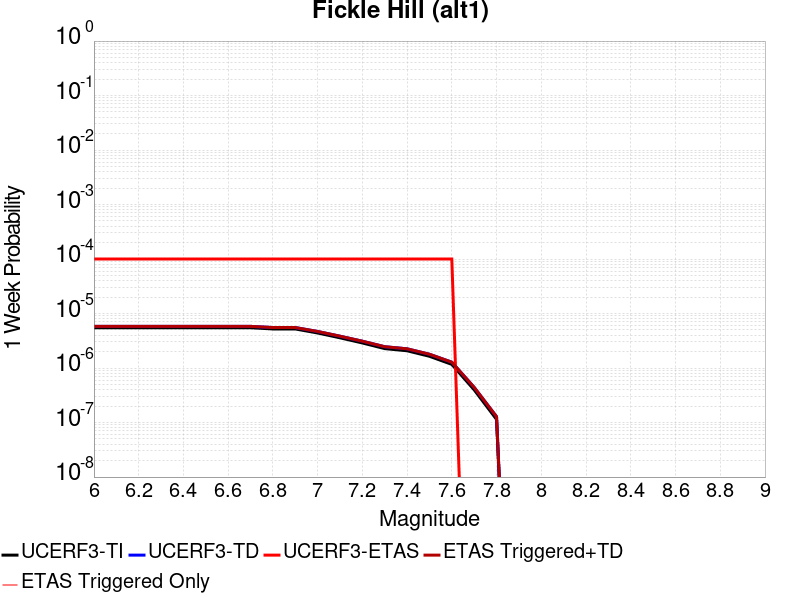 | 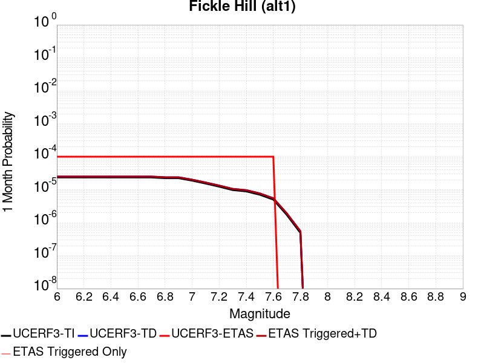 | 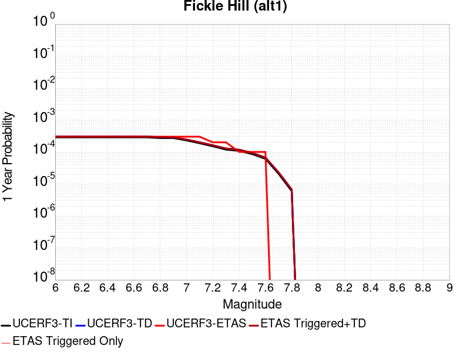 | 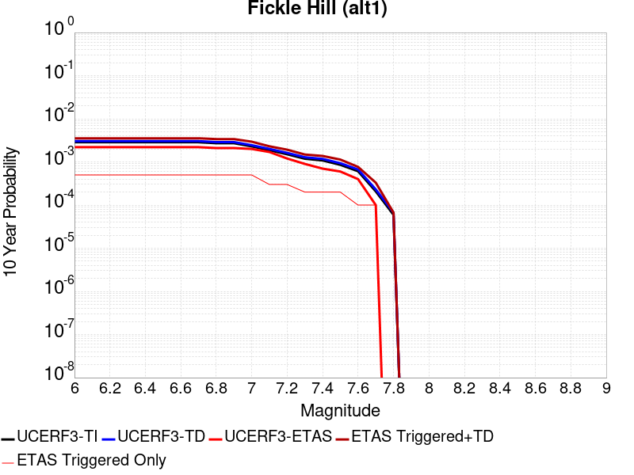 |

| Magnitude | 1 wk TI Prob | 1 wk TD Prob | 1 wk ETAS Prob | 1 wk ETAS/TD Gain | 1 wk ETAS Triggered+TD | 1 wk ETAS Triggered Only | 1 mo TI Prob | 1 mo TD Prob | 1 mo ETAS Prob | 1 mo ETAS/TD Gain | 1 mo ETAS Triggered+TD | 1 mo ETAS Triggered Only | 1 yr TI Prob | 1 yr TD Prob | 1 yr ETAS Prob | 1 yr ETAS/TD Gain | 1 yr ETAS Triggered+TD | 1 yr ETAS Triggered Only | 10 yr TI Prob | 10 yr TD Prob | 10 yr ETAS Prob | 10 yr ETAS/TD Gain | 10 yr ETAS Triggered+TD | 10 yr ETAS Triggered Only |
|-----|-----|-----|-----|-----|-----|-----|-----|-----|-----|-----|-----|-----|-----|-----|-----|-----|-----|-----|-----|-----|-----|-----|-----|-----|
| 6.0 | 5.491893E-6 | 5.823255E-6 | 1.0E-4 | 17.172527 | 5.823255E-6 | 0.0 | 2.3536471E-5 | 2.495658E-5 | 1.0E-4 | 4.0069594 | 2.495658E-5 | 0.0 | 2.8651886E-4 | 3.0380624E-4 | 3.0E-4 | 0.98747146 | 3.0380624E-4 | 0.0 | 0.0028614972 | 0.0030341332 | 0.0022 | 0.72508353 | 0.0035326162 | 5.0E-4 |
| 6.1 | 5.491893E-6 | 5.823255E-6 | 1.0E-4 | 17.172527 | 5.823255E-6 | 0.0 | 2.3536471E-5 | 2.495658E-5 | 1.0E-4 | 4.0069594 | 2.495658E-5 | 0.0 | 2.8651886E-4 | 3.0380624E-4 | 3.0E-4 | 0.98747146 | 3.0380624E-4 | 0.0 | 0.0028614972 | 0.0030341332 | 0.0022 | 0.72508353 | 0.0035326162 | 5.0E-4 |
| 6.2 | 5.491893E-6 | 5.823255E-6 | 1.0E-4 | 17.172527 | 5.823255E-6 | 0.0 | 2.3536471E-5 | 2.495658E-5 | 1.0E-4 | 4.0069594 | 2.495658E-5 | 0.0 | 2.8651886E-4 | 3.0380624E-4 | 3.0E-4 | 0.98747146 | 3.0380624E-4 | 0.0 | 0.0028614972 | 0.0030341332 | 0.0022 | 0.72508353 | 0.0035326162 | 5.0E-4 |
| 6.3 | 5.491893E-6 | 5.823255E-6 | 1.0E-4 | 17.172527 | 5.823255E-6 | 0.0 | 2.3536471E-5 | 2.495658E-5 | 1.0E-4 | 4.0069594 | 2.495658E-5 | 0.0 | 2.8651886E-4 | 3.0380624E-4 | 3.0E-4 | 0.98747146 | 3.0380624E-4 | 0.0 | 0.0028614972 | 0.0030341332 | 0.0022 | 0.72508353 | 0.0035326162 | 5.0E-4 |
| 6.4 | 5.491893E-6 | 5.823255E-6 | 1.0E-4 | 17.172527 | 5.823255E-6 | 0.0 | 2.3536471E-5 | 2.495658E-5 | 1.0E-4 | 4.0069594 | 2.495658E-5 | 0.0 | 2.8651886E-4 | 3.0380624E-4 | 3.0E-4 | 0.98747146 | 3.0380624E-4 | 0.0 | 0.0028614972 | 0.0030341332 | 0.0022 | 0.72508353 | 0.0035326162 | 5.0E-4 |
| 6.5 | 5.491893E-6 | 5.823255E-6 | 1.0E-4 | 17.172527 | 5.823255E-6 | 0.0 | 2.3536471E-5 | 2.495658E-5 | 1.0E-4 | 4.0069594 | 2.495658E-5 | 0.0 | 2.8651886E-4 | 3.0380624E-4 | 3.0E-4 | 0.98747146 | 3.0380624E-4 | 0.0 | 0.0028614972 | 0.0030341332 | 0.0022 | 0.72508353 | 0.0035326162 | 5.0E-4 |
| 6.6 | 5.491893E-6 | 5.823255E-6 | 1.0E-4 | 17.172527 | 5.823255E-6 | 0.0 | 2.3536471E-5 | 2.495658E-5 | 1.0E-4 | 4.0069594 | 2.495658E-5 | 0.0 | 2.8651886E-4 | 3.0380624E-4 | 3.0E-4 | 0.98747146 | 3.0380624E-4 | 0.0 | 0.0028614972 | 0.0030341332 | 0.0022 | 0.72508353 | 0.0035326162 | 5.0E-4 |
| 6.7 | 5.491893E-6 | 5.823255E-6 | 1.0E-4 | 17.172527 | 5.823255E-6 | 0.0 | 2.3536471E-5 | 2.495658E-5 | 1.0E-4 | 4.0069594 | 2.495658E-5 | 0.0 | 2.8651886E-4 | 3.0380624E-4 | 3.0E-4 | 0.98747146 | 3.0380624E-4 | 0.0 | 0.0028614972 | 0.0030341332 | 0.0022 | 0.72508353 | 0.0035326162 | 5.0E-4 |
| 6.8 | 5.2207747E-6 | 5.5420933E-6 | 1.0E-4 | 18.043724 | 5.5420933E-6 | 0.0 | 2.2374557E-5 | 2.3751625E-5 | 1.0E-4 | 4.2102385 | 2.3751625E-5 | 0.0 | 2.7237617E-4 | 2.8913986E-4 | 3.0E-4 | 1.0375602 | 2.8913986E-4 | 0.0 | 0.0027204256 | 0.0028878546 | 0.0021 | 0.72718346 | 0.0033864107 | 5.0E-4 |
| 6.9 | 5.2186956E-6 | 5.5399146E-6 | 1.0E-4 | 18.05082 | 5.5399146E-6 | 0.0 | 2.2365646E-5 | 2.3742288E-5 | 1.0E-4 | 4.211894 | 2.3742288E-5 | 0.0 | 2.722677E-4 | 2.890262E-4 | 3.0E-4 | 1.0379682 | 2.890262E-4 | 0.0 | 0.0027193436 | 0.0028867212 | 0.0021 | 0.72746897 | 0.0033852777 | 5.0E-4 |
| 7.0 | 4.403045E-6 | 4.6951664E-6 | 1.0E-4 | 21.2985 | 4.6951664E-6 | 0.0 | 1.8870056E-5 | 2.0121994E-5 | 1.0E-4 | 4.9696865 | 2.0121994E-5 | 0.0 | 2.297187E-4 | 2.4495905E-4 | 3.0E-4 | 1.2246945 | 2.4495905E-4 | 0.0 | 0.0022948137 | 0.0024470205 | 0.002 | 0.81732047 | 0.002945797 | 5.0E-4 |
| 7.1 | 3.5911396E-6 | 3.8450635E-6 | 1.0E-4 | 26.007374 | 3.8450635E-6 | 0.0 | 1.5390508E-5 | 1.6478743E-5 | 1.0E-4 | 6.0684237 | 1.6478743E-5 | 0.0 | 1.8736332E-4 | 2.0061097E-4 | 3.0E-4 | 1.4954317 | 2.0061097E-4 | 0.0 | 0.0018720542 | 0.0020043722 | 0.0017 | 0.8481459 | 0.0023037707 | 3.0E-4 |
| 7.2 | 2.888171E-6 | 3.1116026E-6 | 1.0E-4 | 32.13778 | 3.1116026E-6 | 0.0 | 1.2377816E-5 | 1.3335373E-5 | 1.0E-4 | 7.4988527 | 1.3335373E-5 | 0.0 | 1.5068949E-4 | 1.6234632E-4 | 2.0E-4 | 1.2319343 | 1.6234632E-4 | 0.0 | 0.0015058735 | 0.0016223019 | 0.0012 | 0.7396897 | 0.0019218152 | 3.0E-4 |
| 7.3 | 2.275019E-6 | 2.4653345E-6 | 1.0E-4 | 40.562447 | 2.4653345E-6 | 0.0 | 9.750045E-6 | 1.0565677E-5 | 1.0E-4 | 9.464608 | 1.0565677E-5 | 0.0 | 1.1870033E-4 | 1.2862966E-4 | 2.0E-4 | 1.5548513 | 1.2862966E-4 | 0.0 | 0.0011863695 | 0.001285566 | 9.0E-4 | 0.7000807 | 0.001485309 | 2.0E-4 |
| 7.4 | 2.076662E-6 | 2.2555528E-6 | 1.0E-4 | 44.33503 | 2.2555528E-6 | 0.0 | 8.8999495E-6 | 9.66662E-6 | 1.0E-4 | 10.344878 | 9.66662E-6 | 0.0 | 1.08351494E-4 | 1.1768487E-4 | 1.0E-4 | 0.8497269 | 1.1768487E-4 | 0.0 | 0.0010829868 | 0.0011762385 | 7.0E-4 | 0.5951174 | 0.0013760033 | 2.0E-4 |
| 7.5 | 1.6450799E-6 | 1.7936939E-6 | 1.0E-4 | 55.750874 | 1.7936939E-6 | 0.0 | 7.0503233E-6 | 7.6872375E-6 | 1.0E-4 | 13.0085745 | 7.6872375E-6 | 0.0 | 8.5834305E-5 | 9.358817E-5 | 1.0E-4 | 1.0685111 | 9.358817E-5 | 0.0 | 8.580116E-4 | 9.3549525E-4 | 6.0E-4 | 0.6413715 | 0.0011353082 | 2.0E-4 |
| 7.6 | 1.168891E-6 | 1.2816436E-6 | 1.0E-4 | 78.02482 | 1.2816436E-6 | 0.0 | 5.009523E-6 | 5.492747E-6 | 1.0E-4 | 18.205828 | 5.492747E-6 | 0.0 | 6.098924E-5 | 6.68722E-5 | 1.0E-4 | 1.4953898 | 6.68722E-5 | 0.0 | 6.09725E-4 | 6.6852634E-4 | 4.0E-4 | 0.5983309 | 7.684595E-4 | 1.0E-4 |
| 7.7 | 3.9871026E-7 | 4.422042E-7 | 0.0 | 0.0 | 4.422042E-7 | 0.0 | 1.708757E-6 | 1.8951595E-6 | 0.0 | 0.0 | 1.8951595E-6 | 0.0 | 2.0803918E-5 | 2.3073331E-5 | 0.0 | 0.0 | 2.3073331E-5 | 0.0 | 2.0801972E-4 | 2.3071018E-4 | 1.0E-4 | 0.43344423 | 3.3068712E-4 | 1.0E-4 |
| 7.8 | 1.14295965E-7 | 1.28371E-7 | 0.0 | 0.0 | 1.28371E-7 | 0.0 | 4.8983975E-7 | 5.5016136E-7 | 0.0 | 0.0 | 5.5016136E-7 | 0.0 | 5.9637828E-6 | 6.698195E-6 | 0.0 | 0.0 | 6.698195E-6 | 0.0 | 5.9636226E-5 | 6.698009E-5 | 0.0 | 0.0 | 6.698009E-5 | 0.0 |

## Elsinore (Julian)
*[(top)](#table-of-contents)*

| 1 Week | 1 Month | 1 Year | 10 Year |
|-----|-----|-----|-----|
| 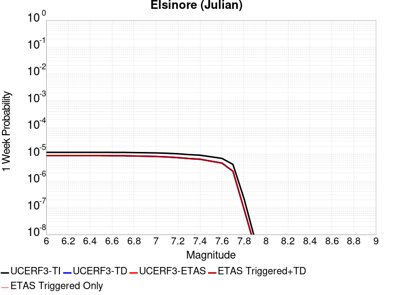 | 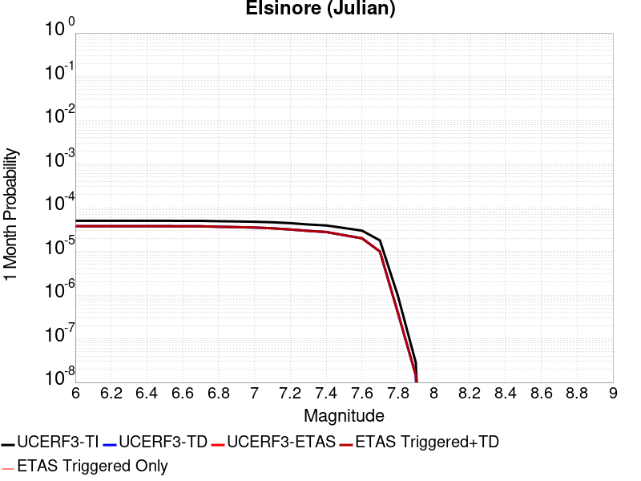 | 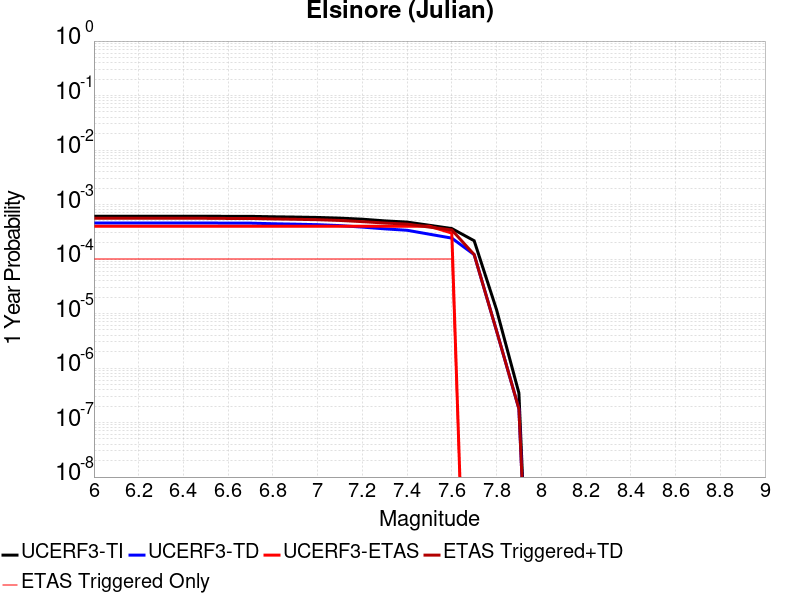 | 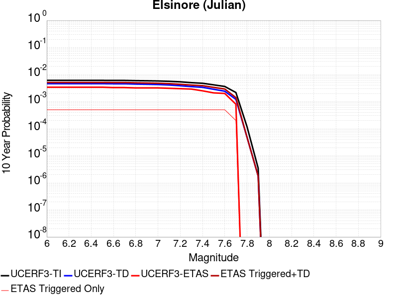 |

| Magnitude | 1 wk TI Prob | 1 wk TD Prob | 1 wk ETAS Prob | 1 wk ETAS/TD Gain | 1 wk ETAS Triggered+TD | 1 wk ETAS Triggered Only | 1 mo TI Prob | 1 mo TD Prob | 1 mo ETAS Prob | 1 mo ETAS/TD Gain | 1 mo ETAS Triggered+TD | 1 mo ETAS Triggered Only | 1 yr TI Prob | 1 yr TD Prob | 1 yr ETAS Prob | 1 yr ETAS/TD Gain | 1 yr ETAS Triggered+TD | 1 yr ETAS Triggered Only | 10 yr TI Prob | 10 yr TD Prob | 10 yr ETAS Prob | 10 yr ETAS/TD Gain | 10 yr ETAS Triggered+TD | 10 yr ETAS Triggered Only |
|-----|-----|-----|-----|-----|-----|-----|-----|-----|-----|-----|-----|-----|-----|-----|-----|-----|-----|-----|-----|-----|-----|-----|-----|-----|
| 6.0 | 1.1710231E-5 | 8.8099E-6 | 0.0 | 0.0 | 8.8099E-6 | 0.0 | 5.0185736E-5 | 3.7756174E-5 | 0.0 | 0.0 | 3.7756174E-5 | 0.0 | 6.1084004E-4 | 4.5958615E-4 | 4.0E-4 | 0.8703482 | 5.595402E-4 | 1.0E-4 | 0.006091637 | 0.004586544 | 0.0034 | 0.7412989 | 0.0050842506 | 5.0E-4 |
| 6.1 | 1.1710231E-5 | 8.8099E-6 | 0.0 | 0.0 | 8.8099E-6 | 0.0 | 5.0185736E-5 | 3.7756174E-5 | 0.0 | 0.0 | 3.7756174E-5 | 0.0 | 6.1084004E-4 | 4.5958615E-4 | 4.0E-4 | 0.8703482 | 5.595402E-4 | 1.0E-4 | 0.006091637 | 0.004586544 | 0.0034 | 0.7412989 | 0.0050842506 | 5.0E-4 |
| 6.2 | 1.1710231E-5 | 8.8099E-6 | 0.0 | 0.0 | 8.8099E-6 | 0.0 | 5.0185736E-5 | 3.7756174E-5 | 0.0 | 0.0 | 3.7756174E-5 | 0.0 | 6.1084004E-4 | 4.5958615E-4 | 4.0E-4 | 0.8703482 | 5.595402E-4 | 1.0E-4 | 0.006091637 | 0.004586544 | 0.0034 | 0.7412989 | 0.0050842506 | 5.0E-4 |
| 6.3 | 1.1710231E-5 | 8.8099E-6 | 0.0 | 0.0 | 8.8099E-6 | 0.0 | 5.0185736E-5 | 3.7756174E-5 | 0.0 | 0.0 | 3.7756174E-5 | 0.0 | 6.1084004E-4 | 4.5958615E-4 | 4.0E-4 | 0.8703482 | 5.595402E-4 | 1.0E-4 | 0.006091637 | 0.004586544 | 0.0034 | 0.7412989 | 0.0050842506 | 5.0E-4 |
| 6.4 | 1.1710231E-5 | 8.8099E-6 | 0.0 | 0.0 | 8.8099E-6 | 0.0 | 5.0185736E-5 | 3.7756174E-5 | 0.0 | 0.0 | 3.7756174E-5 | 0.0 | 6.1084004E-4 | 4.5958615E-4 | 4.0E-4 | 0.8703482 | 5.595402E-4 | 1.0E-4 | 0.006091637 | 0.004586544 | 0.0034 | 0.7412989 | 0.0050842506 | 5.0E-4 |
| 6.5 | 1.1710231E-5 | 8.8099E-6 | 0.0 | 0.0 | 8.8099E-6 | 0.0 | 5.0185736E-5 | 3.7756174E-5 | 0.0 | 0.0 | 3.7756174E-5 | 0.0 | 6.1084004E-4 | 4.5958615E-4 | 4.0E-4 | 0.8703482 | 5.595402E-4 | 1.0E-4 | 0.006091637 | 0.004586544 | 0.0034 | 0.7412989 | 0.0050842506 | 5.0E-4 |
| 6.6 | 1.1650619E-5 | 8.742328E-6 | 0.0 | 0.0 | 8.742328E-6 | 0.0 | 4.993027E-5 | 3.746659E-5 | 0.0 | 0.0 | 3.746659E-5 | 0.0 | 6.0773146E-4 | 4.5606194E-4 | 4.0E-4 | 0.8770738 | 5.5601634E-4 | 1.0E-4 | 0.0060607214 | 0.0045514465 | 0.0033 | 0.7250442 | 0.005049171 | 5.0E-4 |
| 6.7 | 1.1650619E-5 | 8.742328E-6 | 0.0 | 0.0 | 8.742328E-6 | 0.0 | 4.993027E-5 | 3.746659E-5 | 0.0 | 0.0 | 3.746659E-5 | 0.0 | 6.0773146E-4 | 4.5606194E-4 | 4.0E-4 | 0.8770738 | 5.5601634E-4 | 1.0E-4 | 0.0060607214 | 0.0045514465 | 0.0033 | 0.7250442 | 0.005049171 | 5.0E-4 |
| 6.8 | 1.1442698E-5 | 8.5257125E-6 | 0.0 | 0.0 | 8.5257125E-6 | 0.0 | 4.9039216E-5 | 3.6538266E-5 | 0.0 | 0.0 | 3.6538266E-5 | 0.0 | 5.968889E-4 | 4.447642E-4 | 4.0E-4 | 0.8993529 | 5.4471975E-4 | 1.0E-4 | 0.0059528816 | 0.004438925 | 0.0032 | 0.72089523 | 0.004936706 | 5.0E-4 |
| 6.9 | 1.1300589E-5 | 8.373737E-6 | 0.0 | 0.0 | 8.373737E-6 | 0.0 | 4.8430196E-5 | 3.588696E-5 | 0.0 | 0.0 | 3.588696E-5 | 0.0 | 5.894781E-4 | 4.3683778E-4 | 4.0E-4 | 0.9156717 | 5.3679413E-4 | 1.0E-4 | 0.005879169 | 0.0043599736 | 0.0032 | 0.7339494 | 0.0048577935 | 5.0E-4 |
| 7.0 | 1.1117729E-5 | 8.191226E-6 | 0.0 | 0.0 | 8.191226E-6 | 0.0 | 4.764654E-5 | 3.510479E-5 | 0.0 | 0.0 | 3.510479E-5 | 0.0 | 5.799422E-4 | 4.2731862E-4 | 4.0E-4 | 0.93606967 | 5.272759E-4 | 1.0E-4 | 0.0057843104 | 0.0042651505 | 0.0032 | 0.7502666 | 0.004763018 | 5.0E-4 |
| 7.1 | 1.08053955E-5 | 7.877859E-6 | 0.0 | 0.0 | 7.877859E-6 | 0.0 | 4.6308014E-5 | 3.3761826E-5 | 0.0 | 0.0 | 3.3761826E-5 | 0.0 | 5.6365423E-4 | 4.1097435E-4 | 4.0E-4 | 0.97329676 | 5.109332E-4 | 1.0E-4 | 0.005622267 | 0.0041023213 | 0.0031 | 0.7556697 | 0.00460027 | 5.0E-4 |
| 7.2 | 1.032804E-5 | 7.399617E-6 | 0.0 | 0.0 | 7.399617E-6 | 0.0 | 4.4262277E-5 | 3.171227E-5 | 0.0 | 0.0 | 3.171227E-5 | 0.0 | 5.387599E-4 | 3.8603E-4 | 4.0E-4 | 1.0361888 | 4.859914E-4 | 1.0E-4 | 0.0053745564 | 0.0038537644 | 0.003 | 0.7784596 | 0.0043518376 | 5.0E-4 |
| 7.3 | 9.622426E-6 | 6.869473E-6 | 0.0 | 0.0 | 6.869473E-6 | 0.0 | 4.1238312E-5 | 2.9440274E-5 | 0.0 | 0.0 | 2.9440274E-5 | 0.0 | 5.019608E-4 | 3.583778E-4 | 4.0E-4 | 1.1161406 | 4.5834196E-4 | 1.0E-4 | 0.005008285 | 0.0035781534 | 0.0029 | 0.8104739 | 0.0040763645 | 5.0E-4 |
| 7.4 | 9.144434E-6 | 6.4709243E-6 | 0.0 | 0.0 | 6.4709243E-6 | 0.0 | 3.9189843E-5 | 2.7732245E-5 | 0.0 | 0.0 | 2.7732245E-5 | 0.0 | 4.7703186E-4 | 3.3758915E-4 | 4.0E-4 | 1.1848723 | 4.375554E-4 | 1.0E-4 | 0.0047600917 | 0.0033709055 | 0.0025 | 0.7416405 | 0.00386922 | 5.0E-4 |
| 7.5 | 7.988981E-6 | 5.476566E-6 | 0.0 | 0.0 | 5.476566E-6 | 0.0 | 3.4238044E-5 | 2.3470793E-5 | 0.0 | 0.0 | 2.3470793E-5 | 0.0 | 4.1676845E-4 | 2.8572071E-4 | 4.0E-4 | 1.3999686 | 3.8569214E-4 | 1.0E-4 | 0.0041598766 | 0.00285366 | 0.0021 | 0.73589706 | 0.003352233 | 5.0E-4 |
| 7.6 | 6.9554876E-6 | 4.6431246E-6 | 0.0 | 0.0 | 4.6431246E-6 | 0.0 | 2.9808893E-5 | 1.989896E-5 | 0.0 | 0.0 | 1.989896E-5 | 0.0 | 3.6286283E-4 | 2.4224407E-4 | 3.0E-4 | 1.2384204 | 3.4221984E-4 | 1.0E-4 | 0.0036227088 | 0.0024199155 | 0.002 | 0.82647514 | 0.0029187056 | 5.0E-4 |
| 7.7 | 4.1557314E-6 | 2.3127932E-6 | 0.0 | 0.0 | 2.3127932E-6 | 0.0 | 1.7810156E-5 | 9.911938E-6 | 0.0 | 0.0 | 9.911938E-6 | 0.0 | 2.1681708E-4 | 1.20671895E-4 | 0.0 | 0.0 | 1.20671895E-4 | 0.0 | 0.0021660565 | 0.0012061362 | 8.0E-4 | 0.66327506 | 0.0014058949 | 2.0E-4 |
| 7.8 | 2.2597293E-7 | 9.2611394E-8 | 0.0 | 0.0 | 9.2611394E-8 | 0.0 | 9.684551E-7 | 3.9690593E-7 | 0.0 | 0.0 | 3.9690593E-7 | 0.0 | 1.1790877E-5 | 4.8323222E-6 | 0.0 | 0.0 | 4.8323222E-6 | 0.0 | 1.17902506E-4 | 4.8322494E-5 | 0.0 | 0.0 | 4.8322494E-5 | 0.0 |
| 7.9 | 6.676829E-9 | 3.4267709E-9 | 0.0 | 0.0 | 3.4267709E-9 | 0.0 | 2.861498E-8 | 1.4686159E-8 | 0.0 | 0.0 | 1.4686159E-8 | 0.0 | 3.4838732E-7 | 1.7880397E-7 | 0.0 | 0.0 | 1.7880397E-7 | 0.0 | 3.4838679E-6 | 1.7880385E-6 | 0.0 | 0.0 | 1.7880385E-6 | 0.0 |

## Great Valley 02
*[(top)](#table-of-contents)*

| 1 Week | 1 Month | 1 Year | 10 Year |
|-----|-----|-----|-----|
| 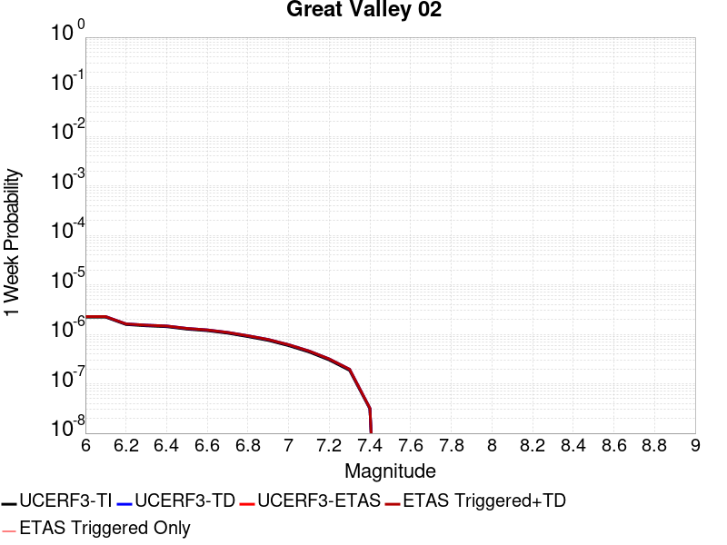 | 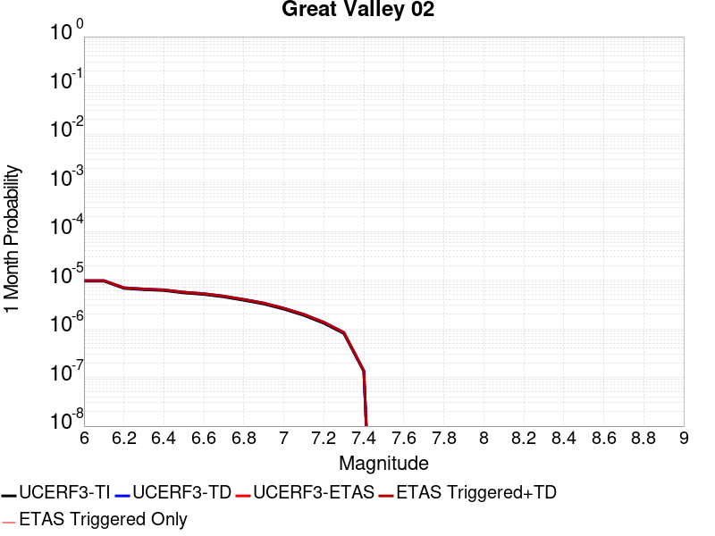 | 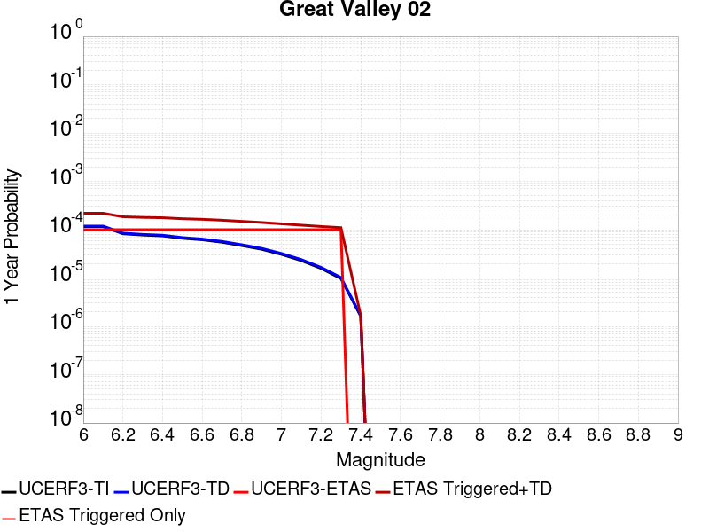 | 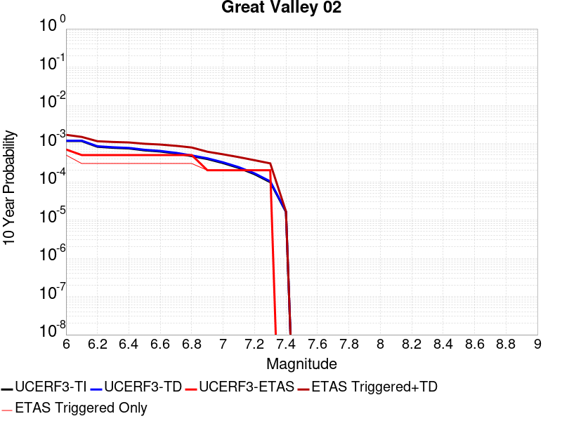 |

| Magnitude | 1 wk TI Prob | 1 wk TD Prob | 1 wk ETAS Prob | 1 wk ETAS/TD Gain | 1 wk ETAS Triggered+TD | 1 wk ETAS Triggered Only | 1 mo TI Prob | 1 mo TD Prob | 1 mo ETAS Prob | 1 mo ETAS/TD Gain | 1 mo ETAS Triggered+TD | 1 mo ETAS Triggered Only | 1 yr TI Prob | 1 yr TD Prob | 1 yr ETAS Prob | 1 yr ETAS/TD Gain | 1 yr ETAS Triggered+TD | 1 yr ETAS Triggered Only | 10 yr TI Prob | 10 yr TD Prob | 10 yr ETAS Prob | 10 yr ETAS/TD Gain | 10 yr ETAS Triggered+TD | 10 yr ETAS Triggered Only |
|-----|-----|-----|-----|-----|-----|-----|-----|-----|-----|-----|-----|-----|-----|-----|-----|-----|-----|-----|-----|-----|-----|-----|-----|-----|
| 6.0 | 2.2243487E-6 | 2.281145E-6 | 0.0 | 0.0 | 2.281145E-6 | 0.0 | 9.532888E-6 | 9.776302E-6 | 0.0 | 0.0 | 9.776302E-6 | 0.0 | 1.1605673E-4 | 1.19020486E-4 | 1.0E-4 | 0.8401915 | 2.1900858E-4 | 1.0E-4 | 0.0011599615 | 0.0011896173 | 7.0E-4 | 0.5884245 | 0.0016890225 | 5.0E-4 |
| 6.1 | 2.2243487E-6 | 2.281145E-6 | 0.0 | 0.0 | 2.281145E-6 | 0.0 | 9.532888E-6 | 9.776302E-6 | 0.0 | 0.0 | 9.776302E-6 | 0.0 | 1.1605673E-4 | 1.19020486E-4 | 1.0E-4 | 0.8401915 | 2.1900858E-4 | 1.0E-4 | 0.0011599615 | 0.0011896173 | 5.0E-4 | 0.42030323 | 0.0014892605 | 3.0E-4 |
| 6.2 | 1.5787732E-6 | 1.6267251E-6 | 0.0 | 0.0 | 1.6267251E-6 | 0.0 | 6.7661535E-6 | 6.9716602E-6 | 0.0 | 0.0 | 6.9716602E-6 | 0.0 | 8.2374805E-5 | 8.487671E-5 | 1.0E-4 | 1.1781796 | 1.8486822E-4 | 1.0E-4 | 8.2344277E-4 | 8.484476E-4 | 5.0E-4 | 0.58931154 | 0.0011481931 | 3.0E-4 |
| 6.3 | 1.4850314E-6 | 1.53178E-6 | 0.0 | 0.0 | 1.53178E-6 | 0.0 | 6.3644047E-6 | 6.564755E-6 | 0.0 | 0.0 | 6.564755E-6 | 0.0 | 7.748387E-5 | 7.9923E-5 | 1.0E-4 | 1.2512044 | 1.79915E-4 | 1.0E-4 | 7.745686E-4 | 7.9894636E-4 | 5.0E-4 | 0.6258242 | 0.0010987067 | 3.0E-4 |
| 6.4 | 1.4266972E-6 | 1.4729251E-6 | 0.0 | 0.0 | 1.4729251E-6 | 0.0 | 6.114402E-6 | 6.312521E-6 | 0.0 | 0.0 | 6.312521E-6 | 0.0 | 7.44403E-5 | 7.6852266E-5 | 1.0E-4 | 1.3011979 | 1.7684458E-4 | 1.0E-4 | 7.441537E-4 | 7.682603E-4 | 5.0E-4 | 0.6508211 | 0.0010680298 | 3.0E-4 |
| 6.5 | 1.2728015E-6 | 1.3166414E-6 | 0.0 | 0.0 | 1.3166414E-6 | 0.0 | 5.4548523E-6 | 5.642737E-6 | 0.0 | 0.0 | 5.642737E-6 | 0.0 | 6.64108E-5 | 6.869818E-5 | 1.0E-4 | 1.4556426 | 1.6869132E-4 | 1.0E-4 | 6.639096E-4 | 6.8677205E-4 | 5.0E-4 | 0.7280436 | 9.865661E-4 | 3.0E-4 |
| 6.6 | 1.1857247E-6 | 1.2284668E-6 | 0.0 | 0.0 | 1.2284668E-6 | 0.0 | 5.0816675E-6 | 5.264847E-6 | 0.0 | 0.0 | 5.264847E-6 | 0.0 | 6.186755E-5 | 6.409765E-5 | 1.0E-4 | 1.5601195 | 1.6409124E-4 | 1.0E-4 | 6.1850325E-4 | 6.407941E-4 | 5.0E-4 | 0.78028184 | 9.4060187E-4 | 3.0E-4 |
| 6.7 | 1.0550715E-6 | 1.0948922E-6 | 0.0 | 0.0 | 1.0948922E-6 | 0.0 | 4.521727E-6 | 4.692387E-6 | 0.0 | 0.0 | 4.692387E-6 | 0.0 | 5.5050637E-5 | 5.7128334E-5 | 1.0E-4 | 1.7504449 | 1.5712262E-4 | 1.0E-4 | 5.5037E-4 | 5.711386E-4 | 5.0E-4 | 0.87544423 | 8.709673E-4 | 3.0E-4 |
| 6.8 | 8.9881183E-7 | 9.3515223E-7 | 0.0 | 0.0 | 9.3515223E-7 | 0.0 | 3.8520448E-6 | 4.0077894E-6 | 0.0 | 0.0 | 4.0077894E-6 | 0.0 | 4.689764E-5 | 4.879376E-5 | 1.0E-4 | 2.0494423 | 1.4878888E-4 | 1.0E-4 | 4.688774E-4 | 4.878322E-4 | 5.0E-4 | 1.0249425 | 7.8768586E-4 | 3.0E-4 |
| 6.9 | 7.5417256E-7 | 7.8674594E-7 | 0.0 | 0.0 | 7.8674594E-7 | 0.0 | 3.232164E-6 | 3.371764E-6 | 0.0 | 0.0 | 3.371764E-6 | 0.0 | 3.9350885E-5 | 4.105047E-5 | 1.0E-4 | 2.4360259 | 1.4104636E-4 | 1.0E-4 | 3.934392E-4 | 4.104303E-4 | 2.0E-4 | 0.48729345 | 6.103482E-4 | 2.0E-4 |
| 7.0 | 5.909726E-7 | 6.1749876E-7 | 0.0 | 0.0 | 6.1749876E-7 | 0.0 | 2.5327372E-6 | 2.6464206E-6 | 0.0 | 0.0 | 2.6464206E-6 | 0.0 | 3.083564E-5 | 3.2219705E-5 | 1.0E-4 | 3.1036909 | 1.3221648E-4 | 1.0E-4 | 3.083136E-4 | 3.2215135E-4 | 2.0E-4 | 0.62082624 | 5.220869E-4 | 2.0E-4 |
| 7.1 | 4.4054178E-7 | 4.6147488E-7 | 0.0 | 0.0 | 4.6147488E-7 | 0.0 | 1.8880348E-6 | 1.977748E-6 | 0.0 | 0.0 | 1.977748E-6 | 0.0 | 2.2986582E-5 | 2.4078823E-5 | 1.0E-4 | 4.153027 | 1.2407641E-4 | 1.0E-4 | 2.2984203E-4 | 2.4076286E-4 | 2.0E-4 | 0.8306929 | 4.407147E-4 | 2.0E-4 |
| 7.2 | 3.029834E-7 | 3.1805135E-7 | 0.0 | 0.0 | 3.1805135E-7 | 0.0 | 1.2984997E-6 | 1.3630764E-6 | 0.0 | 0.0 | 1.3630764E-6 | 0.0 | 1.5809119E-5 | 1.6595333E-5 | 1.0E-4 | 6.02579 | 1.1659368E-4 | 1.0E-4 | 1.5807994E-4 | 1.659414E-4 | 2.0E-4 | 1.2052448 | 3.659082E-4 | 2.0E-4 |
| 7.3 | 1.8700909E-7 | 1.966933E-7 | 0.0 | 0.0 | 1.966933E-7 | 0.0 | 8.0146725E-7 | 8.429711E-7 | 0.0 | 0.0 | 8.429711E-7 | 0.0 | 9.75782E-6 | 1.02631275E-5 | 1.0E-4 | 9.743619 | 1.102621E-4 | 1.0E-4 | 9.757392E-5 | 1.0262681E-4 | 2.0E-4 | 1.9488086 | 3.026063E-4 | 2.0E-4 |
| 7.4 | 3.112171E-8 | 3.2058175E-8 | 0.0 | 0.0 | 3.2058175E-8 | 0.0 | 1.3337875E-7 | 1.3739218E-7 | 0.0 | 0.0 | 1.3739218E-7 | 0.0 | 1.6238852E-6 | 1.6727486E-6 | 0.0 | 0.0 | 1.6727486E-6 | 0.0 | 1.6238733E-5 | 1.6727368E-5 | 0.0 | 0.0 | 1.6727368E-5 | 0.0 |

## Verdugo
*[(top)](#table-of-contents)*

| 1 Week | 1 Month | 1 Year | 10 Year |
|-----|-----|-----|-----|
| 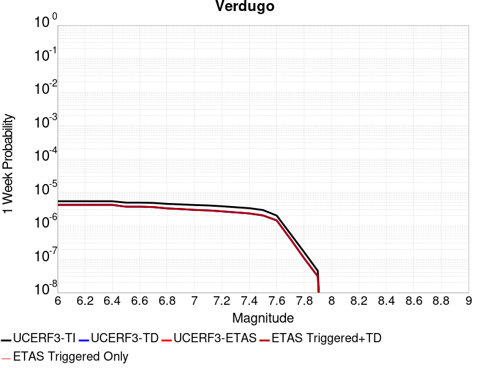 | 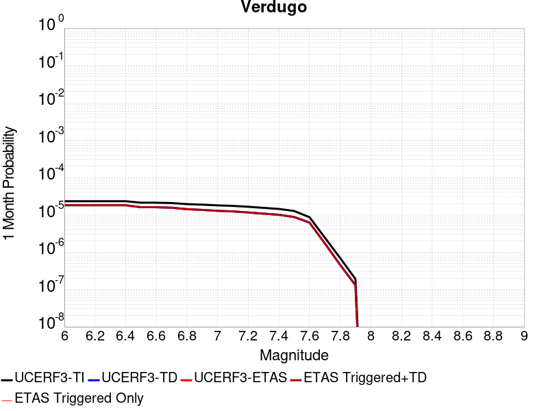 | 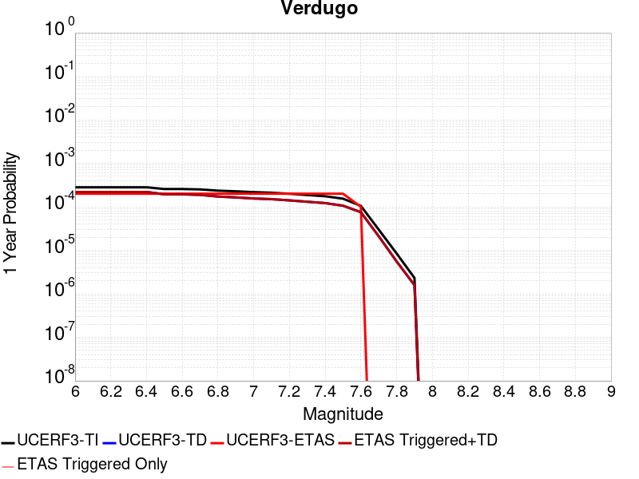 | 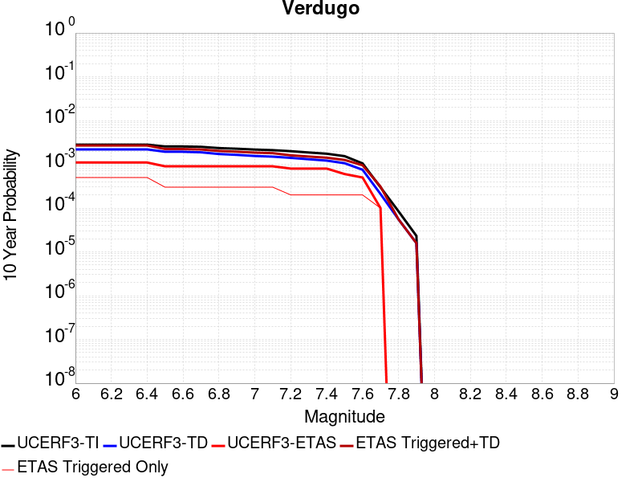 |

| Magnitude | 1 wk TI Prob | 1 wk TD Prob | 1 wk ETAS Prob | 1 wk ETAS/TD Gain | 1 wk ETAS Triggered+TD | 1 wk ETAS Triggered Only | 1 mo TI Prob | 1 mo TD Prob | 1 mo ETAS Prob | 1 mo ETAS/TD Gain | 1 mo ETAS Triggered+TD | 1 mo ETAS Triggered Only | 1 yr TI Prob | 1 yr TD Prob | 1 yr ETAS Prob | 1 yr ETAS/TD Gain | 1 yr ETAS Triggered+TD | 1 yr ETAS Triggered Only | 10 yr TI Prob | 10 yr TD Prob | 10 yr ETAS Prob | 10 yr ETAS/TD Gain | 10 yr ETAS Triggered+TD | 10 yr ETAS Triggered Only |
|-----|-----|-----|-----|-----|-----|-----|-----|-----|-----|-----|-----|-----|-----|-----|-----|-----|-----|-----|-----|-----|-----|-----|-----|-----|
| 6.0 | 5.392987E-6 | 4.208019E-6 | 0.0 | 0.0 | 4.208019E-6 | 0.0 | 2.3112598E-5 | 1.8034245E-5 | 0.0 | 0.0 | 1.8034245E-5 | 0.0 | 2.8135953E-4 | 2.1954528E-4 | 2.0E-4 | 0.9109738 | 2.1954528E-4 | 0.0 | 0.0028100356 | 0.0021933315 | 0.0011 | 0.50152016 | 0.002692235 | 5.0E-4 |
| 6.1 | 5.392987E-6 | 4.208019E-6 | 0.0 | 0.0 | 4.208019E-6 | 0.0 | 2.3112598E-5 | 1.8034245E-5 | 0.0 | 0.0 | 1.8034245E-5 | 0.0 | 2.8135953E-4 | 2.1954528E-4 | 2.0E-4 | 0.9109738 | 2.1954528E-4 | 0.0 | 0.0028100356 | 0.0021933315 | 0.0011 | 0.50152016 | 0.002692235 | 5.0E-4 |
| 6.2 | 5.392987E-6 | 4.208019E-6 | 0.0 | 0.0 | 4.208019E-6 | 0.0 | 2.3112598E-5 | 1.8034245E-5 | 0.0 | 0.0 | 1.8034245E-5 | 0.0 | 2.8135953E-4 | 2.1954528E-4 | 2.0E-4 | 0.9109738 | 2.1954528E-4 | 0.0 | 0.0028100356 | 0.0021933315 | 0.0011 | 0.50152016 | 0.002692235 | 5.0E-4 |
| 6.3 | 5.392987E-6 | 4.208019E-6 | 0.0 | 0.0 | 4.208019E-6 | 0.0 | 2.3112598E-5 | 1.8034245E-5 | 0.0 | 0.0 | 1.8034245E-5 | 0.0 | 2.8135953E-4 | 2.1954528E-4 | 2.0E-4 | 0.9109738 | 2.1954528E-4 | 0.0 | 0.0028100356 | 0.0021933315 | 0.0011 | 0.50152016 | 0.002692235 | 5.0E-4 |
| 6.4 | 5.392987E-6 | 4.208019E-6 | 0.0 | 0.0 | 4.208019E-6 | 0.0 | 2.3112598E-5 | 1.8034245E-5 | 0.0 | 0.0 | 1.8034245E-5 | 0.0 | 2.8135953E-4 | 2.1954528E-4 | 2.0E-4 | 0.9109738 | 2.1954528E-4 | 0.0 | 0.0028100356 | 0.0021933315 | 0.0011 | 0.50152016 | 0.002692235 | 5.0E-4 |
| 6.5 | 4.9154837E-6 | 3.7141456E-6 | 0.0 | 0.0 | 3.7141456E-6 | 0.0 | 2.1066187E-5 | 1.591767E-5 | 0.0 | 0.0 | 1.591767E-5 | 0.0 | 2.5645064E-4 | 1.9378061E-4 | 2.0E-4 | 1.032095 | 1.9378061E-4 | 0.0 | 0.002561549 | 0.0019361371 | 9.0E-4 | 0.4648431 | 0.0022355563 | 3.0E-4 |
| 6.6 | 4.9154837E-6 | 3.7141456E-6 | 0.0 | 0.0 | 3.7141456E-6 | 0.0 | 2.1066187E-5 | 1.591767E-5 | 0.0 | 0.0 | 1.591767E-5 | 0.0 | 2.5645064E-4 | 1.9378061E-4 | 2.0E-4 | 1.032095 | 1.9378061E-4 | 0.0 | 0.002561549 | 0.0019361371 | 9.0E-4 | 0.4648431 | 0.0022355563 | 3.0E-4 |
| 6.7 | 4.817006E-6 | 3.6123683E-6 | 0.0 | 0.0 | 3.6123683E-6 | 0.0 | 2.0644147E-5 | 1.5481488E-5 | 0.0 | 0.0 | 1.5481488E-5 | 0.0 | 2.513135E-4 | 1.8847101E-4 | 2.0E-4 | 1.0611712 | 1.8847101E-4 | 0.0 | 0.0025102948 | 0.0018831311 | 9.0E-4 | 0.47792742 | 0.002182566 | 3.0E-4 |
| 6.8 | 4.507407E-6 | 3.2990592E-6 | 0.0 | 0.0 | 3.2990592E-6 | 0.0 | 1.9317316E-5 | 1.4138749E-5 | 0.0 | 0.0 | 1.4138749E-5 | 0.0 | 2.3516294E-4 | 1.7212582E-4 | 2.0E-4 | 1.1619408 | 1.7212582E-4 | 0.0 | 0.0023491425 | 0.0017199392 | 9.0E-4 | 0.5232743 | 0.002019423 | 3.0E-4 |
| 6.9 | 4.3573054E-6 | 3.1530699E-6 | 0.0 | 0.0 | 3.1530699E-6 | 0.0 | 1.8674033E-5 | 1.3513087E-5 | 0.0 | 0.0 | 1.3513087E-5 | 0.0 | 2.2733262E-4 | 1.6450953E-4 | 2.0E-4 | 1.215735 | 1.6450953E-4 | 0.0 | 0.0022710022 | 0.0016438898 | 9.0E-4 | 0.54748195 | 0.0019433966 | 3.0E-4 |
| 7.0 | 4.171527E-6 | 2.975832E-6 | 0.0 | 0.0 | 2.975832E-6 | 0.0 | 1.787785E-5 | 1.2753505E-5 | 0.0 | 0.0 | 1.2753505E-5 | 0.0 | 2.1764109E-4 | 1.5526297E-4 | 2.0E-4 | 1.2881372 | 1.5526297E-4 | 0.0 | 0.0021742806 | 0.001551556 | 9.0E-4 | 0.5800628 | 0.0018510906 | 3.0E-4 |
| 7.1 | 4.0405484E-6 | 2.874536E-6 | 0.0 | 0.0 | 2.874536E-6 | 0.0 | 1.731652E-5 | 1.2319382E-5 | 0.0 | 0.0 | 1.2319382E-5 | 0.0 | 2.1080824E-4 | 1.4997827E-4 | 2.0E-4 | 1.3335266 | 1.4997827E-4 | 0.0 | 0.0021060838 | 0.0014987814 | 9.0E-4 | 0.6004878 | 0.0017983317 | 3.0E-4 |
| 7.2 | 3.8306007E-6 | 2.6943374E-6 | 0.0 | 0.0 | 2.6943374E-6 | 0.0 | 1.6416758E-5 | 1.154711E-5 | 0.0 | 0.0 | 1.154711E-5 | 0.0 | 1.9985568E-4 | 1.405771E-4 | 2.0E-4 | 1.4227068 | 1.405771E-4 | 0.0 | 0.0019967605 | 0.0014048923 | 8.0E-4 | 0.56943864 | 0.0016046113 | 2.0E-4 |
| 7.3 | 3.5750938E-6 | 2.5048648E-6 | 0.0 | 0.0 | 2.5048648E-6 | 0.0 | 1.532174E-5 | 1.0735091E-5 | 0.0 | 0.0 | 1.0735091E-5 | 0.0 | 1.8652623E-4 | 1.30692E-4 | 2.0E-4 | 1.5303156 | 1.30692E-4 | 0.0 | 0.0018636974 | 0.0013061618 | 8.0E-4 | 0.61248153 | 0.0015059005 | 2.0E-4 |
| 7.4 | 3.3510041E-6 | 2.333681E-6 | 0.0 | 0.0 | 2.333681E-6 | 0.0 | 1.4361368E-5 | 1.0001452E-5 | 0.0 | 0.0 | 1.0001452E-5 | 0.0 | 1.7483562E-4 | 1.2176098E-4 | 2.0E-4 | 1.6425623 | 1.2176098E-4 | 0.0 | 0.0017469813 | 0.001216953 | 8.0E-4 | 0.65737957 | 0.0014167096 | 2.0E-4 |
| 7.5 | 2.948287E-6 | 2.0326192E-6 | 0.0 | 0.0 | 2.0326192E-6 | 0.0 | 1.2635454E-5 | 8.711197E-6 | 0.0 | 0.0 | 8.711197E-6 | 0.0 | 1.538258E-4 | 1.0605376E-4 | 2.0E-4 | 1.885836 | 1.0605376E-4 | 0.0 | 0.0015371935 | 0.0010600416 | 6.0E-4 | 0.56601554 | 0.0012598296 | 2.0E-4 |
| 7.6 | 2.0134323E-6 | 1.4417878E-6 | 0.0 | 0.0 | 1.4417878E-6 | 0.0 | 8.628967E-6 | 6.179077E-6 | 0.0 | 0.0 | 6.179077E-6 | 0.0 | 1.05052604E-4 | 7.522775E-5 | 1.0E-4 | 1.3292967 | 7.522775E-5 | 0.0 | 0.0010500296 | 7.5203157E-4 | 5.0E-4 | 0.66486573 | 9.518812E-4 | 2.0E-4 |
| 7.7 | 5.726436E-7 | 4.0247386E-7 | 0.0 | 0.0 | 4.0247386E-7 | 0.0 | 2.4541846E-6 | 1.7248869E-6 | 0.0 | 0.0 | 1.7248869E-6 | 0.0 | 2.9879287E-5 | 2.1000322E-5 | 0.0 | 0.0 | 2.1000322E-5 | 0.0 | 2.987527E-4 | 2.0998587E-4 | 1.0E-4 | 0.47622254 | 3.0996487E-4 | 1.0E-4 |
| 7.8 | 1.6248204E-7 | 1.06548306E-7 | 0.0 | 0.0 | 1.06548306E-7 | 0.0 | 6.963514E-7 | 4.5663552E-7 | 0.0 | 0.0 | 4.5663552E-7 | 0.0 | 8.478045E-6 | 5.5595237E-6 | 0.0 | 0.0 | 5.5595237E-6 | 0.0 | 8.477722E-5 | 5.559388E-5 | 0.0 | 0.0 | 5.559388E-5 | 0.0 |
| 7.9 | 4.4475744E-8 | 3.0362738E-8 | 0.0 | 0.0 | 3.0362738E-8 | 0.0 | 1.9061031E-7 | 1.3012601E-7 | 0.0 | 0.0 | 1.3012601E-7 | 0.0 | 2.320678E-6 | 1.5842832E-6 | 0.0 | 0.0 | 1.5842832E-6 | 0.0 | 2.3206538E-5 | 1.5842732E-5 | 0.0 | 0.0 | 1.5842732E-5 | 0.0 |

## San Jacinto (Lytle Creek connector)
*[(top)](#table-of-contents)*

| 1 Week | 1 Month | 1 Year | 10 Year |
|-----|-----|-----|-----|
| 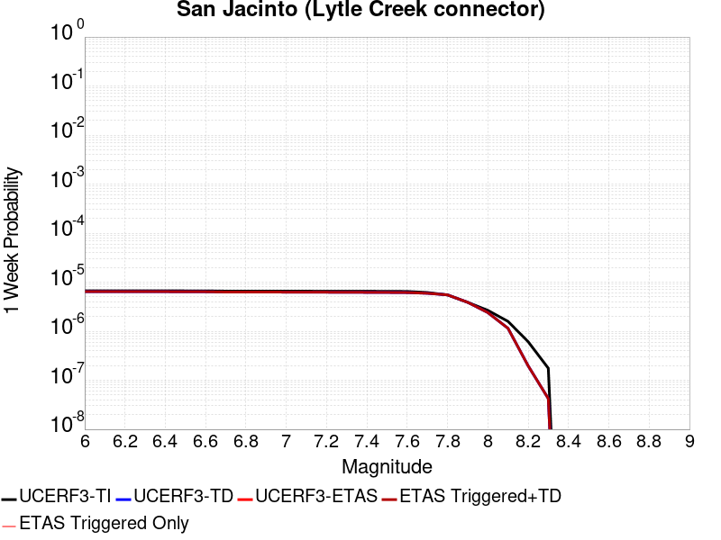 | 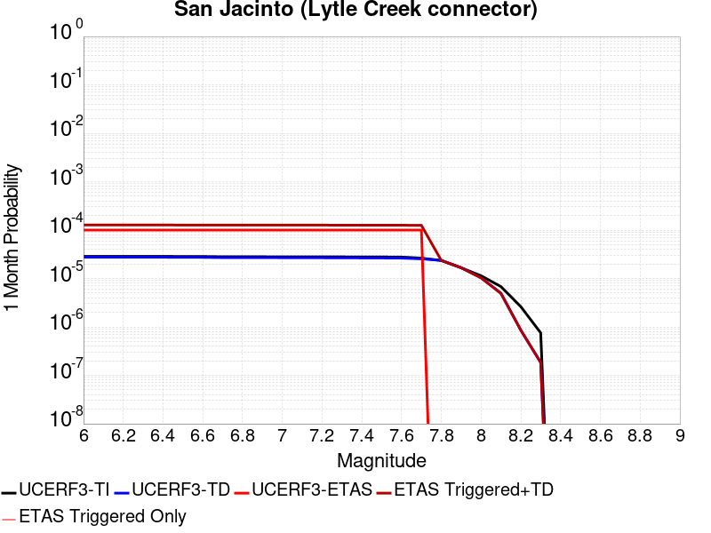 | 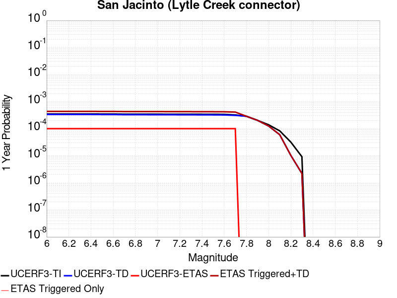 | 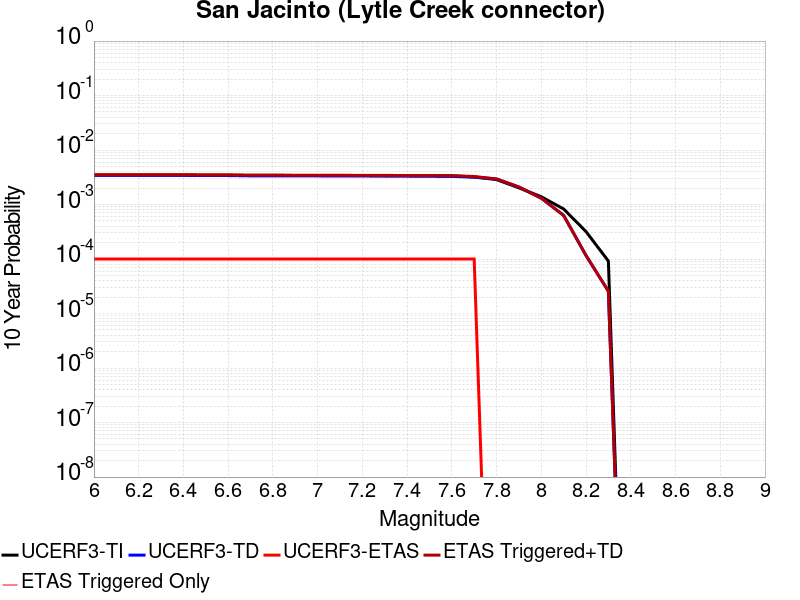 |

| Magnitude | 1 wk TI Prob | 1 wk TD Prob | 1 wk ETAS Prob | 1 wk ETAS/TD Gain | 1 wk ETAS Triggered+TD | 1 wk ETAS Triggered Only | 1 mo TI Prob | 1 mo TD Prob | 1 mo ETAS Prob | 1 mo ETAS/TD Gain | 1 mo ETAS Triggered+TD | 1 mo ETAS Triggered Only | 1 yr TI Prob | 1 yr TD Prob | 1 yr ETAS Prob | 1 yr ETAS/TD Gain | 1 yr ETAS Triggered+TD | 1 yr ETAS Triggered Only | 10 yr TI Prob | 10 yr TD Prob | 10 yr ETAS Prob | 10 yr ETAS/TD Gain | 10 yr ETAS Triggered+TD | 10 yr ETAS Triggered Only |
|-----|-----|-----|-----|-----|-----|-----|-----|-----|-----|-----|-----|-----|-----|-----|-----|-----|-----|-----|-----|-----|-----|-----|-----|-----|
| 6.0 | 6.693995E-6 | 6.439926E-6 | 0.0 | 0.0 | 6.439926E-6 | 0.0 | 2.8688235E-5 | 2.7599392E-5 | 1.0E-4 | 3.6232684 | 1.2759664E-4 | 1.0E-4 | 3.492233E-4 | 3.3597086E-4 | 3.0E-4 | 0.89293456 | 4.3593725E-4 | 1.0E-4 | 0.00348675 | 0.0034348746 | 0.002 | 0.5822629 | 0.0039331573 | 5.0E-4 |
| 6.1 | 6.693995E-6 | 6.439926E-6 | 0.0 | 0.0 | 6.439926E-6 | 0.0 | 2.8688235E-5 | 2.7599392E-5 | 1.0E-4 | 3.6232684 | 1.2759664E-4 | 1.0E-4 | 3.492233E-4 | 3.3597086E-4 | 3.0E-4 | 0.89293456 | 4.3593725E-4 | 1.0E-4 | 0.00348675 | 0.0034348746 | 0.002 | 0.5822629 | 0.0039331573 | 5.0E-4 |
| 6.2 | 6.693995E-6 | 6.439926E-6 | 0.0 | 0.0 | 6.439926E-6 | 0.0 | 2.8688235E-5 | 2.7599392E-5 | 1.0E-4 | 3.6232684 | 1.2759664E-4 | 1.0E-4 | 3.492233E-4 | 3.3597086E-4 | 3.0E-4 | 0.89293456 | 4.3593725E-4 | 1.0E-4 | 0.00348675 | 0.0034348746 | 0.002 | 0.5822629 | 0.0039331573 | 5.0E-4 |
| 6.3 | 6.693995E-6 | 6.439926E-6 | 0.0 | 0.0 | 6.439926E-6 | 0.0 | 2.8688235E-5 | 2.7599392E-5 | 1.0E-4 | 3.6232684 | 1.2759664E-4 | 1.0E-4 | 3.492233E-4 | 3.3597086E-4 | 3.0E-4 | 0.89293456 | 4.3593725E-4 | 1.0E-4 | 0.00348675 | 0.0034348746 | 0.002 | 0.5822629 | 0.0039331573 | 5.0E-4 |
| 6.4 | 6.693995E-6 | 6.439926E-6 | 0.0 | 0.0 | 6.439926E-6 | 0.0 | 2.8688235E-5 | 2.7599392E-5 | 1.0E-4 | 3.6232684 | 1.2759664E-4 | 1.0E-4 | 3.492233E-4 | 3.3597086E-4 | 3.0E-4 | 0.89293456 | 4.3593725E-4 | 1.0E-4 | 0.00348675 | 0.0034348746 | 0.002 | 0.5822629 | 0.0039331573 | 5.0E-4 |
| 6.5 | 6.6561875E-6 | 6.4001656E-6 | 0.0 | 0.0 | 6.4001656E-6 | 0.0 | 2.8526205E-5 | 2.7428994E-5 | 1.0E-4 | 3.6457772 | 1.2742625E-4 | 1.0E-4 | 3.472512E-4 | 3.338969E-4 | 3.0E-4 | 0.89848095 | 4.3386352E-4 | 1.0E-4 | 0.0034670907 | 0.003414199 | 0.002 | 0.58578897 | 0.0039124917 | 5.0E-4 |
| 6.6 | 6.6561875E-6 | 6.4001656E-6 | 0.0 | 0.0 | 6.4001656E-6 | 0.0 | 2.8526205E-5 | 2.7428994E-5 | 1.0E-4 | 3.6457772 | 1.2742625E-4 | 1.0E-4 | 3.472512E-4 | 3.338969E-4 | 3.0E-4 | 0.89848095 | 4.3386352E-4 | 1.0E-4 | 0.0034670907 | 0.003414199 | 0.002 | 0.58578897 | 0.0039124917 | 5.0E-4 |
| 6.7 | 6.5802237E-6 | 6.3193934E-6 | 0.0 | 0.0 | 6.3193934E-6 | 0.0 | 2.8200653E-5 | 2.7082833E-5 | 1.0E-4 | 3.6923757 | 1.2708013E-4 | 1.0E-4 | 3.4328885E-4 | 3.2968368E-4 | 3.0E-4 | 0.90996313 | 4.296507E-4 | 1.0E-4 | 0.0034275902 | 0.003372195 | 0.002 | 0.5930855 | 0.0038705089 | 5.0E-4 |
| 6.8 | 6.575632E-6 | 6.313895E-6 | 0.0 | 0.0 | 6.313895E-6 | 0.0 | 2.8180975E-5 | 2.705927E-5 | 1.0E-4 | 3.6955912 | 1.2705657E-4 | 1.0E-4 | 3.4304935E-4 | 3.293969E-4 | 3.0E-4 | 0.91075546 | 4.2936395E-4 | 1.0E-4 | 0.0034252026 | 0.0033693358 | 0.002 | 0.5935888 | 0.003867651 | 5.0E-4 |
| 6.9 | 6.570433E-6 | 6.3053203E-6 | 0.0 | 0.0 | 6.3053203E-6 | 0.0 | 2.8158694E-5 | 2.7022521E-5 | 1.0E-4 | 3.700617 | 1.2701981E-4 | 1.0E-4 | 3.4277816E-4 | 3.289496E-4 | 3.0E-4 | 0.9119938 | 4.289167E-4 | 1.0E-4 | 0.0034224992 | 0.0033648764 | 0.002 | 0.5943755 | 0.003863194 | 5.0E-4 |
| 7.0 | 6.5643826E-6 | 6.2954773E-6 | 0.0 | 0.0 | 6.2954773E-6 | 0.0 | 2.8132765E-5 | 2.6980339E-5 | 1.0E-4 | 3.7064028 | 1.2697764E-4 | 1.0E-4 | 3.424626E-4 | 3.2843617E-4 | 3.0E-4 | 0.9134195 | 4.2840332E-4 | 1.0E-4 | 0.0034193532 | 0.0033597578 | 0.002 | 0.595281 | 0.0038580778 | 5.0E-4 |
| 7.1 | 6.557402E-6 | 6.2842264E-6 | 0.0 | 0.0 | 6.2842264E-6 | 0.0 | 2.8102848E-5 | 2.693212E-5 | 1.0E-4 | 3.7130384 | 1.2692943E-4 | 1.0E-4 | 3.4209844E-4 | 3.278493E-4 | 3.0E-4 | 0.91505456 | 4.2781653E-4 | 1.0E-4 | 0.0034157229 | 0.0033539075 | 0.002 | 0.5963194 | 0.0038522305 | 5.0E-4 |
| 7.2 | 6.546394E-6 | 6.266265E-6 | 0.0 | 0.0 | 6.266265E-6 | 0.0 | 2.8055672E-5 | 2.6855145E-5 | 1.0E-4 | 3.7236812 | 1.2685246E-4 | 1.0E-4 | 3.4152428E-4 | 3.2691238E-4 | 3.0E-4 | 0.91767704 | 4.268797E-4 | 1.0E-4 | 0.0034099987 | 0.0033445708 | 0.002 | 0.5979841 | 0.0038428986 | 5.0E-4 |
| 7.3 | 6.5364216E-6 | 6.2471922E-6 | 0.0 | 0.0 | 6.2471922E-6 | 0.0 | 2.8012933E-5 | 2.6773407E-5 | 1.0E-4 | 3.7350495 | 1.2677073E-4 | 1.0E-4 | 3.4100408E-4 | 3.2591753E-4 | 2.0E-4 | 0.61365217 | 4.2588494E-4 | 1.0E-4 | 0.003404813 | 0.003334667 | 0.0019 | 0.569772 | 0.0038329998 | 5.0E-4 |
| 7.4 | 6.5269523E-6 | 6.228452E-6 | 0.0 | 0.0 | 6.228452E-6 | 0.0 | 2.7972354E-5 | 2.6693093E-5 | 1.0E-4 | 3.7462876 | 1.2669043E-4 | 1.0E-4 | 3.4051016E-4 | 3.2494002E-4 | 2.0E-4 | 0.61549824 | 4.249075E-4 | 1.0E-4 | 0.0033998888 | 0.0033249427 | 0.0019 | 0.57143843 | 0.00382328 | 5.0E-4 |
| 7.5 | 6.5111835E-6 | 6.204931E-6 | 0.0 | 0.0 | 6.204931E-6 | 0.0 | 2.7904773E-5 | 2.659229E-5 | 1.0E-4 | 3.7604883 | 1.2658963E-4 | 1.0E-4 | 3.3968766E-4 | 3.2371312E-4 | 2.0E-4 | 0.61783105 | 4.2368073E-4 | 1.0E-4 | 0.0033916887 | 0.0033127202 | 0.0018 | 0.5433601 | 0.003811064 | 5.0E-4 |
| 7.6 | 6.4768806E-6 | 6.164384E-6 | 0.0 | 0.0 | 6.164384E-6 | 0.0 | 2.7757764E-5 | 2.6418522E-5 | 1.0E-4 | 3.7852232 | 1.2641588E-4 | 1.0E-4 | 3.3789838E-4 | 3.2159808E-4 | 2.0E-4 | 0.62189424 | 4.2156593E-4 | 1.0E-4 | 0.0033738504 | 0.0032916274 | 0.0016 | 0.48608175 | 0.0037899816 | 5.0E-4 |
| 7.7 | 6.1655364E-6 | 5.959696E-6 | 0.0 | 0.0 | 5.959696E-6 | 0.0 | 2.642346E-5 | 2.5541305E-5 | 1.0E-4 | 3.9152267 | 1.2553875E-4 | 1.0E-4 | 3.2165812E-4 | 3.1092108E-4 | 2.0E-4 | 0.64325005 | 4.1088997E-4 | 1.0E-4 | 0.0032119295 | 0.003184714 | 0.0016 | 0.5023999 | 0.0036831216 | 5.0E-4 |
| 7.8 | 5.5043524E-6 | 5.5274663E-6 | 0.0 | 0.0 | 5.5274663E-6 | 0.0 | 2.3589868E-5 | 2.3688926E-5 | 0.0 | 0.0 | 2.3688926E-5 | 0.0 | 2.871688E-4 | 2.8837455E-4 | 1.0E-4 | 0.34677124 | 2.8837455E-4 | 0.0 | 0.0028679797 | 0.0029582717 | 0.0015 | 0.50705284 | 0.0033570884 | 4.0E-4 |
| 7.9 | 3.889249E-6 | 3.9066367E-6 | 0.0 | 0.0 | 3.9066367E-6 | 0.0 | 1.6668104E-5 | 1.674262E-5 | 0.0 | 0.0 | 1.674262E-5 | 0.0 | 2.0291525E-4 | 2.0382238E-4 | 1.0E-4 | 0.49062327 | 2.0382238E-4 | 0.0 | 0.0020273007 | 0.0021054153 | 0.0013 | 0.61745536 | 0.0025045732 | 4.0E-4 |
| 8.0 | 2.668535E-6 | 2.413199E-6 | 0.0 | 0.0 | 2.413199E-6 | 0.0 | 1.1436528E-5 | 1.034224E-5 | 0.0 | 0.0 | 1.034224E-5 | 0.0 | 1.3923083E-4 | 1.2590952E-4 | 0.0 | 0.0 | 1.2590952E-4 | 0.0 | 0.0013914363 | 0.0013131434 | 7.0E-4 | 0.533072 | 0.0015128808 | 2.0E-4 |
| 8.1 | 1.5911459E-6 | 1.1561698E-6 | 0.0 | 0.0 | 1.1561698E-6 | 0.0 | 6.8191785E-6 | 4.9550044E-6 | 0.0 | 0.0 | 4.9550044E-6 | 0.0 | 8.3020335E-5 | 6.032553E-5 | 0.0 | 0.0 | 6.032553E-5 | 0.0 | 8.298933E-4 | 6.357398E-4 | 4.0E-4 | 0.6291882 | 8.356127E-4 | 2.0E-4 |
| 8.2 | 6.1294963E-7 | 2.002355E-7 | 0.0 | 0.0 | 2.002355E-7 | 0.0 | 2.6269242E-6 | 8.5815185E-7 | 0.0 | 0.0 | 8.5815185E-7 | 0.0 | 3.1982334E-5 | 1.0447949E-5 | 0.0 | 0.0 | 1.0447949E-5 | 0.0 | 3.1977732E-4 | 1.17775206E-4 | 0.0 | 0.0 | 1.17775206E-4 | 0.0 |
| 8.3 | 1.762871E-7 | 4.312244E-8 | 0.0 | 0.0 | 4.312244E-8 | 0.0 | 7.5551594E-7 | 1.8481045E-7 | 0.0 | 0.0 | 1.8481045E-7 | 0.0 | 9.1983675E-6 | 2.2500649E-6 | 0.0 | 0.0 | 2.2500649E-6 | 0.0 | 9.197987E-5 | 2.6144093E-5 | 0.0 | 0.0 | 2.6144093E-5 | 0.0 |

## North Salt Lake
*[(top)](#table-of-contents)*

| 1 Week | 1 Month | 1 Year | 10 Year |
|-----|-----|-----|-----|
| 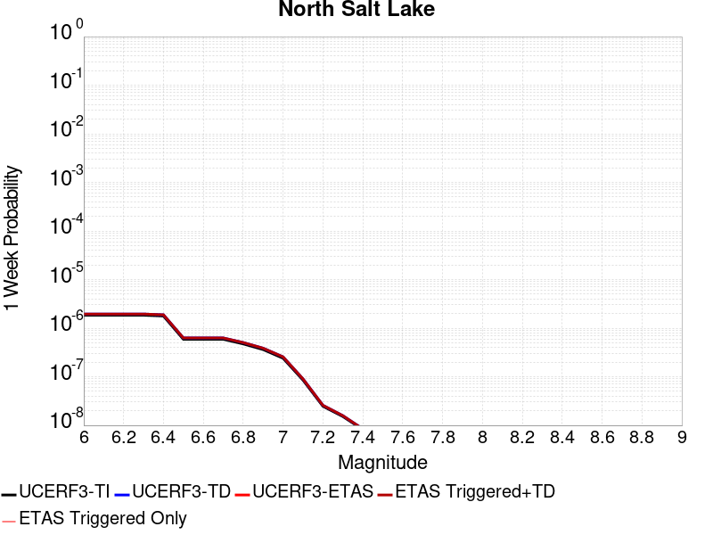 | 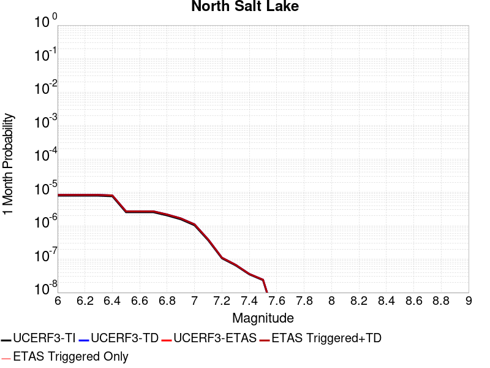 | 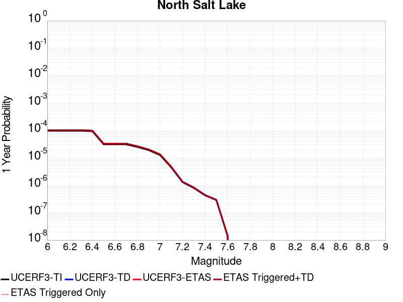 | 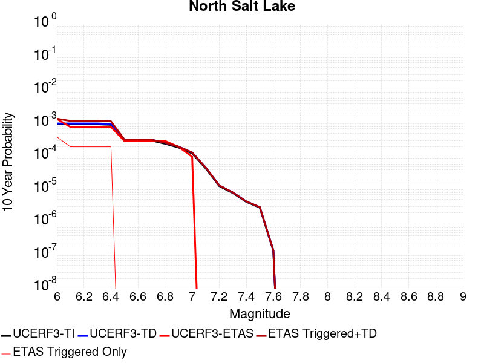 |

| Magnitude | 1 wk TI Prob | 1 wk TD Prob | 1 wk ETAS Prob | 1 wk ETAS/TD Gain | 1 wk ETAS Triggered+TD | 1 wk ETAS Triggered Only | 1 mo TI Prob | 1 mo TD Prob | 1 mo ETAS Prob | 1 mo ETAS/TD Gain | 1 mo ETAS Triggered+TD | 1 mo ETAS Triggered Only | 1 yr TI Prob | 1 yr TD Prob | 1 yr ETAS Prob | 1 yr ETAS/TD Gain | 1 yr ETAS Triggered+TD | 1 yr ETAS Triggered Only | 10 yr TI Prob | 10 yr TD Prob | 10 yr ETAS Prob | 10 yr ETAS/TD Gain | 10 yr ETAS Triggered+TD | 10 yr ETAS Triggered Only |
|-----|-----|-----|-----|-----|-----|-----|-----|-----|-----|-----|-----|-----|-----|-----|-----|-----|-----|-----|-----|-----|-----|-----|-----|-----|
| 6.0 | 1.849599E-6 | 1.9543972E-6 | 0.0 | 0.0 | 1.9543972E-6 | 0.0 | 7.926829E-6 | 8.375973E-6 | 0.0 | 0.0 | 8.375973E-6 | 0.0 | 9.650487E-5 | 1.01974714E-4 | 0.0 | 0.0 | 1.01974714E-4 | 0.0 | 9.646297E-4 | 0.0010194768 | 0.0014 | 1.3732535 | 0.001419069 | 4.0E-4 |
| 6.1 | 1.849599E-6 | 1.9543972E-6 | 0.0 | 0.0 | 1.9543972E-6 | 0.0 | 7.926829E-6 | 8.375973E-6 | 0.0 | 0.0 | 8.375973E-6 | 0.0 | 9.650487E-5 | 1.01974714E-4 | 0.0 | 0.0 | 1.01974714E-4 | 0.0 | 9.646297E-4 | 0.0010194768 | 8.0E-4 | 0.78471625 | 0.0012192728 | 2.0E-4 |
| 6.2 | 1.849599E-6 | 1.9543972E-6 | 0.0 | 0.0 | 1.9543972E-6 | 0.0 | 7.926829E-6 | 8.375973E-6 | 0.0 | 0.0 | 8.375973E-6 | 0.0 | 9.650487E-5 | 1.01974714E-4 | 0.0 | 0.0 | 1.01974714E-4 | 0.0 | 9.646297E-4 | 0.0010194768 | 8.0E-4 | 0.78471625 | 0.0012192728 | 2.0E-4 |
| 6.3 | 1.849599E-6 | 1.9543972E-6 | 0.0 | 0.0 | 1.9543972E-6 | 0.0 | 7.926829E-6 | 8.375973E-6 | 0.0 | 0.0 | 8.375973E-6 | 0.0 | 9.650487E-5 | 1.01974714E-4 | 0.0 | 0.0 | 1.01974714E-4 | 0.0 | 9.646297E-4 | 0.0010194768 | 8.0E-4 | 0.78471625 | 0.0012192728 | 2.0E-4 |
| 6.4 | 1.7803909E-6 | 1.8849003E-6 | 0.0 | 0.0 | 1.8849003E-6 | 0.0 | 7.630225E-6 | 8.07813E-6 | 0.0 | 0.0 | 8.07813E-6 | 0.0 | 9.289402E-5 | 9.8348806E-5 | 0.0 | 0.0 | 9.8348806E-5 | 0.0 | 9.28552E-4 | 9.832497E-4 | 8.0E-4 | 0.81362844 | 0.0011830531 | 2.0E-4 |
| 6.5 | 5.9157696E-7 | 6.2958924E-7 | 0.0 | 0.0 | 6.2958924E-7 | 0.0 | 2.5353274E-6 | 2.698237E-6 | 0.0 | 0.0 | 2.698237E-6 | 0.0 | 3.0867173E-5 | 3.285058E-5 | 0.0 | 0.0 | 3.285058E-5 | 0.0 | 3.0862886E-4 | 3.2846117E-4 | 3.0E-4 | 0.91335 | 3.2846117E-4 | 0.0 |
| 6.6 | 5.9157696E-7 | 6.2958924E-7 | 0.0 | 0.0 | 6.2958924E-7 | 0.0 | 2.5353274E-6 | 2.698237E-6 | 0.0 | 0.0 | 2.698237E-6 | 0.0 | 3.0867173E-5 | 3.285058E-5 | 0.0 | 0.0 | 3.285058E-5 | 0.0 | 3.0862886E-4 | 3.2846117E-4 | 3.0E-4 | 0.91335 | 3.2846117E-4 | 0.0 |
| 6.7 | 5.9157696E-7 | 6.2958924E-7 | 0.0 | 0.0 | 6.2958924E-7 | 0.0 | 2.5353274E-6 | 2.698237E-6 | 0.0 | 0.0 | 2.698237E-6 | 0.0 | 3.0867173E-5 | 3.285058E-5 | 0.0 | 0.0 | 3.285058E-5 | 0.0 | 3.0862886E-4 | 3.2846117E-4 | 3.0E-4 | 0.91335 | 3.2846117E-4 | 0.0 |
| 6.8 | 4.7536267E-7 | 5.06253E-7 | 0.0 | 0.0 | 5.06253E-7 | 0.0 | 2.037267E-6 | 2.169654E-6 | 0.0 | 0.0 | 2.169654E-6 | 0.0 | 2.4803443E-5 | 2.6415242E-5 | 0.0 | 0.0 | 2.6415242E-5 | 0.0 | 2.4800675E-4 | 2.6412346E-4 | 3.0E-4 | 1.1358324 | 2.6412346E-4 | 0.0 |
| 6.9 | 3.6345344E-7 | 3.872318E-7 | 0.0 | 0.0 | 3.872318E-7 | 0.0 | 1.5576567E-6 | 1.659564E-6 | 0.0 | 0.0 | 1.659564E-6 | 0.0 | 1.8964305E-5 | 2.0205021E-5 | 0.0 | 0.0 | 2.0205021E-5 | 0.0 | 1.8962687E-4 | 2.0203354E-4 | 2.0E-4 | 0.9899347 | 2.0203354E-4 | 0.0 |
| 7.0 | 2.4087325E-7 | 2.5691207E-7 | 0.0 | 0.0 | 2.5691207E-7 | 0.0 | 1.0323135E-6 | 1.1010513E-6 | 0.0 | 0.0 | 1.1010513E-6 | 0.0 | 1.25683455E-5 | 1.3405231E-5 | 0.0 | 0.0 | 1.3405231E-5 | 0.0 | 1.2567634E-4 | 1.3404548E-4 | 1.0E-4 | 0.7460154 | 1.3404548E-4 | 0.0 |
| 7.1 | 8.551555E-8 | 9.03901E-8 | 0.0 | 0.0 | 9.03901E-8 | 0.0 | 3.6649516E-7 | 3.873861E-7 | 0.0 | 0.0 | 3.873861E-7 | 0.0 | 4.4620692E-6 | 4.7164167E-6 | 0.0 | 0.0 | 4.7164167E-6 | 0.0 | 4.46198E-5 | 4.7163285E-5 | 0.0 | 0.0 | 4.7163285E-5 | 0.0 |
| 7.2 | 2.475279E-8 | 2.5880656E-8 | 0.0 | 0.0 | 2.5880656E-8 | 0.0 | 1.0608338E-7 | 1.10917085E-7 | 0.0 | 0.0 | 1.10917085E-7 | 0.0 | 1.2915643E-6 | 1.3504148E-6 | 0.0 | 0.0 | 1.3504148E-6 | 0.0 | 1.2915569E-5 | 1.3504072E-5 | 0.0 | 0.0 | 1.3504072E-5 | 0.0 |
| 7.3 | 1.5212393E-8 | 1.584054E-8 | 0.0 | 0.0 | 1.584054E-8 | 0.0 | 6.519597E-8 | 6.7888024E-8 | 0.0 | 0.0 | 6.7888024E-8 | 0.0 | 7.9376065E-7 | 8.265364E-7 | 0.0 | 0.0 | 8.265364E-7 | 0.0 | 7.937579E-6 | 8.265336E-6 | 0.0 | 0.0 | 8.265336E-6 | 0.0 |
| 7.4 | 8.182E-9 | 8.44443E-9 | 0.0 | 0.0 | 8.44443E-9 | 0.0 | 3.5065714E-8 | 3.6190414E-8 | 0.0 | 0.0 | 3.6190414E-8 | 0.0 | 4.26925E-7 | 4.4061818E-7 | 0.0 | 0.0 | 4.4061818E-7 | 0.0 | 4.269242E-6 | 4.4061735E-6 | 0.0 | 0.0 | 4.4061735E-6 | 0.0 |
| 7.5 | 5.479913E-9 | 5.666009E-9 | 0.0 | 0.0 | 5.666009E-9 | 0.0 | 2.3485342E-8 | 2.4282897E-8 | 0.0 | 0.0 | 2.4282897E-8 | 0.0 | 2.85934E-7 | 2.9564424E-7 | 0.0 | 0.0 | 2.9564424E-7 | 0.0 | 2.8593363E-6 | 2.956439E-6 | 0.0 | 0.0 | 2.956439E-6 | 0.0 |
| 7.6 | 2.6813562E-10 | 2.7722025E-10 | 0.0 | 0.0 | 2.7722025E-10 | 0.0 | 1.1491527E-9 | 1.1880862E-9 | 0.0 | 0.0 | 1.1880862E-9 | 0.0 | 1.3990933E-8 | 1.446495E-8 | 0.0 | 0.0 | 1.446495E-8 | 0.0 | 1.3990932E-7 | 1.4464949E-7 | 0.0 | 0.0 | 1.4464949E-7 | 0.0 |

## Sisar
*[(top)](#table-of-contents)*

| 1 Week | 1 Month | 1 Year | 10 Year |
|-----|-----|-----|-----|
| 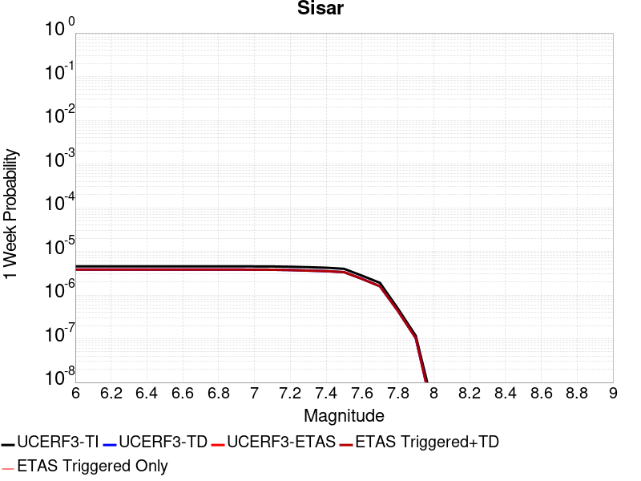 | 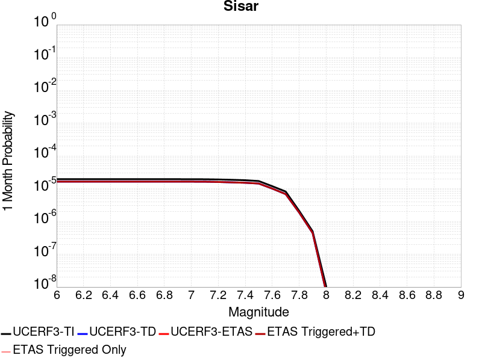 | 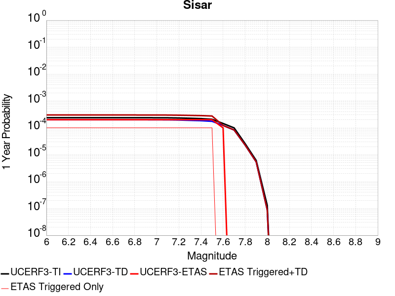 | 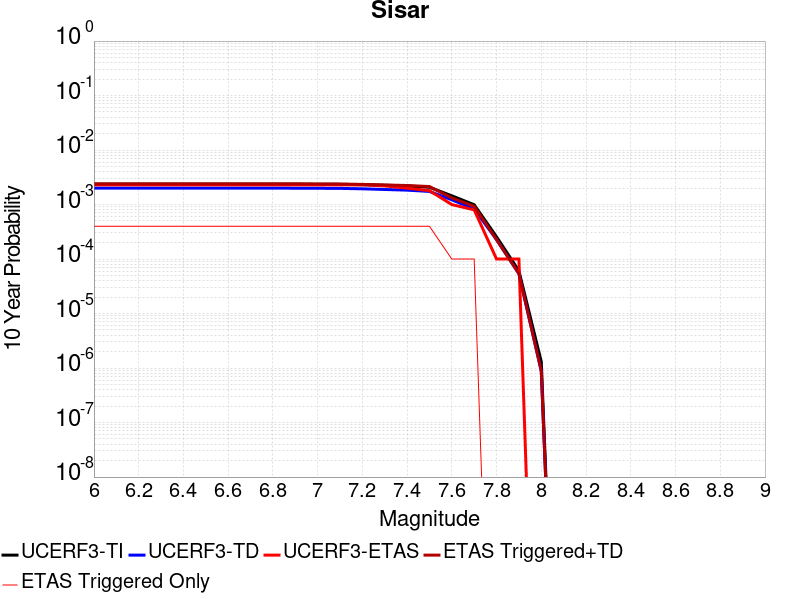 |

| Magnitude | 1 wk TI Prob | 1 wk TD Prob | 1 wk ETAS Prob | 1 wk ETAS/TD Gain | 1 wk ETAS Triggered+TD | 1 wk ETAS Triggered Only | 1 mo TI Prob | 1 mo TD Prob | 1 mo ETAS Prob | 1 mo ETAS/TD Gain | 1 mo ETAS Triggered+TD | 1 mo ETAS Triggered Only | 1 yr TI Prob | 1 yr TD Prob | 1 yr ETAS Prob | 1 yr ETAS/TD Gain | 1 yr ETAS Triggered+TD | 1 yr ETAS Triggered Only | 10 yr TI Prob | 10 yr TD Prob | 10 yr ETAS Prob | 10 yr ETAS/TD Gain | 10 yr ETAS Triggered+TD | 10 yr ETAS Triggered Only |
|-----|-----|-----|-----|-----|-----|-----|-----|-----|-----|-----|-----|-----|-----|-----|-----|-----|-----|-----|-----|-----|-----|-----|-----|-----|
| 6.0 | 4.544193E-6 | 3.833301E-6 | 0.0 | 0.0 | 3.833301E-6 | 0.0 | 1.9474966E-5 | 1.6428332E-5 | 0.0 | 0.0 | 1.6428332E-5 | 0.0 | 2.3708193E-4 | 1.9999691E-4 | 2.0E-4 | 1.0000155 | 2.999769E-4 | 1.0E-4 | 0.0023682916 | 0.0019982029 | 0.0023 | 1.1510344 | 0.0023974036 | 4.0E-4 |
| 6.1 | 4.544193E-6 | 3.833301E-6 | 0.0 | 0.0 | 3.833301E-6 | 0.0 | 1.9474966E-5 | 1.6428332E-5 | 0.0 | 0.0 | 1.6428332E-5 | 0.0 | 2.3708193E-4 | 1.9999691E-4 | 2.0E-4 | 1.0000155 | 2.999769E-4 | 1.0E-4 | 0.0023682916 | 0.0019982029 | 0.0023 | 1.1510344 | 0.0023974036 | 4.0E-4 |
| 6.2 | 4.544193E-6 | 3.833301E-6 | 0.0 | 0.0 | 3.833301E-6 | 0.0 | 1.9474966E-5 | 1.6428332E-5 | 0.0 | 0.0 | 1.6428332E-5 | 0.0 | 2.3708193E-4 | 1.9999691E-4 | 2.0E-4 | 1.0000155 | 2.999769E-4 | 1.0E-4 | 0.0023682916 | 0.0019982029 | 0.0023 | 1.1510344 | 0.0023974036 | 4.0E-4 |
| 6.3 | 4.544193E-6 | 3.833301E-6 | 0.0 | 0.0 | 3.833301E-6 | 0.0 | 1.9474966E-5 | 1.6428332E-5 | 0.0 | 0.0 | 1.6428332E-5 | 0.0 | 2.3708193E-4 | 1.9999691E-4 | 2.0E-4 | 1.0000155 | 2.999769E-4 | 1.0E-4 | 0.0023682916 | 0.0019982029 | 0.0023 | 1.1510344 | 0.0023974036 | 4.0E-4 |
| 6.4 | 4.544193E-6 | 3.833301E-6 | 0.0 | 0.0 | 3.833301E-6 | 0.0 | 1.9474966E-5 | 1.6428332E-5 | 0.0 | 0.0 | 1.6428332E-5 | 0.0 | 2.3708193E-4 | 1.9999691E-4 | 2.0E-4 | 1.0000155 | 2.999769E-4 | 1.0E-4 | 0.0023682916 | 0.0019982029 | 0.0023 | 1.1510344 | 0.0023974036 | 4.0E-4 |
| 6.5 | 4.544193E-6 | 3.833301E-6 | 0.0 | 0.0 | 3.833301E-6 | 0.0 | 1.9474966E-5 | 1.6428332E-5 | 0.0 | 0.0 | 1.6428332E-5 | 0.0 | 2.3708193E-4 | 1.9999691E-4 | 2.0E-4 | 1.0000155 | 2.999769E-4 | 1.0E-4 | 0.0023682916 | 0.0019982029 | 0.0023 | 1.1510344 | 0.0023974036 | 4.0E-4 |
| 6.6 | 4.544193E-6 | 3.833301E-6 | 0.0 | 0.0 | 3.833301E-6 | 0.0 | 1.9474966E-5 | 1.6428332E-5 | 0.0 | 0.0 | 1.6428332E-5 | 0.0 | 2.3708193E-4 | 1.9999691E-4 | 2.0E-4 | 1.0000155 | 2.999769E-4 | 1.0E-4 | 0.0023682916 | 0.0019982029 | 0.0023 | 1.1510344 | 0.0023974036 | 4.0E-4 |
| 6.7 | 4.544193E-6 | 3.833301E-6 | 0.0 | 0.0 | 3.833301E-6 | 0.0 | 1.9474966E-5 | 1.6428332E-5 | 0.0 | 0.0 | 1.6428332E-5 | 0.0 | 2.3708193E-4 | 1.9999691E-4 | 2.0E-4 | 1.0000155 | 2.999769E-4 | 1.0E-4 | 0.0023682916 | 0.0019982029 | 0.0023 | 1.1510344 | 0.0023974036 | 4.0E-4 |
| 6.8 | 4.544193E-6 | 3.833301E-6 | 0.0 | 0.0 | 3.833301E-6 | 0.0 | 1.9474966E-5 | 1.6428332E-5 | 0.0 | 0.0 | 1.6428332E-5 | 0.0 | 2.3708193E-4 | 1.9999691E-4 | 2.0E-4 | 1.0000155 | 2.999769E-4 | 1.0E-4 | 0.0023682916 | 0.0019982029 | 0.0023 | 1.1510344 | 0.0023974036 | 4.0E-4 |
| 6.9 | 4.542225E-6 | 3.8312637E-6 | 0.0 | 0.0 | 3.8312637E-6 | 0.0 | 1.9466532E-5 | 1.6419599E-5 | 0.0 | 0.0 | 1.6419599E-5 | 0.0 | 2.3697925E-4 | 1.9989062E-4 | 2.0E-4 | 1.0005472 | 2.9987062E-4 | 1.0E-4 | 0.002367267 | 0.0019971419 | 0.0023 | 1.1516458 | 0.002396343 | 4.0E-4 |
| 7.0 | 4.5278484E-6 | 3.816334E-6 | 0.0 | 0.0 | 3.816334E-6 | 0.0 | 1.940492E-5 | 1.6355616E-5 | 0.0 | 0.0 | 1.6355616E-5 | 0.0 | 2.3622929E-4 | 1.9911176E-4 | 2.0E-4 | 1.004461 | 2.9909186E-4 | 1.0E-4 | 0.0023597833 | 0.0019893672 | 0.0023 | 1.1561465 | 0.0023885714 | 4.0E-4 |
| 7.1 | 4.5132488E-6 | 3.8011278E-6 | 0.0 | 0.0 | 3.8011278E-6 | 0.0 | 1.9342351E-5 | 1.6290449E-5 | 0.0 | 0.0 | 1.6290449E-5 | 0.0 | 2.3546767E-4 | 1.9831849E-4 | 2.0E-4 | 1.0084789 | 2.9829866E-4 | 1.0E-4 | 0.0023521832 | 0.0019814486 | 0.0023 | 1.1607668 | 0.002380656 | 4.0E-4 |
| 7.2 | 4.448859E-6 | 3.7336229E-6 | 0.0 | 0.0 | 3.7336229E-6 | 0.0 | 1.9066398E-5 | 1.6001144E-5 | 0.0 | 0.0 | 1.6001144E-5 | 0.0 | 2.3210866E-4 | 1.9479686E-4 | 2.0E-4 | 1.0267106 | 2.9477736E-4 | 1.0E-4 | 0.0023186638 | 0.0019462944 | 0.0023 | 1.1817328 | 0.0023455159 | 4.0E-4 |
| 7.3 | 4.3424366E-6 | 3.6275223E-6 | 0.0 | 0.0 | 3.6275223E-6 | 0.0 | 1.861031E-5 | 1.5546433E-5 | 0.0 | 0.0 | 1.5546433E-5 | 0.0 | 2.2655698E-4 | 1.8926171E-4 | 2.0E-4 | 1.0567378 | 2.892428E-4 | 1.0E-4 | 0.0022632615 | 0.0018910387 | 0.0022 | 1.1633818 | 0.0022902824 | 4.0E-4 |
| 7.4 | 4.218641E-6 | 3.5269986E-6 | 0.0 | 0.0 | 3.5269986E-6 | 0.0 | 1.8079765E-5 | 1.5115623E-5 | 0.0 | 0.0 | 1.5115623E-5 | 0.0 | 2.2009891E-4 | 1.840175E-4 | 2.0E-4 | 1.0868531 | 2.839991E-4 | 1.0E-4 | 0.0021988105 | 0.0018386844 | 0.002 | 1.0877342 | 0.002237949 | 4.0E-4 |
| 7.5 | 3.983779E-6 | 3.3419494E-6 | 0.0 | 0.0 | 3.3419494E-6 | 0.0 | 1.7073227E-5 | 1.4322563E-5 | 0.0 | 0.0 | 1.4322563E-5 | 0.0 | 2.0784672E-4 | 1.7436358E-4 | 2.0E-4 | 1.1470284 | 2.7434615E-4 | 1.0E-4 | 0.0020765243 | 0.0017423007 | 0.0018 | 1.0331167 | 0.0021416037 | 4.0E-4 |
| 7.6 | 2.777393E-6 | 2.3473983E-6 | 0.0 | 0.0 | 2.3473983E-6 | 0.0 | 1.1903058E-5 | 1.006024E-5 | 0.0 | 0.0 | 1.006024E-5 | 0.0 | 1.449101E-4 | 1.2247662E-4 | 1.0E-4 | 0.81648237 | 1.2247662E-4 | 0.0 | 0.0014481564 | 0.0012240988 | 0.001 | 0.8169275 | 0.0013239764 | 1.0E-4 |
| 7.7 | 1.9028433E-6 | 1.5900179E-6 | 0.0 | 0.0 | 1.5900179E-6 | 0.0 | 8.155017E-6 | 6.8143445E-6 | 0.0 | 0.0 | 6.8143445E-6 | 0.0 | 9.928281E-5 | 8.296153E-5 | 0.0 | 0.0 | 8.296153E-5 | 0.0 | 9.923846E-4 | 8.2931033E-4 | 8.0E-4 | 0.964657 | 9.292274E-4 | 1.0E-4 |
| 7.8 | 4.9095956E-7 | 4.3551907E-7 | 0.0 | 0.0 | 4.3551907E-7 | 0.0 | 2.1041105E-6 | 1.8665089E-6 | 0.0 | 0.0 | 1.8665089E-6 | 0.0 | 2.5617246E-5 | 2.2724511E-5 | 0.0 | 0.0 | 2.2724511E-5 | 0.0 | 2.5614293E-4 | 2.2722204E-4 | 1.0E-4 | 0.44009814 | 2.2722204E-4 | 0.0 |
| 7.9 | 1.16657894E-7 | 1.0330497E-7 | 0.0 | 0.0 | 1.0330497E-7 | 0.0 | 4.999623E-7 | 4.427355E-7 | 0.0 | 0.0 | 4.427355E-7 | 0.0 | 6.087024E-6 | 5.390292E-6 | 0.0 | 0.0 | 5.390292E-6 | 0.0 | 6.0868573E-5 | 5.390164E-5 | 1.0E-4 | 1.8552312 | 5.390164E-5 | 0.0 |
| 8.0 | 2.5100346E-9 | 1.7027514E-9 | 0.0 | 0.0 | 1.7027514E-9 | 0.0 | 1.0757291E-8 | 7.2975053E-9 | 0.0 | 0.0 | 7.2975053E-9 | 0.0 | 1.3097001E-7 | 8.884712E-8 | 0.0 | 0.0 | 8.884712E-8 | 0.0 | 1.3096993E-6 | 8.8847094E-7 | 0.0 | 0.0 | 8.8847094E-7 | 0.0 |

## Fish Slough 2011 CFM
*[(top)](#table-of-contents)*

| 1 Week | 1 Month | 1 Year | 10 Year |
|-----|-----|-----|-----|
| 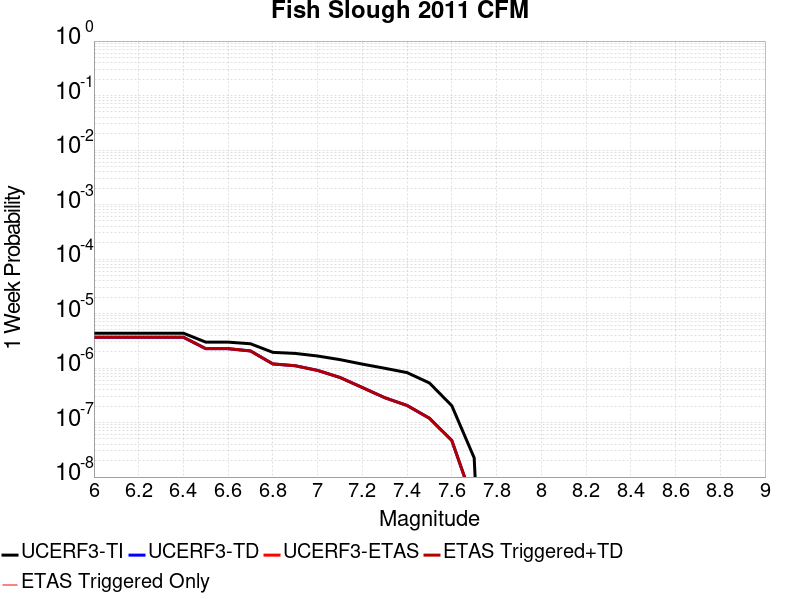 | 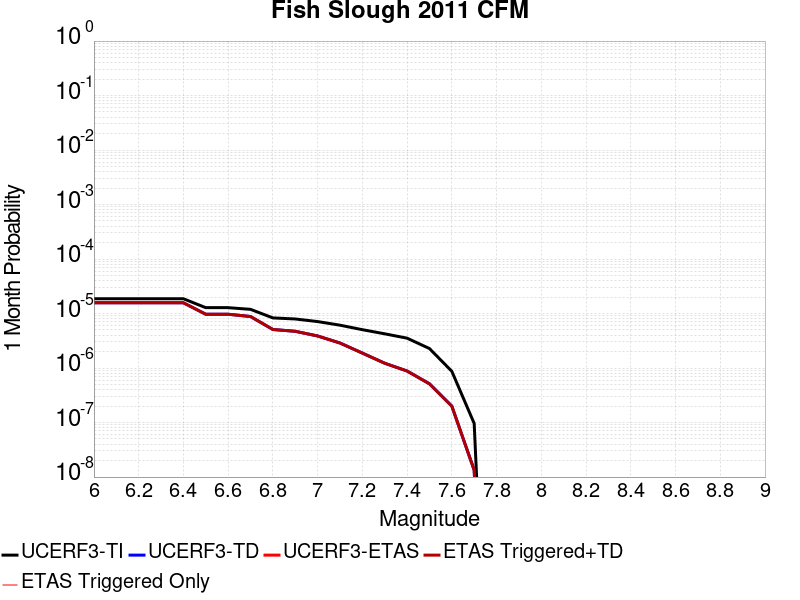 | 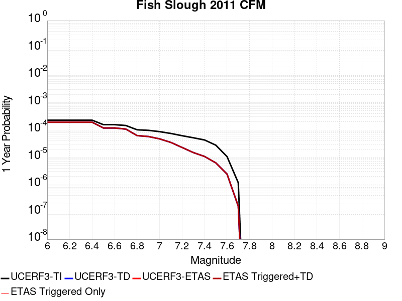 | 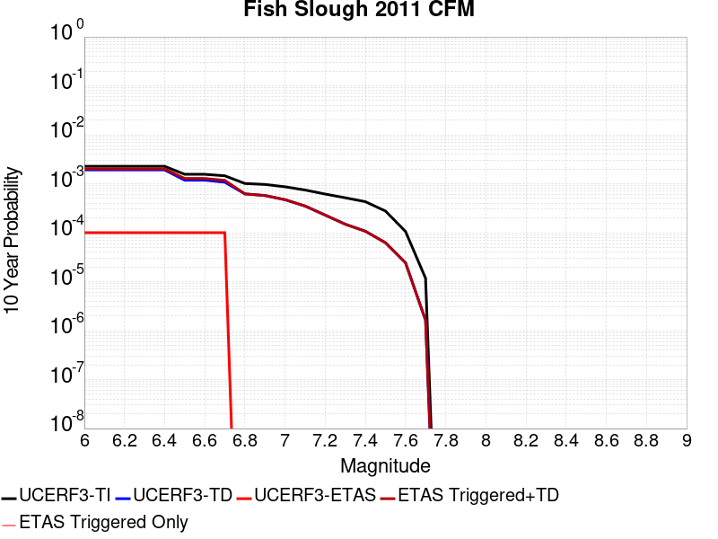 |

| Magnitude | 1 wk TI Prob | 1 wk TD Prob | 1 wk ETAS Prob | 1 wk ETAS/TD Gain | 1 wk ETAS Triggered+TD | 1 wk ETAS Triggered Only | 1 mo TI Prob | 1 mo TD Prob | 1 mo ETAS Prob | 1 mo ETAS/TD Gain | 1 mo ETAS Triggered+TD | 1 mo ETAS Triggered Only | 1 yr TI Prob | 1 yr TD Prob | 1 yr ETAS Prob | 1 yr ETAS/TD Gain | 1 yr ETAS Triggered+TD | 1 yr ETAS Triggered Only | 10 yr TI Prob | 10 yr TD Prob | 10 yr ETAS Prob | 10 yr ETAS/TD Gain | 10 yr ETAS Triggered+TD | 10 yr ETAS Triggered Only |
|-----|-----|-----|-----|-----|-----|-----|-----|-----|-----|-----|-----|-----|-----|-----|-----|-----|-----|-----|-----|-----|-----|-----|-----|-----|
| 6.0 | 4.3629925E-6 | 3.6748515E-6 | 0.0 | 0.0 | 3.6748515E-6 | 0.0 | 1.8698405E-5 | 1.574928E-5 | 0.0 | 0.0 | 1.574928E-5 | 0.0 | 2.276293E-4 | 1.9173275E-4 | 1.0E-4 | 0.52155936 | 2.9171357E-4 | 1.0E-4 | 0.0022739628 | 0.001915882 | 0.0011 | 0.57414806 | 0.0023151156 | 4.0E-4 |
| 6.1 | 4.3629925E-6 | 3.6748515E-6 | 0.0 | 0.0 | 3.6748515E-6 | 0.0 | 1.8698405E-5 | 1.574928E-5 | 0.0 | 0.0 | 1.574928E-5 | 0.0 | 2.276293E-4 | 1.9173275E-4 | 1.0E-4 | 0.52155936 | 2.9171357E-4 | 1.0E-4 | 0.0022739628 | 0.001915882 | 0.0011 | 0.57414806 | 0.0023151156 | 4.0E-4 |
| 6.2 | 4.3629925E-6 | 3.6748515E-6 | 0.0 | 0.0 | 3.6748515E-6 | 0.0 | 1.8698405E-5 | 1.574928E-5 | 0.0 | 0.0 | 1.574928E-5 | 0.0 | 2.276293E-4 | 1.9173275E-4 | 1.0E-4 | 0.52155936 | 2.9171357E-4 | 1.0E-4 | 0.0022739628 | 0.001915882 | 0.0011 | 0.57414806 | 0.0023151156 | 4.0E-4 |
| 6.3 | 4.3629925E-6 | 3.6748515E-6 | 0.0 | 0.0 | 3.6748515E-6 | 0.0 | 1.8698405E-5 | 1.574928E-5 | 0.0 | 0.0 | 1.574928E-5 | 0.0 | 2.276293E-4 | 1.9173275E-4 | 1.0E-4 | 0.52155936 | 2.9171357E-4 | 1.0E-4 | 0.0022739628 | 0.001915882 | 0.0011 | 0.57414806 | 0.0023151156 | 4.0E-4 |
| 6.4 | 4.3629925E-6 | 3.6748515E-6 | 0.0 | 0.0 | 3.6748515E-6 | 0.0 | 1.8698405E-5 | 1.574928E-5 | 0.0 | 0.0 | 1.574928E-5 | 0.0 | 2.276293E-4 | 1.9173275E-4 | 1.0E-4 | 0.52155936 | 2.9171357E-4 | 1.0E-4 | 0.0022739628 | 0.001915882 | 0.0011 | 0.57414806 | 0.0023151156 | 4.0E-4 |
| 6.5 | 2.991715E-6 | 2.2683528E-6 | 0.0 | 0.0 | 2.2683528E-6 | 0.0 | 1.2821573E-5 | 9.721481E-6 | 0.0 | 0.0 | 9.721481E-6 | 0.0 | 1.5609147E-4 | 1.1835352E-4 | 1.0E-4 | 0.8449263 | 2.1834168E-4 | 1.0E-4 | 0.0015598187 | 0.0011829949 | 8.0E-4 | 0.67624974 | 0.00148264 | 3.0E-4 |
| 6.6 | 2.991715E-6 | 2.2683528E-6 | 0.0 | 0.0 | 2.2683528E-6 | 0.0 | 1.2821573E-5 | 9.721481E-6 | 0.0 | 0.0 | 9.721481E-6 | 0.0 | 1.5609147E-4 | 1.1835352E-4 | 1.0E-4 | 0.8449263 | 2.1834168E-4 | 1.0E-4 | 0.0015598187 | 0.0011829949 | 8.0E-4 | 0.67624974 | 0.00148264 | 3.0E-4 |
| 6.7 | 2.7890346E-6 | 2.0602076E-6 | 0.0 | 0.0 | 2.0602076E-6 | 0.0 | 1.1952951E-5 | 8.829436E-6 | 0.0 | 0.0 | 8.829436E-6 | 0.0 | 1.4551746E-4 | 1.0749398E-4 | 1.0E-4 | 0.9302847 | 2.0748323E-4 | 1.0E-4 | 0.0014542221 | 0.0010745081 | 8.0E-4 | 0.74452674 | 0.0013741857 | 3.0E-4 |
| 6.8 | 1.9416723E-6 | 1.1908159E-6 | 0.0 | 0.0 | 1.1908159E-6 | 0.0 | 8.321425E-6 | 5.103487E-6 | 0.0 | 0.0 | 5.103487E-6 | 0.0 | 1.01308644E-4 | 6.213322E-5 | 0.0 | 0.0 | 6.213322E-5 | 0.0 | 0.0010126247 | 6.211626E-4 | 4.0E-4 | 0.6439538 | 7.211005E-4 | 1.0E-4 |
| 6.9 | 1.8567416E-6 | 1.1029891E-6 | 0.0 | 0.0 | 1.1029891E-6 | 0.0 | 7.957439E-6 | 4.727088E-6 | 0.0 | 0.0 | 4.727088E-6 | 0.0 | 9.687752E-5 | 5.7550813E-5 | 0.0 | 0.0 | 5.7550813E-5 | 0.0 | 9.6835295E-4 | 5.7536294E-4 | 4.0E-4 | 0.6952134 | 6.753054E-4 | 1.0E-4 |
| 7.0 | 1.6634067E-6 | 9.0576E-7 | 0.0 | 0.0 | 9.0576E-7 | 0.0 | 7.1288664E-6 | 3.881823E-6 | 0.0 | 0.0 | 3.881823E-6 | 0.0 | 8.679049E-5 | 4.7260197E-5 | 0.0 | 0.0 | 4.7260197E-5 | 0.0 | 8.6756604E-4 | 4.7250435E-4 | 1.0E-4 | 0.21163827 | 5.724571E-4 | 1.0E-4 |
| 7.1 | 1.4281054E-6 | 6.721447E-7 | 0.0 | 0.0 | 6.721447E-7 | 0.0 | 6.1204373E-6 | 2.880617E-6 | 0.0 | 0.0 | 2.880617E-6 | 0.0 | 7.451377E-5 | 3.5070967E-5 | 0.0 | 0.0 | 3.5070967E-5 | 0.0 | 7.44888E-4 | 3.506561E-4 | 1.0E-4 | 0.2851797 | 4.5062104E-4 | 1.0E-4 |
| 7.2 | 1.1810387E-6 | 4.394683E-7 | 0.0 | 0.0 | 4.394683E-7 | 0.0 | 5.0615845E-6 | 1.8834343E-6 | 0.0 | 0.0 | 1.8834343E-6 | 0.0 | 6.1623046E-5 | 2.293058E-5 | 0.0 | 0.0 | 2.293058E-5 | 0.0 | 6.160596E-4 | 2.2928305E-4 | 1.0E-4 | 0.43614215 | 3.292601E-4 | 1.0E-4 |
| 7.3 | 9.918052E-7 | 2.8610359E-7 | 0.0 | 0.0 | 2.8610359E-7 | 0.0 | 4.2505867E-6 | 1.2261576E-6 | 0.0 | 0.0 | 1.2261576E-6 | 0.0 | 5.1749663E-5 | 1.4928368E-5 | 0.0 | 0.0 | 1.4928368E-5 | 0.0 | 5.173762E-4 | 1.4927376E-4 | 1.0E-4 | 0.6699101 | 2.4925882E-4 | 1.0E-4 |
| 7.4 | 8.25252E-7 | 2.0589322E-7 | 0.0 | 0.0 | 2.0589322E-7 | 0.0 | 3.5367896E-6 | 8.823992E-7 | 0.0 | 0.0 | 8.823992E-7 | 0.0 | 4.3059565E-5 | 1.0743158E-5 | 0.0 | 0.0 | 1.0743158E-5 | 0.0 | 4.305122E-4 | 1.0742645E-4 | 1.0E-4 | 0.9308694 | 2.0741571E-4 | 1.0E-4 |
| 7.5 | 5.3248567E-7 | 1.1999708E-7 | 0.0 | 0.0 | 1.1999708E-7 | 0.0 | 2.2820795E-6 | 5.142731E-7 | 0.0 | 0.0 | 5.142731E-7 | 0.0 | 2.7783964E-5 | 6.261257E-6 | 0.0 | 0.0 | 6.261257E-6 | 0.0 | 2.778049E-4 | 6.2610845E-5 | 1.0E-4 | 1.5971674 | 1.6260459E-4 | 1.0E-4 |
| 7.6 | 2.037542E-7 | 4.6829896E-8 | 0.0 | 0.0 | 4.6829896E-8 | 0.0 | 8.73232E-7 | 2.0069955E-7 | 0.0 | 0.0 | 2.0069955E-7 | 0.0 | 1.0631547E-5 | 2.4435144E-6 | 0.0 | 0.0 | 2.4435144E-6 | 0.0 | 1.0631039E-4 | 2.4434896E-5 | 0.0 | 0.0 | 2.4434896E-5 | 0.0 |
| 7.7 | 2.2501226E-8 | 3.127445E-9 | 0.0 | 0.0 | 3.127445E-9 | 0.0 | 9.6433816E-8 | 1.3403335E-8 | 0.0 | 0.0 | 1.3403335E-8 | 0.0 | 1.1740811E-6 | 1.631856E-7 | 0.0 | 0.0 | 1.631856E-7 | 0.0 | 1.1740749E-5 | 1.631855E-6 | 0.0 | 0.0 | 1.631855E-6 | 0.0 |

## Compton
*[(top)](#table-of-contents)*

| 1 Week | 1 Month | 1 Year | 10 Year |
|-----|-----|-----|-----|
| 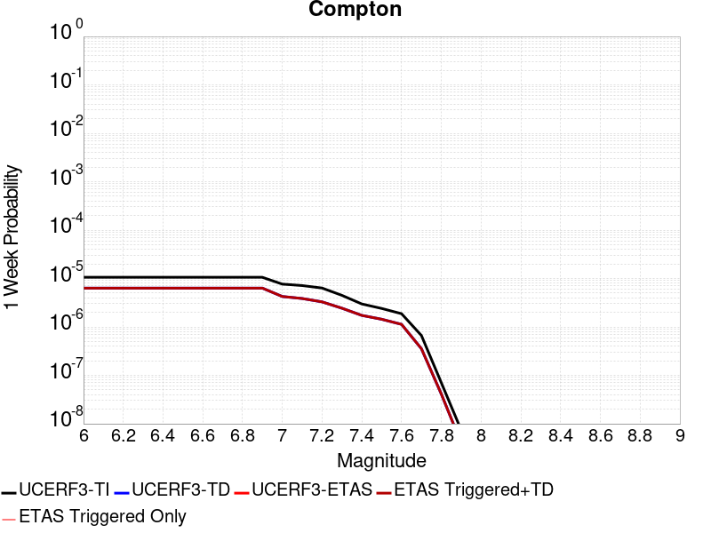 | 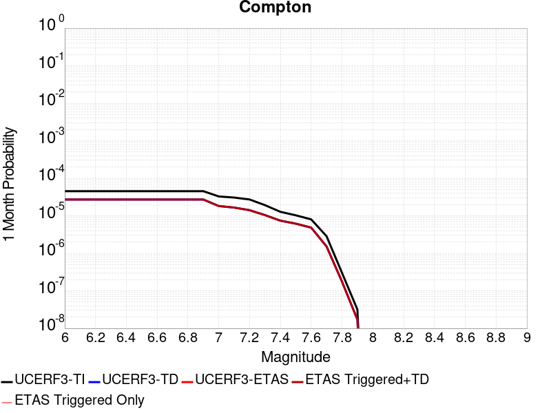 | 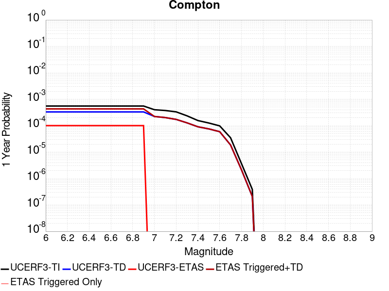 | 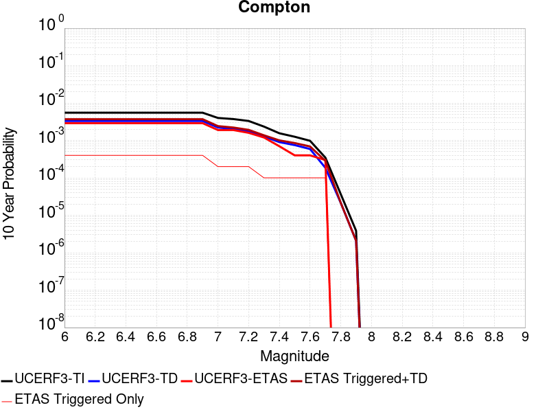 |

| Magnitude | 1 wk TI Prob | 1 wk TD Prob | 1 wk ETAS Prob | 1 wk ETAS/TD Gain | 1 wk ETAS Triggered+TD | 1 wk ETAS Triggered Only | 1 mo TI Prob | 1 mo TD Prob | 1 mo ETAS Prob | 1 mo ETAS/TD Gain | 1 mo ETAS Triggered+TD | 1 mo ETAS Triggered Only | 1 yr TI Prob | 1 yr TD Prob | 1 yr ETAS Prob | 1 yr ETAS/TD Gain | 1 yr ETAS Triggered+TD | 1 yr ETAS Triggered Only | 10 yr TI Prob | 10 yr TD Prob | 10 yr ETAS Prob | 10 yr ETAS/TD Gain | 10 yr ETAS Triggered+TD | 10 yr ETAS Triggered Only |
|-----|-----|-----|-----|-----|-----|-----|-----|-----|-----|-----|-----|-----|-----|-----|-----|-----|-----|-----|-----|-----|-----|-----|-----|-----|
| 6.0 | 1.06050875E-5 | 6.343341E-6 | 0.0 | 0.0 | 6.343341E-6 | 0.0 | 4.5449582E-5 | 2.7185479E-5 | 0.0 | 0.0 | 2.7185479E-5 | 0.0 | 5.5320817E-4 | 3.3093579E-4 | 1.0E-4 | 0.30217344 | 4.309027E-4 | 1.0E-4 | 0.0055183303 | 0.0033047127 | 0.0029 | 0.8775347 | 0.0037033907 | 4.0E-4 |
| 6.1 | 1.06050875E-5 | 6.343341E-6 | 0.0 | 0.0 | 6.343341E-6 | 0.0 | 4.5449582E-5 | 2.7185479E-5 | 0.0 | 0.0 | 2.7185479E-5 | 0.0 | 5.5320817E-4 | 3.3093579E-4 | 1.0E-4 | 0.30217344 | 4.309027E-4 | 1.0E-4 | 0.0055183303 | 0.0033047127 | 0.0029 | 0.8775347 | 0.0037033907 | 4.0E-4 |
| 6.2 | 1.06050875E-5 | 6.343341E-6 | 0.0 | 0.0 | 6.343341E-6 | 0.0 | 4.5449582E-5 | 2.7185479E-5 | 0.0 | 0.0 | 2.7185479E-5 | 0.0 | 5.5320817E-4 | 3.3093579E-4 | 1.0E-4 | 0.30217344 | 4.309027E-4 | 1.0E-4 | 0.0055183303 | 0.0033047127 | 0.0029 | 0.8775347 | 0.0037033907 | 4.0E-4 |
| 6.3 | 1.06050875E-5 | 6.343341E-6 | 0.0 | 0.0 | 6.343341E-6 | 0.0 | 4.5449582E-5 | 2.7185479E-5 | 0.0 | 0.0 | 2.7185479E-5 | 0.0 | 5.5320817E-4 | 3.3093579E-4 | 1.0E-4 | 0.30217344 | 4.309027E-4 | 1.0E-4 | 0.0055183303 | 0.0033047127 | 0.0029 | 0.8775347 | 0.0037033907 | 4.0E-4 |
| 6.4 | 1.06050875E-5 | 6.343341E-6 | 0.0 | 0.0 | 6.343341E-6 | 0.0 | 4.5449582E-5 | 2.7185479E-5 | 0.0 | 0.0 | 2.7185479E-5 | 0.0 | 5.5320817E-4 | 3.3093579E-4 | 1.0E-4 | 0.30217344 | 4.309027E-4 | 1.0E-4 | 0.0055183303 | 0.0033047127 | 0.0029 | 0.8775347 | 0.0037033907 | 4.0E-4 |
| 6.5 | 1.06050875E-5 | 6.343341E-6 | 0.0 | 0.0 | 6.343341E-6 | 0.0 | 4.5449582E-5 | 2.7185479E-5 | 0.0 | 0.0 | 2.7185479E-5 | 0.0 | 5.5320817E-4 | 3.3093579E-4 | 1.0E-4 | 0.30217344 | 4.309027E-4 | 1.0E-4 | 0.0055183303 | 0.0033047127 | 0.0029 | 0.8775347 | 0.0037033907 | 4.0E-4 |
| 6.6 | 1.06050875E-5 | 6.343341E-6 | 0.0 | 0.0 | 6.343341E-6 | 0.0 | 4.5449582E-5 | 2.7185479E-5 | 0.0 | 0.0 | 2.7185479E-5 | 0.0 | 5.5320817E-4 | 3.3093579E-4 | 1.0E-4 | 0.30217344 | 4.309027E-4 | 1.0E-4 | 0.0055183303 | 0.0033047127 | 0.0029 | 0.8775347 | 0.0037033907 | 4.0E-4 |
| 6.7 | 1.06050875E-5 | 6.343341E-6 | 0.0 | 0.0 | 6.343341E-6 | 0.0 | 4.5449582E-5 | 2.7185479E-5 | 0.0 | 0.0 | 2.7185479E-5 | 0.0 | 5.5320817E-4 | 3.3093579E-4 | 1.0E-4 | 0.30217344 | 4.309027E-4 | 1.0E-4 | 0.0055183303 | 0.0033047127 | 0.0029 | 0.8775347 | 0.0037033907 | 4.0E-4 |
| 6.8 | 1.06050875E-5 | 6.343341E-6 | 0.0 | 0.0 | 6.343341E-6 | 0.0 | 4.5449582E-5 | 2.7185479E-5 | 0.0 | 0.0 | 2.7185479E-5 | 0.0 | 5.5320817E-4 | 3.3093579E-4 | 1.0E-4 | 0.30217344 | 4.309027E-4 | 1.0E-4 | 0.0055183303 | 0.0033047127 | 0.0029 | 0.8775347 | 0.0037033907 | 4.0E-4 |
| 6.9 | 1.06050875E-5 | 6.343341E-6 | 0.0 | 0.0 | 6.343341E-6 | 0.0 | 4.5449582E-5 | 2.7185479E-5 | 0.0 | 0.0 | 2.7185479E-5 | 0.0 | 5.5320817E-4 | 3.3093579E-4 | 1.0E-4 | 0.30217344 | 4.309027E-4 | 1.0E-4 | 0.0055183303 | 0.0033047127 | 0.0029 | 0.8775347 | 0.0037033907 | 4.0E-4 |
| 7.0 | 7.672486E-6 | 4.2592856E-6 | 0.0 | 0.0 | 4.2592856E-6 | 0.0 | 3.288167E-5 | 1.8253955E-5 | 0.0 | 0.0 | 1.8253955E-5 | 0.0 | 4.0026082E-4 | 2.2221987E-4 | 0.0 | 0.0 | 2.2221987E-4 | 0.0 | 0.0039954064 | 0.0022200383 | 0.0019 | 0.8558411 | 0.0024195942 | 2.0E-4 |
| 7.1 | 7.163992E-6 | 3.871408E-6 | 0.0 | 0.0 | 3.871408E-6 | 0.0 | 3.0702464E-5 | 1.6591646E-5 | 0.0 | 0.0 | 1.6591646E-5 | 0.0 | 3.7373835E-4 | 2.0198514E-4 | 0.0 | 0.0 | 2.0198514E-4 | 0.0 | 0.0037311043 | 0.0020180722 | 0.0019 | 0.9414926 | 0.0022176686 | 2.0E-4 |
| 7.2 | 6.3689185E-6 | 3.2993437E-6 | 0.0 | 0.0 | 3.2993437E-6 | 0.0 | 2.729508E-5 | 1.41399705E-5 | 0.0 | 0.0 | 1.41399705E-5 | 0.0 | 3.322669E-4 | 1.7214095E-4 | 0.0 | 0.0 | 1.7214095E-4 | 0.0 | 0.0033177056 | 0.0017201175 | 0.0016 | 0.930169 | 0.0019197735 | 2.0E-4 |
| 7.3 | 4.4987873E-6 | 2.4412855E-6 | 0.0 | 0.0 | 2.4412855E-6 | 0.0 | 1.9280375E-5 | 1.04626115E-5 | 0.0 | 0.0 | 1.04626115E-5 | 0.0 | 2.3471327E-4 | 1.2737515E-4 | 0.0 | 0.0 | 1.2737515E-4 | 0.0 | 0.002344655 | 0.0012730515 | 0.0012 | 0.94261706 | 0.0013729242 | 1.0E-4 |
| 7.4 | 2.987296E-6 | 1.7346566E-6 | 0.0 | 0.0 | 1.7346566E-6 | 0.0 | 1.2802635E-5 | 7.434222E-6 | 0.0 | 0.0 | 7.434222E-6 | 0.0 | 1.5586092E-4 | 9.050795E-5 | 0.0 | 0.0 | 9.050795E-5 | 0.0 | 0.0015575165 | 9.0471667E-4 | 7.0E-4 | 0.7737229 | 0.0010046262 | 1.0E-4 |
| 7.5 | 2.4111696E-6 | 1.4430456E-6 | 0.0 | 0.0 | 1.4430456E-6 | 0.0 | 1.0333543E-5 | 6.1844667E-6 | 0.0 | 0.0 | 6.1844667E-6 | 0.0 | 1.2580362E-4 | 7.529333E-5 | 0.0 | 0.0 | 7.529333E-5 | 0.0 | 0.0012573242 | 7.5268286E-4 | 4.0E-4 | 0.53143233 | 8.5260754E-4 | 1.0E-4 |
| 7.6 | 1.8783096E-6 | 1.1325257E-6 | 0.0 | 0.0 | 1.1325257E-6 | 0.0 | 8.049874E-6 | 4.8536726E-6 | 0.0 | 0.0 | 4.8536726E-6 | 0.0 | 9.8002805E-5 | 5.90919E-5 | 0.0 | 0.0 | 5.90919E-5 | 0.0 | 9.795959E-4 | 5.9076585E-4 | 4.0E-4 | 0.67708725 | 6.907068E-4 | 1.0E-4 |
| 7.7 | 6.6646817E-7 | 3.5558284E-7 | 0.0 | 0.0 | 3.5558284E-7 | 0.0 | 2.856289E-6 | 1.5239257E-6 | 0.0 | 0.0 | 1.5239257E-6 | 0.0 | 3.4774763E-5 | 1.855365E-5 | 0.0 | 0.0 | 1.855365E-5 | 0.0 | 3.4769322E-4 | 1.8552235E-4 | 3.0E-4 | 1.6170558 | 2.855038E-4 | 1.0E-4 |
| 7.8 | 7.054689E-8 | 4.1250875E-8 | 0.0 | 0.0 | 4.1250875E-8 | 0.0 | 3.0234378E-7 | 1.7678946E-7 | 0.0 | 0.0 | 1.7678946E-7 | 0.0 | 3.6810293E-6 | 2.1524095E-6 | 0.0 | 0.0 | 2.1524095E-6 | 0.0 | 3.6809684E-5 | 2.1523898E-5 | 0.0 | 0.0 | 2.1523898E-5 | 0.0 |
| 7.9 | 7.420925E-9 | 3.999901E-9 | 0.0 | 0.0 | 3.999901E-9 | 0.0 | 3.1803964E-8 | 1.7142431E-8 | 0.0 | 0.0 | 1.7142431E-8 | 0.0 | 3.872132E-7 | 2.0870908E-7 | 0.0 | 0.0 | 2.0870908E-7 | 0.0 | 3.872125E-6 | 2.0870891E-6 | 0.0 | 0.0 | 2.0870891E-6 | 0.0 |

## Butano 2011 CFM
*[(top)](#table-of-contents)*

| 1 Week | 1 Month | 1 Year | 10 Year |
|-----|-----|-----|-----|
| 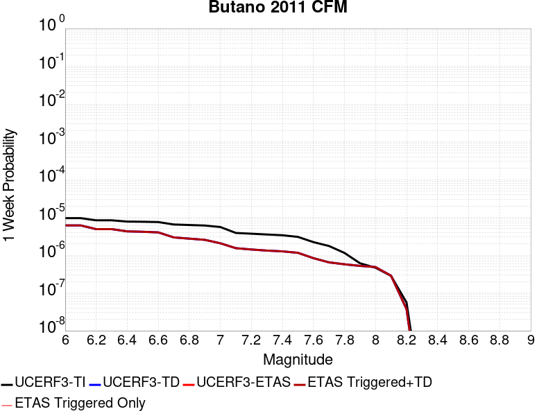 | 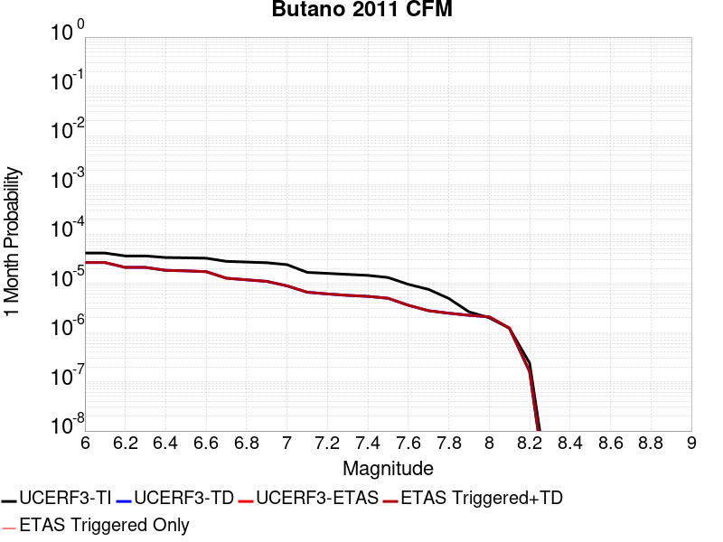 | 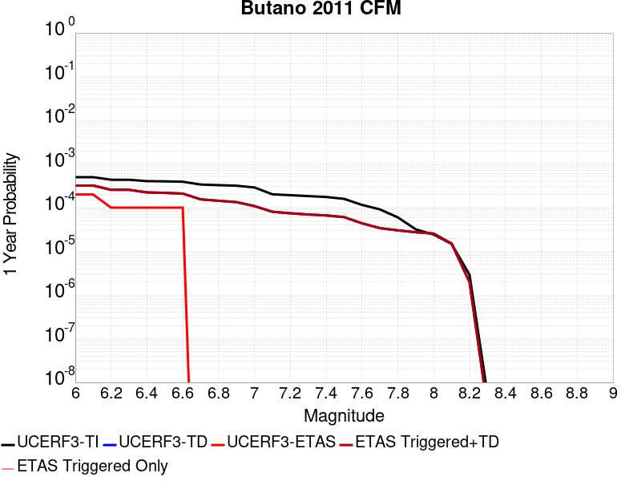 | 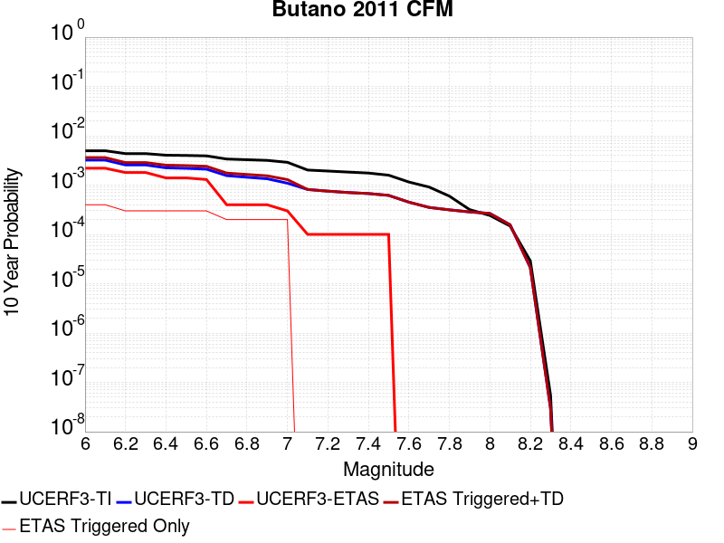 |

| Magnitude | 1 wk TI Prob | 1 wk TD Prob | 1 wk ETAS Prob | 1 wk ETAS/TD Gain | 1 wk ETAS Triggered+TD | 1 wk ETAS Triggered Only | 1 mo TI Prob | 1 mo TD Prob | 1 mo ETAS Prob | 1 mo ETAS/TD Gain | 1 mo ETAS Triggered+TD | 1 mo ETAS Triggered Only | 1 yr TI Prob | 1 yr TD Prob | 1 yr ETAS Prob | 1 yr ETAS/TD Gain | 1 yr ETAS Triggered+TD | 1 yr ETAS Triggered Only | 10 yr TI Prob | 10 yr TD Prob | 10 yr ETAS Prob | 10 yr ETAS/TD Gain | 10 yr ETAS Triggered+TD | 10 yr ETAS Triggered Only |
|-----|-----|-----|-----|-----|-----|-----|-----|-----|-----|-----|-----|-----|-----|-----|-----|-----|-----|-----|-----|-----|-----|-----|-----|-----|
| 6.0 | 9.561135E-6 | 6.15403E-6 | 0.0 | 0.0 | 6.15403E-6 | 0.0 | 4.097565E-5 | 2.6374159E-5 | 0.0 | 0.0 | 2.6374159E-5 | 0.0 | 4.9876433E-4 | 3.2106027E-4 | 2.0E-4 | 0.622936 | 3.2106027E-4 | 0.0 | 0.004976464 | 0.003223371 | 0.0022 | 0.6825153 | 0.0036220816 | 4.0E-4 |
| 6.1 | 9.561135E-6 | 6.15403E-6 | 0.0 | 0.0 | 6.15403E-6 | 0.0 | 4.097565E-5 | 2.6374159E-5 | 0.0 | 0.0 | 2.6374159E-5 | 0.0 | 4.9876433E-4 | 3.2106027E-4 | 2.0E-4 | 0.622936 | 3.2106027E-4 | 0.0 | 0.004976464 | 0.003223371 | 0.0022 | 0.6825153 | 0.0036220816 | 4.0E-4 |
| 6.2 | 8.364741E-6 | 4.9076643E-6 | 0.0 | 0.0 | 4.9076643E-6 | 0.0 | 3.5848396E-5 | 2.1032687E-5 | 0.0 | 0.0 | 2.1032687E-5 | 0.0 | 4.3636683E-4 | 2.5604444E-4 | 1.0E-4 | 0.3905572 | 2.5604444E-4 | 0.0 | 0.0043551093 | 0.002574849 | 0.0018 | 0.6990701 | 0.0028740766 | 3.0E-4 |
| 6.3 | 8.364741E-6 | 4.9076643E-6 | 0.0 | 0.0 | 4.9076643E-6 | 0.0 | 3.5848396E-5 | 2.1032687E-5 | 0.0 | 0.0 | 2.1032687E-5 | 0.0 | 4.3636683E-4 | 2.5604444E-4 | 1.0E-4 | 0.3905572 | 2.5604444E-4 | 0.0 | 0.0043551093 | 0.002574849 | 0.0018 | 0.6990701 | 0.0028740766 | 3.0E-4 |
| 6.4 | 7.768282E-6 | 4.2858906E-6 | 0.0 | 0.0 | 4.2858906E-6 | 0.0 | 3.329221E-5 | 1.836798E-5 | 0.0 | 0.0 | 1.836798E-5 | 0.0 | 4.0525728E-4 | 2.2360859E-4 | 1.0E-4 | 0.44721 | 2.2360859E-4 | 0.0 | 0.0040451903 | 0.0022511752 | 0.0014 | 0.6218974 | 0.0025505 | 3.0E-4 |
| 6.5 | 7.673437E-6 | 4.1855155E-6 | 0.0 | 0.0 | 4.1855155E-6 | 0.0 | 3.2885746E-5 | 1.7937808E-5 | 0.0 | 0.0 | 1.7937808E-5 | 0.0 | 4.0031038E-4 | 2.1837228E-4 | 1.0E-4 | 0.45793357 | 2.1837228E-4 | 0.0 | 0.0039959005 | 0.002198916 | 0.0014 | 0.6366774 | 0.0024982563 | 3.0E-4 |
| 6.6 | 7.5244197E-6 | 4.0305786E-6 | 0.0 | 0.0 | 4.0305786E-6 | 0.0 | 3.2247113E-5 | 1.72738E-5 | 0.0 | 0.0 | 1.72738E-5 | 0.0 | 3.9253788E-4 | 2.1028955E-4 | 1.0E-4 | 0.4755348 | 2.1028955E-4 | 0.0 | 0.003918452 | 0.0021182448 | 0.0013 | 0.6137157 | 0.002417609 | 3.0E-4 |
| 6.7 | 6.4921405E-6 | 2.971414E-6 | 0.0 | 0.0 | 2.971414E-6 | 0.0 | 2.7823162E-5 | 1.2734569E-5 | 0.0 | 0.0 | 1.2734569E-5 | 0.0 | 3.3869434E-4 | 1.5503244E-4 | 0.0 | 0.0 | 1.5503244E-4 | 0.0 | 0.003381786 | 0.001566468 | 4.0E-4 | 0.2553515 | 0.0017661548 | 2.0E-4 |
| 6.8 | 6.2890294E-6 | 2.758355E-6 | 0.0 | 0.0 | 2.758355E-6 | 0.0 | 2.6952705E-5 | 1.18214675E-5 | 0.0 | 0.0 | 1.18214675E-5 | 0.0 | 3.2809976E-4 | 1.4391694E-4 | 0.0 | 0.0 | 1.4391694E-4 | 0.0 | 0.0032761577 | 0.0014554637 | 4.0E-4 | 0.2748265 | 0.0016551726 | 2.0E-4 |
| 6.9 | 6.0965517E-6 | 2.5651032E-6 | 0.0 | 0.0 | 2.5651032E-6 | 0.0 | 2.6127816E-5 | 1.09932525E-5 | 0.0 | 0.0 | 1.09932525E-5 | 0.0 | 3.1805973E-4 | 1.3383469E-4 | 0.0 | 0.0 | 1.3383469E-4 | 0.0 | 0.0031760489 | 0.0013547676 | 4.0E-4 | 0.29525357 | 0.0015544967 | 2.0E-4 |
| 7.0 | 5.566252E-6 | 2.0832665E-6 | 0.0 | 0.0 | 2.0832665E-6 | 0.0 | 2.3855147E-5 | 8.928254E-6 | 0.0 | 0.0 | 8.928254E-6 | 0.0 | 2.9039773E-4 | 1.0869611E-4 | 0.0 | 0.0 | 1.0869611E-4 | 0.0 | 0.0029001853 | 0.0011036547 | 3.0E-4 | 0.27182415 | 0.001303434 | 2.0E-4 |
| 7.1 | 3.878588E-6 | 1.545213E-6 | 0.0 | 0.0 | 1.545213E-6 | 0.0 | 1.6622414E-5 | 6.6223242E-6 | 0.0 | 0.0 | 6.6223242E-6 | 0.0 | 2.023591E-4 | 8.062382E-5 | 0.0 | 0.0 | 8.062382E-5 | 0.0 | 0.0020217493 | 8.2281325E-4 | 1.0E-4 | 0.12153426 | 8.2281325E-4 | 0.0 |
| 7.2 | 3.7038085E-6 | 1.4272103E-6 | 0.0 | 0.0 | 1.4272103E-6 | 0.0 | 1.587337E-5 | 6.116601E-6 | 0.0 | 0.0 | 6.116601E-6 | 0.0 | 1.9324113E-4 | 7.4467076E-5 | 0.0 | 0.0 | 7.4467076E-5 | 0.0 | 0.0019307317 | 7.6125923E-4 | 1.0E-4 | 0.1313613 | 7.6125923E-4 | 0.0 |
| 7.3 | 3.5277278E-6 | 1.3361492E-6 | 0.0 | 0.0 | 1.3361492E-6 | 0.0 | 1.5118746E-5 | 5.7263414E-6 | 0.0 | 0.0 | 5.7263414E-6 | 0.0 | 1.8405518E-4 | 6.971598E-5 | 0.0 | 0.0 | 6.971598E-5 | 0.0 | 0.0018390282 | 7.136966E-4 | 1.0E-4 | 0.14011557 | 7.136966E-4 | 0.0 |
| 7.4 | 3.3711294E-6 | 1.2744175E-6 | 0.0 | 0.0 | 1.2744175E-6 | 0.0 | 1.4447617E-5 | 5.4617776E-6 | 0.0 | 0.0 | 5.4617776E-6 | 0.0 | 1.7588554E-4 | 6.6495115E-5 | 0.0 | 0.0 | 6.6495115E-5 | 0.0 | 0.0017574639 | 6.814574E-4 | 1.0E-4 | 0.14674431 | 6.814574E-4 | 0.0 |
| 7.5 | 3.0496426E-6 | 1.1660333E-6 | 0.0 | 0.0 | 1.1660333E-6 | 0.0 | 1.3069831E-5 | 4.9972755E-6 | 0.0 | 0.0 | 4.9972755E-6 | 0.0 | 1.5911358E-4 | 6.084013E-5 | 0.0 | 0.0 | 6.084013E-5 | 0.0 | 0.001589997 | 6.2487164E-4 | 1.0E-4 | 0.16003287 | 6.2487164E-4 | 0.0 |
| 7.6 | 2.2179781E-6 | 8.4150264E-7 | 0.0 | 0.0 | 8.4150264E-7 | 0.0 | 9.505586E-6 | 3.6064348E-6 | 0.0 | 0.0 | 3.6064348E-6 | 0.0 | 1.1572436E-4 | 4.3907457E-5 | 0.0 | 0.0 | 4.3907457E-5 | 0.0 | 0.0011566412 | 4.5552515E-4 | 0.0 | 0.0 | 4.5552515E-4 | 0.0 |
| 7.7 | 1.7519328E-6 | 6.5244956E-7 | 0.0 | 0.0 | 6.5244956E-7 | 0.0 | 7.508262E-6 | 2.7962092E-6 | 0.0 | 0.0 | 2.7962092E-6 | 0.0 | 9.140925E-5 | 3.4043314E-5 | 0.0 | 0.0 | 3.4043314E-5 | 0.0 | 9.137166E-4 | 3.5621418E-4 | 0.0 | 0.0 | 3.5621418E-4 | 0.0 |
| 7.8 | 1.1478974E-6 | 5.8026524E-7 | 0.0 | 0.0 | 5.8026524E-7 | 0.0 | 4.9195505E-6 | 2.4868486E-6 | 0.0 | 0.0 | 2.4868486E-6 | 0.0 | 5.9893882E-5 | 3.0276962E-5 | 0.0 | 0.0 | 3.0276962E-5 | 0.0 | 5.9877743E-4 | 3.182529E-4 | 0.0 | 0.0 | 3.182529E-4 | 0.0 |
| 7.9 | 6.1154634E-7 | 5.25729E-7 | 0.0 | 0.0 | 5.25729E-7 | 0.0 | 2.6209104E-6 | 2.2531224E-6 | 0.0 | 0.0 | 2.2531224E-6 | 0.0 | 3.1909116E-5 | 2.7431419E-5 | 0.0 | 0.0 | 2.7431419E-5 | 0.0 | 3.1904536E-4 | 2.886358E-4 | 0.0 | 0.0 | 2.886358E-4 | 0.0 |
| 8.0 | 4.6520046E-7 | 4.892871E-7 | 0.0 | 0.0 | 4.892871E-7 | 0.0 | 1.9937147E-6 | 2.096943E-6 | 0.0 | 0.0 | 2.096943E-6 | 0.0 | 2.4273206E-5 | 2.5529982E-5 | 0.0 | 0.0 | 2.5529982E-5 | 0.0 | 2.4270554E-4 | 2.686851E-4 | 0.0 | 0.0 | 2.686851E-4 | 0.0 |
| 8.1 | 2.8425194E-7 | 2.8874658E-7 | 0.0 | 0.0 | 2.8874658E-7 | 0.0 | 1.218222E-6 | 1.2374848E-6 | 0.0 | 0.0 | 1.2374848E-6 | 0.0 | 1.4831752E-5 | 1.5066273E-5 | 0.0 | 0.0 | 1.5066273E-5 | 0.0 | 1.4830762E-4 | 1.5847926E-4 | 0.0 | 0.0 | 1.5847926E-4 | 0.0 |
| 8.2 | 5.585778E-8 | 3.7716475E-8 | 0.0 | 0.0 | 3.7716475E-8 | 0.0 | 2.3939046E-7 | 1.6164203E-7 | 0.0 | 0.0 | 1.6164203E-7 | 0.0 | 2.914575E-6 | 1.9679899E-6 | 0.0 | 0.0 | 1.9679899E-6 | 0.0 | 2.9145367E-5 | 2.1460306E-5 | 0.0 | 0.0 | 2.1460306E-5 | 0.0 |
| 8.3 | 1.0371215E-10 | 4.905809E-11 | 0.0 | 0.0 | 4.905809E-11 | 0.0 | 4.4448079E-10 | 2.1024882E-10 | 0.0 | 0.0 | 2.1024882E-10 | 0.0 | 5.4115543E-9 | 2.5597786E-9 | 0.0 | 0.0 | 2.5597786E-9 | 0.0 | 5.4115542E-8 | 2.9598395E-8 | 0.0 | 0.0 | 2.9598395E-8 | 0.0 |

## Tin Mountain
*[(top)](#table-of-contents)*

| 1 Week | 1 Month | 1 Year | 10 Year |
|-----|-----|-----|-----|
| 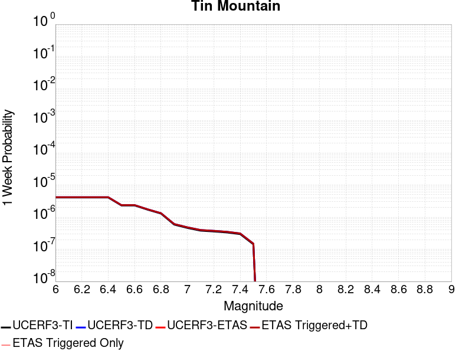 | 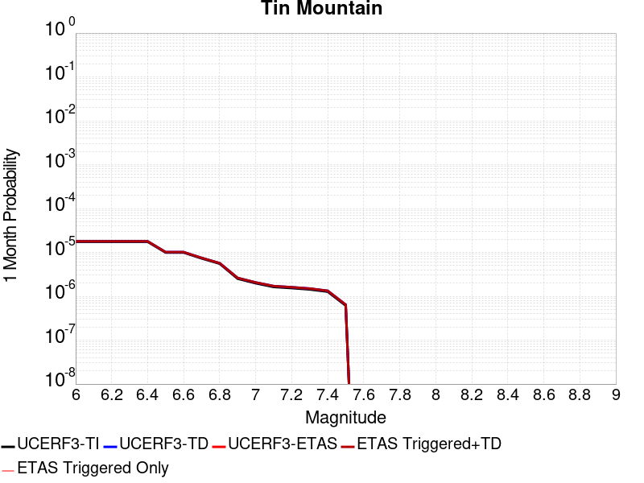 | 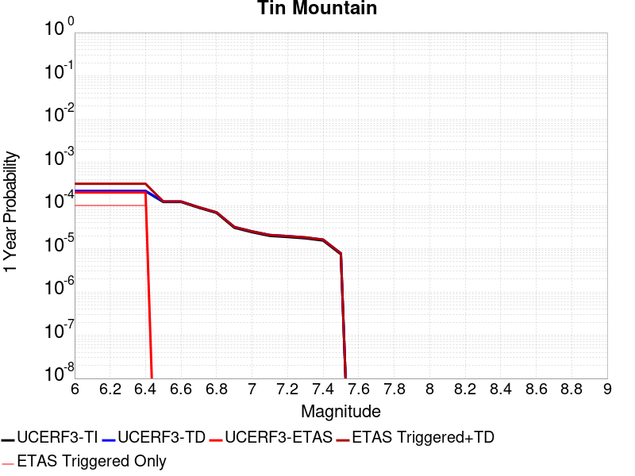 | 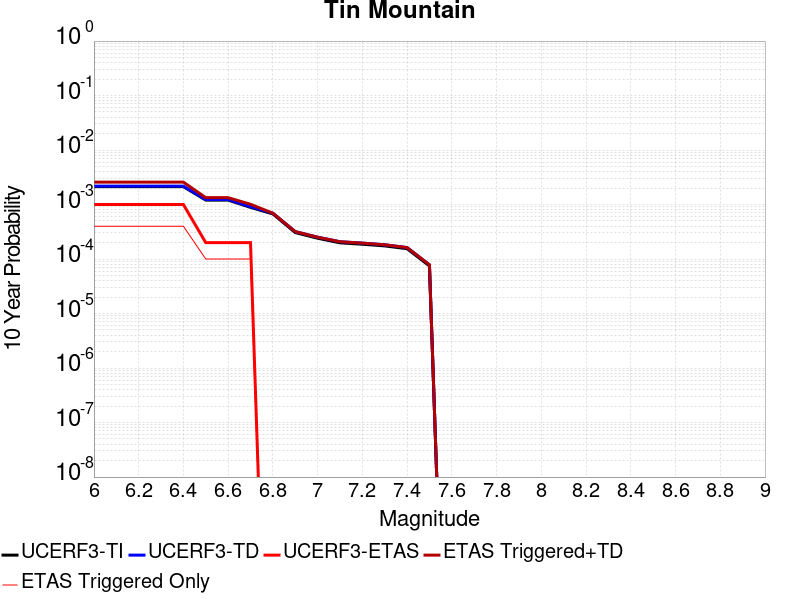 |

| Magnitude | 1 wk TI Prob | 1 wk TD Prob | 1 wk ETAS Prob | 1 wk ETAS/TD Gain | 1 wk ETAS Triggered+TD | 1 wk ETAS Triggered Only | 1 mo TI Prob | 1 mo TD Prob | 1 mo ETAS Prob | 1 mo ETAS/TD Gain | 1 mo ETAS Triggered+TD | 1 mo ETAS Triggered Only | 1 yr TI Prob | 1 yr TD Prob | 1 yr ETAS Prob | 1 yr ETAS/TD Gain | 1 yr ETAS Triggered+TD | 1 yr ETAS Triggered Only | 10 yr TI Prob | 10 yr TD Prob | 10 yr ETAS Prob | 10 yr ETAS/TD Gain | 10 yr ETAS Triggered+TD | 10 yr ETAS Triggered Only |
|-----|-----|-----|-----|-----|-----|-----|-----|-----|-----|-----|-----|-----|-----|-----|-----|-----|-----|-----|-----|-----|-----|-----|-----|-----|
| 6.0 | 4.083776E-6 | 4.1804883E-6 | 0.0 | 0.0 | 4.1804883E-6 | 0.0 | 1.750178E-5 | 1.7916278E-5 | 0.0 | 0.0 | 1.7916278E-5 | 0.0 | 2.1306332E-4 | 2.1811256E-4 | 2.0E-4 | 0.91695774 | 3.1809075E-4 | 1.0E-4 | 0.0021285915 | 0.0021793505 | 0.001 | 0.45885232 | 0.0025784788 | 4.0E-4 |
| 6.1 | 4.083776E-6 | 4.1804883E-6 | 0.0 | 0.0 | 4.1804883E-6 | 0.0 | 1.750178E-5 | 1.7916278E-5 | 0.0 | 0.0 | 1.7916278E-5 | 0.0 | 2.1306332E-4 | 2.1811256E-4 | 2.0E-4 | 0.91695774 | 3.1809075E-4 | 1.0E-4 | 0.0021285915 | 0.0021793505 | 0.001 | 0.45885232 | 0.0025784788 | 4.0E-4 |
| 6.2 | 4.083776E-6 | 4.1804883E-6 | 0.0 | 0.0 | 4.1804883E-6 | 0.0 | 1.750178E-5 | 1.7916278E-5 | 0.0 | 0.0 | 1.7916278E-5 | 0.0 | 2.1306332E-4 | 2.1811256E-4 | 2.0E-4 | 0.91695774 | 3.1809075E-4 | 1.0E-4 | 0.0021285915 | 0.0021793505 | 0.001 | 0.45885232 | 0.0025784788 | 4.0E-4 |
| 6.3 | 4.083776E-6 | 4.1804883E-6 | 0.0 | 0.0 | 4.1804883E-6 | 0.0 | 1.750178E-5 | 1.7916278E-5 | 0.0 | 0.0 | 1.7916278E-5 | 0.0 | 2.1306332E-4 | 2.1811256E-4 | 2.0E-4 | 0.91695774 | 3.1809075E-4 | 1.0E-4 | 0.0021285915 | 0.0021793505 | 0.001 | 0.45885232 | 0.0025784788 | 4.0E-4 |
| 6.4 | 4.083776E-6 | 4.1804883E-6 | 0.0 | 0.0 | 4.1804883E-6 | 0.0 | 1.750178E-5 | 1.7916278E-5 | 0.0 | 0.0 | 1.7916278E-5 | 0.0 | 2.1306332E-4 | 2.1811256E-4 | 2.0E-4 | 0.91695774 | 3.1809075E-4 | 1.0E-4 | 0.0021285915 | 0.0021793505 | 0.001 | 0.45885232 | 0.0025784788 | 4.0E-4 |
| 6.5 | 2.3143427E-6 | 2.3725247E-6 | 0.0 | 0.0 | 2.3725247E-6 | 0.0 | 9.9185745E-6 | 1.0167928E-5 | 0.0 | 0.0 | 1.0167928E-5 | 0.0 | 1.2075195E-4 | 1.2378825E-4 | 0.0 | 0.0 | 1.2378825E-4 | 0.0 | 0.0012068636 | 0.0012372689 | 2.0E-4 | 0.16164634 | 0.0013371452 | 1.0E-4 |
| 6.6 | 2.3143427E-6 | 2.3725247E-6 | 0.0 | 0.0 | 2.3725247E-6 | 0.0 | 9.9185745E-6 | 1.0167928E-5 | 0.0 | 0.0 | 1.0167928E-5 | 0.0 | 1.2075195E-4 | 1.2378825E-4 | 0.0 | 0.0 | 1.2378825E-4 | 0.0 | 0.0012068636 | 0.0012372689 | 2.0E-4 | 0.16164634 | 0.0013371452 | 1.0E-4 |
| 6.7 | 1.7029532E-6 | 1.7492865E-6 | 0.0 | 0.0 | 1.7492865E-6 | 0.0 | 7.2983503E-6 | 7.4969234E-6 | 0.0 | 0.0 | 7.4969234E-6 | 0.0 | 8.885379E-5 | 9.127176E-5 | 0.0 | 0.0 | 9.127176E-5 | 0.0 | 8.881827E-4 | 9.123953E-4 | 2.0E-4 | 0.21920323 | 0.0010123041 | 1.0E-4 |
| 6.8 | 1.2914646E-6 | 1.329522E-6 | 0.0 | 0.0 | 1.329522E-6 | 0.0 | 5.534837E-6 | 5.6979416E-6 | 0.0 | 0.0 | 5.6979416E-6 | 0.0 | 6.738455E-5 | 6.937067E-5 | 0.0 | 0.0 | 6.937067E-5 | 0.0 | 6.736412E-4 | 6.9353345E-4 | 0.0 | 0.0 | 6.9353345E-4 | 0.0 |
| 6.9 | 5.8708974E-7 | 6.114311E-7 | 0.0 | 0.0 | 6.114311E-7 | 0.0 | 2.5160964E-6 | 2.6204166E-6 | 0.0 | 0.0 | 2.6204166E-6 | 0.0 | 3.0633044E-5 | 3.190315E-5 | 0.0 | 0.0 | 3.190315E-5 | 0.0 | 3.0628822E-4 | 3.189898E-4 | 0.0 | 0.0 | 3.189898E-4 | 0.0 |
| 7.0 | 4.6248786E-7 | 4.829753E-7 | 0.0 | 0.0 | 4.829753E-7 | 0.0 | 1.9820893E-6 | 2.0698926E-6 | 0.0 | 0.0 | 2.0698926E-6 | 0.0 | 2.413167E-5 | 2.5200687E-5 | 0.0 | 0.0 | 2.5200687E-5 | 0.0 | 2.412905E-4 | 2.5198198E-4 | 0.0 | 0.0 | 2.5198198E-4 | 0.0 |
| 7.1 | 3.804606E-7 | 3.9851489E-7 | 0.0 | 0.0 | 3.9851489E-7 | 0.0 | 1.6305444E-6 | 1.70792E-6 | 0.0 | 0.0 | 1.70792E-6 | 0.0 | 1.9851697E-5 | 2.0793761E-5 | 0.0 | 0.0 | 2.0793761E-5 | 0.0 | 1.9849923E-4 | 2.0792152E-4 | 0.0 | 0.0 | 2.0792152E-4 | 0.0 |
| 7.2 | 3.5864858E-7 | 3.7597673E-7 | 0.0 | 0.0 | 3.7597673E-7 | 0.0 | 1.5370645E-6 | 1.611328E-6 | 0.0 | 0.0 | 1.611328E-6 | 0.0 | 1.87136E-5 | 1.9617775E-5 | 0.0 | 0.0 | 1.9617775E-5 | 0.0 | 1.8712023E-4 | 1.9616375E-4 | 0.0 | 0.0 | 1.9616375E-4 | 0.0 |
| 7.3 | 3.342063E-7 | 3.5045474E-7 | 0.0 | 0.0 | 3.5045474E-7 | 0.0 | 1.4323119E-6 | 1.5019482E-6 | 0.0 | 0.0 | 1.5019482E-6 | 0.0 | 1.7438259E-5 | 1.8286099E-5 | 0.0 | 0.0 | 1.8286099E-5 | 0.0 | 1.743689E-4 | 1.8284924E-4 | 0.0 | 0.0 | 1.8284924E-4 | 0.0 |
| 7.4 | 2.971242E-7 | 3.11499E-7 | 0.0 | 0.0 | 3.11499E-7 | 0.0 | 1.2733886E-6 | 1.3349952E-6 | 0.0 | 0.0 | 1.3349952E-6 | 0.0 | 1.5503398E-5 | 1.625348E-5 | 0.0 | 0.0 | 1.625348E-5 | 0.0 | 1.5502315E-4 | 1.6252618E-4 | 0.0 | 0.0 | 1.6252618E-4 | 0.0 |
| 7.5 | 1.4326713E-7 | 1.5005024E-7 | 0.0 | 0.0 | 1.5005024E-7 | 0.0 | 6.140018E-7 | 6.4307244E-7 | 0.0 | 0.0 | 6.4307244E-7 | 0.0 | 7.4754466E-6 | 7.829407E-6 | 0.0 | 0.0 | 7.829407E-6 | 0.0 | 7.475195E-5 | 7.829407E-5 | 0.0 | 0.0 | 7.829407E-5 | 0.0 |

## Holser alt 1
*[(top)](#table-of-contents)*

| 1 Week | 1 Month | 1 Year | 10 Year |
|-----|-----|-----|-----|
| 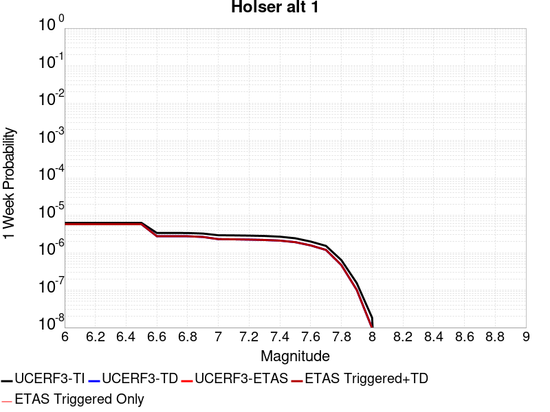 | 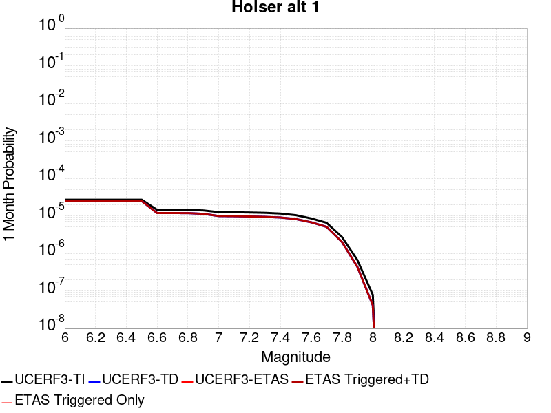 | 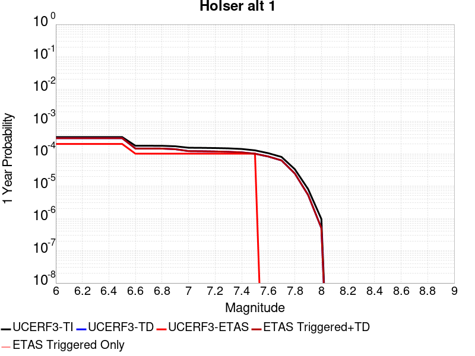 | 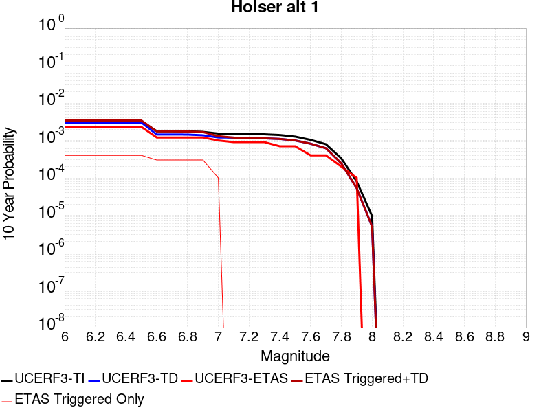 |

| Magnitude | 1 wk TI Prob | 1 wk TD Prob | 1 wk ETAS Prob | 1 wk ETAS/TD Gain | 1 wk ETAS Triggered+TD | 1 wk ETAS Triggered Only | 1 mo TI Prob | 1 mo TD Prob | 1 mo ETAS Prob | 1 mo ETAS/TD Gain | 1 mo ETAS Triggered+TD | 1 mo ETAS Triggered Only | 1 yr TI Prob | 1 yr TD Prob | 1 yr ETAS Prob | 1 yr ETAS/TD Gain | 1 yr ETAS Triggered+TD | 1 yr ETAS Triggered Only | 10 yr TI Prob | 10 yr TD Prob | 10 yr ETAS Prob | 10 yr ETAS/TD Gain | 10 yr ETAS Triggered+TD | 10 yr ETAS Triggered Only |
|-----|-----|-----|-----|-----|-----|-----|-----|-----|-----|-----|-----|-----|-----|-----|-----|-----|-----|-----|-----|-----|-----|-----|-----|-----|
| 6.0 | 6.2746653E-6 | 5.7853026E-6 | 0.0 | 0.0 | 5.7853026E-6 | 0.0 | 2.6891146E-5 | 2.4793982E-5 | 0.0 | 0.0 | 2.4793982E-5 | 0.0 | 3.273505E-4 | 3.0183647E-4 | 2.0E-4 | 0.6626105 | 3.0183647E-4 | 0.0 | 0.0032686873 | 0.003015397 | 0.0023 | 0.762752 | 0.0034141906 | 4.0E-4 |
| 6.1 | 6.2746653E-6 | 5.7853026E-6 | 0.0 | 0.0 | 5.7853026E-6 | 0.0 | 2.6891146E-5 | 2.4793982E-5 | 0.0 | 0.0 | 2.4793982E-5 | 0.0 | 3.273505E-4 | 3.0183647E-4 | 2.0E-4 | 0.6626105 | 3.0183647E-4 | 0.0 | 0.0032686873 | 0.003015397 | 0.0023 | 0.762752 | 0.0034141906 | 4.0E-4 |
| 6.2 | 6.2746653E-6 | 5.7853026E-6 | 0.0 | 0.0 | 5.7853026E-6 | 0.0 | 2.6891146E-5 | 2.4793982E-5 | 0.0 | 0.0 | 2.4793982E-5 | 0.0 | 3.273505E-4 | 3.0183647E-4 | 2.0E-4 | 0.6626105 | 3.0183647E-4 | 0.0 | 0.0032686873 | 0.003015397 | 0.0023 | 0.762752 | 0.0034141906 | 4.0E-4 |
| 6.3 | 6.2746653E-6 | 5.7853026E-6 | 0.0 | 0.0 | 5.7853026E-6 | 0.0 | 2.6891146E-5 | 2.4793982E-5 | 0.0 | 0.0 | 2.4793982E-5 | 0.0 | 3.273505E-4 | 3.0183647E-4 | 2.0E-4 | 0.6626105 | 3.0183647E-4 | 0.0 | 0.0032686873 | 0.003015397 | 0.0023 | 0.762752 | 0.0034141906 | 4.0E-4 |
| 6.4 | 6.2746653E-6 | 5.7853026E-6 | 0.0 | 0.0 | 5.7853026E-6 | 0.0 | 2.6891146E-5 | 2.4793982E-5 | 0.0 | 0.0 | 2.4793982E-5 | 0.0 | 3.273505E-4 | 3.0183647E-4 | 2.0E-4 | 0.6626105 | 3.0183647E-4 | 0.0 | 0.0032686873 | 0.003015397 | 0.0023 | 0.762752 | 0.0034141906 | 4.0E-4 |
| 6.5 | 6.2746653E-6 | 5.7853026E-6 | 0.0 | 0.0 | 5.7853026E-6 | 0.0 | 2.6891146E-5 | 2.4793982E-5 | 0.0 | 0.0 | 2.4793982E-5 | 0.0 | 3.273505E-4 | 3.0183647E-4 | 2.0E-4 | 0.6626105 | 3.0183647E-4 | 0.0 | 0.0032686873 | 0.003015397 | 0.0023 | 0.762752 | 0.0034141906 | 4.0E-4 |
| 6.6 | 3.375825E-6 | 2.7678307E-6 | 0.0 | 0.0 | 2.7678307E-6 | 0.0 | 1.4467741E-5 | 1.1862079E-5 | 0.0 | 0.0 | 1.1862079E-5 | 0.0 | 1.761305E-4 | 1.444114E-4 | 1.0E-4 | 0.6924661 | 1.444114E-4 | 0.0 | 0.0017599097 | 0.0014431926 | 0.0012 | 0.83148986 | 0.0017427596 | 3.0E-4 |
| 6.7 | 3.375825E-6 | 2.7678307E-6 | 0.0 | 0.0 | 2.7678307E-6 | 0.0 | 1.4467741E-5 | 1.1862079E-5 | 0.0 | 0.0 | 1.1862079E-5 | 0.0 | 1.761305E-4 | 1.444114E-4 | 1.0E-4 | 0.6924661 | 1.444114E-4 | 0.0 | 0.0017599097 | 0.0014431926 | 0.0012 | 0.83148986 | 0.0017427596 | 3.0E-4 |
| 6.8 | 3.366533E-6 | 2.7582337E-6 | 0.0 | 0.0 | 2.7582337E-6 | 0.0 | 1.4427919E-5 | 1.1820948E-5 | 0.0 | 0.0 | 1.1820948E-5 | 0.0 | 1.7564575E-4 | 1.4391071E-4 | 1.0E-4 | 0.6948753 | 1.4391071E-4 | 0.0 | 0.0017550698 | 0.0014381921 | 0.0012 | 0.83438087 | 0.0017377606 | 3.0E-4 |
| 6.9 | 3.253174E-6 | 2.6405037E-6 | 0.0 | 0.0 | 2.6405037E-6 | 0.0 | 1.39421E-5 | 1.1316396E-5 | 0.0 | 0.0 | 1.1316396E-5 | 0.0 | 1.6973184E-4 | 1.3776857E-4 | 1.0E-4 | 0.725855 | 1.3776857E-4 | 0.0 | 0.0016960226 | 0.0013768475 | 0.0012 | 0.8715562 | 0.0016764344 | 3.0E-4 |
| 7.0 | 2.9336593E-6 | 2.3086297E-6 | 0.0 | 0.0 | 2.3086297E-6 | 0.0 | 1.2572766E-5 | 9.89409E-6 | 0.0 | 0.0 | 9.89409E-6 | 0.0 | 1.5306266E-4 | 1.20453915E-4 | 1.0E-4 | 0.83019304 | 1.20453915E-4 | 0.0 | 0.0015295728 | 0.0012038888 | 0.001 | 0.83064157 | 0.0013037684 | 1.0E-4 |
| 7.1 | 2.9087812E-6 | 2.2844995E-6 | 0.0 | 0.0 | 2.2844995E-6 | 0.0 | 1.2466146E-5 | 9.790676E-6 | 0.0 | 0.0 | 9.790676E-6 | 0.0 | 1.5176475E-4 | 1.1919498E-4 | 1.0E-4 | 0.8389615 | 1.1919498E-4 | 0.0 | 0.0015166114 | 0.0011913129 | 9.0E-4 | 0.75546896 | 0.0011913129 | 0.0 |
| 7.2 | 2.8674524E-6 | 2.244428E-6 | 0.0 | 0.0 | 2.244428E-6 | 0.0 | 1.2289024E-5 | 9.618942E-6 | 0.0 | 0.0 | 9.618942E-6 | 0.0 | 1.4960859E-4 | 1.17104355E-4 | 1.0E-4 | 0.85393924 | 1.17104355E-4 | 0.0 | 0.0014950791 | 0.0011704288 | 9.0E-4 | 0.768949 | 0.0011704288 | 0.0 |
| 7.3 | 2.8057775E-6 | 2.1923825E-6 | 0.0 | 0.0 | 2.1923825E-6 | 0.0 | 1.2024705E-5 | 9.395891E-6 | 0.0 | 0.0 | 9.395891E-6 | 0.0 | 1.4639096E-4 | 1.1438898E-4 | 1.0E-4 | 0.87421006 | 1.1438898E-4 | 0.0 | 0.0014629456 | 0.0011433034 | 9.0E-4 | 0.7871927 | 0.0011433034 | 0.0 |
| 7.4 | 2.683666E-6 | 2.1063402E-6 | 0.0 | 0.0 | 2.1063402E-6 | 0.0 | 1.1501375E-5 | 9.027141E-6 | 0.0 | 0.0 | 9.027141E-6 | 0.0 | 1.4002025E-4 | 1.0989991E-4 | 1.0E-4 | 0.90991884 | 1.0989991E-4 | 0.0 | 0.0013993206 | 0.0010984578 | 7.0E-4 | 0.63725704 | 0.0010984578 | 0.0 |
| 7.5 | 2.434495E-6 | 1.9169893E-6 | 0.0 | 0.0 | 1.9169893E-6 | 0.0 | 1.0433508E-5 | 8.215642E-6 | 0.0 | 0.0 | 8.215642E-6 | 0.0 | 1.2702055E-4 | 1.0002087E-4 | 1.0E-4 | 0.9997913 | 1.0002087E-4 | 0.0 | 0.0012694797 | 9.997606E-4 | 7.0E-4 | 0.70016766 | 9.997606E-4 | 0.0 |
| 7.6 | 1.9914562E-6 | 1.5711842E-6 | 0.0 | 0.0 | 1.5711842E-6 | 0.0 | 8.534785E-6 | 6.733629E-6 | 0.0 | 0.0 | 6.733629E-6 | 0.0 | 1.03906044E-4 | 8.197886E-5 | 0.0 | 0.0 | 8.197886E-5 | 0.0 | 0.0010385747 | 8.194878E-4 | 4.0E-4 | 0.4881098 | 8.194878E-4 | 0.0 |
| 7.7 | 1.5229501E-6 | 1.1881193E-6 | 0.0 | 0.0 | 1.1881193E-6 | 0.0 | 6.526913E-6 | 5.09193E-6 | 0.0 | 0.0 | 5.09193E-6 | 0.0 | 7.946226E-5 | 6.19925E-5 | 0.0 | 0.0 | 6.19925E-5 | 0.0 | 7.943385E-4 | 6.1975326E-4 | 4.0E-4 | 0.6454181 | 6.1975326E-4 | 0.0 |
| 7.8 | 6.3489426E-7 | 4.680776E-7 | 0.0 | 0.0 | 4.680776E-7 | 0.0 | 2.7209726E-6 | 2.0060454E-6 | 0.0 | 0.0 | 2.0060454E-6 | 0.0 | 3.312734E-5 | 2.4423329E-5 | 0.0 | 0.0 | 2.4423329E-5 | 0.0 | 3.31224E-4 | 2.4420663E-4 | 2.0E-4 | 0.81897855 | 2.4420663E-4 | 0.0 |
| 7.9 | 1.5459432E-7 | 1.0169993E-7 | 0.0 | 0.0 | 1.0169993E-7 | 0.0 | 6.6254694E-7 | 4.3585678E-7 | 0.0 | 0.0 | 4.3585678E-7 | 0.0 | 8.066479E-6 | 5.3065437E-6 | 0.0 | 0.0 | 5.3065437E-6 | 0.0 | 8.066186E-5 | 5.3064185E-5 | 1.0E-4 | 1.8845103 | 5.3064185E-5 | 0.0 |
| 8.0 | 1.8307812E-8 | 9.640108E-9 | 0.0 | 0.0 | 9.640108E-9 | 0.0 | 7.846205E-8 | 4.131475E-8 | 0.0 | 0.0 | 4.131475E-8 | 0.0 | 9.55275E-7 | 5.0300696E-7 | 0.0 | 0.0 | 5.0300696E-7 | 0.0 | 9.552709E-6 | 5.0300587E-6 | 0.0 | 0.0 | 5.0300587E-6 | 0.0 |

## Yorba Linda
*[(top)](#table-of-contents)*

| 1 Week | 1 Month | 1 Year | 10 Year |
|-----|-----|-----|-----|
| 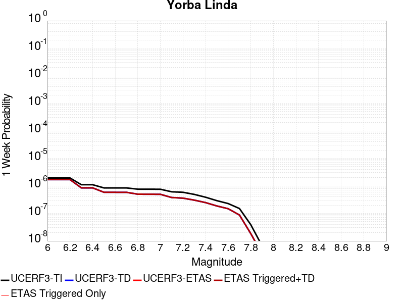 | 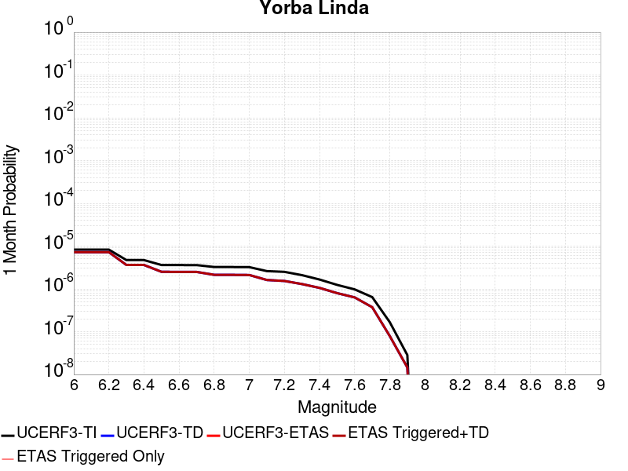 | 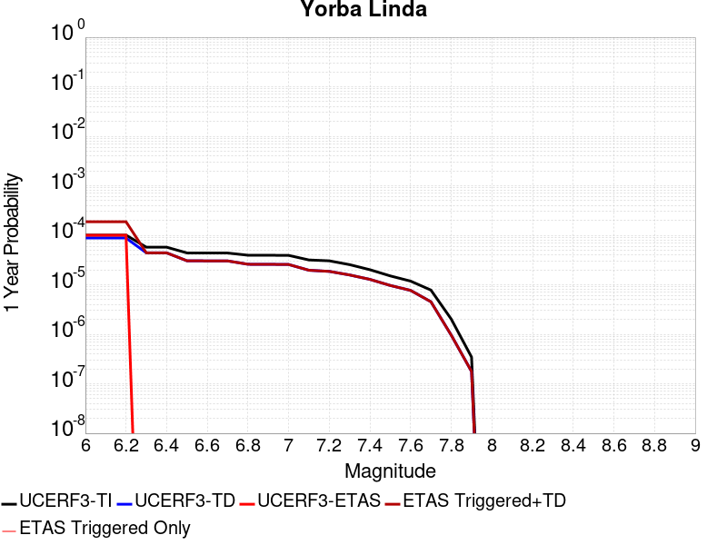 | 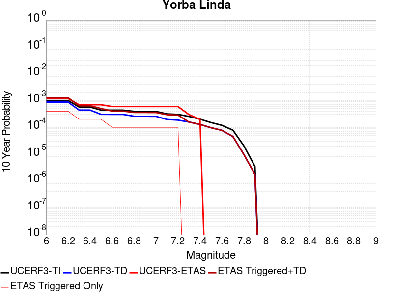 |

| Magnitude | 1 wk TI Prob | 1 wk TD Prob | 1 wk ETAS Prob | 1 wk ETAS/TD Gain | 1 wk ETAS Triggered+TD | 1 wk ETAS Triggered Only | 1 mo TI Prob | 1 mo TD Prob | 1 mo ETAS Prob | 1 mo ETAS/TD Gain | 1 mo ETAS Triggered+TD | 1 mo ETAS Triggered Only | 1 yr TI Prob | 1 yr TD Prob | 1 yr ETAS Prob | 1 yr ETAS/TD Gain | 1 yr ETAS Triggered+TD | 1 yr ETAS Triggered Only | 10 yr TI Prob | 10 yr TD Prob | 10 yr ETAS Prob | 10 yr ETAS/TD Gain | 10 yr ETAS Triggered+TD | 10 yr ETAS Triggered Only |
|-----|-----|-----|-----|-----|-----|-----|-----|-----|-----|-----|-----|-----|-----|-----|-----|-----|-----|-----|-----|-----|-----|-----|-----|-----|
| 6.0 | 1.9346849E-6 | 1.6898641E-6 | 0.0 | 0.0 | 1.6898641E-6 | 0.0 | 8.29148E-6 | 7.24226E-6 | 0.0 | 0.0 | 7.24226E-6 | 0.0 | 1.009441E-4 | 8.8171895E-5 | 1.0E-4 | 1.1341482 | 1.8816307E-4 | 1.0E-4 | 0.0010089825 | 8.814622E-4 | 0.0012 | 1.3613744 | 0.0012811096 | 4.0E-4 |
| 6.1 | 1.9346849E-6 | 1.6898641E-6 | 0.0 | 0.0 | 1.6898641E-6 | 0.0 | 8.29148E-6 | 7.24226E-6 | 0.0 | 0.0 | 7.24226E-6 | 0.0 | 1.009441E-4 | 8.8171895E-5 | 1.0E-4 | 1.1341482 | 1.8816307E-4 | 1.0E-4 | 0.0010089825 | 8.814622E-4 | 0.0012 | 1.3613744 | 0.0012811096 | 4.0E-4 |
| 6.2 | 1.9346849E-6 | 1.6898641E-6 | 0.0 | 0.0 | 1.6898641E-6 | 0.0 | 8.29148E-6 | 7.24226E-6 | 0.0 | 0.0 | 7.24226E-6 | 0.0 | 1.009441E-4 | 8.8171895E-5 | 1.0E-4 | 1.1341482 | 1.8816307E-4 | 1.0E-4 | 0.0010089825 | 8.814622E-4 | 0.0012 | 1.3613744 | 0.0012811096 | 4.0E-4 |
| 6.3 | 1.1028608E-6 | 8.4725457E-7 | 0.0 | 0.0 | 8.4725457E-7 | 0.0 | 4.7265376E-6 | 3.6310862E-6 | 0.0 | 0.0 | 3.6310862E-6 | 0.0 | 5.754407E-5 | 4.4207645E-5 | 0.0 | 0.0 | 4.4207645E-5 | 0.0 | 5.7529175E-4 | 4.41995E-4 | 7.0E-4 | 1.5837282 | 6.4190663E-4 | 2.0E-4 |
| 6.4 | 1.1028608E-6 | 8.4725457E-7 | 0.0 | 0.0 | 8.4725457E-7 | 0.0 | 4.7265376E-6 | 3.6310862E-6 | 0.0 | 0.0 | 3.6310862E-6 | 0.0 | 5.754407E-5 | 4.4207645E-5 | 0.0 | 0.0 | 4.4207645E-5 | 0.0 | 5.7529175E-4 | 4.41995E-4 | 7.0E-4 | 1.5837282 | 6.4190663E-4 | 2.0E-4 |
| 6.5 | 8.4451364E-7 | 5.860101E-7 | 0.0 | 0.0 | 5.860101E-7 | 0.0 | 3.619339E-6 | 2.5114696E-6 | 0.0 | 0.0 | 2.5114696E-6 | 0.0 | 4.406456E-5 | 3.0576735E-5 | 0.0 | 0.0 | 3.0576735E-5 | 0.0 | 4.4055824E-4 | 3.0572742E-4 | 7.0E-4 | 2.2896214 | 5.0566625E-4 | 2.0E-4 |
| 6.6 | 8.422957E-7 | 5.835641E-7 | 0.0 | 0.0 | 5.835641E-7 | 0.0 | 3.6098338E-6 | 2.5009865E-6 | 0.0 | 0.0 | 2.5009865E-6 | 0.0 | 4.3948843E-5 | 3.0449108E-5 | 0.0 | 0.0 | 3.0449108E-5 | 0.0 | 4.394015E-4 | 3.044515E-4 | 6.0E-4 | 1.9707572 | 4.0442104E-4 | 1.0E-4 |
| 6.7 | 8.4119705E-7 | 5.8234855E-7 | 0.0 | 0.0 | 5.8234855E-7 | 0.0 | 3.6051254E-6 | 2.4957774E-6 | 0.0 | 0.0 | 2.4957774E-6 | 0.0 | 4.3891516E-5 | 3.0385687E-5 | 0.0 | 0.0 | 3.0385687E-5 | 0.0 | 4.388285E-4 | 3.0381745E-4 | 6.0E-4 | 1.9748701 | 4.0378707E-4 | 1.0E-4 |
| 6.8 | 7.5919155E-7 | 4.9861677E-7 | 0.0 | 0.0 | 4.9861677E-7 | 0.0 | 3.253674E-6 | 2.1369274E-6 | 0.0 | 0.0 | 2.1369274E-6 | 0.0 | 3.961276E-5 | 2.6016798E-5 | 0.0 | 0.0 | 2.6016798E-5 | 0.0 | 3.9605703E-4 | 2.6013923E-4 | 6.0E-4 | 2.306457 | 3.6011322E-4 | 1.0E-4 |
| 6.9 | 7.5804564E-7 | 4.9723553E-7 | 0.0 | 0.0 | 4.9723553E-7 | 0.0 | 3.248763E-6 | 2.1310077E-6 | 0.0 | 0.0 | 2.1310077E-6 | 0.0 | 3.955297E-5 | 2.5944728E-5 | 0.0 | 0.0 | 2.5944728E-5 | 0.0 | 3.9545933E-4 | 2.5941868E-4 | 6.0E-4 | 2.3128633 | 3.5939275E-4 | 1.0E-4 |
| 7.0 | 7.539293E-7 | 4.9345005E-7 | 0.0 | 0.0 | 4.9345005E-7 | 0.0 | 3.2311218E-6 | 2.1147844E-6 | 0.0 | 0.0 | 2.1147844E-6 | 0.0 | 3.9338196E-5 | 2.5747211E-5 | 0.0 | 0.0 | 2.5747211E-5 | 0.0 | 3.9331234E-4 | 2.57444E-4 | 6.0E-4 | 2.3306038 | 3.5741826E-4 | 1.0E-4 |
| 7.1 | 6.0900885E-7 | 3.7736595E-7 | 0.0 | 0.0 | 3.7736595E-7 | 0.0 | 2.6100352E-6 | 1.6172817E-6 | 0.0 | 0.0 | 1.6172817E-6 | 0.0 | 3.1776715E-5 | 1.9690231E-5 | 0.0 | 0.0 | 1.9690231E-5 | 0.0 | 3.1772171E-4 | 1.9688522E-4 | 6.0E-4 | 3.047461 | 2.9686553E-4 | 1.0E-4 |
| 7.2 | 5.849925E-7 | 3.5800423E-7 | 0.0 | 0.0 | 3.5800423E-7 | 0.0 | 2.5071083E-6 | 1.534303E-6 | 0.0 | 0.0 | 1.534303E-6 | 0.0 | 3.0523614E-5 | 1.8679983E-5 | 0.0 | 0.0 | 1.8679983E-5 | 0.0 | 3.0519423E-4 | 1.8678444E-4 | 6.0E-4 | 3.2122588 | 2.8676577E-4 | 1.0E-4 |
| 7.3 | 4.89808E-7 | 3.031628E-7 | 0.0 | 0.0 | 3.031628E-7 | 0.0 | 2.0991754E-6 | 1.2992685E-6 | 0.0 | 0.0 | 1.2992685E-6 | 0.0 | 2.5557161E-5 | 1.5818481E-5 | 0.0 | 0.0 | 1.5818481E-5 | 0.0 | 2.5554223E-4 | 1.5817379E-4 | 3.0E-4 | 1.8966479 | 1.5817379E-4 | 0.0 |
| 7.4 | 3.8700415E-7 | 2.4670638E-7 | 0.0 | 0.0 | 2.4670638E-7 | 0.0 | 1.6585881E-6 | 1.0573127E-6 | 0.0 | 0.0 | 1.0573127E-6 | 0.0 | 2.0193123E-5 | 1.2872707E-5 | 0.0 | 0.0 | 1.2872707E-5 | 0.0 | 2.0191289E-4 | 1.2871974E-4 | 2.0E-4 | 1.5537633 | 1.2871974E-4 | 0.0 |
| 7.5 | 2.900565E-7 | 1.8606309E-7 | 0.0 | 0.0 | 1.8606309E-7 | 0.0 | 1.2430987E-6 | 7.97413E-7 | 0.0 | 0.0 | 7.97413E-7 | 0.0 | 1.5134622E-5 | 9.708461E-6 | 0.0 | 0.0 | 9.708461E-6 | 0.0 | 1.5133592E-4 | 9.708045E-5 | 0.0 | 0.0 | 9.708045E-5 | 0.0 |
| 7.6 | 2.2770318E-7 | 1.4789921E-7 | 0.0 | 0.0 | 1.4789921E-7 | 0.0 | 9.758704E-7 | 6.338536E-7 | 0.0 | 0.0 | 6.338536E-7 | 0.0 | 1.1881158E-5 | 7.717141E-6 | 0.0 | 0.0 | 7.717141E-6 | 0.0 | 1.1880523E-4 | 7.716878E-5 | 0.0 | 0.0 | 7.716878E-5 | 0.0 |
| 7.7 | 1.5017194E-7 | 8.718325E-8 | 0.0 | 0.0 | 8.718325E-8 | 0.0 | 6.4359386E-7 | 3.7364245E-7 | 0.0 | 0.0 | 3.7364245E-7 | 0.0 | 7.835727E-6 | 4.5490874E-6 | 0.0 | 0.0 | 4.5490874E-6 | 0.0 | 7.835451E-5 | 4.548997E-5 | 0.0 | 0.0 | 4.548997E-5 | 0.0 |
| 7.8 | 3.895753E-8 | 1.8458216E-8 | 0.0 | 0.0 | 1.8458216E-8 | 0.0 | 1.6696083E-7 | 7.910664E-8 | 0.0 | 0.0 | 7.910664E-8 | 0.0 | 2.0327461E-6 | 9.63123E-7 | 0.0 | 0.0 | 9.63123E-7 | 0.0 | 2.0327276E-5 | 9.63119E-6 | 0.0 | 0.0 | 9.63119E-6 | 0.0 |
| 7.9 | 6.648505E-9 | 3.405407E-9 | 0.0 | 0.0 | 3.405407E-9 | 0.0 | 2.8493591E-8 | 1.4594601E-8 | 0.0 | 0.0 | 1.4594601E-8 | 0.0 | 3.4690942E-7 | 1.7768926E-7 | 0.0 | 0.0 | 1.7768926E-7 | 0.0 | 3.4690888E-6 | 1.7768913E-6 | 0.0 | 0.0 | 1.7768913E-6 | 0.0 |

## Lake Isabella (Seismicity)
*[(top)](#table-of-contents)*

| 1 Week | 1 Month | 1 Year | 10 Year |
|-----|-----|-----|-----|
| 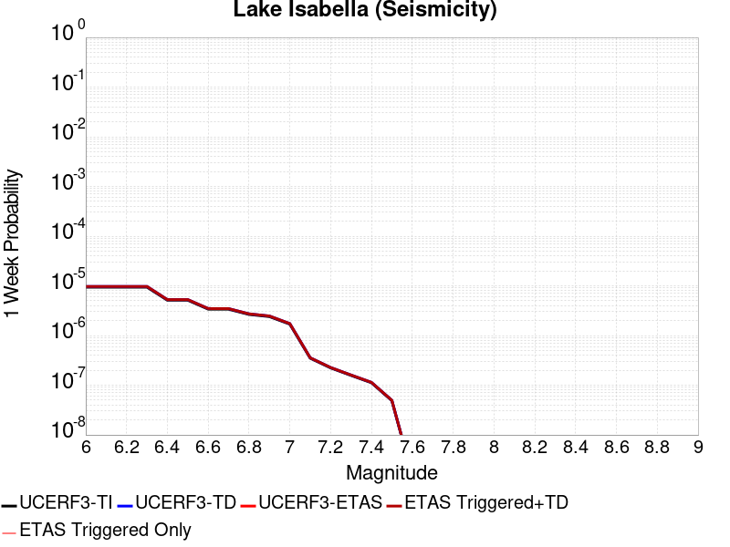 | 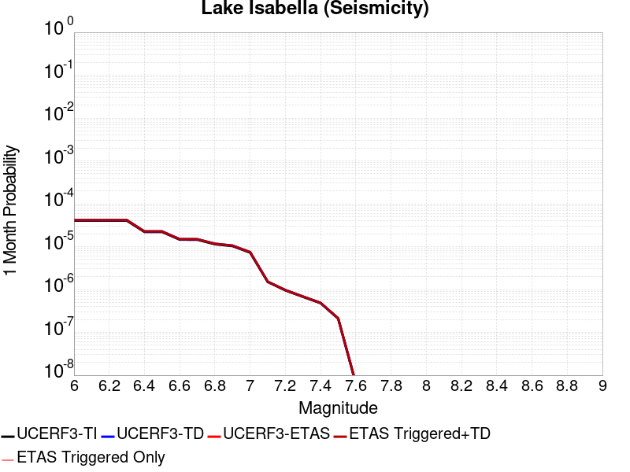 | 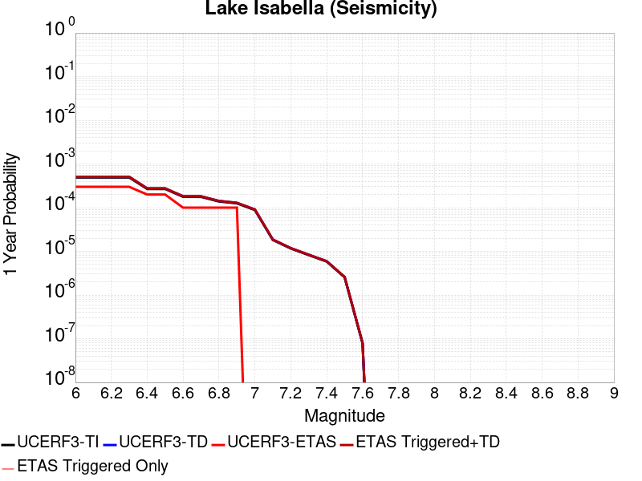 | 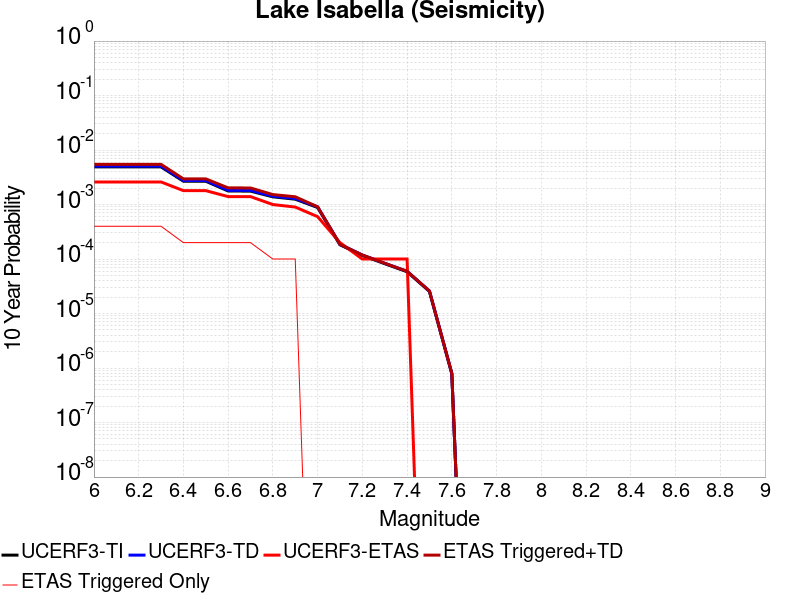 |

| Magnitude | 1 wk TI Prob | 1 wk TD Prob | 1 wk ETAS Prob | 1 wk ETAS/TD Gain | 1 wk ETAS Triggered+TD | 1 wk ETAS Triggered Only | 1 mo TI Prob | 1 mo TD Prob | 1 mo ETAS Prob | 1 mo ETAS/TD Gain | 1 mo ETAS Triggered+TD | 1 mo ETAS Triggered Only | 1 yr TI Prob | 1 yr TD Prob | 1 yr ETAS Prob | 1 yr ETAS/TD Gain | 1 yr ETAS Triggered+TD | 1 yr ETAS Triggered Only | 10 yr TI Prob | 10 yr TD Prob | 10 yr ETAS Prob | 10 yr ETAS/TD Gain | 10 yr ETAS Triggered+TD | 10 yr ETAS Triggered Only |
|-----|-----|-----|-----|-----|-----|-----|-----|-----|-----|-----|-----|-----|-----|-----|-----|-----|-----|-----|-----|-----|-----|-----|-----|-----|
| 6.0 | 9.431637E-6 | 9.738307E-6 | 0.0 | 0.0 | 9.738307E-6 | 0.0 | 4.0420677E-5 | 4.173501E-5 | 0.0 | 0.0 | 4.173501E-5 | 0.0 | 4.920106E-4 | 5.080183E-4 | 3.0E-4 | 0.59052986 | 5.080183E-4 | 0.0 | 0.004909227 | 0.0050698617 | 0.0026 | 0.5128345 | 0.0054678335 | 4.0E-4 |
| 6.1 | 9.431637E-6 | 9.738307E-6 | 0.0 | 0.0 | 9.738307E-6 | 0.0 | 4.0420677E-5 | 4.173501E-5 | 0.0 | 0.0 | 4.173501E-5 | 0.0 | 4.920106E-4 | 5.080183E-4 | 3.0E-4 | 0.59052986 | 5.080183E-4 | 0.0 | 0.004909227 | 0.0050698617 | 0.0026 | 0.5128345 | 0.0054678335 | 4.0E-4 |
| 6.2 | 9.431637E-6 | 9.738307E-6 | 0.0 | 0.0 | 9.738307E-6 | 0.0 | 4.0420677E-5 | 4.173501E-5 | 0.0 | 0.0 | 4.173501E-5 | 0.0 | 4.920106E-4 | 5.080183E-4 | 3.0E-4 | 0.59052986 | 5.080183E-4 | 0.0 | 0.004909227 | 0.0050698617 | 0.0026 | 0.5128345 | 0.0054678335 | 4.0E-4 |
| 6.3 | 9.431637E-6 | 9.738307E-6 | 0.0 | 0.0 | 9.738307E-6 | 0.0 | 4.0420677E-5 | 4.173501E-5 | 0.0 | 0.0 | 4.173501E-5 | 0.0 | 4.920106E-4 | 5.080183E-4 | 3.0E-4 | 0.59052986 | 5.080183E-4 | 0.0 | 0.004909227 | 0.0050698617 | 0.0026 | 0.5128345 | 0.0054678335 | 4.0E-4 |
| 6.4 | 5.144063E-6 | 5.2983974E-6 | 0.0 | 0.0 | 5.2983974E-6 | 0.0 | 2.2045799E-5 | 2.270724E-5 | 0.0 | 0.0 | 2.270724E-5 | 0.0 | 2.6837454E-4 | 2.7642903E-4 | 2.0E-4 | 0.72351307 | 2.7642903E-4 | 0.0 | 0.0026805066 | 0.002761192 | 0.0018 | 0.6518924 | 0.0029606395 | 2.0E-4 |
| 6.5 | 5.144063E-6 | 5.2983974E-6 | 0.0 | 0.0 | 5.2983974E-6 | 0.0 | 2.2045799E-5 | 2.270724E-5 | 0.0 | 0.0 | 2.270724E-5 | 0.0 | 2.6837454E-4 | 2.7642903E-4 | 2.0E-4 | 0.72351307 | 2.7642903E-4 | 0.0 | 0.0026805066 | 0.002761192 | 0.0018 | 0.6518924 | 0.0029606395 | 2.0E-4 |
| 6.6 | 3.4009804E-6 | 3.4977352E-6 | 0.0 | 0.0 | 3.4977352E-6 | 0.0 | 1.4575549E-5 | 1.4990216E-5 | 0.0 | 0.0 | 1.4990216E-5 | 0.0 | 1.7744285E-4 | 1.8249221E-4 | 1.0E-4 | 0.5479686 | 1.8249221E-4 | 0.0 | 0.0017730123 | 0.001823581 | 0.0014 | 0.76772016 | 0.0020232163 | 2.0E-4 |
| 6.7 | 3.3880428E-6 | 3.484604E-6 | 0.0 | 0.0 | 3.484604E-6 | 0.0 | 1.4520103E-5 | 1.493394E-5 | 0.0 | 0.0 | 1.493394E-5 | 0.0 | 1.767679E-4 | 1.8180716E-4 | 1.0E-4 | 0.55003333 | 1.8180716E-4 | 0.0 | 0.0017662736 | 0.0018167418 | 0.0014 | 0.77061033 | 0.0020163783 | 2.0E-4 |
| 6.8 | 2.6582E-6 | 2.7328892E-6 | 0.0 | 0.0 | 2.7328892E-6 | 0.0 | 1.1392236E-5 | 1.1712337E-5 | 0.0 | 0.0 | 1.1712337E-5 | 0.0 | 1.3869164E-4 | 1.4258972E-4 | 1.0E-4 | 0.70131284 | 1.4258972E-4 | 0.0 | 0.0013860512 | 0.0014251142 | 0.001 | 0.7016981 | 0.0015249718 | 1.0E-4 |
| 6.9 | 2.406011E-6 | 2.473595E-6 | 0.0 | 0.0 | 2.473595E-6 | 0.0 | 1.0311434E-5 | 1.0601086E-5 | 0.0 | 0.0 | 1.0601086E-5 | 0.0 | 1.2553448E-4 | 1.290619E-4 | 1.0E-4 | 0.77482206 | 1.290619E-4 | 0.0 | 0.0012546359 | 0.0012899989 | 9.0E-4 | 0.697675 | 0.00138987 | 1.0E-4 |
| 7.0 | 1.6953097E-6 | 1.7424256E-6 | 0.0 | 0.0 | 1.7424256E-6 | 0.0 | 7.265593E-6 | 7.4675227E-6 | 0.0 | 0.0 | 7.4675227E-6 | 0.0 | 8.8455E-5 | 9.091434E-5 | 0.0 | 0.0 | 9.091434E-5 | 0.0 | 8.84198E-4 | 9.088742E-4 | 6.0E-4 | 0.6601574 | 9.088742E-4 | 0.0 |
| 7.1 | 3.5013824E-7 | 3.5707356E-7 | 0.0 | 0.0 | 3.5707356E-7 | 0.0 | 1.5005916E-6 | 1.5303144E-6 | 0.0 | 0.0 | 1.5303144E-6 | 0.0 | 1.826955E-5 | 1.8631421E-5 | 0.0 | 0.0 | 1.8631421E-5 | 0.0 | 1.8268047E-4 | 1.8629884E-4 | 2.0E-4 | 1.0735439 | 1.8629884E-4 | 0.0 |
| 7.2 | 2.2321095E-7 | 2.2746003E-7 | 0.0 | 0.0 | 2.2746003E-7 | 0.0 | 9.56618E-7 | 9.748284E-7 | 0.0 | 0.0 | 9.748284E-7 | 0.0 | 1.1646762E-5 | 1.1868471E-5 | 0.0 | 0.0 | 1.1868471E-5 | 0.0 | 1.1646151E-4 | 1.1867848E-4 | 1.0E-4 | 0.84261274 | 1.1867848E-4 | 0.0 |
| 7.3 | 1.5760406E-7 | 1.6057724E-7 | 0.0 | 0.0 | 1.6057724E-7 | 0.0 | 6.7544585E-7 | 6.8818804E-7 | 0.0 | 0.0 | 6.8818804E-7 | 0.0 | 8.223522E-6 | 8.378658E-6 | 0.0 | 0.0 | 8.378658E-6 | 0.0 | 8.2232174E-5 | 8.378348E-5 | 1.0E-4 | 1.1935527 | 8.378348E-5 | 0.0 |
| 7.4 | 1.1216497E-7 | 1.1429416E-7 | 0.0 | 0.0 | 1.1429416E-7 | 0.0 | 4.8070694E-7 | 4.89832E-7 | 0.0 | 0.0 | 4.89832E-7 | 0.0 | 5.852591E-6 | 5.963689E-6 | 0.0 | 0.0 | 5.963689E-6 | 0.0 | 5.8524372E-5 | 5.9635335E-5 | 1.0E-4 | 1.6768582 | 5.9635335E-5 | 0.0 |
| 7.5 | 4.885185E-8 | 4.977778E-8 | 0.0 | 0.0 | 4.977778E-8 | 0.0 | 2.0936506E-7 | 2.1333332E-7 | 0.0 | 0.0 | 2.1333332E-7 | 0.0 | 2.5490165E-6 | 2.5973302E-6 | 0.0 | 0.0 | 2.5973302E-6 | 0.0 | 2.5489873E-5 | 2.5973017E-5 | 0.0 | 0.0 | 2.5973017E-5 | 0.0 |
| 7.6 | 1.504641E-9 | 1.5315017E-9 | 0.0 | 0.0 | 1.5315017E-9 | 0.0 | 6.4484613E-9 | 6.563579E-9 | 0.0 | 0.0 | 6.563579E-9 | 0.0 | 7.851001E-8 | 7.991157E-8 | 0.0 | 0.0 | 7.991157E-8 | 0.0 | 7.8509987E-7 | 7.9911575E-7 | 0.0 | 0.0 | 7.9911575E-7 | 0.0 |

## Skinner Flat 2011 CFM
*[(top)](#table-of-contents)*

| 1 Week | 1 Month | 1 Year | 10 Year |
|-----|-----|-----|-----|
| 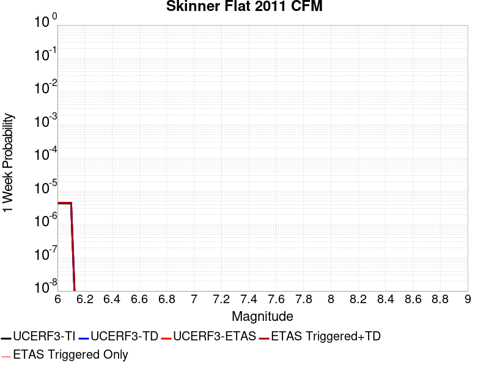 | 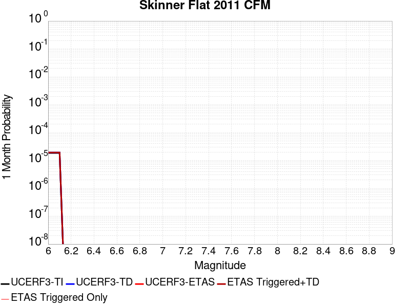 | 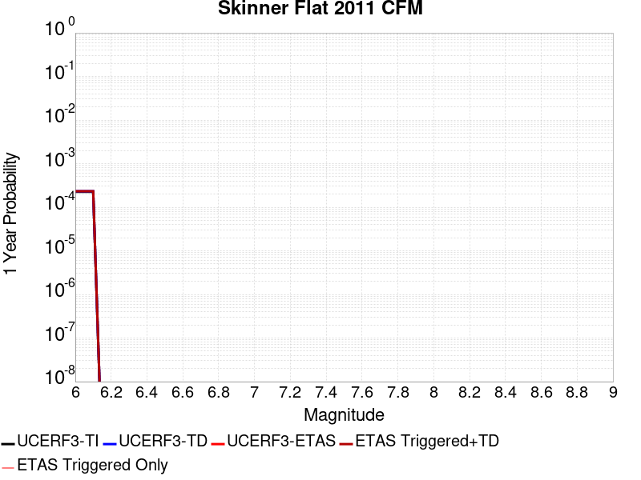 | 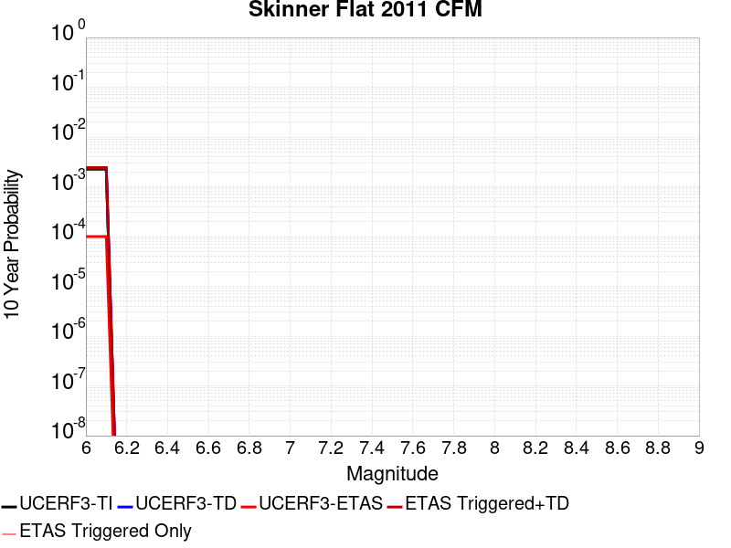 |

| Magnitude | 1 wk TI Prob | 1 wk TD Prob | 1 wk ETAS Prob | 1 wk ETAS/TD Gain | 1 wk ETAS Triggered+TD | 1 wk ETAS Triggered Only | 1 mo TI Prob | 1 mo TD Prob | 1 mo ETAS Prob | 1 mo ETAS/TD Gain | 1 mo ETAS Triggered+TD | 1 mo ETAS Triggered Only | 1 yr TI Prob | 1 yr TD Prob | 1 yr ETAS Prob | 1 yr ETAS/TD Gain | 1 yr ETAS Triggered+TD | 1 yr ETAS Triggered Only | 10 yr TI Prob | 10 yr TD Prob | 10 yr ETAS Prob | 10 yr ETAS/TD Gain | 10 yr ETAS Triggered+TD | 10 yr ETAS Triggered Only |
|-----|-----|-----|-----|-----|-----|-----|-----|-----|-----|-----|-----|-----|-----|-----|-----|-----|-----|-----|-----|-----|-----|-----|-----|-----|
| 6.0 | 4.3279074E-6 | 4.4832545E-6 | 0.0 | 0.0 | 4.4832545E-6 | 0.0 | 1.8548042E-5 | 1.9213947E-5 | 0.0 | 0.0 | 1.9213947E-5 | 0.0 | 2.2579901E-4 | 2.3392981E-4 | 0.0 | 0.0 | 2.3392981E-4 | 0.0 | 0.002255697 | 0.0023392981 | 0.0011 | 0.47022653 | 0.0026385963 | 3.0E-4 |
| 6.1 | 4.3279074E-6 | 4.4832545E-6 | 0.0 | 0.0 | 4.4832545E-6 | 0.0 | 1.8548042E-5 | 1.9213947E-5 | 0.0 | 0.0 | 1.9213947E-5 | 0.0 | 2.2579901E-4 | 2.3392981E-4 | 0.0 | 0.0 | 2.3392981E-4 | 0.0 | 0.002255697 | 0.0023392981 | 9.0E-4 | 0.3847308 | 0.0026385963 | 3.0E-4 |

## Sierra Madre (San Fernando)
*[(top)](#table-of-contents)*

| 1 Week | 1 Month | 1 Year | 10 Year |
|-----|-----|-----|-----|
| 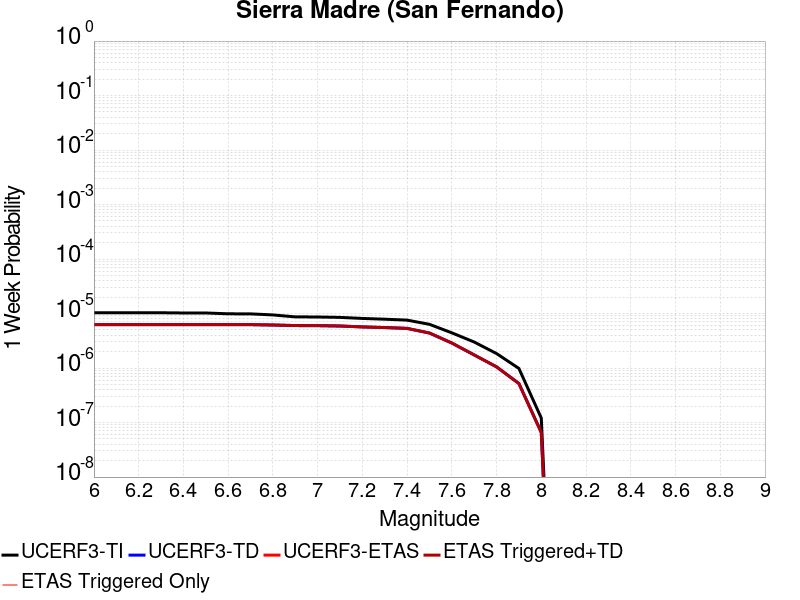 | 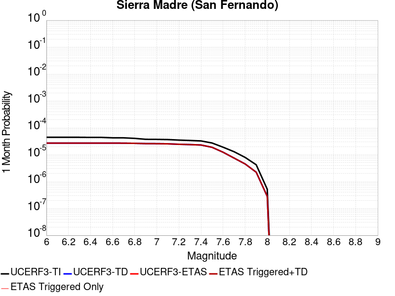 | 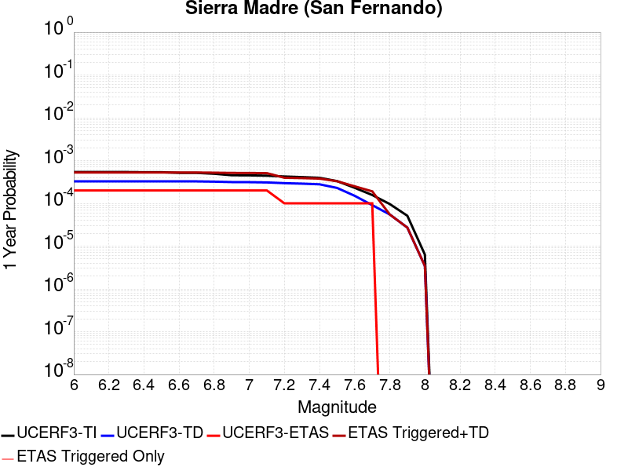 | 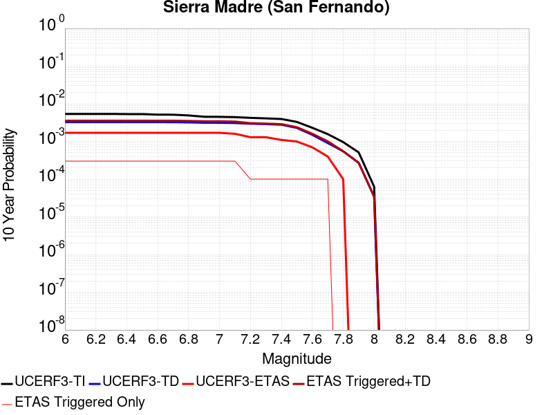 |

| Magnitude | 1 wk TI Prob | 1 wk TD Prob | 1 wk ETAS Prob | 1 wk ETAS/TD Gain | 1 wk ETAS Triggered+TD | 1 wk ETAS Triggered Only | 1 mo TI Prob | 1 mo TD Prob | 1 mo ETAS Prob | 1 mo ETAS/TD Gain | 1 mo ETAS Triggered+TD | 1 mo ETAS Triggered Only | 1 yr TI Prob | 1 yr TD Prob | 1 yr ETAS Prob | 1 yr ETAS/TD Gain | 1 yr ETAS Triggered+TD | 1 yr ETAS Triggered Only | 10 yr TI Prob | 10 yr TD Prob | 10 yr ETAS Prob | 10 yr ETAS/TD Gain | 10 yr ETAS Triggered+TD | 10 yr ETAS Triggered Only |
|-----|-----|-----|-----|-----|-----|-----|-----|-----|-----|-----|-----|-----|-----|-----|-----|-----|-----|-----|-----|-----|-----|-----|-----|-----|
| 6.0 | 1.0346413E-5 | 6.273404E-6 | 0.0 | 0.0 | 6.273404E-6 | 0.0 | 4.4341014E-5 | 2.6885746E-5 | 0.0 | 0.0 | 2.6885746E-5 | 0.0 | 5.3971814E-4 | 3.272859E-4 | 2.0E-4 | 0.61108655 | 5.272204E-4 | 2.0E-4 | 0.0053840918 | 0.0032681513 | 0.0017 | 0.52017176 | 0.0035671708 | 3.0E-4 |
| 6.1 | 1.0346413E-5 | 6.273404E-6 | 0.0 | 0.0 | 6.273404E-6 | 0.0 | 4.4341014E-5 | 2.6885746E-5 | 0.0 | 0.0 | 2.6885746E-5 | 0.0 | 5.3971814E-4 | 3.272859E-4 | 2.0E-4 | 0.61108655 | 5.272204E-4 | 2.0E-4 | 0.0053840918 | 0.0032681513 | 0.0017 | 0.52017176 | 0.0035671708 | 3.0E-4 |
| 6.2 | 1.0346413E-5 | 6.273404E-6 | 0.0 | 0.0 | 6.273404E-6 | 0.0 | 4.4341014E-5 | 2.6885746E-5 | 0.0 | 0.0 | 2.6885746E-5 | 0.0 | 5.3971814E-4 | 3.272859E-4 | 2.0E-4 | 0.61108655 | 5.272204E-4 | 2.0E-4 | 0.0053840918 | 0.0032681513 | 0.0017 | 0.52017176 | 0.0035671708 | 3.0E-4 |
| 6.3 | 1.0346413E-5 | 6.273404E-6 | 0.0 | 0.0 | 6.273404E-6 | 0.0 | 4.4341014E-5 | 2.6885746E-5 | 0.0 | 0.0 | 2.6885746E-5 | 0.0 | 5.3971814E-4 | 3.272859E-4 | 2.0E-4 | 0.61108655 | 5.272204E-4 | 2.0E-4 | 0.0053840918 | 0.0032681513 | 0.0017 | 0.52017176 | 0.0035671708 | 3.0E-4 |
| 6.4 | 1.0249558E-5 | 6.273404E-6 | 0.0 | 0.0 | 6.273404E-6 | 0.0 | 4.392594E-5 | 2.6885746E-5 | 0.0 | 0.0 | 2.6885746E-5 | 0.0 | 5.3466705E-4 | 3.272859E-4 | 2.0E-4 | 0.61108655 | 5.272204E-4 | 2.0E-4 | 0.0053338245 | 0.0032681513 | 0.0017 | 0.52017176 | 0.0035671708 | 3.0E-4 |
| 6.5 | 1.0249558E-5 | 6.273404E-6 | 0.0 | 0.0 | 6.273404E-6 | 0.0 | 4.392594E-5 | 2.6885746E-5 | 0.0 | 0.0 | 2.6885746E-5 | 0.0 | 5.3466705E-4 | 3.272859E-4 | 2.0E-4 | 0.61108655 | 5.272204E-4 | 2.0E-4 | 0.0053338245 | 0.0032681513 | 0.0017 | 0.52017176 | 0.0035671708 | 3.0E-4 |
| 6.6 | 9.9035515E-6 | 6.273404E-6 | 0.0 | 0.0 | 6.273404E-6 | 0.0 | 4.2443102E-5 | 2.6885746E-5 | 0.0 | 0.0 | 2.6885746E-5 | 0.0 | 5.166222E-4 | 3.272859E-4 | 2.0E-4 | 0.61108655 | 5.272204E-4 | 2.0E-4 | 0.0051542283 | 0.0032681513 | 0.0017 | 0.52017176 | 0.0035671708 | 3.0E-4 |
| 6.7 | 9.87217E-6 | 6.2608547E-6 | 0.0 | 0.0 | 6.2608547E-6 | 0.0 | 4.2308613E-5 | 2.6831965E-5 | 0.0 | 0.0 | 2.6831965E-5 | 0.0 | 5.149856E-4 | 3.266313E-4 | 2.0E-4 | 0.6123112 | 5.26566E-4 | 2.0E-4 | 0.005137938 | 0.0032616246 | 0.0017 | 0.52121264 | 0.0035606462 | 3.0E-4 |
| 6.8 | 9.4359175E-6 | 6.1650944E-6 | 0.0 | 0.0 | 6.1650944E-6 | 0.0 | 4.043902E-5 | 2.642157E-5 | 0.0 | 0.0 | 2.642157E-5 | 0.0 | 4.9223384E-4 | 3.2163624E-4 | 2.0E-4 | 0.62182045 | 5.215719E-4 | 2.0E-4 | 0.0049114493 | 0.0032118189 | 0.0017 | 0.52929515 | 0.0035108551 | 3.0E-4 |
| 6.9 | 8.700447E-6 | 6.026804E-6 | 0.0 | 0.0 | 6.026804E-6 | 0.0 | 3.72871E-5 | 2.582891E-5 | 0.0 | 0.0 | 2.582891E-5 | 0.0 | 4.5387587E-4 | 3.1442268E-4 | 2.0E-4 | 0.6360864 | 5.143598E-4 | 2.0E-4 | 0.0045295 | 0.0031398875 | 0.0017 | 0.5414207 | 0.0034389456 | 3.0E-4 |
| 7.0 | 8.648878E-6 | 6.001816E-6 | 0.0 | 0.0 | 6.001816E-6 | 0.0 | 3.7066096E-5 | 2.572182E-5 | 0.0 | 0.0 | 2.572182E-5 | 0.0 | 4.5118626E-4 | 3.1311924E-4 | 2.0E-4 | 0.6387343 | 5.1305664E-4 | 2.0E-4 | 0.004502713 | 0.00312689 | 0.0017 | 0.5436712 | 0.0034259518 | 3.0E-4 |
| 7.1 | 8.505786E-6 | 5.9117942E-6 | 0.0 | 0.0 | 5.9117942E-6 | 0.0 | 3.645286E-5 | 2.5336021E-5 | 0.0 | 0.0 | 2.5336021E-5 | 0.0 | 4.437232E-4 | 3.0842348E-4 | 2.0E-4 | 0.6484591 | 5.083618E-4 | 2.0E-4 | 0.0044283825 | 0.0030800633 | 0.0016 | 0.51946986 | 0.0033791391 | 3.0E-4 |
| 7.2 | 8.139752E-6 | 5.686298E-6 | 0.0 | 0.0 | 5.686298E-6 | 0.0 | 3.4884186E-5 | 2.4369629E-5 | 0.0 | 0.0 | 2.4369629E-5 | 0.0 | 4.246322E-4 | 2.9666087E-4 | 1.0E-4 | 0.33708522 | 3.9663122E-4 | 1.0E-4 | 0.004238217 | 0.0029627546 | 0.0013 | 0.43878087 | 0.0030624582 | 1.0E-4 |
| 7.3 | 7.8816E-6 | 5.5397795E-6 | 0.0 | 0.0 | 5.5397795E-6 | 0.0 | 3.3777847E-5 | 2.3741703E-5 | 0.0 | 0.0 | 2.3741703E-5 | 0.0 | 4.111677E-4 | 2.8901795E-4 | 1.0E-4 | 0.34599927 | 3.8898905E-4 | 1.0E-4 | 0.004104078 | 0.002886526 | 0.0013 | 0.45036834 | 0.0029862374 | 1.0E-4 |
| 7.4 | 7.5810603E-6 | 5.3441613E-6 | 0.0 | 0.0 | 5.3441613E-6 | 0.0 | 3.2489854E-5 | 2.2903354E-5 | 0.0 | 0.0 | 2.2903354E-5 | 0.0 | 3.9549218E-4 | 2.788137E-4 | 1.0E-4 | 0.35866243 | 3.787858E-4 | 1.0E-4 | 0.0039478904 | 0.002784744 | 0.0011 | 0.3950094 | 0.0028844655 | 1.0E-4 |
| 7.5 | 6.349153E-6 | 4.395968E-6 | 0.0 | 0.0 | 4.395968E-6 | 0.0 | 2.7210372E-5 | 1.8839732E-5 | 0.0 | 0.0 | 1.8839732E-5 | 0.0 | 3.312359E-4 | 2.2935042E-4 | 1.0E-4 | 0.43601403 | 3.2932748E-4 | 1.0E-4 | 0.0033074263 | 0.002291219 | 0.001 | 0.43644887 | 0.00239099 | 1.0E-4 |
| 7.6 | 4.430576E-6 | 2.8800944E-6 | 0.0 | 0.0 | 2.8800944E-6 | 0.0 | 1.8988047E-5 | 1.2343205E-5 | 0.0 | 0.0 | 1.2343205E-5 | 0.0 | 2.3115493E-4 | 1.5026839E-4 | 1.0E-4 | 0.66547596 | 2.5025336E-4 | 1.0E-4 | 0.0023091463 | 0.0015016902 | 7.0E-4 | 0.4661414 | 0.00160154 | 1.0E-4 |
| 7.7 | 3.005066E-6 | 1.7428665E-6 | 0.0 | 0.0 | 1.7428665E-6 | 0.0 | 1.2878791E-5 | 7.4694067E-6 | 0.0 | 0.0 | 7.4694067E-6 | 0.0 | 1.56788E-4 | 9.093624E-5 | 1.0E-4 | 1.0996716 | 1.9092715E-4 | 1.0E-4 | 0.0015667742 | 9.0899144E-4 | 4.0E-4 | 0.44004813 | 0.0010089006 | 1.0E-4 |
| 7.8 | 1.8459098E-6 | 1.0528026E-6 | 0.0 | 0.0 | 1.0528026E-6 | 0.0 | 7.911018E-6 | 4.512003E-6 | 0.0 | 0.0 | 4.512003E-6 | 0.0 | 9.631238E-5 | 5.493226E-5 | 0.0 | 0.0 | 5.493226E-5 | 0.0 | 9.627065E-4 | 5.4918724E-4 | 1.0E-4 | 0.18208726 | 5.4918724E-4 | 0.0 |
| 7.9 | 9.839262E-7 | 5.205458E-7 | 0.0 | 0.0 | 5.205458E-7 | 0.0 | 4.2168194E-6 | 2.2309086E-6 | 0.0 | 0.0 | 2.2309086E-6 | 0.0 | 5.1338568E-5 | 2.7160977E-5 | 0.0 | 0.0 | 2.7160977E-5 | 0.0 | 5.132671E-4 | 2.7157686E-4 | 0.0 | 0.0 | 2.7157686E-4 | 0.0 |
| 8.0 | 1.210983E-7 | 6.5793074E-8 | 0.0 | 0.0 | 6.5793074E-8 | 0.0 | 5.1899264E-7 | 2.819703E-7 | 0.0 | 0.0 | 2.819703E-7 | 0.0 | 6.3187167E-6 | 3.432983E-6 | 0.0 | 0.0 | 3.432983E-6 | 0.0 | 6.318537E-5 | 3.4329318E-5 | 0.0 | 0.0 | 3.4329318E-5 | 0.0 |

## Northridge Hills
*[(top)](#table-of-contents)*

| 1 Week | 1 Month | 1 Year | 10 Year |
|-----|-----|-----|-----|
| 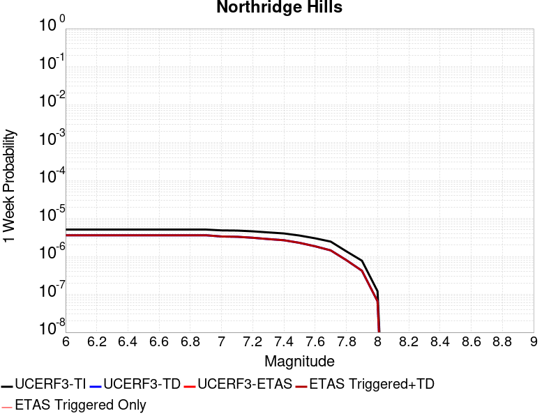 | 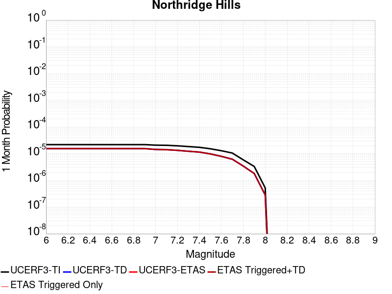 | 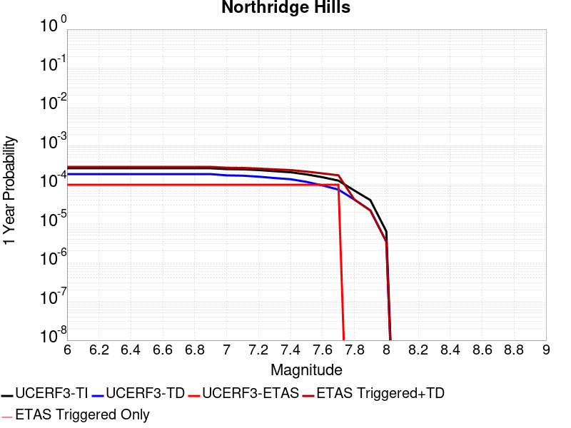 | 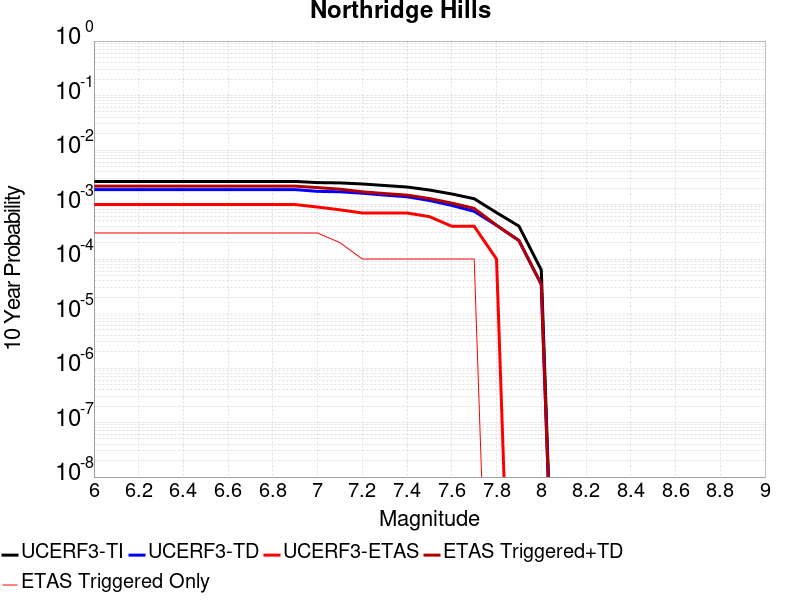 |

| Magnitude | 1 wk TI Prob | 1 wk TD Prob | 1 wk ETAS Prob | 1 wk ETAS/TD Gain | 1 wk ETAS Triggered+TD | 1 wk ETAS Triggered Only | 1 mo TI Prob | 1 mo TD Prob | 1 mo ETAS Prob | 1 mo ETAS/TD Gain | 1 mo ETAS Triggered+TD | 1 mo ETAS Triggered Only | 1 yr TI Prob | 1 yr TD Prob | 1 yr ETAS Prob | 1 yr ETAS/TD Gain | 1 yr ETAS Triggered+TD | 1 yr ETAS Triggered Only | 10 yr TI Prob | 10 yr TD Prob | 10 yr ETAS Prob | 10 yr ETAS/TD Gain | 10 yr ETAS Triggered+TD | 10 yr ETAS Triggered Only |
|-----|-----|-----|-----|-----|-----|-----|-----|-----|-----|-----|-----|-----|-----|-----|-----|-----|-----|-----|-----|-----|-----|-----|-----|-----|
| 6.0 | 5.095982E-6 | 3.607727E-6 | 0.0 | 0.0 | 3.607727E-6 | 0.0 | 2.183974E-5 | 1.5461595E-5 | 0.0 | 0.0 | 1.5461595E-5 | 0.0 | 2.658664E-4 | 1.8822879E-4 | 1.0E-4 | 0.53126836 | 2.8820997E-4 | 1.0E-4 | 0.0026554854 | 0.0018807059 | 0.001 | 0.5317152 | 0.0021801419 | 3.0E-4 |
| 6.1 | 5.095982E-6 | 3.607727E-6 | 0.0 | 0.0 | 3.607727E-6 | 0.0 | 2.183974E-5 | 1.5461595E-5 | 0.0 | 0.0 | 1.5461595E-5 | 0.0 | 2.658664E-4 | 1.8822879E-4 | 1.0E-4 | 0.53126836 | 2.8820997E-4 | 1.0E-4 | 0.0026554854 | 0.0018807059 | 0.001 | 0.5317152 | 0.0021801419 | 3.0E-4 |
| 6.2 | 5.095982E-6 | 3.607727E-6 | 0.0 | 0.0 | 3.607727E-6 | 0.0 | 2.183974E-5 | 1.5461595E-5 | 0.0 | 0.0 | 1.5461595E-5 | 0.0 | 2.658664E-4 | 1.8822879E-4 | 1.0E-4 | 0.53126836 | 2.8820997E-4 | 1.0E-4 | 0.0026554854 | 0.0018807059 | 0.001 | 0.5317152 | 0.0021801419 | 3.0E-4 |
| 6.3 | 5.095982E-6 | 3.607727E-6 | 0.0 | 0.0 | 3.607727E-6 | 0.0 | 2.183974E-5 | 1.5461595E-5 | 0.0 | 0.0 | 1.5461595E-5 | 0.0 | 2.658664E-4 | 1.8822879E-4 | 1.0E-4 | 0.53126836 | 2.8820997E-4 | 1.0E-4 | 0.0026554854 | 0.0018807059 | 0.001 | 0.5317152 | 0.0021801419 | 3.0E-4 |
| 6.4 | 5.095982E-6 | 3.607727E-6 | 0.0 | 0.0 | 3.607727E-6 | 0.0 | 2.183974E-5 | 1.5461595E-5 | 0.0 | 0.0 | 1.5461595E-5 | 0.0 | 2.658664E-4 | 1.8822879E-4 | 1.0E-4 | 0.53126836 | 2.8820997E-4 | 1.0E-4 | 0.0026554854 | 0.0018807059 | 0.001 | 0.5317152 | 0.0021801419 | 3.0E-4 |
| 6.5 | 5.095982E-6 | 3.607727E-6 | 0.0 | 0.0 | 3.607727E-6 | 0.0 | 2.183974E-5 | 1.5461595E-5 | 0.0 | 0.0 | 1.5461595E-5 | 0.0 | 2.658664E-4 | 1.8822879E-4 | 1.0E-4 | 0.53126836 | 2.8820997E-4 | 1.0E-4 | 0.0026554854 | 0.0018807059 | 0.001 | 0.5317152 | 0.0021801419 | 3.0E-4 |
| 6.6 | 5.095982E-6 | 3.607727E-6 | 0.0 | 0.0 | 3.607727E-6 | 0.0 | 2.183974E-5 | 1.5461595E-5 | 0.0 | 0.0 | 1.5461595E-5 | 0.0 | 2.658664E-4 | 1.8822879E-4 | 1.0E-4 | 0.53126836 | 2.8820997E-4 | 1.0E-4 | 0.0026554854 | 0.0018807059 | 0.001 | 0.5317152 | 0.0021801419 | 3.0E-4 |
| 6.7 | 5.095982E-6 | 3.607727E-6 | 0.0 | 0.0 | 3.607727E-6 | 0.0 | 2.183974E-5 | 1.5461595E-5 | 0.0 | 0.0 | 1.5461595E-5 | 0.0 | 2.658664E-4 | 1.8822879E-4 | 1.0E-4 | 0.53126836 | 2.8820997E-4 | 1.0E-4 | 0.0026554854 | 0.0018807059 | 0.001 | 0.5317152 | 0.0021801419 | 3.0E-4 |
| 6.8 | 5.095982E-6 | 3.607727E-6 | 0.0 | 0.0 | 3.607727E-6 | 0.0 | 2.183974E-5 | 1.5461595E-5 | 0.0 | 0.0 | 1.5461595E-5 | 0.0 | 2.658664E-4 | 1.8822879E-4 | 1.0E-4 | 0.53126836 | 2.8820997E-4 | 1.0E-4 | 0.0026554854 | 0.0018807059 | 0.001 | 0.5317152 | 0.0021801419 | 3.0E-4 |
| 6.9 | 5.0942654E-6 | 3.6059428E-6 | 0.0 | 0.0 | 3.6059428E-6 | 0.0 | 2.1832384E-5 | 1.5453948E-5 | 0.0 | 0.0 | 1.5453948E-5 | 0.0 | 2.6577685E-4 | 1.881357E-4 | 1.0E-4 | 0.5315312 | 2.881169E-4 | 1.0E-4 | 0.002654592 | 0.0018797767 | 0.001 | 0.5319781 | 0.0021792129 | 3.0E-4 |
| 7.0 | 4.851143E-6 | 3.351384E-6 | 0.0 | 0.0 | 3.351384E-6 | 0.0 | 2.0790447E-5 | 1.4362995E-5 | 0.0 | 0.0 | 1.4362995E-5 | 0.0 | 2.5309427E-4 | 1.7485548E-4 | 1.0E-4 | 0.5719009 | 2.7483798E-4 | 1.0E-4 | 0.0025280623 | 0.0017471834 | 9.0E-4 | 0.5151148 | 0.0020466591 | 3.0E-4 |
| 7.1 | 4.7910607E-6 | 3.289697E-6 | 0.0 | 0.0 | 3.289697E-6 | 0.0 | 2.0532956E-5 | 1.4098625E-5 | 0.0 | 0.0 | 1.4098625E-5 | 0.0 | 2.4996005E-4 | 1.7163728E-4 | 1.0E-4 | 0.582624 | 2.716201E-4 | 1.0E-4 | 0.0024967908 | 0.0017150512 | 8.0E-4 | 0.46645838 | 0.0019147082 | 2.0E-4 |
| 7.2 | 4.580079E-6 | 3.0995743E-6 | 0.0 | 0.0 | 3.0995743E-6 | 0.0 | 1.9628762E-5 | 1.3283823E-5 | 0.0 | 0.0 | 1.3283823E-5 | 0.0 | 2.3895396E-4 | 1.6171856E-4 | 1.0E-4 | 0.6183582 | 2.617024E-4 | 1.0E-4 | 0.0023869718 | 0.0016160123 | 7.0E-4 | 0.433165 | 0.0017158508 | 1.0E-4 |
| 7.3 | 4.290062E-6 | 2.8612776E-6 | 0.0 | 0.0 | 2.8612776E-6 | 0.0 | 1.838585E-5 | 1.2262561E-5 | 0.0 | 0.0 | 1.2262561E-5 | 0.0 | 2.2382473E-4 | 1.4928647E-4 | 1.0E-4 | 0.6698531 | 2.4927154E-4 | 1.0E-4 | 0.0022359942 | 0.0014918649 | 7.0E-4 | 0.4692114 | 0.0015917156 | 1.0E-4 |
| 7.4 | 4.0259683E-6 | 2.6671132E-6 | 0.0 | 0.0 | 2.6671132E-6 | 0.0 | 1.7254037E-5 | 1.1430435E-5 | 0.0 | 0.0 | 1.1430435E-5 | 0.0 | 2.1004764E-4 | 1.3915669E-4 | 1.0E-4 | 0.7186144 | 2.3914277E-4 | 1.0E-4 | 0.002098492 | 0.0013906982 | 7.0E-4 | 0.50334424 | 0.0014905592 | 1.0E-4 |
| 7.5 | 3.5477108E-6 | 2.2787606E-6 | 0.0 | 0.0 | 2.2787606E-6 | 0.0 | 1.5204386E-5 | 9.76608E-6 | 0.0 | 0.0 | 9.76608E-6 | 0.0 | 1.8509767E-4 | 1.1889555E-4 | 1.0E-4 | 0.84107435 | 2.1888367E-4 | 1.0E-4 | 0.0018494357 | 0.0011883209 | 6.0E-4 | 0.5049141 | 0.0012882021 | 1.0E-4 |
| 7.6 | 2.9990608E-6 | 1.8468312E-6 | 0.0 | 0.0 | 1.8468312E-6 | 0.0 | 1.2853055E-5 | 7.914967E-6 | 0.0 | 0.0 | 7.914967E-6 | 0.0 | 1.564747E-4 | 9.636046E-5 | 1.0E-4 | 1.03777 | 1.9635083E-4 | 1.0E-4 | 0.0015636457 | 9.631876E-4 | 4.0E-4 | 0.41528773 | 0.0010630913 | 1.0E-4 |
| 7.7 | 2.4542855E-6 | 1.4410505E-6 | 0.0 | 0.0 | 1.4410505E-6 | 0.0 | 1.05183235E-5 | 6.1759156E-6 | 0.0 | 0.0 | 6.1759156E-6 | 0.0 | 1.2805307E-4 | 7.5189186E-5 | 1.0E-4 | 1.3299785 | 1.7518166E-4 | 1.0E-4 | 0.001279793 | 7.51638E-4 | 4.0E-4 | 0.5321711 | 8.515628E-4 | 1.0E-4 |
| 7.8 | 1.3623128E-6 | 7.9832046E-7 | 0.0 | 0.0 | 7.9832046E-7 | 0.0 | 5.8384703E-6 | 3.421369E-6 | 0.0 | 0.0 | 3.421369E-6 | 0.0 | 7.108106E-5 | 4.1654373E-5 | 0.0 | 0.0 | 4.1654373E-5 | 0.0 | 7.1058323E-4 | 4.1646586E-4 | 1.0E-4 | 0.24011572 | 4.1646586E-4 | 0.0 |
| 7.9 | 7.716622E-7 | 4.1969E-7 | 0.0 | 0.0 | 4.1969E-7 | 0.0 | 3.3071194E-6 | 1.7986702E-6 | 0.0 | 0.0 | 1.7986702E-6 | 0.0 | 4.0263436E-5 | 2.1898592E-5 | 0.0 | 0.0 | 2.1898592E-5 | 0.0 | 4.0256142E-4 | 2.1896444E-4 | 0.0 | 0.0 | 2.1896444E-4 | 0.0 |
| 8.0 | 1.2117711E-7 | 6.587539E-8 | 0.0 | 0.0 | 6.587539E-8 | 0.0 | 5.1933034E-7 | 2.8232307E-7 | 0.0 | 0.0 | 2.8232307E-7 | 0.0 | 6.3228285E-6 | 3.437278E-6 | 0.0 | 0.0 | 3.437278E-6 | 0.0 | 6.3226486E-5 | 3.4372268E-5 | 0.0 | 0.0 | 3.4372268E-5 | 0.0 |

## Camp Rock 2011
*[(top)](#table-of-contents)*

| 1 Week | 1 Month | 1 Year | 10 Year |
|-----|-----|-----|-----|
|  | 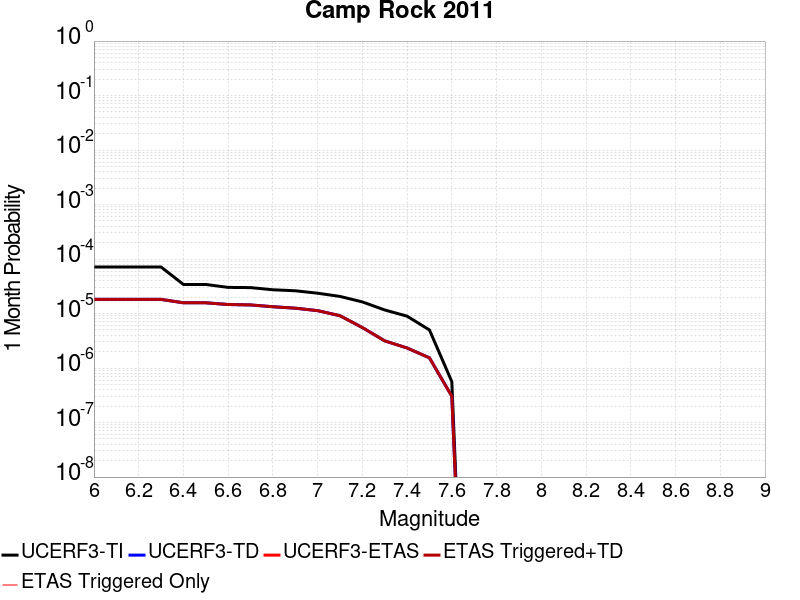 | 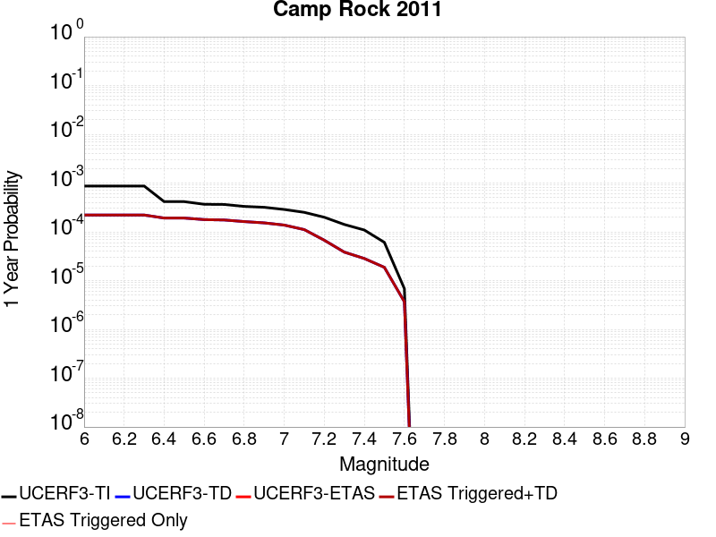 | 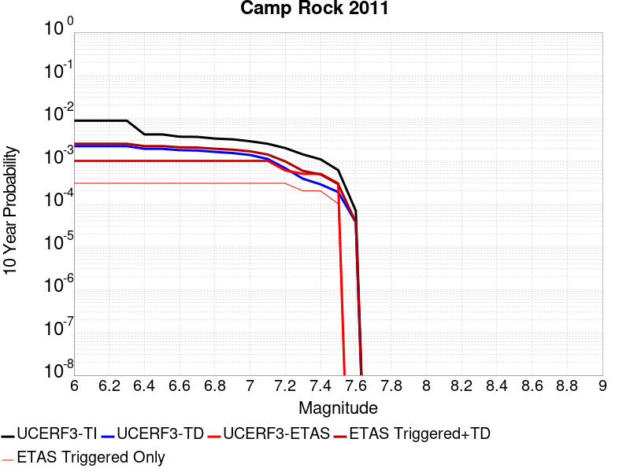 |

| Magnitude | 1 wk TI Prob | 1 wk TD Prob | 1 wk ETAS Prob | 1 wk ETAS/TD Gain | 1 wk ETAS Triggered+TD | 1 wk ETAS Triggered Only | 1 mo TI Prob | 1 mo TD Prob | 1 mo ETAS Prob | 1 mo ETAS/TD Gain | 1 mo ETAS Triggered+TD | 1 mo ETAS Triggered Only | 1 yr TI Prob | 1 yr TD Prob | 1 yr ETAS Prob | 1 yr ETAS/TD Gain | 1 yr ETAS Triggered+TD | 1 yr ETAS Triggered Only | 10 yr TI Prob | 10 yr TD Prob | 10 yr ETAS Prob | 10 yr ETAS/TD Gain | 10 yr ETAS Triggered+TD | 10 yr ETAS Triggered Only |
|-----|-----|-----|-----|-----|-----|-----|-----|-----|-----|-----|-----|-----|-----|-----|-----|-----|-----|-----|-----|-----|-----|-----|-----|-----|
| 6.0 | 1.6710783E-5 | 4.245863E-6 | 0.0 | 0.0 | 4.245863E-6 | 0.0 | 7.161568E-5 | 1.819643E-5 | 0.0 | 0.0 | 1.819643E-5 | 0.0 | 8.7157206E-4 | 2.2151954E-4 | 0.0 | 0.0 | 2.2151954E-4 | 0.0 | 0.008681616 | 0.0022130401 | 0.001 | 0.4518671 | 0.002512376 | 3.0E-4 |
| 6.1 | 1.6710783E-5 | 4.245863E-6 | 0.0 | 0.0 | 4.245863E-6 | 0.0 | 7.161568E-5 | 1.819643E-5 | 0.0 | 0.0 | 1.819643E-5 | 0.0 | 8.7157206E-4 | 2.2151954E-4 | 0.0 | 0.0 | 2.2151954E-4 | 0.0 | 0.008681616 | 0.0022130401 | 0.001 | 0.4518671 | 0.002512376 | 3.0E-4 |
| 6.2 | 1.6710783E-5 | 4.245863E-6 | 0.0 | 0.0 | 4.245863E-6 | 0.0 | 7.161568E-5 | 1.819643E-5 | 0.0 | 0.0 | 1.819643E-5 | 0.0 | 8.7157206E-4 | 2.2151954E-4 | 0.0 | 0.0 | 2.2151954E-4 | 0.0 | 0.008681616 | 0.0022130401 | 0.001 | 0.4518671 | 0.002512376 | 3.0E-4 |
| 6.3 | 1.6710783E-5 | 4.245863E-6 | 0.0 | 0.0 | 4.245863E-6 | 0.0 | 7.161568E-5 | 1.819643E-5 | 0.0 | 0.0 | 1.819643E-5 | 0.0 | 8.7157206E-4 | 2.2151954E-4 | 0.0 | 0.0 | 2.2151954E-4 | 0.0 | 0.008681616 | 0.0022130401 | 0.001 | 0.4518671 | 0.002512376 | 3.0E-4 |
| 6.4 | 7.982846E-6 | 3.6780725E-6 | 0.0 | 0.0 | 3.6780725E-6 | 0.0 | 3.421175E-5 | 1.5763075E-5 | 0.0 | 0.0 | 1.5763075E-5 | 0.0 | 4.1644843E-4 | 1.9189887E-4 | 0.0 | 0.0 | 1.9189887E-4 | 0.0 | 0.0041566887 | 0.0019173665 | 0.001 | 0.5215487 | 0.0022167913 | 3.0E-4 |
| 6.5 | 7.982846E-6 | 3.6780725E-6 | 0.0 | 0.0 | 3.6780725E-6 | 0.0 | 3.421175E-5 | 1.5763075E-5 | 0.0 | 0.0 | 1.5763075E-5 | 0.0 | 4.1644843E-4 | 1.9189887E-4 | 0.0 | 0.0 | 1.9189887E-4 | 0.0 | 0.0041566887 | 0.0019173665 | 0.001 | 0.5215487 | 0.0022167913 | 3.0E-4 |
| 6.6 | 7.048869E-6 | 3.4204843E-6 | 0.0 | 0.0 | 3.4204843E-6 | 0.0 | 3.0209088E-5 | 1.4659137E-5 | 0.0 | 0.0 | 1.4659137E-5 | 0.0 | 3.677336E-4 | 1.784607E-4 | 0.0 | 0.0 | 1.784607E-4 | 0.0 | 0.0036712566 | 0.0017832054 | 0.001 | 0.56078786 | 0.0020826706 | 3.0E-4 |
| 6.7 | 6.987307E-6 | 3.3584997E-6 | 0.0 | 0.0 | 3.3584997E-6 | 0.0 | 2.9945259E-5 | 1.4393493E-5 | 0.0 | 0.0 | 1.4393493E-5 | 0.0 | 3.6452254E-4 | 1.7522699E-4 | 0.0 | 0.0 | 1.7522699E-4 | 0.0 | 0.0036392517 | 0.0017509194 | 0.001 | 0.57112855 | 0.0020503942 | 3.0E-4 |
| 6.8 | 6.3737602E-6 | 3.1142702E-6 | 0.0 | 0.0 | 3.1142702E-6 | 0.0 | 2.731583E-5 | 1.3346806E-5 | 0.0 | 0.0 | 1.3346806E-5 | 0.0 | 3.3251947E-4 | 1.6248554E-4 | 0.0 | 0.0 | 1.6248554E-4 | 0.0 | 0.0033202237 | 0.0016236958 | 0.001 | 0.6158789 | 0.0019232087 | 3.0E-4 |
| 6.9 | 6.112211E-6 | 2.929611E-6 | 0.0 | 0.0 | 2.929611E-6 | 0.0 | 2.6194928E-5 | 1.2555416E-5 | 0.0 | 0.0 | 1.2555416E-5 | 0.0 | 3.1887658E-4 | 1.5285175E-4 | 0.0 | 0.0 | 1.5285175E-4 | 0.0 | 0.003184194 | 0.0015274938 | 0.001 | 0.65466714 | 0.0018270356 | 3.0E-4 |
| 7.0 | 5.5140117E-6 | 2.6388543E-6 | 0.0 | 0.0 | 2.6388543E-6 | 0.0 | 2.3631264E-5 | 1.1309328E-5 | 0.0 | 0.0 | 1.1309328E-5 | 0.0 | 2.8767265E-4 | 1.3768263E-4 | 0.0 | 0.0 | 1.3768263E-4 | 0.0 | 0.0028730053 | 0.0013759985 | 0.001 | 0.726745 | 0.0016755858 | 3.0E-4 |
| 7.1 | 4.8151105E-6 | 2.1316243E-6 | 0.0 | 0.0 | 2.1316243E-6 | 0.0 | 2.0636026E-5 | 9.135502E-6 | 0.0 | 0.0 | 9.135502E-6 | 0.0 | 2.5121463E-4 | 1.11219284E-4 | 0.0 | 0.0 | 1.11219284E-4 | 0.0 | 0.0025093083 | 0.001111658 | 0.001 | 0.8995572 | 0.0014113246 | 3.0E-4 |
| 7.2 | 3.818335E-6 | 1.2916718E-6 | 0.0 | 0.0 | 1.2916718E-6 | 0.0 | 1.6364189E-5 | 5.535725E-6 | 0.0 | 0.0 | 5.535725E-6 | 0.0 | 1.9921579E-4 | 6.739545E-5 | 0.0 | 0.0 | 6.739545E-5 | 0.0 | 0.0019903728 | 6.7375833E-4 | 6.0E-4 | 0.890527 | 9.735562E-4 | 3.0E-4 |
| 7.3 | 2.7166698E-6 | 7.3669844E-7 | 0.0 | 0.0 | 7.3669844E-7 | 0.0 | 1.1642818E-5 | 3.1572754E-6 | 0.0 | 0.0 | 3.1572754E-6 | 0.0 | 1.4174209E-4 | 3.8439168E-5 | 0.0 | 0.0 | 3.8439168E-5 | 0.0 | 0.0014165172 | 3.843272E-4 | 5.0E-4 | 1.3009748 | 5.842503E-4 | 2.0E-4 |
| 7.4 | 2.0893426E-6 | 5.448408E-7 | 0.0 | 0.0 | 5.448408E-7 | 0.0 | 8.954295E-6 | 2.3350299E-6 | 0.0 | 0.0 | 2.3350299E-6 | 0.0 | 1.0901308E-4 | 2.8428623E-5 | 0.0 | 0.0 | 2.8428623E-5 | 0.0 | 0.0010895962 | 2.8425042E-4 | 5.0E-4 | 1.7590125 | 4.8419356E-4 | 2.0E-4 |
| 7.5 | 1.1681728E-6 | 3.5940548E-7 | 0.0 | 0.0 | 3.5940548E-7 | 0.0 | 5.0064455E-6 | 1.5403083E-6 | 0.0 | 0.0 | 1.5403083E-6 | 0.0 | 6.0951766E-5 | 1.8753097E-5 | 0.0 | 0.0 | 1.8753097E-5 | 0.0 | 6.093505E-4 | 1.8751562E-4 | 3.0E-4 | 1.5998669 | 2.8749686E-4 | 1.0E-4 |
| 7.6 | 1.3154387E-7 | 7.0908634E-8 | 0.0 | 0.0 | 7.0908634E-8 | 0.0 | 5.6375933E-7 | 3.0389413E-7 | 0.0 | 0.0 | 3.0389413E-7 | 0.0 | 6.863748E-6 | 3.6999063E-6 | 0.0 | 0.0 | 3.6999063E-6 | 0.0 | 6.863536E-5 | 3.69986E-5 | 0.0 | 0.0 | 3.69986E-5 | 0.0 |

## Baker
*[(top)](#table-of-contents)*

| 1 Week | 1 Month | 1 Year | 10 Year |
|-----|-----|-----|-----|
| 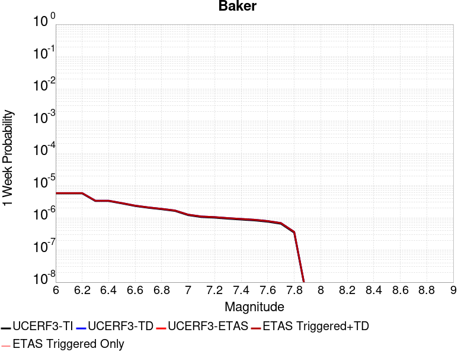 | 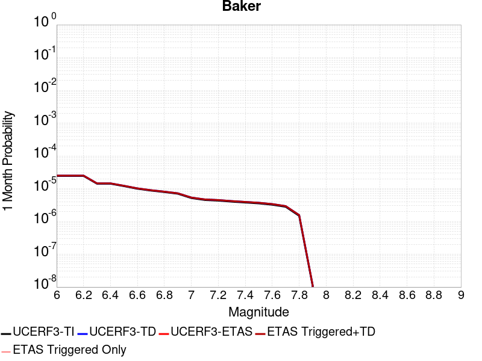 | 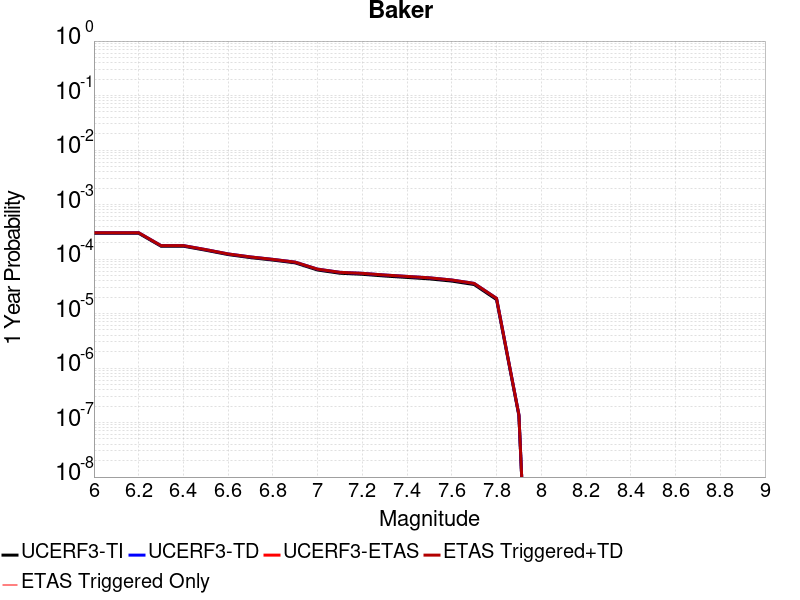 | 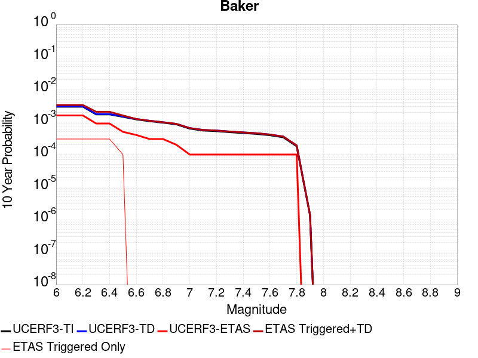 |

| Magnitude | 1 wk TI Prob | 1 wk TD Prob | 1 wk ETAS Prob | 1 wk ETAS/TD Gain | 1 wk ETAS Triggered+TD | 1 wk ETAS Triggered Only | 1 mo TI Prob | 1 mo TD Prob | 1 mo ETAS Prob | 1 mo ETAS/TD Gain | 1 mo ETAS Triggered+TD | 1 mo ETAS Triggered Only | 1 yr TI Prob | 1 yr TD Prob | 1 yr ETAS Prob | 1 yr ETAS/TD Gain | 1 yr ETAS Triggered+TD | 1 yr ETAS Triggered Only | 10 yr TI Prob | 10 yr TD Prob | 10 yr ETAS Prob | 10 yr ETAS/TD Gain | 10 yr ETAS Triggered+TD | 10 yr ETAS Triggered Only |
|-----|-----|-----|-----|-----|-----|-----|-----|-----|-----|-----|-----|-----|-----|-----|-----|-----|-----|-----|-----|-----|-----|-----|-----|-----|
| 6.0 | 5.695525E-6 | 5.833338E-6 | 0.0 | 0.0 | 5.833338E-6 | 0.0 | 2.4409164E-5 | 2.4999803E-5 | 0.0 | 0.0 | 2.4999803E-5 | 0.0 | 2.9714106E-4 | 3.043341E-4 | 0.0 | 0.0 | 3.043341E-4 | 0.0 | 0.0029674405 | 0.0030395687 | 0.0016 | 0.5263905 | 0.0033386569 | 3.0E-4 |
| 6.1 | 5.695525E-6 | 5.833338E-6 | 0.0 | 0.0 | 5.833338E-6 | 0.0 | 2.4409164E-5 | 2.4999803E-5 | 0.0 | 0.0 | 2.4999803E-5 | 0.0 | 2.9714106E-4 | 3.043341E-4 | 0.0 | 0.0 | 3.043341E-4 | 0.0 | 0.0029674405 | 0.0030395687 | 0.0016 | 0.5263905 | 0.0033386569 | 3.0E-4 |
| 6.2 | 5.695525E-6 | 5.833338E-6 | 0.0 | 0.0 | 5.833338E-6 | 0.0 | 2.4409164E-5 | 2.4999803E-5 | 0.0 | 0.0 | 2.4999803E-5 | 0.0 | 2.9714106E-4 | 3.043341E-4 | 0.0 | 0.0 | 3.043341E-4 | 0.0 | 0.0029674405 | 0.0030395687 | 0.0016 | 0.5263905 | 0.0033386569 | 3.0E-4 |
| 6.3 | 3.2995713E-6 | 3.382759E-6 | 0.0 | 0.0 | 3.382759E-6 | 0.0 | 1.4140943E-5 | 1.449746E-5 | 0.0 | 0.0 | 1.449746E-5 | 0.0 | 1.7215237E-4 | 1.7649274E-4 | 0.0 | 0.0 | 1.7649274E-4 | 0.0 | 0.0017201907 | 0.0017635729 | 9.0E-4 | 0.51032764 | 0.0020630439 | 3.0E-4 |
| 6.4 | 3.2995713E-6 | 3.382759E-6 | 0.0 | 0.0 | 3.382759E-6 | 0.0 | 1.4140943E-5 | 1.449746E-5 | 0.0 | 0.0 | 1.449746E-5 | 0.0 | 1.7215237E-4 | 1.7649274E-4 | 0.0 | 0.0 | 1.7649274E-4 | 0.0 | 0.0017201907 | 0.0017635729 | 9.0E-4 | 0.51032764 | 0.0020630439 | 3.0E-4 |
| 6.5 | 2.782202E-6 | 2.8550437E-6 | 0.0 | 0.0 | 2.8550437E-6 | 0.0 | 1.1923668E-5 | 1.2235846E-5 | 0.0 | 0.0 | 1.2235846E-5 | 0.0 | 1.4516099E-4 | 1.4896157E-4 | 0.0 | 0.0 | 1.4896157E-4 | 0.0 | 0.001450662 | 0.00148865 | 5.0E-4 | 0.3358748 | 0.001588501 | 1.0E-4 |
| 6.6 | 2.3163404E-6 | 2.3802197E-6 | 0.0 | 0.0 | 2.3802197E-6 | 0.0 | 9.927136E-6 | 1.0200903E-5 | 0.0 | 0.0 | 1.0200903E-5 | 0.0 | 1.20856166E-4 | 1.2418912E-4 | 0.0 | 0.0 | 1.2418912E-4 | 0.0 | 0.0012079047 | 0.0012412174 | 4.0E-4 | 0.32226425 | 0.0012412174 | 0.0 |
| 6.7 | 2.037056E-6 | 2.0958548E-6 | 0.0 | 0.0 | 2.0958548E-6 | 0.0 | 8.7302105E-6 | 8.982205E-6 | 0.0 | 0.0 | 8.982205E-6 | 0.0 | 1.0628513E-4 | 1.09353015E-4 | 0.0 | 0.0 | 1.09353015E-4 | 0.0 | 0.0010623431 | 0.0010930082 | 3.0E-4 | 0.27447188 | 0.0010930082 | 0.0 |
| 6.8 | 1.8356744E-6 | 1.8909211E-6 | 0.0 | 0.0 | 1.8909211E-6 | 0.0 | 7.867153E-6 | 8.103923E-6 | 0.0 | 0.0 | 8.103923E-6 | 0.0 | 9.577837E-5 | 9.8660945E-5 | 0.0 | 0.0 | 9.8660945E-5 | 0.0 | 9.57371E-4 | 9.861854E-4 | 3.0E-4 | 0.30420244 | 9.861854E-4 | 0.0 |
| 6.9 | 1.6310546E-6 | 1.6826391E-6 | 0.0 | 0.0 | 1.6826391E-6 | 0.0 | 6.9902153E-6 | 7.2112907E-6 | 0.0 | 0.0 | 7.2112907E-6 | 0.0 | 8.510255E-5 | 8.779404E-5 | 0.0 | 0.0 | 8.779404E-5 | 0.0 | 8.5069967E-4 | 8.776049E-4 | 2.0E-4 | 0.227893 | 8.776049E-4 | 0.0 |
| 7.0 | 1.2058036E-6 | 1.2503737E-6 | 0.0 | 0.0 | 1.2503737E-6 | 0.0 | 5.1677193E-6 | 5.3587337E-6 | 0.0 | 0.0 | 5.3587337E-6 | 0.0 | 6.291517E-5 | 6.524065E-5 | 0.0 | 0.0 | 6.524065E-5 | 0.0 | 6.289736E-4 | 6.522173E-4 | 1.0E-4 | 0.15332313 | 6.522173E-4 | 0.0 |
| 7.1 | 1.052382E-6 | 1.0946922E-6 | 0.0 | 0.0 | 1.0946922E-6 | 0.0 | 4.5102006E-6 | 4.6915297E-6 | 0.0 | 0.0 | 4.6915297E-6 | 0.0 | 5.491031E-5 | 5.7117886E-5 | 0.0 | 0.0 | 5.7117886E-5 | 0.0 | 5.4896745E-4 | 5.710329E-4 | 1.0E-4 | 0.17512125 | 5.710329E-4 | 0.0 |
| 7.2 | 1.0067454E-6 | 1.0483104E-6 | 0.0 | 0.0 | 1.0483104E-6 | 0.0 | 4.3146156E-6 | 4.4927515E-6 | 0.0 | 0.0 | 4.4927515E-6 | 0.0 | 5.252918E-5 | 5.469788E-5 | 0.0 | 0.0 | 5.469788E-5 | 0.0 | 5.251676E-4 | 5.468451E-4 | 1.0E-4 | 0.18286715 | 5.468451E-4 | 0.0 |
| 7.3 | 9.3596316E-7 | 9.763247E-7 | 0.0 | 0.0 | 9.763247E-7 | 0.0 | 4.0112645E-6 | 4.184242E-6 | 0.0 | 0.0 | 4.184242E-6 | 0.0 | 4.8836053E-5 | 5.0941962E-5 | 0.0 | 0.0 | 5.0941962E-5 | 0.0 | 4.8825322E-4 | 5.0930365E-4 | 1.0E-4 | 0.19634654 | 5.0930365E-4 | 0.0 |
| 7.4 | 8.8117395E-7 | 9.203317E-7 | 0.0 | 0.0 | 9.203317E-7 | 0.0 | 3.7764542E-6 | 3.944273E-6 | 0.0 | 0.0 | 3.944273E-6 | 0.0 | 4.5977362E-5 | 4.802047E-5 | 0.0 | 0.0 | 4.802047E-5 | 0.0 | 4.596785E-4 | 4.801017E-4 | 1.0E-4 | 0.2082892 | 4.801017E-4 | 0.0 |
| 7.5 | 8.292386E-7 | 8.6703966E-7 | 0.0 | 0.0 | 8.6703966E-7 | 0.0 | 3.5538749E-6 | 3.715879E-6 | 0.0 | 0.0 | 3.715879E-6 | 0.0 | 4.326757E-5 | 4.5239896E-5 | 0.0 | 0.0 | 4.5239896E-5 | 0.0 | 4.3259145E-4 | 4.523076E-4 | 1.0E-4 | 0.22108848 | 4.523076E-4 | 0.0 |
| 7.6 | 7.553842E-7 | 7.910504E-7 | 0.0 | 0.0 | 7.910504E-7 | 0.0 | 3.2373566E-6 | 3.3902118E-6 | 0.0 | 0.0 | 3.3902118E-6 | 0.0 | 3.9414106E-5 | 4.1275052E-5 | 0.0 | 0.0 | 4.1275052E-5 | 0.0 | 3.9407116E-4 | 4.126746E-4 | 1.0E-4 | 0.24232168 | 4.126746E-4 | 0.0 |
| 7.7 | 6.5285366E-7 | 6.849225E-7 | 0.0 | 0.0 | 6.849225E-7 | 0.0 | 2.797941E-6 | 2.935379E-6 | 0.0 | 0.0 | 2.935379E-6 | 0.0 | 3.40644E-5 | 3.573766E-5 | 0.0 | 0.0 | 3.573766E-5 | 0.0 | 3.405918E-4 | 3.5731978E-4 | 1.0E-4 | 0.27986136 | 3.5731978E-4 | 0.0 |
| 7.8 | 3.4586725E-7 | 3.6461634E-7 | 0.0 | 0.0 | 3.6461634E-7 | 0.0 | 1.4822873E-6 | 1.5626406E-6 | 0.0 | 0.0 | 1.5626406E-6 | 0.0 | 1.80467E-5 | 1.9024988E-5 | 0.0 | 0.0 | 1.9024988E-5 | 0.0 | 1.8045233E-4 | 1.9023403E-4 | 1.0E-4 | 0.5256683 | 1.9023403E-4 | 0.0 |
| 7.9 | 2.5591178E-9 | 2.6684681E-9 | 0.0 | 0.0 | 2.6684681E-9 | 0.0 | 1.0967647E-8 | 1.1436292E-8 | 0.0 | 0.0 | 1.1436292E-8 | 0.0 | 1.335311E-7 | 1.3923685E-7 | 0.0 | 0.0 | 1.3923685E-7 | 0.0 | 1.3353102E-6 | 1.3923685E-6 | 0.0 | 0.0 | 1.3923685E-6 | 0.0 |

## San Jose
*[(top)](#table-of-contents)*

| 1 Week | 1 Month | 1 Year | 10 Year |
|-----|-----|-----|-----|
| 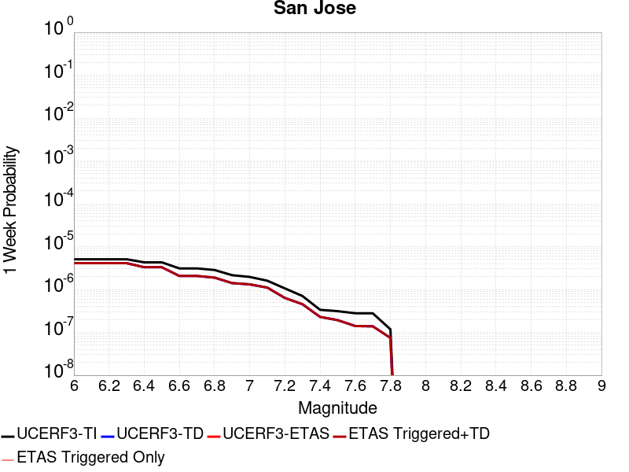 | 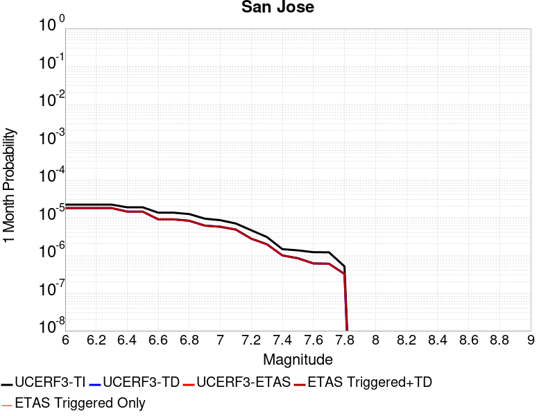 | 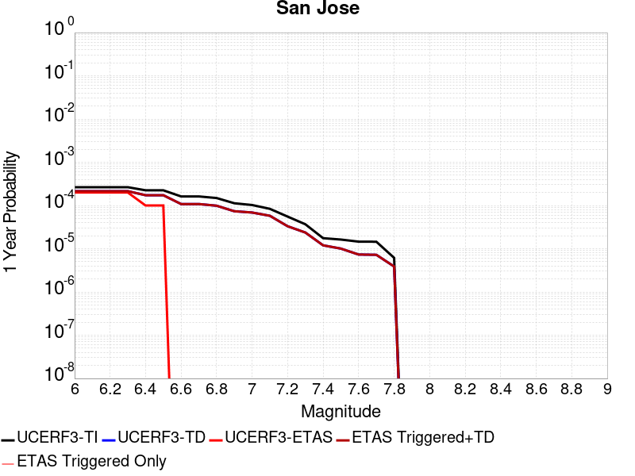 | 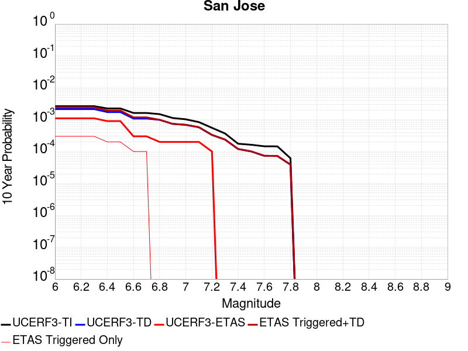 |

| Magnitude | 1 wk TI Prob | 1 wk TD Prob | 1 wk ETAS Prob | 1 wk ETAS/TD Gain | 1 wk ETAS Triggered+TD | 1 wk ETAS Triggered Only | 1 mo TI Prob | 1 mo TD Prob | 1 mo ETAS Prob | 1 mo ETAS/TD Gain | 1 mo ETAS Triggered+TD | 1 mo ETAS Triggered Only | 1 yr TI Prob | 1 yr TD Prob | 1 yr ETAS Prob | 1 yr ETAS/TD Gain | 1 yr ETAS Triggered+TD | 1 yr ETAS Triggered Only | 10 yr TI Prob | 10 yr TD Prob | 10 yr ETAS Prob | 10 yr ETAS/TD Gain | 10 yr ETAS Triggered+TD | 10 yr ETAS Triggered Only |
|-----|-----|-----|-----|-----|-----|-----|-----|-----|-----|-----|-----|-----|-----|-----|-----|-----|-----|-----|-----|-----|-----|-----|-----|-----|
| 6.0 | 5.0851277E-6 | 4.1186877E-6 | 0.0 | 0.0 | 4.1186877E-6 | 0.0 | 2.1793223E-5 | 1.7651413E-5 | 0.0 | 0.0 | 1.7651413E-5 | 0.0 | 2.653002E-4 | 2.1488739E-4 | 2.0E-4 | 0.93072003 | 2.1488739E-4 | 0.0 | 0.0026498367 | 0.0021470615 | 0.0011 | 0.51232815 | 0.0024464175 | 3.0E-4 |
| 6.1 | 5.0851277E-6 | 4.1186877E-6 | 0.0 | 0.0 | 4.1186877E-6 | 0.0 | 2.1793223E-5 | 1.7651413E-5 | 0.0 | 0.0 | 1.7651413E-5 | 0.0 | 2.653002E-4 | 2.1488739E-4 | 2.0E-4 | 0.93072003 | 2.1488739E-4 | 0.0 | 0.0026498367 | 0.0021470615 | 0.0011 | 0.51232815 | 0.0024464175 | 3.0E-4 |
| 6.2 | 5.0851277E-6 | 4.1186877E-6 | 0.0 | 0.0 | 4.1186877E-6 | 0.0 | 2.1793223E-5 | 1.7651413E-5 | 0.0 | 0.0 | 1.7651413E-5 | 0.0 | 2.653002E-4 | 2.1488739E-4 | 2.0E-4 | 0.93072003 | 2.1488739E-4 | 0.0 | 0.0026498367 | 0.0021470615 | 0.0011 | 0.51232815 | 0.0024464175 | 3.0E-4 |
| 6.3 | 5.0851277E-6 | 4.1186877E-6 | 0.0 | 0.0 | 4.1186877E-6 | 0.0 | 2.1793223E-5 | 1.7651413E-5 | 0.0 | 0.0 | 1.7651413E-5 | 0.0 | 2.653002E-4 | 2.1488739E-4 | 2.0E-4 | 0.93072003 | 2.1488739E-4 | 0.0 | 0.0026498367 | 0.0021470615 | 0.0011 | 0.51232815 | 0.0024464175 | 3.0E-4 |
| 6.4 | 4.3115124E-6 | 3.3171038E-6 | 0.0 | 0.0 | 3.3171038E-6 | 0.0 | 1.8477778E-5 | 1.4216094E-5 | 0.0 | 0.0 | 1.4216094E-5 | 0.0 | 2.2494372E-4 | 1.730694E-4 | 1.0E-4 | 0.5778029 | 1.730694E-4 | 0.0 | 0.0022471617 | 0.0017295703 | 9.0E-4 | 0.5203604 | 0.0019292245 | 2.0E-4 |
| 6.5 | 4.3115124E-6 | 3.3171038E-6 | 0.0 | 0.0 | 3.3171038E-6 | 0.0 | 1.8477778E-5 | 1.4216094E-5 | 0.0 | 0.0 | 1.4216094E-5 | 0.0 | 2.2494372E-4 | 1.730694E-4 | 1.0E-4 | 0.5778029 | 1.730694E-4 | 0.0 | 0.0022471617 | 0.0017295703 | 9.0E-4 | 0.5203604 | 0.0019292245 | 2.0E-4 |
| 6.6 | 3.110396E-6 | 2.0737687E-6 | 0.0 | 0.0 | 2.0737687E-6 | 0.0 | 1.33302E-5 | 8.88755E-6 | 0.0 | 0.0 | 8.88755E-6 | 0.0 | 1.622831E-4 | 1.0820084E-4 | 0.0 | 0.0 | 1.0820084E-4 | 0.0 | 0.0016216465 | 0.0010815162 | 3.0E-4 | 0.27738836 | 0.001181408 | 1.0E-4 |
| 6.7 | 3.110396E-6 | 2.0737687E-6 | 0.0 | 0.0 | 2.0737687E-6 | 0.0 | 1.33302E-5 | 8.88755E-6 | 0.0 | 0.0 | 8.88755E-6 | 0.0 | 1.622831E-4 | 1.0820084E-4 | 0.0 | 0.0 | 1.0820084E-4 | 0.0 | 0.0016216465 | 0.0010815162 | 3.0E-4 | 0.27738836 | 0.001181408 | 1.0E-4 |
| 6.8 | 2.856651E-6 | 1.8963555E-6 | 0.0 | 0.0 | 1.8963555E-6 | 0.0 | 1.2242733E-5 | 8.127214E-6 | 0.0 | 0.0 | 8.127214E-6 | 0.0 | 1.4904508E-4 | 9.894458E-5 | 0.0 | 0.0 | 9.894458E-5 | 0.0 | 0.0014894515 | 9.890369E-4 | 2.0E-4 | 0.20221694 | 9.890369E-4 | 0.0 |
| 6.9 | 2.1618725E-6 | 1.4129495E-6 | 0.0 | 0.0 | 1.4129495E-6 | 0.0 | 9.265135E-6 | 6.055484E-6 | 0.0 | 0.0 | 6.055484E-6 | 0.0 | 1.12797185E-4 | 7.372311E-5 | 0.0 | 0.0 | 7.372311E-5 | 0.0 | 0.0011273995 | 7.3700235E-4 | 2.0E-4 | 0.27136958 | 7.3700235E-4 | 0.0 |
| 7.0 | 1.9684312E-6 | 1.3200166E-6 | 0.0 | 0.0 | 1.3200166E-6 | 0.0 | 8.436106E-6 | 5.657202E-6 | 0.0 | 0.0 | 5.657202E-6 | 0.0 | 1.02704755E-4 | 6.8874346E-5 | 0.0 | 0.0 | 6.8874346E-5 | 0.0 | 0.001026573 | 6.8854523E-4 | 2.0E-4 | 0.2904675 | 6.8854523E-4 | 0.0 |
| 7.1 | 1.6070337E-6 | 1.1101444E-6 | 0.0 | 0.0 | 1.1101444E-6 | 0.0 | 6.887269E-6 | 4.7577532E-6 | 0.0 | 0.0 | 4.7577532E-6 | 0.0 | 8.384928E-5 | 5.792417E-5 | 0.0 | 0.0 | 5.792417E-5 | 0.0 | 8.3817646E-4 | 5.79104E-4 | 2.0E-4 | 0.3453611 | 5.79104E-4 | 0.0 |
| 7.2 | 1.0631658E-6 | 6.361856E-7 | 0.0 | 0.0 | 6.361856E-7 | 0.0 | 4.556417E-6 | 2.7265066E-6 | 0.0 | 0.0 | 2.7265066E-6 | 0.0 | 5.5472963E-5 | 3.3194727E-5 | 0.0 | 0.0 | 3.3194727E-5 | 0.0 | 5.545912E-4 | 3.3190617E-4 | 1.0E-4 | 0.30128998 | 3.3190617E-4 | 0.0 |
| 7.3 | 7.060711E-7 | 4.549336E-7 | 0.0 | 0.0 | 4.549336E-7 | 0.0 | 3.0260155E-6 | 1.949714E-6 | 0.0 | 0.0 | 1.949714E-6 | 0.0 | 3.6841117E-5 | 2.3737519E-5 | 0.0 | 0.0 | 2.3737519E-5 | 0.0 | 3.6835007E-4 | 2.3735783E-4 | 0.0 | 0.0 | 2.3735783E-4 | 0.0 |
| 7.4 | 3.3677085E-7 | 2.3009953E-7 | 0.0 | 0.0 | 2.3009953E-7 | 0.0 | 1.4433028E-6 | 9.861404E-7 | 0.0 | 0.0 | 9.861404E-7 | 0.0 | 1.757207E-5 | 1.2006197E-5 | 0.0 | 0.0 | 1.2006197E-5 | 0.0 | 1.7570681E-4 | 1.20062876E-4 | 0.0 | 0.0 | 1.20062876E-4 | 0.0 |
| 7.5 | 3.129161E-7 | 1.9343418E-7 | 0.0 | 0.0 | 1.9343418E-7 | 0.0 | 1.3410682E-6 | 8.2900334E-7 | 0.0 | 0.0 | 8.2900334E-7 | 0.0 | 1.6327383E-5 | 1.0093071E-5 | 0.0 | 0.0 | 1.0093071E-5 | 0.0 | 1.6326184E-4 | 1.00933474E-4 | 0.0 | 0.0 | 1.00933474E-4 | 0.0 |
| 7.6 | 2.8008668E-7 | 1.4106669E-7 | 0.0 | 0.0 | 1.4106669E-7 | 0.0 | 1.2003709E-6 | 6.0457137E-7 | 0.0 | 0.0 | 6.0457137E-7 | 0.0 | 1.46144175E-5 | 7.3606334E-6 | 0.0 | 0.0 | 7.3606334E-6 | 0.0 | 1.4613457E-4 | 7.361124E-5 | 0.0 | 0.0 | 7.361124E-5 | 0.0 |
| 7.7 | 2.7852005E-7 | 1.3884524E-7 | 0.0 | 0.0 | 1.3884524E-7 | 0.0 | 1.1936568E-6 | 5.950509E-7 | 0.0 | 0.0 | 5.950509E-7 | 0.0 | 1.4532674E-5 | 7.2447224E-6 | 0.0 | 0.0 | 7.2447224E-6 | 0.0 | 1.4531724E-4 | 7.24522E-5 | 0.0 | 0.0 | 7.24522E-5 | 0.0 |
| 7.8 | 1.1810797E-7 | 7.45349E-8 | 0.0 | 0.0 | 7.45349E-8 | 0.0 | 5.0617695E-7 | 3.1943526E-7 | 0.0 | 0.0 | 3.1943526E-7 | 0.0 | 6.1626865E-6 | 3.889118E-6 | 0.0 | 0.0 | 3.889118E-6 | 0.0 | 6.162516E-5 | 3.889215E-5 | 0.0 | 0.0 | 3.889215E-5 | 0.0 |

## Elysian Park (Lower CFM)
*[(top)](#table-of-contents)*

| 1 Week | 1 Month | 1 Year | 10 Year |
|-----|-----|-----|-----|
| 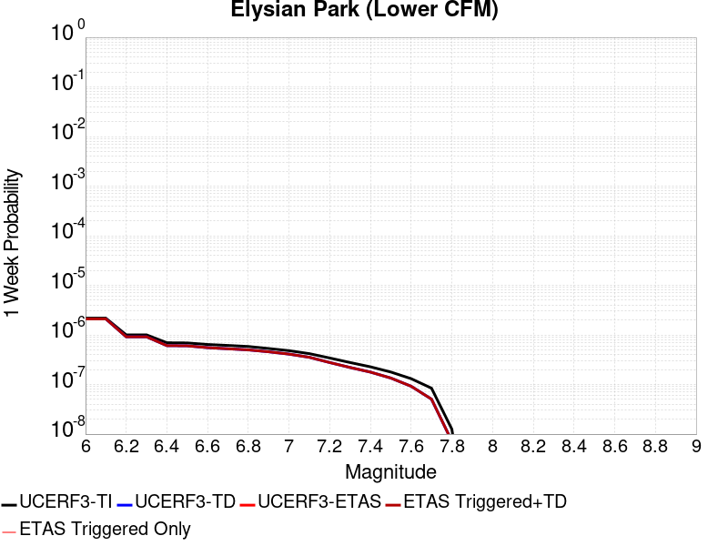 | 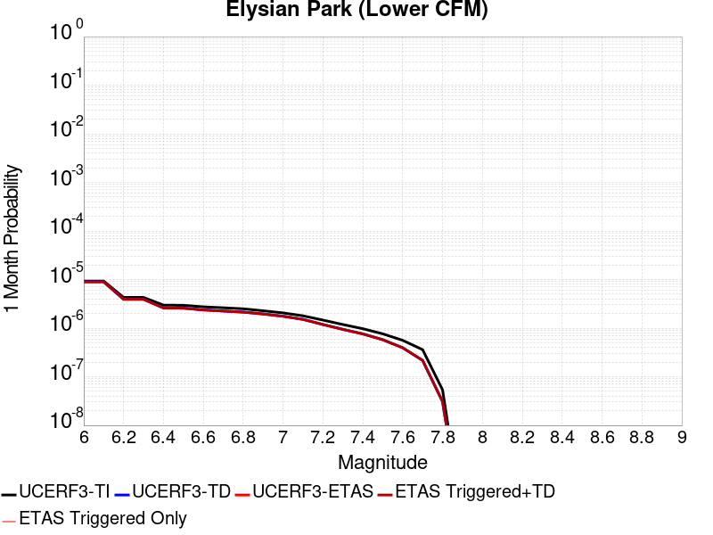 | 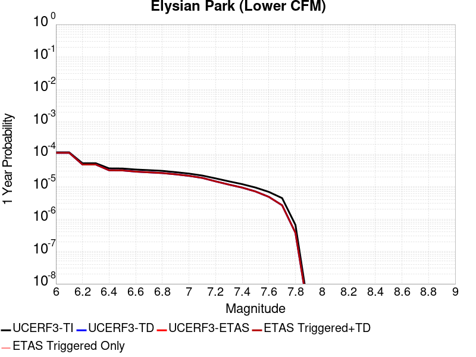 | 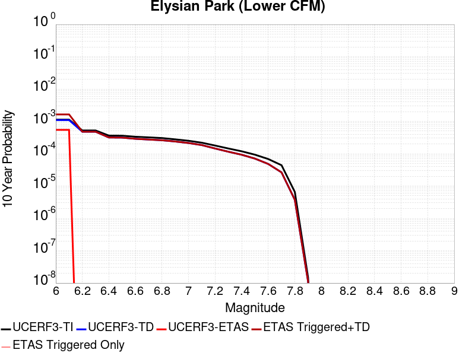 |

| Magnitude | 1 wk TI Prob | 1 wk TD Prob | 1 wk ETAS Prob | 1 wk ETAS/TD Gain | 1 wk ETAS Triggered+TD | 1 wk ETAS Triggered Only | 1 mo TI Prob | 1 mo TD Prob | 1 mo ETAS Prob | 1 mo ETAS/TD Gain | 1 mo ETAS Triggered+TD | 1 mo ETAS Triggered Only | 1 yr TI Prob | 1 yr TD Prob | 1 yr ETAS Prob | 1 yr ETAS/TD Gain | 1 yr ETAS Triggered+TD | 1 yr ETAS Triggered Only | 10 yr TI Prob | 10 yr TD Prob | 10 yr ETAS Prob | 10 yr ETAS/TD Gain | 10 yr ETAS Triggered+TD | 10 yr ETAS Triggered Only |
|-----|-----|-----|-----|-----|-----|-----|-----|-----|-----|-----|-----|-----|-----|-----|-----|-----|-----|-----|-----|-----|-----|-----|-----|-----|
| 6.0 | 2.1766498E-6 | 2.1031024E-6 | 0.0 | 0.0 | 2.1031024E-6 | 0.0 | 9.328466E-6 | 9.013273E-6 | 0.0 | 0.0 | 9.013273E-6 | 0.0 | 1.1356815E-4 | 1.0973251E-4 | 0.0 | 0.0 | 1.0973251E-4 | 0.0 | 0.0011351013 | 0.0010969251 | 6.0E-4 | 0.54698354 | 0.0013965961 | 3.0E-4 |
| 6.1 | 2.1766498E-6 | 2.1031024E-6 | 0.0 | 0.0 | 2.1031024E-6 | 0.0 | 9.328466E-6 | 9.013273E-6 | 0.0 | 0.0 | 9.013273E-6 | 0.0 | 1.1356815E-4 | 1.0973251E-4 | 0.0 | 0.0 | 1.0973251E-4 | 0.0 | 0.0011351013 | 0.0010969251 | 6.0E-4 | 0.54698354 | 0.0013965961 | 3.0E-4 |
| 6.2 | 1.0031182E-6 | 9.180569E-7 | 0.0 | 0.0 | 9.180569E-7 | 0.0 | 4.299071E-6 | 3.934524E-6 | 0.0 | 0.0 | 3.934524E-6 | 0.0 | 5.2339932E-5 | 4.7901878E-5 | 0.0 | 0.0 | 4.7901878E-5 | 0.0 | 5.2327604E-4 | 4.7892533E-4 | 1.0E-4 | 0.20880081 | 4.7892533E-4 | 0.0 |
| 6.3 | 1.0031182E-6 | 9.180569E-7 | 0.0 | 0.0 | 9.180569E-7 | 0.0 | 4.299071E-6 | 3.934524E-6 | 0.0 | 0.0 | 3.934524E-6 | 0.0 | 5.2339932E-5 | 4.7901878E-5 | 0.0 | 0.0 | 4.7901878E-5 | 0.0 | 5.2327604E-4 | 4.7892533E-4 | 1.0E-4 | 0.20880081 | 4.7892533E-4 | 0.0 |
| 6.4 | 6.9606244E-7 | 6.086548E-7 | 0.0 | 0.0 | 6.086548E-7 | 0.0 | 2.9831212E-6 | 2.6085177E-6 | 0.0 | 0.0 | 2.6085177E-6 | 0.0 | 3.6318896E-5 | 3.175824E-5 | 0.0 | 0.0 | 3.175824E-5 | 0.0 | 3.6312963E-4 | 3.1753728E-4 | 1.0E-4 | 0.31492364 | 3.1753728E-4 | 0.0 |
| 6.5 | 6.901879E-7 | 6.0272373E-7 | 0.0 | 0.0 | 6.0272373E-7 | 0.0 | 2.9579448E-6 | 2.583099E-6 | 0.0 | 0.0 | 2.583099E-6 | 0.0 | 3.6012385E-5 | 3.1448777E-5 | 0.0 | 0.0 | 3.1448777E-5 | 0.0 | 3.600655E-4 | 3.1444352E-4 | 1.0E-4 | 0.31802213 | 3.1444352E-4 | 0.0 |
| 6.6 | 6.4198554E-7 | 5.541262E-7 | 0.0 | 0.0 | 5.541262E-7 | 0.0 | 2.7513638E-6 | 2.3748244E-6 | 0.0 | 0.0 | 2.3748244E-6 | 0.0 | 3.3497337E-5 | 2.8913104E-5 | 0.0 | 0.0 | 2.8913104E-5 | 0.0 | 3.349229E-4 | 2.8909356E-4 | 0.0 | 0.0 | 2.8909356E-4 | 0.0 |
| 6.7 | 6.138733E-7 | 5.2580907E-7 | 0.0 | 0.0 | 5.2580907E-7 | 0.0 | 2.6308828E-6 | 2.2534655E-6 | 0.0 | 0.0 | 2.2534655E-6 | 0.0 | 3.203053E-5 | 2.7435599E-5 | 0.0 | 0.0 | 2.7435599E-5 | 0.0 | 3.2025913E-4 | 2.7432223E-4 | 0.0 | 0.0 | 2.7432223E-4 | 0.0 |
| 6.8 | 5.84778E-7 | 4.9976506E-7 | 0.0 | 0.0 | 4.9976506E-7 | 0.0 | 2.506189E-6 | 2.1418487E-6 | 0.0 | 0.0 | 2.1418487E-6 | 0.0 | 3.0512423E-5 | 2.6076696E-5 | 0.0 | 0.0 | 2.6076696E-5 | 0.0 | 3.0508233E-4 | 2.6073647E-4 | 0.0 | 0.0 | 2.6073647E-4 | 0.0 |
| 6.9 | 5.322785E-7 | 4.5748922E-7 | 0.0 | 0.0 | 4.5748922E-7 | 0.0 | 2.2811914E-6 | 1.9606666E-6 | 0.0 | 0.0 | 1.9606666E-6 | 0.0 | 2.7773152E-5 | 2.3870854E-5 | 0.0 | 0.0 | 2.3870854E-5 | 0.0 | 2.7769682E-4 | 2.38683E-4 | 0.0 | 0.0 | 2.38683E-4 | 0.0 |
| 7.0 | 4.8147206E-7 | 4.107311E-7 | 0.0 | 0.0 | 4.107311E-7 | 0.0 | 2.06345E-6 | 1.7602748E-6 | 0.0 | 0.0 | 1.7602748E-6 | 0.0 | 2.5122214E-5 | 2.1431137E-5 | 0.0 | 0.0 | 2.1431137E-5 | 0.0 | 2.5119373E-4 | 2.1429078E-4 | 0.0 | 0.0 | 2.1429078E-4 | 0.0 |
| 7.1 | 4.1932955E-7 | 3.540959E-7 | 0.0 | 0.0 | 3.540959E-7 | 0.0 | 1.7971255E-6 | 1.5175528E-6 | 0.0 | 0.0 | 1.5175528E-6 | 0.0 | 2.1879783E-5 | 1.847605E-5 | 0.0 | 0.0 | 1.847605E-5 | 0.0 | 2.1877629E-4 | 1.847452E-4 | 0.0 | 0.0 | 1.847452E-4 | 0.0 |
| 7.2 | 3.426051E-7 | 2.777119E-7 | 0.0 | 0.0 | 2.777119E-7 | 0.0 | 1.4683067E-6 | 1.1901933E-6 | 0.0 | 0.0 | 1.1901933E-6 | 0.0 | 1.7876488E-5 | 1.4490507E-5 | 0.0 | 0.0 | 1.4490507E-5 | 0.0 | 1.787505E-4 | 1.4489565E-4 | 0.0 | 0.0 | 1.4489565E-4 | 0.0 |
| 7.3 | 2.7771645E-7 | 2.2063325E-7 | 0.0 | 0.0 | 2.2063325E-7 | 0.0 | 1.1902127E-6 | 9.4557066E-7 | 0.0 | 0.0 | 9.4557066E-7 | 0.0 | 1.4490744E-5 | 1.1512262E-5 | 0.0 | 0.0 | 1.1512262E-5 | 0.0 | 1.4489799E-4 | 1.1511668E-4 | 0.0 | 0.0 | 1.1511668E-4 | 0.0 |
| 7.4 | 2.2756493E-7 | 1.7810122E-7 | 0.0 | 0.0 | 1.7810122E-7 | 0.0 | 9.752779E-7 | 7.632907E-7 | 0.0 | 0.0 | 7.632907E-7 | 0.0 | 1.1873944E-5 | 9.293025E-6 | 0.0 | 0.0 | 9.293025E-6 | 0.0 | 1.18733085E-4 | 9.292638E-5 | 0.0 | 0.0 | 9.292638E-5 | 0.0 |
| 7.5 | 1.7874558E-7 | 1.3517308E-7 | 0.0 | 0.0 | 1.3517308E-7 | 0.0 | 7.660522E-7 | 5.7931305E-7 | 0.0 | 0.0 | 5.7931305E-7 | 0.0 | 9.326646E-6 | 7.0531137E-6 | 0.0 | 0.0 | 7.0531137E-6 | 0.0 | 9.326255E-5 | 7.052891E-5 | 0.0 | 0.0 | 7.052891E-5 | 0.0 |
| 7.6 | 1.3124549E-7 | 9.230665E-8 | 0.0 | 0.0 | 9.230665E-8 | 0.0 | 5.624805E-7 | 3.9559987E-7 | 0.0 | 0.0 | 3.9559987E-7 | 0.0 | 6.8481786E-6 | 4.816418E-6 | 0.0 | 0.0 | 4.816418E-6 | 0.0 | 6.8479676E-5 | 4.816315E-5 | 0.0 | 0.0 | 4.816315E-5 | 0.0 |
| 7.7 | 8.439993E-8 | 5.0736286E-8 | 0.0 | 0.0 | 5.0736286E-8 | 0.0 | 3.6171392E-7 | 2.1744121E-7 | 0.0 | 0.0 | 2.1744121E-7 | 0.0 | 4.403858E-6 | 2.6473435E-6 | 0.0 | 0.0 | 2.6473435E-6 | 0.0 | 4.4037708E-5 | 2.6473133E-5 | 0.0 | 0.0 | 2.6473133E-5 | 0.0 |
| 7.8 | 1.2591407E-8 | 7.196457E-9 | 0.0 | 0.0 | 7.196457E-9 | 0.0 | 5.3963173E-8 | 3.084196E-8 | 0.0 | 0.0 | 3.084196E-8 | 0.0 | 6.570014E-7 | 3.755008E-7 | 0.0 | 0.0 | 3.755008E-7 | 0.0 | 6.5699946E-6 | 3.755002E-6 | 0.0 | 0.0 | 3.755002E-6 | 0.0 |
| 7.9 | 2.8324232E-11 | 2.1363689E-11 | 0.0 | 0.0 | 2.1363689E-11 | 0.0 | 1.2138957E-10 | 9.1558316E-11 | 0.0 | 0.0 | 9.1558316E-11 | 0.0 | 1.4779177E-9 | 1.1147231E-9 | 0.0 | 0.0 | 1.1147231E-9 | 0.0 | 1.4779177E-8 | 1.1147231E-8 | 0.0 | 0.0 | 1.1147231E-8 | 0.0 |

## Anacapa-Dume alt 1
*[(top)](#table-of-contents)*

| 1 Week | 1 Month | 1 Year | 10 Year |
|-----|-----|-----|-----|
| 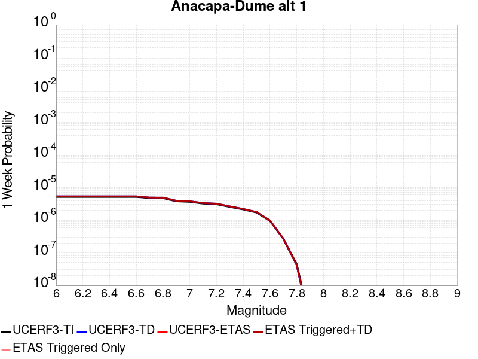 | 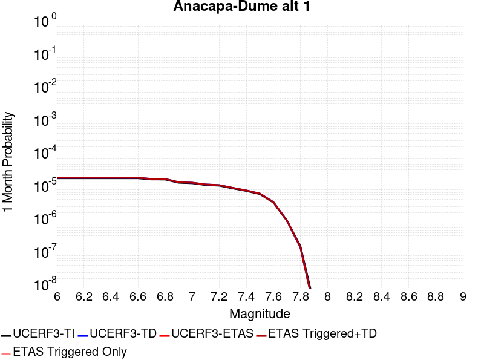 | 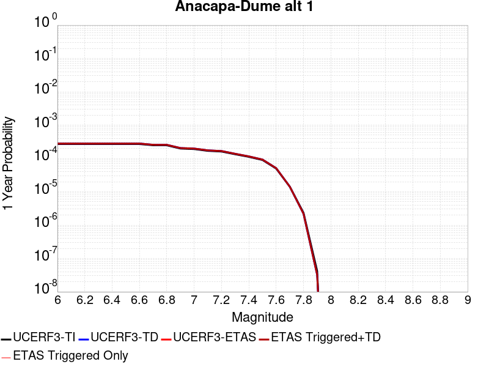 | 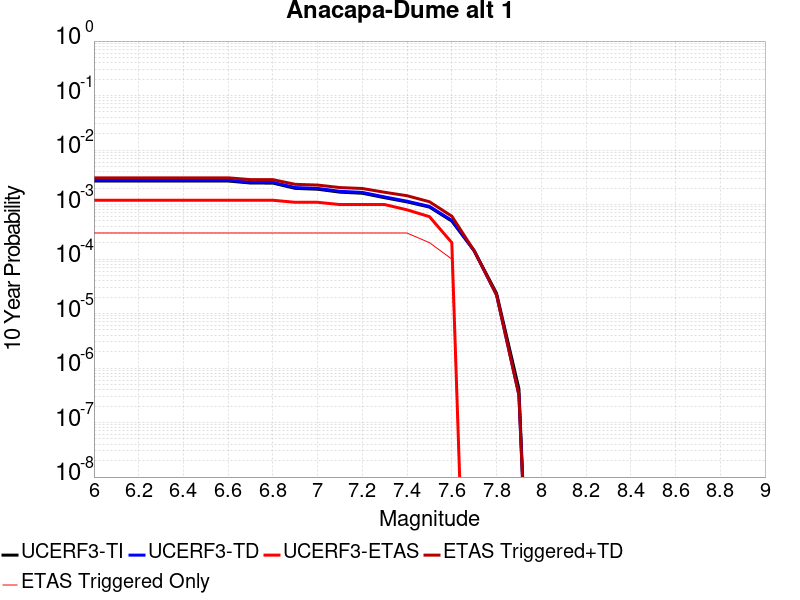 |

| Magnitude | 1 wk TI Prob | 1 wk TD Prob | 1 wk ETAS Prob | 1 wk ETAS/TD Gain | 1 wk ETAS Triggered+TD | 1 wk ETAS Triggered Only | 1 mo TI Prob | 1 mo TD Prob | 1 mo ETAS Prob | 1 mo ETAS/TD Gain | 1 mo ETAS Triggered+TD | 1 mo ETAS Triggered Only | 1 yr TI Prob | 1 yr TD Prob | 1 yr ETAS Prob | 1 yr ETAS/TD Gain | 1 yr ETAS Triggered+TD | 1 yr ETAS Triggered Only | 10 yr TI Prob | 10 yr TD Prob | 10 yr ETAS Prob | 10 yr ETAS/TD Gain | 10 yr ETAS Triggered+TD | 10 yr ETAS Triggered Only |
|-----|-----|-----|-----|-----|-----|-----|-----|-----|-----|-----|-----|-----|-----|-----|-----|-----|-----|-----|-----|-----|-----|-----|-----|-----|
| 6.0 | 5.1871802E-6 | 5.365183E-6 | 0.0 | 0.0 | 5.365183E-6 | 0.0 | 2.2230583E-5 | 2.2993445E-5 | 0.0 | 0.0 | 2.2993445E-5 | 0.0 | 2.7062374E-4 | 2.7991008E-4 | 0.0 | 0.0 | 2.7991008E-4 | 0.0 | 0.002702944 | 0.0027956604 | 0.0012 | 0.4292367 | 0.0030948217 | 3.0E-4 |
| 6.1 | 5.1871802E-6 | 5.365183E-6 | 0.0 | 0.0 | 5.365183E-6 | 0.0 | 2.2230583E-5 | 2.2993445E-5 | 0.0 | 0.0 | 2.2993445E-5 | 0.0 | 2.7062374E-4 | 2.7991008E-4 | 0.0 | 0.0 | 2.7991008E-4 | 0.0 | 0.002702944 | 0.0027956604 | 0.0012 | 0.4292367 | 0.0030948217 | 3.0E-4 |
| 6.2 | 5.1871802E-6 | 5.365183E-6 | 0.0 | 0.0 | 5.365183E-6 | 0.0 | 2.2230583E-5 | 2.2993445E-5 | 0.0 | 0.0 | 2.2993445E-5 | 0.0 | 2.7062374E-4 | 2.7991008E-4 | 0.0 | 0.0 | 2.7991008E-4 | 0.0 | 0.002702944 | 0.0027956604 | 0.0012 | 0.4292367 | 0.0030948217 | 3.0E-4 |
| 6.3 | 5.1871802E-6 | 5.365183E-6 | 0.0 | 0.0 | 5.365183E-6 | 0.0 | 2.2230583E-5 | 2.2993445E-5 | 0.0 | 0.0 | 2.2993445E-5 | 0.0 | 2.7062374E-4 | 2.7991008E-4 | 0.0 | 0.0 | 2.7991008E-4 | 0.0 | 0.002702944 | 0.0027956604 | 0.0012 | 0.4292367 | 0.0030948217 | 3.0E-4 |
| 6.4 | 5.1871802E-6 | 5.365183E-6 | 0.0 | 0.0 | 5.365183E-6 | 0.0 | 2.2230583E-5 | 2.2993445E-5 | 0.0 | 0.0 | 2.2993445E-5 | 0.0 | 2.7062374E-4 | 2.7991008E-4 | 0.0 | 0.0 | 2.7991008E-4 | 0.0 | 0.002702944 | 0.0027956604 | 0.0012 | 0.4292367 | 0.0030948217 | 3.0E-4 |
| 6.5 | 5.1871802E-6 | 5.365183E-6 | 0.0 | 0.0 | 5.365183E-6 | 0.0 | 2.2230583E-5 | 2.2993445E-5 | 0.0 | 0.0 | 2.2993445E-5 | 0.0 | 2.7062374E-4 | 2.7991008E-4 | 0.0 | 0.0 | 2.7991008E-4 | 0.0 | 0.002702944 | 0.0027956604 | 0.0012 | 0.4292367 | 0.0030948217 | 3.0E-4 |
| 6.6 | 5.1871802E-6 | 5.365183E-6 | 0.0 | 0.0 | 5.365183E-6 | 0.0 | 2.2230583E-5 | 2.2993445E-5 | 0.0 | 0.0 | 2.2993445E-5 | 0.0 | 2.7062374E-4 | 2.7991008E-4 | 0.0 | 0.0 | 2.7991008E-4 | 0.0 | 0.002702944 | 0.0027956604 | 0.0012 | 0.4292367 | 0.0030948217 | 3.0E-4 |
| 6.7 | 4.7693475E-6 | 4.934622E-6 | 0.0 | 0.0 | 4.934622E-6 | 0.0 | 2.04399E-5 | 2.1148215E-5 | 0.0 | 0.0 | 2.1148215E-5 | 0.0 | 2.4882736E-4 | 2.5744984E-4 | 0.0 | 0.0 | 2.5744984E-4 | 0.0 | 0.0024854892 | 0.0025715919 | 0.0012 | 0.46663705 | 0.0028708205 | 3.0E-4 |
| 6.8 | 4.753408E-6 | 4.9181763E-6 | 0.0 | 0.0 | 4.9181763E-6 | 0.0 | 2.037159E-5 | 2.1077733E-5 | 0.0 | 0.0 | 2.1077733E-5 | 0.0 | 2.4799586E-4 | 2.565919E-4 | 0.0 | 0.0 | 2.565919E-4 | 0.0 | 0.002477193 | 0.0025630326 | 0.0012 | 0.4681954 | 0.0028622635 | 3.0E-4 |
| 6.9 | 3.800069E-6 | 3.9353827E-6 | 0.0 | 0.0 | 3.9353827E-6 | 0.0 | 1.6285909E-5 | 1.6865819E-5 | 0.0 | 0.0 | 1.6865819E-5 | 0.0 | 1.9826289E-4 | 2.0532223E-4 | 0.0 | 0.0 | 2.0532223E-4 | 0.0 | 0.001980861 | 0.002051349 | 0.0011 | 0.5362325 | 0.0023507336 | 3.0E-4 |
| 7.0 | 3.6671938E-6 | 3.7982218E-6 | 0.0 | 0.0 | 3.7982218E-6 | 0.0 | 1.571645E-5 | 1.6277992E-5 | 0.0 | 0.0 | 1.6277992E-5 | 0.0 | 1.9133097E-4 | 1.9816677E-4 | 0.0 | 0.0 | 1.9816677E-4 | 0.0 | 0.0019116632 | 0.0019799238 | 0.0011 | 0.5555769 | 0.0022793298 | 3.0E-4 |
| 7.1 | 3.2394885E-6 | 3.3572412E-6 | 0.0 | 0.0 | 3.3572412E-6 | 0.0 | 1.3883448E-5 | 1.4388098E-5 | 0.0 | 0.0 | 1.4388098E-5 | 0.0 | 1.6901788E-4 | 1.7516111E-4 | 0.0 | 0.0 | 1.7516111E-4 | 0.0 | 0.0016888938 | 0.0017502417 | 0.001 | 0.5713497 | 0.0020497167 | 3.0E-4 |
| 7.2 | 3.0935948E-6 | 3.2064277E-6 | 0.0 | 0.0 | 3.2064277E-6 | 0.0 | 1.3258196E-5 | 1.3741761E-5 | 0.0 | 0.0 | 1.3741761E-5 | 0.0 | 1.6140658E-4 | 1.672932E-4 | 0.0 | 0.0 | 1.672932E-4 | 0.0 | 0.001612894 | 0.0016716836 | 0.001 | 0.5981993 | 0.0019711822 | 3.0E-4 |
| 7.3 | 2.5604163E-6 | 2.6458795E-6 | 0.0 | 0.0 | 2.6458795E-6 | 0.0 | 1.0973167E-5 | 1.1339434E-5 | 0.0 | 0.0 | 1.1339434E-5 | 0.0 | 1.3359012E-4 | 1.3804891E-4 | 0.0 | 0.0 | 1.3804891E-4 | 0.0 | 0.0013350984 | 0.0013796361 | 0.001 | 0.7248288 | 0.0016792222 | 3.0E-4 |
| 7.4 | 2.1429005E-6 | 2.2096165E-6 | 0.0 | 0.0 | 2.2096165E-6 | 0.0 | 9.1838265E-6 | 9.469751E-6 | 0.0 | 0.0 | 9.469751E-6 | 0.0 | 1.11807356E-4 | 1.1528814E-4 | 0.0 | 0.0 | 1.1528814E-4 | 0.0 | 0.0011175112 | 0.001152286 | 8.0E-4 | 0.6942721 | 0.0014519403 | 3.0E-4 |
| 7.5 | 1.7237151E-6 | 1.7753498E-6 | 0.0 | 0.0 | 1.7753498E-6 | 0.0 | 7.3873293E-6 | 7.60862E-6 | 0.0 | 0.0 | 7.60862E-6 | 0.0 | 8.993702E-5 | 9.263103E-5 | 0.0 | 0.0 | 9.263103E-5 | 0.0 | 8.990063E-4 | 9.2592655E-4 | 6.0E-4 | 0.6479996 | 0.0011257414 | 2.0E-4 |
| 7.6 | 9.541696E-7 | 9.818806E-7 | 0.0 | 0.0 | 9.818806E-7 | 0.0 | 4.089292E-6 | 4.208053E-6 | 0.0 | 0.0 | 4.208053E-6 | 0.0 | 4.9785995E-5 | 5.123185E-5 | 0.0 | 0.0 | 5.123185E-5 | 0.0 | 4.9774844E-4 | 5.122017E-4 | 2.0E-4 | 0.3904712 | 6.1215047E-4 | 1.0E-4 |
| 7.7 | 2.7226676E-7 | 2.7162645E-7 | 0.0 | 0.0 | 2.7162645E-7 | 0.0 | 1.166857E-6 | 1.1641129E-6 | 0.0 | 0.0 | 1.1641129E-6 | 0.0 | 1.4206392E-5 | 1.4172982E-5 | 0.0 | 0.0 | 1.4172982E-5 | 0.0 | 1.4205484E-4 | 1.4172086E-4 | 0.0 | 0.0 | 1.4172086E-4 | 0.0 |
| 7.8 | 4.5017995E-8 | 4.2144713E-8 | 0.0 | 0.0 | 4.2144713E-8 | 0.0 | 1.9293425E-7 | 1.8062018E-7 | 0.0 | 0.0 | 1.8062018E-7 | 0.0 | 2.348972E-6 | 2.1990486E-6 | 0.0 | 0.0 | 2.1990486E-6 | 0.0 | 2.348947E-5 | 2.199029E-5 | 0.0 | 0.0 | 2.199029E-5 | 0.0 |
| 7.9 | 8.007447E-10 | 6.1585737E-10 | 0.0 | 0.0 | 6.1585737E-10 | 0.0 | 3.4317629E-9 | 2.6393883E-9 | 0.0 | 0.0 | 2.6393883E-9 | 0.0 | 4.1781714E-8 | 3.2134555E-8 | 0.0 | 0.0 | 3.2134555E-8 | 0.0 | 4.1781706E-7 | 3.213455E-7 | 0.0 | 0.0 | 3.213455E-7 | 0.0 |

## San Joaquin Hills
*[(top)](#table-of-contents)*

| 1 Week | 1 Month | 1 Year | 10 Year |
|-----|-----|-----|-----|
| 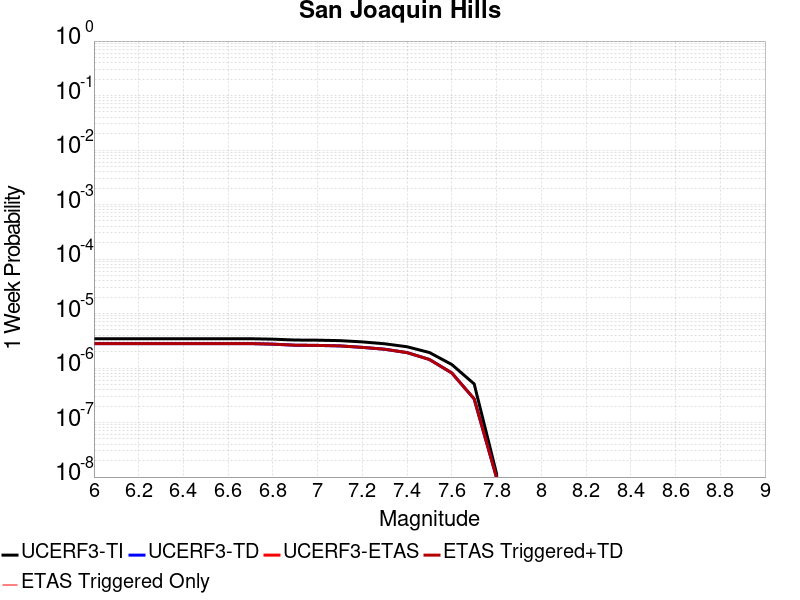 | 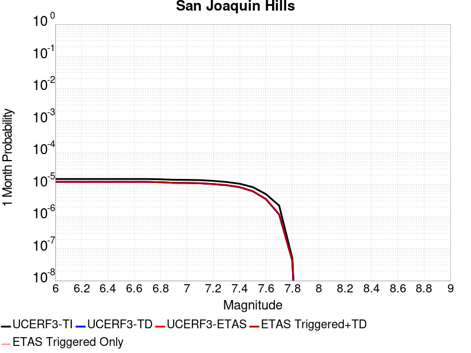 | 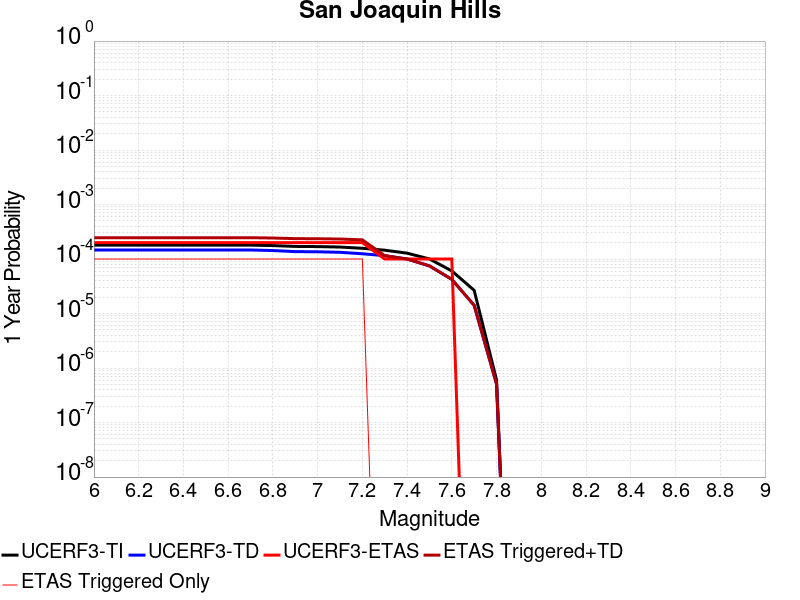 | 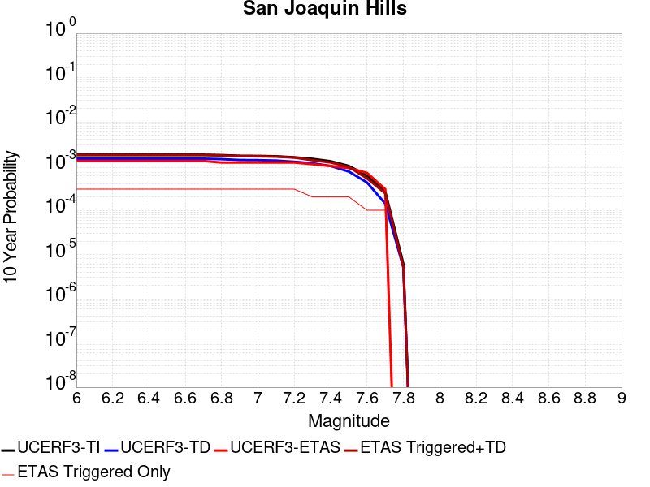 |

| Magnitude | 1 wk TI Prob | 1 wk TD Prob | 1 wk ETAS Prob | 1 wk ETAS/TD Gain | 1 wk ETAS Triggered+TD | 1 wk ETAS Triggered Only | 1 mo TI Prob | 1 mo TD Prob | 1 mo ETAS Prob | 1 mo ETAS/TD Gain | 1 mo ETAS Triggered+TD | 1 mo ETAS Triggered Only | 1 yr TI Prob | 1 yr TD Prob | 1 yr ETAS Prob | 1 yr ETAS/TD Gain | 1 yr ETAS Triggered+TD | 1 yr ETAS Triggered Only | 10 yr TI Prob | 10 yr TD Prob | 10 yr ETAS Prob | 10 yr ETAS/TD Gain | 10 yr ETAS Triggered+TD | 10 yr ETAS Triggered Only |
|-----|-----|-----|-----|-----|-----|-----|-----|-----|-----|-----|-----|-----|-----|-----|-----|-----|-----|-----|-----|-----|-----|-----|-----|-----|
| 6.0 | 3.4525704E-6 | 2.8116842E-6 | 0.0 | 0.0 | 2.8116842E-6 | 0.0 | 1.4796647E-5 | 1.205002E-5 | 0.0 | 0.0 | 1.205002E-5 | 0.0 | 1.8013427E-4 | 1.4669924E-4 | 2.0E-4 | 1.3633335 | 2.4668456E-4 | 1.0E-4 | 0.0017998833 | 0.0014660372 | 0.0013 | 0.88674414 | 0.0017655975 | 3.0E-4 |
| 6.1 | 3.4525704E-6 | 2.8116842E-6 | 0.0 | 0.0 | 2.8116842E-6 | 0.0 | 1.4796647E-5 | 1.205002E-5 | 0.0 | 0.0 | 1.205002E-5 | 0.0 | 1.8013427E-4 | 1.4669924E-4 | 2.0E-4 | 1.3633335 | 2.4668456E-4 | 1.0E-4 | 0.0017998833 | 0.0014660372 | 0.0013 | 0.88674414 | 0.0017655975 | 3.0E-4 |
| 6.2 | 3.4525704E-6 | 2.8116842E-6 | 0.0 | 0.0 | 2.8116842E-6 | 0.0 | 1.4796647E-5 | 1.205002E-5 | 0.0 | 0.0 | 1.205002E-5 | 0.0 | 1.8013427E-4 | 1.4669924E-4 | 2.0E-4 | 1.3633335 | 2.4668456E-4 | 1.0E-4 | 0.0017998833 | 0.0014660372 | 0.0013 | 0.88674414 | 0.0017655975 | 3.0E-4 |
| 6.3 | 3.4525704E-6 | 2.8116842E-6 | 0.0 | 0.0 | 2.8116842E-6 | 0.0 | 1.4796647E-5 | 1.205002E-5 | 0.0 | 0.0 | 1.205002E-5 | 0.0 | 1.8013427E-4 | 1.4669924E-4 | 2.0E-4 | 1.3633335 | 2.4668456E-4 | 1.0E-4 | 0.0017998833 | 0.0014660372 | 0.0013 | 0.88674414 | 0.0017655975 | 3.0E-4 |
| 6.4 | 3.4525704E-6 | 2.8116842E-6 | 0.0 | 0.0 | 2.8116842E-6 | 0.0 | 1.4796647E-5 | 1.205002E-5 | 0.0 | 0.0 | 1.205002E-5 | 0.0 | 1.8013427E-4 | 1.4669924E-4 | 2.0E-4 | 1.3633335 | 2.4668456E-4 | 1.0E-4 | 0.0017998833 | 0.0014660372 | 0.0013 | 0.88674414 | 0.0017655975 | 3.0E-4 |
| 6.5 | 3.4525704E-6 | 2.8116842E-6 | 0.0 | 0.0 | 2.8116842E-6 | 0.0 | 1.4796647E-5 | 1.205002E-5 | 0.0 | 0.0 | 1.205002E-5 | 0.0 | 1.8013427E-4 | 1.4669924E-4 | 2.0E-4 | 1.3633335 | 2.4668456E-4 | 1.0E-4 | 0.0017998833 | 0.0014660372 | 0.0013 | 0.88674414 | 0.0017655975 | 3.0E-4 |
| 6.6 | 3.4525704E-6 | 2.8116842E-6 | 0.0 | 0.0 | 2.8116842E-6 | 0.0 | 1.4796647E-5 | 1.205002E-5 | 0.0 | 0.0 | 1.205002E-5 | 0.0 | 1.8013427E-4 | 1.4669924E-4 | 2.0E-4 | 1.3633335 | 2.4668456E-4 | 1.0E-4 | 0.0017998833 | 0.0014660372 | 0.0013 | 0.88674414 | 0.0017655975 | 3.0E-4 |
| 6.7 | 3.4525704E-6 | 2.8116842E-6 | 0.0 | 0.0 | 2.8116842E-6 | 0.0 | 1.4796647E-5 | 1.205002E-5 | 0.0 | 0.0 | 1.205002E-5 | 0.0 | 1.8013427E-4 | 1.4669924E-4 | 2.0E-4 | 1.3633335 | 2.4668456E-4 | 1.0E-4 | 0.0017998833 | 0.0014660372 | 0.0013 | 0.88674414 | 0.0017655975 | 3.0E-4 |
| 6.8 | 3.388654E-6 | 2.7461401E-6 | 0.0 | 0.0 | 2.7461401E-6 | 0.0 | 1.4522722E-5 | 1.176912E-5 | 0.0 | 0.0 | 1.176912E-5 | 0.0 | 1.767998E-4 | 1.4327973E-4 | 2.0E-4 | 1.3958708 | 2.4326541E-4 | 1.0E-4 | 0.001766592 | 0.0014318865 | 0.0012 | 0.8380553 | 0.0017314568 | 3.0E-4 |
| 6.9 | 3.2694352E-6 | 2.6260864E-6 | 0.0 | 0.0 | 2.6260864E-6 | 0.0 | 1.401179E-5 | 1.1254608E-5 | 0.0 | 0.0 | 1.1254608E-5 | 0.0 | 1.7058018E-4 | 1.3701635E-4 | 2.0E-4 | 1.4596798 | 2.3700265E-4 | 1.0E-4 | 0.0017044931 | 0.00136933 | 0.0012 | 0.876341 | 0.0016689191 | 3.0E-4 |
| 7.0 | 3.246912E-6 | 2.604751E-6 | 0.0 | 0.0 | 2.604751E-6 | 0.0 | 1.39152635E-5 | 1.1163171E-5 | 0.0 | 0.0 | 1.1163171E-5 | 0.0 | 1.6940516E-4 | 1.3590325E-4 | 2.0E-4 | 1.4716352 | 2.3588965E-4 | 1.0E-4 | 0.0016927607 | 0.0013582126 | 0.0012 | 0.88351417 | 0.001657805 | 3.0E-4 |
| 7.1 | 3.1864927E-6 | 2.5500922E-6 | 0.0 | 0.0 | 2.5500922E-6 | 0.0 | 1.3656326E-5 | 1.0928921E-5 | 0.0 | 0.0 | 1.0928921E-5 | 0.0 | 1.6625308E-4 | 1.3305161E-4 | 2.0E-4 | 1.5031761 | 2.330383E-4 | 1.0E-4 | 0.0016612876 | 0.0013297305 | 0.0012 | 0.9024385 | 0.0016293315 | 3.0E-4 |
| 7.2 | 3.0220644E-6 | 2.3969897E-6 | 0.0 | 0.0 | 2.3969897E-6 | 0.0 | 1.295164E-5 | 1.0272773E-5 | 0.0 | 0.0 | 1.0272773E-5 | 0.0 | 1.576748E-4 | 1.2506393E-4 | 2.0E-4 | 1.5991821 | 2.2505142E-4 | 1.0E-4 | 0.0015756298 | 0.0012499458 | 0.0012 | 0.96004164 | 0.0015495708 | 3.0E-4 |
| 7.3 | 2.787619E-6 | 2.215412E-6 | 0.0 | 0.0 | 2.215412E-6 | 0.0 | 1.1946884E-5 | 9.494589E-6 | 0.0 | 0.0 | 9.494589E-6 | 0.0 | 1.454436E-4 | 1.15590585E-4 | 1.0E-4 | 0.8651224 | 1.15590585E-4 | 0.0 | 0.0014534845 | 0.0011553144 | 0.0011 | 0.95212173 | 0.0013550833 | 2.0E-4 |
| 7.4 | 2.4593792E-6 | 1.9207457E-6 | 0.0 | 0.0 | 1.9207457E-6 | 0.0 | 1.0540153E-5 | 8.231742E-6 | 0.0 | 0.0 | 8.231742E-6 | 0.0 | 1.2831882E-4 | 1.0021694E-4 | 1.0E-4 | 0.99783534 | 1.0021694E-4 | 0.0 | 0.0012824474 | 0.0010017261 | 0.001 | 0.9982768 | 0.0012015258 | 2.0E-4 |
| 7.5 | 1.926764E-6 | 1.4365476E-6 | 0.0 | 0.0 | 1.4365476E-6 | 0.0 | 8.257534E-6 | 6.1566184E-6 | 0.0 | 0.0 | 6.1566184E-6 | 0.0 | 1.00530844E-4 | 7.495431E-5 | 1.0E-4 | 1.334146 | 7.495431E-5 | 0.0 | 0.0010048538 | 7.492966E-4 | 9.0E-4 | 1.2011265 | 9.4914675E-4 | 2.0E-4 |
| 7.6 | 1.1609359E-6 | 8.129873E-7 | 0.0 | 0.0 | 8.129873E-7 | 0.0 | 4.97543E-6 | 3.484227E-6 | 0.0 | 0.0 | 3.484227E-6 | 0.0 | 6.0574173E-5 | 4.241968E-5 | 1.0E-4 | 2.3573964 | 4.241968E-5 | 0.0 | 6.055767E-4 | 4.2412014E-4 | 7.0E-4 | 1.6504757 | 5.2407774E-4 | 1.0E-4 |
| 7.7 | 5.1168536E-7 | 2.7130977E-7 | 0.0 | 0.0 | 2.7130977E-7 | 0.0 | 2.1929354E-6 | 1.1627558E-6 | 0.0 | 0.0 | 1.1627558E-6 | 0.0 | 2.669866E-5 | 1.4156472E-5 | 0.0 | 0.0 | 1.4156472E-5 | 0.0 | 2.6695454E-4 | 1.4155706E-4 | 3.0E-4 | 2.1192868 | 2.415429E-4 | 1.0E-4 |
| 7.8 | 1.16056995E-8 | 9.781112E-9 | 0.0 | 0.0 | 9.781112E-9 | 0.0 | 4.9738713E-8 | 4.191905E-8 | 0.0 | 0.0 | 4.191905E-8 | 0.0 | 6.0556863E-7 | 5.1036443E-7 | 0.0 | 0.0 | 5.1036443E-7 | 0.0 | 6.05567E-6 | 5.1036445E-6 | 0.0 | 0.0 | 5.1036445E-6 | 0.0 |

## San Luis Range - Pecho 2011 CFM
*[(top)](#table-of-contents)*

| 1 Week | 1 Month | 1 Year | 10 Year |
|-----|-----|-----|-----|
| 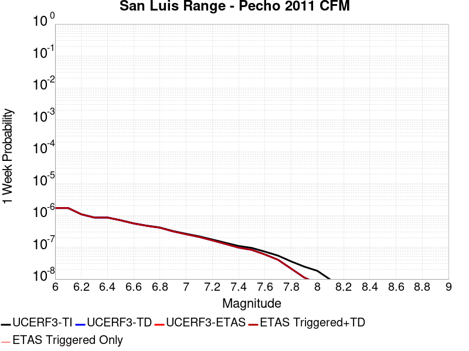 | 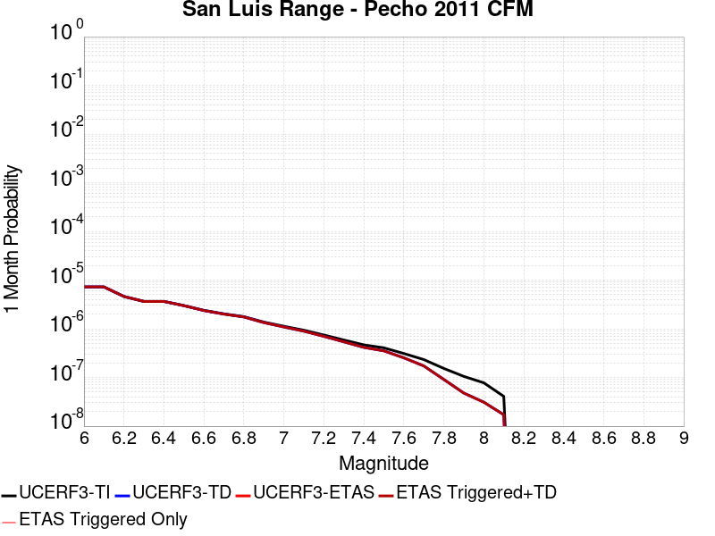 | 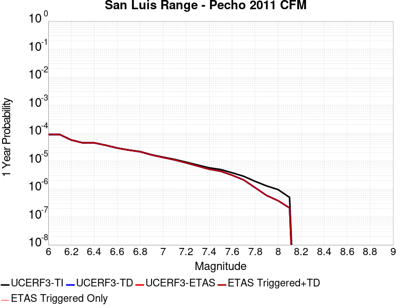 | 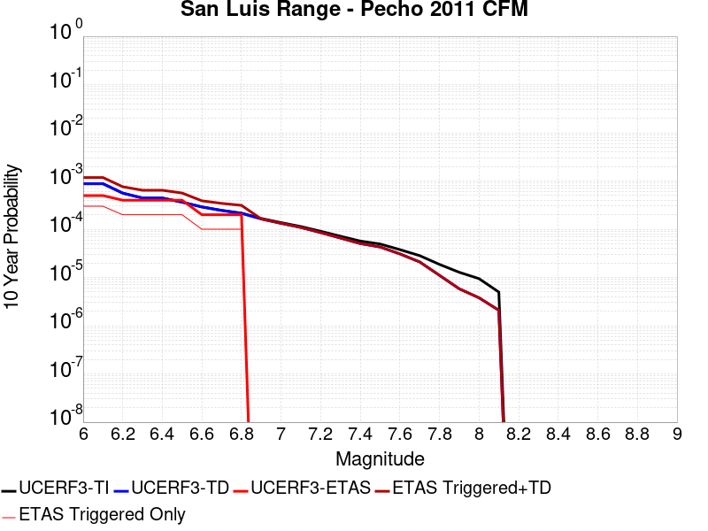 |

| Magnitude | 1 wk TI Prob | 1 wk TD Prob | 1 wk ETAS Prob | 1 wk ETAS/TD Gain | 1 wk ETAS Triggered+TD | 1 wk ETAS Triggered Only | 1 mo TI Prob | 1 mo TD Prob | 1 mo ETAS Prob | 1 mo ETAS/TD Gain | 1 mo ETAS Triggered+TD | 1 mo ETAS Triggered Only | 1 yr TI Prob | 1 yr TD Prob | 1 yr ETAS Prob | 1 yr ETAS/TD Gain | 1 yr ETAS Triggered+TD | 1 yr ETAS Triggered Only | 10 yr TI Prob | 10 yr TD Prob | 10 yr ETAS Prob | 10 yr ETAS/TD Gain | 10 yr ETAS Triggered+TD | 10 yr ETAS Triggered Only |
|-----|-----|-----|-----|-----|-----|-----|-----|-----|-----|-----|-----|-----|-----|-----|-----|-----|-----|-----|-----|-----|-----|-----|-----|-----|
| 6.0 | 1.687423E-6 | 1.6917865E-6 | 0.0 | 0.0 | 1.6917865E-6 | 0.0 | 7.231793E-6 | 7.2504945E-6 | 0.0 | 0.0 | 7.2504945E-6 | 0.0 | 8.804352E-5 | 8.827144E-5 | 0.0 | 0.0 | 8.827144E-5 | 0.0 | 8.8008645E-4 | 8.823877E-4 | 5.0E-4 | 0.5666444 | 0.001182123 | 3.0E-4 |
| 6.1 | 1.687423E-6 | 1.6917865E-6 | 0.0 | 0.0 | 1.6917865E-6 | 0.0 | 7.231793E-6 | 7.2504945E-6 | 0.0 | 0.0 | 7.2504945E-6 | 0.0 | 8.804352E-5 | 8.827144E-5 | 0.0 | 0.0 | 8.827144E-5 | 0.0 | 8.8008645E-4 | 8.823877E-4 | 5.0E-4 | 0.5666444 | 0.001182123 | 3.0E-4 |
| 6.2 | 1.0765672E-6 | 1.0766912E-6 | 0.0 | 0.0 | 1.0766912E-6 | 0.0 | 4.613851E-6 | 4.614383E-6 | 0.0 | 0.0 | 4.614383E-6 | 0.0 | 5.617219E-5 | 5.617873E-5 | 0.0 | 0.0 | 5.617873E-5 | 0.0 | 5.6157995E-4 | 5.6165154E-4 | 4.0E-4 | 0.7121854 | 7.615392E-4 | 2.0E-4 |
| 6.3 | 8.523104E-7 | 8.50955E-7 | 0.0 | 0.0 | 8.50955E-7 | 0.0 | 3.6527538E-6 | 3.6469453E-6 | 0.0 | 0.0 | 3.6469453E-6 | 0.0 | 4.447137E-5 | 4.4400687E-5 | 0.0 | 0.0 | 4.4400687E-5 | 0.0 | 4.4462472E-4 | 4.4392134E-4 | 4.0E-4 | 0.9010605 | 6.4383255E-4 | 2.0E-4 |
| 6.4 | 8.523104E-7 | 8.50955E-7 | 0.0 | 0.0 | 8.50955E-7 | 0.0 | 3.6527538E-6 | 3.6469453E-6 | 0.0 | 0.0 | 3.6469453E-6 | 0.0 | 4.447137E-5 | 4.4400687E-5 | 0.0 | 0.0 | 4.4400687E-5 | 0.0 | 4.4462472E-4 | 4.4392134E-4 | 4.0E-4 | 0.9010605 | 6.4383255E-4 | 2.0E-4 |
| 6.5 | 7.0029404E-7 | 6.97314E-7 | 0.0 | 0.0 | 6.97314E-7 | 0.0 | 3.0012568E-6 | 2.9884854E-6 | 0.0 | 0.0 | 2.9884854E-6 | 0.0 | 3.6539688E-5 | 3.638422E-5 | 0.0 | 0.0 | 3.638422E-5 | 0.0 | 3.653368E-4 | 3.6378432E-4 | 4.0E-4 | 1.0995526 | 5.6371157E-4 | 2.0E-4 |
| 6.6 | 5.583906E-7 | 5.539685E-7 | 0.0 | 0.0 | 5.539685E-7 | 0.0 | 2.3931002E-6 | 2.3741486E-6 | 0.0 | 0.0 | 2.3741486E-6 | 0.0 | 2.9135606E-5 | 2.8904884E-5 | 0.0 | 0.0 | 2.8904884E-5 | 0.0 | 2.9131788E-4 | 2.8901198E-4 | 2.0E-4 | 0.6920128 | 3.8898308E-4 | 1.0E-4 |
| 6.7 | 4.73441E-7 | 4.6800304E-7 | 0.0 | 0.0 | 4.6800304E-7 | 0.0 | 2.0290313E-6 | 2.0057257E-6 | 0.0 | 0.0 | 2.0057257E-6 | 0.0 | 2.4703175E-5 | 2.4419442E-5 | 0.0 | 0.0 | 2.4419442E-5 | 0.0 | 2.470043E-4 | 2.4416804E-4 | 2.0E-4 | 0.819108 | 3.4414363E-4 | 1.0E-4 |
| 6.8 | 4.1466086E-7 | 4.0848383E-7 | 0.0 | 0.0 | 4.0848383E-7 | 0.0 | 1.7771167E-6 | 1.7506438E-6 | 0.0 | 0.0 | 1.7506438E-6 | 0.0 | 2.1636182E-5 | 2.1313885E-5 | 0.0 | 0.0 | 2.1313885E-5 | 0.0 | 2.1634075E-4 | 2.1311874E-4 | 2.0E-4 | 0.938444 | 3.1309744E-4 | 1.0E-4 |
| 6.9 | 3.2056641E-7 | 3.130121E-7 | 0.0 | 0.0 | 3.130121E-7 | 0.0 | 1.3738553E-6 | 1.3414797E-6 | 0.0 | 0.0 | 1.3414797E-6 | 0.0 | 1.6726559E-5 | 1.6332395E-5 | 0.0 | 0.0 | 1.6332395E-5 | 0.0 | 1.67253E-4 | 1.633121E-4 | 0.0 | 0.0 | 1.633121E-4 | 0.0 |
| 7.0 | 2.6315942E-7 | 2.5462634E-7 | 0.0 | 0.0 | 2.5462634E-7 | 0.0 | 1.1278256E-6 | 1.0912553E-6 | 0.0 | 0.0 | 1.0912553E-6 | 0.0 | 1.3731191E-5 | 1.3285953E-5 | 0.0 | 0.0 | 1.3285953E-5 | 0.0 | 1.3730342E-4 | 1.3285167E-4 | 0.0 | 0.0 | 1.3285167E-4 | 0.0 |
| 7.1 | 2.1832436E-7 | 2.089122E-7 | 0.0 | 0.0 | 2.089122E-7 | 0.0 | 9.356755E-7 | 8.953377E-7 | 0.0 | 0.0 | 8.953377E-7 | 0.0 | 1.13917895E-5 | 1.0900682E-5 | 0.0 | 0.0 | 1.0900682E-5 | 0.0 | 1.1391206E-4 | 1.0900153E-4 | 0.0 | 0.0 | 1.0900153E-4 | 0.0 |
| 7.2 | 1.7393015E-7 | 1.6351581E-7 | 0.0 | 0.0 | 1.6351581E-7 | 0.0 | 7.454147E-7 | 7.007818E-7 | 0.0 | 0.0 | 7.007818E-7 | 0.0 | 9.075386E-6 | 8.531985E-6 | 0.0 | 0.0 | 8.531985E-6 | 0.0 | 9.075015E-5 | 8.5316606E-5 | 0.0 | 0.0 | 8.5316606E-5 | 0.0 |
| 7.3 | 1.3744894E-7 | 1.261457E-7 | 0.0 | 0.0 | 1.261457E-7 | 0.0 | 5.890667E-7 | 5.4062434E-7 | 0.0 | 0.0 | 5.4062434E-7 | 0.0 | 7.1718637E-6 | 6.5820814E-6 | 0.0 | 0.0 | 6.5820814E-6 | 0.0 | 7.171632E-5 | 6.581887E-5 | 0.0 | 0.0 | 6.581887E-5 | 0.0 |
| 7.4 | 1.0915278E-7 | 9.7043596E-8 | 0.0 | 0.0 | 9.7043596E-8 | 0.0 | 4.6779755E-7 | 4.1590107E-7 | 0.0 | 0.0 | 4.1590107E-7 | 0.0 | 5.6954204E-6 | 5.0635836E-6 | 0.0 | 0.0 | 5.0635836E-6 | 0.0 | 5.6952744E-5 | 5.063469E-5 | 0.0 | 0.0 | 5.063469E-5 | 0.0 |
| 7.5 | 9.490291E-8 | 8.234447E-8 | 0.0 | 0.0 | 8.234447E-8 | 0.0 | 4.0672668E-7 | 3.529048E-7 | 0.0 | 0.0 | 3.529048E-7 | 0.0 | 4.9518862E-6 | 4.2966076E-6 | 0.0 | 0.0 | 4.2966076E-6 | 0.0 | 4.951776E-5 | 4.296525E-5 | 0.0 | 0.0 | 4.296525E-5 | 0.0 |
| 7.6 | 7.256678E-8 | 5.920721E-8 | 0.0 | 0.0 | 5.920721E-8 | 0.0 | 3.1100043E-7 | 2.5374516E-7 | 0.0 | 0.0 | 2.5374516E-7 | 0.0 | 3.7864236E-6 | 3.089343E-6 | 0.0 | 0.0 | 3.089343E-6 | 0.0 | 3.7863592E-5 | 3.0893003E-5 | 0.0 | 0.0 | 3.0893003E-5 | 0.0 |
| 7.7 | 5.446273E-8 | 4.036935E-8 | 0.0 | 0.0 | 4.036935E-8 | 0.0 | 2.3341168E-7 | 1.730115E-7 | 0.0 | 0.0 | 1.730115E-7 | 0.0 | 2.8417835E-6 | 2.106413E-6 | 0.0 | 0.0 | 2.106413E-6 | 0.0 | 2.8417471E-5 | 2.1063932E-5 | 0.0 | 0.0 | 2.1063932E-5 | 0.0 |
| 7.8 | 3.5850867E-8 | 2.1318865E-8 | 0.0 | 0.0 | 2.1318865E-8 | 0.0 | 1.5364655E-7 | 9.136656E-8 | 0.0 | 0.0 | 9.136656E-8 | 0.0 | 1.8706452E-6 | 1.1123873E-6 | 0.0 | 0.0 | 1.1123873E-6 | 0.0 | 1.8706294E-5 | 1.1123818E-5 | 0.0 | 0.0 | 1.1123818E-5 | 0.0 |
| 7.9 | 2.45879E-8 | 1.1211496E-8 | 0.0 | 0.0 | 1.1211496E-8 | 0.0 | 1.0537671E-7 | 4.8049266E-8 | 0.0 | 0.0 | 4.8049266E-8 | 0.0 | 1.2829606E-6 | 5.849996E-7 | 0.0 | 0.0 | 5.849996E-7 | 0.0 | 1.2829532E-5 | 5.849981E-6 | 0.0 | 0.0 | 5.849981E-6 | 0.0 |
| 8.0 | 1.8151761E-8 | 7.2932E-9 | 0.0 | 0.0 | 7.2932E-9 | 0.0 | 7.779326E-8 | 3.1256572E-8 | 0.0 | 0.0 | 3.1256572E-8 | 0.0 | 9.4713255E-7 | 3.805487E-7 | 0.0 | 0.0 | 3.805487E-7 | 0.0 | 9.471285E-6 | 3.8054807E-6 | 0.0 | 0.0 | 3.8054807E-6 | 0.0 |
| 8.1 | 9.559205E-9 | 4.024113E-9 | 0.0 | 0.0 | 4.024113E-9 | 0.0 | 4.096802E-8 | 1.72462E-8 | 0.0 | 0.0 | 1.72462E-8 | 0.0 | 4.9878554E-7 | 2.0997246E-7 | 0.0 | 0.0 | 2.0997246E-7 | 0.0 | 4.987844E-6 | 2.0997227E-6 | 0.0 | 0.0 | 2.0997227E-6 | 0.0 |

## Great Valley 12
*[(top)](#table-of-contents)*

| 1 Week | 1 Month | 1 Year | 10 Year |
|-----|-----|-----|-----|
| 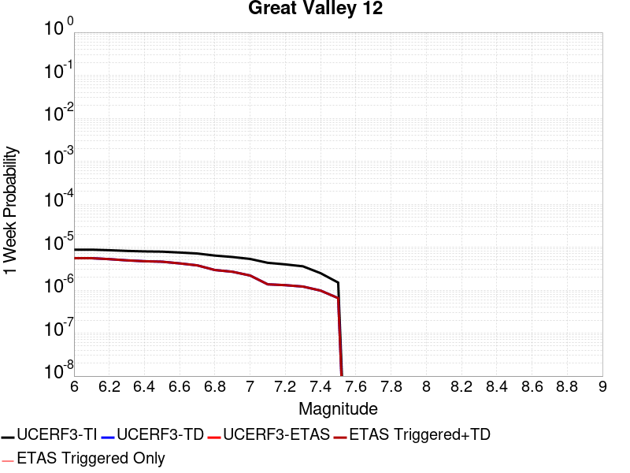 | 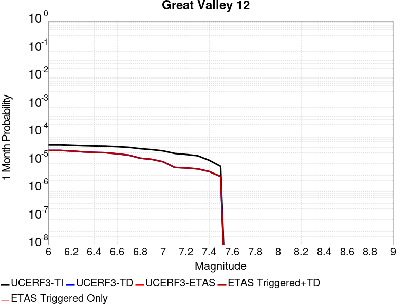 | 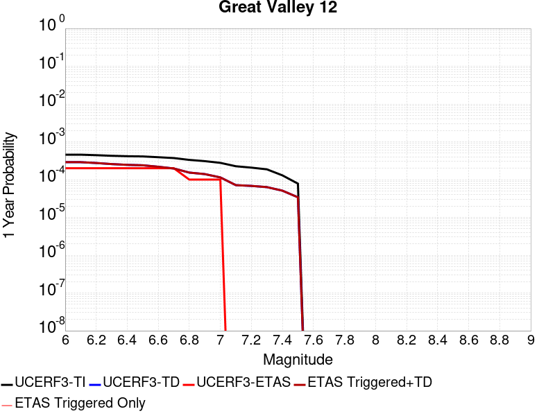 | 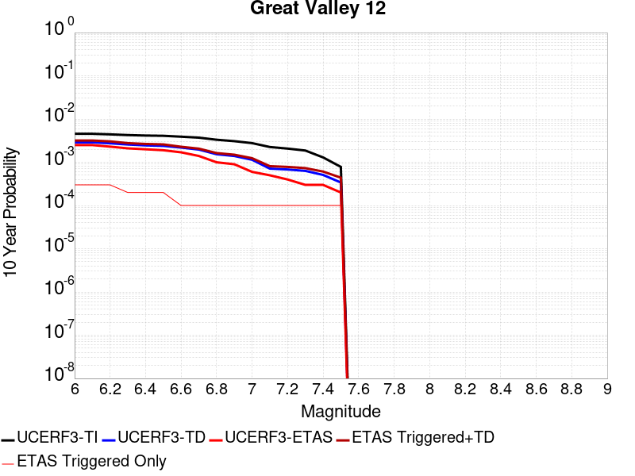 |

| Magnitude | 1 wk TI Prob | 1 wk TD Prob | 1 wk ETAS Prob | 1 wk ETAS/TD Gain | 1 wk ETAS Triggered+TD | 1 wk ETAS Triggered Only | 1 mo TI Prob | 1 mo TD Prob | 1 mo ETAS Prob | 1 mo ETAS/TD Gain | 1 mo ETAS Triggered+TD | 1 mo ETAS Triggered Only | 1 yr TI Prob | 1 yr TD Prob | 1 yr ETAS Prob | 1 yr ETAS/TD Gain | 1 yr ETAS Triggered+TD | 1 yr ETAS Triggered Only | 10 yr TI Prob | 10 yr TD Prob | 10 yr ETAS Prob | 10 yr ETAS/TD Gain | 10 yr ETAS Triggered+TD | 10 yr ETAS Triggered Only |
|-----|-----|-----|-----|-----|-----|-----|-----|-----|-----|-----|-----|-----|-----|-----|-----|-----|-----|-----|-----|-----|-----|-----|-----|-----|
| 6.0 | 8.757157E-6 | 5.5465803E-6 | 0.0 | 0.0 | 5.5465803E-6 | 0.0 | 3.7530135E-5 | 2.377085E-5 | 0.0 | 0.0 | 2.377085E-5 | 0.0 | 4.5683357E-4 | 2.8937287E-4 | 2.0E-4 | 0.69114983 | 2.8937287E-4 | 0.0 | 0.004558956 | 0.0028900814 | 0.0025 | 0.86502755 | 0.0031892143 | 3.0E-4 |
| 6.1 | 8.757157E-6 | 5.5465803E-6 | 0.0 | 0.0 | 5.5465803E-6 | 0.0 | 3.7530135E-5 | 2.377085E-5 | 0.0 | 0.0 | 2.377085E-5 | 0.0 | 4.5683357E-4 | 2.8937287E-4 | 2.0E-4 | 0.69114983 | 2.8937287E-4 | 0.0 | 0.004558956 | 0.0028900814 | 0.0025 | 0.86502755 | 0.0031892143 | 3.0E-4 |
| 6.2 | 8.499136E-6 | 5.27243E-6 | 0.0 | 0.0 | 5.27243E-6 | 0.0 | 3.642436E-5 | 2.259594E-5 | 0.0 | 0.0 | 2.259594E-5 | 0.0 | 4.4337637E-4 | 2.7507197E-4 | 2.0E-4 | 0.72708243 | 2.7507197E-4 | 0.0 | 0.0044249278 | 0.002747429 | 0.0023 | 0.8371462 | 0.0030466048 | 3.0E-4 |
| 6.3 | 8.186883E-6 | 4.940792E-6 | 0.0 | 0.0 | 4.940792E-6 | 0.0 | 3.508617E-5 | 2.1174657E-5 | 0.0 | 0.0 | 2.1174657E-5 | 0.0 | 4.270904E-4 | 2.5777196E-4 | 2.0E-4 | 0.77587956 | 2.5777196E-4 | 0.0 | 0.004262705 | 0.00257483 | 0.0021 | 0.81558776 | 0.0027743152 | 2.0E-4 |
| 6.4 | 7.979878E-6 | 4.713037E-6 | 0.0 | 0.0 | 4.713037E-6 | 0.0 | 3.419903E-5 | 2.0198579E-5 | 0.0 | 0.0 | 2.0198579E-5 | 0.0 | 4.1629362E-4 | 2.4589087E-4 | 2.0E-4 | 0.8133689 | 2.4589087E-4 | 0.0 | 0.0041551464 | 0.002456282 | 0.002 | 0.8142388 | 0.0026557907 | 2.0E-4 |
| 6.5 | 7.871003E-6 | 4.59314E-6 | 0.0 | 0.0 | 4.59314E-6 | 0.0 | 3.373243E-5 | 1.9684743E-5 | 0.0 | 0.0 | 1.9684743E-5 | 0.0 | 4.1061494E-4 | 2.3963631E-4 | 2.0E-4 | 0.83459806 | 2.3963631E-4 | 0.0 | 0.0040985704 | 0.002393872 | 0.0019 | 0.79369324 | 0.0025933932 | 2.0E-4 |
| 6.6 | 7.508221E-6 | 4.196911E-6 | 0.0 | 0.0 | 4.196911E-6 | 0.0 | 3.2177693E-5 | 1.7986642E-5 | 0.0 | 0.0 | 1.7986642E-5 | 0.0 | 3.91693E-4 | 2.1896623E-4 | 2.0E-4 | 0.9133828 | 2.1896623E-4 | 0.0 | 0.003910033 | 0.002187591 | 0.0017 | 0.7771105 | 0.0022873722 | 1.0E-4 |
| 6.7 | 7.1297914E-6 | 3.7751438E-6 | 0.0 | 0.0 | 3.7751438E-6 | 0.0 | 3.055589E-5 | 1.6179092E-5 | 0.0 | 0.0 | 1.6179092E-5 | 0.0 | 3.7195446E-4 | 1.9696343E-4 | 2.0E-4 | 1.0154169 | 1.9696343E-4 | 0.0 | 0.0037133251 | 0.0019679673 | 0.0014 | 0.71139395 | 0.0020677706 | 1.0E-4 |
| 6.8 | 6.376581E-6 | 2.9426433E-6 | 0.0 | 0.0 | 2.9426433E-6 | 0.0 | 2.7327918E-5 | 1.2611268E-5 | 0.0 | 0.0 | 1.2611268E-5 | 0.0 | 3.326666E-4 | 1.5353154E-4 | 1.0E-4 | 0.65133196 | 1.5353154E-4 | 0.0 | 0.0033216903 | 0.0015342712 | 0.001 | 0.65177524 | 0.0016341178 | 1.0E-4 |
| 6.9 | 5.9095E-6 | 2.6810474E-6 | 0.0 | 0.0 | 2.6810474E-6 | 0.0 | 2.5326184E-5 | 1.1490153E-5 | 0.0 | 0.0 | 1.1490153E-5 | 0.0 | 3.0830267E-4 | 1.3988379E-4 | 1.0E-4 | 0.7148791 | 1.3988379E-4 | 0.0 | 0.003078753 | 0.0013979728 | 9.0E-4 | 0.64378935 | 0.0014978331 | 1.0E-4 |
| 7.0 | 5.3239864E-6 | 2.1918327E-6 | 0.0 | 0.0 | 2.1918327E-6 | 0.0 | 2.2816885E-5 | 9.393536E-6 | 0.0 | 0.0 | 9.393536E-6 | 0.0 | 2.7776015E-4 | 1.1436043E-4 | 1.0E-4 | 0.87442833 | 1.1436043E-4 | 0.0 | 0.0027741324 | 0.0011430292 | 6.0E-4 | 0.524921 | 0.0012429149 | 1.0E-4 |
| 7.1 | 4.329147E-6 | 1.3672769E-6 | 0.0 | 0.0 | 1.3672769E-6 | 0.0 | 1.8553355E-5 | 5.8597457E-6 | 0.0 | 0.0 | 5.8597457E-6 | 0.0 | 2.2586368E-4 | 7.134015E-5 | 0.0 | 0.0 | 7.134015E-5 | 0.0 | 0.0022563424 | 7.1318116E-4 | 5.0E-4 | 0.70108414 | 8.1310986E-4 | 1.0E-4 |
| 7.2 | 3.978488E-6 | 1.3073652E-6 | 0.0 | 0.0 | 1.3073652E-6 | 0.0 | 1.7050552E-5 | 5.602982E-6 | 0.0 | 0.0 | 5.602982E-6 | 0.0 | 2.075707E-4 | 6.8214256E-5 | 0.0 | 0.0 | 6.8214256E-5 | 0.0 | 0.0020737692 | 6.8194175E-4 | 4.0E-4 | 0.58656037 | 7.818736E-4 | 1.0E-4 |
| 7.3 | 3.586542E-6 | 1.2128213E-6 | 0.0 | 0.0 | 1.2128213E-6 | 0.0 | 1.5370804E-5 | 5.197796E-6 | 0.0 | 0.0 | 5.197796E-6 | 0.0 | 1.8712347E-4 | 6.328141E-5 | 0.0 | 0.0 | 6.328141E-5 | 0.0 | 0.0018696598 | 6.326424E-4 | 3.0E-4 | 0.47420153 | 7.3257915E-4 | 1.0E-4 |
| 7.4 | 2.4837766E-6 | 9.777389E-7 | 0.0 | 0.0 | 9.777389E-7 | 0.0 | 1.0644713E-5 | 4.190303E-6 | 0.0 | 0.0 | 4.190303E-6 | 0.0 | 1.2959167E-4 | 5.1015813E-5 | 0.0 | 0.0 | 5.1015813E-5 | 0.0 | 0.0012951613 | 5.1004754E-4 | 3.0E-4 | 0.5881804 | 6.0999655E-4 | 1.0E-4 |
| 7.5 | 1.5002679E-6 | 6.5287935E-7 | 0.0 | 0.0 | 6.5287935E-7 | 0.0 | 6.4297037E-6 | 2.7980518E-6 | 0.0 | 0.0 | 2.7980518E-6 | 0.0 | 7.827883E-5 | 3.406579E-5 | 0.0 | 0.0 | 3.406579E-5 | 0.0 | 7.825126E-4 | 3.406098E-4 | 2.0E-4 | 0.58718216 | 4.4057574E-4 | 1.0E-4 |

## Carlsbad
*[(top)](#table-of-contents)*

| 1 Week | 1 Month | 1 Year | 10 Year |
|-----|-----|-----|-----|
| 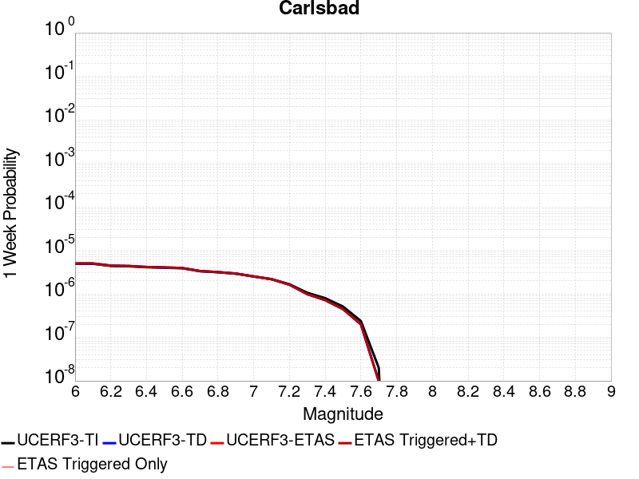 |  | 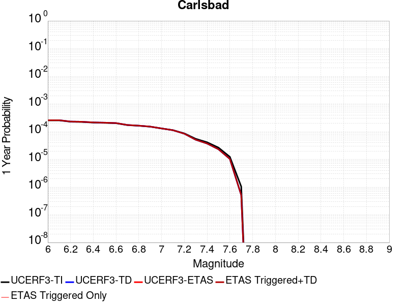 | 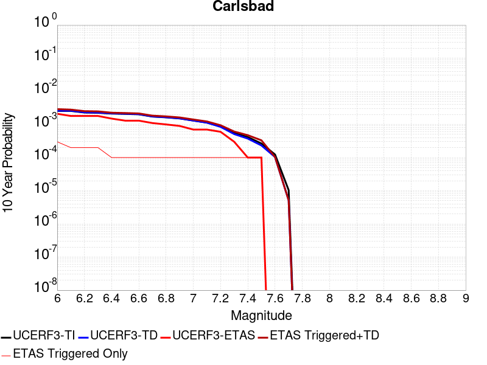 |

| Magnitude | 1 wk TI Prob | 1 wk TD Prob | 1 wk ETAS Prob | 1 wk ETAS/TD Gain | 1 wk ETAS Triggered+TD | 1 wk ETAS Triggered Only | 1 mo TI Prob | 1 mo TD Prob | 1 mo ETAS Prob | 1 mo ETAS/TD Gain | 1 mo ETAS Triggered+TD | 1 mo ETAS Triggered Only | 1 yr TI Prob | 1 yr TD Prob | 1 yr ETAS Prob | 1 yr ETAS/TD Gain | 1 yr ETAS Triggered+TD | 1 yr ETAS Triggered Only | 10 yr TI Prob | 10 yr TD Prob | 10 yr ETAS Prob | 10 yr ETAS/TD Gain | 10 yr ETAS Triggered+TD | 10 yr ETAS Triggered Only |
|-----|-----|-----|-----|-----|-----|-----|-----|-----|-----|-----|-----|-----|-----|-----|-----|-----|-----|-----|-----|-----|-----|-----|-----|-----|
| 6.0 | 4.9038536E-6 | 4.984748E-6 | 0.0 | 0.0 | 4.984748E-6 | 0.0 | 2.1016345E-5 | 2.1363034E-5 | 0.0 | 0.0 | 2.1363034E-5 | 0.0 | 2.5584397E-4 | 2.6006435E-4 | 0.0 | 0.0 | 2.6006435E-4 | 0.0 | 0.002555496 | 0.0025976473 | 0.0021 | 0.8084239 | 0.002896868 | 3.0E-4 |
| 6.1 | 4.9038536E-6 | 4.984748E-6 | 0.0 | 0.0 | 4.984748E-6 | 0.0 | 2.1016345E-5 | 2.1363034E-5 | 0.0 | 0.0 | 2.1363034E-5 | 0.0 | 2.5584397E-4 | 2.6006435E-4 | 0.0 | 0.0 | 2.6006435E-4 | 0.0 | 0.002555496 | 0.0025976473 | 0.0018 | 0.69293475 | 0.0027971277 | 2.0E-4 |
| 6.2 | 4.3820614E-6 | 4.4523745E-6 | 0.0 | 0.0 | 4.4523745E-6 | 0.0 | 1.8780129E-5 | 1.9081468E-5 | 0.0 | 0.0 | 1.9081468E-5 | 0.0 | 2.2862408E-4 | 2.3229246E-4 | 0.0 | 0.0 | 2.3229246E-4 | 0.0 | 0.00228389 | 0.0023205322 | 0.0018 | 0.7756842 | 0.002520068 | 2.0E-4 |
| 6.3 | 4.302872E-6 | 4.37064E-6 | 0.0 | 0.0 | 4.37064E-6 | 0.0 | 1.8440749E-5 | 1.8731182E-5 | 0.0 | 0.0 | 1.8731182E-5 | 0.0 | 2.24493E-4 | 2.2802861E-4 | 0.0 | 0.0 | 2.2802861E-4 | 0.0 | 0.0022426634 | 0.0022779815 | 0.0018 | 0.79017323 | 0.002477526 | 2.0E-4 |
| 6.4 | 4.0835243E-6 | 4.1453527E-6 | 0.0 | 0.0 | 4.1453527E-6 | 0.0 | 1.75007E-5 | 1.7765678E-5 | 0.0 | 0.0 | 1.7765678E-5 | 0.0 | 2.1305021E-4 | 2.1627599E-4 | 0.0 | 0.0 | 2.1627599E-4 | 0.0 | 0.0021284607 | 0.002160689 | 0.0015 | 0.694223 | 0.002260473 | 1.0E-4 |
| 6.5 | 3.987806E-6 | 4.0466175E-6 | 0.0 | 0.0 | 4.0466175E-6 | 0.0 | 1.7090486E-5 | 1.7342534E-5 | 0.0 | 0.0 | 1.7342534E-5 | 0.0 | 2.080568E-4 | 2.1112523E-4 | 0.0 | 0.0 | 2.1112523E-4 | 0.0 | 0.002078621 | 0.0021092803 | 0.0013 | 0.616324 | 0.0022090694 | 1.0E-4 |
| 6.6 | 3.8707576E-6 | 3.925266E-6 | 0.0 | 0.0 | 3.925266E-6 | 0.0 | 1.6588854E-5 | 1.6822461E-5 | 0.0 | 0.0 | 1.6822461E-5 | 0.0 | 2.0195059E-4 | 2.0479456E-4 | 0.0 | 0.0 | 2.0479456E-4 | 0.0 | 0.0020176715 | 0.0020460917 | 0.0013 | 0.6353576 | 0.0021458871 | 1.0E-4 |
| 6.7 | 3.3093434E-6 | 3.3404458E-6 | 0.0 | 0.0 | 3.3404458E-6 | 0.0 | 1.4182823E-5 | 1.4316118E-5 | 0.0 | 0.0 | 1.4316118E-5 | 0.0 | 1.7266218E-4 | 1.7428485E-4 | 0.0 | 0.0 | 1.7428485E-4 | 0.0 | 0.001725281 | 0.0017414878 | 0.0011 | 0.63164383 | 0.0018413137 | 1.0E-4 |
| 6.8 | 3.136983E-6 | 3.164609E-6 | 0.0 | 0.0 | 3.164609E-6 | 0.0 | 1.3444143E-5 | 1.35625405E-5 | 0.0 | 0.0 | 1.35625405E-5 | 0.0 | 1.6367015E-4 | 1.6511147E-4 | 0.0 | 0.0 | 1.6511147E-4 | 0.0 | 0.0016354966 | 0.0016498936 | 0.001 | 0.60609967 | 0.0017497287 | 1.0E-4 |
| 6.9 | 2.9056644E-6 | 2.925055E-6 | 0.0 | 0.0 | 2.925055E-6 | 0.0 | 1.2452788E-5 | 1.253589E-5 | 0.0 | 0.0 | 1.253589E-5 | 0.0 | 1.5160214E-4 | 1.5261382E-4 | 0.0 | 0.0 | 1.5261382E-4 | 0.0 | 0.0015149876 | 0.0015250954 | 9.0E-4 | 0.590127 | 0.001624943 | 1.0E-4 |
| 7.0 | 2.5071035E-6 | 2.5099157E-6 | 0.0 | 0.0 | 2.5099157E-6 | 0.0 | 1.0744685E-5 | 1.07567375E-5 | 0.0 | 0.0 | 1.07567375E-5 | 0.0 | 1.308087E-4 | 1.3095544E-4 | 0.0 | 0.0 | 1.3095544E-4 | 0.0 | 0.0013073172 | 0.001308786 | 7.0E-4 | 0.53484684 | 0.0014086551 | 1.0E-4 |
| 7.1 | 2.1786877E-6 | 2.1665976E-6 | 0.0 | 0.0 | 2.1665976E-6 | 0.0 | 9.3372E-6 | 9.285385E-6 | 0.0 | 0.0 | 9.285385E-6 | 0.0 | 1.13674476E-4 | 1.1304373E-4 | 0.0 | 0.0 | 1.1304373E-4 | 0.0 | 0.0011361635 | 0.0011298651 | 7.0E-4 | 0.61954296 | 0.0012297521 | 1.0E-4 |
| 7.2 | 1.6628418E-6 | 1.6204722E-6 | 0.0 | 0.0 | 1.6204722E-6 | 0.0 | 7.1264453E-6 | 6.9448624E-6 | 0.0 | 0.0 | 6.9448624E-6 | 0.0 | 8.676102E-5 | 8.455044E-5 | 0.0 | 0.0 | 8.455044E-5 | 0.0 | 8.672715E-4 | 8.451849E-4 | 6.0E-4 | 0.70990384 | 9.451004E-4 | 1.0E-4 |
| 7.3 | 1.0595926E-6 | 9.812305E-7 | 0.0 | 0.0 | 9.812305E-7 | 0.0 | 4.541103E-6 | 4.205267E-6 | 0.0 | 0.0 | 4.205267E-6 | 0.0 | 5.5286528E-5 | 5.119793E-5 | 0.0 | 0.0 | 5.119793E-5 | 0.0 | 5.527277E-4 | 5.118623E-4 | 3.0E-4 | 0.58609515 | 6.1181106E-4 | 1.0E-4 |
| 7.4 | 7.956623E-7 | 7.1707075E-7 | 0.0 | 0.0 | 7.1707075E-7 | 0.0 | 3.4099767E-6 | 3.0731567E-6 | 0.0 | 0.0 | 3.0731567E-6 | 0.0 | 4.1515676E-5 | 3.7415048E-5 | 0.0 | 0.0 | 3.7415048E-5 | 0.0 | 4.150792E-4 | 3.740882E-4 | 1.0E-4 | 0.26731664 | 4.740508E-4 | 1.0E-4 |
| 7.5 | 5.1043804E-7 | 4.446862E-7 | 0.0 | 0.0 | 4.446862E-7 | 0.0 | 2.1875896E-6 | 1.9057967E-6 | 0.0 | 0.0 | 1.9057967E-6 | 0.0 | 2.663358E-5 | 2.3202834E-5 | 0.0 | 0.0 | 2.3202834E-5 | 0.0 | 2.6630386E-4 | 2.3200469E-4 | 1.0E-4 | 0.43102577 | 3.319815E-4 | 1.0E-4 |
| 7.6 | 2.3723294E-7 | 1.989101E-7 | 0.0 | 0.0 | 1.989101E-7 | 0.0 | 1.0167122E-6 | 8.524716E-7 | 0.0 | 0.0 | 8.524716E-7 | 0.0 | 1.2378401E-5 | 1.0378795E-5 | 0.0 | 0.0 | 1.0378795E-5 | 0.0 | 1.237771E-4 | 1.0378338E-4 | 0.0 | 0.0 | 1.0378338E-4 | 0.0 |
| 7.7 | 1.9992152E-8 | 9.849967E-9 | 0.0 | 0.0 | 9.849967E-9 | 0.0 | 8.568065E-8 | 4.2214147E-8 | 0.0 | 0.0 | 4.2214147E-8 | 0.0 | 1.0431614E-6 | 5.139572E-7 | 0.0 | 0.0 | 5.139572E-7 | 0.0 | 1.0431565E-5 | 5.1395723E-6 | 0.0 | 0.0 | 5.1395723E-6 | 0.0 |

## Great Valley 01
*[(top)](#table-of-contents)*

| 1 Week | 1 Month | 1 Year | 10 Year |
|-----|-----|-----|-----|
| 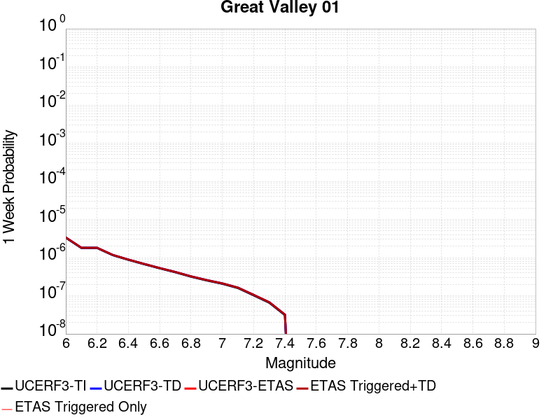 | 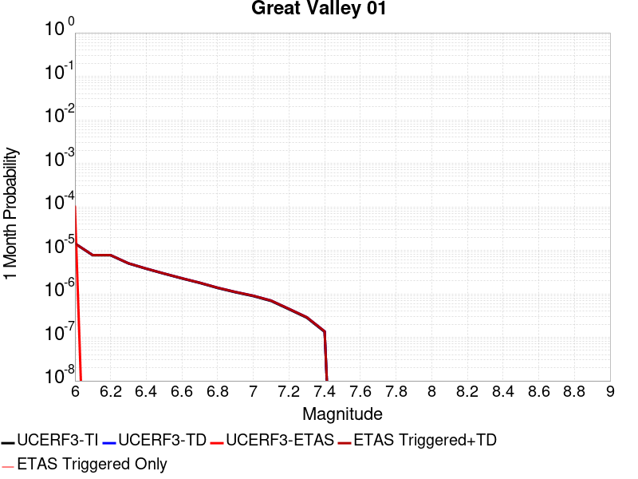 | 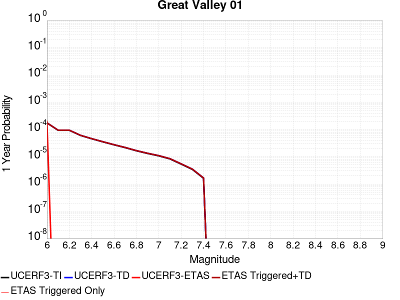 | 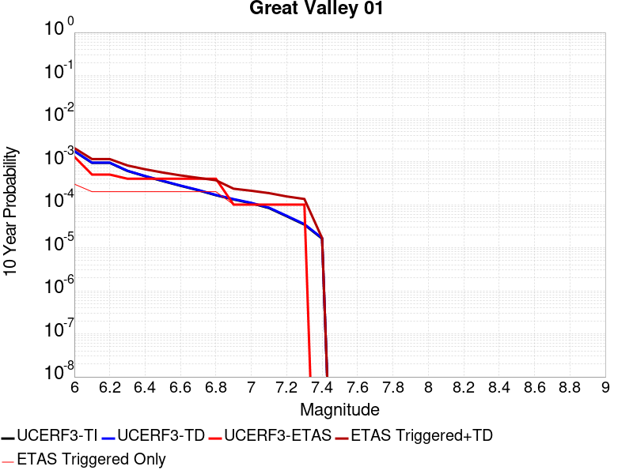 |

| Magnitude | 1 wk TI Prob | 1 wk TD Prob | 1 wk ETAS Prob | 1 wk ETAS/TD Gain | 1 wk ETAS Triggered+TD | 1 wk ETAS Triggered Only | 1 mo TI Prob | 1 mo TD Prob | 1 mo ETAS Prob | 1 mo ETAS/TD Gain | 1 mo ETAS Triggered+TD | 1 mo ETAS Triggered Only | 1 yr TI Prob | 1 yr TD Prob | 1 yr ETAS Prob | 1 yr ETAS/TD Gain | 1 yr ETAS Triggered+TD | 1 yr ETAS Triggered Only | 10 yr TI Prob | 10 yr TD Prob | 10 yr ETAS Prob | 10 yr ETAS/TD Gain | 10 yr ETAS Triggered+TD | 10 yr ETAS Triggered Only |
|-----|-----|-----|-----|-----|-----|-----|-----|-----|-----|-----|-----|-----|-----|-----|-----|-----|-----|-----|-----|-----|-----|-----|-----|-----|
| 6.0 | 3.3398478E-6 | 3.3759125E-6 | 0.0 | 0.0 | 3.3759125E-6 | 0.0 | 1.4313555E-5 | 1.4468123E-5 | 1.0E-4 | 6.9117465 | 1.4468123E-5 | 0.0 | 1.742536E-4 | 1.7613638E-4 | 2.0E-4 | 1.1354837 | 1.7613638E-4 | 0.0 | 0.0017411702 | 0.0017600879 | 0.0013 | 0.7385995 | 0.0020595598 | 3.0E-4 |
| 6.1 | 1.7919616E-6 | 1.8118128E-6 | 0.0 | 0.0 | 1.8118128E-6 | 0.0 | 7.679812E-6 | 7.76489E-6 | 0.0 | 0.0 | 7.76489E-6 | 0.0 | 9.349771E-5 | 9.453363E-5 | 0.0 | 0.0 | 9.453363E-5 | 0.0 | 9.345838E-4 | 9.449536E-4 | 5.0E-4 | 0.5291265 | 0.0011447646 | 2.0E-4 |
| 6.2 | 1.7919616E-6 | 1.8118128E-6 | 0.0 | 0.0 | 1.8118128E-6 | 0.0 | 7.679812E-6 | 7.76489E-6 | 0.0 | 0.0 | 7.76489E-6 | 0.0 | 9.349771E-5 | 9.453363E-5 | 0.0 | 0.0 | 9.453363E-5 | 0.0 | 9.345838E-4 | 9.449536E-4 | 5.0E-4 | 0.5291265 | 0.0011447646 | 2.0E-4 |
| 6.3 | 1.1636545E-6 | 1.177304E-6 | 0.0 | 0.0 | 1.177304E-6 | 0.0 | 4.9870814E-6 | 5.0455787E-6 | 0.0 | 0.0 | 5.0455787E-6 | 0.0 | 6.0716022E-5 | 6.142823E-5 | 0.0 | 0.0 | 6.142823E-5 | 0.0 | 6.069944E-4 | 6.141169E-4 | 4.0E-4 | 0.6513418 | 8.139941E-4 | 2.0E-4 |
| 6.4 | 8.770928E-7 | 8.880638E-7 | 0.0 | 0.0 | 8.880638E-7 | 0.0 | 3.7589639E-6 | 3.8059825E-6 | 0.0 | 0.0 | 3.8059825E-6 | 0.0 | 4.5764424E-5 | 4.6336874E-5 | 0.0 | 0.0 | 4.6336874E-5 | 0.0 | 4.5755E-4 | 4.6327425E-4 | 4.0E-4 | 0.8634195 | 6.631816E-4 | 2.0E-4 |
| 6.5 | 6.753308E-7 | 6.844284E-7 | 0.0 | 0.0 | 6.844284E-7 | 0.0 | 2.8942718E-6 | 2.9332614E-6 | 0.0 | 0.0 | 2.9332614E-6 | 0.0 | 3.523719E-5 | 3.571188E-5 | 0.0 | 0.0 | 3.571188E-5 | 0.0 | 3.52316E-4 | 3.570624E-4 | 4.0E-4 | 1.1202523 | 5.56991E-4 | 2.0E-4 |
| 6.6 | 5.2531993E-7 | 5.3304456E-7 | 0.0 | 0.0 | 5.3304456E-7 | 0.0 | 2.251369E-6 | 2.2844747E-6 | 0.0 | 0.0 | 2.2844747E-6 | 0.0 | 2.7410075E-5 | 2.7813128E-5 | 0.0 | 0.0 | 2.7813128E-5 | 0.0 | 2.7406693E-4 | 2.7809702E-4 | 4.0E-4 | 1.438347 | 4.7804142E-4 | 2.0E-4 |
| 6.7 | 4.1404678E-7 | 4.2078833E-7 | 0.0 | 0.0 | 4.2078833E-7 | 0.0 | 1.774485E-6 | 1.8033774E-6 | 0.0 | 0.0 | 1.8033774E-6 | 0.0 | 2.160414E-5 | 2.19559E-5 | 0.0 | 0.0 | 2.19559E-5 | 0.0 | 2.160204E-4 | 2.1953764E-4 | 4.0E-4 | 1.822011 | 4.1949374E-4 | 2.0E-4 |
| 6.8 | 3.1713054E-7 | 3.229668E-7 | 0.0 | 0.0 | 3.229668E-7 | 0.0 | 1.3591301E-6 | 1.3841427E-6 | 0.0 | 0.0 | 1.3841427E-6 | 0.0 | 1.6547285E-5 | 1.6851809E-5 | 0.0 | 0.0 | 1.6851809E-5 | 0.0 | 1.6546051E-4 | 1.6850549E-4 | 4.0E-4 | 2.3738098 | 3.6847178E-4 | 2.0E-4 |
| 6.9 | 2.528054E-7 | 2.579815E-7 | 0.0 | 0.0 | 2.579815E-7 | 0.0 | 1.0834511E-6 | 1.1056345E-6 | 0.0 | 0.0 | 1.1056345E-6 | 0.0 | 1.3190938E-5 | 1.3461019E-5 | 0.0 | 0.0 | 1.3461019E-5 | 0.0 | 1.3190156E-4 | 1.3460215E-4 | 1.0E-4 | 0.7429302 | 2.3458869E-4 | 1.0E-4 |
| 7.0 | 2.0667689E-7 | 2.1126274E-7 | 0.0 | 0.0 | 2.1126274E-7 | 0.0 | 8.857578E-7 | 9.0541147E-7 | 0.0 | 0.0 | 9.0541147E-7 | 0.0 | 1.0784048E-5 | 1.10233295E-5 | 0.0 | 0.0 | 1.10233295E-5 | 0.0 | 1.0783524E-4 | 1.1022791E-4 | 1.0E-4 | 0.90721124 | 2.102169E-4 | 1.0E-4 |
| 7.1 | 1.5951586E-7 | 1.6334337E-7 | 0.0 | 0.0 | 1.6334337E-7 | 0.0 | 6.8363926E-7 | 7.0004285E-7 | 0.0 | 0.0 | 7.0004285E-7 | 0.0 | 8.323276E-6 | 8.5229885E-6 | 0.0 | 0.0 | 8.5229885E-6 | 0.0 | 8.322964E-5 | 8.522668E-5 | 1.0E-4 | 1.1733415 | 1.8521816E-4 | 1.0E-4 |
| 7.2 | 1.02912296E-7 | 1.0563186E-7 | 0.0 | 0.0 | 1.0563186E-7 | 0.0 | 4.4105263E-7 | 4.527079E-7 | 0.0 | 0.0 | 4.527079E-7 | 0.0 | 5.3698027E-6 | 5.5117052E-6 | 0.0 | 0.0 | 5.5117052E-6 | 0.0 | 5.3696727E-5 | 5.5115717E-5 | 1.0E-4 | 1.8143646 | 1.551102E-4 | 1.0E-4 |
| 7.3 | 6.581281E-8 | 6.7700185E-8 | 0.0 | 0.0 | 6.7700185E-8 | 0.0 | 2.8205488E-7 | 2.9014362E-7 | 0.0 | 0.0 | 2.9014362E-7 | 0.0 | 3.4340128E-6 | 3.5324929E-6 | 0.0 | 0.0 | 3.5324929E-6 | 0.0 | 3.4339595E-5 | 3.532439E-5 | 1.0E-4 | 2.8309054 | 1.3532085E-4 | 1.0E-4 |
| 7.4 | 3.112171E-8 | 3.2058175E-8 | 0.0 | 0.0 | 3.2058175E-8 | 0.0 | 1.3337875E-7 | 1.3739218E-7 | 0.0 | 0.0 | 1.3739218E-7 | 0.0 | 1.6238852E-6 | 1.6727486E-6 | 0.0 | 0.0 | 1.6727486E-6 | 0.0 | 1.6238733E-5 | 1.6727368E-5 | 0.0 | 0.0 | 1.6727368E-5 | 0.0 |

## Morales (West)
*[(top)](#table-of-contents)*

| 1 Week | 1 Month | 1 Year | 10 Year |
|-----|-----|-----|-----|
| 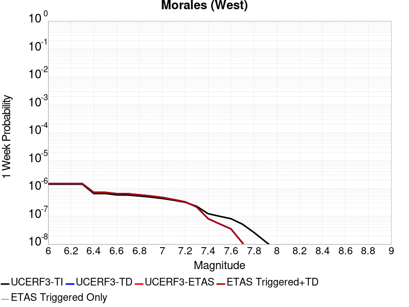 | 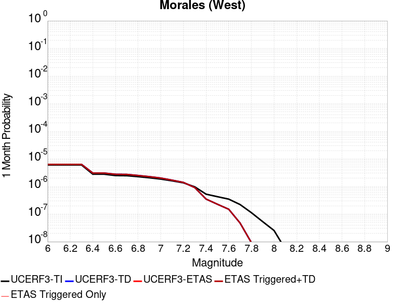 | 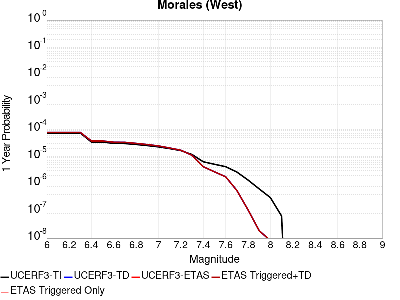 | 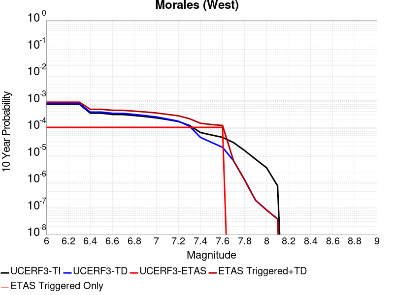 |

| Magnitude | 1 wk TI Prob | 1 wk TD Prob | 1 wk ETAS Prob | 1 wk ETAS/TD Gain | 1 wk ETAS Triggered+TD | 1 wk ETAS Triggered Only | 1 mo TI Prob | 1 mo TD Prob | 1 mo ETAS Prob | 1 mo ETAS/TD Gain | 1 mo ETAS Triggered+TD | 1 mo ETAS Triggered Only | 1 yr TI Prob | 1 yr TD Prob | 1 yr ETAS Prob | 1 yr ETAS/TD Gain | 1 yr ETAS Triggered+TD | 1 yr ETAS Triggered Only | 10 yr TI Prob | 10 yr TD Prob | 10 yr ETAS Prob | 10 yr ETAS/TD Gain | 10 yr ETAS Triggered+TD | 10 yr ETAS Triggered Only |
|-----|-----|-----|-----|-----|-----|-----|-----|-----|-----|-----|-----|-----|-----|-----|-----|-----|-----|-----|-----|-----|-----|-----|-----|-----|
| 6.0 | 1.4027072E-6 | 1.4726684E-6 | 0.0 | 0.0 | 1.4726684E-6 | 0.0 | 6.0115885E-6 | 6.311425E-6 | 0.0 | 0.0 | 6.311425E-6 | 0.0 | 7.318863E-5 | 7.6839584E-5 | 1.0E-4 | 1.3014126 | 7.6839584E-5 | 0.0 | 7.316453E-4 | 7.681987E-4 | 4.0E-4 | 0.5206986 | 9.680451E-4 | 2.0E-4 |
| 6.1 | 1.4027072E-6 | 1.4726684E-6 | 0.0 | 0.0 | 1.4726684E-6 | 0.0 | 6.0115885E-6 | 6.311425E-6 | 0.0 | 0.0 | 6.311425E-6 | 0.0 | 7.318863E-5 | 7.6839584E-5 | 1.0E-4 | 1.3014126 | 7.6839584E-5 | 0.0 | 7.316453E-4 | 7.681987E-4 | 4.0E-4 | 0.5206986 | 9.680451E-4 | 2.0E-4 |
| 6.2 | 1.4027072E-6 | 1.4726684E-6 | 0.0 | 0.0 | 1.4726684E-6 | 0.0 | 6.0115885E-6 | 6.311425E-6 | 0.0 | 0.0 | 6.311425E-6 | 0.0 | 7.318863E-5 | 7.6839584E-5 | 1.0E-4 | 1.3014126 | 7.6839584E-5 | 0.0 | 7.316453E-4 | 7.681987E-4 | 4.0E-4 | 0.5206986 | 9.680451E-4 | 2.0E-4 |
| 6.3 | 1.4027072E-6 | 1.4726684E-6 | 0.0 | 0.0 | 1.4726684E-6 | 0.0 | 6.0115885E-6 | 6.311425E-6 | 0.0 | 0.0 | 6.311425E-6 | 0.0 | 7.318863E-5 | 7.6839584E-5 | 1.0E-4 | 1.3014126 | 7.6839584E-5 | 0.0 | 7.316453E-4 | 7.681987E-4 | 4.0E-4 | 0.5206986 | 9.680451E-4 | 2.0E-4 |
| 6.4 | 6.504502E-7 | 7.139676E-7 | 0.0 | 0.0 | 7.139676E-7 | 0.0 | 2.7876408E-6 | 3.0598576E-6 | 0.0 | 0.0 | 3.0598576E-6 | 0.0 | 3.3939E-5 | 3.725314E-5 | 1.0E-4 | 2.6843374 | 3.725314E-5 | 0.0 | 3.3933815E-4 | 3.7247015E-4 | 4.0E-4 | 1.0739115 | 5.723956E-4 | 2.0E-4 |
| 6.5 | 6.504502E-7 | 7.139676E-7 | 0.0 | 0.0 | 7.139676E-7 | 0.0 | 2.7876408E-6 | 3.0598576E-6 | 0.0 | 0.0 | 3.0598576E-6 | 0.0 | 3.3939E-5 | 3.725314E-5 | 1.0E-4 | 2.6843374 | 3.725314E-5 | 0.0 | 3.3933815E-4 | 3.7247015E-4 | 4.0E-4 | 1.0739115 | 5.723956E-4 | 2.0E-4 |
| 6.6 | 5.8056526E-7 | 6.4359875E-7 | 0.0 | 0.0 | 6.4359875E-7 | 0.0 | 2.4881344E-6 | 2.7582773E-6 | 0.0 | 0.0 | 2.7582773E-6 | 0.0 | 3.0292615E-5 | 3.3581517E-5 | 1.0E-4 | 2.9778287 | 3.3581517E-5 | 0.0 | 3.0288487E-4 | 3.35765E-4 | 4.0E-4 | 1.1913093 | 5.3569785E-4 | 2.0E-4 |
| 6.7 | 5.741448E-7 | 6.3713037E-7 | 0.0 | 0.0 | 6.3713037E-7 | 0.0 | 2.4606184E-6 | 2.730556E-6 | 0.0 | 0.0 | 2.730556E-6 | 0.0 | 2.9957617E-5 | 3.3244018E-5 | 1.0E-4 | 3.0080602 | 3.3244018E-5 | 0.0 | 2.9953578E-4 | 3.3239104E-4 | 4.0E-4 | 1.2034019 | 5.3232454E-4 | 2.0E-4 |
| 6.8 | 5.299428E-7 | 5.8291835E-7 | 0.0 | 0.0 | 5.8291835E-7 | 0.0 | 2.2711813E-6 | 2.498219E-6 | 0.0 | 0.0 | 2.498219E-6 | 0.0 | 2.7651282E-5 | 3.0415396E-5 | 1.0E-4 | 3.2878084 | 3.0415396E-5 | 0.0 | 2.7647841E-4 | 3.0411282E-4 | 3.0E-4 | 0.986476 | 5.04052E-4 | 2.0E-4 |
| 6.9 | 4.82394E-7 | 5.281596E-7 | 0.0 | 0.0 | 5.281596E-7 | 0.0 | 2.0674013E-6 | 2.263539E-6 | 0.0 | 0.0 | 2.263539E-6 | 0.0 | 2.517032E-5 | 2.7558244E-5 | 1.0E-4 | 3.628678 | 2.7558244E-5 | 0.0 | 2.516747E-4 | 2.7554866E-4 | 3.0E-4 | 1.0887369 | 4.7549355E-4 | 2.0E-4 |
| 7.0 | 4.3264512E-7 | 4.7018182E-7 | 0.0 | 0.0 | 4.7018182E-7 | 0.0 | 1.8541921E-6 | 2.0150635E-6 | 0.0 | 0.0 | 2.0150635E-6 | 0.0 | 2.2574555E-5 | 2.4533125E-5 | 1.0E-4 | 4.076122 | 2.4533125E-5 | 0.0 | 2.2572262E-4 | 2.453045E-4 | 2.0E-4 | 0.8153133 | 3.4527996E-4 | 1.0E-4 |
| 7.1 | 3.7388565E-7 | 3.9463953E-7 | 0.0 | 0.0 | 3.9463953E-7 | 0.0 | 1.6023661E-6 | 1.6913111E-6 | 0.0 | 0.0 | 1.6913111E-6 | 0.0 | 1.9508632E-5 | 2.0591522E-5 | 1.0E-4 | 4.8563676 | 2.0591522E-5 | 0.0 | 1.950692E-4 | 2.0589636E-4 | 2.0E-4 | 0.9713625 | 3.058758E-4 | 1.0E-4 |
| 7.2 | 3.1592543E-7 | 3.268079E-7 | 0.0 | 0.0 | 3.268079E-7 | 0.0 | 1.3539654E-6 | 1.4006044E-6 | 0.0 | 0.0 | 1.4006044E-6 | 0.0 | 1.6484404E-5 | 1.7052227E-5 | 1.0E-4 | 5.8643365 | 1.7052227E-5 | 0.0 | 1.6483181E-4 | 1.7050937E-4 | 2.0E-4 | 1.1729561 | 2.704923E-4 | 1.0E-4 |
| 7.3 | 2.2677783E-7 | 2.1369846E-7 | 0.0 | 0.0 | 2.1369846E-7 | 0.0 | 9.719047E-7 | 9.158502E-7 | 0.0 | 0.0 | 9.158502E-7 | 0.0 | 1.1832874E-5 | 1.115042E-5 | 1.0E-4 | 8.968272 | 1.115042E-5 | 0.0 | 1.18322445E-4 | 1.1149865E-4 | 2.0E-4 | 1.7937437 | 2.114875E-4 | 1.0E-4 |
| 7.4 | 1.2295531E-7 | 8.16213E-8 | 0.0 | 0.0 | 8.16213E-8 | 0.0 | 5.269512E-7 | 3.498055E-7 | 0.0 | 0.0 | 3.498055E-7 | 0.0 | 6.4156125E-6 | 4.2588736E-6 | 0.0 | 0.0 | 4.2588736E-6 | 0.0 | 6.415427E-5 | 4.258793E-5 | 1.0E-4 | 2.3480833 | 1.4258367E-4 | 1.0E-4 |
| 7.5 | 9.9632544E-8 | 5.310278E-8 | 0.0 | 0.0 | 5.310278E-8 | 0.0 | 4.2699656E-7 | 2.2758331E-7 | 0.0 | 0.0 | 2.2758331E-7 | 0.0 | 5.198671E-6 | 2.7708234E-6 | 0.0 | 0.0 | 2.7708234E-6 | 0.0 | 5.198549E-5 | 2.7707894E-5 | 1.0E-4 | 3.6090798 | 1.2770512E-4 | 1.0E-4 |
| 7.6 | 8.125894E-8 | 3.4958415E-8 | 0.0 | 0.0 | 3.4958415E-8 | 0.0 | 3.4825257E-7 | 1.4982176E-7 | 0.0 | 0.0 | 1.4982176E-7 | 0.0 | 4.2399665E-6 | 1.8240783E-6 | 0.0 | 0.0 | 1.8240783E-6 | 0.0 | 4.2398857E-5 | 1.8240638E-5 | 1.0E-4 | 5.482264 | 1.18238815E-4 | 1.0E-4 |
| 7.7 | 5.1810765E-8 | 1.11095915E-8 | 0.0 | 0.0 | 1.11095915E-8 | 0.0 | 2.2204613E-7 | 4.761253E-8 | 0.0 | 0.0 | 4.761253E-8 | 0.0 | 2.7034082E-6 | 5.7968236E-7 | 0.0 | 0.0 | 5.7968236E-7 | 0.0 | 2.7033753E-5 | 5.7968127E-6 | 0.0 | 0.0 | 5.7968127E-6 | 0.0 |
| 7.8 | 2.6315043E-8 | 2.1684146E-9 | 0.0 | 0.0 | 2.1684146E-9 | 0.0 | 1.1277875E-7 | 9.2932E-9 | 0.0 | 0.0 | 9.2932E-9 | 0.0 | 1.3730804E-6 | 1.13144694E-7 | 0.0 | 0.0 | 1.13144694E-7 | 0.0 | 1.3730719E-5 | 1.1314503E-6 | 0.0 | 0.0 | 1.1314503E-6 | 0.0 |
| 7.9 | 1.24281545E-8 | 3.7521408E-10 | 0.0 | 0.0 | 3.7521408E-10 | 0.0 | 5.3263516E-8 | 1.6080561E-9 | 0.0 | 0.0 | 1.6080561E-9 | 0.0 | 6.4848314E-7 | 1.957809E-8 | 0.0 | 0.0 | 1.957809E-8 | 0.0 | 6.4848123E-6 | 1.9578486E-7 | 0.0 | 0.0 | 1.9578486E-7 | 0.0 |
| 8.0 | 5.954214E-9 | 1.6339385E-10 | 0.0 | 0.0 | 1.6339385E-10 | 0.0 | 2.551806E-8 | 7.0025974E-10 | 0.0 | 0.0 | 7.0025974E-10 | 0.0 | 3.1068234E-7 | 8.525665E-9 | 0.0 | 0.0 | 8.525665E-9 | 0.0 | 3.1068191E-6 | 8.526062E-8 | 0.0 | 0.0 | 8.526062E-8 | 0.0 |
| 8.1 | 1.2586262E-9 | 7.484369E-11 | 0.0 | 0.0 | 7.484369E-11 | 0.0 | 5.3941123E-9 | 3.207582E-10 | 0.0 | 0.0 | 3.207582E-10 | 0.0 | 6.567332E-8 | 3.905234E-9 | 0.0 | 0.0 | 3.905234E-9 | 0.0 | 6.56733E-7 | 3.9056314E-8 | 0.0 | 0.0 | 3.9056314E-8 | 0.0 |

## East Huasna 2011 CFM
*[(top)](#table-of-contents)*

| 1 Week | 1 Month | 1 Year | 10 Year |
|-----|-----|-----|-----|
| 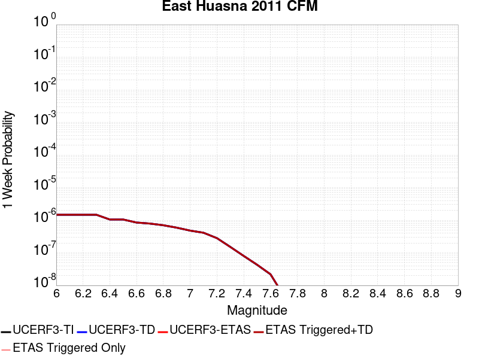 | 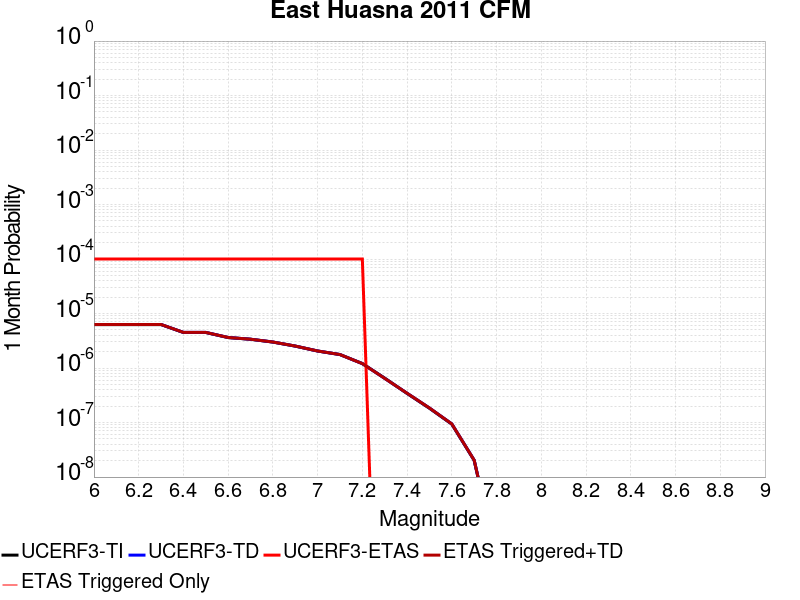 | 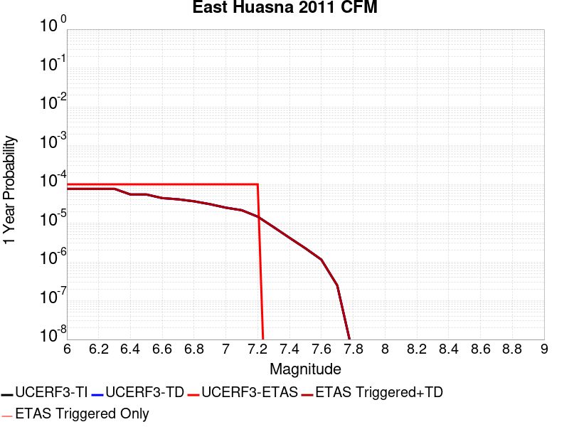 | 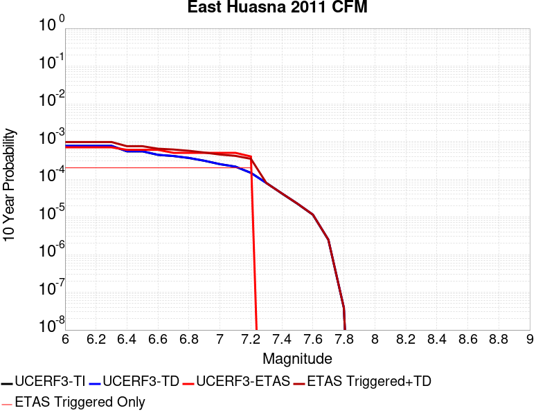 |

| Magnitude | 1 wk TI Prob | 1 wk TD Prob | 1 wk ETAS Prob | 1 wk ETAS/TD Gain | 1 wk ETAS Triggered+TD | 1 wk ETAS Triggered Only | 1 mo TI Prob | 1 mo TD Prob | 1 mo ETAS Prob | 1 mo ETAS/TD Gain | 1 mo ETAS Triggered+TD | 1 mo ETAS Triggered Only | 1 yr TI Prob | 1 yr TD Prob | 1 yr ETAS Prob | 1 yr ETAS/TD Gain | 1 yr ETAS Triggered+TD | 1 yr ETAS Triggered Only | 10 yr TI Prob | 10 yr TD Prob | 10 yr ETAS Prob | 10 yr ETAS/TD Gain | 10 yr ETAS Triggered+TD | 10 yr ETAS Triggered Only |
|-----|-----|-----|-----|-----|-----|-----|-----|-----|-----|-----|-----|-----|-----|-----|-----|-----|-----|-----|-----|-----|-----|-----|-----|-----|
| 6.0 | 1.4658423E-6 | 1.4714709E-6 | 0.0 | 0.0 | 1.4714709E-6 | 0.0 | 6.282166E-6 | 6.3062894E-6 | 1.0E-4 | 15.857185 | 6.3062894E-6 | 0.0 | 7.6482684E-5 | 7.6776436E-5 | 1.0E-4 | 1.302483 | 7.6776436E-5 | 0.0 | 7.645637E-4 | 7.6750614E-4 | 7.0E-4 | 0.9120448 | 9.6735265E-4 | 2.0E-4 |
| 6.1 | 1.4658423E-6 | 1.4714709E-6 | 0.0 | 0.0 | 1.4714709E-6 | 0.0 | 6.282166E-6 | 6.3062894E-6 | 1.0E-4 | 15.857185 | 6.3062894E-6 | 0.0 | 7.6482684E-5 | 7.6776436E-5 | 1.0E-4 | 1.302483 | 7.6776436E-5 | 0.0 | 7.645637E-4 | 7.6750614E-4 | 7.0E-4 | 0.9120448 | 9.6735265E-4 | 2.0E-4 |
| 6.2 | 1.4658423E-6 | 1.4714709E-6 | 0.0 | 0.0 | 1.4714709E-6 | 0.0 | 6.282166E-6 | 6.3062894E-6 | 1.0E-4 | 15.857185 | 6.3062894E-6 | 0.0 | 7.6482684E-5 | 7.6776436E-5 | 1.0E-4 | 1.302483 | 7.6776436E-5 | 0.0 | 7.645637E-4 | 7.6750614E-4 | 7.0E-4 | 0.9120448 | 9.6735265E-4 | 2.0E-4 |
| 6.3 | 1.4658423E-6 | 1.4714709E-6 | 0.0 | 0.0 | 1.4714709E-6 | 0.0 | 6.282166E-6 | 6.3062894E-6 | 1.0E-4 | 15.857185 | 6.3062894E-6 | 0.0 | 7.6482684E-5 | 7.6776436E-5 | 1.0E-4 | 1.302483 | 7.6776436E-5 | 0.0 | 7.645637E-4 | 7.6750614E-4 | 7.0E-4 | 0.9120448 | 9.6735265E-4 | 2.0E-4 |
| 6.4 | 1.0488257E-6 | 1.0526753E-6 | 0.0 | 0.0 | 1.0526753E-6 | 0.0 | 4.4949593E-6 | 4.511458E-6 | 1.0E-4 | 22.165785 | 4.511458E-6 | 0.0 | 5.472476E-5 | 5.4925633E-5 | 1.0E-4 | 1.8206435 | 5.4925633E-5 | 0.0 | 5.4711284E-4 | 5.491225E-4 | 6.0E-4 | 1.0926523 | 7.490127E-4 | 2.0E-4 |
| 6.5 | 1.0488257E-6 | 1.0526753E-6 | 0.0 | 0.0 | 1.0526753E-6 | 0.0 | 4.4949593E-6 | 4.511458E-6 | 1.0E-4 | 22.165785 | 4.511458E-6 | 0.0 | 5.472476E-5 | 5.4925633E-5 | 1.0E-4 | 1.8206435 | 5.4925633E-5 | 0.0 | 5.4711284E-4 | 5.491225E-4 | 6.0E-4 | 1.0926523 | 7.490127E-4 | 2.0E-4 |
| 6.6 | 8.463064E-7 | 8.492962E-7 | 0.0 | 0.0 | 8.492962E-7 | 0.0 | 3.6270226E-6 | 3.6398358E-6 | 1.0E-4 | 27.473766 | 3.6398358E-6 | 0.0 | 4.4158103E-5 | 4.4314107E-5 | 1.0E-4 | 2.2566178 | 4.4314107E-5 | 0.0 | 4.414933E-4 | 4.4305358E-4 | 6.0E-4 | 1.354238 | 6.4296497E-4 | 2.0E-4 |
| 6.7 | 7.876149E-7 | 7.9019065E-7 | 0.0 | 0.0 | 7.9019065E-7 | 0.0 | 3.375488E-6 | 3.3865272E-6 | 1.0E-4 | 29.528776 | 3.3865272E-6 | 0.0 | 4.109579E-5 | 4.1230192E-5 | 1.0E-4 | 2.425407 | 4.1230192E-5 | 0.0 | 4.108819E-4 | 4.1222607E-4 | 5.0E-4 | 1.2129267 | 6.121436E-4 | 2.0E-4 |
| 6.8 | 6.9940785E-7 | 7.0159916E-7 | 0.0 | 0.0 | 7.0159916E-7 | 0.0 | 2.9974588E-6 | 3.0068502E-6 | 1.0E-4 | 33.257393 | 3.0068502E-6 | 0.0 | 3.649345E-5 | 3.660779E-5 | 1.0E-4 | 2.731659 | 3.660779E-5 | 0.0 | 3.6487455E-4 | 3.6601807E-4 | 5.0E-4 | 1.3660527 | 5.659449E-4 | 2.0E-4 |
| 6.9 | 5.899658E-7 | 5.9150824E-7 | 0.0 | 0.0 | 5.9150824E-7 | 0.0 | 2.5284223E-6 | 2.535033E-6 | 1.0E-4 | 39.44722 | 2.535033E-6 | 0.0 | 3.0783107E-5 | 3.0863594E-5 | 1.0E-4 | 3.2400637 | 3.0863594E-5 | 0.0 | 3.0778843E-4 | 3.0859333E-4 | 5.0E-4 | 1.6202554 | 5.0853164E-4 | 2.0E-4 |
| 7.0 | 4.793814E-7 | 4.8028244E-7 | 0.0 | 0.0 | 4.8028244E-7 | 0.0 | 2.05449E-6 | 2.0583516E-6 | 1.0E-4 | 48.582565 | 2.0583516E-6 | 0.0 | 2.501313E-5 | 2.5060144E-5 | 1.0E-4 | 3.9903998 | 2.5060144E-5 | 0.0 | 2.5010316E-4 | 2.5057336E-4 | 5.0E-4 | 1.9954236 | 4.5052325E-4 | 2.0E-4 |
| 7.1 | 4.1256908E-7 | 4.1295473E-7 | 0.0 | 0.0 | 4.1295473E-7 | 0.0 | 1.768152E-6 | 1.7698047E-6 | 1.0E-4 | 56.503407 | 1.7698047E-6 | 0.0 | 2.1527037E-5 | 2.1547161E-5 | 1.0E-4 | 4.6409826 | 2.1547161E-5 | 0.0 | 2.1524953E-4 | 2.1545087E-4 | 5.0E-4 | 2.3207147 | 4.154078E-4 | 2.0E-4 |
| 7.2 | 2.822599E-7 | 2.815861E-7 | 0.0 | 0.0 | 2.815861E-7 | 0.0 | 1.2096847E-6 | 1.206797E-6 | 1.0E-4 | 82.863976 | 1.206797E-6 | 0.0 | 1.47278115E-5 | 1.4692656E-5 | 1.0E-4 | 6.806122 | 1.4692656E-5 | 0.0 | 1.4726835E-4 | 1.4691692E-4 | 4.0E-4 | 2.7226272 | 3.4688754E-4 | 2.0E-4 |
| 7.3 | 1.5261652E-7 | 1.5073502E-7 | 0.0 | 0.0 | 1.5073502E-7 | 0.0 | 6.540707E-7 | 6.4600704E-7 | 0.0 | 0.0 | 6.4600704E-7 | 0.0 | 7.963281E-6 | 7.865107E-6 | 0.0 | 0.0 | 7.865107E-6 | 0.0 | 7.962996E-5 | 7.8648314E-5 | 0.0 | 0.0 | 7.8648314E-5 | 0.0 |
| 7.4 | 7.976414E-8 | 8.0570054E-8 | 0.0 | 0.0 | 8.0570054E-8 | 0.0 | 3.418463E-7 | 3.4530018E-7 | 0.0 | 0.0 | 3.4530018E-7 | 0.0 | 4.1619705E-6 | 4.2040215E-6 | 0.0 | 0.0 | 4.2040215E-6 | 0.0 | 4.161893E-5 | 4.2039424E-5 | 0.0 | 0.0 | 4.2039424E-5 | 0.0 |
| 7.5 | 4.2715055E-8 | 4.319736E-8 | 0.0 | 0.0 | 4.319736E-8 | 0.0 | 1.830645E-7 | 1.8513153E-7 | 0.0 | 0.0 | 1.8513153E-7 | 0.0 | 2.228808E-6 | 2.2539741E-6 | 0.0 | 0.0 | 2.2539741E-6 | 0.0 | 2.2287857E-5 | 2.2539514E-5 | 0.0 | 0.0 | 2.2539514E-5 | 0.0 |
| 7.6 | 2.1807532E-8 | 2.2054834E-8 | 0.0 | 0.0 | 2.2054834E-8 | 0.0 | 9.346085E-8 | 9.4520715E-8 | 0.0 | 0.0 | 9.4520715E-8 | 0.0 | 1.1378852E-6 | 1.1507891E-6 | 0.0 | 0.0 | 1.1507891E-6 | 0.0 | 1.1378794E-5 | 1.1507832E-5 | 0.0 | 0.0 | 1.1507832E-5 | 0.0 |
| 7.7 | 4.7196043E-9 | 4.7667803E-9 | 0.0 | 0.0 | 4.7667803E-9 | 0.0 | 2.0226874E-8 | 2.0429058E-8 | 0.0 | 0.0 | 2.0429058E-8 | 0.0 | 2.4626218E-7 | 2.4872375E-7 | 0.0 | 0.0 | 2.4872375E-7 | 0.0 | 2.462619E-6 | 2.4872347E-6 | 0.0 | 0.0 | 2.4872347E-6 | 0.0 |
| 7.8 | 7.400003E-11 | 7.464762E-11 | 0.0 | 0.0 | 7.464762E-11 | 0.0 | 3.171432E-10 | 3.199182E-10 | 0.0 | 0.0 | 3.199182E-10 | 0.0 | 3.861218E-9 | 3.8950034E-9 | 0.0 | 0.0 | 3.8950034E-9 | 0.0 | 3.861218E-8 | 3.8950034E-8 | 0.0 | 0.0 | 3.8950034E-8 | 0.0 |

## Richfield
*[(top)](#table-of-contents)*

| 1 Week | 1 Month | 1 Year | 10 Year |
|-----|-----|-----|-----|
| 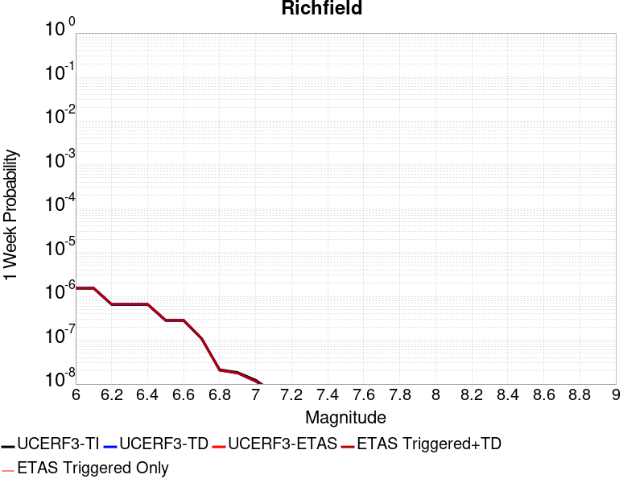 | 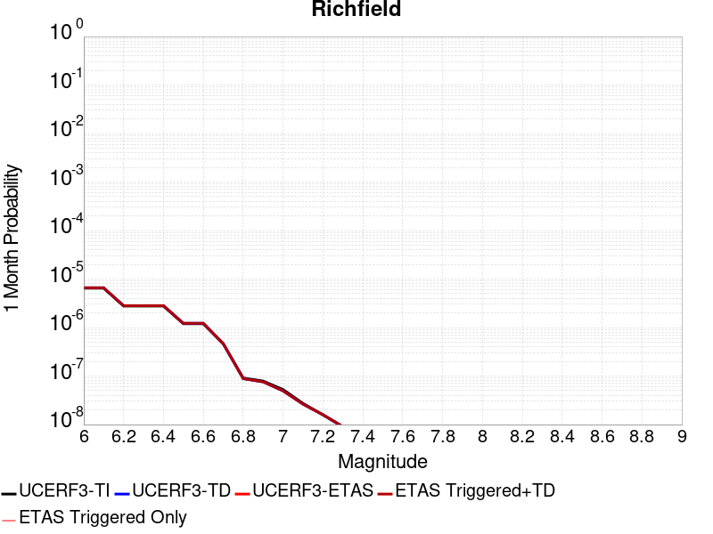 |  | 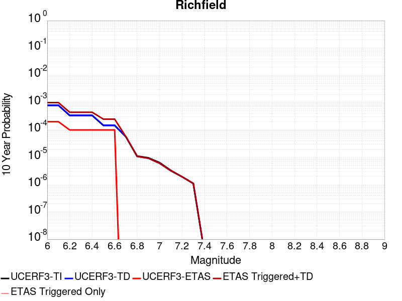 |

| Magnitude | 1 wk TI Prob | 1 wk TD Prob | 1 wk ETAS Prob | 1 wk ETAS/TD Gain | 1 wk ETAS Triggered+TD | 1 wk ETAS Triggered Only | 1 mo TI Prob | 1 mo TD Prob | 1 mo ETAS Prob | 1 mo ETAS/TD Gain | 1 mo ETAS Triggered+TD | 1 mo ETAS Triggered Only | 1 yr TI Prob | 1 yr TD Prob | 1 yr ETAS Prob | 1 yr ETAS/TD Gain | 1 yr ETAS Triggered+TD | 1 yr ETAS Triggered Only | 10 yr TI Prob | 10 yr TD Prob | 10 yr ETAS Prob | 10 yr ETAS/TD Gain | 10 yr ETAS Triggered+TD | 10 yr ETAS Triggered Only |
|-----|-----|-----|-----|-----|-----|-----|-----|-----|-----|-----|-----|-----|-----|-----|-----|-----|-----|-----|-----|-----|-----|-----|-----|-----|
| 6.0 | 1.5166896E-6 | 1.5390189E-6 | 0.0 | 0.0 | 1.5390189E-6 | 0.0 | 6.5000822E-6 | 6.5957847E-6 | 0.0 | 0.0 | 6.5957847E-6 | 0.0 | 7.913562E-5 | 8.030182E-5 | 1.0E-4 | 1.2453018 | 1.8029379E-4 | 1.0E-4 | 7.910745E-4 | 8.0283574E-4 | 2.0E-4 | 0.24911696 | 0.0010026752 | 2.0E-4 |
| 6.1 | 1.5166896E-6 | 1.5390189E-6 | 0.0 | 0.0 | 1.5390189E-6 | 0.0 | 6.5000822E-6 | 6.5957847E-6 | 0.0 | 0.0 | 6.5957847E-6 | 0.0 | 7.913562E-5 | 8.030182E-5 | 1.0E-4 | 1.2453018 | 1.8029379E-4 | 1.0E-4 | 7.910745E-4 | 8.0283574E-4 | 2.0E-4 | 0.24911696 | 0.0010026752 | 2.0E-4 |
| 6.2 | 6.473272E-7 | 6.5970505E-7 | 0.0 | 0.0 | 6.5970505E-7 | 0.0 | 2.7742565E-6 | 2.827305E-6 | 0.0 | 0.0 | 2.827305E-6 | 0.0 | 3.377605E-5 | 3.4422028E-5 | 1.0E-4 | 2.9051166 | 1.3441859E-4 | 1.0E-4 | 3.3770915E-4 | 3.4417998E-4 | 1.0E-4 | 0.29054564 | 4.4414558E-4 | 1.0E-4 |
| 6.3 | 6.473272E-7 | 6.5970505E-7 | 0.0 | 0.0 | 6.5970505E-7 | 0.0 | 2.7742565E-6 | 2.827305E-6 | 0.0 | 0.0 | 2.827305E-6 | 0.0 | 3.377605E-5 | 3.4422028E-5 | 1.0E-4 | 2.9051166 | 1.3441859E-4 | 1.0E-4 | 3.3770915E-4 | 3.4417998E-4 | 1.0E-4 | 0.29054564 | 4.4414558E-4 | 1.0E-4 |
| 6.4 | 6.473272E-7 | 6.5970505E-7 | 0.0 | 0.0 | 6.5970505E-7 | 0.0 | 2.7742565E-6 | 2.827305E-6 | 0.0 | 0.0 | 2.827305E-6 | 0.0 | 3.377605E-5 | 3.4422028E-5 | 1.0E-4 | 2.9051166 | 1.3441859E-4 | 1.0E-4 | 3.3770915E-4 | 3.4417998E-4 | 1.0E-4 | 0.29054564 | 4.4414558E-4 | 1.0E-4 |
| 6.5 | 2.7954403E-7 | 2.8524502E-7 | 0.0 | 0.0 | 2.8524502E-7 | 0.0 | 1.1980452E-6 | 1.2224783E-6 | 0.0 | 0.0 | 1.2224783E-6 | 0.0 | 1.4586103E-5 | 1.4883615E-5 | 1.0E-4 | 6.7187977 | 1.14882125E-4 | 1.0E-4 | 1.4585146E-4 | 1.4883043E-4 | 1.0E-4 | 0.67190564 | 2.4881554E-4 | 1.0E-4 |
| 6.6 | 2.7954403E-7 | 2.8524502E-7 | 0.0 | 0.0 | 2.8524502E-7 | 0.0 | 1.1980452E-6 | 1.2224783E-6 | 0.0 | 0.0 | 1.2224783E-6 | 0.0 | 1.4586103E-5 | 1.4883615E-5 | 1.0E-4 | 6.7187977 | 1.14882125E-4 | 1.0E-4 | 1.4585146E-4 | 1.4883043E-4 | 1.0E-4 | 0.67190564 | 2.4881554E-4 | 1.0E-4 |
| 6.7 | 1.0777299E-7 | 1.0876814E-7 | 0.0 | 0.0 | 1.0876814E-7 | 0.0 | 4.6188418E-7 | 4.6614912E-7 | 0.0 | 0.0 | 4.6614912E-7 | 0.0 | 5.6234253E-6 | 5.675355E-6 | 0.0 | 0.0 | 5.675355E-6 | 0.0 | 5.623283E-5 | 5.675253E-5 | 0.0 | 0.0 | 5.675253E-5 | 0.0 |
| 6.8 | 2.1301874E-8 | 2.0663752E-8 | 0.0 | 0.0 | 2.0663752E-8 | 0.0 | 9.129375E-8 | 8.855893E-8 | 0.0 | 0.0 | 8.855893E-8 | 0.0 | 1.1115008E-6 | 1.0782045E-6 | 0.0 | 0.0 | 1.0782045E-6 | 0.0 | 1.1114952E-5 | 1.0781997E-5 | 0.0 | 0.0 | 1.0781997E-5 | 0.0 |
| 6.9 | 1.8413502E-8 | 1.7748995E-8 | 0.0 | 0.0 | 1.7748995E-8 | 0.0 | 7.891501E-8 | 7.6067124E-8 | 0.0 | 0.0 | 7.6067124E-8 | 0.0 | 9.607899E-7 | 9.2611685E-7 | 0.0 | 0.0 | 9.2611685E-7 | 0.0 | 9.607857E-6 | 9.261133E-6 | 0.0 | 0.0 | 9.261133E-6 | 0.0 |
| 7.0 | 1.2290541E-8 | 1.1572781E-8 | 0.0 | 0.0 | 1.1572781E-8 | 0.0 | 5.2673748E-8 | 4.9597634E-8 | 0.0 | 0.0 | 4.9597634E-8 | 0.0 | 6.413027E-7 | 6.0385105E-7 | 0.0 | 0.0 | 6.0385105E-7 | 0.0 | 6.4130086E-6 | 6.038495E-6 | 0.0 | 0.0 | 6.038495E-6 | 0.0 |
| 7.1 | 6.373573E-9 | 6.1550285E-9 | 0.0 | 0.0 | 6.1550285E-9 | 0.0 | 2.7315311E-8 | 2.6378693E-8 | 0.0 | 0.0 | 2.6378693E-8 | 0.0 | 3.3256384E-7 | 3.2116054E-7 | 0.0 | 0.0 | 3.2116054E-7 | 0.0 | 3.3256335E-6 | 3.2116013E-6 | 0.0 | 0.0 | 3.2116013E-6 | 0.0 |
| 7.2 | 3.6989944E-9 | 3.7356243E-9 | 0.0 | 0.0 | 3.7356243E-9 | 0.0 | 1.5852834E-8 | 1.6009817E-8 | 0.0 | 0.0 | 1.6009817E-8 | 0.0 | 1.9300822E-7 | 1.9491952E-7 | 0.0 | 0.0 | 1.9491952E-7 | 0.0 | 1.9300805E-6 | 1.9491936E-6 | 0.0 | 0.0 | 1.9491936E-6 | 0.0 |
| 7.3 | 2.097397E-9 | 2.119811E-9 | 0.0 | 0.0 | 2.119811E-9 | 0.0 | 8.9888434E-9 | 9.084904E-9 | 0.0 | 0.0 | 9.084904E-9 | 0.0 | 1.0943917E-7 | 1.106087E-7 | 0.0 | 0.0 | 1.106087E-7 | 0.0 | 1.0943911E-6 | 1.1060866E-6 | 0.0 | 0.0 | 1.1060866E-6 | 0.0 |
| 7.4 | 5.8314464E-12 | 5.8912875E-12 | 0.0 | 0.0 | 5.8912875E-12 | 0.0 | 2.4991786E-11 | 2.5248137E-11 | 0.0 | 0.0 | 2.5248137E-11 | 0.0 | 3.0427527E-10 | 3.0739644E-10 | 0.0 | 0.0 | 3.0739644E-10 | 0.0 | 3.0427532E-9 | 3.0739646E-9 | 0.0 | 0.0 | 3.0739646E-9 | 0.0 |

## Great Valley 14 (Kettleman Hills)
*[(top)](#table-of-contents)*

| 1 Week | 1 Month | 1 Year | 10 Year |
|-----|-----|-----|-----|
|  | 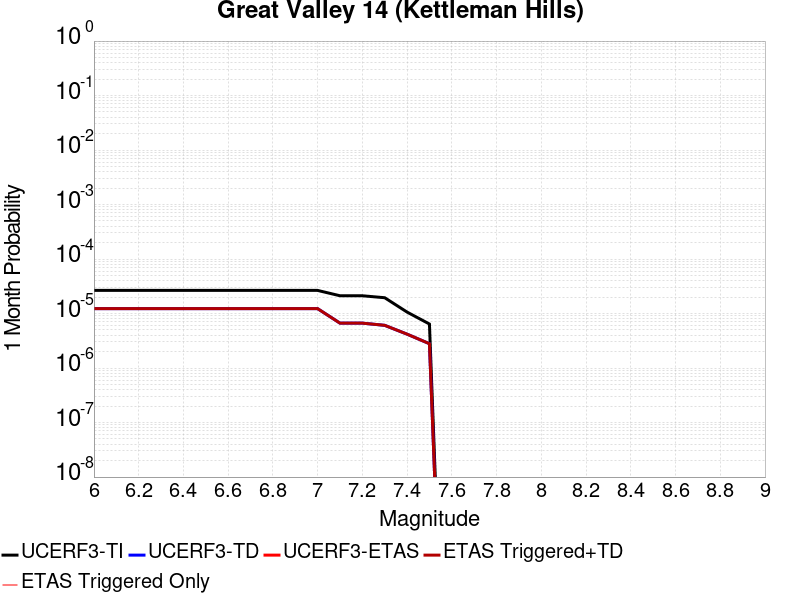 | 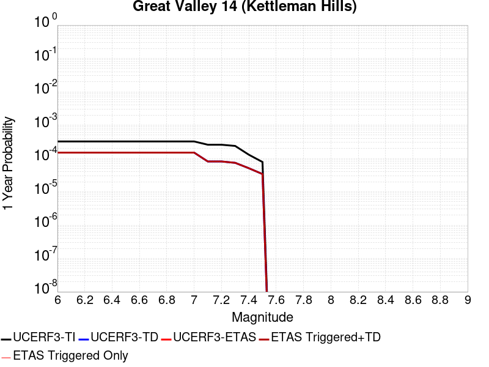 | 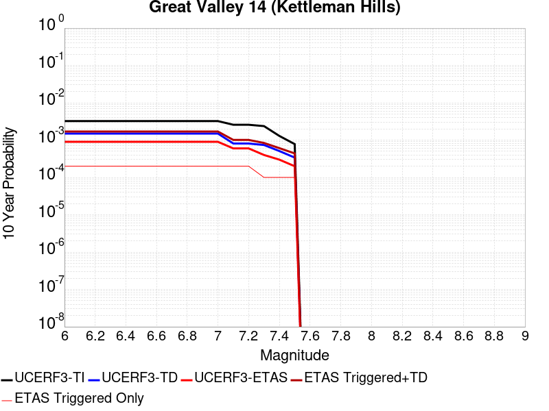 |

| Magnitude | 1 wk TI Prob | 1 wk TD Prob | 1 wk ETAS Prob | 1 wk ETAS/TD Gain | 1 wk ETAS Triggered+TD | 1 wk ETAS Triggered Only | 1 mo TI Prob | 1 mo TD Prob | 1 mo ETAS Prob | 1 mo ETAS/TD Gain | 1 mo ETAS Triggered+TD | 1 mo ETAS Triggered Only | 1 yr TI Prob | 1 yr TD Prob | 1 yr ETAS Prob | 1 yr ETAS/TD Gain | 1 yr ETAS Triggered+TD | 1 yr ETAS Triggered Only | 10 yr TI Prob | 10 yr TD Prob | 10 yr ETAS Prob | 10 yr ETAS/TD Gain | 10 yr ETAS Triggered+TD | 10 yr ETAS Triggered Only |
|-----|-----|-----|-----|-----|-----|-----|-----|-----|-----|-----|-----|-----|-----|-----|-----|-----|-----|-----|-----|-----|-----|-----|-----|-----|
| 6.0 | 6.2057843E-6 | 2.8725076E-6 | 0.0 | 0.0 | 2.8725076E-6 | 0.0 | 2.6595946E-5 | 1.2310701E-5 | 0.0 | 0.0 | 1.2310701E-5 | 0.0 | 3.2375753E-4 | 1.4987483E-4 | 0.0 | 0.0 | 1.4987483E-4 | 0.0 | 0.0032328626 | 0.0014979686 | 9.0E-4 | 0.6008137 | 0.0016976689 | 2.0E-4 |
| 6.1 | 6.2057843E-6 | 2.8725076E-6 | 0.0 | 0.0 | 2.8725076E-6 | 0.0 | 2.6595946E-5 | 1.2310701E-5 | 0.0 | 0.0 | 1.2310701E-5 | 0.0 | 3.2375753E-4 | 1.4987483E-4 | 0.0 | 0.0 | 1.4987483E-4 | 0.0 | 0.0032328626 | 0.0014979686 | 9.0E-4 | 0.6008137 | 0.0016976689 | 2.0E-4 |
| 6.2 | 6.2057843E-6 | 2.8725076E-6 | 0.0 | 0.0 | 2.8725076E-6 | 0.0 | 2.6595946E-5 | 1.2310701E-5 | 0.0 | 0.0 | 1.2310701E-5 | 0.0 | 3.2375753E-4 | 1.4987483E-4 | 0.0 | 0.0 | 1.4987483E-4 | 0.0 | 0.0032328626 | 0.0014979686 | 9.0E-4 | 0.6008137 | 0.0016976689 | 2.0E-4 |
| 6.3 | 6.2057843E-6 | 2.8725076E-6 | 0.0 | 0.0 | 2.8725076E-6 | 0.0 | 2.6595946E-5 | 1.2310701E-5 | 0.0 | 0.0 | 1.2310701E-5 | 0.0 | 3.2375753E-4 | 1.4987483E-4 | 0.0 | 0.0 | 1.4987483E-4 | 0.0 | 0.0032328626 | 0.0014979686 | 9.0E-4 | 0.6008137 | 0.0016976689 | 2.0E-4 |
| 6.4 | 6.2057843E-6 | 2.8725076E-6 | 0.0 | 0.0 | 2.8725076E-6 | 0.0 | 2.6595946E-5 | 1.2310701E-5 | 0.0 | 0.0 | 1.2310701E-5 | 0.0 | 3.2375753E-4 | 1.4987483E-4 | 0.0 | 0.0 | 1.4987483E-4 | 0.0 | 0.0032328626 | 0.0014979686 | 9.0E-4 | 0.6008137 | 0.0016976689 | 2.0E-4 |
| 6.5 | 6.2057843E-6 | 2.8725076E-6 | 0.0 | 0.0 | 2.8725076E-6 | 0.0 | 2.6595946E-5 | 1.2310701E-5 | 0.0 | 0.0 | 1.2310701E-5 | 0.0 | 3.2375753E-4 | 1.4987483E-4 | 0.0 | 0.0 | 1.4987483E-4 | 0.0 | 0.0032328626 | 0.0014979686 | 9.0E-4 | 0.6008137 | 0.0016976689 | 2.0E-4 |
| 6.6 | 6.2057843E-6 | 2.8725076E-6 | 0.0 | 0.0 | 2.8725076E-6 | 0.0 | 2.6595946E-5 | 1.2310701E-5 | 0.0 | 0.0 | 1.2310701E-5 | 0.0 | 3.2375753E-4 | 1.4987483E-4 | 0.0 | 0.0 | 1.4987483E-4 | 0.0 | 0.0032328626 | 0.0014979686 | 9.0E-4 | 0.6008137 | 0.0016976689 | 2.0E-4 |
| 6.7 | 6.2057843E-6 | 2.8725076E-6 | 0.0 | 0.0 | 2.8725076E-6 | 0.0 | 2.6595946E-5 | 1.2310701E-5 | 0.0 | 0.0 | 1.2310701E-5 | 0.0 | 3.2375753E-4 | 1.4987483E-4 | 0.0 | 0.0 | 1.4987483E-4 | 0.0 | 0.0032328626 | 0.0014979686 | 9.0E-4 | 0.6008137 | 0.0016976689 | 2.0E-4 |
| 6.8 | 6.2057843E-6 | 2.8725076E-6 | 0.0 | 0.0 | 2.8725076E-6 | 0.0 | 2.6595946E-5 | 1.2310701E-5 | 0.0 | 0.0 | 1.2310701E-5 | 0.0 | 3.2375753E-4 | 1.4987483E-4 | 0.0 | 0.0 | 1.4987483E-4 | 0.0 | 0.0032328626 | 0.0014979686 | 9.0E-4 | 0.6008137 | 0.0016976689 | 2.0E-4 |
| 6.9 | 6.2057843E-6 | 2.8725076E-6 | 0.0 | 0.0 | 2.8725076E-6 | 0.0 | 2.6595946E-5 | 1.2310701E-5 | 0.0 | 0.0 | 1.2310701E-5 | 0.0 | 3.2375753E-4 | 1.4987483E-4 | 0.0 | 0.0 | 1.4987483E-4 | 0.0 | 0.0032328626 | 0.0014979686 | 9.0E-4 | 0.6008137 | 0.0016976689 | 2.0E-4 |
| 7.0 | 6.2057843E-6 | 2.8725076E-6 | 0.0 | 0.0 | 2.8725076E-6 | 0.0 | 2.6595946E-5 | 1.2310701E-5 | 0.0 | 0.0 | 1.2310701E-5 | 0.0 | 3.2375753E-4 | 1.4987483E-4 | 0.0 | 0.0 | 1.4987483E-4 | 0.0 | 0.0032328626 | 0.0014979686 | 9.0E-4 | 0.6008137 | 0.0016976689 | 2.0E-4 |
| 7.1 | 4.95113E-6 | 1.5569307E-6 | 0.0 | 0.0 | 1.5569307E-6 | 0.0 | 2.1218955E-5 | 6.672544E-6 | 0.0 | 0.0 | 6.672544E-6 | 0.0 | 2.5831014E-4 | 8.123538E-5 | 0.0 | 0.0 | 8.123538E-5 | 0.0 | 0.0025801011 | 8.1207574E-4 | 6.0E-4 | 0.7388474 | 0.0010119133 | 2.0E-4 |
| 7.2 | 4.95113E-6 | 1.5569307E-6 | 0.0 | 0.0 | 1.5569307E-6 | 0.0 | 2.1218955E-5 | 6.672544E-6 | 0.0 | 0.0 | 6.672544E-6 | 0.0 | 2.5831014E-4 | 8.123538E-5 | 0.0 | 0.0 | 8.123538E-5 | 0.0 | 0.0025801011 | 8.1207574E-4 | 6.0E-4 | 0.7388474 | 0.0010119133 | 2.0E-4 |
| 7.3 | 4.5549086E-6 | 1.4191661E-6 | 0.0 | 0.0 | 1.4191661E-6 | 0.0 | 1.9520892E-5 | 6.082127E-6 | 0.0 | 0.0 | 6.082127E-6 | 0.0 | 2.3764092E-4 | 7.404755E-5 | 0.0 | 0.0 | 7.404755E-5 | 0.0 | 0.0023738695 | 7.402453E-4 | 4.0E-4 | 0.54036146 | 8.4017124E-4 | 1.0E-4 |
| 7.4 | 2.4837766E-6 | 9.777389E-7 | 0.0 | 0.0 | 9.777389E-7 | 0.0 | 1.0644713E-5 | 4.190303E-6 | 0.0 | 0.0 | 4.190303E-6 | 0.0 | 1.2959167E-4 | 5.1015813E-5 | 0.0 | 0.0 | 5.1015813E-5 | 0.0 | 0.0012951613 | 5.1004754E-4 | 3.0E-4 | 0.5881804 | 6.0999655E-4 | 1.0E-4 |
| 7.5 | 1.5002679E-6 | 6.5287935E-7 | 0.0 | 0.0 | 6.5287935E-7 | 0.0 | 6.4297037E-6 | 2.7980518E-6 | 0.0 | 0.0 | 2.7980518E-6 | 0.0 | 7.827883E-5 | 3.406579E-5 | 0.0 | 0.0 | 3.406579E-5 | 0.0 | 7.825126E-4 | 3.406098E-4 | 2.0E-4 | 0.58718216 | 4.4057574E-4 | 1.0E-4 |

## South Cuyama
*[(top)](#table-of-contents)*

| 1 Week | 1 Month | 1 Year | 10 Year |
|-----|-----|-----|-----|
| 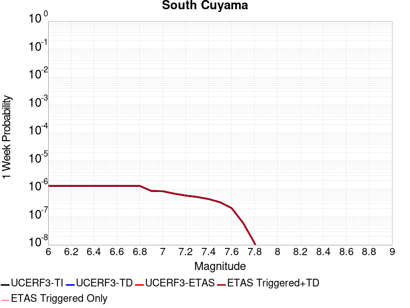 | 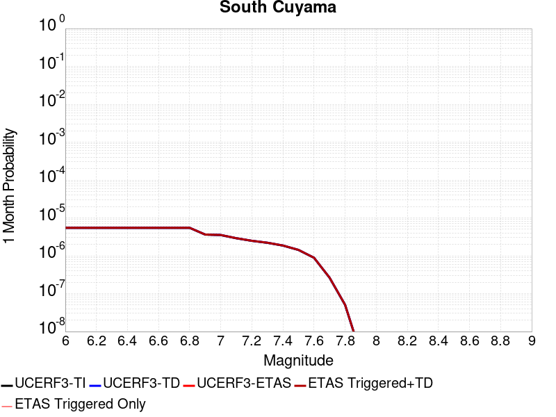 | 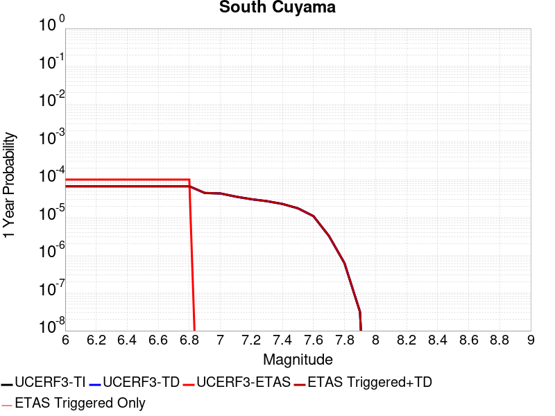 | 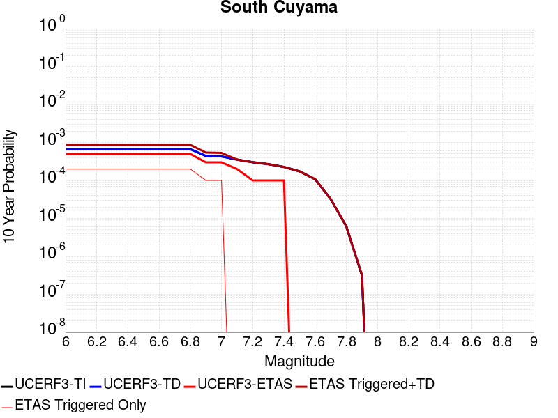 |

| Magnitude | 1 wk TI Prob | 1 wk TD Prob | 1 wk ETAS Prob | 1 wk ETAS/TD Gain | 1 wk ETAS Triggered+TD | 1 wk ETAS Triggered Only | 1 mo TI Prob | 1 mo TD Prob | 1 mo ETAS Prob | 1 mo ETAS/TD Gain | 1 mo ETAS Triggered+TD | 1 mo ETAS Triggered Only | 1 yr TI Prob | 1 yr TD Prob | 1 yr ETAS Prob | 1 yr ETAS/TD Gain | 1 yr ETAS Triggered+TD | 1 yr ETAS Triggered Only | 10 yr TI Prob | 10 yr TD Prob | 10 yr ETAS Prob | 10 yr ETAS/TD Gain | 10 yr ETAS Triggered+TD | 10 yr ETAS Triggered Only |
|-----|-----|-----|-----|-----|-----|-----|-----|-----|-----|-----|-----|-----|-----|-----|-----|-----|-----|-----|-----|-----|-----|-----|-----|-----|
| 6.0 | 1.2747308E-6 | 1.2817948E-6 | 0.0 | 0.0 | 1.2817948E-6 | 0.0 | 5.4631205E-6 | 5.493395E-6 | 0.0 | 0.0 | 5.493395E-6 | 0.0 | 6.6511464E-5 | 6.68801E-5 | 1.0E-4 | 1.495213 | 6.68801E-5 | 0.0 | 6.649156E-4 | 6.686067E-4 | 5.0E-4 | 0.7478238 | 8.6847297E-4 | 2.0E-4 |
| 6.1 | 1.2747308E-6 | 1.2817948E-6 | 0.0 | 0.0 | 1.2817948E-6 | 0.0 | 5.4631205E-6 | 5.493395E-6 | 0.0 | 0.0 | 5.493395E-6 | 0.0 | 6.6511464E-5 | 6.68801E-5 | 1.0E-4 | 1.495213 | 6.68801E-5 | 0.0 | 6.649156E-4 | 6.686067E-4 | 5.0E-4 | 0.7478238 | 8.6847297E-4 | 2.0E-4 |
| 6.2 | 1.2747308E-6 | 1.2817948E-6 | 0.0 | 0.0 | 1.2817948E-6 | 0.0 | 5.4631205E-6 | 5.493395E-6 | 0.0 | 0.0 | 5.493395E-6 | 0.0 | 6.6511464E-5 | 6.68801E-5 | 1.0E-4 | 1.495213 | 6.68801E-5 | 0.0 | 6.649156E-4 | 6.686067E-4 | 5.0E-4 | 0.7478238 | 8.6847297E-4 | 2.0E-4 |
| 6.3 | 1.2747308E-6 | 1.2817948E-6 | 0.0 | 0.0 | 1.2817948E-6 | 0.0 | 5.4631205E-6 | 5.493395E-6 | 0.0 | 0.0 | 5.493395E-6 | 0.0 | 6.6511464E-5 | 6.68801E-5 | 1.0E-4 | 1.495213 | 6.68801E-5 | 0.0 | 6.649156E-4 | 6.686067E-4 | 5.0E-4 | 0.7478238 | 8.6847297E-4 | 2.0E-4 |
| 6.4 | 1.2747308E-6 | 1.2817948E-6 | 0.0 | 0.0 | 1.2817948E-6 | 0.0 | 5.4631205E-6 | 5.493395E-6 | 0.0 | 0.0 | 5.493395E-6 | 0.0 | 6.6511464E-5 | 6.68801E-5 | 1.0E-4 | 1.495213 | 6.68801E-5 | 0.0 | 6.649156E-4 | 6.686067E-4 | 5.0E-4 | 0.7478238 | 8.6847297E-4 | 2.0E-4 |
| 6.5 | 1.2747308E-6 | 1.2817948E-6 | 0.0 | 0.0 | 1.2817948E-6 | 0.0 | 5.4631205E-6 | 5.493395E-6 | 0.0 | 0.0 | 5.493395E-6 | 0.0 | 6.6511464E-5 | 6.68801E-5 | 1.0E-4 | 1.495213 | 6.68801E-5 | 0.0 | 6.649156E-4 | 6.686067E-4 | 5.0E-4 | 0.7478238 | 8.6847297E-4 | 2.0E-4 |
| 6.6 | 1.2747308E-6 | 1.2817948E-6 | 0.0 | 0.0 | 1.2817948E-6 | 0.0 | 5.4631205E-6 | 5.493395E-6 | 0.0 | 0.0 | 5.493395E-6 | 0.0 | 6.6511464E-5 | 6.68801E-5 | 1.0E-4 | 1.495213 | 6.68801E-5 | 0.0 | 6.649156E-4 | 6.686067E-4 | 5.0E-4 | 0.7478238 | 8.6847297E-4 | 2.0E-4 |
| 6.7 | 1.2747308E-6 | 1.2817948E-6 | 0.0 | 0.0 | 1.2817948E-6 | 0.0 | 5.4631205E-6 | 5.493395E-6 | 0.0 | 0.0 | 5.493395E-6 | 0.0 | 6.6511464E-5 | 6.68801E-5 | 1.0E-4 | 1.495213 | 6.68801E-5 | 0.0 | 6.649156E-4 | 6.686067E-4 | 5.0E-4 | 0.7478238 | 8.6847297E-4 | 2.0E-4 |
| 6.8 | 1.2747308E-6 | 1.2817948E-6 | 0.0 | 0.0 | 1.2817948E-6 | 0.0 | 5.4631205E-6 | 5.493395E-6 | 0.0 | 0.0 | 5.493395E-6 | 0.0 | 6.6511464E-5 | 6.68801E-5 | 1.0E-4 | 1.495213 | 6.68801E-5 | 0.0 | 6.649156E-4 | 6.686067E-4 | 5.0E-4 | 0.7478238 | 8.6847297E-4 | 2.0E-4 |
| 6.9 | 8.4566324E-7 | 8.507344E-7 | 0.0 | 0.0 | 8.507344E-7 | 0.0 | 3.624266E-6 | 3.6459996E-6 | 0.0 | 0.0 | 3.6459996E-6 | 0.0 | 4.4124543E-5 | 4.438915E-5 | 0.0 | 0.0 | 4.438915E-5 | 0.0 | 4.4115784E-4 | 4.4380387E-4 | 3.0E-4 | 0.67597425 | 5.437595E-4 | 1.0E-4 |
| 7.0 | 8.2277904E-7 | 8.277294E-7 | 0.0 | 0.0 | 8.277294E-7 | 0.0 | 3.526191E-6 | 3.547407E-6 | 0.0 | 0.0 | 3.547407E-6 | 0.0 | 4.293053E-5 | 4.3188833E-5 | 0.0 | 0.0 | 4.3188833E-5 | 0.0 | 4.292224E-4 | 4.318054E-4 | 3.0E-4 | 0.6947574 | 5.317622E-4 | 1.0E-4 |
| 7.1 | 6.7661887E-7 | 6.8086786E-7 | 0.0 | 0.0 | 6.8086786E-7 | 0.0 | 2.899792E-6 | 2.9180019E-6 | 0.0 | 0.0 | 2.9180019E-6 | 0.0 | 3.5304394E-5 | 3.5526096E-5 | 0.0 | 0.0 | 3.5526096E-5 | 0.0 | 3.5298787E-4 | 3.5520457E-4 | 2.0E-4 | 0.5630558 | 3.5520457E-4 | 0.0 |
| 7.2 | 5.783336E-7 | 5.820793E-7 | 0.0 | 0.0 | 5.820793E-7 | 0.0 | 2.4785702E-6 | 2.494623E-6 | 0.0 | 0.0 | 2.494623E-6 | 0.0 | 3.0176174E-5 | 3.0371615E-5 | 0.0 | 0.0 | 3.0371615E-5 | 0.0 | 3.0172078E-4 | 3.036749E-4 | 1.0E-4 | 0.32929954 | 3.036749E-4 | 0.0 |
| 7.3 | 5.136759E-7 | 5.1705786E-7 | 0.0 | 0.0 | 5.1705786E-7 | 0.0 | 2.2014663E-6 | 2.2159604E-6 | 0.0 | 0.0 | 2.2159604E-6 | 0.0 | 2.6802521E-5 | 2.6978985E-5 | 0.0 | 0.0 | 2.6978985E-5 | 0.0 | 2.679929E-4 | 2.697573E-4 | 1.0E-4 | 0.37070358 | 2.697573E-4 | 0.0 |
| 7.4 | 4.3370295E-7 | 4.366226E-7 | 0.0 | 0.0 | 4.366226E-7 | 0.0 | 1.8587256E-6 | 1.8712384E-6 | 0.0 | 0.0 | 1.8712384E-6 | 0.0 | 2.2629749E-5 | 2.2782091E-5 | 0.0 | 0.0 | 2.2782091E-5 | 0.0 | 2.2627445E-4 | 2.2779772E-4 | 1.0E-4 | 0.43898597 | 2.2779772E-4 | 0.0 |
| 7.5 | 3.3242574E-7 | 3.3474004E-7 | 0.0 | 0.0 | 3.3474004E-7 | 0.0 | 1.4246809E-6 | 1.4345994E-6 | 0.0 | 0.0 | 1.4345994E-6 | 0.0 | 1.7345352E-5 | 1.7466109E-5 | 0.0 | 0.0 | 1.7466109E-5 | 0.0 | 1.7343998E-4 | 1.7464749E-4 | 0.0 | 0.0 | 1.7464749E-4 | 0.0 |
| 7.6 | 2.0627535E-7 | 2.0777307E-7 | 0.0 | 0.0 | 2.0777307E-7 | 0.0 | 8.840369E-7 | 8.9045574E-7 | 0.0 | 0.0 | 8.9045574E-7 | 0.0 | 1.0763096E-5 | 1.0841245E-5 | 0.0 | 0.0 | 1.0841245E-5 | 0.0 | 1.0762575E-4 | 1.0840725E-4 | 0.0 | 0.0 | 1.0840725E-4 | 0.0 |
| 7.7 | 6.15236E-8 | 6.197821E-8 | 0.0 | 0.0 | 6.197821E-8 | 0.0 | 2.6367252E-7 | 2.6562088E-7 | 0.0 | 0.0 | 2.6562088E-7 | 0.0 | 3.2102084E-6 | 3.2339294E-6 | 0.0 | 0.0 | 3.2339294E-6 | 0.0 | 3.210162E-5 | 3.2338834E-5 | 0.0 | 0.0 | 3.2338834E-5 | 0.0 |
| 7.8 | 1.1765573E-8 | 1.18722765E-8 | 0.0 | 0.0 | 1.18722765E-8 | 0.0 | 5.0423886E-8 | 5.0881184E-8 | 0.0 | 0.0 | 5.0881184E-8 | 0.0 | 6.1391063E-7 | 6.194782E-7 | 0.0 | 0.0 | 6.194782E-7 | 0.0 | 6.1390897E-6 | 6.1947662E-6 | 0.0 | 0.0 | 6.1947662E-6 | 0.0 |
| 7.9 | 6.0381755E-10 | 6.0999217E-10 | 0.0 | 0.0 | 6.0999217E-10 | 0.0 | 2.5877895E-9 | 2.614252E-9 | 0.0 | 0.0 | 2.614252E-9 | 0.0 | 3.1506335E-8 | 3.1828517E-8 | 0.0 | 0.0 | 3.1828517E-8 | 0.0 | 3.1506332E-7 | 3.1828515E-7 | 0.0 | 0.0 | 3.1828515E-7 | 0.0 |

## Great Valley 13 (Coalinga)
*[(top)](#table-of-contents)*

| 1 Week | 1 Month | 1 Year | 10 Year |
|-----|-----|-----|-----|
| 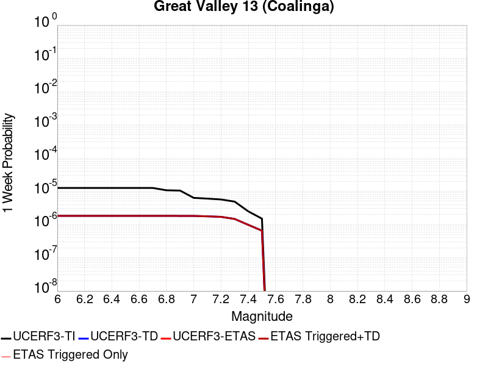 | 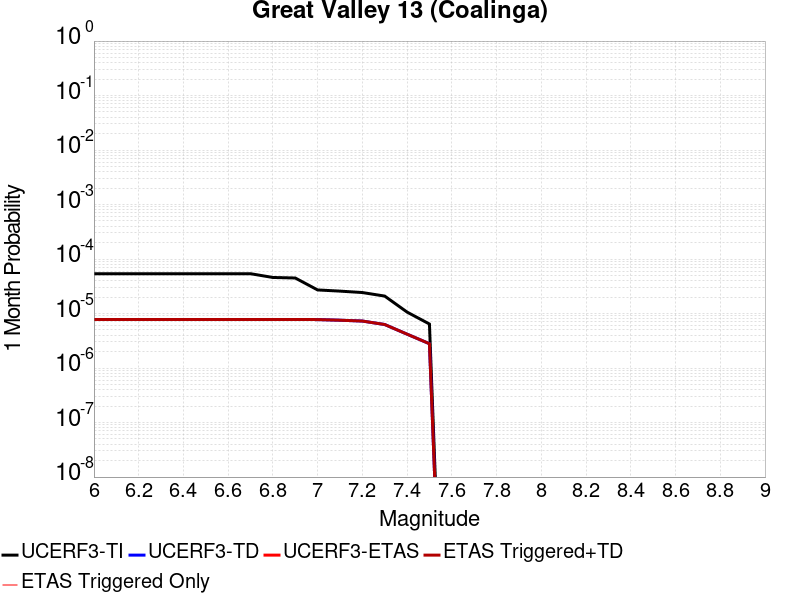 | 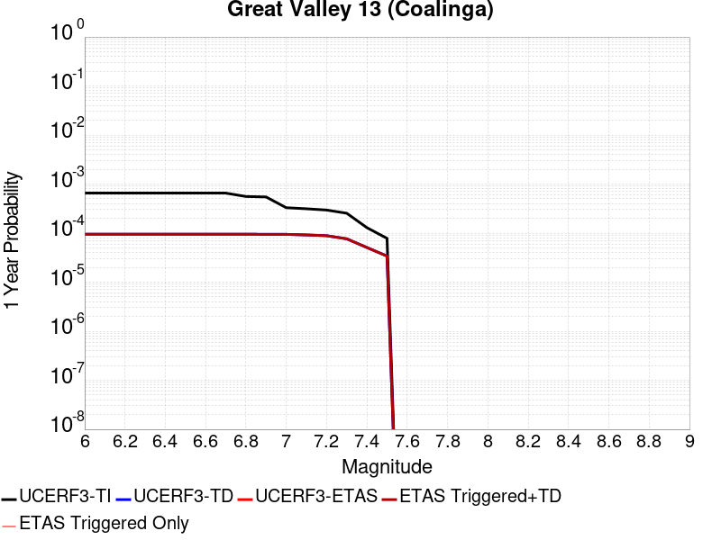 | 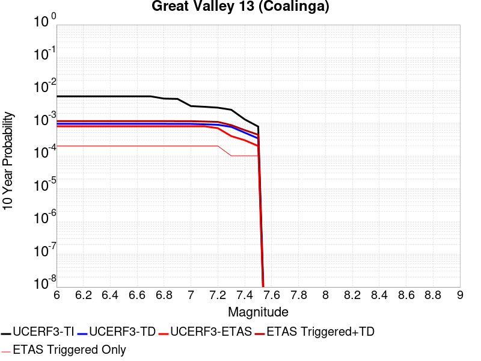 |

| Magnitude | 1 wk TI Prob | 1 wk TD Prob | 1 wk ETAS Prob | 1 wk ETAS/TD Gain | 1 wk ETAS Triggered+TD | 1 wk ETAS Triggered Only | 1 mo TI Prob | 1 mo TD Prob | 1 mo ETAS Prob | 1 mo ETAS/TD Gain | 1 mo ETAS Triggered+TD | 1 mo ETAS Triggered Only | 1 yr TI Prob | 1 yr TD Prob | 1 yr ETAS Prob | 1 yr ETAS/TD Gain | 1 yr ETAS Triggered+TD | 1 yr ETAS Triggered Only | 10 yr TI Prob | 10 yr TD Prob | 10 yr ETAS Prob | 10 yr ETAS/TD Gain | 10 yr ETAS Triggered+TD | 10 yr ETAS Triggered Only |
|-----|-----|-----|-----|-----|-----|-----|-----|-----|-----|-----|-----|-----|-----|-----|-----|-----|-----|-----|-----|-----|-----|-----|-----|-----|
| 6.0 | 1.25701345E-5 | 1.8202329E-6 | 0.0 | 0.0 | 1.8202329E-6 | 0.0 | 5.3870892E-5 | 7.800976E-6 | 0.0 | 0.0 | 7.800976E-6 | 0.0 | 6.556807E-4 | 9.497294E-5 | 0.0 | 0.0 | 9.497294E-5 | 0.0 | 0.006537495 | 9.493427E-4 | 8.0E-4 | 0.8426883 | 0.0011491529 | 2.0E-4 |
| 6.1 | 1.25701345E-5 | 1.8202329E-6 | 0.0 | 0.0 | 1.8202329E-6 | 0.0 | 5.3870892E-5 | 7.800976E-6 | 0.0 | 0.0 | 7.800976E-6 | 0.0 | 6.556807E-4 | 9.497294E-5 | 0.0 | 0.0 | 9.497294E-5 | 0.0 | 0.006537495 | 9.493427E-4 | 8.0E-4 | 0.8426883 | 0.0011491529 | 2.0E-4 |
| 6.2 | 1.25701345E-5 | 1.8202329E-6 | 0.0 | 0.0 | 1.8202329E-6 | 0.0 | 5.3870892E-5 | 7.800976E-6 | 0.0 | 0.0 | 7.800976E-6 | 0.0 | 6.556807E-4 | 9.497294E-5 | 0.0 | 0.0 | 9.497294E-5 | 0.0 | 0.006537495 | 9.493427E-4 | 8.0E-4 | 0.8426883 | 0.0011491529 | 2.0E-4 |
| 6.3 | 1.25701345E-5 | 1.8202329E-6 | 0.0 | 0.0 | 1.8202329E-6 | 0.0 | 5.3870892E-5 | 7.800976E-6 | 0.0 | 0.0 | 7.800976E-6 | 0.0 | 6.556807E-4 | 9.497294E-5 | 0.0 | 0.0 | 9.497294E-5 | 0.0 | 0.006537495 | 9.493427E-4 | 8.0E-4 | 0.8426883 | 0.0011491529 | 2.0E-4 |
| 6.4 | 1.25701345E-5 | 1.8202329E-6 | 0.0 | 0.0 | 1.8202329E-6 | 0.0 | 5.3870892E-5 | 7.800976E-6 | 0.0 | 0.0 | 7.800976E-6 | 0.0 | 6.556807E-4 | 9.497294E-5 | 0.0 | 0.0 | 9.497294E-5 | 0.0 | 0.006537495 | 9.493427E-4 | 8.0E-4 | 0.8426883 | 0.0011491529 | 2.0E-4 |
| 6.5 | 1.25701345E-5 | 1.8202329E-6 | 0.0 | 0.0 | 1.8202329E-6 | 0.0 | 5.3870892E-5 | 7.800976E-6 | 0.0 | 0.0 | 7.800976E-6 | 0.0 | 6.556807E-4 | 9.497294E-5 | 0.0 | 0.0 | 9.497294E-5 | 0.0 | 0.006537495 | 9.493427E-4 | 8.0E-4 | 0.8426883 | 0.0011491529 | 2.0E-4 |
| 6.6 | 1.25701345E-5 | 1.8202329E-6 | 0.0 | 0.0 | 1.8202329E-6 | 0.0 | 5.3870892E-5 | 7.800976E-6 | 0.0 | 0.0 | 7.800976E-6 | 0.0 | 6.556807E-4 | 9.497294E-5 | 0.0 | 0.0 | 9.497294E-5 | 0.0 | 0.006537495 | 9.493427E-4 | 8.0E-4 | 0.8426883 | 0.0011491529 | 2.0E-4 |
| 6.7 | 1.25701345E-5 | 1.8202329E-6 | 0.0 | 0.0 | 1.8202329E-6 | 0.0 | 5.3870892E-5 | 7.800976E-6 | 0.0 | 0.0 | 7.800976E-6 | 0.0 | 6.556807E-4 | 9.497294E-5 | 0.0 | 0.0 | 9.497294E-5 | 0.0 | 0.006537495 | 9.493427E-4 | 8.0E-4 | 0.8426883 | 0.0011491529 | 2.0E-4 |
| 6.8 | 1.0720415E-5 | 1.8202329E-6 | 0.0 | 0.0 | 1.8202329E-6 | 0.0 | 4.5943823E-5 | 7.800976E-6 | 0.0 | 0.0 | 7.800976E-6 | 0.0 | 5.592225E-4 | 9.497294E-5 | 0.0 | 0.0 | 9.497294E-5 | 0.0 | 0.005578173 | 9.493427E-4 | 8.0E-4 | 0.8426883 | 0.0011491529 | 2.0E-4 |
| 6.9 | 1.0485409E-5 | 1.8161834E-6 | 0.0 | 0.0 | 1.8161834E-6 | 0.0 | 4.4936693E-5 | 7.783621E-6 | 0.0 | 0.0 | 7.783621E-6 | 0.0 | 5.469669E-4 | 9.4761665E-5 | 0.0 | 0.0 | 9.4761665E-5 | 0.0 | 0.005456226 | 9.472318E-4 | 8.0E-4 | 0.8445663 | 0.0011470423 | 2.0E-4 |
| 7.0 | 6.3302773E-6 | 1.8110823E-6 | 0.0 | 0.0 | 1.8110823E-6 | 0.0 | 2.7129478E-5 | 7.761759E-6 | 0.0 | 0.0 | 7.761759E-6 | 0.0 | 3.3025132E-4 | 9.449552E-5 | 0.0 | 0.0 | 9.449552E-5 | 0.0 | 0.0032976097 | 9.4457256E-4 | 8.0E-4 | 0.846944 | 0.0011443836 | 2.0E-4 |
| 7.1 | 6.022003E-6 | 1.7616981E-6 | 0.0 | 0.0 | 1.7616981E-6 | 0.0 | 2.5808331E-5 | 7.550114E-6 | 0.0 | 0.0 | 7.550114E-6 | 0.0 | 3.141711E-4 | 9.1918955E-5 | 0.0 | 0.0 | 9.1918955E-5 | 0.0 | 0.0031372732 | 9.188284E-4 | 8.0E-4 | 0.870674 | 0.0011186446 | 2.0E-4 |
| 7.2 | 5.671345E-6 | 1.7017863E-6 | 0.0 | 0.0 | 1.7017863E-6 | 0.0 | 2.4305538E-5 | 7.293351E-6 | 0.0 | 0.0 | 7.293351E-6 | 0.0 | 2.9587973E-4 | 8.8793124E-5 | 0.0 | 0.0 | 8.8793124E-5 | 0.0 | 0.002954861 | 8.875954E-4 | 7.0E-4 | 0.7886476 | 0.001087418 | 2.0E-4 |
| 7.3 | 4.8831785E-6 | 1.4694781E-6 | 0.0 | 0.0 | 1.4694781E-6 | 0.0 | 2.092774E-5 | 6.2977488E-6 | 0.0 | 0.0 | 6.2977488E-6 | 0.0 | 2.5476544E-4 | 7.6672564E-5 | 0.0 | 0.0 | 7.6672564E-5 | 0.0 | 0.0025447358 | 7.6647766E-4 | 4.0E-4 | 0.5218678 | 8.66401E-4 | 1.0E-4 |
| 7.4 | 2.4837766E-6 | 9.777389E-7 | 0.0 | 0.0 | 9.777389E-7 | 0.0 | 1.0644713E-5 | 4.190303E-6 | 0.0 | 0.0 | 4.190303E-6 | 0.0 | 1.2959167E-4 | 5.1015813E-5 | 0.0 | 0.0 | 5.1015813E-5 | 0.0 | 0.0012951613 | 5.1004754E-4 | 3.0E-4 | 0.5881804 | 6.0999655E-4 | 1.0E-4 |
| 7.5 | 1.5002679E-6 | 6.5287935E-7 | 0.0 | 0.0 | 6.5287935E-7 | 0.0 | 6.4297037E-6 | 2.7980518E-6 | 0.0 | 0.0 | 2.7980518E-6 | 0.0 | 7.827883E-5 | 3.406579E-5 | 0.0 | 0.0 | 3.406579E-5 | 0.0 | 7.825126E-4 | 3.406098E-4 | 2.0E-4 | 0.58718216 | 4.4057574E-4 | 1.0E-4 |

## Kern Canyon (North Kern) 2011
*[(top)](#table-of-contents)*

| 1 Week | 1 Month | 1 Year | 10 Year |
|-----|-----|-----|-----|
| 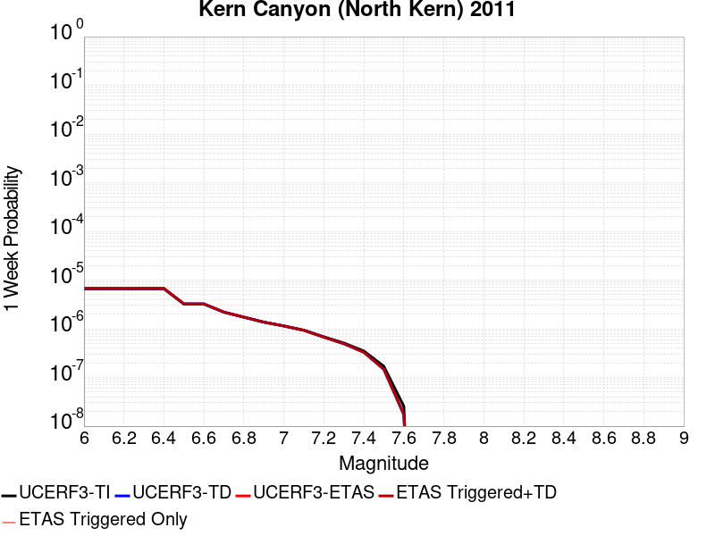 | 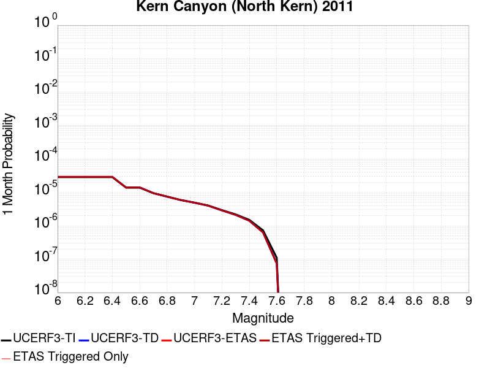 | 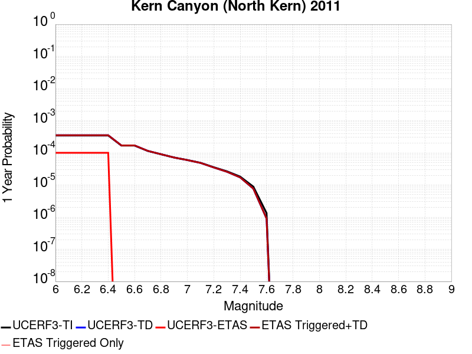 | 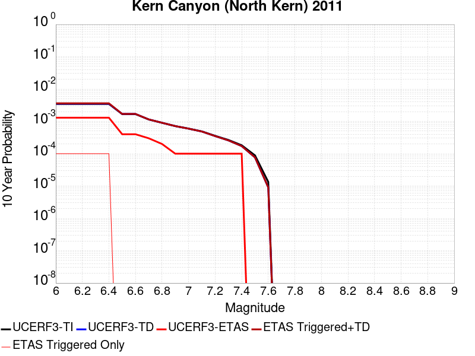 |

| Magnitude | 1 wk TI Prob | 1 wk TD Prob | 1 wk ETAS Prob | 1 wk ETAS/TD Gain | 1 wk ETAS Triggered+TD | 1 wk ETAS Triggered Only | 1 mo TI Prob | 1 mo TD Prob | 1 mo ETAS Prob | 1 mo ETAS/TD Gain | 1 mo ETAS Triggered+TD | 1 mo ETAS Triggered Only | 1 yr TI Prob | 1 yr TD Prob | 1 yr ETAS Prob | 1 yr ETAS/TD Gain | 1 yr ETAS Triggered+TD | 1 yr ETAS Triggered Only | 10 yr TI Prob | 10 yr TD Prob | 10 yr ETAS Prob | 10 yr ETAS/TD Gain | 10 yr ETAS Triggered+TD | 10 yr ETAS Triggered Only |
|-----|-----|-----|-----|-----|-----|-----|-----|-----|-----|-----|-----|-----|-----|-----|-----|-----|-----|-----|-----|-----|-----|-----|-----|-----|
| 6.0 | 6.6264497E-6 | 6.755644E-6 | 0.0 | 0.0 | 6.755644E-6 | 0.0 | 2.8398761E-5 | 2.8952483E-5 | 0.0 | 0.0 | 2.8952483E-5 | 0.0 | 3.4570007E-4 | 3.5244747E-4 | 1.0E-4 | 0.2837302 | 3.5244747E-4 | 0.0 | 0.0034516277 | 0.0035196731 | 0.0013 | 0.3693525 | 0.0036193212 | 1.0E-4 |
| 6.1 | 6.6264497E-6 | 6.755644E-6 | 0.0 | 0.0 | 6.755644E-6 | 0.0 | 2.8398761E-5 | 2.8952483E-5 | 0.0 | 0.0 | 2.8952483E-5 | 0.0 | 3.4570007E-4 | 3.5244747E-4 | 1.0E-4 | 0.2837302 | 3.5244747E-4 | 0.0 | 0.0034516277 | 0.0035196731 | 0.0013 | 0.3693525 | 0.0036193212 | 1.0E-4 |
| 6.2 | 6.6264497E-6 | 6.755644E-6 | 0.0 | 0.0 | 6.755644E-6 | 0.0 | 2.8398761E-5 | 2.8952483E-5 | 0.0 | 0.0 | 2.8952483E-5 | 0.0 | 3.4570007E-4 | 3.5244747E-4 | 1.0E-4 | 0.2837302 | 3.5244747E-4 | 0.0 | 0.0034516277 | 0.0035196731 | 0.0013 | 0.3693525 | 0.0036193212 | 1.0E-4 |
| 6.3 | 6.6264497E-6 | 6.755644E-6 | 0.0 | 0.0 | 6.755644E-6 | 0.0 | 2.8398761E-5 | 2.8952483E-5 | 0.0 | 0.0 | 2.8952483E-5 | 0.0 | 3.4570007E-4 | 3.5244747E-4 | 1.0E-4 | 0.2837302 | 3.5244747E-4 | 0.0 | 0.0034516277 | 0.0035196731 | 0.0013 | 0.3693525 | 0.0036193212 | 1.0E-4 |
| 6.4 | 6.6264497E-6 | 6.755644E-6 | 0.0 | 0.0 | 6.755644E-6 | 0.0 | 2.8398761E-5 | 2.8952483E-5 | 0.0 | 0.0 | 2.8952483E-5 | 0.0 | 3.4570007E-4 | 3.5244747E-4 | 1.0E-4 | 0.2837302 | 3.5244747E-4 | 0.0 | 0.0034516277 | 0.0035196731 | 0.0013 | 0.3693525 | 0.0036193212 | 1.0E-4 |
| 6.5 | 3.2162225E-6 | 3.2563707E-6 | 0.0 | 0.0 | 3.2563707E-6 | 0.0 | 1.3783738E-5 | 1.3955804E-5 | 0.0 | 0.0 | 1.3955804E-5 | 0.0 | 1.6780409E-4 | 1.6989947E-4 | 0.0 | 0.0 | 1.6989947E-4 | 0.0 | 0.0016767744 | 0.0016977754 | 4.0E-4 | 0.23560241 | 0.0016977754 | 0.0 |
| 6.6 | 3.2162225E-6 | 3.2563707E-6 | 0.0 | 0.0 | 3.2563707E-6 | 0.0 | 1.3783738E-5 | 1.3955804E-5 | 0.0 | 0.0 | 1.3955804E-5 | 0.0 | 1.6780409E-4 | 1.6989947E-4 | 0.0 | 0.0 | 1.6989947E-4 | 0.0 | 0.0016767744 | 0.0016977754 | 4.0E-4 | 0.23560241 | 0.0016977754 | 0.0 |
| 6.7 | 2.1908265E-6 | 2.2066642E-6 | 0.0 | 0.0 | 2.2066642E-6 | 0.0 | 9.389223E-6 | 9.457099E-6 | 0.0 | 0.0 | 9.457099E-6 | 0.0 | 1.1430779E-4 | 1.15134295E-4 | 0.0 | 0.0 | 1.15134295E-4 | 0.0 | 0.0011424901 | 0.0011507658 | 3.0E-4 | 0.26069596 | 0.0011507658 | 0.0 |
| 6.8 | 1.7303895E-6 | 1.7362031E-6 | 0.0 | 0.0 | 1.7362031E-6 | 0.0 | 7.415934E-6 | 7.44085E-6 | 0.0 | 0.0 | 7.44085E-6 | 0.0 | 9.028525E-5 | 9.058868E-5 | 0.0 | 0.0 | 9.058868E-5 | 0.0 | 9.024858E-4 | 9.055272E-4 | 2.0E-4 | 0.2208658 | 9.055272E-4 | 0.0 |
| 6.9 | 1.3700314E-6 | 1.3685906E-6 | 0.0 | 0.0 | 1.3685906E-6 | 0.0 | 5.87155E-6 | 5.8653754E-6 | 0.0 | 0.0 | 5.8653754E-6 | 0.0 | 7.148377E-5 | 7.140865E-5 | 0.0 | 0.0 | 7.140865E-5 | 0.0 | 7.146078E-4 | 7.138616E-4 | 1.0E-4 | 0.14008318 | 7.138616E-4 | 0.0 |
| 7.0 | 1.1467797E-6 | 1.1411538E-6 | 0.0 | 0.0 | 1.1411538E-6 | 0.0 | 4.9147607E-6 | 4.89065E-6 | 0.0 | 0.0 | 4.89065E-6 | 0.0 | 5.983557E-5 | 5.954207E-5 | 0.0 | 0.0 | 5.954207E-5 | 0.0 | 5.981946E-4 | 5.952643E-4 | 1.0E-4 | 0.1679926 | 5.952643E-4 | 0.0 |
| 7.1 | 9.3952065E-7 | 9.300834E-7 | 0.0 | 0.0 | 9.300834E-7 | 0.0 | 4.026511E-6 | 3.9860656E-6 | 0.0 | 0.0 | 3.9860656E-6 | 0.0 | 4.9021666E-5 | 4.8529284E-5 | 0.0 | 0.0 | 4.8529284E-5 | 0.0 | 4.901085E-4 | 4.8518865E-4 | 1.0E-4 | 0.2061054 | 4.8518865E-4 | 0.0 |
| 7.2 | 6.858055E-7 | 6.7179354E-7 | 0.0 | 0.0 | 6.7179354E-7 | 0.0 | 2.939163E-6 | 2.879112E-6 | 0.0 | 0.0 | 2.879112E-6 | 0.0 | 3.5783723E-5 | 3.5052635E-5 | 0.0 | 0.0 | 3.5052635E-5 | 0.0 | 3.5777962E-4 | 3.5047194E-4 | 1.0E-4 | 0.28532955 | 3.5047194E-4 | 0.0 |
| 7.3 | 5.1101983E-7 | 4.9382766E-7 | 0.0 | 0.0 | 4.9382766E-7 | 0.0 | 2.1900833E-6 | 2.1164024E-6 | 0.0 | 0.0 | 2.1164024E-6 | 0.0 | 2.6663936E-5 | 2.57669E-5 | 0.0 | 0.0 | 2.57669E-5 | 0.0 | 2.6660739E-4 | 2.576396E-4 | 1.0E-4 | 0.3881391 | 2.576396E-4 | 0.0 |
| 7.4 | 3.4999414E-7 | 3.2988802E-7 | 0.0 | 0.0 | 3.2988802E-7 | 0.0 | 1.499974E-6 | 1.4138051E-6 | 0.0 | 0.0 | 1.4138051E-6 | 0.0 | 1.8262032E-5 | 1.7212944E-5 | 0.0 | 0.0 | 1.7212944E-5 | 0.0 | 1.826053E-4 | 1.7211634E-4 | 1.0E-4 | 0.58100235 | 1.7211634E-4 | 0.0 |
| 7.5 | 1.7021522E-7 | 1.4746469E-7 | 0.0 | 0.0 | 1.4746469E-7 | 0.0 | 7.2949354E-7 | 6.319914E-7 | 0.0 | 0.0 | 6.319914E-7 | 0.0 | 8.881548E-6 | 7.694469E-6 | 0.0 | 0.0 | 7.694469E-6 | 0.0 | 8.8811925E-5 | 7.69421E-5 | 0.0 | 0.0 | 7.69421E-5 | 0.0 |
| 7.6 | 2.572245E-8 | 1.7346172E-8 | 0.0 | 0.0 | 1.7346172E-8 | 0.0 | 1.10239064E-7 | 7.434073E-8 | 0.0 | 0.0 | 7.434073E-8 | 0.0 | 1.3421597E-6 | 9.050981E-7 | 0.0 | 0.0 | 9.050981E-7 | 0.0 | 1.3421517E-5 | 9.050949E-6 | 0.0 | 0.0 | 9.050949E-6 | 0.0 |

## Incline Village 2011 CFM
*[(top)](#table-of-contents)*

| 1 Week | 1 Month | 1 Year | 10 Year |
|-----|-----|-----|-----|
| 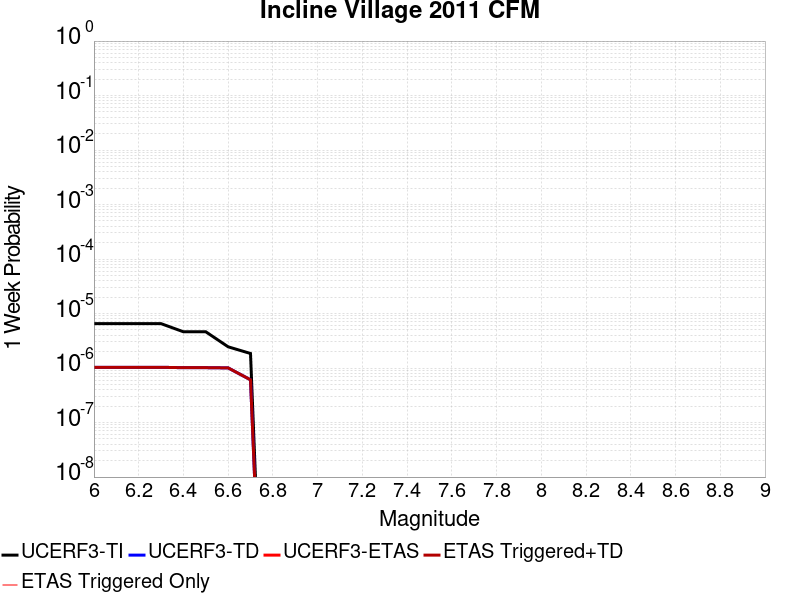 | 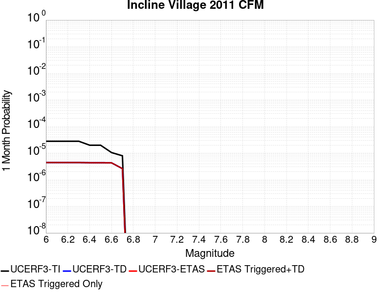 | 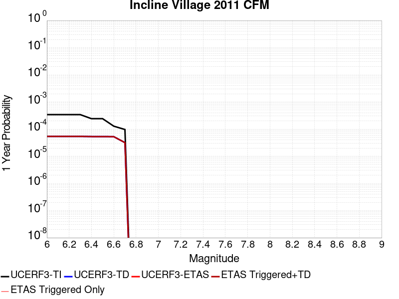 | 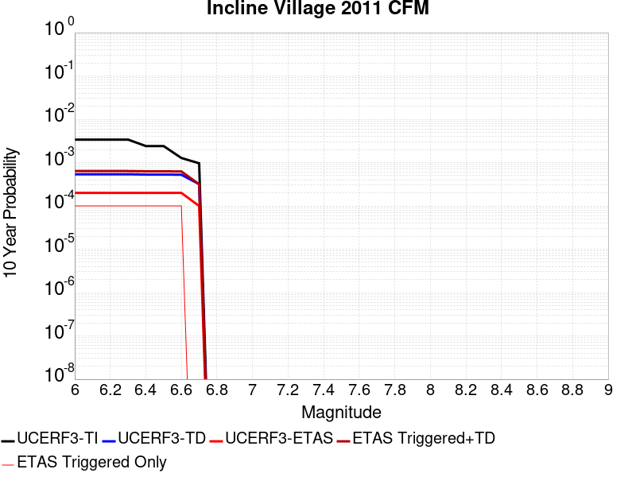 |

| Magnitude | 1 wk TI Prob | 1 wk TD Prob | 1 wk ETAS Prob | 1 wk ETAS/TD Gain | 1 wk ETAS Triggered+TD | 1 wk ETAS Triggered Only | 1 mo TI Prob | 1 mo TD Prob | 1 mo ETAS Prob | 1 mo ETAS/TD Gain | 1 mo ETAS Triggered+TD | 1 mo ETAS Triggered Only | 1 yr TI Prob | 1 yr TD Prob | 1 yr ETAS Prob | 1 yr ETAS/TD Gain | 1 yr ETAS Triggered+TD | 1 yr ETAS Triggered Only | 10 yr TI Prob | 10 yr TD Prob | 10 yr ETAS Prob | 10 yr ETAS/TD Gain | 10 yr ETAS Triggered+TD | 10 yr ETAS Triggered Only |
|-----|-----|-----|-----|-----|-----|-----|-----|-----|-----|-----|-----|-----|-----|-----|-----|-----|-----|-----|-----|-----|-----|-----|-----|-----|
| 6.0 | 6.5321456E-6 | 1.0320998E-6 | 0.0 | 0.0 | 1.0320998E-6 | 0.0 | 2.7994609E-5 | 4.4232816E-6 | 0.0 | 0.0 | 4.4232816E-6 | 0.0 | 3.4078106E-4 | 5.3852782E-5 | 0.0 | 0.0 | 5.3852782E-5 | 0.0 | 0.0034025894 | 5.3846225E-4 | 2.0E-4 | 0.3714281 | 6.384084E-4 | 1.0E-4 |
| 6.1 | 6.5321456E-6 | 1.0320998E-6 | 0.0 | 0.0 | 1.0320998E-6 | 0.0 | 2.7994609E-5 | 4.4232816E-6 | 0.0 | 0.0 | 4.4232816E-6 | 0.0 | 3.4078106E-4 | 5.3852782E-5 | 0.0 | 0.0 | 5.3852782E-5 | 0.0 | 0.0034025894 | 5.3846225E-4 | 2.0E-4 | 0.3714281 | 6.384084E-4 | 1.0E-4 |
| 6.2 | 6.5321456E-6 | 1.0320998E-6 | 0.0 | 0.0 | 1.0320998E-6 | 0.0 | 2.7994609E-5 | 4.4232816E-6 | 0.0 | 0.0 | 4.4232816E-6 | 0.0 | 3.4078106E-4 | 5.3852782E-5 | 0.0 | 0.0 | 5.3852782E-5 | 0.0 | 0.0034025894 | 5.3846225E-4 | 2.0E-4 | 0.3714281 | 6.384084E-4 | 1.0E-4 |
| 6.3 | 6.5321456E-6 | 1.0320998E-6 | 0.0 | 0.0 | 1.0320998E-6 | 0.0 | 2.7994609E-5 | 4.4232816E-6 | 0.0 | 0.0 | 4.4232816E-6 | 0.0 | 3.4078106E-4 | 5.3852782E-5 | 0.0 | 0.0 | 5.3852782E-5 | 0.0 | 0.0034025894 | 5.3846225E-4 | 2.0E-4 | 0.3714281 | 6.384084E-4 | 1.0E-4 |
| 6.4 | 4.6332716E-6 | 1.0168296E-6 | 0.0 | 0.0 | 1.0168296E-6 | 0.0 | 1.9856727E-5 | 4.3578375E-6 | 0.0 | 0.0 | 4.3578375E-6 | 0.0 | 2.4172882E-4 | 5.3056043E-5 | 0.0 | 0.0 | 5.3056043E-5 | 0.0 | 0.0024146605 | 5.304987E-4 | 2.0E-4 | 0.3770038 | 6.304456E-4 | 1.0E-4 |
| 6.5 | 4.6332716E-6 | 1.0168296E-6 | 0.0 | 0.0 | 1.0168296E-6 | 0.0 | 1.9856727E-5 | 4.3578375E-6 | 0.0 | 0.0 | 4.3578375E-6 | 0.0 | 2.4172882E-4 | 5.3056043E-5 | 0.0 | 0.0 | 5.3056043E-5 | 0.0 | 0.0024146605 | 5.304987E-4 | 2.0E-4 | 0.3770038 | 6.304456E-4 | 1.0E-4 |
| 6.6 | 2.4546039E-6 | 1.0073288E-6 | 0.0 | 0.0 | 1.0073288E-6 | 0.0 | 1.0519689E-5 | 4.3171203E-6 | 0.0 | 0.0 | 4.3171203E-6 | 0.0 | 1.2806967E-4 | 5.2560332E-5 | 0.0 | 0.0 | 5.2560332E-5 | 0.0 | 0.001279959 | 5.255439E-4 | 2.0E-4 | 0.38055813 | 6.254913E-4 | 1.0E-4 |
| 6.7 | 1.8511148E-6 | 6.0916835E-7 | 0.0 | 0.0 | 6.0916835E-7 | 0.0 | 7.933325E-6 | 2.6107216E-6 | 0.0 | 0.0 | 2.6107216E-6 | 0.0 | 9.658395E-5 | 3.1785534E-5 | 0.0 | 0.0 | 3.1785534E-5 | 0.0 | 9.6541987E-4 | 3.1785536E-4 | 1.0E-4 | 0.3146085 | 3.1785536E-4 | 0.0 |

## Battle Creek 2011 CFM
*[(top)](#table-of-contents)*

| 1 Week | 1 Month | 1 Year | 10 Year |
|-----|-----|-----|-----|
| 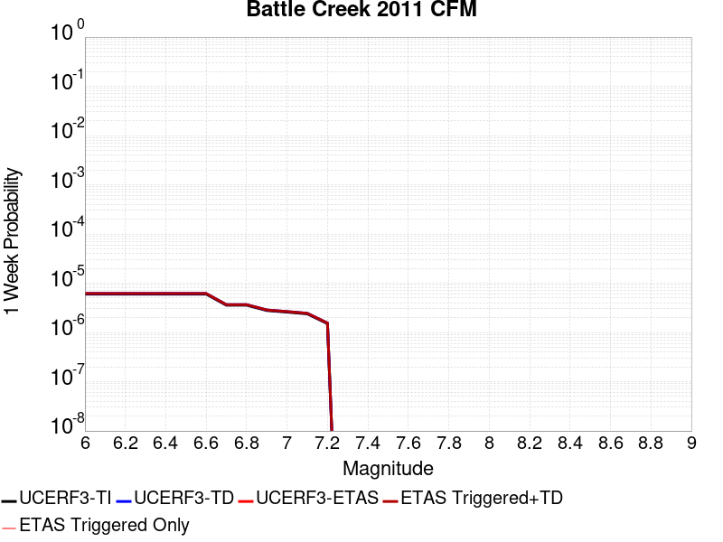 | 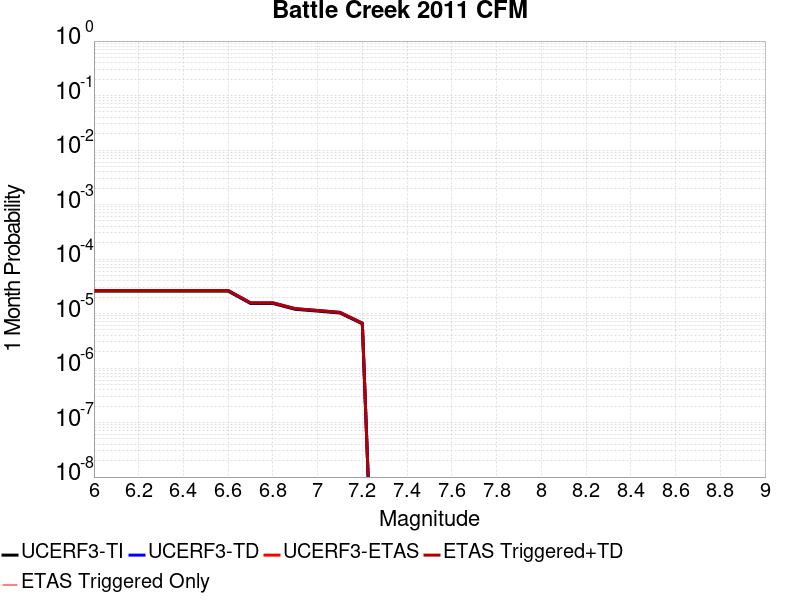 | 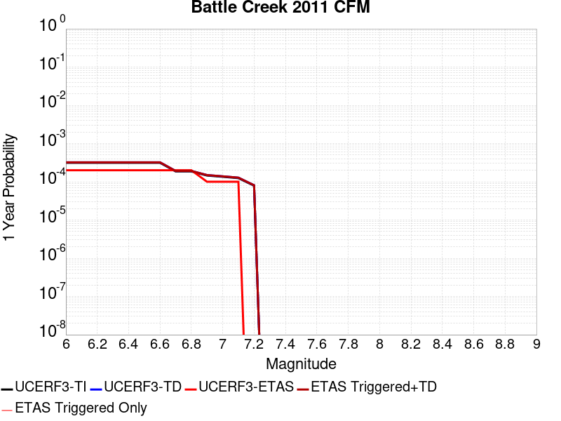 | 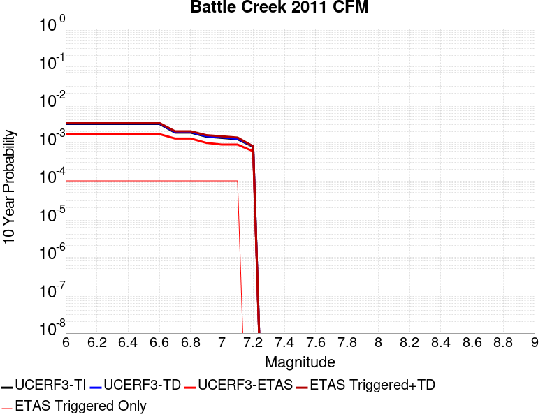 |

| Magnitude | 1 wk TI Prob | 1 wk TD Prob | 1 wk ETAS Prob | 1 wk ETAS/TD Gain | 1 wk ETAS Triggered+TD | 1 wk ETAS Triggered Only | 1 mo TI Prob | 1 mo TD Prob | 1 mo ETAS Prob | 1 mo ETAS/TD Gain | 1 mo ETAS Triggered+TD | 1 mo ETAS Triggered Only | 1 yr TI Prob | 1 yr TD Prob | 1 yr ETAS Prob | 1 yr ETAS/TD Gain | 1 yr ETAS Triggered+TD | 1 yr ETAS Triggered Only | 10 yr TI Prob | 10 yr TD Prob | 10 yr ETAS Prob | 10 yr ETAS/TD Gain | 10 yr ETAS Triggered+TD | 10 yr ETAS Triggered Only |
|-----|-----|-----|-----|-----|-----|-----|-----|-----|-----|-----|-----|-----|-----|-----|-----|-----|-----|-----|-----|-----|-----|-----|-----|-----|
| 6.0 | 6.0215425E-6 | 6.1873084E-6 | 0.0 | 0.0 | 6.1873084E-6 | 0.0 | 2.5806356E-5 | 2.6516804E-5 | 0.0 | 0.0 | 2.6516804E-5 | 0.0 | 3.1414707E-4 | 3.2280086E-4 | 2.0E-4 | 0.61957705 | 3.2280086E-4 | 0.0 | 0.0031370334 | 0.003223969 | 0.0017 | 0.52730036 | 0.0033236465 | 1.0E-4 |
| 6.1 | 6.0215425E-6 | 6.1873084E-6 | 0.0 | 0.0 | 6.1873084E-6 | 0.0 | 2.5806356E-5 | 2.6516804E-5 | 0.0 | 0.0 | 2.6516804E-5 | 0.0 | 3.1414707E-4 | 3.2280086E-4 | 2.0E-4 | 0.61957705 | 3.2280086E-4 | 0.0 | 0.0031370334 | 0.003223969 | 0.0017 | 0.52730036 | 0.0033236465 | 1.0E-4 |
| 6.2 | 6.0215425E-6 | 6.1873084E-6 | 0.0 | 0.0 | 6.1873084E-6 | 0.0 | 2.5806356E-5 | 2.6516804E-5 | 0.0 | 0.0 | 2.6516804E-5 | 0.0 | 3.1414707E-4 | 3.2280086E-4 | 2.0E-4 | 0.61957705 | 3.2280086E-4 | 0.0 | 0.0031370334 | 0.003223969 | 0.0017 | 0.52730036 | 0.0033236465 | 1.0E-4 |
| 6.3 | 6.0215425E-6 | 6.1873084E-6 | 0.0 | 0.0 | 6.1873084E-6 | 0.0 | 2.5806356E-5 | 2.6516804E-5 | 0.0 | 0.0 | 2.6516804E-5 | 0.0 | 3.1414707E-4 | 3.2280086E-4 | 2.0E-4 | 0.61957705 | 3.2280086E-4 | 0.0 | 0.0031370334 | 0.003223969 | 0.0017 | 0.52730036 | 0.0033236465 | 1.0E-4 |
| 6.4 | 6.0215425E-6 | 6.1873084E-6 | 0.0 | 0.0 | 6.1873084E-6 | 0.0 | 2.5806356E-5 | 2.6516804E-5 | 0.0 | 0.0 | 2.6516804E-5 | 0.0 | 3.1414707E-4 | 3.2280086E-4 | 2.0E-4 | 0.61957705 | 3.2280086E-4 | 0.0 | 0.0031370334 | 0.003223969 | 0.0017 | 0.52730036 | 0.0033236465 | 1.0E-4 |
| 6.5 | 6.0215425E-6 | 6.1873084E-6 | 0.0 | 0.0 | 6.1873084E-6 | 0.0 | 2.5806356E-5 | 2.6516804E-5 | 0.0 | 0.0 | 2.6516804E-5 | 0.0 | 3.1414707E-4 | 3.2280086E-4 | 2.0E-4 | 0.61957705 | 3.2280086E-4 | 0.0 | 0.0031370334 | 0.003223969 | 0.0017 | 0.52730036 | 0.0033236465 | 1.0E-4 |
| 6.6 | 6.0215425E-6 | 6.1873084E-6 | 0.0 | 0.0 | 6.1873084E-6 | 0.0 | 2.5806356E-5 | 2.6516804E-5 | 0.0 | 0.0 | 2.6516804E-5 | 0.0 | 3.1414707E-4 | 3.2280086E-4 | 2.0E-4 | 0.61957705 | 3.2280086E-4 | 0.0 | 0.0031370334 | 0.003223969 | 0.0017 | 0.52730036 | 0.0033236465 | 1.0E-4 |
| 6.7 | 3.5769701E-6 | 3.6742483E-6 | 0.0 | 0.0 | 3.6742483E-6 | 0.0 | 1.5329782E-5 | 1.5746706E-5 | 0.0 | 0.0 | 1.5746706E-5 | 0.0 | 1.8662411E-4 | 1.9170315E-4 | 2.0E-4 | 1.0432796 | 1.9170315E-4 | 0.0 | 0.0018646746 | 0.0019157592 | 0.0013 | 0.67858213 | 0.0020155676 | 1.0E-4 |
| 6.8 | 3.5769701E-6 | 3.6742483E-6 | 0.0 | 0.0 | 3.6742483E-6 | 0.0 | 1.5329782E-5 | 1.5746706E-5 | 0.0 | 0.0 | 1.5746706E-5 | 0.0 | 1.8662411E-4 | 1.9170315E-4 | 2.0E-4 | 1.0432796 | 1.9170315E-4 | 0.0 | 0.0018646746 | 0.0019157592 | 0.0013 | 0.67858213 | 0.0020155676 | 1.0E-4 |
| 6.9 | 2.7928356E-6 | 2.8684508E-6 | 0.0 | 0.0 | 2.8684508E-6 | 0.0 | 1.1969241E-5 | 1.22933225E-5 | 0.0 | 0.0 | 1.22933225E-5 | 0.0 | 1.4571576E-4 | 1.4966448E-4 | 1.0E-4 | 0.66816115 | 1.4966448E-4 | 0.0 | 0.0014562025 | 0.0014959867 | 0.001 | 0.6684551 | 0.0015958372 | 1.0E-4 |
| 7.0 | 2.590302E-6 | 2.6604625E-6 | 0.0 | 0.0 | 2.6604625E-6 | 0.0 | 1.1101247E-5 | 1.1401953E-5 | 0.0 | 0.0 | 1.1401953E-5 | 0.0 | 1.351493E-4 | 1.3881348E-4 | 1.0E-4 | 0.72039115 | 1.3881348E-4 | 0.0 | 0.0013506714 | 0.0013876158 | 9.0E-4 | 0.64859456 | 0.001487477 | 1.0E-4 |
| 7.1 | 2.3885443E-6 | 2.4533108E-6 | 0.0 | 0.0 | 2.4533108E-6 | 0.0 | 1.0236578E-5 | 1.0514167E-5 | 0.0 | 0.0 | 1.0514167E-5 | 0.0 | 1.2462321E-4 | 1.28006E-4 | 1.0E-4 | 0.78121346 | 1.28006E-4 | 0.0 | 0.0012455335 | 0.0012796684 | 9.0E-4 | 0.7033072 | 0.0013795404 | 1.0E-4 |
| 7.2 | 1.5140604E-6 | 1.5550153E-6 | 0.0 | 0.0 | 1.5550153E-6 | 0.0 | 6.4888145E-6 | 6.664351E-6 | 0.0 | 0.0 | 6.664351E-6 | 0.0 | 7.899845E-5 | 8.1138474E-5 | 0.0 | 0.0 | 8.1138474E-5 | 0.0 | 7.8970374E-4 | 8.1138476E-4 | 6.0E-4 | 0.73947656 | 8.1138476E-4 | 0.0 |

## Kern Canyon (Lake Isabella) 2011
*[(top)](#table-of-contents)*

| 1 Week | 1 Month | 1 Year | 10 Year |
|-----|-----|-----|-----|
|  | 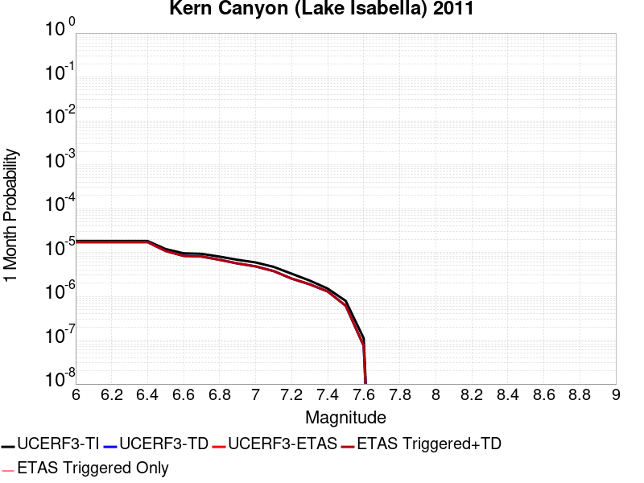 | 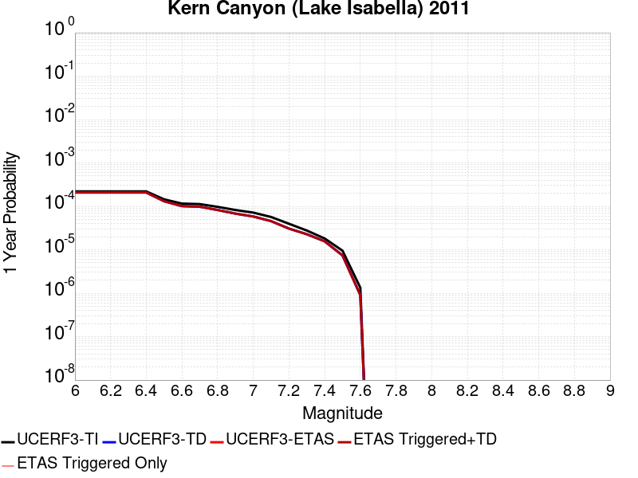 | 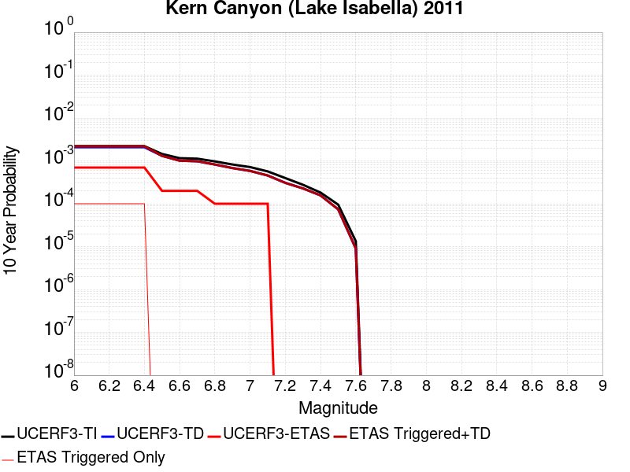 |

| Magnitude | 1 wk TI Prob | 1 wk TD Prob | 1 wk ETAS Prob | 1 wk ETAS/TD Gain | 1 wk ETAS Triggered+TD | 1 wk ETAS Triggered Only | 1 mo TI Prob | 1 mo TD Prob | 1 mo ETAS Prob | 1 mo ETAS/TD Gain | 1 mo ETAS Triggered+TD | 1 mo ETAS Triggered Only | 1 yr TI Prob | 1 yr TD Prob | 1 yr ETAS Prob | 1 yr ETAS/TD Gain | 1 yr ETAS Triggered+TD | 1 yr ETAS Triggered Only | 10 yr TI Prob | 10 yr TD Prob | 10 yr ETAS Prob | 10 yr ETAS/TD Gain | 10 yr ETAS Triggered+TD | 10 yr ETAS Triggered Only |
|-----|-----|-----|-----|-----|-----|-----|-----|-----|-----|-----|-----|-----|-----|-----|-----|-----|-----|-----|-----|-----|-----|-----|-----|-----|
| 6.0 | 4.2387383E-6 | 4.0006867E-6 | 0.0 | 0.0 | 4.0006867E-6 | 0.0 | 1.8165894E-5 | 1.7145698E-5 | 0.0 | 0.0 | 1.7145698E-5 | 0.0 | 2.2114732E-4 | 2.0873075E-4 | 0.0 | 0.0 | 2.0873075E-4 | 0.0 | 0.0022092736 | 0.0020855307 | 7.0E-4 | 0.33564597 | 0.002185322 | 1.0E-4 |
| 6.1 | 4.2387383E-6 | 4.0006867E-6 | 0.0 | 0.0 | 4.0006867E-6 | 0.0 | 1.8165894E-5 | 1.7145698E-5 | 0.0 | 0.0 | 1.7145698E-5 | 0.0 | 2.2114732E-4 | 2.0873075E-4 | 0.0 | 0.0 | 2.0873075E-4 | 0.0 | 0.0022092736 | 0.0020855307 | 7.0E-4 | 0.33564597 | 0.002185322 | 1.0E-4 |
| 6.2 | 4.2387383E-6 | 4.0006867E-6 | 0.0 | 0.0 | 4.0006867E-6 | 0.0 | 1.8165894E-5 | 1.7145698E-5 | 0.0 | 0.0 | 1.7145698E-5 | 0.0 | 2.2114732E-4 | 2.0873075E-4 | 0.0 | 0.0 | 2.0873075E-4 | 0.0 | 0.0022092736 | 0.0020855307 | 7.0E-4 | 0.33564597 | 0.002185322 | 1.0E-4 |
| 6.3 | 4.2387383E-6 | 4.0006867E-6 | 0.0 | 0.0 | 4.0006867E-6 | 0.0 | 1.8165894E-5 | 1.7145698E-5 | 0.0 | 0.0 | 1.7145698E-5 | 0.0 | 2.2114732E-4 | 2.0873075E-4 | 0.0 | 0.0 | 2.0873075E-4 | 0.0 | 0.0022092736 | 0.0020855307 | 7.0E-4 | 0.33564597 | 0.002185322 | 1.0E-4 |
| 6.4 | 4.2387383E-6 | 4.0006867E-6 | 0.0 | 0.0 | 4.0006867E-6 | 0.0 | 1.8165894E-5 | 1.7145698E-5 | 0.0 | 0.0 | 1.7145698E-5 | 0.0 | 2.2114732E-4 | 2.0873075E-4 | 0.0 | 0.0 | 2.0873075E-4 | 0.0 | 0.0022092736 | 0.0020855307 | 7.0E-4 | 0.33564597 | 0.002185322 | 1.0E-4 |
| 6.5 | 2.7857532E-6 | 2.5172433E-6 | 0.0 | 0.0 | 2.5172433E-6 | 0.0 | 1.1938888E-5 | 1.0788142E-5 | 0.0 | 0.0 | 1.0788142E-5 | 0.0 | 1.4534626E-4 | 1.3133805E-4 | 0.0 | 0.0 | 1.3133805E-4 | 0.0 | 0.0014525123 | 0.001312637 | 2.0E-4 | 0.15236504 | 0.001312637 | 0.0 |
| 6.6 | 2.2233348E-6 | 1.9436206E-6 | 0.0 | 0.0 | 1.9436206E-6 | 0.0 | 9.528543E-6 | 8.329776E-6 | 0.0 | 0.0 | 8.329776E-6 | 0.0 | 1.1600384E-4 | 1.0141039E-4 | 0.0 | 0.0 | 1.0141039E-4 | 0.0 | 0.001159433 | 0.0010136497 | 2.0E-4 | 0.19730681 | 0.0010136497 | 0.0 |
| 6.7 | 2.1635126E-6 | 1.883009E-6 | 0.0 | 0.0 | 1.883009E-6 | 0.0 | 9.272164E-6 | 8.070014E-6 | 0.0 | 0.0 | 8.070014E-6 | 0.0 | 1.1288274E-4 | 9.824807E-5 | 0.0 | 0.0 | 9.824807E-5 | 0.0 | 0.0011282542 | 9.820545E-4 | 2.0E-4 | 0.20365468 | 9.820545E-4 | 0.0 |
| 6.8 | 1.8685711E-6 | 1.5827055E-6 | 0.0 | 0.0 | 1.5827055E-6 | 0.0 | 8.008137E-6 | 6.7830065E-6 | 0.0 | 0.0 | 6.7830065E-6 | 0.0 | 9.74947E-5 | 8.258002E-5 | 0.0 | 0.0 | 8.258002E-5 | 0.0 | 9.745194E-4 | 8.254983E-4 | 1.0E-4 | 0.12113895 | 8.254983E-4 | 0.0 |
| 6.9 | 1.5815071E-6 | 1.3061186E-6 | 0.0 | 0.0 | 1.3061186E-6 | 0.0 | 6.77787E-6 | 5.5976393E-6 | 0.0 | 0.0 | 5.5976393E-6 | 0.0 | 8.251744E-5 | 6.814915E-5 | 0.0 | 0.0 | 6.814915E-5 | 0.0 | 8.248681E-4 | 6.812852E-4 | 1.0E-4 | 0.1467814 | 6.812852E-4 | 0.0 |
| 7.0 | 1.3772564E-6 | 1.1207467E-6 | 0.0 | 0.0 | 1.1207467E-6 | 0.0 | 5.9025137E-6 | 4.803191E-6 | 0.0 | 0.0 | 4.803191E-6 | 0.0 | 7.186073E-5 | 5.8477304E-5 | 0.0 | 0.0 | 5.8477304E-5 | 0.0 | 7.18375E-4 | 5.846212E-4 | 1.0E-4 | 0.17105092 | 5.846212E-4 | 0.0 |
| 7.1 | 1.0916998E-6 | 8.7612966E-7 | 0.0 | 0.0 | 8.7612966E-7 | 0.0 | 4.678705E-6 | 3.7548361E-6 | 0.0 | 0.0 | 3.7548361E-6 | 0.0 | 5.6961744E-5 | 4.5714183E-5 | 0.0 | 0.0 | 4.5714183E-5 | 0.0 | 5.6947145E-4 | 4.5704914E-4 | 1.0E-4 | 0.21879485 | 4.5704914E-4 | 0.0 |
| 7.2 | 7.6277024E-7 | 5.899779E-7 | 0.0 | 0.0 | 5.899779E-7 | 0.0 | 3.2690114E-6 | 2.5284742E-6 | 0.0 | 0.0 | 2.5284742E-6 | 0.0 | 3.9799485E-5 | 3.0783744E-5 | 0.0 | 0.0 | 3.0783744E-5 | 0.0 | 3.9792358E-4 | 3.0779542E-4 | 0.0 | 0.0 | 3.0779542E-4 | 0.0 |
| 7.3 | 5.3265916E-7 | 4.3812673E-7 | 0.0 | 0.0 | 4.3812673E-7 | 0.0 | 2.282823E-6 | 1.8776847E-6 | 0.0 | 0.0 | 1.8776847E-6 | 0.0 | 2.7793016E-5 | 2.2860575E-5 | 0.0 | 0.0 | 2.2860575E-5 | 0.0 | 2.778954E-4 | 2.2858262E-4 | 0.0 | 0.0 | 2.2858262E-4 | 0.0 |
| 7.4 | 3.4946007E-7 | 3.005784E-7 | 0.0 | 0.0 | 3.005784E-7 | 0.0 | 1.497685E-6 | 1.2881925E-6 | 0.0 | 0.0 | 1.2881925E-6 | 0.0 | 1.8234163E-5 | 1.5683632E-5 | 0.0 | 0.0 | 1.5683632E-5 | 0.0 | 1.8232666E-4 | 1.5682548E-4 | 0.0 | 0.0 | 1.5682548E-4 | 0.0 |
| 7.5 | 1.8317026E-7 | 1.4240355E-7 | 0.0 | 0.0 | 1.4240355E-7 | 0.0 | 7.850152E-7 | 6.103008E-7 | 0.0 | 0.0 | 6.103008E-7 | 0.0 | 9.557518E-6 | 7.4303875E-6 | 0.0 | 0.0 | 7.4303875E-6 | 0.0 | 9.5571064E-5 | 7.430147E-5 | 0.0 | 0.0 | 7.430147E-5 | 0.0 |
| 7.6 | 2.572245E-8 | 1.7346172E-8 | 0.0 | 0.0 | 1.7346172E-8 | 0.0 | 1.10239064E-7 | 7.434073E-8 | 0.0 | 0.0 | 7.434073E-8 | 0.0 | 1.3421597E-6 | 9.050981E-7 | 0.0 | 0.0 | 9.050981E-7 | 0.0 | 1.3421517E-5 | 9.050949E-6 | 0.0 | 0.0 | 9.050949E-6 | 0.0 |

## Kern Canyon (South Kern) 2011
*[(top)](#table-of-contents)*

| 1 Week | 1 Month | 1 Year | 10 Year |
|-----|-----|-----|-----|
| 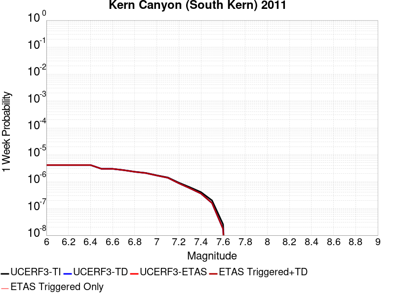 | 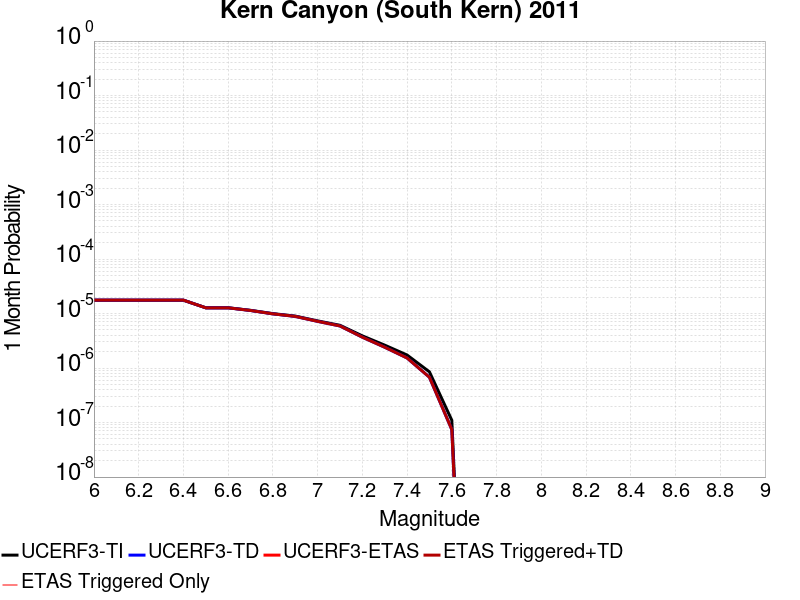 | 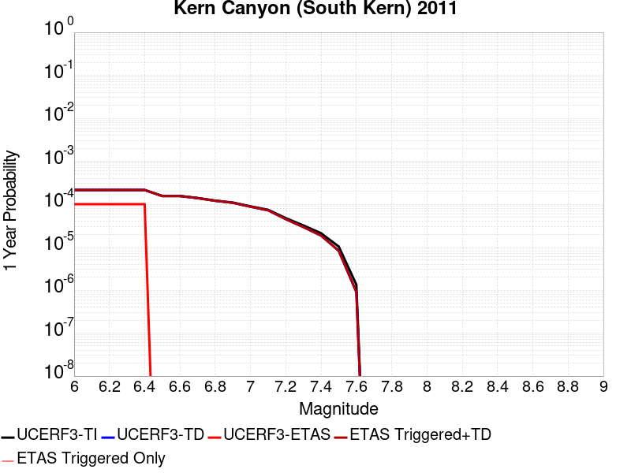 | 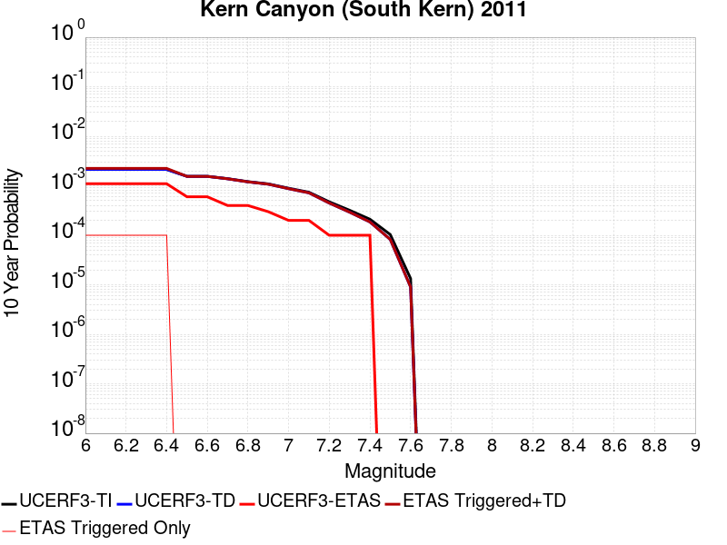 |

| Magnitude | 1 wk TI Prob | 1 wk TD Prob | 1 wk ETAS Prob | 1 wk ETAS/TD Gain | 1 wk ETAS Triggered+TD | 1 wk ETAS Triggered Only | 1 mo TI Prob | 1 mo TD Prob | 1 mo ETAS Prob | 1 mo ETAS/TD Gain | 1 mo ETAS Triggered+TD | 1 mo ETAS Triggered Only | 1 yr TI Prob | 1 yr TD Prob | 1 yr ETAS Prob | 1 yr ETAS/TD Gain | 1 yr ETAS Triggered+TD | 1 yr ETAS Triggered Only | 10 yr TI Prob | 10 yr TD Prob | 10 yr ETAS Prob | 10 yr ETAS/TD Gain | 10 yr ETAS Triggered+TD | 10 yr ETAS Triggered Only |
|-----|-----|-----|-----|-----|-----|-----|-----|-----|-----|-----|-----|-----|-----|-----|-----|-----|-----|-----|-----|-----|-----|-----|-----|-----|
| 6.0 | 4.105075E-6 | 4.112918E-6 | 0.0 | 0.0 | 4.112918E-6 | 0.0 | 1.7593058E-5 | 1.7626677E-5 | 0.0 | 0.0 | 1.7626677E-5 | 0.0 | 2.1417443E-4 | 2.1458429E-4 | 1.0E-4 | 0.46601734 | 2.1458429E-4 | 0.0 | 0.0021396813 | 0.0021438347 | 0.0011 | 0.51309925 | 0.0022436203 | 1.0E-4 |
| 6.1 | 4.105075E-6 | 4.112918E-6 | 0.0 | 0.0 | 4.112918E-6 | 0.0 | 1.7593058E-5 | 1.7626677E-5 | 0.0 | 0.0 | 1.7626677E-5 | 0.0 | 2.1417443E-4 | 2.1458429E-4 | 1.0E-4 | 0.46601734 | 2.1458429E-4 | 0.0 | 0.0021396813 | 0.0021438347 | 0.0011 | 0.51309925 | 0.0022436203 | 1.0E-4 |
| 6.2 | 4.105075E-6 | 4.112918E-6 | 0.0 | 0.0 | 4.112918E-6 | 0.0 | 1.7593058E-5 | 1.7626677E-5 | 0.0 | 0.0 | 1.7626677E-5 | 0.0 | 2.1417443E-4 | 2.1458429E-4 | 1.0E-4 | 0.46601734 | 2.1458429E-4 | 0.0 | 0.0021396813 | 0.0021438347 | 0.0011 | 0.51309925 | 0.0022436203 | 1.0E-4 |
| 6.3 | 4.105075E-6 | 4.112918E-6 | 0.0 | 0.0 | 4.112918E-6 | 0.0 | 1.7593058E-5 | 1.7626677E-5 | 0.0 | 0.0 | 1.7626677E-5 | 0.0 | 2.1417443E-4 | 2.1458429E-4 | 1.0E-4 | 0.46601734 | 2.1458429E-4 | 0.0 | 0.0021396813 | 0.0021438347 | 0.0011 | 0.51309925 | 0.0022436203 | 1.0E-4 |
| 6.4 | 4.105075E-6 | 4.112918E-6 | 0.0 | 0.0 | 4.112918E-6 | 0.0 | 1.7593058E-5 | 1.7626677E-5 | 0.0 | 0.0 | 1.7626677E-5 | 0.0 | 2.1417443E-4 | 2.1458429E-4 | 1.0E-4 | 0.46601734 | 2.1458429E-4 | 0.0 | 0.0021396813 | 0.0021438347 | 0.0011 | 0.51309925 | 0.0022436203 | 1.0E-4 |
| 6.5 | 2.9849807E-6 | 2.972564E-6 | 0.0 | 0.0 | 2.972564E-6 | 0.0 | 1.2792712E-5 | 1.2739499E-5 | 0.0 | 0.0 | 1.2739499E-5 | 0.0 | 1.5574014E-4 | 1.5509251E-4 | 0.0 | 0.0 | 1.5509251E-4 | 0.0 | 0.0015563103 | 0.0015498579 | 6.0E-4 | 0.3871323 | 0.0015498579 | 0.0 |
| 6.6 | 2.9849807E-6 | 2.972564E-6 | 0.0 | 0.0 | 2.972564E-6 | 0.0 | 1.2792712E-5 | 1.2739499E-5 | 0.0 | 0.0 | 1.2739499E-5 | 0.0 | 1.5574014E-4 | 1.5509251E-4 | 0.0 | 0.0 | 1.5509251E-4 | 0.0 | 0.0015563103 | 0.0015498579 | 6.0E-4 | 0.3871323 | 0.0015498579 | 0.0 |
| 6.7 | 2.6756725E-6 | 2.65769E-6 | 0.0 | 0.0 | 2.65769E-6 | 0.0 | 1.1467117E-5 | 1.13900505E-5 | 0.0 | 0.0 | 1.13900505E-5 | 0.0 | 1.396032E-4 | 1.3866514E-4 | 0.0 | 0.0 | 1.3866514E-4 | 0.0 | 0.0013951553 | 0.0013857972 | 4.0E-4 | 0.28864253 | 0.0013857972 | 0.0 |
| 6.8 | 2.3283721E-6 | 2.304313E-6 | 0.0 | 0.0 | 2.304313E-6 | 0.0 | 9.9787E-6 | 9.875591E-6 | 0.0 | 0.0 | 9.875591E-6 | 0.0 | 1.214839E-4 | 1.2022876E-4 | 0.0 | 0.0 | 1.2022876E-4 | 0.0 | 0.001214175 | 0.0012016447 | 4.0E-4 | 0.33287713 | 0.0012016447 | 0.0 |
| 6.9 | 2.0972677E-6 | 2.0692182E-6 | 0.0 | 0.0 | 2.0692182E-6 | 0.0 | 8.988259E-6 | 8.868049E-6 | 0.0 | 0.0 | 8.868049E-6 | 0.0 | 1.0942656E-4 | 1.079632E-4 | 0.0 | 0.0 | 1.079632E-4 | 0.0 | 0.0010937268 | 0.0010791133 | 3.0E-4 | 0.27800602 | 0.0010791133 | 0.0 |
| 7.0 | 1.7132242E-6 | 1.678354E-6 | 0.0 | 0.0 | 1.678354E-6 | 0.0 | 7.3423685E-6 | 7.192926E-6 | 0.0 | 0.0 | 7.192926E-6 | 0.0 | 8.938967E-5 | 8.757039E-5 | 0.0 | 0.0 | 8.757039E-5 | 0.0 | 8.935372E-4 | 8.753627E-4 | 2.0E-4 | 0.22847672 | 8.753627E-4 | 0.0 |
| 7.1 | 1.4215541E-6 | 1.3812837E-6 | 0.0 | 0.0 | 1.3812837E-6 | 0.0 | 6.0923603E-6 | 5.919774E-6 | 0.0 | 0.0 | 5.919774E-6 | 0.0 | 7.417196E-5 | 7.207089E-5 | 0.0 | 0.0 | 7.207089E-5 | 0.0 | 7.414721E-4 | 7.204779E-4 | 2.0E-4 | 0.27759352 | 7.204779E-4 | 0.0 |
| 7.2 | 9.097853E-7 | 8.6018633E-7 | 0.0 | 0.0 | 8.6018633E-7 | 0.0 | 3.899074E-6 | 3.6865076E-6 | 0.0 | 0.0 | 3.6865076E-6 | 0.0 | 4.7470192E-5 | 4.488232E-5 | 0.0 | 0.0 | 4.488232E-5 | 0.0 | 4.7460053E-4 | 4.4873363E-4 | 1.0E-4 | 0.22284937 | 4.4873363E-4 | 0.0 |
| 7.3 | 6.144169E-7 | 5.626884E-7 | 0.0 | 0.0 | 5.626884E-7 | 0.0 | 2.6332125E-6 | 2.4115195E-6 | 0.0 | 0.0 | 2.4115195E-6 | 0.0 | 3.205889E-5 | 2.9359859E-5 | 0.0 | 0.0 | 2.9359859E-5 | 0.0 | 3.2054266E-4 | 2.9356033E-4 | 1.0E-4 | 0.3406455 | 2.9356033E-4 | 0.0 |
| 7.4 | 4.049844E-7 | 3.571927E-7 | 0.0 | 0.0 | 3.571927E-7 | 0.0 | 1.7356463E-6 | 1.530825E-6 | 0.0 | 0.0 | 1.530825E-6 | 0.0 | 2.1131287E-5 | 1.8637638E-5 | 0.0 | 0.0 | 1.8637638E-5 | 0.0 | 2.1129279E-4 | 1.86361E-4 | 1.0E-4 | 0.53659296 | 1.86361E-4 | 0.0 |
| 7.5 | 1.9871162E-7 | 1.5825648E-7 | 0.0 | 0.0 | 1.5825648E-7 | 0.0 | 8.5162094E-7 | 6.7824186E-7 | 0.0 | 0.0 | 6.7824186E-7 | 0.0 | 1.0368436E-5 | 8.257564E-6 | 0.0 | 0.0 | 8.257564E-6 | 0.0 | 1.0367952E-4 | 8.257266E-5 | 0.0 | 0.0 | 8.257266E-5 | 0.0 |
| 7.6 | 2.572245E-8 | 1.7346172E-8 | 0.0 | 0.0 | 1.7346172E-8 | 0.0 | 1.10239064E-7 | 7.434073E-8 | 0.0 | 0.0 | 7.434073E-8 | 0.0 | 1.3421597E-6 | 9.050981E-7 | 0.0 | 0.0 | 9.050981E-7 | 0.0 | 1.3421517E-5 | 9.050949E-6 | 0.0 | 0.0 | 9.050949E-6 | 0.0 |

## Jess Valley
*[(top)](#table-of-contents)*

| 1 Week | 1 Month | 1 Year | 10 Year |
|-----|-----|-----|-----|
| 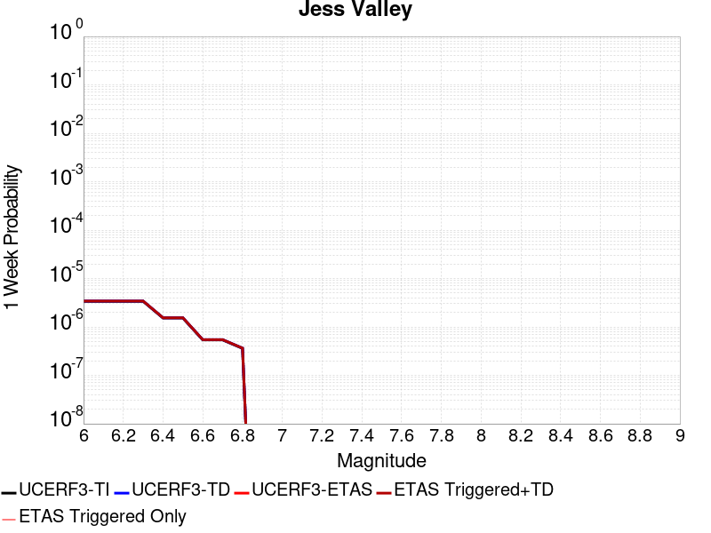 | 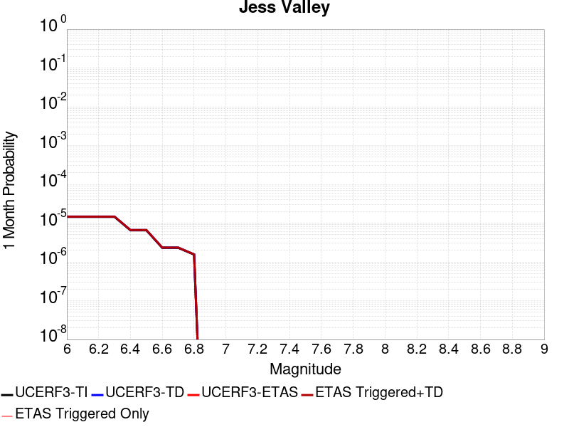 | 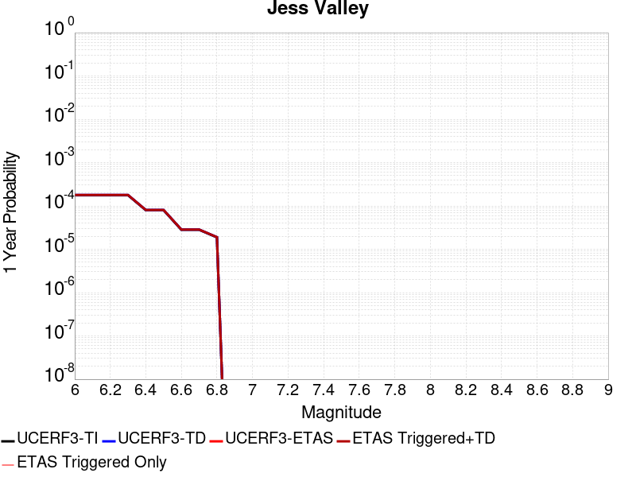 | 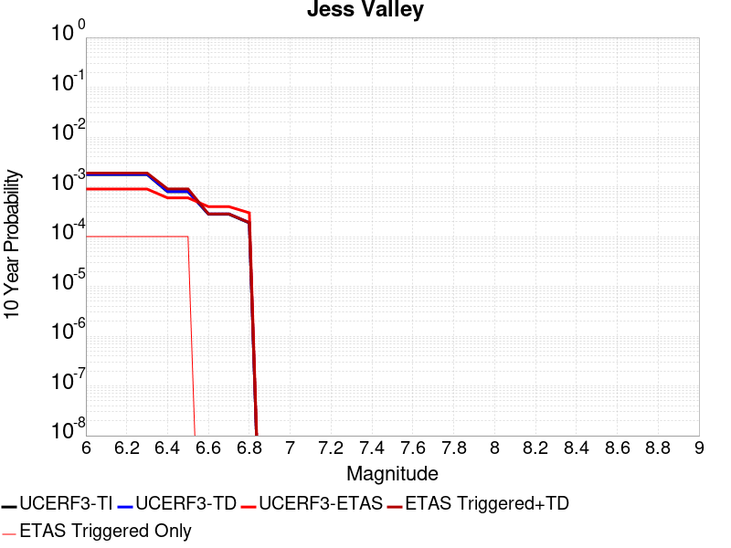 |

| Magnitude | 1 wk TI Prob | 1 wk TD Prob | 1 wk ETAS Prob | 1 wk ETAS/TD Gain | 1 wk ETAS Triggered+TD | 1 wk ETAS Triggered Only | 1 mo TI Prob | 1 mo TD Prob | 1 mo ETAS Prob | 1 mo ETAS/TD Gain | 1 mo ETAS Triggered+TD | 1 mo ETAS Triggered Only | 1 yr TI Prob | 1 yr TD Prob | 1 yr ETAS Prob | 1 yr ETAS/TD Gain | 1 yr ETAS Triggered+TD | 1 yr ETAS Triggered Only | 10 yr TI Prob | 10 yr TD Prob | 10 yr ETAS Prob | 10 yr ETAS/TD Gain | 10 yr ETAS Triggered+TD | 10 yr ETAS Triggered Only |
|-----|-----|-----|-----|-----|-----|-----|-----|-----|-----|-----|-----|-----|-----|-----|-----|-----|-----|-----|-----|-----|-----|-----|-----|-----|
| 6.0 | 3.3861274E-6 | 3.4335517E-6 | 0.0 | 0.0 | 3.4335517E-6 | 0.0 | 1.4511894E-5 | 1.4715154E-5 | 0.0 | 0.0 | 1.4715154E-5 | 0.0 | 1.7666799E-4 | 1.7914509E-4 | 0.0 | 0.0 | 1.7914509E-4 | 0.0 | 0.001765276 | 0.0017902832 | 9.0E-4 | 0.50271374 | 0.0018901041 | 1.0E-4 |
| 6.1 | 3.3861274E-6 | 3.4335517E-6 | 0.0 | 0.0 | 3.4335517E-6 | 0.0 | 1.4511894E-5 | 1.4715154E-5 | 0.0 | 0.0 | 1.4715154E-5 | 0.0 | 1.7666799E-4 | 1.7914509E-4 | 0.0 | 0.0 | 1.7914509E-4 | 0.0 | 0.001765276 | 0.0017902832 | 9.0E-4 | 0.50271374 | 0.0018901041 | 1.0E-4 |
| 6.2 | 3.3861274E-6 | 3.4335517E-6 | 0.0 | 0.0 | 3.4335517E-6 | 0.0 | 1.4511894E-5 | 1.4715154E-5 | 0.0 | 0.0 | 1.4715154E-5 | 0.0 | 1.7666799E-4 | 1.7914509E-4 | 0.0 | 0.0 | 1.7914509E-4 | 0.0 | 0.001765276 | 0.0017902832 | 9.0E-4 | 0.50271374 | 0.0018901041 | 1.0E-4 |
| 6.3 | 3.3861274E-6 | 3.4335517E-6 | 0.0 | 0.0 | 3.4335517E-6 | 0.0 | 1.4511894E-5 | 1.4715154E-5 | 0.0 | 0.0 | 1.4715154E-5 | 0.0 | 1.7666799E-4 | 1.7914509E-4 | 0.0 | 0.0 | 1.7914509E-4 | 0.0 | 0.001765276 | 0.0017902832 | 9.0E-4 | 0.50271374 | 0.0018901041 | 1.0E-4 |
| 6.4 | 1.5291708E-6 | 1.550055E-6 | 0.0 | 0.0 | 1.550055E-6 | 0.0 | 6.553573E-6 | 6.6430803E-6 | 0.0 | 0.0 | 6.6430803E-6 | 0.0 | 7.978683E-5 | 8.08773E-5 | 0.0 | 0.0 | 8.08773E-5 | 0.0 | 7.975819E-4 | 8.0855686E-4 | 6.0E-4 | 0.74206287 | 9.08476E-4 | 1.0E-4 |
| 6.5 | 1.5291708E-6 | 1.550055E-6 | 0.0 | 0.0 | 1.550055E-6 | 0.0 | 6.553573E-6 | 6.6430803E-6 | 0.0 | 0.0 | 6.6430803E-6 | 0.0 | 7.978683E-5 | 8.08773E-5 | 0.0 | 0.0 | 8.08773E-5 | 0.0 | 7.975819E-4 | 8.0855686E-4 | 6.0E-4 | 0.74206287 | 9.08476E-4 | 1.0E-4 |
| 6.6 | 5.396423E-7 | 5.4711955E-7 | 0.0 | 0.0 | 5.4711955E-7 | 0.0 | 2.312751E-6 | 2.344797E-6 | 0.0 | 0.0 | 2.344797E-6 | 0.0 | 2.8157378E-5 | 2.8547716E-5 | 0.0 | 0.0 | 2.8547716E-5 | 0.0 | 2.8153812E-4 | 2.854589E-4 | 4.0E-4 | 1.4012525 | 2.854589E-4 | 0.0 |
| 6.7 | 5.396423E-7 | 5.4711955E-7 | 0.0 | 0.0 | 5.4711955E-7 | 0.0 | 2.312751E-6 | 2.344797E-6 | 0.0 | 0.0 | 2.344797E-6 | 0.0 | 2.8157378E-5 | 2.8547716E-5 | 0.0 | 0.0 | 2.8547716E-5 | 0.0 | 2.8153812E-4 | 2.854589E-4 | 4.0E-4 | 1.4012525 | 2.854589E-4 | 0.0 |
| 6.8 | 3.6058395E-7 | 3.6557725E-7 | 0.0 | 0.0 | 3.6557725E-7 | 0.0 | 1.5453588E-6 | 1.5667596E-6 | 0.0 | 0.0 | 1.5667596E-6 | 0.0 | 1.8814582E-5 | 1.9075298E-5 | 0.0 | 0.0 | 1.9075298E-5 | 0.0 | 1.8812988E-4 | 1.9075298E-4 | 3.0E-4 | 1.5727146 | 1.9075298E-4 | 0.0 |

## San Luis Range - Oceano 2011 CFM
*[(top)](#table-of-contents)*

| 1 Week | 1 Month | 1 Year | 10 Year |
|-----|-----|-----|-----|
| 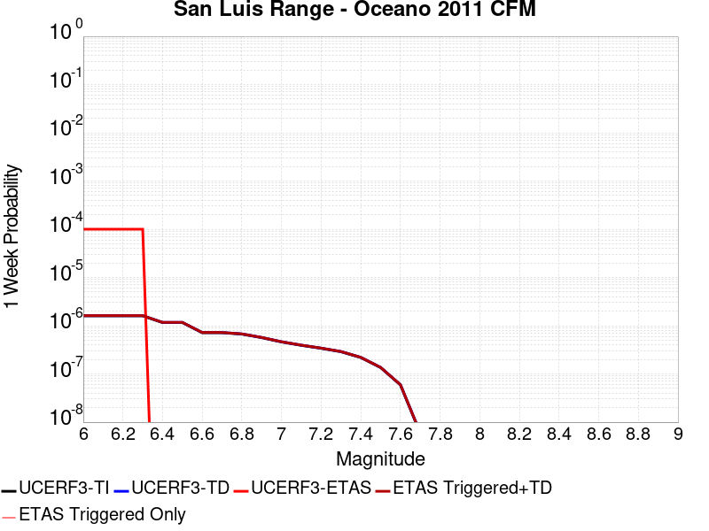 | 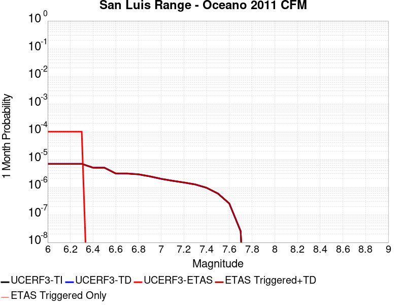 | 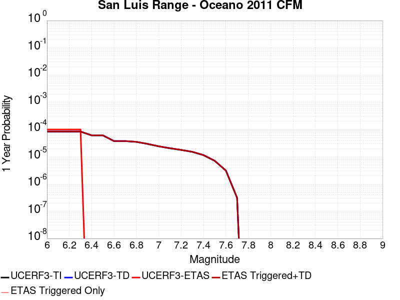 | 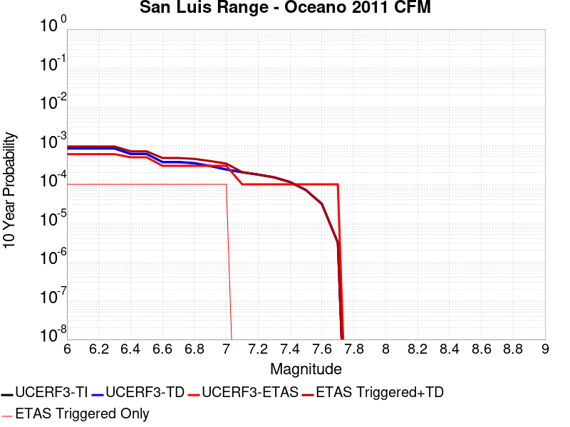 |

| Magnitude | 1 wk TI Prob | 1 wk TD Prob | 1 wk ETAS Prob | 1 wk ETAS/TD Gain | 1 wk ETAS Triggered+TD | 1 wk ETAS Triggered Only | 1 mo TI Prob | 1 mo TD Prob | 1 mo ETAS Prob | 1 mo ETAS/TD Gain | 1 mo ETAS Triggered+TD | 1 mo ETAS Triggered Only | 1 yr TI Prob | 1 yr TD Prob | 1 yr ETAS Prob | 1 yr ETAS/TD Gain | 1 yr ETAS Triggered+TD | 1 yr ETAS Triggered Only | 10 yr TI Prob | 10 yr TD Prob | 10 yr ETAS Prob | 10 yr ETAS/TD Gain | 10 yr ETAS Triggered+TD | 10 yr ETAS Triggered Only |
|-----|-----|-----|-----|-----|-----|-----|-----|-----|-----|-----|-----|-----|-----|-----|-----|-----|-----|-----|-----|-----|-----|-----|-----|-----|
| 6.0 | 1.6025788E-6 | 1.6199335E-6 | 1.0E-4 | 61.730927 | 1.6199335E-6 | 0.0 | 6.8681766E-6 | 6.9425564E-6 | 1.0E-4 | 14.403916 | 6.9425564E-6 | 0.0 | 8.361684E-5 | 8.452276E-5 | 1.0E-4 | 1.1831133 | 8.452276E-5 | 0.0 | 8.3585386E-4 | 8.449469E-4 | 6.0E-4 | 0.7101038 | 9.4486243E-4 | 1.0E-4 |
| 6.1 | 1.6025788E-6 | 1.6199335E-6 | 1.0E-4 | 61.730927 | 1.6199335E-6 | 0.0 | 6.8681766E-6 | 6.9425564E-6 | 1.0E-4 | 14.403916 | 6.9425564E-6 | 0.0 | 8.361684E-5 | 8.452276E-5 | 1.0E-4 | 1.1831133 | 8.452276E-5 | 0.0 | 8.3585386E-4 | 8.449469E-4 | 6.0E-4 | 0.7101038 | 9.4486243E-4 | 1.0E-4 |
| 6.2 | 1.6025788E-6 | 1.6199335E-6 | 1.0E-4 | 61.730927 | 1.6199335E-6 | 0.0 | 6.8681766E-6 | 6.9425564E-6 | 1.0E-4 | 14.403916 | 6.9425564E-6 | 0.0 | 8.361684E-5 | 8.452276E-5 | 1.0E-4 | 1.1831133 | 8.452276E-5 | 0.0 | 8.3585386E-4 | 8.449469E-4 | 6.0E-4 | 0.7101038 | 9.4486243E-4 | 1.0E-4 |
| 6.3 | 1.6025788E-6 | 1.6199335E-6 | 1.0E-4 | 61.730927 | 1.6199335E-6 | 0.0 | 6.8681766E-6 | 6.9425564E-6 | 1.0E-4 | 14.403916 | 6.9425564E-6 | 0.0 | 8.361684E-5 | 8.452276E-5 | 1.0E-4 | 1.1831133 | 8.452276E-5 | 0.0 | 8.3585386E-4 | 8.449469E-4 | 6.0E-4 | 0.7101038 | 9.4486243E-4 | 1.0E-4 |
| 6.4 | 1.1621186E-6 | 1.1748533E-6 | 0.0 | 0.0 | 1.1748533E-6 | 0.0 | 4.980499E-6 | 5.0350773E-6 | 0.0 | 0.0 | 5.0350773E-6 | 0.0 | 6.0635884E-5 | 6.130061E-5 | 0.0 | 0.0 | 6.130061E-5 | 0.0 | 6.0619344E-4 | 6.1286363E-4 | 5.0E-4 | 0.81584215 | 7.1280234E-4 | 1.0E-4 |
| 6.5 | 1.1621186E-6 | 1.1748533E-6 | 0.0 | 0.0 | 1.1748533E-6 | 0.0 | 4.980499E-6 | 5.0350773E-6 | 0.0 | 0.0 | 5.0350773E-6 | 0.0 | 6.0635884E-5 | 6.130061E-5 | 0.0 | 0.0 | 6.130061E-5 | 0.0 | 6.0619344E-4 | 6.1286363E-4 | 5.0E-4 | 0.81584215 | 7.1280234E-4 | 1.0E-4 |
| 6.6 | 7.164729E-7 | 7.24769E-7 | 0.0 | 0.0 | 7.24769E-7 | 0.0 | 3.0705946E-6 | 3.1061493E-6 | 0.0 | 0.0 | 3.1061493E-6 | 0.0 | 3.738385E-5 | 3.7816728E-5 | 0.0 | 0.0 | 3.7816728E-5 | 0.0 | 3.737756E-4 | 3.781047E-4 | 3.0E-4 | 0.79343104 | 4.7806688E-4 | 1.0E-4 |
| 6.7 | 7.164729E-7 | 7.24769E-7 | 0.0 | 0.0 | 7.24769E-7 | 0.0 | 3.0705946E-6 | 3.1061493E-6 | 0.0 | 0.0 | 3.1061493E-6 | 0.0 | 3.738385E-5 | 3.7816728E-5 | 0.0 | 0.0 | 3.7816728E-5 | 0.0 | 3.737756E-4 | 3.781047E-4 | 3.0E-4 | 0.79343104 | 4.7806688E-4 | 1.0E-4 |
| 6.8 | 6.700177E-7 | 6.776621E-7 | 0.0 | 0.0 | 6.776621E-7 | 0.0 | 2.8715012E-6 | 2.904263E-6 | 0.0 | 0.0 | 2.904263E-6 | 0.0 | 3.495997E-5 | 3.5358848E-5 | 0.0 | 0.0 | 3.5358848E-5 | 0.0 | 3.495447E-4 | 3.5353383E-4 | 3.0E-4 | 0.84857506 | 4.5349848E-4 | 1.0E-4 |
| 6.9 | 5.657865E-7 | 5.721109E-7 | 0.0 | 0.0 | 5.721109E-7 | 0.0 | 2.424797E-6 | 2.4519015E-6 | 0.0 | 0.0 | 2.4519015E-6 | 0.0 | 2.9521503E-5 | 2.9851504E-5 | 0.0 | 0.0 | 2.9851504E-5 | 0.0 | 2.9517582E-4 | 2.98476E-4 | 3.0E-4 | 1.005106 | 3.9844617E-4 | 1.0E-4 |
| 7.0 | 4.608413E-7 | 4.6596202E-7 | 0.0 | 0.0 | 4.6596202E-7 | 0.0 | 1.9750328E-6 | 1.9969787E-6 | 0.0 | 0.0 | 1.9969787E-6 | 0.0 | 2.4045758E-5 | 2.4312945E-5 | 0.0 | 0.0 | 2.4312945E-5 | 0.0 | 2.4043156E-4 | 2.4310315E-4 | 3.0E-4 | 1.2340441 | 3.4307883E-4 | 1.0E-4 |
| 7.1 | 3.9177846E-7 | 3.9616896E-7 | 0.0 | 0.0 | 3.9616896E-7 | 0.0 | 1.6790494E-6 | 1.6978659E-6 | 0.0 | 0.0 | 1.6978659E-6 | 0.0 | 2.0442236E-5 | 2.0671321E-5 | 0.0 | 0.0 | 2.0671321E-5 | 0.0 | 2.0440355E-4 | 2.0669414E-4 | 1.0E-4 | 0.48380664 | 2.0669414E-4 | 0.0 |
| 7.2 | 3.3974752E-7 | 3.436237E-7 | 0.0 | 0.0 | 3.436237E-7 | 0.0 | 1.45606E-6 | 1.4726722E-6 | 0.0 | 0.0 | 1.4726722E-6 | 0.0 | 1.7727387E-5 | 1.7929638E-5 | 0.0 | 0.0 | 1.7929638E-5 | 0.0 | 1.7725973E-4 | 1.7928203E-4 | 1.0E-4 | 0.5577804 | 1.7928203E-4 | 0.0 |
| 7.3 | 2.8900928E-7 | 2.923048E-7 | 0.0 | 0.0 | 2.923048E-7 | 0.0 | 1.2386106E-6 | 1.2527343E-6 | 0.0 | 0.0 | 1.2527343E-6 | 0.0 | 1.5079979E-5 | 1.5251934E-5 | 0.0 | 0.0 | 1.5251934E-5 | 0.0 | 1.5078956E-4 | 1.5250896E-4 | 1.0E-4 | 0.6556992 | 1.5250896E-4 | 0.0 |
| 7.4 | 2.1881527E-7 | 2.2136851E-7 | 0.0 | 0.0 | 2.2136851E-7 | 0.0 | 9.3777936E-7 | 9.4872183E-7 | 0.0 | 0.0 | 9.4872183E-7 | 0.0 | 1.14174045E-5 | 1.1550627E-5 | 0.0 | 0.0 | 1.1550627E-5 | 0.0 | 1.1416818E-4 | 1.1550033E-4 | 1.0E-4 | 0.8657984 | 1.1550033E-4 | 0.0 |
| 7.5 | 1.356398E-7 | 1.3716993E-7 | 0.0 | 0.0 | 1.3716993E-7 | 0.0 | 5.813133E-7 | 5.87871E-7 | 0.0 | 0.0 | 5.87871E-7 | 0.0 | 7.0774663E-6 | 7.1573063E-6 | 0.0 | 0.0 | 7.1573063E-6 | 0.0 | 7.077241E-5 | 7.157079E-5 | 1.0E-4 | 1.3972181 | 7.157079E-5 | 0.0 |
| 7.6 | 5.9269272E-8 | 6.00057E-8 | 0.0 | 0.0 | 6.00057E-8 | 0.0 | 2.5401116E-7 | 2.5716727E-7 | 0.0 | 0.0 | 2.5716727E-7 | 0.0 | 3.0925814E-6 | 3.1310071E-6 | 0.0 | 0.0 | 3.1310071E-6 | 0.0 | 3.0925385E-5 | 3.1309643E-5 | 1.0E-4 | 3.1939042 | 3.1309643E-5 | 0.0 |
| 7.7 | 5.946232E-9 | 6.035955E-9 | 0.0 | 0.0 | 6.035955E-9 | 0.0 | 2.5483851E-8 | 2.586838E-8 | 0.0 | 0.0 | 2.586838E-8 | 0.0 | 3.1026585E-7 | 3.1494747E-7 | 0.0 | 0.0 | 3.1494747E-7 | 0.0 | 3.102654E-6 | 3.1494712E-6 | 1.0E-4 | 31.751362 | 3.1494712E-6 | 0.0 |

## Anaheim
*[(top)](#table-of-contents)*

| 1 Week | 1 Month | 1 Year | 10 Year |
|-----|-----|-----|-----|
| 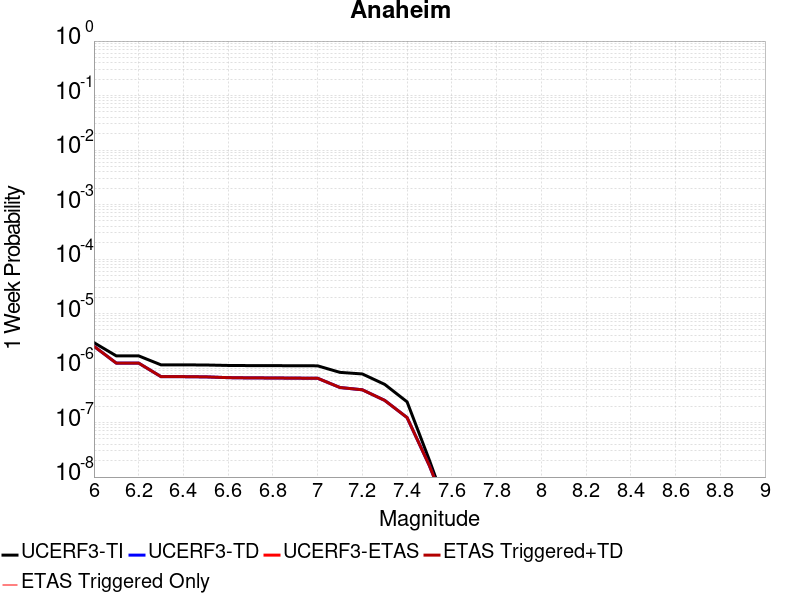 | 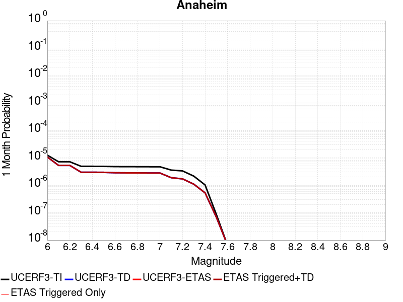 | 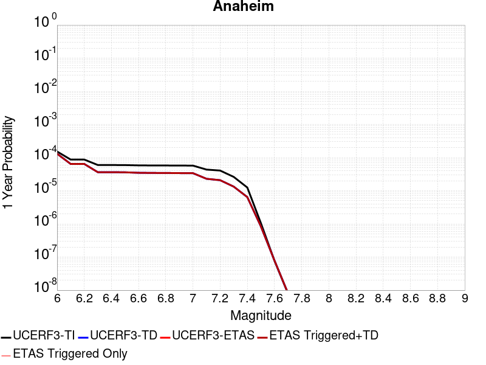 | 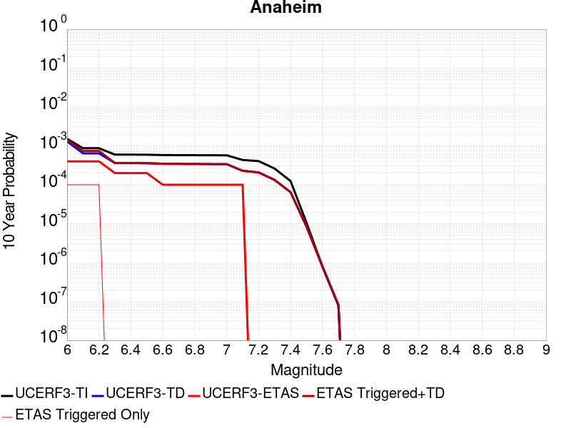 |

| Magnitude | 1 wk TI Prob | 1 wk TD Prob | 1 wk ETAS Prob | 1 wk ETAS/TD Gain | 1 wk ETAS Triggered+TD | 1 wk ETAS Triggered Only | 1 mo TI Prob | 1 mo TD Prob | 1 mo ETAS Prob | 1 mo ETAS/TD Gain | 1 mo ETAS Triggered+TD | 1 mo ETAS Triggered Only | 1 yr TI Prob | 1 yr TD Prob | 1 yr ETAS Prob | 1 yr ETAS/TD Gain | 1 yr ETAS Triggered+TD | 1 yr ETAS Triggered Only | 10 yr TI Prob | 10 yr TD Prob | 10 yr ETAS Prob | 10 yr ETAS/TD Gain | 10 yr ETAS Triggered+TD | 10 yr ETAS Triggered Only |
|-----|-----|-----|-----|-----|-----|-----|-----|-----|-----|-----|-----|-----|-----|-----|-----|-----|-----|-----|-----|-----|-----|-----|-----|-----|
| 6.0 | 2.9254998E-6 | 2.5109766E-6 | 0.0 | 0.0 | 2.5109766E-6 | 0.0 | 1.25377965E-5 | 1.0761297E-5 | 0.0 | 0.0 | 1.0761297E-5 | 0.0 | 1.5263697E-4 | 1.3101326E-4 | 0.0 | 0.0 | 1.3101326E-4 | 0.0 | 0.0015253217 | 0.0013095903 | 4.0E-4 | 0.30543903 | 0.0014094594 | 1.0E-4 |
| 6.1 | 1.6729715E-6 | 1.2327025E-6 | 0.0 | 0.0 | 1.2327025E-6 | 0.0 | 7.1698582E-6 | 5.2830023E-6 | 0.0 | 0.0 | 5.2830023E-6 | 0.0 | 8.7289525E-5 | 6.431907E-5 | 0.0 | 0.0 | 6.431907E-5 | 0.0 | 8.7255245E-4 | 6.4304547E-4 | 4.0E-4 | 0.62204 | 7.4298115E-4 | 1.0E-4 |
| 6.2 | 1.6729715E-6 | 1.2327025E-6 | 0.0 | 0.0 | 1.2327025E-6 | 0.0 | 7.1698582E-6 | 5.2830023E-6 | 0.0 | 0.0 | 5.2830023E-6 | 0.0 | 8.7289525E-5 | 6.431907E-5 | 0.0 | 0.0 | 6.431907E-5 | 0.0 | 8.7255245E-4 | 6.4304547E-4 | 4.0E-4 | 0.62204 | 7.4298115E-4 | 1.0E-4 |
| 6.3 | 1.1444064E-6 | 6.9503216E-7 | 0.0 | 0.0 | 6.9503216E-7 | 0.0 | 4.9045893E-6 | 2.978706E-6 | 0.0 | 0.0 | 2.978706E-6 | 0.0 | 5.971174E-5 | 3.62652E-5 | 0.0 | 0.0 | 3.62652E-5 | 0.0 | 5.96957E-4 | 3.625983E-4 | 2.0E-4 | 0.5515746 | 3.625983E-4 | 0.0 |
| 6.4 | 1.1444064E-6 | 6.9503216E-7 | 0.0 | 0.0 | 6.9503216E-7 | 0.0 | 4.9045893E-6 | 2.978706E-6 | 0.0 | 0.0 | 2.978706E-6 | 0.0 | 5.971174E-5 | 3.62652E-5 | 0.0 | 0.0 | 3.62652E-5 | 0.0 | 5.96957E-4 | 3.625983E-4 | 2.0E-4 | 0.5515746 | 3.625983E-4 | 0.0 |
| 6.5 | 1.1385318E-6 | 6.891011E-7 | 0.0 | 0.0 | 6.891011E-7 | 0.0 | 4.879413E-6 | 2.9532873E-6 | 0.0 | 0.0 | 2.9532873E-6 | 0.0 | 5.9405233E-5 | 3.5955738E-5 | 0.0 | 0.0 | 3.5955738E-5 | 0.0 | 5.938936E-4 | 3.595047E-4 | 2.0E-4 | 0.55632097 | 3.595047E-4 | 0.0 |
| 6.6 | 1.1165511E-6 | 6.668907E-7 | 0.0 | 0.0 | 6.668907E-7 | 0.0 | 4.78521E-6 | 2.8581E-6 | 0.0 | 0.0 | 2.8581E-6 | 0.0 | 5.8258374E-5 | 3.4796867E-5 | 0.0 | 0.0 | 3.4796867E-5 | 0.0 | 5.8243104E-4 | 3.4791962E-4 | 1.0E-4 | 0.28742272 | 3.4791962E-4 | 0.0 |
| 6.7 | 1.1098243E-6 | 6.601107E-7 | 0.0 | 0.0 | 6.601107E-7 | 0.0 | 4.7563813E-6 | 2.829043E-6 | 0.0 | 0.0 | 2.829043E-6 | 0.0 | 5.7907404E-5 | 3.444311E-5 | 0.0 | 0.0 | 3.444311E-5 | 0.0 | 5.7892315E-4 | 3.4438312E-4 | 1.0E-4 | 0.29037428 | 3.4438312E-4 | 0.0 |
| 6.8 | 1.1077587E-6 | 6.580311E-7 | 0.0 | 0.0 | 6.580311E-7 | 0.0 | 4.7475287E-6 | 2.8201307E-6 | 0.0 | 0.0 | 2.8201307E-6 | 0.0 | 5.779963E-5 | 3.4334604E-5 | 0.0 | 0.0 | 3.4334604E-5 | 0.0 | 5.77846E-4 | 3.4329842E-4 | 1.0E-4 | 0.29129174 | 3.4329842E-4 | 0.0 |
| 6.9 | 1.1024468E-6 | 6.5268915E-7 | 0.0 | 0.0 | 6.5268915E-7 | 0.0 | 4.7247636E-6 | 2.7972364E-6 | 0.0 | 0.0 | 2.7972364E-6 | 0.0 | 5.752248E-5 | 3.4055876E-5 | 0.0 | 0.0 | 3.4055876E-5 | 0.0 | 5.750759E-4 | 3.40512E-4 | 1.0E-4 | 0.2936754 | 3.40512E-4 | 0.0 |
| 7.0 | 1.0993066E-6 | 6.5010045E-7 | 0.0 | 0.0 | 6.5010045E-7 | 0.0 | 4.7113053E-6 | 2.786142E-6 | 0.0 | 0.0 | 2.786142E-6 | 0.0 | 5.7358633E-5 | 3.3920805E-5 | 0.0 | 0.0 | 3.3920805E-5 | 0.0 | 5.734383E-4 | 3.3916172E-4 | 1.0E-4 | 0.2948446 | 3.3916172E-4 | 0.0 |
| 7.1 | 8.334877E-7 | 4.3970527E-7 | 0.0 | 0.0 | 4.3970527E-7 | 0.0 | 3.5720855E-6 | 1.88445E-6 | 0.0 | 0.0 | 1.88445E-6 | 0.0 | 4.348927E-5 | 2.2942959E-5 | 0.0 | 0.0 | 2.2942959E-5 | 0.0 | 4.3480762E-4 | 2.2940812E-4 | 1.0E-4 | 0.43590435 | 2.2940812E-4 | 0.0 |
| 7.2 | 7.794411E-7 | 3.9903873E-7 | 0.0 | 0.0 | 3.9903873E-7 | 0.0 | 3.3404576E-6 | 1.710165E-6 | 0.0 | 0.0 | 1.710165E-6 | 0.0 | 4.0669314E-5 | 2.082108E-5 | 0.0 | 0.0 | 2.082108E-5 | 0.0 | 4.066187E-4 | 2.0819333E-4 | 0.0 | 0.0 | 2.0819333E-4 | 0.0 |
| 7.3 | 5.01704E-7 | 2.552751E-7 | 0.0 | 0.0 | 2.552751E-7 | 0.0 | 2.150158E-6 | 1.0940357E-6 | 0.0 | 0.0 | 1.0940357E-6 | 0.0 | 2.617786E-5 | 1.3319816E-5 | 0.0 | 0.0 | 1.3319816E-5 | 0.0 | 2.6174777E-4 | 1.3319142E-4 | 0.0 | 0.0 | 1.3319142E-4 | 0.0 |
| 7.4 | 2.4008182E-7 | 1.2346648E-7 | 0.0 | 0.0 | 1.2346648E-7 | 0.0 | 1.0289217E-6 | 5.29142E-7 | 0.0 | 0.0 | 5.29142E-7 | 0.0 | 1.252705E-5 | 6.4422925E-6 | 0.0 | 0.0 | 6.4422925E-6 | 0.0 | 1.2526344E-4 | 6.4421816E-5 | 0.0 | 0.0 | 6.4421816E-5 | 0.0 |
| 7.5 | 2.0263876E-8 | 1.6112283E-8 | 0.0 | 0.0 | 1.6112283E-8 | 0.0 | 8.684518E-8 | 6.9052646E-8 | 0.0 | 0.0 | 6.9052646E-8 | 0.0 | 1.0573395E-6 | 8.407157E-7 | 0.0 | 0.0 | 8.407157E-7 | 0.0 | 1.0573345E-5 | 8.407134E-6 | 0.0 | 0.0 | 8.407134E-6 | 0.0 |
| 7.6 | 1.4871431E-9 | 1.5081927E-9 | 0.0 | 0.0 | 1.5081927E-9 | 0.0 | 6.37347E-9 | 6.463683E-9 | 0.0 | 0.0 | 6.463683E-9 | 0.0 | 7.7596994E-8 | 7.869534E-8 | 0.0 | 0.0 | 7.869534E-8 | 0.0 | 7.759697E-7 | 7.869531E-7 | 0.0 | 0.0 | 7.869531E-7 | 0.0 |
| 7.7 | 1.5093293E-10 | 1.5330981E-10 | 0.0 | 0.0 | 1.5330981E-10 | 0.0 | 6.4685546E-10 | 6.57042E-10 | 0.0 | 0.0 | 6.57042E-10 | 0.0 | 7.875465E-9 | 7.999484E-9 | 0.0 | 0.0 | 7.999484E-9 | 0.0 | 7.8754645E-8 | 7.999483E-8 | 0.0 | 0.0 | 7.999483E-8 | 0.0 |

## Santa Monica Bay
*[(top)](#table-of-contents)*

| 1 Week | 1 Month | 1 Year | 10 Year |
|-----|-----|-----|-----|
| 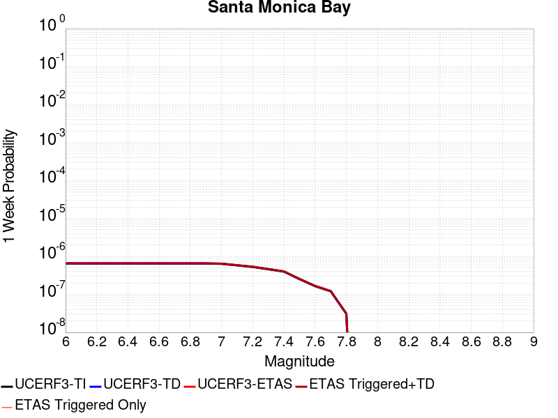 | 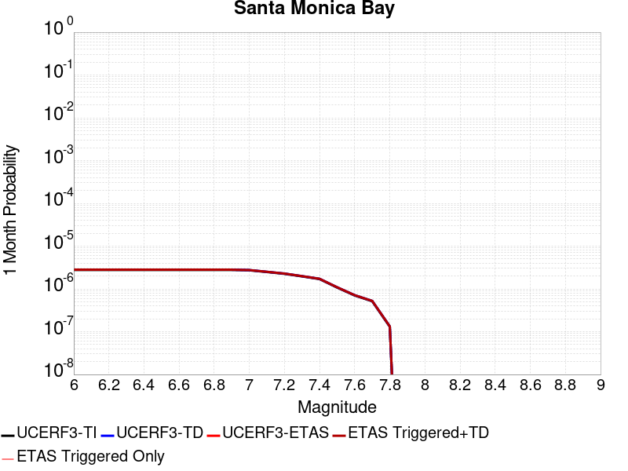 | 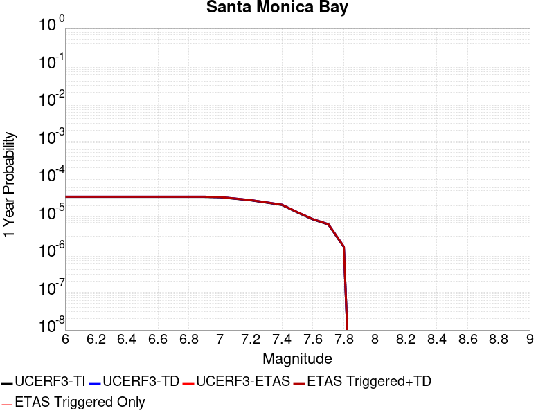 | 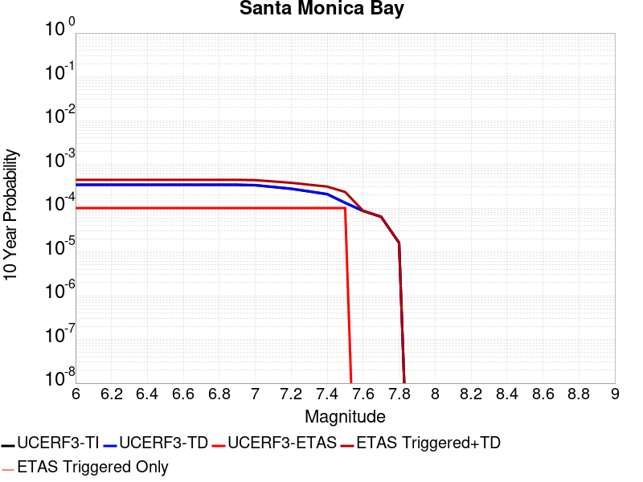 |

| Magnitude | 1 wk TI Prob | 1 wk TD Prob | 1 wk ETAS Prob | 1 wk ETAS/TD Gain | 1 wk ETAS Triggered+TD | 1 wk ETAS Triggered Only | 1 mo TI Prob | 1 mo TD Prob | 1 mo ETAS Prob | 1 mo ETAS/TD Gain | 1 mo ETAS Triggered+TD | 1 mo ETAS Triggered Only | 1 yr TI Prob | 1 yr TD Prob | 1 yr ETAS Prob | 1 yr ETAS/TD Gain | 1 yr ETAS Triggered+TD | 1 yr ETAS Triggered Only | 10 yr TI Prob | 10 yr TD Prob | 10 yr ETAS Prob | 10 yr ETAS/TD Gain | 10 yr ETAS Triggered+TD | 10 yr ETAS Triggered Only |
|-----|-----|-----|-----|-----|-----|-----|-----|-----|-----|-----|-----|-----|-----|-----|-----|-----|-----|-----|-----|-----|-----|-----|-----|-----|
| 6.0 | 6.493459E-7 | 6.5700857E-7 | 0.0 | 0.0 | 6.5700857E-7 | 0.0 | 2.782908E-6 | 2.815748E-6 | 0.0 | 0.0 | 2.815748E-6 | 0.0 | 3.388138E-5 | 3.4281213E-5 | 0.0 | 0.0 | 3.4281213E-5 | 0.0 | 3.3876215E-4 | 3.4276102E-4 | 1.0E-4 | 0.29174846 | 4.4272677E-4 | 1.0E-4 |
| 6.1 | 6.493459E-7 | 6.5700857E-7 | 0.0 | 0.0 | 6.5700857E-7 | 0.0 | 2.782908E-6 | 2.815748E-6 | 0.0 | 0.0 | 2.815748E-6 | 0.0 | 3.388138E-5 | 3.4281213E-5 | 0.0 | 0.0 | 3.4281213E-5 | 0.0 | 3.3876215E-4 | 3.4276102E-4 | 1.0E-4 | 0.29174846 | 4.4272677E-4 | 1.0E-4 |
| 6.2 | 6.493459E-7 | 6.5700857E-7 | 0.0 | 0.0 | 6.5700857E-7 | 0.0 | 2.782908E-6 | 2.815748E-6 | 0.0 | 0.0 | 2.815748E-6 | 0.0 | 3.388138E-5 | 3.4281213E-5 | 0.0 | 0.0 | 3.4281213E-5 | 0.0 | 3.3876215E-4 | 3.4276102E-4 | 1.0E-4 | 0.29174846 | 4.4272677E-4 | 1.0E-4 |
| 6.3 | 6.493459E-7 | 6.5700857E-7 | 0.0 | 0.0 | 6.5700857E-7 | 0.0 | 2.782908E-6 | 2.815748E-6 | 0.0 | 0.0 | 2.815748E-6 | 0.0 | 3.388138E-5 | 3.4281213E-5 | 0.0 | 0.0 | 3.4281213E-5 | 0.0 | 3.3876215E-4 | 3.4276102E-4 | 1.0E-4 | 0.29174846 | 4.4272677E-4 | 1.0E-4 |
| 6.4 | 6.493459E-7 | 6.5700857E-7 | 0.0 | 0.0 | 6.5700857E-7 | 0.0 | 2.782908E-6 | 2.815748E-6 | 0.0 | 0.0 | 2.815748E-6 | 0.0 | 3.388138E-5 | 3.4281213E-5 | 0.0 | 0.0 | 3.4281213E-5 | 0.0 | 3.3876215E-4 | 3.4276102E-4 | 1.0E-4 | 0.29174846 | 4.4272677E-4 | 1.0E-4 |
| 6.5 | 6.493459E-7 | 6.5700857E-7 | 0.0 | 0.0 | 6.5700857E-7 | 0.0 | 2.782908E-6 | 2.815748E-6 | 0.0 | 0.0 | 2.815748E-6 | 0.0 | 3.388138E-5 | 3.4281213E-5 | 0.0 | 0.0 | 3.4281213E-5 | 0.0 | 3.3876215E-4 | 3.4276102E-4 | 1.0E-4 | 0.29174846 | 4.4272677E-4 | 1.0E-4 |
| 6.6 | 6.493459E-7 | 6.5700857E-7 | 0.0 | 0.0 | 6.5700857E-7 | 0.0 | 2.782908E-6 | 2.815748E-6 | 0.0 | 0.0 | 2.815748E-6 | 0.0 | 3.388138E-5 | 3.4281213E-5 | 0.0 | 0.0 | 3.4281213E-5 | 0.0 | 3.3876215E-4 | 3.4276102E-4 | 1.0E-4 | 0.29174846 | 4.4272677E-4 | 1.0E-4 |
| 6.7 | 6.493459E-7 | 6.5700857E-7 | 0.0 | 0.0 | 6.5700857E-7 | 0.0 | 2.782908E-6 | 2.815748E-6 | 0.0 | 0.0 | 2.815748E-6 | 0.0 | 3.388138E-5 | 3.4281213E-5 | 0.0 | 0.0 | 3.4281213E-5 | 0.0 | 3.3876215E-4 | 3.4276102E-4 | 1.0E-4 | 0.29174846 | 4.4272677E-4 | 1.0E-4 |
| 6.8 | 6.493459E-7 | 6.5700857E-7 | 0.0 | 0.0 | 6.5700857E-7 | 0.0 | 2.782908E-6 | 2.815748E-6 | 0.0 | 0.0 | 2.815748E-6 | 0.0 | 3.388138E-5 | 3.4281213E-5 | 0.0 | 0.0 | 3.4281213E-5 | 0.0 | 3.3876215E-4 | 3.4276102E-4 | 1.0E-4 | 0.29174846 | 4.4272677E-4 | 1.0E-4 |
| 6.9 | 6.493459E-7 | 6.5700857E-7 | 0.0 | 0.0 | 6.5700857E-7 | 0.0 | 2.782908E-6 | 2.815748E-6 | 0.0 | 0.0 | 2.815748E-6 | 0.0 | 3.388138E-5 | 3.4281213E-5 | 0.0 | 0.0 | 3.4281213E-5 | 0.0 | 3.3876215E-4 | 3.4276102E-4 | 1.0E-4 | 0.29174846 | 4.4272677E-4 | 1.0E-4 |
| 7.0 | 6.3621707E-7 | 6.4381584E-7 | 0.0 | 0.0 | 6.4381584E-7 | 0.0 | 2.726642E-6 | 2.7592077E-6 | 0.0 | 0.0 | 2.7592077E-6 | 0.0 | 3.319636E-5 | 3.3592856E-5 | 0.0 | 0.0 | 3.3592856E-5 | 0.0 | 3.31914E-4 | 3.3587957E-4 | 1.0E-4 | 0.29772577 | 4.3584596E-4 | 1.0E-4 |
| 7.1 | 5.796316E-7 | 5.868724E-7 | 0.0 | 0.0 | 5.868724E-7 | 0.0 | 2.4841331E-6 | 2.515165E-6 | 0.0 | 0.0 | 2.515165E-6 | 0.0 | 3.0243902E-5 | 3.062172E-5 | 0.0 | 0.0 | 3.062172E-5 | 0.0 | 3.0239785E-4 | 3.0617657E-4 | 1.0E-4 | 0.32660893 | 4.0614596E-4 | 1.0E-4 |
| 7.2 | 5.2654514E-7 | 5.333992E-7 | 0.0 | 0.0 | 5.333992E-7 | 0.0 | 2.25662E-6 | 2.2859947E-6 | 0.0 | 0.0 | 2.2859947E-6 | 0.0 | 2.7474003E-5 | 2.7831644E-5 | 0.0 | 0.0 | 2.7831644E-5 | 0.0 | 2.7470608E-4 | 2.78283E-4 | 1.0E-4 | 0.35934642 | 3.7825518E-4 | 1.0E-4 |
| 7.3 | 4.582996E-7 | 4.645649E-7 | 0.0 | 0.0 | 4.645649E-7 | 0.0 | 1.9641398E-6 | 1.990991E-6 | 0.0 | 0.0 | 1.990991E-6 | 0.0 | 2.3913139E-5 | 2.4240058E-5 | 0.0 | 0.0 | 2.4240058E-5 | 0.0 | 2.3910566E-4 | 2.4237538E-4 | 1.0E-4 | 0.41258314 | 3.4235115E-4 | 1.0E-4 |
| 7.4 | 3.9690556E-7 | 4.0255134E-7 | 0.0 | 0.0 | 4.0255134E-7 | 0.0 | 1.7010227E-6 | 1.7252189E-6 | 0.0 | 0.0 | 1.7252189E-6 | 0.0 | 2.0709755E-5 | 2.1004349E-5 | 0.0 | 0.0 | 2.1004349E-5 | 0.0 | 2.0707825E-4 | 2.1002478E-4 | 1.0E-4 | 0.47613427 | 3.100038E-4 | 1.0E-4 |
| 7.5 | 2.514765E-7 | 2.5536687E-7 | 0.0 | 0.0 | 2.5536687E-7 | 0.0 | 1.077756E-6 | 1.094429E-6 | 0.0 | 0.0 | 1.094429E-6 | 0.0 | 1.31216E-5 | 1.3324598E-5 | 0.0 | 0.0 | 1.3324598E-5 | 0.0 | 1.3120825E-4 | 1.3323856E-4 | 1.0E-4 | 0.7505335 | 2.3322523E-4 | 1.0E-4 |
| 7.6 | 1.6412821E-7 | 1.6687189E-7 | 0.0 | 0.0 | 1.6687189E-7 | 0.0 | 7.0340644E-7 | 7.15165E-7 | 0.0 | 0.0 | 7.15165E-7 | 0.0 | 8.563939E-6 | 8.707099E-6 | 0.0 | 0.0 | 8.707099E-6 | 0.0 | 8.56361E-5 | 8.706764E-5 | 0.0 | 0.0 | 8.706764E-5 | 0.0 |
| 7.7 | 1.2030355E-7 | 1.2241027E-7 | 0.0 | 0.0 | 1.2241027E-7 | 0.0 | 5.155865E-7 | 5.2461536E-7 | 0.0 | 0.0 | 5.2461536E-7 | 0.0 | 6.277248E-6 | 6.3871735E-6 | 0.0 | 0.0 | 6.3871735E-6 | 0.0 | 6.2770705E-5 | 6.386994E-5 | 0.0 | 0.0 | 6.386994E-5 | 0.0 |
| 7.8 | 3.0539674E-8 | 3.111765E-8 | 0.0 | 0.0 | 3.111765E-8 | 0.0 | 1.308843E-7 | 1.3336135E-7 | 0.0 | 0.0 | 1.3336135E-7 | 0.0 | 1.5935152E-6 | 1.6236735E-6 | 0.0 | 0.0 | 1.6236735E-6 | 0.0 | 1.5935038E-5 | 1.6236636E-5 | 0.0 | 0.0 | 1.6236636E-5 | 0.0 |

## Dog Valley
*[(top)](#table-of-contents)*

| 1 Week | 1 Month | 1 Year | 10 Year |
|-----|-----|-----|-----|
|  | 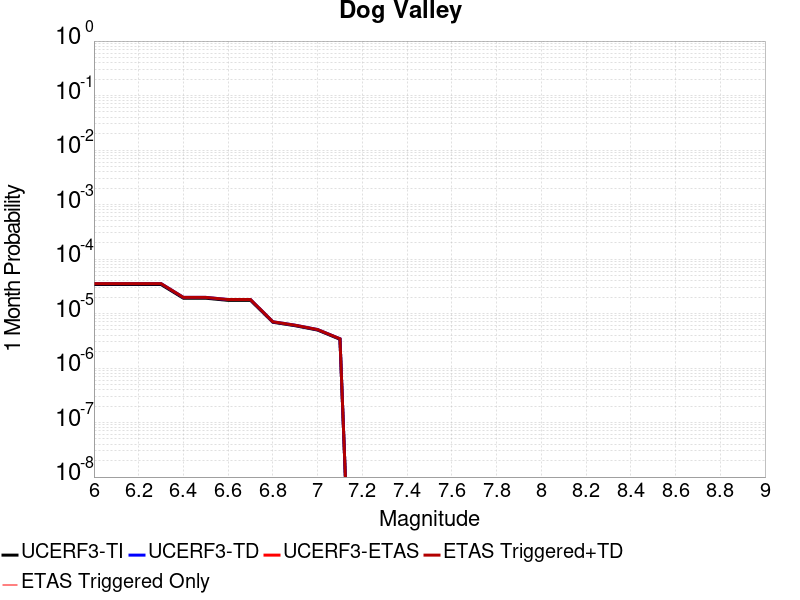 | 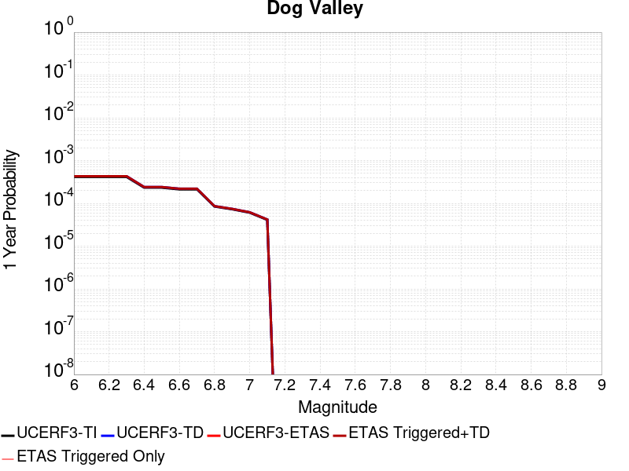 |  |

| Magnitude | 1 wk TI Prob | 1 wk TD Prob | 1 wk ETAS Prob | 1 wk ETAS/TD Gain | 1 wk ETAS Triggered+TD | 1 wk ETAS Triggered Only | 1 mo TI Prob | 1 mo TD Prob | 1 mo ETAS Prob | 1 mo ETAS/TD Gain | 1 mo ETAS Triggered+TD | 1 mo ETAS Triggered Only | 1 yr TI Prob | 1 yr TD Prob | 1 yr ETAS Prob | 1 yr ETAS/TD Gain | 1 yr ETAS Triggered+TD | 1 yr ETAS Triggered Only | 10 yr TI Prob | 10 yr TD Prob | 10 yr ETAS Prob | 10 yr ETAS/TD Gain | 10 yr ETAS Triggered+TD | 10 yr ETAS Triggered Only |
|-----|-----|-----|-----|-----|-----|-----|-----|-----|-----|-----|-----|-----|-----|-----|-----|-----|-----|-----|-----|-----|-----|-----|-----|-----|
| 6.0 | 7.949598E-6 | 8.272174E-6 | 0.0 | 0.0 | 8.272174E-6 | 0.0 | 3.4069257E-5 | 3.54518E-5 | 0.0 | 0.0 | 3.54518E-5 | 0.0 | 4.1471425E-4 | 4.315598E-4 | 0.0 | 0.0 | 4.315598E-4 | 0.0 | 0.0041394117 | 0.0043091457 | 0.0014 | 0.32489038 | 0.004408715 | 1.0E-4 |
| 6.1 | 7.949598E-6 | 8.272174E-6 | 0.0 | 0.0 | 8.272174E-6 | 0.0 | 3.4069257E-5 | 3.54518E-5 | 0.0 | 0.0 | 3.54518E-5 | 0.0 | 4.1471425E-4 | 4.315598E-4 | 0.0 | 0.0 | 4.315598E-4 | 0.0 | 0.0041394117 | 0.0043091457 | 0.0014 | 0.32489038 | 0.004408715 | 1.0E-4 |
| 6.2 | 7.949598E-6 | 8.272174E-6 | 0.0 | 0.0 | 8.272174E-6 | 0.0 | 3.4069257E-5 | 3.54518E-5 | 0.0 | 0.0 | 3.54518E-5 | 0.0 | 4.1471425E-4 | 4.315598E-4 | 0.0 | 0.0 | 4.315598E-4 | 0.0 | 0.0041394117 | 0.0043091457 | 0.0014 | 0.32489038 | 0.004408715 | 1.0E-4 |
| 6.3 | 7.949598E-6 | 8.272174E-6 | 0.0 | 0.0 | 8.272174E-6 | 0.0 | 3.4069257E-5 | 3.54518E-5 | 0.0 | 0.0 | 3.54518E-5 | 0.0 | 4.1471425E-4 | 4.315598E-4 | 0.0 | 0.0 | 4.315598E-4 | 0.0 | 0.0041394117 | 0.0043091457 | 0.0014 | 0.32489038 | 0.004408715 | 1.0E-4 |
| 6.4 | 4.462132E-6 | 4.6214154E-6 | 0.0 | 0.0 | 4.6214154E-6 | 0.0 | 1.9123283E-5 | 1.9805966E-5 | 0.0 | 0.0 | 1.9805966E-5 | 0.0 | 2.328011E-4 | 2.411199E-4 | 0.0 | 0.0 | 2.411199E-4 | 0.0 | 0.0023255737 | 0.002409459 | 6.0E-4 | 0.24901855 | 0.0025092182 | 1.0E-4 |
| 6.5 | 4.462132E-6 | 4.6214154E-6 | 0.0 | 0.0 | 4.6214154E-6 | 0.0 | 1.9123283E-5 | 1.9805966E-5 | 0.0 | 0.0 | 1.9805966E-5 | 0.0 | 2.328011E-4 | 2.411199E-4 | 0.0 | 0.0 | 2.411199E-4 | 0.0 | 0.0023255737 | 0.002409459 | 6.0E-4 | 0.24901855 | 0.0025092182 | 1.0E-4 |
| 6.6 | 4.074213E-6 | 4.2158235E-6 | 0.0 | 0.0 | 4.2158235E-6 | 0.0 | 1.7460794E-5 | 1.8067738E-5 | 0.0 | 0.0 | 1.8067738E-5 | 0.0 | 2.1256444E-4 | 2.199613E-4 | 0.0 | 0.0 | 2.199613E-4 | 0.0 | 0.0021236122 | 0.0021982966 | 5.0E-4 | 0.22744884 | 0.0021982966 | 0.0 |
| 6.7 | 4.074213E-6 | 4.2158235E-6 | 0.0 | 0.0 | 4.2158235E-6 | 0.0 | 1.7460794E-5 | 1.8067738E-5 | 0.0 | 0.0 | 1.8067738E-5 | 0.0 | 2.1256444E-4 | 2.199613E-4 | 0.0 | 0.0 | 2.199613E-4 | 0.0 | 0.0021236122 | 0.0021982966 | 5.0E-4 | 0.22744884 | 0.0021982966 | 0.0 |
| 6.8 | 1.6159543E-6 | 1.6499739E-6 | 0.0 | 0.0 | 1.6499739E-6 | 0.0 | 6.9255E-6 | 7.071301E-6 | 0.0 | 0.0 | 7.071301E-6 | 0.0 | 8.43147E-5 | 8.609024E-5 | 0.0 | 0.0 | 8.609024E-5 | 0.0 | 8.4282714E-4 | 8.606231E-4 | 1.0E-4 | 0.11619489 | 8.606231E-4 | 0.0 |
| 6.9 | 1.3952654E-6 | 1.4249674E-6 | 0.0 | 0.0 | 1.4249674E-6 | 0.0 | 5.9796953E-6 | 6.106992E-6 | 0.0 | 0.0 | 6.106992E-6 | 0.0 | 7.280036E-5 | 7.435057E-5 | 0.0 | 0.0 | 7.435057E-5 | 0.0 | 7.2776515E-4 | 7.4330496E-4 | 1.0E-4 | 0.13453428 | 7.4330496E-4 | 0.0 |
| 7.0 | 1.1619308E-6 | 1.1866858E-6 | 0.0 | 0.0 | 1.1866858E-6 | 0.0 | 4.979694E-6 | 5.085789E-6 | 0.0 | 0.0 | 5.085789E-6 | 0.0 | 6.0626087E-5 | 6.191817E-5 | 0.0 | 0.0 | 6.191817E-5 | 0.0 | 6.060955E-4 | 6.1905285E-4 | 1.0E-4 | 0.1615371 | 6.1905285E-4 | 0.0 |
| 7.1 | 7.8723247E-7 | 8.0451326E-7 | 0.0 | 0.0 | 8.0451326E-7 | 0.0 | 3.373849E-6 | 3.4479112E-6 | 0.0 | 0.0 | 3.4479112E-6 | 0.0 | 4.107584E-5 | 4.1977815E-5 | 0.0 | 0.0 | 4.1977815E-5 | 0.0 | 4.1068246E-4 | 4.1972872E-4 | 1.0E-4 | 0.23824912 | 4.1972872E-4 | 0.0 |

