# Parent Section Magnitude-Probability Distributions

Only fault sections with at least one triggered aftershock are plotted. Sections are sorted by total supraseismogenic trigger rate (decreasing)

## Table Of Contents

* [San Andreas (Parkfield)](#san-andreas-parkfield)
* [San Andreas (Creeping Section) 2011 CFM](#san-andreas-creeping-section-2011-cfm)
* [San Andreas (Mojave S)](#san-andreas-mojave-s)
* [Mendocino](#mendocino)
* [Cerro Prieto](#cerro-prieto)
* [Brawley (Seismic Zone) alt 1](#brawley-seismic-zone-alt-1)
* [Imperial](#imperial)
* [Hayward (So) 2011 CFM](#hayward-so-2011-cfm)
* [San Andreas (San Bernardino N)](#san-andreas-san-bernardino-n)
* [Elsinore (Glen Ivy) rev](#elsinore-glen-ivy-rev)
* [Calaveras (So) - Paicines extension 2011 CFM](#calaveras-so---paicines-extension-2011-cfm)
* [Hayward (So) extension 2011 CFM](#hayward-so-extension-2011-cfm)
* [San Andreas (Offshore) 2011 CFM](#san-andreas-offshore-2011-cfm)
* [San Andreas (Cholame) rev](#san-andreas-cholame-rev)
* [Calaveras (Central) 2011 CFM](#calaveras-central-2011-cfm)
* [Laguna Salada](#laguna-salada)
* [Hunting Creek - Berryessa 2011 CFM](#hunting-creek---berryessa-2011-cfm)
* [San Andreas (Carrizo) rev](#san-andreas-carrizo-rev)
* [Calaveras (So) 2011 CFM](#calaveras-so-2011-cfm)
* [San Andreas (San Bernardino S)](#san-andreas-san-bernardino-s)
* [San Andreas (Big Bend)](#san-andreas-big-bend)
* [San Andreas (Coachella) rev](#san-andreas-coachella-rev)
* [San Andreas (Mojave N)](#san-andreas-mojave-n)
* [Green Valley 2011 CFM](#green-valley-2011-cfm)
* [San Andreas (San Gorgonio Pass-Garnet HIll)](#san-andreas-san-gorgonio-pass-garnet-hill)
* [West Napa 2011 CFM](#west-napa-2011-cfm)
* [Hayward (No) 2011 CFM](#hayward-no-2011-cfm)
* [San Jacinto (Superstition Mtn)](#san-jacinto-superstition-mtn)
* [Ortigalita (North)](#ortigalita-north)
* [San Andreas (Santa Cruz Mts) 2011 CFM](#san-andreas-santa-cruz-mts-2011-cfm)
* [Maacama 2011 CFM](#maacama-2011-cfm)
* [Rodgers Creek - Healdsburg 2011 CFM](#rodgers-creek---healdsburg-2011-cfm)
* [Mission Ridge-Arroyo Parida-Santa Ana](#mission-ridge-arroyo-parida-santa-ana)
* [Elmore Ranch](#elmore-ranch)
* [Calaveras (No) 2011 CFM](#calaveras-no-2011-cfm)
* [Honey Lake 2011 CFM](#honey-lake-2011-cfm)
* [Santa Ynez (West)](#santa-ynez-west)
* [San Clemente](#san-clemente)
* [Calico-Hidalgo](#calico-hidalgo)
* [Eaton Roughs 2011 CFM](#eaton-roughs-2011-cfm)
* [Chino alt 1](#chino-alt-1)
* [Red Mountain](#red-mountain)
* [Owl Lake](#owl-lake)
* [San Andreas (North Coast) 2011 CFM](#san-andreas-north-coast-2011-cfm)
* [Concord 2011 CFM](#concord-2011-cfm)
* [Hunting Creek - Bartlett Springs connector 2011](#hunting-creek---bartlett-springs-connector-2011)
* [Cady](#cady)
* [Pinto Mtn](#pinto-mtn)
* [San Diego Trough south](#san-diego-trough-south)
* [Great Valley 09 (Laguna Seca)](#great-valley-09-laguna-seca)
* [Rose Canyon](#rose-canyon)
* [Garlock (East)](#garlock-east)
* [San Diego Trough north alt1](#san-diego-trough-north-alt1)
* [Great Valley 04b Gordon Valley](#great-valley-04b-gordon-valley)
* [Bartlett Springs 2011 CFM](#bartlett-springs-2011-cfm)
* [King Range 2011 CFM](#king-range-2011-cfm)
* [Garberville - Briceland 2011 CFM](#garberville---briceland-2011-cfm)
* [Bullion Mountains](#bullion-mountains)
* [Pisgah-Bullion Mtn-Mesquite Lk](#pisgah-bullion-mtn-mesquite-lk)
* [Whittier alt 1](#whittier-alt-1)
* [Coronado Bank alt1](#coronado-bank-alt1)
* [Greenville (No) 2011 CFM](#greenville-no-2011-cfm)
* [Monte Vista - Shannon 2011 CFM](#monte-vista---shannon-2011-cfm)
* [Almanor 2011 CFM](#almanor-2011-cfm)
* [Mission (connected) 2011 CFM](#mission-connected-2011-cfm)
* [Pleito](#pleito)
* [Santa Ynez (East)](#santa-ynez-east)
* [South Klamath Lake West](#south-klamath-lake-west)
* [Trinidad (alt1)](#trinidad-alt1)
* [Goldstone Lake](#goldstone-lake)
* [Ludlow](#ludlow)
* [South Klamath Lake East](#south-klamath-lake-east)
* [Coyote Canyon](#coyote-canyon)
* [Sargent 2011 CFM](#sargent-2011-cfm)
* [Tank Canyon](#tank-canyon)
* [Garlock (Central)](#garlock-central)
* [Great Valley 07 (Orestimba)](#great-valley-07-orestimba)
* [Bennett Valley 2011 CFM](#bennett-valley-2011-cfm)
* [White Mountains](#white-mountains)
* [Great Valley 03 Mysterious Ridge](#great-valley-03-mysterious-ridge)
* [Ortigalita (South)](#ortigalita-south)
* [Ventura-Pitas Point](#ventura-pitas-point)
* [Santa Cruz Island](#santa-cruz-island)
* [Santa Rosa Island](#santa-rosa-island)
* [Quien Sabe 2011 CFM](#quien-sabe-2011-cfm)
* [Gravel Hills-Harper Lk](#gravel-hills-harper-lk)
* [Palos Verdes](#palos-verdes)
* [Mount Diablo Thrust South](#mount-diablo-thrust-south)
* [Little Salmon (Onshore)](#little-salmon-onshore)
* [Great Valley 05 Pittsburg - Kirby Hills alt1](#great-valley-05-pittsburg---kirby-hills-alt1)
* [Surprise Valley 2011 CFM](#surprise-valley-2011-cfm)
* [Keddie Ridge 2011 CFM](#keddie-ridge-2011-cfm)
* [Elysian Park (Upper)](#elysian-park-upper)
* [San Pedro Basin](#san-pedro-basin)
* [Bicycle Lake](#bicycle-lake)
* [Greenville (So) 2011 CFM](#greenville-so-2011-cfm)
* [Cleghorn Pass](#cleghorn-pass)
* [Blue Cut](#blue-cut)
* [Lost Hills](#lost-hills)
* [San Jacinto (San Bernardino)](#san-jacinto-san-bernardino)
* [Monterey Bay-Tularcitos](#monterey-bay-tularcitos)
* [San Jacinto (Anza) rev](#san-jacinto-anza-rev)
* [Hunter Mountain-Saline Valley](#hunter-mountain-saline-valley)
* [Lenwood-Lockhart-Old Woman Springs](#lenwood-lockhart-old-woman-springs)
* [Oceanic - West Huasna](#oceanic---west-huasna)
* [Bear River fault zone](#bear-river-fault-zone)
* [McLean Lake](#mclean-lake)
* [Death Valley (So)](#death-valley-so)
* [San Gregorio (North) 2011 CFM](#san-gregorio-north-2011-cfm)
* [Santa Susana East (connector)](#santa-susana-east-connector)
* [San Jacinto (Borrego)](#san-jacinto-borrego)
* [Death Valley (Fish Lake Valley)](#death-valley-fish-lake-valley)
* [Garlic Springs](#garlic-springs)
* [Great Valley 03a Dunnigan Hills](#great-valley-03a-dunnigan-hills)
* [Nelson Lake](#nelson-lake)
* [San Jacinto (San Jacinto Valley) rev](#san-jacinto-san-jacinto-valley-rev)
* [Contra Costa Shear Zone (connector) 2011 CFM](#contra-costa-shear-zone-connector-2011-cfm)
* [Elsinore (Coyote Mountains)](#elsinore-coyote-mountains)
* [Big Lagoon - Bald Mtn 2011 CFM](#big-lagoon---bald-mtn-2011-cfm)
* [Cleghorn Lake](#cleghorn-lake)
* [Great Valley 04a Trout Creek](#great-valley-04a-trout-creek)
* [Hat Creek-McArthur-Mayfield](#hat-creek-mcarthur-mayfield)
* [Blackwater](#blackwater)
* [Santa Ynez River](#santa-ynez-river)
* [San Andreas (North Branch Mill Creek)](#san-andreas-north-branch-mill-creek)
* [San Jacinto (Stepovers Combined)](#san-jacinto-stepovers-combined)
* [Franklin 2011 CFM](#franklin-2011-cfm)
* [Mono Lake 2011 CFM](#mono-lake-2011-cfm)
* [Robinson Creek](#robinson-creek)
* [San Cayetano](#san-cayetano)
* [Great Valley 08 (Quinto)](#great-valley-08-quinto)
* [Earthquake Valley (So Extension)](#earthquake-valley-so-extension)
* [Hosgri](#hosgri)
* [Little Salmon (Offshore)](#little-salmon-offshore)
* [Carson Range (Genoa)](#carson-range-genoa)
* [Newport-Inglewood alt 1](#newport-inglewood-alt-1)
* [Pitas Point (Lower West)](#pitas-point-lower-west)
* [Raymond](#raymond)
* [Antelope Valley 2011](#antelope-valley-2011)
* [Santa Cruz Catalina Ridge alt1](#santa-cruz-catalina-ridge-alt1)
* [San Andreas (Peninsula) 2011 CFM](#san-andreas-peninsula-2011-cfm)
* [Superstition Hills](#superstition-hills)
* [Ash Hill](#ash-hill)
* [Panamint Valley](#panamint-valley)
* [Cedar Mtn-Mahogany Mtn](#cedar-mtn-mahogany-mtn)
* [Great Valley 06 (Midland) 2011 CFM alt1](#great-valley-06-midland-2011-cfm-alt1)
* [Channel Islands Thrust](#channel-islands-thrust)
* [McKinleyville (alt1)](#mckinleyville-alt1)
* [Oak Ridge (Onshore)](#oak-ridge-onshore)
* [Reliz 2011 CFM](#reliz-2011-cfm)
* [Manix-Afton Hills](#manix-afton-hills)
* [Santa Susana alt 1](#santa-susana-alt-1)
* [Garlock (West)](#garlock-west)
* [Paradise](#paradise)
* [Mission Creek](#mission-creek)
* [Coyote Lake](#coyote-lake)
* [Davis Creek](#davis-creek)
* [Mission Hills 2011](#mission-hills-2011)
* [Mount Diablo Thrust North CFM](#mount-diablo-thrust-north-cfm)
* [San Juan](#san-juan)
* [Collayami 2011 CFM](#collayami-2011-cfm)
* [Big Pine (Central)](#big-pine-central)
* [Gillem - Big Crack 2011 CFM](#gillem---big-crack-2011-cfm)
* [San Jacinto (Coyote Creek)](#san-jacinto-coyote-creek)
* [Great Valley 11](#great-valley-11)
* [Malibu Coast alt 1](#malibu-coast-alt-1)
* [Mad River (alt1)](#mad-river-alt1)
* [Death Valley (Black Mtns Frontal)](#death-valley-black-mtns-frontal)
* [Elsinore (Stepovers Combined)](#elsinore-stepovers-combined)
* [Likely 2011 CFM](#likely-2011-cfm)
* [Johnson Valley (No) 2011 rev](#johnson-valley-no-2011-rev)
* [Simi-Santa Rosa](#simi-santa-rosa)
* [Pittville 2011 CFM](#pittville-2011-cfm)
* [Cleghorn](#cleghorn)
* [West Tahoe](#west-tahoe)
* [San Gabriel](#san-gabriel)
* [North Frontal  (East)](#north-frontal--east)
* [Little Lake](#little-lake)
* [Death Valley (No)](#death-valley-no)
* [Earthquake Valley](#earthquake-valley)
* [Deep Springs](#deep-springs)
* [Table Bluff](#table-bluff)
* [Homestead Valley 2011](#homestead-valley-2011)
* [Hollywood](#hollywood)
* [Rinconada 2011 CFM](#rinconada-2011-cfm)
* [Helendale-So Lockhart](#helendale-so-lockhart)
* [Big Pine (East)](#big-pine-east)
* [Clayton](#clayton)
* [Burnt Mtn](#burnt-mtn)
* [Hartley Springs 2011 CFM](#hartley-springs-2011-cfm)
* [Owens Valley Keough Hot Springs](#owens-valley-keough-hot-springs)
* [So Sierra Nevada](#so-sierra-nevada)
* [Earthquake Valley (No  Extension)](#earthquake-valley-no--extension)
* [Sierra Nevada  (No Extension)](#sierra-nevada--no-extension)
* [Point Reyes 2011 CFM](#point-reyes-2011-cfm)
* [San Jacinto (Clark) rev](#san-jacinto-clark-rev)
* [Hector Mine](#hector-mine)
* [Cucamonga](#cucamonga)
* [Independence rev 2011](#independence-rev-2011)
* [Pitas Point (Lower)-Montalvo](#pitas-point-lower-montalvo)
* [Red Pass](#red-pass)
* [Elsinore (Temecula) rev](#elsinore-temecula-rev)
* [Eureka Peak](#eureka-peak)
* [Goose Lake 2011 CFM](#goose-lake-2011-cfm)
* [Rocky Ledge 2011 CFM](#rocky-ledge-2011-cfm)
* [Russ 2011 CFM](#russ-2011-cfm)
* [San Luis Range 2011 CFM](#san-luis-range-2011-cfm)
* [Redondo Canyon alt 1](#redondo-canyon-alt-1)
* [San Gorgonio Pass](#san-gorgonio-pass)
* [Channel Islands Western Deep Ramp](#channel-islands-western-deep-ramp)
* [Walker Spring 2011 CFM](#walker-spring-2011-cfm)
* [Great Valley 10 (Panoche)](#great-valley-10-panoche)
* [Emerson-Copper Mtn 2011](#emerson-copper-mtn-2011)
* [Pilarcitos 2011 CFM](#pilarcitos-2011-cfm)
* [Mohawk Valley 2011 CFM](#mohawk-valley-2011-cfm)
* [Clamshell-Sawpit](#clamshell-sawpit)
* [Thirty Mile Bank](#thirty-mile-bank)
* [Oceanside alt1](#oceanside-alt1)
* [San Gabriel (Extension)](#san-gabriel-extension)
* [Towne Pass](#towne-pass)
* [Polaris 2011 CFM](#polaris-2011-cfm)
* [Los Alamos 2011 CFM](#los-alamos-2011-cfm)
* [Peralta Hills](#peralta-hills)
* [Malibu Coast (Extension) alt 1](#malibu-coast-extension-alt-1)
* [Morales (East)](#morales-east)
* [Newport-Inglewood (Offshore)](#newport-inglewood-offshore)
* [Northridge](#northridge)
* [Fontana (Seismicity)](#fontana-seismicity)
* [Sierra Madre](#sierra-madre)
* [Swain Ravine - Spenceville](#swain-ravine---spenceville)
* [Del Valle](#del-valle)
* [Santa Monica alt 1](#santa-monica-alt-1)
* [Sheephole](#sheephole)
* [Contra Costa (Lafayette) 2011 CFM](#contra-costa-lafayette-2011-cfm)
* [Joshua Tree (Seismicity)](#joshua-tree-seismicity)
* [Las Positas](#las-positas)
* [North Frontal  (West)](#north-frontal--west)
* [Dry Mountain](#dry-mountain)
* [Airport Lake](#airport-lake)
* [Shoreline](#shoreline)
* [North Tahoe 2011 CFM](#north-tahoe-2011-cfm)
* [Los Osos 2011](#los-osos-2011)
* [Scodie Lineament](#scodie-lineament)
* [Round Valley](#round-valley)
* [San Gregorio (South) 2011 CFM](#san-gregorio-south-2011-cfm)
* [La Panza 2011](#la-panza-2011)
* [Canada David (Detachment)](#canada-david-detachment)
* [Pine Mtn](#pine-mtn)
* [White Wolf (Extension)](#white-wolf-extension)
* [Great Valley 02](#great-valley-02)
* [Hilton Creek 2011 CFM](#hilton-creek-2011-cfm)
* [Silver Creek 2011 CFM](#silver-creek-2011-cfm)
* [San Jacinto (Lytle Creek connector)](#san-jacinto-lytle-creek-connector)
* [Verdugo](#verdugo)
* [Fitzhugh Creek](#fitzhugh-creek)
* [Owens Valley](#owens-valley)
* [Elsinore (Julian)](#elsinore-julian)
* [Hosgri (Extension)](#hosgri-extension)
* [Fickle Hill (alt1)](#fickle-hill-alt1)
* [Los Alamos extension](#los-alamos-extension)
* [Puente Hills](#puente-hills)
* [Sisar](#sisar)
* [Yorba Linda](#yorba-linda)
* [Compton](#compton)
* [Lake Isabella (Seismicity)](#lake-isabella-seismicity)
* [Tin Mountain](#tin-mountain)
* [Fish Slough 2011 CFM](#fish-slough-2011-cfm)
* [North Salt Lake](#north-salt-lake)
* [Butano 2011 CFM](#butano-2011-cfm)
* [Holser alt 1](#holser-alt-1)
* [Camp Rock 2011](#camp-rock-2011)
* [Elysian Park (Lower CFM)](#elysian-park-lower-cfm)
* [Great Valley 01](#great-valley-01)
* [Anacapa-Dume alt 1](#anacapa-dume-alt-1)
* [San Luis Range - Pecho 2011 CFM](#san-luis-range---pecho-2011-cfm)
* [San Jose](#san-jose)
* [Baker](#baker)
* [Great Valley 12](#great-valley-12)
* [Northridge Hills](#northridge-hills)
* [Skinner Flat 2011 CFM](#skinner-flat-2011-cfm)
* [Carlsbad](#carlsbad)
* [San Joaquin Hills](#san-joaquin-hills)
* [Sierra Madre (San Fernando)](#sierra-madre-san-fernando)
* [Great Valley 13 (Coalinga)](#great-valley-13-coalinga)
* [Richfield](#richfield)
* [Great Valley 14 (Kettleman Hills)](#great-valley-14-kettleman-hills)
* [South Cuyama](#south-cuyama)
* [Morales (West)](#morales-west)
* [East Huasna 2011 CFM](#east-huasna-2011-cfm)
* [Kern Canyon (Lake Isabella) 2011](#kern-canyon-lake-isabella-2011)
* [Santa Monica Bay](#santa-monica-bay)
* [Anaheim](#anaheim)
* [Jess Valley](#jess-valley)
* [Dog Valley](#dog-valley)
* [Incline Village 2011 CFM](#incline-village-2011-cfm)
* [San Luis Range - Oceano 2011 CFM](#san-luis-range---oceano-2011-cfm)
* [Battle Creek 2011 CFM](#battle-creek-2011-cfm)
* [Kern Canyon (South Kern) 2011](#kern-canyon-south-kern-2011)
* [Kern Canyon (North Kern) 2011](#kern-canyon-north-kern-2011)

## San Andreas (Parkfield)
*[(top)](#table-of-contents)*

| 1 Week | 1 Month | 1 Year | 10 Year |
|-----|-----|-----|-----|
|  |  |  |  |

| Magnitude | 1 wk TI Prob | 1 wk TD Prob | 1 wk ETAS Prob | 1 wk ETAS/TD Gain | 1 wk ETAS Triggered+TD | 1 wk ETAS Triggered Only | 1 mo TI Prob | 1 mo TD Prob | 1 mo ETAS Prob | 1 mo ETAS/TD Gain | 1 mo ETAS Triggered+TD | 1 mo ETAS Triggered Only | 1 yr TI Prob | 1 yr TD Prob | 1 yr ETAS Prob | 1 yr ETAS/TD Gain | 1 yr ETAS Triggered+TD | 1 yr ETAS Triggered Only | 10 yr TI Prob | 10 yr TD Prob | 10 yr ETAS Prob | 10 yr ETAS/TD Gain | 10 yr ETAS Triggered+TD | 10 yr ETAS Triggered Only |
|-----|-----|-----|-----|-----|-----|-----|-----|-----|-----|-----|-----|-----|-----|-----|-----|-----|-----|-----|-----|-----|-----|-----|-----|-----|
| 6.0 | 5.556969E-4 | 6.4670766E-4 | 7.0E-4 | 1.0824057 | 8.4657833E-4 | 2.0E-4 | 0.0023793848 | 0.0027689957 | 0.0033 | 1.1917678 | 0.004165119 | 0.0014 | 0.028586963 | 0.033958644 | 0.0429 | 1.2633014 | 0.050574556 | 0.0172 | 0.25176284 | 0.31707695 | 0.4058 | 1.2798156 | 0.43754458 | 0.1764 |
| 6.1 | 1.925858E-4 | 2.6879704E-4 | 2.0E-4 | 0.74405587 | 3.6877015E-4 | 1.0E-4 | 8.2510663E-4 | 0.0011515341 | 7.0E-4 | 0.6078847 | 0.0014511887 | 3.0E-4 | 0.0099994885 | 0.014093099 | 0.0111 | 0.78761953 | 0.018233908 | 0.0042 | 0.095613256 | 0.14173591 | 0.0995 | 0.7020098 | 0.17469326 | 0.0384 |
| 6.2 | 9.4306815E-5 | 1.7556212E-4 | 2.0E-4 | 1.139198 | 2.7554456E-4 | 1.0E-4 | 4.0410945E-4 | 7.5219333E-4 | 4.0E-4 | 0.5317782 | 9.520429E-4 | 2.0E-4 | 0.0049089384 | 0.009119719 | 0.0063 | 0.69081074 | 0.011200568 | 0.0021 | 0.048019063 | 0.088873915 | 0.0614 | 0.6908664 | 0.10837201 | 0.0214 |
| 6.3 | 9.283051E-5 | 1.7256303E-4 | 2.0E-4 | 1.1589968 | 2.7254576E-4 | 1.0E-4 | 3.9778434E-4 | 7.3934736E-4 | 4.0E-4 | 0.5410177 | 9.3919947E-4 | 2.0E-4 | 0.0048322747 | 0.008964599 | 0.0063 | 0.7027643 | 0.0110457735 | 0.0021 | 0.047285385 | 0.08753465 | 0.0604 | 0.69001245 | 0.10687892 | 0.0212 |
| 6.4 | 9.138826E-5 | 1.7024309E-4 | 2.0E-4 | 1.1747907 | 2.7022607E-4 | 1.0E-4 | 3.916052E-4 | 7.294103E-4 | 4.0E-4 | 0.5483882 | 9.2926447E-4 | 2.0E-4 | 0.0047573745 | 0.008844599 | 0.0063 | 0.7122991 | 0.010926025 | 0.0021 | 0.046568092 | 0.08645787 | 0.0598 | 0.69166636 | 0.1055509 | 0.0209 |
| 6.5 | 9.000255E-5 | 1.6787343E-4 | 2.0E-4 | 1.1913738 | 2.6785664E-4 | 1.0E-4 | 3.8566816E-4 | 7.1926025E-4 | 4.0E-4 | 0.55612695 | 9.191164E-4 | 2.0E-4 | 0.0046854047 | 0.008722019 | 0.0061 | 0.6993793 | 0.010803703 | 0.0021 | 0.045878403 | 0.08535658 | 0.0591 | 0.69238955 | 0.104289696 | 0.0207 |
| 6.6 | 8.8109264E-5 | 1.6480335E-4 | 2.0E-4 | 1.2135675 | 2.6478688E-4 | 1.0E-4 | 3.7755648E-4 | 7.0611E-4 | 4.0E-4 | 0.566484 | 9.059688E-4 | 2.0E-4 | 0.0045870654 | 0.008563199 | 0.006 | 0.70067275 | 0.010645216 | 0.0021 | 0.04493529 | 0.08393011 | 0.0577 | 0.6874767 | 0.10280115 | 0.0206 |
| 6.7 | 8.738073E-5 | 1.6349829E-4 | 2.0E-4 | 1.2232543 | 2.6348195E-4 | 1.0E-4 | 3.7443507E-4 | 7.005199E-4 | 4.0E-4 | 0.57100445 | 9.003798E-4 | 2.0E-4 | 0.0045492216 | 0.008495714 | 0.006 | 0.70623845 | 0.010577873 | 0.0021 | 0.04457213 | 0.083338164 | 0.0574 | 0.68876004 | 0.10203807 | 0.0204 |
| 6.8 | 8.710195E-5 | 1.6297214E-4 | 2.0E-4 | 1.2272036 | 2.6295584E-4 | 1.0E-4 | 3.7324068E-4 | 6.9826614E-4 | 4.0E-4 | 0.5728475 | 8.981265E-4 | 2.0E-4 | 0.0045347405 | 0.008468497 | 0.006 | 0.70850825 | 0.010550713 | 0.0021 | 0.04443313 | 0.083092414 | 0.0573 | 0.6895936 | 0.10179733 | 0.0204 |
| 6.9 | 8.6801556E-5 | 1.6239806E-4 | 2.0E-4 | 1.2315418 | 2.6238183E-4 | 1.0E-4 | 3.7195362E-4 | 6.9580716E-4 | 4.0E-4 | 0.57487196 | 8.95668E-4 | 2.0E-4 | 0.0045191357 | 0.008438791 | 0.006 | 0.71100235 | 0.010521069 | 0.0021 | 0.044283327 | 0.08282402 | 0.057 | 0.68820614 | 0.10135098 | 0.0202 |
| 7.0 | 8.5571606E-5 | 1.5998971E-4 | 2.0E-4 | 1.2500805 | 2.599737E-4 | 1.0E-4 | 3.6668387E-4 | 6.854911E-4 | 4.0E-4 | 0.5835233 | 8.8535395E-4 | 2.0E-4 | 0.004455241 | 0.008314158 | 0.006 | 0.7216606 | 0.010396698 | 0.0021 | 0.043669727 | 0.08169381 | 0.0564 | 0.6903828 | 0.099968106 | 0.0199 |
| 7.1 | 7.82589E-5 | 1.4505985E-4 | 2.0E-4 | 1.3787413 | 2.4504535E-4 | 1.0E-4 | 3.3535215E-4 | 6.215377E-4 | 4.0E-4 | 0.6435652 | 8.2141336E-4 | 2.0E-4 | 0.0040752706 | 0.0075411224 | 0.0053 | 0.70281315 | 0.00952604 | 0.002 | 0.040013418 | 0.07469465 | 0.0508 | 0.6801022 | 0.09144268 | 0.0181 |
| 7.2 | 7.690929E-5 | 1.4248605E-4 | 2.0E-4 | 1.4036461 | 2.4247181E-4 | 1.0E-4 | 3.2956956E-4 | 6.105123E-4 | 4.0E-4 | 0.6551874 | 8.103902E-4 | 2.0E-4 | 0.004005129 | 0.0074078087 | 0.0052 | 0.701962 | 0.0093929935 | 0.002 | 0.0393371 | 0.07348522 | 0.0499 | 0.6790482 | 0.090255134 | 0.0181 |
| 7.3 | 7.5543794E-5 | 1.3953669E-4 | 2.0E-4 | 1.4333148 | 2.3952273E-4 | 1.0E-4 | 3.2371894E-4 | 5.97878E-4 | 4.0E-4 | 0.6690328 | 7.9775846E-4 | 2.0E-4 | 0.003934157 | 0.00725502 | 0.0051 | 0.7029615 | 0.00924051 | 0.002 | 0.038652334 | 0.072076924 | 0.049 | 0.67982924 | 0.08850116 | 0.0177 |
| 7.4 | 7.4214564E-5 | 1.3663658E-4 | 2.0E-4 | 1.4637369 | 2.3662292E-4 | 1.0E-4 | 3.1802364E-4 | 5.854546E-4 | 4.0E-4 | 0.6832298 | 7.8533747E-4 | 2.0E-4 | 0.003865065 | 0.0071047605 | 0.005 | 0.7037535 | 0.009090551 | 0.002 | 0.03798529 | 0.07068378 | 0.0477 | 0.6748366 | 0.086853884 | 0.0174 |
| 7.5 | 6.149578E-5 | 1.06789084E-4 | 2.0E-4 | 1.8728505 | 2.0677841E-4 | 1.0E-4 | 2.6352672E-4 | 4.5758733E-4 | 4.0E-4 | 0.87415004 | 6.574958E-4 | 2.0E-4 | 0.0032037178 | 0.005556923 | 0.004 | 0.7198228 | 0.0069491435 | 0.0014 | 0.03157923 | 0.056187194 | 0.0366 | 0.65139395 | 0.06883428 | 0.0134 |
| 7.6 | 6.0643448E-5 | 1.0512517E-4 | 2.0E-4 | 1.9024941 | 2.0511466E-4 | 1.0E-4 | 2.598746E-4 | 4.5045873E-4 | 3.0E-4 | 0.6659878 | 6.5036863E-4 | 2.0E-4 | 0.0031593828 | 0.0054705716 | 0.0038 | 0.6946258 | 0.006862913 | 0.0014 | 0.031148417 | 0.055367533 | 0.0357 | 0.6447822 | 0.067931145 | 0.0133 |
| 7.7 | 5.1652263E-5 | 8.721253E-5 | 1.0E-4 | 1.1466242 | 1.8720381E-4 | 1.0E-4 | 2.2134806E-4 | 3.7371446E-4 | 2.0E-4 | 0.53516793 | 5.736397E-4 | 2.0E-4 | 0.002691582 | 0.0045404895 | 0.0033 | 0.7267938 | 0.005834587 | 0.0013 | 0.026592141 | 0.04640293 | 0.0292 | 0.6292706 | 0.05660642 | 0.0107 |
| 7.8 | 4.8090482E-5 | 8.142604E-5 | 1.0E-4 | 1.2281083 | 1.814179E-4 | 1.0E-4 | 2.060858E-4 | 3.489221E-4 | 2.0E-4 | 0.57319385 | 5.488523E-4 | 2.0E-4 | 0.0025062072 | 0.0042398586 | 0.0031 | 0.7311564 | 0.005335195 | 0.0011 | 0.024781305 | 0.04333466 | 0.0274 | 0.63228834 | 0.052709978 | 0.0098 |
| 7.9 | 3.970278E-5 | 6.4252774E-5 | 1.0E-4 | 1.556353 | 1.6424635E-4 | 1.0E-4 | 1.7014367E-4 | 2.7534E-4 | 2.0E-4 | 0.7263747 | 4.7528493E-4 | 2.0E-4 | 0.002069531 | 0.0033471147 | 0.0027 | 0.80666494 | 0.004244102 | 9.0E-4 | 0.020503636 | 0.03431597 | 0.0227 | 0.66149956 | 0.04223458 | 0.0082 |
| 8.0 | 2.8982335E-5 | 3.8613358E-5 | 1.0E-4 | 2.5897775 | 1.386095E-4 | 1.0E-4 | 1.2420409E-4 | 1.6547533E-4 | 2.0E-4 | 1.2086394 | 3.6544222E-4 | 2.0E-4 | 0.0015111357 | 0.0020128016 | 0.0016 | 0.7949119 | 0.0026115938 | 6.0E-4 | 0.015009012 | 0.02096599 | 0.0138 | 0.65820885 | 0.02615487 | 0.0053 |
| 8.1 | 1.8836186E-5 | 1.7496746E-5 | 1.0E-4 | 5.7153482 | 1.17494994E-4 | 1.0E-4 | 8.0724014E-5 | 7.49839E-5 | 2.0E-4 | 2.6672392 | 2.7496892E-4 | 2.0E-4 | 9.823717E-4 | 9.1254717E-4 | 6.0E-4 | 0.65750027 | 0.0012122734 | 3.0E-4 | 0.009780403 | 0.00986442 | 0.0066 | 0.66907126 | 0.012339759 | 0.0025 |
| 8.2 | 8.643924E-6 | 5.0104E-6 | 0.0 | 0.0 | 5.0104E-6 | 0.0 | 3.704486E-5 | 2.1472966E-5 | 1.0E-4 | 4.6570187 | 1.2147082E-4 | 1.0E-4 | 4.5092785E-4 | 2.6140205E-4 | 2.0E-4 | 0.7651049 | 3.6137592E-4 | 1.0E-4 | 0.0045001395 | 0.002993769 | 0.0022 | 0.73485965 | 0.0036916733 | 7.0E-4 |
| 8.3 | 1.983087E-6 | 6.880041E-7 | 0.0 | 0.0 | 6.880041E-7 | 0.0 | 8.498917E-6 | 2.9485857E-6 | 0.0 | 0.0 | 2.9485857E-6 | 0.0 | 1.034694E-4 | 3.589845E-5 | 0.0 | 0.0 | 3.589845E-5 | 0.0 | 0.0010342124 | 4.2701262E-4 | 2.0E-4 | 0.46837023 | 5.269699E-4 | 1.0E-4 |

## San Andreas (Creeping Section) 2011 CFM
*[(top)](#table-of-contents)*

| 1 Week | 1 Month | 1 Year | 10 Year |
|-----|-----|-----|-----|
|  |  |  |  |

| Magnitude | 1 wk TI Prob | 1 wk TD Prob | 1 wk ETAS Prob | 1 wk ETAS/TD Gain | 1 wk ETAS Triggered+TD | 1 wk ETAS Triggered Only | 1 mo TI Prob | 1 mo TD Prob | 1 mo ETAS Prob | 1 mo ETAS/TD Gain | 1 mo ETAS Triggered+TD | 1 mo ETAS Triggered Only | 1 yr TI Prob | 1 yr TD Prob | 1 yr ETAS Prob | 1 yr ETAS/TD Gain | 1 yr ETAS Triggered+TD | 1 yr ETAS Triggered Only | 10 yr TI Prob | 10 yr TD Prob | 10 yr ETAS Prob | 10 yr ETAS/TD Gain | 10 yr ETAS Triggered+TD | 10 yr ETAS Triggered Only |
|-----|-----|-----|-----|-----|-----|-----|-----|-----|-----|-----|-----|-----|-----|-----|-----|-----|-----|-----|-----|-----|-----|-----|-----|-----|
| 6.0 | 5.986481E-4 | 0.0012158811 | 0.0013 | 1.0691835 | 0.0020149085 | 8.0E-4 | 0.0025631124 | 0.0051956596 | 0.0037 | 0.7121329 | 0.006886827 | 0.0017 | 0.030762846 | 0.060635127 | 0.0378 | 0.62340105 | 0.07284687 | 0.013 | 0.26835477 | 0.4229866 | 0.3282 | 0.7759111 | 0.48155347 | 0.1015 |
| 6.1 | 5.015945E-4 | 0.0010130458 | 0.0011 | 1.0858345 | 0.0017123366 | 7.0E-4 | 0.00214792 | 0.0043305648 | 0.0026 | 0.60038364 | 0.005624935 | 0.0013 | 0.025839351 | 0.050815985 | 0.0307 | 0.6041406 | 0.061067175 | 0.0108 | 0.23032776 | 0.3702337 | 0.2665 | 0.71981555 | 0.42237836 | 0.0828 |
| 6.2 | 4.073338E-4 | 8.02223E-4 | 9.0E-4 | 1.1218826 | 0.0013018219 | 5.0E-4 | 0.0017445484 | 0.0034308275 | 0.0024 | 0.69953966 | 0.004527054 | 0.0011 | 0.021034058 | 0.0405076 | 0.0243 | 0.59988743 | 0.04885518 | 0.0087 | 0.19150782 | 0.31020957 | 0.2191 | 0.7062967 | 0.35835695 | 0.0698 |
| 6.3 | 3.464099E-4 | 6.6541764E-4 | 8.0E-4 | 1.2022525 | 0.0010651514 | 4.0E-4 | 0.0014837692 | 0.0028466634 | 0.0022 | 0.7728346 | 0.0038438167 | 0.001 | 0.017915873 | 0.033761524 | 0.0202 | 0.5983142 | 0.040815067 | 0.0073 | 0.16538359 | 0.26832467 | 0.1861 | 0.69356275 | 0.311713 | 0.0593 |
| 6.4 | 2.935057E-4 | 5.4590224E-4 | 4.0E-4 | 0.73273194 | 6.4584764E-4 | 1.0E-4 | 0.0012572751 | 0.0023361163 | 0.0013 | 0.55647916 | 0.0029347145 | 6.0E-4 | 0.015200248 | 0.027832685 | 0.0165 | 0.5928282 | 0.033665687 | 0.006 | 0.14201577 | 0.22982958 | 0.1563 | 0.68006915 | 0.26810706 | 0.0497 |
| 6.5 | 2.3409708E-4 | 4.1241286E-4 | 3.0E-4 | 0.7274264 | 5.1237165E-4 | 1.0E-4 | 0.0010028875 | 0.0017655423 | 0.0011 | 0.62303805 | 0.002364483 | 6.0E-4 | 0.012141965 | 0.0211528 | 0.0126 | 0.5956658 | 0.025949152 | 0.0049 | 0.11499573 | 0.18347985 | 0.1202 | 0.6551128 | 0.21524248 | 0.0389 |
| 6.6 | 1.5842178E-4 | 2.4227453E-4 | 3.0E-4 | 1.2382647 | 3.422503E-4 | 1.0E-4 | 6.7877385E-4 | 0.0010378995 | 0.001 | 0.96348435 | 0.0016372768 | 6.0E-4 | 0.0082328 | 0.0125618195 | 0.0082 | 0.65277165 | 0.015622878 | 0.0031 | 0.07934396 | 0.11957417 | 0.0756 | 0.6322436 | 0.14132069 | 0.0247 |
| 6.7 | 1.5616413E-4 | 2.3766492E-4 | 3.0E-4 | 1.2622813 | 3.3764116E-4 | 1.0E-4 | 6.691031E-4 | 0.0010181629 | 0.001 | 0.9821611 | 0.001617552 | 6.0E-4 | 0.0081159435 | 0.012324867 | 0.008 | 0.6490942 | 0.015287893 | 0.003 | 0.0782586 | 0.11760267 | 0.0742 | 0.63093805 | 0.13895668 | 0.0242 |
| 6.8 | 1.5538467E-4 | 2.3592412E-4 | 3.0E-4 | 1.2715954 | 3.3590052E-4 | 1.0E-4 | 6.6576427E-4 | 0.0010107091 | 0.001 | 0.98940444 | 0.0016101026 | 6.0E-4 | 0.008075596 | 0.012235293 | 0.008 | 0.6538462 | 0.015198587 | 0.003 | 0.07788358 | 0.11683841 | 0.0738 | 0.63164157 | 0.1381226 | 0.0241 |
| 6.9 | 1.5153569E-4 | 2.2708514E-4 | 3.0E-4 | 1.3210905 | 3.2706244E-4 | 1.0E-4 | 6.49277E-4 | 9.7286096E-4 | 0.001 | 1.0278962 | 0.0015722773 | 6.0E-4 | 0.007876333 | 0.01178074 | 0.0077 | 0.6536092 | 0.014547753 | 0.0028 | 0.07602952 | 0.112919025 | 0.071 | 0.62876916 | 0.13323319 | 0.0229 |
| 7.0 | 1.4588932E-4 | 2.1581045E-4 | 3.0E-4 | 1.3901088 | 3.1578887E-4 | 1.0E-4 | 6.250901E-4 | 9.2457596E-4 | 0.001 | 1.081577 | 0.0015240213 | 6.0E-4 | 0.0075839474 | 0.011199075 | 0.0075 | 0.6696982 | 0.013967718 | 0.0028 | 0.073302895 | 0.107805565 | 0.0681 | 0.6316928 | 0.12770149 | 0.0223 |
| 7.1 | 1.1565079E-4 | 1.5583615E-4 | 3.0E-4 | 1.9250988 | 2.5582057E-4 | 1.0E-4 | 4.955521E-4 | 6.676991E-4 | 8.0E-4 | 1.1981444 | 0.001067432 | 4.0E-4 | 0.006016669 | 0.008099121 | 0.0061 | 0.75316817 | 0.010479683 | 0.0024 | 0.058563538 | 0.080524765 | 0.0508 | 0.6308618 | 0.095788054 | 0.0166 |
| 7.2 | 1.0393792E-4 | 1.396639E-4 | 2.0E-4 | 1.4320093 | 2.3964993E-4 | 1.0E-4 | 4.4537216E-4 | 5.9842295E-4 | 5.0E-4 | 0.83552945 | 7.983033E-4 | 2.0E-4 | 0.005408933 | 0.0072616157 | 0.0053 | 0.72986513 | 0.0092470925 | 0.002 | 0.052791595 | 0.07266633 | 0.0461 | 0.63440657 | 0.08676181 | 0.0152 |
| 7.3 | 9.332884E-5 | 1.2216425E-4 | 2.0E-4 | 1.6371402 | 2.2215203E-4 | 1.0E-4 | 3.999194E-4 | 5.234566E-4 | 4.0E-4 | 0.7641512 | 7.233519E-4 | 2.0E-4 | 0.0048581534 | 0.0063545858 | 0.0046 | 0.72388667 | 0.008242512 | 0.0019 | 0.047533102 | 0.06386944 | 0.041 | 0.6419345 | 0.076881655 | 0.0139 |
| 7.4 | 8.670252E-5 | 1.11667796E-4 | 2.0E-4 | 1.7910266 | 2.1165663E-4 | 1.0E-4 | 3.715293E-4 | 4.7848906E-4 | 4.0E-4 | 0.8359648 | 6.7839335E-4 | 2.0E-4 | 0.004513991 | 0.005810155 | 0.0042 | 0.72287226 | 0.007500278 | 0.0017 | 0.044233937 | 0.058650583 | 0.0378 | 0.6444949 | 0.070699856 | 0.0128 |
| 7.5 | 7.3036405E-5 | 8.557419E-5 | 2.0E-4 | 2.3371534 | 1.8556563E-4 | 1.0E-4 | 3.129756E-4 | 3.6669505E-4 | 4.0E-4 | 1.0908246 | 5.666217E-4 | 2.0E-4 | 0.0038038217 | 0.0044553922 | 0.0035 | 0.78556496 | 0.0057496 | 0.0013 | 0.03739367 | 0.045724712 | 0.0289 | 0.63204336 | 0.054981183 | 0.0097 |
| 7.6 | 6.3935775E-5 | 7.875098E-5 | 2.0E-4 | 2.5396512 | 1.787431E-4 | 1.0E-4 | 2.7398168E-4 | 3.374606E-4 | 3.0E-4 | 0.88899267 | 5.373931E-4 | 2.0E-4 | 0.0033306254 | 0.0041008596 | 0.0033 | 0.8047093 | 0.0053955284 | 0.0013 | 0.032811474 | 0.04204755 | 0.0272 | 0.6468867 | 0.051148098 | 0.0095 |
| 7.7 | 5.5050095E-5 | 6.305364E-5 | 1.0E-4 | 1.5859514 | 1.6304733E-4 | 1.0E-4 | 2.3590765E-4 | 2.7020188E-4 | 2.0E-4 | 0.7401873 | 4.7014785E-4 | 2.0E-4 | 0.0028683927 | 0.003284749 | 0.0028 | 0.8524243 | 0.004381136 | 0.0011 | 0.0283165 | 0.034058776 | 0.0217 | 0.63713384 | 0.041110147 | 0.0073 |
| 7.8 | 5.027131E-5 | 5.8371108E-5 | 1.0E-4 | 1.7131763 | 1.5836528E-4 | 1.0E-4 | 2.1543067E-4 | 2.5013793E-4 | 2.0E-4 | 0.7995589 | 4.500879E-4 | 2.0E-4 | 0.0026197135 | 0.0030411792 | 0.0026 | 0.85493153 | 0.003938442 | 9.0E-4 | 0.025890453 | 0.031534772 | 0.0201 | 0.6373916 | 0.037829794 | 0.0065 |
| 7.9 | 3.7271806E-5 | 4.7599344E-5 | 1.0E-4 | 2.1008694 | 1.4759459E-4 | 1.0E-4 | 1.5972654E-4 | 2.0398124E-4 | 2.0E-4 | 0.98048234 | 4.0394044E-4 | 2.0E-4 | 0.0019429359 | 0.002480645 | 0.0023 | 0.92717826 | 0.0032786604 | 8.0E-4 | 0.019260362 | 0.025771113 | 0.0171 | 0.6635336 | 0.031421643 | 0.0058 |
| 8.0 | 2.7310243E-5 | 2.9675752E-5 | 1.0E-4 | 3.3697546 | 1.2967279E-4 | 1.0E-4 | 1.17038646E-4 | 1.2717559E-4 | 2.0E-4 | 1.5726289 | 3.2715016E-4 | 2.0E-4 | 0.0014240141 | 0.0015472639 | 0.0014 | 0.904823 | 0.0020464903 | 5.0E-4 | 0.014149235 | 0.016320135 | 0.0107 | 0.65563184 | 0.019861382 | 0.0036 |
| 8.1 | 1.7940547E-5 | 1.627415E-5 | 1.0E-4 | 6.144714 | 1.16272524E-4 | 1.0E-4 | 7.688579E-5 | 6.97445E-5 | 2.0E-4 | 2.8676097 | 2.6973055E-4 | 2.0E-4 | 9.3568244E-4 | 8.4880897E-4 | 6.0E-4 | 0.7068728 | 0.0011485543 | 3.0E-4 | 0.009317525 | 0.009204732 | 0.0063 | 0.68443054 | 0.011483561 | 0.0023 |
| 8.2 | 8.643924E-6 | 5.0104E-6 | 0.0 | 0.0 | 5.0104E-6 | 0.0 | 3.704486E-5 | 2.1472966E-5 | 1.0E-4 | 4.6570187 | 1.2147082E-4 | 1.0E-4 | 4.5092785E-4 | 2.6140205E-4 | 2.0E-4 | 0.7651049 | 3.6137592E-4 | 1.0E-4 | 0.0045001395 | 0.002993769 | 0.0022 | 0.73485965 | 0.0036916733 | 7.0E-4 |
| 8.3 | 1.983087E-6 | 6.880041E-7 | 0.0 | 0.0 | 6.880041E-7 | 0.0 | 8.498917E-6 | 2.9485857E-6 | 0.0 | 0.0 | 2.9485857E-6 | 0.0 | 1.034694E-4 | 3.589845E-5 | 0.0 | 0.0 | 3.589845E-5 | 0.0 | 0.0010342124 | 4.2701262E-4 | 2.0E-4 | 0.46837023 | 5.269699E-4 | 1.0E-4 |

## San Andreas (Mojave S)
*[(top)](#table-of-contents)*

| 1 Week | 1 Month | 1 Year | 10 Year |
|-----|-----|-----|-----|
|  |  |  |  |

| Magnitude | 1 wk TI Prob | 1 wk TD Prob | 1 wk ETAS Prob | 1 wk ETAS/TD Gain | 1 wk ETAS Triggered+TD | 1 wk ETAS Triggered Only | 1 mo TI Prob | 1 mo TD Prob | 1 mo ETAS Prob | 1 mo ETAS/TD Gain | 1 mo ETAS Triggered+TD | 1 mo ETAS Triggered Only | 1 yr TI Prob | 1 yr TD Prob | 1 yr ETAS Prob | 1 yr ETAS/TD Gain | 1 yr ETAS Triggered+TD | 1 yr ETAS Triggered Only | 10 yr TI Prob | 10 yr TD Prob | 10 yr ETAS Prob | 10 yr ETAS/TD Gain | 10 yr ETAS Triggered+TD | 10 yr ETAS Triggered Only |
|-----|-----|-----|-----|-----|-----|-----|-----|-----|-----|-----|-----|-----|-----|-----|-----|-----|-----|-----|-----|-----|-----|-----|-----|-----|
| 6.0 | 3.1064058E-4 | 6.6649815E-4 | 5.0E-4 | 0.75018966 | 9.662982E-4 | 3.0E-4 | 0.0013306376 | 0.0028534215 | 0.0016 | 0.56073034 | 0.0035514242 | 7.0E-4 | 0.016080605 | 0.034313932 | 0.0223 | 0.6498818 | 0.042522263 | 0.0085 | 0.1496549 | 0.28368294 | 0.2074 | 0.73109794 | 0.33998546 | 0.0786 |
| 6.1 | 3.1064058E-4 | 6.6649815E-4 | 5.0E-4 | 0.75018966 | 9.662982E-4 | 3.0E-4 | 0.0013306376 | 0.0028534215 | 0.0016 | 0.56073034 | 0.0035514242 | 7.0E-4 | 0.016080605 | 0.034313932 | 0.0223 | 0.6498818 | 0.042522263 | 0.0085 | 0.1496549 | 0.28368294 | 0.2074 | 0.73109794 | 0.33998546 | 0.0786 |
| 6.2 | 3.1064058E-4 | 6.6649815E-4 | 5.0E-4 | 0.75018966 | 9.662982E-4 | 3.0E-4 | 0.0013306376 | 0.0028534215 | 0.0016 | 0.56073034 | 0.0035514242 | 7.0E-4 | 0.016080605 | 0.034313932 | 0.0223 | 0.6498818 | 0.042522263 | 0.0085 | 0.1496549 | 0.28368294 | 0.2074 | 0.73109794 | 0.33998546 | 0.0786 |
| 6.3 | 3.1064058E-4 | 6.6649815E-4 | 5.0E-4 | 0.75018966 | 9.662982E-4 | 3.0E-4 | 0.0013306376 | 0.0028534215 | 0.0016 | 0.56073034 | 0.0035514242 | 7.0E-4 | 0.016080605 | 0.034313932 | 0.0223 | 0.6498818 | 0.042522263 | 0.0085 | 0.1496549 | 0.28368294 | 0.2074 | 0.73109794 | 0.33998546 | 0.0786 |
| 6.4 | 1.9872203E-4 | 4.240692E-4 | 3.0E-4 | 0.7074317 | 6.239844E-4 | 2.0E-4 | 8.5138786E-4 | 0.0018162017 | 0.001 | 0.55059963 | 0.0023152935 | 5.0E-4 | 0.010316478 | 0.021894107 | 0.0147 | 0.67141354 | 0.0273715 | 0.0056 | 0.098504856 | 0.1938825 | 0.1403 | 0.7236342 | 0.2336241 | 0.0493 |
| 6.5 | 1.291105E-4 | 2.8018636E-4 | 2.0E-4 | 0.7138107 | 3.8015834E-4 | 1.0E-4 | 5.5321335E-4 | 0.0012002487 | 7.0E-4 | 0.58321244 | 0.0015997686 | 4.0E-4 | 0.006714592 | 0.014515912 | 0.0103 | 0.7095662 | 0.018753493 | 0.0043 | 0.065152965 | 0.13491377 | 0.0934 | 0.69229406 | 0.16294256 | 0.0324 |
| 6.6 | 1.291105E-4 | 2.8018636E-4 | 2.0E-4 | 0.7138107 | 3.8015834E-4 | 1.0E-4 | 5.5321335E-4 | 0.0012002487 | 7.0E-4 | 0.58321244 | 0.0015997686 | 4.0E-4 | 0.006714592 | 0.014515912 | 0.0103 | 0.7095662 | 0.018753493 | 0.0043 | 0.065152965 | 0.13491377 | 0.0934 | 0.69229406 | 0.16294256 | 0.0324 |
| 6.7 | 1.08001186E-4 | 2.3610683E-4 | 2.0E-4 | 0.8470742 | 3.360832E-4 | 1.0E-4 | 4.6278012E-4 | 0.0010114945 | 6.0E-4 | 0.5931816 | 0.0014110899 | 4.0E-4 | 0.0056198016 | 0.012245687 | 0.0083 | 0.6777896 | 0.015604052 | 0.0034 | 0.054797906 | 0.11606961 | 0.0795 | 0.68493384 | 0.13993573 | 0.027 |
| 6.8 | 1.0624356E-4 | 2.313033E-4 | 2.0E-4 | 0.8646655 | 3.3128017E-4 | 1.0E-4 | 4.5525006E-4 | 9.909238E-4 | 6.0E-4 | 0.6054956 | 0.0013905275 | 4.0E-4 | 0.0055285925 | 0.0119980145 | 0.0078 | 0.65010756 | 0.015060821 | 0.0031 | 0.053930566 | 0.11401875 | 0.0773 | 0.67795867 | 0.13714287 | 0.0261 |
| 6.9 | 1.0393785E-4 | 2.250332E-4 | 2.0E-4 | 0.8887577 | 3.250107E-4 | 1.0E-4 | 4.4537184E-4 | 9.64072E-4 | 5.0E-4 | 0.5186335 | 0.0012637827 | 3.0E-4 | 0.0054089287 | 0.011674637 | 0.007 | 0.59959036 | 0.014441948 | 0.0028 | 0.05279156 | 0.11132155 | 0.0733 | 0.6584529 | 0.13309418 | 0.0245 |
| 7.0 | 1.0155622E-4 | 2.187592E-4 | 2.0E-4 | 0.9142472 | 3.1873732E-4 | 1.0E-4 | 4.3516833E-4 | 9.37203E-4 | 5.0E-4 | 0.53350234 | 0.0012369219 | 3.0E-4 | 0.005285311 | 0.011350956 | 0.0066 | 0.5814488 | 0.013822579 | 0.0025 | 0.05161361 | 0.10858677 | 0.0713 | 0.6566177 | 0.12989154 | 0.0239 |
| 7.1 | 9.885595E-5 | 2.1167743E-4 | 2.0E-4 | 0.9448339 | 3.1165627E-4 | 1.0E-4 | 4.2359953E-4 | 9.068739E-4 | 5.0E-4 | 0.5513446 | 0.0012066019 | 3.0E-4 | 0.0051451353 | 0.010985476 | 0.0064 | 0.5825874 | 0.013260209 | 0.0023 | 0.05027629 | 0.10547369 | 0.0686 | 0.65039915 | 0.12586889 | 0.0228 |
| 7.2 | 9.6411415E-5 | 2.0533915E-4 | 2.0E-4 | 0.97399837 | 3.0531862E-4 | 1.0E-4 | 4.1312634E-4 | 8.7972847E-4 | 5.0E-4 | 0.56835717 | 0.0011794645 | 3.0E-4 | 0.005018219 | 0.01065826 | 0.006 | 0.5629437 | 0.012834812 | 0.0022 | 0.049064007 | 0.10266836 | 0.0655 | 0.63797647 | 0.12249939 | 0.0221 |
| 7.3 | 9.1180635E-5 | 1.8780473E-4 | 2.0E-4 | 1.0649359 | 2.8778595E-4 | 1.0E-4 | 3.907156E-4 | 8.0462924E-4 | 4.0E-4 | 0.49712336 | 0.0010044683 | 2.0E-4 | 0.004746591 | 0.009752458 | 0.0052 | 0.5331989 | 0.011435879 | 0.0017 | 0.046464786 | 0.09491306 | 0.0593 | 0.6247823 | 0.112833776 | 0.0198 |
| 7.4 | 8.887388E-5 | 1.8036654E-4 | 2.0E-4 | 1.1088531 | 2.803485E-4 | 1.0E-4 | 3.8083247E-4 | 7.7277055E-4 | 4.0E-4 | 0.51761806 | 9.7261596E-4 | 2.0E-4 | 0.0046267817 | 0.00936798 | 0.0051 | 0.54440767 | 0.010952991 | 0.0016 | 0.045316286 | 0.091565564 | 0.057 | 0.6225048 | 0.10855328 | 0.0187 |
| 7.5 | 8.6750515E-5 | 1.7375132E-4 | 2.0E-4 | 1.1510704 | 2.7373395E-4 | 1.0E-4 | 3.7173493E-4 | 7.444361E-4 | 4.0E-4 | 0.5373195 | 9.442872E-4 | 2.0E-4 | 0.004516484 | 0.009025919 | 0.0049 | 0.54288095 | 0.010611478 | 0.0016 | 0.04425787 | 0.088547625 | 0.0542 | 0.6121 | 0.10486262 | 0.0179 |
| 7.6 | 8.453092E-5 | 1.6770989E-4 | 2.0E-4 | 1.1925355 | 2.676931E-4 | 1.0E-4 | 3.6222505E-4 | 7.1855873E-4 | 4.0E-4 | 0.5566699 | 9.18415E-4 | 2.0E-4 | 0.0044011753 | 0.008713426 | 0.0047 | 0.5393975 | 0.010299484 | 0.0016 | 0.04315024 | 0.085737765 | 0.0522 | 0.6088332 | 0.10173736 | 0.0175 |
| 7.7 | 8.259102E-5 | 1.6300174E-4 | 2.0E-4 | 1.2269808 | 2.6298544E-4 | 1.0E-4 | 3.539135E-4 | 6.983919E-4 | 4.0E-4 | 0.57274437 | 8.982522E-4 | 2.0E-4 | 0.004300386 | 0.00846983 | 0.0045 | 0.5312975 | 0.010056279 | 0.0016 | 0.042181134 | 0.08351337 | 0.0503 | 0.60229874 | 0.099093646 | 0.017 |
| 7.8 | 7.444844E-5 | 1.4679672E-4 | 2.0E-4 | 1.3624282 | 2.4678206E-4 | 1.0E-4 | 3.1902574E-4 | 6.289772E-4 | 4.0E-4 | 0.6359531 | 8.2885136E-4 | 2.0E-4 | 0.0038772223 | 0.007630952 | 0.0043 | 0.56349456 | 0.009119506 | 0.0015 | 0.03810269 | 0.07557513 | 0.0451 | 0.5967572 | 0.08953394 | 0.0151 |
| 7.9 | 5.2586525E-5 | 9.589247E-5 | 1.0E-4 | 1.0428348 | 1.9588288E-4 | 1.0E-4 | 2.2535135E-4 | 4.10903E-4 | 3.0E-4 | 0.7300993 | 6.1082083E-4 | 2.0E-4 | 0.0027402006 | 0.004991278 | 0.003 | 0.60104847 | 0.006085788 | 0.0011 | 0.027066574 | 0.050242934 | 0.0309 | 0.6150118 | 0.06031036 | 0.0106 |
| 8.0 | 3.379877E-5 | 5.1621304E-5 | 1.0E-4 | 1.9371847 | 1.5161614E-4 | 1.0E-4 | 1.4484383E-4 | 2.212154E-4 | 3.0E-4 | 1.3561443 | 4.2117116E-4 | 2.0E-4 | 0.0017620471 | 0.0026899728 | 0.0018 | 0.6691518 | 0.0033880898 | 7.0E-4 | 0.017481409 | 0.027628962 | 0.0169 | 0.611677 | 0.033560425 | 0.0061 |
| 8.1 | 1.8668277E-5 | 1.8121951E-5 | 1.0E-4 | 5.5181694 | 1.1812014E-4 | 1.0E-4 | 8.000444E-5 | 7.76632E-5 | 2.0E-4 | 2.5752223 | 2.7764766E-4 | 2.0E-4 | 9.736188E-4 | 9.4513985E-4 | 6.0E-4 | 0.63482666 | 0.0012448563 | 3.0E-4 | 0.009693642 | 0.010176109 | 0.0068 | 0.6682318 | 0.012749651 | 0.0026 |
| 8.2 | 8.541571E-6 | 4.99796E-6 | 0.0 | 0.0 | 4.99796E-6 | 0.0 | 3.660622E-5 | 2.1419653E-5 | 1.0E-4 | 4.6686096 | 1.2141751E-4 | 1.0E-4 | 4.455896E-4 | 2.6075315E-4 | 2.0E-4 | 0.76700896 | 3.6072705E-4 | 1.0E-4 | 0.0044469717 | 0.002986751 | 0.0022 | 0.73658633 | 0.0036846604 | 7.0E-4 |
| 8.3 | 1.983087E-6 | 6.880041E-7 | 0.0 | 0.0 | 6.880041E-7 | 0.0 | 8.498917E-6 | 2.9485857E-6 | 0.0 | 0.0 | 2.9485857E-6 | 0.0 | 1.034694E-4 | 3.589845E-5 | 0.0 | 0.0 | 3.589845E-5 | 0.0 | 0.0010342124 | 4.2701262E-4 | 2.0E-4 | 0.46837023 | 5.269699E-4 | 1.0E-4 |

## Mendocino
*[(top)](#table-of-contents)*

| 1 Week | 1 Month | 1 Year | 10 Year |
|-----|-----|-----|-----|
|  | 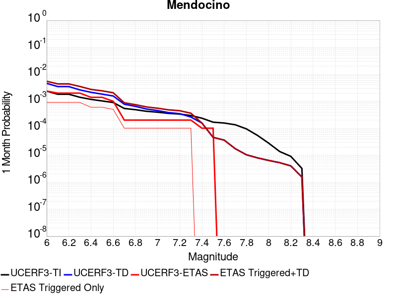 |  |  |

| Magnitude | 1 wk TI Prob | 1 wk TD Prob | 1 wk ETAS Prob | 1 wk ETAS/TD Gain | 1 wk ETAS Triggered+TD | 1 wk ETAS Triggered Only | 1 mo TI Prob | 1 mo TD Prob | 1 mo ETAS Prob | 1 mo ETAS/TD Gain | 1 mo ETAS Triggered+TD | 1 mo ETAS Triggered Only | 1 yr TI Prob | 1 yr TD Prob | 1 yr ETAS Prob | 1 yr ETAS/TD Gain | 1 yr ETAS Triggered+TD | 1 yr ETAS Triggered Only | 10 yr TI Prob | 10 yr TD Prob | 10 yr ETAS Prob | 10 yr ETAS/TD Gain | 10 yr ETAS Triggered+TD | 10 yr ETAS Triggered Only |
|-----|-----|-----|-----|-----|-----|-----|-----|-----|-----|-----|-----|-----|-----|-----|-----|-----|-----|-----|-----|-----|-----|-----|-----|-----|
| 6.0 | 5.5409013E-4 | 0.0010793889 | 3.0E-4 | 0.27793506 | 0.001279173 | 2.0E-4 | 0.0023725112 | 0.0046157073 | 0.0024 | 0.5199636 | 0.0055115535 | 9.0E-4 | 0.028505474 | 0.054447312 | 0.0273 | 0.50140214 | 0.0631464 | 0.0092 | 0.25113493 | 0.4105582 | 0.2478 | 0.60356855 | 0.45942292 | 0.0829 |
| 6.1 | 4.2515888E-4 | 8.187679E-4 | 2.0E-4 | 0.24426949 | 0.0010186041 | 2.0E-4 | 0.0018208373 | 0.0035026954 | 0.002 | 0.57098883 | 0.0043995427 | 9.0E-4 | 0.021944538 | 0.041547947 | 0.0223 | 0.5367293 | 0.049598943 | 0.0084 | 0.19899574 | 0.32862902 | 0.2121 | 0.64540863 | 0.3807274 | 0.0776 |
| 6.2 | 4.2515888E-4 | 8.187679E-4 | 2.0E-4 | 0.24426949 | 0.0010186041 | 2.0E-4 | 0.0018208373 | 0.0035026954 | 0.002 | 0.57098883 | 0.0043995427 | 9.0E-4 | 0.021944538 | 0.041547947 | 0.0223 | 0.5367293 | 0.049598943 | 0.0084 | 0.19899574 | 0.32862902 | 0.2121 | 0.64540863 | 0.3807274 | 0.0776 |
| 6.3 | 3.2773745E-4 | 6.155574E-4 | 2.0E-4 | 0.32490876 | 8.1543426E-4 | 2.0E-4 | 0.0014038329 | 0.0026343116 | 0.002 | 0.7592116 | 0.0035319407 | 9.0E-4 | 0.016958237 | 0.031404294 | 0.0185 | 0.5890914 | 0.03886248 | 0.0077 | 0.1572094 | 0.25942355 | 0.1681 | 0.6479751 | 0.30630204 | 0.0633 |
| 6.4 | 2.7417165E-4 | 5.0113956E-4 | 2.0E-4 | 0.39909044 | 7.0103933E-4 | 2.0E-4 | 0.0011744922 | 0.0021450887 | 0.0014 | 0.6526537 | 0.0027438016 | 6.0E-4 | 0.014205975 | 0.025655411 | 0.0152 | 0.5924676 | 0.03150148 | 0.006 | 0.13331394 | 0.2180968 | 0.1376 | 0.63091254 | 0.25820842 | 0.0513 |
| 6.5 | 2.3984899E-4 | 4.2881654E-4 | 2.0E-4 | 0.46639994 | 6.2873075E-4 | 2.0E-4 | 0.0010275192 | 0.0018358091 | 0.0014 | 0.76260656 | 0.0024347075 | 6.0E-4 | 0.012438473 | 0.022002775 | 0.0134 | 0.6090141 | 0.02708836 | 0.0052 | 0.11764851 | 0.19064191 | 0.12 | 0.62945235 | 0.22738677 | 0.0454 |
| 6.6 | 2.1023539E-4 | 3.6590043E-4 | 2.0E-4 | 0.5465968 | 5.6582724E-4 | 2.0E-4 | 9.0069766E-4 | 0.0015666756 | 0.001 | 0.6382942 | 0.0020658923 | 5.0E-4 | 0.010910975 | 0.018815525 | 0.0111 | 0.58993834 | 0.02303462 | 0.0043 | 0.10390546 | 0.16608629 | 0.1024 | 0.616547 | 0.19802518 | 0.0383 |
| 6.7 | 1.2592976E-4 | 1.8099084E-4 | 1.0E-4 | 0.55251414 | 2.8097274E-4 | 1.0E-4 | 5.395873E-4 | 7.753864E-4 | 2.0E-4 | 0.2579359 | 8.753088E-4 | 1.0E-4 | 0.006549705 | 0.009388288 | 0.0046 | 0.4899722 | 0.011171388 | 0.0018 | 0.063599944 | 0.08949357 | 0.0472 | 0.5274122 | 0.10506324 | 0.0171 |
| 6.8 | 1.13663555E-4 | 1.5089264E-4 | 1.0E-4 | 0.6627228 | 2.5087755E-4 | 1.0E-4 | 4.8703855E-4 | 6.4649165E-4 | 2.0E-4 | 0.30936205 | 7.4642705E-4 | 1.0E-4 | 0.0059135845 | 0.007838629 | 0.0035 | 0.44650665 | 0.009128438 | 0.0013 | 0.057586733 | 0.07595165 | 0.038 | 0.5003183 | 0.088888325 | 0.014 |
| 6.9 | 9.926894E-5 | 1.20059965E-4 | 1.0E-4 | 0.8329171 | 2.2004796E-4 | 1.0E-4 | 4.2536893E-4 | 5.1443576E-4 | 2.0E-4 | 0.38877547 | 6.143843E-4 | 1.0E-4 | 0.0051665753 | 0.0062443526 | 0.003 | 0.48043412 | 0.007536235 | 0.0013 | 0.050480947 | 0.06147359 | 0.0302 | 0.4912679 | 0.07292361 | 0.0122 |
| 7.0 | 9.168125E-5 | 1.04989136E-4 | 1.0E-4 | 0.9524795 | 2.0497864E-4 | 1.0E-4 | 3.9286047E-4 | 4.4987473E-4 | 2.0E-4 | 0.4445682 | 5.4982974E-4 | 1.0E-4 | 0.004772591 | 0.0054631177 | 0.0028 | 0.5125279 | 0.0067560156 | 0.0013 | 0.04671385 | 0.05426433 | 0.0276 | 0.50862145 | 0.065045714 | 0.0114 |
| 7.1 | 8.2854116E-5 | 8.831159E-5 | 1.0E-4 | 1.1323541 | 1.8830276E-4 | 1.0E-4 | 3.5504074E-4 | 3.7842387E-4 | 2.0E-4 | 0.5285079 | 4.78386E-4 | 1.0E-4 | 0.004314056 | 0.0045976397 | 0.0024 | 0.522007 | 0.0057921223 | 0.0012 | 0.042312626 | 0.046162598 | 0.0251 | 0.5437302 | 0.05617789 | 0.0105 |
| 7.2 | 7.8255274E-5 | 8.0320024E-5 | 1.0E-4 | 1.2450196 | 1.80312E-4 | 1.0E-4 | 3.3533663E-4 | 3.4418405E-4 | 2.0E-4 | 0.58108443 | 4.4414963E-4 | 1.0E-4 | 0.0040750825 | 0.0041825282 | 0.002 | 0.47817966 | 0.0052779275 | 0.0011 | 0.040011603 | 0.04222741 | 0.023 | 0.5446699 | 0.051134694 | 0.0093 |
| 7.3 | 6.887904E-5 | 6.0378115E-5 | 1.0E-4 | 1.6562293 | 1.6037207E-4 | 1.0E-4 | 2.9516246E-4 | 2.587382E-4 | 2.0E-4 | 0.77298206 | 3.5871234E-4 | 1.0E-4 | 0.0035876823 | 0.0031456787 | 0.0017 | 0.5404239 | 0.0042422186 | 0.0011 | 0.035303112 | 0.032249544 | 0.0183 | 0.5674499 | 0.039701223 | 0.0077 |
| 7.4 | 5.4898497E-5 | 3.588004E-5 | 0.0 | 0.0 | 3.588004E-5 | 0.0 | 2.3525805E-4 | 1.5376284E-4 | 1.0E-4 | 0.6503522 | 1.5376284E-4 | 0.0 | 0.0028605047 | 0.0018705077 | 9.0E-4 | 0.48115277 | 0.0024693855 | 6.0E-4 | 0.02823963 | 0.019616025 | 0.0103 | 0.5250809 | 0.023733638 | 0.0042 |
| 7.5 | 3.9103943E-5 | 1.0616167E-5 | 0.0 | 0.0 | 1.0616167E-5 | 0.0 | 1.6757756E-4 | 4.5497076E-5 | 1.0E-4 | 2.1979434 | 4.5497076E-5 | 0.0 | 0.0020383475 | 5.5378757E-4 | 2.0E-4 | 0.3611493 | 6.537322E-4 | 1.0E-4 | 0.020197518 | 0.0062145353 | 0.0029 | 0.46664792 | 0.0070095635 | 8.0E-4 |
| 7.6 | 3.641042E-5 | 8.36707E-6 | 0.0 | 0.0 | 8.36707E-6 | 0.0 | 1.5603533E-4 | 3.585839E-5 | 0.0 | 0.0 | 3.585839E-5 | 0.0 | 0.0018980748 | 4.3648967E-4 | 1.0E-4 | 0.22910048 | 5.3644605E-4 | 1.0E-4 | 0.018819444 | 0.004976619 | 0.0019 | 0.3817853 | 0.005573633 | 6.0E-4 |
| 7.7 | 3.1318774E-5 | 3.9938727E-6 | 0.0 | 0.0 | 3.9938727E-6 | 0.0 | 1.342164E-4 | 1.7116487E-5 | 0.0 | 0.0 | 1.7116487E-5 | 0.0 | 0.0016328598 | 2.0837346E-4 | 1.0E-4 | 0.47990757 | 3.083526E-4 | 1.0E-4 | 0.016209139 | 0.0025776818 | 8.0E-4 | 0.31035638 | 0.0028769085 | 3.0E-4 |
| 7.8 | 2.209241E-5 | 2.3840068E-6 | 0.0 | 0.0 | 2.3840068E-6 | 0.0 | 9.467832E-5 | 1.0217132E-5 | 0.0 | 0.0 | 1.0217132E-5 | 0.0 | 0.001152099 | 1.243865E-4 | 0.0 | 0.0 | 1.243865E-4 | 0.0 | 0.011461443 | 0.0015521594 | 3.0E-4 | 0.19327912 | 0.0016520042 | 1.0E-4 |
| 7.9 | 1.2640477E-5 | 1.8273861E-6 | 0.0 | 0.0 | 1.8273861E-6 | 0.0 | 5.4172346E-5 | 7.831631E-6 | 0.0 | 0.0 | 7.831631E-6 | 0.0 | 6.593487E-4 | 9.534596E-5 | 0.0 | 0.0 | 9.534596E-5 | 0.0 | 0.006573958 | 0.001167472 | 3.0E-4 | 0.25696546 | 0.0012673553 | 1.0E-4 |
| 8.0 | 6.5548907E-6 | 1.4736802E-6 | 0.0 | 0.0 | 1.4736802E-6 | 0.0 | 2.8092087E-5 | 6.3157568E-6 | 0.0 | 0.0 | 6.3157568E-6 | 0.0 | 3.4196748E-4 | 7.689164E-5 | 0.0 | 0.0 | 7.689164E-5 | 0.0 | 0.0034144172 | 9.3351625E-4 | 2.0E-4 | 0.21424372 | 0.0010334229 | 1.0E-4 |
| 8.1 | 3.1916707E-6 | 1.2142848E-6 | 0.0 | 0.0 | 1.2142848E-6 | 0.0 | 1.3678517E-5 | 5.2040677E-6 | 0.0 | 0.0 | 5.2040677E-6 | 0.0 | 1.6652321E-4 | 6.33577E-5 | 0.0 | 0.0 | 6.33577E-5 | 0.0 | 0.0016639848 | 7.786327E-4 | 2.0E-4 | 0.25686052 | 8.785548E-4 | 1.0E-4 |
| 8.2 | 2.1193785E-6 | 9.23783E-7 | 0.0 | 0.0 | 9.23783E-7 | 0.0 | 9.083019E-6 | 3.9590636E-6 | 0.0 | 0.0 | 3.9590636E-6 | 0.0 | 1.1058014E-4 | 4.8200553E-5 | 0.0 | 0.0 | 4.8200553E-5 | 0.0 | 0.0011052513 | 5.890795E-4 | 2.0E-4 | 0.33951274 | 6.890206E-4 | 1.0E-4 |
| 8.3 | 7.536878E-7 | 3.5652886E-7 | 0.0 | 0.0 | 3.5652886E-7 | 0.0 | 3.2300866E-6 | 1.52798E-6 | 0.0 | 0.0 | 1.52798E-6 | 0.0 | 3.9325594E-5 | 1.8603008E-5 | 0.0 | 0.0 | 1.8603008E-5 | 0.0 | 3.9318635E-4 | 2.2076594E-4 | 0.0 | 0.0 | 2.2076594E-4 | 0.0 |

## Cerro Prieto
*[(top)](#table-of-contents)*

| 1 Week | 1 Month | 1 Year | 10 Year |
|-----|-----|-----|-----|
|  |  |  |  |

| Magnitude | 1 wk TI Prob | 1 wk TD Prob | 1 wk ETAS Prob | 1 wk ETAS/TD Gain | 1 wk ETAS Triggered+TD | 1 wk ETAS Triggered Only | 1 mo TI Prob | 1 mo TD Prob | 1 mo ETAS Prob | 1 mo ETAS/TD Gain | 1 mo ETAS Triggered+TD | 1 mo ETAS Triggered Only | 1 yr TI Prob | 1 yr TD Prob | 1 yr ETAS Prob | 1 yr ETAS/TD Gain | 1 yr ETAS Triggered+TD | 1 yr ETAS Triggered Only | 10 yr TI Prob | 10 yr TD Prob | 10 yr ETAS Prob | 10 yr ETAS/TD Gain | 10 yr ETAS Triggered+TD | 10 yr ETAS Triggered Only |
|-----|-----|-----|-----|-----|-----|-----|-----|-----|-----|-----|-----|-----|-----|-----|-----|-----|-----|-----|-----|-----|-----|-----|-----|-----|
| 6.0 | 2.9101528E-4 | 5.876785E-4 | 4.0E-4 | 0.6806443 | 7.8756094E-4 | 2.0E-4 | 0.0012466122 | 0.002516427 | 0.0022 | 0.8742554 | 0.0035139106 | 0.001 | 0.015072231 | 0.030233428 | 0.0182 | 0.6019827 | 0.037215747 | 0.0072 | 0.14089979 | 0.2514084 | 0.1744 | 0.69369197 | 0.29220665 | 0.0545 |
| 6.1 | 2.9101528E-4 | 5.876785E-4 | 4.0E-4 | 0.6806443 | 7.8756094E-4 | 2.0E-4 | 0.0012466122 | 0.002516427 | 0.0022 | 0.8742554 | 0.0035139106 | 0.001 | 0.015072231 | 0.030233428 | 0.0182 | 0.6019827 | 0.037215747 | 0.0072 | 0.14089979 | 0.2514084 | 0.1744 | 0.69369197 | 0.29220665 | 0.0545 |
| 6.2 | 2.9101528E-4 | 5.876785E-4 | 4.0E-4 | 0.6806443 | 7.8756094E-4 | 2.0E-4 | 0.0012466122 | 0.002516427 | 0.0022 | 0.8742554 | 0.0035139106 | 0.001 | 0.015072231 | 0.030233428 | 0.0182 | 0.6019827 | 0.037215747 | 0.0072 | 0.14089979 | 0.2514084 | 0.1744 | 0.69369197 | 0.29220665 | 0.0545 |
| 6.3 | 2.9101528E-4 | 5.876785E-4 | 4.0E-4 | 0.6806443 | 7.8756094E-4 | 2.0E-4 | 0.0012466122 | 0.002516427 | 0.0022 | 0.8742554 | 0.0035139106 | 0.001 | 0.015072231 | 0.030233428 | 0.0182 | 0.6019827 | 0.037215747 | 0.0072 | 0.14089979 | 0.2514084 | 0.1744 | 0.69369197 | 0.29220665 | 0.0545 |
| 6.4 | 2.508648E-4 | 5.056167E-4 | 3.0E-4 | 0.59333485 | 7.0551556E-4 | 2.0E-4 | 0.0010746918 | 0.0021653222 | 0.0018 | 0.83128506 | 0.0030633733 | 9.0E-4 | 0.013006088 | 0.02607972 | 0.0156 | 0.5981659 | 0.032118026 | 0.0062 | 0.12270685 | 0.22188032 | 0.1514 | 0.68234986 | 0.25907445 | 0.0478 |
| 6.5 | 2.508648E-4 | 5.056167E-4 | 3.0E-4 | 0.59333485 | 7.0551556E-4 | 2.0E-4 | 0.0010746918 | 0.0021653222 | 0.0018 | 0.83128506 | 0.0030633733 | 9.0E-4 | 0.013006088 | 0.02607972 | 0.0156 | 0.5981659 | 0.032118026 | 0.0062 | 0.12270685 | 0.22188032 | 0.1514 | 0.68234986 | 0.25907445 | 0.0478 |
| 6.6 | 2.294914E-4 | 4.6307954E-4 | 3.0E-4 | 0.64783686 | 6.6298695E-4 | 2.0E-4 | 9.831638E-4 | 0.0019832992 | 0.0016 | 0.8067366 | 0.0027817125 | 8.0E-4 | 0.011904482 | 0.023857418 | 0.0144 | 0.60358584 | 0.029323816 | 0.0056 | 0.11286586 | 0.20606163 | 0.14 | 0.6794084 | 0.24139188 | 0.0445 |
| 6.7 | 1.9621674E-4 | 3.965335E-4 | 2.0E-4 | 0.50437105 | 4.964938E-4 | 1.0E-4 | 8.4065786E-4 | 0.0016984757 | 0.0011 | 0.6476395 | 0.0021976265 | 5.0E-4 | 0.010187071 | 0.020493843 | 0.0122 | 0.59530073 | 0.025293423 | 0.0049 | 0.09732539 | 0.18046996 | 0.1206 | 0.66825527 | 0.21210381 | 0.0386 |
| 6.8 | 1.5476145E-4 | 2.9933505E-4 | 2.0E-4 | 0.6681476 | 3.993051E-4 | 1.0E-4 | 6.6309475E-4 | 0.0012823322 | 0.0011 | 0.85781205 | 0.0017816911 | 5.0E-4 | 0.008043335 | 0.0154983625 | 0.009 | 0.5807065 | 0.019633269 | 0.0042 | 0.07758363 | 0.14124227 | 0.0896 | 0.63437104 | 0.16657561 | 0.0295 |
| 6.9 | 1.20509176E-4 | 2.2068103E-4 | 1.0E-4 | 0.45314273 | 2.2068103E-4 | 0.0 | 5.1636563E-4 | 9.4549364E-4 | 7.0E-4 | 0.740354 | 0.0012452101 | 3.0E-4 | 0.006268645 | 0.011465097 | 0.0061 | 0.5320496 | 0.013936434 | 0.0025 | 0.060947374 | 0.10765188 | 0.0681 | 0.63259465 | 0.12674813 | 0.0214 |
| 7.0 | 9.3269155E-5 | 1.6304594E-4 | 0.0 | 0.0 | 1.6304594E-4 | 0.0 | 3.9966372E-4 | 6.986223E-4 | 4.0E-4 | 0.5725554 | 8.9848257E-4 | 2.0E-4 | 0.0048550544 | 0.008479855 | 0.0038 | 0.44812086 | 0.009867983 | 0.0014 | 0.04750344 | 0.08164473 | 0.0504 | 0.6173087 | 0.09569556 | 0.0153 |
| 7.1 | 5.029709E-5 | 7.938922E-5 | 0.0 | 0.0 | 7.938922E-5 | 0.0 | 2.1554115E-4 | 3.4021336E-4 | 1.0E-4 | 0.29393318 | 4.4017934E-4 | 1.0E-4 | 0.0026210553 | 0.0041374615 | 0.0016 | 0.38671055 | 0.0048345653 | 7.0E-4 | 0.025903556 | 0.041418772 | 0.0229 | 0.5528894 | 0.047937125 | 0.0068 |
| 7.2 | 6.5445185E-8 | 6.3428644E-8 | 0.0 | 0.0 | 6.3428644E-8 | 0.0 | 2.8047933E-7 | 2.7183705E-7 | 0.0 | 0.0 | 2.7183705E-7 | 0.0 | 3.4148304E-6 | 3.309616E-6 | 0.0 | 0.0 | 3.309616E-6 | 0.0 | 3.414778E-5 | 3.309616E-5 | 0.0 | 0.0 | 3.309616E-5 | 0.0 |

## Brawley (Seismic Zone) alt 1
*[(top)](#table-of-contents)*

| 1 Week | 1 Month | 1 Year | 10 Year |
|-----|-----|-----|-----|
|  |  |  |  |

| Magnitude | 1 wk TI Prob | 1 wk TD Prob | 1 wk ETAS Prob | 1 wk ETAS/TD Gain | 1 wk ETAS Triggered+TD | 1 wk ETAS Triggered Only | 1 mo TI Prob | 1 mo TD Prob | 1 mo ETAS Prob | 1 mo ETAS/TD Gain | 1 mo ETAS Triggered+TD | 1 mo ETAS Triggered Only | 1 yr TI Prob | 1 yr TD Prob | 1 yr ETAS Prob | 1 yr ETAS/TD Gain | 1 yr ETAS Triggered+TD | 1 yr ETAS Triggered Only | 10 yr TI Prob | 10 yr TD Prob | 10 yr ETAS Prob | 10 yr ETAS/TD Gain | 10 yr ETAS Triggered+TD | 10 yr ETAS Triggered Only |
|-----|-----|-----|-----|-----|-----|-----|-----|-----|-----|-----|-----|-----|-----|-----|-----|-----|-----|-----|-----|-----|-----|-----|-----|-----|
| 6.0 | 2.2521618E-4 | 4.6533594E-4 | 5.0E-4 | 1.0744926 | 6.6524284E-4 | 2.0E-4 | 9.6485513E-4 | 0.0019928087 | 0.0013 | 0.65234566 | 0.0024918122 | 5.0E-4 | 0.011683988 | 0.023988076 | 0.0177 | 0.7378666 | 0.030527355 | 0.0067 | 0.11088423 | 0.20974061 | 0.1521 | 0.72518146 | 0.24727793 | 0.0475 |
| 6.1 | 2.2521618E-4 | 4.6533594E-4 | 3.0E-4 | 0.6446955 | 5.652894E-4 | 1.0E-4 | 9.6485513E-4 | 0.0019928087 | 0.001 | 0.50180435 | 0.0023920115 | 4.0E-4 | 0.011683988 | 0.023988076 | 0.0152 | 0.63364816 | 0.029453743 | 0.0056 | 0.11088423 | 0.20974061 | 0.1326 | 0.6322095 | 0.24143001 | 0.0401 |
| 6.2 | 2.198148E-4 | 4.5645965E-4 | 3.0E-4 | 0.6572322 | 5.56414E-4 | 1.0E-4 | 9.417233E-4 | 0.0019548247 | 0.001 | 0.51155484 | 0.0023540426 | 4.0E-4 | 0.011405343 | 0.02353607 | 0.0146 | 0.6203245 | 0.028613681 | 0.0052 | 0.10837428 | 0.20623754 | 0.1291 | 0.6259772 | 0.23632114 | 0.0379 |
| 6.3 | 2.1704129E-4 | 4.5086833E-4 | 3.0E-4 | 0.66538274 | 5.508232E-4 | 1.0E-4 | 9.298453E-4 | 0.0019308975 | 9.0E-4 | 0.4661045 | 0.0022303183 | 3.0E-4 | 0.011262234 | 0.023251357 | 0.0142 | 0.61071706 | 0.0281351 | 0.005 | 0.107082725 | 0.20413247 | 0.1274 | 0.6241045 | 0.23373875 | 0.0372 |
| 6.4 | 1.876142E-4 | 3.9022637E-4 | 2.0E-4 | 0.51252306 | 4.901873E-4 | 1.0E-4 | 8.038131E-4 | 0.0016713403 | 7.0E-4 | 0.41882554 | 0.001970839 | 3.0E-4 | 0.00974259 | 0.02015831 | 0.0115 | 0.57048434 | 0.024077676 | 0.004 | 0.093263686 | 0.18090113 | 0.1089 | 0.6019863 | 0.20686656 | 0.0317 |
| 6.5 | 1.7390939E-4 | 3.6497993E-4 | 2.0E-4 | 0.54797536 | 4.6494344E-4 | 1.0E-4 | 7.45113E-4 | 0.0015632734 | 7.0E-4 | 0.44777834 | 0.0018628044 | 3.0E-4 | 0.009034078 | 0.018868195 | 0.0109 | 0.57769173 | 0.022596495 | 0.0038 | 0.086755216 | 0.17080772 | 0.102 | 0.59716266 | 0.19510306 | 0.0293 |
| 6.6 | 1.591791E-4 | 3.3971245E-4 | 2.0E-4 | 0.5887332 | 4.396785E-4 | 1.0E-4 | 6.8201777E-4 | 0.0014551076 | 7.0E-4 | 0.48106408 | 0.001754671 | 3.0E-4 | 0.008271996 | 0.017573824 | 0.0101 | 0.57471836 | 0.021110559 | 0.0036 | 0.07970774 | 0.16035357 | 0.094 | 0.5862046 | 0.18218438 | 0.026 |
| 6.7 | 1.4268003E-4 | 3.1204906E-4 | 2.0E-4 | 0.6409249 | 4.1201786E-4 | 1.0E-4 | 6.1134255E-4 | 0.0013366753 | 7.0E-4 | 0.5236874 | 0.0016362743 | 3.0E-4 | 0.007417723 | 0.016153757 | 0.0093 | 0.5757175 | 0.01940045 | 0.0033 | 0.07174956 | 0.1486512 | 0.0882 | 0.5933353 | 0.16967952 | 0.0247 |
| 6.8 | 1.239713E-4 | 2.835754E-4 | 2.0E-4 | 0.7052798 | 3.8354704E-4 | 1.0E-4 | 5.3119735E-4 | 0.0012147628 | 7.0E-4 | 0.5762442 | 0.0015143984 | 3.0E-4 | 0.0064481674 | 0.014690774 | 0.0088 | 0.5990154 | 0.017646702 | 0.003 | 0.06264243 | 0.13560335 | 0.0806 | 0.59438056 | 0.15462008 | 0.022 |
| 6.9 | 1.0180238E-4 | 2.5747836E-4 | 2.0E-4 | 0.77676433 | 3.574526E-4 | 1.0E-4 | 4.3622297E-4 | 0.0011030161 | 7.0E-4 | 0.6346236 | 0.0014026852 | 3.0E-4 | 0.005298089 | 0.013347485 | 0.0078 | 0.58437973 | 0.016208777 | 0.0029 | 0.05173543 | 0.12289762 | 0.0713 | 0.5801577 | 0.13956256 | 0.019 |
| 7.0 | 7.6619996E-5 | 2.2041418E-4 | 2.0E-4 | 0.90738267 | 3.2039214E-4 | 1.0E-4 | 3.283301E-4 | 9.4429334E-4 | 7.0E-4 | 0.7412951 | 0.00124401 | 3.0E-4 | 0.0039900932 | 0.0114368545 | 0.0069 | 0.60331273 | 0.013809405 | 0.0024 | 0.039192066 | 0.1057968 | 0.061 | 0.576577 | 0.12028289 | 0.0162 |
| 7.1 | 7.5127435E-5 | 2.1730422E-4 | 2.0E-4 | 0.9203687 | 3.1728248E-4 | 1.0E-4 | 3.2193496E-4 | 9.309745E-4 | 7.0E-4 | 0.7519003 | 0.0012306952 | 3.0E-4 | 0.0039125155 | 0.011276387 | 0.0068 | 0.60303 | 0.013649324 | 0.0024 | 0.038443442 | 0.10438197 | 0.0604 | 0.578644 | 0.11880142 | 0.0161 |
| 7.2 | 6.788582E-5 | 1.9873041E-4 | 2.0E-4 | 1.0063884 | 2.9871054E-4 | 1.0E-4 | 2.9090676E-4 | 8.5142674E-4 | 7.0E-4 | 0.82214946 | 0.0011511713 | 3.0E-4 | 0.0035360386 | 0.01031747 | 0.0065 | 0.6299994 | 0.01259374 | 0.0023 | 0.034803 | 0.09609729 | 0.0557 | 0.5796209 | 0.109565444 | 0.0149 |
| 7.3 | 6.399602E-5 | 1.8519968E-4 | 2.0E-4 | 1.0799155 | 2.8518116E-4 | 1.0E-4 | 2.7423984E-4 | 7.9347426E-4 | 7.0E-4 | 0.8821962 | 0.0010932363 | 3.0E-4 | 0.0033337586 | 0.00961833 | 0.0063 | 0.6549994 | 0.011896208 | 0.0023 | 0.03284188 | 0.09004573 | 0.0524 | 0.5819265 | 0.102694094 | 0.0139 |
| 7.4 | 4.506759E-5 | 1.2283388E-4 | 1.0E-4 | 0.81410766 | 1.2283388E-4 | 0.0 | 1.9313251E-4 | 5.2632554E-4 | 5.0E-4 | 0.9499824 | 7.262203E-4 | 2.0E-4 | 0.0023488526 | 0.006389355 | 0.0042 | 0.6573434 | 0.00787977 | 0.0015 | 0.023241805 | 0.061279375 | 0.0347 | 0.566259 | 0.070291094 | 0.0096 |
| 7.5 | 3.43289E-5 | 9.1361755E-5 | 1.0E-4 | 1.0945499 | 9.1361755E-5 | 0.0 | 1.4711556E-4 | 3.9149195E-4 | 3.0E-4 | 0.7662993 | 4.914528E-4 | 1.0E-4 | 0.0017896603 | 0.0047560576 | 0.0029 | 0.6097487 | 0.0055522528 | 8.0E-4 | 0.01775316 | 0.046157982 | 0.0252 | 0.54595107 | 0.053216413 | 0.0074 |
| 7.6 | 2.5980507E-5 | 6.881562E-5 | 1.0E-4 | 1.4531584 | 6.881562E-5 | 0.0 | 1.1134028E-4 | 2.948909E-4 | 3.0E-4 | 1.0173254 | 3.948614E-4 | 1.0E-4 | 0.001354725 | 0.0035844091 | 0.0022 | 0.6137692 | 0.0042819004 | 7.0E-4 | 0.013464959 | 0.03505983 | 0.0206 | 0.5875671 | 0.04065648 | 0.0058 |
| 7.7 | 1.7292105E-5 | 4.7962152E-5 | 1.0E-4 | 2.0849774 | 4.7962152E-5 | 0.0 | 7.4106916E-5 | 2.0553592E-4 | 2.0E-4 | 0.9730659 | 3.0551536E-4 | 1.0E-4 | 9.018782E-4 | 0.0024995336 | 9.0E-4 | 0.3600672 | 0.0028985336 | 4.0E-4 | 0.008982267 | 0.024629422 | 0.0147 | 0.5968472 | 0.029116126 | 0.0046 |
| 7.8 | 1.2927471E-5 | 3.8444596E-5 | 1.0E-4 | 2.601146 | 3.8444596E-5 | 0.0 | 5.5402274E-5 | 1.6475216E-4 | 2.0E-4 | 1.2139447 | 2.647357E-4 | 1.0E-4 | 6.743139E-4 | 0.0020040146 | 8.0E-4 | 0.39919868 | 0.002403213 | 4.0E-4 | 0.0067227143 | 0.019860458 | 0.0112 | 0.5639346 | 0.023094919 | 0.0033 |
| 7.9 | 1.0200774E-5 | 2.7730803E-5 | 0.0 | 0.0 | 2.7730803E-5 | 0.0 | 4.371687E-5 | 1.18840886E-4 | 1.0E-4 | 0.84146124 | 2.1882901E-4 | 1.0E-4 | 5.321229E-4 | 0.0014459285 | 6.0E-4 | 0.41495827 | 0.0017454947 | 3.0E-4 | 0.005308505 | 0.014520071 | 0.0086 | 0.5922836 | 0.017180867 | 0.0027 |
| 8.0 | 8.650396E-6 | 2.2400553E-5 | 0.0 | 0.0 | 2.2400553E-5 | 0.0 | 3.70726E-5 | 9.599884E-5 | 1.0E-4 | 1.0416793 | 1.9598924E-4 | 1.0E-4 | 4.5126543E-4 | 0.00116816 | 5.0E-4 | 0.42802355 | 0.0014678095 | 3.0E-4 | 0.0045035016 | 0.011800713 | 0.007 | 0.59318453 | 0.014172391 | 0.0024 |
| 8.1 | 3.9368224E-6 | 6.9356947E-6 | 0.0 | 0.0 | 6.9356947E-6 | 0.0 | 1.6871985E-5 | 2.9724068E-5 | 1.0E-4 | 3.3642771 | 1.297211E-4 | 1.0E-4 | 2.0539707E-4 | 3.6183055E-4 | 1.0E-4 | 0.27637246 | 4.6179435E-4 | 1.0E-4 | 0.0020520731 | 0.0038061712 | 0.0021 | 0.5517355 | 0.0046031266 | 8.0E-4 |
| 8.2 | 1.7101195E-6 | 2.061943E-6 | 0.0 | 0.0 | 2.061943E-6 | 0.0 | 7.329063E-6 | 8.836869E-6 | 1.0E-4 | 11.316226 | 1.08835986E-4 | 1.0E-4 | 8.922769E-5 | 1.0758359E-4 | 1.0E-4 | 0.92950976 | 2.0757283E-4 | 1.0E-4 | 8.9191867E-4 | 0.0011864101 | 8.0E-4 | 0.6743031 | 0.0013861728 | 2.0E-4 |
| 8.3 | 3.0346666E-8 | 1.567035E-8 | 0.0 | 0.0 | 1.567035E-8 | 0.0 | 1.3005713E-7 | 6.7158645E-8 | 0.0 | 0.0 | 6.7158645E-8 | 0.0 | 1.5834444E-6 | 8.176564E-7 | 0.0 | 0.0 | 8.176564E-7 | 0.0 | 1.5834332E-5 | 8.542308E-6 | 0.0 | 0.0 | 8.542308E-6 | 0.0 |

## Imperial
*[(top)](#table-of-contents)*

| 1 Week | 1 Month | 1 Year | 10 Year |
|-----|-----|-----|-----|
|  |  |  |  |

| Magnitude | 1 wk TI Prob | 1 wk TD Prob | 1 wk ETAS Prob | 1 wk ETAS/TD Gain | 1 wk ETAS Triggered+TD | 1 wk ETAS Triggered Only | 1 mo TI Prob | 1 mo TD Prob | 1 mo ETAS Prob | 1 mo ETAS/TD Gain | 1 mo ETAS Triggered+TD | 1 mo ETAS Triggered Only | 1 yr TI Prob | 1 yr TD Prob | 1 yr ETAS Prob | 1 yr ETAS/TD Gain | 1 yr ETAS Triggered+TD | 1 yr ETAS Triggered Only | 10 yr TI Prob | 10 yr TD Prob | 10 yr ETAS Prob | 10 yr ETAS/TD Gain | 10 yr ETAS Triggered+TD | 10 yr ETAS Triggered Only |
|-----|-----|-----|-----|-----|-----|-----|-----|-----|-----|-----|-----|-----|-----|-----|-----|-----|-----|-----|-----|-----|-----|-----|-----|-----|
| 6.0 | 2.7496446E-4 | 4.895928E-4 | 3.0E-4 | 0.6127541 | 5.8954384E-4 | 1.0E-4 | 0.0011778869 | 0.0020966053 | 0.001 | 0.4769615 | 0.0025955571 | 5.0E-4 | 0.0142467655 | 0.02520393 | 0.0161 | 0.63878924 | 0.031052707 | 0.006 | 0.13367249 | 0.22269472 | 0.1419 | 0.6371951 | 0.25712934 | 0.0443 |
| 6.1 | 2.5356023E-4 | 4.7265363E-4 | 3.0E-4 | 0.63471425 | 5.7260634E-4 | 1.0E-4 | 0.001086234 | 0.0020241227 | 9.0E-4 | 0.44463706 | 0.0024233132 | 4.0E-4 | 0.013144928 | 0.024346493 | 0.0154 | 0.6325346 | 0.030005284 | 0.0058 | 0.123940155 | 0.2147349 | 0.1364 | 0.6352018 | 0.24755898 | 0.0418 |
| 6.2 | 2.4820742E-4 | 4.6388546E-4 | 3.0E-4 | 0.64671135 | 5.6383904E-4 | 1.0E-4 | 0.0010633124 | 0.0019866023 | 9.0E-4 | 0.45303482 | 0.0023858077 | 4.0E-4 | 0.01286919 | 0.023900157 | 0.0148 | 0.6192428 | 0.029171096 | 0.0054 | 0.12148927 | 0.21129626 | 0.1329 | 0.6289747 | 0.24252893 | 0.0396 |
| 6.3 | 2.3205351E-4 | 4.4672057E-4 | 3.0E-4 | 0.6715607 | 5.4667593E-4 | 1.0E-4 | 9.94136E-4 | 0.0019131477 | 8.0E-4 | 0.41815904 | 0.0022125738 | 3.0E-4 | 0.012036599 | 0.023043953 | 0.0141 | 0.61187416 | 0.027928734 | 0.005 | 0.11405133 | 0.20366937 | 0.1269 | 0.62306863 | 0.23345214 | 0.0374 |
| 6.4 | 2.0304754E-4 | 3.8701732E-4 | 2.0E-4 | 0.51677275 | 4.8697862E-4 | 1.0E-4 | 8.6991355E-4 | 0.001657605 | 7.0E-4 | 0.42229602 | 0.0019571078 | 3.0E-4 | 0.010539869 | 0.019998284 | 0.0115 | 0.57504934 | 0.023918292 | 0.004 | 0.100537635 | 0.18080486 | 0.1087 | 0.60120064 | 0.2069372 | 0.0319 |
| 6.5 | 1.854992E-4 | 3.5898542E-4 | 2.0E-4 | 0.5571257 | 4.5894954E-4 | 1.0E-4 | 7.9475436E-4 | 0.0015376133 | 7.0E-4 | 0.45525098 | 0.001837152 | 3.0E-4 | 0.009633281 | 0.018566702 | 0.0109 | 0.5870725 | 0.02229615 | 0.0038 | 0.0922623 | 0.16924961 | 0.1011 | 0.59734255 | 0.19334137 | 0.029 |
| 6.6 | 1.6586106E-4 | 3.305461E-4 | 2.0E-4 | 0.60505927 | 4.3051306E-4 | 1.0E-4 | 7.106394E-4 | 0.0014158665 | 7.0E-4 | 0.4943969 | 0.0017154418 | 3.0E-4 | 0.008617763 | 0.017105592 | 0.01 | 0.58460414 | 0.020545723 | 0.0035 | 0.08291132 | 0.15704171 | 0.0916 | 0.5832845 | 0.17828426 | 0.0252 |
| 6.7 | 1.4224656E-4 | 2.9921078E-4 | 2.0E-4 | 0.6684251 | 3.9918086E-4 | 1.0E-4 | 6.094856E-4 | 0.0012817093 | 7.0E-4 | 0.5461457 | 0.0015813248 | 3.0E-4 | 0.0073952693 | 0.015494272 | 0.0092 | 0.5937678 | 0.01864469 | 0.0032 | 0.07153955 | 0.14318357 | 0.0848 | 0.5922467 | 0.16349012 | 0.0237 |
| 6.8 | 1.2317259E-4 | 2.7105198E-4 | 2.0E-4 | 0.73786587 | 3.7102486E-4 | 1.0E-4 | 5.2777573E-4 | 0.0011611399 | 7.0E-4 | 0.60285586 | 0.0014607916 | 3.0E-4 | 0.0064067547 | 0.014046529 | 0.0087 | 0.6193701 | 0.016905794 | 0.0029 | 0.06225166 | 0.13016221 | 0.0774 | 0.59464264 | 0.14851579 | 0.0211 |
| 6.9 | 9.859898E-5 | 2.4530667E-4 | 2.0E-4 | 0.815306 | 3.4528214E-4 | 1.0E-4 | 4.2249862E-4 | 0.0010508947 | 7.0E-4 | 0.6660991 | 0.0013505794 | 3.0E-4 | 0.0051317946 | 0.012720503 | 0.0077 | 0.60532194 | 0.015484886 | 0.0028 | 0.05014893 | 0.11742009 | 0.0681 | 0.57996887 | 0.1333948 | 0.0181 |
| 7.0 | 7.3191884E-5 | 2.0933368E-4 | 2.0E-4 | 0.95541245 | 3.0931275E-4 | 1.0E-4 | 3.136418E-4 | 8.9683896E-4 | 7.0E-4 | 0.7805191 | 0.0011965699 | 3.0E-4 | 0.003811904 | 0.010865013 | 0.0068 | 0.62586206 | 0.013140024 | 0.0023 | 0.037471764 | 0.10068799 | 0.058 | 0.57603693 | 0.114537396 | 0.0154 |
| 7.1 | 7.1760296E-5 | 2.064055E-4 | 2.0E-4 | 0.9689664 | 3.0638487E-4 | 1.0E-4 | 3.0750787E-4 | 8.842982E-4 | 7.0E-4 | 0.7915882 | 0.0011840329 | 3.0E-4 | 0.003737482 | 0.010713841 | 0.0067 | 0.6253593 | 0.012989199 | 0.0023 | 0.03675245 | 0.09934601 | 0.0574 | 0.57777864 | 0.11312602 | 0.0153 |
| 7.2 | 6.46614E-5 | 1.8823914E-4 | 2.0E-4 | 1.0624783 | 2.8822033E-4 | 1.0E-4 | 2.7709085E-4 | 8.064927E-4 | 7.0E-4 | 0.8679558 | 0.0011062508 | 3.0E-4 | 0.0033683628 | 0.009775445 | 0.0064 | 0.65470165 | 0.011953939 | 0.0022 | 0.033177625 | 0.09119956 | 0.0527 | 0.5778537 | 0.104013644 | 0.0141 |
| 7.3 | 6.088115E-5 | 1.7511452E-4 | 2.0E-4 | 1.1421098 | 2.75097E-4 | 1.0E-4 | 2.6089314E-4 | 7.502777E-4 | 7.0E-4 | 0.93298787 | 0.0010500526 | 3.0E-4 | 0.0031717476 | 0.009096931 | 0.0062 | 0.6815486 | 0.0112769175 | 0.0022 | 0.031268585 | 0.085304566 | 0.0494 | 0.57910144 | 0.09728708 | 0.0131 |
| 7.4 | 4.199346E-5 | 1.12887006E-4 | 1.0E-4 | 0.88584155 | 1.12887006E-4 | 0.0 | 1.7995955E-4 | 4.8371262E-4 | 5.0E-4 | 1.0336716 | 6.8361586E-4 | 2.0E-4 | 0.0021888057 | 0.0058734627 | 0.0041 | 0.698055 | 0.0072652395 | 0.0014 | 0.02167372 | 0.056454986 | 0.0317 | 0.5615093 | 0.06475818 | 0.0088 |
| 7.5 | 3.130448E-5 | 8.158115E-5 | 1.0E-4 | 1.2257733 | 8.158115E-5 | 0.0 | 1.3415517E-4 | 3.4958695E-4 | 3.0E-4 | 0.8581556 | 4.49552E-4 | 1.0E-4 | 0.0016321153 | 0.0042479727 | 0.0028 | 0.65913796 | 0.0049449992 | 7.0E-4 | 0.016201803 | 0.04133666 | 0.0222 | 0.5370535 | 0.047663838 | 0.0066 |
| 7.6 | 2.3074248E-5 | 5.9368074E-5 | 1.0E-4 | 1.684407 | 5.9368074E-5 | 0.0 | 9.888588E-5 | 2.544099E-4 | 3.0E-4 | 1.1791993 | 3.5438448E-4 | 1.0E-4 | 0.0012032706 | 0.0030930638 | 0.0021 | 0.67893845 | 0.0036912079 | 6.0E-4 | 0.011967761 | 0.030348286 | 0.0176 | 0.5799339 | 0.035196546 | 0.005 |
| 7.7 | 1.45864815E-5 | 3.8916234E-5 | 1.0E-4 | 2.5696218 | 3.8916234E-5 | 0.0 | 6.2511994E-5 | 1.6677321E-4 | 2.0E-4 | 1.1992333 | 2.6675654E-4 | 1.0E-4 | 7.608177E-4 | 0.0020285782 | 8.0E-4 | 0.39436486 | 0.0023279698 | 3.0E-4 | 0.007582182 | 0.020070491 | 0.0119 | 0.59291023 | 0.023794224 | 0.0038 |
| 7.8 | 1.0352979E-5 | 2.994125E-5 | 1.0E-4 | 3.339874 | 2.994125E-5 | 0.0 | 4.4369157E-5 | 1.2831335E-4 | 2.0E-4 | 1.5586843 | 2.283005E-4 | 1.0E-4 | 5.400606E-4 | 0.0015610977 | 7.0E-4 | 0.44840243 | 0.0018606294 | 3.0E-4 | 0.0053875 | 0.015546963 | 0.0084 | 0.54029846 | 0.018008094 | 0.0025 |
| 7.9 | 8.137906E-6 | 2.132492E-5 | 0.0 | 0.0 | 2.132492E-5 | 0.0 | 3.4876273E-5 | 9.1389324E-5 | 1.0E-4 | 1.0942198 | 1.9138018E-4 | 1.0E-4 | 4.2453592E-4 | 0.0011120979 | 5.0E-4 | 0.4496007 | 0.0013118755 | 2.0E-4 | 0.004237258 | 0.011232167 | 0.0063 | 0.5608891 | 0.013110826 | 0.0019 |
| 8.0 | 6.93792E-6 | 1.7294058E-5 | 0.0 | 0.0 | 1.7294058E-5 | 0.0 | 2.9733603E-5 | 7.411529E-5 | 1.0E-4 | 1.3492492 | 1.7410787E-4 | 1.0E-4 | 3.6194647E-4 | 9.019808E-4 | 4.0E-4 | 0.44346842 | 0.0011018004 | 2.0E-4 | 0.0036135751 | 0.009164721 | 0.0051 | 0.5564818 | 0.010750057 | 0.0016 |
| 8.1 | 3.4286315E-6 | 6.034309E-6 | 0.0 | 0.0 | 6.034309E-6 | 0.0 | 1.4694053E-5 | 2.5861069E-5 | 1.0E-4 | 3.8668163 | 1.2585848E-4 | 1.0E-4 | 1.7888541E-4 | 3.1481314E-4 | 1.0E-4 | 0.31764877 | 4.1478165E-4 | 1.0E-4 | 0.0017874148 | 0.0033140853 | 0.0019 | 0.5733105 | 0.0040117656 | 7.0E-4 |
| 8.2 | 1.4906886E-6 | 1.7989122E-6 | 0.0 | 0.0 | 1.7989122E-6 | 0.0 | 6.3886496E-6 | 7.709601E-6 | 1.0E-4 | 12.9708395 | 1.0770883E-4 | 1.0E-4 | 7.7779034E-5 | 9.386038E-5 | 1.0E-4 | 1.0654123 | 1.93851E-4 | 1.0E-4 | 7.775182E-4 | 0.0010366293 | 8.0E-4 | 0.771732 | 0.001236422 | 2.0E-4 |
| 8.3 | 2.5758007E-8 | 1.3187132E-8 | 0.0 | 0.0 | 1.3187132E-8 | 0.0 | 1.10391454E-7 | 5.651628E-8 | 0.0 | 0.0 | 5.651628E-8 | 0.0 | 1.3440151E-6 | 6.880857E-7 | 0.0 | 0.0 | 6.880857E-7 | 0.0 | 1.344007E-5 | 7.186091E-6 | 0.0 | 0.0 | 7.186091E-6 | 0.0 |

## Hayward (So) 2011 CFM
*[(top)](#table-of-contents)*

| 1 Week | 1 Month | 1 Year | 10 Year |
|-----|-----|-----|-----|
|  |  |  |  |

| Magnitude | 1 wk TI Prob | 1 wk TD Prob | 1 wk ETAS Prob | 1 wk ETAS/TD Gain | 1 wk ETAS Triggered+TD | 1 wk ETAS Triggered Only | 1 mo TI Prob | 1 mo TD Prob | 1 mo ETAS Prob | 1 mo ETAS/TD Gain | 1 mo ETAS Triggered+TD | 1 mo ETAS Triggered Only | 1 yr TI Prob | 1 yr TD Prob | 1 yr ETAS Prob | 1 yr ETAS/TD Gain | 1 yr ETAS Triggered+TD | 1 yr ETAS Triggered Only | 10 yr TI Prob | 10 yr TD Prob | 10 yr ETAS Prob | 10 yr ETAS/TD Gain | 10 yr ETAS Triggered+TD | 10 yr ETAS Triggered Only |
|-----|-----|-----|-----|-----|-----|-----|-----|-----|-----|-----|-----|-----|-----|-----|-----|-----|-----|-----|-----|-----|-----|-----|-----|-----|
| 6.0 | 1.8091932E-4 | 3.5261808E-4 | 3.0E-4 | 0.8507788 | 6.525123E-4 | 3.0E-4 | 7.751381E-4 | 0.0015103549 | 8.0E-4 | 0.52967685 | 0.0021094487 | 6.0E-4 | 0.00939654 | 0.018235872 | 0.0134 | 0.7348154 | 0.0235374 | 0.0054 | 0.090090066 | 0.16502564 | 0.1179 | 0.7144345 | 0.19817412 | 0.0397 |
| 6.1 | 1.8091932E-4 | 3.5261808E-4 | 3.0E-4 | 0.8507788 | 6.525123E-4 | 3.0E-4 | 7.751381E-4 | 0.0015103549 | 8.0E-4 | 0.52967685 | 0.0021094487 | 6.0E-4 | 0.00939654 | 0.018235872 | 0.0134 | 0.7348154 | 0.0235374 | 0.0054 | 0.090090066 | 0.16502564 | 0.1179 | 0.7144345 | 0.19817412 | 0.0397 |
| 6.2 | 1.8091932E-4 | 3.5261808E-4 | 3.0E-4 | 0.8507788 | 6.525123E-4 | 3.0E-4 | 7.751381E-4 | 0.0015103549 | 8.0E-4 | 0.52967685 | 0.0021094487 | 6.0E-4 | 0.00939654 | 0.018235872 | 0.0134 | 0.7348154 | 0.0235374 | 0.0054 | 0.090090066 | 0.16502564 | 0.1179 | 0.7144345 | 0.19817412 | 0.0397 |
| 6.3 | 1.7322872E-4 | 3.3830493E-4 | 3.0E-4 | 0.88677394 | 6.3820346E-4 | 3.0E-4 | 7.4219756E-4 | 0.0014490822 | 8.0E-4 | 0.5520736 | 0.0020482126 | 6.0E-4 | 0.0089988755 | 0.01750207 | 0.013 | 0.74276936 | 0.022512808 | 0.0051 | 0.08643075 | 0.15897852 | 0.1135 | 0.71393293 | 0.19068502 | 0.0377 |
| 6.4 | 1.6334097E-4 | 3.192583E-4 | 3.0E-4 | 0.93967795 | 6.191626E-4 | 3.0E-4 | 6.998449E-4 | 0.0013675409 | 8.0E-4 | 0.58499163 | 0.0019667204 | 6.0E-4 | 0.008487372 | 0.01652466 | 0.0126 | 0.7624968 | 0.021442035 | 0.005 | 0.081704415 | 0.15091974 | 0.1092 | 0.7235634 | 0.18148662 | 0.036 |
| 6.5 | 1.5600289E-4 | 3.061283E-4 | 3.0E-4 | 0.9799813 | 6.0603645E-4 | 3.0E-4 | 6.684125E-4 | 0.0013113269 | 8.0E-4 | 0.6100691 | 0.00191054 | 6.0E-4 | 0.008107598 | 0.01585037 | 0.0119 | 0.75077105 | 0.020672705 | 0.0049 | 0.078181036 | 0.14522748 | 0.1045 | 0.7195608 | 0.17463166 | 0.0344 |
| 6.6 | 1.4046066E-4 | 2.7648776E-4 | 3.0E-4 | 1.085039 | 5.764048E-4 | 3.0E-4 | 6.018354E-4 | 0.0011844161 | 8.0E-4 | 0.6754383 | 0.0017837054 | 6.0E-4 | 0.0073027555 | 0.014326378 | 0.0111 | 0.7747946 | 0.018860476 | 0.0046 | 0.07067384 | 0.13237391 | 0.0949 | 0.7169086 | 0.15892328 | 0.0306 |
| 6.7 | 1.14696966E-4 | 2.2926719E-4 | 2.0E-4 | 0.8723446 | 4.2922134E-4 | 2.0E-4 | 4.914658E-4 | 9.822086E-4 | 6.0E-4 | 0.6108682 | 0.0013818158 | 4.0E-4 | 0.0059671924 | 0.011893852 | 0.0094 | 0.7903243 | 0.015747465 | 0.0039 | 0.058094822 | 0.11133145 | 0.0774 | 0.69522136 | 0.13274837 | 0.0241 |
| 6.8 | 9.3874296E-5 | 1.8578733E-4 | 2.0E-4 | 1.0764997 | 3.8575017E-4 | 2.0E-4 | 4.0225635E-4 | 7.9599203E-4 | 5.0E-4 | 0.628147 | 0.0010957532 | 3.0E-4 | 0.0048864787 | 0.009648853 | 0.0073 | 0.75656664 | 0.012718941 | 0.0031 | 0.047804173 | 0.09138441 | 0.0633 | 0.6926783 | 0.10901155 | 0.0194 |
| 6.9 | 5.551852E-5 | 1.05556086E-4 | 1.0E-4 | 0.9473636 | 2.0554554E-4 | 1.0E-4 | 2.3791482E-4 | 4.523054E-4 | 3.0E-4 | 0.6632687 | 5.5226014E-4 | 1.0E-4 | 0.0028927654 | 0.0054930286 | 0.0032 | 0.5825566 | 0.006586986 | 0.0011 | 0.028553981 | 0.053457867 | 0.0351 | 0.6565919 | 0.06301794 | 0.0101 |
| 7.0 | 4.2662363E-5 | 8.109846E-5 | 0.0 | 0.0 | 8.109846E-5 | 0.0 | 1.8282588E-4 | 3.4751892E-4 | 2.0E-4 | 0.57550824 | 3.4751892E-4 | 0.0 | 0.0022236328 | 0.0042229057 | 0.0019 | 0.44992718 | 0.0049199495 | 7.0E-4 | 0.022015138 | 0.041430097 | 0.0261 | 0.6299768 | 0.04852351 | 0.0074 |
| 7.1 | 3.305886E-5 | 6.190245E-5 | 0.0 | 0.0 | 6.190245E-5 | 0.0 | 1.4167312E-4 | 2.6526934E-4 | 2.0E-4 | 0.7539507 | 2.6526934E-4 | 0.0 | 0.0017235056 | 0.0032248893 | 0.0015 | 0.46513227 | 0.0038229544 | 6.0E-4 | 0.017101998 | 0.031923823 | 0.0211 | 0.6609484 | 0.037538663 | 0.0058 |
| 7.2 | 2.9856887E-5 | 5.5962453E-5 | 0.0 | 0.0 | 5.5962453E-5 | 0.0 | 1.2795182E-4 | 2.3981712E-4 | 1.0E-4 | 0.4169844 | 2.3981712E-4 | 0.0 | 0.0015567001 | 0.0029158804 | 0.0014 | 0.48012945 | 0.0035141308 | 6.0E-4 | 0.015458403 | 0.028953342 | 0.0198 | 0.6838589 | 0.034391202 | 0.0056 |
| 7.3 | 2.4559737E-5 | 4.5145207E-5 | 0.0 | 0.0 | 4.5145207E-5 | 0.0 | 1.0525176E-4 | 1.9346518E-4 | 1.0E-4 | 0.51688886 | 1.9346518E-4 | 0.0 | 0.0012806869 | 0.0023529066 | 0.0012 | 0.5100075 | 0.002951495 | 6.0E-4 | 0.012733313 | 0.023449626 | 0.0154 | 0.6567269 | 0.027746448 | 0.0044 |
| 7.4 | 1.9002231E-5 | 3.438138E-5 | 0.0 | 0.0 | 3.438138E-5 | 0.0 | 8.143559E-5 | 1.473405E-4 | 1.0E-4 | 0.67870003 | 1.473405E-4 | 0.0 | 9.910273E-4 | 0.0017924041 | 0.0011 | 0.61370087 | 0.0023913286 | 6.0E-4 | 0.009866194 | 0.017933264 | 0.0127 | 0.70818114 | 0.021665119 | 0.0038 |
| 7.5 | 1.2783333E-5 | 2.2866025E-5 | 0.0 | 0.0 | 2.2866025E-5 | 0.0 | 5.4784563E-5 | 9.79936E-5 | 1.0E-4 | 1.0204748 | 9.79936E-5 | 0.0 | 6.667979E-4 | 0.0011924247 | 7.0E-4 | 0.5870392 | 0.0015919477 | 4.0E-4 | 0.006648007 | 0.011982868 | 0.0087 | 0.7260365 | 0.014452911 | 0.0025 |
| 7.6 | 4.8149627E-6 | 8.691418E-6 | 0.0 | 0.0 | 8.691418E-6 | 0.0 | 2.063539E-5 | 3.724841E-5 | 0.0 | 0.0 | 3.724841E-5 | 0.0 | 2.5120692E-4 | 4.534062E-4 | 1.0E-4 | 0.22055279 | 5.5336085E-4 | 1.0E-4 | 0.0025092314 | 0.0045851013 | 0.0029 | 0.6324833 | 0.0053814333 | 8.0E-4 |
| 7.7 | 6.0838227E-7 | 1.1512212E-6 | 0.0 | 0.0 | 1.1512212E-6 | 0.0 | 2.6073499E-6 | 4.933796E-6 | 0.0 | 0.0 | 4.933796E-6 | 0.0 | 3.174402E-5 | 6.0067316E-5 | 0.0 | 0.0 | 6.0067316E-5 | 0.0 | 3.1739488E-4 | 6.264154E-4 | 4.0E-4 | 0.63855386 | 8.2629017E-4 | 2.0E-4 |
| 7.8 | 4.5542808E-7 | 9.323661E-7 | 0.0 | 0.0 | 9.323661E-7 | 0.0 | 1.9518332E-6 | 3.9958486E-6 | 0.0 | 0.0 | 3.9958486E-6 | 0.0 | 2.376331E-5 | 4.8648373E-5 | 0.0 | 0.0 | 4.8648373E-5 | 0.0 | 2.3760769E-4 | 5.0937186E-4 | 2.0E-4 | 0.39264047 | 6.093209E-4 | 1.0E-4 |
| 7.9 | 3.3016747E-7 | 7.049145E-7 | 0.0 | 0.0 | 7.049145E-7 | 0.0 | 1.4150027E-6 | 3.0210585E-6 | 0.0 | 0.0 | 3.0210585E-6 | 0.0 | 1.7227521E-5 | 3.678077E-5 | 0.0 | 0.0 | 3.678077E-5 | 0.0 | 1.7226185E-4 | 3.829908E-4 | 2.0E-4 | 0.52220577 | 4.829525E-4 | 1.0E-4 |
| 8.0 | 2.347038E-7 | 5.238285E-7 | 0.0 | 0.0 | 5.238285E-7 | 0.0 | 1.0058731E-6 | 2.2449772E-6 | 0.0 | 0.0 | 2.2449772E-6 | 0.0 | 1.2246436E-5 | 2.7332257E-5 | 0.0 | 0.0 | 2.7332257E-5 | 0.0 | 1.2245761E-4 | 2.8231626E-4 | 1.0E-4 | 0.35421267 | 3.8228804E-4 | 1.0E-4 |
| 8.1 | 1.18822804E-7 | 2.5006742E-7 | 0.0 | 0.0 | 2.5006742E-7 | 0.0 | 5.092405E-7 | 1.071717E-6 | 0.0 | 0.0 | 1.071717E-6 | 0.0 | 6.1999854E-6 | 1.3048078E-5 | 0.0 | 0.0 | 1.3048078E-5 | 0.0 | 6.199812E-5 | 1.3403154E-4 | 0.0 | 0.0 | 1.3403154E-4 | 0.0 |

## San Andreas (San Bernardino N)
*[(top)](#table-of-contents)*

| 1 Week | 1 Month | 1 Year | 10 Year |
|-----|-----|-----|-----|
| 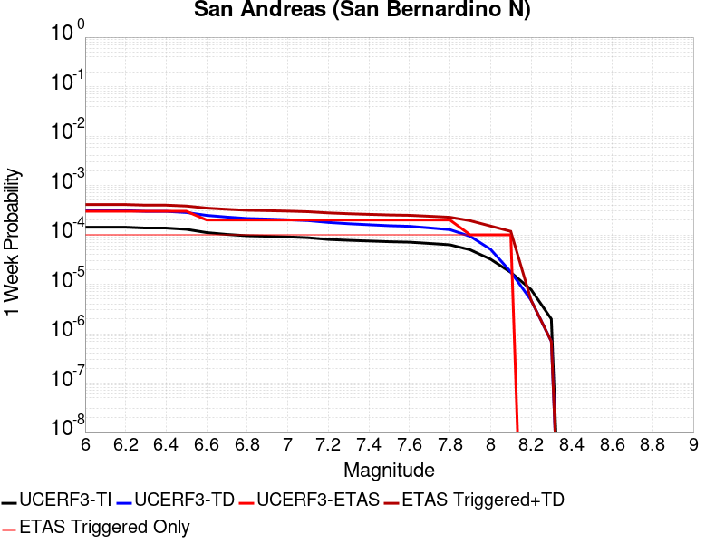 |  |  |  |

| Magnitude | 1 wk TI Prob | 1 wk TD Prob | 1 wk ETAS Prob | 1 wk ETAS/TD Gain | 1 wk ETAS Triggered+TD | 1 wk ETAS Triggered Only | 1 mo TI Prob | 1 mo TD Prob | 1 mo ETAS Prob | 1 mo ETAS/TD Gain | 1 mo ETAS Triggered+TD | 1 mo ETAS Triggered Only | 1 yr TI Prob | 1 yr TD Prob | 1 yr ETAS Prob | 1 yr ETAS/TD Gain | 1 yr ETAS Triggered+TD | 1 yr ETAS Triggered Only | 10 yr TI Prob | 10 yr TD Prob | 10 yr ETAS Prob | 10 yr ETAS/TD Gain | 10 yr ETAS Triggered+TD | 10 yr ETAS Triggered Only |
|-----|-----|-----|-----|-----|-----|-----|-----|-----|-----|-----|-----|-----|-----|-----|-----|-----|-----|-----|-----|-----|-----|-----|-----|-----|
| 6.0 | 1.4273766E-4 | 3.0990381E-4 | 3.0E-4 | 0.9680423 | 4.0987282E-4 | 1.0E-4 | 6.115894E-4 | 0.001327489 | 6.0E-4 | 0.45198113 | 0.0016270909 | 3.0E-4 | 0.0074207084 | 0.01604387 | 0.0098 | 0.6108252 | 0.019487716 | 0.0035 | 0.07177748 | 0.14769201 | 0.0981 | 0.6642201 | 0.17419879 | 0.0311 |
| 6.1 | 1.4273766E-4 | 3.0990381E-4 | 3.0E-4 | 0.9680423 | 4.0987282E-4 | 1.0E-4 | 6.115894E-4 | 0.001327489 | 6.0E-4 | 0.45198113 | 0.0016270909 | 3.0E-4 | 0.0074207084 | 0.01604387 | 0.0098 | 0.6108252 | 0.019487716 | 0.0035 | 0.07177748 | 0.14769201 | 0.0981 | 0.6642201 | 0.17419879 | 0.0311 |
| 6.2 | 1.4273766E-4 | 3.0990381E-4 | 3.0E-4 | 0.9680423 | 4.0987282E-4 | 1.0E-4 | 6.115894E-4 | 0.001327489 | 6.0E-4 | 0.45198113 | 0.0016270909 | 3.0E-4 | 0.0074207084 | 0.01604387 | 0.0098 | 0.6108252 | 0.019487716 | 0.0035 | 0.07177748 | 0.14769201 | 0.0981 | 0.6642201 | 0.17419879 | 0.0311 |
| 6.3 | 1.3730655E-4 | 2.9898214E-4 | 3.0E-4 | 1.0034044 | 3.9895225E-4 | 1.0E-4 | 5.883239E-4 | 0.0012807284 | 6.0E-4 | 0.4684834 | 0.0015803442 | 3.0E-4 | 0.0071393442 | 0.0154827535 | 0.0095 | 0.61358595 | 0.018830111 | 0.0034 | 0.06914291 | 0.14299165 | 0.095 | 0.6643745 | 0.16861619 | 0.0299 |
| 6.4 | 1.3730655E-4 | 2.9898214E-4 | 3.0E-4 | 1.0034044 | 3.9895225E-4 | 1.0E-4 | 5.883239E-4 | 0.0012807284 | 6.0E-4 | 0.4684834 | 0.0015803442 | 3.0E-4 | 0.0071393442 | 0.0154827535 | 0.0095 | 0.61358595 | 0.018830111 | 0.0034 | 0.06914291 | 0.14299165 | 0.095 | 0.6643745 | 0.16861619 | 0.0299 |
| 6.5 | 1.2942807E-4 | 2.831703E-4 | 3.0E-4 | 1.0594332 | 3.8314197E-4 | 1.0E-4 | 5.545738E-4 | 0.0012130276 | 6.0E-4 | 0.49463013 | 0.0015126637 | 3.0E-4 | 0.0067310524 | 0.014669821 | 0.009 | 0.6135044 | 0.018019943 | 0.0034 | 0.06530788 | 0.13614826 | 0.0903 | 0.6632476 | 0.16059525 | 0.0283 |
| 6.6 | 1.1125901E-4 | 2.4767424E-4 | 2.0E-4 | 0.80751234 | 3.4764947E-4 | 1.0E-4 | 4.767372E-4 | 0.0010610315 | 5.0E-4 | 0.47123954 | 0.0013607132 | 3.0E-4 | 0.005788839 | 0.012842156 | 0.0082 | 0.6385221 | 0.015902344 | 0.0031 | 0.056403454 | 0.120414585 | 0.081 | 0.67267597 | 0.14319585 | 0.0259 |
| 6.7 | 1.02209575E-4 | 2.290678E-4 | 2.0E-4 | 0.873104 | 3.2904488E-4 | 1.0E-4 | 4.3796748E-4 | 9.813511E-4 | 5.0E-4 | 0.50950164 | 0.0012810568 | 3.0E-4 | 0.0053192247 | 0.0118829 | 0.0077 | 0.6479899 | 0.01474844 | 0.0029 | 0.051936906 | 0.112195544 | 0.075 | 0.66847575 | 0.1333253 | 0.0238 |
| 6.8 | 9.610582E-5 | 2.144043E-4 | 2.0E-4 | 0.9328171 | 3.1438287E-4 | 1.0E-4 | 4.1181705E-4 | 9.185527E-4 | 5.0E-4 | 0.5443346 | 0.0012182771 | 3.0E-4 | 0.0050023515 | 0.0111262845 | 0.0072 | 0.6471163 | 0.013796244 | 0.0027 | 0.048912346 | 0.10562009 | 0.0704 | 0.66653985 | 0.12574364 | 0.0225 |
| 6.9 | 9.3877505E-5 | 2.0898355E-4 | 2.0E-4 | 0.95701313 | 3.0896266E-4 | 1.0E-4 | 4.0227012E-4 | 8.9533697E-4 | 5.0E-4 | 0.558449 | 0.0011950684 | 3.0E-4 | 0.0048866454 | 0.010846477 | 0.0066 | 0.6084925 | 0.013319361 | 0.0025 | 0.04780577 | 0.10321876 | 0.0676 | 0.65491974 | 0.12240987 | 0.0214 |
| 7.0 | 9.1019785E-5 | 2.0228841E-4 | 2.0E-4 | 0.9886874 | 3.022682E-4 | 1.0E-4 | 3.900265E-4 | 8.666629E-4 | 5.0E-4 | 0.5769256 | 0.0011664028 | 3.0E-4 | 0.0047382377 | 0.010500783 | 0.0063 | 0.5999552 | 0.012677682 | 0.0022 | 0.046384744 | 0.10019968 | 0.0651 | 0.64970267 | 0.118645586 | 0.0205 |
| 7.1 | 8.771155E-5 | 1.940751E-4 | 2.0E-4 | 1.0305289 | 2.9405567E-4 | 1.0E-4 | 3.758525E-4 | 8.314858E-4 | 5.0E-4 | 0.6013332 | 0.0011312363 | 3.0E-4 | 0.0045664064 | 0.010076536 | 0.0061 | 0.60536677 | 0.012056383 | 0.002 | 0.044737056 | 0.09652227 | 0.0623 | 0.6454469 | 0.11404973 | 0.0194 |
| 7.2 | 8.0830236E-5 | 1.7821639E-4 | 2.0E-4 | 1.1222312 | 2.7819857E-4 | 1.0E-4 | 3.4636928E-4 | 7.635611E-4 | 5.0E-4 | 0.6548264 | 0.0010633321 | 3.0E-4 | 0.0042088944 | 0.009256828 | 0.0053 | 0.57255036 | 0.011040166 | 0.0018 | 0.041300658 | 0.08929606 | 0.057 | 0.63832605 | 0.1057798 | 0.0181 |
| 7.3 | 7.7668235E-5 | 1.6774477E-4 | 2.0E-4 | 1.1922874 | 2.67728E-4 | 1.0E-4 | 3.328214E-4 | 7.187082E-4 | 4.0E-4 | 0.5565541 | 9.1856444E-4 | 2.0E-4 | 0.0040445733 | 0.0087152375 | 0.0048 | 0.55075955 | 0.010202164 | 0.0015 | 0.03971748 | 0.084592454 | 0.054 | 0.63835484 | 0.10033746 | 0.0172 |
| 7.4 | 7.520177E-5 | 1.600199E-4 | 2.0E-4 | 1.2498446 | 2.600039E-4 | 1.0E-4 | 3.2225347E-4 | 6.8561936E-4 | 4.0E-4 | 0.5834141 | 8.8548224E-4 | 2.0E-4 | 0.0039163795 | 0.008315527 | 0.0047 | 0.5652077 | 0.009703886 | 0.0014 | 0.038480744 | 0.08106743 | 0.0513 | 0.63280654 | 0.09586225 | 0.0161 |
| 7.5 | 7.274697E-5 | 1.5296489E-4 | 2.0E-4 | 1.3074895 | 2.529496E-4 | 1.0E-4 | 3.1173544E-4 | 6.5539917E-4 | 4.0E-4 | 0.6103151 | 8.552681E-4 | 2.0E-4 | 0.003788775 | 0.007950341 | 0.0045 | 0.56601346 | 0.009339211 | 0.0014 | 0.03724827 | 0.07780402 | 0.0481 | 0.61822 | 0.09172918 | 0.0151 |
| 7.6 | 7.1185845E-5 | 1.4870733E-4 | 2.0E-4 | 1.3449236 | 2.4869246E-4 | 1.0E-4 | 3.0504653E-4 | 6.371615E-4 | 4.0E-4 | 0.6277843 | 8.370341E-4 | 2.0E-4 | 0.0037076178 | 0.0077298954 | 0.0044 | 0.5692186 | 0.009119074 | 0.0014 | 0.036463667 | 0.07580683 | 0.0467 | 0.6160395 | 0.08957731 | 0.0149 |
| 7.7 | 6.709961E-5 | 1.3793135E-4 | 2.0E-4 | 1.4499967 | 2.3791756E-4 | 1.0E-4 | 2.8753807E-4 | 5.910005E-4 | 4.0E-4 | 0.67681843 | 7.908823E-4 | 2.0E-4 | 0.003495157 | 0.007171726 | 0.0039 | 0.5438022 | 0.008462402 | 0.0013 | 0.034406938 | 0.070681766 | 0.0434 | 0.61401975 | 0.08369222 | 0.014 |
| 7.8 | 6.300812E-5 | 1.2703829E-4 | 2.0E-4 | 1.5743284 | 2.270256E-4 | 1.0E-4 | 2.7000686E-4 | 5.443362E-4 | 4.0E-4 | 0.7348399 | 7.442274E-4 | 2.0E-4 | 0.0032823787 | 0.0066071805 | 0.0038 | 0.57513183 | 0.007898591 | 0.0013 | 0.032343175 | 0.065444425 | 0.0395 | 0.6035656 | 0.07721982 | 0.0126 |
| 7.9 | 4.983037E-5 | 9.326866E-5 | 1.0E-4 | 1.0721716 | 1.9325933E-4 | 1.0E-4 | 2.1354125E-4 | 3.996616E-4 | 3.0E-4 | 0.750635 | 5.9958163E-4 | 2.0E-4 | 0.0025967648 | 0.0048550325 | 0.0028 | 0.5767212 | 0.0058501773 | 0.001 | 0.025666296 | 0.048792165 | 0.0294 | 0.60255575 | 0.058209125 | 0.0099 |
| 8.0 | 3.2211527E-5 | 5.093469E-5 | 1.0E-4 | 1.9632986 | 1.509296E-4 | 1.0E-4 | 1.380421E-4 | 2.1827327E-4 | 3.0E-4 | 1.3744239 | 4.182296E-4 | 2.0E-4 | 0.0016793669 | 0.00265424 | 0.0018 | 0.6781602 | 0.003352382 | 7.0E-4 | 0.016667323 | 0.02720171 | 0.0166 | 0.6102557 | 0.0330385 | 0.006 |
| 8.1 | 1.743376E-5 | 1.7695216E-5 | 1.0E-4 | 5.6512446 | 1.17693446E-4 | 1.0E-4 | 7.471398E-5 | 7.583444E-5 | 2.0E-4 | 2.637324 | 2.7581927E-4 | 2.0E-4 | 9.0926304E-4 | 9.228938E-4 | 6.0E-4 | 0.65012896 | 0.0012226169 | 3.0E-4 | 0.009055517 | 0.009895436 | 0.0065 | 0.65686846 | 0.012370697 | 0.0025 |
| 8.2 | 7.831616E-6 | 4.727602E-6 | 0.0 | 0.0 | 4.727602E-6 | 0.0 | 3.3563636E-5 | 2.0260995E-5 | 1.0E-4 | 4.9355917 | 1.2025897E-4 | 1.0E-4 | 4.0856065E-4 | 2.4664975E-4 | 2.0E-4 | 0.8108664 | 3.4662508E-4 | 1.0E-4 | 0.004078103 | 0.0028085 | 0.002 | 0.7121239 | 0.003406815 | 6.0E-4 |
| 8.3 | 1.983087E-6 | 6.880041E-7 | 0.0 | 0.0 | 6.880041E-7 | 0.0 | 8.498917E-6 | 2.9485857E-6 | 0.0 | 0.0 | 2.9485857E-6 | 0.0 | 1.034694E-4 | 3.589845E-5 | 0.0 | 0.0 | 3.589845E-5 | 0.0 | 0.0010342124 | 4.2701262E-4 | 2.0E-4 | 0.46837023 | 5.269699E-4 | 1.0E-4 |

## Elsinore (Glen Ivy) rev
*[(top)](#table-of-contents)*

| 1 Week | 1 Month | 1 Year | 10 Year |
|-----|-----|-----|-----|
| 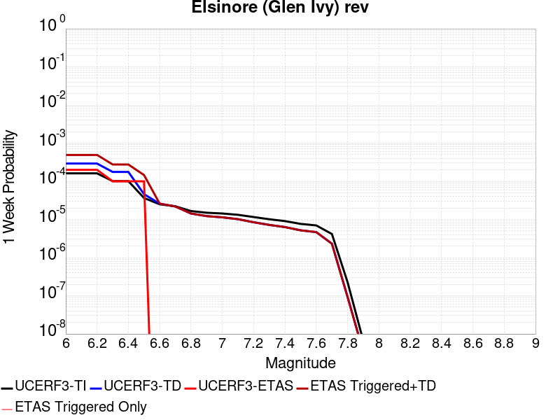 | 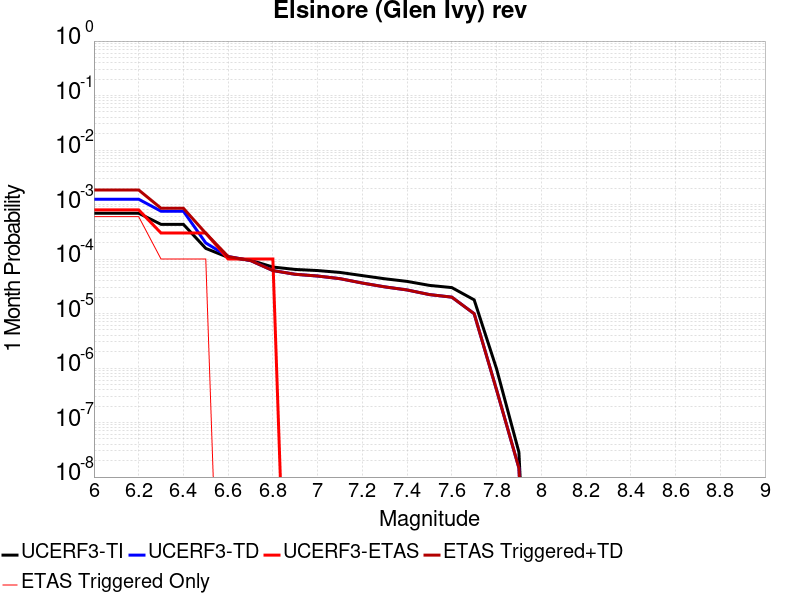 | 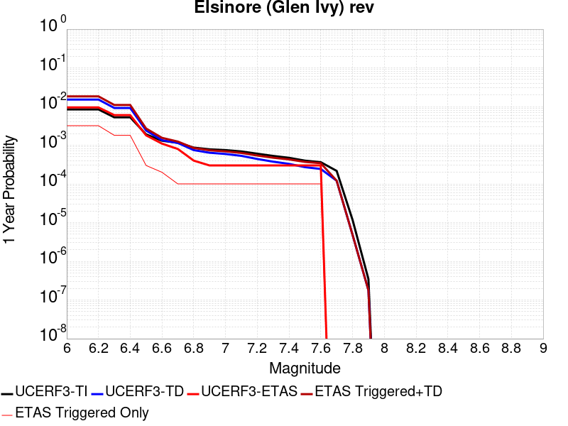 | 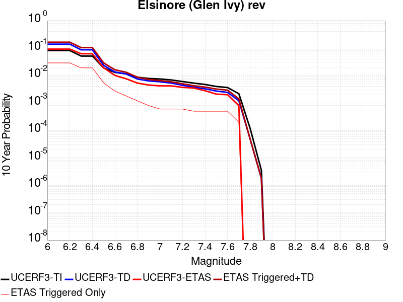 |

| Magnitude | 1 wk TI Prob | 1 wk TD Prob | 1 wk ETAS Prob | 1 wk ETAS/TD Gain | 1 wk ETAS Triggered+TD | 1 wk ETAS Triggered Only | 1 mo TI Prob | 1 mo TD Prob | 1 mo ETAS Prob | 1 mo ETAS/TD Gain | 1 mo ETAS Triggered+TD | 1 mo ETAS Triggered Only | 1 yr TI Prob | 1 yr TD Prob | 1 yr ETAS Prob | 1 yr ETAS/TD Gain | 1 yr ETAS Triggered+TD | 1 yr ETAS Triggered Only | 10 yr TI Prob | 10 yr TD Prob | 10 yr ETAS Prob | 10 yr ETAS/TD Gain | 10 yr ETAS Triggered+TD | 10 yr ETAS Triggered Only |
|-----|-----|-----|-----|-----|-----|-----|-----|-----|-----|-----|-----|-----|-----|-----|-----|-----|-----|-----|-----|-----|-----|-----|-----|-----|
| 6.0 | 1.6204086E-4 | 2.9251605E-4 | 2.0E-4 | 0.68372315 | 4.9245753E-4 | 2.0E-4 | 6.94276E-4 | 0.0012531171 | 8.0E-4 | 0.638408 | 0.0018523652 | 6.0E-4 | 0.008420097 | 0.015171497 | 0.0095 | 0.6261742 | 0.018322948 | 0.0032 | 0.081081145 | 0.13933165 | 0.0915 | 0.65670645 | 0.1641189 | 0.0288 |
| 6.1 | 1.6204086E-4 | 2.9251605E-4 | 2.0E-4 | 0.68372315 | 4.9245753E-4 | 2.0E-4 | 6.94276E-4 | 0.0012531171 | 8.0E-4 | 0.638408 | 0.0018523652 | 6.0E-4 | 0.008420097 | 0.015171497 | 0.0095 | 0.6261742 | 0.018322948 | 0.0032 | 0.081081145 | 0.13933165 | 0.0915 | 0.65670645 | 0.1641189 | 0.0288 |
| 6.2 | 1.6204086E-4 | 2.9251605E-4 | 2.0E-4 | 0.68372315 | 4.9245753E-4 | 2.0E-4 | 6.94276E-4 | 0.0012531171 | 8.0E-4 | 0.638408 | 0.0018523652 | 6.0E-4 | 0.008420097 | 0.015171497 | 0.0095 | 0.6261742 | 0.018322948 | 0.0032 | 0.081081145 | 0.13933165 | 0.0915 | 0.65670645 | 0.1641189 | 0.0288 |
| 6.3 | 1.0111737E-4 | 1.7629775E-4 | 1.0E-4 | 0.56722224 | 2.7628013E-4 | 1.0E-4 | 4.332882E-4 | 7.554589E-4 | 3.0E-4 | 0.39710963 | 8.5538335E-4 | 1.0E-4 | 0.005262531 | 0.009179472 | 0.006 | 0.65363234 | 0.010962949 | 0.0018 | 0.0513964 | 0.08675405 | 0.0624 | 0.7192748 | 0.10410572 | 0.019 |
| 6.4 | 1.0111737E-4 | 1.7629775E-4 | 1.0E-4 | 0.56722224 | 2.7628013E-4 | 1.0E-4 | 4.332882E-4 | 7.554589E-4 | 3.0E-4 | 0.39710963 | 8.5538335E-4 | 1.0E-4 | 0.005262531 | 0.009179472 | 0.006 | 0.65363234 | 0.010962949 | 0.0018 | 0.0513964 | 0.08675405 | 0.0624 | 0.7192748 | 0.10410572 | 0.019 |
| 6.5 | 3.6624708E-5 | 4.609726E-5 | 1.0E-4 | 2.1693263 | 1.4609264E-4 | 1.0E-4 | 1.569536E-4 | 1.9754675E-4 | 3.0E-4 | 1.5186279 | 2.97527E-4 | 1.0E-4 | 0.001909235 | 0.0024028358 | 0.0018 | 0.74911493 | 0.0027021149 | 3.0E-4 | 0.01892915 | 0.023553308 | 0.0191 | 0.81092644 | 0.028826121 | 0.0054 |
| 6.6 | 2.5051324E-5 | 2.597092E-5 | 0.0 | 0.0 | 2.597092E-5 | 0.0 | 1.073584E-4 | 1.1129944E-4 | 1.0E-4 | 0.89847714 | 1.1129944E-4 | 0.0 | 0.0013063047 | 0.0013542724 | 0.0011 | 0.8122443 | 0.0015540015 | 2.0E-4 | 0.012986525 | 0.013476744 | 0.0101 | 0.7494391 | 0.016140357 | 0.0027 |
| 6.7 | 2.2189772E-5 | 2.1921272E-5 | 0.0 | 0.0 | 2.1921272E-5 | 0.0 | 9.509556E-5 | 9.394513E-5 | 1.0E-4 | 1.0644511 | 9.394513E-5 | 0.0 | 0.0011571734 | 0.0011432177 | 8.0E-4 | 0.6997792 | 0.0012431034 | 1.0E-4 | 0.011511663 | 0.01139007 | 0.0076 | 0.66724783 | 0.013169568 | 0.0018 |
| 6.8 | 1.6654378E-5 | 1.4349544E-5 | 0.0 | 0.0 | 1.4349544E-5 | 0.0 | 7.137396E-5 | 6.149663E-5 | 1.0E-4 | 1.6261055 | 6.149663E-5 | 0.0 | 8.686314E-4 | 7.4846926E-4 | 4.0E-4 | 0.53442407 | 8.483944E-4 | 1.0E-4 | 0.008652439 | 0.007464598 | 0.0053 | 0.71001816 | 0.00865564 | 0.0012 |
| 6.9 | 1.5042909E-5 | 1.2265607E-5 | 0.0 | 0.0 | 1.2265607E-5 | 0.0 | 6.446802E-5 | 5.2565847E-5 | 0.0 | 0.0 | 5.2565847E-5 | 0.0 | 7.8461546E-4 | 6.398044E-4 | 3.0E-4 | 0.46889332 | 7.397404E-4 | 1.0E-4 | 0.007818509 | 0.0063835797 | 0.0045 | 0.70493364 | 0.007178473 | 8.0E-4 |
| 7.0 | 1.4361385E-5 | 1.1392162E-5 | 0.0 | 0.0 | 1.1392162E-5 | 0.0 | 6.154734E-5 | 4.8822654E-5 | 0.0 | 0.0 | 4.8822654E-5 | 0.0 | 7.490812E-4 | 5.9425656E-4 | 3.0E-4 | 0.50483245 | 6.9419714E-4 | 1.0E-4 | 0.007465612 | 0.005930479 | 0.0042 | 0.7082058 | 0.006526921 | 6.0E-4 |
| 7.1 | 1.3265571E-5 | 1.0195621E-5 | 0.0 | 0.0 | 1.0195621E-5 | 0.0 | 5.6851208E-5 | 4.3694803E-5 | 0.0 | 0.0 | 4.3694803E-5 | 0.0 | 6.919436E-4 | 5.3185684E-4 | 3.0E-4 | 0.5640615 | 6.318037E-4 | 1.0E-4 | 0.006897931 | 0.005309098 | 0.0042 | 0.79109484 | 0.0059059127 | 6.0E-4 |
| 7.2 | 1.1596403E-5 | 8.46623E-6 | 0.0 | 0.0 | 8.46623E-6 | 0.0 | 4.9697923E-5 | 3.6283345E-5 | 0.0 | 0.0 | 3.6283345E-5 | 0.0 | 6.049042E-4 | 4.4166186E-4 | 3.0E-4 | 0.6792527 | 5.416177E-4 | 1.0E-4 | 0.006032603 | 0.0044091586 | 0.0037 | 0.8391624 | 0.005006513 | 6.0E-4 |
| 7.3 | 1.0150827E-5 | 7.2083226E-6 | 0.0 | 0.0 | 7.2083226E-6 | 0.0 | 4.3502816E-5 | 3.0892454E-5 | 0.0 | 0.0 | 3.0892454E-5 | 0.0 | 5.2951806E-4 | 3.7605214E-4 | 3.0E-4 | 0.79776174 | 4.7601454E-4 | 1.0E-4 | 0.005282581 | 0.0037545003 | 0.0035 | 0.93221456 | 0.0042526233 | 5.0E-4 |
| 7.4 | 9.080705E-6 | 6.32672E-6 | 0.0 | 0.0 | 6.32672E-6 | 0.0 | 3.8916725E-5 | 2.7114238E-5 | 0.0 | 0.0 | 2.7114238E-5 | 0.0 | 4.7370812E-4 | 3.300672E-4 | 3.0E-4 | 0.9089058 | 4.3003418E-4 | 1.0E-4 | 0.004726996 | 0.0032959157 | 0.0028 | 0.8495363 | 0.0037942675 | 5.0E-4 |
| 7.5 | 7.671649E-6 | 5.204376E-6 | 0.0 | 0.0 | 5.204376E-6 | 0.0 | 3.287808E-5 | 2.2304284E-5 | 0.0 | 0.0 | 2.2304284E-5 | 0.0 | 4.0021708E-4 | 2.7152206E-4 | 3.0E-4 | 1.1048826 | 3.714949E-4 | 1.0E-4 | 0.0039949706 | 0.0027120274 | 0.0021 | 0.7743285 | 0.0032106712 | 5.0E-4 |
| 7.6 | 6.990086E-6 | 4.6680852E-6 | 0.0 | 0.0 | 4.6680852E-6 | 0.0 | 2.9957167E-5 | 2.0005933E-5 | 0.0 | 0.0 | 2.0005933E-5 | 0.0 | 3.6466747E-4 | 2.4354616E-4 | 3.0E-4 | 1.2317994 | 3.4352182E-4 | 1.0E-4 | 0.0036406964 | 0.002432908 | 0.002 | 0.8220615 | 0.0029316915 | 5.0E-4 |
| 7.7 | 4.163505E-6 | 2.3176701E-6 | 0.0 | 0.0 | 2.3176701E-6 | 0.0 | 1.7843471E-5 | 9.932838E-6 | 0.0 | 0.0 | 9.932838E-6 | 0.0 | 2.172226E-4 | 1.20926336E-4 | 0.0 | 0.0 | 1.20926336E-4 | 0.0 | 0.0021701038 | 0.0012086778 | 8.0E-4 | 0.6618803 | 0.001408436 | 2.0E-4 |
| 7.8 | 2.2692414E-7 | 9.313546E-8 | 0.0 | 0.0 | 9.313546E-8 | 0.0 | 9.725317E-7 | 3.9915196E-7 | 0.0 | 0.0 | 3.9915196E-7 | 0.0 | 1.1840509E-5 | 4.8596676E-6 | 0.0 | 0.0 | 4.8596676E-6 | 0.0 | 1.1839878E-4 | 4.859593E-5 | 0.0 | 0.0 | 4.859593E-5 | 0.0 |
| 7.9 | 6.676829E-9 | 3.4267709E-9 | 0.0 | 0.0 | 3.4267709E-9 | 0.0 | 2.861498E-8 | 1.4686159E-8 | 0.0 | 0.0 | 1.4686159E-8 | 0.0 | 3.4838732E-7 | 1.7880397E-7 | 0.0 | 0.0 | 1.7880397E-7 | 0.0 | 3.4838679E-6 | 1.7880385E-6 | 0.0 | 0.0 | 1.7880385E-6 | 0.0 |

## Calaveras (So) - Paicines extension 2011 CFM
*[(top)](#table-of-contents)*

| 1 Week | 1 Month | 1 Year | 10 Year |
|-----|-----|-----|-----|
|  |  |  |  |

| Magnitude | 1 wk TI Prob | 1 wk TD Prob | 1 wk ETAS Prob | 1 wk ETAS/TD Gain | 1 wk ETAS Triggered+TD | 1 wk ETAS Triggered Only | 1 mo TI Prob | 1 mo TD Prob | 1 mo ETAS Prob | 1 mo ETAS/TD Gain | 1 mo ETAS Triggered+TD | 1 mo ETAS Triggered Only | 1 yr TI Prob | 1 yr TD Prob | 1 yr ETAS Prob | 1 yr ETAS/TD Gain | 1 yr ETAS Triggered+TD | 1 yr ETAS Triggered Only | 10 yr TI Prob | 10 yr TD Prob | 10 yr ETAS Prob | 10 yr ETAS/TD Gain | 10 yr ETAS Triggered+TD | 10 yr ETAS Triggered Only |
|-----|-----|-----|-----|-----|-----|-----|-----|-----|-----|-----|-----|-----|-----|-----|-----|-----|-----|-----|-----|-----|-----|-----|-----|-----|
| 6.0 | 1.5183659E-4 | 3.0299783E-4 | 4.0E-4 | 1.3201416 | 6.029069E-4 | 3.0E-4 | 6.5056595E-4 | 0.0012973594 | 0.001 | 0.7707965 | 0.0017967107 | 5.0E-4 | 0.007891912 | 0.015582891 | 0.0104 | 0.66739863 | 0.019619001 | 0.0041 | 0.076174594 | 0.1375756 | 0.0923 | 0.67090386 | 0.16284463 | 0.0293 |
| 6.1 | 1.5024997E-4 | 2.9995097E-4 | 4.0E-4 | 1.3335513 | 5.9986097E-4 | 3.0E-4 | 6.437695E-4 | 0.0012843153 | 0.001 | 0.778625 | 0.0017836731 | 5.0E-4 | 0.0078097614 | 0.015426802 | 0.0102 | 0.66118693 | 0.019365095 | 0.004 | 0.075409345 | 0.1362479 | 0.0916 | 0.6723039 | 0.16112396 | 0.0288 |
| 6.2 | 1.2743923E-4 | 2.5098768E-4 | 4.0E-4 | 1.5937037 | 5.509124E-4 | 3.0E-4 | 5.460538E-4 | 0.0010747976 | 0.001 | 0.9304077 | 0.0015742602 | 5.0E-4 | 0.0066279583 | 0.012936405 | 0.0085 | 0.65706044 | 0.016193716 | 0.0033 | 0.064337276 | 0.11634466 | 0.0789 | 0.67815745 | 0.13817096 | 0.0247 |
| 6.3 | 1.1525114E-4 | 2.2385431E-4 | 4.0E-4 | 1.7868764 | 5.2378717E-4 | 3.0E-4 | 4.9383997E-4 | 9.587146E-4 | 9.0E-4 | 0.938757 | 0.0014582352 | 5.0E-4 | 0.0059959386 | 0.011557981 | 0.0075 | 0.64890224 | 0.014523308 | 0.003 | 0.058367174 | 0.10545349 | 0.0717 | 0.67992055 | 0.12549134 | 0.0224 |
| 6.4 | 1.07200925E-4 | 2.0627695E-4 | 4.0E-4 | 1.9391407 | 5.062151E-4 | 3.0E-4 | 4.5935164E-4 | 8.835058E-4 | 7.0E-4 | 0.79229814 | 0.0013830641 | 5.0E-4 | 0.0055782744 | 0.01066342 | 0.0072 | 0.67520547 | 0.013532496 | 0.0029 | 0.0544031 | 0.098273955 | 0.0668 | 0.6797325 | 0.11675934 | 0.0205 |
| 6.5 | 9.69631E-5 | 1.8526119E-4 | 4.0E-4 | 2.159114 | 4.8520562E-4 | 3.0E-4 | 4.1548995E-4 | 7.935387E-4 | 7.0E-4 | 0.8821246 | 0.001293142 | 5.0E-4 | 0.0050468626 | 0.009587359 | 0.0066 | 0.6884065 | 0.012162431 | 0.0026 | 0.04933773 | 0.08917394 | 0.0605 | 0.6784493 | 0.105933145 | 0.0184 |
| 6.6 | 8.0552316E-5 | 1.4863664E-4 | 4.0E-4 | 2.6911266 | 4.4859204E-4 | 3.0E-4 | 3.4517853E-4 | 6.368201E-4 | 7.0E-4 | 1.0992116 | 0.0011365017 | 5.0E-4 | 0.0041944524 | 0.007719438 | 0.0056 | 0.7254414 | 0.010100911 | 0.0024 | 0.04116161 | 0.073933005 | 0.0522 | 0.7060446 | 0.08884268 | 0.0161 |
| 6.7 | 7.815757E-5 | 1.440591E-4 | 4.0E-4 | 2.776638 | 4.440159E-4 | 3.0E-4 | 3.34918E-4 | 6.1721564E-4 | 7.0E-4 | 1.1341255 | 0.001116907 | 5.0E-4 | 0.004070005 | 0.007483083 | 0.0055 | 0.7349912 | 0.009865123 | 0.0024 | 0.039962657 | 0.07178749 | 0.0501 | 0.6978932 | 0.08617478 | 0.0155 |
| 6.8 | 6.965264E-5 | 1.2529595E-4 | 2.0E-4 | 1.5962209 | 3.252709E-4 | 2.0E-4 | 2.9847719E-4 | 5.3686014E-4 | 4.0E-4 | 0.745073 | 8.366991E-4 | 3.0E-4 | 0.0036279052 | 0.0065135644 | 0.0044 | 0.6755134 | 0.008500537 | 0.002 | 0.03569247 | 0.062926516 | 0.0441 | 0.70081747 | 0.075202174 | 0.0131 |
| 6.9 | 5.8000453E-5 | 9.968164E-5 | 1.0E-4 | 1.0031939 | 1.9967166E-4 | 1.0E-4 | 2.4854968E-4 | 4.2713762E-4 | 3.0E-4 | 0.7023497 | 6.270522E-4 | 2.0E-4 | 0.0030218933 | 0.0051880954 | 0.0033 | 0.63607156 | 0.006580832 | 0.0014 | 0.029811295 | 0.050695516 | 0.0358 | 0.7061769 | 0.060948003 | 0.0108 |
| 7.0 | 4.9865852E-5 | 8.4068415E-5 | 1.0E-4 | 1.1895074 | 1.8406002E-4 | 1.0E-4 | 2.1369329E-4 | 3.6024392E-4 | 3.0E-4 | 0.8327691 | 5.601719E-4 | 2.0E-4 | 0.0025986114 | 0.004377236 | 0.0027 | 0.6168276 | 0.0055719833 | 0.0012 | 0.025684336 | 0.04303462 | 0.0303 | 0.7040843 | 0.051838703 | 0.0092 |
| 7.1 | 4.283875E-5 | 6.968087E-5 | 1.0E-4 | 1.4351141 | 1.696739E-4 | 1.0E-4 | 1.8358172E-4 | 2.985984E-4 | 3.0E-4 | 1.0046939 | 4.985387E-4 | 2.0E-4 | 0.0022328163 | 0.0036294304 | 0.0024 | 0.6612608 | 0.004825075 | 0.0012 | 0.022105146 | 0.036053885 | 0.0253 | 0.70172745 | 0.04347627 | 0.0077 |
| 7.2 | 3.450115E-5 | 5.4509244E-5 | 0.0 | 0.0 | 5.4509244E-5 | 0.0 | 1.478537E-4 | 2.3359028E-4 | 1.0E-4 | 0.4281 | 2.3359028E-4 | 0.0 | 0.0017986323 | 0.002840281 | 0.0017 | 0.5985323 | 0.0036380088 | 8.0E-4 | 0.017841442 | 0.028472278 | 0.021 | 0.7375595 | 0.03410714 | 0.0058 |
| 7.3 | 2.5709045E-5 | 3.9591396E-5 | 0.0 | 0.0 | 3.9591396E-5 | 0.0 | 1.1017697E-4 | 1.6966647E-4 | 1.0E-4 | 0.58939165 | 1.6966647E-4 | 0.0 | 0.0013405791 | 0.0020637487 | 0.0014 | 0.67837715 | 0.0027623042 | 7.0E-4 | 0.013325208 | 0.020812701 | 0.0148 | 0.7111043 | 0.025219044 | 0.0045 |
| 7.4 | 1.8003093E-5 | 2.7654243E-5 | 0.0 | 0.0 | 2.7654243E-5 | 0.0 | 7.715383E-5 | 1.1851281E-4 | 1.0E-4 | 0.84379065 | 1.1851281E-4 | 0.0 | 9.3894306E-4 | 0.0014419407 | 0.0011 | 0.7628608 | 0.0019412197 | 5.0E-4 | 0.009349857 | 0.0146336295 | 0.0109 | 0.74485964 | 0.017885339 | 0.0033 |
| 7.5 | 1.5595824E-5 | 2.5012372E-5 | 0.0 | 0.0 | 2.5012372E-5 | 0.0 | 6.683753E-5 | 1.0719149E-4 | 1.0E-4 | 0.9329099 | 1.0719149E-4 | 0.0 | 8.134431E-4 | 0.0013042772 | 9.0E-4 | 0.69003737 | 0.001803625 | 5.0E-4 | 0.008104719 | 0.013256188 | 0.0096 | 0.7241901 | 0.01621642 | 0.003 |
| 7.6 | 1.1110309E-5 | 1.8564004E-5 | 0.0 | 0.0 | 1.8564004E-5 | 0.0 | 4.761474E-5 | 7.95576E-5 | 0.0 | 0.0 | 7.95576E-5 | 0.0 | 5.795553E-4 | 9.681847E-4 | 6.0E-4 | 0.61971647 | 0.0013677974 | 4.0E-4 | 0.0057804612 | 0.009882825 | 0.0071 | 0.71841806 | 0.012160094 | 0.0023 |
| 7.7 | 6.2140443E-6 | 9.9548215E-6 | 0.0 | 0.0 | 9.9548215E-6 | 0.0 | 2.6631347E-5 | 4.266282E-5 | 0.0 | 0.0 | 4.266282E-5 | 0.0 | 3.241884E-4 | 5.1929615E-4 | 3.0E-4 | 0.577705 | 7.191923E-4 | 2.0E-4 | 0.0032371588 | 0.00538349 | 0.0039 | 0.72443706 | 0.0067759533 | 0.0014 |
| 7.8 | 5.305533E-6 | 9.00452E-6 | 0.0 | 0.0 | 9.00452E-6 | 0.0 | 2.27378E-5 | 3.859023E-5 | 0.0 | 0.0 | 3.859023E-5 | 0.0 | 2.7679754E-4 | 4.6973483E-4 | 3.0E-4 | 0.63865817 | 6.696409E-4 | 2.0E-4 | 0.0027645302 | 0.004865346 | 0.0036 | 0.7399268 | 0.006159021 | 0.0013 |
| 7.9 | 3.363505E-6 | 7.0710216E-6 | 0.0 | 0.0 | 7.0710216E-6 | 0.0 | 1.4414942E-5 | 3.0304027E-5 | 0.0 | 0.0 | 3.0304027E-5 | 0.0 | 1.7548777E-4 | 3.6888913E-4 | 3.0E-4 | 0.81325245 | 5.688154E-4 | 2.0E-4 | 0.0017534926 | 0.0037968648 | 0.0031 | 0.8164631 | 0.0049923086 | 0.0012 |
| 8.0 | 2.0271132E-6 | 4.2371266E-6 | 0.0 | 0.0 | 4.2371266E-6 | 0.0 | 8.687599E-6 | 1.8158988E-5 | 0.0 | 0.0 | 1.8158988E-5 | 0.0 | 1.05766376E-4 | 2.2106328E-4 | 1.0E-4 | 0.45235914 | 3.2104118E-4 | 1.0E-4 | 0.0010571606 | 0.0022653474 | 0.0017 | 0.7504368 | 0.003063535 | 8.0E-4 |
| 8.1 | 1.2206116E-6 | 2.278714E-6 | 0.0 | 0.0 | 2.278714E-6 | 0.0 | 5.2311816E-6 | 9.765881E-6 | 0.0 | 0.0 | 9.765881E-6 | 0.0 | 6.3687774E-5 | 1.1889315E-4 | 1.0E-4 | 0.8410914 | 2.1888125E-4 | 1.0E-4 | 6.366953E-4 | 0.0012227265 | 0.0011 | 0.8996288 | 0.0017221152 | 5.0E-4 |

## Hayward (So) extension 2011 CFM
*[(top)](#table-of-contents)*

| 1 Week | 1 Month | 1 Year | 10 Year |
|-----|-----|-----|-----|
|  |  |  |  |

| Magnitude | 1 wk TI Prob | 1 wk TD Prob | 1 wk ETAS Prob | 1 wk ETAS/TD Gain | 1 wk ETAS Triggered+TD | 1 wk ETAS Triggered Only | 1 mo TI Prob | 1 mo TD Prob | 1 mo ETAS Prob | 1 mo ETAS/TD Gain | 1 mo ETAS Triggered+TD | 1 mo ETAS Triggered Only | 1 yr TI Prob | 1 yr TD Prob | 1 yr ETAS Prob | 1 yr ETAS/TD Gain | 1 yr ETAS Triggered+TD | 1 yr ETAS Triggered Only | 10 yr TI Prob | 10 yr TD Prob | 10 yr ETAS Prob | 10 yr ETAS/TD Gain | 10 yr ETAS Triggered+TD | 10 yr ETAS Triggered Only |
|-----|-----|-----|-----|-----|-----|-----|-----|-----|-----|-----|-----|-----|-----|-----|-----|-----|-----|-----|-----|-----|-----|-----|-----|-----|
| 6.0 | 1.1721256E-4 | 2.3521947E-4 | 3.0E-4 | 1.2754047 | 5.351489E-4 | 3.0E-4 | 5.022428E-4 | 0.001007451 | 7.0E-4 | 0.6948229 | 0.0016068465 | 6.0E-4 | 0.0060976758 | 0.0121734785 | 0.011 | 0.9036037 | 0.016026001 | 0.0039 | 0.0593305 | 0.11223979 | 0.0926 | 0.8250193 | 0.13709708 | 0.028 |
| 6.1 | 6.99169E-5 | 1.3682294E-4 | 2.0E-4 | 1.4617432 | 3.3679558E-4 | 2.0E-4 | 2.9960944E-4 | 5.861606E-4 | 4.0E-4 | 0.6824069 | 8.859847E-4 | 3.0E-4 | 0.0036416445 | 0.0071071615 | 0.0066 | 0.9286408 | 0.009688683 | 0.0026 | 0.035825435 | 0.067268156 | 0.0496 | 0.73734736 | 0.08284478 | 0.0167 |
| 6.2 | 6.99169E-5 | 1.3682294E-4 | 2.0E-4 | 1.4617432 | 3.3679558E-4 | 2.0E-4 | 2.9960944E-4 | 5.861606E-4 | 4.0E-4 | 0.6824069 | 8.859847E-4 | 3.0E-4 | 0.0036416445 | 0.0071071615 | 0.0066 | 0.9286408 | 0.009688683 | 0.0026 | 0.035825435 | 0.067268156 | 0.0496 | 0.73734736 | 0.08284478 | 0.0167 |
| 6.3 | 6.970908E-5 | 1.3650513E-4 | 2.0E-4 | 1.4651464 | 3.3647782E-4 | 2.0E-4 | 2.9871898E-4 | 5.8479945E-4 | 4.0E-4 | 0.6839952 | 8.8462397E-4 | 3.0E-4 | 0.0036308395 | 0.0070907357 | 0.0066 | 0.930792 | 0.0096723 | 0.0026 | 0.035720866 | 0.06711735 | 0.0495 | 0.7375142 | 0.08269649 | 0.0167 |
| 6.4 | 6.9517155E-5 | 1.3617531E-4 | 2.0E-4 | 1.468695 | 3.3614808E-4 | 2.0E-4 | 2.9789665E-4 | 5.833867E-4 | 4.0E-4 | 0.68565154 | 8.832117E-4 | 3.0E-4 | 0.0036208609 | 0.007073697 | 0.0066 | 0.93303406 | 0.009655305 | 0.0026 | 0.03562429 | 0.066961706 | 0.0493 | 0.7362417 | 0.082450144 | 0.0166 |
| 6.5 | 4.786248E-5 | 9.303111E-5 | 2.0E-4 | 2.1498187 | 2.930125E-4 | 2.0E-4 | 2.0510878E-4 | 3.986461E-4 | 3.0E-4 | 0.75254714 | 6.985265E-4 | 3.0E-4 | 0.0024943394 | 0.004843143 | 0.0054 | 1.1149784 | 0.0072315196 | 0.0024 | 0.02466527 | 0.04641175 | 0.0346 | 0.74550086 | 0.057568733 | 0.0117 |
| 6.6 | 4.4662214E-5 | 8.7730434E-5 | 2.0E-4 | 2.2797105 | 2.877129E-4 | 2.0E-4 | 1.9139545E-4 | 3.759359E-4 | 3.0E-4 | 0.7980084 | 6.7582313E-4 | 3.0E-4 | 0.0023277493 | 0.0045678667 | 0.005 | 1.0946028 | 0.0068573607 | 0.0023 | 0.02303517 | 0.043816496 | 0.0325 | 0.74172974 | 0.05414328 | 0.0108 |
| 6.7 | 3.884542E-5 | 7.7629156E-5 | 1.0E-4 | 1.2881758 | 1.7762139E-4 | 1.0E-4 | 1.6646975E-4 | 3.326564E-4 | 2.0E-4 | 0.60122097 | 5.3258985E-4 | 2.0E-4 | 0.002024885 | 0.004043004 | 0.0043 | 1.0635656 | 0.0061345138 | 0.0021 | 0.020065336 | 0.0388833 | 0.0275 | 0.7072446 | 0.04772557 | 0.0092 |
| 6.8 | 3.4221863E-5 | 6.7658715E-5 | 1.0E-4 | 1.4780062 | 1.6765195E-4 | 1.0E-4 | 1.4665688E-4 | 2.89936E-4 | 2.0E-4 | 0.6898074 | 4.89878E-4 | 2.0E-4 | 0.0017840851 | 0.0035246678 | 0.0036 | 1.0213728 | 0.005417971 | 0.0019 | 0.017698295 | 0.034021176 | 0.0238 | 0.6995643 | 0.04116942 | 0.0074 |
| 6.9 | 1.6927712E-5 | 2.9631337E-5 | 1.0E-4 | 3.3748055 | 1.2962837E-4 | 1.0E-4 | 7.2545314E-5 | 1.2698557E-4 | 1.0E-4 | 0.787491 | 2.2697287E-4 | 1.0E-4 | 8.828813E-4 | 0.0015450083 | 0.0012 | 0.7766949 | 0.0020442358 | 5.0E-4 | 0.008793819 | 0.015260744 | 0.009 | 0.58974844 | 0.017525645 | 0.0023 |
| 7.0 | 1.2509653E-5 | 2.2127879E-5 | 0.0 | 0.0 | 2.2127879E-5 | 0.0 | 5.3611697E-5 | 9.483056E-5 | 0.0 | 0.0 | 9.483056E-5 | 0.0 | 6.525269E-4 | 0.0011539933 | 6.0E-4 | 0.5199337 | 0.001453647 | 3.0E-4 | 0.0065061417 | 0.011423799 | 0.006 | 0.5252193 | 0.012906663 | 0.0015 |
| 7.1 | 8.751583E-6 | 1.46986695E-5 | 0.0 | 0.0 | 1.46986695E-5 | 0.0 | 3.750624E-5 | 6.299281E-5 | 0.0 | 0.0 | 6.299281E-5 | 0.0 | 4.5654282E-4 | 7.6667324E-4 | 4.0E-4 | 0.52173465 | 0.0010664433 | 3.0E-4 | 0.0045560603 | 0.007653102 | 0.0047 | 0.6141301 | 0.009141622 | 0.0015 |
| 7.2 | 6.354379E-6 | 1.1301989E-5 | 0.0 | 0.0 | 1.1301989E-5 | 0.0 | 2.7232769E-5 | 4.843622E-5 | 0.0 | 0.0 | 4.843622E-5 | 0.0 | 3.3150852E-4 | 5.8955606E-4 | 4.0E-4 | 0.6784766 | 8.893792E-4 | 3.0E-4 | 0.0033101442 | 0.0059044003 | 0.0041 | 0.6943974 | 0.007097315 | 0.0012 |
| 7.3 | 4.645554E-6 | 8.660762E-6 | 0.0 | 0.0 | 8.660762E-6 | 0.0 | 1.9909365E-5 | 3.7117046E-5 | 0.0 | 0.0 | 3.7117046E-5 | 0.0 | 2.4236954E-4 | 4.5181013E-4 | 4.0E-4 | 0.88532764 | 7.516746E-4 | 3.0E-4 | 0.0024210536 | 0.0045332885 | 0.0034 | 0.7500074 | 0.0054292087 | 9.0E-4 |
| 7.4 | 4.23437E-6 | 7.851296E-6 | 0.0 | 0.0 | 7.851296E-6 | 0.0 | 1.8147173E-5 | 3.3648E-5 | 0.0 | 0.0 | 3.3648E-5 | 0.0 | 2.2091944E-4 | 4.095911E-4 | 3.0E-4 | 0.7324378 | 7.094682E-4 | 3.0E-4 | 0.0022069993 | 0.0041123135 | 0.003 | 0.7295164 | 0.0050086123 | 9.0E-4 |
| 7.5 | 2.2187417E-6 | 3.887824E-6 | 0.0 | 0.0 | 3.887824E-6 | 0.0 | 9.508858E-6 | 1.666201E-5 | 0.0 | 0.0 | 1.666201E-5 | 0.0 | 1.157642E-4 | 2.0284363E-4 | 1.0E-4 | 0.4929906 | 3.0282335E-4 | 1.0E-4 | 0.0011570391 | 0.0020414833 | 0.0014 | 0.6857759 | 0.002241075 | 2.0E-4 |
| 7.6 | 2.7952495E-8 | 3.823518E-8 | 0.0 | 0.0 | 3.823518E-8 | 0.0 | 1.1979641E-7 | 1.6386504E-7 | 0.0 | 0.0 | 1.6386504E-7 | 0.0 | 1.4585203E-6 | 1.995055E-6 | 0.0 | 0.0 | 1.995055E-6 | 0.0 | 1.4585107E-5 | 2.006026E-5 | 0.0 | 0.0 | 2.006026E-5 | 0.0 |
| 7.7 | 1.7192724E-8 | 2.309186E-8 | 0.0 | 0.0 | 2.309186E-8 | 0.0 | 7.36831E-8 | 9.896512E-8 | 0.0 | 0.0 | 9.896512E-8 | 0.0 | 8.9709135E-7 | 1.2048996E-6 | 0.0 | 0.0 | 1.2048996E-6 | 0.0 | 8.970877E-6 | 1.2135361E-5 | 0.0 | 0.0 | 1.2135361E-5 | 0.0 |

## San Andreas (Offshore) 2011 CFM
*[(top)](#table-of-contents)*

| 1 Week | 1 Month | 1 Year | 10 Year |
|-----|-----|-----|-----|
|  |  |  |  |

| Magnitude | 1 wk TI Prob | 1 wk TD Prob | 1 wk ETAS Prob | 1 wk ETAS/TD Gain | 1 wk ETAS Triggered+TD | 1 wk ETAS Triggered Only | 1 mo TI Prob | 1 mo TD Prob | 1 mo ETAS Prob | 1 mo ETAS/TD Gain | 1 mo ETAS Triggered+TD | 1 mo ETAS Triggered Only | 1 yr TI Prob | 1 yr TD Prob | 1 yr ETAS Prob | 1 yr ETAS/TD Gain | 1 yr ETAS Triggered+TD | 1 yr ETAS Triggered Only | 10 yr TI Prob | 10 yr TD Prob | 10 yr ETAS Prob | 10 yr ETAS/TD Gain | 10 yr ETAS Triggered+TD | 10 yr ETAS Triggered Only |
|-----|-----|-----|-----|-----|-----|-----|-----|-----|-----|-----|-----|-----|-----|-----|-----|-----|-----|-----|-----|-----|-----|-----|-----|-----|
| 6.0 | 1.7072787E-4 | 1.8721544E-4 | 1.0E-4 | 0.534144 | 2.8719672E-4 | 1.0E-4 | 7.3148566E-4 | 8.0210745E-4 | 3.0E-4 | 0.37401474 | 9.0202724E-4 | 1.0E-4 | 0.008869528 | 0.009722419 | 0.0065 | 0.6685579 | 0.012495196 | 0.0028 | 0.085237645 | 0.09457582 | 0.0675 | 0.7137131 | 0.12137637 | 0.0296 |
| 6.1 | 1.7072787E-4 | 1.8721544E-4 | 1.0E-4 | 0.534144 | 2.8719672E-4 | 1.0E-4 | 7.3148566E-4 | 8.0210745E-4 | 3.0E-4 | 0.37401474 | 9.0202724E-4 | 1.0E-4 | 0.008869528 | 0.009722419 | 0.0065 | 0.6685579 | 0.012495196 | 0.0028 | 0.085237645 | 0.09457582 | 0.0675 | 0.7137131 | 0.12137637 | 0.0296 |
| 6.2 | 1.6312556E-4 | 1.792449E-4 | 1.0E-4 | 0.5578959 | 2.7922698E-4 | 1.0E-4 | 6.989222E-4 | 7.679686E-4 | 3.0E-4 | 0.39064097 | 8.6789177E-4 | 1.0E-4 | 0.008476226 | 0.009310407 | 0.0063 | 0.6766622 | 0.012084337 | 0.0028 | 0.08160117 | 0.0906796 | 0.0646 | 0.71239835 | 0.116686165 | 0.0286 |
| 6.3 | 1.5103363E-4 | 1.6429987E-4 | 1.0E-4 | 0.60864323 | 2.6428344E-4 | 1.0E-4 | 6.471264E-4 | 7.0395437E-4 | 3.0E-4 | 0.426164 | 8.0388394E-4 | 1.0E-4 | 0.007850339 | 0.008537386 | 0.0059 | 0.69107807 | 0.011016043 | 0.0025 | 0.075787395 | 0.083437145 | 0.059 | 0.7071191 | 0.10671784 | 0.0254 |
| 6.4 | 1.5047993E-4 | 1.6316205E-4 | 1.0E-4 | 0.6128876 | 2.6314575E-4 | 1.0E-4 | 6.4475456E-4 | 6.9908064E-4 | 3.0E-4 | 0.42913505 | 7.9901074E-4 | 1.0E-4 | 0.007821669 | 0.00847851 | 0.0059 | 0.69587696 | 0.010957314 | 0.0025 | 0.0755203 | 0.08291759 | 0.0587 | 0.70793176 | 0.10611978 | 0.0253 |
| 6.5 | 1.2760791E-4 | 1.3343433E-4 | 1.0E-4 | 0.7494323 | 2.3342099E-4 | 1.0E-4 | 5.467764E-4 | 5.717374E-4 | 3.0E-4 | 0.52471644 | 6.716802E-4 | 1.0E-4 | 0.0066367025 | 0.006938945 | 0.0042 | 0.6052793 | 0.008925067 | 0.002 | 0.064419635 | 0.0684414 | 0.0451 | 0.65895784 | 0.08679311 | 0.0197 |
| 6.6 | 1.1063525E-4 | 1.12099435E-4 | 1.0E-4 | 0.8920651 | 2.1208823E-4 | 1.0E-4 | 4.740649E-4 | 4.803387E-4 | 2.0E-4 | 0.41637287 | 5.802907E-4 | 1.0E-4 | 0.0057564764 | 0.005832633 | 0.0027 | 0.4629127 | 0.007025634 | 0.0012 | 0.05609626 | 0.05784239 | 0.0358 | 0.61892325 | 0.0728227 | 0.0159 |
| 6.7 | 1.0391049E-4 | 1.03160106E-4 | 1.0E-4 | 0.96936697 | 2.0314979E-4 | 1.0E-4 | 4.4525467E-4 | 4.4204076E-4 | 2.0E-4 | 0.45244697 | 5.4199656E-4 | 1.0E-4 | 0.0054075094 | 0.0053687436 | 0.0025 | 0.4656583 | 0.0064628376 | 0.0011 | 0.052778035 | 0.05340401 | 0.0318 | 0.5954609 | 0.0665617 | 0.0139 |
| 6.8 | 1.0096706E-4 | 9.835799E-5 | 1.0E-4 | 1.0166942 | 1.9834815E-4 | 1.0E-4 | 4.3264418E-4 | 4.2146703E-4 | 2.0E-4 | 0.47453296 | 5.2142487E-4 | 1.0E-4 | 0.0052547283 | 0.005119455 | 0.0023 | 0.44926658 | 0.0061143357 | 0.001 | 0.051321987 | 0.05113353 | 0.03 | 0.5866992 | 0.063753456 | 0.0133 |
| 6.9 | 9.800265E-5 | 9.273098E-5 | 1.0E-4 | 1.0783882 | 1.9272171E-4 | 1.0E-4 | 4.1994374E-4 | 3.9735882E-4 | 2.0E-4 | 0.50332344 | 4.973191E-4 | 1.0E-4 | 0.0051008356 | 0.0048272707 | 0.0022 | 0.45574406 | 0.0058224434 | 0.001 | 0.049853306 | 0.048488364 | 0.0279 | 0.57539576 | 0.060096804 | 0.0122 |
| 7.0 | 9.4642375E-5 | 8.694709E-5 | 1.0E-4 | 1.1501248 | 1.869384E-4 | 1.0E-4 | 4.0554712E-4 | 3.72578E-4 | 2.0E-4 | 0.5368003 | 4.7254073E-4 | 1.0E-4 | 0.004926363 | 0.004526855 | 0.0022 | 0.4859886 | 0.0055223284 | 0.001 | 0.048185747 | 0.04570121 | 0.0262 | 0.573289 | 0.056484785 | 0.0113 |
| 7.1 | 9.0996844E-5 | 8.056058E-5 | 1.0E-4 | 1.2413019 | 1.8055252E-4 | 1.0E-4 | 3.8992817E-4 | 3.4521474E-4 | 2.0E-4 | 0.5793495 | 4.4518022E-4 | 1.0E-4 | 0.004737046 | 0.004195037 | 0.0021 | 0.5005916 | 0.005190842 | 0.001 | 0.04637333 | 0.042589325 | 0.0245 | 0.57526153 | 0.052642137 | 0.0105 |
| 7.2 | 8.848287E-5 | 7.6909644E-5 | 1.0E-4 | 1.300227 | 1.7690196E-4 | 1.0E-4 | 3.791572E-4 | 3.2957192E-4 | 2.0E-4 | 0.6068478 | 4.2953898E-4 | 1.0E-4 | 0.004606472 | 0.0040053003 | 0.0019 | 0.4743714 | 0.0050012954 | 0.001 | 0.045121472 | 0.040764637 | 0.0231 | 0.5666676 | 0.04987737 | 0.0095 |
| 7.3 | 7.9280784E-5 | 5.886845E-5 | 1.0E-4 | 1.6987028 | 1.5886256E-4 | 1.0E-4 | 3.3973053E-4 | 2.522695E-4 | 2.0E-4 | 0.79280293 | 3.5224427E-4 | 1.0E-4 | 0.004128377 | 0.0030671514 | 0.0016 | 0.5216567 | 0.004064084 | 0.001 | 0.040525194 | 0.031688765 | 0.0184 | 0.58064747 | 0.039338425 | 0.0079 |
| 7.4 | 6.468038E-5 | 3.6269066E-5 | 0.0 | 0.0 | 3.6269066E-5 | 0.0 | 2.771722E-4 | 1.554299E-4 | 1.0E-4 | 0.6433769 | 1.554299E-4 | 0.0 | 0.0033693502 | 0.0018907704 | 9.0E-4 | 0.47599646 | 0.002489636 | 6.0E-4 | 0.0331872 | 0.019943256 | 0.0109 | 0.5465507 | 0.024255505 | 0.0044 |
| 7.5 | 4.930574E-5 | 1.1868133E-5 | 0.0 | 0.0 | 1.1868133E-5 | 0.0 | 2.1129321E-4 | 5.0862443E-5 | 1.0E-4 | 1.9660873 | 5.0862443E-5 | 0.0 | 0.0025694598 | 6.190758E-4 | 2.0E-4 | 0.32306224 | 7.1901386E-4 | 1.0E-4 | 0.02539953 | 0.006988064 | 0.0035 | 0.500854 | 0.007981076 | 0.001 |
| 7.6 | 4.612566E-5 | 9.584499E-6 | 0.0 | 0.0 | 9.584499E-6 | 0.0 | 1.9766642E-4 | 4.1075786E-5 | 0.0 | 0.0 | 4.1075786E-5 | 0.0 | 0.0024039324 | 4.999842E-4 | 1.0E-4 | 0.20000632 | 5.999342E-4 | 1.0E-4 | 0.023780935 | 0.00572244 | 0.0024 | 0.41940153 | 0.006517862 | 8.0E-4 |
| 7.7 | 3.9435414E-5 | 5.0048866E-6 | 0.0 | 0.0 | 5.0048866E-6 | 0.0 | 1.6899795E-4 | 2.1449338E-5 | 0.0 | 0.0 | 2.1449338E-5 | 0.0 | 0.0020556084 | 2.6111456E-4 | 1.0E-4 | 0.38297367 | 3.6108846E-4 | 1.0E-4 | 0.020366974 | 0.0031907612 | 0.0013 | 0.4074263 | 0.0036891657 | 5.0E-4 |
| 7.8 | 2.7787428E-5 | 3.3536287E-6 | 0.0 | 0.0 | 3.3536287E-6 | 0.0 | 1.1908354E-4 | 1.4372615E-5 | 0.0 | 0.0 | 1.4372615E-5 | 0.0 | 0.0014488777 | 1.7497256E-4 | 0.0 | 0.0 | 1.7497256E-4 | 0.0 | 0.014394675 | 0.0021416345 | 8.0E-4 | 0.37354648 | 0.002440992 | 3.0E-4 |
| 7.9 | 1.590671E-5 | 2.7284348E-6 | 0.0 | 0.0 | 2.7284348E-6 | 0.0 | 6.816983E-5 | 1.169324E-5 | 0.0 | 0.0 | 1.169324E-5 | 0.0 | 8.2965166E-4 | 1.4235592E-4 | 0.0 | 0.0 | 1.4235592E-4 | 0.0 | 0.008265611 | 0.001717384 | 8.0E-4 | 0.46582478 | 0.0020168687 | 3.0E-4 |
| 8.0 | 9.193638E-6 | 2.3325933E-6 | 0.0 | 0.0 | 2.3325933E-6 | 0.0 | 3.940071E-5 | 9.99679E-6 | 0.0 | 0.0 | 9.99679E-6 | 0.0 | 4.7959806E-4 | 1.2170414E-4 | 0.0 | 0.0 | 1.2170414E-4 | 0.0 | 0.0047856434 | 0.0014597047 | 7.0E-4 | 0.47954905 | 0.0017592668 | 3.0E-4 |
| 8.1 | 5.601576E-6 | 1.9984789E-6 | 0.0 | 0.0 | 1.9984789E-6 | 0.0 | 2.4006533E-5 | 8.564882E-6 | 0.0 | 0.0 | 8.564882E-6 | 0.0 | 2.9224035E-4 | 1.0427247E-4 | 0.0 | 0.0 | 1.0427247E-4 | 0.0 | 0.0029185633 | 0.0012651279 | 7.0E-4 | 0.5533038 | 0.0015647484 | 3.0E-4 |
| 8.2 | 4.3508785E-6 | 1.6652227E-6 | 0.0 | 0.0 | 1.6652227E-6 | 0.0 | 1.864649E-5 | 7.1366494E-6 | 0.0 | 0.0 | 7.1366494E-6 | 0.0 | 2.2699735E-4 | 8.6885266E-5 | 0.0 | 0.0 | 8.6885266E-5 | 0.0 | 0.0022676561 | 0.0010487458 | 6.0E-4 | 0.5721119 | 0.0013484312 | 3.0E-4 |
| 8.3 | 1.9573292E-6 | 6.7481693E-7 | 0.0 | 0.0 | 6.7481693E-7 | 0.0 | 8.388526E-6 | 2.8920695E-6 | 0.0 | 0.0 | 2.8920695E-6 | 0.0 | 1.0212552E-4 | 3.521039E-5 | 0.0 | 0.0 | 3.521039E-5 | 0.0 | 0.001020786 | 4.1982954E-4 | 2.0E-4 | 0.4763838 | 5.1978754E-4 | 1.0E-4 |

## San Andreas (Cholame) rev
*[(top)](#table-of-contents)*

| 1 Week | 1 Month | 1 Year | 10 Year |
|-----|-----|-----|-----|
|  |  |  |  |

| Magnitude | 1 wk TI Prob | 1 wk TD Prob | 1 wk ETAS Prob | 1 wk ETAS/TD Gain | 1 wk ETAS Triggered+TD | 1 wk ETAS Triggered Only | 1 mo TI Prob | 1 mo TD Prob | 1 mo ETAS Prob | 1 mo ETAS/TD Gain | 1 mo ETAS Triggered+TD | 1 mo ETAS Triggered Only | 1 yr TI Prob | 1 yr TD Prob | 1 yr ETAS Prob | 1 yr ETAS/TD Gain | 1 yr ETAS Triggered+TD | 1 yr ETAS Triggered Only | 10 yr TI Prob | 10 yr TD Prob | 10 yr ETAS Prob | 10 yr ETAS/TD Gain | 10 yr ETAS Triggered+TD | 10 yr ETAS Triggered Only |
|-----|-----|-----|-----|-----|-----|-----|-----|-----|-----|-----|-----|-----|-----|-----|-----|-----|-----|-----|-----|-----|-----|-----|-----|-----|
| 6.0 | 1.2302514E-4 | 2.4360698E-4 | 2.0E-4 | 0.8209945 | 3.4358262E-4 | 1.0E-4 | 5.27144E-4 | 0.0010436138 | 5.0E-4 | 0.47910446 | 0.001243405 | 2.0E-4 | 0.0063991086 | 0.0126324445 | 0.0078 | 0.6174577 | 0.015594548 | 0.003 | 0.06217949 | 0.120853856 | 0.0815 | 0.6743682 | 0.1469645 | 0.0297 |
| 6.1 | 1.2302514E-4 | 2.4360698E-4 | 2.0E-4 | 0.8209945 | 3.4358262E-4 | 1.0E-4 | 5.27144E-4 | 0.0010436138 | 5.0E-4 | 0.47910446 | 0.001243405 | 2.0E-4 | 0.0063991086 | 0.0126324445 | 0.0078 | 0.6174577 | 0.015594548 | 0.003 | 0.06217949 | 0.120853856 | 0.0815 | 0.6743682 | 0.1469645 | 0.0297 |
| 6.2 | 1.2203569E-4 | 2.4178489E-4 | 2.0E-4 | 0.8271816 | 3.4176072E-4 | 1.0E-4 | 5.2290526E-4 | 0.001035811 | 5.0E-4 | 0.48271355 | 0.0012356038 | 2.0E-4 | 0.006347804 | 0.012538543 | 0.0077 | 0.6141064 | 0.015402181 | 0.0029 | 0.061695136 | 0.12004175 | 0.0811 | 0.67559826 | 0.14591253 | 0.0294 |
| 6.3 | 1.2142645E-4 | 2.4065067E-4 | 2.0E-4 | 0.83108014 | 3.406266E-4 | 1.0E-4 | 5.202953E-4 | 0.001030954 | 5.0E-4 | 0.48498774 | 0.0012307478 | 2.0E-4 | 0.006316212 | 0.012480088 | 0.0077 | 0.6169829 | 0.015343895 | 0.0029 | 0.06139677 | 0.1195364 | 0.081 | 0.6776179 | 0.14533398 | 0.0293 |
| 6.4 | 1.1865206E-4 | 2.3576531E-4 | 2.0E-4 | 0.84830123 | 3.3574173E-4 | 1.0E-4 | 5.0840975E-4 | 0.001010033 | 5.0E-4 | 0.49503332 | 0.001209831 | 2.0E-4 | 0.006172335 | 0.012228259 | 0.0077 | 0.62968904 | 0.015092797 | 0.0029 | 0.060036868 | 0.11734377 | 0.0797 | 0.67920095 | 0.1424112 | 0.0284 |
| 6.5 | 1.17443946E-4 | 2.3374322E-4 | 2.0E-4 | 0.85563976 | 3.3371986E-4 | 1.0E-4 | 5.032341E-4 | 0.0010013736 | 5.0E-4 | 0.49931413 | 0.0012011733 | 2.0E-4 | 0.006109677 | 0.012124006 | 0.0075 | 0.61860746 | 0.014988846 | 0.0029 | 0.059444077 | 0.116428405 | 0.0789 | 0.6776697 | 0.14134511 | 0.0282 |
| 6.6 | 1.13579066E-4 | 2.2696287E-4 | 2.0E-4 | 0.8812014 | 3.2694018E-4 | 1.0E-4 | 4.866766E-4 | 9.7233686E-4 | 5.0E-4 | 0.51422507 | 0.0011721425 | 2.0E-4 | 0.0059092017 | 0.011774355 | 0.0072 | 0.6114985 | 0.014442564 | 0.0027 | 0.057545185 | 0.11338537 | 0.0761 | 0.6711624 | 0.13767861 | 0.0274 |
| 6.7 | 1.1271412E-4 | 2.2543047E-4 | 2.0E-4 | 0.88719153 | 3.2540792E-4 | 1.0E-4 | 4.829711E-4 | 9.657743E-4 | 5.0E-4 | 0.51771927 | 0.0011655812 | 2.0E-4 | 0.005864331 | 0.011695317 | 0.0072 | 0.61563104 | 0.01436374 | 0.0027 | 0.057119697 | 0.112696074 | 0.0755 | 0.6699435 | 0.13674201 | 0.0271 |
| 6.8 | 1.1217975E-4 | 2.2433772E-4 | 2.0E-4 | 0.891513 | 3.2431528E-4 | 1.0E-4 | 4.8068175E-4 | 9.6109457E-4 | 5.0E-4 | 0.5202402 | 0.0011609023 | 2.0E-4 | 0.005836608 | 0.011638951 | 0.0072 | 0.61861247 | 0.014307526 | 0.0027 | 0.056856725 | 0.11220165 | 0.0753 | 0.6711131 | 0.1361722 | 0.027 |
| 6.9 | 1.1146753E-4 | 2.2284927E-4 | 2.0E-4 | 0.8974676 | 3.22827E-4 | 1.0E-4 | 4.7763053E-4 | 9.5472013E-4 | 5.0E-4 | 0.52371365 | 0.0011545292 | 2.0E-4 | 0.0057996577 | 0.0115621695 | 0.0071 | 0.6140716 | 0.014230952 | 0.0027 | 0.056506127 | 0.11152845 | 0.0748 | 0.67068094 | 0.13516179 | 0.0266 |
| 7.0 | 1.0965793E-4 | 2.191574E-4 | 2.0E-4 | 0.9125861 | 3.191355E-4 | 1.0E-4 | 4.698779E-4 | 9.3890936E-4 | 5.0E-4 | 0.53253275 | 0.0011387216 | 2.0E-4 | 0.005705768 | 0.011371698 | 0.0071 | 0.62435704 | 0.014040994 | 0.0027 | 0.055614736 | 0.1098526 | 0.0739 | 0.67271966 | 0.13326347 | 0.0263 |
| 7.1 | 9.927982E-5 | 1.9767124E-4 | 2.0E-4 | 1.011781 | 2.9765148E-4 | 1.0E-4 | 4.2541555E-4 | 8.468884E-4 | 5.0E-4 | 0.5903966 | 0.001046719 | 2.0E-4 | 0.0051671406 | 0.01026239 | 0.0062 | 0.6041478 | 0.012538786 | 0.0023 | 0.05048634 | 0.100037105 | 0.0662 | 0.6617544 | 0.120826244 | 0.0231 |
| 7.2 | 9.696786E-5 | 1.9276817E-4 | 2.0E-4 | 1.0375156 | 2.927489E-4 | 1.0E-4 | 4.1551032E-4 | 8.258887E-4 | 5.0E-4 | 0.60540843 | 0.0010257235 | 2.0E-4 | 0.00504711 | 0.010009095 | 0.0062 | 0.6194366 | 0.0122860735 | 0.0023 | 0.04934009 | 0.09778914 | 0.0647 | 0.6616277 | 0.118269324 | 0.0227 |
| 7.3 | 9.4727984E-5 | 1.8718891E-4 | 2.0E-4 | 1.0684394 | 2.8717017E-4 | 1.0E-4 | 4.0591392E-4 | 8.019924E-4 | 5.0E-4 | 0.6234473 | 0.0010018321 | 2.0E-4 | 0.0049308087 | 0.00972079 | 0.0061 | 0.627521 | 0.011998433 | 0.0023 | 0.048228268 | 0.095200576 | 0.0631 | 0.6628111 | 0.115196645 | 0.0221 |
| 7.4 | 9.220358E-5 | 1.8104058E-4 | 2.0E-4 | 1.1047246 | 2.8102248E-4 | 1.0E-4 | 3.9509835E-4 | 7.7565835E-4 | 5.0E-4 | 0.6446137 | 9.7550324E-4 | 2.0E-4 | 0.004799717 | 0.009402977 | 0.006 | 0.6380958 | 0.01168135 | 0.0023 | 0.046973653 | 0.0923335 | 0.0606 | 0.6563165 | 0.1116668 | 0.0213 |
| 7.5 | 7.71631E-5 | 1.4537087E-4 | 2.0E-4 | 1.3757914 | 2.4535632E-4 | 1.0E-4 | 3.306571E-4 | 6.228694E-4 | 5.0E-4 | 0.80273646 | 8.2274486E-4 | 2.0E-4 | 0.0040183207 | 0.0075571304 | 0.0049 | 0.6483942 | 0.009244284 | 0.0017 | 0.03946433 | 0.075399615 | 0.048 | 0.636608 | 0.09074798 | 0.0166 |
| 7.6 | 7.5634416E-5 | 1.420485E-4 | 2.0E-4 | 1.4079697 | 2.4203431E-4 | 1.0E-4 | 3.241072E-4 | 6.0863746E-4 | 4.0E-4 | 0.6572057 | 8.085157E-4 | 2.0E-4 | 0.0039388672 | 0.007385044 | 0.0047 | 0.63642144 | 0.009072489 | 0.0017 | 0.038697794 | 0.07379259 | 0.0468 | 0.63421 | 0.088982396 | 0.0164 |
| 7.7 | 6.3783E-5 | 1.1792882E-4 | 1.0E-4 | 0.8479691 | 2.1791703E-4 | 1.0E-4 | 2.7332708E-4 | 5.0531136E-4 | 3.0E-4 | 0.5936933 | 7.052103E-4 | 2.0E-4 | 0.0033226798 | 0.0061348346 | 0.004 | 0.6520143 | 0.0077250185 | 0.0016 | 0.032734364 | 0.061940182 | 0.0378 | 0.6102662 | 0.07451019 | 0.0134 |
| 7.8 | 5.863422E-5 | 1.0901571E-4 | 1.0E-4 | 0.917299 | 2.0900481E-4 | 1.0E-4 | 2.512653E-4 | 4.6712658E-4 | 3.0E-4 | 0.64222425 | 6.6703313E-4 | 2.0E-4 | 0.003054864 | 0.0056724534 | 0.0038 | 0.6699042 | 0.007064512 | 0.0014 | 0.030132094 | 0.057286173 | 0.0349 | 0.60922205 | 0.06888156 | 0.0123 |
| 7.9 | 4.595283E-5 | 8.047838E-5 | 1.0E-4 | 1.2425698 | 1.8047032E-4 | 1.0E-4 | 1.9692584E-4 | 3.4486174E-4 | 3.0E-4 | 0.8699138 | 5.4479274E-4 | 2.0E-4 | 0.0023949358 | 0.004190614 | 0.003 | 0.7158855 | 0.0052860044 | 0.0011 | 0.023692891 | 0.04256525 | 0.0273 | 0.64136827 | 0.051948108 | 0.0098 |
| 8.0 | 3.2950178E-5 | 4.8377187E-5 | 1.0E-4 | 2.06709 | 1.4837235E-4 | 1.0E-4 | 1.412074E-4 | 2.0731433E-4 | 3.0E-4 | 1.447078 | 4.0727286E-4 | 2.0E-4 | 0.0017178444 | 0.002521132 | 0.0018 | 0.71396506 | 0.003219367 | 7.0E-4 | 0.017046256 | 0.025995739 | 0.0166 | 0.6385662 | 0.031937163 | 0.0061 |
| 8.1 | 1.9177472E-5 | 1.7981185E-5 | 1.0E-4 | 5.561369 | 1.1797938E-4 | 1.0E-4 | 8.218658E-5 | 7.705994E-5 | 2.0E-4 | 2.5953822 | 2.7704454E-4 | 2.0E-4 | 0.0010001622 | 9.3780155E-4 | 6.0E-4 | 0.6397942 | 0.0012375202 | 3.0E-4 | 0.009956728 | 0.010124655 | 0.0068 | 0.67162776 | 0.012698332 | 0.0026 |
| 8.2 | 8.643924E-6 | 5.0104E-6 | 0.0 | 0.0 | 5.0104E-6 | 0.0 | 3.704486E-5 | 2.1472966E-5 | 1.0E-4 | 4.6570187 | 1.2147082E-4 | 1.0E-4 | 4.5092785E-4 | 2.6140205E-4 | 2.0E-4 | 0.7651049 | 3.6137592E-4 | 1.0E-4 | 0.0045001395 | 0.002993769 | 0.0022 | 0.73485965 | 0.0036916733 | 7.0E-4 |
| 8.3 | 1.983087E-6 | 6.880041E-7 | 0.0 | 0.0 | 6.880041E-7 | 0.0 | 8.498917E-6 | 2.9485857E-6 | 0.0 | 0.0 | 2.9485857E-6 | 0.0 | 1.034694E-4 | 3.589845E-5 | 0.0 | 0.0 | 3.589845E-5 | 0.0 | 0.0010342124 | 4.2701262E-4 | 2.0E-4 | 0.46837023 | 5.269699E-4 | 1.0E-4 |

## Calaveras (Central) 2011 CFM
*[(top)](#table-of-contents)*

| 1 Week | 1 Month | 1 Year | 10 Year |
|-----|-----|-----|-----|
|  | 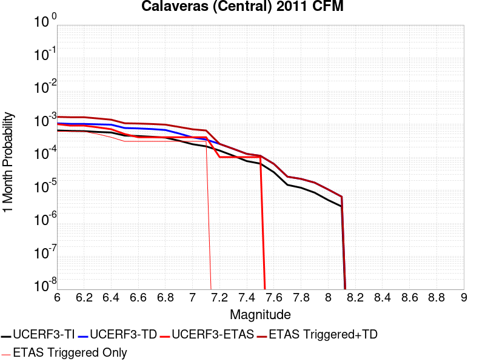 |  | 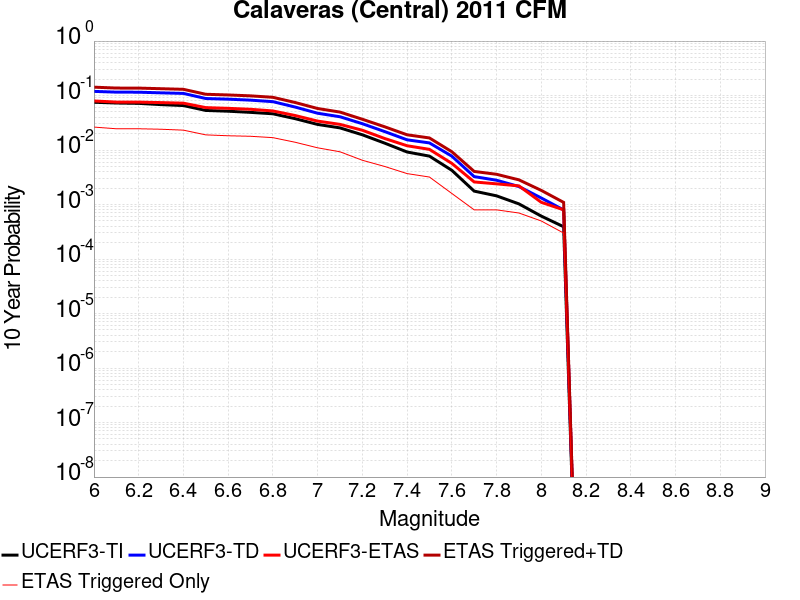 |

| Magnitude | 1 wk TI Prob | 1 wk TD Prob | 1 wk ETAS Prob | 1 wk ETAS/TD Gain | 1 wk ETAS Triggered+TD | 1 wk ETAS Triggered Only | 1 mo TI Prob | 1 mo TD Prob | 1 mo ETAS Prob | 1 mo ETAS/TD Gain | 1 mo ETAS Triggered+TD | 1 mo ETAS Triggered Only | 1 yr TI Prob | 1 yr TD Prob | 1 yr ETAS Prob | 1 yr ETAS/TD Gain | 1 yr ETAS Triggered+TD | 1 yr ETAS Triggered Only | 10 yr TI Prob | 10 yr TD Prob | 10 yr ETAS Prob | 10 yr ETAS/TD Gain | 10 yr ETAS Triggered+TD | 10 yr ETAS Triggered Only |
|-----|-----|-----|-----|-----|-----|-----|-----|-----|-----|-----|-----|-----|-----|-----|-----|-----|-----|-----|-----|-----|-----|-----|-----|-----|
| 6.0 | 1.5010907E-4 | 2.450442E-4 | 4.0E-4 | 1.6323584 | 5.449707E-4 | 3.0E-4 | 6.4316596E-4 | 0.0010496562 | 0.001 | 0.95269287 | 0.0016490264 | 6.0E-4 | 0.0078024664 | 0.0126960855 | 0.0087 | 0.6852506 | 0.01644784 | 0.0038 | 0.07534136 | 0.11912001 | 0.0796 | 0.6682337 | 0.14237525 | 0.0264 |
| 6.1 | 1.4521465E-4 | 2.3668805E-4 | 4.0E-4 | 1.6899881 | 5.3661707E-4 | 3.0E-4 | 6.222001E-4 | 0.0010138863 | 9.0E-4 | 0.8876735 | 0.001613278 | 6.0E-4 | 0.0075490056 | 0.0122669 | 0.0081 | 0.66031355 | 0.0155264195 | 0.0033 | 0.07297657 | 0.115398966 | 0.0759 | 0.6577182 | 0.13716015 | 0.0246 |
| 6.2 | 1.429998E-4 | 2.3603076E-4 | 4.0E-4 | 1.6946944 | 5.3595996E-4 | 3.0E-4 | 6.127123E-4 | 0.0010110718 | 9.0E-4 | 0.8901445 | 0.0016104651 | 6.0E-4 | 0.007434286 | 0.012233065 | 0.0081 | 0.66213983 | 0.015492696 | 0.0033 | 0.07190444 | 0.11506904 | 0.0758 | 0.658735 | 0.13683835 | 0.0246 |
| 6.3 | 1.3536277E-4 | 2.294493E-4 | 4.0E-4 | 1.7433045 | 5.2938046E-4 | 3.0E-4 | 5.799972E-4 | 9.828886E-4 | 8.0E-4 | 0.8139274 | 0.0014823972 | 5.0E-4 | 0.0070386264 | 0.01189464 | 0.0079 | 0.6641647 | 0.014957766 | 0.0031 | 0.0681982 | 0.112029456 | 0.0743 | 0.66321844 | 0.13342954 | 0.0241 |
| 6.4 | 1.2993296E-4 | 2.2381423E-4 | 4.0E-4 | 1.7871964 | 5.237471E-4 | 3.0E-4 | 5.5673666E-4 | 9.587567E-4 | 7.0E-4 | 0.73011225 | 0.0013583732 | 4.0E-4 | 0.006757223 | 0.011604065 | 0.0076 | 0.65494287 | 0.014470413 | 0.0029 | 0.06555412 | 0.10936137 | 0.0725 | 0.6629397 | 0.1300242 | 0.0232 |
| 6.5 | 1.0498927E-4 | 1.7733751E-4 | 3.0E-4 | 1.6916895 | 3.7730203E-4 | 2.0E-4 | 4.498764E-4 | 7.597954E-4 | 5.0E-4 | 0.6580719 | 0.0010595674 | 3.0E-4 | 0.005463498 | 0.009211186 | 0.0061 | 0.66223824 | 0.011787238 | 0.0026 | 0.053311124 | 0.08810674 | 0.0601 | 0.6821272 | 0.105432704 | 0.019 |
| 6.6 | 1.0157505E-4 | 1.7225342E-4 | 2.0E-4 | 1.16108 | 3.72219E-4 | 2.0E-4 | 4.35249E-4 | 7.3801924E-4 | 4.0E-4 | 0.5419913 | 0.0010377978 | 3.0E-4 | 0.0052862884 | 0.008948302 | 0.0057 | 0.6369924 | 0.011525036 | 0.0026 | 0.05162293 | 0.08569929 | 0.0583 | 0.6802857 | 0.10243099 | 0.0183 |
| 6.7 | 9.660386E-5 | 1.6491175E-4 | 2.0E-4 | 1.2127699 | 3.6487877E-4 | 2.0E-4 | 4.1395082E-4 | 7.0657226E-4 | 4.0E-4 | 0.56611335 | 0.0010063603 | 3.0E-4 | 0.0050282106 | 0.008568547 | 0.0055 | 0.6418825 | 0.010947982 | 0.0024 | 0.049159497 | 0.08221362 | 0.056 | 0.68115234 | 0.098642 | 0.0179 |
| 6.8 | 9.089927E-5 | 1.5418738E-4 | 2.0E-4 | 1.297123 | 3.5415654E-4 | 2.0E-4 | 3.8951015E-4 | 6.6063507E-4 | 4.0E-4 | 0.605478 | 9.604369E-4 | 3.0E-4 | 0.0047319788 | 0.008013535 | 0.0049 | 0.61146545 | 0.010096707 | 0.0021 | 0.046324775 | 0.07715556 | 0.0522 | 0.6765553 | 0.09275163 | 0.0169 |
| 6.9 | 7.353187E-5 | 1.2115286E-4 | 2.0E-4 | 1.650807 | 3.2112864E-4 | 2.0E-4 | 3.150985E-4 | 5.191238E-4 | 4.0E-4 | 0.7705291 | 8.1896805E-4 | 3.0E-4 | 0.0038295772 | 0.0063021337 | 0.004 | 0.63470566 | 0.00799142 | 0.0017 | 0.037642512 | 0.0613633 | 0.043 | 0.7007446 | 0.07441035 | 0.0139 |
| 7.0 | 5.746064E-5 | 9.245025E-5 | 2.0E-4 | 2.1633255 | 2.9243177E-4 | 2.0E-4 | 2.4623662E-4 | 3.9615555E-4 | 4.0E-4 | 1.0097044 | 6.9603673E-4 | 3.0E-4 | 0.0029938098 | 0.004812597 | 0.0029 | 0.6025853 | 0.0060068215 | 0.0012 | 0.02953797 | 0.047314297 | 0.034 | 0.71859884 | 0.05779384 | 0.011 |
| 7.1 | 4.9557195E-5 | 7.9247366E-5 | 2.0E-4 | 2.5237432 | 2.7923152E-4 | 2.0E-4 | 2.123707E-4 | 3.3958768E-4 | 4.0E-4 | 1.177899 | 6.3948584E-4 | 3.0E-4 | 0.0025825473 | 0.0041267034 | 0.0027 | 0.6542753 | 0.0053217513 | 0.0012 | 0.0255274 | 0.04076966 | 0.0296 | 0.7260301 | 0.0496905 | 0.0093 |
| 7.2 | 3.687595E-5 | 5.844584E-5 | 0.0 | 0.0 | 5.844584E-5 | 0.0 | 1.5803022E-4 | 2.5045828E-4 | 1.0E-4 | 0.3992681 | 2.5045828E-4 | 0.0 | 0.0019223199 | 0.0030450942 | 0.0017 | 0.55827504 | 0.0037429626 | 7.0E-4 | 0.01905776 | 0.030366799 | 0.0231 | 0.7606992 | 0.036669414 | 0.0065 |
| 7.3 | 2.5846984E-5 | 4.162706E-5 | 0.0 | 0.0 | 4.162706E-5 | 0.0 | 1.1076809E-4 | 1.7838959E-4 | 1.0E-4 | 0.56057084 | 1.7838959E-4 | 0.0 | 0.0013477671 | 0.002169747 | 0.0014 | 0.64523655 | 0.002768445 | 6.0E-4 | 0.013396223 | 0.021766126 | 0.0163 | 0.74887 | 0.026657296 | 0.005 |
| 7.4 | 1.7747854E-5 | 2.9223953E-5 | 0.0 | 0.0 | 2.9223953E-5 | 0.0 | 7.6060016E-5 | 1.2523952E-4 | 1.0E-4 | 0.7984701 | 1.2523952E-4 | 0.0 | 9.2563726E-4 | 0.0015237273 | 0.0011 | 0.72191393 | 0.0019231178 | 4.0E-4 | 0.009217911 | 0.01536211 | 0.012 | 0.7811427 | 0.01900527 | 0.0037 |
| 7.5 | 1.4883479E-5 | 2.5574644E-5 | 0.0 | 0.0 | 2.5574644E-5 | 0.0 | 6.378478E-5 | 1.09601024E-4 | 1.0E-4 | 0.91240025 | 1.09601024E-4 | 0.0 | 7.76303E-4 | 0.0013335784 | 9.0E-4 | 0.674876 | 0.0017330449 | 4.0E-4 | 0.0077359667 | 0.013476112 | 0.0103 | 0.76431537 | 0.016632989 | 0.0032 |
| 7.6 | 8.166975E-6 | 1.4497345E-5 | 0.0 | 0.0 | 1.4497345E-5 | 0.0 | 3.5000852E-5 | 6.2130006E-5 | 0.0 | 0.0 | 6.2130006E-5 | 0.0 | 4.2605202E-4 | 7.5617153E-4 | 4.0E-4 | 0.5289805 | 9.560203E-4 | 2.0E-4 | 0.004252361 | 0.0077114273 | 0.0057 | 0.7391628 | 0.009299089 | 0.0016 |
| 7.7 | 3.3858064E-6 | 5.957848E-6 | 0.0 | 0.0 | 5.957848E-6 | 0.0 | 1.4510518E-5 | 2.5533383E-5 | 0.0 | 0.0 | 2.5533383E-5 | 0.0 | 1.7665124E-4 | 3.1082466E-4 | 2.0E-4 | 0.6434496 | 4.1079358E-4 | 1.0E-4 | 0.0017651088 | 0.0032421215 | 0.0026 | 0.801944 | 0.004039528 | 8.0E-4 |
| 7.8 | 2.7721615E-6 | 5.1146626E-6 | 0.0 | 0.0 | 5.1146626E-6 | 0.0 | 1.1880637E-5 | 2.1919797E-5 | 0.0 | 0.0 | 2.1919797E-5 | 0.0 | 1.4463716E-4 | 2.668409E-4 | 2.0E-4 | 0.7495103 | 3.6681423E-4 | 1.0E-4 | 0.0014454306 | 0.002783806 | 0.0024 | 0.86212903 | 0.003581579 | 8.0E-4 |
| 7.9 | 1.9736292E-6 | 3.9468414E-6 | 0.0 | 0.0 | 3.9468414E-6 | 0.0 | 8.4583835E-6 | 1.6914924E-5 | 0.0 | 0.0 | 1.6914924E-5 | 0.0 | 1.0297595E-4 | 2.0591979E-4 | 2.0E-4 | 0.971252 | 3.058992E-4 | 1.0E-4 | 0.0010292825 | 0.0021351196 | 0.0022 | 1.0303872 | 0.002833625 | 7.0E-4 |
| 8.0 | 1.1767289E-6 | 2.4512808E-6 | 0.0 | 0.0 | 2.4512808E-6 | 0.0 | 5.0431145E-6 | 1.0505447E-5 | 0.0 | 0.0 | 1.0505447E-5 | 0.0 | 6.139818E-5 | 1.2789633E-4 | 1.0E-4 | 0.78188324 | 2.2788355E-4 | 1.0E-4 | 6.1381224E-4 | 0.0013158023 | 0.0011 | 0.83599186 | 0.0018151443 | 5.0E-4 |
| 8.1 | 7.5112825E-7 | 1.480043E-6 | 0.0 | 0.0 | 1.480043E-6 | 0.0 | 3.2191172E-6 | 6.343026E-6 | 0.0 | 0.0 | 6.343026E-6 | 0.0 | 3.9192048E-5 | 7.722363E-5 | 1.0E-4 | 1.2949405 | 1.772159E-4 | 1.0E-4 | 3.9185135E-4 | 7.9363264E-4 | 8.0E-4 | 1.008023 | 0.0010933946 | 3.0E-4 |

## Laguna Salada
*[(top)](#table-of-contents)*

| 1 Week | 1 Month | 1 Year | 10 Year |
|-----|-----|-----|-----|
|  |  |  |  |

| Magnitude | 1 wk TI Prob | 1 wk TD Prob | 1 wk ETAS Prob | 1 wk ETAS/TD Gain | 1 wk ETAS Triggered+TD | 1 wk ETAS Triggered Only | 1 mo TI Prob | 1 mo TD Prob | 1 mo ETAS Prob | 1 mo ETAS/TD Gain | 1 mo ETAS Triggered+TD | 1 mo ETAS Triggered Only | 1 yr TI Prob | 1 yr TD Prob | 1 yr ETAS Prob | 1 yr ETAS/TD Gain | 1 yr ETAS Triggered+TD | 1 yr ETAS Triggered Only | 10 yr TI Prob | 10 yr TD Prob | 10 yr ETAS Prob | 10 yr ETAS/TD Gain | 10 yr ETAS Triggered+TD | 10 yr ETAS Triggered Only |
|-----|-----|-----|-----|-----|-----|-----|-----|-----|-----|-----|-----|-----|-----|-----|-----|-----|-----|-----|-----|-----|-----|-----|-----|-----|
| 6.0 | 4.6465593E-5 | 4.603502E-5 | 1.0E-4 | 2.1722593 | 1.4603042E-4 | 1.0E-4 | 1.9912305E-4 | 1.9727867E-4 | 7.0E-4 | 3.5482802 | 4.972195E-4 | 3.0E-4 | 0.0024216278 | 0.002399297 | 0.0058 | 2.4173748 | 0.0058908993 | 0.0035 | 0.02395408 | 0.023813494 | 0.0521 | 2.1878352 | 0.052610997 | 0.0295 |
| 6.1 | 3.982297E-5 | 3.696866E-5 | 1.0E-4 | 2.7049937 | 1.3696497E-4 | 1.0E-4 | 1.706587E-4 | 1.584279E-4 | 3.0E-4 | 1.893606 | 3.583962E-4 | 2.0E-4 | 0.0020757897 | 0.0019272442 | 0.003 | 1.5566268 | 0.0038235825 | 0.0019 | 0.020565065 | 0.019186307 | 0.0202 | 1.0528343 | 0.029877175 | 0.0109 |
| 6.2 | 3.6067784E-5 | 3.233754E-5 | 1.0E-4 | 3.0923815 | 1.323343E-4 | 1.0E-4 | 1.5456705E-4 | 1.3858241E-4 | 3.0E-4 | 2.164777 | 3.385547E-4 | 2.0E-4 | 0.0018802295 | 0.0016860253 | 0.0029 | 1.7200216 | 0.003582822 | 0.0019 | 0.018644003 | 0.016804963 | 0.0175 | 1.041359 | 0.02585036 | 0.0092 |
| 6.3 | 3.2859112E-5 | 2.8596673E-5 | 1.0E-4 | 3.4969103 | 1.2859382E-4 | 1.0E-4 | 1.4081717E-4 | 1.2255185E-4 | 3.0E-4 | 2.4479434 | 3.2252734E-4 | 2.0E-4 | 0.0017131006 | 0.0014911371 | 0.0027 | 1.8106986 | 0.0031886022 | 0.0017 | 0.016999546 | 0.014879224 | 0.0162 | 1.0887665 | 0.022957215 | 0.0082 |
| 6.4 | 2.9132116E-5 | 2.4614748E-5 | 1.0E-4 | 4.062605 | 1.2461228E-4 | 1.0E-4 | 1.2484594E-4 | 1.0548801E-4 | 3.0E-4 | 2.8439252 | 3.054669E-4 | 2.0E-4 | 0.0015189396 | 0.0012836462 | 0.0027 | 2.1033833 | 0.002981464 | 0.0017 | 0.015085992 | 0.012818991 | 0.0139 | 1.0843287 | 0.019827977 | 0.0071 |
| 6.5 | 2.7075037E-5 | 2.2596063E-5 | 1.0E-4 | 4.4255495 | 1.225938E-4 | 1.0E-4 | 1.1603071E-4 | 9.683716E-5 | 3.0E-4 | 3.0979843 | 2.968178E-4 | 2.0E-4 | 0.0014117584 | 0.0011784406 | 0.0024 | 2.0365896 | 0.002676673 | 0.0015 | 0.014028233 | 0.011774354 | 0.013 | 1.1040946 | 0.018296642 | 0.0066 |
| 6.6 | 2.2367465E-5 | 1.8389497E-5 | 0.0 | 0.0 | 1.8389497E-5 | 0.0 | 9.5857045E-5 | 7.88102E-5 | 2.0E-4 | 2.5377426 | 1.7880232E-4 | 1.0E-4 | 0.0011664346 | 9.591718E-4 | 0.0019 | 1.9808755 | 0.0021580209 | 0.0012 | 0.011603311 | 0.009588251 | 0.0109 | 1.1368079 | 0.015035516 | 0.0055 |
| 6.7 | 1.9458053E-5 | 1.5762895E-5 | 0.0 | 0.0 | 1.5762895E-5 | 0.0 | 8.338899E-5 | 6.7553956E-5 | 2.0E-4 | 2.9605966 | 1.675472E-4 | 1.0E-4 | 0.001014788 | 8.2223717E-4 | 0.0016 | 1.9459106 | 0.0017214972 | 9.0E-4 | 0.010101665 | 0.008237424 | 0.0099 | 1.2018319 | 0.012997884 | 0.0048 |
| 6.8 | 1.0767866E-5 | 9.0636595E-6 | 0.0 | 0.0 | 9.0636595E-6 | 0.0 | 4.614718E-5 | 3.8844053E-5 | 0.0 | 0.0 | 3.8844053E-5 | 0.0 | 5.6169706E-4 | 4.7289018E-4 | 8.0E-4 | 1.6917247 | 7.727483E-4 | 3.0E-4 | 0.0056027942 | 0.0047458936 | 0.0061 | 1.2853217 | 0.007532605 | 0.0028 |
| 6.9 | 2.1384765E-6 | 1.7896037E-6 | 0.0 | 0.0 | 1.7896037E-6 | 0.0 | 9.164866E-6 | 7.669711E-6 | 0.0 | 0.0 | 7.669711E-6 | 0.0 | 1.1157654E-4 | 9.337511E-5 | 1.0E-4 | 1.0709492 | 9.337511E-5 | 0.0 | 0.0011152053 | 9.33397E-4 | 8.0E-4 | 0.85708445 | 0.001233117 | 3.0E-4 |
| 7.0 | 2.0952946E-6 | 1.7475566E-6 | 0.0 | 0.0 | 1.7475566E-6 | 0.0 | 8.979802E-6 | 7.4895083E-6 | 0.0 | 0.0 | 7.4895083E-6 | 0.0 | 1.0932361E-4 | 9.118134E-5 | 1.0E-4 | 1.0967157 | 9.118134E-5 | 0.0 | 0.0010926984 | 9.114774E-4 | 8.0E-4 | 0.8776959 | 0.001211204 | 3.0E-4 |
| 7.1 | 1.7887576E-6 | 1.4484149E-6 | 0.0 | 0.0 | 1.4484149E-6 | 0.0 | 7.666081E-6 | 6.207479E-6 | 0.0 | 0.0 | 6.207479E-6 | 0.0 | 9.333054E-5 | 7.557374E-5 | 0.0 | 0.0 | 7.557374E-5 | 0.0 | 9.329135E-4 | 7.5551076E-4 | 6.0E-4 | 0.7941647 | 0.001055284 | 3.0E-4 |
| 7.2 | 9.723109E-7 | 7.124557E-7 | 0.0 | 0.0 | 7.124557E-7 | 0.0 | 4.16704E-6 | 3.0533788E-6 | 0.0 | 0.0 | 3.0533788E-6 | 0.0 | 5.073253E-5 | 3.7174417E-5 | 0.0 | 0.0 | 3.7174417E-5 | 0.0 | 5.072095E-4 | 3.716982E-4 | 4.0E-4 | 1.0761418 | 5.7162385E-4 | 2.0E-4 |

## Hunting Creek - Berryessa 2011 CFM
*[(top)](#table-of-contents)*

| 1 Week | 1 Month | 1 Year | 10 Year |
|-----|-----|-----|-----|
|  |  |  | 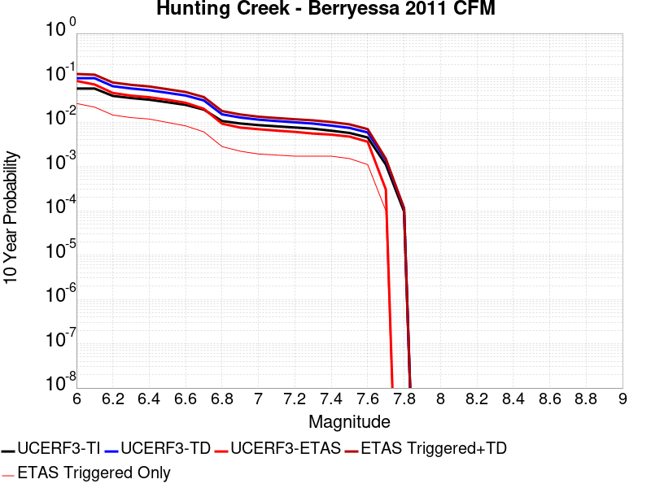 |

| Magnitude | 1 wk TI Prob | 1 wk TD Prob | 1 wk ETAS Prob | 1 wk ETAS/TD Gain | 1 wk ETAS Triggered+TD | 1 wk ETAS Triggered Only | 1 mo TI Prob | 1 mo TD Prob | 1 mo ETAS Prob | 1 mo ETAS/TD Gain | 1 mo ETAS Triggered+TD | 1 mo ETAS Triggered Only | 1 yr TI Prob | 1 yr TD Prob | 1 yr ETAS Prob | 1 yr ETAS/TD Gain | 1 yr ETAS Triggered+TD | 1 yr ETAS Triggered Only | 10 yr TI Prob | 10 yr TD Prob | 10 yr ETAS Prob | 10 yr ETAS/TD Gain | 10 yr ETAS Triggered+TD | 10 yr ETAS Triggered Only |
|-----|-----|-----|-----|-----|-----|-----|-----|-----|-----|-----|-----|-----|-----|-----|-----|-----|-----|-----|-----|-----|-----|-----|-----|-----|
| 6.0 | 1.1270982E-4 | 1.9940689E-4 | 1.0E-4 | 0.5014872 | 1.9940689E-4 | 0.0 | 4.8295266E-4 | 8.542511E-4 | 4.0E-4 | 0.46824643 | 0.0010540802 | 2.0E-4 | 0.0058641075 | 0.01034132 | 0.0094 | 0.9089748 | 0.014003057 | 0.0037 | 0.057117578 | 0.09765978 | 0.0847 | 0.86729664 | 0.12139133 | 0.0263 |
| 6.1 | 1.1239393E-4 | 1.988906E-4 | 0.0 | 0.0 | 1.988906E-4 | 0.0 | 4.8159933E-4 | 8.5203996E-4 | 2.0E-4 | 0.23473078 | 9.5195475E-4 | 1.0E-4 | 0.0058477195 | 0.01031468 | 0.0069 | 0.66894954 | 0.012887862 | 0.0026 | 0.056962132 | 0.09741914 | 0.0702 | 0.72059757 | 0.11700515 | 0.0217 |
| 6.2 | 7.596265E-5 | 1.2870526E-4 | 0.0 | 0.0 | 1.2870526E-4 | 0.0 | 3.2551357E-4 | 5.51466E-4 | 1.0E-4 | 0.18133484 | 5.51466E-4 | 0.0 | 0.0039559277 | 0.0066889296 | 0.0046 | 0.6877035 | 0.008178896 | 0.0015 | 0.038862433 | 0.06430455 | 0.0453 | 0.7044602 | 0.07777857 | 0.0144 |
| 6.3 | 6.78794E-5 | 1.13912276E-4 | 0.0 | 0.0 | 1.13912276E-4 | 0.0 | 2.9087928E-4 | 4.8809202E-4 | 1.0E-4 | 0.2048794 | 4.8809202E-4 | 0.0 | 0.003535705 | 0.0059231822 | 0.0042 | 0.7090783 | 0.0073148897 | 0.0014 | 0.034799766 | 0.057201747 | 0.0394 | 0.68879014 | 0.069081 | 0.0126 |
| 6.4 | 6.2165134E-5 | 1.0382523E-4 | 0.0 | 0.0 | 1.0382523E-4 | 0.0 | 2.6639478E-4 | 4.4488598E-4 | 1.0E-4 | 0.22477669 | 4.4488598E-4 | 0.0 | 0.0032385332 | 0.0054004393 | 0.0039 | 0.7221635 | 0.0066934186 | 0.0013 | 0.03191742 | 0.052307636 | 0.0363 | 0.69397134 | 0.063395634 | 0.0117 |
| 6.5 | 5.4368087E-5 | 9.023392E-5 | 0.0 | 0.0 | 9.023392E-5 | 0.0 | 2.3298527E-4 | 3.8665588E-4 | 1.0E-4 | 0.25862792 | 3.8665588E-4 | 0.0 | 0.0028329059 | 0.004695443 | 0.0037 | 0.7879981 | 0.0059893387 | 0.0013 | 0.027970633 | 0.04565968 | 0.0318 | 0.6964569 | 0.055012215 | 0.0098 |
| 6.6 | 4.729947E-5 | 7.8045974E-5 | 0.0 | 0.0 | 7.8045974E-5 | 0.0 | 2.0269625E-4 | 3.344384E-4 | 1.0E-4 | 0.29900873 | 3.344384E-4 | 0.0 | 0.002465034 | 0.004062789 | 0.0032 | 0.7876362 | 0.00515832 | 0.0011 | 0.02437869 | 0.03965023 | 0.0272 | 0.6859985 | 0.0475251 | 0.0082 |
| 6.7 | 3.6875328E-5 | 6.0107366E-5 | 0.0 | 0.0 | 6.0107366E-5 | 0.0 | 1.5802756E-4 | 2.575781E-4 | 0.0 | 0.0 | 2.575781E-4 | 0.0 | 0.0019222875 | 0.0031308257 | 0.0021 | 0.6707496 | 0.003928321 | 8.0E-4 | 0.019057442 | 0.03073008 | 0.0199 | 0.64757395 | 0.0365457 | 0.006 |
| 6.8 | 2.0292036E-5 | 2.8875764E-5 | 0.0 | 0.0 | 2.8875764E-5 | 0.0 | 8.6962966E-5 | 1.2374739E-4 | 0.0 | 0.0 | 1.2374739E-4 | 0.0 | 0.0010582599 | 0.0015055726 | 0.0011 | 0.7306191 | 0.0017052714 | 2.0E-4 | 0.010532344 | 0.014927712 | 0.0092 | 0.6163034 | 0.017685914 | 0.0028 |
| 6.9 | 1.7871042E-5 | 2.440453E-5 | 0.0 | 0.0 | 2.440453E-5 | 0.0 | 7.658793E-5 | 1.0458663E-4 | 0.0 | 0.0 | 1.0458663E-4 | 0.0 | 9.320591E-4 | 0.0012725984 | 0.001 | 0.7857939 | 0.0014723438 | 2.0E-4 | 0.009281595 | 0.012644729 | 0.0075 | 0.59313256 | 0.01481691 | 0.0022 |
| 7.0 | 1.6415532E-5 | 2.1844406E-5 | 0.0 | 0.0 | 2.1844406E-5 | 0.0 | 7.035038E-5 | 9.361554E-5 | 0.0 | 0.0 | 9.361554E-5 | 0.0 | 8.561793E-4 | 0.0011391746 | 9.0E-4 | 0.7900457 | 0.0012390607 | 1.0E-4 | 0.008528882 | 0.011332817 | 0.0069 | 0.60885125 | 0.013211285 | 0.0019 |
| 7.1 | 1.5409885E-5 | 2.0292511E-5 | 0.0 | 0.0 | 2.0292511E-5 | 0.0 | 6.6040695E-5 | 8.6965025E-5 | 0.0 | 0.0 | 8.6965025E-5 | 0.0 | 8.0374884E-4 | 0.0010582876 | 8.0E-4 | 0.75593823 | 0.0011581817 | 1.0E-4 | 0.00800848 | 0.0105329 | 0.0064 | 0.60761994 | 0.012313941 | 0.0018 |
| 7.2 | 1.4497423E-5 | 1.9004163E-5 | 0.0 | 0.0 | 1.9004163E-5 | 0.0 | 6.213033E-5 | 8.144388E-5 | 0.0 | 0.0 | 8.144388E-5 | 0.0 | 7.5617427E-4 | 9.911313E-4 | 7.0E-4 | 0.70626366 | 0.0010910322 | 1.0E-4 | 0.0075360634 | 0.009867775 | 0.006 | 0.6080398 | 0.011551 | 0.0017 |
| 7.3 | 1.3615175E-5 | 1.7777578E-5 | 0.0 | 0.0 | 1.7777578E-5 | 0.0 | 5.8349444E-5 | 7.618741E-5 | 0.0 | 0.0 | 7.618741E-5 | 0.0 | 7.101729E-4 | 9.2718995E-4 | 6.0E-4 | 0.6471166 | 0.0010270972 | 1.0E-4 | 0.0070790765 | 0.009233719 | 0.0055 | 0.59564304 | 0.010918021 | 0.0017 |
| 7.4 | 1.2252825E-5 | 1.5983189E-5 | 0.0 | 0.0 | 1.5983189E-5 | 0.0 | 5.251105E-5 | 6.8497604E-5 | 0.0 | 0.0 | 6.8497604E-5 | 0.0 | 6.391345E-4 | 8.3364197E-4 | 6.0E-4 | 0.7197334 | 9.335586E-4 | 1.0E-4 | 0.0063729943 | 0.008305561 | 0.0052 | 0.62608653 | 0.009991442 | 0.0017 |
| 7.5 | 1.0913301E-5 | 1.4202664E-5 | 0.0 | 0.0 | 1.4202664E-5 | 0.0 | 4.6770452E-5 | 6.0867154E-5 | 0.0 | 0.0 | 6.0867154E-5 | 0.0 | 5.6928146E-4 | 7.408084E-4 | 6.0E-4 | 0.80992603 | 8.407343E-4 | 1.0E-4 | 0.0056782532 | 0.0073837684 | 0.0047 | 0.6365313 | 0.008872693 | 0.0015 |
| 7.6 | 8.623192E-6 | 1.1203514E-5 | 0.0 | 0.0 | 1.1203514E-5 | 0.0 | 3.6956015E-5 | 4.8014193E-5 | 0.0 | 0.0 | 4.8014193E-5 | 0.0 | 4.4984656E-4 | 5.8441854E-4 | 4.0E-4 | 0.684441 | 6.843601E-4 | 1.0E-4 | 0.00448937 | 0.005829101 | 0.0036 | 0.61759096 | 0.006922689 | 0.0011 |
| 7.7 | 2.0993634E-6 | 2.655011E-6 | 0.0 | 0.0 | 2.655011E-6 | 0.0 | 8.997241E-6 | 1.137857E-5 | 0.0 | 0.0 | 1.137857E-5 | 0.0 | 1.09535904E-4 | 1.3852536E-4 | 0.0 | 0.0 | 1.3852536E-4 | 0.0 | 0.0010948193 | 0.001384442 | 3.0E-4 | 0.2166938 | 0.0014843036 | 1.0E-4 |
| 7.8 | 1.8428308E-7 | 2.164475E-7 | 0.0 | 0.0 | 2.164475E-7 | 0.0 | 7.897844E-7 | 9.276319E-7 | 0.0 | 0.0 | 9.276319E-7 | 0.0 | 9.615583E-6 | 1.1293863E-5 | 0.0 | 0.0 | 1.1293863E-5 | 0.0 | 9.615166E-5 | 1.1294148E-4 | 0.0 | 0.0 | 1.1294148E-4 | 0.0 |

## San Andreas (Carrizo) rev
*[(top)](#table-of-contents)*

| 1 Week | 1 Month | 1 Year | 10 Year |
|-----|-----|-----|-----|
|  |  |  |  |

| Magnitude | 1 wk TI Prob | 1 wk TD Prob | 1 wk ETAS Prob | 1 wk ETAS/TD Gain | 1 wk ETAS Triggered+TD | 1 wk ETAS Triggered Only | 1 mo TI Prob | 1 mo TD Prob | 1 mo ETAS Prob | 1 mo ETAS/TD Gain | 1 mo ETAS Triggered+TD | 1 mo ETAS Triggered Only | 1 yr TI Prob | 1 yr TD Prob | 1 yr ETAS Prob | 1 yr ETAS/TD Gain | 1 yr ETAS Triggered+TD | 1 yr ETAS Triggered Only | 10 yr TI Prob | 10 yr TD Prob | 10 yr ETAS Prob | 10 yr ETAS/TD Gain | 10 yr ETAS Triggered+TD | 10 yr ETAS Triggered Only |
|-----|-----|-----|-----|-----|-----|-----|-----|-----|-----|-----|-----|-----|-----|-----|-----|-----|-----|-----|-----|-----|-----|-----|-----|-----|
| 6.0 | 1.1674632E-4 | 2.3500634E-4 | 2.0E-4 | 0.85104084 | 3.3498285E-4 | 1.0E-4 | 5.002454E-4 | 0.0010067829 | 5.0E-4 | 0.4966314 | 0.0012065815 | 2.0E-4 | 0.006073493 | 0.012189141 | 0.0072 | 0.5906897 | 0.014757449 | 0.0026 | 0.0591016 | 0.11713341 | 0.0777 | 0.6633462 | 0.14052938 | 0.0265 |
| 6.1 | 1.1674632E-4 | 2.3500634E-4 | 2.0E-4 | 0.85104084 | 3.3498285E-4 | 1.0E-4 | 5.002454E-4 | 0.0010067829 | 5.0E-4 | 0.4966314 | 0.0012065815 | 2.0E-4 | 0.006073493 | 0.012189141 | 0.0072 | 0.5906897 | 0.014757449 | 0.0026 | 0.0591016 | 0.11713341 | 0.0777 | 0.6633462 | 0.14052938 | 0.0265 |
| 6.2 | 1.1674632E-4 | 2.3500634E-4 | 2.0E-4 | 0.85104084 | 3.3498285E-4 | 1.0E-4 | 5.002454E-4 | 0.0010067829 | 5.0E-4 | 0.4966314 | 0.0012065815 | 2.0E-4 | 0.006073493 | 0.012189141 | 0.0072 | 0.5906897 | 0.014757449 | 0.0026 | 0.0591016 | 0.11713341 | 0.0777 | 0.6633462 | 0.14052938 | 0.0265 |
| 6.3 | 1.1674632E-4 | 2.3500634E-4 | 2.0E-4 | 0.85104084 | 3.3498285E-4 | 1.0E-4 | 5.002454E-4 | 0.0010067829 | 5.0E-4 | 0.4966314 | 0.0012065815 | 2.0E-4 | 0.006073493 | 0.012189141 | 0.0072 | 0.5906897 | 0.014757449 | 0.0026 | 0.0591016 | 0.11713341 | 0.0777 | 0.6633462 | 0.14052938 | 0.0265 |
| 6.4 | 1.1674632E-4 | 2.3500634E-4 | 2.0E-4 | 0.85104084 | 3.3498285E-4 | 1.0E-4 | 5.002454E-4 | 0.0010067829 | 5.0E-4 | 0.4966314 | 0.0012065815 | 2.0E-4 | 0.006073493 | 0.012189141 | 0.0072 | 0.5906897 | 0.014757449 | 0.0026 | 0.0591016 | 0.11713341 | 0.0777 | 0.6633462 | 0.14052938 | 0.0265 |
| 6.5 | 1.13136164E-4 | 2.2824129E-4 | 2.0E-4 | 0.87626565 | 3.2821845E-4 | 1.0E-4 | 4.847792E-4 | 9.778118E-4 | 5.0E-4 | 0.5113459 | 0.0011776162 | 2.0E-4 | 0.0058862255 | 0.011840291 | 0.0072 | 0.60809314 | 0.014409507 | 0.0026 | 0.057327334 | 0.11410441 | 0.0764 | 0.66956216 | 0.13731487 | 0.0262 |
| 6.6 | 1.13136164E-4 | 2.2824129E-4 | 2.0E-4 | 0.87626565 | 3.2821845E-4 | 1.0E-4 | 4.847792E-4 | 9.778118E-4 | 5.0E-4 | 0.5113459 | 0.0011776162 | 2.0E-4 | 0.0058862255 | 0.011840291 | 0.0072 | 0.60809314 | 0.014409507 | 0.0026 | 0.057327334 | 0.11410441 | 0.0764 | 0.66956216 | 0.13731487 | 0.0262 |
| 6.7 | 1.1149675E-4 | 2.2516907E-4 | 2.0E-4 | 0.88822144 | 3.2514657E-4 | 1.0E-4 | 4.777557E-4 | 9.6465484E-4 | 5.0E-4 | 0.5183201 | 0.001164462 | 2.0E-4 | 0.0058011734 | 0.011681832 | 0.0072 | 0.61634165 | 0.014251459 | 0.0026 | 0.05652051 | 0.112732746 | 0.0751 | 0.66617733 | 0.13589042 | 0.0261 |
| 6.8 | 1.1103589E-4 | 2.2419993E-4 | 2.0E-4 | 0.89206094 | 3.241775E-4 | 1.0E-4 | 4.7578133E-4 | 9.6050446E-4 | 5.0E-4 | 0.5205598 | 0.0011603123 | 2.0E-4 | 0.005777263 | 0.011631842 | 0.0072 | 0.61899054 | 0.014201599 | 0.0026 | 0.056293584 | 0.112295255 | 0.0747 | 0.6652106 | 0.13519804 | 0.0258 |
| 6.9 | 1.1053259E-4 | 2.2313405E-4 | 2.0E-4 | 0.8963222 | 3.2311174E-4 | 1.0E-4 | 4.7362508E-4 | 9.5593976E-4 | 5.0E-4 | 0.52304554 | 0.0011557485 | 2.0E-4 | 0.0057511497 | 0.011576858 | 0.0071 | 0.61329246 | 0.014146758 | 0.0026 | 0.05604569 | 0.111813456 | 0.0743 | 0.66449964 | 0.13455103 | 0.0256 |
| 7.0 | 1.1005377E-4 | 2.2215206E-4 | 2.0E-4 | 0.90028423 | 3.2212984E-4 | 1.0E-4 | 4.7157376E-4 | 9.517343E-4 | 5.0E-4 | 0.5253567 | 0.0011515439 | 2.0E-4 | 0.0057263062 | 0.0115262 | 0.0071 | 0.6159879 | 0.014096232 | 0.0026 | 0.055809796 | 0.11136863 | 0.074 | 0.66446 | 0.13411759 | 0.0256 |
| 7.1 | 1.0308142E-4 | 2.0739544E-4 | 2.0E-4 | 0.96434134 | 3.073747E-4 | 1.0E-4 | 4.417027E-4 | 8.885358E-4 | 5.0E-4 | 0.5627235 | 0.0010883581 | 2.0E-4 | 0.0053644776 | 0.010764554 | 0.0062 | 0.5759644 | 0.013039796 | 0.0023 | 0.052368138 | 0.10465884 | 0.0684 | 0.65355206 | 0.12560983 | 0.0234 |
| 7.2 | 1.0027479E-4 | 2.0153404E-4 | 2.0E-4 | 0.9923881 | 3.015139E-4 | 1.0E-4 | 4.296783E-4 | 8.634324E-4 | 5.0E-4 | 0.57908416 | 0.0010632597 | 2.0E-4 | 0.0052187922 | 0.010461894 | 0.0062 | 0.5926269 | 0.012737831 | 0.0023 | 0.050979212 | 0.10197536 | 0.0667 | 0.65407956 | 0.122629926 | 0.023 |
| 7.3 | 9.816942E-5 | 1.9639665E-4 | 2.0E-4 | 1.0183473 | 2.96377E-4 | 1.0E-4 | 4.2065824E-4 | 8.4142934E-4 | 5.0E-4 | 0.59422696 | 0.001041261 | 2.0E-4 | 0.005109493 | 0.010196544 | 0.0062 | 0.6080491 | 0.012473092 | 0.0023 | 0.049935985 | 0.09959349 | 0.0654 | 0.65666944 | 0.11985264 | 0.0225 |
| 7.4 | 9.5634205E-5 | 1.9023678E-4 | 2.0E-4 | 1.0513214 | 2.9021775E-4 | 1.0E-4 | 4.0979648E-4 | 8.150466E-4 | 5.0E-4 | 0.61346185 | 0.0010148836 | 2.0E-4 | 0.0049778637 | 0.009878284 | 0.0061 | 0.61751616 | 0.0121555645 | 0.0023 | 0.048678253 | 0.09673373 | 0.063 | 0.65127236 | 0.11642493 | 0.0218 |
| 7.5 | 8.052417E-5 | 1.544261E-4 | 2.0E-4 | 1.2951179 | 2.5441067E-4 | 1.0E-4 | 3.4505792E-4 | 6.616585E-4 | 5.0E-4 | 0.75567687 | 8.615261E-4 | 2.0E-4 | 0.0041929903 | 0.008026009 | 0.005 | 0.62297463 | 0.0097123645 | 0.0017 | 0.04114753 | 0.079812914 | 0.0505 | 0.6327297 | 0.095548116 | 0.0171 |
| 7.6 | 7.897024E-5 | 1.5104134E-4 | 2.0E-4 | 1.3241408 | 2.5102624E-4 | 1.0E-4 | 3.384E-4 | 6.4715964E-4 | 4.0E-4 | 0.6180855 | 8.470302E-4 | 2.0E-4 | 0.0041122385 | 0.007850772 | 0.0048 | 0.6114049 | 0.009537425 | 0.0017 | 0.040369697 | 0.07818328 | 0.0494 | 0.63184863 | 0.09376198 | 0.0169 |
| 7.7 | 6.707427E-5 | 1.268127E-4 | 1.0E-4 | 0.78856456 | 2.2680001E-4 | 1.0E-4 | 2.8742946E-4 | 5.433698E-4 | 3.0E-4 | 0.5521102 | 7.4326113E-4 | 2.0E-4 | 0.003493839 | 0.0065954886 | 0.0041 | 0.62163705 | 0.008184936 | 0.0016 | 0.034394164 | 0.06633325 | 0.0405 | 0.61055356 | 0.079404585 | 0.014 |
| 7.8 | 6.147705E-5 | 1.1658706E-4 | 1.0E-4 | 0.8577281 | 2.165754E-4 | 1.0E-4 | 2.6344648E-4 | 4.995632E-4 | 3.0E-4 | 0.60052466 | 6.9946324E-4 | 2.0E-4 | 0.0032027436 | 0.0060652415 | 0.0038 | 0.6265208 | 0.00745675 | 0.0014 | 0.031569764 | 0.061043616 | 0.0374 | 0.6126767 | 0.073062256 | 0.0128 |
| 7.9 | 4.7636717E-5 | 8.48813E-5 | 1.0E-4 | 1.1781158 | 1.8487281E-4 | 1.0E-4 | 2.0414138E-4 | 3.6372629E-4 | 3.0E-4 | 0.824796 | 5.6365354E-4 | 2.0E-4 | 0.0024825884 | 0.004419382 | 0.003 | 0.6788279 | 0.005514521 | 0.0011 | 0.024550365 | 0.044775743 | 0.0286 | 0.6387387 | 0.054232463 | 0.0099 |
| 8.0 | 3.3554235E-5 | 4.969718E-5 | 1.0E-4 | 2.0121865 | 1.496922E-4 | 1.0E-4 | 1.4379594E-4 | 2.1297054E-4 | 3.0E-4 | 1.4086455 | 4.1292794E-4 | 2.0E-4 | 0.0017493097 | 0.0025898346 | 0.0018 | 0.6950251 | 0.0032880218 | 7.0E-4 | 0.017356034 | 0.026676664 | 0.017 | 0.6372611 | 0.032613937 | 0.0061 |
| 8.1 | 1.9175432E-5 | 1.7981038E-5 | 1.0E-4 | 5.5614142 | 1.1797924E-4 | 1.0E-4 | 8.217783E-5 | 7.705932E-5 | 2.0E-4 | 2.5954032 | 2.770439E-4 | 2.0E-4 | 0.0010000558 | 9.377939E-4 | 6.0E-4 | 0.6397994 | 0.0012375126 | 3.0E-4 | 0.009955673 | 0.010124556 | 0.0068 | 0.67163444 | 0.012698232 | 0.0026 |
| 8.2 | 8.643924E-6 | 5.0104E-6 | 0.0 | 0.0 | 5.0104E-6 | 0.0 | 3.704486E-5 | 2.1472966E-5 | 1.0E-4 | 4.6570187 | 1.2147082E-4 | 1.0E-4 | 4.5092785E-4 | 2.6140205E-4 | 2.0E-4 | 0.7651049 | 3.6137592E-4 | 1.0E-4 | 0.0045001395 | 0.002993769 | 0.0022 | 0.73485965 | 0.0036916733 | 7.0E-4 |
| 8.3 | 1.983087E-6 | 6.880041E-7 | 0.0 | 0.0 | 6.880041E-7 | 0.0 | 8.498917E-6 | 2.9485857E-6 | 0.0 | 0.0 | 2.9485857E-6 | 0.0 | 1.034694E-4 | 3.589845E-5 | 0.0 | 0.0 | 3.589845E-5 | 0.0 | 0.0010342124 | 4.2701262E-4 | 2.0E-4 | 0.46837023 | 5.269699E-4 | 1.0E-4 |

## Calaveras (So) 2011 CFM
*[(top)](#table-of-contents)*

| 1 Week | 1 Month | 1 Year | 10 Year |
|-----|-----|-----|-----|
|  |  |  | 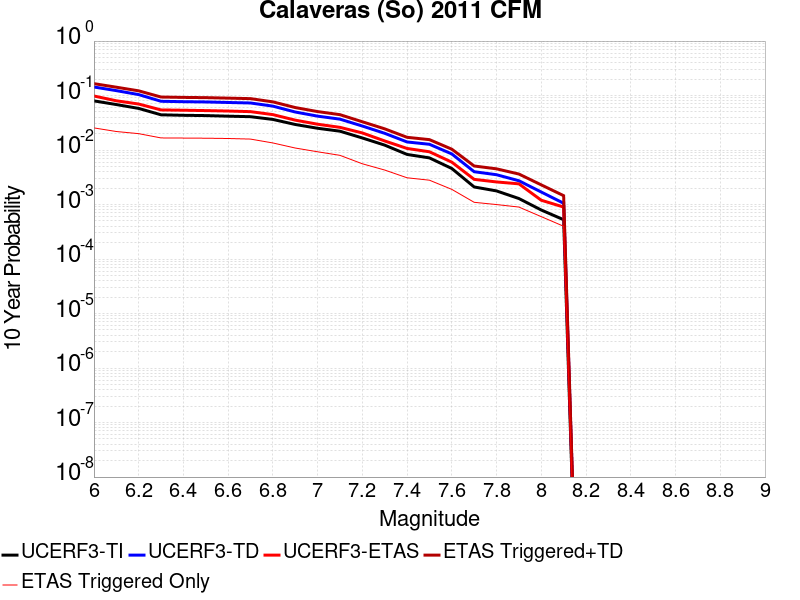 |

| Magnitude | 1 wk TI Prob | 1 wk TD Prob | 1 wk ETAS Prob | 1 wk ETAS/TD Gain | 1 wk ETAS Triggered+TD | 1 wk ETAS Triggered Only | 1 mo TI Prob | 1 mo TD Prob | 1 mo ETAS Prob | 1 mo ETAS/TD Gain | 1 mo ETAS Triggered+TD | 1 mo ETAS Triggered Only | 1 yr TI Prob | 1 yr TD Prob | 1 yr ETAS Prob | 1 yr ETAS/TD Gain | 1 yr ETAS Triggered+TD | 1 yr ETAS Triggered Only | 10 yr TI Prob | 10 yr TD Prob | 10 yr ETAS Prob | 10 yr ETAS/TD Gain | 10 yr ETAS Triggered+TD | 10 yr ETAS Triggered Only |
|-----|-----|-----|-----|-----|-----|-----|-----|-----|-----|-----|-----|-----|-----|-----|-----|-----|-----|-----|-----|-----|-----|-----|-----|-----|
| 6.0 | 1.5950744E-4 | 3.0039327E-4 | 6.0E-4 | 1.9973816 | 7.0027314E-4 | 4.0E-4 | 6.834242E-4 | 0.0012866248 | 0.0012 | 0.9326728 | 0.0019857243 | 7.0E-4 | 0.00828899 | 0.015530481 | 0.0098 | 0.63101715 | 0.018680783 | 0.0032 | 0.079865426 | 0.14342968 | 0.0982 | 0.684656 | 0.16527222 | 0.0255 |
| 6.1 | 1.3584697E-4 | 2.537606E-4 | 6.0E-4 | 2.364433 | 6.536591E-4 | 4.0E-4 | 5.8207137E-4 | 0.0010870121 | 0.0012 | 1.1039436 | 0.0017862512 | 7.0E-4 | 0.007063716 | 0.013140169 | 0.0082 | 0.62404066 | 0.015903376 | 0.0028 | 0.06843361 | 0.12309246 | 0.0802 | 0.6515428 | 0.14229673 | 0.0219 |
| 6.2 | 1.14676266E-4 | 2.1067173E-4 | 6.0E-4 | 2.8480327 | 6.105875E-4 | 4.0E-4 | 4.9137714E-4 | 9.025431E-4 | 0.0012 | 1.3295765 | 0.0016019113 | 7.0E-4 | 0.0059661185 | 0.010928976 | 0.007 | 0.6404992 | 0.013599467 | 0.0027 | 0.058084648 | 0.104108006 | 0.0699 | 0.67141813 | 0.12202585 | 0.02 |
| 6.3 | 8.691518E-5 | 1.5792086E-4 | 6.0E-4 | 3.7993715 | 5.578577E-4 | 4.0E-4 | 3.7244044E-4 | 6.7658944E-4 | 0.001 | 1.4780011 | 0.0012761835 | 6.0E-4 | 0.004525038 | 0.008199894 | 0.006 | 0.7317168 | 0.010679394 | 0.0025 | 0.044339992 | 0.078463614 | 0.0545 | 0.6945895 | 0.09385327 | 0.0167 |
| 6.4 | 8.50982E-5 | 1.5501592E-4 | 6.0E-4 | 3.8705704 | 5.5495393E-4 | 4.0E-4 | 3.646556E-4 | 6.641461E-4 | 0.001 | 1.5056928 | 0.0012637476 | 6.0E-4 | 0.0044306475 | 0.008049522 | 0.0059 | 0.73296285 | 0.010529397 | 0.0025 | 0.04343345 | 0.07708181 | 0.0538 | 0.6979598 | 0.09240225 | 0.0166 |
| 6.5 | 8.4062965E-5 | 1.532742E-4 | 6.0E-4 | 3.914553 | 5.532129E-4 | 4.0E-4 | 3.602201E-4 | 6.566862E-4 | 0.001 | 1.5227973 | 0.0012562922 | 6.0E-4 | 0.004376863 | 0.007959454 | 0.0058 | 0.7286931 | 0.010340352 | 0.0024 | 0.042916555 | 0.076258376 | 0.053 | 0.6950056 | 0.09150012 | 0.0165 |
| 6.6 | 8.194716E-5 | 1.4966037E-4 | 5.0E-4 | 3.3408978 | 5.496005E-4 | 4.0E-4 | 3.5115483E-4 | 6.412075E-4 | 9.0E-4 | 1.4036018 | 0.0012408227 | 6.0E-4 | 0.0042669317 | 0.007772731 | 0.0056 | 0.7204675 | 0.010154077 | 0.0024 | 0.04185927 | 0.07455445 | 0.052 | 0.6974768 | 0.08963921 | 0.0163 |
| 6.7 | 8.012326E-5 | 1.4635667E-4 | 5.0E-4 | 3.4163115 | 5.462981E-4 | 4.0E-4 | 3.433402E-4 | 6.270579E-4 | 9.0E-4 | 1.4352741 | 0.0012266816 | 6.0E-4 | 0.004172157 | 0.007602095 | 0.0056 | 0.736639 | 0.009983851 | 0.0024 | 0.040946912 | 0.07300251 | 0.0507 | 0.69449663 | 0.08774177 | 0.0159 |
| 6.8 | 7.119773E-5 | 1.2708327E-4 | 3.0E-4 | 2.3606567 | 4.2704516E-4 | 3.0E-4 | 3.0509746E-4 | 5.445169E-4 | 6.0E-4 | 1.1018941 | 9.442991E-4 | 4.0E-4 | 0.0037082357 | 0.006606212 | 0.0045 | 0.6811771 | 0.008593 | 0.002 | 0.036469642 | 0.063896075 | 0.0447 | 0.6995735 | 0.076533474 | 0.0135 |
| 6.9 | 5.7343088E-5 | 9.76893E-5 | 2.0E-4 | 2.0473073 | 2.9766976E-4 | 2.0E-4 | 2.4573295E-4 | 4.1860167E-4 | 5.0E-4 | 1.1944529 | 7.184761E-4 | 3.0E-4 | 0.0029876942 | 0.005084639 | 0.0034 | 0.6686807 | 0.0064775203 | 0.0014 | 0.02947844 | 0.049813464 | 0.0354 | 0.7106513 | 0.060170498 | 0.0109 |
| 7.0 | 4.8746577E-5 | 8.150154E-5 | 2.0E-4 | 2.4539416 | 2.8148523E-4 | 2.0E-4 | 2.0889717E-4 | 3.4924588E-4 | 5.0E-4 | 1.4316561 | 6.491411E-4 | 3.0E-4 | 0.0025403565 | 0.0042438433 | 0.0029 | 0.6833429 | 0.0054387506 | 0.0012 | 0.025115121 | 0.041853353 | 0.0298 | 0.71200985 | 0.050764117 | 0.0093 |
| 7.1 | 4.2998014E-5 | 7.141097E-5 | 2.0E-4 | 2.8006902 | 2.7139668E-4 | 2.0E-4 | 1.8426418E-4 | 3.0601144E-4 | 5.0E-4 | 1.6339259 | 6.0591963E-4 | 3.0E-4 | 0.002241108 | 0.0037193832 | 0.0027 | 0.7259268 | 0.00491492 | 0.0012 | 0.022186412 | 0.036837757 | 0.0261 | 0.70851225 | 0.044543054 | 0.008 |
| 7.2 | 3.221292E-5 | 5.2850894E-5 | 0.0 | 0.0 | 5.2850894E-5 | 0.0 | 1.3804805E-4 | 2.264843E-4 | 2.0E-4 | 0.8830634 | 2.264843E-4 | 0.0 | 0.0016794393 | 0.0027539872 | 0.0017 | 0.61728686 | 0.0034520593 | 7.0E-4 | 0.016668037 | 0.027530657 | 0.0206 | 0.74825674 | 0.032976486 | 0.0056 |
| 7.3 | 2.3756531E-5 | 3.8636637E-5 | 0.0 | 0.0 | 3.8636637E-5 | 0.0 | 1.0180973E-4 | 1.6557517E-4 | 2.0E-4 | 1.2079105 | 1.6557517E-4 | 0.0 | 0.0012388286 | 0.0020140307 | 0.0014 | 0.6951235 | 0.0026128222 | 6.0E-4 | 0.012319452 | 0.020239614 | 0.0147 | 0.7262984 | 0.024452584 | 0.0043 |
| 7.4 | 1.5997684E-5 | 2.663317E-5 | 0.0 | 0.0 | 2.663317E-5 | 0.0 | 6.8559704E-5 | 1.1413718E-4 | 2.0E-4 | 1.7522774 | 1.1413718E-4 | 0.0 | 8.343947E-4 | 0.0013887367 | 0.0011 | 0.7920868 | 0.0017881813 | 4.0E-4 | 0.008312687 | 0.014032471 | 0.0107 | 0.76251715 | 0.01708897 | 0.0031 |
| 7.5 | 1.3814293E-5 | 2.4100913E-5 | 0.0 | 0.0 | 2.4100913E-5 | 0.0 | 5.9202768E-5 | 1.0328555E-4 | 2.0E-4 | 1.9363793 | 1.0328555E-4 | 0.0 | 7.205553E-4 | 0.0012567785 | 9.0E-4 | 0.71611667 | 0.0016562757 | 4.0E-4 | 0.007182234 | 0.012724071 | 0.0093 | 0.7308982 | 0.015488443 | 0.0028 |
| 7.6 | 8.817309E-6 | 1.5899472E-5 | 0.0 | 0.0 | 1.5899472E-5 | 0.0 | 3.7787922E-5 | 6.813882E-5 | 0.0 | 0.0 | 6.813882E-5 | 0.0 | 4.5997082E-4 | 8.292757E-4 | 5.0E-4 | 0.6029358 | 0.0011290269 | 3.0E-4 | 0.004590199 | 0.008460879 | 0.006 | 0.70914614 | 0.010344803 | 0.0019 |
| 7.7 | 4.0352206E-6 | 7.3470687E-6 | 0.0 | 0.0 | 7.3470687E-6 | 0.0 | 1.7293689E-5 | 3.148706E-5 | 0.0 | 0.0 | 3.148706E-5 | 0.0 | 2.1053031E-4 | 3.8328758E-4 | 3.0E-4 | 0.78270215 | 5.832109E-4 | 2.0E-4 | 0.0021033096 | 0.0039883037 | 0.0029 | 0.7271262 | 0.0050839167 | 0.0011 |
| 7.8 | 3.413169E-6 | 6.4743417E-6 | 0.0 | 0.0 | 6.4743417E-6 | 0.0 | 1.4627784E-5 | 2.7746884E-5 | 0.0 | 0.0 | 2.7746884E-5 | 0.0 | 1.7807873E-4 | 3.37766E-4 | 3.0E-4 | 0.88818884 | 5.3769845E-4 | 2.0E-4 | 0.0017793609 | 0.0035134768 | 0.0026 | 0.74000776 | 0.004509963 | 0.001 |
| 7.9 | 2.4740732E-6 | 5.0508647E-6 | 0.0 | 0.0 | 5.0508647E-6 | 0.0 | 1.06031275E-5 | 2.1646385E-5 | 0.0 | 0.0 | 2.1646385E-5 | 0.0 | 1.2908543E-4 | 2.6351292E-4 | 3.0E-4 | 1.1384641 | 4.6346022E-4 | 2.0E-4 | 0.0012901047 | 0.002723944 | 0.0024 | 0.8810754 | 0.0036214923 | 9.0E-4 |
| 8.0 | 1.5231818E-6 | 3.1566935E-6 | 0.0 | 0.0 | 3.1566935E-6 | 0.0 | 6.527906E-6 | 1.3528616E-5 | 0.0 | 0.0 | 1.3528616E-5 | 0.0 | 7.9474354E-5 | 1.6469849E-4 | 1.0E-4 | 0.6071701 | 2.6468202E-4 | 1.0E-4 | 7.944594E-4 | 0.0016920017 | 0.0012 | 0.70921916 | 0.0022909865 | 6.0E-4 |
| 8.1 | 1.0104524E-6 | 1.9643983E-6 | 0.0 | 0.0 | 1.9643983E-6 | 0.0 | 4.330503E-6 | 8.418823E-6 | 0.0 | 0.0 | 8.418823E-6 | 0.0 | 5.2722597E-5 | 1.0249438E-4 | 1.0E-4 | 0.97566324 | 2.0248414E-4 | 1.0E-4 | 5.271009E-4 | 0.0010529247 | 9.0E-4 | 0.854762 | 0.0014525035 | 4.0E-4 |

## San Andreas (San Bernardino S)
*[(top)](#table-of-contents)*

| 1 Week | 1 Month | 1 Year | 10 Year |
|-----|-----|-----|-----|
|  | 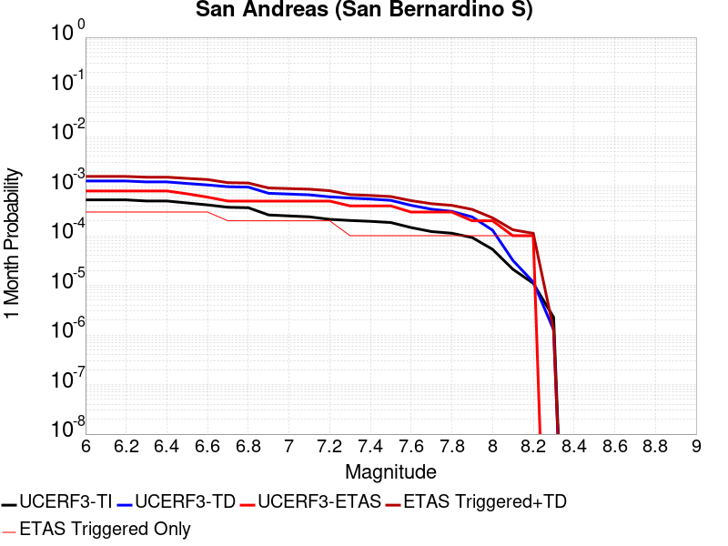 |  | 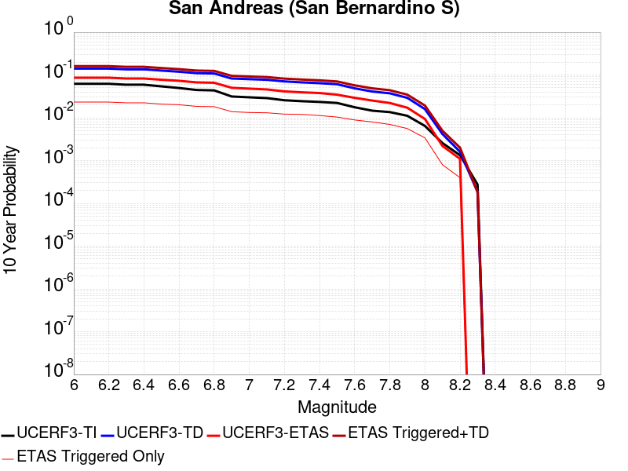 |

| Magnitude | 1 wk TI Prob | 1 wk TD Prob | 1 wk ETAS Prob | 1 wk ETAS/TD Gain | 1 wk ETAS Triggered+TD | 1 wk ETAS Triggered Only | 1 mo TI Prob | 1 mo TD Prob | 1 mo ETAS Prob | 1 mo ETAS/TD Gain | 1 mo ETAS Triggered+TD | 1 mo ETAS Triggered Only | 1 yr TI Prob | 1 yr TD Prob | 1 yr ETAS Prob | 1 yr ETAS/TD Gain | 1 yr ETAS Triggered+TD | 1 yr ETAS Triggered Only | 10 yr TI Prob | 10 yr TD Prob | 10 yr ETAS Prob | 10 yr ETAS/TD Gain | 10 yr ETAS Triggered+TD | 10 yr ETAS Triggered Only |
|-----|-----|-----|-----|-----|-----|-----|-----|-----|-----|-----|-----|-----|-----|-----|-----|-----|-----|-----|-----|-----|-----|-----|-----|-----|
| 6.0 | 1.2336002E-4 | 2.959187E-4 | 3.0E-4 | 1.013792 | 2.959187E-4 | 0.0 | 5.2857865E-4 | 0.0012676324 | 8.0E-4 | 0.6310978 | 0.0015672521 | 3.0E-4 | 0.006416472 | 0.0153290965 | 0.0085 | 0.55450106 | 0.017593838 | 0.0023 | 0.06234337 | 0.14099796 | 0.0865 | 0.6134841 | 0.16101271 | 0.0233 |
| 6.1 | 1.2336002E-4 | 2.959187E-4 | 3.0E-4 | 1.013792 | 2.959187E-4 | 0.0 | 5.2857865E-4 | 0.0012676324 | 8.0E-4 | 0.6310978 | 0.0015672521 | 3.0E-4 | 0.006416472 | 0.0153290965 | 0.0085 | 0.55450106 | 0.017593838 | 0.0023 | 0.06234337 | 0.14099796 | 0.0865 | 0.6134841 | 0.16101271 | 0.0233 |
| 6.2 | 1.2336002E-4 | 2.959187E-4 | 3.0E-4 | 1.013792 | 2.959187E-4 | 0.0 | 5.2857865E-4 | 0.0012676324 | 8.0E-4 | 0.6310978 | 0.0015672521 | 3.0E-4 | 0.006416472 | 0.0153290965 | 0.0085 | 0.55450106 | 0.017593838 | 0.0023 | 0.06234337 | 0.14099796 | 0.0865 | 0.6134841 | 0.16101271 | 0.0233 |
| 6.3 | 1.1712257E-4 | 2.838439E-4 | 3.0E-4 | 1.056919 | 2.838439E-4 | 0.0 | 5.018573E-4 | 0.0012159321 | 8.0E-4 | 0.6579315 | 0.0015155673 | 3.0E-4 | 0.006093008 | 0.01470826 | 0.0083 | 0.56430876 | 0.016875902 | 0.0022 | 0.059286322 | 0.1356851 | 0.0828 | 0.61023647 | 0.15504576 | 0.0224 |
| 6.4 | 1.1712257E-4 | 2.838439E-4 | 3.0E-4 | 1.056919 | 2.838439E-4 | 0.0 | 5.018573E-4 | 0.0012159321 | 8.0E-4 | 0.6579315 | 0.0015155673 | 3.0E-4 | 0.006093008 | 0.01470826 | 0.0083 | 0.56430876 | 0.016875902 | 0.0022 | 0.059286322 | 0.1356851 | 0.0828 | 0.61023647 | 0.15504576 | 0.0224 |
| 6.5 | 1.0689076E-4 | 2.640397E-4 | 3.0E-4 | 1.1361928 | 2.640397E-4 | 0.0 | 4.5802278E-4 | 0.0011311325 | 7.0E-4 | 0.61884886 | 0.0014307931 | 3.0E-4 | 0.0055621783 | 0.013689131 | 0.0077 | 0.5624901 | 0.015661752 | 0.002 | 0.05425003 | 0.12696327 | 0.0776 | 0.61120033 | 0.14520974 | 0.0209 |
| 6.6 | 9.7648895E-5 | 2.465534E-4 | 2.0E-4 | 0.81118333 | 2.465534E-4 | 0.0 | 4.1842813E-4 | 0.0010562527 | 6.0E-4 | 0.56804585 | 0.0013559359 | 3.0E-4 | 0.005082469 | 0.012788354 | 0.0073 | 0.5708319 | 0.014762777 | 0.002 | 0.049677886 | 0.11914333 | 0.0732 | 0.6143861 | 0.13693663 | 0.0202 |
| 6.7 | 8.757013E-5 | 2.2732638E-4 | 2.0E-4 | 0.8797923 | 2.2732638E-4 | 0.0 | 3.7524657E-4 | 9.7391417E-4 | 5.0E-4 | 0.51339227 | 0.0011737194 | 2.0E-4 | 0.00455906 | 0.011796966 | 0.0065 | 0.5509891 | 0.013378091 | 0.0016 | 0.04466656 | 0.1104343 | 0.0672 | 0.60850656 | 0.12689127 | 0.0185 |
| 6.8 | 8.562978E-5 | 2.2295192E-4 | 2.0E-4 | 0.8970544 | 2.2295192E-4 | 0.0 | 3.6693315E-4 | 9.5518027E-4 | 5.0E-4 | 0.5234614 | 0.0011549892 | 2.0E-4 | 0.004458263 | 0.011571319 | 0.0063 | 0.5444496 | 0.013152804 | 0.0016 | 0.043698758 | 0.10845624 | 0.0658 | 0.6066963 | 0.12468234 | 0.0182 |
| 6.9 | 6.124075E-5 | 1.6714828E-4 | 2.0E-4 | 1.1965424 | 1.6714828E-4 | 0.0 | 2.6243398E-4 | 7.1615394E-4 | 5.0E-4 | 0.69817394 | 9.160107E-4 | 2.0E-4 | 0.0031904527 | 0.008684517 | 0.0053 | 0.6102815 | 0.009973227 | 0.0013 | 0.031450346 | 0.08264147 | 0.0503 | 0.60865325 | 0.09539275 | 0.0139 |
| 7.0 | 5.8598747E-5 | 1.6147296E-4 | 2.0E-4 | 1.2385975 | 1.6147296E-4 | 0.0 | 2.5111332E-4 | 6.9184415E-4 | 5.0E-4 | 0.7227061 | 8.917058E-4 | 2.0E-4 | 0.0030530186 | 0.008390861 | 0.0052 | 0.6197219 | 0.009679952 | 0.0013 | 0.03011414 | 0.07997129 | 0.048 | 0.60021544 | 0.09220767 | 0.0133 |
| 7.1 | 5.613814E-5 | 1.556908E-4 | 2.0E-4 | 1.2845975 | 1.556908E-4 | 0.0 | 2.4056983E-4 | 6.670764E-4 | 5.0E-4 | 0.7495394 | 8.66943E-4 | 2.0E-4 | 0.0029250039 | 0.008091586 | 0.0051 | 0.63028437 | 0.009381067 | 0.0013 | 0.028868021 | 0.077282496 | 0.046 | 0.5952189 | 0.089370094 | 0.0131 |
| 7.2 | 4.991222E-5 | 1.4183126E-4 | 2.0E-4 | 1.4101263 | 1.4183126E-4 | 0.0 | 2.1389198E-4 | 6.07707E-4 | 5.0E-4 | 0.8227649 | 8.075855E-4 | 2.0E-4 | 0.002601025 | 0.0073738317 | 0.0042 | 0.56958175 | 0.00846572 | 0.0011 | 0.025707912 | 0.070787266 | 0.0414 | 0.58485097 | 0.08212366 | 0.0122 |
| 7.3 | 4.7410045E-5 | 1.3384147E-4 | 2.0E-4 | 1.4943051 | 1.3384147E-4 | 0.0 | 2.0317009E-4 | 5.7348056E-4 | 4.0E-4 | 0.69749534 | 6.734232E-4 | 1.0E-4 | 0.0024707897 | 0.0069598546 | 0.004 | 0.5747246 | 0.007952895 | 0.001 | 0.024434982 | 0.06709808 | 0.0394 | 0.5872001 | 0.07829291 | 0.012 |
| 7.4 | 4.5556746E-5 | 1.2797344E-4 | 2.0E-4 | 1.5628242 | 1.2797344E-4 | 0.0 | 1.952286E-4 | 5.4834265E-4 | 4.0E-4 | 0.7294709 | 6.4828777E-4 | 1.0E-4 | 0.002374317 | 0.0066557107 | 0.0039 | 0.58596295 | 0.007549721 | 9.0E-4 | 0.023491086 | 0.064366914 | 0.0379 | 0.5888119 | 0.074939564 | 0.0113 |
| 7.5 | 4.3084514E-5 | 1.2039103E-4 | 2.0E-4 | 1.6612535 | 1.2039103E-4 | 0.0 | 1.8463485E-4 | 5.158598E-4 | 4.0E-4 | 0.77540445 | 6.1580824E-4 | 1.0E-4 | 0.0022456115 | 0.006262575 | 0.0037 | 0.5908113 | 0.007156939 | 9.0E-4 | 0.022230545 | 0.06078928 | 0.0347 | 0.5708243 | 0.07055707 | 0.0104 |
| 7.6 | 3.408608E-5 | 9.545996E-5 | 1.0E-4 | 1.0475596 | 9.545996E-5 | 0.0 | 1.4607502E-4 | 4.0905006E-4 | 3.0E-4 | 0.7334066 | 5.090092E-4 | 1.0E-4 | 0.0017770125 | 0.0049688364 | 0.0029 | 0.58363765 | 0.005864364 | 9.0E-4 | 0.017628696 | 0.04873092 | 0.0293 | 0.60126096 | 0.057197217 | 0.0089 |
| 7.7 | 2.8315713E-5 | 7.978289E-5 | 1.0E-4 | 1.2534015 | 7.978289E-5 | 0.0 | 1.2134742E-4 | 3.4188188E-4 | 3.0E-4 | 0.877496 | 4.4184772E-4 | 1.0E-4 | 0.0014764034 | 0.004154476 | 0.002 | 0.48140848 | 0.004851568 | 7.0E-4 | 0.01466633 | 0.041057274 | 0.0253 | 0.61621237 | 0.048728816 | 0.008 |
| 7.8 | 2.6222975E-5 | 7.2100505E-5 | 1.0E-4 | 1.3869529 | 7.2100505E-5 | 0.0 | 1.1237934E-4 | 3.089656E-4 | 3.0E-4 | 0.9709819 | 4.089347E-4 | 1.0E-4 | 0.0013673597 | 0.0037551734 | 0.002 | 0.53259856 | 0.0044525447 | 7.0E-4 | 0.013589768 | 0.03729441 | 0.0222 | 0.5952635 | 0.04403335 | 0.007 |
| 7.9 | 2.1469694E-5 | 5.575388E-5 | 0.0 | 0.0 | 5.575388E-5 | 0.0 | 9.200973E-5 | 2.3892333E-4 | 2.0E-4 | 0.83708864 | 3.3889944E-4 | 1.0E-4 | 0.0011196428 | 0.002905014 | 0.0017 | 0.5851951 | 0.0035032711 | 6.0E-4 | 0.011140184 | 0.02917951 | 0.0172 | 0.5894547 | 0.034616105 | 0.0056 |
| 8.0 | 1.2420249E-5 | 3.0108682E-5 | 0.0 | 0.0 | 3.0108682E-5 | 0.0 | 5.322855E-5 | 1.2903083E-4 | 2.0E-4 | 1.5500171 | 2.2901793E-4 | 1.0E-4 | 6.478649E-4 | 0.0015698193 | 0.0011 | 0.7007176 | 0.0020690344 | 5.0E-4 | 0.0064597935 | 0.015954686 | 0.0094 | 0.5891686 | 0.01930044 | 0.0034 |
| 8.1 | 4.9197724E-6 | 7.3607757E-6 | 0.0 | 0.0 | 7.3607757E-6 | 0.0 | 2.1084568E-5 | 3.1545802E-5 | 1.0E-4 | 3.1699939 | 1.3154265E-4 | 1.0E-4 | 2.566744E-4 | 3.8400257E-4 | 2.0E-4 | 0.52082986 | 4.8396416E-4 | 1.0E-4 | 0.002563781 | 0.004151609 | 0.0022 | 0.5299151 | 0.0049482873 | 8.0E-4 |
| 8.2 | 2.5634774E-6 | 2.6923744E-6 | 0.0 | 0.0 | 2.6923744E-6 | 0.0 | 1.0986286E-5 | 1.15386965E-5 | 1.0E-4 | 8.666491 | 1.1153754E-4 | 1.0E-4 | 1.3374983E-4 | 1.4047461E-4 | 1.0E-4 | 0.7118724 | 2.4046056E-4 | 1.0E-4 | 0.0013366934 | 0.0015920753 | 0.0011 | 0.6909221 | 0.0019914384 | 4.0E-4 |
| 8.3 | 5.2850464E-7 | 2.9221226E-7 | 0.0 | 0.0 | 2.9221226E-7 | 0.0 | 2.2650179E-6 | 1.2523377E-6 | 0.0 | 0.0 | 1.2523377E-6 | 0.0 | 2.7576245E-5 | 1.5247115E-5 | 0.0 | 0.0 | 1.5247115E-5 | 0.0 | 2.7572823E-4 | 1.824695E-4 | 0.0 | 0.0 | 1.824695E-4 | 0.0 |

## San Andreas (Big Bend)
*[(top)](#table-of-contents)*

| 1 Week | 1 Month | 1 Year | 10 Year |
|-----|-----|-----|-----|
|  |  |  |  |

| Magnitude | 1 wk TI Prob | 1 wk TD Prob | 1 wk ETAS Prob | 1 wk ETAS/TD Gain | 1 wk ETAS Triggered+TD | 1 wk ETAS Triggered Only | 1 mo TI Prob | 1 mo TD Prob | 1 mo ETAS Prob | 1 mo ETAS/TD Gain | 1 mo ETAS Triggered+TD | 1 mo ETAS Triggered Only | 1 yr TI Prob | 1 yr TD Prob | 1 yr ETAS Prob | 1 yr ETAS/TD Gain | 1 yr ETAS Triggered+TD | 1 yr ETAS Triggered Only | 10 yr TI Prob | 10 yr TD Prob | 10 yr ETAS Prob | 10 yr ETAS/TD Gain | 10 yr ETAS Triggered+TD | 10 yr ETAS Triggered Only |
|-----|-----|-----|-----|-----|-----|-----|-----|-----|-----|-----|-----|-----|-----|-----|-----|-----|-----|-----|-----|-----|-----|-----|-----|-----|
| 6.0 | 1.0179969E-4 | 1.934932E-4 | 2.0E-4 | 1.0336281 | 2.9347383E-4 | 1.0E-4 | 4.362114E-4 | 8.28994E-4 | 4.0E-4 | 0.48251256 | 0.0010288282 | 2.0E-4 | 0.0052979486 | 0.01004656 | 0.0062 | 0.61712664 | 0.012323453 | 0.0023 | 0.051734097 | 0.0983232 | 0.0639 | 0.64989746 | 0.11852076 | 0.0224 |
| 6.1 | 1.0179969E-4 | 1.934932E-4 | 2.0E-4 | 1.0336281 | 2.9347383E-4 | 1.0E-4 | 4.362114E-4 | 8.28994E-4 | 4.0E-4 | 0.48251256 | 0.0010288282 | 2.0E-4 | 0.0052979486 | 0.01004656 | 0.0062 | 0.61712664 | 0.012323453 | 0.0023 | 0.051734097 | 0.0983232 | 0.0639 | 0.64989746 | 0.11852076 | 0.0224 |
| 6.2 | 1.0179969E-4 | 1.934932E-4 | 2.0E-4 | 1.0336281 | 2.9347383E-4 | 1.0E-4 | 4.362114E-4 | 8.28994E-4 | 4.0E-4 | 0.48251256 | 0.0010288282 | 2.0E-4 | 0.0052979486 | 0.01004656 | 0.0062 | 0.61712664 | 0.012323453 | 0.0023 | 0.051734097 | 0.0983232 | 0.0639 | 0.64989746 | 0.11852076 | 0.0224 |
| 6.3 | 1.0179969E-4 | 1.934932E-4 | 2.0E-4 | 1.0336281 | 2.9347383E-4 | 1.0E-4 | 4.362114E-4 | 8.28994E-4 | 4.0E-4 | 0.48251256 | 0.0010288282 | 2.0E-4 | 0.0052979486 | 0.01004656 | 0.0062 | 0.61712664 | 0.012323453 | 0.0023 | 0.051734097 | 0.0983232 | 0.0639 | 0.64989746 | 0.11852076 | 0.0224 |
| 6.4 | 9.1639464E-5 | 1.7720324E-4 | 2.0E-4 | 1.1286476 | 2.7718552E-4 | 1.0E-4 | 3.9268145E-4 | 7.592216E-4 | 4.0E-4 | 0.5268554 | 9.5906976E-4 | 2.0E-4 | 0.0047704205 | 0.009204453 | 0.0054 | 0.5866726 | 0.011086964 | 0.0019 | 0.046693064 | 0.09063992 | 0.0578 | 0.63768816 | 0.108827114 | 0.02 |
| 6.5 | 9.1639464E-5 | 1.7720324E-4 | 2.0E-4 | 1.1286476 | 2.7718552E-4 | 1.0E-4 | 3.9268145E-4 | 7.592216E-4 | 4.0E-4 | 0.5268554 | 9.5906976E-4 | 2.0E-4 | 0.0047704205 | 0.009204453 | 0.0054 | 0.5866726 | 0.011086964 | 0.0019 | 0.046693064 | 0.09063992 | 0.0578 | 0.63768816 | 0.108827114 | 0.02 |
| 6.6 | 9.042622E-5 | 1.7529071E-4 | 2.0E-4 | 1.1409618 | 2.752732E-4 | 1.0E-4 | 3.8748336E-4 | 7.510298E-4 | 4.0E-4 | 0.532602 | 9.5087965E-4 | 2.0E-4 | 0.0047074095 | 0.009105554 | 0.0052 | 0.5710801 | 0.010889163 | 0.0018 | 0.046089325 | 0.089733854 | 0.0569 | 0.63409734 | 0.10748404 | 0.0195 |
| 6.7 | 8.9836685E-5 | 1.7443967E-4 | 2.0E-4 | 1.1465281 | 2.7442223E-4 | 1.0E-4 | 3.8495753E-4 | 7.473846E-4 | 4.0E-4 | 0.5351997 | 9.4723515E-4 | 2.0E-4 | 0.00467679 | 0.009061542 | 0.0052 | 0.5738538 | 0.010845231 | 0.0018 | 0.045795817 | 0.08932939 | 0.0569 | 0.63696843 | 0.10708747 | 0.0195 |
| 6.8 | 8.9471854E-5 | 1.7391385E-4 | 2.0E-4 | 1.1499947 | 2.7389647E-4 | 1.0E-4 | 3.8339442E-4 | 7.4513233E-4 | 4.0E-4 | 0.5368174 | 9.4498333E-4 | 2.0E-4 | 0.004657841 | 0.009034349 | 0.0052 | 0.5755811 | 0.010818087 | 0.0018 | 0.04561414 | 0.089079246 | 0.0565 | 0.63426673 | 0.106660016 | 0.0193 |
| 6.9 | 8.858234E-5 | 1.7274439E-4 | 2.0E-4 | 1.1577799 | 2.727271E-4 | 1.0E-4 | 3.7958333E-4 | 7.401233E-4 | 4.0E-4 | 0.5404505 | 9.399752E-4 | 2.0E-4 | 0.004611638 | 0.008973866 | 0.0052 | 0.5794604 | 0.010757713 | 0.0018 | 0.04517103 | 0.088522434 | 0.0562 | 0.6348673 | 0.1060228 | 0.0192 |
| 7.0 | 8.7433385E-5 | 1.7114916E-4 | 2.0E-4 | 1.1685714 | 2.7113204E-4 | 1.0E-4 | 3.746607E-4 | 7.332904E-4 | 4.0E-4 | 0.5454865 | 9.331437E-4 | 2.0E-4 | 0.004551957 | 0.008891358 | 0.0052 | 0.58483756 | 0.010675353 | 0.0018 | 0.044598386 | 0.08776246 | 0.0555 | 0.63238883 | 0.10500375 | 0.0189 |
| 7.1 | 8.684964E-5 | 1.7027919E-4 | 2.0E-4 | 1.1745416 | 2.7026216E-4 | 1.0E-4 | 3.7215967E-4 | 7.2956405E-4 | 4.0E-4 | 0.5482726 | 9.2941814E-4 | 2.0E-4 | 0.0045216335 | 0.008846359 | 0.0051 | 0.57650834 | 0.01053132 | 0.0017 | 0.04430731 | 0.0873478 | 0.0553 | 0.6331012 | 0.10450566 | 0.0188 |
| 7.2 | 8.606521E-5 | 1.6919592E-4 | 2.0E-4 | 1.1820617 | 2.69179E-4 | 1.0E-4 | 3.6879873E-4 | 7.2492403E-4 | 4.0E-4 | 0.55178195 | 9.2477904E-4 | 2.0E-4 | 0.0044808835 | 0.0087903235 | 0.005 | 0.5688073 | 0.01047538 | 0.0017 | 0.043916024 | 0.08683166 | 0.0552 | 0.6357128 | 0.10399923 | 0.0188 |
| 7.3 | 8.568266E-5 | 1.686284E-4 | 2.0E-4 | 1.1860399 | 2.6861153E-4 | 1.0E-4 | 3.6715972E-4 | 7.224931E-4 | 4.0E-4 | 0.5536385 | 9.223486E-4 | 2.0E-4 | 0.0044610105 | 0.008760965 | 0.005 | 0.57071334 | 0.010446073 | 0.0017 | 0.043725148 | 0.0865573 | 0.0551 | 0.63657254 | 0.103730015 | 0.0188 |
| 7.4 | 8.5432206E-5 | 1.6826228E-4 | 2.0E-4 | 1.1886206 | 2.6824547E-4 | 1.0E-4 | 3.6608664E-4 | 7.2092493E-4 | 4.0E-4 | 0.55484277 | 9.2078076E-4 | 2.0E-4 | 0.004447999 | 0.008742027 | 0.005 | 0.5719497 | 0.010427166 | 0.0017 | 0.043600157 | 0.08638042 | 0.0551 | 0.63787603 | 0.10355647 | 0.0188 |
| 7.5 | 8.4791965E-5 | 1.669833E-4 | 2.0E-4 | 1.1977246 | 2.669666E-4 | 1.0E-4 | 3.633435E-4 | 7.154466E-4 | 4.0E-4 | 0.5590913 | 9.1530354E-4 | 2.0E-4 | 0.0044147377 | 0.008675861 | 0.005 | 0.57631165 | 0.010361113 | 0.0017 | 0.043280575 | 0.08576795 | 0.0548 | 0.63893336 | 0.10286409 | 0.0187 |
| 7.6 | 8.241105E-5 | 1.6155186E-4 | 2.0E-4 | 1.2379926 | 2.615357E-4 | 1.0E-4 | 3.531424E-4 | 6.921815E-4 | 4.0E-4 | 0.57788306 | 8.920431E-4 | 2.0E-4 | 0.0042910352 | 0.008394826 | 0.0048 | 0.5717808 | 0.0100805545 | 0.0017 | 0.042091176 | 0.08318966 | 0.0532 | 0.6395026 | 0.099967286 | 0.0183 |
| 7.7 | 7.00432E-5 | 1.3586743E-4 | 1.0E-4 | 0.73601156 | 2.3585385E-4 | 1.0E-4 | 3.001506E-4 | 5.821591E-4 | 3.0E-4 | 0.51532304 | 7.820427E-4 | 2.0E-4 | 0.0036482112 | 0.0070647867 | 0.0042 | 0.59449774 | 0.008653483 | 0.0016 | 0.035888977 | 0.07071617 | 0.0437 | 0.6179633 | 0.08474836 | 0.0151 |
| 7.8 | 6.415362E-5 | 1.2410858E-4 | 1.0E-4 | 0.805746 | 2.2409618E-4 | 1.0E-4 | 2.749151E-4 | 5.3178554E-4 | 3.0E-4 | 0.56413716 | 7.316792E-4 | 2.0E-4 | 0.0033419547 | 0.0064552943 | 0.0039 | 0.60415524 | 0.007846257 | 0.0014 | 0.03292141 | 0.06470684 | 0.0398 | 0.6150818 | 0.07742683 | 0.0136 |
| 7.9 | 4.939911E-5 | 8.9373454E-5 | 1.0E-4 | 1.1189005 | 1.8936451E-4 | 1.0E-4 | 2.116933E-4 | 3.8297285E-4 | 3.0E-4 | 0.78334534 | 5.828963E-4 | 2.0E-4 | 0.0025743195 | 0.004652734 | 0.0031 | 0.66627496 | 0.005747616 | 0.0011 | 0.025447013 | 0.04701216 | 0.03 | 0.63813275 | 0.056827936 | 0.0103 |
| 8.0 | 3.344983E-5 | 4.978813E-5 | 1.0E-4 | 2.0085108 | 1.4978315E-4 | 1.0E-4 | 1.4334853E-4 | 2.1336025E-4 | 3.0E-4 | 1.4060725 | 4.1331758E-4 | 2.0E-4 | 0.0017438711 | 0.0025945683 | 0.0018 | 0.69375706 | 0.003292752 | 7.0E-4 | 0.017302496 | 0.026719132 | 0.017 | 0.63624823 | 0.032656144 | 0.0061 |
| 8.1 | 1.9104898E-5 | 1.7970899E-5 | 1.0E-4 | 5.5645523 | 1.179691E-4 | 1.0E-4 | 8.1875565E-5 | 7.7015866E-5 | 2.0E-4 | 2.5968676 | 2.7700045E-4 | 2.0E-4 | 9.963791E-4 | 9.3726534E-4 | 6.0E-4 | 0.6401602 | 0.0012369842 | 3.0E-4 | 0.009919235 | 0.010117445 | 0.0068 | 0.67210644 | 0.01269114 | 0.0026 |
| 8.2 | 8.643924E-6 | 5.0104E-6 | 0.0 | 0.0 | 5.0104E-6 | 0.0 | 3.704486E-5 | 2.1472966E-5 | 1.0E-4 | 4.6570187 | 1.2147082E-4 | 1.0E-4 | 4.5092785E-4 | 2.6140205E-4 | 2.0E-4 | 0.7651049 | 3.6137592E-4 | 1.0E-4 | 0.0045001395 | 0.002993769 | 0.0022 | 0.73485965 | 0.0036916733 | 7.0E-4 |
| 8.3 | 1.983087E-6 | 6.880041E-7 | 0.0 | 0.0 | 6.880041E-7 | 0.0 | 8.498917E-6 | 2.9485857E-6 | 0.0 | 0.0 | 2.9485857E-6 | 0.0 | 1.034694E-4 | 3.589845E-5 | 0.0 | 0.0 | 3.589845E-5 | 0.0 | 0.0010342124 | 4.2701262E-4 | 2.0E-4 | 0.46837023 | 5.269699E-4 | 1.0E-4 |

## San Andreas (Coachella) rev
*[(top)](#table-of-contents)*

| 1 Week | 1 Month | 1 Year | 10 Year |
|-----|-----|-----|-----|
|  |  |  |  |

| Magnitude | 1 wk TI Prob | 1 wk TD Prob | 1 wk ETAS Prob | 1 wk ETAS/TD Gain | 1 wk ETAS Triggered+TD | 1 wk ETAS Triggered Only | 1 mo TI Prob | 1 mo TD Prob | 1 mo ETAS Prob | 1 mo ETAS/TD Gain | 1 mo ETAS Triggered+TD | 1 mo ETAS Triggered Only | 1 yr TI Prob | 1 yr TD Prob | 1 yr ETAS Prob | 1 yr ETAS/TD Gain | 1 yr ETAS Triggered+TD | 1 yr ETAS Triggered Only | 10 yr TI Prob | 10 yr TD Prob | 10 yr ETAS Prob | 10 yr ETAS/TD Gain | 10 yr ETAS Triggered+TD | 10 yr ETAS Triggered Only |
|-----|-----|-----|-----|-----|-----|-----|-----|-----|-----|-----|-----|-----|-----|-----|-----|-----|-----|-----|-----|-----|-----|-----|-----|-----|
| 6.0 | 1.1925945E-4 | 3.2288718E-4 | 3.0E-4 | 0.92911714 | 4.2285488E-4 | 1.0E-4 | 5.110118E-4 | 0.0013830729 | 0.001 | 0.7230277 | 0.001682658 | 3.0E-4 | 0.0062038354 | 0.016710198 | 0.0096 | 0.5744995 | 0.020151712 | 0.0035 | 0.060334753 | 0.15093613 | 0.089 | 0.5896534 | 0.16953063 | 0.0219 |
| 6.1 | 1.1925945E-4 | 3.2288718E-4 | 3.0E-4 | 0.92911714 | 4.2285488E-4 | 1.0E-4 | 5.110118E-4 | 0.0013830729 | 0.001 | 0.7230277 | 0.001682658 | 3.0E-4 | 0.0062038354 | 0.016710198 | 0.0096 | 0.5744995 | 0.020151712 | 0.0035 | 0.060334753 | 0.15093613 | 0.089 | 0.5896534 | 0.16953063 | 0.0219 |
| 6.2 | 1.07432395E-4 | 2.9791912E-4 | 3.0E-4 | 1.0069847 | 3.9788932E-4 | 1.0E-4 | 4.603433E-4 | 0.0012761754 | 0.001 | 0.78359133 | 0.0015757926 | 3.0E-4 | 0.005590286 | 0.015427807 | 0.009 | 0.5833622 | 0.018775353 | 0.0034 | 0.05451731 | 0.14010412 | 0.0822 | 0.5867065 | 0.15841989 | 0.0213 |
| 6.3 | 1.0718766E-4 | 2.9737237E-4 | 3.0E-4 | 1.0088362 | 3.9734264E-4 | 1.0E-4 | 4.592948E-4 | 0.0012738345 | 0.001 | 0.7850314 | 0.0015734523 | 3.0E-4 | 0.005577586 | 0.015399709 | 0.009 | 0.58442664 | 0.01874735 | 0.0034 | 0.054396555 | 0.13987197 | 0.0822 | 0.5876803 | 0.1581927 | 0.0213 |
| 6.4 | 1.0355944E-4 | 2.8945875E-4 | 3.0E-4 | 1.0364171 | 3.894298E-4 | 1.0E-4 | 4.4375064E-4 | 0.0012399516 | 9.0E-4 | 0.7258348 | 0.0015395796 | 3.0E-4 | 0.0053892885 | 0.014992934 | 0.0088 | 0.58694315 | 0.018243456 | 0.0033 | 0.052604496 | 0.13642041 | 0.0804 | 0.5893546 | 0.15464194 | 0.0211 |
| 6.5 | 1.0227914E-4 | 2.8665483E-4 | 3.0E-4 | 1.0465548 | 3.8662617E-4 | 1.0E-4 | 4.382655E-4 | 0.0012279461 | 9.0E-4 | 0.7329312 | 0.0015275778 | 3.0E-4 | 0.0053228354 | 0.014848769 | 0.0088 | 0.5926417 | 0.018099768 | 0.0033 | 0.051971316 | 0.13520178 | 0.0799 | 0.59096855 | 0.15336254 | 0.021 |
| 6.6 | 1.0116757E-4 | 2.8431637E-4 | 3.0E-4 | 1.0551625 | 3.8428794E-4 | 1.0E-4 | 4.3350324E-4 | 0.0012179336 | 9.0E-4 | 0.7389566 | 0.0015175681 | 3.0E-4 | 0.0052651367 | 0.01472852 | 0.0088 | 0.5974803 | 0.017979916 | 0.0033 | 0.051421247 | 0.13417985 | 0.0793 | 0.5909979 | 0.15236206 | 0.021 |
| 6.7 | 1.0050676E-4 | 2.829039E-4 | 3.0E-4 | 1.0604308 | 3.8287562E-4 | 1.0E-4 | 4.3067214E-4 | 0.0012118858 | 9.0E-4 | 0.74264425 | 0.0015115222 | 3.0E-4 | 0.005230834 | 0.014655882 | 0.0087 | 0.59361833 | 0.017808983 | 0.0032 | 0.051094085 | 0.13356358 | 0.0789 | 0.59072995 | 0.1516721 | 0.0209 |
| 6.8 | 9.976819E-5 | 2.8094676E-4 | 3.0E-4 | 1.067818 | 3.8091865E-4 | 1.0E-4 | 4.2750788E-4 | 0.0012035057 | 9.0E-4 | 0.7478153 | 0.0015031446 | 3.0E-4 | 0.0051924936 | 0.014555221 | 0.0087 | 0.59772366 | 0.017708644 | 0.0032 | 0.050728295 | 0.13271578 | 0.0781 | 0.5884756 | 0.15075529 | 0.0208 |
| 6.9 | 9.77719E-5 | 2.7595705E-4 | 3.0E-4 | 1.0871257 | 3.7592946E-4 | 1.0E-4 | 4.1895514E-4 | 0.0011821408 | 9.0E-4 | 0.7613306 | 0.0014817861 | 3.0E-4 | 0.0050888555 | 0.014298547 | 0.0085 | 0.594466 | 0.01725565 | 0.003 | 0.049738888 | 0.1305549 | 0.0775 | 0.59362 | 0.14837852 | 0.0205 |
| 7.0 | 8.500761E-5 | 2.4361434E-4 | 3.0E-4 | 1.2314546 | 3.4358999E-4 | 1.0E-4 | 3.6426744E-4 | 0.0010436468 | 9.0E-4 | 0.8623607 | 0.0013433337 | 3.0E-4 | 0.0044259406 | 0.012633122 | 0.0078 | 0.6174246 | 0.015299012 | 0.0027 | 0.04338823 | 0.11649794 | 0.0684 | 0.58713484 | 0.13275437 | 0.0184 |
| 7.1 | 8.319876E-5 | 2.3970265E-4 | 3.0E-4 | 1.2515506 | 3.396787E-4 | 1.0E-4 | 3.5651738E-4 | 0.0010268958 | 9.0E-4 | 0.87642777 | 0.0013265877 | 3.0E-4 | 0.004331963 | 0.012431524 | 0.0076 | 0.61134905 | 0.0149992015 | 0.0026 | 0.042484846 | 0.114739165 | 0.0673 | 0.58654773 | 0.13076238 | 0.0181 |
| 7.2 | 7.563917E-5 | 2.2033798E-4 | 3.0E-4 | 1.3615446 | 3.2031594E-4 | 1.0E-4 | 3.2412758E-4 | 9.4396685E-4 | 9.0E-4 | 0.95342326 | 0.0012436837 | 3.0E-4 | 0.0039391145 | 0.011432902 | 0.0072 | 0.6297614 | 0.013805463 | 0.0024 | 0.03870018 | 0.10618827 | 0.0623 | 0.5866938 | 0.12120431 | 0.0168 |
| 7.3 | 7.082985E-5 | 2.0367479E-4 | 3.0E-4 | 1.4729364 | 3.036544E-4 | 1.0E-4 | 3.0352117E-4 | 8.7260274E-4 | 9.0E-4 | 1.0313972 | 0.0011723409 | 3.0E-4 | 0.0036891096 | 0.010572792 | 0.0069 | 0.6526185 | 0.012947418 | 0.0024 | 0.03628465 | 0.098766804 | 0.058 | 0.5872418 | 0.11282604 | 0.0156 |
| 7.4 | 5.146215E-5 | 1.3987564E-4 | 2.0E-4 | 1.4298415 | 1.3987564E-4 | 0.0 | 2.2053342E-4 | 5.993302E-4 | 7.0E-4 | 1.1679705 | 7.9921033E-4 | 2.0E-4 | 0.0026816884 | 0.007272614 | 0.0048 | 0.6600103 | 0.008860978 | 0.0016 | 0.02649557 | 0.06959498 | 0.0402 | 0.5776279 | 0.08001552 | 0.0112 |
| 7.5 | 4.0285166E-5 | 1.07025786E-4 | 2.0E-4 | 1.8687086 | 1.07025786E-4 | 0.0 | 1.7263928E-4 | 4.5860163E-4 | 5.0E-4 | 1.0902709 | 5.5855577E-4 | 1.0E-4 | 0.002099857 | 0.005569247 | 0.0034 | 0.61049545 | 0.006464235 | 9.0E-4 | 0.020801254 | 0.05394122 | 0.0301 | 0.5580148 | 0.06245575 | 0.009 |
| 7.6 | 3.1168736E-5 | 8.228769E-5 | 1.0E-4 | 1.2152486 | 8.228769E-5 | 0.0 | 1.3357346E-4 | 3.5261398E-4 | 4.0E-4 | 1.134385 | 4.525787E-4 | 1.0E-4 | 0.0016250437 | 0.0042846496 | 0.0025 | 0.5834783 | 0.005081222 | 8.0E-4 | 0.016132116 | 0.041857634 | 0.0249 | 0.5948736 | 0.048947886 | 0.0074 |
| 7.7 | 2.2100989E-5 | 6.0561815E-5 | 1.0E-4 | 1.6512054 | 6.0561815E-5 | 0.0 | 9.4715084E-5 | 2.5952485E-4 | 3.0E-4 | 1.1559587 | 3.594989E-4 | 1.0E-4 | 0.001152546 | 0.003155143 | 0.0012 | 0.38033143 | 0.0036535654 | 5.0E-4 | 0.011465867 | 0.031067226 | 0.0189 | 0.60835814 | 0.03707461 | 0.0062 |
| 7.8 | 1.7484861E-5 | 5.017899E-5 | 1.0E-4 | 1.9928659 | 5.017899E-5 | 0.0 | 7.493296E-5 | 2.150351E-4 | 3.0E-4 | 1.3951211 | 3.150136E-4 | 1.0E-4 | 9.1192697E-4 | 0.0026149119 | 0.0011 | 0.42066428 | 0.0031136044 | 5.0E-4 | 0.009081938 | 0.025900835 | 0.0153 | 0.5907145 | 0.030673921 | 0.0049 |
| 7.9 | 1.3967285E-5 | 3.6891262E-5 | 0.0 | 0.0 | 3.6891262E-5 | 0.0 | 5.985842E-5 | 1.5809583E-4 | 2.0E-4 | 1.2650554 | 2.5808002E-4 | 1.0E-4 | 7.2853256E-4 | 0.0019231186 | 9.0E-4 | 0.46798983 | 0.0023223495 | 4.0E-4 | 0.0072614877 | 0.019291423 | 0.0116 | 0.6013035 | 0.023214256 | 0.004 |
| 8.0 | 1.1887396E-5 | 2.9913166E-5 | 0.0 | 0.0 | 2.9913166E-5 | 0.0 | 5.094499E-5 | 1.2819299E-4 | 2.0E-4 | 1.5601476 | 2.2818017E-4 | 1.0E-4 | 6.200787E-4 | 0.0015596332 | 8.0E-4 | 0.5129411 | 0.0019590093 | 4.0E-4 | 0.006183513 | 0.015740186 | 0.0096 | 0.6099039 | 0.01928352 | 0.0036 |
| 8.1 | 5.100864E-6 | 8.48687E-6 | 0.0 | 0.0 | 8.48687E-6 | 0.0 | 2.1860664E-5 | 3.637179E-5 | 1.0E-4 | 2.7493834 | 1.3636815E-4 | 1.0E-4 | 2.6612106E-4 | 4.427367E-4 | 1.0E-4 | 0.22586788 | 5.4269243E-4 | 1.0E-4 | 0.002658026 | 0.0046746903 | 0.0029 | 0.620362 | 0.005869081 | 0.0012 |
| 8.2 | 2.3004484E-6 | 2.5886918E-6 | 0.0 | 0.0 | 2.5886918E-6 | 0.0 | 9.859027E-6 | 1.10943465E-5 | 1.0E-4 | 9.0136 | 1.11093235E-4 | 1.0E-4 | 1.2002704E-4 | 1.3506532E-4 | 1.0E-4 | 0.7403825 | 2.3505182E-4 | 1.0E-4 | 0.0011996223 | 0.0014949394 | 0.0012 | 0.80270815 | 0.001794491 | 3.0E-4 |
| 8.3 | 1.0424446E-7 | 5.3008716E-8 | 0.0 | 0.0 | 5.3008716E-8 | 0.0 | 4.4676187E-7 | 2.2718018E-7 | 0.0 | 0.0 | 2.2718018E-7 | 0.0 | 5.439312E-6 | 2.7659155E-6 | 0.0 | 0.0 | 2.7659155E-6 | 0.0 | 5.4391792E-5 | 2.9151119E-5 | 0.0 | 0.0 | 2.9151119E-5 | 0.0 |

## San Andreas (Mojave N)
*[(top)](#table-of-contents)*

| 1 Week | 1 Month | 1 Year | 10 Year |
|-----|-----|-----|-----|
| 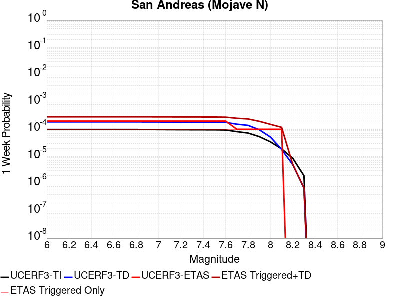 |  | 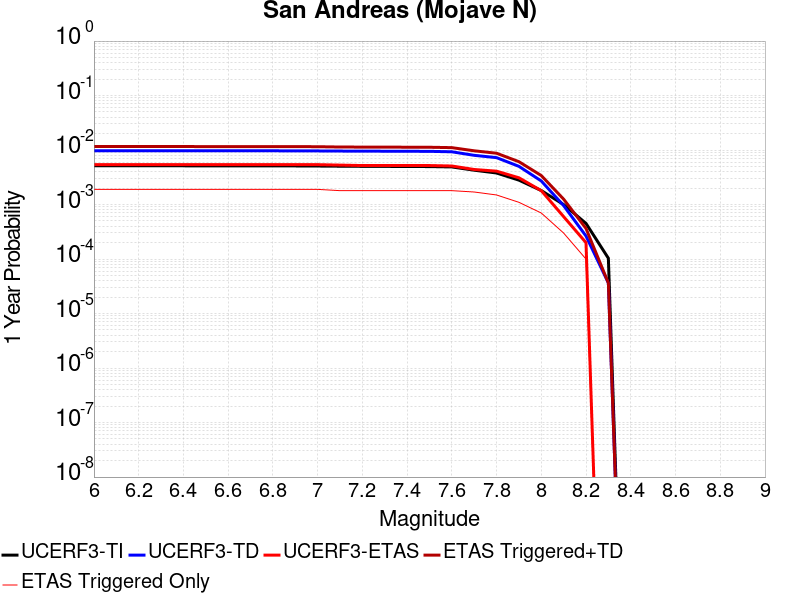 | 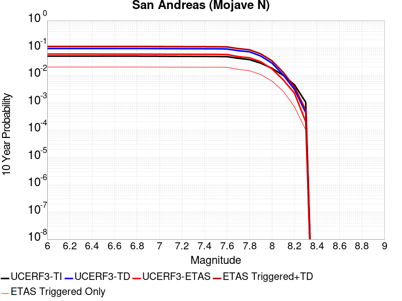 |

| Magnitude | 1 wk TI Prob | 1 wk TD Prob | 1 wk ETAS Prob | 1 wk ETAS/TD Gain | 1 wk ETAS Triggered+TD | 1 wk ETAS Triggered Only | 1 mo TI Prob | 1 mo TD Prob | 1 mo ETAS Prob | 1 mo ETAS/TD Gain | 1 mo ETAS Triggered+TD | 1 mo ETAS Triggered Only | 1 yr TI Prob | 1 yr TD Prob | 1 yr ETAS Prob | 1 yr ETAS/TD Gain | 1 yr ETAS Triggered+TD | 1 yr ETAS Triggered Only | 10 yr TI Prob | 10 yr TD Prob | 10 yr ETAS Prob | 10 yr ETAS/TD Gain | 10 yr ETAS Triggered+TD | 10 yr ETAS Triggered Only |
|-----|-----|-----|-----|-----|-----|-----|-----|-----|-----|-----|-----|-----|-----|-----|-----|-----|-----|-----|-----|-----|-----|-----|-----|-----|
| 6.0 | 9.877682E-5 | 1.8664719E-4 | 2.0E-4 | 1.0715404 | 2.8662852E-4 | 1.0E-4 | 4.2326056E-4 | 7.9967146E-4 | 4.0E-4 | 0.5002054 | 9.995116E-4 | 2.0E-4 | 0.0051410277 | 0.009692651 | 0.0054 | 0.5571231 | 0.011574235 | 0.0019 | 0.05023708 | 0.095066346 | 0.0599 | 0.63008624 | 0.11316502 | 0.02 |
| 6.1 | 9.877682E-5 | 1.8664719E-4 | 2.0E-4 | 1.0715404 | 2.8662852E-4 | 1.0E-4 | 4.2326056E-4 | 7.9967146E-4 | 4.0E-4 | 0.5002054 | 9.995116E-4 | 2.0E-4 | 0.0051410277 | 0.009692651 | 0.0054 | 0.5571231 | 0.011574235 | 0.0019 | 0.05023708 | 0.095066346 | 0.0599 | 0.63008624 | 0.11316502 | 0.02 |
| 6.2 | 9.877682E-5 | 1.8664719E-4 | 2.0E-4 | 1.0715404 | 2.8662852E-4 | 1.0E-4 | 4.2326056E-4 | 7.9967146E-4 | 4.0E-4 | 0.5002054 | 9.995116E-4 | 2.0E-4 | 0.0051410277 | 0.009692651 | 0.0054 | 0.5571231 | 0.011574235 | 0.0019 | 0.05023708 | 0.095066346 | 0.0599 | 0.63008624 | 0.11316502 | 0.02 |
| 6.3 | 9.877682E-5 | 1.8664719E-4 | 2.0E-4 | 1.0715404 | 2.8662852E-4 | 1.0E-4 | 4.2326056E-4 | 7.9967146E-4 | 4.0E-4 | 0.5002054 | 9.995116E-4 | 2.0E-4 | 0.0051410277 | 0.009692651 | 0.0054 | 0.5571231 | 0.011574235 | 0.0019 | 0.05023708 | 0.095066346 | 0.0599 | 0.63008624 | 0.11316502 | 0.02 |
| 6.4 | 9.877682E-5 | 1.8664719E-4 | 2.0E-4 | 1.0715404 | 2.8662852E-4 | 1.0E-4 | 4.2326056E-4 | 7.9967146E-4 | 4.0E-4 | 0.5002054 | 9.995116E-4 | 2.0E-4 | 0.0051410277 | 0.009692651 | 0.0054 | 0.5571231 | 0.011574235 | 0.0019 | 0.05023708 | 0.095066346 | 0.0599 | 0.63008624 | 0.11316502 | 0.02 |
| 6.5 | 9.861474E-5 | 1.8638701E-4 | 2.0E-4 | 1.0730362 | 2.8636836E-4 | 1.0E-4 | 4.2256617E-4 | 7.985571E-4 | 4.0E-4 | 0.5009034 | 9.983974E-4 | 2.0E-4 | 0.0051326132 | 0.009679204 | 0.0054 | 0.5578971 | 0.0115608135 | 0.0019 | 0.050156746 | 0.09494469 | 0.0594 | 0.6256274 | 0.1130458 | 0.02 |
| 6.6 | 9.861474E-5 | 1.8638701E-4 | 2.0E-4 | 1.0730362 | 2.8636836E-4 | 1.0E-4 | 4.2256617E-4 | 7.985571E-4 | 4.0E-4 | 0.5009034 | 9.983974E-4 | 2.0E-4 | 0.0051326132 | 0.009679204 | 0.0054 | 0.5578971 | 0.0115608135 | 0.0019 | 0.050156746 | 0.09494469 | 0.0594 | 0.6256274 | 0.1130458 | 0.02 |
| 6.7 | 9.8552715E-5 | 1.8628738E-4 | 2.0E-4 | 1.0736101 | 2.8626874E-4 | 1.0E-4 | 4.223004E-4 | 7.9813035E-4 | 4.0E-4 | 0.50117123 | 9.979707E-4 | 2.0E-4 | 0.0051293927 | 0.009674055 | 0.0054 | 0.55819404 | 0.0115556745 | 0.0019 | 0.050125998 | 0.094897926 | 0.0594 | 0.62593573 | 0.11299997 | 0.02 |
| 6.8 | 9.8464974E-5 | 1.8614107E-4 | 2.0E-4 | 1.074454 | 2.8612246E-4 | 1.0E-4 | 4.219245E-4 | 7.975037E-4 | 4.0E-4 | 0.5015651 | 9.973441E-4 | 2.0E-4 | 0.0051248376 | 0.009666493 | 0.0054 | 0.5586307 | 0.011548127 | 0.0019 | 0.05008251 | 0.09482878 | 0.0594 | 0.6263921 | 0.112932205 | 0.02 |
| 6.9 | 9.825824E-5 | 1.8582496E-4 | 2.0E-4 | 1.0762817 | 2.8580637E-4 | 1.0E-4 | 4.2103877E-4 | 7.9614983E-4 | 4.0E-4 | 0.502418 | 9.959906E-4 | 2.0E-4 | 0.0051141046 | 0.009650156 | 0.0054 | 0.55957645 | 0.0115318205 | 0.0019 | 0.049980022 | 0.094679005 | 0.0594 | 0.627383 | 0.11278543 | 0.02 |
| 7.0 | 9.781462E-5 | 1.8514665E-4 | 2.0E-4 | 1.0802248 | 2.8512813E-4 | 1.0E-4 | 4.1913814E-4 | 7.932446E-4 | 4.0E-4 | 0.5042581 | 9.930859E-4 | 2.0E-4 | 0.005091073 | 0.009615097 | 0.0054 | 0.56161684 | 0.011496828 | 0.0019 | 0.04976007 | 0.094358064 | 0.0591 | 0.6263375 | 0.11238034 | 0.0199 |
| 7.1 | 9.7121134E-5 | 1.8417464E-4 | 2.0E-4 | 1.0859258 | 2.841562E-4 | 1.0E-4 | 4.1616702E-4 | 7.8908127E-4 | 4.0E-4 | 0.5069186 | 9.889235E-4 | 2.0E-4 | 0.005055068 | 0.009564855 | 0.0053 | 0.5541119 | 0.011347638 | 0.0018 | 0.04941613 | 0.09389799 | 0.0589 | 0.6272765 | 0.11183881 | 0.0198 |
| 7.2 | 9.663819E-5 | 1.8349035E-4 | 2.0E-4 | 1.0899756 | 2.83472E-4 | 1.0E-4 | 4.1409794E-4 | 7.861504E-4 | 4.0E-4 | 0.5088085 | 9.859932E-4 | 2.0E-4 | 0.0050299936 | 0.009529484 | 0.0052 | 0.54567486 | 0.011312331 | 0.0018 | 0.049176537 | 0.0935736 | 0.0588 | 0.6283824 | 0.11152084 | 0.0198 |
| 7.3 | 9.6277574E-5 | 1.8302524E-4 | 2.0E-4 | 1.0927454 | 2.8300696E-4 | 1.0E-4 | 4.125529E-4 | 7.841583E-4 | 4.0E-4 | 0.5101011 | 9.840014E-4 | 2.0E-4 | 0.0050112694 | 0.009505442 | 0.0052 | 0.547055 | 0.011288333 | 0.0018 | 0.04899759 | 0.09335072 | 0.0586 | 0.6277402 | 0.111302376 | 0.0198 |
| 7.4 | 9.593308E-5 | 1.8243381E-4 | 2.0E-4 | 1.0962881 | 2.8241557E-4 | 1.0E-4 | 4.1107697E-4 | 7.8162504E-4 | 4.0E-4 | 0.51175433 | 9.814687E-4 | 2.0E-4 | 0.0049933824 | 0.009474869 | 0.0052 | 0.54882026 | 0.011257814 | 0.0018 | 0.04882661 | 0.093072906 | 0.0585 | 0.6285395 | 0.11093937 | 0.0197 |
| 7.5 | 9.561707E-5 | 1.8190441E-4 | 2.0E-4 | 1.0994785 | 2.8188623E-4 | 1.0E-4 | 4.0972308E-4 | 7.793576E-4 | 4.0E-4 | 0.5132432 | 9.792018E-4 | 2.0E-4 | 0.0049769743 | 0.009447503 | 0.0052 | 0.55041003 | 0.011230497 | 0.0018 | 0.048669744 | 0.09282255 | 0.0585 | 0.6302348 | 0.11069395 | 0.0197 |
| 7.6 | 9.418194E-5 | 1.7848455E-4 | 2.0E-4 | 1.1205451 | 2.784667E-4 | 1.0E-4 | 4.0357444E-4 | 7.647097E-4 | 4.0E-4 | 0.5230743 | 9.6455676E-4 | 2.0E-4 | 0.004902454 | 0.009270695 | 0.0051 | 0.5501206 | 0.011054007 | 0.0018 | 0.047957025 | 0.09122918 | 0.0575 | 0.6302808 | 0.10895021 | 0.0195 |
| 7.7 | 8.202141E-5 | 1.5360561E-4 | 1.0E-4 | 0.6510179 | 2.5359026E-4 | 1.0E-4 | 3.51473E-4 | 6.581437E-4 | 3.0E-4 | 0.45582747 | 8.580121E-4 | 2.0E-4 | 0.00427079 | 0.007983509 | 0.0044 | 0.5511361 | 0.009669937 | 0.0017 | 0.04189639 | 0.07926038 | 0.0481 | 0.6068606 | 0.09445258 | 0.0165 |
| 7.8 | 7.2859846E-5 | 1.3920998E-4 | 1.0E-4 | 0.7183393 | 2.3919606E-4 | 1.0E-4 | 3.1221908E-4 | 5.9647777E-4 | 3.0E-4 | 0.5029525 | 7.963585E-4 | 2.0E-4 | 0.003794643 | 0.0072379718 | 0.0041 | 0.56645703 | 0.008727115 | 0.0015 | 0.037304975 | 0.072028324 | 0.0436 | 0.6053174 | 0.08566951 | 0.0147 |
| 7.9 | 5.3874453E-5 | 9.6238386E-5 | 1.0E-4 | 1.0390863 | 1.9622876E-4 | 1.0E-4 | 2.3087008E-4 | 4.1238504E-4 | 3.0E-4 | 0.72747546 | 6.1230257E-4 | 2.0E-4 | 0.0028072202 | 0.005009239 | 0.0031 | 0.61885643 | 0.006103729 | 0.0011 | 0.02772022 | 0.050442543 | 0.0312 | 0.6185255 | 0.060507853 | 0.0106 |
| 8.0 | 3.468538E-5 | 5.1783452E-5 | 1.0E-4 | 1.9311188 | 1.5177828E-4 | 1.0E-4 | 1.4864317E-4 | 2.219102E-4 | 3.0E-4 | 1.3518982 | 4.218658E-4 | 2.0E-4 | 0.0018082283 | 0.002698411 | 0.0018 | 0.66705924 | 0.003396522 | 7.0E-4 | 0.017935853 | 0.027728014 | 0.017 | 0.6130984 | 0.033658873 | 0.0061 |
| 8.1 | 1.9152367E-5 | 1.8203265E-5 | 1.0E-4 | 5.49352 | 1.18201446E-4 | 1.0E-4 | 8.207899E-5 | 7.801166E-5 | 2.0E-4 | 2.5637193 | 2.7799606E-4 | 2.0E-4 | 9.988535E-4 | 9.493787E-4 | 6.0E-4 | 0.6319923 | 0.0012490939 | 3.0E-4 | 0.009943757 | 0.010226626 | 0.0068 | 0.66493094 | 0.012800037 | 0.0026 |
| 8.2 | 8.643924E-6 | 5.0104E-6 | 0.0 | 0.0 | 5.0104E-6 | 0.0 | 3.704486E-5 | 2.1472966E-5 | 1.0E-4 | 4.6570187 | 1.2147082E-4 | 1.0E-4 | 4.5092785E-4 | 2.6140205E-4 | 2.0E-4 | 0.7651049 | 3.6137592E-4 | 1.0E-4 | 0.0045001395 | 0.002993769 | 0.0022 | 0.73485965 | 0.0036916733 | 7.0E-4 |
| 8.3 | 1.983087E-6 | 6.880041E-7 | 0.0 | 0.0 | 6.880041E-7 | 0.0 | 8.498917E-6 | 2.9485857E-6 | 0.0 | 0.0 | 2.9485857E-6 | 0.0 | 1.034694E-4 | 3.589845E-5 | 0.0 | 0.0 | 3.589845E-5 | 0.0 | 0.0010342124 | 4.2701262E-4 | 2.0E-4 | 0.46837023 | 5.269699E-4 | 1.0E-4 |

## Green Valley 2011 CFM
*[(top)](#table-of-contents)*

| 1 Week | 1 Month | 1 Year | 10 Year |
|-----|-----|-----|-----|
|  |  |  |  |

| Magnitude | 1 wk TI Prob | 1 wk TD Prob | 1 wk ETAS Prob | 1 wk ETAS/TD Gain | 1 wk ETAS Triggered+TD | 1 wk ETAS Triggered Only | 1 mo TI Prob | 1 mo TD Prob | 1 mo ETAS Prob | 1 mo ETAS/TD Gain | 1 mo ETAS Triggered+TD | 1 mo ETAS Triggered Only | 1 yr TI Prob | 1 yr TD Prob | 1 yr ETAS Prob | 1 yr ETAS/TD Gain | 1 yr ETAS Triggered+TD | 1 yr ETAS Triggered Only | 10 yr TI Prob | 10 yr TD Prob | 10 yr ETAS Prob | 10 yr ETAS/TD Gain | 10 yr ETAS Triggered+TD | 10 yr ETAS Triggered Only |
|-----|-----|-----|-----|-----|-----|-----|-----|-----|-----|-----|-----|-----|-----|-----|-----|-----|-----|-----|-----|-----|-----|-----|-----|-----|
| 6.0 | 9.9629346E-5 | 1.723003E-4 | 0.0 | 0.0 | 1.723003E-4 | 0.0 | 4.2691303E-4 | 7.3821814E-4 | 1.0E-4 | 0.13546132 | 8.3814433E-4 | 1.0E-4 | 0.0051852856 | 0.008949381 | 0.0057 | 0.63691556 | 0.011030587 | 0.0021 | 0.050659515 | 0.08519073 | 0.0564 | 0.66204387 | 0.10110841 | 0.0174 |
| 6.1 | 9.88615E-5 | 1.7077432E-4 | 0.0 | 0.0 | 1.7077432E-4 | 0.0 | 4.2362334E-4 | 7.3168206E-4 | 1.0E-4 | 0.1366714 | 8.316089E-4 | 1.0E-4 | 0.0051454236 | 0.008870459 | 0.0056 | 0.6313089 | 0.010951832 | 0.0021 | 0.050279044 | 0.08447853 | 0.0546 | 0.6463181 | 0.099676184 | 0.0166 |
| 6.2 | 9.696895E-5 | 1.6717147E-4 | 0.0 | 0.0 | 1.6717147E-4 | 0.0 | 4.15515E-4 | 7.1624975E-4 | 1.0E-4 | 0.1396161 | 8.1617816E-4 | 1.0E-4 | 0.0050471667 | 0.008684165 | 0.0053 | 0.61030626 | 0.010666797 | 0.002 | 0.04934063 | 0.08278945 | 0.0533 | 0.6438018 | 0.0978317 | 0.0164 |
| 6.3 | 9.275224E-5 | 1.589701E-4 | 0.0 | 0.0 | 1.589701E-4 | 0.0 | 3.9744904E-4 | 6.811196E-4 | 0.0 | 0.0 | 6.811196E-4 | 0.0 | 0.0048282105 | 0.008259743 | 0.0049 | 0.5932388 | 0.009945702 | 0.0017 | 0.047246475 | 0.07892925 | 0.0511 | 0.6474152 | 0.09329796 | 0.0156 |
| 6.4 | 8.391499E-5 | 1.4298713E-4 | 0.0 | 0.0 | 1.4298713E-4 | 0.0 | 3.595861E-4 | 6.126609E-4 | 0.0 | 0.0 | 6.126609E-4 | 0.0 | 0.004369175 | 0.007432519 | 0.0043 | 0.5785387 | 0.00892137 | 0.0015 | 0.04284265 | 0.071316466 | 0.0469 | 0.6576322 | 0.08478238 | 0.0145 |
| 6.5 | 5.9519385E-5 | 9.880607E-5 | 0.0 | 0.0 | 9.880607E-5 | 0.0 | 2.5505814E-4 | 4.2338544E-4 | 0.0 | 0.0 | 4.2338544E-4 | 0.0 | 0.0031009112 | 0.0051414133 | 0.0034 | 0.6612968 | 0.006534215 | 0.0014 | 0.030579966 | 0.049905717 | 0.0344 | 0.68929976 | 0.05940666 | 0.01 |
| 6.6 | 4.5361558E-5 | 7.362437E-5 | 0.0 | 0.0 | 7.362437E-5 | 0.0 | 1.9439218E-4 | 3.1549318E-4 | 0.0 | 0.0 | 3.1549318E-4 | 0.0 | 0.0023641558 | 0.003833405 | 0.0026 | 0.6782482 | 0.004929188 | 0.0011 | 0.023391623 | 0.03748022 | 0.0262 | 0.6990354 | 0.044506613 | 0.0073 |
| 6.7 | 3.8808106E-5 | 6.230829E-5 | 0.0 | 0.0 | 6.230829E-5 | 0.0 | 1.6630985E-4 | 2.670088E-4 | 0.0 | 0.0 | 2.670088E-4 | 0.0 | 0.0020229418 | 0.0032453204 | 0.0021 | 0.64708555 | 0.0041424 | 9.0E-4 | 0.020046256 | 0.03184677 | 0.0211 | 0.6625476 | 0.03746206 | 0.0058 |
| 6.8 | 2.2284667E-5 | 3.1184663E-5 | 0.0 | 0.0 | 3.1184663E-5 | 0.0 | 9.550222E-5 | 1.3364178E-4 | 0.0 | 0.0 | 1.3364178E-4 | 0.0 | 0.0011621192 | 0.0016258745 | 0.0011 | 0.676559 | 0.0019253867 | 3.0E-4 | 0.011560607 | 0.016117869 | 0.0105 | 0.6514509 | 0.018872738 | 0.0028 |
| 6.9 | 1.8050168E-5 | 2.4380426E-5 | 0.0 | 0.0 | 2.4380426E-5 | 0.0 | 7.735557E-5 | 1.0448336E-4 | 0.0 | 0.0 | 1.0448336E-4 | 0.0 | 9.4139716E-4 | 0.0012713457 | 0.001 | 0.7865681 | 0.0015709642 | 3.0E-4 | 0.009374191 | 0.012633375 | 0.0081 | 0.6411589 | 0.014706844 | 0.0021 |
| 7.0 | 1.4763166E-5 | 1.95367E-5 | 0.0 | 0.0 | 1.95367E-5 | 0.0 | 6.326917E-5 | 8.3726045E-5 | 0.0 | 0.0 | 8.3726045E-5 | 0.0 | 7.7002996E-4 | 0.0010188891 | 9.0E-4 | 0.8833149 | 0.0012186854 | 2.0E-4 | 0.007673672 | 0.010142356 | 0.0073 | 0.71975386 | 0.0119241 | 0.0018 |
| 7.1 | 1.2399713E-5 | 1.626603E-5 | 0.0 | 0.0 | 1.626603E-5 | 0.0 | 5.3140546E-5 | 6.9709706E-5 | 0.0 | 0.0 | 6.9709706E-5 | 0.0 | 6.467941E-4 | 8.483872E-4 | 7.0E-4 | 0.82509494 | 9.4830233E-4 | 1.0E-4 | 0.006449148 | 0.008452031 | 0.0063 | 0.74538296 | 0.009939353 | 0.0015 |
| 7.2 | 1.0584195E-5 | 1.3887744E-5 | 0.0 | 0.0 | 1.3887744E-5 | 0.0 | 4.5360044E-5 | 5.9517555E-5 | 0.0 | 0.0 | 5.9517555E-5 | 0.0 | 5.521186E-4 | 7.243869E-4 | 7.0E-4 | 0.9663344 | 8.243145E-4 | 1.0E-4 | 0.0055074887 | 0.007221006 | 0.0055 | 0.7616668 | 0.008412341 | 0.0012 |
| 7.3 | 7.998173E-6 | 1.0516018E-5 | 0.0 | 0.0 | 1.0516018E-5 | 0.0 | 3.4277433E-5 | 4.5067874E-5 | 0.0 | 0.0 | 4.5067874E-5 | 0.0 | 4.1724785E-4 | 5.485643E-4 | 5.0E-4 | 0.9114702 | 6.485095E-4 | 1.0E-4 | 0.004164653 | 0.005472412 | 0.004 | 0.73093915 | 0.006466939 | 0.001 |
| 7.4 | 6.7571127E-6 | 8.911162E-6 | 0.0 | 0.0 | 8.911162E-6 | 0.0 | 2.8958733E-5 | 3.819014E-5 | 0.0 | 0.0 | 3.819014E-5 | 0.0 | 3.5251552E-4 | 4.6486672E-4 | 5.0E-4 | 1.0755771 | 5.6482025E-4 | 1.0E-4 | 0.0035195686 | 0.0046391184 | 0.0034 | 0.7328979 | 0.005534943 | 9.0E-4 |
| 7.5 | 5.69878E-6 | 7.4981904E-6 | 0.0 | 0.0 | 7.4981904E-6 | 0.0 | 2.4423114E-5 | 3.213471E-5 | 0.0 | 0.0 | 3.213471E-5 | 0.0 | 2.9731085E-4 | 3.9117076E-4 | 5.0E-4 | 1.2782142 | 4.911316E-4 | 1.0E-4 | 0.002969134 | 0.0039049806 | 0.0029 | 0.7426413 | 0.0046022474 | 7.0E-4 |
| 7.6 | 4.503664E-6 | 5.9203985E-6 | 0.0 | 0.0 | 5.9203985E-6 | 0.0 | 1.9301275E-5 | 2.5372896E-5 | 0.0 | 0.0 | 2.5372896E-5 | 0.0 | 2.3496768E-4 | 3.0887203E-4 | 4.0E-4 | 1.2950346 | 4.0884115E-4 | 1.0E-4 | 0.002347194 | 0.0030845234 | 0.0025 | 0.810498 | 0.0036826727 | 6.0E-4 |
| 7.7 | 1.0873546E-6 | 1.4062297E-6 | 0.0 | 0.0 | 1.4062297E-6 | 0.0 | 4.6600826E-6 | 6.0266852E-6 | 0.0 | 0.0 | 6.0266852E-6 | 0.0 | 5.6735033E-5 | 7.337245E-5 | 0.0 | 0.0 | 7.337245E-5 | 0.0 | 5.672055E-4 | 7.335298E-4 | 1.0E-4 | 0.13632712 | 7.335298E-4 | 0.0 |
| 7.8 | 4.9373917E-8 | 6.172147E-8 | 0.0 | 0.0 | 6.172147E-8 | 0.0 | 2.1160248E-7 | 2.645206E-7 | 0.0 | 0.0 | 2.645206E-7 | 0.0 | 2.5762572E-6 | 3.2205346E-6 | 0.0 | 0.0 | 3.2205346E-6 | 0.0 | 2.5762274E-5 | 3.221324E-5 | 0.0 | 0.0 | 3.221324E-5 | 0.0 |

## San Andreas (San Gorgonio Pass-Garnet HIll)
*[(top)](#table-of-contents)*

| 1 Week | 1 Month | 1 Year | 10 Year |
|-----|-----|-----|-----|
|  |  |  |  |

| Magnitude | 1 wk TI Prob | 1 wk TD Prob | 1 wk ETAS Prob | 1 wk ETAS/TD Gain | 1 wk ETAS Triggered+TD | 1 wk ETAS Triggered Only | 1 mo TI Prob | 1 mo TD Prob | 1 mo ETAS Prob | 1 mo ETAS/TD Gain | 1 mo ETAS Triggered+TD | 1 mo ETAS Triggered Only | 1 yr TI Prob | 1 yr TD Prob | 1 yr ETAS Prob | 1 yr ETAS/TD Gain | 1 yr ETAS Triggered+TD | 1 yr ETAS Triggered Only | 10 yr TI Prob | 10 yr TD Prob | 10 yr ETAS Prob | 10 yr ETAS/TD Gain | 10 yr ETAS Triggered+TD | 10 yr ETAS Triggered Only |
|-----|-----|-----|-----|-----|-----|-----|-----|-----|-----|-----|-----|-----|-----|-----|-----|-----|-----|-----|-----|-----|-----|-----|-----|-----|
| 6.0 | 8.31567E-5 | 2.301408E-4 | 3.0E-4 | 1.3035499 | 3.301178E-4 | 1.0E-4 | 3.5633717E-4 | 9.859423E-4 | 8.0E-4 | 0.81140643 | 0.0012856466 | 3.0E-4 | 0.004329778 | 0.011937703 | 0.0083 | 0.69527614 | 0.014704278 | 0.0028 | 0.042463828 | 0.11106009 | 0.0671 | 0.6041774 | 0.12688322 | 0.0178 |
| 6.1 | 8.31567E-5 | 2.301408E-4 | 3.0E-4 | 1.3035499 | 3.301178E-4 | 1.0E-4 | 3.5633717E-4 | 9.859423E-4 | 8.0E-4 | 0.81140643 | 0.0012856466 | 3.0E-4 | 0.004329778 | 0.011937703 | 0.0083 | 0.69527614 | 0.014704278 | 0.0028 | 0.042463828 | 0.11106009 | 0.0671 | 0.6041774 | 0.12688322 | 0.0178 |
| 6.2 | 8.31567E-5 | 2.301408E-4 | 3.0E-4 | 1.3035499 | 3.301178E-4 | 1.0E-4 | 3.5633717E-4 | 9.859423E-4 | 8.0E-4 | 0.81140643 | 0.0012856466 | 3.0E-4 | 0.004329778 | 0.011937703 | 0.0083 | 0.69527614 | 0.014704278 | 0.0028 | 0.042463828 | 0.11106009 | 0.0671 | 0.6041774 | 0.12688322 | 0.0178 |
| 6.3 | 8.31567E-5 | 2.301408E-4 | 3.0E-4 | 1.3035499 | 3.301178E-4 | 1.0E-4 | 3.5633717E-4 | 9.859423E-4 | 8.0E-4 | 0.81140643 | 0.0012856466 | 3.0E-4 | 0.004329778 | 0.011937703 | 0.0083 | 0.69527614 | 0.014704278 | 0.0028 | 0.042463828 | 0.11106009 | 0.0671 | 0.6041774 | 0.12688322 | 0.0178 |
| 6.4 | 8.059055E-5 | 2.2573429E-4 | 3.0E-4 | 1.3289962 | 3.257117E-4 | 1.0E-4 | 3.4534236E-4 | 9.670743E-4 | 8.0E-4 | 0.82723737 | 0.0012667842 | 3.0E-4 | 0.0041964394 | 0.011710799 | 0.0082 | 0.7002084 | 0.014478009 | 0.0028 | 0.041180745 | 0.109045535 | 0.0651 | 0.5969983 | 0.12428086 | 0.0171 |
| 6.5 | 8.059055E-5 | 2.2573429E-4 | 3.0E-4 | 1.3289962 | 3.257117E-4 | 1.0E-4 | 3.4534236E-4 | 9.670743E-4 | 8.0E-4 | 0.82723737 | 0.0012667842 | 3.0E-4 | 0.0041964394 | 0.011710799 | 0.0082 | 0.7002084 | 0.014478009 | 0.0028 | 0.041180745 | 0.109045535 | 0.0651 | 0.5969983 | 0.12428086 | 0.0171 |
| 6.6 | 7.619237E-5 | 2.1821013E-4 | 3.0E-4 | 1.3748215 | 3.181883E-4 | 1.0E-4 | 3.2649786E-4 | 9.3485333E-4 | 8.0E-4 | 0.8557492 | 0.0012345728 | 3.0E-4 | 0.0039678677 | 0.01132297 | 0.008 | 0.7065284 | 0.014091265 | 0.0028 | 0.03897764 | 0.10558918 | 0.0625 | 0.59191674 | 0.12025751 | 0.0164 |
| 6.7 | 7.440636E-5 | 2.1497595E-4 | 3.0E-4 | 1.395505 | 3.1495446E-4 | 1.0E-4 | 3.188454E-4 | 9.210024E-4 | 8.0E-4 | 0.8686188 | 0.0012207261 | 3.0E-4 | 0.0038750346 | 0.011156069 | 0.0078 | 0.69917095 | 0.013825948 | 0.0027 | 0.038081564 | 0.10409843 | 0.0617 | 0.59270823 | 0.118612036 | 0.0162 |
| 6.8 | 7.3735864E-5 | 2.1345234E-4 | 3.0E-4 | 1.4054661 | 3.13431E-4 | 1.0E-4 | 3.1597257E-4 | 9.1447716E-4 | 8.0E-4 | 0.8748168 | 0.0012142028 | 3.0E-4 | 0.0038401815 | 0.011077438 | 0.0077 | 0.69510657 | 0.013747529 | 0.0027 | 0.03774495 | 0.10340095 | 0.0608 | 0.5880023 | 0.1178362 | 0.0161 |
| 6.9 | 7.27575E-5 | 2.1114944E-4 | 3.0E-4 | 1.4207946 | 3.1112833E-4 | 1.0E-4 | 3.117806E-4 | 9.046146E-4 | 8.0E-4 | 0.88435453 | 0.0012043432 | 3.0E-4 | 0.003789323 | 0.010958575 | 0.0077 | 0.70264614 | 0.013628987 | 0.0027 | 0.037253562 | 0.10235028 | 0.0604 | 0.59013027 | 0.11671268 | 0.016 |
| 7.0 | 7.102591E-5 | 2.070062E-4 | 3.0E-4 | 1.449232 | 3.0698552E-4 | 1.0E-4 | 3.0436125E-4 | 8.8686997E-4 | 8.0E-4 | 0.9020488 | 0.0011866039 | 3.0E-4 | 0.003699303 | 0.0107446825 | 0.0076 | 0.7073266 | 0.013415672 | 0.0027 | 0.03638325 | 0.10045641 | 0.059 | 0.58731943 | 0.11457924 | 0.0157 |
| 7.1 | 7.028513E-5 | 2.0537019E-4 | 3.0E-4 | 1.4607767 | 3.0534965E-4 | 1.0E-4 | 3.0118722E-4 | 8.798633E-4 | 8.0E-4 | 0.9092322 | 0.0011795993 | 3.0E-4 | 0.0036607897 | 0.010660214 | 0.0074 | 0.6941699 | 0.0132324975 | 0.0026 | 0.036010686 | 0.09970159 | 0.0577 | 0.57872695 | 0.11365622 | 0.0155 |
| 7.2 | 6.8498244E-5 | 2.014646E-4 | 3.0E-4 | 1.4890953 | 3.0144444E-4 | 1.0E-4 | 2.9353087E-4 | 8.6313614E-4 | 8.0E-4 | 0.92685264 | 0.0011628772 | 3.0E-4 | 0.003567883 | 0.010458532 | 0.0071 | 0.6788716 | 0.012833431 | 0.0024 | 0.035111405 | 0.0978974 | 0.0563 | 0.57509184 | 0.11151915 | 0.0151 |
| 7.3 | 6.622592E-5 | 1.937873E-4 | 3.0E-4 | 1.548089 | 2.9376792E-4 | 1.0E-4 | 2.8379448E-4 | 8.3025475E-4 | 8.0E-4 | 0.9635596 | 0.0011300057 | 3.0E-4 | 0.0034497243 | 0.010061966 | 0.0068 | 0.67581224 | 0.012437818 | 0.0024 | 0.033966612 | 0.09440826 | 0.0544 | 0.5762208 | 0.10781101 | 0.0148 |
| 7.4 | 5.1050705E-5 | 1.4391277E-4 | 2.0E-4 | 1.3897307 | 1.4391277E-4 | 0.0 | 2.1877038E-4 | 6.166241E-4 | 7.0E-4 | 1.1352135 | 8.1650075E-4 | 2.0E-4 | 0.002660276 | 0.0074817417 | 0.0051 | 0.68165946 | 0.009169023 | 0.0017 | 0.02628654 | 0.07157116 | 0.0412 | 0.57565093 | 0.082433775 | 0.0117 |
| 7.5 | 3.9302922E-5 | 1.0880058E-4 | 2.0E-4 | 1.8382255 | 1.0880058E-4 | 0.0 | 1.6843023E-4 | 4.6620518E-4 | 5.0E-4 | 1.0724891 | 5.6615856E-4 | 1.0E-4 | 0.0020487092 | 0.0056613428 | 0.0036 | 0.6358915 | 0.0066556814 | 0.001 | 0.020299247 | 0.054900635 | 0.0294 | 0.5355129 | 0.06340653 | 0.009 |
| 7.6 | 2.9851626E-5 | 8.275067E-5 | 1.0E-4 | 1.2084495 | 8.275067E-5 | 0.0 | 1.2792926E-4 | 3.5459764E-4 | 4.0E-4 | 1.1280391 | 4.5456216E-4 | 1.0E-4 | 0.0015564259 | 0.0043087048 | 0.0027 | 0.6266385 | 0.0052048266 | 9.0E-4 | 0.0154556995 | 0.042204775 | 0.024 | 0.568656 | 0.04938824 | 0.0075 |
| 7.7 | 2.1135214E-5 | 6.1600455E-5 | 1.0E-4 | 1.6233646 | 6.1600455E-5 | 0.0 | 9.0576345E-5 | 2.6397526E-4 | 3.0E-4 | 1.1364701 | 3.6394887E-4 | 1.0E-4 | 0.0011022091 | 0.0032091674 | 0.0014 | 0.4362502 | 0.003807242 | 6.0E-4 | 0.010967582 | 0.031710215 | 0.0183 | 0.5771011 | 0.03781044 | 0.0063 |
| 7.8 | 1.883379E-5 | 5.387325E-5 | 1.0E-4 | 1.8562088 | 5.387325E-5 | 0.0 | 8.0713755E-5 | 2.3086494E-4 | 3.0E-4 | 1.2994611 | 3.3084184E-4 | 1.0E-4 | 9.822468E-4 | 0.0028071606 | 0.0014 | 0.49872458 | 0.0034054762 | 6.0E-4 | 0.0097791655 | 0.02789182 | 0.0159 | 0.5700596 | 0.033238415 | 0.0055 |
| 7.9 | 1.5156185E-5 | 4.019655E-5 | 0.0 | 0.0 | 4.019655E-5 | 0.0 | 6.495346E-5 | 1.7225956E-4 | 2.0E-4 | 1.1610385 | 2.7224235E-4 | 1.0E-4 | 7.9052144E-4 | 0.0020952441 | 0.0012 | 0.5727256 | 0.0025941965 | 5.0E-4 | 0.007877152 | 0.021085052 | 0.0122 | 0.57860893 | 0.025196495 | 0.0042 |
| 8.0 | 1.1405907E-5 | 2.8856002E-5 | 0.0 | 0.0 | 2.8856002E-5 | 0.0 | 4.8881542E-5 | 1.2366273E-4 | 2.0E-4 | 1.6173022 | 2.2365036E-4 | 1.0E-4 | 5.9497025E-4 | 0.0015045548 | 0.0011 | 0.73111326 | 0.0020038025 | 5.0E-4 | 0.005933798 | 0.015251126 | 0.0091 | 0.59667724 | 0.018697748 | 0.0035 |
| 8.1 | 4.3511436E-6 | 6.948125E-6 | 0.0 | 0.0 | 6.948125E-6 | 0.0 | 1.8647626E-5 | 2.9777339E-5 | 1.0E-4 | 3.3582585 | 1.2977436E-4 | 1.0E-4 | 2.2701119E-4 | 3.624789E-4 | 2.0E-4 | 0.55175626 | 4.6244264E-4 | 1.0E-4 | 0.0022677942 | 0.003905537 | 0.0021 | 0.53769815 | 0.004602803 | 7.0E-4 |
| 8.2 | 2.3042528E-6 | 2.5356364E-6 | 0.0 | 0.0 | 2.5356364E-6 | 0.0 | 9.875332E-6 | 1.0866968E-5 | 1.0E-4 | 9.202198 | 1.1086588E-4 | 1.0E-4 | 1.2022553E-4 | 1.3229734E-4 | 1.0E-4 | 0.755873 | 2.3228412E-4 | 1.0E-4 | 0.0012016051 | 0.0014945742 | 0.001 | 0.6690869 | 0.0017941259 | 3.0E-4 |
| 8.3 | 5.202968E-7 | 2.8777797E-7 | 0.0 | 0.0 | 2.8777797E-7 | 0.0 | 2.2298414E-6 | 1.2333336E-6 | 0.0 | 0.0 | 1.2333336E-6 | 0.0 | 2.714798E-5 | 1.5015743E-5 | 0.0 | 0.0 | 1.5015743E-5 | 0.0 | 2.7144665E-4 | 1.7966983E-4 | 0.0 | 0.0 | 1.7966983E-4 | 0.0 |

## West Napa 2011 CFM
*[(top)](#table-of-contents)*

| 1 Week | 1 Month | 1 Year | 10 Year |
|-----|-----|-----|-----|
| 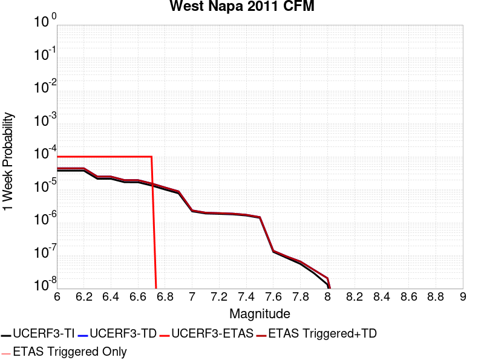 |  |  |  |

| Magnitude | 1 wk TI Prob | 1 wk TD Prob | 1 wk ETAS Prob | 1 wk ETAS/TD Gain | 1 wk ETAS Triggered+TD | 1 wk ETAS Triggered Only | 1 mo TI Prob | 1 mo TD Prob | 1 mo ETAS Prob | 1 mo ETAS/TD Gain | 1 mo ETAS Triggered+TD | 1 mo ETAS Triggered Only | 1 yr TI Prob | 1 yr TD Prob | 1 yr ETAS Prob | 1 yr ETAS/TD Gain | 1 yr ETAS Triggered+TD | 1 yr ETAS Triggered Only | 10 yr TI Prob | 10 yr TD Prob | 10 yr ETAS Prob | 10 yr ETAS/TD Gain | 10 yr ETAS Triggered+TD | 10 yr ETAS Triggered Only |
|-----|-----|-----|-----|-----|-----|-----|-----|-----|-----|-----|-----|-----|-----|-----|-----|-----|-----|-----|-----|-----|-----|-----|-----|-----|
| 6.0 | 3.773104E-5 | 4.443471E-5 | 1.0E-4 | 2.2504928 | 4.443471E-5 | 0.0 | 1.6169442E-4 | 1.9042236E-4 | 6.0E-4 | 3.1508904 | 4.9036526E-4 | 3.0E-4 | 0.001966852 | 0.0023162432 | 0.004 | 1.7269344 | 0.004710684 | 0.0024 | 0.019495348 | 0.022954233 | 0.0266 | 1.1588277 | 0.036632873 | 0.014 |
| 6.1 | 3.773104E-5 | 4.443471E-5 | 1.0E-4 | 2.2504928 | 4.443471E-5 | 0.0 | 1.6169442E-4 | 1.9042236E-4 | 6.0E-4 | 3.1508904 | 4.9036526E-4 | 3.0E-4 | 0.001966852 | 0.0023162432 | 0.004 | 1.7269344 | 0.004710684 | 0.0024 | 0.019495348 | 0.022954233 | 0.0266 | 1.1588277 | 0.036632873 | 0.014 |
| 6.2 | 3.773104E-5 | 4.443471E-5 | 1.0E-4 | 2.2504928 | 4.443471E-5 | 0.0 | 1.6169442E-4 | 1.9042236E-4 | 6.0E-4 | 3.1508904 | 4.9036526E-4 | 3.0E-4 | 0.001966852 | 0.0023162432 | 0.004 | 1.7269344 | 0.004710684 | 0.0024 | 0.019495348 | 0.022954233 | 0.0266 | 1.1588277 | 0.036632873 | 0.014 |
| 6.3 | 2.147964E-5 | 2.4934396E-5 | 1.0E-4 | 4.0105243 | 2.4934396E-5 | 0.0 | 9.2052345E-5 | 1.06857835E-4 | 4.0E-4 | 3.7432911 | 3.0683647E-4 | 2.0E-4 | 0.001120161 | 0.0013003092 | 0.0023 | 1.7688102 | 0.0025986189 | 0.0013 | 0.011145315 | 0.012937482 | 0.0148 | 1.1439629 | 0.020439157 | 0.0076 |
| 6.4 | 2.147964E-5 | 2.4934396E-5 | 1.0E-4 | 4.0105243 | 2.4934396E-5 | 0.0 | 9.2052345E-5 | 1.06857835E-4 | 4.0E-4 | 3.7432911 | 3.0683647E-4 | 2.0E-4 | 0.001120161 | 0.0013003092 | 0.0023 | 1.7688102 | 0.0025986189 | 0.0013 | 0.011145315 | 0.012937482 | 0.0148 | 1.1439629 | 0.020439157 | 0.0076 |
| 6.5 | 1.688201E-5 | 1.9505078E-5 | 1.0E-4 | 5.12687 | 1.9505078E-5 | 0.0 | 7.234947E-5 | 8.359092E-5 | 4.0E-4 | 4.7852087 | 2.835742E-4 | 2.0E-4 | 8.804988E-4 | 0.0010173168 | 0.0016 | 1.5727648 | 0.0019164012 | 9.0E-4 | 0.008770182 | 0.010135127 | 0.0114 | 1.1248009 | 0.015579384 | 0.0055 |
| 6.6 | 1.6846381E-5 | 1.9464826E-5 | 1.0E-4 | 5.137472 | 1.9464826E-5 | 0.0 | 7.219678E-5 | 8.3418425E-5 | 4.0E-4 | 4.7951035 | 2.8340175E-4 | 2.0E-4 | 8.7864127E-4 | 0.0010152186 | 0.0016 | 1.5760152 | 0.0019143049 | 9.0E-4 | 0.008751754 | 0.010114336 | 0.0114 | 1.127113 | 0.0155587075 | 0.0055 |
| 6.7 | 1.3396501E-5 | 1.5432639E-5 | 1.0E-4 | 6.479773 | 1.5432639E-5 | 0.0 | 5.7412315E-5 | 6.6138564E-5 | 3.0E-4 | 4.5359316 | 2.6612534E-4 | 2.0E-4 | 6.9877075E-4 | 8.0500275E-4 | 0.0011 | 1.366455 | 0.0015044393 | 7.0E-4 | 0.0069657755 | 0.008028455 | 0.0089 | 1.108557 | 0.011897144 | 0.0039 |
| 6.8 | 1.0139058E-5 | 1.1643671E-5 | 0.0 | 0.0 | 1.1643671E-5 | 0.0 | 4.3452383E-5 | 4.9900806E-5 | 1.0E-4 | 2.0039756 | 1.4989582E-4 | 1.0E-4 | 5.289043E-4 | 6.0742826E-4 | 6.0E-4 | 0.98777103 | 0.0011071245 | 5.0E-4 | 0.005276473 | 0.006064466 | 0.006 | 0.98936987 | 0.008748092 | 0.0027 |
| 6.9 | 7.761281E-6 | 8.86714E-6 | 0.0 | 0.0 | 8.86714E-6 | 0.0 | 3.326221E-5 | 3.8001766E-5 | 1.0E-4 | 2.6314566 | 1.3799797E-4 | 1.0E-4 | 4.0489217E-4 | 4.6262448E-4 | 6.0E-4 | 1.2969483 | 9.623932E-4 | 5.0E-4 | 0.0040415525 | 0.0046229945 | 0.0045 | 0.97339505 | 0.006812824 | 0.0022 |
| 7.0 | 2.2109202E-6 | 2.3549817E-6 | 0.0 | 0.0 | 2.3549817E-6 | 0.0 | 9.475338E-6 | 1.009274E-5 | 0.0 | 0.0 | 1.009274E-5 | 0.0 | 1.1535613E-4 | 1.2287227E-4 | 0.0 | 0.0 | 1.2287227E-4 | 0.0 | 0.0011529627 | 0.0012294134 | 8.0E-4 | 0.6507168 | 0.0016289217 | 4.0E-4 |
| 7.1 | 1.9008926E-6 | 2.0021855E-6 | 0.0 | 0.0 | 2.0021855E-6 | 0.0 | 8.146657E-6 | 8.580767E-6 | 0.0 | 0.0 | 8.580767E-6 | 0.0 | 9.918104E-5 | 1.0446586E-4 | 0.0 | 0.0 | 1.0446586E-4 | 0.0 | 9.913679E-4 | 0.0010455326 | 7.0E-4 | 0.6695152 | 0.001345219 | 3.0E-4 |
| 7.2 | 1.8495944E-6 | 1.9450608E-6 | 0.0 | 0.0 | 1.9450608E-6 | 0.0 | 7.926808E-6 | 8.335948E-6 | 0.0 | 0.0 | 8.335948E-6 | 0.0 | 9.650462E-5 | 1.0148547E-4 | 0.0 | 0.0 | 1.0148547E-4 | 0.0 | 9.6462725E-4 | 0.0010157564 | 7.0E-4 | 0.6891416 | 0.0013154517 | 3.0E-4 |
| 7.3 | 1.7883189E-6 | 1.8771289E-6 | 0.0 | 0.0 | 1.8771289E-6 | 0.0 | 7.664201E-6 | 8.0448135E-6 | 0.0 | 0.0 | 8.0448135E-6 | 0.0 | 9.330765E-5 | 9.794122E-5 | 0.0 | 0.0 | 9.794122E-5 | 0.0 | 9.3268487E-4 | 9.803459E-4 | 7.0E-4 | 0.71403366 | 0.0012800518 | 3.0E-4 |
| 7.4 | 1.6520572E-6 | 1.7309668E-6 | 0.0 | 0.0 | 1.7309668E-6 | 0.0 | 7.0802257E-6 | 7.418408E-6 | 0.0 | 0.0 | 7.418408E-6 | 0.0 | 8.6198335E-5 | 9.03154E-5 | 0.0 | 0.0 | 9.03154E-5 | 0.0 | 8.616491E-4 | 9.041525E-4 | 6.0E-4 | 0.66360486 | 0.0012038812 | 3.0E-4 |
| 7.5 | 1.4040345E-6 | 1.4701039E-6 | 0.0 | 0.0 | 1.4701039E-6 | 0.0 | 6.0172765E-6 | 6.3004304E-6 | 0.0 | 0.0 | 6.3004304E-6 | 0.0 | 7.325788E-5 | 7.6705066E-5 | 0.0 | 0.0 | 7.6705066E-5 | 0.0 | 7.3233736E-4 | 7.6810154E-4 | 5.0E-4 | 0.65095556 | 9.6794794E-4 | 2.0E-4 |
| 7.6 | 1.3013842E-7 | 1.3989674E-7 | 0.0 | 0.0 | 1.3989674E-7 | 0.0 | 5.57736E-7 | 5.995573E-7 | 0.0 | 0.0 | 5.995573E-7 | 0.0 | 6.790414E-6 | 7.299586E-6 | 0.0 | 0.0 | 7.299586E-6 | 0.0 | 6.790207E-5 | 7.392417E-5 | 2.0E-4 | 2.7054749 | 1.7391678E-4 | 1.0E-4 |
| 7.7 | 8.541512E-8 | 9.342756E-8 | 0.0 | 0.0 | 9.342756E-8 | 0.0 | 3.6606474E-7 | 4.0040376E-7 | 0.0 | 0.0 | 4.0040376E-7 | 0.0 | 4.456829E-6 | 4.874905E-6 | 0.0 | 0.0 | 4.874905E-6 | 0.0 | 4.4567398E-5 | 4.9653856E-5 | 0.0 | 0.0 | 4.9653856E-5 | 0.0 |
| 7.8 | 5.6074793E-8 | 6.5917234E-8 | 0.0 | 0.0 | 6.5917234E-8 | 0.0 | 2.403205E-7 | 2.8250238E-7 | 0.0 | 0.0 | 2.8250238E-7 | 0.0 | 2.9258983E-6 | 3.4394611E-6 | 0.0 | 0.0 | 3.4394611E-6 | 0.0 | 2.9258597E-5 | 3.5230274E-5 | 0.0 | 0.0 | 3.5230274E-5 | 0.0 |
| 7.9 | 2.9475839E-8 | 3.682857E-8 | 0.0 | 0.0 | 3.682857E-8 | 0.0 | 1.2632502E-7 | 1.5783672E-7 | 0.0 | 0.0 | 1.5783672E-7 | 0.0 | 1.538006E-6 | 1.9216604E-6 | 0.0 | 0.0 | 1.9216604E-6 | 0.0 | 1.5379954E-5 | 1.9759776E-5 | 0.0 | 0.0 | 1.9759776E-5 | 0.0 |
| 8.0 | 1.3337122E-8 | 2.0611138E-8 | 0.0 | 0.0 | 2.0611138E-8 | 0.0 | 5.7159088E-8 | 8.833344E-8 | 0.0 | 0.0 | 8.833344E-8 | 0.0 | 6.959117E-7 | 1.0754591E-6 | 0.0 | 0.0 | 1.0754591E-6 | 0.0 | 6.959095E-6 | 1.1116372E-5 | 0.0 | 0.0 | 1.1116372E-5 | 0.0 |
| 8.1 | 2.6589986E-10 | 4.6371973E-10 | 0.0 | 0.0 | 4.6371973E-10 | 0.0 | 1.1395708E-9 | 1.9873707E-9 | 0.0 | 0.0 | 1.9873707E-9 | 0.0 | 1.3874274E-8 | 2.4196236E-8 | 0.0 | 0.0 | 2.4196236E-8 | 0.0 | 1.3874273E-7 | 2.4881123E-7 | 0.0 | 0.0 | 2.4881123E-7 | 0.0 |

## Hayward (No) 2011 CFM
*[(top)](#table-of-contents)*

| 1 Week | 1 Month | 1 Year | 10 Year |
|-----|-----|-----|-----|
|  |  |  |  |

| Magnitude | 1 wk TI Prob | 1 wk TD Prob | 1 wk ETAS Prob | 1 wk ETAS/TD Gain | 1 wk ETAS Triggered+TD | 1 wk ETAS Triggered Only | 1 mo TI Prob | 1 mo TD Prob | 1 mo ETAS Prob | 1 mo ETAS/TD Gain | 1 mo ETAS Triggered+TD | 1 mo ETAS Triggered Only | 1 yr TI Prob | 1 yr TD Prob | 1 yr ETAS Prob | 1 yr ETAS/TD Gain | 1 yr ETAS Triggered+TD | 1 yr ETAS Triggered Only | 10 yr TI Prob | 10 yr TD Prob | 10 yr ETAS Prob | 10 yr ETAS/TD Gain | 10 yr ETAS Triggered+TD | 10 yr ETAS Triggered Only |
|-----|-----|-----|-----|-----|-----|-----|-----|-----|-----|-----|-----|-----|-----|-----|-----|-----|-----|-----|-----|-----|-----|-----|-----|-----|
| 6.0 | 9.3068506E-5 | 1.7216054E-4 | 0.0 | 0.0 | 1.7216054E-4 | 0.0 | 3.9880406E-4 | 7.3762017E-4 | 3.0E-4 | 0.4067134 | 8.3754637E-4 | 1.0E-4 | 0.0048446343 | 0.008943433 | 0.0045 | 0.50316244 | 0.010430018 | 0.0015 | 0.047403704 | 0.0855743 | 0.0543 | 0.6345363 | 0.09865058 | 0.0143 |
| 6.1 | 9.055486E-5 | 1.676884E-4 | 0.0 | 0.0 | 1.676884E-4 | 0.0 | 3.880345E-4 | 7.184667E-4 | 3.0E-4 | 0.4175559 | 8.183948E-4 | 1.0E-4 | 0.0047140904 | 0.008712324 | 0.0041 | 0.4705977 | 0.010100127 | 0.0014 | 0.046153355 | 0.083477445 | 0.0529 | 0.63370407 | 0.09640042 | 0.0141 |
| 6.2 | 9.006742E-5 | 1.6689788E-4 | 0.0 | 0.0 | 1.6689788E-4 | 0.0 | 3.859461E-4 | 7.1508106E-4 | 3.0E-4 | 0.41953287 | 8.150095E-4 | 1.0E-4 | 0.0046887742 | 0.008671464 | 0.0039 | 0.449751 | 0.010059325 | 0.0014 | 0.0459107 | 0.083102904 | 0.0527 | 0.63415354 | 0.09603115 | 0.0141 |
| 6.3 | 8.8336754E-5 | 1.6370429E-4 | 0.0 | 0.0 | 1.6370429E-4 | 0.0 | 3.7853114E-4 | 7.0140185E-4 | 3.0E-4 | 0.42771485 | 8.013317E-4 | 1.0E-4 | 0.004598882 | 0.008506285 | 0.0039 | 0.45848453 | 0.009894376 | 0.0014 | 0.04504866 | 0.08160339 | 0.0521 | 0.63845384 | 0.094552785 | 0.0141 |
| 6.4 | 8.526157E-5 | 1.5799089E-4 | 0.0 | 0.0 | 1.5799089E-4 | 0.0 | 3.6535555E-4 | 6.769287E-4 | 3.0E-4 | 0.44317812 | 7.7686104E-4 | 1.0E-4 | 0.0044391346 | 0.008210618 | 0.0039 | 0.4749947 | 0.009599123 | 0.0014 | 0.043514993 | 0.07889129 | 0.0503 | 0.6375862 | 0.091234155 | 0.0134 |
| 6.5 | 8.152396E-5 | 1.513402E-4 | 0.0 | 0.0 | 1.513402E-4 | 0.0 | 3.493416E-4 | 6.4844027E-4 | 3.0E-4 | 0.46264863 | 7.4837543E-4 | 1.0E-4 | 0.0042449418 | 0.0078663295 | 0.0037 | 0.47035915 | 0.009156103 | 0.0013 | 0.04164765 | 0.07573358 | 0.0481 | 0.63512117 | 0.08774905 | 0.013 |
| 6.6 | 7.987405E-5 | 1.4839246E-4 | 0.0 | 0.0 | 1.4839246E-4 | 0.0 | 3.4227243E-4 | 6.3581334E-4 | 3.0E-4 | 0.4718366 | 7.357498E-4 | 1.0E-4 | 0.0041592065 | 0.0077137058 | 0.0037 | 0.4796657 | 0.009003677 | 0.0013 | 0.04082218 | 0.07432956 | 0.0475 | 0.63904583 | 0.08608558 | 0.0127 |
| 6.7 | 7.777665E-5 | 1.4480116E-4 | 0.0 | 0.0 | 1.4480116E-4 | 0.0 | 3.332859E-4 | 6.2042946E-4 | 3.0E-4 | 0.483536 | 7.203674E-4 | 1.0E-4 | 0.004050208 | 0.007527718 | 0.0037 | 0.49151683 | 0.008817932 | 0.0013 | 0.039771806 | 0.07261166 | 0.0462 | 0.63626146 | 0.08420401 | 0.0125 |
| 6.8 | 7.3284005E-5 | 1.3639059E-4 | 0.0 | 0.0 | 1.3639059E-4 | 0.0 | 3.140365E-4 | 5.844007E-4 | 2.0E-4 | 0.34223092 | 5.844007E-4 | 0.0 | 0.0038166929 | 0.007092001 | 0.0033 | 0.46531296 | 0.00828349 | 0.0012 | 0.037518036 | 0.068558596 | 0.0431 | 0.6286593 | 0.07936332 | 0.0116 |
| 6.9 | 6.458263E-5 | 1.1987969E-4 | 0.0 | 0.0 | 1.1987969E-4 | 0.0 | 2.7675333E-4 | 5.136694E-4 | 2.0E-4 | 0.3893555 | 5.136694E-4 | 0.0 | 0.0033642664 | 0.0062360903 | 0.0029 | 0.46503496 | 0.0072298544 | 0.001 | 0.033137884 | 0.060563095 | 0.0381 | 0.629096 | 0.07042718 | 0.0105 |
| 7.0 | 5.3853604E-5 | 9.901269E-5 | 0.0 | 0.0 | 9.901269E-5 | 0.0 | 2.3078074E-4 | 4.242714E-4 | 2.0E-4 | 0.4713964 | 4.242714E-4 | 0.0 | 0.0028061352 | 0.005153333 | 0.0027 | 0.5239328 | 0.0060486947 | 9.0E-4 | 0.027709642 | 0.050376564 | 0.0316 | 0.6272758 | 0.05873325 | 0.0088 |
| 7.1 | 4.4308683E-5 | 8.06231E-5 | 0.0 | 0.0 | 8.06231E-5 | 0.0 | 1.8988053E-4 | 3.45482E-4 | 2.0E-4 | 0.57890135 | 3.45482E-4 | 0.0 | 0.0023093442 | 0.004198171 | 0.002 | 0.4763979 | 0.0047956523 | 6.0E-4 | 0.022854926 | 0.0413089 | 0.0246 | 0.59551334 | 0.047827996 | 0.0068 |
| 7.2 | 3.295973E-5 | 5.9830003E-5 | 0.0 | 0.0 | 5.9830003E-5 | 0.0 | 1.4124835E-4 | 2.5638923E-4 | 1.0E-4 | 0.390032 | 2.5638923E-4 | 0.0 | 0.0017183421 | 0.003117093 | 0.0016 | 0.5132988 | 0.0037152225 | 6.0E-4 | 0.017051157 | 0.03091609 | 0.0195 | 0.6307395 | 0.03643987 | 0.0057 |
| 7.3 | 2.452256E-5 | 4.440244E-5 | 0.0 | 0.0 | 4.440244E-5 | 0.0 | 1.05092455E-4 | 1.9028237E-4 | 1.0E-4 | 0.52553475 | 1.9028237E-4 | 0.0 | 0.0012787496 | 0.0023142397 | 0.0014 | 0.60495025 | 0.0029128513 | 6.0E-4 | 0.0127141625 | 0.023063933 | 0.0155 | 0.67204493 | 0.027460147 | 0.0045 |
| 7.4 | 1.8829967E-5 | 3.396135E-5 | 0.0 | 0.0 | 3.396135E-5 | 0.0 | 8.069736E-5 | 1.4554059E-4 | 1.0E-4 | 0.68709356 | 1.4554059E-4 | 0.0 | 9.820475E-4 | 0.0017705259 | 0.0011 | 0.6212843 | 0.0023694637 | 6.0E-4 | 0.009777189 | 0.017707042 | 0.0123 | 0.69463885 | 0.021341527 | 0.0037 |
| 7.5 | 1.26374125E-5 | 2.2482714E-5 | 0.0 | 0.0 | 2.2482714E-5 | 0.0 | 5.4159216E-5 | 9.635096E-5 | 1.0E-4 | 1.0378723 | 9.635096E-5 | 0.0 | 6.5918895E-4 | 0.0011724472 | 7.0E-4 | 0.5970418 | 0.0015719783 | 4.0E-4 | 0.00657237 | 0.0117742745 | 0.0085 | 0.72191286 | 0.014244839 | 0.0025 |
| 7.6 | 4.666429E-6 | 8.307882E-6 | 0.0 | 0.0 | 8.307882E-6 | 0.0 | 1.9998828E-5 | 3.560473E-5 | 0.0 | 0.0 | 3.560473E-5 | 0.0 | 2.4345852E-4 | 4.3340254E-4 | 1.0E-4 | 0.23073238 | 5.333592E-4 | 1.0E-4 | 0.0024319198 | 0.0043748464 | 0.0027 | 0.61716455 | 0.0051713465 | 8.0E-4 |
| 7.7 | 3.8399318E-7 | 6.8284623E-7 | 0.0 | 0.0 | 6.8284623E-7 | 0.0 | 1.6456839E-6 | 2.9264804E-6 | 0.0 | 0.0 | 2.9264804E-6 | 0.0 | 2.003602E-5 | 3.5629317E-5 | 0.0 | 0.0 | 3.5629317E-5 | 0.0 | 2.0034213E-4 | 3.7119133E-4 | 2.0E-4 | 0.53880566 | 5.711171E-4 | 2.0E-4 |
| 7.8 | 2.5637698E-7 | 5.107383E-7 | 0.0 | 0.0 | 5.107383E-7 | 0.0 | 1.098758E-6 | 2.1888766E-6 | 0.0 | 0.0 | 2.1888766E-6 | 0.0 | 1.3377297E-5 | 2.6649248E-5 | 0.0 | 0.0 | 2.6649248E-5 | 0.0 | 1.3376492E-4 | 2.7981476E-4 | 1.0E-4 | 0.35737932 | 3.7978677E-4 | 1.0E-4 |
| 7.9 | 1.7141245E-7 | 3.554999E-7 | 0.0 | 0.0 | 3.554999E-7 | 0.0 | 7.3462456E-7 | 1.5235701E-6 | 0.0 | 0.0 | 1.5235701E-6 | 0.0 | 8.944017E-6 | 1.8549308E-5 | 0.0 | 0.0 | 1.8549308E-5 | 0.0 | 8.943657E-5 | 1.9399682E-4 | 1.0E-4 | 0.51547235 | 2.939774E-4 | 1.0E-4 |
| 8.0 | 1.1808895E-7 | 2.6305878E-7 | 0.0 | 0.0 | 2.6305878E-7 | 0.0 | 5.060954E-7 | 1.1273943E-6 | 0.0 | 0.0 | 1.1273943E-6 | 0.0 | 6.161694E-6 | 1.3725939E-5 | 0.0 | 0.0 | 1.3725939E-5 | 0.0 | 6.161523E-5 | 1.4237752E-4 | 1.0E-4 | 0.70235807 | 2.4236328E-4 | 1.0E-4 |
| 8.1 | 5.138535E-8 | 1.0755803E-7 | 0.0 | 0.0 | 1.0755803E-7 | 0.0 | 2.2022292E-7 | 4.609629E-7 | 0.0 | 0.0 | 4.609629E-7 | 0.0 | 2.6812106E-6 | 5.612209E-6 | 0.0 | 0.0 | 5.612209E-6 | 0.0 | 2.6811784E-5 | 5.784103E-5 | 0.0 | 0.0 | 5.784103E-5 | 0.0 |

## San Jacinto (Superstition Mtn)
*[(top)](#table-of-contents)*

| 1 Week | 1 Month | 1 Year | 10 Year |
|-----|-----|-----|-----|
| 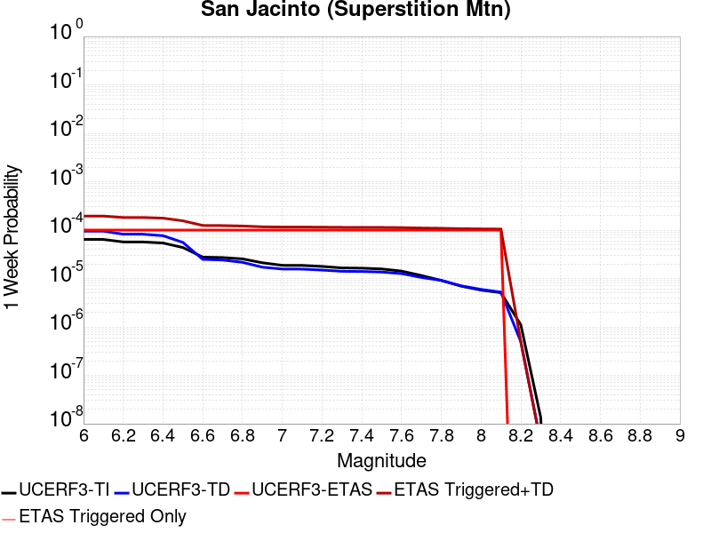 |  |  |  |

| Magnitude | 1 wk TI Prob | 1 wk TD Prob | 1 wk ETAS Prob | 1 wk ETAS/TD Gain | 1 wk ETAS Triggered+TD | 1 wk ETAS Triggered Only | 1 mo TI Prob | 1 mo TD Prob | 1 mo ETAS Prob | 1 mo ETAS/TD Gain | 1 mo ETAS Triggered+TD | 1 mo ETAS Triggered Only | 1 yr TI Prob | 1 yr TD Prob | 1 yr ETAS Prob | 1 yr ETAS/TD Gain | 1 yr ETAS Triggered+TD | 1 yr ETAS Triggered Only | 10 yr TI Prob | 10 yr TD Prob | 10 yr ETAS Prob | 10 yr ETAS/TD Gain | 10 yr ETAS Triggered+TD | 10 yr ETAS Triggered Only |
|-----|-----|-----|-----|-----|-----|-----|-----|-----|-----|-----|-----|-----|-----|-----|-----|-----|-----|-----|-----|-----|-----|-----|-----|-----|
| 6.0 | 6.4193904E-5 | 9.52097E-5 | 1.0E-4 | 1.0503131 | 1.9520018E-4 | 1.0E-4 | 2.7508775E-4 | 4.079841E-4 | 7.0E-4 | 1.7157532 | 5.079433E-4 | 1.0E-4 | 0.0033440501 | 0.004957317 | 0.0036 | 0.72619927 | 0.0065493854 | 0.0016 | 0.03294174 | 0.04847365 | 0.0356 | 0.73441964 | 0.061033797 | 0.0132 |
| 6.1 | 6.4193904E-5 | 9.52097E-5 | 1.0E-4 | 1.0503131 | 1.9520018E-4 | 1.0E-4 | 2.7508775E-4 | 4.079841E-4 | 7.0E-4 | 1.7157532 | 5.079433E-4 | 1.0E-4 | 0.0033440501 | 0.004957317 | 0.0036 | 0.72619927 | 0.0065493854 | 0.0016 | 0.03294174 | 0.04847365 | 0.0356 | 0.73441964 | 0.061033797 | 0.0132 |
| 6.2 | 5.7023593E-5 | 8.239395E-5 | 1.0E-4 | 1.2136813 | 1.8238572E-4 | 1.0E-4 | 2.4436394E-4 | 3.5307813E-4 | 5.0E-4 | 1.4161172 | 4.5304283E-4 | 1.0E-4 | 0.002971072 | 0.0042918893 | 0.003 | 0.69899285 | 0.00558631 | 0.0013 | 0.029316625 | 0.042131327 | 0.0299 | 0.7096857 | 0.05276367 | 0.0111 |
| 6.3 | 5.6940098E-5 | 8.2239654E-5 | 1.0E-4 | 1.2159584 | 1.8223144E-4 | 1.0E-4 | 2.4400617E-4 | 3.5241706E-4 | 5.0E-4 | 1.4187735 | 4.5238182E-4 | 1.0E-4 | 0.002966728 | 0.0042838724 | 0.003 | 0.70030093 | 0.0055783037 | 0.0013 | 0.029274331 | 0.042054836 | 0.0299 | 0.7109765 | 0.052688025 | 0.0111 |
| 6.4 | 5.4171585E-5 | 7.6739954E-5 | 1.0E-4 | 1.3031021 | 1.7673228E-4 | 1.0E-4 | 2.3214328E-4 | 3.2885332E-4 | 5.0E-4 | 1.5204347 | 4.2882044E-4 | 1.0E-4 | 0.0028226813 | 0.003998079 | 0.003 | 0.75036037 | 0.0052928813 | 0.0013 | 0.02787096 | 0.039345514 | 0.0283 | 0.71926874 | 0.049528453 | 0.0106 |
| 6.5 | 4.375144E-5 | 5.5698263E-5 | 1.0E-4 | 1.7953881 | 1.5569269E-4 | 1.0E-4 | 1.874927E-4 | 2.3869159E-4 | 3.0E-4 | 1.256852 | 3.386677E-4 | 1.0E-4 | 0.0022803338 | 0.0029033655 | 0.002 | 0.68885577 | 0.0036013331 | 7.0E-4 | 0.022570757 | 0.02887236 | 0.0184 | 0.63728774 | 0.03518469 | 0.0065 |
| 6.6 | 2.772192E-5 | 2.4859432E-5 | 1.0E-4 | 4.0226183 | 1.2485695E-4 | 1.0E-4 | 1.1880282E-4 | 1.0653618E-4 | 2.0E-4 | 1.8772966 | 2.0652552E-4 | 1.0E-4 | 0.0014454646 | 0.0012963249 | 0.0013 | 1.002835 | 0.0018955471 | 6.0E-4 | 0.014360986 | 0.013214085 | 0.009 | 0.6810914 | 0.015977085 | 0.0028 |
| 6.7 | 2.7124124E-5 | 2.4078752E-5 | 1.0E-4 | 4.153039 | 1.2407634E-4 | 1.0E-4 | 1.1624106E-4 | 1.0319068E-4 | 2.0E-4 | 1.9381596 | 2.0318036E-4 | 1.0E-4 | 0.0014143161 | 0.001255641 | 0.0013 | 1.0353278 | 0.0018548876 | 6.0E-4 | 0.014053487 | 0.012811731 | 0.0087 | 0.67906517 | 0.015378419 | 0.0026 |
| 6.8 | 2.5475807E-5 | 2.157592E-5 | 1.0E-4 | 4.6347966 | 1.21573765E-4 | 1.0E-4 | 1.0917746E-4 | 9.2465016E-5 | 2.0E-4 | 2.1629803 | 1.9245577E-4 | 1.0E-4 | 0.001328425 | 0.0011251917 | 0.0011 | 0.97761124 | 0.0015247416 | 4.0E-4 | 0.0132051185 | 0.011516079 | 0.0072 | 0.6252128 | 0.013591896 | 0.0021 |
| 6.9 | 2.1162023E-5 | 1.7120747E-5 | 1.0E-4 | 5.840867 | 1.1711903E-4 | 1.0E-4 | 9.069123E-5 | 7.337258E-5 | 2.0E-4 | 2.7258139 | 1.7336525E-4 | 1.0E-4 | 0.0011036064 | 8.929487E-4 | 9.0E-4 | 1.0078967 | 0.0010927701 | 2.0E-4 | 0.010981417 | 0.00918185 | 0.0053 | 0.57722574 | 0.0104699135 | 0.0013 |
| 7.0 | 1.8754288E-5 | 1.5695929E-5 | 1.0E-4 | 6.3710785 | 1.1569436E-4 | 1.0E-4 | 8.037304E-5 | 6.726655E-5 | 1.0E-4 | 1.486623 | 1.6725982E-4 | 1.0E-4 | 9.781026E-4 | 8.1866485E-4 | 7.0E-4 | 0.85505074 | 9.18583E-4 | 1.0E-4 | 0.009738087 | 0.008425698 | 0.0045 | 0.5340804 | 0.009318114 | 9.0E-4 |
| 7.1 | 1.8678527E-5 | 1.5622212E-5 | 1.0E-4 | 6.401142 | 1.1562065E-4 | 1.0E-4 | 8.0048376E-5 | 6.695063E-5 | 1.0E-4 | 1.4936378 | 1.6694394E-4 | 1.0E-4 | 9.7415317E-4 | 8.148215E-4 | 7.0E-4 | 0.85908383 | 9.1474E-4 | 1.0E-4 | 0.009698939 | 0.0083872555 | 0.0043 | 0.5126826 | 0.0092797065 | 9.0E-4 |
| 7.2 | 1.7804578E-5 | 1.492615E-5 | 1.0E-4 | 6.6996517 | 1.1492466E-4 | 1.0E-4 | 7.6303106E-5 | 6.396765E-5 | 1.0E-4 | 1.5632901 | 1.6396126E-4 | 1.0E-4 | 9.285943E-4 | 7.785301E-4 | 6.0E-4 | 0.7706831 | 8.784522E-4 | 1.0E-4 | 0.009247236 | 0.00802332 | 0.0042 | 0.52347404 | 0.0089161 | 9.0E-4 |
| 7.3 | 1.6583685E-5 | 1.4084272E-5 | 1.0E-4 | 7.1001186 | 1.1408286E-4 | 1.0E-4 | 7.1070994E-5 | 6.035978E-5 | 1.0E-4 | 1.6567323 | 1.6035374E-4 | 1.0E-4 | 8.649459E-4 | 7.3463446E-4 | 6.0E-4 | 0.8167327 | 8.34561E-4 | 1.0E-4 | 0.00861587 | 0.007583249 | 0.0041 | 0.5406654 | 0.008476424 | 9.0E-4 |
| 7.4 | 1.6387552E-5 | 1.3950205E-5 | 1.0E-4 | 7.168353 | 1.1394881E-4 | 1.0E-4 | 7.023047E-5 | 5.9785234E-5 | 1.0E-4 | 1.6726538 | 1.5977926E-4 | 1.0E-4 | 8.5472054E-4 | 7.276441E-4 | 6.0E-4 | 0.824579 | 8.275713E-4 | 1.0E-4 | 0.008514405 | 0.0075131822 | 0.0041 | 0.5457075 | 0.00840642 | 9.0E-4 |
| 7.5 | 1.5790754E-5 | 1.3595658E-5 | 1.0E-4 | 7.3552895 | 1.135943E-4 | 1.0E-4 | 6.767291E-5 | 5.8265814E-5 | 1.0E-4 | 1.7162722 | 1.5826E-4 | 1.0E-4 | 8.236062E-4 | 7.091573E-4 | 5.0E-4 | 0.7050622 | 8.0908637E-4 | 1.0E-4 | 0.008205604 | 0.0073262155 | 0.0039 | 0.53233486 | 0.008219622 | 9.0E-4 |
| 7.6 | 1.4248672E-5 | 1.262672E-5 | 1.0E-4 | 7.919713 | 1.1262546E-4 | 1.0E-4 | 6.106431E-5 | 5.41134E-5 | 1.0E-4 | 1.8479711 | 1.5410798E-4 | 1.0E-4 | 7.432043E-4 | 6.5863313E-4 | 5.0E-4 | 0.75914794 | 7.585673E-4 | 1.0E-4 | 0.007407237 | 0.0068149813 | 0.0039 | 0.57226866 | 0.0077088475 | 9.0E-4 |
| 7.7 | 1.15449975E-5 | 1.0499409E-5 | 1.0E-4 | 9.524346 | 1.1049836E-4 | 1.0E-4 | 4.947762E-5 | 4.4996694E-5 | 1.0E-4 | 2.2223856 | 1.449922E-4 | 1.0E-4 | 6.022235E-4 | 5.4769777E-4 | 5.0E-4 | 0.9129123 | 6.47643E-4 | 1.0E-4 | 0.006005941 | 0.00569736 | 0.0033 | 0.57921565 | 0.006492802 | 8.0E-4 |
| 7.8 | 9.1391985E-6 | 9.129117E-6 | 1.0E-4 | 10.953962 | 1.091282E-4 | 1.0E-4 | 3.9167408E-5 | 3.91242E-5 | 1.0E-4 | 2.5559628 | 1.3912028E-4 | 1.0E-4 | 4.767588E-4 | 4.7623357E-4 | 5.0E-4 | 1.049905 | 5.7618594E-4 | 1.0E-4 | 0.0047573727 | 0.0049739103 | 0.0032 | 0.643357 | 0.0057699312 | 8.0E-4 |
| 7.9 | 6.973017E-6 | 7.0392243E-6 | 1.0E-4 | 14.206111 | 1.0703852E-4 | 1.0E-4 | 2.9884017E-5 | 3.016776E-5 | 1.0E-4 | 3.3147972 | 1.3016474E-4 | 1.0E-4 | 3.6377716E-4 | 3.6723103E-4 | 3.0E-4 | 0.8169244 | 4.671943E-4 | 1.0E-4 | 0.0036318225 | 0.0038710602 | 0.0025 | 0.64581794 | 0.0045683505 | 7.0E-4 |
| 8.0 | 5.7638235E-6 | 5.9455597E-6 | 1.0E-4 | 16.819275 | 1.05944964E-4 | 1.0E-4 | 2.4701867E-5 | 2.5480724E-5 | 1.0E-4 | 3.9245355 | 1.2547818E-4 | 1.0E-4 | 3.0070372E-4 | 3.1018408E-4 | 3.0E-4 | 0.96716756 | 4.1015306E-4 | 1.0E-4 | 0.0030029714 | 0.0032874679 | 0.0021 | 0.6387895 | 0.0038854955 | 6.0E-4 |
| 8.1 | 5.1124434E-6 | 5.2085365E-6 | 1.0E-4 | 19.19925 | 1.0520802E-4 | 1.0E-4 | 2.1910288E-5 | 2.2322112E-5 | 1.0E-4 | 4.4798627 | 1.2231988E-4 | 1.0E-4 | 2.6672508E-4 | 2.7173824E-4 | 3.0E-4 | 1.1040035 | 3.717111E-4 | 1.0E-4 | 0.0026640517 | 0.0028885864 | 0.0019 | 0.6577612 | 0.003486853 | 6.0E-4 |
| 8.2 | 1.1075938E-6 | 4.9050954E-7 | 0.0 | 0.0 | 4.9050954E-7 | 0.0 | 4.7468216E-6 | 2.102182E-6 | 0.0 | 0.0 | 2.102182E-6 | 0.0 | 5.779102E-5 | 2.5593785E-5 | 1.0E-4 | 3.9071987 | 2.5593785E-5 | 0.0 | 5.777599E-4 | 2.8936443E-4 | 3.0E-4 | 1.036755 | 2.8936443E-4 | 0.0 |
| 8.3 | 1.3584393E-8 | 4.067688E-9 | 0.0 | 0.0 | 4.067688E-9 | 0.0 | 5.8218827E-8 | 1.7432948E-8 | 0.0 | 0.0 | 1.7432948E-8 | 0.0 | 7.0881396E-7 | 2.1224615E-7 | 0.0 | 0.0 | 2.1224615E-7 | 0.0 | 7.0881174E-6 | 2.3868752E-6 | 0.0 | 0.0 | 2.3868752E-6 | 0.0 |

## Ortigalita (North)
*[(top)](#table-of-contents)*

| 1 Week | 1 Month | 1 Year | 10 Year |
|-----|-----|-----|-----|
|  | 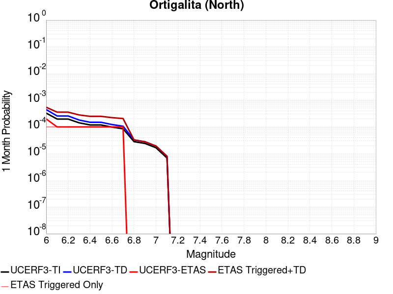 |  | 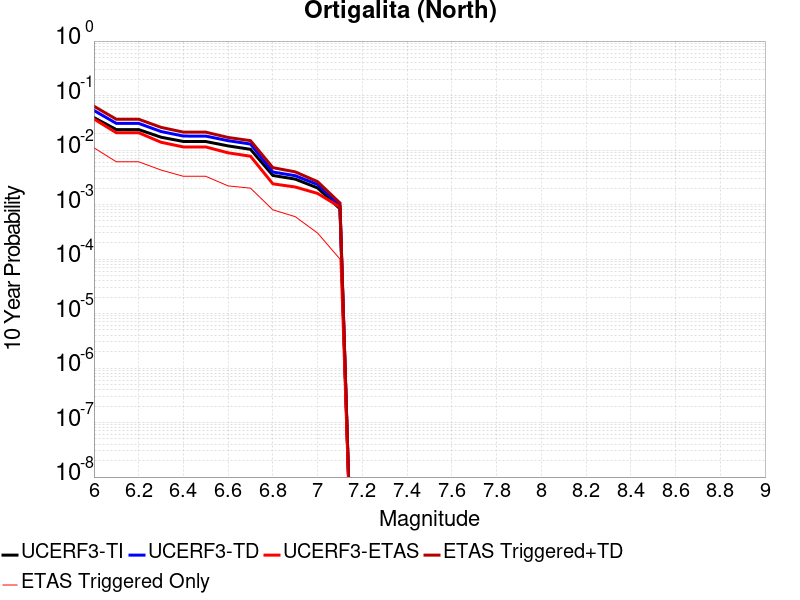 |

| Magnitude | 1 wk TI Prob | 1 wk TD Prob | 1 wk ETAS Prob | 1 wk ETAS/TD Gain | 1 wk ETAS Triggered+TD | 1 wk ETAS Triggered Only | 1 mo TI Prob | 1 mo TD Prob | 1 mo ETAS Prob | 1 mo ETAS/TD Gain | 1 mo ETAS Triggered+TD | 1 mo ETAS Triggered Only | 1 yr TI Prob | 1 yr TD Prob | 1 yr ETAS Prob | 1 yr ETAS/TD Gain | 1 yr ETAS Triggered+TD | 1 yr ETAS Triggered Only | 10 yr TI Prob | 10 yr TD Prob | 10 yr ETAS Prob | 10 yr ETAS/TD Gain | 10 yr ETAS Triggered+TD | 10 yr ETAS Triggered Only |
|-----|-----|-----|-----|-----|-----|-----|-----|-----|-----|-----|-----|-----|-----|-----|-----|-----|-----|-----|-----|-----|-----|-----|-----|-----|
| 6.0 | 7.711876E-5 | 1.0468789E-4 | 1.0E-4 | 0.9552203 | 1.0468789E-4 | 0.0 | 3.3046713E-4 | 4.4859215E-4 | 2.0E-4 | 0.4458393 | 5.485473E-4 | 1.0E-4 | 0.004016016 | 0.0054490888 | 0.0031 | 0.5689025 | 0.0060458193 | 6.0E-4 | 0.039442103 | 0.053277437 | 0.0372 | 0.6982318 | 0.063691385 | 0.011 |
| 6.1 | 4.607858E-5 | 6.0052193E-5 | 0.0 | 0.0 | 6.0052193E-5 | 0.0 | 1.9746469E-4 | 2.573422E-4 | 1.0E-4 | 0.38858765 | 3.5731646E-4 | 1.0E-4 | 0.0024014818 | 0.0031289689 | 0.0014 | 0.44743174 | 0.0035277172 | 4.0E-4 | 0.023756953 | 0.030881127 | 0.0208 | 0.67355055 | 0.03679275 | 0.0061 |
| 6.2 | 4.607858E-5 | 6.0052193E-5 | 0.0 | 0.0 | 6.0052193E-5 | 0.0 | 1.9746469E-4 | 2.573422E-4 | 1.0E-4 | 0.38858765 | 3.5731646E-4 | 1.0E-4 | 0.0024014818 | 0.0031289689 | 0.0014 | 0.44743174 | 0.0035277172 | 4.0E-4 | 0.023756953 | 0.030881127 | 0.0208 | 0.67355055 | 0.03679275 | 0.0061 |
| 6.3 | 3.327423E-5 | 4.2353746E-5 | 0.0 | 0.0 | 4.2353746E-5 | 0.0 | 1.4259605E-4 | 1.8150471E-4 | 1.0E-4 | 0.5509499 | 2.8148654E-4 | 1.0E-4 | 0.0017347244 | 0.0022078266 | 9.0E-4 | 0.4076407 | 0.0025071644 | 3.0E-4 | 0.017212452 | 0.021883437 | 0.0139 | 0.6351836 | 0.026089339 | 0.0043 |
| 6.4 | 2.7732503E-5 | 3.4902085E-5 | 0.0 | 0.0 | 3.4902085E-5 | 0.0 | 1.1884817E-4 | 1.4957308E-4 | 1.0E-4 | 0.6685695 | 2.4955813E-4 | 1.0E-4 | 0.001446016 | 0.0018197665 | 7.0E-4 | 0.38466474 | 0.0020194026 | 2.0E-4 | 0.014366428 | 0.018071692 | 0.0114 | 0.6308208 | 0.021312056 | 0.0033 |
| 6.5 | 2.7689714E-5 | 3.485199E-5 | 0.0 | 0.0 | 3.485199E-5 | 0.0 | 1.186648E-4 | 1.4935841E-4 | 1.0E-4 | 0.6695304 | 2.493435E-4 | 1.0E-4 | 0.0014437864 | 0.0018171573 | 7.0E-4 | 0.38521707 | 0.0020167937 | 2.0E-4 | 0.014344421 | 0.018046025 | 0.0114 | 0.6317181 | 0.021286473 | 0.0033 |
| 6.6 | 2.2976905E-5 | 2.8641503E-5 | 0.0 | 0.0 | 2.8641503E-5 | 0.0 | 9.846873E-5 | 1.2274482E-4 | 1.0E-4 | 0.81469834 | 2.2273255E-4 | 1.0E-4 | 0.0011981975 | 0.0014936309 | 5.0E-4 | 0.3347547 | 0.0016933322 | 2.0E-4 | 0.011917574 | 0.014859187 | 0.0089 | 0.59895605 | 0.017026497 | 0.0022 |
| 6.7 | 1.9871539E-5 | 2.4836998E-5 | 0.0 | 0.0 | 2.4836998E-5 | 0.0 | 8.516096E-5 | 1.064412E-4 | 1.0E-4 | 0.93948585 | 2.0643056E-4 | 1.0E-4 | 0.0010363415 | 0.0012953919 | 4.0E-4 | 0.30878687 | 0.0013952623 | 1.0E-4 | 0.010315218 | 0.012901974 | 0.0077 | 0.5968079 | 0.01487617 | 0.002 |
| 6.8 | 6.5640475E-6 | 7.5928892E-6 | 0.0 | 0.0 | 7.5928892E-6 | 0.0 | 2.813133E-5 | 3.2540564E-5 | 0.0 | 0.0 | 3.2540564E-5 | 0.0 | 3.424451E-4 | 3.961122E-4 | 1.0E-4 | 0.2524537 | 3.961122E-4 | 0.0 | 0.0034191788 | 0.0039543477 | 0.0024 | 0.6069269 | 0.0047511845 | 8.0E-4 |
| 6.9 | 5.6219683E-6 | 6.491215E-6 | 0.0 | 0.0 | 6.491215E-6 | 0.0 | 2.4093928E-5 | 2.7819211E-5 | 0.0 | 0.0 | 2.7819211E-5 | 0.0 | 2.933041E-4 | 3.3864882E-4 | 1.0E-4 | 0.29529116 | 3.3864882E-4 | 0.0 | 0.0029291727 | 0.0033815838 | 0.0021 | 0.6210108 | 0.003979555 | 6.0E-4 |
| 7.0 | 3.875591E-6 | 4.4773983E-6 | 0.0 | 0.0 | 4.4773983E-6 | 0.0 | 1.6609569E-5 | 1.9188721E-5 | 0.0 | 0.0 | 1.9188721E-5 | 0.0 | 2.0220275E-4 | 2.3359974E-4 | 1.0E-4 | 0.42808267 | 2.3359974E-4 | 0.0 | 0.0020201886 | 0.0023337496 | 0.0016 | 0.685592 | 0.0026330494 | 3.0E-4 |
| 7.1 | 1.6017933E-6 | 1.8539527E-6 | 0.0 | 0.0 | 1.8539527E-6 | 0.0 | 6.8648105E-6 | 7.945493E-6 | 0.0 | 0.0 | 7.945493E-6 | 0.0 | 8.357586E-5 | 9.673315E-5 | 0.0 | 0.0 | 9.673315E-5 | 0.0 | 8.3544437E-4 | 9.6701476E-4 | 9.0E-4 | 0.93069935 | 0.001066918 | 1.0E-4 |

## San Andreas (Santa Cruz Mts) 2011 CFM
*[(top)](#table-of-contents)*

| 1 Week | 1 Month | 1 Year | 10 Year |
|-----|-----|-----|-----|
| 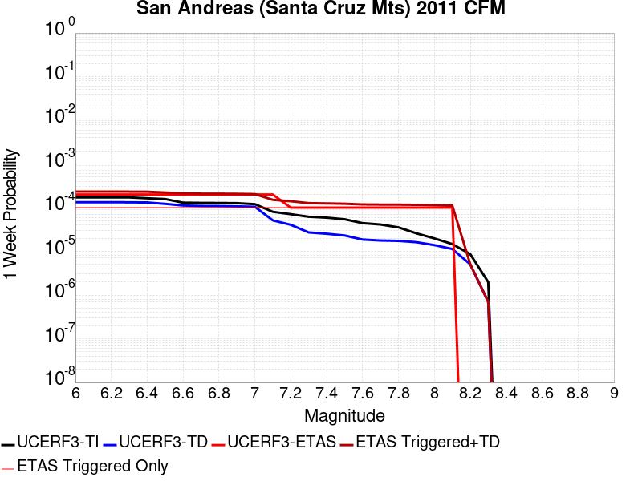 | 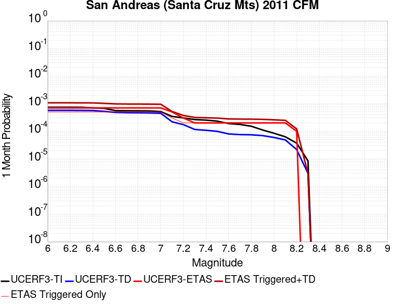 | 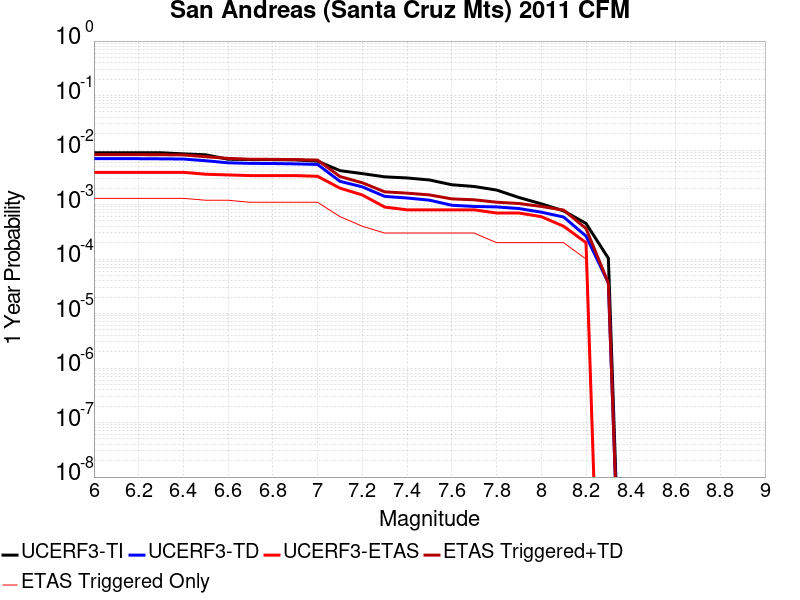 | 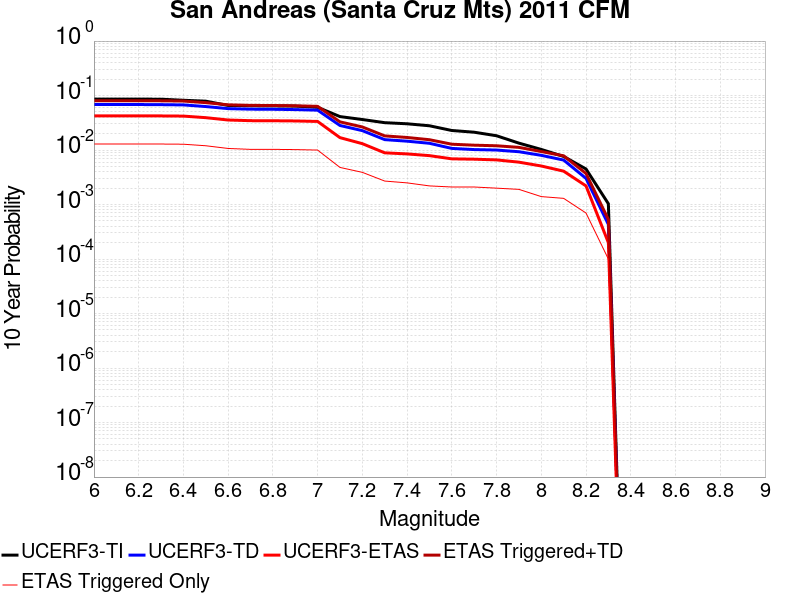 |

| Magnitude | 1 wk TI Prob | 1 wk TD Prob | 1 wk ETAS Prob | 1 wk ETAS/TD Gain | 1 wk ETAS Triggered+TD | 1 wk ETAS Triggered Only | 1 mo TI Prob | 1 mo TD Prob | 1 mo ETAS Prob | 1 mo ETAS/TD Gain | 1 mo ETAS Triggered+TD | 1 mo ETAS Triggered Only | 1 yr TI Prob | 1 yr TD Prob | 1 yr ETAS Prob | 1 yr ETAS/TD Gain | 1 yr ETAS Triggered+TD | 1 yr ETAS Triggered Only | 10 yr TI Prob | 10 yr TD Prob | 10 yr ETAS Prob | 10 yr ETAS/TD Gain | 10 yr ETAS Triggered+TD | 10 yr ETAS Triggered Only |
|-----|-----|-----|-----|-----|-----|-----|-----|-----|-----|-----|-----|-----|-----|-----|-----|-----|-----|-----|-----|-----|-----|-----|-----|-----|
| 6.0 | 1.7221631E-4 | 1.324687E-4 | 2.0E-4 | 1.5097907 | 2.3245545E-4 | 1.0E-4 | 7.378611E-4 | 5.676014E-4 | 7.0E-4 | 1.2332598 | 0.0010673177 | 5.0E-4 | 0.008946515 | 0.006889005 | 0.0039 | 0.5661195 | 0.008180049 | 0.0013 | 0.08594794 | 0.06788688 | 0.0423 | 0.62309533 | 0.07991114 | 0.0129 |
| 6.1 | 1.7221631E-4 | 1.324687E-4 | 2.0E-4 | 1.5097907 | 2.3245545E-4 | 1.0E-4 | 7.378611E-4 | 5.676014E-4 | 7.0E-4 | 1.2332598 | 0.0010673177 | 5.0E-4 | 0.008946515 | 0.006889005 | 0.0039 | 0.5661195 | 0.008180049 | 0.0013 | 0.08594794 | 0.06788688 | 0.0423 | 0.62309533 | 0.07991114 | 0.0129 |
| 6.2 | 1.7221631E-4 | 1.324687E-4 | 2.0E-4 | 1.5097907 | 2.3245545E-4 | 1.0E-4 | 7.378611E-4 | 5.676014E-4 | 7.0E-4 | 1.2332598 | 0.0010673177 | 5.0E-4 | 0.008946515 | 0.006889005 | 0.0039 | 0.5661195 | 0.008180049 | 0.0013 | 0.08594794 | 0.06788688 | 0.0423 | 0.62309533 | 0.07991114 | 0.0129 |
| 6.3 | 1.716926E-4 | 1.3167562E-4 | 2.0E-4 | 1.518884 | 2.3166246E-4 | 1.0E-4 | 7.3561794E-4 | 5.64204E-4 | 7.0E-4 | 1.2406859 | 0.001063922 | 5.0E-4 | 0.008919428 | 0.006847902 | 0.0039 | 0.5695175 | 0.008138999 | 0.0013 | 0.08569809 | 0.06750289 | 0.0423 | 0.62663984 | 0.0795321 | 0.0129 |
| 6.4 | 1.6392978E-4 | 1.3057106E-4 | 2.0E-4 | 1.531733 | 2.30558E-4 | 1.0E-4 | 7.02367E-4 | 5.594722E-4 | 7.0E-4 | 1.2511792 | 0.0010591925 | 5.0E-4 | 0.008517839 | 0.0067906515 | 0.0039 | 0.574319 | 0.008081824 | 0.0013 | 0.08198654 | 0.06682765 | 0.042 | 0.6284824 | 0.078772254 | 0.0128 |
| 6.5 | 1.5742714E-4 | 1.2136819E-4 | 2.0E-4 | 1.6478783 | 2.2135605E-4 | 1.0E-4 | 6.745133E-4 | 5.200473E-4 | 7.0E-4 | 1.3460313 | 0.0010197873 | 5.0E-4 | 0.00818132 | 0.006313488 | 0.0036 | 0.5702078 | 0.007505912 | 0.0012 | 0.078865945 | 0.062366523 | 0.0393 | 0.6301458 | 0.07361812 | 0.012 |
| 6.6 | 1.3038084E-4 | 1.1128931E-4 | 2.0E-4 | 1.7971178 | 2.1127818E-4 | 1.0E-4 | 5.5865536E-4 | 4.768682E-4 | 7.0E-4 | 1.4679108 | 9.766298E-4 | 5.0E-4 | 0.006780438 | 0.005790628 | 0.0035 | 0.6044249 | 0.0069836797 | 0.0012 | 0.0657725 | 0.05714523 | 0.0356 | 0.6229741 | 0.06723378 | 0.0107 |
| 6.7 | 1.2867592E-4 | 1.0859168E-4 | 2.0E-4 | 1.8417617 | 2.0858082E-4 | 1.0E-4 | 5.5135164E-4 | 4.6531114E-4 | 7.0E-4 | 1.5043697 | 9.650785E-4 | 5.0E-4 | 0.0066920654 | 0.0056506577 | 0.0034 | 0.6016998 | 0.006744442 | 0.0011 | 0.06494093 | 0.055870116 | 0.0346 | 0.6192935 | 0.06559466 | 0.0103 |
| 6.8 | 1.2801298E-4 | 1.07975764E-4 | 2.0E-4 | 1.8522675 | 2.0796497E-4 | 1.0E-4 | 5.485117E-4 | 4.626724E-4 | 7.0E-4 | 1.5129495 | 9.624411E-4 | 5.0E-4 | 0.0066577005 | 0.0056187143 | 0.0034 | 0.6051206 | 0.006712534 | 0.0011 | 0.06461738 | 0.055587195 | 0.0345 | 0.62064654 | 0.06531465 | 0.0103 |
| 6.9 | 1.269149E-4 | 1.06416686E-4 | 2.0E-4 | 1.8794045 | 2.0640604E-4 | 1.0E-4 | 5.4380763E-4 | 4.55993E-4 | 7.0E-4 | 1.5351113 | 9.55765E-4 | 5.0E-4 | 0.006600777 | 0.0055378084 | 0.0034 | 0.6139613 | 0.006631717 | 0.0011 | 0.06408122 | 0.054865282 | 0.0342 | 0.623345 | 0.06450566 | 0.0102 |
| 7.0 | 1.2030331E-4 | 1.0379946E-4 | 2.0E-4 | 1.9267924 | 2.0378908E-4 | 1.0E-4 | 5.154837E-4 | 4.4478016E-4 | 7.0E-4 | 1.5738112 | 9.445578E-4 | 5.0E-4 | 0.006257969 | 0.005401977 | 0.0033 | 0.61088747 | 0.0064960346 | 0.0011 | 0.06084648 | 0.053585198 | 0.0335 | 0.6251727 | 0.063049346 | 0.01 |
| 7.1 | 8.049617E-5 | 5.0586772E-5 | 2.0E-4 | 3.9536026 | 1.5058172E-4 | 1.0E-4 | 3.4493793E-4 | 2.1678262E-4 | 5.0E-4 | 2.306458 | 5.1671756E-4 | 3.0E-4 | 0.0041915346 | 0.0026361651 | 0.002 | 0.75867784 | 0.0032345834 | 6.0E-4 | 0.041133516 | 0.02795207 | 0.0169 | 0.6046064 | 0.0326179 | 0.0048 |
| 7.2 | 7.093979E-5 | 4.0032555E-5 | 1.0E-4 | 2.4979668 | 1.4002855E-4 | 1.0E-4 | 3.0399222E-4 | 1.7155694E-4 | 3.0E-4 | 1.7486906 | 3.7152262E-4 | 2.0E-4 | 0.0036948253 | 0.002086725 | 0.0015 | 0.7188297 | 0.0024858904 | 4.0E-4 | 0.03633994 | 0.02247247 | 0.0131 | 0.5829355 | 0.026284825 | 0.0039 |
| 7.3 | 6.193693E-5 | 2.6747162E-5 | 1.0E-4 | 3.7387145 | 1.2674449E-4 | 1.0E-4 | 2.6541698E-4 | 1.1462567E-4 | 2.0E-4 | 1.74481 | 3.1460274E-4 | 2.0E-4 | 0.0032266637 | 0.0013946756 | 9.0E-4 | 0.64531136 | 0.0016942571 | 3.0E-4 | 0.031802133 | 0.015363889 | 0.0089 | 0.57928044 | 0.018022407 | 0.0027 |
| 7.4 | 5.906492E-5 | 2.4993567E-5 | 1.0E-4 | 4.0010295 | 1.2499107E-4 | 1.0E-4 | 2.5311083E-4 | 1.0711089E-4 | 2.0E-4 | 1.8672236 | 3.0708947E-4 | 2.0E-4 | 0.0030772698 | 0.0013032962 | 8.0E-4 | 0.6138282 | 0.0016029052 | 3.0E-4 | 0.030350044 | 0.014391991 | 0.0085 | 0.5906063 | 0.016856011 | 0.0025 |
| 7.5 | 5.424296E-5 | 2.2810125E-5 | 1.0E-4 | 4.384018 | 1.2280785E-4 | 1.0E-4 | 2.324491E-4 | 9.775402E-5 | 2.0E-4 | 2.0459516 | 2.9773446E-4 | 2.0E-4 | 0.002826395 | 0.0011895064 | 8.0E-4 | 0.6725479 | 0.0014891495 | 3.0E-4 | 0.027907165 | 0.01316571 | 0.0079 | 0.6000436 | 0.015336745 | 0.0022 |
| 7.6 | 4.43084E-5 | 1.8421408E-5 | 1.0E-4 | 5.428467 | 1.18419564E-4 | 1.0E-4 | 1.8987931E-4 | 7.8946505E-5 | 2.0E-4 | 2.533361 | 2.789307E-4 | 2.0E-4 | 0.0023093296 | 9.607501E-4 | 8.0E-4 | 0.8326827 | 0.0012604619 | 3.0E-4 | 0.022854783 | 0.010616424 | 0.0069 | 0.6499364 | 0.01269413 | 0.0021 |
| 7.7 | 4.118098E-5 | 1.7519116E-5 | 1.0E-4 | 5.7080507 | 1.1751737E-4 | 1.0E-4 | 1.7647797E-4 | 7.507976E-5 | 2.0E-4 | 2.6638336 | 2.7506475E-4 | 2.0E-4 | 0.002146502 | 9.13713E-4 | 8.0E-4 | 0.8755484 | 0.0012134389 | 3.0E-4 | 0.021258866 | 0.010109132 | 0.0068 | 0.6726591 | 0.012187904 | 0.0021 |
| 7.8 | 3.5408906E-5 | 1.718195E-5 | 1.0E-4 | 5.820061 | 1.1718023E-4 | 1.0E-4 | 1.5174363E-4 | 7.3634845E-5 | 2.0E-4 | 2.7161052 | 2.7362013E-4 | 2.0E-4 | 0.0018459131 | 8.9613575E-4 | 7.0E-4 | 0.7811316 | 0.0010959565 | 2.0E-4 | 0.018306552 | 0.009911029 | 0.0066 | 0.6659248 | 0.011891207 | 0.002 |
| 7.9 | 2.5860836E-5 | 1.605516E-5 | 1.0E-4 | 6.228527 | 1.16053554E-4 | 1.0E-4 | 1.10827445E-4 | 6.880602E-5 | 2.0E-4 | 2.9067225 | 2.6879227E-4 | 2.0E-4 | 0.001348489 | 8.373915E-4 | 7.0E-4 | 0.8359292 | 0.001037224 | 2.0E-4 | 0.013403354 | 0.00923667 | 0.006 | 0.6495847 | 0.011119121 | 0.0019 |
| 8.0 | 1.9777332E-5 | 1.3757096E-5 | 1.0E-4 | 7.268976 | 1.1375572E-4 | 1.0E-4 | 8.4757245E-5 | 5.8957652E-5 | 2.0E-4 | 3.3922656 | 2.5894586E-4 | 2.0E-4 | 0.0010314309 | 7.1757316E-4 | 6.0E-4 | 0.83615166 | 9.174296E-4 | 2.0E-4 | 0.010266567 | 0.007932751 | 0.0051 | 0.6429043 | 0.009321646 | 0.0014 |
| 8.1 | 1.468494E-5 | 1.1215867E-5 | 1.0E-4 | 8.91594 | 1.11214744E-4 | 1.0E-4 | 6.293394E-5 | 4.8067115E-5 | 2.0E-4 | 4.1608486 | 2.480575E-4 | 2.0E-4 | 7.6595135E-4 | 5.8506016E-4 | 4.0E-4 | 0.68369037 | 7.849432E-4 | 2.0E-4 | 0.0076331664 | 0.006492733 | 0.0041 | 0.6314752 | 0.0077842926 | 0.0013 |
| 8.2 | 8.63836E-6 | 5.004842E-6 | 0.0 | 0.0 | 5.004842E-6 | 0.0 | 3.7021015E-5 | 2.1449147E-5 | 1.0E-4 | 4.6621904 | 1.21447E-4 | 1.0E-4 | 4.5063766E-4 | 2.6111212E-4 | 2.0E-4 | 0.76595443 | 3.6108601E-4 | 1.0E-4 | 0.004497249 | 0.0029908775 | 0.0022 | 0.7355701 | 0.003688784 | 7.0E-4 |
| 8.3 | 1.983087E-6 | 6.880041E-7 | 0.0 | 0.0 | 6.880041E-7 | 0.0 | 8.498917E-6 | 2.9485857E-6 | 0.0 | 0.0 | 2.9485857E-6 | 0.0 | 1.034694E-4 | 3.589845E-5 | 0.0 | 0.0 | 3.589845E-5 | 0.0 | 0.0010342124 | 4.2701262E-4 | 2.0E-4 | 0.46837023 | 5.269699E-4 | 1.0E-4 |

## Maacama 2011 CFM
*[(top)](#table-of-contents)*

| 1 Week | 1 Month | 1 Year | 10 Year |
|-----|-----|-----|-----|
|  |  | 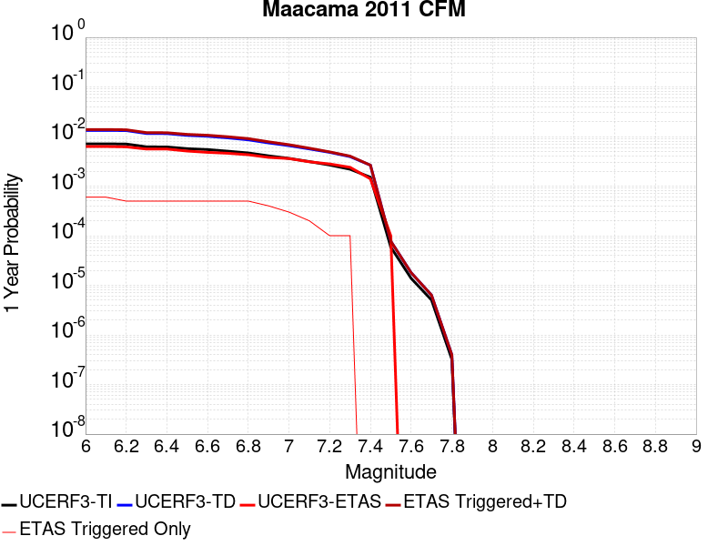 |  |

| Magnitude | 1 wk TI Prob | 1 wk TD Prob | 1 wk ETAS Prob | 1 wk ETAS/TD Gain | 1 wk ETAS Triggered+TD | 1 wk ETAS Triggered Only | 1 mo TI Prob | 1 mo TD Prob | 1 mo ETAS Prob | 1 mo ETAS/TD Gain | 1 mo ETAS Triggered+TD | 1 mo ETAS Triggered Only | 1 yr TI Prob | 1 yr TD Prob | 1 yr ETAS Prob | 1 yr ETAS/TD Gain | 1 yr ETAS Triggered+TD | 1 yr ETAS Triggered Only | 10 yr TI Prob | 10 yr TD Prob | 10 yr ETAS Prob | 10 yr ETAS/TD Gain | 10 yr ETAS Triggered+TD | 10 yr ETAS Triggered Only |
|-----|-----|-----|-----|-----|-----|-----|-----|-----|-----|-----|-----|-----|-----|-----|-----|-----|-----|-----|-----|-----|-----|-----|-----|-----|
| 6.0 | 1.368203E-4 | 2.5635102E-4 | 1.0E-4 | 0.3900901 | 2.5635102E-4 | 0.0 | 5.862409E-4 | 0.0010980811 | 6.0E-4 | 0.54640776 | 0.0011979713 | 1.0E-4 | 0.0071141496 | 0.013270428 | 0.0063 | 0.47473976 | 0.013862466 | 6.0E-4 | 0.06890667 | 0.12352333 | 0.063 | 0.5100251 | 0.13465458 | 0.0127 |
| 6.1 | 1.368203E-4 | 2.5635102E-4 | 1.0E-4 | 0.3900901 | 2.5635102E-4 | 0.0 | 5.862409E-4 | 0.0010980811 | 6.0E-4 | 0.54640776 | 0.0011979713 | 1.0E-4 | 0.0071141496 | 0.013270428 | 0.0063 | 0.47473976 | 0.013862466 | 6.0E-4 | 0.06890667 | 0.12352333 | 0.063 | 0.5100251 | 0.13465458 | 0.0127 |
| 6.2 | 1.360743E-4 | 2.5510337E-4 | 1.0E-4 | 0.39199796 | 2.5510337E-4 | 0.0 | 5.8304524E-4 | 0.0010927393 | 6.0E-4 | 0.5490788 | 0.0011926299 | 1.0E-4 | 0.007075496 | 0.013206253 | 0.0062 | 0.46947455 | 0.01369965 | 5.0E-4 | 0.06854413 | 0.122959584 | 0.0627 | 0.50992364 | 0.13392259 | 0.0125 |
| 6.3 | 1.1917239E-4 | 2.2215702E-4 | 1.0E-4 | 0.45013207 | 2.2215702E-4 | 0.0 | 5.1063887E-4 | 9.516623E-4 | 5.0E-4 | 0.52539647 | 0.0010515671 | 1.0E-4 | 0.0061993203 | 0.011512876 | 0.0056 | 0.48641193 | 0.012007119 | 5.0E-4 | 0.060292065 | 0.1082104 | 0.0553 | 0.51104146 | 0.11793091 | 0.0109 |
| 6.4 | 1.1859289E-4 | 2.2119714E-4 | 1.0E-4 | 0.4520854 | 2.2119714E-4 | 0.0 | 5.0815626E-4 | 9.4755174E-4 | 5.0E-4 | 0.5276756 | 0.001047457 | 1.0E-4 | 0.006169266 | 0.011463408 | 0.0056 | 0.4885109 | 0.011957676 | 5.0E-4 | 0.06000784 | 0.107768744 | 0.0552 | 0.51220787 | 0.11740484 | 0.0108 |
| 6.5 | 1.09512424E-4 | 2.037942E-4 | 1.0E-4 | 0.4906911 | 2.037942E-4 | 0.0 | 4.6925453E-4 | 8.7302696E-4 | 4.0E-4 | 0.45817602 | 9.7293966E-4 | 1.0E-4 | 0.005698218 | 0.010567802 | 0.0051 | 0.48259798 | 0.011062519 | 5.0E-4 | 0.055543028 | 0.099878885 | 0.0508 | 0.50861603 | 0.10861006 | 0.0097 |
| 6.6 | 1.0502928E-4 | 1.9539673E-4 | 1.0E-4 | 0.5117793 | 1.9539673E-4 | 0.0 | 4.500478E-4 | 8.370758E-4 | 4.0E-4 | 0.47785398 | 9.369921E-4 | 1.0E-4 | 0.0054655746 | 0.010135394 | 0.0048 | 0.4735879 | 0.010630326 | 5.0E-4 | 0.053330887 | 0.09604088 | 0.0485 | 0.50499326 | 0.1045381 | 0.0094 |
| 6.7 | 9.739358E-5 | 1.8128542E-4 | 1.0E-4 | 0.5516164 | 1.8128542E-4 | 0.0 | 4.173343E-4 | 7.766524E-4 | 4.0E-4 | 0.51503086 | 8.765748E-4 | 1.0E-4 | 0.0050692135 | 0.009408032 | 0.0046 | 0.4889439 | 0.009903328 | 5.0E-4 | 0.049551267 | 0.08953091 | 0.0453 | 0.50597054 | 0.09745199 | 0.0087 |
| 6.8 | 8.969524E-5 | 1.6537461E-4 | 1.0E-4 | 0.6046877 | 1.6537461E-4 | 0.0 | 3.8435153E-4 | 7.085156E-4 | 4.0E-4 | 0.56456065 | 8.0844475E-4 | 1.0E-4 | 0.0046694432 | 0.008586869 | 0.0043 | 0.50076467 | 0.009082574 | 5.0E-4 | 0.045725387 | 0.08210157 | 0.0412 | 0.50181746 | 0.089352965 | 0.0079 |
| 6.9 | 7.838291E-5 | 1.4311985E-4 | 1.0E-4 | 0.69871515 | 1.4311985E-4 | 0.0 | 3.358835E-4 | 6.132068E-4 | 4.0E-4 | 0.65230846 | 7.131455E-4 | 1.0E-4 | 0.0040817154 | 0.0074366727 | 0.0038 | 0.5109812 | 0.007833698 | 4.0E-4 | 0.04007554 | 0.07155797 | 0.0346 | 0.48352405 | 0.07740715 | 0.0063 |
| 7.0 | 6.961957E-5 | 1.2612117E-4 | 0.0 | 0.0 | 1.2612117E-4 | 0.0 | 2.9833548E-4 | 5.403954E-4 | 3.0E-4 | 0.5551491 | 6.403413E-4 | 1.0E-4 | 0.0036261857 | 0.0065571335 | 0.0036 | 0.5490204 | 0.006855166 | 3.0E-4 | 0.035675827 | 0.06342047 | 0.0305 | 0.4809173 | 0.068477996 | 0.0054 |
| 7.1 | 5.999398E-5 | 1.08208515E-4 | 0.0 | 0.0 | 1.08208515E-4 | 0.0 | 2.570917E-4 | 4.6365694E-4 | 1.0E-4 | 0.21567671 | 4.6365694E-4 | 0.0 | 0.0031255994 | 0.005629063 | 0.0031 | 0.5507133 | 0.0058279373 | 2.0E-4 | 0.030820016 | 0.054735295 | 0.0264 | 0.48232132 | 0.059367094 | 0.0049 |
| 7.2 | 5.116532E-5 | 9.2307884E-5 | 0.0 | 0.0 | 9.2307884E-5 | 0.0 | 2.1926152E-4 | 3.955391E-4 | 1.0E-4 | 0.2528195 | 3.955391E-4 | 0.0 | 0.002666241 | 0.0048044506 | 0.0028 | 0.58279294 | 0.0049039703 | 1.0E-4 | 0.026344774 | 0.04694229 | 0.0234 | 0.4984844 | 0.05075452 | 0.004 |
| 7.3 | 4.2087835E-5 | 7.556291E-5 | 0.0 | 0.0 | 7.556291E-5 | 0.0 | 1.8036396E-4 | 3.2379667E-4 | 1.0E-4 | 0.30883577 | 3.2379667E-4 | 0.0 | 0.0021937196 | 0.003934732 | 0.0024 | 0.60995257 | 0.0040343385 | 1.0E-4 | 0.0217219 | 0.03860795 | 0.0204 | 0.52838856 | 0.041780543 | 0.0033 |
| 7.4 | 2.8991652E-5 | 5.0771338E-5 | 0.0 | 0.0 | 5.0771338E-5 | 0.0 | 1.2424402E-4 | 2.1757245E-4 | 1.0E-4 | 0.45961702 | 2.1757245E-4 | 0.0 | 0.0015116213 | 0.0026457263 | 0.0014 | 0.52915525 | 0.0026457263 | 0.0 | 0.015013801 | 0.026136458 | 0.0145 | 0.5547806 | 0.028571116 | 0.0025 |
| 7.5 | 1.1292299E-6 | 1.4875133E-6 | 0.0 | 0.0 | 1.4875133E-6 | 0.0 | 4.8395473E-6 | 6.3750485E-6 | 0.0 | 0.0 | 6.3750485E-6 | 0.0 | 5.8919897E-5 | 7.761469E-5 | 1.0E-4 | 1.2884159 | 7.761469E-5 | 0.0 | 5.890428E-4 | 7.765553E-4 | 2.0E-4 | 0.25754768 | 8.7647757E-4 | 1.0E-4 |
| 7.6 | 2.6535366E-7 | 3.4398312E-7 | 0.0 | 0.0 | 3.4398312E-7 | 0.0 | 1.1372296E-6 | 1.4742126E-6 | 0.0 | 0.0 | 1.4742126E-6 | 0.0 | 1.3845682E-5 | 1.794839E-5 | 0.0 | 0.0 | 1.794839E-5 | 0.0 | 1.3844819E-4 | 1.7998618E-4 | 1.0E-4 | 0.55559826 | 2.7996817E-4 | 1.0E-4 |
| 7.7 | 9.727789E-8 | 1.2128508E-7 | 0.0 | 0.0 | 1.2128508E-7 | 0.0 | 4.1690518E-7 | 5.197931E-7 | 0.0 | 0.0 | 5.197931E-7 | 0.0 | 5.0758085E-6 | 6.328463E-6 | 0.0 | 0.0 | 6.328463E-6 | 0.0 | 5.0756928E-5 | 6.368924E-5 | 1.0E-4 | 1.5701241 | 1.6368287E-4 | 1.0E-4 |
| 7.8 | 6.1939325E-9 | 7.588051E-9 | 0.0 | 0.0 | 7.588051E-9 | 0.0 | 2.6545425E-8 | 3.252022E-8 | 0.0 | 0.0 | 3.252022E-8 | 0.0 | 3.231905E-7 | 3.9593357E-7 | 0.0 | 0.0 | 3.9593357E-7 | 0.0 | 3.2319003E-6 | 3.995574E-6 | 0.0 | 0.0 | 3.995574E-6 | 0.0 |

## Rodgers Creek - Healdsburg 2011 CFM
*[(top)](#table-of-contents)*

| 1 Week | 1 Month | 1 Year | 10 Year |
|-----|-----|-----|-----|
|  | 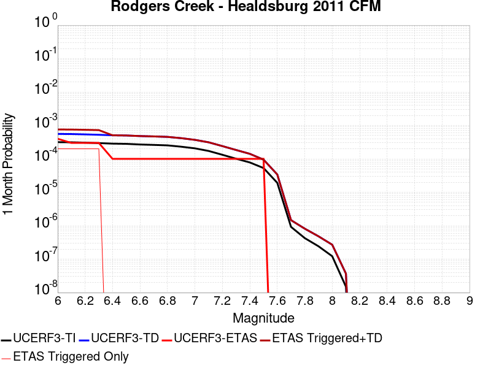 | 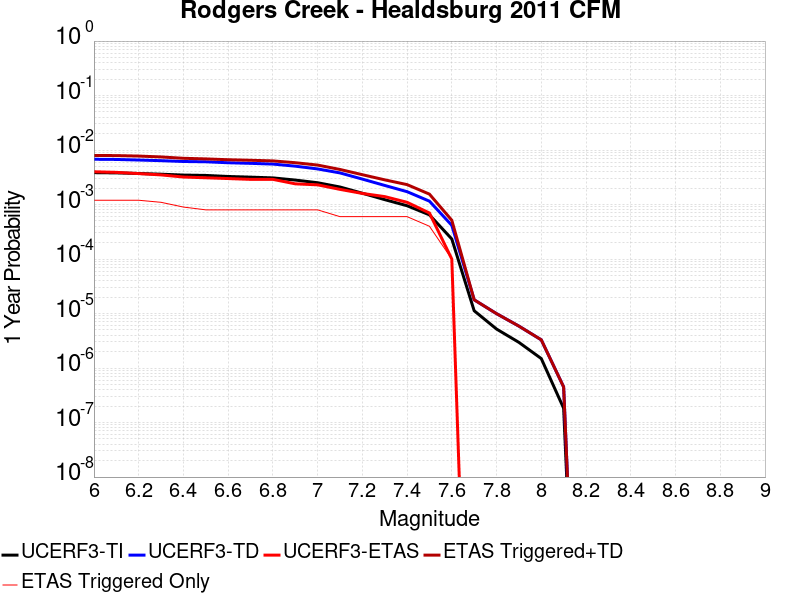 |  |

| Magnitude | 1 wk TI Prob | 1 wk TD Prob | 1 wk ETAS Prob | 1 wk ETAS/TD Gain | 1 wk ETAS Triggered+TD | 1 wk ETAS Triggered Only | 1 mo TI Prob | 1 mo TD Prob | 1 mo ETAS Prob | 1 mo ETAS/TD Gain | 1 mo ETAS Triggered+TD | 1 mo ETAS Triggered Only | 1 yr TI Prob | 1 yr TD Prob | 1 yr ETAS Prob | 1 yr ETAS/TD Gain | 1 yr ETAS Triggered+TD | 1 yr ETAS Triggered Only | 10 yr TI Prob | 10 yr TD Prob | 10 yr ETAS Prob | 10 yr ETAS/TD Gain | 10 yr ETAS Triggered+TD | 10 yr ETAS Triggered Only |
|-----|-----|-----|-----|-----|-----|-----|-----|-----|-----|-----|-----|-----|-----|-----|-----|-----|-----|-----|-----|-----|-----|-----|-----|-----|
| 6.0 | 7.390182E-5 | 1.301492E-4 | 2.0E-4 | 1.5366979 | 2.301362E-4 | 1.0E-4 | 3.1668364E-4 | 5.5766234E-4 | 4.0E-4 | 0.71728 | 7.5755076E-4 | 2.0E-4 | 0.0038488081 | 0.006768365 | 0.004 | 0.5909847 | 0.007960243 | 0.0012 | 0.037828278 | 0.06561573 | 0.0403 | 0.61418205 | 0.076267704 | 0.0114 |
| 6.1 | 7.318768E-5 | 1.2913322E-4 | 1.0E-4 | 0.77439415 | 2.291203E-4 | 1.0E-4 | 3.1362378E-4 | 5.5331015E-4 | 3.0E-4 | 0.5421914 | 7.531995E-4 | 2.0E-4 | 0.0038116854 | 0.0067157187 | 0.0039 | 0.5807271 | 0.00790766 | 0.0012 | 0.037469655 | 0.06512183 | 0.0396 | 0.608091 | 0.075685956 | 0.0113 |
| 6.2 | 7.1379836E-5 | 1.2607191E-4 | 1.0E-4 | 0.7931981 | 2.260593E-4 | 1.0E-4 | 3.058777E-4 | 5.401958E-4 | 3.0E-4 | 0.5553542 | 7.4008777E-4 | 2.0E-4 | 0.003717703 | 0.0065570213 | 0.0037 | 0.5642806 | 0.007749153 | 0.0012 | 0.0365612 | 0.06364771 | 0.0385 | 0.6048922 | 0.073947586 | 0.011 |
| 6.3 | 6.9255926E-5 | 1.2263017E-4 | 1.0E-4 | 0.81546 | 2.226179E-4 | 1.0E-4 | 2.9677735E-4 | 5.254523E-4 | 3.0E-4 | 0.5709367 | 7.253472E-4 | 2.0E-4 | 0.0036072785 | 0.006378665 | 0.0035 | 0.54870415 | 0.0074716485 | 0.0011 | 0.035492823 | 0.061984897 | 0.0377 | 0.60821265 | 0.072021656 | 0.0107 |
| 6.4 | 6.6757144E-5 | 1.1841311E-4 | 0.0 | 0.0 | 1.1841311E-4 | 0.0 | 2.8607066E-4 | 5.073864E-4 | 1.0E-4 | 0.19708847 | 5.073864E-4 | 0.0 | 0.0034773487 | 0.0061600036 | 0.0032 | 0.5194802 | 0.00705446 | 9.0E-4 | 0.034234364 | 0.059940808 | 0.0365 | 0.6089341 | 0.06952941 | 0.0102 |
| 6.5 | 6.5735134E-5 | 1.1690995E-4 | 0.0 | 0.0 | 1.1690995E-4 | 0.0 | 2.8169158E-4 | 5.0094683E-4 | 1.0E-4 | 0.19962199 | 5.0094683E-4 | 0.0 | 0.003424202 | 0.006082054 | 0.0031 | 0.50969625 | 0.0068771886 | 8.0E-4 | 0.03371918 | 0.05920631 | 0.0356 | 0.60128725 | 0.06842609 | 0.0098 |
| 6.6 | 6.289601E-5 | 1.1228256E-4 | 0.0 | 0.0 | 1.1228256E-4 | 0.0 | 2.6952647E-4 | 4.811226E-4 | 1.0E-4 | 0.20784722 | 4.811226E-4 | 0.0 | 0.0032765474 | 0.0058420138 | 0.003 | 0.51352155 | 0.0066373404 | 8.0E-4 | 0.032286562 | 0.05695151 | 0.0341 | 0.598755 | 0.06562755 | 0.0092 |
| 6.7 | 6.115274E-5 | 1.0946364E-4 | 0.0 | 0.0 | 1.0946364E-4 | 0.0 | 2.6205686E-4 | 4.690459E-4 | 1.0E-4 | 0.21319875 | 4.690459E-4 | 0.0 | 0.0031858748 | 0.0056957584 | 0.0029 | 0.5091508 | 0.006491202 | 8.0E-4 | 0.031405866 | 0.055574253 | 0.0338 | 0.6081953 | 0.06426297 | 0.0092 |
| 6.8 | 5.9232367E-5 | 1.0615019E-4 | 0.0 | 0.0 | 1.0615019E-4 | 0.0 | 2.538283E-4 | 4.5485044E-4 | 1.0E-4 | 0.21985249 | 4.5485044E-4 | 0.0 | 0.0030859804 | 0.0055238176 | 0.0029 | 0.5249992 | 0.0063193985 | 8.0E-4 | 0.030434765 | 0.05394587 | 0.0331 | 0.613578 | 0.06236575 | 0.0089 |
| 6.9 | 5.4030377E-5 | 9.7149E-5 | 0.0 | 0.0 | 9.7149E-5 | 0.0 | 2.315382E-4 | 4.1628676E-4 | 1.0E-4 | 0.24021904 | 4.1628676E-4 | 0.0 | 0.0028153337 | 0.0050565777 | 0.0024 | 0.4746293 | 0.0058525326 | 8.0E-4 | 0.027799325 | 0.049505565 | 0.0305 | 0.6160923 | 0.057394672 | 0.0083 |
| 7.0 | 4.8260714E-5 | 8.639305E-5 | 0.0 | 0.0 | 8.639305E-5 | 0.0 | 2.0681522E-4 | 3.7020363E-4 | 1.0E-4 | 0.2701216 | 3.7020363E-4 | 0.0 | 0.0025150678 | 0.0044979677 | 0.0023 | 0.51134205 | 0.005294369 | 8.0E-4 | 0.024867928 | 0.04418429 | 0.0274 | 0.6201299 | 0.051257327 | 0.0074 |
| 7.1 | 4.0294493E-5 | 7.2951734E-5 | 0.0 | 0.0 | 7.2951734E-5 | 0.0 | 1.7267925E-4 | 3.1261303E-4 | 1.0E-4 | 0.3198843 | 3.1261303E-4 | 0.0 | 0.0021003427 | 0.0037994585 | 0.0019 | 0.5000713 | 0.004397179 | 6.0E-4 | 0.02080602 | 0.03747253 | 0.0225 | 0.6004398 | 0.0434402 | 0.0062 |
| 7.2 | 3.096388E-5 | 5.6131365E-5 | 0.0 | 0.0 | 5.6131365E-5 | 0.0 | 1.326956E-4 | 2.4054093E-4 | 1.0E-4 | 0.41572964 | 2.4054093E-4 | 0.0 | 0.0016143717 | 0.0029246744 | 0.0016 | 0.54706943 | 0.0035229195 | 6.0E-4 | 0.01602694 | 0.029026924 | 0.0184 | 0.63389426 | 0.034075983 | 0.0052 |
| 7.3 | 2.3615226E-5 | 4.2892298E-5 | 0.0 | 0.0 | 4.2892298E-5 | 0.0 | 1.0120418E-4 | 1.8381125E-4 | 1.0E-4 | 0.5440363 | 1.8381125E-4 | 0.0 | 0.0012314644 | 0.0022356184 | 0.0014 | 0.62622494 | 0.002834277 | 6.0E-4 | 0.0122466255 | 0.022279777 | 0.0149 | 0.6687679 | 0.026483973 | 0.0043 |
| 7.4 | 1.8251132E-5 | 3.293187E-5 | 0.0 | 0.0 | 3.293187E-5 | 0.0 | 7.821679E-5 | 1.41129E-4 | 1.0E-4 | 0.7085716 | 1.41129E-4 | 0.0 | 9.518733E-4 | 0.0017169007 | 0.0011 | 0.6406893 | 0.0023158707 | 6.0E-4 | 0.009478063 | 0.017168263 | 0.0119 | 0.6931395 | 0.020608174 | 0.0035 |
| 7.5 | 1.2411432E-5 | 2.204226E-5 | 0.0 | 0.0 | 2.204226E-5 | 0.0 | 5.3190768E-5 | 9.446344E-5 | 1.0E-4 | 1.0586106 | 9.446344E-5 | 0.0 | 6.4740516E-4 | 0.0011494912 | 7.0E-4 | 0.6089651 | 0.0015490314 | 4.0E-4 | 0.006455223 | 0.01153857 | 0.0083 | 0.71932656 | 0.0139108775 | 0.0024 |
| 7.6 | 4.4771446E-6 | 7.931335E-6 | 0.0 | 0.0 | 7.931335E-6 | 0.0 | 1.918762E-5 | 3.3991E-5 | 0.0 | 0.0 | 3.3991E-5 | 0.0 | 2.3358424E-4 | 4.1376302E-4 | 1.0E-4 | 0.24168424 | 5.1372166E-4 | 1.0E-4 | 0.0023333887 | 0.004170798 | 0.0026 | 0.6233819 | 0.0048678787 | 7.0E-4 |
| 7.7 | 2.157941E-7 | 3.4058309E-7 | 0.0 | 0.0 | 3.4058309E-7 | 0.0 | 9.248315E-7 | 1.459641E-6 | 0.0 | 0.0 | 1.459641E-6 | 0.0 | 1.1259765E-5 | 1.7770984E-5 | 0.0 | 0.0 | 1.7770984E-5 | 0.0 | 1.1259195E-4 | 1.8428617E-4 | 1.0E-4 | 0.5426343 | 2.8426773E-4 | 1.0E-4 |
| 7.8 | 9.9623286E-8 | 1.8952073E-7 | 0.0 | 0.0 | 1.8952073E-7 | 0.0 | 4.269569E-7 | 8.1223146E-7 | 0.0 | 0.0 | 8.1223146E-7 | 0.0 | 5.1981874E-6 | 9.888873E-6 | 0.0 | 0.0 | 9.888873E-6 | 0.0 | 5.198066E-5 | 1.0434773E-4 | 0.0 | 0.0 | 1.0434773E-4 | 0.0 |
| 7.9 | 5.6745257E-8 | 1.12044894E-7 | 0.0 | 0.0 | 1.12044894E-7 | 0.0 | 2.4319394E-7 | 4.801923E-7 | 0.0 | 0.0 | 4.801923E-7 | 0.0 | 2.960882E-6 | 5.8463256E-6 | 0.0 | 0.0 | 5.8463256E-6 | 0.0 | 2.9608427E-5 | 6.191383E-5 | 0.0 | 0.0 | 6.191383E-5 | 0.0 |
| 8.0 | 2.8614323E-8 | 6.283889E-8 | 0.0 | 0.0 | 6.283889E-8 | 0.0 | 1.2263281E-7 | 2.693095E-7 | 0.0 | 0.0 | 2.693095E-7 | 0.0 | 1.4930534E-6 | 3.2788384E-6 | 0.0 | 0.0 | 3.2788384E-6 | 0.0 | 1.4930434E-5 | 3.4405322E-5 | 0.0 | 0.0 | 3.4405322E-5 | 0.0 |
| 8.1 | 3.5045191E-9 | 8.596933E-9 | 0.0 | 0.0 | 8.596933E-9 | 0.0 | 1.5019367E-8 | 3.6844E-8 | 0.0 | 0.0 | 3.6844E-8 | 0.0 | 1.8286079E-7 | 4.485756E-7 | 0.0 | 0.0 | 4.485756E-7 | 0.0 | 1.8286064E-6 | 4.657446E-6 | 0.0 | 0.0 | 4.657446E-6 | 0.0 |

## Mission Ridge-Arroyo Parida-Santa Ana
*[(top)](#table-of-contents)*

| 1 Week | 1 Month | 1 Year | 10 Year |
|-----|-----|-----|-----|
|  |  |  |  |

| Magnitude | 1 wk TI Prob | 1 wk TD Prob | 1 wk ETAS Prob | 1 wk ETAS/TD Gain | 1 wk ETAS Triggered+TD | 1 wk ETAS Triggered Only | 1 mo TI Prob | 1 mo TD Prob | 1 mo ETAS Prob | 1 mo ETAS/TD Gain | 1 mo ETAS Triggered+TD | 1 mo ETAS Triggered Only | 1 yr TI Prob | 1 yr TD Prob | 1 yr ETAS Prob | 1 yr ETAS/TD Gain | 1 yr ETAS Triggered+TD | 1 yr ETAS Triggered Only | 10 yr TI Prob | 10 yr TD Prob | 10 yr ETAS Prob | 10 yr ETAS/TD Gain | 10 yr ETAS Triggered+TD | 10 yr ETAS Triggered Only |
|-----|-----|-----|-----|-----|-----|-----|-----|-----|-----|-----|-----|-----|-----|-----|-----|-----|-----|-----|-----|-----|-----|-----|-----|-----|
| 6.0 | 4.169034E-5 | 4.7031044E-5 | 0.0 | 0.0 | 4.7031044E-5 | 0.0 | 1.7866064E-4 | 2.0155087E-4 | 1.0E-4 | 0.49615264 | 2.0155087E-4 | 0.0 | 0.0021730233 | 0.002451956 | 0.0028 | 1.1419454 | 0.0032499945 | 8.0E-4 | 0.021518968 | 0.024330456 | 0.0261 | 1.0727296 | 0.032721214 | 0.0086 |
| 6.1 | 1.73813E-5 | 1.682591E-5 | 0.0 | 0.0 | 1.682591E-5 | 0.0 | 7.4489166E-5 | 7.210911E-5 | 0.0 | 0.0 | 7.210911E-5 | 0.0 | 9.065282E-4 | 8.775855E-4 | 0.0012 | 1.3673881 | 0.0011773222 | 3.0E-4 | 0.009028391 | 0.008742238 | 0.009 | 1.0294846 | 0.011616886 | 0.0029 |
| 6.2 | 1.4622182E-5 | 1.3650112E-5 | 0.0 | 0.0 | 1.3650112E-5 | 0.0 | 6.2664985E-5 | 5.849919E-5 | 0.0 | 0.0 | 5.849919E-5 | 0.0 | 7.6267915E-4 | 7.119988E-4 | 9.0E-4 | 1.2640471 | 9.1185636E-4 | 2.0E-4 | 0.007600669 | 0.007097517 | 0.007 | 0.98626035 | 0.009281903 | 0.0022 |
| 6.3 | 1.3552434E-5 | 1.2460448E-5 | 0.0 | 0.0 | 1.2460448E-5 | 0.0 | 5.8080568E-5 | 5.340084E-5 | 0.0 | 0.0 | 5.340084E-5 | 0.0 | 7.069015E-4 | 6.4996444E-4 | 7.0E-4 | 1.076982 | 8.4983447E-4 | 2.0E-4 | 0.00704657 | 0.006480896 | 0.0061 | 0.9412279 | 0.008467934 | 0.002 |
| 6.4 | 1.30977305E-5 | 1.1957964E-5 | 0.0 | 0.0 | 1.1957964E-5 | 0.0 | 5.613192E-5 | 5.1247425E-5 | 0.0 | 0.0 | 5.1247425E-5 | 0.0 | 6.831918E-4 | 6.237618E-4 | 7.0E-4 | 1.1222233 | 8.2363706E-4 | 2.0E-4 | 0.006810953 | 0.0062203533 | 0.0059 | 0.94849914 | 0.008009157 | 0.0018 |
| 6.5 | 1.225205E-5 | 1.1028586E-5 | 0.0 | 0.0 | 1.1028586E-5 | 0.0 | 5.2507727E-5 | 4.726453E-5 | 0.0 | 0.0 | 4.726453E-5 | 0.0 | 6.3909404E-4 | 5.752964E-4 | 7.0E-4 | 1.2167641 | 7.7518134E-4 | 2.0E-4 | 0.006372592 | 0.005738279 | 0.0054 | 0.94104874 | 0.007428524 | 0.0017 |
| 6.6 | 1.1352241E-5 | 1.0044297E-5 | 0.0 | 0.0 | 1.0044297E-5 | 0.0 | 4.8651553E-5 | 4.3046286E-5 | 0.0 | 0.0 | 4.3046286E-5 | 0.0 | 5.921717E-4 | 5.2396464E-4 | 5.0E-4 | 0.9542629 | 6.239122E-4 | 1.0E-4 | 0.0059059616 | 0.005227437 | 0.0047 | 0.8991022 | 0.0068190726 | 0.0016 |
| 6.7 | 1.0864116E-5 | 9.498481E-6 | 0.0 | 0.0 | 9.498481E-6 | 0.0 | 4.6559664E-5 | 4.0707153E-5 | 0.0 | 0.0 | 4.0707153E-5 | 0.0 | 5.667165E-4 | 4.954989E-4 | 4.0E-4 | 0.80726725 | 4.954989E-4 | 0.0 | 0.005652734 | 0.0049440726 | 0.0044 | 0.88995457 | 0.006237645 | 0.0013 |
| 6.8 | 1.0666365E-5 | 9.281458E-6 | 0.0 | 0.0 | 9.281458E-6 | 0.0 | 4.571219E-5 | 3.9777082E-5 | 0.0 | 0.0 | 3.9777082E-5 | 0.0 | 5.564038E-4 | 4.8418035E-4 | 4.0E-4 | 0.82613844 | 4.8418035E-4 | 0.0 | 0.005550127 | 0.004831385 | 0.0044 | 0.910712 | 0.006125104 | 0.0013 |
| 6.9 | 1.0038665E-5 | 8.574669E-6 | 0.0 | 0.0 | 8.574669E-6 | 0.0 | 4.302214E-5 | 3.6748075E-5 | 0.0 | 0.0 | 3.6748075E-5 | 0.0 | 5.236687E-4 | 4.4731775E-4 | 3.0E-4 | 0.6706642 | 4.4731775E-4 | 0.0 | 0.005224364 | 0.0044642827 | 0.0041 | 0.91840065 | 0.0056589255 | 0.0012 |
| 7.0 | 9.5379955E-6 | 8.008521E-6 | 0.0 | 0.0 | 8.008521E-6 | 0.0 | 4.0876483E-5 | 3.432179E-5 | 0.0 | 0.0 | 3.432179E-5 | 0.0 | 4.975576E-4 | 4.1778936E-4 | 3.0E-4 | 0.7180652 | 4.1778936E-4 | 0.0 | 0.00496445 | 0.004170137 | 0.004 | 0.95920116 | 0.005365133 | 0.0012 |
| 7.1 | 9.207389E-6 | 7.636396E-6 | 0.0 | 0.0 | 7.636396E-6 | 0.0 | 3.945964E-5 | 3.272701E-5 | 0.0 | 0.0 | 3.272701E-5 | 0.0 | 4.803152E-4 | 3.983802E-4 | 3.0E-4 | 0.7530495 | 3.983802E-4 | 0.0 | 0.004792784 | 0.003976755 | 0.0039 | 0.9806992 | 0.0050723804 | 0.0011 |
| 7.2 | 7.638091E-6 | 5.9180575E-6 | 0.0 | 0.0 | 5.9180575E-6 | 0.0 | 3.2734264E-5 | 2.5362859E-5 | 0.0 | 0.0 | 2.5362859E-5 | 0.0 | 3.984668E-4 | 3.0874935E-4 | 3.0E-4 | 0.9716619 | 3.0874935E-4 | 0.0 | 0.0039775306 | 0.0030831592 | 0.0033 | 1.0703307 | 0.0039803847 | 9.0E-4 |
| 7.3 | 7.2500147E-6 | 5.583636E-6 | 0.0 | 0.0 | 5.583636E-6 | 0.0 | 3.1071122E-5 | 2.392965E-5 | 0.0 | 0.0 | 2.392965E-5 | 0.0 | 3.7822526E-4 | 2.9130484E-4 | 3.0E-4 | 1.029849 | 2.9130484E-4 | 0.0 | 0.0037758215 | 0.0029091837 | 0.0031 | 1.065591 | 0.0038065657 | 9.0E-4 |
| 7.4 | 6.3899715E-6 | 4.9073815E-6 | 0.0 | 0.0 | 4.9073815E-6 | 0.0 | 2.7385306E-5 | 2.1031467E-5 | 0.0 | 0.0 | 2.1031467E-5 | 0.0 | 3.3336508E-4 | 2.560282E-4 | 2.0E-4 | 0.78116393 | 2.560282E-4 | 0.0 | 0.0033286542 | 0.0025572754 | 0.0026 | 1.0167071 | 0.0032554853 | 7.0E-4 |
| 7.5 | 5.379025E-6 | 4.0744876E-6 | 0.0 | 0.0 | 4.0744876E-6 | 0.0 | 2.305276E-5 | 1.7461974E-5 | 0.0 | 0.0 | 1.7461974E-5 | 0.0 | 2.806312E-4 | 2.125789E-4 | 1.0E-4 | 0.47041357 | 2.125789E-4 | 0.0 | 0.0028027708 | 0.0021237668 | 0.002 | 0.941723 | 0.0028222802 | 7.0E-4 |
| 7.6 | 4.1270696E-6 | 3.0807755E-6 | 0.0 | 0.0 | 3.0807755E-6 | 0.0 | 1.768732E-5 | 1.32032565E-5 | 0.0 | 0.0 | 1.32032565E-5 | 0.0 | 2.1532185E-4 | 1.6073787E-4 | 1.0E-4 | 0.62213093 | 1.6073787E-4 | 0.0 | 0.0021511333 | 0.0016062241 | 0.0013 | 0.80935156 | 0.0020055815 | 4.0E-4 |
| 7.7 | 2.5406805E-6 | 1.8229238E-6 | 0.0 | 0.0 | 1.8229238E-6 | 0.0 | 1.0888585E-5 | 7.812508E-6 | 0.0 | 0.0 | 7.812508E-6 | 0.0 | 1.3256045E-4 | 9.511319E-5 | 0.0 | 0.0 | 9.511319E-5 | 0.0 | 0.0013248142 | 9.507309E-4 | 7.0E-4 | 0.7362757 | 0.0010506358 | 1.0E-4 |
| 7.8 | 4.8608285E-7 | 3.5028427E-7 | 0.0 | 0.0 | 3.5028427E-7 | 0.0 | 2.0832106E-6 | 1.5012174E-6 | 0.0 | 0.0 | 1.5012174E-6 | 0.0 | 2.5362791E-5 | 1.827717E-5 | 0.0 | 0.0 | 1.827717E-5 | 0.0 | 2.5359896E-4 | 1.8275679E-4 | 0.0 | 0.0 | 1.8275679E-4 | 0.0 |
| 7.9 | 2.0472514E-8 | 1.26545165E-8 | 0.0 | 0.0 | 1.26545165E-8 | 0.0 | 8.7739345E-8 | 5.423364E-8 | 0.0 | 0.0 | 5.423364E-8 | 0.0 | 1.068226E-6 | 6.602944E-7 | 0.0 | 0.0 | 6.602944E-7 | 0.0 | 1.0682209E-5 | 6.602925E-6 | 0.0 | 0.0 | 6.602925E-6 | 0.0 |
| 8.0 | 4.443582E-9 | 2.0201907E-9 | 0.0 | 0.0 | 2.0201907E-9 | 0.0 | 1.9043922E-8 | 8.65796E-9 | 0.0 | 0.0 | 8.65796E-9 | 0.0 | 2.3185973E-7 | 1.05410656E-7 | 0.0 | 0.0 | 1.05410656E-7 | 0.0 | 2.3185949E-6 | 1.0541062E-6 | 0.0 | 0.0 | 1.0541062E-6 | 0.0 |

## Elmore Ranch
*[(top)](#table-of-contents)*

| 1 Week | 1 Month | 1 Year | 10 Year |
|-----|-----|-----|-----|
|  |  |  |  |

| Magnitude | 1 wk TI Prob | 1 wk TD Prob | 1 wk ETAS Prob | 1 wk ETAS/TD Gain | 1 wk ETAS Triggered+TD | 1 wk ETAS Triggered Only | 1 mo TI Prob | 1 mo TD Prob | 1 mo ETAS Prob | 1 mo ETAS/TD Gain | 1 mo ETAS Triggered+TD | 1 mo ETAS Triggered Only | 1 yr TI Prob | 1 yr TD Prob | 1 yr ETAS Prob | 1 yr ETAS/TD Gain | 1 yr ETAS Triggered+TD | 1 yr ETAS Triggered Only | 10 yr TI Prob | 10 yr TD Prob | 10 yr ETAS Prob | 10 yr ETAS/TD Gain | 10 yr ETAS Triggered+TD | 10 yr ETAS Triggered Only |
|-----|-----|-----|-----|-----|-----|-----|-----|-----|-----|-----|-----|-----|-----|-----|-----|-----|-----|-----|-----|-----|-----|-----|-----|-----|
| 6.0 | 9.102099E-5 | 8.916474E-5 | 0.0 | 0.0 | 8.916474E-5 | 0.0 | 3.9003167E-4 | 3.82064E-4 | 2.0E-4 | 0.5234725 | 3.82064E-4 | 0.0 | 0.0047383 | 0.004642422 | 0.0041 | 0.88315976 | 0.0058368505 | 0.0012 | 0.046385348 | 0.045659773 | 0.0322 | 0.70521593 | 0.05577578 | 0.0106 |
| 6.1 | 3.8306698E-5 | 4.1321364E-5 | 0.0 | 0.0 | 4.1321364E-5 | 0.0 | 1.6416123E-4 | 1.7708354E-4 | 1.0E-4 | 0.5647052 | 1.7708354E-4 | 0.0 | 0.0019968306 | 0.0021543251 | 0.0024 | 1.1140379 | 0.0029526018 | 8.0E-4 | 0.019789828 | 0.021515239 | 0.0156 | 0.72506744 | 0.026016269 | 0.0046 |
| 6.2 | 3.8306698E-5 | 4.1321364E-5 | 0.0 | 0.0 | 4.1321364E-5 | 0.0 | 1.6416123E-4 | 1.7708354E-4 | 1.0E-4 | 0.5647052 | 1.7708354E-4 | 0.0 | 0.0019968306 | 0.0021543251 | 0.0024 | 1.1140379 | 0.0029526018 | 8.0E-4 | 0.019789828 | 0.021515239 | 0.0156 | 0.72506744 | 0.026016269 | 0.0046 |
| 6.3 | 3.3197924E-5 | 3.6413116E-5 | 0.0 | 0.0 | 3.6413116E-5 | 0.0 | 1.4226905E-4 | 1.5605082E-4 | 1.0E-4 | 0.64081687 | 1.5605082E-4 | 0.0 | 0.0017307495 | 0.0018988051 | 0.0022 | 1.1586233 | 0.002597476 | 7.0E-4 | 0.017173318 | 0.018994208 | 0.0132 | 0.6949487 | 0.02272203 | 0.0038 |
| 6.4 | 2.5148964E-5 | 2.7331169E-5 | 0.0 | 0.0 | 2.7331169E-5 | 0.0 | 1.0777682E-4 | 1.1713195E-4 | 1.0E-4 | 0.853738 | 1.1713195E-4 | 0.0 | 0.0013113929 | 0.0014257922 | 0.0013 | 0.9117738 | 0.0019250794 | 5.0E-4 | 0.01303681 | 0.014326015 | 0.0095 | 0.6631293 | 0.0170859 | 0.0028 |
| 6.5 | 2.5148964E-5 | 2.7331169E-5 | 0.0 | 0.0 | 2.7331169E-5 | 0.0 | 1.0777682E-4 | 1.1713195E-4 | 1.0E-4 | 0.853738 | 1.1713195E-4 | 0.0 | 0.0013113929 | 0.0014257922 | 0.0013 | 0.9117738 | 0.0019250794 | 5.0E-4 | 0.01303681 | 0.014326015 | 0.0095 | 0.6631293 | 0.0170859 | 0.0028 |

## Calaveras (No) 2011 CFM
*[(top)](#table-of-contents)*

| 1 Week | 1 Month | 1 Year | 10 Year |
|-----|-----|-----|-----|
|  | 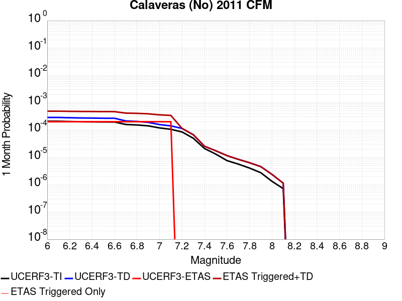 |  |  |

| Magnitude | 1 wk TI Prob | 1 wk TD Prob | 1 wk ETAS Prob | 1 wk ETAS/TD Gain | 1 wk ETAS Triggered+TD | 1 wk ETAS Triggered Only | 1 mo TI Prob | 1 mo TD Prob | 1 mo ETAS Prob | 1 mo ETAS/TD Gain | 1 mo ETAS Triggered+TD | 1 mo ETAS Triggered Only | 1 yr TI Prob | 1 yr TD Prob | 1 yr ETAS Prob | 1 yr ETAS/TD Gain | 1 yr ETAS Triggered+TD | 1 yr ETAS Triggered Only | 10 yr TI Prob | 10 yr TD Prob | 10 yr ETAS Prob | 10 yr ETAS/TD Gain | 10 yr ETAS Triggered+TD | 10 yr ETAS Triggered Only |
|-----|-----|-----|-----|-----|-----|-----|-----|-----|-----|-----|-----|-----|-----|-----|-----|-----|-----|-----|-----|-----|-----|-----|-----|-----|
| 6.0 | 4.8694856E-5 | 6.687549E-5 | 2.0E-4 | 2.9906325 | 2.668621E-4 | 2.0E-4 | 2.0867554E-4 | 2.865784E-4 | 2.0E-4 | 0.69788927 | 4.865211E-4 | 2.0E-4 | 0.0025376645 | 0.0034835178 | 0.003 | 0.8611984 | 0.004480034 | 0.001 | 0.02508881 | 0.034476876 | 0.0281 | 0.81503904 | 0.04413211 | 0.01 |
| 6.1 | 4.8694856E-5 | 6.687549E-5 | 2.0E-4 | 2.9906325 | 2.668621E-4 | 2.0E-4 | 2.0867554E-4 | 2.865784E-4 | 2.0E-4 | 0.69788927 | 4.865211E-4 | 2.0E-4 | 0.0025376645 | 0.0034835178 | 0.003 | 0.8611984 | 0.004480034 | 0.001 | 0.02508881 | 0.034476876 | 0.028 | 0.8121385 | 0.04413211 | 0.01 |
| 6.2 | 4.7541962E-5 | 6.521333E-5 | 2.0E-4 | 3.0668576 | 2.652003E-4 | 2.0E-4 | 2.0373536E-4 | 2.7945652E-4 | 2.0E-4 | 0.7156749 | 4.7940062E-4 | 2.0E-4 | 0.0024776561 | 0.003397103 | 0.003 | 0.88310546 | 0.0043937056 | 0.001 | 0.024502134 | 0.033641305 | 0.0272 | 0.80852985 | 0.043111622 | 0.0098 |
| 6.3 | 4.6717287E-5 | 6.405114E-5 | 2.0E-4 | 3.1225047 | 2.6403833E-4 | 2.0E-4 | 2.0020158E-4 | 2.7447683E-4 | 2.0E-4 | 0.7286589 | 4.7442195E-4 | 2.0E-4 | 0.0024347296 | 0.00333667 | 0.003 | 0.8991 | 0.0043333336 | 0.001 | 0.024082264 | 0.033055697 | 0.0268 | 0.8107528 | 0.04224167 | 0.0095 |
| 6.4 | 4.6276386E-5 | 6.341538E-5 | 2.0E-4 | 3.1538093 | 2.634027E-4 | 2.0E-4 | 1.983123E-4 | 2.717527E-4 | 2.0E-4 | 0.7359632 | 4.7169835E-4 | 2.0E-4 | 0.0024117786 | 0.0033036121 | 0.0029 | 0.87782705 | 0.0042006387 | 9.0E-4 | 0.02385771 | 0.03273572 | 0.0264 | 0.8064585 | 0.041634552 | 0.0092 |
| 6.5 | 4.5720994E-5 | 6.2619816E-5 | 2.0E-4 | 3.1938772 | 2.626073E-4 | 2.0E-4 | 1.9593239E-4 | 2.6834407E-4 | 2.0E-4 | 0.7453118 | 4.682904E-4 | 2.0E-4 | 0.002382867 | 0.0032622444 | 0.0028 | 0.8583048 | 0.0041593085 | 9.0E-4 | 0.023574775 | 0.032335017 | 0.0262 | 0.8102671 | 0.041237533 | 0.0092 |
| 6.6 | 4.549134E-5 | 6.227483E-5 | 2.0E-4 | 3.2115707 | 2.6226236E-4 | 2.0E-4 | 1.949483E-4 | 2.6686586E-4 | 2.0E-4 | 0.7494402 | 4.668125E-4 | 2.0E-4 | 0.0023709119 | 0.0032443008 | 0.0027 | 0.83222866 | 0.004141381 | 9.0E-4 | 0.023457756 | 0.03216116 | 0.026 | 0.80842847 | 0.04106528 | 0.0092 |
| 6.7 | 3.701047E-5 | 4.9836264E-5 | 2.0E-4 | 4.013142 | 2.498263E-4 | 2.0E-4 | 1.5860666E-4 | 2.1356673E-4 | 2.0E-4 | 0.9364754 | 4.1352402E-4 | 2.0E-4 | 0.0019293258 | 0.002597117 | 0.0018 | 0.6930762 | 0.0032952991 | 7.0E-4 | 0.019126613 | 0.025864985 | 0.018 | 0.69592154 | 0.03161238 | 0.0059 |
| 6.8 | 3.5523568E-5 | 4.7832134E-5 | 2.0E-4 | 4.1812897 | 2.4782258E-4 | 2.0E-4 | 1.5223498E-4 | 2.0497899E-4 | 2.0E-4 | 0.97570974 | 4.04938E-4 | 2.0E-4 | 0.0018518851 | 0.0024928052 | 0.0017 | 0.6819626 | 0.0031910602 | 7.0E-4 | 0.018365284 | 0.02484424 | 0.0177 | 0.71243876 | 0.030402629 | 0.0057 |
| 6.9 | 3.2946147E-5 | 4.418289E-5 | 2.0E-4 | 4.5266395 | 2.4417407E-4 | 2.0E-4 | 1.4119013E-4 | 1.8934172E-4 | 2.0E-4 | 1.0562912 | 3.8930387E-4 | 2.0E-4 | 0.0017176344 | 0.0023028397 | 0.0017 | 0.73821896 | 0.0030012277 | 7.0E-4 | 0.017044188 | 0.022980222 | 0.0163 | 0.7093056 | 0.028158428 | 0.0053 |
| 7.0 | 2.7682381E-5 | 3.6623995E-5 | 2.0E-4 | 5.460901 | 2.3661667E-4 | 2.0E-4 | 1.1863338E-4 | 1.569507E-4 | 2.0E-4 | 1.2742856 | 3.569193E-4 | 2.0E-4 | 0.0014434044 | 0.0019092296 | 0.0013 | 0.6809029 | 0.002508084 | 6.0E-4 | 0.01434065 | 0.019111184 | 0.014 | 0.7325553 | 0.023623273 | 0.0046 |
| 7.1 | 2.471967E-5 | 3.2936558E-5 | 2.0E-4 | 6.0722804 | 2.3292998E-4 | 2.0E-4 | 1.05937135E-4 | 1.411492E-4 | 2.0E-4 | 1.4169405 | 3.4112096E-4 | 2.0E-4 | 0.0012890215 | 0.0017171653 | 0.0013 | 0.7570616 | 0.002316135 | 6.0E-4 | 0.0128157 | 0.017209869 | 0.0129 | 0.74956995 | 0.021239309 | 0.0041 |
| 7.2 | 1.9748062E-5 | 2.646036E-5 | 0.0 | 0.0 | 2.646036E-5 | 0.0 | 8.463181E-5 | 1.13396745E-4 | 0.0 | 0.0 | 1.13396745E-4 | 0.0 | 0.0010299052 | 0.0013797542 | 9.0E-4 | 0.6522901 | 0.0017792023 | 4.0E-4 | 0.01025145 | 0.013872306 | 0.0106 | 0.76411235 | 0.016732076 | 0.0029 |
| 7.3 | 1.1603734E-5 | 1.5574346E-5 | 0.0 | 0.0 | 1.5574346E-5 | 0.0 | 4.9729337E-5 | 6.674557E-5 | 0.0 | 0.0 | 6.674557E-5 | 0.0 | 6.052865E-4 | 8.123383E-4 | 7.0E-4 | 0.86170995 | 0.0011120946 | 3.0E-4 | 0.0060364045 | 0.008202821 | 0.0062 | 0.75583756 | 0.0102855945 | 0.0021 |
| 7.4 | 4.885381E-6 | 5.89831E-6 | 0.0 | 0.0 | 5.89831E-6 | 0.0 | 2.0937177E-5 | 2.5278228E-5 | 0.0 | 0.0 | 2.5278228E-5 | 0.0 | 2.5488032E-4 | 3.0771914E-4 | 4.0E-4 | 1.2998867 | 4.0768835E-4 | 1.0E-4 | 0.0025458818 | 0.003132111 | 0.0026 | 0.8301111 | 0.004128979 | 0.001 |
| 7.5 | 3.0571264E-6 | 4.0283903E-6 | 0.0 | 0.0 | 4.0283903E-6 | 0.0 | 1.3101904E-5 | 1.7264416E-5 | 0.0 | 0.0 | 1.7264416E-5 | 0.0 | 1.5950401E-4 | 2.1017408E-4 | 2.0E-4 | 0.9515921 | 3.1015306E-4 | 1.0E-4 | 0.0015938957 | 0.0021571468 | 0.0016 | 0.7417205 | 0.0028556366 | 7.0E-4 |
| 7.6 | 1.764948E-6 | 2.6749697E-6 | 0.0 | 0.0 | 2.6749697E-6 | 0.0 | 7.564041E-6 | 1.1464105E-5 | 0.0 | 0.0 | 1.1464105E-5 | 0.0 | 9.208831E-5 | 1.3956662E-4 | 2.0E-4 | 1.4330075 | 2.3955265E-4 | 1.0E-4 | 9.205016E-4 | 0.0014517411 | 0.0013 | 0.89547646 | 0.00205087 | 6.0E-4 |
| 7.7 | 1.3173734E-6 | 1.9569313E-6 | 0.0 | 0.0 | 1.9569313E-6 | 0.0 | 5.645874E-6 | 8.386822E-6 | 0.0 | 0.0 | 8.386822E-6 | 0.0 | 6.873634E-5 | 1.0210479E-4 | 1.0E-4 | 0.97938603 | 2.0209457E-4 | 1.0E-4 | 6.8715087E-4 | 0.0010747038 | 9.0E-4 | 0.83744013 | 0.0015741664 | 5.0E-4 |
| 7.8 | 9.4429885E-7 | 1.4718682E-6 | 0.0 | 0.0 | 1.4718682E-6 | 0.0 | 4.0469886E-6 | 6.3079915E-6 | 0.0 | 0.0 | 6.3079915E-6 | 0.0 | 4.9270973E-5 | 7.67971E-5 | 1.0E-4 | 1.3021325 | 1.7678943E-4 | 1.0E-4 | 4.926005E-4 | 8.1126415E-4 | 8.0E-4 | 0.98611534 | 0.0013108585 | 5.0E-4 |
| 7.9 | 6.388233E-7 | 1.0618847E-6 | 0.0 | 0.0 | 1.0618847E-6 | 0.0 | 2.7378112E-6 | 4.550927E-6 | 0.0 | 0.0 | 4.550927E-6 | 0.0 | 3.3332344E-5 | 5.5406133E-5 | 1.0E-4 | 1.8048544 | 1.5540059E-4 | 1.0E-4 | 3.3327343E-4 | 5.830354E-4 | 6.0E-4 | 1.0290971 | 9.828021E-4 | 4.0E-4 |
| 8.0 | 3.087986E-7 | 5.510454E-7 | 0.0 | 0.0 | 5.510454E-7 | 0.0 | 1.323422E-6 | 2.361621E-6 | 0.0 | 0.0 | 2.361621E-6 | 0.0 | 1.6112543E-5 | 2.8752358E-5 | 1.0E-4 | 3.4779756 | 1.2874948E-4 | 1.0E-4 | 1.6111376E-4 | 2.9881555E-4 | 4.0E-4 | 1.3386184 | 5.987259E-4 | 3.0E-4 |
| 8.1 | 1.6725647E-7 | 2.6281333E-7 | 0.0 | 0.0 | 2.6281333E-7 | 0.0 | 7.168133E-7 | 1.1263423E-6 | 0.0 | 0.0 | 1.1263423E-6 | 0.0 | 8.7271665E-6 | 1.3713134E-5 | 1.0E-4 | 7.2922792 | 1.13711765E-4 | 1.0E-4 | 8.726824E-5 | 1.4273814E-4 | 3.0E-4 | 2.1017509 | 3.427096E-4 | 2.0E-4 |

## Honey Lake 2011 CFM
*[(top)](#table-of-contents)*

| 1 Week | 1 Month | 1 Year | 10 Year |
|-----|-----|-----|-----|
|  |  |  |  |

| Magnitude | 1 wk TI Prob | 1 wk TD Prob | 1 wk ETAS Prob | 1 wk ETAS/TD Gain | 1 wk ETAS Triggered+TD | 1 wk ETAS Triggered Only | 1 mo TI Prob | 1 mo TD Prob | 1 mo ETAS Prob | 1 mo ETAS/TD Gain | 1 mo ETAS Triggered+TD | 1 mo ETAS Triggered Only | 1 yr TI Prob | 1 yr TD Prob | 1 yr ETAS Prob | 1 yr ETAS/TD Gain | 1 yr ETAS Triggered+TD | 1 yr ETAS Triggered Only | 10 yr TI Prob | 10 yr TD Prob | 10 yr ETAS Prob | 10 yr ETAS/TD Gain | 10 yr ETAS Triggered+TD | 10 yr ETAS Triggered Only |
|-----|-----|-----|-----|-----|-----|-----|-----|-----|-----|-----|-----|-----|-----|-----|-----|-----|-----|-----|-----|-----|-----|-----|-----|-----|
| 6.0 | 6.155506E-5 | 7.931081E-5 | 0.0 | 0.0 | 7.931081E-5 | 0.0 | 2.6378073E-4 | 3.3986222E-4 | 1.0E-4 | 0.2942369 | 4.3982823E-4 | 1.0E-4 | 0.0032068014 | 0.004130419 | 0.0023 | 0.55684423 | 0.0055246362 | 0.0014 | 0.03160919 | 0.040585518 | 0.0262 | 0.64555043 | 0.04941213 | 0.0092 |
| 6.1 | 6.155506E-5 | 7.931081E-5 | 0.0 | 0.0 | 7.931081E-5 | 0.0 | 2.6378073E-4 | 3.3986222E-4 | 1.0E-4 | 0.2942369 | 4.3982823E-4 | 1.0E-4 | 0.0032068014 | 0.004130419 | 0.0023 | 0.55684423 | 0.0055246362 | 0.0014 | 0.03160919 | 0.040585518 | 0.0247 | 0.60859144 | 0.048932426 | 0.0087 |
| 6.2 | 4.1335024E-5 | 5.242969E-5 | 0.0 | 0.0 | 5.242969E-5 | 0.0 | 1.7713808E-4 | 2.2468017E-4 | 0.0 | 0.0 | 2.2468017E-4 | 0.0 | 0.0021545228 | 0.0027322022 | 0.0013 | 0.47580665 | 0.0035300164 | 8.0E-4 | 0.021337535 | 0.027002474 | 0.0157 | 0.5814282 | 0.031770162 | 0.0049 |
| 6.3 | 4.1335024E-5 | 5.242969E-5 | 0.0 | 0.0 | 5.242969E-5 | 0.0 | 1.7713808E-4 | 2.2468017E-4 | 0.0 | 0.0 | 2.2468017E-4 | 0.0 | 0.0021545228 | 0.0027322022 | 0.0013 | 0.47580665 | 0.0035300164 | 8.0E-4 | 0.021337535 | 0.027002474 | 0.0157 | 0.5814282 | 0.031770162 | 0.0049 |
| 6.4 | 3.2393702E-5 | 4.077656E-5 | 0.0 | 0.0 | 4.077656E-5 | 0.0 | 1.3882275E-4 | 1.7474558E-4 | 0.0 | 0.0 | 1.7474558E-4 | 0.0 | 0.0016888566 | 0.0021255575 | 8.0E-4 | 0.37637183 | 0.0025247075 | 4.0E-4 | 0.016760793 | 0.021063395 | 0.0116 | 0.5507184 | 0.024881247 | 0.0039 |
| 6.5 | 2.7205504E-5 | 3.412049E-5 | 0.0 | 0.0 | 3.412049E-5 | 0.0 | 1.1658981E-4 | 1.4622297E-4 | 0.0 | 0.0 | 1.4622297E-4 | 0.0 | 0.0014185566 | 0.0017789049 | 7.0E-4 | 0.39350054 | 0.0020783711 | 3.0E-4 | 0.014095354 | 0.017656205 | 0.0096 | 0.54371816 | 0.020505004 | 0.0029 |
| 6.6 | 2.069265E-5 | 2.5886791E-5 | 0.0 | 0.0 | 2.5886791E-5 | 0.0 | 8.867977E-5 | 1.1093912E-4 | 0.0 | 0.0 | 1.1093912E-4 | 0.0 | 0.0010791414 | 0.0013499307 | 4.0E-4 | 0.2963115 | 0.0015496607 | 2.0E-4 | 0.010739161 | 0.0134256575 | 0.0075 | 0.55863184 | 0.015793435 | 0.0024 |
| 6.7 | 1.8060919E-5 | 2.2596809E-5 | 0.0 | 0.0 | 2.2596809E-5 | 0.0 | 7.7401644E-5 | 9.684032E-5 | 0.0 | 0.0 | 9.684032E-5 | 0.0 | 9.419576E-4 | 0.0011784737 | 3.0E-4 | 0.25456658 | 0.0012783558 | 1.0E-4 | 0.009379748 | 0.011730251 | 0.0065 | 0.55412287 | 0.013607963 | 0.0019 |
| 6.8 | 1.4474663E-5 | 1.8132809E-5 | 0.0 | 0.0 | 1.8132809E-5 | 0.0 | 6.203279E-5 | 7.7710145E-5 | 0.0 | 0.0 | 7.7710145E-5 | 0.0 | 7.5498753E-4 | 9.4578636E-4 | 3.0E-4 | 0.31719637 | 0.0010456918 | 1.0E-4 | 0.007524277 | 0.009425106 | 0.0054 | 0.57293785 | 0.011010026 | 0.0016 |
| 6.9 | 8.564552E-6 | 1.0772938E-5 | 0.0 | 0.0 | 1.0772938E-5 | 0.0 | 3.6704707E-5 | 4.6169287E-5 | 0.0 | 0.0 | 4.6169287E-5 | 0.0 | 4.4678818E-4 | 5.6203216E-4 | 1.0E-4 | 0.17792577 | 5.6203216E-4 | 0.0 | 0.0044589094 | 0.005612575 | 0.0027 | 0.48106262 | 0.006507524 | 9.0E-4 |

## Santa Ynez (West)
*[(top)](#table-of-contents)*

| 1 Week | 1 Month | 1 Year | 10 Year |
|-----|-----|-----|-----|
|  |  |  | 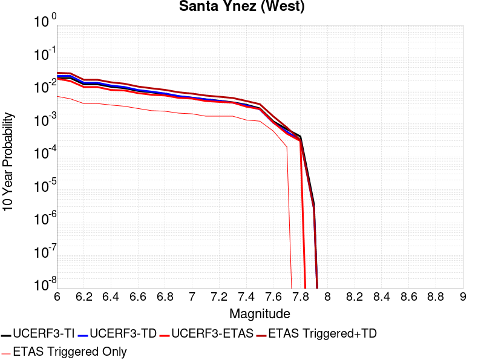 |

| Magnitude | 1 wk TI Prob | 1 wk TD Prob | 1 wk ETAS Prob | 1 wk ETAS/TD Gain | 1 wk ETAS Triggered+TD | 1 wk ETAS Triggered Only | 1 mo TI Prob | 1 mo TD Prob | 1 mo ETAS Prob | 1 mo ETAS/TD Gain | 1 mo ETAS Triggered+TD | 1 mo ETAS Triggered Only | 1 yr TI Prob | 1 yr TD Prob | 1 yr ETAS Prob | 1 yr ETAS/TD Gain | 1 yr ETAS Triggered+TD | 1 yr ETAS Triggered Only | 10 yr TI Prob | 10 yr TD Prob | 10 yr ETAS Prob | 10 yr ETAS/TD Gain | 10 yr ETAS Triggered+TD | 10 yr ETAS Triggered Only |
|-----|-----|-----|-----|-----|-----|-----|-----|-----|-----|-----|-----|-----|-----|-----|-----|-----|-----|-----|-----|-----|-----|-----|-----|-----|
| 6.0 | 4.7352758E-5 | 5.4863423E-5 | 0.0 | 0.0 | 5.4863423E-5 | 0.0 | 2.0292461E-4 | 2.3510942E-4 | 2.0E-4 | 0.8506677 | 2.3510942E-4 | 0.0 | 0.0024678076 | 0.0028589668 | 0.0019 | 0.66457576 | 0.0034572515 | 6.0E-4 | 0.024405818 | 0.028250013 | 0.0234 | 0.8283182 | 0.034857914 | 0.0068 |
| 6.1 | 4.7352758E-5 | 5.4863423E-5 | 0.0 | 0.0 | 5.4863423E-5 | 0.0 | 2.0292461E-4 | 2.3510942E-4 | 1.0E-4 | 0.42533386 | 2.3510942E-4 | 0.0 | 0.0024678076 | 0.0028589668 | 0.0016 | 0.55964273 | 0.0034572515 | 6.0E-4 | 0.024405818 | 0.028250013 | 0.0197 | 0.6973448 | 0.033788987 | 0.0057 |
| 6.2 | 3.0415853E-5 | 3.387048E-5 | 0.0 | 0.0 | 3.387048E-5 | 0.0 | 1.3034715E-4 | 1.4515135E-4 | 0.0 | 0.0 | 1.4515135E-4 | 0.0 | 0.0015858212 | 0.0017658201 | 9.0E-4 | 0.5096782 | 0.0021651138 | 4.0E-4 | 0.015745522 | 0.017521854 | 0.013 | 0.74193054 | 0.021550016 | 0.0041 |
| 6.3 | 3.0415853E-5 | 3.387048E-5 | 0.0 | 0.0 | 3.387048E-5 | 0.0 | 1.3034715E-4 | 1.4515135E-4 | 0.0 | 0.0 | 1.4515135E-4 | 0.0 | 0.0015858212 | 0.0017658201 | 9.0E-4 | 0.5096782 | 0.0021651138 | 4.0E-4 | 0.015745522 | 0.017521854 | 0.013 | 0.74193054 | 0.021550016 | 0.0041 |
| 6.4 | 2.5452082E-5 | 2.787111E-5 | 0.0 | 0.0 | 2.787111E-5 | 0.0 | 1.09075794E-4 | 1.19442266E-4 | 0.0 | 0.0 | 1.19442266E-4 | 0.0 | 0.0013271887 | 0.0014532584 | 7.0E-4 | 0.4816762 | 0.0018526771 | 4.0E-4 | 0.013192902 | 0.014439723 | 0.0106 | 0.7340861 | 0.018086296 | 0.0037 |
| 6.5 | 2.3143784E-5 | 2.5092924E-5 | 0.0 | 0.0 | 2.5092924E-5 | 0.0 | 9.9183875E-5 | 1.07536755E-4 | 0.0 | 0.0 | 1.07536755E-4 | 0.0 | 0.0012068948 | 0.0013084881 | 7.0E-4 | 0.53496855 | 0.0017079647 | 4.0E-4 | 0.012003611 | 0.013009505 | 0.0102 | 0.7840421 | 0.016365273 | 0.0034 |
| 6.6 | 1.9118515E-5 | 2.0328338E-5 | 0.0 | 0.0 | 2.0328338E-5 | 0.0 | 8.193392E-5 | 8.7118584E-5 | 0.0 | 0.0 | 8.7118584E-5 | 0.0 | 9.97089E-4 | 0.0010601605 | 5.0E-4 | 0.4716267 | 0.0012599485 | 2.0E-4 | 0.00992627 | 0.010551939 | 0.0085 | 0.8055392 | 0.013421338 | 0.0029 |
| 6.7 | 1.722807E-5 | 1.8124238E-5 | 0.0 | 0.0 | 1.8124238E-5 | 0.0 | 7.3832496E-5 | 7.767302E-5 | 0.0 | 0.0 | 7.767302E-5 | 0.0 | 8.985399E-4 | 9.452643E-4 | 5.0E-4 | 0.5289526 | 0.0011450753 | 2.0E-4 | 0.008949154 | 0.009413079 | 0.0076 | 0.8073872 | 0.011889547 | 0.0025 |
| 6.8 | 1.5317364E-5 | 1.590815E-5 | 0.0 | 0.0 | 1.590815E-5 | 0.0 | 6.56442E-5 | 6.817603E-5 | 0.0 | 0.0 | 6.817603E-5 | 0.0 | 7.98925E-4 | 8.2973135E-4 | 5.0E-4 | 0.6026047 | 0.0010295655 | 2.0E-4 | 0.007960589 | 0.008266821 | 0.0072 | 0.87095153 | 0.01064698 | 0.0024 |
| 6.9 | 1.3071226E-5 | 1.3315544E-5 | 0.0 | 0.0 | 1.3315544E-5 | 0.0 | 5.6018336E-5 | 5.706538E-5 | 0.0 | 0.0 | 5.706538E-5 | 0.0 | 6.8180985E-4 | 6.9455174E-4 | 3.0E-4 | 0.43193325 | 7.944823E-4 | 1.0E-4 | 0.0067972173 | 0.00692407 | 0.0061 | 0.8809847 | 0.00900953 | 0.0021 |
| 7.0 | 1.1836986E-5 | 1.1920637E-5 | 0.0 | 0.0 | 1.1920637E-5 | 0.0 | 5.0728955E-5 | 5.1087452E-5 | 0.0 | 0.0 | 5.1087452E-5 | 0.0 | 6.1745E-4 | 6.218139E-4 | 3.0E-4 | 0.48245946 | 7.217517E-4 | 1.0E-4 | 0.006157372 | 0.006200933 | 0.0058 | 0.93534315 | 0.008188531 | 0.002 |
| 7.1 | 1.0597169E-5 | 1.0531838E-5 | 0.0 | 0.0 | 1.0531838E-5 | 0.0 | 4.541565E-5 | 4.5135675E-5 | 0.0 | 0.0 | 4.5135675E-5 | 0.0 | 5.5279525E-4 | 5.493894E-4 | 2.0E-4 | 0.3640405 | 6.4933446E-4 | 1.0E-4 | 0.0055142213 | 0.005480443 | 0.0049 | 0.8940883 | 0.007171126 | 0.0017 |
| 7.2 | 9.59113E-6 | 9.449656E-6 | 0.0 | 0.0 | 9.449656E-6 | 0.0 | 4.11042E-5 | 4.0497904E-5 | 0.0 | 0.0 | 4.0497904E-5 | 0.0 | 5.0032866E-4 | 4.929515E-4 | 2.0E-4 | 0.40571943 | 5.929022E-4 | 1.0E-4 | 0.004992037 | 0.004918699 | 0.0046 | 0.93520665 | 0.006610337 | 0.0017 |
| 7.3 | 8.586084E-6 | 8.370937E-6 | 0.0 | 0.0 | 8.370937E-6 | 0.0 | 3.679698E-5 | 3.587496E-5 | 0.0 | 0.0 | 3.587496E-5 | 0.0 | 4.4791115E-4 | 4.3669113E-4 | 2.0E-4 | 0.4579896 | 5.3664745E-4 | 1.0E-4 | 0.004470094 | 0.004358441 | 0.0044 | 1.0095353 | 0.006051032 | 0.0017 |
| 7.4 | 7.2622997E-6 | 6.9441057E-6 | 0.0 | 0.0 | 6.9441057E-6 | 0.0 | 3.112377E-5 | 2.976012E-5 | 0.0 | 0.0 | 2.976012E-5 | 0.0 | 3.78866E-4 | 3.6227016E-4 | 2.0E-4 | 0.55207413 | 4.6223396E-4 | 1.0E-4 | 0.0037822074 | 0.0036168962 | 0.0033 | 0.9123845 | 0.0049121943 | 0.0013 |
| 7.5 | 5.627296E-6 | 5.245823E-6 | 0.0 | 0.0 | 5.245823E-6 | 0.0 | 2.411676E-5 | 2.248191E-5 | 0.0 | 0.0 | 2.248191E-5 | 0.0 | 2.9358198E-4 | 2.7368357E-4 | 1.0E-4 | 0.36538544 | 3.7365622E-4 | 1.0E-4 | 0.0029319443 | 0.0027335372 | 0.0028 | 1.0243138 | 0.003930257 | 0.0012 |
| 7.6 | 2.265244E-6 | 2.058393E-6 | 0.0 | 0.0 | 2.058393E-6 | 0.0 | 9.708152E-6 | 8.821655E-6 | 0.0 | 0.0 | 8.821655E-6 | 0.0 | 1.18190335E-4 | 1.07398446E-4 | 0.0 | 0.0 | 1.07398446E-4 | 0.0 | 0.001181275 | 0.001073474 | 0.0011 | 1.0247104 | 0.00167283 | 6.0E-4 |
| 7.7 | 1.3099874E-6 | 1.0999634E-6 | 0.0 | 0.0 | 1.0999634E-6 | 0.0 | 5.61422E-6 | 4.71412E-6 | 0.0 | 0.0 | 4.71412E-6 | 0.0 | 6.8350986E-5 | 5.739293E-5 | 0.0 | 0.0 | 5.739293E-5 | 0.0 | 6.832996E-4 | 5.737834E-4 | 5.0E-4 | 0.87140894 | 7.736687E-4 | 2.0E-4 |
| 7.8 | 7.903951E-7 | 6.0595517E-7 | 0.0 | 0.0 | 6.0595517E-7 | 0.0 | 3.3874032E-6 | 2.5969482E-6 | 0.0 | 0.0 | 2.5969482E-6 | 0.0 | 4.1240855E-5 | 3.1617397E-5 | 0.0 | 0.0 | 3.1617397E-5 | 0.0 | 4.12332E-4 | 3.1613032E-4 | 3.0E-4 | 0.94897574 | 3.1613032E-4 | 0.0 |
| 7.9 | 7.0753297E-9 | 5.0875566E-9 | 0.0 | 0.0 | 5.0875566E-9 | 0.0 | 3.032284E-8 | 2.1803814E-8 | 0.0 | 0.0 | 2.1803814E-8 | 0.0 | 3.6918053E-7 | 2.654614E-7 | 0.0 | 0.0 | 2.654614E-7 | 0.0 | 3.691799E-6 | 2.654612E-6 | 0.0 | 0.0 | 2.654612E-6 | 0.0 |

## San Clemente
*[(top)](#table-of-contents)*

| 1 Week | 1 Month | 1 Year | 10 Year |
|-----|-----|-----|-----|
|  |  | 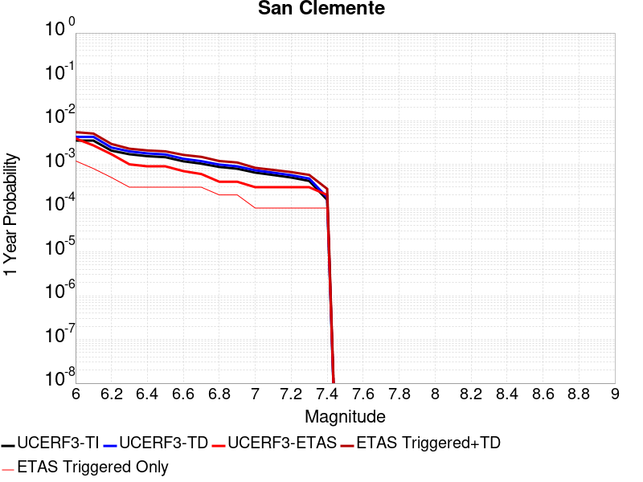 | 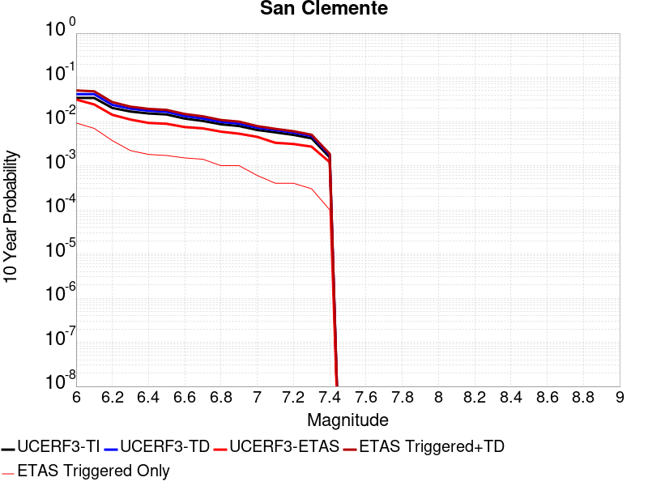 |

| Magnitude | 1 wk TI Prob | 1 wk TD Prob | 1 wk ETAS Prob | 1 wk ETAS/TD Gain | 1 wk ETAS Triggered+TD | 1 wk ETAS Triggered Only | 1 mo TI Prob | 1 mo TD Prob | 1 mo ETAS Prob | 1 mo ETAS/TD Gain | 1 mo ETAS Triggered+TD | 1 mo ETAS Triggered Only | 1 yr TI Prob | 1 yr TD Prob | 1 yr ETAS Prob | 1 yr ETAS/TD Gain | 1 yr ETAS Triggered+TD | 1 yr ETAS Triggered Only | 10 yr TI Prob | 10 yr TD Prob | 10 yr ETAS Prob | 10 yr ETAS/TD Gain | 10 yr ETAS Triggered+TD | 10 yr ETAS Triggered Only |
|-----|-----|-----|-----|-----|-----|-----|-----|-----|-----|-----|-----|-----|-----|-----|-----|-----|-----|-----|-----|-----|-----|-----|-----|-----|
| 6.0 | 6.681379E-5 | 8.144936E-5 | 0.0 | 0.0 | 8.144936E-5 | 0.0 | 2.8631336E-4 | 3.4902518E-4 | 3.0E-4 | 0.8595368 | 5.489554E-4 | 2.0E-4 | 0.003480294 | 0.004241595 | 0.0039 | 0.9194655 | 0.0054365047 | 0.0012 | 0.03426291 | 0.0416618 | 0.0315 | 0.7560883 | 0.050574344 | 0.0093 |
| 6.1 | 6.681379E-5 | 8.144936E-5 | 0.0 | 0.0 | 8.144936E-5 | 0.0 | 2.8631336E-4 | 3.4902518E-4 | 2.0E-4 | 0.5730245 | 4.489903E-4 | 1.0E-4 | 0.003480294 | 0.004241595 | 0.0027 | 0.63655305 | 0.0050382013 | 8.0E-4 | 0.03426291 | 0.0416618 | 0.0244 | 0.5856684 | 0.048370168 | 0.007 |
| 6.2 | 3.9400576E-5 | 4.6365072E-5 | 0.0 | 0.0 | 4.6365072E-5 | 0.0 | 1.6884868E-4 | 1.9869264E-4 | 2.0E-4 | 1.0065799 | 2.9867276E-4 | 1.0E-4 | 0.0020537945 | 0.0024164524 | 0.0017 | 0.70351064 | 0.002915244 | 5.0E-4 | 0.020349167 | 0.023908481 | 0.0142 | 0.5939315 | 0.02752002 | 0.0037 |
| 6.3 | 3.2590255E-5 | 3.7863927E-5 | 0.0 | 0.0 | 3.7863927E-5 | 0.0 | 1.3966505E-4 | 1.6226407E-4 | 1.0E-4 | 0.61627936 | 1.6226407E-4 | 0.0 | 0.0016990956 | 0.0019738053 | 0.001 | 0.50663555 | 0.0022732131 | 3.0E-4 | 0.01686163 | 0.019566547 | 0.0111 | 0.5672948 | 0.021723501 | 0.0022 |
| 6.4 | 2.9454652E-5 | 3.4041437E-5 | 0.0 | 0.0 | 3.4041437E-5 | 0.0 | 1.2622811E-4 | 1.4588387E-4 | 1.0E-4 | 0.6854768 | 1.4588387E-4 | 0.0 | 0.0015357438 | 0.0017747153 | 9.0E-4 | 0.5071236 | 0.0020741827 | 3.0E-4 | 0.015251739 | 0.017608598 | 0.0093 | 0.5281511 | 0.019376902 | 0.0018 |
| 6.5 | 2.790836E-5 | 3.2194945E-5 | 0.0 | 0.0 | 3.2194945E-5 | 0.0 | 1.1960178E-4 | 1.3797119E-4 | 1.0E-4 | 0.724789 | 1.3797119E-4 | 0.0 | 0.001455179 | 0.0016785304 | 9.0E-4 | 0.5361833 | 0.001978027 | 3.0E-4 | 0.014456868 | 0.016661536 | 0.0089 | 0.5341644 | 0.018333212 | 0.0017 |
| 6.6 | 2.2492153E-5 | 2.5723535E-5 | 0.0 | 0.0 | 2.5723535E-5 | 0.0 | 9.639138E-5 | 1.10239154E-4 | 1.0E-4 | 0.90711874 | 1.10239154E-4 | 0.0 | 0.0011729331 | 0.00134135 | 7.0E-4 | 0.5218623 | 0.0016409475 | 3.0E-4 | 0.011667615 | 0.013334249 | 0.0075 | 0.5624614 | 0.014814248 | 0.0015 |
| 6.7 | 1.9862755E-5 | 2.2633001E-5 | 0.0 | 0.0 | 2.2633001E-5 | 0.0 | 8.512331E-5 | 9.6995034E-5 | 1.0E-4 | 1.0309806 | 9.6995034E-5 | 0.0 | 0.0010358836 | 0.001180286 | 6.0E-4 | 0.5083513 | 0.001479932 | 3.0E-4 | 0.010310682 | 0.011741463 | 0.007 | 0.5961778 | 0.013125025 | 0.0014 |
| 6.8 | 1.6697575E-5 | 1.8950665E-5 | 0.0 | 0.0 | 1.8950665E-5 | 0.0 | 7.155907E-5 | 8.121466E-5 | 1.0E-4 | 1.2313048 | 8.121466E-5 | 0.0 | 8.7088346E-4 | 9.883493E-4 | 4.0E-4 | 0.4047152 | 0.0011881517 | 2.0E-4 | 0.008674784 | 0.009840561 | 0.0059 | 0.5995593 | 0.010830721 | 0.001 |
| 6.9 | 1.5218415E-5 | 1.724512E-5 | 0.0 | 0.0 | 1.724512E-5 | 0.0 | 6.522015E-5 | 7.390561E-5 | 1.0E-4 | 1.3530773 | 7.390561E-5 | 0.0 | 7.93766E-4 | 8.9943816E-4 | 4.0E-4 | 0.4447221 | 0.0010992583 | 2.0E-4 | 0.007909367 | 0.008958922 | 0.0053 | 0.5915891 | 0.009949963 | 0.001 |
| 7.0 | 1.2392958E-5 | 1.4013647E-5 | 0.0 | 0.0 | 1.4013647E-5 | 0.0 | 5.3111595E-5 | 6.0057147E-5 | 1.0E-4 | 1.6650808 | 6.0057147E-5 | 0.0 | 6.4644177E-4 | 7.30958E-4 | 3.0E-4 | 0.4104203 | 8.308849E-4 | 1.0E-4 | 0.0064456454 | 0.0072863214 | 0.0045 | 0.61759555 | 0.00788195 | 6.0E-4 |
| 7.1 | 1.0934128E-5 | 1.2358129E-5 | 0.0 | 0.0 | 1.2358129E-5 | 0.0 | 4.6859706E-5 | 5.2962376E-5 | 1.0E-4 | 1.8881328 | 5.2962376E-5 | 0.0 | 5.7036756E-4 | 6.446335E-4 | 3.0E-4 | 0.46538076 | 7.44569E-4 | 1.0E-4 | 0.0056890585 | 0.0064283796 | 0.0033 | 0.51334864 | 0.0068258084 | 4.0E-4 |
| 7.2 | 9.5798805E-6 | 1.083E-5 | 0.0 | 0.0 | 1.083E-5 | 0.0 | 4.1055984E-5 | 4.64135E-5 | 1.0E-4 | 2.1545455 | 4.64135E-5 | 0.0 | 4.9974193E-4 | 5.6494505E-4 | 3.0E-4 | 0.5310251 | 6.6488853E-4 | 1.0E-4 | 0.0049861963 | 0.0056358106 | 0.0031 | 0.550054 | 0.006033556 | 4.0E-4 |
| 7.3 | 8.0167365E-6 | 9.071307E-6 | 0.0 | 0.0 | 9.071307E-6 | 0.0 | 3.4356988E-5 | 3.8876493E-5 | 1.0E-4 | 2.5722485 | 3.8876493E-5 | 0.0 | 4.1821605E-4 | 4.7322555E-4 | 3.0E-4 | 0.6339472 | 5.7317823E-4 | 1.0E-4 | 0.0041742986 | 0.0047228793 | 0.0027 | 0.5716852 | 0.005021462 | 3.0E-4 |
| 7.4 | 2.9581017E-6 | 3.3575877E-6 | 0.0 | 0.0 | 3.3575877E-6 | 0.0 | 1.2677518E-5 | 1.438961E-5 | 1.0E-4 | 6.949458 | 1.438961E-5 | 0.0 | 1.5433785E-4 | 1.7518445E-4 | 2.0E-4 | 1.1416538 | 2.7516694E-4 | 1.0E-4 | 0.001542307 | 0.0017509572 | 0.0012 | 0.6853394 | 0.0018507822 | 1.0E-4 |

## Calico-Hidalgo
*[(top)](#table-of-contents)*

| 1 Week | 1 Month | 1 Year | 10 Year |
|-----|-----|-----|-----|
|  |  |  |  |

| Magnitude | 1 wk TI Prob | 1 wk TD Prob | 1 wk ETAS Prob | 1 wk ETAS/TD Gain | 1 wk ETAS Triggered+TD | 1 wk ETAS Triggered Only | 1 mo TI Prob | 1 mo TD Prob | 1 mo ETAS Prob | 1 mo ETAS/TD Gain | 1 mo ETAS Triggered+TD | 1 mo ETAS Triggered Only | 1 yr TI Prob | 1 yr TD Prob | 1 yr ETAS Prob | 1 yr ETAS/TD Gain | 1 yr ETAS Triggered+TD | 1 yr ETAS Triggered Only | 10 yr TI Prob | 10 yr TD Prob | 10 yr ETAS Prob | 10 yr ETAS/TD Gain | 10 yr ETAS Triggered+TD | 10 yr ETAS Triggered Only |
|-----|-----|-----|-----|-----|-----|-----|-----|-----|-----|-----|-----|-----|-----|-----|-----|-----|-----|-----|-----|-----|-----|-----|-----|-----|
| 6.0 | 4.0906612E-5 | 5.0609746E-5 | 0.0 | 0.0 | 5.0609746E-5 | 0.0 | 1.7530227E-4 | 2.1688285E-4 | 0.0 | 0.0 | 2.1688285E-4 | 0.0 | 0.0021322158 | 0.002637748 | 0.002 | 0.7582226 | 0.0034356376 | 8.0E-4 | 0.02111873 | 0.026104556 | 0.0208 | 0.7967958 | 0.034967005 | 0.0091 |
| 6.1 | 4.0906612E-5 | 5.0609746E-5 | 0.0 | 0.0 | 5.0609746E-5 | 0.0 | 1.7530227E-4 | 2.1688285E-4 | 0.0 | 0.0 | 2.1688285E-4 | 0.0 | 0.0021322158 | 0.002637748 | 0.002 | 0.7582226 | 0.0034356376 | 8.0E-4 | 0.02111873 | 0.026104556 | 0.0208 | 0.7967958 | 0.034967005 | 0.0091 |
| 6.2 | 4.0906612E-5 | 5.0609746E-5 | 0.0 | 0.0 | 5.0609746E-5 | 0.0 | 1.7530227E-4 | 2.1688285E-4 | 0.0 | 0.0 | 2.1688285E-4 | 0.0 | 0.0021322158 | 0.002637748 | 0.002 | 0.7582226 | 0.0034356376 | 8.0E-4 | 0.02111873 | 0.026104556 | 0.0208 | 0.7967958 | 0.034967005 | 0.0091 |
| 6.3 | 2.4242801E-5 | 3.0043078E-5 | 0.0 | 0.0 | 3.0043078E-5 | 0.0 | 1.0389358E-4 | 1.2874989E-4 | 0.0 | 0.0 | 1.2874989E-4 | 0.0 | 0.0012641704 | 0.001566436 | 0.0013 | 0.82990944 | 0.0021654961 | 6.0E-4 | 0.01257003 | 0.015557621 | 0.013 | 0.83560336 | 0.021661164 | 0.0062 |
| 6.4 | 2.4242801E-5 | 3.0043078E-5 | 0.0 | 0.0 | 3.0043078E-5 | 0.0 | 1.0389358E-4 | 1.2874989E-4 | 0.0 | 0.0 | 1.2874989E-4 | 0.0 | 0.0012641704 | 0.001566436 | 0.0013 | 0.82990944 | 0.0021654961 | 6.0E-4 | 0.01257003 | 0.015557621 | 0.013 | 0.83560336 | 0.021661164 | 0.0062 |
| 6.5 | 2.0286952E-5 | 2.5277262E-5 | 0.0 | 0.0 | 2.5277262E-5 | 0.0 | 8.694118E-5 | 1.0832672E-4 | 0.0 | 0.0 | 1.0832672E-4 | 0.0 | 0.0010579949 | 0.0013180969 | 0.0012 | 0.91040343 | 0.0019173061 | 6.0E-4 | 0.010529719 | 0.013104719 | 0.0109 | 0.8317614 | 0.018433955 | 0.0054 |
| 6.6 | 2.0269223E-5 | 2.5258227E-5 | 0.0 | 0.0 | 2.5258227E-5 | 0.0 | 8.6865206E-5 | 1.0824514E-4 | 0.0 | 0.0 | 1.0824514E-4 | 0.0 | 0.0010570707 | 0.0013171049 | 0.0012 | 0.9110891 | 0.0019163147 | 6.0E-4 | 0.010520565 | 0.013094917 | 0.0109 | 0.83238405 | 0.018424204 | 0.0054 |
| 6.7 | 1.799852E-5 | 2.2505792E-5 | 0.0 | 0.0 | 2.2505792E-5 | 0.0 | 7.713423E-5 | 9.6449905E-5 | 0.0 | 0.0 | 9.6449905E-5 | 0.0 | 9.3870464E-4 | 0.0011736596 | 0.0012 | 1.0224429 | 0.0017729554 | 6.0E-4 | 0.009347493 | 0.011676218 | 0.0102 | 0.8735705 | 0.016617838 | 0.005 |
| 6.8 | 1.7458793E-5 | 2.1810776E-5 | 0.0 | 0.0 | 2.1810776E-5 | 0.0 | 7.4821255E-5 | 9.3471484E-5 | 0.0 | 0.0 | 9.3471484E-5 | 0.0 | 9.10568E-4 | 0.0011374357 | 0.0012 | 1.0550047 | 0.0017367532 | 6.0E-4 | 0.009068459 | 0.01131772 | 0.0099 | 0.8747345 | 0.015964527 | 0.0047 |
| 6.9 | 1.542884E-5 | 1.9007482E-5 | 0.0 | 0.0 | 1.9007482E-5 | 0.0 | 6.612192E-5 | 8.1458165E-5 | 0.0 | 0.0 | 8.1458165E-5 | 0.0 | 8.04737E-4 | 9.913151E-4 | 0.001 | 1.008761 | 0.0013909185 | 4.0E-4 | 0.008018291 | 0.009870326 | 0.0086 | 0.87129843 | 0.013830845 | 0.004 |
| 7.0 | 1.468253E-5 | 1.801497E-5 | 0.0 | 0.0 | 1.801497E-5 | 0.0 | 6.292361E-5 | 7.72048E-5 | 0.0 | 0.0 | 7.72048E-5 | 0.0 | 7.658257E-4 | 9.3957613E-4 | 9.0E-4 | 0.95787877 | 0.0013392003 | 4.0E-4 | 0.0076319184 | 0.009357401 | 0.0079 | 0.8442515 | 0.013022779 | 0.0037 |
| 7.1 | 1.3139281E-5 | 1.6186945E-5 | 0.0 | 0.0 | 1.6186945E-5 | 0.0 | 5.6309986E-5 | 6.937084E-5 | 0.0 | 0.0 | 6.937084E-5 | 0.0 | 6.853584E-4 | 8.4427535E-4 | 9.0E-4 | 1.066003 | 0.0012439376 | 4.0E-4 | 0.0068324856 | 0.008411975 | 0.0074 | 0.87969834 | 0.011981691 | 0.0036 |
| 7.2 | 1.1127404E-5 | 1.3854261E-5 | 0.0 | 0.0 | 1.3854261E-5 | 0.0 | 4.7688E-5 | 5.9374113E-5 | 0.0 | 0.0 | 5.9374113E-5 | 0.0 | 5.8044674E-4 | 7.2265096E-4 | 9.0E-4 | 1.2454145 | 0.0011223619 | 4.0E-4 | 0.0057893298 | 0.0072041163 | 0.0067 | 0.93002385 | 0.0102817835 | 0.0031 |
| 7.3 | 9.808154E-6 | 1.2166212E-5 | 0.0 | 0.0 | 1.2166212E-5 | 0.0 | 4.2034266E-5 | 5.2139927E-5 | 0.0 | 0.0 | 5.2139927E-5 | 0.0 | 5.11647E-4 | 6.346294E-4 | 8.0E-4 | 1.2605782 | 9.34439E-4 | 3.0E-4 | 0.0051047057 | 0.0063292454 | 0.0059 | 0.93218064 | 0.009111524 | 0.0028 |
| 7.4 | 7.942452E-6 | 9.784373E-6 | 0.0 | 0.0 | 9.784373E-6 | 0.0 | 3.4038632E-5 | 4.1932406E-5 | 0.0 | 0.0 | 4.1932406E-5 | 0.0 | 4.1434157E-4 | 5.104169E-4 | 7.0E-4 | 1.3714279 | 8.102638E-4 | 3.0E-4 | 0.0041356985 | 0.005093386 | 0.0045 | 0.8834987 | 0.0070831995 | 0.002 |
| 7.5 | 4.7121216E-6 | 5.769255E-6 | 0.0 | 0.0 | 5.769255E-6 | 0.0 | 2.019465E-5 | 2.4725188E-5 | 0.0 | 0.0 | 2.4725188E-5 | 0.0 | 2.4584212E-4 | 3.0099522E-4 | 4.0E-4 | 1.3289248 | 5.00935E-4 | 2.0E-4 | 0.0024557032 | 0.0030066273 | 0.0022 | 0.73171693 | 0.003804222 | 8.0E-4 |
| 7.6 | 2.21172E-7 | 2.602981E-7 | 0.0 | 0.0 | 2.602981E-7 | 0.0 | 9.478797E-7 | 1.115563E-6 | 0.0 | 0.0 | 1.115563E-6 | 0.0 | 1.1540374E-5 | 1.3581924E-5 | 0.0 | 0.0 | 1.3581924E-5 | 0.0 | 1.1539775E-4 | 1.3581375E-4 | 2.0E-4 | 1.472605 | 1.3581375E-4 | 0.0 |

## Eaton Roughs 2011 CFM
*[(top)](#table-of-contents)*

| 1 Week | 1 Month | 1 Year | 10 Year |
|-----|-----|-----|-----|
|  |  | 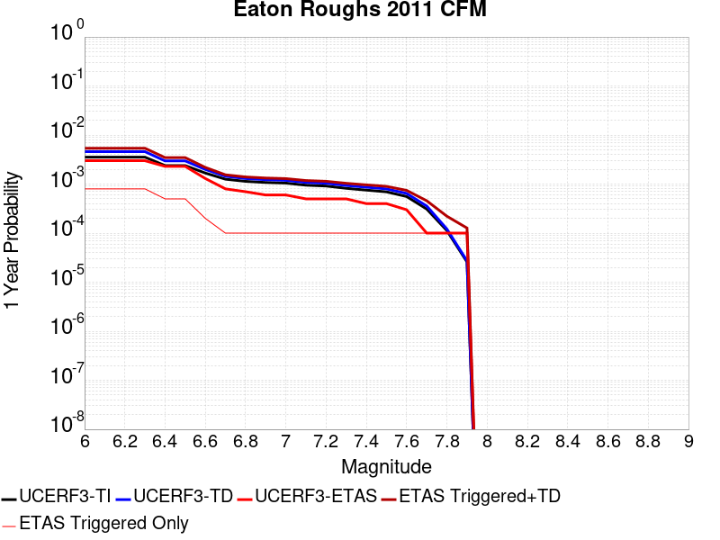 |  |

| Magnitude | 1 wk TI Prob | 1 wk TD Prob | 1 wk ETAS Prob | 1 wk ETAS/TD Gain | 1 wk ETAS Triggered+TD | 1 wk ETAS Triggered Only | 1 mo TI Prob | 1 mo TD Prob | 1 mo ETAS Prob | 1 mo ETAS/TD Gain | 1 mo ETAS Triggered+TD | 1 mo ETAS Triggered Only | 1 yr TI Prob | 1 yr TD Prob | 1 yr ETAS Prob | 1 yr ETAS/TD Gain | 1 yr ETAS Triggered+TD | 1 yr ETAS Triggered Only | 10 yr TI Prob | 10 yr TD Prob | 10 yr ETAS Prob | 10 yr ETAS/TD Gain | 10 yr ETAS Triggered+TD | 10 yr ETAS Triggered Only |
|-----|-----|-----|-----|-----|-----|-----|-----|-----|-----|-----|-----|-----|-----|-----|-----|-----|-----|-----|-----|-----|-----|-----|-----|-----|
| 6.0 | 6.8044945E-5 | 8.817112E-5 | 1.0E-4 | 1.1341583 | 8.817112E-5 | 0.0 | 2.9158857E-4 | 3.7782674E-4 | 4.0E-4 | 1.0586864 | 4.7778894E-4 | 1.0E-4 | 0.0035443127 | 0.004591065 | 0.003 | 0.65344316 | 0.0053873924 | 8.0E-4 | 0.03488314 | 0.045034718 | 0.0292 | 0.6483886 | 0.052865434 | 0.0082 |
| 6.1 | 6.8044945E-5 | 8.817112E-5 | 1.0E-4 | 1.1341583 | 8.817112E-5 | 0.0 | 2.9158857E-4 | 3.7782674E-4 | 4.0E-4 | 1.0586864 | 4.7778894E-4 | 1.0E-4 | 0.0035443127 | 0.004591065 | 0.003 | 0.65344316 | 0.0053873924 | 8.0E-4 | 0.03488314 | 0.045034718 | 0.0292 | 0.6483886 | 0.052865434 | 0.0082 |
| 6.2 | 6.8044945E-5 | 8.817112E-5 | 1.0E-4 | 1.1341583 | 8.817112E-5 | 0.0 | 2.9158857E-4 | 3.7782674E-4 | 4.0E-4 | 1.0586864 | 4.7778894E-4 | 1.0E-4 | 0.0035443127 | 0.004591065 | 0.003 | 0.65344316 | 0.0053873924 | 8.0E-4 | 0.03488314 | 0.045034718 | 0.0292 | 0.6483886 | 0.052865434 | 0.0082 |
| 6.3 | 6.8044945E-5 | 8.817112E-5 | 1.0E-4 | 1.1341583 | 8.817112E-5 | 0.0 | 2.9158857E-4 | 3.7782674E-4 | 4.0E-4 | 1.0586864 | 4.7778894E-4 | 1.0E-4 | 0.0035443127 | 0.004591065 | 0.003 | 0.65344316 | 0.0053873924 | 8.0E-4 | 0.03488314 | 0.045034718 | 0.0292 | 0.6483886 | 0.052865434 | 0.0082 |
| 6.4 | 4.5830013E-5 | 5.7010613E-5 | 1.0E-4 | 1.7540594 | 5.7010613E-5 | 0.0 | 1.9639956E-4 | 2.4431135E-4 | 2.0E-4 | 0.8186276 | 2.4431135E-4 | 0.0 | 0.0023885423 | 0.002970821 | 0.0023 | 0.77419674 | 0.0034693356 | 5.0E-4 | 0.023630321 | 0.029349273 | 0.0207 | 0.70529854 | 0.03468785 | 0.0055 |
| 6.5 | 4.5830013E-5 | 5.7010613E-5 | 1.0E-4 | 1.7540594 | 5.7010613E-5 | 0.0 | 1.9639956E-4 | 2.4431135E-4 | 2.0E-4 | 0.8186276 | 2.4431135E-4 | 0.0 | 0.0023885423 | 0.002970821 | 0.0023 | 0.77419674 | 0.0034693356 | 5.0E-4 | 0.023630321 | 0.029349273 | 0.0207 | 0.70529854 | 0.03468785 | 0.0055 |
| 6.6 | 3.222194E-5 | 3.8187813E-5 | 1.0E-4 | 2.6186366 | 3.8187813E-5 | 0.0 | 1.3808672E-4 | 1.6365242E-4 | 1.0E-4 | 0.61105114 | 1.6365242E-4 | 0.0 | 0.0016799092 | 0.0019907374 | 0.0013 | 0.6530243 | 0.0021903394 | 2.0E-4 | 0.016672665 | 0.01973844 | 0.014 | 0.7092759 | 0.023267383 | 0.0036 |
| 6.7 | 2.4155654E-5 | 2.774278E-5 | 1.0E-4 | 3.6045413 | 2.774278E-5 | 0.0 | 1.0352012E-4 | 1.1889226E-4 | 1.0E-4 | 0.84109765 | 1.1889226E-4 | 0.0 | 0.0012596287 | 0.0014465603 | 8.0E-4 | 0.55303603 | 0.0015464156 | 1.0E-4 | 0.012525126 | 0.014372619 | 0.0091 | 0.6331484 | 0.016639562 | 0.0023 |
| 6.8 | 2.1814667E-5 | 2.4903855E-5 | 1.0E-4 | 4.0154424 | 2.4903855E-5 | 0.0 | 9.348808E-5 | 1.0672646E-4 | 1.0E-4 | 0.93697476 | 1.0672646E-4 | 0.0 | 0.001137623 | 0.0012986239 | 7.0E-4 | 0.5390321 | 0.001398494 | 1.0E-4 | 0.011318169 | 0.012911002 | 0.0075 | 0.5808999 | 0.014687762 | 0.0018 |
| 6.9 | 2.0700467E-5 | 2.3594372E-5 | 1.0E-4 | 4.238299 | 2.3594372E-5 | 0.0 | 8.871327E-5 | 1.01114834E-4 | 1.0E-4 | 0.9889746 | 1.01114834E-4 | 0.0 | 0.0010795488 | 0.0012303811 | 6.0E-4 | 0.4876538 | 0.0013302581 | 1.0E-4 | 0.010743194 | 0.012236249 | 0.0067 | 0.5475534 | 0.013816671 | 0.0016 |
| 7.0 | 2.0104066E-5 | 2.2903117E-5 | 1.0E-4 | 4.366218 | 2.2903117E-5 | 0.0 | 8.615744E-5 | 9.8152545E-5 | 1.0E-4 | 1.0188223 | 9.8152545E-5 | 0.0 | 0.0010484619 | 0.0011943552 | 6.0E-4 | 0.50236315 | 0.0012942357 | 1.0E-4 | 0.010435291 | 0.011879887 | 0.0063 | 0.530308 | 0.01346088 | 0.0016 |
| 7.1 | 1.8225232E-5 | 2.0743106E-5 | 1.0E-4 | 4.820879 | 2.0743106E-5 | 0.0 | 7.81058E-5 | 8.8896006E-5 | 1.0E-4 | 1.1249099 | 8.8896006E-5 | 0.0 | 9.5052324E-4 | 0.0010817731 | 5.0E-4 | 0.46220416 | 0.0011816649 | 1.0E-4 | 0.009464677 | 0.010765398 | 0.0059 | 0.5480522 | 0.012348174 | 0.0016 |
| 7.2 | 1.7526572E-5 | 1.9964516E-5 | 1.0E-4 | 5.008887 | 1.9964516E-5 | 0.0 | 7.511172E-5 | 8.555942E-5 | 1.0E-4 | 1.1687784 | 8.555942E-5 | 0.0 | 9.141015E-4 | 0.0010411895 | 5.0E-4 | 0.48021996 | 0.0011410854 | 1.0E-4 | 0.009103506 | 0.010363418 | 0.0052 | 0.50176495 | 0.011748909 | 0.0014 |
| 7.3 | 1.5727232E-5 | 1.7994558E-5 | 1.0E-4 | 5.5572352 | 1.7994558E-5 | 0.0 | 6.740067E-5 | 7.711726E-5 | 1.0E-4 | 1.2967265 | 7.711726E-5 | 0.0 | 8.2029426E-4 | 9.384995E-4 | 5.0E-4 | 0.5327653 | 0.0010384057 | 1.0E-4 | 0.008172729 | 0.009345609 | 0.005 | 0.53501064 | 0.010633459 | 0.0013 |
| 7.4 | 1.4457361E-5 | 1.6573253E-5 | 1.0E-4 | 6.0338187 | 1.6573253E-5 | 0.0 | 6.195865E-5 | 7.10263E-5 | 1.0E-4 | 1.4079292 | 7.10263E-5 | 0.0 | 7.540854E-4 | 8.64403E-4 | 4.0E-4 | 0.46274713 | 9.6431654E-4 | 1.0E-4 | 0.007515317 | 0.008610596 | 0.0046 | 0.5342255 | 0.009800263 | 0.0012 |
| 7.5 | 1.33280955E-5 | 1.5321804E-5 | 1.0E-4 | 6.526646 | 1.5321804E-5 | 0.0 | 5.711916E-5 | 6.566323E-5 | 1.0E-4 | 1.5229223 | 6.566323E-5 | 0.0 | 6.9520384E-4 | 7.991575E-4 | 4.0E-4 | 0.50052714 | 8.9907757E-4 | 1.0E-4 | 0.00693033 | 0.0079630045 | 0.0043 | 0.53999716 | 0.009054245 | 0.0011 |
| 7.6 | 1.0699478E-5 | 1.2368158E-5 | 1.0E-4 | 8.085278 | 1.2368158E-5 | 0.0 | 4.5854096E-5 | 5.300532E-5 | 1.0E-4 | 1.8866031 | 5.300532E-5 | 0.0 | 5.581306E-4 | 6.451492E-4 | 3.0E-4 | 0.46500868 | 7.450847E-4 | 1.0E-4 | 0.005567309 | 0.0064328723 | 0.0035 | 0.54408044 | 0.007227726 | 8.0E-4 |
| 7.7 | 5.9390236E-6 | 6.84246E-6 | 0.0 | 0.0 | 6.84246E-6 | 0.0 | 2.545271E-5 | 2.9324501E-5 | 0.0 | 0.0 | 2.9324501E-5 | 0.0 | 3.0984267E-4 | 3.5696756E-4 | 1.0E-4 | 0.2801375 | 4.5693186E-4 | 1.0E-4 | 0.0030941102 | 0.0035640104 | 0.002 | 0.5611656 | 0.0040622284 | 5.0E-4 |
| 7.8 | 2.1622036E-6 | 2.3278722E-6 | 0.0 | 0.0 | 2.3278722E-6 | 0.0 | 9.266554E-6 | 9.9765575E-6 | 0.0 | 0.0 | 9.9765575E-6 | 0.0 | 1.1281446E-4 | 1.2145789E-4 | 1.0E-4 | 0.82333064 | 2.2144575E-4 | 1.0E-4 | 0.001127572 | 0.0012139308 | 0.001 | 0.8237702 | 0.0015135666 | 3.0E-4 |
| 7.9 | 4.9586197E-7 | 5.216062E-7 | 0.0 | 0.0 | 5.216062E-7 | 0.0 | 2.125121E-6 | 2.2354534E-6 | 0.0 | 0.0 | 2.2354534E-6 | 0.0 | 2.5873042E-5 | 2.7216325E-5 | 1.0E-4 | 3.6742651 | 1.272136E-4 | 1.0E-4 | 2.5870028E-4 | 2.7213202E-4 | 2.0E-4 | 0.7349374 | 4.720776E-4 | 2.0E-4 |

## Chino alt 1
*[(top)](#table-of-contents)*

| 1 Week | 1 Month | 1 Year | 10 Year |
|-----|-----|-----|-----|
|  | 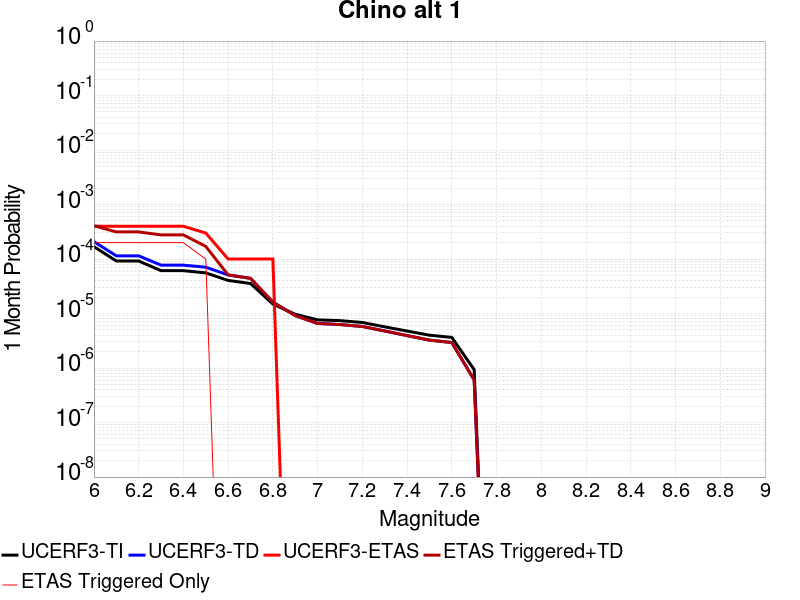 | 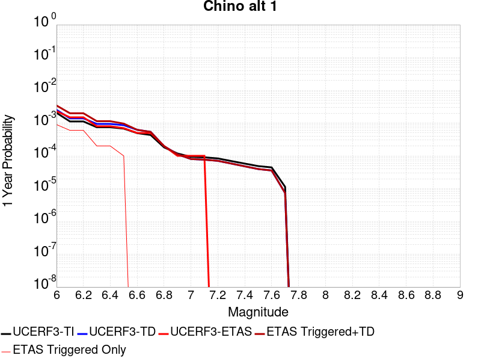 |  |

| Magnitude | 1 wk TI Prob | 1 wk TD Prob | 1 wk ETAS Prob | 1 wk ETAS/TD Gain | 1 wk ETAS Triggered+TD | 1 wk ETAS Triggered Only | 1 mo TI Prob | 1 mo TD Prob | 1 mo ETAS Prob | 1 mo ETAS/TD Gain | 1 mo ETAS Triggered+TD | 1 mo ETAS Triggered Only | 1 yr TI Prob | 1 yr TD Prob | 1 yr ETAS Prob | 1 yr ETAS/TD Gain | 1 yr ETAS Triggered+TD | 1 yr ETAS Triggered Only | 10 yr TI Prob | 10 yr TD Prob | 10 yr ETAS Prob | 10 yr ETAS/TD Gain | 10 yr ETAS Triggered+TD | 10 yr ETAS Triggered Only |
|-----|-----|-----|-----|-----|-----|-----|-----|-----|-----|-----|-----|-----|-----|-----|-----|-----|-----|-----|-----|-----|-----|-----|-----|-----|
| 6.0 | 3.939946E-5 | 4.8761474E-5 | 1.0E-4 | 2.0507994 | 1.4875659E-4 | 1.0E-4 | 1.6884391E-4 | 2.0896389E-4 | 4.0E-4 | 1.9142064 | 4.089221E-4 | 2.0E-4 | 0.0020537362 | 0.0025416764 | 0.0023 | 0.9049146 | 0.003439389 | 9.0E-4 | 0.020348595 | 0.025185952 | 0.0213 | 0.8457095 | 0.033569355 | 0.0086 |
| 6.1 | 2.1505624E-5 | 2.6745702E-5 | 1.0E-4 | 3.7389185 | 1.2674303E-4 | 1.0E-4 | 9.2163704E-5 | 1.1461999E-4 | 4.0E-4 | 3.4897928 | 3.1459707E-4 | 2.0E-4 | 0.0011215154 | 0.0013947141 | 0.0015 | 1.0754893 | 0.0019938773 | 6.0E-4 | 0.011158722 | 0.013879712 | 0.0125 | 0.90059507 | 0.018613089 | 0.0048 |
| 6.2 | 2.1505624E-5 | 2.6745702E-5 | 1.0E-4 | 3.7389185 | 1.2674303E-4 | 1.0E-4 | 9.2163704E-5 | 1.1461999E-4 | 4.0E-4 | 3.4897928 | 3.1459707E-4 | 2.0E-4 | 0.0011215154 | 0.0013947141 | 0.0015 | 1.0754893 | 0.0019938773 | 6.0E-4 | 0.011158722 | 0.013879712 | 0.0125 | 0.90059507 | 0.018613089 | 0.0048 |
| 6.3 | 1.4290785E-5 | 1.805055E-5 | 1.0E-4 | 5.539997 | 1.18048745E-4 | 1.0E-4 | 6.1244784E-5 | 7.7357465E-5 | 4.0E-4 | 5.1708 | 2.7734198E-4 | 2.0E-4 | 7.454001E-4 | 9.4146485E-4 | 8.0E-4 | 0.8497396 | 0.0011412766 | 2.0E-4 | 0.007429048 | 0.009388474 | 0.0072 | 0.7668978 | 0.012162186 | 0.0028 |
| 6.4 | 1.4290785E-5 | 1.805055E-5 | 1.0E-4 | 5.539997 | 1.18048745E-4 | 1.0E-4 | 6.1244784E-5 | 7.7357465E-5 | 4.0E-4 | 5.1708 | 2.7734198E-4 | 2.0E-4 | 7.454001E-4 | 9.4146485E-4 | 8.0E-4 | 0.8497396 | 0.0011412766 | 2.0E-4 | 0.007429048 | 0.009388474 | 0.0072 | 0.7668978 | 0.012162186 | 0.0028 |
| 6.5 | 1.3017944E-5 | 1.6540487E-5 | 1.0E-4 | 6.045771 | 1.1653883E-4 | 1.0E-4 | 5.5789995E-5 | 7.088612E-5 | 3.0E-4 | 4.2321405 | 1.7087904E-4 | 1.0E-4 | 6.790315E-4 | 8.6274E-4 | 7.0E-4 | 0.8113684 | 9.626537E-4 | 1.0E-4 | 0.0067696036 | 0.00860746 | 0.0066 | 0.7667767 | 0.011085941 | 0.0025 |
| 6.6 | 9.470016E-6 | 1.1944894E-5 | 0.0 | 0.0 | 1.1944894E-5 | 0.0 | 4.058515E-5 | 5.1191586E-5 | 1.0E-4 | 1.953446 | 5.1191586E-5 | 0.0 | 4.940122E-4 | 6.2311284E-4 | 5.0E-4 | 0.8024229 | 6.2311284E-4 | 0.0 | 0.004929154 | 0.0062260013 | 0.0044 | 0.7067136 | 0.0077166623 | 0.0015 |
| 6.7 | 8.314155E-6 | 1.0328306E-5 | 0.0 | 0.0 | 1.0328306E-5 | 0.0 | 3.5631605E-5 | 4.4263597E-5 | 1.0E-4 | 2.2591927 | 4.4263597E-5 | 0.0 | 4.3372845E-4 | 5.388079E-4 | 5.0E-4 | 0.9279745 | 5.388079E-4 | 0.0 | 0.004328829 | 0.0053875856 | 0.0033 | 0.61251926 | 0.006382198 | 0.001 |
| 6.8 | 3.4856364E-6 | 3.781823E-6 | 0.0 | 0.0 | 3.781823E-6 | 0.0 | 1.4938357E-5 | 1.6207723E-5 | 1.0E-4 | 6.169898 | 1.6207723E-5 | 0.0 | 1.8185932E-4 | 1.9731317E-4 | 2.0E-4 | 1.013617 | 1.9731317E-4 | 0.0 | 0.0018171056 | 0.0019730001 | 0.0012 | 0.6082108 | 0.002372211 | 4.0E-4 |
| 6.9 | 2.2645952E-6 | 2.1416872E-6 | 0.0 | 0.0 | 2.1416872E-6 | 0.0 | 9.705372E-6 | 9.178629E-6 | 0.0 | 0.0 | 9.178629E-6 | 0.0 | 1.18156495E-4 | 1.1174428E-4 | 1.0E-4 | 0.8949004 | 1.1174428E-4 | 0.0 | 0.0011809369 | 0.0011174479 | 6.0E-4 | 0.5369378 | 0.0013172243 | 2.0E-4 |
| 7.0 | 1.7864003E-6 | 1.5371073E-6 | 0.0 | 0.0 | 1.5371073E-6 | 0.0 | 7.655979E-6 | 6.5875865E-6 | 0.0 | 0.0 | 6.5875865E-6 | 0.0 | 9.3207556E-5 | 8.0200974E-5 | 1.0E-4 | 1.2468677 | 8.0200974E-5 | 0.0 | 9.316847E-4 | 8.0216007E-4 | 3.0E-4 | 0.3739902 | 8.0216007E-4 | 0.0 |
| 7.1 | 1.7315456E-6 | 1.4677553E-6 | 0.0 | 0.0 | 1.4677553E-6 | 0.0 | 7.420889E-6 | 6.290365E-6 | 0.0 | 0.0 | 6.290365E-6 | 0.0 | 9.034557E-5 | 7.658256E-5 | 1.0E-4 | 1.3057804 | 7.658256E-5 | 0.0 | 9.0308854E-4 | 7.659947E-4 | 3.0E-4 | 0.3916476 | 7.659947E-4 | 0.0 |
| 7.2 | 1.6008337E-6 | 1.352271E-6 | 0.0 | 0.0 | 1.352271E-6 | 0.0 | 6.860698E-6 | 5.795435E-6 | 0.0 | 0.0 | 5.795435E-6 | 0.0 | 8.352579E-5 | 7.055719E-5 | 0.0 | 0.0 | 7.055719E-5 | 0.0 | 8.34944E-4 | 7.057674E-4 | 2.0E-4 | 0.28337947 | 7.057674E-4 | 0.0 |
| 7.3 | 1.3320939E-6 | 1.1177666E-6 | 0.0 | 0.0 | 1.1177666E-6 | 0.0 | 5.7089615E-6 | 4.79042E-6 | 0.0 | 0.0 | 4.79042E-6 | 0.0 | 6.9504385E-5 | 5.832185E-5 | 0.0 | 0.0 | 5.832185E-5 | 0.0 | 6.9482654E-4 | 5.831893E-4 | 2.0E-4 | 0.3429418 | 5.831893E-4 | 0.0 |
| 7.4 | 1.114294E-6 | 9.204411E-7 | 0.0 | 0.0 | 9.204411E-7 | 0.0 | 4.775537E-6 | 3.944742E-6 | 0.0 | 0.0 | 3.944742E-6 | 0.0 | 5.8140613E-5 | 4.802621E-5 | 0.0 | 0.0 | 4.802621E-5 | 0.0 | 5.81254E-4 | 4.8017106E-4 | 1.0E-4 | 0.2082591 | 4.8017106E-4 | 0.0 |
| 7.5 | 9.354081E-7 | 7.600677E-7 | 0.0 | 0.0 | 7.600677E-7 | 0.0 | 4.0088858E-6 | 3.257429E-6 | 0.0 | 0.0 | 3.257429E-6 | 0.0 | 4.8807087E-5 | 3.965851E-5 | 0.0 | 0.0 | 3.965851E-5 | 0.0 | 4.879637E-4 | 3.965177E-4 | 0.0 | 0.0 | 3.965177E-4 | 0.0 |
| 7.6 | 8.521771E-7 | 6.8604237E-7 | 0.0 | 0.0 | 6.8604237E-7 | 0.0 | 3.6521824E-6 | 2.9401785E-6 | 0.0 | 0.0 | 2.9401785E-6 | 0.0 | 4.4464414E-5 | 3.5796118E-5 | 0.0 | 0.0 | 3.5796118E-5 | 0.0 | 4.4455516E-4 | 3.5790668E-4 | 0.0 | 0.0 | 3.5790668E-4 | 0.0 |
| 7.7 | 2.1803626E-7 | 1.4132844E-7 | 0.0 | 0.0 | 1.4132844E-7 | 0.0 | 9.344408E-7 | 6.0569323E-7 | 0.0 | 0.0 | 6.0569323E-7 | 0.0 | 1.1376757E-5 | 7.3743E-6 | 0.0 | 0.0 | 7.3743E-6 | 0.0 | 1.13761744E-4 | 7.37415E-5 | 0.0 | 0.0 | 7.37415E-5 | 0.0 |

## Red Mountain
*[(top)](#table-of-contents)*

| 1 Week | 1 Month | 1 Year | 10 Year |
|-----|-----|-----|-----|
|  |  |  |  |

| Magnitude | 1 wk TI Prob | 1 wk TD Prob | 1 wk ETAS Prob | 1 wk ETAS/TD Gain | 1 wk ETAS Triggered+TD | 1 wk ETAS Triggered Only | 1 mo TI Prob | 1 mo TD Prob | 1 mo ETAS Prob | 1 mo ETAS/TD Gain | 1 mo ETAS Triggered+TD | 1 mo ETAS Triggered Only | 1 yr TI Prob | 1 yr TD Prob | 1 yr ETAS Prob | 1 yr ETAS/TD Gain | 1 yr ETAS Triggered+TD | 1 yr ETAS Triggered Only | 10 yr TI Prob | 10 yr TD Prob | 10 yr ETAS Prob | 10 yr ETAS/TD Gain | 10 yr ETAS Triggered+TD | 10 yr ETAS Triggered Only |
|-----|-----|-----|-----|-----|-----|-----|-----|-----|-----|-----|-----|-----|-----|-----|-----|-----|-----|-----|-----|-----|-----|-----|-----|-----|
| 6.0 | 4.1810763E-5 | 4.7503345E-5 | 0.0 | 0.0 | 4.7503345E-5 | 0.0 | 1.7917668E-4 | 2.0357079E-4 | 1.0E-4 | 0.4912296 | 2.0357079E-4 | 0.0 | 0.0021792934 | 0.0024758214 | 0.0019 | 0.7674221 | 0.003573098 | 0.0011 | 0.021580452 | 0.024499938 | 0.0205 | 0.8367368 | 0.031621087 | 0.0073 |
| 6.1 | 4.1810763E-5 | 4.7503345E-5 | 0.0 | 0.0 | 4.7503345E-5 | 0.0 | 1.7917668E-4 | 2.0357079E-4 | 1.0E-4 | 0.4912296 | 2.0357079E-4 | 0.0 | 0.0021792934 | 0.0024758214 | 0.0019 | 0.7674221 | 0.003573098 | 0.0011 | 0.021580452 | 0.024499938 | 0.0205 | 0.8367368 | 0.031621087 | 0.0073 |
| 6.2 | 4.1810763E-5 | 4.7503345E-5 | 0.0 | 0.0 | 4.7503345E-5 | 0.0 | 1.7917668E-4 | 2.0357079E-4 | 1.0E-4 | 0.4912296 | 2.0357079E-4 | 0.0 | 0.0021792934 | 0.0024758214 | 0.0019 | 0.7674221 | 0.003573098 | 0.0011 | 0.021580452 | 0.024499938 | 0.0205 | 0.8367368 | 0.031621087 | 0.0073 |
| 6.3 | 4.1810763E-5 | 4.7503345E-5 | 0.0 | 0.0 | 4.7503345E-5 | 0.0 | 1.7917668E-4 | 2.0357079E-4 | 1.0E-4 | 0.4912296 | 2.0357079E-4 | 0.0 | 0.0021792934 | 0.0024758214 | 0.0019 | 0.7674221 | 0.003573098 | 0.0011 | 0.021580452 | 0.024499938 | 0.0205 | 0.8367368 | 0.031621087 | 0.0073 |
| 6.4 | 4.1810763E-5 | 4.7503345E-5 | 0.0 | 0.0 | 4.7503345E-5 | 0.0 | 1.7917668E-4 | 2.0357079E-4 | 1.0E-4 | 0.4912296 | 2.0357079E-4 | 0.0 | 0.0021792934 | 0.0024758214 | 0.0019 | 0.7674221 | 0.003573098 | 0.0011 | 0.021580452 | 0.024499938 | 0.0205 | 0.8367368 | 0.031621087 | 0.0073 |
| 6.5 | 3.154503E-5 | 3.5297457E-5 | 0.0 | 0.0 | 3.5297457E-5 | 0.0 | 1.3518598E-4 | 1.5126656E-4 | 1.0E-4 | 0.6610846 | 1.5126656E-4 | 0.0 | 0.0016446467 | 0.0018402064 | 0.0015 | 0.81512594 | 0.0027385503 | 9.0E-4 | 0.01632528 | 0.018259296 | 0.0161 | 0.88174266 | 0.023364346 | 0.0052 |
| 6.6 | 3.1535834E-5 | 3.5286856E-5 | 0.0 | 0.0 | 3.5286856E-5 | 0.0 | 1.3514658E-4 | 1.5122115E-4 | 1.0E-4 | 0.6612832 | 1.5122115E-4 | 0.0 | 0.0016441676 | 0.0018396544 | 0.0015 | 0.81537056 | 0.0027379987 | 9.0E-4 | 0.01632056 | 0.018253865 | 0.0161 | 0.882005 | 0.023358945 | 0.0052 |
| 6.7 | 2.8267326E-5 | 3.1414627E-5 | 0.0 | 0.0 | 3.1414627E-5 | 0.0 | 1.2114006E-4 | 1.3462765E-4 | 1.0E-4 | 0.74278945 | 1.3462765E-4 | 0.0 | 0.0014738824 | 0.001637944 | 0.0015 | 0.9157822 | 0.0025364698 | 9.0E-4 | 0.014641452 | 0.016267447 | 0.0142 | 0.872909 | 0.020989362 | 0.0048 |
| 6.8 | 2.8212884E-5 | 3.1352603E-5 | 0.0 | 0.0 | 3.1352603E-5 | 0.0 | 1.20906756E-4 | 1.3436186E-4 | 1.0E-4 | 0.7442588 | 1.3436186E-4 | 0.0 | 0.0014710457 | 0.0016347129 | 0.0015 | 0.9175923 | 0.0025332416 | 9.0E-4 | 0.014613459 | 0.016235609 | 0.0142 | 0.87462074 | 0.020957677 | 0.0048 |
| 6.9 | 2.4227871E-5 | 2.6661157E-5 | 0.0 | 0.0 | 2.6661157E-5 | 0.0 | 1.03829596E-4 | 1.1425753E-4 | 1.0E-4 | 0.8752159 | 1.1425753E-4 | 0.0 | 0.0012633923 | 0.0013902733 | 0.0014 | 1.0069963 | 0.002189161 | 8.0E-4 | 0.012562336 | 0.013823417 | 0.0128 | 0.92596495 | 0.018261211 | 0.0045 |
| 7.0 | 2.348524E-5 | 2.5791516E-5 | 0.0 | 0.0 | 2.5791516E-5 | 0.0 | 1.0064714E-4 | 1.1053081E-4 | 1.0E-4 | 0.90472513 | 1.1053081E-4 | 0.0 | 0.0012246901 | 0.0013449573 | 0.0014 | 1.0409253 | 0.0021438813 | 8.0E-4 | 0.012179627 | 0.0133757815 | 0.0126 | 0.94200104 | 0.01781559 | 0.0045 |
| 7.1 | 2.2311642E-5 | 2.4421026E-5 | 0.0 | 0.0 | 2.4421026E-5 | 0.0 | 9.561782E-5 | 1.0465776E-4 | 1.0E-4 | 0.9554953 | 1.0465776E-4 | 0.0 | 0.0011635252 | 0.001273538 | 0.0014 | 1.0992998 | 0.0020725192 | 8.0E-4 | 0.01157452 | 0.0126698855 | 0.0121 | 0.9550205 | 0.016816672 | 0.0042 |
| 7.2 | 1.6533986E-5 | 1.7640989E-5 | 0.0 | 0.0 | 1.7640989E-5 | 0.0 | 7.085802E-5 | 7.56024E-5 | 1.0E-4 | 1.3227093 | 7.56024E-5 | 0.0 | 8.623549E-4 | 9.201338E-4 | 0.0011 | 1.1954783 | 0.0016194896 | 7.0E-4 | 0.008590161 | 0.009169496 | 0.0097 | 1.0578554 | 0.012538319 | 0.0034 |
| 7.3 | 1.4703092E-5 | 1.5533557E-5 | 0.0 | 0.0 | 1.5533557E-5 | 0.0 | 6.301173E-5 | 6.657103E-5 | 1.0E-4 | 1.5021548 | 6.657103E-5 | 0.0 | 7.668978E-4 | 8.1026234E-4 | 9.0E-4 | 1.1107514 | 0.0013098572 | 5.0E-4 | 0.0076425658 | 0.008079133 | 0.0086 | 1.0644706 | 0.011154088 | 0.0031 |
| 7.4 | 6.1331984E-6 | 5.5207784E-6 | 0.0 | 0.0 | 5.5207784E-6 | 0.0 | 2.6284872E-5 | 2.3660268E-5 | 0.0 | 0.0 | 2.3660268E-5 | 0.0 | 3.199713E-4 | 2.880262E-4 | 3.0E-4 | 1.0415719 | 4.8796862E-4 | 2.0E-4 | 0.0031951098 | 0.0028765833 | 0.0042 | 1.4600655 | 0.0046714055 | 0.0018 |
| 7.5 | 5.954766E-6 | 5.330579E-6 | 0.0 | 0.0 | 5.330579E-6 | 0.0 | 2.5520176E-5 | 2.284514E-5 | 0.0 | 0.0 | 2.284514E-5 | 0.0 | 3.1066386E-4 | 2.7810462E-4 | 2.0E-4 | 0.7191538 | 4.7804898E-4 | 2.0E-4 | 0.003102299 | 0.0027776195 | 0.004 | 1.440082 | 0.0045726197 | 0.0018 |
| 7.6 | 4.9726646E-6 | 4.308218E-6 | 0.0 | 0.0 | 4.308218E-6 | 0.0 | 2.1311245E-5 | 1.8463663E-5 | 0.0 | 0.0 | 1.8463663E-5 | 0.0 | 2.5943352E-4 | 2.2477226E-4 | 0.0 | 0.0 | 2.2477226E-4 | 0.0 | 0.0025913084 | 0.0022454837 | 0.0025 | 1.1133459 | 0.0032432382 | 0.001 |
| 7.7 | 3.3613894E-6 | 2.8472411E-6 | 0.0 | 0.0 | 2.8472411E-6 | 0.0 | 1.4405875E-5 | 1.2202406E-5 | 0.0 | 0.0 | 1.2202406E-5 | 0.0 | 1.7537741E-4 | 1.4855443E-4 | 0.0 | 0.0 | 1.4855443E-4 | 0.0 | 0.0017523908 | 0.0014845774 | 0.0014 | 0.94302934 | 0.0018839836 | 4.0E-4 |
| 7.8 | 1.1828961E-6 | 1.0112856E-6 | 0.0 | 0.0 | 1.0112856E-6 | 0.0 | 5.069545E-6 | 4.334074E-6 | 0.0 | 0.0 | 4.334074E-6 | 0.0 | 6.171996E-5 | 5.2766103E-5 | 0.0 | 0.0 | 5.2766103E-5 | 0.0 | 6.170282E-4 | 5.2753865E-4 | 5.0E-4 | 0.94779783 | 7.274332E-4 | 2.0E-4 |
| 7.9 | 2.2967266E-7 | 1.8604956E-7 | 0.0 | 0.0 | 1.8604956E-7 | 0.0 | 9.843111E-7 | 7.97355E-7 | 0.0 | 0.0 | 7.97355E-7 | 0.0 | 1.19839215E-5 | 9.707757E-6 | 0.0 | 0.0 | 9.707757E-6 | 0.0 | 1.1983275E-4 | 9.707362E-5 | 1.0E-4 | 1.030146 | 9.707362E-5 | 0.0 |

## Owl Lake
*[(top)](#table-of-contents)*

| 1 Week | 1 Month | 1 Year | 10 Year |
|-----|-----|-----|-----|
| 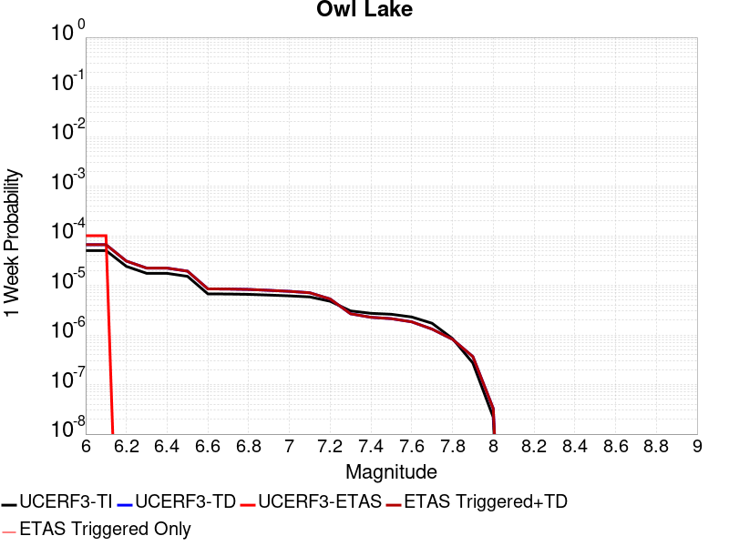 |  |  |  |

| Magnitude | 1 wk TI Prob | 1 wk TD Prob | 1 wk ETAS Prob | 1 wk ETAS/TD Gain | 1 wk ETAS Triggered+TD | 1 wk ETAS Triggered Only | 1 mo TI Prob | 1 mo TD Prob | 1 mo ETAS Prob | 1 mo ETAS/TD Gain | 1 mo ETAS Triggered+TD | 1 mo ETAS Triggered Only | 1 yr TI Prob | 1 yr TD Prob | 1 yr ETAS Prob | 1 yr ETAS/TD Gain | 1 yr ETAS Triggered+TD | 1 yr ETAS Triggered Only | 10 yr TI Prob | 10 yr TD Prob | 10 yr ETAS Prob | 10 yr ETAS/TD Gain | 10 yr ETAS Triggered+TD | 10 yr ETAS Triggered Only |
|-----|-----|-----|-----|-----|-----|-----|-----|-----|-----|-----|-----|-----|-----|-----|-----|-----|-----|-----|-----|-----|-----|-----|-----|-----|
| 6.0 | 5.0320643E-5 | 6.610823E-5 | 1.0E-4 | 1.5126709 | 6.610823E-5 | 0.0 | 2.1564208E-4 | 2.8329072E-4 | 1.0E-4 | 0.35299426 | 2.8329072E-4 | 0.0 | 0.0026222812 | 0.0034445229 | 0.0026 | 0.75482154 | 0.0040424564 | 6.0E-4 | 0.02591553 | 0.034015402 | 0.0284 | 0.8349159 | 0.04155008 | 0.0078 |
| 6.1 | 5.0320643E-5 | 6.610823E-5 | 1.0E-4 | 1.5126709 | 6.610823E-5 | 0.0 | 2.1564208E-4 | 2.8329072E-4 | 1.0E-4 | 0.35299426 | 2.8329072E-4 | 0.0 | 0.0026222812 | 0.0034445229 | 0.0026 | 0.75482154 | 0.0040424564 | 6.0E-4 | 0.02591553 | 0.034015402 | 0.0284 | 0.8349159 | 0.04155008 | 0.0078 |
| 6.2 | 2.4125871E-5 | 3.0850362E-5 | 0.0 | 0.0 | 3.0850362E-5 | 0.0 | 1.0339249E-4 | 1.3220983E-4 | 0.0 | 0.0 | 1.3220983E-4 | 0.0 | 0.0012580766 | 0.0016086436 | 0.0016 | 0.9946268 | 0.0018083218 | 2.0E-4 | 0.012509781 | 0.016003814 | 0.014 | 0.87479156 | 0.020038197 | 0.0041 |
| 6.3 | 1.7433485E-5 | 2.2250671E-5 | 0.0 | 0.0 | 2.2250671E-5 | 0.0 | 7.471279E-5 | 9.535695E-5 | 0.0 | 0.0 | 9.535695E-5 | 0.0 | 9.0924866E-4 | 0.0011604935 | 9.0E-4 | 0.7755322 | 0.0012603774 | 1.0E-4 | 0.009055373 | 0.011574848 | 0.0095 | 0.8207451 | 0.014045911 | 0.0025 |
| 6.4 | 1.7433485E-5 | 2.2250671E-5 | 0.0 | 0.0 | 2.2250671E-5 | 0.0 | 7.471279E-5 | 9.535695E-5 | 0.0 | 0.0 | 9.535695E-5 | 0.0 | 9.0924866E-4 | 0.0011604935 | 9.0E-4 | 0.7755322 | 0.0012603774 | 1.0E-4 | 0.009055373 | 0.011574848 | 0.0095 | 0.8207451 | 0.014045911 | 0.0025 |
| 6.5 | 1.5182742E-5 | 1.9333092E-5 | 0.0 | 0.0 | 1.9333092E-5 | 0.0 | 6.506727E-5 | 8.2853854E-5 | 0.0 | 0.0 | 8.2853854E-5 | 0.0 | 7.919061E-4 | 0.0010084178 | 7.0E-4 | 0.6941567 | 0.0011083169 | 1.0E-4 | 0.0078909 | 0.010068757 | 0.0079 | 0.78460526 | 0.01204862 | 0.002 |
| 6.6 | 6.7271576E-6 | 8.482794E-6 | 0.0 | 0.0 | 8.482794E-6 | 0.0 | 2.8830356E-5 | 3.635436E-5 | 0.0 | 0.0 | 3.635436E-5 | 0.0 | 3.5095305E-4 | 4.4253003E-4 | 3.0E-4 | 0.6779201 | 4.4253003E-4 | 0.0 | 0.0035039932 | 0.004434151 | 0.0029 | 0.6540147 | 0.0047328207 | 3.0E-4 |
| 6.7 | 6.682835E-6 | 8.415512E-6 | 0.0 | 0.0 | 8.415512E-6 | 0.0 | 2.8640408E-5 | 3.6066012E-5 | 0.0 | 0.0 | 3.6066012E-5 | 0.0 | 3.4864116E-4 | 4.3902083E-4 | 3.0E-4 | 0.6833389 | 4.3902083E-4 | 0.0 | 0.003480947 | 0.0043991995 | 0.0029 | 0.6592108 | 0.00469788 | 3.0E-4 |
| 6.8 | 6.5774975E-6 | 8.262369E-6 | 0.0 | 0.0 | 8.262369E-6 | 0.0 | 2.8188972E-5 | 3.5409706E-5 | 0.0 | 0.0 | 3.5409706E-5 | 0.0 | 3.4314668E-4 | 4.3103346E-4 | 3.0E-4 | 0.69600165 | 4.3103346E-4 | 0.0 | 0.0034261728 | 0.004319577 | 0.0029 | 0.671362 | 0.0046182815 | 3.0E-4 |
| 6.9 | 6.363419E-6 | 7.936412E-6 | 0.0 | 0.0 | 7.936412E-6 | 0.0 | 2.727151E-5 | 3.401278E-5 | 0.0 | 0.0 | 3.401278E-5 | 0.0 | 3.3198006E-4 | 4.1403246E-4 | 2.0E-4 | 0.48305392 | 4.1403246E-4 | 0.0 | 0.0033148455 | 0.004150027 | 0.0027 | 0.65059817 | 0.004448782 | 3.0E-4 |
| 7.0 | 6.1342453E-6 | 7.569727E-6 | 0.0 | 0.0 | 7.569727E-6 | 0.0 | 2.6289357E-5 | 3.2441316E-5 | 0.0 | 0.0 | 3.2441316E-5 | 0.0 | 3.2002592E-4 | 3.9490688E-4 | 2.0E-4 | 0.5064485 | 3.9490688E-4 | 0.0 | 0.0031956544 | 0.003959279 | 0.0026 | 0.6566852 | 0.0042580916 | 3.0E-4 |
| 7.1 | 5.842926E-6 | 7.081895E-6 | 0.0 | 0.0 | 7.081895E-6 | 0.0 | 2.504087E-5 | 3.0350655E-5 | 0.0 | 0.0 | 3.0350655E-5 | 0.0 | 3.0482994E-4 | 3.6946195E-4 | 2.0E-4 | 0.5413278 | 3.6946195E-4 | 0.0 | 0.0030441214 | 0.0037054901 | 0.0025 | 0.6746746 | 0.0040043783 | 3.0E-4 |
| 7.2 | 4.77173E-6 | 5.3036333E-6 | 0.0 | 0.0 | 5.3036333E-6 | 0.0 | 2.045011E-5 | 2.272968E-5 | 0.0 | 0.0 | 2.272968E-5 | 0.0 | 2.4895166E-4 | 2.7670275E-4 | 0.0 | 0.0 | 2.7670275E-4 | 0.0 | 0.0024867293 | 0.0027798498 | 0.0016 | 0.57557064 | 0.002979294 | 2.0E-4 |
| 7.3 | 3.0494948E-6 | 2.6695109E-6 | 0.0 | 0.0 | 2.6695109E-6 | 0.0 | 1.3069198E-5 | 1.1440711E-5 | 0.0 | 0.0 | 1.1440711E-5 | 0.0 | 1.5910587E-4 | 1.3928191E-4 | 0.0 | 0.0 | 1.3928191E-4 | 0.0 | 0.0015899199 | 0.0014018042 | 7.0E-4 | 0.49935648 | 0.001501664 | 1.0E-4 |
| 7.4 | 2.7263884E-6 | 2.2671784E-6 | 0.0 | 0.0 | 2.2671784E-6 | 0.0 | 1.1684469E-5 | 9.716443E-6 | 0.0 | 0.0 | 9.716443E-6 | 0.0 | 1.4224913E-4 | 1.1829137E-4 | 0.0 | 0.0 | 1.1829137E-4 | 0.0 | 0.0014215811 | 0.0011910212 | 6.0E-4 | 0.5037694 | 0.001290902 | 1.0E-4 |
| 7.5 | 2.6090431E-6 | 2.1279625E-6 | 0.0 | 0.0 | 2.1279625E-6 | 0.0 | 1.1181565E-5 | 9.119808E-6 | 0.0 | 0.0 | 9.119808E-6 | 0.0 | 1.3612706E-4 | 1.11028094E-4 | 0.0 | 0.0 | 1.11028094E-4 | 0.0 | 0.001360437 | 0.0011181902 | 6.0E-4 | 0.53658134 | 0.0012180784 | 1.0E-4 |
| 7.6 | 2.3008756E-6 | 1.8369362E-6 | 0.0 | 0.0 | 1.8369362E-6 | 0.0 | 9.860858E-6 | 7.872561E-6 | 0.0 | 0.0 | 7.872561E-6 | 0.0 | 1.20049335E-4 | 9.584428E-5 | 0.0 | 0.0 | 9.584428E-5 | 0.0 | 0.001199845 | 9.661557E-4 | 6.0E-4 | 0.62101793 | 0.0010660591 | 1.0E-4 |
| 7.7 | 1.7184348E-6 | 1.3088865E-6 | 0.0 | 0.0 | 1.3088865E-6 | 0.0 | 7.3646997E-6 | 5.6095014E-6 | 0.0 | 0.0 | 5.6095014E-6 | 0.0 | 8.966153E-5 | 6.829358E-5 | 0.0 | 0.0 | 6.829358E-5 | 0.0 | 8.962536E-4 | 6.90414E-4 | 4.0E-4 | 0.5793625 | 7.9034496E-4 | 1.0E-4 |
| 7.8 | 8.4612907E-7 | 8.1692343E-7 | 0.0 | 0.0 | 8.1692343E-7 | 0.0 | 3.6262625E-6 | 3.501096E-6 | 0.0 | 0.0 | 3.501096E-6 | 0.0 | 4.4148852E-5 | 4.262503E-5 | 0.0 | 0.0 | 4.262503E-5 | 0.0 | 4.414008E-4 | 4.314805E-4 | 2.0E-4 | 0.46352038 | 4.314805E-4 | 0.0 |
| 7.9 | 2.716738E-7 | 3.6615592E-7 | 0.0 | 0.0 | 3.6615592E-7 | 0.0 | 1.1643157E-6 | 1.5692387E-6 | 0.0 | 0.0 | 1.5692387E-6 | 0.0 | 1.4175452E-5 | 1.9105324E-5 | 0.0 | 0.0 | 1.9105324E-5 | 0.0 | 1.4174548E-4 | 1.9270634E-4 | 1.0E-4 | 0.5189243 | 1.9270634E-4 | 0.0 |
| 8.0 | 2.1995428E-8 | 3.2903408E-8 | 0.0 | 0.0 | 3.2903408E-8 | 0.0 | 9.426611E-8 | 1.410146E-7 | 0.0 | 0.0 | 1.410146E-7 | 0.0 | 1.1476893E-6 | 1.716852E-6 | 0.0 | 0.0 | 1.716852E-6 | 0.0 | 1.14768345E-5 | 1.7377139E-5 | 0.0 | 0.0 | 1.7377139E-5 | 0.0 |

## San Andreas (North Coast) 2011 CFM
*[(top)](#table-of-contents)*

| 1 Week | 1 Month | 1 Year | 10 Year |
|-----|-----|-----|-----|
|  | 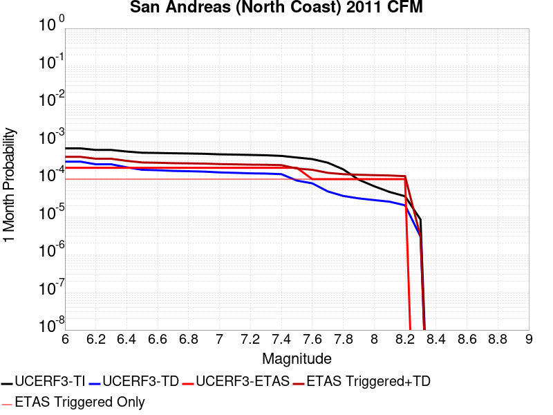 | 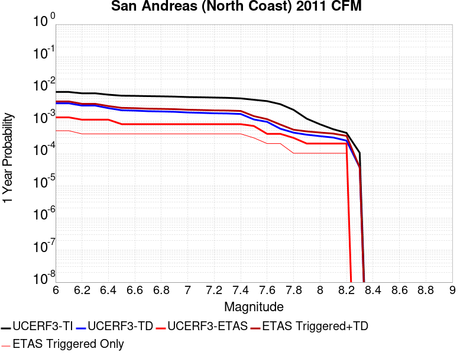 |  |

| Magnitude | 1 wk TI Prob | 1 wk TD Prob | 1 wk ETAS Prob | 1 wk ETAS/TD Gain | 1 wk ETAS Triggered+TD | 1 wk ETAS Triggered Only | 1 mo TI Prob | 1 mo TD Prob | 1 mo ETAS Prob | 1 mo ETAS/TD Gain | 1 mo ETAS Triggered+TD | 1 mo ETAS Triggered Only | 1 yr TI Prob | 1 yr TD Prob | 1 yr ETAS Prob | 1 yr ETAS/TD Gain | 1 yr ETAS Triggered+TD | 1 yr ETAS Triggered Only | 10 yr TI Prob | 10 yr TD Prob | 10 yr ETAS Prob | 10 yr ETAS/TD Gain | 10 yr ETAS Triggered+TD | 10 yr ETAS Triggered Only |
|-----|-----|-----|-----|-----|-----|-----|-----|-----|-----|-----|-----|-----|-----|-----|-----|-----|-----|-----|-----|-----|-----|-----|-----|-----|
| 6.0 | 1.5333705E-4 | 6.766802E-5 | 0.0 | 0.0 | 6.766802E-5 | 0.0 | 6.5699324E-4 | 2.8997372E-4 | 2.0E-4 | 0.68971765 | 3.8994473E-4 | 1.0E-4 | 0.007969595 | 0.003524746 | 0.0013 | 0.3688209 | 0.004022984 | 5.0E-4 | 0.0768977 | 0.037589617 | 0.0231 | 0.6145314 | 0.045673866 | 0.0084 |
| 6.1 | 1.5333705E-4 | 6.766802E-5 | 0.0 | 0.0 | 6.766802E-5 | 0.0 | 6.5699324E-4 | 2.8997372E-4 | 2.0E-4 | 0.68971765 | 3.8994473E-4 | 1.0E-4 | 0.007969595 | 0.003524746 | 0.0013 | 0.3688209 | 0.004022984 | 5.0E-4 | 0.0768977 | 0.037589617 | 0.0231 | 0.6145314 | 0.045673866 | 0.0084 |
| 6.2 | 1.3912938E-4 | 5.7452213E-5 | 0.0 | 0.0 | 5.7452213E-5 | 0.0 | 5.961325E-4 | 2.4620065E-4 | 2.0E-4 | 0.8123455 | 3.4617604E-4 | 1.0E-4 | 0.007233787 | 0.0029933979 | 0.0011 | 0.3674754 | 0.0033922005 | 4.0E-4 | 0.07002798 | 0.03210448 | 0.0191 | 0.59493256 | 0.03849259 | 0.0066 |
| 6.3 | 1.3912938E-4 | 5.7452213E-5 | 0.0 | 0.0 | 5.7452213E-5 | 0.0 | 5.961325E-4 | 2.4620065E-4 | 2.0E-4 | 0.8123455 | 3.4617604E-4 | 1.0E-4 | 0.007233787 | 0.0029933979 | 0.0011 | 0.3674754 | 0.0033922005 | 4.0E-4 | 0.07002798 | 0.03210448 | 0.0191 | 0.59493256 | 0.03849259 | 0.0066 |
| 6.4 | 1.2623647E-4 | 4.7755788E-5 | 0.0 | 0.0 | 4.7755788E-5 | 0.0 | 5.4090127E-4 | 2.046517E-4 | 2.0E-4 | 0.9772701 | 3.0463125E-4 | 1.0E-4 | 0.0065656058 | 0.002488806 | 0.0011 | 0.44197905 | 0.0028878103 | 4.0E-4 | 0.06374981 | 0.026867876 | 0.0163 | 0.60667247 | 0.032025475 | 0.0053 |
| 6.5 | 1.1736096E-4 | 4.1086143E-5 | 0.0 | 0.0 | 4.1086143E-5 | 0.0 | 5.028786E-4 | 1.7607167E-4 | 2.0E-4 | 1.1359011 | 2.7605408E-4 | 1.0E-4 | 0.006105373 | 0.00214158 | 8.0E-4 | 0.37355596 | 0.0025407234 | 4.0E-4 | 0.05940335 | 0.023259372 | 0.0134 | 0.57611185 | 0.027654704 | 0.0045 |
| 6.6 | 1.1586959E-4 | 4.0026378E-5 | 0.0 | 0.0 | 4.0026378E-5 | 0.0 | 4.964894E-4 | 1.7153042E-4 | 2.0E-4 | 1.1659739 | 2.7151327E-4 | 1.0E-4 | 0.006028018 | 0.0020863975 | 8.0E-4 | 0.38343602 | 0.002485563 | 4.0E-4 | 0.058671024 | 0.022684598 | 0.0131 | 0.5774843 | 0.027082518 | 0.0045 |
| 6.7 | 1.13693764E-4 | 3.8397164E-5 | 0.0 | 0.0 | 3.8397164E-5 | 0.0 | 4.87168E-4 | 1.6454897E-4 | 2.0E-4 | 1.2154436 | 2.6453251E-4 | 1.0E-4 | 0.005915152 | 0.0020015577 | 8.0E-4 | 0.3996887 | 0.002400757 | 4.0E-4 | 0.057601593 | 0.021802919 | 0.0123 | 0.5641447 | 0.025911346 | 0.0042 |
| 6.8 | 1.1204889E-4 | 3.7655755E-5 | 0.0 | 0.0 | 3.7655755E-5 | 0.0 | 4.8012115E-4 | 1.613719E-4 | 2.0E-4 | 1.2393731 | 2.6135577E-4 | 1.0E-4 | 0.005829819 | 0.0019629472 | 8.0E-4 | 0.40755045 | 0.002362162 | 4.0E-4 | 0.05679232 | 0.021383688 | 0.0121 | 0.56585187 | 0.025493877 | 0.0042 |
| 6.9 | 1.1005794E-4 | 3.676468E-5 | 0.0 | 0.0 | 3.676468E-5 | 0.0 | 4.7159163E-4 | 1.5755347E-4 | 2.0E-4 | 1.2694103 | 2.5753773E-4 | 1.0E-4 | 0.0057265228 | 0.0019165406 | 8.0E-4 | 0.41741878 | 0.0023157739 | 4.0E-4 | 0.055811852 | 0.020875853 | 0.0116 | 0.5556659 | 0.024694437 | 0.0039 |
| 7.0 | 1.0647948E-4 | 3.5022644E-5 | 0.0 | 0.0 | 3.5022644E-5 | 0.0 | 4.562608E-4 | 1.500885E-4 | 2.0E-4 | 1.3325472 | 2.5007347E-4 | 1.0E-4 | 0.0055408357 | 0.0018258102 | 8.0E-4 | 0.43816164 | 0.0022250798 | 4.0E-4 | 0.054047033 | 0.019885093 | 0.0112 | 0.563236 | 0.02370754 | 0.0039 |
| 7.1 | 1.04795035E-4 | 3.4122386E-5 | 0.0 | 0.0 | 3.4122386E-5 | 0.0 | 4.4904428E-4 | 1.4623068E-4 | 2.0E-4 | 1.367702 | 2.4621605E-4 | 1.0E-4 | 0.0054534175 | 0.001778919 | 8.0E-4 | 0.44971132 | 0.0021782075 | 4.0E-4 | 0.053215165 | 0.01937682 | 0.0111 | 0.5728494 | 0.02320125 | 0.0039 |
| 7.2 | 1.02724036E-4 | 3.308761E-5 | 0.0 | 0.0 | 3.308761E-5 | 0.0 | 4.401716E-4 | 1.4179641E-4 | 2.0E-4 | 1.410473 | 2.4178223E-4 | 1.0E-4 | 0.0053459285 | 0.0017250185 | 8.0E-4 | 0.46376315 | 0.0021243284 | 4.0E-4 | 0.052191395 | 0.018794429 | 0.0109 | 0.5799591 | 0.02252301 | 0.0038 |
| 7.3 | 1.00650694E-4 | 3.260041E-5 | 0.0 | 0.0 | 3.260041E-5 | 0.0 | 4.312888E-4 | 1.3970863E-4 | 2.0E-4 | 1.4315507 | 2.3969467E-4 | 1.0E-4 | 0.005238306 | 0.0016996397 | 8.0E-4 | 0.470688 | 0.0020989599 | 4.0E-4 | 0.051165357 | 0.018496355 | 0.0108 | 0.58389884 | 0.02222607 | 0.0038 |
| 7.4 | 9.672919E-5 | 3.148635E-5 | 0.0 | 0.0 | 3.148635E-5 | 0.0 | 4.144878E-4 | 1.349346E-4 | 2.0E-4 | 1.4821995 | 2.349211E-4 | 1.0E-4 | 0.005034718 | 0.0016416048 | 8.0E-4 | 0.48732802 | 0.0020409483 | 4.0E-4 | 0.049221683 | 0.017822465 | 0.0102 | 0.5723114 | 0.02116187 | 0.0034 |
| 7.5 | 8.7600405E-5 | 2.1235626E-5 | 0.0 | 0.0 | 2.1235626E-5 | 0.0 | 3.753763E-4 | 9.100666E-5 | 2.0E-4 | 2.1976414 | 1.9099755E-4 | 1.0E-4 | 0.0045606326 | 0.0011074445 | 7.0E-4 | 0.6320858 | 0.0014071123 | 3.0E-4 | 0.04468165 | 0.012287517 | 0.0075 | 0.6103755 | 0.014361714 | 0.0021 |
| 7.6 | 7.9562284E-5 | 1.7900134E-5 | 0.0 | 0.0 | 1.7900134E-5 | 0.0 | 3.4093665E-4 | 7.671262E-5 | 1.0E-4 | 1.3035666 | 1.7670494E-4 | 1.0E-4 | 0.0041430052 | 9.335773E-4 | 4.0E-4 | 0.42845944 | 0.0011333906 | 2.0E-4 | 0.040666126 | 0.010452909 | 0.0057 | 0.5453027 | 0.012036185 | 0.0016 |
| 7.7 | 6.3866544E-5 | 1.0916352E-5 | 0.0 | 0.0 | 1.0916352E-5 | 0.0 | 2.7368503E-4 | 4.6783527E-5 | 1.0E-4 | 2.1375043 | 1.4677885E-4 | 1.0E-4 | 0.0033270244 | 5.6944083E-4 | 4.0E-4 | 0.7024435 | 7.693269E-4 | 2.0E-4 | 0.032776527 | 0.0066051716 | 0.004 | 0.60558605 | 0.0077972454 | 0.0012 |
| 7.8 | 4.2543215E-5 | 8.2648585E-6 | 0.0 | 0.0 | 8.2648585E-6 | 0.0 | 1.8231533E-4 | 3.542034E-5 | 1.0E-4 | 2.8232365 | 1.354168E-4 | 1.0E-4 | 0.0022174292 | 4.3115742E-4 | 3.0E-4 | 0.69580156 | 5.311143E-4 | 1.0E-4 | 0.021954332 | 0.005016888 | 0.0033 | 0.65777826 | 0.006011871 | 0.001 |
| 7.9 | 2.2636612E-5 | 7.128954E-6 | 0.0 | 0.0 | 7.128954E-6 | 0.0 | 9.7010445E-5 | 3.0552303E-5 | 1.0E-4 | 3.2730756 | 1.3054925E-4 | 1.0E-4 | 0.0011804621 | 3.7191086E-4 | 2.0E-4 | 0.53776324 | 4.7187367E-4 | 1.0E-4 | 0.011742111 | 0.0042953272 | 0.003 | 0.6984334 | 0.0052910317 | 0.001 |
| 8.0 | 1.5167874E-5 | 6.4312753E-6 | 0.0 | 0.0 | 6.4312753E-6 | 0.0 | 6.500356E-5 | 2.7562317E-5 | 1.0E-4 | 3.628142 | 1.2755956E-4 | 1.0E-4 | 7.9113094E-4 | 3.355196E-4 | 2.0E-4 | 0.5960904 | 4.3548606E-4 | 1.0E-4 | 0.007883203 | 0.0038709831 | 0.0028 | 0.72333044 | 0.0048671123 | 0.001 |
| 8.1 | 1.0681047E-5 | 5.8263768E-6 | 0.0 | 0.0 | 5.8263768E-6 | 0.0 | 4.5775112E-5 | 2.4969948E-5 | 1.0E-4 | 4.004814 | 1.2496745E-4 | 1.0E-4 | 5.5716943E-4 | 3.0396678E-4 | 2.0E-4 | 0.6579666 | 4.0393637E-4 | 1.0E-4 | 0.0055577457 | 0.0035073597 | 0.0026 | 0.7412984 | 0.004503852 | 0.001 |
| 8.2 | 8.226114E-6 | 4.6759387E-6 | 0.0 | 0.0 | 4.6759387E-6 | 0.0 | 3.52543E-5 | 2.0039583E-5 | 1.0E-4 | 4.9901237 | 1.2003758E-4 | 1.0E-4 | 4.2913653E-4 | 2.4395468E-4 | 2.0E-4 | 0.8198244 | 3.439303E-4 | 1.0E-4 | 0.004283088 | 0.0028035406 | 0.002 | 0.7133837 | 0.003501578 | 7.0E-4 |
| 8.3 | 1.983087E-6 | 6.880041E-7 | 0.0 | 0.0 | 6.880041E-7 | 0.0 | 8.498917E-6 | 2.9485857E-6 | 0.0 | 0.0 | 2.9485857E-6 | 0.0 | 1.034694E-4 | 3.589845E-5 | 0.0 | 0.0 | 3.589845E-5 | 0.0 | 0.0010342124 | 4.2701262E-4 | 2.0E-4 | 0.46837023 | 5.269699E-4 | 1.0E-4 |

## Concord 2011 CFM
*[(top)](#table-of-contents)*

| 1 Week | 1 Month | 1 Year | 10 Year |
|-----|-----|-----|-----|
|  |  |  |  |

| Magnitude | 1 wk TI Prob | 1 wk TD Prob | 1 wk ETAS Prob | 1 wk ETAS/TD Gain | 1 wk ETAS Triggered+TD | 1 wk ETAS Triggered Only | 1 mo TI Prob | 1 mo TD Prob | 1 mo ETAS Prob | 1 mo ETAS/TD Gain | 1 mo ETAS Triggered+TD | 1 mo ETAS Triggered Only | 1 yr TI Prob | 1 yr TD Prob | 1 yr ETAS Prob | 1 yr ETAS/TD Gain | 1 yr ETAS Triggered+TD | 1 yr ETAS Triggered Only | 10 yr TI Prob | 10 yr TD Prob | 10 yr ETAS Prob | 10 yr ETAS/TD Gain | 10 yr ETAS Triggered+TD | 10 yr ETAS Triggered Only |
|-----|-----|-----|-----|-----|-----|-----|-----|-----|-----|-----|-----|-----|-----|-----|-----|-----|-----|-----|-----|-----|-----|-----|-----|-----|
| 6.0 | 5.7865112E-5 | 9.7227785E-5 | 0.0 | 0.0 | 9.7227785E-5 | 0.0 | 2.4796976E-4 | 4.166246E-4 | 0.0 | 0.0 | 4.166246E-4 | 0.0 | 0.0030148525 | 0.0050611263 | 0.0024 | 0.47420272 | 0.0058570774 | 8.0E-4 | 0.029742775 | 0.04907589 | 0.03 | 0.6112981 | 0.056968562 | 0.0083 |
| 6.1 | 5.7865112E-5 | 9.7227785E-5 | 0.0 | 0.0 | 9.7227785E-5 | 0.0 | 2.4796976E-4 | 4.166246E-4 | 0.0 | 0.0 | 4.166246E-4 | 0.0 | 0.0030148525 | 0.0050611263 | 0.0024 | 0.47420272 | 0.0058570774 | 8.0E-4 | 0.029742775 | 0.04907589 | 0.03 | 0.6112981 | 0.056968562 | 0.0083 |
| 6.2 | 5.6789337E-5 | 9.543774E-5 | 0.0 | 0.0 | 9.543774E-5 | 0.0 | 2.4336016E-4 | 4.0895652E-4 | 0.0 | 0.0 | 4.0895652E-4 | 0.0 | 0.0029588845 | 0.004968242 | 0.0024 | 0.48306826 | 0.0057642674 | 8.0E-4 | 0.029197963 | 0.04819583 | 0.0296 | 0.61416095 | 0.056000628 | 0.0082 |
| 6.3 | 5.203322E-5 | 8.771259E-5 | 0.0 | 0.0 | 8.771259E-5 | 0.0 | 2.2298045E-4 | 3.7586133E-4 | 0.0 | 0.0 | 3.7586133E-4 | 0.0 | 0.0027114071 | 0.004567288 | 0.0023 | 0.5035811 | 0.005264091 | 7.0E-4 | 0.026785625 | 0.044380765 | 0.0273 | 0.6151314 | 0.051930156 | 0.0079 |
| 6.4 | 4.7120942E-5 | 7.866446E-5 | 0.0 | 0.0 | 7.866446E-5 | 0.0 | 2.0193127E-4 | 3.37094E-4 | 0.0 | 0.0 | 3.37094E-4 | 0.0 | 0.0024557412 | 0.0040971357 | 0.002 | 0.48814592 | 0.0046946774 | 6.0E-4 | 0.024287801 | 0.039909057 | 0.0254 | 0.636447 | 0.04701373 | 0.0074 |
| 6.5 | 2.9598437E-5 | 4.6468846E-5 | 0.0 | 0.0 | 4.6468846E-5 | 0.0 | 1.2684427E-4 | 1.9913817E-4 | 0.0 | 0.0 | 1.9913817E-4 | 0.0 | 0.001543235 | 0.0024220194 | 0.0013 | 0.5367422 | 0.0029208083 | 5.0E-4 | 0.015325619 | 0.023813063 | 0.0163 | 0.68449825 | 0.028401142 | 0.0047 |
| 6.6 | 2.0443718E-5 | 2.9870673E-5 | 0.0 | 0.0 | 2.9870673E-5 | 0.0 | 8.7613E-5 | 1.2801109E-4 | 0.0 | 0.0 | 1.2801109E-4 | 0.0 | 0.0010661662 | 0.0015574567 | 0.001 | 0.64207244 | 0.0019568338 | 4.0E-4 | 0.010610655 | 0.015412929 | 0.0107 | 0.6942224 | 0.018563608 | 0.0032 |
| 6.7 | 1.798539E-5 | 2.5471327E-5 | 0.0 | 0.0 | 2.5471327E-5 | 0.0 | 7.7077966E-5 | 1.0915838E-4 | 0.0 | 0.0 | 1.0915838E-4 | 0.0 | 9.380202E-4 | 0.0013282145 | 7.0E-4 | 0.5270233 | 0.001627816 | 3.0E-4 | 0.009340706 | 0.013176453 | 0.0087 | 0.6602687 | 0.015840877 | 0.0027 |
| 6.8 | 1.613555E-5 | 2.1890408E-5 | 0.0 | 0.0 | 2.1890408E-5 | 0.0 | 6.915052E-5 | 9.381274E-5 | 0.0 | 0.0 | 9.381274E-5 | 0.0 | 8.4158237E-4 | 0.0011415855 | 7.0E-4 | 0.61318225 | 0.0014412431 | 3.0E-4 | 0.008384023 | 0.01134584 | 0.0076 | 0.66984904 | 0.01371861 | 0.0024 |
| 6.9 | 1.2916435E-5 | 1.7027736E-5 | 0.0 | 0.0 | 1.7027736E-5 | 0.0 | 5.5354973E-5 | 7.2974006E-5 | 0.0 | 0.0 | 7.2974006E-5 | 0.0 | 6.7373837E-4 | 8.8810216E-4 | 7.0E-4 | 0.7881976 | 0.0011878357 | 3.0E-4 | 0.006716994 | 0.00884014 | 0.0061 | 0.69003433 | 0.01082246 | 0.002 |
| 7.0 | 9.81129E-6 | 1.2596236E-5 | 0.0 | 0.0 | 1.2596236E-5 | 0.0 | 4.2047708E-5 | 5.398276E-5 | 0.0 | 0.0 | 5.398276E-5 | 0.0 | 5.118106E-4 | 6.5704354E-4 | 6.0E-4 | 0.9131815 | 8.569121E-4 | 2.0E-4 | 0.005106334 | 0.0065519335 | 0.0052 | 0.79365885 | 0.008141451 | 0.0016 |
| 7.1 | 8.0889195E-6 | 1.0385969E-5 | 0.0 | 0.0 | 1.0385969E-5 | 0.0 | 3.4666336E-5 | 4.4510547E-5 | 0.0 | 0.0 | 4.4510547E-5 | 0.0 | 4.219809E-4 | 5.417822E-4 | 4.0E-4 | 0.7383041 | 6.41728E-4 | 1.0E-4 | 0.004211805 | 0.0054050833 | 0.0044 | 0.8140485 | 0.0065985974 | 0.0012 |
| 7.2 | 6.267438E-6 | 8.088033E-6 | 0.0 | 0.0 | 8.088033E-6 | 0.0 | 2.6860173E-5 | 3.4662542E-5 | 0.0 | 0.0 | 3.4662542E-5 | 0.0 | 3.2697353E-4 | 4.2193543E-4 | 4.0E-4 | 0.9480123 | 5.2189326E-4 | 1.0E-4 | 0.0032649285 | 0.0042119 | 0.0038 | 0.9022057 | 0.005207688 | 0.001 |
| 7.3 | 3.6761196E-6 | 4.8197294E-6 | 0.0 | 0.0 | 4.8197294E-6 | 0.0 | 1.5754704E-5 | 2.0655822E-5 | 0.0 | 0.0 | 2.0655822E-5 | 0.0 | 1.9179663E-4 | 2.5145581E-4 | 1.0E-4 | 0.3976842 | 2.5145581E-4 | 0.0 | 0.0019163118 | 0.0025119635 | 0.0024 | 0.95542794 | 0.0031104563 | 6.0E-4 |
| 7.4 | 2.8044356E-6 | 3.6945266E-6 | 0.0 | 0.0 | 3.6945266E-6 | 0.0 | 1.2018954E-5 | 1.583359E-5 | 0.0 | 0.0 | 1.583359E-5 | 0.0 | 1.4632095E-4 | 1.9275701E-4 | 1.0E-4 | 0.51878786 | 1.9275701E-4 | 0.0 | 0.0014622464 | 0.0019260531 | 0.0019 | 0.9864733 | 0.00242509 | 5.0E-4 |
| 7.5 | 2.4578699E-6 | 3.2311568E-6 | 0.0 | 0.0 | 3.2311568E-6 | 0.0 | 1.0533685E-5 | 1.3847743E-5 | 0.0 | 0.0 | 1.3847743E-5 | 0.0 | 1.2824008E-4 | 1.6858333E-4 | 1.0E-4 | 0.59317845 | 1.6858333E-4 | 0.0 | 0.0012816609 | 0.001684676 | 0.0015 | 0.8903789 | 0.0019841706 | 3.0E-4 |
| 7.6 | 1.7713267E-6 | 2.3238626E-6 | 0.0 | 0.0 | 2.3238626E-6 | 0.0 | 7.591378E-6 | 9.9593735E-6 | 0.0 | 0.0 | 9.9593735E-6 | 0.0 | 9.2421105E-5 | 1.2124872E-4 | 0.0 | 0.0 | 1.2124872E-4 | 0.0 | 9.2382677E-4 | 0.0012119251 | 0.0013 | 1.0726736 | 0.0015115616 | 3.0E-4 |
| 7.7 | 5.1912366E-7 | 6.796827E-7 | 0.0 | 0.0 | 6.796827E-7 | 0.0 | 2.2248137E-6 | 2.9129228E-6 | 0.0 | 0.0 | 2.9129228E-6 | 0.0 | 2.708677E-5 | 3.5464273E-5 | 0.0 | 0.0 | 3.5464273E-5 | 0.0 | 2.708347E-4 | 3.5461446E-4 | 1.0E-4 | 0.2819964 | 3.5461446E-4 | 0.0 |

## Hunting Creek - Bartlett Springs connector 2011
*[(top)](#table-of-contents)*

| 1 Week | 1 Month | 1 Year | 10 Year |
|-----|-----|-----|-----|
|  |  |  |  |

| Magnitude | 1 wk TI Prob | 1 wk TD Prob | 1 wk ETAS Prob | 1 wk ETAS/TD Gain | 1 wk ETAS Triggered+TD | 1 wk ETAS Triggered Only | 1 mo TI Prob | 1 mo TD Prob | 1 mo ETAS Prob | 1 mo ETAS/TD Gain | 1 mo ETAS Triggered+TD | 1 mo ETAS Triggered Only | 1 yr TI Prob | 1 yr TD Prob | 1 yr ETAS Prob | 1 yr ETAS/TD Gain | 1 yr ETAS Triggered+TD | 1 yr ETAS Triggered Only | 10 yr TI Prob | 10 yr TD Prob | 10 yr ETAS Prob | 10 yr ETAS/TD Gain | 10 yr ETAS Triggered+TD | 10 yr ETAS Triggered Only |
|-----|-----|-----|-----|-----|-----|-----|-----|-----|-----|-----|-----|-----|-----|-----|-----|-----|-----|-----|-----|-----|-----|-----|-----|-----|
| 6.0 | 4.940016E-5 | 6.7636094E-5 | 0.0 | 0.0 | 6.7636094E-5 | 0.0 | 2.1169778E-4 | 2.8983652E-4 | 1.0E-4 | 0.34502208 | 2.8983652E-4 | 0.0 | 0.002574374 | 0.003522902 | 0.0028 | 0.79479927 | 0.004519379 | 0.001 | 0.025447546 | 0.03465753 | 0.0275 | 0.7934783 | 0.042187203 | 0.0078 |
| 6.1 | 4.940016E-5 | 6.7636094E-5 | 0.0 | 0.0 | 6.7636094E-5 | 0.0 | 2.1169778E-4 | 2.8983652E-4 | 1.0E-4 | 0.34502208 | 2.8983652E-4 | 0.0 | 0.002574374 | 0.003522902 | 0.0028 | 0.79479927 | 0.004519379 | 0.001 | 0.025447546 | 0.03465753 | 0.0275 | 0.7934783 | 0.042187203 | 0.0078 |
| 6.2 | 4.472471E-5 | 6.0799062E-5 | 0.0 | 0.0 | 6.0799062E-5 | 0.0 | 1.9166325E-4 | 2.6054154E-4 | 0.0 | 0.0 | 2.6054154E-4 | 0.0 | 0.0023310026 | 0.0031673922 | 0.0022 | 0.6945777 | 0.0039648586 | 8.0E-4 | 0.02306703 | 0.031213867 | 0.0229 | 0.7336483 | 0.037898492 | 0.0069 |
| 6.3 | 4.472471E-5 | 6.0799062E-5 | 0.0 | 0.0 | 6.0799062E-5 | 0.0 | 1.9166325E-4 | 2.6054154E-4 | 0.0 | 0.0 | 2.6054154E-4 | 0.0 | 0.0023310026 | 0.0031673922 | 0.0022 | 0.6945777 | 0.0039648586 | 8.0E-4 | 0.02306703 | 0.031213867 | 0.0229 | 0.7336483 | 0.037898492 | 0.0069 |
| 6.4 | 4.0001003E-5 | 5.3926353E-5 | 0.0 | 0.0 | 5.3926353E-5 | 0.0 | 1.714216E-4 | 2.3109278E-4 | 0.0 | 0.0 | 2.3109278E-4 | 0.0 | 0.0020850603 | 0.002809889 | 0.0018 | 0.6405947 | 0.003408203 | 6.0E-4 | 0.02065605 | 0.027738636 | 0.0185 | 0.6669398 | 0.03337775 | 0.0058 |
| 6.5 | 3.8033053E-5 | 5.1099152E-5 | 0.0 | 0.0 | 5.1099152E-5 | 0.0 | 1.6298861E-4 | 2.1897825E-4 | 0.0 | 0.0 | 2.1897825E-4 | 0.0 | 0.0019825802 | 0.0026627893 | 0.0016 | 0.60087365 | 0.003161458 | 5.0E-4 | 0.019649856 | 0.026306137 | 0.0165 | 0.62723005 | 0.031174606 | 0.005 |
| 6.6 | 3.653754E-5 | 4.897064E-5 | 0.0 | 0.0 | 4.897064E-5 | 0.0 | 1.5658008E-4 | 2.0985756E-4 | 0.0 | 0.0 | 2.0985756E-4 | 0.0 | 0.0019046954 | 0.0025520264 | 0.0015 | 0.5877682 | 0.0030507504 | 5.0E-4 | 0.018884527 | 0.025226098 | 0.0154 | 0.61047894 | 0.029710056 | 0.0046 |
| 6.7 | 3.372024E-5 | 4.4996686E-5 | 0.0 | 0.0 | 4.4996686E-5 | 0.0 | 1.4450731E-4 | 1.928289E-4 | 0.0 | 0.0 | 1.928289E-4 | 0.0 | 0.0017579567 | 0.0023451848 | 0.0013 | 0.55432737 | 0.0026444811 | 3.0E-4 | 0.017441148 | 0.023205193 | 0.0139 | 0.59900385 | 0.027112372 | 0.004 |
| 6.8 | 2.9650024E-5 | 3.929196E-5 | 0.0 | 0.0 | 3.929196E-5 | 0.0 | 1.2706534E-4 | 1.6838325E-4 | 0.0 | 0.0 | 1.6838325E-4 | 0.0 | 0.0015459227 | 0.0020481308 | 0.001 | 0.48825008 | 0.0022477212 | 2.0E-4 | 0.015352124 | 0.020290205 | 0.0112 | 0.55199045 | 0.023327306 | 0.0031 |
| 6.9 | 2.860775E-5 | 3.7701204E-5 | 0.0 | 0.0 | 3.7701204E-5 | 0.0 | 1.2259888E-4 | 1.6156661E-4 | 0.0 | 0.0 | 1.6156661E-4 | 0.0 | 0.0014916194 | 0.0019653058 | 0.001 | 0.5088267 | 0.0021649126 | 2.0E-4 | 0.014816469 | 0.019478736 | 0.0106 | 0.54418314 | 0.0224203 | 0.003 |
| 7.0 | 2.6696067E-5 | 3.4966903E-5 | 0.0 | 0.0 | 3.4966903E-5 | 0.0 | 1.144067E-4 | 1.4984961E-4 | 0.0 | 0.0 | 1.4984961E-4 | 0.0 | 0.0013920115 | 0.0018229008 | 0.001 | 0.5485762 | 0.0020225362 | 2.0E-4 | 0.013833242 | 0.01808013 | 0.0099 | 0.5475625 | 0.020731313 | 0.0027 |
| 7.1 | 2.456087E-5 | 3.1925734E-5 | 0.0 | 0.0 | 3.1925734E-5 | 0.0 | 1.0525662E-4 | 1.3681744E-4 | 0.0 | 0.0 | 1.3681744E-4 | 0.0 | 0.001280746 | 0.0016644886 | 9.0E-4 | 0.54070663 | 0.0018641558 | 2.0E-4 | 0.012733897 | 0.016521595 | 0.0091 | 0.55079424 | 0.018980293 | 0.0025 |
| 7.2 | 2.295761E-5 | 2.9741363E-5 | 0.0 | 0.0 | 2.9741363E-5 | 0.0 | 9.8386045E-5 | 1.274568E-4 | 0.0 | 0.0 | 1.274568E-4 | 0.0 | 0.0011971919 | 0.0015506912 | 8.0E-4 | 0.515899 | 0.0017503811 | 2.0E-4 | 0.011907627 | 0.015400236 | 0.0083 | 0.5389528 | 0.017566355 | 0.0022 |
| 7.3 | 2.1256936E-5 | 2.7465583E-5 | 0.0 | 0.0 | 2.7465583E-5 | 0.0 | 9.109797E-5 | 1.1770438E-4 | 0.0 | 0.0 | 1.1770438E-4 | 0.0 | 0.0011085535 | 0.0014321175 | 7.0E-4 | 0.48878667 | 0.0016318312 | 2.0E-4 | 0.011030397 | 0.014230171 | 0.0077 | 0.54110384 | 0.016300287 | 0.0021 |
| 7.4 | 1.8784336E-5 | 2.4240306E-5 | 0.0 | 0.0 | 2.4240306E-5 | 0.0 | 8.050181E-5 | 1.03882936E-4 | 0.0 | 0.0 | 1.03882936E-4 | 0.0 | 9.796688E-4 | 0.0012640484 | 7.0E-4 | 0.55377626 | 0.0014637957 | 2.0E-4 | 0.009753612 | 0.01256961 | 0.0066 | 0.525076 | 0.01454447 | 0.002 |
| 7.5 | 1.7248298E-5 | 2.2208003E-5 | 0.0 | 0.0 | 2.2208003E-5 | 0.0 | 7.391918E-5 | 9.5173724E-5 | 0.0 | 0.0 | 9.5173724E-5 | 0.0 | 8.9959445E-4 | 0.0011581316 | 7.0E-4 | 0.6044218 | 0.0013579 | 2.0E-4 | 0.008959615 | 0.011521938 | 0.0061 | 0.5294248 | 0.013301199 | 0.0018 |
| 7.6 | 1.0653709E-5 | 1.36851195E-5 | 0.0 | 0.0 | 1.36851195E-5 | 0.0 | 4.5657955E-5 | 5.864921E-5 | 0.0 | 0.0 | 5.864921E-5 | 0.0 | 5.557438E-4 | 7.138229E-4 | 4.0E-4 | 0.5603631 | 8.137515E-4 | 1.0E-4 | 0.0055435603 | 0.0071156183 | 0.0039 | 0.5480901 | 0.008207791 | 0.0011 |
| 7.7 | 3.286316E-6 | 4.079729E-6 | 0.0 | 0.0 | 4.079729E-6 | 0.0 | 1.4084137E-5 | 1.7484437E-5 | 0.0 | 0.0 | 1.7484437E-5 | 0.0 | 1.7146087E-4 | 2.1285238E-4 | 0.0 | 0.0 | 2.1285238E-4 | 0.0 | 0.0017132863 | 0.002126546 | 5.0E-4 | 0.23512304 | 0.0022263336 | 1.0E-4 |
| 7.8 | 5.1855085E-7 | 5.9636176E-7 | 0.0 | 0.0 | 5.9636176E-7 | 0.0 | 2.222359E-6 | 2.5558336E-6 | 0.0 | 0.0 | 2.5558336E-6 | 0.0 | 2.7056883E-5 | 3.111684E-5 | 0.0 | 0.0 | 3.111684E-5 | 0.0 | 2.705359E-4 | 3.1113403E-4 | 1.0E-4 | 0.3214049 | 3.1113403E-4 | 0.0 |

## Cady
*[(top)](#table-of-contents)*

| 1 Week | 1 Month | 1 Year | 10 Year |
|-----|-----|-----|-----|
| 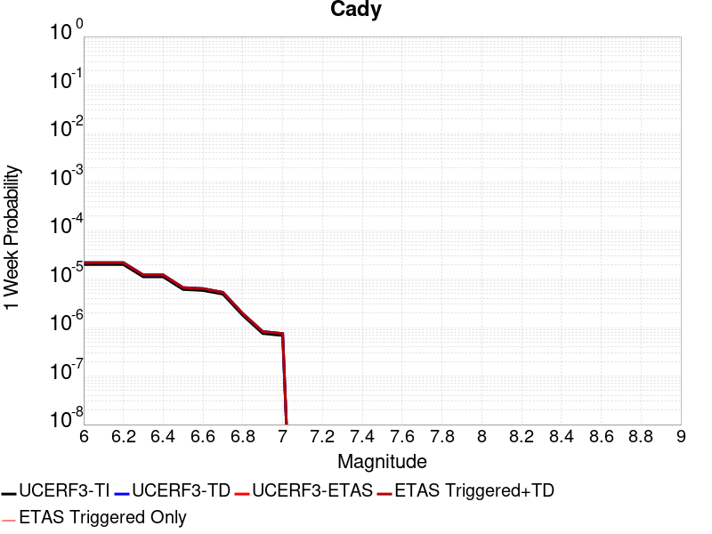 |  |  |  |

| Magnitude | 1 wk TI Prob | 1 wk TD Prob | 1 wk ETAS Prob | 1 wk ETAS/TD Gain | 1 wk ETAS Triggered+TD | 1 wk ETAS Triggered Only | 1 mo TI Prob | 1 mo TD Prob | 1 mo ETAS Prob | 1 mo ETAS/TD Gain | 1 mo ETAS Triggered+TD | 1 mo ETAS Triggered Only | 1 yr TI Prob | 1 yr TD Prob | 1 yr ETAS Prob | 1 yr ETAS/TD Gain | 1 yr ETAS Triggered+TD | 1 yr ETAS Triggered Only | 10 yr TI Prob | 10 yr TD Prob | 10 yr ETAS Prob | 10 yr ETAS/TD Gain | 10 yr ETAS Triggered+TD | 10 yr ETAS Triggered Only |
|-----|-----|-----|-----|-----|-----|-----|-----|-----|-----|-----|-----|-----|-----|-----|-----|-----|-----|-----|-----|-----|-----|-----|-----|-----|
| 6.0 | 1.9892565E-5 | 2.1836178E-5 | 0.0 | 0.0 | 2.1836178E-5 | 0.0 | 8.525106E-5 | 9.358078E-5 | 0.0 | 0.0 | 9.358078E-5 | 0.0 | 0.0010374374 | 0.0011388412 | 0.0011 | 0.96589416 | 0.00193793 | 8.0E-4 | 0.010326075 | 0.011339046 | 0.0132 | 1.1641191 | 0.019248333 | 0.008 |
| 6.1 | 1.9892565E-5 | 2.1836178E-5 | 0.0 | 0.0 | 2.1836178E-5 | 0.0 | 8.525106E-5 | 9.358078E-5 | 0.0 | 0.0 | 9.358078E-5 | 0.0 | 0.0010374374 | 0.0011388412 | 0.0011 | 0.96589416 | 0.00193793 | 8.0E-4 | 0.010326075 | 0.011339046 | 0.0132 | 1.1641191 | 0.019248333 | 0.008 |
| 6.2 | 1.9892565E-5 | 2.1836178E-5 | 0.0 | 0.0 | 2.1836178E-5 | 0.0 | 8.525106E-5 | 9.358078E-5 | 0.0 | 0.0 | 9.358078E-5 | 0.0 | 0.0010374374 | 0.0011388412 | 0.0011 | 0.96589416 | 0.00193793 | 8.0E-4 | 0.010326075 | 0.011339046 | 0.0132 | 1.1641191 | 0.019248333 | 0.008 |
| 6.3 | 1.1117327E-5 | 1.2164474E-5 | 0.0 | 0.0 | 1.2164474E-5 | 0.0 | 4.764482E-5 | 5.2132596E-5 | 0.0 | 0.0 | 5.2132596E-5 | 0.0 | 5.7992124E-4 | 6.3456094E-4 | 4.0E-4 | 0.6303571 | 8.3443406E-4 | 2.0E-4 | 0.0057841022 | 0.0063305898 | 0.0059 | 0.93198264 | 0.009013497 | 0.0027 |
| 6.4 | 1.1117327E-5 | 1.2164474E-5 | 0.0 | 0.0 | 1.2164474E-5 | 0.0 | 4.764482E-5 | 5.2132596E-5 | 0.0 | 0.0 | 5.2132596E-5 | 0.0 | 5.7992124E-4 | 6.3456094E-4 | 4.0E-4 | 0.6303571 | 8.3443406E-4 | 2.0E-4 | 0.0057841022 | 0.0063305898 | 0.0059 | 0.93198264 | 0.009013497 | 0.0027 |
| 6.5 | 6.103093E-6 | 6.665527E-6 | 0.0 | 0.0 | 6.665527E-6 | 0.0 | 2.615585E-5 | 2.8566303E-5 | 0.0 | 0.0 | 2.8566303E-5 | 0.0 | 3.1840094E-4 | 3.4775175E-4 | 2.0E-4 | 0.5751229 | 4.4771697E-4 | 1.0E-4 | 0.0031794512 | 0.0034733072 | 0.0036 | 1.0364761 | 0.0049680974 | 0.0015 |
| 6.6 | 5.817237E-6 | 6.3593943E-6 | 0.0 | 0.0 | 6.3593943E-6 | 0.0 | 2.4930776E-5 | 2.7254331E-5 | 0.0 | 0.0 | 2.7254331E-5 | 0.0 | 3.034899E-4 | 3.3178338E-4 | 2.0E-4 | 0.60280293 | 4.317502E-4 | 1.0E-4 | 0.0030307577 | 0.0033141 | 0.0034 | 1.0259196 | 0.004809129 | 0.0015 |
| 6.7 | 4.8846314E-6 | 5.335364E-6 | 0.0 | 0.0 | 5.335364E-6 | 0.0 | 2.0933967E-5 | 2.2865712E-5 | 0.0 | 0.0 | 2.2865712E-5 | 0.0 | 2.5484123E-4 | 2.7836623E-4 | 1.0E-4 | 0.35923895 | 2.7836623E-4 | 0.0 | 0.0025454918 | 0.0027813287 | 0.0025 | 0.898851 | 0.0036788255 | 9.0E-4 |
| 6.8 | 1.7788773E-6 | 1.9380745E-6 | 0.0 | 0.0 | 1.9380745E-6 | 0.0 | 7.6237375E-6 | 8.306017E-6 | 0.0 | 0.0 | 8.306017E-6 | 0.0 | 9.281505E-5 | 1.01122634E-4 | 0.0 | 0.0 | 1.01122634E-4 | 0.0 | 9.2776294E-4 | 0.0010109205 | 0.001 | 0.98919743 | 0.0011108194 | 1.0E-4 |
| 6.9 | 7.5455404E-7 | 8.2884713E-7 | 0.0 | 0.0 | 8.2884713E-7 | 0.0 | 3.233799E-6 | 3.5521991E-6 | 0.0 | 0.0 | 3.5521991E-6 | 0.0 | 3.937079E-5 | 4.3247503E-5 | 0.0 | 0.0 | 4.3247503E-5 | 0.0 | 3.9363815E-4 | 4.3242372E-4 | 4.0E-4 | 0.9250186 | 4.3242372E-4 | 0.0 |
| 7.0 | 6.8578805E-7 | 7.53397E-7 | 0.0 | 0.0 | 7.53397E-7 | 0.0 | 2.9390883E-6 | 3.2288422E-6 | 0.0 | 0.0 | 3.2288422E-6 | 0.0 | 3.578281E-5 | 3.9310773E-5 | 0.0 | 0.0 | 3.9310773E-5 | 0.0 | 3.577705E-4 | 3.930706E-4 | 4.0E-4 | 1.0176289 | 3.930706E-4 | 0.0 |

## Pinto Mtn
*[(top)](#table-of-contents)*

| 1 Week | 1 Month | 1 Year | 10 Year |
|-----|-----|-----|-----|
| 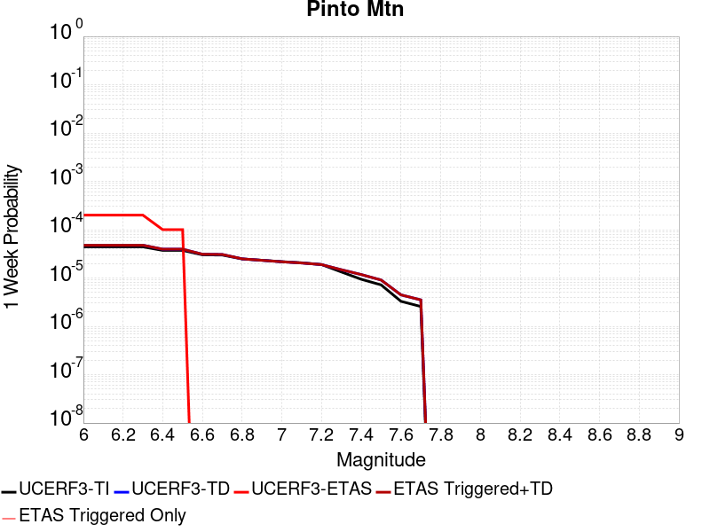 | 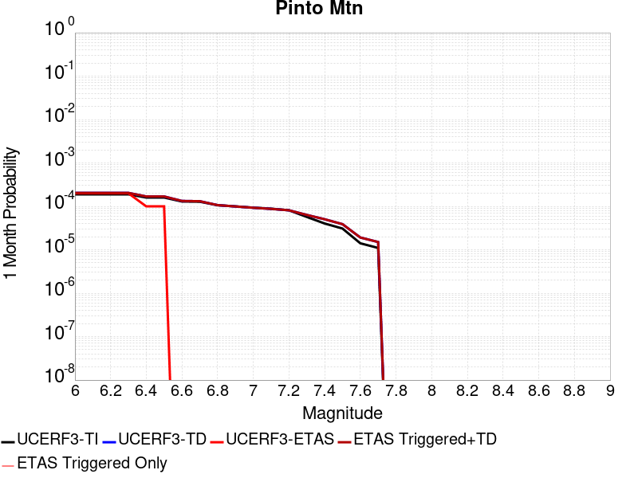 |  |  |

| Magnitude | 1 wk TI Prob | 1 wk TD Prob | 1 wk ETAS Prob | 1 wk ETAS/TD Gain | 1 wk ETAS Triggered+TD | 1 wk ETAS Triggered Only | 1 mo TI Prob | 1 mo TD Prob | 1 mo ETAS Prob | 1 mo ETAS/TD Gain | 1 mo ETAS Triggered+TD | 1 mo ETAS Triggered Only | 1 yr TI Prob | 1 yr TD Prob | 1 yr ETAS Prob | 1 yr ETAS/TD Gain | 1 yr ETAS Triggered+TD | 1 yr ETAS Triggered Only | 10 yr TI Prob | 10 yr TD Prob | 10 yr ETAS Prob | 10 yr ETAS/TD Gain | 10 yr ETAS Triggered+TD | 10 yr ETAS Triggered Only |
|-----|-----|-----|-----|-----|-----|-----|-----|-----|-----|-----|-----|-----|-----|-----|-----|-----|-----|-----|-----|-----|-----|-----|-----|-----|
| 6.0 | 4.4194956E-5 | 4.770393E-5 | 2.0E-4 | 4.192527 | 4.770393E-5 | 0.0 | 1.893932E-4 | 2.0443031E-4 | 2.0E-4 | 0.97832847 | 2.0443031E-4 | 0.0 | 0.0023034236 | 0.002486261 | 0.002 | 0.8044207 | 0.0032842723 | 8.0E-4 | 0.022796938 | 0.02460191 | 0.0202 | 0.8210744 | 0.03172232 | 0.0073 |
| 6.1 | 4.4194956E-5 | 4.770393E-5 | 2.0E-4 | 4.192527 | 4.770393E-5 | 0.0 | 1.893932E-4 | 2.0443031E-4 | 2.0E-4 | 0.97832847 | 2.0443031E-4 | 0.0 | 0.0023034236 | 0.002486261 | 0.002 | 0.8044207 | 0.0032842723 | 8.0E-4 | 0.022796938 | 0.02460191 | 0.0202 | 0.8210744 | 0.03172232 | 0.0073 |
| 6.2 | 4.4194956E-5 | 4.770393E-5 | 2.0E-4 | 4.192527 | 4.770393E-5 | 0.0 | 1.893932E-4 | 2.0443031E-4 | 2.0E-4 | 0.97832847 | 2.0443031E-4 | 0.0 | 0.0023034236 | 0.002486261 | 0.002 | 0.8044207 | 0.0032842723 | 8.0E-4 | 0.022796938 | 0.02460191 | 0.0202 | 0.8210744 | 0.03172232 | 0.0073 |
| 6.3 | 4.4194956E-5 | 4.770393E-5 | 2.0E-4 | 4.192527 | 4.770393E-5 | 0.0 | 1.893932E-4 | 2.0443031E-4 | 2.0E-4 | 0.97832847 | 2.0443031E-4 | 0.0 | 0.0023034236 | 0.002486261 | 0.002 | 0.8044207 | 0.0032842723 | 8.0E-4 | 0.022796938 | 0.02460191 | 0.0202 | 0.8210744 | 0.03172232 | 0.0073 |
| 6.4 | 3.729929E-5 | 3.9470375E-5 | 1.0E-4 | 2.5335457 | 3.9470375E-5 | 0.0 | 1.5984432E-4 | 1.6914832E-4 | 1.0E-4 | 0.59119713 | 1.6914832E-4 | 0.0 | 0.0019443673 | 0.0020575286 | 0.0019 | 0.923438 | 0.0028558825 | 8.0E-4 | 0.019274427 | 0.020394774 | 0.0167 | 0.8188372 | 0.02715405 | 0.0069 |
| 6.5 | 3.729929E-5 | 3.9470375E-5 | 1.0E-4 | 2.5335457 | 3.9470375E-5 | 0.0 | 1.5984432E-4 | 1.6914832E-4 | 1.0E-4 | 0.59119713 | 1.6914832E-4 | 0.0 | 0.0019443673 | 0.0020575286 | 0.0019 | 0.923438 | 0.0028558825 | 8.0E-4 | 0.019274427 | 0.020394774 | 0.0167 | 0.8188372 | 0.02715405 | 0.0069 |
| 6.6 | 3.0204548E-5 | 3.1088573E-5 | 0.0 | 0.0 | 3.1088573E-5 | 0.0 | 1.2944164E-4 | 1.3323013E-4 | 0.0 | 0.0 | 1.3323013E-4 | 0.0 | 0.0015748127 | 0.0016209045 | 0.0013 | 0.8020213 | 0.002219932 | 6.0E-4 | 0.015636992 | 0.01609467 | 0.013 | 0.80772084 | 0.02170293 | 0.0057 |
| 6.7 | 2.9857754E-5 | 3.0698473E-5 | 0.0 | 0.0 | 3.0698473E-5 | 0.0 | 1.2795553E-4 | 1.3155845E-4 | 0.0 | 0.0 | 1.3155845E-4 | 0.0 | 0.0015567453 | 0.0016005817 | 0.0013 | 0.8122047 | 0.0021996214 | 6.0E-4 | 0.015458848 | 0.01589436 | 0.0129 | 0.81160855 | 0.021503763 | 0.0057 |
| 6.8 | 2.4819734E-5 | 2.4902416E-5 | 0.0 | 0.0 | 2.4902416E-5 | 0.0 | 1.0636595E-4 | 1.067204E-4 | 0.0 | 0.0 | 1.067204E-4 | 0.0 | 0.0012942362 | 0.001298568 | 0.0011 | 0.84708697 | 0.0017979187 | 5.0E-4 | 0.012867244 | 0.012912154 | 0.0106 | 0.820932 | 0.017551467 | 0.0047 |
| 6.9 | 2.331124E-5 | 2.3232593E-5 | 0.0 | 0.0 | 2.3232593E-5 | 0.0 | 9.990149E-5 | 9.956457E-5 | 0.0 | 0.0 | 9.956457E-5 | 0.0 | 0.001215622 | 0.0012115447 | 0.001 | 0.82539254 | 0.0016110601 | 4.0E-4 | 0.012089936 | 0.012051578 | 0.0099 | 0.8214692 | 0.016497346 | 0.0045 |
| 7.0 | 2.1818534E-5 | 2.1657344E-5 | 0.0 | 0.0 | 2.1657344E-5 | 0.0 | 9.3504656E-5 | 9.2814E-5 | 0.0 | 0.0 | 9.2814E-5 | 0.0 | 0.0011378246 | 0.0011294443 | 0.001 | 0.8853911 | 0.0015289926 | 4.0E-4 | 0.011320163 | 0.011239133 | 0.0092 | 0.8185685 | 0.015391928 | 0.0042 |
| 7.1 | 2.066081E-5 | 2.0438532E-5 | 0.0 | 0.0 | 2.0438532E-5 | 0.0 | 8.854332E-5 | 8.759088E-5 | 0.0 | 0.0 | 8.759088E-5 | 0.0 | 0.0010774818 | 0.0010659167 | 0.001 | 0.9381596 | 0.0014654903 | 4.0E-4 | 0.010722724 | 0.01061008 | 0.009 | 0.8482499 | 0.014765518 | 0.0042 |
| 7.2 | 1.8990233E-5 | 1.8955101E-5 | 0.0 | 0.0 | 1.8955101E-5 | 0.0 | 8.138417E-5 | 8.1233724E-5 | 0.0 | 0.0 | 8.1233724E-5 | 0.0 | 9.904018E-4 | 9.885911E-4 | 0.001 | 1.0115405 | 0.0013881957 | 4.0E-4 | 0.009859995 | 0.009843922 | 0.0083 | 0.84315985 | 0.013606515 | 0.0038 |
| 7.3 | 1.3335872E-5 | 1.4816375E-5 | 0.0 | 0.0 | 1.4816375E-5 | 0.0 | 5.7152483E-5 | 6.3497275E-5 | 0.0 | 0.0 | 6.3497275E-5 | 0.0 | 6.956093E-4 | 7.728178E-4 | 0.001 | 1.293966 | 0.0011725087 | 4.0E-4 | 0.006934359 | 0.0077025946 | 0.0072 | 0.93474996 | 0.010778717 | 0.0031 |
| 7.4 | 9.414066E-6 | 1.17748E-5 | 0.0 | 0.0 | 1.17748E-5 | 0.0 | 4.0345374E-5 | 5.0462506E-5 | 0.0 | 0.0 | 5.0462506E-5 | 0.0 | 4.910942E-4 | 6.142172E-4 | 7.0E-4 | 1.139662 | 9.140329E-4 | 3.0E-4 | 0.0049001034 | 0.0061261375 | 0.0052 | 0.848822 | 0.008412047 | 0.0023 |
| 7.5 | 7.2101157E-6 | 9.075645E-6 | 0.0 | 0.0 | 9.075645E-6 | 0.0 | 3.090013E-5 | 3.8895083E-5 | 0.0 | 0.0 | 3.8895083E-5 | 0.0 | 3.7614413E-4 | 4.734525E-4 | 5.0E-4 | 1.0560722 | 6.733578E-4 | 2.0E-4 | 0.0037550807 | 0.004725207 | 0.0034 | 0.7195452 | 0.006019064 | 0.0013 |
| 7.6 | 3.296375E-6 | 4.4660537E-6 | 0.0 | 0.0 | 4.4660537E-6 | 0.0 | 1.4127245E-5 | 1.9140098E-5 | 0.0 | 0.0 | 1.9140098E-5 | 0.0 | 1.7198564E-4 | 2.3300709E-4 | 1.0E-4 | 0.42917147 | 2.3300709E-4 | 0.0 | 0.0017185259 | 0.0023277595 | 0.002 | 0.8591953 | 0.0030261301 | 7.0E-4 |
| 7.7 | 2.5741092E-6 | 3.5092667E-6 | 0.0 | 0.0 | 3.5092667E-6 | 0.0 | 1.103185E-5 | 1.5039635E-5 | 0.0 | 0.0 | 1.5039635E-5 | 0.0 | 1.3430449E-4 | 1.8309343E-4 | 1.0E-4 | 0.5461692 | 1.8309343E-4 | 0.0 | 0.0013422335 | 0.0018295501 | 0.0015 | 0.8198737 | 0.0024284525 | 6.0E-4 |

## San Diego Trough south
*[(top)](#table-of-contents)*

| 1 Week | 1 Month | 1 Year | 10 Year |
|-----|-----|-----|-----|
|  |  | 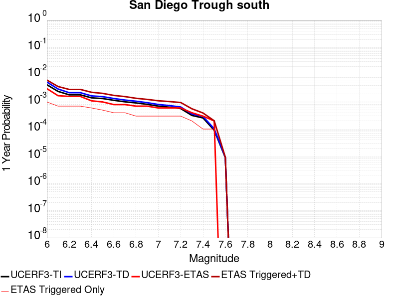 |  |

| Magnitude | 1 wk TI Prob | 1 wk TD Prob | 1 wk ETAS Prob | 1 wk ETAS/TD Gain | 1 wk ETAS Triggered+TD | 1 wk ETAS Triggered Only | 1 mo TI Prob | 1 mo TD Prob | 1 mo ETAS Prob | 1 mo ETAS/TD Gain | 1 mo ETAS Triggered+TD | 1 mo ETAS Triggered Only | 1 yr TI Prob | 1 yr TD Prob | 1 yr ETAS Prob | 1 yr ETAS/TD Gain | 1 yr ETAS Triggered+TD | 1 yr ETAS Triggered Only | 10 yr TI Prob | 10 yr TD Prob | 10 yr ETAS Prob | 10 yr ETAS/TD Gain | 10 yr ETAS Triggered+TD | 10 yr ETAS Triggered Only |
|-----|-----|-----|-----|-----|-----|-----|-----|-----|-----|-----|-----|-----|-----|-----|-----|-----|-----|-----|-----|-----|-----|-----|-----|-----|
| 6.0 | 8.279495E-5 | 1.0398335E-4 | 0.0 | 0.0 | 1.0398335E-4 | 0.0 | 3.5478722E-4 | 4.4557097E-4 | 1.0E-4 | 0.22443113 | 4.4557097E-4 | 0.0 | 0.004310982 | 0.0054117716 | 0.0031 | 0.5728253 | 0.00640636 | 0.001 | 0.042283054 | 0.052859753 | 0.033 | 0.6242935 | 0.06005802 | 0.0076 |
| 6.1 | 4.6961468E-5 | 5.7593406E-5 | 0.0 | 0.0 | 5.7593406E-5 | 0.0 | 2.0124791E-4 | 2.4680578E-4 | 1.0E-4 | 0.40517688 | 2.4680578E-4 | 0.0 | 0.00244744 | 0.0030007784 | 0.0017 | 0.5665197 | 0.0036986778 | 7.0E-4 | 0.024206603 | 0.029610973 | 0.0167 | 0.5639801 | 0.033977725 | 0.0045 |
| 6.2 | 3.5079658E-5 | 4.2053834E-5 | 0.0 | 0.0 | 4.2053834E-5 | 0.0 | 1.5033272E-4 | 1.8021835E-4 | 1.0E-4 | 0.5548824 | 1.8021835E-4 | 0.0 | 0.0018287642 | 0.0021919683 | 0.0016 | 0.72993755 | 0.0028904339 | 7.0E-4 | 0.018137876 | 0.021706074 | 0.0126 | 0.58048266 | 0.024640957 | 0.003 |
| 6.3 | 3.5079658E-5 | 4.2053834E-5 | 0.0 | 0.0 | 4.2053834E-5 | 0.0 | 1.5033272E-4 | 1.8021835E-4 | 1.0E-4 | 0.5548824 | 1.8021835E-4 | 0.0 | 0.0018287642 | 0.0021919683 | 0.0016 | 0.72993755 | 0.0028904339 | 7.0E-4 | 0.018137876 | 0.021706074 | 0.0126 | 0.58048266 | 0.024640957 | 0.003 |
| 6.4 | 2.7196904E-5 | 3.2026568E-5 | 0.0 | 0.0 | 3.2026568E-5 | 0.0 | 1.16552954E-4 | 1.372496E-4 | 0.0 | 0.0 | 1.372496E-4 | 0.0 | 0.0014181085 | 0.0016697448 | 0.0011 | 0.6587833 | 0.002268743 | 6.0E-4 | 0.014090929 | 0.016573627 | 0.0089 | 0.53699774 | 0.01854048 | 0.002 |
| 6.5 | 2.5584688E-5 | 3.004582E-5 | 0.0 | 0.0 | 3.004582E-5 | 0.0 | 1.0964406E-4 | 1.2876153E-4 | 0.0 | 0.0 | 1.2876153E-4 | 0.0 | 0.0013340989 | 0.0015665563 | 0.001 | 0.63834286 | 0.0020657731 | 5.0E-4 | 0.013261181 | 0.0155567005 | 0.0082 | 0.527104 | 0.017427143 | 0.0019 |
| 6.6 | 2.2034688E-5 | 2.5697242E-5 | 0.0 | 0.0 | 2.5697242E-5 | 0.0 | 9.443096E-5 | 1.10126435E-4 | 0.0 | 0.0 | 1.10126435E-4 | 0.0 | 0.0011490905 | 0.0013399721 | 8.0E-4 | 0.59702736 | 0.0017394362 | 4.0E-4 | 0.011431668 | 0.0133199245 | 0.0071 | 0.53303605 | 0.014898613 | 0.0016 |
| 6.7 | 1.9394853E-5 | 2.2503391E-5 | 0.0 | 0.0 | 2.2503391E-5 | 0.0 | 8.311815E-5 | 9.643957E-5 | 0.0 | 0.0 | 9.643957E-5 | 0.0 | 0.0010114936 | 0.0011735245 | 8.0E-4 | 0.6817071 | 0.0015730552 | 4.0E-4 | 0.01006902 | 0.011673977 | 0.0061 | 0.5225297 | 0.013255299 | 0.0016 |
| 6.8 | 1.7615313E-5 | 2.0369338E-5 | 0.0 | 0.0 | 2.0369338E-5 | 0.0 | 7.549201E-5 | 8.729427E-5 | 0.0 | 0.0 | 8.729427E-5 | 0.0 | 9.1872766E-4 | 0.0010622938 | 7.0E-4 | 0.6589514 | 0.0013619751 | 3.0E-4 | 0.009149387 | 0.010572723 | 0.0058 | 0.5485815 | 0.012056865 | 0.0015 |
| 6.9 | 1.5621423E-5 | 1.7997054E-5 | 0.0 | 0.0 | 1.7997054E-5 | 0.0 | 6.6947236E-5 | 7.7127974E-5 | 0.0 | 0.0 | 7.7127974E-5 | 0.0 | 8.147778E-4 | 9.38632E-4 | 7.0E-4 | 0.74576616 | 0.0012383504 | 3.0E-4 | 0.008117969 | 0.009347118 | 0.0051 | 0.5456227 | 0.010833098 | 0.0015 |
| 7.0 | 1.3444376E-5 | 1.5423993E-5 | 0.0 | 0.0 | 1.5423993E-5 | 0.0 | 5.7617483E-5 | 6.610117E-5 | 0.0 | 0.0 | 6.610117E-5 | 0.0 | 7.0126704E-4 | 8.044873E-4 | 6.0E-4 | 0.7458166 | 0.001104246 | 3.0E-4 | 0.006990582 | 0.008016082 | 0.0041 | 0.5114718 | 0.009206463 | 0.0012 |
| 7.1 | 1.2268361E-5 | 1.4051366E-5 | 0.0 | 0.0 | 1.4051366E-5 | 0.0 | 5.2577634E-5 | 6.021876E-5 | 0.0 | 0.0 | 6.021876E-5 | 0.0 | 6.399447E-4 | 7.3291943E-4 | 6.0E-4 | 0.81864387 | 0.0010326996 | 3.0E-4 | 0.0063810493 | 0.0073053264 | 0.0036 | 0.49279112 | 0.00849656 | 0.0012 |
| 7.2 | 1.0922655E-5 | 1.24944845E-5 | 0.0 | 0.0 | 1.24944845E-5 | 0.0 | 4.681054E-5 | 5.3546704E-5 | 0.0 | 0.0 | 5.3546704E-5 | 0.0 | 5.697693E-4 | 6.5173866E-4 | 6.0E-4 | 0.9206144 | 9.515431E-4 | 3.0E-4 | 0.0056831064 | 0.0064985524 | 0.0033 | 0.5078054 | 0.007591404 | 0.0011 |
| 7.3 | 6.1106753E-6 | 6.9192024E-6 | 0.0 | 0.0 | 6.9192024E-6 | 0.0 | 2.6188345E-5 | 2.9653389E-5 | 0.0 | 0.0 | 2.9653389E-5 | 0.0 | 3.1879646E-4 | 3.6097062E-4 | 4.0E-4 | 1.1081234 | 5.608984E-4 | 2.0E-4 | 0.0031833951 | 0.003603888 | 0.0021 | 0.582704 | 0.004600284 | 0.001 |
| 7.4 | 4.933187E-6 | 5.5817527E-6 | 0.0 | 0.0 | 5.5817527E-6 | 0.0 | 2.114206E-5 | 2.392158E-5 | 0.0 | 0.0 | 2.392158E-5 | 0.0 | 2.5737417E-4 | 2.912067E-4 | 3.0E-4 | 1.0301961 | 3.911776E-4 | 1.0E-4 | 0.002570763 | 0.0029082922 | 0.0018 | 0.6189199 | 0.0038056748 | 9.0E-4 |
| 7.5 | 1.7489613E-6 | 1.967052E-6 | 0.0 | 0.0 | 1.967052E-6 | 0.0 | 7.495527E-6 | 8.430196E-6 | 0.0 | 0.0 | 8.430196E-6 | 0.0 | 9.125422E-5 | 1.0263303E-4 | 2.0E-4 | 1.9486904 | 2.0262276E-4 | 1.0E-4 | 9.1216754E-4 | 0.0010258782 | 6.0E-4 | 0.58486474 | 0.0013255705 | 3.0E-4 |
| 7.6 | 1.6988751E-7 | 1.7527951E-7 | 0.0 | 0.0 | 1.7527951E-7 | 0.0 | 7.2808916E-7 | 7.5119766E-7 | 0.0 | 0.0 | 7.5119766E-7 | 0.0 | 8.864449E-6 | 9.145795E-6 | 0.0 | 0.0 | 9.145795E-6 | 0.0 | 8.8640954E-5 | 9.1454385E-5 | 1.0E-4 | 1.0934412 | 9.1454385E-5 | 0.0 |

## Great Valley 09 (Laguna Seca)
*[(top)](#table-of-contents)*

| 1 Week | 1 Month | 1 Year | 10 Year |
|-----|-----|-----|-----|
|  | 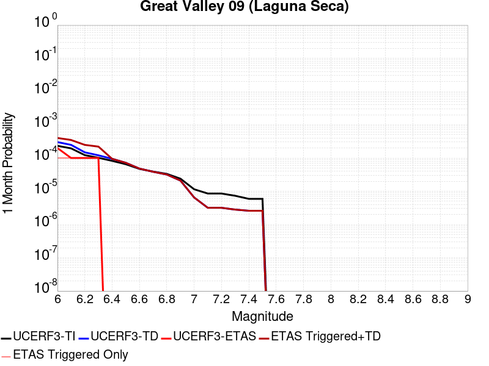 | 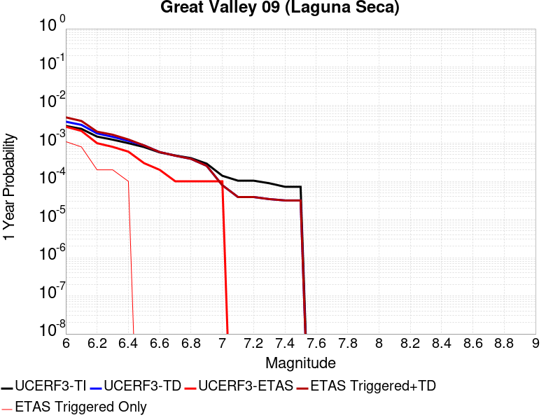 |  |

| Magnitude | 1 wk TI Prob | 1 wk TD Prob | 1 wk ETAS Prob | 1 wk ETAS/TD Gain | 1 wk ETAS Triggered+TD | 1 wk ETAS Triggered Only | 1 mo TI Prob | 1 mo TD Prob | 1 mo ETAS Prob | 1 mo ETAS/TD Gain | 1 mo ETAS Triggered+TD | 1 mo ETAS Triggered Only | 1 yr TI Prob | 1 yr TD Prob | 1 yr ETAS Prob | 1 yr ETAS/TD Gain | 1 yr ETAS Triggered+TD | 1 yr ETAS Triggered Only | 10 yr TI Prob | 10 yr TD Prob | 10 yr ETAS Prob | 10 yr ETAS/TD Gain | 10 yr ETAS Triggered+TD | 10 yr ETAS Triggered Only |
|-----|-----|-----|-----|-----|-----|-----|-----|-----|-----|-----|-----|-----|-----|-----|-----|-----|-----|-----|-----|-----|-----|-----|-----|-----|
| 6.0 | 5.4353277E-5 | 7.027208E-5 | 0.0 | 0.0 | 7.027208E-5 | 0.0 | 2.3292181E-4 | 3.0113137E-4 | 2.0E-4 | 0.664162 | 4.0110125E-4 | 1.0E-4 | 0.0028321352 | 0.0036601184 | 0.0027 | 0.73768103 | 0.004756092 | 0.0011 | 0.02796312 | 0.036002573 | 0.0265 | 0.73605853 | 0.043136153 | 0.0074 |
| 6.1 | 4.5578287E-5 | 5.8037644E-5 | 0.0 | 0.0 | 5.8037644E-5 | 0.0 | 1.953209E-4 | 2.4870917E-4 | 1.0E-4 | 0.40207607 | 3.486843E-4 | 1.0E-4 | 0.0023754383 | 0.0030238347 | 0.0021 | 0.69448245 | 0.0038214156 | 8.0E-4 | 0.023502063 | 0.02982855 | 0.0199 | 0.6671461 | 0.03555256 | 0.0059 |
| 6.2 | 2.8536782E-5 | 3.4637495E-5 | 0.0 | 0.0 | 3.4637495E-5 | 0.0 | 1.2229476E-4 | 1.4843796E-4 | 1.0E-4 | 0.6736821 | 2.4842314E-4 | 1.0E-4 | 0.0014879217 | 0.0018057144 | 0.001 | 0.5537974 | 0.0020053533 | 2.0E-4 | 0.014779986 | 0.017908249 | 0.0106 | 0.591906 | 0.020363478 | 0.0025 |
| 6.3 | 2.3698774E-5 | 2.8136548E-5 | 0.0 | 0.0 | 2.8136548E-5 | 0.0 | 1.01562226E-4 | 1.205795E-4 | 1.0E-4 | 0.82932836 | 2.2056744E-4 | 1.0E-4 | 0.0012358186 | 0.0014670567 | 8.0E-4 | 0.54530954 | 0.0016667633 | 2.0E-4 | 0.012289686 | 0.01457243 | 0.0085 | 0.5832932 | 0.0163462 | 0.0018 |
| 6.4 | 1.9191197E-5 | 2.2066964E-5 | 0.0 | 0.0 | 2.2066964E-5 | 0.0 | 8.2245395E-5 | 9.456951E-5 | 0.0 | 0.0 | 9.456951E-5 | 0.0 | 0.0010008777 | 0.0011507788 | 6.0E-4 | 0.521386 | 0.0012506638 | 1.0E-4 | 0.009963818 | 0.011448429 | 0.0071 | 0.62017244 | 0.012931257 | 0.0015 |
| 6.5 | 1.5203241E-5 | 1.6762844E-5 | 0.0 | 0.0 | 1.6762844E-5 | 0.0 | 6.5155116E-5 | 7.183896E-5 | 0.0 | 0.0 | 7.183896E-5 | 0.0 | 7.9297484E-4 | 8.743024E-4 | 3.0E-4 | 0.3431307 | 8.743024E-4 | 0.0 | 0.007901512 | 0.008709849 | 0.0045 | 0.5166565 | 0.009304623 | 6.0E-4 |
| 6.6 | 1.0984925E-5 | 1.122181E-5 | 0.0 | 0.0 | 1.122181E-5 | 0.0 | 4.70774E-5 | 4.8092603E-5 | 0.0 | 0.0 | 4.8092603E-5 | 0.0 | 5.730166E-4 | 5.8537396E-4 | 2.0E-4 | 0.34166196 | 5.8537396E-4 | 0.0 | 0.005715413 | 0.0058387127 | 0.0032 | 0.548066 | 0.0063357935 | 5.0E-4 |
| 6.7 | 9.134616E-6 | 9.003779E-6 | 0.0 | 0.0 | 9.003779E-6 | 0.0 | 3.9147766E-5 | 3.8587066E-5 | 0.0 | 0.0 | 3.8587066E-5 | 0.0 | 4.7651984E-4 | 4.6969866E-4 | 1.0E-4 | 0.21290246 | 4.6969866E-4 | 0.0 | 0.004754993 | 0.004687303 | 0.0026 | 0.55468994 | 0.0051849596 | 5.0E-4 |
| 6.8 | 7.785589E-6 | 7.438485E-6 | 0.0 | 0.0 | 7.438485E-6 | 0.0 | 3.3366385E-5 | 3.1878844E-5 | 0.0 | 0.0 | 3.1878844E-5 | 0.0 | 4.0616E-4 | 3.8805782E-4 | 1.0E-4 | 0.25769356 | 3.8805782E-4 | 0.0 | 0.0040541845 | 0.003874005 | 0.0022 | 0.5678877 | 0.004372068 | 5.0E-4 |
| 6.9 | 5.579095E-6 | 4.8892202E-6 | 0.0 | 0.0 | 4.8892202E-6 | 0.0 | 2.3910188E-5 | 2.0953641E-5 | 0.0 | 0.0 | 2.0953641E-5 | 0.0 | 2.9106764E-4 | 2.550821E-4 | 1.0E-4 | 0.39203066 | 2.550821E-4 | 0.0 | 0.002906867 | 0.0025480299 | 0.0014 | 0.5494441 | 0.0028472655 | 3.0E-4 |
| 7.0 | 2.6816688E-6 | 1.5181748E-6 | 0.0 | 0.0 | 1.5181748E-6 | 0.0 | 1.1492816E-5 | 6.506448E-6 | 0.0 | 0.0 | 6.506448E-6 | 0.0 | 1.3991605E-4 | 7.921321E-5 | 1.0E-4 | 1.2624156 | 7.921321E-5 | 0.0 | 0.0013982799 | 7.918585E-4 | 4.0E-4 | 0.5051408 | 8.9177926E-4 | 1.0E-4 |
| 7.1 | 1.9951021E-6 | 7.430028E-7 | 0.0 | 0.0 | 7.430028E-7 | 0.0 | 8.55041E-6 | 3.184294E-6 | 0.0 | 0.0 | 3.184294E-6 | 0.0 | 1.0409627E-4 | 3.876813E-5 | 0.0 | 0.0 | 3.876813E-5 | 0.0 | 0.0010404752 | 3.876178E-4 | 3.0E-4 | 0.77395827 | 4.8757903E-4 | 1.0E-4 |
| 7.2 | 1.9951021E-6 | 7.430028E-7 | 0.0 | 0.0 | 7.430028E-7 | 0.0 | 8.55041E-6 | 3.184294E-6 | 0.0 | 0.0 | 3.184294E-6 | 0.0 | 1.0409627E-4 | 3.876813E-5 | 0.0 | 0.0 | 3.876813E-5 | 0.0 | 0.0010404752 | 3.876178E-4 | 3.0E-4 | 0.77395827 | 4.8757903E-4 | 1.0E-4 |
| 7.3 | 1.7087556E-6 | 6.5582105E-7 | 0.0 | 0.0 | 6.5582105E-7 | 0.0 | 7.3232177E-6 | 2.8106588E-6 | 0.0 | 0.0 | 2.8106588E-6 | 0.0 | 8.915652E-5 | 3.4219276E-5 | 0.0 | 0.0 | 3.4219276E-5 | 0.0 | 8.9120766E-4 | 3.4214408E-4 | 2.0E-4 | 0.58454907 | 4.4210986E-4 | 1.0E-4 |
| 7.4 | 1.3804846E-6 | 6.05547E-7 | 0.0 | 0.0 | 6.05547E-7 | 0.0 | 5.916349E-6 | 2.595199E-6 | 0.0 | 0.0 | 2.595199E-6 | 0.0 | 7.2029165E-5 | 3.159613E-5 | 0.0 | 0.0 | 3.159613E-5 | 0.0 | 7.200583E-4 | 3.1592036E-4 | 2.0E-4 | 0.63307095 | 4.1588876E-4 | 1.0E-4 |
| 7.5 | 1.3804846E-6 | 6.05547E-7 | 0.0 | 0.0 | 6.05547E-7 | 0.0 | 5.916349E-6 | 2.595199E-6 | 0.0 | 0.0 | 2.595199E-6 | 0.0 | 7.2029165E-5 | 3.159613E-5 | 0.0 | 0.0 | 3.159613E-5 | 0.0 | 7.200583E-4 | 3.1592036E-4 | 2.0E-4 | 0.63307095 | 4.1588876E-4 | 1.0E-4 |

## Rose Canyon
*[(top)](#table-of-contents)*

| 1 Week | 1 Month | 1 Year | 10 Year |
|-----|-----|-----|-----|
|  |  | 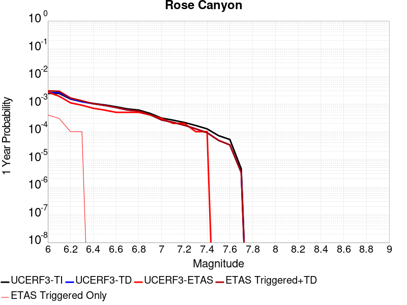 |  |

| Magnitude | 1 wk TI Prob | 1 wk TD Prob | 1 wk ETAS Prob | 1 wk ETAS/TD Gain | 1 wk ETAS Triggered+TD | 1 wk ETAS Triggered Only | 1 mo TI Prob | 1 mo TD Prob | 1 mo ETAS Prob | 1 mo ETAS/TD Gain | 1 mo ETAS Triggered+TD | 1 mo ETAS Triggered Only | 1 yr TI Prob | 1 yr TD Prob | 1 yr ETAS Prob | 1 yr ETAS/TD Gain | 1 yr ETAS Triggered+TD | 1 yr ETAS Triggered Only | 10 yr TI Prob | 10 yr TD Prob | 10 yr ETAS Prob | 10 yr ETAS/TD Gain | 10 yr ETAS Triggered+TD | 10 yr ETAS Triggered Only |
|-----|-----|-----|-----|-----|-----|-----|-----|-----|-----|-----|-----|-----|-----|-----|-----|-----|-----|-----|-----|-----|-----|-----|-----|-----|
| 6.0 | 4.5923203E-5 | 4.956846E-5 | 1.0E-4 | 2.0174117 | 4.956846E-5 | 0.0 | 1.9679888E-4 | 2.1242008E-4 | 4.0E-4 | 1.883061 | 3.1239886E-4 | 1.0E-4 | 0.0023933933 | 0.0025833456 | 0.0027 | 1.0451562 | 0.0029823123 | 4.0E-4 | 0.023677798 | 0.025569068 | 0.0267 | 1.0442305 | 0.0321952 | 0.0068 |
| 6.1 | 4.5923203E-5 | 4.956846E-5 | 1.0E-4 | 2.0174117 | 4.956846E-5 | 0.0 | 1.9679888E-4 | 2.1242008E-4 | 4.0E-4 | 1.883061 | 3.1239886E-4 | 1.0E-4 | 0.0023933933 | 0.0025833456 | 0.0019 | 0.73548037 | 0.0028825707 | 3.0E-4 | 0.023677798 | 0.025569068 | 0.0167 | 0.6531329 | 0.029954007 | 0.0045 |
| 6.2 | 2.8844734E-5 | 2.9590543E-5 | 1.0E-4 | 3.3794582 | 2.9590543E-5 | 0.0 | 1.2361443E-4 | 1.2681042E-4 | 3.0E-4 | 2.3657362 | 2.2679774E-4 | 1.0E-4 | 0.0015039665 | 0.0015428526 | 0.0011 | 0.712965 | 0.0016426984 | 1.0E-4 | 0.0149382865 | 0.015320359 | 0.009 | 0.5874536 | 0.018077461 | 0.0028 |
| 6.3 | 2.3171577E-5 | 2.3104E-5 | 0.0 | 0.0 | 2.3104E-5 | 0.0 | 9.9302975E-5 | 9.901346E-5 | 2.0E-4 | 2.0199275 | 1.9900355E-4 | 1.0E-4 | 0.0012083431 | 0.0012048355 | 9.0E-4 | 0.74698997 | 0.0013047149 | 1.0E-4 | 0.012017938 | 0.0119845625 | 0.0069 | 0.57574064 | 0.014158197 | 0.0022 |
| 6.4 | 2.0066604E-5 | 1.9615401E-5 | 0.0 | 0.0 | 1.9615401E-5 | 0.0 | 8.599689E-5 | 8.406336E-5 | 1.0E-4 | 1.189579 | 8.406336E-5 | 0.0 | 0.0010465092 | 0.0010230008 | 7.0E-4 | 0.68426144 | 0.0010230008 | 0.0 | 0.010415946 | 0.010179632 | 0.0059 | 0.5795887 | 0.011862326 | 0.0017 |
| 6.5 | 1.776989E-5 | 1.706667E-5 | 0.0 | 0.0 | 1.706667E-5 | 0.0 | 7.615444E-5 | 7.3140865E-5 | 1.0E-4 | 1.3672248 | 7.3140865E-5 | 0.0 | 9.267859E-4 | 8.9013315E-4 | 6.0E-4 | 0.6740565 | 8.9013315E-4 | 0.0 | 0.009229303 | 0.0088629415 | 0.0048 | 0.5415809 | 0.010052306 | 0.0012 |
| 6.6 | 1.5227364E-5 | 1.4299948E-5 | 0.0 | 0.0 | 1.4299948E-5 | 0.0 | 6.52585E-5 | 6.128408E-5 | 1.0E-4 | 1.6317451 | 6.128408E-5 | 0.0 | 7.942326E-4 | 7.4588344E-4 | 5.0E-4 | 0.670346 | 7.4588344E-4 | 0.0 | 0.007914 | 0.007420897 | 0.0033 | 0.44469017 | 0.008115702 | 7.0E-4 |
| 6.7 | 1.2703898E-5 | 1.1645335E-5 | 0.0 | 0.0 | 1.1645335E-5 | 0.0 | 5.4444143E-5 | 4.9907645E-5 | 1.0E-4 | 2.003701 | 4.9907645E-5 | 0.0 | 6.626558E-4 | 6.074604E-4 | 5.0E-4 | 0.8230989 | 6.074604E-4 | 0.0 | 0.006606833 | 0.0060428753 | 0.0025 | 0.41371036 | 0.0065398538 | 5.0E-4 |
| 6.8 | 1.1554917E-5 | 1.0585637E-5 | 0.0 | 0.0 | 1.0585637E-5 | 0.0 | 4.9520135E-5 | 4.536625E-5 | 1.0E-4 | 2.2042818 | 4.536625E-5 | 0.0 | 6.0274085E-4 | 5.5219815E-4 | 5.0E-4 | 0.90547204 | 5.5219815E-4 | 0.0 | 0.0060110865 | 0.005498362 | 0.0023 | 0.4183064 | 0.0059956126 | 5.0E-4 |
| 6.9 | 8.732078E-6 | 7.867183E-6 | 0.0 | 0.0 | 7.867183E-6 | 0.0 | 3.7422655E-5 | 3.3716078E-5 | 1.0E-4 | 2.965944 | 3.3716078E-5 | 0.0 | 4.5552556E-4 | 4.1041887E-4 | 4.0E-4 | 0.974614 | 4.1041887E-4 | 0.0 | 0.0045459294 | 0.004081689 | 0.0018 | 0.4409939 | 0.0045796484 | 5.0E-4 |
| 7.0 | 5.9337494E-6 | 5.0970466E-6 | 0.0 | 0.0 | 5.0970466E-6 | 0.0 | 2.5430107E-5 | 2.1844304E-5 | 1.0E-4 | 4.5778527 | 2.1844304E-5 | 0.0 | 3.0956755E-4 | 2.6592208E-4 | 3.0E-4 | 1.12815 | 2.6592208E-4 | 0.0 | 0.0030913667 | 0.0026560542 | 0.0012 | 0.451798 | 0.0029552574 | 3.0E-4 |
| 7.1 | 5.013409E-6 | 4.1689573E-6 | 0.0 | 0.0 | 4.1689573E-6 | 0.0 | 2.1485863E-5 | 1.7866838E-5 | 1.0E-4 | 5.596961 | 1.7866838E-5 | 0.0 | 2.6155898E-4 | 2.1750714E-4 | 2.0E-4 | 0.91951 | 2.1750714E-4 | 0.0 | 0.0026125133 | 0.0021729541 | 0.001 | 0.460203 | 0.0024723024 | 3.0E-4 |
| 7.2 | 4.120763E-6 | 3.2745306E-6 | 0.0 | 0.0 | 3.2745306E-6 | 0.0 | 1.7660293E-5 | 1.4033627E-5 | 1.0E-4 | 7.1257415 | 1.4033627E-5 | 0.0 | 2.1499286E-4 | 1.708461E-4 | 2.0E-4 | 1.1706442 | 1.708461E-4 | 0.0 | 0.0021478499 | 0.0017071571 | 0.001 | 0.5857692 | 0.0020066448 | 3.0E-4 |
| 7.3 | 3.2081239E-6 | 2.4343078E-6 | 0.0 | 0.0 | 2.4343078E-6 | 0.0 | 1.374903E-5 | 1.0432706E-5 | 1.0E-4 | 9.58524 | 1.0432706E-5 | 0.0 | 1.6738157E-4 | 1.2701086E-4 | 1.0E-4 | 0.7873342 | 1.2701086E-4 | 0.0 | 0.0016725556 | 0.0012693896 | 7.0E-4 | 0.55144614 | 0.0014691358 | 2.0E-4 |
| 7.4 | 2.4194755E-6 | 1.7628944E-6 | 0.0 | 0.0 | 1.7628944E-6 | 0.0 | 1.0369139E-5 | 7.55524E-6 | 1.0E-4 | 13.2358465 | 7.55524E-6 | 0.0 | 1.2623696E-4 | 9.1981216E-5 | 1.0E-4 | 1.0871785 | 9.1981216E-5 | 0.0 | 0.0012616527 | 9.1943674E-4 | 5.0E-4 | 0.5438112 | 0.0010193448 | 1.0E-4 |
| 7.5 | 1.3842889E-6 | 9.337478E-7 | 0.0 | 0.0 | 9.337478E-7 | 0.0 | 5.9326535E-6 | 4.0017703E-6 | 0.0 | 0.0 | 4.0017703E-6 | 0.0 | 7.222766E-5 | 4.87205E-5 | 0.0 | 0.0 | 4.87205E-5 | 0.0 | 7.220419E-4 | 4.871017E-4 | 1.0E-4 | 0.20529594 | 4.871017E-4 | 0.0 |
| 7.6 | 1.0021575E-6 | 6.3821955E-7 | 0.0 | 0.0 | 6.3821955E-7 | 0.0 | 4.2949537E-6 | 2.735224E-6 | 0.0 | 0.0 | 2.735224E-6 | 0.0 | 5.2289808E-5 | 3.3300865E-5 | 0.0 | 0.0 | 3.3300865E-5 | 0.0 | 5.2277505E-4 | 3.3296086E-4 | 0.0 | 0.0 | 3.3296086E-4 | 0.0 |
| 7.7 | 8.7620116E-8 | 6.4458135E-8 | 0.0 | 0.0 | 6.4458135E-8 | 0.0 | 3.7551473E-7 | 2.7624912E-7 | 0.0 | 0.0 | 2.7624912E-7 | 0.0 | 4.5718825E-6 | 3.3633282E-6 | 0.0 | 0.0 | 3.3633282E-6 | 0.0 | 4.5717883E-5 | 3.36328E-5 | 0.0 | 0.0 | 3.36328E-5 | 0.0 |

## Garlock (East)
*[(top)](#table-of-contents)*

| 1 Week | 1 Month | 1 Year | 10 Year |
|-----|-----|-----|-----|
| 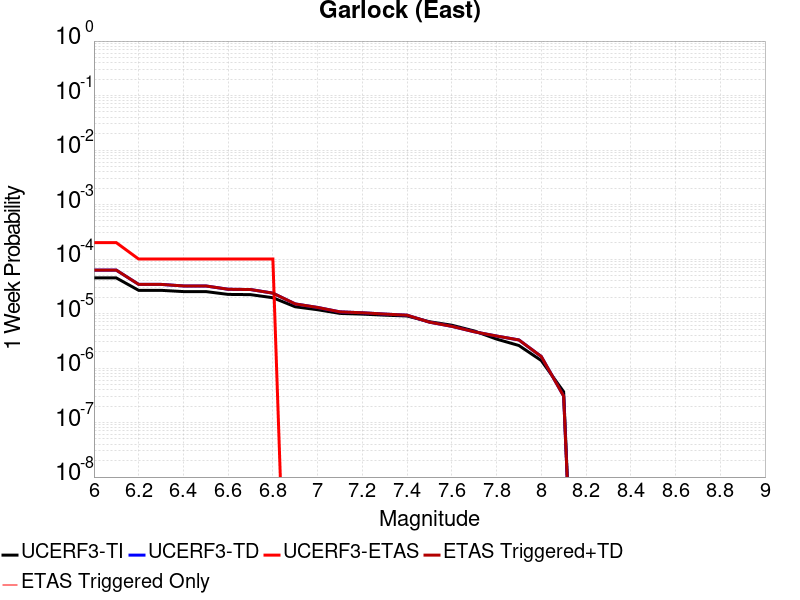 |  |  |  |

| Magnitude | 1 wk TI Prob | 1 wk TD Prob | 1 wk ETAS Prob | 1 wk ETAS/TD Gain | 1 wk ETAS Triggered+TD | 1 wk ETAS Triggered Only | 1 mo TI Prob | 1 mo TD Prob | 1 mo ETAS Prob | 1 mo ETAS/TD Gain | 1 mo ETAS Triggered+TD | 1 mo ETAS Triggered Only | 1 yr TI Prob | 1 yr TD Prob | 1 yr ETAS Prob | 1 yr ETAS/TD Gain | 1 yr ETAS Triggered+TD | 1 yr ETAS Triggered Only | 10 yr TI Prob | 10 yr TD Prob | 10 yr ETAS Prob | 10 yr ETAS/TD Gain | 10 yr ETAS Triggered+TD | 10 yr ETAS Triggered Only |
|-----|-----|-----|-----|-----|-----|-----|-----|-----|-----|-----|-----|-----|-----|-----|-----|-----|-----|-----|-----|-----|-----|-----|-----|-----|
| 6.0 | 4.5092507E-5 | 6.26185E-5 | 2.0E-4 | 3.1939442 | 6.26185E-5 | 0.0 | 1.9323928E-4 | 2.683399E-4 | 4.0E-4 | 1.4906467 | 2.683399E-4 | 0.0 | 0.0023501497 | 0.0032625883 | 0.0023 | 0.7049618 | 0.0034619358 | 2.0E-4 | 0.023254504 | 0.032222725 | 0.0243 | 0.75412613 | 0.03880361 | 0.0068 |
| 6.1 | 4.5092507E-5 | 6.26185E-5 | 2.0E-4 | 3.1939442 | 6.26185E-5 | 0.0 | 1.9323928E-4 | 2.683399E-4 | 4.0E-4 | 1.4906467 | 2.683399E-4 | 0.0 | 0.0023501497 | 0.0032625883 | 0.0023 | 0.7049618 | 0.0034619358 | 2.0E-4 | 0.023254504 | 0.032222725 | 0.0243 | 0.75412613 | 0.03880361 | 0.0068 |
| 6.2 | 2.6674514E-5 | 3.4283148E-5 | 1.0E-4 | 2.916885 | 3.4283148E-5 | 0.0 | 1.1431433E-4 | 1.4691969E-4 | 1.0E-4 | 0.680644 | 1.4691969E-4 | 0.0 | 0.0013908884 | 0.0017873124 | 9.0E-4 | 0.50354934 | 0.001986955 | 2.0E-4 | 0.01382215 | 0.01779696 | 0.0125 | 0.7023671 | 0.021725772 | 0.004 |
| 6.3 | 2.6674514E-5 | 3.4283148E-5 | 1.0E-4 | 2.916885 | 3.4283148E-5 | 0.0 | 1.1431433E-4 | 1.4691969E-4 | 1.0E-4 | 0.680644 | 1.4691969E-4 | 0.0 | 0.0013908884 | 0.0017873124 | 9.0E-4 | 0.50354934 | 0.001986955 | 2.0E-4 | 0.01382215 | 0.01779696 | 0.0125 | 0.7023671 | 0.021725772 | 0.004 |
| 6.4 | 2.5312667E-5 | 3.2117397E-5 | 1.0E-4 | 3.1135771 | 3.2117397E-5 | 0.0 | 1.0847834E-4 | 1.376389E-4 | 1.0E-4 | 0.7265388 | 1.376389E-4 | 0.0 | 0.0013199237 | 0.0016744947 | 7.0E-4 | 0.41803655 | 0.0018741598 | 2.0E-4 | 0.013121112 | 0.016671102 | 0.0113 | 0.6778196 | 0.020407751 | 0.0038 |
| 6.5 | 2.5312667E-5 | 3.2117397E-5 | 1.0E-4 | 3.1135771 | 3.2117397E-5 | 0.0 | 1.0847834E-4 | 1.376389E-4 | 1.0E-4 | 0.7265388 | 1.376389E-4 | 0.0 | 0.0013199237 | 0.0016744947 | 7.0E-4 | 0.41803655 | 0.0018741598 | 2.0E-4 | 0.013121112 | 0.016671102 | 0.0113 | 0.6778196 | 0.020407751 | 0.0038 |
| 6.6 | 2.246556E-5 | 2.7920609E-5 | 1.0E-4 | 3.5815837 | 2.7920609E-5 | 0.0 | 9.627742E-5 | 1.19654396E-4 | 1.0E-4 | 0.83574027 | 1.19654396E-4 | 0.0 | 0.0011715472 | 0.0014558422 | 7.0E-4 | 0.48082137 | 0.0016555509 | 2.0E-4 | 0.011653901 | 0.014516019 | 0.0099 | 0.68200517 | 0.017768117 | 0.0033 |
| 6.7 | 2.2241198E-5 | 2.7590935E-5 | 1.0E-4 | 3.6243787 | 2.7590935E-5 | 0.0 | 9.531594E-5 | 1.1824164E-4 | 1.0E-4 | 0.8457258 | 1.1824164E-4 | 0.0 | 0.0011598538 | 0.0014386646 | 7.0E-4 | 0.4865623 | 0.0016383769 | 2.0E-4 | 0.011538187 | 0.014345958 | 0.0098 | 0.68311924 | 0.017598616 | 0.0033 |
| 6.8 | 1.9528685E-5 | 2.3699193E-5 | 1.0E-4 | 4.219553 | 2.3699193E-5 | 0.0 | 8.369167E-5 | 1.01564125E-4 | 1.0E-4 | 0.98459965 | 1.01564125E-4 | 0.0 | 0.0010184698 | 0.0012358612 | 5.0E-4 | 0.40457615 | 0.0013357376 | 1.0E-4 | 0.010138147 | 0.012333402 | 0.0083 | 0.6729692 | 0.015098869 | 0.0028 |
| 6.9 | 1.3318621E-5 | 1.5025627E-5 | 0.0 | 0.0 | 1.5025627E-5 | 0.0 | 5.7078556E-5 | 6.439399E-5 | 0.0 | 0.0 | 6.439399E-5 | 0.0 | 6.9470983E-4 | 7.8372046E-4 | 3.0E-4 | 0.38278955 | 7.8372046E-4 | 0.0 | 0.0069254204 | 0.007850269 | 0.005 | 0.63692087 | 0.009636139 | 0.0018 |
| 7.0 | 1.1760853E-5 | 1.2940224E-5 | 0.0 | 0.0 | 1.2940224E-5 | 0.0 | 5.0402683E-5 | 5.5456952E-5 | 0.0 | 0.0 | 5.5456952E-5 | 0.0 | 6.134799E-4 | 6.749842E-4 | 3.0E-4 | 0.44445485 | 6.749842E-4 | 0.0 | 0.0061178906 | 0.00676973 | 0.0042 | 0.62040883 | 0.008259575 | 0.0015 |
| 7.1 | 1.0064758E-5 | 1.07410215E-5 | 0.0 | 0.0 | 1.07410215E-5 | 0.0 | 4.3133965E-5 | 4.6032157E-5 | 0.0 | 0.0 | 4.6032157E-5 | 0.0 | 5.2502943E-4 | 5.6030083E-4 | 2.0E-4 | 0.3569511 | 5.6030083E-4 | 0.0 | 0.005237907 | 0.005628545 | 0.0034 | 0.60406375 | 0.0067223534 | 0.0011 |
| 7.2 | 9.768808E-6 | 1.0338564E-5 | 0.0 | 0.0 | 1.0338564E-5 | 0.0 | 4.186565E-5 | 4.4307395E-5 | 0.0 | 0.0 | 4.4307395E-5 | 0.0 | 5.095951E-4 | 5.393125E-4 | 2.0E-4 | 0.37084252 | 5.393125E-4 | 0.0 | 0.0050842804 | 0.005419766 | 0.0032 | 0.5904314 | 0.006414346 | 0.001 |
| 7.3 | 9.344516E-6 | 9.787146E-6 | 0.0 | 0.0 | 9.787146E-6 | 0.0 | 4.004731E-5 | 4.194426E-5 | 0.0 | 0.0 | 4.194426E-5 | 0.0 | 4.8746695E-4 | 5.105551E-4 | 2.0E-4 | 0.39173052 | 5.105551E-4 | 0.0 | 0.0048639905 | 0.005132942 | 0.003 | 0.58446014 | 0.006028322 | 9.0E-4 |
| 7.4 | 9.023491E-6 | 9.336408E-6 | 0.0 | 0.0 | 9.336408E-6 | 0.0 | 3.867153E-5 | 4.001258E-5 | 0.0 | 0.0 | 4.001258E-5 | 0.0 | 4.7072413E-4 | 4.8704757E-4 | 2.0E-4 | 0.4106375 | 4.8704757E-4 | 0.0 | 0.004697283 | 0.004897937 | 0.0027 | 0.5512525 | 0.0055945087 | 7.0E-4 |
| 7.5 | 7.081253E-6 | 6.9497437E-6 | 0.0 | 0.0 | 6.9497437E-6 | 0.0 | 3.0347876E-5 | 2.978428E-5 | 0.0 | 0.0 | 2.978428E-5 | 0.0 | 3.6942272E-4 | 3.62564E-4 | 2.0E-4 | 0.55162674 | 3.62564E-4 | 0.0 | 0.003688092 | 0.0036524232 | 0.0019 | 0.5202026 | 0.004150597 | 5.0E-4 |
| 7.6 | 6.116396E-6 | 5.82792E-6 | 0.0 | 0.0 | 5.82792E-6 | 0.0 | 2.6212863E-5 | 2.4976564E-5 | 0.0 | 0.0 | 2.4976564E-5 | 0.0 | 3.1909486E-4 | 3.0404748E-4 | 0.0 | 0.0 | 3.0404748E-4 | 0.0 | 0.0031863707 | 0.0030672427 | 0.0012 | 0.39123088 | 0.0033663225 | 3.0E-4 |
| 7.7 | 4.797145E-6 | 4.634507E-6 | 0.0 | 0.0 | 4.634507E-6 | 0.0 | 2.055903E-5 | 1.9862024E-5 | 0.0 | 0.0 | 1.9862024E-5 | 0.0 | 2.5027743E-4 | 2.4179342E-4 | 0.0 | 0.0 | 2.4179342E-4 | 0.0 | 0.0024999576 | 0.002445301 | 8.0E-4 | 0.32715806 | 0.002644812 | 2.0E-4 |
| 7.8 | 3.4028885E-6 | 3.8687012E-6 | 0.0 | 0.0 | 3.8687012E-6 | 0.0 | 1.4583726E-5 | 1.6580043E-5 | 0.0 | 0.0 | 1.6580043E-5 | 0.0 | 1.775424E-4 | 2.018434E-4 | 0.0 | 0.0 | 2.018434E-4 | 0.0 | 0.0017740062 | 0.0020439837 | 7.0E-4 | 0.3424685 | 0.0021437793 | 1.0E-4 |
| 7.9 | 2.5928412E-6 | 3.2792618E-6 | 0.0 | 0.0 | 3.2792618E-6 | 0.0 | 1.1112129E-5 | 1.4053903E-5 | 0.0 | 0.0 | 1.4053903E-5 | 0.0 | 1.3528178E-4 | 1.710929E-4 | 0.0 | 0.0 | 1.710929E-4 | 0.0 | 0.0013519945 | 0.0017326559 | 6.0E-4 | 0.3462892 | 0.0018324826 | 1.0E-4 |
| 8.0 | 1.3743648E-6 | 1.6300781E-6 | 0.0 | 0.0 | 1.6300781E-6 | 0.0 | 5.8901214E-6 | 6.9860307E-6 | 0.0 | 0.0 | 6.9860307E-6 | 0.0 | 7.1709874E-5 | 8.505163E-5 | 0.0 | 0.0 | 8.505163E-5 | 0.0 | 7.1686733E-4 | 8.6106616E-4 | 1.0E-4 | 0.1161351 | 8.6106616E-4 | 0.0 |
| 8.1 | 3.6733252E-7 | 3.054934E-7 | 0.0 | 0.0 | 3.054934E-7 | 0.0 | 1.5742813E-6 | 1.3092568E-6 | 0.0 | 0.0 | 1.3092568E-6 | 0.0 | 1.9166706E-5 | 1.59401E-5 | 0.0 | 0.0 | 1.59401E-5 | 0.0 | 1.9165053E-4 | 1.6150644E-4 | 0.0 | 0.0 | 1.6150644E-4 | 0.0 |

## San Diego Trough north alt1
*[(top)](#table-of-contents)*

| 1 Week | 1 Month | 1 Year | 10 Year |
|-----|-----|-----|-----|
|  |  |  | 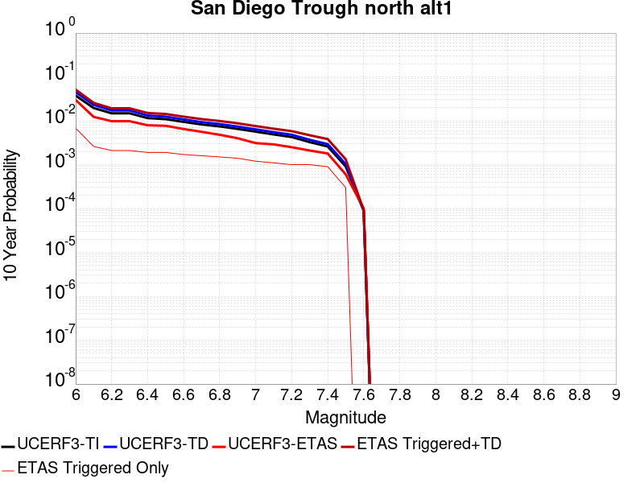 |

| Magnitude | 1 wk TI Prob | 1 wk TD Prob | 1 wk ETAS Prob | 1 wk ETAS/TD Gain | 1 wk ETAS Triggered+TD | 1 wk ETAS Triggered Only | 1 mo TI Prob | 1 mo TD Prob | 1 mo ETAS Prob | 1 mo ETAS/TD Gain | 1 mo ETAS Triggered+TD | 1 mo ETAS Triggered Only | 1 yr TI Prob | 1 yr TD Prob | 1 yr ETAS Prob | 1 yr ETAS/TD Gain | 1 yr ETAS Triggered+TD | 1 yr ETAS Triggered Only | 10 yr TI Prob | 10 yr TD Prob | 10 yr ETAS Prob | 10 yr ETAS/TD Gain | 10 yr ETAS Triggered+TD | 10 yr ETAS Triggered Only |
|-----|-----|-----|-----|-----|-----|-----|-----|-----|-----|-----|-----|-----|-----|-----|-----|-----|-----|-----|-----|-----|-----|-----|-----|-----|
| 6.0 | 7.329252E-5 | 8.8024135E-5 | 0.0 | 0.0 | 8.8024135E-5 | 0.0 | 3.14073E-4 | 3.7719536E-4 | 0.0 | 0.0 | 3.7719536E-4 | 0.0 | 0.0038171355 | 0.0045832642 | 0.0028 | 0.61091834 | 0.0052800556 | 7.0E-4 | 0.03752231 | 0.044951465 | 0.0299 | 0.66516185 | 0.051445793 | 0.0068 |
| 6.1 | 3.7940346E-5 | 4.4798235E-5 | 0.0 | 0.0 | 4.4798235E-5 | 0.0 | 1.6259136E-4 | 1.9197886E-4 | 0.0 | 0.0 | 1.9197886E-4 | 0.0 | 0.0019777524 | 0.0023349184 | 0.0014 | 0.5995927 | 0.002833751 | 5.0E-4 | 0.019602431 | 0.023112651 | 0.0123 | 0.5321761 | 0.025652558 | 0.0026 |
| 6.2 | 2.8645263E-5 | 3.3239627E-5 | 0.0 | 0.0 | 3.3239627E-5 | 0.0 | 1.2275964E-4 | 1.4244791E-4 | 0.0 | 0.0 | 1.4244791E-4 | 0.0 | 0.0014935739 | 0.0017329459 | 0.001 | 0.57705206 | 0.0021322528 | 4.0E-4 | 0.0148357535 | 0.017197017 | 0.0098 | 0.5698663 | 0.019260902 | 0.0021 |
| 6.3 | 2.8645263E-5 | 3.3239627E-5 | 0.0 | 0.0 | 3.3239627E-5 | 0.0 | 1.2275964E-4 | 1.4244791E-4 | 0.0 | 0.0 | 1.4244791E-4 | 0.0 | 0.0014935739 | 0.0017329459 | 0.001 | 0.57705206 | 0.0021322528 | 4.0E-4 | 0.0148357535 | 0.017197017 | 0.0098 | 0.5698663 | 0.019260902 | 0.0021 |
| 6.4 | 2.2204576E-5 | 2.5409145E-5 | 0.0 | 0.0 | 2.5409145E-5 | 0.0 | 9.5159E-5 | 1.0889184E-4 | 0.0 | 0.0 | 1.0889184E-4 | 0.0 | 0.001157945 | 0.0013249613 | 8.0E-4 | 0.60379124 | 0.0017244313 | 4.0E-4 | 0.011519298 | 0.013171791 | 0.0079 | 0.5997666 | 0.015046764 | 0.0019 |
| 6.5 | 2.1004838E-5 | 2.3988314E-5 | 0.0 | 0.0 | 2.3988314E-5 | 0.0 | 9.0017624E-5 | 1.0280306E-4 | 0.0 | 0.0 | 1.0280306E-4 | 0.0 | 0.0010954136 | 0.0012509173 | 8.0E-4 | 0.63953066 | 0.001650417 | 4.0E-4 | 0.010900296 | 0.012439845 | 0.0077 | 0.61897874 | 0.01431621 | 0.0019 |
| 6.6 | 1.820557E-5 | 2.0674883E-5 | 0.0 | 0.0 | 2.0674883E-5 | 0.0 | 7.802154E-5 | 8.8603665E-5 | 0.0 | 0.0 | 8.8603665E-5 | 0.0 | 9.4949827E-4 | 0.001078221 | 5.0E-4 | 0.46372682 | 0.0012780054 | 2.0E-4 | 0.009454516 | 0.010730566 | 0.0065 | 0.6057462 | 0.012412325 | 0.0017 |
| 6.7 | 1.5884485E-5 | 1.7958651E-5 | 0.0 | 0.0 | 1.7958651E-5 | 0.0 | 6.807459E-5 | 7.696339E-5 | 0.0 | 0.0 | 7.696339E-5 | 0.0 | 8.284929E-4 | 9.3662925E-4 | 5.0E-4 | 0.53382915 | 0.001136442 | 2.0E-4 | 0.008254109 | 0.009327182 | 0.0056 | 0.6003957 | 0.010912258 | 0.0016 |
| 6.8 | 1.4331171E-5 | 1.6178852E-5 | 0.0 | 0.0 | 1.6178852E-5 | 0.0 | 6.141786E-5 | 6.933611E-5 | 0.0 | 0.0 | 6.933611E-5 | 0.0 | 7.4750587E-4 | 8.4384216E-4 | 5.0E-4 | 0.59252787 | 0.0010436734 | 2.0E-4 | 0.0074499645 | 0.008406646 | 0.0048 | 0.57097685 | 0.009894036 | 0.0015 |
| 6.9 | 1.2574203E-5 | 1.4186481E-5 | 0.0 | 0.0 | 1.4186481E-5 | 0.0 | 5.3888325E-5 | 6.0797796E-5 | 0.0 | 0.0 | 6.0797796E-5 | 0.0 | 6.558929E-4 | 7.3996314E-4 | 4.0E-4 | 0.54056746 | 9.398152E-4 | 2.0E-4 | 0.0065396037 | 0.0073751784 | 0.004 | 0.54235977 | 0.008764854 | 0.0014 |
| 7.0 | 1.0883844E-5 | 1.22726E-5 | 0.0 | 0.0 | 1.22726E-5 | 0.0 | 4.664421E-5 | 5.25958E-5 | 0.0 | 0.0 | 5.25958E-5 | 0.0 | 5.677453E-4 | 6.401667E-4 | 4.0E-4 | 0.6248372 | 8.400387E-4 | 2.0E-4 | 0.00566297 | 0.006383354 | 0.0031 | 0.48563814 | 0.007575694 | 0.0012 |
| 7.1 | 9.393088E-6 | 1.0592619E-5 | 0.0 | 0.0 | 1.0592619E-5 | 0.0 | 4.025547E-5 | 4.5396155E-5 | 0.0 | 0.0 | 4.5396155E-5 | 0.0 | 4.900001E-4 | 5.525588E-4 | 4.0E-4 | 0.7239049 | 7.524483E-4 | 2.0E-4 | 0.0048892107 | 0.005511945 | 0.0029 | 0.5261301 | 0.0066058817 | 0.0011 |
| 7.2 | 8.190791E-6 | 9.245941E-6 | 0.0 | 0.0 | 9.245941E-6 | 0.0 | 3.510292E-5 | 3.962486E-5 | 0.0 | 0.0 | 3.962486E-5 | 0.0 | 4.2729423E-4 | 4.823266E-4 | 4.0E-4 | 0.8293136 | 6.822301E-4 | 2.0E-4 | 0.0042647356 | 0.0048128776 | 0.0025 | 0.51943976 | 0.0058080647 | 0.001 |
| 7.3 | 6.268162E-6 | 7.079958E-6 | 0.0 | 0.0 | 7.079958E-6 | 0.0 | 2.6863276E-5 | 3.0342326E-5 | 0.0 | 0.0 | 3.0342326E-5 | 0.0 | 3.2701128E-4 | 3.693556E-4 | 4.0E-4 | 1.0829672 | 5.6928175E-4 | 2.0E-4 | 0.003265305 | 0.003687463 | 0.0021 | 0.5694972 | 0.004683776 | 0.001 |
| 7.4 | 4.985186E-6 | 5.63487E-6 | 0.0 | 0.0 | 5.63487E-6 | 0.0 | 2.1364907E-5 | 2.414922E-5 | 0.0 | 0.0 | 2.414922E-5 | 0.0 | 2.600867E-4 | 2.9397747E-4 | 3.0E-4 | 1.0204864 | 3.9394808E-4 | 1.0E-4 | 0.002597825 | 0.0029359271 | 0.0018 | 0.6130942 | 0.0038332848 | 9.0E-4 |
| 7.5 | 1.7489613E-6 | 1.967052E-6 | 0.0 | 0.0 | 1.967052E-6 | 0.0 | 7.495527E-6 | 8.430196E-6 | 0.0 | 0.0 | 8.430196E-6 | 0.0 | 9.125422E-5 | 1.0263303E-4 | 2.0E-4 | 1.9486904 | 2.0262276E-4 | 1.0E-4 | 9.1216754E-4 | 0.0010258782 | 6.0E-4 | 0.58486474 | 0.0013255705 | 3.0E-4 |
| 7.6 | 1.6988751E-7 | 1.7527951E-7 | 0.0 | 0.0 | 1.7527951E-7 | 0.0 | 7.2808916E-7 | 7.5119766E-7 | 0.0 | 0.0 | 7.5119766E-7 | 0.0 | 8.864449E-6 | 9.145795E-6 | 0.0 | 0.0 | 9.145795E-6 | 0.0 | 8.8640954E-5 | 9.1454385E-5 | 1.0E-4 | 1.0934412 | 9.1454385E-5 | 0.0 |

## Great Valley 04b Gordon Valley
*[(top)](#table-of-contents)*

| 1 Week | 1 Month | 1 Year | 10 Year |
|-----|-----|-----|-----|
|  |  | 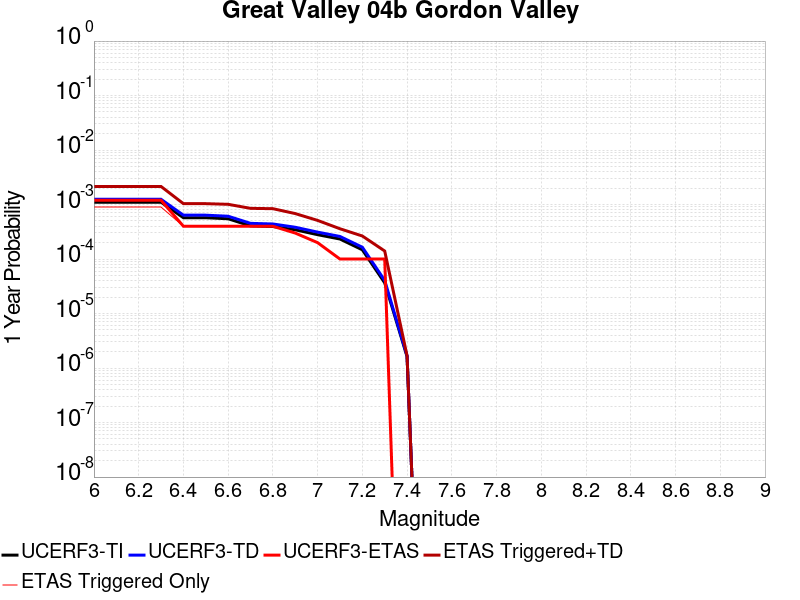 | 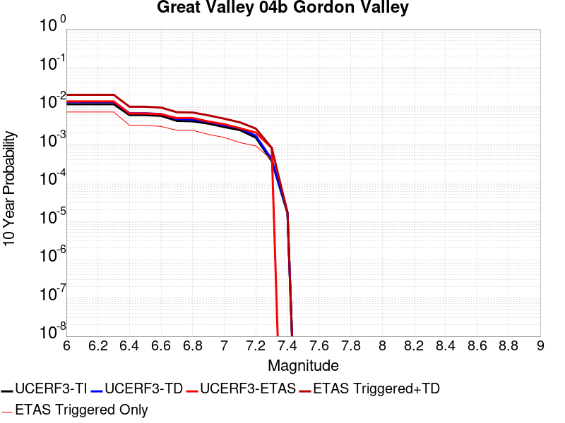 |

| Magnitude | 1 wk TI Prob | 1 wk TD Prob | 1 wk ETAS Prob | 1 wk ETAS/TD Gain | 1 wk ETAS Triggered+TD | 1 wk ETAS Triggered Only | 1 mo TI Prob | 1 mo TD Prob | 1 mo ETAS Prob | 1 mo ETAS/TD Gain | 1 mo ETAS Triggered+TD | 1 mo ETAS Triggered Only | 1 yr TI Prob | 1 yr TD Prob | 1 yr ETAS Prob | 1 yr ETAS/TD Gain | 1 yr ETAS Triggered+TD | 1 yr ETAS Triggered Only | 10 yr TI Prob | 10 yr TD Prob | 10 yr ETAS Prob | 10 yr ETAS/TD Gain | 10 yr ETAS Triggered+TD | 10 yr ETAS Triggered Only |
|-----|-----|-----|-----|-----|-----|-----|-----|-----|-----|-----|-----|-----|-----|-----|-----|-----|-----|-----|-----|-----|-----|-----|-----|-----|
| 6.0 | 2.1181217E-5 | 2.3948787E-5 | 0.0 | 0.0 | 2.3948787E-5 | 0.0 | 9.077348E-5 | 1.02634556E-4 | 0.0 | 0.0 | 1.02634556E-4 | 0.0 | 0.0011046068 | 0.0012490256 | 0.0012 | 0.960749 | 0.0021479013 | 9.0E-4 | 0.010991322 | 0.012436455 | 0.013 | 1.045314 | 0.019250643 | 0.0069 |
| 6.1 | 2.1181217E-5 | 2.3948787E-5 | 0.0 | 0.0 | 2.3948787E-5 | 0.0 | 9.077348E-5 | 1.02634556E-4 | 0.0 | 0.0 | 1.02634556E-4 | 0.0 | 0.0011046068 | 0.0012490256 | 0.0012 | 0.960749 | 0.0021479013 | 9.0E-4 | 0.010991322 | 0.012436455 | 0.013 | 1.045314 | 0.019250643 | 0.0069 |
| 6.2 | 2.1181217E-5 | 2.3948787E-5 | 0.0 | 0.0 | 2.3948787E-5 | 0.0 | 9.077348E-5 | 1.02634556E-4 | 0.0 | 0.0 | 1.02634556E-4 | 0.0 | 0.0011046068 | 0.0012490256 | 0.0012 | 0.960749 | 0.0021479013 | 9.0E-4 | 0.010991322 | 0.012436455 | 0.013 | 1.045314 | 0.019250643 | 0.0069 |
| 6.3 | 2.1181217E-5 | 2.3948787E-5 | 0.0 | 0.0 | 2.3948787E-5 | 0.0 | 9.077348E-5 | 1.02634556E-4 | 0.0 | 0.0 | 1.02634556E-4 | 0.0 | 0.0011046068 | 0.0012490256 | 0.0012 | 0.960749 | 0.0021479013 | 9.0E-4 | 0.010991322 | 0.012436455 | 0.013 | 1.045314 | 0.019250643 | 0.0069 |
| 6.4 | 1.0988268E-5 | 1.22397605E-5 | 0.0 | 0.0 | 1.22397605E-5 | 0.0 | 4.7091726E-5 | 5.245515E-5 | 0.0 | 0.0 | 5.245515E-5 | 0.0 | 5.731909E-4 | 6.384702E-4 | 4.0E-4 | 0.6264975 | 0.0010382149 | 4.0E-4 | 0.005717147 | 0.006367942 | 0.0063 | 0.9893306 | 0.009448201 | 0.0031 |
| 6.5 | 1.0988268E-5 | 1.22397605E-5 | 0.0 | 0.0 | 1.22397605E-5 | 0.0 | 4.7091726E-5 | 5.245515E-5 | 0.0 | 0.0 | 5.245515E-5 | 0.0 | 5.731909E-4 | 6.384702E-4 | 4.0E-4 | 0.6264975 | 0.0010382149 | 4.0E-4 | 0.005717147 | 0.006367942 | 0.0063 | 0.9893306 | 0.009448201 | 0.0031 |
| 6.6 | 1.0517822E-5 | 1.1710029E-5 | 0.0 | 0.0 | 1.1710029E-5 | 0.0 | 4.5075605E-5 | 5.018496E-5 | 0.0 | 0.0 | 5.018496E-5 | 0.0 | 5.4865726E-4 | 6.108462E-4 | 4.0E-4 | 0.6548293 | 0.0010106019 | 4.0E-4 | 0.0054730466 | 0.0060932217 | 0.006 | 0.9847008 | 0.008975551 | 0.0029 |
| 6.7 | 7.789219E-6 | 8.667313E-6 | 0.0 | 0.0 | 8.667313E-6 | 0.0 | 3.3381937E-5 | 3.7145124E-5 | 0.0 | 0.0 | 3.7145124E-5 | 0.0 | 4.063493E-4 | 4.521532E-4 | 4.0E-4 | 0.8846559 | 8.519724E-4 | 4.0E-4 | 0.004056071 | 0.0045128483 | 0.0048 | 1.0636297 | 0.006802469 | 0.0023 |
| 6.8 | 7.5850853E-6 | 8.4423E-6 | 0.0 | 0.0 | 8.4423E-6 | 0.0 | 3.2507105E-5 | 3.6180812E-5 | 0.0 | 0.0 | 3.6180812E-5 | 0.0 | 3.957021E-4 | 4.404175E-4 | 4.0E-4 | 0.9082291 | 8.402413E-4 | 4.0E-4 | 0.0039499826 | 0.004395958 | 0.0048 | 1.0919122 | 0.006685847 | 0.0023 |
| 6.9 | 6.604105E-6 | 7.349773E-6 | 0.0 | 0.0 | 7.349773E-6 | 0.0 | 2.8303E-5 | 3.149867E-5 | 0.0 | 0.0 | 3.149867E-5 | 0.0 | 3.4453452E-4 | 3.8343266E-4 | 3.0E-4 | 0.7824059 | 6.8331766E-4 | 3.0E-4 | 0.0034400085 | 0.0038280967 | 0.0039 | 1.0187831 | 0.005621206 | 0.0018 |
| 7.0 | 5.3701115E-6 | 5.9812187E-6 | 0.0 | 0.0 | 5.9812187E-6 | 0.0 | 2.301456E-5 | 2.5633559E-5 | 0.0 | 0.0 | 2.5633559E-5 | 0.0 | 2.8016625E-4 | 3.120468E-4 | 2.0E-4 | 0.6409295 | 5.119844E-4 | 2.0E-4 | 0.0027981328 | 0.0031163741 | 0.0033 | 1.0589229 | 0.0046116994 | 0.0015 |
| 7.1 | 4.4685607E-6 | 4.980442E-6 | 0.0 | 0.0 | 4.980442E-6 | 0.0 | 1.9150835E-5 | 2.1344591E-5 | 0.0 | 0.0 | 2.1344591E-5 | 0.0 | 2.3313647E-4 | 2.5984188E-4 | 1.0E-4 | 0.38484943 | 3.598159E-4 | 1.0E-4 | 0.0023289204 | 0.002595625 | 0.0026 | 1.0016856 | 0.0036927697 | 0.0011 |
| 7.2 | 2.833378E-6 | 3.160555E-6 | 0.0 | 0.0 | 3.160555E-6 | 0.0 | 1.2142991E-5 | 1.3545175E-5 | 0.0 | 0.0 | 1.3545175E-5 | 0.0 | 1.4783088E-4 | 1.6490176E-4 | 1.0E-4 | 0.60642165 | 2.6488528E-4 | 1.0E-4 | 0.0014773258 | 0.0016479655 | 0.002 | 1.2136177 | 0.0025464823 | 9.0E-4 |
| 7.3 | 7.0087293E-7 | 7.763911E-7 | 0.0 | 0.0 | 7.763911E-7 | 0.0 | 3.0037377E-6 | 3.3273889E-6 | 0.0 | 0.0 | 3.3273889E-6 | 0.0 | 3.656989E-5 | 4.0510662E-5 | 1.0E-4 | 2.4684858 | 1.4050661E-4 | 1.0E-4 | 3.6563876E-4 | 4.0507765E-4 | 8.0E-4 | 1.97493 | 8.049156E-4 | 4.0E-4 |
| 7.4 | 3.112171E-8 | 3.2058175E-8 | 0.0 | 0.0 | 3.2058175E-8 | 0.0 | 1.3337875E-7 | 1.3739218E-7 | 0.0 | 0.0 | 1.3739218E-7 | 0.0 | 1.6238852E-6 | 1.6727486E-6 | 0.0 | 0.0 | 1.6727486E-6 | 0.0 | 1.6238733E-5 | 1.6727368E-5 | 0.0 | 0.0 | 1.6727368E-5 | 0.0 |

## Bartlett Springs 2011 CFM
*[(top)](#table-of-contents)*

| 1 Week | 1 Month | 1 Year | 10 Year |
|-----|-----|-----|-----|
|  |  |  |  |

| Magnitude | 1 wk TI Prob | 1 wk TD Prob | 1 wk ETAS Prob | 1 wk ETAS/TD Gain | 1 wk ETAS Triggered+TD | 1 wk ETAS Triggered Only | 1 mo TI Prob | 1 mo TD Prob | 1 mo ETAS Prob | 1 mo ETAS/TD Gain | 1 mo ETAS Triggered+TD | 1 mo ETAS Triggered Only | 1 yr TI Prob | 1 yr TD Prob | 1 yr ETAS Prob | 1 yr ETAS/TD Gain | 1 yr ETAS Triggered+TD | 1 yr ETAS Triggered Only | 10 yr TI Prob | 10 yr TD Prob | 10 yr ETAS Prob | 10 yr ETAS/TD Gain | 10 yr ETAS Triggered+TD | 10 yr ETAS Triggered Only |
|-----|-----|-----|-----|-----|-----|-----|-----|-----|-----|-----|-----|-----|-----|-----|-----|-----|-----|-----|-----|-----|-----|-----|-----|-----|
| 6.0 | 6.2326144E-5 | 8.037504E-5 | 3.0E-4 | 3.7325022 | 8.037504E-5 | 0.0 | 2.6708472E-4 | 3.4441956E-4 | 3.0E-4 | 0.8710307 | 3.4441956E-4 | 0.0 | 0.003246908 | 0.004185348 | 0.0024 | 0.57342905 | 0.004484092 | 3.0E-4 | 0.031998757 | 0.04108245 | 0.0256 | 0.6231371 | 0.047698982 | 0.0069 |
| 6.1 | 6.227657E-5 | 8.0312704E-5 | 3.0E-4 | 3.7353992 | 8.0312704E-5 | 0.0 | 2.668723E-4 | 3.441525E-4 | 3.0E-4 | 0.8717066 | 3.441525E-4 | 0.0 | 0.0032443295 | 0.0041821087 | 0.0024 | 0.57387316 | 0.004480854 | 3.0E-4 | 0.031973712 | 0.041051265 | 0.0256 | 0.6236105 | 0.04766801 | 0.0069 |
| 6.2 | 6.22452E-5 | 8.0273414E-5 | 3.0E-4 | 3.7372274 | 8.0273414E-5 | 0.0 | 2.6673786E-4 | 3.4398414E-4 | 3.0E-4 | 0.8721332 | 3.4398414E-4 | 0.0 | 0.0032426978 | 0.0041800668 | 0.0024 | 0.5741535 | 0.004478813 | 3.0E-4 | 0.03195787 | 0.041031603 | 0.0256 | 0.6239093 | 0.047648486 | 0.0069 |
| 6.3 | 6.219006E-5 | 8.020344E-5 | 3.0E-4 | 3.7404878 | 8.020344E-5 | 0.0 | 2.6650162E-4 | 3.4368437E-4 | 3.0E-4 | 0.8728939 | 3.4368437E-4 | 0.0 | 0.00323983 | 0.0041764313 | 0.0024 | 0.5746533 | 0.004475178 | 3.0E-4 | 0.031930014 | 0.0409966 | 0.0256 | 0.62444204 | 0.04761372 | 0.0069 |
| 6.4 | 5.2175856E-5 | 6.706463E-5 | 3.0E-4 | 4.4732966 | 6.706463E-5 | 0.0 | 2.2359163E-4 | 2.873884E-4 | 3.0E-4 | 1.0438836 | 2.873884E-4 | 0.0 | 0.0027188298 | 0.0034933877 | 0.0022 | 0.62976116 | 0.0037923397 | 3.0E-4 | 0.026858058 | 0.03439411 | 0.0206 | 0.5989397 | 0.039898064 | 0.0057 |
| 6.5 | 5.205166E-5 | 6.6907734E-5 | 3.0E-4 | 4.4837866 | 6.6907734E-5 | 0.0 | 2.2305945E-4 | 2.867161E-4 | 3.0E-4 | 1.0463312 | 2.867161E-4 | 0.0 | 0.0027123666 | 0.003485229 | 0.0022 | 0.6312354 | 0.0037841834 | 3.0E-4 | 0.026794989 | 0.034315065 | 0.0205 | 0.59740525 | 0.039819468 | 0.0057 |
| 6.6 | 5.0085426E-5 | 6.431246E-5 | 3.0E-4 | 4.6647263 | 6.431246E-5 | 0.0 | 2.1463417E-4 | 2.75596E-4 | 3.0E-4 | 1.08855 | 2.75596E-4 | 0.0 | 0.0026100394 | 0.0033502688 | 0.0021 | 0.6268154 | 0.0036492636 | 3.0E-4 | 0.025795965 | 0.033006705 | 0.0194 | 0.5877593 | 0.038035072 | 0.0052 |
| 6.7 | 4.8930866E-5 | 6.284131E-5 | 3.0E-4 | 4.7739296 | 6.284131E-5 | 0.0 | 2.0968684E-4 | 2.692924E-4 | 3.0E-4 | 1.1140307 | 2.692924E-4 | 0.0 | 0.0025499484 | 0.0032737555 | 0.002 | 0.6109191 | 0.003473101 | 2.0E-4 | 0.025208864 | 0.0322641 | 0.0191 | 0.5919892 | 0.037102778 | 0.005 |
| 6.8 | 4.5679535E-5 | 5.8579746E-5 | 3.0E-4 | 5.121224 | 5.8579746E-5 | 0.0 | 1.9575475E-4 | 2.510321E-4 | 3.0E-4 | 1.1950663 | 2.510321E-4 | 0.0 | 0.002380709 | 0.0030520703 | 0.002 | 0.6552929 | 0.0032514597 | 2.0E-4 | 0.023553653 | 0.03010846 | 0.018 | 0.59783864 | 0.034472972 | 0.0045 |
| 6.9 | 4.1439176E-5 | 5.307531E-5 | 2.0E-4 | 3.7682304 | 5.307531E-5 | 0.0 | 1.7758438E-4 | 2.2744594E-4 | 2.0E-4 | 0.87932986 | 2.2744594E-4 | 0.0 | 0.002159946 | 0.0027656634 | 0.0017 | 0.61468077 | 0.0029651101 | 2.0E-4 | 0.021390721 | 0.02731738 | 0.0158 | 0.57838637 | 0.03130538 | 0.0041 |
| 7.0 | 3.5920104E-5 | 4.588693E-5 | 1.0E-4 | 2.1792698 | 4.588693E-5 | 0.0 | 1.5393422E-4 | 1.9664354E-4 | 1.0E-4 | 0.5085344 | 1.9664354E-4 | 0.0 | 0.001872538 | 0.0023915223 | 0.0013 | 0.54358685 | 0.002591044 | 2.0E-4 | 0.018568378 | 0.023661038 | 0.0133 | 0.56210554 | 0.02698059 | 0.0034 |
| 7.1 | 3.338812E-5 | 4.2578507E-5 | 1.0E-4 | 2.3486028 | 4.2578507E-5 | 0.0 | 1.430841E-4 | 1.8246664E-4 | 1.0E-4 | 0.5480454 | 1.8246664E-4 | 0.0 | 0.0017406568 | 0.0022192823 | 0.0013 | 0.5857749 | 0.0024188387 | 2.0E-4 | 0.017270854 | 0.021973928 | 0.0127 | 0.5779577 | 0.024908006 | 0.003 |
| 7.2 | 2.8619615E-5 | 3.6309073E-5 | 1.0E-4 | 2.7541327 | 3.6309073E-5 | 0.0 | 1.2264973E-4 | 1.5560108E-4 | 1.0E-4 | 0.6426691 | 1.5560108E-4 | 0.0 | 0.0014922376 | 0.0018928067 | 0.001 | 0.52831596 | 0.002092428 | 2.0E-4 | 0.014822568 | 0.018768791 | 0.0102 | 0.54345536 | 0.021123746 | 0.0024 |
| 7.3 | 2.6376783E-5 | 3.3337503E-5 | 1.0E-4 | 2.9996247 | 3.3337503E-5 | 0.0 | 1.13038455E-4 | 1.4286724E-4 | 1.0E-4 | 0.6999505 | 1.4286724E-4 | 0.0 | 0.0013753743 | 0.0017380301 | 9.0E-4 | 0.51782763 | 0.0019376825 | 2.0E-4 | 0.01366893 | 0.017245973 | 0.0096 | 0.5566517 | 0.019506307 | 0.0023 |
| 7.4 | 2.3738676E-5 | 2.9904191E-5 | 1.0E-4 | 3.3440127 | 2.9904191E-5 | 0.0 | 1.0173322E-4 | 1.2815457E-4 | 1.0E-4 | 0.7803077 | 1.2815457E-4 | 0.0 | 0.0012378981 | 0.0015591731 | 9.0E-4 | 0.577229 | 0.0017588614 | 2.0E-4 | 0.012310251 | 0.015483612 | 0.0085 | 0.5489675 | 0.017649548 | 0.0022 |
| 7.5 | 2.1789481E-5 | 2.7371283E-5 | 1.0E-4 | 3.653464 | 2.7371283E-5 | 0.0 | 9.338015E-5 | 1.1730027E-4 | 1.0E-4 | 0.85251296 | 1.1730027E-4 | 0.0 | 0.0011363103 | 0.0014272031 | 9.0E-4 | 0.630604 | 0.0016269176 | 2.0E-4 | 0.011305175 | 0.014181548 | 0.0079 | 0.5570619 | 0.016251767 | 0.0021 |
| 7.6 | 1.3895281E-5 | 1.732663E-5 | 1.0E-4 | 5.7714624 | 1.732663E-5 | 0.0 | 5.9549846E-5 | 7.425489E-5 | 1.0E-4 | 1.3467126 | 7.425489E-5 | 0.0 | 7.2477816E-4 | 9.0368115E-4 | 5.0E-4 | 0.55329245 | 0.0010035908 | 1.0E-4 | 0.0072241887 | 0.009000443 | 0.0053 | 0.5888599 | 0.010387842 | 0.0014 |
| 7.7 | 4.245981E-6 | 5.150537E-6 | 0.0 | 0.0 | 5.150537E-6 | 0.0 | 1.8196934E-5 | 2.2073546E-5 | 0.0 | 0.0 | 2.2073546E-5 | 0.0 | 2.2152514E-4 | 2.6871247E-4 | 0.0 | 0.0 | 2.6871247E-4 | 0.0 | 0.0022130446 | 0.0026839403 | 0.0012 | 0.44710383 | 0.0028834036 | 2.0E-4 |
| 7.8 | 6.145192E-7 | 7.037207E-7 | 0.0 | 0.0 | 7.037207E-7 | 0.0 | 2.633651E-6 | 3.0159424E-6 | 0.0 | 0.0 | 3.0159424E-6 | 0.0 | 3.206423E-5 | 3.671849E-5 | 0.0 | 0.0 | 3.671849E-5 | 0.0 | 3.2059604E-4 | 3.6713365E-4 | 2.0E-4 | 0.54476076 | 3.6713365E-4 | 0.0 |

## King Range 2011 CFM
*[(top)](#table-of-contents)*

| 1 Week | 1 Month | 1 Year | 10 Year |
|-----|-----|-----|-----|
| 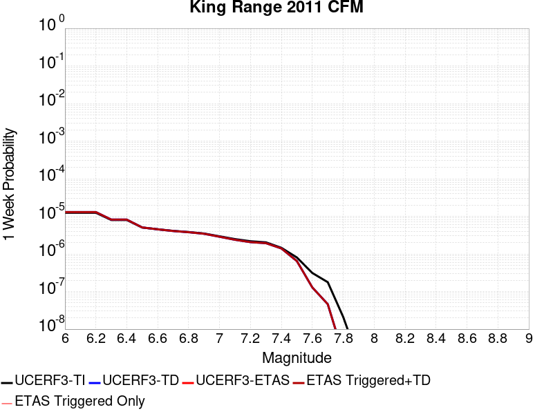 |  |  |  |

| Magnitude | 1 wk TI Prob | 1 wk TD Prob | 1 wk ETAS Prob | 1 wk ETAS/TD Gain | 1 wk ETAS Triggered+TD | 1 wk ETAS Triggered Only | 1 mo TI Prob | 1 mo TD Prob | 1 mo ETAS Prob | 1 mo ETAS/TD Gain | 1 mo ETAS Triggered+TD | 1 mo ETAS Triggered Only | 1 yr TI Prob | 1 yr TD Prob | 1 yr ETAS Prob | 1 yr ETAS/TD Gain | 1 yr ETAS Triggered+TD | 1 yr ETAS Triggered Only | 10 yr TI Prob | 10 yr TD Prob | 10 yr ETAS Prob | 10 yr ETAS/TD Gain | 10 yr ETAS Triggered+TD | 10 yr ETAS Triggered Only |
|-----|-----|-----|-----|-----|-----|-----|-----|-----|-----|-----|-----|-----|-----|-----|-----|-----|-----|-----|-----|-----|-----|-----|-----|-----|
| 6.0 | 1.2462566E-5 | 1.2994595E-5 | 0.0 | 0.0 | 1.2994595E-5 | 0.0 | 5.34099E-5 | 5.569013E-5 | 0.0 | 0.0 | 5.569013E-5 | 0.0 | 6.5007154E-4 | 6.778512E-4 | 0.0011 | 1.622775 | 0.0011775123 | 5.0E-4 | 0.0064817313 | 0.006762195 | 0.0118 | 1.7449955 | 0.013416888 | 0.0067 |
| 6.1 | 1.2462566E-5 | 1.2994595E-5 | 0.0 | 0.0 | 1.2994595E-5 | 0.0 | 5.34099E-5 | 5.569013E-5 | 0.0 | 0.0 | 5.569013E-5 | 0.0 | 6.5007154E-4 | 6.778512E-4 | 0.0011 | 1.622775 | 0.0011775123 | 5.0E-4 | 0.0064817313 | 0.006762195 | 0.0118 | 1.7449955 | 0.013416888 | 0.0067 |
| 6.2 | 1.2462566E-5 | 1.2994595E-5 | 0.0 | 0.0 | 1.2994595E-5 | 0.0 | 5.34099E-5 | 5.569013E-5 | 0.0 | 0.0 | 5.569013E-5 | 0.0 | 6.5007154E-4 | 6.778512E-4 | 0.0011 | 1.622775 | 0.0011775123 | 5.0E-4 | 0.0064817313 | 0.006762195 | 0.0118 | 1.7449955 | 0.013416888 | 0.0067 |
| 6.3 | 7.988484E-6 | 8.189467E-6 | 0.0 | 0.0 | 8.189467E-6 | 0.0 | 3.423591E-5 | 3.5097317E-5 | 0.0 | 0.0 | 3.5097317E-5 | 0.0 | 4.1674246E-4 | 4.2723896E-4 | 7.0E-4 | 1.6384274 | 7.271108E-4 | 3.0E-4 | 0.004159618 | 0.004266369 | 0.0066 | 1.5469829 | 0.0079505835 | 0.0037 |
| 6.4 | 7.988484E-6 | 8.189467E-6 | 0.0 | 0.0 | 8.189467E-6 | 0.0 | 3.423591E-5 | 3.5097317E-5 | 0.0 | 0.0 | 3.5097317E-5 | 0.0 | 4.1674246E-4 | 4.2723896E-4 | 7.0E-4 | 1.6384274 | 7.271108E-4 | 3.0E-4 | 0.004159618 | 0.004266369 | 0.0066 | 1.5469829 | 0.0079505835 | 0.0037 |
| 6.5 | 5.0522513E-6 | 5.060107E-6 | 0.0 | 0.0 | 5.060107E-6 | 0.0 | 2.1652326E-5 | 2.1685999E-5 | 0.0 | 0.0 | 2.1685999E-5 | 0.0 | 2.6358519E-4 | 2.63996E-4 | 3.0E-4 | 1.1363809 | 4.6394317E-4 | 2.0E-4 | 0.0026327274 | 0.0026378403 | 0.0027 | 1.0235646 | 0.004133884 | 0.0015 |
| 6.6 | 4.53682E-6 | 4.5172146E-6 | 0.0 | 0.0 | 4.5172146E-6 | 0.0 | 1.944337E-5 | 1.935935E-5 | 0.0 | 0.0 | 1.935935E-5 | 0.0 | 2.3669732E-4 | 2.3567521E-4 | 3.0E-4 | 1.2729384 | 4.3562808E-4 | 2.0E-4 | 0.0023644536 | 0.002355237 | 0.0019 | 0.80671287 | 0.0033528819 | 0.001 |
| 6.7 | 4.1144335E-6 | 4.075492E-6 | 0.0 | 0.0 | 4.075492E-6 | 0.0 | 1.7633167E-5 | 1.746628E-5 | 0.0 | 0.0 | 1.746628E-5 | 0.0 | 2.1466266E-4 | 2.1263161E-4 | 3.0E-4 | 1.4108908 | 4.1258908E-4 | 2.0E-4 | 0.0021445542 | 0.002125245 | 0.0016 | 0.75285435 | 0.002923545 | 8.0E-4 |
| 6.8 | 3.8321214E-6 | 3.7864904E-6 | 0.0 | 0.0 | 3.7864904E-6 | 0.0 | 1.6423275E-5 | 1.6227717E-5 | 0.0 | 0.0 | 1.6227717E-5 | 0.0 | 1.9993502E-4 | 1.9755487E-4 | 3.0E-4 | 1.5185654 | 3.9751537E-4 | 2.0E-4 | 0.0019975523 | 0.0019747496 | 0.0011 | 0.55703264 | 0.0026733673 | 7.0E-4 |
| 6.9 | 3.4999944E-6 | 3.443416E-6 | 0.0 | 0.0 | 3.443416E-6 | 0.0 | 1.499989E-5 | 1.4757416E-5 | 0.0 | 0.0 | 1.4757416E-5 | 0.0 | 1.8260835E-4 | 1.7965697E-4 | 2.0E-4 | 1.1132326 | 3.7962105E-4 | 2.0E-4 | 0.0018245836 | 0.0017960668 | 8.0E-4 | 0.44541776 | 0.0024948095 | 7.0E-4 |
| 7.0 | 2.9470837E-6 | 2.867445E-6 | 0.0 | 0.0 | 2.867445E-6 | 0.0 | 1.26302975E-5 | 1.2288992E-5 | 0.0 | 0.0 | 1.2288992E-5 | 0.0 | 1.5376302E-4 | 1.4960839E-4 | 2.0E-4 | 1.3368235 | 3.4957848E-4 | 2.0E-4 | 0.0015365666 | 0.0014960172 | 7.0E-4 | 0.46790904 | 0.0020951196 | 6.0E-4 |
| 7.1 | 2.4850247E-6 | 2.3808877E-6 | 0.0 | 0.0 | 2.3808877E-6 | 0.0 | 1.0650062E-5 | 1.0203766E-5 | 0.0 | 0.0 | 1.0203766E-5 | 0.0 | 1.296568E-4 | 1.2422391E-4 | 2.0E-4 | 1.6099961 | 3.2419906E-4 | 2.0E-4 | 0.0012958117 | 0.0012424726 | 5.0E-4 | 0.40242338 | 0.0016419755 | 4.0E-4 |
| 7.2 | 2.1800304E-6 | 2.060055E-6 | 0.0 | 0.0 | 2.060055E-6 | 0.0 | 9.342954E-6 | 8.828778E-6 | 0.0 | 0.0 | 8.828778E-6 | 0.0 | 1.1374453E-4 | 1.0748516E-4 | 1.0E-4 | 0.930361 | 2.0747441E-4 | 1.0E-4 | 0.0011368633 | 0.0010752446 | 4.0E-4 | 0.37200835 | 0.0013749221 | 3.0E-4 |
| 7.3 | 2.0378504E-6 | 1.9352276E-6 | 0.0 | 0.0 | 1.9352276E-6 | 0.0 | 8.733615E-6 | 8.293807E-6 | 0.0 | 0.0 | 8.293807E-6 | 0.0 | 1.0632657E-4 | 1.0097251E-4 | 1.0E-4 | 0.9903686 | 2.0096241E-4 | 1.0E-4 | 0.0010627571 | 0.0010101639 | 4.0E-4 | 0.39597532 | 0.0013098608 | 3.0E-4 |
| 7.4 | 1.4577047E-6 | 1.4014751E-6 | 0.0 | 0.0 | 1.4014751E-6 | 0.0 | 6.247291E-6 | 6.006308E-6 | 0.0 | 0.0 | 6.006308E-6 | 0.0 | 7.605811E-5 | 7.312442E-5 | 1.0E-4 | 1.3675321 | 1.731171E-4 | 1.0E-4 | 7.603208E-4 | 7.3184725E-4 | 3.0E-4 | 0.4099216 | 9.317009E-4 | 2.0E-4 |
| 7.5 | 8.0685743E-7 | 6.4750947E-7 | 0.0 | 0.0 | 6.4750947E-7 | 0.0 | 3.457956E-6 | 2.775038E-6 | 0.0 | 0.0 | 2.775038E-6 | 0.0 | 4.20998E-5 | 3.378561E-5 | 1.0E-4 | 2.95984 | 1.3378223E-4 | 1.0E-4 | 4.2091825E-4 | 3.384925E-4 | 2.0E-4 | 0.590855 | 5.384248E-4 | 2.0E-4 |
| 7.6 | 3.1239435E-7 | 1.2838954E-7 | 0.0 | 0.0 | 1.2838954E-7 | 0.0 | 1.3388321E-6 | 5.5024077E-7 | 0.0 | 0.0 | 5.5024077E-7 | 0.0 | 1.630016E-5 | 6.6991615E-6 | 1.0E-4 | 14.927241 | 1.0669849E-4 | 1.0E-4 | 1.6298964E-4 | 6.7633366E-5 | 1.0E-4 | 1.4785602 | 1.676266E-4 | 1.0E-4 |
| 7.7 | 1.7747207E-7 | 4.5873858E-8 | 0.0 | 0.0 | 4.5873858E-8 | 0.0 | 7.605944E-7 | 1.9660223E-7 | 0.0 | 0.0 | 1.9660223E-7 | 0.0 | 9.260198E-6 | 2.3936295E-6 | 1.0E-4 | 41.777557 | 1.0239339E-4 | 1.0E-4 | 9.2598115E-5 | 2.434555E-5 | 1.0E-4 | 4.107527 | 1.2434312E-4 | 1.0E-4 |
| 7.8 | 2.1035538E-8 | 2.0912831E-9 | 0.0 | 0.0 | 2.0912831E-9 | 0.0 | 9.0152305E-8 | 8.962641E-9 | 0.0 | 0.0 | 8.962641E-9 | 0.0 | 1.0976038E-6 | 1.0912016E-7 | 0.0 | 0.0 | 1.0912016E-7 | 0.0 | 1.0975983E-5 | 1.125664E-6 | 0.0 | 0.0 | 1.125664E-6 | 0.0 |
| 7.9 | 1.4782963E-9 | 6.077361E-13 | 0.0 | 0.0 | 6.077361E-13 | 0.0 | 6.335555E-9 | 2.6049163E-12 | 0.0 | 0.0 | 2.6049163E-12 | 0.0 | 7.713538E-8 | 3.171663E-11 | 0.0 | 0.0 | 3.171663E-11 | 0.0 | 7.7135354E-7 | 4.6297055E-10 | 0.0 | 0.0 | 4.6297055E-10 | 0.0 |

## Garberville - Briceland 2011 CFM
*[(top)](#table-of-contents)*

| 1 Week | 1 Month | 1 Year | 10 Year |
|-----|-----|-----|-----|
|  | 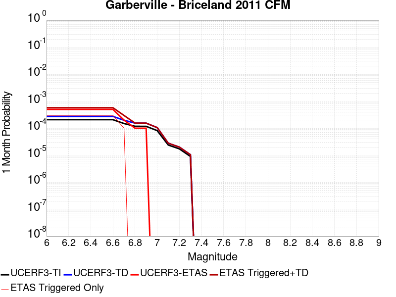 |  |  |

| Magnitude | 1 wk TI Prob | 1 wk TD Prob | 1 wk ETAS Prob | 1 wk ETAS/TD Gain | 1 wk ETAS Triggered+TD | 1 wk ETAS Triggered Only | 1 mo TI Prob | 1 mo TD Prob | 1 mo ETAS Prob | 1 mo ETAS/TD Gain | 1 mo ETAS Triggered+TD | 1 mo ETAS Triggered Only | 1 yr TI Prob | 1 yr TD Prob | 1 yr ETAS Prob | 1 yr ETAS/TD Gain | 1 yr ETAS Triggered+TD | 1 yr ETAS Triggered Only | 10 yr TI Prob | 10 yr TD Prob | 10 yr ETAS Prob | 10 yr ETAS/TD Gain | 10 yr ETAS Triggered+TD | 10 yr ETAS Triggered Only |
|-----|-----|-----|-----|-----|-----|-----|-----|-----|-----|-----|-----|-----|-----|-----|-----|-----|-----|-----|-----|-----|-----|-----|-----|-----|
| 6.0 | 4.8399295E-5 | 6.430683E-5 | 1.0E-4 | 1.5550449 | 1.6430039E-4 | 1.0E-4 | 2.0740906E-4 | 2.7557573E-4 | 5.0E-4 | 1.8143833 | 5.7549303E-4 | 3.0E-4 | 0.002522281 | 0.0033506495 | 0.0034 | 1.0147287 | 0.004446964 | 0.0011 | 0.024938442 | 0.033067785 | 0.0212 | 0.6411074 | 0.03954623 | 0.0067 |
| 6.1 | 4.8399295E-5 | 6.430683E-5 | 1.0E-4 | 1.5550449 | 1.6430039E-4 | 1.0E-4 | 2.0740906E-4 | 2.7557573E-4 | 5.0E-4 | 1.8143833 | 5.7549303E-4 | 3.0E-4 | 0.002522281 | 0.0033506495 | 0.0034 | 1.0147287 | 0.004446964 | 0.0011 | 0.024938442 | 0.033067785 | 0.0212 | 0.6411074 | 0.03954623 | 0.0067 |
| 6.2 | 4.8399295E-5 | 6.430683E-5 | 1.0E-4 | 1.5550449 | 1.6430039E-4 | 1.0E-4 | 2.0740906E-4 | 2.7557573E-4 | 5.0E-4 | 1.8143833 | 5.7549303E-4 | 3.0E-4 | 0.002522281 | 0.0033506495 | 0.0034 | 1.0147287 | 0.004446964 | 0.0011 | 0.024938442 | 0.033067785 | 0.0212 | 0.6411074 | 0.03954623 | 0.0067 |
| 6.3 | 4.8399295E-5 | 6.430683E-5 | 1.0E-4 | 1.5550449 | 1.6430039E-4 | 1.0E-4 | 2.0740906E-4 | 2.7557573E-4 | 5.0E-4 | 1.8143833 | 5.7549303E-4 | 3.0E-4 | 0.002522281 | 0.0033506495 | 0.0034 | 1.0147287 | 0.004446964 | 0.0011 | 0.024938442 | 0.033067785 | 0.0212 | 0.6411074 | 0.03954623 | 0.0067 |
| 6.4 | 4.8399295E-5 | 6.430683E-5 | 1.0E-4 | 1.5550449 | 1.6430039E-4 | 1.0E-4 | 2.0740906E-4 | 2.7557573E-4 | 5.0E-4 | 1.8143833 | 5.7549303E-4 | 3.0E-4 | 0.002522281 | 0.0033506495 | 0.0034 | 1.0147287 | 0.004446964 | 0.0011 | 0.024938442 | 0.033067785 | 0.0212 | 0.6411074 | 0.03954623 | 0.0067 |
| 6.5 | 4.8399295E-5 | 6.430683E-5 | 1.0E-4 | 1.5550449 | 1.6430039E-4 | 1.0E-4 | 2.0740906E-4 | 2.7557573E-4 | 5.0E-4 | 1.8143833 | 5.7549303E-4 | 3.0E-4 | 0.002522281 | 0.0033506495 | 0.0034 | 1.0147287 | 0.004446964 | 0.0011 | 0.024938442 | 0.033067785 | 0.0212 | 0.6411074 | 0.03954623 | 0.0067 |
| 6.6 | 4.8399295E-5 | 6.430683E-5 | 1.0E-4 | 1.5550449 | 1.6430039E-4 | 1.0E-4 | 2.0740906E-4 | 2.7557573E-4 | 5.0E-4 | 1.8143833 | 5.7549303E-4 | 3.0E-4 | 0.002522281 | 0.0033506495 | 0.0034 | 1.0147287 | 0.004446964 | 0.0011 | 0.024938442 | 0.033067785 | 0.0212 | 0.6411074 | 0.03954623 | 0.0067 |
| 6.7 | 3.495179E-5 | 4.6151727E-5 | 0.0 | 0.0 | 4.6151727E-5 | 0.0 | 1.4978478E-4 | 1.9778109E-4 | 2.0E-4 | 1.011219 | 2.9776132E-4 | 1.0E-4 | 0.0018221042 | 0.0024058553 | 0.0023 | 0.956001 | 0.0032039306 | 8.0E-4 | 0.018072363 | 0.02385034 | 0.0159 | 0.66665715 | 0.028926319 | 0.0052 |
| 6.8 | 2.7517597E-5 | 3.612118E-5 | 0.0 | 0.0 | 3.612118E-5 | 0.0 | 1.1792722E-4 | 1.5479849E-4 | 1.0E-4 | 0.64600116 | 1.5479849E-4 | 0.0 | 0.0014348183 | 0.0018835143 | 0.0015 | 0.7963837 | 0.0024823842 | 6.0E-4 | 0.014255894 | 0.018721653 | 0.0124 | 0.6623347 | 0.02294115 | 0.0043 |
| 6.9 | 2.74461E-5 | 3.6039033E-5 | 0.0 | 0.0 | 3.6039033E-5 | 0.0 | 1.1762084E-4 | 1.5444648E-4 | 1.0E-4 | 0.6474735 | 1.5444648E-4 | 0.0 | 0.001431093 | 0.001879236 | 0.0015 | 0.79819673 | 0.0024781085 | 6.0E-4 | 0.014219119 | 0.01867959 | 0.0123 | 0.65847266 | 0.022899268 | 0.0043 |
| 7.0 | 1.9023773E-5 | 2.4629906E-5 | 0.0 | 0.0 | 2.4629906E-5 | 0.0 | 8.152791E-5 | 1.05554755E-4 | 0.0 | 0.0 | 1.05554755E-4 | 0.0 | 9.921503E-4 | 0.0012847697 | 9.0E-4 | 0.7005147 | 0.0015843842 | 3.0E-4 | 0.009877323 | 0.012812283 | 0.0086 | 0.6712309 | 0.015872564 | 0.0031 |
| 7.1 | 5.566844E-6 | 6.5005743E-6 | 0.0 | 0.0 | 6.5005743E-6 | 0.0 | 2.3857683E-5 | 2.785933E-5 | 0.0 | 0.0 | 2.785933E-5 | 0.0 | 2.9042858E-4 | 3.3913882E-4 | 3.0E-4 | 0.88459355 | 4.391049E-4 | 1.0E-4 | 0.002900493 | 0.0033866316 | 0.0025 | 0.7381966 | 0.0042835837 | 9.0E-4 |
| 7.2 | 4.011353E-6 | 4.6665573E-6 | 0.0 | 0.0 | 4.6665573E-6 | 0.0 | 1.7191402E-5 | 1.9999396E-5 | 0.0 | 0.0 | 1.9999396E-5 | 0.0 | 2.0928521E-4 | 2.4346886E-4 | 2.0E-4 | 0.82146025 | 2.4346886E-4 | 0.0 | 0.0020908823 | 0.0024323578 | 0.0015 | 0.6166856 | 0.0028313848 | 4.0E-4 |
| 7.3 | 2.0974871E-6 | 2.4354429E-6 | 0.0 | 0.0 | 2.4354429E-6 | 0.0 | 8.989199E-6 | 1.0437585E-5 | 0.0 | 0.0 | 1.0437585E-5 | 0.0 | 1.09438006E-4 | 1.2707268E-4 | 0.0 | 0.0 | 1.2707268E-4 | 0.0 | 0.0010938413 | 0.0012702446 | 6.0E-4 | 0.47235 | 0.0013701175 | 1.0E-4 |

## Bullion Mountains
*[(top)](#table-of-contents)*

| 1 Week | 1 Month | 1 Year | 10 Year |
|-----|-----|-----|-----|
|  |  |  | 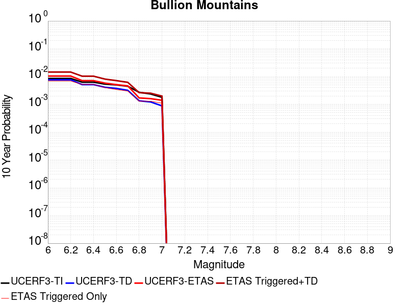 |

| Magnitude | 1 wk TI Prob | 1 wk TD Prob | 1 wk ETAS Prob | 1 wk ETAS/TD Gain | 1 wk ETAS Triggered+TD | 1 wk ETAS Triggered Only | 1 mo TI Prob | 1 mo TD Prob | 1 mo ETAS Prob | 1 mo ETAS/TD Gain | 1 mo ETAS Triggered+TD | 1 mo ETAS Triggered Only | 1 yr TI Prob | 1 yr TD Prob | 1 yr ETAS Prob | 1 yr ETAS/TD Gain | 1 yr ETAS Triggered+TD | 1 yr ETAS Triggered Only | 10 yr TI Prob | 10 yr TD Prob | 10 yr ETAS Prob | 10 yr ETAS/TD Gain | 10 yr ETAS Triggered+TD | 10 yr ETAS Triggered Only |
|-----|-----|-----|-----|-----|-----|-----|-----|-----|-----|-----|-----|-----|-----|-----|-----|-----|-----|-----|-----|-----|-----|-----|-----|-----|
| 6.0 | 1.6420427E-5 | 1.4672226E-5 | 1.0E-4 | 6.8155985 | 1.1467076E-4 | 1.0E-4 | 7.037136E-5 | 6.287967E-5 | 1.0E-4 | 1.5903392 | 1.6287337E-4 | 1.0E-4 | 8.5643446E-4 | 7.6532934E-4 | 6.0E-4 | 0.78397626 | 0.0012649467 | 5.0E-4 | 0.008531413 | 0.0076307203 | 0.0104 | 1.3629119 | 0.014478069 | 0.0069 |
| 6.1 | 1.6420427E-5 | 1.4672226E-5 | 1.0E-4 | 6.8155985 | 1.1467076E-4 | 1.0E-4 | 7.037136E-5 | 6.287967E-5 | 1.0E-4 | 1.5903392 | 1.6287337E-4 | 1.0E-4 | 8.5643446E-4 | 7.6532934E-4 | 6.0E-4 | 0.78397626 | 0.0012649467 | 5.0E-4 | 0.008531413 | 0.0076307203 | 0.0104 | 1.3629119 | 0.014478069 | 0.0069 |
| 6.2 | 1.6420427E-5 | 1.4672226E-5 | 1.0E-4 | 6.8155985 | 1.1467076E-4 | 1.0E-4 | 7.037136E-5 | 6.287967E-5 | 1.0E-4 | 1.5903392 | 1.6287337E-4 | 1.0E-4 | 8.5643446E-4 | 7.6532934E-4 | 6.0E-4 | 0.78397626 | 0.0012649467 | 5.0E-4 | 0.008531413 | 0.0076307203 | 0.0104 | 1.3629119 | 0.014478069 | 0.0069 |
| 6.3 | 1.2046778E-5 | 9.8477285E-6 | 1.0E-4 | 10.154626 | 1.0984674E-4 | 1.0E-4 | 5.1628023E-5 | 4.2204E-5 | 1.0E-4 | 2.369444 | 1.4219977E-4 | 1.0E-4 | 6.283899E-4 | 5.1373563E-4 | 6.0E-4 | 1.1679158 | 0.0010134787 | 5.0E-4 | 0.0062661595 | 0.005127756 | 0.0071 | 1.3846213 | 0.010301092 | 0.0052 |
| 6.4 | 1.2046778E-5 | 9.8477285E-6 | 1.0E-4 | 10.154626 | 1.0984674E-4 | 1.0E-4 | 5.1628023E-5 | 4.2204E-5 | 1.0E-4 | 2.369444 | 1.4219977E-4 | 1.0E-4 | 6.283899E-4 | 5.1373563E-4 | 6.0E-4 | 1.1679158 | 0.0010134787 | 5.0E-4 | 0.0062661595 | 0.005127756 | 0.0071 | 1.3846213 | 0.010301092 | 0.0052 |
| 6.5 | 1.0244343E-5 | 7.866923E-6 | 1.0E-4 | 12.71145 | 1.0786614E-4 | 1.0E-4 | 4.390359E-5 | 3.3715067E-5 | 1.0E-4 | 2.9660332 | 1.337117E-4 | 1.0E-4 | 5.343951E-4 | 4.1042423E-4 | 6.0E-4 | 1.461902 | 9.1021904E-4 | 5.0E-4 | 0.005331118 | 0.0040986883 | 0.0058 | 1.4150869 | 0.008082294 | 0.004 |
| 6.6 | 9.605408E-6 | 7.1656837E-6 | 1.0E-4 | 13.955402 | 1.0716497E-4 | 1.0E-4 | 4.1165385E-5 | 3.0709827E-5 | 1.0E-4 | 3.2562869 | 1.3070676E-4 | 1.0E-4 | 5.010733E-4 | 3.7384828E-4 | 5.0E-4 | 1.337441 | 7.7369873E-4 | 4.0E-4 | 0.00499945 | 0.0037341856 | 0.0051 | 1.3657596 | 0.0071214894 | 0.0034 |
| 6.7 | 8.60418E-6 | 6.1136325E-6 | 1.0E-4 | 16.356888 | 1.06113024E-4 | 1.0E-4 | 3.687454E-5 | 2.6201129E-5 | 1.0E-4 | 3.8166294 | 1.261985E-4 | 1.0E-4 | 4.48855E-4 | 3.189715E-4 | 5.0E-4 | 1.5675383 | 7.188439E-4 | 4.0E-4 | 0.004479495 | 0.0031870436 | 0.0046 | 1.443344 | 0.006177482 | 0.003 |
| 6.8 | 5.187994E-6 | 2.556746E-6 | 0.0 | 0.0 | 2.556746E-6 | 0.0 | 2.223407E-5 | 1.0957459E-5 | 0.0 | 0.0 | 1.0957459E-5 | 0.0 | 2.7066618E-4 | 1.3340288E-4 | 2.0E-4 | 1.4992181 | 2.3338952E-4 | 1.0E-4 | 0.0027033675 | 0.0013336176 | 0.0017 | 1.2747283 | 0.0026318838 | 0.0013 |
| 6.9 | 4.5302368E-6 | 2.3387597E-6 | 0.0 | 0.0 | 2.3387597E-6 | 0.0 | 1.9415156E-5 | 1.002324E-5 | 0.0 | 0.0 | 1.002324E-5 | 0.0 | 2.3635388E-4 | 1.2203006E-4 | 2.0E-4 | 1.6389405 | 2.2201786E-4 | 1.0E-4 | 0.0023610266 | 0.0012200177 | 0.0016 | 1.3114563 | 0.0025184317 | 0.0013 |
| 7.0 | 3.431668E-6 | 1.6839141E-6 | 0.0 | 0.0 | 1.6839141E-6 | 0.0 | 1.4707065E-5 | 7.2167745E-6 | 0.0 | 0.0 | 7.2167745E-6 | 0.0 | 1.7904381E-4 | 8.786423E-5 | 1.0E-4 | 1.1381196 | 8.786423E-5 | 0.0 | 0.0017889962 | 8.786423E-4 | 0.0014 | 1.5933675 | 0.0019776758 | 0.0011 |

## Pisgah-Bullion Mtn-Mesquite Lk
*[(top)](#table-of-contents)*

| 1 Week | 1 Month | 1 Year | 10 Year |
|-----|-----|-----|-----|
|  |  | 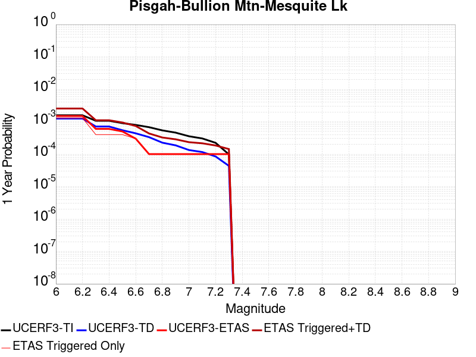 |  |

| Magnitude | 1 wk TI Prob | 1 wk TD Prob | 1 wk ETAS Prob | 1 wk ETAS/TD Gain | 1 wk ETAS Triggered+TD | 1 wk ETAS Triggered Only | 1 mo TI Prob | 1 mo TD Prob | 1 mo ETAS Prob | 1 mo ETAS/TD Gain | 1 mo ETAS Triggered+TD | 1 mo ETAS Triggered Only | 1 yr TI Prob | 1 yr TD Prob | 1 yr ETAS Prob | 1 yr ETAS/TD Gain | 1 yr ETAS Triggered+TD | 1 yr ETAS Triggered Only | 10 yr TI Prob | 10 yr TD Prob | 10 yr ETAS Prob | 10 yr ETAS/TD Gain | 10 yr ETAS Triggered+TD | 10 yr ETAS Triggered Only |
|-----|-----|-----|-----|-----|-----|-----|-----|-----|-----|-----|-----|-----|-----|-----|-----|-----|-----|-----|-----|-----|-----|-----|-----|-----|
| 6.0 | 3.0240792E-5 | 2.40515E-5 | 0.0 | 0.0 | 2.40515E-5 | 0.0 | 1.2959696E-4 | 1.0307435E-4 | 1.0E-4 | 0.9701735 | 2.0306405E-4 | 1.0E-4 | 0.0015767008 | 0.0012543082 | 0.0015 | 1.1958784 | 0.0025526776 | 0.0013 | 0.015655609 | 0.012482278 | 0.0121 | 0.9693743 | 0.018999895 | 0.0066 |
| 6.1 | 3.0240792E-5 | 2.40515E-5 | 0.0 | 0.0 | 2.40515E-5 | 0.0 | 1.2959696E-4 | 1.0307435E-4 | 1.0E-4 | 0.9701735 | 2.0306405E-4 | 1.0E-4 | 0.0015767008 | 0.0012543082 | 0.0015 | 1.1958784 | 0.0025526776 | 0.0013 | 0.015655609 | 0.012482278 | 0.0121 | 0.9693743 | 0.018999895 | 0.0066 |
| 6.2 | 3.0240792E-5 | 2.40515E-5 | 0.0 | 0.0 | 2.40515E-5 | 0.0 | 1.2959696E-4 | 1.0307435E-4 | 1.0E-4 | 0.9701735 | 2.0306405E-4 | 1.0E-4 | 0.0015767008 | 0.0012543082 | 0.0015 | 1.1958784 | 0.0025526776 | 0.0013 | 0.015655609 | 0.012482278 | 0.0121 | 0.9693743 | 0.018999895 | 0.0066 |
| 6.3 | 2.0498217E-5 | 1.3614233E-5 | 0.0 | 0.0 | 1.3614233E-5 | 0.0 | 8.784654E-5 | 5.8345497E-5 | 0.0 | 0.0 | 5.8345497E-5 | 0.0 | 0.0010690069 | 7.101411E-4 | 6.0E-4 | 0.8449025 | 0.001109857 | 4.0E-4 | 0.01063879 | 0.0070803408 | 0.0066 | 0.9321585 | 0.010257684 | 0.0032 |
| 6.4 | 2.0498217E-5 | 1.3614233E-5 | 0.0 | 0.0 | 1.3614233E-5 | 0.0 | 8.784654E-5 | 5.8345497E-5 | 0.0 | 0.0 | 5.8345497E-5 | 0.0 | 0.0010690069 | 7.101411E-4 | 6.0E-4 | 0.8449025 | 0.001109857 | 4.0E-4 | 0.01063879 | 0.0070803408 | 0.0066 | 0.9321585 | 0.010257684 | 0.0032 |
| 6.5 | 1.7316182E-5 | 1.0457165E-5 | 0.0 | 0.0 | 1.0457165E-5 | 0.0 | 7.42101E-5 | 4.4815708E-5 | 0.0 | 0.0 | 4.4815708E-5 | 0.0 | 9.0313336E-4 | 5.455046E-4 | 5.0E-4 | 0.9165825 | 9.452864E-4 | 4.0E-4 | 0.008994718 | 0.005442649 | 0.0055 | 1.0105373 | 0.00822741 | 0.0028 |
| 6.6 | 1.5251077E-5 | 8.39713E-6 | 0.0 | 0.0 | 8.39713E-6 | 0.0 | 6.536012E-5 | 3.5987243E-5 | 0.0 | 0.0 | 3.5987243E-5 | 0.0 | 7.9546886E-4 | 4.380638E-4 | 3.0E-4 | 0.68483174 | 7.379324E-4 | 3.0E-4 | 0.007926274 | 0.0043727187 | 0.0042 | 0.96050084 | 0.0065630986 | 0.0022 |
| 6.7 | 1.2997425E-5 | 6.400255E-6 | 0.0 | 0.0 | 6.400255E-6 | 0.0 | 5.570206E-5 | 2.7429403E-5 | 0.0 | 0.0 | 2.7429403E-5 | 0.0 | 6.7796157E-4 | 3.3390647E-4 | 1.0E-4 | 0.29948506 | 4.3387307E-4 | 1.0E-4 | 0.0067589693 | 0.003334507 | 0.0032 | 0.9596621 | 0.004929172 | 0.0016 |
| 6.8 | 1.035386E-5 | 4.3247396E-6 | 0.0 | 0.0 | 4.3247396E-6 | 0.0 | 4.437293E-5 | 1.853447E-5 | 0.0 | 0.0 | 1.853447E-5 | 0.0 | 5.401065E-4 | 2.2563469E-4 | 1.0E-4 | 0.44319427 | 3.2561214E-4 | 1.0E-4 | 0.0053879567 | 0.0022541427 | 0.0023 | 1.0203437 | 0.0031521139 | 9.0E-4 |
| 6.9 | 8.816252E-6 | 3.573541E-6 | 0.0 | 0.0 | 3.573541E-6 | 0.0 | 3.778339E-5 | 1.531509E-5 | 0.0 | 0.0 | 1.531509E-5 | 0.0 | 4.5991567E-4 | 1.8644585E-4 | 1.0E-4 | 0.53634876 | 2.864272E-4 | 1.0E-4 | 0.00458965 | 0.0018629526 | 0.0018 | 0.96620816 | 0.0026614622 | 8.0E-4 |
| 7.0 | 6.8232207E-6 | 2.562117E-6 | 0.0 | 0.0 | 2.562117E-6 | 0.0 | 2.9242048E-5 | 1.0980458E-5 | 0.0 | 0.0 | 1.0980458E-5 | 0.0 | 3.5596377E-4 | 1.3367918E-4 | 1.0E-4 | 0.74805963 | 2.336658E-4 | 1.0E-4 | 0.0035539411 | 0.0013360187 | 0.0012 | 0.89819103 | 0.0019352171 | 6.0E-4 |
| 7.1 | 5.837013E-6 | 2.222822E-6 | 0.0 | 0.0 | 2.222822E-6 | 0.0 | 2.501553E-5 | 9.526347E-6 | 0.0 | 0.0 | 9.526347E-6 | 0.0 | 3.045215E-4 | 1.159774E-4 | 1.0E-4 | 0.862237 | 2.159658E-4 | 1.0E-4 | 0.0030410455 | 0.0011591977 | 0.0011 | 0.94893223 | 0.0017585021 | 6.0E-4 |
| 7.2 | 4.278052E-6 | 1.6244172E-6 | 0.0 | 0.0 | 1.6244172E-6 | 0.0 | 1.833438E-5 | 6.961771E-6 | 0.0 | 0.0 | 6.961771E-6 | 0.0 | 2.231982E-4 | 8.47565E-5 | 1.0E-4 | 1.1798505 | 1.8474803E-4 | 1.0E-4 | 0.0022297418 | 8.472649E-4 | 9.0E-4 | 1.0622416 | 0.0014467565 | 6.0E-4 |
| 7.3 | 1.8803692E-6 | 8.329639E-7 | 0.0 | 0.0 | 8.329639E-7 | 0.0 | 8.0587E-6 | 3.5698413E-6 | 0.0 | 0.0 | 3.5698413E-6 | 0.0 | 9.811026E-5 | 4.34621E-5 | 1.0E-4 | 2.3008554 | 1.4345776E-4 | 1.0E-4 | 9.806695E-4 | 4.345504E-4 | 6.0E-4 | 1.3807374 | 7.3442E-4 | 3.0E-4 |

## Whittier alt 1
*[(top)](#table-of-contents)*

| 1 Week | 1 Month | 1 Year | 10 Year |
|-----|-----|-----|-----|
|  |  |  |  |

| Magnitude | 1 wk TI Prob | 1 wk TD Prob | 1 wk ETAS Prob | 1 wk ETAS/TD Gain | 1 wk ETAS Triggered+TD | 1 wk ETAS Triggered Only | 1 mo TI Prob | 1 mo TD Prob | 1 mo ETAS Prob | 1 mo ETAS/TD Gain | 1 mo ETAS Triggered+TD | 1 mo ETAS Triggered Only | 1 yr TI Prob | 1 yr TD Prob | 1 yr ETAS Prob | 1 yr ETAS/TD Gain | 1 yr ETAS Triggered+TD | 1 yr ETAS Triggered Only | 10 yr TI Prob | 10 yr TD Prob | 10 yr ETAS Prob | 10 yr ETAS/TD Gain | 10 yr ETAS Triggered+TD | 10 yr ETAS Triggered Only |
|-----|-----|-----|-----|-----|-----|-----|-----|-----|-----|-----|-----|-----|-----|-----|-----|-----|-----|-----|-----|-----|-----|-----|-----|-----|
| 6.0 | 4.2554693E-5 | 4.7141246E-5 | 0.0 | 0.0 | 4.7141246E-5 | 0.0 | 1.8236451E-4 | 2.0202008E-4 | 1.0E-4 | 0.49500033 | 3.0199988E-4 | 1.0E-4 | 0.002218027 | 0.0024571407 | 0.0022 | 0.8953496 | 0.003255175 | 8.0E-4 | 0.02196019 | 0.024333641 | 0.0172 | 0.70684034 | 0.03048034 | 0.0063 |
| 6.1 | 4.2554693E-5 | 4.7141246E-5 | 0.0 | 0.0 | 4.7141246E-5 | 0.0 | 1.8236451E-4 | 2.0202008E-4 | 1.0E-4 | 0.49500033 | 3.0199988E-4 | 1.0E-4 | 0.002218027 | 0.0024571407 | 0.0022 | 0.8953496 | 0.003255175 | 8.0E-4 | 0.02196019 | 0.024333641 | 0.0172 | 0.70684034 | 0.03048034 | 0.0063 |
| 6.2 | 4.2554693E-5 | 4.7141246E-5 | 0.0 | 0.0 | 4.7141246E-5 | 0.0 | 1.8236451E-4 | 2.0202008E-4 | 1.0E-4 | 0.49500033 | 3.0199988E-4 | 1.0E-4 | 0.002218027 | 0.0024571407 | 0.0022 | 0.8953496 | 0.003255175 | 8.0E-4 | 0.02196019 | 0.024333641 | 0.0172 | 0.70684034 | 0.03048034 | 0.0063 |
| 6.3 | 1.9617712E-5 | 1.8201868E-5 | 0.0 | 0.0 | 1.8201868E-5 | 0.0 | 8.40732E-5 | 7.800578E-5 | 0.0 | 0.0 | 7.800578E-5 | 0.0 | 0.0010231105 | 9.4932545E-4 | 9.0E-4 | 0.94804156 | 0.0012490407 | 3.0E-4 | 0.01018413 | 0.009455963 | 0.0072 | 0.7614243 | 0.011833268 | 0.0024 |
| 6.4 | 1.5611336E-5 | 1.354535E-5 | 0.0 | 0.0 | 1.354535E-5 | 0.0 | 6.690401E-5 | 5.8050246E-5 | 0.0 | 0.0 | 5.8050246E-5 | 0.0 | 8.142519E-4 | 7.0653844E-4 | 6.0E-4 | 0.8492107 | 8.064678E-4 | 1.0E-4 | 0.008112748 | 0.0070448644 | 0.0055 | 0.7807105 | 0.008534297 | 0.0015 |
| 6.5 | 1.5150166E-5 | 1.3042504E-5 | 0.0 | 0.0 | 1.3042504E-5 | 0.0 | 6.492767E-5 | 5.589528E-5 | 0.0 | 0.0 | 5.589528E-5 | 0.0 | 7.9020765E-4 | 6.803184E-4 | 6.0E-4 | 0.88194 | 7.8025035E-4 | 1.0E-4 | 0.007874036 | 0.0067842854 | 0.0053 | 0.78121716 | 0.008174787 | 0.0014 |
| 6.6 | 1.295588E-5 | 1.0340121E-5 | 0.0 | 0.0 | 1.0340121E-5 | 0.0 | 5.552402E-5 | 4.431406E-5 | 0.0 | 0.0 | 4.431406E-5 | 0.0 | 6.7579525E-4 | 5.3939206E-4 | 4.0E-4 | 0.7415756 | 6.393381E-4 | 1.0E-4 | 0.006737438 | 0.0053822575 | 0.0039 | 0.724603 | 0.00607849 | 7.0E-4 |
| 6.7 | 1.2542085E-5 | 9.861623E-6 | 0.0 | 0.0 | 9.861623E-6 | 0.0 | 5.3750682E-5 | 4.2263426E-5 | 0.0 | 0.0 | 4.2263426E-5 | 0.0 | 6.542181E-4 | 5.1443756E-4 | 3.0E-4 | 0.5831611 | 5.1443756E-4 | 0.0 | 0.006522954 | 0.005133877 | 0.0035 | 0.681746 | 0.00563131 | 5.0E-4 |
| 6.8 | 1.2195878E-5 | 9.45888E-6 | 0.0 | 0.0 | 9.45888E-6 | 0.0 | 5.2267E-5 | 4.0537438E-5 | 0.0 | 0.0 | 4.0537438E-5 | 0.0 | 6.36165E-4 | 4.934334E-4 | 2.0E-4 | 0.4053232 | 4.934334E-4 | 0.0 | 0.0063434686 | 0.0049247057 | 0.0034 | 0.6903966 | 0.0054222434 | 5.0E-4 |
| 6.9 | 1.1580298E-5 | 8.738248E-6 | 0.0 | 0.0 | 8.738248E-6 | 0.0 | 4.9628903E-5 | 3.7449103E-5 | 0.0 | 0.0 | 3.7449103E-5 | 0.0 | 6.040644E-4 | 4.5584908E-4 | 2.0E-4 | 0.4387417 | 4.5584908E-4 | 0.0 | 0.00602425 | 0.0045503434 | 0.0031 | 0.6812673 | 0.004848978 | 3.0E-4 |
| 7.0 | 1.0964795E-5 | 8.051233E-6 | 0.0 | 0.0 | 8.051233E-6 | 0.0 | 4.6991136E-5 | 3.4504832E-5 | 0.0 | 0.0 | 3.4504832E-5 | 0.0 | 5.7196687E-4 | 4.200169E-4 | 2.0E-4 | 0.4761713 | 4.200169E-4 | 0.0 | 0.0057049696 | 0.004193428 | 0.0028 | 0.6677115 | 0.00449217 | 3.0E-4 |
| 7.1 | 1.0230601E-5 | 7.296619E-6 | 0.0 | 0.0 | 7.296619E-6 | 0.0 | 4.3844695E-5 | 3.1270858E-5 | 0.0 | 0.0 | 3.1270858E-5 | 0.0 | 5.336784E-4 | 3.8065747E-4 | 2.0E-4 | 0.5254068 | 3.8065747E-4 | 0.0 | 0.005323986 | 0.003801133 | 0.0028 | 0.73662245 | 0.0040999926 | 3.0E-4 |
| 7.2 | 9.40865E-6 | 6.5162267E-6 | 0.0 | 0.0 | 6.5162267E-6 | 0.0 | 4.032216E-5 | 2.7926393E-5 | 0.0 | 0.0 | 2.7926393E-5 | 0.0 | 4.908117E-4 | 3.39952E-4 | 1.0E-4 | 0.29415917 | 3.39952E-4 | 0.0 | 0.0048972913 | 0.0033953136 | 0.0026 | 0.7657614 | 0.003694295 | 3.0E-4 |
| 7.3 | 8.237384E-6 | 5.5742876E-6 | 0.0 | 0.0 | 5.5742876E-6 | 0.0 | 3.5302593E-5 | 2.388959E-5 | 0.0 | 0.0 | 2.388959E-5 | 0.0 | 4.2972428E-4 | 2.90818E-4 | 1.0E-4 | 0.34385768 | 2.90818E-4 | 0.0 | 0.0042889426 | 0.0029046668 | 0.0024 | 0.8262565 | 0.003104086 | 2.0E-4 |
| 7.4 | 7.5316966E-6 | 5.0062195E-6 | 0.0 | 0.0 | 5.0062195E-6 | 0.0 | 3.2278298E-5 | 2.1455056E-5 | 0.0 | 0.0 | 2.1455056E-5 | 0.0 | 3.9291743E-4 | 2.61185E-4 | 1.0E-4 | 0.38287038 | 2.61185E-4 | 0.0 | 0.0039222343 | 0.0026088874 | 0.0021 | 0.8049409 | 0.0028083655 | 2.0E-4 |
| 7.5 | 6.149649E-6 | 3.916163E-6 | 0.0 | 0.0 | 3.916163E-6 | 0.0 | 2.6355372E-5 | 1.6783453E-5 | 0.0 | 0.0 | 1.6783453E-5 | 0.0 | 3.208294E-4 | 2.0432028E-4 | 1.0E-4 | 0.4894277 | 2.0432028E-4 | 0.0 | 0.003203666 | 0.0020414128 | 0.0014 | 0.6857996 | 0.0022410045 | 2.0E-4 |
| 7.6 | 5.457711E-6 | 3.3794513E-6 | 0.0 | 0.0 | 3.3794513E-6 | 0.0 | 2.338998E-5 | 1.4483287E-5 | 0.0 | 0.0 | 1.4483287E-5 | 0.0 | 2.8473578E-4 | 1.7632057E-4 | 1.0E-4 | 0.56714886 | 1.7632057E-4 | 0.0 | 0.0028437122 | 0.0017618868 | 0.0013 | 0.7378454 | 0.0019615344 | 2.0E-4 |
| 7.7 | 4.1676276E-6 | 2.3213304E-6 | 0.0 | 0.0 | 2.3213304E-6 | 0.0 | 1.7861139E-5 | 9.948525E-6 | 0.0 | 0.0 | 9.948525E-6 | 0.0 | 2.1743766E-4 | 1.2111729E-4 | 0.0 | 0.0 | 1.2111729E-4 | 0.0 | 0.0021722503 | 0.0012105854 | 8.0E-4 | 0.66083735 | 0.0014103432 | 2.0E-4 |
| 7.8 | 2.2692414E-7 | 9.313546E-8 | 0.0 | 0.0 | 9.313546E-8 | 0.0 | 9.725317E-7 | 3.9915196E-7 | 0.0 | 0.0 | 3.9915196E-7 | 0.0 | 1.1840509E-5 | 4.8596676E-6 | 0.0 | 0.0 | 4.8596676E-6 | 0.0 | 1.1839878E-4 | 4.859593E-5 | 0.0 | 0.0 | 4.859593E-5 | 0.0 |
| 7.9 | 6.676829E-9 | 3.4267709E-9 | 0.0 | 0.0 | 3.4267709E-9 | 0.0 | 2.861498E-8 | 1.4686159E-8 | 0.0 | 0.0 | 1.4686159E-8 | 0.0 | 3.4838732E-7 | 1.7880397E-7 | 0.0 | 0.0 | 1.7880397E-7 | 0.0 | 3.4838679E-6 | 1.7880385E-6 | 0.0 | 0.0 | 1.7880385E-6 | 0.0 |

## Coronado Bank alt1
*[(top)](#table-of-contents)*

| 1 Week | 1 Month | 1 Year | 10 Year |
|-----|-----|-----|-----|
| 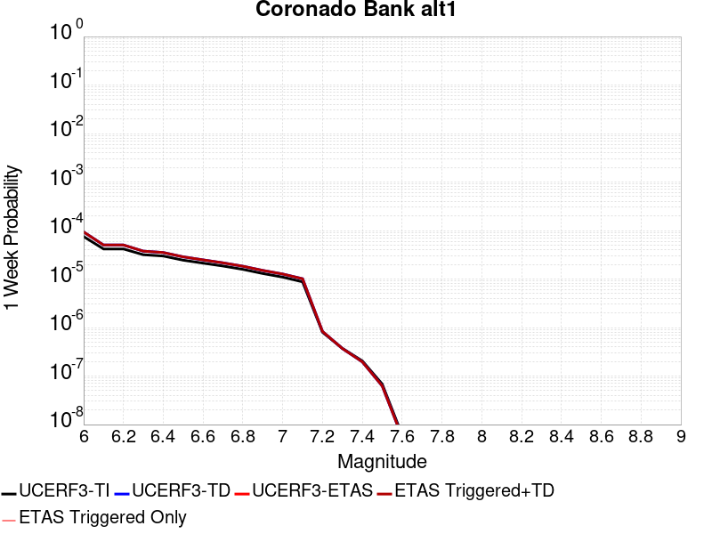 | 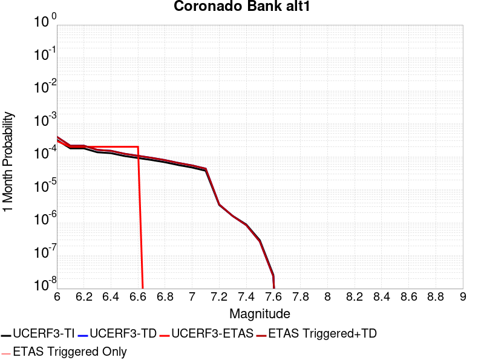 | 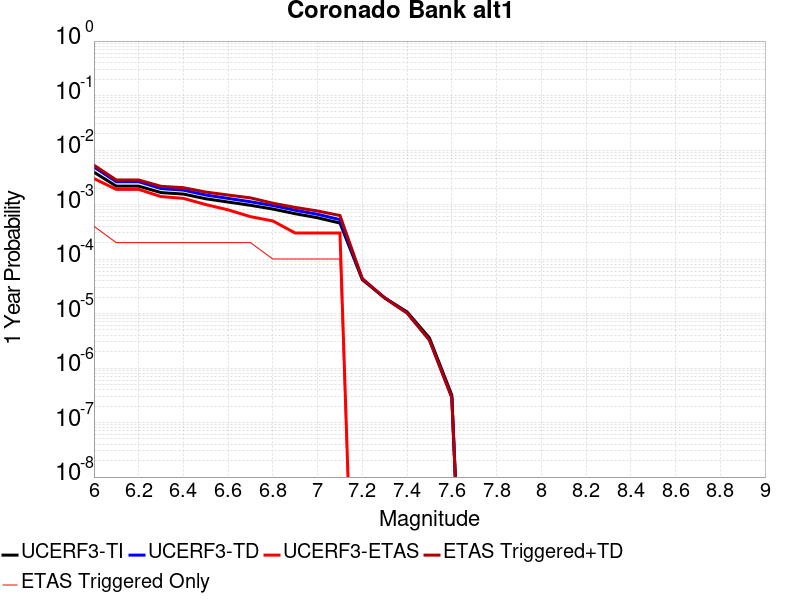 |  |

| Magnitude | 1 wk TI Prob | 1 wk TD Prob | 1 wk ETAS Prob | 1 wk ETAS/TD Gain | 1 wk ETAS Triggered+TD | 1 wk ETAS Triggered Only | 1 mo TI Prob | 1 mo TD Prob | 1 mo ETAS Prob | 1 mo ETAS/TD Gain | 1 mo ETAS Triggered+TD | 1 mo ETAS Triggered Only | 1 yr TI Prob | 1 yr TD Prob | 1 yr ETAS Prob | 1 yr ETAS/TD Gain | 1 yr ETAS Triggered+TD | 1 yr ETAS Triggered Only | 10 yr TI Prob | 10 yr TD Prob | 10 yr ETAS Prob | 10 yr ETAS/TD Gain | 10 yr ETAS Triggered+TD | 10 yr ETAS Triggered Only |
|-----|-----|-----|-----|-----|-----|-----|-----|-----|-----|-----|-----|-----|-----|-----|-----|-----|-----|-----|-----|-----|-----|-----|-----|-----|
| 6.0 | 7.533492E-5 | 9.371126E-5 | 0.0 | 0.0 | 9.371126E-5 | 0.0 | 3.22824E-4 | 4.0156196E-4 | 3.0E-4 | 0.7470827 | 4.0156196E-4 | 0.0 | 0.0039233007 | 0.004878674 | 0.003 | 0.61492115 | 0.0052767224 | 4.0E-4 | 0.03854755 | 0.047785383 | 0.0329 | 0.68849504 | 0.053974777 | 0.0065 |
| 6.1 | 4.1807285E-5 | 5.0382983E-5 | 0.0 | 0.0 | 5.0382983E-5 | 0.0 | 1.7916178E-4 | 2.1590963E-4 | 2.0E-4 | 0.9263135 | 2.1590963E-4 | 0.0 | 0.0021791123 | 0.002625611 | 0.0019 | 0.7236411 | 0.0028250858 | 2.0E-4 | 0.021578677 | 0.025955351 | 0.0159 | 0.61259043 | 0.028682675 | 0.0028 |
| 6.2 | 4.1807285E-5 | 5.0382983E-5 | 0.0 | 0.0 | 5.0382983E-5 | 0.0 | 1.7916178E-4 | 2.1590963E-4 | 2.0E-4 | 0.9263135 | 2.1590963E-4 | 0.0 | 0.0021791123 | 0.002625611 | 0.0019 | 0.7236411 | 0.0028250858 | 2.0E-4 | 0.021578677 | 0.025955351 | 0.0159 | 0.61259043 | 0.028682675 | 0.0028 |
| 6.3 | 3.1793104E-5 | 3.763715E-5 | 0.0 | 0.0 | 3.763715E-5 | 0.0 | 1.3624904E-4 | 1.612923E-4 | 2.0E-4 | 1.2399848 | 1.612923E-4 | 0.0 | 0.0016575698 | 0.0019619977 | 0.0014 | 0.7135584 | 0.0021616053 | 2.0E-4 | 0.016452603 | 0.019450692 | 0.0121 | 0.6220858 | 0.021509845 | 0.0021 |
| 6.4 | 2.9878007E-5 | 3.5267753E-5 | 0.0 | 0.0 | 3.5267753E-5 | 0.0 | 1.2804232E-4 | 1.5113894E-4 | 2.0E-4 | 1.3232857 | 1.5113894E-4 | 0.0 | 0.0015578003 | 0.001838596 | 0.0013 | 0.7070613 | 0.002038228 | 2.0E-4 | 0.015469253 | 0.018237632 | 0.0117 | 0.6415307 | 0.020299332 | 0.0021 |
| 6.5 | 2.4512565E-5 | 2.8711424E-5 | 0.0 | 0.0 | 2.8711424E-5 | 0.0 | 1.0504962E-4 | 1.2304331E-4 | 2.0E-4 | 1.6254439 | 1.2304331E-4 | 0.0 | 0.0012782287 | 0.0014970496 | 0.001 | 0.66798055 | 0.0016967502 | 2.0E-4 | 0.012709012 | 0.014872615 | 0.0094 | 0.6320341 | 0.016547332 | 0.0017 |
| 6.6 | 2.1317413E-5 | 2.4862335E-5 | 0.0 | 0.0 | 2.4862335E-5 | 0.0 | 9.135714E-5 | 1.06548636E-4 | 2.0E-4 | 1.8770771 | 1.06548636E-4 | 0.0 | 0.0011117056 | 0.0012964798 | 8.0E-4 | 0.6170555 | 0.0014962206 | 2.0E-4 | 0.011061605 | 0.012891567 | 0.0083 | 0.64383173 | 0.01447094 | 0.0016 |
| 6.7 | 1.8585655E-5 | 2.1597301E-5 | 0.0 | 0.0 | 2.1597301E-5 | 0.0 | 7.9650374E-5 | 9.255669E-5 | 0.0 | 0.0 | 9.255669E-5 | 0.0 | 9.6931186E-4 | 0.0011263156 | 6.0E-4 | 0.5327104 | 0.0013260903 | 2.0E-4 | 0.0096509475 | 0.011208225 | 0.0072 | 0.64238536 | 0.012691413 | 0.0015 |
| 6.8 | 1.5862879E-5 | 1.838799E-5 | 0.0 | 0.0 | 1.838799E-5 | 0.0 | 6.798199E-5 | 7.8803394E-5 | 0.0 | 0.0 | 7.8803394E-5 | 0.0 | 8.273665E-4 | 9.5902826E-4 | 5.0E-4 | 0.52136105 | 0.0010589324 | 1.0E-4 | 0.008242928 | 0.00955087 | 0.0064 | 0.670096 | 0.010838455 | 0.0013 |
| 6.9 | 1.3021509E-5 | 1.5069692E-5 | 0.0 | 0.0 | 1.5069692E-5 | 0.0 | 5.5805274E-5 | 6.45829E-5 | 0.0 | 0.0 | 6.45829E-5 | 0.0 | 6.792174E-4 | 7.8603113E-4 | 3.0E-4 | 0.38166428 | 8.8595256E-4 | 1.0E-4 | 0.006771452 | 0.0078343265 | 0.0054 | 0.6892743 | 0.009024925 | 0.0012 |
| 7.0 | 1.0974371E-5 | 1.2698518E-5 | 0.0 | 0.0 | 1.2698518E-5 | 0.0 | 4.7032172E-5 | 5.4421183E-5 | 0.0 | 0.0 | 5.4421183E-5 | 0.0 | 5.7246623E-4 | 6.62394E-4 | 3.0E-4 | 0.45290267 | 7.6232775E-4 | 1.0E-4 | 0.0057099373 | 0.006605939 | 0.0044 | 0.6660673 | 0.0074999933 | 9.0E-4 |
| 7.1 | 8.766221E-6 | 1.0146466E-5 | 0.0 | 0.0 | 1.0146466E-5 | 0.0 | 3.7568978E-5 | 4.3484222E-5 | 0.0 | 0.0 | 4.3484222E-5 | 0.0 | 4.573063E-4 | 5.29309E-4 | 3.0E-4 | 0.5667767 | 6.29256E-4 | 1.0E-4 | 0.0045636636 | 0.0052821757 | 0.0032 | 0.60581094 | 0.005978478 | 7.0E-4 |
| 7.2 | 8.026024E-7 | 8.3254315E-7 | 0.0 | 0.0 | 8.3254315E-7 | 0.0 | 3.43972E-6 | 3.5680373E-6 | 0.0 | 0.0 | 3.5680373E-6 | 0.0 | 4.1877785E-5 | 4.344E-5 | 0.0 | 0.0 | 4.344E-5 | 0.0 | 4.1869894E-4 | 4.3431617E-4 | 4.0E-4 | 0.920988 | 4.3431617E-4 | 0.0 |
| 7.3 | 3.7293114E-7 | 3.6975936E-7 | 0.0 | 0.0 | 3.6975936E-7 | 0.0 | 1.5982754E-6 | 1.584682E-6 | 0.0 | 0.0 | 1.584682E-6 | 0.0 | 1.9458828E-5 | 1.9293333E-5 | 0.0 | 0.0 | 1.9293333E-5 | 0.0 | 1.9457124E-4 | 1.9291665E-4 | 1.0E-4 | 0.5183586 | 1.9291665E-4 | 0.0 |
| 7.4 | 2.0557036E-7 | 1.9660611E-7 | 0.0 | 0.0 | 1.9660611E-7 | 0.0 | 8.810155E-7 | 8.4259733E-7 | 0.0 | 0.0 | 8.4259733E-7 | 0.0 | 1.0726311E-5 | 1.0258575E-5 | 0.0 | 0.0 | 1.0258575E-5 | 0.0 | 1.0725793E-4 | 1.0258104E-4 | 0.0 | 0.0 | 1.0258104E-4 | 0.0 |
| 7.5 | 6.845446E-8 | 6.275007E-8 | 0.0 | 0.0 | 6.275007E-8 | 0.0 | 2.9337625E-7 | 2.6892883E-7 | 0.0 | 0.0 | 2.6892883E-7 | 0.0 | 3.5718497E-6 | 3.2742037E-6 | 0.0 | 0.0 | 3.2742037E-6 | 0.0 | 3.5717923E-5 | 3.2741566E-5 | 0.0 | 0.0 | 3.2741566E-5 | 0.0 |
| 7.6 | 6.0975145E-9 | 5.5309526E-9 | 0.0 | 0.0 | 5.5309526E-9 | 0.0 | 2.6132206E-8 | 2.3704082E-8 | 0.0 | 0.0 | 2.3704082E-8 | 0.0 | 3.1815955E-7 | 2.8859716E-7 | 0.0 | 0.0 | 2.8859716E-7 | 0.0 | 3.181591E-6 | 2.885969E-6 | 0.0 | 0.0 | 2.885969E-6 | 0.0 |

## Greenville (No) 2011 CFM
*[(top)](#table-of-contents)*

| 1 Week | 1 Month | 1 Year | 10 Year |
|-----|-----|-----|-----|
| 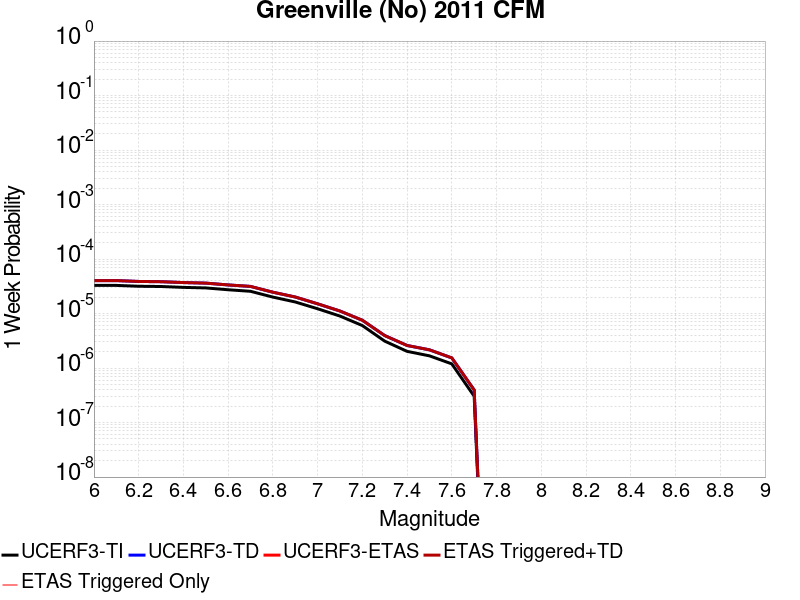 |  |  |  |

| Magnitude | 1 wk TI Prob | 1 wk TD Prob | 1 wk ETAS Prob | 1 wk ETAS/TD Gain | 1 wk ETAS Triggered+TD | 1 wk ETAS Triggered Only | 1 mo TI Prob | 1 mo TD Prob | 1 mo ETAS Prob | 1 mo ETAS/TD Gain | 1 mo ETAS Triggered+TD | 1 mo ETAS Triggered Only | 1 yr TI Prob | 1 yr TD Prob | 1 yr ETAS Prob | 1 yr ETAS/TD Gain | 1 yr ETAS Triggered+TD | 1 yr ETAS Triggered Only | 10 yr TI Prob | 10 yr TD Prob | 10 yr ETAS Prob | 10 yr ETAS/TD Gain | 10 yr ETAS Triggered+TD | 10 yr ETAS Triggered Only |
|-----|-----|-----|-----|-----|-----|-----|-----|-----|-----|-----|-----|-----|-----|-----|-----|-----|-----|-----|-----|-----|-----|-----|-----|-----|
| 6.0 | 3.286654E-5 | 4.0269028E-5 | 0.0 | 0.0 | 4.0269028E-5 | 0.0 | 1.4084899E-4 | 1.7257035E-4 | 0.0 | 0.0 | 1.7257035E-4 | 0.0 | 0.0017134876 | 0.0020990572 | 0.0012 | 0.57168525 | 0.0025980077 | 5.0E-4 | 0.017003356 | 0.020797431 | 0.015 | 0.7212429 | 0.026966408 | 0.0063 |
| 6.1 | 3.286654E-5 | 4.0269028E-5 | 0.0 | 0.0 | 4.0269028E-5 | 0.0 | 1.4084899E-4 | 1.7257035E-4 | 0.0 | 0.0 | 1.7257035E-4 | 0.0 | 0.0017134876 | 0.0020990572 | 0.0011 | 0.5240448 | 0.0024982176 | 4.0E-4 | 0.017003356 | 0.020797431 | 0.0123 | 0.5914192 | 0.025301762 | 0.0046 |
| 6.2 | 3.1697953E-5 | 3.883535E-5 | 0.0 | 0.0 | 3.883535E-5 | 0.0 | 1.358413E-4 | 1.6642682E-4 | 0.0 | 0.0 | 1.6642682E-4 | 0.0 | 0.0016526132 | 0.0020244005 | 0.0011 | 0.5433707 | 0.0024235907 | 4.0E-4 | 0.01640377 | 0.02006453 | 0.0117 | 0.58311856 | 0.024278253 | 0.0043 |
| 6.3 | 3.1363317E-5 | 3.8425198E-5 | 0.0 | 0.0 | 3.8425198E-5 | 0.0 | 1.344073E-4 | 1.6466924E-4 | 0.0 | 0.0 | 1.6466924E-4 | 0.0 | 0.0016351803 | 0.0020030416 | 0.0011 | 0.54916483 | 0.0024022402 | 4.0E-4 | 0.016232004 | 0.019854784 | 0.0116 | 0.58424205 | 0.024069408 | 0.0043 |
| 6.4 | 3.0228604E-5 | 3.7035607E-5 | 0.0 | 0.0 | 3.7035607E-5 | 0.0 | 1.2954473E-4 | 1.5871458E-4 | 0.0 | 0.0 | 1.5871458E-4 | 0.0 | 0.0015760659 | 0.0019306737 | 0.0011 | 0.5697493 | 0.0023299016 | 4.0E-4 | 0.015649348 | 0.019143766 | 0.0112 | 0.5850468 | 0.023165276 | 0.0041 |
| 6.5 | 2.9537814E-5 | 3.6193007E-5 | 0.0 | 0.0 | 3.6193007E-5 | 0.0 | 1.2658449E-4 | 1.5510386E-4 | 0.0 | 0.0 | 1.5510386E-4 | 0.0 | 0.0015400766 | 0.0018867902 | 0.0011 | 0.5830007 | 0.0022860356 | 4.0E-4 | 0.01529447 | 0.018712403 | 0.0107 | 0.5718132 | 0.022343168 | 0.0037 |
| 6.6 | 2.7345395E-5 | 3.3508666E-5 | 0.0 | 0.0 | 3.3508666E-5 | 0.0 | 1.1718928E-4 | 1.4360083E-4 | 0.0 | 0.0 | 1.4360083E-4 | 0.0 | 0.0014258457 | 0.0017469691 | 0.001 | 0.57242 | 0.002046445 | 3.0E-4 | 0.014167317 | 0.017336408 | 0.0099 | 0.57105255 | 0.020579198 | 0.0033 |
| 6.7 | 2.5615784E-5 | 3.148919E-5 | 0.0 | 0.0 | 3.148919E-5 | 0.0 | 1.09777306E-4 | 1.3494687E-4 | 0.0 | 0.0 | 1.3494687E-4 | 0.0 | 0.0013357193 | 0.0016417704 | 9.0E-4 | 0.5481887 | 0.0019412779 | 3.0E-4 | 0.013277191 | 0.016300317 | 0.0091 | 0.55827135 | 0.019054675 | 0.0028 |
| 6.8 | 2.0059057E-5 | 2.4650924E-5 | 0.0 | 0.0 | 2.4650924E-5 | 0.0 | 8.596455E-5 | 1.0564263E-4 | 0.0 | 0.0 | 1.0564263E-4 | 0.0 | 0.0010461159 | 0.0012854564 | 6.0E-4 | 0.46676028 | 0.0014851993 | 2.0E-4 | 0.0104120495 | 0.012782466 | 0.0075 | 0.58674127 | 0.0151517885 | 0.0024 |
| 6.9 | 1.6321746E-5 | 2.0133579E-5 | 0.0 | 0.0 | 2.0133579E-5 | 0.0 | 6.9948466E-5 | 8.628399E-5 | 0.0 | 0.0 | 8.628399E-5 | 0.0 | 8.5128983E-4 | 0.0010500136 | 5.0E-4 | 0.4761843 | 0.0012498036 | 2.0E-4 | 0.008480361 | 0.010452295 | 0.0067 | 0.64100754 | 0.012629299 | 0.0022 |
| 7.0 | 1.22527645E-5 | 1.50970345E-5 | 0.0 | 0.0 | 1.50970345E-5 | 0.0 | 5.2510793E-5 | 6.47E-5 | 0.0 | 0.0 | 6.47E-5 | 0.0 | 6.3913135E-4 | 7.8744197E-4 | 5.0E-4 | 0.6349674 | 9.872845E-4 | 2.0E-4 | 0.0063729626 | 0.007847438 | 0.0049 | 0.6244076 | 0.009534097 | 0.0017 |
| 7.1 | 8.996482E-6 | 1.1133471E-5 | 0.0 | 0.0 | 1.1133471E-5 | 0.0 | 3.8555783E-5 | 4.771401E-5 | 0.0 | 0.0 | 4.771401E-5 | 0.0 | 4.6931554E-4 | 5.8076443E-4 | 3.0E-4 | 0.51656055 | 6.8070635E-4 | 1.0E-4 | 0.004683256 | 0.0057929195 | 0.004 | 0.6904981 | 0.006985968 | 0.0012 |
| 7.2 | 6.0273087E-6 | 7.544417E-6 | 0.0 | 0.0 | 7.544417E-6 | 0.0 | 2.5831067E-5 | 3.233282E-5 | 0.0 | 0.0 | 3.233282E-5 | 0.0 | 3.1444785E-4 | 3.9358166E-4 | 2.0E-4 | 0.5081538 | 4.935423E-4 | 1.0E-4 | 0.0031400328 | 0.0039292723 | 0.003 | 0.76350015 | 0.004825736 | 9.0E-4 |
| 7.3 | 3.1209995E-6 | 3.9481756E-6 | 0.0 | 0.0 | 3.9481756E-6 | 0.0 | 1.3375643E-5 | 1.6920645E-5 | 0.0 | 0.0 | 1.6920645E-5 | 0.0 | 1.6283628E-4 | 2.0598953E-4 | 0.0 | 0.0 | 2.0598953E-4 | 0.0 | 0.0016271701 | 0.0020581102 | 0.0016 | 0.77741224 | 0.0025570812 | 5.0E-4 |
| 7.4 | 2.0254208E-6 | 2.596744E-6 | 0.0 | 0.0 | 2.596744E-6 | 0.0 | 8.680347E-6 | 1.11288555E-5 | 0.0 | 0.0 | 1.11288555E-5 | 0.0 | 1.0567809E-4 | 1.3548545E-4 | 0.0 | 0.0 | 1.3548545E-4 | 0.0 | 0.0010562785 | 0.0013540613 | 0.0012 | 0.8862228 | 0.0017535198 | 4.0E-4 |
| 7.5 | 1.6763418E-6 | 2.1614228E-6 | 0.0 | 0.0 | 2.1614228E-6 | 0.0 | 7.184302E-6 | 9.263208E-6 | 0.0 | 0.0 | 9.263208E-6 | 0.0 | 8.746537E-5 | 1.1277378E-4 | 0.0 | 0.0 | 1.1277378E-4 | 0.0 | 8.743095E-4 | 0.0011271731 | 0.0011 | 0.9758927 | 0.001426835 | 3.0E-4 |
| 7.6 | 1.1935462E-6 | 1.5358892E-6 | 0.0 | 0.0 | 1.5358892E-6 | 0.0 | 5.115188E-6 | 6.5823656E-6 | 0.0 | 0.0 | 6.5823656E-6 | 0.0 | 6.2275634E-5 | 8.01374E-5 | 0.0 | 0.0 | 8.01374E-5 | 0.0 | 6.2258187E-4 | 8.010764E-4 | 0.001 | 1.2483203 | 0.0011008361 | 3.0E-4 |
| 7.7 | 3.0464201E-7 | 3.9616813E-7 | 0.0 | 0.0 | 3.9616813E-7 | 0.0 | 1.3056081E-6 | 1.6978623E-6 | 0.0 | 0.0 | 1.6978623E-6 | 0.0 | 1.589566E-5 | 2.0671283E-5 | 0.0 | 0.0 | 2.0671283E-5 | 0.0 | 1.5894524E-4 | 2.0669866E-4 | 1.0E-4 | 0.48379606 | 2.0669866E-4 | 0.0 |

## Monte Vista - Shannon 2011 CFM
*[(top)](#table-of-contents)*

| 1 Week | 1 Month | 1 Year | 10 Year |
|-----|-----|-----|-----|
|  | 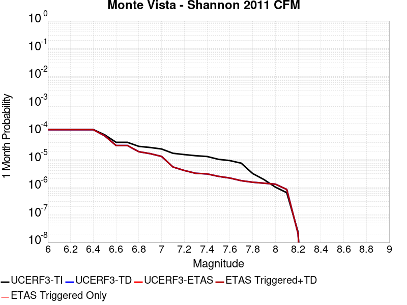 | 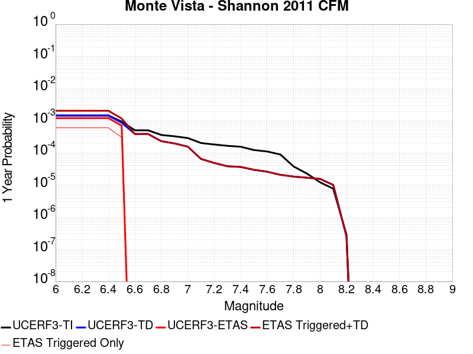 |  |

| Magnitude | 1 wk TI Prob | 1 wk TD Prob | 1 wk ETAS Prob | 1 wk ETAS/TD Gain | 1 wk ETAS Triggered+TD | 1 wk ETAS Triggered Only | 1 mo TI Prob | 1 mo TD Prob | 1 mo ETAS Prob | 1 mo ETAS/TD Gain | 1 mo ETAS Triggered+TD | 1 mo ETAS Triggered Only | 1 yr TI Prob | 1 yr TD Prob | 1 yr ETAS Prob | 1 yr ETAS/TD Gain | 1 yr ETAS Triggered+TD | 1 yr ETAS Triggered Only | 10 yr TI Prob | 10 yr TD Prob | 10 yr ETAS Prob | 10 yr ETAS/TD Gain | 10 yr ETAS Triggered+TD | 10 yr ETAS Triggered Only |
|-----|-----|-----|-----|-----|-----|-----|-----|-----|-----|-----|-----|-----|-----|-----|-----|-----|-----|-----|-----|-----|-----|-----|-----|-----|
| 6.0 | 2.7907707E-5 | 2.7505195E-5 | 0.0 | 0.0 | 2.7505195E-5 | 0.0 | 1.19598975E-4 | 1.1787478E-4 | 0.0 | 0.0 | 1.1787478E-4 | 0.0 | 0.0014551448 | 0.0014343042 | 0.0012 | 0.8366426 | 0.0020334437 | 6.0E-4 | 0.014456532 | 0.014279092 | 0.0131 | 0.9174253 | 0.020193417 | 0.006 |
| 6.1 | 2.7907707E-5 | 2.7505195E-5 | 0.0 | 0.0 | 2.7505195E-5 | 0.0 | 1.19598975E-4 | 1.1787478E-4 | 0.0 | 0.0 | 1.1787478E-4 | 0.0 | 0.0014551448 | 0.0014343042 | 0.0012 | 0.8366426 | 0.0020334437 | 6.0E-4 | 0.014456532 | 0.014279092 | 0.0131 | 0.9174253 | 0.020193417 | 0.006 |
| 6.2 | 2.7907707E-5 | 2.7505195E-5 | 0.0 | 0.0 | 2.7505195E-5 | 0.0 | 1.19598975E-4 | 1.1787478E-4 | 0.0 | 0.0 | 1.1787478E-4 | 0.0 | 0.0014551448 | 0.0014343042 | 0.0012 | 0.8366426 | 0.0020334437 | 6.0E-4 | 0.014456532 | 0.014279092 | 0.0131 | 0.9174253 | 0.020193417 | 0.006 |
| 6.3 | 2.7907707E-5 | 2.7505195E-5 | 0.0 | 0.0 | 2.7505195E-5 | 0.0 | 1.19598975E-4 | 1.1787478E-4 | 0.0 | 0.0 | 1.1787478E-4 | 0.0 | 0.0014551448 | 0.0014343042 | 0.0012 | 0.8366426 | 0.0020334437 | 6.0E-4 | 0.014456532 | 0.014279092 | 0.0131 | 0.9174253 | 0.020193417 | 0.006 |
| 6.4 | 2.7907707E-5 | 2.7505195E-5 | 0.0 | 0.0 | 2.7505195E-5 | 0.0 | 1.19598975E-4 | 1.1787478E-4 | 0.0 | 0.0 | 1.1787478E-4 | 0.0 | 0.0014551448 | 0.0014343042 | 0.0012 | 0.8366426 | 0.0020334437 | 6.0E-4 | 0.014456532 | 0.014279092 | 0.0131 | 0.9174253 | 0.020193417 | 0.006 |
| 6.5 | 1.7990213E-5 | 1.6572705E-5 | 0.0 | 0.0 | 1.6572705E-5 | 0.0 | 7.709863E-5 | 7.102432E-5 | 0.0 | 0.0 | 7.102432E-5 | 0.0 | 9.382716E-4 | 8.6444424E-4 | 7.0E-4 | 0.80976886 | 0.0011641849 | 3.0E-4 | 0.0093431985 | 0.008633737 | 0.0085 | 0.9845099 | 0.012599203 | 0.004 |
| 6.6 | 9.650407E-6 | 7.3996484E-6 | 0.0 | 0.0 | 7.3996484E-6 | 0.0 | 4.135823E-5 | 3.171244E-5 | 0.0 | 0.0 | 3.171244E-5 | 0.0 | 5.0342013E-4 | 3.8603836E-4 | 0.0 | 0.0 | 3.8603836E-4 | 0.0 | 0.005022812 | 0.0038709168 | 0.0034 | 0.8783449 | 0.0053651105 | 0.0015 |
| 6.7 | 9.62828E-6 | 7.377629E-6 | 0.0 | 0.0 | 7.377629E-6 | 0.0 | 4.1263404E-5 | 3.161807E-5 | 0.0 | 0.0 | 3.161807E-5 | 0.0 | 5.022661E-4 | 3.8488983E-4 | 0.0 | 0.0 | 3.8488983E-4 | 0.0 | 0.0050113243 | 0.0038594718 | 0.0034 | 0.88094956 | 0.0053536827 | 0.0015 |
| 6.8 | 6.887523E-6 | 4.4068943E-6 | 0.0 | 0.0 | 4.4068943E-6 | 0.0 | 2.9517621E-5 | 1.8886565E-5 | 0.0 | 0.0 | 1.8886565E-5 | 0.0 | 3.5931775E-4 | 2.2992189E-4 | 0.0 | 0.0 | 2.2992189E-4 | 0.0 | 0.0035873733 | 0.002313553 | 0.002 | 0.86447126 | 0.0030119333 | 7.0E-4 |
| 6.9 | 6.2722347E-6 | 3.7494158E-6 | 0.0 | 0.0 | 3.7494158E-6 | 0.0 | 2.6880729E-5 | 1.6068838E-5 | 0.0 | 0.0 | 1.6068838E-5 | 0.0 | 3.2722374E-4 | 1.9562256E-4 | 0.0 | 0.0 | 1.9562256E-4 | 0.0 | 0.003267423 | 0.0019712024 | 0.0019 | 0.96387875 | 0.0026698224 | 7.0E-4 |
| 7.0 | 5.5320347E-6 | 2.9780974E-6 | 0.0 | 0.0 | 2.9780974E-6 | 0.0 | 2.3708504E-5 | 1.2763223E-5 | 0.0 | 0.0 | 1.2763223E-5 | 0.0 | 2.8861282E-4 | 1.5538298E-4 | 0.0 | 0.0 | 1.5538298E-4 | 0.0 | 0.0028823826 | 0.0015694272 | 0.0013 | 0.8283277 | 0.0022683286 | 7.0E-4 |
| 7.1 | 3.8794055E-6 | 1.2335979E-6 | 0.0 | 0.0 | 1.2335979E-6 | 0.0 | 1.6625918E-5 | 5.2868377E-6 | 0.0 | 0.0 | 5.2868377E-6 | 0.0 | 2.0240174E-4 | 6.436536E-5 | 0.0 | 0.0 | 6.436536E-5 | 0.0 | 0.002022175 | 6.599758E-4 | 3.0E-4 | 0.4545621 | 7.599098E-4 | 1.0E-4 |
| 7.2 | 3.4813652E-6 | 9.195791E-7 | 0.0 | 0.0 | 9.195791E-7 | 0.0 | 1.49200505E-5 | 3.9410475E-6 | 0.0 | 0.0 | 3.9410475E-6 | 0.0 | 1.8163648E-4 | 4.7981204E-5 | 0.0 | 0.0 | 4.7981204E-5 | 0.0 | 0.0018148809 | 4.962046E-4 | 1.0E-4 | 0.20152977 | 5.96155E-4 | 1.0E-4 |
| 7.3 | 3.1682148E-6 | 7.2666313E-7 | 0.0 | 0.0 | 7.2666313E-7 | 0.0 | 1.3577992E-5 | 3.114267E-6 | 0.0 | 0.0 | 3.114267E-6 | 0.0 | 1.6529951E-4 | 3.7915543E-5 | 0.0 | 0.0 | 3.7915543E-5 | 0.0 | 0.0016517661 | 3.9556486E-4 | 0.0 | 0.0 | 3.9556486E-4 | 0.0 |
| 7.4 | 2.9707667E-6 | 6.909009E-7 | 0.0 | 0.0 | 6.909009E-7 | 0.0 | 1.2731795E-5 | 2.9610005E-6 | 0.0 | 0.0 | 2.9610005E-6 | 0.0 | 1.5499859E-4 | 3.6049587E-5 | 0.0 | 0.0 | 3.6049587E-5 | 0.0 | 0.0015489052 | 3.7672295E-4 | 0.0 | 0.0 | 3.7672295E-4 | 0.0 |
| 7.5 | 2.3462758E-6 | 5.645872E-7 | 0.0 | 0.0 | 5.645872E-7 | 0.0 | 1.0055429E-5 | 2.4196572E-6 | 0.0 | 0.0 | 2.4196572E-6 | 0.0 | 1.2241797E-4 | 2.9458932E-5 | 0.0 | 0.0 | 2.9458932E-5 | 0.0 | 0.0012235056 | 3.0918673E-4 | 0.0 | 0.0 | 3.0918673E-4 | 0.0 |
| 7.6 | 2.112783E-6 | 4.912792E-7 | 0.0 | 0.0 | 4.912792E-7 | 0.0 | 9.054753E-6 | 2.1054807E-6 | 0.0 | 0.0 | 2.1054807E-6 | 0.0 | 1.1023604E-4 | 2.5633926E-5 | 0.0 | 0.0 | 2.5633926E-5 | 0.0 | 0.0011018137 | 2.7053844E-4 | 0.0 | 0.0 | 2.7053844E-4 | 0.0 |
| 7.7 | 1.7022471E-6 | 3.9389053E-7 | 0.0 | 0.0 | 3.9389053E-7 | 0.0 | 7.2953244E-6 | 1.6881013E-6 | 0.0 | 0.0 | 1.6881013E-6 | 0.0 | 8.881695E-5 | 2.055244E-5 | 0.0 | 0.0 | 2.055244E-5 | 0.0 | 8.878146E-4 | 2.1849174E-4 | 0.0 | 0.0 | 2.1849174E-4 | 0.0 |
| 7.8 | 7.230914E-7 | 3.4652905E-7 | 0.0 | 0.0 | 3.4652905E-7 | 0.0 | 3.0989595E-6 | 1.4851236E-6 | 0.0 | 0.0 | 1.4851236E-6 | 0.0 | 3.772918E-5 | 1.8081231E-5 | 0.0 | 0.0 | 1.8081231E-5 | 0.0 | 3.7722773E-4 | 1.9336991E-4 | 0.0 | 0.0 | 1.9336991E-4 | 0.0 |
| 7.9 | 4.3588446E-7 | 3.202187E-7 | 0.0 | 0.0 | 3.202187E-7 | 0.0 | 1.868075E-6 | 1.3723652E-6 | 0.0 | 0.0 | 1.3723652E-6 | 0.0 | 2.2743576E-5 | 1.670842E-5 | 0.0 | 0.0 | 1.670842E-5 | 0.0 | 2.2741247E-4 | 1.7800811E-4 | 0.0 | 0.0 | 1.7800811E-4 | 0.0 |
| 8.0 | 2.3317523E-7 | 2.9513785E-7 | 0.0 | 0.0 | 2.9513785E-7 | 0.0 | 9.99322E-7 | 1.2648759E-6 | 0.0 | 0.0 | 1.2648759E-6 | 0.0 | 1.2166677E-5 | 1.5399755E-5 | 0.0 | 0.0 | 1.5399755E-5 | 0.0 | 1.21660116E-4 | 1.6362294E-4 | 0.0 | 0.0 | 1.6362294E-4 | 0.0 |
| 8.1 | 1.4662456E-7 | 1.910384E-7 | 0.0 | 0.0 | 1.910384E-7 | 0.0 | 6.283908E-7 | 8.187357E-7 | 0.0 | 0.0 | 8.187357E-7 | 0.0 | 7.650631E-6 | 9.968063E-6 | 0.0 | 0.0 | 9.968063E-6 | 0.0 | 7.650368E-5 | 1.05098225E-4 | 0.0 | 0.0 | 1.05098225E-4 | 0.0 |
| 8.2 | 5.4931775E-9 | 4.7661084E-9 | 0.0 | 0.0 | 4.7661084E-9 | 0.0 | 2.3542189E-8 | 2.0426178E-8 | 0.0 | 0.0 | 2.0426178E-8 | 0.0 | 2.8662612E-7 | 2.486887E-7 | 0.0 | 0.0 | 2.486887E-7 | 0.0 | 2.8662573E-6 | 2.5898464E-6 | 0.0 | 0.0 | 2.5898464E-6 | 0.0 |

## Almanor 2011 CFM
*[(top)](#table-of-contents)*

| 1 Week | 1 Month | 1 Year | 10 Year |
|-----|-----|-----|-----|
|  | 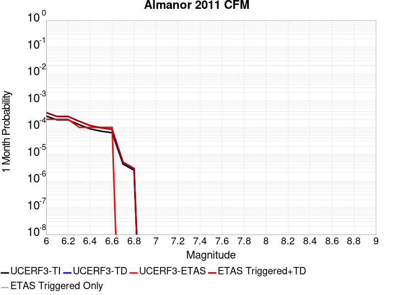 |  | 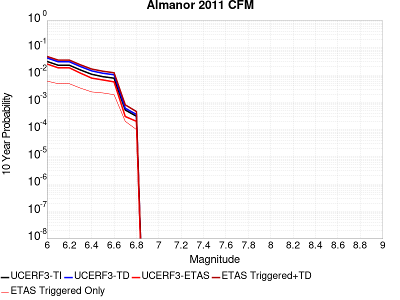 |

| Magnitude | 1 wk TI Prob | 1 wk TD Prob | 1 wk ETAS Prob | 1 wk ETAS/TD Gain | 1 wk ETAS Triggered+TD | 1 wk ETAS Triggered Only | 1 mo TI Prob | 1 mo TD Prob | 1 mo ETAS Prob | 1 mo ETAS/TD Gain | 1 mo ETAS Triggered+TD | 1 mo ETAS Triggered Only | 1 yr TI Prob | 1 yr TD Prob | 1 yr ETAS Prob | 1 yr ETAS/TD Gain | 1 yr ETAS Triggered+TD | 1 yr ETAS Triggered Only | 10 yr TI Prob | 10 yr TD Prob | 10 yr ETAS Prob | 10 yr ETAS/TD Gain | 10 yr ETAS Triggered+TD | 10 yr ETAS Triggered Only |
|-----|-----|-----|-----|-----|-----|-----|-----|-----|-----|-----|-----|-----|-----|-----|-----|-----|-----|-----|-----|-----|-----|-----|-----|-----|
| 6.0 | 6.1479834E-5 | 8.298417E-5 | 0.0 | 0.0 | 8.298417E-5 | 0.0 | 2.6345838E-4 | 3.5560352E-4 | 2.0E-4 | 0.5624241 | 3.5560352E-4 | 0.0 | 0.0032028882 | 0.004321557 | 0.0024 | 0.55535537 | 0.0051181 | 8.0E-4 | 0.031571172 | 0.042444512 | 0.0255 | 0.6007844 | 0.048189845 | 0.006 |
| 6.1 | 4.4387216E-5 | 5.956422E-5 | 0.0 | 0.0 | 5.956422E-5 | 0.0 | 1.9021705E-4 | 2.5525416E-4 | 2.0E-4 | 0.7835328 | 2.5525416E-4 | 0.0 | 0.0023134327 | 0.0031037936 | 0.0022 | 0.70881 | 0.0039013107 | 8.0E-4 | 0.022894967 | 0.03065395 | 0.0184 | 0.60024893 | 0.03530681 | 0.0048 |
| 6.2 | 4.4387216E-5 | 5.956422E-5 | 0.0 | 0.0 | 5.956422E-5 | 0.0 | 1.9021705E-4 | 2.5525416E-4 | 2.0E-4 | 0.7835328 | 2.5525416E-4 | 0.0 | 0.0023134327 | 0.0031037936 | 0.0022 | 0.70881 | 0.0039013107 | 8.0E-4 | 0.022894967 | 0.03065395 | 0.0184 | 0.60024893 | 0.03530681 | 0.0048 |
| 6.3 | 2.9523822E-5 | 3.9414223E-5 | 0.0 | 0.0 | 3.9414223E-5 | 0.0 | 1.2652454E-4 | 1.6890977E-4 | 1.0E-4 | 0.5920321 | 1.6890977E-4 | 0.0 | 0.0015393476 | 0.00205491 | 0.0012 | 0.5839672 | 0.0025538825 | 5.0E-4 | 0.015287281 | 0.020394152 | 0.0117 | 0.5736939 | 0.02362685 | 0.0033 |
| 6.4 | 2.0512744E-5 | 2.7338916E-5 | 0.0 | 0.0 | 2.7338916E-5 | 0.0 | 8.79088E-5 | 1.1716365E-4 | 1.0E-4 | 0.8535071 | 1.1716365E-4 | 0.0 | 0.001069764 | 0.0014258667 | 0.001 | 0.7013278 | 0.0018252964 | 4.0E-4 | 0.010646289 | 0.014198058 | 0.0077 | 0.5423277 | 0.016563982 | 0.0024 |
| 6.5 | 1.6750226E-5 | 2.2315515E-5 | 0.0 | 0.0 | 2.2315515E-5 | 0.0 | 7.178471E-5 | 9.563674E-5 | 1.0E-4 | 1.0456233 | 9.563674E-5 | 0.0 | 8.7362836E-4 | 0.0011640886 | 9.0E-4 | 0.773137 | 0.001563623 | 4.0E-4 | 0.008702018 | 0.011611144 | 0.0066 | 0.5684194 | 0.0137856 | 0.0022 |
| 6.6 | 1.4745303E-5 | 1.964102E-5 | 0.0 | 0.0 | 1.964102E-5 | 0.0 | 6.319262E-5 | 8.417538E-5 | 1.0E-4 | 1.1879958 | 8.417538E-5 | 0.0 | 7.690986E-4 | 0.0010246921 | 7.0E-4 | 0.68313205 | 0.0013243847 | 3.0E-4 | 0.0076644225 | 0.010231581 | 0.0056 | 0.547325 | 0.012112141 | 0.0019 |
| 6.7 | 9.951145E-7 | 1.1596063E-6 | 0.0 | 0.0 | 1.1596063E-6 | 0.0 | 4.26477E-6 | 4.969733E-6 | 0.0 | 0.0 | 4.969733E-6 | 0.0 | 5.1922336E-5 | 6.0504994E-5 | 0.0 | 0.0 | 6.0504994E-5 | 0.0 | 5.1910203E-4 | 6.049024E-4 | 3.0E-4 | 0.49594778 | 8.047814E-4 | 2.0E-4 |
| 6.8 | 5.866312E-7 | 6.837416E-7 | 0.0 | 0.0 | 6.837416E-7 | 0.0 | 2.5141312E-6 | 2.9303185E-6 | 0.0 | 0.0 | 2.9303185E-6 | 0.0 | 3.0609117E-5 | 3.5676174E-5 | 0.0 | 0.0 | 3.5676174E-5 | 0.0 | 3.06049E-4 | 3.5671727E-4 | 2.0E-4 | 0.5606682 | 4.566816E-4 | 1.0E-4 |

## Mission (connected) 2011 CFM
*[(top)](#table-of-contents)*

| 1 Week | 1 Month | 1 Year | 10 Year |
|-----|-----|-----|-----|
|  |  |  |  |

| Magnitude | 1 wk TI Prob | 1 wk TD Prob | 1 wk ETAS Prob | 1 wk ETAS/TD Gain | 1 wk ETAS Triggered+TD | 1 wk ETAS Triggered Only | 1 mo TI Prob | 1 mo TD Prob | 1 mo ETAS Prob | 1 mo ETAS/TD Gain | 1 mo ETAS Triggered+TD | 1 mo ETAS Triggered Only | 1 yr TI Prob | 1 yr TD Prob | 1 yr ETAS Prob | 1 yr ETAS/TD Gain | 1 yr ETAS Triggered+TD | 1 yr ETAS Triggered Only | 10 yr TI Prob | 10 yr TD Prob | 10 yr ETAS Prob | 10 yr ETAS/TD Gain | 10 yr ETAS Triggered+TD | 10 yr ETAS Triggered Only |
|-----|-----|-----|-----|-----|-----|-----|-----|-----|-----|-----|-----|-----|-----|-----|-----|-----|-----|-----|-----|-----|-----|-----|-----|-----|
| 6.0 | 1.8735573E-5 | 2.6617612E-5 | 0.0 | 0.0 | 2.6617612E-5 | 0.0 | 8.029284E-5 | 1.1406919E-4 | 1.0E-4 | 0.87666094 | 1.1406919E-4 | 0.0 | 9.771269E-4 | 0.0013878148 | 0.0015 | 1.0808359 | 0.0018871209 | 5.0E-4 | 0.009728416 | 0.013805085 | 0.0172 | 1.2459177 | 0.019623635 | 0.0059 |
| 6.1 | 1.7515964E-5 | 2.5260504E-5 | 0.0 | 0.0 | 2.5260504E-5 | 0.0 | 7.506625E-5 | 1.082535E-4 | 0.0 | 0.0 | 1.082535E-4 | 0.0 | 9.135484E-4 | 0.0013170963 | 9.0E-4 | 0.68332136 | 0.0017165694 | 4.0E-4 | 0.009098019 | 0.013106428 | 0.0113 | 0.86217237 | 0.01735007 | 0.0043 |
| 6.2 | 1.6486343E-5 | 2.4106652E-5 | 0.0 | 0.0 | 2.4106652E-5 | 0.0 | 7.065384E-5 | 1.0330882E-4 | 0.0 | 0.0 | 1.0330882E-4 | 0.0 | 8.5987104E-4 | 0.0012569661 | 9.0E-4 | 0.71600974 | 0.0016564633 | 4.0E-4 | 0.008565514 | 0.012512081 | 0.0103 | 0.8232044 | 0.016264535 | 0.0038 |
| 6.3 | 1.5229385E-5 | 2.2540813E-5 | 0.0 | 0.0 | 2.2540813E-5 | 0.0 | 6.526716E-5 | 9.659859E-5 | 0.0 | 0.0 | 9.659859E-5 | 0.0 | 7.9433795E-4 | 0.0011753603 | 8.0E-4 | 0.6806423 | 0.0015748902 | 4.0E-4 | 0.007915046 | 0.011707519 | 0.0096 | 0.81998587 | 0.015265372 | 0.0036 |
| 6.4 | 1.4435828E-5 | 2.115143E-5 | 0.0 | 0.0 | 2.115143E-5 | 0.0 | 6.186637E-5 | 9.064454E-5 | 0.0 | 0.0 | 9.064454E-5 | 0.0 | 7.529627E-4 | 0.0011029466 | 8.0E-4 | 0.72532976 | 0.0015025054 | 4.0E-4 | 0.007504165 | 0.010995562 | 0.0093 | 0.8457958 | 0.014457078 | 0.0035 |
| 6.5 | 1.30127955E-5 | 1.8803286E-5 | 0.0 | 0.0 | 1.8803286E-5 | 0.0 | 5.576793E-5 | 8.0582766E-5 | 0.0 | 0.0 | 8.0582766E-5 | 0.0 | 6.78763E-4 | 9.806219E-4 | 6.0E-4 | 0.6118566 | 0.0012803278 | 3.0E-4 | 0.0067669353 | 0.009794649 | 0.0085 | 0.8678208 | 0.013062326 | 0.0033 |
| 6.6 | 1.1220718E-5 | 1.617225E-5 | 0.0 | 0.0 | 1.617225E-5 | 0.0 | 4.8087906E-5 | 6.930778E-5 | 0.0 | 0.0 | 6.930778E-5 | 0.0 | 5.8531296E-4 | 8.434953E-4 | 4.0E-4 | 0.4742172 | 0.0011432422 | 3.0E-4 | 0.005837737 | 0.008438742 | 0.0069 | 0.8176574 | 0.011016801 | 0.0026 |
| 6.7 | 8.086152E-6 | 1.15681705E-5 | 0.0 | 0.0 | 1.15681705E-5 | 0.0 | 3.4654473E-5 | 4.9576935E-5 | 0.0 | 0.0 | 4.9576935E-5 | 0.0 | 4.2183654E-4 | 6.0343277E-4 | 2.0E-4 | 0.33143708 | 7.033724E-4 | 1.0E-4 | 0.004210367 | 0.006058275 | 0.0046 | 0.75929207 | 0.0077479756 | 0.0017 |
| 6.8 | 6.8361655E-6 | 1.0035145E-5 | 0.0 | 0.0 | 1.0035145E-5 | 0.0 | 2.9297524E-5 | 4.3007058E-5 | 0.0 | 0.0 | 4.3007058E-5 | 0.0 | 3.5663895E-4 | 5.2348577E-4 | 2.0E-4 | 0.38205433 | 6.234334E-4 | 1.0E-4 | 0.0035606713 | 0.0052582975 | 0.0039 | 0.7416849 | 0.0065514618 | 0.0013 |
| 6.9 | 5.2517353E-6 | 7.740318E-6 | 0.0 | 0.0 | 7.740318E-6 | 0.0 | 2.2507242E-5 | 3.317237E-5 | 0.0 | 0.0 | 3.317237E-5 | 0.0 | 2.739912E-4 | 4.0379903E-4 | 2.0E-4 | 0.4952959 | 5.037586E-4 | 1.0E-4 | 0.0027365363 | 0.0040651336 | 0.0026 | 0.6395854 | 0.005061068 | 0.001 |
| 7.0 | 4.4602784E-6 | 6.59002E-6 | 0.0 | 0.0 | 6.59002E-6 | 0.0 | 1.911534E-5 | 2.8242639E-5 | 0.0 | 0.0 | 2.8242639E-5 | 0.0 | 2.327044E-4 | 3.4380003E-4 | 2.0E-4 | 0.5817335 | 4.4376563E-4 | 1.0E-4 | 0.0023246086 | 0.00346606 | 0.0021 | 0.60587525 | 0.004263287 | 8.0E-4 |
| 7.1 | 4.1492594E-6 | 6.1442997E-6 | 0.0 | 0.0 | 6.1442997E-6 | 0.0 | 1.7782419E-5 | 2.633245E-5 | 0.0 | 0.0 | 2.633245E-5 | 0.0 | 2.1647944E-4 | 3.2055055E-4 | 2.0E-4 | 0.6239266 | 4.2051848E-4 | 1.0E-4 | 0.0021626868 | 0.0032336465 | 0.002 | 0.61849684 | 0.0040310593 | 8.0E-4 |
| 7.2 | 2.213247E-6 | 3.2849764E-6 | 0.0 | 0.0 | 3.2849764E-6 | 0.0 | 9.485309E-6 | 1.4078394E-5 | 0.0 | 0.0 | 1.4078394E-5 | 0.0 | 1.15477524E-4 | 1.71391E-4 | 1.0E-4 | 0.5834612 | 1.71391E-4 | 0.0 | 0.0011541754 | 0.0017424204 | 0.0014 | 0.80348 | 0.002241549 | 5.0E-4 |
| 7.3 | 1.7362703E-6 | 2.6703128E-6 | 0.0 | 0.0 | 2.6703128E-6 | 0.0 | 7.4411373E-6 | 1.1444148E-5 | 0.0 | 0.0 | 1.1444148E-5 | 0.0 | 9.0592075E-5 | 1.3932362E-4 | 1.0E-4 | 0.7177534 | 1.3932362E-4 | 0.0 | 9.0555154E-4 | 0.0014187829 | 0.0013 | 0.91627836 | 0.0019180734 | 5.0E-4 |
| 7.4 | 1.1628409E-6 | 1.7967243E-6 | 0.0 | 0.0 | 1.7967243E-6 | 0.0 | 4.9835944E-6 | 7.700224E-6 | 0.0 | 0.0 | 7.700224E-6 | 0.0 | 6.0673574E-5 | 9.374621E-5 | 1.0E-4 | 1.0667098 | 9.374621E-5 | 0.0 | 6.065701E-4 | 9.58822E-4 | 9.0E-4 | 0.9386518 | 0.0013584385 | 4.0E-4 |
| 7.5 | 5.5610667E-7 | 8.9541584E-7 | 0.0 | 0.0 | 8.9541584E-7 | 0.0 | 2.3833122E-6 | 3.8374906E-6 | 0.0 | 0.0 | 3.8374906E-6 | 0.0 | 2.9016439E-5 | 4.672045E-5 | 1.0E-4 | 2.1403902 | 4.672045E-5 | 0.0 | 2.901265E-4 | 4.8461917E-4 | 5.0E-4 | 1.0317379 | 6.8452227E-4 | 2.0E-4 |
| 7.6 | 4.4307663E-7 | 7.423254E-7 | 0.0 | 0.0 | 7.423254E-7 | 0.0 | 1.8988985E-6 | 3.1813906E-6 | 0.0 | 0.0 | 3.1813906E-6 | 0.0 | 2.3118844E-5 | 3.8732745E-5 | 1.0E-4 | 2.5817947 | 3.8732745E-5 | 0.0 | 2.3116439E-4 | 4.0408003E-4 | 4.0E-4 | 0.9899029 | 6.0399924E-4 | 2.0E-4 |
| 7.7 | 3.639119E-7 | 6.033907E-7 | 0.0 | 0.0 | 6.033907E-7 | 0.0 | 1.5596215E-6 | 2.5859574E-6 | 0.0 | 0.0 | 2.5859574E-6 | 0.0 | 1.8988227E-5 | 3.1483578E-5 | 1.0E-4 | 3.176259 | 3.1483578E-5 | 0.0 | 1.8986604E-4 | 3.3084108E-4 | 3.0E-4 | 0.9067798 | 4.30808E-4 | 1.0E-4 |
| 7.8 | 3.1152942E-7 | 5.206889E-7 | 0.0 | 0.0 | 5.206889E-7 | 0.0 | 1.3351254E-6 | 2.231522E-6 | 0.0 | 0.0 | 2.231522E-6 | 0.0 | 1.6255031E-5 | 2.7168444E-5 | 1.0E-4 | 3.6807408 | 2.7168444E-5 | 0.0 | 1.6253842E-4 | 2.8432807E-4 | 3.0E-4 | 1.0551192 | 3.8429964E-4 | 1.0E-4 |
| 7.9 | 1.8035962E-7 | 3.5540276E-7 | 0.0 | 0.0 | 3.5540276E-7 | 0.0 | 7.729696E-7 | 1.5231539E-6 | 0.0 | 0.0 | 1.5231539E-6 | 0.0 | 9.410865E-6 | 1.854424E-5 | 1.0E-4 | 5.39251 | 1.854424E-5 | 0.0 | 9.410465E-5 | 1.9265003E-4 | 3.0E-4 | 1.5572278 | 2.9263078E-4 | 1.0E-4 |
| 8.0 | 9.279334E-8 | 1.8900911E-7 | 0.0 | 0.0 | 1.8900911E-7 | 0.0 | 3.976857E-7 | 8.100388E-7 | 0.0 | 0.0 | 8.100388E-7 | 0.0 | 4.841813E-6 | 9.862179E-6 | 0.0 | 0.0 | 9.862179E-6 | 0.0 | 4.841707E-5 | 1.01374E-4 | 2.0E-4 | 1.9728925 | 2.0136386E-4 | 1.0E-4 |
| 8.1 | 5.9253985E-8 | 1.1385916E-7 | 0.0 | 0.0 | 1.1385916E-7 | 0.0 | 2.5394561E-7 | 4.879677E-7 | 0.0 | 0.0 | 4.879677E-7 | 0.0 | 3.0917836E-6 | 5.9409913E-6 | 0.0 | 0.0 | 5.9409913E-6 | 0.0 | 3.0917407E-5 | 6.0916063E-5 | 2.0E-4 | 3.2832062 | 1.6090997E-4 | 1.0E-4 |

## Pleito
*[(top)](#table-of-contents)*

| 1 Week | 1 Month | 1 Year | 10 Year |
|-----|-----|-----|-----|
|  | 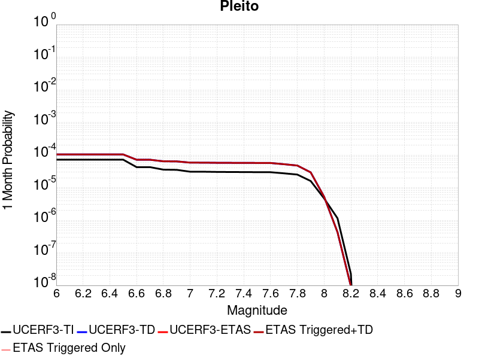 |  | 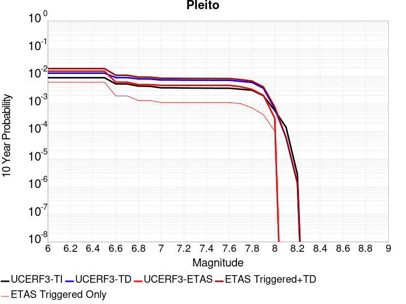 |

| Magnitude | 1 wk TI Prob | 1 wk TD Prob | 1 wk ETAS Prob | 1 wk ETAS/TD Gain | 1 wk ETAS Triggered+TD | 1 wk ETAS Triggered Only | 1 mo TI Prob | 1 mo TD Prob | 1 mo ETAS Prob | 1 mo ETAS/TD Gain | 1 mo ETAS Triggered+TD | 1 mo ETAS Triggered Only | 1 yr TI Prob | 1 yr TD Prob | 1 yr ETAS Prob | 1 yr ETAS/TD Gain | 1 yr ETAS Triggered+TD | 1 yr ETAS Triggered Only | 10 yr TI Prob | 10 yr TD Prob | 10 yr ETAS Prob | 10 yr ETAS/TD Gain | 10 yr ETAS Triggered+TD | 10 yr ETAS Triggered Only |
|-----|-----|-----|-----|-----|-----|-----|-----|-----|-----|-----|-----|-----|-----|-----|-----|-----|-----|-----|-----|-----|-----|-----|-----|-----|
| 6.0 | 1.6763008E-5 | 2.420621E-5 | 0.0 | 0.0 | 2.420621E-5 | 0.0 | 7.183948E-5 | 1.03737184E-4 | 0.0 | 0.0 | 1.03737184E-4 | 0.0 | 8.742947E-4 | 0.0012623403 | 9.0E-4 | 0.71296144 | 0.0017617091 | 5.0E-4 | 0.00870863 | 0.012671881 | 0.015 | 1.1837232 | 0.01859585 | 0.006 |
| 6.1 | 1.6763008E-5 | 2.420621E-5 | 0.0 | 0.0 | 2.420621E-5 | 0.0 | 7.183948E-5 | 1.03737184E-4 | 0.0 | 0.0 | 1.03737184E-4 | 0.0 | 8.742947E-4 | 0.0012623403 | 9.0E-4 | 0.71296144 | 0.0017617091 | 5.0E-4 | 0.00870863 | 0.012671881 | 0.015 | 1.1837232 | 0.01859585 | 0.006 |
| 6.2 | 1.6763008E-5 | 2.420621E-5 | 0.0 | 0.0 | 2.420621E-5 | 0.0 | 7.183948E-5 | 1.03737184E-4 | 0.0 | 0.0 | 1.03737184E-4 | 0.0 | 8.742947E-4 | 0.0012623403 | 9.0E-4 | 0.71296144 | 0.0017617091 | 5.0E-4 | 0.00870863 | 0.012671881 | 0.015 | 1.1837232 | 0.01859585 | 0.006 |
| 6.3 | 1.6763008E-5 | 2.420621E-5 | 0.0 | 0.0 | 2.420621E-5 | 0.0 | 7.183948E-5 | 1.03737184E-4 | 0.0 | 0.0 | 1.03737184E-4 | 0.0 | 8.742947E-4 | 0.0012623403 | 9.0E-4 | 0.71296144 | 0.0017617091 | 5.0E-4 | 0.00870863 | 0.012671881 | 0.015 | 1.1837232 | 0.01859585 | 0.006 |
| 6.4 | 1.6763008E-5 | 2.420621E-5 | 0.0 | 0.0 | 2.420621E-5 | 0.0 | 7.183948E-5 | 1.03737184E-4 | 0.0 | 0.0 | 1.03737184E-4 | 0.0 | 8.742947E-4 | 0.0012623403 | 9.0E-4 | 0.71296144 | 0.0017617091 | 5.0E-4 | 0.00870863 | 0.012671881 | 0.015 | 1.1837232 | 0.01859585 | 0.006 |
| 6.5 | 1.6763008E-5 | 2.420621E-5 | 0.0 | 0.0 | 2.420621E-5 | 0.0 | 7.183948E-5 | 1.03737184E-4 | 0.0 | 0.0 | 1.03737184E-4 | 0.0 | 8.742947E-4 | 0.0012623403 | 9.0E-4 | 0.71296144 | 0.0017617091 | 5.0E-4 | 0.00870863 | 0.012671881 | 0.015 | 1.1837232 | 0.01859585 | 0.006 |
| 6.6 | 9.910213E-6 | 1.6664997E-5 | 0.0 | 0.0 | 1.6664997E-5 | 0.0 | 4.247165E-5 | 7.141948E-5 | 0.0 | 0.0 | 7.141948E-5 | 0.0 | 5.169696E-4 | 8.69189E-4 | 2.0E-4 | 0.23009956 | 9.691021E-4 | 1.0E-4 | 0.0051576863 | 0.008771734 | 0.006 | 0.6840152 | 0.010655069 | 0.0019 |
| 6.7 | 9.910213E-6 | 1.6664997E-5 | 0.0 | 0.0 | 1.6664997E-5 | 0.0 | 4.247165E-5 | 7.141948E-5 | 0.0 | 0.0 | 7.141948E-5 | 0.0 | 5.169696E-4 | 8.69189E-4 | 2.0E-4 | 0.23009956 | 9.691021E-4 | 1.0E-4 | 0.0051576863 | 0.008771734 | 0.006 | 0.6840152 | 0.010655069 | 0.0019 |
| 6.8 | 8.300162E-6 | 1.4926077E-5 | 0.0 | 0.0 | 1.4926077E-5 | 0.0 | 3.557164E-5 | 6.396734E-5 | 0.0 | 0.0 | 6.396734E-5 | 0.0 | 4.3299864E-4 | 7.785255E-4 | 2.0E-4 | 0.2568959 | 8.7844767E-4 | 1.0E-4 | 0.004321559 | 0.007871681 | 0.0049 | 0.6224846 | 0.009161447 | 0.0013 |
| 6.9 | 8.183114E-6 | 1.479753E-5 | 0.0 | 0.0 | 1.479753E-5 | 0.0 | 3.5070017E-5 | 6.341645E-5 | 0.0 | 0.0 | 6.341645E-5 | 0.0 | 4.2689382E-4 | 7.7182316E-4 | 2.0E-4 | 0.25912672 | 8.71746E-4 | 1.0E-4 | 0.0042607468 | 0.0078051295 | 0.0049 | 0.62779224 | 0.009094983 | 0.0013 |
| 7.0 | 7.1748823E-6 | 1.35911105E-5 | 0.0 | 0.0 | 1.35911105E-5 | 0.0 | 3.0749135E-5 | 5.8246318E-5 | 0.0 | 0.0 | 5.8246318E-5 | 0.0 | 3.743064E-4 | 7.089187E-4 | 2.0E-4 | 0.28211978 | 8.0884784E-4 | 1.0E-4 | 0.0037367654 | 0.007179783 | 0.0046 | 0.6406879 | 0.008271885 | 0.0011 |
| 7.1 | 7.1671807E-6 | 1.35815535E-5 | 0.0 | 0.0 | 1.35815535E-5 | 0.0 | 3.0716128E-5 | 5.820536E-5 | 0.0 | 0.0 | 5.820536E-5 | 0.0 | 3.7390468E-4 | 7.0842035E-4 | 2.0E-4 | 0.28231823 | 8.083495E-4 | 1.0E-4 | 0.0037327618 | 0.0071748323 | 0.0046 | 0.64113 | 0.00826694 | 0.0011 |
| 7.2 | 7.0649667E-6 | 1.3430569E-5 | 0.0 | 0.0 | 1.3430569E-5 | 0.0 | 3.0278077E-5 | 5.7558314E-5 | 0.0 | 0.0 | 5.7558314E-5 | 0.0 | 3.6857324E-4 | 7.0054765E-4 | 2.0E-4 | 0.28549093 | 8.0047763E-4 | 1.0E-4 | 0.0036796255 | 0.007096455 | 0.0046 | 0.648211 | 0.008188649 | 0.0011 |
| 7.3 | 7.02082E-6 | 1.3375024E-5 | 0.0 | 0.0 | 1.3375024E-5 | 0.0 | 3.008888E-5 | 5.732027E-5 | 0.0 | 0.0 | 5.732027E-5 | 0.0 | 3.6627054E-4 | 6.976513E-4 | 2.0E-4 | 0.28667617 | 7.9758157E-4 | 1.0E-4 | 0.0036566744 | 0.0070674564 | 0.0046 | 0.6508707 | 0.008159682 | 0.0011 |
| 7.4 | 6.987146E-6 | 1.3335148E-5 | 0.0 | 0.0 | 1.3335148E-5 | 0.0 | 2.9944567E-5 | 5.7149384E-5 | 0.0 | 0.0 | 5.7149384E-5 | 0.0 | 3.6451413E-4 | 6.955721E-4 | 2.0E-4 | 0.2875331 | 7.9550256E-4 | 1.0E-4 | 0.0036391679 | 0.007046675 | 0.0046 | 0.6527901 | 0.008138924 | 0.0011 |
| 7.5 | 6.9494554E-6 | 1.3292482E-5 | 0.0 | 0.0 | 1.3292482E-5 | 0.0 | 2.9783041E-5 | 5.696654E-5 | 0.0 | 0.0 | 5.696654E-5 | 0.0 | 3.625482E-4 | 6.9334736E-4 | 2.0E-4 | 0.2884557 | 7.9327804E-4 | 1.0E-4 | 0.0036195726 | 0.0070245177 | 0.0046 | 0.65484923 | 0.008116791 | 0.0011 |
| 7.6 | 6.92694E-6 | 1.3252396E-5 | 0.0 | 0.0 | 1.3252396E-5 | 0.0 | 2.9686547E-5 | 5.6794746E-5 | 0.0 | 0.0 | 5.6794746E-5 | 0.0 | 3.6137376E-4 | 6.912571E-4 | 2.0E-4 | 0.28932792 | 7.9118804E-4 | 1.0E-4 | 0.0036078666 | 0.007003673 | 0.0046 | 0.65679824 | 0.0080959685 | 0.0011 |
| 7.7 | 6.395867E-6 | 1.2154203E-5 | 0.0 | 0.0 | 1.2154203E-5 | 0.0 | 2.741057E-5 | 5.2088406E-5 | 0.0 | 0.0 | 5.2088406E-5 | 0.0 | 3.336726E-4 | 6.3399214E-4 | 2.0E-4 | 0.31546134 | 7.339287E-4 | 1.0E-4 | 0.0033317201 | 0.006433666 | 0.0041 | 0.6372727 | 0.0074272323 | 0.001 |
| 7.8 | 5.8664327E-6 | 1.1065597E-5 | 0.0 | 0.0 | 1.1065597E-5 | 0.0 | 2.5141611E-5 | 4.7423127E-5 | 0.0 | 0.0 | 4.7423127E-5 | 0.0 | 3.060561E-4 | 5.7722384E-4 | 2.0E-4 | 0.34648603 | 6.771661E-4 | 1.0E-4 | 0.0030563495 | 0.005861171 | 0.0033 | 0.56302744 | 0.0065570683 | 7.0E-4 |
| 7.9 | 3.7167474E-6 | 6.826978E-6 | 0.0 | 0.0 | 6.826978E-6 | 0.0 | 1.592882E-5 | 2.9258148E-5 | 0.0 | 0.0 | 2.9258148E-5 | 0.0 | 1.9391612E-4 | 3.5615987E-4 | 1.0E-4 | 0.28077278 | 4.5612425E-4 | 1.0E-4 | 0.0019374699 | 0.0036211766 | 0.002 | 0.5523067 | 0.004019728 | 4.0E-4 |
| 8.0 | 1.0903841E-6 | 1.223528E-6 | 0.0 | 0.0 | 1.223528E-6 | 0.0 | 4.6730665E-6 | 5.243681E-6 | 0.0 | 0.0 | 5.243681E-6 | 0.0 | 5.68931E-5 | 6.383996E-5 | 0.0 | 0.0 | 6.383996E-5 | 0.0 | 5.6878536E-4 | 6.603334E-4 | 3.0E-4 | 0.45431596 | 7.602674E-4 | 1.0E-4 |
| 8.1 | 2.6894583E-7 | 9.9516384E-8 | 0.0 | 0.0 | 9.9516384E-8 | 0.0 | 1.1526245E-6 | 4.264987E-7 | 0.0 | 0.0 | 4.264987E-7 | 0.0 | 1.4033113E-5 | 5.1926095E-6 | 0.0 | 0.0 | 5.1926095E-6 | 0.0 | 1.4032227E-4 | 5.835751E-5 | 0.0 | 0.0 | 5.835751E-5 | 0.0 |
| 8.2 | 5.2967013E-9 | 2.1931936E-9 | 0.0 | 0.0 | 2.1931936E-9 | 0.0 | 2.2700148E-8 | 9.399401E-9 | 0.0 | 0.0 | 9.399401E-9 | 0.0 | 2.7637427E-7 | 1.1443771E-7 | 0.0 | 0.0 | 1.1443771E-7 | 0.0 | 2.7637393E-6 | 1.3106312E-6 | 0.0 | 0.0 | 1.3106312E-6 | 0.0 |

## Santa Ynez (East)
*[(top)](#table-of-contents)*

| 1 Week | 1 Month | 1 Year | 10 Year |
|-----|-----|-----|-----|
|  |  |  |  |

| Magnitude | 1 wk TI Prob | 1 wk TD Prob | 1 wk ETAS Prob | 1 wk ETAS/TD Gain | 1 wk ETAS Triggered+TD | 1 wk ETAS Triggered Only | 1 mo TI Prob | 1 mo TD Prob | 1 mo ETAS Prob | 1 mo ETAS/TD Gain | 1 mo ETAS Triggered+TD | 1 mo ETAS Triggered Only | 1 yr TI Prob | 1 yr TD Prob | 1 yr ETAS Prob | 1 yr ETAS/TD Gain | 1 yr ETAS Triggered+TD | 1 yr ETAS Triggered Only | 10 yr TI Prob | 10 yr TD Prob | 10 yr ETAS Prob | 10 yr ETAS/TD Gain | 10 yr ETAS Triggered+TD | 10 yr ETAS Triggered Only |
|-----|-----|-----|-----|-----|-----|-----|-----|-----|-----|-----|-----|-----|-----|-----|-----|-----|-----|-----|-----|-----|-----|-----|-----|-----|
| 6.0 | 3.2269712E-5 | 3.6683814E-5 | 1.0E-4 | 2.725998 | 3.6683814E-5 | 0.0 | 1.3829143E-4 | 1.5721019E-4 | 1.0E-4 | 0.6360911 | 1.5721019E-4 | 0.0 | 0.0016823979 | 0.0019129349 | 0.0012 | 0.6273083 | 0.0022123612 | 3.0E-4 | 0.016697178 | 0.01902192 | 0.0162 | 0.85164905 | 0.024221104 | 0.0053 |
| 6.1 | 3.2269712E-5 | 3.6683814E-5 | 1.0E-4 | 2.725998 | 3.6683814E-5 | 0.0 | 1.3829143E-4 | 1.5721019E-4 | 1.0E-4 | 0.6360911 | 1.5721019E-4 | 0.0 | 0.0016823979 | 0.0019129349 | 0.0012 | 0.6273083 | 0.0022123612 | 3.0E-4 | 0.016697178 | 0.01902192 | 0.0162 | 0.85164905 | 0.024221104 | 0.0053 |
| 6.2 | 3.2269712E-5 | 3.6683814E-5 | 1.0E-4 | 2.725998 | 3.6683814E-5 | 0.0 | 1.3829143E-4 | 1.5721019E-4 | 1.0E-4 | 0.6360911 | 1.5721019E-4 | 0.0 | 0.0016823979 | 0.0019129349 | 0.0012 | 0.6273083 | 0.0022123612 | 3.0E-4 | 0.016697178 | 0.01902192 | 0.0162 | 0.85164905 | 0.024221104 | 0.0053 |
| 6.3 | 3.2269712E-5 | 3.6683814E-5 | 1.0E-4 | 2.725998 | 3.6683814E-5 | 0.0 | 1.3829143E-4 | 1.5721019E-4 | 1.0E-4 | 0.6360911 | 1.5721019E-4 | 0.0 | 0.0016823979 | 0.0019129349 | 0.0012 | 0.6273083 | 0.0022123612 | 3.0E-4 | 0.016697178 | 0.01902192 | 0.0162 | 0.85164905 | 0.024221104 | 0.0053 |
| 6.4 | 1.4404779E-5 | 1.4833642E-5 | 0.0 | 0.0 | 1.4833642E-5 | 0.0 | 6.1733306E-5 | 6.3571235E-5 | 0.0 | 0.0 | 6.3571235E-5 | 0.0 | 7.513438E-4 | 7.7370997E-4 | 6.0E-4 | 0.7754844 | 9.7355526E-4 | 2.0E-4 | 0.0074880854 | 0.0077107116 | 0.0065 | 0.8429832 | 0.009893748 | 0.0022 |
| 6.5 | 1.4404779E-5 | 1.4833642E-5 | 0.0 | 0.0 | 1.4833642E-5 | 0.0 | 6.1733306E-5 | 6.3571235E-5 | 0.0 | 0.0 | 6.3571235E-5 | 0.0 | 7.513438E-4 | 7.7370997E-4 | 6.0E-4 | 0.7754844 | 9.7355526E-4 | 2.0E-4 | 0.0074880854 | 0.0077107116 | 0.0065 | 0.8429832 | 0.009893748 | 0.0022 |
| 6.6 | 1.280208E-5 | 1.2999023E-5 | 0.0 | 0.0 | 1.2999023E-5 | 0.0 | 5.4864904E-5 | 5.570892E-5 | 0.0 | 0.0 | 5.570892E-5 | 0.0 | 6.6777546E-4 | 6.780468E-4 | 6.0E-4 | 0.88489467 | 7.77979E-4 | 1.0E-4 | 0.006657724 | 0.00675999 | 0.0061 | 0.9023682 | 0.008647146 | 0.0019 |
| 6.7 | 1.2457027E-5 | 1.261599E-5 | 0.0 | 0.0 | 1.261599E-5 | 0.0 | 5.3386164E-5 | 5.406742E-5 | 0.0 | 0.0 | 5.406742E-5 | 0.0 | 6.497827E-4 | 6.5807364E-4 | 6.0E-4 | 0.91175205 | 7.5800787E-4 | 1.0E-4 | 0.00647886 | 0.006561447 | 0.0059 | 0.8991919 | 0.008349637 | 0.0018 |
| 6.8 | 1.2095134E-5 | 1.2218847E-5 | 0.0 | 0.0 | 1.2218847E-5 | 0.0 | 5.1835254E-5 | 5.236544E-5 | 0.0 | 0.0 | 5.236544E-5 | 0.0 | 6.309115E-4 | 6.3736434E-4 | 5.0E-4 | 0.78448063 | 7.373006E-4 | 1.0E-4 | 0.0062912325 | 0.0063555515 | 0.0056 | 0.88111943 | 0.008144111 | 0.0018 |
| 6.9 | 1.1104036E-5 | 1.1146225E-5 | 0.0 | 0.0 | 1.1146225E-5 | 0.0 | 4.758786E-5 | 4.7768666E-5 | 0.0 | 0.0 | 4.7768666E-5 | 0.0 | 5.7922816E-4 | 5.814296E-4 | 4.0E-4 | 0.6879595 | 6.813714E-4 | 1.0E-4 | 0.005777207 | 0.0057992293 | 0.0052 | 0.89667094 | 0.00748937 | 0.0017 |
| 7.0 | 1.0577444E-5 | 1.057112E-5 | 0.0 | 0.0 | 1.057112E-5 | 0.0 | 4.5331115E-5 | 4.530402E-5 | 0.0 | 0.0 | 4.530402E-5 | 0.0 | 5.5176654E-4 | 5.51438E-4 | 4.0E-4 | 0.7253762 | 6.513829E-4 | 1.0E-4 | 0.0055039856 | 0.005500835 | 0.0052 | 0.945311 | 0.007191484 | 0.0017 |
| 7.1 | 1.0021775E-5 | 9.970942E-6 | 0.0 | 0.0 | 9.970942E-6 | 0.0 | 4.294976E-5 | 4.2731914E-5 | 0.0 | 0.0 | 4.2731914E-5 | 0.0 | 5.2278786E-4 | 5.2013807E-4 | 4.0E-4 | 0.76902664 | 6.2008604E-4 | 1.0E-4 | 0.0052155964 | 0.0051893387 | 0.0044 | 0.8478922 | 0.0063831117 | 0.0012 |
| 7.2 | 8.874109E-6 | 8.739827E-6 | 0.0 | 0.0 | 8.739827E-6 | 0.0 | 3.8031343E-5 | 3.7455866E-5 | 0.0 | 0.0 | 3.7455866E-5 | 0.0 | 4.629332E-4 | 4.5593086E-4 | 4.0E-4 | 0.877326 | 5.5588526E-4 | 1.0E-4 | 0.0046197 | 0.0045500724 | 0.0039 | 0.8571292 | 0.0057446123 | 0.0012 |
| 7.3 | 7.5504267E-6 | 7.4976997E-6 | 0.0 | 0.0 | 7.4976997E-6 | 0.0 | 3.235857E-5 | 3.2132608E-5 | 0.0 | 0.0 | 3.2132608E-5 | 0.0 | 3.9389438E-4 | 3.911453E-4 | 3.0E-4 | 0.7669784 | 4.911062E-4 | 1.0E-4 | 0.0039319694 | 0.0039046754 | 0.0037 | 0.947582 | 0.00509999 | 0.0012 |
| 7.4 | 6.309394E-6 | 6.176963E-6 | 0.0 | 0.0 | 6.176963E-6 | 0.0 | 2.703998E-5 | 2.6472433E-5 | 0.0 | 0.0 | 2.6472433E-5 | 0.0 | 3.2916202E-4 | 3.2225516E-4 | 2.0E-4 | 0.6206262 | 4.2222295E-4 | 1.0E-4 | 0.003286749 | 0.0032179758 | 0.0027 | 0.83903676 | 0.0040154015 | 8.0E-4 |
| 7.5 | 4.6103073E-6 | 4.4365083E-6 | 0.0 | 0.0 | 4.4365083E-6 | 0.0 | 1.975831E-5 | 1.9013472E-5 | 0.0 | 0.0 | 1.9013472E-5 | 0.0 | 2.4053088E-4 | 2.3146514E-4 | 1.0E-4 | 0.43203053 | 3.31442E-4 | 1.0E-4 | 0.002402707 | 0.0023123098 | 0.002 | 0.864936 | 0.0030106911 | 7.0E-4 |
| 7.6 | 1.2858658E-6 | 1.299773E-6 | 0.0 | 0.0 | 1.299773E-6 | 0.0 | 5.5108417E-6 | 5.570444E-6 | 0.0 | 0.0 | 5.570444E-6 | 0.0 | 6.7092435E-5 | 6.781812E-5 | 0.0 | 0.0 | 6.781812E-5 | 0.0 | 6.707218E-4 | 6.7798106E-4 | 4.0E-4 | 0.589987 | 7.7791326E-4 | 1.0E-4 |
| 7.7 | 5.3302307E-7 | 5.609023E-7 | 0.0 | 0.0 | 5.609023E-7 | 0.0 | 2.2843826E-6 | 2.403865E-6 | 0.0 | 0.0 | 2.403865E-6 | 0.0 | 2.7812002E-5 | 2.9266701E-5 | 0.0 | 0.0 | 2.9266701E-5 | 0.0 | 2.7808524E-4 | 2.9263203E-4 | 1.0E-4 | 0.3417261 | 3.926028E-4 | 1.0E-4 |
| 7.8 | 4.613933E-8 | 4.8009543E-8 | 0.0 | 0.0 | 4.8009543E-8 | 0.0 | 1.9773998E-7 | 2.0575517E-7 | 0.0 | 0.0 | 2.0575517E-7 | 0.0 | 2.4074816E-6 | 2.5050665E-6 | 0.0 | 0.0 | 2.5050665E-6 | 0.0 | 2.4074554E-5 | 2.5050393E-5 | 0.0 | 0.0 | 2.5050393E-5 | 0.0 |

## South Klamath Lake West
*[(top)](#table-of-contents)*

| 1 Week | 1 Month | 1 Year | 10 Year |
|-----|-----|-----|-----|
|  |  |  | 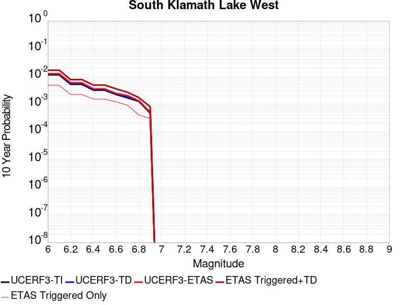 |

| Magnitude | 1 wk TI Prob | 1 wk TD Prob | 1 wk ETAS Prob | 1 wk ETAS/TD Gain | 1 wk ETAS Triggered+TD | 1 wk ETAS Triggered Only | 1 mo TI Prob | 1 mo TD Prob | 1 mo ETAS Prob | 1 mo ETAS/TD Gain | 1 mo ETAS Triggered+TD | 1 mo ETAS Triggered Only | 1 yr TI Prob | 1 yr TD Prob | 1 yr ETAS Prob | 1 yr ETAS/TD Gain | 1 yr ETAS Triggered+TD | 1 yr ETAS Triggered Only | 10 yr TI Prob | 10 yr TD Prob | 10 yr ETAS Prob | 10 yr ETAS/TD Gain | 10 yr ETAS Triggered+TD | 10 yr ETAS Triggered Only |
|-----|-----|-----|-----|-----|-----|-----|-----|-----|-----|-----|-----|-----|-----|-----|-----|-----|-----|-----|-----|-----|-----|-----|-----|-----|
| 6.0 | 2.174025E-5 | 2.3027618E-5 | 0.0 | 0.0 | 2.3027618E-5 | 0.0 | 9.3169176E-5 | 9.868643E-5 | 1.0E-4 | 1.0133106 | 1.9867656E-4 | 1.0E-4 | 0.0011337444 | 0.0012009108 | 0.0011 | 0.91597146 | 0.0017003103 | 5.0E-4 | 0.011279777 | 0.011950803 | 0.0124 | 1.0375872 | 0.016594635 | 0.0047 |
| 6.1 | 2.174025E-5 | 2.3027618E-5 | 0.0 | 0.0 | 2.3027618E-5 | 0.0 | 9.3169176E-5 | 9.868643E-5 | 1.0E-4 | 1.0133106 | 1.9867656E-4 | 1.0E-4 | 0.0011337444 | 0.0012009108 | 0.0011 | 0.91597146 | 0.0017003103 | 5.0E-4 | 0.011279777 | 0.011950803 | 0.0124 | 1.0375872 | 0.016594635 | 0.0047 |
| 6.2 | 9.834929E-6 | 1.03876755E-5 | 0.0 | 0.0 | 1.03876755E-5 | 0.0 | 4.2149015E-5 | 4.45179E-5 | 1.0E-4 | 2.2462873 | 1.4451345E-4 | 1.0E-4 | 5.1304343E-4 | 5.418797E-4 | 6.0E-4 | 1.1072569 | 8.417171E-4 | 3.0E-4 | 0.0051186057 | 0.0054064845 | 0.0058 | 1.0727859 | 0.00759459 | 0.0022 |
| 6.3 | 9.834929E-6 | 1.03876755E-5 | 0.0 | 0.0 | 1.03876755E-5 | 0.0 | 4.2149015E-5 | 4.45179E-5 | 1.0E-4 | 2.2462873 | 1.4451345E-4 | 1.0E-4 | 5.1304343E-4 | 5.418797E-4 | 6.0E-4 | 1.1072569 | 8.417171E-4 | 3.0E-4 | 0.0051186057 | 0.0054064845 | 0.0058 | 1.0727859 | 0.00759459 | 0.0022 |
| 6.4 | 6.066321E-6 | 6.3967505E-6 | 0.0 | 0.0 | 6.3967505E-6 | 0.0 | 2.5998259E-5 | 2.7414373E-5 | 0.0 | 0.0 | 2.7414373E-5 | 0.0 | 3.1648282E-4 | 3.3372157E-4 | 3.0E-4 | 0.89895296 | 4.336882E-4 | 1.0E-4 | 0.0031603249 | 0.0033324743 | 0.0035 | 1.0502707 | 0.0048274756 | 0.0015 |
| 6.5 | 6.066321E-6 | 6.3967505E-6 | 0.0 | 0.0 | 6.3967505E-6 | 0.0 | 2.5998259E-5 | 2.7414373E-5 | 0.0 | 0.0 | 2.7414373E-5 | 0.0 | 3.1648282E-4 | 3.3372157E-4 | 3.0E-4 | 0.89895296 | 4.336882E-4 | 1.0E-4 | 0.0031603249 | 0.0033324743 | 0.0035 | 1.0502707 | 0.0048274756 | 0.0015 |
| 6.6 | 4.2321803E-6 | 4.4587705E-6 | 0.0 | 0.0 | 4.4587705E-6 | 0.0 | 1.8137789E-5 | 1.9108884E-5 | 0.0 | 0.0 | 1.9108884E-5 | 0.0 | 2.208052E-4 | 2.3262684E-4 | 3.0E-4 | 1.2896191 | 3.3260358E-4 | 1.0E-4 | 0.0022058594 | 0.002323935 | 0.0024 | 1.032731 | 0.0035211463 | 0.0012 |
| 6.7 | 3.186646E-6 | 3.358394E-6 | 0.0 | 0.0 | 3.358394E-6 | 0.0 | 1.3656982E-5 | 1.4393042E-5 | 0.0 | 0.0 | 1.4393042E-5 | 0.0 | 1.6626107E-4 | 1.7522187E-4 | 2.0E-4 | 1.14141 | 1.7522187E-4 | 0.0 | 0.0016613674 | 0.0017509041 | 0.002 | 1.142267 | 0.0026493284 | 9.0E-4 |
| 6.8 | 2.380121E-6 | 2.509467E-6 | 0.0 | 0.0 | 2.509467E-6 | 0.0 | 1.0200479E-5 | 1.0754818E-5 | 0.0 | 0.0 | 1.0754818E-5 | 0.0 | 1.2418375E-4 | 1.309325E-4 | 1.0E-4 | 0.76375234 | 1.309325E-4 | 0.0 | 0.0012411437 | 0.0013085994 | 0.0013 | 0.9934286 | 0.0017080759 | 4.0E-4 |
| 6.9 | 8.928287E-7 | 9.4247173E-7 | 0.0 | 0.0 | 9.4247173E-7 | 0.0 | 3.826403E-6 | 4.0391596E-6 | 0.0 | 0.0 | 4.0391596E-6 | 0.0 | 4.658546E-5 | 4.917588E-5 | 1.0E-4 | 2.0335174 | 4.917588E-5 | 0.0 | 4.6575698E-4 | 4.9167156E-4 | 5.0E-4 | 1.016939 | 7.915241E-4 | 3.0E-4 |

## Trinidad (alt1)
*[(top)](#table-of-contents)*

| 1 Week | 1 Month | 1 Year | 10 Year |
|-----|-----|-----|-----|
| 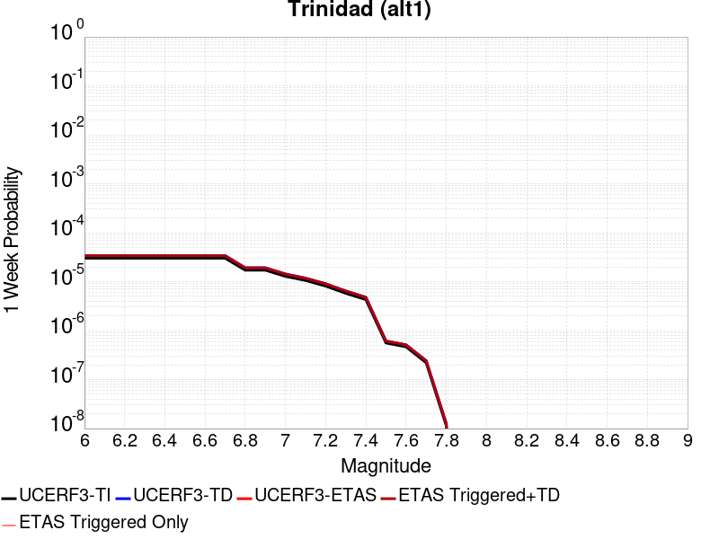 |  |  |  |

| Magnitude | 1 wk TI Prob | 1 wk TD Prob | 1 wk ETAS Prob | 1 wk ETAS/TD Gain | 1 wk ETAS Triggered+TD | 1 wk ETAS Triggered Only | 1 mo TI Prob | 1 mo TD Prob | 1 mo ETAS Prob | 1 mo ETAS/TD Gain | 1 mo ETAS Triggered+TD | 1 mo ETAS Triggered Only | 1 yr TI Prob | 1 yr TD Prob | 1 yr ETAS Prob | 1 yr ETAS/TD Gain | 1 yr ETAS Triggered+TD | 1 yr ETAS Triggered Only | 10 yr TI Prob | 10 yr TD Prob | 10 yr ETAS Prob | 10 yr ETAS/TD Gain | 10 yr ETAS Triggered+TD | 10 yr ETAS Triggered Only |
|-----|-----|-----|-----|-----|-----|-----|-----|-----|-----|-----|-----|-----|-----|-----|-----|-----|-----|-----|-----|-----|-----|-----|-----|-----|
| 6.0 | 3.0167168E-5 | 3.3987628E-5 | 0.0 | 0.0 | 3.3987628E-5 | 0.0 | 1.2928146E-4 | 1.4565406E-4 | 1.0E-4 | 0.68655825 | 2.456395E-4 | 1.0E-4 | 0.0015728653 | 0.0017720638 | 0.0012 | 0.67717654 | 0.0023710006 | 6.0E-4 | 0.0156177925 | 0.017596241 | 0.014 | 0.7956245 | 0.022999462 | 0.0055 |
| 6.1 | 3.0167168E-5 | 3.3987628E-5 | 0.0 | 0.0 | 3.3987628E-5 | 0.0 | 1.2928146E-4 | 1.4565406E-4 | 1.0E-4 | 0.68655825 | 2.456395E-4 | 1.0E-4 | 0.0015728653 | 0.0017720638 | 0.0012 | 0.67717654 | 0.0023710006 | 6.0E-4 | 0.0156177925 | 0.017596241 | 0.014 | 0.7956245 | 0.022999462 | 0.0055 |
| 6.2 | 3.0167168E-5 | 3.3987628E-5 | 0.0 | 0.0 | 3.3987628E-5 | 0.0 | 1.2928146E-4 | 1.4565406E-4 | 1.0E-4 | 0.68655825 | 2.456395E-4 | 1.0E-4 | 0.0015728653 | 0.0017720638 | 0.0012 | 0.67717654 | 0.0023710006 | 6.0E-4 | 0.0156177925 | 0.017596241 | 0.014 | 0.7956245 | 0.022999462 | 0.0055 |
| 6.3 | 3.0167168E-5 | 3.3987628E-5 | 0.0 | 0.0 | 3.3987628E-5 | 0.0 | 1.2928146E-4 | 1.4565406E-4 | 1.0E-4 | 0.68655825 | 2.456395E-4 | 1.0E-4 | 0.0015728653 | 0.0017720638 | 0.0012 | 0.67717654 | 0.0023710006 | 6.0E-4 | 0.0156177925 | 0.017596241 | 0.014 | 0.7956245 | 0.022999462 | 0.0055 |
| 6.4 | 3.0167168E-5 | 3.3987628E-5 | 0.0 | 0.0 | 3.3987628E-5 | 0.0 | 1.2928146E-4 | 1.4565406E-4 | 1.0E-4 | 0.68655825 | 2.456395E-4 | 1.0E-4 | 0.0015728653 | 0.0017720638 | 0.0012 | 0.67717654 | 0.0023710006 | 6.0E-4 | 0.0156177925 | 0.017596241 | 0.014 | 0.7956245 | 0.022999462 | 0.0055 |
| 6.5 | 3.0167168E-5 | 3.3987628E-5 | 0.0 | 0.0 | 3.3987628E-5 | 0.0 | 1.2928146E-4 | 1.4565406E-4 | 1.0E-4 | 0.68655825 | 2.456395E-4 | 1.0E-4 | 0.0015728653 | 0.0017720638 | 0.0012 | 0.67717654 | 0.0023710006 | 6.0E-4 | 0.0156177925 | 0.017596241 | 0.014 | 0.7956245 | 0.022999462 | 0.0055 |
| 6.6 | 3.0167168E-5 | 3.3987628E-5 | 0.0 | 0.0 | 3.3987628E-5 | 0.0 | 1.2928146E-4 | 1.4565406E-4 | 1.0E-4 | 0.68655825 | 2.456395E-4 | 1.0E-4 | 0.0015728653 | 0.0017720638 | 0.0012 | 0.67717654 | 0.0023710006 | 6.0E-4 | 0.0156177925 | 0.017596241 | 0.014 | 0.7956245 | 0.022999462 | 0.0055 |
| 6.7 | 3.0167168E-5 | 3.3987628E-5 | 0.0 | 0.0 | 3.3987628E-5 | 0.0 | 1.2928146E-4 | 1.4565406E-4 | 1.0E-4 | 0.68655825 | 2.456395E-4 | 1.0E-4 | 0.0015728653 | 0.0017720638 | 0.0012 | 0.67717654 | 0.0023710006 | 6.0E-4 | 0.0156177925 | 0.017596241 | 0.014 | 0.7956245 | 0.022999462 | 0.0055 |
| 6.8 | 1.717077E-5 | 1.917205E-5 | 0.0 | 0.0 | 1.917205E-5 | 0.0 | 7.358694E-5 | 8.21636E-5 | 1.0E-4 | 1.217084 | 1.8215537E-4 | 1.0E-4 | 8.9555274E-4 | 9.99927E-4 | 8.0E-4 | 0.80005836 | 0.0014994271 | 5.0E-4 | 0.008919522 | 0.009958718 | 0.0079 | 0.79327476 | 0.013027846 | 0.0031 |
| 6.9 | 1.717077E-5 | 1.917205E-5 | 0.0 | 0.0 | 1.917205E-5 | 0.0 | 7.358694E-5 | 8.21636E-5 | 1.0E-4 | 1.217084 | 1.8215537E-4 | 1.0E-4 | 8.9555274E-4 | 9.99927E-4 | 8.0E-4 | 0.80005836 | 0.0014994271 | 5.0E-4 | 0.008919522 | 0.009958718 | 0.0079 | 0.79327476 | 0.013027846 | 0.0031 |
| 7.0 | 1.2858572E-5 | 1.4320156E-5 | 0.0 | 0.0 | 1.4320156E-5 | 0.0 | 5.5107E-5 | 6.137083E-5 | 1.0E-4 | 1.6294385 | 1.613647E-4 | 1.0E-4 | 6.707212E-4 | 7.4696576E-4 | 6.0E-4 | 0.80324966 | 0.0010467417 | 3.0E-4 | 0.006687004 | 0.0074477214 | 0.0061 | 0.81904244 | 0.009631337 | 0.0022 |
| 7.1 | 1.0588431E-5 | 1.1787157E-5 | 0.0 | 0.0 | 1.1787157E-5 | 0.0 | 4.53782E-5 | 5.0515573E-5 | 1.0E-4 | 1.9795877 | 1.5051052E-4 | 1.0E-4 | 5.5233954E-4 | 6.1488233E-4 | 5.0E-4 | 0.8131637 | 9.146979E-4 | 3.0E-4 | 0.005509687 | 0.006134653 | 0.0047 | 0.7661395 | 0.008022997 | 0.0019 |
| 7.2 | 8.138061E-6 | 9.056403E-6 | 0.0 | 0.0 | 9.056403E-6 | 0.0 | 3.487694E-5 | 3.8812716E-5 | 1.0E-4 | 2.5764751 | 1.3880884E-4 | 1.0E-4 | 4.2454398E-4 | 4.7246713E-4 | 5.0E-4 | 1.0582746 | 7.723254E-4 | 3.0E-4 | 0.0042373384 | 0.0047170613 | 0.0037 | 0.78438663 | 0.006209986 | 0.0015 |
| 7.3 | 5.787542E-6 | 6.4524816E-6 | 0.0 | 0.0 | 6.4524816E-6 | 0.0 | 2.4803514E-5 | 2.7653321E-5 | 1.0E-4 | 3.6162024 | 1.2765055E-4 | 1.0E-4 | 3.0194095E-4 | 3.3664863E-4 | 2.0E-4 | 0.59409124 | 5.365813E-4 | 2.0E-4 | 0.00301531 | 0.0033634922 | 0.0023 | 0.6838131 | 0.0043601287 | 0.001 |
| 7.4 | 4.303563E-6 | 4.7950593E-6 | 0.0 | 0.0 | 4.7950593E-6 | 0.0 | 1.844371E-5 | 2.0550204E-5 | 0.0 | 0.0 | 2.0550204E-5 | 0.0 | 2.2452902E-4 | 2.501897E-4 | 1.0E-4 | 0.39969668 | 3.5016472E-4 | 1.0E-4 | 0.0022430231 | 0.002501014 | 0.0019 | 0.7596919 | 0.003299013 | 8.0E-4 |
| 7.5 | 5.6063425E-7 | 6.136845E-7 | 0.0 | 0.0 | 6.136845E-7 | 0.0 | 2.402716E-6 | 2.630074E-6 | 0.0 | 0.0 | 2.630074E-6 | 0.0 | 2.9252675E-5 | 3.2020696E-5 | 0.0 | 0.0 | 3.2020696E-5 | 0.0 | 2.9248823E-4 | 3.2016236E-4 | 2.0E-4 | 0.624683 | 5.200984E-4 | 2.0E-4 |
| 7.6 | 4.6699128E-7 | 5.120578E-7 | 0.0 | 0.0 | 5.120578E-7 | 0.0 | 2.0013897E-6 | 2.1945316E-6 | 0.0 | 0.0 | 2.1945316E-6 | 0.0 | 2.4366647E-5 | 2.671811E-5 | 0.0 | 0.0 | 2.671811E-5 | 0.0 | 2.4363975E-4 | 2.6715038E-4 | 1.0E-4 | 0.374321 | 3.6712366E-4 | 1.0E-4 |
| 7.7 | 2.2080937E-7 | 2.4320832E-7 | 0.0 | 0.0 | 2.4320832E-7 | 0.0 | 9.4632554E-7 | 1.0423211E-6 | 0.0 | 0.0 | 1.0423211E-6 | 0.0 | 1.15214525E-5 | 1.26901905E-5 | 0.0 | 0.0 | 1.26901905E-5 | 0.0 | 1.1520855E-4 | 1.2689526E-4 | 1.0E-4 | 0.78805155 | 2.2688256E-4 | 1.0E-4 |
| 7.8 | 1.1438307E-8 | 1.2668568E-8 | 0.0 | 0.0 | 1.2668568E-8 | 0.0 | 4.9021317E-8 | 5.4293867E-8 | 0.0 | 0.0 | 5.4293867E-8 | 0.0 | 5.9683435E-7 | 6.610278E-7 | 0.0 | 0.0 | 6.610278E-7 | 0.0 | 5.9683275E-6 | 6.610278E-6 | 0.0 | 0.0 | 6.610278E-6 | 0.0 |

## Goldstone Lake
*[(top)](#table-of-contents)*

| 1 Week | 1 Month | 1 Year | 10 Year |
|-----|-----|-----|-----|
|  |  |  | 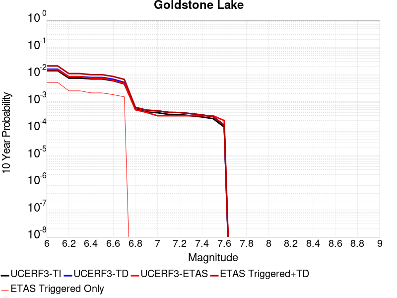 |

| Magnitude | 1 wk TI Prob | 1 wk TD Prob | 1 wk ETAS Prob | 1 wk ETAS/TD Gain | 1 wk ETAS Triggered+TD | 1 wk ETAS Triggered Only | 1 mo TI Prob | 1 mo TD Prob | 1 mo ETAS Prob | 1 mo ETAS/TD Gain | 1 mo ETAS Triggered+TD | 1 mo ETAS Triggered Only | 1 yr TI Prob | 1 yr TD Prob | 1 yr ETAS Prob | 1 yr ETAS/TD Gain | 1 yr ETAS Triggered+TD | 1 yr ETAS Triggered Only | 10 yr TI Prob | 10 yr TD Prob | 10 yr ETAS Prob | 10 yr ETAS/TD Gain | 10 yr ETAS Triggered+TD | 10 yr ETAS Triggered Only |
|-----|-----|-----|-----|-----|-----|-----|-----|-----|-----|-----|-----|-----|-----|-----|-----|-----|-----|-----|-----|-----|-----|-----|-----|-----|
| 6.0 | 2.671352E-5 | 3.0331994E-5 | 0.0 | 0.0 | 3.0331994E-5 | 0.0 | 1.1448149E-4 | 1.2998888E-4 | 0.0 | 0.0 | 1.2998888E-4 | 0.0 | 0.001392921 | 0.0015816615 | 8.0E-4 | 0.5057972 | 0.0019810288 | 4.0E-4 | 0.013842222 | 0.015723487 | 0.015 | 0.9539869 | 0.020743297 | 0.0051 |
| 6.1 | 2.671352E-5 | 3.0331994E-5 | 0.0 | 0.0 | 3.0331994E-5 | 0.0 | 1.1448149E-4 | 1.2998888E-4 | 0.0 | 0.0 | 1.2998888E-4 | 0.0 | 0.001392921 | 0.0015816615 | 8.0E-4 | 0.5057972 | 0.0019810288 | 4.0E-4 | 0.013842222 | 0.015723487 | 0.015 | 0.9539869 | 0.020743297 | 0.0051 |
| 6.2 | 1.4197047E-5 | 1.6073136E-5 | 0.0 | 0.0 | 1.6073136E-5 | 0.0 | 6.0843064E-5 | 6.88836E-5 | 0.0 | 0.0 | 6.88836E-5 | 0.0 | 7.4051257E-4 | 8.384335E-4 | 4.0E-4 | 0.47708017 | 0.0010382659 | 2.0E-4 | 0.007380498 | 0.008362372 | 0.0083 | 0.9925414 | 0.0108414665 | 0.0025 |
| 6.3 | 1.4197047E-5 | 1.6073136E-5 | 0.0 | 0.0 | 1.6073136E-5 | 0.0 | 6.0843064E-5 | 6.88836E-5 | 0.0 | 0.0 | 6.88836E-5 | 0.0 | 7.4051257E-4 | 8.384335E-4 | 4.0E-4 | 0.47708017 | 0.0010382659 | 2.0E-4 | 0.007380498 | 0.008362372 | 0.0083 | 0.9925414 | 0.0108414665 | 0.0025 |
| 6.4 | 1.3238931E-5 | 1.4986886E-5 | 0.0 | 0.0 | 1.4986886E-5 | 0.0 | 5.6737044E-5 | 6.422848E-5 | 0.0 | 0.0 | 6.422848E-5 | 0.0 | 6.9055456E-4 | 7.817989E-4 | 3.0E-4 | 0.38373038 | 8.8172074E-4 | 1.0E-4 | 0.006884126 | 0.007800085 | 0.0074 | 0.94870764 | 0.009883705 | 0.0021 |
| 6.5 | 1.3238931E-5 | 1.4986886E-5 | 0.0 | 0.0 | 1.4986886E-5 | 0.0 | 5.6737044E-5 | 6.422848E-5 | 0.0 | 0.0 | 6.422848E-5 | 0.0 | 6.9055456E-4 | 7.817989E-4 | 3.0E-4 | 0.38373038 | 8.8172074E-4 | 1.0E-4 | 0.006884126 | 0.007800085 | 0.0074 | 0.94870764 | 0.009883705 | 0.0021 |
| 6.6 | 1.1328278E-5 | 1.2836445E-5 | 0.0 | 0.0 | 1.2836445E-5 | 0.0 | 4.8548856E-5 | 5.5012715E-5 | 0.0 | 0.0 | 5.5012715E-5 | 0.0 | 5.90922E-4 | 6.6966936E-4 | 3.0E-4 | 0.44798225 | 7.696024E-4 | 1.0E-4 | 0.0058935313 | 0.0066858768 | 0.0061 | 0.912371 | 0.008473842 | 0.0018 |
| 6.7 | 8.651175E-6 | 9.810019E-6 | 0.0 | 0.0 | 9.810019E-6 | 0.0 | 3.707594E-5 | 4.2042768E-5 | 0.0 | 0.0 | 4.2042768E-5 | 0.0 | 4.5130608E-4 | 5.1184074E-4 | 2.0E-4 | 0.39074653 | 6.117896E-4 | 1.0E-4 | 0.0045039062 | 0.0051154727 | 0.0047 | 0.9187812 | 0.0066077993 | 0.0015 |
| 6.8 | 1.0215377E-6 | 1.1729769E-6 | 0.0 | 0.0 | 1.1729769E-6 | 0.0 | 4.378012E-6 | 5.027035E-6 | 0.0 | 0.0 | 5.027035E-6 | 0.0 | 5.3300988E-5 | 6.120255E-5 | 1.0E-4 | 1.633919 | 6.120255E-5 | 0.0 | 5.3288206E-4 | 6.118681E-4 | 5.0E-4 | 0.81716955 | 6.118681E-4 | 0.0 |
| 6.9 | 7.9360774E-7 | 9.2606354E-7 | 0.0 | 0.0 | 9.2606354E-7 | 0.0 | 3.4011714E-6 | 3.968838E-6 | 0.0 | 0.0 | 3.968838E-6 | 0.0 | 4.1408475E-5 | 4.83196E-5 | 1.0E-4 | 2.0695534 | 4.83196E-5 | 0.0 | 4.140076E-4 | 4.8309792E-4 | 4.0E-4 | 0.82798946 | 4.8309792E-4 | 0.0 |
| 7.0 | 7.4382757E-7 | 8.724997E-7 | 0.0 | 0.0 | 8.724997E-7 | 0.0 | 3.1878285E-6 | 3.7392795E-6 | 0.0 | 0.0 | 3.7392795E-6 | 0.0 | 3.8811122E-5 | 4.5524845E-5 | 0.0 | 0.0 | 4.5524845E-5 | 0.0 | 3.8804344E-4 | 4.551618E-4 | 3.0E-4 | 0.65910625 | 4.551618E-4 | 0.0 |
| 7.1 | 6.4709513E-7 | 7.689736E-7 | 0.0 | 0.0 | 7.689736E-7 | 0.0 | 2.773262E-6 | 3.2955975E-6 | 0.0 | 0.0 | 3.2955975E-6 | 0.0 | 3.376394E-5 | 4.012322E-5 | 0.0 | 0.0 | 4.012322E-5 | 0.0 | 3.375881E-4 | 4.011657E-4 | 3.0E-4 | 0.7478207 | 4.011657E-4 | 0.0 |
| 7.2 | 6.356704E-7 | 7.5668936E-7 | 0.0 | 0.0 | 7.5668936E-7 | 0.0 | 2.7242988E-6 | 3.2429507E-6 | 0.0 | 0.0 | 3.2429507E-6 | 0.0 | 3.3167835E-5 | 3.948227E-5 | 0.0 | 0.0 | 3.948227E-5 | 0.0 | 3.3162883E-4 | 3.9475845E-4 | 3.0E-4 | 0.7599584 | 3.9475845E-4 | 0.0 |
| 7.3 | 5.7695723E-7 | 6.8827575E-7 | 0.0 | 0.0 | 6.8827575E-7 | 0.0 | 2.4726714E-6 | 2.9497503E-6 | 0.0 | 0.0 | 2.9497503E-6 | 0.0 | 3.0104358E-5 | 3.5912675E-5 | 0.0 | 0.0 | 3.5912675E-5 | 0.0 | 3.0100282E-4 | 3.5907442E-4 | 3.0E-4 | 0.8354814 | 3.5907442E-4 | 0.0 |
| 7.4 | 5.209647E-7 | 6.18126E-7 | 0.0 | 0.0 | 6.18126E-7 | 0.0 | 2.232704E-6 | 2.649109E-6 | 0.0 | 0.0 | 2.649109E-6 | 0.0 | 2.718283E-5 | 3.2252483E-5 | 0.0 | 0.0 | 3.2252483E-5 | 0.0 | 2.7179506E-4 | 3.2248354E-4 | 3.0E-4 | 0.93028 | 3.2248354E-4 | 0.0 |
| 7.5 | 4.512955E-7 | 5.33711E-7 | 0.0 | 0.0 | 5.33711E-7 | 0.0 | 1.934122E-6 | 2.2873312E-6 | 0.0 | 0.0 | 2.2873312E-6 | 0.0 | 2.3547682E-5 | 2.7847955E-5 | 0.0 | 0.0 | 2.7847955E-5 | 0.0 | 2.3545188E-4 | 2.7844994E-4 | 3.0E-4 | 1.0773929 | 2.7844994E-4 | 0.0 |
| 7.6 | 2.21172E-7 | 2.602981E-7 | 0.0 | 0.0 | 2.602981E-7 | 0.0 | 9.478797E-7 | 1.115563E-6 | 0.0 | 0.0 | 1.115563E-6 | 0.0 | 1.1540374E-5 | 1.3581924E-5 | 0.0 | 0.0 | 1.3581924E-5 | 0.0 | 1.1539775E-4 | 1.3581375E-4 | 2.0E-4 | 1.472605 | 1.3581375E-4 | 0.0 |

## Ludlow
*[(top)](#table-of-contents)*

| 1 Week | 1 Month | 1 Year | 10 Year |
|-----|-----|-----|-----|
|  |  |  |  |

| Magnitude | 1 wk TI Prob | 1 wk TD Prob | 1 wk ETAS Prob | 1 wk ETAS/TD Gain | 1 wk ETAS Triggered+TD | 1 wk ETAS Triggered Only | 1 mo TI Prob | 1 mo TD Prob | 1 mo ETAS Prob | 1 mo ETAS/TD Gain | 1 mo ETAS Triggered+TD | 1 mo ETAS Triggered Only | 1 yr TI Prob | 1 yr TD Prob | 1 yr ETAS Prob | 1 yr ETAS/TD Gain | 1 yr ETAS Triggered+TD | 1 yr ETAS Triggered Only | 10 yr TI Prob | 10 yr TD Prob | 10 yr ETAS Prob | 10 yr ETAS/TD Gain | 10 yr ETAS Triggered+TD | 10 yr ETAS Triggered Only |
|-----|-----|-----|-----|-----|-----|-----|-----|-----|-----|-----|-----|-----|-----|-----|-----|-----|-----|-----|-----|-----|-----|-----|-----|-----|
| 6.0 | 2.2407607E-5 | 2.3643477E-5 | 0.0 | 0.0 | 2.3643477E-5 | 0.0 | 9.602906E-5 | 1.013255E-4 | 2.0E-4 | 1.9738368 | 2.0131537E-4 | 1.0E-4 | 0.0011685267 | 0.0012329839 | 6.0E-4 | 0.48662436 | 0.001532614 | 3.0E-4 | 0.011624013 | 0.012265936 | 0.0119 | 0.9701665 | 0.017402153 | 0.0052 |
| 6.1 | 2.2407607E-5 | 2.3643477E-5 | 0.0 | 0.0 | 2.3643477E-5 | 0.0 | 9.602906E-5 | 1.013255E-4 | 2.0E-4 | 1.9738368 | 2.0131537E-4 | 1.0E-4 | 0.0011685267 | 0.0012329839 | 6.0E-4 | 0.48662436 | 0.001532614 | 3.0E-4 | 0.011624013 | 0.012265936 | 0.0119 | 0.9701665 | 0.017402153 | 0.0052 |
| 6.2 | 1.0781252E-5 | 1.13592305E-5 | 0.0 | 0.0 | 1.13592305E-5 | 0.0 | 4.620455E-5 | 4.868153E-5 | 1.0E-4 | 2.054167 | 4.868153E-5 | 0.0 | 5.623952E-4 | 5.925405E-4 | 4.0E-4 | 0.6750594 | 7.92422E-4 | 2.0E-4 | 0.00560974 | 0.005910024 | 0.0058 | 0.9813835 | 0.008395249 | 0.0025 |
| 6.3 | 1.0781252E-5 | 1.13592305E-5 | 0.0 | 0.0 | 1.13592305E-5 | 0.0 | 4.620455E-5 | 4.868153E-5 | 1.0E-4 | 2.054167 | 4.868153E-5 | 0.0 | 5.623952E-4 | 5.925405E-4 | 4.0E-4 | 0.6750594 | 7.92422E-4 | 2.0E-4 | 0.00560974 | 0.005910024 | 0.0058 | 0.9813835 | 0.008395249 | 0.0025 |
| 6.4 | 7.814439E-6 | 8.233069E-6 | 0.0 | 0.0 | 8.233069E-6 | 0.0 | 3.3490025E-5 | 3.5284113E-5 | 1.0E-4 | 2.8341367 | 3.5284113E-5 | 0.0 | 4.0766477E-4 | 4.295008E-4 | 3.0E-4 | 0.6984853 | 6.2941486E-4 | 2.0E-4 | 0.0040691774 | 0.004286853 | 0.0038 | 0.8864311 | 0.0059795654 | 0.0017 |
| 6.5 | 6.4986366E-6 | 6.8470413E-6 | 0.0 | 0.0 | 6.8470413E-6 | 0.0 | 2.7851002E-5 | 2.9344137E-5 | 1.0E-4 | 3.4078357 | 2.9344137E-5 | 0.0 | 3.390332E-4 | 3.5720723E-4 | 3.0E-4 | 0.83984864 | 5.571358E-4 | 2.0E-4 | 0.003385164 | 0.0035664267 | 0.0031 | 0.8692174 | 0.00486179 | 0.0013 |
| 6.6 | 5.582177E-6 | 5.8826595E-6 | 0.0 | 0.0 | 5.8826595E-6 | 0.0 | 2.3923398E-5 | 2.5211159E-5 | 1.0E-4 | 3.9664977 | 2.5211159E-5 | 0.0 | 2.9122844E-4 | 3.0690333E-4 | 3.0E-4 | 0.97750646 | 5.068419E-4 | 2.0E-4 | 0.0029084706 | 0.0030648683 | 0.0027 | 0.8809514 | 0.0041614966 | 0.0011 |
| 6.7 | 4.6858763E-6 | 4.9376245E-6 | 0.0 | 0.0 | 4.9376245E-6 | 0.0 | 2.0082172E-5 | 2.1161079E-5 | 1.0E-4 | 4.725657 | 2.1161079E-5 | 0.0 | 2.4447302E-4 | 2.5760624E-4 | 3.0E-4 | 1.1645681 | 4.575547E-4 | 2.0E-4 | 0.0024420423 | 0.0025731325 | 0.0024 | 0.93271524 | 0.0034708166 | 9.0E-4 |
| 6.8 | 3.5584908E-6 | 3.7498878E-6 | 0.0 | 0.0 | 3.7498878E-6 | 0.0 | 1.5250586E-5 | 1.6070851E-5 | 1.0E-4 | 6.2224455 | 1.6070851E-5 | 0.0 | 1.8566006E-4 | 1.9564545E-4 | 3.0E-4 | 1.533386 | 3.9560633E-4 | 2.0E-4 | 0.0018550502 | 0.0019547732 | 0.0019 | 0.9719798 | 0.0025536004 | 6.0E-4 |
| 6.9 | 2.532834E-6 | 2.6694825E-6 | 0.0 | 0.0 | 2.6694825E-6 | 0.0 | 1.0854958E-5 | 1.144059E-5 | 1.0E-4 | 8.740808 | 1.144059E-5 | 0.0 | 1.3215111E-4 | 1.3928056E-4 | 3.0E-4 | 2.153926 | 3.392527E-4 | 2.0E-4 | 0.0013207254 | 0.0013919603 | 0.0016 | 1.149458 | 0.001991125 | 6.0E-4 |
| 7.0 | 1.7083285E-6 | 1.8009131E-6 | 0.0 | 0.0 | 1.8009131E-6 | 0.0 | 7.3213873E-6 | 7.718178E-6 | 1.0E-4 | 12.956428 | 7.718178E-6 | 0.0 | 8.913424E-5 | 9.3964925E-5 | 3.0E-4 | 3.1926808 | 2.9394613E-4 | 2.0E-4 | 8.9098496E-4 | 9.392684E-4 | 0.0011 | 1.1711242 | 0.0013388927 | 4.0E-4 |
| 7.1 | 1.0905424E-6 | 1.1491103E-6 | 0.0 | 0.0 | 1.1491103E-6 | 0.0 | 4.6737446E-6 | 4.9247496E-6 | 1.0E-4 | 20.305601 | 4.9247496E-6 | 0.0 | 5.6901354E-5 | 5.9957274E-5 | 1.0E-4 | 1.6678543 | 5.9957274E-5 | 0.0 | 5.6886784E-4 | 5.9942075E-4 | 7.0E-4 | 1.1677941 | 6.993608E-4 | 1.0E-4 |
| 7.2 | 6.06668E-7 | 6.3837547E-7 | 0.0 | 0.0 | 6.3837547E-7 | 0.0 | 2.600003E-6 | 2.7358924E-6 | 0.0 | 0.0 | 2.7358924E-6 | 0.0 | 3.1654577E-5 | 3.330905E-5 | 0.0 | 0.0 | 3.330905E-5 | 0.0 | 3.1650066E-4 | 3.330474E-4 | 5.0E-4 | 1.5012877 | 4.330141E-4 | 1.0E-4 |

## South Klamath Lake East
*[(top)](#table-of-contents)*

| 1 Week | 1 Month | 1 Year | 10 Year |
|-----|-----|-----|-----|
|  | 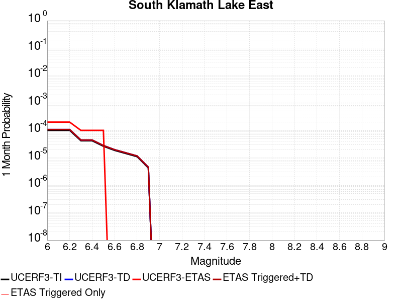 |  | 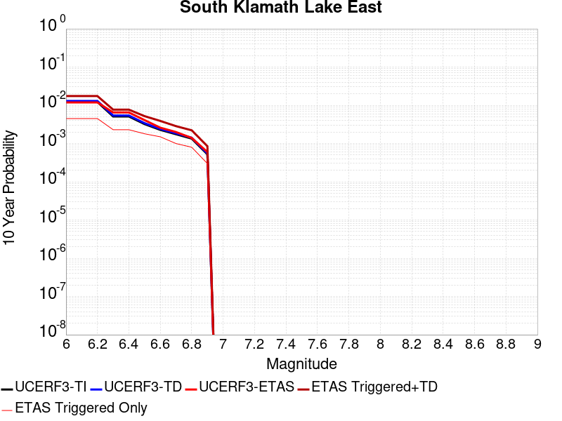 |

| Magnitude | 1 wk TI Prob | 1 wk TD Prob | 1 wk ETAS Prob | 1 wk ETAS/TD Gain | 1 wk ETAS Triggered+TD | 1 wk ETAS Triggered Only | 1 mo TI Prob | 1 mo TD Prob | 1 mo ETAS Prob | 1 mo ETAS/TD Gain | 1 mo ETAS Triggered+TD | 1 mo ETAS Triggered Only | 1 yr TI Prob | 1 yr TD Prob | 1 yr ETAS Prob | 1 yr ETAS/TD Gain | 1 yr ETAS Triggered+TD | 1 yr ETAS Triggered Only | 10 yr TI Prob | 10 yr TD Prob | 10 yr ETAS Prob | 10 yr ETAS/TD Gain | 10 yr ETAS Triggered+TD | 10 yr ETAS Triggered Only |
|-----|-----|-----|-----|-----|-----|-----|-----|-----|-----|-----|-----|-----|-----|-----|-----|-----|-----|-----|-----|-----|-----|-----|-----|-----|
| 6.0 | 2.3539369E-5 | 2.5030551E-5 | 0.0 | 0.0 | 2.5030551E-5 | 0.0 | 1.0087911E-4 | 1.0726984E-4 | 2.0E-4 | 1.8644569 | 1.0726984E-4 | 0.0 | 0.0012275111 | 0.001305311 | 0.0012 | 0.9193211 | 0.0014051804 | 1.0E-4 | 0.012207527 | 0.012984774 | 0.0119 | 0.916458 | 0.017426342 | 0.0045 |
| 6.1 | 2.3539369E-5 | 2.5030551E-5 | 0.0 | 0.0 | 2.5030551E-5 | 0.0 | 1.0087911E-4 | 1.0726984E-4 | 2.0E-4 | 1.8644569 | 1.0726984E-4 | 0.0 | 0.0012275111 | 0.001305311 | 0.0012 | 0.9193211 | 0.0014051804 | 1.0E-4 | 0.012207527 | 0.012984774 | 0.0119 | 0.916458 | 0.017426342 | 0.0045 |
| 6.2 | 2.3539369E-5 | 2.5030551E-5 | 0.0 | 0.0 | 2.5030551E-5 | 0.0 | 1.0087911E-4 | 1.0726984E-4 | 2.0E-4 | 1.8644569 | 1.0726984E-4 | 0.0 | 0.0012275111 | 0.001305311 | 0.0012 | 0.9193211 | 0.0014051804 | 1.0E-4 | 0.012207527 | 0.012984774 | 0.0119 | 0.916458 | 0.017426342 | 0.0045 |
| 6.3 | 9.807823E-6 | 1.03895345E-5 | 0.0 | 0.0 | 1.03895345E-5 | 0.0 | 4.2032847E-5 | 4.4525863E-5 | 1.0E-4 | 2.2458858 | 4.4525863E-5 | 0.0 | 5.1162974E-4 | 5.419759E-4 | 6.0E-4 | 1.1070603 | 6.419217E-4 | 1.0E-4 | 0.005104534 | 0.0054073767 | 0.0065 | 1.2020617 | 0.0076949396 | 0.0023 |
| 6.4 | 9.807823E-6 | 1.03895345E-5 | 0.0 | 0.0 | 1.03895345E-5 | 0.0 | 4.2032847E-5 | 4.4525863E-5 | 1.0E-4 | 2.2458858 | 4.4525863E-5 | 0.0 | 5.1162974E-4 | 5.419759E-4 | 6.0E-4 | 1.1070603 | 6.419217E-4 | 1.0E-4 | 0.005104534 | 0.0054073767 | 0.0065 | 1.2020617 | 0.0076949396 | 0.0023 |
| 6.5 | 6.191981E-6 | 6.546877E-6 | 0.0 | 0.0 | 6.546877E-6 | 0.0 | 2.653679E-5 | 2.8057759E-5 | 1.0E-4 | 3.5640764 | 2.8057759E-5 | 0.0 | 3.2303753E-4 | 3.4155246E-4 | 3.0E-4 | 0.8783424 | 3.4155246E-4 | 0.0 | 0.0032256835 | 0.0034105529 | 0.0041 | 1.2021511 | 0.005204414 | 0.0018 |
| 6.6 | 4.3693776E-6 | 4.6138316E-6 | 0.0 | 0.0 | 4.6138316E-6 | 0.0 | 1.8725768E-5 | 1.977342E-5 | 0.0 | 0.0 | 1.977342E-5 | 0.0 | 2.2796239E-4 | 2.4071593E-4 | 2.0E-4 | 0.83085483 | 2.4071593E-4 | 0.0 | 0.0022772867 | 0.0024046644 | 0.0026 | 1.081232 | 0.0039010574 | 0.0015 |
| 6.7 | 3.360834E-6 | 3.5491405E-6 | 0.0 | 0.0 | 3.5491405E-6 | 0.0 | 1.4403494E-5 | 1.5210518E-5 | 0.0 | 0.0 | 1.5210518E-5 | 0.0 | 1.7534842E-4 | 1.8517312E-4 | 2.0E-4 | 1.0800704 | 1.8517312E-4 | 0.0 | 0.0017521014 | 0.0018502681 | 0.002 | 1.0809244 | 0.0028484177 | 0.001 |
| 6.8 | 2.57873E-6 | 2.7235558E-6 | 0.0 | 0.0 | 2.7235558E-6 | 0.0 | 1.1051653E-5 | 1.1672333E-5 | 0.0 | 0.0 | 1.1672333E-5 | 0.0 | 1.3454557E-4 | 1.42102E-4 | 1.0E-4 | 0.70371985 | 1.42102E-4 | 0.0 | 0.0013446413 | 0.0014201719 | 0.0014 | 0.98579615 | 0.0022190358 | 8.0E-4 |
| 6.9 | 9.987825E-7 | 1.0559827E-6 | 0.0 | 0.0 | 1.0559827E-6 | 0.0 | 4.2804895E-6 | 4.5256343E-6 | 0.0 | 0.0 | 4.5256343E-6 | 0.0 | 5.211371E-5 | 5.5098528E-5 | 1.0E-4 | 1.8149304 | 5.5098528E-5 | 0.0 | 5.210149E-4 | 5.508808E-4 | 6.0E-4 | 1.0891649 | 8.5071556E-4 | 3.0E-4 |

## Coyote Canyon
*[(top)](#table-of-contents)*

| 1 Week | 1 Month | 1 Year | 10 Year |
|-----|-----|-----|-----|
|  | 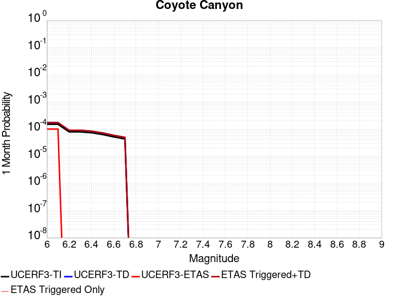 |  |  |

| Magnitude | 1 wk TI Prob | 1 wk TD Prob | 1 wk ETAS Prob | 1 wk ETAS/TD Gain | 1 wk ETAS Triggered+TD | 1 wk ETAS Triggered Only | 1 mo TI Prob | 1 mo TD Prob | 1 mo ETAS Prob | 1 mo ETAS/TD Gain | 1 mo ETAS Triggered+TD | 1 mo ETAS Triggered Only | 1 yr TI Prob | 1 yr TD Prob | 1 yr ETAS Prob | 1 yr ETAS/TD Gain | 1 yr ETAS Triggered+TD | 1 yr ETAS Triggered Only | 10 yr TI Prob | 10 yr TD Prob | 10 yr ETAS Prob | 10 yr ETAS/TD Gain | 10 yr ETAS Triggered+TD | 10 yr ETAS Triggered Only |
|-----|-----|-----|-----|-----|-----|-----|-----|-----|-----|-----|-----|-----|-----|-----|-----|-----|-----|-----|-----|-----|-----|-----|-----|-----|
| 6.0 | 3.5090034E-5 | 4.030101E-5 | 0.0 | 0.0 | 4.030101E-5 | 0.0 | 1.503772E-4 | 1.7270862E-4 | 1.0E-4 | 0.5790099 | 1.7270862E-4 | 0.0 | 0.0018293047 | 0.0021009562 | 0.0015 | 0.71396065 | 0.0024003258 | 3.0E-4 | 0.018143194 | 0.020836774 | 0.018 | 0.8638573 | 0.02573259 | 0.005 |
| 6.1 | 3.5090034E-5 | 4.030101E-5 | 0.0 | 0.0 | 4.030101E-5 | 0.0 | 1.503772E-4 | 1.7270862E-4 | 1.0E-4 | 0.5790099 | 1.7270862E-4 | 0.0 | 0.0018293047 | 0.0021009562 | 0.0015 | 0.71396065 | 0.0024003258 | 3.0E-4 | 0.018143194 | 0.020836774 | 0.018 | 0.8638573 | 0.02573259 | 0.005 |
| 6.2 | 1.841879E-5 | 2.1028296E-5 | 0.0 | 0.0 | 2.1028296E-5 | 0.0 | 7.8935285E-5 | 9.011873E-5 | 0.0 | 0.0 | 9.011873E-5 | 0.0 | 9.606133E-4 | 0.001096745 | 7.0E-4 | 0.63825226 | 0.0012965257 | 2.0E-4 | 0.0095647145 | 0.01092338 | 0.0097 | 0.8880035 | 0.013593887 | 0.0027 |
| 6.3 | 1.841879E-5 | 2.1028296E-5 | 0.0 | 0.0 | 2.1028296E-5 | 0.0 | 7.8935285E-5 | 9.011873E-5 | 0.0 | 0.0 | 9.011873E-5 | 0.0 | 9.606133E-4 | 0.001096745 | 7.0E-4 | 0.63825226 | 0.0012965257 | 2.0E-4 | 0.0095647145 | 0.01092338 | 0.0097 | 0.8880035 | 0.013593887 | 0.0027 |
| 6.4 | 1.712201E-5 | 1.9536092E-5 | 0.0 | 0.0 | 1.9536092E-5 | 0.0 | 7.337798E-5 | 8.3723986E-5 | 0.0 | 0.0 | 8.3723986E-5 | 0.0 | 8.930107E-4 | 0.0010189632 | 7.0E-4 | 0.68697286 | 0.0012187593 | 2.0E-4 | 0.008894307 | 0.010152799 | 0.0091 | 0.8963046 | 0.012726401 | 0.0026 |
| 6.5 | 1.4744935E-5 | 1.6812055E-5 | 0.0 | 0.0 | 1.6812055E-5 | 0.0 | 6.3191044E-5 | 7.20502E-5 | 0.0 | 0.0 | 7.20502E-5 | 0.0 | 7.6907943E-4 | 8.769513E-4 | 7.0E-4 | 0.7982199 | 0.001076776 | 2.0E-4 | 0.007664232 | 0.008744077 | 0.0081 | 0.9263414 | 0.011222216 | 0.0025 |
| 6.6 | 1.2017839E-5 | 1.3703764E-5 | 0.0 | 0.0 | 1.3703764E-5 | 0.0 | 5.150401E-5 | 5.872959E-5 | 0.0 | 0.0 | 5.872959E-5 | 0.0 | 6.268809E-4 | 7.148865E-4 | 5.0E-4 | 0.6994117 | 9.147435E-4 | 2.0E-4 | 0.0062511545 | 0.0071345353 | 0.0063 | 0.8830288 | 0.009219552 | 0.0021 |
| 6.7 | 1.00956095E-5 | 1.1516381E-5 | 0.0 | 0.0 | 1.1516381E-5 | 0.0 | 4.326618E-5 | 4.9355476E-5 | 0.0 | 0.0 | 4.9355476E-5 | 0.0 | 5.266384E-4 | 6.0082396E-4 | 4.0E-4 | 0.6657524 | 8.0070377E-4 | 2.0E-4 | 0.005253921 | 0.006000497 | 0.0054 | 0.8999255 | 0.007789696 | 0.0018 |

## Sargent 2011 CFM
*[(top)](#table-of-contents)*

| 1 Week | 1 Month | 1 Year | 10 Year |
|-----|-----|-----|-----|
|  |  | 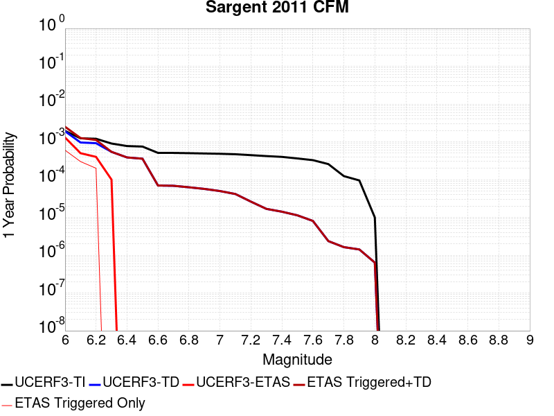 |  |

| Magnitude | 1 wk TI Prob | 1 wk TD Prob | 1 wk ETAS Prob | 1 wk ETAS/TD Gain | 1 wk ETAS Triggered+TD | 1 wk ETAS Triggered Only | 1 mo TI Prob | 1 mo TD Prob | 1 mo ETAS Prob | 1 mo ETAS/TD Gain | 1 mo ETAS Triggered+TD | 1 mo ETAS Triggered Only | 1 yr TI Prob | 1 yr TD Prob | 1 yr ETAS Prob | 1 yr ETAS/TD Gain | 1 yr ETAS Triggered+TD | 1 yr ETAS Triggered Only | 10 yr TI Prob | 10 yr TD Prob | 10 yr ETAS Prob | 10 yr ETAS/TD Gain | 10 yr ETAS Triggered+TD | 10 yr ETAS Triggered Only |
|-----|-----|-----|-----|-----|-----|-----|-----|-----|-----|-----|-----|-----|-----|-----|-----|-----|-----|-----|-----|-----|-----|-----|-----|-----|
| 6.0 | 3.7327867E-5 | 3.650677E-5 | 0.0 | 0.0 | 3.650677E-5 | 0.0 | 1.5996677E-4 | 1.5645097E-4 | 1.0E-4 | 0.63917786 | 2.5643533E-4 | 1.0E-4 | 0.0019458556 | 0.001903551 | 0.0013 | 0.6829341 | 0.002502409 | 6.0E-4 | 0.01928905 | 0.018942157 | 0.0164 | 0.8657937 | 0.024043659 | 0.0052 |
| 6.1 | 2.3771476E-5 | 1.8396146E-5 | 0.0 | 0.0 | 1.8396146E-5 | 0.0 | 1.01873775E-4 | 7.883873E-5 | 1.0E-4 | 1.2684121 | 1.7883084E-4 | 1.0E-4 | 0.0012396075 | 9.59521E-4 | 5.0E-4 | 0.5210933 | 0.0012592331 | 3.0E-4 | 0.012327154 | 0.009590714 | 0.0074 | 0.7715797 | 0.011967696 | 0.0024 |
| 6.2 | 2.3112721E-5 | 1.7628841E-5 | 0.0 | 0.0 | 1.7628841E-5 | 0.0 | 9.9050754E-5 | 7.555048E-5 | 1.0E-4 | 1.3236183 | 1.7554293E-4 | 1.0E-4 | 0.0012052758 | 9.195205E-4 | 4.0E-4 | 0.43500933 | 0.0011193366 | 2.0E-4 | 0.011987597 | 0.009194039 | 0.0069 | 0.75048625 | 0.011373812 | 0.0022 |
| 6.3 | 1.728509E-5 | 1.0395616E-5 | 0.0 | 0.0 | 1.0395616E-5 | 0.0 | 7.407686E-5 | 4.4552147E-5 | 0.0 | 0.0 | 4.4552147E-5 | 0.0 | 9.015125E-4 | 5.423336E-4 | 1.0E-4 | 0.18438837 | 5.423336E-4 | 0.0 | 0.008978641 | 0.0054437076 | 0.0045 | 0.8266425 | 0.0067366306 | 0.0013 |
| 6.4 | 1.48395575E-5 | 7.3997735E-6 | 0.0 | 0.0 | 7.3997735E-6 | 0.0 | 6.3596555E-5 | 3.1713145E-5 | 0.0 | 0.0 | 3.1713145E-5 | 0.0 | 7.7401294E-4 | 3.8607675E-4 | 0.0 | 0.0 | 3.8607675E-4 | 0.0 | 0.0077132257 | 0.0038868738 | 0.003 | 0.77182853 | 0.004982598 | 0.0011 |
| 6.5 | 1.4358964E-5 | 6.839544E-6 | 0.0 | 0.0 | 6.839544E-6 | 0.0 | 6.1536964E-5 | 2.9312214E-5 | 0.0 | 0.0 | 2.9312214E-5 | 0.0 | 7.48955E-4 | 3.5685525E-4 | 0.0 | 0.0 | 3.5685525E-4 | 0.0 | 0.0074643586 | 0.0035956302 | 0.0029 | 0.8065346 | 0.0045920345 | 0.001 |
| 6.6 | 9.772591E-6 | 1.3301266E-6 | 0.0 | 0.0 | 1.3301266E-6 | 0.0 | 4.188186E-5 | 5.7005304E-6 | 0.0 | 0.0 | 5.7005304E-6 | 0.0 | 5.097923E-4 | 6.940177E-5 | 0.0 | 0.0 | 6.940177E-5 | 0.0 | 0.005086244 | 7.2303804E-4 | 5.0E-4 | 0.69152653 | 0.0010228212 | 3.0E-4 |
| 6.7 | 9.752745E-6 | 1.3088344E-6 | 0.0 | 0.0 | 1.3088344E-6 | 0.0 | 4.179681E-5 | 5.609278E-6 | 0.0 | 0.0 | 5.609278E-6 | 0.0 | 5.0875737E-4 | 6.829085E-5 | 0.0 | 0.0 | 6.829085E-5 | 0.0 | 0.005075942 | 7.11936E-4 | 5.0E-4 | 0.7023103 | 0.0010117224 | 3.0E-4 |
| 6.8 | 9.608213E-6 | 1.1935011E-6 | 0.0 | 0.0 | 1.1935011E-6 | 0.0 | 4.1177405E-5 | 5.114995E-6 | 0.0 | 0.0 | 5.114995E-6 | 0.0 | 5.012196E-4 | 6.2273306E-5 | 0.0 | 0.0 | 6.2273306E-5 | 0.0 | 0.005000906 | 6.515025E-4 | 5.0E-4 | 0.76745677 | 9.51307E-4 | 3.0E-4 |
| 6.9 | 9.427164E-6 | 1.0802921E-6 | 0.0 | 0.0 | 1.0802921E-6 | 0.0 | 4.04015E-5 | 4.629815E-6 | 0.0 | 0.0 | 4.629815E-6 | 0.0 | 4.9177726E-4 | 5.6366564E-5 | 0.0 | 0.0 | 5.6366564E-5 | 0.0 | 0.004906904 | 5.9182505E-4 | 5.0E-4 | 0.8448443 | 8.916475E-4 | 3.0E-4 |
| 7.0 | 9.247601E-6 | 9.4809036E-7 | 0.0 | 0.0 | 9.4809036E-7 | 0.0 | 3.9631974E-5 | 4.063238E-6 | 0.0 | 0.0 | 4.063238E-6 | 0.0 | 4.8241246E-4 | 4.9468814E-5 | 0.0 | 0.0 | 4.9468814E-5 | 0.0 | 0.0048136655 | 5.2236655E-4 | 5.0E-4 | 0.9571823 | 8.222098E-4 | 3.0E-4 |
| 7.1 | 8.995454E-6 | 7.902502E-7 | 0.0 | 0.0 | 7.902502E-7 | 0.0 | 3.8551374E-5 | 3.3867823E-6 | 0.0 | 0.0 | 3.3867823E-6 | 0.0 | 4.6926187E-4 | 4.1233307E-5 | 0.0 | 0.0 | 4.1233307E-5 | 0.0 | 0.004682722 | 4.391358E-4 | 5.0E-4 | 1.1386 | 7.3900406E-4 | 3.0E-4 |
| 7.2 | 8.520861E-6 | 4.955659E-7 | 0.0 | 0.0 | 4.955659E-7 | 0.0 | 3.6517464E-5 | 2.1238523E-6 | 0.0 | 0.0 | 2.1238523E-6 | 0.0 | 4.445094E-4 | 2.58576E-5 | 0.0 | 0.0 | 2.58576E-5 | 0.0 | 0.004436213 | 2.8371174E-4 | 2.0E-4 | 0.7049409 | 4.83655E-4 | 2.0E-4 |
| 7.3 | 8.043592E-6 | 3.1743255E-7 | 0.0 | 0.0 | 3.1743255E-7 | 0.0 | 3.4472083E-5 | 1.3604244E-6 | 0.0 | 0.0 | 1.3604244E-6 | 0.0 | 4.196168E-4 | 1.6563043E-5 | 0.0 | 0.0 | 1.6563043E-5 | 0.0 | 0.004188253 | 1.8952461E-4 | 1.0E-4 | 0.527636 | 2.8950567E-4 | 1.0E-4 |
| 7.4 | 7.662316E-6 | 2.6704782E-7 | 0.0 | 0.0 | 2.6704782E-7 | 0.0 | 3.2838085E-5 | 1.1444902E-6 | 0.0 | 0.0 | 1.1444902E-6 | 0.0 | 3.9973034E-4 | 1.393408E-5 | 0.0 | 0.0 | 1.393408E-5 | 0.0 | 0.0039901207 | 1.61539E-4 | 1.0E-4 | 0.61904556 | 2.6152286E-4 | 1.0E-4 |
| 7.5 | 6.961638E-6 | 2.139055E-7 | 0.0 | 0.0 | 2.139055E-7 | 0.0 | 2.9835252E-5 | 9.167375E-7 | 0.0 | 0.0 | 9.167375E-7 | 0.0 | 3.6318362E-4 | 1.1161223E-5 | 0.0 | 0.0 | 1.1161223E-5 | 0.0 | 0.0036259065 | 1.3061658E-4 | 0.0 | 0.0 | 1.3061658E-4 | 0.0 |
| 7.6 | 6.282332E-6 | 1.5195336E-7 | 0.0 | 0.0 | 1.5195336E-7 | 0.0 | 2.6924003E-5 | 6.5122856E-7 | 0.0 | 0.0 | 6.5122856E-7 | 0.0 | 3.2775043E-4 | 7.928679E-6 | 0.0 | 0.0 | 7.928679E-6 | 0.0 | 0.0032726745 | 9.442953E-5 | 0.0 | 0.0 | 9.442953E-5 | 0.0 |
| 7.7 | 4.934408E-6 | 4.4333685E-8 | 0.0 | 0.0 | 4.4333685E-8 | 0.0 | 2.114729E-5 | 1.900015E-7 | 0.0 | 0.0 | 1.900015E-7 | 0.0 | 2.5743784E-4 | 2.313266E-6 | 0.0 | 0.0 | 2.313266E-6 | 0.0 | 0.0025713982 | 2.863751E-5 | 0.0 | 0.0 | 2.863751E-5 | 0.0 |
| 7.8 | 2.373212E-6 | 3.0612604E-8 | 0.0 | 0.0 | 3.0612604E-8 | 0.0 | 1.0170869E-5 | 1.3119687E-7 | 0.0 | 0.0 | 1.3119687E-7 | 0.0 | 1.238233E-4 | 1.5973208E-6 | 0.0 | 0.0 | 1.5973208E-6 | 0.0 | 0.0012375432 | 2.0951647E-5 | 0.0 | 0.0 | 2.0951647E-5 | 0.0 |
| 7.9 | 1.8227792E-6 | 2.6556389E-8 | 0.0 | 0.0 | 2.6556389E-8 | 0.0 | 7.811887E-6 | 1.13813094E-7 | 0.0 | 0.0 | 1.13813094E-7 | 0.0 | 9.510558E-5 | 1.3856735E-6 | 0.0 | 0.0 | 1.3856735E-6 | 0.0 | 9.5064886E-4 | 1.8567911E-5 | 0.0 | 0.0 | 1.8567911E-5 | 0.0 |
| 8.0 | 1.9095137E-7 | 1.2011457E-8 | 0.0 | 0.0 | 1.2011457E-8 | 0.0 | 8.1836276E-7 | 5.147767E-8 | 0.0 | 0.0 | 5.147767E-8 | 0.0 | 9.963521E-6 | 6.267405E-7 | 0.0 | 0.0 | 6.267405E-7 | 0.0 | 9.963074E-5 | 7.6893675E-6 | 0.0 | 0.0 | 7.6893675E-6 | 0.0 |

## Tank Canyon
*[(top)](#table-of-contents)*

| 1 Week | 1 Month | 1 Year | 10 Year |
|-----|-----|-----|-----|
|  | 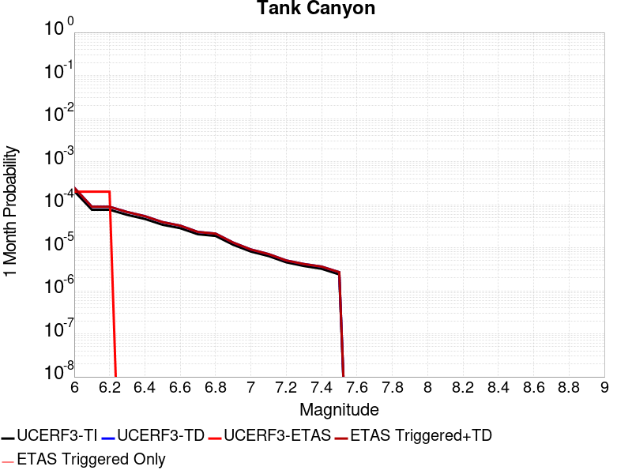 |  |  |

| Magnitude | 1 wk TI Prob | 1 wk TD Prob | 1 wk ETAS Prob | 1 wk ETAS/TD Gain | 1 wk ETAS Triggered+TD | 1 wk ETAS Triggered Only | 1 mo TI Prob | 1 mo TD Prob | 1 mo ETAS Prob | 1 mo ETAS/TD Gain | 1 mo ETAS Triggered+TD | 1 mo ETAS Triggered Only | 1 yr TI Prob | 1 yr TD Prob | 1 yr ETAS Prob | 1 yr ETAS/TD Gain | 1 yr ETAS Triggered+TD | 1 yr ETAS Triggered Only | 10 yr TI Prob | 10 yr TD Prob | 10 yr ETAS Prob | 10 yr ETAS/TD Gain | 10 yr ETAS Triggered+TD | 10 yr ETAS Triggered Only |
|-----|-----|-----|-----|-----|-----|-----|-----|-----|-----|-----|-----|-----|-----|-----|-----|-----|-----|-----|-----|-----|-----|-----|-----|-----|
| 6.0 | 4.8284557E-5 | 5.7840167E-5 | 0.0 | 0.0 | 5.7840167E-5 | 0.0 | 2.0691741E-4 | 2.4786626E-4 | 2.0E-4 | 0.80688673 | 2.4786626E-4 | 0.0 | 0.0025163088 | 0.0030142586 | 0.002 | 0.66351306 | 0.0033133544 | 3.0E-4 | 0.02488006 | 0.029800545 | 0.0208 | 0.6979738 | 0.034166444 | 0.0045 |
| 6.1 | 1.7796336E-5 | 2.083262E-5 | 0.0 | 0.0 | 2.083262E-5 | 0.0 | 7.626778E-5 | 8.927982E-5 | 2.0E-4 | 2.2401478 | 8.927982E-5 | 0.0 | 9.281647E-4 | 0.0010864778 | 0.0012 | 1.1044865 | 0.0011863691 | 1.0E-4 | 0.009242975 | 0.010815719 | 0.0088 | 0.8136306 | 0.012497333 | 0.0017 |
| 6.2 | 1.7796336E-5 | 2.083262E-5 | 0.0 | 0.0 | 2.083262E-5 | 0.0 | 7.626778E-5 | 8.927982E-5 | 2.0E-4 | 2.2401478 | 8.927982E-5 | 0.0 | 9.281647E-4 | 0.0010864778 | 0.0012 | 1.1044865 | 0.0011863691 | 1.0E-4 | 0.009242975 | 0.010815719 | 0.0088 | 0.8136306 | 0.012497333 | 0.0017 |
| 6.3 | 1.3515912E-5 | 1.5729276E-5 | 0.0 | 0.0 | 1.5729276E-5 | 0.0 | 5.792405E-5 | 6.740957E-5 | 0.0 | 0.0 | 6.740957E-5 | 0.0 | 7.049971E-4 | 8.2042604E-4 | 7.0E-4 | 0.8532152 | 9.2034397E-4 | 1.0E-4 | 0.007027647 | 0.008176551 | 0.0059 | 0.72157556 | 0.009168375 | 0.001 |
| 6.4 | 1.0870146E-5 | 1.2593871E-5 | 0.0 | 0.0 | 1.2593871E-5 | 0.0 | 4.658551E-5 | 5.397272E-5 | 0.0 | 0.0 | 5.397272E-5 | 0.0 | 5.67031E-4 | 6.569374E-4 | 6.0E-4 | 0.913329 | 7.568717E-4 | 1.0E-4 | 0.005655863 | 0.0065519316 | 0.0052 | 0.7936591 | 0.007247345 | 7.0E-4 |
| 6.5 | 7.964826E-6 | 9.178247E-6 | 0.0 | 0.0 | 9.178247E-6 | 0.0 | 3.4134522E-5 | 3.933481E-5 | 0.0 | 0.0 | 3.933481E-5 | 0.0 | 4.1550855E-4 | 4.788066E-4 | 5.0E-4 | 1.0442629 | 5.787587E-4 | 1.0E-4 | 0.0041473247 | 0.0047790254 | 0.0037 | 0.7742164 | 0.005276636 | 5.0E-4 |
| 6.6 | 6.6317E-6 | 7.5974126E-6 | 0.0 | 0.0 | 7.5974126E-6 | 0.0 | 2.8421264E-5 | 3.2559987E-5 | 0.0 | 0.0 | 3.2559987E-5 | 0.0 | 3.4597394E-4 | 3.9635476E-4 | 3.0E-4 | 0.7568977 | 4.9631513E-4 | 1.0E-4 | 0.0034543579 | 0.0039576045 | 0.0028 | 0.7074987 | 0.0043560215 | 4.0E-4 |
| 6.7 | 4.793663E-6 | 5.4198917E-6 | 0.0 | 0.0 | 5.4198917E-6 | 0.0 | 2.0544108E-5 | 2.3227925E-5 | 0.0 | 0.0 | 2.3227925E-5 | 0.0 | 2.500958E-4 | 2.8276767E-4 | 1.0E-4 | 0.35364723 | 2.8276767E-4 | 0.0 | 0.0024981452 | 0.0028247444 | 0.0018 | 0.6372258 | 0.0030241795 | 2.0E-4 |
| 6.8 | 4.382823E-6 | 4.959133E-6 | 0.0 | 0.0 | 4.959133E-6 | 0.0 | 1.8783392E-5 | 2.125328E-5 | 0.0 | 0.0 | 2.125328E-5 | 0.0 | 2.286638E-4 | 2.587322E-4 | 1.0E-4 | 0.3865 | 2.587322E-4 | 0.0 | 0.0022842865 | 0.002584962 | 0.0017 | 0.65764993 | 0.002784445 | 2.0E-4 |
| 6.9 | 2.729601E-6 | 3.0660856E-6 | 0.0 | 0.0 | 3.0660856E-6 | 0.0 | 1.1698237E-5 | 1.3140308E-5 | 0.0 | 0.0 | 1.3140308E-5 | 0.0 | 1.4241673E-4 | 1.5997273E-4 | 1.0E-4 | 0.6251066 | 1.5997273E-4 | 0.0 | 0.001423255 | 0.0015988793 | 8.0E-4 | 0.5003505 | 0.0016987195 | 1.0E-4 |
| 7.0 | 1.8987357E-6 | 2.1211877E-6 | 0.0 | 0.0 | 2.1211877E-6 | 0.0 | 8.137413E-6 | 9.090776E-6 | 0.0 | 0.0 | 9.090776E-6 | 0.0 | 9.90685E-5 | 1.10675275E-4 | 1.0E-4 | 0.9035441 | 1.10675275E-4 | 0.0 | 9.902435E-4 | 0.0011062701 | 6.0E-4 | 0.542363 | 0.0012061595 | 1.0E-4 |
| 7.1 | 1.4928986E-6 | 1.6591971E-6 | 0.0 | 0.0 | 1.6591971E-6 | 0.0 | 6.398121E-6 | 7.110829E-6 | 0.0 | 0.0 | 7.110829E-6 | 0.0 | 7.789434E-5 | 8.657149E-5 | 1.0E-4 | 1.1551147 | 8.657149E-5 | 0.0 | 7.786704E-4 | 8.654354E-4 | 4.0E-4 | 0.4621951 | 9.6534885E-4 | 1.0E-4 |
| 7.2 | 1.069082E-6 | 1.179496E-6 | 0.0 | 0.0 | 1.179496E-6 | 0.0 | 4.581772E-6 | 5.0549766E-6 | 0.0 | 0.0 | 5.0549766E-6 | 0.0 | 5.5781646E-5 | 6.1543135E-5 | 1.0E-4 | 1.6248766 | 6.1543135E-5 | 0.0 | 5.576765E-4 | 6.1531307E-4 | 2.0E-4 | 0.3250378 | 7.1525155E-4 | 1.0E-4 |
| 7.3 | 8.776551E-7 | 9.750752E-7 | 0.0 | 0.0 | 9.750752E-7 | 0.0 | 3.7613736E-6 | 4.17889E-6 | 0.0 | 0.0 | 4.17889E-6 | 0.0 | 4.579376E-5 | 5.0877316E-5 | 1.0E-4 | 1.9655125 | 5.0877316E-5 | 0.0 | 4.5784327E-4 | 5.087076E-4 | 2.0E-4 | 0.39315313 | 6.0865673E-4 | 1.0E-4 |
| 7.4 | 7.55721E-7 | 8.493275E-7 | 0.0 | 0.0 | 8.493275E-7 | 0.0 | 3.2388E-6 | 3.6399726E-6 | 0.0 | 0.0 | 3.6399726E-6 | 0.0 | 3.9431678E-5 | 4.4316283E-5 | 1.0E-4 | 2.256507 | 4.4316283E-5 | 0.0 | 3.942468E-4 | 4.4312523E-4 | 2.0E-4 | 0.45133966 | 5.430809E-4 | 1.0E-4 |
| 7.5 | 5.587665E-7 | 6.303491E-7 | 0.0 | 0.0 | 6.303491E-7 | 0.0 | 2.3947114E-6 | 2.7014962E-6 | 0.0 | 0.0 | 2.7014962E-6 | 0.0 | 2.915522E-5 | 3.289072E-5 | 1.0E-4 | 3.0403714 | 3.289072E-5 | 0.0 | 2.9151395E-4 | 3.2890716E-4 | 2.0E-4 | 0.6080743 | 4.2887428E-4 | 1.0E-4 |

## Garlock (Central)
*[(top)](#table-of-contents)*

| 1 Week | 1 Month | 1 Year | 10 Year |
|-----|-----|-----|-----|
|  |  |  |  |

| Magnitude | 1 wk TI Prob | 1 wk TD Prob | 1 wk ETAS Prob | 1 wk ETAS/TD Gain | 1 wk ETAS Triggered+TD | 1 wk ETAS Triggered Only | 1 mo TI Prob | 1 mo TD Prob | 1 mo ETAS Prob | 1 mo ETAS/TD Gain | 1 mo ETAS Triggered+TD | 1 mo ETAS Triggered Only | 1 yr TI Prob | 1 yr TD Prob | 1 yr ETAS Prob | 1 yr ETAS/TD Gain | 1 yr ETAS Triggered+TD | 1 yr ETAS Triggered Only | 10 yr TI Prob | 10 yr TD Prob | 10 yr ETAS Prob | 10 yr ETAS/TD Gain | 10 yr ETAS Triggered+TD | 10 yr ETAS Triggered Only |
|-----|-----|-----|-----|-----|-----|-----|-----|-----|-----|-----|-----|-----|-----|-----|-----|-----|-----|-----|-----|-----|-----|-----|-----|-----|
| 6.0 | 5.5131142E-5 | 6.9720634E-5 | 0.0 | 0.0 | 6.9720634E-5 | 0.0 | 2.3625491E-4 | 2.9876886E-4 | 0.0 | 0.0 | 2.9876886E-4 | 0.0 | 0.0028726095 | 0.0036315077 | 0.0016 | 0.44058836 | 0.0036315077 | 0.0 | 0.028357591 | 0.035784204 | 0.0228 | 0.6371527 | 0.040701702 | 0.0051 |
| 6.1 | 5.5131142E-5 | 6.9720634E-5 | 0.0 | 0.0 | 6.9720634E-5 | 0.0 | 2.3625491E-4 | 2.9876886E-4 | 0.0 | 0.0 | 2.9876886E-4 | 0.0 | 0.0028726095 | 0.0036315077 | 0.0016 | 0.44058836 | 0.0036315077 | 0.0 | 0.028357591 | 0.035784204 | 0.0228 | 0.6371527 | 0.040701702 | 0.0051 |
| 6.2 | 4.216245E-5 | 5.1180392E-5 | 0.0 | 0.0 | 5.1180392E-5 | 0.0 | 1.806837E-4 | 2.1932626E-4 | 0.0 | 0.0 | 2.1932626E-4 | 0.0 | 0.0021976046 | 0.0026670585 | 0.0012 | 0.4499339 | 0.0026670585 | 0.0 | 0.021759989 | 0.026441311 | 0.0164 | 0.6202416 | 0.029848766 | 0.0035 |
| 6.3 | 4.216245E-5 | 5.1180392E-5 | 0.0 | 0.0 | 5.1180392E-5 | 0.0 | 1.806837E-4 | 2.1932626E-4 | 0.0 | 0.0 | 2.1932626E-4 | 0.0 | 0.0021976046 | 0.0026670585 | 0.0012 | 0.4499339 | 0.0026670585 | 0.0 | 0.021759989 | 0.026441311 | 0.0164 | 0.6202416 | 0.029848766 | 0.0035 |
| 6.4 | 3.6858168E-5 | 4.3654112E-5 | 0.0 | 0.0 | 4.3654112E-5 | 0.0 | 1.5795401E-4 | 1.8707577E-4 | 0.0 | 0.0 | 1.8707577E-4 | 0.0 | 0.0019213937 | 0.0022752932 | 0.001 | 0.4395038 | 0.0022752932 | 0.0 | 0.019048655 | 0.02262472 | 0.0137 | 0.6055324 | 0.025556846 | 0.003 |
| 6.5 | 3.39199E-5 | 3.9577175E-5 | 0.0 | 0.0 | 3.9577175E-5 | 0.0 | 1.453629E-4 | 1.6960557E-4 | 0.0 | 0.0 | 1.6960557E-4 | 0.0 | 0.0017683565 | 0.0020630136 | 0.001 | 0.48472777 | 0.0020630136 | 0.0 | 0.017543508 | 0.020541329 | 0.0129 | 0.62800217 | 0.02338176 | 0.0029 |
| 6.6 | 3.3571985E-5 | 3.9032402E-5 | 0.0 | 0.0 | 3.9032402E-5 | 0.0 | 1.4387199E-4 | 1.6727112E-4 | 0.0 | 0.0 | 1.6727112E-4 | 0.0 | 0.0017502342 | 0.0020346453 | 0.001 | 0.4914862 | 0.0020346453 | 0.0 | 0.017365133 | 0.020265728 | 0.0123 | 0.60693604 | 0.023008984 | 0.0028 |
| 6.7 | 3.2580007E-5 | 3.7653088E-5 | 0.0 | 0.0 | 3.7653088E-5 | 0.0 | 1.3962112E-4 | 1.6136053E-4 | 0.0 | 0.0 | 1.6136053E-4 | 0.0 | 0.0016985617 | 0.0019628154 | 0.001 | 0.50947225 | 0.0019628154 | 0.0 | 0.016856372 | 0.019553363 | 0.0118 | 0.60347676 | 0.022102524 | 0.0026 |
| 6.8 | 3.2185937E-5 | 3.7081954E-5 | 0.0 | 0.0 | 3.7081954E-5 | 0.0 | 1.3793244E-4 | 1.589131E-4 | 0.0 | 0.0 | 1.589131E-4 | 0.0 | 0.0016780337 | 0.0019330714 | 0.001 | 0.51731145 | 0.0019330714 | 0.0 | 0.016654192 | 0.0192608 | 0.0117 | 0.60745144 | 0.021810722 | 0.0026 |
| 6.9 | 3.165394E-5 | 3.6288824E-5 | 0.0 | 0.0 | 3.6288824E-5 | 0.0 | 1.3565269E-4 | 1.5551437E-4 | 0.0 | 0.0 | 1.5551437E-4 | 0.0 | 0.0016503202 | 0.0018917643 | 8.0E-4 | 0.42288563 | 0.0018917643 | 0.0 | 0.01638118 | 0.018854156 | 0.0115 | 0.6099451 | 0.021405134 | 0.0026 |
| 7.0 | 3.0903822E-5 | 3.519741E-5 | 0.0 | 0.0 | 3.519741E-5 | 0.0 | 1.3243823E-4 | 1.5083743E-4 | 0.0 | 0.0 | 1.5083743E-4 | 0.0 | 0.0016112428 | 0.0018349198 | 8.0E-4 | 0.43598634 | 0.0018349198 | 0.0 | 0.015996104 | 0.01829316 | 0.0111 | 0.60678416 | 0.020845598 | 0.0026 |
| 7.1 | 3.0069863E-5 | 3.3969434E-5 | 0.0 | 0.0 | 3.3969434E-5 | 0.0 | 1.2886449E-4 | 1.455753E-4 | 0.0 | 0.0 | 1.455753E-4 | 0.0 | 0.0015677959 | 0.0017709591 | 8.0E-4 | 0.4517326 | 0.0017709591 | 0.0 | 0.01556781 | 0.01766366 | 0.011 | 0.62274754 | 0.020217733 | 0.0026 |
| 7.2 | 2.7957109E-5 | 3.0868236E-5 | 0.0 | 0.0 | 3.0868236E-5 | 0.0 | 1.1981068E-4 | 1.3228584E-4 | 0.0 | 0.0 | 1.3228584E-4 | 0.0 | 0.0014577188 | 0.0016094097 | 5.0E-4 | 0.31067294 | 0.0016094097 | 0.0 | 0.014481937 | 0.016071785 | 0.0094 | 0.58487594 | 0.018334819 | 0.0023 |
| 7.3 | 2.4519275E-5 | 2.6325442E-5 | 0.0 | 0.0 | 2.6325442E-5 | 0.0 | 1.0507837E-4 | 1.12818525E-4 | 0.0 | 0.0 | 1.12818525E-4 | 0.0 | 0.0012785783 | 0.0013727146 | 5.0E-4 | 0.36424175 | 0.0013727146 | 0.0 | 0.012712469 | 0.013727977 | 0.0083 | 0.6046047 | 0.015799148 | 0.0021 |
| 7.4 | 2.3225532E-5 | 2.4822692E-5 | 0.0 | 0.0 | 2.4822692E-5 | 0.0 | 9.95342E-5 | 1.06378706E-4 | 0.0 | 0.0 | 1.06378706E-4 | 0.0 | 0.0012111551 | 0.0012944055 | 5.0E-4 | 0.3862777 | 0.0012944055 | 0.0 | 0.012045753 | 0.012951895 | 0.0076 | 0.58678675 | 0.0147285815 | 0.0018 |
| 7.5 | 2.097765E-5 | 2.2125227E-5 | 0.0 | 0.0 | 2.2125227E-5 | 0.0 | 8.9901114E-5 | 9.481902E-5 | 0.0 | 0.0 | 9.481902E-5 | 0.0 | 0.0010939965 | 0.0011538219 | 5.0E-4 | 0.43334243 | 0.0011538219 | 0.0 | 0.010886264 | 0.011555824 | 0.0066 | 0.5711405 | 0.013137335 | 0.0016 |
| 7.6 | 1.511254E-5 | 1.5667734E-5 | 0.0 | 0.0 | 1.5667734E-5 | 0.0 | 6.476642E-5 | 6.714575E-5 | 0.0 | 0.0 | 6.714575E-5 | 0.0 | 7.882459E-4 | 8.1720063E-4 | 1.0E-4 | 0.12236897 | 8.1720063E-4 | 0.0 | 0.007854558 | 0.008216628 | 0.0042 | 0.5111586 | 0.009208411 | 0.001 |
| 7.7 | 9.934069E-6 | 1.0379772E-5 | 0.0 | 0.0 | 1.0379772E-5 | 0.0 | 4.2573887E-5 | 4.448398E-5 | 0.0 | 0.0 | 4.448398E-5 | 0.0 | 5.182138E-4 | 5.4145826E-4 | 1.0E-4 | 0.18468645 | 5.4145826E-4 | 0.0 | 0.00517007 | 0.005472377 | 0.0021 | 0.3837455 | 0.0060690935 | 6.0E-4 |
| 7.8 | 6.7562896E-6 | 8.184014E-6 | 0.0 | 0.0 | 8.184014E-6 | 0.0 | 2.8955206E-5 | 3.5073877E-5 | 0.0 | 0.0 | 3.5073877E-5 | 0.0 | 3.5247262E-4 | 4.269409E-4 | 1.0E-4 | 0.23422444 | 4.269409E-4 | 0.0 | 0.0035191406 | 0.0043196273 | 0.0018 | 0.4167026 | 0.0047178995 | 4.0E-4 |
| 7.9 | 3.975453E-6 | 5.220447E-6 | 0.0 | 0.0 | 5.220447E-6 | 0.0 | 1.7037546E-5 | 2.2373153E-5 | 0.0 | 0.0 | 2.2373153E-5 | 0.0 | 2.0741238E-4 | 2.7235918E-4 | 0.0 | 0.0 | 2.7235918E-4 | 0.0 | 0.002072189 | 0.002755179 | 9.0E-4 | 0.32665753 | 0.0028549037 | 1.0E-4 |
| 8.0 | 1.6729537E-6 | 2.023924E-6 | 0.0 | 0.0 | 2.023924E-6 | 0.0 | 7.169782E-6 | 8.673931E-6 | 0.0 | 0.0 | 8.673931E-6 | 0.0 | 8.7288594E-5 | 1.05600026E-4 | 0.0 | 0.0 | 1.05600026E-4 | 0.0 | 8.7254314E-4 | 0.0010688532 | 1.0E-4 | 0.09355822 | 0.0010688532 | 0.0 |
| 8.1 | 3.6733252E-7 | 3.054934E-7 | 0.0 | 0.0 | 3.054934E-7 | 0.0 | 1.5742813E-6 | 1.3092568E-6 | 0.0 | 0.0 | 1.3092568E-6 | 0.0 | 1.9166706E-5 | 1.59401E-5 | 0.0 | 0.0 | 1.59401E-5 | 0.0 | 1.9165053E-4 | 1.6150644E-4 | 0.0 | 0.0 | 1.6150644E-4 | 0.0 |

## Great Valley 07 (Orestimba)
*[(top)](#table-of-contents)*

| 1 Week | 1 Month | 1 Year | 10 Year |
|-----|-----|-----|-----|
|  |  |  |  |

| Magnitude | 1 wk TI Prob | 1 wk TD Prob | 1 wk ETAS Prob | 1 wk ETAS/TD Gain | 1 wk ETAS Triggered+TD | 1 wk ETAS Triggered Only | 1 mo TI Prob | 1 mo TD Prob | 1 mo ETAS Prob | 1 mo ETAS/TD Gain | 1 mo ETAS Triggered+TD | 1 mo ETAS Triggered Only | 1 yr TI Prob | 1 yr TD Prob | 1 yr ETAS Prob | 1 yr ETAS/TD Gain | 1 yr ETAS Triggered+TD | 1 yr ETAS Triggered Only | 10 yr TI Prob | 10 yr TD Prob | 10 yr ETAS Prob | 10 yr ETAS/TD Gain | 10 yr ETAS Triggered+TD | 10 yr ETAS Triggered Only |
|-----|-----|-----|-----|-----|-----|-----|-----|-----|-----|-----|-----|-----|-----|-----|-----|-----|-----|-----|-----|-----|-----|-----|-----|-----|
| 6.0 | 2.9687902E-5 | 3.272214E-5 | 0.0 | 0.0 | 3.272214E-5 | 0.0 | 1.2722766E-4 | 1.402306E-4 | 1.0E-4 | 0.7131111 | 2.4021657E-4 | 1.0E-4 | 0.0015478961 | 0.0017060422 | 0.0015 | 0.87922794 | 0.0022051893 | 5.0E-4 | 0.015371585 | 0.016936978 | 0.0168 | 0.9919124 | 0.021852294 | 0.005 |
| 6.1 | 2.9687902E-5 | 3.272214E-5 | 0.0 | 0.0 | 3.272214E-5 | 0.0 | 1.2722766E-4 | 1.402306E-4 | 1.0E-4 | 0.7131111 | 2.4021657E-4 | 1.0E-4 | 0.0015478961 | 0.0017060422 | 0.0011 | 0.64476717 | 0.0020055305 | 3.0E-4 | 0.015371585 | 0.016936978 | 0.0139 | 0.82068944 | 0.020574313 | 0.0037 |
| 6.2 | 1.9231524E-5 | 2.113703E-5 | 0.0 | 0.0 | 2.113703E-5 | 0.0 | 8.2418206E-5 | 9.058425E-5 | 0.0 | 0.0 | 9.058425E-5 | 0.0 | 0.0010029797 | 0.0011023284 | 4.0E-4 | 0.36286828 | 0.0011023284 | 0.0 | 0.00998465 | 0.010971011 | 0.0084 | 0.76565415 | 0.012949069 | 0.002 |
| 6.3 | 1.324766E-5 | 1.4533626E-5 | 0.0 | 0.0 | 1.4533626E-5 | 0.0 | 5.6774446E-5 | 6.228553E-5 | 0.0 | 0.0 | 6.228553E-5 | 0.0 | 6.910097E-4 | 7.5807166E-4 | 2.0E-4 | 0.2638273 | 7.5807166E-4 | 0.0 | 0.006888649 | 0.0075558014 | 0.0057 | 0.7543872 | 0.008945224 | 0.0014 |
| 6.4 | 7.818645E-6 | 8.564213E-6 | 0.0 | 0.0 | 8.564213E-6 | 0.0 | 3.3508048E-5 | 3.6703274E-5 | 0.0 | 0.0 | 3.6703274E-5 | 0.0 | 4.078841E-4 | 4.4677407E-4 | 2.0E-4 | 0.44765356 | 4.4677407E-4 | 0.0 | 0.004071363 | 0.0044590984 | 0.0026 | 0.58307755 | 0.0050564227 | 6.0E-4 |
| 6.5 | 5.3076565E-6 | 5.8119676E-6 | 0.0 | 0.0 | 5.8119676E-6 | 0.0 | 2.27469E-5 | 2.4908206E-5 | 0.0 | 0.0 | 2.4908206E-5 | 0.0 | 2.7690834E-4 | 3.0321733E-4 | 0.0 | 0.0 | 3.0321733E-4 | 0.0 | 0.0027656353 | 0.003028245 | 0.0021 | 0.693471 | 0.0035267307 | 5.0E-4 |
| 6.6 | 3.6003578E-6 | 3.9445126E-6 | 0.0 | 0.0 | 3.9445126E-6 | 0.0 | 1.5430012E-5 | 1.6904953E-5 | 0.0 | 0.0 | 1.6904953E-5 | 0.0 | 1.8784421E-4 | 2.0579992E-4 | 0.0 | 0.0 | 2.0579992E-4 | 0.0 | 0.0018768552 | 0.002056247 | 0.0016 | 0.7781166 | 0.002255836 | 2.0E-4 |
| 6.7 | 2.5361826E-6 | 2.7806368E-6 | 0.0 | 0.0 | 2.7806368E-6 | 0.0 | 1.0869308E-5 | 1.1916968E-5 | 0.0 | 0.0 | 1.1916968E-5 | 0.0 | 1.3232579E-4 | 1.4508075E-4 | 0.0 | 0.0 | 1.4508075E-4 | 0.0 | 0.0013224703 | 0.00144999 | 0.001 | 0.68965995 | 0.001549845 | 1.0E-4 |
| 6.8 | 1.2115831E-6 | 1.3300066E-6 | 0.0 | 0.0 | 1.3300066E-6 | 0.0 | 5.1924885E-6 | 5.7000216E-6 | 0.0 | 0.0 | 5.7000216E-6 | 0.0 | 6.3216714E-5 | 6.939652E-5 | 0.0 | 0.0 | 6.939652E-5 | 0.0 | 6.3198735E-4 | 6.938434E-4 | 3.0E-4 | 0.43237424 | 6.938434E-4 | 0.0 |

## Bennett Valley 2011 CFM
*[(top)](#table-of-contents)*

| 1 Week | 1 Month | 1 Year | 10 Year |
|-----|-----|-----|-----|
|  |  |  | 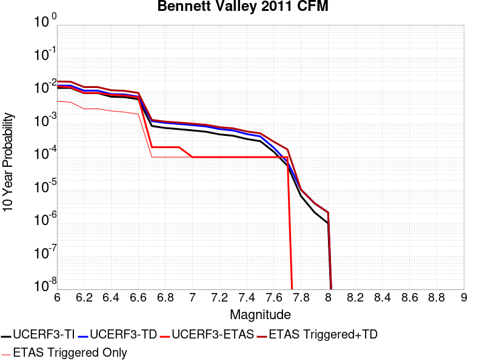 |

| Magnitude | 1 wk TI Prob | 1 wk TD Prob | 1 wk ETAS Prob | 1 wk ETAS/TD Gain | 1 wk ETAS Triggered+TD | 1 wk ETAS Triggered Only | 1 mo TI Prob | 1 mo TD Prob | 1 mo ETAS Prob | 1 mo ETAS/TD Gain | 1 mo ETAS Triggered+TD | 1 mo ETAS Triggered Only | 1 yr TI Prob | 1 yr TD Prob | 1 yr ETAS Prob | 1 yr ETAS/TD Gain | 1 yr ETAS Triggered+TD | 1 yr ETAS Triggered Only | 10 yr TI Prob | 10 yr TD Prob | 10 yr ETAS Prob | 10 yr ETAS/TD Gain | 10 yr ETAS Triggered+TD | 10 yr ETAS Triggered Only |
|-----|-----|-----|-----|-----|-----|-----|-----|-----|-----|-----|-----|-----|-----|-----|-----|-----|-----|-----|-----|-----|-----|-----|-----|-----|
| 6.0 | 2.3893934E-5 | 2.817474E-5 | 0.0 | 0.0 | 2.817474E-5 | 0.0 | 1.0239855E-4 | 1.20744335E-4 | 0.0 | 0.0 | 1.20744335E-4 | 0.0 | 0.0012459893 | 0.0014692552 | 0.0014 | 0.9528637 | 0.0019685207 | 5.0E-4 | 0.012390262 | 0.014617991 | 0.0139 | 0.9508831 | 0.019446362 | 0.0049 |
| 6.1 | 2.3893934E-5 | 2.817474E-5 | 0.0 | 0.0 | 2.817474E-5 | 0.0 | 1.0239855E-4 | 1.20744335E-4 | 0.0 | 0.0 | 1.20744335E-4 | 0.0 | 0.0012459893 | 0.0014692552 | 0.0014 | 0.9528637 | 0.0019685207 | 5.0E-4 | 0.012390262 | 0.014617991 | 0.013 | 0.8893151 | 0.019150747 | 0.0046 |
| 6.2 | 1.6657146E-5 | 1.9803494E-5 | 0.0 | 0.0 | 1.9803494E-5 | 0.0 | 7.138582E-5 | 8.487015E-5 | 0.0 | 0.0 | 8.487015E-5 | 0.0 | 8.6877577E-4 | 0.0010329452 | 0.001 | 0.9681055 | 0.0012327387 | 2.0E-4 | 0.008653872 | 0.010299649 | 0.0088 | 0.8543981 | 0.01316978 | 0.0029 |
| 6.3 | 1.6657146E-5 | 1.9803494E-5 | 0.0 | 0.0 | 1.9803494E-5 | 0.0 | 7.138582E-5 | 8.487015E-5 | 0.0 | 0.0 | 8.487015E-5 | 0.0 | 8.6877577E-4 | 0.0010329452 | 0.001 | 0.9681055 | 0.0012327387 | 2.0E-4 | 0.008653872 | 0.010299649 | 0.0088 | 0.8543981 | 0.01316978 | 0.0029 |
| 6.4 | 1.29418495E-5 | 1.552408E-5 | 0.0 | 0.0 | 1.552408E-5 | 0.0 | 5.546389E-5 | 6.653081E-5 | 0.0 | 0.0 | 6.653081E-5 | 0.0 | 6.7506364E-4 | 8.098413E-4 | 8.0E-4 | 0.9878478 | 0.0010096794 | 2.0E-4 | 0.0067301663 | 0.0080859875 | 0.0077 | 0.9522646 | 0.010565773 | 0.0025 |
| 6.5 | 1.2582504E-5 | 1.5091854E-5 | 0.0 | 0.0 | 1.5091854E-5 | 0.0 | 5.39239E-5 | 6.46785E-5 | 0.0 | 0.0 | 6.46785E-5 | 0.0 | 6.563257E-4 | 7.8730594E-4 | 8.0E-4 | 1.0161234 | 9.871485E-4 | 2.0E-4 | 0.006543907 | 0.007862272 | 0.0073 | 0.9284848 | 0.010144189 | 0.0023 |
| 6.6 | 1.0846706E-5 | 1.2997634E-5 | 0.0 | 0.0 | 1.2997634E-5 | 0.0 | 4.6485053E-5 | 5.5703676E-5 | 0.0 | 0.0 | 5.5703676E-5 | 0.0 | 5.6580856E-4 | 6.781091E-4 | 6.0E-4 | 0.88481337 | 7.780413E-4 | 1.0E-4 | 0.005643701 | 0.0067773764 | 0.0064 | 0.94431823 | 0.008763822 | 0.002 |
| 6.7 | 1.6803231E-6 | 2.355859E-6 | 0.0 | 0.0 | 2.355859E-6 | 0.0 | 7.2013645E-6 | 1.00965E-5 | 0.0 | 0.0 | 1.00965E-5 | 0.0 | 8.7673085E-5 | 1.2291808E-4 | 0.0 | 0.0 | 1.2291808E-4 | 0.0 | 8.76385E-4 | 0.0012331385 | 2.0E-4 | 0.16218778 | 0.0013330152 | 1.0E-4 |
| 6.8 | 1.4609833E-6 | 2.072452E-6 | 0.0 | 0.0 | 2.072452E-6 | 0.0 | 6.261342E-6 | 8.881906E-6 | 0.0 | 0.0 | 8.881906E-6 | 0.0 | 7.6229175E-5 | 1.0813191E-4 | 0.0 | 0.0 | 1.0813191E-4 | 0.0 | 7.620303E-4 | 0.0010853742 | 2.0E-4 | 0.18426827 | 0.0011852656 | 1.0E-4 |
| 6.9 | 1.3492396E-6 | 1.9247504E-6 | 0.0 | 0.0 | 1.9247504E-6 | 0.0 | 5.7824427E-6 | 8.248904E-6 | 0.0 | 0.0 | 8.248904E-6 | 0.0 | 7.0398964E-5 | 1.00425845E-4 | 0.0 | 0.0 | 1.00425845E-4 | 0.0 | 7.037667E-4 | 0.0010083566 | 2.0E-4 | 0.19834253 | 0.0011082558 | 1.0E-4 |
| 7.0 | 1.2347921E-6 | 1.7690137E-6 | 0.0 | 0.0 | 1.7690137E-6 | 0.0 | 5.291955E-6 | 7.5814655E-6 | 0.0 | 0.0 | 7.5814655E-6 | 0.0 | 6.442765E-5 | 9.230049E-5 | 0.0 | 0.0 | 9.230049E-5 | 0.0 | 6.440897E-4 | 9.271397E-4 | 1.0E-4 | 0.107858606 | 0.001027047 | 1.0E-4 |
| 7.1 | 1.1262973E-6 | 1.6163733E-6 | 0.0 | 0.0 | 1.6163733E-6 | 0.0 | 4.8269794E-6 | 6.927296E-6 | 0.0 | 0.0 | 6.927296E-6 | 0.0 | 5.876689E-5 | 8.4336614E-5 | 0.0 | 0.0 | 8.4336614E-5 | 0.0 | 5.875135E-4 | 8.475391E-4 | 1.0E-4 | 0.11798865 | 9.4745436E-4 | 1.0E-4 |
| 7.2 | 9.351744E-7 | 1.3420482E-6 | 0.0 | 0.0 | 1.3420482E-6 | 0.0 | 4.007884E-6 | 5.7516227E-6 | 0.0 | 0.0 | 5.7516227E-6 | 0.0 | 4.8794896E-5 | 7.002378E-5 | 0.0 | 0.0 | 7.002378E-5 | 0.0 | 4.878418E-4 | 7.0446555E-4 | 1.0E-4 | 0.14195158 | 8.043951E-4 | 1.0E-4 |
| 7.3 | 8.5039534E-7 | 1.2206865E-6 | 0.0 | 0.0 | 1.2206865E-6 | 0.0 | 3.6445463E-6 | 5.231503E-6 | 0.0 | 0.0 | 5.231503E-6 | 0.0 | 4.437145E-5 | 6.369171E-5 | 0.0 | 0.0 | 6.369171E-5 | 0.0 | 4.436259E-4 | 6.408765E-4 | 1.0E-4 | 0.1560363 | 7.408124E-4 | 1.0E-4 |
| 7.4 | 6.7875015E-7 | 9.4619816E-7 | 0.0 | 0.0 | 9.4619816E-7 | 0.0 | 2.908926E-6 | 4.0551286E-6 | 0.0 | 0.0 | 4.0551286E-6 | 0.0 | 3.54156E-5 | 4.9370083E-5 | 0.0 | 0.0 | 4.9370083E-5 | 0.0 | 3.5409955E-4 | 4.96984E-4 | 1.0E-4 | 0.20121373 | 5.969343E-4 | 1.0E-4 |
| 7.5 | 5.826867E-7 | 8.074313E-7 | 0.0 | 0.0 | 8.074313E-7 | 0.0 | 2.4972264E-6 | 3.4604152E-6 | 0.0 | 0.0 | 3.4604152E-6 | 0.0 | 3.0403306E-5 | 4.2129748E-5 | 0.0 | 0.0 | 4.2129748E-5 | 0.0 | 3.0399146E-4 | 4.2416374E-4 | 1.0E-4 | 0.235758 | 5.2412134E-4 | 1.0E-4 |
| 7.6 | 2.7734902E-7 | 3.6406664E-7 | 0.0 | 0.0 | 3.6406664E-7 | 0.0 | 1.1886381E-6 | 1.5602847E-6 | 0.0 | 0.0 | 1.5602847E-6 | 0.0 | 1.4471572E-5 | 1.8996301E-5 | 0.0 | 0.0 | 1.8996301E-5 | 0.0 | 1.447063E-4 | 1.9096595E-4 | 1.0E-4 | 0.52365357 | 2.9094686E-4 | 1.0E-4 |
| 7.7 | 1.0530888E-7 | 1.350075E-7 | 0.0 | 0.0 | 1.350075E-7 | 0.0 | 4.513237E-7 | 5.786034E-7 | 0.0 | 0.0 | 5.786034E-7 | 0.0 | 5.4948523E-6 | 7.044474E-6 | 0.0 | 0.0 | 7.044474E-6 | 0.0 | 5.4947162E-5 | 7.130604E-5 | 1.0E-4 | 1.4024056 | 1.7129892E-4 | 1.0E-4 |
| 7.8 | 1.2714258E-8 | 1.8897655E-8 | 0.0 | 0.0 | 1.8897655E-8 | 0.0 | 5.448968E-8 | 8.098995E-8 | 0.0 | 0.0 | 8.098995E-8 | 0.0 | 6.6341164E-7 | 9.860522E-7 | 0.0 | 0.0 | 9.860522E-7 | 0.0 | 6.6340967E-6 | 1.0286996E-5 | 0.0 | 0.0 | 1.0286996E-5 | 0.0 |
| 7.9 | 4.075888E-9 | 7.176765E-9 | 0.0 | 0.0 | 7.176765E-9 | 0.0 | 1.7468091E-8 | 3.0757562E-8 | 0.0 | 0.0 | 3.0757562E-8 | 0.0 | 2.12674E-7 | 3.7447322E-7 | 0.0 | 0.0 | 3.7447322E-7 | 0.0 | 2.1267379E-6 | 4.0035866E-6 | 0.0 | 0.0 | 4.0035866E-6 | 0.0 |
| 8.0 | 1.9126138E-9 | 3.802908E-9 | 0.0 | 0.0 | 3.802908E-9 | 0.0 | 8.196917E-9 | 1.6298175E-8 | 0.0 | 0.0 | 1.6298175E-8 | 0.0 | 9.9797454E-8 | 1.9843026E-7 | 0.0 | 0.0 | 1.9843026E-7 | 0.0 | 9.979741E-7 | 2.103499E-6 | 0.0 | 0.0 | 2.103499E-6 | 0.0 |

## White Mountains
*[(top)](#table-of-contents)*

| 1 Week | 1 Month | 1 Year | 10 Year |
|-----|-----|-----|-----|
|  |  |  |  |

| Magnitude | 1 wk TI Prob | 1 wk TD Prob | 1 wk ETAS Prob | 1 wk ETAS/TD Gain | 1 wk ETAS Triggered+TD | 1 wk ETAS Triggered Only | 1 mo TI Prob | 1 mo TD Prob | 1 mo ETAS Prob | 1 mo ETAS/TD Gain | 1 mo ETAS Triggered+TD | 1 mo ETAS Triggered Only | 1 yr TI Prob | 1 yr TD Prob | 1 yr ETAS Prob | 1 yr ETAS/TD Gain | 1 yr ETAS Triggered+TD | 1 yr ETAS Triggered Only | 10 yr TI Prob | 10 yr TD Prob | 10 yr ETAS Prob | 10 yr ETAS/TD Gain | 10 yr ETAS Triggered+TD | 10 yr ETAS Triggered Only |
|-----|-----|-----|-----|-----|-----|-----|-----|-----|-----|-----|-----|-----|-----|-----|-----|-----|-----|-----|-----|-----|-----|-----|-----|-----|
| 6.0 | 3.503579E-5 | 3.3752905E-5 | 0.0 | 0.0 | 3.3752905E-5 | 0.0 | 1.5014476E-4 | 1.4464797E-4 | 0.0 | 0.0 | 1.4464797E-4 | 0.0 | 0.0018264796 | 0.001759787 | 9.0E-4 | 0.51142555 | 0.002159083 | 4.0E-4 | 0.018115403 | 0.017470825 | 0.0121 | 0.6925832 | 0.02199046 | 0.0046 |
| 6.1 | 3.503579E-5 | 3.3752905E-5 | 0.0 | 0.0 | 3.3752905E-5 | 0.0 | 1.5014476E-4 | 1.4464797E-4 | 0.0 | 0.0 | 1.4464797E-4 | 0.0 | 0.0018264796 | 0.001759787 | 9.0E-4 | 0.51142555 | 0.002159083 | 4.0E-4 | 0.018115403 | 0.017470825 | 0.0121 | 0.6925832 | 0.02199046 | 0.0046 |
| 6.2 | 3.503579E-5 | 3.3752905E-5 | 0.0 | 0.0 | 3.3752905E-5 | 0.0 | 1.5014476E-4 | 1.4464797E-4 | 0.0 | 0.0 | 1.4464797E-4 | 0.0 | 0.0018264796 | 0.001759787 | 9.0E-4 | 0.51142555 | 0.002159083 | 4.0E-4 | 0.018115403 | 0.017470825 | 0.0121 | 0.6925832 | 0.02199046 | 0.0046 |
| 6.3 | 1.7818425E-5 | 1.5901618E-5 | 0.0 | 0.0 | 1.5901618E-5 | 0.0 | 7.636245E-5 | 6.8148096E-5 | 0.0 | 0.0 | 6.8148096E-5 | 0.0 | 9.293162E-4 | 8.294014E-4 | 3.0E-4 | 0.3617066 | 9.2931854E-4 | 1.0E-4 | 0.009254395 | 0.008264516 | 0.0045 | 0.54449654 | 0.009752119 | 0.0015 |
| 6.4 | 1.7818425E-5 | 1.5901618E-5 | 0.0 | 0.0 | 1.5901618E-5 | 0.0 | 7.636245E-5 | 6.8148096E-5 | 0.0 | 0.0 | 6.8148096E-5 | 0.0 | 9.293162E-4 | 8.294014E-4 | 3.0E-4 | 0.3617066 | 9.2931854E-4 | 1.0E-4 | 0.009254395 | 0.008264516 | 0.0045 | 0.54449654 | 0.009752119 | 0.0015 |
| 6.5 | 1.3397557E-5 | 1.1325756E-5 | 0.0 | 0.0 | 1.1325756E-5 | 0.0 | 5.741684E-5 | 4.8538088E-5 | 0.0 | 0.0 | 4.8538088E-5 | 0.0 | 6.988258E-4 | 5.90798E-4 | 2.0E-4 | 0.3385252 | 5.90798E-4 | 0.0 | 0.006966323 | 0.0058929776 | 0.003 | 0.5090805 | 0.0066882633 | 8.0E-4 |
| 6.6 | 1.0818695E-5 | 8.6170285E-6 | 0.0 | 0.0 | 8.6170285E-6 | 0.0 | 4.6365014E-5 | 3.692962E-5 | 0.0 | 0.0 | 3.692962E-5 | 0.0 | 5.6434784E-4 | 4.4952973E-4 | 2.0E-4 | 0.4449094 | 4.4952973E-4 | 0.0 | 0.005629168 | 0.00448664 | 0.0019 | 0.42347947 | 0.0050839484 | 6.0E-4 |
| 6.7 | 9.067908E-6 | 6.7955334E-6 | 0.0 | 0.0 | 6.7955334E-6 | 0.0 | 3.8861883E-5 | 2.9123408E-5 | 0.0 | 0.0 | 2.9123408E-5 | 0.0 | 4.7304068E-4 | 3.5452298E-4 | 1.0E-4 | 0.28206915 | 3.5452298E-4 | 0.0 | 0.00472035 | 0.0035398907 | 0.0018 | 0.50849026 | 0.004137767 | 6.0E-4 |
| 6.8 | 7.295947E-6 | 4.930901E-6 | 0.0 | 0.0 | 4.930901E-6 | 0.0 | 3.126797E-5 | 2.113227E-5 | 0.0 | 0.0 | 2.113227E-5 | 0.0 | 3.8062103E-4 | 2.5725612E-4 | 1.0E-4 | 0.38871765 | 2.5725612E-4 | 0.0 | 0.0037996976 | 0.002569696 | 0.0013 | 0.5058964 | 0.002868925 | 3.0E-4 |
| 6.9 | 6.2243444E-6 | 3.8274666E-6 | 0.0 | 0.0 | 3.8274666E-6 | 0.0 | 2.6675489E-5 | 1.6403328E-5 | 0.0 | 0.0 | 1.6403328E-5 | 0.0 | 3.2472567E-4 | 1.9969276E-4 | 1.0E-4 | 0.5007693 | 1.9969276E-4 | 0.0 | 0.0032425157 | 0.0019951859 | 9.0E-4 | 0.4510858 | 0.0020949864 | 1.0E-4 |
| 7.0 | 4.9878413E-6 | 2.675381E-6 | 0.0 | 0.0 | 2.675381E-6 | 0.0 | 2.1376287E-5 | 1.146587E-5 | 0.0 | 0.0 | 1.146587E-5 | 0.0 | 2.602252E-4 | 1.3958829E-4 | 1.0E-4 | 0.7163925 | 1.3958829E-4 | 0.0 | 0.002599207 | 0.0013950323 | 6.0E-4 | 0.43009758 | 0.0014948928 | 1.0E-4 |
| 7.1 | 4.0252844E-6 | 1.8821846E-6 | 0.0 | 0.0 | 1.8821846E-6 | 0.0 | 1.7251105E-5 | 8.066481E-6 | 0.0 | 0.0 | 8.066481E-6 | 0.0 | 2.1001195E-4 | 9.820511E-5 | 0.0 | 0.0 | 9.820511E-5 | 0.0 | 0.0020981359 | 9.8163E-4 | 3.0E-4 | 0.30561414 | 0.0010815318 | 1.0E-4 |
| 7.2 | 3.3284066E-6 | 1.2791369E-6 | 0.0 | 0.0 | 1.2791369E-6 | 0.0 | 1.4264522E-5 | 5.4820043E-6 | 0.0 | 0.0 | 5.4820043E-6 | 0.0 | 1.736567E-4 | 6.6741464E-5 | 0.0 | 0.0 | 6.6741464E-5 | 0.0 | 0.0017352107 | 6.6722423E-4 | 3.0E-4 | 0.44962394 | 7.6715753E-4 | 1.0E-4 |
| 7.3 | 2.458226E-6 | 6.0318837E-7 | 0.0 | 0.0 | 6.0318837E-7 | 0.0 | 1.0535211E-5 | 2.5850907E-6 | 0.0 | 0.0 | 2.5850907E-6 | 0.0 | 1.2825865E-4 | 3.147306E-5 | 0.0 | 0.0 | 3.147306E-5 | 0.0 | 0.0012818464 | 3.146898E-4 | 3.0E-4 | 0.9533198 | 4.146583E-4 | 1.0E-4 |
| 7.4 | 1.965953E-6 | 3.086964E-7 | 0.0 | 0.0 | 3.086964E-7 | 0.0 | 8.425486E-6 | 1.3229838E-6 | 0.0 | 0.0 | 1.3229838E-6 | 0.0 | 1.0257547E-4 | 1.6107211E-5 | 0.0 | 0.0 | 1.6107211E-5 | 0.0 | 0.0010252813 | 1.6106057E-4 | 2.0E-4 | 1.2417688 | 2.6104445E-4 | 1.0E-4 |
| 7.5 | 1.2014192E-6 | 1.8092337E-7 | 0.0 | 0.0 | 1.8092337E-7 | 0.0 | 5.148929E-6 | 7.753856E-7 | 0.0 | 0.0 | 7.753856E-7 | 0.0 | 6.2686406E-5 | 9.440279E-6 | 0.0 | 0.0 | 9.440279E-6 | 0.0 | 6.266873E-4 | 9.439887E-5 | 2.0E-4 | 2.1186695 | 1.9438943E-4 | 1.0E-4 |
| 7.6 | 2.5612175E-7 | 4.8547324E-8 | 0.0 | 0.0 | 4.8547324E-8 | 0.0 | 1.0976642E-6 | 2.0805994E-7 | 0.0 | 0.0 | 2.0805994E-7 | 0.0 | 1.3363979E-5 | 2.5331274E-6 | 0.0 | 0.0 | 2.5331274E-6 | 0.0 | 1.3363175E-4 | 2.5331019E-5 | 0.0 | 0.0 | 2.5331019E-5 | 0.0 |

## Great Valley 03 Mysterious Ridge
*[(top)](#table-of-contents)*

| 1 Week | 1 Month | 1 Year | 10 Year |
|-----|-----|-----|-----|
|  |  |  |  |

| Magnitude | 1 wk TI Prob | 1 wk TD Prob | 1 wk ETAS Prob | 1 wk ETAS/TD Gain | 1 wk ETAS Triggered+TD | 1 wk ETAS Triggered Only | 1 mo TI Prob | 1 mo TD Prob | 1 mo ETAS Prob | 1 mo ETAS/TD Gain | 1 mo ETAS Triggered+TD | 1 mo ETAS Triggered Only | 1 yr TI Prob | 1 yr TD Prob | 1 yr ETAS Prob | 1 yr ETAS/TD Gain | 1 yr ETAS Triggered+TD | 1 yr ETAS Triggered Only | 10 yr TI Prob | 10 yr TD Prob | 10 yr ETAS Prob | 10 yr ETAS/TD Gain | 10 yr ETAS Triggered+TD | 10 yr ETAS Triggered Only |
|-----|-----|-----|-----|-----|-----|-----|-----|-----|-----|-----|-----|-----|-----|-----|-----|-----|-----|-----|-----|-----|-----|-----|-----|-----|
| 6.0 | 3.1182444E-5 | 3.5975117E-5 | 0.0 | 0.0 | 3.5975117E-5 | 0.0 | 1.336322E-4 | 1.5417102E-4 | 1.0E-4 | 0.6486303 | 1.5417102E-4 | 0.0 | 0.0016257578 | 0.0018756017 | 0.001 | 0.53316224 | 0.002374664 | 5.0E-4 | 0.016139153 | 0.018616395 | 0.0132 | 0.7090524 | 0.02313076 | 0.0046 |
| 6.1 | 3.1182444E-5 | 3.5975117E-5 | 0.0 | 0.0 | 3.5975117E-5 | 0.0 | 1.336322E-4 | 1.5417102E-4 | 1.0E-4 | 0.6486303 | 1.5417102E-4 | 0.0 | 0.0016257578 | 0.0018756017 | 0.001 | 0.53316224 | 0.002374664 | 5.0E-4 | 0.016139153 | 0.018616395 | 0.0132 | 0.7090524 | 0.02313076 | 0.0046 |
| 6.2 | 3.1182444E-5 | 3.5975117E-5 | 0.0 | 0.0 | 3.5975117E-5 | 0.0 | 1.336322E-4 | 1.5417102E-4 | 1.0E-4 | 0.6486303 | 1.5417102E-4 | 0.0 | 0.0016257578 | 0.0018756017 | 0.001 | 0.53316224 | 0.002374664 | 5.0E-4 | 0.016139153 | 0.018616395 | 0.0132 | 0.7090524 | 0.02313076 | 0.0046 |
| 6.3 | 2.106934E-5 | 2.3817278E-5 | 0.0 | 0.0 | 2.3817278E-5 | 0.0 | 9.0294045E-5 | 1.02070226E-4 | 1.0E-4 | 0.9797176 | 1.02070226E-4 | 0.0 | 0.0010987755 | 0.0012420276 | 8.0E-4 | 0.64410806 | 0.0017414066 | 5.0E-4 | 0.010933585 | 0.012354098 | 0.009 | 0.72850317 | 0.015712095 | 0.0034 |
| 6.4 | 2.106934E-5 | 2.3817278E-5 | 0.0 | 0.0 | 2.3817278E-5 | 0.0 | 9.0294045E-5 | 1.02070226E-4 | 1.0E-4 | 0.9797176 | 1.02070226E-4 | 0.0 | 0.0010987755 | 0.0012420276 | 8.0E-4 | 0.64410806 | 0.0017414066 | 5.0E-4 | 0.010933585 | 0.012354098 | 0.009 | 0.72850317 | 0.015712095 | 0.0034 |
| 6.5 | 1.9389783E-5 | 2.1855454E-5 | 0.0 | 0.0 | 2.1855454E-5 | 0.0 | 8.309642E-5 | 9.3663024E-5 | 1.0E-4 | 1.0676572 | 9.3663024E-5 | 0.0 | 0.0010112294 | 0.0011397784 | 8.0E-4 | 0.70189077 | 0.0016392085 | 5.0E-4 | 0.010066401 | 0.011342193 | 0.0087 | 0.7670474 | 0.01470363 | 0.0034 |
| 6.6 | 1.9370193E-5 | 2.183538E-5 | 0.0 | 0.0 | 2.183538E-5 | 0.0 | 8.301247E-5 | 9.3577E-5 | 1.0E-4 | 1.0686387 | 9.3577E-5 | 0.0 | 0.0010102082 | 0.0011387322 | 8.0E-4 | 0.7025357 | 0.0016381629 | 5.0E-4 | 0.010056281 | 0.011331838 | 0.0087 | 0.7677484 | 0.01469331 | 0.0034 |
| 6.7 | 1.6723505E-5 | 1.8774837E-5 | 0.0 | 0.0 | 1.8774837E-5 | 0.0 | 7.16702E-5 | 8.046122E-5 | 1.0E-4 | 1.2428348 | 8.046122E-5 | 0.0 | 8.722353E-4 | 9.791945E-4 | 7.0E-4 | 0.71487325 | 0.001478705 | 5.0E-4 | 0.008688197 | 0.009750803 | 0.007 | 0.71788955 | 0.012919601 | 0.0032 |
| 6.8 | 1.426937E-5 | 1.597693E-5 | 0.0 | 0.0 | 1.597693E-5 | 0.0 | 6.115301E-5 | 6.847084E-5 | 1.0E-4 | 1.4604757 | 6.847084E-5 | 0.0 | 7.4428355E-4 | 8.3332806E-4 | 7.0E-4 | 0.84000534 | 0.0013329114 | 5.0E-4 | 0.007417957 | 0.008303506 | 0.0064 | 0.77075875 | 0.011278596 | 0.003 |
| 6.9 | 1.2469891E-5 | 1.393951E-5 | 0.0 | 0.0 | 1.393951E-5 | 0.0 | 5.3441294E-5 | 5.9739454E-5 | 1.0E-4 | 1.6739355 | 5.9739454E-5 | 0.0 | 6.504535E-4 | 7.270972E-4 | 6.0E-4 | 0.8251991 | 0.0011268064 | 4.0E-4 | 0.006485529 | 0.0072484035 | 0.0053 | 0.7311955 | 0.009631007 | 0.0024 |
| 7.0 | 8.7746275E-6 | 9.779858E-6 | 0.0 | 0.0 | 9.779858E-6 | 0.0 | 3.7605005E-5 | 4.1913045E-5 | 0.0 | 0.0 | 4.1913045E-5 | 0.0 | 4.5774475E-4 | 5.1017915E-4 | 2.0E-4 | 0.39201915 | 7.100771E-4 | 2.0E-4 | 0.00456803 | 0.00509081 | 0.0042 | 0.825016 | 0.006881647 | 0.0018 |
| 7.1 | 6.1067153E-6 | 6.805472E-6 | 0.0 | 0.0 | 6.805472E-6 | 0.0 | 2.6171374E-5 | 2.9166014E-5 | 0.0 | 0.0 | 2.9166014E-5 | 0.0 | 3.1858988E-4 | 3.550439E-4 | 1.0E-4 | 0.28165528 | 4.550084E-4 | 1.0E-4 | 0.0031813353 | 0.0035453162 | 0.0031 | 0.8743931 | 0.0048407074 | 0.0013 |
| 7.2 | 2.939283E-6 | 3.2702005E-6 | 0.0 | 0.0 | 3.2702005E-6 | 0.0 | 1.2596866E-5 | 1.401508E-5 | 0.0 | 0.0 | 1.401508E-5 | 0.0 | 1.5335606E-4 | 1.7062198E-4 | 1.0E-4 | 0.586091 | 2.706049E-4 | 1.0E-4 | 0.0015325027 | 0.0017050814 | 0.002 | 1.1729646 | 0.0026035467 | 9.0E-4 |
| 7.3 | 7.2387763E-7 | 7.99954E-7 | 0.0 | 0.0 | 7.99954E-7 | 0.0 | 3.102329E-6 | 3.4283726E-6 | 0.0 | 0.0 | 3.4283726E-6 | 0.0 | 3.77702E-5 | 4.174009E-5 | 1.0E-4 | 2.3957782 | 1.4173592E-4 | 1.0E-4 | 3.7763783E-4 | 4.1736738E-4 | 8.0E-4 | 1.9167764 | 8.1720046E-4 | 4.0E-4 |
| 7.4 | 3.112171E-8 | 3.2058175E-8 | 0.0 | 0.0 | 3.2058175E-8 | 0.0 | 1.3337875E-7 | 1.3739218E-7 | 0.0 | 0.0 | 1.3739218E-7 | 0.0 | 1.6238852E-6 | 1.6727486E-6 | 0.0 | 0.0 | 1.6727486E-6 | 0.0 | 1.6238733E-5 | 1.6727368E-5 | 0.0 | 0.0 | 1.6727368E-5 | 0.0 |

## Ortigalita (South)
*[(top)](#table-of-contents)*

| 1 Week | 1 Month | 1 Year | 10 Year |
|-----|-----|-----|-----|
|  |  | 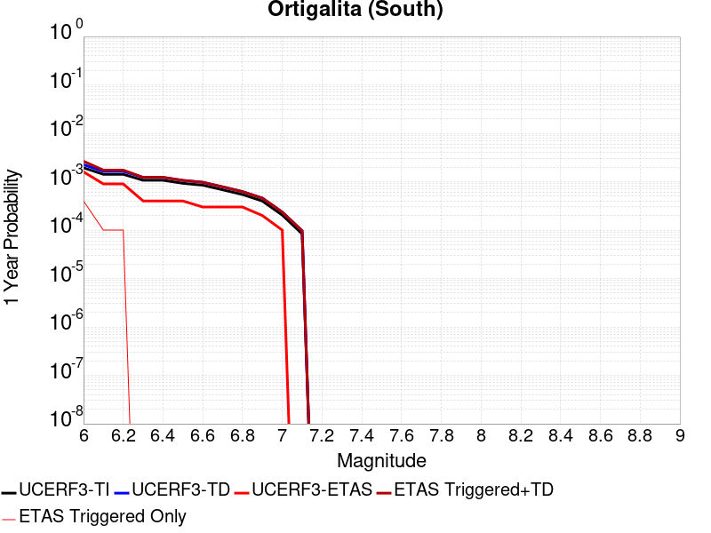 |  |

| Magnitude | 1 wk TI Prob | 1 wk TD Prob | 1 wk ETAS Prob | 1 wk ETAS/TD Gain | 1 wk ETAS Triggered+TD | 1 wk ETAS Triggered Only | 1 mo TI Prob | 1 mo TD Prob | 1 mo ETAS Prob | 1 mo ETAS/TD Gain | 1 mo ETAS Triggered+TD | 1 mo ETAS Triggered Only | 1 yr TI Prob | 1 yr TD Prob | 1 yr ETAS Prob | 1 yr ETAS/TD Gain | 1 yr ETAS Triggered+TD | 1 yr ETAS Triggered Only | 10 yr TI Prob | 10 yr TD Prob | 10 yr ETAS Prob | 10 yr ETAS/TD Gain | 10 yr ETAS Triggered+TD | 10 yr ETAS Triggered Only |
|-----|-----|-----|-----|-----|-----|-----|-----|-----|-----|-----|-----|-----|-----|-----|-----|-----|-----|-----|-----|-----|-----|-----|-----|-----|
| 6.0 | 3.72394E-5 | 4.3182466E-5 | 0.0 | 0.0 | 4.3182466E-5 | 0.0 | 1.5958765E-4 | 1.8505547E-4 | 1.0E-4 | 0.5403785 | 2.8503698E-4 | 1.0E-4 | 0.0019412481 | 0.002250878 | 0.0016 | 0.7108337 | 0.0026499776 | 4.0E-4 | 0.019243775 | 0.022297136 | 0.0172 | 0.7713995 | 0.02689234 | 0.0047 |
| 6.1 | 2.7299884E-5 | 3.1441457E-5 | 0.0 | 0.0 | 3.1441457E-5 | 0.0 | 1.16994255E-4 | 1.3474245E-4 | 0.0 | 0.0 | 1.3474245E-4 | 0.0 | 0.0014234743 | 0.0016393106 | 9.0E-4 | 0.54901123 | 0.0017391468 | 1.0E-4 | 0.014143906 | 0.016278092 | 0.0125 | 0.7679032 | 0.019622747 | 0.0034 |
| 6.2 | 2.7299884E-5 | 3.1441457E-5 | 0.0 | 0.0 | 3.1441457E-5 | 0.0 | 1.16994255E-4 | 1.3474245E-4 | 0.0 | 0.0 | 1.3474245E-4 | 0.0 | 0.0014234743 | 0.0016393106 | 9.0E-4 | 0.54901123 | 0.0017391468 | 1.0E-4 | 0.014143906 | 0.016278092 | 0.0125 | 0.7679032 | 0.019622747 | 0.0034 |
| 6.3 | 2.0546433E-5 | 2.3594344E-5 | 0.0 | 0.0 | 2.3594344E-5 | 0.0 | 8.805317E-5 | 1.01114805E-4 | 0.0 | 0.0 | 1.01114805E-4 | 0.0 | 0.00107152 | 0.0012303964 | 4.0E-4 | 0.32509848 | 0.0012303964 | 0.0 | 0.010663681 | 0.0122379 | 0.0083 | 0.6782209 | 0.014509752 | 0.0023 |
| 6.4 | 2.0546433E-5 | 2.3594344E-5 | 0.0 | 0.0 | 2.3594344E-5 | 0.0 | 8.805317E-5 | 1.01114805E-4 | 0.0 | 0.0 | 1.01114805E-4 | 0.0 | 0.00107152 | 0.0012303964 | 4.0E-4 | 0.32509848 | 0.0012303964 | 0.0 | 0.010663681 | 0.0122379 | 0.0083 | 0.6782209 | 0.014509752 | 0.0023 |
| 6.5 | 1.7779594E-5 | 2.0414887E-5 | 0.0 | 0.0 | 2.0414887E-5 | 0.0 | 7.619603E-5 | 8.748951E-5 | 0.0 | 0.0 | 8.748951E-5 | 0.0 | 9.272918E-4 | 0.0010646778 | 4.0E-4 | 0.3757005 | 0.0010646778 | 0.0 | 0.009234319 | 0.010597234 | 0.008 | 0.754914 | 0.01277392 | 0.0022 |
| 6.6 | 1.6272212E-5 | 1.8685576E-5 | 0.0 | 0.0 | 1.8685576E-5 | 0.0 | 6.973618E-5 | 8.007865E-5 | 0.0 | 0.0 | 8.007865E-5 | 0.0 | 8.487073E-4 | 9.745337E-4 | 3.0E-4 | 0.30783954 | 9.745337E-4 | 0.0 | 0.008454733 | 0.009703899 | 0.007 | 0.72135955 | 0.011684491 | 0.002 |
| 6.7 | 1.3051484E-5 | 1.5014794E-5 | 0.0 | 0.0 | 1.5014794E-5 | 0.0 | 5.593373E-5 | 6.434759E-5 | 0.0 | 0.0 | 6.434759E-5 | 0.0 | 6.807804E-4 | 7.831597E-4 | 3.0E-4 | 0.3830636 | 7.831597E-4 | 0.0 | 0.006786986 | 0.007804978 | 0.0054 | 0.6918661 | 0.009293271 | 0.0015 |
| 6.8 | 1.04277415E-5 | 1.1968504E-5 | 0.0 | 0.0 | 1.1968504E-5 | 0.0 | 4.4689557E-5 | 5.129262E-5 | 0.0 | 0.0 | 5.129262E-5 | 0.0 | 5.439595E-4 | 6.243161E-4 | 3.0E-4 | 0.4805258 | 6.243161E-4 | 0.0 | 0.0054262993 | 0.0062263743 | 0.0043 | 0.6906106 | 0.0076176575 | 0.0014 |
| 6.9 | 7.639968E-6 | 8.777665E-6 | 0.0 | 0.0 | 8.777665E-6 | 0.0 | 3.274231E-5 | 3.7618054E-5 | 0.0 | 0.0 | 3.7618054E-5 | 0.0 | 3.9856473E-4 | 4.5790945E-4 | 2.0E-4 | 0.43676758 | 4.5790945E-4 | 0.0 | 0.003978506 | 0.0045702434 | 0.0032 | 0.7001815 | 0.005665216 | 0.0011 |
| 7.0 | 3.919831E-6 | 4.525994E-6 | 0.0 | 0.0 | 4.525994E-6 | 0.0 | 1.679917E-5 | 1.9396986E-5 | 0.0 | 0.0 | 1.9396986E-5 | 0.0 | 2.045107E-4 | 2.3613482E-4 | 1.0E-4 | 0.4234869 | 2.3613482E-4 | 0.0 | 0.0020432258 | 0.0023590468 | 0.0016 | 0.67824 | 0.0026583392 | 3.0E-4 |
| 7.1 | 1.6017933E-6 | 1.8539527E-6 | 0.0 | 0.0 | 1.8539527E-6 | 0.0 | 6.8648105E-6 | 7.945493E-6 | 0.0 | 0.0 | 7.945493E-6 | 0.0 | 8.357586E-5 | 9.673315E-5 | 0.0 | 0.0 | 9.673315E-5 | 0.0 | 8.3544437E-4 | 9.6701476E-4 | 9.0E-4 | 0.93069935 | 0.001066918 | 1.0E-4 |

## Ventura-Pitas Point
*[(top)](#table-of-contents)*

| 1 Week | 1 Month | 1 Year | 10 Year |
|-----|-----|-----|-----|
|  |  |  | 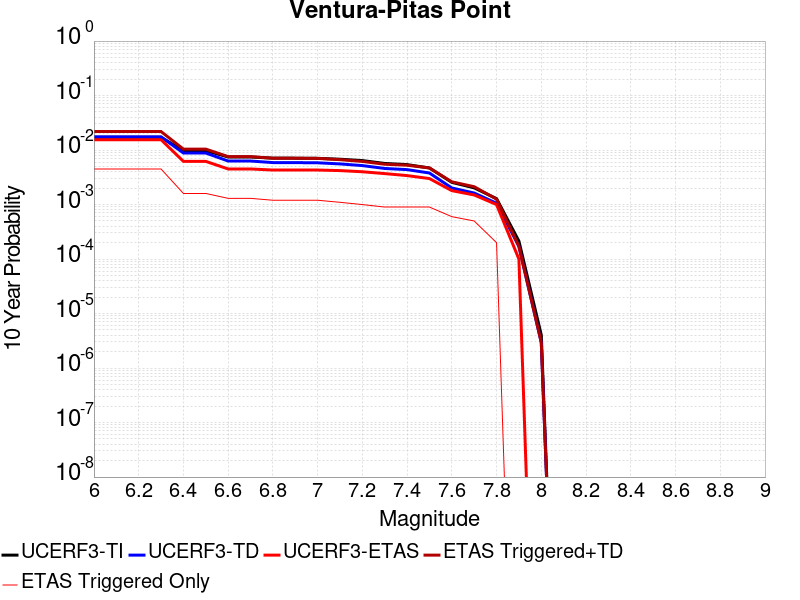 |

| Magnitude | 1 wk TI Prob | 1 wk TD Prob | 1 wk ETAS Prob | 1 wk ETAS/TD Gain | 1 wk ETAS Triggered+TD | 1 wk ETAS Triggered Only | 1 mo TI Prob | 1 mo TD Prob | 1 mo ETAS Prob | 1 mo ETAS/TD Gain | 1 mo ETAS Triggered+TD | 1 mo ETAS Triggered Only | 1 yr TI Prob | 1 yr TD Prob | 1 yr ETAS Prob | 1 yr ETAS/TD Gain | 1 yr ETAS Triggered+TD | 1 yr ETAS Triggered Only | 10 yr TI Prob | 10 yr TD Prob | 10 yr ETAS Prob | 10 yr ETAS/TD Gain | 10 yr ETAS Triggered+TD | 10 yr ETAS Triggered Only |
|-----|-----|-----|-----|-----|-----|-----|-----|-----|-----|-----|-----|-----|-----|-----|-----|-----|-----|-----|-----|-----|-----|-----|-----|-----|
| 6.0 | 3.3179622E-5 | 3.3681004E-5 | 0.0 | 0.0 | 3.3681004E-5 | 0.0 | 1.4219063E-4 | 1.443406E-4 | 0.0 | 0.0 | 1.443406E-4 | 0.0 | 0.0017297962 | 0.0017561864 | 0.0017 | 0.9680066 | 0.002454957 | 7.0E-4 | 0.017163932 | 0.017448418 | 0.0155 | 0.88833266 | 0.021869902 | 0.0045 |
| 6.1 | 3.3179622E-5 | 3.3681004E-5 | 0.0 | 0.0 | 3.3681004E-5 | 0.0 | 1.4219063E-4 | 1.443406E-4 | 0.0 | 0.0 | 1.443406E-4 | 0.0 | 0.0017297962 | 0.0017561864 | 0.0017 | 0.9680066 | 0.002454957 | 7.0E-4 | 0.017163932 | 0.017448418 | 0.0155 | 0.88833266 | 0.021869902 | 0.0045 |
| 6.2 | 3.3179622E-5 | 3.3681004E-5 | 0.0 | 0.0 | 3.3681004E-5 | 0.0 | 1.4219063E-4 | 1.443406E-4 | 0.0 | 0.0 | 1.443406E-4 | 0.0 | 0.0017297962 | 0.0017561864 | 0.0017 | 0.9680066 | 0.002454957 | 7.0E-4 | 0.017163932 | 0.017448418 | 0.0155 | 0.88833266 | 0.021869902 | 0.0045 |
| 6.3 | 3.3179622E-5 | 3.3681004E-5 | 0.0 | 0.0 | 3.3681004E-5 | 0.0 | 1.4219063E-4 | 1.443406E-4 | 0.0 | 0.0 | 1.443406E-4 | 0.0 | 0.0017297962 | 0.0017561864 | 0.0017 | 0.9680066 | 0.002454957 | 7.0E-4 | 0.017163932 | 0.017448418 | 0.0155 | 0.88833266 | 0.021869902 | 0.0045 |
| 6.4 | 1.8754668E-5 | 1.6993146E-5 | 0.0 | 0.0 | 1.6993146E-5 | 0.0 | 8.037467E-5 | 7.282587E-5 | 0.0 | 0.0 | 7.282587E-5 | 0.0 | 9.781223E-4 | 8.863173E-4 | 6.0E-4 | 0.67695844 | 0.00108614 | 2.0E-4 | 0.009738282 | 0.008830049 | 0.0062 | 0.70214784 | 0.010415921 | 0.0016 |
| 6.5 | 1.8754668E-5 | 1.6993146E-5 | 0.0 | 0.0 | 1.6993146E-5 | 0.0 | 8.037467E-5 | 7.282587E-5 | 0.0 | 0.0 | 7.282587E-5 | 0.0 | 9.781223E-4 | 8.863173E-4 | 6.0E-4 | 0.67695844 | 0.00108614 | 2.0E-4 | 0.009738282 | 0.008830049 | 0.0062 | 0.70214784 | 0.010415921 | 0.0016 |
| 6.6 | 1.4361558E-5 | 1.2101676E-5 | 0.0 | 0.0 | 1.2101676E-5 | 0.0 | 6.154808E-5 | 5.1863306E-5 | 0.0 | 0.0 | 5.1863306E-5 | 0.0 | 7.490902E-4 | 6.312551E-4 | 3.0E-4 | 0.4752437 | 7.3119195E-4 | 1.0E-4 | 0.0074657016 | 0.0062947697 | 0.0045 | 0.7148792 | 0.0075865863 | 0.0013 |
| 6.7 | 1.4361558E-5 | 1.2101676E-5 | 0.0 | 0.0 | 1.2101676E-5 | 0.0 | 6.154808E-5 | 5.1863306E-5 | 0.0 | 0.0 | 5.1863306E-5 | 0.0 | 7.490902E-4 | 6.312551E-4 | 3.0E-4 | 0.4752437 | 7.3119195E-4 | 1.0E-4 | 0.0074657016 | 0.0062947697 | 0.0045 | 0.7148792 | 0.0075865863 | 0.0013 |
| 6.8 | 1.3663846E-5 | 1.1324751E-5 | 0.0 | 0.0 | 1.1324751E-5 | 0.0 | 5.8558027E-5 | 4.8533755E-5 | 0.0 | 0.0 | 4.8533755E-5 | 0.0 | 7.127108E-4 | 5.907402E-4 | 3.0E-4 | 0.5078375 | 6.906811E-4 | 1.0E-4 | 0.007104293 | 0.0058918074 | 0.0043 | 0.729827 | 0.007084737 | 0.0012 |
| 6.9 | 1.3644157E-5 | 1.1302877E-5 | 0.0 | 0.0 | 1.1302877E-5 | 0.0 | 5.8473648E-5 | 4.844001E-5 | 0.0 | 0.0 | 4.844001E-5 | 0.0 | 7.116841E-4 | 5.895995E-4 | 3.0E-4 | 0.50882 | 6.895405E-4 | 1.0E-4 | 0.007094092 | 0.005880461 | 0.0043 | 0.7312352 | 0.0070734043 | 0.0012 |
| 7.0 | 1.3568845E-5 | 1.122256E-5 | 0.0 | 0.0 | 1.122256E-5 | 0.0 | 5.8150898E-5 | 4.8095808E-5 | 0.0 | 0.0 | 4.8095808E-5 | 0.0 | 7.077572E-4 | 5.8541103E-4 | 3.0E-4 | 0.5124604 | 6.853525E-4 | 1.0E-4 | 0.007055073 | 0.0058387974 | 0.0043 | 0.73645306 | 0.007031791 | 0.0012 |
| 7.1 | 1.306572E-5 | 1.0701735E-5 | 0.0 | 0.0 | 1.0701735E-5 | 0.0 | 5.599474E-5 | 4.5863784E-5 | 0.0 | 0.0 | 4.5863784E-5 | 0.0 | 6.815227E-4 | 5.5825035E-4 | 3.0E-4 | 0.5373933 | 6.5819453E-4 | 1.0E-4 | 0.0067943637 | 0.005568578 | 0.0042 | 0.75423205 | 0.006662452 | 0.0011 |
| 7.2 | 1.232604E-5 | 9.977645E-6 | 0.0 | 0.0 | 9.977645E-6 | 0.0 | 5.2824813E-5 | 4.2760646E-5 | 0.0 | 0.0 | 4.2760646E-5 | 0.0 | 6.429523E-4 | 5.2048825E-4 | 3.0E-4 | 0.57638186 | 6.204362E-4 | 1.0E-4 | 0.0064109527 | 0.0051927767 | 0.004 | 0.7703008 | 0.0061875843 | 0.001 |
| 7.3 | 1.0917261E-5 | 8.82857E-6 | 0.0 | 0.0 | 8.82857E-6 | 0.0 | 4.678742E-5 | 3.7836187E-5 | 0.0 | 0.0 | 3.7836187E-5 | 0.0 | 5.69488E-4 | 4.6055974E-4 | 3.0E-4 | 0.6513813 | 5.605137E-4 | 1.0E-4 | 0.0056803077 | 0.0045961114 | 0.0037 | 0.8050284 | 0.0054919748 | 9.0E-4 |
| 7.4 | 1.039959E-5 | 8.4092E-6 | 0.0 | 0.0 | 8.4092E-6 | 0.0 | 4.456891E-5 | 3.603894E-5 | 0.0 | 0.0 | 3.603894E-5 | 0.0 | 5.424914E-4 | 4.3868725E-4 | 3.0E-4 | 0.68385845 | 5.386434E-4 | 1.0E-4 | 0.0054116896 | 0.004378267 | 0.0034 | 0.7765629 | 0.005274327 | 9.0E-4 |
| 7.5 | 9.015877E-6 | 7.285117E-6 | 0.0 | 0.0 | 7.285117E-6 | 0.0 | 3.86389E-5 | 3.1221567E-5 | 0.0 | 0.0 | 3.1221567E-5 | 0.0 | 4.7032707E-4 | 3.8005767E-4 | 2.0E-4 | 0.52623594 | 4.8001966E-4 | 1.0E-4 | 0.004693329 | 0.0037941143 | 0.003 | 0.79069835 | 0.0046906997 | 9.0E-4 |
| 7.6 | 4.900162E-6 | 3.8663666E-6 | 0.0 | 0.0 | 3.8663666E-6 | 0.0 | 2.1000526E-5 | 1.6570038E-5 | 0.0 | 0.0 | 1.6570038E-5 | 0.0 | 2.556514E-4 | 2.0172168E-4 | 1.0E-4 | 0.49573255 | 3.017015E-4 | 1.0E-4 | 0.0025535747 | 0.0020153993 | 0.0018 | 0.8931233 | 0.0026141899 | 6.0E-4 |
| 7.7 | 3.8850626E-6 | 3.1215045E-6 | 0.0 | 0.0 | 3.1215045E-6 | 0.0 | 1.6650163E-5 | 1.33778085E-5 | 0.0 | 0.0 | 1.33778085E-5 | 0.0 | 2.0269687E-4 | 1.6286274E-4 | 1.0E-4 | 0.614014 | 2.6284644E-4 | 1.0E-4 | 0.002025121 | 0.001627443 | 0.0015 | 0.92169124 | 0.0021266292 | 5.0E-4 |
| 7.8 | 2.4654719E-6 | 2.0276973E-6 | 0.0 | 0.0 | 2.0276973E-6 | 0.0 | 1.0566265E-5 | 8.690103E-6 | 0.0 | 0.0 | 8.690103E-6 | 0.0 | 1.2863669E-4 | 1.0579691E-4 | 0.0 | 0.0 | 1.0579691E-4 | 0.0 | 0.0012856225 | 0.0010574701 | 0.001 | 0.94565314 | 0.0012572587 | 2.0E-4 |
| 7.9 | 4.095894E-7 | 3.2740115E-7 | 0.0 | 0.0 | 3.2740115E-7 | 0.0 | 1.7553821E-6 | 1.403147E-6 | 0.0 | 0.0 | 1.403147E-6 | 0.0 | 2.1371567E-5 | 1.7083185E-5 | 0.0 | 0.0 | 1.7083185E-5 | 0.0 | 2.1369511E-4 | 1.7081902E-4 | 1.0E-4 | 0.5854149 | 1.7081902E-4 | 0.0 |
| 8.0 | 7.791402E-9 | 5.678961E-9 | 0.0 | 0.0 | 5.678961E-9 | 0.0 | 3.3391725E-8 | 2.4338403E-8 | 0.0 | 0.0 | 2.4338403E-8 | 0.0 | 4.0654416E-7 | 2.9632005E-7 | 0.0 | 0.0 | 2.9632005E-7 | 0.0 | 4.065434E-6 | 2.9631985E-6 | 0.0 | 0.0 | 2.9631985E-6 | 0.0 |

## Santa Cruz Island
*[(top)](#table-of-contents)*

| 1 Week | 1 Month | 1 Year | 10 Year |
|-----|-----|-----|-----|
|  |  | 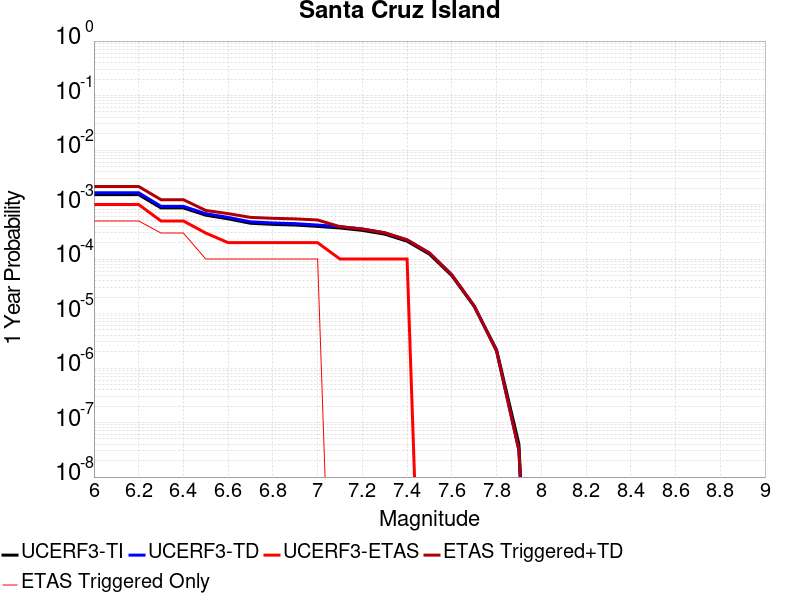 |  |

| Magnitude | 1 wk TI Prob | 1 wk TD Prob | 1 wk ETAS Prob | 1 wk ETAS/TD Gain | 1 wk ETAS Triggered+TD | 1 wk ETAS Triggered Only | 1 mo TI Prob | 1 mo TD Prob | 1 mo ETAS Prob | 1 mo ETAS/TD Gain | 1 mo ETAS Triggered+TD | 1 mo ETAS Triggered Only | 1 yr TI Prob | 1 yr TD Prob | 1 yr ETAS Prob | 1 yr ETAS/TD Gain | 1 yr ETAS Triggered+TD | 1 yr ETAS Triggered Only | 10 yr TI Prob | 10 yr TD Prob | 10 yr ETAS Prob | 10 yr ETAS/TD Gain | 10 yr ETAS Triggered+TD | 10 yr ETAS Triggered Only |
|-----|-----|-----|-----|-----|-----|-----|-----|-----|-----|-----|-----|-----|-----|-----|-----|-----|-----|-----|-----|-----|-----|-----|-----|-----|
| 6.0 | 2.9164563E-5 | 3.1572003E-5 | 0.0 | 0.0 | 3.1572003E-5 | 0.0 | 1.2498499E-4 | 1.3530234E-4 | 1.0E-4 | 0.73908556 | 2.3528881E-4 | 1.0E-4 | 0.0015206301 | 0.0016461972 | 0.001 | 0.6074607 | 0.002145374 | 5.0E-4 | 0.015102667 | 0.01635373 | 0.012 | 0.7337776 | 0.019993221 | 0.0037 |
| 6.1 | 2.9164563E-5 | 3.1572003E-5 | 0.0 | 0.0 | 3.1572003E-5 | 0.0 | 1.2498499E-4 | 1.3530234E-4 | 1.0E-4 | 0.73908556 | 2.3528881E-4 | 1.0E-4 | 0.0015206301 | 0.0016461972 | 0.001 | 0.6074607 | 0.002145374 | 5.0E-4 | 0.015102667 | 0.01635373 | 0.012 | 0.7337776 | 0.019993221 | 0.0037 |
| 6.2 | 2.9164563E-5 | 3.1572003E-5 | 0.0 | 0.0 | 3.1572003E-5 | 0.0 | 1.2498499E-4 | 1.3530234E-4 | 1.0E-4 | 0.73908556 | 2.3528881E-4 | 1.0E-4 | 0.0015206301 | 0.0016461972 | 0.001 | 0.6074607 | 0.002145374 | 5.0E-4 | 0.015102667 | 0.01635373 | 0.012 | 0.7337776 | 0.019993221 | 0.0037 |
| 6.3 | 1.6635553E-5 | 1.779119E-5 | 0.0 | 0.0 | 1.779119E-5 | 0.0 | 7.1293274E-5 | 7.624584E-5 | 1.0E-4 | 1.311547 | 1.7623822E-4 | 1.0E-4 | 8.6765E-4 | 9.279159E-4 | 5.0E-4 | 0.53884196 | 0.0012276375 | 3.0E-4 | 0.008642701 | 0.009242283 | 0.0067 | 0.72492915 | 0.011223799 | 0.002 |
| 6.4 | 1.6635553E-5 | 1.779119E-5 | 0.0 | 0.0 | 1.779119E-5 | 0.0 | 7.1293274E-5 | 7.624584E-5 | 1.0E-4 | 1.311547 | 1.7623822E-4 | 1.0E-4 | 8.6765E-4 | 9.279159E-4 | 5.0E-4 | 0.53884196 | 0.0012276375 | 3.0E-4 | 0.008642701 | 0.009242283 | 0.0067 | 0.72492915 | 0.011223799 | 0.002 |
| 6.5 | 1.2238748E-5 | 1.3033949E-5 | 0.0 | 0.0 | 1.3033949E-5 | 0.0 | 5.2450723E-5 | 5.5858603E-5 | 0.0 | 0.0 | 5.5858603E-5 | 0.0 | 6.3840044E-4 | 6.7987E-4 | 3.0E-4 | 0.44126084 | 7.79802E-4 | 1.0E-4 | 0.0063656955 | 0.0067782984 | 0.0054 | 0.7966601 | 0.008367454 | 0.0016 |
| 6.6 | 1.0489767E-5 | 1.1149135E-5 | 0.0 | 0.0 | 1.1149135E-5 | 0.0 | 4.495537E-5 | 4.7781148E-5 | 0.0 | 0.0 | 4.7781148E-5 | 0.0 | 5.4719415E-4 | 5.815824E-4 | 2.0E-4 | 0.34388936 | 6.815243E-4 | 1.0E-4 | 0.005458487 | 0.0058008446 | 0.0043 | 0.7412714 | 0.0071927235 | 0.0014 |
| 6.7 | 8.699222E-6 | 9.230729E-6 | 0.0 | 0.0 | 9.230729E-6 | 0.0 | 3.7281847E-5 | 3.9559673E-5 | 0.0 | 0.0 | 3.9559673E-5 | 0.0 | 4.5381195E-4 | 4.8153312E-4 | 2.0E-4 | 0.4153401 | 5.814849E-4 | 1.0E-4 | 0.0045288634 | 0.0048049646 | 0.0039 | 0.81166047 | 0.0060987184 | 0.0013 |
| 6.8 | 8.307732E-6 | 8.811169E-6 | 0.0 | 0.0 | 8.811169E-6 | 0.0 | 3.560408E-5 | 3.776161E-5 | 0.0 | 0.0 | 3.776161E-5 | 0.0 | 4.3339343E-4 | 4.5965103E-4 | 2.0E-4 | 0.43511268 | 5.596051E-4 | 1.0E-4 | 0.004325492 | 0.0045870566 | 0.0036 | 0.78481704 | 0.005781552 | 0.0012 |
| 6.9 | 8.073121E-6 | 8.559399E-6 | 0.0 | 0.0 | 8.559399E-6 | 0.0 | 3.459863E-5 | 3.6682628E-5 | 0.0 | 0.0 | 3.6682628E-5 | 0.0 | 4.2115687E-4 | 4.4651987E-4 | 2.0E-4 | 0.4479084 | 5.4647523E-4 | 1.0E-4 | 0.004203596 | 0.0044562784 | 0.0036 | 0.807849 | 0.0056509306 | 0.0012 |
| 7.0 | 7.617019E-6 | 8.069512E-6 | 0.0 | 0.0 | 8.069512E-6 | 0.0 | 3.264396E-5 | 3.4583165E-5 | 0.0 | 0.0 | 3.4583165E-5 | 0.0 | 3.9736772E-4 | 4.2096907E-4 | 2.0E-4 | 0.4750943 | 5.2092696E-4 | 1.0E-4 | 0.003966579 | 0.004201764 | 0.0035 | 0.8329835 | 0.005297142 | 0.0011 |
| 7.1 | 7.1224836E-6 | 7.5410208E-6 | 0.0 | 0.0 | 7.5410208E-6 | 0.0 | 3.052457E-5 | 3.231826E-5 | 0.0 | 0.0 | 3.231826E-5 | 0.0 | 3.715733E-4 | 3.9340416E-4 | 1.0E-4 | 0.25419152 | 3.9340416E-4 | 0.0 | 0.003709526 | 0.0039271205 | 0.0032 | 0.81484646 | 0.0049231932 | 0.001 |
| 7.2 | 6.441115E-6 | 6.8230265E-6 | 0.0 | 0.0 | 6.8230265E-6 | 0.0 | 2.7604487E-5 | 2.9241217E-5 | 0.0 | 0.0 | 2.9241217E-5 | 0.0 | 3.360328E-4 | 3.5595387E-4 | 1.0E-4 | 0.28093526 | 3.5595387E-4 | 0.0 | 0.0033552512 | 0.0035538657 | 0.003 | 0.8441512 | 0.0045503117 | 0.001 |
| 7.3 | 5.494274E-6 | 5.8163123E-6 | 0.0 | 0.0 | 5.8163123E-6 | 0.0 | 2.3546674E-5 | 2.4926814E-5 | 0.0 | 0.0 | 2.4926814E-5 | 0.0 | 2.8664304E-4 | 3.0344192E-4 | 1.0E-4 | 0.32955238 | 3.0344192E-4 | 0.0 | 0.002862736 | 0.0030302987 | 0.0025 | 0.8250011 | 0.0039275717 | 9.0E-4 |
| 7.4 | 4.0802624E-6 | 4.309619E-6 | 0.0 | 0.0 | 4.309619E-6 | 0.0 | 1.7486722E-5 | 1.8469664E-5 | 0.0 | 0.0 | 1.8469664E-5 | 0.0 | 2.1288003E-4 | 2.2484503E-4 | 1.0E-4 | 0.44475076 | 2.2484503E-4 | 0.0 | 0.0021267622 | 0.0022461845 | 0.0013 | 0.57875925 | 0.0027450614 | 5.0E-4 |
| 7.5 | 2.3584746E-6 | 2.4739577E-6 | 0.0 | 0.0 | 2.4739577E-6 | 0.0 | 1.0107709E-5 | 1.0602633E-5 | 0.0 | 0.0 | 1.0602633E-5 | 0.0 | 1.2305441E-4 | 1.2907945E-4 | 0.0 | 0.0 | 1.2907945E-4 | 0.0 | 0.0012298629 | 0.0012900499 | 7.0E-4 | 0.5426147 | 0.0015896627 | 3.0E-4 |
| 7.6 | 9.4981914E-7 | 9.856386E-7 | 0.0 | 0.0 | 9.856386E-7 | 0.0 | 4.0706473E-6 | 4.2241586E-6 | 0.0 | 0.0 | 4.2241586E-6 | 0.0 | 4.9559E-5 | 5.142793E-5 | 0.0 | 0.0 | 5.142793E-5 | 0.0 | 4.954795E-4 | 5.141616E-4 | 2.0E-4 | 0.38898274 | 6.141102E-4 | 1.0E-4 |
| 7.7 | 2.6013532E-7 | 2.640751E-7 | 0.0 | 0.0 | 2.640751E-7 | 0.0 | 1.1148652E-6 | 1.13175E-6 | 0.0 | 0.0 | 1.13175E-6 | 0.0 | 1.3573399E-5 | 1.3778969E-5 | 0.0 | 0.0 | 1.3778969E-5 | 0.0 | 1.357257E-4 | 1.3778122E-4 | 0.0 | 0.0 | 1.3778122E-4 | 0.0 |
| 7.8 | 4.1522263E-8 | 3.964669E-8 | 0.0 | 0.0 | 3.964669E-8 | 0.0 | 1.7795254E-7 | 1.6991437E-7 | 0.0 | 0.0 | 1.6991437E-7 | 0.0 | 2.16657E-6 | 2.0687057E-6 | 0.0 | 0.0 | 2.0687057E-6 | 0.0 | 2.1665488E-5 | 2.0686886E-5 | 0.0 | 0.0 | 2.0686886E-5 | 0.0 |
| 7.9 | 7.7242046E-10 | 5.944937E-10 | 0.0 | 0.0 | 5.944937E-10 | 0.0 | 3.3103735E-9 | 2.54783E-9 | 0.0 | 0.0 | 2.54783E-9 | 0.0 | 4.0303796E-8 | 3.101983E-8 | 0.0 | 0.0 | 3.101983E-8 | 0.0 | 4.030379E-7 | 3.101983E-7 | 0.0 | 0.0 | 3.101983E-7 | 0.0 |

## Santa Rosa Island
*[(top)](#table-of-contents)*

| 1 Week | 1 Month | 1 Year | 10 Year |
|-----|-----|-----|-----|
|  |  |  | 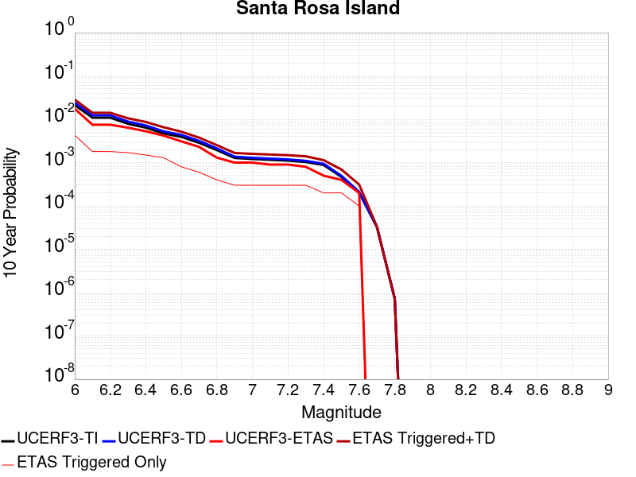 |

| Magnitude | 1 wk TI Prob | 1 wk TD Prob | 1 wk ETAS Prob | 1 wk ETAS/TD Gain | 1 wk ETAS Triggered+TD | 1 wk ETAS Triggered Only | 1 mo TI Prob | 1 mo TD Prob | 1 mo ETAS Prob | 1 mo ETAS/TD Gain | 1 mo ETAS Triggered+TD | 1 mo ETAS Triggered Only | 1 yr TI Prob | 1 yr TD Prob | 1 yr ETAS Prob | 1 yr ETAS/TD Gain | 1 yr ETAS Triggered+TD | 1 yr ETAS Triggered Only | 10 yr TI Prob | 10 yr TD Prob | 10 yr ETAS Prob | 10 yr ETAS/TD Gain | 10 yr ETAS Triggered+TD | 10 yr ETAS Triggered Only |
|-----|-----|-----|-----|-----|-----|-----|-----|-----|-----|-----|-----|-----|-----|-----|-----|-----|-----|-----|-----|-----|-----|-----|-----|-----|
| 6.0 | 4.1143165E-5 | 4.701977E-5 | 0.0 | 0.0 | 4.701977E-5 | 0.0 | 1.7631594E-4 | 2.0149884E-4 | 0.0 | 0.0 | 2.0149884E-4 | 0.0 | 0.002144533 | 0.002450684 | 0.0012 | 0.4896592 | 0.0029494588 | 5.0E-4 | 0.021239553 | 0.024257159 | 0.0175 | 0.7214365 | 0.028452853 | 0.0043 |
| 6.1 | 2.1061249E-5 | 2.3831648E-5 | 0.0 | 0.0 | 2.3831648E-5 | 0.0 | 9.0259375E-5 | 1.021318E-4 | 0.0 | 0.0 | 1.021318E-4 | 0.0 | 0.0010983539 | 0.0012427742 | 0.0 | 0.0 | 0.0012427742 | 0.0 | 0.01092941 | 0.012361274 | 0.0075 | 0.60673356 | 0.014139025 | 0.0018 |
| 6.2 | 2.1061249E-5 | 2.3831648E-5 | 0.0 | 0.0 | 2.3831648E-5 | 0.0 | 9.0259375E-5 | 1.021318E-4 | 0.0 | 0.0 | 1.021318E-4 | 0.0 | 0.0010983539 | 0.0012427742 | 0.0 | 0.0 | 0.0012427742 | 0.0 | 0.01092941 | 0.012361274 | 0.0075 | 0.60673356 | 0.014139025 | 0.0018 |
| 6.3 | 1.5158236E-5 | 1.7051776E-5 | 0.0 | 0.0 | 1.7051776E-5 | 0.0 | 6.496225E-5 | 7.307706E-5 | 0.0 | 0.0 | 7.307706E-5 | 0.0 | 7.906284E-4 | 8.89362E-4 | 0.0 | 0.0 | 8.89362E-4 | 0.0 | 0.007878214 | 0.008859277 | 0.0064 | 0.72240657 | 0.010544216 | 0.0017 |
| 6.4 | 1.2341918E-5 | 1.3835114E-5 | 0.0 | 0.0 | 1.3835114E-5 | 0.0 | 5.2892858E-5 | 5.9292044E-5 | 0.0 | 0.0 | 5.9292044E-5 | 0.0 | 6.437803E-4 | 7.216496E-4 | 0.0 | 0.0 | 7.216496E-4 | 0.0 | 0.006419184 | 0.007193897 | 0.0053 | 0.7367356 | 0.008683106 | 0.0015 |
| 6.5 | 9.061158E-6 | 1.0104637E-5 | 0.0 | 0.0 | 1.0104637E-5 | 0.0 | 3.883296E-5 | 4.33049E-5 | 0.0 | 0.0 | 4.33049E-5 | 0.0 | 4.726887E-4 | 5.271149E-4 | 0.0 | 0.0 | 5.271149E-4 | 0.0 | 0.004716845 | 0.005259183 | 0.0042 | 0.7986032 | 0.006552346 | 0.0013 |
| 6.6 | 7.5461685E-6 | 8.390719E-6 | 0.0 | 0.0 | 8.390719E-6 | 0.0 | 3.2340322E-5 | 3.595975E-5 | 0.0 | 0.0 | 3.595975E-5 | 0.0 | 3.936723E-4 | 4.377263E-4 | 0.0 | 0.0 | 4.377263E-4 | 0.0 | 0.003929756 | 0.00436907 | 0.0031 | 0.7095332 | 0.005165574 | 8.0E-4 |
| 6.7 | 5.5023775E-6 | 6.080548E-6 | 0.0 | 0.0 | 6.080548E-6 | 0.0 | 2.3581404E-5 | 2.605925E-5 | 0.0 | 0.0 | 2.605925E-5 | 0.0 | 2.8706578E-4 | 3.172284E-4 | 0.0 | 0.0 | 3.172284E-4 | 0.0 | 0.0028669522 | 0.0031680765 | 0.0023 | 0.72599256 | 0.0037661756 | 6.0E-4 |
| 6.8 | 3.7351679E-6 | 4.079111E-6 | 0.0 | 0.0 | 4.079111E-6 | 0.0 | 1.6007763E-5 | 1.7481801E-5 | 0.0 | 0.0 | 1.7481801E-5 | 0.0 | 1.948771E-4 | 2.1282263E-4 | 0.0 | 0.0 | 2.1282263E-4 | 0.0 | 0.0019470629 | 0.0021264327 | 0.0013 | 0.6113525 | 0.0025255822 | 4.0E-4 |
| 6.9 | 2.456366E-6 | 2.6273171E-6 | 0.0 | 0.0 | 2.6273171E-6 | 0.0 | 1.0527241E-5 | 1.1259883E-5 | 0.0 | 0.0 | 1.1259883E-5 | 0.0 | 1.2816161E-4 | 1.3708047E-4 | 0.0 | 0.0 | 1.3708047E-4 | 0.0 | 0.0012808773 | 0.0013699621 | 0.001 | 0.7299472 | 0.0016695511 | 3.0E-4 |
| 7.0 | 2.3245157E-6 | 2.480995E-6 | 0.0 | 0.0 | 2.480995E-6 | 0.0 | 9.962172E-6 | 1.0632792E-5 | 0.0 | 0.0 | 1.0632792E-5 | 0.0 | 1.2128269E-4 | 1.2944658E-4 | 0.0 | 0.0 | 1.2944658E-4 | 0.0 | 0.0012121652 | 0.0012937139 | 0.001 | 0.7729684 | 0.0015933259 | 3.0E-4 |
| 7.1 | 2.2248344E-6 | 2.3715795E-6 | 0.0 | 0.0 | 2.3715795E-6 | 0.0 | 9.53497E-6 | 1.0163873E-5 | 0.0 | 0.0 | 1.0163873E-5 | 0.0 | 1.1608207E-4 | 1.2373815E-4 | 0.0 | 0.0 | 1.2373815E-4 | 0.0 | 0.0011602144 | 0.0012366944 | 9.0E-4 | 0.7277464 | 0.0015363235 | 3.0E-4 |
| 7.2 | 2.1350402E-6 | 2.274566E-6 | 0.0 | 0.0 | 2.274566E-6 | 0.0 | 9.150141E-6 | 9.748104E-6 | 0.0 | 0.0 | 9.748104E-6 | 0.0 | 1.1139726E-4 | 1.1867672E-4 | 0.0 | 0.0 | 1.1867672E-4 | 0.0 | 0.0011134144 | 0.0011861353 | 9.0E-4 | 0.7587667 | 0.0014857795 | 3.0E-4 |
| 7.3 | 1.9793572E-6 | 2.1072633E-6 | 0.0 | 0.0 | 2.1072633E-6 | 0.0 | 8.482932E-6 | 9.031098E-6 | 0.0 | 0.0 | 9.031098E-6 | 0.0 | 1.032748E-4 | 1.0994809E-4 | 0.0 | 0.0 | 1.0994809E-4 | 0.0 | 0.0010322682 | 0.0010989386 | 8.0E-4 | 0.72797513 | 0.001398609 | 3.0E-4 |
| 7.4 | 1.6951194E-6 | 1.8033405E-6 | 0.0 | 0.0 | 1.8033405E-6 | 0.0 | 7.264777E-6 | 7.7285795E-6 | 0.0 | 0.0 | 7.7285795E-6 | 0.0 | 8.844508E-5 | 9.409141E-5 | 0.0 | 0.0 | 9.409141E-5 | 0.0 | 8.840988E-4 | 9.4051735E-4 | 5.0E-4 | 0.5316223 | 0.0011403293 | 2.0E-4 |
| 7.5 | 8.987207E-7 | 9.5062643E-7 | 0.0 | 0.0 | 9.5062643E-7 | 0.0 | 3.8516546E-6 | 4.074107E-6 | 0.0 | 0.0 | 4.074107E-6 | 0.0 | 4.6892885E-5 | 4.9601134E-5 | 0.0 | 0.0 | 4.9601134E-5 | 0.0 | 4.688299E-4 | 4.959018E-4 | 4.0E-4 | 0.8066113 | 6.958026E-4 | 2.0E-4 |
| 7.6 | 3.8783037E-7 | 4.0509016E-7 | 0.0 | 0.0 | 4.0509016E-7 | 0.0 | 1.6621291E-6 | 1.7360995E-6 | 0.0 | 0.0 | 1.7360995E-6 | 0.0 | 2.0236233E-5 | 2.1136813E-5 | 0.0 | 0.0 | 2.1136813E-5 | 0.0 | 2.023439E-4 | 2.1134868E-4 | 2.0E-4 | 0.9463035 | 3.1132755E-4 | 1.0E-4 |
| 7.7 | 6.181804E-8 | 6.336573E-8 | 0.0 | 0.0 | 6.336573E-8 | 0.0 | 2.6493444E-7 | 2.7156742E-7 | 0.0 | 0.0 | 2.7156742E-7 | 0.0 | 3.225572E-6 | 3.3063282E-6 | 0.0 | 0.0 | 3.3063282E-6 | 0.0 | 3.225525E-5 | 3.3062795E-5 | 0.0 | 0.0 | 3.3062795E-5 | 0.0 |
| 7.8 | 1.3704449E-9 | 1.3961391E-9 | 0.0 | 0.0 | 1.3961391E-9 | 0.0 | 5.873335E-9 | 5.983453E-9 | 0.0 | 0.0 | 5.983453E-9 | 0.0 | 7.1507856E-8 | 7.2848536E-8 | 0.0 | 0.0 | 7.2848536E-8 | 0.0 | 7.1507833E-7 | 7.2848525E-7 | 0.0 | 0.0 | 7.2848525E-7 | 0.0 |

## Quien Sabe 2011 CFM
*[(top)](#table-of-contents)*

| 1 Week | 1 Month | 1 Year | 10 Year |
|-----|-----|-----|-----|
| 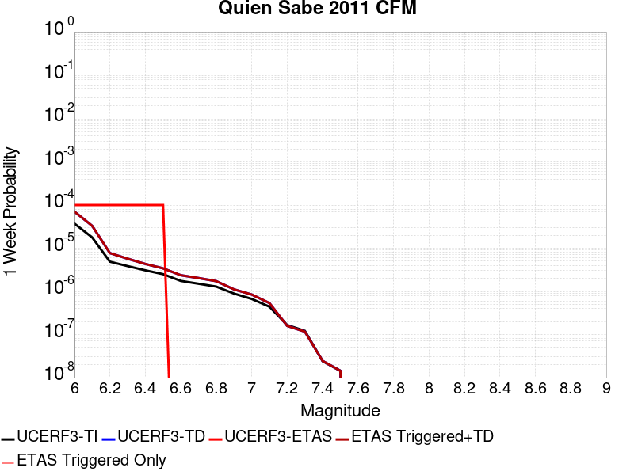 |  |  |  |

| Magnitude | 1 wk TI Prob | 1 wk TD Prob | 1 wk ETAS Prob | 1 wk ETAS/TD Gain | 1 wk ETAS Triggered+TD | 1 wk ETAS Triggered Only | 1 mo TI Prob | 1 mo TD Prob | 1 mo ETAS Prob | 1 mo ETAS/TD Gain | 1 mo ETAS Triggered+TD | 1 mo ETAS Triggered Only | 1 yr TI Prob | 1 yr TD Prob | 1 yr ETAS Prob | 1 yr ETAS/TD Gain | 1 yr ETAS Triggered+TD | 1 yr ETAS Triggered Only | 10 yr TI Prob | 10 yr TD Prob | 10 yr ETAS Prob | 10 yr ETAS/TD Gain | 10 yr ETAS Triggered+TD | 10 yr ETAS Triggered Only |
|-----|-----|-----|-----|-----|-----|-----|-----|-----|-----|-----|-----|-----|-----|-----|-----|-----|-----|-----|-----|-----|-----|-----|-----|-----|
| 6.0 | 3.729899E-5 | 7.065252E-5 | 1.0E-4 | 1.4153777 | 7.065252E-5 | 0.0 | 1.5984301E-4 | 3.0270868E-4 | 2.0E-4 | 0.6607013 | 4.026784E-4 | 1.0E-4 | 0.0019443515 | 0.0036701858 | 0.0014 | 0.38145205 | 0.003969085 | 3.0E-4 | 0.019274272 | 0.035221227 | 0.0192 | 0.5451258 | 0.039466254 | 0.0044 |
| 6.1 | 1.7825725E-5 | 3.304532E-5 | 1.0E-4 | 3.0261471 | 3.304532E-5 | 0.0 | 7.639373E-5 | 1.4160175E-4 | 2.0E-4 | 1.4124119 | 2.415876E-4 | 1.0E-4 | 9.296967E-4 | 0.0017183855 | 7.0E-4 | 0.40735912 | 0.0019180417 | 2.0E-4 | 0.009258169 | 0.016626084 | 0.0081 | 0.48718628 | 0.01859283 | 0.002 |
| 6.2 | 4.8865336E-6 | 7.731312E-6 | 1.0E-4 | 12.934417 | 7.731312E-6 | 0.0 | 2.0942118E-5 | 3.313373E-5 | 2.0E-4 | 6.036145 | 1.3313042E-4 | 1.0E-4 | 2.5494045E-4 | 4.0298793E-4 | 3.0E-4 | 0.7444392 | 5.029476E-4 | 1.0E-4 | 0.0025464818 | 0.003977334 | 0.002 | 0.5028494 | 0.0044753454 | 5.0E-4 |
| 6.3 | 3.858491E-6 | 5.72091E-6 | 1.0E-4 | 17.479736 | 5.72091E-6 | 0.0 | 1.6536285E-5 | 2.4517982E-5 | 1.0E-4 | 4.078639 | 2.4517982E-5 | 0.0 | 2.0131067E-4 | 2.984701E-4 | 2.0E-4 | 0.6700838 | 2.984701E-4 | 0.0 | 0.002011284 | 0.0029687511 | 0.0015 | 0.505263 | 0.0032678605 | 3.0E-4 |
| 6.4 | 3.0771805E-6 | 4.3260084E-6 | 1.0E-4 | 23.115997 | 4.3260084E-6 | 0.0 | 1.318785E-5 | 1.8539917E-5 | 1.0E-4 | 5.3937674 | 1.8539917E-5 | 0.0 | 1.6055023E-4 | 2.2570248E-4 | 2.0E-4 | 0.88612235 | 2.2570248E-4 | 0.0 | 0.001604343 | 0.0022578666 | 0.0012 | 0.5314751 | 0.002457415 | 2.0E-4 |
| 6.5 | 2.5081235E-6 | 3.4144905E-6 | 1.0E-4 | 29.286945 | 3.4144905E-6 | 0.0 | 1.0749056E-5 | 1.4633457E-5 | 1.0E-4 | 6.8336554 | 1.4633457E-5 | 0.0 | 1.308619E-4 | 1.781492E-4 | 2.0E-4 | 1.1226544 | 1.781492E-4 | 0.0 | 0.0013078486 | 0.0017882477 | 8.0E-4 | 0.4473653 | 0.00198789 | 2.0E-4 |
| 6.6 | 1.7505364E-6 | 2.370007E-6 | 0.0 | 0.0 | 2.370007E-6 | 0.0 | 7.502277E-6 | 1.0157138E-5 | 0.0 | 0.0 | 1.0157138E-5 | 0.0 | 9.13364E-5 | 1.2365682E-4 | 0.0 | 0.0 | 1.2365682E-4 | 0.0 | 9.129886E-4 | 0.001242428 | 5.0E-4 | 0.4024378 | 0.0013423037 | 1.0E-4 |
| 6.7 | 1.505737E-6 | 2.0362945E-6 | 0.0 | 0.0 | 2.0362945E-6 | 0.0 | 6.4531428E-6 | 8.726951E-6 | 0.0 | 0.0 | 8.726951E-6 | 0.0 | 7.8564175E-5 | 1.0624603E-4 | 0.0 | 0.0 | 1.0624603E-4 | 0.0 | 7.853641E-4 | 0.0010682659 | 3.0E-4 | 0.28082898 | 0.0011681591 | 1.0E-4 |
| 6.8 | 1.2924105E-6 | 1.7271491E-6 | 0.0 | 0.0 | 1.7271491E-6 | 0.0 | 5.5388905E-6 | 7.4020495E-6 | 0.0 | 0.0 | 7.4020495E-6 | 0.0 | 6.74339E-5 | 9.011676E-5 | 0.0 | 0.0 | 9.011676E-5 | 0.0 | 6.741344E-4 | 9.0557896E-4 | 3.0E-4 | 0.33127978 | 0.0010054883 | 1.0E-4 |
| 6.9 | 8.9075286E-7 | 1.1142547E-6 | 0.0 | 0.0 | 1.1142547E-6 | 0.0 | 3.8175067E-6 | 4.7753697E-6 | 0.0 | 0.0 | 4.7753697E-6 | 0.0 | 4.6477155E-5 | 5.8138794E-5 | 0.0 | 0.0 | 5.8138794E-5 | 0.0 | 4.6467435E-4 | 5.849777E-4 | 2.0E-4 | 0.34189337 | 5.849777E-4 | 0.0 |
| 7.0 | 6.6891175E-7 | 8.44982E-7 | 0.0 | 0.0 | 8.44982E-7 | 0.0 | 2.8667614E-6 | 3.6213476E-6 | 0.0 | 0.0 | 3.6213476E-6 | 0.0 | 3.4902263E-5 | 4.4089207E-5 | 0.0 | 0.0 | 4.4089207E-5 | 0.0 | 3.4896782E-4 | 4.4339887E-4 | 2.0E-4 | 0.45106116 | 4.4339887E-4 | 0.0 |
| 7.1 | 4.4205015E-7 | 5.364283E-7 | 0.0 | 0.0 | 5.364283E-7 | 0.0 | 1.8944993E-6 | 2.2989773E-6 | 0.0 | 0.0 | 2.2989773E-6 | 0.0 | 2.3065284E-5 | 2.7989856E-5 | 0.0 | 0.0 | 2.7989856E-5 | 0.0 | 2.3062891E-4 | 2.813194E-4 | 1.0E-4 | 0.35546783 | 2.813194E-4 | 0.0 |
| 7.2 | 1.6620965E-7 | 1.587583E-7 | 0.0 | 0.0 | 1.587583E-7 | 0.0 | 7.123269E-7 | 6.8039253E-7 | 0.0 | 0.0 | 6.8039253E-7 | 0.0 | 8.672545E-6 | 8.283751E-6 | 0.0 | 0.0 | 8.283751E-6 | 0.0 | 8.6722066E-5 | 8.3000945E-5 | 0.0 | 0.0 | 8.3000945E-5 | 0.0 |
| 7.3 | 1.2142488E-7 | 1.1659369E-7 | 0.0 | 0.0 | 1.1659369E-7 | 0.0 | 5.2039223E-7 | 4.9968713E-7 | 0.0 | 0.0 | 4.9968713E-7 | 0.0 | 6.335757E-6 | 6.0836774E-6 | 0.0 | 0.0 | 6.0836774E-6 | 0.0 | 6.3355765E-5 | 6.0916547E-5 | 0.0 | 0.0 | 6.0916547E-5 | 0.0 |
| 7.4 | 2.4192937E-8 | 2.44361E-8 | 0.0 | 0.0 | 2.44361E-8 | 0.0 | 1.0368401E-7 | 1.0472613E-7 | 0.0 | 0.0 | 1.0472613E-7 | 0.0 | 1.2623522E-6 | 1.2750401E-6 | 0.0 | 0.0 | 1.2750401E-6 | 0.0 | 1.2623449E-5 | 1.2770978E-5 | 0.0 | 0.0 | 1.2770978E-5 | 0.0 |
| 7.5 | 1.4432802E-8 | 1.4471932E-8 | 0.0 | 0.0 | 1.4471932E-8 | 0.0 | 6.185486E-8 | 6.2022565E-8 | 0.0 | 0.0 | 6.2022565E-8 | 0.0 | 7.530827E-7 | 7.551246E-7 | 0.0 | 0.0 | 7.551246E-7 | 0.0 | 7.530801E-6 | 7.570129E-6 | 0.0 | 0.0 | 7.570129E-6 | 0.0 |

## Gravel Hills-Harper Lk
*[(top)](#table-of-contents)*

| 1 Week | 1 Month | 1 Year | 10 Year |
|-----|-----|-----|-----|
|  |  | 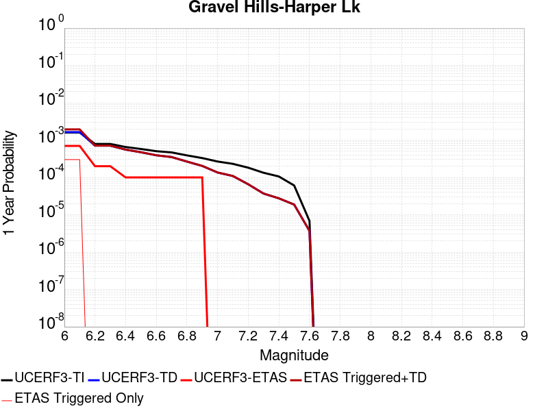 |  |

| Magnitude | 1 wk TI Prob | 1 wk TD Prob | 1 wk ETAS Prob | 1 wk ETAS/TD Gain | 1 wk ETAS Triggered+TD | 1 wk ETAS Triggered Only | 1 mo TI Prob | 1 mo TD Prob | 1 mo ETAS Prob | 1 mo ETAS/TD Gain | 1 mo ETAS Triggered+TD | 1 mo ETAS Triggered Only | 1 yr TI Prob | 1 yr TD Prob | 1 yr ETAS Prob | 1 yr ETAS/TD Gain | 1 yr ETAS Triggered+TD | 1 yr ETAS Triggered Only | 10 yr TI Prob | 10 yr TD Prob | 10 yr ETAS Prob | 10 yr ETAS/TD Gain | 10 yr ETAS Triggered+TD | 10 yr ETAS Triggered Only |
|-----|-----|-----|-----|-----|-----|-----|-----|-----|-----|-----|-----|-----|-----|-----|-----|-----|-----|-----|-----|-----|-----|-----|-----|-----|
| 6.0 | 3.0679566E-5 | 3.142136E-5 | 0.0 | 0.0 | 3.142136E-5 | 0.0 | 1.3147724E-4 | 1.3465725E-4 | 0.0 | 0.0 | 1.3465725E-4 | 0.0 | 0.0015995599 | 0.0016384354 | 7.0E-4 | 0.42723688 | 0.0019379439 | 3.0E-4 | 0.015880952 | 0.016285053 | 0.0107 | 0.6570443 | 0.020318283 | 0.0041 |
| 6.1 | 3.0679566E-5 | 3.142136E-5 | 0.0 | 0.0 | 3.142136E-5 | 0.0 | 1.3147724E-4 | 1.3465725E-4 | 0.0 | 0.0 | 1.3465725E-4 | 0.0 | 0.0015995599 | 0.0016384354 | 7.0E-4 | 0.42723688 | 0.0019379439 | 3.0E-4 | 0.015880952 | 0.016285053 | 0.0107 | 0.6570443 | 0.020318283 | 0.0041 |
| 6.2 | 1.514536E-5 | 1.3619673E-5 | 0.0 | 0.0 | 1.3619673E-5 | 0.0 | 6.490707E-5 | 5.8368787E-5 | 0.0 | 0.0 | 5.8368787E-5 | 0.0 | 7.8995706E-4 | 7.1042014E-4 | 2.0E-4 | 0.28152356 | 7.1042014E-4 | 0.0 | 0.007871548 | 0.007082689 | 0.0041 | 0.5788762 | 0.00827419 | 0.0012 |
| 6.3 | 1.514536E-5 | 1.3619673E-5 | 0.0 | 0.0 | 1.3619673E-5 | 0.0 | 6.490707E-5 | 5.8368787E-5 | 0.0 | 0.0 | 5.8368787E-5 | 0.0 | 7.8995706E-4 | 7.1042014E-4 | 2.0E-4 | 0.28152356 | 7.1042014E-4 | 0.0 | 0.007871548 | 0.007082689 | 0.0041 | 0.5788762 | 0.00827419 | 0.0012 |
| 6.4 | 1.2532521E-5 | 1.0678091E-5 | 0.0 | 0.0 | 1.0678091E-5 | 0.0 | 5.37097E-5 | 4.5762477E-5 | 0.0 | 0.0 | 4.5762477E-5 | 0.0 | 6.537194E-4 | 5.570215E-4 | 1.0E-4 | 0.17952627 | 5.570215E-4 | 0.0 | 0.0065179965 | 0.0055568423 | 0.0031 | 0.5578708 | 0.006451841 | 9.0E-4 |
| 6.5 | 1.1094058E-5 | 9.074023E-6 | 0.0 | 0.0 | 9.074023E-6 | 0.0 | 4.7545094E-5 | 3.8888113E-5 | 0.0 | 0.0 | 3.8888113E-5 | 0.0 | 5.787078E-4 | 4.7336394E-4 | 1.0E-4 | 0.21125394 | 4.7336394E-4 | 0.0 | 0.0057720304 | 0.004723963 | 0.003 | 0.63506 | 0.0055201836 | 8.0E-4 |
| 6.6 | 9.688328E-6 | 7.523745E-6 | 0.0 | 0.0 | 7.523745E-6 | 0.0 | 4.1520743E-5 | 3.2244236E-5 | 0.0 | 0.0 | 3.2244236E-5 | 0.0 | 5.053978E-4 | 3.925054E-4 | 1.0E-4 | 0.25477356 | 3.925054E-4 | 0.0 | 0.0050424994 | 0.0039183777 | 0.0028 | 0.71458143 | 0.0047152434 | 8.0E-4 |
| 6.7 | 8.974824E-6 | 6.7422516E-6 | 0.0 | 0.0 | 6.7422516E-6 | 0.0 | 3.8462964E-5 | 2.8895056E-5 | 0.0 | 0.0 | 2.8895056E-5 | 0.0 | 4.6818596E-4 | 3.5174272E-4 | 1.0E-4 | 0.2842987 | 3.5174272E-4 | 0.0 | 0.004672008 | 0.0035120805 | 0.0028 | 0.79724824 | 0.004209622 | 7.0E-4 |
| 6.8 | 7.4780046E-6 | 5.110587E-6 | 0.0 | 0.0 | 5.110587E-6 | 0.0 | 3.20482E-5 | 2.190234E-5 | 0.0 | 0.0 | 2.190234E-5 | 0.0 | 3.9011694E-4 | 2.6662977E-4 | 1.0E-4 | 0.37505192 | 2.6662977E-4 | 0.0 | 0.0038943281 | 0.0026632366 | 0.002 | 0.75096595 | 0.0030621712 | 4.0E-4 |
| 6.9 | 6.3409307E-6 | 3.9029237E-6 | 0.0 | 0.0 | 3.9029237E-6 | 0.0 | 2.7175134E-5 | 1.6726715E-5 | 0.0 | 0.0 | 1.6726715E-5 | 0.0 | 3.3080703E-4 | 2.0362971E-4 | 1.0E-4 | 0.49108747 | 2.0362971E-4 | 0.0 | 0.0033031502 | 0.0020345293 | 0.0016 | 0.7864227 | 0.0024337154 | 4.0E-4 |
| 7.0 | 5.1239335E-6 | 2.6023781E-6 | 0.0 | 0.0 | 2.6023781E-6 | 0.0 | 2.195953E-5 | 1.1153003E-5 | 0.0 | 0.0 | 1.1153003E-5 | 0.0 | 2.6732447E-4 | 1.357796E-4 | 0.0 | 0.0 | 1.357796E-4 | 0.0 | 0.0026700313 | 0.0013569916 | 0.001 | 0.73692423 | 0.0016565846 | 3.0E-4 |
| 7.1 | 4.438899E-6 | 2.0954649E-6 | 0.0 | 0.0 | 2.0954649E-6 | 0.0 | 1.9023713E-5 | 8.980534E-6 | 0.0 | 0.0 | 8.980534E-6 | 0.0 | 2.315891E-4 | 1.09332745E-4 | 0.0 | 0.0 | 1.09332745E-4 | 0.0 | 0.002313479 | 0.0010928113 | 0.001 | 0.915071 | 0.0013924835 | 3.0E-4 |
| 7.2 | 3.50367E-6 | 1.2591748E-6 | 0.0 | 0.0 | 1.2591748E-6 | 0.0 | 1.5015643E-5 | 5.3964527E-6 | 0.0 | 0.0 | 5.3964527E-6 | 0.0 | 1.8280011E-4 | 6.569991E-5 | 0.0 | 0.0 | 6.569991E-5 | 0.0 | 0.0018264982 | 6.568131E-4 | 6.0E-4 | 0.91350186 | 9.566161E-4 | 3.0E-4 |
| 7.3 | 2.561638E-6 | 7.1001443E-7 | 0.0 | 0.0 | 7.1001443E-7 | 0.0 | 1.0978401E-5 | 3.0429155E-6 | 0.0 | 0.0 | 3.0429155E-6 | 0.0 | 1.3365384E-4 | 3.7046884E-5 | 0.0 | 0.0 | 3.7046884E-5 | 0.0 | 0.0013357349 | 3.7040908E-4 | 5.0E-4 | 1.3498589 | 5.70335E-4 | 2.0E-4 |
| 7.4 | 2.0368864E-6 | 5.289125E-7 | 0.0 | 0.0 | 5.289125E-7 | 0.0 | 8.729483E-6 | 2.266766E-6 | 0.0 | 0.0 | 2.266766E-6 | 0.0 | 1.06276275E-4 | 2.759753E-5 | 0.0 | 0.0 | 2.759753E-5 | 0.0 | 0.0010622547 | 2.7594157E-4 | 5.0E-4 | 1.8119779 | 4.7588637E-4 | 2.0E-4 |
| 7.5 | 1.1681728E-6 | 3.592513E-7 | 0.0 | 0.0 | 3.592513E-7 | 0.0 | 5.0064455E-6 | 1.5396474E-6 | 0.0 | 0.0 | 1.5396474E-6 | 0.0 | 6.0951766E-5 | 1.8745051E-5 | 0.0 | 0.0 | 1.8745051E-5 | 0.0 | 6.093505E-4 | 1.8743517E-4 | 3.0E-4 | 1.6005534 | 2.8741642E-4 | 1.0E-4 |
| 7.6 | 1.3154387E-7 | 7.089255E-8 | 0.0 | 0.0 | 7.089255E-8 | 0.0 | 5.6375933E-7 | 3.0382517E-7 | 0.0 | 0.0 | 3.0382517E-7 | 0.0 | 6.863748E-6 | 3.6990668E-6 | 0.0 | 0.0 | 3.6990668E-6 | 0.0 | 6.863536E-5 | 3.6990208E-5 | 0.0 | 0.0 | 3.6990208E-5 | 0.0 |

## Palos Verdes
*[(top)](#table-of-contents)*

| 1 Week | 1 Month | 1 Year | 10 Year |
|-----|-----|-----|-----|
|  |  | 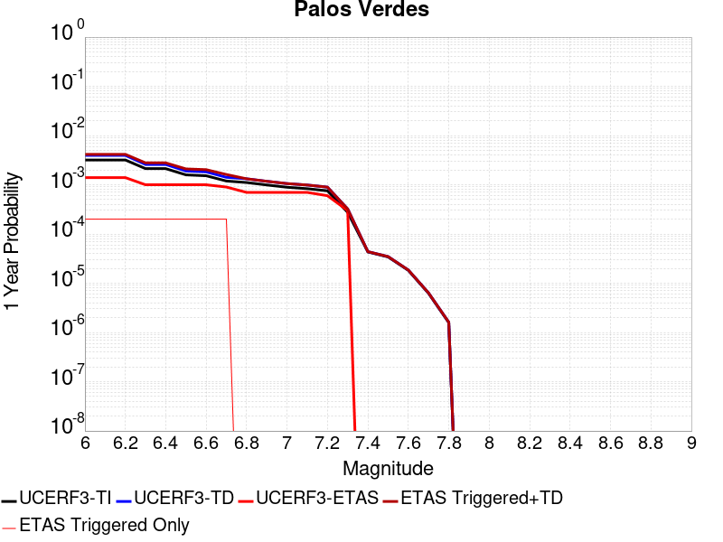 |  |

| Magnitude | 1 wk TI Prob | 1 wk TD Prob | 1 wk ETAS Prob | 1 wk ETAS/TD Gain | 1 wk ETAS Triggered+TD | 1 wk ETAS Triggered Only | 1 mo TI Prob | 1 mo TD Prob | 1 mo ETAS Prob | 1 mo ETAS/TD Gain | 1 mo ETAS Triggered+TD | 1 mo ETAS Triggered Only | 1 yr TI Prob | 1 yr TD Prob | 1 yr ETAS Prob | 1 yr ETAS/TD Gain | 1 yr ETAS Triggered+TD | 1 yr ETAS Triggered Only | 10 yr TI Prob | 10 yr TD Prob | 10 yr ETAS Prob | 10 yr ETAS/TD Gain | 10 yr ETAS Triggered+TD | 10 yr ETAS Triggered Only |
|-----|-----|-----|-----|-----|-----|-----|-----|-----|-----|-----|-----|-----|-----|-----|-----|-----|-----|-----|-----|-----|-----|-----|-----|-----|
| 6.0 | 6.126063E-5 | 7.6033015E-5 | 0.0 | 0.0 | 7.6033015E-5 | 0.0 | 2.6251914E-4 | 3.258184E-4 | 3.0E-4 | 0.9207583 | 3.258184E-4 | 0.0 | 0.0031914865 | 0.003960153 | 0.0014 | 0.3535217 | 0.0041593607 | 2.0E-4 | 0.031460393 | 0.038952567 | 0.0183 | 0.46980217 | 0.043181177 | 0.0044 |
| 6.1 | 6.126063E-5 | 7.6033015E-5 | 0.0 | 0.0 | 7.6033015E-5 | 0.0 | 2.6251914E-4 | 3.258184E-4 | 3.0E-4 | 0.9207583 | 3.258184E-4 | 0.0 | 0.0031914865 | 0.003960153 | 0.0014 | 0.3535217 | 0.0041593607 | 2.0E-4 | 0.031460393 | 0.038952567 | 0.0183 | 0.46980217 | 0.043181177 | 0.0044 |
| 6.2 | 6.126063E-5 | 7.6033015E-5 | 0.0 | 0.0 | 7.6033015E-5 | 0.0 | 2.6251914E-4 | 3.258184E-4 | 3.0E-4 | 0.9207583 | 3.258184E-4 | 0.0 | 0.0031914865 | 0.003960153 | 0.0014 | 0.3535217 | 0.0041593607 | 2.0E-4 | 0.031460393 | 0.038952567 | 0.0183 | 0.46980217 | 0.043181177 | 0.0044 |
| 6.3 | 4.0838047E-5 | 4.9635695E-5 | 0.0 | 0.0 | 4.9635695E-5 | 0.0 | 1.7500846E-4 | 2.1270833E-4 | 2.0E-4 | 0.9402547 | 2.1270833E-4 | 0.0 | 0.0021286458 | 0.0025868537 | 0.001 | 0.38657 | 0.0027863362 | 2.0E-4 | 0.021083709 | 0.025589142 | 0.0128 | 0.50021213 | 0.028512375 | 0.003 |
| 6.4 | 4.0838047E-5 | 4.9635695E-5 | 0.0 | 0.0 | 4.9635695E-5 | 0.0 | 1.7500846E-4 | 2.1270833E-4 | 2.0E-4 | 0.9402547 | 2.1270833E-4 | 0.0 | 0.0021286458 | 0.0025868537 | 0.001 | 0.38657 | 0.0027863362 | 2.0E-4 | 0.021083709 | 0.025589142 | 0.0128 | 0.50021213 | 0.028512375 | 0.003 |
| 6.5 | 3.0512005E-5 | 3.6485533E-5 | 0.0 | 0.0 | 3.6485533E-5 | 0.0 | 1.3075917E-4 | 1.5635787E-4 | 2.0E-4 | 1.2791169 | 1.5635787E-4 | 0.0 | 0.0015908304 | 0.001902111 | 0.001 | 0.5257317 | 0.0021017306 | 2.0E-4 | 0.015794903 | 0.01887022 | 0.0091 | 0.48224133 | 0.021126818 | 0.0023 |
| 6.6 | 2.9255087E-5 | 3.5080087E-5 | 0.0 | 0.0 | 3.5080087E-5 | 0.0 | 1.2537291E-4 | 1.5033523E-4 | 2.0E-4 | 1.3303603 | 1.5033523E-4 | 0.0 | 0.0015253464 | 0.0018289083 | 0.001 | 0.54677427 | 0.0020285426 | 2.0E-4 | 0.015149189 | 0.018150162 | 0.0089 | 0.49035373 | 0.020310232 | 0.0022 |
| 6.7 | 2.287198E-5 | 2.71935E-5 | 0.0 | 0.0 | 2.71935E-5 | 0.0 | 9.801909E-5 | 1.1653888E-4 | 2.0E-4 | 1.7161654 | 1.1653888E-4 | 0.0 | 0.001192729 | 0.0014180287 | 9.0E-4 | 0.6346839 | 0.0016177451 | 2.0E-4 | 0.011863477 | 0.014098996 | 0.0073 | 0.51776737 | 0.015972208 | 0.0019 |
| 6.8 | 2.1325764E-5 | 2.538045E-5 | 0.0 | 0.0 | 2.538045E-5 | 0.0 | 9.139293E-5 | 1.0876933E-4 | 2.0E-4 | 1.8387537 | 1.0876933E-4 | 0.0 | 0.001112141 | 0.001323552 | 7.0E-4 | 0.5288799 | 0.001323552 | 0.0 | 0.011065915 | 0.013165689 | 0.0067 | 0.50889856 | 0.014843307 | 0.0017 |
| 6.9 | 1.9009392E-5 | 2.2568487E-5 | 0.0 | 0.0 | 2.2568487E-5 | 0.0 | 8.1466285E-5 | 9.671899E-5 | 2.0E-4 | 2.0678463 | 9.671899E-5 | 0.0 | 9.914007E-4 | 0.0011770045 | 7.0E-4 | 0.5947301 | 0.0011770045 | 0.0 | 0.009869894 | 0.011716356 | 0.0059 | 0.50356954 | 0.013099953 | 0.0014 |
| 7.0 | 1.7098473E-5 | 2.027909E-5 | 0.0 | 0.0 | 2.027909E-5 | 0.0 | 7.3277115E-5 | 8.6907974E-5 | 2.0E-4 | 2.3012848 | 8.6907974E-5 | 0.0 | 8.917837E-4 | 0.0010576758 | 7.0E-4 | 0.6618285 | 0.0010576758 | 0.0 | 0.008882134 | 0.010534819 | 0.0056 | 0.5315706 | 0.011821124 | 0.0013 |
| 7.1 | 1.5982785E-5 | 1.89571E-5 | 0.0 | 0.0 | 1.89571E-5 | 0.0 | 6.849585E-5 | 8.1242666E-5 | 2.0E-4 | 2.4617608 | 8.1242666E-5 | 0.0 | 8.336179E-4 | 9.887649E-4 | 7.0E-4 | 0.70795393 | 9.887649E-4 | 0.0 | 0.008304977 | 0.009851984 | 0.0053 | 0.53796273 | 0.011139177 | 0.0013 |
| 7.2 | 1.4468002E-5 | 1.716309E-5 | 0.0 | 0.0 | 1.716309E-5 | 0.0 | 6.200425E-5 | 7.3554496E-5 | 1.0E-4 | 1.3595362 | 7.3554496E-5 | 0.0 | 7.546402E-4 | 8.9524174E-4 | 6.0E-4 | 0.67021006 | 8.9524174E-4 | 0.0 | 0.007520827 | 0.008924588 | 0.0045 | 0.504225 | 0.010113878 | 0.0012 |
| 7.3 | 5.288233E-6 | 6.192199E-6 | 0.0 | 0.0 | 6.192199E-6 | 0.0 | 2.2663658E-5 | 2.6537922E-5 | 0.0 | 0.0 | 2.6537922E-5 | 0.0 | 2.7589512E-4 | 3.2308605E-4 | 3.0E-4 | 0.9285452 | 3.2308605E-4 | 0.0 | 0.0027555283 | 0.0032295715 | 0.0014 | 0.43349406 | 0.0038276338 | 6.0E-4 |
| 7.4 | 8.279556E-7 | 8.406981E-7 | 0.0 | 0.0 | 8.406981E-7 | 0.0 | 3.5483763E-6 | 3.6029871E-6 | 0.0 | 0.0 | 3.6029871E-6 | 0.0 | 4.3200624E-5 | 4.386556E-5 | 0.0 | 0.0 | 4.386556E-5 | 0.0 | 4.3192226E-4 | 4.3857621E-4 | 2.0E-4 | 0.45602107 | 5.385324E-4 | 1.0E-4 |
| 7.5 | 6.559831E-7 | 6.666089E-7 | 0.0 | 0.0 | 6.666089E-7 | 0.0 | 2.8113532E-6 | 2.8568925E-6 | 0.0 | 0.0 | 2.8568925E-6 | 0.0 | 3.4227687E-5 | 3.478218E-5 | 0.0 | 0.0 | 3.478218E-5 | 0.0 | 3.4222414E-4 | 3.4777398E-4 | 2.0E-4 | 0.5750862 | 4.477392E-4 | 1.0E-4 |
| 7.6 | 3.5018968E-7 | 3.5613644E-7 | 0.0 | 0.0 | 3.5613644E-7 | 0.0 | 1.500812E-6 | 1.5262984E-6 | 0.0 | 0.0 | 1.5262984E-6 | 0.0 | 1.8272232E-5 | 1.8582572E-5 | 0.0 | 0.0 | 1.8582572E-5 | 0.0 | 1.8270731E-4 | 1.8581477E-4 | 0.0 | 0.0 | 1.8581477E-4 | 0.0 |
| 7.7 | 1.1986104E-7 | 1.2196121E-7 | 0.0 | 0.0 | 1.2196121E-7 | 0.0 | 5.1369005E-7 | 5.226908E-7 | 0.0 | 0.0 | 5.226908E-7 | 0.0 | 6.2541585E-6 | 6.363742E-6 | 0.0 | 0.0 | 6.363742E-6 | 0.0 | 6.2539824E-5 | 6.363564E-5 | 0.0 | 0.0 | 6.363564E-5 | 0.0 |
| 7.8 | 3.0445005E-8 | 3.1021386E-8 | 0.0 | 0.0 | 3.1021386E-8 | 0.0 | 1.3047858E-7 | 1.3294878E-7 | 0.0 | 0.0 | 1.3294878E-7 | 0.0 | 1.5885756E-6 | 1.6186506E-6 | 0.0 | 0.0 | 1.6186506E-6 | 0.0 | 1.5885644E-5 | 1.6186408E-5 | 0.0 | 0.0 | 1.6186408E-5 | 0.0 |

## Mount Diablo Thrust South
*[(top)](#table-of-contents)*

| 1 Week | 1 Month | 1 Year | 10 Year |
|-----|-----|-----|-----|
|  |  | 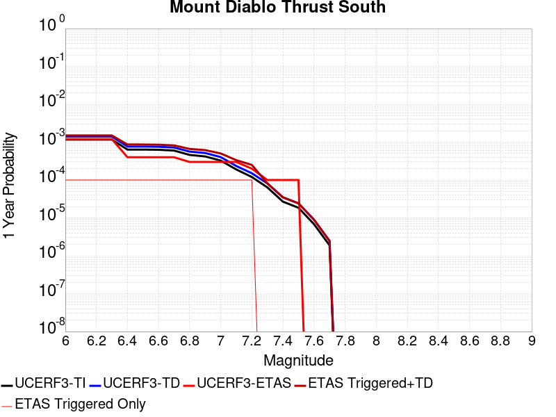 |  |

| Magnitude | 1 wk TI Prob | 1 wk TD Prob | 1 wk ETAS Prob | 1 wk ETAS/TD Gain | 1 wk ETAS Triggered+TD | 1 wk ETAS Triggered Only | 1 mo TI Prob | 1 mo TD Prob | 1 mo ETAS Prob | 1 mo ETAS/TD Gain | 1 mo ETAS Triggered+TD | 1 mo ETAS Triggered Only | 1 yr TI Prob | 1 yr TD Prob | 1 yr ETAS Prob | 1 yr ETAS/TD Gain | 1 yr ETAS Triggered+TD | 1 yr ETAS Triggered Only | 10 yr TI Prob | 10 yr TD Prob | 10 yr ETAS Prob | 10 yr ETAS/TD Gain | 10 yr ETAS Triggered+TD | 10 yr ETAS Triggered Only |
|-----|-----|-----|-----|-----|-----|-----|-----|-----|-----|-----|-----|-----|-----|-----|-----|-----|-----|-----|-----|-----|-----|-----|-----|-----|
| 6.0 | 2.2377444E-5 | 2.6891565E-5 | 0.0 | 0.0 | 2.6891565E-5 | 0.0 | 9.5899806E-5 | 1.1524554E-4 | 1.0E-4 | 0.86771256 | 1.1524554E-4 | 0.0 | 0.0011669548 | 0.0014024085 | 0.0012 | 0.8556708 | 0.0015022682 | 1.0E-4 | 0.011608457 | 0.013955617 | 0.0109 | 0.7810475 | 0.018195609 | 0.0043 |
| 6.1 | 2.2377444E-5 | 2.6891565E-5 | 0.0 | 0.0 | 2.6891565E-5 | 0.0 | 9.5899806E-5 | 1.1524554E-4 | 1.0E-4 | 0.86771256 | 1.1524554E-4 | 0.0 | 0.0011669548 | 0.0014024085 | 0.0012 | 0.8556708 | 0.0015022682 | 1.0E-4 | 0.011608457 | 0.013955617 | 0.0109 | 0.7810475 | 0.018195609 | 0.0043 |
| 6.2 | 2.2377444E-5 | 2.6891565E-5 | 0.0 | 0.0 | 2.6891565E-5 | 0.0 | 9.5899806E-5 | 1.1524554E-4 | 1.0E-4 | 0.86771256 | 1.1524554E-4 | 0.0 | 0.0011669548 | 0.0014024085 | 0.0012 | 0.8556708 | 0.0015022682 | 1.0E-4 | 0.011608457 | 0.013955617 | 0.0109 | 0.7810475 | 0.018195609 | 0.0043 |
| 6.3 | 2.2377444E-5 | 2.6891565E-5 | 0.0 | 0.0 | 2.6891565E-5 | 0.0 | 9.5899806E-5 | 1.1524554E-4 | 1.0E-4 | 0.86771256 | 1.1524554E-4 | 0.0 | 0.0011669548 | 0.0014024085 | 0.0012 | 0.8556708 | 0.0015022682 | 1.0E-4 | 0.011608457 | 0.013955617 | 0.0109 | 0.7810475 | 0.018195609 | 0.0043 |
| 6.4 | 1.2228463E-5 | 1.4708772E-5 | 0.0 | 0.0 | 1.4708772E-5 | 0.0 | 5.2406645E-5 | 6.303615E-5 | 0.0 | 0.0 | 6.303615E-5 | 0.0 | 6.378641E-4 | 7.672076E-4 | 4.0E-4 | 0.52137125 | 8.671309E-4 | 1.0E-4 | 0.0063603627 | 0.007647469 | 0.0038 | 0.49689642 | 0.008739057 | 0.0011 |
| 6.5 | 1.2228463E-5 | 1.4708772E-5 | 0.0 | 0.0 | 1.4708772E-5 | 0.0 | 5.2406645E-5 | 6.303615E-5 | 0.0 | 0.0 | 6.303615E-5 | 0.0 | 6.378641E-4 | 7.672076E-4 | 4.0E-4 | 0.52137125 | 8.671309E-4 | 1.0E-4 | 0.0063603627 | 0.007647469 | 0.0038 | 0.49689642 | 0.008739057 | 0.0011 |
| 6.6 | 1.2068118E-5 | 1.4514011E-5 | 0.0 | 0.0 | 1.4514011E-5 | 0.0 | 5.1719482E-5 | 6.220149E-5 | 0.0 | 0.0 | 6.220149E-5 | 0.0 | 6.2950276E-4 | 7.570528E-4 | 4.0E-4 | 0.5283647 | 8.5697713E-4 | 1.0E-4 | 0.006277225 | 0.007546615 | 0.0038 | 0.503537 | 0.008638314 | 0.0011 |
| 6.7 | 1.1499428E-5 | 1.3838028E-5 | 0.0 | 0.0 | 1.3838028E-5 | 0.0 | 4.9282335E-5 | 5.930456E-5 | 0.0 | 0.0 | 5.930456E-5 | 0.0 | 5.9984723E-4 | 7.218065E-4 | 4.0E-4 | 0.5541651 | 8.217343E-4 | 1.0E-4 | 0.0059823063 | 0.007196482 | 0.0038 | 0.52803576 | 0.008288566 | 0.0011 |
| 6.8 | 8.82118E-6 | 1.0797723E-5 | 0.0 | 0.0 | 1.0797723E-5 | 0.0 | 3.780451E-5 | 4.6275163E-5 | 0.0 | 0.0 | 4.6275163E-5 | 0.0 | 4.601727E-4 | 5.6326005E-4 | 3.0E-4 | 0.5326137 | 6.632037E-4 | 1.0E-4 | 0.0045922096 | 0.00561947 | 0.0026 | 0.46267706 | 0.0063155363 | 7.0E-4 |
| 6.9 | 8.047112E-6 | 9.908106E-6 | 0.0 | 0.0 | 9.908106E-6 | 0.0 | 3.4487166E-5 | 4.246265E-5 | 0.0 | 0.0 | 4.246265E-5 | 0.0 | 4.1980037E-4 | 5.1686534E-4 | 3.0E-4 | 0.5804219 | 6.1681366E-4 | 1.0E-4 | 0.004190082 | 0.005157742 | 0.0024 | 0.4653199 | 0.0058541317 | 7.0E-4 |
| 7.0 | 6.2574763E-6 | 7.73202E-6 | 0.0 | 0.0 | 7.73202E-6 | 0.0 | 2.681748E-5 | 3.313683E-5 | 0.0 | 0.0 | 3.313683E-5 | 0.0 | 3.264539E-4 | 4.0336986E-4 | 3.0E-4 | 0.74373424 | 5.0332956E-4 | 1.0E-4 | 0.0032597475 | 0.004027368 | 0.0018 | 0.446942 | 0.0045253546 | 5.0E-4 |
| 7.1 | 3.6485903E-6 | 4.5020347E-6 | 0.0 | 0.0 | 4.5020347E-6 | 0.0 | 1.5636722E-5 | 1.9294295E-5 | 0.0 | 0.0 | 1.9294295E-5 | 0.0 | 1.9036046E-4 | 2.3488312E-4 | 3.0E-4 | 1.277231 | 3.3485962E-4 | 1.0E-4 | 0.0019019748 | 0.0023466544 | 0.0013 | 0.5539802 | 0.0026459503 | 3.0E-4 |
| 7.2 | 2.3034274E-6 | 2.8973452E-6 | 0.0 | 0.0 | 2.8973452E-6 | 0.0 | 9.871795E-6 | 1.2417136E-5 | 0.0 | 0.0 | 1.2417136E-5 | 0.0 | 1.2018247E-4 | 1.5116838E-4 | 2.0E-4 | 1.323028 | 2.5115325E-4 | 1.0E-4 | 0.0012011749 | 0.0015108308 | 8.0E-4 | 0.52951 | 0.0017105286 | 2.0E-4 |
| 7.3 | 1.224035E-6 | 1.5621736E-6 | 0.0 | 0.0 | 1.5621736E-6 | 0.0 | 5.245854E-6 | 6.695013E-6 | 0.0 | 0.0 | 6.695013E-6 | 0.0 | 6.38664E-5 | 8.150884E-5 | 1.0E-4 | 1.2268608 | 8.150884E-5 | 0.0 | 6.384805E-4 | 8.14873E-4 | 5.0E-4 | 0.6135925 | 9.1479154E-4 | 1.0E-4 |
| 7.4 | 5.1601154E-7 | 6.7047233E-7 | 0.0 | 0.0 | 6.7047233E-7 | 0.0 | 2.2114762E-6 | 2.8734498E-6 | 0.0 | 0.0 | 2.8734498E-6 | 0.0 | 2.6924388E-5 | 3.4983706E-5 | 1.0E-4 | 2.8584735 | 3.4983706E-5 | 0.0 | 2.6921128E-4 | 3.4979658E-4 | 1.0E-4 | 0.28588045 | 3.4979658E-4 | 0.0 |
| 7.5 | 3.552894E-7 | 4.6502333E-7 | 0.0 | 0.0 | 4.6502333E-7 | 0.0 | 1.5226678E-6 | 1.9929557E-6 | 0.0 | 0.0 | 1.9929557E-6 | 0.0 | 1.8538323E-5 | 2.426398E-5 | 1.0E-4 | 4.1213355 | 2.426398E-5 | 0.0 | 1.8536777E-4 | 2.4257129E-4 | 1.0E-4 | 0.41224992 | 2.4257129E-4 | 0.0 |
| 7.6 | 1.3124082E-7 | 1.7187479E-7 | 0.0 | 0.0 | 1.7187479E-7 | 0.0 | 5.6246057E-7 | 7.3660607E-7 | 0.0 | 0.0 | 7.3660607E-7 | 0.0 | 6.8479358E-6 | 8.968151E-6 | 0.0 | 0.0 | 8.968151E-6 | 0.0 | 6.8477246E-5 | 8.96526E-5 | 0.0 | 0.0 | 8.96526E-5 | 0.0 |
| 7.7 | 3.6193022E-8 | 4.7321272E-8 | 0.0 | 0.0 | 4.7321272E-8 | 0.0 | 1.5511293E-7 | 2.0280545E-7 | 0.0 | 0.0 | 2.0280545E-7 | 0.0 | 1.8884983E-6 | 2.4691547E-6 | 0.0 | 0.0 | 2.4691547E-6 | 0.0 | 1.8884823E-5 | 2.4696754E-5 | 0.0 | 0.0 | 2.4696754E-5 | 0.0 |

## Little Salmon (Onshore)
*[(top)](#table-of-contents)*

| 1 Week | 1 Month | 1 Year | 10 Year |
|-----|-----|-----|-----|
|  | 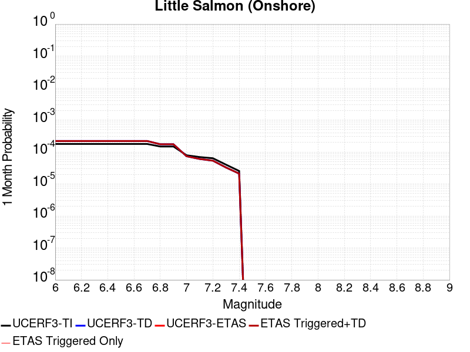 | 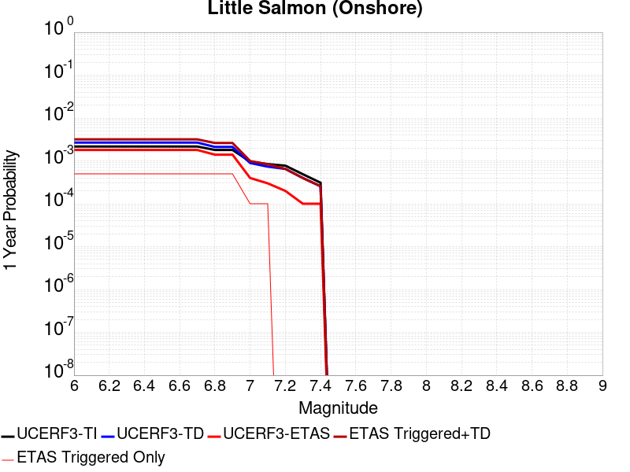 |  |

| Magnitude | 1 wk TI Prob | 1 wk TD Prob | 1 wk ETAS Prob | 1 wk ETAS/TD Gain | 1 wk ETAS Triggered+TD | 1 wk ETAS Triggered Only | 1 mo TI Prob | 1 mo TD Prob | 1 mo ETAS Prob | 1 mo ETAS/TD Gain | 1 mo ETAS Triggered+TD | 1 mo ETAS Triggered Only | 1 yr TI Prob | 1 yr TD Prob | 1 yr ETAS Prob | 1 yr ETAS/TD Gain | 1 yr ETAS Triggered+TD | 1 yr ETAS Triggered Only | 10 yr TI Prob | 10 yr TD Prob | 10 yr ETAS Prob | 10 yr ETAS/TD Gain | 10 yr ETAS Triggered+TD | 10 yr ETAS Triggered Only |
|-----|-----|-----|-----|-----|-----|-----|-----|-----|-----|-----|-----|-----|-----|-----|-----|-----|-----|-----|-----|-----|-----|-----|-----|-----|
| 6.0 | 4.1582247E-5 | 5.143167E-5 | 0.0 | 0.0 | 5.143167E-5 | 0.0 | 1.7819746E-4 | 2.2040741E-4 | 0.0 | 0.0 | 2.2040741E-4 | 0.0 | 0.0021673953 | 0.002680972 | 0.0018 | 0.6713983 | 0.0031796314 | 5.0E-4 | 0.021463778 | 0.026835978 | 0.0176 | 0.655836 | 0.031020584 | 0.0043 |
| 6.1 | 4.1582247E-5 | 5.143167E-5 | 0.0 | 0.0 | 5.143167E-5 | 0.0 | 1.7819746E-4 | 2.2040741E-4 | 0.0 | 0.0 | 2.2040741E-4 | 0.0 | 0.0021673953 | 0.002680972 | 0.0018 | 0.6713983 | 0.0031796314 | 5.0E-4 | 0.021463778 | 0.026835978 | 0.0176 | 0.655836 | 0.031020584 | 0.0043 |
| 6.2 | 4.1582247E-5 | 5.143167E-5 | 0.0 | 0.0 | 5.143167E-5 | 0.0 | 1.7819746E-4 | 2.2040741E-4 | 0.0 | 0.0 | 2.2040741E-4 | 0.0 | 0.0021673953 | 0.002680972 | 0.0018 | 0.6713983 | 0.0031796314 | 5.0E-4 | 0.021463778 | 0.026835978 | 0.0176 | 0.655836 | 0.031020584 | 0.0043 |
| 6.3 | 4.1582247E-5 | 5.143167E-5 | 0.0 | 0.0 | 5.143167E-5 | 0.0 | 1.7819746E-4 | 2.2040741E-4 | 0.0 | 0.0 | 2.2040741E-4 | 0.0 | 0.0021673953 | 0.002680972 | 0.0018 | 0.6713983 | 0.0031796314 | 5.0E-4 | 0.021463778 | 0.026835978 | 0.0176 | 0.655836 | 0.031020584 | 0.0043 |
| 6.4 | 4.1582247E-5 | 5.143167E-5 | 0.0 | 0.0 | 5.143167E-5 | 0.0 | 1.7819746E-4 | 2.2040741E-4 | 0.0 | 0.0 | 2.2040741E-4 | 0.0 | 0.0021673953 | 0.002680972 | 0.0018 | 0.6713983 | 0.0031796314 | 5.0E-4 | 0.021463778 | 0.026835978 | 0.0176 | 0.655836 | 0.031020584 | 0.0043 |
| 6.5 | 4.1582247E-5 | 5.143167E-5 | 0.0 | 0.0 | 5.143167E-5 | 0.0 | 1.7819746E-4 | 2.2040741E-4 | 0.0 | 0.0 | 2.2040741E-4 | 0.0 | 0.0021673953 | 0.002680972 | 0.0018 | 0.6713983 | 0.0031796314 | 5.0E-4 | 0.021463778 | 0.026835978 | 0.0176 | 0.655836 | 0.031020584 | 0.0043 |
| 6.6 | 4.1582247E-5 | 5.143167E-5 | 0.0 | 0.0 | 5.143167E-5 | 0.0 | 1.7819746E-4 | 2.2040741E-4 | 0.0 | 0.0 | 2.2040741E-4 | 0.0 | 0.0021673953 | 0.002680972 | 0.0018 | 0.6713983 | 0.0031796314 | 5.0E-4 | 0.021463778 | 0.026835978 | 0.0176 | 0.655836 | 0.031020584 | 0.0043 |
| 6.7 | 4.1582247E-5 | 5.143167E-5 | 0.0 | 0.0 | 5.143167E-5 | 0.0 | 1.7819746E-4 | 2.2040741E-4 | 0.0 | 0.0 | 2.2040741E-4 | 0.0 | 0.0021673953 | 0.002680972 | 0.0018 | 0.6713983 | 0.0031796314 | 5.0E-4 | 0.021463778 | 0.026835978 | 0.0176 | 0.655836 | 0.031020584 | 0.0043 |
| 6.8 | 3.4607925E-5 | 4.0632807E-5 | 0.0 | 0.0 | 4.0632807E-5 | 0.0 | 1.4831126E-4 | 1.7413315E-4 | 0.0 | 0.0 | 1.7413315E-4 | 0.0 | 0.001804194 | 0.0021187498 | 0.0014 | 0.660767 | 0.0026176905 | 5.0E-4 | 0.01789616 | 0.021293357 | 0.0133 | 0.6246079 | 0.024523089 | 0.0033 |
| 6.9 | 3.4607925E-5 | 4.0632807E-5 | 0.0 | 0.0 | 4.0632807E-5 | 0.0 | 1.4831126E-4 | 1.7413315E-4 | 0.0 | 0.0 | 1.7413315E-4 | 0.0 | 0.001804194 | 0.0021187498 | 0.0014 | 0.660767 | 0.0026176905 | 5.0E-4 | 0.01789616 | 0.021293357 | 0.0133 | 0.6246079 | 0.024523089 | 0.0033 |
| 7.0 | 1.8411014E-5 | 1.7161936E-5 | 0.0 | 0.0 | 1.7161936E-5 | 0.0 | 7.8901954E-5 | 7.3549374E-5 | 0.0 | 0.0 | 7.3549374E-5 | 0.0 | 9.6020795E-4 | 8.9514843E-4 | 4.0E-4 | 0.44685328 | 9.950589E-4 | 1.0E-4 | 0.009560696 | 0.008940588 | 0.0061 | 0.6822818 | 0.010526283 | 0.0016 |
| 7.1 | 1.6183103E-5 | 1.4098013E-5 | 0.0 | 0.0 | 1.4098013E-5 | 0.0 | 6.935431E-5 | 6.041892E-5 | 0.0 | 0.0 | 6.041892E-5 | 0.0 | 8.440616E-4 | 7.353988E-4 | 3.0E-4 | 0.4079419 | 8.353253E-4 | 1.0E-4 | 0.008408628 | 0.007354235 | 0.005 | 0.6798804 | 0.008644674 | 0.0013 |
| 7.2 | 1.4868988E-5 | 1.2485594E-5 | 0.0 | 0.0 | 1.2485594E-5 | 0.0 | 6.372268E-5 | 5.350884E-5 | 0.0 | 0.0 | 5.350884E-5 | 0.0 | 7.755474E-4 | 6.513198E-4 | 2.0E-4 | 0.30706882 | 6.513198E-4 | 0.0 | 0.0077284635 | 0.006518235 | 0.0045 | 0.6903709 | 0.007710413 | 0.0012 |
| 7.3 | 9.3599865E-6 | 7.63674E-6 | 0.0 | 0.0 | 7.63674E-6 | 0.0 | 4.011361E-5 | 3.2728673E-5 | 0.0 | 0.0 | 3.2728673E-5 | 0.0 | 4.8827377E-4 | 3.9843383E-4 | 1.0E-4 | 0.2509827 | 3.9843383E-4 | 0.0 | 0.004872023 | 0.0039928746 | 0.0025 | 0.6261153 | 0.00469008 | 7.0E-4 |
| 7.4 | 5.941556E-6 | 4.913584E-6 | 0.0 | 0.0 | 4.913584E-6 | 0.0 | 2.5463563E-5 | 2.1058217E-5 | 0.0 | 0.0 | 2.1058217E-5 | 0.0 | 3.0997477E-4 | 2.5638376E-4 | 1.0E-4 | 0.39004028 | 2.5638376E-4 | 0.0 | 0.0030954275 | 0.0025715034 | 0.0013 | 0.50554085 | 0.0030702178 | 5.0E-4 |

## Great Valley 05 Pittsburg - Kirby Hills alt1
*[(top)](#table-of-contents)*

| 1 Week | 1 Month | 1 Year | 10 Year |
|-----|-----|-----|-----|
| 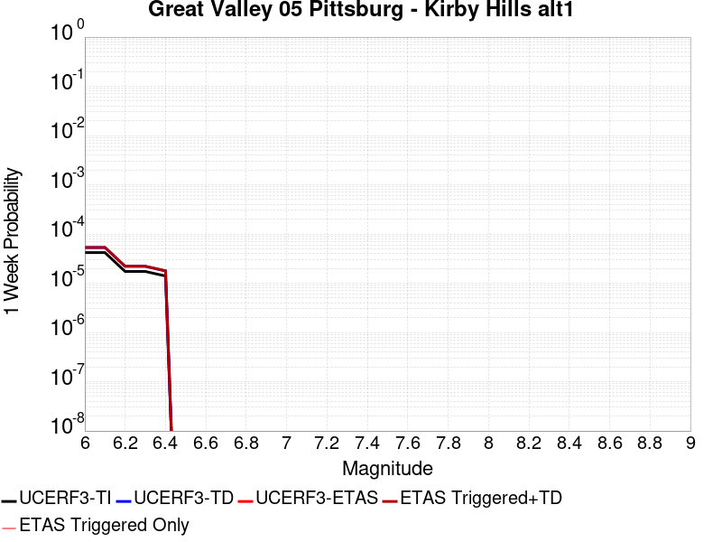 | 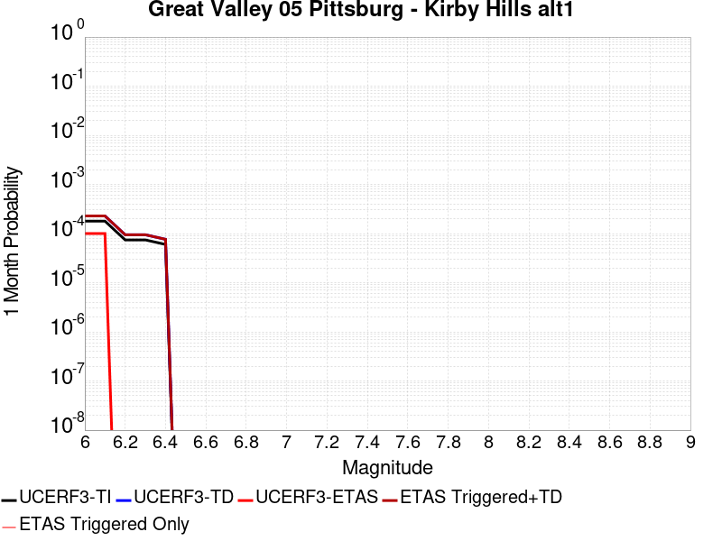 | 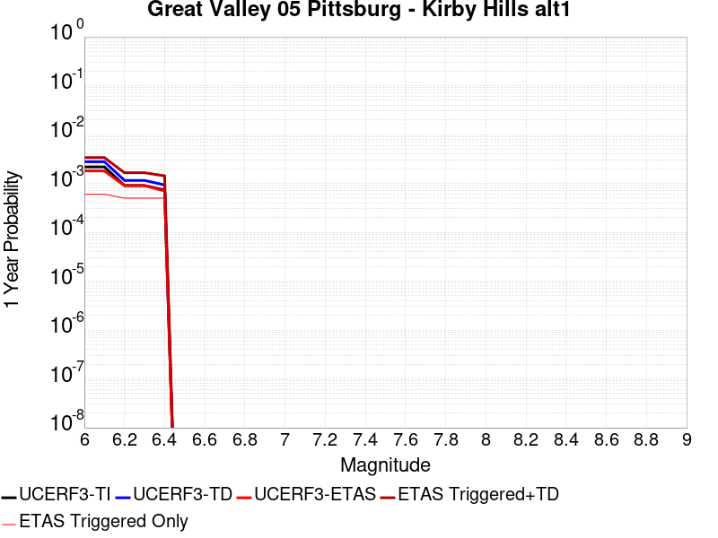 | 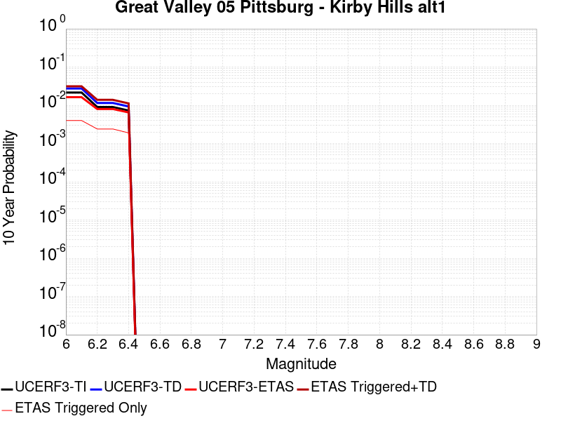 |

| Magnitude | 1 wk TI Prob | 1 wk TD Prob | 1 wk ETAS Prob | 1 wk ETAS/TD Gain | 1 wk ETAS Triggered+TD | 1 wk ETAS Triggered Only | 1 mo TI Prob | 1 mo TD Prob | 1 mo ETAS Prob | 1 mo ETAS/TD Gain | 1 mo ETAS Triggered+TD | 1 mo ETAS Triggered Only | 1 yr TI Prob | 1 yr TD Prob | 1 yr ETAS Prob | 1 yr ETAS/TD Gain | 1 yr ETAS Triggered+TD | 1 yr ETAS Triggered Only | 10 yr TI Prob | 10 yr TD Prob | 10 yr ETAS Prob | 10 yr ETAS/TD Gain | 10 yr ETAS Triggered+TD | 10 yr ETAS Triggered Only |
|-----|-----|-----|-----|-----|-----|-----|-----|-----|-----|-----|-----|-----|-----|-----|-----|-----|-----|-----|-----|-----|-----|-----|-----|-----|
| 6.0 | 4.187212E-5 | 5.3292064E-5 | 0.0 | 0.0 | 5.3292064E-5 | 0.0 | 1.794396E-4 | 2.2838028E-4 | 1.0E-4 | 0.43786618 | 2.2838028E-4 | 0.0 | 0.002182488 | 0.0027779457 | 0.0018 | 0.64796084 | 0.003376279 | 6.0E-4 | 0.021611776 | 0.027526524 | 0.0163 | 0.5921561 | 0.031416416 | 0.004 |
| 6.1 | 4.187212E-5 | 5.3292064E-5 | 0.0 | 0.0 | 5.3292064E-5 | 0.0 | 1.794396E-4 | 2.2838028E-4 | 1.0E-4 | 0.43786618 | 2.2838028E-4 | 0.0 | 0.002182488 | 0.0027779457 | 0.0018 | 0.64796084 | 0.003376279 | 6.0E-4 | 0.021611776 | 0.027526524 | 0.0163 | 0.5921561 | 0.031416416 | 0.004 |
| 6.2 | 1.7353306E-5 | 2.2091923E-5 | 0.0 | 0.0 | 2.2091923E-5 | 0.0 | 7.436919E-5 | 9.467852E-5 | 0.0 | 0.0 | 9.467852E-5 | 0.0 | 9.050688E-4 | 0.0011524927 | 9.0E-4 | 0.780916 | 0.0016519165 | 5.0E-4 | 0.009013915 | 0.011502856 | 0.008 | 0.69547945 | 0.013875249 | 0.0024 |
| 6.3 | 1.7353306E-5 | 2.2091923E-5 | 0.0 | 0.0 | 2.2091923E-5 | 0.0 | 7.436919E-5 | 9.467852E-5 | 0.0 | 0.0 | 9.467852E-5 | 0.0 | 9.050688E-4 | 0.0011524927 | 9.0E-4 | 0.780916 | 0.0016519165 | 5.0E-4 | 0.009013915 | 0.011502856 | 0.008 | 0.69547945 | 0.013875249 | 0.0024 |
| 6.4 | 1.4028824E-5 | 1.7850445E-5 | 0.0 | 0.0 | 1.7850445E-5 | 0.0 | 6.0122147E-5 | 7.650191E-5 | 0.0 | 0.0 | 7.650191E-5 | 0.0 | 7.3174125E-4 | 9.3139714E-4 | 7.0E-4 | 0.7515591 | 0.0014309314 | 5.0E-4 | 0.0072933645 | 0.009312032 | 0.0065 | 0.69802165 | 0.011194339 | 0.0019 |

## Surprise Valley 2011 CFM
*[(top)](#table-of-contents)*

| 1 Week | 1 Month | 1 Year | 10 Year |
|-----|-----|-----|-----|
|  |  |  |  |

| Magnitude | 1 wk TI Prob | 1 wk TD Prob | 1 wk ETAS Prob | 1 wk ETAS/TD Gain | 1 wk ETAS Triggered+TD | 1 wk ETAS Triggered Only | 1 mo TI Prob | 1 mo TD Prob | 1 mo ETAS Prob | 1 mo ETAS/TD Gain | 1 mo ETAS Triggered+TD | 1 mo ETAS Triggered Only | 1 yr TI Prob | 1 yr TD Prob | 1 yr ETAS Prob | 1 yr ETAS/TD Gain | 1 yr ETAS Triggered+TD | 1 yr ETAS Triggered Only | 10 yr TI Prob | 10 yr TD Prob | 10 yr ETAS Prob | 10 yr ETAS/TD Gain | 10 yr ETAS Triggered+TD | 10 yr ETAS Triggered Only |
|-----|-----|-----|-----|-----|-----|-----|-----|-----|-----|-----|-----|-----|-----|-----|-----|-----|-----|-----|-----|-----|-----|-----|-----|-----|
| 6.0 | 4.0396248E-5 | 4.479939E-5 | 0.0 | 0.0 | 4.479939E-5 | 0.0 | 1.7311527E-4 | 1.9198445E-4 | 0.0 | 0.0 | 1.9198445E-4 | 0.0 | 0.002105641 | 0.0023351142 | 0.0012 | 0.5138935 | 0.00273418 | 4.0E-4 | 0.020858008 | 0.023127439 | 0.0125 | 0.54048353 | 0.026253432 | 0.0032 |
| 6.1 | 4.0396248E-5 | 4.479939E-5 | 0.0 | 0.0 | 4.479939E-5 | 0.0 | 1.7311527E-4 | 1.9198445E-4 | 0.0 | 0.0 | 1.9198445E-4 | 0.0 | 0.002105641 | 0.0023351142 | 0.0012 | 0.5138935 | 0.00273418 | 4.0E-4 | 0.020858008 | 0.023127439 | 0.0125 | 0.54048353 | 0.026253432 | 0.0032 |
| 6.2 | 2.2295266E-5 | 2.4377101E-5 | 0.0 | 0.0 | 2.4377101E-5 | 0.0 | 9.554764E-5 | 1.0446928E-4 | 0.0 | 0.0 | 1.0446928E-4 | 0.0 | 0.0011626717 | 0.0012712021 | 6.0E-4 | 0.4719942 | 0.0015708207 | 3.0E-4 | 0.011566074 | 0.012642533 | 0.0067 | 0.5299571 | 0.0145185115 | 0.0019 |
| 6.3 | 1.572643E-5 | 1.7081213E-5 | 0.0 | 0.0 | 1.7081213E-5 | 0.0 | 6.7397246E-5 | 7.3203206E-5 | 0.0 | 0.0 | 7.3203206E-5 | 0.0 | 8.202525E-4 | 8.908951E-4 | 2.0E-4 | 0.22449332 | 9.90806E-4 | 1.0E-4 | 0.008172315 | 0.00887434 | 0.0048 | 0.54088527 | 0.010460141 | 0.0016 |
| 6.4 | 1.5714395E-5 | 1.7069036E-5 | 0.0 | 0.0 | 1.7069036E-5 | 0.0 | 6.734567E-5 | 7.315102E-5 | 0.0 | 0.0 | 7.315102E-5 | 0.0 | 8.1962504E-4 | 8.902603E-4 | 2.0E-4 | 0.22465341 | 9.901712E-4 | 1.0E-4 | 0.008166086 | 0.008868042 | 0.0048 | 0.54126936 | 0.010453854 | 0.0016 |
| 6.5 | 1.2733495E-5 | 1.3789486E-5 | 0.0 | 0.0 | 1.3789486E-5 | 0.0 | 5.457098E-5 | 5.9096496E-5 | 0.0 | 0.0 | 5.9096496E-5 | 0.0 | 6.641992E-4 | 7.19269E-4 | 1.0E-4 | 0.13903005 | 8.1919704E-4 | 1.0E-4 | 0.0066221743 | 0.0071701026 | 0.0037 | 0.5160317 | 0.008560064 | 0.0014 |
| 6.6 | 1.0983784E-5 | 1.1876331E-5 | 0.0 | 0.0 | 1.1876331E-5 | 0.0 | 4.7072506E-5 | 5.0897597E-5 | 0.0 | 0.0 | 5.0897597E-5 | 0.0 | 5.7295704E-4 | 6.195074E-4 | 1.0E-4 | 0.16141857 | 7.1944547E-4 | 1.0E-4 | 0.0057148207 | 0.0061783525 | 0.0035 | 0.56649405 | 0.007569703 | 0.0014 |
| 6.7 | 9.104806E-6 | 9.831182E-6 | 0.0 | 0.0 | 9.831182E-6 | 0.0 | 3.902001E-5 | 4.213298E-5 | 0.0 | 0.0 | 4.213298E-5 | 0.0 | 4.7496508E-4 | 5.128522E-4 | 1.0E-4 | 0.19498795 | 6.128009E-4 | 1.0E-4 | 0.004739512 | 0.005117083 | 0.0032 | 0.6253563 | 0.0064104307 | 0.0013 |
| 6.8 | 6.2162403E-6 | 6.6986236E-6 | 0.0 | 0.0 | 6.6986236E-6 | 0.0 | 2.6640759E-5 | 2.8708082E-5 | 0.0 | 0.0 | 2.8708082E-5 | 0.0 | 3.2430296E-4 | 3.4946707E-4 | 1.0E-4 | 0.28614998 | 4.4943212E-4 | 1.0E-4 | 0.003238301 | 0.0034893982 | 0.0024 | 0.68779767 | 0.004685211 | 0.0012 |
| 6.9 | 4.1792696E-6 | 4.499571E-6 | 0.0 | 0.0 | 4.499571E-6 | 0.0 | 1.7911032E-5 | 1.9283741E-5 | 0.0 | 0.0 | 1.9283741E-5 | 0.0 | 2.1804498E-4 | 2.347558E-4 | 1.0E-4 | 0.42597458 | 3.3473232E-4 | 1.0E-4 | 0.0021783116 | 0.0023452311 | 0.0015 | 0.6395958 | 0.003143355 | 8.0E-4 |
| 7.0 | 2.7478413E-6 | 2.9598184E-6 | 0.0 | 0.0 | 2.9598184E-6 | 0.0 | 1.177641E-5 | 1.2684882E-5 | 0.0 | 0.0 | 1.2684882E-5 | 0.0 | 1.4336836E-4 | 1.5442874E-4 | 0.0 | 0.0 | 1.5442874E-4 | 0.0 | 0.001432759 | 0.0015433364 | 9.0E-4 | 0.5831522 | 0.0022422562 | 7.0E-4 |
| 7.1 | 8.128648E-7 | 8.718175E-7 | 0.0 | 0.0 | 8.718175E-7 | 0.0 | 3.4837017E-6 | 3.7363588E-6 | 0.0 | 0.0 | 3.7363588E-6 | 0.0 | 4.2413245E-5 | 4.5489818E-5 | 0.0 | 0.0 | 4.5489818E-5 | 0.0 | 4.2405148E-4 | 4.5486377E-4 | 4.0E-4 | 0.87938416 | 7.5472734E-4 | 3.0E-4 |
| 7.2 | 4.8641045E-8 | 4.9393996E-8 | 0.0 | 0.0 | 4.9393996E-8 | 0.0 | 2.084616E-7 | 2.1168853E-7 | 0.0 | 0.0 | 2.1168853E-7 | 0.0 | 2.538017E-6 | 2.577305E-6 | 0.0 | 0.0 | 2.577305E-6 | 0.0 | 2.537988E-5 | 2.5772762E-5 | 0.0 | 0.0 | 2.5772762E-5 | 0.0 |
| 7.3 | 5.3911844E-9 | 5.474917E-9 | 0.0 | 0.0 | 5.474917E-9 | 0.0 | 2.3105075E-8 | 2.346393E-8 | 0.0 | 0.0 | 2.346393E-8 | 0.0 | 2.8130427E-7 | 2.856733E-7 | 0.0 | 0.0 | 2.856733E-7 | 0.0 | 2.8130391E-6 | 2.856731E-6 | 0.0 | 0.0 | 2.856731E-6 | 0.0 |

## Keddie Ridge 2011 CFM
*[(top)](#table-of-contents)*

| 1 Week | 1 Month | 1 Year | 10 Year |
|-----|-----|-----|-----|
|  |  | 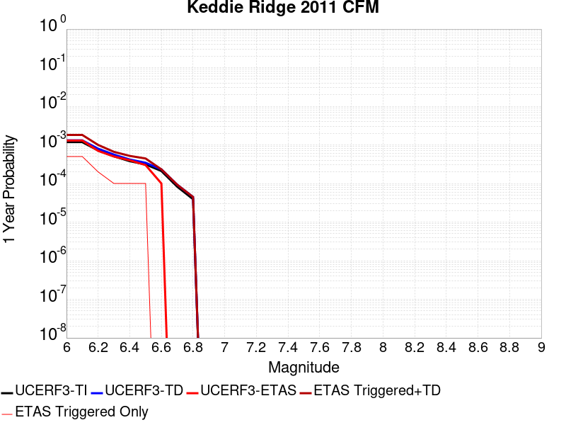 |  |

| Magnitude | 1 wk TI Prob | 1 wk TD Prob | 1 wk ETAS Prob | 1 wk ETAS/TD Gain | 1 wk ETAS Triggered+TD | 1 wk ETAS Triggered Only | 1 mo TI Prob | 1 mo TD Prob | 1 mo ETAS Prob | 1 mo ETAS/TD Gain | 1 mo ETAS Triggered+TD | 1 mo ETAS Triggered Only | 1 yr TI Prob | 1 yr TD Prob | 1 yr ETAS Prob | 1 yr ETAS/TD Gain | 1 yr ETAS Triggered+TD | 1 yr ETAS Triggered Only | 10 yr TI Prob | 10 yr TD Prob | 10 yr ETAS Prob | 10 yr ETAS/TD Gain | 10 yr ETAS Triggered+TD | 10 yr ETAS Triggered Only |
|-----|-----|-----|-----|-----|-----|-----|-----|-----|-----|-----|-----|-----|-----|-----|-----|-----|-----|-----|-----|-----|-----|-----|-----|-----|
| 6.0 | 2.2591947E-5 | 2.5158795E-5 | 0.0 | 0.0 | 2.5158795E-5 | 0.0 | 9.6819036E-5 | 1.078194E-4 | 1.0E-4 | 0.9274769 | 1.078194E-4 | 0.0 | 0.0011781343 | 0.0013119896 | 0.0013 | 0.99086154 | 0.0018113336 | 5.0E-4 | 0.011719079 | 0.013050364 | 0.01 | 0.7662621 | 0.017195553 | 0.0042 |
| 6.1 | 2.2591947E-5 | 2.5158795E-5 | 0.0 | 0.0 | 2.5158795E-5 | 0.0 | 9.6819036E-5 | 1.078194E-4 | 1.0E-4 | 0.9274769 | 1.078194E-4 | 0.0 | 0.0011781343 | 0.0013119896 | 0.0013 | 0.99086154 | 0.0018113336 | 5.0E-4 | 0.011719079 | 0.013050364 | 0.0084 | 0.6436602 | 0.016307298 | 0.0033 |
| 6.2 | 1.3775145E-5 | 1.5304711E-5 | 0.0 | 0.0 | 1.5304711E-5 | 0.0 | 5.9035E-5 | 6.559011E-5 | 1.0E-4 | 1.5246202 | 6.559011E-5 | 0.0 | 7.185141E-4 | 7.982911E-4 | 7.0E-4 | 0.8768731 | 9.981315E-4 | 2.0E-4 | 0.0071619535 | 0.007956649 | 0.0041 | 0.5152923 | 0.009147101 | 0.0012 |
| 6.3 | 9.705435E-6 | 1.07559135E-5 | 0.0 | 0.0 | 1.07559135E-5 | 0.0 | 4.1594063E-5 | 4.6096025E-5 | 1.0E-4 | 2.1693842 | 4.6096025E-5 | 0.0 | 5.0629E-4 | 5.61087E-4 | 5.0E-4 | 0.8911274 | 6.610309E-4 | 1.0E-4 | 0.005051381 | 0.005597932 | 0.0032 | 0.5716397 | 0.0063934536 | 8.0E-4 |
| 6.4 | 7.2549733E-6 | 8.018234E-6 | 0.0 | 0.0 | 8.018234E-6 | 0.0 | 3.109237E-5 | 3.4363453E-5 | 1.0E-4 | 2.9100685 | 3.4363453E-5 | 0.0 | 3.7848388E-4 | 4.183027E-4 | 4.0E-4 | 0.95624536 | 5.182609E-4 | 1.0E-4 | 0.003778399 | 0.004175939 | 0.0024 | 0.57472104 | 0.0047734333 | 6.0E-4 |
| 6.5 | 5.983293E-6 | 6.6056505E-6 | 0.0 | 0.0 | 6.6056505E-6 | 0.0 | 2.5642432E-5 | 2.8309662E-5 | 0.0 | 0.0 | 2.8309662E-5 | 0.0 | 3.1215188E-4 | 3.4462236E-4 | 3.0E-4 | 0.87051815 | 4.4458787E-4 | 1.0E-4 | 0.0031171376 | 0.0034415408 | 0.002 | 0.58113503 | 0.0040394757 | 6.0E-4 |
| 6.6 | 4.0336154E-6 | 4.4528106E-6 | 0.0 | 0.0 | 4.4528106E-6 | 0.0 | 1.728681E-5 | 1.9083356E-5 | 0.0 | 0.0 | 1.9083356E-5 | 0.0 | 2.1044657E-4 | 2.3231911E-4 | 1.0E-4 | 0.4304424 | 2.3231911E-4 | 0.0 | 0.002102474 | 0.002321158 | 0.0014 | 0.6031472 | 0.0028199975 | 5.0E-4 |
| 6.7 | 1.5832104E-6 | 1.7792295E-6 | 0.0 | 0.0 | 1.7792295E-6 | 0.0 | 6.7851697E-6 | 7.6252486E-6 | 0.0 | 0.0 | 7.6252486E-6 | 0.0 | 8.260631E-5 | 9.283372E-5 | 0.0 | 0.0 | 9.283372E-5 | 0.0 | 8.2575605E-4 | 9.27976E-4 | 8.0E-4 | 0.8620913 | 0.0011277904 | 2.0E-4 |
| 6.8 | 7.5177275E-7 | 8.5773416E-7 | 0.0 | 0.0 | 8.5773416E-7 | 0.0 | 3.221879E-6 | 3.6759993E-6 | 0.0 | 0.0 | 3.6759993E-6 | 0.0 | 3.9225673E-5 | 4.4754543E-5 | 0.0 | 0.0 | 4.4754543E-5 | 0.0 | 3.921875E-4 | 4.4747177E-4 | 4.0E-4 | 0.8939111 | 5.4742704E-4 | 1.0E-4 |

## Elysian Park (Upper)
*[(top)](#table-of-contents)*

| 1 Week | 1 Month | 1 Year | 10 Year |
|-----|-----|-----|-----|
|  | 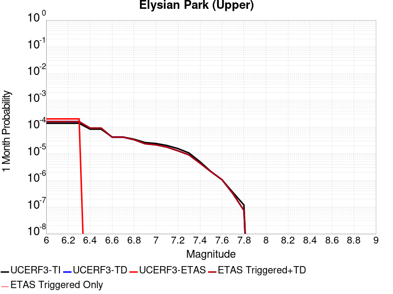 | 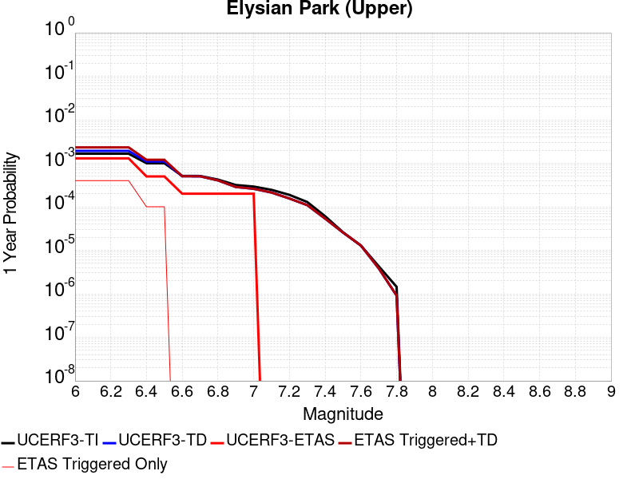 |  |

| Magnitude | 1 wk TI Prob | 1 wk TD Prob | 1 wk ETAS Prob | 1 wk ETAS/TD Gain | 1 wk ETAS Triggered+TD | 1 wk ETAS Triggered Only | 1 mo TI Prob | 1 mo TD Prob | 1 mo ETAS Prob | 1 mo ETAS/TD Gain | 1 mo ETAS Triggered+TD | 1 mo ETAS Triggered Only | 1 yr TI Prob | 1 yr TD Prob | 1 yr ETAS Prob | 1 yr ETAS/TD Gain | 1 yr ETAS Triggered+TD | 1 yr ETAS Triggered Only | 10 yr TI Prob | 10 yr TD Prob | 10 yr ETAS Prob | 10 yr ETAS/TD Gain | 10 yr ETAS Triggered+TD | 10 yr ETAS Triggered Only |
|-----|-----|-----|-----|-----|-----|-----|-----|-----|-----|-----|-----|-----|-----|-----|-----|-----|-----|-----|-----|-----|-----|-----|-----|-----|
| 6.0 | 3.1876025E-5 | 3.695651E-5 | 1.0E-4 | 2.7058833 | 3.695651E-5 | 0.0 | 1.3660437E-4 | 1.5837814E-4 | 2.0E-4 | 1.2628005 | 1.5837814E-4 | 0.0 | 0.0016618895 | 0.00192702 | 0.0013 | 0.67461675 | 0.0023262491 | 4.0E-4 | 0.016495159 | 0.019149423 | 0.0144 | 0.7519809 | 0.023072826 | 0.004 |
| 6.1 | 3.1876025E-5 | 3.695651E-5 | 1.0E-4 | 2.7058833 | 3.695651E-5 | 0.0 | 1.3660437E-4 | 1.5837814E-4 | 2.0E-4 | 1.2628005 | 1.5837814E-4 | 0.0 | 0.0016618895 | 0.00192702 | 0.0013 | 0.67461675 | 0.0023262491 | 4.0E-4 | 0.016495159 | 0.019149423 | 0.0144 | 0.7519809 | 0.023072826 | 0.004 |
| 6.2 | 3.1876025E-5 | 3.695651E-5 | 1.0E-4 | 2.7058833 | 3.695651E-5 | 0.0 | 1.3660437E-4 | 1.5837814E-4 | 2.0E-4 | 1.2628005 | 1.5837814E-4 | 0.0 | 0.0016618895 | 0.00192702 | 0.0013 | 0.67461675 | 0.0023262491 | 4.0E-4 | 0.016495159 | 0.019149423 | 0.0144 | 0.7519809 | 0.023072826 | 0.004 |
| 6.3 | 3.1876025E-5 | 3.695651E-5 | 1.0E-4 | 2.7058833 | 3.695651E-5 | 0.0 | 1.3660437E-4 | 1.5837814E-4 | 2.0E-4 | 1.2628005 | 1.5837814E-4 | 0.0 | 0.0016618895 | 0.00192702 | 0.0013 | 0.67461675 | 0.0023262491 | 4.0E-4 | 0.016495159 | 0.019149423 | 0.0144 | 0.7519809 | 0.023072826 | 0.004 |
| 6.4 | 1.9273462E-5 | 2.1165466E-5 | 0.0 | 0.0 | 2.1165466E-5 | 0.0 | 8.259794E-5 | 9.0706955E-5 | 0.0 | 0.0 | 9.0706955E-5 | 0.0 | 0.001005166 | 0.0011039685 | 5.0E-4 | 0.4529115 | 0.0012038581 | 1.0E-4 | 0.010006315 | 0.011001599 | 0.0079 | 0.7180774 | 0.012979596 | 0.002 |
| 6.5 | 1.9273462E-5 | 2.1165466E-5 | 0.0 | 0.0 | 2.1165466E-5 | 0.0 | 8.259794E-5 | 9.0706955E-5 | 0.0 | 0.0 | 9.0706955E-5 | 0.0 | 0.001005166 | 0.0011039685 | 5.0E-4 | 0.4529115 | 0.0012038581 | 1.0E-4 | 0.010006315 | 0.011001599 | 0.0079 | 0.7180774 | 0.012979596 | 0.002 |
| 6.6 | 9.813258E-6 | 9.654875E-6 | 0.0 | 0.0 | 9.654875E-6 | 0.0 | 4.205614E-5 | 4.1377418E-5 | 0.0 | 0.0 | 4.1377418E-5 | 0.0 | 5.119132E-4 | 5.036609E-4 | 2.0E-4 | 0.39709258 | 5.036609E-4 | 0.0 | 0.005107356 | 0.0050259153 | 0.0035 | 0.6963905 | 0.0060208896 | 0.001 |
| 6.7 | 9.801478E-6 | 9.642452E-6 | 0.0 | 0.0 | 9.642452E-6 | 0.0 | 4.2005657E-5 | 4.132418E-5 | 0.0 | 0.0 | 4.132418E-5 | 0.0 | 5.112989E-4 | 5.0301297E-4 | 2.0E-4 | 0.39760405 | 5.0301297E-4 | 0.0 | 0.0051012407 | 0.005019466 | 0.0035 | 0.69728535 | 0.0060144463 | 0.001 |
| 6.8 | 8.102489E-6 | 7.764389E-6 | 0.0 | 0.0 | 7.764389E-6 | 0.0 | 3.4724493E-5 | 3.3275555E-5 | 0.0 | 0.0 | 3.3275555E-5 | 0.0 | 4.2268867E-4 | 4.0505955E-4 | 2.0E-4 | 0.49375457 | 4.0505955E-4 | 0.0 | 0.004218856 | 0.004043705 | 0.0029 | 0.7171641 | 0.0047408743 | 7.0E-4 |
| 6.9 | 6.08275E-6 | 5.476053E-6 | 0.0 | 0.0 | 5.476053E-6 | 0.0 | 2.6068668E-5 | 2.3468592E-5 | 0.0 | 0.0 | 2.3468592E-5 | 0.0 | 3.173398E-4 | 2.8569342E-4 | 2.0E-4 | 0.7000511 | 2.8569342E-4 | 0.0 | 0.0031688702 | 0.0028533388 | 0.0022 | 0.77102655 | 0.0033519121 | 5.0E-4 |
| 7.0 | 5.5995934E-6 | 4.9778487E-6 | 0.0 | 0.0 | 4.9778487E-6 | 0.0 | 2.3998036E-5 | 2.1333466E-5 | 0.0 | 0.0 | 2.1333466E-5 | 0.0 | 2.9213692E-4 | 2.5970466E-4 | 2.0E-4 | 0.77010554 | 2.5970466E-4 | 0.0 | 0.0029175316 | 0.002594079 | 0.002 | 0.7709866 | 0.0029930412 | 4.0E-4 |
| 7.1 | 4.709881E-6 | 4.0832847E-6 | 0.0 | 0.0 | 4.0832847E-6 | 0.0 | 2.0185047E-5 | 1.7499677E-5 | 0.0 | 0.0 | 1.7499677E-5 | 0.0 | 2.4572524E-4 | 2.1303815E-4 | 0.0 | 0.0 | 2.1303815E-4 | 0.0 | 0.002454537 | 0.0021283806 | 0.0014 | 0.65777713 | 0.002427742 | 3.0E-4 |
| 7.2 | 3.6063436E-6 | 2.974877E-6 | 0.0 | 0.0 | 2.974877E-6 | 0.0 | 1.5455667E-5 | 1.274941E-5 | 0.0 | 0.0 | 1.274941E-5 | 0.0 | 1.881565E-4 | 1.5521313E-4 | 0.0 | 0.0 | 1.5521313E-4 | 0.0 | 0.0018799726 | 0.0015510585 | 9.0E-4 | 0.58024895 | 0.0017507483 | 2.0E-4 |
| 7.3 | 2.471135E-6 | 2.093359E-6 | 0.0 | 0.0 | 2.093359E-6 | 0.0 | 1.0590536E-5 | 8.971508E-6 | 0.0 | 0.0 | 8.971508E-6 | 0.0 | 1.2893214E-4 | 1.092227E-4 | 0.0 | 0.0 | 1.092227E-4 | 0.0 | 0.0012885736 | 0.0010916974 | 8.0E-4 | 0.7328038 | 0.0012914791 | 2.0E-4 |
| 7.4 | 1.163943E-6 | 1.0265474E-6 | 0.0 | 0.0 | 1.0265474E-6 | 0.0 | 4.988318E-6 | 4.3994814E-6 | 0.0 | 0.0 | 4.3994814E-6 | 0.0 | 6.0731076E-5 | 5.3562402E-5 | 0.0 | 0.0 | 5.3562402E-5 | 0.0 | 6.071448E-4 | 5.354979E-4 | 7.0E-4 | 1.3071947 | 7.3539076E-4 | 2.0E-4 |
| 7.5 | 4.99459E-7 | 4.91304E-7 | 0.0 | 0.0 | 4.91304E-7 | 0.0 | 2.140537E-6 | 2.1055869E-6 | 0.0 | 0.0 | 2.1055869E-6 | 0.0 | 2.6060725E-5 | 2.5635234E-5 | 0.0 | 0.0 | 2.5635234E-5 | 0.0 | 2.605767E-4 | 2.5632433E-4 | 2.0E-4 | 0.78026146 | 3.562987E-4 | 1.0E-4 |
| 7.6 | 2.4667852E-7 | 2.4750702E-7 | 0.0 | 0.0 | 2.4750702E-7 | 0.0 | 1.0571932E-6 | 1.0607439E-6 | 0.0 | 0.0 | 1.0607439E-6 | 0.0 | 1.2871251E-5 | 1.2914485E-5 | 0.0 | 0.0 | 1.2914485E-5 | 0.0 | 1.2870505E-4 | 1.2913771E-4 | 0.0 | 0.0 | 1.2913771E-4 | 0.0 |
| 7.7 | 8.2312795E-8 | 7.370986E-8 | 0.0 | 0.0 | 7.370986E-8 | 0.0 | 3.527691E-7 | 3.158994E-7 | 0.0 | 0.0 | 3.158994E-7 | 0.0 | 4.294955E-6 | 3.8460694E-6 | 0.0 | 0.0 | 3.8460694E-6 | 0.0 | 4.2948723E-5 | 3.8460144E-5 | 0.0 | 0.0 | 3.8460144E-5 | 0.0 |
| 7.8 | 2.7819295E-8 | 1.7455262E-8 | 0.0 | 0.0 | 1.7455262E-8 | 0.0 | 1.1922555E-7 | 7.480826E-8 | 0.0 | 0.0 | 7.480826E-8 | 0.0 | 1.45157E-6 | 9.107904E-7 | 0.0 | 0.0 | 9.107904E-7 | 0.0 | 1.45156055E-5 | 9.107881E-6 | 0.0 | 0.0 | 9.107881E-6 | 0.0 |

## San Pedro Basin
*[(top)](#table-of-contents)*

| 1 Week | 1 Month | 1 Year | 10 Year |
|-----|-----|-----|-----|
| 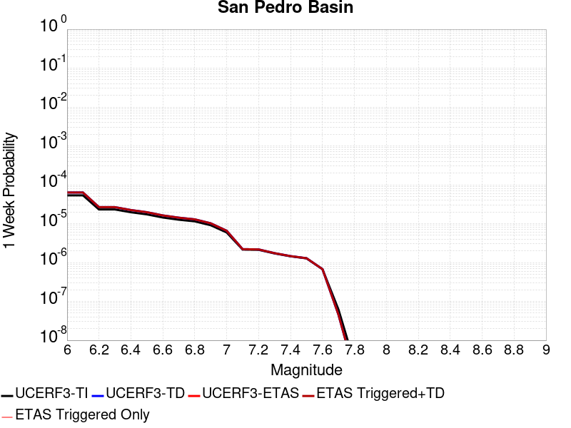 |  |  | 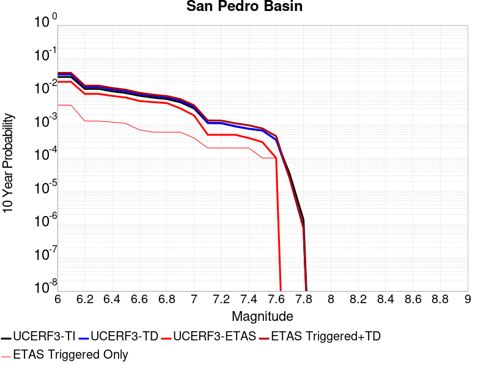 |

| Magnitude | 1 wk TI Prob | 1 wk TD Prob | 1 wk ETAS Prob | 1 wk ETAS/TD Gain | 1 wk ETAS Triggered+TD | 1 wk ETAS Triggered Only | 1 mo TI Prob | 1 mo TD Prob | 1 mo ETAS Prob | 1 mo ETAS/TD Gain | 1 mo ETAS Triggered+TD | 1 mo ETAS Triggered Only | 1 yr TI Prob | 1 yr TD Prob | 1 yr ETAS Prob | 1 yr ETAS/TD Gain | 1 yr ETAS Triggered+TD | 1 yr ETAS Triggered Only | 10 yr TI Prob | 10 yr TD Prob | 10 yr ETAS Prob | 10 yr ETAS/TD Gain | 10 yr ETAS Triggered+TD | 10 yr ETAS Triggered Only |
|-----|-----|-----|-----|-----|-----|-----|-----|-----|-----|-----|-----|-----|-----|-----|-----|-----|-----|-----|-----|-----|-----|-----|-----|-----|
| 6.0 | 5.3449043E-5 | 6.324607E-5 | 0.0 | 0.0 | 6.324607E-5 | 0.0 | 2.2904722E-4 | 2.710299E-4 | 0.0 | 0.0 | 2.710299E-4 | 0.0 | 0.0027850836 | 0.0032953974 | 0.0017 | 0.515871 | 0.0034947384 | 2.0E-4 | 0.027504366 | 0.03252667 | 0.0196 | 0.60258245 | 0.036299817 | 0.0039 |
| 6.1 | 5.3449043E-5 | 6.324607E-5 | 0.0 | 0.0 | 6.324607E-5 | 0.0 | 2.2904722E-4 | 2.710299E-4 | 0.0 | 0.0 | 2.710299E-4 | 0.0 | 0.0027850836 | 0.0032953974 | 0.0017 | 0.515871 | 0.0034947384 | 2.0E-4 | 0.027504366 | 0.03252667 | 0.0196 | 0.60258245 | 0.036299817 | 0.0039 |
| 6.2 | 2.3189454E-5 | 2.6600583E-5 | 0.0 | 0.0 | 2.6600583E-5 | 0.0 | 9.9379584E-5 | 1.13997776E-4 | 0.0 | 0.0 | 1.13997776E-4 | 0.0 | 0.0012092749 | 0.0013870861 | 7.0E-4 | 0.504655 | 0.0014869474 | 1.0E-4 | 0.012027155 | 0.013789139 | 0.0085 | 0.6164272 | 0.015071213 | 0.0013 |
| 6.3 | 2.3189454E-5 | 2.6600583E-5 | 0.0 | 0.0 | 2.6600583E-5 | 0.0 | 9.9379584E-5 | 1.13997776E-4 | 0.0 | 0.0 | 1.13997776E-4 | 0.0 | 0.0012092749 | 0.0013870861 | 7.0E-4 | 0.504655 | 0.0014869474 | 1.0E-4 | 0.012027155 | 0.013789139 | 0.0085 | 0.6164272 | 0.015071213 | 0.0013 |
| 6.4 | 1.966056E-5 | 2.2429222E-5 | 0.0 | 0.0 | 2.2429222E-5 | 0.0 | 8.425682E-5 | 9.612192E-5 | 0.0 | 0.0 | 9.612192E-5 | 0.0 | 0.001025344 | 0.0011696961 | 7.0E-4 | 0.5984461 | 0.001269579 | 1.0E-4 | 0.010206259 | 0.011639469 | 0.0074 | 0.6357678 | 0.012825502 | 0.0012 |
| 6.5 | 1.7342953E-5 | 1.9715857E-5 | 0.0 | 0.0 | 1.9715857E-5 | 0.0 | 7.4324824E-5 | 8.4494E-5 | 0.0 | 0.0 | 8.4494E-5 | 0.0 | 9.04529E-4 | 0.0010282658 | 6.0E-4 | 0.5835067 | 0.001128163 | 1.0E-4 | 0.009008561 | 0.010238791 | 0.0066 | 0.64460737 | 0.011327528 | 0.0011 |
| 6.6 | 1.439804E-5 | 1.6299211E-5 | 0.0 | 0.0 | 1.6299211E-5 | 0.0 | 6.170443E-5 | 6.9852074E-5 | 0.0 | 0.0 | 6.9852074E-5 | 0.0 | 7.509924E-4 | 8.501492E-4 | 3.0E-4 | 0.35287923 | 8.501492E-4 | 0.0 | 0.0074845953 | 0.008472161 | 0.0052 | 0.6137749 | 0.00916623 | 7.0E-4 |
| 6.7 | 1.2634884E-5 | 1.4265099E-5 | 0.0 | 0.0 | 1.4265099E-5 | 0.0 | 5.414838E-5 | 6.113488E-5 | 0.0 | 0.0 | 6.113488E-5 | 0.0 | 6.590571E-4 | 7.440933E-4 | 3.0E-4 | 0.40317523 | 7.440933E-4 | 0.0 | 0.006571059 | 0.0074190297 | 0.0048 | 0.6469849 | 0.008014578 | 6.0E-4 |
| 6.8 | 1.146091E-5 | 1.2915133E-5 | 0.0 | 0.0 | 1.2915133E-5 | 0.0 | 4.911726E-5 | 5.5349567E-5 | 0.0 | 0.0 | 5.5349567E-5 | 0.0 | 5.9783855E-4 | 6.737022E-4 | 2.0E-4 | 0.29686704 | 6.737022E-4 | 0.0 | 0.0059623276 | 0.006719529 | 0.0045 | 0.6696898 | 0.0073154974 | 6.0E-4 |
| 6.9 | 9.109035E-6 | 1.0221102E-5 | 0.0 | 0.0 | 1.0221102E-5 | 0.0 | 3.9038136E-5 | 4.3804142E-5 | 0.0 | 0.0 | 4.3804142E-5 | 0.0 | 4.7518566E-4 | 5.332128E-4 | 2.0E-4 | 0.37508476 | 5.332128E-4 | 0.0 | 0.0047417083 | 0.005322079 | 0.0031 | 0.5824791 | 0.005918886 | 6.0E-4 |
| 7.0 | 5.9351028E-6 | 6.575781E-6 | 0.0 | 0.0 | 6.575781E-6 | 0.0 | 2.5435906E-5 | 2.8181747E-5 | 0.0 | 0.0 | 2.8181747E-5 | 0.0 | 3.0963816E-4 | 3.4308227E-4 | 2.0E-4 | 0.58295053 | 3.4308227E-4 | 0.0 | 0.0030920706 | 0.0034278356 | 0.0019 | 0.55428565 | 0.0038264643 | 4.0E-4 |
| 7.1 | 2.1557585E-6 | 2.20865E-6 | 0.0 | 0.0 | 2.20865E-6 | 0.0 | 9.238933E-6 | 9.465609E-6 | 0.0 | 0.0 | 9.465609E-6 | 0.0 | 1.1247819E-4 | 1.1523785E-4 | 0.0 | 0.0 | 1.1523785E-4 | 0.0 | 0.0011242128 | 0.0011517963 | 5.0E-4 | 0.43410453 | 0.0013515659 | 2.0E-4 |
| 7.2 | 2.1251979E-6 | 2.1770081E-6 | 0.0 | 0.0 | 2.1770081E-6 | 0.0 | 9.107958E-6 | 9.330002E-6 | 0.0 | 0.0 | 9.330002E-6 | 0.0 | 1.1088375E-4 | 1.13587004E-4 | 0.0 | 0.0 | 1.13587004E-4 | 0.0 | 0.0011082845 | 0.0011353048 | 5.0E-4 | 0.44041038 | 0.0013350777 | 2.0E-4 |
| 7.3 | 1.7145798E-6 | 1.743556E-6 | 0.0 | 0.0 | 1.743556E-6 | 0.0 | 7.3481783E-6 | 7.472362E-6 | 0.0 | 0.0 | 7.472362E-6 | 0.0 | 8.94604E-5 | 9.09723E-5 | 0.0 | 0.0 | 9.09723E-5 | 0.0 | 8.9424395E-4 | 9.093598E-4 | 5.0E-4 | 0.5498374 | 0.0011091778 | 2.0E-4 |
| 7.4 | 1.4467993E-6 | 1.4635903E-6 | 0.0 | 0.0 | 1.4635903E-6 | 0.0 | 6.200554E-6 | 6.272515E-6 | 0.0 | 0.0 | 6.272515E-6 | 0.0 | 7.548913E-5 | 7.6365264E-5 | 0.0 | 0.0 | 7.6365264E-5 | 0.0 | 7.546349E-4 | 7.6339755E-4 | 4.0E-4 | 0.5239734 | 9.632449E-4 | 2.0E-4 |
| 7.5 | 1.2803735E-6 | 1.2926232E-6 | 0.0 | 0.0 | 1.2926232E-6 | 0.0 | 5.487303E-6 | 5.5398023E-6 | 0.0 | 0.0 | 5.5398023E-6 | 0.0 | 6.680587E-5 | 6.744508E-5 | 0.0 | 0.0 | 6.744508E-5 | 0.0 | 6.678579E-4 | 6.7425316E-4 | 3.0E-4 | 0.44493675 | 7.741857E-4 | 1.0E-4 |
| 7.6 | 6.755009E-7 | 6.7666826E-7 | 0.0 | 0.0 | 6.7666826E-7 | 0.0 | 2.8950008E-6 | 2.900004E-6 | 0.0 | 0.0 | 2.900004E-6 | 0.0 | 3.5246063E-5 | 3.530703E-5 | 0.0 | 0.0 | 3.530703E-5 | 0.0 | 3.5240475E-4 | 3.5301995E-4 | 1.0E-4 | 0.2832701 | 4.5298465E-4 | 1.0E-4 |
| 7.7 | 6.211885E-8 | 4.5673264E-8 | 0.0 | 0.0 | 4.5673264E-8 | 0.0 | 2.6622362E-7 | 1.9574256E-7 | 0.0 | 0.0 | 1.9574256E-7 | 0.0 | 3.2412677E-6 | 2.383163E-6 | 0.0 | 0.0 | 2.383163E-6 | 0.0 | 3.2412205E-5 | 2.3831397E-5 | 0.0 | 0.0 | 2.3831397E-5 | 0.0 |
| 7.8 | 2.6580573E-9 | 1.5097251E-9 | 0.0 | 0.0 | 1.5097251E-9 | 0.0 | 1.1391674E-8 | 6.4702506E-9 | 0.0 | 0.0 | 6.4702506E-9 | 0.0 | 1.3869362E-7 | 7.87753E-8 | 0.0 | 0.0 | 7.87753E-8 | 0.0 | 1.3869354E-6 | 7.8775304E-7 | 0.0 | 0.0 | 7.8775304E-7 | 0.0 |

## Bicycle Lake
*[(top)](#table-of-contents)*

| 1 Week | 1 Month | 1 Year | 10 Year |
|-----|-----|-----|-----|
|  |  | 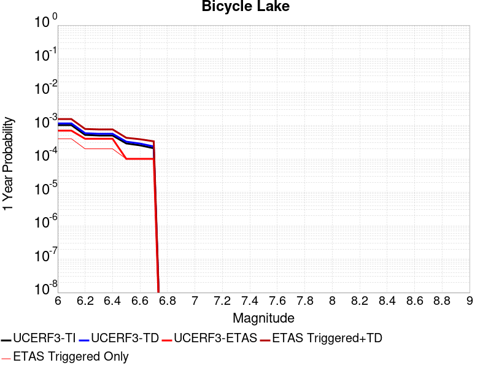 |  |

| Magnitude | 1 wk TI Prob | 1 wk TD Prob | 1 wk ETAS Prob | 1 wk ETAS/TD Gain | 1 wk ETAS Triggered+TD | 1 wk ETAS Triggered Only | 1 mo TI Prob | 1 mo TD Prob | 1 mo ETAS Prob | 1 mo ETAS/TD Gain | 1 mo ETAS Triggered+TD | 1 mo ETAS Triggered Only | 1 yr TI Prob | 1 yr TD Prob | 1 yr ETAS Prob | 1 yr ETAS/TD Gain | 1 yr ETAS Triggered+TD | 1 yr ETAS Triggered Only | 10 yr TI Prob | 10 yr TD Prob | 10 yr ETAS Prob | 10 yr ETAS/TD Gain | 10 yr ETAS Triggered+TD | 10 yr ETAS Triggered Only |
|-----|-----|-----|-----|-----|-----|-----|-----|-----|-----|-----|-----|-----|-----|-----|-----|-----|-----|-----|-----|-----|-----|-----|-----|-----|
| 6.0 | 1.9621975E-5 | 2.2067992E-5 | 0.0 | 0.0 | 2.2067992E-5 | 0.0 | 8.4091465E-5 | 9.457444E-5 | 0.0 | 0.0 | 9.457444E-5 | 0.0 | 0.0010233327 | 0.0011509702 | 7.0E-4 | 0.60818255 | 0.0015505098 | 4.0E-4 | 0.01018633 | 0.011463366 | 0.0114 | 0.9944722 | 0.015219806 | 0.0038 |
| 6.1 | 1.9621975E-5 | 2.2067992E-5 | 0.0 | 0.0 | 2.2067992E-5 | 0.0 | 8.4091465E-5 | 9.457444E-5 | 0.0 | 0.0 | 9.457444E-5 | 0.0 | 0.0010233327 | 0.0011509702 | 7.0E-4 | 0.60818255 | 0.0015505098 | 4.0E-4 | 0.01018633 | 0.011463366 | 0.0114 | 0.9944722 | 0.015219806 | 0.0038 |
| 6.2 | 9.9971285E-6 | 1.1240861E-5 | 0.0 | 0.0 | 1.1240861E-5 | 0.0 | 4.2844134E-5 | 4.817452E-5 | 0.0 | 0.0 | 4.817452E-5 | 0.0 | 5.2150246E-4 | 5.864188E-4 | 4.0E-4 | 0.6821064 | 7.863015E-4 | 2.0E-4 | 0.0052028033 | 0.005853805 | 0.0062 | 1.0591401 | 0.007941512 | 0.0021 |
| 6.3 | 9.589428E-6 | 1.0784147E-5 | 0.0 | 0.0 | 1.0784147E-5 | 0.0 | 4.10969E-5 | 4.6217247E-5 | 0.0 | 0.0 | 4.6217247E-5 | 0.0 | 5.002399E-4 | 5.6260143E-4 | 4.0E-4 | 0.7109829 | 7.624889E-4 | 2.0E-4 | 0.0049911533 | 0.005616848 | 0.0058 | 1.0326077 | 0.007605614 | 0.002 |
| 6.4 | 9.589428E-6 | 1.0784147E-5 | 0.0 | 0.0 | 1.0784147E-5 | 0.0 | 4.10969E-5 | 4.6217247E-5 | 0.0 | 0.0 | 4.6217247E-5 | 0.0 | 5.002399E-4 | 5.6260143E-4 | 4.0E-4 | 0.7109829 | 7.624889E-4 | 2.0E-4 | 0.0049911533 | 0.005616848 | 0.0058 | 1.0326077 | 0.007605614 | 0.002 |
| 6.5 | 5.557707E-6 | 6.2770173E-6 | 0.0 | 0.0 | 6.2770173E-6 | 0.0 | 2.3818526E-5 | 2.6901376E-5 | 0.0 | 0.0 | 2.6901376E-5 | 0.0 | 2.8995197E-4 | 3.2750185E-4 | 1.0E-4 | 0.30534178 | 4.274691E-4 | 1.0E-4 | 0.0028957394 | 0.003272821 | 0.0032 | 0.97774976 | 0.0044688936 | 0.0012 |
| 6.6 | 4.8742945E-6 | 5.505753E-6 | 0.0 | 0.0 | 5.505753E-6 | 0.0 | 2.0889667E-5 | 2.359602E-5 | 0.0 | 0.0 | 2.359602E-5 | 0.0 | 2.54302E-4 | 2.872698E-4 | 1.0E-4 | 0.34810483 | 3.8724105E-4 | 1.0E-4 | 0.002540112 | 0.0028715462 | 0.0029 | 1.0099089 | 0.0039683874 | 0.0011 |
| 6.7 | 3.991108E-6 | 4.5097186E-6 | 0.0 | 0.0 | 4.5097186E-6 | 0.0 | 1.7104636E-5 | 1.9327364E-5 | 0.0 | 0.0 | 1.9327364E-5 | 0.0 | 2.0822904E-4 | 2.3531067E-4 | 1.0E-4 | 0.42497012 | 3.3528713E-4 | 1.0E-4 | 0.0020803404 | 0.0023531066 | 0.0027 | 1.1474193 | 0.0033507536 | 0.001 |

## Greenville (So) 2011 CFM
*[(top)](#table-of-contents)*

| 1 Week | 1 Month | 1 Year | 10 Year |
|-----|-----|-----|-----|
| 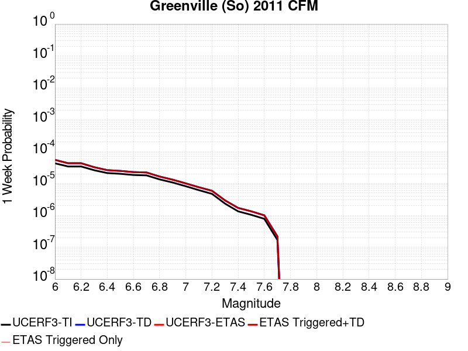 |  |  |  |

| Magnitude | 1 wk TI Prob | 1 wk TD Prob | 1 wk ETAS Prob | 1 wk ETAS/TD Gain | 1 wk ETAS Triggered+TD | 1 wk ETAS Triggered Only | 1 mo TI Prob | 1 mo TD Prob | 1 mo ETAS Prob | 1 mo ETAS/TD Gain | 1 mo ETAS Triggered+TD | 1 mo ETAS Triggered Only | 1 yr TI Prob | 1 yr TD Prob | 1 yr ETAS Prob | 1 yr ETAS/TD Gain | 1 yr ETAS Triggered+TD | 1 yr ETAS Triggered Only | 10 yr TI Prob | 10 yr TD Prob | 10 yr ETAS Prob | 10 yr ETAS/TD Gain | 10 yr ETAS Triggered+TD | 10 yr ETAS Triggered Only |
|-----|-----|-----|-----|-----|-----|-----|-----|-----|-----|-----|-----|-----|-----|-----|-----|-----|-----|-----|-----|-----|-----|-----|-----|-----|
| 6.0 | 4.279693E-5 | 5.4871653E-5 | 0.0 | 0.0 | 5.4871653E-5 | 0.0 | 1.8340252E-4 | 2.35145E-4 | 0.0 | 0.0 | 2.35145E-4 | 0.0 | 0.0022306389 | 0.002859405 | 0.0014 | 0.48961237 | 0.003158547 | 3.0E-4 | 0.022083808 | 0.028253423 | 0.015 | 0.5309091 | 0.03194606 | 0.0038 |
| 6.1 | 3.4037297E-5 | 4.3064574E-5 | 0.0 | 0.0 | 4.3064574E-5 | 0.0 | 1.4586597E-4 | 1.8455059E-4 | 0.0 | 0.0 | 1.8455059E-4 | 0.0 | 0.0017744715 | 0.002244753 | 0.001 | 0.4454833 | 0.002444304 | 2.0E-4 | 0.01760369 | 0.02223786 | 0.0118 | 0.5306266 | 0.025171146 | 0.003 |
| 6.2 | 3.4037297E-5 | 4.3064574E-5 | 0.0 | 0.0 | 4.3064574E-5 | 0.0 | 1.4586597E-4 | 1.8455059E-4 | 0.0 | 0.0 | 1.8455059E-4 | 0.0 | 0.0017744715 | 0.002244753 | 0.001 | 0.4454833 | 0.002444304 | 2.0E-4 | 0.01760369 | 0.02223786 | 0.0118 | 0.5306266 | 0.025171146 | 0.003 |
| 6.3 | 2.5956324E-5 | 3.2337128E-5 | 0.0 | 0.0 | 3.2337128E-5 | 0.0 | 1.11236644E-4 | 1.3858077E-4 | 0.0 | 0.0 | 1.3858077E-4 | 0.0 | 0.0013534647 | 0.0016859788 | 8.0E-4 | 0.47450182 | 0.0018856416 | 2.0E-4 | 0.013452509 | 0.016738787 | 0.0093 | 0.5555958 | 0.019491918 | 0.0028 |
| 6.4 | 2.1145053E-5 | 2.6124151E-5 | 0.0 | 0.0 | 2.6124151E-5 | 0.0 | 9.061851E-5 | 1.1195603E-4 | 0.0 | 0.0 | 1.1195603E-4 | 0.0 | 0.0011027219 | 0.0013622439 | 7.0E-4 | 0.5138581 | 0.0015619714 | 2.0E-4 | 0.01097266 | 0.0135424305 | 0.0077 | 0.5685833 | 0.016008575 | 0.0025 |
| 6.5 | 2.0030959E-5 | 2.4726009E-5 | 0.0 | 0.0 | 2.4726009E-5 | 0.0 | 8.584414E-5 | 1.0596449E-4 | 0.0 | 0.0 | 1.0596449E-4 | 0.0 | 0.0010446513 | 0.0012893851 | 7.0E-4 | 0.5428944 | 0.0014891273 | 2.0E-4 | 0.010397541 | 0.012822466 | 0.0067 | 0.5225204 | 0.014895539 | 0.0021 |
| 6.6 | 1.8395405E-5 | 2.2689894E-5 | 0.0 | 0.0 | 2.2689894E-5 | 0.0 | 7.8835066E-5 | 9.723894E-5 | 0.0 | 0.0 | 9.723894E-5 | 0.0 | 9.5939427E-4 | 0.0011832695 | 7.0E-4 | 0.5915812 | 0.0013830329 | 2.0E-4 | 0.009552629 | 0.011772812 | 0.0065 | 0.55211955 | 0.01384809 | 0.0021 |
| 6.7 | 1.7883482E-5 | 2.2062428E-5 | 0.0 | 0.0 | 2.2062428E-5 | 0.0 | 7.664124E-5 | 9.454999E-5 | 0.0 | 0.0 | 9.454999E-5 | 0.0 | 9.3270757E-4 | 0.0011505667 | 7.0E-4 | 0.6083958 | 0.0013503366 | 2.0E-4 | 0.009288026 | 0.011449214 | 0.0063 | 0.5502561 | 0.013426316 | 0.002 |
| 6.8 | 1.3373564E-5 | 1.6457283E-5 | 0.0 | 0.0 | 1.6457283E-5 | 0.0 | 5.7314013E-5 | 7.0529386E-5 | 0.0 | 0.0 | 7.0529386E-5 | 0.0 | 6.975747E-4 | 8.583717E-4 | 4.0E-4 | 0.46599856 | 9.582859E-4 | 1.0E-4 | 0.0069538904 | 0.008552243 | 0.005 | 0.58464193 | 0.010138559 | 0.0016 |
| 6.9 | 1.06692905E-5 | 1.3112284E-5 | 0.0 | 0.0 | 1.3112284E-5 | 0.0 | 4.5724726E-5 | 5.619436E-5 | 0.0 | 0.0 | 5.619436E-5 | 0.0 | 5.5655633E-4 | 6.839628E-4 | 3.0E-4 | 0.43862036 | 7.838944E-4 | 1.0E-4 | 0.005551645 | 0.006819882 | 0.0044 | 0.6451724 | 0.008210334 | 0.0014 |
| 7.0 | 8.157512E-6 | 1.0029763E-5 | 0.0 | 0.0 | 1.0029763E-5 | 0.0 | 3.4960296E-5 | 4.298401E-5 | 0.0 | 0.0 | 4.298401E-5 | 0.0 | 4.2555845E-4 | 5.2320835E-4 | 3.0E-4 | 0.57338536 | 6.23156E-4 | 1.0E-4 | 0.004247444 | 0.0052203177 | 0.0029 | 0.5555217 | 0.006215098 | 0.001 |
| 7.1 | 6.1467113E-6 | 7.599936E-6 | 0.0 | 0.0 | 7.599936E-6 | 0.0 | 2.6342783E-5 | 3.257075E-5 | 0.0 | 0.0 | 3.257075E-5 | 0.0 | 3.206762E-4 | 3.964776E-4 | 3.0E-4 | 0.75666314 | 4.9643795E-4 | 1.0E-4 | 0.0032021382 | 0.0039579673 | 0.0027 | 0.68216836 | 0.004754801 | 8.0E-4 |
| 7.2 | 4.713467E-6 | 5.890499E-6 | 0.0 | 0.0 | 5.890499E-6 | 0.0 | 2.0200418E-5 | 2.5244755E-5 | 0.0 | 0.0 | 2.5244755E-5 | 0.0 | 2.4591232E-4 | 3.0731212E-4 | 2.0E-4 | 0.6508041 | 4.072814E-4 | 1.0E-4 | 0.0024564038 | 0.0030691908 | 0.0022 | 0.71680135 | 0.0038667354 | 8.0E-4 |
| 7.3 | 2.3266216E-6 | 2.9365724E-6 | 0.0 | 0.0 | 2.9365724E-6 | 0.0 | 9.971197E-6 | 1.258525E-5 | 0.0 | 0.0 | 1.258525E-5 | 0.0 | 1.2139256E-4 | 1.532148E-4 | 0.0 | 0.0 | 1.532148E-4 | 0.0 | 0.0012132627 | 0.0015311961 | 0.001 | 0.6530842 | 0.0019305836 | 4.0E-4 |
| 7.4 | 1.3314E-6 | 1.7055879E-6 | 0.0 | 0.0 | 1.7055879E-6 | 0.0 | 5.7059874E-6 | 7.309642E-6 | 0.0 | 0.0 | 7.309642E-6 | 0.0 | 6.946818E-5 | 8.899131E-5 | 0.0 | 0.0 | 8.899131E-5 | 0.0 | 6.9446466E-4 | 8.8957E-4 | 6.0E-4 | 0.6744832 | 0.0011893031 | 3.0E-4 |
| 7.5 | 1.0362941E-6 | 1.3353753E-6 | 0.0 | 0.0 | 1.3353753E-6 | 0.0 | 4.4412527E-6 | 5.7230245E-6 | 0.0 | 0.0 | 5.7230245E-6 | 0.0 | 5.407091E-5 | 6.967564E-5 | 0.0 | 0.0 | 6.967564E-5 | 0.0 | 5.405776E-4 | 6.9652876E-4 | 5.0E-4 | 0.71784544 | 8.963894E-4 | 2.0E-4 |
| 7.6 | 7.764784E-7 | 9.991577E-7 | 0.0 | 0.0 | 9.991577E-7 | 0.0 | 3.3277602E-6 | 4.2820975E-6 | 0.0 | 0.0 | 4.2820975E-6 | 0.0 | 4.0514726E-5 | 5.213333E-5 | 0.0 | 0.0 | 5.213333E-5 | 0.0 | 4.050734E-4 | 5.21178E-4 | 4.0E-4 | 0.7674921 | 7.2107377E-4 | 2.0E-4 |
| 7.7 | 1.6927763E-7 | 2.191352E-7 | 0.0 | 0.0 | 2.191352E-7 | 0.0 | 7.2547533E-7 | 9.3915054E-7 | 0.0 | 0.0 | 9.3915054E-7 | 0.0 | 8.832627E-6 | 1.1434101E-5 | 0.0 | 0.0 | 1.1434101E-5 | 0.0 | 8.8322755E-5 | 1.1434293E-4 | 0.0 | 0.0 | 1.1434293E-4 | 0.0 |

## Cleghorn Pass
*[(top)](#table-of-contents)*

| 1 Week | 1 Month | 1 Year | 10 Year |
|-----|-----|-----|-----|
|  |  |  |  |

| Magnitude | 1 wk TI Prob | 1 wk TD Prob | 1 wk ETAS Prob | 1 wk ETAS/TD Gain | 1 wk ETAS Triggered+TD | 1 wk ETAS Triggered Only | 1 mo TI Prob | 1 mo TD Prob | 1 mo ETAS Prob | 1 mo ETAS/TD Gain | 1 mo ETAS Triggered+TD | 1 mo ETAS Triggered Only | 1 yr TI Prob | 1 yr TD Prob | 1 yr ETAS Prob | 1 yr ETAS/TD Gain | 1 yr ETAS Triggered+TD | 1 yr ETAS Triggered Only | 10 yr TI Prob | 10 yr TD Prob | 10 yr ETAS Prob | 10 yr ETAS/TD Gain | 10 yr ETAS Triggered+TD | 10 yr ETAS Triggered Only |
|-----|-----|-----|-----|-----|-----|-----|-----|-----|-----|-----|-----|-----|-----|-----|-----|-----|-----|-----|-----|-----|-----|-----|-----|-----|
| 6.0 | 1.0522846E-5 | 1.1034972E-5 | 0.0 | 0.0 | 1.1034972E-5 | 0.0 | 4.509713E-5 | 4.7292175E-5 | 2.0E-4 | 4.229029 | 1.4728744E-4 | 1.0E-4 | 5.4891926E-4 | 5.7568273E-4 | 9.0E-4 | 1.5633612 | 9.754524E-4 | 4.0E-4 | 0.0054756533 | 0.0057470747 | 0.0071 | 1.2354112 | 0.009127535 | 0.0034 |
| 6.1 | 1.0522846E-5 | 1.1034972E-5 | 0.0 | 0.0 | 1.1034972E-5 | 0.0 | 4.509713E-5 | 4.7292175E-5 | 2.0E-4 | 4.229029 | 1.4728744E-4 | 1.0E-4 | 5.4891926E-4 | 5.7568273E-4 | 9.0E-4 | 1.5633612 | 9.754524E-4 | 4.0E-4 | 0.0054756533 | 0.0057470747 | 0.0071 | 1.2354112 | 0.009127535 | 0.0034 |
| 6.2 | 2.1045846E-6 | 2.2070678E-6 | 0.0 | 0.0 | 2.2070678E-6 | 0.0 | 9.019617E-6 | 9.458851E-6 | 0.0 | 0.0 | 9.458851E-6 | 0.0 | 1.098083E-4 | 1.1515962E-4 | 1.0E-4 | 0.8683599 | 2.151481E-4 | 1.0E-4 | 0.0010975406 | 0.0011514104 | 6.0E-4 | 0.52110004 | 0.0017507196 | 6.0E-4 |
| 6.3 | 2.1045846E-6 | 2.2070678E-6 | 0.0 | 0.0 | 2.2070678E-6 | 0.0 | 9.019617E-6 | 9.458851E-6 | 0.0 | 0.0 | 9.458851E-6 | 0.0 | 1.098083E-4 | 1.1515962E-4 | 1.0E-4 | 0.8683599 | 2.151481E-4 | 1.0E-4 | 0.0010975406 | 0.0011514104 | 6.0E-4 | 0.52110004 | 0.0017507196 | 6.0E-4 |
| 6.4 | 1.7259927E-6 | 1.8099477E-6 | 0.0 | 0.0 | 1.8099477E-6 | 0.0 | 7.3970905E-6 | 7.756918E-6 | 0.0 | 0.0 | 7.756918E-6 | 0.0 | 9.005586E-5 | 9.444048E-5 | 1.0E-4 | 1.0588679 | 1.9443104E-4 | 1.0E-4 | 9.001937E-4 | 9.444048E-4 | 6.0E-4 | 0.6353208 | 0.0015438382 | 6.0E-4 |

## Blue Cut
*[(top)](#table-of-contents)*

| 1 Week | 1 Month | 1 Year | 10 Year |
|-----|-----|-----|-----|
| 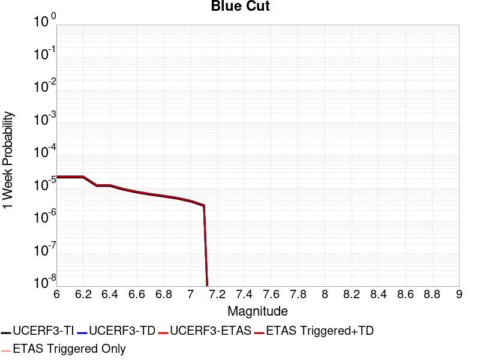 |  |  |  |

| Magnitude | 1 wk TI Prob | 1 wk TD Prob | 1 wk ETAS Prob | 1 wk ETAS/TD Gain | 1 wk ETAS Triggered+TD | 1 wk ETAS Triggered Only | 1 mo TI Prob | 1 mo TD Prob | 1 mo ETAS Prob | 1 mo ETAS/TD Gain | 1 mo ETAS Triggered+TD | 1 mo ETAS Triggered Only | 1 yr TI Prob | 1 yr TD Prob | 1 yr ETAS Prob | 1 yr ETAS/TD Gain | 1 yr ETAS Triggered+TD | 1 yr ETAS Triggered Only | 10 yr TI Prob | 10 yr TD Prob | 10 yr ETAS Prob | 10 yr ETAS/TD Gain | 10 yr ETAS Triggered+TD | 10 yr ETAS Triggered Only |
|-----|-----|-----|-----|-----|-----|-----|-----|-----|-----|-----|-----|-----|-----|-----|-----|-----|-----|-----|-----|-----|-----|-----|-----|-----|
| 6.0 | 2.1227985E-5 | 2.270289E-5 | 0.0 | 0.0 | 2.270289E-5 | 0.0 | 9.097391E-5 | 9.7294804E-5 | 1.0E-4 | 1.0278041 | 1.9728507E-4 | 1.0E-4 | 0.0011070445 | 0.0011839785 | 9.0E-4 | 0.76014894 | 0.0013837417 | 2.0E-4 | 0.011015458 | 0.011782538 | 0.0097 | 0.82325214 | 0.015537765 | 0.0038 |
| 6.1 | 2.1227985E-5 | 2.270289E-5 | 0.0 | 0.0 | 2.270289E-5 | 0.0 | 9.097391E-5 | 9.7294804E-5 | 1.0E-4 | 1.0278041 | 1.9728507E-4 | 1.0E-4 | 0.0011070445 | 0.0011839785 | 9.0E-4 | 0.76014894 | 0.0013837417 | 2.0E-4 | 0.011015458 | 0.011782538 | 0.0097 | 0.82325214 | 0.015537765 | 0.0038 |
| 6.2 | 2.1227985E-5 | 2.270289E-5 | 0.0 | 0.0 | 2.270289E-5 | 0.0 | 9.097391E-5 | 9.7294804E-5 | 1.0E-4 | 1.0278041 | 1.9728507E-4 | 1.0E-4 | 0.0011070445 | 0.0011839785 | 9.0E-4 | 0.76014894 | 0.0013837417 | 2.0E-4 | 0.011015458 | 0.011782538 | 0.0097 | 0.82325214 | 0.015537765 | 0.0038 |
| 6.3 | 1.1613981E-5 | 1.2345328E-5 | 0.0 | 0.0 | 1.2345328E-5 | 0.0 | 4.9773254E-5 | 5.2907548E-5 | 0.0 | 0.0 | 5.2907548E-5 | 0.0 | 6.0582085E-4 | 6.4397143E-4 | 4.0E-4 | 0.62114555 | 7.4390706E-4 | 1.0E-4 | 0.0060417196 | 0.006422299 | 0.0046 | 0.7162544 | 0.008310096 | 0.0019 |
| 6.4 | 1.1613981E-5 | 1.2345328E-5 | 0.0 | 0.0 | 1.2345328E-5 | 0.0 | 4.9773254E-5 | 5.2907548E-5 | 0.0 | 0.0 | 5.2907548E-5 | 0.0 | 6.0582085E-4 | 6.4397143E-4 | 4.0E-4 | 0.62114555 | 7.4390706E-4 | 1.0E-4 | 0.0060417196 | 0.006422299 | 0.0046 | 0.7162544 | 0.008310096 | 0.0019 |
| 6.5 | 8.931326E-6 | 9.475502E-6 | 0.0 | 0.0 | 9.475502E-6 | 0.0 | 3.8276554E-5 | 4.0608713E-5 | 0.0 | 0.0 | 4.0608713E-5 | 0.0 | 4.6591737E-4 | 4.943081E-4 | 4.0E-4 | 0.8092119 | 5.9425866E-4 | 1.0E-4 | 0.0046494175 | 0.004932994 | 0.004 | 0.8108666 | 0.006525101 | 0.0016 |
| 6.6 | 7.345353E-6 | 7.785355E-6 | 0.0 | 0.0 | 7.785355E-6 | 0.0 | 3.1479703E-5 | 3.3365424E-5 | 0.0 | 0.0 | 3.3365424E-5 | 0.0 | 3.83198E-4 | 4.0615632E-4 | 3.0E-4 | 0.7386319 | 5.0611567E-4 | 1.0E-4 | 0.0038253788 | 0.0040549305 | 0.0033 | 0.81382406 | 0.005349659 | 0.0013 |
| 6.7 | 6.2775666E-6 | 6.6509715E-6 | 0.0 | 0.0 | 6.6509715E-6 | 0.0 | 2.690358E-5 | 2.8503895E-5 | 0.0 | 0.0 | 2.8503895E-5 | 0.0 | 3.2750185E-4 | 3.4698716E-4 | 3.0E-4 | 0.8645853 | 4.4695247E-4 | 1.0E-4 | 0.0032701963 | 0.0034651938 | 0.0031 | 0.8946108 | 0.004760689 | 0.0013 |
| 6.8 | 5.5234095E-6 | 5.851442E-6 | 0.0 | 0.0 | 5.851442E-6 | 0.0 | 2.367154E-5 | 2.5077408E-5 | 0.0 | 0.0 | 2.5077408E-5 | 0.0 | 2.8816288E-4 | 3.0528192E-4 | 2.0E-4 | 0.6551321 | 4.052514E-4 | 1.0E-4 | 0.002877895 | 0.0030493408 | 0.0028 | 0.91823125 | 0.0043453765 | 0.0013 |
| 6.9 | 4.7780054E-6 | 5.0622407E-6 | 0.0 | 0.0 | 5.0622407E-6 | 0.0 | 2.0477004E-5 | 2.1695178E-5 | 0.0 | 0.0 | 2.1695178E-5 | 0.0 | 2.4927902E-4 | 2.641138E-4 | 1.0E-4 | 0.37862468 | 3.6408738E-4 | 1.0E-4 | 0.0024899957 | 0.0026386904 | 0.0025 | 0.9474397 | 0.003835524 | 0.0012 |
| 7.0 | 3.883171E-6 | 4.115883E-6 | 0.0 | 0.0 | 4.115883E-6 | 0.0 | 1.6642054E-5 | 1.7639417E-5 | 0.0 | 0.0 | 1.7639417E-5 | 0.0 | 2.0259817E-4 | 2.1474561E-4 | 1.0E-4 | 0.46566725 | 3.1472414E-4 | 1.0E-4 | 0.0020241356 | 0.002146056 | 0.0019 | 0.8853451 | 0.002944339 | 8.0E-4 |
| 7.1 | 2.8358215E-6 | 3.00779E-6 | 0.0 | 0.0 | 3.00779E-6 | 0.0 | 1.2153464E-5 | 1.2890502E-5 | 0.0 | 0.0 | 1.2890502E-5 | 0.0 | 1.4795837E-4 | 1.5693712E-4 | 0.0 | 0.0 | 1.5693712E-4 | 0.0 | 0.001478599 | 0.0015689074 | 0.0014 | 0.8923408 | 0.0019682797 | 4.0E-4 |

## Lost Hills
*[(top)](#table-of-contents)*

| 1 Week | 1 Month | 1 Year | 10 Year |
|-----|-----|-----|-----|
|  |  |  | 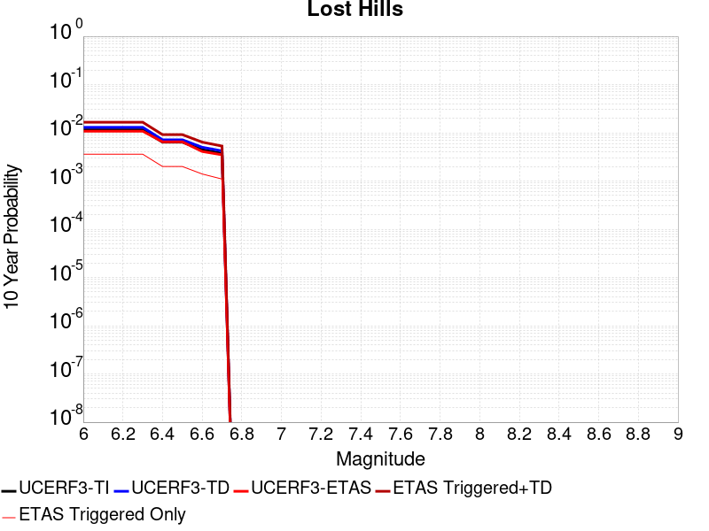 |

| Magnitude | 1 wk TI Prob | 1 wk TD Prob | 1 wk ETAS Prob | 1 wk ETAS/TD Gain | 1 wk ETAS Triggered+TD | 1 wk ETAS Triggered Only | 1 mo TI Prob | 1 mo TD Prob | 1 mo ETAS Prob | 1 mo ETAS/TD Gain | 1 mo ETAS Triggered+TD | 1 mo ETAS Triggered Only | 1 yr TI Prob | 1 yr TD Prob | 1 yr ETAS Prob | 1 yr ETAS/TD Gain | 1 yr ETAS Triggered+TD | 1 yr ETAS Triggered Only | 10 yr TI Prob | 10 yr TD Prob | 10 yr ETAS Prob | 10 yr ETAS/TD Gain | 10 yr ETAS Triggered+TD | 10 yr ETAS Triggered Only |
|-----|-----|-----|-----|-----|-----|-----|-----|-----|-----|-----|-----|-----|-----|-----|-----|-----|-----|-----|-----|-----|-----|-----|-----|-----|
| 6.0 | 2.233523E-5 | 2.5074094E-5 | 0.0 | 0.0 | 2.5074094E-5 | 0.0 | 9.571891E-5 | 1.0745692E-4 | 1.0E-4 | 0.9306055 | 1.0745692E-4 | 0.0 | 0.0011647546 | 0.0013076705 | 9.0E-4 | 0.6882467 | 0.0014075398 | 1.0E-4 | 0.011586686 | 0.013016312 | 0.0108 | 0.82972807 | 0.016569454 | 0.0036 |
| 6.1 | 2.233523E-5 | 2.5074094E-5 | 0.0 | 0.0 | 2.5074094E-5 | 0.0 | 9.571891E-5 | 1.0745692E-4 | 1.0E-4 | 0.9306055 | 1.0745692E-4 | 0.0 | 0.0011647546 | 0.0013076705 | 9.0E-4 | 0.6882467 | 0.0014075398 | 1.0E-4 | 0.011586686 | 0.013016312 | 0.0108 | 0.82972807 | 0.016569454 | 0.0036 |
| 6.2 | 2.233523E-5 | 2.5074094E-5 | 0.0 | 0.0 | 2.5074094E-5 | 0.0 | 9.571891E-5 | 1.0745692E-4 | 1.0E-4 | 0.9306055 | 1.0745692E-4 | 0.0 | 0.0011647546 | 0.0013076705 | 9.0E-4 | 0.6882467 | 0.0014075398 | 1.0E-4 | 0.011586686 | 0.013016312 | 0.0108 | 0.82972807 | 0.016569454 | 0.0036 |
| 6.3 | 2.233523E-5 | 2.5074094E-5 | 0.0 | 0.0 | 2.5074094E-5 | 0.0 | 9.571891E-5 | 1.0745692E-4 | 1.0E-4 | 0.9306055 | 1.0745692E-4 | 0.0 | 0.0011647546 | 0.0013076705 | 9.0E-4 | 0.6882467 | 0.0014075398 | 1.0E-4 | 0.011586686 | 0.013016312 | 0.0108 | 0.82972807 | 0.016569454 | 0.0036 |
| 6.4 | 1.2288092E-5 | 1.3763646E-5 | 0.0 | 0.0 | 1.3763646E-5 | 0.0 | 5.2662188E-5 | 5.8986247E-5 | 0.0 | 0.0 | 5.8986247E-5 | 0.0 | 6.409735E-4 | 7.180145E-4 | 5.0E-4 | 0.69636476 | 8.1794267E-4 | 1.0E-4 | 0.006391279 | 0.007166129 | 0.0065 | 0.9070448 | 0.009151797 | 0.002 |
| 6.5 | 1.2288092E-5 | 1.3763646E-5 | 0.0 | 0.0 | 1.3763646E-5 | 0.0 | 5.2662188E-5 | 5.8986247E-5 | 0.0 | 0.0 | 5.8986247E-5 | 0.0 | 6.409735E-4 | 7.180145E-4 | 5.0E-4 | 0.69636476 | 8.1794267E-4 | 1.0E-4 | 0.006391279 | 0.007166129 | 0.0065 | 0.9070448 | 0.009151797 | 0.002 |
| 6.6 | 8.58281E-6 | 9.621468E-6 | 0.0 | 0.0 | 9.621468E-6 | 0.0 | 3.6782953E-5 | 4.123468E-5 | 0.0 | 0.0 | 4.123468E-5 | 0.0 | 4.4774043E-4 | 5.019996E-4 | 2.0E-4 | 0.3984067 | 6.019494E-4 | 1.0E-4 | 0.0044683935 | 0.0050167954 | 0.0041 | 0.8172548 | 0.0064097717 | 0.0014 |
| 6.7 | 7.205685E-6 | 8.07797E-6 | 0.0 | 0.0 | 8.07797E-6 | 0.0 | 3.088114E-5 | 3.4619872E-5 | 0.0 | 0.0 | 3.4619872E-5 | 0.0 | 3.7591302E-4 | 4.2149695E-4 | 2.0E-4 | 0.4744993 | 5.214548E-4 | 1.0E-4 | 0.0037527776 | 0.0042149695 | 0.0035 | 0.83037376 | 0.005310333 | 0.0011 |

## San Jacinto (San Bernardino)
*[(top)](#table-of-contents)*

| 1 Week | 1 Month | 1 Year | 10 Year |
|-----|-----|-----|-----|
| 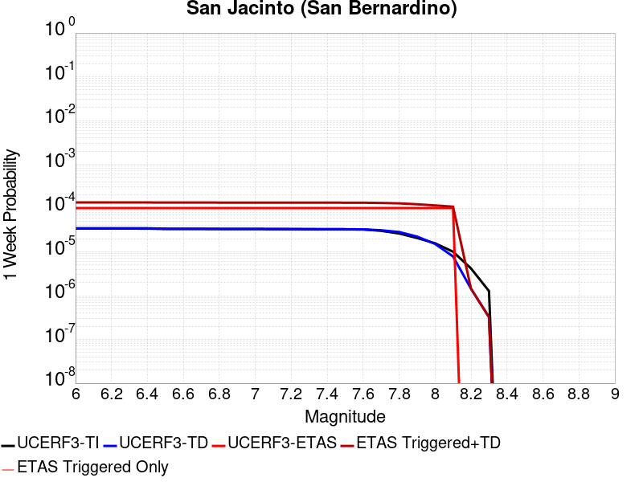 |  |  | 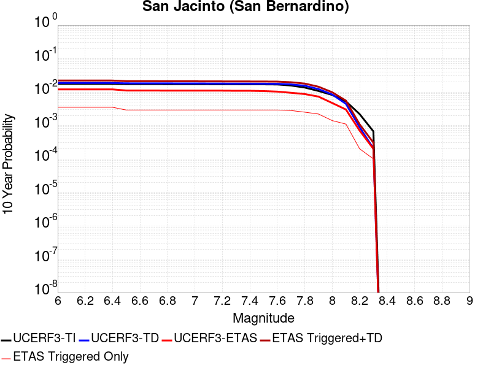 |

| Magnitude | 1 wk TI Prob | 1 wk TD Prob | 1 wk ETAS Prob | 1 wk ETAS/TD Gain | 1 wk ETAS Triggered+TD | 1 wk ETAS Triggered Only | 1 mo TI Prob | 1 mo TD Prob | 1 mo ETAS Prob | 1 mo ETAS/TD Gain | 1 mo ETAS Triggered+TD | 1 mo ETAS Triggered Only | 1 yr TI Prob | 1 yr TD Prob | 1 yr ETAS Prob | 1 yr ETAS/TD Gain | 1 yr ETAS Triggered+TD | 1 yr ETAS Triggered Only | 10 yr TI Prob | 10 yr TD Prob | 10 yr ETAS Prob | 10 yr ETAS/TD Gain | 10 yr ETAS Triggered+TD | 10 yr ETAS Triggered Only |
|-----|-----|-----|-----|-----|-----|-----|-----|-----|-----|-----|-----|-----|-----|-----|-----|-----|-----|-----|-----|-----|-----|-----|-----|-----|
| 6.0 | 3.409352E-5 | 3.4625045E-5 | 1.0E-4 | 2.8880827 | 1.3462159E-4 | 1.0E-4 | 1.461069E-4 | 1.4838463E-4 | 2.0E-4 | 1.3478485 | 3.4835495E-4 | 2.0E-4 | 0.0017774 | 0.0018050874 | 0.0017 | 0.94178265 | 0.002104546 | 3.0E-4 | 0.01763251 | 0.018651593 | 0.012 | 0.64337665 | 0.022086313 | 0.0035 |
| 6.1 | 3.409352E-5 | 3.4625045E-5 | 1.0E-4 | 2.8880827 | 1.3462159E-4 | 1.0E-4 | 1.461069E-4 | 1.4838463E-4 | 2.0E-4 | 1.3478485 | 3.4835495E-4 | 2.0E-4 | 0.0017774 | 0.0018050874 | 0.0017 | 0.94178265 | 0.002104546 | 3.0E-4 | 0.01763251 | 0.018651593 | 0.012 | 0.64337665 | 0.022086313 | 0.0035 |
| 6.2 | 3.409352E-5 | 3.4625045E-5 | 1.0E-4 | 2.8880827 | 1.3462159E-4 | 1.0E-4 | 1.461069E-4 | 1.4838463E-4 | 2.0E-4 | 1.3478485 | 3.4835495E-4 | 2.0E-4 | 0.0017774 | 0.0018050874 | 0.0017 | 0.94178265 | 0.002104546 | 3.0E-4 | 0.01763251 | 0.018651593 | 0.012 | 0.64337665 | 0.022086313 | 0.0035 |
| 6.3 | 3.409352E-5 | 3.4625045E-5 | 1.0E-4 | 2.8880827 | 1.3462159E-4 | 1.0E-4 | 1.461069E-4 | 1.4838463E-4 | 2.0E-4 | 1.3478485 | 3.4835495E-4 | 2.0E-4 | 0.0017774 | 0.0018050874 | 0.0017 | 0.94178265 | 0.002104546 | 3.0E-4 | 0.01763251 | 0.018651593 | 0.012 | 0.64337665 | 0.022086313 | 0.0035 |
| 6.4 | 3.400795E-5 | 3.451799E-5 | 1.0E-4 | 2.89704 | 1.3451454E-4 | 1.0E-4 | 1.4574021E-4 | 1.4792588E-4 | 2.0E-4 | 1.3520285 | 3.4789628E-4 | 2.0E-4 | 0.0017729428 | 0.0017995114 | 0.0017 | 0.9447009 | 0.0020989715 | 3.0E-4 | 0.017588645 | 0.01859678 | 0.012 | 0.64527303 | 0.02203169 | 0.0035 |
| 6.5 | 3.341482E-5 | 3.3780503E-5 | 1.0E-4 | 2.9602876 | 1.3377712E-4 | 1.0E-4 | 1.4319851E-4 | 1.4476555E-4 | 2.0E-4 | 1.3815441 | 3.447366E-4 | 2.0E-4 | 0.0017420477 | 0.001761097 | 0.0017 | 0.9653074 | 0.0020605687 | 3.0E-4 | 0.017284546 | 0.01821901 | 0.0111 | 0.6092537 | 0.021066176 | 0.0029 |
| 6.6 | 3.3364955E-5 | 3.3717886E-5 | 1.0E-4 | 2.965785 | 1.3371451E-4 | 1.0E-4 | 1.4298483E-4 | 1.4449723E-4 | 2.0E-4 | 1.3841095 | 3.4446834E-4 | 2.0E-4 | 0.0017394501 | 0.0017578355 | 0.0017 | 0.9670985 | 0.002057308 | 3.0E-4 | 0.017258976 | 0.018186938 | 0.0111 | 0.61032814 | 0.021034196 | 0.0029 |
| 6.7 | 3.335922E-5 | 3.370769E-5 | 1.0E-4 | 2.9666822 | 1.3370432E-4 | 1.0E-4 | 1.4296026E-4 | 1.4445353E-4 | 2.0E-4 | 1.3845283 | 3.4442465E-4 | 2.0E-4 | 0.0017391514 | 0.0017573043 | 0.0017 | 0.9673908 | 0.0020567772 | 3.0E-4 | 0.017256035 | 0.018181741 | 0.0111 | 0.6105026 | 0.021029014 | 0.0029 |
| 6.8 | 3.327683E-5 | 3.3602053E-5 | 1.0E-4 | 2.9760084 | 1.3359869E-4 | 1.0E-4 | 1.4260718E-4 | 1.4400086E-4 | 2.0E-4 | 1.3888806 | 3.4397206E-4 | 2.0E-4 | 0.0017348597 | 0.0017518019 | 0.0017 | 0.9704293 | 0.0020512764 | 3.0E-4 | 0.017213784 | 0.018127626 | 0.011 | 0.60680866 | 0.020975055 | 0.0029 |
| 6.9 | 3.3235785E-5 | 3.3543198E-5 | 1.0E-4 | 2.9812303 | 1.3353984E-4 | 1.0E-4 | 1.4243131E-4 | 1.4374865E-4 | 2.0E-4 | 1.3913174 | 3.437199E-4 | 2.0E-4 | 0.0017327217 | 0.0017487362 | 0.0017 | 0.9721306 | 0.0020482116 | 3.0E-4 | 0.017192734 | 0.018097568 | 0.011 | 0.6078165 | 0.020945085 | 0.0029 |
| 7.0 | 3.3197095E-5 | 3.348335E-5 | 1.0E-4 | 2.986559 | 1.3348E-4 | 1.0E-4 | 1.422655E-4 | 1.4349219E-4 | 2.0E-4 | 1.3938041 | 3.434635E-4 | 2.0E-4 | 0.0017307063 | 0.0017456188 | 0.0017 | 0.9738667 | 0.0020450952 | 3.0E-4 | 0.017172894 | 0.018067034 | 0.011 | 0.60884374 | 0.02091464 | 0.0029 |
| 7.1 | 3.3129716E-5 | 3.336406E-5 | 1.0E-4 | 2.997237 | 1.3336072E-4 | 1.0E-4 | 1.4197677E-4 | 1.42981E-4 | 2.0E-4 | 1.3987873 | 3.429524E-4 | 2.0E-4 | 0.0017271966 | 0.0017394051 | 0.0017 | 0.97734565 | 0.0020388833 | 3.0E-4 | 0.017138338 | 0.018006315 | 0.011 | 0.6108968 | 0.020854097 | 0.0029 |
| 7.2 | 3.3034008E-5 | 3.3231896E-5 | 1.0E-4 | 3.0091572 | 1.3322858E-4 | 1.0E-4 | 1.4156665E-4 | 1.4241465E-4 | 2.0E-4 | 1.40435 | 3.4238616E-4 | 2.0E-4 | 0.0017222111 | 0.0017325206 | 0.0017 | 0.9812293 | 0.0020320008 | 3.0E-4 | 0.017089253 | 0.017938862 | 0.011 | 0.61319387 | 0.020786839 | 0.0029 |
| 7.3 | 3.2956614E-5 | 3.3100405E-5 | 1.0E-4 | 3.0211112 | 1.330971E-4 | 1.0E-4 | 1.4123498E-4 | 1.4185117E-4 | 2.0E-4 | 1.4099284 | 3.418228E-4 | 2.0E-4 | 0.0017181796 | 0.0017256712 | 0.0016 | 0.92717546 | 0.0020251535 | 3.0E-4 | 0.017049557 | 0.01787193 | 0.0109 | 0.609895 | 0.020720102 | 0.0029 |
| 7.4 | 3.2915937E-5 | 3.3022723E-5 | 1.0E-4 | 3.028218 | 1.3301942E-4 | 1.0E-4 | 1.4106068E-4 | 1.4151828E-4 | 2.0E-4 | 1.413245 | 3.4148997E-4 | 2.0E-4 | 0.0017160608 | 0.0017216248 | 0.0016 | 0.92935467 | 0.0020211083 | 3.0E-4 | 0.017028693 | 0.01783248 | 0.0109 | 0.6112442 | 0.020680767 | 0.0029 |
| 7.5 | 3.281791E-5 | 3.288865E-5 | 1.0E-4 | 3.0405626 | 1.3288537E-4 | 1.0E-4 | 1.406406E-4 | 1.4094375E-4 | 2.0E-4 | 1.4190058 | 3.4091558E-4 | 2.0E-4 | 0.0017109542 | 0.0017146409 | 0.0016 | 0.93314004 | 0.0020141264 | 3.0E-4 | 0.016978411 | 0.017763821 | 0.0107 | 0.6023479 | 0.020612305 | 0.0029 |
| 7.6 | 3.2521442E-5 | 3.261648E-5 | 1.0E-4 | 3.0659347 | 1.3261322E-4 | 1.0E-4 | 1.3937015E-4 | 1.3977743E-4 | 2.0E-4 | 1.4308461 | 3.3974947E-4 | 2.0E-4 | 0.0016955109 | 0.0017004632 | 0.0015 | 0.88211256 | 0.001999953 | 3.0E-4 | 0.016826328 | 0.017622786 | 0.0103 | 0.5844706 | 0.020471679 | 0.0029 |
| 7.7 | 3.0287873E-5 | 3.112073E-5 | 1.0E-4 | 3.2132924 | 1.3111762E-4 | 1.0E-4 | 1.297987E-4 | 1.3336774E-4 | 2.0E-4 | 1.499613 | 3.3334107E-4 | 2.0E-4 | 0.0015791537 | 0.0016225439 | 0.0012 | 0.7395794 | 0.0019220571 | 3.0E-4 | 0.01567979 | 0.016843515 | 0.0095 | 0.5640153 | 0.019596351 | 0.0028 |
| 7.8 | 2.6316151E-5 | 2.838393E-5 | 1.0E-4 | 3.5231202 | 1.283811E-4 | 1.0E-4 | 1.1277862E-4 | 1.2163975E-4 | 1.0E-4 | 0.8220997 | 2.2162759E-4 | 1.0E-4 | 0.0013722149 | 0.0014799588 | 0.001 | 0.67569447 | 0.0016796628 | 2.0E-4 | 0.013637724 | 0.015411119 | 0.0087 | 0.56452745 | 0.01787259 | 0.0025 |
| 7.9 | 2.0761147E-5 | 2.2299115E-5 | 1.0E-4 | 4.484483 | 1.2229689E-4 | 1.0E-4 | 8.897331E-5 | 9.556414E-5 | 1.0E-4 | 1.0464176 | 1.9555459E-4 | 1.0E-4 | 0.0010827117 | 0.0011628731 | 7.0E-4 | 0.6019573 | 0.0013626405 | 2.0E-4 | 0.010774517 | 0.012213089 | 0.0073 | 0.59771943 | 0.01438622 | 0.0022 |
| 8.0 | 1.5738568E-5 | 1.5184829E-5 | 1.0E-4 | 6.5855203 | 1.1518331E-4 | 1.0E-4 | 6.744926E-5 | 6.5076216E-5 | 1.0E-4 | 1.5366597 | 1.6506971E-4 | 1.0E-4 | 8.2088535E-4 | 7.920156E-4 | 6.0E-4 | 0.7575609 | 9.918571E-4 | 2.0E-4 | 0.008178596 | 0.008417643 | 0.0047 | 0.5583511 | 0.009805858 | 0.0014 |
| 8.1 | 1.0105832E-5 | 7.828162E-6 | 1.0E-4 | 12.774392 | 1.0782738E-4 | 1.0E-4 | 4.3309992E-5 | 3.3548833E-5 | 1.0E-4 | 2.9807296 | 1.3354547E-4 | 1.0E-4 | 5.2717153E-4 | 4.0838096E-4 | 4.0E-4 | 0.9794776 | 6.082993E-4 | 2.0E-4 | 0.005259227 | 0.0044059837 | 0.003 | 0.6808922 | 0.005501137 | 0.0011 |
| 8.2 | 4.189207E-6 | 1.4251509E-6 | 0.0 | 0.0 | 1.4251509E-6 | 0.0 | 1.7953622E-5 | 6.1077753E-6 | 0.0 | 0.0 | 6.1077753E-6 | 0.0 | 2.1856341E-4 | 7.4359654E-5 | 1.0E-4 | 1.3448153 | 7.4359654E-5 | 0.0 | 0.0021834858 | 8.685344E-4 | 7.0E-4 | 0.80595547 | 0.0010683606 | 2.0E-4 |
| 8.3 | 1.2758221E-6 | 3.1965183E-7 | 0.0 | 0.0 | 3.1965183E-7 | 0.0 | 5.4677976E-6 | 1.3699357E-6 | 0.0 | 0.0 | 1.3699357E-6 | 0.0 | 6.65684E-5 | 1.6678843E-5 | 0.0 | 0.0 | 1.6678843E-5 | 0.0 | 6.6548464E-4 | 2.0278891E-4 | 2.0E-4 | 0.98624724 | 3.0276863E-4 | 1.0E-4 |

## Monterey Bay-Tularcitos
*[(top)](#table-of-contents)*

| 1 Week | 1 Month | 1 Year | 10 Year |
|-----|-----|-----|-----|
|  |  |  | 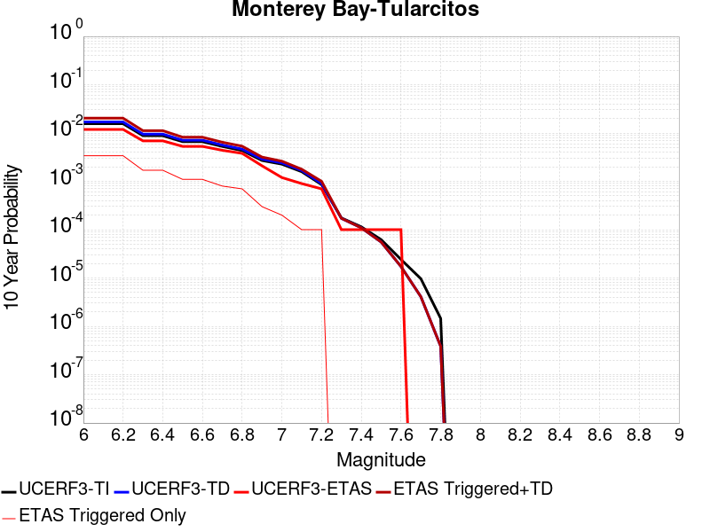 |

| Magnitude | 1 wk TI Prob | 1 wk TD Prob | 1 wk ETAS Prob | 1 wk ETAS/TD Gain | 1 wk ETAS Triggered+TD | 1 wk ETAS Triggered Only | 1 mo TI Prob | 1 mo TD Prob | 1 mo ETAS Prob | 1 mo ETAS/TD Gain | 1 mo ETAS Triggered+TD | 1 mo ETAS Triggered Only | 1 yr TI Prob | 1 yr TD Prob | 1 yr ETAS Prob | 1 yr ETAS/TD Gain | 1 yr ETAS Triggered+TD | 1 yr ETAS Triggered Only | 10 yr TI Prob | 10 yr TD Prob | 10 yr ETAS Prob | 10 yr ETAS/TD Gain | 10 yr ETAS Triggered+TD | 10 yr ETAS Triggered Only |
|-----|-----|-----|-----|-----|-----|-----|-----|-----|-----|-----|-----|-----|-----|-----|-----|-----|-----|-----|-----|-----|-----|-----|-----|-----|
| 6.0 | 3.0131365E-5 | 3.2767934E-5 | 0.0 | 0.0 | 3.2767934E-5 | 0.0 | 1.2912804E-4 | 1.4042703E-4 | 2.0E-4 | 1.4242272 | 2.4041299E-4 | 1.0E-4 | 0.001571 | 0.0017084635 | 0.0014 | 0.8194497 | 0.0022076094 | 5.0E-4 | 0.015599402 | 0.016964074 | 0.0119 | 0.7014825 | 0.020306395 | 0.0034 |
| 6.1 | 3.0131365E-5 | 3.2767934E-5 | 0.0 | 0.0 | 3.2767934E-5 | 0.0 | 1.2912804E-4 | 1.4042703E-4 | 2.0E-4 | 1.4242272 | 2.4041299E-4 | 1.0E-4 | 0.001571 | 0.0017084635 | 0.0014 | 0.8194497 | 0.0022076094 | 5.0E-4 | 0.015599402 | 0.016964074 | 0.0119 | 0.7014825 | 0.020306395 | 0.0034 |
| 6.2 | 3.0131365E-5 | 3.2767934E-5 | 0.0 | 0.0 | 3.2767934E-5 | 0.0 | 1.2912804E-4 | 1.4042703E-4 | 2.0E-4 | 1.4242272 | 2.4041299E-4 | 1.0E-4 | 0.001571 | 0.0017084635 | 0.0014 | 0.8194497 | 0.0022076094 | 5.0E-4 | 0.015599402 | 0.016964074 | 0.0119 | 0.7014825 | 0.020306395 | 0.0034 |
| 6.3 | 1.6998249E-5 | 1.8315328E-5 | 0.0 | 0.0 | 1.8315328E-5 | 0.0 | 7.28476E-5 | 7.8492005E-5 | 2.0E-4 | 2.5480301 | 1.7848416E-4 | 1.0E-4 | 8.865586E-4 | 9.5523987E-4 | 9.0E-4 | 0.94217175 | 0.0012549533 | 3.0E-4 | 0.0088303005 | 0.009513259 | 0.0069 | 0.7253035 | 0.011197086 | 0.0017 |
| 6.4 | 1.6998249E-5 | 1.8315328E-5 | 0.0 | 0.0 | 1.8315328E-5 | 0.0 | 7.28476E-5 | 7.8492005E-5 | 2.0E-4 | 2.5480301 | 1.7848416E-4 | 1.0E-4 | 8.865586E-4 | 9.5523987E-4 | 9.0E-4 | 0.94217175 | 0.0012549533 | 3.0E-4 | 0.0088303005 | 0.009513259 | 0.0069 | 0.7253035 | 0.011197086 | 0.0017 |
| 6.5 | 1.27470785E-5 | 1.36822455E-5 | 0.0 | 0.0 | 1.36822455E-5 | 0.0 | 5.4629192E-5 | 5.8636935E-5 | 2.0E-4 | 3.4108195 | 1.5863107E-4 | 1.0E-4 | 6.649074E-4 | 7.1368116E-4 | 7.0E-4 | 0.98083013 | 0.0010134671 | 3.0E-4 | 0.0066292146 | 0.0071149427 | 0.0053 | 0.74491113 | 0.008207116 | 0.0011 |
| 6.6 | 1.2739422E-5 | 1.3674335E-5 | 0.0 | 0.0 | 1.3674335E-5 | 0.0 | 5.4596385E-5 | 5.8603036E-5 | 2.0E-4 | 3.4127924 | 1.5859718E-4 | 1.0E-4 | 6.645082E-4 | 7.132687E-4 | 7.0E-4 | 0.98139733 | 0.0010130547 | 3.0E-4 | 0.0066252467 | 0.0071108444 | 0.0053 | 0.7453404 | 0.008203023 | 0.0011 |
| 6.7 | 1.0160109E-5 | 1.08771865E-5 | 0.0 | 0.0 | 1.08771865E-5 | 0.0 | 4.35426E-5 | 4.661572E-5 | 1.0E-4 | 2.145199 | 1.4661106E-4 | 1.0E-4 | 5.300022E-4 | 5.6740566E-4 | 4.0E-4 | 0.70496297 | 6.673489E-4 | 1.0E-4 | 0.005287399 | 0.0056602797 | 0.0044 | 0.77734673 | 0.0064557516 | 8.0E-4 |
| 6.8 | 8.349859E-6 | 8.92563E-6 | 0.0 | 0.0 | 8.92563E-6 | 0.0 | 3.578462E-5 | 3.825217E-5 | 1.0E-4 | 2.6142309 | 1.3824835E-4 | 1.0E-4 | 4.3559066E-4 | 4.6562628E-4 | 3.0E-4 | 0.64429355 | 5.6557974E-4 | 1.0E-4 | 0.004347378 | 0.004647071 | 0.0038 | 0.8177194 | 0.005343818 | 7.0E-4 |
| 6.9 | 5.193639E-6 | 5.532168E-6 | 0.0 | 0.0 | 5.532168E-6 | 0.0 | 2.2258262E-5 | 2.3709094E-5 | 0.0 | 0.0 | 2.3709094E-5 | 0.0 | 2.7096065E-4 | 2.886232E-4 | 1.0E-4 | 0.34647247 | 2.886232E-4 | 0.0 | 0.0027063051 | 0.0028828043 | 0.0021 | 0.7284574 | 0.0031819395 | 3.0E-4 |
| 7.0 | 4.359381E-6 | 4.6397618E-6 | 0.0 | 0.0 | 4.6397618E-6 | 0.0 | 1.8682927E-5 | 1.988456E-5 | 0.0 | 0.0 | 1.988456E-5 | 0.0 | 2.274409E-4 | 2.4207057E-4 | 0.0 | 0.0 | 2.4207057E-4 | 0.0 | 0.0022720827 | 0.0024183614 | 0.0012 | 0.49620375 | 0.0026178777 | 2.0E-4 |
| 7.1 | 3.0398533E-6 | 3.2284763E-6 | 0.0 | 0.0 | 3.2284763E-6 | 0.0 | 1.3027877E-5 | 1.3836268E-5 | 0.0 | 0.0 | 1.3836268E-5 | 0.0 | 1.5860285E-4 | 1.6844616E-4 | 0.0 | 0.0 | 1.6844616E-4 | 0.0 | 0.001584897 | 0.001683442 | 9.0E-4 | 0.5346189 | 0.0017832738 | 1.0E-4 |
| 7.2 | 1.642335E-6 | 1.7318716E-6 | 0.0 | 0.0 | 1.7318716E-6 | 0.0 | 7.0385595E-6 | 7.4222976E-6 | 0.0 | 0.0 | 7.4222976E-6 | 0.0 | 8.569109E-5 | 9.036479E-5 | 0.0 | 0.0 | 9.036479E-5 | 0.0 | 8.5658056E-4 | 9.034828E-4 | 7.0E-4 | 0.77477956 | 0.0010033925 | 1.0E-4 |
| 7.3 | 3.356842E-7 | 3.291712E-7 | 0.0 | 0.0 | 3.291712E-7 | 0.0 | 1.4386458E-6 | 1.410733E-6 | 0.0 | 0.0 | 1.410733E-6 | 0.0 | 1.7515373E-5 | 1.717554E-5 | 0.0 | 0.0 | 1.717554E-5 | 0.0 | 1.7513991E-4 | 1.7174221E-4 | 1.0E-4 | 0.582268 | 1.7174221E-4 | 0.0 |
| 7.4 | 2.1973483E-7 | 2.0974947E-7 | 0.0 | 0.0 | 2.0974947E-7 | 0.0 | 9.417204E-7 | 8.98926E-7 | 0.0 | 0.0 | 8.98926E-7 | 0.0 | 1.1465385E-5 | 1.0944369E-5 | 0.0 | 0.0 | 1.0944369E-5 | 0.0 | 1.1464794E-4 | 1.0943834E-4 | 1.0E-4 | 0.91375655 | 1.0943834E-4 | 0.0 |
| 7.5 | 1.1944135E-7 | 1.0668502E-7 | 0.0 | 0.0 | 1.0668502E-7 | 0.0 | 5.118914E-7 | 4.5722143E-7 | 0.0 | 0.0 | 4.5722143E-7 | 0.0 | 6.23226E-6 | 5.566657E-6 | 0.0 | 0.0 | 5.566657E-6 | 0.0 | 6.2320854E-5 | 5.5665187E-5 | 1.0E-4 | 1.7964549 | 5.5665187E-5 | 0.0 |
| 7.6 | 4.636058E-8 | 3.3143074E-8 | 0.0 | 0.0 | 3.3143074E-8 | 0.0 | 1.9868818E-7 | 1.4204173E-7 | 0.0 | 0.0 | 1.4204173E-7 | 0.0 | 2.419026E-6 | 1.7293568E-6 | 0.0 | 0.0 | 1.7293568E-6 | 0.0 | 2.4189996E-5 | 1.7293434E-5 | 1.0E-4 | 5.7825413 | 1.7293434E-5 | 0.0 |
| 7.7 | 1.8588572E-8 | 7.864173E-9 | 0.0 | 0.0 | 7.864173E-9 | 0.0 | 7.9665305E-8 | 3.37036E-8 | 0.0 | 0.0 | 3.37036E-8 | 0.0 | 9.699246E-7 | 4.1034124E-7 | 0.0 | 0.0 | 4.1034124E-7 | 0.0 | 9.699204E-6 | 4.103405E-6 | 0.0 | 0.0 | 4.103405E-6 | 0.0 |
| 7.8 | 2.7960154E-9 | 7.380496E-10 | 0.0 | 0.0 | 7.380496E-10 | 0.0 | 1.1982923E-8 | 3.1630694E-9 | 0.0 | 0.0 | 3.1630694E-9 | 0.0 | 1.4589209E-7 | 3.851037E-8 | 0.0 | 0.0 | 3.851037E-8 | 0.0 | 1.4589199E-6 | 3.8510368E-7 | 0.0 | 0.0 | 3.8510368E-7 | 0.0 |

## San Jacinto (Anza) rev
*[(top)](#table-of-contents)*

| 1 Week | 1 Month | 1 Year | 10 Year |
|-----|-----|-----|-----|
|  |  |  |  |

| Magnitude | 1 wk TI Prob | 1 wk TD Prob | 1 wk ETAS Prob | 1 wk ETAS/TD Gain | 1 wk ETAS Triggered+TD | 1 wk ETAS Triggered Only | 1 mo TI Prob | 1 mo TD Prob | 1 mo ETAS Prob | 1 mo ETAS/TD Gain | 1 mo ETAS Triggered+TD | 1 mo ETAS Triggered Only | 1 yr TI Prob | 1 yr TD Prob | 1 yr ETAS Prob | 1 yr ETAS/TD Gain | 1 yr ETAS Triggered+TD | 1 yr ETAS Triggered Only | 10 yr TI Prob | 10 yr TD Prob | 10 yr ETAS Prob | 10 yr ETAS/TD Gain | 10 yr ETAS Triggered+TD | 10 yr ETAS Triggered Only |
|-----|-----|-----|-----|-----|-----|-----|-----|-----|-----|-----|-----|-----|-----|-----|-----|-----|-----|-----|-----|-----|-----|-----|-----|-----|
| 6.0 | 6.3015636E-5 | 4.183058E-5 | 1.0E-4 | 2.3905957 | 1.418264E-4 | 1.0E-4 | 2.7003905E-4 | 1.7926165E-4 | 1.0E-4 | 0.5578438 | 2.7924372E-4 | 1.0E-4 | 0.0032827691 | 0.0021803374 | 0.0017 | 0.77969587 | 0.0025794653 | 4.0E-4 | 0.032346968 | 0.022534408 | 0.0133 | 0.59020853 | 0.025760045 | 0.0033 |
| 6.1 | 6.3015636E-5 | 4.183058E-5 | 1.0E-4 | 2.3905957 | 1.418264E-4 | 1.0E-4 | 2.7003905E-4 | 1.7926165E-4 | 1.0E-4 | 0.5578438 | 2.7924372E-4 | 1.0E-4 | 0.0032827691 | 0.0021803374 | 0.0017 | 0.77969587 | 0.0025794653 | 4.0E-4 | 0.032346968 | 0.022534408 | 0.0133 | 0.59020853 | 0.025760045 | 0.0033 |
| 6.2 | 6.3015636E-5 | 4.183058E-5 | 1.0E-4 | 2.3905957 | 1.418264E-4 | 1.0E-4 | 2.7003905E-4 | 1.7926165E-4 | 1.0E-4 | 0.5578438 | 2.7924372E-4 | 1.0E-4 | 0.0032827691 | 0.0021803374 | 0.0017 | 0.77969587 | 0.0025794653 | 4.0E-4 | 0.032346968 | 0.022534408 | 0.0133 | 0.59020853 | 0.025760045 | 0.0033 |
| 6.3 | 6.3015636E-5 | 4.183058E-5 | 1.0E-4 | 2.3905957 | 1.418264E-4 | 1.0E-4 | 2.7003905E-4 | 1.7926165E-4 | 1.0E-4 | 0.5578438 | 2.7924372E-4 | 1.0E-4 | 0.0032827691 | 0.0021803374 | 0.0017 | 0.77969587 | 0.0025794653 | 4.0E-4 | 0.032346968 | 0.022534408 | 0.0133 | 0.59020853 | 0.025760045 | 0.0033 |
| 6.4 | 6.3015636E-5 | 4.183058E-5 | 1.0E-4 | 2.3905957 | 1.418264E-4 | 1.0E-4 | 2.7003905E-4 | 1.7926165E-4 | 1.0E-4 | 0.5578438 | 2.7924372E-4 | 1.0E-4 | 0.0032827691 | 0.0021803374 | 0.0017 | 0.77969587 | 0.0025794653 | 4.0E-4 | 0.032346968 | 0.022534408 | 0.0133 | 0.59020853 | 0.025760045 | 0.0033 |
| 6.5 | 5.811017E-5 | 3.8686903E-5 | 1.0E-4 | 2.5848541 | 1.3868304E-4 | 1.0E-4 | 2.4901982E-4 | 1.6579051E-4 | 1.0E-4 | 0.6031708 | 2.6577394E-4 | 1.0E-4 | 0.0030276014 | 0.002016636 | 0.0016 | 0.79340047 | 0.0023160311 | 3.0E-4 | 0.02986684 | 0.020870313 | 0.012 | 0.57497936 | 0.023611877 | 0.0028 |
| 6.6 | 5.811017E-5 | 3.8686903E-5 | 1.0E-4 | 2.5848541 | 1.3868304E-4 | 1.0E-4 | 2.4901982E-4 | 1.6579051E-4 | 1.0E-4 | 0.6031708 | 2.6577394E-4 | 1.0E-4 | 0.0030276014 | 0.002016636 | 0.0016 | 0.79340047 | 0.0023160311 | 3.0E-4 | 0.02986684 | 0.020870313 | 0.012 | 0.57497936 | 0.023611877 | 0.0028 |
| 6.7 | 5.712442E-5 | 3.8125763E-5 | 1.0E-4 | 2.6228983 | 1.3812195E-4 | 1.0E-4 | 2.4479596E-4 | 1.6338592E-4 | 1.0E-4 | 0.61204785 | 2.6336958E-4 | 1.0E-4 | 0.0029763177 | 0.001987414 | 0.0016 | 0.8050663 | 0.0022868176 | 3.0E-4 | 0.029367693 | 0.020570375 | 0.0118 | 0.57364047 | 0.023214836 | 0.0027 |
| 6.8 | 5.6967532E-5 | 3.7984697E-5 | 1.0E-4 | 2.6326392 | 1.379809E-4 | 1.0E-4 | 2.4412372E-4 | 1.6278143E-4 | 1.0E-4 | 0.6143207 | 2.6276516E-4 | 1.0E-4 | 0.0029681553 | 0.0019800677 | 0.0016 | 0.8080532 | 0.0022794737 | 3.0E-4 | 0.029288229 | 0.020495819 | 0.0118 | 0.57572716 | 0.02314048 | 0.0027 |
| 6.9 | 5.6211324E-5 | 3.7700964E-5 | 1.0E-4 | 2.6524522 | 1.3769719E-4 | 1.0E-4 | 2.4088343E-4 | 1.6156558E-4 | 1.0E-4 | 0.61894375 | 2.6154943E-4 | 1.0E-4 | 0.0029288116 | 0.0019652913 | 0.0015 | 0.7632456 | 0.0022647018 | 3.0E-4 | 0.028905109 | 0.02034173 | 0.0116 | 0.5702563 | 0.022986807 | 0.0027 |
| 7.0 | 5.4383527E-5 | 3.659375E-5 | 1.0E-4 | 2.7327073 | 1.3659008E-4 | 1.0E-4 | 2.3305144E-4 | 1.5682094E-4 | 1.0E-4 | 0.6376699 | 2.5680527E-4 | 1.0E-4 | 0.0028337094 | 0.0019076277 | 0.0015 | 0.786317 | 0.0022070555 | 3.0E-4 | 0.027978465 | 0.019751118 | 0.0113 | 0.57211953 | 0.02239779 | 0.0027 |
| 7.1 | 5.1393665E-5 | 3.510502E-5 | 1.0E-4 | 2.8485954 | 1.3510151E-4 | 1.0E-4 | 2.2023996E-4 | 1.5044144E-4 | 1.0E-4 | 0.6647105 | 2.5042638E-4 | 1.0E-4 | 0.0026781242 | 0.0018300897 | 0.0015 | 0.819632 | 0.0021295405 | 3.0E-4 | 0.026460782 | 0.018947938 | 0.0107 | 0.5647052 | 0.021498675 | 0.0026 |
| 7.2 | 4.785222E-5 | 3.3509757E-5 | 1.0E-4 | 2.9842052 | 1.335064E-4 | 1.0E-4 | 2.0506482E-4 | 1.4360536E-4 | 1.0E-4 | 0.69635284 | 2.43591E-4 | 1.0E-4 | 0.0024938055 | 0.0017469965 | 0.0014 | 0.8013754 | 0.0020464724 | 3.0E-4 | 0.024660049 | 0.018087938 | 0.0102 | 0.56391174 | 0.020542718 | 0.0025 |
| 7.3 | 4.2143256E-5 | 3.2639113E-5 | 1.0E-4 | 3.063809 | 1.3263585E-4 | 1.0E-4 | 1.8060145E-4 | 1.3987442E-4 | 1.0E-4 | 0.714927 | 2.3986044E-4 | 1.0E-4 | 0.002196605 | 0.0017016442 | 0.0013 | 0.76396704 | 0.0019013038 | 2.0E-4 | 0.02175019 | 0.01761302 | 0.0099 | 0.5620842 | 0.01987251 | 0.0023 |
| 7.4 | 4.0264713E-5 | 3.2289736E-5 | 1.0E-4 | 3.0969594 | 1.3228651E-4 | 1.0E-4 | 1.7255165E-4 | 1.3837726E-4 | 1.0E-4 | 0.7226621 | 2.3836343E-4 | 1.0E-4 | 0.002098792 | 0.0016834446 | 0.0013 | 0.7722262 | 0.0018831078 | 2.0E-4 | 0.020790804 | 0.017424108 | 0.0099 | 0.5681783 | 0.019684033 | 0.0023 |
| 7.5 | 3.694492E-5 | 3.1029784E-5 | 1.0E-4 | 3.22271 | 1.3102668E-4 | 1.0E-4 | 1.5832575E-4 | 1.3297804E-4 | 1.0E-4 | 0.7520039 | 2.3296474E-4 | 1.0E-4 | 0.0019259118 | 0.0016178081 | 0.0012 | 0.7417443 | 0.0018174846 | 2.0E-4 | 0.01909306 | 0.016754005 | 0.0092 | 0.54912245 | 0.01901547 | 0.0023 |
| 7.6 | 3.200565E-5 | 2.8383402E-5 | 1.0E-4 | 3.523186 | 1.2838056E-4 | 1.0E-4 | 1.3715986E-4 | 1.2163749E-4 | 1.0E-4 | 0.82211494 | 2.2162532E-4 | 1.0E-4 | 0.001668642 | 0.0014799325 | 0.0012 | 0.8108478 | 0.0016796365 | 2.0E-4 | 0.01656168 | 0.015360921 | 0.0085 | 0.55335224 | 0.017527126 | 0.0022 |
| 7.7 | 2.731642E-5 | 2.501408E-5 | 1.0E-4 | 3.9977486 | 1.2501157E-4 | 1.0E-4 | 1.1706512E-4 | 1.071988E-4 | 1.0E-4 | 0.9328463 | 2.0718807E-4 | 1.0E-4 | 0.001424336 | 0.0013043649 | 0.001 | 0.76665664 | 0.001504104 | 2.0E-4 | 0.014152412 | 0.013602458 | 0.0072 | 0.5293161 | 0.0155752525 | 0.002 |
| 7.8 | 2.3466424E-5 | 2.2473176E-5 | 1.0E-4 | 4.4497495 | 1.2247093E-4 | 1.0E-4 | 1.0056651E-4 | 9.6310054E-5 | 1.0E-4 | 1.0383132 | 1.9630042E-4 | 1.0E-4 | 0.0012237094 | 0.0011719449 | 9.0E-4 | 0.7679542 | 0.0013717106 | 2.0E-4 | 0.012169928 | 0.012268121 | 0.0066 | 0.53797966 | 0.014144812 | 0.0019 |
| 7.9 | 1.8611925E-5 | 1.7977458E-5 | 1.0E-4 | 5.562522 | 1.1797566E-4 | 1.0E-4 | 7.9762955E-5 | 7.704397E-5 | 1.0E-4 | 1.29796 | 1.7703627E-4 | 1.0E-4 | 9.7068126E-4 | 9.376074E-4 | 6.0E-4 | 0.6399267 | 0.0011374198 | 2.0E-4 | 0.0096645225 | 0.009904152 | 0.0055 | 0.5553227 | 0.0114883045 | 0.0016 |
| 8.0 | 1.5460775E-5 | 1.4910216E-5 | 1.0E-4 | 6.706811 | 1.14908726E-4 | 1.0E-4 | 6.6258784E-5 | 6.3899366E-5 | 1.0E-4 | 1.5649607 | 1.6389298E-4 | 1.0E-4 | 8.0640207E-4 | 7.776977E-4 | 6.0E-4 | 0.771508 | 9.775421E-4 | 2.0E-4 | 0.008034821 | 0.008264083 | 0.0044 | 0.53242445 | 0.00955334 | 0.0013 |
| 8.1 | 9.983884E-6 | 7.773843E-6 | 1.0E-4 | 12.86365 | 1.0777306E-4 | 1.0E-4 | 4.2787375E-5 | 3.3316046E-5 | 1.0E-4 | 3.0015564 | 1.3331271E-4 | 1.0E-4 | 5.2081177E-4 | 4.0554785E-4 | 4.0E-4 | 0.9863201 | 6.054667E-4 | 2.0E-4 | 0.0051959283 | 0.00437231 | 0.0028 | 0.64039373 | 0.005367938 | 0.001 |
| 8.2 | 4.1226E-6 | 1.402547E-6 | 0.0 | 0.0 | 1.402547E-6 | 0.0 | 1.7668166E-5 | 6.010902E-6 | 0.0 | 0.0 | 6.010902E-6 | 0.0 | 2.1508869E-4 | 7.31803E-5 | 1.0E-4 | 1.366488 | 7.31803E-5 | 0.0 | 0.0021488064 | 8.541163E-4 | 6.0E-4 | 0.7024805 | 0.0010539454 | 2.0E-4 |
| 8.3 | 1.2750878E-6 | 3.1939175E-7 | 0.0 | 0.0 | 3.1939175E-7 | 0.0 | 5.4646503E-6 | 1.368821E-6 | 0.0 | 0.0 | 1.368821E-6 | 0.0 | 6.653009E-5 | 1.6665272E-5 | 0.0 | 0.0 | 1.6665272E-5 | 0.0 | 6.6510175E-4 | 2.0263324E-4 | 2.0E-4 | 0.98700494 | 3.0261299E-4 | 1.0E-4 |

## Hunter Mountain-Saline Valley
*[(top)](#table-of-contents)*

| 1 Week | 1 Month | 1 Year | 10 Year |
|-----|-----|-----|-----|
| 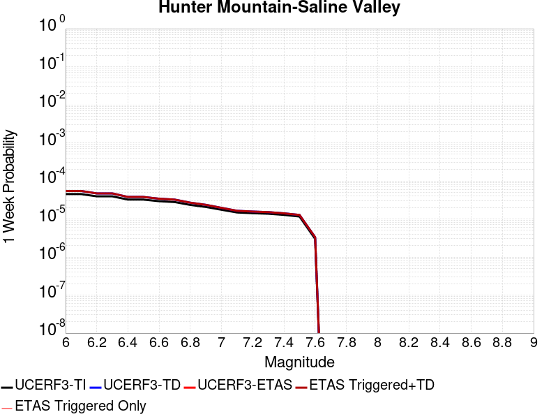 | 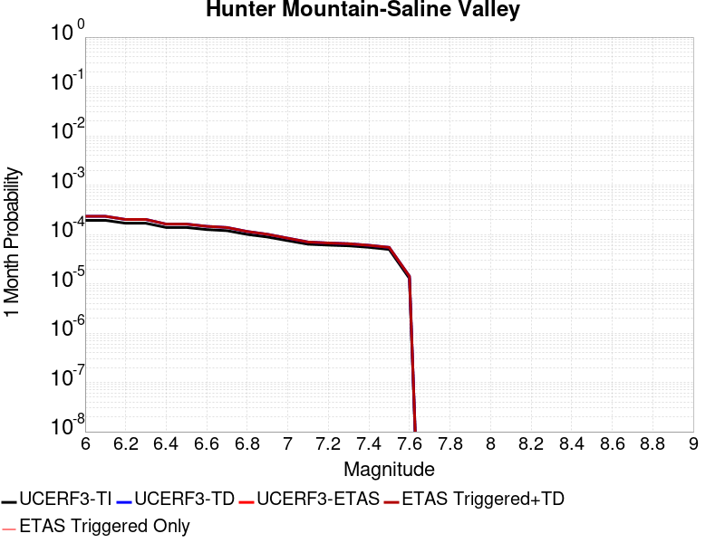 |  |  |

| Magnitude | 1 wk TI Prob | 1 wk TD Prob | 1 wk ETAS Prob | 1 wk ETAS/TD Gain | 1 wk ETAS Triggered+TD | 1 wk ETAS Triggered Only | 1 mo TI Prob | 1 mo TD Prob | 1 mo ETAS Prob | 1 mo ETAS/TD Gain | 1 mo ETAS Triggered+TD | 1 mo ETAS Triggered Only | 1 yr TI Prob | 1 yr TD Prob | 1 yr ETAS Prob | 1 yr ETAS/TD Gain | 1 yr ETAS Triggered+TD | 1 yr ETAS Triggered Only | 10 yr TI Prob | 10 yr TD Prob | 10 yr ETAS Prob | 10 yr ETAS/TD Gain | 10 yr ETAS Triggered+TD | 10 yr ETAS Triggered Only |
|-----|-----|-----|-----|-----|-----|-----|-----|-----|-----|-----|-----|-----|-----|-----|-----|-----|-----|-----|-----|-----|-----|-----|-----|-----|
| 6.0 | 4.5103672E-5 | 5.4413267E-5 | 0.0 | 0.0 | 5.4413267E-5 | 0.0 | 1.9328714E-4 | 2.3317964E-4 | 0.0 | 0.0 | 2.3317964E-4 | 0.0 | 0.002350731 | 0.002835441 | 0.0017 | 0.599554 | 0.003334023 | 5.0E-4 | 0.023260195 | 0.02801385 | 0.0158 | 0.56400675 | 0.031124206 | 0.0032 |
| 6.1 | 4.5103672E-5 | 5.4413267E-5 | 0.0 | 0.0 | 5.4413267E-5 | 0.0 | 1.9328714E-4 | 2.3317964E-4 | 0.0 | 0.0 | 2.3317964E-4 | 0.0 | 0.002350731 | 0.002835441 | 0.0017 | 0.599554 | 0.003334023 | 5.0E-4 | 0.023260195 | 0.02801385 | 0.0158 | 0.56400675 | 0.031124206 | 0.0032 |
| 6.2 | 3.9363465E-5 | 4.6930167E-5 | 0.0 | 0.0 | 4.6930167E-5 | 0.0 | 1.6868966E-4 | 2.0111441E-4 | 0.0 | 0.0 | 2.0111441E-4 | 0.0 | 0.002051862 | 0.002445953 | 0.0014 | 0.57237405 | 0.0027452193 | 3.0E-4 | 0.020330196 | 0.02420684 | 0.0139 | 0.57421786 | 0.02684148 | 0.0027 |
| 6.3 | 3.9363465E-5 | 4.6930167E-5 | 0.0 | 0.0 | 4.6930167E-5 | 0.0 | 1.6868966E-4 | 2.0111441E-4 | 0.0 | 0.0 | 2.0111441E-4 | 0.0 | 0.002051862 | 0.002445953 | 0.0014 | 0.57237405 | 0.0027452193 | 3.0E-4 | 0.020330196 | 0.02420684 | 0.0139 | 0.57421786 | 0.02684148 | 0.0027 |
| 6.4 | 3.2311684E-5 | 3.784555E-5 | 0.0 | 0.0 | 3.784555E-5 | 0.0 | 1.384713E-4 | 1.621855E-4 | 0.0 | 0.0 | 1.621855E-4 | 0.0 | 0.0016845843 | 0.0019728886 | 0.0012 | 0.6082452 | 0.0022722967 | 3.0E-4 | 0.016718714 | 0.019563187 | 0.0115 | 0.58783877 | 0.021916235 | 0.0024 |
| 6.5 | 3.2311684E-5 | 3.784555E-5 | 0.0 | 0.0 | 3.784555E-5 | 0.0 | 1.384713E-4 | 1.621855E-4 | 0.0 | 0.0 | 1.621855E-4 | 0.0 | 0.0016845843 | 0.0019728886 | 0.0012 | 0.6082452 | 0.0022722967 | 3.0E-4 | 0.016718714 | 0.019563187 | 0.0115 | 0.58783877 | 0.021916235 | 0.0024 |
| 6.6 | 2.9305844E-5 | 3.408624E-5 | 0.0 | 0.0 | 3.408624E-5 | 0.0 | 1.2559042E-4 | 1.4607605E-4 | 0.0 | 0.0 | 1.4607605E-4 | 0.0 | 0.0015279909 | 0.0017770866 | 0.0011 | 0.61899066 | 0.0020765534 | 3.0E-4 | 0.015175272 | 0.017637318 | 0.0107 | 0.6066682 | 0.019896753 | 0.0023 |
| 6.7 | 2.7826512E-5 | 3.2253232E-5 | 0.0 | 0.0 | 3.2253232E-5 | 0.0 | 1.19251024E-4 | 1.3822115E-4 | 0.0 | 0.0 | 1.3822115E-4 | 0.0 | 0.0014509142 | 0.0016816035 | 9.0E-4 | 0.53520346 | 0.0018812672 | 2.0E-4 | 0.014414776 | 0.016697118 | 0.0102 | 0.6108839 | 0.018762054 | 0.0021 |
| 6.8 | 2.3389874E-5 | 2.6789065E-5 | 0.0 | 0.0 | 2.6789065E-5 | 0.0 | 1.0023846E-4 | 1.14805494E-4 | 0.0 | 0.0 | 1.14805494E-4 | 0.0 | 0.00121972 | 0.0013969077 | 7.0E-4 | 0.50110686 | 0.0015966283 | 2.0E-4 | 0.01213047 | 0.013888132 | 0.0076 | 0.5472298 | 0.015465911 | 0.0016 |
| 6.9 | 2.069209E-5 | 2.3500012E-5 | 0.0 | 0.0 | 2.3500012E-5 | 0.0 | 8.867737E-5 | 1.00710655E-4 | 0.0 | 0.0 | 1.00710655E-4 | 0.0 | 0.0010791123 | 0.0012254985 | 7.0E-4 | 0.57119614 | 0.0014252533 | 2.0E-4 | 0.010738871 | 0.012193091 | 0.0068 | 0.5576929 | 0.01347724 | 0.0013 |
| 7.0 | 1.7462342E-5 | 1.9572502E-5 | 0.0 | 0.0 | 1.9572502E-5 | 0.0 | 7.483646E-5 | 8.387958E-5 | 0.0 | 0.0 | 8.387958E-5 | 0.0 | 9.1075303E-4 | 0.001020778 | 7.0E-4 | 0.68575144 | 0.0012205739 | 2.0E-4 | 0.009070295 | 0.01016519 | 0.0064 | 0.62959963 | 0.011352992 | 0.0012 |
| 7.1 | 1.4807709E-5 | 1.6387437E-5 | 0.0 | 0.0 | 1.6387437E-5 | 0.0 | 6.3460066E-5 | 7.0230075E-5 | 0.0 | 0.0 | 7.0230075E-5 | 0.0 | 7.723524E-4 | 8.547322E-4 | 7.0E-4 | 0.81897 | 0.0010545612 | 2.0E-4 | 0.007696735 | 0.0085181035 | 0.0055 | 0.64568365 | 0.009509585 | 0.001 |
| 7.2 | 1.4180048E-5 | 1.564545E-5 | 0.0 | 0.0 | 1.564545E-5 | 0.0 | 6.077022E-5 | 6.70503E-5 | 0.0 | 0.0 | 6.70503E-5 | 0.0 | 7.396263E-4 | 8.160477E-4 | 7.0E-4 | 0.857793 | 0.0010158846 | 2.0E-4 | 0.0073716943 | 0.008134132 | 0.0054 | 0.66386926 | 0.009125997 | 0.001 |
| 7.3 | 1.3730402E-5 | 1.5120152E-5 | 0.0 | 0.0 | 1.5120152E-5 | 0.0 | 5.8843252E-5 | 6.479913E-5 | 0.0 | 0.0 | 6.479913E-5 | 0.0 | 7.161811E-4 | 7.8865985E-4 | 7.0E-4 | 0.8875816 | 9.885022E-4 | 2.0E-4 | 0.007138774 | 0.007862212 | 0.0052 | 0.66139144 | 0.00885435 | 0.001 |
| 7.4 | 1.2810095E-5 | 1.4059342E-5 | 0.0 | 0.0 | 1.4059342E-5 | 0.0 | 5.489925E-5 | 6.025302E-5 | 0.0 | 0.0 | 6.025302E-5 | 0.0 | 6.681934E-4 | 7.3334936E-4 | 7.0E-4 | 0.95452464 | 9.332027E-4 | 2.0E-4 | 0.006661878 | 0.0073128585 | 0.005 | 0.68372715 | 0.008305546 | 0.001 |
| 7.5 | 1.1595659E-5 | 1.275406E-5 | 0.0 | 0.0 | 1.275406E-5 | 0.0 | 4.9694736E-5 | 5.46592E-5 | 0.0 | 0.0 | 5.46592E-5 | 0.0 | 6.0486543E-4 | 6.652881E-4 | 6.0E-4 | 0.9018648 | 7.652216E-4 | 1.0E-4 | 0.006032217 | 0.0066365097 | 0.0043 | 0.6479309 | 0.0073318644 | 7.0E-4 |
| 7.6 | 2.997694E-6 | 3.3143867E-6 | 0.0 | 0.0 | 3.3143867E-6 | 0.0 | 1.28471975E-5 | 1.4204477E-5 | 0.0 | 0.0 | 1.4204477E-5 | 0.0 | 1.564034E-4 | 1.7293303E-4 | 0.0 | 0.0 | 1.7293303E-4 | 0.0 | 0.0015629337 | 0.00173029 | 0.0012 | 0.6935254 | 0.001830117 | 1.0E-4 |

## Lenwood-Lockhart-Old Woman Springs
*[(top)](#table-of-contents)*

| 1 Week | 1 Month | 1 Year | 10 Year |
|-----|-----|-----|-----|
|  |  | 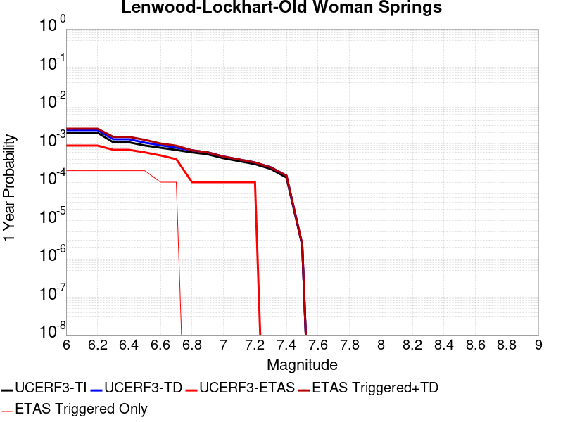 | 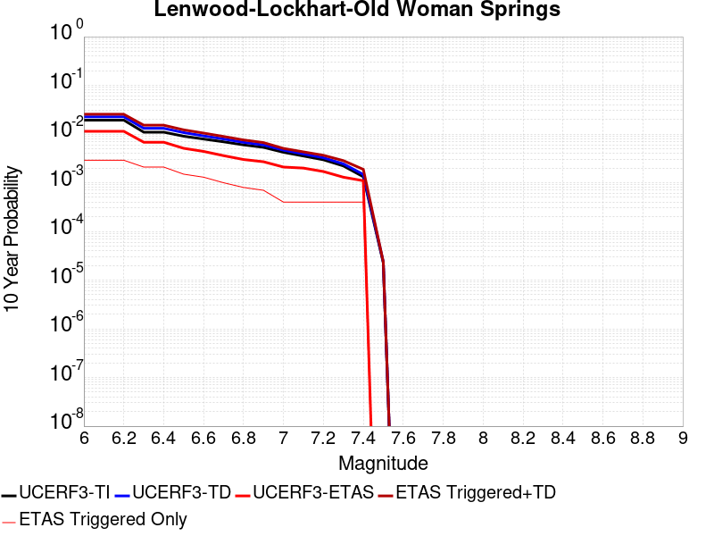 |

| Magnitude | 1 wk TI Prob | 1 wk TD Prob | 1 wk ETAS Prob | 1 wk ETAS/TD Gain | 1 wk ETAS Triggered+TD | 1 wk ETAS Triggered Only | 1 mo TI Prob | 1 mo TD Prob | 1 mo ETAS Prob | 1 mo ETAS/TD Gain | 1 mo ETAS Triggered+TD | 1 mo ETAS Triggered Only | 1 yr TI Prob | 1 yr TD Prob | 1 yr ETAS Prob | 1 yr ETAS/TD Gain | 1 yr ETAS Triggered+TD | 1 yr ETAS Triggered Only | 10 yr TI Prob | 10 yr TD Prob | 10 yr ETAS Prob | 10 yr ETAS/TD Gain | 10 yr ETAS Triggered+TD | 10 yr ETAS Triggered Only |
|-----|-----|-----|-----|-----|-----|-----|-----|-----|-----|-----|-----|-----|-----|-----|-----|-----|-----|-----|-----|-----|-----|-----|-----|-----|
| 6.0 | 3.744542E-5 | 4.3915243E-5 | 0.0 | 0.0 | 4.3915243E-5 | 0.0 | 1.604705E-4 | 1.8819557E-4 | 0.0 | 0.0 | 1.8819557E-4 | 0.0 | 0.0019519776 | 0.002289045 | 9.0E-4 | 0.3931771 | 0.002488587 | 2.0E-4 | 0.019349206 | 0.02267263 | 0.0114 | 0.50280887 | 0.02550688 | 0.0029 |
| 6.1 | 3.744542E-5 | 4.3915243E-5 | 0.0 | 0.0 | 4.3915243E-5 | 0.0 | 1.604705E-4 | 1.8819557E-4 | 0.0 | 0.0 | 1.8819557E-4 | 0.0 | 0.0019519776 | 0.002289045 | 9.0E-4 | 0.3931771 | 0.002488587 | 2.0E-4 | 0.019349206 | 0.02267263 | 0.0114 | 0.50280887 | 0.02550688 | 0.0029 |
| 6.2 | 3.744542E-5 | 4.3915243E-5 | 0.0 | 0.0 | 4.3915243E-5 | 0.0 | 1.604705E-4 | 1.8819557E-4 | 0.0 | 0.0 | 1.8819557E-4 | 0.0 | 0.0019519776 | 0.002289045 | 9.0E-4 | 0.3931771 | 0.002488587 | 2.0E-4 | 0.019349206 | 0.02267263 | 0.0114 | 0.50280887 | 0.02550688 | 0.0029 |
| 6.3 | 2.1079984E-5 | 2.5328589E-5 | 0.0 | 0.0 | 2.5328589E-5 | 0.0 | 9.0339665E-5 | 1.0854669E-4 | 0.0 | 0.0 | 1.0854669E-4 | 0.0 | 0.0010993304 | 0.0013207747 | 7.0E-4 | 0.529992 | 0.0015205105 | 2.0E-4 | 0.010939079 | 0.01313146 | 0.0068 | 0.5178403 | 0.015203884 | 0.0021 |
| 6.4 | 2.1079984E-5 | 2.5328589E-5 | 0.0 | 0.0 | 2.5328589E-5 | 0.0 | 9.0339665E-5 | 1.0854669E-4 | 0.0 | 0.0 | 1.0854669E-4 | 0.0 | 0.0010993304 | 0.0013207747 | 7.0E-4 | 0.529992 | 0.0015205105 | 2.0E-4 | 0.010939079 | 0.01313146 | 0.0068 | 0.5178403 | 0.015203884 | 0.0021 |
| 6.5 | 1.7397282E-5 | 2.0640626E-5 | 0.0 | 0.0 | 2.0640626E-5 | 0.0 | 7.455765E-5 | 8.8456894E-5 | 0.0 | 0.0 | 8.8456894E-5 | 0.0 | 9.073613E-4 | 0.0010764423 | 6.0E-4 | 0.5573917 | 0.0012762271 | 2.0E-4 | 0.009036654 | 0.010713574 | 0.0051 | 0.47603163 | 0.012197504 | 0.0015 |
| 6.6 | 1.52050325E-5 | 1.765924E-5 | 0.0 | 0.0 | 1.765924E-5 | 0.0 | 6.51628E-5 | 7.5680306E-5 | 0.0 | 0.0 | 7.5680306E-5 | 0.0 | 7.9306826E-4 | 9.210261E-4 | 5.0E-4 | 0.5428728 | 0.001020934 | 1.0E-4 | 0.007902439 | 0.00917295 | 0.0044 | 0.4796712 | 0.010461025 | 0.0013 |
| 6.7 | 1.332523E-5 | 1.5245194E-5 | 0.0 | 0.0 | 1.5245194E-5 | 0.0 | 5.7106878E-5 | 6.533494E-5 | 0.0 | 0.0 | 6.533494E-5 | 0.0 | 6.950544E-4 | 7.9516845E-4 | 4.0E-4 | 0.5030381 | 8.950889E-4 | 1.0E-4 | 0.006928845 | 0.007923861 | 0.0036 | 0.45432398 | 0.008915937 | 0.001 |
| 6.8 | 1.1525329E-5 | 1.3013368E-5 | 0.0 | 0.0 | 1.3013368E-5 | 0.0 | 4.9393333E-5 | 5.5770404E-5 | 0.0 | 0.0 | 5.5770404E-5 | 0.0 | 6.011979E-4 | 6.7879737E-4 | 1.0E-4 | 0.14731936 | 6.7879737E-4 | 0.0 | 0.00599574 | 0.00676769 | 0.003 | 0.4432827 | 0.007562276 | 8.0E-4 |
| 6.9 | 1.0253909E-5 | 1.1497721E-5 | 0.0 | 0.0 | 1.1497721E-5 | 0.0 | 4.3944583E-5 | 4.9275037E-5 | 0.0 | 0.0 | 4.9275037E-5 | 0.0 | 5.3489394E-4 | 5.99762E-4 | 1.0E-4 | 0.16673279 | 5.99762E-4 | 0.0 | 0.0053360825 | 0.005981812 | 0.0027 | 0.45136824 | 0.006677625 | 7.0E-4 |
| 7.0 | 8.104563E-6 | 8.976321E-6 | 0.0 | 0.0 | 8.976321E-6 | 0.0 | 3.4733377E-5 | 3.8469392E-5 | 0.0 | 0.0 | 3.8469392E-5 | 0.0 | 4.2279682E-4 | 4.6826657E-4 | 1.0E-4 | 0.21355358 | 4.6826657E-4 | 0.0 | 0.0042199334 | 0.004673046 | 0.0021 | 0.4493857 | 0.0050711767 | 4.0E-4 |
| 7.1 | 6.7986157E-6 | 7.501446E-6 | 0.0 | 0.0 | 7.501446E-6 | 0.0 | 2.91366E-5 | 3.214867E-5 | 0.0 | 0.0 | 3.214867E-5 | 0.0 | 3.5468035E-4 | 3.913419E-4 | 1.0E-4 | 0.25553104 | 3.913419E-4 | 0.0 | 0.003541148 | 0.003906743 | 0.002 | 0.5119354 | 0.00430518 | 4.0E-4 |
| 7.2 | 5.6893327E-6 | 6.2681474E-6 | 0.0 | 0.0 | 6.2681474E-6 | 0.0 | 2.4382627E-5 | 2.6863223E-5 | 0.0 | 0.0 | 2.6863223E-5 | 0.0 | 2.9681803E-4 | 3.2701265E-4 | 1.0E-4 | 0.3057986 | 3.2701265E-4 | 0.0 | 0.002964219 | 0.0032655122 | 0.0017 | 0.52059215 | 0.003664206 | 4.0E-4 |
| 7.3 | 4.253348E-6 | 4.6957107E-6 | 0.0 | 0.0 | 4.6957107E-6 | 0.0 | 1.8228506E-5 | 2.012433E-5 | 0.0 | 0.0 | 2.012433E-5 | 0.0 | 2.2190946E-4 | 2.4498798E-4 | 0.0 | 0.0 | 2.4498798E-4 | 0.0 | 0.00221688 | 0.0024473593 | 0.0013 | 0.5311848 | 0.0028463802 | 4.0E-4 |
| 7.4 | 2.5448119E-6 | 2.8424663E-6 | 0.0 | 0.0 | 2.8424663E-6 | 0.0 | 1.0906291E-5 | 1.218195E-5 | 0.0 | 0.0 | 1.218195E-5 | 0.0 | 1.3277601E-4 | 1.483068E-4 | 0.0 | 0.0 | 1.483068E-4 | 0.0 | 0.001326967 | 0.0014822397 | 0.0011 | 0.7421202 | 0.0018816468 | 4.0E-4 |
| 7.5 | 4.3706837E-8 | 4.5608147E-8 | 0.0 | 0.0 | 4.5608147E-8 | 0.0 | 1.8731501E-7 | 1.9546347E-7 | 0.0 | 0.0 | 1.9546347E-7 | 0.0 | 2.2805577E-6 | 2.3797656E-6 | 0.0 | 0.0 | 2.3797656E-6 | 0.0 | 2.2805343E-5 | 2.3797458E-5 | 0.0 | 0.0 | 2.3797458E-5 | 0.0 |

## Oceanic - West Huasna
*[(top)](#table-of-contents)*

| 1 Week | 1 Month | 1 Year | 10 Year |
|-----|-----|-----|-----|
|  | 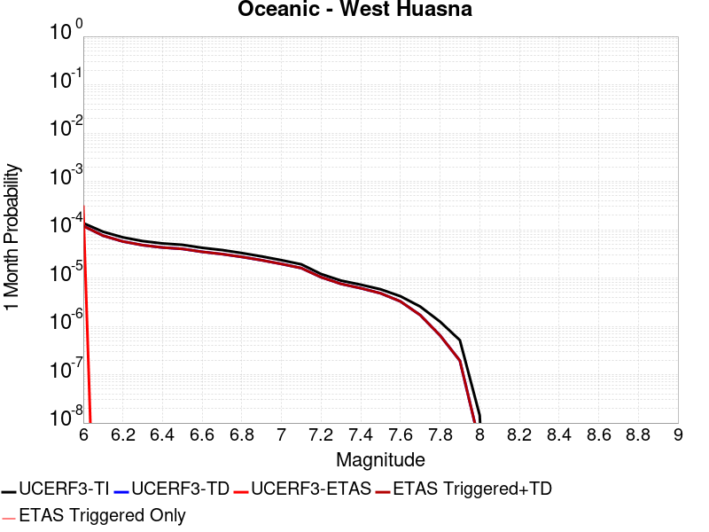 |  | 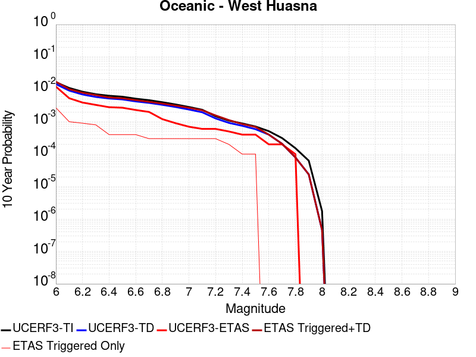 |

| Magnitude | 1 wk TI Prob | 1 wk TD Prob | 1 wk ETAS Prob | 1 wk ETAS/TD Gain | 1 wk ETAS Triggered+TD | 1 wk ETAS Triggered Only | 1 mo TI Prob | 1 mo TD Prob | 1 mo ETAS Prob | 1 mo ETAS/TD Gain | 1 mo ETAS Triggered+TD | 1 mo ETAS Triggered Only | 1 yr TI Prob | 1 yr TD Prob | 1 yr ETAS Prob | 1 yr ETAS/TD Gain | 1 yr ETAS Triggered+TD | 1 yr ETAS Triggered Only | 10 yr TI Prob | 10 yr TD Prob | 10 yr ETAS Prob | 10 yr ETAS/TD Gain | 10 yr ETAS Triggered+TD | 10 yr ETAS Triggered Only |
|-----|-----|-----|-----|-----|-----|-----|-----|-----|-----|-----|-----|-----|-----|-----|-----|-----|-----|-----|-----|-----|-----|-----|-----|-----|
| 6.0 | 3.195567E-5 | 2.7893158E-5 | 0.0 | 0.0 | 2.7893158E-5 | 0.0 | 1.3694567E-4 | 1.19536875E-4 | 3.0E-4 | 2.5096858 | 1.19536875E-4 | 0.0 | 0.0016660384 | 0.0014544328 | 9.0E-4 | 0.6187979 | 0.0015542874 | 1.0E-4 | 0.016536033 | 0.014453682 | 0.0121 | 0.8371569 | 0.017114658 | 0.0027 |
| 6.1 | 2.1156782E-5 | 1.7549437E-5 | 0.0 | 0.0 | 1.7549437E-5 | 0.0 | 9.066878E-5 | 7.5209755E-5 | 0.0 | 0.0 | 7.5209755E-5 | 0.0 | 0.0011033333 | 9.153035E-4 | 5.0E-4 | 0.5462669 | 0.0010152119 | 1.0E-4 | 0.010978713 | 0.009116341 | 0.0053 | 0.5813736 | 0.010107225 | 0.001 |
| 6.2 | 1.6195117E-5 | 1.3308006E-5 | 0.0 | 0.0 | 1.3308006E-5 | 0.0 | 6.9405796E-5 | 5.7033078E-5 | 0.0 | 0.0 | 5.7033078E-5 | 0.0 | 8.44688E-4 | 6.9415907E-4 | 2.0E-4 | 0.2881184 | 7.9408963E-4 | 1.0E-4 | 0.008414844 | 0.006920201 | 0.0039 | 0.56356746 | 0.007813972 | 9.0E-4 |
| 6.3 | 1.3559345E-5 | 1.1162683E-5 | 0.0 | 0.0 | 1.1162683E-5 | 0.0 | 5.811018E-5 | 4.78392E-5 | 0.0 | 0.0 | 4.78392E-5 | 0.0 | 7.072618E-4 | 5.8228755E-4 | 2.0E-4 | 0.3434729 | 6.8222935E-4 | 1.0E-4 | 0.0070501505 | 0.0058077364 | 0.0033 | 0.5682076 | 0.00660309 | 8.0E-4 |
| 6.4 | 1.2120619E-5 | 9.985801E-6 | 0.0 | 0.0 | 9.985801E-6 | 0.0 | 5.1944477E-5 | 4.279559E-5 | 0.0 | 0.0 | 4.279559E-5 | 0.0 | 6.322405E-4 | 5.2091223E-4 | 1.0E-4 | 0.19197091 | 5.2091223E-4 | 0.0 | 0.006304447 | 0.0051969793 | 0.0028 | 0.5387745 | 0.005594901 | 4.0E-4 |
| 6.5 | 1.13511915E-5 | 9.352899E-6 | 0.0 | 0.0 | 9.352899E-6 | 0.0 | 4.8647056E-5 | 4.0083236E-5 | 0.0 | 0.0 | 4.0083236E-5 | 0.0 | 5.9211696E-4 | 4.879046E-4 | 1.0E-4 | 0.20495811 | 4.879046E-4 | 0.0 | 0.0059054173 | 0.0048683924 | 0.0027 | 0.55459785 | 0.005266445 | 4.0E-4 |
| 6.6 | 9.850605E-6 | 8.121949E-6 | 0.0 | 0.0 | 8.121949E-6 | 0.0 | 4.2216197E-5 | 3.480789E-5 | 0.0 | 0.0 | 3.480789E-5 | 0.0 | 5.1386096E-4 | 4.2370387E-4 | 1.0E-4 | 0.23601389 | 4.2370387E-4 | 0.0 | 0.0051267436 | 0.0042289924 | 0.0023 | 0.5438647 | 0.004627301 | 4.0E-4 |
| 6.7 | 8.8558645E-6 | 7.305612E-6 | 0.0 | 0.0 | 7.305612E-6 | 0.0 | 3.7953152E-5 | 3.130939E-5 | 0.0 | 0.0 | 3.130939E-5 | 0.0 | 4.6198163E-4 | 3.8112534E-4 | 1.0E-4 | 0.26238087 | 3.8112534E-4 | 0.0 | 0.004610224 | 0.0038047426 | 0.002 | 0.52565974 | 0.004103601 | 3.0E-4 |
| 6.8 | 7.67136E-6 | 6.3796406E-6 | 0.0 | 0.0 | 6.3796406E-6 | 0.0 | 3.2876844E-5 | 2.7341031E-5 | 0.0 | 0.0 | 2.7341031E-5 | 0.0 | 4.0020206E-4 | 3.3282637E-4 | 1.0E-4 | 0.30045697 | 3.3282637E-4 | 0.0 | 0.003994821 | 0.0033233 | 0.0012 | 0.36108688 | 0.003622303 | 3.0E-4 |
| 6.9 | 6.534529E-6 | 5.446879E-6 | 0.0 | 0.0 | 5.446879E-6 | 0.0 | 2.8004823E-5 | 2.334356E-5 | 0.0 | 0.0 | 2.334356E-5 | 0.0 | 3.4090536E-4 | 2.841709E-4 | 1.0E-4 | 0.3519009 | 2.841709E-4 | 0.0 | 0.0034038287 | 0.002838092 | 9.0E-4 | 0.31711444 | 0.0031372407 | 3.0E-4 |
| 7.0 | 5.460525E-6 | 4.55915E-6 | 0.0 | 0.0 | 4.55915E-6 | 0.0 | 2.3402039E-5 | 1.953907E-5 | 0.0 | 0.0 | 1.953907E-5 | 0.0 | 2.8488258E-4 | 2.3786232E-4 | 1.0E-4 | 0.4204113 | 2.3786232E-4 | 0.0 | 0.0028451765 | 0.002376091 | 7.0E-4 | 0.29460153 | 0.002675378 | 3.0E-4 |
| 7.1 | 4.4825083E-6 | 3.7437326E-6 | 0.0 | 0.0 | 3.7437326E-6 | 0.0 | 1.9210609E-5 | 1.604447E-5 | 0.0 | 0.0 | 1.604447E-5 | 0.0 | 2.3386406E-4 | 1.9532401E-4 | 0.0 | 0.0 | 1.9532401E-4 | 0.0 | 0.002336181 | 0.0019515352 | 6.0E-4 | 0.30745026 | 0.0022509499 | 3.0E-4 |
| 7.2 | 2.821708E-6 | 2.42135E-6 | 0.0 | 0.0 | 2.42135E-6 | 0.0 | 1.2092979E-5 | 1.0377174E-5 | 0.0 | 0.0 | 1.0377174E-5 | 0.0 | 1.4722206E-4 | 1.2633477E-4 | 0.0 | 0.0 | 1.2633477E-4 | 0.0 | 0.0014712457 | 0.0012626321 | 6.0E-4 | 0.47519782 | 0.0015622532 | 3.0E-4 |
| 7.3 | 2.0644757E-6 | 1.7656695E-6 | 0.0 | 0.0 | 1.7656695E-6 | 0.0 | 8.847723E-6 | 7.567133E-6 | 0.0 | 0.0 | 7.567133E-6 | 0.0 | 1.0771569E-4 | 9.212595E-5 | 0.0 | 0.0 | 9.212595E-5 | 0.0 | 0.001076635 | 9.208794E-4 | 5.0E-4 | 0.5429593 | 0.0011206953 | 2.0E-4 |
| 7.4 | 1.6980367E-6 | 1.4351258E-6 | 0.0 | 0.0 | 1.4351258E-6 | 0.0 | 7.27728E-6 | 6.1505243E-6 | 0.0 | 0.0 | 6.1505243E-6 | 0.0 | 8.8597284E-5 | 7.488007E-5 | 0.0 | 0.0 | 7.488007E-5 | 0.0 | 8.8561967E-4 | 7.4855005E-4 | 4.0E-4 | 0.5343664 | 8.484752E-4 | 1.0E-4 |
| 7.5 | 1.3637683E-6 | 1.1276496E-6 | 0.0 | 0.0 | 1.1276496E-6 | 0.0 | 5.844708E-6 | 4.832775E-6 | 0.0 | 0.0 | 4.832775E-6 | 0.0 | 7.1156996E-5 | 5.8837453E-5 | 0.0 | 0.0 | 5.8837453E-5 | 0.0 | 7.1134215E-4 | 5.8822037E-4 | 4.0E-4 | 0.6800173 | 6.881615E-4 | 1.0E-4 |
| 7.6 | 9.802994E-7 | 7.653192E-7 | 0.0 | 0.0 | 7.653192E-7 | 0.0 | 4.2012766E-6 | 3.2799353E-6 | 0.0 | 0.0 | 3.2799353E-6 | 0.0 | 5.1149345E-5 | 3.993248E-5 | 0.0 | 0.0 | 3.993248E-5 | 0.0 | 5.113757E-4 | 3.9925458E-4 | 2.0E-4 | 0.5009335 | 3.9925458E-4 | 0.0 |
| 7.7 | 5.986191E-7 | 3.9841396E-7 | 0.0 | 0.0 | 3.9841396E-7 | 0.0 | 2.5655079E-6 | 1.7074873E-6 | 0.0 | 0.0 | 1.7074873E-6 | 0.0 | 3.1234613E-5 | 2.078846E-5 | 0.0 | 0.0 | 2.078846E-5 | 0.0 | 3.123022E-4 | 2.0786659E-4 | 2.0E-4 | 0.9621556 | 2.0786659E-4 | 0.0 |
| 7.8 | 2.9189815E-7 | 1.5128599E-7 | 0.0 | 0.0 | 1.5128599E-7 | 0.0 | 1.2509914E-6 | 6.4836837E-7 | 0.0 | 0.0 | 6.4836837E-7 | 0.0 | 1.5230714E-5 | 7.8938565E-6 | 0.0 | 0.0 | 7.8938565E-6 | 0.0 | 1.522967E-4 | 7.8937155E-5 | 1.0E-4 | 1.2668306 | 7.8937155E-5 | 0.0 |
| 7.9 | 1.2057845E-7 | 4.5331024E-8 | 0.0 | 0.0 | 4.5331024E-8 | 0.0 | 5.1676466E-7 | 1.9427581E-7 | 0.0 | 0.0 | 1.9427581E-7 | 0.0 | 6.2915915E-6 | 2.3653054E-6 | 0.0 | 0.0 | 2.3653054E-6 | 0.0 | 6.2914136E-5 | 2.3654193E-5 | 0.0 | 0.0 | 2.3654193E-5 | 0.0 |
| 8.0 | 3.3806387E-9 | 8.6979923E-10 | 0.0 | 0.0 | 8.6979923E-10 | 0.0 | 1.4488451E-8 | 3.7277115E-9 | 0.0 | 0.0 | 3.7277115E-9 | 0.0 | 1.7639688E-7 | 4.5384894E-8 | 0.0 | 0.0 | 4.5384894E-8 | 0.0 | 1.7639674E-6 | 4.5500374E-7 | 0.0 | 0.0 | 4.5500374E-7 | 0.0 |

## Bear River fault zone
*[(top)](#table-of-contents)*

| 1 Week | 1 Month | 1 Year | 10 Year |
|-----|-----|-----|-----|
|  | 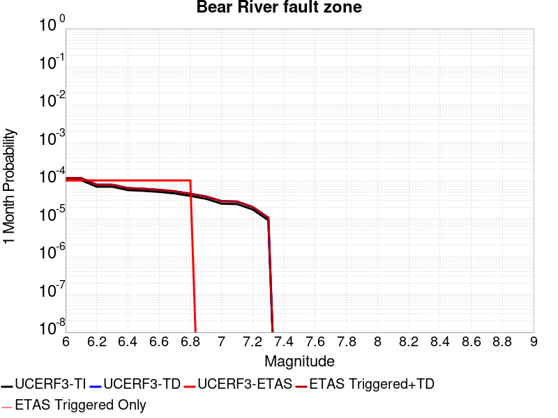 | 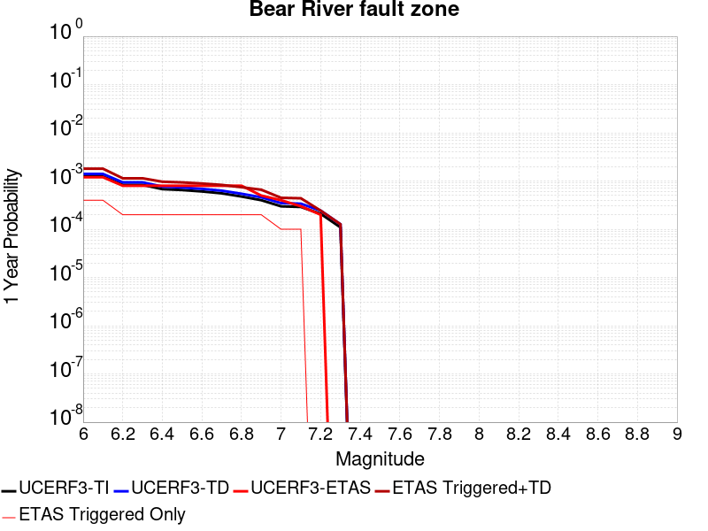 |  |

| Magnitude | 1 wk TI Prob | 1 wk TD Prob | 1 wk ETAS Prob | 1 wk ETAS/TD Gain | 1 wk ETAS Triggered+TD | 1 wk ETAS Triggered Only | 1 mo TI Prob | 1 mo TD Prob | 1 mo ETAS Prob | 1 mo ETAS/TD Gain | 1 mo ETAS Triggered+TD | 1 mo ETAS Triggered Only | 1 yr TI Prob | 1 yr TD Prob | 1 yr ETAS Prob | 1 yr ETAS/TD Gain | 1 yr ETAS Triggered+TD | 1 yr ETAS Triggered Only | 10 yr TI Prob | 10 yr TD Prob | 10 yr ETAS Prob | 10 yr ETAS/TD Gain | 10 yr ETAS Triggered+TD | 10 yr ETAS Triggered Only |
|-----|-----|-----|-----|-----|-----|-----|-----|-----|-----|-----|-----|-----|-----|-----|-----|-----|-----|-----|-----|-----|-----|-----|-----|-----|
| 6.0 | 2.3773342E-5 | 2.69424E-5 | 0.0 | 0.0 | 2.69424E-5 | 0.0 | 1.0188177E-4 | 1.1546284E-4 | 1.0E-4 | 0.8660795 | 1.1546284E-4 | 0.0 | 0.0012397047 | 0.0014049468 | 0.0012 | 0.85412484 | 0.0018043849 | 4.0E-4 | 0.012328116 | 0.013970025 | 0.0091 | 0.65139467 | 0.017026719 | 0.0031 |
| 6.1 | 2.3773342E-5 | 2.69424E-5 | 0.0 | 0.0 | 2.69424E-5 | 0.0 | 1.0188177E-4 | 1.1546284E-4 | 1.0E-4 | 0.8660795 | 1.1546284E-4 | 0.0 | 0.0012397047 | 0.0014049468 | 0.0012 | 0.85412484 | 0.0018043849 | 4.0E-4 | 0.012328116 | 0.013970025 | 0.0091 | 0.65139467 | 0.017026719 | 0.0031 |
| 6.2 | 1.5973403E-5 | 1.8037237E-5 | 0.0 | 0.0 | 1.8037237E-5 | 0.0 | 6.845564E-5 | 7.730028E-5 | 1.0E-4 | 1.2936563 | 7.730028E-5 | 0.0 | 8.3312875E-4 | 9.407481E-4 | 8.0E-4 | 0.85038704 | 0.0011405599 | 2.0E-4 | 0.008300122 | 0.009370046 | 0.0062 | 0.661683 | 0.011351305 | 0.002 |
| 6.3 | 1.5973403E-5 | 1.8037237E-5 | 0.0 | 0.0 | 1.8037237E-5 | 0.0 | 6.845564E-5 | 7.730028E-5 | 1.0E-4 | 1.2936563 | 7.730028E-5 | 0.0 | 8.3312875E-4 | 9.407481E-4 | 8.0E-4 | 0.85038704 | 0.0011405599 | 2.0E-4 | 0.008300122 | 0.009370046 | 0.0062 | 0.661683 | 0.011351305 | 0.002 |
| 6.4 | 1.3027338E-5 | 1.4720553E-5 | 0.0 | 0.0 | 1.4720553E-5 | 0.0 | 5.5830256E-5 | 6.3086634E-5 | 1.0E-4 | 1.5851218 | 6.3086634E-5 | 0.0 | 6.7952136E-4 | 7.678229E-4 | 8.0E-4 | 1.041907 | 9.6766936E-4 | 2.0E-4 | 0.0067744725 | 0.0076530976 | 0.0051 | 0.66639686 | 0.009439322 | 0.0018 |
| 6.5 | 1.2489152E-5 | 1.4123917E-5 | 0.0 | 0.0 | 1.4123917E-5 | 0.0 | 5.352384E-5 | 6.0529746E-5 | 1.0E-4 | 1.6520803 | 6.0529746E-5 | 0.0 | 6.514579E-4 | 7.3671405E-4 | 8.0E-4 | 1.085903 | 9.365667E-4 | 2.0E-4 | 0.0064955144 | 0.0073440894 | 0.0049 | 0.6672032 | 0.00913087 | 0.0018 |
| 6.6 | 1.1662849E-5 | 1.3209397E-5 | 0.0 | 0.0 | 1.3209397E-5 | 0.0 | 4.9982682E-5 | 5.661055E-5 | 1.0E-4 | 1.7664553 | 5.661055E-5 | 0.0 | 6.083692E-4 | 6.8902835E-4 | 8.0E-4 | 1.1610552 | 8.888905E-4 | 2.0E-4 | 0.006067064 | 0.006870217 | 0.0048 | 0.6986679 | 0.008657851 | 0.0018 |
| 6.7 | 1.0667623E-5 | 1.2110522E-5 | 0.0 | 0.0 | 1.2110522E-5 | 0.0 | 4.5717585E-5 | 5.1901272E-5 | 1.0E-4 | 1.926735 | 5.1901272E-5 | 0.0 | 5.5646943E-4 | 6.317266E-4 | 8.0E-4 | 1.2663707 | 8.316002E-4 | 2.0E-4 | 0.0055507803 | 0.006300487 | 0.0043 | 0.68248695 | 0.007890406 | 0.0016 |
| 6.8 | 9.154534E-6 | 1.0443577E-5 | 0.0 | 0.0 | 1.0443577E-5 | 0.0 | 3.923313E-5 | 4.475748E-5 | 1.0E-4 | 2.2342634 | 4.475748E-5 | 0.0 | 4.7755867E-4 | 5.447965E-4 | 8.0E-4 | 1.468438 | 7.4468757E-4 | 2.0E-4 | 0.004765337 | 0.005435654 | 0.0039 | 0.71748495 | 0.006828044 | 0.0014 |
| 6.9 | 7.68501E-6 | 8.831835E-6 | 0.0 | 0.0 | 8.831835E-6 | 0.0 | 3.2935342E-5 | 3.7850223E-5 | 0.0 | 0.0 | 3.7850223E-5 | 0.0 | 4.0091402E-4 | 4.6073832E-4 | 5.0E-4 | 1.0852147 | 6.606462E-4 | 2.0E-4 | 0.004001915 | 0.00459875 | 0.0032 | 0.69584125 | 0.0058927718 | 0.0013 |
| 7.0 | 5.7315733E-6 | 6.69178E-6 | 0.0 | 0.0 | 6.69178E-6 | 0.0 | 2.4563653E-5 | 2.8678767E-5 | 0.0 | 0.0 | 2.8678767E-5 | 0.0 | 2.9902143E-4 | 3.491123E-4 | 4.0E-4 | 1.1457632 | 4.4907737E-4 | 1.0E-4 | 0.0029861939 | 0.0034860587 | 0.0026 | 0.745828 | 0.0043829214 | 9.0E-4 |
| 7.1 | 5.566844E-6 | 6.5005743E-6 | 0.0 | 0.0 | 6.5005743E-6 | 0.0 | 2.3857683E-5 | 2.785933E-5 | 0.0 | 0.0 | 2.785933E-5 | 0.0 | 2.9042858E-4 | 3.3913882E-4 | 3.0E-4 | 0.88459355 | 4.391049E-4 | 1.0E-4 | 0.002900493 | 0.0033866316 | 0.0025 | 0.7381966 | 0.0042835837 | 9.0E-4 |
| 7.2 | 4.011353E-6 | 4.6665573E-6 | 0.0 | 0.0 | 4.6665573E-6 | 0.0 | 1.7191402E-5 | 1.9999396E-5 | 0.0 | 0.0 | 1.9999396E-5 | 0.0 | 2.0928521E-4 | 2.4346886E-4 | 2.0E-4 | 0.82146025 | 2.4346886E-4 | 0.0 | 0.0020908823 | 0.0024323578 | 0.0015 | 0.6166856 | 0.0028313848 | 4.0E-4 |
| 7.3 | 2.0974871E-6 | 2.4354429E-6 | 0.0 | 0.0 | 2.4354429E-6 | 0.0 | 8.989199E-6 | 1.0437585E-5 | 0.0 | 0.0 | 1.0437585E-5 | 0.0 | 1.09438006E-4 | 1.2707268E-4 | 0.0 | 0.0 | 1.2707268E-4 | 0.0 | 0.0010938413 | 0.0012702446 | 6.0E-4 | 0.47235 | 0.0013701175 | 1.0E-4 |

## McLean Lake
*[(top)](#table-of-contents)*

| 1 Week | 1 Month | 1 Year | 10 Year |
|-----|-----|-----|-----|
|  |  | 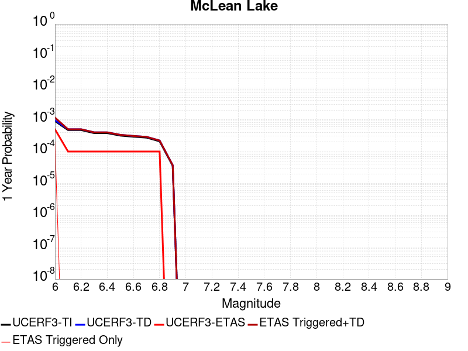 | 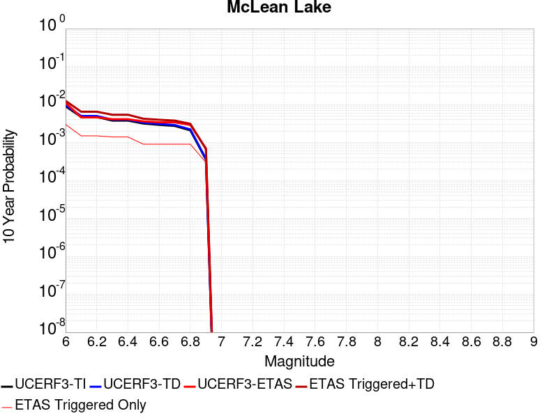 |

| Magnitude | 1 wk TI Prob | 1 wk TD Prob | 1 wk ETAS Prob | 1 wk ETAS/TD Gain | 1 wk ETAS Triggered+TD | 1 wk ETAS Triggered Only | 1 mo TI Prob | 1 mo TD Prob | 1 mo ETAS Prob | 1 mo ETAS/TD Gain | 1 mo ETAS Triggered+TD | 1 mo ETAS Triggered Only | 1 yr TI Prob | 1 yr TD Prob | 1 yr ETAS Prob | 1 yr ETAS/TD Gain | 1 yr ETAS Triggered+TD | 1 yr ETAS Triggered Only | 10 yr TI Prob | 10 yr TD Prob | 10 yr ETAS Prob | 10 yr ETAS/TD Gain | 10 yr ETAS Triggered+TD | 10 yr ETAS Triggered Only |
|-----|-----|-----|-----|-----|-----|-----|-----|-----|-----|-----|-----|-----|-----|-----|-----|-----|-----|-----|-----|-----|-----|-----|-----|-----|
| 6.0 | 1.7360222E-5 | 1.848891E-5 | 0.0 | 0.0 | 1.848891E-5 | 0.0 | 7.439883E-5 | 7.923606E-5 | 0.0 | 0.0 | 7.923606E-5 | 0.0 | 9.0542925E-4 | 9.643206E-4 | 5.0E-4 | 0.5184998 | 0.0011641277 | 2.0E-4 | 0.009017491 | 0.009606195 | 0.0112 | 1.1659143 | 0.012577376 | 0.003 |
| 6.1 | 9.062689E-6 | 9.586339E-6 | 0.0 | 0.0 | 9.586339E-6 | 0.0 | 3.8839516E-5 | 4.108371E-5 | 0.0 | 0.0 | 4.108371E-5 | 0.0 | 4.727685E-4 | 5.0008827E-4 | 1.0E-4 | 0.1999647 | 5.0008827E-4 | 0.0 | 0.0047176396 | 0.0049905106 | 0.0046 | 0.92174935 | 0.006483025 | 0.0015 |
| 6.2 | 9.062689E-6 | 9.586339E-6 | 0.0 | 0.0 | 9.586339E-6 | 0.0 | 3.8839516E-5 | 4.108371E-5 | 0.0 | 0.0 | 4.108371E-5 | 0.0 | 4.727685E-4 | 5.0008827E-4 | 1.0E-4 | 0.1999647 | 5.0008827E-4 | 0.0 | 0.0047176396 | 0.0049905106 | 0.0046 | 0.92174935 | 0.006483025 | 0.0015 |
| 6.3 | 7.2575485E-6 | 7.663183E-6 | 0.0 | 0.0 | 7.663183E-6 | 0.0 | 3.110341E-5 | 3.284184E-5 | 0.0 | 0.0 | 3.284184E-5 | 0.0 | 3.786182E-4 | 3.9978314E-4 | 1.0E-4 | 0.2501356 | 3.9978314E-4 | 0.0 | 0.0037797375 | 0.0039913435 | 0.0041 | 1.0272231 | 0.0053857556 | 0.0014 |
| 6.4 | 7.2575485E-6 | 7.663183E-6 | 0.0 | 0.0 | 7.663183E-6 | 0.0 | 3.110341E-5 | 3.284184E-5 | 0.0 | 0.0 | 3.284184E-5 | 0.0 | 3.786182E-4 | 3.9978314E-4 | 1.0E-4 | 0.2501356 | 3.9978314E-4 | 0.0 | 0.0037797375 | 0.0039913435 | 0.0041 | 1.0272231 | 0.0053857556 | 0.0014 |
| 6.5 | 6.06582E-6 | 6.4001492E-6 | 0.0 | 0.0 | 6.4001492E-6 | 0.0 | 2.5996113E-5 | 2.742896E-5 | 0.0 | 0.0 | 2.742896E-5 | 0.0 | 3.164567E-4 | 3.339029E-4 | 1.0E-4 | 0.29948828 | 3.339029E-4 | 0.0 | 0.0031600643 | 0.0033346498 | 0.0036 | 1.0795736 | 0.0042316485 | 9.0E-4 |
| 6.6 | 5.598744E-6 | 5.9068275E-6 | 0.0 | 0.0 | 5.9068275E-6 | 0.0 | 2.3994397E-5 | 2.5314765E-5 | 0.0 | 0.0 | 2.5314765E-5 | 0.0 | 2.9209262E-4 | 3.0817007E-4 | 1.0E-4 | 0.32449615 | 3.0817007E-4 | 0.0 | 0.0029170897 | 0.0030780556 | 0.0034 | 1.1045934 | 0.003975285 | 9.0E-4 |
| 6.7 | 5.246996E-6 | 5.5359405E-6 | 0.0 | 0.0 | 5.5359405E-6 | 0.0 | 2.2486933E-5 | 2.372528E-5 | 0.0 | 0.0 | 2.372528E-5 | 0.0 | 2.73744E-4 | 2.8882333E-4 | 1.0E-4 | 0.3462324 | 2.8882333E-4 | 0.0 | 0.0027340704 | 0.0028851028 | 0.0034 | 1.1784675 | 0.003782506 | 9.0E-4 |
| 6.8 | 4.02324E-6 | 4.2444385E-6 | 0.0 | 0.0 | 4.2444385E-6 | 0.0 | 1.7242342E-5 | 1.8190356E-5 | 0.0 | 0.0 | 1.8190356E-5 | 0.0 | 2.099053E-4 | 2.2145103E-4 | 1.0E-4 | 0.4515671 | 2.2145103E-4 | 0.0 | 0.0020970714 | 0.0022128872 | 0.0029 | 1.3105052 | 0.0031108956 | 9.0E-4 |
| 6.9 | 6.835972E-7 | 7.1366145E-7 | 0.0 | 0.0 | 7.1366145E-7 | 0.0 | 2.9296991E-6 | 3.0585475E-6 | 0.0 | 0.0 | 3.0585475E-6 | 0.0 | 3.56685E-5 | 3.7237496E-5 | 0.0 | 0.0 | 3.7237496E-5 | 0.0 | 3.5662777E-4 | 3.7234378E-4 | 7.0E-4 | 1.879983 | 6.7223207E-4 | 3.0E-4 |

## Death Valley (So)
*[(top)](#table-of-contents)*

| 1 Week | 1 Month | 1 Year | 10 Year |
|-----|-----|-----|-----|
|  |  |  | 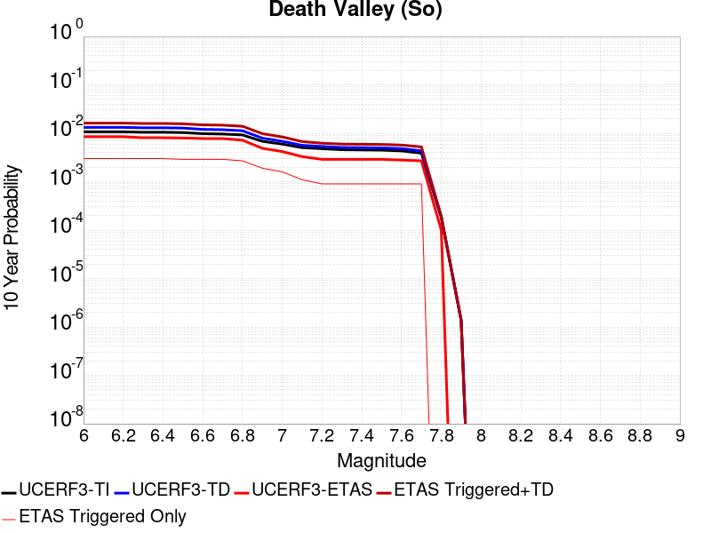 |

| Magnitude | 1 wk TI Prob | 1 wk TD Prob | 1 wk ETAS Prob | 1 wk ETAS/TD Gain | 1 wk ETAS Triggered+TD | 1 wk ETAS Triggered Only | 1 mo TI Prob | 1 mo TD Prob | 1 mo ETAS Prob | 1 mo ETAS/TD Gain | 1 mo ETAS Triggered+TD | 1 mo ETAS Triggered Only | 1 yr TI Prob | 1 yr TD Prob | 1 yr ETAS Prob | 1 yr ETAS/TD Gain | 1 yr ETAS Triggered+TD | 1 yr ETAS Triggered Only | 10 yr TI Prob | 10 yr TD Prob | 10 yr ETAS Prob | 10 yr ETAS/TD Gain | 10 yr ETAS Triggered+TD | 10 yr ETAS Triggered Only |
|-----|-----|-----|-----|-----|-----|-----|-----|-----|-----|-----|-----|-----|-----|-----|-----|-----|-----|-----|-----|-----|-----|-----|-----|-----|
| 6.0 | 2.0684236E-5 | 2.5566584E-5 | 0.0 | 0.0 | 2.5566584E-5 | 0.0 | 8.864371E-5 | 1.0956657E-4 | 0.0 | 0.0 | 1.0956657E-4 | 0.0 | 0.0010787029 | 0.0013331735 | 5.0E-4 | 0.37504497 | 0.0015329069 | 2.0E-4 | 0.010734817 | 0.013255823 | 0.0085 | 0.6412276 | 0.016216056 | 0.003 |
| 6.1 | 2.0684236E-5 | 2.5566584E-5 | 0.0 | 0.0 | 2.5566584E-5 | 0.0 | 8.864371E-5 | 1.0956657E-4 | 0.0 | 0.0 | 1.0956657E-4 | 0.0 | 0.0010787029 | 0.0013331735 | 5.0E-4 | 0.37504497 | 0.0015329069 | 2.0E-4 | 0.010734817 | 0.013255823 | 0.0085 | 0.6412276 | 0.016216056 | 0.003 |
| 6.2 | 2.0684236E-5 | 2.5566584E-5 | 0.0 | 0.0 | 2.5566584E-5 | 0.0 | 8.864371E-5 | 1.0956657E-4 | 0.0 | 0.0 | 1.0956657E-4 | 0.0 | 0.0010787029 | 0.0013331735 | 5.0E-4 | 0.37504497 | 0.0015329069 | 2.0E-4 | 0.010734817 | 0.013255823 | 0.0085 | 0.6412276 | 0.016216056 | 0.003 |
| 6.3 | 2.0240292E-5 | 2.5067327E-5 | 0.0 | 0.0 | 2.5067327E-5 | 0.0 | 8.6741224E-5 | 1.0742708E-4 | 0.0 | 0.0 | 1.0742708E-4 | 0.0 | 0.0010555626 | 0.0013071565 | 5.0E-4 | 0.38250965 | 0.0015068951 | 2.0E-4 | 0.010505628 | 0.012998716 | 0.0081 | 0.6231385 | 0.01595972 | 0.003 |
| 6.4 | 2.0240292E-5 | 2.5067327E-5 | 0.0 | 0.0 | 2.5067327E-5 | 0.0 | 8.6741224E-5 | 1.0742708E-4 | 0.0 | 0.0 | 1.0742708E-4 | 0.0 | 0.0010555626 | 0.0013071565 | 5.0E-4 | 0.38250965 | 0.0015068951 | 2.0E-4 | 0.010505628 | 0.012998716 | 0.0081 | 0.6231385 | 0.01595972 | 0.003 |
| 6.5 | 1.9962767E-5 | 2.475697E-5 | 0.0 | 0.0 | 2.475697E-5 | 0.0 | 8.55519E-5 | 1.06097075E-4 | 0.0 | 0.0 | 1.06097075E-4 | 0.0 | 0.0010410968 | 0.001290983 | 5.0E-4 | 0.38730174 | 0.0014907249 | 2.0E-4 | 0.010362327 | 0.012838858 | 0.008 | 0.6231084 | 0.015701625 | 0.0029 |
| 6.6 | 1.8937297E-5 | 2.3263085E-5 | 0.0 | 0.0 | 2.3263085E-5 | 0.0 | 8.115732E-5 | 9.96952E-5 | 0.0 | 0.0 | 9.96952E-5 | 0.0 | 9.876423E-4 | 0.0012131276 | 5.0E-4 | 0.41215777 | 0.001412885 | 2.0E-4 | 0.009832645 | 0.0120687 | 0.0078 | 0.64629996 | 0.014933701 | 0.0029 |
| 6.7 | 1.8621096E-5 | 2.2864237E-5 | 0.0 | 0.0 | 2.2864237E-5 | 0.0 | 7.980225E-5 | 9.798598E-5 | 0.0 | 0.0 | 9.798598E-5 | 0.0 | 9.711593E-4 | 0.0011923409 | 5.0E-4 | 0.41934314 | 0.0013921025 | 2.0E-4 | 0.009669261 | 0.011863078 | 0.0078 | 0.6575022 | 0.014728676 | 0.0029 |
| 6.8 | 1.7830353E-5 | 2.1761223E-5 | 0.0 | 0.0 | 2.1761223E-5 | 0.0 | 7.641356E-5 | 9.325913E-5 | 0.0 | 0.0 | 9.325913E-5 | 0.0 | 9.29938E-4 | 0.0011348524 | 4.0E-4 | 0.35246873 | 0.0013346255 | 2.0E-4 | 0.009260561 | 0.011293159 | 0.0072 | 0.6375541 | 0.013962667 | 0.0027 |
| 6.9 | 1.3135183E-5 | 1.5278363E-5 | 0.0 | 0.0 | 1.5278363E-5 | 0.0 | 5.6292425E-5 | 6.547709E-5 | 0.0 | 0.0 | 6.547709E-5 | 0.0 | 6.8514474E-4 | 7.968985E-4 | 3.0E-4 | 0.3764595 | 8.968188E-4 | 1.0E-4 | 0.006830362 | 0.007941812 | 0.0049 | 0.61698765 | 0.009826723 | 0.0019 |
| 7.0 | 1.1507512E-5 | 1.3134225E-5 | 0.0 | 0.0 | 1.3134225E-5 | 0.0 | 4.9316975E-5 | 5.6288354E-5 | 0.0 | 0.0 | 5.6288354E-5 | 0.0 | 6.002687E-4 | 6.8510097E-4 | 3.0E-4 | 0.43789166 | 7.8503246E-4 | 1.0E-4 | 0.0059864987 | 0.0068309656 | 0.0042 | 0.6148472 | 0.008420036 | 0.0016 |
| 7.1 | 9.715903E-6 | 1.0850871E-5 | 0.0 | 0.0 | 1.0850871E-5 | 0.0 | 4.1638916E-5 | 4.6502926E-5 | 0.0 | 0.0 | 4.6502926E-5 | 0.0 | 5.068359E-4 | 5.660303E-4 | 2.0E-4 | 0.35333797 | 6.659737E-4 | 1.0E-4 | 0.0050568148 | 0.0056462246 | 0.0033 | 0.5844614 | 0.0067400136 | 0.0011 |
| 7.2 | 9.233269E-6 | 1.0273522E-5 | 0.0 | 0.0 | 1.0273522E-5 | 0.0 | 3.9570554E-5 | 4.4028664E-5 | 0.0 | 0.0 | 4.4028664E-5 | 0.0 | 4.81665E-4 | 5.359213E-4 | 2.0E-4 | 0.3731891 | 6.3586776E-4 | 1.0E-4 | 0.0048062233 | 0.0053467196 | 0.0029 | 0.5423887 | 0.0062419074 | 9.0E-4 |
| 7.3 | 8.8041315E-6 | 9.79644E-6 | 0.0 | 0.0 | 9.79644E-6 | 0.0 | 3.7731446E-5 | 4.1984094E-5 | 0.0 | 0.0 | 4.1984094E-5 | 0.0 | 4.592835E-4 | 5.110407E-4 | 2.0E-4 | 0.3913583 | 6.109895E-4 | 1.0E-4 | 0.0045833546 | 0.00509908 | 0.0029 | 0.56873006 | 0.005994491 | 9.0E-4 |
| 7.4 | 8.708749E-6 | 9.6955155E-6 | 0.0 | 0.0 | 9.6955155E-6 | 0.0 | 3.7322676E-5 | 4.155157E-5 | 0.0 | 0.0 | 4.155157E-5 | 0.0 | 4.5430884E-4 | 5.0577713E-4 | 2.0E-4 | 0.39543107 | 6.0572656E-4 | 1.0E-4 | 0.004533812 | 0.005046685 | 0.0029 | 0.5746346 | 0.0059421435 | 9.0E-4 |
| 7.5 | 8.612678E-6 | 9.593229E-6 | 0.0 | 0.0 | 9.593229E-6 | 0.0 | 3.6910955E-5 | 4.1113217E-5 | 0.0 | 0.0 | 4.1113217E-5 | 0.0 | 4.492982E-4 | 5.0044263E-4 | 2.0E-4 | 0.3996462 | 6.003926E-4 | 1.0E-4 | 0.004483909 | 0.004993581 | 0.0029 | 0.5807455 | 0.005889087 | 9.0E-4 |
| 7.6 | 8.319024E-6 | 9.272643E-6 | 0.0 | 0.0 | 9.272643E-6 | 0.0 | 3.5652476E-5 | 3.973932E-5 | 0.0 | 0.0 | 3.973932E-5 | 0.0 | 4.3398244E-4 | 4.8372298E-4 | 2.0E-4 | 0.41345978 | 5.8367464E-4 | 1.0E-4 | 0.0043313587 | 0.0048271236 | 0.0028 | 0.5800556 | 0.005722779 | 9.0E-4 |
| 7.7 | 7.4718328E-6 | 8.334961E-6 | 0.0 | 0.0 | 8.334961E-6 | 0.0 | 3.2021748E-5 | 3.5720797E-5 | 0.0 | 0.0 | 3.5720797E-5 | 0.0 | 3.8979502E-4 | 4.3481795E-4 | 2.0E-4 | 0.4599626 | 5.347745E-4 | 1.0E-4 | 0.00389112 | 0.004340076 | 0.0027 | 0.62210894 | 0.00523617 | 9.0E-4 |
| 7.8 | 3.4586725E-7 | 3.6461634E-7 | 0.0 | 0.0 | 3.6461634E-7 | 0.0 | 1.4822873E-6 | 1.5626406E-6 | 0.0 | 0.0 | 1.5626406E-6 | 0.0 | 1.80467E-5 | 1.9024988E-5 | 0.0 | 0.0 | 1.9024988E-5 | 0.0 | 1.8045233E-4 | 1.9023403E-4 | 1.0E-4 | 0.5256683 | 1.9023403E-4 | 0.0 |
| 7.9 | 2.5591178E-9 | 2.6684681E-9 | 0.0 | 0.0 | 2.6684681E-9 | 0.0 | 1.0967647E-8 | 1.1436292E-8 | 0.0 | 0.0 | 1.1436292E-8 | 0.0 | 1.335311E-7 | 1.3923685E-7 | 0.0 | 0.0 | 1.3923685E-7 | 0.0 | 1.3353102E-6 | 1.3923685E-6 | 0.0 | 0.0 | 1.3923685E-6 | 0.0 |

## San Gregorio (North) 2011 CFM
*[(top)](#table-of-contents)*

| 1 Week | 1 Month | 1 Year | 10 Year |
|-----|-----|-----|-----|
|  |  | 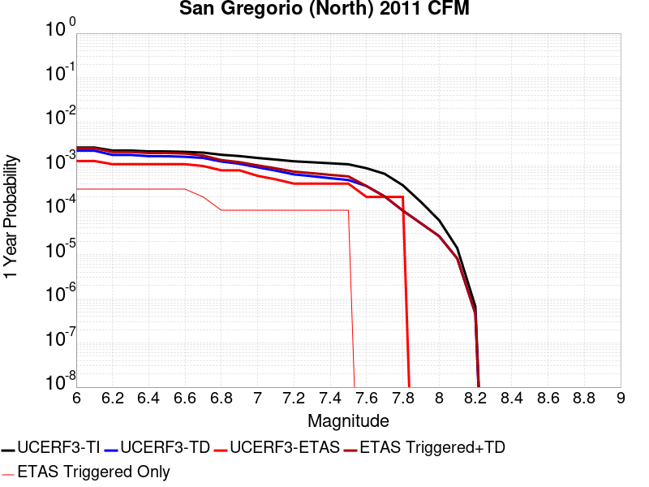 |  |

| Magnitude | 1 wk TI Prob | 1 wk TD Prob | 1 wk ETAS Prob | 1 wk ETAS/TD Gain | 1 wk ETAS Triggered+TD | 1 wk ETAS Triggered Only | 1 mo TI Prob | 1 mo TD Prob | 1 mo ETAS Prob | 1 mo ETAS/TD Gain | 1 mo ETAS Triggered+TD | 1 mo ETAS Triggered Only | 1 yr TI Prob | 1 yr TD Prob | 1 yr ETAS Prob | 1 yr ETAS/TD Gain | 1 yr ETAS Triggered+TD | 1 yr ETAS Triggered Only | 10 yr TI Prob | 10 yr TD Prob | 10 yr ETAS Prob | 10 yr ETAS/TD Gain | 10 yr ETAS Triggered+TD | 10 yr ETAS Triggered Only |
|-----|-----|-----|-----|-----|-----|-----|-----|-----|-----|-----|-----|-----|-----|-----|-----|-----|-----|-----|-----|-----|-----|-----|-----|-----|
| 6.0 | 5.0283932E-5 | 4.27429E-5 | 0.0 | 0.0 | 4.27429E-5 | 0.0 | 2.1548476E-4 | 1.8317105E-4 | 0.0 | 0.0 | 1.8317105E-4 | 0.0 | 0.0026203706 | 0.0022278423 | 0.0013 | 0.5835242 | 0.002527174 | 3.0E-4 | 0.02589687 | 0.022132142 | 0.0129 | 0.5828627 | 0.025065746 | 0.003 |
| 6.1 | 5.0283932E-5 | 4.27429E-5 | 0.0 | 0.0 | 4.27429E-5 | 0.0 | 2.1548476E-4 | 1.8317105E-4 | 0.0 | 0.0 | 1.8317105E-4 | 0.0 | 0.0026203706 | 0.0022278423 | 0.0013 | 0.5835242 | 0.002527174 | 3.0E-4 | 0.02589687 | 0.022132142 | 0.0129 | 0.5828627 | 0.025065746 | 0.003 |
| 6.2 | 4.2998647E-5 | 3.4151155E-5 | 0.0 | 0.0 | 3.4151155E-5 | 0.0 | 1.842669E-4 | 1.4635394E-4 | 0.0 | 0.0 | 1.4635394E-4 | 0.0 | 0.0022411412 | 0.001780416 | 0.0011 | 0.61783314 | 0.002079882 | 3.0E-4 | 0.022186736 | 0.017737158 | 0.0104 | 0.5863397 | 0.020192815 | 0.0025 |
| 6.3 | 4.2998647E-5 | 3.4151155E-5 | 0.0 | 0.0 | 3.4151155E-5 | 0.0 | 1.842669E-4 | 1.4635394E-4 | 0.0 | 0.0 | 1.4635394E-4 | 0.0 | 0.0022411412 | 0.001780416 | 0.0011 | 0.61783314 | 0.002079882 | 3.0E-4 | 0.022186736 | 0.017737158 | 0.0104 | 0.5863397 | 0.020192815 | 0.0025 |
| 6.4 | 4.1101295E-5 | 3.204354E-5 | 0.0 | 0.0 | 3.204354E-5 | 0.0 | 1.7613651E-4 | 1.373223E-4 | 0.0 | 0.0 | 1.373223E-4 | 0.0 | 0.0021423528 | 0.0016706305 | 0.0011 | 0.65843403 | 0.0019701293 | 3.0E-4 | 0.02121817 | 0.016655626 | 0.0096 | 0.5763818 | 0.018917318 | 0.0023 |
| 6.5 | 4.1032585E-5 | 3.1961743E-5 | 0.0 | 0.0 | 3.1961743E-5 | 0.0 | 1.7584208E-4 | 1.369718E-4 | 0.0 | 0.0 | 1.369718E-4 | 0.0 | 0.0021387753 | 0.0016663696 | 0.0011 | 0.6601176 | 0.0019658697 | 3.0E-4 | 0.021183075 | 0.01661366 | 0.0096 | 0.57783777 | 0.018875448 | 0.0023 |
| 6.6 | 4.011629E-5 | 3.0987347E-5 | 0.0 | 0.0 | 3.0987347E-5 | 0.0 | 1.7191563E-4 | 1.3279624E-4 | 0.0 | 0.0 | 1.3279624E-4 | 0.0 | 0.0020910634 | 0.001615609 | 0.0011 | 0.6808578 | 0.0019151244 | 3.0E-4 | 0.020714961 | 0.016111875 | 0.0094 | 0.5834206 | 0.018374817 | 0.0023 |
| 6.7 | 3.8583938E-5 | 2.9180554E-5 | 0.0 | 0.0 | 2.9180554E-5 | 0.0 | 1.6534925E-4 | 1.250536E-4 | 0.0 | 0.0 | 1.250536E-4 | 0.0 | 0.0020112682 | 0.0015214785 | 0.001 | 0.6572554 | 0.0017211742 | 2.0E-4 | 0.019931622 | 0.015182592 | 0.009 | 0.59278417 | 0.01725071 | 0.0021 |
| 6.8 | 3.44341E-5 | 2.4191757E-5 | 0.0 | 0.0 | 2.4191757E-5 | 0.0 | 1.4756636E-4 | 1.03674894E-4 | 0.0 | 0.0 | 1.03674894E-4 | 0.0 | 0.0017951399 | 0.0012615214 | 8.0E-4 | 0.6341549 | 0.0013613952 | 1.0E-4 | 0.017807078 | 0.012614404 | 0.0067 | 0.5311389 | 0.0140954815 | 0.0015 |
| 6.9 | 3.221199E-5 | 2.1526548E-5 | 0.0 | 0.0 | 2.1526548E-5 | 0.0 | 1.3804408E-4 | 9.225342E-5 | 0.0 | 0.0 | 9.225342E-5 | 0.0 | 0.0016793909 | 0.0011226148 | 8.0E-4 | 0.7126219 | 0.0012225026 | 1.0E-4 | 0.01666756 | 0.011239285 | 0.0061 | 0.54273915 | 0.012524674 | 0.0013 |
| 7.0 | 2.9186718E-5 | 1.7905459E-5 | 0.0 | 0.0 | 1.7905459E-5 | 0.0 | 1.2507994E-4 | 7.673544E-5 | 0.0 | 0.0 | 7.673544E-5 | 0.0 | 0.0015217843 | 9.3385804E-4 | 6.0E-4 | 0.64249593 | 0.0010337647 | 1.0E-4 | 0.015114053 | 0.009368532 | 0.0049 | 0.52302754 | 0.010458226 | 0.0011 |
| 7.1 | 2.6840138E-5 | 1.505109E-5 | 0.0 | 0.0 | 1.505109E-5 | 0.0 | 1.1502409E-4 | 6.450309E-5 | 0.0 | 0.0 | 6.450309E-5 | 0.0 | 0.0013995186 | 7.8504405E-4 | 5.0E-4 | 0.6369069 | 8.849655E-4 | 1.0E-4 | 0.013907375 | 0.007891314 | 0.0043 | 0.5449029 | 0.008784211 | 9.0E-4 |
| 7.2 | 2.453002E-5 | 1.237814E-5 | 0.0 | 0.0 | 1.237814E-5 | 0.0 | 1.05124425E-4 | 5.3048097E-5 | 0.0 | 0.0 | 5.3048097E-5 | 0.0 | 0.0012791384 | 6.4566976E-4 | 4.0E-4 | 0.6195117 | 7.456052E-4 | 1.0E-4 | 0.012718005 | 0.0065055764 | 0.004 | 0.61485714 | 0.0073997215 | 9.0E-4 |
| 7.3 | 2.3330727E-5 | 1.1267044E-5 | 0.0 | 0.0 | 1.1267044E-5 | 0.0 | 9.9985E-5 | 4.8286438E-5 | 0.0 | 0.0 | 4.8286438E-5 | 0.0 | 0.0012166376 | 5.877293E-4 | 4.0E-4 | 0.6805855 | 6.876705E-4 | 1.0E-4 | 0.012099981 | 0.005927935 | 0.0035 | 0.5904249 | 0.006723192 | 8.0E-4 |
| 7.4 | 2.2136466E-5 | 1.0156461E-5 | 0.0 | 0.0 | 1.0156461E-5 | 0.0 | 9.486712E-5 | 4.3526965E-5 | 0.0 | 0.0 | 4.3526965E-5 | 0.0 | 0.0011543952 | 5.298122E-4 | 4.0E-4 | 0.75498456 | 6.297592E-4 | 1.0E-4 | 0.011484168 | 0.0053503895 | 0.0031 | 0.5793971 | 0.006046644 | 7.0E-4 |
| 7.5 | 2.0994974E-5 | 9.224957E-6 | 0.0 | 0.0 | 9.224957E-6 | 0.0 | 8.997535E-5 | 3.9534927E-5 | 0.0 | 0.0 | 3.9534927E-5 | 0.0 | 0.0010948994 | 4.8123166E-4 | 4.0E-4 | 0.8312005 | 5.811835E-4 | 1.0E-4 | 0.010895205 | 0.0048649055 | 0.0028 | 0.57555073 | 0.005362473 | 5.0E-4 |
| 7.6 | 1.7091823E-5 | 6.7378846E-6 | 0.0 | 0.0 | 6.7378846E-6 | 0.0 | 7.3248615E-5 | 2.887633E-5 | 0.0 | 0.0 | 2.887633E-5 | 0.0 | 8.9143694E-4 | 3.515127E-4 | 2.0E-4 | 0.5689695 | 3.515127E-4 | 0.0 | 0.008878695 | 0.0035640579 | 0.0019 | 0.5331002 | 0.003763345 | 2.0E-4 |
| 7.7 | 1.2772179E-5 | 3.91545E-6 | 0.0 | 0.0 | 3.91545E-6 | 0.0 | 5.473676E-5 | 1.6780392E-5 | 0.0 | 0.0 | 1.6780392E-5 | 0.0 | 6.6621625E-4 | 2.0428214E-4 | 2.0E-4 | 0.9790381 | 2.0428214E-4 | 0.0 | 0.006642225 | 0.0020792817 | 0.0012 | 0.5771224 | 0.0021790739 | 1.0E-4 |
| 7.8 | 7.041923E-6 | 1.8751176E-6 | 0.0 | 0.0 | 1.8751176E-6 | 0.0 | 3.017932E-5 | 8.036193E-6 | 0.0 | 0.0 | 8.036193E-6 | 0.0 | 3.6737128E-4 | 9.783626E-5 | 2.0E-4 | 2.044232 | 9.783626E-5 | 0.0 | 0.0036676454 | 0.0010021103 | 7.0E-4 | 0.6985259 | 0.0010021103 | 0.0 |
| 7.9 | 2.946768E-6 | 9.649276E-7 | 0.0 | 0.0 | 9.649276E-7 | 0.0 | 1.2628945E-5 | 4.1353974E-6 | 0.0 | 0.0 | 4.1353974E-6 | 0.0 | 1.5374656E-4 | 5.0347302E-5 | 0.0 | 0.0 | 5.0347302E-5 | 0.0 | 0.0015364023 | 5.1351276E-4 | 2.0E-4 | 0.38947424 | 5.1351276E-4 | 0.0 |
| 8.0 | 1.1433375E-6 | 4.965971E-7 | 0.0 | 0.0 | 4.965971E-7 | 0.0 | 4.9000087E-6 | 2.1282717E-6 | 0.0 | 0.0 | 2.1282717E-6 | 0.0 | 5.965597E-5 | 2.5911399E-5 | 0.0 | 0.0 | 2.5911399E-5 | 0.0 | 5.963996E-4 | 2.6264298E-4 | 0.0 | 0.0 | 2.6264298E-4 | 0.0 |
| 8.1 | 2.6675295E-7 | 1.5483019E-7 | 0.0 | 0.0 | 1.5483019E-7 | 0.0 | 1.1432264E-6 | 6.635578E-7 | 0.0 | 0.0 | 6.635578E-7 | 0.0 | 1.3918692E-5 | 8.078786E-6 | 0.0 | 0.0 | 8.078786E-6 | 0.0 | 1.391782E-4 | 8.21167E-5 | 0.0 | 0.0 | 8.21167E-5 | 0.0 |
| 8.2 | 1.2704569E-8 | 8.721503E-9 | 0.0 | 0.0 | 8.721503E-9 | 0.0 | 5.444815E-8 | 3.7377873E-8 | 0.0 | 0.0 | 3.7377873E-8 | 0.0 | 6.629061E-7 | 4.5507548E-7 | 0.0 | 0.0 | 4.5507548E-7 | 0.0 | 6.629041E-6 | 4.733775E-6 | 0.0 | 0.0 | 4.733775E-6 | 0.0 |

## Santa Susana East (connector)
*[(top)](#table-of-contents)*

| 1 Week | 1 Month | 1 Year | 10 Year |
|-----|-----|-----|-----|
|  | 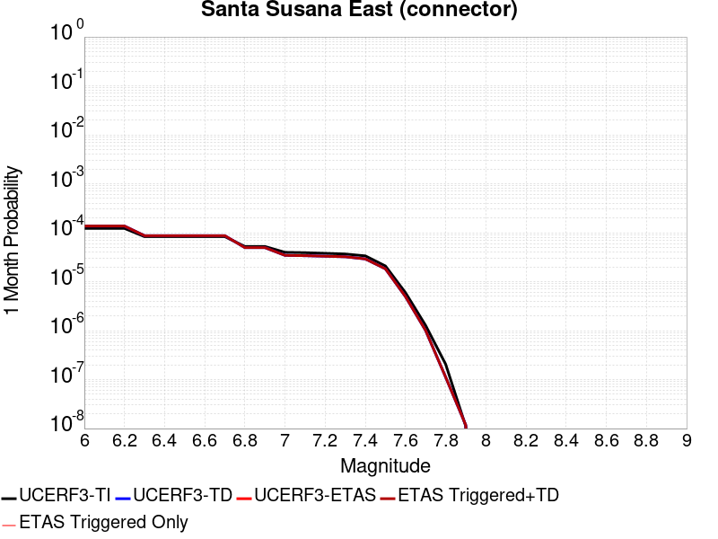 |  | 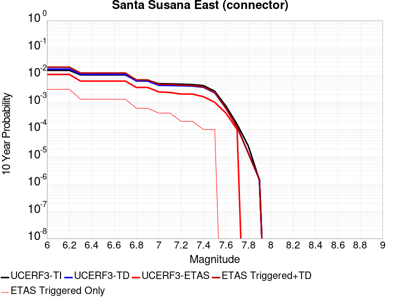 |

| Magnitude | 1 wk TI Prob | 1 wk TD Prob | 1 wk ETAS Prob | 1 wk ETAS/TD Gain | 1 wk ETAS Triggered+TD | 1 wk ETAS Triggered Only | 1 mo TI Prob | 1 mo TD Prob | 1 mo ETAS Prob | 1 mo ETAS/TD Gain | 1 mo ETAS Triggered+TD | 1 mo ETAS Triggered Only | 1 yr TI Prob | 1 yr TD Prob | 1 yr ETAS Prob | 1 yr ETAS/TD Gain | 1 yr ETAS Triggered+TD | 1 yr ETAS Triggered Only | 10 yr TI Prob | 10 yr TD Prob | 10 yr ETAS Prob | 10 yr ETAS/TD Gain | 10 yr ETAS Triggered+TD | 10 yr ETAS Triggered Only |
|-----|-----|-----|-----|-----|-----|-----|-----|-----|-----|-----|-----|-----|-----|-----|-----|-----|-----|-----|-----|-----|-----|-----|-----|-----|
| 6.0 | 2.858397E-5 | 3.1946194E-5 | 0.0 | 0.0 | 3.1946194E-5 | 0.0 | 1.2249697E-4 | 1.3690666E-4 | 0.0 | 0.0 | 1.3690666E-4 | 0.0 | 0.0014903803 | 0.0016658325 | 7.0E-4 | 0.42021033 | 0.0018654993 | 2.0E-4 | 0.014804244 | 0.016559996 | 0.0105 | 0.6340582 | 0.019510316 | 0.003 |
| 6.1 | 2.858397E-5 | 3.1946194E-5 | 0.0 | 0.0 | 3.1946194E-5 | 0.0 | 1.2249697E-4 | 1.3690666E-4 | 0.0 | 0.0 | 1.3690666E-4 | 0.0 | 0.0014903803 | 0.0016658325 | 7.0E-4 | 0.42021033 | 0.0018654993 | 2.0E-4 | 0.014804244 | 0.016559996 | 0.0105 | 0.6340582 | 0.019510316 | 0.003 |
| 6.2 | 2.858397E-5 | 3.1946194E-5 | 0.0 | 0.0 | 3.1946194E-5 | 0.0 | 1.2249697E-4 | 1.3690666E-4 | 0.0 | 0.0 | 1.3690666E-4 | 0.0 | 0.0014903803 | 0.0016658325 | 7.0E-4 | 0.42021033 | 0.0018654993 | 2.0E-4 | 0.014804244 | 0.016559996 | 0.0105 | 0.6340582 | 0.019510316 | 0.003 |
| 6.3 | 1.943582E-5 | 2.0324424E-5 | 0.0 | 0.0 | 2.0324424E-5 | 0.0 | 8.329371E-5 | 8.7102395E-5 | 0.0 | 0.0 | 8.7102395E-5 | 0.0 | 0.001013629 | 0.0010600673 | 1.0E-4 | 0.094333634 | 0.0011599612 | 1.0E-4 | 0.010090181 | 0.010561149 | 0.006 | 0.56812 | 0.01184742 | 0.0013 |
| 6.4 | 1.943582E-5 | 2.0324424E-5 | 0.0 | 0.0 | 2.0324424E-5 | 0.0 | 8.329371E-5 | 8.7102395E-5 | 0.0 | 0.0 | 8.7102395E-5 | 0.0 | 0.001013629 | 0.0010600673 | 1.0E-4 | 0.094333634 | 0.0011599612 | 1.0E-4 | 0.010090181 | 0.010561149 | 0.006 | 0.56812 | 0.01184742 | 0.0013 |
| 6.5 | 1.943582E-5 | 2.0324424E-5 | 0.0 | 0.0 | 2.0324424E-5 | 0.0 | 8.329371E-5 | 8.7102395E-5 | 0.0 | 0.0 | 8.7102395E-5 | 0.0 | 0.001013629 | 0.0010600673 | 1.0E-4 | 0.094333634 | 0.0011599612 | 1.0E-4 | 0.010090181 | 0.010561149 | 0.006 | 0.56812 | 0.01184742 | 0.0013 |
| 6.6 | 1.943582E-5 | 2.0324424E-5 | 0.0 | 0.0 | 2.0324424E-5 | 0.0 | 8.329371E-5 | 8.7102395E-5 | 0.0 | 0.0 | 8.7102395E-5 | 0.0 | 0.001013629 | 0.0010600673 | 1.0E-4 | 0.094333634 | 0.0011599612 | 1.0E-4 | 0.010090181 | 0.010561149 | 0.006 | 0.56812 | 0.01184742 | 0.0013 |
| 6.7 | 1.9404439E-5 | 2.0311878E-5 | 0.0 | 0.0 | 2.0311878E-5 | 0.0 | 8.3159226E-5 | 8.7048626E-5 | 0.0 | 0.0 | 8.7048626E-5 | 0.0 | 0.0010119933 | 0.0010594133 | 1.0E-4 | 0.09439187 | 0.0011593073 | 1.0E-4 | 0.010073971 | 0.010554671 | 0.006 | 0.5684687 | 0.01184095 | 0.0013 |
| 6.8 | 1.2217526E-5 | 1.1573231E-5 | 0.0 | 0.0 | 1.1573231E-5 | 0.0 | 5.2359774E-5 | 4.959871E-5 | 0.0 | 0.0 | 4.959871E-5 | 0.0 | 6.372938E-4 | 6.0371374E-4 | 0.0 | 0.0 | 6.0371374E-4 | 0.0 | 0.0063546924 | 0.0060224426 | 0.0035 | 0.58115953 | 0.006618829 | 6.0E-4 |
| 6.9 | 1.2217526E-5 | 1.1573231E-5 | 0.0 | 0.0 | 1.1573231E-5 | 0.0 | 5.2359774E-5 | 4.959871E-5 | 0.0 | 0.0 | 4.959871E-5 | 0.0 | 6.372938E-4 | 6.0371374E-4 | 0.0 | 0.0 | 6.0371374E-4 | 0.0 | 0.0063546924 | 0.0060224426 | 0.0035 | 0.58115953 | 0.006618829 | 6.0E-4 |
| 7.0 | 9.276017E-6 | 8.047204E-6 | 0.0 | 0.0 | 8.047204E-6 | 0.0 | 3.9753755E-5 | 3.448758E-5 | 0.0 | 0.0 | 3.448758E-5 | 0.0 | 4.8389446E-4 | 4.198088E-4 | 0.0 | 0.0 | 4.198088E-4 | 0.0 | 0.0048284214 | 0.0041905474 | 0.0024 | 0.57271755 | 0.0045888713 | 4.0E-4 |
| 7.1 | 9.130355E-6 | 7.930724E-6 | 0.0 | 0.0 | 7.930724E-6 | 0.0 | 3.9129503E-5 | 3.3988395E-5 | 0.0 | 0.0 | 3.3988395E-5 | 0.0 | 4.7629757E-4 | 4.1373356E-4 | 0.0 | 0.0 | 4.1373356E-4 | 0.0 | 0.00475278 | 0.0041300217 | 0.0023 | 0.55689776 | 0.0045283698 | 4.0E-4 |
| 7.2 | 8.851015E-6 | 7.73007E-6 | 0.0 | 0.0 | 7.73007E-6 | 0.0 | 3.7932372E-5 | 3.3128472E-5 | 0.0 | 0.0 | 3.3128472E-5 | 0.0 | 4.6172875E-4 | 4.0326788E-4 | 0.0 | 0.0 | 4.0326788E-4 | 0.0 | 0.0046077054 | 0.004025747 | 0.002 | 0.49680218 | 0.004224942 | 2.0E-4 |
| 7.3 | 8.573006E-6 | 7.5390053E-6 | 0.0 | 0.0 | 7.5390053E-6 | 0.0 | 3.6740938E-5 | 3.2309643E-5 | 0.0 | 0.0 | 3.2309643E-5 | 0.0 | 4.472291E-4 | 3.933023E-4 | 0.0 | 0.0 | 3.933023E-4 | 0.0 | 0.004463301 | 0.0039264387 | 0.002 | 0.5093674 | 0.0041256538 | 2.0E-4 |
| 7.4 | 7.852282E-6 | 6.8077766E-6 | 0.0 | 0.0 | 6.8077766E-6 | 0.0 | 3.36522E-5 | 2.9175877E-5 | 0.0 | 0.0 | 2.9175877E-5 | 0.0 | 4.096385E-4 | 3.5516144E-4 | 0.0 | 0.0 | 3.5516144E-4 | 0.0 | 0.0040888423 | 0.0035462487 | 0.0016 | 0.451181 | 0.003645894 | 1.0E-4 |
| 7.5 | 4.8869324E-6 | 4.272366E-6 | 0.0 | 0.0 | 4.272366E-6 | 0.0 | 2.0943828E-5 | 1.831002E-5 | 0.0 | 0.0 | 1.831002E-5 | 0.0 | 2.5496128E-4 | 2.2290334E-4 | 0.0 | 0.0 | 2.2290334E-4 | 0.0 | 0.0025466895 | 0.0022268544 | 0.001 | 0.44906393 | 0.0023266317 | 1.0E-4 |
| 7.6 | 1.3894544E-6 | 1.1538831E-6 | 0.0 | 0.0 | 1.1538831E-6 | 0.0 | 5.954791E-6 | 4.945205E-6 | 0.0 | 0.0 | 4.945205E-6 | 0.0 | 7.249717E-5 | 6.020643E-5 | 0.0 | 0.0 | 6.020643E-5 | 0.0 | 7.247352E-4 | 6.019229E-4 | 4.0E-4 | 0.6645369 | 6.019229E-4 | 0.0 |
| 7.7 | 2.9924632E-7 | 2.3618348E-7 | 0.0 | 0.0 | 2.3618348E-7 | 0.0 | 1.2824837E-6 | 1.0122146E-6 | 0.0 | 0.0 | 1.0122146E-6 | 0.0 | 1.5614127E-5 | 1.23236505E-5 | 0.0 | 0.0 | 1.23236505E-5 | 0.0 | 1.5613029E-4 | 1.2323038E-4 | 1.0E-4 | 0.8114882 | 1.2323038E-4 | 0.0 |
| 7.8 | 4.8188564E-8 | 2.6198858E-8 | 0.0 | 0.0 | 2.6198858E-8 | 0.0 | 2.065224E-7 | 1.12280816E-7 | 0.0 | 0.0 | 1.12280816E-7 | 0.0 | 2.5144072E-6 | 1.3670182E-6 | 0.0 | 0.0 | 1.3670182E-6 | 0.0 | 2.5143789E-5 | 1.3670106E-5 | 0.0 | 0.0 | 1.3670106E-5 | 0.0 |
| 7.9 | 2.6127251E-9 | 2.7663922E-9 | 0.0 | 0.0 | 2.7663922E-9 | 0.0 | 1.1197393E-8 | 1.1855967E-8 | 0.0 | 0.0 | 1.1855967E-8 | 0.0 | 1.3632825E-7 | 1.443464E-7 | 0.0 | 0.0 | 1.443464E-7 | 0.0 | 1.3632817E-6 | 1.4434639E-6 | 0.0 | 0.0 | 1.4434639E-6 | 0.0 |

## San Jacinto (Borrego)
*[(top)](#table-of-contents)*

| 1 Week | 1 Month | 1 Year | 10 Year |
|-----|-----|-----|-----|
| 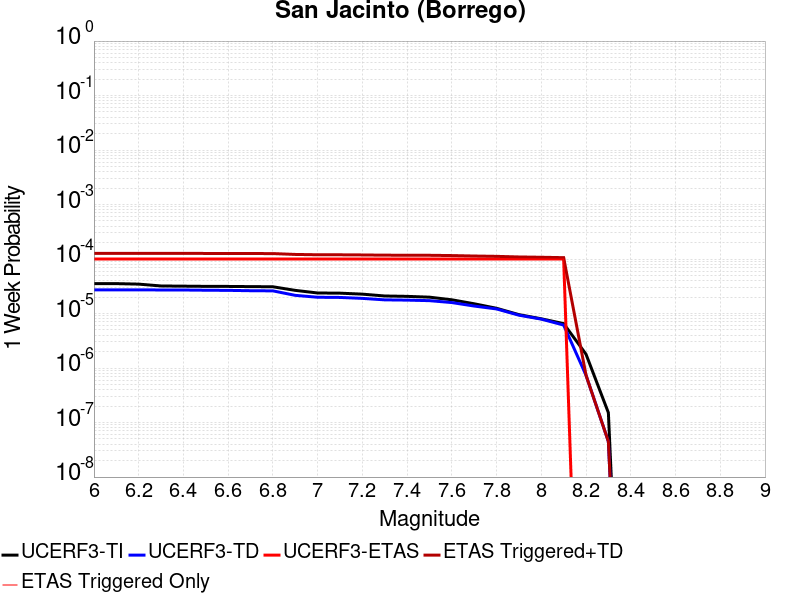 |  |  |  |

| Magnitude | 1 wk TI Prob | 1 wk TD Prob | 1 wk ETAS Prob | 1 wk ETAS/TD Gain | 1 wk ETAS Triggered+TD | 1 wk ETAS Triggered Only | 1 mo TI Prob | 1 mo TD Prob | 1 mo ETAS Prob | 1 mo ETAS/TD Gain | 1 mo ETAS Triggered+TD | 1 mo ETAS Triggered Only | 1 yr TI Prob | 1 yr TD Prob | 1 yr ETAS Prob | 1 yr ETAS/TD Gain | 1 yr ETAS Triggered+TD | 1 yr ETAS Triggered Only | 10 yr TI Prob | 10 yr TD Prob | 10 yr ETAS Prob | 10 yr ETAS/TD Gain | 10 yr ETAS Triggered+TD | 10 yr ETAS Triggered Only |
|-----|-----|-----|-----|-----|-----|-----|-----|-----|-----|-----|-----|-----|-----|-----|-----|-----|-----|-----|-----|-----|-----|-----|-----|-----|
| 6.0 | 3.543992E-5 | 2.7189188E-5 | 1.0E-4 | 3.6779325 | 1.2718647E-4 | 1.0E-4 | 1.5187653E-4 | 1.1651995E-4 | 2.0E-4 | 1.7164443 | 2.165083E-4 | 1.0E-4 | 0.0018475284 | 0.0014177191 | 0.0011 | 0.7758942 | 0.0018171519 | 4.0E-4 | 0.018322436 | 0.01448599 | 0.0089 | 0.61438674 | 0.017442532 | 0.003 |
| 6.1 | 3.542281E-5 | 2.7189188E-5 | 1.0E-4 | 3.6779325 | 1.2718647E-4 | 1.0E-4 | 1.5180321E-4 | 1.1651995E-4 | 2.0E-4 | 1.7164443 | 2.165083E-4 | 1.0E-4 | 0.0018466372 | 0.0014177191 | 0.0011 | 0.7758942 | 0.0018171519 | 4.0E-4 | 0.018313672 | 0.01448599 | 0.0089 | 0.61438674 | 0.017442532 | 0.003 |
| 6.2 | 3.4688688E-5 | 2.7189188E-5 | 1.0E-4 | 3.6779325 | 1.2718647E-4 | 1.0E-4 | 1.4865733E-4 | 1.1651995E-4 | 2.0E-4 | 1.7164443 | 2.165083E-4 | 1.0E-4 | 0.0018084005 | 0.0014177191 | 0.0011 | 0.7758942 | 0.0018171519 | 4.0E-4 | 0.017937548 | 0.01448599 | 0.0089 | 0.61438674 | 0.017442532 | 0.003 |
| 6.3 | 3.2087122E-5 | 2.7034886E-5 | 1.0E-4 | 3.6989243 | 1.2703218E-4 | 1.0E-4 | 1.3750899E-4 | 1.1585872E-4 | 2.0E-4 | 1.7262404 | 2.1584713E-4 | 1.0E-4 | 0.0016728862 | 0.001409679 | 0.0011 | 0.7803196 | 0.001809115 | 4.0E-4 | 0.016603488 | 0.014407289 | 0.0089 | 0.61774284 | 0.017364068 | 0.003 |
| 6.4 | 3.1828724E-5 | 2.7002008E-5 | 1.0E-4 | 3.7034283 | 1.2699931E-4 | 1.0E-4 | 1.364017E-4 | 1.1571783E-4 | 2.0E-4 | 1.7283422 | 2.1570626E-4 | 1.0E-4 | 0.0016594254 | 0.0014079658 | 0.0011 | 0.781269 | 0.0018074026 | 4.0E-4 | 0.016470885 | 0.014390131 | 0.0089 | 0.6184794 | 0.017346961 | 0.003 |
| 6.5 | 3.1563577E-5 | 2.6742735E-5 | 1.0E-4 | 3.7393334 | 1.2674007E-4 | 1.0E-4 | 1.3526545E-4 | 1.1460675E-4 | 2.0E-4 | 1.7450979 | 2.1459529E-4 | 1.0E-4 | 0.0016456128 | 0.0013944558 | 0.0011 | 0.7888382 | 0.0017938981 | 4.0E-4 | 0.0163348 | 0.014257997 | 0.0087 | 0.61018384 | 0.01711665 | 0.0029 |
| 6.6 | 3.1467625E-5 | 2.6587433E-5 | 1.0E-4 | 3.7611754 | 1.2658477E-4 | 1.0E-4 | 1.3485427E-4 | 1.1394123E-4 | 2.0E-4 | 1.7552909 | 2.1392983E-4 | 1.0E-4 | 0.0016406142 | 0.0013863634 | 0.0011 | 0.7934428 | 0.0017858088 | 4.0E-4 | 0.016285548 | 0.014178378 | 0.0087 | 0.6136104 | 0.017037261 | 0.0029 |
| 6.7 | 3.1223695E-5 | 2.6207546E-5 | 1.0E-4 | 3.815695 | 1.2620492E-4 | 1.0E-4 | 1.3380898E-4 | 1.1231328E-4 | 2.0E-4 | 1.7807332 | 2.1230205E-4 | 1.0E-4 | 0.0016279068 | 0.0013665681 | 0.0011 | 0.8049361 | 0.0017660215 | 4.0E-4 | 0.01616033 | 0.013983885 | 0.0087 | 0.6221447 | 0.016843332 | 0.0029 |
| 6.8 | 3.1015585E-5 | 2.6030486E-5 | 1.0E-4 | 3.8416493 | 1.2602788E-4 | 1.0E-4 | 1.3291716E-4 | 1.11554524E-4 | 2.0E-4 | 1.7928452 | 2.1154336E-4 | 1.0E-4 | 0.001617065 | 0.0013573418 | 0.0011 | 0.8104076 | 0.0017567988 | 4.0E-4 | 0.016053487 | 0.013892122 | 0.0086 | 0.6190559 | 0.016653223 | 0.0028 |
| 6.9 | 2.6641965E-5 | 2.1536094E-5 | 1.0E-4 | 4.6433673 | 1.2153394E-4 | 1.0E-4 | 1.1417485E-4 | 9.22943E-5 | 2.0E-4 | 2.166981 | 1.9228508E-4 | 1.0E-4 | 0.0013891924 | 0.0011231076 | 9.0E-4 | 0.801348 | 0.0013228831 | 2.0E-4 | 0.0138054015 | 0.011543221 | 0.0067 | 0.5804273 | 0.013520134 | 0.002 |
| 7.0 | 2.3854353E-5 | 1.9871672E-5 | 1.0E-4 | 5.0322895 | 1.19869685E-4 | 1.0E-4 | 1.02228936E-4 | 8.516154E-5 | 1.0E-4 | 1.174239 | 1.8515303E-4 | 1.0E-4 | 0.0012439266 | 0.001036351 | 7.0E-4 | 0.6754468 | 0.0011362474 | 1.0E-4 | 0.012369866 | 0.0106646 | 0.0059 | 0.5532322 | 0.012247536 | 0.0016 |
| 7.1 | 2.3672901E-5 | 1.970949E-5 | 1.0E-4 | 5.073698 | 1.1970752E-4 | 1.0E-4 | 1.0145135E-4 | 8.446652E-5 | 1.0E-4 | 1.183901 | 1.8445807E-4 | 1.0E-4 | 0.0012344702 | 0.0010278972 | 7.0E-4 | 0.68100196 | 0.0011277944 | 1.0E-4 | 0.0122763505 | 0.01058045 | 0.0056 | 0.52927804 | 0.012163522 | 0.0016 |
| 7.2 | 2.2717244E-5 | 1.8946388E-5 | 1.0E-4 | 5.278051 | 1.18944496E-4 | 1.0E-4 | 9.735599E-5 | 8.119629E-5 | 1.0E-4 | 1.2315834 | 1.8118817E-4 | 1.0E-4 | 0.0011846646 | 9.881187E-4 | 6.0E-4 | 0.60721445 | 0.0010880199 | 1.0E-4 | 0.01178369 | 0.010182606 | 0.0055 | 0.54013675 | 0.0117663145 | 0.0016 |
| 7.3 | 2.1016205E-5 | 1.7800043E-5 | 1.0E-4 | 5.617964 | 1.1779826E-4 | 1.0E-4 | 9.006634E-5 | 7.628368E-5 | 1.0E-4 | 1.3108964 | 1.7627605E-4 | 1.0E-4 | 0.001096006 | 9.2836004E-4 | 6.0E-4 | 0.646301 | 0.0010282672 | 1.0E-4 | 0.010906163 | 0.009584244 | 0.0053 | 0.5529909 | 0.011069869 | 0.0015 |
| 7.4 | 2.0683625E-5 | 1.7604487E-5 | 1.0E-4 | 5.6803703 | 1.1760273E-4 | 1.0E-4 | 8.86411E-5 | 7.544563E-5 | 1.0E-4 | 1.3254579 | 1.7543808E-4 | 1.0E-4 | 0.001078671 | 9.181654E-4 | 6.0E-4 | 0.6534771 | 0.0010180735 | 1.0E-4 | 0.010734501 | 0.00948196 | 0.0053 | 0.55895615 | 0.010967737 | 0.0015 |
| 7.5 | 1.9993966E-5 | 1.7204853E-5 | 1.0E-4 | 5.8123136 | 1.1720313E-4 | 1.0E-4 | 8.568561E-5 | 7.373301E-5 | 1.0E-4 | 1.3562446 | 1.7372564E-4 | 1.0E-4 | 0.001042723 | 8.973316E-4 | 5.0E-4 | 0.5572076 | 9.972419E-4 | 1.0E-4 | 0.010378438 | 0.009271625 | 0.0051 | 0.5500654 | 0.010757717 | 0.0015 |
| 7.6 | 1.788966E-5 | 1.5873382E-5 | 1.0E-4 | 6.2998548 | 1.1587179E-4 | 1.0E-4 | 7.666772E-5 | 6.802701E-5 | 1.0E-4 | 1.4700043 | 1.6802021E-4 | 1.0E-4 | 9.3302975E-4 | 8.2791585E-4 | 5.0E-4 | 0.6039261 | 9.27833E-4 | 1.0E-4 | 0.00929122 | 0.008571208 | 0.0049 | 0.5716813 | 0.010058352 | 0.0015 |
| 7.7 | 1.5125781E-5 | 1.369977E-5 | 1.0E-4 | 7.2993927 | 1.136984E-4 | 1.0E-4 | 6.4823165E-5 | 5.8711983E-5 | 1.0E-4 | 1.7032298 | 1.5870611E-4 | 1.0E-4 | 7.889362E-4 | 7.145847E-4 | 5.0E-4 | 0.6997071 | 8.1451325E-4 | 1.0E-4 | 0.007861412 | 0.0074313665 | 0.0042 | 0.56517196 | 0.0087217055 | 0.0013 |
| 7.8 | 1.250089E-5 | 1.2115975E-5 | 1.0E-4 | 8.253567 | 1.12114765E-4 | 1.0E-4 | 5.3574146E-5 | 5.1924573E-5 | 1.0E-4 | 1.9258704 | 1.5191938E-4 | 1.0E-4 | 6.5207E-4 | 6.319989E-4 | 5.0E-4 | 0.7911406 | 7.3193567E-4 | 1.0E-4 | 0.006501599 | 0.0065969536 | 0.004 | 0.6063405 | 0.007888378 | 0.0013 |
| 7.9 | 9.561E-6 | 9.297197E-6 | 1.0E-4 | 10.75593 | 1.0929627E-4 | 1.0E-4 | 4.0975072E-5 | 3.9844523E-5 | 1.0E-4 | 2.5097551 | 1.3984054E-4 | 1.0E-4 | 4.987573E-4 | 4.849996E-4 | 3.0E-4 | 0.6185572 | 5.849511E-4 | 1.0E-4 | 0.0049763937 | 0.0051110815 | 0.0032 | 0.6260906 | 0.0062054596 | 0.0011 |
| 8.0 | 8.01699E-6 | 7.874647E-6 | 1.0E-4 | 12.698981 | 1.0787386E-4 | 1.0E-4 | 3.4358076E-5 | 3.3748056E-5 | 1.0E-4 | 2.9631338 | 1.3374467E-4 | 1.0E-4 | 4.1822926E-4 | 4.1080557E-4 | 3.0E-4 | 0.7302725 | 5.107645E-4 | 1.0E-4 | 0.0041744304 | 0.004352012 | 0.0027 | 0.6204027 | 0.0052480954 | 9.0E-4 |
| 8.1 | 6.541947E-6 | 6.118004E-6 | 1.0E-4 | 16.3452 | 1.0611739E-4 | 1.0E-4 | 2.8036617E-5 | 2.6219757E-5 | 1.0E-4 | 3.8139179 | 1.2621713E-4 | 1.0E-4 | 3.4129233E-4 | 3.1917923E-4 | 3.0E-4 | 0.93991077 | 4.191473E-4 | 1.0E-4 | 0.0034076865 | 0.0033980047 | 0.0023 | 0.6768678 | 0.0041952864 | 8.0E-4 |
| 8.2 | 1.7968189E-6 | 7.303876E-7 | 0.0 | 0.0 | 7.303876E-7 | 0.0 | 7.70063E-6 | 3.130229E-6 | 0.0 | 0.0 | 3.130229E-6 | 0.0 | 9.3751136E-5 | 3.810989E-5 | 1.0E-4 | 2.6239908 | 3.810989E-5 | 0.0 | 9.371159E-4 | 4.3368828E-4 | 4.0E-4 | 0.92232144 | 5.336449E-4 | 1.0E-4 |
| 8.3 | 1.5167889E-7 | 4.4245223E-8 | 0.0 | 0.0 | 4.4245223E-8 | 0.0 | 6.500522E-7 | 1.8962237E-7 | 0.0 | 0.0 | 1.8962237E-7 | 0.0 | 7.9143565E-6 | 2.3086502E-6 | 0.0 | 0.0 | 2.3086502E-6 | 0.0 | 7.914075E-5 | 2.6973452E-5 | 0.0 | 0.0 | 2.6973452E-5 | 0.0 |

## Death Valley (Fish Lake Valley)
*[(top)](#table-of-contents)*

| 1 Week | 1 Month | 1 Year | 10 Year |
|-----|-----|-----|-----|
| 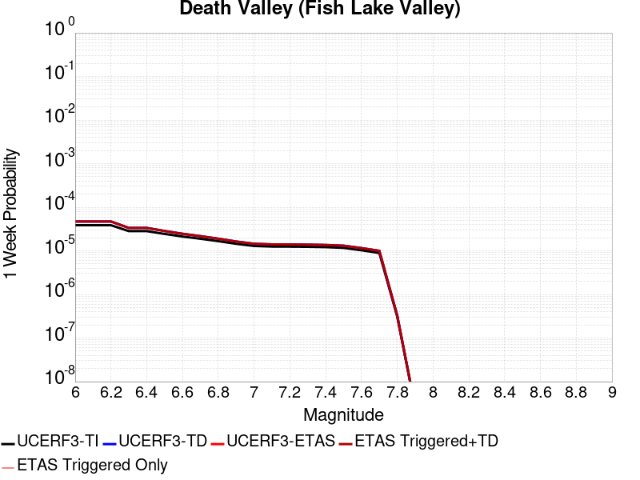 |  | 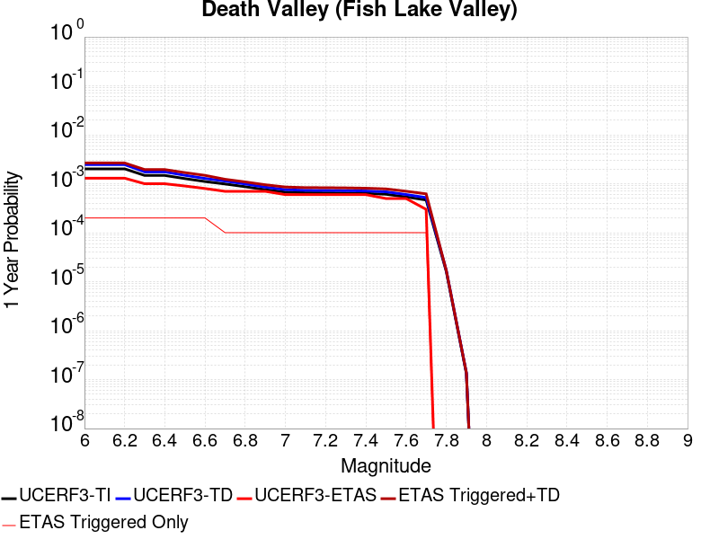 |  |

| Magnitude | 1 wk TI Prob | 1 wk TD Prob | 1 wk ETAS Prob | 1 wk ETAS/TD Gain | 1 wk ETAS Triggered+TD | 1 wk ETAS Triggered Only | 1 mo TI Prob | 1 mo TD Prob | 1 mo ETAS Prob | 1 mo ETAS/TD Gain | 1 mo ETAS Triggered+TD | 1 mo ETAS Triggered Only | 1 yr TI Prob | 1 yr TD Prob | 1 yr ETAS Prob | 1 yr ETAS/TD Gain | 1 yr ETAS Triggered+TD | 1 yr ETAS Triggered Only | 10 yr TI Prob | 10 yr TD Prob | 10 yr ETAS Prob | 10 yr ETAS/TD Gain | 10 yr ETAS Triggered+TD | 10 yr ETAS Triggered Only |
|-----|-----|-----|-----|-----|-----|-----|-----|-----|-----|-----|-----|-----|-----|-----|-----|-----|-----|-----|-----|-----|-----|-----|-----|-----|
| 6.0 | 3.872328E-5 | 4.7157107E-5 | 0.0 | 0.0 | 4.7157107E-5 | 0.0 | 1.6594635E-4 | 2.0208675E-4 | 2.0E-4 | 0.989674 | 2.0208675E-4 | 0.0 | 0.0020185246 | 0.0024578883 | 0.0013 | 0.5289093 | 0.0026573967 | 2.0E-4 | 0.02000288 | 0.024332998 | 0.0112 | 0.46028033 | 0.027064865 | 0.0028 |
| 6.1 | 3.872328E-5 | 4.7157107E-5 | 0.0 | 0.0 | 4.7157107E-5 | 0.0 | 1.6594635E-4 | 2.0208675E-4 | 2.0E-4 | 0.989674 | 2.0208675E-4 | 0.0 | 0.0020185246 | 0.0024578883 | 0.0013 | 0.5289093 | 0.0026573967 | 2.0E-4 | 0.02000288 | 0.024332998 | 0.0112 | 0.46028033 | 0.027064865 | 0.0028 |
| 6.2 | 3.872328E-5 | 4.7157107E-5 | 0.0 | 0.0 | 4.7157107E-5 | 0.0 | 1.6594635E-4 | 2.0208675E-4 | 2.0E-4 | 0.989674 | 2.0208675E-4 | 0.0 | 0.0020185246 | 0.0024578883 | 0.0013 | 0.5289093 | 0.0026573967 | 2.0E-4 | 0.02000288 | 0.024332998 | 0.0112 | 0.46028033 | 0.027064865 | 0.0028 |
| 6.3 | 2.8356371E-5 | 3.354422E-5 | 0.0 | 0.0 | 3.354422E-5 | 0.0 | 1.2152165E-4 | 1.4375345E-4 | 2.0E-4 | 1.391271 | 1.4375345E-4 | 0.0 | 0.0014785219 | 0.001748861 | 0.001 | 0.5718007 | 0.0019485113 | 2.0E-4 | 0.014687235 | 0.017358216 | 0.0078 | 0.44935495 | 0.019225234 | 0.0019 |
| 6.4 | 2.8356371E-5 | 3.354422E-5 | 0.0 | 0.0 | 3.354422E-5 | 0.0 | 1.2152165E-4 | 1.4375345E-4 | 2.0E-4 | 1.391271 | 1.4375345E-4 | 0.0 | 0.0014785219 | 0.001748861 | 0.001 | 0.5718007 | 0.0019485113 | 2.0E-4 | 0.014687235 | 0.017358216 | 0.0078 | 0.44935495 | 0.019225234 | 0.0019 |
| 6.5 | 2.4448687E-5 | 2.8556286E-5 | 0.0 | 0.0 | 2.8556286E-5 | 0.0 | 1.0477588E-4 | 1.2237861E-4 | 2.0E-4 | 1.6342725 | 1.2237861E-4 | 0.0 | 0.0012748998 | 0.0014889877 | 9.0E-4 | 0.6044375 | 0.0016886899 | 2.0E-4 | 0.012676105 | 0.014795017 | 0.007 | 0.47313225 | 0.016469866 | 0.0017 |
| 6.6 | 2.1298161E-5 | 2.4619052E-5 | 0.0 | 0.0 | 2.4619052E-5 | 0.0 | 9.127464E-5 | 1.0550614E-4 | 2.0E-4 | 1.8956243 | 1.0550614E-4 | 0.0 | 0.0011107022 | 0.001283813 | 8.0E-4 | 0.62314373 | 0.0014835562 | 2.0E-4 | 0.011051672 | 0.012767389 | 0.006 | 0.46994728 | 0.014149515 | 0.0014 |
| 6.7 | 1.8959729E-5 | 2.1746893E-5 | 0.0 | 0.0 | 2.1746893E-5 | 0.0 | 8.125345E-5 | 9.3197785E-5 | 2.0E-4 | 2.1459737 | 9.3197785E-5 | 0.0 | 9.888117E-4 | 0.0011341178 | 7.0E-4 | 0.6172198 | 0.0012340044 | 1.0E-4 | 0.009844234 | 0.01128595 | 0.0056 | 0.49619216 | 0.012571279 | 0.0013 |
| 6.8 | 1.6691629E-5 | 1.89905E-5 | 0.0 | 0.0 | 1.89905E-5 | 0.0 | 7.153359E-5 | 8.138541E-5 | 2.0E-4 | 2.4574428 | 8.138541E-5 | 0.0 | 8.7057345E-4 | 9.904337E-4 | 7.0E-4 | 0.70676106 | 0.0010903347 | 1.0E-4 | 0.008671708 | 0.009861947 | 0.0052 | 0.5272792 | 0.011149127 | 0.0013 |
| 6.9 | 1.450505E-5 | 1.636723E-5 | 0.0 | 0.0 | 1.636723E-5 | 0.0 | 6.216302E-5 | 7.014343E-5 | 2.0E-4 | 2.8513002 | 7.014343E-5 | 0.0 | 7.5657194E-4 | 8.5367047E-4 | 7.0E-4 | 0.81998855 | 9.5358514E-4 | 1.0E-4 | 0.007540013 | 0.008504841 | 0.0048 | 0.56438446 | 0.009694635 | 0.0012 |
| 7.0 | 1.2940855E-5 | 1.4519209E-5 | 0.0 | 0.0 | 1.4519209E-5 | 0.0 | 5.545963E-5 | 6.222373E-5 | 2.0E-4 | 3.214208 | 6.222373E-5 | 0.0 | 6.750118E-4 | 7.5731636E-4 | 6.0E-4 | 0.79227126 | 8.5724064E-4 | 1.0E-4 | 0.006729651 | 0.007547972 | 0.0042 | 0.55644083 | 0.0087389145 | 0.0012 |
| 7.1 | 1.2544658E-5 | 1.4060214E-5 | 0.0 | 0.0 | 1.4060214E-5 | 0.0 | 5.3761712E-5 | 6.02567E-5 | 2.0E-4 | 3.3191328 | 6.02567E-5 | 0.0 | 6.5435225E-4 | 7.33384E-4 | 6.0E-4 | 0.8181253 | 8.3331065E-4 | 1.0E-4 | 0.006524288 | 0.0073102294 | 0.0041 | 0.56085795 | 0.008501457 | 0.0012 |
| 7.2 | 1.2489416E-5 | 1.3997767E-5 | 0.0 | 0.0 | 1.3997767E-5 | 0.0 | 5.3524967E-5 | 5.9989085E-5 | 2.0E-4 | 3.33394 | 5.9989085E-5 | 0.0 | 6.514716E-4 | 7.301279E-4 | 6.0E-4 | 0.82177377 | 8.300549E-4 | 1.0E-4 | 0.006495651 | 0.007277882 | 0.0041 | 0.5633507 | 0.008469149 | 0.0012 |
| 7.3 | 1.2368307E-5 | 1.386208E-5 | 0.0 | 0.0 | 1.386208E-5 | 0.0 | 5.3005948E-5 | 5.9407594E-5 | 2.0E-4 | 3.366573 | 5.9407594E-5 | 0.0 | 6.451563E-4 | 7.23053E-4 | 6.0E-4 | 0.8298147 | 8.229807E-4 | 1.0E-4 | 0.0064328653 | 0.0072075943 | 0.004 | 0.5549702 | 0.008398945 | 0.0012 |
| 7.4 | 1.2161707E-5 | 1.3630435E-5 | 0.0 | 0.0 | 1.3630435E-5 | 0.0 | 5.212056E-5 | 5.8414873E-5 | 2.0E-4 | 3.4237857 | 5.8414873E-5 | 0.0 | 6.3438306E-4 | 7.1097456E-4 | 6.0E-4 | 0.843912 | 8.109035E-4 | 1.0E-4 | 0.006325751 | 0.007087587 | 0.004 | 0.564367 | 0.008279081 | 0.0012 |
| 7.5 | 1.1707948E-5 | 1.31286515E-5 | 0.0 | 0.0 | 1.31286515E-5 | 0.0 | 5.0175953E-5 | 5.6264467E-5 | 2.0E-4 | 3.5546415 | 5.6264467E-5 | 0.0 | 6.10721E-4 | 6.8481016E-4 | 5.0E-4 | 0.73012936 | 7.8474166E-4 | 1.0E-4 | 0.0060904534 | 0.0068275803 | 0.0039 | 0.5712126 | 0.008019387 | 0.0012 |
| 7.6 | 1.0319538E-5 | 1.1564856E-5 | 0.0 | 0.0 | 1.1564856E-5 | 0.0 | 4.4225842E-5 | 4.9562757E-5 | 2.0E-4 | 4.035288 | 4.9562757E-5 | 0.0 | 5.383166E-4 | 6.0326466E-4 | 5.0E-4 | 0.8288236 | 7.0320436E-4 | 1.0E-4 | 0.0053701443 | 0.0060168006 | 0.0035 | 0.5817045 | 0.007010784 | 0.001 |
| 7.7 | 8.937764E-6 | 1.0010071E-5 | 0.0 | 0.0 | 1.0010071E-5 | 0.0 | 3.830414E-5 | 4.2899625E-5 | 1.0E-4 | 2.3310227 | 4.2899625E-5 | 0.0 | 4.6625308E-4 | 5.221828E-4 | 3.0E-4 | 0.57451147 | 6.221306E-4 | 1.0E-4 | 0.0046527605 | 0.005210066 | 0.003 | 0.5758084 | 0.006204856 | 0.001 |
| 7.8 | 3.108007E-7 | 3.282696E-7 | 0.0 | 0.0 | 3.282696E-7 | 0.0 | 1.3320023E-6 | 1.406869E-6 | 0.0 | 0.0 | 1.406869E-6 | 0.0 | 1.6217007E-5 | 1.71285E-5 | 0.0 | 0.0 | 1.71285E-5 | 0.0 | 1.6215823E-4 | 1.7127219E-4 | 1.0E-4 | 0.583866 | 1.7127219E-4 | 0.0 |
| 7.9 | 2.5591178E-9 | 2.6684681E-9 | 0.0 | 0.0 | 2.6684681E-9 | 0.0 | 1.0967647E-8 | 1.1436292E-8 | 0.0 | 0.0 | 1.1436292E-8 | 0.0 | 1.335311E-7 | 1.3923685E-7 | 0.0 | 0.0 | 1.3923685E-7 | 0.0 | 1.3353102E-6 | 1.3923685E-6 | 0.0 | 0.0 | 1.3923685E-6 | 0.0 |

## Garlic Springs
*[(top)](#table-of-contents)*

| 1 Week | 1 Month | 1 Year | 10 Year |
|-----|-----|-----|-----|
|  |  |  | 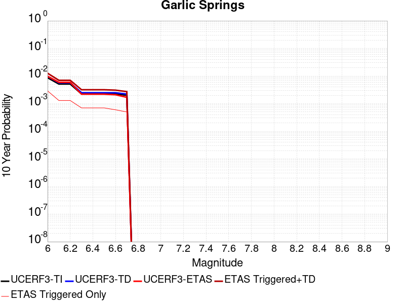 |

| Magnitude | 1 wk TI Prob | 1 wk TD Prob | 1 wk ETAS Prob | 1 wk ETAS/TD Gain | 1 wk ETAS Triggered+TD | 1 wk ETAS Triggered Only | 1 mo TI Prob | 1 mo TD Prob | 1 mo ETAS Prob | 1 mo ETAS/TD Gain | 1 mo ETAS Triggered+TD | 1 mo ETAS Triggered Only | 1 yr TI Prob | 1 yr TD Prob | 1 yr ETAS Prob | 1 yr ETAS/TD Gain | 1 yr ETAS Triggered+TD | 1 yr ETAS Triggered Only | 10 yr TI Prob | 10 yr TD Prob | 10 yr ETAS Prob | 10 yr ETAS/TD Gain | 10 yr ETAS Triggered+TD | 10 yr ETAS Triggered Only |
|-----|-----|-----|-----|-----|-----|-----|-----|-----|-----|-----|-----|-----|-----|-----|-----|-----|-----|-----|-----|-----|-----|-----|-----|-----|
| 6.0 | 1.6760017E-5 | 1.875325E-5 | 0.0 | 0.0 | 1.875325E-5 | 0.0 | 7.182667E-5 | 8.036925E-5 | 0.0 | 0.0 | 8.036925E-5 | 0.0 | 8.7413884E-4 | 9.781736E-4 | 9.0E-4 | 0.92008215 | 0.00127788 | 3.0E-4 | 0.008707083 | 0.009750196 | 0.0098 | 1.005108 | 0.012621921 | 0.0029 |
| 6.1 | 9.852767E-6 | 1.0960564E-5 | 0.0 | 0.0 | 1.0960564E-5 | 0.0 | 4.222546E-5 | 4.69734E-5 | 0.0 | 0.0 | 4.69734E-5 | 0.0 | 5.139737E-4 | 5.718219E-4 | 6.0E-4 | 1.0492778 | 6.7176466E-4 | 1.0E-4 | 0.005127866 | 0.0057104467 | 0.0059 | 1.0331942 | 0.007003023 | 0.0013 |
| 6.2 | 9.852767E-6 | 1.0960564E-5 | 0.0 | 0.0 | 1.0960564E-5 | 0.0 | 4.222546E-5 | 4.69734E-5 | 0.0 | 0.0 | 4.69734E-5 | 0.0 | 5.139737E-4 | 5.718219E-4 | 6.0E-4 | 1.0492778 | 6.7176466E-4 | 1.0E-4 | 0.005127866 | 0.0057104467 | 0.0059 | 1.0331942 | 0.007003023 | 0.0013 |
| 6.3 | 4.3167724E-6 | 4.7727035E-6 | 0.0 | 0.0 | 4.7727035E-6 | 0.0 | 1.8500323E-5 | 2.0454414E-5 | 0.0 | 0.0 | 2.0454414E-5 | 0.0 | 2.2521814E-4 | 2.49027E-4 | 4.0E-4 | 1.6062515 | 3.490021E-4 | 1.0E-4 | 0.0022499003 | 0.0024897328 | 0.0022 | 0.88362896 | 0.00318799 | 7.0E-4 |
| 6.4 | 4.3167724E-6 | 4.7727035E-6 | 0.0 | 0.0 | 4.7727035E-6 | 0.0 | 1.8500323E-5 | 2.0454414E-5 | 0.0 | 0.0 | 2.0454414E-5 | 0.0 | 2.2521814E-4 | 2.49027E-4 | 4.0E-4 | 1.6062515 | 3.490021E-4 | 1.0E-4 | 0.0022499003 | 0.0024897328 | 0.0022 | 0.88362896 | 0.00318799 | 7.0E-4 |
| 6.5 | 4.3167724E-6 | 4.7727035E-6 | 0.0 | 0.0 | 4.7727035E-6 | 0.0 | 1.8500323E-5 | 2.0454414E-5 | 0.0 | 0.0 | 2.0454414E-5 | 0.0 | 2.2521814E-4 | 2.49027E-4 | 4.0E-4 | 1.6062515 | 3.490021E-4 | 1.0E-4 | 0.0022499003 | 0.0024897328 | 0.0022 | 0.88362896 | 0.00318799 | 7.0E-4 |
| 6.6 | 4.301311E-6 | 4.7555914E-6 | 0.0 | 0.0 | 4.7555914E-6 | 0.0 | 1.8434059E-5 | 2.0381076E-5 | 0.0 | 0.0 | 2.0381076E-5 | 0.0 | 2.2441156E-4 | 2.481343E-4 | 4.0E-4 | 1.6120301 | 3.4810952E-4 | 1.0E-4 | 0.0022418506 | 0.0024808259 | 0.0021 | 0.8464923 | 0.0030793375 | 6.0E-4 |
| 6.7 | 3.8599724E-6 | 4.2663155E-6 | 0.0 | 0.0 | 4.2663155E-6 | 0.0 | 1.6542634E-5 | 1.828421E-5 | 0.0 | 0.0 | 1.828421E-5 | 0.0 | 2.0138794E-4 | 2.2261025E-4 | 3.0E-4 | 1.3476468 | 3.22588E-4 | 1.0E-4 | 0.0020120554 | 0.0022261024 | 0.0017 | 0.7636665 | 0.0027249896 | 5.0E-4 |

## Great Valley 03a Dunnigan Hills
*[(top)](#table-of-contents)*

| 1 Week | 1 Month | 1 Year | 10 Year |
|-----|-----|-----|-----|
| 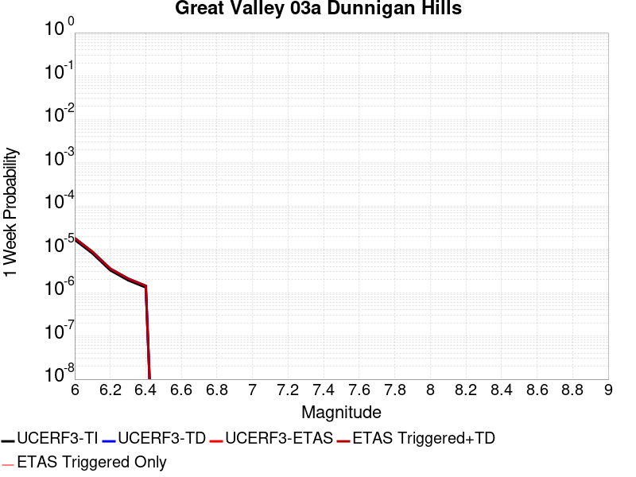 |  |  |  |

| Magnitude | 1 wk TI Prob | 1 wk TD Prob | 1 wk ETAS Prob | 1 wk ETAS/TD Gain | 1 wk ETAS Triggered+TD | 1 wk ETAS Triggered Only | 1 mo TI Prob | 1 mo TD Prob | 1 mo ETAS Prob | 1 mo ETAS/TD Gain | 1 mo ETAS Triggered+TD | 1 mo ETAS Triggered Only | 1 yr TI Prob | 1 yr TD Prob | 1 yr ETAS Prob | 1 yr ETAS/TD Gain | 1 yr ETAS Triggered+TD | 1 yr ETAS Triggered Only | 10 yr TI Prob | 10 yr TD Prob | 10 yr ETAS Prob | 10 yr ETAS/TD Gain | 10 yr ETAS Triggered+TD | 10 yr ETAS Triggered Only |
|-----|-----|-----|-----|-----|-----|-----|-----|-----|-----|-----|-----|-----|-----|-----|-----|-----|-----|-----|-----|-----|-----|-----|-----|-----|
| 6.0 | 1.6591328E-5 | 1.8090686E-5 | 0.0 | 0.0 | 1.8090686E-5 | 0.0 | 7.110376E-5 | 7.75296E-5 | 0.0 | 0.0 | 7.75296E-5 | 0.0 | 8.6534437E-4 | 9.435831E-4 | 4.0E-4 | 0.42391604 | 0.0011433944 | 2.0E-4 | 0.008619824 | 0.009402585 | 0.0097 | 1.0316311 | 0.011879079 | 0.0025 |
| 6.1 | 8.041125E-6 | 8.761437E-6 | 0.0 | 0.0 | 8.761437E-6 | 0.0 | 3.4461507E-5 | 3.754859E-5 | 0.0 | 0.0 | 3.754859E-5 | 0.0 | 4.194881E-4 | 4.5707848E-4 | 2.0E-4 | 0.43756163 | 5.5703276E-4 | 1.0E-4 | 0.004186971 | 0.0045633772 | 0.0035 | 0.7669758 | 0.005558814 | 0.001 |
| 6.2 | 3.2807004E-6 | 3.576167E-6 | 0.0 | 0.0 | 3.576167E-6 | 0.0 | 1.4060069E-5 | 1.5326363E-5 | 0.0 | 0.0 | 1.5326363E-5 | 0.0 | 1.7116789E-4 | 1.8658665E-4 | 1.0E-4 | 0.53594404 | 1.8658665E-4 | 0.0 | 0.0017103611 | 0.0018647071 | 0.001 | 0.53627723 | 0.0020643342 | 2.0E-4 |
| 6.3 | 1.9339366E-6 | 2.1083722E-6 | 0.0 | 0.0 | 2.1083722E-6 | 0.0 | 8.288273E-6 | 9.035865E-6 | 0.0 | 0.0 | 9.035865E-6 | 0.0 | 1.00905054E-4 | 1.1000896E-4 | 0.0 | 0.0 | 1.1000896E-4 | 0.0 | 0.0010085925 | 0.0010998244 | 7.0E-4 | 0.63646525 | 0.0011997144 | 1.0E-4 |
| 6.4 | 1.3142635E-6 | 1.4326239E-6 | 0.0 | 0.0 | 1.4326239E-6 | 0.0 | 5.6325457E-6 | 6.139817E-6 | 0.0 | 0.0 | 6.139817E-6 | 0.0 | 6.857408E-5 | 7.475227E-5 | 0.0 | 0.0 | 7.475227E-5 | 0.0 | 6.8552926E-4 | 7.475227E-4 | 5.0E-4 | 0.668876 | 7.475227E-4 | 0.0 |

## Nelson Lake
*[(top)](#table-of-contents)*

| 1 Week | 1 Month | 1 Year | 10 Year |
|-----|-----|-----|-----|
| 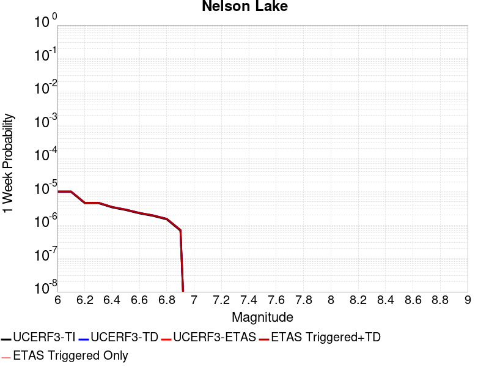 |  |  | 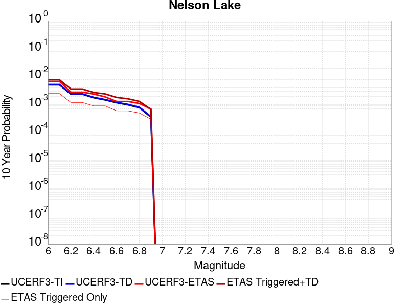 |

| Magnitude | 1 wk TI Prob | 1 wk TD Prob | 1 wk ETAS Prob | 1 wk ETAS/TD Gain | 1 wk ETAS Triggered+TD | 1 wk ETAS Triggered Only | 1 mo TI Prob | 1 mo TD Prob | 1 mo ETAS Prob | 1 mo ETAS/TD Gain | 1 mo ETAS Triggered+TD | 1 mo ETAS Triggered Only | 1 yr TI Prob | 1 yr TD Prob | 1 yr ETAS Prob | 1 yr ETAS/TD Gain | 1 yr ETAS Triggered+TD | 1 yr ETAS Triggered Only | 10 yr TI Prob | 10 yr TD Prob | 10 yr ETAS Prob | 10 yr ETAS/TD Gain | 10 yr ETAS Triggered+TD | 10 yr ETAS Triggered Only |
|-----|-----|-----|-----|-----|-----|-----|-----|-----|-----|-----|-----|-----|-----|-----|-----|-----|-----|-----|-----|-----|-----|-----|-----|-----|
| 6.0 | 9.913453E-6 | 1.0189259E-5 | 0.0 | 0.0 | 1.0189259E-5 | 0.0 | 4.2485535E-5 | 4.3667584E-5 | 1.0E-4 | 2.2900283 | 4.3667584E-5 | 0.0 | 5.1713863E-4 | 5.3153344E-4 | 3.0E-4 | 0.5644047 | 5.3153344E-4 | 0.0 | 0.0051593683 | 0.0053036483 | 0.0068 | 1.2821363 | 0.0077903895 | 0.0025 |
| 6.1 | 9.913453E-6 | 1.0189259E-5 | 0.0 | 0.0 | 1.0189259E-5 | 0.0 | 4.2485535E-5 | 4.3667584E-5 | 1.0E-4 | 2.2900283 | 4.3667584E-5 | 0.0 | 5.1713863E-4 | 5.3153344E-4 | 3.0E-4 | 0.5644047 | 5.3153344E-4 | 0.0 | 0.0051593683 | 0.0053036483 | 0.0068 | 1.2821363 | 0.0077903895 | 0.0025 |
| 6.2 | 4.5596407E-6 | 4.6948408E-6 | 0.0 | 0.0 | 4.6948408E-6 | 0.0 | 1.954117E-5 | 2.0120598E-5 | 0.0 | 0.0 | 2.0120598E-5 | 0.0 | 2.3788778E-4 | 2.44942E-4 | 2.0E-4 | 0.8165198 | 2.44942E-4 | 0.0 | 0.0023763329 | 0.0024468463 | 0.0028 | 1.1443301 | 0.0036439102 | 0.0012 |
| 6.3 | 4.5596407E-6 | 4.6948408E-6 | 0.0 | 0.0 | 4.6948408E-6 | 0.0 | 1.954117E-5 | 2.0120598E-5 | 0.0 | 0.0 | 2.0120598E-5 | 0.0 | 2.3788778E-4 | 2.44942E-4 | 2.0E-4 | 0.8165198 | 2.44942E-4 | 0.0 | 0.0023763329 | 0.0024468463 | 0.0028 | 1.1443301 | 0.0036439102 | 0.0012 |
| 6.4 | 3.4025713E-6 | 3.5087392E-6 | 0.0 | 0.0 | 3.5087392E-6 | 0.0 | 1.4582367E-5 | 1.5037371E-5 | 0.0 | 0.0 | 1.5037371E-5 | 0.0 | 1.7752586E-4 | 1.8306545E-4 | 2.0E-4 | 1.0925055 | 1.8306545E-4 | 0.0 | 0.001773841 | 0.0018292294 | 0.0024 | 1.3120279 | 0.002727583 | 9.0E-4 |
| 6.5 | 2.8352947E-6 | 2.926856E-6 | 0.0 | 0.0 | 2.926856E-6 | 0.0 | 1.2151207E-5 | 1.2543613E-5 | 0.0 | 0.0 | 1.2543613E-5 | 0.0 | 1.479309E-4 | 1.5270854E-4 | 1.0E-4 | 0.65484226 | 1.5270854E-4 | 0.0 | 0.0014783246 | 0.0015261098 | 0.0019 | 1.2449956 | 0.0024247363 | 9.0E-4 |
| 6.6 | 2.251518E-6 | 2.3282284E-6 | 0.0 | 0.0 | 2.3282284E-6 | 0.0 | 9.649328E-6 | 9.978087E-6 | 0.0 | 0.0 | 9.978087E-6 | 0.0 | 1.1747423E-4 | 1.2147706E-4 | 1.0E-4 | 0.8232007 | 1.2147706E-4 | 0.0 | 0.0011741214 | 0.0012141683 | 0.0013 | 1.0706918 | 0.0018134398 | 6.0E-4 |
| 6.7 | 1.8911853E-6 | 1.9584033E-6 | 0.0 | 0.0 | 1.9584033E-6 | 0.0 | 8.105055E-6 | 8.393134E-6 | 0.0 | 0.0 | 8.393134E-6 | 0.0 | 9.867457E-5 | 1.02182195E-4 | 1.0E-4 | 0.9786441 | 1.02182195E-4 | 0.0 | 9.863076E-4 | 0.0010214095 | 0.0013 | 1.272751 | 0.0016207967 | 6.0E-4 |
| 6.8 | 1.4874814E-6 | 1.5432189E-6 | 0.0 | 0.0 | 1.5432189E-6 | 0.0 | 6.374905E-6 | 6.613782E-6 | 0.0 | 0.0 | 6.613782E-6 | 0.0 | 7.76117E-5 | 8.052034E-5 | 1.0E-4 | 1.2419223 | 8.052034E-5 | 0.0 | 7.75846E-4 | 8.0496265E-4 | 0.0011 | 1.366523 | 0.0013045602 | 5.0E-4 |
| 6.9 | 6.835972E-7 | 7.1366145E-7 | 0.0 | 0.0 | 7.1366145E-7 | 0.0 | 2.9296991E-6 | 3.0585475E-6 | 0.0 | 0.0 | 3.0585475E-6 | 0.0 | 3.56685E-5 | 3.7237496E-5 | 0.0 | 0.0 | 3.7237496E-5 | 0.0 | 3.5662777E-4 | 3.7234378E-4 | 7.0E-4 | 1.879983 | 6.7223207E-4 | 3.0E-4 |

## San Jacinto (San Jacinto Valley) rev
*[(top)](#table-of-contents)*

| 1 Week | 1 Month | 1 Year | 10 Year |
|-----|-----|-----|-----|
| 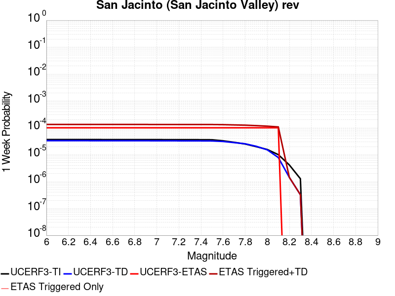 |  | 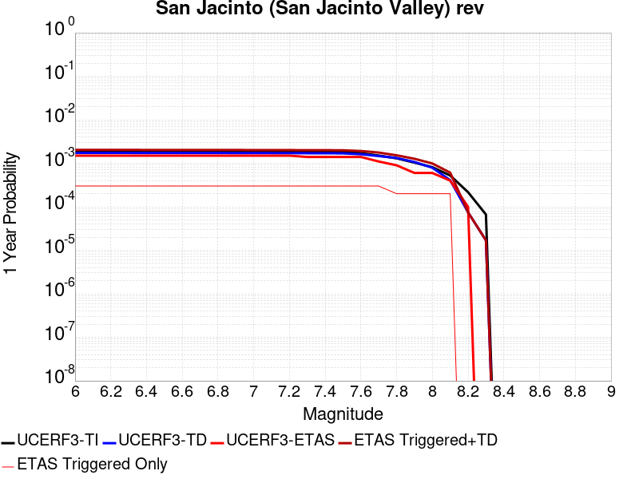 | 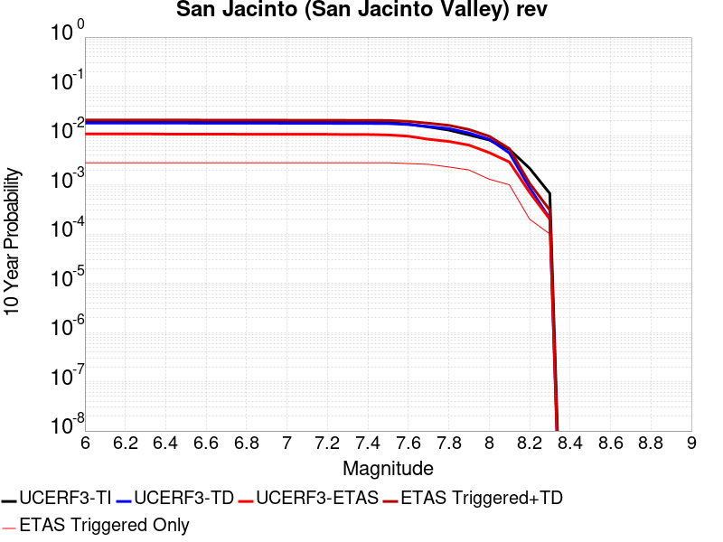 |

| Magnitude | 1 wk TI Prob | 1 wk TD Prob | 1 wk ETAS Prob | 1 wk ETAS/TD Gain | 1 wk ETAS Triggered+TD | 1 wk ETAS Triggered Only | 1 mo TI Prob | 1 mo TD Prob | 1 mo ETAS Prob | 1 mo ETAS/TD Gain | 1 mo ETAS Triggered+TD | 1 mo ETAS Triggered Only | 1 yr TI Prob | 1 yr TD Prob | 1 yr ETAS Prob | 1 yr ETAS/TD Gain | 1 yr ETAS Triggered+TD | 1 yr ETAS Triggered Only | 10 yr TI Prob | 10 yr TD Prob | 10 yr ETAS Prob | 10 yr ETAS/TD Gain | 10 yr ETAS Triggered+TD | 10 yr ETAS Triggered Only |
|-----|-----|-----|-----|-----|-----|-----|-----|-----|-----|-----|-----|-----|-----|-----|-----|-----|-----|-----|-----|-----|-----|-----|-----|-----|
| 6.0 | 3.652694E-5 | 3.31435E-5 | 1.0E-4 | 3.017183 | 1.3314019E-4 | 1.0E-4 | 1.5653463E-4 | 1.4203585E-4 | 2.0E-4 | 1.4080952 | 3.4200744E-4 | 2.0E-4 | 0.0019041431 | 0.0017279165 | 0.0015 | 0.8680975 | 0.0020273982 | 3.0E-4 | 0.018879099 | 0.017874664 | 0.0108 | 0.60420716 | 0.020624615 | 0.0028 |
| 6.1 | 3.652694E-5 | 3.31435E-5 | 1.0E-4 | 3.017183 | 1.3314019E-4 | 1.0E-4 | 1.5653463E-4 | 1.4203585E-4 | 2.0E-4 | 1.4080952 | 3.4200744E-4 | 2.0E-4 | 0.0019041431 | 0.0017279165 | 0.0015 | 0.8680975 | 0.0020273982 | 3.0E-4 | 0.018879099 | 0.017874664 | 0.0108 | 0.60420716 | 0.020624615 | 0.0028 |
| 6.2 | 3.652694E-5 | 3.31435E-5 | 1.0E-4 | 3.017183 | 1.3314019E-4 | 1.0E-4 | 1.5653463E-4 | 1.4203585E-4 | 2.0E-4 | 1.4080952 | 3.4200744E-4 | 2.0E-4 | 0.0019041431 | 0.0017279165 | 0.0015 | 0.8680975 | 0.0020273982 | 3.0E-4 | 0.018879099 | 0.017874664 | 0.0108 | 0.60420716 | 0.020624615 | 0.0028 |
| 6.3 | 3.652694E-5 | 3.31435E-5 | 1.0E-4 | 3.017183 | 1.3314019E-4 | 1.0E-4 | 1.5653463E-4 | 1.4203585E-4 | 2.0E-4 | 1.4080952 | 3.4200744E-4 | 2.0E-4 | 0.0019041431 | 0.0017279165 | 0.0015 | 0.8680975 | 0.0020273982 | 3.0E-4 | 0.018879099 | 0.017874664 | 0.0108 | 0.60420716 | 0.020624615 | 0.0028 |
| 6.4 | 3.646941E-5 | 3.306535E-5 | 1.0E-4 | 3.024314 | 1.3306204E-4 | 1.0E-4 | 1.5628811E-4 | 1.4170096E-4 | 2.0E-4 | 1.411423 | 3.4167262E-4 | 2.0E-4 | 0.0019011468 | 0.0017238461 | 0.0015 | 0.8701473 | 0.002023329 | 3.0E-4 | 0.018849645 | 0.017834656 | 0.0107 | 0.5999555 | 0.02058472 | 0.0028 |
| 6.5 | 3.646941E-5 | 3.306535E-5 | 1.0E-4 | 3.024314 | 1.3306204E-4 | 1.0E-4 | 1.5628811E-4 | 1.4170096E-4 | 2.0E-4 | 1.411423 | 3.4167262E-4 | 2.0E-4 | 0.0019011468 | 0.0017238461 | 0.0015 | 0.8701473 | 0.002023329 | 3.0E-4 | 0.018849645 | 0.017834656 | 0.0107 | 0.5999555 | 0.02058472 | 0.0028 |
| 6.6 | 3.6442503E-5 | 3.3028868E-5 | 1.0E-4 | 3.0276546 | 1.3302556E-4 | 1.0E-4 | 1.561728E-4 | 1.4154462E-4 | 2.0E-4 | 1.412982 | 3.415163E-4 | 2.0E-4 | 0.0018997455 | 0.0017219458 | 0.0015 | 0.8711076 | 0.0020214291 | 3.0E-4 | 0.018835869 | 0.017815977 | 0.0107 | 0.6005845 | 0.020566093 | 0.0028 |
| 6.7 | 3.6432113E-5 | 3.3014494E-5 | 1.0E-4 | 3.0289726 | 1.330112E-4 | 1.0E-4 | 1.5612828E-4 | 1.4148303E-4 | 2.0E-4 | 1.4135971 | 3.4145472E-4 | 2.0E-4 | 0.0018992044 | 0.0017211973 | 0.0015 | 0.8714864 | 0.0020206808 | 3.0E-4 | 0.018830549 | 0.017808624 | 0.0107 | 0.6008325 | 0.020558758 | 0.0028 |
| 6.8 | 3.6409598E-5 | 3.298367E-5 | 1.0E-4 | 3.0318034 | 1.3298038E-4 | 1.0E-4 | 1.560318E-4 | 1.4135095E-4 | 2.0E-4 | 1.4149181 | 3.4132268E-4 | 2.0E-4 | 0.0018980318 | 0.0017195916 | 0.0015 | 0.87230015 | 0.0020190757 | 3.0E-4 | 0.018819023 | 0.017792828 | 0.0106 | 0.5957457 | 0.020543007 | 0.0028 |
| 6.9 | 3.638078E-5 | 3.2944245E-5 | 1.0E-4 | 3.0354316 | 1.3294096E-4 | 1.0E-4 | 1.5590832E-4 | 1.41182E-4 | 2.0E-4 | 1.4166112 | 3.4115376E-4 | 2.0E-4 | 0.0018965311 | 0.001717538 | 0.0015 | 0.8733431 | 0.0020170228 | 3.0E-4 | 0.018804269 | 0.017772626 | 0.0106 | 0.59642285 | 0.020522863 | 0.0028 |
| 7.0 | 3.6294874E-5 | 3.2826716E-5 | 1.0E-4 | 3.0462992 | 1.3282344E-4 | 1.0E-4 | 1.5554018E-4 | 1.4067836E-4 | 2.0E-4 | 1.4216827 | 3.4065024E-4 | 2.0E-4 | 0.0018920569 | 0.001711416 | 0.0015 | 0.8764672 | 0.0020109026 | 3.0E-4 | 0.018760284 | 0.0177124 | 0.0106 | 0.59845084 | 0.020462804 | 0.0028 |
| 7.1 | 3.6260717E-5 | 3.2783122E-5 | 1.0E-4 | 3.05035 | 1.3277984E-4 | 1.0E-4 | 1.5539382E-4 | 1.4049155E-4 | 2.0E-4 | 1.4235733 | 3.4046345E-4 | 2.0E-4 | 0.001890278 | 0.0017091451 | 0.0015 | 0.8776317 | 0.0020086323 | 3.0E-4 | 0.018742796 | 0.017690044 | 0.0106 | 0.5992071 | 0.020440511 | 0.0028 |
| 7.2 | 3.6210204E-5 | 3.271755E-5 | 1.0E-4 | 3.0564632 | 1.3271428E-4 | 1.0E-4 | 1.5517735E-4 | 1.4021056E-4 | 2.0E-4 | 1.426426 | 3.401825E-4 | 2.0E-4 | 0.001887647 | 0.0017057295 | 0.0015 | 0.87938917 | 0.0020052178 | 3.0E-4 | 0.01871693 | 0.01765642 | 0.0106 | 0.60034823 | 0.020406982 | 0.0028 |
| 7.3 | 3.6119454E-5 | 3.260648E-5 | 1.0E-4 | 3.0668752 | 1.3260322E-4 | 1.0E-4 | 1.5478847E-4 | 1.3973458E-4 | 2.0E-4 | 1.4312849 | 3.3970663E-4 | 2.0E-4 | 0.0018829206 | 0.0016999436 | 0.0014 | 0.8235568 | 0.0019994336 | 3.0E-4 | 0.018670462 | 0.017599264 | 0.0105 | 0.5966159 | 0.020349985 | 0.0028 |
| 7.4 | 3.607848E-5 | 3.255442E-5 | 1.0E-4 | 3.0717793 | 1.3255117E-4 | 1.0E-4 | 1.5461289E-4 | 1.395115E-4 | 2.0E-4 | 1.4335736 | 3.394836E-4 | 2.0E-4 | 0.0018807866 | 0.0016972318 | 0.0014 | 0.8248726 | 0.0019967225 | 3.0E-4 | 0.018649481 | 0.017572464 | 0.0105 | 0.5975258 | 0.020323262 | 0.0028 |
| 7.5 | 3.5856774E-5 | 3.23662E-5 | 1.0E-4 | 3.089643 | 1.3236295E-4 | 1.0E-4 | 1.5366284E-4 | 1.3870491E-4 | 2.0E-4 | 1.4419099 | 3.3867717E-4 | 2.0E-4 | 0.0018692396 | 0.0016874268 | 0.0014 | 0.8296656 | 0.0019869206 | 3.0E-4 | 0.018535944 | 0.017474525 | 0.0103 | 0.5894295 | 0.020225596 | 0.0028 |
| 7.6 | 3.286655E-5 | 3.091292E-5 | 1.0E-4 | 3.234893 | 1.3090983E-4 | 1.0E-4 | 1.4084904E-4 | 1.3247723E-4 | 2.0E-4 | 1.5096934 | 3.3245073E-4 | 2.0E-4 | 0.001713488 | 0.001611719 | 0.0014 | 0.86863774 | 0.0019112355 | 3.0E-4 | 0.017003361 | 0.016706059 | 0.0097 | 0.5806277 | 0.019360952 | 0.0027 |
| 7.7 | 2.8882527E-5 | 2.8036491E-5 | 1.0E-4 | 3.56678 | 1.2803369E-4 | 1.0E-4 | 1.237764E-4 | 1.20150864E-4 | 2.0E-4 | 1.664574 | 3.2012683E-4 | 2.0E-4 | 0.0015059357 | 0.0014618561 | 0.0011 | 0.75246805 | 0.0017614176 | 3.0E-4 | 0.014957713 | 0.01520748 | 0.0084 | 0.55235976 | 0.01776794 | 0.0026 |
| 7.8 | 2.4950225E-5 | 2.5377112E-5 | 1.0E-4 | 3.9405587 | 1.2537457E-4 | 1.0E-4 | 1.0692515E-4 | 1.08754524E-4 | 1.0E-4 | 0.919502 | 2.0874364E-4 | 1.0E-4 | 0.0013010362 | 0.0013232828 | 9.0E-4 | 0.6801267 | 0.0015230182 | 2.0E-4 | 0.012934455 | 0.01381372 | 0.0076 | 0.55017763 | 0.016081948 | 0.0023 |
| 7.9 | 1.9881603E-5 | 2.0472362E-5 | 1.0E-4 | 4.8846345 | 1.20470315E-4 | 1.0E-4 | 8.520408E-5 | 8.7735745E-5 | 1.0E-4 | 1.1397864 | 1.8772697E-4 | 1.0E-4 | 0.001036866 | 0.0010676599 | 6.0E-4 | 0.5619767 | 0.0012674464 | 2.0E-4 | 0.010320415 | 0.011236687 | 0.0064 | 0.56956285 | 0.013214214 | 0.002 |
| 8.0 | 1.563292E-5 | 1.5096072E-5 | 1.0E-4 | 6.6242394 | 1.1509456E-4 | 1.0E-4 | 6.6996516E-5 | 6.469585E-5 | 1.0E-4 | 1.5456941 | 1.6468938E-4 | 1.0E-4 | 8.153773E-4 | 7.8738795E-4 | 6.0E-4 | 0.76201314 | 9.872305E-4 | 2.0E-4 | 0.00812392 | 0.008366229 | 0.0045 | 0.5378768 | 0.009655353 | 0.0013 |
| 8.1 | 1.0045313E-5 | 7.802638E-6 | 1.0E-4 | 12.816179 | 1.07801854E-4 | 1.0E-4 | 4.305063E-5 | 3.343945E-5 | 1.0E-4 | 2.99048 | 1.334361E-4 | 1.0E-4 | 5.2401534E-4 | 4.070497E-4 | 4.0E-4 | 0.982681 | 6.069683E-4 | 2.0E-4 | 0.0052278144 | 0.0043896893 | 0.0029 | 0.660639 | 0.0053852997 | 0.001 |
| 8.2 | 4.1554413E-6 | 1.4137654E-6 | 0.0 | 0.0 | 1.4137654E-6 | 0.0 | 1.7808914E-5 | 6.0589805E-6 | 0.0 | 0.0 | 6.0589805E-6 | 0.0 | 2.1680194E-4 | 7.3765616E-5 | 1.0E-4 | 1.3556452 | 7.3765616E-5 | 0.0 | 0.0021659054 | 8.6111814E-4 | 7.0E-4 | 0.81289655 | 0.0010609459 | 2.0E-4 |
| 8.3 | 1.2758221E-6 | 3.1965183E-7 | 0.0 | 0.0 | 3.1965183E-7 | 0.0 | 5.4677976E-6 | 1.3699357E-6 | 0.0 | 0.0 | 1.3699357E-6 | 0.0 | 6.65684E-5 | 1.6678843E-5 | 0.0 | 0.0 | 1.6678843E-5 | 0.0 | 6.6548464E-4 | 2.0278891E-4 | 2.0E-4 | 0.98624724 | 3.0276863E-4 | 1.0E-4 |

## Contra Costa Shear Zone (connector) 2011 CFM
*[(top)](#table-of-contents)*

| 1 Week | 1 Month | 1 Year | 10 Year |
|-----|-----|-----|-----|
|  |  |  | 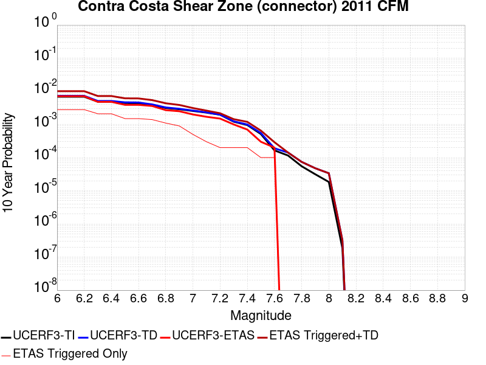 |

| Magnitude | 1 wk TI Prob | 1 wk TD Prob | 1 wk ETAS Prob | 1 wk ETAS/TD Gain | 1 wk ETAS Triggered+TD | 1 wk ETAS Triggered Only | 1 mo TI Prob | 1 mo TD Prob | 1 mo ETAS Prob | 1 mo ETAS/TD Gain | 1 mo ETAS Triggered+TD | 1 mo ETAS Triggered Only | 1 yr TI Prob | 1 yr TD Prob | 1 yr ETAS Prob | 1 yr ETAS/TD Gain | 1 yr ETAS Triggered+TD | 1 yr ETAS Triggered Only | 10 yr TI Prob | 10 yr TD Prob | 10 yr ETAS Prob | 10 yr ETAS/TD Gain | 10 yr ETAS Triggered+TD | 10 yr ETAS Triggered Only |
|-----|-----|-----|-----|-----|-----|-----|-----|-----|-----|-----|-----|-----|-----|-----|-----|-----|-----|-----|-----|-----|-----|-----|-----|-----|
| 6.0 | 1.3187427E-5 | 1.400659E-5 | 0.0 | 0.0 | 1.400659E-5 | 0.0 | 5.6516317E-5 | 6.0026992E-5 | 0.0 | 0.0 | 6.0026992E-5 | 0.0 | 6.878689E-4 | 7.306063E-4 | 7.0E-4 | 0.9581083 | 0.0010303871 | 3.0E-4 | 0.006857436 | 0.0072885524 | 0.0071 | 0.97413033 | 0.010068145 | 0.0028 |
| 6.1 | 1.3187427E-5 | 1.400659E-5 | 0.0 | 0.0 | 1.400659E-5 | 0.0 | 5.6516317E-5 | 6.0026992E-5 | 0.0 | 0.0 | 6.0026992E-5 | 0.0 | 6.878689E-4 | 7.306063E-4 | 7.0E-4 | 0.9581083 | 0.0010303871 | 3.0E-4 | 0.006857436 | 0.0072885524 | 0.0071 | 0.97413033 | 0.010068145 | 0.0028 |
| 6.2 | 1.3187427E-5 | 1.400659E-5 | 0.0 | 0.0 | 1.400659E-5 | 0.0 | 5.6516317E-5 | 6.0026992E-5 | 0.0 | 0.0 | 6.0026992E-5 | 0.0 | 6.878689E-4 | 7.306063E-4 | 7.0E-4 | 0.9581083 | 0.0010303871 | 3.0E-4 | 0.006857436 | 0.0072885524 | 0.0071 | 0.97413033 | 0.010068145 | 0.0028 |
| 6.3 | 9.315374E-6 | 9.793442E-6 | 0.0 | 0.0 | 9.793442E-6 | 0.0 | 3.992242E-5 | 4.197124E-5 | 0.0 | 0.0 | 4.197124E-5 | 0.0 | 4.8594706E-4 | 5.1088416E-4 | 5.0E-4 | 0.9786954 | 8.107309E-4 | 3.0E-4 | 0.004848858 | 0.005101765 | 0.0048 | 0.94085085 | 0.0071910513 | 0.0021 |
| 6.4 | 9.315374E-6 | 9.793442E-6 | 0.0 | 0.0 | 9.793442E-6 | 0.0 | 3.992242E-5 | 4.197124E-5 | 0.0 | 0.0 | 4.197124E-5 | 0.0 | 4.8594706E-4 | 5.1088416E-4 | 5.0E-4 | 0.9786954 | 8.107309E-4 | 3.0E-4 | 0.004848858 | 0.005101765 | 0.0048 | 0.94085085 | 0.0071910513 | 0.0021 |
| 6.5 | 8.492638E-6 | 8.9078385E-6 | 0.0 | 0.0 | 8.9078385E-6 | 0.0 | 3.639651E-5 | 3.8175913E-5 | 0.0 | 0.0 | 3.8175913E-5 | 0.0 | 4.430374E-4 | 4.6469597E-4 | 2.0E-4 | 0.43038893 | 5.646495E-4 | 1.0E-4 | 0.0044215517 | 0.004641835 | 0.0039 | 0.840185 | 0.0061348723 | 0.0015 |
| 6.6 | 8.402072E-6 | 8.808738E-6 | 0.0 | 0.0 | 8.808738E-6 | 0.0 | 3.6008387E-5 | 3.7751208E-5 | 0.0 | 0.0 | 3.7751208E-5 | 0.0 | 4.383139E-4 | 4.595274E-4 | 2.0E-4 | 0.43522978 | 5.5948144E-4 | 1.0E-4 | 0.0043745036 | 0.0045903637 | 0.0039 | 0.8496059 | 0.006083478 | 0.0015 |
| 6.7 | 7.383587E-6 | 7.717163E-6 | 0.0 | 0.0 | 7.717163E-6 | 0.0 | 3.164356E-5 | 3.307315E-5 | 0.0 | 0.0 | 3.307315E-5 | 0.0 | 3.8519225E-4 | 4.0259326E-4 | 2.0E-4 | 0.4967793 | 5.02553E-4 | 1.0E-4 | 0.0038452526 | 0.004023106 | 0.0036 | 0.894831 | 0.0054174736 | 0.0014 |
| 6.8 | 6.004921E-6 | 6.2360114E-6 | 0.0 | 0.0 | 6.2360114E-6 | 0.0 | 2.5735122E-5 | 2.672549E-5 | 0.0 | 0.0 | 2.672549E-5 | 0.0 | 3.1328006E-4 | 3.253348E-4 | 2.0E-4 | 0.61475134 | 4.2530228E-4 | 1.0E-4 | 0.0031283877 | 0.0032528986 | 0.0027 | 0.83002895 | 0.0043493207 | 0.0011 |
| 6.9 | 5.505255E-6 | 5.6889726E-6 | 0.0 | 0.0 | 5.6889726E-6 | 0.0 | 2.3593739E-5 | 2.4381085E-5 | 0.0 | 0.0 | 2.4381085E-5 | 0.0 | 2.872159E-4 | 2.967997E-4 | 2.0E-4 | 0.6738551 | 3.9677002E-4 | 1.0E-4 | 0.0028684495 | 0.0029683376 | 0.0025 | 0.8422222 | 0.0038656662 | 9.0E-4 |
| 7.0 | 4.891922E-6 | 5.020287E-6 | 0.0 | 0.0 | 5.020287E-6 | 0.0 | 2.096521E-5 | 2.151534E-5 | 0.0 | 0.0 | 2.151534E-5 | 0.0 | 2.5522153E-4 | 2.6191812E-4 | 1.0E-4 | 0.3817987 | 2.6191812E-4 | 0.0 | 0.0025492862 | 0.0026203908 | 0.002 | 0.7632449 | 0.0031190808 | 5.0E-4 |
| 7.1 | 4.3599E-6 | 4.425074E-6 | 0.0 | 0.0 | 4.425074E-6 | 0.0 | 1.868515E-5 | 1.8964467E-5 | 0.0 | 0.0 | 1.8964467E-5 | 0.0 | 2.2746796E-4 | 2.3086819E-4 | 1.0E-4 | 0.43314758 | 2.3086819E-4 | 0.0 | 0.0022723526 | 0.0023105736 | 0.0017 | 0.73574805 | 0.0026098804 | 3.0E-4 |
| 7.2 | 3.7647926E-6 | 3.7775706E-6 | 0.0 | 0.0 | 3.7775706E-6 | 0.0 | 1.6134725E-5 | 1.618949E-5 | 0.0 | 0.0 | 1.618949E-5 | 0.0 | 1.9642258E-4 | 1.9708945E-4 | 1.0E-4 | 0.5073838 | 1.9708945E-4 | 0.0 | 0.0019624906 | 0.0019734248 | 0.0015 | 0.7600999 | 0.0021730303 | 2.0E-4 |
| 7.3 | 2.3179882E-6 | 2.3698099E-6 | 0.0 | 0.0 | 2.3698099E-6 | 0.0 | 9.934198E-6 | 1.0156289E-5 | 0.0 | 0.0 | 1.0156289E-5 | 0.0 | 1.20942146E-4 | 1.2364585E-4 | 1.0E-4 | 0.8087615 | 1.2364585E-4 | 0.0 | 0.0012087635 | 0.0012400119 | 0.001 | 0.80644387 | 0.0014397639 | 2.0E-4 |
| 7.4 | 1.8378355E-6 | 1.8994251E-6 | 0.0 | 0.0 | 1.8994251E-6 | 0.0 | 7.876414E-6 | 8.140369E-6 | 0.0 | 0.0 | 8.140369E-6 | 0.0 | 9.5891126E-5 | 9.9104516E-5 | 1.0E-4 | 1.0090357 | 9.9104516E-5 | 0.0 | 9.584976E-4 | 9.947325E-4 | 7.0E-4 | 0.7037068 | 0.0011945335 | 2.0E-4 |
| 7.5 | 9.840493E-7 | 1.0468315E-6 | 0.0 | 0.0 | 1.0468315E-6 | 0.0 | 4.2173474E-6 | 4.486413E-6 | 0.0 | 0.0 | 4.486413E-6 | 0.0 | 5.1344992E-5 | 5.4620723E-5 | 0.0 | 0.0 | 5.4620723E-5 | 0.0 | 5.133313E-4 | 5.4982124E-4 | 3.0E-4 | 0.5456319 | 6.497663E-4 | 1.0E-4 |
| 7.6 | 3.1602997E-7 | 3.570008E-7 | 0.0 | 0.0 | 3.570008E-7 | 0.0 | 1.3544135E-6 | 1.5300025E-6 | 0.0 | 0.0 | 1.5300025E-6 | 0.0 | 1.648986E-5 | 1.8627623E-5 | 0.0 | 0.0 | 1.8627623E-5 | 0.0 | 1.6488635E-4 | 1.8979255E-4 | 2.0E-4 | 1.0537821 | 2.8977357E-4 | 1.0E-4 |
| 7.7 | 2.2125788E-7 | 2.6373445E-7 | 0.0 | 0.0 | 2.6373445E-7 | 0.0 | 9.482477E-7 | 1.13029E-6 | 0.0 | 0.0 | 1.13029E-6 | 0.0 | 1.1544855E-5 | 1.3761194E-5 | 0.0 | 0.0 | 1.3761194E-5 | 0.0 | 1.1544255E-4 | 1.4109761E-4 | 0.0 | 0.0 | 1.4109761E-4 | 0.0 |
| 7.8 | 1.0509553E-7 | 1.3708522E-7 | 0.0 | 0.0 | 1.3708522E-7 | 0.0 | 4.5040935E-7 | 5.8750794E-7 | 0.0 | 0.0 | 5.8750794E-7 | 0.0 | 5.48372E-6 | 7.1528857E-6 | 0.0 | 0.0 | 7.1528857E-6 | 0.0 | 5.4835844E-5 | 7.385291E-5 | 0.0 | 0.0 | 7.385291E-5 | 0.0 |
| 7.9 | 6.029319E-8 | 8.8118234E-8 | 0.0 | 0.0 | 8.8118234E-8 | 0.0 | 2.5839938E-7 | 3.776495E-7 | 0.0 | 0.0 | 3.776495E-7 | 0.0 | 3.1460077E-6 | 4.597873E-6 | 0.0 | 0.0 | 4.597873E-6 | 0.0 | 3.1459633E-5 | 4.7589925E-5 | 0.0 | 0.0 | 4.7589925E-5 | 0.0 |
| 8.0 | 3.531068E-8 | 6.2128734E-8 | 0.0 | 0.0 | 6.2128734E-8 | 0.0 | 1.5133148E-7 | 2.6626597E-7 | 0.0 | 0.0 | 2.6626597E-7 | 0.0 | 1.8424593E-6 | 3.2417834E-6 | 0.0 | 0.0 | 3.2417834E-6 | 0.0 | 1.842444E-5 | 3.3593235E-5 | 0.0 | 0.0 | 3.3593235E-5 | 0.0 |
| 8.1 | 3.5238246E-10 | 5.9752425E-10 | 0.0 | 0.0 | 5.9752425E-10 | 0.0 | 1.5102107E-9 | 2.5608196E-9 | 0.0 | 0.0 | 2.5608196E-9 | 0.0 | 1.8386816E-8 | 3.1177976E-8 | 0.0 | 0.0 | 3.1177976E-8 | 0.0 | 1.8386814E-7 | 3.2000412E-7 | 0.0 | 0.0 | 3.2000412E-7 | 0.0 |

## Elsinore (Coyote Mountains)
*[(top)](#table-of-contents)*

| 1 Week | 1 Month | 1 Year | 10 Year |
|-----|-----|-----|-----|
| 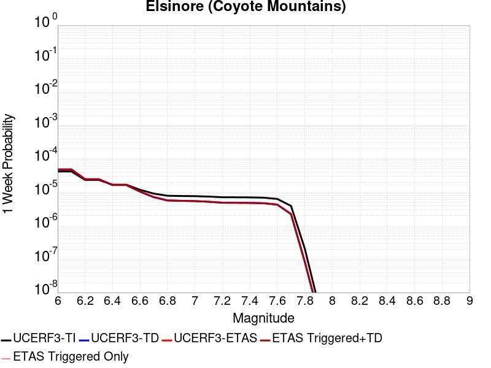 |  |  | 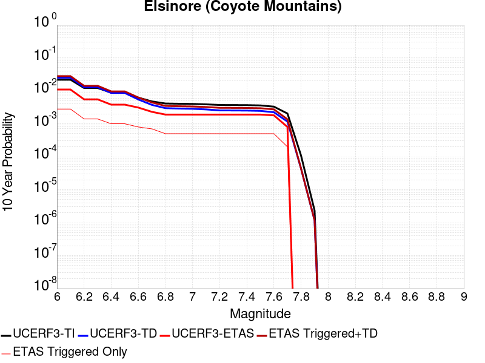 |

| Magnitude | 1 wk TI Prob | 1 wk TD Prob | 1 wk ETAS Prob | 1 wk ETAS/TD Gain | 1 wk ETAS Triggered+TD | 1 wk ETAS Triggered Only | 1 mo TI Prob | 1 mo TD Prob | 1 mo ETAS Prob | 1 mo ETAS/TD Gain | 1 mo ETAS Triggered+TD | 1 mo ETAS Triggered Only | 1 yr TI Prob | 1 yr TD Prob | 1 yr ETAS Prob | 1 yr ETAS/TD Gain | 1 yr ETAS Triggered+TD | 1 yr ETAS Triggered Only | 10 yr TI Prob | 10 yr TD Prob | 10 yr ETAS Prob | 10 yr ETAS/TD Gain | 10 yr ETAS Triggered+TD | 10 yr ETAS Triggered Only |
|-----|-----|-----|-----|-----|-----|-----|-----|-----|-----|-----|-----|-----|-----|-----|-----|-----|-----|-----|-----|-----|-----|-----|-----|-----|
| 6.0 | 4.20513E-5 | 4.8497863E-5 | 0.0 | 0.0 | 4.8497863E-5 | 0.0 | 1.8020741E-4 | 2.0783432E-4 | 2.0E-4 | 0.96230495 | 2.0783432E-4 | 0.0 | 0.0021918174 | 0.002527977 | 0.0016 | 0.63291717 | 0.0030267132 | 5.0E-4 | 0.021703249 | 0.025043545 | 0.0109 | 0.43524188 | 0.027773423 | 0.0028 |
| 6.1 | 4.20513E-5 | 4.8497863E-5 | 0.0 | 0.0 | 4.8497863E-5 | 0.0 | 1.8020741E-4 | 2.0783432E-4 | 2.0E-4 | 0.96230495 | 2.0783432E-4 | 0.0 | 0.0021918174 | 0.002527977 | 0.0016 | 0.63291717 | 0.0030267132 | 5.0E-4 | 0.021703249 | 0.025043545 | 0.0109 | 0.43524188 | 0.027773423 | 0.0028 |
| 6.2 | 2.3413893E-5 | 2.4631545E-5 | 0.0 | 0.0 | 2.4631545E-5 | 0.0 | 1.0034139E-4 | 1.05559906E-4 | 0.0 | 0.0 | 1.05559906E-4 | 0.0 | 0.0012209718 | 0.0012845232 | 6.0E-4 | 0.46709937 | 0.0015841379 | 3.0E-4 | 0.012142851 | 0.012779683 | 0.0055 | 0.43037063 | 0.014161791 | 0.0014 |
| 6.3 | 2.3413893E-5 | 2.4631545E-5 | 0.0 | 0.0 | 2.4631545E-5 | 0.0 | 1.0034139E-4 | 1.05559906E-4 | 0.0 | 0.0 | 1.05559906E-4 | 0.0 | 0.0012209718 | 0.0012845232 | 6.0E-4 | 0.46709937 | 0.0015841379 | 3.0E-4 | 0.012142851 | 0.012779683 | 0.0055 | 0.43037063 | 0.014161791 | 0.0014 |
| 6.4 | 1.6894814E-5 | 1.6525059E-5 | 0.0 | 0.0 | 1.6525059E-5 | 0.0 | 7.240433E-5 | 7.081997E-5 | 0.0 | 0.0 | 7.081997E-5 | 0.0 | 8.811662E-4 | 8.619288E-4 | 4.0E-4 | 0.46407545 | 9.6184266E-4 | 1.0E-4 | 0.0087768035 | 0.008589517 | 0.0038 | 0.44239974 | 0.009580928 | 0.001 |
| 6.5 | 1.6894814E-5 | 1.6525059E-5 | 0.0 | 0.0 | 1.6525059E-5 | 0.0 | 7.240433E-5 | 7.081997E-5 | 0.0 | 0.0 | 7.081997E-5 | 0.0 | 8.811662E-4 | 8.619288E-4 | 4.0E-4 | 0.46407545 | 9.6184266E-4 | 1.0E-4 | 0.0087768035 | 0.008589517 | 0.0038 | 0.44239974 | 0.009580928 | 0.001 |
| 6.6 | 1.1910969E-5 | 1.0500677E-5 | 0.0 | 0.0 | 1.0500677E-5 | 0.0 | 5.1046012E-5 | 4.5002198E-5 | 0.0 | 0.0 | 4.5002198E-5 | 0.0 | 6.21308E-4 | 5.477772E-4 | 4.0E-4 | 0.73022383 | 6.4772245E-4 | 1.0E-4 | 0.0061957375 | 0.0054655694 | 0.0031 | 0.567187 | 0.006261197 | 8.0E-4 |
| 6.7 | 9.1486E-6 | 7.179868E-6 | 0.0 | 0.0 | 7.179868E-6 | 0.0 | 3.9207694E-5 | 3.077052E-5 | 0.0 | 0.0 | 3.077052E-5 | 0.0 | 4.7724912E-4 | 3.745705E-4 | 4.0E-4 | 1.0678898 | 4.7453304E-4 | 1.0E-4 | 0.0047622547 | 0.003739769 | 0.0023 | 0.6150112 | 0.0044371514 | 7.0E-4 |
| 6.8 | 7.90441E-6 | 5.7088764E-6 | 0.0 | 0.0 | 5.7088764E-6 | 0.0 | 3.3875604E-5 | 2.4466392E-5 | 0.0 | 0.0 | 2.4466392E-5 | 0.0 | 4.1235742E-4 | 2.9783888E-4 | 3.0E-4 | 1.007256 | 3.9780908E-4 | 1.0E-4 | 0.0041159308 | 0.0029745249 | 0.0019 | 0.63875747 | 0.0034730376 | 5.0E-4 |
| 6.9 | 7.77015E-6 | 5.562965E-6 | 0.0 | 0.0 | 5.562965E-6 | 0.0 | 3.3300217E-5 | 2.3841067E-5 | 0.0 | 0.0 | 2.3841067E-5 | 0.0 | 4.0535472E-4 | 2.902276E-4 | 3.0E-4 | 1.0336716 | 3.9019855E-4 | 1.0E-4 | 0.004046161 | 0.0028986116 | 0.0019 | 0.6554862 | 0.0033971623 | 5.0E-4 |
| 7.0 | 7.675798E-6 | 5.4599236E-6 | 0.0 | 0.0 | 5.4599236E-6 | 0.0 | 3.289586E-5 | 2.339947E-5 | 0.0 | 0.0 | 2.339947E-5 | 0.0 | 4.004335E-4 | 2.8485255E-4 | 3.0E-4 | 1.0531764 | 3.8482406E-4 | 1.0E-4 | 0.003997127 | 0.002845 | 0.0019 | 0.66783834 | 0.0033435775 | 5.0E-4 |
| 7.1 | 7.447814E-6 | 5.2195273E-6 | 0.0 | 0.0 | 5.2195273E-6 | 0.0 | 3.191881E-5 | 2.2369217E-5 | 0.0 | 0.0 | 2.2369217E-5 | 0.0 | 3.8854225E-4 | 2.7231243E-4 | 3.0E-4 | 1.1016757 | 3.722852E-4 | 1.0E-4 | 0.003878636 | 0.002719911 | 0.0019 | 0.69855225 | 0.003218551 | 5.0E-4 |
| 7.2 | 7.128185E-6 | 4.886292E-6 | 0.0 | 0.0 | 4.886292E-6 | 0.0 | 3.0549007E-5 | 2.0941092E-5 | 0.0 | 0.0 | 2.0941092E-5 | 0.0 | 3.7187067E-4 | 2.5492912E-4 | 3.0E-4 | 1.1767976 | 3.5490363E-4 | 1.0E-4 | 0.00371249 | 0.0025464846 | 0.0019 | 0.74612665 | 0.0030452113 | 5.0E-4 |
| 7.3 | 7.0913875E-6 | 4.8550028E-6 | 0.0 | 0.0 | 4.8550028E-6 | 0.0 | 3.0391306E-5 | 2.0806996E-5 | 0.0 | 0.0 | 2.0806996E-5 | 0.0 | 3.6995133E-4 | 2.5329692E-4 | 3.0E-4 | 1.1843808 | 3.5327158E-4 | 1.0E-4 | 0.0036933604 | 0.0025301995 | 0.0019 | 0.75092894 | 0.0030289344 | 5.0E-4 |
| 7.4 | 7.051521E-6 | 4.818879E-6 | 0.0 | 0.0 | 4.818879E-6 | 0.0 | 3.0220453E-5 | 2.0652182E-5 | 0.0 | 0.0 | 2.0652182E-5 | 0.0 | 3.6787192E-4 | 2.5141248E-4 | 3.0E-4 | 1.1932583 | 3.5138734E-4 | 1.0E-4 | 0.0036726352 | 0.002511398 | 0.0019 | 0.7565508 | 0.0030101421 | 5.0E-4 |
| 7.5 | 6.910666E-6 | 4.7146323E-6 | 0.0 | 0.0 | 4.7146323E-6 | 0.0 | 2.9616802E-5 | 2.0205416E-5 | 0.0 | 0.0 | 2.0205416E-5 | 0.0 | 3.605249E-4 | 2.4597437E-4 | 3.0E-4 | 1.2196393 | 3.4594975E-4 | 1.0E-4 | 0.0035994058 | 0.0024571382 | 0.0019 | 0.7732573 | 0.0029559096 | 5.0E-4 |
| 7.6 | 6.341753E-6 | 4.2886663E-6 | 0.0 | 0.0 | 4.2886663E-6 | 0.0 | 2.7178658E-5 | 1.8379875E-5 | 0.0 | 0.0 | 1.8379875E-5 | 0.0 | 3.3084993E-4 | 2.2375316E-4 | 2.0E-4 | 0.8938421 | 3.2373078E-4 | 1.0E-4 | 0.0033035777 | 0.0022353933 | 0.0018 | 0.80522746 | 0.0027342755 | 5.0E-4 |
| 7.7 | 3.9205916E-6 | 2.2326055E-6 | 0.0 | 0.0 | 2.2326055E-6 | 0.0 | 1.6802427E-5 | 9.568278E-6 | 0.0 | 0.0 | 9.568278E-6 | 0.0 | 2.0455034E-4 | 1.1648829E-4 | 0.0 | 0.0 | 1.1648829E-4 | 0.0 | 0.0020436216 | 0.0011643447 | 8.0E-4 | 0.68708175 | 0.0013641119 | 2.0E-4 |
| 7.8 | 2.0846227E-7 | 8.4180684E-8 | 0.0 | 0.0 | 8.4180684E-8 | 0.0 | 8.9340944E-7 | 3.6077432E-7 | 0.0 | 0.0 | 3.6077432E-7 | 0.0 | 1.0877206E-5 | 4.392422E-6 | 0.0 | 0.0 | 4.392422E-6 | 0.0 | 1.0876673E-4 | 4.3923672E-5 | 0.0 | 0.0 | 4.3923672E-5 | 0.0 |
| 7.9 | 4.4969806E-9 | 2.2593856E-9 | 0.0 | 0.0 | 2.2593856E-9 | 0.0 | 1.9272775E-8 | 9.68308E-9 | 0.0 | 0.0 | 9.68308E-9 | 0.0 | 2.3464601E-7 | 1.17891496E-7 | 0.0 | 0.0 | 1.17891496E-7 | 0.0 | 2.3464577E-6 | 1.1789144E-6 | 0.0 | 0.0 | 1.1789144E-6 | 0.0 |

## Big Lagoon - Bald Mtn 2011 CFM
*[(top)](#table-of-contents)*

| 1 Week | 1 Month | 1 Year | 10 Year |
|-----|-----|-----|-----|
|  |  |  | 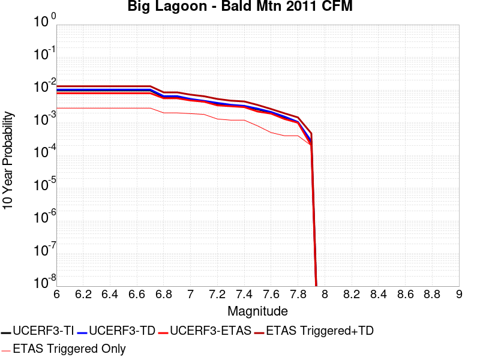 |

| Magnitude | 1 wk TI Prob | 1 wk TD Prob | 1 wk ETAS Prob | 1 wk ETAS/TD Gain | 1 wk ETAS Triggered+TD | 1 wk ETAS Triggered Only | 1 mo TI Prob | 1 mo TD Prob | 1 mo ETAS Prob | 1 mo ETAS/TD Gain | 1 mo ETAS Triggered+TD | 1 mo ETAS Triggered Only | 1 yr TI Prob | 1 yr TD Prob | 1 yr ETAS Prob | 1 yr ETAS/TD Gain | 1 yr ETAS Triggered+TD | 1 yr ETAS Triggered Only | 10 yr TI Prob | 10 yr TD Prob | 10 yr ETAS Prob | 10 yr ETAS/TD Gain | 10 yr ETAS Triggered+TD | 10 yr ETAS Triggered Only |
|-----|-----|-----|-----|-----|-----|-----|-----|-----|-----|-----|-----|-----|-----|-----|-----|-----|-----|-----|-----|-----|-----|-----|-----|-----|
| 6.0 | 1.8699735E-5 | 1.983738E-5 | 0.0 | 0.0 | 1.983738E-5 | 0.0 | 8.013926E-5 | 8.5014784E-5 | 1.0E-4 | 1.176266 | 8.5014784E-5 | 0.0 | 9.752587E-4 | 0.0010346014 | 0.0012 | 1.159867 | 0.0014341875 | 4.0E-4 | 0.009709897 | 0.010301657 | 0.008 | 0.77657413 | 0.013072812 | 0.0028 |
| 6.1 | 1.8699735E-5 | 1.983738E-5 | 0.0 | 0.0 | 1.983738E-5 | 0.0 | 8.013926E-5 | 8.5014784E-5 | 1.0E-4 | 1.176266 | 8.5014784E-5 | 0.0 | 9.752587E-4 | 0.0010346014 | 0.0012 | 1.159867 | 0.0014341875 | 4.0E-4 | 0.009709897 | 0.010301657 | 0.008 | 0.77657413 | 0.013072812 | 0.0028 |
| 6.2 | 1.8699735E-5 | 1.983738E-5 | 0.0 | 0.0 | 1.983738E-5 | 0.0 | 8.013926E-5 | 8.5014784E-5 | 1.0E-4 | 1.176266 | 8.5014784E-5 | 0.0 | 9.752587E-4 | 0.0010346014 | 0.0012 | 1.159867 | 0.0014341875 | 4.0E-4 | 0.009709897 | 0.010301657 | 0.008 | 0.77657413 | 0.013072812 | 0.0028 |
| 6.3 | 1.8699735E-5 | 1.983738E-5 | 0.0 | 0.0 | 1.983738E-5 | 0.0 | 8.013926E-5 | 8.5014784E-5 | 1.0E-4 | 1.176266 | 8.5014784E-5 | 0.0 | 9.752587E-4 | 0.0010346014 | 0.0012 | 1.159867 | 0.0014341875 | 4.0E-4 | 0.009709897 | 0.010301657 | 0.008 | 0.77657413 | 0.013072812 | 0.0028 |
| 6.4 | 1.8699735E-5 | 1.983738E-5 | 0.0 | 0.0 | 1.983738E-5 | 0.0 | 8.013926E-5 | 8.5014784E-5 | 1.0E-4 | 1.176266 | 8.5014784E-5 | 0.0 | 9.752587E-4 | 0.0010346014 | 0.0012 | 1.159867 | 0.0014341875 | 4.0E-4 | 0.009709897 | 0.010301657 | 0.008 | 0.77657413 | 0.013072812 | 0.0028 |
| 6.5 | 1.8699735E-5 | 1.983738E-5 | 0.0 | 0.0 | 1.983738E-5 | 0.0 | 8.013926E-5 | 8.5014784E-5 | 1.0E-4 | 1.176266 | 8.5014784E-5 | 0.0 | 9.752587E-4 | 0.0010346014 | 0.0012 | 1.159867 | 0.0014341875 | 4.0E-4 | 0.009709897 | 0.010301657 | 0.008 | 0.77657413 | 0.013072812 | 0.0028 |
| 6.6 | 1.8699735E-5 | 1.983738E-5 | 0.0 | 0.0 | 1.983738E-5 | 0.0 | 8.013926E-5 | 8.5014784E-5 | 1.0E-4 | 1.176266 | 8.5014784E-5 | 0.0 | 9.752587E-4 | 0.0010346014 | 0.0012 | 1.159867 | 0.0014341875 | 4.0E-4 | 0.009709897 | 0.010301657 | 0.008 | 0.77657413 | 0.013072812 | 0.0028 |
| 6.7 | 1.8699735E-5 | 1.983738E-5 | 0.0 | 0.0 | 1.983738E-5 | 0.0 | 8.013926E-5 | 8.5014784E-5 | 1.0E-4 | 1.176266 | 8.5014784E-5 | 0.0 | 9.752587E-4 | 0.0010346014 | 0.0012 | 1.159867 | 0.0014341875 | 4.0E-4 | 0.009709897 | 0.010301657 | 0.008 | 0.77657413 | 0.013072812 | 0.0028 |
| 6.8 | 1.18505095E-5 | 1.2492637E-5 | 0.0 | 0.0 | 1.2492637E-5 | 0.0 | 5.078691E-5 | 5.3538803E-5 | 0.0 | 0.0 | 5.3538803E-5 | 0.0 | 6.181552E-4 | 6.516448E-4 | 9.0E-4 | 1.3811206 | 9.5144927E-4 | 3.0E-4 | 0.006164385 | 0.0064978427 | 0.0056 | 0.86182445 | 0.008484847 | 0.002 |
| 6.9 | 1.18505095E-5 | 1.2492637E-5 | 0.0 | 0.0 | 1.2492637E-5 | 0.0 | 5.078691E-5 | 5.3538803E-5 | 0.0 | 0.0 | 5.3538803E-5 | 0.0 | 6.181552E-4 | 6.516448E-4 | 9.0E-4 | 1.3811206 | 9.5144927E-4 | 3.0E-4 | 0.006164385 | 0.0064978427 | 0.0056 | 0.86182445 | 0.008484847 | 0.002 |
| 7.0 | 9.719786E-6 | 1.0229806E-5 | 0.0 | 0.0 | 1.0229806E-5 | 0.0 | 4.1655563E-5 | 4.3841304E-5 | 0.0 | 0.0 | 4.3841304E-5 | 0.0 | 5.0703844E-4 | 5.336395E-4 | 7.0E-4 | 1.311747 | 8.334794E-4 | 3.0E-4 | 0.005058831 | 0.005323827 | 0.0048 | 0.9016071 | 0.0072137113 | 0.0019 |
| 7.1 | 8.523418E-6 | 8.964554E-6 | 0.0 | 0.0 | 8.964554E-6 | 0.0 | 3.652842E-5 | 3.841896E-5 | 0.0 | 0.0 | 3.841896E-5 | 0.0 | 4.4464276E-4 | 4.6765196E-4 | 6.0E-4 | 1.2830054 | 6.6755846E-4 | 2.0E-4 | 0.0044375416 | 0.004666842 | 0.0044 | 0.94282174 | 0.0064584417 | 0.0018 |
| 7.2 | 7.378894E-6 | 7.756907E-6 | 0.0 | 0.0 | 7.756907E-6 | 0.0 | 3.162345E-5 | 3.324347E-5 | 0.0 | 0.0 | 3.324347E-5 | 0.0 | 3.8494746E-4 | 4.0466493E-4 | 3.0E-4 | 0.74135405 | 5.0462445E-4 | 1.0E-4 | 0.0038428132 | 0.0040393765 | 0.0034 | 0.841714 | 0.0053341254 | 0.0013 |
| 7.3 | 6.4640294E-6 | 6.7888345E-6 | 0.0 | 0.0 | 6.7888345E-6 | 0.0 | 2.7702688E-5 | 2.9094685E-5 | 0.0 | 0.0 | 2.9094685E-5 | 0.0 | 3.3722803E-4 | 3.5417086E-4 | 3.0E-4 | 0.84704876 | 4.5413544E-4 | 1.0E-4 | 0.0033671674 | 0.0035361343 | 0.0032 | 0.90494305 | 0.0047318907 | 0.0012 |
| 7.4 | 5.9959093E-6 | 6.2954728E-6 | 0.0 | 0.0 | 6.2954728E-6 | 0.0 | 2.5696501E-5 | 2.6980322E-5 | 0.0 | 0.0 | 2.6980322E-5 | 0.0 | 3.1280998E-4 | 3.284365E-4 | 3.0E-4 | 0.9134186 | 4.2840364E-4 | 1.0E-4 | 0.0031237002 | 0.0032795728 | 0.003 | 0.91475326 | 0.0044756373 | 0.0012 |
| 7.5 | 4.929265E-6 | 5.1736833E-6 | 0.0 | 0.0 | 5.1736833E-6 | 0.0 | 2.112525E-5 | 2.2172742E-5 | 0.0 | 0.0 | 2.2172742E-5 | 0.0 | 2.5716957E-4 | 2.699201E-4 | 3.0E-4 | 1.1114401 | 3.698931E-4 | 1.0E-4 | 0.0025687215 | 0.0026959633 | 0.0022 | 0.81603485 | 0.0034938063 | 8.0E-4 |
| 7.6 | 3.8982403E-6 | 4.0868376E-6 | 0.0 | 0.0 | 4.0868376E-6 | 0.0 | 1.6706637E-5 | 1.7514903E-5 | 0.0 | 0.0 | 1.7514903E-5 | 0.0 | 2.0338432E-4 | 2.1322335E-4 | 3.0E-4 | 1.4069754 | 3.1320204E-4 | 1.0E-4 | 0.0020319829 | 0.0021302155 | 0.0019 | 0.89192855 | 0.0026291504 | 5.0E-4 |
| 7.7 | 2.820968E-6 | 2.9557207E-6 | 0.0 | 0.0 | 2.9557207E-6 | 0.0 | 1.2089806E-5 | 1.2667313E-5 | 0.0 | 0.0 | 1.2667313E-5 | 0.0 | 1.4718344E-4 | 1.542138E-4 | 2.0E-4 | 1.2969007 | 2.5419838E-4 | 1.0E-4 | 0.00147086 | 0.0015410855 | 0.0013 | 0.84356123 | 0.0019404691 | 4.0E-4 |
| 7.8 | 1.9314455E-6 | 2.024983E-6 | 0.0 | 0.0 | 2.024983E-6 | 0.0 | 8.277597E-6 | 8.67847E-6 | 0.0 | 0.0 | 8.67847E-6 | 0.0 | 1.0077508E-4 | 1.0565538E-4 | 1.0E-4 | 0.94647336 | 2.0564481E-4 | 1.0E-4 | 0.0010072939 | 0.0010560644 | 0.001 | 0.946912 | 0.0014556419 | 4.0E-4 |
| 7.9 | 4.9586197E-7 | 5.216062E-7 | 0.0 | 0.0 | 5.216062E-7 | 0.0 | 2.125121E-6 | 2.2354534E-6 | 0.0 | 0.0 | 2.2354534E-6 | 0.0 | 2.5873042E-5 | 2.7216325E-5 | 1.0E-4 | 3.6742651 | 1.272136E-4 | 1.0E-4 | 2.5870028E-4 | 2.7213202E-4 | 2.0E-4 | 0.7349374 | 4.720776E-4 | 2.0E-4 |

## Cleghorn Lake
*[(top)](#table-of-contents)*

| 1 Week | 1 Month | 1 Year | 10 Year |
|-----|-----|-----|-----|
|  | 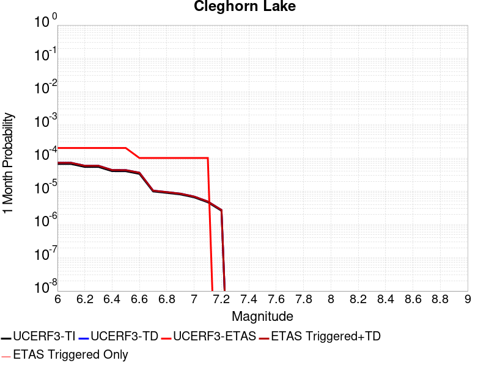 |  |  |

| Magnitude | 1 wk TI Prob | 1 wk TD Prob | 1 wk ETAS Prob | 1 wk ETAS/TD Gain | 1 wk ETAS Triggered+TD | 1 wk ETAS Triggered Only | 1 mo TI Prob | 1 mo TD Prob | 1 mo ETAS Prob | 1 mo ETAS/TD Gain | 1 mo ETAS Triggered+TD | 1 mo ETAS Triggered Only | 1 yr TI Prob | 1 yr TD Prob | 1 yr ETAS Prob | 1 yr ETAS/TD Gain | 1 yr ETAS Triggered+TD | 1 yr ETAS Triggered Only | 10 yr TI Prob | 10 yr TD Prob | 10 yr ETAS Prob | 10 yr ETAS/TD Gain | 10 yr ETAS Triggered+TD | 10 yr ETAS Triggered Only |
|-----|-----|-----|-----|-----|-----|-----|-----|-----|-----|-----|-----|-----|-----|-----|-----|-----|-----|-----|-----|-----|-----|-----|-----|-----|
| 6.0 | 1.5467183E-5 | 1.6779122E-5 | 1.0E-4 | 5.9597874 | 1.6779122E-5 | 0.0 | 6.6286244E-5 | 7.190885E-5 | 2.0E-4 | 2.7812989 | 7.190885E-5 | 0.0 | 8.067362E-4 | 8.751934E-4 | 0.0011 | 1.2568651 | 0.0014746683 | 6.0E-4 | 0.008038137 | 0.008722884 | 0.0074 | 0.8483434 | 0.0113993315 | 0.0027 |
| 6.1 | 1.5467183E-5 | 1.6779122E-5 | 1.0E-4 | 5.9597874 | 1.6779122E-5 | 0.0 | 6.6286244E-5 | 7.190885E-5 | 2.0E-4 | 2.7812989 | 7.190885E-5 | 0.0 | 8.067362E-4 | 8.751934E-4 | 0.0011 | 1.2568651 | 0.0014746683 | 6.0E-4 | 0.008038137 | 0.008722884 | 0.0074 | 0.8483434 | 0.0113993315 | 0.0027 |
| 6.2 | 1.2624631E-5 | 1.3669549E-5 | 1.0E-4 | 7.3155303 | 1.3669549E-5 | 0.0 | 5.410444E-5 | 5.858274E-5 | 2.0E-4 | 3.4139748 | 5.858274E-5 | 0.0 | 6.585225E-4 | 7.1306E-4 | 0.0011 | 1.5426471 | 0.0013126322 | 6.0E-4 | 0.0065657445 | 0.007112507 | 0.0066 | 0.9279429 | 0.009396148 | 0.0023 |
| 6.3 | 1.2624631E-5 | 1.3669549E-5 | 1.0E-4 | 7.3155303 | 1.3669549E-5 | 0.0 | 5.410444E-5 | 5.858274E-5 | 2.0E-4 | 3.4139748 | 5.858274E-5 | 0.0 | 6.585225E-4 | 7.1306E-4 | 0.0011 | 1.5426471 | 0.0013126322 | 6.0E-4 | 0.0065657445 | 0.007112507 | 0.0066 | 0.9279429 | 0.009396148 | 0.0023 |
| 6.4 | 9.417684E-6 | 1.0161601E-5 | 1.0E-4 | 9.84097 | 1.0161601E-5 | 0.0 | 4.036088E-5 | 4.354922E-5 | 2.0E-4 | 4.592505 | 4.354922E-5 | 0.0 | 4.912829E-4 | 5.3012377E-4 | 0.0011 | 2.0749872 | 0.0011298057 | 6.0E-4 | 0.004901982 | 0.0052926196 | 0.0053 | 1.0013945 | 0.0069836224 | 0.0017 |
| 6.5 | 9.368219E-6 | 1.0109062E-5 | 1.0E-4 | 9.892115 | 1.0109062E-5 | 0.0 | 4.014889E-5 | 4.332406E-5 | 2.0E-4 | 4.6163726 | 4.332406E-5 | 0.0 | 4.8870314E-4 | 5.273838E-4 | 0.001 | 1.8961523 | 0.0011270674 | 6.0E-4 | 0.004876298 | 0.00526535 | 0.005 | 0.9496045 | 0.0068569253 | 0.0016 |
| 6.6 | 7.803798E-6 | 8.434604E-6 | 0.0 | 0.0 | 8.434604E-6 | 0.0 | 3.3444423E-5 | 3.6148027E-5 | 1.0E-4 | 2.7664027 | 3.6148027E-5 | 0.0 | 4.0710976E-4 | 4.4005318E-4 | 7.0E-4 | 1.5907168 | 8.398772E-4 | 4.0E-4 | 0.0040636472 | 0.0043957275 | 0.0043 | 0.9782226 | 0.005690013 | 0.0013 |
| 6.7 | 2.3108669E-6 | 2.4423648E-6 | 0.0 | 0.0 | 2.4423648E-6 | 0.0 | 9.903678E-6 | 1.0467236E-5 | 1.0E-4 | 9.55362 | 1.0467236E-5 | 0.0 | 1.205706E-4 | 1.2743134E-4 | 3.0E-4 | 2.354209 | 3.2740584E-4 | 2.0E-4 | 0.001205052 | 0.0012736013 | 0.0014 | 1.0992451 | 0.0016730919 | 4.0E-4 |
| 6.8 | 2.0882828E-6 | 2.2049805E-6 | 0.0 | 0.0 | 2.2049805E-6 | 0.0 | 8.949753E-6 | 9.449883E-6 | 1.0E-4 | 10.582142 | 9.449883E-6 | 0.0 | 1.08957785E-4 | 1.1504642E-4 | 3.0E-4 | 2.6076431 | 3.150234E-4 | 2.0E-4 | 0.0010890438 | 0.0011498855 | 0.0014 | 1.2175126 | 0.0015494255 | 4.0E-4 |
| 6.9 | 1.876935E-6 | 1.9799038E-6 | 0.0 | 0.0 | 1.9799038E-6 | 0.0 | 8.043982E-6 | 8.485275E-6 | 1.0E-4 | 11.785121 | 8.485275E-6 | 0.0 | 9.7931086E-5 | 1.0330349E-4 | 3.0E-4 | 2.9040644 | 3.0328284E-4 | 2.0E-4 | 9.788794E-4 | 0.0010325707 | 0.0013 | 1.2589937 | 0.0014321577 | 4.0E-4 |
| 7.0 | 1.5357559E-6 | 1.6193499E-6 | 0.0 | 0.0 | 1.6193499E-6 | 0.0 | 6.5817944E-6 | 6.940053E-6 | 1.0E-4 | 14.409112 | 6.940053E-6 | 0.0 | 8.01304E-5 | 8.449199E-5 | 3.0E-4 | 3.5506322 | 2.844751E-4 | 2.0E-4 | 8.010151E-4 | 8.4461115E-4 | 0.0011 | 1.3023745 | 0.0012442733 | 4.0E-4 |
| 7.1 | 1.0905424E-6 | 1.1491103E-6 | 0.0 | 0.0 | 1.1491103E-6 | 0.0 | 4.6737446E-6 | 4.9247496E-6 | 1.0E-4 | 20.305601 | 4.9247496E-6 | 0.0 | 5.6901354E-5 | 5.9957274E-5 | 1.0E-4 | 1.6678543 | 5.9957274E-5 | 0.0 | 5.6886784E-4 | 5.9942075E-4 | 7.0E-4 | 1.1677941 | 6.993608E-4 | 1.0E-4 |
| 7.2 | 6.06668E-7 | 6.3837547E-7 | 0.0 | 0.0 | 6.3837547E-7 | 0.0 | 2.600003E-6 | 2.7358924E-6 | 0.0 | 0.0 | 2.7358924E-6 | 0.0 | 3.1654577E-5 | 3.330905E-5 | 0.0 | 0.0 | 3.330905E-5 | 0.0 | 3.1650066E-4 | 3.330474E-4 | 5.0E-4 | 1.5012877 | 4.330141E-4 | 1.0E-4 |

## Great Valley 04a Trout Creek
*[(top)](#table-of-contents)*

| 1 Week | 1 Month | 1 Year | 10 Year |
|-----|-----|-----|-----|
| 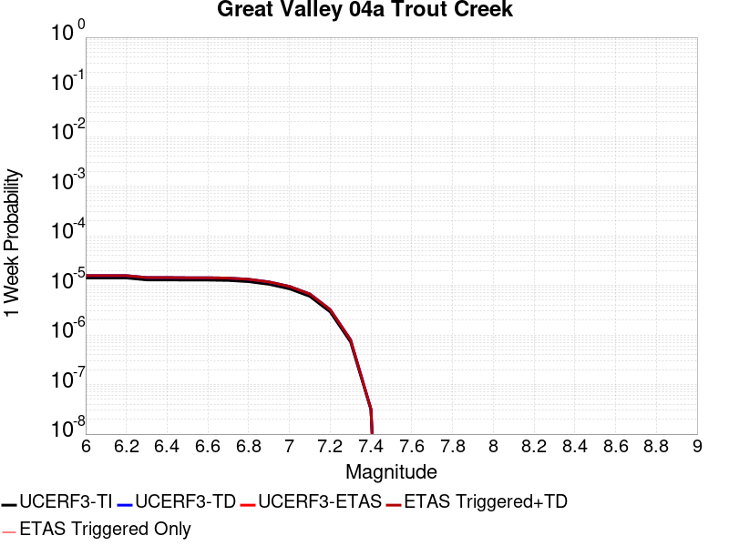 | 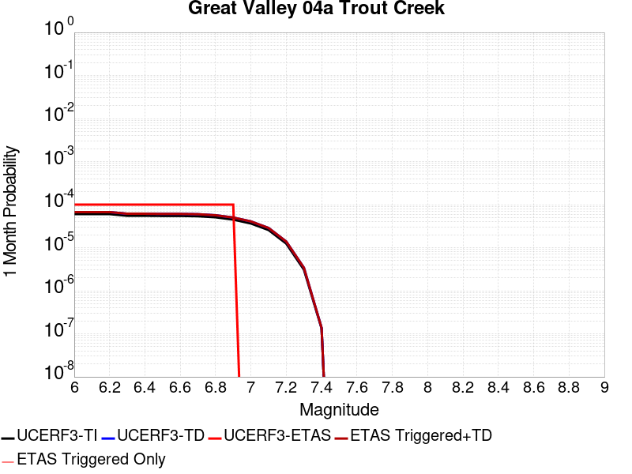 |  | 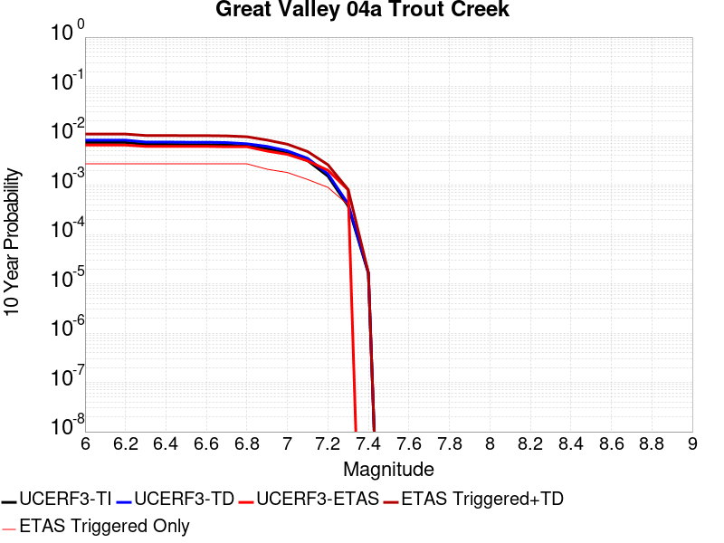 |

| Magnitude | 1 wk TI Prob | 1 wk TD Prob | 1 wk ETAS Prob | 1 wk ETAS/TD Gain | 1 wk ETAS Triggered+TD | 1 wk ETAS Triggered Only | 1 mo TI Prob | 1 mo TD Prob | 1 mo ETAS Prob | 1 mo ETAS/TD Gain | 1 mo ETAS Triggered+TD | 1 mo ETAS Triggered Only | 1 yr TI Prob | 1 yr TD Prob | 1 yr ETAS Prob | 1 yr ETAS/TD Gain | 1 yr ETAS Triggered+TD | 1 yr ETAS Triggered Only | 10 yr TI Prob | 10 yr TD Prob | 10 yr ETAS Prob | 10 yr ETAS/TD Gain | 10 yr ETAS Triggered+TD | 10 yr ETAS Triggered Only |
|-----|-----|-----|-----|-----|-----|-----|-----|-----|-----|-----|-----|-----|-----|-----|-----|-----|-----|-----|-----|-----|-----|-----|-----|-----|
| 6.0 | 1.4088538E-5 | 1.5700552E-5 | 0.0 | 0.0 | 1.5700552E-5 | 0.0 | 6.037805E-5 | 6.728642E-5 | 1.0E-4 | 1.486184 | 6.728642E-5 | 0.0 | 7.3485484E-4 | 8.189167E-4 | 6.0E-4 | 0.73267525 | 0.0013185072 | 5.0E-4 | 0.007324295 | 0.008160271 | 0.0065 | 0.79654217 | 0.0108382385 | 0.0027 |
| 6.1 | 1.4088538E-5 | 1.5700552E-5 | 0.0 | 0.0 | 1.5700552E-5 | 0.0 | 6.037805E-5 | 6.728642E-5 | 1.0E-4 | 1.486184 | 6.728642E-5 | 0.0 | 7.3485484E-4 | 8.189167E-4 | 6.0E-4 | 0.73267525 | 0.0013185072 | 5.0E-4 | 0.007324295 | 0.008160271 | 0.0065 | 0.79654217 | 0.0108382385 | 0.0027 |
| 6.2 | 1.4088538E-5 | 1.5700552E-5 | 0.0 | 0.0 | 1.5700552E-5 | 0.0 | 6.037805E-5 | 6.728642E-5 | 1.0E-4 | 1.486184 | 6.728642E-5 | 0.0 | 7.3485484E-4 | 8.189167E-4 | 6.0E-4 | 0.73267525 | 0.0013185072 | 5.0E-4 | 0.007324295 | 0.008160271 | 0.0065 | 0.79654217 | 0.0108382385 | 0.0027 |
| 6.3 | 1.2882862E-5 | 1.43611705E-5 | 0.0 | 0.0 | 1.43611705E-5 | 0.0 | 5.5211098E-5 | 6.154648E-5 | 1.0E-4 | 1.6247883 | 6.154648E-5 | 0.0 | 6.7198783E-4 | 7.4908114E-4 | 6.0E-4 | 0.8009813 | 0.0012487066 | 5.0E-4 | 0.0066995937 | 0.007466622 | 0.0061 | 0.81696916 | 0.010146462 | 0.0027 |
| 6.4 | 1.2882862E-5 | 1.43611705E-5 | 0.0 | 0.0 | 1.43611705E-5 | 0.0 | 5.5211098E-5 | 6.154648E-5 | 1.0E-4 | 1.6247883 | 6.154648E-5 | 0.0 | 6.7198783E-4 | 7.4908114E-4 | 6.0E-4 | 0.8009813 | 0.0012487066 | 5.0E-4 | 0.0066995937 | 0.007466622 | 0.0061 | 0.81696916 | 0.010146462 | 0.0027 |
| 6.5 | 1.2762329E-5 | 1.4227877E-5 | 0.0 | 0.0 | 1.4227877E-5 | 0.0 | 5.469455E-5 | 6.097525E-5 | 1.0E-4 | 1.6400096 | 6.097525E-5 | 0.0 | 6.657027E-4 | 7.4213115E-4 | 6.0E-4 | 0.80848247 | 0.0012417601 | 5.0E-4 | 0.00663712 | 0.007397585 | 0.0061 | 0.8245934 | 0.010077612 | 0.0027 |
| 6.6 | 1.2762329E-5 | 1.4227877E-5 | 0.0 | 0.0 | 1.4227877E-5 | 0.0 | 5.469455E-5 | 6.097525E-5 | 1.0E-4 | 1.6400096 | 6.097525E-5 | 0.0 | 6.657027E-4 | 7.4213115E-4 | 6.0E-4 | 0.80848247 | 0.0012417601 | 5.0E-4 | 0.00663712 | 0.007397585 | 0.0061 | 0.8245934 | 0.010077612 | 0.0027 |
| 6.7 | 1.2557959E-5 | 1.4002359E-5 | 0.0 | 0.0 | 1.4002359E-5 | 0.0 | 5.3818712E-5 | 6.0008788E-5 | 1.0E-4 | 1.6664226 | 6.0008788E-5 | 0.0 | 6.5504585E-4 | 7.303724E-4 | 6.0E-4 | 0.82149875 | 0.0012300072 | 5.0E-4 | 0.006531183 | 0.007280771 | 0.006 | 0.8240886 | 0.009961112 | 0.0027 |
| 6.8 | 1.1871544E-5 | 1.3242644E-5 | 0.0 | 0.0 | 1.3242644E-5 | 0.0 | 5.0877054E-5 | 5.675301E-5 | 1.0E-4 | 1.7620211 | 5.675301E-5 | 0.0 | 6.1925204E-4 | 6.9075887E-4 | 6.0E-4 | 0.86860996 | 0.0011904135 | 5.0E-4 | 0.0061752927 | 0.006887132 | 0.006 | 0.87118995 | 0.009568537 | 0.0027 |
| 6.9 | 1.0500373E-5 | 1.1716899E-5 | 0.0 | 0.0 | 1.1716899E-5 | 0.0 | 4.5000823E-5 | 5.0214363E-5 | 1.0E-4 | 1.991462 | 5.0214363E-5 | 0.0 | 5.4774724E-4 | 6.1119697E-4 | 4.0E-4 | 0.6544535 | 9.1101363E-4 | 3.0E-4 | 0.005463991 | 0.0060960236 | 0.0049 | 0.80380267 | 0.008183221 | 0.0021 |
| 7.0 | 8.524332E-6 | 9.521695E-6 | 0.0 | 0.0 | 9.521695E-6 | 0.0 | 3.653234E-5 | 4.0806663E-5 | 0.0 | 0.0 | 4.0806663E-5 | 0.0 | 4.4469046E-4 | 4.967152E-4 | 2.0E-4 | 0.40264523 | 6.9661584E-4 | 2.0E-4 | 0.0044380166 | 0.004956779 | 0.0042 | 0.84732443 | 0.0067478567 | 0.0018 |
| 7.1 | 6.006849E-6 | 6.70333E-6 | 0.0 | 0.0 | 6.70333E-6 | 0.0 | 2.5743384E-5 | 2.8728273E-5 | 0.0 | 0.0 | 2.8728273E-5 | 0.0 | 3.1338062E-4 | 3.4971617E-4 | 1.0E-4 | 0.2859462 | 4.496812E-4 | 1.0E-4 | 0.0031293905 | 0.0034922073 | 0.0031 | 0.8876907 | 0.0047876677 | 0.0013 |
| 7.2 | 2.9122193E-6 | 3.2426306E-6 | 0.0 | 0.0 | 3.2426306E-6 | 0.0 | 1.248088E-5 | 1.3896924E-5 | 0.0 | 0.0 | 1.3896924E-5 | 0.0 | 1.5194413E-4 | 1.6918367E-4 | 1.0E-4 | 0.59107363 | 2.6916675E-4 | 1.0E-4 | 0.0015184027 | 0.0016907202 | 0.002 | 1.1829278 | 0.0025891985 | 9.0E-4 |
| 7.3 | 7.2194007E-7 | 7.9798E-7 | 0.0 | 0.0 | 7.9798E-7 | 0.0 | 3.0940253E-6 | 3.4199124E-6 | 0.0 | 0.0 | 3.4199124E-6 | 0.0 | 3.7669106E-5 | 4.1637097E-5 | 1.0E-4 | 2.4017043 | 1.4163293E-4 | 1.0E-4 | 3.766272E-4 | 4.1633783E-4 | 8.0E-4 | 1.9215165 | 8.161713E-4 | 4.0E-4 |
| 7.4 | 3.112171E-8 | 3.2058175E-8 | 0.0 | 0.0 | 3.2058175E-8 | 0.0 | 1.3337875E-7 | 1.3739218E-7 | 0.0 | 0.0 | 1.3739218E-7 | 0.0 | 1.6238852E-6 | 1.6727486E-6 | 0.0 | 0.0 | 1.6727486E-6 | 0.0 | 1.6238733E-5 | 1.6727368E-5 | 0.0 | 0.0 | 1.6727368E-5 | 0.0 |

## Hat Creek-McArthur-Mayfield
*[(top)](#table-of-contents)*

| 1 Week | 1 Month | 1 Year | 10 Year |
|-----|-----|-----|-----|
|  | 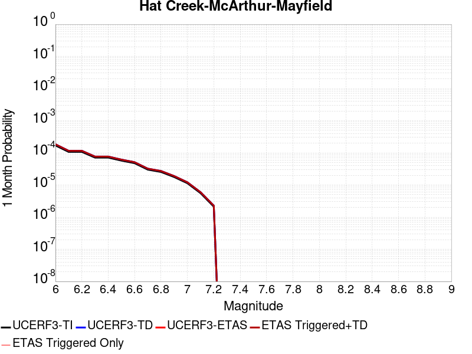 | 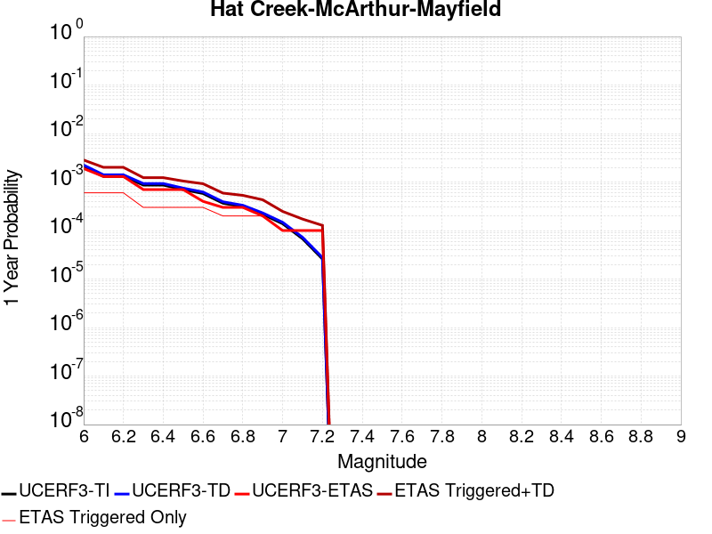 |  |

| Magnitude | 1 wk TI Prob | 1 wk TD Prob | 1 wk ETAS Prob | 1 wk ETAS/TD Gain | 1 wk ETAS Triggered+TD | 1 wk ETAS Triggered Only | 1 mo TI Prob | 1 mo TD Prob | 1 mo ETAS Prob | 1 mo ETAS/TD Gain | 1 mo ETAS Triggered+TD | 1 mo ETAS Triggered Only | 1 yr TI Prob | 1 yr TD Prob | 1 yr ETAS Prob | 1 yr ETAS/TD Gain | 1 yr ETAS Triggered+TD | 1 yr ETAS Triggered Only | 10 yr TI Prob | 10 yr TD Prob | 10 yr ETAS Prob | 10 yr ETAS/TD Gain | 10 yr ETAS Triggered+TD | 10 yr ETAS Triggered Only |
|-----|-----|-----|-----|-----|-----|-----|-----|-----|-----|-----|-----|-----|-----|-----|-----|-----|-----|-----|-----|-----|-----|-----|-----|-----|
| 6.0 | 3.967457E-5 | 4.3118598E-5 | 0.0 | 0.0 | 4.3118598E-5 | 0.0 | 1.7002279E-4 | 1.8478154E-4 | 0.0 | 0.0 | 1.8478154E-4 | 0.0 | 0.002068062 | 0.0022475081 | 0.0019 | 0.8453807 | 0.0028461595 | 6.0E-4 | 0.02048922 | 0.022260109 | 0.0116 | 0.52111155 | 0.02470446 | 0.0025 |
| 6.1 | 2.5044013E-5 | 2.7048232E-5 | 0.0 | 0.0 | 2.7048232E-5 | 0.0 | 1.0732707E-4 | 1.15916024E-4 | 0.0 | 0.0 | 1.15916024E-4 | 0.0 | 0.0013059238 | 0.0014103957 | 0.0013 | 0.9217272 | 0.0020095494 | 6.0E-4 | 0.01298276 | 0.014017856 | 0.0075 | 0.5350319 | 0.015891222 | 0.0019 |
| 6.2 | 2.5044013E-5 | 2.7048232E-5 | 0.0 | 0.0 | 2.7048232E-5 | 0.0 | 1.0732707E-4 | 1.15916024E-4 | 0.0 | 0.0 | 1.15916024E-4 | 0.0 | 0.0013059238 | 0.0014103957 | 0.0013 | 0.9217272 | 0.0020095494 | 6.0E-4 | 0.01298276 | 0.014017856 | 0.0075 | 0.5350319 | 0.015891222 | 0.0019 |
| 6.3 | 1.6624012E-5 | 1.7876819E-5 | 0.0 | 0.0 | 1.7876819E-5 | 0.0 | 7.124382E-5 | 7.6612734E-5 | 0.0 | 0.0 | 7.6612734E-5 | 0.0 | 8.670483E-4 | 9.3236944E-4 | 7.0E-4 | 0.75077534 | 0.0012320897 | 3.0E-4 | 0.008636732 | 0.00928551 | 0.0043 | 0.46308714 | 0.0102762235 | 0.001 |
| 6.4 | 1.6624012E-5 | 1.7876819E-5 | 0.0 | 0.0 | 1.7876819E-5 | 0.0 | 7.124382E-5 | 7.6612734E-5 | 0.0 | 0.0 | 7.6612734E-5 | 0.0 | 8.670483E-4 | 9.3236944E-4 | 7.0E-4 | 0.75077534 | 0.0012320897 | 3.0E-4 | 0.008636732 | 0.00928551 | 0.0043 | 0.46308714 | 0.0102762235 | 0.001 |
| 6.5 | 1.3394842E-5 | 1.4380942E-5 | 0.0 | 0.0 | 1.4380942E-5 | 0.0 | 5.7405203E-5 | 6.163119E-5 | 0.0 | 0.0 | 6.163119E-5 | 0.0 | 6.986842E-4 | 7.501069E-4 | 7.0E-4 | 0.93320036 | 0.0010498819 | 3.0E-4 | 0.006964916 | 0.007476342 | 0.0034 | 0.45476785 | 0.008171109 | 7.0E-4 |
| 6.6 | 1.1137514E-5 | 1.1945386E-5 | 0.0 | 0.0 | 1.1945386E-5 | 0.0 | 4.7731326E-5 | 5.1193532E-5 | 0.0 | 0.0 | 5.1193532E-5 | 0.0 | 5.809739E-4 | 6.23107E-4 | 4.0E-4 | 0.6419443 | 9.2292007E-4 | 3.0E-4 | 0.005794574 | 0.00621402 | 0.0026 | 0.41840872 | 0.006810291 | 6.0E-4 |
| 6.7 | 7.0200663E-6 | 7.518647E-6 | 0.0 | 0.0 | 7.518647E-6 | 0.0 | 3.008565E-5 | 3.2222386E-5 | 0.0 | 0.0 | 3.2222386E-5 | 0.0 | 3.6623122E-4 | 3.9223852E-4 | 3.0E-4 | 0.7648408 | 5.9216004E-4 | 2.0E-4 | 0.0036562826 | 0.003915624 | 0.0017 | 0.4341581 | 0.004314058 | 4.0E-4 |
| 6.8 | 5.940172E-6 | 6.360719E-6 | 0.0 | 0.0 | 6.360719E-6 | 0.0 | 2.545763E-5 | 2.7259946E-5 | 0.0 | 0.0 | 2.7259946E-5 | 0.0 | 3.0990256E-4 | 3.3184057E-4 | 3.0E-4 | 0.9040486 | 5.317742E-4 | 2.0E-4 | 0.0030947074 | 0.003313579 | 0.0014 | 0.4225039 | 0.0037122536 | 4.0E-4 |
| 6.9 | 4.129831E-6 | 4.4202634E-6 | 0.0 | 0.0 | 4.4202634E-6 | 0.0 | 1.7699154E-5 | 1.8943852E-5 | 0.0 | 0.0 | 1.8943852E-5 | 0.0 | 2.154659E-4 | 2.3061779E-4 | 2.0E-4 | 0.8672358 | 4.3057167E-4 | 2.0E-4 | 0.002152571 | 0.002303863 | 0.0013 | 0.5642697 | 0.0027029412 | 4.0E-4 |
| 7.0 | 2.6512955E-6 | 2.8353218E-6 | 0.0 | 0.0 | 2.8353218E-6 | 0.0 | 1.1362646E-5 | 1.2151324E-5 | 0.0 | 0.0 | 1.2151324E-5 | 0.0 | 1.3833142E-4 | 1.4793276E-4 | 1.0E-4 | 0.6759828 | 2.4791798E-4 | 1.0E-4 | 0.0013824535 | 0.0014783853 | 8.0E-4 | 0.5411309 | 0.0016780897 | 2.0E-4 |
| 7.1 | 1.2992575E-6 | 1.3899078E-6 | 0.0 | 0.0 | 1.3899078E-6 | 0.0 | 5.568235E-6 | 5.956735E-6 | 0.0 | 0.0 | 5.956735E-6 | 0.0 | 6.779115E-5 | 7.2521056E-5 | 1.0E-4 | 1.37891 | 1.725138E-4 | 1.0E-4 | 6.7770475E-4 | 7.2499545E-4 | 4.0E-4 | 0.5517276 | 8.24923E-4 | 1.0E-4 |
| 7.2 | 4.968191E-7 | 5.323132E-7 | 0.0 | 0.0 | 5.323132E-7 | 0.0 | 2.1292228E-6 | 2.2813408E-6 | 0.0 | 0.0 | 2.2813408E-6 | 0.0 | 2.592298E-5 | 2.7775097E-5 | 1.0E-4 | 3.6003473 | 1.2777232E-4 | 1.0E-4 | 2.5919956E-4 | 2.777286E-4 | 2.0E-4 | 0.72012746 | 3.7770084E-4 | 1.0E-4 |

## Blackwater
*[(top)](#table-of-contents)*

| 1 Week | 1 Month | 1 Year | 10 Year |
|-----|-----|-----|-----|
| 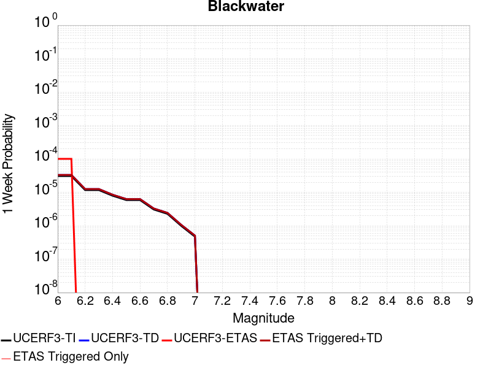 |  | 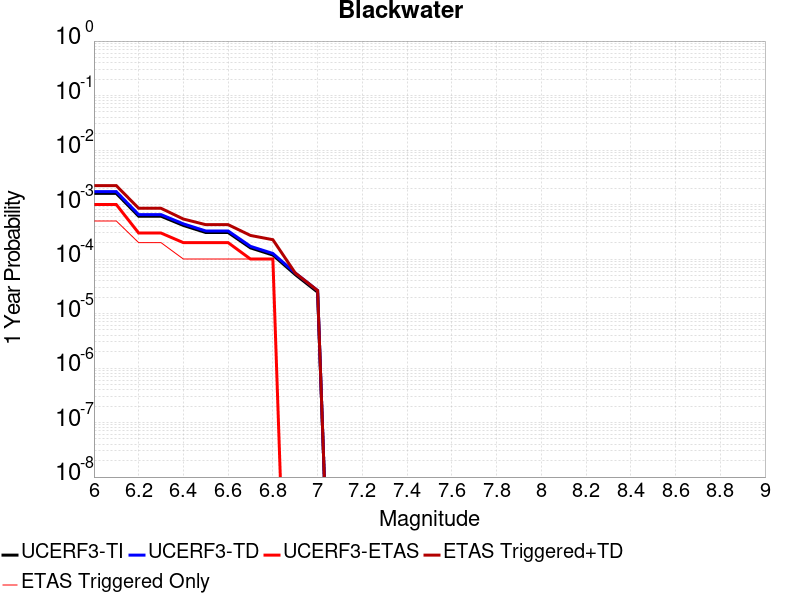 |  |

| Magnitude | 1 wk TI Prob | 1 wk TD Prob | 1 wk ETAS Prob | 1 wk ETAS/TD Gain | 1 wk ETAS Triggered+TD | 1 wk ETAS Triggered Only | 1 mo TI Prob | 1 mo TD Prob | 1 mo ETAS Prob | 1 mo ETAS/TD Gain | 1 mo ETAS Triggered+TD | 1 mo ETAS Triggered Only | 1 yr TI Prob | 1 yr TD Prob | 1 yr ETAS Prob | 1 yr ETAS/TD Gain | 1 yr ETAS Triggered+TD | 1 yr ETAS Triggered Only | 10 yr TI Prob | 10 yr TD Prob | 10 yr ETAS Prob | 10 yr ETAS/TD Gain | 10 yr ETAS Triggered+TD | 10 yr ETAS Triggered Only |
|-----|-----|-----|-----|-----|-----|-----|-----|-----|-----|-----|-----|-----|-----|-----|-----|-----|-----|-----|-----|-----|-----|-----|-----|-----|
| 6.0 | 3.0708583E-5 | 3.306896E-5 | 1.0E-4 | 3.0239837 | 3.306896E-5 | 0.0 | 1.3160157E-4 | 1.4171719E-4 | 1.0E-4 | 0.7056307 | 1.4171719E-4 | 0.0 | 0.0016010714 | 0.0017241776 | 0.001 | 0.57998663 | 0.0022233156 | 5.0E-4 | 0.015895851 | 0.017121818 | 0.01 | 0.5840502 | 0.019775588 | 0.0027 |
| 6.1 | 3.0708583E-5 | 3.306896E-5 | 1.0E-4 | 3.0239837 | 3.306896E-5 | 0.0 | 1.3160157E-4 | 1.4171719E-4 | 1.0E-4 | 0.7056307 | 1.4171719E-4 | 0.0 | 0.0016010714 | 0.0017241776 | 0.001 | 0.57998663 | 0.0022233156 | 5.0E-4 | 0.015895851 | 0.017121818 | 0.01 | 0.5840502 | 0.019775588 | 0.0027 |
| 6.2 | 1.1707779E-5 | 1.2535755E-5 | 0.0 | 0.0 | 1.2535755E-5 | 0.0 | 5.017523E-5 | 5.3723612E-5 | 0.0 | 0.0 | 5.3723612E-5 | 0.0 | 6.107122E-4 | 6.538983E-4 | 3.0E-4 | 0.45878696 | 8.537675E-4 | 2.0E-4 | 0.006090366 | 0.006520712 | 0.0038 | 0.5827584 | 0.0075141913 | 0.001 |
| 6.3 | 1.1707779E-5 | 1.2535755E-5 | 0.0 | 0.0 | 1.2535755E-5 | 0.0 | 5.017523E-5 | 5.3723612E-5 | 0.0 | 0.0 | 5.3723612E-5 | 0.0 | 6.107122E-4 | 6.538983E-4 | 3.0E-4 | 0.45878696 | 8.537675E-4 | 2.0E-4 | 0.006090366 | 0.006520712 | 0.0038 | 0.5827584 | 0.0075141913 | 0.001 |
| 6.4 | 7.929244E-6 | 8.4739495E-6 | 0.0 | 0.0 | 8.4739495E-6 | 0.0 | 3.3982033E-5 | 3.6316444E-5 | 0.0 | 0.0 | 3.6316444E-5 | 0.0 | 4.136527E-4 | 4.4206702E-4 | 2.0E-4 | 0.4524201 | 5.420228E-4 | 1.0E-4 | 0.0041288356 | 0.0044122813 | 0.0025 | 0.5666003 | 0.0051091923 | 7.0E-4 |
| 6.5 | 5.8832115E-6 | 6.2814997E-6 | 0.0 | 0.0 | 6.2814997E-6 | 0.0 | 2.521352E-5 | 2.692045E-5 | 0.0 | 0.0 | 2.692045E-5 | 0.0 | 3.0693135E-4 | 3.2770974E-4 | 2.0E-4 | 0.6102962 | 4.2767695E-4 | 1.0E-4 | 0.0030650778 | 0.0032725176 | 0.0018 | 0.55003524 | 0.0036712086 | 4.0E-4 |
| 6.6 | 5.8832115E-6 | 6.2814997E-6 | 0.0 | 0.0 | 6.2814997E-6 | 0.0 | 2.521352E-5 | 2.692045E-5 | 0.0 | 0.0 | 2.692045E-5 | 0.0 | 3.0693135E-4 | 3.2770974E-4 | 2.0E-4 | 0.6102962 | 4.2767695E-4 | 1.0E-4 | 0.0030650778 | 0.0032725176 | 0.0018 | 0.55003524 | 0.0036712086 | 4.0E-4 |
| 6.7 | 3.0715053E-6 | 3.2791254E-6 | 0.0 | 0.0 | 3.2791254E-6 | 0.0 | 1.3163528E-5 | 1.4053326E-5 | 0.0 | 0.0 | 1.4053326E-5 | 0.0 | 1.6025416E-4 | 1.7108697E-4 | 1.0E-4 | 0.58449805 | 2.7106988E-4 | 1.0E-4 | 0.0016013865 | 0.0017096669 | 0.001 | 0.58490926 | 0.002009154 | 3.0E-4 |
| 6.8 | 2.2722281E-6 | 2.4270078E-6 | 0.0 | 0.0 | 2.4270078E-6 | 0.0 | 9.738084E-6 | 1.0401426E-5 | 0.0 | 0.0 | 1.0401426E-5 | 0.0 | 1.1855473E-4 | 1.2663091E-4 | 1.0E-4 | 0.7896966 | 2.2661826E-4 | 1.0E-4 | 0.001184915 | 0.0012656776 | 8.0E-4 | 0.63207245 | 0.001565298 | 3.0E-4 |
| 6.9 | 9.952399E-7 | 1.0645658E-6 | 0.0 | 0.0 | 1.0645658E-6 | 0.0 | 4.265307E-6 | 4.5624197E-6 | 0.0 | 0.0 | 4.5624197E-6 | 0.0 | 5.1928873E-5 | 5.554656E-5 | 0.0 | 0.0 | 5.554656E-5 | 0.0 | 5.191674E-4 | 5.553773E-4 | 3.0E-4 | 0.5401733 | 5.553773E-4 | 0.0 |
| 7.0 | 4.7385504E-7 | 5.071793E-7 | 0.0 | 0.0 | 5.071793E-7 | 0.0 | 2.0308057E-6 | 2.1736255E-6 | 0.0 | 0.0 | 2.1736255E-6 | 0.0 | 2.4724779E-5 | 2.6463891E-5 | 0.0 | 0.0 | 2.6463891E-5 | 0.0 | 2.4722028E-4 | 2.6463892E-4 | 2.0E-4 | 0.7557468 | 2.6463892E-4 | 0.0 |

## Santa Ynez River
*[(top)](#table-of-contents)*

| 1 Week | 1 Month | 1 Year | 10 Year |
|-----|-----|-----|-----|
|  |  |  |  |

| Magnitude | 1 wk TI Prob | 1 wk TD Prob | 1 wk ETAS Prob | 1 wk ETAS/TD Gain | 1 wk ETAS Triggered+TD | 1 wk ETAS Triggered Only | 1 mo TI Prob | 1 mo TD Prob | 1 mo ETAS Prob | 1 mo ETAS/TD Gain | 1 mo ETAS Triggered+TD | 1 mo ETAS Triggered Only | 1 yr TI Prob | 1 yr TD Prob | 1 yr ETAS Prob | 1 yr ETAS/TD Gain | 1 yr ETAS Triggered+TD | 1 yr ETAS Triggered Only | 10 yr TI Prob | 10 yr TD Prob | 10 yr ETAS Prob | 10 yr ETAS/TD Gain | 10 yr ETAS Triggered+TD | 10 yr ETAS Triggered Only |
|-----|-----|-----|-----|-----|-----|-----|-----|-----|-----|-----|-----|-----|-----|-----|-----|-----|-----|-----|-----|-----|-----|-----|-----|-----|
| 6.0 | 1.6396456E-5 | 1.719887E-5 | 0.0 | 0.0 | 1.719887E-5 | 0.0 | 7.026863E-5 | 7.370757E-5 | 0.0 | 0.0 | 7.370757E-5 | 0.0 | 8.551848E-4 | 8.970556E-4 | 5.0E-4 | 0.557379 | 0.0010968762 | 2.0E-4 | 0.0085190125 | 0.00893789 | 0.0074 | 0.827936 | 0.011415545 | 0.0025 |
| 6.1 | 1.6396456E-5 | 1.719887E-5 | 0.0 | 0.0 | 1.719887E-5 | 0.0 | 7.026863E-5 | 7.370757E-5 | 0.0 | 0.0 | 7.370757E-5 | 0.0 | 8.551848E-4 | 8.970556E-4 | 5.0E-4 | 0.557379 | 0.0010968762 | 2.0E-4 | 0.0085190125 | 0.00893789 | 0.0074 | 0.827936 | 0.011415545 | 0.0025 |
| 6.2 | 1.6396456E-5 | 1.719887E-5 | 0.0 | 0.0 | 1.719887E-5 | 0.0 | 7.026863E-5 | 7.370757E-5 | 0.0 | 0.0 | 7.370757E-5 | 0.0 | 8.551848E-4 | 8.970556E-4 | 5.0E-4 | 0.557379 | 0.0010968762 | 2.0E-4 | 0.0085190125 | 0.00893789 | 0.0074 | 0.827936 | 0.011415545 | 0.0025 |
| 6.3 | 9.736976E-6 | 1.01165315E-5 | 0.0 | 0.0 | 1.01165315E-5 | 0.0 | 4.172923E-5 | 4.335587E-5 | 0.0 | 0.0 | 4.335587E-5 | 0.0 | 5.0793495E-4 | 5.2773487E-4 | 2.0E-4 | 0.37897816 | 6.2768214E-4 | 1.0E-4 | 0.005067755 | 0.0052653216 | 0.005 | 0.9496096 | 0.0069563705 | 0.0017 |
| 6.4 | 9.736976E-6 | 1.01165315E-5 | 0.0 | 0.0 | 1.01165315E-5 | 0.0 | 4.172923E-5 | 4.335587E-5 | 0.0 | 0.0 | 4.335587E-5 | 0.0 | 5.0793495E-4 | 5.2773487E-4 | 2.0E-4 | 0.37897816 | 6.2768214E-4 | 1.0E-4 | 0.005067755 | 0.0052653216 | 0.005 | 0.9496096 | 0.0069563705 | 0.0017 |
| 6.5 | 7.081964E-6 | 7.3256106E-6 | 0.0 | 0.0 | 7.3256106E-6 | 0.0 | 3.035092E-5 | 3.1395106E-5 | 0.0 | 0.0 | 3.1395106E-5 | 0.0 | 3.694598E-4 | 3.8216994E-4 | 1.0E-4 | 0.2616637 | 3.8216994E-4 | 0.0 | 0.0036884616 | 0.003815289 | 0.0033 | 0.86494106 | 0.004911092 | 0.0011 |
| 6.6 | 5.873247E-6 | 6.056132E-6 | 0.0 | 0.0 | 6.056132E-6 | 0.0 | 2.5170815E-5 | 2.5954598E-5 | 0.0 | 0.0 | 2.5954598E-5 | 0.0 | 3.064116E-4 | 3.1595226E-4 | 1.0E-4 | 0.3165035 | 3.1595226E-4 | 0.0 | 0.0030598943 | 0.003155118 | 0.003 | 0.95083606 | 0.0041519627 | 0.001 |
| 6.7 | 4.973277E-6 | 5.112771E-6 | 0.0 | 0.0 | 5.112771E-6 | 0.0 | 2.1313872E-5 | 2.1911694E-5 | 0.0 | 0.0 | 2.1911694E-5 | 0.0 | 2.5946548E-4 | 2.667427E-4 | 1.0E-4 | 0.37489313 | 2.667427E-4 | 0.0 | 0.0025916274 | 0.002664274 | 0.0026 | 0.97587556 | 0.0034621428 | 8.0E-4 |
| 6.8 | 4.396492E-6 | 4.508156E-6 | 0.0 | 0.0 | 4.508156E-6 | 0.0 | 1.884197E-5 | 1.9320527E-5 | 0.0 | 0.0 | 1.9320527E-5 | 0.0 | 2.2937685E-4 | 2.3520237E-4 | 1.0E-4 | 0.42516577 | 2.3520237E-4 | 0.0 | 0.0022914023 | 0.0023495697 | 0.0025 | 1.0640246 | 0.003047925 | 7.0E-4 |
| 6.9 | 3.5255632E-6 | 3.5989337E-6 | 0.0 | 0.0 | 3.5989337E-6 | 0.0 | 1.5109469E-5 | 1.5423911E-5 | 0.0 | 0.0 | 1.5423911E-5 | 0.0 | 1.8394225E-4 | 1.877701E-4 | 1.0E-4 | 0.53256613 | 1.877701E-4 | 0.0 | 0.0018379007 | 0.0018761306 | 0.0017 | 0.9061203 | 0.0021755677 | 3.0E-4 |
| 7.0 | 3.211603E-6 | 3.2714042E-6 | 0.0 | 0.0 | 3.2714042E-6 | 0.0 | 1.376394E-5 | 1.4020229E-5 | 0.0 | 0.0 | 1.4020229E-5 | 0.0 | 1.6756308E-4 | 1.7068307E-4 | 1.0E-4 | 0.58588123 | 1.7068307E-4 | 0.0 | 0.0016743679 | 0.0017055338 | 0.0015 | 0.87949 | 0.0019051927 | 2.0E-4 |
| 7.1 | 2.5094619E-6 | 2.5390043E-6 | 0.0 | 0.0 | 2.5390043E-6 | 0.0 | 1.0754793E-5 | 1.0881402E-5 | 0.0 | 0.0 | 1.0881402E-5 | 0.0 | 1.3093173E-4 | 1.3247307E-4 | 0.0 | 0.0 | 1.3247307E-4 | 0.0 | 0.0013085462 | 0.001323947 | 0.0012 | 0.90638065 | 0.0015236823 | 2.0E-4 |
| 7.2 | 2.0515774E-6 | 2.0602522E-6 | 0.0 | 0.0 | 2.0602522E-6 | 0.0 | 8.792445E-6 | 8.829622E-6 | 0.0 | 0.0 | 8.829622E-6 | 0.0 | 1.0704277E-4 | 1.0749539E-4 | 0.0 | 0.0 | 1.0749539E-4 | 0.0 | 0.0010699122 | 0.0010744382 | 0.001 | 0.93071896 | 0.0012742233 | 2.0E-4 |
| 7.3 | 1.6845745E-6 | 1.6758975E-6 | 0.0 | 0.0 | 1.6758975E-6 | 0.0 | 7.219585E-6 | 7.1823983E-6 | 0.0 | 0.0 | 7.1823983E-6 | 0.0 | 8.78949E-5 | 8.744222E-5 | 0.0 | 0.0 | 8.744222E-5 | 0.0 | 8.7860145E-4 | 8.74081E-4 | 8.0E-4 | 0.915247 | 0.0010739062 | 2.0E-4 |
| 7.4 | 1.3600285E-6 | 1.3320589E-6 | 0.0 | 0.0 | 1.3320589E-6 | 0.0 | 5.82868E-6 | 5.7088114E-6 | 0.0 | 0.0 | 5.7088114E-6 | 0.0 | 7.096187E-5 | 6.950259E-5 | 0.0 | 0.0 | 6.950259E-5 | 0.0 | 7.0939213E-4 | 6.948107E-4 | 5.0E-4 | 0.71962047 | 7.947412E-4 | 1.0E-4 |
| 7.5 | 9.735342E-7 | 9.2797353E-7 | 0.0 | 0.0 | 9.2797353E-7 | 0.0 | 4.172283E-6 | 3.9770234E-6 | 0.0 | 0.0 | 3.9770234E-6 | 0.0 | 5.079636E-5 | 4.8419202E-5 | 0.0 | 0.0 | 4.8419202E-5 | 0.0 | 5.0784746E-4 | 4.8408823E-4 | 4.0E-4 | 0.8262956 | 5.8403984E-4 | 1.0E-4 |
| 7.6 | 5.067187E-7 | 4.773283E-7 | 0.0 | 0.0 | 4.773283E-7 | 0.0 | 2.1716498E-6 | 2.0456912E-6 | 0.0 | 0.0 | 2.0456912E-6 | 0.0 | 2.6439517E-5 | 2.4906014E-5 | 0.0 | 0.0 | 2.4906014E-5 | 0.0 | 2.643637E-4 | 2.4903295E-4 | 0.0 | 0.0 | 2.4903295E-4 | 0.0 |
| 7.7 | 2.769089E-7 | 2.574409E-7 | 0.0 | 0.0 | 2.574409E-7 | 0.0 | 1.1867519E-6 | 1.1033177E-6 | 0.0 | 0.0 | 1.1033177E-6 | 0.0 | 1.4448608E-5 | 1.343281E-5 | 0.0 | 0.0 | 1.343281E-5 | 0.0 | 1.444767E-4 | 1.3432001E-4 | 0.0 | 0.0 | 1.3432001E-4 | 0.0 |
| 7.8 | 1.7044663E-7 | 1.5440357E-7 | 0.0 | 0.0 | 1.5440357E-7 | 0.0 | 7.3048534E-7 | 6.617294E-7 | 0.0 | 0.0 | 6.617294E-7 | 0.0 | 8.893623E-6 | 8.056526E-6 | 0.0 | 0.0 | 8.056526E-6 | 0.0 | 8.893267E-5 | 8.056236E-5 | 0.0 | 0.0 | 8.056236E-5 | 0.0 |
| 7.9 | 4.8344287E-8 | 4.0886366E-8 | 0.0 | 0.0 | 4.0886366E-8 | 0.0 | 2.0718979E-7 | 1.7522727E-7 | 0.0 | 0.0 | 1.7522727E-7 | 0.0 | 2.5225327E-6 | 2.1333901E-6 | 0.0 | 0.0 | 2.1333901E-6 | 0.0 | 2.5225041E-5 | 2.13337E-5 | 0.0 | 0.0 | 2.13337E-5 | 0.0 |

## San Andreas (North Branch Mill Creek)
*[(top)](#table-of-contents)*

| 1 Week | 1 Month | 1 Year | 10 Year |
|-----|-----|-----|-----|
| 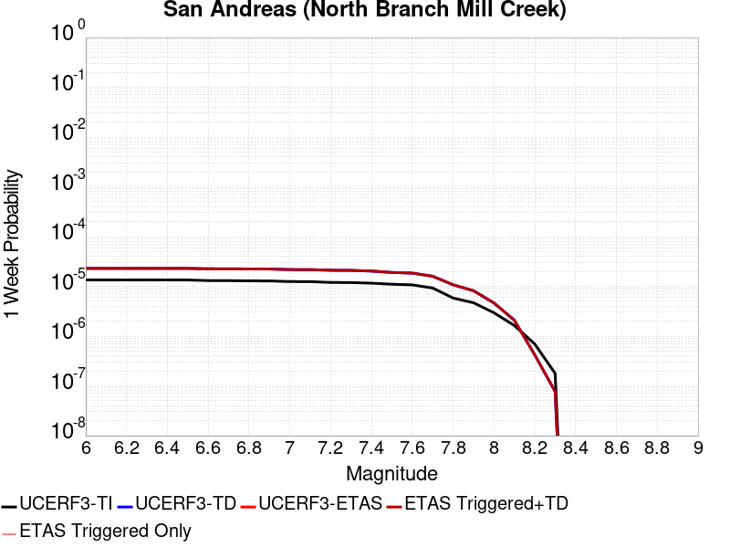 | 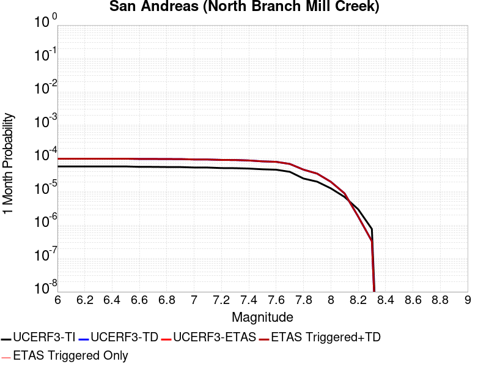 |  |  |

| Magnitude | 1 wk TI Prob | 1 wk TD Prob | 1 wk ETAS Prob | 1 wk ETAS/TD Gain | 1 wk ETAS Triggered+TD | 1 wk ETAS Triggered Only | 1 mo TI Prob | 1 mo TD Prob | 1 mo ETAS Prob | 1 mo ETAS/TD Gain | 1 mo ETAS Triggered+TD | 1 mo ETAS Triggered Only | 1 yr TI Prob | 1 yr TD Prob | 1 yr ETAS Prob | 1 yr ETAS/TD Gain | 1 yr ETAS Triggered+TD | 1 yr ETAS Triggered Only | 10 yr TI Prob | 10 yr TD Prob | 10 yr ETAS Prob | 10 yr ETAS/TD Gain | 10 yr ETAS Triggered+TD | 10 yr ETAS Triggered Only |
|-----|-----|-----|-----|-----|-----|-----|-----|-----|-----|-----|-----|-----|-----|-----|-----|-----|-----|-----|-----|-----|-----|-----|-----|-----|
| 6.0 | 1.3461156E-5 | 2.2894961E-5 | 0.0 | 0.0 | 2.2894961E-5 | 0.0 | 5.7689394E-5 | 9.811759E-5 | 0.0 | 0.0 | 9.811759E-5 | 0.0 | 7.02142E-4 | 0.0011939303 | 5.0E-4 | 0.41878495 | 0.0011939303 | 0.0 | 0.0069992766 | 0.011918645 | 0.0075 | 0.62926614 | 0.014586465 | 0.0027 |
| 6.1 | 1.3461156E-5 | 2.2894961E-5 | 0.0 | 0.0 | 2.2894961E-5 | 0.0 | 5.7689394E-5 | 9.811759E-5 | 0.0 | 0.0 | 9.811759E-5 | 0.0 | 7.02142E-4 | 0.0011939303 | 5.0E-4 | 0.41878495 | 0.0011939303 | 0.0 | 0.0069992766 | 0.011918645 | 0.0075 | 0.62926614 | 0.014586465 | 0.0027 |
| 6.2 | 1.3461156E-5 | 2.2894961E-5 | 0.0 | 0.0 | 2.2894961E-5 | 0.0 | 5.7689394E-5 | 9.811759E-5 | 0.0 | 0.0 | 9.811759E-5 | 0.0 | 7.02142E-4 | 0.0011939303 | 5.0E-4 | 0.41878495 | 0.0011939303 | 0.0 | 0.0069992766 | 0.011918645 | 0.0075 | 0.62926614 | 0.014586465 | 0.0027 |
| 6.3 | 1.3461156E-5 | 2.2894961E-5 | 0.0 | 0.0 | 2.2894961E-5 | 0.0 | 5.7689394E-5 | 9.811759E-5 | 0.0 | 0.0 | 9.811759E-5 | 0.0 | 7.02142E-4 | 0.0011939303 | 5.0E-4 | 0.41878495 | 0.0011939303 | 0.0 | 0.0069992766 | 0.011918645 | 0.0075 | 0.62926614 | 0.014586465 | 0.0027 |
| 6.4 | 1.3461156E-5 | 2.2894961E-5 | 0.0 | 0.0 | 2.2894961E-5 | 0.0 | 5.7689394E-5 | 9.811759E-5 | 0.0 | 0.0 | 9.811759E-5 | 0.0 | 7.02142E-4 | 0.0011939303 | 5.0E-4 | 0.41878495 | 0.0011939303 | 0.0 | 0.0069992766 | 0.011918645 | 0.0075 | 0.62926614 | 0.014586465 | 0.0027 |
| 6.5 | 1.3450706E-5 | 2.2883927E-5 | 0.0 | 0.0 | 2.2883927E-5 | 0.0 | 5.764461E-5 | 9.8070304E-5 | 0.0 | 0.0 | 9.8070304E-5 | 0.0 | 7.0159714E-4 | 0.0011933552 | 5.0E-4 | 0.41898674 | 0.0011933552 | 0.0 | 0.006993862 | 0.011912957 | 0.0075 | 0.6295666 | 0.014580792 | 0.0027 |
| 6.6 | 1.3074523E-5 | 2.2498407E-5 | 0.0 | 0.0 | 2.2498407E-5 | 0.0 | 5.6032466E-5 | 9.6418196E-5 | 0.0 | 0.0 | 9.6418196E-5 | 0.0 | 6.8198174E-4 | 0.0011732625 | 4.0E-4 | 0.3409297 | 0.0011732625 | 0.0 | 0.006798926 | 0.01171416 | 0.0073 | 0.6231774 | 0.014283704 | 0.0026 |
| 6.7 | 1.3050216E-5 | 2.2473736E-5 | 0.0 | 0.0 | 2.2473736E-5 | 0.0 | 5.59283E-5 | 9.631248E-5 | 0.0 | 0.0 | 9.631248E-5 | 0.0 | 6.8071426E-4 | 0.0011719767 | 4.0E-4 | 0.3413037 | 0.0011719767 | 0.0 | 0.0067863287 | 0.011701439 | 0.0073 | 0.62385494 | 0.014271014 | 0.0026 |
| 6.8 | 1.29049395E-5 | 2.2322258E-5 | 0.0 | 0.0 | 2.2322258E-5 | 0.0 | 5.530571E-5 | 9.566333E-5 | 0.0 | 0.0 | 9.566333E-5 | 0.0 | 6.73139E-4 | 0.0011640819 | 4.0E-4 | 0.34361845 | 0.0011640819 | 0.0 | 0.0067110364 | 0.011623316 | 0.0073 | 0.62804794 | 0.014193096 | 0.0026 |
| 6.9 | 1.2867369E-5 | 2.2281742E-5 | 0.0 | 0.0 | 2.2281742E-5 | 0.0 | 5.51447E-5 | 9.5489704E-5 | 0.0 | 0.0 | 9.5489704E-5 | 0.0 | 6.711799E-4 | 0.0011619702 | 4.0E-4 | 0.3442429 | 0.0011619702 | 0.0 | 0.006691564 | 0.011602421 | 0.0073 | 0.629179 | 0.014172255 | 0.0026 |
| 7.0 | 1.2495996E-5 | 2.1685511E-5 | 0.0 | 0.0 | 2.1685511E-5 | 0.0 | 5.3553173E-5 | 9.293461E-5 | 0.0 | 0.0 | 9.293461E-5 | 0.0 | 6.518148E-4 | 0.0011308943 | 4.0E-4 | 0.35370237 | 0.0011308943 | 0.0 | 0.0064990623 | 0.011294832 | 0.0071 | 0.628606 | 0.013766596 | 0.0025 |
| 7.1 | 1.2452067E-5 | 2.1630749E-5 | 0.0 | 0.0 | 2.1630749E-5 | 0.0 | 5.3364907E-5 | 9.2699935E-5 | 0.0 | 0.0 | 9.2699935E-5 | 0.0 | 6.4952404E-4 | 0.0011280401 | 4.0E-4 | 0.35459733 | 0.0011280401 | 0.0 | 0.0064762887 | 0.011266581 | 0.007 | 0.62130654 | 0.013738414 | 0.0025 |
| 7.2 | 1.2002777E-5 | 2.1012174E-5 | 0.0 | 0.0 | 2.1012174E-5 | 0.0 | 5.143946E-5 | 9.0049085E-5 | 0.0 | 0.0 | 9.0049085E-5 | 0.0 | 6.2609545E-4 | 0.0010957988 | 4.0E-4 | 0.36503053 | 0.0010957988 | 0.0 | 0.006243344 | 0.010947371 | 0.0068 | 0.6211537 | 0.013321098 | 0.0024 |
| 7.3 | 1.1923425E-5 | 2.088261E-5 | 0.0 | 0.0 | 2.088261E-5 | 0.0 | 5.109939E-5 | 8.949384E-5 | 0.0 | 0.0 | 8.949384E-5 | 0.0 | 6.219575E-4 | 0.0010890454 | 4.0E-4 | 0.36729413 | 0.0010890454 | 0.0 | 0.0062021962 | 0.010880542 | 0.0066 | 0.60658747 | 0.013056604 | 0.0022 |
| 7.4 | 1.16105175E-5 | 2.0263682E-5 | 0.0 | 0.0 | 2.0263682E-5 | 0.0 | 4.975841E-5 | 8.684147E-5 | 0.0 | 0.0 | 8.684147E-5 | 0.0 | 6.0564023E-4 | 0.0010567845 | 3.0E-4 | 0.28388 | 0.0010567845 | 0.0 | 0.006039923 | 0.010561627 | 0.0063 | 0.59649897 | 0.012738392 | 0.0022 |
| 7.5 | 1.1037265E-5 | 1.8988934E-5 | 0.0 | 0.0 | 1.8988934E-5 | 0.0 | 4.7301706E-5 | 8.137862E-5 | 0.0 | 0.0 | 8.137862E-5 | 0.0 | 5.757461E-4 | 9.903364E-4 | 3.0E-4 | 0.30292737 | 9.903364E-4 | 0.0 | 0.005742567 | 0.009904555 | 0.0061 | 0.6158782 | 0.012082765 | 0.0022 |
| 7.6 | 1.0720915E-5 | 1.8438837E-5 | 0.0 | 0.0 | 1.8438837E-5 | 0.0 | 4.5945973E-5 | 7.902121E-5 | 0.0 | 0.0 | 7.902121E-5 | 0.0 | 5.592486E-4 | 9.6166064E-4 | 3.0E-4 | 0.31196037 | 9.6166064E-4 | 0.0 | 0.005578433 | 0.009620325 | 0.006 | 0.6236796 | 0.011700122 | 0.0021 |
| 7.7 | 9.276279E-6 | 1.5914407E-5 | 0.0 | 0.0 | 1.5914407E-5 | 0.0 | 3.9754876E-5 | 6.820283E-5 | 0.0 | 0.0 | 6.820283E-5 | 0.0 | 4.839081E-4 | 8.3005475E-4 | 3.0E-4 | 0.36142194 | 8.3005475E-4 | 0.0 | 0.0048285574 | 0.008315057 | 0.0052 | 0.6253716 | 0.010199258 | 0.0019 |
| 7.8 | 5.8346777E-6 | 1.0738303E-5 | 0.0 | 0.0 | 1.0738303E-5 | 0.0 | 2.5005522E-5 | 4.6020486E-5 | 0.0 | 0.0 | 4.6020486E-5 | 0.0 | 3.043997E-4 | 5.601555E-4 | 2.0E-4 | 0.3570437 | 5.601555E-4 | 0.0 | 0.0030398308 | 0.0056325593 | 0.0035 | 0.6213871 | 0.006925237 | 0.0013 |
| 7.9 | 4.690204E-6 | 8.1600465E-6 | 0.0 | 0.0 | 8.1600465E-6 | 0.0 | 2.0100719E-5 | 3.497116E-5 | 0.0 | 0.0 | 3.497116E-5 | 0.0 | 2.4469878E-4 | 4.2569079E-4 | 1.0E-4 | 0.2349123 | 4.2569079E-4 | 0.0 | 0.002444295 | 0.0042910287 | 0.0026 | 0.6059153 | 0.0053863083 | 0.0011 |
| 8.0 | 2.9570454E-6 | 4.6303044E-6 | 0.0 | 0.0 | 4.6303044E-6 | 0.0 | 1.267299E-5 | 1.984401E-5 | 0.0 | 0.0 | 1.984401E-5 | 0.0 | 1.5428272E-4 | 2.4157407E-4 | 1.0E-4 | 0.41395172 | 2.4157407E-4 | 0.0 | 0.0015417566 | 0.0024371196 | 0.0021 | 0.861673 | 0.0034346823 | 0.001 |
| 8.1 | 1.6376824E-6 | 2.0804132E-6 | 0.0 | 0.0 | 2.0804132E-6 | 0.0 | 7.01862E-6 | 8.916027E-6 | 0.0 | 0.0 | 8.916027E-6 | 0.0 | 8.544835E-5 | 1.0854723E-4 | 0.0 | 0.0 | 1.0854723E-4 | 0.0 | 8.54155E-4 | 0.0010998398 | 0.0011 | 1.0001457 | 0.0015992898 | 5.0E-4 |
| 8.2 | 6.9631557E-7 | 4.167043E-7 | 0.0 | 0.0 | 4.167043E-7 | 0.0 | 2.984206E-6 | 1.7858744E-6 | 0.0 | 0.0 | 1.7858744E-6 | 0.0 | 3.63321E-5 | 2.1742804E-5 | 0.0 | 0.0 | 2.1742804E-5 | 0.0 | 3.6326164E-4 | 2.255496E-4 | 2.0E-4 | 0.8867229 | 2.255496E-4 | 0.0 |
| 8.3 | 1.7876137E-7 | 7.614013E-8 | 0.0 | 0.0 | 7.614013E-8 | 0.0 | 7.661199E-7 | 3.263148E-7 | 0.0 | 0.0 | 3.263148E-7 | 0.0 | 9.32747E-6 | 3.9728757E-6 | 0.0 | 0.0 | 3.9728757E-6 | 0.0 | 9.3270784E-5 | 4.1807303E-5 | 0.0 | 0.0 | 4.1807303E-5 | 0.0 |

## San Jacinto (Stepovers Combined)
*[(top)](#table-of-contents)*

| 1 Week | 1 Month | 1 Year | 10 Year |
|-----|-----|-----|-----|
| 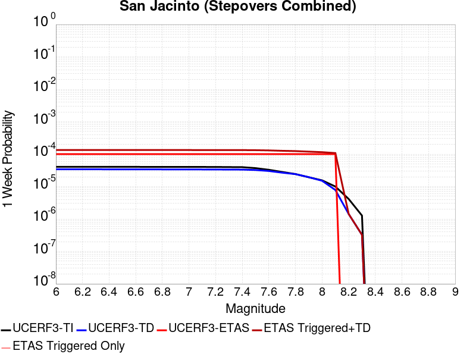 | 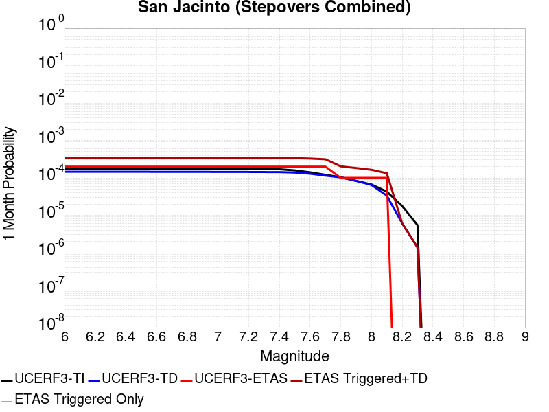 |  |  |

| Magnitude | 1 wk TI Prob | 1 wk TD Prob | 1 wk ETAS Prob | 1 wk ETAS/TD Gain | 1 wk ETAS Triggered+TD | 1 wk ETAS Triggered Only | 1 mo TI Prob | 1 mo TD Prob | 1 mo ETAS Prob | 1 mo ETAS/TD Gain | 1 mo ETAS Triggered+TD | 1 mo ETAS Triggered Only | 1 yr TI Prob | 1 yr TD Prob | 1 yr ETAS Prob | 1 yr ETAS/TD Gain | 1 yr ETAS Triggered+TD | 1 yr ETAS Triggered Only | 10 yr TI Prob | 10 yr TD Prob | 10 yr ETAS Prob | 10 yr ETAS/TD Gain | 10 yr ETAS Triggered+TD | 10 yr ETAS Triggered Only |
|-----|-----|-----|-----|-----|-----|-----|-----|-----|-----|-----|-----|-----|-----|-----|-----|-----|-----|-----|-----|-----|-----|-----|-----|-----|
| 6.0 | 4.0667746E-5 | 3.4023797E-5 | 1.0E-4 | 2.9391193 | 1.3402039E-4 | 1.0E-4 | 1.742787E-4 | 1.4580812E-4 | 2.0E-4 | 1.3716656 | 3.4577897E-4 | 2.0E-4 | 0.0021197782 | 0.0017737696 | 0.0014 | 0.78927946 | 0.0020732374 | 3.0E-4 | 0.020996714 | 0.018338304 | 0.0108 | 0.5889312 | 0.020890625 | 0.0026 |
| 6.1 | 4.0667746E-5 | 3.4023797E-5 | 1.0E-4 | 2.9391193 | 1.3402039E-4 | 1.0E-4 | 1.742787E-4 | 1.4580812E-4 | 2.0E-4 | 1.3716656 | 3.4577897E-4 | 2.0E-4 | 0.0021197782 | 0.0017737696 | 0.0014 | 0.78927946 | 0.0020732374 | 3.0E-4 | 0.020996714 | 0.018338304 | 0.0108 | 0.5889312 | 0.020890625 | 0.0026 |
| 6.2 | 4.0667746E-5 | 3.4023797E-5 | 1.0E-4 | 2.9391193 | 1.3402039E-4 | 1.0E-4 | 1.742787E-4 | 1.4580812E-4 | 2.0E-4 | 1.3716656 | 3.4577897E-4 | 2.0E-4 | 0.0021197782 | 0.0017737696 | 0.0014 | 0.78927946 | 0.0020732374 | 3.0E-4 | 0.020996714 | 0.018338304 | 0.0108 | 0.5889312 | 0.020890625 | 0.0026 |
| 6.3 | 4.0667746E-5 | 3.4023797E-5 | 1.0E-4 | 2.9391193 | 1.3402039E-4 | 1.0E-4 | 1.742787E-4 | 1.4580812E-4 | 2.0E-4 | 1.3716656 | 3.4577897E-4 | 2.0E-4 | 0.0021197782 | 0.0017737696 | 0.0014 | 0.78927946 | 0.0020732374 | 3.0E-4 | 0.020996714 | 0.018338304 | 0.0108 | 0.5889312 | 0.020890625 | 0.0026 |
| 6.4 | 4.0577226E-5 | 3.3896198E-5 | 1.0E-4 | 2.9501832 | 1.3389281E-4 | 1.0E-4 | 1.738908E-4 | 1.4526135E-4 | 2.0E-4 | 1.3768288 | 3.4523229E-4 | 2.0E-4 | 0.0021150648 | 0.0017671245 | 0.0014 | 0.7922475 | 0.0020665943 | 3.0E-4 | 0.020950472 | 0.018273074 | 0.0108 | 0.5910335 | 0.020825565 | 0.0026 |
| 6.5 | 4.0577226E-5 | 3.3896198E-5 | 1.0E-4 | 2.9501832 | 1.3389281E-4 | 1.0E-4 | 1.738908E-4 | 1.4526135E-4 | 2.0E-4 | 1.3768288 | 3.4523229E-4 | 2.0E-4 | 0.0021150648 | 0.0017671245 | 0.0014 | 0.7922475 | 0.0020665943 | 3.0E-4 | 0.020950472 | 0.018273074 | 0.0108 | 0.5910335 | 0.020825565 | 0.0026 |
| 6.6 | 4.053861E-5 | 3.3841752E-5 | 1.0E-4 | 2.9549298 | 1.3383837E-4 | 1.0E-4 | 1.7372532E-4 | 1.4502803E-4 | 2.0E-4 | 1.3790438 | 3.4499902E-4 | 2.0E-4 | 0.0021130538 | 0.0017642889 | 0.0014 | 0.7935208 | 0.0020637596 | 3.0E-4 | 0.020930743 | 0.018245239 | 0.0108 | 0.5919353 | 0.0207978 | 0.0026 |
| 6.7 | 4.0516545E-5 | 3.3810942E-5 | 1.0E-4 | 2.9576225 | 1.3380755E-4 | 1.0E-4 | 1.7363077E-4 | 1.44896E-4 | 2.0E-4 | 1.3803004 | 3.4486703E-4 | 2.0E-4 | 0.002111905 | 0.0017626843 | 0.0014 | 0.79424316 | 0.0020621554 | 3.0E-4 | 0.020919468 | 0.018229483 | 0.0107 | 0.58696127 | 0.020782085 | 0.0026 |
| 6.8 | 4.049434E-5 | 3.3782613E-5 | 1.0E-4 | 2.9601026 | 1.3377923E-4 | 1.0E-4 | 1.7353562E-4 | 1.4477462E-4 | 2.0E-4 | 1.3814577 | 3.4474567E-4 | 2.0E-4 | 0.0021107488 | 0.0017612089 | 0.0014 | 0.7949086 | 0.0020606804 | 3.0E-4 | 0.020908125 | 0.018214941 | 0.0107 | 0.5874298 | 0.020767583 | 0.0026 |
| 6.9 | 4.046386E-5 | 3.374534E-5 | 1.0E-4 | 2.9633722 | 1.3374197E-4 | 1.0E-4 | 1.73405E-4 | 1.4461488E-4 | 2.0E-4 | 1.3829836 | 3.4458595E-4 | 2.0E-4 | 0.0021091616 | 0.0017592673 | 0.0014 | 0.79578584 | 0.0020587395 | 3.0E-4 | 0.020892553 | 0.018195786 | 0.0106 | 0.5825525 | 0.020748476 | 0.0026 |
| 7.0 | 4.036382E-5 | 3.3626537E-5 | 1.0E-4 | 2.9738417 | 1.3362318E-4 | 1.0E-4 | 1.7297632E-4 | 1.4410578E-4 | 2.0E-4 | 1.3878694 | 3.4407698E-4 | 2.0E-4 | 0.0021039525 | 0.0017530791 | 0.0014 | 0.79859483 | 0.0020525532 | 3.0E-4 | 0.02084144 | 0.018134682 | 0.0106 | 0.5845154 | 0.020687532 | 0.0026 |
| 7.1 | 4.0343282E-5 | 3.3605123E-5 | 1.0E-4 | 2.9757369 | 1.3360176E-4 | 1.0E-4 | 1.7288832E-4 | 1.4401402E-4 | 2.0E-4 | 1.3887537 | 3.4398522E-4 | 2.0E-4 | 0.002102883 | 0.0017519636 | 0.0014 | 0.7991033 | 0.002051438 | 3.0E-4 | 0.020830948 | 0.01812361 | 0.0106 | 0.5848724 | 0.020676488 | 0.0026 |
| 7.2 | 4.0257353E-5 | 3.3510176E-5 | 1.0E-4 | 2.984168 | 1.3350682E-4 | 1.0E-4 | 1.725201E-4 | 1.4360716E-4 | 2.0E-4 | 1.3926883 | 3.4357843E-4 | 2.0E-4 | 0.0020984085 | 0.0017470181 | 0.0014 | 0.8013655 | 0.002046494 | 3.0E-4 | 0.020787042 | 0.0180746 | 0.0106 | 0.5864583 | 0.020627607 | 0.0026 |
| 7.3 | 3.9940667E-5 | 3.3340824E-5 | 1.0E-4 | 2.999326 | 1.333375E-4 | 1.0E-4 | 1.7116306E-4 | 1.4288144E-4 | 2.0E-4 | 1.3997619 | 3.4285287E-4 | 2.0E-4 | 0.0020819185 | 0.0017381967 | 0.0013 | 0.74790156 | 0.0020376751 | 3.0E-4 | 0.020625217 | 0.017984752 | 0.0105 | 0.5838279 | 0.020537991 | 0.0026 |
| 7.4 | 3.9721202E-5 | 3.322838E-5 | 1.0E-4 | 3.0094757 | 1.3322505E-4 | 1.0E-4 | 1.7022261E-4 | 1.4239959E-4 | 2.0E-4 | 1.4044985 | 3.4237112E-4 | 2.0E-4 | 0.0020704903 | 0.0017323394 | 0.0013 | 0.7504303 | 0.0020318197 | 3.0E-4 | 0.020513052 | 0.017924985 | 0.0105 | 0.5857746 | 0.020478379 | 0.0026 |
| 7.5 | 3.7036873E-5 | 3.2316977E-5 | 1.0E-4 | 3.0943487 | 1.3231374E-4 | 1.0E-4 | 1.5871979E-4 | 1.38494E-4 | 2.0E-4 | 1.4441059 | 3.384663E-4 | 2.0E-4 | 0.0019307006 | 0.0016848632 | 0.0013 | 0.771576 | 0.0019843578 | 3.0E-4 | 0.019140124 | 0.017437536 | 0.0099 | 0.5677408 | 0.019992199 | 0.0026 |
| 7.6 | 3.2940967E-5 | 3.0129268E-5 | 1.0E-4 | 3.319032 | 1.3012625E-4 | 1.0E-4 | 1.4116794E-4 | 1.2911906E-4 | 2.0E-4 | 1.5489581 | 3.2909322E-4 | 2.0E-4 | 0.0017173645 | 0.001570893 | 0.0013 | 0.82755476 | 0.0018704218 | 3.0E-4 | 0.01704153 | 0.016286012 | 0.0091 | 0.5587617 | 0.018745296 | 0.0025 |
| 7.7 | 2.8236149E-5 | 2.673733E-5 | 1.0E-4 | 3.7400892 | 1.2673465E-4 | 1.0E-4 | 1.2100645E-4 | 1.14583534E-4 | 2.0E-4 | 1.7454515 | 3.145606E-4 | 2.0E-4 | 0.0014722579 | 0.0013941628 | 0.0011 | 0.789004 | 0.0016937444 | 3.0E-4 | 0.014625421 | 0.014517579 | 0.0078 | 0.53727967 | 0.01678419 | 0.0023 |
| 7.8 | 2.4329287E-5 | 2.4110075E-5 | 1.0E-4 | 4.1476436 | 1.2410767E-4 | 1.0E-4 | 1.042642E-4 | 1.0332481E-4 | 1.0E-4 | 0.9678218 | 2.0331447E-4 | 1.0E-4 | 0.0012686774 | 0.0012572544 | 9.0E-4 | 0.7158456 | 0.001457003 | 2.0E-4 | 0.012614589 | 0.013139585 | 0.007 | 0.5327413 | 0.015113306 | 0.002 |
| 7.9 | 1.9370926E-5 | 1.9430965E-5 | 1.0E-4 | 5.146425 | 1.1942902E-4 | 1.0E-4 | 8.301561E-5 | 8.327291E-5 | 1.0E-4 | 1.2008708 | 1.8326458E-4 | 1.0E-4 | 0.0010102465 | 0.0010133769 | 6.0E-4 | 0.5920799 | 0.0012131742 | 2.0E-4 | 0.0100566605 | 0.010680598 | 0.0058 | 0.54304075 | 0.012362441 | 0.0017 |
| 8.0 | 1.5583017E-5 | 1.5048742E-5 | 1.0E-4 | 6.645074 | 1.1504724E-4 | 1.0E-4 | 6.6782646E-5 | 6.449302E-5 | 1.0E-4 | 1.5505555 | 1.6448657E-4 | 1.0E-4 | 8.127754E-4 | 7.8492024E-4 | 6.0E-4 | 0.7644089 | 9.847633E-4 | 2.0E-4 | 0.008098091 | 0.008339399 | 0.0044 | 0.527616 | 0.009628557 | 0.0013 |
| 8.1 | 1.0024873E-5 | 7.794212E-6 | 1.0E-4 | 12.830033 | 1.07793436E-4 | 1.0E-4 | 4.2963035E-5 | 3.3403343E-5 | 1.0E-4 | 2.9937124 | 1.334E-4 | 1.0E-4 | 5.229494E-4 | 4.0661026E-4 | 4.0E-4 | 0.983743 | 6.0652895E-4 | 2.0E-4 | 0.0052172043 | 0.0043845368 | 0.0028 | 0.6386079 | 0.0053801523 | 0.001 |
| 8.2 | 4.142796E-6 | 1.4097176E-6 | 0.0 | 0.0 | 1.4097176E-6 | 0.0 | 1.775472E-5 | 6.041633E-6 | 0.0 | 0.0 | 6.041633E-6 | 0.0 | 2.1614227E-4 | 7.3554416E-5 | 1.0E-4 | 1.3595376 | 7.3554416E-5 | 0.0 | 0.0021593217 | 8.5858733E-4 | 6.0E-4 | 0.6988224 | 0.0010584156 | 2.0E-4 |
| 8.3 | 1.2750878E-6 | 3.1939175E-7 | 0.0 | 0.0 | 3.1939175E-7 | 0.0 | 5.4646503E-6 | 1.368821E-6 | 0.0 | 0.0 | 1.368821E-6 | 0.0 | 6.653009E-5 | 1.6665272E-5 | 0.0 | 0.0 | 1.6665272E-5 | 0.0 | 6.6510175E-4 | 2.0263324E-4 | 2.0E-4 | 0.98700494 | 3.0261299E-4 | 1.0E-4 |

## Franklin 2011 CFM
*[(top)](#table-of-contents)*

| 1 Week | 1 Month | 1 Year | 10 Year |
|-----|-----|-----|-----|
| 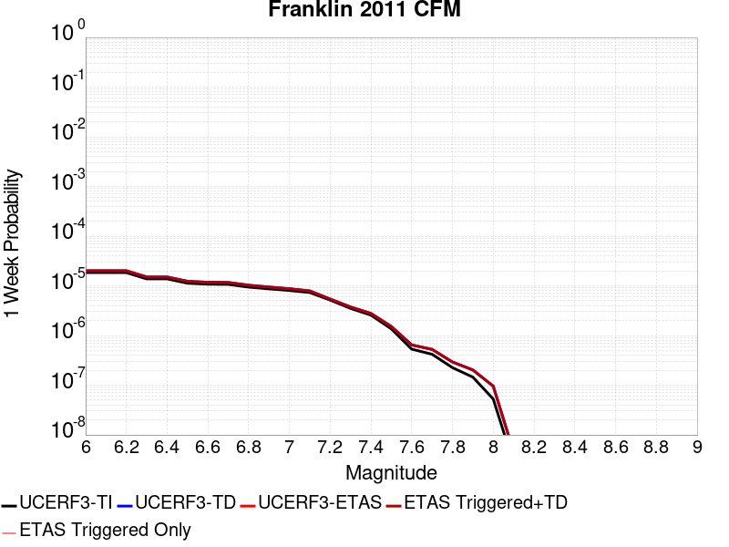 |  | 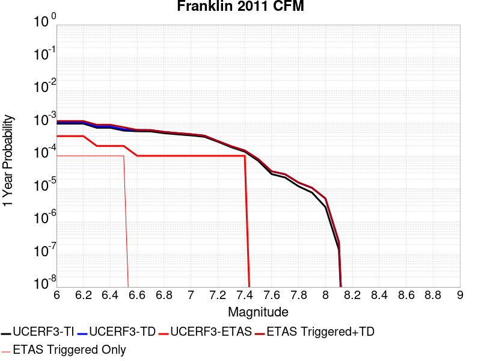 | 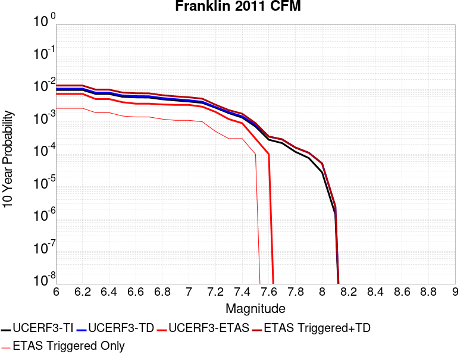 |

| Magnitude | 1 wk TI Prob | 1 wk TD Prob | 1 wk ETAS Prob | 1 wk ETAS/TD Gain | 1 wk ETAS Triggered+TD | 1 wk ETAS Triggered Only | 1 mo TI Prob | 1 mo TD Prob | 1 mo ETAS Prob | 1 mo ETAS/TD Gain | 1 mo ETAS Triggered+TD | 1 mo ETAS Triggered Only | 1 yr TI Prob | 1 yr TD Prob | 1 yr ETAS Prob | 1 yr ETAS/TD Gain | 1 yr ETAS Triggered+TD | 1 yr ETAS Triggered Only | 10 yr TI Prob | 10 yr TD Prob | 10 yr ETAS Prob | 10 yr ETAS/TD Gain | 10 yr ETAS Triggered+TD | 10 yr ETAS Triggered Only |
|-----|-----|-----|-----|-----|-----|-----|-----|-----|-----|-----|-----|-----|-----|-----|-----|-----|-----|-----|-----|-----|-----|-----|-----|-----|
| 6.0 | 1.845602E-5 | 2.013647E-5 | 0.0 | 0.0 | 2.013647E-5 | 0.0 | 7.9094825E-5 | 8.6296466E-5 | 0.0 | 0.0 | 8.6296466E-5 | 0.0 | 9.6255407E-4 | 0.0010501819 | 4.0E-4 | 0.38088638 | 0.001150077 | 1.0E-4 | 0.009583955 | 0.010469505 | 0.0072 | 0.6877116 | 0.013042284 | 0.0026 |
| 6.1 | 1.845602E-5 | 2.013647E-5 | 0.0 | 0.0 | 2.013647E-5 | 0.0 | 7.9094825E-5 | 8.6296466E-5 | 0.0 | 0.0 | 8.6296466E-5 | 0.0 | 9.6255407E-4 | 0.0010501819 | 4.0E-4 | 0.38088638 | 0.001150077 | 1.0E-4 | 0.009583955 | 0.010469505 | 0.0072 | 0.6877116 | 0.013042284 | 0.0026 |
| 6.2 | 1.845602E-5 | 2.013647E-5 | 0.0 | 0.0 | 2.013647E-5 | 0.0 | 7.9094825E-5 | 8.6296466E-5 | 0.0 | 0.0 | 8.6296466E-5 | 0.0 | 9.6255407E-4 | 0.0010501819 | 4.0E-4 | 0.38088638 | 0.001150077 | 1.0E-4 | 0.009583955 | 0.010469505 | 0.0072 | 0.6877116 | 0.013042284 | 0.0026 |
| 6.3 | 1.3813506E-5 | 1.5083398E-5 | 0.0 | 0.0 | 1.5083398E-5 | 0.0 | 5.9199396E-5 | 6.464157E-5 | 0.0 | 0.0 | 6.464157E-5 | 0.0 | 7.205143E-4 | 7.867346E-4 | 2.0E-4 | 0.25421533 | 8.86656E-4 | 1.0E-4 | 0.007181826 | 0.007854696 | 0.005 | 0.6365619 | 0.009739772 | 0.0019 |
| 6.4 | 1.3813506E-5 | 1.5083398E-5 | 0.0 | 0.0 | 1.5083398E-5 | 0.0 | 5.9199396E-5 | 6.464157E-5 | 0.0 | 0.0 | 6.464157E-5 | 0.0 | 7.205143E-4 | 7.867346E-4 | 2.0E-4 | 0.25421533 | 8.86656E-4 | 1.0E-4 | 0.007181826 | 0.007854696 | 0.005 | 0.6365619 | 0.009739772 | 0.0019 |
| 6.5 | 1.1308949E-5 | 1.234902E-5 | 0.0 | 0.0 | 1.234902E-5 | 0.0 | 4.8466023E-5 | 5.292331E-5 | 0.0 | 0.0 | 5.292331E-5 | 0.0 | 5.899141E-4 | 6.4415287E-4 | 2.0E-4 | 0.3104853 | 7.4408844E-4 | 1.0E-4 | 0.0058835056 | 0.006437505 | 0.004 | 0.6213587 | 0.007927849 | 0.0015 |
| 6.6 | 1.0813164E-5 | 1.1807768E-5 | 0.0 | 0.0 | 1.1807768E-5 | 0.0 | 4.6341313E-5 | 5.0603747E-5 | 0.0 | 0.0 | 5.0603747E-5 | 0.0 | 5.640594E-4 | 6.159283E-4 | 1.0E-4 | 0.16235656 | 6.159283E-4 | 0.0 | 0.005626298 | 0.006156845 | 0.0036 | 0.58471507 | 0.007548225 | 0.0014 |
| 6.7 | 1.0706348E-5 | 1.16896645E-5 | 0.0 | 0.0 | 1.16896645E-5 | 0.0 | 4.5883542E-5 | 5.009761E-5 | 0.0 | 0.0 | 5.009761E-5 | 0.0 | 5.5848894E-4 | 6.0976954E-4 | 1.0E-4 | 0.16399638 | 6.0976954E-4 | 0.0 | 0.005570874 | 0.006095596 | 0.0036 | 0.5905903 | 0.0074870624 | 0.0014 |
| 6.8 | 9.443655E-6 | 1.0282702E-5 | 0.0 | 0.0 | 1.0282702E-5 | 0.0 | 4.0472176E-5 | 4.4067983E-5 | 0.0 | 0.0 | 4.4067983E-5 | 0.0 | 4.9263734E-4 | 5.36397E-4 | 1.0E-4 | 0.1864291 | 5.36397E-4 | 0.0 | 0.0049154665 | 0.005365605 | 0.0034 | 0.63366574 | 0.006559166 | 0.0012 |
| 6.9 | 8.7001645E-6 | 9.456737E-6 | 0.0 | 0.0 | 9.456737E-6 | 0.0 | 3.728589E-5 | 4.0528248E-5 | 0.0 | 0.0 | 4.0528248E-5 | 0.0 | 4.538611E-4 | 4.933209E-4 | 1.0E-4 | 0.2027078 | 4.933209E-4 | 0.0 | 0.0045293528 | 0.0049368283 | 0.0033 | 0.6684454 | 0.0060313977 | 0.0011 |
| 7.0 | 8.074731E-6 | 8.751307E-6 | 0.0 | 0.0 | 8.751307E-6 | 0.0 | 3.460553E-5 | 3.750507E-5 | 0.0 | 0.0 | 3.750507E-5 | 0.0 | 4.212409E-4 | 4.5652964E-4 | 1.0E-4 | 0.21904382 | 4.5652964E-4 | 0.0 | 0.004204433 | 0.0045704753 | 0.0033 | 0.7220255 | 0.005665448 | 0.0011 |
| 7.1 | 7.3370957E-6 | 7.899786E-6 | 0.0 | 0.0 | 7.899786E-6 | 0.0 | 3.1444317E-5 | 3.3855795E-5 | 0.0 | 0.0 | 3.3855795E-5 | 0.0 | 3.8276732E-4 | 4.1211734E-4 | 1.0E-4 | 0.24264933 | 4.1211734E-4 | 0.0 | 0.0038210868 | 0.0041279797 | 0.0029 | 0.7025228 | 0.005123852 | 0.001 |
| 7.2 | 5.1750103E-6 | 5.408504E-6 | 0.0 | 0.0 | 5.408504E-6 | 0.0 | 2.2178427E-5 | 2.31791E-5 | 0.0 | 0.0 | 2.31791E-5 | 0.0 | 2.699889E-4 | 2.821693E-4 | 1.0E-4 | 0.35439715 | 2.821693E-4 | 0.0 | 0.002696611 | 0.0028320388 | 0.002 | 0.706205 | 0.0033306228 | 5.0E-4 |
| 7.3 | 3.5221371E-6 | 3.7529333E-6 | 0.0 | 0.0 | 3.7529333E-6 | 0.0 | 1.5094786E-5 | 1.60839E-5 | 0.0 | 0.0 | 1.60839E-5 | 0.0 | 1.8376352E-4 | 1.9580401E-4 | 1.0E-4 | 0.51071477 | 1.9580401E-4 | 0.0 | 0.0018361164 | 0.001969821 | 0.0012 | 0.6091924 | 0.00226923 | 3.0E-4 |
| 7.4 | 2.5749775E-6 | 2.780148E-6 | 0.0 | 0.0 | 2.780148E-6 | 0.0 | 1.1035571E-5 | 1.1914865E-5 | 0.0 | 0.0 | 1.1914865E-5 | 0.0 | 1.343498E-4 | 1.450539E-4 | 1.0E-4 | 0.6893989 | 1.450539E-4 | 0.0 | 0.001342686 | 0.0014617846 | 9.0E-4 | 0.6156858 | 0.001761346 | 3.0E-4 |
| 7.5 | 1.3642131E-6 | 1.5183126E-6 | 0.0 | 0.0 | 1.5183126E-6 | 0.0 | 5.8466144E-6 | 6.5070376E-6 | 0.0 | 0.0 | 6.5070376E-6 | 0.0 | 7.1180206E-5 | 7.922032E-5 | 0.0 | 0.0 | 7.922032E-5 | 0.0 | 7.115741E-4 | 8.0266496E-4 | 3.0E-4 | 0.37375495 | 9.025847E-4 | 1.0E-4 |
| 7.6 | 5.329124E-7 | 6.432227E-7 | 0.0 | 0.0 | 6.432227E-7 | 0.0 | 2.2839083E-6 | 2.7566657E-6 | 0.0 | 0.0 | 2.7566657E-6 | 0.0 | 2.7806227E-5 | 3.356189E-5 | 0.0 | 0.0 | 3.356189E-5 | 0.0 | 2.780275E-4 | 3.4603724E-4 | 1.0E-4 | 0.28898624 | 3.4603724E-4 | 0.0 |
| 7.7 | 4.199127E-7 | 5.234719E-7 | 0.0 | 0.0 | 5.234719E-7 | 0.0 | 1.7996247E-6 | 2.2434492E-6 | 0.0 | 0.0 | 2.2434492E-6 | 0.0 | 2.191021E-5 | 2.7313654E-5 | 0.0 | 0.0 | 2.7313654E-5 | 0.0 | 2.190805E-4 | 2.8337433E-4 | 0.0 | 0.0 | 2.8337433E-4 | 0.0 |
| 7.8 | 2.2586491E-7 | 2.920886E-7 | 0.0 | 0.0 | 2.920886E-7 | 0.0 | 9.67992E-7 | 1.2518077E-6 | 0.0 | 0.0 | 1.2518077E-6 | 0.0 | 1.178524E-5 | 1.5240653E-5 | 0.0 | 0.0 | 1.5240653E-5 | 0.0 | 1.17846146E-4 | 1.5876295E-4 | 0.0 | 0.0 | 1.5876295E-4 | 0.0 |
| 7.9 | 1.4568845E-7 | 2.0206191E-7 | 0.0 | 0.0 | 2.0206191E-7 | 0.0 | 6.243789E-7 | 8.659793E-7 | 0.0 | 0.0 | 8.659793E-7 | 0.0 | 7.601787E-6 | 1.0543247E-5 | 0.0 | 0.0 | 1.0543247E-5 | 0.0 | 7.601527E-5 | 1.09946675E-4 | 0.0 | 0.0 | 1.09946675E-4 | 0.0 |
| 8.0 | 5.2868224E-8 | 9.5506905E-8 | 0.0 | 0.0 | 9.5506905E-8 | 0.0 | 2.2657808E-7 | 4.0931525E-7 | 0.0 | 0.0 | 4.0931525E-7 | 0.0 | 2.7585847E-6 | 4.983402E-6 | 0.0 | 0.0 | 4.983402E-6 | 0.0 | 2.7585504E-5 | 5.1751427E-5 | 0.0 | 0.0 | 5.1751427E-5 | 0.0 |
| 8.1 | 2.654434E-9 | 4.5353827E-9 | 0.0 | 0.0 | 4.5353827E-9 | 0.0 | 1.1376145E-8 | 1.9437357E-8 | 0.0 | 0.0 | 1.9437357E-8 | 0.0 | 1.3850456E-7 | 2.366498E-7 | 0.0 | 0.0 | 2.366498E-7 | 0.0 | 1.3850448E-6 | 2.4386486E-6 | 0.0 | 0.0 | 2.4386486E-6 | 0.0 |

## Mono Lake 2011 CFM
*[(top)](#table-of-contents)*

| 1 Week | 1 Month | 1 Year | 10 Year |
|-----|-----|-----|-----|
|  | 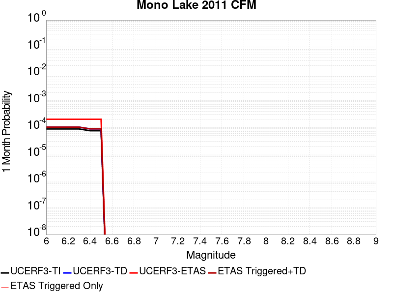 |  |  |

| Magnitude | 1 wk TI Prob | 1 wk TD Prob | 1 wk ETAS Prob | 1 wk ETAS/TD Gain | 1 wk ETAS Triggered+TD | 1 wk ETAS Triggered Only | 1 mo TI Prob | 1 mo TD Prob | 1 mo ETAS Prob | 1 mo ETAS/TD Gain | 1 mo ETAS Triggered+TD | 1 mo ETAS Triggered Only | 1 yr TI Prob | 1 yr TD Prob | 1 yr ETAS Prob | 1 yr ETAS/TD Gain | 1 yr ETAS Triggered+TD | 1 yr ETAS Triggered Only | 10 yr TI Prob | 10 yr TD Prob | 10 yr ETAS Prob | 10 yr ETAS/TD Gain | 10 yr ETAS Triggered+TD | 10 yr ETAS Triggered Only |
|-----|-----|-----|-----|-----|-----|-----|-----|-----|-----|-----|-----|-----|-----|-----|-----|-----|-----|-----|-----|-----|-----|-----|-----|-----|
| 6.0 | 2.0341662E-5 | 2.3785644E-5 | 0.0 | 0.0 | 2.3785644E-5 | 0.0 | 8.717564E-5 | 1.01937476E-4 | 2.0E-4 | 1.9619869 | 1.01937476E-4 | 0.0 | 0.0010608466 | 0.0012409115 | 7.0E-4 | 0.56410146 | 0.0012409115 | 0.0 | 0.010557966 | 0.012391717 | 0.0075 | 0.605243 | 0.014959498 | 0.0026 |
| 6.1 | 2.0341662E-5 | 2.3785644E-5 | 0.0 | 0.0 | 2.3785644E-5 | 0.0 | 8.717564E-5 | 1.01937476E-4 | 2.0E-4 | 1.9619869 | 1.01937476E-4 | 0.0 | 0.0010608466 | 0.0012409115 | 7.0E-4 | 0.56410146 | 0.0012409115 | 0.0 | 0.010557966 | 0.012391717 | 0.0075 | 0.605243 | 0.014959498 | 0.0026 |
| 6.2 | 2.0341662E-5 | 2.3785644E-5 | 0.0 | 0.0 | 2.3785644E-5 | 0.0 | 8.717564E-5 | 1.01937476E-4 | 2.0E-4 | 1.9619869 | 1.01937476E-4 | 0.0 | 0.0010608466 | 0.0012409115 | 7.0E-4 | 0.56410146 | 0.0012409115 | 0.0 | 0.010557966 | 0.012391717 | 0.0075 | 0.605243 | 0.014959498 | 0.0026 |
| 6.3 | 2.0341662E-5 | 2.3785644E-5 | 0.0 | 0.0 | 2.3785644E-5 | 0.0 | 8.717564E-5 | 1.01937476E-4 | 2.0E-4 | 1.9619869 | 1.01937476E-4 | 0.0 | 0.0010608466 | 0.0012409115 | 7.0E-4 | 0.56410146 | 0.0012409115 | 0.0 | 0.010557966 | 0.012391717 | 0.0075 | 0.605243 | 0.014959498 | 0.0026 |
| 6.4 | 1.749821E-5 | 2.04545E-5 | 0.0 | 0.0 | 2.04545E-5 | 0.0 | 7.499018E-5 | 8.766214E-5 | 2.0E-4 | 2.2814865 | 8.766214E-5 | 0.0 | 9.1262296E-4 | 0.0010672864 | 7.0E-4 | 0.65586895 | 0.0010672864 | 0.0 | 0.009088841 | 0.010672825 | 0.0063 | 0.59028417 | 0.012750412 | 0.0021 |
| 6.5 | 1.749821E-5 | 2.04545E-5 | 0.0 | 0.0 | 2.04545E-5 | 0.0 | 7.499018E-5 | 8.766214E-5 | 2.0E-4 | 2.2814865 | 8.766214E-5 | 0.0 | 9.1262296E-4 | 0.0010672864 | 7.0E-4 | 0.65586895 | 0.0010672864 | 0.0 | 0.009088841 | 0.010672825 | 0.0063 | 0.59028417 | 0.012750412 | 0.0021 |

## Robinson Creek
*[(top)](#table-of-contents)*

| 1 Week | 1 Month | 1 Year | 10 Year |
|-----|-----|-----|-----|
|  |  | 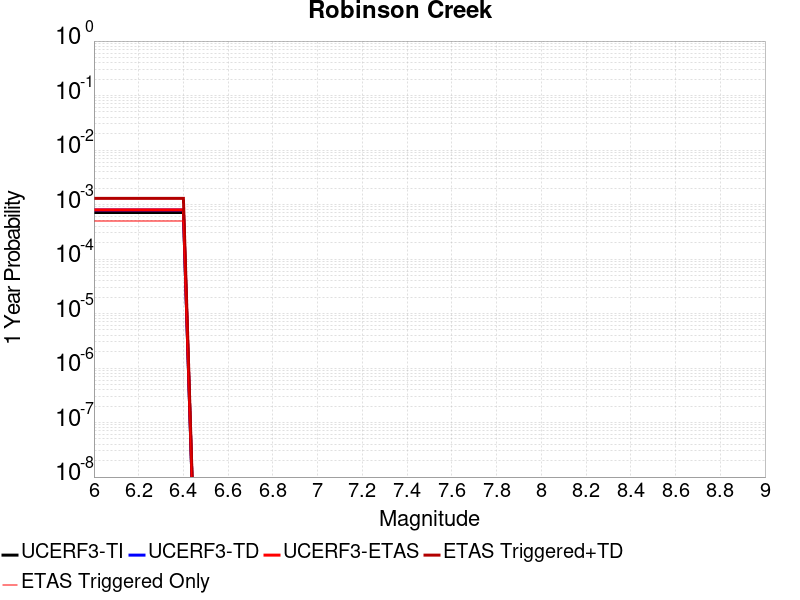 |  |

| Magnitude | 1 wk TI Prob | 1 wk TD Prob | 1 wk ETAS Prob | 1 wk ETAS/TD Gain | 1 wk ETAS Triggered+TD | 1 wk ETAS Triggered Only | 1 mo TI Prob | 1 mo TD Prob | 1 mo ETAS Prob | 1 mo ETAS/TD Gain | 1 mo ETAS Triggered+TD | 1 mo ETAS Triggered Only | 1 yr TI Prob | 1 yr TD Prob | 1 yr ETAS Prob | 1 yr ETAS/TD Gain | 1 yr ETAS Triggered+TD | 1 yr ETAS Triggered Only | 10 yr TI Prob | 10 yr TD Prob | 10 yr ETAS Prob | 10 yr ETAS/TD Gain | 10 yr ETAS Triggered+TD | 10 yr ETAS Triggered Only |
|-----|-----|-----|-----|-----|-----|-----|-----|-----|-----|-----|-----|-----|-----|-----|-----|-----|-----|-----|-----|-----|-----|-----|-----|-----|
| 6.0 | 1.3705327E-5 | 1.526664E-5 | 0.0 | 0.0 | 1.526664E-5 | 0.0 | 5.8735794E-5 | 6.542846E-5 | 1.0E-4 | 1.5283868 | 1.6542192E-4 | 1.0E-4 | 7.1487366E-4 | 7.965915E-4 | 8.0E-4 | 1.0042789 | 0.0012961932 | 5.0E-4 | 0.0071257832 | 0.007965915 | 0.0065 | 0.81597656 | 0.010446 | 0.0025 |
| 6.1 | 1.3705327E-5 | 1.526664E-5 | 0.0 | 0.0 | 1.526664E-5 | 0.0 | 5.8735794E-5 | 6.542846E-5 | 1.0E-4 | 1.5283868 | 1.6542192E-4 | 1.0E-4 | 7.1487366E-4 | 7.965915E-4 | 8.0E-4 | 1.0042789 | 0.0012961932 | 5.0E-4 | 0.0071257832 | 0.007965915 | 0.0065 | 0.81597656 | 0.010446 | 0.0025 |
| 6.2 | 1.3705327E-5 | 1.526664E-5 | 0.0 | 0.0 | 1.526664E-5 | 0.0 | 5.8735794E-5 | 6.542846E-5 | 1.0E-4 | 1.5283868 | 1.6542192E-4 | 1.0E-4 | 7.1487366E-4 | 7.965915E-4 | 8.0E-4 | 1.0042789 | 0.0012961932 | 5.0E-4 | 0.0071257832 | 0.007965915 | 0.0065 | 0.81597656 | 0.010446 | 0.0025 |
| 6.3 | 1.3705327E-5 | 1.526664E-5 | 0.0 | 0.0 | 1.526664E-5 | 0.0 | 5.8735794E-5 | 6.542846E-5 | 1.0E-4 | 1.5283868 | 1.6542192E-4 | 1.0E-4 | 7.1487366E-4 | 7.965915E-4 | 8.0E-4 | 1.0042789 | 0.0012961932 | 5.0E-4 | 0.0071257832 | 0.007965915 | 0.0065 | 0.81597656 | 0.010446 | 0.0025 |
| 6.4 | 1.3705327E-5 | 1.526664E-5 | 0.0 | 0.0 | 1.526664E-5 | 0.0 | 5.8735794E-5 | 6.542846E-5 | 1.0E-4 | 1.5283868 | 1.6542192E-4 | 1.0E-4 | 7.1487366E-4 | 7.965915E-4 | 8.0E-4 | 1.0042789 | 0.0012961932 | 5.0E-4 | 0.0071257832 | 0.007965915 | 0.0065 | 0.81597656 | 0.010446 | 0.0025 |

## San Cayetano
*[(top)](#table-of-contents)*

| 1 Week | 1 Month | 1 Year | 10 Year |
|-----|-----|-----|-----|
|  |  |  | 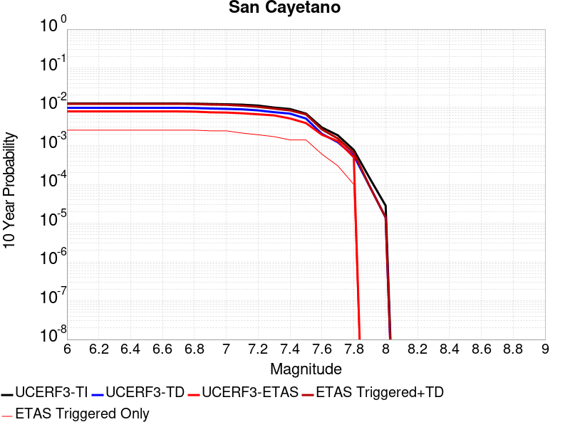 |

| Magnitude | 1 wk TI Prob | 1 wk TD Prob | 1 wk ETAS Prob | 1 wk ETAS/TD Gain | 1 wk ETAS Triggered+TD | 1 wk ETAS Triggered Only | 1 mo TI Prob | 1 mo TD Prob | 1 mo ETAS Prob | 1 mo ETAS/TD Gain | 1 mo ETAS Triggered+TD | 1 mo ETAS Triggered Only | 1 yr TI Prob | 1 yr TD Prob | 1 yr ETAS Prob | 1 yr ETAS/TD Gain | 1 yr ETAS Triggered+TD | 1 yr ETAS Triggered Only | 10 yr TI Prob | 10 yr TD Prob | 10 yr ETAS Prob | 10 yr ETAS/TD Gain | 10 yr ETAS Triggered+TD | 10 yr ETAS Triggered Only |
|-----|-----|-----|-----|-----|-----|-----|-----|-----|-----|-----|-----|-----|-----|-----|-----|-----|-----|-----|-----|-----|-----|-----|-----|-----|
| 6.0 | 2.3476267E-5 | 1.8131892E-5 | 0.0 | 0.0 | 1.8131892E-5 | 0.0 | 1.0060869E-4 | 7.7705816E-5 | 0.0 | 0.0 | 7.7705816E-5 | 0.0 | 0.0012242225 | 9.4566133E-4 | 8.0E-4 | 0.84596884 | 0.0010455668 | 1.0E-4 | 0.012175002 | 0.0094169695 | 0.0076 | 0.8070537 | 0.011893428 | 0.0025 |
| 6.1 | 2.3476267E-5 | 1.8131892E-5 | 0.0 | 0.0 | 1.8131892E-5 | 0.0 | 1.0060869E-4 | 7.7705816E-5 | 0.0 | 0.0 | 7.7705816E-5 | 0.0 | 0.0012242225 | 9.4566133E-4 | 8.0E-4 | 0.84596884 | 0.0010455668 | 1.0E-4 | 0.012175002 | 0.0094169695 | 0.0076 | 0.8070537 | 0.011893428 | 0.0025 |
| 6.2 | 2.3476267E-5 | 1.8131892E-5 | 0.0 | 0.0 | 1.8131892E-5 | 0.0 | 1.0060869E-4 | 7.7705816E-5 | 0.0 | 0.0 | 7.7705816E-5 | 0.0 | 0.0012242225 | 9.4566133E-4 | 8.0E-4 | 0.84596884 | 0.0010455668 | 1.0E-4 | 0.012175002 | 0.0094169695 | 0.0076 | 0.8070537 | 0.011893428 | 0.0025 |
| 6.3 | 2.3476267E-5 | 1.8131892E-5 | 0.0 | 0.0 | 1.8131892E-5 | 0.0 | 1.0060869E-4 | 7.7705816E-5 | 0.0 | 0.0 | 7.7705816E-5 | 0.0 | 0.0012242225 | 9.4566133E-4 | 8.0E-4 | 0.84596884 | 0.0010455668 | 1.0E-4 | 0.012175002 | 0.0094169695 | 0.0076 | 0.8070537 | 0.011893428 | 0.0025 |
| 6.4 | 2.3476267E-5 | 1.8131892E-5 | 0.0 | 0.0 | 1.8131892E-5 | 0.0 | 1.0060869E-4 | 7.7705816E-5 | 0.0 | 0.0 | 7.7705816E-5 | 0.0 | 0.0012242225 | 9.4566133E-4 | 8.0E-4 | 0.84596884 | 0.0010455668 | 1.0E-4 | 0.012175002 | 0.0094169695 | 0.0076 | 0.8070537 | 0.011893428 | 0.0025 |
| 6.5 | 2.3476267E-5 | 1.8131892E-5 | 0.0 | 0.0 | 1.8131892E-5 | 0.0 | 1.0060869E-4 | 7.7705816E-5 | 0.0 | 0.0 | 7.7705816E-5 | 0.0 | 0.0012242225 | 9.4566133E-4 | 8.0E-4 | 0.84596884 | 0.0010455668 | 1.0E-4 | 0.012175002 | 0.0094169695 | 0.0076 | 0.8070537 | 0.011893428 | 0.0025 |
| 6.6 | 2.3476267E-5 | 1.8131892E-5 | 0.0 | 0.0 | 1.8131892E-5 | 0.0 | 1.0060869E-4 | 7.7705816E-5 | 0.0 | 0.0 | 7.7705816E-5 | 0.0 | 0.0012242225 | 9.4566133E-4 | 8.0E-4 | 0.84596884 | 0.0010455668 | 1.0E-4 | 0.012175002 | 0.0094169695 | 0.0076 | 0.8070537 | 0.011893428 | 0.0025 |
| 6.7 | 2.3476267E-5 | 1.8131892E-5 | 0.0 | 0.0 | 1.8131892E-5 | 0.0 | 1.0060869E-4 | 7.7705816E-5 | 0.0 | 0.0 | 7.7705816E-5 | 0.0 | 0.0012242225 | 9.4566133E-4 | 8.0E-4 | 0.84596884 | 0.0010455668 | 1.0E-4 | 0.012175002 | 0.0094169695 | 0.0076 | 0.8070537 | 0.011893428 | 0.0025 |
| 6.8 | 2.3241924E-5 | 1.790014E-5 | 0.0 | 0.0 | 1.790014E-5 | 0.0 | 9.960445E-5 | 7.671265E-5 | 0.0 | 0.0 | 7.671265E-5 | 0.0 | 0.0012120095 | 9.3357987E-4 | 8.0E-4 | 0.8569165 | 0.0010334866 | 1.0E-4 | 0.012054204 | 0.009297104 | 0.0075 | 0.80670285 | 0.011773861 | 0.0025 |
| 6.9 | 2.2761007E-5 | 1.7396622E-5 | 0.0 | 0.0 | 1.7396622E-5 | 0.0 | 9.7543525E-5 | 7.455484E-5 | 0.0 | 0.0 | 7.455484E-5 | 0.0 | 0.0011869454 | 9.0733054E-4 | 7.0E-4 | 0.7714939 | 0.0010072398 | 1.0E-4 | 0.011806256 | 0.009036761 | 0.0072 | 0.7967457 | 0.011415072 | 0.0024 |
| 7.0 | 2.240283E-5 | 1.7030885E-5 | 0.0 | 0.0 | 1.7030885E-5 | 0.0 | 9.600859E-5 | 7.298748E-5 | 0.0 | 0.0 | 7.298748E-5 | 0.0 | 0.0011682777 | 8.882637E-4 | 7.0E-4 | 0.7880542 | 9.881749E-4 | 1.0E-4 | 0.011621549 | 0.008847616 | 0.0071 | 0.8024761 | 0.011226381 | 0.0024 |
| 7.1 | 2.1871154E-5 | 1.6551548E-5 | 0.0 | 0.0 | 1.6551548E-5 | 0.0 | 9.373015E-5 | 7.0933296E-5 | 0.0 | 0.0 | 7.0933296E-5 | 0.0 | 0.0011405671 | 8.6327404E-4 | 7.0E-4 | 0.8108665 | 9.631877E-4 | 1.0E-4 | 0.011347309 | 0.008599675 | 0.0068 | 0.7907275 | 0.010681616 | 0.0021 |
| 7.2 | 2.0714133E-5 | 1.5531956E-5 | 0.0 | 0.0 | 1.5531956E-5 | 0.0 | 8.8771834E-5 | 6.656384E-5 | 0.0 | 0.0 | 6.656384E-5 | 0.0 | 0.0010802611 | 8.101167E-4 | 7.0E-4 | 0.86407304 | 9.100357E-4 | 1.0E-4 | 0.010750249 | 0.008072077 | 0.0064 | 0.79285663 | 0.00995674 | 0.0019 |
| 7.3 | 1.8408395E-5 | 1.3967973E-5 | 0.0 | 0.0 | 1.3967973E-5 | 0.0 | 7.8890735E-5 | 5.9861388E-5 | 0.0 | 0.0 | 5.9861388E-5 | 0.0 | 9.600714E-4 | 7.285717E-4 | 7.0E-4 | 0.960784 | 8.284988E-4 | 1.0E-4 | 0.009559342 | 0.00726221 | 0.006 | 0.8261948 | 0.008949864 | 0.0017 |
| 7.4 | 1.6856795E-5 | 1.2823682E-5 | 0.0 | 0.0 | 1.2823682E-5 | 0.0 | 7.2241404E-5 | 5.4957494E-5 | 0.0 | 0.0 | 5.4957494E-5 | 0.0 | 8.7918417E-4 | 6.689049E-4 | 5.0E-4 | 0.7474904 | 7.6883804E-4 | 1.0E-4 | 0.00875714 | 0.0066692415 | 0.005 | 0.74971044 | 0.008059905 | 0.0014 |
| 7.5 | 1.2822778E-5 | 9.558564E-6 | 0.0 | 0.0 | 9.558564E-6 | 0.0 | 5.495361E-5 | 4.0964638E-5 | 0.0 | 0.0 | 4.0964638E-5 | 0.0 | 6.688548E-4 | 4.986319E-4 | 2.0E-4 | 0.40109745 | 5.985821E-4 | 1.0E-4 | 0.006668452 | 0.004975195 | 0.0038 | 0.7637892 | 0.0063682296 | 0.0014 |
| 7.6 | 5.6272684E-6 | 3.8443663E-6 | 0.0 | 0.0 | 3.8443663E-6 | 0.0 | 2.4116642E-5 | 1.6475751E-5 | 0.0 | 0.0 | 1.6475751E-5 | 0.0 | 2.9358055E-4 | 2.0057391E-4 | 0.0 | 0.0 | 2.0057391E-4 | 0.0 | 0.0029319301 | 0.0020039396 | 0.0019 | 0.94813234 | 0.0026027372 | 6.0E-4 |
| 7.7 | 3.5261346E-6 | 2.3333537E-6 | 0.0 | 0.0 | 2.3333537E-6 | 0.0 | 1.5111918E-5 | 1.0000049E-5 | 0.0 | 0.0 | 1.0000049E-5 | 0.0 | 1.8397206E-4 | 1.2174387E-4 | 0.0 | 0.0 | 1.2174387E-4 | 0.0 | 0.0018381984 | 0.001216779 | 0.0013 | 1.0683945 | 0.001516414 | 3.0E-4 |
| 7.8 | 1.4826929E-6 | 1.0538357E-6 | 0.0 | 0.0 | 1.0538357E-6 | 0.0 | 6.354383E-6 | 4.516431E-6 | 0.0 | 0.0 | 4.516431E-6 | 0.0 | 7.736187E-5 | 5.498618E-5 | 0.0 | 0.0 | 5.498618E-5 | 0.0 | 7.733494E-4 | 5.4972776E-4 | 5.0E-4 | 0.90954113 | 6.496728E-4 | 1.0E-4 |
| 7.9 | 2.7568166E-7 | 1.6932414E-7 | 0.0 | 0.0 | 1.6932414E-7 | 0.0 | 1.1814923E-6 | 7.256747E-7 | 0.0 | 0.0 | 7.256747E-7 | 0.0 | 1.4384574E-5 | 8.835053E-6 | 0.0 | 0.0 | 8.835053E-6 | 0.0 | 1.4383643E-4 | 8.834706E-5 | 0.0 | 0.0 | 8.834706E-5 | 0.0 |
| 8.0 | 5.407832E-8 | 2.6720056E-8 | 0.0 | 0.0 | 2.6720056E-8 | 0.0 | 2.3176422E-7 | 1.1451452E-7 | 0.0 | 0.0 | 1.1451452E-7 | 0.0 | 2.8217257E-6 | 1.3942134E-6 | 0.0 | 0.0 | 1.3942134E-6 | 0.0 | 2.8216898E-5 | 1.3942051E-5 | 0.0 | 0.0 | 1.3942051E-5 | 0.0 |

## Great Valley 08 (Quinto)
*[(top)](#table-of-contents)*

| 1 Week | 1 Month | 1 Year | 10 Year |
|-----|-----|-----|-----|
| 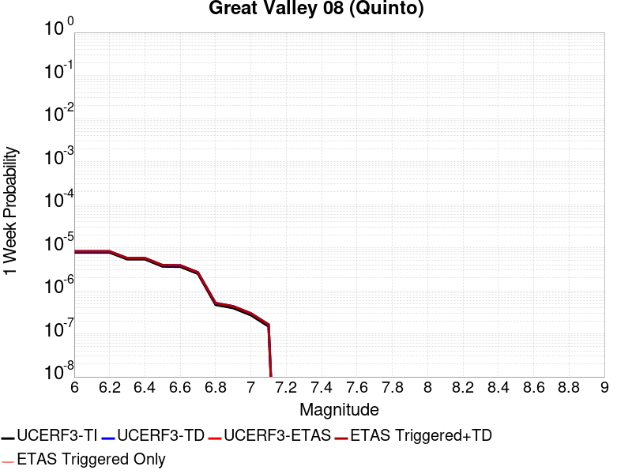 |  |  |  |

| Magnitude | 1 wk TI Prob | 1 wk TD Prob | 1 wk ETAS Prob | 1 wk ETAS/TD Gain | 1 wk ETAS Triggered+TD | 1 wk ETAS Triggered Only | 1 mo TI Prob | 1 mo TD Prob | 1 mo ETAS Prob | 1 mo ETAS/TD Gain | 1 mo ETAS Triggered+TD | 1 mo ETAS Triggered Only | 1 yr TI Prob | 1 yr TD Prob | 1 yr ETAS Prob | 1 yr ETAS/TD Gain | 1 yr ETAS Triggered+TD | 1 yr ETAS Triggered Only | 10 yr TI Prob | 10 yr TD Prob | 10 yr ETAS Prob | 10 yr ETAS/TD Gain | 10 yr ETAS Triggered+TD | 10 yr ETAS Triggered Only |
|-----|-----|-----|-----|-----|-----|-----|-----|-----|-----|-----|-----|-----|-----|-----|-----|-----|-----|-----|-----|-----|-----|-----|-----|-----|
| 6.0 | 7.737697E-6 | 8.247288E-6 | 0.0 | 0.0 | 8.247288E-6 | 0.0 | 3.3161137E-5 | 3.5345147E-5 | 0.0 | 0.0 | 3.5345147E-5 | 0.0 | 4.0366207E-4 | 4.3026102E-4 | 4.0E-4 | 0.92966825 | 6.30175E-4 | 2.0E-4 | 0.004029296 | 0.0042961305 | 0.0074 | 1.7224803 | 0.0066858195 | 0.0024 |
| 6.1 | 7.737697E-6 | 8.247288E-6 | 0.0 | 0.0 | 8.247288E-6 | 0.0 | 3.3161137E-5 | 3.5345147E-5 | 0.0 | 0.0 | 3.5345147E-5 | 0.0 | 4.0366207E-4 | 4.3026102E-4 | 4.0E-4 | 0.92966825 | 6.30175E-4 | 2.0E-4 | 0.004029296 | 0.0042961305 | 0.0074 | 1.7224803 | 0.0066858195 | 0.0024 |
| 6.2 | 7.737697E-6 | 8.247288E-6 | 0.0 | 0.0 | 8.247288E-6 | 0.0 | 3.3161137E-5 | 3.5345147E-5 | 0.0 | 0.0 | 3.5345147E-5 | 0.0 | 4.0366207E-4 | 4.3026102E-4 | 4.0E-4 | 0.92966825 | 6.30175E-4 | 2.0E-4 | 0.004029296 | 0.0042961305 | 0.0074 | 1.7224803 | 0.0066858195 | 0.0024 |
| 6.3 | 5.374012E-6 | 5.7463567E-6 | 0.0 | 0.0 | 5.7463567E-6 | 0.0 | 2.3031276E-5 | 2.4627074E-5 | 0.0 | 0.0 | 2.4627074E-5 | 0.0 | 2.803697E-4 | 2.998045E-4 | 1.0E-4 | 0.33355072 | 3.997745E-4 | 1.0E-4 | 0.0028001624 | 0.002995092 | 0.0041 | 1.3689061 | 0.004191498 | 0.0012 |
| 6.4 | 5.374012E-6 | 5.7463567E-6 | 0.0 | 0.0 | 5.7463567E-6 | 0.0 | 2.3031276E-5 | 2.4627074E-5 | 0.0 | 0.0 | 2.4627074E-5 | 0.0 | 2.803697E-4 | 2.998045E-4 | 1.0E-4 | 0.33355072 | 3.997745E-4 | 1.0E-4 | 0.0028001624 | 0.002995092 | 0.0041 | 1.3689061 | 0.004191498 | 0.0012 |
| 6.5 | 3.65427E-6 | 3.93809E-6 | 0.0 | 0.0 | 3.93809E-6 | 0.0 | 1.5661062E-5 | 1.6877457E-5 | 0.0 | 0.0 | 1.6877457E-5 | 0.0 | 1.9065675E-4 | 2.0547071E-4 | 0.0 | 0.0 | 2.0547071E-4 | 0.0 | 0.0019049325 | 0.002053498 | 0.0024 | 1.1687374 | 0.0027520605 | 7.0E-4 |
| 6.6 | 3.6143538E-6 | 3.895309E-6 | 0.0 | 0.0 | 3.895309E-6 | 0.0 | 1.5489995E-5 | 1.6694114E-5 | 0.0 | 0.0 | 1.6694114E-5 | 0.0 | 1.8857437E-4 | 2.0323892E-4 | 0.0 | 0.0 | 2.0323892E-4 | 0.0 | 0.0018841444 | 0.0020312208 | 0.0021 | 1.033861 | 0.002630002 | 6.0E-4 |
| 6.7 | 2.4821015E-6 | 2.6834055E-6 | 0.0 | 0.0 | 2.6834055E-6 | 0.0 | 1.0637535E-5 | 1.150029E-5 | 0.0 | 0.0 | 1.150029E-5 | 0.0 | 1.2950429E-4 | 1.400127E-4 | 0.0 | 0.0 | 1.400127E-4 | 0.0 | 0.0012942884 | 0.0013997988 | 0.0016 | 1.1430215 | 0.0019989589 | 6.0E-4 |
| 6.8 | 4.7110538E-7 | 5.187477E-7 | 0.0 | 0.0 | 5.187477E-7 | 0.0 | 2.0190216E-6 | 2.2232025E-6 | 0.0 | 0.0 | 2.2232025E-6 | 0.0 | 2.458131E-5 | 2.7067174E-5 | 0.0 | 0.0 | 2.7067174E-5 | 0.0 | 2.457859E-4 | 2.7064056E-4 | 2.0E-4 | 0.7389875 | 3.706135E-4 | 1.0E-4 |
| 6.9 | 3.958685E-7 | 4.3656033E-7 | 0.0 | 0.0 | 4.3656033E-7 | 0.0 | 1.6965782E-6 | 1.8709716E-6 | 0.0 | 0.0 | 1.8709716E-6 | 0.0 | 2.0655643E-5 | 2.2778857E-5 | 0.0 | 0.0 | 2.2778857E-5 | 0.0 | 2.0653724E-4 | 2.2776684E-4 | 2.0E-4 | 0.878091 | 3.2774406E-4 | 1.0E-4 |
| 7.0 | 2.70294E-7 | 2.9886627E-7 | 0.0 | 0.0 | 2.9886627E-7 | 0.0 | 1.1584025E-6 | 1.2808549E-6 | 0.0 | 0.0 | 1.2808549E-6 | 0.0 | 1.4103458E-5 | 1.559431E-5 | 0.0 | 0.0 | 1.559431E-5 | 0.0 | 1.4102564E-4 | 1.5593343E-4 | 1.0E-4 | 0.64129925 | 1.5593343E-4 | 0.0 |
| 7.1 | 1.4828602E-7 | 1.6450103E-7 | 0.0 | 0.0 | 1.6450103E-7 | 0.0 | 6.3551136E-7 | 7.0500425E-7 | 0.0 | 0.0 | 7.0500425E-7 | 0.0 | 7.737323E-6 | 8.583402E-6 | 0.0 | 0.0 | 8.583402E-6 | 0.0 | 7.737054E-5 | 8.5831496E-5 | 1.0E-4 | 1.1650735 | 8.5831496E-5 | 0.0 |

## Earthquake Valley (So Extension)
*[(top)](#table-of-contents)*

| 1 Week | 1 Month | 1 Year | 10 Year |
|-----|-----|-----|-----|
|  | 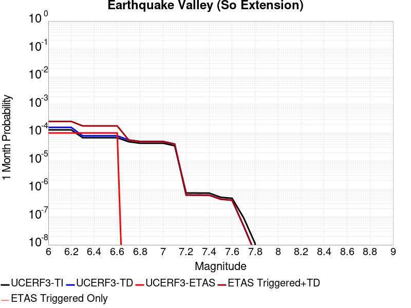 |  |  |

| Magnitude | 1 wk TI Prob | 1 wk TD Prob | 1 wk ETAS Prob | 1 wk ETAS/TD Gain | 1 wk ETAS Triggered+TD | 1 wk ETAS Triggered Only | 1 mo TI Prob | 1 mo TD Prob | 1 mo ETAS Prob | 1 mo ETAS/TD Gain | 1 mo ETAS Triggered+TD | 1 mo ETAS Triggered Only | 1 yr TI Prob | 1 yr TD Prob | 1 yr ETAS Prob | 1 yr ETAS/TD Gain | 1 yr ETAS Triggered+TD | 1 yr ETAS Triggered Only | 10 yr TI Prob | 10 yr TD Prob | 10 yr ETAS Prob | 10 yr ETAS/TD Gain | 10 yr ETAS Triggered+TD | 10 yr ETAS Triggered Only |
|-----|-----|-----|-----|-----|-----|-----|-----|-----|-----|-----|-----|-----|-----|-----|-----|-----|-----|-----|-----|-----|-----|-----|-----|-----|
| 6.0 | 3.0194888E-5 | 3.698353E-5 | 0.0 | 0.0 | 3.698353E-5 | 0.0 | 1.2940024E-4 | 1.5849427E-4 | 1.0E-4 | 0.6309377 | 2.5847842E-4 | 1.0E-4 | 0.0015743093 | 0.0019284706 | 0.0012 | 0.6222548 | 0.0024275063 | 5.0E-4 | 0.01563203 | 0.019167658 | 0.0117 | 0.61040324 | 0.021619739 | 0.0025 |
| 6.1 | 3.0194888E-5 | 3.698353E-5 | 0.0 | 0.0 | 3.698353E-5 | 0.0 | 1.2940024E-4 | 1.5849427E-4 | 1.0E-4 | 0.6309377 | 2.5847842E-4 | 1.0E-4 | 0.0015743093 | 0.0019284706 | 0.0012 | 0.6222548 | 0.0024275063 | 5.0E-4 | 0.01563203 | 0.019167658 | 0.0117 | 0.61040324 | 0.021619739 | 0.0025 |
| 6.2 | 3.0194888E-5 | 3.698353E-5 | 0.0 | 0.0 | 3.698353E-5 | 0.0 | 1.2940024E-4 | 1.5849427E-4 | 1.0E-4 | 0.6309377 | 2.5847842E-4 | 1.0E-4 | 0.0015743093 | 0.0019284706 | 0.0012 | 0.6222548 | 0.0024275063 | 5.0E-4 | 0.01563203 | 0.019167658 | 0.0117 | 0.61040324 | 0.021619739 | 0.0025 |
| 6.3 | 1.5795305E-5 | 1.8413415E-5 | 0.0 | 0.0 | 1.8413415E-5 | 0.0 | 6.769241E-5 | 7.8912875E-5 | 1.0E-4 | 1.2672204 | 1.7890499E-4 | 1.0E-4 | 8.238434E-4 | 9.604512E-4 | 6.0E-4 | 0.6247064 | 0.001360067 | 4.0E-4 | 0.008207959 | 0.009573867 | 0.0061 | 0.6371511 | 0.010960463 | 0.0014 |
| 6.4 | 1.5795305E-5 | 1.8413415E-5 | 0.0 | 0.0 | 1.8413415E-5 | 0.0 | 6.769241E-5 | 7.8912875E-5 | 1.0E-4 | 1.2672204 | 1.7890499E-4 | 1.0E-4 | 8.238434E-4 | 9.604512E-4 | 6.0E-4 | 0.6247064 | 0.001360067 | 4.0E-4 | 0.008207959 | 0.009573867 | 0.0061 | 0.6371511 | 0.010960463 | 0.0014 |
| 6.5 | 1.5795305E-5 | 1.8413415E-5 | 0.0 | 0.0 | 1.8413415E-5 | 0.0 | 6.769241E-5 | 7.8912875E-5 | 1.0E-4 | 1.2672204 | 1.7890499E-4 | 1.0E-4 | 8.238434E-4 | 9.604512E-4 | 6.0E-4 | 0.6247064 | 0.001360067 | 4.0E-4 | 0.008207959 | 0.009573867 | 0.0061 | 0.6371511 | 0.010960463 | 0.0014 |
| 6.6 | 1.5795305E-5 | 1.8413415E-5 | 0.0 | 0.0 | 1.8413415E-5 | 0.0 | 6.769241E-5 | 7.8912875E-5 | 1.0E-4 | 1.2672204 | 1.7890499E-4 | 1.0E-4 | 8.238434E-4 | 9.604512E-4 | 6.0E-4 | 0.6247064 | 0.001360067 | 4.0E-4 | 0.008207959 | 0.009573867 | 0.0061 | 0.6371511 | 0.010960463 | 0.0014 |
| 6.7 | 1.1363076E-5 | 1.31159995E-5 | 0.0 | 0.0 | 1.31159995E-5 | 0.0 | 4.8697988E-5 | 5.6210643E-5 | 0.0 | 0.0 | 5.6210643E-5 | 0.0 | 5.927367E-4 | 6.842256E-4 | 3.0E-4 | 0.4384519 | 7.8415714E-4 | 1.0E-4 | 0.0059115817 | 0.0068286373 | 0.0046 | 0.67363364 | 0.0077224914 | 9.0E-4 |
| 6.8 | 1.0049611E-5 | 1.15748635E-5 | 0.0 | 0.0 | 1.15748635E-5 | 0.0 | 4.306905E-5 | 4.9606024E-5 | 0.0 | 0.0 | 4.9606024E-5 | 0.0 | 5.242395E-4 | 6.038589E-4 | 2.0E-4 | 0.3312032 | 6.038589E-4 | 0.0 | 0.0052300454 | 0.0060293335 | 0.0039 | 0.64683765 | 0.006725113 | 7.0E-4 |
| 6.9 | 1.0049611E-5 | 1.15748635E-5 | 0.0 | 0.0 | 1.15748635E-5 | 0.0 | 4.306905E-5 | 4.9606024E-5 | 0.0 | 0.0 | 4.9606024E-5 | 0.0 | 5.242395E-4 | 6.038589E-4 | 2.0E-4 | 0.3312032 | 6.038589E-4 | 0.0 | 0.0052300454 | 0.0060293335 | 0.0039 | 0.64683765 | 0.006725113 | 7.0E-4 |
| 7.0 | 1.0049611E-5 | 1.15748635E-5 | 0.0 | 0.0 | 1.15748635E-5 | 0.0 | 4.306905E-5 | 4.9606024E-5 | 0.0 | 0.0 | 4.9606024E-5 | 0.0 | 5.242395E-4 | 6.038589E-4 | 2.0E-4 | 0.3312032 | 6.038589E-4 | 0.0 | 0.0052300454 | 0.0060293335 | 0.0039 | 0.64683765 | 0.006725113 | 7.0E-4 |
| 7.1 | 8.140254E-6 | 9.367627E-6 | 0.0 | 0.0 | 9.367627E-6 | 0.0 | 3.4886336E-5 | 4.014673E-5 | 0.0 | 0.0 | 4.014673E-5 | 0.0 | 4.2465836E-4 | 4.8874365E-4 | 1.0E-4 | 0.20460624 | 4.8874365E-4 | 0.0 | 0.0042384774 | 0.0048832423 | 0.003 | 0.6143459 | 0.0054803123 | 6.0E-4 |
| 7.2 | 1.673835E-7 | 1.410432E-7 | 0.0 | 0.0 | 1.410432E-7 | 0.0 | 7.173577E-7 | 6.044707E-7 | 0.0 | 0.0 | 6.044707E-7 | 0.0 | 8.733795E-6 | 7.3594097E-6 | 0.0 | 0.0 | 7.3594097E-6 | 0.0 | 8.733451E-5 | 7.359201E-5 | 0.0 | 0.0 | 7.359201E-5 | 0.0 |
| 7.3 | 1.6632116E-7 | 1.4002664E-7 | 0.0 | 0.0 | 1.4002664E-7 | 0.0 | 7.1280476E-7 | 6.0011405E-7 | 0.0 | 0.0 | 6.0011405E-7 | 0.0 | 8.678364E-6 | 7.306368E-6 | 0.0 | 0.0 | 7.306368E-6 | 0.0 | 8.6780245E-5 | 7.306163E-5 | 0.0 | 0.0 | 7.306163E-5 | 0.0 |
| 7.4 | 1.6569169E-7 | 1.3947373E-7 | 0.0 | 0.0 | 1.3947373E-7 | 0.0 | 7.1010703E-7 | 5.977445E-7 | 0.0 | 0.0 | 5.977445E-7 | 0.0 | 8.645519E-6 | 7.277518E-6 | 0.0 | 0.0 | 7.277518E-6 | 0.0 | 8.645182E-5 | 7.277315E-5 | 0.0 | 0.0 | 7.277315E-5 | 0.0 |
| 7.5 | 1.1764555E-7 | 1.0053396E-7 | 0.0 | 0.0 | 1.0053396E-7 | 0.0 | 5.041951E-7 | 4.3085976E-7 | 0.0 | 0.0 | 4.3085976E-7 | 0.0 | 6.138558E-6 | 5.245707E-6 | 0.0 | 0.0 | 5.245707E-6 | 0.0 | 6.1383886E-5 | 5.2456046E-5 | 0.0 | 0.0 | 5.2456046E-5 | 0.0 |
| 7.6 | 1.07927605E-7 | 9.226856E-8 | 0.0 | 0.0 | 9.226856E-8 | 0.0 | 4.6254678E-7 | 3.9543662E-7 | 0.0 | 0.0 | 3.9543662E-7 | 0.0 | 5.6314925E-6 | 4.8144325E-6 | 0.0 | 0.0 | 4.8144325E-6 | 0.0 | 5.63135E-5 | 4.8143487E-5 | 0.0 | 0.0 | 4.8143487E-5 | 0.0 |
| 7.7 | 2.1826905E-8 | 1.11334355E-8 | 0.0 | 0.0 | 1.11334355E-8 | 0.0 | 9.3543875E-8 | 4.771472E-8 | 0.0 | 0.0 | 4.771472E-8 | 0.0 | 1.1388961E-6 | 5.809266E-7 | 0.0 | 0.0 | 5.809266E-7 | 0.0 | 1.1388902E-5 | 5.8092564E-6 | 0.0 | 0.0 | 5.8092564E-6 | 0.0 |
| 7.8 | 2.6169649E-9 | 1.1922348E-9 | 0.0 | 0.0 | 1.1922348E-9 | 0.0 | 1.1215564E-8 | 5.1095776E-9 | 0.0 | 0.0 | 5.1095776E-9 | 0.0 | 1.3654947E-7 | 6.220911E-8 | 0.0 | 0.0 | 6.220911E-8 | 0.0 | 1.365494E-6 | 6.220911E-7 | 0.0 | 0.0 | 6.220911E-7 | 0.0 |

## Hosgri
*[(top)](#table-of-contents)*

| 1 Week | 1 Month | 1 Year | 10 Year |
|-----|-----|-----|-----|
|  | 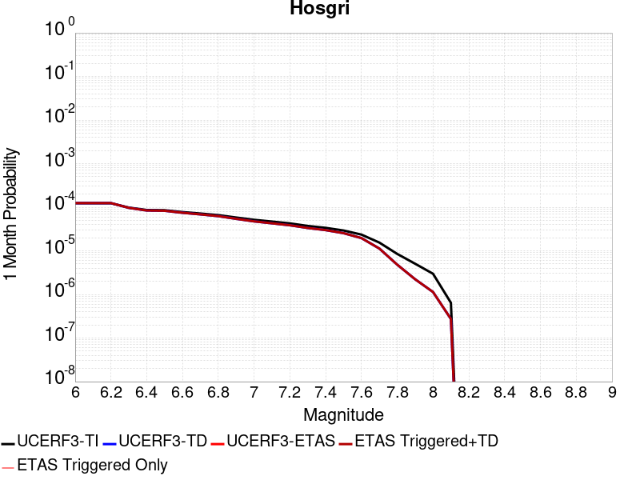 |  | 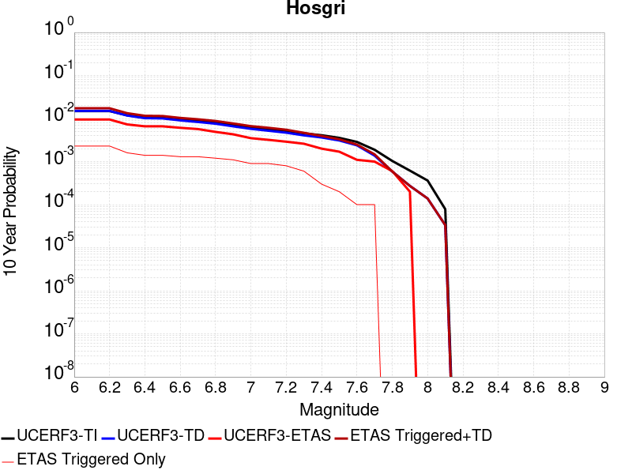 |

| Magnitude | 1 wk TI Prob | 1 wk TD Prob | 1 wk ETAS Prob | 1 wk ETAS/TD Gain | 1 wk ETAS Triggered+TD | 1 wk ETAS Triggered Only | 1 mo TI Prob | 1 mo TD Prob | 1 mo ETAS Prob | 1 mo ETAS/TD Gain | 1 mo ETAS Triggered+TD | 1 mo ETAS Triggered Only | 1 yr TI Prob | 1 yr TD Prob | 1 yr ETAS Prob | 1 yr ETAS/TD Gain | 1 yr ETAS Triggered+TD | 1 yr ETAS Triggered Only | 10 yr TI Prob | 10 yr TD Prob | 10 yr ETAS Prob | 10 yr ETAS/TD Gain | 10 yr ETAS Triggered+TD | 10 yr ETAS Triggered Only |
|-----|-----|-----|-----|-----|-----|-----|-----|-----|-----|-----|-----|-----|-----|-----|-----|-----|-----|-----|-----|-----|-----|-----|-----|-----|
| 6.0 | 2.883978E-5 | 2.9089491E-5 | 0.0 | 0.0 | 2.9089491E-5 | 0.0 | 1.235932E-4 | 1.2466345E-4 | 0.0 | 0.0 | 1.2466345E-4 | 0.0 | 0.0015037085 | 0.0015167479 | 5.0E-4 | 0.32965267 | 0.0015167479 | 0.0 | 0.01493574 | 0.015067703 | 0.0095 | 0.6304876 | 0.017333047 | 0.0023 |
| 6.1 | 2.883978E-5 | 2.9089491E-5 | 0.0 | 0.0 | 2.9089491E-5 | 0.0 | 1.235932E-4 | 1.2466345E-4 | 0.0 | 0.0 | 1.2466345E-4 | 0.0 | 0.0015037085 | 0.0015167479 | 5.0E-4 | 0.32965267 | 0.0015167479 | 0.0 | 0.01493574 | 0.015067703 | 0.0095 | 0.6304876 | 0.017333047 | 0.0023 |
| 6.2 | 2.883978E-5 | 2.9089491E-5 | 0.0 | 0.0 | 2.9089491E-5 | 0.0 | 1.235932E-4 | 1.2466345E-4 | 0.0 | 0.0 | 1.2466345E-4 | 0.0 | 0.0015037085 | 0.0015167479 | 5.0E-4 | 0.32965267 | 0.0015167479 | 0.0 | 0.01493574 | 0.015067703 | 0.0095 | 0.6304876 | 0.017333047 | 0.0023 |
| 6.3 | 2.2914428E-5 | 2.2609474E-5 | 0.0 | 0.0 | 2.2609474E-5 | 0.0 | 9.8200995E-5 | 9.6894175E-5 | 0.0 | 0.0 | 9.6894175E-5 | 0.0 | 0.0011949413 | 0.0011790531 | 5.0E-4 | 0.4240691 | 0.0011790531 | 0.0 | 0.011885363 | 0.011729349 | 0.0073 | 0.6223704 | 0.013310582 | 0.0016 |
| 6.4 | 2.0195741E-5 | 1.9666633E-5 | 0.0 | 0.0 | 1.9666633E-5 | 0.0 | 8.65503E-5 | 8.428286E-5 | 0.0 | 0.0 | 8.428286E-5 | 0.0 | 0.0010532405 | 0.0010256628 | 3.0E-4 | 0.29249382 | 0.0010256628 | 0.0 | 0.010482626 | 0.010210311 | 0.0066 | 0.6464054 | 0.011596017 | 0.0014 |
| 6.5 | 1.9924333E-5 | 1.937925E-5 | 0.0 | 0.0 | 1.937925E-5 | 0.0 | 8.53872E-5 | 8.3051294E-5 | 0.0 | 0.0 | 8.3051294E-5 | 0.0 | 0.0010390934 | 0.0010106823 | 3.0E-4 | 0.29682916 | 0.0010106823 | 0.0 | 0.010342481 | 0.010061869 | 0.0066 | 0.6559417 | 0.011447783 | 0.0014 |
| 6.6 | 1.809694E-5 | 1.7430037E-5 | 0.0 | 0.0 | 1.7430037E-5 | 0.0 | 7.7556004E-5 | 7.469802E-5 | 0.0 | 0.0 | 7.469802E-5 | 0.0 | 9.438353E-4 | 9.0907025E-4 | 3.0E-4 | 0.3300075 | 9.0907025E-4 | 0.0 | 0.009398366 | 0.009054433 | 0.0061 | 0.67370313 | 0.010342662 | 0.0013 |
| 6.7 | 1.675989E-5 | 1.6015509E-5 | 0.0 | 0.0 | 1.6015509E-5 | 0.0 | 7.182612E-5 | 6.8636095E-5 | 0.0 | 0.0 | 6.8636095E-5 | 0.0 | 8.7413215E-4 | 8.3532516E-4 | 2.0E-4 | 0.23942772 | 8.3532516E-4 | 0.0 | 0.008707017 | 0.008322733 | 0.0057 | 0.68487114 | 0.009611914 | 0.0013 |
| 6.8 | 1.5401129E-5 | 1.4587821E-5 | 0.0 | 0.0 | 1.4587821E-5 | 0.0 | 6.6003166E-5 | 6.251774E-5 | 0.0 | 0.0 | 6.251774E-5 | 0.0 | 8.032922E-4 | 7.608885E-4 | 2.0E-4 | 0.26285058 | 7.608885E-4 | 0.0 | 0.008003947 | 0.0075836712 | 0.0049 | 0.646125 | 0.008774571 | 0.0012 |
| 6.9 | 1.356559E-5 | 1.2665044E-5 | 0.0 | 0.0 | 1.2665044E-5 | 0.0 | 5.8136946E-5 | 5.4277632E-5 | 0.0 | 0.0 | 5.4277632E-5 | 0.0 | 7.0758746E-4 | 6.6063023E-4 | 2.0E-4 | 0.3027412 | 6.6063023E-4 | 0.0 | 0.007053386 | 0.006587443 | 0.0043 | 0.65275705 | 0.007680197 | 0.0011 |
| 7.0 | 1.2030819E-5 | 1.107222E-5 | 0.0 | 0.0 | 1.107222E-5 | 0.0 | 5.155963E-5 | 4.7451507E-5 | 0.0 | 0.0 | 4.7451507E-5 | 0.0 | 6.275577E-4 | 5.7756907E-4 | 2.0E-4 | 0.34627894 | 5.7756907E-4 | 0.0 | 0.006257884 | 0.0057614148 | 0.0035 | 0.60748965 | 0.0066562295 | 9.0E-4 |
| 7.1 | 1.0972698E-5 | 9.999176E-6 | 0.0 | 0.0 | 9.999176E-6 | 0.0 | 4.7025E-5 | 4.2852906E-5 | 0.0 | 0.0 | 4.2852906E-5 | 0.0 | 5.72379E-4 | 5.216093E-4 | 2.0E-4 | 0.38342875 | 5.216093E-4 | 0.0 | 0.0057090693 | 0.005204576 | 0.0032 | 0.61484355 | 0.0060998923 | 9.0E-4 |
| 7.2 | 9.961926E-6 | 9.012315E-6 | 0.0 | 0.0 | 9.012315E-6 | 0.0 | 4.2693267E-5 | 3.8623635E-5 | 0.0 | 0.0 | 3.8623635E-5 | 0.0 | 5.1966653E-4 | 4.7014136E-4 | 2.0E-4 | 0.42540395 | 4.7014136E-4 | 0.0 | 0.00518453 | 0.004692188 | 0.0029 | 0.61804855 | 0.0054884343 | 8.0E-4 |
| 7.3 | 8.700929E-6 | 7.806577E-6 | 0.0 | 0.0 | 7.806577E-6 | 0.0 | 3.7289166E-5 | 3.345633E-5 | 0.0 | 0.0 | 3.345633E-5 | 0.0 | 4.53901E-4 | 4.072547E-4 | 2.0E-4 | 0.49109316 | 4.072547E-4 | 0.0 | 0.00452975 | 0.0040657977 | 0.0026 | 0.63948095 | 0.004663358 | 6.0E-4 |
| 7.4 | 7.866285E-6 | 6.9776875E-6 | 0.0 | 0.0 | 6.9776875E-6 | 0.0 | 3.3712215E-5 | 2.9904033E-5 | 0.0 | 0.0 | 2.9904033E-5 | 0.0 | 4.103689E-4 | 3.640208E-4 | 2.0E-4 | 0.54941916 | 3.640208E-4 | 0.0 | 0.004096119 | 0.0036349567 | 0.002 | 0.5502129 | 0.003933866 | 3.0E-4 |
| 7.5 | 6.8381305E-6 | 5.939309E-6 | 0.0 | 0.0 | 5.939309E-6 | 0.0 | 2.9305946E-5 | 2.5453934E-5 | 0.0 | 0.0 | 2.5453934E-5 | 0.0 | 3.5674145E-4 | 3.098576E-4 | 1.0E-4 | 0.3227289 | 3.098576E-4 | 0.0 | 0.0035616932 | 0.0030949647 | 0.0017 | 0.5492793 | 0.0032943457 | 2.0E-4 |
| 7.6 | 5.503376E-6 | 4.5757643E-6 | 0.0 | 0.0 | 4.5757643E-6 | 0.0 | 2.3585684E-5 | 1.961027E-5 | 0.0 | 0.0 | 1.961027E-5 | 0.0 | 2.8711787E-4 | 2.3872891E-4 | 1.0E-4 | 0.41888517 | 2.3872891E-4 | 0.0 | 0.002867472 | 0.0023854317 | 0.0011 | 0.46113247 | 0.002485193 | 1.0E-4 |
| 7.7 | 3.6144982E-6 | 2.635303E-6 | 0.0 | 0.0 | 2.635303E-6 | 0.0 | 1.5490614E-5 | 1.1294106E-5 | 0.0 | 0.0 | 1.1294106E-5 | 0.0 | 1.8858191E-4 | 1.3749707E-4 | 1.0E-4 | 0.7272882 | 1.3749707E-4 | 0.0 | 0.0018842196 | 0.0013748253 | 0.001 | 0.72736514 | 0.0014746878 | 1.0E-4 |
| 7.8 | 1.9853494E-6 | 1.1227929E-6 | 0.0 | 0.0 | 1.1227929E-6 | 0.0 | 8.508612E-6 | 4.811961E-6 | 0.0 | 0.0 | 4.811961E-6 | 0.0 | 1.0358743E-4 | 5.858405E-5 | 1.0E-4 | 1.7069492 | 5.858405E-5 | 0.0 | 0.0010353916 | 5.8639166E-4 | 6.0E-4 | 1.023207 | 5.8639166E-4 | 0.0 |
| 7.9 | 1.1818757E-6 | 5.193046E-7 | 0.0 | 0.0 | 5.193046E-7 | 0.0 | 5.0651715E-6 | 2.225589E-6 | 0.0 | 0.0 | 2.225589E-6 | 0.0 | 6.1666724E-5 | 2.709621E-5 | 0.0 | 0.0 | 2.709621E-5 | 0.0 | 6.1649614E-4 | 2.7159383E-4 | 2.0E-4 | 0.73639375 | 2.7159383E-4 | 0.0 |
| 8.0 | 6.962958E-7 | 2.6445565E-7 | 0.0 | 0.0 | 2.6445565E-7 | 0.0 | 2.9841215E-6 | 1.1333808E-6 | 0.0 | 0.0 | 1.1333808E-6 | 0.0 | 3.6331072E-5 | 1.3798824E-5 | 0.0 | 0.0 | 1.3798824E-5 | 0.0 | 3.6325134E-4 | 1.3854101E-4 | 0.0 | 0.0 | 1.3854101E-4 | 0.0 |
| 8.1 | 1.5033264E-7 | 6.371795E-8 | 0.0 | 0.0 | 6.371795E-8 | 0.0 | 6.442826E-7 | 2.730769E-7 | 0.0 | 0.0 | 2.730769E-7 | 0.0 | 7.844113E-6 | 3.324706E-6 | 0.0 | 0.0 | 3.324706E-6 | 0.0 | 7.843835E-5 | 3.326229E-5 | 0.0 | 0.0 | 3.326229E-5 | 0.0 |

## Little Salmon (Offshore)
*[(top)](#table-of-contents)*

| 1 Week | 1 Month | 1 Year | 10 Year |
|-----|-----|-----|-----|
| 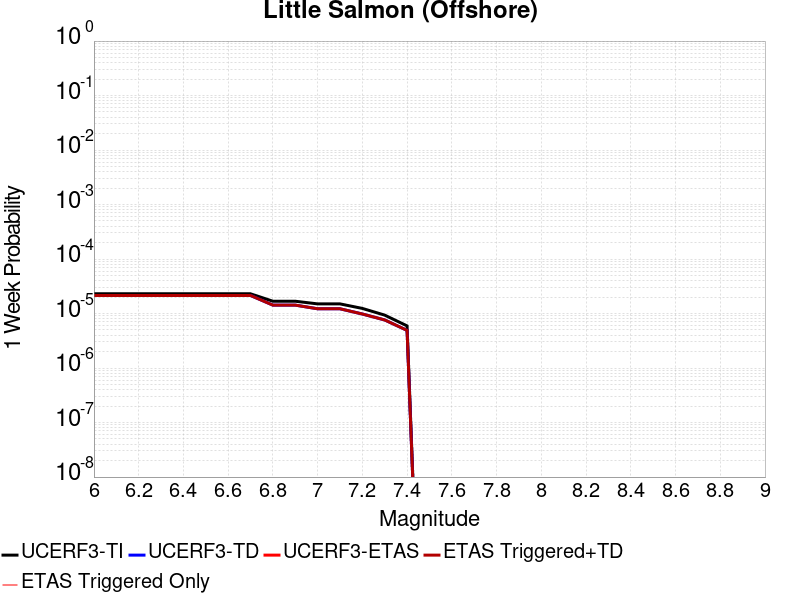 |  |  | 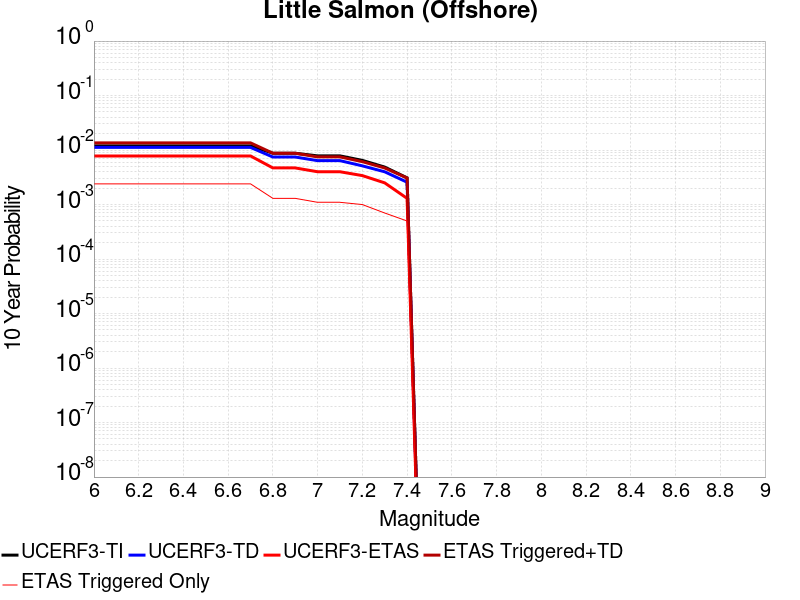 |

| Magnitude | 1 wk TI Prob | 1 wk TD Prob | 1 wk ETAS Prob | 1 wk ETAS/TD Gain | 1 wk ETAS Triggered+TD | 1 wk ETAS Triggered Only | 1 mo TI Prob | 1 mo TD Prob | 1 mo ETAS Prob | 1 mo ETAS/TD Gain | 1 mo ETAS Triggered+TD | 1 mo ETAS Triggered Only | 1 yr TI Prob | 1 yr TD Prob | 1 yr ETAS Prob | 1 yr ETAS/TD Gain | 1 yr ETAS Triggered+TD | 1 yr ETAS Triggered Only | 10 yr TI Prob | 10 yr TD Prob | 10 yr ETAS Prob | 10 yr ETAS/TD Gain | 10 yr ETAS Triggered+TD | 10 yr ETAS Triggered Only |
|-----|-----|-----|-----|-----|-----|-----|-----|-----|-----|-----|-----|-----|-----|-----|-----|-----|-----|-----|-----|-----|-----|-----|-----|-----|
| 6.0 | 2.3052053E-5 | 2.1499658E-5 | 0.0 | 0.0 | 2.1499658E-5 | 0.0 | 9.879077E-5 | 9.213878E-5 | 0.0 | 0.0 | 9.213878E-5 | 0.0 | 0.0012021139 | 0.0011213263 | 8.0E-4 | 0.71344084 | 0.0015208778 | 4.0E-4 | 0.011956319 | 0.011187837 | 0.0078 | 0.6971857 | 0.013560986 | 0.0024 |
| 6.1 | 2.3052053E-5 | 2.1499658E-5 | 0.0 | 0.0 | 2.1499658E-5 | 0.0 | 9.879077E-5 | 9.213878E-5 | 0.0 | 0.0 | 9.213878E-5 | 0.0 | 0.0012021139 | 0.0011213263 | 8.0E-4 | 0.71344084 | 0.0015208778 | 4.0E-4 | 0.011956319 | 0.011187837 | 0.0078 | 0.6971857 | 0.013560986 | 0.0024 |
| 6.2 | 2.3052053E-5 | 2.1499658E-5 | 0.0 | 0.0 | 2.1499658E-5 | 0.0 | 9.879077E-5 | 9.213878E-5 | 0.0 | 0.0 | 9.213878E-5 | 0.0 | 0.0012021139 | 0.0011213263 | 8.0E-4 | 0.71344084 | 0.0015208778 | 4.0E-4 | 0.011956319 | 0.011187837 | 0.0078 | 0.6971857 | 0.013560986 | 0.0024 |
| 6.3 | 2.3052053E-5 | 2.1499658E-5 | 0.0 | 0.0 | 2.1499658E-5 | 0.0 | 9.879077E-5 | 9.213878E-5 | 0.0 | 0.0 | 9.213878E-5 | 0.0 | 0.0012021139 | 0.0011213263 | 8.0E-4 | 0.71344084 | 0.0015208778 | 4.0E-4 | 0.011956319 | 0.011187837 | 0.0078 | 0.6971857 | 0.013560986 | 0.0024 |
| 6.4 | 2.3052053E-5 | 2.1499658E-5 | 0.0 | 0.0 | 2.1499658E-5 | 0.0 | 9.879077E-5 | 9.213878E-5 | 0.0 | 0.0 | 9.213878E-5 | 0.0 | 0.0012021139 | 0.0011213263 | 8.0E-4 | 0.71344084 | 0.0015208778 | 4.0E-4 | 0.011956319 | 0.011187837 | 0.0078 | 0.6971857 | 0.013560986 | 0.0024 |
| 6.5 | 2.3052053E-5 | 2.1499658E-5 | 0.0 | 0.0 | 2.1499658E-5 | 0.0 | 9.879077E-5 | 9.213878E-5 | 0.0 | 0.0 | 9.213878E-5 | 0.0 | 0.0012021139 | 0.0011213263 | 8.0E-4 | 0.71344084 | 0.0015208778 | 4.0E-4 | 0.011956319 | 0.011187837 | 0.0078 | 0.6971857 | 0.013560986 | 0.0024 |
| 6.6 | 2.3052053E-5 | 2.1499658E-5 | 0.0 | 0.0 | 2.1499658E-5 | 0.0 | 9.879077E-5 | 9.213878E-5 | 0.0 | 0.0 | 9.213878E-5 | 0.0 | 0.0012021139 | 0.0011213263 | 8.0E-4 | 0.71344084 | 0.0015208778 | 4.0E-4 | 0.011956319 | 0.011187837 | 0.0078 | 0.6971857 | 0.013560986 | 0.0024 |
| 6.7 | 2.3052053E-5 | 2.1499658E-5 | 0.0 | 0.0 | 2.1499658E-5 | 0.0 | 9.879077E-5 | 9.213878E-5 | 0.0 | 0.0 | 9.213878E-5 | 0.0 | 0.0012021139 | 0.0011213263 | 8.0E-4 | 0.71344084 | 0.0015208778 | 4.0E-4 | 0.011956319 | 0.011187837 | 0.0078 | 0.6971857 | 0.013560986 | 0.0024 |
| 6.8 | 1.683878E-5 | 1.4291685E-5 | 0.0 | 0.0 | 1.4291685E-5 | 0.0 | 7.21642E-5 | 6.1248924E-5 | 0.0 | 0.0 | 6.1248924E-5 | 0.0 | 8.78245E-4 | 7.455008E-4 | 4.0E-4 | 0.5365521 | 8.454262E-4 | 1.0E-4 | 0.008747822 | 0.007454923 | 0.0047 | 0.6304559 | 0.008745232 | 0.0013 |
| 6.9 | 1.683878E-5 | 1.4291685E-5 | 0.0 | 0.0 | 1.4291685E-5 | 0.0 | 7.21642E-5 | 6.1248924E-5 | 0.0 | 0.0 | 6.1248924E-5 | 0.0 | 8.78245E-4 | 7.455008E-4 | 4.0E-4 | 0.5365521 | 8.454262E-4 | 1.0E-4 | 0.008747822 | 0.007454923 | 0.0047 | 0.6304559 | 0.008745232 | 0.0013 |
| 7.0 | 1.5051273E-5 | 1.2243148E-5 | 0.0 | 0.0 | 1.2243148E-5 | 0.0 | 6.450386E-5 | 5.2469833E-5 | 0.0 | 0.0 | 5.2469833E-5 | 0.0 | 7.8505155E-4 | 6.386783E-4 | 2.0E-4 | 0.3131467 | 6.386783E-4 | 0.0 | 0.00782284 | 0.0063928757 | 0.004 | 0.6256965 | 0.0074858437 | 0.0011 |
| 7.1 | 1.5051273E-5 | 1.2243148E-5 | 0.0 | 0.0 | 1.2243148E-5 | 0.0 | 6.450386E-5 | 5.2469833E-5 | 0.0 | 0.0 | 5.2469833E-5 | 0.0 | 7.8505155E-4 | 6.386783E-4 | 2.0E-4 | 0.3131467 | 6.386783E-4 | 0.0 | 0.00782284 | 0.0063928757 | 0.004 | 0.6256965 | 0.0074858437 | 0.0011 |
| 7.2 | 1.24301405E-5 | 9.815183E-6 | 0.0 | 0.0 | 9.815183E-6 | 0.0 | 5.3270942E-5 | 4.2064614E-5 | 0.0 | 0.0 | 4.2064614E-5 | 0.0 | 6.483807E-4 | 5.120557E-4 | 2.0E-4 | 0.39058253 | 5.120557E-4 | 0.0 | 0.006464922 | 0.005132409 | 0.0034 | 0.662457 | 0.0061272765 | 0.001 |
| 7.3 | 9.3599865E-6 | 7.63674E-6 | 0.0 | 0.0 | 7.63674E-6 | 0.0 | 4.011361E-5 | 3.2728673E-5 | 0.0 | 0.0 | 3.2728673E-5 | 0.0 | 4.8827377E-4 | 3.9843383E-4 | 1.0E-4 | 0.2509827 | 3.9843383E-4 | 0.0 | 0.004872023 | 0.0039928746 | 0.0025 | 0.6261153 | 0.00469008 | 7.0E-4 |
| 7.4 | 5.941556E-6 | 4.913584E-6 | 0.0 | 0.0 | 4.913584E-6 | 0.0 | 2.5463563E-5 | 2.1058217E-5 | 0.0 | 0.0 | 2.1058217E-5 | 0.0 | 3.0997477E-4 | 2.5638376E-4 | 1.0E-4 | 0.39004028 | 2.5638376E-4 | 0.0 | 0.0030954275 | 0.0025715034 | 0.0013 | 0.50554085 | 0.0030702178 | 5.0E-4 |

## Carson Range (Genoa)
*[(top)](#table-of-contents)*

| 1 Week | 1 Month | 1 Year | 10 Year |
|-----|-----|-----|-----|
|  |  |  | 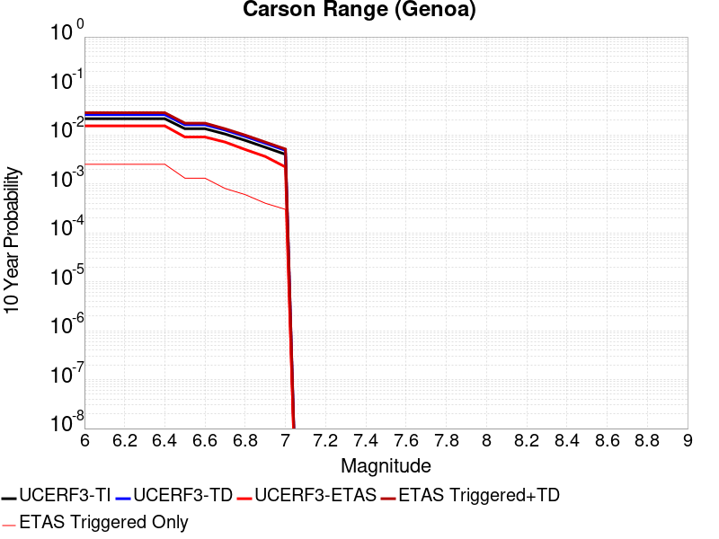 |

| Magnitude | 1 wk TI Prob | 1 wk TD Prob | 1 wk ETAS Prob | 1 wk ETAS/TD Gain | 1 wk ETAS Triggered+TD | 1 wk ETAS Triggered Only | 1 mo TI Prob | 1 mo TD Prob | 1 mo ETAS Prob | 1 mo ETAS/TD Gain | 1 mo ETAS Triggered+TD | 1 mo ETAS Triggered Only | 1 yr TI Prob | 1 yr TD Prob | 1 yr ETAS Prob | 1 yr ETAS/TD Gain | 1 yr ETAS Triggered+TD | 1 yr ETAS Triggered Only | 10 yr TI Prob | 10 yr TD Prob | 10 yr ETAS Prob | 10 yr ETAS/TD Gain | 10 yr ETAS Triggered+TD | 10 yr ETAS Triggered Only |
|-----|-----|-----|-----|-----|-----|-----|-----|-----|-----|-----|-----|-----|-----|-----|-----|-----|-----|-----|-----|-----|-----|-----|-----|-----|
| 6.0 | 4.1268457E-5 | 5.0034752E-5 | 0.0 | 0.0 | 5.0034752E-5 | 0.0 | 1.7685282E-4 | 2.1441927E-4 | 0.0 | 0.0 | 2.1441927E-4 | 0.0 | 0.0021510567 | 0.0026078215 | 0.0013 | 0.4985004 | 0.0029070391 | 3.0E-4 | 0.02130354 | 0.025811734 | 0.0152 | 0.58887947 | 0.028247204 | 0.0025 |
| 6.1 | 4.1268457E-5 | 5.0034752E-5 | 0.0 | 0.0 | 5.0034752E-5 | 0.0 | 1.7685282E-4 | 2.1441927E-4 | 0.0 | 0.0 | 2.1441927E-4 | 0.0 | 0.0021510567 | 0.0026078215 | 0.0013 | 0.4985004 | 0.0029070391 | 3.0E-4 | 0.02130354 | 0.025811734 | 0.0152 | 0.58887947 | 0.028247204 | 0.0025 |
| 6.2 | 4.1268457E-5 | 5.0034752E-5 | 0.0 | 0.0 | 5.0034752E-5 | 0.0 | 1.7685282E-4 | 2.1441927E-4 | 0.0 | 0.0 | 2.1441927E-4 | 0.0 | 0.0021510567 | 0.0026078215 | 0.0013 | 0.4985004 | 0.0029070391 | 3.0E-4 | 0.02130354 | 0.025811734 | 0.0152 | 0.58887947 | 0.028247204 | 0.0025 |
| 6.3 | 4.1268457E-5 | 5.0034752E-5 | 0.0 | 0.0 | 5.0034752E-5 | 0.0 | 1.7685282E-4 | 2.1441927E-4 | 0.0 | 0.0 | 2.1441927E-4 | 0.0 | 0.0021510567 | 0.0026078215 | 0.0013 | 0.4985004 | 0.0029070391 | 3.0E-4 | 0.02130354 | 0.025811734 | 0.0152 | 0.58887947 | 0.028247204 | 0.0025 |
| 6.4 | 4.1268457E-5 | 5.0034752E-5 | 0.0 | 0.0 | 5.0034752E-5 | 0.0 | 1.7685282E-4 | 2.1441927E-4 | 0.0 | 0.0 | 2.1441927E-4 | 0.0 | 0.0021510567 | 0.0026078215 | 0.0013 | 0.4985004 | 0.0029070391 | 3.0E-4 | 0.02130354 | 0.025811734 | 0.0152 | 0.58887947 | 0.028247204 | 0.0025 |
| 6.5 | 2.5677185E-5 | 3.091171E-5 | 0.0 | 0.0 | 3.091171E-5 | 0.0 | 1.1004044E-4 | 1.3247305E-4 | 0.0 | 0.0 | 1.3247305E-4 | 0.0 | 0.0013389189 | 0.0016118455 | 4.0E-4 | 0.24816275 | 0.0017116843 | 1.0E-4 | 0.0133088045 | 0.016019398 | 0.009 | 0.5618189 | 0.017298572 | 0.0013 |
| 6.6 | 2.5677185E-5 | 3.091171E-5 | 0.0 | 0.0 | 3.091171E-5 | 0.0 | 1.1004044E-4 | 1.3247305E-4 | 0.0 | 0.0 | 1.3247305E-4 | 0.0 | 0.0013389189 | 0.0016118455 | 4.0E-4 | 0.24816275 | 0.0017116843 | 1.0E-4 | 0.0133088045 | 0.016019398 | 0.009 | 0.5618189 | 0.017298572 | 0.0013 |
| 6.7 | 1.9969408E-5 | 2.401207E-5 | 0.0 | 0.0 | 2.401207E-5 | 0.0 | 8.558037E-5 | 1.0290567E-4 | 0.0 | 0.0 | 1.0290567E-4 | 0.0 | 0.0010414429 | 0.0012523093 | 4.0E-4 | 0.3194099 | 0.0013521841 | 1.0E-4 | 0.010365757 | 0.012467616 | 0.0071 | 0.56947535 | 0.013257642 | 8.0E-4 |
| 6.8 | 1.4783156E-5 | 1.7779463E-5 | 0.0 | 0.0 | 1.7779463E-5 | 0.0 | 6.335485E-5 | 7.61962E-5 | 0.0 | 0.0 | 7.61962E-5 | 0.0 | 7.710722E-4 | 9.2742353E-4 | 3.0E-4 | 0.3234768 | 9.2742353E-4 | 0.0 | 0.0076840227 | 0.009248264 | 0.005 | 0.54064196 | 0.009842715 | 6.0E-4 |
| 6.9 | 1.06660555E-5 | 1.2849217E-5 | 0.0 | 0.0 | 1.2849217E-5 | 0.0 | 4.5710865E-5 | 5.5067558E-5 | 0.0 | 0.0 | 5.5067558E-5 | 0.0 | 5.5638765E-4 | 6.70356E-4 | 3.0E-4 | 0.44752342 | 6.70356E-4 | 0.0 | 0.005549967 | 0.006694589 | 0.0036 | 0.53774774 | 0.0070919106 | 4.0E-4 |
| 7.0 | 7.664838E-6 | 9.238254E-6 | 0.0 | 0.0 | 9.238254E-6 | 0.0 | 3.2848893E-5 | 3.9592516E-5 | 0.0 | 0.0 | 3.9592516E-5 | 0.0 | 3.998619E-4 | 4.820389E-4 | 2.0E-4 | 0.4149043 | 4.820389E-4 | 0.0 | 0.0039914316 | 0.004820387 | 0.0022 | 0.4563949 | 0.005118941 | 3.0E-4 |

## Newport-Inglewood alt 1
*[(top)](#table-of-contents)*

| 1 Week | 1 Month | 1 Year | 10 Year |
|-----|-----|-----|-----|
|  | 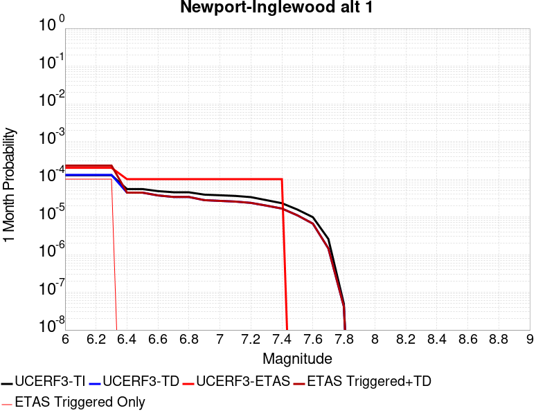 |  | 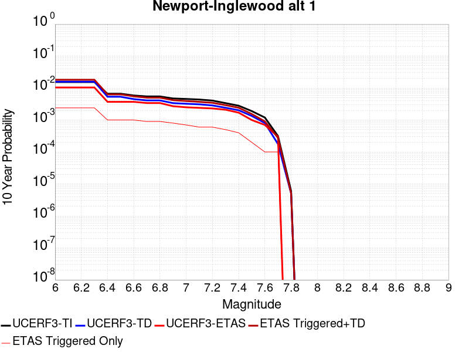 |

| Magnitude | 1 wk TI Prob | 1 wk TD Prob | 1 wk ETAS Prob | 1 wk ETAS/TD Gain | 1 wk ETAS Triggered+TD | 1 wk ETAS Triggered Only | 1 mo TI Prob | 1 mo TD Prob | 1 mo ETAS Prob | 1 mo ETAS/TD Gain | 1 mo ETAS Triggered+TD | 1 mo ETAS Triggered Only | 1 yr TI Prob | 1 yr TD Prob | 1 yr ETAS Prob | 1 yr ETAS/TD Gain | 1 yr ETAS Triggered+TD | 1 yr ETAS Triggered Only | 10 yr TI Prob | 10 yr TD Prob | 10 yr ETAS Prob | 10 yr ETAS/TD Gain | 10 yr ETAS Triggered+TD | 10 yr ETAS Triggered Only |
|-----|-----|-----|-----|-----|-----|-----|-----|-----|-----|-----|-----|-----|-----|-----|-----|-----|-----|-----|-----|-----|-----|-----|-----|-----|
| 6.0 | 2.9668912E-5 | 3.0343075E-5 | 0.0 | 0.0 | 3.0343075E-5 | 0.0 | 1.2714628E-4 | 1.30038E-4 | 2.0E-4 | 1.538012 | 2.3002499E-4 | 1.0E-4 | 0.0015469068 | 0.0015825456 | 5.0E-4 | 0.31594667 | 0.001782229 | 2.0E-4 | 0.015361829 | 0.015760189 | 0.0104 | 0.6598906 | 0.018122364 | 0.0024 |
| 6.1 | 2.9668912E-5 | 3.0343075E-5 | 0.0 | 0.0 | 3.0343075E-5 | 0.0 | 1.2714628E-4 | 1.30038E-4 | 2.0E-4 | 1.538012 | 2.3002499E-4 | 1.0E-4 | 0.0015469068 | 0.0015825456 | 5.0E-4 | 0.31594667 | 0.001782229 | 2.0E-4 | 0.015361829 | 0.015760189 | 0.0104 | 0.6598906 | 0.018122364 | 0.0024 |
| 6.2 | 2.9668912E-5 | 3.0343075E-5 | 0.0 | 0.0 | 3.0343075E-5 | 0.0 | 1.2714628E-4 | 1.30038E-4 | 2.0E-4 | 1.538012 | 2.3002499E-4 | 1.0E-4 | 0.0015469068 | 0.0015825456 | 5.0E-4 | 0.31594667 | 0.001782229 | 2.0E-4 | 0.015361829 | 0.015760189 | 0.0104 | 0.6598906 | 0.018122364 | 0.0024 |
| 6.3 | 2.9668912E-5 | 3.0343075E-5 | 0.0 | 0.0 | 3.0343075E-5 | 0.0 | 1.2714628E-4 | 1.30038E-4 | 2.0E-4 | 1.538012 | 2.3002499E-4 | 1.0E-4 | 0.0015469068 | 0.0015825456 | 5.0E-4 | 0.31594667 | 0.001782229 | 2.0E-4 | 0.015361829 | 0.015760189 | 0.0104 | 0.6598906 | 0.018122364 | 0.0024 |
| 6.4 | 1.275942E-5 | 1.025341E-5 | 0.0 | 0.0 | 1.025341E-5 | 0.0 | 5.4682085E-5 | 4.394247E-5 | 1.0E-4 | 2.2757027 | 4.394247E-5 | 0.0 | 6.65551E-4 | 5.3487235E-4 | 3.0E-4 | 0.56088144 | 6.348189E-4 | 1.0E-4 | 0.0066356123 | 0.0053362735 | 0.0037 | 0.6933677 | 0.006330937 | 0.001 |
| 6.5 | 1.275942E-5 | 1.025341E-5 | 0.0 | 0.0 | 1.025341E-5 | 0.0 | 5.4682085E-5 | 4.394247E-5 | 1.0E-4 | 2.2757027 | 4.394247E-5 | 0.0 | 6.65551E-4 | 5.3487235E-4 | 3.0E-4 | 0.56088144 | 6.348189E-4 | 1.0E-4 | 0.0066356123 | 0.0053362735 | 0.0037 | 0.6933677 | 0.006330937 | 0.001 |
| 6.6 | 1.1255358E-5 | 8.645131E-6 | 0.0 | 0.0 | 8.645131E-6 | 0.0 | 4.8236358E-5 | 3.7050046E-5 | 1.0E-4 | 2.699052 | 3.7050046E-5 | 0.0 | 5.871194E-4 | 4.509926E-4 | 3.0E-4 | 0.66519934 | 5.509475E-4 | 1.0E-4 | 0.005855706 | 0.00450095 | 0.0037 | 0.8220486 | 0.0054964493 | 0.001 |
| 6.7 | 1.0504745E-5 | 7.883882E-6 | 0.0 | 0.0 | 7.883882E-6 | 0.0 | 4.5019555E-5 | 3.3787634E-5 | 1.0E-4 | 2.9596627 | 3.3787634E-5 | 0.0 | 5.4797524E-4 | 4.1128803E-4 | 3.0E-4 | 0.72941583 | 5.112469E-4 | 1.0E-4 | 0.0054662596 | 0.004105398 | 0.0034 | 0.8281779 | 0.0050017033 | 9.0E-4 |
| 6.8 | 1.0476007E-5 | 7.865275E-6 | 0.0 | 0.0 | 7.865275E-6 | 0.0 | 4.4896402E-5 | 3.3707893E-5 | 1.0E-4 | 2.966664 | 3.3707893E-5 | 0.0 | 5.464766E-4 | 4.1031756E-4 | 3.0E-4 | 0.73114103 | 5.102765E-4 | 1.0E-4 | 0.005451347 | 0.004095729 | 0.0034 | 0.8301331 | 0.0049920427 | 9.0E-4 |
| 6.9 | 9.076797E-6 | 6.4751025E-6 | 0.0 | 0.0 | 6.4751025E-6 | 0.0 | 3.889998E-5 | 2.7750146E-5 | 1.0E-4 | 3.6035845 | 2.7750146E-5 | 0.0 | 4.7350433E-4 | 3.3780598E-4 | 3.0E-4 | 0.88808376 | 4.377722E-4 | 1.0E-4 | 0.004724967 | 0.0033729621 | 0.0027 | 0.80048335 | 0.0041702637 | 8.0E-4 |
| 7.0 | 8.73795E-6 | 6.1975693E-6 | 0.0 | 0.0 | 6.1975693E-6 | 0.0 | 3.7447822E-5 | 2.6560741E-5 | 1.0E-4 | 3.764955 | 2.6560741E-5 | 0.0 | 4.5583185E-4 | 3.2332932E-4 | 3.0E-4 | 0.92784655 | 4.23297E-4 | 1.0E-4 | 0.0045489795 | 0.0032286204 | 0.0025 | 0.77432454 | 0.0039263605 | 7.0E-4 |
| 7.1 | 8.391299E-6 | 5.9415534E-6 | 0.0 | 0.0 | 5.9415534E-6 | 0.0 | 3.5962214E-5 | 2.5463554E-5 | 1.0E-4 | 3.9271817 | 2.5463554E-5 | 0.0 | 4.37752E-4 | 3.0997492E-4 | 3.0E-4 | 0.9678202 | 4.0994392E-4 | 1.0E-4 | 0.004368907 | 0.0030954548 | 0.0024 | 0.7753303 | 0.0036935976 | 6.0E-4 |
| 7.2 | 7.796882E-6 | 5.484767E-6 | 0.0 | 0.0 | 5.484767E-6 | 0.0 | 3.341478E-5 | 2.3505934E-5 | 1.0E-4 | 4.254245 | 2.3505934E-5 | 0.0 | 4.06749E-4 | 2.8614738E-4 | 3.0E-4 | 1.0484108 | 3.8611877E-4 | 1.0E-4 | 0.0040600533 | 0.0028578131 | 0.0023 | 0.80481124 | 0.0034560983 | 6.0E-4 |
| 7.3 | 6.4738833E-6 | 4.639097E-6 | 0.0 | 0.0 | 4.639097E-6 | 0.0 | 2.774492E-5 | 1.9881692E-5 | 1.0E-4 | 5.0297527 | 1.9881692E-5 | 0.0 | 3.3774204E-4 | 2.4203288E-4 | 2.0E-4 | 0.826334 | 2.4203288E-4 | 0.0 | 0.0033722918 | 0.0024177094 | 0.0021 | 0.8685908 | 0.0029165004 | 5.0E-4 |
| 7.4 | 5.382145E-6 | 3.8783064E-6 | 0.0 | 0.0 | 3.8783064E-6 | 0.0 | 2.3066134E-5 | 1.6621208E-5 | 1.0E-4 | 6.0164094 | 1.6621208E-5 | 0.0 | 2.8079396E-4 | 2.0234457E-4 | 2.0E-4 | 0.988413 | 2.0234457E-4 | 0.0 | 0.0028043943 | 0.0020216177 | 0.0017 | 0.84091073 | 0.0024208091 | 4.0E-4 |
| 7.5 | 3.648244E-6 | 2.5676459E-6 | 0.0 | 0.0 | 2.5676459E-6 | 0.0 | 1.5635238E-5 | 1.1004151E-5 | 0.0 | 0.0 | 1.1004151E-5 | 0.0 | 1.9034238E-4 | 1.339674E-4 | 1.0E-4 | 0.74645025 | 1.339674E-4 | 0.0 | 0.0019017943 | 0.0013388768 | 0.001 | 0.7468947 | 0.001538609 | 2.0E-4 |
| 7.6 | 2.2906888E-6 | 1.5434092E-6 | 0.0 | 0.0 | 1.5434092E-6 | 0.0 | 9.817201E-6 | 6.6145944E-6 | 0.0 | 0.0 | 6.6145944E-6 | 0.0 | 1.1951787E-4 | 8.052978E-5 | 1.0E-4 | 1.2417766 | 8.052978E-5 | 0.0 | 0.0011945361 | 8.0501265E-4 | 7.0E-4 | 0.86955154 | 9.0493215E-4 | 1.0E-4 |
| 7.7 | 6.0479874E-7 | 3.3945827E-7 | 0.0 | 0.0 | 3.3945827E-7 | 0.0 | 2.5919921E-6 | 1.4548204E-6 | 0.0 | 0.0 | 1.4548204E-6 | 0.0 | 3.1557047E-5 | 1.771231E-5 | 0.0 | 0.0 | 1.771231E-5 | 0.0 | 3.1552566E-4 | 1.7711034E-4 | 3.0E-4 | 1.6938592 | 2.7709262E-4 | 1.0E-4 |
| 7.8 | 1.16056995E-8 | 9.781111E-9 | 0.0 | 0.0 | 9.781111E-9 | 0.0 | 4.9738713E-8 | 4.1919048E-8 | 0.0 | 0.0 | 4.1919048E-8 | 0.0 | 6.0556863E-7 | 5.1036443E-7 | 0.0 | 0.0 | 5.1036443E-7 | 0.0 | 6.05567E-6 | 5.103644E-6 | 0.0 | 0.0 | 5.103644E-6 | 0.0 |

## Pitas Point (Lower West)
*[(top)](#table-of-contents)*

| 1 Week | 1 Month | 1 Year | 10 Year |
|-----|-----|-----|-----|
|  | 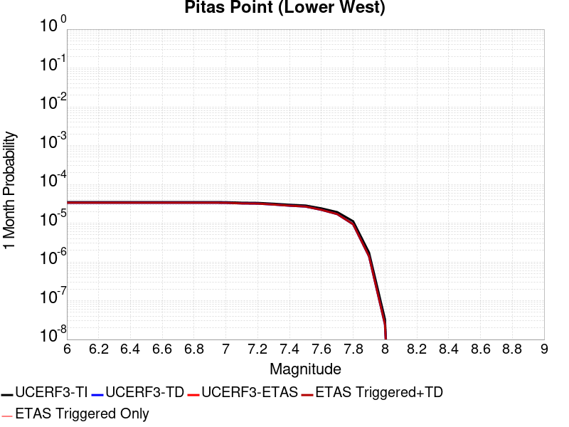 | 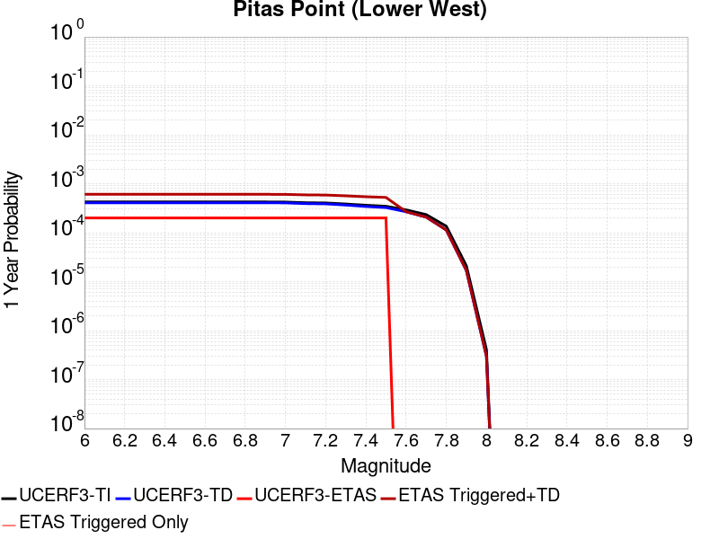 |  |

| Magnitude | 1 wk TI Prob | 1 wk TD Prob | 1 wk ETAS Prob | 1 wk ETAS/TD Gain | 1 wk ETAS Triggered+TD | 1 wk ETAS Triggered Only | 1 mo TI Prob | 1 mo TD Prob | 1 mo ETAS Prob | 1 mo ETAS/TD Gain | 1 mo ETAS Triggered+TD | 1 mo ETAS Triggered Only | 1 yr TI Prob | 1 yr TD Prob | 1 yr ETAS Prob | 1 yr ETAS/TD Gain | 1 yr ETAS Triggered+TD | 1 yr ETAS Triggered Only | 10 yr TI Prob | 10 yr TD Prob | 10 yr ETAS Prob | 10 yr ETAS/TD Gain | 10 yr ETAS Triggered+TD | 10 yr ETAS Triggered Only |
|-----|-----|-----|-----|-----|-----|-----|-----|-----|-----|-----|-----|-----|-----|-----|-----|-----|-----|-----|-----|-----|-----|-----|-----|-----|
| 6.0 | 8.151497E-6 | 7.848972E-6 | 0.0 | 0.0 | 7.848972E-6 | 0.0 | 3.493452E-5 | 3.363802E-5 | 0.0 | 0.0 | 3.363802E-5 | 0.0 | 4.252448E-4 | 4.0946668E-4 | 2.0E-4 | 0.48844022 | 6.093848E-4 | 2.0E-4 | 0.0042443196 | 0.0040872027 | 0.0048 | 1.1743973 | 0.0064773937 | 0.0024 |
| 6.1 | 8.151497E-6 | 7.848972E-6 | 0.0 | 0.0 | 7.848972E-6 | 0.0 | 3.493452E-5 | 3.363802E-5 | 0.0 | 0.0 | 3.363802E-5 | 0.0 | 4.252448E-4 | 4.0946668E-4 | 2.0E-4 | 0.48844022 | 6.093848E-4 | 2.0E-4 | 0.0042443196 | 0.0040872027 | 0.0048 | 1.1743973 | 0.0064773937 | 0.0024 |
| 6.2 | 8.151497E-6 | 7.848972E-6 | 0.0 | 0.0 | 7.848972E-6 | 0.0 | 3.493452E-5 | 3.363802E-5 | 0.0 | 0.0 | 3.363802E-5 | 0.0 | 4.252448E-4 | 4.0946668E-4 | 2.0E-4 | 0.48844022 | 6.093848E-4 | 2.0E-4 | 0.0042443196 | 0.0040872027 | 0.0048 | 1.1743973 | 0.0064773937 | 0.0024 |
| 6.3 | 8.151497E-6 | 7.848972E-6 | 0.0 | 0.0 | 7.848972E-6 | 0.0 | 3.493452E-5 | 3.363802E-5 | 0.0 | 0.0 | 3.363802E-5 | 0.0 | 4.252448E-4 | 4.0946668E-4 | 2.0E-4 | 0.48844022 | 6.093848E-4 | 2.0E-4 | 0.0042443196 | 0.0040872027 | 0.0048 | 1.1743973 | 0.0064773937 | 0.0024 |
| 6.4 | 8.151497E-6 | 7.848972E-6 | 0.0 | 0.0 | 7.848972E-6 | 0.0 | 3.493452E-5 | 3.363802E-5 | 0.0 | 0.0 | 3.363802E-5 | 0.0 | 4.252448E-4 | 4.0946668E-4 | 2.0E-4 | 0.48844022 | 6.093848E-4 | 2.0E-4 | 0.0042443196 | 0.0040872027 | 0.0048 | 1.1743973 | 0.0064773937 | 0.0024 |
| 6.5 | 8.151497E-6 | 7.848972E-6 | 0.0 | 0.0 | 7.848972E-6 | 0.0 | 3.493452E-5 | 3.363802E-5 | 0.0 | 0.0 | 3.363802E-5 | 0.0 | 4.252448E-4 | 4.0946668E-4 | 2.0E-4 | 0.48844022 | 6.093848E-4 | 2.0E-4 | 0.0042443196 | 0.0040872027 | 0.0048 | 1.1743973 | 0.0064773937 | 0.0024 |
| 6.6 | 8.151497E-6 | 7.848972E-6 | 0.0 | 0.0 | 7.848972E-6 | 0.0 | 3.493452E-5 | 3.363802E-5 | 0.0 | 0.0 | 3.363802E-5 | 0.0 | 4.252448E-4 | 4.0946668E-4 | 2.0E-4 | 0.48844022 | 6.093848E-4 | 2.0E-4 | 0.0042443196 | 0.0040872027 | 0.0048 | 1.1743973 | 0.0064773937 | 0.0024 |
| 6.7 | 8.151497E-6 | 7.848972E-6 | 0.0 | 0.0 | 7.848972E-6 | 0.0 | 3.493452E-5 | 3.363802E-5 | 0.0 | 0.0 | 3.363802E-5 | 0.0 | 4.252448E-4 | 4.0946668E-4 | 2.0E-4 | 0.48844022 | 6.093848E-4 | 2.0E-4 | 0.0042443196 | 0.0040872027 | 0.0048 | 1.1743973 | 0.0064773937 | 0.0024 |
| 6.8 | 8.151497E-6 | 7.848972E-6 | 0.0 | 0.0 | 7.848972E-6 | 0.0 | 3.493452E-5 | 3.363802E-5 | 0.0 | 0.0 | 3.363802E-5 | 0.0 | 4.252448E-4 | 4.0946668E-4 | 2.0E-4 | 0.48844022 | 6.093848E-4 | 2.0E-4 | 0.0042443196 | 0.0040872027 | 0.0048 | 1.1743973 | 0.0064773937 | 0.0024 |
| 6.9 | 8.151497E-6 | 7.848972E-6 | 0.0 | 0.0 | 7.848972E-6 | 0.0 | 3.493452E-5 | 3.363802E-5 | 0.0 | 0.0 | 3.363802E-5 | 0.0 | 4.252448E-4 | 4.0946668E-4 | 2.0E-4 | 0.48844022 | 6.093848E-4 | 2.0E-4 | 0.0042443196 | 0.0040872027 | 0.0048 | 1.1743973 | 0.0064773937 | 0.0024 |
| 7.0 | 8.103535E-6 | 7.7984305E-6 | 0.0 | 0.0 | 7.7984305E-6 | 0.0 | 3.4728975E-5 | 3.342142E-5 | 0.0 | 0.0 | 3.342142E-5 | 0.0 | 4.2274324E-4 | 4.0683054E-4 | 2.0E-4 | 0.49160516 | 6.067492E-4 | 2.0E-4 | 0.0042193993 | 0.004060938 | 0.0048 | 1.1819929 | 0.006451192 | 0.0024 |
| 7.1 | 7.853298E-6 | 7.5342764E-6 | 0.0 | 0.0 | 7.5342764E-6 | 0.0 | 3.3656554E-5 | 3.228936E-5 | 0.0 | 0.0 | 3.228936E-5 | 0.0 | 4.096915E-4 | 3.9305276E-4 | 2.0E-4 | 0.5088375 | 5.9297413E-4 | 2.0E-4 | 0.00408937 | 0.0039236518 | 0.0046 | 1.1723772 | 0.00611502 | 0.0022 |
| 7.2 | 7.771102E-6 | 7.44662E-6 | 0.0 | 0.0 | 7.44662E-6 | 0.0 | 3.33043E-5 | 3.19137E-5 | 0.0 | 0.0 | 3.19137E-5 | 0.0 | 4.0540437E-4 | 3.8848072E-4 | 2.0E-4 | 0.51482606 | 5.88403E-4 | 2.0E-4 | 0.0040466557 | 0.0038780915 | 0.0046 | 1.1861504 | 0.0060695596 | 0.0022 |
| 7.3 | 7.3945344E-6 | 7.0430306E-6 | 0.0 | 0.0 | 7.0430306E-6 | 0.0 | 3.1690477E-5 | 3.018407E-5 | 0.0 | 0.0 | 3.018407E-5 | 0.0 | 3.8576324E-4 | 3.6742972E-4 | 2.0E-4 | 0.5443218 | 5.6735624E-4 | 2.0E-4 | 0.0038509427 | 0.0036682896 | 0.0046 | 1.2539904 | 0.0058602197 | 0.0022 |
| 7.4 | 6.964645E-6 | 6.584206E-6 | 0.0 | 0.0 | 6.584206E-6 | 0.0 | 2.9848137E-5 | 2.8217723E-5 | 0.0 | 0.0 | 2.8217723E-5 | 0.0 | 3.6334046E-4 | 3.4349711E-4 | 2.0E-4 | 0.58224654 | 5.434284E-4 | 2.0E-4 | 0.0036274698 | 0.0034297148 | 0.0041 | 1.1954347 | 0.0054228553 | 0.002 |
| 7.5 | 6.6525035E-6 | 6.253454E-6 | 0.0 | 0.0 | 6.253454E-6 | 0.0 | 2.851042E-5 | 2.6800246E-5 | 0.0 | 0.0 | 2.6800246E-5 | 0.0 | 3.4705905E-4 | 3.2624463E-4 | 2.0E-4 | 0.61303693 | 5.261794E-4 | 2.0E-4 | 0.0034651754 | 0.0032577082 | 0.0041 | 1.2585535 | 0.0052511925 | 0.002 |
| 7.6 | 5.613338E-6 | 5.1464976E-6 | 0.0 | 0.0 | 5.1464976E-6 | 0.0 | 2.405694E-5 | 2.2056234E-5 | 0.0 | 0.0 | 2.2056234E-5 | 0.0 | 2.928539E-4 | 2.6850184E-4 | 0.0 | 0.0 | 2.6850184E-4 | 0.0 | 0.0029246826 | 0.002681806 | 0.0024 | 0.89491934 | 0.0036791242 | 0.001 |
| 7.7 | 4.494704E-6 | 3.9929123E-6 | 0.0 | 0.0 | 3.9929123E-6 | 0.0 | 1.9262876E-5 | 1.711237E-5 | 0.0 | 0.0 | 1.711237E-5 | 0.0 | 2.3450027E-4 | 2.0832343E-4 | 0.0 | 0.0 | 2.0832343E-4 | 0.0 | 0.0023425296 | 0.0020813055 | 0.0017 | 0.81679505 | 0.0026800567 | 6.0E-4 |
| 7.8 | 2.6075882E-6 | 2.1812086E-6 | 0.0 | 0.0 | 2.1812086E-6 | 0.0 | 1.117533E-5 | 9.348004E-6 | 0.0 | 0.0 | 9.348004E-6 | 0.0 | 1.3605114E-4 | 1.13806054E-4 | 0.0 | 0.0 | 1.13806054E-4 | 0.0 | 0.0013596788 | 0.0011374825 | 0.001 | 0.8791345 | 0.0013372549 | 2.0E-4 |
| 7.9 | 4.045984E-7 | 3.2399677E-7 | 0.0 | 0.0 | 3.2399677E-7 | 0.0 | 1.733992E-6 | 1.3885569E-6 | 0.0 | 0.0 | 1.3885569E-6 | 0.0 | 2.1111147E-5 | 1.6905553E-5 | 0.0 | 0.0 | 1.6905553E-5 | 0.0 | 2.1109142E-4 | 1.6904298E-4 | 1.0E-4 | 0.59156555 | 1.6904298E-4 | 0.0 |
| 8.0 | 7.791402E-9 | 5.678961E-9 | 0.0 | 0.0 | 5.678961E-9 | 0.0 | 3.3391725E-8 | 2.4338403E-8 | 0.0 | 0.0 | 2.4338403E-8 | 0.0 | 4.0654416E-7 | 2.9632005E-7 | 0.0 | 0.0 | 2.9632005E-7 | 0.0 | 4.065434E-6 | 2.9631985E-6 | 0.0 | 0.0 | 2.9631985E-6 | 0.0 |

## Raymond
*[(top)](#table-of-contents)*

| 1 Week | 1 Month | 1 Year | 10 Year |
|-----|-----|-----|-----|
|  | 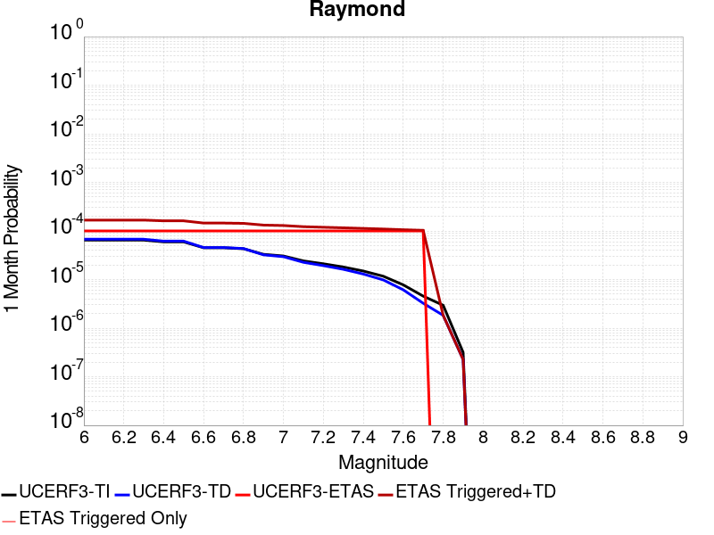 | 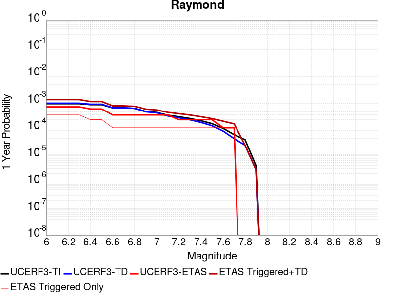 |  |

| Magnitude | 1 wk TI Prob | 1 wk TD Prob | 1 wk ETAS Prob | 1 wk ETAS/TD Gain | 1 wk ETAS Triggered+TD | 1 wk ETAS Triggered Only | 1 mo TI Prob | 1 mo TD Prob | 1 mo ETAS Prob | 1 mo ETAS/TD Gain | 1 mo ETAS Triggered+TD | 1 mo ETAS Triggered Only | 1 yr TI Prob | 1 yr TD Prob | 1 yr ETAS Prob | 1 yr ETAS/TD Gain | 1 yr ETAS Triggered+TD | 1 yr ETAS Triggered Only | 10 yr TI Prob | 10 yr TD Prob | 10 yr ETAS Prob | 10 yr ETAS/TD Gain | 10 yr ETAS Triggered+TD | 10 yr ETAS Triggered Only |
|-----|-----|-----|-----|-----|-----|-----|-----|-----|-----|-----|-----|-----|-----|-----|-----|-----|-----|-----|-----|-----|-----|-----|-----|-----|
| 6.0 | 1.5157413E-5 | 1.5789088E-5 | 0.0 | 0.0 | 1.5789088E-5 | 0.0 | 6.4958724E-5 | 6.7665904E-5 | 1.0E-4 | 1.4778491 | 1.6765913E-4 | 1.0E-4 | 7.905855E-4 | 8.23546E-4 | 6.0E-4 | 0.7285567 | 0.001123299 | 3.0E-4 | 0.007877788 | 0.0082074525 | 0.0072 | 0.8772515 | 0.010488575 | 0.0023 |
| 6.1 | 1.5157413E-5 | 1.5789088E-5 | 0.0 | 0.0 | 1.5789088E-5 | 0.0 | 6.4958724E-5 | 6.7665904E-5 | 1.0E-4 | 1.4778491 | 1.6765913E-4 | 1.0E-4 | 7.905855E-4 | 8.23546E-4 | 6.0E-4 | 0.7285567 | 0.001123299 | 3.0E-4 | 0.007877788 | 0.0082074525 | 0.0072 | 0.8772515 | 0.010488575 | 0.0023 |
| 6.2 | 1.5157413E-5 | 1.5789088E-5 | 0.0 | 0.0 | 1.5789088E-5 | 0.0 | 6.4958724E-5 | 6.7665904E-5 | 1.0E-4 | 1.4778491 | 1.6765913E-4 | 1.0E-4 | 7.905855E-4 | 8.23546E-4 | 6.0E-4 | 0.7285567 | 0.001123299 | 3.0E-4 | 0.007877788 | 0.0082074525 | 0.0072 | 0.8772515 | 0.010488575 | 0.0023 |
| 6.3 | 1.5157413E-5 | 1.5789088E-5 | 0.0 | 0.0 | 1.5789088E-5 | 0.0 | 6.4958724E-5 | 6.7665904E-5 | 1.0E-4 | 1.4778491 | 1.6765913E-4 | 1.0E-4 | 7.905855E-4 | 8.23546E-4 | 6.0E-4 | 0.7285567 | 0.001123299 | 3.0E-4 | 0.007877788 | 0.0082074525 | 0.0072 | 0.8772515 | 0.010488575 | 0.0023 |
| 6.4 | 1.3941944E-5 | 1.4435279E-5 | 0.0 | 0.0 | 1.4435279E-5 | 0.0 | 5.9749822E-5 | 6.186414E-5 | 1.0E-4 | 1.6164452 | 1.6185796E-4 | 1.0E-4 | 7.2721124E-4 | 7.5295893E-4 | 5.0E-4 | 0.6640468 | 9.5280836E-4 | 2.0E-4 | 0.007248361 | 0.0075064045 | 0.006 | 0.7993174 | 0.009292893 | 0.0018 |
| 6.5 | 1.3941944E-5 | 1.4435279E-5 | 0.0 | 0.0 | 1.4435279E-5 | 0.0 | 5.9749822E-5 | 6.186414E-5 | 1.0E-4 | 1.6164452 | 1.6185796E-4 | 1.0E-4 | 7.2721124E-4 | 7.5295893E-4 | 5.0E-4 | 0.6640468 | 9.5280836E-4 | 2.0E-4 | 0.007248361 | 0.0075064045 | 0.006 | 0.7993174 | 0.009292893 | 0.0018 |
| 6.6 | 1.0542609E-5 | 1.0656161E-5 | 0.0 | 0.0 | 1.0656161E-5 | 0.0 | 4.5181827E-5 | 4.5668494E-5 | 1.0E-4 | 2.1896935 | 1.4566393E-4 | 1.0E-4 | 5.499499E-4 | 5.558775E-4 | 3.0E-4 | 0.5396873 | 6.5582193E-4 | 1.0E-4 | 0.005485909 | 0.0055454294 | 0.0041 | 0.73934764 | 0.0066393293 | 0.0011 |
| 6.7 | 1.0542609E-5 | 1.0656161E-5 | 0.0 | 0.0 | 1.0656161E-5 | 0.0 | 4.5181827E-5 | 4.5668494E-5 | 1.0E-4 | 2.1896935 | 1.4566393E-4 | 1.0E-4 | 5.499499E-4 | 5.558775E-4 | 3.0E-4 | 0.5396873 | 6.5582193E-4 | 1.0E-4 | 0.005485909 | 0.0055454294 | 0.0041 | 0.73934764 | 0.0066393293 | 0.0011 |
| 6.8 | 1.0079132E-5 | 1.0162047E-5 | 0.0 | 0.0 | 1.0162047E-5 | 0.0 | 4.3195567E-5 | 4.3550932E-5 | 1.0E-4 | 2.2961621 | 1.4354658E-4 | 1.0E-4 | 5.257791E-4 | 5.30109E-4 | 3.0E-4 | 0.56592137 | 6.3005596E-4 | 1.0E-4 | 0.0052453685 | 0.005288991 | 0.004 | 0.7562879 | 0.0063831736 | 0.0011 |
| 6.9 | 7.721598E-6 | 7.5374787E-6 | 0.0 | 0.0 | 7.5374787E-6 | 0.0 | 3.3092143E-5 | 3.2303087E-5 | 1.0E-4 | 3.0956793 | 1.3229986E-4 | 1.0E-4 | 4.0282236E-4 | 3.9322034E-4 | 3.0E-4 | 0.76293105 | 4.93181E-4 | 1.0E-4 | 0.0040209293 | 0.003925378 | 0.003 | 0.7642576 | 0.004821845 | 9.0E-4 |
| 7.0 | 7.137566E-6 | 6.9004946E-6 | 0.0 | 0.0 | 6.9004946E-6 | 0.0 | 3.058921E-5 | 2.9573219E-5 | 1.0E-4 | 3.3814378 | 1.2957027E-4 | 1.0E-4 | 3.7236E-4 | 3.5999552E-4 | 3.0E-4 | 0.8333437 | 4.5995953E-4 | 1.0E-4 | 0.0037173668 | 0.0035942406 | 0.0027 | 0.7512018 | 0.004491006 | 9.0E-4 |
| 7.1 | 5.654976E-6 | 5.2901996E-6 | 0.0 | 0.0 | 5.2901996E-6 | 0.0 | 2.4235387E-5 | 2.2672088E-5 | 1.0E-4 | 4.41071 | 1.2266982E-4 | 1.0E-4 | 2.9502588E-4 | 2.759979E-4 | 3.0E-4 | 1.0869647 | 3.7597032E-4 | 1.0E-4 | 0.0029463451 | 0.0027565814 | 0.0023 | 0.8343668 | 0.0034546517 | 7.0E-4 |
| 7.2 | 4.9358455E-6 | 4.5180914E-6 | 0.0 | 0.0 | 4.5180914E-6 | 0.0 | 2.1153453E-5 | 1.9363106E-5 | 1.0E-4 | 5.1644607 | 1.1936117E-4 | 1.0E-4 | 2.5751285E-4 | 2.3572045E-4 | 2.0E-4 | 0.84846264 | 3.3569688E-4 | 1.0E-4 | 0.0025721465 | 0.0023547253 | 0.0015 | 0.637017 | 0.0027537835 | 4.0E-4 |
| 7.3 | 4.2368597E-6 | 3.7976688E-6 | 0.0 | 0.0 | 3.7976688E-6 | 0.0 | 1.8157843E-5 | 1.6275622E-5 | 1.0E-4 | 6.1441584 | 1.1627399E-4 | 1.0E-4 | 2.2104931E-4 | 1.9813779E-4 | 2.0E-4 | 1.0093986 | 2.98118E-4 | 1.0E-4 | 0.0022082955 | 0.001979629 | 0.0015 | 0.7577177 | 0.0023788372 | 4.0E-4 |
| 7.4 | 3.4999923E-6 | 3.0365104E-6 | 0.0 | 0.0 | 3.0365104E-6 | 0.0 | 1.49998805E-5 | 1.3013551E-5 | 1.0E-4 | 7.6842976 | 1.1301225E-4 | 1.0E-4 | 1.8260824E-4 | 1.5842855E-4 | 2.0E-4 | 1.2623987 | 2.584127E-4 | 1.0E-4 | 0.0018245826 | 0.0015831707 | 0.0013 | 0.821137 | 0.0019825373 | 4.0E-4 |
| 7.5 | 2.738017E-6 | 2.2960107E-6 | 0.0 | 0.0 | 2.2960107E-6 | 0.0 | 1.1734306E-5 | 9.84001E-6 | 1.0E-4 | 10.162592 | 1.0983903E-4 | 1.0E-4 | 1.428558E-4 | 1.197956E-4 | 2.0E-4 | 1.6695105 | 2.1978361E-4 | 1.0E-4 | 0.0014276401 | 0.0011973236 | 0.001 | 0.8351962 | 0.0014969643 | 3.0E-4 |
| 7.6 | 1.8186392E-6 | 1.4379914E-6 | 0.0 | 0.0 | 1.4379914E-6 | 0.0 | 7.794145E-6 | 6.1628057E-6 | 1.0E-4 | 16.226376 | 1.0616219E-4 | 1.0E-4 | 9.488958E-5 | 7.502962E-5 | 1.0E-4 | 1.3328071 | 1.7502211E-4 | 1.0E-4 | 9.4849075E-4 | 7.500533E-4 | 7.0E-4 | 0.933267 | 9.499033E-4 | 2.0E-4 |
| 7.7 | 1.0660348E-6 | 7.609158E-7 | 0.0 | 0.0 | 7.609158E-7 | 0.0 | 4.5687125E-6 | 3.2610637E-6 | 1.0E-4 | 30.66484 | 1.0326074E-4 | 1.0E-4 | 5.5622655E-5 | 3.9702743E-5 | 1.0E-4 | 2.5187175 | 1.3969878E-4 | 1.0E-4 | 5.5608735E-4 | 3.9696458E-4 | 3.0E-4 | 0.7557349 | 4.9692485E-4 | 1.0E-4 |
| 7.8 | 6.913602E-7 | 4.2910082E-7 | 0.0 | 0.0 | 4.2910082E-7 | 0.0 | 2.962969E-6 | 1.8390023E-6 | 0.0 | 0.0 | 1.8390023E-6 | 0.0 | 3.607355E-5 | 2.238963E-5 | 0.0 | 0.0 | 2.238963E-5 | 0.0 | 3.6067693E-4 | 2.2388056E-4 | 1.0E-4 | 0.44666675 | 2.2388056E-4 | 0.0 |
| 7.9 | 7.425201E-8 | 5.2954892E-8 | 0.0 | 0.0 | 5.2954892E-8 | 0.0 | 3.1822285E-7 | 2.2694954E-7 | 0.0 | 0.0 | 2.2694954E-7 | 0.0 | 3.874356E-6 | 2.7631083E-6 | 0.0 | 0.0 | 2.7631083E-6 | 0.0 | 3.8742884E-5 | 2.763087E-5 | 1.0E-4 | 3.6191406 | 2.763087E-5 | 0.0 |

## Antelope Valley 2011
*[(top)](#table-of-contents)*

| 1 Week | 1 Month | 1 Year | 10 Year |
|-----|-----|-----|-----|
|  | 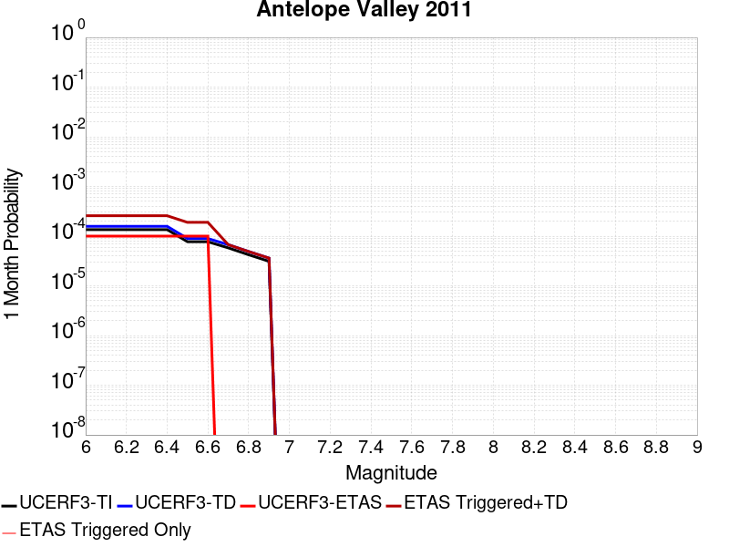 |  | 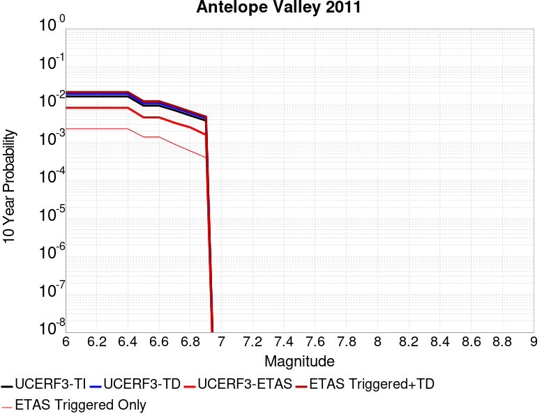 |

| Magnitude | 1 wk TI Prob | 1 wk TD Prob | 1 wk ETAS Prob | 1 wk ETAS/TD Gain | 1 wk ETAS Triggered+TD | 1 wk ETAS Triggered Only | 1 mo TI Prob | 1 mo TD Prob | 1 mo ETAS Prob | 1 mo ETAS/TD Gain | 1 mo ETAS Triggered+TD | 1 mo ETAS Triggered Only | 1 yr TI Prob | 1 yr TD Prob | 1 yr ETAS Prob | 1 yr ETAS/TD Gain | 1 yr ETAS Triggered+TD | 1 yr ETAS Triggered Only | 10 yr TI Prob | 10 yr TD Prob | 10 yr ETAS Prob | 10 yr ETAS/TD Gain | 10 yr ETAS Triggered+TD | 10 yr ETAS Triggered Only |
|-----|-----|-----|-----|-----|-----|-----|-----|-----|-----|-----|-----|-----|-----|-----|-----|-----|-----|-----|-----|-----|-----|-----|-----|-----|
| 6.0 | 3.1646934E-5 | 3.6840487E-5 | 0.0 | 0.0 | 3.6840487E-5 | 0.0 | 1.3562266E-4 | 1.5787974E-4 | 1.0E-4 | 0.6333935 | 2.5786395E-4 | 1.0E-4 | 0.0016499552 | 0.0019207548 | 8.0E-4 | 0.41650292 | 0.0021203707 | 2.0E-4 | 0.016377583 | 0.019067852 | 0.0082 | 0.4300432 | 0.021323996 | 0.0023 |
| 6.1 | 3.1646934E-5 | 3.6840487E-5 | 0.0 | 0.0 | 3.6840487E-5 | 0.0 | 1.3562266E-4 | 1.5787974E-4 | 1.0E-4 | 0.6333935 | 2.5786395E-4 | 1.0E-4 | 0.0016499552 | 0.0019207548 | 8.0E-4 | 0.41650292 | 0.0021203707 | 2.0E-4 | 0.016377583 | 0.019067852 | 0.0082 | 0.4300432 | 0.021323996 | 0.0023 |
| 6.2 | 3.1646934E-5 | 3.6840487E-5 | 0.0 | 0.0 | 3.6840487E-5 | 0.0 | 1.3562266E-4 | 1.5787974E-4 | 1.0E-4 | 0.6333935 | 2.5786395E-4 | 1.0E-4 | 0.0016499552 | 0.0019207548 | 8.0E-4 | 0.41650292 | 0.0021203707 | 2.0E-4 | 0.016377583 | 0.019067852 | 0.0082 | 0.4300432 | 0.021323996 | 0.0023 |
| 6.3 | 3.1646934E-5 | 3.6840487E-5 | 0.0 | 0.0 | 3.6840487E-5 | 0.0 | 1.3562266E-4 | 1.5787974E-4 | 1.0E-4 | 0.6333935 | 2.5786395E-4 | 1.0E-4 | 0.0016499552 | 0.0019207548 | 8.0E-4 | 0.41650292 | 0.0021203707 | 2.0E-4 | 0.016377583 | 0.019067852 | 0.0082 | 0.4300432 | 0.021323996 | 0.0023 |
| 6.4 | 3.1646934E-5 | 3.6840487E-5 | 0.0 | 0.0 | 3.6840487E-5 | 0.0 | 1.3562266E-4 | 1.5787974E-4 | 1.0E-4 | 0.6333935 | 2.5786395E-4 | 1.0E-4 | 0.0016499552 | 0.0019207548 | 8.0E-4 | 0.41650292 | 0.0021203707 | 2.0E-4 | 0.016377583 | 0.019067852 | 0.0082 | 0.4300432 | 0.021323996 | 0.0023 |
| 6.5 | 1.8034107E-5 | 2.0905773E-5 | 0.0 | 0.0 | 2.0905773E-5 | 0.0 | 7.7286735E-5 | 8.959378E-5 | 1.0E-4 | 1.116149 | 1.8958481E-4 | 1.0E-4 | 9.405598E-4 | 0.0010903804 | 4.0E-4 | 0.36684445 | 0.0011902713 | 1.0E-4 | 0.009365888 | 0.010862339 | 0.0046 | 0.42348152 | 0.012247132 | 0.0014 |
| 6.6 | 1.8034107E-5 | 2.0905773E-5 | 0.0 | 0.0 | 2.0905773E-5 | 0.0 | 7.7286735E-5 | 8.959378E-5 | 1.0E-4 | 1.116149 | 1.8958481E-4 | 1.0E-4 | 9.405598E-4 | 0.0010903804 | 4.0E-4 | 0.36684445 | 0.0011902713 | 1.0E-4 | 0.009365888 | 0.010862339 | 0.0046 | 0.42348152 | 0.012247132 | 0.0014 |
| 6.7 | 1.3567667E-5 | 1.5723108E-5 | 0.0 | 0.0 | 1.5723108E-5 | 0.0 | 5.814585E-5 | 6.7383604E-5 | 0.0 | 0.0 | 6.7383604E-5 | 0.0 | 7.076958E-4 | 8.2019245E-4 | 3.0E-4 | 0.3657678 | 8.2019245E-4 | 0.0 | 0.007054463 | 0.008182052 | 0.0033 | 0.4033218 | 0.009074688 | 9.0E-4 |
| 6.8 | 9.867387E-6 | 1.1448545E-5 | 0.0 | 0.0 | 1.1448545E-5 | 0.0 | 4.2288117E-5 | 4.90648E-5 | 0.0 | 0.0 | 4.90648E-5 | 0.0 | 5.1473617E-4 | 5.972949E-4 | 2.0E-4 | 0.33484298 | 5.972949E-4 | 0.0 | 0.005135455 | 0.005966176 | 0.0025 | 0.41902888 | 0.006562596 | 6.0E-4 |
| 6.9 | 7.273233E-6 | 8.440546E-6 | 0.0 | 0.0 | 8.440546E-6 | 0.0 | 3.1170628E-5 | 3.6173766E-5 | 0.0 | 0.0 | 3.6173766E-5 | 0.0 | 3.794363E-4 | 4.404156E-4 | 1.0E-4 | 0.22705826 | 4.404156E-4 | 0.0 | 0.0037878908 | 0.004404156 | 0.0016 | 0.36329323 | 0.004802394 | 4.0E-4 |

## Santa Cruz Catalina Ridge alt1
*[(top)](#table-of-contents)*

| 1 Week | 1 Month | 1 Year | 10 Year |
|-----|-----|-----|-----|
|  | 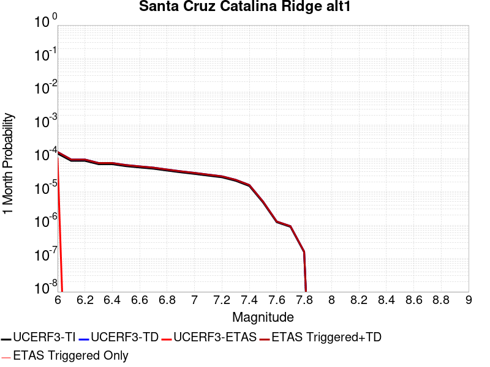 | 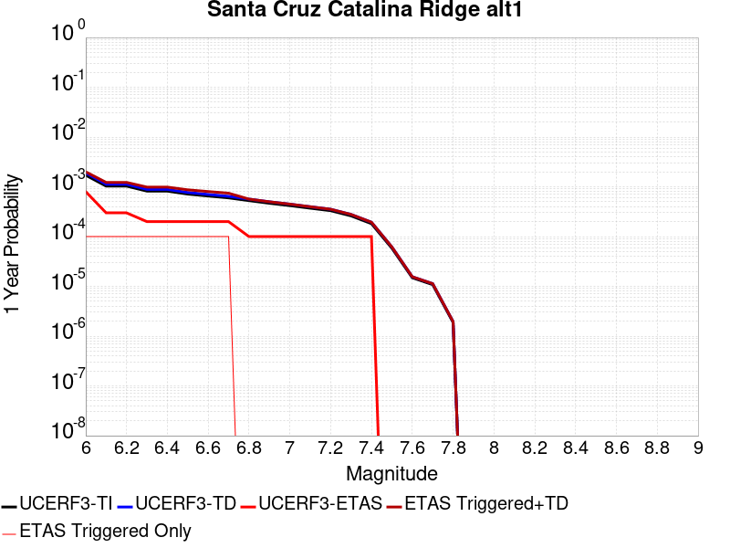 | 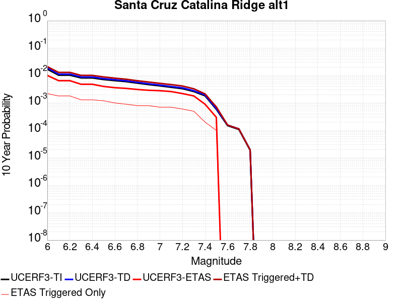 |

| Magnitude | 1 wk TI Prob | 1 wk TD Prob | 1 wk ETAS Prob | 1 wk ETAS/TD Gain | 1 wk ETAS Triggered+TD | 1 wk ETAS Triggered Only | 1 mo TI Prob | 1 mo TD Prob | 1 mo ETAS Prob | 1 mo ETAS/TD Gain | 1 mo ETAS Triggered+TD | 1 mo ETAS Triggered Only | 1 yr TI Prob | 1 yr TD Prob | 1 yr ETAS Prob | 1 yr ETAS/TD Gain | 1 yr ETAS Triggered+TD | 1 yr ETAS Triggered Only | 10 yr TI Prob | 10 yr TD Prob | 10 yr ETAS Prob | 10 yr ETAS/TD Gain | 10 yr ETAS Triggered+TD | 10 yr ETAS Triggered Only |
|-----|-----|-----|-----|-----|-----|-----|-----|-----|-----|-----|-----|-----|-----|-----|-----|-----|-----|-----|-----|-----|-----|-----|-----|-----|
| 6.0 | 3.2833184E-5 | 3.6514502E-5 | 0.0 | 0.0 | 3.6514502E-5 | 0.0 | 1.4070606E-4 | 1.5648227E-4 | 1.0E-4 | 0.63905007 | 1.5648227E-4 | 0.0 | 0.00171175 | 0.0019036726 | 8.0E-4 | 0.42024034 | 0.002003482 | 1.0E-4 | 0.016986247 | 0.0188905 | 0.0101 | 0.5346603 | 0.02104894 | 0.0022 |
| 6.1 | 1.9835548E-5 | 2.163856E-5 | 0.0 | 0.0 | 2.163856E-5 | 0.0 | 8.500672E-5 | 9.27335E-5 | 0.0 | 0.0 | 9.27335E-5 | 0.0 | 0.0010344655 | 0.0011284658 | 3.0E-4 | 0.26584768 | 0.0012283529 | 1.0E-4 | 0.010296632 | 0.0112294825 | 0.0065 | 0.5788334 | 0.01300927 | 0.0018 |
| 6.2 | 1.9835548E-5 | 2.163856E-5 | 0.0 | 0.0 | 2.163856E-5 | 0.0 | 8.500672E-5 | 9.27335E-5 | 0.0 | 0.0 | 9.27335E-5 | 0.0 | 0.0010344655 | 0.0011284658 | 3.0E-4 | 0.26584768 | 0.0012283529 | 1.0E-4 | 0.010296632 | 0.0112294825 | 0.0065 | 0.5788334 | 0.01300927 | 0.0018 |
| 6.3 | 1.5728183E-5 | 1.7019129E-5 | 0.0 | 0.0 | 1.7019129E-5 | 0.0 | 6.7404755E-5 | 7.293712E-5 | 0.0 | 0.0 | 7.293712E-5 | 0.0 | 8.2034385E-4 | 8.876537E-4 | 2.0E-4 | 0.2253131 | 9.875649E-4 | 1.0E-4 | 0.008173222 | 0.00884176 | 0.0048 | 0.5428783 | 0.010130266 | 0.0013 |
| 6.4 | 1.5728183E-5 | 1.7019129E-5 | 0.0 | 0.0 | 1.7019129E-5 | 0.0 | 6.7404755E-5 | 7.293712E-5 | 0.0 | 0.0 | 7.293712E-5 | 0.0 | 8.2034385E-4 | 8.876537E-4 | 2.0E-4 | 0.2253131 | 9.875649E-4 | 1.0E-4 | 0.008173222 | 0.00884176 | 0.0048 | 0.5428783 | 0.010130266 | 0.0013 |
| 6.5 | 1.3707734E-5 | 1.4782246E-5 | 0.0 | 0.0 | 1.4782246E-5 | 0.0 | 5.8746107E-5 | 6.335096E-5 | 0.0 | 0.0 | 6.335096E-5 | 0.0 | 7.1499916E-4 | 7.710286E-4 | 2.0E-4 | 0.25939378 | 8.7095145E-4 | 1.0E-4 | 0.0071270303 | 0.0076839323 | 0.004 | 0.52056676 | 0.008874712 | 0.0012 |
| 6.6 | 1.2539813E-5 | 1.3499282E-5 | 0.0 | 0.0 | 1.3499282E-5 | 0.0 | 5.3740947E-5 | 5.78528E-5 | 0.0 | 0.0 | 5.78528E-5 | 0.0 | 6.540996E-4 | 7.041329E-4 | 2.0E-4 | 0.2840373 | 8.0406247E-4 | 1.0E-4 | 0.0065217763 | 0.0070193214 | 0.0036 | 0.5128701 | 0.008012302 | 0.001 |
| 6.7 | 1.1504083E-5 | 1.2367549E-5 | 0.0 | 0.0 | 1.2367549E-5 | 0.0 | 4.930228E-5 | 5.3002714E-5 | 0.0 | 0.0 | 5.3002714E-5 | 0.0 | 6.0008996E-4 | 6.45119E-4 | 2.0E-4 | 0.31002033 | 7.450545E-4 | 1.0E-4 | 0.005984721 | 0.0064326916 | 0.0034 | 0.52855015 | 0.007326902 | 9.0E-4 |
| 6.8 | 1.012739E-5 | 1.0868654E-5 | 0.0 | 0.0 | 1.0868654E-5 | 0.0 | 4.340238E-5 | 4.657912E-5 | 0.0 | 0.0 | 4.657912E-5 | 0.0 | 5.282958E-4 | 5.669547E-4 | 1.0E-4 | 0.17638093 | 5.669547E-4 | 0.0 | 0.0052704164 | 0.0056552514 | 0.0031 | 0.54816306 | 0.0064507276 | 8.0E-4 |
| 6.9 | 8.9607865E-6 | 9.60185E-6 | 0.0 | 0.0 | 9.60185E-6 | 0.0 | 3.8402806E-5 | 4.1150142E-5 | 0.0 | 0.0 | 4.1150142E-5 | 0.0 | 4.6745385E-4 | 5.0088885E-4 | 1.0E-4 | 0.19964507 | 5.0088885E-4 | 0.0 | 0.0046647177 | 0.0049977186 | 0.0029 | 0.5802648 | 0.0057937205 | 8.0E-4 |
| 7.0 | 8.046829E-6 | 8.613331E-6 | 0.0 | 0.0 | 8.613331E-6 | 0.0 | 3.4485955E-5 | 3.691376E-5 | 0.0 | 0.0 | 3.691376E-5 | 0.0 | 4.1978562E-4 | 4.4933314E-4 | 1.0E-4 | 0.22255202 | 4.4933314E-4 | 0.0 | 0.004189935 | 0.004484337 | 0.0028 | 0.6243956 | 0.0051811975 | 7.0E-4 |
| 7.1 | 7.136131E-6 | 7.632046E-6 | 0.0 | 0.0 | 7.632046E-6 | 0.0 | 3.0583058E-5 | 3.270836E-5 | 0.0 | 0.0 | 3.270836E-5 | 0.0 | 3.7228514E-4 | 3.9815222E-4 | 1.0E-4 | 0.25116023 | 3.9815222E-4 | 0.0 | 0.0037166206 | 0.003974465 | 0.0026 | 0.65417606 | 0.004671683 | 7.0E-4 |
| 7.2 | 6.362014E-6 | 6.800006E-6 | 0.0 | 0.0 | 6.800006E-6 | 0.0 | 2.726549E-5 | 2.914256E-5 | 0.0 | 0.0 | 2.914256E-5 | 0.0 | 3.3190678E-4 | 3.5475355E-4 | 1.0E-4 | 0.28188583 | 3.5475355E-4 | 0.0 | 0.0033141149 | 0.0035419408 | 0.0022 | 0.6211284 | 0.004139816 | 6.0E-4 |
| 7.3 | 5.004101E-6 | 5.347829E-6 | 0.0 | 0.0 | 5.347829E-6 | 0.0 | 2.1445969E-5 | 2.2919068E-5 | 0.0 | 0.0 | 2.2919068E-5 | 0.0 | 2.6107338E-4 | 2.7900445E-4 | 1.0E-4 | 0.3584172 | 2.7900445E-4 | 0.0 | 0.002607669 | 0.0027865963 | 0.0018 | 0.6459493 | 0.0032852031 | 5.0E-4 |
| 7.4 | 3.4901443E-6 | 3.7293473E-6 | 0.0 | 0.0 | 3.7293473E-6 | 0.0 | 1.4957676E-5 | 1.5982821E-5 | 0.0 | 0.0 | 1.5982821E-5 | 0.0 | 1.8209449E-4 | 1.9457386E-4 | 1.0E-4 | 0.5139437 | 1.9457386E-4 | 0.0 | 0.0018194534 | 0.0019440735 | 9.0E-4 | 0.46294546 | 0.0021436848 | 2.0E-4 |
| 7.5 | 1.1215045E-6 | 1.188633E-6 | 0.0 | 0.0 | 1.188633E-6 | 0.0 | 4.806439E-6 | 5.094131E-6 | 0.0 | 0.0 | 5.094131E-6 | 0.0 | 5.851682E-5 | 6.201932E-5 | 0.0 | 0.0 | 6.201932E-5 | 0.0 | 5.850142E-4 | 6.200231E-4 | 3.0E-4 | 0.48385292 | 7.199611E-4 | 1.0E-4 |
| 7.6 | 2.8599047E-7 | 2.9937195E-7 | 0.0 | 0.0 | 2.9937195E-7 | 0.0 | 1.2256729E-6 | 1.283022E-6 | 0.0 | 0.0 | 1.283022E-6 | 0.0 | 1.4922465E-5 | 1.5620682E-5 | 0.0 | 0.0 | 1.5620682E-5 | 0.0 | 1.4921463E-4 | 1.5619598E-4 | 0.0 | 0.0 | 1.5619598E-4 | 0.0 |
| 7.7 | 2.0781519E-7 | 2.1733803E-7 | 0.0 | 0.0 | 2.1733803E-7 | 0.0 | 8.906362E-7 | 9.3144837E-7 | 0.0 | 0.0 | 9.3144837E-7 | 0.0 | 1.08434415E-5 | 1.1340326E-5 | 0.0 | 0.0 | 1.1340326E-5 | 0.0 | 1.0842913E-4 | 1.1339756E-4 | 0.0 | 0.0 | 1.1339756E-4 | 0.0 |
| 7.8 | 3.614776E-8 | 3.7624787E-8 | 0.0 | 0.0 | 3.7624787E-8 | 0.0 | 1.5491896E-7 | 1.6124908E-7 | 0.0 | 0.0 | 1.6124908E-7 | 0.0 | 1.8861368E-6 | 1.9632057E-6 | 0.0 | 0.0 | 1.9632057E-6 | 0.0 | 1.8861208E-5 | 1.9631896E-5 | 0.0 | 0.0 | 1.9631896E-5 | 0.0 |

## San Andreas (Peninsula) 2011 CFM
*[(top)](#table-of-contents)*

| 1 Week | 1 Month | 1 Year | 10 Year |
|-----|-----|-----|-----|
|  |  |  | 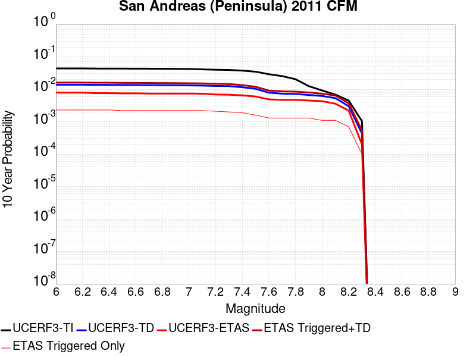 |

| Magnitude | 1 wk TI Prob | 1 wk TD Prob | 1 wk ETAS Prob | 1 wk ETAS/TD Gain | 1 wk ETAS Triggered+TD | 1 wk ETAS Triggered Only | 1 mo TI Prob | 1 mo TD Prob | 1 mo ETAS Prob | 1 mo ETAS/TD Gain | 1 mo ETAS Triggered+TD | 1 mo ETAS Triggered Only | 1 yr TI Prob | 1 yr TD Prob | 1 yr ETAS Prob | 1 yr ETAS/TD Gain | 1 yr ETAS Triggered+TD | 1 yr ETAS Triggered Only | 10 yr TI Prob | 10 yr TD Prob | 10 yr ETAS Prob | 10 yr ETAS/TD Gain | 10 yr ETAS Triggered+TD | 10 yr ETAS Triggered Only |
|-----|-----|-----|-----|-----|-----|-----|-----|-----|-----|-----|-----|-----|-----|-----|-----|-----|-----|-----|-----|-----|-----|-----|-----|-----|
| 6.0 | 8.6200685E-5 | 2.3159508E-5 | 0.0 | 0.0 | 2.3159508E-5 | 0.0 | 3.6937918E-4 | 9.9251265E-5 | 1.0E-4 | 1.0075438 | 1.9924135E-4 | 1.0E-4 | 0.0044879215 | 0.0012077157 | 5.0E-4 | 0.4140047 | 0.0013075949 | 1.0E-4 | 0.043983612 | 0.0136466725 | 0.0079 | 0.5788957 | 0.015915286 | 0.0023 |
| 6.1 | 8.6200685E-5 | 2.3159508E-5 | 0.0 | 0.0 | 2.3159508E-5 | 0.0 | 3.6937918E-4 | 9.9251265E-5 | 1.0E-4 | 1.0075438 | 1.9924135E-4 | 1.0E-4 | 0.0044879215 | 0.0012077157 | 5.0E-4 | 0.4140047 | 0.0013075949 | 1.0E-4 | 0.043983612 | 0.0136466725 | 0.0079 | 0.5788957 | 0.015915286 | 0.0023 |
| 6.2 | 8.6200685E-5 | 2.3159508E-5 | 0.0 | 0.0 | 2.3159508E-5 | 0.0 | 3.6937918E-4 | 9.9251265E-5 | 1.0E-4 | 1.0075438 | 1.9924135E-4 | 1.0E-4 | 0.0044879215 | 0.0012077157 | 5.0E-4 | 0.4140047 | 0.0013075949 | 1.0E-4 | 0.043983612 | 0.0136466725 | 0.0079 | 0.5788957 | 0.015915286 | 0.0023 |
| 6.3 | 8.551163E-5 | 2.286702E-5 | 0.0 | 0.0 | 2.286702E-5 | 0.0 | 3.6642692E-4 | 9.7997836E-5 | 1.0E-4 | 1.0204307 | 1.9798803E-4 | 1.0E-4 | 0.004452125 | 0.001192472 | 5.0E-4 | 0.41929707 | 0.0012923528 | 1.0E-4 | 0.043639794 | 0.013481642 | 0.0076 | 0.5637295 | 0.015750635 | 0.0023 |
| 6.4 | 8.551163E-5 | 2.286702E-5 | 0.0 | 0.0 | 2.286702E-5 | 0.0 | 3.6642692E-4 | 9.7997836E-5 | 1.0E-4 | 1.0204307 | 1.9798803E-4 | 1.0E-4 | 0.004452125 | 0.001192472 | 5.0E-4 | 0.41929707 | 0.0012923528 | 1.0E-4 | 0.043639794 | 0.013481642 | 0.0076 | 0.5637295 | 0.015750635 | 0.0023 |
| 6.5 | 8.511146E-5 | 2.2697528E-5 | 0.0 | 0.0 | 2.2697528E-5 | 0.0 | 3.647124E-4 | 9.72715E-5 | 1.0E-4 | 1.0280503 | 1.9726178E-4 | 1.0E-4 | 0.004431336 | 0.0011836385 | 5.0E-4 | 0.42242628 | 0.0012835201 | 1.0E-4 | 0.04344007 | 0.013385722 | 0.0075 | 0.5602985 | 0.015556274 | 0.0022 |
| 6.6 | 8.4985084E-5 | 2.2630868E-5 | 0.0 | 0.0 | 2.2630868E-5 | 0.0 | 3.6417096E-4 | 9.698583E-5 | 1.0E-4 | 1.0310785 | 1.9697614E-4 | 1.0E-4 | 0.0044247704 | 0.0011801643 | 5.0E-4 | 0.42366984 | 0.0012800463 | 1.0E-4 | 0.043376986 | 0.013349016 | 0.0075 | 0.56183916 | 0.015519648 | 0.0022 |
| 6.7 | 8.462618E-5 | 2.2467157E-5 | 0.0 | 0.0 | 2.2467157E-5 | 0.0 | 3.6263323E-4 | 9.628427E-5 | 1.0E-4 | 1.0385913 | 1.9627465E-4 | 1.0E-4 | 0.004406125 | 0.001171632 | 5.0E-4 | 0.4267552 | 0.0012715148 | 1.0E-4 | 0.043197807 | 0.01325752 | 0.0074 | 0.5581738 | 0.015428354 | 0.0022 |
| 6.8 | 8.42337E-5 | 2.2369068E-5 | 0.0 | 0.0 | 2.2369068E-5 | 0.0 | 3.6095164E-4 | 9.586392E-5 | 1.0E-4 | 1.0431453 | 1.9585433E-4 | 1.0E-4 | 0.004385734 | 0.0011665197 | 5.0E-4 | 0.42862543 | 0.001266403 | 1.0E-4 | 0.043001823 | 0.013201576 | 0.0074 | 0.5605392 | 0.0153725315 | 0.0022 |
| 6.9 | 8.365989E-5 | 2.2182085E-5 | 0.0 | 0.0 | 2.2182085E-5 | 0.0 | 3.5849313E-4 | 9.506262E-5 | 1.0E-4 | 1.0519382 | 1.9505312E-4 | 1.0E-4 | 0.004355922 | 0.0011567742 | 5.0E-4 | 0.43223646 | 0.0012566586 | 1.0E-4 | 0.04271523 | 0.013098413 | 0.0074 | 0.5649539 | 0.015269597 | 0.0022 |
| 7.0 | 8.30936E-5 | 2.1951666E-5 | 0.0 | 0.0 | 2.1951666E-5 | 0.0 | 3.560668E-4 | 9.407518E-5 | 1.0E-4 | 1.0629796 | 1.9406577E-4 | 1.0E-4 | 0.004326499 | 0.0011447648 | 5.0E-4 | 0.43677092 | 0.0012446505 | 1.0E-4 | 0.042432297 | 0.0129736625 | 0.0074 | 0.57038635 | 0.01514512 | 0.0022 |
| 7.1 | 8.041264E-5 | 2.1655384E-5 | 0.0 | 0.0 | 2.1655384E-5 | 0.0 | 3.4458007E-4 | 9.2805494E-5 | 1.0E-4 | 1.0775224 | 1.9279621E-4 | 1.0E-4 | 0.0041871946 | 0.0011293226 | 5.0E-4 | 0.4427433 | 0.0012292096 | 1.0E-4 | 0.041091725 | 0.012806519 | 0.0073 | 0.57002217 | 0.014978345 | 0.0022 |
| 7.2 | 7.8427016E-5 | 2.1101474E-5 | 0.0 | 0.0 | 2.1101474E-5 | 0.0 | 3.3607247E-4 | 9.043176E-5 | 1.0E-4 | 1.1058062 | 1.9042271E-4 | 1.0E-4 | 0.004084008 | 0.0011004519 | 5.0E-4 | 0.4543588 | 0.0012003419 | 1.0E-4 | 0.040097635 | 0.012503188 | 0.0069 | 0.55185926 | 0.0145769315 | 0.0021 |
| 7.3 | 7.721087E-5 | 2.0894355E-5 | 0.0 | 0.0 | 2.0894355E-5 | 0.0 | 3.3086175E-4 | 8.954416E-5 | 1.0E-4 | 1.1167674 | 1.895352E-4 | 1.0E-4 | 0.004020803 | 0.0010896563 | 5.0E-4 | 0.45886028 | 0.0011895474 | 1.0E-4 | 0.03948827 | 0.01239136 | 0.0068 | 0.5487695 | 0.014366577 | 0.002 |
| 7.4 | 7.3536525E-5 | 1.9132254E-5 | 0.0 | 0.0 | 1.9132254E-5 | 0.0 | 3.1511846E-4 | 8.199281E-5 | 1.0E-4 | 1.2196192 | 1.8198461E-4 | 1.0E-4 | 0.0038298194 | 9.978063E-4 | 4.0E-4 | 0.40087938 | 0.0010977065 | 1.0E-4 | 0.037644852 | 0.011406938 | 0.0065 | 0.5698286 | 0.013285264 | 0.0019 |
| 7.5 | 6.806207E-5 | 1.7102431E-5 | 0.0 | 0.0 | 1.7102431E-5 | 0.0 | 2.9166197E-4 | 7.329408E-5 | 1.0E-4 | 1.3643667 | 1.7328675E-4 | 1.0E-4 | 0.0035452035 | 8.91991E-4 | 4.0E-4 | 0.448435 | 9.919018E-4 | 1.0E-4 | 0.034891766 | 0.010244253 | 0.006 | 0.5856942 | 0.011827863 | 0.0016 |
| 7.6 | 5.6731416E-5 | 1.2907267E-5 | 0.0 | 0.0 | 1.2907267E-5 | 0.0 | 2.43112E-4 | 5.5315686E-5 | 1.0E-4 | 1.8078055 | 1.5531015E-4 | 1.0E-4 | 0.0029558712 | 6.732605E-4 | 4.0E-4 | 0.59412366 | 7.7319314E-4 | 1.0E-4 | 0.02916862 | 0.0077660736 | 0.0049 | 0.63094944 | 0.009055978 | 0.0013 |
| 7.7 | 4.946994E-5 | 1.2073095E-5 | 0.0 | 0.0 | 1.2073095E-5 | 0.0 | 2.1199681E-4 | 5.1740808E-5 | 1.0E-4 | 1.9327104 | 1.5173563E-4 | 1.0E-4 | 0.002578006 | 6.2976236E-4 | 4.0E-4 | 0.6351602 | 7.296994E-4 | 1.0E-4 | 0.02548303 | 0.0072453525 | 0.0047 | 0.6486917 | 0.008535934 | 0.0013 |
| 7.8 | 3.9718198E-5 | 1.1853909E-5 | 0.0 | 0.0 | 1.1853909E-5 | 0.0 | 1.7020974E-4 | 5.0801482E-5 | 1.0E-4 | 1.9684466 | 1.507964E-4 | 1.0E-4 | 0.0020703338 | 6.1833265E-4 | 4.0E-4 | 0.646901 | 7.182708E-4 | 1.0E-4 | 0.020511515 | 0.0070861923 | 0.0047 | 0.6632617 | 0.00837698 | 0.0013 |
| 7.9 | 2.4115114E-5 | 1.11810505E-5 | 0.0 | 0.0 | 1.11810505E-5 | 0.0 | 1.0334639E-4 | 4.7917907E-5 | 1.0E-4 | 2.0869024 | 1.4791312E-4 | 1.0E-4 | 0.001257516 | 5.832445E-4 | 4.0E-4 | 0.68581873 | 6.8318617E-4 | 1.0E-4 | 0.012504238 | 0.0066095334 | 0.0045 | 0.6808348 | 0.007900941 | 0.0013 |
| 8.0 | 1.7756569E-5 | 1.0501687E-5 | 0.0 | 0.0 | 1.0501687E-5 | 0.0 | 7.6097356E-5 | 4.5006454E-5 | 1.0E-4 | 2.2219036 | 1.4500195E-4 | 1.0E-4 | 9.260915E-4 | 5.4781593E-4 | 4.0E-4 | 0.7301723 | 6.4776116E-4 | 1.0E-4 | 0.009222416 | 0.006168466 | 0.0043 | 0.6970939 | 0.0072616804 | 0.0011 |
| 8.1 | 1.3159258E-5 | 8.976217E-6 | 0.0 | 0.0 | 8.976217E-6 | 0.0 | 5.6395602E-5 | 3.8468937E-5 | 1.0E-4 | 2.5995 | 1.3846508E-4 | 1.0E-4 | 6.864001E-4 | 4.6825875E-4 | 3.0E-4 | 0.64067143 | 5.6821195E-4 | 1.0E-4 | 0.0068428386 | 0.0052732863 | 0.0036 | 0.68268627 | 0.0063674855 | 0.0011 |
| 8.2 | 8.635426E-6 | 5.00287E-6 | 0.0 | 0.0 | 5.00287E-6 | 0.0 | 3.700844E-5 | 2.1440694E-5 | 1.0E-4 | 4.664028 | 1.2143855E-4 | 1.0E-4 | 4.5048463E-4 | 2.6100926E-4 | 2.0E-4 | 0.76625633 | 3.6098316E-4 | 1.0E-4 | 0.004495725 | 0.002989784 | 0.0022 | 0.73583907 | 0.0036876914 | 7.0E-4 |
| 8.3 | 1.983087E-6 | 6.880041E-7 | 0.0 | 0.0 | 6.880041E-7 | 0.0 | 8.498917E-6 | 2.9485857E-6 | 0.0 | 0.0 | 2.9485857E-6 | 0.0 | 1.034694E-4 | 3.589845E-5 | 0.0 | 0.0 | 3.589845E-5 | 0.0 | 0.0010342124 | 4.2701262E-4 | 2.0E-4 | 0.46837023 | 5.269699E-4 | 1.0E-4 |

## Superstition Hills
*[(top)](#table-of-contents)*

| 1 Week | 1 Month | 1 Year | 10 Year |
|-----|-----|-----|-----|
|  | 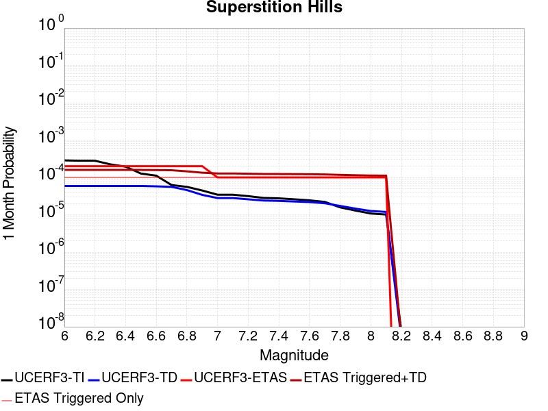 |  |  |

| Magnitude | 1 wk TI Prob | 1 wk TD Prob | 1 wk ETAS Prob | 1 wk ETAS/TD Gain | 1 wk ETAS Triggered+TD | 1 wk ETAS Triggered Only | 1 mo TI Prob | 1 mo TD Prob | 1 mo ETAS Prob | 1 mo ETAS/TD Gain | 1 mo ETAS Triggered+TD | 1 mo ETAS Triggered Only | 1 yr TI Prob | 1 yr TD Prob | 1 yr ETAS Prob | 1 yr ETAS/TD Gain | 1 yr ETAS Triggered+TD | 1 yr ETAS Triggered Only | 10 yr TI Prob | 10 yr TD Prob | 10 yr ETAS Prob | 10 yr ETAS/TD Gain | 10 yr ETAS Triggered+TD | 10 yr ETAS Triggered Only |
|-----|-----|-----|-----|-----|-----|-----|-----|-----|-----|-----|-----|-----|-----|-----|-----|-----|-----|-----|-----|-----|-----|-----|-----|-----|
| 6.0 | 6.6865185E-5 | 1.3796519E-5 | 1.0E-4 | 7.248205 | 1.1379514E-4 | 1.0E-4 | 2.8653358E-4 | 5.9126687E-5 | 2.0E-4 | 3.3825674 | 1.5912077E-4 | 1.0E-4 | 0.0034829667 | 7.196453E-4 | 0.001 | 1.3895735 | 0.0013192135 | 6.0E-4 | 0.03428881 | 0.007343593 | 0.0059 | 0.80342144 | 0.009626702 | 0.0023 |
| 6.1 | 6.544851E-5 | 1.3796519E-5 | 1.0E-4 | 7.248205 | 1.1379514E-4 | 1.0E-4 | 2.8046346E-4 | 5.9126687E-5 | 2.0E-4 | 3.3825674 | 1.5912077E-4 | 1.0E-4 | 0.0034092965 | 7.196453E-4 | 0.001 | 1.3895735 | 0.0013192135 | 6.0E-4 | 0.033574644 | 0.0073435926 | 0.0059 | 0.80342144 | 0.009626702 | 0.0023 |
| 6.2 | 6.544851E-5 | 1.3796519E-5 | 1.0E-4 | 7.248205 | 1.1379514E-4 | 1.0E-4 | 2.8046346E-4 | 5.9126687E-5 | 2.0E-4 | 3.3825674 | 1.5912077E-4 | 1.0E-4 | 0.0034092965 | 7.196453E-4 | 0.001 | 1.3895735 | 0.0013192135 | 6.0E-4 | 0.033574644 | 0.0073435926 | 0.0059 | 0.80342144 | 0.009626702 | 0.0023 |
| 6.3 | 5.2402065E-5 | 1.3796519E-5 | 1.0E-4 | 7.248205 | 1.1379514E-4 | 1.0E-4 | 2.2456095E-4 | 5.9126687E-5 | 2.0E-4 | 3.3825674 | 1.5912077E-4 | 1.0E-4 | 0.0027306017 | 7.196453E-4 | 0.001 | 1.3895735 | 0.0013192135 | 6.0E-4 | 0.02697292 | 0.007343591 | 0.0059 | 0.8034216 | 0.0096267015 | 0.0023 |
| 6.4 | 4.542238E-5 | 1.3796519E-5 | 1.0E-4 | 7.248205 | 1.1379514E-4 | 1.0E-4 | 1.9465282E-4 | 5.9126687E-5 | 2.0E-4 | 3.3825674 | 1.5912077E-4 | 1.0E-4 | 0.0023673223 | 7.196453E-4 | 0.001 | 1.3895735 | 0.0013192135 | 6.0E-4 | 0.023422617 | 0.0073435907 | 0.0059 | 0.8034217 | 0.009626701 | 0.0023 |
| 6.5 | 2.9672969E-5 | 1.3796519E-5 | 1.0E-4 | 7.248205 | 1.1379514E-4 | 1.0E-4 | 1.2716366E-4 | 5.9126683E-5 | 2.0E-4 | 3.3825674 | 1.5912077E-4 | 1.0E-4 | 0.0015471181 | 7.196453E-4 | 0.001 | 1.3895735 | 0.0013192135 | 6.0E-4 | 0.015363912 | 0.007343589 | 0.0059 | 0.8034219 | 0.009626699 | 0.0023 |
| 6.6 | 2.6056105E-5 | 1.3465085E-5 | 1.0E-4 | 7.4266148 | 1.1346374E-4 | 1.0E-4 | 1.1166424E-4 | 5.7706322E-5 | 2.0E-4 | 3.4658248 | 1.5770055E-4 | 1.0E-4 | 0.0013586642 | 7.023635E-4 | 0.001 | 1.4237642 | 0.001301942 | 6.0E-4 | 0.013503874 | 0.007169425 | 0.0059 | 0.8229391 | 0.009452935 | 0.0023 |
| 6.7 | 1.4611248E-5 | 1.3051225E-5 | 1.0E-4 | 7.662116 | 1.1304992E-4 | 1.0E-4 | 6.261813E-5 | 5.593271E-5 | 2.0E-4 | 3.5757253 | 1.5592712E-4 | 1.0E-4 | 7.6210906E-4 | 6.8078336E-4 | 0.001 | 1.468896 | 0.0012803749 | 6.0E-4 | 0.0075950073 | 0.006953731 | 0.0056 | 0.805323 | 0.009039128 | 0.0021 |
| 6.8 | 1.30607E-5 | 1.06771295E-5 | 1.0E-4 | 9.365813 | 1.1067606E-4 | 1.0E-4 | 5.597323E-5 | 4.575837E-5 | 2.0E-4 | 4.370785 | 1.457538E-4 | 1.0E-4 | 6.8126095E-4 | 5.569741E-4 | 8.0E-4 | 1.4363325 | 9.5675135E-4 | 4.0E-4 | 0.006791762 | 0.0057176747 | 0.0041 | 0.71707475 | 0.0073085264 | 0.0016 |
| 6.9 | 1.0443096E-5 | 7.9457495E-6 | 1.0E-4 | 12.585344 | 1.0794496E-4 | 1.0E-4 | 4.4755358E-5 | 3.405278E-5 | 2.0E-4 | 5.873235 | 1.3404938E-4 | 1.0E-4 | 5.447602E-4 | 4.1451596E-4 | 6.0E-4 | 1.4474714 | 6.144331E-4 | 2.0E-4 | 0.005434267 | 0.0042785862 | 0.0029 | 0.677794 | 0.00537388 | 0.0011 |
| 7.0 | 8.045912E-6 | 6.5298846E-6 | 1.0E-4 | 15.314206 | 1.0652923E-4 | 1.0E-4 | 3.4482026E-5 | 2.7984925E-5 | 1.0E-4 | 3.5733523 | 1.2798213E-4 | 1.0E-4 | 4.197378E-4 | 3.4066418E-4 | 4.0E-4 | 1.1741769 | 4.406301E-4 | 1.0E-4 | 0.0041894587 | 0.003523399 | 0.0021 | 0.5960154 | 0.0042209327 | 7.0E-4 |
| 7.1 | 8.045912E-6 | 6.5298846E-6 | 1.0E-4 | 15.314206 | 1.0652923E-4 | 1.0E-4 | 3.4482026E-5 | 2.7984925E-5 | 1.0E-4 | 3.5733523 | 1.2798213E-4 | 1.0E-4 | 4.197378E-4 | 3.4066418E-4 | 4.0E-4 | 1.1741769 | 4.406301E-4 | 1.0E-4 | 0.0041894587 | 0.003523399 | 0.0021 | 0.5960154 | 0.0042209327 | 7.0E-4 |
| 7.2 | 7.375506E-6 | 6.045261E-6 | 1.0E-4 | 16.541883 | 1.0604466E-4 | 1.0E-4 | 3.1608928E-5 | 2.590801E-5 | 1.0E-4 | 3.8598104 | 1.2590541E-4 | 1.0E-4 | 3.8477074E-4 | 3.1538517E-4 | 3.0E-4 | 0.9512179 | 4.1535363E-4 | 1.0E-4 | 0.003841052 | 0.003268259 | 0.002 | 0.6119466 | 0.0039659715 | 7.0E-4 |
| 7.3 | 6.6063913E-6 | 5.603235E-6 | 1.0E-4 | 17.846834 | 1.05602674E-4 | 1.0E-4 | 2.8312797E-5 | 2.4013647E-5 | 1.0E-4 | 4.164299 | 1.2401125E-4 | 1.0E-4 | 3.446538E-4 | 2.9232758E-4 | 3.0E-4 | 1.026246 | 3.9229836E-4 | 1.0E-4 | 0.0034411973 | 0.003035418 | 0.0019 | 0.6259434 | 0.0037332934 | 7.0E-4 |
| 7.4 | 6.4313126E-6 | 5.485424E-6 | 1.0E-4 | 18.230131 | 1.05484876E-4 | 1.0E-4 | 2.7562477E-5 | 2.3508752E-5 | 1.0E-4 | 4.253735 | 1.235064E-4 | 1.0E-4 | 3.355215E-4 | 2.8618213E-4 | 3.0E-4 | 1.0482836 | 3.861535E-4 | 1.0E-4 | 0.0033501536 | 0.0029735975 | 0.0019 | 0.63895667 | 0.003671516 | 7.0E-4 |
| 7.5 | 6.0742927E-6 | 5.2839196E-6 | 1.0E-4 | 18.925346 | 1.0528339E-4 | 1.0E-4 | 2.6032423E-5 | 2.2645176E-5 | 1.0E-4 | 4.4159517 | 1.2264292E-4 | 1.0E-4 | 3.1689866E-4 | 2.7567075E-4 | 2.0E-4 | 0.72550315 | 3.756432E-4 | 1.0E-4 | 0.0031644711 | 0.0028668358 | 0.0018 | 0.62786996 | 0.003564829 | 7.0E-4 |
| 7.6 | 5.6987187E-6 | 5.1049324E-6 | 1.0E-4 | 19.588898 | 1.05104424E-4 | 1.0E-4 | 2.4422852E-5 | 2.18781E-5 | 1.0E-4 | 4.5707803 | 1.2187591E-4 | 1.0E-4 | 2.9730765E-4 | 2.6633393E-4 | 2.0E-4 | 0.750937 | 3.663073E-4 | 1.0E-4 | 0.002969102 | 0.0027715745 | 0.0018 | 0.64945036 | 0.0034696343 | 7.0E-4 |
| 7.7 | 5.1658035E-6 | 4.7403937E-6 | 1.0E-4 | 21.095295 | 1.0473992E-4 | 1.0E-4 | 2.2138971E-5 | 2.0315818E-5 | 1.0E-4 | 4.9222727 | 1.2031379E-4 | 1.0E-4 | 2.6950863E-4 | 2.4731757E-4 | 2.0E-4 | 0.8086769 | 3.4729284E-4 | 1.0E-4 | 0.00269182 | 0.0025789577 | 0.0017 | 0.65918106 | 0.0032771523 | 7.0E-4 |
| 7.8 | 3.6864697E-6 | 4.0211085E-6 | 1.0E-4 | 24.868765 | 1.04020706E-4 | 1.0E-4 | 1.579906E-5 | 1.723321E-5 | 1.0E-4 | 5.8027496 | 1.1723149E-4 | 1.0E-4 | 1.9233658E-4 | 2.0979455E-4 | 2.0E-4 | 0.9533136 | 3.0977358E-4 | 1.0E-4 | 0.0019217018 | 0.0021972533 | 0.0016 | 0.72818184 | 0.0028957152 | 7.0E-4 |
| 7.9 | 3.0265903E-6 | 3.4014947E-6 | 1.0E-4 | 29.398842 | 1.0340115E-4 | 1.0E-4 | 1.2971037E-5 | 1.4577755E-5 | 1.0E-4 | 6.859767 | 1.14576294E-4 | 1.0E-4 | 1.5791094E-4 | 1.7747011E-4 | 2.0E-4 | 1.1269504 | 2.7745237E-4 | 1.0E-4 | 0.0015779877 | 0.0018684153 | 0.0015 | 0.8028194 | 0.0024672942 | 6.0E-4 |
| 8.0 | 2.5271493E-6 | 2.937738E-6 | 1.0E-4 | 34.039795 | 1.0293745E-4 | 1.0E-4 | 1.0830595E-5 | 1.2590247E-5 | 1.0E-4 | 7.942656 | 1.1258899E-4 | 1.0E-4 | 1.3185451E-4 | 1.5327585E-4 | 2.0E-4 | 1.304837 | 2.532605E-4 | 1.0E-4 | 0.0013177631 | 0.001619196 | 0.0013 | 0.8028676 | 0.0021183863 | 5.0E-4 |
| 8.1 | 2.3749135E-6 | 2.7747E-6 | 1.0E-4 | 36.039932 | 1.0277442E-4 | 1.0E-4 | 1.0178161E-5 | 1.18915195E-5 | 1.0E-4 | 8.409354 | 1.1189033E-4 | 1.0E-4 | 1.2391206E-4 | 1.4477E-4 | 2.0E-4 | 1.3815016 | 2.4475553E-4 | 1.0E-4 | 0.0012384299 | 0.0015301426 | 0.0013 | 0.849594 | 0.0020293775 | 5.0E-4 |
| 8.2 | 1.7186406E-9 | 1.0663763E-9 | 0.0 | 0.0 | 1.0663763E-9 | 0.0 | 7.3656024E-9 | 4.5701842E-9 | 0.0 | 0.0 | 4.5701842E-9 | 0.0 | 8.9676206E-8 | 5.5641994E-8 | 0.0 | 0.0 | 5.5641994E-8 | 0.0 | 8.9676166E-7 | 5.9691484E-7 | 0.0 | 0.0 | 5.9691484E-7 | 0.0 |

## Ash Hill
*[(top)](#table-of-contents)*

| 1 Week | 1 Month | 1 Year | 10 Year |
|-----|-----|-----|-----|
|  |  |  |  |

| Magnitude | 1 wk TI Prob | 1 wk TD Prob | 1 wk ETAS Prob | 1 wk ETAS/TD Gain | 1 wk ETAS Triggered+TD | 1 wk ETAS Triggered Only | 1 mo TI Prob | 1 mo TD Prob | 1 mo ETAS Prob | 1 mo ETAS/TD Gain | 1 mo ETAS Triggered+TD | 1 mo ETAS Triggered Only | 1 yr TI Prob | 1 yr TD Prob | 1 yr ETAS Prob | 1 yr ETAS/TD Gain | 1 yr ETAS Triggered+TD | 1 yr ETAS Triggered Only | 10 yr TI Prob | 10 yr TD Prob | 10 yr ETAS Prob | 10 yr ETAS/TD Gain | 10 yr ETAS Triggered+TD | 10 yr ETAS Triggered Only |
|-----|-----|-----|-----|-----|-----|-----|-----|-----|-----|-----|-----|-----|-----|-----|-----|-----|-----|-----|-----|-----|-----|-----|-----|-----|
| 6.0 | 2.1545662E-5 | 2.3175915E-5 | 0.0 | 0.0 | 2.3175915E-5 | 0.0 | 9.2335285E-5 | 9.9322024E-5 | 2.0E-4 | 2.013652 | 1.9931208E-4 | 1.0E-4 | 0.0011236023 | 0.0012086546 | 0.0011 | 0.91010284 | 0.001508292 | 3.0E-4 | 0.011179381 | 0.012028781 | 0.0088 | 0.7315787 | 0.014301115 | 0.0023 |
| 6.1 | 2.1545662E-5 | 2.3175915E-5 | 0.0 | 0.0 | 2.3175915E-5 | 0.0 | 9.2335285E-5 | 9.9322024E-5 | 2.0E-4 | 2.013652 | 1.9931208E-4 | 1.0E-4 | 0.0011236023 | 0.0012086546 | 0.0011 | 0.91010284 | 0.001508292 | 3.0E-4 | 0.011179381 | 0.012028781 | 0.0088 | 0.7315787 | 0.014301115 | 0.0023 |
| 6.2 | 2.1545662E-5 | 2.3175915E-5 | 0.0 | 0.0 | 2.3175915E-5 | 0.0 | 9.2335285E-5 | 9.9322024E-5 | 2.0E-4 | 2.013652 | 1.9931208E-4 | 1.0E-4 | 0.0011236023 | 0.0012086546 | 0.0011 | 0.91010284 | 0.001508292 | 3.0E-4 | 0.011179381 | 0.012028781 | 0.0088 | 0.7315787 | 0.014301115 | 0.0023 |
| 6.3 | 1.0025529E-5 | 1.0738864E-5 | 0.0 | 0.0 | 1.0738864E-5 | 0.0 | 4.2965847E-5 | 4.6022968E-5 | 1.0E-4 | 2.1728282 | 4.6022968E-5 | 0.0 | 5.229836E-4 | 5.601988E-4 | 3.0E-4 | 0.5355242 | 5.601988E-4 | 0.0 | 0.005217545 | 0.005589177 | 0.0034 | 0.60831857 | 0.0063847057 | 8.0E-4 |
| 6.4 | 1.0025529E-5 | 1.0738864E-5 | 0.0 | 0.0 | 1.0738864E-5 | 0.0 | 4.2965847E-5 | 4.6022968E-5 | 1.0E-4 | 2.1728282 | 4.6022968E-5 | 0.0 | 5.229836E-4 | 5.601988E-4 | 3.0E-4 | 0.5355242 | 5.601988E-4 | 0.0 | 0.005217545 | 0.005589177 | 0.0034 | 0.60831857 | 0.0063847057 | 8.0E-4 |
| 6.5 | 6.9617327E-6 | 7.451103E-6 | 0.0 | 0.0 | 7.451103E-6 | 0.0 | 2.9835655E-5 | 3.1932956E-5 | 1.0E-4 | 3.131561 | 3.1932956E-5 | 0.0 | 3.6318856E-4 | 3.8872304E-4 | 2.0E-4 | 0.51450515 | 3.8872304E-4 | 0.0 | 0.0036259557 | 0.003881284 | 0.0021 | 0.54105806 | 0.0043793432 | 5.0E-4 |
| 6.6 | 4.9919777E-6 | 5.3427243E-6 | 0.0 | 0.0 | 5.3427243E-6 | 0.0 | 2.1394015E-5 | 2.2897226E-5 | 0.0 | 0.0 | 2.2897226E-5 | 0.0 | 2.60441E-4 | 2.7874476E-4 | 0.0 | 0.0 | 2.7874476E-4 | 0.0 | 0.0026013597 | 0.0027846089 | 0.0013 | 0.46685192 | 0.003183495 | 4.0E-4 |
| 6.7 | 3.6630722E-6 | 3.9216998E-6 | 0.0 | 0.0 | 3.9216998E-6 | 0.0 | 1.5698786E-5 | 1.680721E-5 | 0.0 | 0.0 | 1.680721E-5 | 0.0 | 1.9111596E-4 | 2.0461428E-4 | 0.0 | 0.0 | 2.0461428E-4 | 0.0 | 0.0019095168 | 0.002044821 | 0.001 | 0.48904034 | 0.002444003 | 4.0E-4 |
| 6.8 | 2.5599613E-6 | 2.7428557E-6 | 0.0 | 0.0 | 2.7428557E-6 | 0.0 | 1.0971216E-5 | 1.1755071E-5 | 0.0 | 0.0 | 1.1755071E-5 | 0.0 | 1.3356637E-4 | 1.4311353E-4 | 0.0 | 0.0 | 1.4311353E-4 | 0.0 | 0.0013348613 | 0.0014306979 | 7.0E-4 | 0.4892717 | 0.0016304117 | 2.0E-4 |
| 6.9 | 1.7684905E-6 | 1.895434E-6 | 0.0 | 0.0 | 1.895434E-6 | 0.0 | 7.579223E-6 | 8.123288E-6 | 0.0 | 0.0 | 8.123288E-6 | 0.0 | 9.2273134E-5 | 9.890104E-5 | 0.0 | 0.0 | 9.890104E-5 | 0.0 | 9.223483E-4 | 9.890103E-4 | 5.0E-4 | 0.50555587 | 0.0010889114 | 1.0E-4 |

## Panamint Valley
*[(top)](#table-of-contents)*

| 1 Week | 1 Month | 1 Year | 10 Year |
|-----|-----|-----|-----|
|  |  | 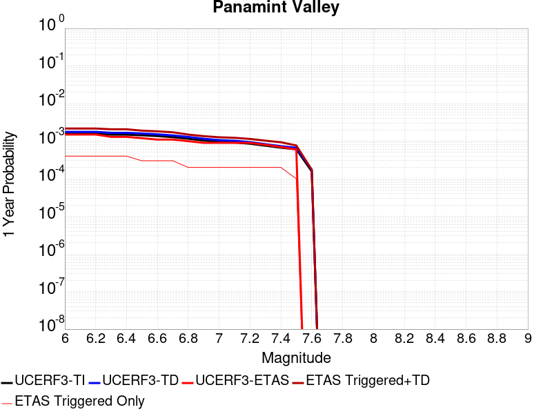 | 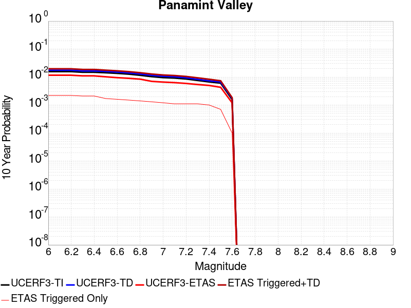 |

| Magnitude | 1 wk TI Prob | 1 wk TD Prob | 1 wk ETAS Prob | 1 wk ETAS/TD Gain | 1 wk ETAS Triggered+TD | 1 wk ETAS Triggered Only | 1 mo TI Prob | 1 mo TD Prob | 1 mo ETAS Prob | 1 mo ETAS/TD Gain | 1 mo ETAS Triggered+TD | 1 mo ETAS Triggered Only | 1 yr TI Prob | 1 yr TD Prob | 1 yr ETAS Prob | 1 yr ETAS/TD Gain | 1 yr ETAS Triggered+TD | 1 yr ETAS Triggered Only | 10 yr TI Prob | 10 yr TD Prob | 10 yr ETAS Prob | 10 yr ETAS/TD Gain | 10 yr ETAS Triggered+TD | 10 yr ETAS Triggered Only |
|-----|-----|-----|-----|-----|-----|-----|-----|-----|-----|-----|-----|-----|-----|-----|-----|-----|-----|-----|-----|-----|-----|-----|-----|-----|
| 6.0 | 3.0211835E-5 | 3.3884E-5 | 0.0 | 0.0 | 3.3884E-5 | 0.0 | 1.2947287E-4 | 1.4520923E-4 | 1.0E-4 | 0.6886615 | 1.4520923E-4 | 0.0 | 0.0015751923 | 0.001766518 | 0.0015 | 0.84912807 | 0.0021658114 | 4.0E-4 | 0.015640736 | 0.01753238 | 0.0116 | 0.6616329 | 0.019693809 | 0.0022 |
| 6.1 | 3.0211835E-5 | 3.3884E-5 | 0.0 | 0.0 | 3.3884E-5 | 0.0 | 1.2947287E-4 | 1.4520923E-4 | 1.0E-4 | 0.6886615 | 1.4520923E-4 | 0.0 | 0.0015751923 | 0.001766518 | 0.0015 | 0.84912807 | 0.0021658114 | 4.0E-4 | 0.015640736 | 0.01753238 | 0.0116 | 0.6616329 | 0.019693809 | 0.0022 |
| 6.2 | 3.0211835E-5 | 3.3884E-5 | 0.0 | 0.0 | 3.3884E-5 | 0.0 | 1.2947287E-4 | 1.4520923E-4 | 1.0E-4 | 0.6886615 | 1.4520923E-4 | 0.0 | 0.0015751923 | 0.001766518 | 0.0015 | 0.84912807 | 0.0021658114 | 4.0E-4 | 0.015640736 | 0.01753238 | 0.0116 | 0.6616329 | 0.019693809 | 0.0022 |
| 6.3 | 2.8573924E-5 | 3.200564E-5 | 0.0 | 0.0 | 3.200564E-5 | 0.0 | 1.2245393E-4 | 1.3715998E-4 | 1.0E-4 | 0.7290757 | 1.3715998E-4 | 0.0 | 0.001489857 | 0.0016686713 | 0.0013 | 0.779063 | 0.0020680039 | 4.0E-4 | 0.01479908 | 0.016568655 | 0.011 | 0.66390425 | 0.018633861 | 0.0021 |
| 6.4 | 2.8573924E-5 | 3.200564E-5 | 0.0 | 0.0 | 3.200564E-5 | 0.0 | 1.2245393E-4 | 1.3715998E-4 | 1.0E-4 | 0.7290757 | 1.3715998E-4 | 0.0 | 0.001489857 | 0.0016686713 | 0.0013 | 0.779063 | 0.0020680039 | 4.0E-4 | 0.01479908 | 0.016568655 | 0.011 | 0.66390425 | 0.018633861 | 0.0021 |
| 6.5 | 2.7468774E-5 | 3.0733812E-5 | 0.0 | 0.0 | 3.0733812E-5 | 0.0 | 1.1771801E-4 | 1.3170984E-4 | 1.0E-4 | 0.75924474 | 1.3170984E-4 | 0.0 | 0.0014322745 | 0.001602415 | 0.0012 | 0.7488697 | 0.0019019343 | 3.0E-4 | 0.014230782 | 0.015915751 | 0.0102 | 0.64087456 | 0.017588694 | 0.0017 |
| 6.6 | 2.6135967E-5 | 2.9160503E-5 | 0.0 | 0.0 | 2.9160503E-5 | 0.0 | 1.1200648E-4 | 1.2496774E-4 | 1.0E-4 | 0.8002065 | 1.2496774E-4 | 0.0 | 0.0013628257 | 0.0015204469 | 0.0011 | 0.7234715 | 0.0018199907 | 3.0E-4 | 0.013544982 | 0.015107549 | 0.0095 | 0.6288247 | 0.016683375 | 0.0016 |
| 6.7 | 2.4498746E-5 | 2.7250808E-5 | 0.0 | 0.0 | 2.7250808E-5 | 0.0 | 1.04990395E-4 | 1.1678409E-4 | 1.0E-4 | 0.856281 | 1.1678409E-4 | 0.0 | 0.0012775084 | 0.0014209439 | 0.0011 | 0.7741333 | 0.0017205176 | 3.0E-4 | 0.012701893 | 0.014125483 | 0.009 | 0.63714635 | 0.015604295 | 0.0015 |
| 6.8 | 2.2244329E-5 | 2.4848146E-5 | 0.0 | 0.0 | 2.4848146E-5 | 0.0 | 9.532935E-5 | 1.0648783E-4 | 1.0E-4 | 0.9390744 | 1.0648783E-4 | 0.0 | 0.0011600169 | 0.00129574 | 0.001 | 0.7717598 | 0.0014954808 | 2.0E-4 | 0.011539802 | 0.012888346 | 0.0084 | 0.6517516 | 0.014270303 | 0.0014 |
| 6.9 | 1.9902658E-5 | 2.2207269E-5 | 0.0 | 0.0 | 2.2207269E-5 | 0.0 | 8.529431E-5 | 9.517064E-5 | 1.0E-4 | 1.0507443 | 9.517064E-5 | 0.0 | 0.0010379635 | 0.001158105 | 9.0E-4 | 0.7771316 | 0.0013578733 | 2.0E-4 | 0.010331288 | 0.011526734 | 0.007 | 0.60728395 | 0.012811748 | 0.0013 |
| 7.0 | 1.8353881E-5 | 2.0486243E-5 | 0.0 | 0.0 | 2.0486243E-5 | 0.0 | 7.865712E-5 | 8.779533E-5 | 1.0E-4 | 1.1390128 | 8.779533E-5 | 0.0 | 9.5722964E-4 | 0.0010684015 | 9.0E-4 | 0.8423799 | 0.0012681879 | 2.0E-4 | 0.009531168 | 0.010638366 | 0.0066 | 0.620396 | 0.011825601 | 0.0012 |
| 7.1 | 1.7667631E-5 | 1.9694082E-5 | 0.0 | 0.0 | 1.9694082E-5 | 0.0 | 7.571623E-5 | 8.440057E-5 | 1.0E-4 | 1.1848261 | 8.440057E-5 | 0.0 | 9.2145515E-4 | 0.00102711 | 9.0E-4 | 0.87624496 | 0.0012269046 | 2.0E-4 | 0.009176437 | 0.010229308 | 0.0063 | 0.61587745 | 0.011318056 | 0.0011 |
| 7.2 | 1.6381597E-5 | 1.8084012E-5 | 0.0 | 0.0 | 1.8084012E-5 | 0.0 | 7.020495E-5 | 7.750071E-5 | 1.0E-4 | 1.2903109 | 7.750071E-5 | 0.0 | 8.544101E-4 | 9.431798E-4 | 9.0E-4 | 0.95421886 | 0.0011429912 | 2.0E-4 | 0.008511325 | 0.009397178 | 0.0059 | 0.627848 | 0.010486841 | 0.0011 |
| 7.3 | 1.4520491E-5 | 1.5905964E-5 | 0.0 | 0.0 | 1.5905964E-5 | 0.0 | 6.222919E-5 | 6.816673E-5 | 0.0 | 0.0 | 6.816673E-5 | 0.0 | 7.57377E-4 | 8.2963E-4 | 8.0E-4 | 0.96428525 | 0.0010294641 | 2.0E-4 | 0.0075480095 | 0.008269115 | 0.0054 | 0.6530324 | 0.009360019 | 0.0011 |
| 7.4 | 1.2852287E-5 | 1.4095156E-5 | 0.0 | 0.0 | 1.4095156E-5 | 0.0 | 5.5080065E-5 | 6.0406503E-5 | 0.0 | 0.0 | 6.0406503E-5 | 0.0 | 6.7039346E-4 | 7.352167E-4 | 7.0E-4 | 0.9521002 | 9.350697E-4 | 2.0E-4 | 0.0066837464 | 0.007331442 | 0.005 | 0.6819941 | 0.008324111 | 0.001 |
| 7.5 | 1.1637851E-5 | 1.2789875E-5 | 0.0 | 0.0 | 1.2789875E-5 | 0.0 | 4.987555E-5 | 5.4812685E-5 | 0.0 | 0.0 | 5.4812685E-5 | 0.0 | 6.070656E-4 | 6.6715566E-4 | 6.0E-4 | 0.89934033 | 7.6708896E-4 | 1.0E-4 | 0.006054099 | 0.006655106 | 0.0043 | 0.6461204 | 0.007350447 | 7.0E-4 |
| 7.6 | 3.0068115E-6 | 3.322222E-6 | 0.0 | 0.0 | 3.322222E-6 | 0.0 | 1.2886271E-5 | 1.4238058E-5 | 0.0 | 0.0 | 1.4238058E-5 | 0.0 | 1.5687906E-4 | 1.7334179E-4 | 0.0 | 0.0 | 1.7334179E-4 | 0.0 | 0.0015676835 | 0.0017343822 | 0.0012 | 0.691889 | 0.0018342088 | 1.0E-4 |

## Cedar Mtn-Mahogany Mtn
*[(top)](#table-of-contents)*

| 1 Week | 1 Month | 1 Year | 10 Year |
|-----|-----|-----|-----|
|  |  | 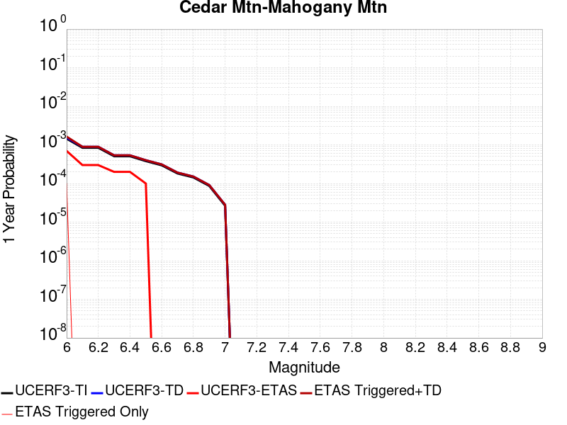 |  |

| Magnitude | 1 wk TI Prob | 1 wk TD Prob | 1 wk ETAS Prob | 1 wk ETAS/TD Gain | 1 wk ETAS Triggered+TD | 1 wk ETAS Triggered Only | 1 mo TI Prob | 1 mo TD Prob | 1 mo ETAS Prob | 1 mo ETAS/TD Gain | 1 mo ETAS Triggered+TD | 1 mo ETAS Triggered Only | 1 yr TI Prob | 1 yr TD Prob | 1 yr ETAS Prob | 1 yr ETAS/TD Gain | 1 yr ETAS Triggered+TD | 1 yr ETAS Triggered Only | 10 yr TI Prob | 10 yr TD Prob | 10 yr ETAS Prob | 10 yr ETAS/TD Gain | 10 yr ETAS Triggered+TD | 10 yr ETAS Triggered Only |
|-----|-----|-----|-----|-----|-----|-----|-----|-----|-----|-----|-----|-----|-----|-----|-----|-----|-----|-----|-----|-----|-----|-----|-----|-----|
| 6.0 | 2.7763876E-5 | 2.9568526E-5 | 1.0E-4 | 3.3819745 | 2.9568526E-5 | 0.0 | 1.1898261E-4 | 1.2671649E-4 | 3.0E-4 | 2.3674898 | 1.2671649E-4 | 0.0 | 0.0014476506 | 0.0015417514 | 7.0E-4 | 0.45402908 | 0.0016415972 | 1.0E-4 | 0.0143825635 | 0.015317763 | 0.0081 | 0.52879786 | 0.017188659 | 0.0019 |
| 6.1 | 1.6162443E-5 | 1.7132097E-5 | 1.0E-4 | 5.836997 | 1.7132097E-5 | 0.0 | 6.926578E-5 | 7.342131E-5 | 3.0E-4 | 4.086007 | 7.342131E-5 | 0.0 | 8.4298453E-4 | 8.935555E-4 | 3.0E-4 | 0.33573738 | 8.935555E-4 | 0.0 | 0.008397939 | 0.008901436 | 0.0041 | 0.46059987 | 0.009991644 | 0.0011 |
| 6.2 | 1.6162443E-5 | 1.7132097E-5 | 1.0E-4 | 5.836997 | 1.7132097E-5 | 0.0 | 6.926578E-5 | 7.342131E-5 | 3.0E-4 | 4.086007 | 7.342131E-5 | 0.0 | 8.4298453E-4 | 8.935555E-4 | 3.0E-4 | 0.33573738 | 8.935555E-4 | 0.0 | 0.008397939 | 0.008901436 | 0.0041 | 0.46059987 | 0.009991644 | 0.0011 |
| 6.3 | 9.746053E-6 | 1.0297002E-5 | 0.0 | 0.0 | 1.0297002E-5 | 0.0 | 4.1768133E-5 | 4.4129283E-5 | 2.0E-4 | 4.532138 | 4.4129283E-5 | 0.0 | 5.0840835E-4 | 5.3714565E-4 | 2.0E-4 | 0.37233847 | 5.3714565E-4 | 0.0 | 0.0050724675 | 0.005358892 | 0.0026 | 0.48517492 | 0.0060551404 | 7.0E-4 |
| 6.4 | 9.746053E-6 | 1.0297002E-5 | 0.0 | 0.0 | 1.0297002E-5 | 0.0 | 4.1768133E-5 | 4.4129283E-5 | 2.0E-4 | 4.532138 | 4.4129283E-5 | 0.0 | 5.0840835E-4 | 5.3714565E-4 | 2.0E-4 | 0.37233847 | 5.3714565E-4 | 0.0 | 0.0050724675 | 0.005358892 | 0.0026 | 0.48517492 | 0.0060551404 | 7.0E-4 |
| 6.5 | 7.290083E-6 | 7.690858E-6 | 0.0 | 0.0 | 7.690858E-6 | 0.0 | 3.124284E-5 | 3.296042E-5 | 1.0E-4 | 3.033942 | 3.296042E-5 | 0.0 | 3.8031515E-4 | 4.0122136E-4 | 1.0E-4 | 0.24923897 | 4.0122136E-4 | 0.0 | 0.0037966494 | 0.00400519 | 0.0018 | 0.4494169 | 0.0046027866 | 6.0E-4 |
| 6.6 | 5.67907E-6 | 5.9857393E-6 | 0.0 | 0.0 | 5.9857393E-6 | 0.0 | 2.4338644E-5 | 2.5652924E-5 | 0.0 | 0.0 | 2.5652924E-5 | 0.0 | 2.962827E-4 | 3.1228093E-4 | 0.0 | 0.0 | 3.1228093E-4 | 0.0 | 0.0029588798 | 0.0031185572 | 0.0014 | 0.44892555 | 0.0036169977 | 5.0E-4 |
| 6.7 | 3.4853963E-6 | 3.670572E-6 | 0.0 | 0.0 | 3.670572E-6 | 0.0 | 1.4937327E-5 | 1.5730931E-5 | 0.0 | 0.0 | 1.5730931E-5 | 0.0 | 1.8184677E-4 | 1.9150788E-4 | 0.0 | 0.0 | 1.9150788E-4 | 0.0 | 0.0018169804 | 0.0019134904 | 9.0E-4 | 0.47034466 | 0.0022129163 | 3.0E-4 |
| 6.8 | 2.7535168E-6 | 2.899948E-6 | 0.0 | 0.0 | 2.899948E-6 | 0.0 | 1.1800733E-5 | 1.2428292E-5 | 0.0 | 0.0 | 1.2428292E-5 | 0.0 | 1.4366445E-4 | 1.5130443E-4 | 0.0 | 0.0 | 1.5130443E-4 | 0.0 | 0.0014357162 | 0.0015120613 | 8.0E-4 | 0.5290791 | 0.0018116077 | 3.0E-4 |
| 6.9 | 1.6594106E-6 | 1.748705E-6 | 0.0 | 0.0 | 1.748705E-6 | 0.0 | 7.1117406E-6 | 7.4944305E-6 | 0.0 | 0.0 | 7.4944305E-6 | 0.0 | 8.6582E-5 | 9.124118E-5 | 0.0 | 0.0 | 9.124118E-5 | 0.0 | 8.654827E-4 | 9.120676E-4 | 4.0E-4 | 0.43856397 | 9.120676E-4 | 0.0 |
| 7.0 | 5.10215E-7 | 5.386089E-7 | 0.0 | 0.0 | 5.386089E-7 | 0.0 | 2.186634E-6 | 2.3083226E-6 | 0.0 | 0.0 | 2.3083226E-6 | 0.0 | 2.6621943E-5 | 2.8103592E-5 | 0.0 | 0.0 | 2.8103592E-5 | 0.0 | 2.6618753E-4 | 2.810129E-4 | 0.0 | 0.0 | 2.810129E-4 | 0.0 |

## Great Valley 06 (Midland) 2011 CFM alt1
*[(top)](#table-of-contents)*

| 1 Week | 1 Month | 1 Year | 10 Year |
|-----|-----|-----|-----|
|  |  |  |  |

| Magnitude | 1 wk TI Prob | 1 wk TD Prob | 1 wk ETAS Prob | 1 wk ETAS/TD Gain | 1 wk ETAS Triggered+TD | 1 wk ETAS Triggered Only | 1 mo TI Prob | 1 mo TD Prob | 1 mo ETAS Prob | 1 mo ETAS/TD Gain | 1 mo ETAS Triggered+TD | 1 mo ETAS Triggered Only | 1 yr TI Prob | 1 yr TD Prob | 1 yr ETAS Prob | 1 yr ETAS/TD Gain | 1 yr ETAS Triggered+TD | 1 yr ETAS Triggered Only | 10 yr TI Prob | 10 yr TD Prob | 10 yr ETAS Prob | 10 yr ETAS/TD Gain | 10 yr ETAS Triggered+TD | 10 yr ETAS Triggered Only |
|-----|-----|-----|-----|-----|-----|-----|-----|-----|-----|-----|-----|-----|-----|-----|-----|-----|-----|-----|-----|-----|-----|-----|-----|-----|
| 6.0 | 1.2712525E-5 | 1.3205172E-5 | 0.0 | 0.0 | 1.3205172E-5 | 0.0 | 5.4481112E-5 | 5.6592507E-5 | 2.0E-4 | 3.5340366 | 5.6592507E-5 | 0.0 | 6.6310563E-4 | 6.8882137E-4 | 6.0E-4 | 0.87105316 | 8.886836E-4 | 2.0E-4 | 0.0066113044 | 0.006869376 | 0.0063 | 0.91711384 | 0.008954951 | 0.0021 |
| 6.1 | 1.2712525E-5 | 1.3205172E-5 | 0.0 | 0.0 | 1.3205172E-5 | 0.0 | 5.4481112E-5 | 5.6592507E-5 | 2.0E-4 | 3.5340366 | 5.6592507E-5 | 0.0 | 6.6310563E-4 | 6.8882137E-4 | 6.0E-4 | 0.87105316 | 8.886836E-4 | 2.0E-4 | 0.0066113044 | 0.006869376 | 0.0063 | 0.91711384 | 0.008954951 | 0.0021 |
| 6.2 | 1.2712525E-5 | 1.3205172E-5 | 0.0 | 0.0 | 1.3205172E-5 | 0.0 | 5.4481112E-5 | 5.6592507E-5 | 2.0E-4 | 3.5340366 | 5.6592507E-5 | 0.0 | 6.6310563E-4 | 6.8882137E-4 | 6.0E-4 | 0.87105316 | 8.886836E-4 | 2.0E-4 | 0.0066113044 | 0.006869376 | 0.0063 | 0.91711384 | 0.008954951 | 0.0021 |
| 6.3 | 1.2712525E-5 | 1.3205172E-5 | 0.0 | 0.0 | 1.3205172E-5 | 0.0 | 5.4481112E-5 | 5.6592507E-5 | 2.0E-4 | 3.5340366 | 5.6592507E-5 | 0.0 | 6.6310563E-4 | 6.8882137E-4 | 6.0E-4 | 0.87105316 | 8.886836E-4 | 2.0E-4 | 0.0066113044 | 0.006869376 | 0.0063 | 0.91711384 | 0.008954951 | 0.0021 |
| 6.4 | 1.2712525E-5 | 1.3205172E-5 | 0.0 | 0.0 | 1.3205172E-5 | 0.0 | 5.4481112E-5 | 5.6592507E-5 | 2.0E-4 | 3.5340366 | 5.6592507E-5 | 0.0 | 6.6310563E-4 | 6.8882137E-4 | 6.0E-4 | 0.87105316 | 8.886836E-4 | 2.0E-4 | 0.0066113044 | 0.006869376 | 0.0063 | 0.91711384 | 0.008954951 | 0.0021 |
| 6.5 | 1.2712525E-5 | 1.3205172E-5 | 0.0 | 0.0 | 1.3205172E-5 | 0.0 | 5.4481112E-5 | 5.6592507E-5 | 2.0E-4 | 3.5340366 | 5.6592507E-5 | 0.0 | 6.6310563E-4 | 6.8882137E-4 | 6.0E-4 | 0.87105316 | 8.886836E-4 | 2.0E-4 | 0.0066113044 | 0.006869376 | 0.0063 | 0.91711384 | 0.008954951 | 0.0021 |
| 6.6 | 5.7574384E-6 | 5.9683384E-6 | 0.0 | 0.0 | 5.9683384E-6 | 0.0 | 2.4674504E-5 | 2.5578363E-5 | 0.0 | 0.0 | 2.5578363E-5 | 0.0 | 3.0037065E-4 | 3.1137597E-4 | 3.0E-4 | 0.96346545 | 4.1134484E-4 | 1.0E-4 | 0.0029996498 | 0.0031097834 | 0.0023 | 0.7396014 | 0.0039072954 | 8.0E-4 |
| 6.7 | 5.7574384E-6 | 5.9683384E-6 | 0.0 | 0.0 | 5.9683384E-6 | 0.0 | 2.4674504E-5 | 2.5578363E-5 | 0.0 | 0.0 | 2.5578363E-5 | 0.0 | 3.0037065E-4 | 3.1137597E-4 | 3.0E-4 | 0.96346545 | 4.1134484E-4 | 1.0E-4 | 0.0029996498 | 0.0031097834 | 0.0023 | 0.7396014 | 0.0039072954 | 8.0E-4 |
| 6.8 | 3.3474828E-6 | 3.468066E-6 | 0.0 | 0.0 | 3.468066E-6 | 0.0 | 1.4346277E-5 | 1.4863063E-5 | 0.0 | 0.0 | 1.4863063E-5 | 0.0 | 1.7465191E-4 | 1.8094426E-4 | 3.0E-4 | 1.6579691 | 2.8092618E-4 | 1.0E-4 | 0.0017451472 | 0.0018081163 | 0.0015 | 0.82959265 | 0.0024070314 | 6.0E-4 |
| 6.9 | 2.035106E-6 | 2.108236E-6 | 0.0 | 0.0 | 2.108236E-6 | 0.0 | 8.721853E-6 | 9.03527E-6 | 0.0 | 0.0 | 9.03527E-6 | 0.0 | 1.0618339E-4 | 1.09999586E-4 | 3.0E-4 | 2.727283 | 2.0998859E-4 | 1.0E-4 | 0.0010613267 | 0.0010995236 | 0.0013 | 1.1823303 | 0.0014990838 | 4.0E-4 |
| 7.0 | 1.2424716E-6 | 1.287385E-6 | 0.0 | 0.0 | 1.287385E-6 | 0.0 | 5.3248673E-6 | 5.517355E-6 | 0.0 | 0.0 | 5.517355E-6 | 0.0 | 6.482833E-5 | 6.717218E-5 | 2.0E-4 | 2.9774232 | 1.6716546E-4 | 1.0E-4 | 6.480942E-4 | 6.7156303E-4 | 7.0E-4 | 1.0423445 | 8.714287E-4 | 2.0E-4 |
| 7.1 | 6.6904556E-7 | 6.936344E-7 | 0.0 | 0.0 | 6.936344E-7 | 0.0 | 2.867335E-6 | 2.9727169E-6 | 0.0 | 0.0 | 2.9727169E-6 | 0.0 | 3.4909244E-5 | 3.6192487E-5 | 1.0E-4 | 2.7630045 | 3.6192487E-5 | 0.0 | 3.490376E-4 | 3.618914E-4 | 3.0E-4 | 0.828978 | 4.618552E-4 | 1.0E-4 |
| 7.2 | 3.948168E-7 | 4.0941075E-7 | 0.0 | 0.0 | 4.0941075E-7 | 0.0 | 1.6920709E-6 | 1.7546175E-6 | 0.0 | 0.0 | 1.7546175E-6 | 0.0 | 2.0600768E-5 | 2.1362468E-5 | 1.0E-4 | 4.681107 | 2.1362468E-5 | 0.0 | 2.0598859E-4 | 2.1362468E-4 | 2.0E-4 | 0.9362214 | 2.1362468E-4 | 0.0 |

## Channel Islands Thrust
*[(top)](#table-of-contents)*

| 1 Week | 1 Month | 1 Year | 10 Year |
|-----|-----|-----|-----|
|  | 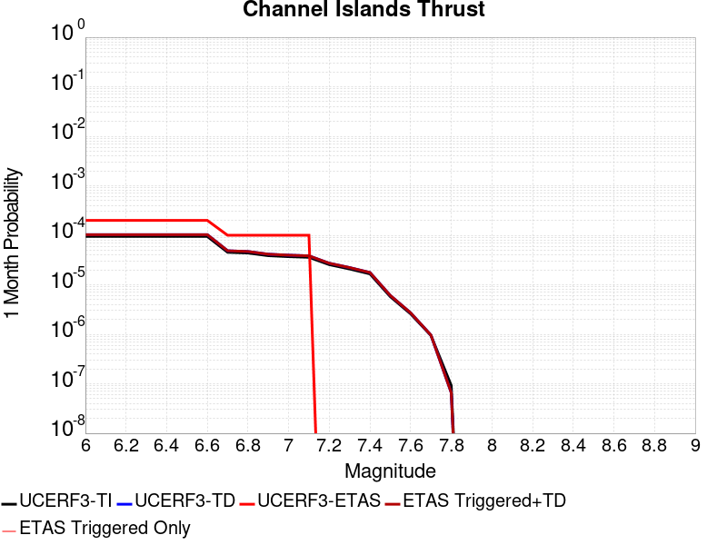 |  |  |

| Magnitude | 1 wk TI Prob | 1 wk TD Prob | 1 wk ETAS Prob | 1 wk ETAS/TD Gain | 1 wk ETAS Triggered+TD | 1 wk ETAS Triggered Only | 1 mo TI Prob | 1 mo TD Prob | 1 mo ETAS Prob | 1 mo ETAS/TD Gain | 1 mo ETAS Triggered+TD | 1 mo ETAS Triggered Only | 1 yr TI Prob | 1 yr TD Prob | 1 yr ETAS Prob | 1 yr ETAS/TD Gain | 1 yr ETAS Triggered+TD | 1 yr ETAS Triggered Only | 10 yr TI Prob | 10 yr TD Prob | 10 yr ETAS Prob | 10 yr ETAS/TD Gain | 10 yr ETAS Triggered+TD | 10 yr ETAS Triggered Only |
|-----|-----|-----|-----|-----|-----|-----|-----|-----|-----|-----|-----|-----|-----|-----|-----|-----|-----|-----|-----|-----|-----|-----|-----|-----|
| 6.0 | 2.2156251E-5 | 2.4069896E-5 | 2.0E-4 | 8.3091345 | 2.4069896E-5 | 0.0 | 9.495191E-5 | 1.03153216E-4 | 2.0E-4 | 1.9388634 | 1.03153216E-4 | 0.0 | 0.0011554264 | 0.0012552731 | 7.0E-4 | 0.5576475 | 0.0014550221 | 2.0E-4 | 0.011494373 | 0.012492395 | 0.0081 | 0.64839447 | 0.014467411 | 0.002 |
| 6.1 | 2.2156251E-5 | 2.4069896E-5 | 2.0E-4 | 8.3091345 | 2.4069896E-5 | 0.0 | 9.495191E-5 | 1.03153216E-4 | 2.0E-4 | 1.9388634 | 1.03153216E-4 | 0.0 | 0.0011554264 | 0.0012552731 | 7.0E-4 | 0.5576475 | 0.0014550221 | 2.0E-4 | 0.011494373 | 0.012492395 | 0.0081 | 0.64839447 | 0.014467411 | 0.002 |
| 6.2 | 2.2156251E-5 | 2.4069896E-5 | 2.0E-4 | 8.3091345 | 2.4069896E-5 | 0.0 | 9.495191E-5 | 1.03153216E-4 | 2.0E-4 | 1.9388634 | 1.03153216E-4 | 0.0 | 0.0011554264 | 0.0012552731 | 7.0E-4 | 0.5576475 | 0.0014550221 | 2.0E-4 | 0.011494373 | 0.012492395 | 0.0081 | 0.64839447 | 0.014467411 | 0.002 |
| 6.3 | 2.2156251E-5 | 2.4069896E-5 | 2.0E-4 | 8.3091345 | 2.4069896E-5 | 0.0 | 9.495191E-5 | 1.03153216E-4 | 2.0E-4 | 1.9388634 | 1.03153216E-4 | 0.0 | 0.0011554264 | 0.0012552731 | 7.0E-4 | 0.5576475 | 0.0014550221 | 2.0E-4 | 0.011494373 | 0.012492395 | 0.0081 | 0.64839447 | 0.014467411 | 0.002 |
| 6.4 | 2.2156251E-5 | 2.4069896E-5 | 2.0E-4 | 8.3091345 | 2.4069896E-5 | 0.0 | 9.495191E-5 | 1.03153216E-4 | 2.0E-4 | 1.9388634 | 1.03153216E-4 | 0.0 | 0.0011554264 | 0.0012552731 | 7.0E-4 | 0.5576475 | 0.0014550221 | 2.0E-4 | 0.011494373 | 0.012492395 | 0.0081 | 0.64839447 | 0.014467411 | 0.002 |
| 6.5 | 2.2156251E-5 | 2.4069896E-5 | 2.0E-4 | 8.3091345 | 2.4069896E-5 | 0.0 | 9.495191E-5 | 1.03153216E-4 | 2.0E-4 | 1.9388634 | 1.03153216E-4 | 0.0 | 0.0011554264 | 0.0012552731 | 7.0E-4 | 0.5576475 | 0.0014550221 | 2.0E-4 | 0.011494373 | 0.012492395 | 0.0081 | 0.64839447 | 0.014467411 | 0.002 |
| 6.6 | 2.2156251E-5 | 2.4069896E-5 | 2.0E-4 | 8.3091345 | 2.4069896E-5 | 0.0 | 9.495191E-5 | 1.03153216E-4 | 2.0E-4 | 1.9388634 | 1.03153216E-4 | 0.0 | 0.0011554264 | 0.0012552731 | 7.0E-4 | 0.5576475 | 0.0014550221 | 2.0E-4 | 0.011494373 | 0.012492395 | 0.0081 | 0.64839447 | 0.014467411 | 0.002 |
| 6.7 | 1.0601296E-5 | 1.1370703E-5 | 1.0E-4 | 8.794531 | 1.1370703E-5 | 0.0 | 4.5433335E-5 | 4.87307E-5 | 1.0E-4 | 2.0520945 | 4.87307E-5 | 0.0 | 5.5301044E-4 | 5.931397E-4 | 3.0E-4 | 0.5057831 | 6.930803E-4 | 1.0E-4 | 0.005516363 | 0.0059160665 | 0.003 | 0.50709367 | 0.0069101504 | 0.001 |
| 6.8 | 1.0246747E-5 | 1.0988148E-5 | 1.0E-4 | 9.100716 | 1.0988148E-5 | 0.0 | 4.391389E-5 | 4.7091235E-5 | 1.0E-4 | 2.1235373 | 4.7091235E-5 | 0.0 | 5.345204E-4 | 5.7318975E-4 | 3.0E-4 | 0.5233869 | 6.731324E-4 | 1.0E-4 | 0.0053323656 | 0.0057176026 | 0.0029 | 0.50720555 | 0.0067118853 | 0.001 |
| 6.9 | 9.049551E-6 | 9.692251E-6 | 1.0E-4 | 10.31752 | 9.692251E-6 | 0.0 | 3.878322E-5 | 4.1537583E-5 | 1.0E-4 | 2.4074583 | 4.1537583E-5 | 0.0 | 4.7208337E-4 | 5.056068E-4 | 3.0E-4 | 0.5933464 | 6.0555624E-4 | 1.0E-4 | 0.0047108172 | 0.0050449814 | 0.0024 | 0.4757203 | 0.0058409455 | 8.0E-4 |
| 7.0 | 8.6542195E-6 | 9.267544E-6 | 1.0E-4 | 10.790345 | 9.267544E-6 | 0.0 | 3.7088983E-5 | 3.9717463E-5 | 1.0E-4 | 2.517784 | 3.9717463E-5 | 0.0 | 4.5146482E-4 | 4.8345688E-4 | 3.0E-4 | 0.620531 | 5.834086E-4 | 1.0E-4 | 0.004505487 | 0.004824463 | 0.0024 | 0.49746472 | 0.005620603 | 8.0E-4 |
| 7.1 | 8.391028E-6 | 8.986072E-6 | 1.0E-4 | 11.128332 | 8.986072E-6 | 0.0 | 3.5961057E-5 | 3.8511193E-5 | 1.0E-4 | 2.5966477 | 3.8511193E-5 | 0.0 | 4.3773788E-4 | 4.6877697E-4 | 2.0E-4 | 0.42664212 | 4.6877697E-4 | 0.0 | 0.004368766 | 0.004678291 | 0.002 | 0.42750657 | 0.0052754837 | 6.0E-4 |
| 7.2 | 5.965188E-6 | 6.367049E-6 | 0.0 | 0.0 | 6.367049E-6 | 0.0 | 2.556484E-5 | 2.7287071E-5 | 0.0 | 0.0 | 2.7287071E-5 | 0.0 | 3.1120746E-4 | 3.3217E-4 | 1.0E-4 | 0.30105066 | 3.3217E-4 | 0.0 | 0.00310772 | 0.003316793 | 0.0014 | 0.4220945 | 0.0037154662 | 4.0E-4 |
| 7.3 | 4.877518E-6 | 5.202234E-6 | 0.0 | 0.0 | 5.202234E-6 | 0.0 | 2.0903482E-5 | 2.22951E-5 | 0.0 | 0.0 | 2.22951E-5 | 0.0 | 2.5447016E-4 | 2.714095E-4 | 1.0E-4 | 0.36844695 | 2.714095E-4 | 0.0 | 0.0025417898 | 0.0027108265 | 0.0013 | 0.47955856 | 0.003109742 | 4.0E-4 |
| 7.4 | 3.8829853E-6 | 4.1388685E-6 | 0.0 | 0.0 | 4.1388685E-6 | 0.0 | 1.664126E-5 | 1.7737888E-5 | 0.0 | 0.0 | 1.7737888E-5 | 0.0 | 2.0258849E-4 | 2.159378E-4 | 1.0E-4 | 0.4630963 | 2.159378E-4 | 0.0 | 0.002024039 | 0.0021573214 | 9.0E-4 | 0.417184 | 0.0023568901 | 2.0E-4 |
| 7.5 | 1.3489616E-6 | 1.4268106E-6 | 0.0 | 0.0 | 1.4268106E-6 | 0.0 | 5.7812517E-6 | 6.1148885E-6 | 0.0 | 0.0 | 6.1148885E-6 | 0.0 | 7.038446E-5 | 7.444627E-5 | 0.0 | 0.0 | 7.444627E-5 | 0.0 | 7.036218E-4 | 7.4421725E-4 | 1.0E-4 | 0.13436937 | 7.4421725E-4 | 0.0 |
| 7.6 | 6.058192E-7 | 6.349486E-7 | 0.0 | 0.0 | 6.349486E-7 | 0.0 | 2.5963652E-6 | 2.7212056E-6 | 0.0 | 0.0 | 2.7212056E-6 | 0.0 | 3.161029E-5 | 3.3130193E-5 | 0.0 | 0.0 | 3.3130193E-5 | 0.0 | 3.1605794E-4 | 3.3125412E-4 | 0.0 | 0.0 | 3.3125412E-4 | 0.0 |
| 7.7 | 2.2170494E-7 | 2.2593485E-7 | 0.0 | 0.0 | 2.2593485E-7 | 0.0 | 9.5016367E-7 | 9.682919E-7 | 0.0 | 0.0 | 9.682919E-7 | 0.0 | 1.1568181E-5 | 1.1788902E-5 | 0.0 | 0.0 | 1.1788902E-5 | 0.0 | 1.1567579E-4 | 1.1788387E-4 | 0.0 | 0.0 | 1.1788387E-4 | 0.0 |
| 7.8 | 2.1613102E-8 | 1.545333E-8 | 0.0 | 0.0 | 1.545333E-8 | 0.0 | 9.262757E-8 | 6.622856E-8 | 0.0 | 0.0 | 6.622856E-8 | 0.0 | 1.1277401E-6 | 8.063324E-7 | 0.0 | 0.0 | 8.063324E-7 | 0.0 | 1.1277344E-5 | 8.063303E-6 | 0.0 | 0.0 | 8.063303E-6 | 0.0 |

## McKinleyville (alt1)
*[(top)](#table-of-contents)*

| 1 Week | 1 Month | 1 Year | 10 Year |
|-----|-----|-----|-----|
|  | 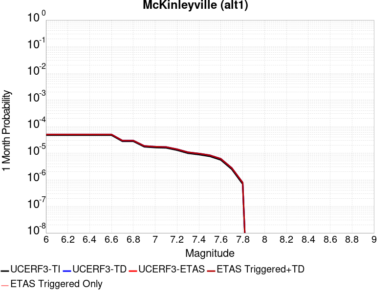 | 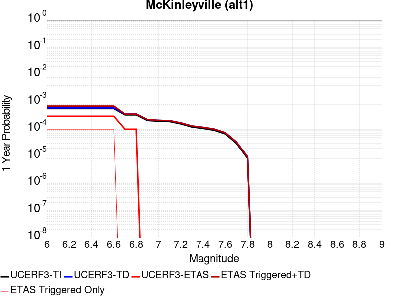 |  |

| Magnitude | 1 wk TI Prob | 1 wk TD Prob | 1 wk ETAS Prob | 1 wk ETAS/TD Gain | 1 wk ETAS Triggered+TD | 1 wk ETAS Triggered Only | 1 mo TI Prob | 1 mo TD Prob | 1 mo ETAS Prob | 1 mo ETAS/TD Gain | 1 mo ETAS Triggered+TD | 1 mo ETAS Triggered Only | 1 yr TI Prob | 1 yr TD Prob | 1 yr ETAS Prob | 1 yr ETAS/TD Gain | 1 yr ETAS Triggered+TD | 1 yr ETAS Triggered Only | 10 yr TI Prob | 10 yr TD Prob | 10 yr ETAS Prob | 10 yr ETAS/TD Gain | 10 yr ETAS Triggered+TD | 10 yr ETAS Triggered Only |
|-----|-----|-----|-----|-----|-----|-----|-----|-----|-----|-----|-----|-----|-----|-----|-----|-----|-----|-----|-----|-----|-----|-----|-----|-----|
| 6.0 | 1.1028524E-5 | 1.1719955E-5 | 0.0 | 0.0 | 1.1719955E-5 | 0.0 | 4.7264242E-5 | 5.0227554E-5 | 0.0 | 0.0 | 5.0227554E-5 | 0.0 | 5.7529024E-4 | 6.113743E-4 | 3.0E-4 | 0.49069777 | 7.1131316E-4 | 1.0E-4 | 0.005738032 | 0.006099429 | 0.0054 | 0.88532877 | 0.00808723 | 0.002 |
| 6.1 | 1.1028524E-5 | 1.1719955E-5 | 0.0 | 0.0 | 1.1719955E-5 | 0.0 | 4.7264242E-5 | 5.0227554E-5 | 0.0 | 0.0 | 5.0227554E-5 | 0.0 | 5.7529024E-4 | 6.113743E-4 | 3.0E-4 | 0.49069777 | 7.1131316E-4 | 1.0E-4 | 0.005738032 | 0.006099429 | 0.0054 | 0.88532877 | 0.00808723 | 0.002 |
| 6.2 | 1.1028524E-5 | 1.1719955E-5 | 0.0 | 0.0 | 1.1719955E-5 | 0.0 | 4.7264242E-5 | 5.0227554E-5 | 0.0 | 0.0 | 5.0227554E-5 | 0.0 | 5.7529024E-4 | 6.113743E-4 | 3.0E-4 | 0.49069777 | 7.1131316E-4 | 1.0E-4 | 0.005738032 | 0.006099429 | 0.0054 | 0.88532877 | 0.00808723 | 0.002 |
| 6.3 | 1.1028524E-5 | 1.1719955E-5 | 0.0 | 0.0 | 1.1719955E-5 | 0.0 | 4.7264242E-5 | 5.0227554E-5 | 0.0 | 0.0 | 5.0227554E-5 | 0.0 | 5.7529024E-4 | 6.113743E-4 | 3.0E-4 | 0.49069777 | 7.1131316E-4 | 1.0E-4 | 0.005738032 | 0.006099429 | 0.0054 | 0.88532877 | 0.00808723 | 0.002 |
| 6.4 | 1.1028524E-5 | 1.1719955E-5 | 0.0 | 0.0 | 1.1719955E-5 | 0.0 | 4.7264242E-5 | 5.0227554E-5 | 0.0 | 0.0 | 5.0227554E-5 | 0.0 | 5.7529024E-4 | 6.113743E-4 | 3.0E-4 | 0.49069777 | 7.1131316E-4 | 1.0E-4 | 0.005738032 | 0.006099429 | 0.0054 | 0.88532877 | 0.00808723 | 0.002 |
| 6.5 | 1.1028524E-5 | 1.1719955E-5 | 0.0 | 0.0 | 1.1719955E-5 | 0.0 | 4.7264242E-5 | 5.0227554E-5 | 0.0 | 0.0 | 5.0227554E-5 | 0.0 | 5.7529024E-4 | 6.113743E-4 | 3.0E-4 | 0.49069777 | 7.1131316E-4 | 1.0E-4 | 0.005738032 | 0.006099429 | 0.0054 | 0.88532877 | 0.00808723 | 0.002 |
| 6.6 | 1.1028524E-5 | 1.1719955E-5 | 0.0 | 0.0 | 1.1719955E-5 | 0.0 | 4.7264242E-5 | 5.0227554E-5 | 0.0 | 0.0 | 5.0227554E-5 | 0.0 | 5.7529024E-4 | 6.113743E-4 | 3.0E-4 | 0.49069777 | 7.1131316E-4 | 1.0E-4 | 0.005738032 | 0.006099429 | 0.0054 | 0.88532877 | 0.00808723 | 0.002 |
| 6.7 | 6.483374E-6 | 6.9122175E-6 | 0.0 | 0.0 | 6.9122175E-6 | 0.0 | 2.7785592E-5 | 2.9623488E-5 | 0.0 | 0.0 | 2.9623488E-5 | 0.0 | 3.3823706E-4 | 3.6061247E-4 | 1.0E-4 | 0.277306 | 3.6061247E-4 | 0.0 | 0.003377227 | 0.0036008852 | 0.0024 | 0.6665028 | 0.0041987244 | 6.0E-4 |
| 6.8 | 6.483374E-6 | 6.9122175E-6 | 0.0 | 0.0 | 6.9122175E-6 | 0.0 | 2.7785592E-5 | 2.9623488E-5 | 0.0 | 0.0 | 2.9623488E-5 | 0.0 | 3.3823706E-4 | 3.6061247E-4 | 1.0E-4 | 0.277306 | 3.6061247E-4 | 0.0 | 0.003377227 | 0.0036008852 | 0.0024 | 0.6665028 | 0.0041987244 | 6.0E-4 |
| 6.9 | 4.0394048E-6 | 4.341882E-6 | 0.0 | 0.0 | 4.341882E-6 | 0.0 | 1.731162E-5 | 1.8607934E-5 | 0.0 | 0.0 | 1.8607934E-5 | 0.0 | 2.1074859E-4 | 2.265286E-4 | 0.0 | 0.0 | 2.265286E-4 | 0.0 | 0.0021054882 | 0.0022630317 | 0.0012 | 0.5302621 | 0.002562353 | 3.0E-4 |
| 7.0 | 3.7791233E-6 | 4.0688788E-6 | 0.0 | 0.0 | 4.0688788E-6 | 0.0 | 1.6196142E-5 | 1.7437938E-5 | 0.0 | 0.0 | 1.7437938E-5 | 0.0 | 1.9717019E-4 | 2.1228672E-4 | 0.0 | 0.0 | 2.1228672E-4 | 0.0 | 0.0019699533 | 0.0021208893 | 0.0011 | 0.5186504 | 0.002320465 | 2.0E-4 |
| 7.1 | 3.675443E-6 | 3.960234E-6 | 0.0 | 0.0 | 3.960234E-6 | 0.0 | 1.5751802E-5 | 1.6972324E-5 | 0.0 | 0.0 | 1.6972324E-5 | 0.0 | 1.9176133E-4 | 2.0661895E-4 | 0.0 | 0.0 | 2.0661895E-4 | 0.0 | 0.0019159593 | 0.002064318 | 0.0011 | 0.5328636 | 0.002263905 | 2.0E-4 |
| 7.2 | 3.0165843E-6 | 3.2691917E-6 | 0.0 | 0.0 | 3.2691917E-6 | 0.0 | 1.2928153E-5 | 1.4010747E-5 | 0.0 | 0.0 | 1.4010747E-5 | 0.0 | 1.573889E-4 | 1.7056768E-4 | 0.0 | 0.0 | 1.7056768E-4 | 0.0 | 0.0015727748 | 0.0017043864 | 0.001 | 0.5867214 | 0.001804216 | 1.0E-4 |
| 7.3 | 2.307633E-6 | 2.5164982E-6 | 0.0 | 0.0 | 2.5164982E-6 | 0.0 | 9.889818E-6 | 1.0784948E-5 | 0.0 | 0.0 | 1.0784948E-5 | 0.0 | 1.2040188E-4 | 1.312989E-4 | 0.0 | 0.0 | 1.312989E-4 | 0.0 | 0.0012033667 | 0.0013122217 | 8.0E-4 | 0.60965306 | 0.0014120905 | 1.0E-4 |
| 7.4 | 2.0568484E-6 | 2.2494894E-6 | 0.0 | 0.0 | 2.2494894E-6 | 0.0 | 8.8150355E-6 | 9.640634E-6 | 0.0 | 0.0 | 9.640634E-6 | 0.0 | 1.0731777E-4 | 1.1736847E-4 | 0.0 | 0.0 | 1.1736847E-4 | 0.0 | 0.0010726595 | 0.0011730725 | 8.0E-4 | 0.6819698 | 0.0012729552 | 1.0E-4 |
| 7.5 | 1.7674889E-6 | 1.9394265E-6 | 0.0 | 0.0 | 1.9394265E-6 | 0.0 | 7.5749304E-6 | 8.311801E-6 | 0.0 | 0.0 | 8.311801E-6 | 0.0 | 9.222087E-5 | 1.01191545E-4 | 0.0 | 0.0 | 1.01191545E-4 | 0.0 | 9.218261E-4 | 0.0010114614 | 8.0E-4 | 0.79093486 | 0.0011113602 | 1.0E-4 |
| 7.6 | 1.2944297E-6 | 1.4280773E-6 | 0.0 | 0.0 | 1.4280773E-6 | 0.0 | 5.547544E-6 | 6.1203173E-6 | 0.0 | 0.0 | 6.1203173E-6 | 0.0 | 6.753925E-5 | 7.451236E-5 | 0.0 | 0.0 | 7.451236E-5 | 0.0 | 6.7518733E-4 | 7.448786E-4 | 8.0E-4 | 1.0740005 | 8.448041E-4 | 1.0E-4 |
| 7.7 | 5.806243E-7 | 6.4533947E-7 | 0.0 | 0.0 | 6.4533947E-7 | 0.0 | 2.4883875E-6 | 2.765738E-6 | 0.0 | 0.0 | 2.765738E-6 | 0.0 | 3.0295698E-5 | 3.3672353E-5 | 0.0 | 0.0 | 3.3672353E-5 | 0.0 | 3.0291567E-4 | 3.3667422E-4 | 6.0E-4 | 1.7821383 | 3.3667422E-4 | 0.0 |
| 7.8 | 1.6121008E-7 | 1.81592E-7 | 0.0 | 0.0 | 1.81592E-7 | 0.0 | 6.909002E-7 | 7.7825126E-7 | 0.0 | 0.0 | 7.7825126E-7 | 0.0 | 8.411677E-6 | 9.47517E-6 | 0.0 | 0.0 | 9.47517E-6 | 0.0 | 8.411359E-5 | 9.474791E-5 | 2.0E-4 | 2.1108644 | 9.474791E-5 | 0.0 |

## Oak Ridge (Onshore)
*[(top)](#table-of-contents)*

| 1 Week | 1 Month | 1 Year | 10 Year |
|-----|-----|-----|-----|
|  |  | 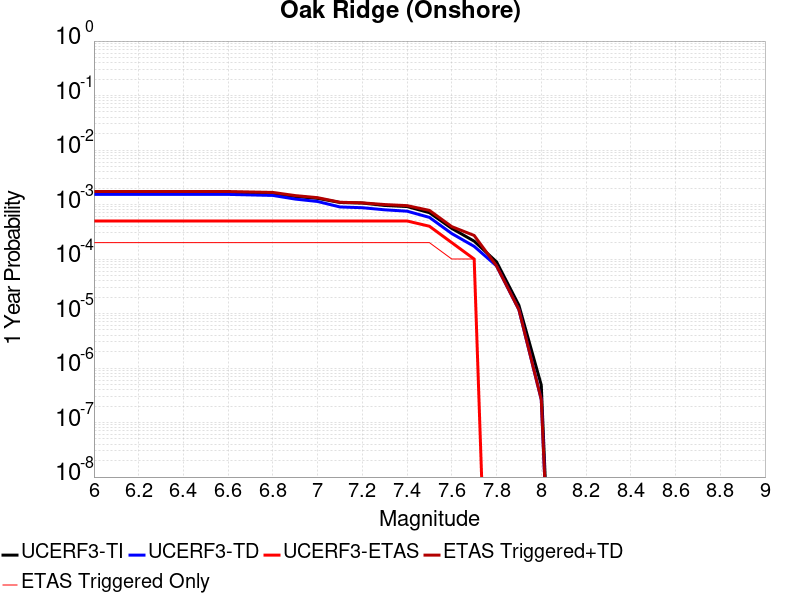 |  |

| Magnitude | 1 wk TI Prob | 1 wk TD Prob | 1 wk ETAS Prob | 1 wk ETAS/TD Gain | 1 wk ETAS Triggered+TD | 1 wk ETAS Triggered Only | 1 mo TI Prob | 1 mo TD Prob | 1 mo ETAS Prob | 1 mo ETAS/TD Gain | 1 mo ETAS Triggered+TD | 1 mo ETAS Triggered Only | 1 yr TI Prob | 1 yr TD Prob | 1 yr ETAS Prob | 1 yr ETAS/TD Gain | 1 yr ETAS Triggered+TD | 1 yr ETAS Triggered Only | 10 yr TI Prob | 10 yr TD Prob | 10 yr ETAS Prob | 10 yr ETAS/TD Gain | 10 yr ETAS Triggered+TD | 10 yr ETAS Triggered Only |
|-----|-----|-----|-----|-----|-----|-----|-----|-----|-----|-----|-----|-----|-----|-----|-----|-----|-----|-----|-----|-----|-----|-----|-----|-----|
| 6.0 | 3.155064E-5 | 2.9476469E-5 | 0.0 | 0.0 | 2.9476469E-5 | 0.0 | 1.3521002E-4 | 1.2632181E-4 | 0.0 | 0.0 | 1.2632181E-4 | 0.0 | 0.001644939 | 0.001536921 | 5.0E-4 | 0.32532576 | 0.0017366137 | 2.0E-4 | 0.01632816 | 0.015267061 | 0.0088 | 0.57640433 | 0.017335 | 0.0021 |
| 6.1 | 3.155064E-5 | 2.9476469E-5 | 0.0 | 0.0 | 2.9476469E-5 | 0.0 | 1.3521002E-4 | 1.2632181E-4 | 0.0 | 0.0 | 1.2632181E-4 | 0.0 | 0.001644939 | 0.001536921 | 5.0E-4 | 0.32532576 | 0.0017366137 | 2.0E-4 | 0.01632816 | 0.015267061 | 0.0088 | 0.57640433 | 0.017335 | 0.0021 |
| 6.2 | 3.155064E-5 | 2.9476469E-5 | 0.0 | 0.0 | 2.9476469E-5 | 0.0 | 1.3521002E-4 | 1.2632181E-4 | 0.0 | 0.0 | 1.2632181E-4 | 0.0 | 0.001644939 | 0.001536921 | 5.0E-4 | 0.32532576 | 0.0017366137 | 2.0E-4 | 0.01632816 | 0.015267061 | 0.0088 | 0.57640433 | 0.017335 | 0.0021 |
| 6.3 | 3.155064E-5 | 2.9476469E-5 | 0.0 | 0.0 | 2.9476469E-5 | 0.0 | 1.3521002E-4 | 1.2632181E-4 | 0.0 | 0.0 | 1.2632181E-4 | 0.0 | 0.001644939 | 0.001536921 | 5.0E-4 | 0.32532576 | 0.0017366137 | 2.0E-4 | 0.01632816 | 0.015267061 | 0.0088 | 0.57640433 | 0.017335 | 0.0021 |
| 6.4 | 3.155064E-5 | 2.9476469E-5 | 0.0 | 0.0 | 2.9476469E-5 | 0.0 | 1.3521002E-4 | 1.2632181E-4 | 0.0 | 0.0 | 1.2632181E-4 | 0.0 | 0.001644939 | 0.001536921 | 5.0E-4 | 0.32532576 | 0.0017366137 | 2.0E-4 | 0.01632816 | 0.015267061 | 0.0088 | 0.57640433 | 0.017335 | 0.0021 |
| 6.5 | 3.155064E-5 | 2.9476469E-5 | 0.0 | 0.0 | 2.9476469E-5 | 0.0 | 1.3521002E-4 | 1.2632181E-4 | 0.0 | 0.0 | 1.2632181E-4 | 0.0 | 0.001644939 | 0.001536921 | 5.0E-4 | 0.32532576 | 0.0017366137 | 2.0E-4 | 0.01632816 | 0.015267061 | 0.0088 | 0.57640433 | 0.017335 | 0.0021 |
| 6.6 | 3.155064E-5 | 2.9476469E-5 | 0.0 | 0.0 | 2.9476469E-5 | 0.0 | 1.3521002E-4 | 1.2632181E-4 | 0.0 | 0.0 | 1.2632181E-4 | 0.0 | 0.001644939 | 0.001536921 | 5.0E-4 | 0.32532576 | 0.0017366137 | 2.0E-4 | 0.01632816 | 0.015267061 | 0.0088 | 0.57640433 | 0.017335 | 0.0021 |
| 6.7 | 3.098897E-5 | 2.8815899E-5 | 0.0 | 0.0 | 2.8815899E-5 | 0.0 | 1.328031E-4 | 1.2349107E-4 | 0.0 | 0.0 | 1.2349107E-4 | 0.0 | 0.0016156785 | 0.0015025045 | 5.0E-4 | 0.3327777 | 0.001702204 | 2.0E-4 | 0.016039822 | 0.014927538 | 0.0086 | 0.57611644 | 0.01699619 | 0.0021 |
| 6.8 | 3.0449872E-5 | 2.8192131E-5 | 0.0 | 0.0 | 2.8192131E-5 | 0.0 | 1.3049292E-4 | 1.2081803E-4 | 0.0 | 0.0 | 1.2081803E-4 | 0.0 | 0.0015875935 | 0.0014700041 | 5.0E-4 | 0.3401351 | 0.0016697102 | 2.0E-4 | 0.015762992 | 0.014606811 | 0.0085 | 0.5819203 | 0.016676137 | 0.0021 |
| 6.9 | 2.697928E-5 | 2.417918E-5 | 0.0 | 0.0 | 2.417918E-5 | 0.0 | 1.15620365E-4 | 1.0362107E-4 | 0.0 | 0.0 | 1.0362107E-4 | 0.0 | 0.0014067689 | 0.0012608778 | 5.0E-4 | 0.39654914 | 0.0014606257 | 2.0E-4 | 0.0139789665 | 0.012539598 | 0.0076 | 0.60608 | 0.014317027 | 0.0018 |
| 7.0 | 2.4893961E-5 | 2.182509E-5 | 0.0 | 0.0 | 2.182509E-5 | 0.0 | 1.0668404E-4 | 9.353285E-5 | 0.0 | 0.0 | 9.353285E-5 | 0.0 | 0.0012981043 | 0.0011381852 | 5.0E-4 | 0.43929583 | 0.0013379576 | 2.0E-4 | 0.012905477 | 0.011325488 | 0.0071 | 0.6269046 | 0.013006235 | 0.0017 |
| 7.1 | 2.0945363E-5 | 1.732434E-5 | 0.0 | 0.0 | 1.732434E-5 | 0.0 | 8.976275E-5 | 7.424509E-5 | 0.0 | 0.0 | 7.424509E-5 | 0.0 | 0.0010923136 | 9.0356375E-4 | 5.0E-4 | 0.5533644 | 0.001103383 | 2.0E-4 | 0.0108696 | 0.008999482 | 0.0056 | 0.622258 | 0.010188683 | 0.0012 |
| 7.2 | 2.0439404E-5 | 1.6780043E-5 | 0.0 | 0.0 | 1.6780043E-5 | 0.0 | 8.7594504E-5 | 7.191251E-5 | 0.0 | 0.0 | 7.191251E-5 | 0.0 | 0.0010659413 | 8.751878E-4 | 5.0E-4 | 0.57130593 | 0.0010750128 | 2.0E-4 | 0.010608427 | 0.0087179765 | 0.0056 | 0.6423509 | 0.009907515 | 0.0012 |
| 7.3 | 1.8463334E-5 | 1.5354783E-5 | 0.0 | 0.0 | 1.5354783E-5 | 0.0 | 7.912617E-5 | 6.5804576E-5 | 0.0 | 0.0 | 6.5804576E-5 | 0.0 | 9.6293533E-4 | 8.0088055E-4 | 5.0E-4 | 0.6243128 | 0.0010007204 | 2.0E-4 | 0.009587734 | 0.007980454 | 0.0053 | 0.66412264 | 0.009170877 | 0.0012 |
| 7.4 | 1.763139E-5 | 1.4491453E-5 | 0.0 | 0.0 | 1.4491453E-5 | 0.0 | 7.556091E-5 | 6.210477E-5 | 0.0 | 0.0 | 6.210477E-5 | 0.0 | 9.1956573E-4 | 7.558672E-4 | 5.0E-4 | 0.6614919 | 9.55716E-4 | 2.0E-4 | 0.009157699 | 0.007533413 | 0.0048 | 0.63716143 | 0.0086251255 | 0.0011 |
| 7.5 | 1.3594944E-5 | 1.11433665E-5 | 0.0 | 0.0 | 1.11433665E-5 | 0.0 | 5.8262744E-5 | 4.7756428E-5 | 0.0 | 0.0 | 4.7756428E-5 | 0.0 | 7.0911803E-4 | 5.812819E-4 | 4.0E-4 | 0.68813425 | 7.8116567E-4 | 2.0E-4 | 0.007068595 | 0.0057977783 | 0.0039 | 0.67267144 | 0.006891401 | 0.0011 |
| 7.6 | 6.9889534E-6 | 5.6236463E-6 | 0.0 | 0.0 | 5.6236463E-6 | 0.0 | 2.9952313E-5 | 2.410112E-5 | 0.0 | 0.0 | 2.410112E-5 | 0.0 | 3.646084E-4 | 2.9339205E-4 | 2.0E-4 | 0.6816817 | 3.9336272E-4 | 1.0E-4 | 0.0036401073 | 0.0029300908 | 0.0022 | 0.75083 | 0.0035283328 | 6.0E-4 |
| 7.7 | 4.0824193E-6 | 3.2754842E-6 | 0.0 | 0.0 | 3.2754842E-6 | 0.0 | 1.7495966E-5 | 1.4037714E-5 | 0.0 | 0.0 | 1.4037714E-5 | 0.0 | 2.1299256E-4 | 1.708959E-4 | 1.0E-4 | 0.58515155 | 2.708788E-4 | 1.0E-4 | 0.0021278851 | 0.001707658 | 0.0012 | 0.7027168 | 0.0020071457 | 3.0E-4 |
| 7.8 | 1.7023609E-6 | 1.436121E-6 | 0.0 | 0.0 | 1.436121E-6 | 0.0 | 7.295812E-6 | 6.1547903E-6 | 0.0 | 0.0 | 6.1547903E-6 | 0.0 | 8.882289E-5 | 7.4932024E-5 | 0.0 | 0.0 | 7.4932024E-5 | 0.0 | 8.8787393E-4 | 7.490704E-4 | 5.0E-4 | 0.66749406 | 8.4899546E-4 | 1.0E-4 |
| 7.9 | 2.721225E-7 | 2.259906E-7 | 0.0 | 0.0 | 2.259906E-7 | 0.0 | 1.1662388E-6 | 9.685308E-7 | 0.0 | 0.0 | 9.685308E-7 | 0.0 | 1.4198865E-5 | 1.1791802E-5 | 0.0 | 0.0 | 1.1791802E-5 | 0.0 | 1.4197957E-4 | 1.1791204E-4 | 1.0E-4 | 0.8480898 | 1.1791204E-4 | 0.0 |
| 8.0 | 9.364255E-9 | 5.0988342E-9 | 0.0 | 0.0 | 5.0988342E-9 | 0.0 | 4.0132523E-8 | 2.1852149E-8 | 0.0 | 0.0 | 2.1852149E-8 | 0.0 | 4.8861335E-7 | 2.6604988E-7 | 0.0 | 0.0 | 2.6604988E-7 | 0.0 | 4.8861225E-6 | 2.660496E-6 | 0.0 | 0.0 | 2.660496E-6 | 0.0 |

## Reliz 2011 CFM
*[(top)](#table-of-contents)*

| 1 Week | 1 Month | 1 Year | 10 Year |
|-----|-----|-----|-----|
| 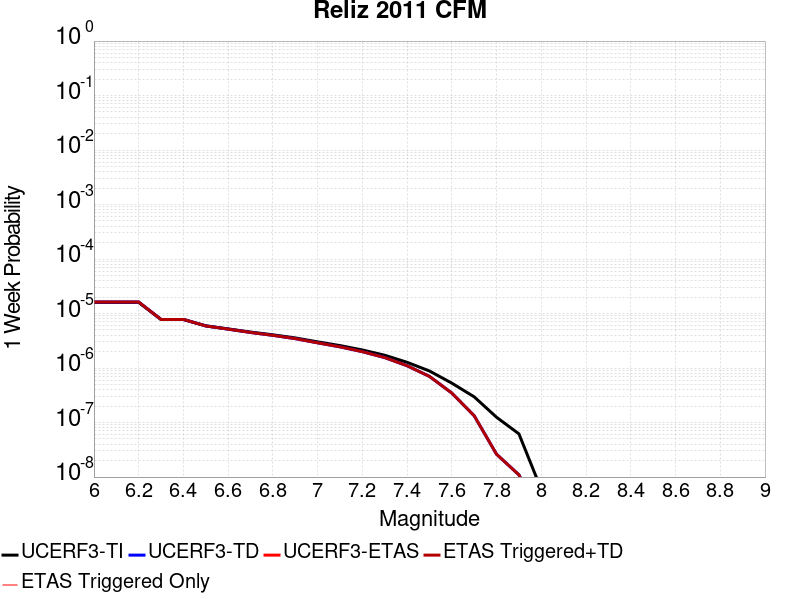 |  |  |  |

| Magnitude | 1 wk TI Prob | 1 wk TD Prob | 1 wk ETAS Prob | 1 wk ETAS/TD Gain | 1 wk ETAS Triggered+TD | 1 wk ETAS Triggered Only | 1 mo TI Prob | 1 mo TD Prob | 1 mo ETAS Prob | 1 mo ETAS/TD Gain | 1 mo ETAS Triggered+TD | 1 mo ETAS Triggered Only | 1 yr TI Prob | 1 yr TD Prob | 1 yr ETAS Prob | 1 yr ETAS/TD Gain | 1 yr ETAS Triggered+TD | 1 yr ETAS Triggered Only | 10 yr TI Prob | 10 yr TD Prob | 10 yr ETAS Prob | 10 yr ETAS/TD Gain | 10 yr ETAS Triggered+TD | 10 yr ETAS Triggered Only |
|-----|-----|-----|-----|-----|-----|-----|-----|-----|-----|-----|-----|-----|-----|-----|-----|-----|-----|-----|-----|-----|-----|-----|-----|-----|
| 6.0 | 1.6002472E-5 | 1.627498E-5 | 0.0 | 0.0 | 1.627498E-5 | 0.0 | 6.8580215E-5 | 6.974816E-5 | 0.0 | 0.0 | 6.974816E-5 | 0.0 | 8.3464425E-4 | 8.488728E-4 | 7.0E-4 | 0.8246229 | 0.0010487031 | 2.0E-4 | 0.008315164 | 0.008458493 | 0.0065 | 0.7684584 | 0.01054073 | 0.0021 |
| 6.1 | 1.6002472E-5 | 1.627498E-5 | 0.0 | 0.0 | 1.627498E-5 | 0.0 | 6.8580215E-5 | 6.974816E-5 | 0.0 | 0.0 | 6.974816E-5 | 0.0 | 8.3464425E-4 | 8.488728E-4 | 7.0E-4 | 0.8246229 | 0.0010487031 | 2.0E-4 | 0.008315164 | 0.008458493 | 0.0065 | 0.7684584 | 0.01054073 | 0.0021 |
| 6.2 | 1.6002472E-5 | 1.627498E-5 | 0.0 | 0.0 | 1.627498E-5 | 0.0 | 6.8580215E-5 | 6.974816E-5 | 0.0 | 0.0 | 6.974816E-5 | 0.0 | 8.3464425E-4 | 8.488728E-4 | 7.0E-4 | 0.8246229 | 0.0010487031 | 2.0E-4 | 0.008315164 | 0.008458493 | 0.0065 | 0.7684584 | 0.01054073 | 0.0021 |
| 6.3 | 7.792404E-6 | 7.798883E-6 | 0.0 | 0.0 | 7.798883E-6 | 0.0 | 3.339559E-5 | 3.3423363E-5 | 0.0 | 0.0 | 3.3423363E-5 | 0.0 | 4.0651546E-4 | 4.0685423E-4 | 3.0E-4 | 0.7373648 | 4.0685423E-4 | 0.0 | 0.0040577264 | 0.0040613655 | 0.0027 | 0.66480106 | 0.0047585224 | 7.0E-4 |
| 6.4 | 7.792404E-6 | 7.798883E-6 | 0.0 | 0.0 | 7.798883E-6 | 0.0 | 3.339559E-5 | 3.3423363E-5 | 0.0 | 0.0 | 3.3423363E-5 | 0.0 | 4.0651546E-4 | 4.0685423E-4 | 3.0E-4 | 0.7373648 | 4.0685423E-4 | 0.0 | 0.0040577264 | 0.0040613655 | 0.0027 | 0.66480106 | 0.0047585224 | 7.0E-4 |
| 6.5 | 5.9659374E-6 | 5.924341E-6 | 0.0 | 0.0 | 5.924341E-6 | 0.0 | 2.5568053E-5 | 2.5389787E-5 | 0.0 | 0.0 | 2.5389787E-5 | 0.0 | 3.1124658E-4 | 3.0907703E-4 | 2.0E-4 | 0.6470879 | 3.0907703E-4 | 0.0 | 0.00310811 | 0.0030866845 | 0.0019 | 0.6155472 | 0.0035851412 | 5.0E-4 |
| 6.6 | 5.2350692E-6 | 5.174791E-6 | 0.0 | 0.0 | 5.174791E-6 | 0.0 | 2.2435817E-5 | 2.2177488E-5 | 0.0 | 0.0 | 2.2177488E-5 | 0.0 | 2.7312184E-4 | 2.699776E-4 | 2.0E-4 | 0.74080217 | 2.699776E-4 | 0.0 | 0.002727864 | 0.0026967013 | 0.0018 | 0.66748214 | 0.003195353 | 5.0E-4 |
| 6.7 | 4.580206E-6 | 4.502119E-6 | 0.0 | 0.0 | 4.502119E-6 | 0.0 | 1.9629308E-5 | 1.9294654E-5 | 0.0 | 0.0 | 1.9294654E-5 | 0.0 | 2.389606E-4 | 2.3488715E-4 | 2.0E-4 | 0.85147274 | 2.3488715E-4 | 0.0 | 0.002387038 | 0.0023465857 | 0.0016 | 0.6818417 | 0.0028454124 | 5.0E-4 |
| 6.8 | 4.0765017E-6 | 3.984389E-6 | 0.0 | 0.0 | 3.984389E-6 | 0.0 | 1.7470604E-5 | 1.7075841E-5 | 0.0 | 0.0 | 1.7075841E-5 | 0.0 | 2.1268385E-4 | 2.0787858E-4 | 2.0E-4 | 0.96210015 | 2.0787858E-4 | 0.0 | 0.002124804 | 0.0020770344 | 0.0015 | 0.7221835 | 0.0025759959 | 5.0E-4 |
| 6.9 | 3.5752896E-6 | 3.468825E-6 | 0.0 | 0.0 | 3.468825E-6 | 0.0 | 1.532258E-5 | 1.4866308E-5 | 0.0 | 0.0 | 1.4866308E-5 | 0.0 | 1.8653645E-4 | 1.809823E-4 | 2.0E-4 | 1.1050805 | 1.809823E-4 | 0.0 | 0.0018637994 | 0.0018085405 | 0.0014 | 0.77410483 | 0.0023076362 | 5.0E-4 |
| 7.0 | 3.0259848E-6 | 2.9044136E-6 | 0.0 | 0.0 | 2.9044136E-6 | 0.0 | 1.2968442E-5 | 1.2447428E-5 | 0.0 | 0.0 | 1.2447428E-5 | 0.0 | 1.5787935E-4 | 1.5153691E-4 | 0.0 | 0.0 | 1.5153691E-4 | 0.0 | 0.0015776722 | 0.001514526 | 9.0E-4 | 0.5942453 | 0.0019139202 | 4.0E-4 |
| 7.1 | 2.5861116E-6 | 2.4517783E-6 | 0.0 | 0.0 | 2.4517783E-6 | 0.0 | 1.1083288E-5 | 1.0507579E-5 | 0.0 | 0.0 | 1.0507579E-5 | 0.0 | 1.3493067E-4 | 1.2792228E-4 | 0.0 | 0.0 | 1.2792228E-4 | 0.0 | 0.0013484878 | 0.0012786761 | 8.0E-4 | 0.6256471 | 0.0016781646 | 4.0E-4 |
| 7.2 | 2.1482588E-6 | 2.0000004E-6 | 0.0 | 0.0 | 2.0000004E-6 | 0.0 | 9.20679E-6 | 8.571403E-6 | 0.0 | 0.0 | 8.571403E-6 | 0.0 | 1.12086906E-4 | 1.04351835E-4 | 0.0 | 0.0 | 1.04351835E-4 | 0.0 | 0.0011203039 | 0.0010432176 | 4.0E-4 | 0.3834291 | 0.001243009 | 2.0E-4 |
| 7.3 | 1.7194744E-6 | 1.558044E-6 | 0.0 | 0.0 | 1.558044E-6 | 0.0 | 7.3691554E-6 | 6.677314E-6 | 0.0 | 0.0 | 6.677314E-6 | 0.0 | 8.971577E-5 | 8.129327E-5 | 0.0 | 0.0 | 8.129327E-5 | 0.0 | 8.967956E-4 | 8.1282435E-4 | 2.0E-4 | 0.24605562 | 9.127431E-4 | 1.0E-4 |
| 7.4 | 1.2755178E-6 | 1.102744E-6 | 0.0 | 0.0 | 1.102744E-6 | 0.0 | 5.4664933E-6 | 4.7260373E-6 | 0.0 | 0.0 | 4.7260373E-6 | 0.0 | 6.655252E-5 | 5.7537985E-5 | 0.0 | 0.0 | 5.7537985E-5 | 0.0 | 6.6532596E-4 | 5.7541975E-4 | 2.0E-4 | 0.34757236 | 6.7536224E-4 | 1.0E-4 |
| 7.5 | 8.8463224E-7 | 7.030606E-7 | 0.0 | 0.0 | 7.030606E-7 | 0.0 | 3.7912755E-6 | 3.0131132E-6 | 0.0 | 0.0 | 3.0131132E-6 | 0.0 | 4.6157802E-5 | 3.6684036E-5 | 0.0 | 0.0 | 3.6684036E-5 | 0.0 | 4.6148215E-4 | 3.6696866E-4 | 2.0E-4 | 0.5450057 | 4.6693196E-4 | 1.0E-4 |
| 7.6 | 5.291355E-7 | 3.4761743E-7 | 0.0 | 0.0 | 3.4761743E-7 | 0.0 | 2.2677216E-6 | 1.4897881E-6 | 0.0 | 0.0 | 1.4897881E-6 | 0.0 | 2.760916E-5 | 1.813802E-5 | 0.0 | 0.0 | 1.813802E-5 | 0.0 | 2.760573E-4 | 1.8155269E-4 | 1.0E-4 | 0.55080426 | 1.8155269E-4 | 0.0 |
| 7.7 | 2.9663357E-7 | 1.3318855E-7 | 0.0 | 0.0 | 1.3318855E-7 | 0.0 | 1.2712861E-6 | 5.7080797E-7 | 0.0 | 0.0 | 5.7080797E-7 | 0.0 | 1.5477797E-5 | 6.949565E-6 | 0.0 | 0.0 | 6.949565E-6 | 0.0 | 1.547672E-4 | 6.9672795E-5 | 0.0 | 0.0 | 6.9672795E-5 | 0.0 |
| 7.8 | 1.2509386E-7 | 2.6085319E-8 | 0.0 | 0.0 | 2.6085319E-8 | 0.0 | 5.3611643E-7 | 1.1179423E-7 | 0.0 | 0.0 | 1.1179423E-7 | 0.0 | 6.527198E-6 | 1.3610938E-6 | 0.0 | 0.0 | 1.3610938E-6 | 0.0 | 6.527006E-5 | 1.3762518E-5 | 0.0 | 0.0 | 1.3762518E-5 | 0.0 |
| 7.9 | 6.213493E-8 | 1.09062555E-8 | 0.0 | 0.0 | 1.09062555E-8 | 0.0 | 2.6629255E-7 | 4.67411E-8 | 0.0 | 0.0 | 4.67411E-8 | 0.0 | 3.242107E-6 | 5.6907277E-7 | 0.0 | 0.0 | 5.6907277E-7 | 0.0 | 3.2420594E-5 | 5.8185447E-6 | 0.0 | 0.0 | 5.8185447E-6 | 0.0 |
| 8.0 | 5.92383E-9 | 1.6123572E-9 | 0.0 | 0.0 | 1.6123572E-9 | 0.0 | 2.5387841E-8 | 6.9101036E-9 | 0.0 | 0.0 | 6.9101036E-9 | 0.0 | 3.0909692E-7 | 8.4130505E-8 | 0.0 | 0.0 | 8.4130505E-8 | 0.0 | 3.090965E-6 | 8.6556287E-7 | 0.0 | 0.0 | 8.6556287E-7 | 0.0 |

## Manix-Afton Hills
*[(top)](#table-of-contents)*

| 1 Week | 1 Month | 1 Year | 10 Year |
|-----|-----|-----|-----|
|  |  |  | 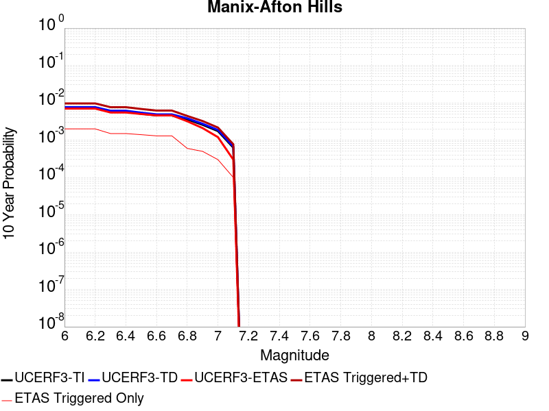 |

| Magnitude | 1 wk TI Prob | 1 wk TD Prob | 1 wk ETAS Prob | 1 wk ETAS/TD Gain | 1 wk ETAS Triggered+TD | 1 wk ETAS Triggered Only | 1 mo TI Prob | 1 mo TD Prob | 1 mo ETAS Prob | 1 mo ETAS/TD Gain | 1 mo ETAS Triggered+TD | 1 mo ETAS Triggered Only | 1 yr TI Prob | 1 yr TD Prob | 1 yr ETAS Prob | 1 yr ETAS/TD Gain | 1 yr ETAS Triggered+TD | 1 yr ETAS Triggered Only | 10 yr TI Prob | 10 yr TD Prob | 10 yr ETAS Prob | 10 yr ETAS/TD Gain | 10 yr ETAS Triggered+TD | 10 yr ETAS Triggered Only |
|-----|-----|-----|-----|-----|-----|-----|-----|-----|-----|-----|-----|-----|-----|-----|-----|-----|-----|-----|-----|-----|-----|-----|-----|-----|
| 6.0 | 1.3783202E-5 | 1.4700737E-5 | 0.0 | 0.0 | 1.4700737E-5 | 0.0 | 5.906953E-5 | 6.300173E-5 | 1.0E-4 | 1.587258 | 6.300173E-5 | 0.0 | 7.189342E-4 | 7.667936E-4 | 1.0E-4 | 0.13041319 | 7.667936E-4 | 0.0 | 0.0071661277 | 0.007643232 | 0.007 | 0.9158429 | 0.009627946 | 0.002 |
| 6.1 | 1.3783202E-5 | 1.4700737E-5 | 0.0 | 0.0 | 1.4700737E-5 | 0.0 | 5.906953E-5 | 6.300173E-5 | 1.0E-4 | 1.587258 | 6.300173E-5 | 0.0 | 7.189342E-4 | 7.667936E-4 | 1.0E-4 | 0.13041319 | 7.667936E-4 | 0.0 | 0.0071661277 | 0.007643232 | 0.007 | 0.9158429 | 0.009627946 | 0.002 |
| 6.2 | 1.3783202E-5 | 1.4700737E-5 | 0.0 | 0.0 | 1.4700737E-5 | 0.0 | 5.906953E-5 | 6.300173E-5 | 1.0E-4 | 1.587258 | 6.300173E-5 | 0.0 | 7.189342E-4 | 7.667936E-4 | 1.0E-4 | 0.13041319 | 7.667936E-4 | 0.0 | 0.0071661277 | 0.007643232 | 0.007 | 0.9158429 | 0.009627946 | 0.002 |
| 6.3 | 1.10494875E-5 | 1.1784835E-5 | 0.0 | 0.0 | 1.1784835E-5 | 0.0 | 4.7354086E-5 | 5.0505518E-5 | 1.0E-4 | 1.9799817 | 5.0505518E-5 | 0.0 | 5.763835E-4 | 6.147415E-4 | 1.0E-4 | 0.16266999 | 6.147415E-4 | 0.0 | 0.005748908 | 0.0061314492 | 0.0055 | 0.8970147 | 0.007622252 | 0.0015 |
| 6.4 | 1.10494875E-5 | 1.1784835E-5 | 0.0 | 0.0 | 1.1784835E-5 | 0.0 | 4.7354086E-5 | 5.0505518E-5 | 1.0E-4 | 1.9799817 | 5.0505518E-5 | 0.0 | 5.763835E-4 | 6.147415E-4 | 1.0E-4 | 0.16266999 | 6.147415E-4 | 0.0 | 0.005748908 | 0.0061314492 | 0.0055 | 0.8970147 | 0.007622252 | 0.0015 |
| 6.5 | 9.788949E-6 | 1.0446887E-5 | 0.0 | 0.0 | 1.0446887E-5 | 0.0 | 4.1951964E-5 | 4.4771656E-5 | 1.0E-4 | 2.233556 | 4.4771656E-5 | 0.0 | 5.1064545E-4 | 5.449679E-4 | 1.0E-4 | 0.18349706 | 5.449679E-4 | 0.0 | 0.0050947363 | 0.00543724 | 0.005 | 0.9195842 | 0.006829628 | 0.0014 |
| 6.6 | 8.810006E-6 | 9.406881E-6 | 0.0 | 0.0 | 9.406881E-6 | 0.0 | 3.775662E-5 | 4.0314633E-5 | 1.0E-4 | 2.480489 | 4.0314633E-5 | 0.0 | 4.5958988E-4 | 4.90729E-4 | 1.0E-4 | 0.20377848 | 4.90729E-4 | 0.0 | 0.0045864056 | 0.0048973346 | 0.0046 | 0.9392865 | 0.0061909677 | 0.0013 |
| 6.7 | 8.80128E-6 | 9.3973695E-6 | 0.0 | 0.0 | 9.3973695E-6 | 0.0 | 3.7719226E-5 | 4.027387E-5 | 1.0E-4 | 2.4829996 | 4.027387E-5 | 0.0 | 4.591348E-4 | 4.9023295E-4 | 1.0E-4 | 0.20398466 | 4.9023295E-4 | 0.0 | 0.004581874 | 0.004892396 | 0.0046 | 0.9402346 | 0.006186036 | 0.0013 |
| 6.8 | 6.8994877E-6 | 7.374698E-6 | 0.0 | 0.0 | 7.374698E-6 | 0.0 | 2.9568899E-5 | 3.160551E-5 | 0.0 | 0.0 | 3.160551E-5 | 0.0 | 3.5994186E-4 | 3.847373E-4 | 0.0 | 0.0 | 3.847373E-4 | 0.0 | 0.003593594 | 0.003841516 | 0.0032 | 0.8330045 | 0.004439211 | 6.0E-4 |
| 6.9 | 4.9328037E-6 | 5.2671803E-6 | 0.0 | 0.0 | 5.2671803E-6 | 0.0 | 2.1140417E-5 | 2.257347E-5 | 0.0 | 0.0 | 2.257347E-5 | 0.0 | 2.5735417E-4 | 2.748035E-4 | 0.0 | 0.0 | 2.748035E-4 | 0.0 | 0.0025705635 | 0.0027452412 | 0.0021 | 0.7649601 | 0.0032438685 | 5.0E-4 |
| 7.0 | 3.347973E-6 | 3.5873138E-6 | 0.0 | 0.0 | 3.5873138E-6 | 0.0 | 1.4348378E-5 | 1.5374135E-5 | 0.0 | 0.0 | 1.5374135E-5 | 0.0 | 1.746775E-4 | 1.8716812E-4 | 0.0 | 0.0 | 1.8716812E-4 | 0.0 | 0.0017454025 | 0.0018705068 | 0.0012 | 0.64153737 | 0.0021699455 | 3.0E-4 |
| 7.1 | 1.2073567E-6 | 1.2925193E-6 | 0.0 | 0.0 | 1.2925193E-6 | 0.0 | 5.1743755E-6 | 5.5393657E-6 | 0.0 | 0.0 | 5.5393657E-6 | 0.0 | 6.29962E-5 | 6.7441324E-5 | 0.0 | 0.0 | 6.7441324E-5 | 0.0 | 6.297835E-4 | 6.7436846E-4 | 3.0E-4 | 0.44486064 | 7.7430106E-4 | 1.0E-4 |

## Santa Susana alt 1
*[(top)](#table-of-contents)*

| 1 Week | 1 Month | 1 Year | 10 Year |
|-----|-----|-----|-----|
| 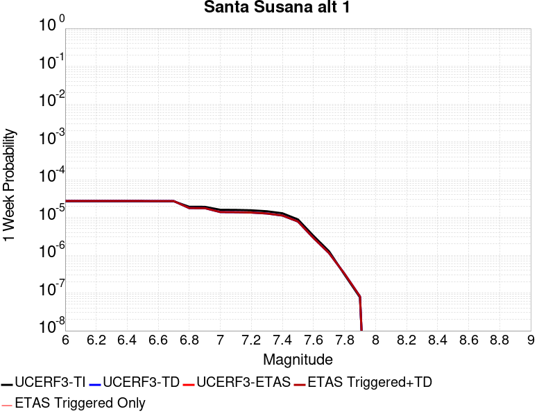 |  | 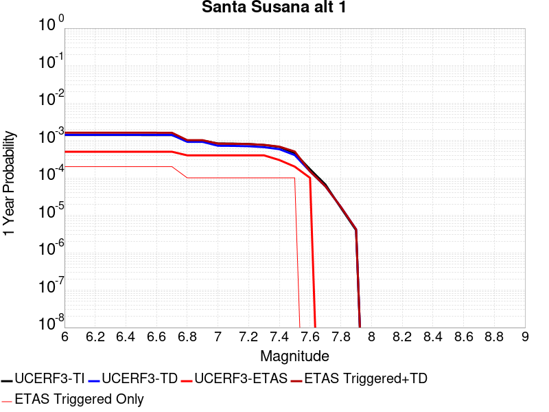 | 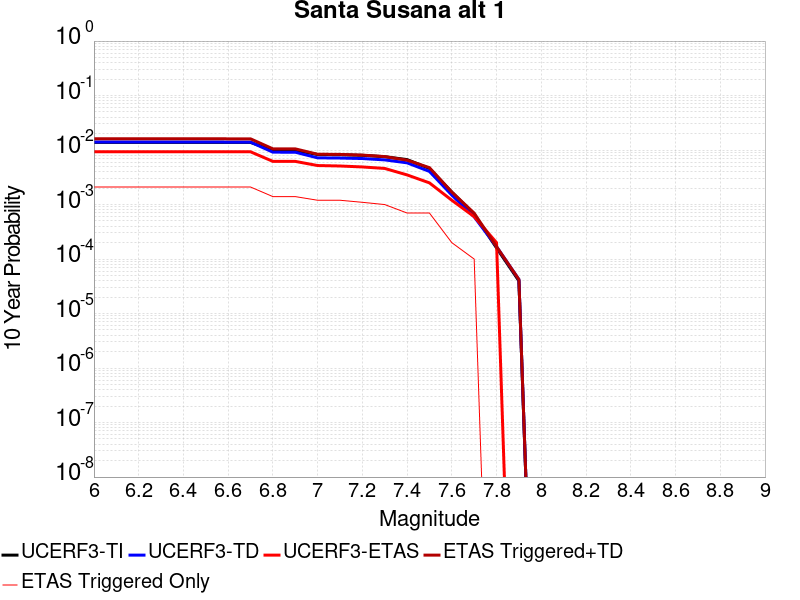 |

| Magnitude | 1 wk TI Prob | 1 wk TD Prob | 1 wk ETAS Prob | 1 wk ETAS/TD Gain | 1 wk ETAS Triggered+TD | 1 wk ETAS Triggered Only | 1 mo TI Prob | 1 mo TD Prob | 1 mo ETAS Prob | 1 mo ETAS/TD Gain | 1 mo ETAS Triggered+TD | 1 mo ETAS Triggered Only | 1 yr TI Prob | 1 yr TD Prob | 1 yr ETAS Prob | 1 yr ETAS/TD Gain | 1 yr ETAS Triggered+TD | 1 yr ETAS Triggered Only | 10 yr TI Prob | 10 yr TD Prob | 10 yr ETAS Prob | 10 yr ETAS/TD Gain | 10 yr ETAS Triggered+TD | 10 yr ETAS Triggered Only |
|-----|-----|-----|-----|-----|-----|-----|-----|-----|-----|-----|-----|-----|-----|-----|-----|-----|-----|-----|-----|-----|-----|-----|-----|-----|
| 6.0 | 2.674877E-5 | 2.7137981E-5 | 0.0 | 0.0 | 2.7137981E-5 | 0.0 | 1.1463255E-4 | 1.1630109E-4 | 0.0 | 0.0 | 1.1630109E-4 | 0.0 | 0.0013947578 | 0.0014151591 | 5.0E-4 | 0.35331717 | 0.0016148761 | 2.0E-4 | 0.013860362 | 0.014072867 | 0.0093 | 0.6608462 | 0.016143315 | 0.0021 |
| 6.1 | 2.674877E-5 | 2.7137981E-5 | 0.0 | 0.0 | 2.7137981E-5 | 0.0 | 1.1463255E-4 | 1.1630109E-4 | 0.0 | 0.0 | 1.1630109E-4 | 0.0 | 0.0013947578 | 0.0014151591 | 5.0E-4 | 0.35331717 | 0.0016148761 | 2.0E-4 | 0.013860362 | 0.014072867 | 0.0093 | 0.6608462 | 0.016143315 | 0.0021 |
| 6.2 | 2.674877E-5 | 2.7137981E-5 | 0.0 | 0.0 | 2.7137981E-5 | 0.0 | 1.1463255E-4 | 1.1630109E-4 | 0.0 | 0.0 | 1.1630109E-4 | 0.0 | 0.0013947578 | 0.0014151591 | 5.0E-4 | 0.35331717 | 0.0016148761 | 2.0E-4 | 0.013860362 | 0.014072867 | 0.0093 | 0.6608462 | 0.016143315 | 0.0021 |
| 6.3 | 2.674877E-5 | 2.7137981E-5 | 0.0 | 0.0 | 2.7137981E-5 | 0.0 | 1.1463255E-4 | 1.1630109E-4 | 0.0 | 0.0 | 1.1630109E-4 | 0.0 | 0.0013947578 | 0.0014151591 | 5.0E-4 | 0.35331717 | 0.0016148761 | 2.0E-4 | 0.013860362 | 0.014072867 | 0.0093 | 0.6608462 | 0.016143315 | 0.0021 |
| 6.4 | 2.674877E-5 | 2.7137981E-5 | 0.0 | 0.0 | 2.7137981E-5 | 0.0 | 1.1463255E-4 | 1.1630109E-4 | 0.0 | 0.0 | 1.1630109E-4 | 0.0 | 0.0013947578 | 0.0014151591 | 5.0E-4 | 0.35331717 | 0.0016148761 | 2.0E-4 | 0.013860362 | 0.014072867 | 0.0093 | 0.6608462 | 0.016143315 | 0.0021 |
| 6.5 | 2.674877E-5 | 2.7137981E-5 | 0.0 | 0.0 | 2.7137981E-5 | 0.0 | 1.1463255E-4 | 1.1630109E-4 | 0.0 | 0.0 | 1.1630109E-4 | 0.0 | 0.0013947578 | 0.0014151591 | 5.0E-4 | 0.35331717 | 0.0016148761 | 2.0E-4 | 0.013860362 | 0.014072867 | 0.0093 | 0.6608462 | 0.016143315 | 0.0021 |
| 6.6 | 2.6647976E-5 | 2.7014612E-5 | 0.0 | 0.0 | 2.7014612E-5 | 0.0 | 1.14200615E-4 | 1.15772404E-4 | 0.0 | 0.0 | 1.15772404E-4 | 0.0 | 0.0013895056 | 0.0014087307 | 5.0E-4 | 0.35492942 | 0.001608449 | 2.0E-4 | 0.013808494 | 0.014009399 | 0.0093 | 0.66384006 | 0.016079979 | 0.0021 |
| 6.7 | 2.6647976E-5 | 2.7014612E-5 | 0.0 | 0.0 | 2.7014612E-5 | 0.0 | 1.14200615E-4 | 1.15772404E-4 | 0.0 | 0.0 | 1.15772404E-4 | 0.0 | 0.0013895056 | 0.0014087307 | 5.0E-4 | 0.35492942 | 0.001608449 | 2.0E-4 | 0.013808494 | 0.014009399 | 0.0093 | 0.66384006 | 0.016079979 | 0.0021 |
| 6.8 | 1.9073179E-5 | 1.7601715E-5 | 0.0 | 0.0 | 1.7601715E-5 | 0.0 | 8.1739636E-5 | 7.543384E-5 | 0.0 | 0.0 | 7.543384E-5 | 0.0 | 9.947256E-4 | 9.1803813E-4 | 4.0E-4 | 0.43571174 | 0.0010179463 | 1.0E-4 | 0.009902848 | 0.00914439 | 0.0062 | 0.6780113 | 0.010531588 | 0.0014 |
| 6.9 | 1.9041876E-5 | 1.7583874E-5 | 0.0 | 0.0 | 1.7583874E-5 | 0.0 | 8.160549E-5 | 7.535739E-5 | 0.0 | 0.0 | 7.535739E-5 | 0.0 | 9.930939E-4 | 9.171081E-4 | 4.0E-4 | 0.4361536 | 0.0010170164 | 1.0E-4 | 0.0098866755 | 0.009135166 | 0.0062 | 0.6786959 | 0.010522378 | 0.0014 |
| 7.0 | 1.5917482E-5 | 1.3836804E-5 | 0.0 | 0.0 | 1.3836804E-5 | 0.0 | 6.8215995E-5 | 5.9299266E-5 | 0.0 | 0.0 | 5.9299266E-5 | 0.0 | 8.302132E-4 | 7.217341E-4 | 4.0E-4 | 0.5542208 | 8.216619E-4 | 1.0E-4 | 0.008271185 | 0.0071944636 | 0.0052 | 0.722778 | 0.008385831 | 0.0012 |
| 7.1 | 1.577788E-5 | 1.3717173E-5 | 0.0 | 0.0 | 1.3717173E-5 | 0.0 | 6.761774E-5 | 5.8786583E-5 | 0.0 | 0.0 | 5.8786583E-5 | 0.0 | 8.2293496E-4 | 7.1549625E-4 | 4.0E-4 | 0.5590525 | 8.154247E-4 | 1.0E-4 | 0.008198941 | 0.0071324874 | 0.0051 | 0.71503806 | 0.008323928 | 0.0012 |
| 7.2 | 1.5416446E-5 | 1.3443651E-5 | 0.0 | 0.0 | 1.3443651E-5 | 0.0 | 6.606882E-5 | 5.7614405E-5 | 0.0 | 0.0 | 5.7614405E-5 | 0.0 | 8.0409093E-4 | 7.012342E-4 | 4.0E-4 | 0.5704228 | 8.011641E-4 | 1.0E-4 | 0.008011877 | 0.006990767 | 0.0049 | 0.7009245 | 0.008083077 | 0.0011 |
| 7.3 | 1.4534083E-5 | 1.2693055E-5 | 0.0 | 0.0 | 1.2693055E-5 | 0.0 | 6.228744E-5 | 5.43977E-5 | 0.0 | 0.0 | 5.43977E-5 | 0.0 | 7.580857E-4 | 6.620952E-4 | 4.0E-4 | 0.6041427 | 7.6202897E-4 | 1.0E-4 | 0.007555048 | 0.006601737 | 0.0046 | 0.69678634 | 0.007595135 | 0.001 |
| 7.4 | 1.2858995E-5 | 1.1207757E-5 | 0.0 | 0.0 | 1.1207757E-5 | 0.0 | 5.5108816E-5 | 4.8032383E-5 | 0.0 | 0.0 | 4.8032383E-5 | 0.0 | 6.7074323E-4 | 5.846413E-4 | 3.0E-4 | 0.5131352 | 6.845828E-4 | 1.0E-4 | 0.0066872234 | 0.0058314526 | 0.0035 | 0.60019356 | 0.0065273703 | 7.0E-4 |
| 7.5 | 8.827668E-6 | 7.790112E-6 | 0.0 | 0.0 | 7.790112E-6 | 0.0 | 3.7832317E-5 | 3.3385782E-5 | 0.0 | 0.0 | 3.3385782E-5 | 0.0 | 4.605111E-4 | 4.0639853E-4 | 2.0E-4 | 0.49212778 | 5.063579E-4 | 1.0E-4 | 0.0045955796 | 0.0040566945 | 0.0025 | 0.6162653 | 0.0047538546 | 7.0E-4 |
| 7.6 | 3.2533426E-6 | 2.8624881E-6 | 0.0 | 0.0 | 2.8624881E-6 | 0.0 | 1.3942822E-5 | 1.226775E-5 | 0.0 | 0.0 | 1.226775E-5 | 0.0 | 1.6974064E-4 | 1.4934999E-4 | 1.0E-4 | 0.6695682 | 1.4934999E-4 | 0.0 | 0.0016961104 | 0.0014925328 | 0.0012 | 0.80400246 | 0.0016922343 | 2.0E-4 |
| 7.7 | 1.2751709E-6 | 1.1436869E-6 | 0.0 | 0.0 | 1.1436869E-6 | 0.0 | 5.4650063E-6 | 4.9015066E-6 | 0.0 | 0.0 | 4.9015066E-6 | 0.0 | 6.653442E-5 | 5.9674298E-5 | 0.0 | 0.0 | 5.9674298E-5 | 0.0 | 6.6514505E-4 | 5.965915E-4 | 6.0E-4 | 1.0057133 | 6.9653185E-4 | 1.0E-4 |
| 7.8 | 3.067544E-7 | 3.23772E-7 | 0.0 | 0.0 | 3.23772E-7 | 0.0 | 1.3146611E-6 | 1.3875937E-6 | 0.0 | 0.0 | 1.3875937E-6 | 0.0 | 1.600588E-5 | 1.6893833E-5 | 0.0 | 0.0 | 1.6893833E-5 | 0.0 | 1.6004729E-4 | 1.689265E-4 | 2.0E-4 | 1.1839468 | 1.689265E-4 | 0.0 |
| 7.9 | 7.622999E-8 | 8.082586E-8 | 0.0 | 0.0 | 8.082586E-8 | 0.0 | 3.2669993E-7 | 3.4639652E-7 | 0.0 | 0.0 | 3.4639652E-7 | 0.0 | 3.977564E-6 | 4.2173715E-6 | 0.0 | 0.0 | 4.2173715E-6 | 0.0 | 3.977493E-5 | 4.2173124E-5 | 0.0 | 0.0 | 4.2173124E-5 | 0.0 |

## Garlock (West)
*[(top)](#table-of-contents)*

| 1 Week | 1 Month | 1 Year | 10 Year |
|-----|-----|-----|-----|
|  | 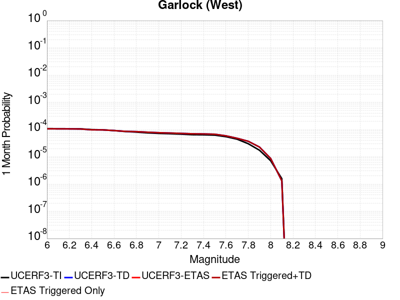 | 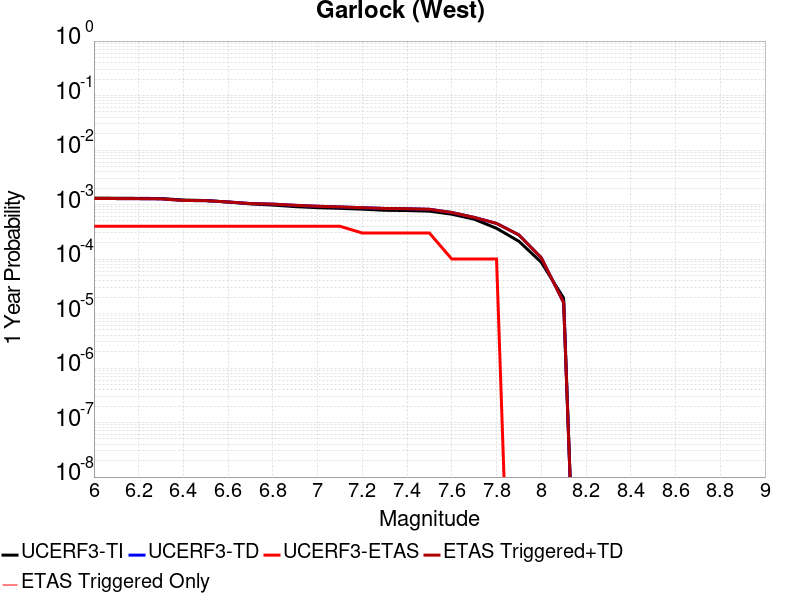 | 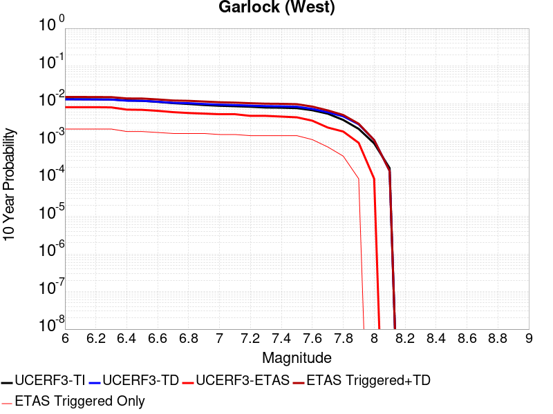 |

| Magnitude | 1 wk TI Prob | 1 wk TD Prob | 1 wk ETAS Prob | 1 wk ETAS/TD Gain | 1 wk ETAS Triggered+TD | 1 wk ETAS Triggered Only | 1 mo TI Prob | 1 mo TD Prob | 1 mo ETAS Prob | 1 mo ETAS/TD Gain | 1 mo ETAS Triggered+TD | 1 mo ETAS Triggered Only | 1 yr TI Prob | 1 yr TD Prob | 1 yr ETAS Prob | 1 yr ETAS/TD Gain | 1 yr ETAS Triggered+TD | 1 yr ETAS Triggered Only | 10 yr TI Prob | 10 yr TD Prob | 10 yr ETAS Prob | 10 yr ETAS/TD Gain | 10 yr ETAS Triggered+TD | 10 yr ETAS Triggered Only |
|-----|-----|-----|-----|-----|-----|-----|-----|-----|-----|-----|-----|-----|-----|-----|-----|-----|-----|-----|-----|-----|-----|-----|-----|-----|
| 6.0 | 2.5181727E-5 | 2.4802828E-5 | 0.0 | 0.0 | 2.4802828E-5 | 0.0 | 1.0791722E-4 | 1.0629352E-4 | 0.0 | 0.0 | 1.0629352E-4 | 0.0 | 0.0013131002 | 0.0012933587 | 4.0E-4 | 0.30927226 | 0.0012933587 | 0.0 | 0.013053683 | 0.012939008 | 0.008 | 0.6182854 | 0.015011836 | 0.0021 |
| 6.1 | 2.5077732E-5 | 2.4704092E-5 | 0.0 | 0.0 | 2.4704092E-5 | 0.0 | 1.0747157E-4 | 1.058704E-4 | 0.0 | 0.0 | 1.058704E-4 | 0.0 | 0.001307681 | 0.0012882133 | 4.0E-4 | 0.3105076 | 0.0012882133 | 0.0 | 0.013000126 | 0.012888152 | 0.008 | 0.62072515 | 0.014961087 | 0.0021 |
| 6.2 | 2.494612E-5 | 2.4586023E-5 | 0.0 | 0.0 | 2.4586023E-5 | 0.0 | 1.0690756E-4 | 1.0536443E-4 | 0.0 | 0.0 | 1.0536443E-4 | 0.0 | 0.0013008224 | 0.0012820604 | 4.0E-4 | 0.31199777 | 0.0012820604 | 0.0 | 0.012932341 | 0.012827334 | 0.008 | 0.62366813 | 0.014900397 | 0.0021 |
| 6.3 | 2.4733758E-5 | 2.440584E-5 | 0.0 | 0.0 | 2.440584E-5 | 0.0 | 1.0599751E-4 | 1.04592276E-4 | 0.0 | 0.0 | 1.04592276E-4 | 0.0 | 0.0012897556 | 0.0012726705 | 4.0E-4 | 0.31429973 | 0.0012726705 | 0.0 | 0.012822957 | 0.012734516 | 0.0079 | 0.62036127 | 0.014807773 | 0.0021 |
| 6.4 | 2.3237335E-5 | 2.2787908E-5 | 0.0 | 0.0 | 2.2787908E-5 | 0.0 | 9.958477E-5 | 9.765882E-5 | 0.0 | 0.0 | 9.765882E-5 | 0.0 | 0.0012117702 | 0.0011883504 | 4.0E-4 | 0.33660108 | 0.0011883504 | 0.0 | 0.012051838 | 0.011900616 | 0.0069 | 0.5798019 | 0.013679194 | 0.0018 |
| 6.5 | 2.2732203E-5 | 2.2604341E-5 | 0.0 | 0.0 | 2.2604341E-5 | 0.0 | 9.742009E-5 | 9.687217E-5 | 0.0 | 0.0 | 9.687217E-5 | 0.0 | 0.0011854442 | 0.0011787832 | 4.0E-4 | 0.33933294 | 0.0011787832 | 0.0 | 0.011791403 | 0.011805966 | 0.0068 | 0.57598 | 0.013584714 | 0.0018 |
| 6.6 | 2.1319436E-5 | 2.1387925E-5 | 0.0 | 0.0 | 2.1387925E-5 | 0.0 | 9.136581E-5 | 9.165933E-5 | 0.0 | 0.0 | 9.165933E-5 | 0.0 | 0.001111811 | 0.0011153833 | 4.0E-4 | 0.3586211 | 0.0011153833 | 0.0 | 0.011062649 | 0.011178487 | 0.0064 | 0.57252824 | 0.012859484 | 0.0017 |
| 6.7 | 1.970802E-5 | 2.001179E-5 | 0.0 | 0.0 | 2.001179E-5 | 0.0 | 8.446021E-5 | 8.5762E-5 | 0.0 | 0.0 | 8.5762E-5 | 0.0 | 0.001027818 | 0.0010436539 | 4.0E-4 | 0.3832688 | 0.0010436539 | 0.0 | 0.010230771 | 0.010468132 | 0.0059 | 0.5636154 | 0.012051382 | 0.0016 |
| 6.8 | 1.8744462E-5 | 1.9522038E-5 | 0.0 | 0.0 | 1.9522038E-5 | 0.0 | 8.033094E-5 | 8.36632E-5 | 0.0 | 0.0 | 8.36632E-5 | 0.0 | 9.775903E-4 | 0.0010181251 | 4.0E-4 | 0.392879 | 0.0010181251 | 0.0 | 0.009733009 | 0.010215214 | 0.0056 | 0.5482019 | 0.01179887 | 0.0016 |
| 6.9 | 1.7559682E-5 | 1.8576884E-5 | 0.0 | 0.0 | 1.8576884E-5 | 0.0 | 7.5253614E-5 | 7.96128E-5 | 0.0 | 0.0 | 7.96128E-5 | 0.0 | 9.158276E-4 | 9.688562E-4 | 4.0E-4 | 0.41285795 | 9.688562E-4 | 0.0 | 0.0091206245 | 0.009726962 | 0.0054 | 0.55515796 | 0.011311399 | 0.0016 |
| 7.0 | 1.6794445E-5 | 1.7842674E-5 | 0.0 | 0.0 | 1.7842674E-5 | 0.0 | 7.197421E-5 | 7.646637E-5 | 0.0 | 0.0 | 7.646637E-5 | 0.0 | 8.759337E-4 | 9.3058177E-4 | 4.0E-4 | 0.42983863 | 9.3058177E-4 | 0.0 | 0.008724891 | 0.009347316 | 0.0052 | 0.55630946 | 0.010833295 | 0.0015 |
| 7.1 | 1.6337795E-5 | 1.7347655E-5 | 0.0 | 0.0 | 1.7347655E-5 | 0.0 | 7.0017246E-5 | 7.434498E-5 | 0.0 | 0.0 | 7.434498E-5 | 0.0 | 8.521265E-4 | 9.047756E-4 | 4.0E-4 | 0.4420986 | 9.047756E-4 | 0.0 | 0.008488664 | 0.009091418 | 0.0052 | 0.57196796 | 0.010577781 | 0.0015 |
| 7.2 | 1.5780008E-5 | 1.679775E-5 | 0.0 | 0.0 | 1.679775E-5 | 0.0 | 6.762685E-5 | 7.198838E-5 | 0.0 | 0.0 | 7.198838E-5 | 0.0 | 8.2304585E-4 | 8.7610737E-4 | 3.0E-4 | 0.3424238 | 8.7610737E-4 | 0.0 | 0.008200042 | 0.008806948 | 0.0047 | 0.53366953 | 0.010194618 | 0.0014 |
| 7.3 | 1.5058865E-5 | 1.6253596E-5 | 0.0 | 0.0 | 1.6253596E-5 | 0.0 | 6.45364E-5 | 6.965641E-5 | 0.0 | 0.0 | 6.965641E-5 | 0.0 | 7.854473E-4 | 8.47738E-4 | 3.0E-4 | 0.3538829 | 8.47738E-4 | 0.0 | 0.00782677 | 0.008525018 | 0.0047 | 0.5513185 | 0.009913082 | 0.0014 |
| 7.4 | 1.4887923E-5 | 1.6090784E-5 | 0.0 | 0.0 | 1.6090784E-5 | 0.0 | 6.380382E-5 | 6.895869E-5 | 0.0 | 0.0 | 6.895869E-5 | 0.0 | 7.7653467E-4 | 8.392498E-4 | 3.0E-4 | 0.3574621 | 8.392498E-4 | 0.0 | 0.0077382675 | 0.008440436 | 0.0045 | 0.5331478 | 0.00982862 | 0.0014 |
| 7.5 | 1.4509299E-5 | 1.5685366E-5 | 0.0 | 0.0 | 1.5685366E-5 | 0.0 | 6.218123E-5 | 6.722127E-5 | 0.0 | 0.0 | 6.722127E-5 | 0.0 | 7.567935E-4 | 8.1811287E-4 | 3.0E-4 | 0.36669758 | 8.1811287E-4 | 0.0 | 0.0075422134 | 0.00823001 | 0.0043 | 0.5224781 | 0.009618488 | 0.0014 |
| 7.6 | 1.2756717E-5 | 1.37042925E-5 | 0.0 | 0.0 | 1.37042925E-5 | 0.0 | 5.4670498E-5 | 5.8731363E-5 | 0.0 | 0.0 | 5.8731363E-5 | 0.0 | 6.6541E-4 | 7.148204E-4 | 1.0E-4 | 0.13989529 | 7.148204E-4 | 0.0 | 0.006634211 | 0.007202352 | 0.0035 | 0.48595238 | 0.00829443 | 0.0011 |
| 7.7 | 1.0328985E-5 | 1.1137085E-5 | 0.0 | 0.0 | 1.1137085E-5 | 0.0 | 4.4266326E-5 | 4.772949E-5 | 0.0 | 0.0 | 4.772949E-5 | 0.0 | 5.388092E-4 | 5.80952E-4 | 1.0E-4 | 0.17213127 | 5.80952E-4 | 0.0 | 0.0053750467 | 0.0058708116 | 0.0023 | 0.39176866 | 0.006566702 | 7.0E-4 |
| 7.8 | 7.0306583E-6 | 8.640371E-6 | 0.0 | 0.0 | 8.640371E-6 | 0.0 | 3.0131043E-5 | 3.7029633E-5 | 0.0 | 0.0 | 3.7029633E-5 | 0.0 | 3.667837E-4 | 4.5074266E-4 | 1.0E-4 | 0.22185607 | 4.5074266E-4 | 0.0 | 0.003661789 | 0.0045606596 | 0.0018 | 0.39467975 | 0.0049588354 | 4.0E-4 |
| 7.9 | 4.060633E-6 | 5.312001E-6 | 0.0 | 0.0 | 5.312001E-6 | 0.0 | 1.7402595E-5 | 2.2765522E-5 | 0.0 | 0.0 | 2.2765522E-5 | 0.0 | 2.11856E-4 | 2.7713506E-4 | 0.0 | 0.0 | 2.7713506E-4 | 0.0 | 0.0021165414 | 0.0028042854 | 9.0E-4 | 0.32093737 | 0.002904005 | 1.0E-4 |
| 8.0 | 1.6729537E-6 | 2.023924E-6 | 0.0 | 0.0 | 2.023924E-6 | 0.0 | 7.169782E-6 | 8.673931E-6 | 0.0 | 0.0 | 8.673931E-6 | 0.0 | 8.7288594E-5 | 1.05600026E-4 | 0.0 | 0.0 | 1.05600026E-4 | 0.0 | 8.7254314E-4 | 0.0010688532 | 1.0E-4 | 0.09355822 | 0.0010688532 | 0.0 |
| 8.1 | 3.6733252E-7 | 3.054934E-7 | 0.0 | 0.0 | 3.054934E-7 | 0.0 | 1.5742813E-6 | 1.3092568E-6 | 0.0 | 0.0 | 1.3092568E-6 | 0.0 | 1.9166706E-5 | 1.59401E-5 | 0.0 | 0.0 | 1.59401E-5 | 0.0 | 1.9165053E-4 | 1.6150644E-4 | 0.0 | 0.0 | 1.6150644E-4 | 0.0 |

## Paradise
*[(top)](#table-of-contents)*

| 1 Week | 1 Month | 1 Year | 10 Year |
|-----|-----|-----|-----|
|  |  |  |  |

| Magnitude | 1 wk TI Prob | 1 wk TD Prob | 1 wk ETAS Prob | 1 wk ETAS/TD Gain | 1 wk ETAS Triggered+TD | 1 wk ETAS Triggered Only | 1 mo TI Prob | 1 mo TD Prob | 1 mo ETAS Prob | 1 mo ETAS/TD Gain | 1 mo ETAS Triggered+TD | 1 mo ETAS Triggered Only | 1 yr TI Prob | 1 yr TD Prob | 1 yr ETAS Prob | 1 yr ETAS/TD Gain | 1 yr ETAS Triggered+TD | 1 yr ETAS Triggered Only | 10 yr TI Prob | 10 yr TD Prob | 10 yr ETAS Prob | 10 yr ETAS/TD Gain | 10 yr ETAS Triggered+TD | 10 yr ETAS Triggered Only |
|-----|-----|-----|-----|-----|-----|-----|-----|-----|-----|-----|-----|-----|-----|-----|-----|-----|-----|-----|-----|-----|-----|-----|-----|-----|
| 6.0 | 1.4851273E-5 | 1.6679838E-5 | 0.0 | 0.0 | 1.6679838E-5 | 0.0 | 6.364676E-5 | 7.14832E-5 | 0.0 | 0.0 | 7.14832E-5 | 0.0 | 7.7462377E-4 | 8.69984E-4 | 4.0E-4 | 0.45977858 | 8.69984E-4 | 0.0 | 0.0077192914 | 0.008668157 | 0.006 | 0.6921887 | 0.010650821 | 0.002 |
| 6.1 | 1.4851273E-5 | 1.6679838E-5 | 0.0 | 0.0 | 1.6679838E-5 | 0.0 | 6.364676E-5 | 7.14832E-5 | 0.0 | 0.0 | 7.14832E-5 | 0.0 | 7.7462377E-4 | 8.69984E-4 | 4.0E-4 | 0.45977858 | 8.69984E-4 | 0.0 | 0.0077192914 | 0.008668157 | 0.006 | 0.6921887 | 0.010650821 | 0.002 |
| 6.2 | 1.4851273E-5 | 1.6679838E-5 | 0.0 | 0.0 | 1.6679838E-5 | 0.0 | 6.364676E-5 | 7.14832E-5 | 0.0 | 0.0 | 7.14832E-5 | 0.0 | 7.7462377E-4 | 8.69984E-4 | 4.0E-4 | 0.45977858 | 8.69984E-4 | 0.0 | 0.0077192914 | 0.008668157 | 0.006 | 0.6921887 | 0.010650821 | 0.002 |
| 6.3 | 1.0426831E-5 | 1.1878099E-5 | 0.0 | 0.0 | 1.1878099E-5 | 0.0 | 4.4685654E-5 | 5.090518E-5 | 0.0 | 0.0 | 5.090518E-5 | 0.0 | 5.43912E-4 | 6.1960024E-4 | 2.0E-4 | 0.32278877 | 6.1960024E-4 | 0.0 | 0.0054258266 | 0.0061793346 | 0.0039 | 0.6311359 | 0.007371919 | 0.0012 |
| 6.4 | 1.0426831E-5 | 1.1878099E-5 | 0.0 | 0.0 | 1.1878099E-5 | 0.0 | 4.4685654E-5 | 5.090518E-5 | 0.0 | 0.0 | 5.090518E-5 | 0.0 | 5.43912E-4 | 6.1960024E-4 | 2.0E-4 | 0.32278877 | 6.1960024E-4 | 0.0 | 0.0054258266 | 0.0061793346 | 0.0039 | 0.6311359 | 0.007371919 | 0.0012 |
| 6.5 | 9.25027E-6 | 1.0610476E-5 | 0.0 | 0.0 | 1.0610476E-5 | 0.0 | 3.964341E-5 | 4.5472705E-5 | 0.0 | 0.0 | 4.5472705E-5 | 0.0 | 4.8255164E-4 | 5.5349444E-4 | 2.0E-4 | 0.36134058 | 5.5349444E-4 | 0.0 | 0.0048150513 | 0.0055216574 | 0.0032 | 0.57953614 | 0.0064166877 | 9.0E-4 |
| 6.6 | 7.904275E-6 | 9.15134E-6 | 0.0 | 0.0 | 9.15134E-6 | 0.0 | 3.3875025E-5 | 3.9219463E-5 | 0.0 | 0.0 | 3.9219463E-5 | 0.0 | 4.1235037E-4 | 4.7739627E-4 | 2.0E-4 | 0.41893917 | 4.7739627E-4 | 0.0 | 0.0041158604 | 0.004764104 | 0.0028 | 0.5877286 | 0.0055602924 | 8.0E-4 |
| 6.7 | 7.2061953E-6 | 8.399675E-6 | 0.0 | 0.0 | 8.399675E-6 | 0.0 | 3.088333E-5 | 3.5998128E-5 | 0.0 | 0.0 | 3.5998128E-5 | 0.0 | 3.7593965E-4 | 4.3819274E-4 | 2.0E-4 | 0.45642015 | 4.3819274E-4 | 0.0 | 0.003753043 | 0.0043736557 | 0.0024 | 0.54874 | 0.005070594 | 7.0E-4 |
| 6.8 | 6.6948724E-6 | 7.835022E-6 | 0.0 | 0.0 | 7.835022E-6 | 0.0 | 2.8691995E-5 | 3.3578257E-5 | 0.0 | 0.0 | 3.3578257E-5 | 0.0 | 3.4926904E-4 | 4.0874214E-4 | 2.0E-4 | 0.48930603 | 4.0874214E-4 | 0.0 | 0.003487206 | 0.0040802606 | 0.0023 | 0.5636895 | 0.0047774045 | 7.0E-4 |
| 6.9 | 6.0421025E-6 | 7.1240197E-6 | 0.0 | 0.0 | 7.1240197E-6 | 0.0 | 2.5894467E-5 | 3.0531173E-5 | 0.0 | 0.0 | 3.0531173E-5 | 0.0 | 3.1521954E-4 | 3.7165705E-4 | 2.0E-4 | 0.5381305 | 3.7165705E-4 | 0.0 | 0.0031477278 | 0.0037106927 | 0.002 | 0.5389829 | 0.004408095 | 7.0E-4 |
| 7.0 | 4.134091E-6 | 5.0750823E-6 | 0.0 | 0.0 | 5.0750823E-6 | 0.0 | 1.7717413E-5 | 2.175018E-5 | 0.0 | 0.0 | 2.175018E-5 | 0.0 | 2.1568815E-4 | 2.647778E-4 | 1.0E-4 | 0.37767515 | 2.647778E-4 | 0.0 | 0.0021547892 | 0.0026447764 | 0.0017 | 0.6427765 | 0.0032431895 | 6.0E-4 |
| 7.1 | 3.7674888E-6 | 4.6269474E-6 | 0.0 | 0.0 | 4.6269474E-6 | 0.0 | 1.6146281E-5 | 1.9829633E-5 | 0.0 | 0.0 | 1.9829633E-5 | 0.0 | 1.9656324E-4 | 2.4140056E-4 | 1.0E-4 | 0.41424924 | 2.4140056E-4 | 0.0 | 0.0019638946 | 0.0024115338 | 0.0017 | 0.70494556 | 0.003010087 | 6.0E-4 |
| 7.2 | 3.4065345E-6 | 4.1520943E-6 | 0.0 | 0.0 | 4.1520943E-6 | 0.0 | 1.4599351E-5 | 1.7794577E-5 | 0.0 | 0.0 | 1.7794577E-5 | 0.0 | 1.777326E-4 | 2.1662892E-4 | 1.0E-4 | 0.46161887 | 2.1662892E-4 | 0.0 | 0.0017759053 | 0.0021643257 | 0.0017 | 0.7854641 | 0.002763027 | 6.0E-4 |
| 7.3 | 2.9934936E-6 | 3.6258575E-6 | 0.0 | 0.0 | 3.6258575E-6 | 0.0 | 1.2829195E-5 | 1.5539305E-5 | 0.0 | 0.0 | 1.5539305E-5 | 0.0 | 1.5618425E-4 | 1.8917609E-4 | 1.0E-4 | 0.528608 | 1.8917609E-4 | 0.0 | 0.0015607453 | 0.0018902957 | 0.0015 | 0.79352665 | 0.0023893504 | 5.0E-4 |
| 7.4 | 2.4049796E-6 | 2.8865425E-6 | 0.0 | 0.0 | 2.8865425E-6 | 0.0 | 1.0307015E-5 | 1.2370845E-5 | 0.0 | 0.0 | 1.2370845E-5 | 0.0 | 1.2548068E-4 | 1.5060607E-4 | 1.0E-4 | 0.6639838 | 1.5060607E-4 | 0.0 | 0.0012540985 | 0.0015051813 | 0.0014 | 0.93012047 | 0.0019045792 | 4.0E-4 |
| 7.5 | 1.2710091E-6 | 1.5118025E-6 | 0.0 | 0.0 | 1.5118025E-6 | 0.0 | 5.44717E-6 | 6.4791443E-6 | 0.0 | 0.0 | 6.4791443E-6 | 0.0 | 6.631728E-5 | 7.8881974E-5 | 0.0 | 0.0 | 7.8881974E-5 | 0.0 | 6.6297496E-4 | 7.8866223E-4 | 9.0E-4 | 1.141173 | 9.885045E-4 | 2.0E-4 |
| 7.6 | 2.21172E-7 | 2.602981E-7 | 0.0 | 0.0 | 2.602981E-7 | 0.0 | 9.478797E-7 | 1.115563E-6 | 0.0 | 0.0 | 1.115563E-6 | 0.0 | 1.1540374E-5 | 1.3581924E-5 | 0.0 | 0.0 | 1.3581924E-5 | 0.0 | 1.1539775E-4 | 1.3581375E-4 | 2.0E-4 | 1.472605 | 1.3581375E-4 | 0.0 |

## Mission Creek
*[(top)](#table-of-contents)*

| 1 Week | 1 Month | 1 Year | 10 Year |
|-----|-----|-----|-----|
|  |  | 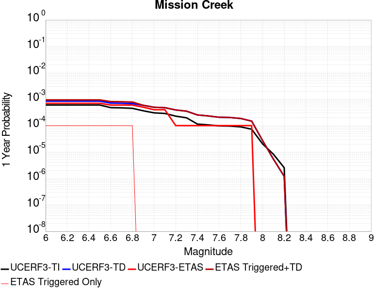 | 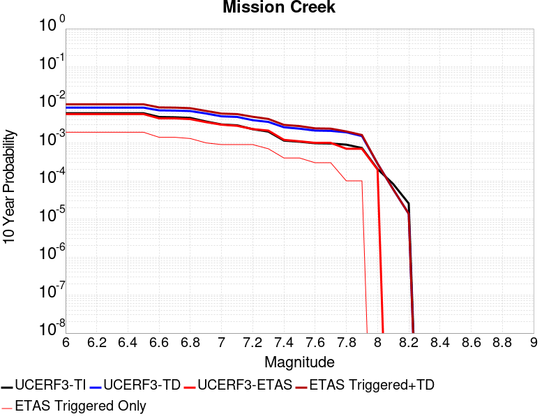 |

| Magnitude | 1 wk TI Prob | 1 wk TD Prob | 1 wk ETAS Prob | 1 wk ETAS/TD Gain | 1 wk ETAS Triggered+TD | 1 wk ETAS Triggered Only | 1 mo TI Prob | 1 mo TD Prob | 1 mo ETAS Prob | 1 mo ETAS/TD Gain | 1 mo ETAS Triggered+TD | 1 mo ETAS Triggered Only | 1 yr TI Prob | 1 yr TD Prob | 1 yr ETAS Prob | 1 yr ETAS/TD Gain | 1 yr ETAS Triggered+TD | 1 yr ETAS Triggered Only | 10 yr TI Prob | 10 yr TD Prob | 10 yr ETAS Prob | 10 yr ETAS/TD Gain | 10 yr ETAS Triggered+TD | 10 yr ETAS Triggered Only |
|-----|-----|-----|-----|-----|-----|-----|-----|-----|-----|-----|-----|-----|-----|-----|-----|-----|-----|-----|-----|-----|-----|-----|-----|-----|
| 6.0 | 1.1549387E-5 | 1.6131504E-5 | 0.0 | 0.0 | 1.6131504E-5 | 0.0 | 4.9496433E-5 | 6.913327E-5 | 0.0 | 0.0 | 6.913327E-5 | 0.0 | 6.0245243E-4 | 8.413875E-4 | 7.0E-4 | 0.8319591 | 9.413033E-4 | 1.0E-4 | 0.006008218 | 0.008413596 | 0.0057 | 0.67747486 | 0.01029761 | 0.0019 |
| 6.1 | 1.1549387E-5 | 1.6131504E-5 | 0.0 | 0.0 | 1.6131504E-5 | 0.0 | 4.9496433E-5 | 6.913327E-5 | 0.0 | 0.0 | 6.913327E-5 | 0.0 | 6.0245243E-4 | 8.413875E-4 | 7.0E-4 | 0.8319591 | 9.413033E-4 | 1.0E-4 | 0.006008218 | 0.008413596 | 0.0057 | 0.67747486 | 0.01029761 | 0.0019 |
| 6.2 | 1.1549387E-5 | 1.6131504E-5 | 0.0 | 0.0 | 1.6131504E-5 | 0.0 | 4.9496433E-5 | 6.913327E-5 | 0.0 | 0.0 | 6.913327E-5 | 0.0 | 6.0245243E-4 | 8.413875E-4 | 7.0E-4 | 0.8319591 | 9.413033E-4 | 1.0E-4 | 0.006008218 | 0.008413596 | 0.0057 | 0.67747486 | 0.01029761 | 0.0019 |
| 6.3 | 1.1549387E-5 | 1.6131504E-5 | 0.0 | 0.0 | 1.6131504E-5 | 0.0 | 4.9496433E-5 | 6.913327E-5 | 0.0 | 0.0 | 6.913327E-5 | 0.0 | 6.0245243E-4 | 8.413875E-4 | 7.0E-4 | 0.8319591 | 9.413033E-4 | 1.0E-4 | 0.006008218 | 0.008413596 | 0.0057 | 0.67747486 | 0.01029761 | 0.0019 |
| 6.4 | 1.1549387E-5 | 1.6131504E-5 | 0.0 | 0.0 | 1.6131504E-5 | 0.0 | 4.9496433E-5 | 6.913327E-5 | 0.0 | 0.0 | 6.913327E-5 | 0.0 | 6.0245243E-4 | 8.413875E-4 | 7.0E-4 | 0.8319591 | 9.413033E-4 | 1.0E-4 | 0.006008218 | 0.008413596 | 0.0057 | 0.67747486 | 0.01029761 | 0.0019 |
| 6.5 | 1.1549387E-5 | 1.6131504E-5 | 0.0 | 0.0 | 1.6131504E-5 | 0.0 | 4.9496433E-5 | 6.913327E-5 | 0.0 | 0.0 | 6.913327E-5 | 0.0 | 6.0245243E-4 | 8.413875E-4 | 7.0E-4 | 0.8319591 | 9.413033E-4 | 1.0E-4 | 0.006008218 | 0.008413596 | 0.0057 | 0.67747486 | 0.01029761 | 0.0019 |
| 6.6 | 9.202681E-6 | 1.3656212E-5 | 0.0 | 0.0 | 1.3656212E-5 | 0.0 | 3.9439463E-5 | 5.8525362E-5 | 0.0 | 0.0 | 5.8525362E-5 | 0.0 | 4.800697E-4 | 7.123223E-4 | 6.0E-4 | 0.8423153 | 8.1225106E-4 | 1.0E-4 | 0.004790339 | 0.0071313977 | 0.0044 | 0.61698985 | 0.008521413 | 0.0014 |
| 6.7 | 9.019164E-6 | 1.3462001E-5 | 0.0 | 0.0 | 1.3462001E-5 | 0.0 | 3.8652986E-5 | 5.7693065E-5 | 0.0 | 0.0 | 5.7693065E-5 | 0.0 | 4.7049852E-4 | 7.021956E-4 | 6.0E-4 | 0.8544627 | 8.0212543E-4 | 1.0E-4 | 0.004695036 | 0.0070307744 | 0.0044 | 0.6258201 | 0.008420931 | 0.0014 |
| 6.8 | 8.673558E-6 | 1.3084503E-5 | 0.0 | 0.0 | 1.3084503E-5 | 0.0 | 3.717186E-5 | 5.6075285E-5 | 0.0 | 0.0 | 5.6075285E-5 | 0.0 | 4.524734E-4 | 6.8251154E-4 | 6.0E-4 | 0.87910604 | 7.8244327E-4 | 1.0E-4 | 0.0045155324 | 0.0068351463 | 0.0042 | 0.61447114 | 0.008126261 | 0.0013 |
| 6.9 | 7.002255E-6 | 1.1290143E-5 | 0.0 | 0.0 | 1.1290143E-5 | 0.0 | 3.000932E-5 | 4.8385467E-5 | 0.0 | 0.0 | 4.8385467E-5 | 0.0 | 3.653022E-4 | 5.8894063E-4 | 5.0E-4 | 0.848982 | 5.8894063E-4 | 0.0 | 0.0036470229 | 0.005904612 | 0.0035 | 0.592757 | 0.0068987072 | 0.001 |
| 7.0 | 5.84644E-6 | 9.496702E-6 | 0.0 | 0.0 | 9.496702E-6 | 0.0 | 2.5055931E-5 | 4.069954E-5 | 0.0 | 0.0 | 4.069954E-5 | 0.0 | 3.0501327E-4 | 4.954088E-4 | 4.0E-4 | 0.80741405 | 4.954088E-4 | 0.0 | 0.0030459496 | 0.0049736556 | 0.003 | 0.6031781 | 0.0058691795 | 9.0E-4 |
| 7.1 | 5.54703E-6 | 9.1518E-6 | 0.0 | 0.0 | 9.1518E-6 | 0.0 | 2.377277E-5 | 3.922144E-5 | 0.0 | 0.0 | 3.922144E-5 | 0.0 | 2.8939504E-4 | 4.774208E-4 | 4.0E-4 | 0.8378353 | 4.774208E-4 | 0.0 | 0.0028901845 | 0.004794557 | 0.0028 | 0.5839956 | 0.0056902417 | 9.0E-4 |
| 7.2 | 4.384709E-6 | 7.511537E-6 | 0.0 | 0.0 | 7.511537E-6 | 0.0 | 1.8791474E-5 | 3.2191925E-5 | 0.0 | 0.0 | 3.2191925E-5 | 0.0 | 2.2876218E-4 | 3.9186983E-4 | 1.0E-4 | 0.25518677 | 3.9186983E-4 | 0.0 | 0.0022852682 | 0.0039423797 | 0.0023 | 0.58340394 | 0.0048388317 | 9.0E-4 |
| 7.3 | 3.7888456E-6 | 6.7486394E-6 | 0.0 | 0.0 | 6.7486394E-6 | 0.0 | 1.623781E-5 | 2.8922439E-5 | 0.0 | 0.0 | 2.8922439E-5 | 0.0 | 1.9767738E-4 | 3.5207713E-4 | 1.0E-4 | 0.28402868 | 3.5207713E-4 | 0.0 | 0.0019750162 | 0.0035457811 | 0.0021 | 0.59225315 | 0.004243299 | 7.0E-4 |
| 7.4 | 2.1982462E-6 | 4.8617194E-6 | 0.0 | 0.0 | 4.8617194E-6 | 0.0 | 9.421021E-6 | 2.0835776E-5 | 0.0 | 0.0 | 2.0835776E-5 | 0.0 | 1.1469489E-4 | 2.5364623E-4 | 1.0E-4 | 0.39424992 | 2.5364623E-4 | 0.0 | 0.0011463572 | 0.0025639413 | 0.0012 | 0.46802944 | 0.0029629157 | 4.0E-4 |
| 7.5 | 2.051923E-6 | 4.4572294E-6 | 0.0 | 0.0 | 4.4572294E-6 | 0.0 | 8.793926E-6 | 1.9102274E-5 | 0.0 | 0.0 | 1.9102274E-5 | 0.0 | 1.0706078E-4 | 2.3254548E-4 | 1.0E-4 | 0.4300234 | 2.3254548E-4 | 0.0 | 0.0010700922 | 0.0023536985 | 0.0011 | 0.46734956 | 0.0027527572 | 4.0E-4 |
| 7.6 | 1.8733427E-6 | 3.970845E-6 | 0.0 | 0.0 | 3.970845E-6 | 0.0 | 8.028587E-6 | 1.7017795E-5 | 0.0 | 0.0 | 1.7017795E-5 | 0.0 | 9.774366E-5 | 2.0717202E-4 | 1.0E-4 | 0.48269063 | 2.0717202E-4 | 0.0 | 9.770069E-4 | 0.0021008784 | 0.001 | 0.4759914 | 0.002400248 | 3.0E-4 |
| 7.7 | 1.8411953E-6 | 3.8915077E-6 | 0.0 | 0.0 | 3.8915077E-6 | 0.0 | 7.890813E-6 | 1.6677785E-5 | 0.0 | 0.0 | 1.6677785E-5 | 0.0 | 9.606641E-5 | 2.0303318E-4 | 1.0E-4 | 0.49253035 | 2.0303318E-4 | 0.0 | 9.6024893E-4 | 0.0020596583 | 0.001 | 0.4855174 | 0.0023590405 | 3.0E-4 |
| 7.8 | 1.7194251E-6 | 3.5689336E-6 | 0.0 | 0.0 | 3.5689336E-6 | 0.0 | 7.368944E-6 | 1.5295342E-5 | 0.0 | 0.0 | 1.5295342E-5 | 0.0 | 8.97132E-5 | 1.8620494E-4 | 1.0E-4 | 0.5370427 | 1.8620494E-4 | 0.0 | 8.967699E-4 | 0.0018907825 | 7.0E-4 | 0.37021708 | 0.0019905935 | 1.0E-4 |
| 7.9 | 1.4035052E-6 | 2.8331592E-6 | 0.0 | 0.0 | 2.8331592E-6 | 0.0 | 6.0150082E-6 | 1.2142054E-5 | 0.0 | 0.0 | 1.2142054E-5 | 0.0 | 7.3230265E-5 | 1.4781953E-4 | 1.0E-4 | 0.67650056 | 1.4781953E-4 | 0.0 | 7.3206134E-4 | 0.0015040784 | 7.0E-4 | 0.46540126 | 0.001603928 | 1.0E-4 |
| 8.0 | 3.9318823E-7 | 5.2328056E-7 | 0.0 | 0.0 | 5.2328056E-7 | 0.0 | 1.6850913E-6 | 2.242629E-6 | 0.0 | 0.0 | 2.242629E-6 | 0.0 | 2.0515794E-5 | 2.7303671E-5 | 0.0 | 0.0 | 2.7303671E-5 | 0.0 | 2.0513899E-4 | 2.8338243E-4 | 2.0E-4 | 0.7057601 | 2.8338243E-4 | 0.0 |
| 8.1 | 1.596793E-7 | 1.0334334E-7 | 0.0 | 0.0 | 1.0334334E-7 | 0.0 | 6.8433974E-7 | 4.4289996E-7 | 0.0 | 0.0 | 4.4289996E-7 | 0.0 | 8.331805E-6 | 5.392294E-6 | 0.0 | 0.0 | 5.392294E-6 | 0.0 | 8.331492E-5 | 5.980708E-5 | 0.0 | 0.0 | 5.980708E-5 | 0.0 |
| 8.2 | 4.9003038E-8 | 2.2795913E-8 | 0.0 | 0.0 | 2.2795913E-8 | 0.0 | 2.10013E-7 | 9.769676E-8 | 0.0 | 0.0 | 9.769676E-8 | 0.0 | 2.5569052E-6 | 1.1894574E-6 | 0.0 | 0.0 | 1.1894574E-6 | 0.0 | 2.556876E-5 | 1.3484331E-5 | 0.0 | 0.0 | 1.3484331E-5 | 0.0 |

## Coyote Lake
*[(top)](#table-of-contents)*

| 1 Week | 1 Month | 1 Year | 10 Year |
|-----|-----|-----|-----|
|  |  | 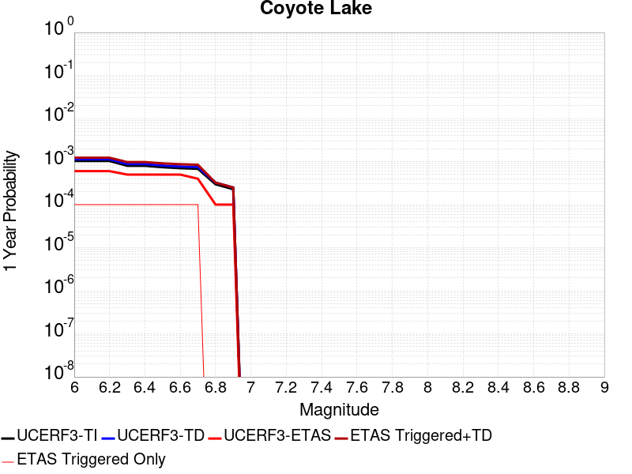 |  |

| Magnitude | 1 wk TI Prob | 1 wk TD Prob | 1 wk ETAS Prob | 1 wk ETAS/TD Gain | 1 wk ETAS Triggered+TD | 1 wk ETAS Triggered Only | 1 mo TI Prob | 1 mo TD Prob | 1 mo ETAS Prob | 1 mo ETAS/TD Gain | 1 mo ETAS Triggered+TD | 1 mo ETAS Triggered Only | 1 yr TI Prob | 1 yr TD Prob | 1 yr ETAS Prob | 1 yr ETAS/TD Gain | 1 yr ETAS Triggered+TD | 1 yr ETAS Triggered Only | 10 yr TI Prob | 10 yr TD Prob | 10 yr ETAS Prob | 10 yr ETAS/TD Gain | 10 yr ETAS Triggered+TD | 10 yr ETAS Triggered Only |
|-----|-----|-----|-----|-----|-----|-----|-----|-----|-----|-----|-----|-----|-----|-----|-----|-----|-----|-----|-----|-----|-----|-----|-----|-----|
| 6.0 | 1.980352E-5 | 2.1684975E-5 | 0.0 | 0.0 | 2.1684975E-5 | 0.0 | 8.486947E-5 | 9.293271E-5 | 0.0 | 0.0 | 9.293271E-5 | 0.0 | 0.0010327959 | 0.0011309403 | 6.0E-4 | 0.530532 | 0.0012308272 | 1.0E-4 | 0.010280091 | 0.011259011 | 0.0079 | 0.7016602 | 0.013038745 | 0.0018 |
| 6.1 | 1.980352E-5 | 2.1684975E-5 | 0.0 | 0.0 | 2.1684975E-5 | 0.0 | 8.486947E-5 | 9.293271E-5 | 0.0 | 0.0 | 9.293271E-5 | 0.0 | 0.0010327959 | 0.0011309403 | 6.0E-4 | 0.530532 | 0.0012308272 | 1.0E-4 | 0.010280091 | 0.011259011 | 0.0079 | 0.7016602 | 0.013038745 | 0.0018 |
| 6.2 | 1.980352E-5 | 2.1684975E-5 | 0.0 | 0.0 | 2.1684975E-5 | 0.0 | 8.486947E-5 | 9.293271E-5 | 0.0 | 0.0 | 9.293271E-5 | 0.0 | 0.0010327959 | 0.0011309403 | 6.0E-4 | 0.530532 | 0.0012308272 | 1.0E-4 | 0.010280091 | 0.011259011 | 0.0079 | 0.7016602 | 0.013038745 | 0.0018 |
| 6.3 | 1.5344787E-5 | 1.6803786E-5 | 0.0 | 0.0 | 1.6803786E-5 | 0.0 | 6.576172E-5 | 7.201458E-5 | 0.0 | 0.0 | 7.201458E-5 | 0.0 | 8.003548E-4 | 8.764859E-4 | 5.0E-4 | 0.57045984 | 9.763983E-4 | 1.0E-4 | 0.007974784 | 0.008736323 | 0.0067 | 0.76691306 | 0.0103223445 | 0.0016 |
| 6.4 | 1.5344787E-5 | 1.6803786E-5 | 0.0 | 0.0 | 1.6803786E-5 | 0.0 | 6.576172E-5 | 7.201458E-5 | 0.0 | 0.0 | 7.201458E-5 | 0.0 | 8.003548E-4 | 8.764859E-4 | 5.0E-4 | 0.57045984 | 9.763983E-4 | 1.0E-4 | 0.007974784 | 0.008736323 | 0.0067 | 0.76691306 | 0.0103223445 | 0.0016 |
| 6.5 | 1.4189697E-5 | 1.5542331E-5 | 0.0 | 0.0 | 1.5542331E-5 | 0.0 | 6.081157E-5 | 6.660863E-5 | 0.0 | 0.0 | 6.660863E-5 | 0.0 | 7.401293E-4 | 8.1071845E-4 | 5.0E-4 | 0.6167369 | 9.106374E-4 | 1.0E-4 | 0.0073766913 | 0.008083539 | 0.0062 | 0.7669908 | 0.009670606 | 0.0016 |
| 6.6 | 1.3469301E-5 | 1.47566725E-5 | 0.0 | 0.0 | 1.47566725E-5 | 0.0 | 5.7724297E-5 | 6.3241685E-5 | 0.0 | 0.0 | 6.3241685E-5 | 0.0 | 7.025667E-4 | 7.697554E-4 | 5.0E-4 | 0.649557 | 8.6967845E-4 | 1.0E-4 | 0.0070034964 | 0.0076767835 | 0.0058 | 0.75552475 | 0.009165268 | 0.0015 |
| 6.7 | 1.3027966E-5 | 1.4267402E-5 | 0.0 | 0.0 | 1.4267402E-5 | 0.0 | 5.5832945E-5 | 6.1144914E-5 | 0.0 | 0.0 | 6.1144914E-5 | 0.0 | 6.7955407E-4 | 7.4424467E-4 | 4.0E-4 | 0.5374577 | 8.441702E-4 | 1.0E-4 | 0.006774798 | 0.007423387 | 0.0054 | 0.72743076 | 0.008812995 | 0.0014 |
| 6.8 | 5.695434E-6 | 6.218387E-6 | 0.0 | 0.0 | 6.218387E-6 | 0.0 | 2.4408775E-5 | 2.6650127E-5 | 0.0 | 0.0 | 2.6650127E-5 | 0.0 | 2.971363E-4 | 3.244469E-4 | 1.0E-4 | 0.3082168 | 3.244469E-4 | 0.0 | 0.0029673933 | 0.0032426675 | 0.002 | 0.6167761 | 0.0035416947 | 3.0E-4 |
| 6.9 | 4.385688E-6 | 4.7884114E-6 | 0.0 | 0.0 | 4.7884114E-6 | 0.0 | 1.879567E-5 | 2.0521762E-5 | 0.0 | 0.0 | 2.0521762E-5 | 0.0 | 2.2881327E-4 | 2.4985246E-4 | 1.0E-4 | 0.40023622 | 2.4985246E-4 | 0.0 | 0.002285778 | 0.0024985245 | 0.0011 | 0.4402598 | 0.0025982747 | 1.0E-4 |

## Davis Creek
*[(top)](#table-of-contents)*

| 1 Week | 1 Month | 1 Year | 10 Year |
|-----|-----|-----|-----|
|  | 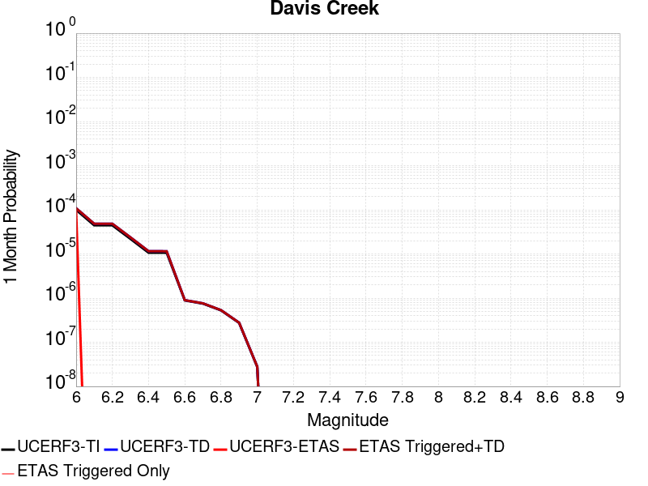 | 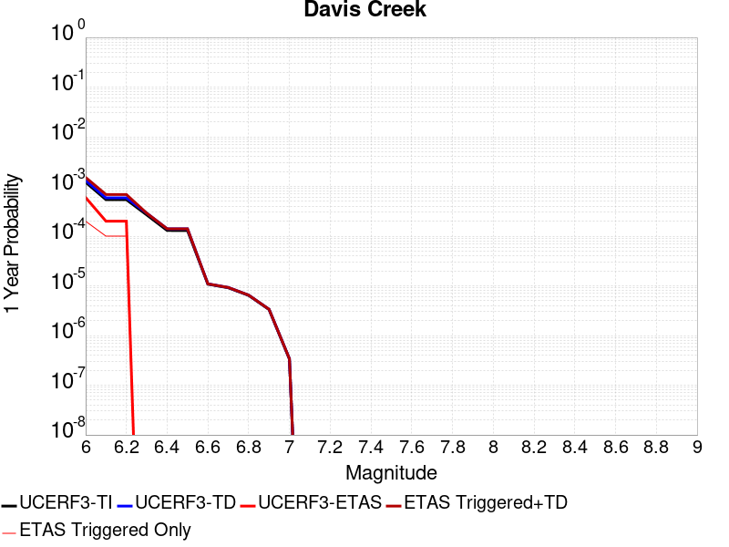 |  |

| Magnitude | 1 wk TI Prob | 1 wk TD Prob | 1 wk ETAS Prob | 1 wk ETAS/TD Gain | 1 wk ETAS Triggered+TD | 1 wk ETAS Triggered Only | 1 mo TI Prob | 1 mo TD Prob | 1 mo ETAS Prob | 1 mo ETAS/TD Gain | 1 mo ETAS Triggered+TD | 1 mo ETAS Triggered Only | 1 yr TI Prob | 1 yr TD Prob | 1 yr ETAS Prob | 1 yr ETAS/TD Gain | 1 yr ETAS Triggered+TD | 1 yr ETAS Triggered Only | 10 yr TI Prob | 10 yr TD Prob | 10 yr ETAS Prob | 10 yr ETAS/TD Gain | 10 yr ETAS Triggered+TD | 10 yr ETAS Triggered Only |
|-----|-----|-----|-----|-----|-----|-----|-----|-----|-----|-----|-----|-----|-----|-----|-----|-----|-----|-----|-----|-----|-----|-----|-----|-----|
| 6.0 | 2.331472E-5 | 2.5393283E-5 | 1.0E-4 | 3.938049 | 2.5393283E-5 | 0.0 | 9.99164E-5 | 1.0882449E-4 | 1.0E-4 | 0.9189108 | 1.0882449E-4 | 0.0 | 0.0012158032 | 0.0013242511 | 6.0E-4 | 0.4530863 | 0.0015239862 | 2.0E-4 | 0.01209173 | 0.013175357 | 0.0085 | 0.6451438 | 0.015050325 | 0.0019 |
| 6.1 | 1.0407654E-5 | 1.1306657E-5 | 0.0 | 0.0 | 1.1306657E-5 | 0.0 | 4.4603472E-5 | 4.8456353E-5 | 0.0 | 0.0 | 4.8456353E-5 | 0.0 | 5.4291193E-4 | 5.8982347E-4 | 2.0E-4 | 0.3390845 | 6.897645E-4 | 1.0E-4 | 0.0054158745 | 0.0058852476 | 0.004 | 0.67966557 | 0.0068793623 | 0.001 |
| 6.2 | 1.0407654E-5 | 1.1306657E-5 | 0.0 | 0.0 | 1.1306657E-5 | 0.0 | 4.4603472E-5 | 4.8456353E-5 | 0.0 | 0.0 | 4.8456353E-5 | 0.0 | 5.4291193E-4 | 5.8982347E-4 | 2.0E-4 | 0.3390845 | 6.897645E-4 | 1.0E-4 | 0.0054158745 | 0.0058852476 | 0.004 | 0.67966557 | 0.0068793623 | 0.001 |
| 6.3 | 5.1323277E-6 | 5.5636046E-6 | 0.0 | 0.0 | 5.5636046E-6 | 0.0 | 2.1995505E-5 | 2.384385E-5 | 0.0 | 0.0 | 2.384385E-5 | 0.0 | 2.6776237E-4 | 2.902688E-4 | 0.0 | 0.0 | 2.902688E-4 | 0.0 | 0.0026743996 | 0.0028997413 | 0.0018 | 0.62074506 | 0.0031988714 | 3.0E-4 |
| 6.4 | 2.4985154E-6 | 2.7021988E-6 | 0.0 | 0.0 | 2.7021988E-6 | 0.0 | 1.07078795E-5 | 1.1580821E-5 | 0.0 | 0.0 | 1.1580821E-5 | 0.0 | 1.3036063E-4 | 1.4099097E-4 | 0.0 | 0.0 | 1.4099097E-4 | 0.0 | 0.0013028418 | 0.0014093693 | 9.0E-4 | 0.6385835 | 0.0016090875 | 2.0E-4 |
| 6.5 | 2.4846438E-6 | 2.6881348E-6 | 0.0 | 0.0 | 2.6881348E-6 | 0.0 | 1.064843E-5 | 1.1520548E-5 | 0.0 | 0.0 | 1.1520548E-5 | 0.0 | 1.2963692E-4 | 1.4025725E-4 | 0.0 | 0.0 | 1.4025725E-4 | 0.0 | 0.0012956132 | 0.0014020413 | 9.0E-4 | 0.64192116 | 0.001601761 | 2.0E-4 |
| 6.6 | 2.072566E-7 | 2.1014988E-7 | 0.0 | 0.0 | 2.1014988E-7 | 0.0 | 8.882423E-7 | 9.006421E-7 | 0.0 | 0.0 | 9.006421E-7 | 0.0 | 1.0814296E-5 | 1.0965264E-5 | 0.0 | 0.0 | 1.0965264E-5 | 0.0 | 1.081377E-4 | 1.0964741E-4 | 2.0E-4 | 1.8240285 | 1.0964741E-4 | 0.0 |
| 6.7 | 1.7544528E-7 | 1.7788216E-7 | 0.0 | 0.0 | 1.7788216E-7 | 0.0 | 7.5190815E-7 | 7.6235193E-7 | 0.0 | 0.0 | 7.6235193E-7 | 0.0 | 9.154443E-6 | 9.281596E-6 | 0.0 | 0.0 | 9.281596E-6 | 0.0 | 9.1540656E-5 | 9.2812246E-5 | 1.0E-4 | 1.0774441 | 9.2812246E-5 | 0.0 |
| 6.8 | 1.2320395E-7 | 1.2479437E-7 | 0.0 | 0.0 | 1.2479437E-7 | 0.0 | 5.280168E-7 | 5.348329E-7 | 0.0 | 0.0 | 5.348329E-7 | 0.0 | 6.428586E-6 | 6.5115723E-6 | 0.0 | 0.0 | 6.5115723E-6 | 0.0 | 6.4284E-5 | 6.511393E-5 | 1.0E-4 | 1.5357697 | 6.511393E-5 | 0.0 |
| 6.9 | 6.399997E-8 | 6.485147E-8 | 0.0 | 0.0 | 6.485147E-8 | 0.0 | 2.7428555E-7 | 2.7793484E-7 | 0.0 | 0.0 | 2.7793484E-7 | 0.0 | 3.3394215E-6 | 3.3838523E-6 | 0.0 | 0.0 | 3.3838523E-6 | 0.0 | 3.3393713E-5 | 3.383807E-5 | 0.0 | 0.0 | 3.383807E-5 | 0.0 |
| 7.0 | 6.4455685E-9 | 6.5343144E-9 | 0.0 | 0.0 | 6.5343144E-9 | 0.0 | 2.7623864E-8 | 2.8004205E-8 | 0.0 | 0.0 | 2.8004205E-8 | 0.0 | 3.3632048E-7 | 3.409512E-7 | 0.0 | 0.0 | 3.409512E-7 | 0.0 | 3.3631998E-6 | 3.409512E-6 | 0.0 | 0.0 | 3.409512E-6 | 0.0 |

## Mission Hills 2011
*[(top)](#table-of-contents)*

| 1 Week | 1 Month | 1 Year | 10 Year |
|-----|-----|-----|-----|
|  | 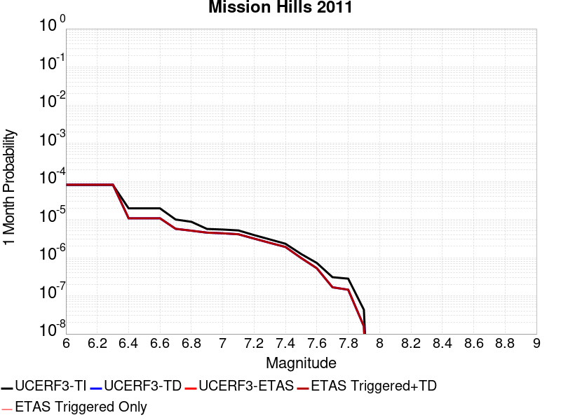 |  |  |

| Magnitude | 1 wk TI Prob | 1 wk TD Prob | 1 wk ETAS Prob | 1 wk ETAS/TD Gain | 1 wk ETAS Triggered+TD | 1 wk ETAS Triggered Only | 1 mo TI Prob | 1 mo TD Prob | 1 mo ETAS Prob | 1 mo ETAS/TD Gain | 1 mo ETAS Triggered+TD | 1 mo ETAS Triggered Only | 1 yr TI Prob | 1 yr TD Prob | 1 yr ETAS Prob | 1 yr ETAS/TD Gain | 1 yr ETAS Triggered+TD | 1 yr ETAS Triggered Only | 10 yr TI Prob | 10 yr TD Prob | 10 yr ETAS Prob | 10 yr ETAS/TD Gain | 10 yr ETAS Triggered+TD | 10 yr ETAS Triggered Only |
|-----|-----|-----|-----|-----|-----|-----|-----|-----|-----|-----|-----|-----|-----|-----|-----|-----|-----|-----|-----|-----|-----|-----|-----|-----|
| 6.0 | 1.8765717E-5 | 1.9021598E-5 | 0.0 | 0.0 | 1.9021598E-5 | 0.0 | 8.0422025E-5 | 8.152052E-5 | 0.0 | 0.0 | 8.152052E-5 | 0.0 | 9.786983E-4 | 9.924026E-4 | 0.001 | 1.0076556 | 0.0013920056 | 4.0E-4 | 0.009743992 | 0.00991326 | 0.0063 | 0.6355124 | 0.011794426 | 0.0019 |
| 6.1 | 1.8765717E-5 | 1.9021598E-5 | 0.0 | 0.0 | 1.9021598E-5 | 0.0 | 8.0422025E-5 | 8.152052E-5 | 0.0 | 0.0 | 8.152052E-5 | 0.0 | 9.786983E-4 | 9.924026E-4 | 0.001 | 1.0076556 | 0.0013920056 | 4.0E-4 | 0.009743992 | 0.00991326 | 0.0063 | 0.6355124 | 0.011794426 | 0.0019 |
| 6.2 | 1.8765717E-5 | 1.9021598E-5 | 0.0 | 0.0 | 1.9021598E-5 | 0.0 | 8.0422025E-5 | 8.152052E-5 | 0.0 | 0.0 | 8.152052E-5 | 0.0 | 9.786983E-4 | 9.924026E-4 | 0.001 | 1.0076556 | 0.0013920056 | 4.0E-4 | 0.009743992 | 0.00991326 | 0.0063 | 0.6355124 | 0.011794426 | 0.0019 |
| 6.3 | 1.8765717E-5 | 1.9021598E-5 | 0.0 | 0.0 | 1.9021598E-5 | 0.0 | 8.0422025E-5 | 8.152052E-5 | 0.0 | 0.0 | 8.152052E-5 | 0.0 | 9.786983E-4 | 9.924026E-4 | 0.001 | 1.0076556 | 0.0013920056 | 4.0E-4 | 0.009743992 | 0.00991326 | 0.0063 | 0.6355124 | 0.011794426 | 0.0019 |
| 6.4 | 4.566357E-6 | 2.5101976E-6 | 0.0 | 0.0 | 2.5101976E-6 | 0.0 | 1.9569954E-5 | 1.0757955E-5 | 0.0 | 0.0 | 1.0757955E-5 | 0.0 | 2.3823815E-4 | 1.3097204E-4 | 4.0E-4 | 3.054087 | 2.3095895E-4 | 1.0E-4 | 0.002379829 | 0.001309126 | 8.0E-4 | 0.6110947 | 0.0014089951 | 1.0E-4 |
| 6.5 | 4.566357E-6 | 2.5101976E-6 | 0.0 | 0.0 | 2.5101976E-6 | 0.0 | 1.9569954E-5 | 1.0757955E-5 | 0.0 | 0.0 | 1.0757955E-5 | 0.0 | 2.3823815E-4 | 1.3097204E-4 | 4.0E-4 | 3.054087 | 2.3095895E-4 | 1.0E-4 | 0.002379829 | 0.001309126 | 8.0E-4 | 0.6110947 | 0.0014089951 | 1.0E-4 |
| 6.6 | 4.566357E-6 | 2.5101976E-6 | 0.0 | 0.0 | 2.5101976E-6 | 0.0 | 1.9569954E-5 | 1.0757955E-5 | 0.0 | 0.0 | 1.0757955E-5 | 0.0 | 2.3823815E-4 | 1.3097204E-4 | 4.0E-4 | 3.054087 | 2.3095895E-4 | 1.0E-4 | 0.002379829 | 0.001309126 | 8.0E-4 | 0.6110947 | 0.0014089951 | 1.0E-4 |
| 6.7 | 2.3266773E-6 | 1.3273985E-6 | 0.0 | 0.0 | 1.3273985E-6 | 0.0 | 9.971435E-6 | 5.688839E-6 | 0.0 | 0.0 | 5.688839E-6 | 0.0 | 1.2139547E-4 | 6.925948E-5 | 2.0E-4 | 2.8876915 | 1.6925255E-4 | 1.0E-4 | 0.0012132917 | 6.9238496E-4 | 3.0E-4 | 0.43328497 | 7.923157E-4 | 1.0E-4 |
| 6.8 | 2.032735E-6 | 1.1874002E-6 | 0.0 | 0.0 | 1.1874002E-6 | 0.0 | 8.711692E-6 | 5.0888484E-6 | 0.0 | 0.0 | 5.0888484E-6 | 0.0 | 1.06059684E-4 | 6.195502E-5 | 2.0E-4 | 3.2281487 | 1.6194882E-4 | 1.0E-4 | 0.0010600908 | 6.193823E-4 | 3.0E-4 | 0.48435354 | 7.193203E-4 | 1.0E-4 |
| 6.9 | 1.3186259E-6 | 1.0546239E-6 | 0.0 | 0.0 | 1.0546239E-6 | 0.0 | 5.6512413E-6 | 4.519809E-6 | 0.0 | 0.0 | 4.519809E-6 | 0.0 | 6.8801695E-5 | 5.5027314E-5 | 2.0E-4 | 3.6345584 | 1.5502181E-4 | 1.0E-4 | 6.8780396E-4 | 5.5013987E-4 | 3.0E-4 | 0.54531586 | 6.5008487E-4 | 1.0E-4 |
| 7.0 | 1.2726016E-6 | 1.0143791E-6 | 0.0 | 0.0 | 1.0143791E-6 | 0.0 | 5.4539955E-6 | 4.347332E-6 | 0.0 | 0.0 | 4.347332E-6 | 0.0 | 6.6400375E-5 | 5.2927506E-5 | 2.0E-4 | 3.7787535 | 1.5292222E-4 | 1.0E-4 | 6.6380535E-4 | 5.291519E-4 | 3.0E-4 | 0.566945 | 6.2909897E-4 | 1.0E-4 |
| 7.1 | 1.2063913E-6 | 9.555864E-7 | 0.0 | 0.0 | 9.555864E-7 | 0.0 | 5.170238E-6 | 4.095364E-6 | 0.0 | 0.0 | 4.095364E-6 | 0.0 | 6.294583E-5 | 4.9859944E-5 | 2.0E-4 | 4.011236 | 1.4985495E-4 | 1.0E-4 | 6.2928005E-4 | 4.984901E-4 | 3.0E-4 | 0.60181737 | 5.9844024E-4 | 1.0E-4 |
| 7.2 | 9.105806E-7 | 7.3639194E-7 | 0.0 | 0.0 | 7.3639194E-7 | 0.0 | 3.9024826E-6 | 3.1559618E-6 | 0.0 | 0.0 | 3.1559618E-6 | 0.0 | 4.7511687E-5 | 3.842317E-5 | 1.0E-4 | 2.602596 | 3.842317E-5 | 0.0 | 4.7501532E-4 | 3.8416684E-4 | 2.0E-4 | 0.5206071 | 3.8416684E-4 | 0.0 |
| 7.3 | 7.020432E-7 | 5.6998084E-7 | 0.0 | 0.0 | 5.6998084E-7 | 0.0 | 3.0087533E-6 | 2.442773E-6 | 0.0 | 0.0 | 2.442773E-6 | 0.0 | 3.6630954E-5 | 2.9740368E-5 | 1.0E-4 | 3.3624332 | 2.9740368E-5 | 0.0 | 3.6624918E-4 | 2.973652E-4 | 2.0E-4 | 0.6725737 | 2.973652E-4 | 0.0 |
| 7.4 | 5.3900635E-7 | 4.4389245E-7 | 0.0 | 0.0 | 4.4389245E-7 | 0.0 | 2.3100251E-6 | 1.902395E-6 | 0.0 | 0.0 | 1.902395E-6 | 0.0 | 2.8124194E-5 | 2.3161425E-5 | 1.0E-4 | 4.317524 | 2.3161425E-5 | 0.0 | 2.8120633E-4 | 2.3159132E-4 | 1.0E-4 | 0.43179512 | 2.3159132E-4 | 0.0 |
| 7.5 | 2.907075E-7 | 2.280401E-7 | 0.0 | 0.0 | 2.280401E-7 | 0.0 | 1.2458887E-6 | 9.773144E-7 | 0.0 | 0.0 | 9.773144E-7 | 0.0 | 1.5168589E-5 | 1.1898739E-5 | 1.0E-4 | 8.404252 | 1.1898739E-5 | 0.0 | 1.5167553E-4 | 1.18981196E-4 | 1.0E-4 | 0.84046894 | 1.18981196E-4 | 0.0 |
| 7.6 | 1.6903675E-7 | 1.2291261E-7 | 0.0 | 0.0 | 1.2291261E-7 | 0.0 | 7.2444305E-7 | 5.267682E-7 | 0.0 | 0.0 | 5.267682E-7 | 0.0 | 8.820059E-6 | 6.4133856E-6 | 0.0 | 0.0 | 6.4133856E-6 | 0.0 | 8.8197085E-5 | 6.4132124E-5 | 0.0 | 0.0 | 6.4132124E-5 | 0.0 |
| 7.7 | 7.168073E-8 | 3.893984E-8 | 0.0 | 0.0 | 3.893984E-8 | 0.0 | 3.072031E-7 | 1.6688503E-7 | 0.0 | 0.0 | 1.6688503E-7 | 0.0 | 3.7401915E-6 | 2.0318234E-6 | 0.0 | 0.0 | 2.0318234E-6 | 0.0 | 3.7401285E-5 | 2.0318059E-5 | 0.0 | 0.0 | 2.0318059E-5 | 0.0 |
| 7.8 | 6.564101E-8 | 3.364574E-8 | 0.0 | 0.0 | 3.364574E-8 | 0.0 | 2.813186E-7 | 1.4419602E-7 | 0.0 | 0.0 | 1.4419602E-7 | 0.0 | 3.4250486E-6 | 1.7555852E-6 | 0.0 | 0.0 | 1.7555852E-6 | 0.0 | 3.424996E-5 | 1.7555723E-5 | 0.0 | 0.0 | 1.7555723E-5 | 0.0 |
| 7.9 | 1.0029074E-8 | 3.6999679E-9 | 0.0 | 0.0 | 3.6999679E-9 | 0.0 | 4.2981743E-8 | 1.5857005E-8 | 0.0 | 0.0 | 1.5857005E-8 | 0.0 | 5.2330256E-7 | 1.9305904E-7 | 0.0 | 0.0 | 1.9305904E-7 | 0.0 | 5.2330133E-6 | 1.9305896E-6 | 0.0 | 0.0 | 1.9305896E-6 | 0.0 |

## Mount Diablo Thrust North CFM
*[(top)](#table-of-contents)*

| 1 Week | 1 Month | 1 Year | 10 Year |
|-----|-----|-----|-----|
| 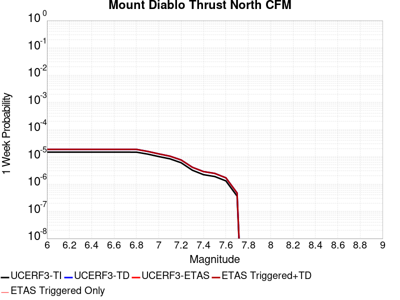 |  |  | 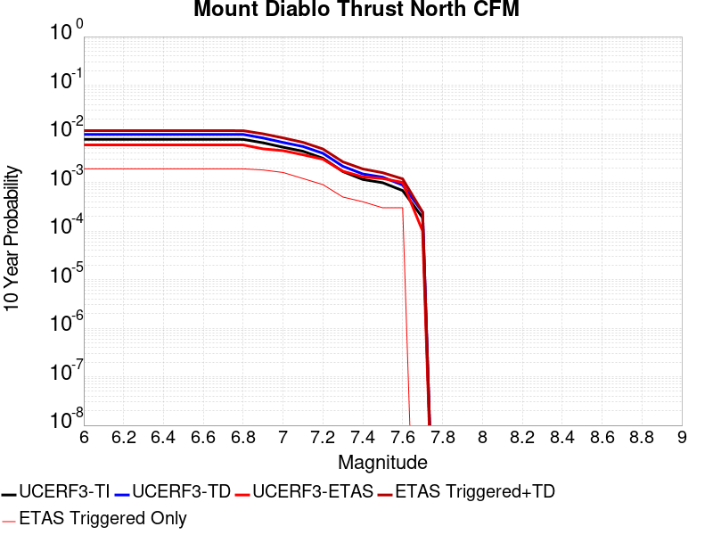 |

| Magnitude | 1 wk TI Prob | 1 wk TD Prob | 1 wk ETAS Prob | 1 wk ETAS/TD Gain | 1 wk ETAS Triggered+TD | 1 wk ETAS Triggered Only | 1 mo TI Prob | 1 mo TD Prob | 1 mo ETAS Prob | 1 mo ETAS/TD Gain | 1 mo ETAS Triggered+TD | 1 mo ETAS Triggered Only | 1 yr TI Prob | 1 yr TD Prob | 1 yr ETAS Prob | 1 yr ETAS/TD Gain | 1 yr ETAS Triggered+TD | 1 yr ETAS Triggered Only | 10 yr TI Prob | 10 yr TD Prob | 10 yr ETAS Prob | 10 yr ETAS/TD Gain | 10 yr ETAS Triggered+TD | 10 yr ETAS Triggered Only |
|-----|-----|-----|-----|-----|-----|-----|-----|-----|-----|-----|-----|-----|-----|-----|-----|-----|-----|-----|-----|-----|-----|-----|-----|-----|
| 6.0 | 1.479628E-5 | 1.8715906E-5 | 0.0 | 0.0 | 1.8715906E-5 | 0.0 | 6.341109E-5 | 8.020861E-5 | 0.0 | 0.0 | 8.020861E-5 | 0.0 | 7.717565E-4 | 9.761118E-4 | 5.0E-4 | 0.5122364 | 0.0011759166 | 2.0E-4 | 0.007690818 | 0.009722127 | 0.0059 | 0.60686314 | 0.011603654 | 0.0019 |
| 6.1 | 1.479628E-5 | 1.8715906E-5 | 0.0 | 0.0 | 1.8715906E-5 | 0.0 | 6.341109E-5 | 8.020861E-5 | 0.0 | 0.0 | 8.020861E-5 | 0.0 | 7.717565E-4 | 9.761118E-4 | 5.0E-4 | 0.5122364 | 0.0011759166 | 2.0E-4 | 0.007690818 | 0.009722127 | 0.0059 | 0.60686314 | 0.011603654 | 0.0019 |
| 6.2 | 1.479628E-5 | 1.8715906E-5 | 0.0 | 0.0 | 1.8715906E-5 | 0.0 | 6.341109E-5 | 8.020861E-5 | 0.0 | 0.0 | 8.020861E-5 | 0.0 | 7.717565E-4 | 9.761118E-4 | 5.0E-4 | 0.5122364 | 0.0011759166 | 2.0E-4 | 0.007690818 | 0.009722127 | 0.0059 | 0.60686314 | 0.011603654 | 0.0019 |
| 6.3 | 1.479628E-5 | 1.8715906E-5 | 0.0 | 0.0 | 1.8715906E-5 | 0.0 | 6.341109E-5 | 8.020861E-5 | 0.0 | 0.0 | 8.020861E-5 | 0.0 | 7.717565E-4 | 9.761118E-4 | 5.0E-4 | 0.5122364 | 0.0011759166 | 2.0E-4 | 0.007690818 | 0.009722127 | 0.0059 | 0.60686314 | 0.011603654 | 0.0019 |
| 6.4 | 1.479628E-5 | 1.8715906E-5 | 0.0 | 0.0 | 1.8715906E-5 | 0.0 | 6.341109E-5 | 8.020861E-5 | 0.0 | 0.0 | 8.020861E-5 | 0.0 | 7.717565E-4 | 9.761118E-4 | 5.0E-4 | 0.5122364 | 0.0011759166 | 2.0E-4 | 0.007690818 | 0.009722127 | 0.0059 | 0.60686314 | 0.011603654 | 0.0019 |
| 6.5 | 1.479628E-5 | 1.8715906E-5 | 0.0 | 0.0 | 1.8715906E-5 | 0.0 | 6.341109E-5 | 8.020861E-5 | 0.0 | 0.0 | 8.020861E-5 | 0.0 | 7.717565E-4 | 9.761118E-4 | 5.0E-4 | 0.5122364 | 0.0011759166 | 2.0E-4 | 0.007690818 | 0.009722127 | 0.0059 | 0.60686314 | 0.011603654 | 0.0019 |
| 6.6 | 1.479016E-5 | 1.8709026E-5 | 0.0 | 0.0 | 1.8709026E-5 | 0.0 | 6.338486E-5 | 8.0179125E-5 | 0.0 | 0.0 | 8.0179125E-5 | 0.0 | 7.714374E-4 | 9.757532E-4 | 5.0E-4 | 0.51242465 | 0.0011755581 | 2.0E-4 | 0.007687649 | 0.009718572 | 0.0059 | 0.6070851 | 0.011600106 | 0.0019 |
| 6.7 | 1.479016E-5 | 1.8709026E-5 | 0.0 | 0.0 | 1.8709026E-5 | 0.0 | 6.338486E-5 | 8.0179125E-5 | 0.0 | 0.0 | 8.0179125E-5 | 0.0 | 7.714374E-4 | 9.757532E-4 | 5.0E-4 | 0.51242465 | 0.0011755581 | 2.0E-4 | 0.007687649 | 0.009718572 | 0.0059 | 0.6070851 | 0.011600106 | 0.0019 |
| 6.8 | 1.4771667E-5 | 1.868783E-5 | 0.0 | 0.0 | 1.868783E-5 | 0.0 | 6.330561E-5 | 8.008829E-5 | 0.0 | 0.0 | 8.008829E-5 | 0.0 | 7.704732E-4 | 9.746482E-4 | 5.0E-4 | 0.5130056 | 0.0011744533 | 2.0E-4 | 0.007678074 | 0.0097076185 | 0.0059 | 0.6077701 | 0.011589174 | 0.0019 |
| 6.9 | 1.2548234E-5 | 1.577091E-5 | 0.0 | 0.0 | 1.577091E-5 | 0.0 | 5.3777036E-5 | 6.758788E-5 | 0.0 | 0.0 | 6.758788E-5 | 0.0 | 6.545387E-4 | 8.225753E-4 | 5.0E-4 | 0.6078471 | 0.0010224108 | 2.0E-4 | 0.006526142 | 0.00819642 | 0.0049 | 0.59782195 | 0.009981667 | 0.0018 |
| 7.0 | 1.01754185E-5 | 1.2775895E-5 | 0.0 | 0.0 | 1.2775895E-5 | 0.0 | 4.360821E-5 | 5.4752694E-5 | 0.0 | 0.0 | 5.4752694E-5 | 0.0 | 5.308006E-4 | 6.664118E-4 | 5.0E-4 | 0.7502868 | 8.6627854E-4 | 2.0E-4 | 0.005295345 | 0.006645098 | 0.0045 | 0.67719096 | 0.0082344655 | 0.0016 |
| 7.1 | 8.398341E-6 | 1.0523696E-5 | 0.0 | 0.0 | 1.0523696E-5 | 0.0 | 3.5992394E-5 | 4.510078E-5 | 0.0 | 0.0 | 4.510078E-5 | 0.0 | 4.3811928E-4 | 5.489647E-4 | 3.0E-4 | 0.54648316 | 6.4890983E-4 | 1.0E-4 | 0.0043725655 | 0.0054764855 | 0.0037 | 0.6756158 | 0.006669914 | 0.0012 |
| 7.2 | 6.024759E-6 | 7.622678E-6 | 0.0 | 0.0 | 7.622678E-6 | 0.0 | 2.582014E-5 | 3.2668217E-5 | 0.0 | 0.0 | 3.2668217E-5 | 0.0 | 3.1431485E-4 | 3.9766362E-4 | 3.0E-4 | 0.75440645 | 4.9762387E-4 | 1.0E-4 | 0.0031387066 | 0.003969908 | 0.003 | 0.75568503 | 0.004866335 | 9.0E-4 |
| 7.3 | 3.2099704E-6 | 4.117058E-6 | 0.0 | 0.0 | 4.117058E-6 | 0.0 | 1.3756943E-5 | 1.7644415E-5 | 0.0 | 0.0 | 1.7644415E-5 | 0.0 | 1.674779E-4 | 2.1479974E-4 | 1.0E-4 | 0.46554992 | 2.1479974E-4 | 0.0 | 0.0016735174 | 0.0021460056 | 0.0017 | 0.7921694 | 0.0026449326 | 5.0E-4 |
| 7.4 | 2.2041513E-6 | 2.8601714E-6 | 0.0 | 0.0 | 2.8601714E-6 | 0.0 | 9.4463285E-6 | 1.225782E-5 | 0.0 | 0.0 | 1.225782E-5 | 0.0 | 1.1500298E-4 | 1.4922881E-4 | 1.0E-4 | 0.67011184 | 1.4922881E-4 | 0.0 | 0.0011494348 | 0.0014912793 | 0.0013 | 0.87173474 | 0.0018906828 | 4.0E-4 |
| 7.5 | 1.8869501E-6 | 2.4573346E-6 | 0.0 | 0.0 | 2.4573346E-6 | 0.0 | 8.086904E-6 | 1.0531392E-5 | 0.0 | 0.0 | 1.0531392E-5 | 0.0 | 9.845361E-5 | 1.2821222E-4 | 1.0E-4 | 0.7799568 | 1.2821222E-4 | 0.0 | 9.841E-4 | 0.001281347 | 0.0012 | 0.93651444 | 0.0015809627 | 3.0E-4 |
| 7.6 | 1.3012458E-6 | 1.6901882E-6 | 0.0 | 0.0 | 1.6901882E-6 | 0.0 | 5.576756E-6 | 7.243644E-6 | 0.0 | 0.0 | 7.243644E-6 | 0.0 | 6.7894885E-5 | 8.818785E-5 | 0.0 | 0.0 | 8.818785E-5 | 0.0 | 6.787415E-4 | 8.81489E-4 | 0.001 | 1.1344441 | 0.0011812246 | 3.0E-4 |
| 7.7 | 3.603383E-7 | 4.6900843E-7 | 0.0 | 0.0 | 4.6900843E-7 | 0.0 | 1.5443061E-6 | 2.0100347E-6 | 0.0 | 0.0 | 2.0100347E-6 | 0.0 | 1.8801764E-5 | 2.4471903E-5 | 0.0 | 0.0 | 2.4471903E-5 | 0.0 | 1.8800174E-4 | 2.4469846E-4 | 1.0E-4 | 0.40866625 | 2.4469846E-4 | 0.0 |

## San Juan
*[(top)](#table-of-contents)*

| 1 Week | 1 Month | 1 Year | 10 Year |
|-----|-----|-----|-----|
|  |  |  | 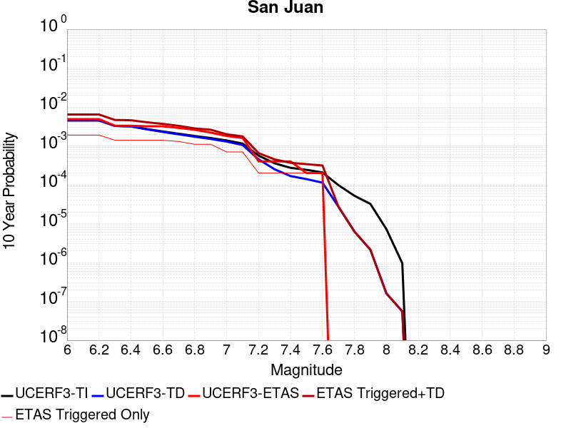 |

| Magnitude | 1 wk TI Prob | 1 wk TD Prob | 1 wk ETAS Prob | 1 wk ETAS/TD Gain | 1 wk ETAS Triggered+TD | 1 wk ETAS Triggered Only | 1 mo TI Prob | 1 mo TD Prob | 1 mo ETAS Prob | 1 mo ETAS/TD Gain | 1 mo ETAS Triggered+TD | 1 mo ETAS Triggered Only | 1 yr TI Prob | 1 yr TD Prob | 1 yr ETAS Prob | 1 yr ETAS/TD Gain | 1 yr ETAS Triggered+TD | 1 yr ETAS Triggered Only | 10 yr TI Prob | 10 yr TD Prob | 10 yr ETAS Prob | 10 yr ETAS/TD Gain | 10 yr ETAS Triggered+TD | 10 yr ETAS Triggered Only |
|-----|-----|-----|-----|-----|-----|-----|-----|-----|-----|-----|-----|-----|-----|-----|-----|-----|-----|-----|-----|-----|-----|-----|-----|-----|
| 6.0 | 8.682808E-6 | 8.703906E-6 | 0.0 | 0.0 | 8.703906E-6 | 0.0 | 3.72115E-5 | 3.7301947E-5 | 0.0 | 0.0 | 3.7301947E-5 | 0.0 | 4.5295584E-4 | 4.5406137E-4 | 4.0E-4 | 0.8809382 | 6.539706E-4 | 2.0E-4 | 0.004520337 | 0.004531875 | 0.0049 | 1.0812303 | 0.0064232643 | 0.0019 |
| 6.1 | 8.682808E-6 | 8.703906E-6 | 0.0 | 0.0 | 8.703906E-6 | 0.0 | 3.72115E-5 | 3.7301947E-5 | 0.0 | 0.0 | 3.7301947E-5 | 0.0 | 4.5295584E-4 | 4.5406137E-4 | 4.0E-4 | 0.8809382 | 6.539706E-4 | 2.0E-4 | 0.004520337 | 0.004531875 | 0.0049 | 1.0812303 | 0.0064232643 | 0.0019 |
| 6.2 | 8.682808E-6 | 8.703906E-6 | 0.0 | 0.0 | 8.703906E-6 | 0.0 | 3.72115E-5 | 3.7301947E-5 | 0.0 | 0.0 | 3.7301947E-5 | 0.0 | 4.5295584E-4 | 4.5406137E-4 | 4.0E-4 | 0.8809382 | 6.539706E-4 | 2.0E-4 | 0.004520337 | 0.004531875 | 0.0049 | 1.0812303 | 0.0064232643 | 0.0019 |
| 6.3 | 6.3054235E-6 | 6.2382937E-6 | 0.0 | 0.0 | 6.2382937E-6 | 0.0 | 2.7022963E-5 | 2.6735277E-5 | 0.0 | 0.0 | 2.6735277E-5 | 0.0 | 3.2895492E-4 | 3.2545478E-4 | 1.0E-4 | 0.30726233 | 4.2542224E-4 | 1.0E-4 | 0.003284684 | 0.0032499793 | 0.0033 | 1.0153911 | 0.0046454296 | 0.0014 |
| 6.4 | 6.1490473E-6 | 6.0763314E-6 | 0.0 | 0.0 | 6.0763314E-6 | 0.0 | 2.6352795E-5 | 2.6041169E-5 | 0.0 | 0.0 | 2.6041169E-5 | 0.0 | 3.2079802E-4 | 3.1700646E-4 | 1.0E-4 | 0.31545097 | 4.1697477E-4 | 1.0E-4 | 0.0032033534 | 0.003165737 | 0.0033 | 1.0424113 | 0.004561305 | 0.0014 |
| 6.5 | 5.204848E-6 | 5.1001834E-6 | 0.0 | 0.0 | 5.1001834E-6 | 0.0 | 2.23063E-5 | 2.1857752E-5 | 0.0 | 0.0 | 2.1857752E-5 | 0.0 | 2.7154534E-4 | 2.6608657E-4 | 1.0E-4 | 0.37581754 | 3.6605998E-4 | 1.0E-4 | 0.0027121378 | 0.0026578319 | 0.0032 | 1.2039889 | 0.004054111 | 0.0014 |
| 6.6 | 4.5179986E-6 | 4.387328E-6 | 0.0 | 0.0 | 4.387328E-6 | 0.0 | 1.9362706E-5 | 1.8802702E-5 | 0.0 | 0.0 | 1.8802702E-5 | 0.0 | 2.3571544E-4 | 2.2889965E-4 | 1.0E-4 | 0.43687266 | 3.2887675E-4 | 1.0E-4 | 0.0023546559 | 0.002286774 | 0.0032 | 1.3993511 | 0.0036835726 | 0.0014 |
| 6.7 | 3.9442616E-6 | 3.7950253E-6 | 0.0 | 0.0 | 3.7950253E-6 | 0.0 | 1.6903869E-5 | 1.6264297E-5 | 0.0 | 0.0 | 1.6264297E-5 | 0.0 | 2.0578515E-4 | 1.9800049E-4 | 1.0E-4 | 0.5050493 | 2.9798067E-4 | 1.0E-4 | 0.002055947 | 0.0019783638 | 0.0029 | 1.4658577 | 0.003275792 | 0.0013 |
| 6.8 | 3.4536245E-6 | 3.292513E-6 | 0.0 | 0.0 | 3.292513E-6 | 0.0 | 1.4801163E-5 | 1.41106975E-5 | 0.0 | 0.0 | 1.41106975E-5 | 0.0 | 1.8018926E-4 | 1.717848E-4 | 1.0E-4 | 0.58212364 | 2.7176764E-4 | 1.0E-4 | 0.0018004322 | 0.0017166373 | 0.0026 | 1.514589 | 0.002814749 | 0.0011 |
| 6.9 | 3.059865E-6 | 2.8892368E-6 | 0.0 | 0.0 | 2.8892368E-6 | 0.0 | 1.3113641E-5 | 1.2382388E-5 | 0.0 | 0.0 | 1.2382388E-5 | 0.0 | 1.596469E-4 | 1.5074572E-4 | 1.0E-4 | 0.66336876 | 2.5073063E-4 | 1.0E-4 | 0.0015953224 | 0.0015065476 | 0.0022 | 1.4602923 | 0.0026048904 | 0.0011 |
| 7.0 | 2.6504351E-6 | 2.4704427E-6 | 0.0 | 0.0 | 2.4704427E-6 | 0.0 | 1.1358958E-5 | 1.05875715E-5 | 0.0 | 0.0 | 1.05875715E-5 | 0.0 | 1.3828653E-4 | 1.288966E-4 | 0.0 | 0.0 | 1.288966E-4 | 0.0 | 0.0013820052 | 0.0012883286 | 0.0018 | 1.3971591 | 0.0019874268 | 7.0E-4 |
| 7.1 | 2.2039317E-6 | 2.0161558E-6 | 0.0 | 0.0 | 2.0161558E-6 | 0.0 | 9.445387E-6 | 8.640643E-6 | 0.0 | 0.0 | 8.640643E-6 | 0.0 | 1.1499152E-4 | 1.0519527E-4 | 0.0 | 0.0 | 1.0519527E-4 | 0.0 | 0.0011493203 | 0.0010515631 | 0.0016 | 1.5215445 | 0.001750827 | 7.0E-4 |
| 7.2 | 1.0786707E-6 | 8.6173696E-7 | 0.0 | 0.0 | 8.6173696E-7 | 0.0 | 4.622866E-6 | 3.693153E-6 | 0.0 | 0.0 | 3.693153E-6 | 0.0 | 5.628194E-5 | 4.496322E-5 | 0.0 | 0.0 | 4.496322E-5 | 0.0 | 5.6267687E-4 | 4.4959877E-4 | 4.0E-4 | 0.8896822 | 6.4950885E-4 | 2.0E-4 |
| 7.3 | 6.846433E-7 | 4.7728435E-7 | 0.0 | 0.0 | 4.7728435E-7 | 0.0 | 2.9341822E-6 | 2.0455027E-6 | 0.0 | 0.0 | 2.0455027E-6 | 0.0 | 3.5723086E-5 | 2.4903711E-5 | 0.0 | 0.0 | 2.4903711E-5 | 0.0 | 3.571734E-4 | 2.4904133E-4 | 4.0E-4 | 1.6061591 | 4.4899154E-4 | 2.0E-4 |
| 7.4 | 5.23043E-7 | 3.1916605E-7 | 0.0 | 0.0 | 3.1916605E-7 | 0.0 | 2.2416111E-6 | 1.3678538E-6 | 0.0 | 0.0 | 1.3678538E-6 | 0.0 | 2.7291273E-5 | 1.6653492E-5 | 0.0 | 0.0 | 1.6653492E-5 | 0.0 | 2.7287923E-4 | 1.6655332E-4 | 4.0E-4 | 2.4016333 | 3.6652002E-4 | 2.0E-4 |
| 7.5 | 4.648444E-7 | 2.6622286E-7 | 0.0 | 0.0 | 2.6622286E-7 | 0.0 | 1.9921886E-6 | 1.1409545E-6 | 0.0 | 0.0 | 1.1409545E-6 | 0.0 | 2.4254627E-5 | 1.3891034E-5 | 0.0 | 0.0 | 1.3891034E-5 | 0.0 | 2.425198E-4 | 1.3893023E-4 | 2.0E-4 | 1.4395715 | 3.3890244E-4 | 2.0E-4 |
| 7.6 | 3.9906567E-7 | 2.1594454E-7 | 0.0 | 0.0 | 2.1594454E-7 | 0.0 | 1.7102802E-6 | 9.254763E-7 | 0.0 | 0.0 | 9.254763E-7 | 0.0 | 2.0822463E-5 | 1.1267616E-5 | 0.0 | 0.0 | 1.1267616E-5 | 0.0 | 2.0820512E-4 | 1.1269382E-4 | 2.0E-4 | 1.7747202 | 3.1267127E-4 | 2.0E-4 |
| 7.7 | 1.8784601E-7 | 5.194314E-8 | 0.0 | 0.0 | 5.194314E-8 | 0.0 | 8.0505407E-7 | 2.2261347E-7 | 0.0 | 0.0 | 2.2261347E-7 | 0.0 | 9.80149E-6 | 2.7103156E-6 | 0.0 | 0.0 | 2.7103156E-6 | 0.0 | 9.801057E-5 | 2.7110653E-5 | 0.0 | 0.0 | 2.7110653E-5 | 0.0 |
| 7.8 | 1.00154914E-7 | 1.1896528E-8 | 0.0 | 0.0 | 1.1896528E-8 | 0.0 | 4.2923529E-7 | 5.098514E-8 | 0.0 | 0.0 | 5.098514E-8 | 0.0 | 5.225927E-6 | 6.2074395E-7 | 0.0 | 0.0 | 6.2074395E-7 | 0.0 | 5.225804E-5 | 6.21241E-6 | 0.0 | 0.0 | 6.21241E-6 | 0.0 |
| 7.9 | 6.171429E-8 | 4.0372203E-9 | 0.0 | 0.0 | 4.0372203E-9 | 0.0 | 2.6448978E-7 | 1.7302384E-8 | 0.0 | 0.0 | 1.7302384E-8 | 0.0 | 3.2201583E-6 | 2.1065654E-7 | 0.0 | 0.0 | 2.1065654E-7 | 0.0 | 3.2201115E-5 | 2.1110895E-6 | 0.0 | 0.0 | 2.1110895E-6 | 0.0 |
| 8.0 | 1.3974572E-8 | 2.9240155E-10 | 0.0 | 0.0 | 2.9240155E-10 | 0.0 | 5.989102E-8 | 1.2531507E-9 | 0.0 | 0.0 | 1.2531507E-9 | 0.0 | 7.2917294E-7 | 1.5257124E-8 | 0.0 | 0.0 | 1.5257124E-8 | 0.0 | 7.2917055E-6 | 1.5632261E-7 | 0.0 | 0.0 | 1.5632261E-7 | 0.0 |
| 8.1 | 1.8403477E-9 | 1.0155343E-10 | 0.0 | 0.0 | 1.0155343E-10 | 0.0 | 7.887204E-9 | 4.352304E-10 | 0.0 | 0.0 | 4.352304E-10 | 0.0 | 9.602671E-8 | 5.298931E-9 | 0.0 | 0.0 | 5.298931E-9 | 0.0 | 9.602667E-7 | 5.416739E-8 | 0.0 | 0.0 | 5.416739E-8 | 0.0 |

## Collayami 2011 CFM
*[(top)](#table-of-contents)*

| 1 Week | 1 Month | 1 Year | 10 Year |
|-----|-----|-----|-----|
|  | 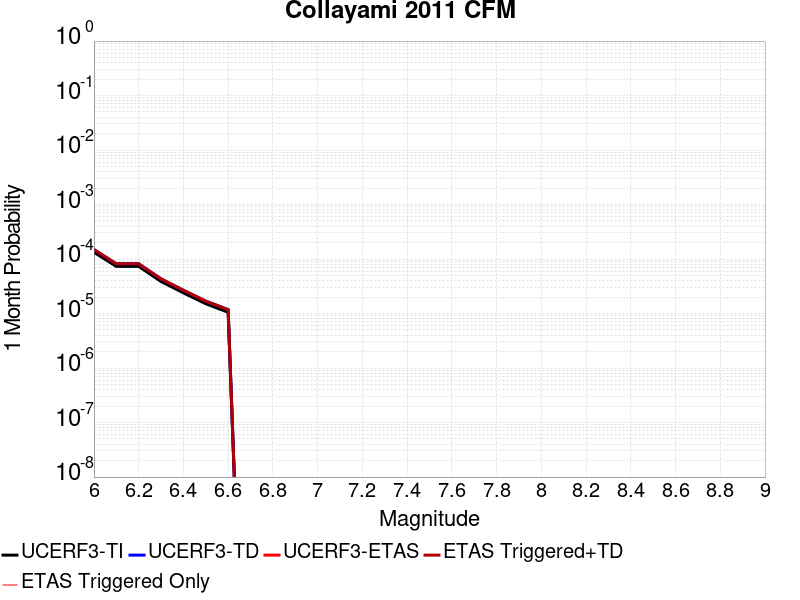 |  | 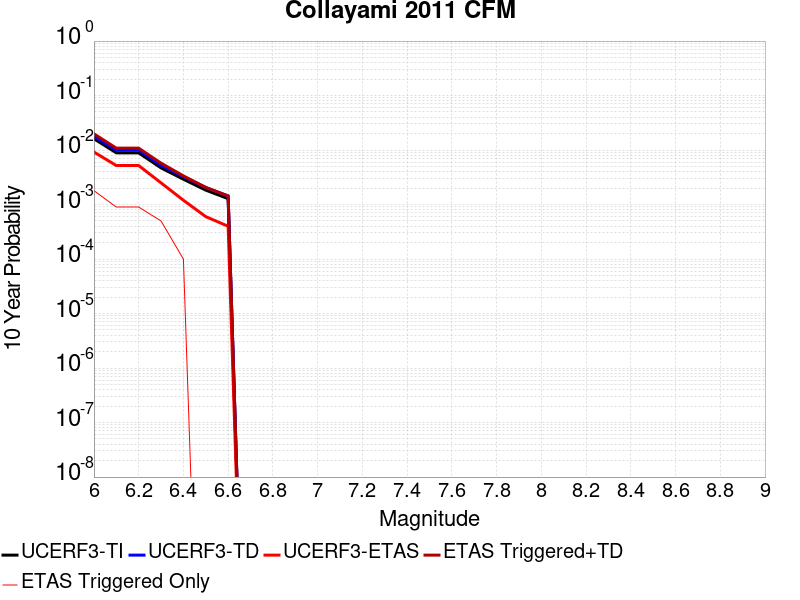 |

| Magnitude | 1 wk TI Prob | 1 wk TD Prob | 1 wk ETAS Prob | 1 wk ETAS/TD Gain | 1 wk ETAS Triggered+TD | 1 wk ETAS Triggered Only | 1 mo TI Prob | 1 mo TD Prob | 1 mo ETAS Prob | 1 mo ETAS/TD Gain | 1 mo ETAS Triggered+TD | 1 mo ETAS Triggered Only | 1 yr TI Prob | 1 yr TD Prob | 1 yr ETAS Prob | 1 yr ETAS/TD Gain | 1 yr ETAS Triggered+TD | 1 yr ETAS Triggered Only | 10 yr TI Prob | 10 yr TD Prob | 10 yr ETAS Prob | 10 yr ETAS/TD Gain | 10 yr ETAS Triggered+TD | 10 yr ETAS Triggered Only |
|-----|-----|-----|-----|-----|-----|-----|-----|-----|-----|-----|-----|-----|-----|-----|-----|-----|-----|-----|-----|-----|-----|-----|-----|-----|
| 6.0 | 3.112429E-5 | 3.4893903E-5 | 0.0 | 0.0 | 3.4893903E-5 | 0.0 | 1.33383E-4 | 1.4953771E-4 | 0.0 | 0.0 | 1.4953771E-4 | 0.0 | 0.0016227282 | 0.0018192746 | 8.0E-4 | 0.4397357 | 0.0019190927 | 1.0E-4 | 0.016109297 | 0.018061297 | 0.0092 | 0.5093765 | 0.019828785 | 0.0018 |
| 6.1 | 1.7119446E-5 | 1.9132842E-5 | 0.0 | 0.0 | 1.9132842E-5 | 0.0 | 7.336699E-5 | 8.199565E-5 | 0.0 | 0.0 | 8.199565E-5 | 0.0 | 8.92877E-4 | 9.978989E-4 | 3.0E-4 | 0.30063167 | 9.978989E-4 | 0.0 | 0.00889298 | 0.009940042 | 0.0052 | 0.5231366 | 0.010831096 | 9.0E-4 |
| 6.2 | 1.7119446E-5 | 1.9132842E-5 | 0.0 | 0.0 | 1.9132842E-5 | 0.0 | 7.336699E-5 | 8.199565E-5 | 0.0 | 0.0 | 8.199565E-5 | 0.0 | 8.92877E-4 | 9.978989E-4 | 3.0E-4 | 0.30063167 | 9.978989E-4 | 0.0 | 0.00889298 | 0.009940042 | 0.0052 | 0.5231366 | 0.010831096 | 9.0E-4 |
| 6.3 | 9.041288E-6 | 1.0093683E-5 | 0.0 | 0.0 | 1.0093683E-5 | 0.0 | 3.87478E-5 | 4.325805E-5 | 0.0 | 0.0 | 4.325805E-5 | 0.0 | 4.7165234E-4 | 5.2656134E-4 | 1.0E-4 | 0.1899114 | 5.2656134E-4 | 0.0 | 0.0047065257 | 0.005255289 | 0.0025 | 0.47571123 | 0.0057526613 | 5.0E-4 |
| 6.4 | 5.5972064E-6 | 6.2503414E-6 | 0.0 | 0.0 | 6.2503414E-6 | 0.0 | 2.3987806E-5 | 2.6786978E-5 | 0.0 | 0.0 | 2.6786978E-5 | 0.0 | 2.920124E-4 | 3.260962E-4 | 0.0 | 0.0 | 3.260962E-4 | 0.0 | 0.0029162897 | 0.003257508 | 0.0012 | 0.36837977 | 0.0033571823 | 1.0E-4 |
| 6.5 | 3.530659E-6 | 3.9471297E-6 | 0.0 | 0.0 | 3.9471297E-6 | 0.0 | 1.5131307E-5 | 1.691622E-5 | 0.0 | 0.0 | 1.691622E-5 | 0.0 | 1.842081E-4 | 2.0594586E-4 | 0.0 | 0.0 | 2.0594586E-4 | 0.0 | 0.0018405546 | 0.0020585663 | 6.0E-4 | 0.29146498 | 0.0020585663 | 0.0 |
| 6.6 | 2.4625563E-6 | 2.7538247E-6 | 0.0 | 0.0 | 2.7538247E-6 | 0.0 | 1.0553769E-5 | 1.1802105E-5 | 0.0 | 0.0 | 1.1802105E-5 | 0.0 | 1.2848456E-4 | 1.4369063E-4 | 0.0 | 0.0 | 1.4369063E-4 | 0.0 | 0.001284103 | 0.0014369063 | 4.0E-4 | 0.27837583 | 0.0014369063 | 0.0 |

## Big Pine (Central)
*[(top)](#table-of-contents)*

| 1 Week | 1 Month | 1 Year | 10 Year |
|-----|-----|-----|-----|
|  |  |  | 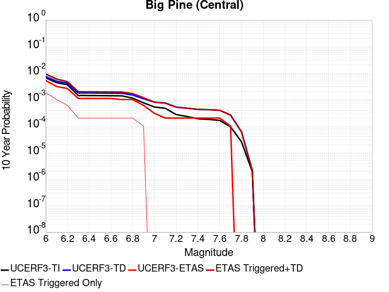 |

| Magnitude | 1 wk TI Prob | 1 wk TD Prob | 1 wk ETAS Prob | 1 wk ETAS/TD Gain | 1 wk ETAS Triggered+TD | 1 wk ETAS Triggered Only | 1 mo TI Prob | 1 mo TD Prob | 1 mo ETAS Prob | 1 mo ETAS/TD Gain | 1 mo ETAS Triggered+TD | 1 mo ETAS Triggered Only | 1 yr TI Prob | 1 yr TD Prob | 1 yr ETAS Prob | 1 yr ETAS/TD Gain | 1 yr ETAS Triggered+TD | 1 yr ETAS Triggered Only | 10 yr TI Prob | 10 yr TD Prob | 10 yr ETAS Prob | 10 yr ETAS/TD Gain | 10 yr ETAS Triggered+TD | 10 yr ETAS Triggered Only |
|-----|-----|-----|-----|-----|-----|-----|-----|-----|-----|-----|-----|-----|-----|-----|-----|-----|-----|-----|-----|-----|-----|-----|-----|-----|
| 6.0 | 1.2706755E-5 | 1.4212055E-5 | 0.0 | 0.0 | 1.4212055E-5 | 0.0 | 5.4456385E-5 | 6.090759E-5 | 0.0 | 0.0 | 6.090759E-5 | 0.0 | 6.628048E-4 | 7.413341E-4 | 3.0E-4 | 0.40467584 | 7.413341E-4 | 0.0 | 0.006608314 | 0.007393866 | 0.0052 | 0.7032857 | 0.009180557 | 0.0018 |
| 6.1 | 8.342579E-6 | 9.4765455E-6 | 0.0 | 0.0 | 9.4765455E-6 | 0.0 | 3.5753423E-5 | 4.0613253E-5 | 0.0 | 0.0 | 4.0613253E-5 | 0.0 | 4.3521097E-4 | 4.943759E-4 | 3.0E-4 | 0.6068257 | 4.943759E-4 | 0.0 | 0.0043435963 | 0.0049365456 | 0.0031 | 0.6279695 | 0.005931609 | 0.001 |
| 6.2 | 6.923899E-6 | 7.934349E-6 | 0.0 | 0.0 | 7.934349E-6 | 0.0 | 2.9673516E-5 | 3.4004017E-5 | 0.0 | 0.0 | 3.4004017E-5 | 0.0 | 3.6121515E-4 | 4.1393947E-4 | 3.0E-4 | 0.72474366 | 4.1393947E-4 | 0.0 | 0.003606286 | 0.004135223 | 0.0026 | 0.6287448 | 0.004732742 | 6.0E-4 |
| 6.3 | 2.728396E-6 | 3.3954161E-6 | 0.0 | 0.0 | 3.3954161E-6 | 0.0 | 1.1693074E-5 | 1.4551707E-5 | 0.0 | 0.0 | 1.4551707E-5 | 0.0 | 1.4235388E-4 | 1.771535E-4 | 1.0E-4 | 0.5644822 | 1.771535E-4 | 0.0 | 0.0014226272 | 0.0017718642 | 0.0011 | 0.62081504 | 0.0019715098 | 2.0E-4 |
| 6.4 | 2.7136944E-6 | 3.3797207E-6 | 0.0 | 0.0 | 3.3797207E-6 | 0.0 | 1.1630066E-5 | 1.4484442E-5 | 0.0 | 0.0 | 1.4484442E-5 | 0.0 | 1.4158686E-4 | 1.7633467E-4 | 1.0E-4 | 0.56710345 | 1.7633467E-4 | 0.0 | 0.0014149669 | 0.001763689 | 0.0011 | 0.62369275 | 0.0019633363 | 2.0E-4 |
| 6.5 | 2.6971882E-6 | 3.3620786E-6 | 0.0 | 0.0 | 3.3620786E-6 | 0.0 | 1.1559327E-5 | 1.44088335E-5 | 0.0 | 0.0 | 1.44088335E-5 | 0.0 | 1.4072572E-4 | 1.7541429E-4 | 1.0E-4 | 0.57007897 | 1.7541429E-4 | 0.0 | 0.0014063664 | 0.0017544997 | 0.0011 | 0.6269593 | 0.0019541488 | 2.0E-4 |
| 6.6 | 2.669092E-6 | 3.33212E-6 | 0.0 | 0.0 | 3.33212E-6 | 0.0 | 1.1438916E-5 | 1.4280441E-5 | 0.0 | 0.0 | 1.4280441E-5 | 0.0 | 1.3925991E-4 | 1.7385137E-4 | 1.0E-4 | 0.575204 | 1.7385137E-4 | 0.0 | 0.0013917267 | 0.001738895 | 0.0011 | 0.63258564 | 0.0019385472 | 2.0E-4 |
| 6.7 | 2.6408059E-6 | 3.3021643E-6 | 0.0 | 0.0 | 3.3021643E-6 | 0.0 | 1.1317691E-5 | 1.4152061E-5 | 0.0 | 0.0 | 1.4152061E-5 | 0.0 | 1.3778417E-4 | 1.7228858E-4 | 1.0E-4 | 0.5804215 | 1.7228858E-4 | 0.0 | 0.0013769877 | 0.0017232915 | 0.001 | 0.5802849 | 0.0019229469 | 2.0E-4 |
| 6.8 | 2.1786943E-6 | 2.8257773E-6 | 0.0 | 0.0 | 2.8257773E-6 | 0.0 | 9.337228E-6 | 1.2110421E-5 | 0.0 | 0.0 | 1.2110421E-5 | 0.0 | 1.1367482E-4 | 1.4743513E-4 | 1.0E-4 | 0.6782644 | 1.4743513E-4 | 0.0 | 0.0011361669 | 0.0014751011 | 0.001 | 0.6779196 | 0.0016748061 | 2.0E-4 |
| 6.9 | 1.4411696E-6 | 2.0411103E-6 | 0.0 | 0.0 | 2.0411103E-6 | 0.0 | 6.1764263E-6 | 8.747587E-6 | 0.0 | 0.0 | 8.747587E-6 | 0.0 | 7.51954E-5 | 1.0649694E-4 | 0.0 | 0.0 | 1.0649694E-4 | 0.0 | 7.5169955E-4 | 0.0010661426 | 6.0E-4 | 0.5627765 | 0.0011660359 | 1.0E-4 |
| 7.0 | 1.0073411E-6 | 1.5298066E-6 | 0.0 | 0.0 | 1.5298066E-6 | 0.0 | 4.317169E-6 | 6.5562986E-6 | 0.0 | 0.0 | 6.5562986E-6 | 0.0 | 5.2560266E-5 | 7.982016E-5 | 0.0 | 0.0 | 7.982016E-5 | 0.0 | 5.2547833E-4 | 7.995874E-4 | 3.0E-4 | 0.3751935 | 7.995874E-4 | 0.0 |
| 7.1 | 8.947104E-7 | 1.4061434E-6 | 0.0 | 0.0 | 1.4061434E-6 | 0.0 | 3.834468E-6 | 6.026316E-6 | 0.0 | 0.0 | 6.026316E-6 | 0.0 | 4.6683643E-5 | 7.336807E-5 | 0.0 | 0.0 | 7.336807E-5 | 0.0 | 4.6673836E-4 | 7.351108E-4 | 2.0E-4 | 0.27206784 | 7.351108E-4 | 0.0 |
| 7.2 | 5.215166E-7 | 9.886738E-7 | 0.0 | 0.0 | 9.886738E-7 | 0.0 | 2.2350691E-6 | 4.2371666E-6 | 0.0 | 0.0 | 4.2371666E-6 | 0.0 | 2.7211627E-5 | 5.158633E-5 | 0.0 | 0.0 | 5.158633E-5 | 0.0 | 2.7208295E-4 | 5.1740574E-4 | 2.0E-4 | 0.3865438 | 5.1740574E-4 | 0.0 |
| 7.3 | 4.4024807E-7 | 9.0013293E-7 | 0.0 | 0.0 | 9.0013293E-7 | 0.0 | 1.8867761E-6 | 3.8577073E-6 | 0.0 | 0.0 | 3.8577073E-6 | 0.0 | 2.2971257E-5 | 4.6966612E-5 | 0.0 | 0.0 | 4.6966612E-5 | 0.0 | 2.2968883E-4 | 4.712289E-4 | 2.0E-4 | 0.42442217 | 4.712289E-4 | 0.0 |
| 7.4 | 3.6130905E-7 | 8.147042E-7 | 0.0 | 0.0 | 8.147042E-7 | 0.0 | 1.5484665E-6 | 3.491585E-6 | 0.0 | 0.0 | 3.491585E-6 | 0.0 | 1.8852415E-5 | 4.2509255E-5 | 0.0 | 0.0 | 4.2509255E-5 | 0.0 | 1.8850817E-4 | 4.2666378E-4 | 2.0E-4 | 0.46875316 | 4.2666378E-4 | 0.0 |
| 7.5 | 3.408184E-7 | 7.901291E-7 | 0.0 | 0.0 | 7.901291E-7 | 0.0 | 1.4606494E-6 | 3.3862634E-6 | 0.0 | 0.0 | 3.3862634E-6 | 0.0 | 1.7783263E-5 | 4.1227013E-5 | 0.0 | 0.0 | 4.1227013E-5 | 0.0 | 1.778184E-4 | 4.1382274E-4 | 2.0E-4 | 0.48329872 | 4.1382274E-4 | 0.0 |
| 7.6 | 3.1428627E-7 | 7.532086E-7 | 0.0 | 0.0 | 7.532086E-7 | 0.0 | 1.3469405E-6 | 3.2280332E-6 | 0.0 | 0.0 | 3.2280332E-6 | 0.0 | 1.6398877E-5 | 3.9300634E-5 | 0.0 | 0.0 | 3.9300634E-5 | 0.0 | 1.6397667E-4 | 3.945347E-4 | 2.0E-4 | 0.5069263 | 3.945347E-4 | 0.0 |
| 7.7 | 1.7972785E-7 | 4.9254703E-7 | 0.0 | 0.0 | 4.9254703E-7 | 0.0 | 7.70262E-7 | 2.110914E-6 | 0.0 | 0.0 | 2.110914E-6 | 0.0 | 9.377899E-6 | 2.5700087E-5 | 0.0 | 0.0 | 2.5700087E-5 | 0.0 | 9.377503E-5 | 2.5857266E-4 | 1.0E-4 | 0.38673848 | 2.5857266E-4 | 0.0 |
| 7.8 | 4.9230927E-8 | 1.161866E-7 | 0.0 | 0.0 | 1.161866E-7 | 0.0 | 2.1098968E-7 | 4.979425E-7 | 0.0 | 0.0 | 4.979425E-7 | 0.0 | 2.5687964E-6 | 6.0624343E-6 | 0.0 | 0.0 | 6.0624343E-6 | 0.0 | 2.5687666E-5 | 6.110249E-5 | 0.0 | 0.0 | 6.110249E-5 | 0.0 |
| 7.9 | 3.6805972E-9 | 3.9566657E-9 | 0.0 | 0.0 | 3.9566657E-9 | 0.0 | 1.5773987E-8 | 1.695714E-8 | 0.0 | 0.0 | 1.695714E-8 | 0.0 | 1.9204828E-7 | 2.0645315E-7 | 0.0 | 0.0 | 2.0645315E-7 | 0.0 | 1.920481E-6 | 2.1121898E-6 | 0.0 | 0.0 | 2.1121898E-6 | 0.0 |

## Gillem - Big Crack 2011 CFM
*[(top)](#table-of-contents)*

| 1 Week | 1 Month | 1 Year | 10 Year |
|-----|-----|-----|-----|
| 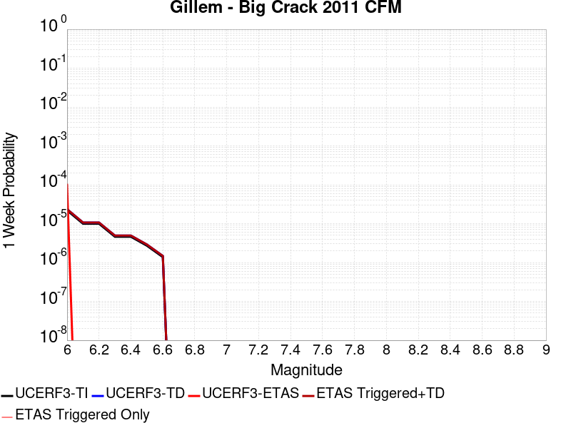 |  | 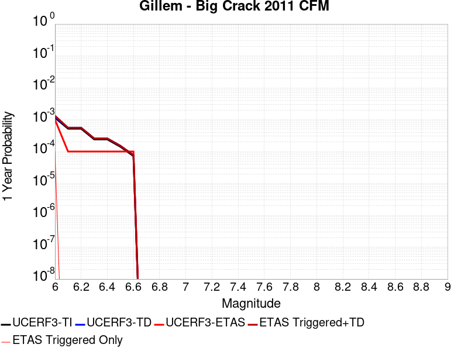 |  |

| Magnitude | 1 wk TI Prob | 1 wk TD Prob | 1 wk ETAS Prob | 1 wk ETAS/TD Gain | 1 wk ETAS Triggered+TD | 1 wk ETAS Triggered Only | 1 mo TI Prob | 1 mo TD Prob | 1 mo ETAS Prob | 1 mo ETAS/TD Gain | 1 mo ETAS Triggered+TD | 1 mo ETAS Triggered Only | 1 yr TI Prob | 1 yr TD Prob | 1 yr ETAS Prob | 1 yr ETAS/TD Gain | 1 yr ETAS Triggered+TD | 1 yr ETAS Triggered Only | 10 yr TI Prob | 10 yr TD Prob | 10 yr ETAS Prob | 10 yr ETAS/TD Gain | 10 yr ETAS Triggered+TD | 10 yr ETAS Triggered Only |
|-----|-----|-----|-----|-----|-----|-----|-----|-----|-----|-----|-----|-----|-----|-----|-----|-----|-----|-----|-----|-----|-----|-----|-----|-----|
| 6.0 | 2.196852E-5 | 2.358614E-5 | 1.0E-4 | 4.239778 | 2.358614E-5 | 0.0 | 9.4147406E-5 | 1.0108005E-4 | 3.0E-4 | 2.9679449 | 1.0108005E-4 | 0.0 | 0.0011456419 | 0.0012300436 | 0.001 | 0.81297934 | 0.0013299205 | 1.0E-4 | 0.011397537 | 0.012241199 | 0.0077 | 0.6290234 | 0.013821613 | 0.0016 |
| 6.1 | 9.992795E-6 | 1.0703847E-5 | 0.0 | 0.0 | 1.0703847E-5 | 0.0 | 4.2825563E-5 | 4.5872923E-5 | 1.0E-4 | 2.1799352 | 4.5872923E-5 | 0.0 | 5.2127644E-4 | 5.58378E-4 | 1.0E-4 | 0.17909014 | 5.58378E-4 | 0.0 | 0.0052005537 | 0.0055715577 | 0.0035 | 0.6281906 | 0.006565986 | 0.001 |
| 6.2 | 9.992795E-6 | 1.0703847E-5 | 0.0 | 0.0 | 1.0703847E-5 | 0.0 | 4.2825563E-5 | 4.5872923E-5 | 1.0E-4 | 2.1799352 | 4.5872923E-5 | 0.0 | 5.2127644E-4 | 5.58378E-4 | 1.0E-4 | 0.17909014 | 5.58378E-4 | 0.0 | 0.0052005537 | 0.0055715577 | 0.0035 | 0.6281906 | 0.006565986 | 0.001 |
| 6.3 | 4.6127884E-6 | 4.938969E-6 | 0.0 | 0.0 | 4.938969E-6 | 0.0 | 1.9768944E-5 | 2.1166863E-5 | 1.0E-4 | 4.7243657 | 2.1166863E-5 | 0.0 | 2.406603E-4 | 2.5768054E-4 | 1.0E-4 | 0.38807744 | 2.5768054E-4 | 0.0 | 0.0024039985 | 0.002574255 | 0.0014 | 0.54384667 | 0.00277374 | 2.0E-4 |
| 6.4 | 4.6127884E-6 | 4.938969E-6 | 0.0 | 0.0 | 4.938969E-6 | 0.0 | 1.9768944E-5 | 2.1166863E-5 | 1.0E-4 | 4.7243657 | 2.1166863E-5 | 0.0 | 2.406603E-4 | 2.5768054E-4 | 1.0E-4 | 0.38807744 | 2.5768054E-4 | 0.0 | 0.0024039985 | 0.002574255 | 0.0014 | 0.54384667 | 0.00277374 | 2.0E-4 |
| 6.5 | 2.716712E-6 | 2.9089379E-6 | 0.0 | 0.0 | 2.9089379E-6 | 0.0 | 1.1643E-5 | 1.246683E-5 | 1.0E-4 | 8.021285 | 1.246683E-5 | 0.0 | 1.417443E-4 | 1.5177552E-4 | 1.0E-4 | 0.65886784 | 1.5177552E-4 | 0.0 | 0.0014165393 | 0.0015169563 | 7.0E-4 | 0.46145037 | 0.0015169563 | 0.0 |
| 6.6 | 1.3818255E-6 | 1.480947E-6 | 0.0 | 0.0 | 1.480947E-6 | 0.0 | 5.922096E-6 | 6.346908E-6 | 1.0E-4 | 15.755704 | 6.346908E-6 | 0.0 | 7.209913E-5 | 7.727209E-5 | 1.0E-4 | 1.2941283 | 7.727209E-5 | 0.0 | 7.2075747E-4 | 7.7257294E-4 | 4.0E-4 | 0.51775044 | 7.7257294E-4 | 0.0 |

## San Jacinto (Coyote Creek)
*[(top)](#table-of-contents)*

| 1 Week | 1 Month | 1 Year | 10 Year |
|-----|-----|-----|-----|
|  |  |  |  |

| Magnitude | 1 wk TI Prob | 1 wk TD Prob | 1 wk ETAS Prob | 1 wk ETAS/TD Gain | 1 wk ETAS Triggered+TD | 1 wk ETAS Triggered Only | 1 mo TI Prob | 1 mo TD Prob | 1 mo ETAS Prob | 1 mo ETAS/TD Gain | 1 mo ETAS Triggered+TD | 1 mo ETAS Triggered Only | 1 yr TI Prob | 1 yr TD Prob | 1 yr ETAS Prob | 1 yr ETAS/TD Gain | 1 yr ETAS Triggered+TD | 1 yr ETAS Triggered Only | 10 yr TI Prob | 10 yr TD Prob | 10 yr ETAS Prob | 10 yr ETAS/TD Gain | 10 yr ETAS Triggered+TD | 10 yr ETAS Triggered Only |
|-----|-----|-----|-----|-----|-----|-----|-----|-----|-----|-----|-----|-----|-----|-----|-----|-----|-----|-----|-----|-----|-----|-----|-----|-----|
| 6.0 | 2.7374346E-5 | 2.3432753E-5 | 1.0E-4 | 4.267531 | 1.234304E-4 | 1.0E-4 | 1.1731335E-4 | 1.0042223E-4 | 1.0E-4 | 0.9957954 | 2.0041219E-4 | 1.0E-4 | 0.0014273542 | 0.0012219574 | 8.0E-4 | 0.6546873 | 0.001421713 | 2.0E-4 | 0.01418221 | 0.012556274 | 0.0067 | 0.53359777 | 0.014333674 | 0.0018 |
| 6.1 | 2.7374346E-5 | 2.3432753E-5 | 1.0E-4 | 4.267531 | 1.234304E-4 | 1.0E-4 | 1.1731335E-4 | 1.0042223E-4 | 1.0E-4 | 0.9957954 | 2.0041219E-4 | 1.0E-4 | 0.0014273542 | 0.0012219574 | 8.0E-4 | 0.6546873 | 0.001421713 | 2.0E-4 | 0.01418221 | 0.012556274 | 0.0067 | 0.53359777 | 0.014333674 | 0.0018 |
| 6.2 | 2.7374346E-5 | 2.3432753E-5 | 1.0E-4 | 4.267531 | 1.234304E-4 | 1.0E-4 | 1.1731335E-4 | 1.0042223E-4 | 1.0E-4 | 0.9957954 | 2.0041219E-4 | 1.0E-4 | 0.0014273542 | 0.0012219574 | 8.0E-4 | 0.6546873 | 0.001421713 | 2.0E-4 | 0.01418221 | 0.012556274 | 0.0067 | 0.53359777 | 0.014333674 | 0.0018 |
| 6.3 | 2.7374346E-5 | 2.3432753E-5 | 1.0E-4 | 4.267531 | 1.234304E-4 | 1.0E-4 | 1.1731335E-4 | 1.0042223E-4 | 1.0E-4 | 0.9957954 | 2.0041219E-4 | 1.0E-4 | 0.0014273542 | 0.0012219574 | 8.0E-4 | 0.6546873 | 0.001421713 | 2.0E-4 | 0.01418221 | 0.012556274 | 0.0067 | 0.53359777 | 0.014333674 | 0.0018 |
| 6.4 | 2.7374346E-5 | 2.3432753E-5 | 1.0E-4 | 4.267531 | 1.234304E-4 | 1.0E-4 | 1.1731335E-4 | 1.0042223E-4 | 1.0E-4 | 0.9957954 | 2.0041219E-4 | 1.0E-4 | 0.0014273542 | 0.0012219574 | 8.0E-4 | 0.6546873 | 0.001421713 | 2.0E-4 | 0.01418221 | 0.012556274 | 0.0067 | 0.53359777 | 0.014333674 | 0.0018 |
| 6.5 | 2.7282445E-5 | 2.3319113E-5 | 1.0E-4 | 4.2883277 | 1.2331679E-4 | 1.0E-4 | 1.16919524E-4 | 9.993524E-5 | 1.0E-4 | 1.000648 | 1.9992524E-4 | 1.0E-4 | 0.0014225657 | 0.001216035 | 8.0E-4 | 0.65787584 | 0.0014157918 | 2.0E-4 | 0.014134934 | 0.012497725 | 0.0067 | 0.5360976 | 0.014275229 | 0.0018 |
| 6.6 | 2.7282445E-5 | 2.3319113E-5 | 1.0E-4 | 4.2883277 | 1.2331679E-4 | 1.0E-4 | 1.16919524E-4 | 9.993524E-5 | 1.0E-4 | 1.000648 | 1.9992524E-4 | 1.0E-4 | 0.0014225657 | 0.001216035 | 8.0E-4 | 0.65787584 | 0.0014157918 | 2.0E-4 | 0.014134934 | 0.012497725 | 0.0067 | 0.5360976 | 0.014275229 | 0.0018 |
| 6.7 | 2.7216198E-5 | 2.3244427E-5 | 1.0E-4 | 4.3021064 | 1.232421E-4 | 1.0E-4 | 1.1663563E-4 | 9.961518E-5 | 1.0E-4 | 1.0038631 | 1.9960522E-4 | 1.0E-4 | 0.0014191137 | 0.0012121426 | 8.0E-4 | 0.65998834 | 0.0014119002 | 2.0E-4 | 0.014100855 | 0.012459221 | 0.0066 | 0.5297281 | 0.014236795 | 0.0018 |
| 6.8 | 2.7078617E-5 | 2.316207E-5 | 1.0E-4 | 4.3174033 | 1.2315976E-4 | 1.0E-4 | 1.1604605E-4 | 9.926226E-5 | 1.0E-4 | 1.0074322 | 1.9925233E-4 | 1.0E-4 | 0.001411945 | 0.0012078505 | 8.0E-4 | 0.6623336 | 0.001407609 | 2.0E-4 | 0.014030075 | 0.012416572 | 0.0065 | 0.52349395 | 0.014095464 | 0.0017 |
| 6.9 | 2.6982952E-5 | 2.308208E-5 | 1.0E-4 | 4.332365 | 1.2307978E-4 | 1.0E-4 | 1.15636096E-4 | 9.891947E-5 | 1.0E-4 | 1.0109234 | 1.9890958E-4 | 1.0E-4 | 0.0014069602 | 0.0012036817 | 8.0E-4 | 0.66462755 | 0.001403441 | 2.0E-4 | 0.013980856 | 0.012375174 | 0.0065 | 0.52524513 | 0.014054136 | 0.0017 |
| 7.0 | 2.6449972E-5 | 2.266081E-5 | 1.0E-4 | 4.4129047 | 1.2265854E-4 | 1.0E-4 | 1.1335209E-4 | 9.7114156E-5 | 1.0E-4 | 1.029716 | 1.9710444E-4 | 1.0E-4 | 0.001379188 | 0.001181726 | 8.0E-4 | 0.67697585 | 0.0013814897 | 2.0E-4 | 0.0137065975 | 0.0121573275 | 0.0063 | 0.518206 | 0.01383666 | 0.0017 |
| 7.1 | 2.6257849E-5 | 2.2488342E-5 | 1.0E-4 | 4.4467483 | 1.2248609E-4 | 1.0E-4 | 1.1252879E-4 | 9.6375064E-5 | 1.0E-4 | 1.0376128 | 1.9636542E-4 | 1.0E-4 | 0.0013691769 | 0.0011727373 | 8.0E-4 | 0.6821647 | 0.0013725028 | 2.0E-4 | 0.013607717 | 0.012067942 | 0.006 | 0.49718502 | 0.013747427 | 0.0017 |
| 7.2 | 2.5270041E-5 | 2.1693011E-5 | 1.0E-4 | 4.6097794 | 1.2169084E-4 | 1.0E-4 | 1.0829568E-4 | 9.296675E-5 | 1.0E-4 | 1.0756534 | 1.9295745E-4 | 1.0E-4 | 0.0013177024 | 0.0011312847 | 7.0E-4 | 0.61876553 | 0.0013310584 | 2.0E-4 | 0.013099162 | 0.011653936 | 0.0059 | 0.5062667 | 0.013334124 | 0.0017 |
| 7.3 | 2.339701E-5 | 2.0438638E-5 | 1.0E-4 | 4.892694 | 1.2043659E-4 | 1.0E-4 | 1.0026905E-4 | 8.759123E-5 | 1.0E-4 | 1.1416668 | 1.8758247E-4 | 1.0E-4 | 0.001220092 | 0.0010659035 | 7.0E-4 | 0.65671986 | 0.0012656903 | 2.0E-4 | 0.012134149 | 0.010999719 | 0.0057 | 0.5181951 | 0.012582119 | 0.0016 |
| 7.4 | 2.296333E-5 | 2.01717E-5 | 1.0E-4 | 4.9574404 | 1.2016968E-4 | 1.0E-4 | 9.841056E-5 | 8.644729E-5 | 1.0E-4 | 1.1567743 | 1.8643864E-4 | 1.0E-4 | 0.0011974899 | 0.0010519895 | 7.0E-4 | 0.66540587 | 0.0012517791 | 2.0E-4 | 0.011910575 | 0.010860209 | 0.0057 | 0.52485174 | 0.012442833 | 0.0016 |
| 7.5 | 2.2188895E-5 | 1.970052E-5 | 1.0E-4 | 5.0760083 | 1.1969855E-4 | 1.0E-4 | 9.50918E-5 | 8.442807E-5 | 1.0E-4 | 1.1844401 | 1.8441962E-4 | 1.0E-4 | 0.0011571277 | 0.001027429 | 6.0E-4 | 0.58398193 | 0.0012272235 | 2.0E-4 | 0.011511209 | 0.010612826 | 0.0054 | 0.5088183 | 0.012195845 | 0.0016 |
| 7.6 | 2.0013189E-5 | 1.8302539E-5 | 1.0E-4 | 5.4637227 | 1.1830071E-4 | 1.0E-4 | 8.5767984E-5 | 7.84371E-5 | 1.0E-4 | 1.2749069 | 1.7842925E-4 | 1.0E-4 | 0.001043725 | 9.5455506E-4 | 6.0E-4 | 0.62856513 | 0.0011543641 | 2.0E-4 | 0.010388365 | 0.009878712 | 0.0052 | 0.5263844 | 0.011462905 | 0.0016 |
| 7.7 | 1.7230794E-5 | 1.6108386E-5 | 1.0E-4 | 6.2079463 | 1.1610678E-4 | 1.0E-4 | 7.384417E-5 | 6.903412E-5 | 1.0E-4 | 1.448559 | 1.6902722E-4 | 1.0E-4 | 8.986819E-4 | 8.401671E-4 | 6.0E-4 | 0.7141437 | 0.0010399991 | 2.0E-4 | 0.008950562 | 0.008729697 | 0.0045 | 0.51548177 | 0.010117476 | 0.0014 |
| 7.8 | 1.4478809E-5 | 1.4381459E-5 | 1.0E-4 | 6.9533973 | 1.1438002E-4 | 1.0E-4 | 6.205057E-5 | 6.163337E-5 | 1.0E-4 | 1.6224977 | 1.616272E-4 | 1.0E-4 | 7.552038E-4 | 7.501285E-4 | 6.0E-4 | 0.7998629 | 9.4997854E-4 | 2.0E-4 | 0.0075264242 | 0.007821484 | 0.0042 | 0.5369825 | 0.009210533 | 0.0014 |
| 7.9 | 1.1114467E-5 | 1.1103332E-5 | 1.0E-4 | 9.006306 | 1.1110222E-4 | 1.0E-4 | 4.7632562E-5 | 4.7584843E-5 | 1.0E-4 | 2.1015093 | 1.4758008E-4 | 1.0E-4 | 5.797721E-4 | 5.79192E-4 | 4.0E-4 | 0.69061726 | 7.7907613E-4 | 2.0E-4 | 0.0057826187 | 0.0060953056 | 0.0034 | 0.5578063 | 0.0072879912 | 0.0012 |
| 8.0 | 9.327402E-6 | 9.404994E-6 | 1.0E-4 | 10.632649 | 1.09404056E-4 | 1.0E-4 | 3.9973966E-5 | 4.0306495E-5 | 1.0E-4 | 2.4809897 | 1.4030247E-4 | 1.0E-4 | 4.8657437E-4 | 4.906216E-4 | 4.0E-4 | 0.8152923 | 6.905235E-4 | 2.0E-4 | 0.0048551033 | 0.0051894397 | 0.0029 | 0.55882716 | 0.0061842506 | 0.001 |
| 8.1 | 7.0235833E-6 | 6.459538E-6 | 1.0E-4 | 15.480984 | 1.06458894E-4 | 1.0E-4 | 3.0100724E-5 | 2.7683443E-5 | 1.0E-4 | 3.6122675 | 1.2768067E-4 | 1.0E-4 | 3.664147E-4 | 3.3699424E-4 | 4.0E-4 | 1.1869639 | 5.3692685E-4 | 2.0E-4 | 0.003658111 | 0.003592068 | 0.0024 | 0.6681388 | 0.004488835 | 9.0E-4 |
| 8.2 | 2.0358202E-6 | 8.234806E-7 | 0.0 | 0.0 | 8.234806E-7 | 0.0 | 8.724915E-6 | 3.529198E-6 | 0.0 | 0.0 | 3.529198E-6 | 0.0 | 1.06220665E-4 | 4.2967156E-5 | 1.0E-4 | 2.327359 | 4.2967156E-5 | 0.0 | 0.001061699 | 4.8980064E-4 | 4.0E-4 | 0.8166588 | 5.8975164E-4 | 1.0E-4 |
| 8.3 | 2.0051264E-7 | 5.978011E-8 | 0.0 | 0.0 | 5.978011E-8 | 0.0 | 8.5933965E-7 | 2.5620045E-7 | 0.0 | 0.0 | 2.5620045E-7 | 0.0 | 1.046241E-5 | 3.1192365E-6 | 0.0 | 0.0 | 3.1192365E-6 | 0.0 | 1.0461917E-4 | 3.6464324E-5 | 0.0 | 0.0 | 3.6464324E-5 | 0.0 |

## Great Valley 11
*[(top)](#table-of-contents)*

| 1 Week | 1 Month | 1 Year | 10 Year |
|-----|-----|-----|-----|
|  |  |  | 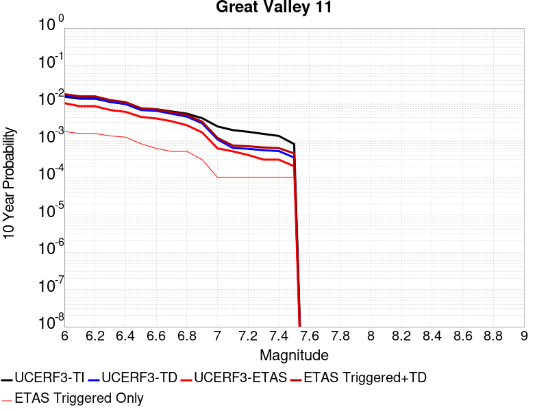 |

| Magnitude | 1 wk TI Prob | 1 wk TD Prob | 1 wk ETAS Prob | 1 wk ETAS/TD Gain | 1 wk ETAS Triggered+TD | 1 wk ETAS Triggered Only | 1 mo TI Prob | 1 mo TD Prob | 1 mo ETAS Prob | 1 mo ETAS/TD Gain | 1 mo ETAS Triggered+TD | 1 mo ETAS Triggered Only | 1 yr TI Prob | 1 yr TD Prob | 1 yr ETAS Prob | 1 yr ETAS/TD Gain | 1 yr ETAS Triggered+TD | 1 yr ETAS Triggered Only | 10 yr TI Prob | 10 yr TD Prob | 10 yr ETAS Prob | 10 yr ETAS/TD Gain | 10 yr ETAS Triggered+TD | 10 yr ETAS Triggered Only |
|-----|-----|-----|-----|-----|-----|-----|-----|-----|-----|-----|-----|-----|-----|-----|-----|-----|-----|-----|-----|-----|-----|-----|-----|-----|
| 6.0 | 2.8099583E-5 | 2.9775147E-5 | 0.0 | 0.0 | 2.9775147E-5 | 0.0 | 1.20421224E-4 | 1.2760195E-4 | 0.0 | 0.0 | 1.2760195E-4 | 0.0 | 0.0014651422 | 0.0015525199 | 7.0E-4 | 0.4508799 | 0.0016523646 | 1.0E-4 | 0.0145552 | 0.015424252 | 0.0098 | 0.6353631 | 0.01709803 | 0.0017 |
| 6.1 | 2.483194E-5 | 2.585836E-5 | 0.0 | 0.0 | 2.585836E-5 | 0.0 | 1.0641825E-4 | 1.108172E-4 | 0.0 | 0.0 | 1.108172E-4 | 0.0 | 0.0012948721 | 0.0013484275 | 5.0E-4 | 0.37080228 | 0.0014482926 | 1.0E-4 | 0.012873529 | 0.013408852 | 0.0081 | 0.60407853 | 0.014888738 | 0.0015 |
| 6.2 | 2.483194E-5 | 2.585836E-5 | 0.0 | 0.0 | 2.585836E-5 | 0.0 | 1.0641825E-4 | 1.108172E-4 | 0.0 | 0.0 | 1.108172E-4 | 0.0 | 0.0012948721 | 0.0013484275 | 5.0E-4 | 0.37080228 | 0.0014482926 | 1.0E-4 | 0.012873529 | 0.013408852 | 0.0081 | 0.60407853 | 0.014888738 | 0.0015 |
| 6.3 | 2.0257901E-5 | 2.0361831E-5 | 0.0 | 0.0 | 2.0361831E-5 | 0.0 | 8.681669E-5 | 8.7262306E-5 | 0.0 | 0.0 | 8.7262306E-5 | 0.0 | 0.0010564806 | 0.0010619421 | 4.0E-4 | 0.37666836 | 0.0011618359 | 1.0E-4 | 0.01051472 | 0.010572836 | 0.0064 | 0.6053248 | 0.011859091 | 0.0013 |
| 6.4 | 1.8054898E-5 | 1.7748922E-5 | 0.0 | 0.0 | 1.7748922E-5 | 0.0 | 7.737584E-5 | 7.60648E-5 | 0.0 | 0.0 | 7.60648E-5 | 0.0 | 9.416436E-4 | 9.257329E-4 | 4.0E-4 | 0.43209007 | 0.0010256403 | 1.0E-4 | 0.009376635 | 0.009222495 | 0.0057 | 0.618054 | 0.010411428 | 0.0012 |
| 6.5 | 1.34804895E-5 | 1.230008E-5 | 0.0 | 0.0 | 1.230008E-5 | 0.0 | 5.777225E-5 | 5.271359E-5 | 0.0 | 0.0 | 5.271359E-5 | 0.0 | 7.031501E-4 | 6.416031E-4 | 2.0E-4 | 0.3117192 | 6.416031E-4 | 0.0 | 0.007009294 | 0.006397943 | 0.0042 | 0.656461 | 0.0071928245 | 8.0E-4 |
| 6.6 | 1.294883E-5 | 1.1711999E-5 | 0.0 | 0.0 | 1.1711999E-5 | 0.0 | 5.5493805E-5 | 5.019334E-5 | 0.0 | 0.0 | 5.019334E-5 | 0.0 | 6.754276E-4 | 6.109366E-4 | 2.0E-4 | 0.3273662 | 6.109366E-4 | 0.0 | 0.006733784 | 0.0060929954 | 0.0038 | 0.623667 | 0.0066893394 | 6.0E-4 |
| 6.7 | 1.1272237E-5 | 9.79449E-6 | 0.0 | 0.0 | 9.79449E-6 | 0.0 | 4.8308695E-5 | 4.1975727E-5 | 0.0 | 0.0 | 4.1975727E-5 | 0.0 | 5.879996E-4 | 5.1093736E-4 | 2.0E-4 | 0.3914374 | 5.1093736E-4 | 0.0 | 0.005864462 | 0.00509791 | 0.0032 | 0.62770826 | 0.005595361 | 5.0E-4 |
| 6.8 | 9.8337505E-6 | 8.178487E-6 | 0.0 | 0.0 | 8.178487E-6 | 0.0 | 4.2143965E-5 | 3.50502E-5 | 0.0 | 0.0 | 3.50502E-5 | 0.0 | 5.1298196E-4 | 4.2665467E-4 | 1.0E-4 | 0.23438159 | 4.2665467E-4 | 0.0 | 0.005117994 | 0.0042585647 | 0.0025 | 0.5870522 | 0.0047564353 | 5.0E-4 |
| 6.9 | 7.4224813E-6 | 5.4022985E-6 | 0.0 | 0.0 | 5.4022985E-6 | 0.0 | 3.1810247E-5 | 2.3152512E-5 | 0.0 | 0.0 | 2.3152512E-5 | 0.0 | 3.872209E-4 | 2.8184676E-4 | 1.0E-4 | 0.35480273 | 2.8184676E-4 | 0.0 | 0.0038654688 | 0.0028150333 | 0.0016 | 0.5683769 | 0.003114189 | 3.0E-4 |
| 7.0 | 4.4628923E-6 | 2.0061314E-6 | 0.0 | 0.0 | 2.0061314E-6 | 0.0 | 1.912654E-5 | 8.597678E-6 | 0.0 | 0.0 | 8.597678E-6 | 0.0 | 2.3284076E-4 | 1.0467182E-4 | 1.0E-4 | 0.955367 | 1.0467182E-4 | 0.0 | 0.0023259693 | 0.0010462366 | 6.0E-4 | 0.573484 | 0.001146132 | 1.0E-4 |
| 7.1 | 3.5546527E-6 | 1.1820339E-6 | 0.0 | 0.0 | 1.1820339E-6 | 0.0 | 1.5234136E-5 | 5.06585E-6 | 0.0 | 0.0 | 5.06585E-6 | 0.0 | 1.8545982E-4 | 6.167505E-5 | 0.0 | 0.0 | 6.167505E-5 | 0.0 | 0.0018530512 | 6.1658607E-4 | 5.0E-4 | 0.8109168 | 7.1652443E-4 | 1.0E-4 |
| 7.2 | 3.2039936E-6 | 1.1221681E-6 | 0.0 | 0.0 | 1.1221681E-6 | 0.0 | 1.3731329E-5 | 4.8092834E-6 | 0.0 | 0.0 | 4.8092834E-6 | 0.0 | 1.671661E-4 | 5.855152E-5 | 0.0 | 0.0 | 5.855152E-5 | 0.0 | 0.0016704041 | 5.853676E-4 | 4.0E-4 | 0.6833313 | 6.8530906E-4 | 1.0E-4 |
| 7.3 | 2.8120473E-6 | 1.0276752E-6 | 0.0 | 0.0 | 1.0276752E-6 | 0.0 | 1.2051575E-5 | 4.4043154E-6 | 0.0 | 0.0 | 4.4043154E-6 | 0.0 | 1.4671806E-4 | 5.3621286E-5 | 0.0 | 0.0 | 5.3621286E-5 | 0.0 | 0.0014662122 | 5.3609005E-4 | 3.0E-4 | 0.55960745 | 6.3603645E-4 | 1.0E-4 |
| 7.4 | 2.4837766E-6 | 9.774011E-7 | 0.0 | 0.0 | 9.774011E-7 | 0.0 | 1.0644713E-5 | 4.1888557E-6 | 0.0 | 0.0 | 4.1888557E-6 | 0.0 | 1.2959167E-4 | 5.099819E-5 | 0.0 | 0.0 | 5.099819E-5 | 0.0 | 0.0012951613 | 5.098714E-4 | 3.0E-4 | 0.5883836 | 6.098204E-4 | 1.0E-4 |
| 7.5 | 1.5002679E-6 | 6.5268995E-7 | 0.0 | 0.0 | 6.5268995E-7 | 0.0 | 6.4297037E-6 | 2.79724E-6 | 0.0 | 0.0 | 2.79724E-6 | 0.0 | 7.827883E-5 | 3.4055905E-5 | 0.0 | 0.0 | 3.4055905E-5 | 0.0 | 7.825126E-4 | 3.40511E-4 | 2.0E-4 | 0.5873525 | 4.4047696E-4 | 1.0E-4 |

## Malibu Coast alt 1
*[(top)](#table-of-contents)*

| 1 Week | 1 Month | 1 Year | 10 Year |
|-----|-----|-----|-----|
|  |  |  |  |

| Magnitude | 1 wk TI Prob | 1 wk TD Prob | 1 wk ETAS Prob | 1 wk ETAS/TD Gain | 1 wk ETAS Triggered+TD | 1 wk ETAS Triggered Only | 1 mo TI Prob | 1 mo TD Prob | 1 mo ETAS Prob | 1 mo ETAS/TD Gain | 1 mo ETAS Triggered+TD | 1 mo ETAS Triggered Only | 1 yr TI Prob | 1 yr TD Prob | 1 yr ETAS Prob | 1 yr ETAS/TD Gain | 1 yr ETAS Triggered+TD | 1 yr ETAS Triggered Only | 10 yr TI Prob | 10 yr TD Prob | 10 yr ETAS Prob | 10 yr ETAS/TD Gain | 10 yr ETAS Triggered+TD | 10 yr ETAS Triggered Only |
|-----|-----|-----|-----|-----|-----|-----|-----|-----|-----|-----|-----|-----|-----|-----|-----|-----|-----|-----|-----|-----|-----|-----|-----|-----|
| 6.0 | 1.6572556E-5 | 1.7582135E-5 | 0.0 | 0.0 | 1.7582135E-5 | 0.0 | 7.102331E-5 | 7.534994E-5 | 1.0E-4 | 1.327141 | 1.753424E-4 | 1.0E-4 | 8.6436566E-4 | 9.170183E-4 | 5.0E-4 | 0.5452454 | 0.0011168348 | 2.0E-4 | 0.0086101135 | 0.009134271 | 0.0068 | 0.7444491 | 0.010818743 | 0.0017 |
| 6.1 | 1.6572556E-5 | 1.7582135E-5 | 0.0 | 0.0 | 1.7582135E-5 | 0.0 | 7.102331E-5 | 7.534994E-5 | 1.0E-4 | 1.327141 | 1.753424E-4 | 1.0E-4 | 8.6436566E-4 | 9.170183E-4 | 3.0E-4 | 0.32714725 | 0.0010169266 | 1.0E-4 | 0.0086101135 | 0.009134271 | 0.005 | 0.54738903 | 0.01062057 | 0.0015 |
| 6.2 | 1.1085717E-5 | 1.15476005E-5 | 0.0 | 0.0 | 1.15476005E-5 | 0.0 | 4.750935E-5 | 4.9488797E-5 | 1.0E-4 | 2.0206592 | 1.4948385E-4 | 1.0E-4 | 5.782728E-4 | 6.023631E-4 | 3.0E-4 | 0.4980385 | 7.0230284E-4 | 1.0E-4 | 0.0057677035 | 0.0060076737 | 0.0034 | 0.5659429 | 0.0071010655 | 0.0011 |
| 6.3 | 1.0208568E-5 | 1.0583702E-5 | 0.0 | 0.0 | 1.0583702E-5 | 0.0 | 4.375027E-5 | 4.5357952E-5 | 1.0E-4 | 2.2046852 | 1.4535342E-4 | 1.0E-4 | 5.325294E-4 | 5.5209605E-4 | 3.0E-4 | 0.5433837 | 6.520409E-4 | 1.0E-4 | 0.0053125503 | 0.0055075516 | 0.003 | 0.54470664 | 0.006402595 | 9.0E-4 |
| 6.4 | 9.0682315E-6 | 9.335354E-6 | 0.0 | 0.0 | 9.335354E-6 | 0.0 | 3.8863272E-5 | 4.0008057E-5 | 1.0E-4 | 2.4994965 | 1.4000406E-4 | 1.0E-4 | 4.730576E-4 | 4.8699128E-4 | 2.0E-4 | 0.41068497 | 5.869426E-4 | 1.0E-4 | 0.0047205184 | 0.004859454 | 0.0027 | 0.555618 | 0.005655566 | 8.0E-4 |
| 6.5 | 7.605796E-6 | 7.742805E-6 | 0.0 | 0.0 | 7.742805E-6 | 0.0 | 3.259586E-5 | 3.3183034E-5 | 1.0E-4 | 3.0135882 | 1.3317971E-4 | 1.0E-4 | 3.9678233E-4 | 4.0392988E-4 | 1.0E-4 | 0.24756773 | 5.0388946E-4 | 1.0E-4 | 0.0039607463 | 0.0040320945 | 0.0023 | 0.5704232 | 0.004629675 | 6.0E-4 |
| 6.6 | 5.889873E-6 | 5.875499E-6 | 0.0 | 0.0 | 5.875499E-6 | 0.0 | 2.5242069E-5 | 2.5180469E-5 | 1.0E-4 | 3.971332 | 1.2517795E-4 | 1.0E-4 | 3.0727885E-4 | 3.0652917E-4 | 1.0E-4 | 0.32623324 | 4.064985E-4 | 1.0E-4 | 0.003068543 | 0.0030610764 | 0.0019 | 0.6206967 | 0.003459852 | 4.0E-4 |
| 6.7 | 5.66586E-6 | 5.637756E-6 | 0.0 | 0.0 | 5.637756E-6 | 0.0 | 2.428203E-5 | 2.4161589E-5 | 1.0E-4 | 4.1388006 | 1.2415917E-4 | 1.0E-4 | 2.955936E-4 | 2.9412773E-4 | 1.0E-4 | 0.33998835 | 3.9409832E-4 | 1.0E-4 | 0.0029520073 | 0.0029373963 | 0.0017 | 0.5787438 | 0.0032365152 | 3.0E-4 |
| 6.8 | 5.521556E-6 | 5.4856296E-6 | 0.0 | 0.0 | 5.4856296E-6 | 0.0 | 2.3663597E-5 | 2.3509629E-5 | 1.0E-4 | 4.2535763 | 1.2350727E-4 | 1.0E-4 | 2.880662E-4 | 2.8619223E-4 | 1.0E-4 | 0.3494155 | 3.861636E-4 | 1.0E-4 | 0.0028769306 | 0.0028582483 | 0.0017 | 0.5947699 | 0.0031573907 | 3.0E-4 |
| 6.9 | 5.29752E-6 | 5.2463074E-6 | 0.0 | 0.0 | 5.2463074E-6 | 0.0 | 2.270346E-5 | 2.2483982E-5 | 1.0E-4 | 4.447611 | 1.2248174E-4 | 1.0E-4 | 2.7637955E-4 | 2.7370817E-4 | 1.0E-4 | 0.36535263 | 3.736808E-4 | 1.0E-4 | 0.0027603607 | 0.002733721 | 0.0016 | 0.58528286 | 0.0030329009 | 3.0E-4 |
| 7.0 | 5.106743E-6 | 5.0441827E-6 | 0.0 | 0.0 | 5.0441827E-6 | 0.0 | 2.1885859E-5 | 2.1617747E-5 | 1.0E-4 | 4.6258287 | 1.2161559E-4 | 1.0E-4 | 2.6642776E-4 | 2.6316434E-4 | 1.0E-4 | 0.37999067 | 3.6313804E-4 | 1.0E-4 | 0.0026610855 | 0.002628537 | 0.0015 | 0.5706597 | 0.0029277483 | 3.0E-4 |
| 7.1 | 4.8469647E-6 | 4.7670737E-6 | 0.0 | 0.0 | 4.7670737E-6 | 0.0 | 2.0772539E-5 | 2.0430156E-5 | 1.0E-4 | 4.8947253 | 1.20428114E-4 | 1.0E-4 | 2.528763E-4 | 2.4870882E-4 | 1.0E-4 | 0.40207663 | 3.4868394E-4 | 1.0E-4 | 0.0025258875 | 0.0024843127 | 0.0013 | 0.52328354 | 0.0027835674 | 3.0E-4 |
| 7.2 | 4.545514E-6 | 4.445128E-6 | 0.0 | 0.0 | 4.445128E-6 | 0.0 | 1.9480629E-5 | 1.905041E-5 | 1.0E-4 | 5.2492304 | 1.19048505E-4 | 1.0E-4 | 2.3715083E-4 | 2.3191413E-4 | 1.0E-4 | 0.4311941 | 3.3189094E-4 | 1.0E-4 | 0.0023689792 | 0.0023167285 | 0.0012 | 0.51797175 | 0.0026160334 | 3.0E-4 |
| 7.3 | 3.794097E-6 | 3.6495078E-6 | 0.0 | 0.0 | 3.6495078E-6 | 0.0 | 1.6260314E-5 | 1.5640655E-5 | 1.0E-4 | 6.3935947 | 1.1563909E-4 | 1.0E-4 | 1.9795135E-4 | 1.9040836E-4 | 1.0E-4 | 0.525187 | 2.9038932E-4 | 1.0E-4 | 0.001977751 | 0.0019024569 | 0.0012 | 0.6307633 | 0.0022018861 | 3.0E-4 |
| 7.4 | 2.808217E-6 | 2.7172337E-6 | 0.0 | 0.0 | 2.7172337E-6 | 0.0 | 1.203516E-5 | 1.1645236E-5 | 1.0E-4 | 8.587203 | 1.1164407E-4 | 1.0E-4 | 1.4651821E-4 | 1.4177154E-4 | 1.0E-4 | 0.7053602 | 2.4175737E-4 | 1.0E-4 | 0.0014642165 | 0.0014168137 | 0.0011 | 0.77639 | 0.0017163886 | 3.0E-4 |
| 7.5 | 1.83809E-6 | 1.8177809E-6 | 0.0 | 0.0 | 1.8177809E-6 | 0.0 | 7.877505E-6 | 7.790467E-6 | 1.0E-4 | 12.836202 | 1.0778969E-4 | 1.0E-4 | 9.59044E-5 | 9.484482E-5 | 1.0E-4 | 1.0543538 | 1.9483533E-4 | 1.0E-4 | 9.5863023E-4 | 9.4804546E-4 | 5.0E-4 | 0.52740085 | 0.0011478559 | 2.0E-4 |
| 7.6 | 1.1292672E-6 | 1.0993047E-6 | 0.0 | 0.0 | 1.0993047E-6 | 0.0 | 4.839708E-6 | 4.711297E-6 | 1.0E-4 | 21.225576 | 1.0471082E-4 | 1.0E-4 | 5.8921847E-5 | 5.735855E-5 | 1.0E-4 | 1.7434193 | 1.5735281E-4 | 1.0E-4 | 5.890623E-4 | 5.734391E-4 | 2.0E-4 | 0.34877288 | 6.733817E-4 | 1.0E-4 |
| 7.7 | 5.065272E-7 | 4.6048007E-7 | 0.0 | 0.0 | 4.6048007E-7 | 0.0 | 2.170829E-6 | 1.9734846E-6 | 1.0E-4 | 50.67179 | 1.0197329E-4 | 1.0E-4 | 2.6429525E-5 | 2.4026922E-5 | 1.0E-4 | 4.1619983 | 1.2402452E-4 | 1.0E-4 | 2.642638E-4 | 2.4024435E-4 | 1.0E-4 | 0.41624287 | 3.4022034E-4 | 1.0E-4 |
| 7.8 | 8.952991E-8 | 6.689527E-8 | 0.0 | 0.0 | 6.689527E-8 | 0.0 | 3.8369956E-7 | 2.86694E-7 | 0.0 | 0.0 | 2.86694E-7 | 0.0 | 4.671532E-6 | 3.4904938E-6 | 0.0 | 0.0 | 3.4904938E-6 | 0.0 | 4.671434E-5 | 3.490441E-5 | 0.0 | 0.0 | 3.490441E-5 | 0.0 |
| 7.9 | 8.007447E-10 | 6.1585737E-10 | 0.0 | 0.0 | 6.1585737E-10 | 0.0 | 3.4317629E-9 | 2.6393883E-9 | 0.0 | 0.0 | 2.6393883E-9 | 0.0 | 4.1781714E-8 | 3.2134555E-8 | 0.0 | 0.0 | 3.2134555E-8 | 0.0 | 4.1781706E-7 | 3.213455E-7 | 0.0 | 0.0 | 3.213455E-7 | 0.0 |

## Mad River (alt1)
*[(top)](#table-of-contents)*

| 1 Week | 1 Month | 1 Year | 10 Year |
|-----|-----|-----|-----|
|  | 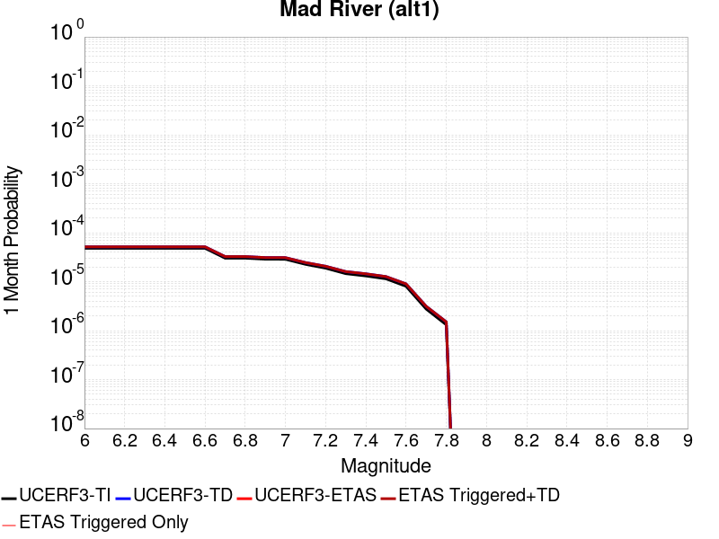 | 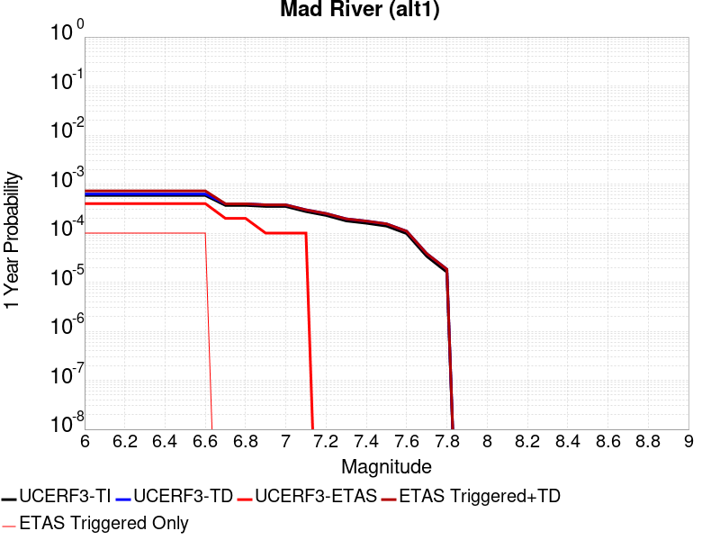 | 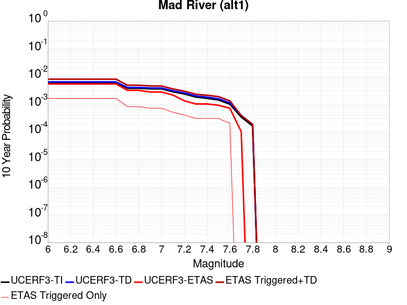 |

| Magnitude | 1 wk TI Prob | 1 wk TD Prob | 1 wk ETAS Prob | 1 wk ETAS/TD Gain | 1 wk ETAS Triggered+TD | 1 wk ETAS Triggered Only | 1 mo TI Prob | 1 mo TD Prob | 1 mo ETAS Prob | 1 mo ETAS/TD Gain | 1 mo ETAS Triggered+TD | 1 mo ETAS Triggered Only | 1 yr TI Prob | 1 yr TD Prob | 1 yr ETAS Prob | 1 yr ETAS/TD Gain | 1 yr ETAS Triggered+TD | 1 yr ETAS Triggered Only | 10 yr TI Prob | 10 yr TD Prob | 10 yr ETAS Prob | 10 yr ETAS/TD Gain | 10 yr ETAS Triggered+TD | 10 yr ETAS Triggered Only |
|-----|-----|-----|-----|-----|-----|-----|-----|-----|-----|-----|-----|-----|-----|-----|-----|-----|-----|-----|-----|-----|-----|-----|-----|-----|
| 6.0 | 1.1255216E-5 | 1.2030814E-5 | 0.0 | 0.0 | 1.2030814E-5 | 0.0 | 4.8235746E-5 | 5.1559695E-5 | 0.0 | 0.0 | 5.1559695E-5 | 0.0 | 5.87112E-4 | 6.275729E-4 | 4.0E-4 | 0.6373762 | 7.2751014E-4 | 1.0E-4 | 0.0058556325 | 0.0062594432 | 0.0053 | 0.84672064 | 0.007849428 | 0.0016 |
| 6.1 | 1.1255216E-5 | 1.2030814E-5 | 0.0 | 0.0 | 1.2030814E-5 | 0.0 | 4.8235746E-5 | 5.1559695E-5 | 0.0 | 0.0 | 5.1559695E-5 | 0.0 | 5.87112E-4 | 6.275729E-4 | 4.0E-4 | 0.6373762 | 7.2751014E-4 | 1.0E-4 | 0.0058556325 | 0.0062594432 | 0.0053 | 0.84672064 | 0.007849428 | 0.0016 |
| 6.2 | 1.1255216E-5 | 1.2030814E-5 | 0.0 | 0.0 | 1.2030814E-5 | 0.0 | 4.8235746E-5 | 5.1559695E-5 | 0.0 | 0.0 | 5.1559695E-5 | 0.0 | 5.87112E-4 | 6.275729E-4 | 4.0E-4 | 0.6373762 | 7.2751014E-4 | 1.0E-4 | 0.0058556325 | 0.0062594432 | 0.0053 | 0.84672064 | 0.007849428 | 0.0016 |
| 6.3 | 1.1255216E-5 | 1.2030814E-5 | 0.0 | 0.0 | 1.2030814E-5 | 0.0 | 4.8235746E-5 | 5.1559695E-5 | 0.0 | 0.0 | 5.1559695E-5 | 0.0 | 5.87112E-4 | 6.275729E-4 | 4.0E-4 | 0.6373762 | 7.2751014E-4 | 1.0E-4 | 0.0058556325 | 0.0062594432 | 0.0053 | 0.84672064 | 0.007849428 | 0.0016 |
| 6.4 | 1.1255216E-5 | 1.2030814E-5 | 0.0 | 0.0 | 1.2030814E-5 | 0.0 | 4.8235746E-5 | 5.1559695E-5 | 0.0 | 0.0 | 5.1559695E-5 | 0.0 | 5.87112E-4 | 6.275729E-4 | 4.0E-4 | 0.6373762 | 7.2751014E-4 | 1.0E-4 | 0.0058556325 | 0.0062594432 | 0.0053 | 0.84672064 | 0.007849428 | 0.0016 |
| 6.5 | 1.1255216E-5 | 1.2030814E-5 | 0.0 | 0.0 | 1.2030814E-5 | 0.0 | 4.8235746E-5 | 5.1559695E-5 | 0.0 | 0.0 | 5.1559695E-5 | 0.0 | 5.87112E-4 | 6.275729E-4 | 4.0E-4 | 0.6373762 | 7.2751014E-4 | 1.0E-4 | 0.0058556325 | 0.0062594432 | 0.0053 | 0.84672064 | 0.007849428 | 0.0016 |
| 6.6 | 1.1255216E-5 | 1.2030814E-5 | 0.0 | 0.0 | 1.2030814E-5 | 0.0 | 4.8235746E-5 | 5.1559695E-5 | 0.0 | 0.0 | 5.1559695E-5 | 0.0 | 5.87112E-4 | 6.275729E-4 | 4.0E-4 | 0.6373762 | 7.2751014E-4 | 1.0E-4 | 0.0058556325 | 0.0062594432 | 0.0053 | 0.84672064 | 0.007849428 | 0.0016 |
| 6.7 | 7.0564884E-6 | 7.5991843E-6 | 0.0 | 0.0 | 7.5991843E-6 | 0.0 | 3.0241743E-5 | 3.256754E-5 | 0.0 | 0.0 | 3.256754E-5 | 0.0 | 3.68131E-4 | 3.9643983E-4 | 2.0E-4 | 0.50449014 | 3.9643983E-4 | 0.0 | 0.0036752177 | 0.003957548 | 0.0031 | 0.7833133 | 0.004754382 | 8.0E-4 |
| 6.8 | 7.0564884E-6 | 7.5991843E-6 | 0.0 | 0.0 | 7.5991843E-6 | 0.0 | 3.0241743E-5 | 3.256754E-5 | 0.0 | 0.0 | 3.256754E-5 | 0.0 | 3.68131E-4 | 3.9643983E-4 | 2.0E-4 | 0.50449014 | 3.9643983E-4 | 0.0 | 0.0036752177 | 0.003957548 | 0.0031 | 0.7833133 | 0.004754382 | 8.0E-4 |
| 6.9 | 6.727494E-6 | 7.251248E-6 | 0.0 | 0.0 | 7.251248E-6 | 0.0 | 2.8831799E-5 | 3.107642E-5 | 0.0 | 0.0 | 3.107642E-5 | 0.0 | 3.509706E-4 | 3.7829185E-4 | 1.0E-4 | 0.26434618 | 3.7829185E-4 | 0.0 | 0.003504168 | 0.0037766942 | 0.0027 | 0.7149109 | 0.0044740504 | 7.0E-4 |
| 7.0 | 6.7021124E-6 | 7.224108E-6 | 0.0 | 0.0 | 7.224108E-6 | 0.0 | 2.8723021E-5 | 3.0960106E-5 | 0.0 | 0.0 | 3.0960106E-5 | 0.0 | 3.4964667E-4 | 3.7687624E-4 | 1.0E-4 | 0.2653391 | 3.7687624E-4 | 0.0 | 0.0034909705 | 0.003762586 | 0.0027 | 0.7175915 | 0.0044599525 | 7.0E-4 |
| 7.1 | 5.2784667E-6 | 5.727039E-6 | 0.0 | 0.0 | 5.727039E-6 | 0.0 | 2.2621804E-5 | 2.4544226E-5 | 0.0 | 0.0 | 2.4544226E-5 | 0.0 | 2.7538565E-4 | 2.987859E-4 | 1.0E-4 | 0.33468783 | 2.987859E-4 | 0.0 | 0.0027504463 | 0.002983934 | 0.0021 | 0.7037689 | 0.0034824419 | 5.0E-4 |
| 7.2 | 4.4085446E-6 | 4.8148163E-6 | 0.0 | 0.0 | 4.8148163E-6 | 0.0 | 1.8893625E-5 | 2.0634765E-5 | 0.0 | 0.0 | 2.0634765E-5 | 0.0 | 2.3000561E-4 | 2.511997E-4 | 0.0 | 0.0 | 2.511997E-4 | 0.0 | 0.0022976769 | 0.0025091982 | 0.0013 | 0.51809376 | 0.0029081947 | 4.0E-4 |
| 7.3 | 3.4060627E-6 | 3.7491557E-6 | 0.0 | 0.0 | 3.7491557E-6 | 0.0 | 1.459733E-5 | 1.6067712E-5 | 0.0 | 0.0 | 1.6067712E-5 | 0.0 | 1.77708E-4 | 1.9560708E-4 | 0.0 | 0.0 | 1.9560708E-4 | 0.0 | 0.0017756595 | 0.0019543723 | 0.001 | 0.5116732 | 0.002253786 | 3.0E-4 |
| 7.4 | 3.0570902E-6 | 3.3765443E-6 | 0.0 | 0.0 | 3.3765443E-6 | 0.0 | 1.310175E-5 | 1.4470826E-5 | 0.0 | 0.0 | 1.4470826E-5 | 0.0 | 1.5950213E-4 | 1.7616827E-4 | 0.0 | 0.0 | 1.7616827E-4 | 0.0 | 0.0015938769 | 0.0017603077 | 0.001 | 0.5680825 | 0.0020597796 | 3.0E-4 |
| 7.5 | 2.674048E-6 | 2.96583E-6 | 0.0 | 0.0 | 2.96583E-6 | 0.0 | 1.1460155E-5 | 1.2710639E-5 | 0.0 | 0.0 | 1.2710639E-5 | 0.0 | 1.3951845E-4 | 1.5474124E-4 | 0.0 | 0.0 | 1.5474124E-4 | 0.0 | 0.0013943089 | 0.0015463544 | 9.0E-4 | 0.582014 | 0.0018458905 | 3.0E-4 |
| 7.6 | 1.8806261E-6 | 2.1019816E-6 | 0.0 | 0.0 | 2.1019816E-6 | 0.0 | 8.059801E-6 | 9.008462E-6 | 0.0 | 0.0 | 9.008462E-6 | 0.0 | 9.812366E-5 | 1.09672634E-4 | 0.0 | 0.0 | 1.09672634E-4 | 0.0 | 9.808034E-4 | 0.0010961975 | 7.0E-4 | 0.6385711 | 0.0012959782 | 2.0E-4 |
| 7.7 | 6.461283E-7 | 7.330341E-7 | 0.0 | 0.0 | 7.330341E-7 | 0.0 | 2.7691183E-6 | 3.1415711E-6 | 0.0 | 0.0 | 3.1415711E-6 | 0.0 | 3.371349E-5 | 3.824797E-5 | 0.0 | 0.0 | 3.824797E-5 | 0.0 | 3.370838E-4 | 3.824154E-4 | 1.0E-4 | 0.26149574 | 3.824154E-4 | 0.0 |
| 7.8 | 3.0785324E-7 | 3.5236104E-7 | 0.0 | 0.0 | 3.5236104E-7 | 0.0 | 1.3193703E-6 | 1.510118E-6 | 0.0 | 0.0 | 1.510118E-6 | 0.0 | 1.6063215E-5 | 1.8385537E-5 | 0.0 | 0.0 | 1.8385537E-5 | 0.0 | 1.6062055E-4 | 1.8384079E-4 | 0.0 | 0.0 | 1.8384079E-4 | 0.0 |

## Death Valley (Black Mtns Frontal)
*[(top)](#table-of-contents)*

| 1 Week | 1 Month | 1 Year | 10 Year |
|-----|-----|-----|-----|
|  |  |  |  |

| Magnitude | 1 wk TI Prob | 1 wk TD Prob | 1 wk ETAS Prob | 1 wk ETAS/TD Gain | 1 wk ETAS Triggered+TD | 1 wk ETAS Triggered Only | 1 mo TI Prob | 1 mo TD Prob | 1 mo ETAS Prob | 1 mo ETAS/TD Gain | 1 mo ETAS Triggered+TD | 1 mo ETAS Triggered Only | 1 yr TI Prob | 1 yr TD Prob | 1 yr ETAS Prob | 1 yr ETAS/TD Gain | 1 yr ETAS Triggered+TD | 1 yr ETAS Triggered Only | 10 yr TI Prob | 10 yr TD Prob | 10 yr ETAS Prob | 10 yr ETAS/TD Gain | 10 yr ETAS Triggered+TD | 10 yr ETAS Triggered Only |
|-----|-----|-----|-----|-----|-----|-----|-----|-----|-----|-----|-----|-----|-----|-----|-----|-----|-----|-----|-----|-----|-----|-----|-----|-----|
| 6.0 | 1.6707214E-5 | 1.8647328E-5 | 0.0 | 0.0 | 1.8647328E-5 | 0.0 | 7.160038E-5 | 7.991472E-5 | 2.0E-4 | 2.5026681 | 7.991472E-5 | 0.0 | 8.71386E-4 | 9.7253494E-4 | 7.0E-4 | 0.71976846 | 0.0011723405 | 2.0E-4 | 0.00867977 | 0.009683641 | 0.0055 | 0.56796825 | 0.0113671785 | 0.0017 |
| 6.1 | 1.6707214E-5 | 1.8647328E-5 | 0.0 | 0.0 | 1.8647328E-5 | 0.0 | 7.160038E-5 | 7.991472E-5 | 2.0E-4 | 2.5026681 | 7.991472E-5 | 0.0 | 8.71386E-4 | 9.7253494E-4 | 7.0E-4 | 0.71976846 | 0.0011723405 | 2.0E-4 | 0.00867977 | 0.009683641 | 0.0055 | 0.56796825 | 0.0113671785 | 0.0017 |
| 6.2 | 1.6707214E-5 | 1.8647328E-5 | 0.0 | 0.0 | 1.8647328E-5 | 0.0 | 7.160038E-5 | 7.991472E-5 | 2.0E-4 | 2.5026681 | 7.991472E-5 | 0.0 | 8.71386E-4 | 9.7253494E-4 | 7.0E-4 | 0.71976846 | 0.0011723405 | 2.0E-4 | 0.00867977 | 0.009683641 | 0.0055 | 0.56796825 | 0.0113671785 | 0.0017 |
| 6.3 | 1.6707214E-5 | 1.8647328E-5 | 0.0 | 0.0 | 1.8647328E-5 | 0.0 | 7.160038E-5 | 7.991472E-5 | 2.0E-4 | 2.5026681 | 7.991472E-5 | 0.0 | 8.71386E-4 | 9.7253494E-4 | 7.0E-4 | 0.71976846 | 0.0011723405 | 2.0E-4 | 0.00867977 | 0.009683641 | 0.0055 | 0.56796825 | 0.0113671785 | 0.0017 |
| 6.4 | 1.5515609E-5 | 1.731691E-5 | 0.0 | 0.0 | 1.731691E-5 | 0.0 | 6.649377E-5 | 7.4213254E-5 | 2.0E-4 | 2.6949365 | 7.4213254E-5 | 0.0 | 8.0926094E-4 | 9.031779E-4 | 7.0E-4 | 0.7750411 | 0.0011029972 | 2.0E-4 | 0.008063202 | 0.008995756 | 0.0054 | 0.6002831 | 0.010680462 | 0.0017 |
| 6.5 | 1.5515609E-5 | 1.731691E-5 | 0.0 | 0.0 | 1.731691E-5 | 0.0 | 6.649377E-5 | 7.4213254E-5 | 2.0E-4 | 2.6949365 | 7.4213254E-5 | 0.0 | 8.0926094E-4 | 9.031779E-4 | 7.0E-4 | 0.7750411 | 0.0011029972 | 2.0E-4 | 0.008063202 | 0.008995756 | 0.0054 | 0.6002831 | 0.010680462 | 0.0017 |
| 6.6 | 1.5041828E-5 | 1.6788485E-5 | 0.0 | 0.0 | 1.6788485E-5 | 0.0 | 6.4463384E-5 | 7.19487E-5 | 2.0E-4 | 2.7797585 | 7.19487E-5 | 0.0 | 7.8455906E-4 | 8.7562925E-4 | 7.0E-4 | 0.79942507 | 0.0010754542 | 2.0E-4 | 0.00781795 | 0.008722445 | 0.0053 | 0.6076278 | 0.010407616 | 0.0017 |
| 6.7 | 1.4634985E-5 | 1.6335895E-5 | 0.0 | 0.0 | 1.6335895E-5 | 0.0 | 6.271985E-5 | 7.000913E-5 | 2.0E-4 | 2.8567703 | 7.000913E-5 | 0.0 | 7.6334673E-4 | 8.520336E-4 | 7.0E-4 | 0.82156384 | 0.0010518632 | 2.0E-4 | 0.007607299 | 0.008488304 | 0.0051 | 0.60082674 | 0.009975571 | 0.0015 |
| 6.8 | 1.4209158E-5 | 1.5862484E-5 | 0.0 | 0.0 | 1.5862484E-5 | 0.0 | 6.089497E-5 | 6.798034E-5 | 2.0E-4 | 2.942027 | 6.798034E-5 | 0.0 | 7.4114406E-4 | 8.2735193E-4 | 6.0E-4 | 0.7252053 | 0.0010271865 | 2.0E-4 | 0.007386771 | 0.008243332 | 0.0047 | 0.5701578 | 0.00963179 | 0.0014 |
| 6.9 | 1.3780098E-5 | 1.5385593E-5 | 0.0 | 0.0 | 1.5385593E-5 | 0.0 | 5.9056227E-5 | 6.593662E-5 | 2.0E-4 | 3.033216 | 6.593662E-5 | 0.0 | 7.1877235E-4 | 8.0248807E-4 | 6.0E-4 | 0.74767464 | 0.0010023275 | 2.0E-4 | 0.0071645193 | 0.007996496 | 0.0047 | 0.5877574 | 0.009385301 | 0.0014 |
| 7.0 | 1.3585064E-5 | 1.5169402E-5 | 0.0 | 0.0 | 1.5169402E-5 | 0.0 | 5.8220405E-5 | 6.5010136E-5 | 2.0E-4 | 3.0764434 | 6.5010136E-5 | 0.0 | 7.086029E-4 | 7.9121644E-4 | 6.0E-4 | 0.75832605 | 9.910582E-4 | 2.0E-4 | 0.007063476 | 0.007884584 | 0.0046 | 0.58341694 | 0.009273546 | 0.0014 |
| 7.1 | 1.3398601E-5 | 1.4962822E-5 | 0.0 | 0.0 | 1.4962822E-5 | 0.0 | 5.742131E-5 | 6.412483E-5 | 2.0E-4 | 3.1189165 | 6.412483E-5 | 0.0 | 6.9888023E-4 | 7.8044564E-4 | 6.0E-4 | 0.7687915 | 9.802895E-4 | 2.0E-4 | 0.0069668638 | 0.0077776355 | 0.0045 | 0.578582 | 0.009166746 | 0.0014 |
| 7.2 | 1.3126312E-5 | 1.4661385E-5 | 0.0 | 0.0 | 1.4661385E-5 | 0.0 | 5.6254412E-5 | 6.283302E-5 | 2.0E-4 | 3.1830397 | 6.283302E-5 | 0.0 | 6.846822E-4 | 7.64729E-4 | 6.0E-4 | 0.7845917 | 9.6457603E-4 | 2.0E-4 | 0.006825765 | 0.0076215565 | 0.0041 | 0.53794783 | 0.008812411 | 0.0012 |
| 7.3 | 1.2922429E-5 | 1.44358655E-5 | 0.0 | 0.0 | 1.44358655E-5 | 0.0 | 5.5380664E-5 | 6.186656E-5 | 2.0E-4 | 3.2327642 | 6.186656E-5 | 0.0 | 6.74051E-4 | 7.5297046E-4 | 6.0E-4 | 0.796844 | 9.528198E-4 | 2.0E-4 | 0.006720101 | 0.0075047715 | 0.0041 | 0.5463191 | 0.008695765 | 0.0012 |
| 7.4 | 1.2768878E-5 | 1.426604E-5 | 0.0 | 0.0 | 1.426604E-5 | 0.0 | 5.4722615E-5 | 6.113877E-5 | 2.0E-4 | 3.2712467 | 6.113877E-5 | 0.0 | 6.660441E-4 | 7.4411574E-4 | 6.0E-4 | 0.8063262 | 9.439669E-4 | 2.0E-4 | 0.0066405144 | 0.0074168188 | 0.0041 | 0.5527977 | 0.008607918 | 0.0012 |
| 7.5 | 1.2521929E-5 | 1.3994572E-5 | 0.0 | 0.0 | 1.3994572E-5 | 0.0 | 5.366431E-5 | 5.997539E-5 | 2.0E-4 | 3.334701 | 5.997539E-5 | 0.0 | 6.531671E-4 | 7.2996115E-4 | 6.0E-4 | 0.8219615 | 9.2981517E-4 | 2.0E-4 | 0.006512506 | 0.007276209 | 0.0041 | 0.5634802 | 0.008467478 | 0.0012 |
| 7.6 | 1.1301089E-5 | 1.2632379E-5 | 0.0 | 0.0 | 1.2632379E-5 | 0.0 | 4.8432343E-5 | 5.4137676E-5 | 2.0E-4 | 3.694285 | 5.4137676E-5 | 0.0 | 5.895042E-4 | 6.589322E-4 | 5.0E-4 | 0.7588034 | 7.5886626E-4 | 1.0E-4 | 0.0058794282 | 0.0065703345 | 0.0035 | 0.5326974 | 0.007563764 | 0.001 |
| 7.7 | 9.189108E-6 | 1.027055E-5 | 0.0 | 0.0 | 1.027055E-5 | 0.0 | 3.93813E-5 | 4.4015927E-5 | 1.0E-4 | 2.2719047 | 4.4015927E-5 | 0.0 | 4.7936183E-4 | 5.357672E-4 | 3.0E-4 | 0.5599447 | 6.3571363E-4 | 1.0E-4 | 0.004783291 | 0.005345265 | 0.003 | 0.56124437 | 0.0063399198 | 0.001 |
| 7.8 | 3.4586725E-7 | 3.6461634E-7 | 0.0 | 0.0 | 3.6461634E-7 | 0.0 | 1.4822873E-6 | 1.5626406E-6 | 0.0 | 0.0 | 1.5626406E-6 | 0.0 | 1.80467E-5 | 1.9024988E-5 | 0.0 | 0.0 | 1.9024988E-5 | 0.0 | 1.8045233E-4 | 1.9023403E-4 | 1.0E-4 | 0.5256683 | 1.9023403E-4 | 0.0 |
| 7.9 | 2.5591178E-9 | 2.6684681E-9 | 0.0 | 0.0 | 2.6684681E-9 | 0.0 | 1.0967647E-8 | 1.1436292E-8 | 0.0 | 0.0 | 1.1436292E-8 | 0.0 | 1.335311E-7 | 1.3923685E-7 | 0.0 | 0.0 | 1.3923685E-7 | 0.0 | 1.3353102E-6 | 1.3923685E-6 | 0.0 | 0.0 | 1.3923685E-6 | 0.0 |

## Elsinore (Stepovers Combined)
*[(top)](#table-of-contents)*

| 1 Week | 1 Month | 1 Year | 10 Year |
|-----|-----|-----|-----|
|  |  | 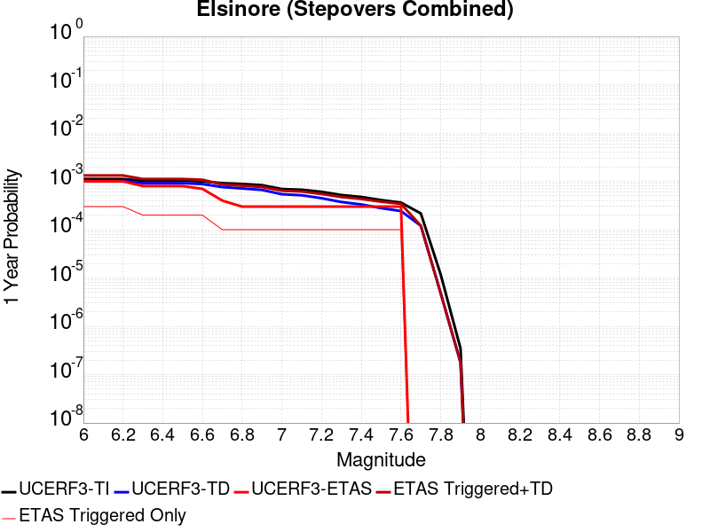 |  |

| Magnitude | 1 wk TI Prob | 1 wk TD Prob | 1 wk ETAS Prob | 1 wk ETAS/TD Gain | 1 wk ETAS Triggered+TD | 1 wk ETAS Triggered Only | 1 mo TI Prob | 1 mo TD Prob | 1 mo ETAS Prob | 1 mo ETAS/TD Gain | 1 mo ETAS Triggered+TD | 1 mo ETAS Triggered Only | 1 yr TI Prob | 1 yr TD Prob | 1 yr ETAS Prob | 1 yr ETAS/TD Gain | 1 yr ETAS Triggered+TD | 1 yr ETAS Triggered Only | 10 yr TI Prob | 10 yr TD Prob | 10 yr ETAS Prob | 10 yr ETAS/TD Gain | 10 yr ETAS Triggered+TD | 10 yr ETAS Triggered Only |
|-----|-----|-----|-----|-----|-----|-----|-----|-----|-----|-----|-----|-----|-----|-----|-----|-----|-----|-----|-----|-----|-----|-----|-----|-----|
| 6.0 | 2.144392E-5 | 1.9630772E-5 | 0.0 | 0.0 | 1.9630772E-5 | 0.0 | 9.189928E-5 | 8.412929E-5 | 1.0E-4 | 1.1886467 | 8.412929E-5 | 0.0 | 0.0011182994 | 0.0010238121 | 0.001 | 0.9767417 | 0.001323505 | 3.0E-4 | 0.011126885 | 0.010198043 | 0.0072 | 0.7060178 | 0.011880706 | 0.0017 |
| 6.1 | 2.144392E-5 | 1.9630772E-5 | 0.0 | 0.0 | 1.9630772E-5 | 0.0 | 9.189928E-5 | 8.412929E-5 | 1.0E-4 | 1.1886467 | 8.412929E-5 | 0.0 | 0.0011182994 | 0.0010238121 | 0.001 | 0.9767417 | 0.001323505 | 3.0E-4 | 0.011126885 | 0.010198043 | 0.0072 | 0.7060178 | 0.011880706 | 0.0017 |
| 6.2 | 2.144392E-5 | 1.9630772E-5 | 0.0 | 0.0 | 1.9630772E-5 | 0.0 | 9.189928E-5 | 8.412929E-5 | 1.0E-4 | 1.1886467 | 8.412929E-5 | 0.0 | 0.0011182994 | 0.0010238121 | 0.001 | 0.9767417 | 0.001323505 | 3.0E-4 | 0.011126885 | 0.010198043 | 0.0072 | 0.7060178 | 0.011880706 | 0.0017 |
| 6.3 | 1.9751555E-5 | 1.761608E-5 | 0.0 | 0.0 | 1.761608E-5 | 0.0 | 8.4646774E-5 | 7.549539E-5 | 1.0E-4 | 1.3245842 | 7.549539E-5 | 0.0 | 0.0010300872 | 9.187831E-4 | 8.0E-4 | 0.8707169 | 0.0011185993 | 2.0E-4 | 0.010253254 | 0.009156425 | 0.0069 | 0.7535692 | 0.010741775 | 0.0016 |
| 6.4 | 1.9751555E-5 | 1.761608E-5 | 0.0 | 0.0 | 1.761608E-5 | 0.0 | 8.4646774E-5 | 7.549539E-5 | 1.0E-4 | 1.3245842 | 7.549539E-5 | 0.0 | 0.0010300872 | 9.187831E-4 | 8.0E-4 | 0.8707169 | 0.0011185993 | 2.0E-4 | 0.010253254 | 0.009156425 | 0.0069 | 0.7535692 | 0.010741775 | 0.0016 |
| 6.5 | 1.9751555E-5 | 1.761608E-5 | 0.0 | 0.0 | 1.761608E-5 | 0.0 | 8.4646774E-5 | 7.549539E-5 | 1.0E-4 | 1.3245842 | 7.549539E-5 | 0.0 | 0.0010300872 | 9.187831E-4 | 8.0E-4 | 0.8707169 | 0.0011185993 | 2.0E-4 | 0.010253254 | 0.009156425 | 0.0069 | 0.7535692 | 0.010741775 | 0.0016 |
| 6.6 | 1.9188685E-5 | 1.6880309E-5 | 0.0 | 0.0 | 1.6880309E-5 | 0.0 | 8.2234634E-5 | 7.234226E-5 | 0.0 | 0.0 | 7.234226E-5 | 0.0 | 0.0010007467 | 8.804271E-4 | 7.0E-4 | 0.7950687 | 0.0010802511 | 2.0E-4 | 0.00996252 | 0.008776145 | 0.0065 | 0.7406441 | 0.010064736 | 0.0013 |
| 6.7 | 1.7608272E-5 | 1.4616964E-5 | 0.0 | 0.0 | 1.4616964E-5 | 0.0 | 7.546184E-5 | 6.264268E-5 | 0.0 | 0.0 | 6.264268E-5 | 0.0 | 9.183606E-4 | 7.624173E-4 | 4.0E-4 | 0.52464706 | 8.62341E-4 | 1.0E-4 | 0.009145746 | 0.007604775 | 0.0053 | 0.6969305 | 0.008497931 | 9.0E-4 |
| 6.8 | 1.697165E-5 | 1.3682772E-5 | 0.0 | 0.0 | 1.3682772E-5 | 0.0 | 7.273361E-5 | 5.863918E-5 | 0.0 | 0.0 | 5.863918E-5 | 0.0 | 8.8517193E-4 | 7.1370666E-4 | 3.0E-4 | 0.42034078 | 8.136353E-4 | 1.0E-4 | 0.008816543 | 0.0071203187 | 0.005 | 0.70221573 | 0.008013911 | 9.0E-4 |
| 6.9 | 1.600365E-5 | 1.2758175E-5 | 0.0 | 0.0 | 1.2758175E-5 | 0.0 | 6.858527E-5 | 5.467679E-5 | 0.0 | 0.0 | 5.467679E-5 | 0.0 | 8.347058E-4 | 6.654942E-4 | 3.0E-4 | 0.4507928 | 7.6542766E-4 | 1.0E-4 | 0.008315775 | 0.0066407807 | 0.0047 | 0.7077481 | 0.0075348043 | 9.0E-4 |
| 7.0 | 1.3314581E-5 | 1.0393103E-5 | 0.0 | 0.0 | 1.0393103E-5 | 0.0 | 5.7061243E-5 | 4.4541124E-5 | 0.0 | 0.0 | 4.4541124E-5 | 0.0 | 6.944992E-4 | 5.4215593E-4 | 3.0E-4 | 0.55334634 | 6.4210175E-4 | 1.0E-4 | 0.006923327 | 0.005412003 | 0.0039 | 0.72062045 | 0.005909297 | 5.0E-4 |
| 7.1 | 1.2865345E-5 | 9.890421E-6 | 0.0 | 0.0 | 9.890421E-6 | 0.0 | 5.5136024E-5 | 4.2386848E-5 | 0.0 | 0.0 | 4.2386848E-5 | 0.0 | 6.710743E-4 | 5.159402E-4 | 3.0E-4 | 0.58146274 | 6.1588857E-4 | 1.0E-4 | 0.0066905143 | 0.0051506558 | 0.0039 | 0.7571851 | 0.0056480807 | 5.0E-4 |
| 7.2 | 1.1650051E-5 | 8.595105E-6 | 0.0 | 0.0 | 8.595105E-6 | 0.0 | 4.9927836E-5 | 3.6835656E-5 | 0.0 | 0.0 | 3.6835656E-5 | 0.0 | 6.0770183E-4 | 4.4838357E-4 | 3.0E-4 | 0.66907 | 5.4833875E-4 | 1.0E-4 | 0.0060604266 | 0.0044761146 | 0.0034 | 0.75958735 | 0.0049738768 | 5.0E-4 |
| 7.3 | 1.0008533E-5 | 7.170936E-6 | 0.0 | 0.0 | 7.170936E-6 | 0.0 | 4.2893007E-5 | 3.073223E-5 | 0.0 | 0.0 | 3.073223E-5 | 0.0 | 5.220972E-4 | 3.741021E-4 | 3.0E-4 | 0.8019202 | 4.7406467E-4 | 1.0E-4 | 0.005208723 | 0.0037350664 | 0.0032 | 0.8567451 | 0.0042331987 | 5.0E-4 |
| 7.4 | 9.116759E-6 | 6.3842217E-6 | 0.0 | 0.0 | 6.3842217E-6 | 0.0 | 3.907124E-5 | 2.7360671E-5 | 0.0 | 0.0 | 2.7360671E-5 | 0.0 | 4.7558855E-4 | 3.3306662E-4 | 3.0E-4 | 0.9007207 | 4.330333E-4 | 1.0E-4 | 0.00474572 | 0.0033258214 | 0.0026 | 0.78176177 | 0.0038241583 | 5.0E-4 |
| 7.5 | 7.870524E-6 | 5.360863E-6 | 0.0 | 0.0 | 5.360863E-6 | 0.0 | 3.3730383E-5 | 2.2974931E-5 | 0.0 | 0.0 | 2.2974931E-5 | 0.0 | 4.1059E-4 | 2.7968513E-4 | 3.0E-4 | 1.0726347 | 3.7965717E-4 | 1.0E-4 | 0.0040983222 | 0.0027934571 | 0.0021 | 0.75175667 | 0.0032920605 | 5.0E-4 |
| 7.6 | 6.9774537E-6 | 4.6581627E-6 | 0.0 | 0.0 | 4.6581627E-6 | 0.0 | 2.990303E-5 | 1.9963409E-5 | 0.0 | 0.0 | 1.9963409E-5 | 0.0 | 3.640086E-4 | 2.4302855E-4 | 3.0E-4 | 1.2344229 | 3.4300424E-4 | 1.0E-4 | 0.003634129 | 0.002427743 | 0.002 | 0.8238104 | 0.0029265292 | 5.0E-4 |
| 7.7 | 4.1616954E-6 | 2.3164787E-6 | 0.0 | 0.0 | 2.3164787E-6 | 0.0 | 1.7835715E-5 | 9.927732E-6 | 0.0 | 0.0 | 9.927732E-6 | 0.0 | 2.171282E-4 | 1.2086417E-4 | 0.0 | 0.0 | 1.2086417E-4 | 0.0 | 0.0021691616 | 0.0012080568 | 8.0E-4 | 0.6622205 | 0.0014078153 | 2.0E-4 |
| 7.8 | 2.2692414E-7 | 9.313546E-8 | 0.0 | 0.0 | 9.313546E-8 | 0.0 | 9.725317E-7 | 3.9915196E-7 | 0.0 | 0.0 | 3.9915196E-7 | 0.0 | 1.1840509E-5 | 4.8596676E-6 | 0.0 | 0.0 | 4.8596676E-6 | 0.0 | 1.1839878E-4 | 4.859593E-5 | 0.0 | 0.0 | 4.859593E-5 | 0.0 |
| 7.9 | 6.676829E-9 | 3.4267709E-9 | 0.0 | 0.0 | 3.4267709E-9 | 0.0 | 2.861498E-8 | 1.4686159E-8 | 0.0 | 0.0 | 1.4686159E-8 | 0.0 | 3.4838732E-7 | 1.7880397E-7 | 0.0 | 0.0 | 1.7880397E-7 | 0.0 | 3.4838679E-6 | 1.7880385E-6 | 0.0 | 0.0 | 1.7880385E-6 | 0.0 |

## Likely 2011 CFM
*[(top)](#table-of-contents)*

| 1 Week | 1 Month | 1 Year | 10 Year |
|-----|-----|-----|-----|
|  |  |  |  |

| Magnitude | 1 wk TI Prob | 1 wk TD Prob | 1 wk ETAS Prob | 1 wk ETAS/TD Gain | 1 wk ETAS Triggered+TD | 1 wk ETAS Triggered Only | 1 mo TI Prob | 1 mo TD Prob | 1 mo ETAS Prob | 1 mo ETAS/TD Gain | 1 mo ETAS Triggered+TD | 1 mo ETAS Triggered Only | 1 yr TI Prob | 1 yr TD Prob | 1 yr ETAS Prob | 1 yr ETAS/TD Gain | 1 yr ETAS Triggered+TD | 1 yr ETAS Triggered Only | 10 yr TI Prob | 10 yr TD Prob | 10 yr ETAS Prob | 10 yr ETAS/TD Gain | 10 yr ETAS Triggered+TD | 10 yr ETAS Triggered Only |
|-----|-----|-----|-----|-----|-----|-----|-----|-----|-----|-----|-----|-----|-----|-----|-----|-----|-----|-----|-----|-----|-----|-----|-----|-----|
| 6.0 | 2.5315949E-5 | 2.7084729E-5 | 0.0 | 0.0 | 2.7084729E-5 | 0.0 | 1.0849241E-4 | 1.160725E-4 | 0.0 | 0.0 | 1.160725E-4 | 0.0 | 0.0013200947 | 0.001412311 | 0.0014 | 0.99128306 | 0.0015121697 | 1.0E-4 | 0.013122803 | 0.014038003 | 0.0095 | 0.67673445 | 0.015615542 | 0.0016 |
| 6.1 | 2.5315949E-5 | 2.7084729E-5 | 0.0 | 0.0 | 2.7084729E-5 | 0.0 | 1.0849241E-4 | 1.160725E-4 | 0.0 | 0.0 | 1.160725E-4 | 0.0 | 0.0013200947 | 0.001412311 | 0.0014 | 0.99128306 | 0.0015121697 | 1.0E-4 | 0.013122803 | 0.014038003 | 0.0089 | 0.6339933 | 0.015615542 | 0.0016 |
| 6.2 | 1.6375941E-5 | 1.7453698E-5 | 0.0 | 0.0 | 1.7453698E-5 | 0.0 | 7.0180715E-5 | 7.479949E-5 | 0.0 | 0.0 | 7.479949E-5 | 0.0 | 8.5411523E-4 | 9.1031555E-4 | 7.0E-4 | 0.7689641 | 9.1031555E-4 | 0.0 | 0.008508399 | 0.009067152 | 0.0063 | 0.6948158 | 0.010454457 | 0.0014 |
| 6.3 | 1.1945543E-5 | 1.2704063E-5 | 0.0 | 0.0 | 1.2704063E-5 | 0.0 | 5.119418E-5 | 5.4444878E-5 | 0.0 | 0.0 | 5.4444878E-5 | 0.0 | 6.2311086E-4 | 6.626701E-4 | 6.0E-4 | 0.9054279 | 6.626701E-4 | 0.0 | 0.0062136655 | 0.0066074952 | 0.005 | 0.7567164 | 0.007898905 | 0.0013 |
| 6.4 | 9.192729E-6 | 9.7621005E-6 | 0.0 | 0.0 | 9.7621005E-6 | 0.0 | 3.939681E-5 | 4.183692E-5 | 0.0 | 0.0 | 4.183692E-5 | 0.0 | 4.7955062E-4 | 5.092482E-4 | 4.0E-4 | 0.7854717 | 5.092482E-4 | 0.0 | 0.004785171 | 0.005081093 | 0.0037 | 0.72818977 | 0.006076012 | 0.001 |
| 6.5 | 7.67906E-6 | 8.1473745E-6 | 0.0 | 0.0 | 8.1473745E-6 | 0.0 | 3.2909844E-5 | 3.4916862E-5 | 0.0 | 0.0 | 3.4916862E-5 | 0.0 | 4.006037E-4 | 4.2503176E-4 | 3.0E-4 | 0.7058296 | 4.2503176E-4 | 0.0 | 0.0039988225 | 0.004242381 | 0.0028 | 0.6600067 | 0.005238139 | 0.001 |
| 6.6 | 6.4884057E-6 | 6.880361E-6 | 0.0 | 0.0 | 6.880361E-6 | 0.0 | 2.7807157E-5 | 2.9486937E-5 | 0.0 | 0.0 | 2.9486937E-5 | 0.0 | 3.3849955E-4 | 3.5894575E-4 | 2.0E-4 | 0.55718726 | 3.5894575E-4 | 0.0 | 0.003379844 | 0.0035838045 | 0.0023 | 0.6417761 | 0.004480579 | 9.0E-4 |
| 6.7 | 4.6060636E-6 | 4.880965E-6 | 0.0 | 0.0 | 4.880965E-6 | 0.0 | 1.9740122E-5 | 2.091826E-5 | 0.0 | 0.0 | 2.091826E-5 | 0.0 | 2.403095E-4 | 2.5465086E-4 | 2.0E-4 | 0.78538907 | 2.5465086E-4 | 0.0 | 0.002400498 | 0.0025436736 | 0.0019 | 0.74695116 | 0.003241893 | 7.0E-4 |
| 6.8 | 3.2795615E-6 | 3.4751843E-6 | 0.0 | 0.0 | 3.4751843E-6 | 0.0 | 1.4055187E-5 | 1.4893565E-5 | 0.0 | 0.0 | 1.4893565E-5 | 0.0 | 1.7110848E-4 | 1.8131462E-4 | 1.0E-4 | 0.5515275 | 1.8131462E-4 | 0.0 | 0.0017097679 | 0.0018117221 | 0.0016 | 0.88313764 | 0.0023108162 | 5.0E-4 |
| 6.9 | 2.3289967E-6 | 2.4689898E-6 | 0.0 | 0.0 | 2.4689898E-6 | 0.0 | 9.981376E-6 | 1.0581344E-5 | 0.0 | 0.0 | 1.0581344E-5 | 0.0 | 1.2151648E-4 | 1.2882068E-4 | 1.0E-4 | 0.77627283 | 1.2882068E-4 | 0.0 | 0.0012145005 | 0.001287503 | 0.0012 | 0.93203664 | 0.001686988 | 4.0E-4 |
| 7.0 | 1.211292E-6 | 1.2855635E-6 | 0.0 | 0.0 | 1.2855635E-6 | 0.0 | 5.1912407E-6 | 5.5095475E-6 | 0.0 | 0.0 | 5.5095475E-6 | 0.0 | 6.320152E-5 | 6.707698E-5 | 0.0 | 0.0 | 6.707698E-5 | 0.0 | 6.3183554E-4 | 6.7059713E-4 | 9.0E-4 | 1.3420874 | 9.70396E-4 | 3.0E-4 |

## Johnson Valley (No) 2011 rev
*[(top)](#table-of-contents)*

| 1 Week | 1 Month | 1 Year | 10 Year |
|-----|-----|-----|-----|
|  | 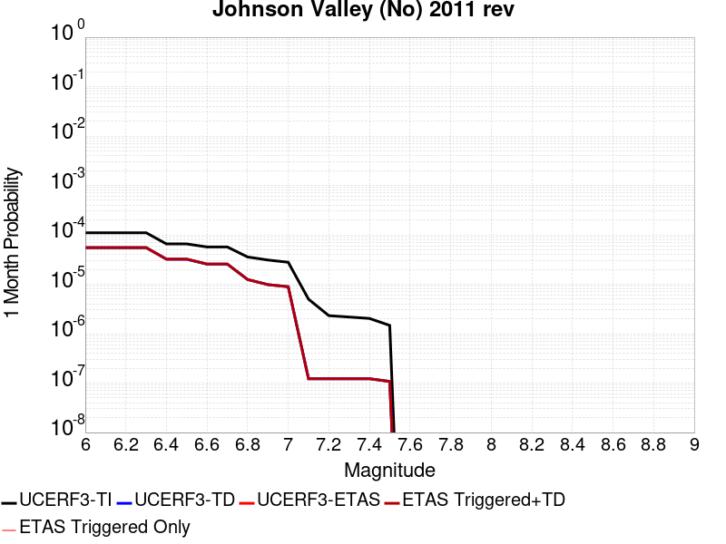 | 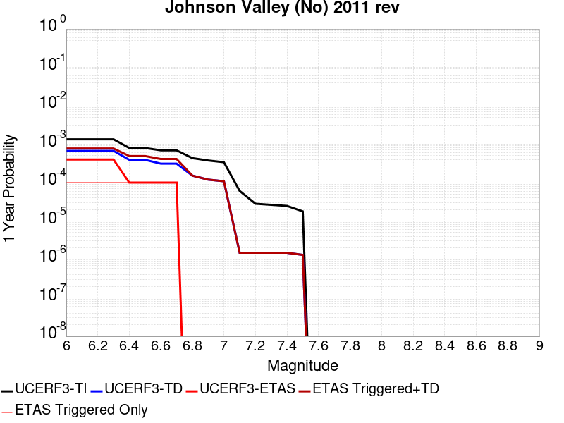 | 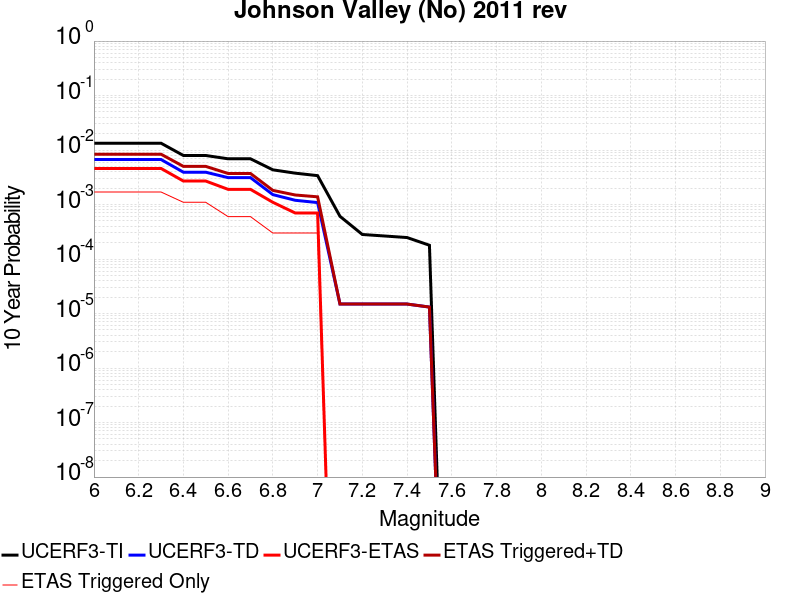 |

| Magnitude | 1 wk TI Prob | 1 wk TD Prob | 1 wk ETAS Prob | 1 wk ETAS/TD Gain | 1 wk ETAS Triggered+TD | 1 wk ETAS Triggered Only | 1 mo TI Prob | 1 mo TD Prob | 1 mo ETAS Prob | 1 mo ETAS/TD Gain | 1 mo ETAS Triggered+TD | 1 mo ETAS Triggered Only | 1 yr TI Prob | 1 yr TD Prob | 1 yr ETAS Prob | 1 yr ETAS/TD Gain | 1 yr ETAS Triggered+TD | 1 yr ETAS Triggered Only | 10 yr TI Prob | 10 yr TD Prob | 10 yr ETAS Prob | 10 yr ETAS/TD Gain | 10 yr ETAS Triggered+TD | 10 yr ETAS Triggered Only |
|-----|-----|-----|-----|-----|-----|-----|-----|-----|-----|-----|-----|-----|-----|-----|-----|-----|-----|-----|-----|-----|-----|-----|-----|-----|
| 6.0 | 2.577707E-5 | 1.2882305E-5 | 0.0 | 0.0 | 1.2882305E-5 | 0.0 | 1.1046848E-4 | 5.5208933E-5 | 0.0 | 0.0 | 5.5208933E-5 | 0.0 | 0.0013441239 | 6.7200104E-4 | 4.0E-4 | 0.59523714 | 7.719339E-4 | 1.0E-4 | 0.013360229 | 0.0067035886 | 0.0046 | 0.68619967 | 0.008392192 | 0.0017 |
| 6.1 | 2.577707E-5 | 1.2882305E-5 | 0.0 | 0.0 | 1.2882305E-5 | 0.0 | 1.1046848E-4 | 5.5208933E-5 | 0.0 | 0.0 | 5.5208933E-5 | 0.0 | 0.0013441239 | 6.7200104E-4 | 4.0E-4 | 0.59523714 | 7.719339E-4 | 1.0E-4 | 0.013360229 | 0.0067035886 | 0.0046 | 0.68619967 | 0.008392192 | 0.0017 |
| 6.2 | 2.577707E-5 | 1.2882305E-5 | 0.0 | 0.0 | 1.2882305E-5 | 0.0 | 1.1046848E-4 | 5.5208933E-5 | 0.0 | 0.0 | 5.5208933E-5 | 0.0 | 0.0013441239 | 6.7200104E-4 | 4.0E-4 | 0.59523714 | 7.719339E-4 | 1.0E-4 | 0.013360229 | 0.0067035886 | 0.0046 | 0.68619967 | 0.008392192 | 0.0017 |
| 6.3 | 2.577707E-5 | 1.2882305E-5 | 0.0 | 0.0 | 1.2882305E-5 | 0.0 | 1.1046848E-4 | 5.5208933E-5 | 0.0 | 0.0 | 5.5208933E-5 | 0.0 | 0.0013441239 | 6.7200104E-4 | 4.0E-4 | 0.59523714 | 7.719339E-4 | 1.0E-4 | 0.013360229 | 0.0067035886 | 0.0046 | 0.68619967 | 0.008392192 | 0.0017 |
| 6.4 | 1.5296591E-5 | 7.5242306E-6 | 0.0 | 0.0 | 7.5242306E-6 | 0.0 | 6.555518E-5 | 3.224641E-5 | 0.0 | 0.0 | 3.224641E-5 | 0.0 | 7.97842E-4 | 3.92548E-4 | 1.0E-4 | 0.2547459 | 4.9250876E-4 | 1.0E-4 | 0.007949836 | 0.0039203814 | 0.0027 | 0.6887085 | 0.0050160694 | 0.0011 |
| 6.5 | 1.5296591E-5 | 7.5242306E-6 | 0.0 | 0.0 | 7.5242306E-6 | 0.0 | 6.555518E-5 | 3.224641E-5 | 0.0 | 0.0 | 3.224641E-5 | 0.0 | 7.97842E-4 | 3.92548E-4 | 1.0E-4 | 0.2547459 | 4.9250876E-4 | 1.0E-4 | 0.007949836 | 0.0039203814 | 0.0027 | 0.6887085 | 0.0050160694 | 0.0011 |
| 6.6 | 1.3289383E-5 | 5.981013E-6 | 0.0 | 0.0 | 5.981013E-6 | 0.0 | 5.6953253E-5 | 2.5632757E-5 | 0.0 | 0.0 | 2.5632757E-5 | 0.0 | 6.9318525E-4 | 3.1205104E-4 | 1.0E-4 | 0.3204604 | 4.1201984E-4 | 1.0E-4 | 0.0069102696 | 0.0031177877 | 0.0019 | 0.6094065 | 0.003715917 | 6.0E-4 |
| 6.7 | 1.3289383E-5 | 5.981013E-6 | 0.0 | 0.0 | 5.981013E-6 | 0.0 | 5.6953253E-5 | 2.5632757E-5 | 0.0 | 0.0 | 2.5632757E-5 | 0.0 | 6.9318525E-4 | 3.1205104E-4 | 1.0E-4 | 0.3204604 | 4.1201984E-4 | 1.0E-4 | 0.0069102696 | 0.0031177877 | 0.0019 | 0.6094065 | 0.003715917 | 6.0E-4 |
| 6.8 | 8.330789E-6 | 2.9140658E-6 | 0.0 | 0.0 | 2.9140658E-6 | 0.0 | 3.570289E-5 | 1.2488826E-5 | 0.0 | 0.0 | 1.2488826E-5 | 0.0 | 4.34596E-4 | 1.5204652E-4 | 0.0 | 0.0 | 1.5204652E-4 | 0.0 | 0.0043374705 | 0.0015199819 | 0.0011 | 0.72369283 | 0.001819526 | 3.0E-4 |
| 6.9 | 7.2359003E-6 | 2.295075E-6 | 0.0 | 0.0 | 2.295075E-6 | 0.0 | 3.1010633E-5 | 9.836029E-6 | 0.0 | 0.0 | 9.836029E-6 | 0.0 | 3.7748902E-4 | 1.1975237E-4 | 0.0 | 0.0 | 1.1975237E-4 | 0.0 | 0.0037684843 | 0.0011973984 | 7.0E-4 | 0.58460075 | 0.0014970391 | 3.0E-4 |
| 7.0 | 6.5149957E-6 | 2.08268E-6 | 0.0 | 0.0 | 2.08268E-6 | 0.0 | 2.792111E-5 | 8.925771E-6 | 0.0 | 0.0 | 8.925771E-6 | 0.0 | 3.398865E-4 | 1.0867111E-4 | 0.0 | 0.0 | 1.0867111E-4 | 0.0 | 0.003393671 | 0.0010866966 | 7.0E-4 | 0.644154 | 0.0013863706 | 3.0E-4 |
| 7.1 | 1.1662233E-6 | 2.8602754E-8 | 0.0 | 0.0 | 2.8602754E-8 | 0.0 | 4.9980904E-6 | 1.2258323E-7 | 0.0 | 0.0 | 1.2258323E-7 | 0.0 | 6.0850052E-5 | 1.49245E-6 | 0.0 | 0.0 | 1.49245E-6 | 0.0 | 6.083339E-4 | 1.4924416E-5 | 0.0 | 0.0 | 1.4924416E-5 | 0.0 |
| 7.2 | 5.413881E-7 | 2.8602754E-8 | 0.0 | 0.0 | 2.8602754E-8 | 0.0 | 2.3202326E-6 | 1.2258323E-7 | 0.0 | 0.0 | 1.2258323E-7 | 0.0 | 2.8248465E-5 | 1.49245E-6 | 0.0 | 0.0 | 1.49245E-6 | 0.0 | 2.8244875E-4 | 1.4924416E-5 | 0.0 | 0.0 | 1.4924416E-5 | 0.0 |
| 7.3 | 5.076821E-7 | 2.8602754E-8 | 0.0 | 0.0 | 2.8602754E-8 | 0.0 | 2.1757785E-6 | 1.2258323E-7 | 0.0 | 0.0 | 1.2258323E-7 | 0.0 | 2.648978E-5 | 1.49245E-6 | 0.0 | 0.0 | 1.49245E-6 | 0.0 | 2.6486625E-4 | 1.4924415E-5 | 0.0 | 0.0 | 1.4924415E-5 | 0.0 |
| 7.4 | 4.7568687E-7 | 2.8585008E-8 | 0.0 | 0.0 | 2.8585008E-8 | 0.0 | 2.0386565E-6 | 1.2250717E-7 | 0.0 | 0.0 | 1.2250717E-7 | 0.0 | 2.482036E-5 | 1.491524E-6 | 0.0 | 0.0 | 1.491524E-6 | 0.0 | 2.4817587E-4 | 1.4915156E-5 | 0.0 | 0.0 | 1.4915156E-5 | 0.0 |
| 7.5 | 3.435626E-7 | 2.5190312E-8 | 0.0 | 0.0 | 2.5190312E-8 | 0.0 | 1.4724103E-6 | 1.0795847E-7 | 0.0 | 0.0 | 1.0795847E-7 | 0.0 | 1.7926448E-5 | 1.3143938E-6 | 0.0 | 0.0 | 1.3143938E-6 | 0.0 | 1.7925001E-4 | 1.31438765E-5 | 0.0 | 0.0 | 1.31438765E-5 | 0.0 |

## Simi-Santa Rosa
*[(top)](#table-of-contents)*

| 1 Week | 1 Month | 1 Year | 10 Year |
|-----|-----|-----|-----|
|  |  |  | 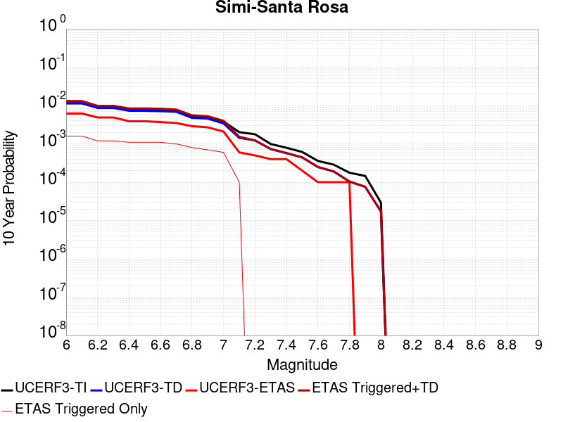 |

| Magnitude | 1 wk TI Prob | 1 wk TD Prob | 1 wk ETAS Prob | 1 wk ETAS/TD Gain | 1 wk ETAS Triggered+TD | 1 wk ETAS Triggered Only | 1 mo TI Prob | 1 mo TD Prob | 1 mo ETAS Prob | 1 mo ETAS/TD Gain | 1 mo ETAS Triggered+TD | 1 mo ETAS Triggered Only | 1 yr TI Prob | 1 yr TD Prob | 1 yr ETAS Prob | 1 yr ETAS/TD Gain | 1 yr ETAS Triggered+TD | 1 yr ETAS Triggered Only | 10 yr TI Prob | 10 yr TD Prob | 10 yr ETAS Prob | 10 yr ETAS/TD Gain | 10 yr ETAS Triggered+TD | 10 yr ETAS Triggered Only |
|-----|-----|-----|-----|-----|-----|-----|-----|-----|-----|-----|-----|-----|-----|-----|-----|-----|-----|-----|-----|-----|-----|-----|-----|-----|
| 6.0 | 2.198912E-5 | 2.2243956E-5 | 0.0 | 0.0 | 2.2243956E-5 | 0.0 | 9.4235686E-5 | 9.5328E-5 | 0.0 | 0.0 | 9.5328E-5 | 0.0 | 0.0011467156 | 0.0011600441 | 3.0E-4 | 0.25861084 | 0.0012599281 | 1.0E-4 | 0.011408163 | 0.011544323 | 0.0062 | 0.53706056 | 0.013125851 | 0.0016 |
| 6.1 | 2.198912E-5 | 2.2243956E-5 | 0.0 | 0.0 | 2.2243956E-5 | 0.0 | 9.4235686E-5 | 9.5328E-5 | 0.0 | 0.0 | 9.5328E-5 | 0.0 | 0.0011467156 | 0.0011600441 | 3.0E-4 | 0.25861084 | 0.0012599281 | 1.0E-4 | 0.011408163 | 0.011544323 | 0.0062 | 0.53706056 | 0.013125851 | 0.0016 |
| 6.2 | 1.69983E-5 | 1.6644291E-5 | 0.0 | 0.0 | 1.6644291E-5 | 0.0 | 7.284782E-5 | 7.133089E-5 | 0.0 | 0.0 | 7.133089E-5 | 0.0 | 8.865613E-4 | 8.6813665E-4 | 2.0E-4 | 0.23037848 | 9.6804986E-4 | 1.0E-4 | 0.008830327 | 0.008650365 | 0.0049 | 0.56645006 | 0.009839985 | 0.0012 |
| 6.3 | 1.69983E-5 | 1.6644291E-5 | 0.0 | 0.0 | 1.6644291E-5 | 0.0 | 7.284782E-5 | 7.133089E-5 | 0.0 | 0.0 | 7.133089E-5 | 0.0 | 8.865613E-4 | 8.6813665E-4 | 2.0E-4 | 0.23037848 | 9.6804986E-4 | 1.0E-4 | 0.008830327 | 0.008650365 | 0.0049 | 0.56645006 | 0.009839985 | 0.0012 |
| 6.4 | 1.4666188E-5 | 1.4031596E-5 | 0.0 | 0.0 | 1.4031596E-5 | 0.0 | 6.285358E-5 | 6.0134164E-5 | 0.0 | 0.0 | 6.0134164E-5 | 0.0 | 7.6497364E-4 | 7.319124E-4 | 2.0E-4 | 0.27325675 | 8.3183916E-4 | 1.0E-4 | 0.0076234564 | 0.0072974865 | 0.0039 | 0.5344306 | 0.008389459 | 0.0011 |
| 6.5 | 1.4666188E-5 | 1.4031596E-5 | 0.0 | 0.0 | 1.4031596E-5 | 0.0 | 6.285358E-5 | 6.0134164E-5 | 0.0 | 0.0 | 6.0134164E-5 | 0.0 | 7.6497364E-4 | 7.319124E-4 | 2.0E-4 | 0.27325675 | 8.3183916E-4 | 1.0E-4 | 0.0076234564 | 0.0072974865 | 0.0039 | 0.5344306 | 0.008389459 | 0.0011 |
| 6.6 | 1.4377586E-5 | 1.37090365E-5 | 0.0 | 0.0 | 1.37090365E-5 | 0.0 | 6.1616774E-5 | 5.875183E-5 | 0.0 | 0.0 | 5.875183E-5 | 0.0 | 7.4992597E-4 | 7.1509357E-4 | 2.0E-4 | 0.27968368 | 8.1502204E-4 | 1.0E-4 | 0.007474003 | 0.007130387 | 0.0037 | 0.51890594 | 0.008222544 | 0.0011 |
| 6.7 | 1.3881404E-5 | 1.3187798E-5 | 0.0 | 0.0 | 1.3187798E-5 | 0.0 | 5.9490372E-5 | 5.6518045E-5 | 0.0 | 0.0 | 5.6518045E-5 | 0.0 | 7.240546E-4 | 6.879146E-4 | 2.0E-4 | 0.29073375 | 7.878458E-4 | 1.0E-4 | 0.007217 | 0.0068602944 | 0.0035 | 0.5101822 | 0.007853434 | 0.001 |
| 6.8 | 1.0176516E-5 | 9.139751E-6 | 0.0 | 0.0 | 9.139751E-6 | 0.0 | 4.3612912E-5 | 3.9169863E-5 | 0.0 | 0.0 | 3.9169863E-5 | 0.0 | 5.308578E-4 | 4.7680526E-4 | 1.0E-4 | 0.20972922 | 4.7680526E-4 | 0.0 | 0.0052959146 | 0.004759451 | 0.0029 | 0.60931396 | 0.0055556432 | 8.0E-4 |
| 6.9 | 9.699797E-6 | 8.761137E-6 | 0.0 | 0.0 | 8.761137E-6 | 0.0 | 4.15699E-5 | 3.754728E-5 | 0.0 | 0.0 | 3.754728E-5 | 0.0 | 5.05996E-4 | 4.5705863E-4 | 1.0E-4 | 0.21879031 | 4.5705863E-4 | 0.0 | 0.005048454 | 0.0045627994 | 0.0027 | 0.59174204 | 0.005259605 | 7.0E-4 |
| 7.0 | 7.4049476E-6 | 6.549223E-6 | 0.0 | 0.0 | 6.549223E-6 | 0.0 | 3.1735104E-5 | 2.8067869E-5 | 0.0 | 0.0 | 2.8067869E-5 | 0.0 | 3.8630638E-4 | 3.416853E-4 | 0.0 | 0.0 | 3.416853E-4 | 0.0 | 0.0038563553 | 0.0034128383 | 0.0021 | 0.6153236 | 0.0040107905 | 6.0E-4 |
| 7.1 | 3.873439E-6 | 2.755057E-6 | 0.0 | 0.0 | 2.755057E-6 | 0.0 | 1.6600346E-5 | 1.1807336E-5 | 0.0 | 0.0 | 1.1807336E-5 | 0.0 | 2.0209046E-4 | 1.4374507E-4 | 0.0 | 0.0 | 1.4374507E-4 | 0.0 | 0.0020190678 | 0.0014365443 | 6.0E-4 | 0.41766897 | 0.0015364006 | 1.0E-4 |
| 7.2 | 3.417706E-6 | 2.3636594E-6 | 0.0 | 0.0 | 2.3636594E-6 | 0.0 | 1.4647229E-5 | 1.0129931E-5 | 0.0 | 0.0 | 1.0129931E-5 | 0.0 | 1.7831543E-4 | 1.2332515E-4 | 0.0 | 0.0 | 1.2332515E-4 | 0.0 | 0.0017817242 | 0.0012325894 | 5.0E-4 | 0.4056501 | 0.0012325894 | 0.0 |
| 7.3 | 1.90225E-6 | 1.4045734E-6 | 0.0 | 0.0 | 1.4045734E-6 | 0.0 | 8.152474E-6 | 6.0195866E-6 | 0.0 | 0.0 | 6.0195866E-6 | 0.0 | 9.9251854E-5 | 7.328602E-5 | 0.0 | 0.0 | 7.328602E-5 | 0.0 | 9.920754E-4 | 7.326208E-4 | 4.0E-4 | 0.54598504 | 7.326208E-4 | 0.0 |
| 7.4 | 1.5170556E-6 | 1.1000865E-6 | 0.0 | 0.0 | 1.1000865E-6 | 0.0 | 6.5016507E-6 | 4.7146477E-6 | 0.0 | 0.0 | 4.7146477E-6 | 0.0 | 7.915472E-5 | 5.739934E-5 | 0.0 | 0.0 | 5.739934E-5 | 0.0 | 7.9126534E-4 | 5.738462E-4 | 4.0E-4 | 0.69705087 | 5.738462E-4 | 0.0 |
| 7.5 | 1.178732E-6 | 8.513654E-7 | 0.0 | 0.0 | 8.513654E-7 | 0.0 | 5.0516987E-6 | 3.6487038E-6 | 0.0 | 0.0 | 3.6487038E-6 | 0.0 | 6.1502695E-5 | 4.442207E-5 | 0.0 | 0.0 | 4.442207E-5 | 0.0 | 6.148568E-4 | 4.441329E-4 | 2.0E-4 | 0.45031568 | 4.441329E-4 | 0.0 |
| 7.6 | 6.8722386E-7 | 4.774306E-7 | 0.0 | 0.0 | 4.774306E-7 | 0.0 | 2.9452417E-6 | 2.0461296E-6 | 0.0 | 0.0 | 2.0461296E-6 | 0.0 | 3.5857727E-5 | 2.4911344E-5 | 0.0 | 0.0 | 2.4911344E-5 | 0.0 | 3.5851944E-4 | 2.4908563E-4 | 1.0E-4 | 0.40146834 | 2.4908563E-4 | 0.0 |
| 7.7 | 5.5126515E-7 | 3.6551893E-7 | 0.0 | 0.0 | 3.6551893E-7 | 0.0 | 2.3625628E-6 | 1.5665088E-6 | 0.0 | 0.0 | 1.5665088E-6 | 0.0 | 2.8763823E-5 | 1.9072078E-5 | 0.0 | 0.0 | 1.9072078E-5 | 0.0 | 2.87601E-4 | 1.9070452E-4 | 1.0E-4 | 0.5243714 | 1.9070452E-4 | 0.0 |
| 7.8 | 3.3860243E-7 | 1.9957298E-7 | 0.0 | 0.0 | 1.9957298E-7 | 0.0 | 1.4511525E-6 | 8.5531246E-7 | 0.0 | 0.0 | 8.5531246E-7 | 0.0 | 1.7667637E-5 | 1.041338E-5 | 0.0 | 0.0 | 1.041338E-5 | 0.0 | 1.7666233E-4 | 1.0412897E-4 | 1.0E-4 | 0.9603475 | 1.0412897E-4 | 0.0 |
| 7.9 | 2.7955386E-7 | 1.454412E-7 | 0.0 | 0.0 | 1.454412E-7 | 0.0 | 1.1980875E-6 | 6.233193E-7 | 0.0 | 0.0 | 6.233193E-7 | 0.0 | 1.4586617E-5 | 7.5888865E-6 | 0.0 | 0.0 | 7.5888865E-6 | 0.0 | 1.458566E-4 | 7.588632E-5 | 0.0 | 0.0 | 7.588632E-5 | 0.0 |
| 8.0 | 5.6259015E-8 | 3.3173883E-8 | 0.0 | 0.0 | 3.3173883E-8 | 0.0 | 2.4111003E-7 | 1.4217377E-7 | 0.0 | 0.0 | 1.4217377E-7 | 0.0 | 2.9355108E-6 | 1.7309645E-6 | 0.0 | 0.0 | 1.7309645E-6 | 0.0 | 2.935472E-5 | 1.7309523E-5 | 0.0 | 0.0 | 1.7309523E-5 | 0.0 |

## Pittville 2011 CFM
*[(top)](#table-of-contents)*

| 1 Week | 1 Month | 1 Year | 10 Year |
|-----|-----|-----|-----|
|  | 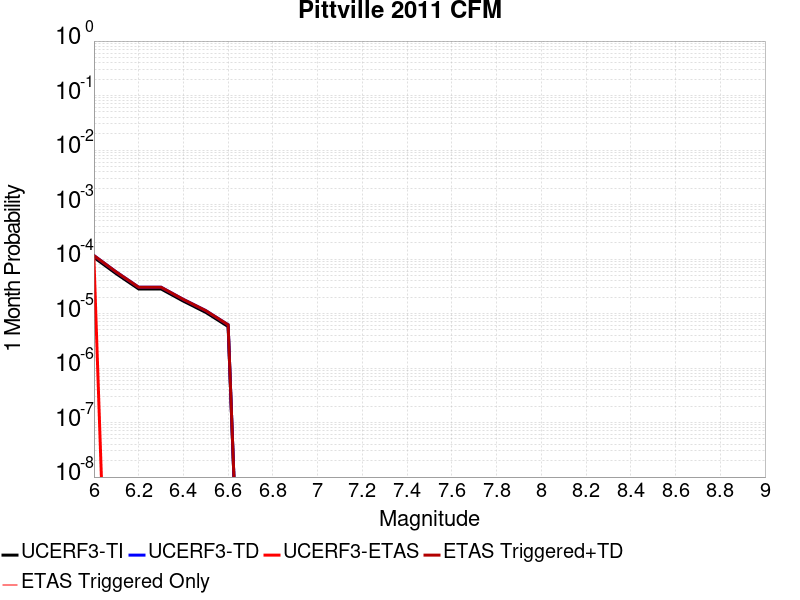 | 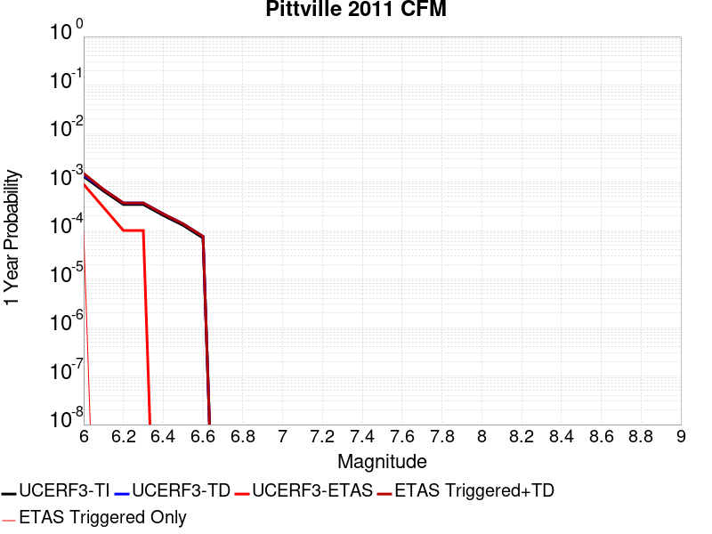 |  |

| Magnitude | 1 wk TI Prob | 1 wk TD Prob | 1 wk ETAS Prob | 1 wk ETAS/TD Gain | 1 wk ETAS Triggered+TD | 1 wk ETAS Triggered Only | 1 mo TI Prob | 1 mo TD Prob | 1 mo ETAS Prob | 1 mo ETAS/TD Gain | 1 mo ETAS Triggered+TD | 1 mo ETAS Triggered Only | 1 yr TI Prob | 1 yr TD Prob | 1 yr ETAS Prob | 1 yr ETAS/TD Gain | 1 yr ETAS Triggered+TD | 1 yr ETAS Triggered Only | 10 yr TI Prob | 10 yr TD Prob | 10 yr ETAS Prob | 10 yr ETAS/TD Gain | 10 yr ETAS Triggered+TD | 10 yr ETAS Triggered Only |
|-----|-----|-----|-----|-----|-----|-----|-----|-----|-----|-----|-----|-----|-----|-----|-----|-----|-----|-----|-----|-----|-----|-----|-----|-----|
| 6.0 | 2.5031832E-5 | 2.703412E-5 | 0.0 | 0.0 | 2.703412E-5 | 0.0 | 1.0727487E-4 | 1.1585592E-4 | 1.0E-4 | 0.86314106 | 1.1585592E-4 | 0.0 | 0.001305289 | 0.0014097303 | 9.0E-4 | 0.63842 | 0.0015095894 | 1.0E-4 | 0.012976485 | 0.014017642 | 0.0085 | 0.60637873 | 0.015496615 | 0.0015 |
| 6.1 | 1.2540113E-5 | 1.35021255E-5 | 0.0 | 0.0 | 1.35021255E-5 | 0.0 | 5.3742235E-5 | 5.7865094E-5 | 0.0 | 0.0 | 5.7865094E-5 | 0.0 | 6.541153E-4 | 7.043023E-4 | 3.0E-4 | 0.42595348 | 7.043023E-4 | 0.0 | 0.0065219323 | 0.0070229317 | 0.0048 | 0.68347526 | 0.007916611 | 9.0E-4 |
| 6.2 | 6.603218E-6 | 7.1015293E-6 | 0.0 | 0.0 | 7.1015293E-6 | 0.0 | 2.8299199E-5 | 3.0434807E-5 | 0.0 | 0.0 | 3.0434807E-5 | 0.0 | 3.4448825E-4 | 3.7048725E-4 | 1.0E-4 | 0.2699148 | 3.7048725E-4 | 0.0 | 0.0034395473 | 0.0036993357 | 0.0033 | 0.89205205 | 0.004097856 | 4.0E-4 |
| 6.3 | 6.603218E-6 | 7.1015293E-6 | 0.0 | 0.0 | 7.1015293E-6 | 0.0 | 2.8299199E-5 | 3.0434807E-5 | 0.0 | 0.0 | 3.0434807E-5 | 0.0 | 3.4448825E-4 | 3.7048725E-4 | 1.0E-4 | 0.2699148 | 3.7048725E-4 | 0.0 | 0.0034395473 | 0.0036993357 | 0.0033 | 0.89205205 | 0.004097856 | 4.0E-4 |
| 6.4 | 3.9389015E-6 | 4.2358033E-6 | 0.0 | 0.0 | 4.2358033E-6 | 0.0 | 1.6880897E-5 | 1.8153334E-5 | 0.0 | 0.0 | 1.8153334E-5 | 0.0 | 2.0550552E-4 | 2.2099752E-4 | 0.0 | 0.0 | 2.2099752E-4 | 0.0 | 0.0020531558 | 0.002208082 | 0.0019 | 0.8604753 | 0.0024076402 | 2.0E-4 |
| 6.5 | 2.4533072E-6 | 2.6391572E-6 | 0.0 | 0.0 | 2.6391572E-6 | 0.0 | 1.0514132E-5 | 1.1310636E-5 | 0.0 | 0.0 | 1.1310636E-5 | 0.0 | 1.2800204E-4 | 1.3770022E-4 | 0.0 | 0.0 | 1.3770022E-4 | 0.0 | 0.0012792832 | 0.0013763389 | 0.0013 | 0.94453484 | 0.0015760636 | 2.0E-4 |
| 6.6 | 1.3482367E-6 | 1.4518153E-6 | 0.0 | 0.0 | 1.4518153E-6 | 0.0 | 5.778144E-6 | 6.2220565E-6 | 0.0 | 0.0 | 6.2220565E-6 | 0.0 | 7.0346636E-5 | 7.575204E-5 | 0.0 | 0.0 | 7.575204E-5 | 0.0 | 7.032437E-4 | 7.5737305E-4 | 9.0E-4 | 1.1883179 | 9.572216E-4 | 2.0E-4 |

## Cleghorn
*[(top)](#table-of-contents)*

| 1 Week | 1 Month | 1 Year | 10 Year |
|-----|-----|-----|-----|
|  |  | 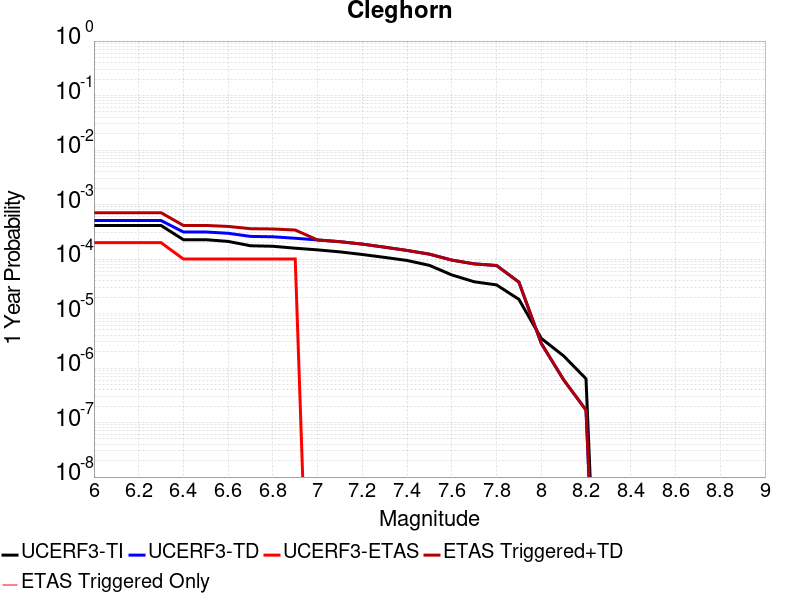 | 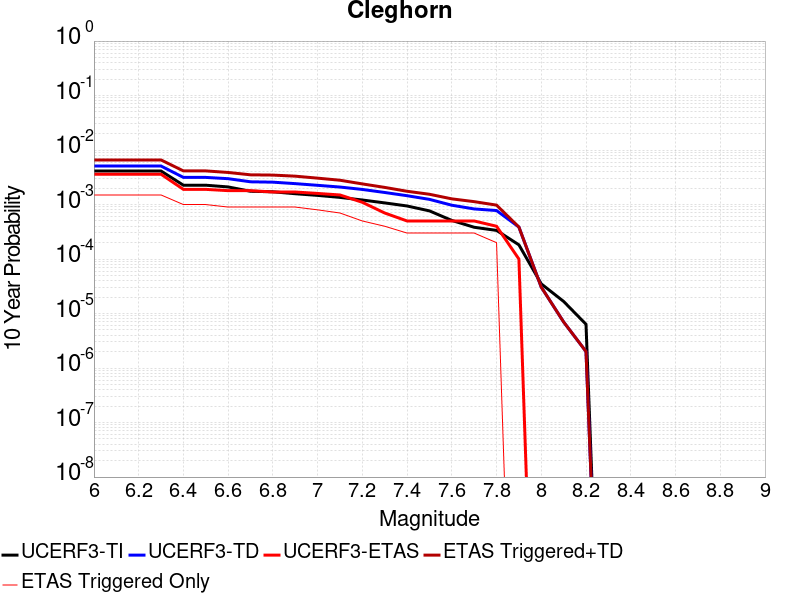 |

| Magnitude | 1 wk TI Prob | 1 wk TD Prob | 1 wk ETAS Prob | 1 wk ETAS/TD Gain | 1 wk ETAS Triggered+TD | 1 wk ETAS Triggered Only | 1 mo TI Prob | 1 mo TD Prob | 1 mo ETAS Prob | 1 mo ETAS/TD Gain | 1 mo ETAS Triggered+TD | 1 mo ETAS Triggered Only | 1 yr TI Prob | 1 yr TD Prob | 1 yr ETAS Prob | 1 yr ETAS/TD Gain | 1 yr ETAS Triggered+TD | 1 yr ETAS Triggered Only | 10 yr TI Prob | 10 yr TD Prob | 10 yr ETAS Prob | 10 yr ETAS/TD Gain | 10 yr ETAS Triggered+TD | 10 yr ETAS Triggered Only |
|-----|-----|-----|-----|-----|-----|-----|-----|-----|-----|-----|-----|-----|-----|-----|-----|-----|-----|-----|-----|-----|-----|-----|-----|-----|
| 6.0 | 7.9267165E-6 | 9.749158E-6 | 0.0 | 0.0 | 9.749158E-6 | 0.0 | 3.39712E-5 | 4.17815E-5 | 0.0 | 0.0 | 4.17815E-5 | 0.0 | 4.1352084E-4 | 5.0858164E-4 | 2.0E-4 | 0.39325055 | 7.084799E-4 | 2.0E-4 | 0.004127522 | 0.0050905296 | 0.0036 | 0.70719564 | 0.0065828934 | 0.0015 |
| 6.1 | 7.9267165E-6 | 9.749158E-6 | 0.0 | 0.0 | 9.749158E-6 | 0.0 | 3.39712E-5 | 4.17815E-5 | 0.0 | 0.0 | 4.17815E-5 | 0.0 | 4.1352084E-4 | 5.0858164E-4 | 2.0E-4 | 0.39325055 | 7.084799E-4 | 2.0E-4 | 0.004127522 | 0.0050905296 | 0.0036 | 0.70719564 | 0.0065828934 | 0.0015 |
| 6.2 | 7.9267165E-6 | 9.749158E-6 | 0.0 | 0.0 | 9.749158E-6 | 0.0 | 3.39712E-5 | 4.17815E-5 | 0.0 | 0.0 | 4.17815E-5 | 0.0 | 4.1352084E-4 | 5.0858164E-4 | 2.0E-4 | 0.39325055 | 7.084799E-4 | 2.0E-4 | 0.004127522 | 0.0050905296 | 0.0036 | 0.70719564 | 0.0065828934 | 0.0015 |
| 6.3 | 7.9267165E-6 | 9.749158E-6 | 0.0 | 0.0 | 9.749158E-6 | 0.0 | 3.39712E-5 | 4.17815E-5 | 0.0 | 0.0 | 4.17815E-5 | 0.0 | 4.1352084E-4 | 5.0858164E-4 | 2.0E-4 | 0.39325055 | 7.084799E-4 | 2.0E-4 | 0.004127522 | 0.0050905296 | 0.0036 | 0.70719564 | 0.0065828934 | 0.0015 |
| 6.4 | 4.3445207E-6 | 6.010741E-6 | 0.0 | 0.0 | 6.010741E-6 | 0.0 | 1.8619241E-5 | 2.576007E-5 | 0.0 | 0.0 | 2.576007E-5 | 0.0 | 2.2666567E-4 | 3.1358472E-4 | 1.0E-4 | 0.31889307 | 4.1355335E-4 | 1.0E-4 | 0.0022643462 | 0.003146855 | 0.0019 | 0.6037774 | 0.0041437084 | 0.001 |
| 6.5 | 4.3445207E-6 | 6.010741E-6 | 0.0 | 0.0 | 6.010741E-6 | 0.0 | 1.8619241E-5 | 2.576007E-5 | 0.0 | 0.0 | 2.576007E-5 | 0.0 | 2.2666567E-4 | 3.1358472E-4 | 1.0E-4 | 0.31889307 | 4.1355335E-4 | 1.0E-4 | 0.0022643462 | 0.003146855 | 0.0019 | 0.6037774 | 0.0041437084 | 0.001 |
| 6.6 | 4.040109E-6 | 5.693292E-6 | 0.0 | 0.0 | 5.693292E-6 | 0.0 | 1.7314638E-5 | 2.43996E-5 | 0.0 | 0.0 | 2.43996E-5 | 0.0 | 2.1078532E-4 | 2.9702557E-4 | 1.0E-4 | 0.33667135 | 3.9699586E-4 | 1.0E-4 | 0.002105855 | 0.0029817126 | 0.0018 | 0.6036799 | 0.003879029 | 9.0E-4 |
| 6.7 | 3.3632055E-6 | 4.9871064E-6 | 0.0 | 0.0 | 4.9871064E-6 | 0.0 | 1.4413658E-5 | 2.137314E-5 | 0.0 | 0.0 | 2.137314E-5 | 0.0 | 1.7547216E-4 | 2.6018723E-4 | 1.0E-4 | 0.38433862 | 3.601612E-4 | 1.0E-4 | 0.0017533366 | 0.002614197 | 0.0018 | 0.6885479 | 0.0035118444 | 9.0E-4 |
| 6.8 | 3.2902772E-6 | 4.9090745E-6 | 0.0 | 0.0 | 4.9090745E-6 | 0.0 | 1.4101111E-5 | 2.1038722E-5 | 0.0 | 0.0 | 2.1038722E-5 | 0.0 | 1.716675E-4 | 2.5611665E-4 | 1.0E-4 | 0.39044708 | 3.5609104E-4 | 1.0E-4 | 0.0017153495 | 0.0025735858 | 0.0017 | 0.6605569 | 0.0034712697 | 9.0E-4 |
| 6.9 | 3.031547E-6 | 4.6112386E-6 | 0.0 | 0.0 | 4.6112386E-6 | 0.0 | 1.299228E-5 | 1.9762303E-5 | 0.0 | 0.0 | 1.9762303E-5 | 0.0 | 1.5816953E-4 | 2.4057974E-4 | 1.0E-4 | 0.41566262 | 3.4055568E-4 | 1.0E-4 | 0.00158057 | 0.002418562 | 0.0017 | 0.70289695 | 0.0033163854 | 9.0E-4 |
| 7.0 | 2.8259715E-6 | 4.291993E-6 | 0.0 | 0.0 | 4.291993E-6 | 0.0 | 1.211125E-5 | 1.8394127E-5 | 0.0 | 0.0 | 1.8394127E-5 | 0.0 | 1.4744449E-4 | 2.2392572E-4 | 0.0 | 0.0 | 2.2392572E-4 | 0.0 | 0.001473467 | 0.002252369 | 0.0016 | 0.7103632 | 0.003050567 | 8.0E-4 |
| 7.1 | 2.5962665E-6 | 3.9879E-6 | 0.0 | 0.0 | 3.9879E-6 | 0.0 | 1.1126809E-5 | 1.709089E-5 | 0.0 | 0.0 | 1.709089E-5 | 0.0 | 1.3546048E-4 | 2.0806193E-4 | 0.0 | 0.0 | 2.0806193E-4 | 0.0 | 0.0013537793 | 0.0020940474 | 0.0015 | 0.71631616 | 0.0027925815 | 7.0E-4 |
| 7.2 | 2.3247253E-6 | 3.5995272E-6 | 0.0 | 0.0 | 3.5995272E-6 | 0.0 | 9.96307E-6 | 1.5426454E-5 | 0.0 | 0.0 | 1.5426454E-5 | 0.0 | 1.21293626E-4 | 1.8780108E-4 | 0.0 | 0.0 | 1.8780108E-4 | 0.0 | 0.0012122744 | 0.0018918219 | 0.0011 | 0.5814501 | 0.002390876 | 5.0E-4 |
| 7.3 | 2.056928E-6 | 3.1607108E-6 | 0.0 | 0.0 | 3.1607108E-6 | 0.0 | 8.815376E-6 | 1.3545834E-5 | 0.0 | 0.0 | 1.3545834E-5 | 0.0 | 1.0732192E-4 | 1.649082E-4 | 0.0 | 0.0 | 1.649082E-4 | 0.0 | 0.001072701 | 0.0016633242 | 7.0E-4 | 0.420844 | 0.0020626588 | 4.0E-4 |
| 7.4 | 1.8055999E-6 | 2.7537358E-6 | 0.0 | 0.0 | 2.7537358E-6 | 0.0 | 7.738263E-6 | 1.1801672E-5 | 0.0 | 0.0 | 1.1801672E-5 | 0.0 | 9.4209274E-5 | 1.4367602E-4 | 0.0 | 0.0 | 1.4367602E-4 | 0.0 | 9.4169343E-4 | 0.0014514376 | 5.0E-4 | 0.34448603 | 0.0017510022 | 3.0E-4 |
| 7.5 | 1.4683443E-6 | 2.3541588E-6 | 0.0 | 0.0 | 2.3541588E-6 | 0.0 | 6.292889E-6 | 1.0089214E-5 | 0.0 | 0.0 | 1.0089214E-5 | 0.0 | 7.661323E-5 | 1.2282934E-4 | 0.0 | 0.0 | 1.2282934E-4 | 0.0 | 7.658682E-4 | 0.0012432557 | 5.0E-4 | 0.40216988 | 0.0015428826 | 3.0E-4 |
| 7.6 | 9.804088E-7 | 1.8304524E-6 | 0.0 | 0.0 | 1.8304524E-6 | 0.0 | 4.201745E-6 | 7.844773E-6 | 0.0 | 0.0 | 7.844773E-6 | 0.0 | 5.1155046E-5 | 9.5505966E-5 | 0.0 | 0.0 | 9.5505966E-5 | 0.0 | 5.114327E-4 | 9.703182E-4 | 5.0E-4 | 0.51529485 | 0.0012700271 | 3.0E-4 |
| 7.7 | 7.3434086E-7 | 1.5593936E-6 | 0.0 | 0.0 | 1.5593936E-6 | 0.0 | 3.1471714E-6 | 6.683098E-6 | 0.0 | 0.0 | 6.683098E-6 | 0.0 | 3.831614E-5 | 8.136371E-5 | 0.0 | 0.0 | 8.136371E-5 | 0.0 | 3.8309532E-4 | 8.2903623E-4 | 5.0E-4 | 0.60310996 | 0.0011287875 | 3.0E-4 |
| 7.8 | 6.434184E-7 | 1.4552913E-6 | 0.0 | 0.0 | 1.4552913E-6 | 0.0 | 2.7575045E-6 | 6.236948E-6 | 0.0 | 0.0 | 6.236948E-6 | 0.0 | 3.35721E-5 | 7.593222E-5 | 0.0 | 0.0 | 7.593222E-5 | 0.0 | 3.3567028E-4 | 7.743781E-4 | 4.0E-4 | 0.5165435 | 9.7422325E-4 | 2.0E-4 |
| 7.9 | 3.4943926E-7 | 7.2015865E-7 | 0.0 | 0.0 | 7.2015865E-7 | 0.0 | 1.497596E-6 | 3.0863905E-6 | 0.0 | 0.0 | 3.0863905E-6 | 0.0 | 1.8233079E-5 | 3.7576167E-5 | 0.0 | 0.0 | 3.7576167E-5 | 0.0 | 1.8231584E-4 | 3.8507476E-4 | 1.0E-4 | 0.25968984 | 3.8507476E-4 | 0.0 |
| 8.0 | 6.717524E-8 | 5.375388E-8 | 0.0 | 0.0 | 5.375388E-8 | 0.0 | 2.8789387E-7 | 2.3037374E-7 | 0.0 | 0.0 | 2.3037374E-7 | 0.0 | 3.505102E-6 | 2.8047968E-6 | 0.0 | 0.0 | 2.8047968E-6 | 0.0 | 3.5050467E-5 | 3.0233154E-5 | 0.0 | 0.0 | 3.0233154E-5 | 0.0 |
| 8.1 | 3.1984914E-8 | 1.14456675E-8 | 0.0 | 0.0 | 1.14456675E-8 | 0.0 | 1.370782E-7 | 4.9052858E-8 | 0.0 | 0.0 | 4.9052858E-8 | 0.0 | 1.6689258E-6 | 5.972184E-7 | 0.0 | 0.0 | 5.972184E-7 | 0.0 | 1.6689133E-5 | 6.8908034E-6 | 0.0 | 0.0 | 6.8908034E-6 | 0.0 |
| 8.2 | 1.21887656E-8 | 3.1833332E-9 | 0.0 | 0.0 | 3.1833332E-9 | 0.0 | 5.2237567E-8 | 1.3642856E-8 | 0.0 | 0.0 | 1.3642856E-8 | 0.0 | 6.359922E-7 | 1.6610176E-7 | 0.0 | 0.0 | 1.6610176E-7 | 0.0 | 6.3599036E-6 | 1.9769184E-6 | 0.0 | 0.0 | 1.9769184E-6 | 0.0 |

## West Tahoe
*[(top)](#table-of-contents)*

| 1 Week | 1 Month | 1 Year | 10 Year |
|-----|-----|-----|-----|
|  |  |  | 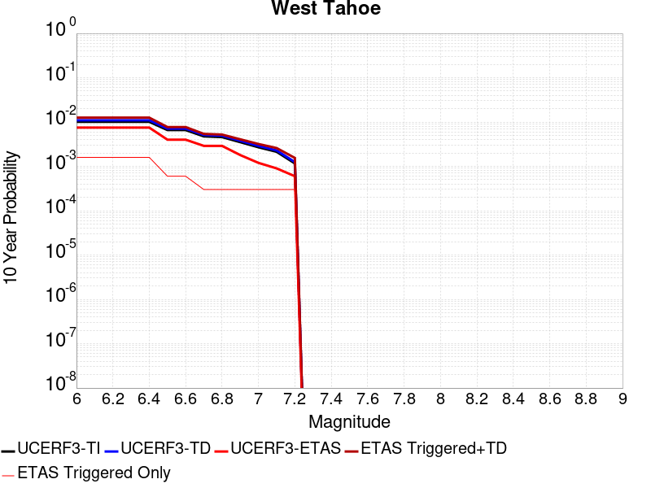 |

| Magnitude | 1 wk TI Prob | 1 wk TD Prob | 1 wk ETAS Prob | 1 wk ETAS/TD Gain | 1 wk ETAS Triggered+TD | 1 wk ETAS Triggered Only | 1 mo TI Prob | 1 mo TD Prob | 1 mo ETAS Prob | 1 mo ETAS/TD Gain | 1 mo ETAS Triggered+TD | 1 mo ETAS Triggered Only | 1 yr TI Prob | 1 yr TD Prob | 1 yr ETAS Prob | 1 yr ETAS/TD Gain | 1 yr ETAS Triggered+TD | 1 yr ETAS Triggered Only | 10 yr TI Prob | 10 yr TD Prob | 10 yr ETAS Prob | 10 yr ETAS/TD Gain | 10 yr ETAS Triggered+TD | 10 yr ETAS Triggered Only |
|-----|-----|-----|-----|-----|-----|-----|-----|-----|-----|-----|-----|-----|-----|-----|-----|-----|-----|-----|-----|-----|-----|-----|-----|-----|
| 6.0 | 1.952444E-5 | 2.1164358E-5 | 0.0 | 0.0 | 2.1164358E-5 | 0.0 | 8.367348E-5 | 9.070154E-5 | 1.0E-4 | 1.102517 | 9.070154E-5 | 0.0 | 0.0010182485 | 0.0011037865 | 0.0011 | 0.9965696 | 0.0011037865 | 0.0 | 0.010135954 | 0.010988515 | 0.0075 | 0.6825308 | 0.012570933 | 0.0016 |
| 6.1 | 1.952444E-5 | 2.1164358E-5 | 0.0 | 0.0 | 2.1164358E-5 | 0.0 | 8.367348E-5 | 9.070154E-5 | 1.0E-4 | 1.102517 | 9.070154E-5 | 0.0 | 0.0010182485 | 0.0011037865 | 0.0011 | 0.9965696 | 0.0011037865 | 0.0 | 0.010135954 | 0.010988515 | 0.0075 | 0.6825308 | 0.012570933 | 0.0016 |
| 6.2 | 1.952444E-5 | 2.1164358E-5 | 0.0 | 0.0 | 2.1164358E-5 | 0.0 | 8.367348E-5 | 9.070154E-5 | 1.0E-4 | 1.102517 | 9.070154E-5 | 0.0 | 0.0010182485 | 0.0011037865 | 0.0011 | 0.9965696 | 0.0011037865 | 0.0 | 0.010135954 | 0.010988515 | 0.0075 | 0.6825308 | 0.012570933 | 0.0016 |
| 6.3 | 1.952444E-5 | 2.1164358E-5 | 0.0 | 0.0 | 2.1164358E-5 | 0.0 | 8.367348E-5 | 9.070154E-5 | 1.0E-4 | 1.102517 | 9.070154E-5 | 0.0 | 0.0010182485 | 0.0011037865 | 0.0011 | 0.9965696 | 0.0011037865 | 0.0 | 0.010135954 | 0.010988515 | 0.0075 | 0.6825308 | 0.012570933 | 0.0016 |
| 6.4 | 1.952444E-5 | 2.1164358E-5 | 0.0 | 0.0 | 2.1164358E-5 | 0.0 | 8.367348E-5 | 9.070154E-5 | 1.0E-4 | 1.102517 | 9.070154E-5 | 0.0 | 0.0010182485 | 0.0011037865 | 0.0011 | 0.9965696 | 0.0011037865 | 0.0 | 0.010135954 | 0.010988515 | 0.0075 | 0.6825308 | 0.012570933 | 0.0016 |
| 6.5 | 1.2685271E-5 | 1.3679295E-5 | 0.0 | 0.0 | 1.3679295E-5 | 0.0 | 5.4364315E-5 | 5.8624326E-5 | 0.0 | 0.0 | 5.8624326E-5 | 0.0 | 6.616845E-4 | 7.1353384E-4 | 5.0E-4 | 0.7007376 | 7.1353384E-4 | 0.0 | 0.0065971776 | 0.007114075 | 0.004 | 0.56226563 | 0.007709807 | 6.0E-4 |
| 6.6 | 1.2685271E-5 | 1.3679295E-5 | 0.0 | 0.0 | 1.3679295E-5 | 0.0 | 5.4364315E-5 | 5.8624326E-5 | 0.0 | 0.0 | 5.8624326E-5 | 0.0 | 6.616845E-4 | 7.1353384E-4 | 5.0E-4 | 0.7007376 | 7.1353384E-4 | 0.0 | 0.0065971776 | 0.007114075 | 0.004 | 0.56226563 | 0.007709807 | 6.0E-4 |
| 6.7 | 9.117886E-6 | 9.802075E-6 | 0.0 | 0.0 | 9.802075E-6 | 0.0 | 3.9076072E-5 | 4.2008254E-5 | 0.0 | 0.0 | 4.2008254E-5 | 0.0 | 4.756473E-4 | 5.1133765E-4 | 4.0E-4 | 0.78226197 | 5.1133765E-4 | 0.0 | 0.0047463053 | 0.0051023276 | 0.0029 | 0.5683681 | 0.005400797 | 3.0E-4 |
| 6.8 | 8.786828E-6 | 9.450323E-6 | 0.0 | 0.0 | 9.450323E-6 | 0.0 | 3.7657293E-5 | 4.0500796E-5 | 0.0 | 0.0 | 4.0500796E-5 | 0.0 | 4.5838108E-4 | 4.9299264E-4 | 4.0E-4 | 0.81137115 | 4.9299264E-4 | 0.0 | 0.0045743673 | 0.00491969 | 0.0029 | 0.58946806 | 0.005218214 | 3.0E-4 |
| 6.9 | 6.7562123E-6 | 7.258113E-6 | 0.0 | 0.0 | 7.258113E-6 | 0.0 | 2.8954875E-5 | 3.1105854E-5 | 0.0 | 0.0 | 3.1105854E-5 | 0.0 | 3.5246857E-4 | 3.786527E-4 | 3.0E-4 | 0.79228276 | 3.786527E-4 | 0.0 | 0.0035191004 | 0.0037805466 | 0.0018 | 0.47612163 | 0.004079412 | 3.0E-4 |
| 7.0 | 5.1792854E-6 | 5.562985E-6 | 0.0 | 0.0 | 5.562985E-6 | 0.0 | 2.2196748E-5 | 2.3841169E-5 | 0.0 | 0.0 | 2.3841169E-5 | 0.0 | 2.702119E-4 | 2.9023134E-4 | 2.0E-4 | 0.6891054 | 2.9023134E-4 | 0.0 | 0.0026988357 | 0.0028988977 | 0.0012 | 0.41395044 | 0.003198028 | 3.0E-4 |
| 7.1 | 4.090765E-6 | 4.3939826E-6 | 0.0 | 0.0 | 4.3939826E-6 | 0.0 | 1.7531731E-5 | 1.8831237E-5 | 0.0 | 0.0 | 1.8831237E-5 | 0.0 | 2.134279E-4 | 2.2924959E-4 | 2.0E-4 | 0.8724116 | 2.2924959E-4 | 0.0 | 0.0021322304 | 0.002290465 | 9.0E-4 | 0.39293334 | 0.0025897778 | 3.0E-4 |
| 7.2 | 2.2356758E-6 | 2.4004994E-6 | 0.0 | 0.0 | 2.4004994E-6 | 0.0 | 9.581432E-6 | 1.0287825E-5 | 0.0 | 0.0 | 1.0287825E-5 | 0.0 | 1.1664769E-4 | 1.2524896E-4 | 1.0E-4 | 0.7984098 | 1.2524896E-4 | 0.0 | 0.0011658648 | 0.0012519691 | 6.0E-4 | 0.47924504 | 0.0015515935 | 3.0E-4 |

## San Gabriel
*[(top)](#table-of-contents)*

| 1 Week | 1 Month | 1 Year | 10 Year |
|-----|-----|-----|-----|
| 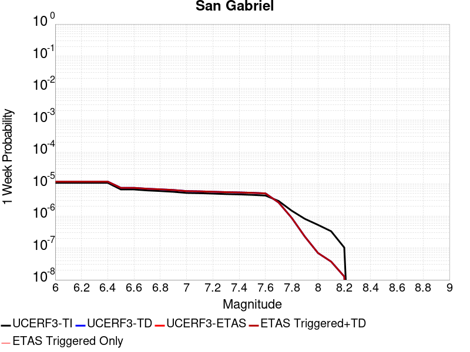 |  |  | 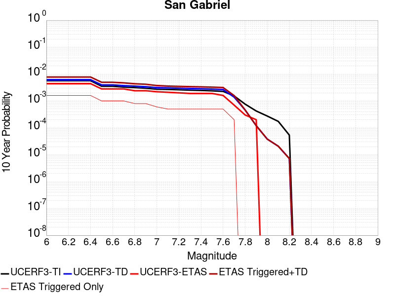 |

| Magnitude | 1 wk TI Prob | 1 wk TD Prob | 1 wk ETAS Prob | 1 wk ETAS/TD Gain | 1 wk ETAS Triggered+TD | 1 wk ETAS Triggered Only | 1 mo TI Prob | 1 mo TD Prob | 1 mo ETAS Prob | 1 mo ETAS/TD Gain | 1 mo ETAS Triggered+TD | 1 mo ETAS Triggered Only | 1 yr TI Prob | 1 yr TD Prob | 1 yr ETAS Prob | 1 yr ETAS/TD Gain | 1 yr ETAS Triggered+TD | 1 yr ETAS Triggered Only | 10 yr TI Prob | 10 yr TD Prob | 10 yr ETAS Prob | 10 yr ETAS/TD Gain | 10 yr ETAS Triggered+TD | 10 yr ETAS Triggered Only |
|-----|-----|-----|-----|-----|-----|-----|-----|-----|-----|-----|-----|-----|-----|-----|-----|-----|-----|-----|-----|-----|-----|-----|-----|-----|
| 6.0 | 1.083775E-5 | 1.1801103E-5 | 0.0 | 0.0 | 1.1801103E-5 | 0.0 | 4.6446676E-5 | 5.057524E-5 | 0.0 | 0.0 | 5.057524E-5 | 0.0 | 5.653415E-4 | 6.155909E-4 | 6.0E-4 | 0.97467333 | 9.154062E-4 | 3.0E-4 | 0.0056390543 | 0.00615131 | 0.0044 | 0.7152948 | 0.007741468 | 0.0016 |
| 6.1 | 1.083775E-5 | 1.1801103E-5 | 0.0 | 0.0 | 1.1801103E-5 | 0.0 | 4.6446676E-5 | 5.057524E-5 | 0.0 | 0.0 | 5.057524E-5 | 0.0 | 5.653415E-4 | 6.155909E-4 | 6.0E-4 | 0.97467333 | 9.154062E-4 | 3.0E-4 | 0.0056390543 | 0.00615131 | 0.0044 | 0.7152948 | 0.007741468 | 0.0016 |
| 6.2 | 1.083775E-5 | 1.1801103E-5 | 0.0 | 0.0 | 1.1801103E-5 | 0.0 | 4.6446676E-5 | 5.057524E-5 | 0.0 | 0.0 | 5.057524E-5 | 0.0 | 5.653415E-4 | 6.155909E-4 | 6.0E-4 | 0.97467333 | 9.154062E-4 | 3.0E-4 | 0.0056390543 | 0.00615131 | 0.0044 | 0.7152948 | 0.007741468 | 0.0016 |
| 6.3 | 1.083775E-5 | 1.1801103E-5 | 0.0 | 0.0 | 1.1801103E-5 | 0.0 | 4.6446676E-5 | 5.057524E-5 | 0.0 | 0.0 | 5.057524E-5 | 0.0 | 5.653415E-4 | 6.155909E-4 | 6.0E-4 | 0.97467333 | 9.154062E-4 | 3.0E-4 | 0.0056390543 | 0.00615131 | 0.0044 | 0.7152948 | 0.007741468 | 0.0016 |
| 6.4 | 1.083775E-5 | 1.1801103E-5 | 0.0 | 0.0 | 1.1801103E-5 | 0.0 | 4.6446676E-5 | 5.057524E-5 | 0.0 | 0.0 | 5.057524E-5 | 0.0 | 5.653415E-4 | 6.155909E-4 | 6.0E-4 | 0.97467333 | 9.154062E-4 | 3.0E-4 | 0.0056390543 | 0.00615131 | 0.0044 | 0.7152948 | 0.007741468 | 0.0016 |
| 6.5 | 6.7317824E-6 | 7.5346225E-6 | 0.0 | 0.0 | 7.5346225E-6 | 0.0 | 2.8850178E-5 | 3.2290845E-5 | 0.0 | 0.0 | 3.2290845E-5 | 0.0 | 3.511943E-4 | 3.9307112E-4 | 4.0E-4 | 1.0176275 | 4.930318E-4 | 1.0E-4 | 0.003506398 | 0.0039352155 | 0.0028 | 0.71152395 | 0.0049312804 | 0.001 |
| 6.6 | 6.7317824E-6 | 7.5346225E-6 | 0.0 | 0.0 | 7.5346225E-6 | 0.0 | 2.8850178E-5 | 3.2290845E-5 | 0.0 | 0.0 | 3.2290845E-5 | 0.0 | 3.511943E-4 | 3.9307112E-4 | 4.0E-4 | 1.0176275 | 4.930318E-4 | 1.0E-4 | 0.003506398 | 0.0039352155 | 0.0028 | 0.71152395 | 0.0049312804 | 0.001 |
| 6.7 | 6.274881E-6 | 7.063695E-6 | 0.0 | 0.0 | 7.063695E-6 | 0.0 | 2.6892068E-5 | 3.0272633E-5 | 0.0 | 0.0 | 3.0272633E-5 | 0.0 | 3.2736175E-4 | 3.685079E-4 | 4.0E-4 | 1.0854584 | 4.6847106E-4 | 1.0E-4 | 0.0032687993 | 0.0036904183 | 0.0028 | 0.75872153 | 0.004686728 | 0.001 |
| 6.8 | 5.996209E-6 | 6.7765077E-6 | 0.0 | 0.0 | 6.7765077E-6 | 0.0 | 2.5697784E-5 | 2.9041857E-5 | 0.0 | 0.0 | 2.9041857E-5 | 0.0 | 3.128256E-4 | 3.5352816E-4 | 4.0E-4 | 1.1314516 | 4.534928E-4 | 1.0E-4 | 0.003123856 | 0.0035411054 | 0.0024 | 0.67775446 | 0.0043382724 | 8.0E-4 |
| 6.9 | 5.686331E-6 | 6.4422247E-6 | 0.0 | 0.0 | 6.4422247E-6 | 0.0 | 2.4369761E-5 | 2.7609247E-5 | 0.0 | 0.0 | 2.7609247E-5 | 0.0 | 2.9666146E-4 | 3.3609162E-4 | 4.0E-4 | 1.1901517 | 4.36058E-4 | 1.0E-4 | 0.0029626573 | 0.0033672797 | 0.0024 | 0.71274155 | 0.004164586 | 8.0E-4 |
| 7.0 | 5.2329838E-6 | 5.966532E-6 | 0.0 | 0.0 | 5.966532E-6 | 0.0 | 2.242688E-5 | 2.5570605E-5 | 0.0 | 0.0 | 2.5570605E-5 | 0.0 | 2.7301308E-4 | 3.112784E-4 | 4.0E-4 | 1.2850235 | 4.1124725E-4 | 1.0E-4 | 0.002726779 | 0.003119858 | 0.0022 | 0.70516026 | 0.0037179862 | 6.0E-4 |
| 7.1 | 5.135671E-6 | 5.8570986E-6 | 0.0 | 0.0 | 5.8570986E-6 | 0.0 | 2.2009834E-5 | 2.5101614E-5 | 0.0 | 0.0 | 2.5101614E-5 | 0.0 | 2.6793676E-4 | 3.0557E-4 | 3.0E-4 | 0.98177177 | 3.0557E-4 | 0.0 | 0.0026761394 | 0.003062933 | 0.0021 | 0.6856174 | 0.0035614015 | 5.0E-4 |
| 7.2 | 4.989062E-6 | 5.691239E-6 | 0.0 | 0.0 | 5.691239E-6 | 0.0 | 2.1381518E-5 | 2.4390802E-5 | 0.0 | 0.0 | 2.4390802E-5 | 0.0 | 2.6028889E-4 | 2.9691824E-4 | 2.0E-4 | 0.6735861 | 2.9691824E-4 | 0.0 | 0.0025998424 | 0.00297665 | 0.002 | 0.6718963 | 0.0034751617 | 5.0E-4 |
| 7.3 | 4.8219395E-6 | 5.5234627E-6 | 0.0 | 0.0 | 5.5234627E-6 | 0.0 | 2.0665291E-5 | 2.3671773E-5 | 0.0 | 0.0 | 2.3671773E-5 | 0.0 | 2.5157086E-4 | 2.8816643E-4 | 2.0E-4 | 0.69404334 | 2.8816643E-4 | 0.0 | 0.0025128627 | 0.0028893626 | 0.0019 | 0.6575845 | 0.003387918 | 5.0E-4 |
| 7.4 | 4.7118383E-6 | 5.4126326E-6 | 0.0 | 0.0 | 5.4126326E-6 | 0.0 | 2.0193436E-5 | 2.3196795E-5 | 0.0 | 0.0 | 2.3196795E-5 | 0.0 | 2.4582737E-4 | 2.823851E-4 | 2.0E-4 | 0.70825267 | 2.823851E-4 | 0.0 | 0.002455556 | 0.0028316968 | 0.0019 | 0.6709758 | 0.003330281 | 5.0E-4 |
| 7.5 | 4.5506545E-6 | 5.2588725E-6 | 0.0 | 0.0 | 5.2588725E-6 | 0.0 | 1.9502659E-5 | 2.2537834E-5 | 0.0 | 0.0 | 2.2537834E-5 | 0.0 | 2.37419E-4 | 2.7436428E-4 | 2.0E-4 | 0.72895783 | 2.7436428E-4 | 0.0 | 0.002371655 | 0.0027516887 | 0.0019 | 0.69048506 | 0.003250313 | 5.0E-4 |
| 7.6 | 4.343636E-6 | 5.053188E-6 | 0.0 | 0.0 | 5.053188E-6 | 0.0 | 1.861545E-5 | 2.1656344E-5 | 0.0 | 0.0 | 2.1656344E-5 | 0.0 | 2.2661954E-4 | 2.636348E-4 | 2.0E-4 | 0.75862515 | 2.636348E-4 | 0.0 | 0.0022638857 | 0.0026446441 | 0.0016 | 0.6049963 | 0.0031433217 | 5.0E-4 |
| 7.7 | 2.936235E-6 | 2.6242813E-6 | 0.0 | 0.0 | 2.6242813E-6 | 0.0 | 1.2583803E-5 | 1.1246871E-5 | 0.0 | 0.0 | 1.1246871E-5 | 0.0 | 1.5319703E-4 | 1.3692208E-4 | 1.0E-4 | 0.7303424 | 1.3692208E-4 | 0.0 | 0.0015309147 | 0.0013752662 | 7.0E-4 | 0.5089923 | 0.0015749913 | 2.0E-4 |
| 7.8 | 1.4541639E-6 | 8.626959E-7 | 0.0 | 0.0 | 8.626959E-7 | 0.0 | 6.232116E-6 | 3.6972629E-6 | 0.0 | 0.0 | 3.6972629E-6 | 0.0 | 7.587337E-5 | 4.5013247E-5 | 1.0E-4 | 2.221568 | 4.5013247E-5 | 0.0 | 7.584747E-4 | 4.5455978E-4 | 3.0E-4 | 0.6599792 | 4.5455978E-4 | 0.0 |
| 7.9 | 8.098958E-7 | 2.2213146E-7 | 0.0 | 0.0 | 2.2213146E-7 | 0.0 | 3.4709774E-6 | 9.519916E-7 | 0.0 | 0.0 | 9.519916E-7 | 0.0 | 4.225833E-5 | 1.1590436E-5 | 1.0E-4 | 8.627803 | 1.1590436E-5 | 0.0 | 4.2250296E-4 | 1.1864942E-4 | 2.0E-4 | 1.6856382 | 1.1864942E-4 | 0.0 |
| 8.0 | 5.2473234E-7 | 6.769211E-8 | 0.0 | 0.0 | 6.769211E-8 | 0.0 | 2.248851E-6 | 2.9010903E-7 | 0.0 | 0.0 | 2.9010903E-7 | 0.0 | 2.7379416E-5 | 3.5320716E-6 | 0.0 | 0.0 | 3.5320716E-6 | 0.0 | 2.7376044E-4 | 3.721192E-5 | 0.0 | 0.0 | 3.721192E-5 | 0.0 |
| 8.1 | 3.3162388E-7 | 3.6448405E-8 | 0.0 | 0.0 | 3.6448405E-8 | 0.0 | 1.4212444E-6 | 1.5620745E-7 | 0.0 | 0.0 | 1.5620745E-7 | 0.0 | 1.7303513E-5 | 1.9018239E-6 | 0.0 | 0.0 | 1.9018239E-6 | 0.0 | 1.7302166E-4 | 2.0197309E-5 | 0.0 | 0.0 | 2.0197309E-5 | 0.0 |
| 8.2 | 1.0235345E-7 | 1.2439834E-8 | 0.0 | 0.0 | 1.2439834E-8 | 0.0 | 4.3865757E-7 | 5.3313574E-8 | 0.0 | 0.0 | 5.3313574E-8 | 0.0 | 5.340643E-6 | 6.4909256E-7 | 0.0 | 0.0 | 6.4909256E-7 | 0.0 | 5.3405143E-5 | 7.038853E-6 | 0.0 | 0.0 | 7.038853E-6 | 0.0 |

## North Frontal  (East)
*[(top)](#table-of-contents)*

| 1 Week | 1 Month | 1 Year | 10 Year |
|-----|-----|-----|-----|
|  | 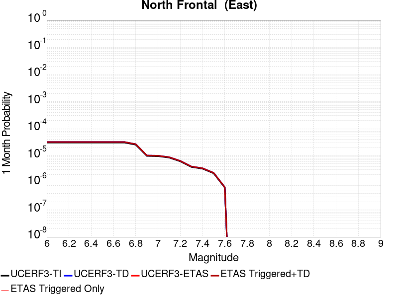 | 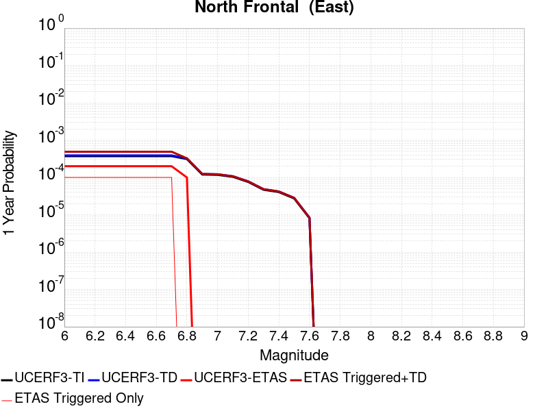 |  |

| Magnitude | 1 wk TI Prob | 1 wk TD Prob | 1 wk ETAS Prob | 1 wk ETAS/TD Gain | 1 wk ETAS Triggered+TD | 1 wk ETAS Triggered Only | 1 mo TI Prob | 1 mo TD Prob | 1 mo ETAS Prob | 1 mo ETAS/TD Gain | 1 mo ETAS Triggered+TD | 1 mo ETAS Triggered Only | 1 yr TI Prob | 1 yr TD Prob | 1 yr ETAS Prob | 1 yr ETAS/TD Gain | 1 yr ETAS Triggered+TD | 1 yr ETAS Triggered Only | 10 yr TI Prob | 10 yr TD Prob | 10 yr ETAS Prob | 10 yr ETAS/TD Gain | 10 yr ETAS Triggered+TD | 10 yr ETAS Triggered Only |
|-----|-----|-----|-----|-----|-----|-----|-----|-----|-----|-----|-----|-----|-----|-----|-----|-----|-----|-----|-----|-----|-----|-----|-----|-----|
| 6.0 | 7.135738E-6 | 7.473438E-6 | 0.0 | 0.0 | 7.473438E-6 | 0.0 | 3.0581377E-5 | 3.202874E-5 | 0.0 | 0.0 | 3.202874E-5 | 0.0 | 3.7226462E-4 | 3.8990006E-4 | 2.0E-4 | 0.51295197 | 4.8986106E-4 | 1.0E-4 | 0.0037164164 | 0.0038941153 | 0.0039 | 1.0015111 | 0.005487885 | 0.0016 |
| 6.1 | 7.135738E-6 | 7.473438E-6 | 0.0 | 0.0 | 7.473438E-6 | 0.0 | 3.0581377E-5 | 3.202874E-5 | 0.0 | 0.0 | 3.202874E-5 | 0.0 | 3.7226462E-4 | 3.8990006E-4 | 2.0E-4 | 0.51295197 | 4.8986106E-4 | 1.0E-4 | 0.0037164164 | 0.0038941153 | 0.0039 | 1.0015111 | 0.005487885 | 0.0016 |
| 6.2 | 7.135738E-6 | 7.473438E-6 | 0.0 | 0.0 | 7.473438E-6 | 0.0 | 3.0581377E-5 | 3.202874E-5 | 0.0 | 0.0 | 3.202874E-5 | 0.0 | 3.7226462E-4 | 3.8990006E-4 | 2.0E-4 | 0.51295197 | 4.8986106E-4 | 1.0E-4 | 0.0037164164 | 0.0038941153 | 0.0039 | 1.0015111 | 0.005487885 | 0.0016 |
| 6.3 | 7.135738E-6 | 7.473438E-6 | 0.0 | 0.0 | 7.473438E-6 | 0.0 | 3.0581377E-5 | 3.202874E-5 | 0.0 | 0.0 | 3.202874E-5 | 0.0 | 3.7226462E-4 | 3.8990006E-4 | 2.0E-4 | 0.51295197 | 4.8986106E-4 | 1.0E-4 | 0.0037164164 | 0.0038941153 | 0.0039 | 1.0015111 | 0.005487885 | 0.0016 |
| 6.4 | 7.135738E-6 | 7.473438E-6 | 0.0 | 0.0 | 7.473438E-6 | 0.0 | 3.0581377E-5 | 3.202874E-5 | 0.0 | 0.0 | 3.202874E-5 | 0.0 | 3.7226462E-4 | 3.8990006E-4 | 2.0E-4 | 0.51295197 | 4.8986106E-4 | 1.0E-4 | 0.0037164164 | 0.0038941153 | 0.0039 | 1.0015111 | 0.005487885 | 0.0016 |
| 6.5 | 7.135738E-6 | 7.473438E-6 | 0.0 | 0.0 | 7.473438E-6 | 0.0 | 3.0581377E-5 | 3.202874E-5 | 0.0 | 0.0 | 3.202874E-5 | 0.0 | 3.7226462E-4 | 3.8990006E-4 | 2.0E-4 | 0.51295197 | 4.8986106E-4 | 1.0E-4 | 0.0037164164 | 0.0038941153 | 0.0039 | 1.0015111 | 0.005487885 | 0.0016 |
| 6.6 | 7.135738E-6 | 7.473438E-6 | 0.0 | 0.0 | 7.473438E-6 | 0.0 | 3.0581377E-5 | 3.202874E-5 | 0.0 | 0.0 | 3.202874E-5 | 0.0 | 3.7226462E-4 | 3.8990006E-4 | 2.0E-4 | 0.51295197 | 4.8986106E-4 | 1.0E-4 | 0.0037164164 | 0.0038941153 | 0.0039 | 1.0015111 | 0.005487885 | 0.0016 |
| 6.7 | 7.135738E-6 | 7.473438E-6 | 0.0 | 0.0 | 7.473438E-6 | 0.0 | 3.0581377E-5 | 3.202874E-5 | 0.0 | 0.0 | 3.202874E-5 | 0.0 | 3.7226462E-4 | 3.8990006E-4 | 2.0E-4 | 0.51295197 | 4.8986106E-4 | 1.0E-4 | 0.0037164164 | 0.0038941153 | 0.0039 | 1.0015111 | 0.005487885 | 0.0016 |
| 6.8 | 5.959142E-6 | 6.2336476E-6 | 0.0 | 0.0 | 6.2336476E-6 | 0.0 | 2.553893E-5 | 2.6715461E-5 | 0.0 | 0.0 | 2.6715461E-5 | 0.0 | 3.108921E-4 | 3.2523024E-4 | 1.0E-4 | 0.3074745 | 3.2523024E-4 | 0.0 | 0.0031045752 | 0.003249314 | 0.0033 | 1.015599 | 0.00454509 | 0.0013 |
| 6.9 | 2.2946929E-6 | 2.3815082E-6 | 0.0 | 0.0 | 2.3815082E-6 | 0.0 | 9.834361E-6 | 1.0206426E-5 | 0.0 | 0.0 | 1.0206426E-5 | 0.0 | 1.1972676E-4 | 1.2425662E-4 | 0.0 | 0.0 | 1.2425662E-4 | 0.0 | 0.0011966228 | 0.001241918 | 9.0E-4 | 0.72468555 | 0.0015415454 | 3.0E-4 |
| 7.0 | 2.2468673E-6 | 2.3312286E-6 | 0.0 | 0.0 | 2.3312286E-6 | 0.0 | 9.629396E-6 | 9.990945E-6 | 0.0 | 0.0 | 9.990945E-6 | 0.0 | 1.1723159E-4 | 1.2163343E-4 | 0.0 | 0.0 | 1.2163343E-4 | 0.0 | 0.0011716976 | 0.0012157148 | 9.0E-4 | 0.7403052 | 0.0015153501 | 3.0E-4 |
| 7.1 | 1.9921076E-6 | 2.0638183E-6 | 0.0 | 0.0 | 2.0638183E-6 | 0.0 | 8.537577E-6 | 8.844909E-6 | 0.0 | 0.0 | 8.844909E-6 | 0.0 | 1.0394004E-4 | 1.0768187E-4 | 0.0 | 0.0 | 1.0768187E-4 | 0.0 | 0.0010389143 | 0.0010763396 | 7.0E-4 | 0.6503523 | 0.0012761244 | 2.0E-4 |
| 7.2 | 1.4524545E-6 | 1.5039516E-6 | 0.0 | 0.0 | 1.5039516E-6 | 0.0 | 6.2247905E-6 | 6.445492E-6 | 0.0 | 0.0 | 6.445492E-6 | 0.0 | 7.5784184E-5 | 7.847129E-5 | 0.0 | 0.0 | 7.847129E-5 | 0.0 | 7.575835E-4 | 7.844603E-4 | 6.0E-4 | 0.7648571 | 8.843818E-4 | 1.0E-4 |
| 7.3 | 8.9802575E-7 | 9.305173E-7 | 0.0 | 0.0 | 9.305173E-7 | 0.0 | 3.848676E-6 | 3.9879255E-6 | 0.0 | 0.0 | 3.9879255E-6 | 0.0 | 4.685662E-5 | 4.855203E-5 | 0.0 | 0.0 | 4.855203E-5 | 0.0 | 4.6846745E-4 | 4.854255E-4 | 3.0E-4 | 0.6180145 | 4.854255E-4 | 0.0 |
| 7.4 | 7.776139E-7 | 8.057397E-7 | 0.0 | 0.0 | 8.057397E-7 | 0.0 | 3.3326266E-6 | 3.4531663E-6 | 0.0 | 0.0 | 3.4531663E-6 | 0.0 | 4.0573974E-5 | 4.20416E-5 | 0.0 | 0.0 | 4.20416E-5 | 0.0 | 4.0566566E-4 | 4.203472E-4 | 2.0E-4 | 0.47579715 | 4.203472E-4 | 0.0 |
| 7.5 | 5.244417E-7 | 5.4390875E-7 | 0.0 | 0.0 | 5.4390875E-7 | 0.0 | 2.2476054E-6 | 2.3310358E-6 | 0.0 | 0.0 | 2.3310358E-6 | 0.0 | 2.7364253E-5 | 2.8380058E-5 | 0.0 | 0.0 | 2.8380058E-5 | 0.0 | 2.7360884E-4 | 2.8377085E-4 | 1.0E-4 | 0.35239702 | 2.8377085E-4 | 0.0 |
| 7.6 | 1.5489647E-7 | 1.6083001E-7 | 0.0 | 0.0 | 1.6083001E-7 | 0.0 | 6.6384183E-7 | 6.8927136E-7 | 0.0 | 0.0 | 6.8927136E-7 | 0.0 | 8.082245E-6 | 8.391868E-6 | 0.0 | 0.0 | 8.391868E-6 | 0.0 | 8.08195E-5 | 8.39175E-5 | 0.0 | 0.0 | 8.39175E-5 | 0.0 |

## Little Lake
*[(top)](#table-of-contents)*

| 1 Week | 1 Month | 1 Year | 10 Year |
|-----|-----|-----|-----|
|  |  |  | 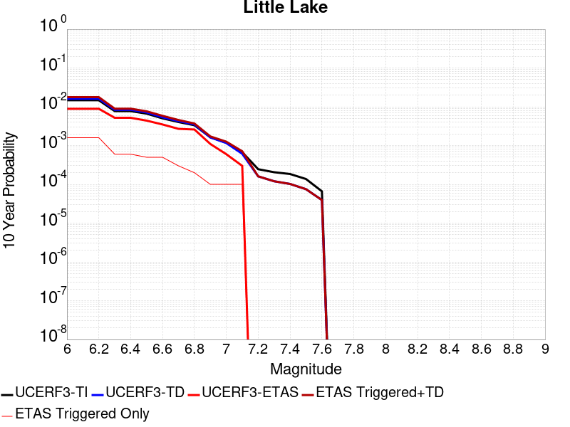 |

| Magnitude | 1 wk TI Prob | 1 wk TD Prob | 1 wk ETAS Prob | 1 wk ETAS/TD Gain | 1 wk ETAS Triggered+TD | 1 wk ETAS Triggered Only | 1 mo TI Prob | 1 mo TD Prob | 1 mo ETAS Prob | 1 mo ETAS/TD Gain | 1 mo ETAS Triggered+TD | 1 mo ETAS Triggered Only | 1 yr TI Prob | 1 yr TD Prob | 1 yr ETAS Prob | 1 yr ETAS/TD Gain | 1 yr ETAS Triggered+TD | 1 yr ETAS Triggered Only | 10 yr TI Prob | 10 yr TD Prob | 10 yr ETAS Prob | 10 yr ETAS/TD Gain | 10 yr ETAS Triggered+TD | 10 yr ETAS Triggered Only |
|-----|-----|-----|-----|-----|-----|-----|-----|-----|-----|-----|-----|-----|-----|-----|-----|-----|-----|-----|-----|-----|-----|-----|-----|-----|
| 6.0 | 2.8424427E-5 | 3.117113E-5 | 0.0 | 0.0 | 3.117113E-5 | 0.0 | 1.2181328E-4 | 1.3358446E-4 | 0.0 | 0.0 | 1.3358446E-4 | 0.0 | 0.0014820677 | 0.0016253103 | 4.0E-4 | 0.24610685 | 0.0018249853 | 2.0E-4 | 0.014722223 | 0.016147608 | 0.0089 | 0.5511652 | 0.017721772 | 0.0016 |
| 6.1 | 2.8424427E-5 | 3.117113E-5 | 0.0 | 0.0 | 3.117113E-5 | 0.0 | 1.2181328E-4 | 1.3358446E-4 | 0.0 | 0.0 | 1.3358446E-4 | 0.0 | 0.0014820677 | 0.0016253103 | 4.0E-4 | 0.24610685 | 0.0018249853 | 2.0E-4 | 0.014722223 | 0.016147608 | 0.0089 | 0.5511652 | 0.017721772 | 0.0016 |
| 6.2 | 2.8424427E-5 | 3.117113E-5 | 0.0 | 0.0 | 3.117113E-5 | 0.0 | 1.2181328E-4 | 1.3358446E-4 | 0.0 | 0.0 | 1.3358446E-4 | 0.0 | 0.0014820677 | 0.0016253103 | 4.0E-4 | 0.24610685 | 0.0018249853 | 2.0E-4 | 0.014722223 | 0.016147608 | 0.0089 | 0.5511652 | 0.017721772 | 0.0016 |
| 6.3 | 1.48860645E-5 | 1.6065283E-5 | 0.0 | 0.0 | 1.6065283E-5 | 0.0 | 6.379586E-5 | 6.884956E-5 | 0.0 | 0.0 | 6.884956E-5 | 0.0 | 7.7643775E-4 | 8.379491E-4 | 0.0 | 0.0 | 8.379491E-4 | 0.0 | 0.007737305 | 0.008350707 | 0.0052 | 0.62270176 | 0.008945697 | 6.0E-4 |
| 6.4 | 1.48860645E-5 | 1.6065283E-5 | 0.0 | 0.0 | 1.6065283E-5 | 0.0 | 6.379586E-5 | 6.884956E-5 | 0.0 | 0.0 | 6.884956E-5 | 0.0 | 7.7643775E-4 | 8.379491E-4 | 0.0 | 0.0 | 8.379491E-4 | 0.0 | 0.007737305 | 0.008350707 | 0.0052 | 0.62270176 | 0.008945697 | 6.0E-4 |
| 6.5 | 1.2797581E-5 | 1.3752088E-5 | 0.0 | 0.0 | 1.3752088E-5 | 0.0 | 5.4845623E-5 | 5.8936334E-5 | 0.0 | 0.0 | 5.8936334E-5 | 0.0 | 6.675408E-4 | 7.173393E-4 | 0.0 | 0.0 | 7.173393E-4 | 0.0 | 0.006655392 | 0.0071527823 | 0.0044 | 0.61514527 | 0.0076492056 | 5.0E-4 |
| 6.6 | 9.661896E-6 | 1.0279502E-5 | 0.0 | 0.0 | 1.0279502E-5 | 0.0 | 4.1407468E-5 | 4.405436E-5 | 0.0 | 0.0 | 4.405436E-5 | 0.0 | 5.040193E-4 | 5.36246E-4 | 0.0 | 0.0 | 5.36246E-4 | 0.0 | 0.005028777 | 0.005351122 | 0.0035 | 0.65406847 | 0.0058484464 | 5.0E-4 |
| 6.7 | 7.767871E-6 | 8.192401E-6 | 0.0 | 0.0 | 8.192401E-6 | 0.0 | 3.329045E-5 | 3.5109893E-5 | 0.0 | 0.0 | 3.5109893E-5 | 0.0 | 4.0523586E-4 | 4.2739284E-4 | 0.0 | 0.0 | 4.2739284E-4 | 0.0 | 0.004044977 | 0.0042670574 | 0.0027 | 0.63275456 | 0.0045657773 | 3.0E-4 |
| 6.8 | 6.4235196E-6 | 6.7298247E-6 | 0.0 | 0.0 | 6.7298247E-6 | 0.0 | 2.752908E-5 | 2.884186E-5 | 0.0 | 0.0 | 2.884186E-5 | 0.0 | 3.35115E-4 | 3.5110585E-4 | 0.0 | 0.0 | 3.5110585E-4 | 0.0 | 0.003346101 | 0.003506769 | 0.0026 | 0.74142325 | 0.0037060676 | 2.0E-4 |
| 6.9 | 3.1283696E-6 | 3.1100424E-6 | 0.0 | 0.0 | 3.1100424E-6 | 0.0 | 1.3407229E-5 | 1.3328694E-5 | 0.0 | 0.0 | 1.3328694E-5 | 0.0 | 1.6322079E-4 | 1.6226627E-4 | 0.0 | 0.0 | 1.6226627E-4 | 0.0 | 0.0016310095 | 0.001621626 | 0.0011 | 0.6783315 | 0.0017214639 | 1.0E-4 |
| 7.0 | 2.290603E-6 | 2.2270472E-6 | 0.0 | 0.0 | 2.2270472E-6 | 0.0 | 9.816834E-6 | 9.544459E-6 | 0.0 | 0.0 | 9.544459E-6 | 0.0 | 1.19513395E-4 | 1.1619863E-4 | 0.0 | 0.0 | 1.1619863E-4 | 0.0 | 0.0011944914 | 0.0011614808 | 6.0E-4 | 0.51658195 | 0.0012613647 | 1.0E-4 |
| 7.1 | 1.293693E-6 | 1.176644E-6 | 0.0 | 0.0 | 1.176644E-6 | 0.0 | 5.5443866E-6 | 5.0427543E-6 | 0.0 | 0.0 | 5.0427543E-6 | 0.0 | 6.750081E-5 | 6.13945E-5 | 0.0 | 0.0 | 6.13945E-5 | 0.0 | 6.7480316E-4 | 6.138438E-4 | 3.0E-4 | 0.4887237 | 7.137824E-4 | 1.0E-4 |
| 7.2 | 4.715842E-7 | 3.0865166E-7 | 0.0 | 0.0 | 3.0865166E-7 | 0.0 | 2.0210737E-6 | 1.3227922E-6 | 0.0 | 0.0 | 1.3227922E-6 | 0.0 | 2.4606294E-5 | 1.6104881E-5 | 0.0 | 0.0 | 1.6104881E-5 | 0.0 | 2.460357E-4 | 1.610377E-4 | 0.0 | 0.0 | 1.610377E-4 | 0.0 |
| 7.3 | 3.9430947E-7 | 2.3048662E-7 | 0.0 | 0.0 | 2.3048662E-7 | 0.0 | 1.6898966E-6 | 9.877995E-7 | 0.0 | 0.0 | 9.877995E-7 | 0.0 | 2.0574296E-5 | 1.2026393E-5 | 0.0 | 0.0 | 1.2026393E-5 | 0.0 | 2.0572392E-4 | 1.2025749E-4 | 0.0 | 0.0 | 1.2025749E-4 | 0.0 |
| 7.4 | 3.547123E-7 | 1.9633711E-7 | 0.0 | 0.0 | 1.9633711E-7 | 0.0 | 1.5201948E-6 | 8.414445E-7 | 0.0 | 0.0 | 8.414445E-7 | 0.0 | 1.8508214E-5 | 1.0244539E-5 | 0.0 | 0.0 | 1.0244539E-5 | 0.0 | 1.8506673E-4 | 1.0244073E-4 | 0.0 | 0.0 | 1.0244073E-4 | 0.0 |
| 7.5 | 2.6354266E-7 | 1.439136E-7 | 0.0 | 0.0 | 1.439136E-7 | 0.0 | 1.129468E-6 | 6.167724E-7 | 0.0 | 0.0 | 6.167724E-7 | 0.0 | 1.3751187E-5 | 7.5091784E-6 | 0.0 | 0.0 | 7.5091784E-6 | 0.0 | 1.3750336E-4 | 7.50893E-5 | 0.0 | 0.0 | 7.50893E-5 | 0.0 |
| 7.6 | 1.269913E-7 | 7.559133E-8 | 0.0 | 0.0 | 7.559133E-8 | 0.0 | 5.4424834E-7 | 3.239628E-7 | 0.0 | 0.0 | 3.239628E-7 | 0.0 | 6.6262032E-6 | 3.9442402E-6 | 0.0 | 0.0 | 3.9442402E-6 | 0.0 | 6.626006E-5 | 3.944174E-5 | 0.0 | 0.0 | 3.944174E-5 | 0.0 |

## Death Valley (No)
*[(top)](#table-of-contents)*

| 1 Week | 1 Month | 1 Year | 10 Year |
|-----|-----|-----|-----|
|  | 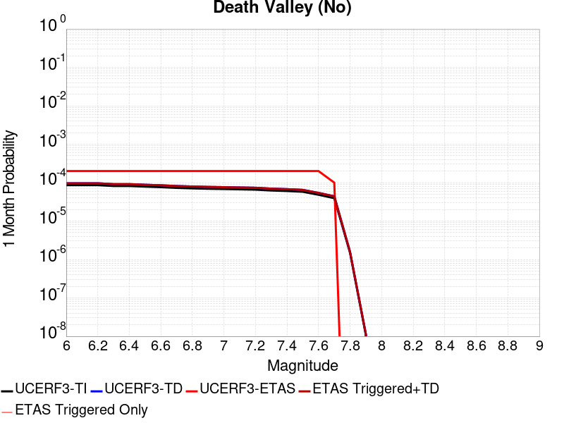 |  | 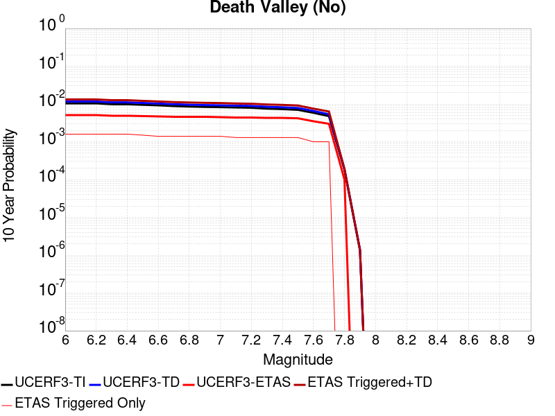 |

| Magnitude | 1 wk TI Prob | 1 wk TD Prob | 1 wk ETAS Prob | 1 wk ETAS/TD Gain | 1 wk ETAS Triggered+TD | 1 wk ETAS Triggered Only | 1 mo TI Prob | 1 mo TD Prob | 1 mo ETAS Prob | 1 mo ETAS/TD Gain | 1 mo ETAS Triggered+TD | 1 mo ETAS Triggered Only | 1 yr TI Prob | 1 yr TD Prob | 1 yr ETAS Prob | 1 yr ETAS/TD Gain | 1 yr ETAS Triggered+TD | 1 yr ETAS Triggered Only | 10 yr TI Prob | 10 yr TD Prob | 10 yr ETAS Prob | 10 yr ETAS/TD Gain | 10 yr ETAS Triggered+TD | 10 yr ETAS Triggered Only |
|-----|-----|-----|-----|-----|-----|-----|-----|-----|-----|-----|-----|-----|-----|-----|-----|-----|-----|-----|-----|-----|-----|-----|-----|-----|
| 6.0 | 2.0074807E-5 | 2.2471604E-5 | 0.0 | 0.0 | 2.2471604E-5 | 0.0 | 8.603206E-5 | 9.630336E-5 | 2.0E-4 | 2.0767708 | 9.630336E-5 | 0.0 | 0.001046937 | 0.0011718702 | 7.0E-4 | 0.5973358 | 0.0013716357 | 2.0E-4 | 0.010420183 | 0.011657817 | 0.0051 | 0.4374747 | 0.013239165 | 0.0016 |
| 6.1 | 2.0074807E-5 | 2.2471604E-5 | 0.0 | 0.0 | 2.2471604E-5 | 0.0 | 8.603206E-5 | 9.630336E-5 | 2.0E-4 | 2.0767708 | 9.630336E-5 | 0.0 | 0.001046937 | 0.0011718702 | 7.0E-4 | 0.5973358 | 0.0013716357 | 2.0E-4 | 0.010420183 | 0.011657817 | 0.0051 | 0.4374747 | 0.013239165 | 0.0016 |
| 6.2 | 2.0074807E-5 | 2.2471604E-5 | 0.0 | 0.0 | 2.2471604E-5 | 0.0 | 8.603206E-5 | 9.630336E-5 | 2.0E-4 | 2.0767708 | 9.630336E-5 | 0.0 | 0.001046937 | 0.0011718702 | 7.0E-4 | 0.5973358 | 0.0013716357 | 2.0E-4 | 0.010420183 | 0.011657817 | 0.0051 | 0.4374747 | 0.013239165 | 0.0016 |
| 6.3 | 1.9050609E-5 | 2.1310112E-5 | 0.0 | 0.0 | 2.1310112E-5 | 0.0 | 8.164292E-5 | 9.132589E-5 | 2.0E-4 | 2.1899593 | 9.132589E-5 | 0.0 | 9.935491E-4 | 0.0011113323 | 7.0E-4 | 0.6298746 | 0.0013111101 | 2.0E-4 | 0.009891188 | 0.01105857 | 0.0049 | 0.4430953 | 0.012640876 | 0.0016 |
| 6.4 | 1.9050609E-5 | 2.1310112E-5 | 0.0 | 0.0 | 2.1310112E-5 | 0.0 | 8.164292E-5 | 9.132589E-5 | 2.0E-4 | 2.1899593 | 9.132589E-5 | 0.0 | 9.935491E-4 | 0.0011113323 | 7.0E-4 | 0.6298746 | 0.0013111101 | 2.0E-4 | 0.009891188 | 0.01105857 | 0.0049 | 0.4430953 | 0.012640876 | 0.0016 |
| 6.5 | 1.8367004E-5 | 2.0535266E-5 | 0.0 | 0.0 | 2.0535266E-5 | 0.0 | 7.8713354E-5 | 8.8005356E-5 | 2.0E-4 | 2.272589 | 8.8005356E-5 | 0.0 | 9.5791375E-4 | 0.001070945 | 7.0E-4 | 0.6536283 | 0.0012707309 | 2.0E-4 | 0.009537951 | 0.010658625 | 0.0048 | 0.45033953 | 0.012142637 | 0.0015 |
| 6.6 | 1.779439E-5 | 1.9886103E-5 | 0.0 | 0.0 | 1.9886103E-5 | 0.0 | 7.625944E-5 | 8.522341E-5 | 2.0E-4 | 2.3467731 | 8.522341E-5 | 0.0 | 9.280632E-4 | 0.0010371074 | 7.0E-4 | 0.6749542 | 0.0012369001 | 2.0E-4 | 0.009241969 | 0.010323431 | 0.0047 | 0.455275 | 0.011708979 | 0.0014 |
| 6.7 | 1.7025437E-5 | 1.9019766E-5 | 0.0 | 0.0 | 1.9019766E-5 | 0.0 | 7.296412E-5 | 8.151077E-5 | 2.0E-4 | 2.4536636 | 8.151077E-5 | 0.0 | 8.87976E-4 | 9.91948E-4 | 7.0E-4 | 0.70568216 | 0.0011917496 | 2.0E-4 | 0.008844362 | 0.00987592 | 0.0046 | 0.4657794 | 0.011262094 | 0.0014 |
| 6.8 | 1.6545107E-5 | 1.848948E-5 | 0.0 | 0.0 | 1.848948E-5 | 0.0 | 7.090568E-5 | 7.9238256E-5 | 2.0E-4 | 2.5240333 | 7.9238256E-5 | 0.0 | 8.629347E-4 | 9.643049E-4 | 7.0E-4 | 0.7259115 | 0.001164112 | 2.0E-4 | 0.008595915 | 0.009601908 | 0.0046 | 0.47907147 | 0.010988465 | 0.0014 |
| 6.9 | 1.615478E-5 | 1.8064933E-5 | 0.0 | 0.0 | 1.8064933E-5 | 0.0 | 6.9232934E-5 | 7.741888E-5 | 2.0E-4 | 2.5833492 | 7.741888E-5 | 0.0 | 8.4258494E-4 | 9.4217336E-4 | 7.0E-4 | 0.7429631 | 0.001141985 | 2.0E-4 | 0.008393973 | 0.009382481 | 0.0046 | 0.49027544 | 0.010769345 | 0.0014 |
| 7.0 | 1.5894311E-5 | 1.7783139E-5 | 0.0 | 0.0 | 1.7783139E-5 | 0.0 | 6.81167E-5 | 7.621126E-5 | 2.0E-4 | 2.624284 | 7.621126E-5 | 0.0 | 8.2900526E-4 | 9.274832E-4 | 7.0E-4 | 0.75473064 | 0.0011272978 | 2.0E-4 | 0.008259195 | 0.009236811 | 0.0045 | 0.48718116 | 0.010623879 | 0.0014 |
| 7.1 | 1.5602263E-5 | 1.7461445E-5 | 0.0 | 0.0 | 1.7461445E-5 | 0.0 | 6.6865134E-5 | 7.483265E-5 | 2.0E-4 | 2.6726303 | 7.483265E-5 | 0.0 | 8.137789E-4 | 9.1071276E-4 | 7.0E-4 | 0.7686288 | 0.0011105306 | 2.0E-4 | 0.008108052 | 0.009070487 | 0.0044 | 0.48508975 | 0.010358695 | 0.0013 |
| 7.2 | 1.5323829E-5 | 1.7148977E-5 | 0.0 | 0.0 | 1.7148977E-5 | 0.0 | 6.56719E-5 | 7.349358E-5 | 2.0E-4 | 2.721326 | 7.349358E-5 | 0.0 | 7.99262E-4 | 8.9442305E-4 | 7.0E-4 | 0.7826274 | 0.0010942442 | 2.0E-4 | 0.007963934 | 0.008908907 | 0.0044 | 0.49388775 | 0.010197326 | 0.0013 |
| 7.3 | 1.4556212E-5 | 1.628199E-5 | 0.0 | 0.0 | 1.628199E-5 | 0.0 | 6.238227E-5 | 6.977812E-5 | 2.0E-4 | 2.8662279 | 6.977812E-5 | 0.0 | 7.592395E-4 | 8.492234E-4 | 7.0E-4 | 0.8242825 | 0.0010490535 | 2.0E-4 | 0.0075665074 | 0.008460425 | 0.0043 | 0.50824875 | 0.0097494265 | 0.0013 |
| 7.4 | 1.411725E-5 | 1.578815E-5 | 0.0 | 0.0 | 1.578815E-5 | 0.0 | 6.0501097E-5 | 6.766178E-5 | 2.0E-4 | 2.9558785 | 6.766178E-5 | 0.0 | 7.363519E-4 | 8.234766E-4 | 7.0E-4 | 0.8500545 | 0.0010233119 | 2.0E-4 | 0.0073391674 | 0.008204885 | 0.0043 | 0.5240781 | 0.009494218 | 0.0013 |
| 7.5 | 1.3503312E-5 | 1.5107272E-5 | 0.0 | 0.0 | 1.5107272E-5 | 0.0 | 5.7870053E-5 | 6.474388E-5 | 2.0E-4 | 3.089095 | 6.474388E-5 | 0.0 | 7.043401E-4 | 7.879774E-4 | 6.0E-4 | 0.76144314 | 9.878199E-4 | 2.0E-4 | 0.007021119 | 0.007852457 | 0.0042 | 0.5348644 | 0.009142249 | 0.0013 |
| 7.6 | 1.1279839E-5 | 1.2610564E-5 | 0.0 | 0.0 | 1.2610564E-5 | 0.0 | 4.834127E-5 | 5.4044183E-5 | 2.0E-4 | 3.7006757 | 5.4044183E-5 | 0.0 | 5.88396E-4 | 6.577946E-4 | 5.0E-4 | 0.76011574 | 7.577288E-4 | 1.0E-4 | 0.005868405 | 0.006559026 | 0.0035 | 0.5336158 | 0.007552467 | 0.001 |
| 7.7 | 9.189108E-6 | 1.027055E-5 | 0.0 | 0.0 | 1.027055E-5 | 0.0 | 3.93813E-5 | 4.4015927E-5 | 1.0E-4 | 2.2719047 | 4.4015927E-5 | 0.0 | 4.7936183E-4 | 5.357672E-4 | 3.0E-4 | 0.5599447 | 6.3571363E-4 | 1.0E-4 | 0.004783291 | 0.005345265 | 0.003 | 0.56124437 | 0.0063399198 | 0.001 |
| 7.8 | 3.4586725E-7 | 3.6461634E-7 | 0.0 | 0.0 | 3.6461634E-7 | 0.0 | 1.4822873E-6 | 1.5626406E-6 | 0.0 | 0.0 | 1.5626406E-6 | 0.0 | 1.80467E-5 | 1.9024988E-5 | 0.0 | 0.0 | 1.9024988E-5 | 0.0 | 1.8045233E-4 | 1.9023403E-4 | 1.0E-4 | 0.5256683 | 1.9023403E-4 | 0.0 |
| 7.9 | 2.5591178E-9 | 2.6684681E-9 | 0.0 | 0.0 | 2.6684681E-9 | 0.0 | 1.0967647E-8 | 1.1436292E-8 | 0.0 | 0.0 | 1.1436292E-8 | 0.0 | 1.335311E-7 | 1.3923685E-7 | 0.0 | 0.0 | 1.3923685E-7 | 0.0 | 1.3353102E-6 | 1.3923685E-6 | 0.0 | 0.0 | 1.3923685E-6 | 0.0 |

## Earthquake Valley
*[(top)](#table-of-contents)*

| 1 Week | 1 Month | 1 Year | 10 Year |
|-----|-----|-----|-----|
|  |  |  |  |

| Magnitude | 1 wk TI Prob | 1 wk TD Prob | 1 wk ETAS Prob | 1 wk ETAS/TD Gain | 1 wk ETAS Triggered+TD | 1 wk ETAS Triggered Only | 1 mo TI Prob | 1 mo TD Prob | 1 mo ETAS Prob | 1 mo ETAS/TD Gain | 1 mo ETAS Triggered+TD | 1 mo ETAS Triggered Only | 1 yr TI Prob | 1 yr TD Prob | 1 yr ETAS Prob | 1 yr ETAS/TD Gain | 1 yr ETAS Triggered+TD | 1 yr ETAS Triggered Only | 10 yr TI Prob | 10 yr TD Prob | 10 yr ETAS Prob | 10 yr ETAS/TD Gain | 10 yr ETAS Triggered+TD | 10 yr ETAS Triggered Only |
|-----|-----|-----|-----|-----|-----|-----|-----|-----|-----|-----|-----|-----|-----|-----|-----|-----|-----|-----|-----|-----|-----|-----|-----|-----|
| 6.0 | 1.9416384E-5 | 2.2544515E-5 | 0.0 | 0.0 | 2.2544515E-5 | 0.0 | 8.321042E-5 | 9.6616444E-5 | 1.0E-4 | 1.0350205 | 1.9660678E-4 | 1.0E-4 | 0.001012616 | 0.0011757897 | 7.0E-4 | 0.59534454 | 0.0016752019 | 5.0E-4 | 0.010080142 | 0.011707484 | 0.0069 | 0.5893666 | 0.013189922 | 0.0015 |
| 6.1 | 1.9416384E-5 | 2.2544515E-5 | 0.0 | 0.0 | 2.2544515E-5 | 0.0 | 8.321042E-5 | 9.6616444E-5 | 1.0E-4 | 1.0350205 | 1.9660678E-4 | 1.0E-4 | 0.001012616 | 0.0011757897 | 7.0E-4 | 0.59534454 | 0.0016752019 | 5.0E-4 | 0.010080142 | 0.011707484 | 0.0069 | 0.5893666 | 0.013189922 | 0.0015 |
| 6.2 | 1.9416384E-5 | 2.2544515E-5 | 0.0 | 0.0 | 2.2544515E-5 | 0.0 | 8.321042E-5 | 9.6616444E-5 | 1.0E-4 | 1.0350205 | 1.9660678E-4 | 1.0E-4 | 0.001012616 | 0.0011757897 | 7.0E-4 | 0.59534454 | 0.0016752019 | 5.0E-4 | 0.010080142 | 0.011707484 | 0.0069 | 0.5893666 | 0.013189922 | 0.0015 |
| 6.3 | 1.9416384E-5 | 2.2544515E-5 | 0.0 | 0.0 | 2.2544515E-5 | 0.0 | 8.321042E-5 | 9.6616444E-5 | 1.0E-4 | 1.0350205 | 1.9660678E-4 | 1.0E-4 | 0.001012616 | 0.0011757897 | 7.0E-4 | 0.59534454 | 0.0016752019 | 5.0E-4 | 0.010080142 | 0.011707484 | 0.0069 | 0.5893666 | 0.013189922 | 0.0015 |
| 6.4 | 1.9416384E-5 | 2.2544515E-5 | 0.0 | 0.0 | 2.2544515E-5 | 0.0 | 8.321042E-5 | 9.6616444E-5 | 1.0E-4 | 1.0350205 | 1.9660678E-4 | 1.0E-4 | 0.001012616 | 0.0011757897 | 7.0E-4 | 0.59534454 | 0.0016752019 | 5.0E-4 | 0.010080142 | 0.011707484 | 0.0069 | 0.5893666 | 0.013189922 | 0.0015 |
| 6.5 | 1.9389157E-5 | 2.2513153E-5 | 0.0 | 0.0 | 2.2513153E-5 | 0.0 | 8.309374E-5 | 9.648205E-5 | 1.0E-4 | 1.0364622 | 1.964724E-4 | 1.0E-4 | 0.0010111968 | 0.0011741553 | 7.0E-4 | 0.5961732 | 0.0016735683 | 5.0E-4 | 0.010066078 | 0.011691311 | 0.0069 | 0.5901819 | 0.013173774 | 0.0015 |
| 6.6 | 1.9389157E-5 | 2.2513153E-5 | 0.0 | 0.0 | 2.2513153E-5 | 0.0 | 8.309374E-5 | 9.648205E-5 | 1.0E-4 | 1.0364622 | 1.964724E-4 | 1.0E-4 | 0.0010111968 | 0.0011741553 | 7.0E-4 | 0.5961732 | 0.0016735683 | 5.0E-4 | 0.010066078 | 0.011691311 | 0.0069 | 0.5901819 | 0.013173774 | 0.0015 |
| 6.7 | 1.4925434E-5 | 1.717964E-5 | 0.0 | 0.0 | 1.717964E-5 | 0.0 | 6.396457E-5 | 7.362543E-5 | 0.0 | 0.0 | 7.362543E-5 | 0.0 | 7.7849044E-4 | 8.961057E-4 | 4.0E-4 | 0.4463759 | 0.0010959265 | 2.0E-4 | 0.007757689 | 0.008933271 | 0.0054 | 0.6044818 | 0.009924338 | 0.001 |
| 6.8 | 1.3570335E-5 | 1.559115E-5 | 0.0 | 0.0 | 1.559115E-5 | 0.0 | 5.8157282E-5 | 6.681796E-5 | 0.0 | 0.0 | 6.681796E-5 | 0.0 | 7.0783484E-4 | 8.1328687E-4 | 3.0E-4 | 0.36887354 | 9.132055E-4 | 1.0E-4 | 0.0070558446 | 0.008111149 | 0.0047 | 0.57944936 | 0.00890466 | 8.0E-4 |
| 6.9 | 1.3570335E-5 | 1.559115E-5 | 0.0 | 0.0 | 1.559115E-5 | 0.0 | 5.8157282E-5 | 6.681796E-5 | 0.0 | 0.0 | 6.681796E-5 | 0.0 | 7.0783484E-4 | 8.1328687E-4 | 3.0E-4 | 0.36887354 | 9.132055E-4 | 1.0E-4 | 0.0070558446 | 0.008111149 | 0.0047 | 0.57944936 | 0.00890466 | 8.0E-4 |
| 7.0 | 1.3433392E-5 | 1.5434925E-5 | 0.0 | 0.0 | 1.5434925E-5 | 0.0 | 5.757041E-5 | 6.614846E-5 | 0.0 | 0.0 | 6.614846E-5 | 0.0 | 7.0069433E-4 | 8.0514175E-4 | 3.0E-4 | 0.3726052 | 9.0506126E-4 | 1.0E-4 | 0.006984891 | 0.008030289 | 0.0047 | 0.5852841 | 0.008823864 | 8.0E-4 |
| 7.1 | 8.181609E-6 | 9.400889E-6 | 0.0 | 0.0 | 9.400889E-6 | 0.0 | 3.5063567E-5 | 4.028928E-5 | 0.0 | 0.0 | 4.028928E-5 | 0.0 | 4.268153E-4 | 4.904784E-4 | 1.0E-4 | 0.20388256 | 4.904784E-4 | 0.0 | 0.0042599645 | 0.0049005137 | 0.003 | 0.6121807 | 0.0054975734 | 6.0E-4 |
| 7.2 | 2.0663983E-7 | 1.7200274E-7 | 0.0 | 0.0 | 1.7200274E-7 | 0.0 | 8.855989E-7 | 7.371544E-7 | 0.0 | 0.0 | 7.371544E-7 | 0.0 | 1.0782113E-5 | 8.974822E-6 | 0.0 | 0.0 | 8.974822E-6 | 0.0 | 1.07815904E-4 | 8.974495E-5 | 0.0 | 0.0 | 8.974495E-5 | 0.0 |
| 7.3 | 2.0462376E-7 | 1.701601E-7 | 0.0 | 0.0 | 1.701601E-7 | 0.0 | 8.7695867E-7 | 7.292574E-7 | 0.0 | 0.0 | 7.292574E-7 | 0.0 | 1.0676919E-5 | 8.878676E-6 | 0.0 | 0.0 | 8.878676E-6 | 0.0 | 1.0676406E-4 | 8.878357E-5 | 0.0 | 0.0 | 8.878357E-5 | 0.0 |
| 7.4 | 2.0171088E-7 | 1.6799007E-7 | 0.0 | 0.0 | 1.6799007E-7 | 0.0 | 8.644749E-7 | 7.199572E-7 | 0.0 | 0.0 | 7.199572E-7 | 0.0 | 1.0524931E-5 | 8.765447E-6 | 0.0 | 0.0 | 8.765447E-6 | 0.0 | 1.05244326E-4 | 8.765137E-5 | 0.0 | 0.0 | 8.765137E-5 | 0.0 |
| 7.5 | 1.4847944E-7 | 1.2507505E-7 | 0.0 | 0.0 | 1.2507505E-7 | 0.0 | 6.363403E-7 | 5.360358E-7 | 0.0 | 0.0 | 5.360358E-7 | 0.0 | 7.747416E-6 | 6.526219E-6 | 0.0 | 0.0 | 6.526219E-6 | 0.0 | 7.747146E-5 | 6.526049E-5 | 0.0 | 0.0 | 6.526049E-5 | 0.0 |
| 7.6 | 1.3185847E-7 | 1.10822064E-7 | 0.0 | 0.0 | 1.10822064E-7 | 0.0 | 5.6510765E-7 | 4.7495163E-7 | 0.0 | 0.0 | 4.7495163E-7 | 0.0 | 6.8801637E-6 | 5.7825227E-6 | 0.0 | 0.0 | 5.7825227E-6 | 0.0 | 6.8799505E-5 | 5.7823934E-5 | 0.0 | 0.0 | 5.7823934E-5 | 0.0 |
| 7.7 | 2.8609954E-8 | 1.4104295E-8 | 0.0 | 0.0 | 1.4104295E-8 | 0.0 | 1.2261408E-7 | 6.044697E-8 | 0.0 | 0.0 | 6.044697E-8 | 0.0 | 1.4928254E-6 | 7.3594174E-7 | 0.0 | 0.0 | 7.3594174E-7 | 0.0 | 1.4928154E-5 | 7.3593983E-6 | 0.0 | 0.0 | 7.3593983E-6 | 0.0 |
| 7.8 | 6.527266E-9 | 2.906815E-9 | 0.0 | 0.0 | 2.906815E-9 | 0.0 | 2.7973995E-8 | 1.2457779E-8 | 0.0 | 0.0 | 1.2457779E-8 | 0.0 | 3.4058334E-7 | 1.5167345E-7 | 0.0 | 0.0 | 1.5167345E-7 | 0.0 | 3.4058282E-6 | 1.5167336E-6 | 0.0 | 0.0 | 1.5167336E-6 | 0.0 |
| 7.9 | 1.2898267E-9 | 7.108556E-10 | 0.0 | 0.0 | 7.108556E-10 | 0.0 | 5.527829E-9 | 3.046524E-9 | 0.0 | 0.0 | 3.046524E-9 | 0.0 | 6.7301315E-8 | 3.709143E-8 | 0.0 | 0.0 | 3.709143E-8 | 0.0 | 6.7301295E-7 | 3.7091428E-7 | 0.0 | 0.0 | 3.7091428E-7 | 0.0 |

## Deep Springs
*[(top)](#table-of-contents)*

| 1 Week | 1 Month | 1 Year | 10 Year |
|-----|-----|-----|-----|
|  |  |  |  |

| Magnitude | 1 wk TI Prob | 1 wk TD Prob | 1 wk ETAS Prob | 1 wk ETAS/TD Gain | 1 wk ETAS Triggered+TD | 1 wk ETAS Triggered Only | 1 mo TI Prob | 1 mo TD Prob | 1 mo ETAS Prob | 1 mo ETAS/TD Gain | 1 mo ETAS Triggered+TD | 1 mo ETAS Triggered Only | 1 yr TI Prob | 1 yr TD Prob | 1 yr ETAS Prob | 1 yr ETAS/TD Gain | 1 yr ETAS Triggered+TD | 1 yr ETAS Triggered Only | 10 yr TI Prob | 10 yr TD Prob | 10 yr ETAS Prob | 10 yr ETAS/TD Gain | 10 yr ETAS Triggered+TD | 10 yr ETAS Triggered Only |
|-----|-----|-----|-----|-----|-----|-----|-----|-----|-----|-----|-----|-----|-----|-----|-----|-----|-----|-----|-----|-----|-----|-----|-----|-----|
| 6.0 | 1.9810619E-5 | 2.3072382E-5 | 0.0 | 0.0 | 2.3072382E-5 | 0.0 | 8.489989E-5 | 9.8880744E-5 | 0.0 | 0.0 | 9.8880744E-5 | 0.0 | 0.001033166 | 0.0012037142 | 5.0E-4 | 0.415381 | 0.0012037142 | 0.0 | 0.010283757 | 0.012021552 | 0.0071 | 0.5906059 | 0.01350352 | 0.0015 |
| 6.1 | 1.9810619E-5 | 2.3072382E-5 | 0.0 | 0.0 | 2.3072382E-5 | 0.0 | 8.489989E-5 | 9.8880744E-5 | 0.0 | 0.0 | 9.8880744E-5 | 0.0 | 0.001033166 | 0.0012037142 | 5.0E-4 | 0.415381 | 0.0012037142 | 0.0 | 0.010283757 | 0.012021552 | 0.0071 | 0.5906059 | 0.01350352 | 0.0015 |
| 6.2 | 1.9810619E-5 | 2.3072382E-5 | 0.0 | 0.0 | 2.3072382E-5 | 0.0 | 8.489989E-5 | 9.8880744E-5 | 0.0 | 0.0 | 9.8880744E-5 | 0.0 | 0.001033166 | 0.0012037142 | 5.0E-4 | 0.415381 | 0.0012037142 | 0.0 | 0.010283757 | 0.012021552 | 0.0071 | 0.5906059 | 0.01350352 | 0.0015 |
| 6.3 | 1.9810619E-5 | 2.3072382E-5 | 0.0 | 0.0 | 2.3072382E-5 | 0.0 | 8.489989E-5 | 9.8880744E-5 | 0.0 | 0.0 | 9.8880744E-5 | 0.0 | 0.001033166 | 0.0012037142 | 5.0E-4 | 0.415381 | 0.0012037142 | 0.0 | 0.010283757 | 0.012021552 | 0.0071 | 0.5906059 | 0.01350352 | 0.0015 |
| 6.4 | 1.9810619E-5 | 2.3072382E-5 | 0.0 | 0.0 | 2.3072382E-5 | 0.0 | 8.489989E-5 | 9.8880744E-5 | 0.0 | 0.0 | 9.8880744E-5 | 0.0 | 0.001033166 | 0.0012037142 | 5.0E-4 | 0.415381 | 0.0012037142 | 0.0 | 0.010283757 | 0.012021552 | 0.0071 | 0.5906059 | 0.01350352 | 0.0015 |
| 6.5 | 1.7190405E-5 | 2.00158E-5 | 0.0 | 0.0 | 2.00158E-5 | 0.0 | 7.367108E-5 | 8.5782E-5 | 0.0 | 0.0 | 8.5782E-5 | 0.0 | 8.9657627E-4 | 0.0010443956 | 5.0E-4 | 0.4787458 | 0.0010443956 | 0.0 | 0.008929676 | 0.010443928 | 0.006 | 0.5744965 | 0.011829306 | 0.0014 |
| 6.6 | 1.7190405E-5 | 2.00158E-5 | 0.0 | 0.0 | 2.00158E-5 | 0.0 | 7.367108E-5 | 8.5782E-5 | 0.0 | 0.0 | 8.5782E-5 | 0.0 | 8.9657627E-4 | 0.0010443956 | 5.0E-4 | 0.4787458 | 0.0010443956 | 0.0 | 0.008929676 | 0.010443928 | 0.006 | 0.5744965 | 0.011829306 | 0.0014 |

## Table Bluff
*[(top)](#table-of-contents)*

| 1 Week | 1 Month | 1 Year | 10 Year |
|-----|-----|-----|-----|
| 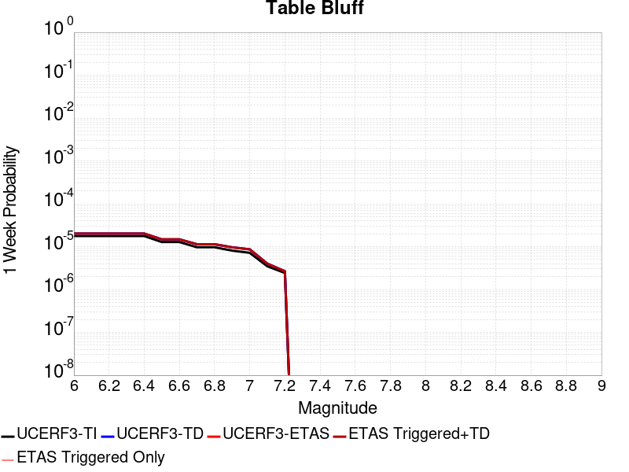 |  | 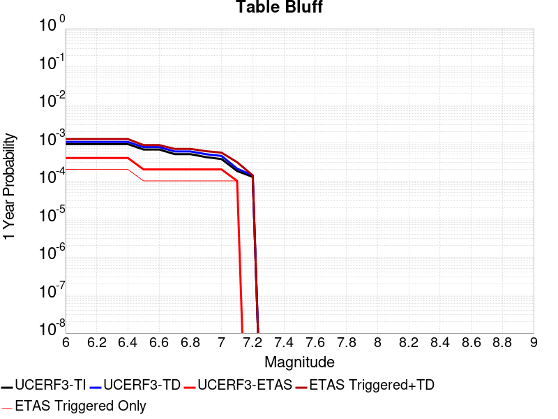 | 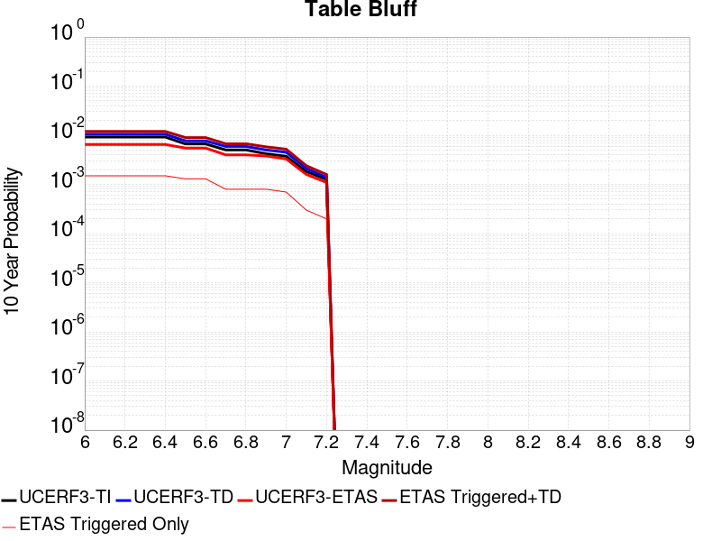 |

| Magnitude | 1 wk TI Prob | 1 wk TD Prob | 1 wk ETAS Prob | 1 wk ETAS/TD Gain | 1 wk ETAS Triggered+TD | 1 wk ETAS Triggered Only | 1 mo TI Prob | 1 mo TD Prob | 1 mo ETAS Prob | 1 mo ETAS/TD Gain | 1 mo ETAS Triggered+TD | 1 mo ETAS Triggered Only | 1 yr TI Prob | 1 yr TD Prob | 1 yr ETAS Prob | 1 yr ETAS/TD Gain | 1 yr ETAS Triggered+TD | 1 yr ETAS Triggered Only | 10 yr TI Prob | 10 yr TD Prob | 10 yr ETAS Prob | 10 yr ETAS/TD Gain | 10 yr ETAS Triggered+TD | 10 yr ETAS Triggered Only |
|-----|-----|-----|-----|-----|-----|-----|-----|-----|-----|-----|-----|-----|-----|-----|-----|-----|-----|-----|-----|-----|-----|-----|-----|-----|
| 6.0 | 1.7744695E-5 | 2.0234518E-5 | 0.0 | 0.0 | 2.0234518E-5 | 0.0 | 7.6046475E-5 | 8.671681E-5 | 0.0 | 0.0 | 8.671681E-5 | 0.0 | 9.2547253E-4 | 0.0010553253 | 4.0E-4 | 0.37903008 | 0.0012551142 | 2.0E-4 | 0.009216278 | 0.010509055 | 0.0065 | 0.6185142 | 0.011993292 | 0.0015 |
| 6.1 | 1.7744695E-5 | 2.0234518E-5 | 0.0 | 0.0 | 2.0234518E-5 | 0.0 | 7.6046475E-5 | 8.671681E-5 | 0.0 | 0.0 | 8.671681E-5 | 0.0 | 9.2547253E-4 | 0.0010553253 | 4.0E-4 | 0.37903008 | 0.0012551142 | 2.0E-4 | 0.009216278 | 0.010509055 | 0.0065 | 0.6185142 | 0.011993292 | 0.0015 |
| 6.2 | 1.7744695E-5 | 2.0234518E-5 | 0.0 | 0.0 | 2.0234518E-5 | 0.0 | 7.6046475E-5 | 8.671681E-5 | 0.0 | 0.0 | 8.671681E-5 | 0.0 | 9.2547253E-4 | 0.0010553253 | 4.0E-4 | 0.37903008 | 0.0012551142 | 2.0E-4 | 0.009216278 | 0.010509055 | 0.0065 | 0.6185142 | 0.011993292 | 0.0015 |
| 6.3 | 1.7744695E-5 | 2.0234518E-5 | 0.0 | 0.0 | 2.0234518E-5 | 0.0 | 7.6046475E-5 | 8.671681E-5 | 0.0 | 0.0 | 8.671681E-5 | 0.0 | 9.2547253E-4 | 0.0010553253 | 4.0E-4 | 0.37903008 | 0.0012551142 | 2.0E-4 | 0.009216278 | 0.010509055 | 0.0065 | 0.6185142 | 0.011993292 | 0.0015 |
| 6.4 | 1.7744695E-5 | 2.0234518E-5 | 0.0 | 0.0 | 2.0234518E-5 | 0.0 | 7.6046475E-5 | 8.671681E-5 | 0.0 | 0.0 | 8.671681E-5 | 0.0 | 9.2547253E-4 | 0.0010553253 | 4.0E-4 | 0.37903008 | 0.0012551142 | 2.0E-4 | 0.009216278 | 0.010509055 | 0.0065 | 0.6185142 | 0.011993292 | 0.0015 |
| 6.5 | 1.2822383E-5 | 1.4814618E-5 | 0.0 | 0.0 | 1.4814618E-5 | 0.0 | 5.4951914E-5 | 6.3489846E-5 | 0.0 | 0.0 | 6.3489846E-5 | 0.0 | 6.6883414E-4 | 7.727443E-4 | 2.0E-4 | 0.25881782 | 8.72667E-4 | 1.0E-4 | 0.0066682473 | 0.0077035096 | 0.0055 | 0.7139603 | 0.008993495 | 0.0013 |
| 6.6 | 1.2822383E-5 | 1.4814618E-5 | 0.0 | 0.0 | 1.4814618E-5 | 0.0 | 5.4951914E-5 | 6.3489846E-5 | 0.0 | 0.0 | 6.3489846E-5 | 0.0 | 6.6883414E-4 | 7.727443E-4 | 2.0E-4 | 0.25881782 | 8.72667E-4 | 1.0E-4 | 0.0066682473 | 0.0077035096 | 0.0055 | 0.7139603 | 0.008993495 | 0.0013 |
| 6.7 | 9.690175E-6 | 1.1394503E-5 | 0.0 | 0.0 | 1.1394503E-5 | 0.0 | 4.1528663E-5 | 4.8832782E-5 | 0.0 | 0.0 | 4.8832782E-5 | 0.0 | 5.054941E-4 | 5.9439696E-4 | 2.0E-4 | 0.3364755 | 6.9433753E-4 | 1.0E-4 | 0.005043458 | 0.005930049 | 0.004 | 0.67453074 | 0.0067253048 | 8.0E-4 |
| 6.8 | 9.690175E-6 | 1.1394503E-5 | 0.0 | 0.0 | 1.1394503E-5 | 0.0 | 4.1528663E-5 | 4.8832782E-5 | 0.0 | 0.0 | 4.8832782E-5 | 0.0 | 5.054941E-4 | 5.9439696E-4 | 2.0E-4 | 0.3364755 | 6.9433753E-4 | 1.0E-4 | 0.005043458 | 0.005930049 | 0.004 | 0.67453074 | 0.0067253048 | 8.0E-4 |
| 6.9 | 8.096043E-6 | 9.660498E-6 | 0.0 | 0.0 | 9.660498E-6 | 0.0 | 3.4696863E-5 | 4.1401574E-5 | 0.0 | 0.0 | 4.1401574E-5 | 0.0 | 4.223524E-4 | 5.039649E-4 | 2.0E-4 | 0.39685303 | 6.039145E-4 | 1.0E-4 | 0.004215506 | 0.005029926 | 0.0038 | 0.75547826 | 0.0058259023 | 8.0E-4 |
| 7.0 | 7.185906E-6 | 8.6728105E-6 | 0.0 | 0.0 | 8.6728105E-6 | 0.0 | 3.0796375E-5 | 3.716875E-5 | 0.0 | 0.0 | 3.716875E-5 | 0.0 | 3.7488135E-4 | 4.52452E-4 | 2.0E-4 | 0.44203585 | 5.5240677E-4 | 1.0E-4 | 0.0037424958 | 0.004516924 | 0.0033 | 0.7305857 | 0.005213762 | 7.0E-4 |
| 7.1 | 3.4937343E-6 | 4.0247673E-6 | 0.0 | 0.0 | 4.0247673E-6 | 0.0 | 1.497306E-5 | 1.7248929E-5 | 0.0 | 0.0 | 1.7248929E-5 | 0.0 | 1.8228177E-4 | 2.0999282E-4 | 1.0E-4 | 0.47620675 | 3.0997183E-4 | 1.0E-4 | 0.0018213232 | 0.0020986635 | 0.0016 | 0.76238996 | 0.0023980339 | 3.0E-4 |
| 7.2 | 2.4388776E-6 | 2.6704367E-6 | 0.0 | 0.0 | 2.6704367E-6 | 0.0 | 1.0452291E-5 | 1.14447075E-5 | 0.0 | 0.0 | 1.14447075E-5 | 0.0 | 1.2724921E-4 | 1.3933545E-4 | 0.0 | 0.0 | 1.3933545E-4 | 0.0 | 0.0012717636 | 0.0013929757 | 0.0011 | 0.78967637 | 0.0015926971 | 2.0E-4 |

## Homestead Valley 2011
*[(top)](#table-of-contents)*

| 1 Week | 1 Month | 1 Year | 10 Year |
|-----|-----|-----|-----|
| 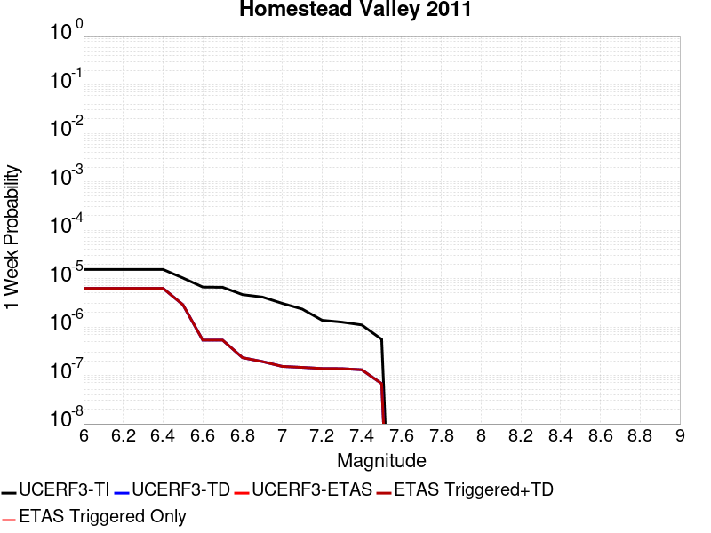 |  |  | 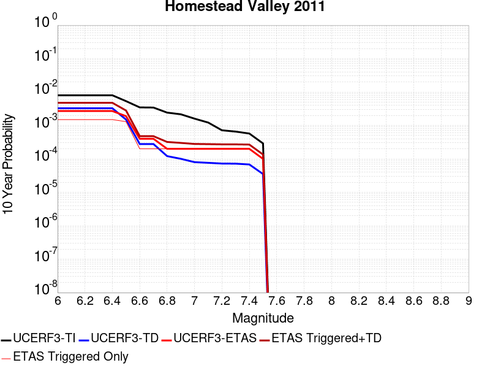 |

| Magnitude | 1 wk TI Prob | 1 wk TD Prob | 1 wk ETAS Prob | 1 wk ETAS/TD Gain | 1 wk ETAS Triggered+TD | 1 wk ETAS Triggered Only | 1 mo TI Prob | 1 mo TD Prob | 1 mo ETAS Prob | 1 mo ETAS/TD Gain | 1 mo ETAS Triggered+TD | 1 mo ETAS Triggered Only | 1 yr TI Prob | 1 yr TD Prob | 1 yr ETAS Prob | 1 yr ETAS/TD Gain | 1 yr ETAS Triggered+TD | 1 yr ETAS Triggered Only | 10 yr TI Prob | 10 yr TD Prob | 10 yr ETAS Prob | 10 yr ETAS/TD Gain | 10 yr ETAS Triggered+TD | 10 yr ETAS Triggered Only |
|-----|-----|-----|-----|-----|-----|-----|-----|-----|-----|-----|-----|-----|-----|-----|-----|-----|-----|-----|-----|-----|-----|-----|-----|-----|
| 6.0 | 1.539795E-5 | 6.2816875E-6 | 0.0 | 0.0 | 6.2816875E-6 | 0.0 | 6.5989545E-5 | 2.6921358E-5 | 1.0E-4 | 3.714523 | 2.6921358E-5 | 0.0 | 8.0312655E-4 | 3.2773882E-4 | 2.0E-4 | 0.61024207 | 3.2773882E-4 | 0.0 | 0.008002302 | 0.003274573 | 0.0027 | 0.824535 | 0.004769661 | 0.0015 |
| 6.1 | 1.539795E-5 | 6.2816875E-6 | 0.0 | 0.0 | 6.2816875E-6 | 0.0 | 6.5989545E-5 | 2.6921358E-5 | 1.0E-4 | 3.714523 | 2.6921358E-5 | 0.0 | 8.0312655E-4 | 3.2773882E-4 | 2.0E-4 | 0.61024207 | 3.2773882E-4 | 0.0 | 0.008002302 | 0.003274573 | 0.0027 | 0.824535 | 0.004769661 | 0.0015 |
| 6.2 | 1.539795E-5 | 6.2816875E-6 | 0.0 | 0.0 | 6.2816875E-6 | 0.0 | 6.5989545E-5 | 2.6921358E-5 | 1.0E-4 | 3.714523 | 2.6921358E-5 | 0.0 | 8.0312655E-4 | 3.2773882E-4 | 2.0E-4 | 0.61024207 | 3.2773882E-4 | 0.0 | 0.008002302 | 0.003274573 | 0.0027 | 0.824535 | 0.004769661 | 0.0015 |
| 6.3 | 1.539795E-5 | 6.2816875E-6 | 0.0 | 0.0 | 6.2816875E-6 | 0.0 | 6.5989545E-5 | 2.6921358E-5 | 1.0E-4 | 3.714523 | 2.6921358E-5 | 0.0 | 8.0312655E-4 | 3.2773882E-4 | 2.0E-4 | 0.61024207 | 3.2773882E-4 | 0.0 | 0.008002302 | 0.003274573 | 0.0027 | 0.824535 | 0.004769661 | 0.0015 |
| 6.4 | 1.539795E-5 | 6.2816875E-6 | 0.0 | 0.0 | 6.2816875E-6 | 0.0 | 6.5989545E-5 | 2.6921358E-5 | 1.0E-4 | 3.714523 | 2.6921358E-5 | 0.0 | 8.0312655E-4 | 3.2773882E-4 | 2.0E-4 | 0.61024207 | 3.2773882E-4 | 0.0 | 0.008002302 | 0.003274573 | 0.0027 | 0.824535 | 0.004769661 | 0.0015 |
| 6.5 | 1.0265258E-5 | 2.8766954E-6 | 0.0 | 0.0 | 2.8766954E-6 | 0.0 | 4.3993223E-5 | 1.2328675E-5 | 1.0E-4 | 8.111172 | 1.2328675E-5 | 0.0 | 5.3548586E-4 | 1.5009823E-4 | 1.0E-4 | 0.6662304 | 1.5009823E-4 | 0.0 | 0.005341973 | 0.0015006498 | 0.0019 | 1.2661182 | 0.002798699 | 0.0013 |
| 6.6 | 6.664671E-6 | 5.335016E-7 | 0.0 | 0.0 | 5.335016E-7 | 0.0 | 2.8562565E-5 | 2.286434E-6 | 0.0 | 0.0 | 2.286434E-6 | 0.0 | 3.476937E-4 | 2.7837097E-5 | 0.0 | 0.0 | 2.7837097E-5 | 0.0 | 0.003471502 | 2.7834772E-4 | 4.0E-4 | 1.4370515 | 4.7829206E-4 | 2.0E-4 |
| 6.7 | 6.5954046E-6 | 5.335016E-7 | 0.0 | 0.0 | 5.335016E-7 | 0.0 | 2.8265715E-5 | 2.286434E-6 | 0.0 | 0.0 | 2.286434E-6 | 0.0 | 3.4408073E-4 | 2.7837097E-5 | 0.0 | 0.0 | 2.7837097E-5 | 0.0 | 0.0034354846 | 2.7834772E-4 | 4.0E-4 | 1.4370515 | 4.7829206E-4 | 2.0E-4 |
| 6.8 | 4.648189E-6 | 2.3168988E-7 | 0.0 | 0.0 | 2.3168988E-7 | 0.0 | 1.9920659E-5 | 9.929563E-7 | 0.0 | 0.0 | 9.929563E-7 | 0.0 | 2.4250703E-4 | 1.208918E-5 | 0.0 | 0.0 | 1.208918E-5 | 0.0 | 0.0024224254 | 1.208857E-4 | 2.0E-4 | 1.6544554 | 3.2086152E-4 | 2.0E-4 |
| 6.9 | 4.1428534E-6 | 1.9255067E-7 | 0.0 | 0.0 | 1.9255067E-7 | 0.0 | 1.7754966E-5 | 8.252169E-7 | 0.0 | 0.0 | 8.252169E-7 | 0.0 | 2.1614527E-4 | 1.0046972E-5 | 0.0 | 0.0 | 1.0046972E-5 | 0.0 | 0.0021593515 | 1.0046548E-4 | 2.0E-4 | 1.9907336 | 3.004454E-4 | 2.0E-4 |
| 7.0 | 3.0673707E-6 | 1.529381E-7 | 0.0 | 0.0 | 1.529381E-7 | 0.0 | 1.3145808E-5 | 6.5544884E-7 | 0.0 | 0.0 | 6.5544884E-7 | 0.0 | 1.6003846E-4 | 7.980061E-6 | 0.0 | 0.0 | 7.980061E-6 | 0.0 | 0.0015992324 | 7.979785E-5 | 2.0E-4 | 2.506333 | 2.797819E-4 | 2.0E-4 |
| 7.1 | 2.340854E-6 | 1.4619064E-7 | 0.0 | 0.0 | 1.4619064E-7 | 0.0 | 1.0032193E-5 | 6.265312E-7 | 0.0 | 0.0 | 6.265312E-7 | 0.0 | 1.221351E-4 | 7.627991E-6 | 0.0 | 0.0 | 7.627991E-6 | 0.0 | 0.00122068 | 7.627739E-5 | 2.0E-4 | 2.622009 | 2.7626214E-4 | 2.0E-4 |
| 7.2 | 1.3754182E-6 | 1.3861036E-7 | 0.0 | 0.0 | 1.3861036E-7 | 0.0 | 5.8946357E-6 | 5.9404425E-7 | 0.0 | 0.0 | 5.9404425E-7 | 0.0 | 7.176483E-5 | 7.2324656E-6 | 0.0 | 0.0 | 7.2324656E-6 | 0.0 | 7.174166E-4 | 7.232239E-5 | 2.0E-4 | 2.7653952 | 2.7230792E-4 | 2.0E-4 |
| 7.3 | 1.2573237E-6 | 1.3766248E-7 | 0.0 | 0.0 | 1.3766248E-7 | 0.0 | 5.388519E-6 | 5.8998194E-7 | 0.0 | 0.0 | 5.8998194E-7 | 0.0 | 6.560324E-5 | 7.1830077E-6 | 0.0 | 0.0 | 7.1830077E-6 | 0.0 | 6.558388E-4 | 7.1827846E-5 | 2.0E-4 | 2.7844355 | 2.7181348E-4 | 2.0E-4 |
| 7.4 | 1.0994207E-6 | 1.3049238E-7 | 0.0 | 0.0 | 1.3049238E-7 | 0.0 | 4.7117946E-6 | 5.592529E-7 | 0.0 | 0.0 | 5.592529E-7 | 0.0 | 5.736459E-5 | 6.808884E-6 | 0.0 | 0.0 | 6.808884E-6 | 0.0 | 5.734978E-4 | 6.808685E-5 | 2.0E-4 | 2.937425 | 2.6807323E-4 | 2.0E-4 |
| 7.5 | 5.5569126E-7 | 6.743821E-8 | 0.0 | 0.0 | 6.743821E-8 | 0.0 | 2.3815317E-6 | 2.8902087E-7 | 0.0 | 0.0 | 2.8902087E-7 | 0.0 | 2.8994764E-5 | 3.518824E-6 | 0.0 | 0.0 | 3.518824E-6 | 0.0 | 2.899098E-4 | 3.5187746E-5 | 1.0E-4 | 2.8418984 | 1.3518422E-4 | 1.0E-4 |

## Hollywood
*[(top)](#table-of-contents)*

| 1 Week | 1 Month | 1 Year | 10 Year |
|-----|-----|-----|-----|
|  |  |  |  |

| Magnitude | 1 wk TI Prob | 1 wk TD Prob | 1 wk ETAS Prob | 1 wk ETAS/TD Gain | 1 wk ETAS Triggered+TD | 1 wk ETAS Triggered Only | 1 mo TI Prob | 1 mo TD Prob | 1 mo ETAS Prob | 1 mo ETAS/TD Gain | 1 mo ETAS Triggered+TD | 1 mo ETAS Triggered Only | 1 yr TI Prob | 1 yr TD Prob | 1 yr ETAS Prob | 1 yr ETAS/TD Gain | 1 yr ETAS Triggered+TD | 1 yr ETAS Triggered Only | 10 yr TI Prob | 10 yr TD Prob | 10 yr ETAS Prob | 10 yr ETAS/TD Gain | 10 yr ETAS Triggered+TD | 10 yr ETAS Triggered Only |
|-----|-----|-----|-----|-----|-----|-----|-----|-----|-----|-----|-----|-----|-----|-----|-----|-----|-----|-----|-----|-----|-----|-----|-----|-----|
| 6.0 | 1.24487615E-5 | 1.2580265E-5 | 0.0 | 0.0 | 1.2580265E-5 | 0.0 | 5.3350745E-5 | 5.3914333E-5 | 1.0E-4 | 1.8547944 | 1.5390894E-4 | 1.0E-4 | 6.4935174E-4 | 6.5621396E-4 | 3.0E-4 | 0.45716795 | 7.5614837E-4 | 1.0E-4 | 0.0064745755 | 0.0065432494 | 0.0049 | 0.7488634 | 0.007934089 | 0.0014 |
| 6.1 | 1.24487615E-5 | 1.2580265E-5 | 0.0 | 0.0 | 1.2580265E-5 | 0.0 | 5.3350745E-5 | 5.3914333E-5 | 1.0E-4 | 1.8547944 | 1.5390894E-4 | 1.0E-4 | 6.4935174E-4 | 6.5621396E-4 | 3.0E-4 | 0.45716795 | 7.5614837E-4 | 1.0E-4 | 0.0064745755 | 0.0065432494 | 0.0049 | 0.7488634 | 0.007934089 | 0.0014 |
| 6.2 | 1.24487615E-5 | 1.2580265E-5 | 0.0 | 0.0 | 1.2580265E-5 | 0.0 | 5.3350745E-5 | 5.3914333E-5 | 1.0E-4 | 1.8547944 | 1.5390894E-4 | 1.0E-4 | 6.4935174E-4 | 6.5621396E-4 | 3.0E-4 | 0.45716795 | 7.5614837E-4 | 1.0E-4 | 0.0064745755 | 0.0065432494 | 0.0049 | 0.7488634 | 0.007934089 | 0.0014 |
| 6.3 | 1.24487615E-5 | 1.2580265E-5 | 0.0 | 0.0 | 1.2580265E-5 | 0.0 | 5.3350745E-5 | 5.3914333E-5 | 1.0E-4 | 1.8547944 | 1.5390894E-4 | 1.0E-4 | 6.4935174E-4 | 6.5621396E-4 | 3.0E-4 | 0.45716795 | 7.5614837E-4 | 1.0E-4 | 0.0064745755 | 0.0065432494 | 0.0049 | 0.7488634 | 0.007934089 | 0.0014 |
| 6.4 | 1.2431024E-5 | 1.2560898E-5 | 0.0 | 0.0 | 1.2560898E-5 | 0.0 | 5.327473E-5 | 5.3831332E-5 | 1.0E-4 | 1.8576542 | 1.5382595E-4 | 1.0E-4 | 6.4842677E-4 | 6.55204E-4 | 3.0E-4 | 0.45787266 | 7.551385E-4 | 1.0E-4 | 0.0064653796 | 0.0065332097 | 0.0049 | 0.7500142 | 0.007924063 | 0.0014 |
| 6.5 | 1.1242222E-5 | 1.1305599E-5 | 0.0 | 0.0 | 1.1305599E-5 | 0.0 | 4.8180063E-5 | 4.8451686E-5 | 1.0E-4 | 2.0639117 | 1.4844684E-4 | 1.0E-4 | 5.864344E-4 | 5.8974227E-4 | 3.0E-4 | 0.5086968 | 6.896833E-4 | 1.0E-4 | 0.0058488925 | 0.0058820588 | 0.0044 | 0.74803746 | 0.007075 | 0.0012 |
| 6.6 | 1.1234066E-5 | 1.1296722E-5 | 0.0 | 0.0 | 1.1296722E-5 | 0.0 | 4.8145106E-5 | 4.841364E-5 | 1.0E-4 | 2.0655336 | 1.484088E-4 | 1.0E-4 | 5.86009E-4 | 5.892793E-4 | 3.0E-4 | 0.50909644 | 6.892204E-4 | 1.0E-4 | 0.005844661 | 0.0058774534 | 0.0044 | 0.74862355 | 0.0070704003 | 0.0012 |
| 6.7 | 1.12294E-5 | 1.1291472E-5 | 0.0 | 0.0 | 1.1291472E-5 | 0.0 | 4.812511E-5 | 4.839114E-5 | 1.0E-4 | 2.066494 | 1.483863E-4 | 1.0E-4 | 5.857657E-4 | 5.8900553E-4 | 3.0E-4 | 0.5093331 | 6.8894663E-4 | 1.0E-4 | 0.0058422405 | 0.00587473 | 0.0044 | 0.74897057 | 0.0070676804 | 0.0012 |
| 6.8 | 1.0252819E-5 | 1.02075255E-5 | 0.0 | 0.0 | 1.02075255E-5 | 0.0 | 4.3939912E-5 | 4.374582E-5 | 1.0E-4 | 2.2859328 | 1.4374145E-4 | 1.0E-4 | 5.3483713E-4 | 5.324773E-4 | 3.0E-4 | 0.5634043 | 6.32424E-4 | 1.0E-4 | 0.005335517 | 0.00531224 | 0.004 | 0.752978 | 0.0063069277 | 0.001 |
| 6.9 | 9.252289E-6 | 9.100634E-6 | 0.0 | 0.0 | 9.100634E-6 | 0.0 | 3.9652066E-5 | 3.9002145E-5 | 1.0E-4 | 2.5639615 | 1.3899825E-4 | 1.0E-4 | 4.8265693E-4 | 4.7474928E-4 | 3.0E-4 | 0.63191247 | 5.747018E-4 | 1.0E-4 | 0.0048161 | 0.004737524 | 0.0036 | 0.7598906 | 0.005533734 | 8.0E-4 |
| 7.0 | 8.474604E-6 | 8.249438E-6 | 0.0 | 0.0 | 8.249438E-6 | 0.0 | 3.6319227E-5 | 3.535426E-5 | 1.0E-4 | 2.8285134 | 1.3535073E-4 | 1.0E-4 | 4.4209688E-4 | 4.3035456E-4 | 3.0E-4 | 0.6970996 | 5.3031155E-4 | 1.0E-4 | 0.004412184 | 0.0042953617 | 0.0031 | 0.7217087 | 0.0049923547 | 7.0E-4 |
| 7.1 | 6.643643E-6 | 6.2615013E-6 | 0.0 | 0.0 | 6.2615013E-6 | 0.0 | 2.8472443E-5 | 2.6834732E-5 | 1.0E-4 | 3.7265139 | 1.2683205E-4 | 1.0E-4 | 3.4659685E-4 | 3.266643E-4 | 2.0E-4 | 0.6122493 | 4.2663162E-4 | 1.0E-4 | 0.0034605677 | 0.0032618872 | 0.0022 | 0.6744562 | 0.00385993 | 6.0E-4 |
| 7.2 | 5.549002E-6 | 5.1028646E-6 | 0.0 | 0.0 | 5.1028646E-6 | 0.0 | 2.378122E-5 | 2.1869237E-5 | 1.0E-4 | 4.5726333 | 1.2186705E-4 | 1.0E-4 | 2.8949787E-4 | 2.6622557E-4 | 1.0E-4 | 0.37562132 | 3.6619895E-4 | 1.0E-4 | 0.0028912104 | 0.0026590829 | 0.0014 | 0.5264973 | 0.0029582852 | 3.0E-4 |
| 7.3 | 4.3059727E-6 | 3.9549527E-6 | 0.0 | 0.0 | 3.9549527E-6 | 0.0 | 1.8454039E-5 | 1.6949687E-5 | 1.0E-4 | 5.8998137 | 1.16947995E-4 | 1.0E-4 | 2.2465475E-4 | 2.06343E-4 | 1.0E-4 | 0.48462996 | 3.0632236E-4 | 1.0E-4 | 0.0022442779 | 0.0020615242 | 0.0014 | 0.6791092 | 0.0023609058 | 3.0E-4 |
| 7.4 | 2.8550733E-6 | 2.6975592E-6 | 0.0 | 0.0 | 2.6975592E-6 | 0.0 | 1.2235971E-5 | 1.1560916E-5 | 1.0E-4 | 8.649833 | 1.1155976E-4 | 1.0E-4 | 1.4896276E-4 | 1.4074512E-4 | 1.0E-4 | 0.71050423 | 2.4073104E-4 | 1.0E-4 | 0.0014886294 | 0.0014065648 | 0.0012 | 0.8531423 | 0.0017061429 | 3.0E-4 |
| 7.5 | 1.9927045E-6 | 1.8945904E-6 | 0.0 | 0.0 | 1.8945904E-6 | 0.0 | 8.540134E-6 | 8.119648E-6 | 1.0E-4 | 12.3158045 | 1.0811884E-4 | 1.0E-4 | 1.0397117E-4 | 9.8852266E-5 | 1.0E-4 | 1.0116106 | 1.9884238E-4 | 1.0E-4 | 0.0010392254 | 9.880866E-4 | 6.0E-4 | 0.60723424 | 0.0011878889 | 2.0E-4 |
| 7.6 | 1.345084E-6 | 1.21936E-6 | 0.0 | 0.0 | 1.21936E-6 | 0.0 | 5.764633E-6 | 5.225818E-6 | 1.0E-4 | 19.13576 | 1.0522529E-4 | 1.0E-4 | 7.018215E-5 | 6.3622494E-5 | 1.0E-4 | 1.571771 | 1.6361613E-4 | 1.0E-4 | 7.0159987E-4 | 6.360448E-4 | 3.0E-4 | 0.4716649 | 7.359812E-4 | 1.0E-4 |
| 7.7 | 7.6835164E-7 | 6.2598747E-7 | 0.0 | 0.0 | 6.2598747E-7 | 0.0 | 3.2929315E-6 | 2.6828009E-6 | 1.0E-4 | 37.27448 | 1.02682534E-4 | 1.0E-4 | 4.00907E-5 | 3.2662625E-5 | 1.0E-4 | 3.0616033 | 1.3265936E-4 | 1.0E-4 | 4.0083472E-4 | 3.265797E-4 | 2.0E-4 | 0.6124079 | 4.2654705E-4 | 1.0E-4 |
| 7.8 | 3.6562128E-7 | 2.4380995E-7 | 0.0 | 0.0 | 2.4380995E-7 | 0.0 | 1.5669474E-6 | 1.0448994E-6 | 0.0 | 0.0 | 1.0448994E-6 | 0.0 | 1.9077417E-5 | 1.2721579E-5 | 0.0 | 0.0 | 1.2721579E-5 | 0.0 | 1.907578E-4 | 1.2720887E-4 | 1.0E-4 | 0.7861087 | 1.2720887E-4 | 0.0 |
| 7.9 | 7.5024424E-8 | 5.354939E-8 | 0.0 | 0.0 | 5.354939E-8 | 0.0 | 3.215332E-7 | 2.2949736E-7 | 0.0 | 0.0 | 2.2949736E-7 | 0.0 | 3.91466E-6 | 2.794128E-6 | 0.0 | 0.0 | 2.794128E-6 | 0.0 | 3.9145907E-5 | 2.7941058E-5 | 1.0E-4 | 3.5789626 | 2.7941058E-5 | 0.0 |

## Rinconada 2011 CFM
*[(top)](#table-of-contents)*

| 1 Week | 1 Month | 1 Year | 10 Year |
|-----|-----|-----|-----|
| 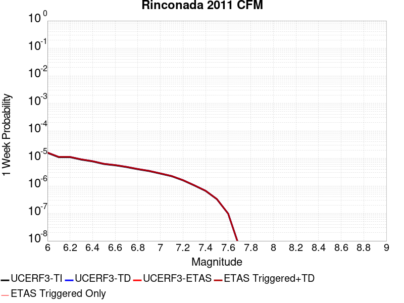 | 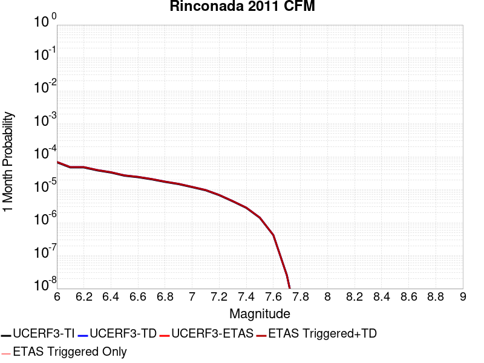 |  | 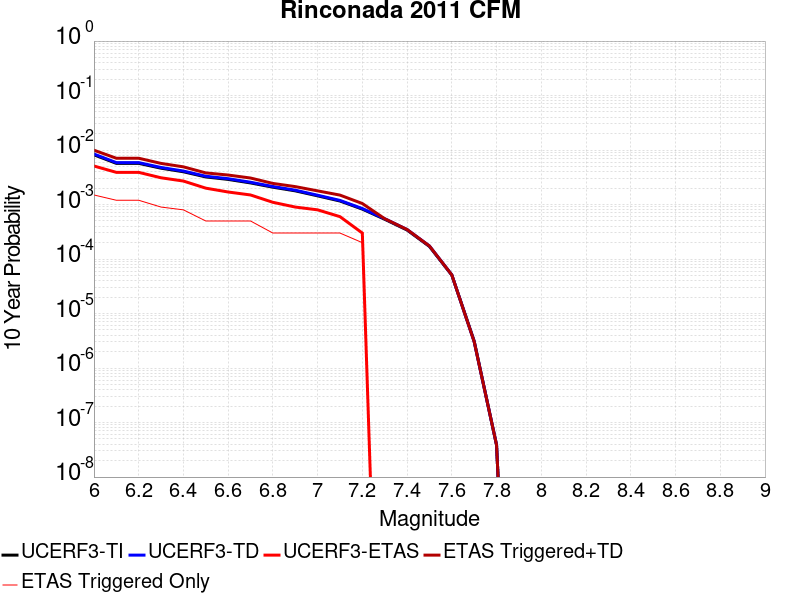 |

| Magnitude | 1 wk TI Prob | 1 wk TD Prob | 1 wk ETAS Prob | 1 wk ETAS/TD Gain | 1 wk ETAS Triggered+TD | 1 wk ETAS Triggered Only | 1 mo TI Prob | 1 mo TD Prob | 1 mo ETAS Prob | 1 mo ETAS/TD Gain | 1 mo ETAS Triggered+TD | 1 mo ETAS Triggered Only | 1 yr TI Prob | 1 yr TD Prob | 1 yr ETAS Prob | 1 yr ETAS/TD Gain | 1 yr ETAS Triggered+TD | 1 yr ETAS Triggered Only | 10 yr TI Prob | 10 yr TD Prob | 10 yr ETAS Prob | 10 yr ETAS/TD Gain | 10 yr ETAS Triggered+TD | 10 yr ETAS Triggered Only |
|-----|-----|-----|-----|-----|-----|-----|-----|-----|-----|-----|-----|-----|-----|-----|-----|-----|-----|-----|-----|-----|-----|-----|-----|-----|
| 6.0 | 1.5752368E-5 | 1.6269056E-5 | 0.0 | 0.0 | 1.6269056E-5 | 0.0 | 6.75084E-5 | 6.972268E-5 | 0.0 | 0.0 | 6.972268E-5 | 0.0 | 8.2160486E-4 | 8.4854616E-4 | 4.0E-4 | 0.4713945 | 9.484613E-4 | 1.0E-4 | 0.008185739 | 0.008453442 | 0.0051 | 0.60330456 | 0.009940761 | 0.0015 |
| 6.1 | 1.0966133E-5 | 1.1319156E-5 | 0.0 | 0.0 | 1.1319156E-5 | 0.0 | 4.6996865E-5 | 4.8509773E-5 | 0.0 | 0.0 | 4.8509773E-5 | 0.0 | 5.720366E-4 | 5.9044716E-4 | 3.0E-4 | 0.5080895 | 6.903881E-4 | 1.0E-4 | 0.0057056635 | 0.0058888798 | 0.0039 | 0.6622652 | 0.007081813 | 0.0012 |
| 6.2 | 1.0966133E-5 | 1.1319156E-5 | 0.0 | 0.0 | 1.1319156E-5 | 0.0 | 4.6996865E-5 | 4.8509773E-5 | 0.0 | 0.0 | 4.8509773E-5 | 0.0 | 5.720366E-4 | 5.9044716E-4 | 3.0E-4 | 0.5080895 | 6.903881E-4 | 1.0E-4 | 0.0057056635 | 0.0058888798 | 0.0039 | 0.6622652 | 0.007081813 | 0.0012 |
| 6.3 | 8.926149E-6 | 9.209658E-6 | 0.0 | 0.0 | 9.209658E-6 | 0.0 | 3.8254362E-5 | 3.9469367E-5 | 0.0 | 0.0 | 3.9469367E-5 | 0.0 | 4.6564735E-4 | 4.8043393E-4 | 1.0E-4 | 0.20814517 | 4.8043393E-4 | 0.0 | 0.0046467283 | 0.0047939974 | 0.0031 | 0.64664197 | 0.005689683 | 9.0E-4 |
| 6.4 | 7.676955E-6 | 7.917546E-6 | 0.0 | 0.0 | 7.917546E-6 | 0.0 | 3.290082E-5 | 3.39319E-5 | 0.0 | 0.0 | 3.39319E-5 | 0.0 | 4.0049385E-4 | 4.1304276E-4 | 0.0 | 0.0 | 4.1304276E-4 | 0.0 | 0.0039977287 | 0.004122777 | 0.0027 | 0.6548984 | 0.0049194787 | 8.0E-4 |
| 6.5 | 6.1671026E-6 | 6.356865E-6 | 0.0 | 0.0 | 6.356865E-6 | 0.0 | 2.6430173E-5 | 2.7243423E-5 | 0.0 | 0.0 | 2.7243423E-5 | 0.0 | 3.2173982E-4 | 3.3163826E-4 | 0.0 | 0.0 | 3.3163826E-4 | 0.0 | 0.003212744 | 0.0033114457 | 0.002 | 0.6039658 | 0.00380979 | 5.0E-4 |
| 6.6 | 5.553456E-6 | 5.722944E-6 | 0.0 | 0.0 | 5.722944E-6 | 0.0 | 2.3800309E-5 | 2.4526673E-5 | 0.0 | 0.0 | 2.4526673E-5 | 0.0 | 2.897302E-4 | 2.985714E-4 | 0.0 | 0.0 | 2.985714E-4 | 0.0 | 0.0028935277 | 0.0029817112 | 0.0017 | 0.57014245 | 0.0034802202 | 5.0E-4 |
| 6.7 | 4.787857E-6 | 4.931721E-6 | 0.0 | 0.0 | 4.931721E-6 | 0.0 | 2.0519226E-5 | 2.1135776E-5 | 0.0 | 0.0 | 2.1135776E-5 | 0.0 | 2.4979294E-4 | 2.5729774E-4 | 0.0 | 0.0 | 2.5729774E-4 | 0.0 | 0.0024951235 | 0.002570004 | 0.0015 | 0.58365667 | 0.003068719 | 5.0E-4 |
| 6.8 | 3.9955166E-6 | 4.1121853E-6 | 0.0 | 0.0 | 4.1121853E-6 | 0.0 | 1.7123532E-5 | 1.7623532E-5 | 0.0 | 0.0 | 1.7623532E-5 | 0.0 | 2.0845905E-4 | 2.145454E-4 | 0.0 | 0.0 | 2.145454E-4 | 0.0 | 0.002082636 | 0.0021433865 | 0.0011 | 0.5132066 | 0.0024427434 | 3.0E-4 |
| 6.9 | 3.4250072E-6 | 3.5213782E-6 | 0.0 | 0.0 | 3.5213782E-6 | 0.0 | 1.46785205E-5 | 1.5091534E-5 | 0.0 | 0.0 | 1.5091534E-5 | 0.0 | 1.7869633E-4 | 1.8372395E-4 | 0.0 | 0.0 | 1.8372395E-4 | 0.0 | 0.001785527 | 0.0018357231 | 9.0E-4 | 0.49027002 | 0.0021351723 | 3.0E-4 |
| 7.0 | 2.7712713E-6 | 2.84587E-6 | 0.0 | 0.0 | 2.84587E-6 | 0.0 | 1.1876823E-5 | 1.2196529E-5 | 0.0 | 0.0 | 1.2196529E-5 | 0.0 | 1.4459073E-4 | 1.4848264E-4 | 0.0 | 0.0 | 1.4848264E-4 | 0.0 | 0.0014449668 | 0.0014838357 | 8.0E-4 | 0.5391432 | 0.0017833906 | 3.0E-4 |
| 7.1 | 2.227358E-6 | 2.285053E-6 | 0.0 | 0.0 | 2.285053E-6 | 0.0 | 9.545785E-6 | 9.793047E-6 | 0.0 | 0.0 | 9.793047E-6 | 0.0 | 1.16213734E-4 | 1.19223834E-4 | 0.0 | 0.0 | 1.19223834E-4 | 0.0 | 0.0011615298 | 0.0011915998 | 6.0E-4 | 0.5035248 | 0.0014912423 | 3.0E-4 |
| 7.2 | 1.581796E-6 | 1.620463E-6 | 0.0 | 0.0 | 1.620463E-6 | 0.0 | 6.779108E-6 | 6.944823E-6 | 0.0 | 0.0 | 6.944823E-6 | 0.0 | 8.253252E-5 | 8.4549945E-5 | 0.0 | 0.0 | 8.4549945E-5 | 0.0 | 8.250187E-4 | 8.451783E-4 | 3.0E-4 | 0.3549547 | 0.0010450092 | 2.0E-4 |
| 7.3 | 1.0306567E-6 | 1.0543723E-6 | 0.0 | 0.0 | 1.0543723E-6 | 0.0 | 4.4170924E-6 | 4.5187303E-6 | 0.0 | 0.0 | 4.5187303E-6 | 0.0 | 5.3776774E-5 | 5.5014156E-5 | 0.0 | 0.0 | 5.5014156E-5 | 0.0 | 5.376376E-4 | 5.5000564E-4 | 0.0 | 0.0 | 5.5000564E-4 | 0.0 |
| 7.4 | 6.535541E-7 | 6.6809815E-7 | 0.0 | 0.0 | 6.6809815E-7 | 0.0 | 2.800943E-6 | 2.8632746E-6 | 0.0 | 0.0 | 2.8632746E-6 | 0.0 | 3.4100947E-5 | 3.485981E-5 | 0.0 | 0.0 | 3.485981E-5 | 0.0 | 3.4095717E-4 | 3.4854357E-4 | 0.0 | 0.0 | 3.4854357E-4 | 0.0 |
| 7.5 | 3.2656962E-7 | 3.3307785E-7 | 0.0 | 0.0 | 3.3307785E-7 | 0.0 | 1.3995833E-6 | 1.4274757E-6 | 0.0 | 0.0 | 1.4274757E-6 | 0.0 | 1.7039794E-5 | 1.7379378E-5 | 0.0 | 0.0 | 1.7379378E-5 | 0.0 | 1.7038487E-4 | 1.7378024E-4 | 0.0 | 0.0 | 1.7378024E-4 | 0.0 |
| 7.6 | 9.754343E-8 | 9.818454E-8 | 0.0 | 0.0 | 9.818454E-8 | 0.0 | 4.180432E-7 | 4.2079083E-7 | 0.0 | 0.0 | 4.2079083E-7 | 0.0 | 5.089664E-6 | 5.1231164E-6 | 0.0 | 0.0 | 5.1231164E-6 | 0.0 | 5.0895473E-5 | 5.1229992E-5 | 0.0 | 0.0 | 5.1229992E-5 | 0.0 |
| 7.7 | 6.0001453E-9 | 5.8468235E-9 | 0.0 | 0.0 | 5.8468235E-9 | 0.0 | 2.5714908E-8 | 2.5057814E-8 | 0.0 | 0.0 | 2.5057814E-8 | 0.0 | 3.1307894E-7 | 3.0507886E-7 | 0.0 | 0.0 | 3.0507886E-7 | 0.0 | 3.1307852E-6 | 3.0507845E-6 | 0.0 | 0.0 | 3.0507845E-6 | 0.0 |
| 7.8 | 7.400003E-11 | 7.464762E-11 | 0.0 | 0.0 | 7.464762E-11 | 0.0 | 3.171432E-10 | 3.199182E-10 | 0.0 | 0.0 | 3.199182E-10 | 0.0 | 3.861218E-9 | 3.8950034E-9 | 0.0 | 0.0 | 3.8950034E-9 | 0.0 | 3.861218E-8 | 3.8950034E-8 | 0.0 | 0.0 | 3.8950034E-8 | 0.0 |

## Helendale-So Lockhart
*[(top)](#table-of-contents)*

| 1 Week | 1 Month | 1 Year | 10 Year |
|-----|-----|-----|-----|
|  |  |  | 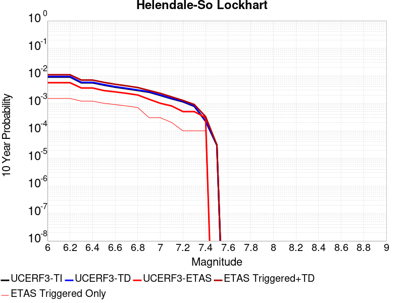 |

| Magnitude | 1 wk TI Prob | 1 wk TD Prob | 1 wk ETAS Prob | 1 wk ETAS/TD Gain | 1 wk ETAS Triggered+TD | 1 wk ETAS Triggered Only | 1 mo TI Prob | 1 mo TD Prob | 1 mo ETAS Prob | 1 mo ETAS/TD Gain | 1 mo ETAS Triggered+TD | 1 mo ETAS Triggered Only | 1 yr TI Prob | 1 yr TD Prob | 1 yr ETAS Prob | 1 yr ETAS/TD Gain | 1 yr ETAS Triggered+TD | 1 yr ETAS Triggered Only | 10 yr TI Prob | 10 yr TD Prob | 10 yr ETAS Prob | 10 yr ETAS/TD Gain | 10 yr ETAS Triggered+TD | 10 yr ETAS Triggered Only |
|-----|-----|-----|-----|-----|-----|-----|-----|-----|-----|-----|-----|-----|-----|-----|-----|-----|-----|-----|-----|-----|-----|-----|-----|-----|
| 6.0 | 1.7296055E-5 | 1.8094886E-5 | 0.0 | 0.0 | 1.8094886E-5 | 0.0 | 7.412385E-5 | 7.754733E-5 | 1.0E-4 | 1.289535 | 1.7753958E-4 | 1.0E-4 | 9.0208417E-4 | 9.437505E-4 | 4.0E-4 | 0.42384085 | 0.0010436561 | 1.0E-4 | 0.008984311 | 0.0093995435 | 0.0056 | 0.59577364 | 0.010885444 | 0.0015 |
| 6.1 | 1.7296055E-5 | 1.8094886E-5 | 0.0 | 0.0 | 1.8094886E-5 | 0.0 | 7.412385E-5 | 7.754733E-5 | 1.0E-4 | 1.289535 | 1.7753958E-4 | 1.0E-4 | 9.0208417E-4 | 9.437505E-4 | 4.0E-4 | 0.42384085 | 0.0010436561 | 1.0E-4 | 0.008984311 | 0.0093995435 | 0.0056 | 0.59577364 | 0.010885444 | 0.0015 |
| 6.2 | 1.7296055E-5 | 1.8094886E-5 | 0.0 | 0.0 | 1.8094886E-5 | 0.0 | 7.412385E-5 | 7.754733E-5 | 1.0E-4 | 1.289535 | 1.7753958E-4 | 1.0E-4 | 9.0208417E-4 | 9.437505E-4 | 4.0E-4 | 0.42384085 | 0.0010436561 | 1.0E-4 | 0.008984311 | 0.0093995435 | 0.0056 | 0.59577364 | 0.010885444 | 0.0015 |
| 6.3 | 1.0669118E-5 | 1.1130337E-5 | 0.0 | 0.0 | 1.1130337E-5 | 0.0 | 4.5723988E-5 | 4.770059E-5 | 0.0 | 0.0 | 4.770059E-5 | 0.0 | 5.5654737E-4 | 5.806027E-4 | 3.0E-4 | 0.51670444 | 5.806027E-4 | 0.0 | 0.0055515557 | 0.005791154 | 0.0036 | 0.62163776 | 0.0069842045 | 0.0012 |
| 6.4 | 1.0669118E-5 | 1.1130337E-5 | 0.0 | 0.0 | 1.1130337E-5 | 0.0 | 4.5723988E-5 | 4.770059E-5 | 0.0 | 0.0 | 4.770059E-5 | 0.0 | 5.5654737E-4 | 5.806027E-4 | 3.0E-4 | 0.51670444 | 5.806027E-4 | 0.0 | 0.0055515557 | 0.005791154 | 0.0036 | 0.62163776 | 0.0069842045 | 0.0012 |
| 6.5 | 8.790038E-6 | 9.166051E-6 | 0.0 | 0.0 | 9.166051E-6 | 0.0 | 3.767105E-5 | 3.9282495E-5 | 0.0 | 0.0 | 3.9282495E-5 | 0.0 | 4.585485E-4 | 4.7816095E-4 | 1.0E-4 | 0.20913461 | 4.7816095E-4 | 0.0 | 0.0045760344 | 0.0047714855 | 0.0029 | 0.6077772 | 0.005766714 | 0.001 |
| 6.6 | 7.396949E-6 | 7.712063E-6 | 0.0 | 0.0 | 7.712063E-6 | 0.0 | 3.1700827E-5 | 3.3051285E-5 | 0.0 | 0.0 | 3.3051285E-5 | 0.0 | 3.858892E-4 | 4.023261E-4 | 1.0E-4 | 0.24855457 | 4.023261E-4 | 0.0 | 0.003852198 | 0.0040160846 | 0.0026 | 0.64739674 | 0.00491247 | 9.0E-4 |
| 6.7 | 6.4600285E-6 | 6.7349997E-6 | 0.0 | 0.0 | 6.7349997E-6 | 0.0 | 2.7685543E-5 | 2.886397E-5 | 0.0 | 0.0 | 2.886397E-5 | 0.0 | 3.3701936E-4 | 3.5136295E-4 | 1.0E-4 | 0.28460598 | 3.5136295E-4 | 0.0 | 0.0033650869 | 0.0035081557 | 0.0023 | 0.65561515 | 0.004305349 | 8.0E-4 |
| 6.8 | 5.600104E-6 | 5.833441E-6 | 0.0 | 0.0 | 5.833441E-6 | 0.0 | 2.4000226E-5 | 2.5000225E-5 | 0.0 | 0.0 | 2.5000225E-5 | 0.0 | 2.9216358E-4 | 3.0433582E-4 | 1.0E-4 | 0.3285844 | 3.0433582E-4 | 0.0 | 0.0029177975 | 0.0030392518 | 0.002 | 0.6580567 | 0.0037371244 | 7.0E-4 |
| 6.9 | 4.839122E-6 | 5.0373296E-6 | 0.0 | 0.0 | 5.0373296E-6 | 0.0 | 2.0738931E-5 | 2.158838E-5 | 0.0 | 0.0 | 2.158838E-5 | 0.0 | 2.5246723E-4 | 2.6280727E-4 | 0.0 | 0.0 | 2.6280727E-4 | 0.0 | 0.002521806 | 0.0026250123 | 0.0014 | 0.5333308 | 0.0029242248 | 3.0E-4 |
| 7.0 | 3.6937633E-6 | 3.8435614E-6 | 0.0 | 0.0 | 3.8435614E-6 | 0.0 | 1.5830317E-5 | 1.6472304E-5 | 0.0 | 0.0 | 1.6472304E-5 | 0.0 | 1.9271708E-4 | 2.0053216E-4 | 0.0 | 0.0 | 2.0053216E-4 | 0.0 | 0.0019255003 | 0.0020035435 | 0.001 | 0.49911568 | 0.0023029426 | 3.0E-4 |
| 7.1 | 2.7858857E-6 | 2.8966379E-6 | 0.0 | 0.0 | 2.8966379E-6 | 0.0 | 1.1939455E-5 | 1.2414104E-5 | 0.0 | 0.0 | 1.2414104E-5 | 0.0 | 1.4535317E-4 | 1.5113145E-4 | 0.0 | 0.0 | 1.5113145E-4 | 0.0 | 0.0014525814 | 0.0015103082 | 8.0E-4 | 0.5296932 | 0.0017100062 | 2.0E-4 |
| 7.2 | 2.1672065E-6 | 2.2530703E-6 | 0.0 | 0.0 | 2.2530703E-6 | 0.0 | 9.2879945E-6 | 9.655981E-6 | 0.0 | 0.0 | 9.655981E-6 | 0.0 | 1.1307546E-4 | 1.17555406E-4 | 0.0 | 0.0 | 1.17555406E-4 | 0.0 | 0.0011301794 | 0.0011749504 | 5.0E-4 | 0.42554986 | 0.001274833 | 1.0E-4 |
| 7.3 | 1.4823496E-6 | 1.5415601E-6 | 0.0 | 0.0 | 1.5415601E-6 | 0.0 | 6.3529114E-6 | 6.6066705E-6 | 0.0 | 0.0 | 6.6066705E-6 | 0.0 | 7.734395E-5 | 8.04334E-5 | 0.0 | 0.0 | 8.04334E-5 | 0.0 | 7.731704E-4 | 8.040579E-4 | 5.0E-4 | 0.6218457 | 9.0397755E-4 | 1.0E-4 |
| 7.4 | 4.2321457E-7 | 4.4089322E-7 | 0.0 | 0.0 | 4.4089322E-7 | 0.0 | 1.8137755E-6 | 1.8895413E-6 | 0.0 | 0.0 | 1.8895413E-6 | 0.0 | 2.2082493E-5 | 2.3004968E-5 | 0.0 | 0.0 | 2.3004968E-5 | 0.0 | 2.2080299E-4 | 2.3003039E-4 | 3.0E-4 | 1.3041755 | 3.300074E-4 | 1.0E-4 |
| 7.5 | 5.6942316E-8 | 5.938871E-8 | 0.0 | 0.0 | 5.938871E-8 | 0.0 | 2.440385E-7 | 2.5452303E-7 | 0.0 | 0.0 | 2.5452303E-7 | 0.0 | 2.9711643E-6 | 3.0988142E-6 | 0.0 | 0.0 | 3.0988142E-6 | 0.0 | 2.9711247E-5 | 3.0987787E-5 | 0.0 | 0.0 | 3.0987787E-5 | 0.0 |

## Big Pine (East)
*[(top)](#table-of-contents)*

| 1 Week | 1 Month | 1 Year | 10 Year |
|-----|-----|-----|-----|
|  | 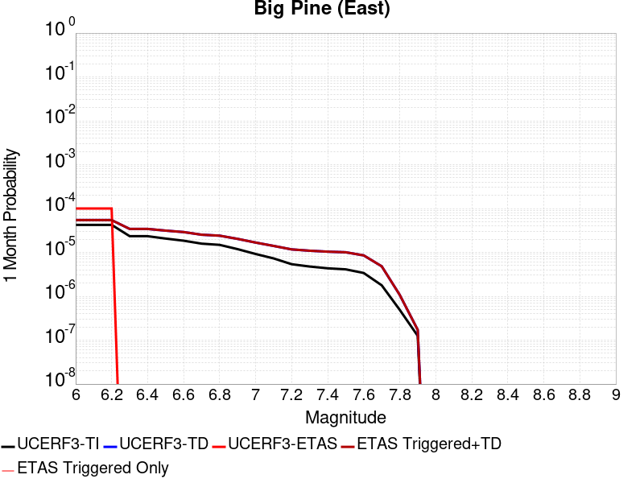 | 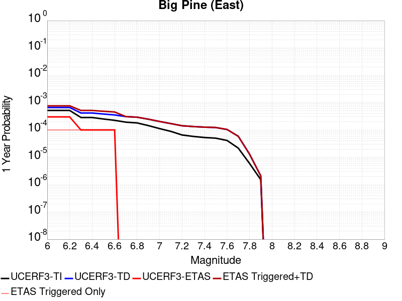 |  |

| Magnitude | 1 wk TI Prob | 1 wk TD Prob | 1 wk ETAS Prob | 1 wk ETAS/TD Gain | 1 wk ETAS Triggered+TD | 1 wk ETAS Triggered Only | 1 mo TI Prob | 1 mo TD Prob | 1 mo ETAS Prob | 1 mo ETAS/TD Gain | 1 mo ETAS Triggered+TD | 1 mo ETAS Triggered Only | 1 yr TI Prob | 1 yr TD Prob | 1 yr ETAS Prob | 1 yr ETAS/TD Gain | 1 yr ETAS Triggered+TD | 1 yr ETAS Triggered Only | 10 yr TI Prob | 10 yr TD Prob | 10 yr ETAS Prob | 10 yr ETAS/TD Gain | 10 yr ETAS Triggered+TD | 10 yr ETAS Triggered Only |
|-----|-----|-----|-----|-----|-----|-----|-----|-----|-----|-----|-----|-----|-----|-----|-----|-----|-----|-----|-----|-----|-----|-----|-----|-----|
| 6.0 | 9.916913E-6 | 1.2717424E-5 | 0.0 | 0.0 | 1.2717424E-5 | 0.0 | 4.250036E-5 | 5.4502234E-5 | 1.0E-4 | 1.8347872 | 5.4502234E-5 | 0.0 | 5.173191E-4 | 6.633847E-4 | 3.0E-4 | 0.45222628 | 7.633184E-4 | 1.0E-4 | 0.0051611643 | 0.0066197775 | 0.0058 | 0.87616235 | 0.008109848 | 0.0015 |
| 6.1 | 9.916913E-6 | 1.2717424E-5 | 0.0 | 0.0 | 1.2717424E-5 | 0.0 | 4.250036E-5 | 5.4502234E-5 | 1.0E-4 | 1.8347872 | 5.4502234E-5 | 0.0 | 5.173191E-4 | 6.633847E-4 | 3.0E-4 | 0.45222628 | 7.633184E-4 | 1.0E-4 | 0.0051611643 | 0.0066197775 | 0.0058 | 0.87616235 | 0.008109848 | 0.0015 |
| 6.2 | 9.916913E-6 | 1.2717424E-5 | 0.0 | 0.0 | 1.2717424E-5 | 0.0 | 4.250036E-5 | 5.4502234E-5 | 1.0E-4 | 1.8347872 | 5.4502234E-5 | 0.0 | 5.173191E-4 | 6.633847E-4 | 3.0E-4 | 0.45222628 | 7.633184E-4 | 1.0E-4 | 0.0051611643 | 0.0066197775 | 0.0058 | 0.87616235 | 0.008109848 | 0.0015 |
| 6.3 | 5.479711E-6 | 8.0163445E-6 | 0.0 | 0.0 | 8.0163445E-6 | 0.0 | 2.3484265E-5 | 3.435533E-5 | 0.0 | 0.0 | 3.435533E-5 | 0.0 | 2.858834E-4 | 4.18199E-4 | 1.0E-4 | 0.23912062 | 5.181572E-4 | 1.0E-4 | 0.0028551589 | 0.004177993 | 0.0037 | 0.88559264 | 0.005074233 | 9.0E-4 |
| 6.4 | 5.465009E-6 | 8.000649E-6 | 0.0 | 0.0 | 8.000649E-6 | 0.0 | 2.3421257E-5 | 3.4288067E-5 | 0.0 | 0.0 | 3.4288067E-5 | 0.0 | 2.851165E-4 | 4.1738036E-4 | 1.0E-4 | 0.2395896 | 5.1733863E-4 | 1.0E-4 | 0.0028475097 | 0.0041698376 | 0.0037 | 0.88732475 | 0.0050660847 | 9.0E-4 |
| 6.5 | 4.826767E-6 | 7.326111E-6 | 0.0 | 0.0 | 7.326111E-6 | 0.0 | 2.068598E-5 | 3.1397256E-5 | 0.0 | 0.0 | 3.1397256E-5 | 0.0 | 2.518227E-4 | 3.8219726E-4 | 1.0E-4 | 0.261645 | 4.8215906E-4 | 1.0E-4 | 0.0025153751 | 0.0038192312 | 0.0035 | 0.9164148 | 0.004616176 | 8.0E-4 |
| 6.6 | 4.3146847E-6 | 6.786355E-6 | 0.0 | 0.0 | 6.786355E-6 | 0.0 | 1.8491375E-5 | 2.9084067E-5 | 0.0 | 0.0 | 2.9084067E-5 | 0.0 | 2.2510924E-4 | 3.5404338E-4 | 1.0E-4 | 0.28245124 | 4.54008E-4 | 1.0E-4 | 0.0022488134 | 0.003538593 | 0.0033 | 0.93257403 | 0.004335762 | 8.0E-4 |
| 6.7 | 3.6968106E-6 | 5.9052136E-6 | 0.0 | 0.0 | 5.9052136E-6 | 0.0 | 1.5843378E-5 | 2.5307821E-5 | 0.0 | 0.0 | 2.5307821E-5 | 0.0 | 1.9287605E-4 | 3.0808066E-4 | 0.0 | 0.0 | 3.0808066E-4 | 0.0 | 0.0019270873 | 0.0030802467 | 0.003 | 0.97394794 | 0.0037780905 | 7.0E-4 |
| 6.8 | 3.4671132E-6 | 5.6143613E-6 | 0.0 | 0.0 | 5.6143613E-6 | 0.0 | 1.4858972E-5 | 2.4061335E-5 | 0.0 | 0.0 | 2.4061335E-5 | 0.0 | 1.8089297E-4 | 2.9290878E-4 | 0.0 | 0.0 | 2.9290878E-4 | 0.0 | 0.0018074579 | 0.0029289299 | 0.0024 | 0.8194119 | 0.0034274654 | 5.0E-4 |
| 6.9 | 2.7686972E-6 | 4.744144E-6 | 0.0 | 0.0 | 4.744144E-6 | 0.0 | 1.1865792E-5 | 2.0331892E-5 | 0.0 | 0.0 | 2.0331892E-5 | 0.0 | 1.4445644E-4 | 2.475134E-4 | 0.0 | 0.0 | 2.475134E-4 | 0.0 | 0.0014436257 | 0.0024760137 | 0.0016 | 0.6462 | 0.0026755184 | 2.0E-4 |
| 7.0 | 2.1472624E-6 | 3.911395E-6 | 0.0 | 0.0 | 3.911395E-6 | 0.0 | 9.20252E-6 | 1.6763019E-5 | 0.0 | 0.0 | 1.6763019E-5 | 0.0 | 1.12034926E-4 | 2.0407116E-4 | 0.0 | 0.0 | 2.0407116E-4 | 0.0 | 0.0011197845 | 0.0020424502 | 0.0011 | 0.5385688 | 0.002142246 | 1.0E-4 |
| 7.1 | 1.7018335E-6 | 3.2778523E-6 | 0.0 | 0.0 | 3.2778523E-6 | 0.0 | 7.293552E-6 | 1.4047864E-5 | 0.0 | 0.0 | 1.4047864E-5 | 0.0 | 8.879537E-5 | 1.7101968E-4 | 0.0 | 0.0 | 1.7101968E-4 | 0.0 | 8.87599E-4 | 0.0017124636 | 0.001 | 0.58395404 | 0.0018122923 | 1.0E-4 |
| 7.2 | 1.25603E-6 | 2.7311708E-6 | 0.0 | 0.0 | 2.7311708E-6 | 0.0 | 5.3829745E-6 | 1.1704967E-5 | 0.0 | 0.0 | 1.1704967E-5 | 0.0 | 6.553574E-5 | 1.4249886E-4 | 0.0 | 0.0 | 1.4249886E-4 | 0.0 | 6.551642E-4 | 0.0014276317 | 0.001 | 0.70046073 | 0.001527489 | 1.0E-4 |
| 7.3 | 1.112297E-6 | 2.5505421E-6 | 0.0 | 0.0 | 2.5505421E-6 | 0.0 | 4.7669787E-6 | 1.093085E-5 | 0.0 | 0.0 | 1.093085E-5 | 0.0 | 5.803642E-5 | 1.3307518E-4 | 0.0 | 0.0 | 1.3307518E-4 | 0.0 | 5.802127E-4 | 0.0013333561 | 8.0E-4 | 0.5999897 | 0.0014332228 | 1.0E-4 |
| 7.4 | 1.0137181E-6 | 2.4262638E-6 | 0.0 | 0.0 | 2.4262638E-6 | 0.0 | 4.3444993E-6 | 1.0398234E-5 | 0.0 | 0.0 | 1.0398234E-5 | 0.0 | 5.2892992E-5 | 1.2659135E-4 | 0.0 | 0.0 | 1.2659135E-4 | 0.0 | 5.288041E-4 | 0.0012684112 | 8.0E-4 | 0.6307103 | 0.0013682843 | 1.0E-4 |
| 7.5 | 9.598608E-7 | 2.3516236E-6 | 0.0 | 0.0 | 2.3516236E-6 | 0.0 | 4.1136827E-6 | 1.0078349E-5 | 0.0 | 0.0 | 1.0078349E-5 | 0.0 | 5.0082934E-5 | 1.226972E-4 | 0.0 | 0.0 | 1.226972E-4 | 0.0 | 5.007165E-4 | 0.0012293095 | 8.0E-4 | 0.6507718 | 0.0013291866 | 1.0E-4 |
| 7.6 | 7.929459E-7 | 1.9958393E-6 | 0.0 | 0.0 | 1.9958393E-6 | 0.0 | 3.3983351E-6 | 8.55357E-6 | 0.0 | 0.0 | 8.55357E-6 | 0.0 | 4.1373947E-5 | 1.0413491E-4 | 0.0 | 0.0 | 1.0413491E-4 | 0.0 | 4.1366243E-4 | 0.0010437943 | 7.0E-4 | 0.6706302 | 0.00114369 | 1.0E-4 |
| 7.7 | 4.155788E-7 | 1.1258439E-6 | 0.0 | 0.0 | 1.1258439E-6 | 0.0 | 1.7810507E-6 | 4.825037E-6 | 0.0 | 0.0 | 4.825037E-6 | 0.0 | 2.1684076E-5 | 5.874328E-5 | 0.0 | 0.0 | 5.874328E-5 | 0.0 | 2.1681961E-4 | 5.910641E-4 | 3.0E-4 | 0.5075592 | 5.910641E-4 | 0.0 |
| 7.8 | 1.14666925E-7 | 2.5129995E-7 | 0.0 | 0.0 | 2.5129995E-7 | 0.0 | 4.914296E-7 | 1.0769994E-6 | 0.0 | 0.0 | 1.0769994E-6 | 0.0 | 5.9831386E-6 | 1.31123925E-5 | 0.0 | 0.0 | 1.31123925E-5 | 0.0 | 5.9829777E-5 | 1.3229302E-4 | 0.0 | 0.0 | 1.3229302E-4 | 0.0 |
| 7.9 | 2.9231824E-8 | 4.005187E-8 | 0.0 | 0.0 | 4.005187E-8 | 0.0 | 1.2527924E-7 | 1.7165085E-7 | 0.0 | 0.0 | 1.7165085E-7 | 0.0 | 1.5252737E-6 | 2.0898474E-6 | 0.0 | 0.0 | 2.0898474E-6 | 0.0 | 1.5252632E-5 | 2.1239879E-5 | 0.0 | 0.0 | 2.1239879E-5 | 0.0 |

## Clayton
*[(top)](#table-of-contents)*

| 1 Week | 1 Month | 1 Year | 10 Year |
|-----|-----|-----|-----|
| 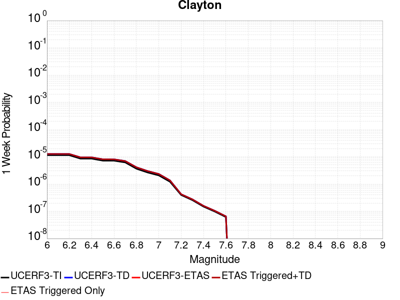 |  |  |  |

| Magnitude | 1 wk TI Prob | 1 wk TD Prob | 1 wk ETAS Prob | 1 wk ETAS/TD Gain | 1 wk ETAS Triggered+TD | 1 wk ETAS Triggered Only | 1 mo TI Prob | 1 mo TD Prob | 1 mo ETAS Prob | 1 mo ETAS/TD Gain | 1 mo ETAS Triggered+TD | 1 mo ETAS Triggered Only | 1 yr TI Prob | 1 yr TD Prob | 1 yr ETAS Prob | 1 yr ETAS/TD Gain | 1 yr ETAS Triggered+TD | 1 yr ETAS Triggered Only | 10 yr TI Prob | 10 yr TD Prob | 10 yr ETAS Prob | 10 yr ETAS/TD Gain | 10 yr ETAS Triggered+TD | 10 yr ETAS Triggered Only |
|-----|-----|-----|-----|-----|-----|-----|-----|-----|-----|-----|-----|-----|-----|-----|-----|-----|-----|-----|-----|-----|-----|-----|-----|-----|
| 6.0 | 1.1413061E-5 | 1.2652709E-5 | 0.0 | 0.0 | 1.2652709E-5 | 0.0 | 4.89122E-5 | 5.4224896E-5 | 0.0 | 0.0 | 5.4224896E-5 | 0.0 | 5.953433E-4 | 6.600103E-4 | 3.0E-4 | 0.45453835 | 6.600103E-4 | 0.0 | 0.005937509 | 0.0065826993 | 0.0048 | 0.72918415 | 0.008072825 | 0.0015 |
| 6.1 | 1.1413061E-5 | 1.2652709E-5 | 0.0 | 0.0 | 1.2652709E-5 | 0.0 | 4.89122E-5 | 5.4224896E-5 | 0.0 | 0.0 | 5.4224896E-5 | 0.0 | 5.953433E-4 | 6.600103E-4 | 3.0E-4 | 0.45453835 | 6.600103E-4 | 0.0 | 0.005937509 | 0.0065826993 | 0.0048 | 0.72918415 | 0.008072825 | 0.0015 |
| 6.2 | 1.1413061E-5 | 1.2652709E-5 | 0.0 | 0.0 | 1.2652709E-5 | 0.0 | 4.89122E-5 | 5.4224896E-5 | 0.0 | 0.0 | 5.4224896E-5 | 0.0 | 5.953433E-4 | 6.600103E-4 | 3.0E-4 | 0.45453835 | 6.600103E-4 | 0.0 | 0.005937509 | 0.0065826993 | 0.0048 | 0.72918415 | 0.008072825 | 0.0015 |
| 6.3 | 8.538689E-6 | 9.521361E-6 | 0.0 | 0.0 | 9.521361E-6 | 0.0 | 3.659387E-5 | 4.0805255E-5 | 0.0 | 0.0 | 4.0805255E-5 | 0.0 | 4.4543925E-4 | 4.9670145E-4 | 3.0E-4 | 0.60398453 | 4.9670145E-4 | 0.0 | 0.0044454746 | 0.004956976 | 0.0031 | 0.6253813 | 0.0059520192 | 0.001 |
| 6.4 | 8.538689E-6 | 9.521361E-6 | 0.0 | 0.0 | 9.521361E-6 | 0.0 | 3.659387E-5 | 4.0805255E-5 | 0.0 | 0.0 | 4.0805255E-5 | 0.0 | 4.4543925E-4 | 4.9670145E-4 | 3.0E-4 | 0.60398453 | 4.9670145E-4 | 0.0 | 0.0044454746 | 0.004956976 | 0.0031 | 0.6253813 | 0.0059520192 | 0.001 |
| 6.5 | 7.197462E-6 | 8.070808E-6 | 0.0 | 0.0 | 8.070808E-6 | 0.0 | 3.08459E-5 | 3.4588764E-5 | 0.0 | 0.0 | 3.4588764E-5 | 0.0 | 3.7548412E-4 | 4.2104503E-4 | 3.0E-4 | 0.71251285 | 4.2104503E-4 | 0.0 | 0.003748503 | 0.004203283 | 0.0026 | 0.61856407 | 0.00519908 | 0.001 |
| 6.6 | 7.1760483E-6 | 8.046854E-6 | 0.0 | 0.0 | 8.046854E-6 | 0.0 | 3.075413E-5 | 3.4486107E-5 | 0.0 | 0.0 | 3.4486107E-5 | 0.0 | 3.743672E-4 | 4.197957E-4 | 3.0E-4 | 0.71463335 | 4.197957E-4 | 0.0 | 0.0037373714 | 0.0041908366 | 0.0026 | 0.6204012 | 0.005186646 | 0.001 |
| 6.7 | 6.202582E-6 | 6.9678167E-6 | 0.0 | 0.0 | 6.9678167E-6 | 0.0 | 2.6582224E-5 | 2.9861772E-5 | 0.0 | 0.0 | 2.9861772E-5 | 0.0 | 3.235905E-4 | 3.635141E-4 | 2.0E-4 | 0.550185 | 3.635141E-4 | 0.0 | 0.0032311971 | 0.0036299485 | 0.0019 | 0.5234234 | 0.0042277705 | 6.0E-4 |
| 6.8 | 3.6417277E-6 | 4.115845E-6 | 0.0 | 0.0 | 4.115845E-6 | 0.0 | 1.5607311E-5 | 1.763922E-5 | 0.0 | 0.0 | 1.763922E-5 | 0.0 | 1.9000245E-4 | 2.1473711E-4 | 1.0E-4 | 0.4656857 | 2.1473711E-4 | 0.0 | 0.0018984007 | 0.0021453723 | 0.001 | 0.46611956 | 0.0023449431 | 2.0E-4 |
| 6.9 | 2.6498485E-6 | 2.9955984E-6 | 0.0 | 0.0 | 2.9955984E-6 | 0.0 | 1.1356444E-5 | 1.2838218E-5 | 0.0 | 0.0 | 1.2838218E-5 | 0.0 | 1.3825593E-4 | 1.562945E-4 | 1.0E-4 | 0.63981783 | 1.562945E-4 | 0.0 | 0.0013816995 | 0.0015618851 | 8.0E-4 | 0.51220155 | 0.0017615728 | 2.0E-4 |
| 7.0 | 2.070442E-6 | 2.3377002E-6 | 0.0 | 0.0 | 2.3377002E-6 | 0.0 | 8.873292E-6 | 1.0018678E-5 | 0.0 | 0.0 | 1.0018678E-5 | 0.0 | 1.0802698E-4 | 1.2197087E-4 | 1.0E-4 | 0.81986785 | 1.2197087E-4 | 0.0 | 0.0010797448 | 0.001219069 | 6.0E-4 | 0.49217886 | 0.0013189472 | 1.0E-4 |
| 7.1 | 1.2111691E-6 | 1.35727E-6 | 0.0 | 0.0 | 1.35727E-6 | 0.0 | 5.190714E-6 | 5.8168594E-6 | 0.0 | 0.0 | 5.8168594E-6 | 0.0 | 6.319511E-5 | 7.0818125E-5 | 1.0E-4 | 1.4120679 | 7.0818125E-5 | 0.0 | 6.3177146E-4 | 7.0797186E-4 | 4.0E-4 | 0.56499416 | 7.0797186E-4 | 0.0 |
| 7.2 | 3.9541607E-7 | 4.2207304E-7 | 0.0 | 0.0 | 4.2207304E-7 | 0.0 | 1.6946392E-6 | 1.8088832E-6 | 0.0 | 0.0 | 1.8088832E-6 | 0.0 | 2.0632036E-5 | 2.2022932E-5 | 0.0 | 0.0 | 2.2022932E-5 | 0.0 | 2.063012E-4 | 2.2020764E-4 | 1.0E-4 | 0.45411682 | 2.2020764E-4 | 0.0 |
| 7.3 | 2.5685637E-7 | 2.7442894E-7 | 0.0 | 0.0 | 2.7442894E-7 | 0.0 | 1.1008126E-6 | 1.1761234E-6 | 0.0 | 0.0 | 1.1761234E-6 | 0.0 | 1.3402311E-5 | 1.431921E-5 | 0.0 | 0.0 | 1.431921E-5 | 0.0 | 1.3401502E-4 | 1.4318294E-4 | 0.0 | 0.0 | 1.4318294E-4 | 0.0 |
| 7.4 | 1.482299E-7 | 1.5803452E-7 | 0.0 | 0.0 | 1.5803452E-7 | 0.0 | 6.3527085E-7 | 6.772906E-7 | 0.0 | 0.0 | 6.772906E-7 | 0.0 | 7.734395E-6 | 8.245982E-6 | 0.0 | 0.0 | 8.245982E-6 | 0.0 | 7.734126E-5 | 8.245679E-5 | 0.0 | 0.0 | 8.245679E-5 | 0.0 |
| 7.5 | 9.7969505E-8 | 1.0435528E-7 | 0.0 | 0.0 | 1.0435528E-7 | 0.0 | 4.1986925E-7 | 4.4723686E-7 | 0.0 | 0.0 | 4.4723686E-7 | 0.0 | 5.111896E-6 | 5.445095E-6 | 0.0 | 0.0 | 5.445095E-6 | 0.0 | 5.1117782E-5 | 5.4449636E-5 | 0.0 | 0.0 | 5.4449636E-5 | 0.0 |
| 7.6 | 6.125415E-8 | 6.521665E-8 | 0.0 | 0.0 | 6.521665E-8 | 0.0 | 2.6251774E-7 | 2.7949991E-7 | 0.0 | 0.0 | 2.7949991E-7 | 0.0 | 3.196149E-6 | 3.4029063E-6 | 0.0 | 0.0 | 3.4029063E-6 | 0.0 | 3.196103E-5 | 3.402855E-5 | 0.0 | 0.0 | 3.402855E-5 | 0.0 |

## Burnt Mtn
*[(top)](#table-of-contents)*

| 1 Week | 1 Month | 1 Year | 10 Year |
|-----|-----|-----|-----|
| 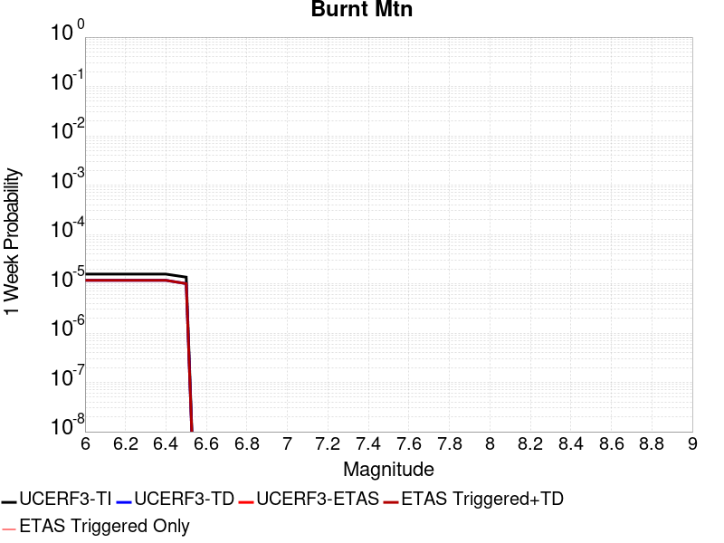 |  | 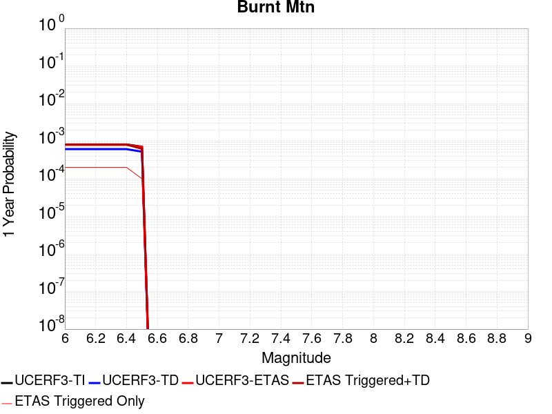 |  |

| Magnitude | 1 wk TI Prob | 1 wk TD Prob | 1 wk ETAS Prob | 1 wk ETAS/TD Gain | 1 wk ETAS Triggered+TD | 1 wk ETAS Triggered Only | 1 mo TI Prob | 1 mo TD Prob | 1 mo ETAS Prob | 1 mo ETAS/TD Gain | 1 mo ETAS Triggered+TD | 1 mo ETAS Triggered Only | 1 yr TI Prob | 1 yr TD Prob | 1 yr ETAS Prob | 1 yr ETAS/TD Gain | 1 yr ETAS Triggered+TD | 1 yr ETAS Triggered Only | 10 yr TI Prob | 10 yr TD Prob | 10 yr ETAS Prob | 10 yr ETAS/TD Gain | 10 yr ETAS Triggered+TD | 10 yr ETAS Triggered Only |
|-----|-----|-----|-----|-----|-----|-----|-----|-----|-----|-----|-----|-----|-----|-----|-----|-----|-----|-----|-----|-----|-----|-----|-----|-----|
| 6.0 | 1.5673151E-5 | 1.1737301E-5 | 0.0 | 0.0 | 1.1737301E-5 | 0.0 | 6.716892E-5 | 5.0302475E-5 | 0.0 | 0.0 | 5.0302475E-5 | 0.0 | 8.1747473E-4 | 6.123892E-4 | 8.0E-4 | 1.3063588 | 8.122667E-4 | 2.0E-4 | 0.008144741 | 0.006119633 | 0.0044 | 0.71899736 | 0.0076104538 | 0.0015 |
| 6.1 | 1.5673151E-5 | 1.1737301E-5 | 0.0 | 0.0 | 1.1737301E-5 | 0.0 | 6.716892E-5 | 5.0302475E-5 | 0.0 | 0.0 | 5.0302475E-5 | 0.0 | 8.1747473E-4 | 6.123892E-4 | 8.0E-4 | 1.3063588 | 8.122667E-4 | 2.0E-4 | 0.008144741 | 0.006119633 | 0.0044 | 0.71899736 | 0.0076104538 | 0.0015 |
| 6.2 | 1.5673151E-5 | 1.1737301E-5 | 0.0 | 0.0 | 1.1737301E-5 | 0.0 | 6.716892E-5 | 5.0302475E-5 | 0.0 | 0.0 | 5.0302475E-5 | 0.0 | 8.1747473E-4 | 6.123892E-4 | 8.0E-4 | 1.3063588 | 8.122667E-4 | 2.0E-4 | 0.008144741 | 0.006119633 | 0.0044 | 0.71899736 | 0.0076104538 | 0.0015 |
| 6.3 | 1.5673151E-5 | 1.1737301E-5 | 0.0 | 0.0 | 1.1737301E-5 | 0.0 | 6.716892E-5 | 5.0302475E-5 | 0.0 | 0.0 | 5.0302475E-5 | 0.0 | 8.1747473E-4 | 6.123892E-4 | 8.0E-4 | 1.3063588 | 8.122667E-4 | 2.0E-4 | 0.008144741 | 0.006119633 | 0.0044 | 0.71899736 | 0.0076104538 | 0.0015 |
| 6.4 | 1.5673151E-5 | 1.1737301E-5 | 0.0 | 0.0 | 1.1737301E-5 | 0.0 | 6.716892E-5 | 5.0302475E-5 | 0.0 | 0.0 | 5.0302475E-5 | 0.0 | 8.1747473E-4 | 6.123892E-4 | 8.0E-4 | 1.3063588 | 8.122667E-4 | 2.0E-4 | 0.008144741 | 0.006119633 | 0.0044 | 0.71899736 | 0.0076104538 | 0.0015 |
| 6.5 | 1.36191375E-5 | 1.0068775E-5 | 0.0 | 0.0 | 1.0068775E-5 | 0.0 | 5.8366426E-5 | 4.3151893E-5 | 0.0 | 0.0 | 4.3151893E-5 | 0.0 | 7.103795E-4 | 5.253743E-4 | 7.0E-4 | 1.3323834 | 6.2532176E-4 | 1.0E-4 | 0.0070811296 | 0.005253743 | 0.0042 | 0.79943 | 0.006546913 | 0.0013 |

## Hartley Springs 2011 CFM
*[(top)](#table-of-contents)*

| 1 Week | 1 Month | 1 Year | 10 Year |
|-----|-----|-----|-----|
|  |  | 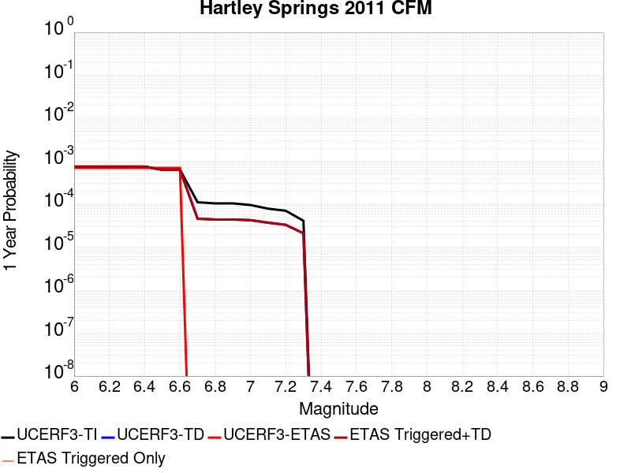 | 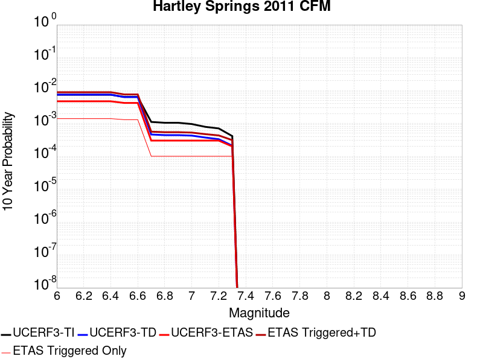 |

| Magnitude | 1 wk TI Prob | 1 wk TD Prob | 1 wk ETAS Prob | 1 wk ETAS/TD Gain | 1 wk ETAS Triggered+TD | 1 wk ETAS Triggered Only | 1 mo TI Prob | 1 mo TD Prob | 1 mo ETAS Prob | 1 mo ETAS/TD Gain | 1 mo ETAS Triggered+TD | 1 mo ETAS Triggered Only | 1 yr TI Prob | 1 yr TD Prob | 1 yr ETAS Prob | 1 yr ETAS/TD Gain | 1 yr ETAS Triggered+TD | 1 yr ETAS Triggered Only | 10 yr TI Prob | 10 yr TD Prob | 10 yr ETAS Prob | 10 yr ETAS/TD Gain | 10 yr ETAS Triggered+TD | 10 yr ETAS Triggered Only |
|-----|-----|-----|-----|-----|-----|-----|-----|-----|-----|-----|-----|-----|-----|-----|-----|-----|-----|-----|-----|-----|-----|-----|-----|-----|
| 6.0 | 1.4352418E-5 | 1.4410377E-5 | 0.0 | 0.0 | 1.4410377E-5 | 0.0 | 6.1508916E-5 | 6.175822E-5 | 1.0E-4 | 1.6192176 | 6.175822E-5 | 0.0 | 7.486137E-4 | 7.5181096E-4 | 7.0E-4 | 0.9310851 | 7.5181096E-4 | 0.0 | 0.007460968 | 0.00750876 | 0.0047 | 0.62593555 | 0.008898248 | 0.0014 |
| 6.1 | 1.4352418E-5 | 1.4410377E-5 | 0.0 | 0.0 | 1.4410377E-5 | 0.0 | 6.1508916E-5 | 6.175822E-5 | 1.0E-4 | 1.6192176 | 6.175822E-5 | 0.0 | 7.486137E-4 | 7.5181096E-4 | 7.0E-4 | 0.9310851 | 7.5181096E-4 | 0.0 | 0.007460968 | 0.00750876 | 0.0047 | 0.62593555 | 0.008898248 | 0.0014 |
| 6.2 | 1.4352418E-5 | 1.4410377E-5 | 0.0 | 0.0 | 1.4410377E-5 | 0.0 | 6.1508916E-5 | 6.175822E-5 | 1.0E-4 | 1.6192176 | 6.175822E-5 | 0.0 | 7.486137E-4 | 7.5181096E-4 | 7.0E-4 | 0.9310851 | 7.5181096E-4 | 0.0 | 0.007460968 | 0.00750876 | 0.0047 | 0.62593555 | 0.008898248 | 0.0014 |
| 6.3 | 1.4352418E-5 | 1.4410377E-5 | 0.0 | 0.0 | 1.4410377E-5 | 0.0 | 6.1508916E-5 | 6.175822E-5 | 1.0E-4 | 1.6192176 | 6.175822E-5 | 0.0 | 7.486137E-4 | 7.5181096E-4 | 7.0E-4 | 0.9310851 | 7.5181096E-4 | 0.0 | 0.007460968 | 0.00750876 | 0.0047 | 0.62593555 | 0.008898248 | 0.0014 |
| 6.4 | 1.4352418E-5 | 1.4410377E-5 | 0.0 | 0.0 | 1.4410377E-5 | 0.0 | 6.1508916E-5 | 6.175822E-5 | 1.0E-4 | 1.6192176 | 6.175822E-5 | 0.0 | 7.486137E-4 | 7.5181096E-4 | 7.0E-4 | 0.9310851 | 7.5181096E-4 | 0.0 | 0.007460968 | 0.00750876 | 0.0047 | 0.62593555 | 0.008898248 | 0.0014 |
| 6.5 | 1.2279858E-5 | 1.2111947E-5 | 0.0 | 0.0 | 1.2111947E-5 | 0.0 | 5.26269E-5 | 5.1908202E-5 | 1.0E-4 | 1.9264778 | 5.1908202E-5 | 0.0 | 6.4054417E-4 | 6.319569E-4 | 7.0E-4 | 1.1076704 | 6.319569E-4 | 0.0 | 0.0063870098 | 0.006317075 | 0.0042 | 0.66486466 | 0.0076088626 | 0.0013 |
| 6.6 | 1.2279858E-5 | 1.2111947E-5 | 0.0 | 0.0 | 1.2111947E-5 | 0.0 | 5.26269E-5 | 5.1908202E-5 | 1.0E-4 | 1.9264778 | 5.1908202E-5 | 0.0 | 6.4054417E-4 | 6.319569E-4 | 7.0E-4 | 1.1076704 | 6.319569E-4 | 0.0 | 0.0063870098 | 0.006317075 | 0.0042 | 0.66486466 | 0.0076088626 | 0.0013 |
| 6.7 | 2.1282601E-6 | 8.8093867E-7 | 0.0 | 0.0 | 8.8093867E-7 | 0.0 | 9.121083E-6 | 3.7754473E-6 | 0.0 | 0.0 | 3.7754473E-6 | 0.0 | 1.11043526E-4 | 4.5965353E-5 | 0.0 | 0.0 | 4.5965353E-5 | 0.0 | 0.0011098806 | 4.595832E-4 | 3.0E-4 | 0.6527654 | 5.5953726E-4 | 1.0E-4 |
| 6.8 | 2.00516E-6 | 8.438678E-7 | 0.0 | 0.0 | 8.438678E-7 | 0.0 | 8.593515E-6 | 3.6165725E-6 | 0.0 | 0.0 | 3.6165725E-6 | 0.0 | 1.04621024E-4 | 4.403113E-5 | 0.0 | 0.0 | 4.403113E-5 | 0.0 | 0.0010457177 | 4.4024864E-4 | 3.0E-4 | 0.68143314 | 5.402046E-4 | 1.0E-4 |
| 6.9 | 2.00516E-6 | 8.438678E-7 | 0.0 | 0.0 | 8.438678E-7 | 0.0 | 8.593515E-6 | 3.6165725E-6 | 0.0 | 0.0 | 3.6165725E-6 | 0.0 | 1.04621024E-4 | 4.403113E-5 | 0.0 | 0.0 | 4.403113E-5 | 0.0 | 0.0010457177 | 4.4024864E-4 | 3.0E-4 | 0.68143314 | 5.402046E-4 | 1.0E-4 |
| 7.0 | 1.8366732E-6 | 8.164269E-7 | 0.0 | 0.0 | 8.164269E-7 | 0.0 | 7.871433E-6 | 3.4989691E-6 | 0.0 | 0.0 | 3.4989691E-6 | 0.0 | 9.583048E-5 | 4.2599364E-5 | 0.0 | 0.0 | 4.2599364E-5 | 0.0 | 9.5789164E-4 | 4.2593645E-4 | 3.0E-4 | 0.7043304 | 5.258939E-4 | 1.0E-4 |
| 7.1 | 1.5097997E-6 | 7.1236667E-7 | 0.0 | 0.0 | 7.1236667E-7 | 0.0 | 6.470554E-6 | 3.0529977E-6 | 0.0 | 0.0 | 3.0529977E-6 | 0.0 | 7.877615E-5 | 3.7169848E-5 | 0.0 | 0.0 | 3.7169848E-5 | 0.0 | 7.874823E-4 | 3.7165947E-4 | 3.0E-4 | 0.80719054 | 4.716223E-4 | 1.0E-4 |
| 7.2 | 1.3490993E-6 | 6.341586E-7 | 0.0 | 0.0 | 6.341586E-7 | 0.0 | 5.7818415E-6 | 2.7178212E-6 | 0.0 | 0.0 | 2.7178212E-6 | 0.0 | 7.0391645E-5 | 3.30892E-5 | 0.0 | 0.0 | 3.30892E-5 | 0.0 | 7.0369354E-4 | 3.308651E-4 | 3.0E-4 | 0.90671396 | 4.30832E-4 | 1.0E-4 |
| 7.3 | 7.900015E-7 | 4.033625E-7 | 0.0 | 0.0 | 4.033625E-7 | 0.0 | 3.3857161E-6 | 1.7286964E-6 | 0.0 | 0.0 | 1.7286964E-6 | 0.0 | 4.1220315E-5 | 2.1046879E-5 | 0.0 | 0.0 | 2.1046879E-5 | 0.0 | 4.121267E-4 | 2.1046879E-4 | 2.0E-4 | 0.9502597 | 3.1044774E-4 | 1.0E-4 |

## Owens Valley Keough Hot Springs
*[(top)](#table-of-contents)*

| 1 Week | 1 Month | 1 Year | 10 Year |
|-----|-----|-----|-----|
| 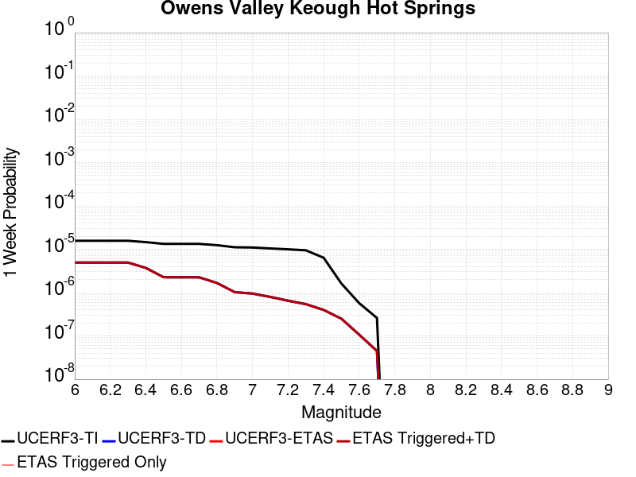 |  |  | 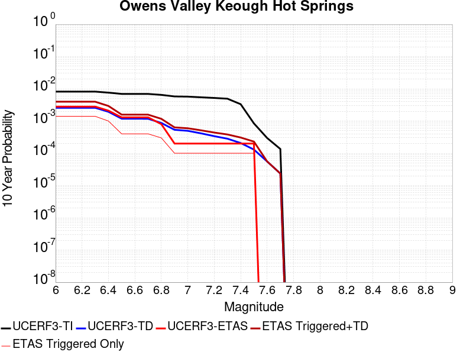 |

| Magnitude | 1 wk TI Prob | 1 wk TD Prob | 1 wk ETAS Prob | 1 wk ETAS/TD Gain | 1 wk ETAS Triggered+TD | 1 wk ETAS Triggered Only | 1 mo TI Prob | 1 mo TD Prob | 1 mo ETAS Prob | 1 mo ETAS/TD Gain | 1 mo ETAS Triggered+TD | 1 mo ETAS Triggered Only | 1 yr TI Prob | 1 yr TD Prob | 1 yr ETAS Prob | 1 yr ETAS/TD Gain | 1 yr ETAS Triggered+TD | 1 yr ETAS Triggered Only | 10 yr TI Prob | 10 yr TD Prob | 10 yr ETAS Prob | 10 yr ETAS/TD Gain | 10 yr ETAS Triggered+TD | 10 yr ETAS Triggered Only |
|-----|-----|-----|-----|-----|-----|-----|-----|-----|-----|-----|-----|-----|-----|-----|-----|-----|-----|-----|-----|-----|-----|-----|-----|-----|
| 6.0 | 1.5708529E-5 | 4.935569E-6 | 0.0 | 0.0 | 4.935569E-6 | 0.0 | 6.7320536E-5 | 2.1152297E-5 | 0.0 | 0.0 | 2.1152297E-5 | 0.0 | 8.193192E-4 | 2.5750388E-4 | 1.0E-4 | 0.38834366 | 3.5747813E-4 | 1.0E-4 | 0.008163051 | 0.002572749 | 0.0028 | 1.08833 | 0.0039691473 | 0.0014 |
| 6.1 | 1.5708529E-5 | 4.935569E-6 | 0.0 | 0.0 | 4.935569E-6 | 0.0 | 6.7320536E-5 | 2.1152297E-5 | 0.0 | 0.0 | 2.1152297E-5 | 0.0 | 8.193192E-4 | 2.5750388E-4 | 1.0E-4 | 0.38834366 | 3.5747813E-4 | 1.0E-4 | 0.008163051 | 0.002572749 | 0.0028 | 1.08833 | 0.0039691473 | 0.0014 |
| 6.2 | 1.5708529E-5 | 4.935569E-6 | 0.0 | 0.0 | 4.935569E-6 | 0.0 | 6.7320536E-5 | 2.1152297E-5 | 0.0 | 0.0 | 2.1152297E-5 | 0.0 | 8.193192E-4 | 2.5750388E-4 | 1.0E-4 | 0.38834366 | 3.5747813E-4 | 1.0E-4 | 0.008163051 | 0.002572749 | 0.0028 | 1.08833 | 0.0039691473 | 0.0014 |
| 6.3 | 1.5708529E-5 | 4.935569E-6 | 0.0 | 0.0 | 4.935569E-6 | 0.0 | 6.7320536E-5 | 2.1152297E-5 | 0.0 | 0.0 | 2.1152297E-5 | 0.0 | 8.193192E-4 | 2.5750388E-4 | 1.0E-4 | 0.38834366 | 3.5747813E-4 | 1.0E-4 | 0.008163051 | 0.002572749 | 0.0028 | 1.08833 | 0.0039691473 | 0.0014 |
| 6.4 | 1.4622509E-5 | 3.713057E-6 | 0.0 | 0.0 | 3.713057E-6 | 0.0 | 6.266639E-5 | 1.5913021E-5 | 0.0 | 0.0 | 1.5913021E-5 | 0.0 | 7.626962E-4 | 1.9372712E-4 | 1.0E-4 | 0.51619 | 2.9370774E-4 | 1.0E-4 | 0.007600839 | 0.0019360979 | 0.0021 | 1.0846559 | 0.0029341618 | 0.001 |
| 6.5 | 1.3335527E-5 | 2.266153E-6 | 0.0 | 0.0 | 2.266153E-6 | 0.0 | 5.7151006E-5 | 9.712051E-6 | 0.0 | 0.0 | 9.712051E-6 | 0.0 | 6.955913E-4 | 1.1823849E-4 | 0.0 | 0.0 | 1.1823849E-4 | 0.0 | 0.0069341804 | 0.0011820148 | 0.0013 | 1.099817 | 0.001581542 | 4.0E-4 |
| 6.6 | 1.3332855E-5 | 2.2633042E-6 | 0.0 | 0.0 | 2.2633042E-6 | 0.0 | 5.7139558E-5 | 9.699842E-6 | 0.0 | 0.0 | 9.699842E-6 | 0.0 | 6.9545204E-4 | 1.18089854E-4 | 0.0 | 0.0 | 1.18089854E-4 | 0.0 | 0.0069327964 | 0.0011805301 | 0.0013 | 1.1012002 | 0.0015800579 | 4.0E-4 |
| 6.7 | 1.3318214E-5 | 2.252565E-6 | 0.0 | 0.0 | 2.252565E-6 | 0.0 | 5.707681E-5 | 9.653818E-6 | 0.0 | 0.0 | 9.653818E-6 | 0.0 | 6.946886E-4 | 1.1752958E-4 | 0.0 | 0.0 | 1.1752958E-4 | 0.0 | 0.0069252094 | 0.0011749332 | 0.0013 | 1.1064459 | 0.0015744632 | 4.0E-4 |
| 6.8 | 1.2441338E-5 | 1.6679138E-6 | 0.0 | 0.0 | 1.6679138E-6 | 0.0 | 5.331893E-5 | 7.148184E-6 | 0.0 | 0.0 | 7.148184E-6 | 0.0 | 6.489646E-4 | 8.702596E-5 | 0.0 | 0.0 | 8.702596E-5 | 0.0 | 0.0064707273 | 8.701404E-4 | 8.0E-4 | 0.9193919 | 0.0011698793 | 3.0E-4 |
| 6.9 | 1.1130476E-5 | 1.0235789E-6 | 0.0 | 0.0 | 1.0235789E-6 | 0.0 | 4.7701167E-5 | 4.386759E-6 | 0.0 | 0.0 | 4.386759E-6 | 0.0 | 5.806069E-4 | 5.3407497E-5 | 0.0 | 0.0 | 5.3407497E-5 | 0.0 | 0.0057909233 | 5.341389E-4 | 2.0E-4 | 0.37443447 | 6.3408545E-4 | 1.0E-4 |
| 7.0 | 1.0986073E-5 | 9.5140257E-7 | 0.0 | 0.0 | 9.5140257E-7 | 0.0 | 4.7082318E-5 | 4.0774335E-6 | 0.0 | 0.0 | 4.0774335E-6 | 0.0 | 5.730765E-4 | 4.9641632E-5 | 0.0 | 0.0 | 4.9641632E-5 | 0.0 | 0.0057160086 | 4.9649685E-4 | 2.0E-4 | 0.4028223 | 5.964472E-4 | 1.0E-4 |
| 7.1 | 1.0451338E-5 | 7.946169E-7 | 0.0 | 0.0 | 7.946169E-7 | 0.0 | 4.4790682E-5 | 3.4054965E-6 | 0.0 | 0.0 | 3.4054965E-6 | 0.0 | 5.451901E-4 | 4.146114E-5 | 0.0 | 0.0 | 4.146114E-5 | 0.0 | 0.005438545 | 4.1472164E-4 | 2.0E-4 | 0.48225117 | 5.1468017E-4 | 1.0E-4 |
| 7.2 | 9.989061E-6 | 6.498459E-7 | 0.0 | 0.0 | 6.498459E-7 | 0.0 | 4.280956E-5 | 2.7850508E-6 | 0.0 | 0.0 | 2.7850508E-6 | 0.0 | 5.2108173E-4 | 3.3907472E-5 | 0.0 | 0.0 | 3.3907472E-5 | 0.0 | 0.0051986156 | 3.3920485E-4 | 2.0E-4 | 0.5896142 | 4.3917095E-4 | 1.0E-4 |
| 7.3 | 9.465365E-6 | 5.4165963E-7 | 0.0 | 0.0 | 5.4165963E-7 | 0.0 | 4.056522E-5 | 2.3213963E-6 | 0.0 | 0.0 | 2.3213963E-6 | 0.0 | 4.937696E-4 | 2.8262637E-5 | 0.0 | 0.0 | 2.8262637E-5 | 0.0 | 0.0049267393 | 2.8276743E-4 | 2.0E-4 | 0.70729506 | 3.8273915E-4 | 1.0E-4 |
| 7.4 | 6.3824805E-6 | 3.9801478E-7 | 0.0 | 0.0 | 3.9801478E-7 | 0.0 | 2.73532E-5 | 1.7057765E-6 | 0.0 | 0.0 | 1.7057765E-6 | 0.0 | 3.3297433E-4 | 2.0767633E-5 | 0.0 | 0.0 | 2.0767633E-5 | 0.0 | 0.0033247585 | 2.0779442E-4 | 2.0E-4 | 0.9624898 | 3.0777365E-4 | 1.0E-4 |
| 7.5 | 1.6192645E-6 | 2.4938223E-7 | 0.0 | 0.0 | 2.4938223E-7 | 0.0 | 6.9396865E-6 | 1.0687805E-6 | 0.0 | 0.0 | 1.0687805E-6 | 0.0 | 8.448741E-5 | 1.3012326E-5 | 0.0 | 0.0 | 1.3012326E-5 | 0.0 | 8.4455294E-4 | 1.3011578E-4 | 2.0E-4 | 1.5370927 | 2.3010276E-4 | 1.0E-4 |
| 7.6 | 5.7062545E-7 | 1.0694718E-7 | 0.0 | 0.0 | 1.0694718E-7 | 0.0 | 2.4455355E-6 | 4.5834497E-7 | 0.0 | 0.0 | 4.5834497E-7 | 0.0 | 2.9773988E-5 | 5.5803366E-6 | 0.0 | 0.0 | 5.5803366E-6 | 0.0 | 2.977E-4 | 5.5802044E-5 | 0.0 | 0.0 | 5.5802044E-5 | 0.0 |
| 7.7 | 2.5988817E-7 | 4.4976343E-8 | 0.0 | 0.0 | 4.4976343E-8 | 0.0 | 1.113806E-6 | 1.9275575E-7 | 0.0 | 0.0 | 1.9275575E-7 | 0.0 | 1.3560503E-5 | 2.3467992E-6 | 0.0 | 0.0 | 2.3467992E-6 | 0.0 | 1.3559677E-4 | 2.3467786E-5 | 0.0 | 0.0 | 2.3467786E-5 | 0.0 |

## So Sierra Nevada
*[(top)](#table-of-contents)*

| 1 Week | 1 Month | 1 Year | 10 Year |
|-----|-----|-----|-----|
|  |  |  |  |

| Magnitude | 1 wk TI Prob | 1 wk TD Prob | 1 wk ETAS Prob | 1 wk ETAS/TD Gain | 1 wk ETAS Triggered+TD | 1 wk ETAS Triggered Only | 1 mo TI Prob | 1 mo TD Prob | 1 mo ETAS Prob | 1 mo ETAS/TD Gain | 1 mo ETAS Triggered+TD | 1 mo ETAS Triggered Only | 1 yr TI Prob | 1 yr TD Prob | 1 yr ETAS Prob | 1 yr ETAS/TD Gain | 1 yr ETAS Triggered+TD | 1 yr ETAS Triggered Only | 10 yr TI Prob | 10 yr TD Prob | 10 yr ETAS Prob | 10 yr ETAS/TD Gain | 10 yr ETAS Triggered+TD | 10 yr ETAS Triggered Only |
|-----|-----|-----|-----|-----|-----|-----|-----|-----|-----|-----|-----|-----|-----|-----|-----|-----|-----|-----|-----|-----|-----|-----|-----|-----|
| 6.0 | 1.15488665E-5 | 1.1072983E-5 | 0.0 | 0.0 | 1.1072983E-5 | 0.0 | 4.9494203E-5 | 4.745485E-5 | 0.0 | 0.0 | 4.745485E-5 | 0.0 | 6.024253E-4 | 5.776224E-4 | 3.0E-4 | 0.51937044 | 5.776224E-4 | 0.0 | 0.006007948 | 0.005762478 | 0.0045 | 0.78091407 | 0.0071544107 | 0.0014 |
| 6.1 | 1.15488665E-5 | 1.1072983E-5 | 0.0 | 0.0 | 1.1072983E-5 | 0.0 | 4.9494203E-5 | 4.745485E-5 | 0.0 | 0.0 | 4.745485E-5 | 0.0 | 6.024253E-4 | 5.776224E-4 | 3.0E-4 | 0.51937044 | 5.776224E-4 | 0.0 | 0.006007948 | 0.005762478 | 0.0045 | 0.78091407 | 0.0071544107 | 0.0014 |
| 6.2 | 1.15488665E-5 | 1.1072983E-5 | 0.0 | 0.0 | 1.1072983E-5 | 0.0 | 4.9494203E-5 | 4.745485E-5 | 0.0 | 0.0 | 4.745485E-5 | 0.0 | 6.024253E-4 | 5.776224E-4 | 3.0E-4 | 0.51937044 | 5.776224E-4 | 0.0 | 0.006007948 | 0.005762478 | 0.0045 | 0.78091407 | 0.0071544107 | 0.0014 |
| 6.3 | 1.15488665E-5 | 1.1072983E-5 | 0.0 | 0.0 | 1.1072983E-5 | 0.0 | 4.9494203E-5 | 4.745485E-5 | 0.0 | 0.0 | 4.745485E-5 | 0.0 | 6.024253E-4 | 5.776224E-4 | 3.0E-4 | 0.51937044 | 5.776224E-4 | 0.0 | 0.006007948 | 0.005762478 | 0.0045 | 0.78091407 | 0.0071544107 | 0.0014 |
| 6.4 | 1.15488665E-5 | 1.1072983E-5 | 0.0 | 0.0 | 1.1072983E-5 | 0.0 | 4.9494203E-5 | 4.745485E-5 | 0.0 | 0.0 | 4.745485E-5 | 0.0 | 6.024253E-4 | 5.776224E-4 | 3.0E-4 | 0.51937044 | 5.776224E-4 | 0.0 | 0.006007948 | 0.005762478 | 0.0045 | 0.78091407 | 0.0071544107 | 0.0014 |
| 6.5 | 1.15488665E-5 | 1.1072983E-5 | 0.0 | 0.0 | 1.1072983E-5 | 0.0 | 4.9494203E-5 | 4.745485E-5 | 0.0 | 0.0 | 4.745485E-5 | 0.0 | 6.024253E-4 | 5.776224E-4 | 3.0E-4 | 0.51937044 | 5.776224E-4 | 0.0 | 0.006007948 | 0.005762478 | 0.0045 | 0.78091407 | 0.0071544107 | 0.0014 |
| 6.6 | 7.587044E-6 | 6.93097E-6 | 0.0 | 0.0 | 6.93097E-6 | 0.0 | 3.2515498E-5 | 2.9703835E-5 | 0.0 | 0.0 | 2.9703835E-5 | 0.0 | 3.9580427E-4 | 3.615871E-4 | 1.0E-4 | 0.27655855 | 3.615871E-4 | 0.0 | 0.003951 | 0.0036102792 | 0.002 | 0.5539738 | 0.004208113 | 6.0E-4 |
| 6.7 | 7.587044E-6 | 6.93097E-6 | 0.0 | 0.0 | 6.93097E-6 | 0.0 | 3.2515498E-5 | 2.9703835E-5 | 0.0 | 0.0 | 2.9703835E-5 | 0.0 | 3.9580427E-4 | 3.615871E-4 | 1.0E-4 | 0.27655855 | 3.615871E-4 | 0.0 | 0.003951 | 0.0036102792 | 0.002 | 0.5539738 | 0.004208113 | 6.0E-4 |
| 6.8 | 5.9026956E-6 | 5.1755114E-6 | 0.0 | 0.0 | 5.1755114E-6 | 0.0 | 2.5297022E-5 | 2.218058E-5 | 0.0 | 0.0 | 2.218058E-5 | 0.0 | 3.0794772E-4 | 2.7001626E-4 | 0.0 | 0.0 | 2.7001626E-4 | 0.0 | 0.0030752132 | 0.002696998 | 0.0015 | 0.5561739 | 0.0030959193 | 4.0E-4 |
| 6.9 | 5.0118915E-6 | 4.248937E-6 | 0.0 | 0.0 | 4.248937E-6 | 0.0 | 2.1479358E-5 | 1.8209606E-5 | 0.0 | 0.0 | 1.8209606E-5 | 0.0 | 2.614798E-4 | 2.2168014E-4 | 0.0 | 0.0 | 2.2168014E-4 | 0.0 | 0.0026117235 | 0.0022146625 | 0.0011 | 0.49668965 | 0.0025139982 | 3.0E-4 |
| 7.0 | 4.4924795E-6 | 3.7106392E-6 | 0.0 | 0.0 | 3.7106392E-6 | 0.0 | 1.925334E-5 | 1.5902646E-5 | 0.0 | 0.0 | 1.5902646E-5 | 0.0 | 2.3438422E-4 | 1.9359816E-4 | 0.0 | 0.0 | 1.9359816E-4 | 0.0 | 0.0023413717 | 0.0019343579 | 0.001 | 0.5169674 | 0.0022337777 | 3.0E-4 |
| 7.1 | 3.9118436E-6 | 3.1089503E-6 | 0.0 | 0.0 | 3.1089503E-6 | 0.0 | 1.6764936E-5 | 1.3324008E-5 | 0.0 | 0.0 | 1.3324008E-5 | 0.0 | 2.0409399E-4 | 1.622083E-4 | 0.0 | 0.0 | 1.622083E-4 | 0.0 | 0.0020390663 | 0.001620955 | 7.0E-4 | 0.4318442 | 0.0018206307 | 2.0E-4 |
| 7.2 | 3.4200818E-6 | 2.6026298E-6 | 0.0 | 0.0 | 2.6026298E-6 | 0.0 | 1.4657411E-5 | 1.1154083E-5 | 0.0 | 0.0 | 1.1154083E-5 | 0.0 | 1.7843937E-4 | 1.35793E-4 | 0.0 | 0.0 | 1.35793E-4 | 0.0 | 0.0017829615 | 0.0013571499 | 7.0E-4 | 0.51578677 | 0.0015568786 | 2.0E-4 |
| 7.3 | 2.6593618E-6 | 1.8259041E-6 | 0.0 | 0.0 | 1.8259041E-6 | 0.0 | 1.13972155E-5 | 7.8252815E-6 | 0.0 | 0.0 | 7.8252815E-6 | 0.0 | 1.3875226E-4 | 9.526893E-5 | 0.0 | 0.0 | 9.526893E-5 | 0.0 | 0.0013866565 | 9.523098E-4 | 6.0E-4 | 0.6300471 | 0.0011521194 | 2.0E-4 |
| 7.4 | 2.2577992E-6 | 1.4341158E-6 | 0.0 | 0.0 | 1.4341158E-6 | 0.0 | 9.676246E-6 | 6.1461974E-6 | 0.0 | 0.0 | 6.1461974E-6 | 0.0 | 1.1780193E-4 | 7.4827636E-5 | 0.0 | 0.0 | 7.4827636E-5 | 0.0 | 0.001177395 | 7.4804947E-4 | 4.0E-4 | 0.534724 | 9.478999E-4 | 2.0E-4 |
| 7.5 | 1.489319E-6 | 7.335145E-7 | 0.0 | 0.0 | 7.335145E-7 | 0.0 | 6.3827797E-6 | 3.1436298E-6 | 0.0 | 0.0 | 3.1436298E-6 | 0.0 | 7.770758E-5 | 3.8273025E-5 | 0.0 | 0.0 | 3.8273025E-5 | 0.0 | 7.7680405E-4 | 3.8266476E-4 | 2.0E-4 | 0.52265066 | 4.826265E-4 | 1.0E-4 |
| 7.6 | 1.0680322E-6 | 4.6453596E-7 | 0.0 | 0.0 | 4.6453596E-7 | 0.0 | 4.577273E-6 | 1.9908668E-6 | 0.0 | 0.0 | 1.9908668E-6 | 0.0 | 5.5726876E-5 | 2.4238538E-5 | 0.0 | 0.0 | 2.4238538E-5 | 0.0 | 5.5712904E-4 | 2.423592E-4 | 2.0E-4 | 0.8252214 | 3.4233497E-4 | 1.0E-4 |
| 7.7 | 5.509146E-7 | 1.550042E-7 | 0.0 | 0.0 | 1.550042E-7 | 0.0 | 2.3610605E-6 | 6.6430357E-7 | 0.0 | 0.0 | 6.6430357E-7 | 0.0 | 2.8745531E-5 | 8.087867E-6 | 0.0 | 0.0 | 8.087867E-6 | 0.0 | 2.8741814E-4 | 8.087584E-5 | 2.0E-4 | 2.4729264 | 1.8086775E-4 | 1.0E-4 |

## Earthquake Valley (No  Extension)
*[(top)](#table-of-contents)*

| 1 Week | 1 Month | 1 Year | 10 Year |
|-----|-----|-----|-----|
|  |  |  |  |

| Magnitude | 1 wk TI Prob | 1 wk TD Prob | 1 wk ETAS Prob | 1 wk ETAS/TD Gain | 1 wk ETAS Triggered+TD | 1 wk ETAS Triggered Only | 1 mo TI Prob | 1 mo TD Prob | 1 mo ETAS Prob | 1 mo ETAS/TD Gain | 1 mo ETAS Triggered+TD | 1 mo ETAS Triggered Only | 1 yr TI Prob | 1 yr TD Prob | 1 yr ETAS Prob | 1 yr ETAS/TD Gain | 1 yr ETAS Triggered+TD | 1 yr ETAS Triggered Only | 10 yr TI Prob | 10 yr TD Prob | 10 yr ETAS Prob | 10 yr ETAS/TD Gain | 10 yr ETAS Triggered+TD | 10 yr ETAS Triggered Only |
|-----|-----|-----|-----|-----|-----|-----|-----|-----|-----|-----|-----|-----|-----|-----|-----|-----|-----|-----|-----|-----|-----|-----|-----|-----|
| 6.0 | 2.1859703E-5 | 2.5156909E-5 | 0.0 | 0.0 | 2.5156909E-5 | 0.0 | 9.3681076E-5 | 1.07811684E-4 | 1.0E-4 | 0.9275432 | 1.07811684E-4 | 0.0 | 0.0011399703 | 0.0013119616 | 6.0E-4 | 0.4573305 | 0.0016115679 | 3.0E-4 | 0.011341401 | 0.013056477 | 0.0077 | 0.58974564 | 0.014438197 | 0.0014 |
| 6.1 | 2.1859703E-5 | 2.5156909E-5 | 0.0 | 0.0 | 2.5156909E-5 | 0.0 | 9.3681076E-5 | 1.07811684E-4 | 1.0E-4 | 0.9275432 | 1.07811684E-4 | 0.0 | 0.0011399703 | 0.0013119616 | 6.0E-4 | 0.4573305 | 0.0016115679 | 3.0E-4 | 0.011341401 | 0.013056477 | 0.0077 | 0.58974564 | 0.014438197 | 0.0014 |
| 6.2 | 2.1859703E-5 | 2.5156909E-5 | 0.0 | 0.0 | 2.5156909E-5 | 0.0 | 9.3681076E-5 | 1.07811684E-4 | 1.0E-4 | 0.9275432 | 1.07811684E-4 | 0.0 | 0.0011399703 | 0.0013119616 | 6.0E-4 | 0.4573305 | 0.0016115679 | 3.0E-4 | 0.011341401 | 0.013056477 | 0.0077 | 0.58974564 | 0.014438197 | 0.0014 |
| 6.3 | 2.1859703E-5 | 2.5156909E-5 | 0.0 | 0.0 | 2.5156909E-5 | 0.0 | 9.3681076E-5 | 1.07811684E-4 | 1.0E-4 | 0.9275432 | 1.07811684E-4 | 0.0 | 0.0011399703 | 0.0013119616 | 6.0E-4 | 0.4573305 | 0.0016115679 | 3.0E-4 | 0.011341401 | 0.013056477 | 0.0077 | 0.58974564 | 0.014438197 | 0.0014 |
| 6.4 | 2.1859703E-5 | 2.5156909E-5 | 0.0 | 0.0 | 2.5156909E-5 | 0.0 | 9.3681076E-5 | 1.07811684E-4 | 1.0E-4 | 0.9275432 | 1.07811684E-4 | 0.0 | 0.0011399703 | 0.0013119616 | 6.0E-4 | 0.4573305 | 0.0016115679 | 3.0E-4 | 0.011341401 | 0.013056477 | 0.0077 | 0.58974564 | 0.014438197 | 0.0014 |
| 6.5 | 2.1859703E-5 | 2.5156909E-5 | 0.0 | 0.0 | 2.5156909E-5 | 0.0 | 9.3681076E-5 | 1.07811684E-4 | 1.0E-4 | 0.9275432 | 1.07811684E-4 | 0.0 | 0.0011399703 | 0.0013119616 | 6.0E-4 | 0.4573305 | 0.0016115679 | 3.0E-4 | 0.011341401 | 0.013056477 | 0.0077 | 0.58974564 | 0.014438197 | 0.0014 |
| 6.6 | 1.597E-5 | 1.8326356E-5 | 0.0 | 0.0 | 1.8326356E-5 | 0.0 | 6.8441055E-5 | 7.8539655E-5 | 1.0E-4 | 1.2732421 | 7.8539655E-5 | 0.0 | 8.329513E-4 | 9.5588784E-4 | 5.0E-4 | 0.5230739 | 0.0011556967 | 2.0E-4 | 0.008298361 | 0.009526342 | 0.0058 | 0.6088381 | 0.010714911 | 0.0012 |
| 6.7 | 1.597E-5 | 1.8326356E-5 | 0.0 | 0.0 | 1.8326356E-5 | 0.0 | 6.8441055E-5 | 7.8539655E-5 | 1.0E-4 | 1.2732421 | 7.8539655E-5 | 0.0 | 8.329513E-4 | 9.5588784E-4 | 5.0E-4 | 0.5230739 | 0.0011556967 | 2.0E-4 | 0.008298361 | 0.009526342 | 0.0058 | 0.6088381 | 0.010714911 | 0.0012 |
| 6.8 | 1.5315149E-5 | 1.7573366E-5 | 0.0 | 0.0 | 1.7573366E-5 | 0.0 | 6.5634704E-5 | 7.531274E-5 | 1.0E-4 | 1.3277967 | 7.531274E-5 | 0.0 | 7.988095E-4 | 9.1663323E-4 | 5.0E-4 | 0.5454744 | 0.00111645 | 2.0E-4 | 0.007959441 | 0.009137036 | 0.0056 | 0.6128902 | 0.010326072 | 0.0012 |
| 6.9 | 1.3634728E-5 | 1.5650037E-5 | 0.0 | 0.0 | 1.5650037E-5 | 0.0 | 5.8433237E-5 | 6.707032E-5 | 0.0 | 0.0 | 6.707032E-5 | 0.0 | 7.1119244E-4 | 8.163571E-4 | 3.0E-4 | 0.36748624 | 9.162754E-4 | 1.0E-4 | 0.007089207 | 0.008141627 | 0.0047 | 0.5772802 | 0.008935113 | 8.0E-4 |
| 7.0 | 1.3496271E-5 | 1.5492302E-5 | 0.0 | 0.0 | 1.5492302E-5 | 0.0 | 5.783988E-5 | 6.639436E-5 | 0.0 | 0.0 | 6.639436E-5 | 0.0 | 7.03973E-4 | 8.081333E-4 | 3.0E-4 | 0.3712259 | 9.0805243E-4 | 1.0E-4 | 0.007017471 | 0.008059987 | 0.0047 | 0.5831275 | 0.008853539 | 8.0E-4 |
| 7.1 | 8.242798E-6 | 9.4565585E-6 | 0.0 | 0.0 | 9.4565585E-6 | 0.0 | 3.53258E-5 | 4.0527855E-5 | 0.0 | 0.0 | 4.0527855E-5 | 0.0 | 4.300067E-4 | 4.9338175E-4 | 1.0E-4 | 0.2026828 | 4.9338175E-4 | 0.0 | 0.004291756 | 0.0049294187 | 0.003 | 0.608591 | 0.005526461 | 6.0E-4 |
| 7.2 | 2.6506527E-7 | 2.2490862E-7 | 0.0 | 0.0 | 2.2490862E-7 | 0.0 | 1.1359936E-6 | 9.638937E-7 | 0.0 | 0.0 | 9.638937E-7 | 0.0 | 1.3830633E-5 | 1.17353475E-5 | 0.0 | 0.0 | 1.17353475E-5 | 0.0 | 1.3829772E-4 | 1.17347685E-4 | 0.0 | 0.0 | 1.17347685E-4 | 0.0 |
| 7.3 | 2.5810488E-7 | 2.1886828E-7 | 0.0 | 0.0 | 2.1886828E-7 | 0.0 | 1.1061633E-6 | 9.3800656E-7 | 0.0 | 0.0 | 9.3800656E-7 | 0.0 | 1.3467455E-5 | 1.1420175E-5 | 0.0 | 0.0 | 1.1420175E-5 | 0.0 | 1.3466639E-4 | 1.14196286E-4 | 0.0 | 0.0 | 1.14196286E-4 | 0.0 |
| 7.4 | 2.2676066E-7 | 1.904391E-7 | 0.0 | 0.0 | 1.904391E-7 | 0.0 | 9.71831E-7 | 8.1616736E-7 | 0.0 | 0.0 | 8.1616736E-7 | 0.0 | 1.1831979E-5 | 9.936796E-6 | 0.0 | 0.0 | 9.936796E-6 | 0.0 | 1.1831349E-4 | 9.9363904E-5 | 0.0 | 0.0 | 9.9363904E-5 | 0.0 |
| 7.5 | 1.5553917E-7 | 1.3056504E-7 | 0.0 | 0.0 | 1.3056504E-7 | 0.0 | 6.6659624E-7 | 5.5956434E-7 | 0.0 | 0.0 | 5.5956434E-7 | 0.0 | 8.115779E-6 | 6.8126765E-6 | 0.0 | 0.0 | 6.8126765E-6 | 0.0 | 8.115482E-5 | 6.812489E-5 | 0.0 | 0.0 | 6.812489E-5 | 0.0 |
| 7.6 | 1.3448629E-7 | 1.12465045E-7 | 0.0 | 0.0 | 1.12465045E-7 | 0.0 | 5.7636964E-7 | 4.8199297E-7 | 0.0 | 0.0 | 4.8199297E-7 | 0.0 | 7.017278E-6 | 5.868251E-6 | 0.0 | 0.0 | 5.868251E-6 | 0.0 | 7.0170565E-5 | 5.868117E-5 | 0.0 | 0.0 | 5.868117E-5 | 0.0 |
| 7.7 | 2.9719402E-8 | 1.4513542E-8 | 0.0 | 0.0 | 1.4513542E-8 | 0.0 | 1.2736886E-7 | 6.22009E-8 | 0.0 | 0.0 | 6.22009E-8 | 0.0 | 1.5507147E-6 | 7.572957E-7 | 0.0 | 0.0 | 7.572957E-7 | 0.0 | 1.550704E-5 | 7.5729363E-6 | 0.0 | 0.0 | 7.5729363E-6 | 0.0 |
| 7.8 | 7.4390196E-9 | 3.232151E-9 | 0.0 | 0.0 | 3.232151E-9 | 0.0 | 3.1881513E-8 | 1.3852076E-8 | 0.0 | 0.0 | 1.3852076E-8 | 0.0 | 3.8815733E-7 | 1.6864901E-7 | 0.0 | 0.0 | 1.6864901E-7 | 0.0 | 3.8815665E-6 | 1.6864891E-6 | 0.0 | 0.0 | 1.6864891E-6 | 0.0 |
| 7.9 | 1.5373532E-9 | 8.4171903E-10 | 0.0 | 0.0 | 8.4171903E-10 | 0.0 | 6.5886567E-9 | 3.6073673E-9 | 0.0 | 0.0 | 3.6073673E-9 | 0.0 | 8.021689E-8 | 4.3919695E-8 | 0.0 | 0.0 | 4.3919695E-8 | 0.0 | 8.0216864E-7 | 4.3919692E-7 | 0.0 | 0.0 | 4.3919692E-7 | 0.0 |

## Sierra Nevada  (No Extension)
*[(top)](#table-of-contents)*

| 1 Week | 1 Month | 1 Year | 10 Year |
|-----|-----|-----|-----|
|  |  |  |  |

| Magnitude | 1 wk TI Prob | 1 wk TD Prob | 1 wk ETAS Prob | 1 wk ETAS/TD Gain | 1 wk ETAS Triggered+TD | 1 wk ETAS Triggered Only | 1 mo TI Prob | 1 mo TD Prob | 1 mo ETAS Prob | 1 mo ETAS/TD Gain | 1 mo ETAS Triggered+TD | 1 mo ETAS Triggered Only | 1 yr TI Prob | 1 yr TD Prob | 1 yr ETAS Prob | 1 yr ETAS/TD Gain | 1 yr ETAS Triggered+TD | 1 yr ETAS Triggered Only | 10 yr TI Prob | 10 yr TD Prob | 10 yr ETAS Prob | 10 yr ETAS/TD Gain | 10 yr ETAS Triggered+TD | 10 yr ETAS Triggered Only |
|-----|-----|-----|-----|-----|-----|-----|-----|-----|-----|-----|-----|-----|-----|-----|-----|-----|-----|-----|-----|-----|-----|-----|-----|-----|
| 6.0 | 7.7690465E-6 | 6.971018E-6 | 0.0 | 0.0 | 6.971018E-6 | 0.0 | 3.329549E-5 | 2.9875653E-5 | 0.0 | 0.0 | 2.9875653E-5 | 0.0 | 4.0529718E-4 | 3.6371118E-4 | 3.0E-4 | 0.8248303 | 4.636748E-4 | 1.0E-4 | 0.004045588 | 0.0036346717 | 0.0028 | 0.77035844 | 0.005029583 | 0.0014 |
| 6.1 | 7.7690465E-6 | 6.971018E-6 | 0.0 | 0.0 | 6.971018E-6 | 0.0 | 3.329549E-5 | 2.9875653E-5 | 0.0 | 0.0 | 2.9875653E-5 | 0.0 | 4.0529718E-4 | 3.6371118E-4 | 3.0E-4 | 0.8248303 | 4.636748E-4 | 1.0E-4 | 0.004045588 | 0.0036346717 | 0.0028 | 0.77035844 | 0.005029583 | 0.0014 |
| 6.2 | 7.7690465E-6 | 6.971018E-6 | 0.0 | 0.0 | 6.971018E-6 | 0.0 | 3.329549E-5 | 2.9875653E-5 | 0.0 | 0.0 | 2.9875653E-5 | 0.0 | 4.0529718E-4 | 3.6371118E-4 | 3.0E-4 | 0.8248303 | 4.636748E-4 | 1.0E-4 | 0.004045588 | 0.0036346717 | 0.0028 | 0.77035844 | 0.005029583 | 0.0014 |
| 6.3 | 7.7690465E-6 | 6.971018E-6 | 0.0 | 0.0 | 6.971018E-6 | 0.0 | 3.329549E-5 | 2.9875653E-5 | 0.0 | 0.0 | 2.9875653E-5 | 0.0 | 4.0529718E-4 | 3.6371118E-4 | 3.0E-4 | 0.8248303 | 4.636748E-4 | 1.0E-4 | 0.004045588 | 0.0036346717 | 0.0028 | 0.77035844 | 0.005029583 | 0.0014 |
| 6.4 | 7.7690465E-6 | 6.971018E-6 | 0.0 | 0.0 | 6.971018E-6 | 0.0 | 3.329549E-5 | 2.9875653E-5 | 0.0 | 0.0 | 2.9875653E-5 | 0.0 | 4.0529718E-4 | 3.6371118E-4 | 3.0E-4 | 0.8248303 | 4.636748E-4 | 1.0E-4 | 0.004045588 | 0.0036346717 | 0.0028 | 0.77035844 | 0.005029583 | 0.0014 |
| 6.5 | 7.7690465E-6 | 6.971018E-6 | 0.0 | 0.0 | 6.971018E-6 | 0.0 | 3.329549E-5 | 2.9875653E-5 | 0.0 | 0.0 | 2.9875653E-5 | 0.0 | 4.0529718E-4 | 3.6371118E-4 | 3.0E-4 | 0.8248303 | 4.636748E-4 | 1.0E-4 | 0.004045588 | 0.0036346717 | 0.0028 | 0.77035844 | 0.005029583 | 0.0014 |
| 6.6 | 2.653E-6 | 1.6122345E-6 | 0.0 | 0.0 | 1.6122345E-6 | 0.0 | 1.136995E-5 | 6.9095586E-6 | 0.0 | 0.0 | 6.9095586E-6 | 0.0 | 1.3842035E-4 | 8.4120664E-5 | 0.0 | 0.0 | 8.4120664E-5 | 0.0 | 0.0013833415 | 8.408917E-4 | 6.0E-4 | 0.71352834 | 0.0011406394 | 3.0E-4 |
| 6.7 | 2.5902466E-6 | 1.5475887E-6 | 0.0 | 0.0 | 1.5475887E-6 | 0.0 | 1.11010095E-5 | 6.6325065E-6 | 0.0 | 0.0 | 6.6325065E-6 | 0.0 | 1.351464E-4 | 8.07478E-5 | 0.0 | 0.0 | 8.07478E-5 | 0.0 | 0.0013506424 | 8.071876E-4 | 6.0E-4 | 0.74332166 | 0.0011069454 | 3.0E-4 |
| 6.8 | 2.5853892E-6 | 1.5444003E-6 | 0.0 | 0.0 | 1.5444003E-6 | 0.0 | 1.1080193E-5 | 6.618842E-6 | 0.0 | 0.0 | 6.618842E-6 | 0.0 | 1.34893E-4 | 8.058145E-5 | 0.0 | 0.0 | 8.058145E-5 | 0.0 | 0.0013481114 | 8.055253E-4 | 6.0E-4 | 0.7448556 | 0.0011052836 | 3.0E-4 |
| 6.9 | 2.458257E-6 | 1.4195255E-6 | 0.0 | 0.0 | 1.4195255E-6 | 0.0 | 1.0535345E-5 | 6.0836664E-6 | 0.0 | 0.0 | 6.0836664E-6 | 0.0 | 1.2826028E-4 | 7.406614E-5 | 0.0 | 0.0 | 7.406614E-5 | 0.0 | 0.0012818627 | 7.404165E-4 | 5.0E-4 | 0.6752956 | 0.0010401944 | 3.0E-4 |
| 7.0 | 2.4341468E-6 | 1.3965005E-6 | 0.0 | 0.0 | 1.3965005E-6 | 0.0 | 1.0432016E-5 | 5.9849885E-6 | 0.0 | 0.0 | 5.9849885E-6 | 0.0 | 1.270024E-4 | 7.2864816E-5 | 0.0 | 0.0 | 7.2864816E-5 | 0.0 | 0.0012692984 | 7.284112E-4 | 5.0E-4 | 0.6864255 | 0.0010281927 | 3.0E-4 |
| 7.1 | 2.3652476E-6 | 1.3314825E-6 | 0.0 | 0.0 | 1.3314825E-6 | 0.0 | 1.0136736E-5 | 5.706341E-6 | 0.0 | 0.0 | 5.706341E-6 | 0.0 | 1.2340778E-4 | 6.94725E-5 | 0.0 | 0.0 | 6.94725E-5 | 0.0 | 0.0012333926 | 6.9450954E-4 | 5.0E-4 | 0.7199325 | 9.943012E-4 | 3.0E-4 |
| 7.2 | 2.272158E-6 | 1.2478428E-6 | 0.0 | 0.0 | 1.2478428E-6 | 0.0 | 9.737784E-6 | 5.3478866E-6 | 0.0 | 0.0 | 5.3478866E-6 | 0.0 | 1.1855107E-4 | 6.510859E-5 | 0.0 | 0.0 | 6.510859E-5 | 0.0 | 0.0011848784 | 6.5089663E-4 | 4.0E-4 | 0.6145369 | 8.507665E-4 | 2.0E-4 |
| 7.3 | 2.1382127E-6 | 1.1396008E-6 | 0.0 | 0.0 | 1.1396008E-6 | 0.0 | 9.163737E-6 | 4.8839947E-6 | 0.0 | 0.0 | 4.8839947E-6 | 0.0 | 1.1156279E-4 | 5.9461025E-5 | 0.0 | 0.0 | 5.9461025E-5 | 0.0 | 0.001115068 | 5.944523E-4 | 4.0E-4 | 0.6728883 | 7.9433346E-4 | 2.0E-4 |
| 7.4 | 1.9048055E-6 | 9.552692E-7 | 0.0 | 0.0 | 9.552692E-7 | 0.0 | 8.163426E-6 | 4.094005E-6 | 0.0 | 0.0 | 4.094005E-6 | 0.0 | 9.9385186E-5 | 4.9843373E-5 | 0.0 | 0.0 | 4.9843373E-5 | 0.0 | 9.934074E-4 | 4.9832265E-4 | 3.0E-4 | 0.6020196 | 6.9822295E-4 | 2.0E-4 |
| 7.5 | 1.5373403E-6 | 7.540598E-7 | 0.0 | 0.0 | 7.540598E-7 | 0.0 | 6.5885843E-6 | 3.2316807E-6 | 0.0 | 0.0 | 3.2316807E-6 | 0.0 | 8.021306E-5 | 3.9345006E-5 | 0.0 | 0.0 | 3.9345006E-5 | 0.0 | 8.0184115E-4 | 3.9338088E-4 | 2.0E-4 | 0.5084131 | 4.9334153E-4 | 1.0E-4 |
| 7.6 | 1.0680322E-6 | 4.6453596E-7 | 0.0 | 0.0 | 4.6453596E-7 | 0.0 | 4.577273E-6 | 1.9908668E-6 | 0.0 | 0.0 | 1.9908668E-6 | 0.0 | 5.5726876E-5 | 2.4238538E-5 | 0.0 | 0.0 | 2.4238538E-5 | 0.0 | 5.5712904E-4 | 2.423592E-4 | 2.0E-4 | 0.8252214 | 3.4233497E-4 | 1.0E-4 |
| 7.7 | 5.509146E-7 | 1.550042E-7 | 0.0 | 0.0 | 1.550042E-7 | 0.0 | 2.3610605E-6 | 6.6430357E-7 | 0.0 | 0.0 | 6.6430357E-7 | 0.0 | 2.8745531E-5 | 8.087867E-6 | 0.0 | 0.0 | 8.087867E-6 | 0.0 | 2.8741814E-4 | 8.087584E-5 | 2.0E-4 | 2.4729264 | 1.8086775E-4 | 1.0E-4 |

## Point Reyes 2011 CFM
*[(top)](#table-of-contents)*

| 1 Week | 1 Month | 1 Year | 10 Year |
|-----|-----|-----|-----|
|  |  |  |  |

| Magnitude | 1 wk TI Prob | 1 wk TD Prob | 1 wk ETAS Prob | 1 wk ETAS/TD Gain | 1 wk ETAS Triggered+TD | 1 wk ETAS Triggered Only | 1 mo TI Prob | 1 mo TD Prob | 1 mo ETAS Prob | 1 mo ETAS/TD Gain | 1 mo ETAS Triggered+TD | 1 mo ETAS Triggered Only | 1 yr TI Prob | 1 yr TD Prob | 1 yr ETAS Prob | 1 yr ETAS/TD Gain | 1 yr ETAS Triggered+TD | 1 yr ETAS Triggered Only | 10 yr TI Prob | 10 yr TD Prob | 10 yr ETAS Prob | 10 yr ETAS/TD Gain | 10 yr ETAS Triggered+TD | 10 yr ETAS Triggered Only |
|-----|-----|-----|-----|-----|-----|-----|-----|-----|-----|-----|-----|-----|-----|-----|-----|-----|-----|-----|-----|-----|-----|-----|-----|-----|
| 6.0 | 8.8644965E-6 | 8.963893E-6 | 0.0 | 0.0 | 8.963893E-6 | 0.0 | 3.7990147E-5 | 3.8416154E-5 | 0.0 | 0.0 | 3.8416154E-5 | 0.0 | 4.624319E-4 | 4.676226E-4 | 3.0E-4 | 0.641543 | 6.6752906E-4 | 2.0E-4 | 0.0046147075 | 0.0046670143 | 0.0034 | 0.7285172 | 0.0060604806 | 0.0014 |
| 6.1 | 4.526405E-6 | 4.5369065E-6 | 0.0 | 0.0 | 4.5369065E-6 | 0.0 | 1.9398734E-5 | 1.9443745E-5 | 0.0 | 0.0 | 1.9443745E-5 | 0.0 | 2.36154E-4 | 2.3670292E-4 | 2.0E-4 | 0.84494096 | 3.3667925E-4 | 1.0E-4 | 0.002359032 | 0.0023646143 | 0.0014 | 0.5920628 | 0.0029631956 | 6.0E-4 |
| 6.2 | 4.526405E-6 | 4.5369065E-6 | 0.0 | 0.0 | 4.5369065E-6 | 0.0 | 1.9398734E-5 | 1.9443745E-5 | 0.0 | 0.0 | 1.9443745E-5 | 0.0 | 2.36154E-4 | 2.3670292E-4 | 2.0E-4 | 0.84494096 | 3.3667925E-4 | 1.0E-4 | 0.002359032 | 0.0023646143 | 0.0014 | 0.5920628 | 0.0029631956 | 6.0E-4 |
| 6.3 | 2.6842322E-6 | 2.6587513E-6 | 0.0 | 0.0 | 2.6587513E-6 | 0.0 | 1.1503801E-5 | 1.13946E-5 | 0.0 | 0.0 | 1.13946E-5 | 0.0 | 1.4004979E-4 | 1.3872061E-4 | 2.0E-4 | 1.4417468 | 2.3870674E-4 | 1.0E-4 | 0.0013996155 | 0.001386362 | 0.001 | 0.7213123 | 0.0017858075 | 4.0E-4 |
| 6.4 | 2.6842322E-6 | 2.6587513E-6 | 0.0 | 0.0 | 2.6587513E-6 | 0.0 | 1.1503801E-5 | 1.13946E-5 | 0.0 | 0.0 | 1.13946E-5 | 0.0 | 1.4004979E-4 | 1.3872061E-4 | 2.0E-4 | 1.4417468 | 2.3870674E-4 | 1.0E-4 | 0.0013996155 | 0.001386362 | 0.001 | 0.7213123 | 0.0017858075 | 4.0E-4 |
| 6.5 | 1.9281833E-6 | 1.8888504E-6 | 0.0 | 0.0 | 1.8888504E-6 | 0.0 | 8.263617E-6 | 8.0950485E-6 | 0.0 | 0.0 | 8.0950485E-6 | 0.0 | 1.0060489E-4 | 9.8552846E-5 | 2.0E-4 | 2.0293682 | 1.9854298E-4 | 1.0E-4 | 0.0010055936 | 9.851023E-4 | 7.0E-4 | 0.71058613 | 0.0012848068 | 3.0E-4 |
| 6.6 | 1.4726726E-6 | 1.4252686E-6 | 0.0 | 0.0 | 1.4252686E-6 | 0.0 | 6.3114385E-6 | 6.1082796E-6 | 0.0 | 0.0 | 6.1082796E-6 | 0.0 | 7.683905E-5 | 7.436582E-5 | 1.0E-4 | 1.3447038 | 1.7435839E-4 | 1.0E-4 | 7.6812494E-4 | 7.434165E-4 | 4.0E-4 | 0.5380564 | 8.4334216E-4 | 1.0E-4 |
| 6.7 | 8.572307E-7 | 7.991468E-7 | 0.0 | 0.0 | 7.991468E-7 | 0.0 | 3.6738406E-6 | 3.4249103E-6 | 0.0 | 0.0 | 3.4249103E-6 | 0.0 | 4.472809E-5 | 4.16975E-5 | 1.0E-4 | 2.3982253 | 1.4169334E-4 | 1.0E-4 | 4.471909E-4 | 4.1690073E-4 | 3.0E-4 | 0.7195958 | 5.16859E-4 | 1.0E-4 |
| 6.8 | 6.6745434E-7 | 6.061897E-7 | 0.0 | 0.0 | 6.061897E-7 | 0.0 | 2.8605155E-6 | 2.5979532E-6 | 0.0 | 0.0 | 2.5979532E-6 | 0.0 | 3.482622E-5 | 3.1629632E-5 | 1.0E-4 | 3.1615922 | 1.3162647E-4 | 1.0E-4 | 3.4820763E-4 | 3.1625465E-4 | 3.0E-4 | 0.9486027 | 4.1622302E-4 | 1.0E-4 |
| 6.9 | 4.291521E-7 | 3.6386228E-7 | 0.0 | 0.0 | 3.6386228E-7 | 0.0 | 1.839222E-6 | 1.5594089E-6 | 0.0 | 0.0 | 1.5594089E-6 | 0.0 | 2.2392298E-5 | 1.8985642E-5 | 0.0 | 0.0 | 1.8985642E-5 | 0.0 | 2.2390042E-4 | 1.8984289E-4 | 0.0 | 0.0 | 1.8984289E-4 | 0.0 |
| 7.0 | 2.6812808E-7 | 2.0040757E-7 | 0.0 | 0.0 | 2.0040757E-7 | 0.0 | 1.1491198E-6 | 8.5888934E-7 | 0.0 | 0.0 | 8.5888934E-7 | 0.0 | 1.3990444E-5 | 1.0456928E-5 | 0.0 | 0.0 | 1.0456928E-5 | 0.0 | 1.3989564E-4 | 1.04566745E-4 | 0.0 | 0.0 | 1.04566745E-4 | 0.0 |
| 7.1 | 1.9451231E-7 | 1.2580303E-7 | 0.0 | 0.0 | 1.2580303E-7 | 0.0 | 8.336239E-7 | 5.3915574E-7 | 0.0 | 0.0 | 5.3915574E-7 | 0.0 | 1.0149324E-5 | 6.564201E-6 | 0.0 | 0.0 | 6.564201E-6 | 0.0 | 1.014886E-4 | 6.564239E-5 | 0.0 | 0.0 | 6.564239E-5 | 0.0 |
| 7.2 | 1.6715143E-7 | 9.899642E-8 | 0.0 | 0.0 | 9.899642E-8 | 0.0 | 7.1636305E-7 | 4.2427033E-7 | 0.0 | 0.0 | 4.2427033E-7 | 0.0 | 8.721685E-6 | 5.165479E-6 | 0.0 | 0.0 | 5.165479E-6 | 0.0 | 8.721343E-5 | 5.1655898E-5 | 0.0 | 0.0 | 5.1655898E-5 | 0.0 |
| 7.3 | 1.5503173E-7 | 8.871935E-8 | 0.0 | 0.0 | 8.871935E-8 | 0.0 | 6.644215E-7 | 3.8022574E-7 | 0.0 | 0.0 | 3.8022574E-7 | 0.0 | 8.089301E-6 | 4.6292384E-6 | 0.0 | 0.0 | 4.6292384E-6 | 0.0 | 8.089007E-5 | 4.6293728E-5 | 0.0 | 0.0 | 4.6293728E-5 | 0.0 |
| 7.4 | 1.4251614E-7 | 7.960195E-8 | 0.0 | 0.0 | 7.960195E-8 | 0.0 | 6.1078333E-7 | 3.4115118E-7 | 0.0 | 0.0 | 3.4115118E-7 | 0.0 | 7.4362615E-6 | 4.1535077E-6 | 0.0 | 0.0 | 4.1535077E-6 | 0.0 | 7.436013E-5 | 4.153661E-5 | 0.0 | 0.0 | 4.153661E-5 | 0.0 |
| 7.5 | 1.2710186E-7 | 6.897576E-8 | 0.0 | 0.0 | 6.897576E-8 | 0.0 | 5.447221E-7 | 2.956104E-7 | 0.0 | 0.0 | 2.956104E-7 | 0.0 | 6.6319717E-6 | 3.5990504E-6 | 0.0 | 0.0 | 3.5990504E-6 | 0.0 | 6.6317734E-5 | 3.5992227E-5 | 0.0 | 0.0 | 3.5992227E-5 | 0.0 |
| 7.6 | 1.0144708E-7 | 5.375214E-8 | 0.0 | 0.0 | 5.375214E-8 | 0.0 | 4.347731E-7 | 2.3036631E-7 | 0.0 | 0.0 | 2.3036631E-7 | 0.0 | 5.2933497E-6 | 2.8047061E-6 | 0.0 | 0.0 | 2.8047061E-6 | 0.0 | 5.293224E-5 | 2.8049015E-5 | 0.0 | 0.0 | 2.8049015E-5 | 0.0 |
| 7.7 | 7.090527E-8 | 3.884654E-8 | 0.0 | 0.0 | 3.884654E-8 | 0.0 | 3.038797E-7 | 1.6648517E-7 | 0.0 | 0.0 | 1.6648517E-7 | 0.0 | 3.699729E-6 | 2.026955E-6 | 0.0 | 0.0 | 2.026955E-6 | 0.0 | 3.6996673E-5 | 2.0271671E-5 | 0.0 | 0.0 | 2.0271671E-5 | 0.0 |
| 7.8 | 3.8712045E-8 | 2.6624814E-8 | 0.0 | 0.0 | 2.6624814E-8 | 0.0 | 1.6590876E-7 | 1.1410634E-7 | 0.0 | 0.0 | 1.1410634E-7 | 0.0 | 2.0199373E-6 | 1.3892438E-6 | 0.0 | 0.0 | 1.3892438E-6 | 0.0 | 2.0199188E-5 | 1.3894659E-5 | 0.0 | 0.0 | 1.3894659E-5 | 0.0 |
| 7.9 | 1.7068782E-8 | 1.1178237E-8 | 0.0 | 0.0 | 1.1178237E-8 | 0.0 | 7.315192E-8 | 4.790673E-8 | 0.0 | 0.0 | 4.790673E-8 | 0.0 | 8.906242E-7 | 5.832643E-7 | 0.0 | 0.0 | 5.832643E-7 | 0.0 | 8.906207E-6 | 5.834935E-6 | 0.0 | 0.0 | 5.834935E-6 | 0.0 |
| 8.0 | 1.0172592E-8 | 6.4811028E-9 | 0.0 | 0.0 | 6.4811028E-9 | 0.0 | 4.359682E-8 | 2.7776158E-8 | 0.0 | 0.0 | 2.7776158E-8 | 0.0 | 5.3079117E-7 | 3.381747E-7 | 0.0 | 0.0 | 3.381747E-7 | 0.0 | 5.307899E-6 | 3.3840493E-6 | 0.0 | 0.0 | 3.3840493E-6 | 0.0 |
| 8.1 | 3.7861243E-9 | 3.2830108E-9 | 0.0 | 0.0 | 3.2830108E-9 | 0.0 | 1.6226247E-8 | 1.4070051E-8 | 0.0 | 0.0 | 1.4070051E-8 | 0.0 | 1.9755454E-7 | 1.7130284E-7 | 0.0 | 0.0 | 1.7130284E-7 | 0.0 | 1.9755437E-6 | 1.7149324E-6 | 0.0 | 0.0 | 1.7149324E-6 | 0.0 |

## San Jacinto (Clark) rev
*[(top)](#table-of-contents)*

| 1 Week | 1 Month | 1 Year | 10 Year |
|-----|-----|-----|-----|
|  |  |  | 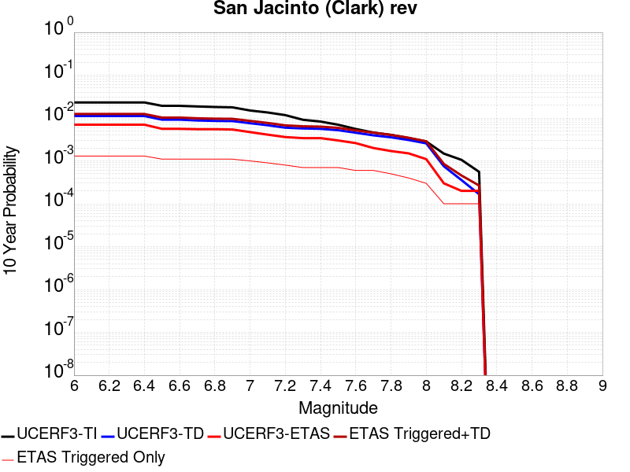 |

| Magnitude | 1 wk TI Prob | 1 wk TD Prob | 1 wk ETAS Prob | 1 wk ETAS/TD Gain | 1 wk ETAS Triggered+TD | 1 wk ETAS Triggered Only | 1 mo TI Prob | 1 mo TD Prob | 1 mo ETAS Prob | 1 mo ETAS/TD Gain | 1 mo ETAS Triggered+TD | 1 mo ETAS Triggered Only | 1 yr TI Prob | 1 yr TD Prob | 1 yr ETAS Prob | 1 yr ETAS/TD Gain | 1 yr ETAS Triggered+TD | 1 yr ETAS Triggered Only | 10 yr TI Prob | 10 yr TD Prob | 10 yr ETAS Prob | 10 yr ETAS/TD Gain | 10 yr ETAS Triggered+TD | 10 yr ETAS Triggered Only |
|-----|-----|-----|-----|-----|-----|-----|-----|-----|-----|-----|-----|-----|-----|-----|-----|-----|-----|-----|-----|-----|-----|-----|-----|-----|
| 6.0 | 4.482615E-5 | 2.0430423E-5 | 0.0 | 0.0 | 2.0430423E-5 | 0.0 | 1.9209793E-4 | 8.7556065E-5 | 0.0 | 0.0 | 8.7556065E-5 | 0.0 | 0.0023362834 | 0.0010654826 | 0.0011 | 1.0323961 | 0.0012652695 | 2.0E-4 | 0.02311874 | 0.011110588 | 0.007 | 0.6300297 | 0.012396144 | 0.0013 |
| 6.1 | 4.482615E-5 | 2.0430423E-5 | 0.0 | 0.0 | 2.0430423E-5 | 0.0 | 1.9209793E-4 | 8.7556065E-5 | 0.0 | 0.0 | 8.7556065E-5 | 0.0 | 0.0023362834 | 0.0010654826 | 0.0011 | 1.0323961 | 0.0012652695 | 2.0E-4 | 0.02311874 | 0.011110588 | 0.007 | 0.6300297 | 0.012396144 | 0.0013 |
| 6.2 | 4.482615E-5 | 2.0430423E-5 | 0.0 | 0.0 | 2.0430423E-5 | 0.0 | 1.9209793E-4 | 8.7556065E-5 | 0.0 | 0.0 | 8.7556065E-5 | 0.0 | 0.0023362834 | 0.0010654826 | 0.0011 | 1.0323961 | 0.0012652695 | 2.0E-4 | 0.02311874 | 0.011110588 | 0.007 | 0.6300297 | 0.012396144 | 0.0013 |
| 6.3 | 4.482615E-5 | 2.0430423E-5 | 0.0 | 0.0 | 2.0430423E-5 | 0.0 | 1.9209793E-4 | 8.7556065E-5 | 0.0 | 0.0 | 8.7556065E-5 | 0.0 | 0.0023362834 | 0.0010654826 | 0.0011 | 1.0323961 | 0.0012652695 | 2.0E-4 | 0.02311874 | 0.011110588 | 0.007 | 0.6300297 | 0.012396144 | 0.0013 |
| 6.4 | 4.482615E-5 | 2.0430423E-5 | 0.0 | 0.0 | 2.0430423E-5 | 0.0 | 1.9209793E-4 | 8.7556065E-5 | 0.0 | 0.0 | 8.7556065E-5 | 0.0 | 0.0023362834 | 0.0010654826 | 0.0011 | 1.0323961 | 0.0012652695 | 2.0E-4 | 0.02311874 | 0.011110588 | 0.007 | 0.6300297 | 0.012396144 | 0.0013 |
| 6.5 | 3.7294863E-5 | 1.6706344E-5 | 0.0 | 0.0 | 1.6706344E-5 | 0.0 | 1.5982533E-4 | 7.159668E-5 | 0.0 | 0.0 | 7.159668E-5 | 0.0 | 0.0019441366 | 8.713452E-4 | 8.0E-4 | 0.9181206 | 9.712581E-4 | 1.0E-4 | 0.01927216 | 0.00914818 | 0.0056 | 0.6121437 | 0.010238116 | 0.0011 |
| 6.6 | 3.7294863E-5 | 1.6706344E-5 | 0.0 | 0.0 | 1.6706344E-5 | 0.0 | 1.5982533E-4 | 7.159668E-5 | 0.0 | 0.0 | 7.159668E-5 | 0.0 | 0.0019441366 | 8.713452E-4 | 8.0E-4 | 0.9181206 | 9.712581E-4 | 1.0E-4 | 0.01927216 | 0.00914818 | 0.0056 | 0.6121437 | 0.010238116 | 0.0011 |
| 6.7 | 3.6039248E-5 | 1.59683E-5 | 0.0 | 0.0 | 1.59683E-5 | 0.0 | 1.5444479E-4 | 6.84338E-5 | 0.0 | 0.0 | 6.84338E-5 | 0.0 | 0.0018787434 | 8.3286694E-4 | 8.0E-4 | 0.96053755 | 9.3278365E-4 | 1.0E-4 | 0.01862939 | 0.008754714 | 0.0055 | 0.62823296 | 0.009845084 | 0.0011 |
| 6.8 | 3.5031844E-5 | 1.5607146E-5 | 0.0 | 0.0 | 1.5607146E-5 | 0.0 | 1.5012783E-4 | 6.6886074E-5 | 0.0 | 0.0 | 6.6886074E-5 | 0.0 | 0.0018262739 | 8.140376E-4 | 8.0E-4 | 0.98275566 | 9.1395614E-4 | 1.0E-4 | 0.01811338 | 0.008560842 | 0.0055 | 0.64246017 | 0.009651425 | 0.0011 |
| 6.9 | 3.435112E-5 | 1.5442898E-5 | 0.0 | 0.0 | 1.5442898E-5 | 0.0 | 1.4721078E-4 | 6.618219E-5 | 0.0 | 0.0 | 6.618219E-5 | 0.0 | 0.0017908178 | 8.054741E-4 | 7.0E-4 | 0.86905336 | 9.0539356E-4 | 1.0E-4 | 0.017764548 | 0.008471737 | 0.0054 | 0.6374136 | 0.009562418 | 0.0011 |
| 7.0 | 2.8959772E-5 | 1.3769847E-5 | 0.0 | 0.0 | 1.3769847E-5 | 0.0 | 1.241074E-4 | 5.9012313E-5 | 0.0 | 0.0 | 5.9012313E-5 | 0.0 | 0.0015099603 | 7.182407E-4 | 7.0E-4 | 0.97460365 | 8.1816886E-4 | 1.0E-4 | 0.014997416 | 0.0075708367 | 0.0047 | 0.62080324 | 0.008563266 | 0.001 |
| 7.1 | 2.6002877E-5 | 1.2310033E-5 | 0.0 | 0.0 | 1.2310033E-5 | 0.0 | 1.11436144E-4 | 5.2756226E-5 | 0.0 | 0.0 | 5.2756226E-5 | 0.0 | 0.0013558907 | 6.421198E-4 | 7.0E-4 | 1.0901393 | 7.4205553E-4 | 1.0E-4 | 0.013476475 | 0.0067729447 | 0.0041 | 0.60534966 | 0.007666849 | 9.0E-4 |
| 7.2 | 2.2544838E-5 | 1.0795646E-5 | 0.0 | 0.0 | 1.0795646E-5 | 0.0 | 9.661716E-5 | 4.6266243E-5 | 0.0 | 0.0 | 4.6266243E-5 | 0.0 | 0.001175679 | 5.6314724E-4 | 6.0E-4 | 1.0654407 | 6.6309096E-4 | 1.0E-4 | 0.011694785 | 0.005944752 | 0.0036 | 0.60557616 | 0.0067399964 | 8.0E-4 |
| 7.3 | 1.75334E-5 | 1.0374646E-5 | 0.0 | 0.0 | 1.0374646E-5 | 0.0 | 7.514098E-5 | 4.446202E-5 | 0.0 | 0.0 | 4.446202E-5 | 0.0 | 9.144575E-4 | 5.4119196E-4 | 5.0E-4 | 0.9238866 | 5.4119196E-4 | 0.0 | 0.009107036 | 0.005700516 | 0.0034 | 0.5964372 | 0.0063965255 | 7.0E-4 |
| 7.4 | 1.5924552E-5 | 1.0184866E-5 | 0.0 | 0.0 | 1.0184866E-5 | 0.0 | 6.82463E-5 | 4.3648706E-5 | 0.0 | 0.0 | 4.3648706E-5 | 0.0 | 8.305819E-4 | 5.3129473E-4 | 5.0E-4 | 0.94109726 | 5.3129473E-4 | 0.0 | 0.008274844 | 0.0055934065 | 0.0034 | 0.6078586 | 0.006289491 | 7.0E-4 |
| 7.5 | 1.3428931E-5 | 9.445109E-6 | 0.0 | 0.0 | 9.445109E-6 | 0.0 | 5.7551293E-5 | 4.0478415E-5 | 0.0 | 0.0 | 4.0478415E-5 | 0.0 | 7.004617E-4 | 4.927143E-4 | 5.0E-4 | 1.014787 | 4.927143E-4 | 0.0 | 0.006982579 | 0.005189663 | 0.003 | 0.57807225 | 0.0058860304 | 7.0E-4 |
| 7.6 | 1.0688787E-5 | 8.229918E-6 | 0.0 | 0.0 | 8.229918E-6 | 0.0 | 4.5808283E-5 | 3.5270605E-5 | 0.0 | 0.0 | 3.5270605E-5 | 0.0 | 5.5757316E-4 | 4.2933546E-4 | 5.0E-4 | 1.1645906 | 4.2933546E-4 | 0.0 | 0.005561762 | 0.0045361673 | 0.0026 | 0.5731711 | 0.005133446 | 6.0E-4 |
| 7.7 | 8.81236E-6 | 7.1000795E-6 | 0.0 | 0.0 | 7.1000795E-6 | 0.0 | 3.776671E-5 | 3.0428559E-5 | 0.0 | 0.0 | 3.0428559E-5 | 0.0 | 4.597127E-4 | 3.7040492E-4 | 3.0E-4 | 0.8099245 | 3.7040492E-4 | 0.0 | 0.0045876284 | 0.003937952 | 0.002 | 0.5078782 | 0.0045355894 | 6.0E-4 |
| 7.8 | 7.780431E-6 | 6.3489674E-6 | 0.0 | 0.0 | 6.3489674E-6 | 0.0 | 3.3344273E-5 | 2.7209579E-5 | 0.0 | 0.0 | 2.7209579E-5 | 0.0 | 4.0589093E-4 | 3.3122642E-4 | 2.0E-4 | 0.60381657 | 3.3122642E-4 | 0.0 | 0.0040515037 | 0.0035365752 | 0.0017 | 0.48069105 | 0.004034807 | 5.0E-4 |
| 7.9 | 6.5437994E-6 | 5.4558323E-6 | 0.0 | 0.0 | 5.4558323E-6 | 0.0 | 2.8044553E-5 | 2.338193E-5 | 0.0 | 0.0 | 2.338193E-5 | 0.0 | 3.4138895E-4 | 2.8463796E-4 | 1.0E-4 | 0.3513235 | 2.8463796E-4 | 0.0 | 0.0034086495 | 0.0030602466 | 0.0015 | 0.49015656 | 0.0034590226 | 4.0E-4 |
| 8.0 | 5.4488164E-6 | 4.52452E-6 | 0.0 | 0.0 | 4.52452E-6 | 0.0 | 2.3351862E-5 | 1.9390656E-5 | 0.0 | 0.0 | 1.9390656E-5 | 0.0 | 2.8427184E-4 | 2.360558E-4 | 1.0E-4 | 0.42362866 | 2.360558E-4 | 0.0 | 0.0028390845 | 0.0025552472 | 0.0011 | 0.4304867 | 0.0028544806 | 3.0E-4 |
| 8.1 | 2.8397242E-6 | 1.2452609E-6 | 0.0 | 0.0 | 1.2452609E-6 | 0.0 | 1.217019E-5 | 5.3368217E-6 | 0.0 | 0.0 | 5.3368217E-6 | 0.0 | 1.4816198E-4 | 6.497388E-5 | 0.0 | 0.0 | 6.497388E-5 | 0.0 | 0.0014806325 | 7.424613E-4 | 3.0E-4 | 0.40406147 | 8.4238703E-4 | 1.0E-4 |
| 8.2 | 2.030244E-6 | 5.597597E-7 | 0.0 | 0.0 | 5.597597E-7 | 0.0 | 8.701017E-6 | 2.398968E-6 | 0.0 | 0.0 | 2.398968E-6 | 0.0 | 1.05929736E-4 | 2.9207049E-5 | 0.0 | 0.0 | 2.9207049E-5 | 0.0 | 0.0010587925 | 3.5252166E-4 | 2.0E-4 | 0.567341 | 4.524864E-4 | 1.0E-4 |
| 8.3 | 1.0659804E-6 | 2.5734514E-7 | 0.0 | 0.0 | 2.5734514E-7 | 0.0 | 4.568479E-6 | 1.1029073E-6 | 0.0 | 0.0 | 1.1029073E-6 | 0.0 | 5.5619817E-5 | 1.3427816E-5 | 0.0 | 0.0 | 1.3427816E-5 | 0.0 | 5.5605895E-4 | 1.6478398E-4 | 2.0E-4 | 1.2137102 | 2.647675E-4 | 1.0E-4 |

## Hector Mine
*[(top)](#table-of-contents)*

| 1 Week | 1 Month | 1 Year | 10 Year |
|-----|-----|-----|-----|
|  |  |  | 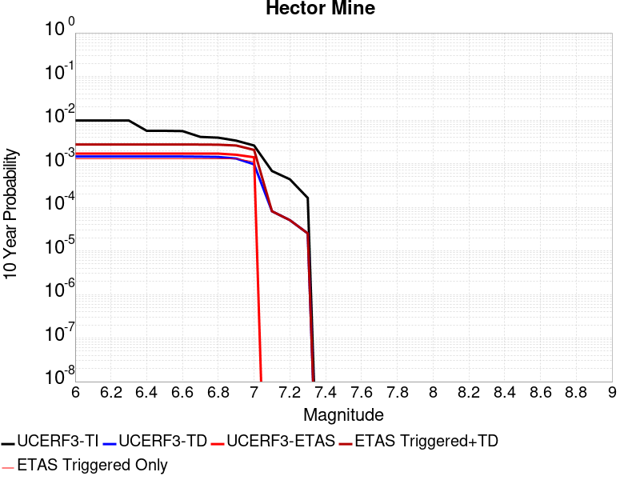 |

| Magnitude | 1 wk TI Prob | 1 wk TD Prob | 1 wk ETAS Prob | 1 wk ETAS/TD Gain | 1 wk ETAS Triggered+TD | 1 wk ETAS Triggered Only | 1 mo TI Prob | 1 mo TD Prob | 1 mo ETAS Prob | 1 mo ETAS/TD Gain | 1 mo ETAS Triggered+TD | 1 mo ETAS Triggered Only | 1 yr TI Prob | 1 yr TD Prob | 1 yr ETAS Prob | 1 yr ETAS/TD Gain | 1 yr ETAS Triggered+TD | 1 yr ETAS Triggered Only | 10 yr TI Prob | 10 yr TD Prob | 10 yr ETAS Prob | 10 yr ETAS/TD Gain | 10 yr ETAS Triggered+TD | 10 yr ETAS Triggered Only |
|-----|-----|-----|-----|-----|-----|-----|-----|-----|-----|-----|-----|-----|-----|-----|-----|-----|-----|-----|-----|-----|-----|-----|-----|-----|
| 6.0 | 1.8760093E-5 | 2.7878673E-6 | 0.0 | 0.0 | 2.7878673E-6 | 0.0 | 8.039792E-5 | 1.194797E-5 | 0.0 | 0.0 | 1.194797E-5 | 0.0 | 9.78405E-4 | 1.454608E-4 | 2.0E-4 | 1.3749409 | 2.4544625E-4 | 1.0E-4 | 0.009741086 | 0.0014540462 | 0.0017 | 1.1691513 | 0.002752156 | 0.0013 |
| 6.1 | 1.8760093E-5 | 2.7878673E-6 | 0.0 | 0.0 | 2.7878673E-6 | 0.0 | 8.039792E-5 | 1.194797E-5 | 0.0 | 0.0 | 1.194797E-5 | 0.0 | 9.78405E-4 | 1.454608E-4 | 2.0E-4 | 1.3749409 | 2.4544625E-4 | 1.0E-4 | 0.009741086 | 0.0014540462 | 0.0017 | 1.1691513 | 0.002752156 | 0.0013 |
| 6.2 | 1.8760093E-5 | 2.7878673E-6 | 0.0 | 0.0 | 2.7878673E-6 | 0.0 | 8.039792E-5 | 1.194797E-5 | 0.0 | 0.0 | 1.194797E-5 | 0.0 | 9.78405E-4 | 1.454608E-4 | 2.0E-4 | 1.3749409 | 2.4544625E-4 | 1.0E-4 | 0.009741086 | 0.0014540462 | 0.0017 | 1.1691513 | 0.002752156 | 0.0013 |
| 6.3 | 1.8760093E-5 | 2.7878673E-6 | 0.0 | 0.0 | 2.7878673E-6 | 0.0 | 8.039792E-5 | 1.194797E-5 | 0.0 | 0.0 | 1.194797E-5 | 0.0 | 9.78405E-4 | 1.454608E-4 | 2.0E-4 | 1.3749409 | 2.4544625E-4 | 1.0E-4 | 0.009741086 | 0.0014540462 | 0.0017 | 1.1691513 | 0.002752156 | 0.0013 |
| 6.4 | 1.0888055E-5 | 2.7878673E-6 | 0.0 | 0.0 | 2.7878673E-6 | 0.0 | 4.666226E-5 | 1.194797E-5 | 0.0 | 0.0 | 1.194797E-5 | 0.0 | 5.679649E-4 | 1.454608E-4 | 2.0E-4 | 1.3749409 | 2.4544625E-4 | 1.0E-4 | 0.0056651547 | 0.0014540462 | 0.0017 | 1.1691513 | 0.002752156 | 0.0013 |
| 6.5 | 1.0888055E-5 | 2.7878673E-6 | 0.0 | 0.0 | 2.7878673E-6 | 0.0 | 4.666226E-5 | 1.194797E-5 | 0.0 | 0.0 | 1.194797E-5 | 0.0 | 5.679649E-4 | 1.454608E-4 | 2.0E-4 | 1.3749409 | 2.4544625E-4 | 1.0E-4 | 0.0056651547 | 0.0014540462 | 0.0017 | 1.1691513 | 0.002752156 | 0.0013 |
| 6.6 | 1.0730738E-5 | 2.7878673E-6 | 0.0 | 0.0 | 2.7878673E-6 | 0.0 | 4.5988065E-5 | 1.194797E-5 | 0.0 | 0.0 | 1.194797E-5 | 0.0 | 5.5976084E-4 | 1.454608E-4 | 2.0E-4 | 1.3749409 | 2.4544625E-4 | 1.0E-4 | 0.0055835294 | 0.0014540462 | 0.0017 | 1.1691513 | 0.002752156 | 0.0013 |
| 6.7 | 7.881326E-6 | 2.7629317E-6 | 0.0 | 0.0 | 2.7629317E-6 | 0.0 | 3.3776672E-5 | 1.1841104E-5 | 0.0 | 0.0 | 1.1841104E-5 | 0.0 | 4.111534E-4 | 1.4415989E-4 | 2.0E-4 | 1.3873484 | 2.4414549E-4 | 1.0E-4 | 0.0041039353 | 0.0014410539 | 0.0017 | 1.1796921 | 0.0027391806 | 0.0013 |
| 6.8 | 7.5683483E-6 | 2.7250815E-6 | 0.0 | 0.0 | 2.7250815E-6 | 0.0 | 3.2435375E-5 | 1.1678891E-5 | 0.0 | 0.0 | 1.1678891E-5 | 0.0 | 3.9482914E-4 | 1.4218519E-4 | 2.0E-4 | 1.4066162 | 2.4217098E-4 | 1.0E-4 | 0.0039412836 | 0.0014213322 | 0.0017 | 1.1960609 | 0.0027194845 | 0.0013 |
| 6.9 | 6.473048E-6 | 2.507028E-6 | 0.0 | 0.0 | 2.507028E-6 | 0.0 | 2.7741338E-5 | 1.0744385E-5 | 0.0 | 0.0 | 1.0744385E-5 | 0.0 | 3.3769844E-4 | 1.3080898E-4 | 2.0E-4 | 1.528947 | 2.307959E-4 | 1.0E-4 | 0.0033718573 | 0.0013077074 | 0.0016 | 1.2235153 | 0.0026060075 | 0.0013 |
| 7.0 | 4.9959954E-6 | 1.850893E-6 | 0.0 | 0.0 | 1.850893E-6 | 0.0 | 2.1411232E-5 | 7.9323945E-6 | 0.0 | 0.0 | 7.9323945E-6 | 0.0 | 2.6065056E-4 | 9.657617E-5 | 1.0E-4 | 1.0354521 | 9.657617E-5 | 0.0 | 0.0026034506 | 9.656898E-4 | 0.0014 | 1.4497409 | 0.0020646276 | 0.0011 |
| 7.1 | 1.2997541E-6 | 1.5493657E-7 | 0.0 | 0.0 | 1.5493657E-7 | 0.0 | 5.5703626E-6 | 6.640137E-7 | 0.0 | 0.0 | 6.640137E-7 | 0.0 | 6.7817055E-5 | 8.084341E-6 | 0.0 | 0.0 | 8.084341E-6 | 0.0 | 6.779636E-4 | 8.084086E-5 | 0.0 | 0.0 | 8.084086E-5 | 0.0 |
| 7.2 | 8.392699E-7 | 9.673849E-8 | 0.0 | 0.0 | 9.673849E-8 | 0.0 | 3.596866E-6 | 4.1459344E-7 | 0.0 | 0.0 | 4.1459344E-7 | 0.0 | 4.3790962E-5 | 5.0476656E-6 | 0.0 | 0.0 | 5.0476656E-6 | 0.0 | 4.3782333E-4 | 5.04757E-5 | 0.0 | 0.0 | 5.04757E-5 | 0.0 |
| 7.3 | 3.13015E-7 | 4.8061118E-8 | 0.0 | 0.0 | 4.8061118E-8 | 0.0 | 1.3414921E-6 | 2.059762E-7 | 0.0 | 0.0 | 2.059762E-7 | 0.0 | 1.6332544E-5 | 2.5077582E-6 | 0.0 | 0.0 | 2.5077582E-6 | 0.0 | 1.6331344E-4 | 2.5077383E-5 | 0.0 | 0.0 | 2.5077383E-5 | 0.0 |

## Cucamonga
*[(top)](#table-of-contents)*

| 1 Week | 1 Month | 1 Year | 10 Year |
|-----|-----|-----|-----|
|  |  |  |  |

| Magnitude | 1 wk TI Prob | 1 wk TD Prob | 1 wk ETAS Prob | 1 wk ETAS/TD Gain | 1 wk ETAS Triggered+TD | 1 wk ETAS Triggered Only | 1 mo TI Prob | 1 mo TD Prob | 1 mo ETAS Prob | 1 mo ETAS/TD Gain | 1 mo ETAS Triggered+TD | 1 mo ETAS Triggered Only | 1 yr TI Prob | 1 yr TD Prob | 1 yr ETAS Prob | 1 yr ETAS/TD Gain | 1 yr ETAS Triggered+TD | 1 yr ETAS Triggered Only | 10 yr TI Prob | 10 yr TD Prob | 10 yr ETAS Prob | 10 yr ETAS/TD Gain | 10 yr ETAS Triggered+TD | 10 yr ETAS Triggered Only |
|-----|-----|-----|-----|-----|-----|-----|-----|-----|-----|-----|-----|-----|-----|-----|-----|-----|-----|-----|-----|-----|-----|-----|-----|-----|
| 6.0 | 1.1848348E-5 | 1.1681425E-5 | 0.0 | 0.0 | 1.1681425E-5 | 0.0 | 5.0777642E-5 | 5.0062306E-5 | 1.0E-4 | 1.9975109 | 1.500573E-4 | 1.0E-4 | 6.180424E-4 | 6.093408E-4 | 7.0E-4 | 1.1487824 | 9.0915797E-4 | 3.0E-4 | 0.0061632637 | 0.0060776994 | 0.0035 | 0.5758758 | 0.007270406 | 0.0012 |
| 6.1 | 1.1848348E-5 | 1.1681425E-5 | 0.0 | 0.0 | 1.1681425E-5 | 0.0 | 5.0777642E-5 | 5.0062306E-5 | 1.0E-4 | 1.9975109 | 1.500573E-4 | 1.0E-4 | 6.180424E-4 | 6.093408E-4 | 7.0E-4 | 1.1487824 | 9.0915797E-4 | 3.0E-4 | 0.0061632637 | 0.0060776994 | 0.0035 | 0.5758758 | 0.007270406 | 0.0012 |
| 6.2 | 1.1848348E-5 | 1.1681425E-5 | 0.0 | 0.0 | 1.1681425E-5 | 0.0 | 5.0777642E-5 | 5.0062306E-5 | 1.0E-4 | 1.9975109 | 1.500573E-4 | 1.0E-4 | 6.180424E-4 | 6.093408E-4 | 7.0E-4 | 1.1487824 | 9.0915797E-4 | 3.0E-4 | 0.0061632637 | 0.0060776994 | 0.0035 | 0.5758758 | 0.007270406 | 0.0012 |
| 6.3 | 1.1848348E-5 | 1.1681425E-5 | 0.0 | 0.0 | 1.1681425E-5 | 0.0 | 5.0777642E-5 | 5.0062306E-5 | 1.0E-4 | 1.9975109 | 1.500573E-4 | 1.0E-4 | 6.180424E-4 | 6.093408E-4 | 7.0E-4 | 1.1487824 | 9.0915797E-4 | 3.0E-4 | 0.0061632637 | 0.0060776994 | 0.0035 | 0.5758758 | 0.007270406 | 0.0012 |
| 6.4 | 1.1848348E-5 | 1.1681425E-5 | 0.0 | 0.0 | 1.1681425E-5 | 0.0 | 5.0777642E-5 | 5.0062306E-5 | 1.0E-4 | 1.9975109 | 1.500573E-4 | 1.0E-4 | 6.180424E-4 | 6.093408E-4 | 7.0E-4 | 1.1487824 | 9.0915797E-4 | 3.0E-4 | 0.0061632637 | 0.0060776994 | 0.0035 | 0.5758758 | 0.007270406 | 0.0012 |
| 6.5 | 1.16988695E-5 | 1.1520585E-5 | 0.0 | 0.0 | 1.1520585E-5 | 0.0 | 5.013705E-5 | 4.937302E-5 | 1.0E-4 | 2.0253978 | 1.4936808E-4 | 1.0E-4 | 6.102476E-4 | 6.0095335E-4 | 7.0E-4 | 1.1648159 | 9.0077304E-4 | 3.0E-4 | 0.006085745 | 0.005994278 | 0.0035 | 0.58389014 | 0.007187085 | 0.0012 |
| 6.6 | 1.16988695E-5 | 1.1520585E-5 | 0.0 | 0.0 | 1.1520585E-5 | 0.0 | 5.013705E-5 | 4.937302E-5 | 1.0E-4 | 2.0253978 | 1.4936808E-4 | 1.0E-4 | 6.102476E-4 | 6.0095335E-4 | 7.0E-4 | 1.1648159 | 9.0077304E-4 | 3.0E-4 | 0.006085745 | 0.005994278 | 0.0035 | 0.58389014 | 0.007187085 | 0.0012 |
| 6.7 | 1.1397107E-5 | 1.1060845E-5 | 0.0 | 0.0 | 1.1060845E-5 | 0.0 | 4.884383E-5 | 4.7402777E-5 | 1.0E-4 | 2.1095812 | 1.4739804E-4 | 1.0E-4 | 5.9451134E-4 | 5.7697843E-4 | 7.0E-4 | 1.2132169 | 8.7680534E-4 | 3.0E-4 | 0.005929234 | 0.005755779 | 0.0035 | 0.6080845 | 0.006948872 | 0.0012 |
| 6.8 | 1.058387E-5 | 9.737108E-6 | 0.0 | 0.0 | 9.737108E-6 | 0.0 | 4.5358654E-5 | 4.17298E-5 | 1.0E-4 | 2.396369 | 1.4172563E-4 | 1.0E-4 | 5.521017E-4 | 5.07943E-4 | 6.0E-4 | 1.181235 | 7.0784136E-4 | 2.0E-4 | 0.00550732 | 0.005068654 | 0.003 | 0.59187305 | 0.0058645993 | 8.0E-4 |
| 6.9 | 9.690046E-6 | 8.535669E-6 | 0.0 | 0.0 | 8.535669E-6 | 0.0 | 4.1528107E-5 | 3.6580925E-5 | 1.0E-4 | 2.7336652 | 1.3657726E-4 | 1.0E-4 | 5.054874E-4 | 4.4528214E-4 | 5.0E-4 | 1.1228836 | 5.452376E-4 | 1.0E-4 | 0.005043391 | 0.0044446616 | 0.0028 | 0.62996924 | 0.00514155 | 7.0E-4 |
| 7.0 | 9.381461E-6 | 8.14438E-6 | 0.0 | 0.0 | 8.14438E-6 | 0.0 | 4.020564E-5 | 3.490402E-5 | 1.0E-4 | 2.8649995 | 1.3490053E-4 | 1.0E-4 | 4.893937E-4 | 4.2487396E-4 | 5.0E-4 | 1.1768196 | 5.2483147E-4 | 1.0E-4 | 0.0048831734 | 0.0042413757 | 0.0027 | 0.6365859 | 0.004938407 | 7.0E-4 |
| 7.1 | 8.946492E-6 | 7.739966E-6 | 0.0 | 0.0 | 7.739966E-6 | 0.0 | 3.8341543E-5 | 3.3170865E-5 | 1.0E-4 | 3.0146937 | 1.3316754E-4 | 1.0E-4 | 4.667083E-4 | 4.0378075E-4 | 5.0E-4 | 1.2382958 | 5.037404E-4 | 1.0E-4 | 0.0046572937 | 0.004031233 | 0.0027 | 0.6697703 | 0.004728411 | 7.0E-4 |
| 7.2 | 8.251016E-6 | 6.9360203E-6 | 0.0 | 0.0 | 6.9360203E-6 | 0.0 | 3.5361016E-5 | 2.9725465E-5 | 1.0E-4 | 3.364119 | 1.297225E-4 | 1.0E-4 | 4.3043532E-4 | 3.6184766E-4 | 5.0E-4 | 1.381797 | 4.6181146E-4 | 1.0E-4 | 0.0042960253 | 0.0036133453 | 0.0025 | 0.69187963 | 0.004310816 | 7.0E-4 |
| 7.3 | 7.717881E-6 | 6.4482774E-6 | 0.0 | 0.0 | 6.4482774E-6 | 0.0 | 3.3076216E-5 | 2.7635182E-5 | 1.0E-4 | 3.6185756 | 1.2763242E-4 | 1.0E-4 | 4.026285E-4 | 3.3640664E-4 | 5.0E-4 | 1.4862965 | 4.36373E-4 | 1.0E-4 | 0.004018998 | 0.0033597308 | 0.0023 | 0.68457866 | 0.004057379 | 7.0E-4 |
| 7.4 | 7.275623E-6 | 5.9953554E-6 | 0.0 | 0.0 | 5.9953554E-6 | 0.0 | 3.118087E-5 | 2.5694128E-5 | 1.0E-4 | 3.8919399 | 1.2569156E-4 | 1.0E-4 | 3.7956095E-4 | 3.127813E-4 | 5.0E-4 | 1.5985609 | 4.1275003E-4 | 1.0E-4 | 0.0037891332 | 0.0031241663 | 0.002 | 0.6401708 | 0.0037222917 | 6.0E-4 |
| 7.5 | 6.5109502E-6 | 5.0681283E-6 | 0.0 | 0.0 | 5.0681283E-6 | 0.0 | 2.7903774E-5 | 2.1720369E-5 | 1.0E-4 | 4.6039734 | 1.217182E-4 | 1.0E-4 | 3.3967546E-4 | 2.6441354E-4 | 5.0E-4 | 1.8909773 | 3.6438712E-4 | 1.0E-4 | 0.0033915674 | 0.0026417347 | 0.0017 | 0.64351654 | 0.003040678 | 4.0E-4 |
| 7.6 | 5.4495326E-6 | 3.8797943E-6 | 0.0 | 0.0 | 3.8797943E-6 | 0.0 | 2.335493E-5 | 1.6627584E-5 | 1.0E-4 | 6.0141025 | 1.16625924E-4 | 1.0E-4 | 2.8430918E-4 | 2.024221E-4 | 4.0E-4 | 1.9760687 | 3.0240187E-4 | 1.0E-4 | 0.0028394572 | 0.0020231178 | 0.0011 | 0.54371524 | 0.0023225108 | 3.0E-4 |
| 7.7 | 4.7997164E-6 | 3.17428E-6 | 0.0 | 0.0 | 3.17428E-6 | 0.0 | 2.057005E-5 | 1.3603986E-5 | 1.0E-4 | 7.3507867 | 1.13602626E-4 | 1.0E-4 | 2.504116E-4 | 1.6561597E-4 | 3.0E-4 | 1.8114195 | 2.655994E-4 | 1.0E-4 | 0.002501296 | 0.0016556637 | 9.0E-4 | 0.54358864 | 0.0018553325 | 2.0E-4 |
| 7.8 | 3.3941733E-6 | 2.049857E-6 | 0.0 | 0.0 | 2.049857E-6 | 0.0 | 1.4546376E-5 | 8.785072E-6 | 0.0 | 0.0 | 8.785072E-6 | 0.0 | 1.7708774E-4 | 1.0695301E-4 | 1.0E-4 | 0.93499 | 1.0695301E-4 | 0.0 | 0.0017694668 | 0.0010690487 | 5.0E-4 | 0.46770558 | 0.0011689417 | 1.0E-4 |
| 7.9 | 9.750552E-7 | 5.122147E-7 | 0.0 | 0.0 | 5.122147E-7 | 0.0 | 4.178801E-6 | 2.195204E-6 | 0.0 | 0.0 | 2.195204E-6 | 0.0 | 5.0875715E-5 | 2.6726284E-5 | 0.0 | 0.0 | 2.6726284E-5 | 0.0 | 5.086407E-4 | 2.672311E-4 | 2.0E-4 | 0.7484159 | 2.672311E-4 | 0.0 |
| 8.0 | 1.133857E-7 | 6.016657E-8 | 0.0 | 0.0 | 6.016657E-8 | 0.0 | 4.8593864E-7 | 2.5785673E-7 | 0.0 | 0.0 | 2.5785673E-7 | 0.0 | 5.9162867E-6 | 3.139401E-6 | 0.0 | 0.0 | 3.139401E-6 | 0.0 | 5.916129E-5 | 3.1393585E-5 | 0.0 | 0.0 | 3.1393585E-5 | 0.0 |

## Independence rev 2011
*[(top)](#table-of-contents)*

| 1 Week | 1 Month | 1 Year | 10 Year |
|-----|-----|-----|-----|
|  | 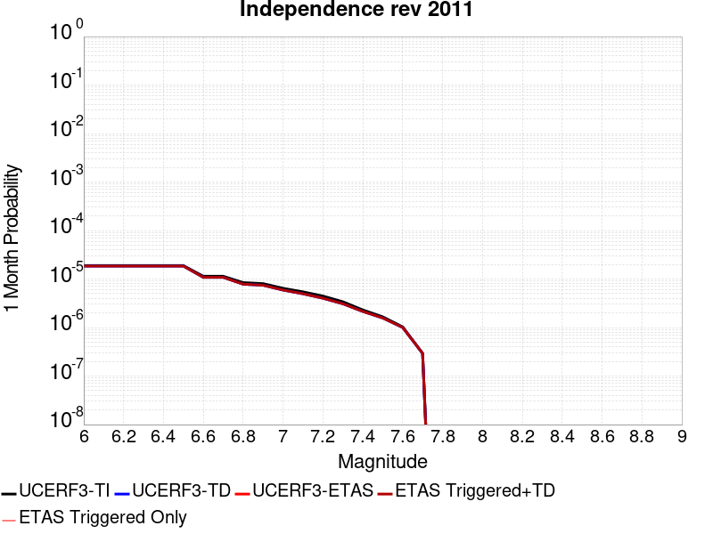 | 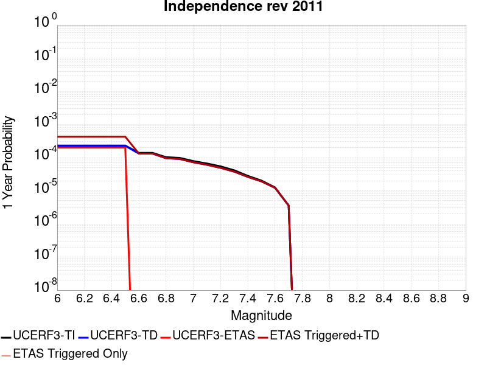 |  |

| Magnitude | 1 wk TI Prob | 1 wk TD Prob | 1 wk ETAS Prob | 1 wk ETAS/TD Gain | 1 wk ETAS Triggered+TD | 1 wk ETAS Triggered Only | 1 mo TI Prob | 1 mo TD Prob | 1 mo ETAS Prob | 1 mo ETAS/TD Gain | 1 mo ETAS Triggered+TD | 1 mo ETAS Triggered Only | 1 yr TI Prob | 1 yr TD Prob | 1 yr ETAS Prob | 1 yr ETAS/TD Gain | 1 yr ETAS Triggered+TD | 1 yr ETAS Triggered Only | 10 yr TI Prob | 10 yr TD Prob | 10 yr ETAS Prob | 10 yr ETAS/TD Gain | 10 yr ETAS Triggered+TD | 10 yr ETAS Triggered Only |
|-----|-----|-----|-----|-----|-----|-----|-----|-----|-----|-----|-----|-----|-----|-----|-----|-----|-----|-----|-----|-----|-----|-----|-----|-----|
| 6.0 | 4.422171E-6 | 4.3246873E-6 | 0.0 | 0.0 | 4.3246873E-6 | 0.0 | 1.8952025E-5 | 1.853426E-5 | 0.0 | 0.0 | 1.853426E-5 | 0.0 | 2.3071647E-4 | 2.2563423E-4 | 2.0E-4 | 0.8863903 | 4.255891E-4 | 2.0E-4 | 0.0023047708 | 0.002254345 | 0.0022 | 0.97589326 | 0.0034516398 | 0.0012 |
| 6.1 | 4.422171E-6 | 4.3246873E-6 | 0.0 | 0.0 | 4.3246873E-6 | 0.0 | 1.8952025E-5 | 1.853426E-5 | 0.0 | 0.0 | 1.853426E-5 | 0.0 | 2.3071647E-4 | 2.2563423E-4 | 2.0E-4 | 0.8863903 | 4.255891E-4 | 2.0E-4 | 0.0023047708 | 0.002254345 | 0.0022 | 0.97589326 | 0.0034516398 | 0.0012 |
| 6.2 | 4.422171E-6 | 4.3246873E-6 | 0.0 | 0.0 | 4.3246873E-6 | 0.0 | 1.8952025E-5 | 1.853426E-5 | 0.0 | 0.0 | 1.853426E-5 | 0.0 | 2.3071647E-4 | 2.2563423E-4 | 2.0E-4 | 0.8863903 | 4.255891E-4 | 2.0E-4 | 0.0023047708 | 0.002254345 | 0.0022 | 0.97589326 | 0.0034516398 | 0.0012 |
| 6.3 | 4.422171E-6 | 4.3246873E-6 | 0.0 | 0.0 | 4.3246873E-6 | 0.0 | 1.8952025E-5 | 1.853426E-5 | 0.0 | 0.0 | 1.853426E-5 | 0.0 | 2.3071647E-4 | 2.2563423E-4 | 2.0E-4 | 0.8863903 | 4.255891E-4 | 2.0E-4 | 0.0023047708 | 0.002254345 | 0.0022 | 0.97589326 | 0.0034516398 | 0.0012 |
| 6.4 | 4.422171E-6 | 4.3246873E-6 | 0.0 | 0.0 | 4.3246873E-6 | 0.0 | 1.8952025E-5 | 1.853426E-5 | 0.0 | 0.0 | 1.853426E-5 | 0.0 | 2.3071647E-4 | 2.2563423E-4 | 2.0E-4 | 0.8863903 | 4.255891E-4 | 2.0E-4 | 0.0023047708 | 0.002254345 | 0.0022 | 0.97589326 | 0.0034516398 | 0.0012 |
| 6.5 | 4.422171E-6 | 4.3246873E-6 | 0.0 | 0.0 | 4.3246873E-6 | 0.0 | 1.8952025E-5 | 1.853426E-5 | 0.0 | 0.0 | 1.853426E-5 | 0.0 | 2.3071647E-4 | 2.2563423E-4 | 2.0E-4 | 0.8863903 | 4.255891E-4 | 2.0E-4 | 0.0023047708 | 0.002254345 | 0.0022 | 0.97589326 | 0.0034516398 | 0.0012 |
| 6.6 | 2.663744E-6 | 2.5308284E-6 | 0.0 | 0.0 | 2.5308284E-6 | 0.0 | 1.1415996E-5 | 1.0846365E-5 | 0.0 | 0.0 | 1.0846365E-5 | 0.0 | 1.3898089E-4 | 1.3204697E-4 | 0.0 | 0.0 | 1.3204697E-4 | 0.0 | 0.0013889399 | 0.0013197334 | 8.0E-4 | 0.60618305 | 0.0018190736 | 5.0E-4 |
| 6.7 | 2.663744E-6 | 2.5308284E-6 | 0.0 | 0.0 | 2.5308284E-6 | 0.0 | 1.1415996E-5 | 1.0846365E-5 | 0.0 | 0.0 | 1.0846365E-5 | 0.0 | 1.3898089E-4 | 1.3204697E-4 | 0.0 | 0.0 | 1.3204697E-4 | 0.0 | 0.0013889399 | 0.0013197334 | 8.0E-4 | 0.60618305 | 0.0018190736 | 5.0E-4 |
| 6.8 | 1.9716529E-6 | 1.8312561E-6 | 0.0 | 0.0 | 1.8312561E-6 | 0.0 | 8.449913E-6 | 7.848218E-6 | 0.0 | 0.0 | 7.848218E-6 | 0.0 | 1.0287284E-4 | 9.554799E-5 | 0.0 | 0.0 | 9.554799E-5 | 0.0 | 0.0010282523 | 9.55082E-4 | 7.0E-4 | 0.73292136 | 0.0013547 | 4.0E-4 |
| 6.9 | 1.8788617E-6 | 1.7420354E-6 | 0.0 | 0.0 | 1.7420354E-6 | 0.0 | 8.0522395E-6 | 7.465845E-6 | 0.0 | 0.0 | 7.465845E-6 | 0.0 | 9.80316E-5 | 9.0892994E-5 | 0.0 | 0.0 | 9.0892994E-5 | 0.0 | 9.798837E-4 | 9.085702E-4 | 6.0E-4 | 0.6603783 | 0.0013082067 | 4.0E-4 |
| 7.0 | 1.5045488E-6 | 1.3841516E-6 | 0.0 | 0.0 | 1.3841516E-6 | 0.0 | 6.44805E-6 | 5.932065E-6 | 0.0 | 0.0 | 5.932065E-6 | 0.0 | 7.8502184E-5 | 7.222055E-5 | 0.0 | 0.0 | 7.222055E-5 | 0.0 | 7.8474457E-4 | 7.219759E-4 | 3.0E-4 | 0.41552633 | 9.218315E-4 | 2.0E-4 |
| 7.1 | 1.272341E-6 | 1.1618124E-6 | 0.0 | 0.0 | 1.1618124E-6 | 0.0 | 5.4528787E-6 | 4.979187E-6 | 0.0 | 0.0 | 4.979187E-6 | 0.0 | 6.6386776E-5 | 6.0619946E-5 | 0.0 | 0.0 | 6.0619946E-5 | 0.0 | 6.636695E-4 | 6.0603727E-4 | 3.0E-4 | 0.49501905 | 8.059161E-4 | 2.0E-4 |
| 7.2 | 1.0416892E-6 | 9.403856E-7 | 0.0 | 0.0 | 9.403856E-7 | 0.0 | 4.464375E-6 | 4.030218E-6 | 0.0 | 0.0 | 4.030218E-6 | 0.0 | 5.4352407E-5 | 4.9066814E-5 | 0.0 | 0.0 | 4.9066814E-5 | 0.0 | 5.4339116E-4 | 4.9056165E-4 | 2.0E-4 | 0.40769595 | 5.905126E-4 | 1.0E-4 |
| 7.3 | 7.9450155E-7 | 7.230512E-7 | 0.0 | 0.0 | 7.230512E-7 | 0.0 | 3.4050022E-6 | 3.0987871E-6 | 0.0 | 0.0 | 3.0987871E-6 | 0.0 | 4.1455114E-5 | 3.772709E-5 | 0.0 | 0.0 | 3.772709E-5 | 0.0 | 4.144738E-4 | 3.7720797E-4 | 2.0E-4 | 0.5302115 | 4.7717025E-4 | 1.0E-4 |
| 7.4 | 5.3893444E-7 | 5.0167404E-7 | 0.0 | 0.0 | 5.0167404E-7 | 0.0 | 2.309717E-6 | 2.1500298E-6 | 0.0 | 0.0 | 2.1500298E-6 | 0.0 | 2.8120441E-5 | 2.6176303E-5 | 0.0 | 0.0 | 2.6176303E-5 | 0.0 | 2.8116882E-4 | 2.6173264E-4 | 1.0E-4 | 0.38206926 | 3.6170648E-4 | 1.0E-4 |
| 7.5 | 3.8852085E-7 | 3.680757E-7 | 0.0 | 0.0 | 3.680757E-7 | 0.0 | 1.6650882E-6 | 1.5774664E-6 | 0.0 | 0.0 | 1.5774664E-6 | 0.0 | 2.027226E-5 | 1.9205485E-5 | 0.0 | 0.0 | 1.9205485E-5 | 0.0 | 2.0270412E-4 | 1.9203847E-4 | 1.0E-4 | 0.520729 | 2.9201928E-4 | 1.0E-4 |
| 7.6 | 2.414929E-7 | 2.3448305E-7 | 0.0 | 0.0 | 2.3448305E-7 | 0.0 | 1.0349692E-6 | 1.004927E-6 | 0.0 | 0.0 | 1.004927E-6 | 0.0 | 1.2600677E-5 | 1.2234918E-5 | 0.0 | 0.0 | 1.2234918E-5 | 0.0 | 1.2599962E-4 | 1.2234258E-4 | 1.0E-4 | 0.817377 | 2.2233035E-4 | 1.0E-4 |
| 7.7 | 6.8298014E-8 | 6.8571076E-8 | 0.0 | 0.0 | 6.8571076E-8 | 0.0 | 2.9270575E-7 | 2.93876E-7 | 0.0 | 0.0 | 2.93876E-7 | 0.0 | 3.5636867E-6 | 3.577935E-6 | 0.0 | 0.0 | 3.577935E-6 | 0.0 | 3.5636294E-5 | 3.5778823E-5 | 1.0E-4 | 2.7949495 | 1.3577525E-4 | 1.0E-4 |

## Pitas Point (Lower)-Montalvo
*[(top)](#table-of-contents)*

| 1 Week | 1 Month | 1 Year | 10 Year |
|-----|-----|-----|-----|
|  |  |  |  |

| Magnitude | 1 wk TI Prob | 1 wk TD Prob | 1 wk ETAS Prob | 1 wk ETAS/TD Gain | 1 wk ETAS Triggered+TD | 1 wk ETAS Triggered Only | 1 mo TI Prob | 1 mo TD Prob | 1 mo ETAS Prob | 1 mo ETAS/TD Gain | 1 mo ETAS Triggered+TD | 1 mo ETAS Triggered Only | 1 yr TI Prob | 1 yr TD Prob | 1 yr ETAS Prob | 1 yr ETAS/TD Gain | 1 yr ETAS Triggered+TD | 1 yr ETAS Triggered Only | 10 yr TI Prob | 10 yr TD Prob | 10 yr ETAS Prob | 10 yr ETAS/TD Gain | 10 yr ETAS Triggered+TD | 10 yr ETAS Triggered Only |
|-----|-----|-----|-----|-----|-----|-----|-----|-----|-----|-----|-----|-----|-----|-----|-----|-----|-----|-----|-----|-----|-----|-----|-----|-----|
| 6.0 | 5.2543637E-6 | 4.8333795E-6 | 0.0 | 0.0 | 4.8333795E-6 | 0.0 | 2.2518509E-5 | 2.071432E-5 | 0.0 | 0.0 | 2.071432E-5 | 0.0 | 2.7412834E-4 | 2.5216799E-4 | 0.0 | 0.0 | 2.5216799E-4 | 0.0 | 0.0027379042 | 0.0025188508 | 0.003 | 1.1910193 | 0.0037158283 | 0.0012 |
| 6.1 | 5.2543637E-6 | 4.8333795E-6 | 0.0 | 0.0 | 4.8333795E-6 | 0.0 | 2.2518509E-5 | 2.071432E-5 | 0.0 | 0.0 | 2.071432E-5 | 0.0 | 2.7412834E-4 | 2.5216799E-4 | 0.0 | 0.0 | 2.5216799E-4 | 0.0 | 0.0027379042 | 0.0025188508 | 0.003 | 1.1910193 | 0.0037158283 | 0.0012 |
| 6.2 | 5.2543637E-6 | 4.8333795E-6 | 0.0 | 0.0 | 4.8333795E-6 | 0.0 | 2.2518509E-5 | 2.071432E-5 | 0.0 | 0.0 | 2.071432E-5 | 0.0 | 2.7412834E-4 | 2.5216799E-4 | 0.0 | 0.0 | 2.5216799E-4 | 0.0 | 0.0027379042 | 0.0025188508 | 0.003 | 1.1910193 | 0.0037158283 | 0.0012 |
| 6.3 | 5.2543637E-6 | 4.8333795E-6 | 0.0 | 0.0 | 4.8333795E-6 | 0.0 | 2.2518509E-5 | 2.071432E-5 | 0.0 | 0.0 | 2.071432E-5 | 0.0 | 2.7412834E-4 | 2.5216799E-4 | 0.0 | 0.0 | 2.5216799E-4 | 0.0 | 0.0027379042 | 0.0025188508 | 0.003 | 1.1910193 | 0.0037158283 | 0.0012 |
| 6.4 | 5.2543637E-6 | 4.8333795E-6 | 0.0 | 0.0 | 4.8333795E-6 | 0.0 | 2.2518509E-5 | 2.071432E-5 | 0.0 | 0.0 | 2.071432E-5 | 0.0 | 2.7412834E-4 | 2.5216799E-4 | 0.0 | 0.0 | 2.5216799E-4 | 0.0 | 0.0027379042 | 0.0025188508 | 0.003 | 1.1910193 | 0.0037158283 | 0.0012 |
| 6.5 | 5.2543637E-6 | 4.8333795E-6 | 0.0 | 0.0 | 4.8333795E-6 | 0.0 | 2.2518509E-5 | 2.071432E-5 | 0.0 | 0.0 | 2.071432E-5 | 0.0 | 2.7412834E-4 | 2.5216799E-4 | 0.0 | 0.0 | 2.5216799E-4 | 0.0 | 0.0027379042 | 0.0025188508 | 0.003 | 1.1910193 | 0.0037158283 | 0.0012 |
| 6.6 | 5.2543637E-6 | 4.8333795E-6 | 0.0 | 0.0 | 4.8333795E-6 | 0.0 | 2.2518509E-5 | 2.071432E-5 | 0.0 | 0.0 | 2.071432E-5 | 0.0 | 2.7412834E-4 | 2.5216799E-4 | 0.0 | 0.0 | 2.5216799E-4 | 0.0 | 0.0027379042 | 0.0025188508 | 0.003 | 1.1910193 | 0.0037158283 | 0.0012 |
| 6.7 | 5.2543637E-6 | 4.8333795E-6 | 0.0 | 0.0 | 4.8333795E-6 | 0.0 | 2.2518509E-5 | 2.071432E-5 | 0.0 | 0.0 | 2.071432E-5 | 0.0 | 2.7412834E-4 | 2.5216799E-4 | 0.0 | 0.0 | 2.5216799E-4 | 0.0 | 0.0027379042 | 0.0025188508 | 0.003 | 1.1910193 | 0.0037158283 | 0.0012 |
| 6.8 | 5.2543637E-6 | 4.8333795E-6 | 0.0 | 0.0 | 4.8333795E-6 | 0.0 | 2.2518509E-5 | 2.071432E-5 | 0.0 | 0.0 | 2.071432E-5 | 0.0 | 2.7412834E-4 | 2.5216799E-4 | 0.0 | 0.0 | 2.5216799E-4 | 0.0 | 0.0027379042 | 0.0025188508 | 0.003 | 1.1910193 | 0.0037158283 | 0.0012 |
| 6.9 | 5.2543637E-6 | 4.8333795E-6 | 0.0 | 0.0 | 4.8333795E-6 | 0.0 | 2.2518509E-5 | 2.071432E-5 | 0.0 | 0.0 | 2.071432E-5 | 0.0 | 2.7412834E-4 | 2.5216799E-4 | 0.0 | 0.0 | 2.5216799E-4 | 0.0 | 0.0027379042 | 0.0025188508 | 0.003 | 1.1910193 | 0.0037158283 | 0.0012 |
| 7.0 | 5.2543637E-6 | 4.8333795E-6 | 0.0 | 0.0 | 4.8333795E-6 | 0.0 | 2.2518509E-5 | 2.071432E-5 | 0.0 | 0.0 | 2.071432E-5 | 0.0 | 2.7412834E-4 | 2.5216799E-4 | 0.0 | 0.0 | 2.5216799E-4 | 0.0 | 0.0027379042 | 0.0025188508 | 0.003 | 1.1910193 | 0.0037158283 | 0.0012 |
| 7.1 | 5.2543637E-6 | 4.8333795E-6 | 0.0 | 0.0 | 4.8333795E-6 | 0.0 | 2.2518509E-5 | 2.071432E-5 | 0.0 | 0.0 | 2.071432E-5 | 0.0 | 2.7412834E-4 | 2.5216799E-4 | 0.0 | 0.0 | 2.5216799E-4 | 0.0 | 0.0027379042 | 0.0025188508 | 0.003 | 1.1910193 | 0.0037158283 | 0.0012 |
| 7.2 | 5.2458695E-6 | 4.824537E-6 | 0.0 | 0.0 | 4.824537E-6 | 0.0 | 2.2482105E-5 | 2.0676425E-5 | 0.0 | 0.0 | 2.0676425E-5 | 0.0 | 2.7368523E-4 | 2.5170672E-4 | 0.0 | 0.0 | 2.5170672E-4 | 0.0 | 0.0027334841 | 0.0025142487 | 0.003 | 1.1931994 | 0.0037112315 | 0.0012 |
| 7.3 | 5.22665E-6 | 4.804464E-6 | 0.0 | 0.0 | 4.804464E-6 | 0.0 | 2.2399736E-5 | 2.0590398E-5 | 0.0 | 0.0 | 2.0590398E-5 | 0.0 | 2.7268266E-4 | 2.5065956E-4 | 0.0 | 0.0 | 2.5065956E-4 | 0.0 | 0.002723483 | 0.002503801 | 0.003 | 1.1981783 | 0.0037007963 | 0.0012 |
| 7.4 | 5.210642E-6 | 4.7876847E-6 | 0.0 | 0.0 | 4.7876847E-6 | 0.0 | 2.233113E-5 | 2.051849E-5 | 0.0 | 0.0 | 2.051849E-5 | 0.0 | 2.718476E-4 | 2.4978427E-4 | 0.0 | 0.0 | 2.4978427E-4 | 0.0 | 0.002715153 | 0.0024950677 | 0.003 | 1.2023722 | 0.0036920735 | 0.0012 |
| 7.5 | 5.1226016E-6 | 4.6956156E-6 | 0.0 | 0.0 | 4.6956156E-6 | 0.0 | 2.1953823E-5 | 2.0123915E-5 | 0.0 | 0.0 | 2.0123915E-5 | 0.0 | 2.67255E-4 | 2.449814E-4 | 0.0 | 0.0 | 2.449814E-4 | 0.0 | 0.0026693381 | 0.002447145 | 0.003 | 1.2259183 | 0.0036442087 | 0.0012 |
| 7.6 | 4.8796987E-6 | 4.4406534E-6 | 0.0 | 0.0 | 4.4406534E-6 | 0.0 | 2.0912828E-5 | 1.9031235E-5 | 0.0 | 0.0 | 1.9031235E-5 | 0.0 | 2.5458392E-4 | 2.3168094E-4 | 0.0 | 0.0 | 2.3168094E-4 | 0.0 | 0.0025429246 | 0.0023144246 | 0.0025 | 1.0801821 | 0.0033121102 | 0.001 |
| 7.7 | 4.0834398E-6 | 3.6053289E-6 | 0.0 | 0.0 | 3.6053289E-6 | 0.0 | 1.7500339E-5 | 1.545132E-5 | 0.0 | 0.0 | 1.545132E-5 | 0.0 | 2.1304579E-4 | 1.881038E-4 | 0.0 | 0.0 | 1.881038E-4 | 0.0 | 0.0021284167 | 0.0018794696 | 0.0018 | 0.957717 | 0.002478342 | 6.0E-4 |
| 7.8 | 2.5445438E-6 | 2.1189444E-6 | 0.0 | 0.0 | 2.1189444E-6 | 0.0 | 1.0905142E-5 | 9.081159E-6 | 0.0 | 0.0 | 9.081159E-6 | 0.0 | 1.3276201E-4 | 1.1055754E-4 | 0.0 | 0.0 | 1.1055754E-4 | 0.0 | 0.0013268272 | 0.0011050301 | 0.001 | 0.9049527 | 0.0013048091 | 2.0E-4 |
| 7.9 | 4.1677114E-7 | 3.3268338E-7 | 0.0 | 0.0 | 3.3268338E-7 | 0.0 | 1.7861609E-6 | 1.4257852E-6 | 0.0 | 0.0 | 1.4257852E-6 | 0.0 | 2.1746291E-5 | 1.73588E-5 | 0.0 | 0.0 | 1.73588E-5 | 0.0 | 2.1744163E-4 | 1.7357474E-4 | 1.0E-4 | 0.5761207 | 1.7357474E-4 | 0.0 |
| 8.0 | 7.791402E-9 | 5.678961E-9 | 0.0 | 0.0 | 5.678961E-9 | 0.0 | 3.3391725E-8 | 2.4338403E-8 | 0.0 | 0.0 | 2.4338403E-8 | 0.0 | 4.0654416E-7 | 2.9632005E-7 | 0.0 | 0.0 | 2.9632005E-7 | 0.0 | 4.065434E-6 | 2.9631985E-6 | 0.0 | 0.0 | 2.9631985E-6 | 0.0 |

## Red Pass
*[(top)](#table-of-contents)*

| 1 Week | 1 Month | 1 Year | 10 Year |
|-----|-----|-----|-----|
|  |  |  | 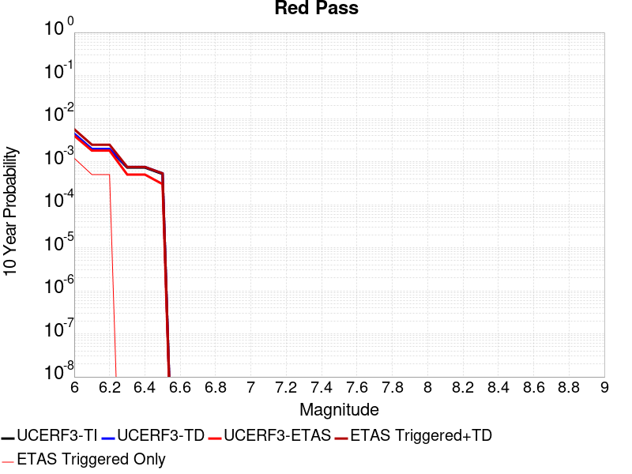 |

| Magnitude | 1 wk TI Prob | 1 wk TD Prob | 1 wk ETAS Prob | 1 wk ETAS/TD Gain | 1 wk ETAS Triggered+TD | 1 wk ETAS Triggered Only | 1 mo TI Prob | 1 mo TD Prob | 1 mo ETAS Prob | 1 mo ETAS/TD Gain | 1 mo ETAS Triggered+TD | 1 mo ETAS Triggered Only | 1 yr TI Prob | 1 yr TD Prob | 1 yr ETAS Prob | 1 yr ETAS/TD Gain | 1 yr ETAS Triggered+TD | 1 yr ETAS Triggered Only | 10 yr TI Prob | 10 yr TD Prob | 10 yr ETAS Prob | 10 yr ETAS/TD Gain | 10 yr ETAS Triggered+TD | 10 yr ETAS Triggered Only |
|-----|-----|-----|-----|-----|-----|-----|-----|-----|-----|-----|-----|-----|-----|-----|-----|-----|-----|-----|-----|-----|-----|-----|-----|-----|
| 6.0 | 8.258278E-6 | 8.548098E-6 | 0.0 | 0.0 | 8.548098E-6 | 0.0 | 3.539214E-5 | 3.6634294E-5 | 1.0E-4 | 2.729683 | 1.3663062E-4 | 1.0E-4 | 4.308141E-4 | 4.459491E-4 | 2.0E-4 | 0.44848168 | 6.458599E-4 | 2.0E-4 | 0.0042997985 | 0.0044522984 | 0.004 | 0.8984124 | 0.0056469557 | 0.0012 |
| 6.1 | 3.649988E-6 | 3.773963E-6 | 0.0 | 0.0 | 3.773963E-6 | 0.0 | 1.5642712E-5 | 1.6174054E-5 | 0.0 | 0.0 | 1.6174054E-5 | 0.0 | 1.9043336E-4 | 1.9690607E-4 | 0.0 | 0.0 | 1.9690607E-4 | 0.0 | 0.0019027026 | 0.001967783 | 0.0018 | 0.914735 | 0.002466799 | 5.0E-4 |
| 6.2 | 3.649988E-6 | 3.773963E-6 | 0.0 | 0.0 | 3.773963E-6 | 0.0 | 1.5642712E-5 | 1.6174054E-5 | 0.0 | 0.0 | 1.6174054E-5 | 0.0 | 1.9043336E-4 | 1.9690607E-4 | 0.0 | 0.0 | 1.9690607E-4 | 0.0 | 0.0019027026 | 0.001967783 | 0.0018 | 0.914735 | 0.002466799 | 5.0E-4 |
| 6.3 | 1.3924937E-6 | 1.4405914E-6 | 0.0 | 0.0 | 1.4405914E-6 | 0.0 | 5.9678164E-6 | 6.1739565E-6 | 0.0 | 0.0 | 6.1739565E-6 | 0.0 | 7.265574E-5 | 7.516674E-5 | 0.0 | 0.0 | 7.516674E-5 | 0.0 | 7.263199E-4 | 7.515518E-4 | 5.0E-4 | 0.6652901 | 7.515518E-4 | 0.0 |
| 6.4 | 1.3924937E-6 | 1.4405914E-6 | 0.0 | 0.0 | 1.4405914E-6 | 0.0 | 5.9678164E-6 | 6.1739565E-6 | 0.0 | 0.0 | 6.1739565E-6 | 0.0 | 7.265574E-5 | 7.516674E-5 | 0.0 | 0.0 | 7.516674E-5 | 0.0 | 7.263199E-4 | 7.515518E-4 | 5.0E-4 | 0.6652901 | 7.515518E-4 | 0.0 |
| 6.5 | 9.876812E-7 | 1.0218184E-6 | 0.0 | 0.0 | 1.0218184E-6 | 0.0 | 4.2329125E-6 | 4.379222E-6 | 0.0 | 0.0 | 4.379222E-6 | 0.0 | 5.153449E-5 | 5.3317024E-5 | 0.0 | 0.0 | 5.3317024E-5 | 0.0 | 5.1522546E-4 | 5.3317024E-4 | 3.0E-4 | 0.5626721 | 5.3317024E-4 | 0.0 |

## Elsinore (Temecula) rev
*[(top)](#table-of-contents)*

| 1 Week | 1 Month | 1 Year | 10 Year |
|-----|-----|-----|-----|
|  |  |  | 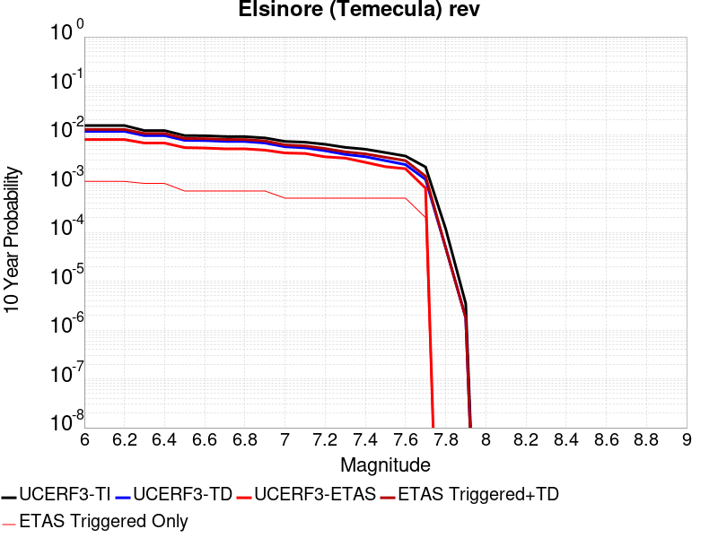 |

| Magnitude | 1 wk TI Prob | 1 wk TD Prob | 1 wk ETAS Prob | 1 wk ETAS/TD Gain | 1 wk ETAS Triggered+TD | 1 wk ETAS Triggered Only | 1 mo TI Prob | 1 mo TD Prob | 1 mo ETAS Prob | 1 mo ETAS/TD Gain | 1 mo ETAS Triggered+TD | 1 mo ETAS Triggered Only | 1 yr TI Prob | 1 yr TD Prob | 1 yr ETAS Prob | 1 yr ETAS/TD Gain | 1 yr ETAS Triggered+TD | 1 yr ETAS Triggered Only | 10 yr TI Prob | 10 yr TD Prob | 10 yr ETAS Prob | 10 yr ETAS/TD Gain | 10 yr ETAS Triggered+TD | 10 yr ETAS Triggered Only |
|-----|-----|-----|-----|-----|-----|-----|-----|-----|-----|-----|-----|-----|-----|-----|-----|-----|-----|-----|-----|-----|-----|-----|-----|-----|
| 6.0 | 2.9514995E-5 | 2.2366194E-5 | 0.0 | 0.0 | 2.2366194E-5 | 0.0 | 1.264867E-4 | 9.585171E-5 | 1.0E-4 | 1.0432782 | 9.585171E-5 | 0.0 | 0.0015388876 | 0.0011663915 | 8.0E-4 | 0.685876 | 0.001266275 | 1.0E-4 | 0.015282745 | 0.011629022 | 0.0079 | 0.6793349 | 0.01271623 | 0.0011 |
| 6.1 | 2.9514995E-5 | 2.2366194E-5 | 0.0 | 0.0 | 2.2366194E-5 | 0.0 | 1.264867E-4 | 9.585171E-5 | 1.0E-4 | 1.0432782 | 9.585171E-5 | 0.0 | 0.0015388876 | 0.0011663915 | 8.0E-4 | 0.685876 | 0.001266275 | 1.0E-4 | 0.015282745 | 0.011629022 | 0.0079 | 0.6793349 | 0.01271623 | 0.0011 |
| 6.2 | 2.9514995E-5 | 2.2366194E-5 | 0.0 | 0.0 | 2.2366194E-5 | 0.0 | 1.264867E-4 | 9.585171E-5 | 1.0E-4 | 1.0432782 | 9.585171E-5 | 0.0 | 0.0015388876 | 0.0011663915 | 8.0E-4 | 0.685876 | 0.001266275 | 1.0E-4 | 0.015282745 | 0.011629022 | 0.0079 | 0.6793349 | 0.01271623 | 0.0011 |
| 6.3 | 2.3223649E-5 | 1.8284612E-5 | 0.0 | 0.0 | 1.8284612E-5 | 0.0 | 9.952613E-5 | 7.836036E-5 | 1.0E-4 | 1.2761554 | 7.836036E-5 | 0.0 | 0.001211057 | 9.5363683E-4 | 8.0E-4 | 0.8388938 | 0.0010535414 | 1.0E-4 | 0.012044783 | 0.009502125 | 0.0067 | 0.7051054 | 0.010492623 | 0.001 |
| 6.4 | 2.3223649E-5 | 1.8284612E-5 | 0.0 | 0.0 | 1.8284612E-5 | 0.0 | 9.952613E-5 | 7.836036E-5 | 1.0E-4 | 1.2761554 | 7.836036E-5 | 0.0 | 0.001211057 | 9.5363683E-4 | 8.0E-4 | 0.8388938 | 0.0010535414 | 1.0E-4 | 0.012044783 | 0.009502125 | 0.0067 | 0.7051054 | 0.010492623 | 0.001 |
| 6.5 | 1.8338875E-5 | 1.4648862E-5 | 0.0 | 0.0 | 1.4648862E-5 | 0.0 | 7.8592806E-5 | 6.277937E-5 | 1.0E-4 | 1.5928799 | 6.277937E-5 | 0.0 | 9.5644733E-4 | 7.640794E-4 | 5.0E-4 | 0.6543822 | 8.64003E-4 | 1.0E-4 | 0.009523412 | 0.0076172994 | 0.0054 | 0.7089127 | 0.008311967 | 7.0E-4 |
| 6.6 | 1.8223333E-5 | 1.4511689E-5 | 0.0 | 0.0 | 1.4511689E-5 | 0.0 | 7.809766E-5 | 6.219152E-5 | 0.0 | 0.0 | 6.219152E-5 | 0.0 | 9.504242E-4 | 7.5692724E-4 | 4.0E-4 | 0.52845234 | 8.568516E-4 | 1.0E-4 | 0.009463696 | 0.0075462647 | 0.0053 | 0.7023342 | 0.008240982 | 7.0E-4 |
| 6.7 | 1.7512752E-5 | 1.3929564E-5 | 0.0 | 0.0 | 1.3929564E-5 | 0.0 | 7.505249E-5 | 5.9696813E-5 | 0.0 | 0.0 | 5.9696813E-5 | 0.0 | 9.13381E-4 | 7.2657474E-4 | 4.0E-4 | 0.55052835 | 8.265021E-4 | 1.0E-4 | 0.00909636 | 0.0072476105 | 0.0051 | 0.7036802 | 0.007942537 | 7.0E-4 |
| 6.8 | 1.7417142E-5 | 1.3854172E-5 | 0.0 | 0.0 | 1.3854172E-5 | 0.0 | 7.4642754E-5 | 5.937372E-5 | 0.0 | 0.0 | 5.937372E-5 | 0.0 | 9.083966E-4 | 7.226437E-4 | 4.0E-4 | 0.5535231 | 8.225714E-4 | 1.0E-4 | 0.009046922 | 0.0072084954 | 0.0051 | 0.70749855 | 0.007903449 | 7.0E-4 |
| 6.9 | 1.6402591E-5 | 1.2904006E-5 | 0.0 | 0.0 | 1.2904006E-5 | 0.0 | 7.0294926E-5 | 5.5301753E-5 | 0.0 | 0.0 | 5.5301753E-5 | 0.0 | 8.5550465E-4 | 6.730984E-4 | 4.0E-4 | 0.5942668 | 7.7303103E-4 | 1.0E-4 | 0.008522186 | 0.0067162444 | 0.0048 | 0.71468514 | 0.007411543 | 7.0E-4 |
| 7.0 | 1.3912486E-5 | 1.0823051E-5 | 0.0 | 0.0 | 1.0823051E-5 | 0.0 | 5.9623577E-5 | 4.638369E-5 | 0.0 | 0.0 | 4.638369E-5 | 0.0 | 7.2567526E-4 | 5.645778E-4 | 4.0E-4 | 0.708494 | 6.6452136E-4 | 1.0E-4 | 0.0072331014 | 0.0056350967 | 0.0042 | 0.7453288 | 0.006132279 | 5.0E-4 |
| 7.1 | 1.3405147E-5 | 1.0279687E-5 | 0.0 | 0.0 | 1.0279687E-5 | 0.0 | 5.7449364E-5 | 4.405507E-5 | 0.0 | 0.0 | 4.405507E-5 | 0.0 | 6.9922156E-4 | 5.36241E-4 | 4.0E-4 | 0.74593323 | 6.361874E-4 | 1.0E-4 | 0.0069702556 | 0.005352705 | 0.0041 | 0.76596785 | 0.0058500287 | 5.0E-4 |
| 7.2 | 1.21402E-5 | 8.957294E-6 | 0.0 | 0.0 | 8.957294E-6 | 0.0 | 5.202839E-5 | 3.8387847E-5 | 0.0 | 0.0 | 3.8387847E-5 | 0.0 | 6.332616E-4 | 4.6727358E-4 | 4.0E-4 | 0.8560295 | 5.6722685E-4 | 1.0E-4 | 0.0063146 | 0.004664238 | 0.0035 | 0.75039047 | 0.005161906 | 5.0E-4 |
| 7.3 | 1.05047775E-5 | 7.5408534E-6 | 0.0 | 0.0 | 7.5408534E-6 | 0.0 | 4.5019697E-5 | 3.231755E-5 | 0.0 | 0.0 | 3.231755E-5 | 0.0 | 5.4797693E-4 | 3.933966E-4 | 4.0E-4 | 1.0167856 | 4.9335725E-4 | 1.0E-4 | 0.005466277 | 0.0039273473 | 0.0033 | 0.8402619 | 0.0044253836 | 5.0E-4 |
| 7.4 | 9.624483E-6 | 6.760184E-6 | 0.0 | 0.0 | 6.760184E-6 | 0.0 | 4.124713E-5 | 2.8971905E-5 | 0.0 | 0.0 | 2.8971905E-5 | 0.0 | 5.0206814E-4 | 3.5267722E-4 | 4.0E-4 | 1.1341816 | 4.5264195E-4 | 1.0E-4 | 0.005009353 | 0.0035213241 | 0.0027 | 0.766757 | 0.0040195636 | 5.0E-4 |
| 7.5 | 8.215151E-6 | 5.613324E-6 | 0.0 | 0.0 | 5.613324E-6 | 0.0 | 3.5207315E-5 | 2.4056888E-5 | 0.0 | 0.0 | 2.4056888E-5 | 0.0 | 4.2856473E-4 | 2.9285453E-4 | 4.0E-4 | 1.365866 | 3.9282523E-4 | 1.0E-4 | 0.004277392 | 0.002924813 | 0.0022 | 0.75218487 | 0.0034233506 | 5.0E-4 |
| 7.6 | 6.975058E-6 | 4.6566042E-6 | 0.0 | 0.0 | 4.6566042E-6 | 0.0 | 2.9892764E-5 | 1.995673E-5 | 0.0 | 0.0 | 1.995673E-5 | 0.0 | 3.6388362E-4 | 2.4294725E-4 | 3.0E-4 | 1.234836 | 3.4292295E-4 | 1.0E-4 | 0.0036328835 | 0.0024269319 | 0.002 | 0.8240858 | 0.0029257184 | 5.0E-4 |
| 7.7 | 4.159604E-6 | 2.315134E-6 | 0.0 | 0.0 | 2.315134E-6 | 0.0 | 1.7826753E-5 | 9.921969E-6 | 0.0 | 0.0 | 9.921969E-6 | 0.0 | 2.1701909E-4 | 1.2079401E-4 | 0.0 | 0.0 | 1.2079401E-4 | 0.0 | 0.0021680726 | 0.001207356 | 8.0E-4 | 0.6626049 | 0.0014071146 | 2.0E-4 |
| 7.8 | 2.2692414E-7 | 9.313546E-8 | 0.0 | 0.0 | 9.313546E-8 | 0.0 | 9.725317E-7 | 3.9915196E-7 | 0.0 | 0.0 | 3.9915196E-7 | 0.0 | 1.1840509E-5 | 4.8596676E-6 | 0.0 | 0.0 | 4.8596676E-6 | 0.0 | 1.1839878E-4 | 4.859593E-5 | 0.0 | 0.0 | 4.859593E-5 | 0.0 |
| 7.9 | 6.676829E-9 | 3.4267709E-9 | 0.0 | 0.0 | 3.4267709E-9 | 0.0 | 2.861498E-8 | 1.4686159E-8 | 0.0 | 0.0 | 1.4686159E-8 | 0.0 | 3.4838732E-7 | 1.7880397E-7 | 0.0 | 0.0 | 1.7880397E-7 | 0.0 | 3.4838679E-6 | 1.7880385E-6 | 0.0 | 0.0 | 1.7880385E-6 | 0.0 |

## Eureka Peak
*[(top)](#table-of-contents)*

| 1 Week | 1 Month | 1 Year | 10 Year |
|-----|-----|-----|-----|
|  |  |  |  |

| Magnitude | 1 wk TI Prob | 1 wk TD Prob | 1 wk ETAS Prob | 1 wk ETAS/TD Gain | 1 wk ETAS Triggered+TD | 1 wk ETAS Triggered Only | 1 mo TI Prob | 1 mo TD Prob | 1 mo ETAS Prob | 1 mo ETAS/TD Gain | 1 mo ETAS Triggered+TD | 1 mo ETAS Triggered Only | 1 yr TI Prob | 1 yr TD Prob | 1 yr ETAS Prob | 1 yr ETAS/TD Gain | 1 yr ETAS Triggered+TD | 1 yr ETAS Triggered Only | 10 yr TI Prob | 10 yr TD Prob | 10 yr ETAS Prob | 10 yr ETAS/TD Gain | 10 yr ETAS Triggered+TD | 10 yr ETAS Triggered Only |
|-----|-----|-----|-----|-----|-----|-----|-----|-----|-----|-----|-----|-----|-----|-----|-----|-----|-----|-----|-----|-----|-----|-----|-----|-----|
| 6.0 | 3.1949054E-5 | 9.204286E-6 | 0.0 | 0.0 | 9.204286E-6 | 0.0 | 1.3691733E-4 | 3.944677E-5 | 1.0E-4 | 2.5350618 | 1.3944283E-4 | 1.0E-4 | 0.0016656938 | 4.802348E-4 | 3.0E-4 | 0.6246944 | 6.8013876E-4 | 2.0E-4 | 0.016532637 | 0.0048650242 | 0.0031 | 0.63720137 | 0.0059596724 | 0.0011 |
| 6.1 | 3.1949054E-5 | 9.204286E-6 | 0.0 | 0.0 | 9.204286E-6 | 0.0 | 1.3691733E-4 | 3.944677E-5 | 1.0E-4 | 2.5350618 | 1.3944283E-4 | 1.0E-4 | 0.0016656938 | 4.802348E-4 | 3.0E-4 | 0.6246944 | 6.8013876E-4 | 2.0E-4 | 0.016532637 | 0.0048650242 | 0.0031 | 0.63720137 | 0.0059596724 | 0.0011 |
| 6.2 | 3.1949054E-5 | 9.204286E-6 | 0.0 | 0.0 | 9.204286E-6 | 0.0 | 1.3691733E-4 | 3.944677E-5 | 1.0E-4 | 2.5350618 | 1.3944283E-4 | 1.0E-4 | 0.0016656938 | 4.802348E-4 | 3.0E-4 | 0.6246944 | 6.8013876E-4 | 2.0E-4 | 0.016532637 | 0.0048650242 | 0.0031 | 0.63720137 | 0.0059596724 | 0.0011 |
| 6.3 | 2.7339745E-5 | 7.881916E-6 | 0.0 | 0.0 | 7.881916E-6 | 0.0 | 1.1716507E-4 | 3.377962E-5 | 1.0E-4 | 2.9603648 | 1.3377624E-4 | 1.0E-4 | 0.0014255513 | 4.112633E-4 | 3.0E-4 | 0.7294597 | 6.11181E-4 | 2.0E-4 | 0.0141644105 | 0.0041737496 | 0.0023 | 0.55106324 | 0.004970411 | 8.0E-4 |
| 6.4 | 2.7339745E-5 | 7.881916E-6 | 0.0 | 0.0 | 7.881916E-6 | 0.0 | 1.1716507E-4 | 3.377962E-5 | 1.0E-4 | 2.9603648 | 1.3377624E-4 | 1.0E-4 | 0.0014255513 | 4.112633E-4 | 3.0E-4 | 0.7294597 | 6.11181E-4 | 2.0E-4 | 0.0141644105 | 0.0041737496 | 0.0023 | 0.55106324 | 0.004970411 | 8.0E-4 |
| 6.5 | 9.738388E-8 | 1.8425347E-7 | 0.0 | 0.0 | 1.8425347E-7 | 0.0 | 4.1735944E-7 | 7.8965746E-7 | 0.0 | 0.0 | 7.8965746E-7 | 0.0 | 5.081339E-6 | 9.614038E-6 | 0.0 | 0.0 | 9.614038E-6 | 0.0 | 5.0812232E-5 | 9.6136304E-5 | 0.0 | 0.0 | 9.6136304E-5 | 0.0 |
| 6.6 | 9.3495956E-8 | 1.8134794E-7 | 0.0 | 0.0 | 1.8134794E-7 | 0.0 | 4.0069688E-7 | 7.7720523E-7 | 0.0 | 0.0 | 7.7720523E-7 | 0.0 | 4.8784736E-6 | 9.462434E-6 | 0.0 | 0.0 | 9.462434E-6 | 0.0 | 4.8783666E-5 | 9.462039E-5 | 0.0 | 0.0 | 9.462039E-5 | 0.0 |
| 6.7 | 9.3495956E-8 | 1.8134794E-7 | 0.0 | 0.0 | 1.8134794E-7 | 0.0 | 4.0069688E-7 | 7.7720523E-7 | 0.0 | 0.0 | 7.7720523E-7 | 0.0 | 4.8784736E-6 | 9.462434E-6 | 0.0 | 0.0 | 9.462434E-6 | 0.0 | 4.8783666E-5 | 9.462039E-5 | 0.0 | 0.0 | 9.462039E-5 | 0.0 |
| 6.8 | 8.591428E-8 | 1.782945E-7 | 0.0 | 0.0 | 1.782945E-7 | 0.0 | 3.68204E-7 | 7.641191E-7 | 0.0 | 0.0 | 7.641191E-7 | 0.0 | 4.4828744E-6 | 9.303111E-6 | 0.0 | 0.0 | 9.303111E-6 | 0.0 | 4.482784E-5 | 9.3027294E-5 | 0.0 | 0.0 | 9.3027294E-5 | 0.0 |
| 6.9 | 7.749723E-8 | 1.7248696E-7 | 0.0 | 0.0 | 1.7248696E-7 | 0.0 | 3.3213098E-7 | 7.392296E-7 | 0.0 | 0.0 | 7.392296E-7 | 0.0 | 4.043687E-6 | 9.000084E-6 | 0.0 | 0.0 | 9.000084E-6 | 0.0 | 4.0436134E-5 | 8.999727E-5 | 0.0 | 0.0 | 8.999727E-5 | 0.0 |
| 7.0 | 6.897872E-8 | 1.6229737E-7 | 0.0 | 0.0 | 1.6229737E-7 | 0.0 | 2.9562307E-7 | 6.9556E-7 | 0.0 | 0.0 | 6.9556E-7 | 0.0 | 3.5992048E-6 | 8.468411E-6 | 0.0 | 0.0 | 8.468411E-6 | 0.0 | 3.5991467E-5 | 8.468095E-5 | 0.0 | 0.0 | 8.468095E-5 | 0.0 |
| 7.1 | 5.859318E-8 | 1.4609734E-7 | 0.0 | 0.0 | 1.4609734E-7 | 0.0 | 2.5111362E-7 | 6.261313E-7 | 0.0 | 0.0 | 6.261313E-7 | 0.0 | 3.057304E-6 | 7.623122E-6 | 0.0 | 0.0 | 7.623122E-6 | 0.0 | 3.0572617E-5 | 7.622867E-5 | 0.0 | 0.0 | 7.622867E-5 | 0.0 |
| 7.2 | 5.1375338E-8 | 1.3249839E-7 | 0.0 | 0.0 | 1.3249839E-7 | 0.0 | 2.2018E-7 | 5.678501E-7 | 0.0 | 0.0 | 5.678501E-7 | 0.0 | 2.680688E-6 | 6.9135535E-6 | 0.0 | 0.0 | 6.9135535E-6 | 0.0 | 2.6806558E-5 | 6.913344E-5 | 0.0 | 0.0 | 6.913344E-5 | 0.0 |
| 7.3 | 4.5441396E-8 | 1.14749426E-7 | 0.0 | 0.0 | 1.14749426E-7 | 0.0 | 1.9474882E-7 | 4.9178317E-7 | 0.0 | 0.0 | 4.9178317E-7 | 0.0 | 2.3710643E-6 | 5.987444E-6 | 0.0 | 0.0 | 5.987444E-6 | 0.0 | 2.371039E-5 | 5.9872884E-5 | 0.0 | 0.0 | 5.9872884E-5 | 0.0 |
| 7.4 | 2.981918E-8 | 6.7817034E-8 | 0.0 | 0.0 | 6.7817034E-8 | 0.0 | 1.2779647E-7 | 2.906444E-7 | 0.0 | 0.0 | 2.906444E-7 | 0.0 | 1.5559209E-6 | 3.5385904E-6 | 0.0 | 0.0 | 3.5385904E-6 | 0.0 | 1.55591E-5 | 3.538538E-5 | 0.0 | 0.0 | 3.538538E-5 | 0.0 |
| 7.5 | 4.24214E-9 | 8.1482385E-9 | 0.0 | 0.0 | 8.1482385E-9 | 0.0 | 1.81806E-8 | 3.4921023E-8 | 0.0 | 0.0 | 3.4921023E-8 | 0.0 | 2.213488E-7 | 4.2516345E-7 | 0.0 | 0.0 | 4.2516345E-7 | 0.0 | 2.2134857E-6 | 4.2516326E-6 | 0.0 | 0.0 | 4.2516326E-6 | 0.0 |

## Goose Lake 2011 CFM
*[(top)](#table-of-contents)*

| 1 Week | 1 Month | 1 Year | 10 Year |
|-----|-----|-----|-----|
|  | 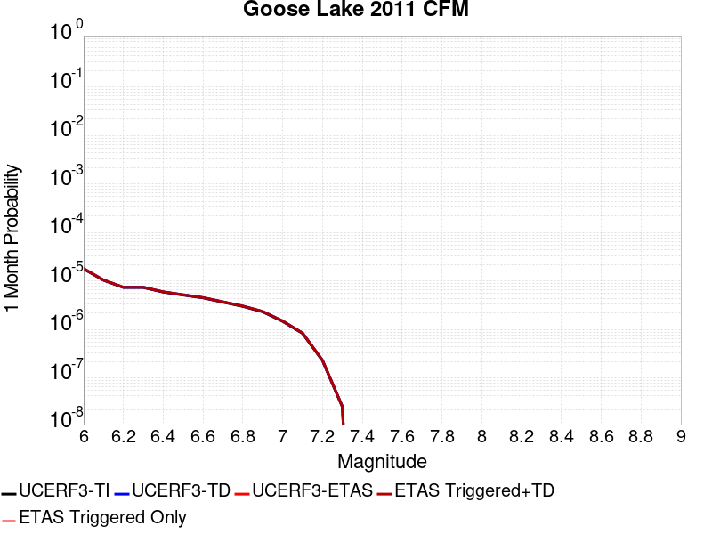 |  |  |

| Magnitude | 1 wk TI Prob | 1 wk TD Prob | 1 wk ETAS Prob | 1 wk ETAS/TD Gain | 1 wk ETAS Triggered+TD | 1 wk ETAS Triggered Only | 1 mo TI Prob | 1 mo TD Prob | 1 mo ETAS Prob | 1 mo ETAS/TD Gain | 1 mo ETAS Triggered+TD | 1 mo ETAS Triggered Only | 1 yr TI Prob | 1 yr TD Prob | 1 yr ETAS Prob | 1 yr ETAS/TD Gain | 1 yr ETAS Triggered+TD | 1 yr ETAS Triggered Only | 10 yr TI Prob | 10 yr TD Prob | 10 yr ETAS Prob | 10 yr ETAS/TD Gain | 10 yr ETAS Triggered+TD | 10 yr ETAS Triggered Only |
|-----|-----|-----|-----|-----|-----|-----|-----|-----|-----|-----|-----|-----|-----|-----|-----|-----|-----|-----|-----|-----|-----|-----|-----|-----|
| 6.0 | 3.780968E-6 | 3.8225776E-6 | 0.0 | 0.0 | 3.8225776E-6 | 0.0 | 1.6204049E-5 | 1.6382379E-5 | 0.0 | 0.0 | 1.6382379E-5 | 0.0 | 1.9726643E-4 | 1.994383E-4 | 1.0E-4 | 0.5014082 | 2.9941835E-4 | 1.0E-4 | 0.001970914 | 0.0019927013 | 0.002 | 1.0036627 | 0.002890908 | 9.0E-4 |
| 6.1 | 2.2035124E-6 | 2.2295228E-6 | 0.0 | 0.0 | 2.2295228E-6 | 0.0 | 9.443591E-6 | 9.555064E-6 | 0.0 | 0.0 | 9.555064E-6 | 0.0 | 1.1496965E-4 | 1.16326875E-4 | 0.0 | 0.0 | 1.16326875E-4 | 0.0 | 0.0011491019 | 0.0011626781 | 0.0014 | 1.2041166 | 0.0016620968 | 5.0E-4 |
| 6.2 | 1.5624689E-6 | 1.5824779E-6 | 0.0 | 0.0 | 1.5824779E-6 | 0.0 | 6.6962784E-6 | 6.7820306E-6 | 0.0 | 0.0 | 6.7820306E-6 | 0.0 | 8.152414E-5 | 8.256814E-5 | 0.0 | 0.0 | 8.256814E-5 | 0.0 | 8.1494235E-4 | 8.2537904E-4 | 0.001 | 1.2115645 | 0.0013249663 | 5.0E-4 |
| 6.3 | 1.5624689E-6 | 1.5824779E-6 | 0.0 | 0.0 | 1.5824779E-6 | 0.0 | 6.6962784E-6 | 6.7820306E-6 | 0.0 | 0.0 | 6.7820306E-6 | 0.0 | 8.152414E-5 | 8.256814E-5 | 0.0 | 0.0 | 8.256814E-5 | 0.0 | 8.1494235E-4 | 8.2537904E-4 | 0.001 | 1.2115645 | 0.0013249663 | 5.0E-4 |
| 6.4 | 1.256464E-6 | 1.2736848E-6 | 0.0 | 0.0 | 1.2736848E-6 | 0.0 | 5.3848344E-6 | 5.4586376E-6 | 0.0 | 0.0 | 5.4586376E-6 | 0.0 | 6.5558386E-5 | 6.645691E-5 | 0.0 | 0.0 | 6.645691E-5 | 0.0 | 6.553905E-4 | 6.6437235E-4 | 8.0E-4 | 1.204144 | 0.0011640402 | 5.0E-4 |
| 6.5 | 1.0910911E-6 | 1.1067721E-6 | 0.0 | 0.0 | 1.1067721E-6 | 0.0 | 4.6760965E-6 | 4.7433005E-6 | 0.0 | 0.0 | 4.7433005E-6 | 0.0 | 5.692999E-5 | 5.7748162E-5 | 0.0 | 0.0 | 5.7748162E-5 | 0.0 | 5.6915404E-4 | 5.773328E-4 | 7.0E-4 | 1.2124722 | 9.771019E-4 | 4.0E-4 |
| 6.6 | 9.546601E-7 | 9.689709E-7 | 0.0 | 0.0 | 9.689709E-7 | 0.0 | 4.091394E-6 | 4.1527255E-6 | 0.0 | 0.0 | 4.1527255E-6 | 0.0 | 4.9811584E-5 | 5.0558272E-5 | 0.0 | 0.0 | 5.0558272E-5 | 0.0 | 4.980042E-4 | 5.054686E-4 | 7.0E-4 | 1.3848536 | 9.052664E-4 | 4.0E-4 |
| 6.7 | 7.790316E-7 | 7.914627E-7 | 0.0 | 0.0 | 7.914627E-7 | 0.0 | 3.3387028E-6 | 3.3919787E-6 | 0.0 | 0.0 | 3.3919787E-6 | 0.0 | 4.0647945E-5 | 4.1296564E-5 | 0.0 | 0.0 | 4.1296564E-5 | 0.0 | 4.0640513E-4 | 4.128895E-4 | 5.0E-4 | 1.2109778 | 7.127656E-4 | 3.0E-4 |
| 6.8 | 6.3714384E-7 | 6.4775975E-7 | 0.0 | 0.0 | 6.4775975E-7 | 0.0 | 2.7306137E-6 | 2.7761103E-6 | 0.0 | 0.0 | 2.7761103E-6 | 0.0 | 3.3244716E-5 | 3.3798624E-5 | 0.0 | 0.0 | 3.3798624E-5 | 0.0 | 3.323974E-4 | 3.3793531E-4 | 5.0E-4 | 1.4795731 | 6.378339E-4 | 3.0E-4 |
| 6.9 | 4.92586E-7 | 5.012977E-7 | 0.0 | 0.0 | 5.012977E-7 | 0.0 | 2.1110811E-6 | 2.1484168E-6 | 0.0 | 0.0 | 2.1484168E-6 | 0.0 | 2.5702111E-5 | 2.6156666E-5 | 0.0 | 0.0 | 2.6156666E-5 | 0.0 | 2.569914E-4 | 2.6153625E-4 | 4.0E-4 | 1.5294248 | 5.6145777E-4 | 3.0E-4 |
| 7.0 | 3.130245E-7 | 3.1897127E-7 | 0.0 | 0.0 | 3.1897127E-7 | 0.0 | 1.3415328E-6 | 1.367019E-6 | 0.0 | 0.0 | 1.367019E-6 | 0.0 | 1.6333039E-5 | 1.6643331E-5 | 0.0 | 0.0 | 1.6643331E-5 | 0.0 | 1.6331839E-4 | 1.6642106E-4 | 4.0E-4 | 2.403542 | 4.6637113E-4 | 3.0E-4 |
| 7.1 | 1.7680084E-7 | 1.8020253E-7 | 0.0 | 0.0 | 1.8020253E-7 | 0.0 | 7.5771766E-7 | 7.7229635E-7 | 0.0 | 0.0 | 7.7229635E-7 | 0.0 | 9.225173E-6 | 9.402669E-6 | 0.0 | 0.0 | 9.402669E-6 | 0.0 | 9.22479E-5 | 9.402282E-5 | 1.0E-4 | 1.0635716 | 1.9401341E-4 | 1.0E-4 |
| 7.2 | 4.8641045E-8 | 4.9393996E-8 | 0.0 | 0.0 | 4.9393996E-8 | 0.0 | 2.084616E-7 | 2.1168853E-7 | 0.0 | 0.0 | 2.1168853E-7 | 0.0 | 2.538017E-6 | 2.577305E-6 | 0.0 | 0.0 | 2.577305E-6 | 0.0 | 2.537988E-5 | 2.5772762E-5 | 0.0 | 0.0 | 2.5772762E-5 | 0.0 |
| 7.3 | 5.3911844E-9 | 5.474917E-9 | 0.0 | 0.0 | 5.474917E-9 | 0.0 | 2.3105075E-8 | 2.346393E-8 | 0.0 | 0.0 | 2.346393E-8 | 0.0 | 2.8130427E-7 | 2.856733E-7 | 0.0 | 0.0 | 2.856733E-7 | 0.0 | 2.8130391E-6 | 2.856731E-6 | 0.0 | 0.0 | 2.856731E-6 | 0.0 |

## Rocky Ledge 2011 CFM
*[(top)](#table-of-contents)*

| 1 Week | 1 Month | 1 Year | 10 Year |
|-----|-----|-----|-----|
| 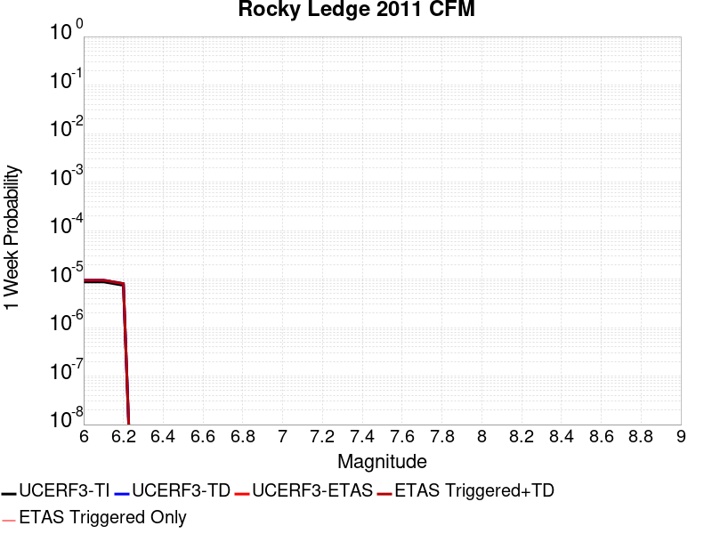 |  |  | 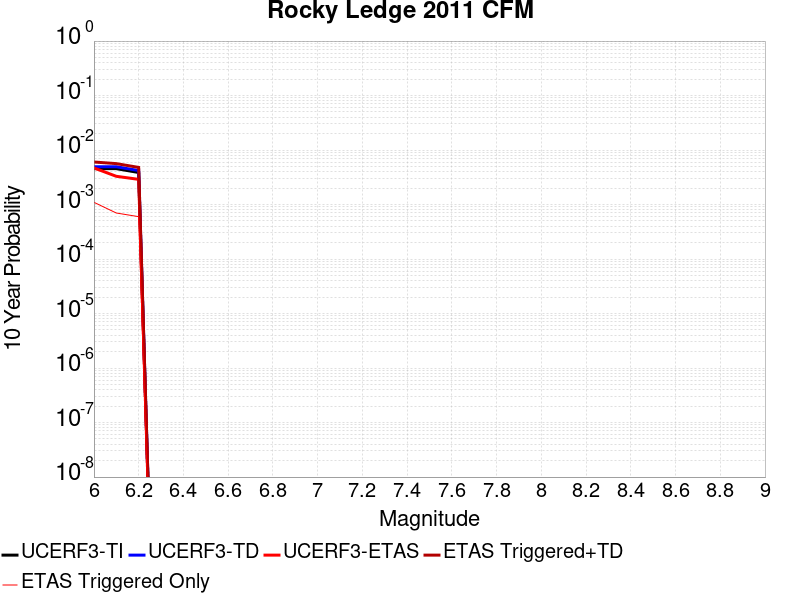 |

| Magnitude | 1 wk TI Prob | 1 wk TD Prob | 1 wk ETAS Prob | 1 wk ETAS/TD Gain | 1 wk ETAS Triggered+TD | 1 wk ETAS Triggered Only | 1 mo TI Prob | 1 mo TD Prob | 1 mo ETAS Prob | 1 mo ETAS/TD Gain | 1 mo ETAS Triggered+TD | 1 mo ETAS Triggered Only | 1 yr TI Prob | 1 yr TD Prob | 1 yr ETAS Prob | 1 yr ETAS/TD Gain | 1 yr ETAS Triggered+TD | 1 yr ETAS Triggered Only | 10 yr TI Prob | 10 yr TD Prob | 10 yr ETAS Prob | 10 yr ETAS/TD Gain | 10 yr ETAS Triggered+TD | 10 yr ETAS Triggered Only |
|-----|-----|-----|-----|-----|-----|-----|-----|-----|-----|-----|-----|-----|-----|-----|-----|-----|-----|-----|-----|-----|-----|-----|-----|-----|
| 6.0 | 8.7550525E-6 | 9.478336E-6 | 0.0 | 0.0 | 9.478336E-6 | 0.0 | 3.7521113E-5 | 4.062127E-5 | 0.0 | 0.0 | 4.062127E-5 | 0.0 | 4.567238E-4 | 4.945341E-4 | 6.0E-4 | 1.2132632 | 5.944846E-4 | 1.0E-4 | 0.0045578624 | 0.00494241 | 0.0047 | 0.95095307 | 0.006036973 | 0.0011 |
| 6.1 | 8.7550525E-6 | 9.478336E-6 | 0.0 | 0.0 | 9.478336E-6 | 0.0 | 3.7521113E-5 | 4.062127E-5 | 0.0 | 0.0 | 4.062127E-5 | 0.0 | 4.567238E-4 | 4.945341E-4 | 3.0E-4 | 0.6066316 | 5.944846E-4 | 1.0E-4 | 0.0045578624 | 0.00494241 | 0.0033 | 0.66769046 | 0.0056389505 | 7.0E-4 |
| 6.2 | 7.442295E-6 | 8.056024E-6 | 0.0 | 0.0 | 8.056024E-6 | 0.0 | 3.189516E-5 | 3.452582E-5 | 0.0 | 0.0 | 3.452582E-5 | 0.0 | 3.8825438E-4 | 4.2035183E-4 | 3.0E-4 | 0.71368784 | 5.203098E-4 | 1.0E-4 | 0.0038757676 | 0.0042035184 | 0.0029 | 0.68989825 | 0.0048009963 | 6.0E-4 |

## Russ 2011 CFM
*[(top)](#table-of-contents)*

| 1 Week | 1 Month | 1 Year | 10 Year |
|-----|-----|-----|-----|
| 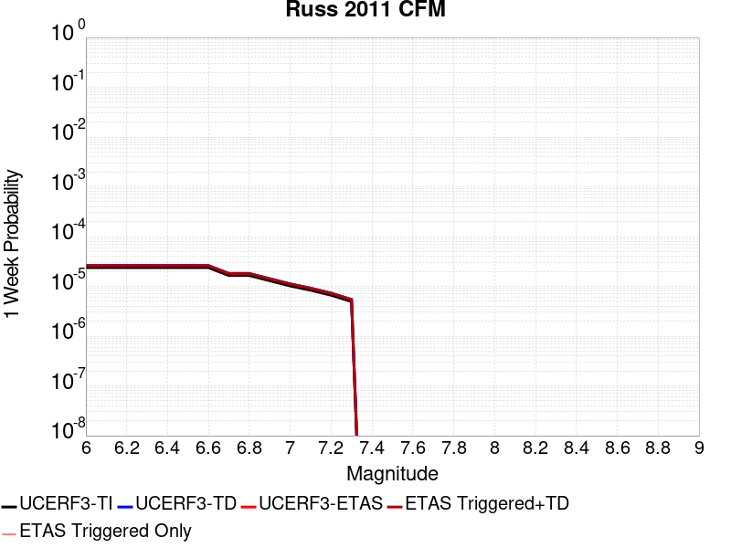 |  |  | 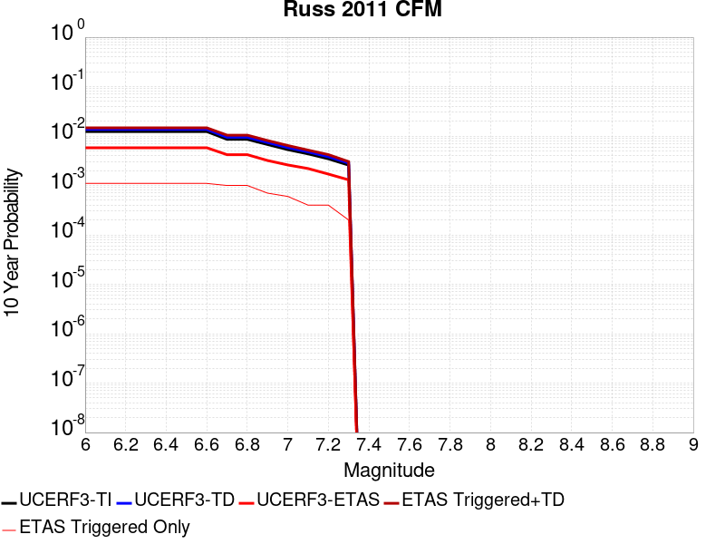 |

| Magnitude | 1 wk TI Prob | 1 wk TD Prob | 1 wk ETAS Prob | 1 wk ETAS/TD Gain | 1 wk ETAS Triggered+TD | 1 wk ETAS Triggered Only | 1 mo TI Prob | 1 mo TD Prob | 1 mo ETAS Prob | 1 mo ETAS/TD Gain | 1 mo ETAS Triggered+TD | 1 mo ETAS Triggered Only | 1 yr TI Prob | 1 yr TD Prob | 1 yr ETAS Prob | 1 yr ETAS/TD Gain | 1 yr ETAS Triggered+TD | 1 yr ETAS Triggered Only | 10 yr TI Prob | 10 yr TD Prob | 10 yr ETAS Prob | 10 yr ETAS/TD Gain | 10 yr ETAS Triggered+TD | 10 yr ETAS Triggered Only |
|-----|-----|-----|-----|-----|-----|-----|-----|-----|-----|-----|-----|-----|-----|-----|-----|-----|-----|-----|-----|-----|-----|-----|-----|-----|
| 6.0 | 2.3806366E-5 | 2.6225995E-5 | 0.0 | 0.0 | 2.6225995E-5 | 0.0 | 1.0202329E-4 | 1.12392634E-4 | 1.0E-4 | 0.889738 | 2.1238139E-4 | 1.0E-4 | 0.0012414258 | 0.0013675849 | 7.0E-4 | 0.5118512 | 0.0014674482 | 1.0E-4 | 0.012345135 | 0.013598154 | 0.0058 | 0.42652845 | 0.014683196 | 0.0011 |
| 6.1 | 2.3806366E-5 | 2.6225995E-5 | 0.0 | 0.0 | 2.6225995E-5 | 0.0 | 1.0202329E-4 | 1.12392634E-4 | 1.0E-4 | 0.889738 | 2.1238139E-4 | 1.0E-4 | 0.0012414258 | 0.0013675849 | 7.0E-4 | 0.5118512 | 0.0014674482 | 1.0E-4 | 0.012345135 | 0.013598154 | 0.0058 | 0.42652845 | 0.014683196 | 0.0011 |
| 6.2 | 2.3806366E-5 | 2.6225995E-5 | 0.0 | 0.0 | 2.6225995E-5 | 0.0 | 1.0202329E-4 | 1.12392634E-4 | 1.0E-4 | 0.889738 | 2.1238139E-4 | 1.0E-4 | 0.0012414258 | 0.0013675849 | 7.0E-4 | 0.5118512 | 0.0014674482 | 1.0E-4 | 0.012345135 | 0.013598154 | 0.0058 | 0.42652845 | 0.014683196 | 0.0011 |
| 6.3 | 2.3806366E-5 | 2.6225995E-5 | 0.0 | 0.0 | 2.6225995E-5 | 0.0 | 1.0202329E-4 | 1.12392634E-4 | 1.0E-4 | 0.889738 | 2.1238139E-4 | 1.0E-4 | 0.0012414258 | 0.0013675849 | 7.0E-4 | 0.5118512 | 0.0014674482 | 1.0E-4 | 0.012345135 | 0.013598154 | 0.0058 | 0.42652845 | 0.014683196 | 0.0011 |
| 6.4 | 2.3806366E-5 | 2.6225995E-5 | 0.0 | 0.0 | 2.6225995E-5 | 0.0 | 1.0202329E-4 | 1.12392634E-4 | 1.0E-4 | 0.889738 | 2.1238139E-4 | 1.0E-4 | 0.0012414258 | 0.0013675849 | 7.0E-4 | 0.5118512 | 0.0014674482 | 1.0E-4 | 0.012345135 | 0.013598154 | 0.0058 | 0.42652845 | 0.014683196 | 0.0011 |
| 6.5 | 2.3806366E-5 | 2.6225995E-5 | 0.0 | 0.0 | 2.6225995E-5 | 0.0 | 1.0202329E-4 | 1.12392634E-4 | 1.0E-4 | 0.889738 | 2.1238139E-4 | 1.0E-4 | 0.0012414258 | 0.0013675849 | 7.0E-4 | 0.5118512 | 0.0014674482 | 1.0E-4 | 0.012345135 | 0.013598154 | 0.0058 | 0.42652845 | 0.014683196 | 0.0011 |
| 6.6 | 2.3806366E-5 | 2.6225995E-5 | 0.0 | 0.0 | 2.6225995E-5 | 0.0 | 1.0202329E-4 | 1.12392634E-4 | 1.0E-4 | 0.889738 | 2.1238139E-4 | 1.0E-4 | 0.0012414258 | 0.0013675849 | 7.0E-4 | 0.5118512 | 0.0014674482 | 1.0E-4 | 0.012345135 | 0.013598154 | 0.0058 | 0.42652845 | 0.014683196 | 0.0011 |
| 6.7 | 1.6515693E-5 | 1.8168736E-5 | 0.0 | 0.0 | 1.8168736E-5 | 0.0 | 7.077962E-5 | 7.786387E-5 | 1.0E-4 | 1.2842927 | 1.7785608E-4 | 1.0E-4 | 8.6140115E-4 | 9.476141E-4 | 5.0E-4 | 0.52764094 | 0.0010475194 | 1.0E-4 | 0.008580698 | 0.009439119 | 0.0042 | 0.44495678 | 0.01042968 | 0.001 |
| 6.8 | 1.6515693E-5 | 1.8168736E-5 | 0.0 | 0.0 | 1.8168736E-5 | 0.0 | 7.077962E-5 | 7.786387E-5 | 1.0E-4 | 1.2842927 | 1.7785608E-4 | 1.0E-4 | 8.6140115E-4 | 9.476141E-4 | 5.0E-4 | 0.52764094 | 0.0010475194 | 1.0E-4 | 0.008580698 | 0.009439119 | 0.0042 | 0.44495678 | 0.01042968 | 0.001 |
| 6.9 | 1.2971182E-5 | 1.4258879E-5 | 0.0 | 0.0 | 1.4258879E-5 | 0.0 | 5.5589593E-5 | 6.110819E-5 | 1.0E-4 | 1.6364417 | 1.6110209E-4 | 1.0E-4 | 6.765931E-4 | 7.4376416E-4 | 4.0E-4 | 0.5378049 | 8.436898E-4 | 1.0E-4 | 0.0067453682 | 0.0074153175 | 0.0032 | 0.43153918 | 0.0081101265 | 7.0E-4 |
| 7.0 | 1.0201805E-5 | 1.1210207E-5 | 0.0 | 0.0 | 1.1210207E-5 | 0.0 | 4.3721288E-5 | 4.8042977E-5 | 1.0E-4 | 2.0814698 | 1.4803818E-4 | 1.0E-4 | 5.3217664E-4 | 5.84787E-4 | 4.0E-4 | 0.68400973 | 6.847285E-4 | 1.0E-4 | 0.00530904 | 0.0058345287 | 0.0026 | 0.44562295 | 0.0064310282 | 6.0E-4 |
| 7.1 | 8.3744935E-6 | 9.20305E-6 | 0.0 | 0.0 | 9.20305E-6 | 0.0 | 3.5890193E-5 | 3.9441147E-5 | 1.0E-4 | 2.535423 | 1.3943721E-4 | 1.0E-4 | 4.368755E-4 | 4.801087E-4 | 4.0E-4 | 0.8331447 | 5.8006065E-4 | 1.0E-4 | 0.004360176 | 0.004792536 | 0.0022 | 0.45904717 | 0.005190619 | 4.0E-4 |
| 7.2 | 6.649391E-6 | 7.309346E-6 | 0.0 | 0.0 | 7.309346E-6 | 0.0 | 2.8497077E-5 | 3.1325486E-5 | 1.0E-4 | 3.1922889 | 1.3132235E-4 | 1.0E-4 | 3.4689668E-4 | 3.8133762E-4 | 3.0E-4 | 0.7867044 | 4.812995E-4 | 1.0E-4 | 0.0034635565 | 0.0038084595 | 0.0017 | 0.4463747 | 0.0042069363 | 4.0E-4 |
| 7.3 | 4.9549312E-6 | 5.4488555E-6 | 0.0 | 0.0 | 5.4488555E-6 | 0.0 | 2.1235246E-5 | 2.3352111E-5 | 1.0E-4 | 4.282268 | 1.2334978E-4 | 1.0E-4 | 2.5850846E-4 | 2.8428956E-4 | 2.0E-4 | 0.7035081 | 3.8426113E-4 | 1.0E-4 | 0.0025820795 | 0.0028406996 | 0.0013 | 0.45763373 | 0.0030401316 | 2.0E-4 |

## San Luis Range 2011 CFM
*[(top)](#table-of-contents)*

| 1 Week | 1 Month | 1 Year | 10 Year |
|-----|-----|-----|-----|
| 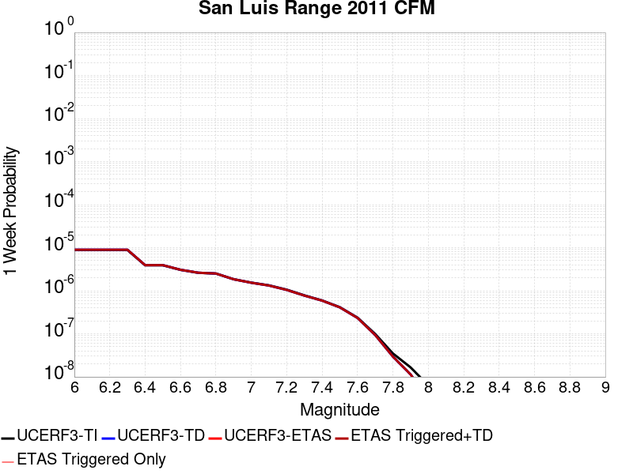 |  |  |  |

| Magnitude | 1 wk TI Prob | 1 wk TD Prob | 1 wk ETAS Prob | 1 wk ETAS/TD Gain | 1 wk ETAS Triggered+TD | 1 wk ETAS Triggered Only | 1 mo TI Prob | 1 mo TD Prob | 1 mo ETAS Prob | 1 mo ETAS/TD Gain | 1 mo ETAS Triggered+TD | 1 mo ETAS Triggered Only | 1 yr TI Prob | 1 yr TD Prob | 1 yr ETAS Prob | 1 yr ETAS/TD Gain | 1 yr ETAS Triggered+TD | 1 yr ETAS Triggered Only | 10 yr TI Prob | 10 yr TD Prob | 10 yr ETAS Prob | 10 yr ETAS/TD Gain | 10 yr ETAS Triggered+TD | 10 yr ETAS Triggered Only |
|-----|-----|-----|-----|-----|-----|-----|-----|-----|-----|-----|-----|-----|-----|-----|-----|-----|-----|-----|-----|-----|-----|-----|-----|-----|
| 6.0 | 8.8368415E-6 | 8.9635305E-6 | 0.0 | 0.0 | 8.9635305E-6 | 0.0 | 3.787163E-5 | 3.8414608E-5 | 1.0E-4 | 2.6031764 | 3.8414608E-5 | 0.0 | 4.609895E-4 | 4.6760536E-4 | 3.0E-4 | 0.64156663 | 4.6760536E-4 | 0.0 | 0.0046003438 | 0.004666997 | 0.0041 | 0.8785093 | 0.0055627967 | 9.0E-4 |
| 6.1 | 8.8368415E-6 | 8.9635305E-6 | 0.0 | 0.0 | 8.9635305E-6 | 0.0 | 3.787163E-5 | 3.8414608E-5 | 1.0E-4 | 2.6031764 | 3.8414608E-5 | 0.0 | 4.609895E-4 | 4.6760536E-4 | 3.0E-4 | 0.64156663 | 4.6760536E-4 | 0.0 | 0.0046003438 | 0.004666997 | 0.0041 | 0.8785093 | 0.0055627967 | 9.0E-4 |
| 6.2 | 8.8368415E-6 | 8.9635305E-6 | 0.0 | 0.0 | 8.9635305E-6 | 0.0 | 3.787163E-5 | 3.8414608E-5 | 1.0E-4 | 2.6031764 | 3.8414608E-5 | 0.0 | 4.609895E-4 | 4.6760536E-4 | 3.0E-4 | 0.64156663 | 4.6760536E-4 | 0.0 | 0.0046003438 | 0.004666997 | 0.0041 | 0.8785093 | 0.0055627967 | 9.0E-4 |
| 6.3 | 8.8368415E-6 | 8.9635305E-6 | 0.0 | 0.0 | 8.9635305E-6 | 0.0 | 3.787163E-5 | 3.8414608E-5 | 1.0E-4 | 2.6031764 | 3.8414608E-5 | 0.0 | 4.609895E-4 | 4.6760536E-4 | 3.0E-4 | 0.64156663 | 4.6760536E-4 | 0.0 | 0.0046003438 | 0.004666997 | 0.0041 | 0.8785093 | 0.0055627967 | 9.0E-4 |
| 6.4 | 3.9094193E-6 | 3.9403103E-6 | 0.0 | 0.0 | 3.9403103E-6 | 0.0 | 1.6754546E-5 | 1.6886937E-5 | 1.0E-4 | 5.921737 | 1.6886937E-5 | 0.0 | 2.039675E-4 | 2.0557934E-4 | 3.0E-4 | 1.4592906 | 2.0557934E-4 | 0.0 | 0.0020378039 | 0.0020539204 | 0.0017 | 0.8276854 | 0.002652688 | 6.0E-4 |
| 6.5 | 3.9094193E-6 | 3.9403103E-6 | 0.0 | 0.0 | 3.9403103E-6 | 0.0 | 1.6754546E-5 | 1.6886937E-5 | 1.0E-4 | 5.921737 | 1.6886937E-5 | 0.0 | 2.039675E-4 | 2.0557934E-4 | 3.0E-4 | 1.4592906 | 2.0557934E-4 | 0.0 | 0.0020378039 | 0.0020539204 | 0.0017 | 0.8276854 | 0.002652688 | 6.0E-4 |
| 6.6 | 3.0587726E-6 | 3.0746571E-6 | 0.0 | 0.0 | 3.0746571E-6 | 0.0 | 1.3108959E-5 | 1.3177036E-5 | 1.0E-4 | 7.58896 | 1.3177036E-5 | 0.0 | 1.595899E-4 | 1.6041871E-4 | 2.0E-4 | 1.2467372 | 1.6041871E-4 | 0.0 | 0.0015947534 | 0.0016030412 | 0.0014 | 0.87334 | 0.0021022398 | 5.0E-4 |
| 6.7 | 2.6160574E-6 | 2.6244763E-6 | 0.0 | 0.0 | 2.6244763E-6 | 0.0 | 1.1211626E-5 | 1.1247707E-5 | 1.0E-4 | 8.8907 | 1.1247707E-5 | 0.0 | 1.3649299E-4 | 1.369323E-4 | 2.0E-4 | 1.4605758 | 1.369323E-4 | 0.0 | 0.0013640919 | 0.0013684854 | 0.0011 | 0.8038084 | 0.001767938 | 4.0E-4 |
| 6.8 | 2.5110312E-6 | 2.51751E-6 | 0.0 | 0.0 | 2.51751E-6 | 0.0 | 1.0761518E-5 | 1.0789285E-5 | 1.0E-4 | 9.2684555 | 1.0789285E-5 | 0.0 | 1.310136E-4 | 1.3135167E-4 | 2.0E-4 | 1.52263 | 1.3135167E-4 | 0.0 | 0.0013093639 | 0.0013127463 | 0.001 | 0.76176184 | 0.0017122212 | 4.0E-4 |
| 6.9 | 1.8564405E-6 | 1.8519744E-6 | 0.0 | 0.0 | 1.8519744E-6 | 0.0 | 7.95615E-6 | 7.937009E-6 | 1.0E-4 | 12.599204 | 7.937009E-6 | 0.0 | 9.686181E-5 | 9.662882E-5 | 1.0E-4 | 1.0348879 | 9.662882E-5 | 0.0 | 9.68196E-4 | 9.6587004E-4 | 7.0E-4 | 0.72473514 | 0.0012655803 | 3.0E-4 |
| 7.0 | 1.546127E-6 | 1.5364967E-6 | 0.0 | 0.0 | 1.5364967E-6 | 0.0 | 6.626242E-6 | 6.584969E-6 | 1.0E-4 | 15.1861 | 6.584969E-6 | 0.0 | 8.06715E-5 | 8.0169055E-5 | 1.0E-4 | 1.247364 | 8.0169055E-5 | 0.0 | 8.0642226E-4 | 8.01402E-4 | 6.0E-4 | 0.74868786 | 0.0011011616 | 3.0E-4 |
| 7.1 | 1.3368208E-6 | 1.3231194E-6 | 0.0 | 0.0 | 1.3231194E-6 | 0.0 | 5.7292195E-6 | 5.6704994E-6 | 1.0E-4 | 17.63513 | 5.6704994E-6 | 0.0 | 6.975101E-5 | 6.903615E-5 | 1.0E-4 | 1.4485165 | 6.903615E-5 | 0.0 | 6.972912E-4 | 6.901475E-4 | 5.0E-4 | 0.72448283 | 9.899405E-4 | 3.0E-4 |
| 7.2 | 1.0623363E-6 | 1.0450811E-6 | 0.0 | 0.0 | 1.0450811E-6 | 0.0 | 4.5528623E-6 | 4.4789113E-6 | 1.0E-4 | 22.326853 | 4.4789113E-6 | 0.0 | 5.5429686E-5 | 5.4529384E-5 | 1.0E-4 | 1.8338736 | 5.4529384E-5 | 0.0 | 5.5415864E-4 | 5.451603E-4 | 5.0E-4 | 0.9171614 | 8.449968E-4 | 3.0E-4 |
| 7.3 | 7.831679E-7 | 7.724442E-7 | 0.0 | 0.0 | 7.724442E-7 | 0.0 | 3.3564295E-6 | 3.310471E-6 | 0.0 | 0.0 | 3.310471E-6 | 0.0 | 4.086376E-5 | 4.030424E-5 | 0.0 | 0.0 | 4.030424E-5 | 0.0 | 4.0856248E-4 | 4.0296942E-4 | 3.0E-4 | 0.7444734 | 6.028888E-4 | 2.0E-4 |
| 7.4 | 5.9558846E-7 | 5.908265E-7 | 0.0 | 0.0 | 5.908265E-7 | 0.0 | 2.5525194E-6 | 2.532111E-6 | 0.0 | 0.0 | 2.532111E-6 | 0.0 | 3.107648E-5 | 3.0828018E-5 | 0.0 | 0.0 | 3.0828018E-5 | 0.0 | 3.1072134E-4 | 3.082375E-4 | 2.0E-4 | 0.6488503 | 4.0820666E-4 | 1.0E-4 |
| 7.5 | 4.1616502E-7 | 4.1176796E-7 | 0.0 | 0.0 | 4.1176796E-7 | 0.0 | 1.7835631E-6 | 1.7647186E-6 | 0.0 | 0.0 | 1.7647186E-6 | 0.0 | 2.1714664E-5 | 2.1485237E-5 | 0.0 | 0.0 | 2.1485237E-5 | 0.0 | 2.1712543E-4 | 2.1483166E-4 | 2.0E-4 | 0.9309615 | 3.1481017E-4 | 1.0E-4 |
| 7.6 | 2.3816014E-7 | 2.336172E-7 | 0.0 | 0.0 | 2.336172E-7 | 0.0 | 1.0206859E-6 | 1.0012162E-6 | 0.0 | 0.0 | 1.0012162E-6 | 0.0 | 1.242678E-5 | 1.2189739E-5 | 0.0 | 0.0 | 1.2189739E-5 | 0.0 | 1.2426086E-4 | 1.2189073E-4 | 1.0E-4 | 0.820407 | 1.2189073E-4 | 0.0 |
| 7.7 | 9.918777E-8 | 9.375498E-8 | 0.0 | 0.0 | 9.375498E-8 | 0.0 | 4.2509038E-7 | 4.0180694E-7 | 0.0 | 0.0 | 4.0180694E-7 | 0.0 | 5.1754632E-6 | 4.8919887E-6 | 0.0 | 0.0 | 4.8919887E-6 | 0.0 | 5.1753424E-5 | 4.8918813E-5 | 1.0E-4 | 2.0442033 | 4.8918813E-5 | 0.0 |
| 7.8 | 3.4982556E-8 | 2.9595649E-8 | 0.0 | 0.0 | 2.9595649E-8 | 0.0 | 1.4992524E-7 | 1.2683849E-7 | 0.0 | 0.0 | 1.2683849E-7 | 0.0 | 1.8253382E-6 | 1.5442574E-6 | 0.0 | 0.0 | 1.5442574E-6 | 0.0 | 1.8253233E-5 | 1.5442467E-5 | 0.0 | 0.0 | 1.5442467E-5 | 0.0 |
| 7.9 | 1.6624908E-8 | 1.1400586E-8 | 0.0 | 0.0 | 1.1400586E-8 | 0.0 | 7.12496E-8 | 4.8859654E-8 | 0.0 | 0.0 | 4.8859654E-8 | 0.0 | 8.6746354E-7 | 5.9486615E-7 | 0.0 | 0.0 | 5.9486615E-7 | 0.0 | 8.674601E-6 | 5.9486456E-6 | 0.0 | 0.0 | 5.9486456E-6 | 0.0 |
| 8.0 | 6.3352315E-9 | 3.0413818E-9 | 0.0 | 0.0 | 3.0413818E-9 | 0.0 | 2.715099E-8 | 1.3034493E-8 | 0.0 | 0.0 | 1.3034493E-8 | 0.0 | 3.3056327E-7 | 1.5869495E-7 | 0.0 | 0.0 | 1.5869495E-7 | 0.0 | 3.3056278E-6 | 1.5869483E-6 | 0.0 | 0.0 | 1.5869483E-6 | 0.0 |

## Redondo Canyon alt 1
*[(top)](#table-of-contents)*

| 1 Week | 1 Month | 1 Year | 10 Year |
|-----|-----|-----|-----|
|  |  |  |  |

| Magnitude | 1 wk TI Prob | 1 wk TD Prob | 1 wk ETAS Prob | 1 wk ETAS/TD Gain | 1 wk ETAS Triggered+TD | 1 wk ETAS Triggered Only | 1 mo TI Prob | 1 mo TD Prob | 1 mo ETAS Prob | 1 mo ETAS/TD Gain | 1 mo ETAS Triggered+TD | 1 mo ETAS Triggered Only | 1 yr TI Prob | 1 yr TD Prob | 1 yr ETAS Prob | 1 yr ETAS/TD Gain | 1 yr ETAS Triggered+TD | 1 yr ETAS Triggered Only | 10 yr TI Prob | 10 yr TD Prob | 10 yr ETAS Prob | 10 yr ETAS/TD Gain | 10 yr ETAS Triggered+TD | 10 yr ETAS Triggered Only |
|-----|-----|-----|-----|-----|-----|-----|-----|-----|-----|-----|-----|-----|-----|-----|-----|-----|-----|-----|-----|-----|-----|-----|-----|-----|
| 6.0 | 1.0346246E-5 | 1.0969803E-5 | 0.0 | 0.0 | 1.0969803E-5 | 0.0 | 4.43403E-5 | 4.701304E-5 | 0.0 | 0.0 | 4.701304E-5 | 0.0 | 5.3970946E-4 | 5.7231216E-4 | 4.0E-4 | 0.69891924 | 6.7225494E-4 | 1.0E-4 | 0.0053840056 | 0.005716108 | 0.0034 | 0.5948103 | 0.0067103915 | 0.001 |
| 6.1 | 1.0346246E-5 | 1.0969803E-5 | 0.0 | 0.0 | 1.0969803E-5 | 0.0 | 4.43403E-5 | 4.701304E-5 | 0.0 | 0.0 | 4.701304E-5 | 0.0 | 5.3970946E-4 | 5.7231216E-4 | 4.0E-4 | 0.69891924 | 6.7225494E-4 | 1.0E-4 | 0.0053840056 | 0.005716108 | 0.0034 | 0.5948103 | 0.0067103915 | 0.001 |
| 6.2 | 1.0346246E-5 | 1.0969803E-5 | 0.0 | 0.0 | 1.0969803E-5 | 0.0 | 4.43403E-5 | 4.701304E-5 | 0.0 | 0.0 | 4.701304E-5 | 0.0 | 5.3970946E-4 | 5.7231216E-4 | 4.0E-4 | 0.69891924 | 6.7225494E-4 | 1.0E-4 | 0.0053840056 | 0.005716108 | 0.0034 | 0.5948103 | 0.0067103915 | 0.001 |
| 6.3 | 3.2052794E-6 | 3.2314128E-6 | 0.0 | 0.0 | 3.2314128E-6 | 0.0 | 1.373684E-5 | 1.3848861E-5 | 0.0 | 0.0 | 1.3848861E-5 | 0.0 | 1.6723319E-4 | 1.686008E-4 | 1.0E-4 | 0.593117 | 2.6858394E-4 | 1.0E-4 | 0.001671074 | 0.0016851175 | 9.0E-4 | 0.5340874 | 0.0019846119 | 3.0E-4 |
| 6.4 | 3.2052794E-6 | 3.2314128E-6 | 0.0 | 0.0 | 3.2314128E-6 | 0.0 | 1.373684E-5 | 1.3848861E-5 | 0.0 | 0.0 | 1.3848861E-5 | 0.0 | 1.6723319E-4 | 1.686008E-4 | 1.0E-4 | 0.593117 | 2.6858394E-4 | 1.0E-4 | 0.001671074 | 0.0016851175 | 9.0E-4 | 0.5340874 | 0.0019846119 | 3.0E-4 |
| 6.5 | 3.2052794E-6 | 3.2314128E-6 | 0.0 | 0.0 | 3.2314128E-6 | 0.0 | 1.373684E-5 | 1.3848861E-5 | 0.0 | 0.0 | 1.3848861E-5 | 0.0 | 1.6723319E-4 | 1.686008E-4 | 1.0E-4 | 0.593117 | 2.6858394E-4 | 1.0E-4 | 0.001671074 | 0.0016851175 | 9.0E-4 | 0.5340874 | 0.0019846119 | 3.0E-4 |
| 6.6 | 1.948328E-6 | 1.8259183E-6 | 0.0 | 0.0 | 1.8259183E-6 | 0.0 | 8.349951E-6 | 7.825349E-6 | 0.0 | 0.0 | 7.825349E-6 | 0.0 | 1.016559E-4 | 9.527095E-5 | 1.0E-4 | 1.0496378 | 1.9526143E-4 | 1.0E-4 | 0.0010160941 | 9.5244765E-4 | 7.0E-4 | 0.7349485 | 0.0011522572 | 2.0E-4 |
| 6.7 | 1.948328E-6 | 1.8259183E-6 | 0.0 | 0.0 | 1.8259183E-6 | 0.0 | 8.349951E-6 | 7.825349E-6 | 0.0 | 0.0 | 7.825349E-6 | 0.0 | 1.016559E-4 | 9.527095E-5 | 1.0E-4 | 1.0496378 | 1.9526143E-4 | 1.0E-4 | 0.0010160941 | 9.5244765E-4 | 7.0E-4 | 0.7349485 | 0.0011522572 | 2.0E-4 |
| 6.8 | 1.1278219E-6 | 9.015936E-7 | 0.0 | 0.0 | 9.015936E-7 | 0.0 | 4.8335132E-6 | 3.863969E-6 | 0.0 | 0.0 | 3.863969E-6 | 0.0 | 5.8846435E-5 | 4.704324E-5 | 0.0 | 0.0 | 4.704324E-5 | 0.0 | 5.8830855E-4 | 4.7037465E-4 | 3.0E-4 | 0.6377895 | 5.703276E-4 | 1.0E-4 |
| 6.9 | 1.1278219E-6 | 9.015936E-7 | 0.0 | 0.0 | 9.015936E-7 | 0.0 | 4.8335132E-6 | 3.863969E-6 | 0.0 | 0.0 | 3.863969E-6 | 0.0 | 5.8846435E-5 | 4.704324E-5 | 0.0 | 0.0 | 4.704324E-5 | 0.0 | 5.8830855E-4 | 4.7037465E-4 | 3.0E-4 | 0.6377895 | 5.703276E-4 | 1.0E-4 |
| 7.0 | 1.1278219E-6 | 9.015936E-7 | 0.0 | 0.0 | 9.015936E-7 | 0.0 | 4.8335132E-6 | 3.863969E-6 | 0.0 | 0.0 | 3.863969E-6 | 0.0 | 5.8846435E-5 | 4.704324E-5 | 0.0 | 0.0 | 4.704324E-5 | 0.0 | 5.8830855E-4 | 4.7037465E-4 | 3.0E-4 | 0.6377895 | 5.703276E-4 | 1.0E-4 |
| 7.1 | 1.0545139E-6 | 8.5534685E-7 | 0.0 | 0.0 | 8.5534685E-7 | 0.0 | 4.5193374E-6 | 3.6657693E-6 | 0.0 | 0.0 | 3.6657693E-6 | 0.0 | 5.5021545E-5 | 4.463025E-5 | 0.0 | 0.0 | 4.463025E-5 | 0.0 | 5.500792E-4 | 4.462545E-4 | 3.0E-4 | 0.67226213 | 5.4620986E-4 | 1.0E-4 |
| 7.2 | 1.0545139E-6 | 8.5534685E-7 | 0.0 | 0.0 | 8.5534685E-7 | 0.0 | 4.5193374E-6 | 3.6657693E-6 | 0.0 | 0.0 | 3.6657693E-6 | 0.0 | 5.5021545E-5 | 4.463025E-5 | 0.0 | 0.0 | 4.463025E-5 | 0.0 | 5.500792E-4 | 4.462545E-4 | 3.0E-4 | 0.67226213 | 5.4620986E-4 | 1.0E-4 |
| 7.3 | 9.505161E-8 | 5.8791972E-8 | 0.0 | 0.0 | 5.8791972E-8 | 0.0 | 4.0736398E-7 | 2.519656E-7 | 0.0 | 0.0 | 2.519656E-7 | 0.0 | 4.959645E-6 | 3.0676779E-6 | 0.0 | 0.0 | 3.0676779E-6 | 0.0 | 4.9595343E-5 | 3.0676474E-5 | 2.0E-4 | 6.5196543 | 3.0676474E-5 | 0.0 |
| 7.4 | 3.9520785E-8 | 2.6868836E-8 | 0.0 | 0.0 | 2.6868836E-8 | 0.0 | 1.6937479E-7 | 1.1515215E-7 | 0.0 | 0.0 | 1.1515215E-7 | 0.0 | 2.062136E-6 | 1.4019768E-6 | 0.0 | 0.0 | 1.4019768E-6 | 0.0 | 2.062117E-5 | 1.4019706E-5 | 2.0E-4 | 14.265635 | 1.4019706E-5 | 0.0 |
| 7.5 | 5.6133214E-9 | 3.722762E-9 | 0.0 | 0.0 | 3.722762E-9 | 0.0 | 2.4057092E-8 | 1.5954695E-8 | 0.0 | 0.0 | 1.5954695E-8 | 0.0 | 2.9289507E-7 | 1.942484E-7 | 0.0 | 0.0 | 1.942484E-7 | 0.0 | 2.9289467E-6 | 1.9424826E-6 | 0.0 | 0.0 | 1.9424826E-6 | 0.0 |
| 7.6 | 4.1064334E-9 | 2.5842946E-9 | 0.0 | 0.0 | 2.5842946E-9 | 0.0 | 1.7599E-8 | 1.10755485E-8 | 0.0 | 0.0 | 1.10755485E-8 | 0.0 | 2.142678E-7 | 1.348448E-7 | 0.0 | 0.0 | 1.348448E-7 | 0.0 | 2.1426758E-6 | 1.3484473E-6 | 0.0 | 0.0 | 1.3484473E-6 | 0.0 |
| 7.7 | 1.361975E-9 | 6.2969774E-10 | 0.0 | 0.0 | 6.2969774E-10 | 0.0 | 5.8370353E-9 | 2.698705E-9 | 0.0 | 0.0 | 2.698705E-9 | 0.0 | 7.1065905E-8 | 3.2856732E-8 | 0.0 | 0.0 | 3.2856732E-8 | 0.0 | 7.106588E-7 | 3.285673E-7 | 0.0 | 0.0 | 3.285673E-7 | 0.0 |
| 7.8 | 1.361975E-9 | 6.2969774E-10 | 0.0 | 0.0 | 6.2969774E-10 | 0.0 | 5.8370353E-9 | 2.698705E-9 | 0.0 | 0.0 | 2.698705E-9 | 0.0 | 7.1065905E-8 | 3.2856732E-8 | 0.0 | 0.0 | 3.2856732E-8 | 0.0 | 7.106588E-7 | 3.285673E-7 | 0.0 | 0.0 | 3.285673E-7 | 0.0 |

## San Gorgonio Pass
*[(top)](#table-of-contents)*

| 1 Week | 1 Month | 1 Year | 10 Year |
|-----|-----|-----|-----|
|  |  |  |  |

| Magnitude | 1 wk TI Prob | 1 wk TD Prob | 1 wk ETAS Prob | 1 wk ETAS/TD Gain | 1 wk ETAS Triggered+TD | 1 wk ETAS Triggered Only | 1 mo TI Prob | 1 mo TD Prob | 1 mo ETAS Prob | 1 mo ETAS/TD Gain | 1 mo ETAS Triggered+TD | 1 mo ETAS Triggered Only | 1 yr TI Prob | 1 yr TD Prob | 1 yr ETAS Prob | 1 yr ETAS/TD Gain | 1 yr ETAS Triggered+TD | 1 yr ETAS Triggered Only | 10 yr TI Prob | 10 yr TD Prob | 10 yr ETAS Prob | 10 yr ETAS/TD Gain | 10 yr ETAS Triggered+TD | 10 yr ETAS Triggered Only |
|-----|-----|-----|-----|-----|-----|-----|-----|-----|-----|-----|-----|-----|-----|-----|-----|-----|-----|-----|-----|-----|-----|-----|-----|-----|
| 6.0 | 7.644328E-6 | 1.3123646E-5 | 0.0 | 0.0 | 1.3123646E-5 | 0.0 | 3.2760996E-5 | 5.624303E-5 | 1.0E-4 | 1.7779981 | 5.624303E-5 | 0.0 | 3.987921E-4 | 6.845522E-4 | 7.0E-4 | 1.0225663 | 7.844837E-4 | 1.0E-4 | 0.003980772 | 0.006830755 | 0.0039 | 0.5709471 | 0.0078239245 | 0.001 |
| 6.1 | 7.644328E-6 | 1.3123646E-5 | 0.0 | 0.0 | 1.3123646E-5 | 0.0 | 3.2760996E-5 | 5.624303E-5 | 1.0E-4 | 1.7779981 | 5.624303E-5 | 0.0 | 3.987921E-4 | 6.845522E-4 | 7.0E-4 | 1.0225663 | 7.844837E-4 | 1.0E-4 | 0.003980772 | 0.006830755 | 0.0039 | 0.5709471 | 0.0078239245 | 0.001 |
| 6.2 | 7.644328E-6 | 1.3123646E-5 | 0.0 | 0.0 | 1.3123646E-5 | 0.0 | 3.2760996E-5 | 5.624303E-5 | 1.0E-4 | 1.7779981 | 5.624303E-5 | 0.0 | 3.987921E-4 | 6.845522E-4 | 7.0E-4 | 1.0225663 | 7.844837E-4 | 1.0E-4 | 0.003980772 | 0.006830755 | 0.0039 | 0.5709471 | 0.0078239245 | 0.001 |
| 6.3 | 7.644328E-6 | 1.3123646E-5 | 0.0 | 0.0 | 1.3123646E-5 | 0.0 | 3.2760996E-5 | 5.624303E-5 | 1.0E-4 | 1.7779981 | 5.624303E-5 | 0.0 | 3.987921E-4 | 6.845522E-4 | 7.0E-4 | 1.0225663 | 7.844837E-4 | 1.0E-4 | 0.003980772 | 0.006830755 | 0.0039 | 0.5709471 | 0.0078239245 | 0.001 |
| 6.4 | 7.644328E-6 | 1.3123646E-5 | 0.0 | 0.0 | 1.3123646E-5 | 0.0 | 3.2760996E-5 | 5.624303E-5 | 1.0E-4 | 1.7779981 | 5.624303E-5 | 0.0 | 3.987921E-4 | 6.845522E-4 | 7.0E-4 | 1.0225663 | 7.844837E-4 | 1.0E-4 | 0.003980772 | 0.006830755 | 0.0039 | 0.5709471 | 0.0078239245 | 0.001 |
| 6.5 | 7.644328E-6 | 1.3123646E-5 | 0.0 | 0.0 | 1.3123646E-5 | 0.0 | 3.2760996E-5 | 5.624303E-5 | 1.0E-4 | 1.7779981 | 5.624303E-5 | 0.0 | 3.987921E-4 | 6.845522E-4 | 7.0E-4 | 1.0225663 | 7.844837E-4 | 1.0E-4 | 0.003980772 | 0.006830755 | 0.0039 | 0.5709471 | 0.0078239245 | 0.001 |
| 6.6 | 7.644328E-6 | 1.3123646E-5 | 0.0 | 0.0 | 1.3123646E-5 | 0.0 | 3.2760996E-5 | 5.624303E-5 | 1.0E-4 | 1.7779981 | 5.624303E-5 | 0.0 | 3.987921E-4 | 6.845522E-4 | 7.0E-4 | 1.0225663 | 7.844837E-4 | 1.0E-4 | 0.003980772 | 0.006830755 | 0.0039 | 0.5709471 | 0.0078239245 | 0.001 |
| 6.7 | 6.987586E-6 | 1.2428351E-5 | 0.0 | 0.0 | 1.2428351E-5 | 0.0 | 2.9946454E-5 | 5.3263317E-5 | 1.0E-4 | 1.8774648 | 5.3263317E-5 | 0.0 | 3.645371E-4 | 6.4829586E-4 | 7.0E-4 | 1.0797539 | 7.482311E-4 | 1.0E-4 | 0.0036393967 | 0.0064703184 | 0.0034 | 0.52547646 | 0.007364495 | 9.0E-4 |
| 6.8 | 6.987586E-6 | 1.2428351E-5 | 0.0 | 0.0 | 1.2428351E-5 | 0.0 | 2.9946454E-5 | 5.3263317E-5 | 1.0E-4 | 1.8774648 | 5.3263317E-5 | 0.0 | 3.645371E-4 | 6.4829586E-4 | 7.0E-4 | 1.0797539 | 7.482311E-4 | 1.0E-4 | 0.0036393967 | 0.0064703184 | 0.0034 | 0.52547646 | 0.007364495 | 9.0E-4 |
| 6.9 | 5.504702E-6 | 1.0860166E-5 | 0.0 | 0.0 | 1.0860166E-5 | 0.0 | 2.3591367E-5 | 4.6542766E-5 | 1.0E-4 | 2.1485617 | 4.6542766E-5 | 0.0 | 2.8718702E-4 | 5.665157E-4 | 5.0E-4 | 0.88258797 | 6.664591E-4 | 1.0E-4 | 0.0028681618 | 0.0056566843 | 0.0031 | 0.5480242 | 0.0065515935 | 9.0E-4 |
| 7.0 | 5.4825764E-6 | 1.0836524E-5 | 0.0 | 0.0 | 1.0836524E-5 | 0.0 | 2.3496545E-5 | 4.6441448E-5 | 1.0E-4 | 2.153249 | 4.6441448E-5 | 0.0 | 2.8603288E-4 | 5.652828E-4 | 5.0E-4 | 0.88451296 | 6.652263E-4 | 1.0E-4 | 0.00285665 | 0.005644418 | 0.0031 | 0.5492152 | 0.006539338 | 9.0E-4 |
| 7.1 | 5.4692787E-6 | 1.0822245E-5 | 0.0 | 0.0 | 1.0822245E-5 | 0.0 | 2.3439556E-5 | 4.6380253E-5 | 1.0E-4 | 2.15609 | 4.6380253E-5 | 0.0 | 2.8533922E-4 | 5.645382E-4 | 5.0E-4 | 0.88567966 | 6.644817E-4 | 1.0E-4 | 0.0028497311 | 0.0056370096 | 0.003 | 0.5321971 | 0.006531936 | 9.0E-4 |
| 7.2 | 5.453661E-6 | 1.0805287E-5 | 0.0 | 0.0 | 1.0805287E-5 | 0.0 | 2.3372622E-5 | 4.6307578E-5 | 1.0E-4 | 2.1594737 | 4.6307578E-5 | 0.0 | 2.8452452E-4 | 5.636538E-4 | 5.0E-4 | 0.8870693 | 6.635975E-4 | 1.0E-4 | 0.002841605 | 0.0056282105 | 0.003 | 0.5330291 | 0.0065231454 | 9.0E-4 |
| 7.3 | 5.4422303E-6 | 1.0792245E-5 | 0.0 | 0.0 | 1.0792245E-5 | 0.0 | 2.3323635E-5 | 4.6251687E-5 | 1.0E-4 | 2.1620834 | 4.6251687E-5 | 0.0 | 2.8392827E-4 | 5.629737E-4 | 5.0E-4 | 0.888141 | 6.629174E-4 | 1.0E-4 | 0.0028356577 | 0.005621444 | 0.003 | 0.5336707 | 0.0065163844 | 9.0E-4 |
| 7.4 | 5.398595E-6 | 1.0739746E-5 | 0.0 | 0.0 | 1.0739746E-5 | 0.0 | 2.313663E-5 | 4.60267E-5 | 1.0E-4 | 2.172652 | 4.60267E-5 | 0.0 | 2.8165206E-4 | 5.6023593E-4 | 5.0E-4 | 0.89248115 | 6.601799E-4 | 1.0E-4 | 0.0028129534 | 0.005594204 | 0.003 | 0.5362693 | 0.0064891693 | 9.0E-4 |
| 7.5 | 5.3578788E-6 | 1.0666854E-5 | 0.0 | 0.0 | 1.0666854E-5 | 0.0 | 2.2962136E-5 | 4.5714318E-5 | 1.0E-4 | 2.1874986 | 4.5714318E-5 | 0.0 | 2.7952815E-4 | 5.5643456E-4 | 5.0E-4 | 0.8985782 | 6.563789E-4 | 1.0E-4 | 0.002791768 | 0.0055564074 | 0.0029 | 0.52191997 | 0.006451407 | 9.0E-4 |
| 7.6 | 4.8091474E-6 | 9.4257875E-6 | 0.0 | 0.0 | 9.4257875E-6 | 0.0 | 2.0610469E-5 | 4.0395633E-5 | 1.0E-4 | 2.4755151 | 4.0395633E-5 | 0.0 | 2.5090357E-4 | 4.917105E-4 | 5.0E-4 | 1.0168585 | 5.916613E-4 | 1.0E-4 | 0.0025062046 | 0.004912377 | 0.0027 | 0.54963213 | 0.0058079557 | 9.0E-4 |
| 7.7 | 1.5991155E-6 | 3.2640755E-6 | 0.0 | 0.0 | 3.2640755E-6 | 0.0 | 6.853334E-6 | 1.3988822E-5 | 0.0 | 0.0 | 1.3988822E-5 | 0.0 | 8.343615E-5 | 1.7030083E-4 | 1.0E-4 | 0.5871962 | 1.7030083E-4 | 0.0 | 8.340483E-4 | 0.0017073427 | 0.001 | 0.58570546 | 0.0023063184 | 6.0E-4 |
| 7.8 | 9.258398E-7 | 1.9945169E-6 | 0.0 | 0.0 | 1.9945169E-6 | 0.0 | 3.967879E-6 | 8.547901E-6 | 0.0 | 0.0 | 8.547901E-6 | 0.0 | 4.8307855E-5 | 1.0406575E-4 | 1.0E-4 | 0.96093094 | 1.0406575E-4 | 0.0 | 4.8297356E-4 | 0.0010457964 | 9.0E-4 | 0.86058813 | 0.001645169 | 6.0E-4 |
| 7.9 | 5.975575E-7 | 1.1827133E-6 | 0.0 | 0.0 | 1.1827133E-6 | 0.0 | 2.5609581E-6 | 5.0687613E-6 | 0.0 | 0.0 | 5.0687613E-6 | 0.0 | 3.117922E-5 | 6.171043E-5 | 1.0E-4 | 1.6204716 | 6.171043E-5 | 0.0 | 3.1174847E-4 | 6.223159E-4 | 6.0E-4 | 0.96414053 | 0.0010220669 | 4.0E-4 |
| 8.0 | 3.4413725E-7 | 6.4326485E-7 | 0.0 | 0.0 | 6.4326485E-7 | 0.0 | 1.4748731E-6 | 2.7568465E-6 | 0.0 | 0.0 | 2.7568465E-6 | 0.0 | 1.7956432E-5 | 3.3564094E-5 | 1.0E-4 | 2.9793744 | 3.3564094E-5 | 0.0 | 1.7954981E-4 | 3.391827E-4 | 4.0E-4 | 1.1793054 | 6.3908094E-4 | 3.0E-4 |
| 8.1 | 1.1787731E-8 | 8.871863E-9 | 0.0 | 0.0 | 8.871863E-9 | 0.0 | 5.0518846E-8 | 3.8022268E-8 | 0.0 | 0.0 | 3.8022268E-8 | 0.0 | 6.1506677E-7 | 4.62921E-7 | 0.0 | 0.0 | 4.62921E-7 | 0.0 | 6.1506507E-6 | 4.836884E-6 | 0.0 | 0.0 | 4.836884E-6 | 0.0 |

## Channel Islands Western Deep Ramp
*[(top)](#table-of-contents)*

| 1 Week | 1 Month | 1 Year | 10 Year |
|-----|-----|-----|-----|
|  |  |  |  |

| Magnitude | 1 wk TI Prob | 1 wk TD Prob | 1 wk ETAS Prob | 1 wk ETAS/TD Gain | 1 wk ETAS Triggered+TD | 1 wk ETAS Triggered Only | 1 mo TI Prob | 1 mo TD Prob | 1 mo ETAS Prob | 1 mo ETAS/TD Gain | 1 mo ETAS Triggered+TD | 1 mo ETAS Triggered Only | 1 yr TI Prob | 1 yr TD Prob | 1 yr ETAS Prob | 1 yr ETAS/TD Gain | 1 yr ETAS Triggered+TD | 1 yr ETAS Triggered Only | 10 yr TI Prob | 10 yr TD Prob | 10 yr ETAS Prob | 10 yr ETAS/TD Gain | 10 yr ETAS Triggered+TD | 10 yr ETAS Triggered Only |
|-----|-----|-----|-----|-----|-----|-----|-----|-----|-----|-----|-----|-----|-----|-----|-----|-----|-----|-----|-----|-----|-----|-----|-----|-----|
| 6.0 | 6.0213506E-6 | 6.25233E-6 | 0.0 | 0.0 | 6.25233E-6 | 0.0 | 2.5805533E-5 | 2.679545E-5 | 0.0 | 0.0 | 2.679545E-5 | 0.0 | 3.1413708E-4 | 3.2619023E-4 | 1.0E-4 | 0.30656958 | 4.261576E-4 | 1.0E-4 | 0.0031369338 | 0.003257556 | 0.0026 | 0.7981444 | 0.0042542983 | 0.001 |
| 6.1 | 6.0213506E-6 | 6.25233E-6 | 0.0 | 0.0 | 6.25233E-6 | 0.0 | 2.5805533E-5 | 2.679545E-5 | 0.0 | 0.0 | 2.679545E-5 | 0.0 | 3.1413708E-4 | 3.2619023E-4 | 1.0E-4 | 0.30656958 | 4.261576E-4 | 1.0E-4 | 0.0031369338 | 0.003257556 | 0.0026 | 0.7981444 | 0.0042542983 | 0.001 |
| 6.2 | 6.0213506E-6 | 6.25233E-6 | 0.0 | 0.0 | 6.25233E-6 | 0.0 | 2.5805533E-5 | 2.679545E-5 | 0.0 | 0.0 | 2.679545E-5 | 0.0 | 3.1413708E-4 | 3.2619023E-4 | 1.0E-4 | 0.30656958 | 4.261576E-4 | 1.0E-4 | 0.0031369338 | 0.003257556 | 0.0026 | 0.7981444 | 0.0042542983 | 0.001 |
| 6.3 | 6.0213506E-6 | 6.25233E-6 | 0.0 | 0.0 | 6.25233E-6 | 0.0 | 2.5805533E-5 | 2.679545E-5 | 0.0 | 0.0 | 2.679545E-5 | 0.0 | 3.1413708E-4 | 3.2619023E-4 | 1.0E-4 | 0.30656958 | 4.261576E-4 | 1.0E-4 | 0.0031369338 | 0.003257556 | 0.0026 | 0.7981444 | 0.0042542983 | 0.001 |
| 6.4 | 6.0213506E-6 | 6.25233E-6 | 0.0 | 0.0 | 6.25233E-6 | 0.0 | 2.5805533E-5 | 2.679545E-5 | 0.0 | 0.0 | 2.679545E-5 | 0.0 | 3.1413708E-4 | 3.2619023E-4 | 1.0E-4 | 0.30656958 | 4.261576E-4 | 1.0E-4 | 0.0031369338 | 0.003257556 | 0.0026 | 0.7981444 | 0.0042542983 | 0.001 |
| 6.5 | 6.0213506E-6 | 6.25233E-6 | 0.0 | 0.0 | 6.25233E-6 | 0.0 | 2.5805533E-5 | 2.679545E-5 | 0.0 | 0.0 | 2.679545E-5 | 0.0 | 3.1413708E-4 | 3.2619023E-4 | 1.0E-4 | 0.30656958 | 4.261576E-4 | 1.0E-4 | 0.0031369338 | 0.003257556 | 0.0026 | 0.7981444 | 0.0042542983 | 0.001 |
| 6.6 | 6.0213506E-6 | 6.25233E-6 | 0.0 | 0.0 | 6.25233E-6 | 0.0 | 2.5805533E-5 | 2.679545E-5 | 0.0 | 0.0 | 2.679545E-5 | 0.0 | 3.1413708E-4 | 3.2619023E-4 | 1.0E-4 | 0.30656958 | 4.261576E-4 | 1.0E-4 | 0.0031369338 | 0.003257556 | 0.0026 | 0.7981444 | 0.0042542983 | 0.001 |
| 6.7 | 5.313309E-6 | 5.5229343E-6 | 0.0 | 0.0 | 5.5229343E-6 | 0.0 | 2.2771126E-5 | 2.3669527E-5 | 0.0 | 0.0 | 2.3669527E-5 | 0.0 | 2.772032E-4 | 2.8814247E-4 | 1.0E-4 | 0.34705055 | 3.8811367E-4 | 1.0E-4 | 0.0027685766 | 0.0028780915 | 0.0025 | 0.8686312 | 0.0038752134 | 0.001 |
| 6.8 | 5.313309E-6 | 5.5229343E-6 | 0.0 | 0.0 | 5.5229343E-6 | 0.0 | 2.2771126E-5 | 2.3669527E-5 | 0.0 | 0.0 | 2.3669527E-5 | 0.0 | 2.772032E-4 | 2.8814247E-4 | 1.0E-4 | 0.34705055 | 3.8811367E-4 | 1.0E-4 | 0.0027685766 | 0.0028780915 | 0.0025 | 0.8686312 | 0.0038752134 | 0.001 |
| 6.9 | 4.744377E-6 | 4.9373057E-6 | 0.0 | 0.0 | 4.9373057E-6 | 0.0 | 2.0332885E-5 | 2.115973E-5 | 0.0 | 0.0 | 2.115973E-5 | 0.0 | 2.4752476E-4 | 2.57593E-4 | 1.0E-4 | 0.3882093 | 3.5756725E-4 | 1.0E-4 | 0.0024724922 | 0.0025733113 | 0.0021 | 0.8160691 | 0.0033712527 | 8.0E-4 |
| 7.0 | 4.722209E-6 | 4.914357E-6 | 0.0 | 0.0 | 4.914357E-6 | 0.0 | 2.0237881E-5 | 2.106138E-5 | 0.0 | 0.0 | 2.106138E-5 | 0.0 | 2.4636835E-4 | 2.5639587E-4 | 1.0E-4 | 0.3900219 | 3.5637023E-4 | 1.0E-4 | 0.002460954 | 0.0025613676 | 0.0021 | 0.81987447 | 0.0033593185 | 8.0E-4 |
| 7.1 | 4.611174E-6 | 4.7993362E-6 | 0.0 | 0.0 | 4.7993362E-6 | 0.0 | 1.9762025E-5 | 2.0568443E-5 | 0.0 | 0.0 | 2.0568443E-5 | 0.0 | 2.4057609E-4 | 2.5039574E-4 | 1.0E-4 | 0.3993678 | 3.503707E-4 | 1.0E-4 | 0.002403158 | 0.0025015029 | 0.002 | 0.79951936 | 0.0032995017 | 8.0E-4 |
| 7.2 | 4.043994E-6 | 4.2101947E-6 | 0.0 | 0.0 | 4.2101947E-6 | 0.0 | 1.7331287E-5 | 1.8043587E-5 | 0.0 | 0.0 | 1.8043587E-5 | 0.0 | 2.10988E-4 | 2.196621E-4 | 1.0E-4 | 0.45524466 | 3.1964012E-4 | 1.0E-4 | 0.002107878 | 0.0021948004 | 0.0019 | 0.8656824 | 0.0029930444 | 8.0E-4 |
| 7.3 | 2.1233036E-6 | 2.2286192E-6 | 0.0 | 0.0 | 2.2286192E-6 | 0.0 | 9.099841E-6 | 9.5511905E-6 | 0.0 | 0.0 | 9.5511905E-6 | 0.0 | 1.1078493E-4 | 1.16279596E-4 | 1.0E-4 | 0.8599961 | 2.1626797E-4 | 1.0E-4 | 0.0011072971 | 0.0011621931 | 5.0E-4 | 0.4302211 | 0.0014618444 | 3.0E-4 |
| 7.4 | 1.9051884E-6 | 2.0004404E-6 | 0.0 | 0.0 | 2.0004404E-6 | 0.0 | 8.165067E-6 | 8.573288E-6 | 0.0 | 0.0 | 8.573288E-6 | 0.0 | 9.940516E-5 | 1.04374834E-4 | 1.0E-4 | 0.95808536 | 2.0436439E-4 | 1.0E-4 | 9.93607E-4 | 0.0010432634 | 5.0E-4 | 0.47926536 | 0.0013429504 | 3.0E-4 |
| 7.5 | 1.2408497E-6 | 1.3031918E-6 | 0.0 | 0.0 | 1.3031918E-6 | 0.0 | 5.317916E-6 | 5.585096E-6 | 0.0 | 0.0 | 5.585096E-6 | 0.0 | 6.4743705E-5 | 6.799644E-5 | 1.0E-4 | 1.4706652 | 1.6798964E-4 | 1.0E-4 | 6.4724847E-4 | 6.7975855E-4 | 3.0E-4 | 0.44133317 | 8.796226E-4 | 2.0E-4 |
| 7.6 | 6.5440025E-7 | 6.882948E-7 | 0.0 | 0.0 | 6.882948E-7 | 0.0 | 2.8045695E-6 | 2.9498317E-6 | 0.0 | 0.0 | 2.9498317E-6 | 0.0 | 3.4145098E-5 | 3.591362E-5 | 0.0 | 0.0 | 3.591362E-5 | 0.0 | 3.4139853E-4 | 3.590796E-4 | 0.0 | 0.0 | 3.590796E-4 | 0.0 |
| 7.7 | 3.985963E-7 | 4.1908018E-7 | 0.0 | 0.0 | 4.1908018E-7 | 0.0 | 1.7082689E-6 | 1.7960567E-6 | 0.0 | 0.0 | 1.7960567E-6 | 0.0 | 2.0797976E-5 | 2.1866783E-5 | 0.0 | 0.0 | 2.1866783E-5 | 0.0 | 2.0796029E-4 | 2.1864749E-4 | 0.0 | 0.0 | 2.1864749E-4 | 0.0 |
| 7.8 | 3.706329E-8 | 3.857518E-8 | 0.0 | 0.0 | 3.857518E-8 | 0.0 | 1.5884267E-7 | 1.6532219E-7 | 0.0 | 0.0 | 1.6532219E-7 | 0.0 | 1.9339077E-6 | 2.012796E-6 | 0.0 | 0.0 | 2.012796E-6 | 0.0 | 1.933891E-5 | 2.0127789E-5 | 0.0 | 0.0 | 2.0127789E-5 | 0.0 |

## Walker Spring 2011 CFM
*[(top)](#table-of-contents)*

| 1 Week | 1 Month | 1 Year | 10 Year |
|-----|-----|-----|-----|
|  | 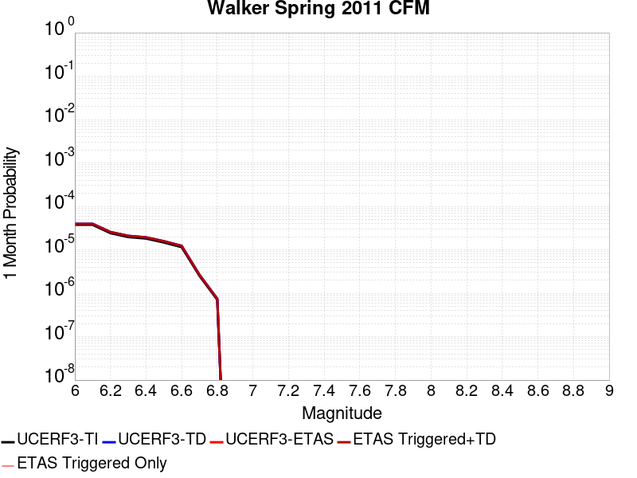 | 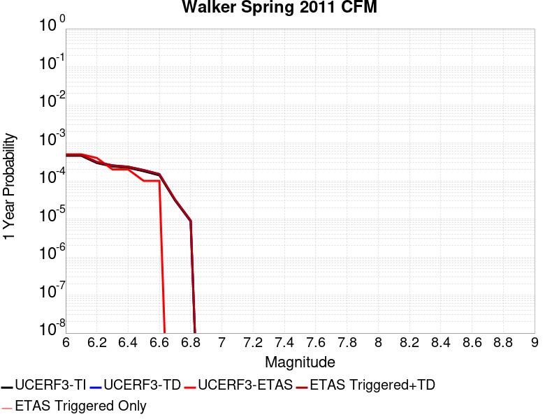 |  |

| Magnitude | 1 wk TI Prob | 1 wk TD Prob | 1 wk ETAS Prob | 1 wk ETAS/TD Gain | 1 wk ETAS Triggered+TD | 1 wk ETAS Triggered Only | 1 mo TI Prob | 1 mo TD Prob | 1 mo ETAS Prob | 1 mo ETAS/TD Gain | 1 mo ETAS Triggered+TD | 1 mo ETAS Triggered Only | 1 yr TI Prob | 1 yr TD Prob | 1 yr ETAS Prob | 1 yr ETAS/TD Gain | 1 yr ETAS Triggered+TD | 1 yr ETAS Triggered Only | 10 yr TI Prob | 10 yr TD Prob | 10 yr ETAS Prob | 10 yr ETAS/TD Gain | 10 yr ETAS Triggered+TD | 10 yr ETAS Triggered Only |
|-----|-----|-----|-----|-----|-----|-----|-----|-----|-----|-----|-----|-----|-----|-----|-----|-----|-----|-----|-----|-----|-----|-----|-----|-----|
| 6.0 | 8.791276E-6 | 9.258855E-6 | 0.0 | 0.0 | 9.258855E-6 | 0.0 | 3.767635E-5 | 3.9680264E-5 | 0.0 | 0.0 | 3.9680264E-5 | 0.0 | 4.58613E-4 | 4.8301095E-4 | 5.0E-4 | 1.0351732 | 4.8301095E-4 | 0.0 | 0.004576677 | 0.004820684 | 0.0037 | 0.767526 | 0.005815863 | 0.001 |
| 6.1 | 8.791276E-6 | 9.258855E-6 | 0.0 | 0.0 | 9.258855E-6 | 0.0 | 3.767635E-5 | 3.9680264E-5 | 0.0 | 0.0 | 3.9680264E-5 | 0.0 | 4.58613E-4 | 4.8301095E-4 | 5.0E-4 | 1.0351732 | 4.8301095E-4 | 0.0 | 0.004576677 | 0.004820684 | 0.0031 | 0.6430623 | 0.0056168274 | 8.0E-4 |
| 6.2 | 5.654515E-6 | 5.994926E-6 | 0.0 | 0.0 | 5.994926E-6 | 0.0 | 2.4233412E-5 | 2.5692316E-5 | 0.0 | 0.0 | 2.5692316E-5 | 0.0 | 2.9500184E-4 | 3.1276405E-4 | 4.0E-4 | 1.2789193 | 3.1276405E-4 | 0.0 | 0.0029461053 | 0.0031237327 | 0.0022 | 0.7042856 | 0.0036221708 | 5.0E-4 |
| 6.3 | 4.591685E-6 | 4.891341E-6 | 0.0 | 0.0 | 4.891341E-6 | 0.0 | 1.96785E-5 | 2.0962747E-5 | 0.0 | 0.0 | 2.0962747E-5 | 0.0 | 2.395594E-4 | 2.5519592E-4 | 2.0E-4 | 0.7837116 | 2.5519592E-4 | 0.0 | 0.002393013 | 0.0025494578 | 0.0016 | 0.6275844 | 0.0028486932 | 3.0E-4 |
| 6.4 | 4.243283E-6 | 4.5195384E-6 | 0.0 | 0.0 | 4.5195384E-6 | 0.0 | 1.8185372E-5 | 1.936933E-5 | 0.0 | 0.0 | 1.936933E-5 | 0.0 | 2.2138441E-4 | 2.358003E-4 | 2.0E-4 | 0.84817535 | 2.358003E-4 | 0.0 | 0.00221164 | 0.002355916 | 0.0015 | 0.636695 | 0.002655209 | 3.0E-4 |
| 6.5 | 3.4445666E-6 | 3.6833867E-6 | 0.0 | 0.0 | 3.6833867E-6 | 0.0 | 1.4762345E-5 | 1.578587E-5 | 0.0 | 0.0 | 1.578587E-5 | 0.0 | 1.7971672E-4 | 1.9218003E-4 | 1.0E-4 | 0.52034545 | 1.9218003E-4 | 0.0 | 0.0017957145 | 0.0019205326 | 0.0012 | 0.6248267 | 0.0022199564 | 3.0E-4 |
| 6.6 | 2.68766E-6 | 2.8772854E-6 | 0.0 | 0.0 | 2.8772854E-6 | 0.0 | 1.1518492E-5 | 1.2331187E-5 | 0.0 | 0.0 | 1.2331187E-5 | 0.0 | 1.4022861E-4 | 1.5012566E-4 | 1.0E-4 | 0.66610867 | 1.5012566E-4 | 0.0 | 0.0014014016 | 0.0015006157 | 0.0011 | 0.73303246 | 0.0018001655 | 3.0E-4 |
| 6.7 | 5.880964E-7 | 6.1962396E-7 | 0.0 | 0.0 | 6.1962396E-7 | 0.0 | 2.5204106E-6 | 2.655529E-6 | 0.0 | 0.0 | 2.655529E-6 | 0.0 | 3.0685565E-5 | 3.233068E-5 | 0.0 | 0.0 | 3.233068E-5 | 0.0 | 3.068133E-4 | 3.2326914E-4 | 5.0E-4 | 1.5466988 | 3.2326914E-4 | 0.0 |
| 6.8 | 1.6514163E-7 | 1.7399272E-7 | 0.0 | 0.0 | 1.7399272E-7 | 0.0 | 7.077497E-7 | 7.4568305E-7 | 0.0 | 0.0 | 7.4568305E-7 | 0.0 | 8.616818E-6 | 9.078692E-6 | 0.0 | 0.0 | 9.078692E-6 | 0.0 | 8.616484E-5 | 9.078691E-5 | 2.0E-4 | 2.2029607 | 9.078691E-5 | 0.0 |

## Great Valley 10 (Panoche)
*[(top)](#table-of-contents)*

| 1 Week | 1 Month | 1 Year | 10 Year |
|-----|-----|-----|-----|
|  |  | 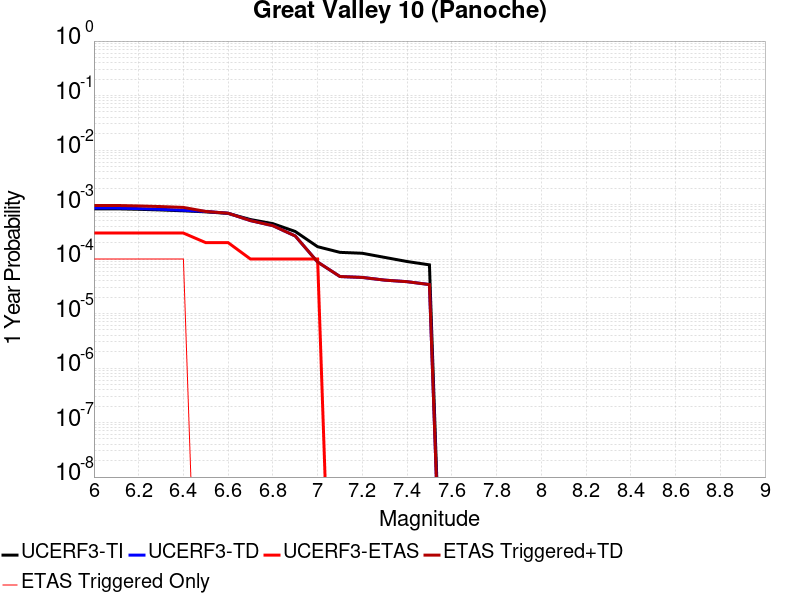 |  |

| Magnitude | 1 wk TI Prob | 1 wk TD Prob | 1 wk ETAS Prob | 1 wk ETAS/TD Gain | 1 wk ETAS Triggered+TD | 1 wk ETAS Triggered Only | 1 mo TI Prob | 1 mo TD Prob | 1 mo ETAS Prob | 1 mo ETAS/TD Gain | 1 mo ETAS Triggered+TD | 1 mo ETAS Triggered Only | 1 yr TI Prob | 1 yr TD Prob | 1 yr ETAS Prob | 1 yr ETAS/TD Gain | 1 yr ETAS Triggered+TD | 1 yr ETAS Triggered Only | 10 yr TI Prob | 10 yr TD Prob | 10 yr ETAS Prob | 10 yr ETAS/TD Gain | 10 yr ETAS Triggered+TD | 10 yr ETAS Triggered Only |
|-----|-----|-----|-----|-----|-----|-----|-----|-----|-----|-----|-----|-----|-----|-----|-----|-----|-----|-----|-----|-----|-----|-----|-----|-----|
| 6.0 | 1.6014626E-5 | 1.6546046E-5 | 0.0 | 0.0 | 1.6546046E-5 | 0.0 | 6.863231E-5 | 7.090973E-5 | 0.0 | 0.0 | 7.090973E-5 | 0.0 | 8.35278E-4 | 8.629895E-4 | 3.0E-4 | 0.34762877 | 9.6290326E-4 | 1.0E-4 | 0.008321454 | 0.008596998 | 0.0051 | 0.59323037 | 0.009489261 | 9.0E-4 |
| 6.1 | 1.6014626E-5 | 1.6546046E-5 | 0.0 | 0.0 | 1.6546046E-5 | 0.0 | 6.863231E-5 | 7.090973E-5 | 0.0 | 0.0 | 7.090973E-5 | 0.0 | 8.35278E-4 | 8.629895E-4 | 3.0E-4 | 0.34762877 | 9.6290326E-4 | 1.0E-4 | 0.008321454 | 0.008596998 | 0.005 | 0.5815984 | 0.00939012 | 8.0E-4 |
| 6.2 | 1.56782E-5 | 1.6169568E-5 | 0.0 | 0.0 | 1.6169568E-5 | 0.0 | 6.719056E-5 | 6.929634E-5 | 0.0 | 0.0 | 6.929634E-5 | 0.0 | 8.17738E-4 | 8.433618E-4 | 3.0E-4 | 0.3557192 | 9.4327744E-4 | 1.0E-4 | 0.008147354 | 0.008402215 | 0.005 | 0.59508115 | 0.0091954935 | 8.0E-4 |
| 6.3 | 1.5263338E-5 | 1.5695354E-5 | 0.0 | 0.0 | 1.5695354E-5 | 0.0 | 6.541267E-5 | 6.7264096E-5 | 0.0 | 0.0 | 6.7264096E-5 | 0.0 | 7.961082E-4 | 8.186381E-4 | 3.0E-4 | 0.36646232 | 9.1855624E-4 | 1.0E-4 | 0.007932622 | 0.008156813 | 0.0049 | 0.6007248 | 0.0089502875 | 8.0E-4 |
| 6.4 | 1.4720723E-5 | 1.5072195E-5 | 0.0 | 0.0 | 1.5072195E-5 | 0.0 | 6.308728E-5 | 6.459355E-5 | 0.0 | 0.0 | 6.459355E-5 | 0.0 | 7.67817E-4 | 7.86148E-4 | 3.0E-4 | 0.38160753 | 8.860694E-4 | 1.0E-4 | 0.007651695 | 0.007834241 | 0.0047 | 0.59993047 | 0.0086279735 | 8.0E-4 |
| 6.5 | 1.408264E-5 | 1.4330072E-5 | 0.0 | 0.0 | 1.4330072E-5 | 0.0 | 6.0352773E-5 | 6.141317E-5 | 0.0 | 0.0 | 6.141317E-5 | 0.0 | 7.3454727E-4 | 7.4745406E-4 | 2.0E-4 | 0.26757497 | 7.4745406E-4 | 0.0 | 0.0073212404 | 0.0074499524 | 0.0042 | 0.563762 | 0.008144737 | 7.0E-4 |
| 6.6 | 1.3197086E-5 | 1.3297803E-5 | 0.0 | 0.0 | 1.3297803E-5 | 0.0 | 5.6557717E-5 | 5.6989364E-5 | 0.0 | 0.0 | 5.6989364E-5 | 0.0 | 6.8837265E-4 | 6.936297E-4 | 2.0E-4 | 0.28833827 | 6.936297E-4 | 0.0 | 0.006862442 | 0.006915182 | 0.0038 | 0.54951555 | 0.0075110327 | 6.0E-4 |
| 6.7 | 1.017583E-5 | 9.72817E-6 | 0.0 | 0.0 | 9.72817E-6 | 0.0 | 4.360997E-5 | 4.1691503E-5 | 0.0 | 0.0 | 4.1691503E-5 | 0.0 | 5.30822E-4 | 5.0747825E-4 | 1.0E-4 | 0.19705279 | 5.0747825E-4 | 0.0 | 0.0052955584 | 0.0050634453 | 0.0029 | 0.57273257 | 0.0055609136 | 5.0E-4 |
| 6.8 | 8.557912E-6 | 7.8585745E-6 | 0.0 | 0.0 | 7.8585745E-6 | 0.0 | 3.667625E-5 | 3.367918E-5 | 0.0 | 0.0 | 3.367918E-5 | 0.0 | 4.4644187E-4 | 4.099689E-4 | 1.0E-4 | 0.24392094 | 4.099689E-4 | 0.0 | 0.0044554602 | 0.004092332 | 0.0023 | 0.56202674 | 0.004590286 | 5.0E-4 |
| 6.9 | 6.14664E-6 | 5.082385E-6 | 0.0 | 0.0 | 5.082385E-6 | 0.0 | 2.6342475E-5 | 2.1781476E-5 | 0.0 | 0.0 | 2.1781476E-5 | 0.0 | 3.2067244E-4 | 2.6515857E-4 | 1.0E-4 | 0.3771328 | 2.6515857E-4 | 0.0 | 0.003202101 | 0.0026485599 | 0.0014 | 0.5285892 | 0.0029477652 | 3.0E-4 |
| 7.0 | 3.2310581E-6 | 1.6912916E-6 | 0.0 | 0.0 | 1.6912916E-6 | 0.0 | 1.3847319E-5 | 7.248373E-6 | 0.0 | 0.0 | 7.248373E-6 | 0.0 | 1.6857806E-4 | 8.824546E-5 | 1.0E-4 | 1.1332028 | 8.824546E-5 | 0.0 | 0.0016845023 | 8.821135E-4 | 4.0E-4 | 0.45345637 | 9.820253E-4 | 1.0E-4 |
| 7.1 | 2.544492E-6 | 9.1611963E-7 | 0.0 | 0.0 | 9.1611963E-7 | 0.0 | 1.090492E-5 | 3.9262213E-6 | 0.0 | 0.0 | 3.9262213E-6 | 0.0 | 1.327593E-4 | 4.7800742E-5 | 0.0 | 0.0 | 4.7800742E-5 | 0.0 | 0.0013268003 | 4.7790937E-4 | 3.0E-4 | 0.62773407 | 5.7786156E-4 | 1.0E-4 |
| 7.2 | 2.4479045E-6 | 8.8145214E-7 | 0.0 | 0.0 | 8.8145214E-7 | 0.0 | 1.0490977E-5 | 3.777647E-6 | 0.0 | 0.0 | 3.777647E-6 | 0.0 | 1.2772017E-4 | 4.599193E-5 | 0.0 | 0.0 | 4.599193E-5 | 0.0 | 0.0012764678 | 4.5982882E-4 | 3.0E-4 | 0.6524167 | 5.5978284E-4 | 1.0E-4 |
| 7.3 | 2.0559578E-6 | 7.869593E-7 | 0.0 | 0.0 | 7.869593E-7 | 0.0 | 8.811218E-6 | 3.3726785E-6 | 0.0 | 0.0 | 3.3726785E-6 | 0.0 | 1.072713E-4 | 4.1061634E-5 | 0.0 | 0.0 | 4.1061634E-5 | 0.0 | 0.0010721954 | 4.1054506E-4 | 2.0E-4 | 0.48715723 | 5.10504E-4 | 1.0E-4 |
| 7.4 | 1.727687E-6 | 7.366852E-7 | 0.0 | 0.0 | 7.366852E-7 | 0.0 | 7.404352E-6 | 3.1572188E-6 | 0.0 | 0.0 | 3.1572188E-6 | 0.0 | 9.0144255E-5 | 3.8438506E-5 | 0.0 | 0.0 | 3.8438506E-5 | 0.0 | 9.0107694E-4 | 3.8432315E-4 | 2.0E-4 | 0.5203954 | 4.842847E-4 | 1.0E-4 |
| 7.5 | 1.5002679E-6 | 6.5268995E-7 | 0.0 | 0.0 | 6.5268995E-7 | 0.0 | 6.4297037E-6 | 2.79724E-6 | 0.0 | 0.0 | 2.79724E-6 | 0.0 | 7.827883E-5 | 3.4055905E-5 | 0.0 | 0.0 | 3.4055905E-5 | 0.0 | 7.825126E-4 | 3.40511E-4 | 2.0E-4 | 0.5873525 | 4.4047696E-4 | 1.0E-4 |

## Emerson-Copper Mtn 2011
*[(top)](#table-of-contents)*

| 1 Week | 1 Month | 1 Year | 10 Year |
|-----|-----|-----|-----|
|  |  | 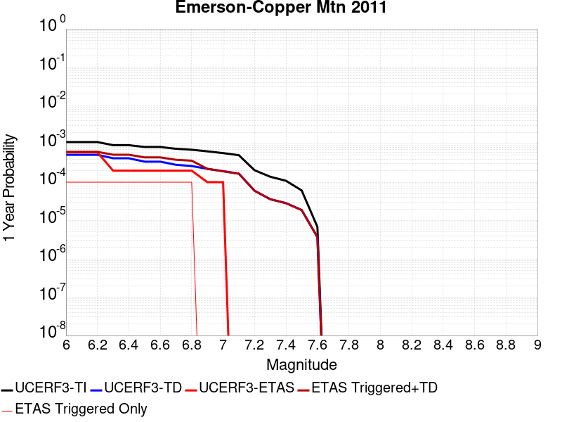 | 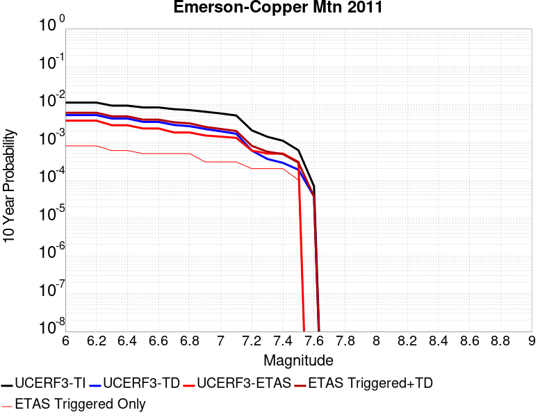 |

| Magnitude | 1 wk TI Prob | 1 wk TD Prob | 1 wk ETAS Prob | 1 wk ETAS/TD Gain | 1 wk ETAS Triggered+TD | 1 wk ETAS Triggered Only | 1 mo TI Prob | 1 mo TD Prob | 1 mo ETAS Prob | 1 mo ETAS/TD Gain | 1 mo ETAS Triggered+TD | 1 mo ETAS Triggered Only | 1 yr TI Prob | 1 yr TD Prob | 1 yr ETAS Prob | 1 yr ETAS/TD Gain | 1 yr ETAS Triggered+TD | 1 yr ETAS Triggered Only | 10 yr TI Prob | 10 yr TD Prob | 10 yr ETAS Prob | 10 yr ETAS/TD Gain | 10 yr ETAS Triggered+TD | 10 yr ETAS Triggered Only |
|-----|-----|-----|-----|-----|-----|-----|-----|-----|-----|-----|-----|-----|-----|-----|-----|-----|-----|-----|-----|-----|-----|-----|-----|-----|
| 6.0 | 2.1364202E-5 | 9.949666E-6 | 0.0 | 0.0 | 9.949666E-6 | 0.0 | 9.1557646E-5 | 4.264078E-5 | 1.0E-4 | 2.3451731 | 4.264078E-5 | 0.0 | 0.0011141442 | 5.190365E-4 | 6.0E-4 | 1.1559881 | 6.189846E-4 | 1.0E-4 | 0.011085749 | 0.005179109 | 0.0037 | 0.7144086 | 0.005974966 | 8.0E-4 |
| 6.1 | 2.1364202E-5 | 9.949666E-6 | 0.0 | 0.0 | 9.949666E-6 | 0.0 | 9.1557646E-5 | 4.264078E-5 | 1.0E-4 | 2.3451731 | 4.264078E-5 | 0.0 | 0.0011141442 | 5.190365E-4 | 6.0E-4 | 1.1559881 | 6.189846E-4 | 1.0E-4 | 0.011085749 | 0.005179109 | 0.0037 | 0.7144086 | 0.005974966 | 8.0E-4 |
| 6.2 | 2.1364202E-5 | 9.949666E-6 | 0.0 | 0.0 | 9.949666E-6 | 0.0 | 9.1557646E-5 | 4.264078E-5 | 1.0E-4 | 2.3451731 | 4.264078E-5 | 0.0 | 0.0011141442 | 5.190365E-4 | 6.0E-4 | 1.1559881 | 6.189846E-4 | 1.0E-4 | 0.011085749 | 0.005179109 | 0.0037 | 0.7144086 | 0.005974966 | 8.0E-4 |
| 6.3 | 1.7751237E-5 | 8.072754E-6 | 0.0 | 0.0 | 8.072754E-6 | 0.0 | 7.607452E-5 | 3.4597095E-5 | 0.0 | 0.0 | 3.4597095E-5 | 0.0 | 9.258136E-4 | 4.2114448E-4 | 2.0E-4 | 0.47489643 | 5.2110234E-4 | 1.0E-4 | 0.00921966 | 0.0042040837 | 0.0028 | 0.6660191 | 0.0048015616 | 6.0E-4 |
| 6.4 | 1.7751237E-5 | 8.072754E-6 | 0.0 | 0.0 | 8.072754E-6 | 0.0 | 7.607452E-5 | 3.4597095E-5 | 0.0 | 0.0 | 3.4597095E-5 | 0.0 | 9.258136E-4 | 4.2114448E-4 | 2.0E-4 | 0.47489643 | 5.2110234E-4 | 1.0E-4 | 0.00921966 | 0.0042040837 | 0.0028 | 0.6660191 | 0.0048015616 | 6.0E-4 |
| 6.5 | 1.5886664E-5 | 6.589088E-6 | 0.0 | 0.0 | 6.589088E-6 | 0.0 | 6.808392E-5 | 2.8238668E-5 | 0.0 | 0.0 | 2.8238668E-5 | 0.0 | 8.286065E-4 | 3.4375623E-4 | 2.0E-4 | 0.5818076 | 4.4372186E-4 | 1.0E-4 | 0.008255237 | 0.0034327072 | 0.0023 | 0.6700251 | 0.003930991 | 5.0E-4 |
| 6.6 | 1.5886664E-5 | 6.589088E-6 | 0.0 | 0.0 | 6.589088E-6 | 0.0 | 6.808392E-5 | 2.8238668E-5 | 0.0 | 0.0 | 2.8238668E-5 | 0.0 | 8.286065E-4 | 3.4375623E-4 | 2.0E-4 | 0.5818076 | 4.4372186E-4 | 1.0E-4 | 0.008255237 | 0.0034327072 | 0.0023 | 0.6700251 | 0.003930991 | 5.0E-4 |
| 6.7 | 1.428471E-5 | 5.456938E-6 | 0.0 | 0.0 | 5.456938E-6 | 0.0 | 6.121875E-5 | 2.3386692E-5 | 0.0 | 0.0 | 2.3386692E-5 | 0.0 | 7.450834E-4 | 2.846997E-4 | 2.0E-4 | 0.7024946 | 3.846712E-4 | 1.0E-4 | 0.007425902 | 0.0028437357 | 0.0018 | 0.6329702 | 0.003342314 | 5.0E-4 |
| 6.8 | 1.3490684E-5 | 5.0607155E-6 | 0.0 | 0.0 | 5.0607155E-6 | 0.0 | 5.7815934E-5 | 2.1688622E-5 | 0.0 | 0.0 | 2.1688622E-5 | 0.0 | 7.0368167E-4 | 2.6403082E-4 | 2.0E-4 | 0.75748736 | 3.640044E-4 | 1.0E-4 | 0.007014576 | 0.0026375502 | 0.0018 | 0.6824514 | 0.0031362316 | 5.0E-4 |
| 6.9 | 1.2235421E-5 | 4.2773563E-6 | 0.0 | 0.0 | 4.2773563E-6 | 0.0 | 5.2436466E-5 | 1.8331419E-5 | 0.0 | 0.0 | 1.8331419E-5 | 0.0 | 6.38227E-4 | 2.2316576E-4 | 1.0E-4 | 0.4480974 | 2.2316576E-4 | 0.0 | 0.0063639707 | 0.0022297692 | 0.0015 | 0.67271537 | 0.0025291003 | 3.0E-4 |
| 7.0 | 1.1009851E-5 | 3.707532E-6 | 0.0 | 0.0 | 3.707532E-6 | 0.0 | 4.7184225E-5 | 1.5889345E-5 | 0.0 | 0.0 | 1.5889345E-5 | 0.0 | 5.743165E-4 | 1.9343903E-4 | 1.0E-4 | 0.5169588 | 1.9343903E-4 | 0.0 | 0.005728345 | 0.0019330427 | 0.0014 | 0.72424686 | 0.0022324626 | 3.0E-4 |
| 7.1 | 9.726373E-6 | 3.201145E-6 | 0.0 | 0.0 | 3.201145E-6 | 0.0 | 4.168379E-5 | 1.371914E-5 | 0.0 | 0.0 | 1.371914E-5 | 0.0 | 5.07382E-4 | 1.6702109E-4 | 0.0 | 0.0 | 1.6702109E-4 | 0.0 | 0.0050622504 | 0.0016692852 | 0.0013 | 0.77877647 | 0.0019687845 | 3.0E-4 |
| 7.2 | 3.9335127E-6 | 1.1477415E-6 | 0.0 | 0.0 | 1.1477415E-6 | 0.0 | 1.6857803E-5 | 4.9188834E-6 | 0.0 | 0.0 | 4.9188834E-6 | 0.0 | 2.0522442E-4 | 5.9885817E-5 | 0.0 | 0.0 | 5.9885817E-5 | 0.0 | 0.00205035 | 5.987027E-4 | 6.0E-4 | 1.0021669 | 7.985829E-4 | 2.0E-4 |
| 7.3 | 2.661632E-6 | 6.8915176E-7 | 0.0 | 0.0 | 6.8915176E-7 | 0.0 | 1.14069435E-5 | 2.9535042E-6 | 0.0 | 0.0 | 2.9535042E-6 | 0.0 | 1.3887069E-4 | 3.5958332E-5 | 0.0 | 0.0 | 3.5958332E-5 | 0.0 | 0.0013878393 | 3.5952617E-4 | 5.0E-4 | 1.3907194 | 5.5945426E-4 | 2.0E-4 |
| 7.4 | 2.0893426E-6 | 5.44573E-7 | 0.0 | 0.0 | 5.44573E-7 | 0.0 | 8.954295E-6 | 2.3338823E-6 | 0.0 | 0.0 | 2.3338823E-6 | 0.0 | 1.0901308E-4 | 2.8414652E-5 | 0.0 | 0.0 | 2.8414652E-5 | 0.0 | 0.0010895962 | 2.8411072E-4 | 5.0E-4 | 1.7598773 | 4.840539E-4 | 2.0E-4 |
| 7.5 | 1.1681728E-6 | 3.592513E-7 | 0.0 | 0.0 | 3.592513E-7 | 0.0 | 5.0064455E-6 | 1.5396474E-6 | 0.0 | 0.0 | 1.5396474E-6 | 0.0 | 6.0951766E-5 | 1.8745051E-5 | 0.0 | 0.0 | 1.8745051E-5 | 0.0 | 6.093505E-4 | 1.8743517E-4 | 3.0E-4 | 1.6005534 | 2.8741642E-4 | 1.0E-4 |
| 7.6 | 1.3154387E-7 | 7.089255E-8 | 0.0 | 0.0 | 7.089255E-8 | 0.0 | 5.6375933E-7 | 3.0382517E-7 | 0.0 | 0.0 | 3.0382517E-7 | 0.0 | 6.863748E-6 | 3.6990668E-6 | 0.0 | 0.0 | 3.6990668E-6 | 0.0 | 6.863536E-5 | 3.6990208E-5 | 0.0 | 0.0 | 3.6990208E-5 | 0.0 |

## Pilarcitos 2011 CFM
*[(top)](#table-of-contents)*

| 1 Week | 1 Month | 1 Year | 10 Year |
|-----|-----|-----|-----|
|  |  |  |  |

| Magnitude | 1 wk TI Prob | 1 wk TD Prob | 1 wk ETAS Prob | 1 wk ETAS/TD Gain | 1 wk ETAS Triggered+TD | 1 wk ETAS Triggered Only | 1 mo TI Prob | 1 mo TD Prob | 1 mo ETAS Prob | 1 mo ETAS/TD Gain | 1 mo ETAS Triggered+TD | 1 mo ETAS Triggered Only | 1 yr TI Prob | 1 yr TD Prob | 1 yr ETAS Prob | 1 yr ETAS/TD Gain | 1 yr ETAS Triggered+TD | 1 yr ETAS Triggered Only | 10 yr TI Prob | 10 yr TD Prob | 10 yr ETAS Prob | 10 yr ETAS/TD Gain | 10 yr ETAS Triggered+TD | 10 yr ETAS Triggered Only |
|-----|-----|-----|-----|-----|-----|-----|-----|-----|-----|-----|-----|-----|-----|-----|-----|-----|-----|-----|-----|-----|-----|-----|-----|-----|
| 6.0 | 4.9150476E-6 | 3.144231E-6 | 0.0 | 0.0 | 3.144231E-6 | 0.0 | 2.1064321E-5 | 1.3475207E-5 | 0.0 | 0.0 | 1.3475207E-5 | 0.0 | 2.564279E-4 | 1.6404862E-4 | 3.0E-4 | 1.8287262 | 2.6403222E-4 | 1.0E-4 | 0.0025613222 | 0.0016516697 | 0.0016 | 0.9687166 | 0.0025501833 | 9.0E-4 |
| 6.1 | 4.9150476E-6 | 3.144231E-6 | 0.0 | 0.0 | 3.144231E-6 | 0.0 | 2.1064321E-5 | 1.3475207E-5 | 0.0 | 0.0 | 1.3475207E-5 | 0.0 | 2.564279E-4 | 1.6404862E-4 | 3.0E-4 | 1.8287262 | 2.6403222E-4 | 1.0E-4 | 0.0025613222 | 0.0016516697 | 0.0015 | 0.90817183 | 0.0025501833 | 9.0E-4 |
| 6.2 | 4.162343E-6 | 2.3728235E-6 | 0.0 | 0.0 | 2.3728235E-6 | 0.0 | 1.783849E-5 | 1.0169204E-5 | 0.0 | 0.0 | 1.0169204E-5 | 0.0 | 2.1716199E-4 | 1.238031E-4 | 3.0E-4 | 2.4232025 | 2.2379072E-4 | 1.0E-4 | 0.002169499 | 0.0012497179 | 0.0013 | 1.0402348 | 0.001948843 | 7.0E-4 |
| 6.3 | 4.162343E-6 | 2.3728235E-6 | 0.0 | 0.0 | 2.3728235E-6 | 0.0 | 1.783849E-5 | 1.0169204E-5 | 0.0 | 0.0 | 1.0169204E-5 | 0.0 | 2.1716199E-4 | 1.238031E-4 | 3.0E-4 | 2.4232025 | 2.2379072E-4 | 1.0E-4 | 0.002169499 | 0.0012497179 | 0.0013 | 1.0402348 | 0.001948843 | 7.0E-4 |
| 6.4 | 3.8768926E-6 | 2.080319E-6 | 0.0 | 0.0 | 2.080319E-6 | 0.0 | 1.6615148E-5 | 8.915623E-6 | 0.0 | 0.0 | 8.915623E-6 | 0.0 | 2.0227065E-4 | 1.0854234E-4 | 3.0E-4 | 2.7638984 | 2.0853149E-4 | 1.0E-4 | 0.0020208664 | 0.0010972681 | 0.0012 | 1.0936252 | 0.0016966097 | 6.0E-4 |
| 6.5 | 3.7137002E-6 | 1.9137601E-6 | 0.0 | 0.0 | 1.9137601E-6 | 0.0 | 1.591576E-5 | 8.201803E-6 | 0.0 | 0.0 | 8.201803E-6 | 0.0 | 1.9375715E-4 | 9.9852405E-5 | 3.0E-4 | 3.0044343 | 1.9984241E-4 | 1.0E-4 | 0.001935883 | 0.0010104501 | 0.0011 | 1.0886238 | 0.0015099449 | 5.0E-4 |
| 6.6 | 3.5048733E-6 | 1.6987939E-6 | 0.0 | 0.0 | 1.6987939E-6 | 0.0 | 1.5020799E-5 | 7.280525E-6 | 0.0 | 0.0 | 7.280525E-6 | 0.0 | 1.8286289E-4 | 8.863681E-5 | 3.0E-4 | 3.3845985 | 1.8862795E-4 | 1.0E-4 | 0.0018271249 | 8.9838984E-4 | 8.0E-4 | 0.890482 | 0.0011981203 | 3.0E-4 |
| 6.7 | 3.3908584E-6 | 1.5825741E-6 | 0.0 | 0.0 | 1.5825741E-6 | 0.0 | 1.453217E-5 | 6.7824426E-6 | 0.0 | 0.0 | 6.7824426E-6 | 0.0 | 1.7691481E-4 | 8.2573126E-5 | 3.0E-4 | 3.6331432 | 1.8256487E-4 | 1.0E-4 | 0.0017677402 | 8.378E-4 | 7.0E-4 | 0.8355216 | 0.0010376325 | 2.0E-4 |
| 6.8 | 3.2451449E-6 | 1.4359205E-6 | 0.0 | 0.0 | 1.4359205E-6 | 0.0 | 1.3907689E-5 | 6.15393E-6 | 0.0 | 0.0 | 6.15393E-6 | 0.0 | 1.6931296E-4 | 7.492153E-5 | 3.0E-4 | 4.0041895 | 1.7491404E-4 | 1.0E-4 | 0.0016918402 | 7.613385E-4 | 7.0E-4 | 0.91943336 | 9.6118625E-4 | 2.0E-4 |
| 6.9 | 3.1239128E-6 | 1.3125516E-6 | 0.0 | 0.0 | 1.3125516E-6 | 0.0 | 1.3388129E-5 | 5.6252093E-6 | 0.0 | 0.0 | 5.6252093E-6 | 0.0 | 1.6298829E-4 | 6.848478E-5 | 3.0E-4 | 4.3805356 | 1.6847793E-4 | 1.0E-4 | 0.001628688 | 6.97013E-4 | 7.0E-4 | 1.0042855 | 8.968736E-4 | 2.0E-4 |
| 7.0 | 2.9940109E-6 | 1.1840551E-6 | 0.0 | 0.0 | 1.1840551E-6 | 0.0 | 1.2831412E-5 | 5.074512E-6 | 0.0 | 0.0 | 5.074512E-6 | 0.0 | 1.5621124E-4 | 6.178044E-5 | 3.0E-4 | 4.855906 | 1.6177425E-4 | 1.0E-4 | 0.0015610148 | 6.300091E-4 | 5.0E-4 | 0.7936393 | 8.298831E-4 | 2.0E-4 |
| 7.1 | 2.7471217E-6 | 1.0973234E-6 | 0.0 | 0.0 | 1.0973234E-6 | 0.0 | 1.1773326E-5 | 4.702806E-6 | 0.0 | 0.0 | 4.702806E-6 | 0.0 | 1.4333082E-4 | 5.725516E-5 | 3.0E-4 | 5.239702 | 1.5724944E-4 | 1.0E-4 | 0.001432384 | 5.847355E-4 | 5.0E-4 | 0.8550875 | 7.8461855E-4 | 2.0E-4 |
| 7.2 | 2.592675E-6 | 9.640502E-7 | 0.0 | 0.0 | 9.640502E-7 | 0.0 | 1.1111417E-5 | 4.1316366E-6 | 0.0 | 0.0 | 4.1316366E-6 | 0.0 | 1.3527309E-4 | 5.0301518E-5 | 3.0E-4 | 5.9640346 | 1.5029649E-4 | 1.0E-4 | 0.0013519078 | 5.1523343E-4 | 5.0E-4 | 0.97043395 | 7.1513036E-4 | 2.0E-4 |
| 7.3 | 2.4518663E-6 | 8.5554564E-7 | 0.0 | 0.0 | 8.5554564E-7 | 0.0 | 1.0507956E-5 | 3.666619E-6 | 0.0 | 0.0 | 3.666619E-6 | 0.0 | 1.2792686E-4 | 4.4640172E-5 | 3.0E-4 | 6.720404 | 1.446357E-4 | 1.0E-4 | 0.0012785323 | 4.58643E-4 | 5.0E-4 | 1.0901725 | 6.5855123E-4 | 2.0E-4 |
| 7.4 | 2.3349535E-6 | 8.184507E-7 | 0.0 | 0.0 | 8.184507E-7 | 0.0 | 1.0006905E-5 | 3.5076412E-6 | 0.0 | 0.0 | 3.5076412E-6 | 0.0 | 1.2182725E-4 | 4.2704694E-5 | 3.0E-4 | 7.0249887 | 1.4270042E-4 | 1.0E-4 | 0.0012176048 | 4.392726E-4 | 5.0E-4 | 1.1382453 | 6.391847E-4 | 2.0E-4 |
| 7.5 | 2.1358665E-6 | 7.725491E-7 | 0.0 | 0.0 | 7.725491E-7 | 0.0 | 9.15368E-6 | 3.3109204E-6 | 0.0 | 0.0 | 3.3109204E-6 | 0.0 | 1.11440364E-4 | 4.030971E-5 | 3.0E-4 | 7.4423757 | 1.4030568E-4 | 1.0E-4 | 0.0011138449 | 4.1524452E-4 | 4.0E-4 | 0.9632879 | 5.15203E-4 | 1.0E-4 |
| 7.6 | 1.6445446E-6 | 6.331206E-7 | 0.0 | 0.0 | 6.331206E-7 | 0.0 | 7.048029E-6 | 2.713371E-6 | 0.0 | 0.0 | 2.713371E-6 | 0.0 | 8.580638E-5 | 3.3034794E-5 | 2.0E-4 | 6.054223 | 3.3034794E-5 | 0.0 | 8.5773255E-4 | 3.4245505E-4 | 3.0E-4 | 0.87602735 | 3.4245505E-4 | 0.0 |
| 7.7 | 1.3650961E-6 | 5.365653E-7 | 0.0 | 0.0 | 5.365653E-7 | 0.0 | 5.850399E-6 | 2.2995637E-6 | 0.0 | 0.0 | 2.2995637E-6 | 0.0 | 7.122628E-5 | 2.7996828E-5 | 2.0E-4 | 7.1436667 | 2.7996828E-5 | 0.0 | 7.120345E-4 | 2.9197492E-4 | 3.0E-4 | 1.0274855 | 2.9197492E-4 | 0.0 |
| 7.8 | 1.0500993E-6 | 5.105362E-7 | 0.0 | 0.0 | 5.105362E-7 | 0.0 | 4.5004176E-6 | 2.1880105E-6 | 0.0 | 0.0 | 2.1880105E-6 | 0.0 | 5.4791206E-5 | 2.6638703E-5 | 2.0E-4 | 7.507873 | 2.6638703E-5 | 0.0 | 5.47777E-4 | 2.782785E-4 | 3.0E-4 | 1.0780568 | 2.782785E-4 | 0.0 |
| 7.9 | 5.856431E-7 | 4.7864296E-7 | 0.0 | 0.0 | 4.7864296E-7 | 0.0 | 2.5098966E-6 | 2.0513253E-6 | 0.0 | 0.0 | 2.0513253E-6 | 0.0 | 3.0557563E-5 | 2.49746E-5 | 2.0E-4 | 8.008136 | 2.49746E-5 | 0.0 | 3.055336E-4 | 2.6095548E-4 | 3.0E-4 | 1.1496215 | 2.6095548E-4 | 0.0 |
| 8.0 | 4.4768265E-7 | 4.519346E-7 | 0.0 | 0.0 | 4.519346E-7 | 0.0 | 1.9186384E-6 | 1.9368613E-6 | 0.0 | 0.0 | 1.9368613E-6 | 0.0 | 2.3359173E-5 | 2.3581031E-5 | 2.0E-4 | 8.481394 | 2.3581031E-5 | 0.0 | 2.3356717E-4 | 2.4651948E-4 | 3.0E-4 | 1.2169424 | 2.4651948E-4 | 0.0 |
| 8.1 | 2.6692538E-7 | 3.1503544E-7 | 0.0 | 0.0 | 3.1503544E-7 | 0.0 | 1.1439654E-6 | 1.3501513E-6 | 0.0 | 0.0 | 1.3501513E-6 | 0.0 | 1.392769E-5 | 1.6437969E-5 | 1.0E-4 | 6.083477 | 1.6437969E-5 | 0.0 | 1.3926817E-4 | 1.7180636E-4 | 2.0E-4 | 1.1641012 | 1.7180636E-4 | 0.0 |
| 8.2 | 1.3198862E-8 | 1.0033938E-8 | 0.0 | 0.0 | 1.0033938E-8 | 0.0 | 5.656655E-8 | 4.3002593E-8 | 0.0 | 0.0 | 4.3002593E-8 | 0.0 | 6.886975E-7 | 5.235565E-7 | 0.0 | 0.0 | 5.235565E-7 | 0.0 | 6.8869535E-6 | 5.460517E-6 | 0.0 | 0.0 | 5.460517E-6 | 0.0 |

## Mohawk Valley 2011 CFM
*[(top)](#table-of-contents)*

| 1 Week | 1 Month | 1 Year | 10 Year |
|-----|-----|-----|-----|
|  |  |  |  |

| Magnitude | 1 wk TI Prob | 1 wk TD Prob | 1 wk ETAS Prob | 1 wk ETAS/TD Gain | 1 wk ETAS Triggered+TD | 1 wk ETAS Triggered Only | 1 mo TI Prob | 1 mo TD Prob | 1 mo ETAS Prob | 1 mo ETAS/TD Gain | 1 mo ETAS Triggered+TD | 1 mo ETAS Triggered Only | 1 yr TI Prob | 1 yr TD Prob | 1 yr ETAS Prob | 1 yr ETAS/TD Gain | 1 yr ETAS Triggered+TD | 1 yr ETAS Triggered Only | 10 yr TI Prob | 10 yr TD Prob | 10 yr ETAS Prob | 10 yr ETAS/TD Gain | 10 yr ETAS Triggered+TD | 10 yr ETAS Triggered Only |
|-----|-----|-----|-----|-----|-----|-----|-----|-----|-----|-----|-----|-----|-----|-----|-----|-----|-----|-----|-----|-----|-----|-----|-----|-----|
| 6.0 | 2.5425423E-5 | 2.7619575E-5 | 0.0 | 0.0 | 2.7619575E-5 | 0.0 | 1.0896155E-4 | 1.1836485E-4 | 0.0 | 0.0 | 1.1836485E-4 | 0.0 | 0.0013257994 | 0.0014402476 | 0.0011 | 0.7637575 | 0.0015401037 | 1.0E-4 | 0.013179175 | 0.0143199945 | 0.0089 | 0.6215086 | 0.015207106 | 9.0E-4 |
| 6.1 | 2.5425423E-5 | 2.7619575E-5 | 0.0 | 0.0 | 2.7619575E-5 | 0.0 | 1.0896155E-4 | 1.1836485E-4 | 0.0 | 0.0 | 1.1836485E-4 | 0.0 | 0.0013257994 | 0.0014402476 | 0.0011 | 0.7637575 | 0.0015401037 | 1.0E-4 | 0.013179175 | 0.0143199945 | 0.0089 | 0.6215086 | 0.015207106 | 9.0E-4 |
| 6.2 | 2.5425423E-5 | 2.7619575E-5 | 0.0 | 0.0 | 2.7619575E-5 | 0.0 | 1.0896155E-4 | 1.1836485E-4 | 0.0 | 0.0 | 1.1836485E-4 | 0.0 | 0.0013257994 | 0.0014402476 | 0.0011 | 0.7637575 | 0.0015401037 | 1.0E-4 | 0.013179175 | 0.0143199945 | 0.0089 | 0.6215086 | 0.015207106 | 9.0E-4 |
| 6.3 | 2.5425423E-5 | 2.7619575E-5 | 0.0 | 0.0 | 2.7619575E-5 | 0.0 | 1.0896155E-4 | 1.1836485E-4 | 0.0 | 0.0 | 1.1836485E-4 | 0.0 | 0.0013257994 | 0.0014402476 | 0.0011 | 0.7637575 | 0.0015401037 | 1.0E-4 | 0.013179175 | 0.0143199945 | 0.0089 | 0.6215086 | 0.015207106 | 9.0E-4 |
| 6.4 | 1.1812642E-5 | 1.2752864E-5 | 0.0 | 0.0 | 1.2752864E-5 | 0.0 | 5.0624625E-5 | 5.465407E-5 | 0.0 | 0.0 | 5.465407E-5 | 0.0 | 6.161805E-4 | 6.6522486E-4 | 4.0E-4 | 0.6013005 | 7.6515833E-4 | 1.0E-4 | 0.0061447476 | 0.006633806 | 0.0042 | 0.6331207 | 0.0070311525 | 4.0E-4 |
| 6.5 | 1.1812642E-5 | 1.2752864E-5 | 0.0 | 0.0 | 1.2752864E-5 | 0.0 | 5.0624625E-5 | 5.465407E-5 | 0.0 | 0.0 | 5.465407E-5 | 0.0 | 6.161805E-4 | 6.6522486E-4 | 4.0E-4 | 0.6013005 | 7.6515833E-4 | 1.0E-4 | 0.0061447476 | 0.006633806 | 0.0042 | 0.6331207 | 0.0070311525 | 4.0E-4 |
| 6.6 | 9.34204E-6 | 1.0076818E-5 | 0.0 | 0.0 | 1.0076818E-5 | 0.0 | 4.0036703E-5 | 4.318572E-5 | 0.0 | 0.0 | 4.318572E-5 | 0.0 | 4.873378E-4 | 5.25671E-4 | 4.0E-4 | 0.7609322 | 6.2561844E-4 | 1.0E-4 | 0.0048627043 | 0.005245442 | 0.0033 | 0.6291176 | 0.0055438685 | 3.0E-4 |
| 6.7 | 7.0661854E-6 | 7.6179185E-6 | 0.0 | 0.0 | 7.6179185E-6 | 0.0 | 3.02833E-5 | 3.2647866E-5 | 0.0 | 0.0 | 3.2647866E-5 | 0.0 | 3.686368E-4 | 3.974243E-4 | 4.0E-4 | 1.0064809 | 4.973846E-4 | 1.0E-4 | 0.0036802588 | 0.0039680297 | 0.0029 | 0.7308413 | 0.0042668395 | 3.0E-4 |
| 6.8 | 4.806676E-6 | 5.1829315E-6 | 0.0 | 0.0 | 5.1829315E-6 | 0.0 | 2.0599877E-5 | 2.221241E-5 | 0.0 | 0.0 | 2.221241E-5 | 0.0 | 2.507746E-4 | 2.704089E-4 | 3.0E-4 | 1.1094309 | 3.7038187E-4 | 1.0E-4 | 0.0025049183 | 0.002701424 | 0.0019 | 0.7033327 | 0.0030006138 | 3.0E-4 |
| 6.9 | 3.4163209E-6 | 3.6858269E-6 | 0.0 | 0.0 | 3.6858269E-6 | 0.0 | 1.4641293E-5 | 1.5796335E-5 | 0.0 | 0.0 | 1.5796335E-5 | 0.0 | 1.7824316E-4 | 1.9230883E-4 | 3.0E-4 | 1.5599908 | 2.922896E-4 | 1.0E-4 | 0.0017810026 | 0.0019219551 | 0.0016 | 0.8324856 | 0.0021215708 | 2.0E-4 |
| 7.0 | 2.5271734E-6 | 2.7287144E-6 | 0.0 | 0.0 | 2.7287144E-6 | 0.0 | 1.0830699E-5 | 1.1694466E-5 | 0.0 | 0.0 | 1.1694466E-5 | 0.0 | 1.3185578E-4 | 1.4237575E-4 | 2.0E-4 | 1.4047337 | 2.4236151E-4 | 1.0E-4 | 0.0013177756 | 0.0014233281 | 0.0011 | 0.77283657 | 0.0016230434 | 2.0E-4 |

## Clamshell-Sawpit
*[(top)](#table-of-contents)*

| 1 Week | 1 Month | 1 Year | 10 Year |
|-----|-----|-----|-----|
|  |  |  | 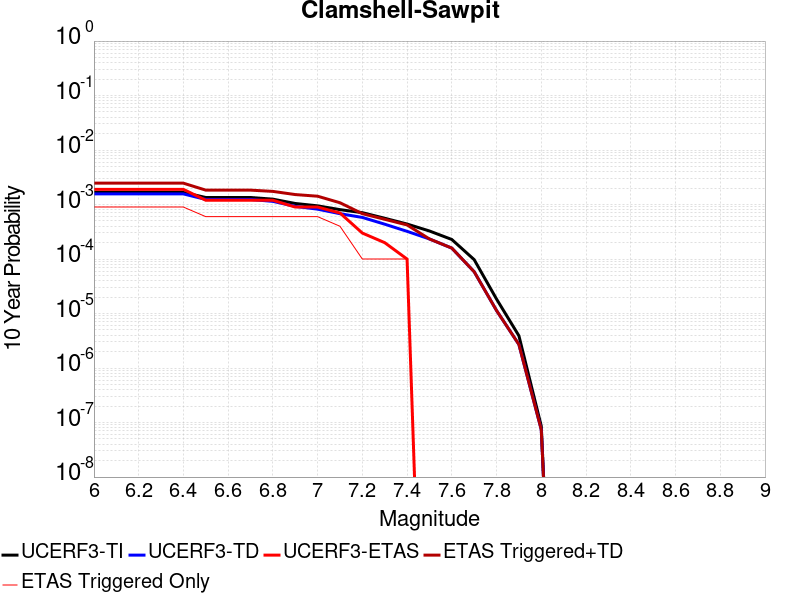 |

| Magnitude | 1 wk TI Prob | 1 wk TD Prob | 1 wk ETAS Prob | 1 wk ETAS/TD Gain | 1 wk ETAS Triggered+TD | 1 wk ETAS Triggered Only | 1 mo TI Prob | 1 mo TD Prob | 1 mo ETAS Prob | 1 mo ETAS/TD Gain | 1 mo ETAS Triggered+TD | 1 mo ETAS Triggered Only | 1 yr TI Prob | 1 yr TD Prob | 1 yr ETAS Prob | 1 yr ETAS/TD Gain | 1 yr ETAS Triggered+TD | 1 yr ETAS Triggered Only | 10 yr TI Prob | 10 yr TD Prob | 10 yr ETAS Prob | 10 yr ETAS/TD Gain | 10 yr ETAS Triggered+TD | 10 yr ETAS Triggered Only |
|-----|-----|-----|-----|-----|-----|-----|-----|-----|-----|-----|-----|-----|-----|-----|-----|-----|-----|-----|-----|-----|-----|-----|-----|-----|
| 6.0 | 3.202998E-6 | 3.010052E-6 | 0.0 | 0.0 | 3.010052E-6 | 0.0 | 1.3727062E-5 | 1.2900164E-5 | 0.0 | 0.0 | 1.2900164E-5 | 0.0 | 1.6711417E-4 | 1.5704897E-4 | 3.0E-4 | 1.9102322 | 2.5703327E-4 | 1.0E-4 | 0.0016698855 | 0.0015694592 | 0.0019 | 1.2106081 | 0.0024680467 | 9.0E-4 |
| 6.1 | 3.202998E-6 | 3.010052E-6 | 0.0 | 0.0 | 3.010052E-6 | 0.0 | 1.3727062E-5 | 1.2900164E-5 | 0.0 | 0.0 | 1.2900164E-5 | 0.0 | 1.6711417E-4 | 1.5704897E-4 | 3.0E-4 | 1.9102322 | 2.5703327E-4 | 1.0E-4 | 0.0016698855 | 0.0015694592 | 0.0019 | 1.2106081 | 0.0024680467 | 9.0E-4 |
| 6.2 | 3.202998E-6 | 3.010052E-6 | 0.0 | 0.0 | 3.010052E-6 | 0.0 | 1.3727062E-5 | 1.2900164E-5 | 0.0 | 0.0 | 1.2900164E-5 | 0.0 | 1.6711417E-4 | 1.5704897E-4 | 3.0E-4 | 1.9102322 | 2.5703327E-4 | 1.0E-4 | 0.0016698855 | 0.0015694592 | 0.0019 | 1.2106081 | 0.0024680467 | 9.0E-4 |
| 6.3 | 3.202998E-6 | 3.010052E-6 | 0.0 | 0.0 | 3.010052E-6 | 0.0 | 1.3727062E-5 | 1.2900164E-5 | 0.0 | 0.0 | 1.2900164E-5 | 0.0 | 1.6711417E-4 | 1.5704897E-4 | 3.0E-4 | 1.9102322 | 2.5703327E-4 | 1.0E-4 | 0.0016698855 | 0.0015694592 | 0.0019 | 1.2106081 | 0.0024680467 | 9.0E-4 |
| 6.4 | 3.202998E-6 | 3.010052E-6 | 0.0 | 0.0 | 3.010052E-6 | 0.0 | 1.3727062E-5 | 1.2900164E-5 | 0.0 | 0.0 | 1.2900164E-5 | 0.0 | 1.6711417E-4 | 1.5704897E-4 | 3.0E-4 | 1.9102322 | 2.5703327E-4 | 1.0E-4 | 0.0016698855 | 0.0015694592 | 0.0019 | 1.2106081 | 0.0024680467 | 9.0E-4 |
| 6.5 | 2.5862723E-6 | 2.3782259E-6 | 0.0 | 0.0 | 2.3782259E-6 | 0.0 | 1.1083977E-5 | 1.0192358E-5 | 0.0 | 0.0 | 1.0192358E-5 | 0.0 | 1.3493907E-4 | 1.240852E-4 | 2.0E-4 | 1.6117958 | 2.2407279E-4 | 1.0E-4 | 0.0013485716 | 0.0012401894 | 0.0012 | 0.96759415 | 0.0018394453 | 6.0E-4 |
| 6.6 | 2.5862723E-6 | 2.3782259E-6 | 0.0 | 0.0 | 2.3782259E-6 | 0.0 | 1.1083977E-5 | 1.0192358E-5 | 0.0 | 0.0 | 1.0192358E-5 | 0.0 | 1.3493907E-4 | 1.240852E-4 | 2.0E-4 | 1.6117958 | 2.2407279E-4 | 1.0E-4 | 0.0013485716 | 0.0012401894 | 0.0012 | 0.96759415 | 0.0018394453 | 6.0E-4 |
| 6.7 | 2.5862723E-6 | 2.3782259E-6 | 0.0 | 0.0 | 2.3782259E-6 | 0.0 | 1.1083977E-5 | 1.0192358E-5 | 0.0 | 0.0 | 1.0192358E-5 | 0.0 | 1.3493907E-4 | 1.240852E-4 | 2.0E-4 | 1.6117958 | 2.2407279E-4 | 1.0E-4 | 0.0013485716 | 0.0012401894 | 0.0012 | 0.96759415 | 0.0018394453 | 6.0E-4 |
| 6.8 | 2.4098806E-6 | 2.1952537E-6 | 0.0 | 0.0 | 2.1952537E-6 | 0.0 | 1.0328019E-5 | 9.408198E-6 | 0.0 | 0.0 | 9.408198E-6 | 0.0 | 1.2573638E-4 | 1.14539056E-4 | 2.0E-4 | 1.7461293 | 2.1452761E-4 | 1.0E-4 | 0.0012566525 | 0.0011448268 | 0.0012 | 1.0481935 | 0.0017441398 | 6.0E-4 |
| 6.9 | 2.0073985E-6 | 1.7761307E-6 | 0.0 | 0.0 | 1.7761307E-6 | 0.0 | 8.603109E-6 | 7.6119672E-6 | 0.0 | 0.0 | 7.6119672E-6 | 0.0 | 1.0473781E-4 | 9.267188E-5 | 2.0E-4 | 2.1581519 | 1.9266261E-4 | 1.0E-4 | 0.0010468846 | 9.263442E-4 | 9.0E-4 | 0.97156113 | 0.0015257883 | 6.0E-4 |
| 7.0 | 1.8166766E-6 | 1.5784912E-6 | 0.0 | 0.0 | 1.5784912E-6 | 0.0 | 7.785734E-6 | 6.7649453E-6 | 0.0 | 0.0 | 6.7649453E-6 | 0.0 | 9.478718E-5 | 8.2360195E-5 | 2.0E-4 | 2.4283576 | 1.8235196E-4 | 1.0E-4 | 9.4746763E-4 | 8.2330673E-4 | 9.0E-4 | 1.0931528 | 0.0014228128 | 6.0E-4 |
| 7.1 | 1.5471421E-6 | 1.3032243E-6 | 0.0 | 0.0 | 1.3032243E-6 | 0.0 | 6.6305925E-6 | 5.585235E-6 | 0.0 | 0.0 | 5.585235E-6 | 0.0 | 8.072447E-5 | 6.799817E-5 | 1.0E-4 | 1.4706278 | 6.799817E-5 | 0.0 | 8.0695155E-4 | 6.797791E-4 | 7.0E-4 | 1.0297463 | 0.0010795072 | 4.0E-4 |
| 7.2 | 1.3608037E-6 | 1.1133725E-6 | 0.0 | 0.0 | 1.1133725E-6 | 0.0 | 5.8320024E-6 | 4.771588E-6 | 0.0 | 0.0 | 4.771588E-6 | 0.0 | 7.1002316E-5 | 5.809258E-5 | 0.0 | 0.0 | 5.809258E-5 | 0.0 | 7.097964E-4 | 5.807785E-4 | 3.0E-4 | 0.51654804 | 6.807205E-4 | 1.0E-4 |
| 7.3 | 1.0749634E-6 | 8.366195E-7 | 0.0 | 0.0 | 8.366195E-7 | 0.0 | 4.6069777E-6 | 3.5855076E-6 | 0.0 | 0.0 | 3.5855076E-6 | 0.0 | 5.608851E-5 | 4.3652708E-5 | 0.0 | 0.0 | 4.3652708E-5 | 0.0 | 5.6074356E-4 | 4.3644413E-4 | 2.0E-4 | 0.45824882 | 5.364005E-4 | 1.0E-4 |
| 7.4 | 8.416856E-7 | 6.1834277E-7 | 0.0 | 0.0 | 6.1834277E-7 | 0.0 | 3.607219E-6 | 2.650038E-6 | 0.0 | 0.0 | 2.650038E-6 | 0.0 | 4.3917007E-5 | 3.2263753E-5 | 0.0 | 0.0 | 3.2263753E-5 | 0.0 | 4.390833E-4 | 3.2259262E-4 | 1.0E-4 | 0.30998847 | 4.2256038E-4 | 1.0E-4 |
| 7.5 | 6.2779594E-7 | 4.4814578E-7 | 0.0 | 0.0 | 4.4814578E-7 | 0.0 | 2.6905511E-6 | 1.9206234E-6 | 0.0 | 0.0 | 1.9206234E-6 | 0.0 | 3.275697E-5 | 2.3383358E-5 | 0.0 | 0.0 | 2.3383358E-5 | 0.0 | 3.275214E-4 | 2.3381083E-4 | 0.0 | 0.0 | 2.3381083E-4 | 0.0 |
| 7.6 | 4.3822078E-7 | 3.0451272E-7 | 0.0 | 0.0 | 3.0451272E-7 | 0.0 | 1.8780877E-6 | 1.305054E-6 | 0.0 | 0.0 | 1.305054E-6 | 0.0 | 2.2865479E-5 | 1.5888932E-5 | 0.0 | 0.0 | 1.5888932E-5 | 0.0 | 2.2863125E-4 | 1.5887948E-4 | 0.0 | 0.0 | 1.5887948E-4 | 0.0 |
| 7.7 | 1.8704569E-7 | 1.1223184E-7 | 0.0 | 0.0 | 1.1223184E-7 | 0.0 | 8.0162414E-7 | 4.809935E-7 | 0.0 | 0.0 | 4.809935E-7 | 0.0 | 9.75973E-6 | 5.856081E-6 | 0.0 | 0.0 | 5.856081E-6 | 0.0 | 9.7593016E-5 | 5.855933E-5 | 0.0 | 0.0 | 5.855933E-5 | 0.0 |
| 7.8 | 3.5378733E-8 | 2.1797728E-8 | 0.0 | 0.0 | 2.1797728E-8 | 0.0 | 1.5162313E-7 | 9.3418834E-8 | 0.0 | 0.0 | 9.3418834E-8 | 0.0 | 1.84601E-6 | 1.1373737E-6 | 0.0 | 0.0 | 1.1373737E-6 | 0.0 | 1.8459947E-5 | 1.1373682E-5 | 0.0 | 0.0 | 1.1373682E-5 | 0.0 |
| 7.9 | 7.504945E-9 | 5.1874287E-9 | 0.0 | 0.0 | 5.1874287E-9 | 0.0 | 3.2164053E-8 | 2.2231838E-8 | 0.0 | 0.0 | 2.2231838E-8 | 0.0 | 3.9159727E-7 | 2.706726E-7 | 0.0 | 0.0 | 2.706726E-7 | 0.0 | 3.915966E-6 | 2.7067233E-6 | 0.0 | 0.0 | 2.7067233E-6 | 0.0 |
| 8.0 | 1.6554036E-10 | 1.4178592E-10 | 0.0 | 0.0 | 1.4178592E-10 | 0.0 | 7.0945894E-10 | 6.0765415E-10 | 0.0 | 0.0 | 6.0765415E-10 | 0.0 | 8.637662E-9 | 7.398189E-9 | 0.0 | 0.0 | 7.398189E-9 | 0.0 | 8.6376616E-8 | 7.3981894E-8 | 0.0 | 0.0 | 7.3981894E-8 | 0.0 |

## Thirty Mile Bank
*[(top)](#table-of-contents)*

| 1 Week | 1 Month | 1 Year | 10 Year |
|-----|-----|-----|-----|
|  | 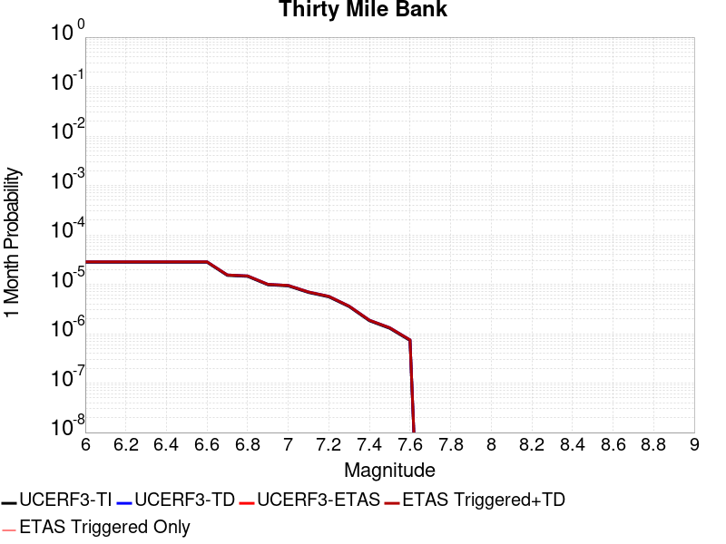 | 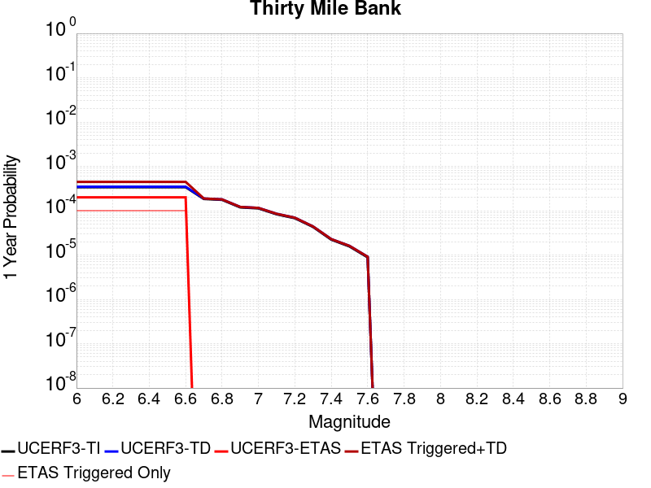 |  |

| Magnitude | 1 wk TI Prob | 1 wk TD Prob | 1 wk ETAS Prob | 1 wk ETAS/TD Gain | 1 wk ETAS Triggered+TD | 1 wk ETAS Triggered Only | 1 mo TI Prob | 1 mo TD Prob | 1 mo ETAS Prob | 1 mo ETAS/TD Gain | 1 mo ETAS Triggered+TD | 1 mo ETAS Triggered Only | 1 yr TI Prob | 1 yr TD Prob | 1 yr ETAS Prob | 1 yr ETAS/TD Gain | 1 yr ETAS Triggered+TD | 1 yr ETAS Triggered Only | 10 yr TI Prob | 10 yr TD Prob | 10 yr ETAS Prob | 10 yr ETAS/TD Gain | 10 yr ETAS Triggered+TD | 10 yr ETAS Triggered Only |
|-----|-----|-----|-----|-----|-----|-----|-----|-----|-----|-----|-----|-----|-----|-----|-----|-----|-----|-----|-----|-----|-----|-----|-----|-----|
| 6.0 | 6.5124755E-6 | 6.657695E-6 | 0.0 | 0.0 | 6.657695E-6 | 0.0 | 2.791031E-5 | 2.8532691E-5 | 0.0 | 0.0 | 2.8532691E-5 | 0.0 | 3.3975503E-4 | 3.4733448E-4 | 2.0E-4 | 0.57581383 | 4.4729977E-4 | 1.0E-4 | 0.0033923604 | 0.0034683477 | 0.0031 | 0.89379734 | 0.0043652263 | 9.0E-4 |
| 6.1 | 6.5124755E-6 | 6.657695E-6 | 0.0 | 0.0 | 6.657695E-6 | 0.0 | 2.791031E-5 | 2.8532691E-5 | 0.0 | 0.0 | 2.8532691E-5 | 0.0 | 3.3975503E-4 | 3.4733448E-4 | 2.0E-4 | 0.57581383 | 4.4729977E-4 | 1.0E-4 | 0.0033923604 | 0.0034683477 | 0.0031 | 0.89379734 | 0.0043652263 | 9.0E-4 |
| 6.2 | 6.5124755E-6 | 6.657695E-6 | 0.0 | 0.0 | 6.657695E-6 | 0.0 | 2.791031E-5 | 2.8532691E-5 | 0.0 | 0.0 | 2.8532691E-5 | 0.0 | 3.3975503E-4 | 3.4733448E-4 | 2.0E-4 | 0.57581383 | 4.4729977E-4 | 1.0E-4 | 0.0033923604 | 0.0034683477 | 0.0031 | 0.89379734 | 0.0043652263 | 9.0E-4 |
| 6.3 | 6.5124755E-6 | 6.657695E-6 | 0.0 | 0.0 | 6.657695E-6 | 0.0 | 2.791031E-5 | 2.8532691E-5 | 0.0 | 0.0 | 2.8532691E-5 | 0.0 | 3.3975503E-4 | 3.4733448E-4 | 2.0E-4 | 0.57581383 | 4.4729977E-4 | 1.0E-4 | 0.0033923604 | 0.0034683477 | 0.0031 | 0.89379734 | 0.0043652263 | 9.0E-4 |
| 6.4 | 6.5124755E-6 | 6.657695E-6 | 0.0 | 0.0 | 6.657695E-6 | 0.0 | 2.791031E-5 | 2.8532691E-5 | 0.0 | 0.0 | 2.8532691E-5 | 0.0 | 3.3975503E-4 | 3.4733448E-4 | 2.0E-4 | 0.57581383 | 4.4729977E-4 | 1.0E-4 | 0.0033923604 | 0.0034683477 | 0.0031 | 0.89379734 | 0.0043652263 | 9.0E-4 |
| 6.5 | 6.5124755E-6 | 6.657695E-6 | 0.0 | 0.0 | 6.657695E-6 | 0.0 | 2.791031E-5 | 2.8532691E-5 | 0.0 | 0.0 | 2.8532691E-5 | 0.0 | 3.3975503E-4 | 3.4733448E-4 | 2.0E-4 | 0.57581383 | 4.4729977E-4 | 1.0E-4 | 0.0033923604 | 0.0034683477 | 0.0031 | 0.89379734 | 0.0043652263 | 9.0E-4 |
| 6.6 | 6.5124755E-6 | 6.657695E-6 | 0.0 | 0.0 | 6.657695E-6 | 0.0 | 2.791031E-5 | 2.8532691E-5 | 0.0 | 0.0 | 2.8532691E-5 | 0.0 | 3.3975503E-4 | 3.4733448E-4 | 2.0E-4 | 0.57581383 | 4.4729977E-4 | 1.0E-4 | 0.0033923604 | 0.0034683477 | 0.0031 | 0.89379734 | 0.0043652263 | 9.0E-4 |
| 6.7 | 3.5261137E-6 | 3.609002E-6 | 0.0 | 0.0 | 3.609002E-6 | 0.0 | 1.5111828E-5 | 1.5467063E-5 | 0.0 | 0.0 | 1.5467063E-5 | 0.0 | 1.8397097E-4 | 1.8829587E-4 | 0.0 | 0.0 | 1.8829587E-4 | 0.0 | 0.0018381875 | 0.0018814283 | 0.0016 | 0.85041773 | 0.002081052 | 2.0E-4 |
| 6.8 | 3.370743E-6 | 3.4500763E-6 | 0.0 | 0.0 | 3.4500763E-6 | 0.0 | 1.4445961E-5 | 1.4785961E-5 | 0.0 | 0.0 | 1.4785961E-5 | 0.0 | 1.7586538E-4 | 1.8000483E-4 | 0.0 | 0.0 | 1.8000483E-4 | 0.0 | 0.0017572626 | 0.0017986521 | 0.0015 | 0.83395785 | 0.0019982923 | 2.0E-4 |
| 6.9 | 2.2756835E-6 | 2.332544E-6 | 0.0 | 0.0 | 2.332544E-6 | 0.0 | 9.752893E-6 | 9.99658E-6 | 0.0 | 0.0 | 9.99658E-6 | 0.0 | 1.18735006E-4 | 1.21701814E-4 | 0.0 | 0.0 | 1.21701814E-4 | 0.0 | 0.0011867158 | 0.0012163763 | 9.0E-4 | 0.7399026 | 0.001416133 | 2.0E-4 |
| 7.0 | 2.1617404E-6 | 2.2153977E-6 | 0.0 | 0.0 | 2.2153977E-6 | 0.0 | 9.264569E-6 | 9.494528E-6 | 0.0 | 0.0 | 9.494528E-6 | 0.0 | 1.1279029E-4 | 1.15589995E-4 | 0.0 | 0.0 | 1.15589995E-4 | 0.0 | 0.0011273306 | 0.0011553228 | 8.0E-4 | 0.6924472 | 0.0012552072 | 1.0E-4 |
| 7.1 | 1.5900777E-6 | 1.632243E-6 | 0.0 | 0.0 | 1.632243E-6 | 0.0 | 6.814601E-6 | 6.995309E-6 | 0.0 | 0.0 | 6.995309E-6 | 0.0 | 8.296461E-5 | 8.5164684E-5 | 0.0 | 0.0 | 8.5164684E-5 | 0.0 | 8.293364E-4 | 8.5133326E-4 | 4.0E-4 | 0.46985126 | 9.512481E-4 | 1.0E-4 |
| 7.2 | 1.2971728E-6 | 1.3325146E-6 | 0.0 | 0.0 | 1.3325146E-6 | 0.0 | 5.5593005E-6 | 5.710765E-6 | 0.0 | 0.0 | 5.710765E-6 | 0.0 | 6.768238E-5 | 6.9526446E-5 | 0.0 | 0.0 | 6.9526446E-5 | 0.0 | 6.7661767E-4 | 6.9505733E-4 | 3.0E-4 | 0.43161908 | 6.9505733E-4 | 0.0 |
| 7.3 | 8.2454284E-7 | 8.4467115E-7 | 0.0 | 0.0 | 8.4467115E-7 | 0.0 | 3.5337503E-6 | 3.6200145E-6 | 0.0 | 0.0 | 3.6200145E-6 | 0.0 | 4.302256E-5 | 4.4072847E-5 | 0.0 | 0.0 | 4.4072847E-5 | 0.0 | 4.301423E-4 | 4.406471E-4 | 2.0E-4 | 0.45387796 | 4.406471E-4 | 0.0 |
| 7.4 | 4.2619024E-7 | 4.3850085E-7 | 0.0 | 0.0 | 4.3850085E-7 | 0.0 | 1.8265283E-6 | 1.879288E-6 | 0.0 | 0.0 | 1.879288E-6 | 0.0 | 2.2237757E-5 | 2.2880095E-5 | 0.0 | 0.0 | 2.2880095E-5 | 0.0 | 2.223553E-4 | 2.2877778E-4 | 1.0E-4 | 0.4371054 | 2.2877778E-4 | 0.0 |
| 7.5 | 2.993922E-7 | 3.0854568E-7 | 0.0 | 0.0 | 3.0854568E-7 | 0.0 | 1.2831089E-6 | 1.322338E-6 | 0.0 | 0.0 | 1.322338E-6 | 0.0 | 1.5621737E-5 | 1.609935E-5 | 0.0 | 0.0 | 1.609935E-5 | 0.0 | 1.562064E-4 | 1.6098208E-4 | 1.0E-4 | 0.62118715 | 1.6098208E-4 | 0.0 |
| 7.6 | 1.6988751E-7 | 1.7527951E-7 | 0.0 | 0.0 | 1.7527951E-7 | 0.0 | 7.2808916E-7 | 7.5119766E-7 | 0.0 | 0.0 | 7.5119766E-7 | 0.0 | 8.864449E-6 | 9.145795E-6 | 0.0 | 0.0 | 9.145795E-6 | 0.0 | 8.8640954E-5 | 9.1454385E-5 | 1.0E-4 | 1.0934412 | 9.1454385E-5 | 0.0 |

## Oceanside alt1
*[(top)](#table-of-contents)*

| 1 Week | 1 Month | 1 Year | 10 Year |
|-----|-----|-----|-----|
|  |  |  | 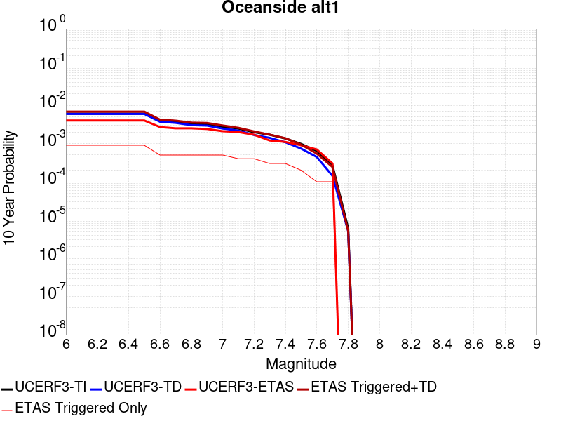 |

| Magnitude | 1 wk TI Prob | 1 wk TD Prob | 1 wk ETAS Prob | 1 wk ETAS/TD Gain | 1 wk ETAS Triggered+TD | 1 wk ETAS Triggered Only | 1 mo TI Prob | 1 mo TD Prob | 1 mo ETAS Prob | 1 mo ETAS/TD Gain | 1 mo ETAS Triggered+TD | 1 mo ETAS Triggered Only | 1 yr TI Prob | 1 yr TD Prob | 1 yr ETAS Prob | 1 yr ETAS/TD Gain | 1 yr ETAS Triggered+TD | 1 yr ETAS Triggered Only | 10 yr TI Prob | 10 yr TD Prob | 10 yr ETAS Prob | 10 yr ETAS/TD Gain | 10 yr ETAS Triggered+TD | 10 yr ETAS Triggered Only |
|-----|-----|-----|-----|-----|-----|-----|-----|-----|-----|-----|-----|-----|-----|-----|-----|-----|-----|-----|-----|-----|-----|-----|-----|-----|
| 6.0 | 1.1617542E-5 | 1.1416572E-5 | 0.0 | 0.0 | 1.1416572E-5 | 0.0 | 4.9788516E-5 | 4.892734E-5 | 0.0 | 0.0 | 4.892734E-5 | 0.0 | 6.060066E-4 | 5.9554365E-4 | 3.0E-4 | 0.50374144 | 5.9554365E-4 | 0.0 | 0.0060435664 | 0.0059410725 | 0.004 | 0.6732791 | 0.0068357256 | 9.0E-4 |
| 6.1 | 1.1617542E-5 | 1.1416572E-5 | 0.0 | 0.0 | 1.1416572E-5 | 0.0 | 4.9788516E-5 | 4.892734E-5 | 0.0 | 0.0 | 4.892734E-5 | 0.0 | 6.060066E-4 | 5.9554365E-4 | 3.0E-4 | 0.50374144 | 5.9554365E-4 | 0.0 | 0.0060435664 | 0.0059410725 | 0.004 | 0.6732791 | 0.0068357256 | 9.0E-4 |
| 6.2 | 1.1617542E-5 | 1.1416572E-5 | 0.0 | 0.0 | 1.1416572E-5 | 0.0 | 4.9788516E-5 | 4.892734E-5 | 0.0 | 0.0 | 4.892734E-5 | 0.0 | 6.060066E-4 | 5.9554365E-4 | 3.0E-4 | 0.50374144 | 5.9554365E-4 | 0.0 | 0.0060435664 | 0.0059410725 | 0.004 | 0.6732791 | 0.0068357256 | 9.0E-4 |
| 6.3 | 1.1617542E-5 | 1.1416572E-5 | 0.0 | 0.0 | 1.1416572E-5 | 0.0 | 4.9788516E-5 | 4.892734E-5 | 0.0 | 0.0 | 4.892734E-5 | 0.0 | 6.060066E-4 | 5.9554365E-4 | 3.0E-4 | 0.50374144 | 5.9554365E-4 | 0.0 | 0.0060435664 | 0.0059410725 | 0.004 | 0.6732791 | 0.0068357256 | 9.0E-4 |
| 6.4 | 1.1617542E-5 | 1.1416572E-5 | 0.0 | 0.0 | 1.1416572E-5 | 0.0 | 4.9788516E-5 | 4.892734E-5 | 0.0 | 0.0 | 4.892734E-5 | 0.0 | 6.060066E-4 | 5.9554365E-4 | 3.0E-4 | 0.50374144 | 5.9554365E-4 | 0.0 | 0.0060435664 | 0.0059410725 | 0.004 | 0.6732791 | 0.0068357256 | 9.0E-4 |
| 6.5 | 1.1617542E-5 | 1.1416572E-5 | 0.0 | 0.0 | 1.1416572E-5 | 0.0 | 4.9788516E-5 | 4.892734E-5 | 0.0 | 0.0 | 4.892734E-5 | 0.0 | 6.060066E-4 | 5.9554365E-4 | 3.0E-4 | 0.50374144 | 5.9554365E-4 | 0.0 | 0.0060435664 | 0.0059410725 | 0.004 | 0.6732791 | 0.0068357256 | 9.0E-4 |
| 6.6 | 7.561768E-6 | 7.1292825E-6 | 0.0 | 0.0 | 7.1292825E-6 | 0.0 | 3.2407173E-5 | 3.0553718E-5 | 0.0 | 0.0 | 3.0553718E-5 | 0.0 | 3.9448592E-4 | 3.7192908E-4 | 2.0E-4 | 0.53773695 | 3.7192908E-4 | 0.0 | 0.0039378637 | 0.0037131775 | 0.0027 | 0.72714007 | 0.004211321 | 5.0E-4 |
| 6.7 | 7.1042605E-6 | 6.6515754E-6 | 0.0 | 0.0 | 6.6515754E-6 | 0.0 | 3.0446476E-5 | 2.8506445E-5 | 0.0 | 0.0 | 2.8506445E-5 | 0.0 | 3.706228E-4 | 3.470115E-4 | 2.0E-4 | 0.5763498 | 3.470115E-4 | 0.0 | 0.0037000529 | 0.0034647796 | 0.0025 | 0.7215466 | 0.003963047 | 5.0E-4 |
| 6.8 | 6.285554E-6 | 5.796003E-6 | 0.0 | 0.0 | 5.796003E-6 | 0.0 | 2.693781E-5 | 2.483978E-5 | 0.0 | 0.0 | 2.483978E-5 | 0.0 | 3.2791847E-4 | 3.023829E-4 | 2.0E-4 | 0.6614131 | 3.023829E-4 | 0.0 | 0.0032743502 | 0.0030197718 | 0.0025 | 0.82787716 | 0.003518262 | 5.0E-4 |
| 6.9 | 6.148883E-6 | 5.6529125E-6 | 0.0 | 0.0 | 5.6529125E-6 | 0.0 | 2.635209E-5 | 2.4226545E-5 | 0.0 | 0.0 | 2.4226545E-5 | 0.0 | 3.2078946E-4 | 2.949188E-4 | 2.0E-4 | 0.67815274 | 2.949188E-4 | 0.0 | 0.003203268 | 0.0029453312 | 0.0024 | 0.81484896 | 0.0034438586 | 5.0E-4 |
| 7.0 | 5.253857E-6 | 4.719203E-6 | 0.0 | 0.0 | 4.719203E-6 | 0.0 | 2.2516335E-5 | 2.0225E-5 | 0.0 | 0.0 | 2.0225E-5 | 0.0 | 2.7410188E-4 | 2.4621186E-4 | 2.0E-4 | 0.8123086 | 2.4621186E-4 | 0.0 | 0.0027376404 | 0.0024594222 | 0.0021 | 0.8538591 | 0.0029581925 | 5.0E-4 |
| 7.1 | 4.730754E-6 | 4.175568E-6 | 0.0 | 0.0 | 4.175568E-6 | 0.0 | 2.0274503E-5 | 1.7895169E-5 | 0.0 | 0.0 | 1.7895169E-5 | 0.0 | 2.468141E-4 | 2.1785217E-4 | 2.0E-4 | 0.9180538 | 2.1785217E-4 | 0.0 | 0.0024654015 | 0.0021764124 | 0.002 | 0.91894346 | 0.0025755418 | 4.0E-4 |
| 7.2 | 3.7998386E-6 | 3.2115709E-6 | 0.0 | 0.0 | 3.2115709E-6 | 0.0 | 1.6284921E-5 | 1.37638035E-5 | 0.0 | 0.0 | 1.37638035E-5 | 0.0 | 1.9825088E-4 | 1.6756153E-4 | 2.0E-4 | 1.1935914 | 1.6756153E-4 | 0.0 | 0.001980741 | 0.0016743641 | 0.0017 | 1.0153108 | 0.0020736945 | 4.0E-4 |
| 7.3 | 3.2656465E-6 | 2.6961372E-6 | 0.0 | 0.0 | 2.6961372E-6 | 0.0 | 1.3995553E-5 | 1.1554823E-5 | 0.0 | 0.0 | 1.1554823E-5 | 0.0 | 1.7038253E-4 | 1.4067099E-4 | 1.0E-4 | 0.7108786 | 1.4067099E-4 | 0.0 | 0.0017025196 | 0.0014058306 | 0.0012 | 0.85358787 | 0.0017054089 | 3.0E-4 |
| 7.4 | 2.593703E-6 | 2.0660555E-6 | 0.0 | 0.0 | 2.0660555E-6 | 0.0 | 1.1115822E-5 | 8.854494E-6 | 0.0 | 0.0 | 8.854494E-6 | 0.0 | 1.3532673E-4 | 1.07798216E-4 | 1.0E-4 | 0.9276591 | 1.07798216E-4 | 0.0 | 0.0013524436 | 0.0010774682 | 0.0011 | 1.0209118 | 0.001377145 | 3.0E-4 |
| 7.5 | 1.8715585E-6 | 1.4119369E-6 | 0.0 | 0.0 | 1.4119369E-6 | 0.0 | 8.020941E-6 | 6.0511443E-6 | 0.0 | 0.0 | 6.0511443E-6 | 0.0 | 9.7650576E-5 | 7.367025E-5 | 1.0E-4 | 1.3574 | 7.367025E-5 | 0.0 | 9.7607676E-4 | 7.3646434E-4 | 9.0E-4 | 1.2220551 | 9.36317E-4 | 2.0E-4 |
| 7.6 | 1.2246786E-6 | 8.5104784E-7 | 0.0 | 0.0 | 8.5104784E-7 | 0.0 | 5.248612E-6 | 3.6473432E-6 | 0.0 | 0.0 | 3.6473432E-6 | 0.0 | 6.389998E-5 | 4.4405544E-5 | 1.0E-4 | 2.251971 | 4.4405544E-5 | 0.0 | 6.3881604E-4 | 4.4397116E-4 | 7.0E-4 | 1.576679 | 5.439268E-4 | 1.0E-4 |
| 7.7 | 5.140719E-7 | 2.7321568E-7 | 0.0 | 0.0 | 2.7321568E-7 | 0.0 | 2.2031636E-6 | 1.1709238E-6 | 0.0 | 0.0 | 1.1709238E-6 | 0.0 | 2.6823185E-5 | 1.4255918E-5 | 0.0 | 0.0 | 1.4255918E-5 | 0.0 | 2.6819948E-4 | 1.4255139E-4 | 3.0E-4 | 2.1045043 | 2.4253713E-4 | 1.0E-4 |
| 7.8 | 1.16056995E-8 | 9.781111E-9 | 0.0 | 0.0 | 9.781111E-9 | 0.0 | 4.9738713E-8 | 4.1919048E-8 | 0.0 | 0.0 | 4.1919048E-8 | 0.0 | 6.0556863E-7 | 5.1036443E-7 | 0.0 | 0.0 | 5.1036443E-7 | 0.0 | 6.05567E-6 | 5.103644E-6 | 0.0 | 0.0 | 5.103644E-6 | 0.0 |

## San Gabriel (Extension)
*[(top)](#table-of-contents)*

| 1 Week | 1 Month | 1 Year | 10 Year |
|-----|-----|-----|-----|
|  |  | 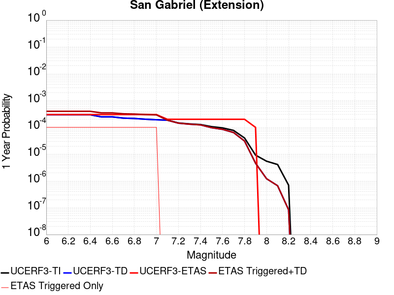 | 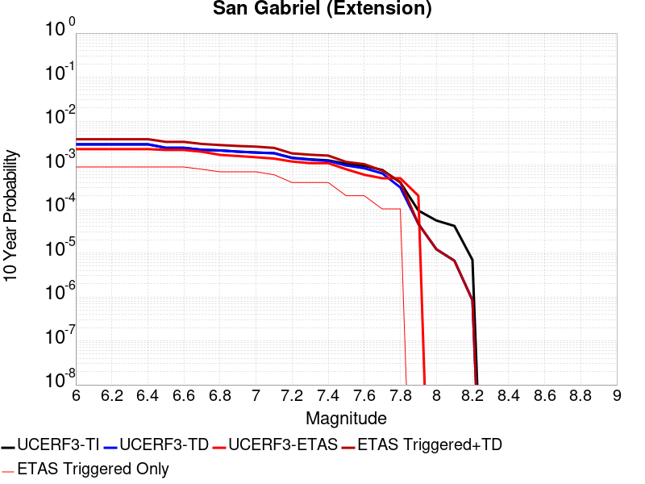 |

| Magnitude | 1 wk TI Prob | 1 wk TD Prob | 1 wk ETAS Prob | 1 wk ETAS/TD Gain | 1 wk ETAS Triggered+TD | 1 wk ETAS Triggered Only | 1 mo TI Prob | 1 mo TD Prob | 1 mo ETAS Prob | 1 mo ETAS/TD Gain | 1 mo ETAS Triggered+TD | 1 mo ETAS Triggered Only | 1 yr TI Prob | 1 yr TD Prob | 1 yr ETAS Prob | 1 yr ETAS/TD Gain | 1 yr ETAS Triggered+TD | 1 yr ETAS Triggered Only | 10 yr TI Prob | 10 yr TD Prob | 10 yr ETAS Prob | 10 yr ETAS/TD Gain | 10 yr ETAS Triggered+TD | 10 yr ETAS Triggered Only |
|-----|-----|-----|-----|-----|-----|-----|-----|-----|-----|-----|-----|-----|-----|-----|-----|-----|-----|-----|-----|-----|-----|-----|-----|-----|
| 6.0 | 5.6486106E-6 | 5.690174E-6 | 0.0 | 0.0 | 5.690174E-6 | 0.0 | 2.4208108E-5 | 2.438624E-5 | 0.0 | 0.0 | 2.438624E-5 | 0.0 | 2.9469383E-4 | 2.968633E-4 | 3.0E-4 | 1.0105662 | 3.9683358E-4 | 1.0E-4 | 0.0029430336 | 0.0029647981 | 0.0023 | 0.77576953 | 0.0038621298 | 9.0E-4 |
| 6.1 | 5.6486106E-6 | 5.690174E-6 | 0.0 | 0.0 | 5.690174E-6 | 0.0 | 2.4208108E-5 | 2.438624E-5 | 0.0 | 0.0 | 2.438624E-5 | 0.0 | 2.9469383E-4 | 2.968633E-4 | 3.0E-4 | 1.0105662 | 3.9683358E-4 | 1.0E-4 | 0.0029430336 | 0.0029647981 | 0.0023 | 0.77576953 | 0.0038621298 | 9.0E-4 |
| 6.2 | 5.6486106E-6 | 5.690174E-6 | 0.0 | 0.0 | 5.690174E-6 | 0.0 | 2.4208108E-5 | 2.438624E-5 | 0.0 | 0.0 | 2.438624E-5 | 0.0 | 2.9469383E-4 | 2.968633E-4 | 3.0E-4 | 1.0105662 | 3.9683358E-4 | 1.0E-4 | 0.0029430336 | 0.0029647981 | 0.0023 | 0.77576953 | 0.0038621298 | 9.0E-4 |
| 6.3 | 5.6486106E-6 | 5.690174E-6 | 0.0 | 0.0 | 5.690174E-6 | 0.0 | 2.4208108E-5 | 2.438624E-5 | 0.0 | 0.0 | 2.438624E-5 | 0.0 | 2.9469383E-4 | 2.968633E-4 | 3.0E-4 | 1.0105662 | 3.9683358E-4 | 1.0E-4 | 0.0029430336 | 0.0029647981 | 0.0023 | 0.77576953 | 0.0038621298 | 9.0E-4 |
| 6.4 | 5.6486106E-6 | 5.690174E-6 | 0.0 | 0.0 | 5.690174E-6 | 0.0 | 2.4208108E-5 | 2.438624E-5 | 0.0 | 0.0 | 2.438624E-5 | 0.0 | 2.9469383E-4 | 2.968633E-4 | 3.0E-4 | 1.0105662 | 3.9683358E-4 | 1.0E-4 | 0.0029430336 | 0.0029647981 | 0.0023 | 0.77576953 | 0.0038621298 | 9.0E-4 |
| 6.5 | 4.7134554E-6 | 4.7278927E-6 | 0.0 | 0.0 | 4.7278927E-6 | 0.0 | 2.0200367E-5 | 2.0262245E-5 | 0.0 | 0.0 | 2.0262245E-5 | 0.0 | 2.459117E-4 | 2.4666576E-4 | 3.0E-4 | 1.2162207 | 3.4664109E-4 | 1.0E-4 | 0.0024563975 | 0.0024640085 | 0.0022 | 0.8928541 | 0.003361791 | 9.0E-4 |
| 6.6 | 4.7134554E-6 | 4.7278927E-6 | 0.0 | 0.0 | 4.7278927E-6 | 0.0 | 2.0200367E-5 | 2.0262245E-5 | 0.0 | 0.0 | 2.0262245E-5 | 0.0 | 2.459117E-4 | 2.4666576E-4 | 3.0E-4 | 1.2162207 | 3.4664109E-4 | 1.0E-4 | 0.0024563975 | 0.0024640085 | 0.0022 | 0.8928541 | 0.003361791 | 9.0E-4 |
| 6.7 | 4.2468837E-6 | 4.2478564E-6 | 0.0 | 0.0 | 4.2478564E-6 | 0.0 | 1.8200803E-5 | 1.8204975E-5 | 0.0 | 0.0 | 1.8204975E-5 | 0.0 | 2.2157225E-4 | 2.2162375E-4 | 3.0E-4 | 1.3536456 | 3.216016E-4 | 1.0E-4 | 0.0022135144 | 0.0022141037 | 0.002 | 0.9033 | 0.0030123326 | 8.0E-4 |
| 6.8 | 4.1180615E-6 | 4.1152866E-6 | 0.0 | 0.0 | 4.1152866E-6 | 0.0 | 1.7648716E-5 | 1.7636827E-5 | 0.0 | 0.0 | 1.7636827E-5 | 0.0 | 2.1485193E-4 | 2.1470792E-4 | 3.0E-4 | 1.397247 | 3.1468645E-4 | 1.0E-4 | 0.0021464431 | 0.0021450806 | 0.0017 | 0.79251105 | 0.002843579 | 7.0E-4 |
| 6.9 | 3.863861E-6 | 3.8536823E-6 | 0.0 | 0.0 | 3.8536823E-6 | 0.0 | 1.65593E-5 | 1.651568E-5 | 0.0 | 0.0 | 1.651568E-5 | 0.0 | 2.0159081E-4 | 2.0106054E-4 | 3.0E-4 | 1.492088 | 3.0104042E-4 | 1.0E-4 | 0.0020140803 | 0.0020088584 | 0.0016 | 0.7964723 | 0.002707452 | 7.0E-4 |
| 7.0 | 3.6947372E-6 | 3.679635E-6 | 0.0 | 0.0 | 3.679635E-6 | 0.0 | 1.5834492E-5 | 1.5769772E-5 | 0.0 | 0.0 | 1.5769772E-5 | 0.0 | 1.9276788E-4 | 1.9198074E-4 | 3.0E-4 | 1.5626568 | 2.9196154E-4 | 1.0E-4 | 0.0019260074 | 0.0019182197 | 0.0015 | 0.7819751 | 0.002616877 | 7.0E-4 |
| 7.1 | 3.5686835E-6 | 3.5469382E-6 | 0.0 | 0.0 | 3.5469382E-6 | 0.0 | 1.5294268E-5 | 1.5201079E-5 | 0.0 | 0.0 | 1.5201079E-5 | 0.0 | 1.861918E-4 | 1.8505809E-4 | 2.0E-4 | 1.0807418 | 1.8505809E-4 | 0.0 | 0.0018603588 | 0.00184911 | 0.0014 | 0.75712097 | 0.0024480005 | 6.0E-4 |
| 7.2 | 2.8023446E-6 | 2.7511849E-6 | 0.0 | 0.0 | 2.7511849E-6 | 0.0 | 1.2009994E-5 | 1.179074E-5 | 0.0 | 0.0 | 1.179074E-5 | 0.0 | 1.4621185E-4 | 1.4354291E-4 | 2.0E-4 | 1.3933116 | 1.4354291E-4 | 0.0 | 0.001461157 | 0.0014345172 | 0.0012 | 0.8365184 | 0.0018339434 | 4.0E-4 |
| 7.3 | 2.5843012E-6 | 2.5205989E-6 | 0.0 | 0.0 | 2.5205989E-6 | 0.0 | 1.1075529E-5 | 1.0802522E-5 | 0.0 | 0.0 | 1.0802522E-5 | 0.0 | 1.3483623E-4 | 1.3151288E-4 | 2.0E-4 | 1.5207636 | 1.3151288E-4 | 0.0 | 0.0013475444 | 0.0013143646 | 0.0011 | 0.8369063 | 0.0017138389 | 4.0E-4 |
| 7.4 | 2.4464468E-6 | 2.3716357E-6 | 0.0 | 0.0 | 2.3716357E-6 | 0.0 | 1.04847295E-5 | 1.01641135E-5 | 0.0 | 0.0 | 1.01641135E-5 | 0.0 | 1.276441E-4 | 1.2374115E-4 | 2.0E-4 | 1.6162771 | 1.2374115E-4 | 0.0 | 0.0012757082 | 0.0012367365 | 0.0011 | 0.8894376 | 0.0016362418 | 4.0E-4 |
| 7.5 | 2.0420266E-6 | 1.8687264E-6 | 0.0 | 0.0 | 1.8687264E-6 | 0.0 | 8.751514E-6 | 8.008803E-6 | 0.0 | 0.0 | 8.008803E-6 | 0.0 | 1.0654447E-4 | 9.7502845E-5 | 2.0E-4 | 2.051222 | 9.7502845E-5 | 0.0 | 0.001064934 | 9.746086E-4 | 8.0E-4 | 0.8208424 | 0.0011744136 | 2.0E-4 |
| 7.6 | 1.8326596E-6 | 1.6189423E-6 | 0.0 | 0.0 | 1.6189423E-6 | 0.0 | 7.854232E-6 | 6.938306E-6 | 0.0 | 0.0 | 6.938306E-6 | 0.0 | 9.562107E-5 | 8.447062E-5 | 2.0E-4 | 2.367687 | 8.447062E-5 | 0.0 | 9.5579936E-4 | 8.4439194E-4 | 6.0E-4 | 0.7105705 | 0.0010442231 | 2.0E-4 |
| 7.7 | 1.4786998E-6 | 1.2330692E-6 | 0.0 | 0.0 | 1.2330692E-6 | 0.0 | 6.3372695E-6 | 5.284571E-6 | 0.0 | 0.0 | 5.284571E-6 | 0.0 | 7.715353E-5 | 6.4337764E-5 | 2.0E-4 | 3.108594 | 6.4337764E-5 | 0.0 | 7.7126746E-4 | 6.431981E-4 | 5.0E-4 | 0.7773655 | 7.431338E-4 | 1.0E-4 |
| 7.8 | 7.6975533E-7 | 5.9045055E-7 | 0.0 | 0.0 | 5.9045055E-7 | 0.0 | 3.2989474E-6 | 2.5304998E-6 | 0.0 | 0.0 | 2.5304998E-6 | 0.0 | 4.0163945E-5 | 3.08084E-5 | 2.0E-4 | 6.4917355 | 3.08084E-5 | 0.0 | 4.0156685E-4 | 3.080462E-4 | 5.0E-4 | 1.6231332 | 4.080154E-4 | 1.0E-4 |
| 7.9 | 1.7645915E-7 | 8.7312664E-8 | 0.0 | 0.0 | 8.7312664E-8 | 0.0 | 7.562533E-7 | 3.7419707E-7 | 0.0 | 0.0 | 3.7419707E-7 | 0.0 | 9.207345E-6 | 4.55584E-6 | 1.0E-4 | 21.94985 | 4.55584E-6 | 0.0 | 9.206964E-5 | 4.5561792E-5 | 2.0E-4 | 4.389643 | 4.5561792E-5 | 0.0 |
| 8.0 | 1.0463461E-7 | 2.2871829E-8 | 0.0 | 0.0 | 2.2871829E-8 | 0.0 | 4.4843398E-7 | 9.802212E-8 | 0.0 | 0.0 | 9.802212E-8 | 0.0 | 5.45967E-6 | 1.1934186E-6 | 0.0 | 0.0 | 1.1934186E-6 | 0.0 | 5.459536E-5 | 1.1938443E-5 | 0.0 | 0.0 | 1.1938443E-5 | 0.0 |
| 8.1 | 7.875717E-8 | 1.2511848E-8 | 0.0 | 0.0 | 1.2511848E-8 | 0.0 | 3.3753068E-7 | 5.36222E-8 | 0.0 | 0.0 | 5.36222E-8 | 0.0 | 4.109428E-6 | 6.528501E-7 | 0.0 | 0.0 | 6.528501E-7 | 0.0 | 4.109352E-5 | 6.5328018E-6 | 0.0 | 0.0 | 6.5328018E-6 | 0.0 |
| 8.2 | 1.33163E-8 | 1.5762713E-9 | 0.0 | 0.0 | 1.5762713E-9 | 0.0 | 5.7069855E-8 | 6.7554478E-9 | 0.0 | 0.0 | 6.7554478E-9 | 0.0 | 6.9482525E-7 | 8.2247574E-8 | 0.0 | 0.0 | 8.2247574E-8 | 0.0 | 6.9482307E-6 | 8.242661E-7 | 0.0 | 0.0 | 8.242661E-7 | 0.0 |

## Towne Pass
*[(top)](#table-of-contents)*

| 1 Week | 1 Month | 1 Year | 10 Year |
|-----|-----|-----|-----|
|  |  | 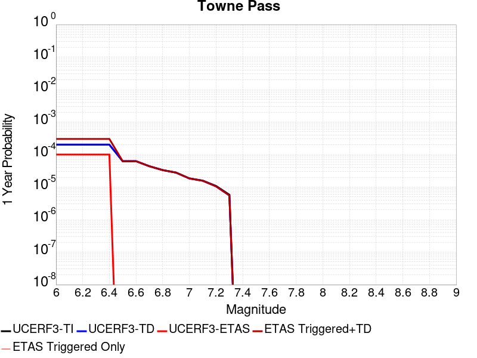 |  |

| Magnitude | 1 wk TI Prob | 1 wk TD Prob | 1 wk ETAS Prob | 1 wk ETAS/TD Gain | 1 wk ETAS Triggered+TD | 1 wk ETAS Triggered Only | 1 mo TI Prob | 1 mo TD Prob | 1 mo ETAS Prob | 1 mo ETAS/TD Gain | 1 mo ETAS Triggered+TD | 1 mo ETAS Triggered Only | 1 yr TI Prob | 1 yr TD Prob | 1 yr ETAS Prob | 1 yr ETAS/TD Gain | 1 yr ETAS Triggered+TD | 1 yr ETAS Triggered Only | 10 yr TI Prob | 10 yr TD Prob | 10 yr ETAS Prob | 10 yr ETAS/TD Gain | 10 yr ETAS Triggered+TD | 10 yr ETAS Triggered Only |
|-----|-----|-----|-----|-----|-----|-----|-----|-----|-----|-----|-----|-----|-----|-----|-----|-----|-----|-----|-----|-----|-----|-----|-----|-----|
| 6.0 | 3.849728E-6 | 3.8938624E-6 | 0.0 | 0.0 | 3.8938624E-6 | 0.0 | 1.649873E-5 | 1.66879E-5 | 0.0 | 0.0 | 1.66879E-5 | 0.0 | 2.0085352E-4 | 2.0316061E-4 | 1.0E-4 | 0.49222142 | 3.031403E-4 | 1.0E-4 | 0.0020067208 | 0.0020301777 | 0.002 | 0.9851354 | 0.0027287568 | 7.0E-4 |
| 6.1 | 3.849728E-6 | 3.8938624E-6 | 0.0 | 0.0 | 3.8938624E-6 | 0.0 | 1.649873E-5 | 1.66879E-5 | 0.0 | 0.0 | 1.66879E-5 | 0.0 | 2.0085352E-4 | 2.0316061E-4 | 1.0E-4 | 0.49222142 | 3.031403E-4 | 1.0E-4 | 0.0020067208 | 0.0020301777 | 0.002 | 0.9851354 | 0.0027287568 | 7.0E-4 |
| 6.2 | 3.849728E-6 | 3.8938624E-6 | 0.0 | 0.0 | 3.8938624E-6 | 0.0 | 1.649873E-5 | 1.66879E-5 | 0.0 | 0.0 | 1.66879E-5 | 0.0 | 2.0085352E-4 | 2.0316061E-4 | 1.0E-4 | 0.49222142 | 3.031403E-4 | 1.0E-4 | 0.0020067208 | 0.0020301777 | 0.002 | 0.9851354 | 0.0027287568 | 7.0E-4 |
| 6.3 | 3.849728E-6 | 3.8938624E-6 | 0.0 | 0.0 | 3.8938624E-6 | 0.0 | 1.649873E-5 | 1.66879E-5 | 0.0 | 0.0 | 1.66879E-5 | 0.0 | 2.0085352E-4 | 2.0316061E-4 | 1.0E-4 | 0.49222142 | 3.031403E-4 | 1.0E-4 | 0.0020067208 | 0.0020301777 | 0.002 | 0.9851354 | 0.0027287568 | 7.0E-4 |
| 6.4 | 3.849728E-6 | 3.8938624E-6 | 0.0 | 0.0 | 3.8938624E-6 | 0.0 | 1.649873E-5 | 1.66879E-5 | 0.0 | 0.0 | 1.66879E-5 | 0.0 | 2.0085352E-4 | 2.0316061E-4 | 1.0E-4 | 0.49222142 | 3.031403E-4 | 1.0E-4 | 0.0020067208 | 0.0020301777 | 0.002 | 0.9851354 | 0.0027287568 | 7.0E-4 |
| 6.5 | 1.1953545E-6 | 1.202766E-6 | 0.0 | 0.0 | 1.202766E-6 | 0.0 | 5.1229376E-6 | 5.154702E-6 | 0.0 | 0.0 | 5.154702E-6 | 0.0 | 6.236998E-5 | 6.2756815E-5 | 0.0 | 0.0 | 6.2756815E-5 | 0.0 | 6.235248E-4 | 6.274026E-4 | 2.0E-4 | 0.31877458 | 8.2727714E-4 | 2.0E-4 |
| 6.6 | 1.1953545E-6 | 1.202766E-6 | 0.0 | 0.0 | 1.202766E-6 | 0.0 | 5.1229376E-6 | 5.154702E-6 | 0.0 | 0.0 | 5.154702E-6 | 0.0 | 6.236998E-5 | 6.2756815E-5 | 0.0 | 0.0 | 6.2756815E-5 | 0.0 | 6.235248E-4 | 6.274026E-4 | 2.0E-4 | 0.31877458 | 8.2727714E-4 | 2.0E-4 |
| 6.7 | 8.375951E-7 | 8.4082575E-7 | 0.0 | 0.0 | 8.4082575E-7 | 0.0 | 3.5896885E-6 | 3.6035342E-6 | 0.0 | 0.0 | 3.6035342E-6 | 0.0 | 4.370358E-5 | 4.3872205E-5 | 0.0 | 0.0 | 4.3872205E-5 | 0.0 | 4.3694986E-4 | 4.3864115E-4 | 2.0E-4 | 0.45595357 | 6.385534E-4 | 2.0E-4 |
| 6.8 | 6.38041E-7 | 6.3899864E-7 | 0.0 | 0.0 | 6.3899864E-7 | 0.0 | 2.7344586E-6 | 2.738563E-6 | 0.0 | 0.0 | 2.738563E-6 | 0.0 | 3.3291526E-5 | 3.334153E-5 | 0.0 | 0.0 | 3.334153E-5 | 0.0 | 3.3286537E-4 | 3.333691E-4 | 1.0E-4 | 0.29996783 | 4.3333578E-4 | 1.0E-4 |
| 6.9 | 5.3460053E-7 | 5.343294E-7 | 0.0 | 0.0 | 5.343294E-7 | 0.0 | 2.2911431E-6 | 2.2899815E-6 | 0.0 | 0.0 | 2.2899815E-6 | 0.0 | 2.789431E-5 | 2.78802E-5 | 0.0 | 0.0 | 2.78802E-5 | 0.0 | 2.789081E-4 | 2.7877034E-4 | 1.0E-4 | 0.35871822 | 3.7874246E-4 | 1.0E-4 |
| 7.0 | 3.557783E-7 | 3.5306454E-7 | 0.0 | 0.0 | 3.5306454E-7 | 0.0 | 1.5247632E-6 | 1.5131328E-6 | 0.0 | 0.0 | 1.5131328E-6 | 0.0 | 1.8563835E-5 | 1.8422244E-5 | 0.0 | 0.0 | 1.8422244E-5 | 0.0 | 1.8562283E-4 | 1.8420802E-4 | 1.0E-4 | 0.5428645 | 2.841896E-4 | 1.0E-4 |
| 7.1 | 3.037942E-7 | 2.9985767E-7 | 0.0 | 0.0 | 2.9985767E-7 | 0.0 | 1.3019744E-6 | 1.2851036E-6 | 0.0 | 0.0 | 1.2851036E-6 | 0.0 | 1.5851423E-5 | 1.5646032E-5 | 0.0 | 0.0 | 1.5646032E-5 | 0.0 | 1.5850292E-4 | 1.5645006E-4 | 0.0 | 0.0 | 1.5645006E-4 | 0.0 |
| 7.2 | 2.0808248E-7 | 2.02036E-7 | 0.0 | 0.0 | 2.02036E-7 | 0.0 | 8.917818E-7 | 8.6586834E-7 | 0.0 | 0.0 | 8.6586834E-7 | 0.0 | 1.0857389E-5 | 1.05419E-5 | 0.0 | 0.0 | 1.05419E-5 | 0.0 | 1.0856859E-4 | 1.0541447E-4 | 0.0 | 0.0 | 1.0541447E-4 | 0.0 |
| 7.3 | 1.1162073E-7 | 1.062679E-7 | 0.0 | 0.0 | 1.062679E-7 | 0.0 | 4.7837443E-7 | 4.5543376E-7 | 0.0 | 0.0 | 4.5543376E-7 | 0.0 | 5.8241935E-6 | 5.544894E-6 | 0.0 | 0.0 | 5.544894E-6 | 0.0 | 5.8240406E-5 | 5.5447756E-5 | 0.0 | 0.0 | 5.5447756E-5 | 0.0 |

## Polaris 2011 CFM
*[(top)](#table-of-contents)*

| 1 Week | 1 Month | 1 Year | 10 Year |
|-----|-----|-----|-----|
|  |  | 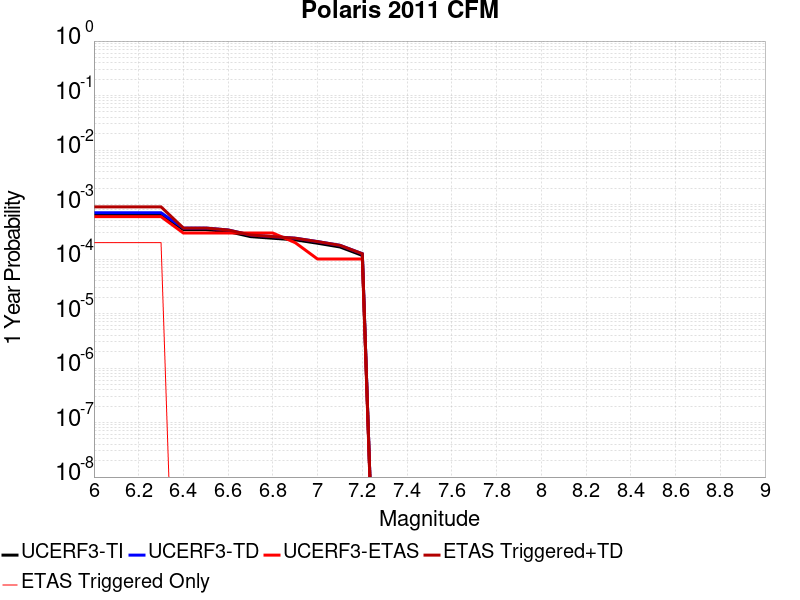 | 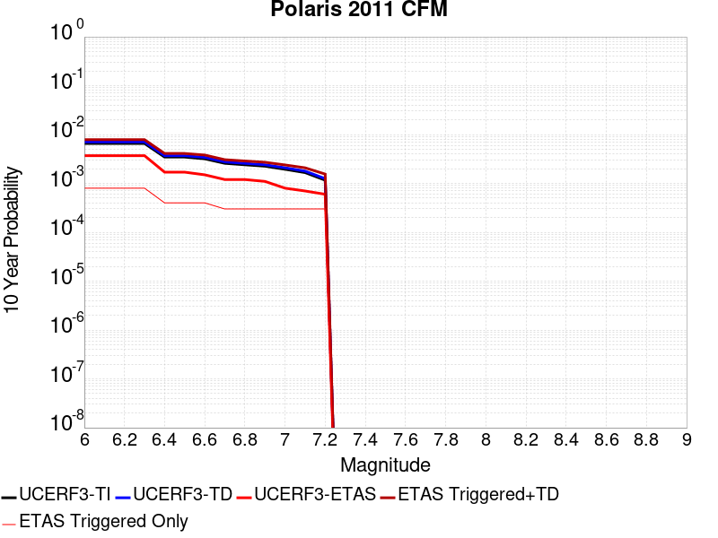 |

| Magnitude | 1 wk TI Prob | 1 wk TD Prob | 1 wk ETAS Prob | 1 wk ETAS/TD Gain | 1 wk ETAS Triggered+TD | 1 wk ETAS Triggered Only | 1 mo TI Prob | 1 mo TD Prob | 1 mo ETAS Prob | 1 mo ETAS/TD Gain | 1 mo ETAS Triggered+TD | 1 mo ETAS Triggered Only | 1 yr TI Prob | 1 yr TD Prob | 1 yr ETAS Prob | 1 yr ETAS/TD Gain | 1 yr ETAS Triggered+TD | 1 yr ETAS Triggered Only | 10 yr TI Prob | 10 yr TD Prob | 10 yr ETAS Prob | 10 yr ETAS/TD Gain | 10 yr ETAS Triggered+TD | 10 yr ETAS Triggered Only |
|-----|-----|-----|-----|-----|-----|-----|-----|-----|-----|-----|-----|-----|-----|-----|-----|-----|-----|-----|-----|-----|-----|-----|-----|-----|
| 6.0 | 1.2630823E-5 | 1.3572226E-5 | 0.0 | 0.0 | 1.3572226E-5 | 0.0 | 5.413098E-5 | 5.8165675E-5 | 1.0E-4 | 1.719227 | 1.5815986E-4 | 1.0E-4 | 6.5884535E-4 | 7.079888E-4 | 6.0E-4 | 0.847471 | 9.078472E-4 | 2.0E-4 | 0.0065689543 | 0.007062433 | 0.0037 | 0.5238988 | 0.0078567825 | 8.0E-4 |
| 6.1 | 1.2630823E-5 | 1.3572226E-5 | 0.0 | 0.0 | 1.3572226E-5 | 0.0 | 5.413098E-5 | 5.8165675E-5 | 1.0E-4 | 1.719227 | 1.5815986E-4 | 1.0E-4 | 6.5884535E-4 | 7.079888E-4 | 6.0E-4 | 0.847471 | 9.078472E-4 | 2.0E-4 | 0.0065689543 | 0.007062433 | 0.0037 | 0.5238988 | 0.0078567825 | 8.0E-4 |
| 6.2 | 1.2630823E-5 | 1.3572226E-5 | 0.0 | 0.0 | 1.3572226E-5 | 0.0 | 5.413098E-5 | 5.8165675E-5 | 1.0E-4 | 1.719227 | 1.5815986E-4 | 1.0E-4 | 6.5884535E-4 | 7.079888E-4 | 6.0E-4 | 0.847471 | 9.078472E-4 | 2.0E-4 | 0.0065689543 | 0.007062433 | 0.0037 | 0.5238988 | 0.0078567825 | 8.0E-4 |
| 6.3 | 1.2630823E-5 | 1.3572226E-5 | 0.0 | 0.0 | 1.3572226E-5 | 0.0 | 5.413098E-5 | 5.8165675E-5 | 1.0E-4 | 1.719227 | 1.5815986E-4 | 1.0E-4 | 6.5884535E-4 | 7.079888E-4 | 6.0E-4 | 0.847471 | 9.078472E-4 | 2.0E-4 | 0.0065689543 | 0.007062433 | 0.0037 | 0.5238988 | 0.0078567825 | 8.0E-4 |
| 6.4 | 6.642994E-6 | 7.1018785E-6 | 0.0 | 0.0 | 7.1018785E-6 | 0.0 | 2.8469662E-5 | 3.0436295E-5 | 0.0 | 0.0 | 3.0436295E-5 | 0.0 | 3.46563E-4 | 3.7050404E-4 | 3.0E-4 | 0.80970776 | 3.7050404E-4 | 0.0 | 0.0034602303 | 0.0036993735 | 0.0017 | 0.4595373 | 0.0040978934 | 4.0E-4 |
| 6.5 | 6.642994E-6 | 7.1018785E-6 | 0.0 | 0.0 | 7.1018785E-6 | 0.0 | 2.8469662E-5 | 3.0436295E-5 | 0.0 | 0.0 | 3.0436295E-5 | 0.0 | 3.46563E-4 | 3.7050404E-4 | 3.0E-4 | 0.80970776 | 3.7050404E-4 | 0.0 | 0.0034602303 | 0.0036993735 | 0.0017 | 0.4595373 | 0.0040978934 | 4.0E-4 |
| 6.6 | 6.1286296E-6 | 6.551398E-6 | 0.0 | 0.0 | 6.551398E-6 | 0.0 | 2.626529E-5 | 2.8077146E-5 | 0.0 | 0.0 | 2.8077146E-5 | 0.0 | 3.19733E-4 | 3.4179044E-4 | 3.0E-4 | 0.87773085 | 3.4179044E-4 | 0.0 | 0.0031927335 | 0.003413122 | 0.0015 | 0.43948033 | 0.0038117568 | 4.0E-4 |
| 6.7 | 4.9474666E-6 | 5.2943287E-6 | 0.0 | 0.0 | 5.2943287E-6 | 0.0 | 2.1203256E-5 | 2.26898E-5 | 0.0 | 0.0 | 2.26898E-5 | 0.0 | 2.5811905E-4 | 2.762161E-4 | 3.0E-4 | 1.0861061 | 2.762161E-4 | 0.0 | 0.0025781945 | 0.0027590075 | 0.0012 | 0.43493903 | 0.0030581797 | 3.0E-4 |
| 6.8 | 4.616407E-6 | 4.9425757E-6 | 0.0 | 0.0 | 4.9425757E-6 | 0.0 | 1.978445E-5 | 2.1182312E-5 | 0.0 | 0.0 | 2.1182312E-5 | 0.0 | 2.4084905E-4 | 2.578668E-4 | 3.0E-4 | 1.1633914 | 2.578668E-4 | 0.0 | 0.0024058819 | 0.0025759398 | 0.0012 | 0.46584943 | 0.002875167 | 3.0E-4 |
| 6.9 | 4.320343E-6 | 4.6274126E-6 | 0.0 | 0.0 | 4.6274126E-6 | 0.0 | 1.8515624E-5 | 1.9831632E-5 | 0.0 | 0.0 | 1.9831632E-5 | 0.0 | 2.2540441E-4 | 2.4142597E-4 | 2.0E-4 | 0.8284113 | 2.4142597E-4 | 0.0 | 0.0022517592 | 0.0024118933 | 0.0011 | 0.45607325 | 0.0027111697 | 3.0E-4 |
| 7.0 | 3.7382292E-6 | 4.006516E-6 | 0.0 | 0.0 | 4.006516E-6 | 0.0 | 1.6020884E-5 | 1.7170683E-5 | 0.0 | 0.0 | 1.7170683E-5 | 0.0 | 1.950368E-4 | 2.0903541E-4 | 1.0E-4 | 0.47838783 | 2.0903541E-4 | 0.0 | 0.0019486571 | 0.002088623 | 8.0E-4 | 0.3830275 | 0.0023879963 | 3.0E-4 |
| 7.1 | 3.193576E-6 | 3.425077E-6 | 0.0 | 0.0 | 3.425077E-6 | 0.0 | 1.3686683E-5 | 1.4678832E-5 | 0.0 | 0.0 | 1.4678832E-5 | 0.0 | 1.6662262E-4 | 1.7870234E-4 | 1.0E-4 | 0.55958974 | 1.7870234E-4 | 0.0 | 0.0016649774 | 0.0017858049 | 7.0E-4 | 0.3919801 | 0.0020852692 | 3.0E-4 |
| 7.2 | 2.2356758E-6 | 2.4004994E-6 | 0.0 | 0.0 | 2.4004994E-6 | 0.0 | 9.581432E-6 | 1.0287825E-5 | 0.0 | 0.0 | 1.0287825E-5 | 0.0 | 1.1664769E-4 | 1.2524896E-4 | 1.0E-4 | 0.7984098 | 1.2524896E-4 | 0.0 | 0.0011658648 | 0.0012519691 | 6.0E-4 | 0.47924504 | 0.0015515935 | 3.0E-4 |

## Los Alamos 2011 CFM
*[(top)](#table-of-contents)*

| 1 Week | 1 Month | 1 Year | 10 Year |
|-----|-----|-----|-----|
| 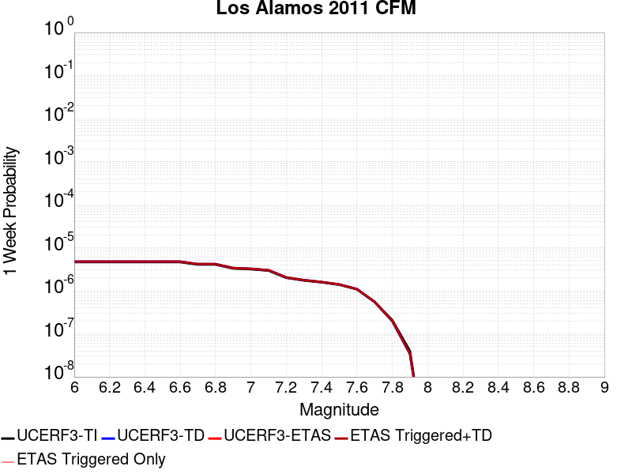 |  |  | 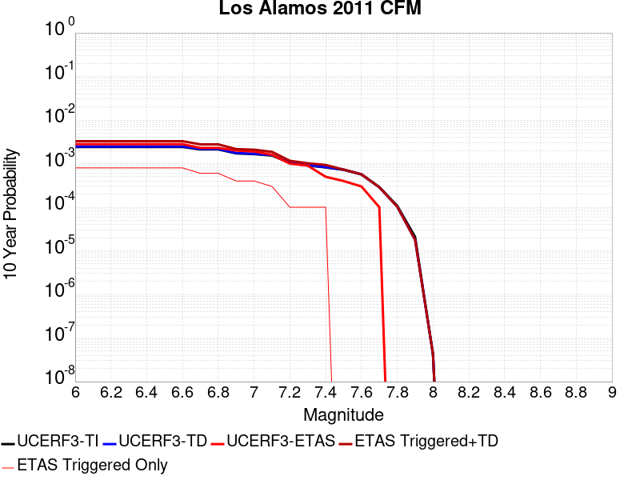 |

| Magnitude | 1 wk TI Prob | 1 wk TD Prob | 1 wk ETAS Prob | 1 wk ETAS/TD Gain | 1 wk ETAS Triggered+TD | 1 wk ETAS Triggered Only | 1 mo TI Prob | 1 mo TD Prob | 1 mo ETAS Prob | 1 mo ETAS/TD Gain | 1 mo ETAS Triggered+TD | 1 mo ETAS Triggered Only | 1 yr TI Prob | 1 yr TD Prob | 1 yr ETAS Prob | 1 yr ETAS/TD Gain | 1 yr ETAS Triggered+TD | 1 yr ETAS Triggered Only | 10 yr TI Prob | 10 yr TD Prob | 10 yr ETAS Prob | 10 yr ETAS/TD Gain | 10 yr ETAS Triggered+TD | 10 yr ETAS Triggered Only |
|-----|-----|-----|-----|-----|-----|-----|-----|-----|-----|-----|-----|-----|-----|-----|-----|-----|-----|-----|-----|-----|-----|-----|-----|-----|
| 6.0 | 4.6284417E-6 | 4.7499843E-6 | 0.0 | 0.0 | 4.7499843E-6 | 0.0 | 1.9836029E-5 | 2.0356927E-5 | 0.0 | 0.0 | 2.0356927E-5 | 0.0 | 2.4147688E-4 | 2.4781915E-4 | 1.0E-4 | 0.40352005 | 3.4779438E-4 | 1.0E-4 | 0.0024121467 | 0.002475602 | 0.0028 | 1.131038 | 0.0032736217 | 8.0E-4 |
| 6.1 | 4.6284417E-6 | 4.7499843E-6 | 0.0 | 0.0 | 4.7499843E-6 | 0.0 | 1.9836029E-5 | 2.0356927E-5 | 0.0 | 0.0 | 2.0356927E-5 | 0.0 | 2.4147688E-4 | 2.4781915E-4 | 1.0E-4 | 0.40352005 | 3.4779438E-4 | 1.0E-4 | 0.0024121467 | 0.002475602 | 0.0028 | 1.131038 | 0.0032736217 | 8.0E-4 |
| 6.2 | 4.6284417E-6 | 4.7499843E-6 | 0.0 | 0.0 | 4.7499843E-6 | 0.0 | 1.9836029E-5 | 2.0356927E-5 | 0.0 | 0.0 | 2.0356927E-5 | 0.0 | 2.4147688E-4 | 2.4781915E-4 | 1.0E-4 | 0.40352005 | 3.4779438E-4 | 1.0E-4 | 0.0024121467 | 0.002475602 | 0.0028 | 1.131038 | 0.0032736217 | 8.0E-4 |
| 6.3 | 4.6284417E-6 | 4.7499843E-6 | 0.0 | 0.0 | 4.7499843E-6 | 0.0 | 1.9836029E-5 | 2.0356927E-5 | 0.0 | 0.0 | 2.0356927E-5 | 0.0 | 2.4147688E-4 | 2.4781915E-4 | 1.0E-4 | 0.40352005 | 3.4779438E-4 | 1.0E-4 | 0.0024121467 | 0.002475602 | 0.0028 | 1.131038 | 0.0032736217 | 8.0E-4 |
| 6.4 | 4.6284417E-6 | 4.7499843E-6 | 0.0 | 0.0 | 4.7499843E-6 | 0.0 | 1.9836029E-5 | 2.0356927E-5 | 0.0 | 0.0 | 2.0356927E-5 | 0.0 | 2.4147688E-4 | 2.4781915E-4 | 1.0E-4 | 0.40352005 | 3.4779438E-4 | 1.0E-4 | 0.0024121467 | 0.002475602 | 0.0028 | 1.131038 | 0.0032736217 | 8.0E-4 |
| 6.5 | 4.6284417E-6 | 4.7499843E-6 | 0.0 | 0.0 | 4.7499843E-6 | 0.0 | 1.9836029E-5 | 2.0356927E-5 | 0.0 | 0.0 | 2.0356927E-5 | 0.0 | 2.4147688E-4 | 2.4781915E-4 | 1.0E-4 | 0.40352005 | 3.4779438E-4 | 1.0E-4 | 0.0024121467 | 0.002475602 | 0.0028 | 1.131038 | 0.0032736217 | 8.0E-4 |
| 6.6 | 4.6284417E-6 | 4.7499843E-6 | 0.0 | 0.0 | 4.7499843E-6 | 0.0 | 1.9836029E-5 | 2.0356927E-5 | 0.0 | 0.0 | 2.0356927E-5 | 0.0 | 2.4147688E-4 | 2.4781915E-4 | 1.0E-4 | 0.40352005 | 3.4779438E-4 | 1.0E-4 | 0.0024121467 | 0.002475602 | 0.0028 | 1.131038 | 0.0032736217 | 8.0E-4 |
| 6.7 | 4.062321E-6 | 4.16481E-6 | 0.0 | 0.0 | 4.16481E-6 | 0.0 | 1.7409831E-5 | 1.7849072E-5 | 0.0 | 0.0 | 1.7849072E-5 | 0.0 | 2.1194408E-4 | 2.172923E-4 | 0.0 | 0.0 | 2.172923E-4 | 0.0 | 0.0021174205 | 0.0021709478 | 0.0023 | 1.059445 | 0.0027696453 | 6.0E-4 |
| 6.8 | 4.062321E-6 | 4.16481E-6 | 0.0 | 0.0 | 4.16481E-6 | 0.0 | 1.7409831E-5 | 1.7849072E-5 | 0.0 | 0.0 | 1.7849072E-5 | 0.0 | 2.1194408E-4 | 2.172923E-4 | 0.0 | 0.0 | 2.172923E-4 | 0.0 | 0.0021174205 | 0.0021709478 | 0.0023 | 1.059445 | 0.0027696453 | 6.0E-4 |
| 6.9 | 3.2936077E-6 | 3.371685E-6 | 0.0 | 0.0 | 3.371685E-6 | 0.0 | 1.4115385E-5 | 1.4450004E-5 | 0.0 | 0.0 | 1.4450004E-5 | 0.0 | 1.7184127E-4 | 1.7591553E-4 | 0.0 | 0.0 | 1.7591553E-4 | 0.0 | 0.0017170844 | 0.0017578553 | 0.002 | 1.13775 | 0.0021571522 | 4.0E-4 |
| 7.0 | 3.1687898E-6 | 3.2435782E-6 | 0.0 | 0.0 | 3.2435782E-6 | 0.0 | 1.3580457E-5 | 1.3900981E-5 | 0.0 | 0.0 | 1.3900981E-5 | 0.0 | 1.6532952E-4 | 1.6923223E-4 | 0.0 | 0.0 | 1.6923223E-4 | 0.0 | 0.0016520657 | 0.001691125 | 0.0019 | 1.1235124 | 0.0020904485 | 4.0E-4 |
| 7.1 | 2.9379228E-6 | 3.0061597E-6 | 0.0 | 0.0 | 3.0061597E-6 | 0.0 | 1.25910365E-5 | 1.2883483E-5 | 0.0 | 0.0 | 1.2883483E-5 | 0.0 | 1.5328509E-4 | 1.5684601E-4 | 0.0 | 0.0 | 1.5684601E-4 | 0.0 | 0.001531794 | 0.0015674423 | 0.0016 | 1.0207713 | 0.0018669721 | 3.0E-4 |
| 7.2 | 2.0020686E-6 | 2.0407851E-6 | 0.0 | 0.0 | 2.0407851E-6 | 0.0 | 8.580266E-6 | 8.746193E-6 | 0.0 | 0.0 | 8.746193E-6 | 0.0 | 1.0445973E-4 | 1.0647974E-4 | 0.0 | 0.0 | 1.0647974E-4 | 0.0 | 0.0010441064 | 0.0010642916 | 0.001 | 0.9395921 | 0.0011641852 | 1.0E-4 |
| 7.3 | 1.7364243E-6 | 1.7671227E-6 | 0.0 | 0.0 | 1.7671227E-6 | 0.0 | 7.441797E-6 | 7.5733615E-6 | 0.0 | 0.0 | 7.5733615E-6 | 0.0 | 9.0600115E-5 | 9.220181E-5 | 0.0 | 0.0 | 9.220181E-5 | 0.0 | 9.0563187E-4 | 9.216387E-4 | 9.0E-4 | 0.97652155 | 0.0010215465 | 1.0E-4 |
| 7.4 | 1.5718434E-6 | 1.5976138E-6 | 0.0 | 0.0 | 1.5976138E-6 | 0.0 | 6.7364545E-6 | 6.8468985E-6 | 0.0 | 0.0 | 6.8468985E-6 | 0.0 | 8.201325E-5 | 8.335783E-5 | 0.0 | 0.0 | 8.335783E-5 | 0.0 | 8.198299E-4 | 8.332686E-4 | 5.0E-4 | 0.6000466 | 9.331853E-4 | 1.0E-4 |
| 7.5 | 1.3841119E-6 | 1.4036435E-6 | 0.0 | 0.0 | 1.4036435E-6 | 0.0 | 5.9318945E-6 | 6.0156012E-6 | 0.0 | 0.0 | 6.0156012E-6 | 0.0 | 7.221842E-5 | 7.323751E-5 | 0.0 | 0.0 | 7.323751E-5 | 0.0 | 7.2194956E-4 | 7.3213666E-4 | 4.0E-4 | 0.54634607 | 7.3213666E-4 | 0.0 |
| 7.6 | 1.0843726E-6 | 1.0929267E-6 | 0.0 | 0.0 | 1.0929267E-6 | 0.0 | 4.647303E-6 | 4.683963E-6 | 0.0 | 0.0 | 4.683963E-6 | 0.0 | 5.6579443E-5 | 5.7025787E-5 | 0.0 | 0.0 | 5.7025787E-5 | 0.0 | 5.656504E-4 | 5.701141E-4 | 3.0E-4 | 0.5262104 | 5.701141E-4 | 0.0 |
| 7.7 | 5.544814E-7 | 5.4990085E-7 | 0.0 | 0.0 | 5.4990085E-7 | 0.0 | 2.3763469E-6 | 2.3567156E-6 | 0.0 | 0.0 | 2.3567156E-6 | 0.0 | 2.8931638E-5 | 2.8692637E-5 | 0.0 | 0.0 | 2.8692637E-5 | 0.0 | 2.8927872E-4 | 2.868895E-4 | 1.0E-4 | 0.3485663 | 2.868895E-4 | 0.0 |
| 7.8 | 2.0707465E-7 | 1.9767009E-7 | 0.0 | 0.0 | 1.9767009E-7 | 0.0 | 8.874625E-7 | 8.4715725E-7 | 0.0 | 0.0 | 8.4715725E-7 | 0.0 | 1.08048025E-5 | 1.0314091E-5 | 0.0 | 0.0 | 1.0314091E-5 | 0.0 | 1.0804277E-4 | 1.0313617E-4 | 0.0 | 0.0 | 1.0313617E-4 | 0.0 |
| 7.9 | 3.9821284E-8 | 3.43097E-8 | 0.0 | 0.0 | 3.43097E-8 | 0.0 | 1.7066264E-7 | 1.4704156E-7 | 0.0 | 0.0 | 1.4704156E-7 | 0.0 | 2.0778157E-6 | 1.7902296E-6 | 0.0 | 0.0 | 1.7902296E-6 | 0.0 | 2.0777963E-5 | 1.7902157E-5 | 0.0 | 0.0 | 1.7902157E-5 | 0.0 |
| 8.0 | 7.880441E-11 | 8.231449E-11 | 0.0 | 0.0 | 8.231449E-11 | 0.0 | 3.3773329E-10 | 3.5277614E-10 | 0.0 | 0.0 | 3.5277614E-10 | 0.0 | 4.1119033E-9 | 4.29505E-9 | 0.0 | 0.0 | 4.29505E-9 | 0.0 | 4.1119034E-8 | 4.29505E-8 | 0.0 | 0.0 | 4.29505E-8 | 0.0 |

## Peralta Hills
*[(top)](#table-of-contents)*

| 1 Week | 1 Month | 1 Year | 10 Year |
|-----|-----|-----|-----|
|  |  |  |  |

| Magnitude | 1 wk TI Prob | 1 wk TD Prob | 1 wk ETAS Prob | 1 wk ETAS/TD Gain | 1 wk ETAS Triggered+TD | 1 wk ETAS Triggered Only | 1 mo TI Prob | 1 mo TD Prob | 1 mo ETAS Prob | 1 mo ETAS/TD Gain | 1 mo ETAS Triggered+TD | 1 mo ETAS Triggered Only | 1 yr TI Prob | 1 yr TD Prob | 1 yr ETAS Prob | 1 yr ETAS/TD Gain | 1 yr ETAS Triggered+TD | 1 yr ETAS Triggered Only | 10 yr TI Prob | 10 yr TD Prob | 10 yr ETAS Prob | 10 yr ETAS/TD Gain | 10 yr ETAS Triggered+TD | 10 yr ETAS Triggered Only |
|-----|-----|-----|-----|-----|-----|-----|-----|-----|-----|-----|-----|-----|-----|-----|-----|-----|-----|-----|-----|-----|-----|-----|-----|-----|
| 6.0 | 3.8850067E-6 | 3.8344565E-6 | 0.0 | 0.0 | 3.8344565E-6 | 0.0 | 1.6649923E-5 | 1.6433323E-5 | 0.0 | 0.0 | 1.6433323E-5 | 0.0 | 2.0269395E-4 | 2.0006477E-4 | 2.0E-4 | 0.9996763 | 3.0004475E-4 | 1.0E-4 | 0.0020250916 | 0.0019995735 | 0.0016 | 0.8001706 | 0.002797974 | 8.0E-4 |
| 6.1 | 3.8850067E-6 | 3.8344565E-6 | 0.0 | 0.0 | 3.8344565E-6 | 0.0 | 1.6649923E-5 | 1.6433323E-5 | 0.0 | 0.0 | 1.6433323E-5 | 0.0 | 2.0269395E-4 | 2.0006477E-4 | 2.0E-4 | 0.9996763 | 3.0004475E-4 | 1.0E-4 | 0.0020250916 | 0.0019995735 | 0.0016 | 0.8001706 | 0.002797974 | 8.0E-4 |
| 6.2 | 3.8850067E-6 | 3.8344565E-6 | 0.0 | 0.0 | 3.8344565E-6 | 0.0 | 1.6649923E-5 | 1.6433323E-5 | 0.0 | 0.0 | 1.6433323E-5 | 0.0 | 2.0269395E-4 | 2.0006477E-4 | 2.0E-4 | 0.9996763 | 3.0004475E-4 | 1.0E-4 | 0.0020250916 | 0.0019995735 | 0.0016 | 0.8001706 | 0.002797974 | 8.0E-4 |
| 6.3 | 3.8850067E-6 | 3.8344565E-6 | 0.0 | 0.0 | 3.8344565E-6 | 0.0 | 1.6649923E-5 | 1.6433323E-5 | 0.0 | 0.0 | 1.6433323E-5 | 0.0 | 2.0269395E-4 | 2.0006477E-4 | 2.0E-4 | 0.9996763 | 3.0004475E-4 | 1.0E-4 | 0.0020250916 | 0.0019995735 | 0.0016 | 0.8001706 | 0.002797974 | 8.0E-4 |
| 6.4 | 3.8850067E-6 | 3.8344565E-6 | 0.0 | 0.0 | 3.8344565E-6 | 0.0 | 1.6649923E-5 | 1.6433323E-5 | 0.0 | 0.0 | 1.6433323E-5 | 0.0 | 2.0269395E-4 | 2.0006477E-4 | 2.0E-4 | 0.9996763 | 3.0004475E-4 | 1.0E-4 | 0.0020250916 | 0.0019995735 | 0.0016 | 0.8001706 | 0.002797974 | 8.0E-4 |
| 6.5 | 1.5587785E-6 | 1.4387793E-6 | 0.0 | 0.0 | 1.4387793E-6 | 0.0 | 6.6804623E-6 | 6.166184E-6 | 0.0 | 0.0 | 6.166184E-6 | 0.0 | 8.133159E-5 | 7.5070944E-5 | 0.0 | 0.0 | 7.5070944E-5 | 0.0 | 8.1301836E-4 | 7.504797E-4 | 5.0E-4 | 0.6662405 | 0.0010502546 | 3.0E-4 |
| 6.6 | 1.5587785E-6 | 1.4387793E-6 | 0.0 | 0.0 | 1.4387793E-6 | 0.0 | 6.6804623E-6 | 6.166184E-6 | 0.0 | 0.0 | 6.166184E-6 | 0.0 | 8.133159E-5 | 7.5070944E-5 | 0.0 | 0.0 | 7.5070944E-5 | 0.0 | 8.1301836E-4 | 7.504797E-4 | 5.0E-4 | 0.6662405 | 0.0010502546 | 3.0E-4 |
| 6.7 | 1.5018579E-6 | 1.3794287E-6 | 0.0 | 0.0 | 1.3794287E-6 | 0.0 | 6.436518E-6 | 5.911825E-6 | 0.0 | 0.0 | 5.911825E-6 | 0.0 | 7.836179E-5 | 7.197433E-5 | 0.0 | 0.0 | 7.197433E-5 | 0.0 | 7.833416E-4 | 7.1953365E-4 | 4.0E-4 | 0.55591565 | 9.193897E-4 | 2.0E-4 |
| 6.8 | 1.4584314E-6 | 1.3338843E-6 | 0.0 | 0.0 | 1.3338843E-6 | 0.0 | 6.250405E-6 | 5.7166358E-6 | 0.0 | 0.0 | 5.7166358E-6 | 0.0 | 7.6096025E-5 | 6.9598056E-5 | 0.0 | 0.0 | 6.9598056E-5 | 0.0 | 7.6069974E-4 | 6.957858E-4 | 4.0E-4 | 0.57488954 | 8.9564663E-4 | 2.0E-4 |
| 6.9 | 1.1382393E-6 | 9.830711E-7 | 0.0 | 0.0 | 9.830711E-7 | 0.0 | 4.8781594E-6 | 4.2131555E-6 | 0.0 | 0.0 | 4.2131555E-6 | 0.0 | 5.9389975E-5 | 5.1294046E-5 | 0.0 | 0.0 | 5.1294046E-5 | 0.0 | 5.93741E-4 | 5.128302E-4 | 2.0E-4 | 0.3899926 | 5.128302E-4 | 0.0 |
| 7.0 | 9.970413E-7 | 8.2824795E-7 | 0.0 | 0.0 | 8.2824795E-7 | 0.0 | 4.273027E-6 | 3.5496298E-6 | 0.0 | 0.0 | 3.5496298E-6 | 0.0 | 5.2022864E-5 | 4.3215954E-5 | 0.0 | 0.0 | 4.3215954E-5 | 0.0 | 5.2010687E-4 | 4.3208225E-4 | 2.0E-4 | 0.46287483 | 4.3208225E-4 | 0.0 |
| 7.1 | 9.684443E-7 | 7.9685265E-7 | 0.0 | 0.0 | 7.9685265E-7 | 0.0 | 4.150469E-6 | 3.4150787E-6 | 0.0 | 0.0 | 3.4150787E-6 | 0.0 | 5.053079E-5 | 4.157786E-5 | 0.0 | 0.0 | 4.157786E-5 | 0.0 | 5.05193E-4 | 4.1570747E-4 | 2.0E-4 | 0.48110753 | 4.1570747E-4 | 0.0 |
| 7.2 | 9.240811E-7 | 7.4785555E-7 | 0.0 | 0.0 | 7.4785555E-7 | 0.0 | 3.960342E-6 | 3.2050916E-6 | 0.0 | 0.0 | 3.2050916E-6 | 0.0 | 4.8216094E-5 | 3.9021357E-5 | 0.0 | 0.0 | 3.9021357E-5 | 0.0 | 4.8205635E-4 | 3.9015157E-4 | 2.0E-4 | 0.5126213 | 3.9015157E-4 | 0.0 |
| 7.3 | 8.158643E-7 | 6.327957E-7 | 0.0 | 0.0 | 6.327957E-7 | 0.0 | 3.4965567E-6 | 2.711979E-6 | 0.0 | 0.0 | 2.711979E-6 | 0.0 | 4.2569747E-5 | 3.3017906E-5 | 0.0 | 0.0 | 3.3017906E-5 | 0.0 | 4.2561593E-4 | 3.3013613E-4 | 2.0E-4 | 0.6058107 | 3.3013613E-4 | 0.0 |
| 7.4 | 6.3822824E-7 | 4.7784977E-7 | 0.0 | 0.0 | 4.7784977E-7 | 0.0 | 2.7352612E-6 | 2.047926E-6 | 0.0 | 0.0 | 2.047926E-6 | 0.0 | 3.3301294E-5 | 2.4933268E-5 | 0.0 | 0.0 | 2.4933268E-5 | 0.0 | 3.3296304E-4 | 2.493098E-4 | 2.0E-4 | 0.80221474 | 2.493098E-4 | 0.0 |
| 7.5 | 4.0292628E-7 | 2.7737062E-7 | 0.0 | 0.0 | 2.7737062E-7 | 0.0 | 1.7268258E-6 | 1.1887308E-6 | 0.0 | 0.0 | 1.1887308E-6 | 0.0 | 2.1023901E-5 | 1.447273E-5 | 0.0 | 0.0 | 1.447273E-5 | 0.0 | 2.1021912E-4 | 1.4472065E-4 | 1.0E-4 | 0.6909864 | 1.4472065E-4 | 0.0 |
| 7.6 | 3.672993E-7 | 2.4755946E-7 | 0.0 | 0.0 | 2.4755946E-7 | 0.0 | 1.5741389E-6 | 1.0609688E-6 | 0.0 | 0.0 | 1.0609688E-6 | 0.0 | 1.9164972E-5 | 1.2917246E-5 | 0.0 | 0.0 | 1.2917246E-5 | 0.0 | 1.916332E-4 | 1.2916765E-4 | 1.0E-4 | 0.7741877 | 1.2916765E-4 | 0.0 |
| 7.7 | 2.8466823E-7 | 1.7796732E-7 | 0.0 | 0.0 | 1.7796732E-7 | 0.0 | 1.2200061E-6 | 7.6271704E-7 | 0.0 | 0.0 | 7.6271704E-7 | 0.0 | 1.4853474E-5 | 9.286066E-6 | 0.0 | 0.0 | 9.286066E-6 | 0.0 | 1.485248E-4 | 9.2859365E-5 | 1.0E-4 | 1.0768973 | 9.2859365E-5 | 0.0 |

## Malibu Coast (Extension) alt 1
*[(top)](#table-of-contents)*

| 1 Week | 1 Month | 1 Year | 10 Year |
|-----|-----|-----|-----|
|  |  | 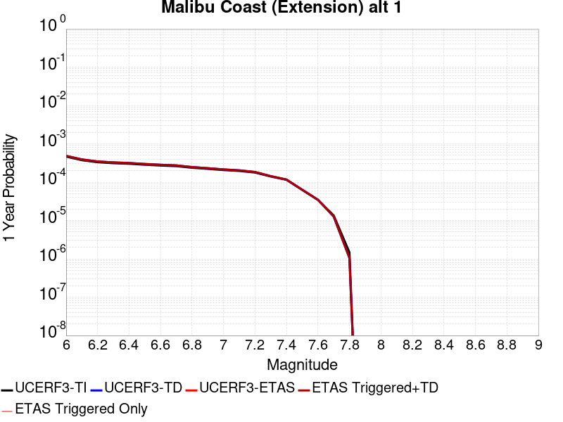 |  |

| Magnitude | 1 wk TI Prob | 1 wk TD Prob | 1 wk ETAS Prob | 1 wk ETAS/TD Gain | 1 wk ETAS Triggered+TD | 1 wk ETAS Triggered Only | 1 mo TI Prob | 1 mo TD Prob | 1 mo ETAS Prob | 1 mo ETAS/TD Gain | 1 mo ETAS Triggered+TD | 1 mo ETAS Triggered Only | 1 yr TI Prob | 1 yr TD Prob | 1 yr ETAS Prob | 1 yr ETAS/TD Gain | 1 yr ETAS Triggered+TD | 1 yr ETAS Triggered Only | 10 yr TI Prob | 10 yr TD Prob | 10 yr ETAS Prob | 10 yr ETAS/TD Gain | 10 yr ETAS Triggered+TD | 10 yr ETAS Triggered Only |
|-----|-----|-----|-----|-----|-----|-----|-----|-----|-----|-----|-----|-----|-----|-----|-----|-----|-----|-----|-----|-----|-----|-----|-----|-----|
| 6.0 | 8.930738E-6 | 9.323782E-6 | 0.0 | 0.0 | 9.323782E-6 | 0.0 | 3.827403E-5 | 3.9958464E-5 | 0.0 | 0.0 | 3.9958464E-5 | 0.0 | 4.6588664E-4 | 4.863874E-4 | 0.0 | 0.0 | 4.863874E-4 | 0.0 | 0.0046491115 | 0.004853411 | 0.0027 | 0.55630976 | 0.0056495285 | 8.0E-4 |
| 6.1 | 7.199952E-6 | 7.5255425E-6 | 0.0 | 0.0 | 7.5255425E-6 | 0.0 | 3.0856572E-5 | 3.225193E-5 | 0.0 | 0.0 | 3.225193E-5 | 0.0 | 3.75614E-4 | 3.9259708E-4 | 0.0 | 0.0 | 3.9259708E-4 | 0.0 | 0.0037497976 | 0.0039191013 | 0.0026 | 0.6634174 | 0.004715966 | 8.0E-4 |
| 6.2 | 6.3721413E-6 | 6.6624266E-6 | 0.0 | 0.0 | 6.6624266E-6 | 0.0 | 2.7308892E-5 | 2.8552946E-5 | 0.0 | 0.0 | 2.8552946E-5 | 0.0 | 3.3243504E-4 | 3.47577E-4 | 0.0 | 0.0 | 3.47577E-4 | 0.0 | 0.0033193815 | 0.0034703738 | 0.002 | 0.57630676 | 0.0041679447 | 7.0E-4 |
| 6.3 | 6.016345E-6 | 6.290966E-6 | 0.0 | 0.0 | 6.290966E-6 | 0.0 | 2.578408E-5 | 2.6961006E-5 | 0.0 | 0.0 | 2.6961006E-5 | 0.0 | 3.1387596E-4 | 3.2820113E-4 | 0.0 | 0.0 | 3.2820113E-4 | 0.0 | 0.00313433 | 0.0032772005 | 0.0017 | 0.51873547 | 0.0038752342 | 6.0E-4 |
| 6.4 | 5.8104883E-6 | 6.075459E-6 | 0.0 | 0.0 | 6.075459E-6 | 0.0 | 2.4901856E-5 | 2.6037425E-5 | 0.0 | 0.0 | 2.6037425E-5 | 0.0 | 3.031379E-4 | 3.1695983E-4 | 0.0 | 0.0 | 3.1695983E-4 | 0.0 | 0.0030272473 | 0.0031651123 | 0.0017 | 0.53710574 | 0.0037632133 | 6.0E-4 |
| 6.5 | 5.476925E-6 | 5.7236316E-6 | 0.0 | 0.0 | 5.7236316E-6 | 0.0 | 2.3472323E-5 | 2.4529621E-5 | 0.0 | 0.0 | 2.4529621E-5 | 0.0 | 2.8573806E-4 | 2.986075E-4 | 0.0 | 0.0 | 2.986075E-4 | 0.0 | 0.0028537093 | 0.0029820947 | 0.0015 | 0.50300217 | 0.0034806037 | 5.0E-4 |
| 6.6 | 5.222387E-6 | 5.4548573E-6 | 0.0 | 0.0 | 5.4548573E-6 | 0.0 | 2.2381464E-5 | 2.3377752E-5 | 0.0 | 0.0 | 2.3377752E-5 | 0.0 | 2.7246025E-4 | 2.8458724E-4 | 0.0 | 0.0 | 2.8458724E-4 | 0.0 | 0.0027212645 | 0.0028422587 | 0.0013 | 0.45738274 | 0.0032411218 | 4.0E-4 |
| 6.7 | 5.0337076E-6 | 5.2555E-6 | 0.0 | 0.0 | 5.2555E-6 | 0.0 | 2.1572854E-5 | 2.2523378E-5 | 0.0 | 0.0 | 2.2523378E-5 | 0.0 | 2.6261783E-4 | 2.741879E-4 | 0.0 | 0.0 | 2.741879E-4 | 0.0 | 0.002623077 | 0.002738526 | 0.0012 | 0.43819192 | 0.0031374306 | 4.0E-4 |
| 6.8 | 4.5675624E-6 | 4.7554977E-6 | 0.0 | 0.0 | 4.7554977E-6 | 0.0 | 1.9575122E-5 | 2.0380545E-5 | 0.0 | 0.0 | 2.0380545E-5 | 0.0 | 2.3830103E-4 | 2.4810506E-4 | 0.0 | 0.0 | 2.4810506E-4 | 0.0 | 0.0023804565 | 0.0024783006 | 0.0011 | 0.44385254 | 0.0028773092 | 4.0E-4 |
| 6.9 | 4.2802412E-6 | 4.4490175E-6 | 0.0 | 0.0 | 4.4490175E-6 | 0.0 | 1.8343762E-5 | 1.906708E-5 | 0.0 | 0.0 | 1.906708E-5 | 0.0 | 2.2331243E-4 | 2.3211713E-4 | 0.0 | 0.0 | 2.3211713E-4 | 0.0 | 0.0022308815 | 0.0023187636 | 9.0E-4 | 0.3881379 | 0.002717836 | 4.0E-4 |
| 7.0 | 3.9794063E-6 | 4.127332E-6 | 0.0 | 0.0 | 4.127332E-6 | 0.0 | 1.7054486E-5 | 1.7688448E-5 | 0.0 | 0.0 | 1.7688448E-5 | 0.0 | 2.0761859E-4 | 2.1533569E-4 | 0.0 | 0.0 | 2.1533569E-4 | 0.0 | 0.0020742472 | 0.002151284 | 9.0E-4 | 0.41835484 | 0.0025504234 | 4.0E-4 |
| 7.1 | 3.7730424E-6 | 3.9085894E-6 | 0.0 | 0.0 | 3.9085894E-6 | 0.0 | 1.6170083E-5 | 1.675099E-5 | 0.0 | 0.0 | 1.675099E-5 | 0.0 | 1.9685295E-4 | 2.0392434E-4 | 0.0 | 0.0 | 2.0392434E-4 | 0.0 | 0.0019667868 | 0.002037385 | 8.0E-4 | 0.3926602 | 0.0023367738 | 3.0E-4 |
| 7.2 | 3.424985E-6 | 3.5389521E-6 | 0.0 | 0.0 | 3.5389521E-6 | 0.0 | 1.4678424E-5 | 1.516685E-5 | 0.0 | 0.0 | 1.516685E-5 | 0.0 | 1.7869516E-4 | 1.8464087E-4 | 0.0 | 0.0 | 1.8464087E-4 | 0.0 | 0.0017855153 | 0.0018448866 | 8.0E-4 | 0.433631 | 0.0021443332 | 3.0E-4 |
| 7.3 | 2.6966375E-6 | 2.7578667E-6 | 0.0 | 0.0 | 2.7578667E-6 | 0.0 | 1.15569665E-5 | 1.1819375E-5 | 0.0 | 0.0 | 1.1819375E-5 | 0.0 | 1.4069698E-4 | 1.4389143E-4 | 0.0 | 0.0 | 1.4389143E-4 | 0.0 | 0.0014060794 | 0.0014379867 | 8.0E-4 | 0.55633336 | 0.0017375554 | 3.0E-4 |
| 7.4 | 2.215957E-6 | 2.2479396E-6 | 0.0 | 0.0 | 2.2479396E-6 | 0.0 | 9.496924E-6 | 9.633992E-6 | 0.0 | 0.0 | 9.633992E-6 | 0.0 | 1.1561892E-4 | 1.1728757E-4 | 0.0 | 0.0 | 1.1728757E-4 | 0.0 | 0.0011555878 | 0.0011722604 | 7.0E-4 | 0.5971369 | 0.0013720259 | 2.0E-4 |
| 7.5 | 1.2040218E-6 | 1.2210837E-6 | 0.0 | 0.0 | 1.2210837E-6 | 0.0 | 5.160083E-6 | 5.2332057E-6 | 0.0 | 0.0 | 5.2332057E-6 | 0.0 | 6.2822204E-5 | 6.371243E-5 | 0.0 | 0.0 | 6.371243E-5 | 0.0 | 6.280445E-4 | 6.3694356E-4 | 2.0E-4 | 0.31399956 | 6.3694356E-4 | 0.0 |
| 7.6 | 6.6157446E-7 | 6.674275E-7 | 0.0 | 0.0 | 6.674275E-7 | 0.0 | 2.835316E-6 | 2.8604006E-6 | 0.0 | 0.0 | 2.8604006E-6 | 0.0 | 3.4519428E-5 | 3.4824836E-5 | 0.0 | 0.0 | 3.4824836E-5 | 0.0 | 3.4514067E-4 | 3.4819532E-4 | 1.0E-4 | 0.28719515 | 3.4819532E-4 | 0.0 |
| 7.7 | 2.6012302E-7 | 2.4340684E-7 | 0.0 | 0.0 | 2.4340684E-7 | 0.0 | 1.1148124E-6 | 1.0431719E-6 | 0.0 | 0.0 | 1.0431719E-6 | 0.0 | 1.3572758E-5 | 1.2700554E-5 | 0.0 | 0.0 | 1.2700554E-5 | 0.0 | 1.3571928E-4 | 1.2699935E-4 | 0.0 | 0.0 | 1.2699935E-4 | 0.0 |
| 7.8 | 2.8323132E-8 | 2.0242826E-8 | 0.0 | 0.0 | 2.0242826E-8 | 0.0 | 1.2138484E-7 | 8.6754966E-8 | 0.0 | 0.0 | 8.6754966E-8 | 0.0 | 1.4778595E-6 | 1.0562413E-6 | 0.0 | 0.0 | 1.0562413E-6 | 0.0 | 1.4778497E-5 | 1.0562371E-5 | 0.0 | 0.0 | 1.0562371E-5 | 0.0 |

## Morales (East)
*[(top)](#table-of-contents)*

| 1 Week | 1 Month | 1 Year | 10 Year |
|-----|-----|-----|-----|
|  |  |  | 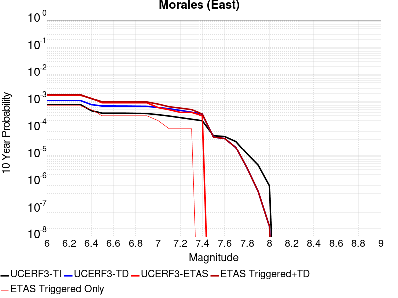 |

| Magnitude | 1 wk TI Prob | 1 wk TD Prob | 1 wk ETAS Prob | 1 wk ETAS/TD Gain | 1 wk ETAS Triggered+TD | 1 wk ETAS Triggered Only | 1 mo TI Prob | 1 mo TD Prob | 1 mo ETAS Prob | 1 mo ETAS/TD Gain | 1 mo ETAS Triggered+TD | 1 mo ETAS Triggered Only | 1 yr TI Prob | 1 yr TD Prob | 1 yr ETAS Prob | 1 yr ETAS/TD Gain | 1 yr ETAS Triggered+TD | 1 yr ETAS Triggered Only | 10 yr TI Prob | 10 yr TD Prob | 10 yr ETAS Prob | 10 yr ETAS/TD Gain | 10 yr ETAS Triggered+TD | 10 yr ETAS Triggered Only |
|-----|-----|-----|-----|-----|-----|-----|-----|-----|-----|-----|-----|-----|-----|-----|-----|-----|-----|-----|-----|-----|-----|-----|-----|-----|
| 6.0 | 1.4942771E-6 | 2.0928742E-6 | 0.0 | 0.0 | 2.0928742E-6 | 0.0 | 6.404029E-6 | 8.969433E-6 | 0.0 | 0.0 | 8.969433E-6 | 0.0 | 7.7966266E-5 | 1.0919796E-4 | 1.0E-4 | 0.915768 | 2.0918704E-4 | 1.0E-4 | 7.793892E-4 | 0.0010915021 | 0.0017 | 1.5574867 | 0.0017907381 | 7.0E-4 |
| 6.1 | 1.4942771E-6 | 2.0928742E-6 | 0.0 | 0.0 | 2.0928742E-6 | 0.0 | 6.404029E-6 | 8.969433E-6 | 0.0 | 0.0 | 8.969433E-6 | 0.0 | 7.7966266E-5 | 1.0919796E-4 | 1.0E-4 | 0.915768 | 2.0918704E-4 | 1.0E-4 | 7.793892E-4 | 0.0010915021 | 0.0017 | 1.5574867 | 0.0017907381 | 7.0E-4 |
| 6.2 | 1.4942771E-6 | 2.0928742E-6 | 0.0 | 0.0 | 2.0928742E-6 | 0.0 | 6.404029E-6 | 8.969433E-6 | 0.0 | 0.0 | 8.969433E-6 | 0.0 | 7.7966266E-5 | 1.0919796E-4 | 1.0E-4 | 0.915768 | 2.0918704E-4 | 1.0E-4 | 7.793892E-4 | 0.0010915021 | 0.0017 | 1.5574867 | 0.0017907381 | 7.0E-4 |
| 6.3 | 1.4942771E-6 | 2.0928742E-6 | 0.0 | 0.0 | 2.0928742E-6 | 0.0 | 6.404029E-6 | 8.969433E-6 | 0.0 | 0.0 | 8.969433E-6 | 0.0 | 7.7966266E-5 | 1.0919796E-4 | 1.0E-4 | 0.915768 | 2.0918704E-4 | 1.0E-4 | 7.793892E-4 | 0.0010915021 | 0.0017 | 1.5574867 | 0.0017907381 | 7.0E-4 |
| 6.4 | 8.798845E-7 | 1.4717402E-6 | 0.0 | 0.0 | 1.4717402E-6 | 0.0 | 3.7709283E-6 | 6.3074435E-6 | 0.0 | 0.0 | 6.3074435E-6 | 0.0 | 4.5910085E-5 | 7.679053E-5 | 1.0E-4 | 1.302244 | 1.7678285E-4 | 1.0E-4 | 4.59006E-4 | 7.676527E-4 | 0.0013 | 1.693474 | 0.0012672689 | 5.0E-4 |
| 6.5 | 7.1751725E-7 | 1.3079057E-6 | 0.0 | 0.0 | 1.3079057E-6 | 0.0 | 3.0750705E-6 | 5.6052986E-6 | 0.0 | 0.0 | 5.6052986E-6 | 0.0 | 3.7438338E-5 | 6.824244E-5 | 0.0 | 0.0 | 6.824244E-5 | 0.0 | 3.743203E-4 | 6.822244E-4 | 9.0E-4 | 1.3192141 | 9.820197E-4 | 3.0E-4 |
| 6.6 | 7.1751725E-7 | 1.3079057E-6 | 0.0 | 0.0 | 1.3079057E-6 | 0.0 | 3.0750705E-6 | 5.6052986E-6 | 0.0 | 0.0 | 5.6052986E-6 | 0.0 | 3.7438338E-5 | 6.824244E-5 | 0.0 | 0.0 | 6.824244E-5 | 0.0 | 3.743203E-4 | 6.822244E-4 | 9.0E-4 | 1.3192141 | 9.820197E-4 | 3.0E-4 |
| 6.7 | 7.159057E-7 | 1.305387E-6 | 0.0 | 0.0 | 1.305387E-6 | 0.0 | 3.0681638E-6 | 5.5945043E-6 | 0.0 | 0.0 | 5.5945043E-6 | 0.0 | 3.7354253E-5 | 6.811103E-5 | 0.0 | 0.0 | 6.811103E-5 | 0.0 | 3.7347974E-4 | 6.8091106E-4 | 9.0E-4 | 1.3217585 | 9.807068E-4 | 3.0E-4 |
| 6.8 | 7.032203E-7 | 1.2871109E-6 | 0.0 | 0.0 | 1.2871109E-6 | 0.0 | 3.0137978E-6 | 5.5161786E-6 | 0.0 | 0.0 | 5.5161786E-6 | 0.0 | 3.669237E-5 | 6.7157474E-5 | 0.0 | 0.0 | 6.7157474E-5 | 0.0 | 3.6686313E-4 | 6.7138125E-4 | 9.0E-4 | 1.34052 | 9.7117986E-4 | 3.0E-4 |
| 6.9 | 6.941549E-7 | 1.2723219E-6 | 0.0 | 0.0 | 1.2723219E-6 | 0.0 | 2.974946E-6 | 5.4527973E-6 | 0.0 | 0.0 | 5.4527973E-6 | 0.0 | 3.6219368E-5 | 6.638586E-5 | 0.0 | 0.0 | 6.638586E-5 | 0.0 | 3.6213463E-4 | 6.636697E-4 | 9.0E-4 | 1.3560963 | 9.634706E-4 | 3.0E-4 |
| 7.0 | 6.2932247E-7 | 1.1587041E-6 | 0.0 | 0.0 | 1.1587041E-6 | 0.0 | 2.6970936E-6 | 4.9658656E-6 | 0.0 | 0.0 | 4.9658656E-6 | 0.0 | 3.283662E-5 | 6.0457794E-5 | 0.0 | 0.0 | 6.0457794E-5 | 0.0 | 3.283177E-4 | 6.044217E-4 | 6.0E-4 | 0.9926844 | 8.043008E-4 | 2.0E-4 |
| 7.1 | 5.6200963E-7 | 1.0362347E-6 | 0.0 | 0.0 | 1.0362347E-6 | 0.0 | 2.4086105E-6 | 4.4409985E-6 | 0.0 | 0.0 | 4.4409985E-6 | 0.0 | 2.9324437E-5 | 5.4067863E-5 | 0.0 | 0.0 | 5.4067863E-5 | 0.0 | 2.9320567E-4 | 5.405537E-4 | 5.0E-4 | 0.9249775 | 6.4049964E-4 | 1.0E-4 |
| 7.2 | 4.91044E-7 | 9.0211216E-7 | 0.0 | 0.0 | 9.0211216E-7 | 0.0 | 2.1044725E-6 | 3.8661897E-6 | 0.0 | 0.0 | 3.8661897E-6 | 0.0 | 2.5621652E-5 | 4.7069876E-5 | 0.0 | 0.0 | 4.7069876E-5 | 0.0 | 2.56187E-4 | 4.7060478E-4 | 4.0E-4 | 0.8499701 | 5.705577E-4 | 1.0E-4 |
| 7.3 | 4.2978448E-7 | 7.7328565E-7 | 0.0 | 0.0 | 7.7328565E-7 | 0.0 | 1.8419321E-6 | 3.3140773E-6 | 0.0 | 0.0 | 3.3140773E-6 | 0.0 | 2.2425293E-5 | 4.0348175E-5 | 0.0 | 0.0 | 4.0348175E-5 | 0.0 | 2.242303E-4 | 4.0341355E-4 | 4.0E-4 | 0.99153835 | 5.033732E-4 | 1.0E-4 |
| 7.4 | 3.774317E-7 | 6.586822E-7 | 0.0 | 0.0 | 6.586822E-7 | 0.0 | 1.6175634E-6 | 2.8229208E-6 | 0.0 | 0.0 | 2.8229208E-6 | 0.0 | 1.9693656E-5 | 3.4368546E-5 | 0.0 | 0.0 | 3.4368546E-5 | 0.0 | 1.969191E-4 | 3.4363705E-4 | 3.0E-4 | 0.87301415 | 3.4363705E-4 | 0.0 |
| 7.5 | 1.0603232E-7 | 9.3955784E-8 | 0.0 | 0.0 | 9.3955784E-8 | 0.0 | 4.5442414E-7 | 4.0266758E-7 | 0.0 | 0.0 | 4.0266758E-7 | 0.0 | 5.5326E-6 | 4.902467E-6 | 0.0 | 0.0 | 4.902467E-6 | 0.0 | 5.532462E-5 | 4.902575E-5 | 0.0 | 0.0 | 4.902575E-5 | 0.0 |
| 7.6 | 9.960384E-8 | 8.3472656E-8 | 0.0 | 0.0 | 8.3472656E-8 | 0.0 | 4.2687353E-7 | 3.577399E-7 | 0.0 | 0.0 | 3.577399E-7 | 0.0 | 5.197173E-6 | 4.3554746E-6 | 0.0 | 0.0 | 4.3554746E-6 | 0.0 | 5.1970514E-5 | 4.3556058E-5 | 0.0 | 0.0 | 4.3556058E-5 | 0.0 |
| 7.7 | 6.499468E-8 | 3.8693557E-8 | 0.0 | 0.0 | 3.8693557E-8 | 0.0 | 2.785486E-7 | 1.6582952E-7 | 0.0 | 0.0 | 1.6582952E-7 | 0.0 | 3.3913238E-6 | 2.0189725E-6 | 0.0 | 0.0 | 2.0189725E-6 | 0.0 | 3.3912722E-5 | 2.01917E-5 | 0.0 | 0.0 | 2.01917E-5 | 0.0 |
| 7.8 | 2.2517119E-8 | 6.6650423E-9 | 0.0 | 0.0 | 6.6650423E-9 | 0.0 | 9.6501935E-8 | 2.8564468E-8 | 0.0 | 0.0 | 2.8564468E-8 | 0.0 | 1.1749105E-6 | 3.4777236E-7 | 0.0 | 0.0 | 3.4777236E-7 | 0.0 | 1.1749043E-5 | 3.47987E-6 | 0.0 | 0.0 | 3.47987E-6 | 0.0 |
| 7.9 | 8.493023E-9 | 8.939476E-10 | 0.0 | 0.0 | 8.939476E-10 | 0.0 | 3.639867E-8 | 3.831205E-9 | 0.0 | 0.0 | 3.831205E-9 | 0.0 | 4.4315374E-7 | 4.6644935E-8 | 0.0 | 0.0 | 4.6644935E-8 | 0.0 | 4.4315284E-6 | 4.6821356E-7 | 0.0 | 0.0 | 4.6821356E-7 | 0.0 |
| 8.0 | 1.4971842E-9 | 4.4638404E-11 | 0.0 | 0.0 | 4.4638404E-11 | 0.0 | 6.4165038E-9 | 1.9130775E-10 | 0.0 | 0.0 | 1.9130775E-10 | 0.0 | 7.812093E-8 | 2.3291762E-9 | 0.0 | 0.0 | 2.3291762E-9 | 0.0 | 7.81209E-7 | 2.4336822E-8 | 0.0 | 0.0 | 2.4336822E-8 | 0.0 |

## Newport-Inglewood (Offshore)
*[(top)](#table-of-contents)*

| 1 Week | 1 Month | 1 Year | 10 Year |
|-----|-----|-----|-----|
| 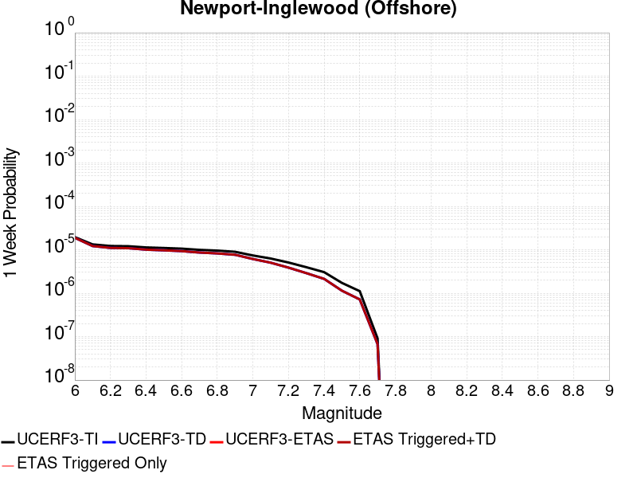 | 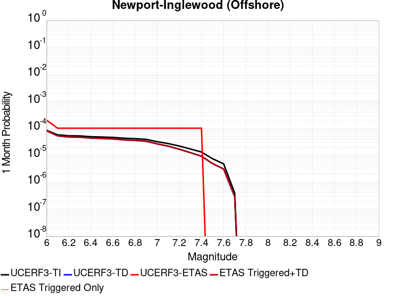 |  |  |

| Magnitude | 1 wk TI Prob | 1 wk TD Prob | 1 wk ETAS Prob | 1 wk ETAS/TD Gain | 1 wk ETAS Triggered+TD | 1 wk ETAS Triggered Only | 1 mo TI Prob | 1 mo TD Prob | 1 mo ETAS Prob | 1 mo ETAS/TD Gain | 1 mo ETAS Triggered+TD | 1 mo ETAS Triggered Only | 1 yr TI Prob | 1 yr TD Prob | 1 yr ETAS Prob | 1 yr ETAS/TD Gain | 1 yr ETAS Triggered+TD | 1 yr ETAS Triggered Only | 10 yr TI Prob | 10 yr TD Prob | 10 yr ETAS Prob | 10 yr ETAS/TD Gain | 10 yr ETAS Triggered+TD | 10 yr ETAS Triggered Only |
|-----|-----|-----|-----|-----|-----|-----|-----|-----|-----|-----|-----|-----|-----|-----|-----|-----|-----|-----|-----|-----|-----|-----|-----|-----|
| 6.0 | 1.9626508E-5 | 1.8942716E-5 | 0.0 | 0.0 | 1.8942716E-5 | 0.0 | 8.411089E-5 | 8.118061E-5 | 2.0E-4 | 2.4636424 | 8.118061E-5 | 0.0 | 0.001023569 | 9.879384E-4 | 9.0E-4 | 0.91098803 | 9.879384E-4 | 0.0 | 0.010188672 | 0.009836804 | 0.0043 | 0.43713385 | 0.010430902 | 6.0E-4 |
| 6.1 | 1.331886E-5 | 1.220036E-5 | 0.0 | 0.0 | 1.220036E-5 | 0.0 | 5.707958E-5 | 5.228622E-5 | 1.0E-4 | 1.9125497 | 5.228622E-5 | 0.0 | 6.947222E-4 | 6.364003E-4 | 6.0E-4 | 0.94280285 | 6.364003E-4 | 0.0 | 0.006925544 | 0.006345955 | 0.0033 | 0.52001625 | 0.0068427823 | 5.0E-4 |
| 6.2 | 1.2250852E-5 | 1.10591245E-5 | 0.0 | 0.0 | 1.10591245E-5 | 0.0 | 5.2502597E-5 | 4.739539E-5 | 1.0E-4 | 2.1099098 | 4.739539E-5 | 0.0 | 6.3903164E-4 | 5.768871E-4 | 6.0E-4 | 1.0400648 | 5.768871E-4 | 0.0 | 0.006371971 | 0.0057540163 | 0.0028 | 0.4866166 | 0.0062511396 | 5.0E-4 |
| 6.3 | 1.2106258E-5 | 1.0902128E-5 | 0.0 | 0.0 | 1.0902128E-5 | 0.0 | 5.1882926E-5 | 4.6722576E-5 | 1.0E-4 | 2.140293 | 4.6722576E-5 | 0.0 | 6.3149154E-4 | 5.6869985E-4 | 6.0E-4 | 1.0550381 | 5.6869985E-4 | 0.0 | 0.0062970007 | 0.005672562 | 0.0027 | 0.47597542 | 0.0061697257 | 5.0E-4 |
| 6.4 | 1.1348758E-5 | 1.0093179E-5 | 0.0 | 0.0 | 1.0093179E-5 | 0.0 | 4.8636626E-5 | 4.325577E-5 | 1.0E-4 | 2.3118303 | 4.325577E-5 | 0.0 | 5.919901E-4 | 5.2651257E-4 | 5.0E-4 | 0.949645 | 5.2651257E-4 | 0.0 | 0.005904155 | 0.005252747 | 0.0023 | 0.43786615 | 0.0057501206 | 5.0E-4 |
| 6.5 | 1.100837E-5 | 9.727494E-6 | 0.0 | 0.0 | 9.727494E-6 | 0.0 | 4.7177873E-5 | 4.16886E-5 | 1.0E-4 | 2.3987372 | 4.16886E-5 | 0.0 | 5.7423924E-4 | 5.074413E-4 | 5.0E-4 | 0.9853357 | 5.074413E-4 | 0.0 | 0.005727576 | 0.005062917 | 0.0023 | 0.45428357 | 0.0055603855 | 5.0E-4 |
| 6.6 | 1.0634696E-5 | 9.329969E-6 | 0.0 | 0.0 | 9.329969E-6 | 0.0 | 4.557647E-5 | 3.998497E-5 | 1.0E-4 | 2.5009398 | 3.998497E-5 | 0.0 | 5.5475225E-4 | 4.86709E-4 | 5.0E-4 | 1.0273079 | 4.86709E-4 | 0.0 | 0.0055336943 | 0.004856517 | 0.0022 | 0.45299956 | 0.0053540887 | 5.0E-4 |
| 6.7 | 9.9780855E-6 | 8.652844E-6 | 0.0 | 0.0 | 8.652844E-6 | 0.0 | 4.276252E-5 | 3.7083097E-5 | 1.0E-4 | 2.6966465 | 3.7083097E-5 | 0.0 | 5.205093E-4 | 4.5139386E-4 | 5.0E-4 | 1.1076801 | 4.5139386E-4 | 0.0 | 0.0051929182 | 0.0045048487 | 0.0022 | 0.48836267 | 0.0050025964 | 5.0E-4 |
| 6.8 | 9.59546E-6 | 8.258152E-6 | 0.0 | 0.0 | 8.258152E-6 | 0.0 | 4.1122752E-5 | 3.5391604E-5 | 1.0E-4 | 2.8255289 | 3.5391604E-5 | 0.0 | 5.0055445E-4 | 4.3080826E-4 | 5.0E-4 | 1.1606091 | 4.3080826E-4 | 0.0 | 0.004994285 | 0.0042998064 | 0.0022 | 0.5116509 | 0.0047976566 | 5.0E-4 |
| 6.9 | 9.000614E-6 | 7.692837E-6 | 0.0 | 0.0 | 7.692837E-6 | 0.0 | 3.857349E-5 | 3.2968892E-5 | 1.0E-4 | 3.0331624 | 3.2968892E-5 | 0.0 | 4.6953102E-4 | 4.0132296E-4 | 4.0E-4 | 0.99670345 | 4.0132296E-4 | 0.0 | 0.004685402 | 0.004006054 | 0.002 | 0.49924445 | 0.0045040506 | 5.0E-4 |
| 7.0 | 7.4070194E-6 | 6.1376672E-6 | 0.0 | 0.0 | 6.1376672E-6 | 0.0 | 3.1743984E-5 | 2.6304024E-5 | 1.0E-4 | 3.8016999 | 2.6304024E-5 | 0.0 | 3.8641447E-4 | 3.202046E-4 | 3.0E-4 | 0.93690103 | 3.202046E-4 | 0.0 | 0.0038574322 | 0.0031974516 | 0.0016 | 0.5003985 | 0.0035961727 | 4.0E-4 |
| 7.1 | 6.299615E-6 | 5.0474437E-6 | 0.0 | 0.0 | 5.0474437E-6 | 0.0 | 2.699807E-5 | 2.1631724E-5 | 1.0E-4 | 4.62284 | 2.1631724E-5 | 0.0 | 3.2865192E-4 | 2.6333454E-4 | 2.0E-4 | 0.7594902 | 2.6333454E-4 | 0.0 | 0.003281663 | 0.0026302396 | 0.0014 | 0.5322709 | 0.0030291874 | 4.0E-4 |
| 7.2 | 5.096653E-6 | 3.8845606E-6 | 0.0 | 0.0 | 3.8845606E-6 | 0.0 | 2.1842614E-5 | 1.6648011E-5 | 1.0E-4 | 6.0067234 | 1.6648011E-5 | 0.0 | 2.6590136E-4 | 2.026708E-4 | 2.0E-4 | 0.986822 | 2.026708E-4 | 0.0 | 0.0026558342 | 0.0020248706 | 0.0013 | 0.6420163 | 0.0024240608 | 4.0E-4 |
| 7.3 | 3.9753018E-6 | 2.903192E-6 | 0.0 | 0.0 | 2.903192E-6 | 0.0 | 1.7036897E-5 | 1.2442192E-5 | 1.0E-4 | 8.037169 | 1.2442192E-5 | 0.0 | 2.0740448E-4 | 1.5147323E-4 | 1.0E-4 | 0.66018265 | 1.5147323E-4 | 0.0 | 0.00207211 | 0.0015137079 | 0.001 | 0.66062945 | 0.0018132539 | 3.0E-4 |
| 7.4 | 3.0568392E-6 | 2.1394217E-6 | 0.0 | 0.0 | 2.1394217E-6 | 0.0 | 1.3100675E-5 | 9.168918E-6 | 1.0E-4 | 10.906412 | 9.168918E-6 | 0.0 | 1.5948903E-4 | 1.1162592E-4 | 1.0E-4 | 0.8958493 | 1.1162592E-4 | 0.0 | 0.0015937461 | 0.0011157048 | 7.0E-4 | 0.6274061 | 0.0013154816 | 2.0E-4 |
| 7.5 | 1.7279019E-6 | 1.1426342E-6 | 0.0 | 0.0 | 1.1426342E-6 | 0.0 | 7.405273E-6 | 4.896995E-6 | 0.0 | 0.0 | 4.896995E-6 | 0.0 | 9.015547E-5 | 5.9619324E-5 | 0.0 | 0.0 | 5.9619324E-5 | 0.0 | 9.01189E-4 | 5.9603713E-4 | 1.0E-4 | 0.16777478 | 5.9603713E-4 | 0.0 |
| 7.6 | 1.1156416E-6 | 7.1931936E-7 | 0.0 | 0.0 | 7.1931936E-7 | 0.0 | 4.7813123E-6 | 3.082794E-6 | 0.0 | 0.0 | 3.082794E-6 | 0.0 | 5.821092E-5 | 3.753239E-5 | 0.0 | 0.0 | 3.753239E-5 | 0.0 | 5.8195676E-4 | 3.7526284E-4 | 0.0 | 0.0 | 3.7526284E-4 | 0.0 |
| 7.7 | 9.117973E-8 | 6.7306544E-8 | 0.0 | 0.0 | 6.7306544E-8 | 0.0 | 3.907702E-7 | 2.884566E-7 | 0.0 | 0.0 | 2.884566E-7 | 0.0 | 4.757617E-6 | 3.5119535E-6 | 0.0 | 0.0 | 3.5119535E-6 | 0.0 | 4.7575148E-5 | 3.511901E-5 | 0.0 | 0.0 | 3.511901E-5 | 0.0 |

## Northridge
*[(top)](#table-of-contents)*

| 1 Week | 1 Month | 1 Year | 10 Year |
|-----|-----|-----|-----|
|  |  |  | 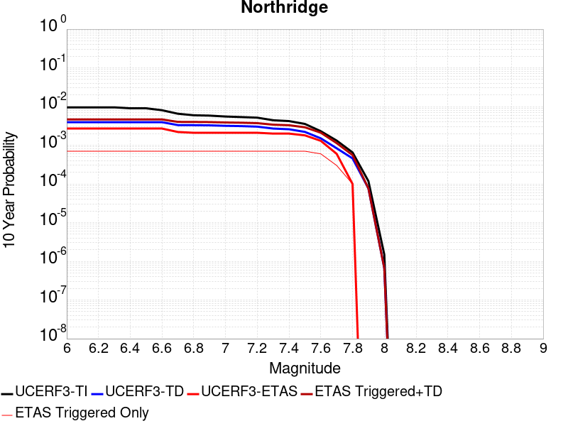 |

| Magnitude | 1 wk TI Prob | 1 wk TD Prob | 1 wk ETAS Prob | 1 wk ETAS/TD Gain | 1 wk ETAS Triggered+TD | 1 wk ETAS Triggered Only | 1 mo TI Prob | 1 mo TD Prob | 1 mo ETAS Prob | 1 mo ETAS/TD Gain | 1 mo ETAS Triggered+TD | 1 mo ETAS Triggered Only | 1 yr TI Prob | 1 yr TD Prob | 1 yr ETAS Prob | 1 yr ETAS/TD Gain | 1 yr ETAS Triggered+TD | 1 yr ETAS Triggered Only | 10 yr TI Prob | 10 yr TD Prob | 10 yr ETAS Prob | 10 yr ETAS/TD Gain | 10 yr ETAS Triggered+TD | 10 yr ETAS Triggered Only |
|-----|-----|-----|-----|-----|-----|-----|-----|-----|-----|-----|-----|-----|-----|-----|-----|-----|-----|-----|-----|-----|-----|-----|-----|-----|
| 6.0 | 1.8340852E-5 | 7.569185E-6 | 0.0 | 0.0 | 7.569185E-6 | 0.0 | 7.860128E-5 | 3.2438973E-5 | 0.0 | 0.0 | 3.2438973E-5 | 0.0 | 9.565505E-4 | 3.948751E-4 | 4.0E-4 | 1.0129786 | 4.948356E-4 | 1.0E-4 | 0.009524435 | 0.003941973 | 0.0027 | 0.68493617 | 0.004639214 | 7.0E-4 |
| 6.1 | 1.8340852E-5 | 7.569185E-6 | 0.0 | 0.0 | 7.569185E-6 | 0.0 | 7.860128E-5 | 3.2438973E-5 | 0.0 | 0.0 | 3.2438973E-5 | 0.0 | 9.565505E-4 | 3.948751E-4 | 4.0E-4 | 1.0129786 | 4.948356E-4 | 1.0E-4 | 0.009524435 | 0.003941973 | 0.0027 | 0.68493617 | 0.004639214 | 7.0E-4 |
| 6.2 | 1.8340852E-5 | 7.569185E-6 | 0.0 | 0.0 | 7.569185E-6 | 0.0 | 7.860128E-5 | 3.2438973E-5 | 0.0 | 0.0 | 3.2438973E-5 | 0.0 | 9.565505E-4 | 3.948751E-4 | 4.0E-4 | 1.0129786 | 4.948356E-4 | 1.0E-4 | 0.009524435 | 0.003941973 | 0.0027 | 0.68493617 | 0.004639214 | 7.0E-4 |
| 6.3 | 1.8340852E-5 | 7.569185E-6 | 0.0 | 0.0 | 7.569185E-6 | 0.0 | 7.860128E-5 | 3.2438973E-5 | 0.0 | 0.0 | 3.2438973E-5 | 0.0 | 9.565505E-4 | 3.948751E-4 | 4.0E-4 | 1.0129786 | 4.948356E-4 | 1.0E-4 | 0.009524435 | 0.003941973 | 0.0027 | 0.68493617 | 0.004639214 | 7.0E-4 |
| 6.4 | 1.7361892E-5 | 7.569185E-6 | 0.0 | 0.0 | 7.569185E-6 | 0.0 | 7.440598E-5 | 3.2438973E-5 | 0.0 | 0.0 | 3.2438973E-5 | 0.0 | 9.055163E-4 | 3.948751E-4 | 4.0E-4 | 1.0129786 | 4.948356E-4 | 1.0E-4 | 0.009018354 | 0.003941973 | 0.0027 | 0.68493617 | 0.004639214 | 7.0E-4 |
| 6.5 | 1.7361892E-5 | 7.569185E-6 | 0.0 | 0.0 | 7.569185E-6 | 0.0 | 7.440598E-5 | 3.2438973E-5 | 0.0 | 0.0 | 3.2438973E-5 | 0.0 | 9.055163E-4 | 3.948751E-4 | 4.0E-4 | 1.0129786 | 4.948356E-4 | 1.0E-4 | 0.009018354 | 0.003941973 | 0.0027 | 0.68493617 | 0.004639214 | 7.0E-4 |
| 6.6 | 1.5458201E-5 | 7.569185E-6 | 0.0 | 0.0 | 7.569185E-6 | 0.0 | 6.624775E-5 | 3.2438973E-5 | 0.0 | 0.0 | 3.2438973E-5 | 0.0 | 8.0626784E-4 | 3.948751E-4 | 4.0E-4 | 1.0129786 | 4.948356E-4 | 1.0E-4 | 0.008033488 | 0.003941973 | 0.0027 | 0.68493617 | 0.004639214 | 7.0E-4 |
| 6.7 | 1.2538368E-5 | 6.365402E-6 | 0.0 | 0.0 | 6.365402E-6 | 0.0 | 5.3734755E-5 | 2.7280012E-5 | 0.0 | 0.0 | 2.7280012E-5 | 0.0 | 6.5402425E-4 | 3.3208396E-4 | 2.0E-4 | 0.6022574 | 4.3205073E-4 | 1.0E-4 | 0.0065210275 | 0.003315942 | 0.0022 | 0.66346157 | 0.004013621 | 7.0E-4 |
| 6.8 | 1.1438097E-5 | 6.3343796E-6 | 0.0 | 0.0 | 6.3343796E-6 | 0.0 | 4.9019498E-5 | 2.7147062E-5 | 0.0 | 0.0 | 2.7147062E-5 | 0.0 | 5.9664896E-4 | 3.304658E-4 | 2.0E-4 | 0.6052064 | 4.3043273E-4 | 1.0E-4 | 0.005950495 | 0.0032998084 | 0.0021 | 0.63640064 | 0.003997498 | 7.0E-4 |
| 6.9 | 1.1204891E-5 | 6.2711765E-6 | 0.0 | 0.0 | 6.2711765E-6 | 0.0 | 4.8020076E-5 | 2.6876196E-5 | 0.0 | 0.0 | 2.6876196E-5 | 0.0 | 5.8448757E-4 | 3.27169E-4 | 2.0E-4 | 0.6113049 | 4.2713628E-4 | 1.0E-4 | 0.0058295266 | 0.0032669378 | 0.0021 | 0.6428038 | 0.003964651 | 7.0E-4 |
| 7.0 | 1.061046E-5 | 6.1001697E-6 | 0.0 | 0.0 | 6.1001697E-6 | 0.0 | 4.5472607E-5 | 2.6143325E-5 | 0.0 | 0.0 | 2.6143325E-5 | 0.0 | 5.534883E-4 | 3.1824893E-4 | 2.0E-4 | 0.6284389 | 4.182171E-4 | 1.0E-4 | 0.0055211177 | 0.003177978 | 0.0021 | 0.6607975 | 0.0038757536 | 7.0E-4 |
| 7.1 | 1.0266979E-5 | 5.989373E-6 | 0.0 | 0.0 | 5.989373E-6 | 0.0 | 4.40006E-5 | 2.5668493E-5 | 0.0 | 0.0 | 2.5668493E-5 | 0.0 | 5.355756E-4 | 3.124695E-4 | 2.0E-4 | 0.6400625 | 4.1243824E-4 | 1.0E-4 | 0.0053428668 | 0.0031203474 | 0.0021 | 0.673002 | 0.0038181632 | 7.0E-4 |
| 7.2 | 9.91273E-6 | 5.805416E-6 | 0.0 | 0.0 | 5.805416E-6 | 0.0 | 4.248244E-5 | 2.4880119E-5 | 0.0 | 0.0 | 2.4880119E-5 | 0.0 | 5.171009E-4 | 3.0287376E-4 | 2.0E-4 | 0.6603411 | 4.028435E-4 | 1.0E-4 | 0.0051589934 | 0.0030246547 | 0.0021 | 0.6942941 | 0.0037225375 | 7.0E-4 |
| 7.3 | 8.4959265E-6 | 5.1797047E-6 | 0.0 | 0.0 | 5.1797047E-6 | 0.0 | 3.6410605E-5 | 2.2198547E-5 | 0.0 | 0.0 | 2.2198547E-5 | 0.0 | 4.4320893E-4 | 2.70234E-4 | 2.0E-4 | 0.74009925 | 3.7020698E-4 | 1.0E-4 | 0.00442326 | 0.0026990806 | 0.002 | 0.7409931 | 0.0033971912 | 7.0E-4 |
| 7.4 | 8.0847185E-6 | 4.96903E-6 | 0.0 | 0.0 | 4.96903E-6 | 0.0 | 3.4648332E-5 | 2.1295671E-5 | 0.0 | 0.0 | 2.1295671E-5 | 0.0 | 4.2176177E-4 | 2.5924417E-4 | 2.0E-4 | 0.7714734 | 3.5921825E-4 | 1.0E-4 | 0.0042096223 | 0.0025894432 | 0.002 | 0.7723668 | 0.0032876306 | 7.0E-4 |
| 7.5 | 6.8220684E-6 | 4.2430083E-6 | 0.0 | 0.0 | 4.2430083E-6 | 0.0 | 2.9237108E-5 | 1.8184195E-5 | 0.0 | 0.0 | 1.8184195E-5 | 0.0 | 3.5590364E-4 | 2.2137028E-4 | 2.0E-4 | 0.90346366 | 3.2134814E-4 | 1.0E-4 | 0.0035533418 | 0.0022115186 | 0.0018 | 0.8139204 | 0.0029099705 | 7.0E-4 |
| 7.6 | 4.4224143E-6 | 2.892187E-6 | 0.0 | 0.0 | 2.892187E-6 | 0.0 | 1.8953066E-5 | 1.23950285E-5 | 0.0 | 0.0 | 1.23950285E-5 | 0.0 | 2.3072914E-4 | 1.5089914E-4 | 2.0E-4 | 1.3253887 | 2.5088404E-4 | 1.0E-4 | 0.0023048974 | 0.0015079782 | 0.0013 | 0.86208147 | 0.0021070733 | 6.0E-4 |
| 7.7 | 2.5297056E-6 | 1.6004153E-6 | 0.0 | 0.0 | 1.6004153E-6 | 0.0 | 1.0841551E-5 | 6.858905E-6 | 0.0 | 0.0 | 6.858905E-6 | 0.0 | 1.319879E-4 | 8.350401E-5 | 1.0E-4 | 1.1975472 | 1.8349566E-4 | 1.0E-4 | 0.0013190953 | 8.3473104E-4 | 6.0E-4 | 0.7187944 | 0.0011344806 | 3.0E-4 |
| 7.8 | 1.2508156E-6 | 8.772821E-7 | 0.0 | 0.0 | 8.772821E-7 | 0.0 | 5.3606273E-6 | 3.759775E-6 | 0.0 | 0.0 | 3.759775E-6 | 0.0 | 6.526368E-5 | 4.577431E-5 | 0.0 | 0.0 | 4.577431E-5 | 0.0 | 6.524452E-4 | 4.5765014E-4 | 1.0E-4 | 0.21850753 | 5.5760436E-4 | 1.0E-4 |
| 7.9 | 2.262199E-7 | 1.4639929E-7 | 0.0 | 0.0 | 1.4639929E-7 | 0.0 | 9.695135E-7 | 6.274254E-7 | 0.0 | 0.0 | 6.274254E-7 | 0.0 | 1.1803763E-5 | 7.638878E-6 | 0.0 | 0.0 | 7.638878E-6 | 0.0 | 1.1803136E-4 | 7.638623E-5 | 0.0 | 0.0 | 7.638623E-5 | 0.0 |
| 8.0 | 2.865362E-9 | 1.2680117E-9 | 0.0 | 0.0 | 1.2680117E-9 | 0.0 | 1.2280123E-8 | 5.434336E-9 | 0.0 | 0.0 | 5.434336E-9 | 0.0 | 1.4951048E-7 | 6.616304E-8 | 0.0 | 0.0 | 6.616304E-8 | 0.0 | 1.4951038E-6 | 6.616304E-7 | 0.0 | 0.0 | 6.616304E-7 | 0.0 |

## Fontana (Seismicity)
*[(top)](#table-of-contents)*

| 1 Week | 1 Month | 1 Year | 10 Year |
|-----|-----|-----|-----|
| 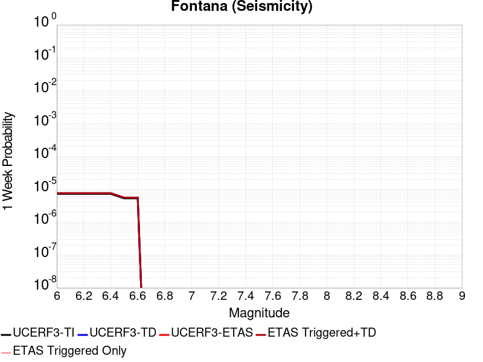 |  |  | 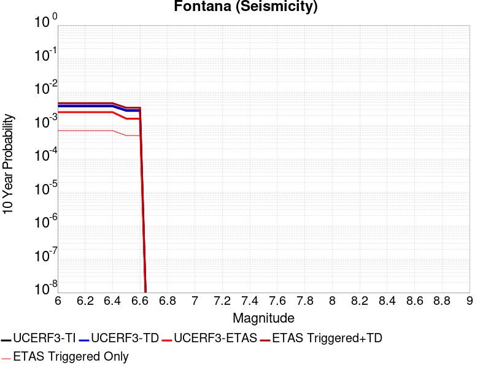 |

| Magnitude | 1 wk TI Prob | 1 wk TD Prob | 1 wk ETAS Prob | 1 wk ETAS/TD Gain | 1 wk ETAS Triggered+TD | 1 wk ETAS Triggered Only | 1 mo TI Prob | 1 mo TD Prob | 1 mo ETAS Prob | 1 mo ETAS/TD Gain | 1 mo ETAS Triggered+TD | 1 mo ETAS Triggered Only | 1 yr TI Prob | 1 yr TD Prob | 1 yr ETAS Prob | 1 yr ETAS/TD Gain | 1 yr ETAS Triggered+TD | 1 yr ETAS Triggered Only | 10 yr TI Prob | 10 yr TD Prob | 10 yr ETAS Prob | 10 yr ETAS/TD Gain | 10 yr ETAS Triggered+TD | 10 yr ETAS Triggered Only |
|-----|-----|-----|-----|-----|-----|-----|-----|-----|-----|-----|-----|-----|-----|-----|-----|-----|-----|-----|-----|-----|-----|-----|-----|-----|
| 6.0 | 7.1789214E-6 | 7.547905E-6 | 0.0 | 0.0 | 7.547905E-6 | 0.0 | 3.076644E-5 | 3.2347994E-5 | 0.0 | 0.0 | 3.2347994E-5 | 0.0 | 3.7451705E-4 | 3.9380637E-4 | 4.0E-4 | 1.0157275 | 4.9376703E-4 | 1.0E-4 | 0.003738865 | 0.0039350805 | 0.0025 | 0.635311 | 0.004632326 | 7.0E-4 |
| 6.1 | 7.1789214E-6 | 7.547905E-6 | 0.0 | 0.0 | 7.547905E-6 | 0.0 | 3.076644E-5 | 3.2347994E-5 | 0.0 | 0.0 | 3.2347994E-5 | 0.0 | 3.7451705E-4 | 3.9380637E-4 | 4.0E-4 | 1.0157275 | 4.9376703E-4 | 1.0E-4 | 0.003738865 | 0.0039350805 | 0.0025 | 0.635311 | 0.004632326 | 7.0E-4 |
| 6.2 | 7.1789214E-6 | 7.547905E-6 | 0.0 | 0.0 | 7.547905E-6 | 0.0 | 3.076644E-5 | 3.2347994E-5 | 0.0 | 0.0 | 3.2347994E-5 | 0.0 | 3.7451705E-4 | 3.9380637E-4 | 4.0E-4 | 1.0157275 | 4.9376703E-4 | 1.0E-4 | 0.003738865 | 0.0039350805 | 0.0025 | 0.635311 | 0.004632326 | 7.0E-4 |
| 6.3 | 7.1789214E-6 | 7.547905E-6 | 0.0 | 0.0 | 7.547905E-6 | 0.0 | 3.076644E-5 | 3.2347994E-5 | 0.0 | 0.0 | 3.2347994E-5 | 0.0 | 3.7451705E-4 | 3.9380637E-4 | 4.0E-4 | 1.0157275 | 4.9376703E-4 | 1.0E-4 | 0.003738865 | 0.0039350805 | 0.0025 | 0.635311 | 0.004632326 | 7.0E-4 |
| 6.4 | 7.1789214E-6 | 7.547905E-6 | 0.0 | 0.0 | 7.547905E-6 | 0.0 | 3.076644E-5 | 3.2347994E-5 | 0.0 | 0.0 | 3.2347994E-5 | 0.0 | 3.7451705E-4 | 3.9380637E-4 | 4.0E-4 | 1.0157275 | 4.9376703E-4 | 1.0E-4 | 0.003738865 | 0.0039350805 | 0.0025 | 0.635311 | 0.004632326 | 7.0E-4 |
| 6.5 | 5.2611317E-6 | 5.529745E-6 | 0.0 | 0.0 | 5.529745E-6 | 0.0 | 2.2547512E-5 | 2.3698909E-5 | 0.0 | 0.0 | 2.3698909E-5 | 0.0 | 2.744814E-4 | 2.885342E-4 | 4.0E-4 | 1.3863175 | 3.8850534E-4 | 1.0E-4 | 0.002741426 | 0.002885342 | 0.0016 | 0.554527 | 0.0033838993 | 5.0E-4 |
| 6.6 | 5.2611317E-6 | 5.529745E-6 | 0.0 | 0.0 | 5.529745E-6 | 0.0 | 2.2547512E-5 | 2.3698909E-5 | 0.0 | 0.0 | 2.3698909E-5 | 0.0 | 2.744814E-4 | 2.885342E-4 | 4.0E-4 | 1.3863175 | 3.8850534E-4 | 1.0E-4 | 0.002741426 | 0.002885342 | 0.0016 | 0.554527 | 0.0033838993 | 5.0E-4 |

## Sierra Madre
*[(top)](#table-of-contents)*

| 1 Week | 1 Month | 1 Year | 10 Year |
|-----|-----|-----|-----|
|  |  |  | 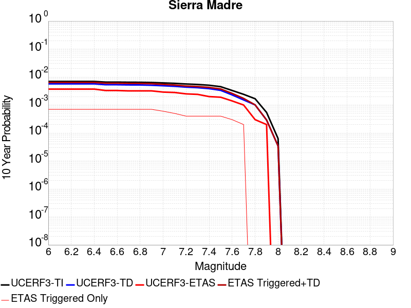 |

| Magnitude | 1 wk TI Prob | 1 wk TD Prob | 1 wk ETAS Prob | 1 wk ETAS/TD Gain | 1 wk ETAS Triggered+TD | 1 wk ETAS Triggered Only | 1 mo TI Prob | 1 mo TD Prob | 1 mo ETAS Prob | 1 mo ETAS/TD Gain | 1 mo ETAS Triggered+TD | 1 mo ETAS Triggered Only | 1 yr TI Prob | 1 yr TD Prob | 1 yr ETAS Prob | 1 yr ETAS/TD Gain | 1 yr ETAS Triggered+TD | 1 yr ETAS Triggered Only | 10 yr TI Prob | 10 yr TD Prob | 10 yr ETAS Prob | 10 yr ETAS/TD Gain | 10 yr ETAS Triggered+TD | 10 yr ETAS Triggered Only |
|-----|-----|-----|-----|-----|-----|-----|-----|-----|-----|-----|-----|-----|-----|-----|-----|-----|-----|-----|-----|-----|-----|-----|-----|-----|
| 6.0 | 1.3379373E-5 | 1.0971575E-5 | 0.0 | 0.0 | 1.0971575E-5 | 0.0 | 5.7338908E-5 | 4.7020196E-5 | 1.0E-4 | 2.1267457 | 1.470155E-4 | 1.0E-4 | 6.978776E-4 | 5.72322E-4 | 6.0E-4 | 1.048361 | 9.72093E-4 | 4.0E-4 | 0.0069569005 | 0.005708669 | 0.0037 | 0.6481371 | 0.0064046727 | 7.0E-4 |
| 6.1 | 1.3379373E-5 | 1.0971575E-5 | 0.0 | 0.0 | 1.0971575E-5 | 0.0 | 5.7338908E-5 | 4.7020196E-5 | 1.0E-4 | 2.1267457 | 1.470155E-4 | 1.0E-4 | 6.978776E-4 | 5.72322E-4 | 6.0E-4 | 1.048361 | 9.72093E-4 | 4.0E-4 | 0.0069569005 | 0.005708669 | 0.0037 | 0.6481371 | 0.0064046727 | 7.0E-4 |
| 6.2 | 1.3379373E-5 | 1.0971575E-5 | 0.0 | 0.0 | 1.0971575E-5 | 0.0 | 5.7338908E-5 | 4.7020196E-5 | 1.0E-4 | 2.1267457 | 1.470155E-4 | 1.0E-4 | 6.978776E-4 | 5.72322E-4 | 6.0E-4 | 1.048361 | 9.72093E-4 | 4.0E-4 | 0.0069569005 | 0.005708669 | 0.0037 | 0.6481371 | 0.0064046727 | 7.0E-4 |
| 6.3 | 1.3379373E-5 | 1.0971575E-5 | 0.0 | 0.0 | 1.0971575E-5 | 0.0 | 5.7338908E-5 | 4.7020196E-5 | 1.0E-4 | 2.1267457 | 1.470155E-4 | 1.0E-4 | 6.978776E-4 | 5.72322E-4 | 6.0E-4 | 1.048361 | 9.72093E-4 | 4.0E-4 | 0.0069569005 | 0.005708669 | 0.0037 | 0.6481371 | 0.0064046727 | 7.0E-4 |
| 6.4 | 1.3379373E-5 | 1.0971575E-5 | 0.0 | 0.0 | 1.0971575E-5 | 0.0 | 5.7338908E-5 | 4.7020196E-5 | 1.0E-4 | 2.1267457 | 1.470155E-4 | 1.0E-4 | 6.978776E-4 | 5.72322E-4 | 6.0E-4 | 1.048361 | 9.72093E-4 | 4.0E-4 | 0.0069569005 | 0.005708669 | 0.0037 | 0.6481371 | 0.0064046727 | 7.0E-4 |
| 6.5 | 1.26563245E-5 | 1.0201558E-5 | 0.0 | 0.0 | 1.0201558E-5 | 0.0 | 5.4240263E-5 | 4.372024E-5 | 1.0E-4 | 2.2872703 | 1.4371586E-4 | 1.0E-4 | 6.601751E-4 | 5.32165E-4 | 6.0E-4 | 1.1274699 | 9.319521E-4 | 4.0E-4 | 0.006582173 | 0.0053090523 | 0.0033 | 0.6215798 | 0.006005336 | 7.0E-4 |
| 6.6 | 1.26563245E-5 | 1.0201558E-5 | 0.0 | 0.0 | 1.0201558E-5 | 0.0 | 5.4240263E-5 | 4.372024E-5 | 1.0E-4 | 2.2872703 | 1.4371586E-4 | 1.0E-4 | 6.601751E-4 | 5.32165E-4 | 6.0E-4 | 1.1274699 | 9.319521E-4 | 4.0E-4 | 0.006582173 | 0.0053090523 | 0.0033 | 0.6215798 | 0.006005336 | 7.0E-4 |
| 6.7 | 1.2502474E-5 | 1.0037814E-5 | 0.0 | 0.0 | 1.0037814E-5 | 0.0 | 5.3580934E-5 | 4.30185E-5 | 1.0E-4 | 2.3245814 | 1.430142E-4 | 1.0E-4 | 6.521526E-4 | 5.236254E-4 | 6.0E-4 | 1.1458572 | 9.23416E-4 | 4.0E-4 | 0.0065024206 | 0.0052240603 | 0.0032 | 0.6125504 | 0.005920403 | 7.0E-4 |
| 6.8 | 1.2454966E-5 | 9.990137E-6 | 0.0 | 0.0 | 9.990137E-6 | 0.0 | 5.3377335E-5 | 4.2814176E-5 | 1.0E-4 | 2.335675 | 1.4280989E-4 | 1.0E-4 | 6.4967526E-4 | 5.21139E-4 | 6.0E-4 | 1.1513243 | 9.209305E-4 | 4.0E-4 | 0.006477792 | 0.005199312 | 0.0032 | 0.615466 | 0.005895673 | 7.0E-4 |
| 6.9 | 1.2225574E-5 | 9.764267E-6 | 0.0 | 0.0 | 9.764267E-6 | 0.0 | 5.2394265E-5 | 4.1846193E-5 | 1.0E-4 | 2.3897038 | 1.4184201E-4 | 1.0E-4 | 6.3771347E-4 | 5.0935935E-4 | 6.0E-4 | 1.1779504 | 9.091556E-4 | 4.0E-4 | 0.006358865 | 0.005082059 | 0.0032 | 0.62966603 | 0.0057785017 | 7.0E-4 |
| 7.0 | 1.182946E-5 | 9.371078E-6 | 0.0 | 0.0 | 9.371078E-6 | 0.0 | 5.06967E-5 | 4.016115E-5 | 1.0E-4 | 2.4899685 | 1.4015714E-4 | 1.0E-4 | 6.1705755E-4 | 4.888533E-4 | 6.0E-4 | 1.227362 | 8.8865776E-4 | 4.0E-4 | 0.006153469 | 0.0048779156 | 0.0029 | 0.5945162 | 0.005474989 | 6.0E-4 |
| 7.1 | 1.14369095E-5 | 8.9588175E-6 | 0.0 | 0.0 | 8.9588175E-6 | 0.0 | 4.9014405E-5 | 3.8394373E-5 | 1.0E-4 | 2.6045485 | 1.3839053E-4 | 1.0E-4 | 5.9658696E-4 | 4.673522E-4 | 5.0E-4 | 1.069857 | 7.67212E-4 | 3.0E-4 | 0.005949879 | 0.0046638236 | 0.0028 | 0.60036576 | 0.0051614917 | 5.0E-4 |
| 7.2 | 1.0836419E-5 | 8.372935E-6 | 0.0 | 0.0 | 8.372935E-6 | 0.0 | 4.644097E-5 | 3.588352E-5 | 1.0E-4 | 2.7867947 | 1.3587993E-4 | 1.0E-4 | 5.652721E-4 | 4.3679518E-4 | 4.0E-4 | 0.91576105 | 6.367078E-4 | 2.0E-4 | 0.0056383642 | 0.0043594884 | 0.0025 | 0.57346183 | 0.0047577443 | 4.0E-4 |
| 7.3 | 1.0403439E-5 | 7.994614E-6 | 0.0 | 0.0 | 7.994614E-6 | 0.0 | 4.4585406E-5 | 3.4262186E-5 | 1.0E-4 | 2.9186695 | 1.3425876E-4 | 1.0E-4 | 5.426921E-4 | 4.170632E-4 | 4.0E-4 | 0.95908725 | 6.169798E-4 | 2.0E-4 | 0.005413687 | 0.0041629244 | 0.0024 | 0.57651776 | 0.0045612594 | 4.0E-4 |
| 7.4 | 9.768864E-6 | 7.3889805E-6 | 0.0 | 0.0 | 7.3889805E-6 | 0.0 | 4.186589E-5 | 3.166668E-5 | 1.0E-4 | 3.1578934 | 1.3166352E-4 | 1.0E-4 | 5.09598E-4 | 3.8547453E-4 | 4.0E-4 | 1.037682 | 5.853974E-4 | 2.0E-4 | 0.0050843097 | 0.0038481748 | 0.002 | 0.5197269 | 0.004246636 | 4.0E-4 |
| 7.5 | 8.687089E-6 | 6.4261762E-6 | 0.0 | 0.0 | 6.4261762E-6 | 0.0 | 3.722985E-5 | 2.754047E-5 | 1.0E-4 | 3.6310203 | 1.2753771E-4 | 1.0E-4 | 4.5317915E-4 | 3.3525447E-4 | 4.0E-4 | 1.1931235 | 5.351874E-4 | 2.0E-4 | 0.004522561 | 0.0033475985 | 0.0019 | 0.56757104 | 0.0037462595 | 4.0E-4 |
| 7.6 | 6.3506063E-6 | 4.409074E-6 | 0.0 | 0.0 | 4.409074E-6 | 0.0 | 2.72166E-5 | 1.8895895E-5 | 1.0E-4 | 5.2921543 | 1.1889401E-4 | 1.0E-4 | 3.3131172E-4 | 2.300335E-4 | 3.0E-4 | 1.3041579 | 4.299875E-4 | 2.0E-4 | 0.003308182 | 0.0022980026 | 0.0014 | 0.6092247 | 0.0025973134 | 3.0E-4 |
| 7.7 | 4.62223E-6 | 2.9145829E-6 | 0.0 | 0.0 | 2.9145829E-6 | 0.0 | 1.9809406E-5 | 1.2491009E-5 | 1.0E-4 | 8.005758 | 1.1248976E-4 | 1.0E-4 | 2.4115283E-4 | 1.5206744E-4 | 3.0E-4 | 1.9728088 | 3.5203702E-4 | 2.0E-4 | 0.0024089129 | 0.0015196567 | 0.001 | 0.6580434 | 0.0017193528 | 2.0E-4 |
| 7.8 | 3.2145008E-6 | 1.9368993E-6 | 0.0 | 0.0 | 1.9368993E-6 | 0.0 | 1.3776359E-5 | 8.30097E-6 | 0.0 | 0.0 | 8.30097E-6 | 0.0 | 1.6771426E-4 | 1.0105964E-4 | 0.0 | 0.0 | 1.0105964E-4 | 0.0 | 0.0016758774 | 0.0010101008 | 3.0E-4 | 0.29700005 | 0.0010101008 | 0.0 |
| 7.9 | 1.0391769E-6 | 5.568387E-7 | 0.0 | 0.0 | 5.568387E-7 | 0.0 | 4.4536077E-6 | 2.3864495E-6 | 0.0 | 0.0 | 2.3864495E-6 | 0.0 | 5.4221324E-5 | 2.905464E-5 | 0.0 | 0.0 | 2.905464E-5 | 0.0 | 5.4208096E-4 | 2.9050882E-4 | 2.0E-4 | 0.68844724 | 2.9050882E-4 | 0.0 |
| 8.0 | 1.210983E-7 | 6.576322E-8 | 0.0 | 0.0 | 6.576322E-8 | 0.0 | 5.1899264E-7 | 2.8184235E-7 | 0.0 | 0.0 | 2.8184235E-7 | 0.0 | 6.3187167E-6 | 3.4314253E-6 | 0.0 | 0.0 | 3.4314253E-6 | 0.0 | 6.318537E-5 | 3.431374E-5 | 0.0 | 0.0 | 3.431374E-5 | 0.0 |

## Swain Ravine - Spenceville
*[(top)](#table-of-contents)*

| 1 Week | 1 Month | 1 Year | 10 Year |
|-----|-----|-----|-----|
| 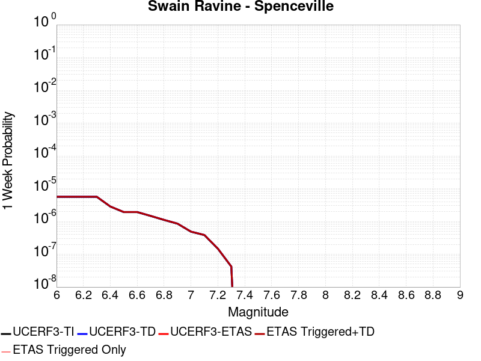 | 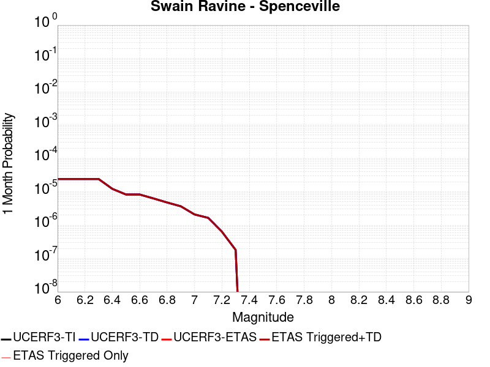 | 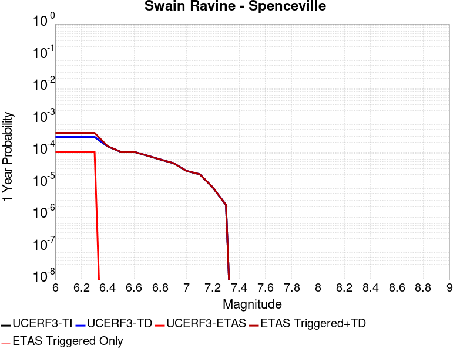 |  |

| Magnitude | 1 wk TI Prob | 1 wk TD Prob | 1 wk ETAS Prob | 1 wk ETAS/TD Gain | 1 wk ETAS Triggered+TD | 1 wk ETAS Triggered Only | 1 mo TI Prob | 1 mo TD Prob | 1 mo ETAS Prob | 1 mo ETAS/TD Gain | 1 mo ETAS Triggered+TD | 1 mo ETAS Triggered Only | 1 yr TI Prob | 1 yr TD Prob | 1 yr ETAS Prob | 1 yr ETAS/TD Gain | 1 yr ETAS Triggered+TD | 1 yr ETAS Triggered Only | 10 yr TI Prob | 10 yr TD Prob | 10 yr ETAS Prob | 10 yr ETAS/TD Gain | 10 yr ETAS Triggered+TD | 10 yr ETAS Triggered Only |
|-----|-----|-----|-----|-----|-----|-----|-----|-----|-----|-----|-----|-----|-----|-----|-----|-----|-----|-----|-----|-----|-----|-----|-----|-----|
| 6.0 | 5.596169E-6 | 5.6630797E-6 | 0.0 | 0.0 | 5.6630797E-6 | 0.0 | 2.398336E-5 | 2.427013E-5 | 0.0 | 0.0 | 2.427013E-5 | 0.0 | 2.9195828E-4 | 2.954515E-4 | 1.0E-4 | 0.33846503 | 3.9542196E-4 | 1.0E-4 | 0.00291575 | 0.002950856 | 0.0017 | 0.576104 | 0.0036487905 | 7.0E-4 |
| 6.1 | 5.596169E-6 | 5.6630797E-6 | 0.0 | 0.0 | 5.6630797E-6 | 0.0 | 2.398336E-5 | 2.427013E-5 | 0.0 | 0.0 | 2.427013E-5 | 0.0 | 2.9195828E-4 | 2.954515E-4 | 1.0E-4 | 0.33846503 | 3.9542196E-4 | 1.0E-4 | 0.00291575 | 0.002950856 | 0.0017 | 0.576104 | 0.0036487905 | 7.0E-4 |
| 6.2 | 5.596169E-6 | 5.6630797E-6 | 0.0 | 0.0 | 5.6630797E-6 | 0.0 | 2.398336E-5 | 2.427013E-5 | 0.0 | 0.0 | 2.427013E-5 | 0.0 | 2.9195828E-4 | 2.954515E-4 | 1.0E-4 | 0.33846503 | 3.9542196E-4 | 1.0E-4 | 0.00291575 | 0.002950856 | 0.0017 | 0.576104 | 0.0036487905 | 7.0E-4 |
| 6.3 | 5.596169E-6 | 5.6630797E-6 | 0.0 | 0.0 | 5.6630797E-6 | 0.0 | 2.398336E-5 | 2.427013E-5 | 0.0 | 0.0 | 2.427013E-5 | 0.0 | 2.9195828E-4 | 2.954515E-4 | 1.0E-4 | 0.33846503 | 3.9542196E-4 | 1.0E-4 | 0.00291575 | 0.002950856 | 0.0017 | 0.576104 | 0.0036487905 | 7.0E-4 |
| 6.4 | 2.8426775E-6 | 2.8738118E-6 | 0.0 | 0.0 | 2.8738118E-6 | 0.0 | 1.2182847E-5 | 1.231628E-5 | 0.0 | 0.0 | 1.231628E-5 | 0.0 | 1.4831607E-4 | 1.4994078E-4 | 0.0 | 0.0 | 1.4994078E-4 | 0.0 | 0.0014821711 | 0.0014984346 | 7.0E-4 | 0.4671542 | 0.001797985 | 3.0E-4 |
| 6.5 | 1.9210793E-6 | 1.9412E-6 | 0.0 | 0.0 | 1.9412E-6 | 0.0 | 8.233172E-6 | 8.319404E-6 | 0.0 | 0.0 | 8.319404E-6 | 0.0 | 1.0023425E-4 | 1.0128416E-4 | 0.0 | 0.0 | 1.0128416E-4 | 0.0 | 0.0010018905 | 0.0010123934 | 5.0E-4 | 0.49387914 | 0.0011122922 | 1.0E-4 |
| 6.6 | 1.9210793E-6 | 1.9412E-6 | 0.0 | 0.0 | 1.9412E-6 | 0.0 | 8.233172E-6 | 8.319404E-6 | 0.0 | 0.0 | 8.319404E-6 | 0.0 | 1.0023425E-4 | 1.0128416E-4 | 0.0 | 0.0 | 1.0128416E-4 | 0.0 | 0.0010018905 | 0.0010123934 | 5.0E-4 | 0.49387914 | 0.0011122922 | 1.0E-4 |
| 6.7 | 1.4667394E-6 | 1.4817335E-6 | 0.0 | 0.0 | 1.4817335E-6 | 0.0 | 6.286011E-6 | 6.350271E-6 | 0.0 | 0.0 | 6.350271E-6 | 0.0 | 7.65295E-5 | 7.731189E-5 | 0.0 | 0.0 | 7.731189E-5 | 0.0 | 7.6503144E-4 | 7.7285763E-4 | 3.0E-4 | 0.3881698 | 7.7285763E-4 | 0.0 |
| 6.8 | 1.1076943E-6 | 1.1188347E-6 | 0.0 | 0.0 | 1.1188347E-6 | 0.0 | 4.747252E-6 | 4.7949975E-6 | 0.0 | 0.0 | 4.7949975E-6 | 0.0 | 5.7796264E-5 | 5.8377573E-5 | 0.0 | 0.0 | 5.8377573E-5 | 0.0 | 5.778124E-4 | 5.836268E-4 | 3.0E-4 | 0.5140271 | 5.836268E-4 | 0.0 |
| 6.9 | 8.514296E-7 | 8.59919E-7 | 0.0 | 0.0 | 8.59919E-7 | 0.0 | 3.648979E-6 | 3.6853621E-6 | 0.0 | 0.0 | 3.6853621E-6 | 0.0 | 4.442541E-5 | 4.486839E-5 | 0.0 | 0.0 | 4.486839E-5 | 0.0 | 4.441653E-4 | 4.4859614E-4 | 2.0E-4 | 0.4458353 | 4.4859614E-4 | 0.0 |
| 7.0 | 4.8544706E-7 | 4.902785E-7 | 0.0 | 0.0 | 4.902785E-7 | 0.0 | 2.0804857E-6 | 2.1011922E-6 | 0.0 | 0.0 | 2.1011922E-6 | 0.0 | 2.532962E-5 | 2.5581727E-5 | 0.0 | 0.0 | 2.5581727E-5 | 0.0 | 2.5326732E-4 | 2.557891E-4 | 2.0E-4 | 0.7818941 | 2.557891E-4 | 0.0 |
| 7.1 | 3.829186E-7 | 3.8674702E-7 | 0.0 | 0.0 | 3.8674702E-7 | 0.0 | 1.6410787E-6 | 1.6574862E-6 | 0.0 | 0.0 | 1.6574862E-6 | 0.0 | 1.997995E-5 | 2.017972E-5 | 0.0 | 0.0 | 2.017972E-5 | 0.0 | 1.9978154E-4 | 2.0177993E-4 | 1.0E-4 | 0.49558944 | 2.0177993E-4 | 0.0 |
| 7.2 | 1.4726595E-7 | 1.4877826E-7 | 0.0 | 0.0 | 1.4877826E-7 | 0.0 | 6.3113964E-7 | 6.3762093E-7 | 0.0 | 0.0 | 6.3762093E-7 | 0.0 | 7.684098E-6 | 7.763013E-6 | 0.0 | 0.0 | 7.763013E-6 | 0.0 | 7.6838325E-5 | 7.762795E-5 | 0.0 | 0.0 | 7.762795E-5 | 0.0 |
| 7.3 | 4.1880604E-8 | 4.2319623E-8 | 0.0 | 0.0 | 4.2319623E-8 | 0.0 | 1.7948828E-7 | 1.8136981E-7 | 0.0 | 0.0 | 1.8136981E-7 | 0.0 | 2.1852677E-6 | 2.2081774E-6 | 0.0 | 0.0 | 2.2081774E-6 | 0.0 | 2.1852462E-5 | 2.2081775E-5 | 0.0 | 0.0 | 2.2081775E-5 | 0.0 |

## Del Valle
*[(top)](#table-of-contents)*

| 1 Week | 1 Month | 1 Year | 10 Year |
|-----|-----|-----|-----|
|  |  |  | 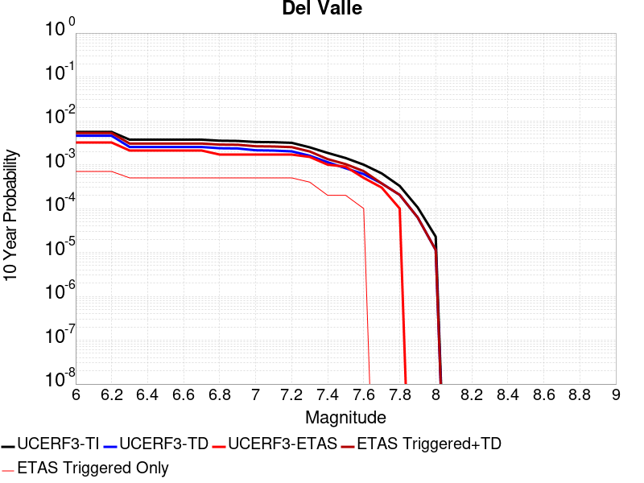 |

| Magnitude | 1 wk TI Prob | 1 wk TD Prob | 1 wk ETAS Prob | 1 wk ETAS/TD Gain | 1 wk ETAS Triggered+TD | 1 wk ETAS Triggered Only | 1 mo TI Prob | 1 mo TD Prob | 1 mo ETAS Prob | 1 mo ETAS/TD Gain | 1 mo ETAS Triggered+TD | 1 mo ETAS Triggered Only | 1 yr TI Prob | 1 yr TD Prob | 1 yr ETAS Prob | 1 yr ETAS/TD Gain | 1 yr ETAS Triggered+TD | 1 yr ETAS Triggered Only | 10 yr TI Prob | 10 yr TD Prob | 10 yr ETAS Prob | 10 yr ETAS/TD Gain | 10 yr ETAS Triggered+TD | 10 yr ETAS Triggered Only |
|-----|-----|-----|-----|-----|-----|-----|-----|-----|-----|-----|-----|-----|-----|-----|-----|-----|-----|-----|-----|-----|-----|-----|-----|-----|
| 6.0 | 1.0716125E-5 | 8.751312E-6 | 0.0 | 0.0 | 8.751312E-6 | 0.0 | 4.592544E-5 | 3.7505193E-5 | 0.0 | 0.0 | 3.7505193E-5 | 0.0 | 5.589988E-4 | 4.5654975E-4 | 1.0E-4 | 0.21903418 | 4.5654975E-4 | 0.0 | 0.0055759475 | 0.0045580897 | 0.0032 | 0.7020485 | 0.005254899 | 7.0E-4 |
| 6.1 | 1.0716125E-5 | 8.751312E-6 | 0.0 | 0.0 | 8.751312E-6 | 0.0 | 4.592544E-5 | 3.7505193E-5 | 0.0 | 0.0 | 3.7505193E-5 | 0.0 | 5.589988E-4 | 4.5654975E-4 | 1.0E-4 | 0.21903418 | 4.5654975E-4 | 0.0 | 0.0055759475 | 0.0045580897 | 0.0032 | 0.7020485 | 0.005254899 | 7.0E-4 |
| 6.2 | 1.0716125E-5 | 8.751312E-6 | 0.0 | 0.0 | 8.751312E-6 | 0.0 | 4.592544E-5 | 3.7505193E-5 | 0.0 | 0.0 | 3.7505193E-5 | 0.0 | 5.589988E-4 | 4.5654975E-4 | 1.0E-4 | 0.21903418 | 4.5654975E-4 | 0.0 | 0.0055759475 | 0.0045580897 | 0.0032 | 0.7020485 | 0.005254899 | 7.0E-4 |
| 6.3 | 7.1293784E-6 | 4.8528304E-6 | 0.0 | 0.0 | 4.8528304E-6 | 0.0 | 3.055412E-5 | 2.0797685E-5 | 0.0 | 0.0 | 2.0797685E-5 | 0.0 | 3.7193293E-4 | 2.531831E-4 | 1.0E-4 | 0.39497104 | 2.531831E-4 | 0.0 | 0.0037131102 | 0.0025290528 | 0.0021 | 0.8303504 | 0.0030277884 | 5.0E-4 |
| 6.4 | 7.1293784E-6 | 4.8528304E-6 | 0.0 | 0.0 | 4.8528304E-6 | 0.0 | 3.055412E-5 | 2.0797685E-5 | 0.0 | 0.0 | 2.0797685E-5 | 0.0 | 3.7193293E-4 | 2.531831E-4 | 1.0E-4 | 0.39497104 | 2.531831E-4 | 0.0 | 0.0037131102 | 0.0025290528 | 0.0021 | 0.8303504 | 0.0030277884 | 5.0E-4 |
| 6.5 | 7.1293784E-6 | 4.8528304E-6 | 0.0 | 0.0 | 4.8528304E-6 | 0.0 | 3.055412E-5 | 2.0797685E-5 | 0.0 | 0.0 | 2.0797685E-5 | 0.0 | 3.7193293E-4 | 2.531831E-4 | 1.0E-4 | 0.39497104 | 2.531831E-4 | 0.0 | 0.0037131102 | 0.0025290528 | 0.0021 | 0.8303504 | 0.0030277884 | 5.0E-4 |
| 6.6 | 7.1293784E-6 | 4.8528304E-6 | 0.0 | 0.0 | 4.8528304E-6 | 0.0 | 3.055412E-5 | 2.0797685E-5 | 0.0 | 0.0 | 2.0797685E-5 | 0.0 | 3.7193293E-4 | 2.531831E-4 | 1.0E-4 | 0.39497104 | 2.531831E-4 | 0.0 | 0.0037131102 | 0.0025290528 | 0.0021 | 0.8303504 | 0.0030277884 | 5.0E-4 |
| 6.7 | 7.12272E-6 | 4.85024E-6 | 0.0 | 0.0 | 4.85024E-6 | 0.0 | 3.0525585E-5 | 2.0786581E-5 | 0.0 | 0.0 | 2.0786581E-5 | 0.0 | 3.7158563E-4 | 2.5304797E-4 | 1.0E-4 | 0.39518198 | 2.5304797E-4 | 0.0 | 0.003709649 | 0.0025277045 | 0.0021 | 0.8307933 | 0.0030264407 | 5.0E-4 |
| 6.8 | 6.7558703E-6 | 4.547065E-6 | 0.0 | 0.0 | 4.547065E-6 | 0.0 | 2.895341E-5 | 1.948728E-5 | 0.0 | 0.0 | 1.948728E-5 | 0.0 | 3.5245073E-4 | 2.3723242E-4 | 1.0E-4 | 0.42152753 | 2.3723242E-4 | 0.0 | 0.0035189227 | 0.0023698872 | 0.0017 | 0.7173337 | 0.0028687024 | 5.0E-4 |
| 6.9 | 6.6700386E-6 | 4.4906624E-6 | 0.0 | 0.0 | 4.4906624E-6 | 0.0 | 2.8585566E-5 | 1.9245557E-5 | 0.0 | 0.0 | 1.9245557E-5 | 0.0 | 3.479737E-4 | 2.342901E-4 | 1.0E-4 | 0.4268213 | 2.342901E-4 | 0.0 | 0.003474293 | 0.002340526 | 0.0017 | 0.7263324 | 0.002839356 | 5.0E-4 |
| 7.0 | 6.3181424E-6 | 4.0874893E-6 | 0.0 | 0.0 | 4.0874893E-6 | 0.0 | 2.7077473E-5 | 1.7517696E-5 | 0.0 | 0.0 | 1.7517696E-5 | 0.0 | 3.2961834E-4 | 2.1325749E-4 | 1.0E-4 | 0.46891668 | 2.1325749E-4 | 0.0 | 0.0032912986 | 0.0021306037 | 0.0017 | 0.79789597 | 0.0026295383 | 5.0E-4 |
| 7.1 | 6.248759E-6 | 4.0228306E-6 | 0.0 | 0.0 | 4.0228306E-6 | 0.0 | 2.678012E-5 | 1.724059E-5 | 0.0 | 0.0 | 1.724059E-5 | 0.0 | 3.2599916E-4 | 2.098844E-4 | 1.0E-4 | 0.47645274 | 2.098844E-4 | 0.0 | 0.0032552136 | 0.0020969366 | 0.0017 | 0.8107065 | 0.002595888 | 5.0E-4 |
| 7.2 | 6.0411944E-6 | 3.859206E-6 | 0.0 | 0.0 | 3.859206E-6 | 0.0 | 2.5890577E-5 | 1.6539352E-5 | 0.0 | 0.0 | 1.6539352E-5 | 0.0 | 3.1517216E-4 | 2.0134842E-4 | 1.0E-4 | 0.49665153 | 2.0134842E-4 | 0.0 | 0.0031472554 | 0.0020117336 | 0.0017 | 0.8450423 | 0.0025107276 | 5.0E-4 |
| 7.3 | 4.7691183E-6 | 3.0697345E-6 | 0.0 | 0.0 | 3.0697345E-6 | 0.0 | 2.0438918E-5 | 1.315594E-5 | 0.0 | 0.0 | 1.315594E-5 | 0.0 | 2.488154E-4 | 1.6016202E-4 | 1.0E-4 | 0.6243678 | 1.6016202E-4 | 0.0 | 0.00248537 | 0.0016005047 | 0.0015 | 0.93720436 | 0.0019998646 | 4.0E-4 |
| 7.4 | 3.5524722E-6 | 2.1829612E-6 | 0.0 | 0.0 | 2.1829612E-6 | 0.0 | 1.5224792E-5 | 9.3555145E-6 | 0.0 | 0.0 | 9.3555145E-6 | 0.0 | 1.8534607E-4 | 1.1389752E-4 | 0.0 | 0.0 | 1.1389752E-4 | 0.0 | 0.0018519156 | 0.0011383997 | 0.001 | 0.87842613 | 0.001338172 | 2.0E-4 |
| 7.5 | 2.7133442E-6 | 1.5874225E-6 | 0.0 | 0.0 | 1.5874225E-6 | 0.0 | 1.1628566E-5 | 6.803222E-6 | 0.0 | 0.0 | 6.803222E-6 | 0.0 | 1.415686E-4 | 8.2826096E-5 | 0.0 | 0.0 | 8.2826096E-5 | 0.0 | 0.0014147845 | 8.2795415E-4 | 9.0E-4 | 1.0870167 | 0.0010277886 | 2.0E-4 |
| 7.6 | 1.915338E-6 | 1.1707277E-6 | 0.0 | 0.0 | 1.1707277E-6 | 0.0 | 8.208566E-6 | 5.017395E-6 | 0.0 | 0.0 | 5.017395E-6 | 0.0 | 9.993471E-5 | 6.1085084E-5 | 0.0 | 0.0 | 6.1085084E-5 | 0.0 | 9.988978E-4 | 6.1068387E-4 | 5.0E-4 | 0.81875426 | 7.1062276E-4 | 1.0E-4 |
| 7.7 | 1.2120448E-6 | 7.1597157E-7 | 0.0 | 0.0 | 7.1597157E-7 | 0.0 | 5.194467E-6 | 3.068446E-6 | 0.0 | 0.0 | 3.068446E-6 | 0.0 | 6.3240805E-5 | 3.735769E-5 | 0.0 | 0.0 | 3.735769E-5 | 0.0 | 6.322281E-4 | 3.735145E-4 | 3.0E-4 | 0.80318165 | 3.735145E-4 | 0.0 |
| 7.8 | 6.272381E-7 | 3.9202124E-7 | 0.0 | 0.0 | 3.9202124E-7 | 0.0 | 2.6881603E-6 | 1.6800899E-6 | 0.0 | 0.0 | 1.6800899E-6 | 0.0 | 3.272786E-5 | 2.0454903E-5 | 0.0 | 0.0 | 2.0454903E-5 | 0.0 | 3.272304E-4 | 2.0453037E-4 | 1.0E-4 | 0.48892495 | 2.0453037E-4 | 0.0 |
| 7.9 | 2.0292627E-7 | 1.1963482E-7 | 0.0 | 0.0 | 1.1963482E-7 | 0.0 | 8.6968373E-7 | 5.1272053E-7 | 0.0 | 0.0 | 5.1272053E-7 | 0.0 | 1.0588348E-5 | 6.242355E-6 | 0.0 | 0.0 | 6.242355E-6 | 0.0 | 1.0587843E-4 | 6.2421816E-5 | 0.0 | 0.0 | 6.2421816E-5 | 0.0 |
| 8.0 | 4.374492E-8 | 2.1766871E-8 | 0.0 | 0.0 | 2.1766871E-8 | 0.0 | 1.8747821E-7 | 9.328659E-8 | 0.0 | 0.0 | 9.328659E-8 | 0.0 | 2.2825448E-6 | 1.1357637E-6 | 0.0 | 0.0 | 1.1357637E-6 | 0.0 | 2.2825214E-5 | 1.13575825E-5 | 0.0 | 0.0 | 1.13575825E-5 | 0.0 |

## Santa Monica alt 1
*[(top)](#table-of-contents)*

| 1 Week | 1 Month | 1 Year | 10 Year |
|-----|-----|-----|-----|
|  |  | 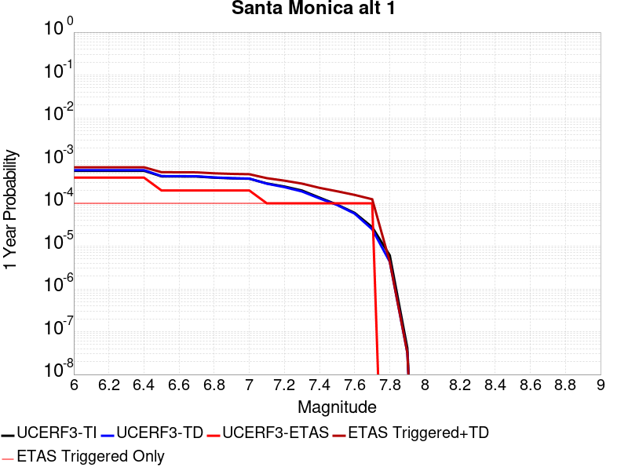 | 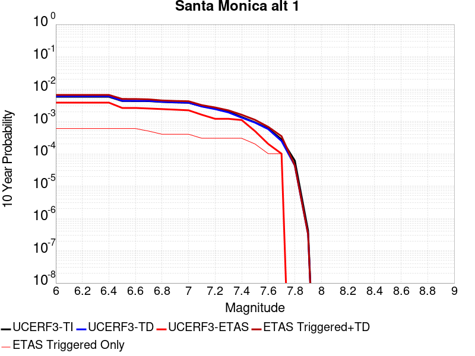 |

| Magnitude | 1 wk TI Prob | 1 wk TD Prob | 1 wk ETAS Prob | 1 wk ETAS/TD Gain | 1 wk ETAS Triggered+TD | 1 wk ETAS Triggered Only | 1 mo TI Prob | 1 mo TD Prob | 1 mo ETAS Prob | 1 mo ETAS/TD Gain | 1 mo ETAS Triggered+TD | 1 mo ETAS Triggered Only | 1 yr TI Prob | 1 yr TD Prob | 1 yr ETAS Prob | 1 yr ETAS/TD Gain | 1 yr ETAS Triggered+TD | 1 yr ETAS Triggered Only | 10 yr TI Prob | 10 yr TD Prob | 10 yr ETAS Prob | 10 yr ETAS/TD Gain | 10 yr ETAS Triggered+TD | 10 yr ETAS Triggered Only |
|-----|-----|-----|-----|-----|-----|-----|-----|-----|-----|-----|-----|-----|-----|-----|-----|-----|-----|-----|-----|-----|-----|-----|-----|-----|
| 6.0 | 1.1066008E-5 | 1.1470408E-5 | 0.0 | 0.0 | 1.1470408E-5 | 0.0 | 4.742488E-5 | 4.9158047E-5 | 1.0E-4 | 2.034255 | 1.4915313E-4 | 1.0E-4 | 5.7724497E-4 | 5.9834874E-4 | 4.0E-4 | 0.66850644 | 6.982889E-4 | 1.0E-4 | 0.005757478 | 0.0059687616 | 0.0038 | 0.636648 | 0.00656518 | 6.0E-4 |
| 6.1 | 1.1066008E-5 | 1.1470408E-5 | 0.0 | 0.0 | 1.1470408E-5 | 0.0 | 4.742488E-5 | 4.9158047E-5 | 1.0E-4 | 2.034255 | 1.4915313E-4 | 1.0E-4 | 5.7724497E-4 | 5.9834874E-4 | 4.0E-4 | 0.66850644 | 6.982889E-4 | 1.0E-4 | 0.005757478 | 0.0059687616 | 0.0038 | 0.636648 | 0.00656518 | 6.0E-4 |
| 6.2 | 1.1066008E-5 | 1.1470408E-5 | 0.0 | 0.0 | 1.1470408E-5 | 0.0 | 4.742488E-5 | 4.9158047E-5 | 1.0E-4 | 2.034255 | 1.4915313E-4 | 1.0E-4 | 5.7724497E-4 | 5.9834874E-4 | 4.0E-4 | 0.66850644 | 6.982889E-4 | 1.0E-4 | 0.005757478 | 0.0059687616 | 0.0038 | 0.636648 | 0.00656518 | 6.0E-4 |
| 6.3 | 1.1066008E-5 | 1.1470408E-5 | 0.0 | 0.0 | 1.1470408E-5 | 0.0 | 4.742488E-5 | 4.9158047E-5 | 1.0E-4 | 2.034255 | 1.4915313E-4 | 1.0E-4 | 5.7724497E-4 | 5.9834874E-4 | 4.0E-4 | 0.66850644 | 6.982889E-4 | 1.0E-4 | 0.005757478 | 0.0059687616 | 0.0038 | 0.636648 | 0.00656518 | 6.0E-4 |
| 6.4 | 1.1066008E-5 | 1.1470408E-5 | 0.0 | 0.0 | 1.1470408E-5 | 0.0 | 4.742488E-5 | 4.9158047E-5 | 1.0E-4 | 2.034255 | 1.4915313E-4 | 1.0E-4 | 5.7724497E-4 | 5.9834874E-4 | 4.0E-4 | 0.66850644 | 6.982889E-4 | 1.0E-4 | 0.005757478 | 0.0059687616 | 0.0038 | 0.636648 | 0.00656518 | 6.0E-4 |
| 6.5 | 8.183544E-6 | 8.328517E-6 | 0.0 | 0.0 | 8.328517E-6 | 0.0 | 3.5071862E-5 | 3.5693163E-5 | 1.0E-4 | 2.801657 | 1.356896E-4 | 1.0E-4 | 4.2691626E-4 | 4.3447918E-4 | 2.0E-4 | 0.46032125 | 5.3443573E-4 | 1.0E-4 | 0.0042609703 | 0.004336463 | 0.0026 | 0.599567 | 0.004933861 | 6.0E-4 |
| 6.6 | 8.1543285E-6 | 8.29676E-6 | 0.0 | 0.0 | 8.29676E-6 | 0.0 | 3.4946657E-5 | 3.5557066E-5 | 1.0E-4 | 2.8123806 | 1.355535E-4 | 1.0E-4 | 4.2539247E-4 | 4.3282288E-4 | 2.0E-4 | 0.46208277 | 5.327796E-4 | 1.0E-4 | 0.0042457907 | 0.004319964 | 0.0026 | 0.6018568 | 0.004917372 | 6.0E-4 |
| 6.7 | 8.110878E-6 | 8.250192E-6 | 0.0 | 0.0 | 8.250192E-6 | 0.0 | 3.4760444E-5 | 3.5357498E-5 | 1.0E-4 | 2.8282545 | 1.3535396E-4 | 1.0E-4 | 4.231262E-4 | 4.3039408E-4 | 2.0E-4 | 0.46469042 | 5.30351E-4 | 1.0E-4 | 0.0042232145 | 0.00429577 | 0.0025 | 0.58196783 | 0.004793622 | 5.0E-4 |
| 6.8 | 7.644036E-6 | 7.744655E-6 | 0.0 | 0.0 | 7.744655E-6 | 0.0 | 3.275974E-5 | 3.319096E-5 | 1.0E-4 | 3.0128684 | 1.3318764E-4 | 1.0E-4 | 3.9877684E-4 | 4.0402645E-4 | 2.0E-4 | 0.4950171 | 5.03986E-4 | 1.0E-4 | 0.00398062 | 0.004033065 | 0.0024 | 0.5950809 | 0.0044314517 | 4.0E-4 |
| 6.9 | 7.3698293E-6 | 7.449552E-6 | 0.0 | 0.0 | 7.449552E-6 | 0.0 | 3.15846E-5 | 3.192627E-5 | 1.0E-4 | 3.1322172 | 1.3192308E-4 | 1.0E-4 | 3.8447464E-4 | 3.8863436E-4 | 2.0E-4 | 0.5146225 | 4.885955E-4 | 1.0E-4 | 0.0038381014 | 0.0038796905 | 0.0023 | 0.5928308 | 0.0042781387 | 4.0E-4 |
| 7.0 | 7.209872E-6 | 7.279572E-6 | 0.0 | 0.0 | 7.279572E-6 | 0.0 | 3.0899086E-5 | 3.11978E-5 | 1.0E-4 | 3.2053542 | 1.3119468E-4 | 1.0E-4 | 3.7613141E-4 | 3.797684E-4 | 2.0E-4 | 0.5266368 | 4.7973043E-4 | 1.0E-4 | 0.0037549543 | 0.0037913364 | 0.0022 | 0.5802703 | 0.00418982 | 4.0E-4 |
| 7.1 | 5.603456E-6 | 5.5196188E-6 | 0.0 | 0.0 | 5.5196188E-6 | 0.0 | 2.4014591E-5 | 2.3655297E-5 | 1.0E-4 | 4.227383 | 1.2365294E-4 | 1.0E-4 | 2.923384E-4 | 2.8796558E-4 | 1.0E-4 | 0.34726372 | 3.8793677E-4 | 1.0E-4 | 0.0029195412 | 0.002875966 | 0.0016 | 0.5563348 | 0.0031751033 | 3.0E-4 |
| 7.2 | 4.7483613E-6 | 4.587748E-6 | 0.0 | 0.0 | 4.587748E-6 | 0.0 | 2.0349962E-5 | 1.9661631E-5 | 1.0E-4 | 5.086048 | 1.19659664E-4 | 1.0E-4 | 2.4773262E-4 | 2.3935418E-4 | 1.0E-4 | 0.41779092 | 3.3933023E-4 | 1.0E-4 | 0.0024745662 | 0.002390978 | 0.0012 | 0.50188667 | 0.0026902608 | 3.0E-4 |
| 7.3 | 3.829015E-6 | 3.6315676E-6 | 0.0 | 0.0 | 3.6315676E-6 | 0.0 | 1.6409962E-5 | 1.5563768E-5 | 1.0E-4 | 6.425179 | 1.15562216E-4 | 1.0E-4 | 1.9977297E-4 | 1.8947248E-4 | 1.0E-4 | 0.5277811 | 2.8945354E-4 | 1.0E-4 | 0.0019959346 | 0.0018931184 | 0.0012 | 0.6338748 | 0.0021925503 | 3.0E-4 |
| 7.4 | 2.610755E-6 | 2.497693E-6 | 0.0 | 0.0 | 2.497693E-6 | 0.0 | 1.1188902E-5 | 1.0704354E-5 | 1.0E-4 | 9.341992 | 1.1070329E-4 | 1.0E-4 | 1.3621636E-4 | 1.3031777E-4 | 1.0E-4 | 0.7673551 | 2.3030474E-4 | 1.0E-4 | 0.001361329 | 0.0013024178 | 0.0011 | 0.84458303 | 0.0016020271 | 3.0E-4 |
| 7.5 | 1.792146E-6 | 1.7570197E-6 | 0.0 | 0.0 | 1.7570197E-6 | 0.0 | 7.680603E-6 | 7.530063E-6 | 1.0E-4 | 13.280101 | 1.0752931E-4 | 1.0E-4 | 9.3507326E-5 | 9.1674694E-5 | 1.0E-4 | 1.0908136 | 1.9166553E-4 | 1.0E-4 | 9.3467993E-4 | 9.1637194E-4 | 5.0E-4 | 0.54563 | 0.0011161886 | 2.0E-4 |
| 7.6 | 1.1473018E-6 | 1.1019774E-6 | 0.0 | 0.0 | 1.1019774E-6 | 0.0 | 4.9169985E-6 | 4.7227522E-6 | 1.0E-4 | 21.174095 | 1.0472228E-4 | 1.0E-4 | 5.986281E-5 | 5.7498008E-5 | 1.0E-4 | 1.7391907 | 1.5749225E-4 | 1.0E-4 | 5.984669E-4 | 5.7483296E-4 | 2.0E-4 | 0.34792715 | 6.7477545E-4 | 1.0E-4 |
| 7.7 | 5.330919E-7 | 4.7398788E-7 | 0.0 | 0.0 | 4.7398788E-7 | 0.0 | 2.2846775E-6 | 2.031375E-6 | 1.0E-4 | 49.227737 | 1.0203117E-4 | 1.0E-4 | 2.7815593E-5 | 2.4731722E-5 | 1.0E-4 | 4.0433903 | 1.2472925E-4 | 1.0E-4 | 2.7812112E-4 | 2.4729082E-4 | 1.0E-4 | 0.40438217 | 3.472661E-4 | 1.0E-4 |
| 7.8 | 1.1668574E-7 | 8.2681304E-8 | 0.0 | 0.0 | 8.2681304E-8 | 0.0 | 5.000816E-7 | 3.5434837E-7 | 0.0 | 0.0 | 3.5434837E-7 | 0.0 | 6.0884768E-6 | 4.3141836E-6 | 0.0 | 0.0 | 4.3141836E-6 | 0.0 | 6.08831E-5 | 4.3141026E-5 | 0.0 | 0.0 | 4.3141026E-5 | 0.0 |
| 7.9 | 8.007447E-10 | 6.1585737E-10 | 0.0 | 0.0 | 6.1585737E-10 | 0.0 | 3.4317629E-9 | 2.6393883E-9 | 0.0 | 0.0 | 2.6393883E-9 | 0.0 | 4.1781714E-8 | 3.2134555E-8 | 0.0 | 0.0 | 3.2134555E-8 | 0.0 | 4.1781706E-7 | 3.213455E-7 | 0.0 | 0.0 | 3.213455E-7 | 0.0 |

## Sheephole
*[(top)](#table-of-contents)*

| 1 Week | 1 Month | 1 Year | 10 Year |
|-----|-----|-----|-----|
|  |  |  |  |

| Magnitude | 1 wk TI Prob | 1 wk TD Prob | 1 wk ETAS Prob | 1 wk ETAS/TD Gain | 1 wk ETAS Triggered+TD | 1 wk ETAS Triggered Only | 1 mo TI Prob | 1 mo TD Prob | 1 mo ETAS Prob | 1 mo ETAS/TD Gain | 1 mo ETAS Triggered+TD | 1 mo ETAS Triggered Only | 1 yr TI Prob | 1 yr TD Prob | 1 yr ETAS Prob | 1 yr ETAS/TD Gain | 1 yr ETAS Triggered+TD | 1 yr ETAS Triggered Only | 10 yr TI Prob | 10 yr TD Prob | 10 yr ETAS Prob | 10 yr ETAS/TD Gain | 10 yr ETAS Triggered+TD | 10 yr ETAS Triggered Only |
|-----|-----|-----|-----|-----|-----|-----|-----|-----|-----|-----|-----|-----|-----|-----|-----|-----|-----|-----|-----|-----|-----|-----|-----|-----|
| 6.0 | 4.5579695E-6 | 4.7392687E-6 | 0.0 | 0.0 | 4.7392687E-6 | 0.0 | 1.9534009E-5 | 2.0311025E-5 | 0.0 | 0.0 | 2.0311025E-5 | 0.0 | 2.3780059E-4 | 2.4726422E-4 | 2.0E-4 | 0.80885136 | 3.472395E-4 | 1.0E-4 | 0.0023754628 | 0.0024704349 | 0.0024 | 0.97148883 | 0.0031687056 | 7.0E-4 |
| 6.1 | 4.5579695E-6 | 4.7392687E-6 | 0.0 | 0.0 | 4.7392687E-6 | 0.0 | 1.9534009E-5 | 2.0311025E-5 | 0.0 | 0.0 | 2.0311025E-5 | 0.0 | 2.3780059E-4 | 2.4726422E-4 | 2.0E-4 | 0.80885136 | 3.472395E-4 | 1.0E-4 | 0.0023754628 | 0.0024704349 | 0.0024 | 0.97148883 | 0.0031687056 | 7.0E-4 |
| 6.2 | 2.6677674E-6 | 2.7860874E-6 | 0.0 | 0.0 | 2.7860874E-6 | 0.0 | 1.1433239E-5 | 1.1940326E-5 | 0.0 | 0.0 | 1.1940326E-5 | 0.0 | 1.3919079E-4 | 1.4536484E-4 | 2.0E-4 | 1.3758484 | 2.4535033E-4 | 1.0E-4 | 0.0013910364 | 0.0014528034 | 0.0014 | 0.9636541 | 0.0017523676 | 3.0E-4 |
| 6.3 | 2.6677674E-6 | 2.7860874E-6 | 0.0 | 0.0 | 2.7860874E-6 | 0.0 | 1.1433239E-5 | 1.1940326E-5 | 0.0 | 0.0 | 1.1940326E-5 | 0.0 | 1.3919079E-4 | 1.4536484E-4 | 2.0E-4 | 1.3758484 | 2.4535033E-4 | 1.0E-4 | 0.0013910364 | 0.0014528034 | 0.0014 | 0.9636541 | 0.0017523676 | 3.0E-4 |
| 6.4 | 2.2159759E-6 | 2.3217085E-6 | 0.0 | 0.0 | 2.3217085E-6 | 0.0 | 9.497005E-6 | 9.950146E-6 | 0.0 | 0.0 | 9.950146E-6 | 0.0 | 1.156199E-4 | 1.211371E-4 | 2.0E-4 | 1.6510218 | 2.2112498E-4 | 1.0E-4 | 0.0011555976 | 0.00121079 | 0.0011 | 0.9084978 | 0.0015104268 | 3.0E-4 |
| 6.5 | 2.1986082E-6 | 2.303597E-6 | 0.0 | 0.0 | 2.303597E-6 | 0.0 | 9.4225725E-6 | 9.872526E-6 | 0.0 | 0.0 | 9.872526E-6 | 0.0 | 1.1471378E-4 | 1.2019218E-4 | 1.0E-4 | 0.8320009 | 2.2018015E-4 | 1.0E-4 | 0.0011465458 | 0.0012013509 | 0.001 | 0.8323962 | 0.0015009906 | 3.0E-4 |
| 6.6 | 1.5232331E-6 | 1.6010284E-6 | 0.0 | 0.0 | 1.6010284E-6 | 0.0 | 6.5281256E-6 | 6.8615336E-6 | 0.0 | 0.0 | 6.8615336E-6 | 0.0 | 7.947703E-5 | 8.353616E-5 | 1.0E-4 | 1.1970865 | 1.8352781E-4 | 1.0E-4 | 7.9448614E-4 | 8.3506625E-4 | 8.0E-4 | 0.9580078 | 0.0010348993 | 2.0E-4 |
| 6.7 | 1.3137362E-6 | 1.3820602E-6 | 0.0 | 0.0 | 1.3820602E-6 | 0.0 | 5.6302856E-6 | 5.9231024E-6 | 0.0 | 0.0 | 5.9231024E-6 | 0.0 | 6.854657E-5 | 7.211153E-5 | 1.0E-4 | 1.3867409 | 1.7210431E-4 | 1.0E-4 | 6.8525434E-4 | 7.208951E-4 | 7.0E-4 | 0.97101504 | 9.2075096E-4 | 2.0E-4 |
| 6.8 | 1.2275751E-6 | 1.2915738E-6 | 0.0 | 0.0 | 1.2915738E-6 | 0.0 | 5.2610258E-6 | 5.535305E-6 | 0.0 | 0.0 | 5.535305E-6 | 0.0 | 6.4051106E-5 | 6.739039E-5 | 1.0E-4 | 1.4838911 | 1.6738365E-4 | 1.0E-4 | 6.4032647E-4 | 6.737129E-4 | 7.0E-4 | 1.0390183 | 8.7357813E-4 | 2.0E-4 |
| 6.9 | 1.1837088E-6 | 1.2454166E-6 | 0.0 | 0.0 | 1.2454166E-6 | 0.0 | 5.0730278E-6 | 5.3374893E-6 | 0.0 | 0.0 | 5.3374893E-6 | 0.0 | 6.176237E-5 | 6.498213E-5 | 1.0E-4 | 1.5388846 | 1.6497563E-4 | 1.0E-4 | 6.17452E-4 | 6.496444E-4 | 7.0E-4 | 1.0775125 | 8.4951444E-4 | 2.0E-4 |
| 7.0 | 9.849371E-7 | 1.036061E-6 | 0.0 | 0.0 | 1.036061E-6 | 0.0 | 4.2211523E-6 | 4.4402545E-6 | 0.0 | 0.0 | 4.4402545E-6 | 0.0 | 5.1391315E-5 | 5.405886E-5 | 1.0E-4 | 1.8498355 | 1.5405346E-4 | 1.0E-4 | 5.137943E-4 | 5.4046715E-4 | 7.0E-4 | 1.2951758 | 7.403591E-4 | 2.0E-4 |
| 7.1 | 8.1643645E-7 | 8.586976E-7 | 0.0 | 0.0 | 8.586976E-7 | 0.0 | 3.4990085E-6 | 3.680128E-6 | 0.0 | 0.0 | 3.680128E-6 | 0.0 | 4.2599597E-5 | 4.4804725E-5 | 0.0 | 0.0 | 4.4804725E-5 | 0.0 | 4.259143E-4 | 4.4796552E-4 | 5.0E-4 | 1.1161573 | 5.479207E-4 | 1.0E-4 |
| 7.2 | 5.7295756E-7 | 6.026208E-7 | 0.0 | 0.0 | 6.026208E-7 | 0.0 | 2.45553E-6 | 2.5826585E-6 | 0.0 | 0.0 | 2.5826585E-6 | 0.0 | 2.9895667E-5 | 3.144348E-5 | 0.0 | 0.0 | 3.144348E-5 | 0.0 | 2.9891645E-4 | 3.1439698E-4 | 5.0E-4 | 1.590346 | 4.1436555E-4 | 1.0E-4 |

## Contra Costa (Lafayette) 2011 CFM
*[(top)](#table-of-contents)*

| 1 Week | 1 Month | 1 Year | 10 Year |
|-----|-----|-----|-----|
|  |  | 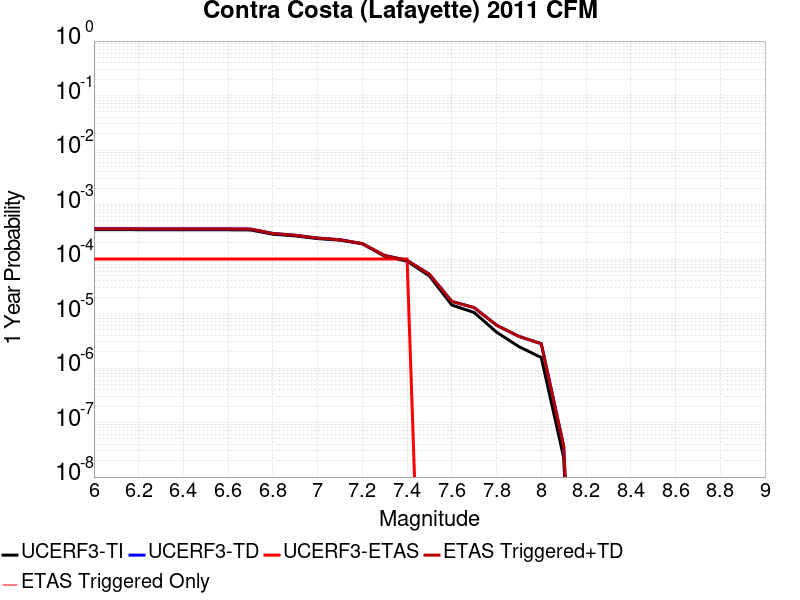 |  |

| Magnitude | 1 wk TI Prob | 1 wk TD Prob | 1 wk ETAS Prob | 1 wk ETAS/TD Gain | 1 wk ETAS Triggered+TD | 1 wk ETAS Triggered Only | 1 mo TI Prob | 1 mo TD Prob | 1 mo ETAS Prob | 1 mo ETAS/TD Gain | 1 mo ETAS Triggered+TD | 1 mo ETAS Triggered Only | 1 yr TI Prob | 1 yr TD Prob | 1 yr ETAS Prob | 1 yr ETAS/TD Gain | 1 yr ETAS Triggered+TD | 1 yr ETAS Triggered Only | 10 yr TI Prob | 10 yr TD Prob | 10 yr ETAS Prob | 10 yr ETAS/TD Gain | 10 yr ETAS Triggered+TD | 10 yr ETAS Triggered Only |
|-----|-----|-----|-----|-----|-----|-----|-----|-----|-----|-----|-----|-----|-----|-----|-----|-----|-----|-----|-----|-----|-----|-----|-----|-----|
| 6.0 | 6.655419E-6 | 6.907731E-6 | 0.0 | 0.0 | 6.907731E-6 | 0.0 | 2.8522913E-5 | 2.9604238E-5 | 0.0 | 0.0 | 2.9604238E-5 | 0.0 | 3.472111E-4 | 3.6037396E-4 | 1.0E-4 | 0.27748954 | 3.6037396E-4 | 0.0 | 0.0034666911 | 0.0036027534 | 0.0028 | 0.77718335 | 0.0043002316 | 7.0E-4 |
| 6.1 | 6.655419E-6 | 6.907731E-6 | 0.0 | 0.0 | 6.907731E-6 | 0.0 | 2.8522913E-5 | 2.9604238E-5 | 0.0 | 0.0 | 2.9604238E-5 | 0.0 | 3.472111E-4 | 3.6037396E-4 | 1.0E-4 | 0.27748954 | 3.6037396E-4 | 0.0 | 0.0034666911 | 0.0036027534 | 0.0028 | 0.77718335 | 0.0043002316 | 7.0E-4 |
| 6.2 | 6.6254133E-6 | 6.876158E-6 | 0.0 | 0.0 | 6.876158E-6 | 0.0 | 2.839432E-5 | 2.9468925E-5 | 0.0 | 0.0 | 2.9468925E-5 | 0.0 | 3.45646E-4 | 3.5872706E-4 | 1.0E-4 | 0.27876347 | 3.5872706E-4 | 0.0 | 0.003451089 | 0.003586338 | 0.0028 | 0.78074074 | 0.0042838273 | 7.0E-4 |
| 6.3 | 6.6254133E-6 | 6.876158E-6 | 0.0 | 0.0 | 6.876158E-6 | 0.0 | 2.839432E-5 | 2.9468925E-5 | 0.0 | 0.0 | 2.9468925E-5 | 0.0 | 3.45646E-4 | 3.5872706E-4 | 1.0E-4 | 0.27876347 | 3.5872706E-4 | 0.0 | 0.003451089 | 0.003586338 | 0.0028 | 0.78074074 | 0.0042838273 | 7.0E-4 |
| 6.4 | 6.6254133E-6 | 6.876158E-6 | 0.0 | 0.0 | 6.876158E-6 | 0.0 | 2.839432E-5 | 2.9468925E-5 | 0.0 | 0.0 | 2.9468925E-5 | 0.0 | 3.45646E-4 | 3.5872706E-4 | 1.0E-4 | 0.27876347 | 3.5872706E-4 | 0.0 | 0.003451089 | 0.003586338 | 0.0028 | 0.78074074 | 0.0042838273 | 7.0E-4 |
| 6.5 | 6.606445E-6 | 6.855723E-6 | 0.0 | 0.0 | 6.855723E-6 | 0.0 | 2.8313027E-5 | 2.938135E-5 | 0.0 | 0.0 | 2.938135E-5 | 0.0 | 3.4465658E-4 | 3.576612E-4 | 1.0E-4 | 0.2795942 | 3.576612E-4 | 0.0 | 0.0034412253 | 0.0035757134 | 0.0028 | 0.78306055 | 0.00427321 | 7.0E-4 |
| 6.6 | 6.59966E-6 | 6.8482686E-6 | 0.0 | 0.0 | 6.8482686E-6 | 0.0 | 2.828395E-5 | 2.9349403E-5 | 0.0 | 0.0 | 2.9349403E-5 | 0.0 | 3.4430268E-4 | 3.5727237E-4 | 1.0E-4 | 0.2798985 | 3.5727237E-4 | 0.0 | 0.0034376972 | 0.0035718377 | 0.0028 | 0.7839102 | 0.0042693373 | 7.0E-4 |
| 6.7 | 6.5570975E-6 | 6.8022987E-6 | 0.0 | 0.0 | 6.8022987E-6 | 0.0 | 2.8101544E-5 | 2.9152394E-5 | 0.0 | 0.0 | 2.9152394E-5 | 0.0 | 3.4208258E-4 | 3.5487456E-4 | 1.0E-4 | 0.2817897 | 3.5487456E-4 | 0.0 | 0.0034155648 | 0.0035479364 | 0.0028 | 0.7891911 | 0.004245453 | 7.0E-4 |
| 6.8 | 5.472255E-6 | 5.646102E-6 | 0.0 | 0.0 | 5.646102E-6 | 0.0 | 2.345231E-5 | 2.4197358E-5 | 0.0 | 0.0 | 2.4197358E-5 | 0.0 | 2.8549446E-4 | 2.9456348E-4 | 1.0E-4 | 0.3394854 | 2.9456348E-4 | 0.0 | 0.0028512797 | 0.0029464404 | 0.0022 | 0.7466637 | 0.0035446726 | 6.0E-4 |
| 6.9 | 5.092346E-6 | 5.2367986E-6 | 0.0 | 0.0 | 5.2367986E-6 | 0.0 | 2.1824157E-5 | 2.2443233E-5 | 0.0 | 0.0 | 2.2443233E-5 | 0.0 | 2.656767E-4 | 2.7321247E-4 | 1.0E-4 | 0.3660155 | 2.7321247E-4 | 0.0 | 0.002653593 | 0.0027334683 | 0.0021 | 0.76825476 | 0.0032321017 | 5.0E-4 |
| 7.0 | 4.5525762E-6 | 4.6506752E-6 | 0.0 | 0.0 | 4.6506752E-6 | 0.0 | 1.9510895E-5 | 1.9931314E-5 | 0.0 | 0.0 | 1.9931314E-5 | 0.0 | 2.3751926E-4 | 2.4263703E-4 | 1.0E-4 | 0.41213822 | 2.4263703E-4 | 0.0 | 0.0023726553 | 0.0024284127 | 0.0018 | 0.7412249 | 0.002727684 | 3.0E-4 |
| 7.1 | 4.261504E-6 | 4.3302425E-6 | 0.0 | 0.0 | 4.3302425E-6 | 0.0 | 1.826346E-5 | 1.8558052E-5 | 0.0 | 0.0 | 1.8558052E-5 | 0.0 | 2.2233493E-4 | 2.2592113E-4 | 1.0E-4 | 0.44263235 | 2.2592113E-4 | 0.0 | 0.002221126 | 0.0022615942 | 0.0016 | 0.7074656 | 0.002461142 | 2.0E-4 |
| 7.2 | 3.654114E-6 | 3.6725157E-6 | 0.0 | 0.0 | 3.6725157E-6 | 0.0 | 1.5660395E-5 | 1.5739259E-5 | 0.0 | 0.0 | 1.5739259E-5 | 0.0 | 1.9064861E-4 | 1.9160888E-4 | 1.0E-4 | 0.5218965 | 1.9160888E-4 | 0.0 | 0.0019048514 | 0.0019190717 | 0.0015 | 0.7816279 | 0.0021186878 | 2.0E-4 |
| 7.3 | 2.1595129E-6 | 2.2241215E-6 | 0.0 | 0.0 | 2.2241215E-6 | 0.0 | 9.255023E-6 | 9.531915E-6 | 0.0 | 0.0 | 9.531915E-6 | 0.0 | 1.1267407E-4 | 1.16044925E-4 | 1.0E-4 | 0.8617352 | 1.16044925E-4 | 0.0 | 0.0011261696 | 0.0011644588 | 0.001 | 0.85876805 | 0.0013642259 | 2.0E-4 |
| 7.4 | 1.7532738E-6 | 1.8149052E-6 | 0.0 | 0.0 | 1.8149052E-6 | 0.0 | 7.5140088E-6 | 7.778142E-6 | 0.0 | 0.0 | 7.778142E-6 | 0.0 | 9.147922E-5 | 9.4694806E-5 | 1.0E-4 | 1.0560242 | 9.4694806E-5 | 0.0 | 9.144157E-4 | 9.5098466E-4 | 7.0E-4 | 0.7360792 | 0.0011507944 | 2.0E-4 |
| 7.5 | 9.387875E-7 | 1.0040341E-6 | 0.0 | 0.0 | 1.0040341E-6 | 0.0 | 4.0233685E-6 | 4.302996E-6 | 0.0 | 0.0 | 4.302996E-6 | 0.0 | 4.8983413E-5 | 5.238773E-5 | 0.0 | 0.0 | 5.238773E-5 | 0.0 | 4.897262E-4 | 5.278372E-4 | 3.0E-4 | 0.5683571 | 6.277844E-4 | 1.0E-4 |
| 7.6 | 2.7471893E-7 | 3.1831E-7 | 0.0 | 0.0 | 3.1831E-7 | 0.0 | 1.1773664E-6 | 1.364185E-6 | 0.0 | 0.0 | 1.364185E-6 | 0.0 | 1.433434E-5 | 1.6608827E-5 | 0.0 | 0.0 | 1.6608827E-5 | 0.0 | 1.4333417E-4 | 1.6994587E-4 | 2.0E-4 | 1.1768453 | 2.699289E-4 | 1.0E-4 |
| 7.7 | 2.0057985E-7 | 2.4472544E-7 | 0.0 | 0.0 | 2.4472544E-7 | 0.0 | 8.596276E-7 | 1.0488229E-6 | 0.0 | 0.0 | 1.0488229E-6 | 0.0 | 1.0465916E-5 | 1.2769346E-5 | 0.0 | 0.0 | 1.2769346E-5 | 0.0 | 1.0465423E-4 | 1.315111E-4 | 0.0 | 0.0 | 1.315111E-4 | 0.0 |
| 7.8 | 8.7403905E-8 | 1.1670708E-7 | 0.0 | 0.0 | 1.1670708E-7 | 0.0 | 3.745881E-7 | 5.001731E-7 | 0.0 | 0.0 | 5.001731E-7 | 0.0 | 4.5606007E-6 | 6.0895904E-6 | 0.0 | 0.0 | 6.0895904E-6 | 0.0 | 4.560507E-5 | 6.318295E-5 | 0.0 | 0.0 | 6.318295E-5 | 0.0 |
| 7.9 | 4.740233E-8 | 7.2807154E-8 | 0.0 | 0.0 | 7.2807154E-8 | 0.0 | 2.0315284E-7 | 3.1203064E-7 | 0.0 | 0.0 | 3.1203064E-7 | 0.0 | 2.473383E-6 | 3.7989662E-6 | 0.0 | 0.0 | 3.7989662E-6 | 0.0 | 2.4733554E-5 | 3.9554907E-5 | 0.0 | 0.0 | 3.9554907E-5 | 0.0 |
| 8.0 | 2.99164E-8 | 5.3344383E-8 | 0.0 | 0.0 | 5.3344383E-8 | 0.0 | 1.2821314E-7 | 2.2861877E-7 | 0.0 | 0.0 | 2.2861877E-7 | 0.0 | 1.5609938E-6 | 2.78343E-6 | 0.0 | 0.0 | 2.78343E-6 | 0.0 | 1.5609829E-5 | 2.8890961E-5 | 0.0 | 0.0 | 2.8890961E-5 | 0.0 |
| 8.1 | 4.431212E-10 | 7.101969E-10 | 0.0 | 0.0 | 7.101969E-10 | 0.0 | 1.899091E-9 | 3.0437017E-9 | 0.0 | 0.0 | 3.0437017E-9 | 0.0 | 2.3121432E-8 | 3.705707E-8 | 0.0 | 0.0 | 3.705707E-8 | 0.0 | 2.312143E-7 | 3.7948874E-7 | 0.0 | 0.0 | 3.7948874E-7 | 0.0 |

## Joshua Tree (Seismicity)
*[(top)](#table-of-contents)*

| 1 Week | 1 Month | 1 Year | 10 Year |
|-----|-----|-----|-----|
|  | 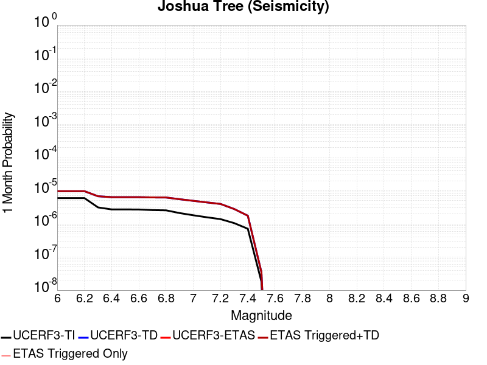 |  |  |

| Magnitude | 1 wk TI Prob | 1 wk TD Prob | 1 wk ETAS Prob | 1 wk ETAS/TD Gain | 1 wk ETAS Triggered+TD | 1 wk ETAS Triggered Only | 1 mo TI Prob | 1 mo TD Prob | 1 mo ETAS Prob | 1 mo ETAS/TD Gain | 1 mo ETAS Triggered+TD | 1 mo ETAS Triggered Only | 1 yr TI Prob | 1 yr TD Prob | 1 yr ETAS Prob | 1 yr ETAS/TD Gain | 1 yr ETAS Triggered+TD | 1 yr ETAS Triggered Only | 10 yr TI Prob | 10 yr TD Prob | 10 yr ETAS Prob | 10 yr ETAS/TD Gain | 10 yr ETAS Triggered+TD | 10 yr ETAS Triggered Only |
|-----|-----|-----|-----|-----|-----|-----|-----|-----|-----|-----|-----|-----|-----|-----|-----|-----|-----|-----|-----|-----|-----|-----|-----|-----|
| 6.0 | 1.4025588E-6 | 2.2655597E-6 | 0.0 | 0.0 | 2.2655597E-6 | 0.0 | 6.0109523E-6 | 9.709509E-6 | 0.0 | 0.0 | 9.709509E-6 | 0.0 | 7.318089E-5 | 1.18207514E-4 | 3.0E-4 | 2.5379097 | 3.1818388E-4 | 2.0E-4 | 7.315679E-4 | 0.0011815104 | 0.0012 | 1.0156491 | 0.0018806834 | 7.0E-4 |
| 6.1 | 1.4025588E-6 | 2.2655597E-6 | 0.0 | 0.0 | 2.2655597E-6 | 0.0 | 6.0109523E-6 | 9.709509E-6 | 0.0 | 0.0 | 9.709509E-6 | 0.0 | 7.318089E-5 | 1.18207514E-4 | 3.0E-4 | 2.5379097 | 3.1818388E-4 | 2.0E-4 | 7.315679E-4 | 0.0011815104 | 0.0012 | 1.0156491 | 0.0018806834 | 7.0E-4 |
| 6.2 | 1.4025588E-6 | 2.2655597E-6 | 0.0 | 0.0 | 2.2655597E-6 | 0.0 | 6.0109523E-6 | 9.709509E-6 | 0.0 | 0.0 | 9.709509E-6 | 0.0 | 7.318089E-5 | 1.18207514E-4 | 3.0E-4 | 2.5379097 | 3.1818388E-4 | 2.0E-4 | 7.315679E-4 | 0.0011815104 | 0.0012 | 1.0156491 | 0.0018806834 | 7.0E-4 |
| 6.3 | 7.3325685E-7 | 1.5896609E-6 | 0.0 | 0.0 | 1.5896609E-6 | 0.0 | 3.1425257E-6 | 6.812815E-6 | 0.0 | 0.0 | 6.812815E-6 | 0.0 | 3.825958E-5 | 8.2942955E-5 | 3.0E-4 | 3.6169438 | 2.8292637E-4 | 2.0E-4 | 3.8252992E-4 | 8.291284E-4 | 9.0E-4 | 1.0854772 | 0.0014286309 | 6.0E-4 |
| 6.4 | 6.38256E-7 | 1.4939177E-6 | 0.0 | 0.0 | 1.4939177E-6 | 0.0 | 2.7353801E-6 | 6.4024894E-6 | 0.0 | 0.0 | 6.4024894E-6 | 0.0 | 3.3302742E-5 | 7.794759E-5 | 3.0E-4 | 3.8487399 | 2.77932E-4 | 2.0E-4 | 3.3297754E-4 | 7.792098E-4 | 9.0E-4 | 1.1550163 | 0.0013787423 | 6.0E-4 |
| 6.5 | 6.38256E-7 | 1.4939177E-6 | 0.0 | 0.0 | 1.4939177E-6 | 0.0 | 2.7353801E-6 | 6.4024894E-6 | 0.0 | 0.0 | 6.4024894E-6 | 0.0 | 3.3302742E-5 | 7.794759E-5 | 3.0E-4 | 3.8487399 | 2.77932E-4 | 2.0E-4 | 3.3297754E-4 | 7.792098E-4 | 9.0E-4 | 1.1550163 | 0.0013787423 | 6.0E-4 |
| 6.6 | 6.3436806E-7 | 1.4910122E-6 | 0.0 | 0.0 | 1.4910122E-6 | 0.0 | 2.7187175E-6 | 6.390037E-6 | 0.0 | 0.0 | 6.390037E-6 | 0.0 | 3.3099885E-5 | 7.7795994E-5 | 3.0E-4 | 3.8562396 | 2.7778043E-4 | 2.0E-4 | 3.3094952E-4 | 7.776949E-4 | 9.0E-4 | 1.1572661 | 0.0013772283 | 6.0E-4 |
| 6.7 | 6.094856E-7 | 1.4657072E-6 | 0.0 | 0.0 | 1.4657072E-6 | 0.0 | 2.6120786E-6 | 6.281588E-6 | 0.0 | 0.0 | 6.281588E-6 | 0.0 | 3.1801592E-5 | 7.647572E-5 | 3.0E-4 | 3.9228137 | 2.7646043E-4 | 2.0E-4 | 3.179704E-4 | 7.645012E-4 | 9.0E-4 | 1.1772381 | 0.0013640425 | 6.0E-4 |
| 6.8 | 5.984801E-7 | 1.4570192E-6 | 0.0 | 0.0 | 1.4570192E-6 | 0.0 | 2.564912E-6 | 6.2443532E-6 | 0.0 | 0.0 | 6.2443532E-6 | 0.0 | 3.1227355E-5 | 7.602242E-5 | 3.0E-4 | 3.9462042 | 2.7600722E-4 | 2.0E-4 | 3.1222968E-4 | 7.599714E-4 | 9.0E-4 | 1.1842551 | 0.0013595154 | 6.0E-4 |
| 6.9 | 4.94631E-7 | 1.2919547E-6 | 0.0 | 0.0 | 1.2919547E-6 | 0.0 | 2.1198455E-6 | 5.5369374E-6 | 0.0 | 0.0 | 5.5369374E-6 | 0.0 | 2.5808813E-5 | 6.741019E-5 | 2.0E-4 | 2.9669106 | 1.6740344E-4 | 1.0E-4 | 2.5805813E-4 | 6.739032E-4 | 8.0E-4 | 1.187114 | 0.0011735663 | 5.0E-4 |
| 7.0 | 4.250375E-7 | 1.1560988E-6 | 0.0 | 0.0 | 1.1560988E-6 | 0.0 | 1.8215881E-6 | 4.9547E-6 | 0.0 | 0.0 | 4.9547E-6 | 0.0 | 2.2177608E-5 | 6.0321858E-5 | 1.0E-4 | 1.6577739 | 1.6031583E-4 | 1.0E-4 | 2.2175396E-4 | 6.030598E-4 | 6.0E-4 | 0.9949263 | 0.0010028186 | 4.0E-4 |
| 7.1 | 3.6888565E-7 | 1.0349357E-6 | 0.0 | 0.0 | 1.0349357E-6 | 0.0 | 1.5809376E-6 | 4.4354315E-6 | 0.0 | 0.0 | 4.4354315E-6 | 0.0 | 1.9247746E-5 | 5.4000087E-5 | 1.0E-4 | 1.8518488 | 1.5399468E-4 | 1.0E-4 | 1.9246078E-4 | 5.3987396E-4 | 5.0E-4 | 0.9261421 | 9.39658E-4 | 4.0E-4 |
| 7.2 | 3.2473773E-7 | 9.300622E-7 | 0.0 | 0.0 | 9.300622E-7 | 0.0 | 1.3917323E-6 | 3.985975E-6 | 0.0 | 0.0 | 3.985975E-6 | 0.0 | 1.694421E-5 | 4.8528203E-5 | 0.0 | 0.0 | 4.8528203E-5 | 0.0 | 1.6942917E-4 | 4.8518006E-4 | 4.0E-4 | 0.8244362 | 7.850345E-4 | 3.0E-4 |
| 7.3 | 2.465367E-7 | 6.5459557E-7 | 0.0 | 0.0 | 6.5459557E-7 | 0.0 | 1.0565853E-6 | 2.8054067E-6 | 0.0 | 0.0 | 2.8054067E-6 | 0.0 | 1.2863851E-5 | 3.4155324E-5 | 0.0 | 0.0 | 3.4155324E-5 | 0.0 | 1.2863107E-4 | 3.4150408E-4 | 4.0E-4 | 1.1712891 | 6.414016E-4 | 3.0E-4 |
| 7.4 | 1.6654941E-7 | 4.1122357E-7 | 0.0 | 0.0 | 4.1122357E-7 | 0.0 | 7.13783E-7 | 1.7623856E-6 | 0.0 | 0.0 | 1.7623856E-6 | 0.0 | 8.690274E-6 | 2.145686E-5 | 0.0 | 0.0 | 2.145686E-5 | 0.0 | 8.689934E-5 | 2.1455054E-4 | 4.0E-4 | 1.8643625 | 5.1448616E-4 | 3.0E-4 |
| 7.5 | 4.24214E-9 | 8.1482385E-9 | 0.0 | 0.0 | 8.1482385E-9 | 0.0 | 1.81806E-8 | 3.4921023E-8 | 0.0 | 0.0 | 3.4921023E-8 | 0.0 | 2.213488E-7 | 4.2516345E-7 | 0.0 | 0.0 | 4.2516345E-7 | 0.0 | 2.2134857E-6 | 4.2516326E-6 | 0.0 | 0.0 | 4.2516326E-6 | 0.0 |

## Las Positas
*[(top)](#table-of-contents)*

| 1 Week | 1 Month | 1 Year | 10 Year |
|-----|-----|-----|-----|
|  |  | 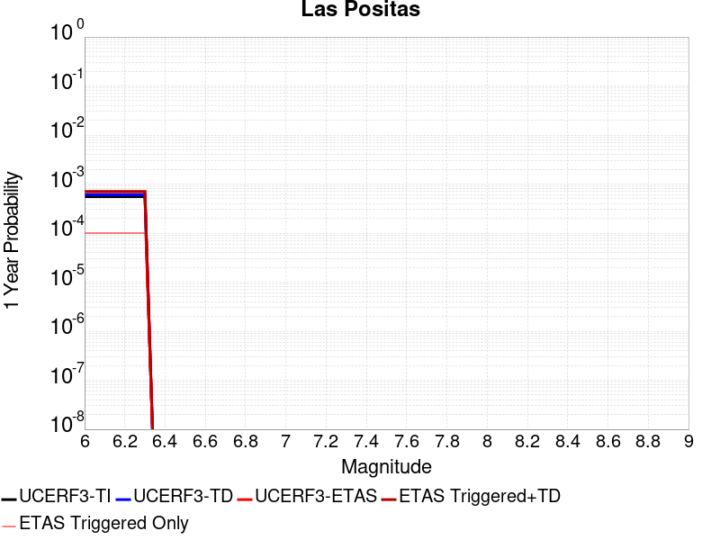 | 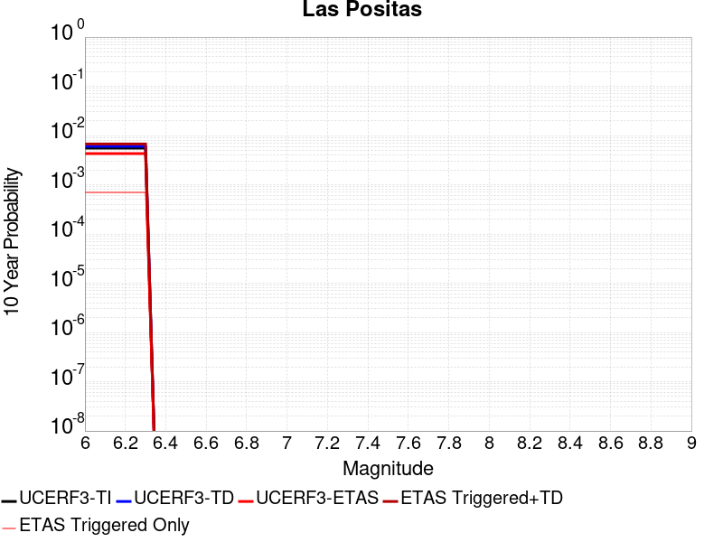 |

| Magnitude | 1 wk TI Prob | 1 wk TD Prob | 1 wk ETAS Prob | 1 wk ETAS/TD Gain | 1 wk ETAS Triggered+TD | 1 wk ETAS Triggered Only | 1 mo TI Prob | 1 mo TD Prob | 1 mo ETAS Prob | 1 mo ETAS/TD Gain | 1 mo ETAS Triggered+TD | 1 mo ETAS Triggered Only | 1 yr TI Prob | 1 yr TD Prob | 1 yr ETAS Prob | 1 yr ETAS/TD Gain | 1 yr ETAS Triggered+TD | 1 yr ETAS Triggered Only | 10 yr TI Prob | 10 yr TD Prob | 10 yr ETAS Prob | 10 yr ETAS/TD Gain | 10 yr ETAS Triggered+TD | 10 yr ETAS Triggered Only |
|-----|-----|-----|-----|-----|-----|-----|-----|-----|-----|-----|-----|-----|-----|-----|-----|-----|-----|-----|-----|-----|-----|-----|-----|-----|
| 6.0 | 1.0659424E-5 | 1.1580553E-5 | 0.0 | 0.0 | 1.1580553E-5 | 0.0 | 4.568245E-5 | 4.9630944E-5 | 1.0E-4 | 2.014872 | 4.9630944E-5 | 0.0 | 5.560419E-4 | 6.0425675E-4 | 7.0E-4 | 1.158448 | 7.0419634E-4 | 1.0E-4 | 0.005546526 | 0.0060425675 | 0.0043 | 0.711618 | 0.0067383377 | 7.0E-4 |
| 6.1 | 1.0659424E-5 | 1.1580553E-5 | 0.0 | 0.0 | 1.1580553E-5 | 0.0 | 4.568245E-5 | 4.9630944E-5 | 1.0E-4 | 2.014872 | 4.9630944E-5 | 0.0 | 5.560419E-4 | 6.0425675E-4 | 7.0E-4 | 1.158448 | 7.0419634E-4 | 1.0E-4 | 0.005546526 | 0.0060425675 | 0.0043 | 0.711618 | 0.0067383377 | 7.0E-4 |
| 6.2 | 1.0659424E-5 | 1.1580553E-5 | 0.0 | 0.0 | 1.1580553E-5 | 0.0 | 4.568245E-5 | 4.9630944E-5 | 1.0E-4 | 2.014872 | 4.9630944E-5 | 0.0 | 5.560419E-4 | 6.0425675E-4 | 7.0E-4 | 1.158448 | 7.0419634E-4 | 1.0E-4 | 0.005546526 | 0.0060425675 | 0.0043 | 0.711618 | 0.0067383377 | 7.0E-4 |
| 6.3 | 1.0659424E-5 | 1.1580553E-5 | 0.0 | 0.0 | 1.1580553E-5 | 0.0 | 4.568245E-5 | 4.9630944E-5 | 1.0E-4 | 2.014872 | 4.9630944E-5 | 0.0 | 5.560419E-4 | 6.0425675E-4 | 7.0E-4 | 1.158448 | 7.0419634E-4 | 1.0E-4 | 0.005546526 | 0.0060425675 | 0.0043 | 0.711618 | 0.0067383377 | 7.0E-4 |

## North Frontal  (West)
*[(top)](#table-of-contents)*

| 1 Week | 1 Month | 1 Year | 10 Year |
|-----|-----|-----|-----|
|  |  |  |  |

| Magnitude | 1 wk TI Prob | 1 wk TD Prob | 1 wk ETAS Prob | 1 wk ETAS/TD Gain | 1 wk ETAS Triggered+TD | 1 wk ETAS Triggered Only | 1 mo TI Prob | 1 mo TD Prob | 1 mo ETAS Prob | 1 mo ETAS/TD Gain | 1 mo ETAS Triggered+TD | 1 mo ETAS Triggered Only | 1 yr TI Prob | 1 yr TD Prob | 1 yr ETAS Prob | 1 yr ETAS/TD Gain | 1 yr ETAS Triggered+TD | 1 yr ETAS Triggered Only | 10 yr TI Prob | 10 yr TD Prob | 10 yr ETAS Prob | 10 yr ETAS/TD Gain | 10 yr ETAS Triggered+TD | 10 yr ETAS Triggered Only |
|-----|-----|-----|-----|-----|-----|-----|-----|-----|-----|-----|-----|-----|-----|-----|-----|-----|-----|-----|-----|-----|-----|-----|-----|-----|
| 6.0 | 4.7316266E-6 | 4.851189E-6 | 0.0 | 0.0 | 4.851189E-6 | 0.0 | 2.0278241E-5 | 2.0790652E-5 | 0.0 | 0.0 | 2.0790652E-5 | 0.0 | 2.4685962E-4 | 2.5309826E-4 | 0.0 | 0.0 | 2.5309826E-4 | 0.0 | 0.0024658558 | 0.002528246 | 0.0015 | 0.5932967 | 0.0032264763 | 7.0E-4 |
| 6.1 | 4.7316266E-6 | 4.851189E-6 | 0.0 | 0.0 | 4.851189E-6 | 0.0 | 2.0278241E-5 | 2.0790652E-5 | 0.0 | 0.0 | 2.0790652E-5 | 0.0 | 2.4685962E-4 | 2.5309826E-4 | 0.0 | 0.0 | 2.5309826E-4 | 0.0 | 0.0024658558 | 0.002528246 | 0.0015 | 0.5932967 | 0.0032264763 | 7.0E-4 |
| 6.2 | 4.7316266E-6 | 4.851189E-6 | 0.0 | 0.0 | 4.851189E-6 | 0.0 | 2.0278241E-5 | 2.0790652E-5 | 0.0 | 0.0 | 2.0790652E-5 | 0.0 | 2.4685962E-4 | 2.5309826E-4 | 0.0 | 0.0 | 2.5309826E-4 | 0.0 | 0.0024658558 | 0.002528246 | 0.0015 | 0.5932967 | 0.0032264763 | 7.0E-4 |
| 6.3 | 4.7316266E-6 | 4.851189E-6 | 0.0 | 0.0 | 4.851189E-6 | 0.0 | 2.0278241E-5 | 2.0790652E-5 | 0.0 | 0.0 | 2.0790652E-5 | 0.0 | 2.4685962E-4 | 2.5309826E-4 | 0.0 | 0.0 | 2.5309826E-4 | 0.0 | 0.0024658558 | 0.002528246 | 0.0015 | 0.5932967 | 0.0032264763 | 7.0E-4 |
| 6.4 | 4.7316266E-6 | 4.851189E-6 | 0.0 | 0.0 | 4.851189E-6 | 0.0 | 2.0278241E-5 | 2.0790652E-5 | 0.0 | 0.0 | 2.0790652E-5 | 0.0 | 2.4685962E-4 | 2.5309826E-4 | 0.0 | 0.0 | 2.5309826E-4 | 0.0 | 0.0024658558 | 0.002528246 | 0.0015 | 0.5932967 | 0.0032264763 | 7.0E-4 |
| 6.5 | 4.7316266E-6 | 4.851189E-6 | 0.0 | 0.0 | 4.851189E-6 | 0.0 | 2.0278241E-5 | 2.0790652E-5 | 0.0 | 0.0 | 2.0790652E-5 | 0.0 | 2.4685962E-4 | 2.5309826E-4 | 0.0 | 0.0 | 2.5309826E-4 | 0.0 | 0.0024658558 | 0.002528246 | 0.0015 | 0.5932967 | 0.0032264763 | 7.0E-4 |
| 6.6 | 4.7316266E-6 | 4.851189E-6 | 0.0 | 0.0 | 4.851189E-6 | 0.0 | 2.0278241E-5 | 2.0790652E-5 | 0.0 | 0.0 | 2.0790652E-5 | 0.0 | 2.4685962E-4 | 2.5309826E-4 | 0.0 | 0.0 | 2.5309826E-4 | 0.0 | 0.0024658558 | 0.002528246 | 0.0015 | 0.5932967 | 0.0032264763 | 7.0E-4 |
| 6.7 | 3.5382777E-6 | 3.629706E-6 | 0.0 | 0.0 | 3.629706E-6 | 0.0 | 1.516396E-5 | 1.5555795E-5 | 0.0 | 0.0 | 1.5555795E-5 | 0.0 | 1.8460557E-4 | 1.8937612E-4 | 0.0 | 0.0 | 1.8937612E-4 | 0.0 | 0.0018445229 | 0.0018922243 | 0.0013 | 0.68702215 | 0.0025908998 | 7.0E-4 |
| 6.8 | 3.5382777E-6 | 3.629706E-6 | 0.0 | 0.0 | 3.629706E-6 | 0.0 | 1.516396E-5 | 1.5555795E-5 | 0.0 | 0.0 | 1.5555795E-5 | 0.0 | 1.8460557E-4 | 1.8937612E-4 | 0.0 | 0.0 | 1.8937612E-4 | 0.0 | 0.0018445229 | 0.0018922243 | 0.0013 | 0.68702215 | 0.0025908998 | 7.0E-4 |
| 6.9 | 3.0428037E-6 | 3.1217162E-6 | 0.0 | 0.0 | 3.1217162E-6 | 0.0 | 1.30405215E-5 | 1.3378719E-5 | 0.0 | 0.0 | 1.3378719E-5 | 0.0 | 1.5875678E-4 | 1.628744E-4 | 0.0 | 0.0 | 1.628744E-4 | 0.0 | 0.0015864341 | 0.0016276174 | 0.0012 | 0.737274 | 0.002226641 | 6.0E-4 |
| 7.0 | 2.538778E-6 | 2.6051812E-6 | 0.0 | 0.0 | 2.6051812E-6 | 0.0 | 1.0880432E-5 | 1.1165017E-5 | 0.0 | 0.0 | 1.1165017E-5 | 0.0 | 1.324612E-4 | 1.3592608E-4 | 0.0 | 0.0 | 1.3592608E-4 | 0.0 | 0.0013238228 | 0.0013584761 | 7.0E-4 | 0.5152832 | 0.0017579327 | 4.0E-4 |
| 7.1 | 2.2418935E-6 | 2.3003838E-6 | 0.0 | 0.0 | 2.3003838E-6 | 0.0 | 9.60808E-6 | 9.858753E-6 | 0.0 | 0.0 | 9.858753E-6 | 0.0 | 1.1697209E-4 | 1.2002416E-4 | 0.0 | 0.0 | 1.2002416E-4 | 0.0 | 0.0011691054 | 0.0011996372 | 6.0E-4 | 0.5001512 | 0.0014992773 | 3.0E-4 |
| 7.2 | 1.6526745E-6 | 1.6918722E-6 | 0.0 | 0.0 | 1.6918722E-6 | 0.0 | 7.082872E-6 | 7.250862E-6 | 0.0 | 0.0 | 7.250862E-6 | 0.0 | 8.623055E-5 | 8.827592E-5 | 0.0 | 0.0 | 8.827592E-5 | 0.0 | 8.61971E-4 | 8.824336E-4 | 6.0E-4 | 0.67993784 | 0.0011821688 | 3.0E-4 |
| 7.3 | 1.0246019E-6 | 1.0438306E-6 | 0.0 | 0.0 | 1.0438306E-6 | 0.0 | 4.391144E-6 | 4.473553E-6 | 0.0 | 0.0 | 4.473553E-6 | 0.0 | 5.3460866E-5 | 5.446426E-5 | 0.0 | 0.0 | 5.446426E-5 | 0.0 | 5.344801E-4 | 5.445206E-4 | 2.0E-4 | 0.36729556 | 6.4446614E-4 | 1.0E-4 |
| 7.4 | 8.9045164E-7 | 9.0530807E-7 | 0.0 | 0.0 | 9.0530807E-7 | 0.0 | 3.8162157E-6 | 3.8798867E-6 | 0.0 | 0.0 | 3.8798867E-6 | 0.0 | 4.646144E-5 | 4.7236706E-5 | 0.0 | 0.0 | 4.7236706E-5 | 0.0 | 4.6451724E-4 | 4.7227752E-4 | 1.0E-4 | 0.2117399 | 4.7227752E-4 | 0.0 |
| 7.5 | 6.3357E-7 | 6.40014E-7 | 0.0 | 0.0 | 6.40014E-7 | 0.0 | 2.7152971E-6 | 2.7429146E-6 | 0.0 | 0.0 | 2.7429146E-6 | 0.0 | 3.305824E-5 | 3.3394543E-5 | 0.0 | 0.0 | 3.3394543E-5 | 0.0 | 3.3053322E-4 | 3.339018E-4 | 1.0E-4 | 0.29948926 | 3.339018E-4 | 0.0 |
| 7.6 | 2.5087024E-7 | 2.4350598E-7 | 0.0 | 0.0 | 2.4350598E-7 | 0.0 | 1.0751578E-6 | 1.0435967E-6 | 0.0 | 0.0 | 1.0435967E-6 | 0.0 | 1.3089967E-5 | 1.2705737E-5 | 0.0 | 0.0 | 1.2705737E-5 | 0.0 | 1.3089196E-4 | 1.2705216E-4 | 0.0 | 0.0 | 1.2705216E-4 | 0.0 |
| 7.7 | 3.282987E-8 | 2.2854802E-8 | 0.0 | 0.0 | 2.2854802E-8 | 0.0 | 1.4069944E-7 | 9.7949155E-8 | 0.0 | 0.0 | 9.7949155E-8 | 0.0 | 1.7130144E-6 | 1.1925304E-6 | 0.0 | 0.0 | 1.1925304E-6 | 0.0 | 1.7130013E-5 | 1.1925248E-5 | 0.0 | 0.0 | 1.1925248E-5 | 0.0 |
| 7.8 | 8.77499E-9 | 5.676737E-9 | 0.0 | 0.0 | 5.676737E-9 | 0.0 | 3.7607098E-8 | 2.4328871E-8 | 0.0 | 0.0 | 2.4328871E-8 | 0.0 | 4.578663E-7 | 2.9620398E-7 | 0.0 | 0.0 | 2.9620398E-7 | 0.0 | 4.5786537E-6 | 2.9620373E-6 | 0.0 | 0.0 | 2.9620373E-6 | 0.0 |

## Dry Mountain
*[(top)](#table-of-contents)*

| 1 Week | 1 Month | 1 Year | 10 Year |
|-----|-----|-----|-----|
| 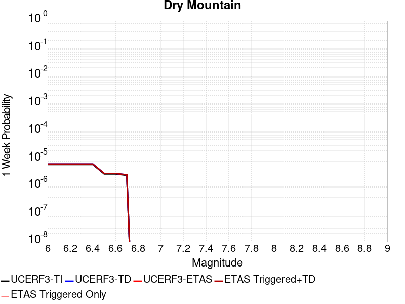 | 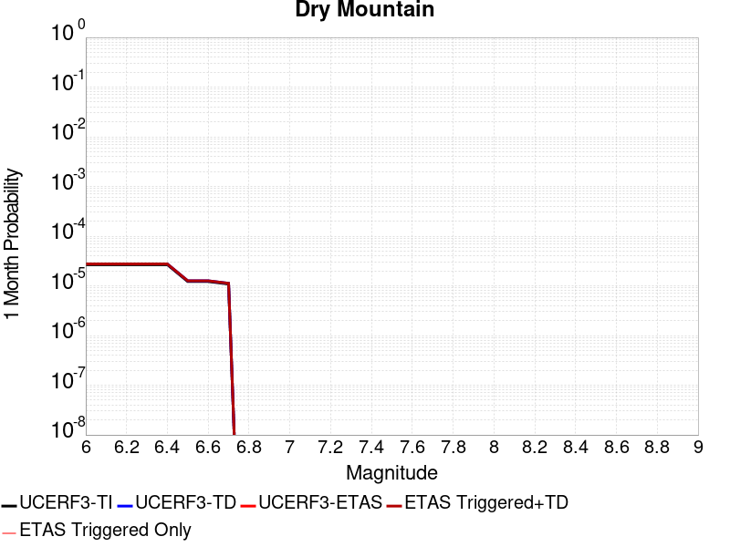 | 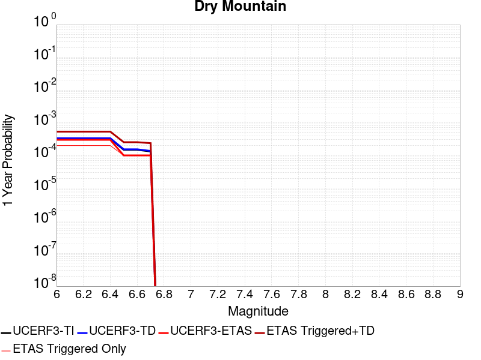 |  |

| Magnitude | 1 wk TI Prob | 1 wk TD Prob | 1 wk ETAS Prob | 1 wk ETAS/TD Gain | 1 wk ETAS Triggered+TD | 1 wk ETAS Triggered Only | 1 mo TI Prob | 1 mo TD Prob | 1 mo ETAS Prob | 1 mo ETAS/TD Gain | 1 mo ETAS Triggered+TD | 1 mo ETAS Triggered Only | 1 yr TI Prob | 1 yr TD Prob | 1 yr ETAS Prob | 1 yr ETAS/TD Gain | 1 yr ETAS Triggered+TD | 1 yr ETAS Triggered Only | 10 yr TI Prob | 10 yr TD Prob | 10 yr ETAS Prob | 10 yr ETAS/TD Gain | 10 yr ETAS Triggered+TD | 10 yr ETAS Triggered Only |
|-----|-----|-----|-----|-----|-----|-----|-----|-----|-----|-----|-----|-----|-----|-----|-----|-----|-----|-----|-----|-----|-----|-----|-----|-----|
| 6.0 | 6.222801E-6 | 6.437042E-6 | 0.0 | 0.0 | 6.437042E-6 | 0.0 | 2.6668875E-5 | 2.758712E-5 | 0.0 | 0.0 | 2.758712E-5 | 0.0 | 3.2464517E-4 | 3.3583734E-4 | 3.0E-4 | 0.8932896 | 5.3577014E-4 | 2.0E-4 | 0.0032417132 | 0.003354859 | 0.0022 | 0.65576524 | 0.003952846 | 6.0E-4 |
| 6.1 | 6.222801E-6 | 6.437042E-6 | 0.0 | 0.0 | 6.437042E-6 | 0.0 | 2.6668875E-5 | 2.758712E-5 | 0.0 | 0.0 | 2.758712E-5 | 0.0 | 3.2464517E-4 | 3.3583734E-4 | 3.0E-4 | 0.8932896 | 5.3577014E-4 | 2.0E-4 | 0.0032417132 | 0.003354859 | 0.0022 | 0.65576524 | 0.003952846 | 6.0E-4 |
| 6.2 | 6.222801E-6 | 6.437042E-6 | 0.0 | 0.0 | 6.437042E-6 | 0.0 | 2.6668875E-5 | 2.758712E-5 | 0.0 | 0.0 | 2.758712E-5 | 0.0 | 3.2464517E-4 | 3.3583734E-4 | 3.0E-4 | 0.8932896 | 5.3577014E-4 | 2.0E-4 | 0.0032417132 | 0.003354859 | 0.0022 | 0.65576524 | 0.003952846 | 6.0E-4 |
| 6.3 | 6.222801E-6 | 6.437042E-6 | 0.0 | 0.0 | 6.437042E-6 | 0.0 | 2.6668875E-5 | 2.758712E-5 | 0.0 | 0.0 | 2.758712E-5 | 0.0 | 3.2464517E-4 | 3.3583734E-4 | 3.0E-4 | 0.8932896 | 5.3577014E-4 | 2.0E-4 | 0.0032417132 | 0.003354859 | 0.0022 | 0.65576524 | 0.003952846 | 6.0E-4 |
| 6.4 | 6.222801E-6 | 6.437042E-6 | 0.0 | 0.0 | 6.437042E-6 | 0.0 | 2.6668875E-5 | 2.758712E-5 | 0.0 | 0.0 | 2.758712E-5 | 0.0 | 3.2464517E-4 | 3.3583734E-4 | 3.0E-4 | 0.8932896 | 5.3577014E-4 | 2.0E-4 | 0.0032417132 | 0.003354859 | 0.0022 | 0.65576524 | 0.003952846 | 6.0E-4 |
| 6.5 | 2.8528623E-6 | 2.951096E-6 | 0.0 | 0.0 | 2.951096E-6 | 0.0 | 1.22264955E-5 | 1.2647541E-5 | 0.0 | 0.0 | 1.2647541E-5 | 0.0 | 1.4884741E-4 | 1.5398163E-4 | 1.0E-4 | 0.6494281 | 2.5396622E-4 | 1.0E-4 | 0.0014874774 | 0.0015396021 | 0.0012 | 0.77942216 | 0.0018391402 | 3.0E-4 |
| 6.6 | 2.8528623E-6 | 2.951096E-6 | 0.0 | 0.0 | 2.951096E-6 | 0.0 | 1.22264955E-5 | 1.2647541E-5 | 0.0 | 0.0 | 1.2647541E-5 | 0.0 | 1.4884741E-4 | 1.5398163E-4 | 1.0E-4 | 0.6494281 | 2.5396622E-4 | 1.0E-4 | 0.0014874774 | 0.0015396021 | 0.0012 | 0.77942216 | 0.0018391402 | 3.0E-4 |
| 6.7 | 2.541E-6 | 2.6284035E-6 | 0.0 | 0.0 | 2.6284035E-6 | 0.0 | 1.0889954E-5 | 1.1264587E-5 | 0.0 | 0.0 | 1.1264587E-5 | 0.0 | 1.3257713E-4 | 1.3714634E-4 | 1.0E-4 | 0.72914815 | 2.3713263E-4 | 1.0E-4 | 0.0013249806 | 0.0013714634 | 0.001 | 0.72914815 | 0.001671052 | 3.0E-4 |

## Airport Lake
*[(top)](#table-of-contents)*

| 1 Week | 1 Month | 1 Year | 10 Year |
|-----|-----|-----|-----|
| 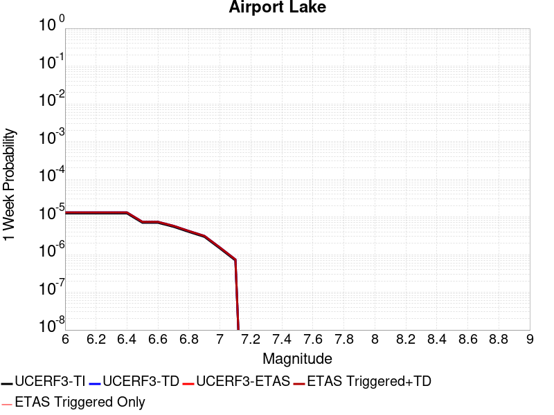 |  | 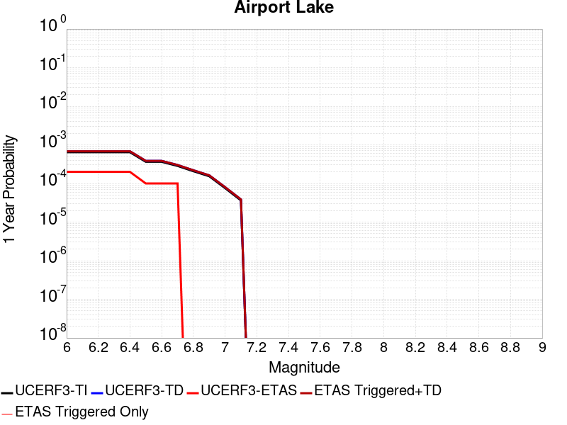 |  |

| Magnitude | 1 wk TI Prob | 1 wk TD Prob | 1 wk ETAS Prob | 1 wk ETAS/TD Gain | 1 wk ETAS Triggered+TD | 1 wk ETAS Triggered Only | 1 mo TI Prob | 1 mo TD Prob | 1 mo ETAS Prob | 1 mo ETAS/TD Gain | 1 mo ETAS Triggered+TD | 1 mo ETAS Triggered Only | 1 yr TI Prob | 1 yr TD Prob | 1 yr ETAS Prob | 1 yr ETAS/TD Gain | 1 yr ETAS Triggered+TD | 1 yr ETAS Triggered Only | 10 yr TI Prob | 10 yr TD Prob | 10 yr ETAS Prob | 10 yr ETAS/TD Gain | 10 yr ETAS Triggered+TD | 10 yr ETAS Triggered Only |
|-----|-----|-----|-----|-----|-----|-----|-----|-----|-----|-----|-----|-----|-----|-----|-----|-----|-----|-----|-----|-----|-----|-----|-----|-----|
| 6.0 | 1.2387061E-5 | 1.3095247E-5 | 0.0 | 0.0 | 1.3095247E-5 | 0.0 | 5.3086325E-5 | 5.612144E-5 | 0.0 | 0.0 | 5.612144E-5 | 0.0 | 6.461343E-4 | 6.830927E-4 | 2.0E-4 | 0.29278603 | 6.830927E-4 | 0.0 | 0.0064425888 | 0.006812736 | 0.0028 | 0.41099492 | 0.0075079673 | 7.0E-4 |
| 6.1 | 1.2387061E-5 | 1.3095247E-5 | 0.0 | 0.0 | 1.3095247E-5 | 0.0 | 5.3086325E-5 | 5.612144E-5 | 0.0 | 0.0 | 5.612144E-5 | 0.0 | 6.461343E-4 | 6.830927E-4 | 2.0E-4 | 0.29278603 | 6.830927E-4 | 0.0 | 0.0064425888 | 0.006812736 | 0.0028 | 0.41099492 | 0.0075079673 | 7.0E-4 |
| 6.2 | 1.2387061E-5 | 1.3095247E-5 | 0.0 | 0.0 | 1.3095247E-5 | 0.0 | 5.3086325E-5 | 5.612144E-5 | 0.0 | 0.0 | 5.612144E-5 | 0.0 | 6.461343E-4 | 6.830927E-4 | 2.0E-4 | 0.29278603 | 6.830927E-4 | 0.0 | 0.0064425888 | 0.006812736 | 0.0028 | 0.41099492 | 0.0075079673 | 7.0E-4 |
| 6.3 | 1.2387061E-5 | 1.3095247E-5 | 0.0 | 0.0 | 1.3095247E-5 | 0.0 | 5.3086325E-5 | 5.612144E-5 | 0.0 | 0.0 | 5.612144E-5 | 0.0 | 6.461343E-4 | 6.830927E-4 | 2.0E-4 | 0.29278603 | 6.830927E-4 | 0.0 | 0.0064425888 | 0.006812736 | 0.0028 | 0.41099492 | 0.0075079673 | 7.0E-4 |
| 6.4 | 1.2387061E-5 | 1.3095247E-5 | 0.0 | 0.0 | 1.3095247E-5 | 0.0 | 5.3086325E-5 | 5.612144E-5 | 0.0 | 0.0 | 5.612144E-5 | 0.0 | 6.461343E-4 | 6.830927E-4 | 2.0E-4 | 0.29278603 | 6.830927E-4 | 0.0 | 0.0064425888 | 0.006812736 | 0.0028 | 0.41099492 | 0.0075079673 | 7.0E-4 |
| 6.5 | 6.9922594E-6 | 7.380596E-6 | 0.0 | 0.0 | 7.380596E-6 | 0.0 | 2.996648E-5 | 3.1630774E-5 | 0.0 | 0.0 | 3.1630774E-5 | 0.0 | 3.6478083E-4 | 3.8504202E-4 | 1.0E-4 | 0.25971192 | 3.8504202E-4 | 0.0 | 0.003641826 | 0.0038442856 | 0.0018 | 0.46822742 | 0.0041431324 | 3.0E-4 |
| 6.6 | 6.9922594E-6 | 7.380596E-6 | 0.0 | 0.0 | 7.380596E-6 | 0.0 | 2.996648E-5 | 3.1630774E-5 | 0.0 | 0.0 | 3.1630774E-5 | 0.0 | 3.6478083E-4 | 3.8504202E-4 | 1.0E-4 | 0.25971192 | 3.8504202E-4 | 0.0 | 0.003641826 | 0.0038442856 | 0.0018 | 0.46822742 | 0.0041431324 | 3.0E-4 |
| 6.7 | 5.477277E-6 | 5.7826633E-6 | 0.0 | 0.0 | 5.7826633E-6 | 0.0 | 2.3473833E-5 | 2.478263E-5 | 0.0 | 0.0 | 2.478263E-5 | 0.0 | 2.8575645E-4 | 3.0169063E-4 | 1.0E-4 | 0.3314654 | 3.0169063E-4 | 0.0 | 0.0028538927 | 0.003013194 | 0.0014 | 0.46462324 | 0.0032125914 | 2.0E-4 |
| 6.8 | 3.9950432E-6 | 4.2166175E-6 | 0.0 | 0.0 | 4.2166175E-6 | 0.0 | 1.7121502E-5 | 1.8071109E-5 | 0.0 | 0.0 | 1.8071109E-5 | 0.0 | 2.0843433E-4 | 2.1999628E-4 | 0.0 | 0.0 | 2.1999628E-4 | 0.0 | 0.0020823893 | 0.0021980556 | 0.0012 | 0.54593706 | 0.002297836 | 1.0E-4 |
| 6.9 | 2.95695E-6 | 3.1211937E-6 | 0.0 | 0.0 | 3.1211937E-6 | 0.0 | 1.2672582E-5 | 1.3376488E-5 | 0.0 | 0.0 | 1.3376488E-5 | 0.0 | 1.5427776E-4 | 1.6284884E-4 | 0.0 | 0.0 | 1.6284884E-4 | 0.0 | 0.001541707 | 0.0016275172 | 9.0E-4 | 0.55298954 | 0.0017273545 | 1.0E-4 |
| 7.0 | 1.456072E-6 | 1.5398762E-6 | 0.0 | 0.0 | 1.5398762E-6 | 0.0 | 6.2402937E-6 | 6.5994586E-6 | 0.0 | 0.0 | 6.5994586E-6 | 0.0 | 7.597293E-5 | 8.034645E-5 | 0.0 | 0.0 | 8.034645E-5 | 0.0 | 7.594696E-4 | 8.032728E-4 | 4.0E-4 | 0.49796283 | 9.0319244E-4 | 1.0E-4 |
| 7.1 | 6.995192E-7 | 7.404401E-7 | 0.0 | 0.0 | 7.404401E-7 | 0.0 | 2.997936E-6 | 3.1733148E-6 | 0.0 | 0.0 | 3.1733148E-6 | 0.0 | 3.649926E-5 | 3.8635106E-5 | 0.0 | 0.0 | 3.8635106E-5 | 0.0 | 3.6493264E-4 | 3.8635108E-4 | 3.0E-4 | 0.7764959 | 4.8631243E-4 | 1.0E-4 |

## Shoreline
*[(top)](#table-of-contents)*

| 1 Week | 1 Month | 1 Year | 10 Year |
|-----|-----|-----|-----|
|  |  |  |  |

| Magnitude | 1 wk TI Prob | 1 wk TD Prob | 1 wk ETAS Prob | 1 wk ETAS/TD Gain | 1 wk ETAS Triggered+TD | 1 wk ETAS Triggered Only | 1 mo TI Prob | 1 mo TD Prob | 1 mo ETAS Prob | 1 mo ETAS/TD Gain | 1 mo ETAS Triggered+TD | 1 mo ETAS Triggered Only | 1 yr TI Prob | 1 yr TD Prob | 1 yr ETAS Prob | 1 yr ETAS/TD Gain | 1 yr ETAS Triggered+TD | 1 yr ETAS Triggered Only | 10 yr TI Prob | 10 yr TD Prob | 10 yr ETAS Prob | 10 yr ETAS/TD Gain | 10 yr ETAS Triggered+TD | 10 yr ETAS Triggered Only |
|-----|-----|-----|-----|-----|-----|-----|-----|-----|-----|-----|-----|-----|-----|-----|-----|-----|-----|-----|-----|-----|-----|-----|-----|-----|
| 6.0 | 3.9888673E-6 | 4.046603E-6 | 0.0 | 0.0 | 4.046603E-6 | 0.0 | 1.7095033E-5 | 1.73425E-5 | 0.0 | 0.0 | 1.73425E-5 | 0.0 | 2.0811215E-4 | 2.1113007E-4 | 1.0E-4 | 0.4736417 | 2.1113007E-4 | 0.0 | 0.0020791737 | 0.0021098433 | 0.0023 | 1.0901283 | 0.0027085773 | 6.0E-4 |
| 6.1 | 3.9888673E-6 | 4.046603E-6 | 0.0 | 0.0 | 4.046603E-6 | 0.0 | 1.7095033E-5 | 1.73425E-5 | 0.0 | 0.0 | 1.73425E-5 | 0.0 | 2.0811215E-4 | 2.1113007E-4 | 1.0E-4 | 0.4736417 | 2.1113007E-4 | 0.0 | 0.0020791737 | 0.0021098433 | 0.0023 | 1.0901283 | 0.0027085773 | 6.0E-4 |
| 6.2 | 1.4039653E-6 | 1.4093272E-6 | 0.0 | 0.0 | 1.4093272E-6 | 0.0 | 6.0169805E-6 | 6.0399598E-6 | 0.0 | 0.0 | 6.0399598E-6 | 0.0 | 7.325427E-5 | 7.3534095E-5 | 0.0 | 0.0 | 7.3534095E-5 | 0.0 | 7.3230127E-4 | 7.351036E-4 | 6.0E-4 | 0.81621146 | 8.350301E-4 | 1.0E-4 |
| 6.3 | 1.4039653E-6 | 1.4093272E-6 | 0.0 | 0.0 | 1.4093272E-6 | 0.0 | 6.0169805E-6 | 6.0399598E-6 | 0.0 | 0.0 | 6.0399598E-6 | 0.0 | 7.325427E-5 | 7.3534095E-5 | 0.0 | 0.0 | 7.3534095E-5 | 0.0 | 7.3230127E-4 | 7.351036E-4 | 6.0E-4 | 0.81621146 | 8.350301E-4 | 1.0E-4 |
| 6.4 | 1.3314152E-6 | 1.3354132E-6 | 0.0 | 0.0 | 1.3354132E-6 | 0.0 | 5.7060524E-6 | 5.7231873E-6 | 0.0 | 0.0 | 5.7231873E-6 | 0.0 | 6.946897E-5 | 6.967763E-5 | 0.0 | 0.0 | 6.967763E-5 | 0.0 | 6.9447263E-4 | 6.965632E-4 | 5.0E-4 | 0.7178099 | 7.964936E-4 | 1.0E-4 |
| 6.5 | 1.1187026E-6 | 1.1196494E-6 | 0.0 | 0.0 | 1.1196494E-6 | 0.0 | 4.794431E-6 | 4.7984886E-6 | 0.0 | 0.0 | 4.7984886E-6 | 0.0 | 5.8370628E-5 | 5.842006E-5 | 0.0 | 0.0 | 5.842006E-5 | 0.0 | 5.83553E-4 | 5.8404956E-4 | 5.0E-4 | 0.85609174 | 6.839911E-4 | 1.0E-4 |
| 6.6 | 9.793089E-7 | 9.778038E-7 | 0.0 | 0.0 | 9.778038E-7 | 0.0 | 4.1970316E-6 | 4.190581E-6 | 0.0 | 0.0 | 4.190581E-6 | 0.0 | 5.1097657E-5 | 5.1019142E-5 | 0.0 | 0.0 | 5.1019142E-5 | 0.0 | 5.108591E-4 | 5.1007554E-4 | 3.0E-4 | 0.5881482 | 5.1007554E-4 | 0.0 |
| 6.7 | 8.995986E-7 | 8.9660784E-7 | 0.0 | 0.0 | 8.9660784E-7 | 0.0 | 3.8554167E-6 | 3.842599E-6 | 0.0 | 0.0 | 3.842599E-6 | 0.0 | 4.693869E-5 | 4.678265E-5 | 0.0 | 0.0 | 4.678265E-5 | 0.0 | 4.6928777E-4 | 4.67729E-4 | 3.0E-4 | 0.64139706 | 4.67729E-4 | 0.0 |
| 6.8 | 7.931612E-7 | 7.873981E-7 | 0.0 | 0.0 | 7.873981E-7 | 0.0 | 3.3992578E-6 | 3.3745591E-6 | 0.0 | 0.0 | 3.3745591E-6 | 0.0 | 4.1385178E-5 | 4.1084488E-5 | 0.0 | 0.0 | 4.1084488E-5 | 0.0 | 4.1377472E-4 | 4.1076945E-4 | 3.0E-4 | 0.73033667 | 4.1076945E-4 | 0.0 |
| 6.9 | 7.1465956E-7 | 7.0717704E-7 | 0.0 | 0.0 | 7.0717704E-7 | 0.0 | 3.062823E-6 | 3.0307551E-6 | 0.0 | 0.0 | 3.0307551E-6 | 0.0 | 3.7289232E-5 | 3.6898822E-5 | 0.0 | 0.0 | 3.6898822E-5 | 0.0 | 3.7282976E-4 | 3.6892734E-4 | 1.0E-4 | 0.2710561 | 3.6892734E-4 | 0.0 |
| 7.0 | 6.389046E-7 | 6.293448E-7 | 0.0 | 0.0 | 6.293448E-7 | 0.0 | 2.7381598E-6 | 2.6971893E-6 | 0.0 | 0.0 | 2.6971893E-6 | 0.0 | 3.3336586E-5 | 3.2837786E-5 | 0.0 | 0.0 | 3.2837786E-5 | 0.0 | 3.3331584E-4 | 3.283296E-4 | 1.0E-4 | 0.304572 | 3.283296E-4 | 0.0 |
| 7.1 | 5.4300875E-7 | 5.3054384E-7 | 0.0 | 0.0 | 5.3054384E-7 | 0.0 | 2.3271782E-6 | 2.2737572E-6 | 0.0 | 0.0 | 2.2737572E-6 | 0.0 | 2.8333026E-5 | 2.7682643E-5 | 0.0 | 0.0 | 2.7682643E-5 | 0.0 | 2.8329415E-4 | 2.7679207E-4 | 1.0E-4 | 0.36128205 | 2.7679207E-4 | 0.0 |
| 7.2 | 4.6768855E-7 | 4.529451E-7 | 0.0 | 0.0 | 4.529451E-7 | 0.0 | 2.0043778E-6 | 1.9411918E-6 | 0.0 | 0.0 | 1.9411918E-6 | 0.0 | 2.4403027E-5 | 2.3633755E-5 | 0.0 | 0.0 | 2.3633755E-5 | 0.0 | 2.4400349E-4 | 2.3631247E-4 | 1.0E-4 | 0.42316854 | 2.3631247E-4 | 0.0 |
| 7.3 | 4.0966103E-7 | 3.933295E-7 | 0.0 | 0.0 | 3.933295E-7 | 0.0 | 1.7556889E-6 | 1.6856966E-6 | 0.0 | 0.0 | 1.6856966E-6 | 0.0 | 2.1375303E-5 | 2.0523163E-5 | 0.0 | 0.0 | 2.0523163E-5 | 0.0 | 2.1373246E-4 | 2.0521272E-4 | 1.0E-4 | 0.48729923 | 2.0521272E-4 | 0.0 |
| 7.4 | 3.5105785E-7 | 3.3313E-7 | 0.0 | 0.0 | 3.3313E-7 | 0.0 | 1.5045327E-6 | 1.4276992E-6 | 0.0 | 0.0 | 1.4276992E-6 | 0.0 | 1.8317533E-5 | 1.7382099E-5 | 0.0 | 0.0 | 1.7382099E-5 | 0.0 | 1.8316023E-4 | 1.7380742E-4 | 1.0E-4 | 0.57534945 | 1.7380742E-4 | 0.0 |
| 7.5 | 2.8737534E-7 | 2.6770962E-7 | 0.0 | 0.0 | 2.6770962E-7 | 0.0 | 1.2316079E-6 | 1.1473264E-6 | 0.0 | 0.0 | 1.1473264E-6 | 0.0 | 1.4994724E-5 | 1.396861E-5 | 0.0 | 0.0 | 1.396861E-5 | 0.0 | 1.4993713E-4 | 1.3967734E-4 | 1.0E-4 | 0.71593577 | 1.3967734E-4 | 0.0 |
| 7.6 | 2.0924051E-7 | 1.8732382E-7 | 0.0 | 0.0 | 1.8732382E-7 | 0.0 | 8.967448E-7 | 8.028161E-7 | 0.0 | 0.0 | 8.028161E-7 | 0.0 | 1.0917813E-5 | 9.774242E-6 | 0.0 | 0.0 | 9.774242E-6 | 0.0 | 1.0917276E-4 | 9.7738135E-5 | 1.0E-4 | 1.0231421 | 9.7738135E-5 | 0.0 |
| 7.7 | 1.392265E-7 | 1.14993405E-7 | 0.0 | 0.0 | 1.14993405E-7 | 0.0 | 5.9668486E-7 | 4.9282875E-7 | 0.0 | 0.0 | 4.9282875E-7 | 0.0 | 7.2646135E-6 | 6.0001735E-6 | 0.0 | 0.0 | 6.0001735E-6 | 0.0 | 7.2643765E-5 | 6.000012E-5 | 1.0E-4 | 1.6666633 | 6.000012E-5 | 0.0 |
| 7.8 | 8.1080074E-8 | 5.5455253E-8 | 0.0 | 0.0 | 5.5455253E-8 | 0.0 | 3.4748598E-7 | 2.3766535E-7 | 0.0 | 0.0 | 2.3766535E-7 | 0.0 | 4.2306337E-6 | 2.8935717E-6 | 0.0 | 0.0 | 2.8935717E-6 | 0.0 | 4.230553E-5 | 2.8935341E-5 | 0.0 | 0.0 | 2.8935341E-5 | 0.0 |
| 7.9 | 5.0859036E-8 | 2.686757E-8 | 0.0 | 0.0 | 2.686757E-8 | 0.0 | 2.1796728E-7 | 1.1514672E-7 | 0.0 | 0.0 | 1.1514672E-7 | 0.0 | 2.6537484E-6 | 1.4019104E-6 | 0.0 | 0.0 | 1.4019104E-6 | 0.0 | 2.6537167E-5 | 1.4019016E-5 | 0.0 | 0.0 | 1.4019016E-5 | 0.0 |
| 8.0 | 3.1760536E-8 | 1.32835325E-8 | 0.0 | 0.0 | 1.32835325E-8 | 0.0 | 1.3611657E-7 | 5.6929423E-8 | 0.0 | 0.0 | 5.6929423E-8 | 0.0 | 1.6572179E-6 | 6.931155E-7 | 0.0 | 0.0 | 6.931155E-7 | 0.0 | 1.6572056E-5 | 6.9311336E-6 | 0.0 | 0.0 | 6.9311336E-6 | 0.0 |
| 8.1 | 1.2947896E-8 | 5.5341487E-9 | 0.0 | 0.0 | 5.5341487E-9 | 0.0 | 5.5490982E-8 | 2.3717782E-8 | 0.0 | 0.0 | 2.3717782E-8 | 0.0 | 6.756025E-7 | 2.8876394E-7 | 0.0 | 0.0 | 2.8876394E-7 | 0.0 | 6.7560045E-6 | 2.8876357E-6 | 0.0 | 0.0 | 2.8876357E-6 | 0.0 |

## North Tahoe 2011 CFM
*[(top)](#table-of-contents)*

| 1 Week | 1 Month | 1 Year | 10 Year |
|-----|-----|-----|-----|
| 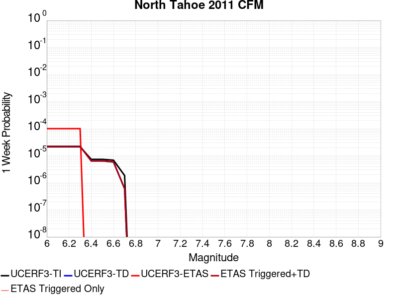 |  |  | 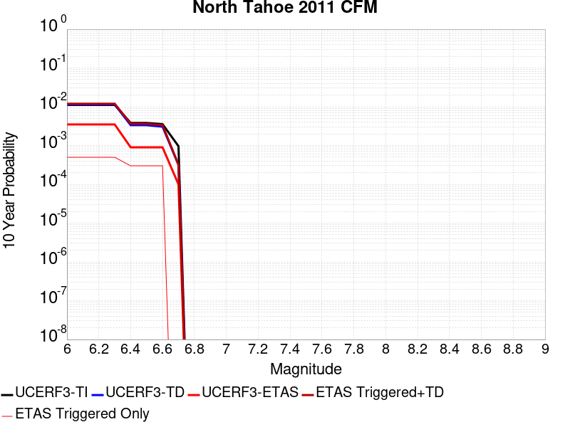 |

| Magnitude | 1 wk TI Prob | 1 wk TD Prob | 1 wk ETAS Prob | 1 wk ETAS/TD Gain | 1 wk ETAS Triggered+TD | 1 wk ETAS Triggered Only | 1 mo TI Prob | 1 mo TD Prob | 1 mo ETAS Prob | 1 mo ETAS/TD Gain | 1 mo ETAS Triggered+TD | 1 mo ETAS Triggered Only | 1 yr TI Prob | 1 yr TD Prob | 1 yr ETAS Prob | 1 yr ETAS/TD Gain | 1 yr ETAS Triggered+TD | 1 yr ETAS Triggered Only | 10 yr TI Prob | 10 yr TD Prob | 10 yr ETAS Prob | 10 yr ETAS/TD Gain | 10 yr ETAS Triggered+TD | 10 yr ETAS Triggered Only |
|-----|-----|-----|-----|-----|-----|-----|-----|-----|-----|-----|-----|-----|-----|-----|-----|-----|-----|-----|-----|-----|-----|-----|-----|-----|
| 6.0 | 2.150391E-5 | 2.2139517E-5 | 1.0E-4 | 4.5168104 | 2.2139517E-5 | 0.0 | 9.215636E-5 | 9.488129E-5 | 1.0E-4 | 1.0539485 | 9.488129E-5 | 0.0 | 0.0011214261 | 0.001154763 | 4.0E-4 | 0.3463914 | 0.001154763 | 0.0 | 0.011157839 | 0.011506836 | 0.0035 | 0.30416703 | 0.012001082 | 5.0E-4 |
| 6.1 | 2.150391E-5 | 2.2139517E-5 | 1.0E-4 | 4.5168104 | 2.2139517E-5 | 0.0 | 9.215636E-5 | 9.488129E-5 | 1.0E-4 | 1.0539485 | 9.488129E-5 | 0.0 | 0.0011214261 | 0.001154763 | 4.0E-4 | 0.3463914 | 0.001154763 | 0.0 | 0.011157839 | 0.011506836 | 0.0035 | 0.30416703 | 0.012001082 | 5.0E-4 |
| 6.2 | 2.150391E-5 | 2.2139517E-5 | 1.0E-4 | 4.5168104 | 2.2139517E-5 | 0.0 | 9.215636E-5 | 9.488129E-5 | 1.0E-4 | 1.0539485 | 9.488129E-5 | 0.0 | 0.0011214261 | 0.001154763 | 4.0E-4 | 0.3463914 | 0.001154763 | 0.0 | 0.011157839 | 0.011506836 | 0.0035 | 0.30416703 | 0.012001082 | 5.0E-4 |
| 6.3 | 2.150391E-5 | 2.2139517E-5 | 1.0E-4 | 4.5168104 | 2.2139517E-5 | 0.0 | 9.215636E-5 | 9.488129E-5 | 1.0E-4 | 1.0539485 | 9.488129E-5 | 0.0 | 0.0011214261 | 0.001154763 | 4.0E-4 | 0.3463914 | 0.001154763 | 0.0 | 0.011157839 | 0.011506836 | 0.0035 | 0.30416703 | 0.012001082 | 5.0E-4 |
| 6.4 | 7.3563056E-6 | 6.4376086E-6 | 0.0 | 0.0 | 6.4376086E-6 | 0.0 | 3.1526644E-5 | 2.7589631E-5 | 0.0 | 0.0 | 2.7589631E-5 | 0.0 | 3.8376928E-4 | 3.3588245E-4 | 0.0 | 0.0 | 3.3588245E-4 | 0.0 | 0.003831072 | 0.0033567378 | 9.0E-4 | 0.26811746 | 0.0036557307 | 3.0E-4 |
| 6.5 | 7.3563056E-6 | 6.4376086E-6 | 0.0 | 0.0 | 6.4376086E-6 | 0.0 | 3.1526644E-5 | 2.7589631E-5 | 0.0 | 0.0 | 2.7589631E-5 | 0.0 | 3.8376928E-4 | 3.3588245E-4 | 0.0 | 0.0 | 3.3588245E-4 | 0.0 | 0.003831072 | 0.0033567378 | 9.0E-4 | 0.26811746 | 0.0036557307 | 3.0E-4 |
| 6.6 | 6.8508816E-6 | 5.8774203E-6 | 0.0 | 0.0 | 5.8774203E-6 | 0.0 | 2.936059E-5 | 2.5188872E-5 | 0.0 | 0.0 | 2.5188872E-5 | 0.0 | 3.5740656E-4 | 3.0666165E-4 | 0.0 | 0.0 | 3.0666165E-4 | 0.0 | 0.0035683226 | 0.0030653551 | 9.0E-4 | 0.29360384 | 0.0033644354 | 3.0E-4 |
| 6.7 | 1.8511148E-6 | 6.0916835E-7 | 0.0 | 0.0 | 6.0916835E-7 | 0.0 | 7.933325E-6 | 2.6107216E-6 | 0.0 | 0.0 | 2.6107216E-6 | 0.0 | 9.658395E-5 | 3.1785534E-5 | 0.0 | 0.0 | 3.1785534E-5 | 0.0 | 9.6541987E-4 | 3.1785536E-4 | 1.0E-4 | 0.3146085 | 3.1785536E-4 | 0.0 |

## Los Osos 2011
*[(top)](#table-of-contents)*

| 1 Week | 1 Month | 1 Year | 10 Year |
|-----|-----|-----|-----|
| 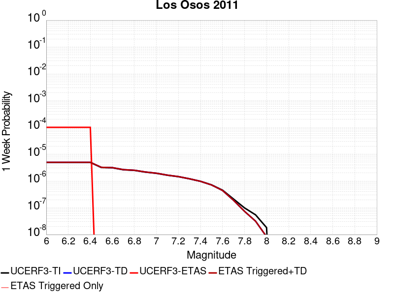 | 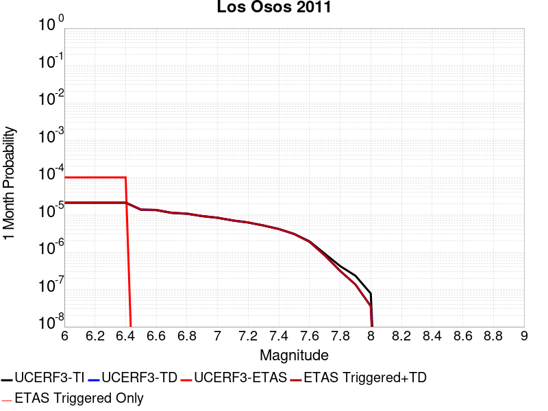 |  | 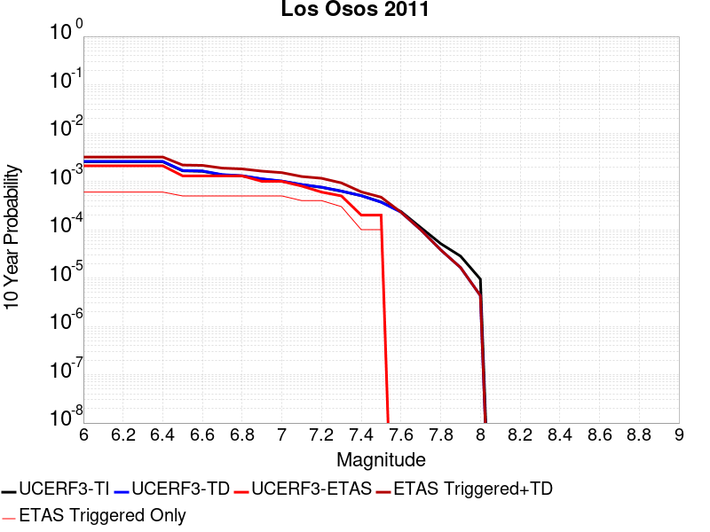 |

| Magnitude | 1 wk TI Prob | 1 wk TD Prob | 1 wk ETAS Prob | 1 wk ETAS/TD Gain | 1 wk ETAS Triggered+TD | 1 wk ETAS Triggered Only | 1 mo TI Prob | 1 mo TD Prob | 1 mo ETAS Prob | 1 mo ETAS/TD Gain | 1 mo ETAS Triggered+TD | 1 mo ETAS Triggered Only | 1 yr TI Prob | 1 yr TD Prob | 1 yr ETAS Prob | 1 yr ETAS/TD Gain | 1 yr ETAS Triggered+TD | 1 yr ETAS Triggered Only | 10 yr TI Prob | 10 yr TD Prob | 10 yr ETAS Prob | 10 yr ETAS/TD Gain | 10 yr ETAS Triggered+TD | 10 yr ETAS Triggered Only |
|-----|-----|-----|-----|-----|-----|-----|-----|-----|-----|-----|-----|-----|-----|-----|-----|-----|-----|-----|-----|-----|-----|-----|-----|-----|
| 6.0 | 4.8871775E-6 | 4.979819E-6 | 1.0E-4 | 20.08105 | 4.979819E-6 | 0.0 | 2.0944879E-5 | 2.1341923E-5 | 1.0E-4 | 4.6856136 | 2.1341923E-5 | 0.0 | 2.5497406E-4 | 2.5980972E-4 | 2.0E-4 | 0.76979417 | 2.5980972E-4 | 0.0 | 0.002546817 | 0.0025953338 | 0.0021 | 0.80914444 | 0.0031937768 | 6.0E-4 |
| 6.1 | 4.8871775E-6 | 4.979819E-6 | 1.0E-4 | 20.08105 | 4.979819E-6 | 0.0 | 2.0944879E-5 | 2.1341923E-5 | 1.0E-4 | 4.6856136 | 2.1341923E-5 | 0.0 | 2.5497406E-4 | 2.5980972E-4 | 2.0E-4 | 0.76979417 | 2.5980972E-4 | 0.0 | 0.002546817 | 0.0025953338 | 0.0021 | 0.80914444 | 0.0031937768 | 6.0E-4 |
| 6.2 | 4.8871775E-6 | 4.979819E-6 | 1.0E-4 | 20.08105 | 4.979819E-6 | 0.0 | 2.0944879E-5 | 2.1341923E-5 | 1.0E-4 | 4.6856136 | 2.1341923E-5 | 0.0 | 2.5497406E-4 | 2.5980972E-4 | 2.0E-4 | 0.76979417 | 2.5980972E-4 | 0.0 | 0.002546817 | 0.0025953338 | 0.0021 | 0.80914444 | 0.0031937768 | 6.0E-4 |
| 6.3 | 4.8871775E-6 | 4.979819E-6 | 1.0E-4 | 20.08105 | 4.979819E-6 | 0.0 | 2.0944879E-5 | 2.1341923E-5 | 1.0E-4 | 4.6856136 | 2.1341923E-5 | 0.0 | 2.5497406E-4 | 2.5980972E-4 | 2.0E-4 | 0.76979417 | 2.5980972E-4 | 0.0 | 0.002546817 | 0.0025953338 | 0.0021 | 0.80914444 | 0.0031937768 | 6.0E-4 |
| 6.4 | 4.8871775E-6 | 4.979819E-6 | 1.0E-4 | 20.08105 | 4.979819E-6 | 0.0 | 2.0944879E-5 | 2.1341923E-5 | 1.0E-4 | 4.6856136 | 2.1341923E-5 | 0.0 | 2.5497406E-4 | 2.5980972E-4 | 2.0E-4 | 0.76979417 | 2.5980972E-4 | 0.0 | 0.002546817 | 0.0025953338 | 0.0021 | 0.80914444 | 0.0031937768 | 6.0E-4 |
| 6.5 | 3.1724062E-6 | 3.2221944E-6 | 0.0 | 0.0 | 3.2221944E-6 | 0.0 | 1.3595956E-5 | 1.3809333E-5 | 0.0 | 0.0 | 1.3809333E-5 | 0.0 | 1.6551818E-4 | 1.6811579E-4 | 1.0E-4 | 0.5948281 | 1.6811579E-4 | 0.0 | 0.0016539496 | 0.0016798995 | 0.0013 | 0.7738558 | 0.0021790597 | 5.0E-4 |
| 6.6 | 3.1022591E-6 | 3.1499271E-6 | 0.0 | 0.0 | 3.1499271E-6 | 0.0 | 1.3295328E-5 | 1.3499618E-5 | 0.0 | 0.0 | 1.3499618E-5 | 0.0 | 1.618586E-4 | 1.6434558E-4 | 1.0E-4 | 0.6084739 | 1.6434558E-4 | 0.0 | 0.0016174077 | 0.0016422532 | 0.0013 | 0.79159534 | 0.0021414321 | 5.0E-4 |
| 6.7 | 2.611518E-6 | 2.6481255E-6 | 0.0 | 0.0 | 2.6481255E-6 | 0.0 | 1.1192172E-5 | 1.134906E-5 | 0.0 | 0.0 | 1.134906E-5 | 0.0 | 1.3625617E-4 | 1.3816608E-4 | 1.0E-4 | 0.7237666 | 1.3816608E-4 | 0.0 | 0.0013617266 | 0.0013808063 | 0.0013 | 0.9414789 | 0.001880116 | 5.0E-4 |
| 6.8 | 2.4780884E-6 | 2.51114E-6 | 0.0 | 0.0 | 2.51114E-6 | 0.0 | 1.0620336E-5 | 1.0761984E-5 | 0.0 | 0.0 | 1.0761984E-5 | 0.0 | 1.2929492E-4 | 1.3101932E-4 | 1.0E-4 | 0.7632462 | 1.3101932E-4 | 0.0 | 0.0012921972 | 0.0013094249 | 0.0013 | 0.99280226 | 0.0018087702 | 5.0E-4 |
| 6.9 | 2.1376322E-6 | 2.1625742E-6 | 0.0 | 0.0 | 2.1625742E-6 | 0.0 | 9.161248E-6 | 9.268142E-6 | 0.0 | 0.0 | 9.268142E-6 | 0.0 | 1.1153249E-4 | 1.1283381E-4 | 0.0 | 0.0 | 1.1283381E-4 | 0.0 | 0.0011147653 | 0.0011277671 | 0.001 | 0.8867079 | 0.0016272032 | 5.0E-4 |
| 7.0 | 1.9282882E-6 | 1.9485774E-6 | 0.0 | 0.0 | 1.9485774E-6 | 0.0 | 8.264066E-6 | 8.3510195E-6 | 0.0 | 0.0 | 8.3510195E-6 | 0.0 | 1.0061036E-4 | 1.0166893E-4 | 0.0 | 0.0 | 1.0166893E-4 | 0.0 | 0.0010056482 | 0.0010162255 | 0.001 | 0.9840335 | 0.0015157175 | 5.0E-4 |
| 7.1 | 1.6353226E-6 | 1.6492988E-6 | 0.0 | 0.0 | 1.6492988E-6 | 0.0 | 7.0085066E-6 | 7.0684046E-6 | 0.0 | 0.0 | 7.0684046E-6 | 0.0 | 8.532523E-5 | 8.605443E-5 | 0.0 | 0.0 | 8.605443E-5 | 0.0 | 8.529247E-4 | 8.6021185E-4 | 8.0E-4 | 0.93000346 | 0.0012598678 | 4.0E-4 |
| 7.2 | 1.4446276E-6 | 1.4545648E-6 | 0.0 | 0.0 | 1.4545648E-6 | 0.0 | 6.191247E-6 | 6.233834E-6 | 0.0 | 0.0 | 6.233834E-6 | 0.0 | 7.537582E-5 | 7.589429E-5 | 0.0 | 0.0 | 7.589429E-5 | 0.0 | 7.535026E-4 | 7.586843E-4 | 6.0E-4 | 0.7908428 | 0.0011583808 | 4.0E-4 |
| 7.3 | 1.2014582E-6 | 1.206194E-6 | 0.0 | 0.0 | 1.206194E-6 | 0.0 | 5.149096E-6 | 5.169393E-6 | 0.0 | 0.0 | 5.169393E-6 | 0.0 | 6.268844E-5 | 6.293554E-5 | 0.0 | 0.0 | 6.293554E-5 | 0.0 | 6.267076E-4 | 6.291776E-4 | 5.0E-4 | 0.79468817 | 9.2898885E-4 | 3.0E-4 |
| 7.4 | 9.707733E-7 | 9.703201E-7 | 0.0 | 0.0 | 9.703201E-7 | 0.0 | 4.16045E-6 | 4.158508E-6 | 0.0 | 0.0 | 4.158508E-6 | 0.0 | 5.0652303E-5 | 5.0628663E-5 | 0.0 | 0.0 | 5.0628663E-5 | 0.0 | 5.064076E-4 | 5.0617155E-4 | 2.0E-4 | 0.39512295 | 6.06121E-4 | 1.0E-4 |
| 7.5 | 7.174908E-7 | 7.1090074E-7 | 0.0 | 0.0 | 7.1090074E-7 | 0.0 | 3.074957E-6 | 3.0467138E-6 | 0.0 | 0.0 | 3.0467138E-6 | 0.0 | 3.743696E-5 | 3.7093112E-5 | 0.0 | 0.0 | 3.7093112E-5 | 0.0 | 3.7430652E-4 | 3.7086938E-4 | 2.0E-4 | 0.53927344 | 4.7083228E-4 | 1.0E-4 |
| 7.6 | 4.5535776E-7 | 4.4156693E-7 | 0.0 | 0.0 | 4.4156693E-7 | 0.0 | 1.9515319E-6 | 1.8924283E-6 | 0.0 | 0.0 | 1.8924283E-6 | 0.0 | 2.3759641E-5 | 2.3040073E-5 | 0.0 | 0.0 | 2.3040073E-5 | 0.0 | 2.37571E-4 | 2.3037693E-4 | 0.0 | 0.0 | 2.3037693E-4 | 0.0 |
| 7.7 | 2.1173553E-7 | 1.9018053E-7 | 0.0 | 0.0 | 1.9018053E-7 | 0.0 | 9.0743765E-7 | 8.150592E-7 | 0.0 | 0.0 | 8.150592E-7 | 0.0 | 1.1047998E-5 | 9.9233E-6 | 0.0 | 0.0 | 9.9233E-6 | 0.0 | 1.1047449E-4 | 9.92286E-5 | 0.0 | 0.0 | 9.92286E-5 | 0.0 |
| 7.8 | 9.873608E-8 | 7.3295304E-8 | 0.0 | 0.0 | 7.3295304E-8 | 0.0 | 4.2315455E-7 | 3.1412267E-7 | 0.0 | 0.0 | 3.1412267E-7 | 0.0 | 5.1518946E-6 | 3.824437E-6 | 0.0 | 0.0 | 3.824437E-6 | 0.0 | 5.1517753E-5 | 3.8243717E-5 | 0.0 | 0.0 | 3.8243717E-5 | 0.0 |
| 7.9 | 5.4399106E-8 | 3.1547312E-8 | 0.0 | 0.0 | 3.1547312E-8 | 0.0 | 2.33139E-7 | 1.3520277E-7 | 0.0 | 0.0 | 1.3520277E-7 | 0.0 | 2.8384638E-6 | 1.6460924E-6 | 0.0 | 0.0 | 1.6460924E-6 | 0.0 | 2.8384275E-5 | 1.6460805E-5 | 0.0 | 0.0 | 1.6460805E-5 | 0.0 |
| 8.0 | 1.817203E-8 | 8.279409E-9 | 0.0 | 0.0 | 8.279409E-9 | 0.0 | 7.7880124E-8 | 3.5483183E-8 | 0.0 | 0.0 | 3.5483183E-8 | 0.0 | 9.481901E-7 | 4.3200768E-7 | 0.0 | 0.0 | 4.3200768E-7 | 0.0 | 9.481861E-6 | 4.320069E-6 | 0.0 | 0.0 | 4.320069E-6 | 0.0 |

## Scodie Lineament
*[(top)](#table-of-contents)*

| 1 Week | 1 Month | 1 Year | 10 Year |
|-----|-----|-----|-----|
| 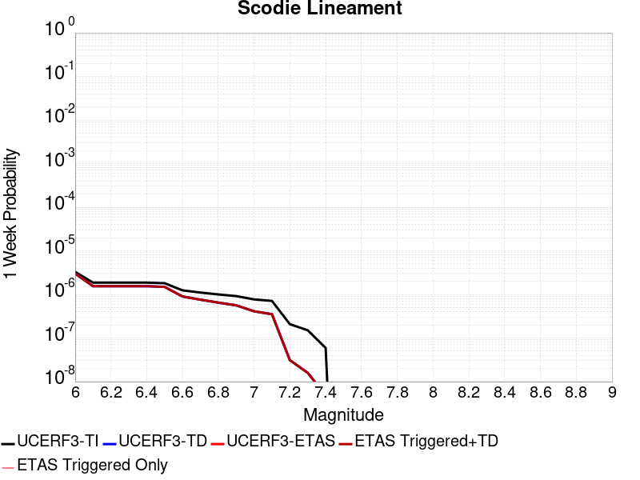 |  | 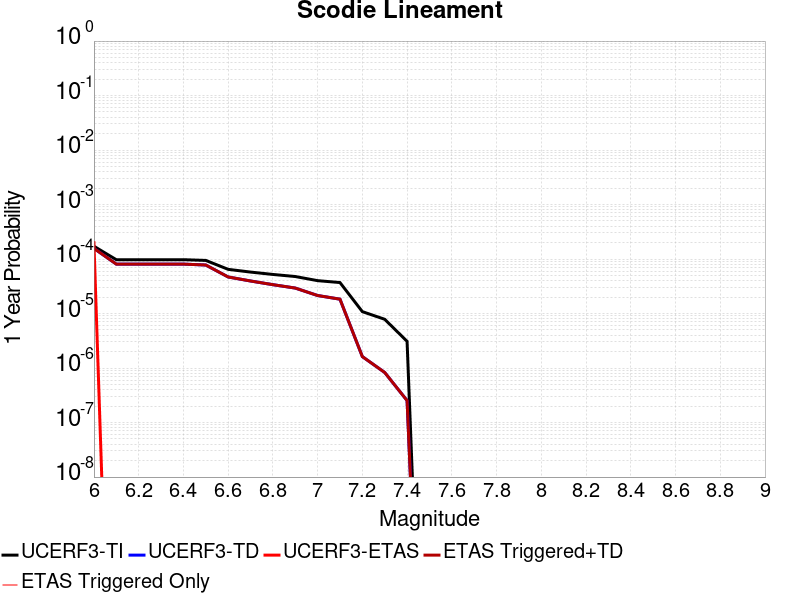 |  |

| Magnitude | 1 wk TI Prob | 1 wk TD Prob | 1 wk ETAS Prob | 1 wk ETAS/TD Gain | 1 wk ETAS Triggered+TD | 1 wk ETAS Triggered Only | 1 mo TI Prob | 1 mo TD Prob | 1 mo ETAS Prob | 1 mo ETAS/TD Gain | 1 mo ETAS Triggered+TD | 1 mo ETAS Triggered Only | 1 yr TI Prob | 1 yr TD Prob | 1 yr ETAS Prob | 1 yr ETAS/TD Gain | 1 yr ETAS Triggered+TD | 1 yr ETAS Triggered Only | 10 yr TI Prob | 10 yr TD Prob | 10 yr ETAS Prob | 10 yr ETAS/TD Gain | 10 yr ETAS Triggered+TD | 10 yr ETAS Triggered Only |
|-----|-----|-----|-----|-----|-----|-----|-----|-----|-----|-----|-----|-----|-----|-----|-----|-----|-----|-----|-----|-----|-----|-----|-----|-----|
| 6.0 | 3.2919327E-6 | 3.0121248E-6 | 0.0 | 0.0 | 3.0121248E-6 | 0.0 | 1.4108206E-5 | 1.290906E-5 | 0.0 | 0.0 | 1.290906E-5 | 0.0 | 1.7175387E-4 | 1.5715965E-4 | 2.0E-4 | 1.2725914 | 1.5715965E-4 | 0.0 | 0.0017162118 | 0.0015707965 | 0.0015 | 0.9549296 | 0.002169854 | 6.0E-4 |
| 6.1 | 1.8663811E-6 | 1.5482478E-6 | 0.0 | 0.0 | 1.5482478E-6 | 0.0 | 7.998751E-6 | 6.6353336E-6 | 0.0 | 0.0 | 6.6353336E-6 | 0.0 | 9.738045E-5 | 8.0782695E-5 | 0.0 | 0.0 | 8.0782695E-5 | 0.0 | 9.7337784E-4 | 8.0758205E-4 | 4.0E-4 | 0.49530572 | 0.0010074205 | 2.0E-4 |
| 6.2 | 1.8663811E-6 | 1.5482478E-6 | 0.0 | 0.0 | 1.5482478E-6 | 0.0 | 7.998751E-6 | 6.6353336E-6 | 0.0 | 0.0 | 6.6353336E-6 | 0.0 | 9.738045E-5 | 8.0782695E-5 | 0.0 | 0.0 | 8.0782695E-5 | 0.0 | 9.7337784E-4 | 8.0758205E-4 | 4.0E-4 | 0.49530572 | 0.0010074205 | 2.0E-4 |
| 6.3 | 1.8663811E-6 | 1.5482478E-6 | 0.0 | 0.0 | 1.5482478E-6 | 0.0 | 7.998751E-6 | 6.6353336E-6 | 0.0 | 0.0 | 6.6353336E-6 | 0.0 | 9.738045E-5 | 8.0782695E-5 | 0.0 | 0.0 | 8.0782695E-5 | 0.0 | 9.7337784E-4 | 8.0758205E-4 | 4.0E-4 | 0.49530572 | 0.0010074205 | 2.0E-4 |
| 6.4 | 1.8663811E-6 | 1.5482478E-6 | 0.0 | 0.0 | 1.5482478E-6 | 0.0 | 7.998751E-6 | 6.6353336E-6 | 0.0 | 0.0 | 6.6353336E-6 | 0.0 | 9.738045E-5 | 8.0782695E-5 | 0.0 | 0.0 | 8.0782695E-5 | 0.0 | 9.7337784E-4 | 8.0758205E-4 | 4.0E-4 | 0.49530572 | 0.0010074205 | 2.0E-4 |
| 6.5 | 1.8106311E-6 | 1.4902071E-6 | 0.0 | 0.0 | 1.4902071E-6 | 0.0 | 7.759824E-6 | 6.3865887E-6 | 0.0 | 0.0 | 6.3865887E-6 | 0.0 | 9.447177E-5 | 7.775444E-5 | 0.0 | 0.0 | 7.775444E-5 | 0.0 | 9.4431615E-4 | 7.77321E-4 | 4.0E-4 | 0.51458794 | 9.771655E-4 | 2.0E-4 |
| 6.6 | 1.2414679E-6 | 8.992181E-7 | 0.0 | 0.0 | 8.992181E-7 | 0.0 | 5.320566E-6 | 3.8537864E-6 | 0.0 | 0.0 | 3.8537864E-6 | 0.0 | 6.477596E-5 | 4.691893E-5 | 0.0 | 0.0 | 4.691893E-5 | 0.0 | 6.475708E-4 | 4.690989E-4 | 2.0E-4 | 0.42634934 | 5.6905195E-4 | 1.0E-4 |
| 6.7 | 1.1062215E-6 | 7.5894843E-7 | 0.0 | 0.0 | 7.5894843E-7 | 0.0 | 4.7409408E-6 | 3.2526325E-6 | 0.0 | 0.0 | 3.2526325E-6 | 0.0 | 5.7719422E-5 | 3.9600152E-5 | 0.0 | 0.0 | 3.9600152E-5 | 0.0 | 5.770443E-4 | 3.9593794E-4 | 0.0 | 0.0 | 3.9593794E-4 | 0.0 |
| 6.8 | 1.0006736E-6 | 6.495986E-7 | 0.0 | 0.0 | 6.495986E-7 | 0.0 | 4.288594E-6 | 2.7839912E-6 | 0.0 | 0.0 | 2.7839912E-6 | 0.0 | 5.221238E-5 | 3.389463E-5 | 0.0 | 0.0 | 3.389463E-5 | 0.0 | 5.220012E-4 | 3.3890066E-4 | 0.0 | 0.0 | 3.3890066E-4 | 0.0 |
| 6.9 | 9.167364E-7 | 5.6275314E-7 | 0.0 | 0.0 | 5.6275314E-7 | 0.0 | 3.9288643E-6 | 2.4117971E-6 | 0.0 | 0.0 | 2.4117971E-6 | 0.0 | 4.7832873E-5 | 2.9363293E-5 | 0.0 | 0.0 | 2.9363293E-5 | 0.0 | 4.782258E-4 | 2.9359982E-4 | 0.0 | 0.0 | 2.9359982E-4 | 0.0 |
| 7.0 | 7.6987664E-7 | 4.1098252E-7 | 0.0 | 0.0 | 4.1098252E-7 | 0.0 | 3.2994672E-6 | 1.7613528E-6 | 0.0 | 0.0 | 1.7613528E-6 | 0.0 | 4.0170275E-5 | 2.1444297E-5 | 0.0 | 0.0 | 2.1444297E-5 | 0.0 | 4.0163012E-4 | 2.1442614E-4 | 0.0 | 0.0 | 2.1442614E-4 | 0.0 |
| 7.1 | 7.1038727E-7 | 3.5178041E-7 | 0.0 | 0.0 | 3.5178041E-7 | 0.0 | 3.0445133E-6 | 1.5076297E-6 | 0.0 | 0.0 | 1.5076297E-6 | 0.0 | 3.706632E-5 | 1.8355271E-5 | 0.0 | 0.0 | 1.8355271E-5 | 0.0 | 3.7060137E-4 | 1.8354105E-4 | 0.0 | 0.0 | 1.8354105E-4 | 0.0 |
| 7.2 | 2.0799602E-7 | 3.1090035E-8 | 0.0 | 0.0 | 3.1090035E-8 | 0.0 | 8.914113E-7 | 1.33243E-7 | 0.0 | 0.0 | 1.33243E-7 | 0.0 | 1.0852878E-5 | 1.6222325E-6 | 0.0 | 0.0 | 1.6222325E-6 | 0.0 | 1.08523476E-4 | 1.6222213E-5 | 0.0 | 0.0 | 1.6222213E-5 | 0.0 |
| 7.3 | 1.5048182E-7 | 1.5878712E-8 | 0.0 | 0.0 | 1.5878712E-8 | 0.0 | 6.449219E-7 | 6.805162E-8 | 0.0 | 0.0 | 6.805162E-8 | 0.0 | 7.851896E-6 | 8.2852813E-7 | 0.0 | 0.0 | 8.2852813E-7 | 0.0 | 7.851618E-5 | 8.285254E-6 | 0.0 | 0.0 | 8.285254E-6 | 0.0 |
| 7.4 | 5.9334678E-8 | 4.8415534E-9 | 0.0 | 0.0 | 4.8415534E-9 | 0.0 | 2.5429145E-7 | 2.0749514E-8 | 0.0 | 0.0 | 2.0749514E-8 | 0.0 | 3.095994E-6 | 2.526253E-7 | 0.0 | 0.0 | 2.526253E-7 | 0.0 | 3.095951E-5 | 2.5262514E-6 | 0.0 | 0.0 | 2.5262514E-6 | 0.0 |

## Round Valley
*[(top)](#table-of-contents)*

| 1 Week | 1 Month | 1 Year | 10 Year |
|-----|-----|-----|-----|
|  | 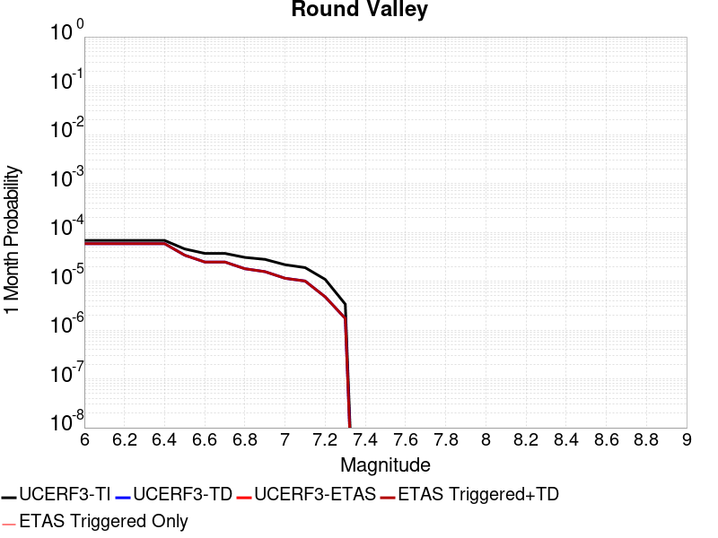 | 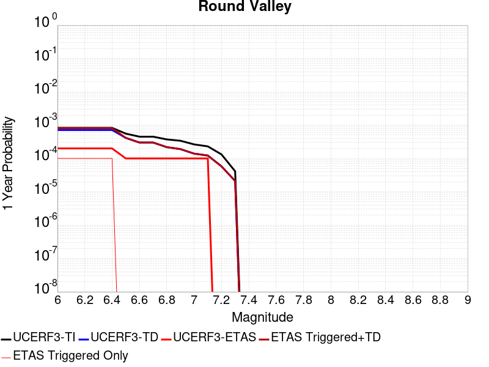 |  |

| Magnitude | 1 wk TI Prob | 1 wk TD Prob | 1 wk ETAS Prob | 1 wk ETAS/TD Gain | 1 wk ETAS Triggered+TD | 1 wk ETAS Triggered Only | 1 mo TI Prob | 1 mo TD Prob | 1 mo ETAS Prob | 1 mo ETAS/TD Gain | 1 mo ETAS Triggered+TD | 1 mo ETAS Triggered Only | 1 yr TI Prob | 1 yr TD Prob | 1 yr ETAS Prob | 1 yr ETAS/TD Gain | 1 yr ETAS Triggered+TD | 1 yr ETAS Triggered Only | 10 yr TI Prob | 10 yr TD Prob | 10 yr ETAS Prob | 10 yr ETAS/TD Gain | 10 yr ETAS Triggered+TD | 10 yr ETAS Triggered Only |
|-----|-----|-----|-----|-----|-----|-----|-----|-----|-----|-----|-----|-----|-----|-----|-----|-----|-----|-----|-----|-----|-----|-----|-----|-----|
| 6.0 | 1.588152E-5 | 1.3647419E-5 | 0.0 | 0.0 | 1.3647419E-5 | 0.0 | 6.806188E-5 | 5.848785E-5 | 0.0 | 0.0 | 5.848785E-5 | 0.0 | 8.283384E-4 | 7.118962E-4 | 2.0E-4 | 0.28093982 | 8.1182504E-4 | 1.0E-4 | 0.008252576 | 0.0071000364 | 0.003 | 0.42253304 | 0.0076957764 | 6.0E-4 |
| 6.1 | 1.588152E-5 | 1.3647419E-5 | 0.0 | 0.0 | 1.3647419E-5 | 0.0 | 6.806188E-5 | 5.848785E-5 | 0.0 | 0.0 | 5.848785E-5 | 0.0 | 8.283384E-4 | 7.118962E-4 | 2.0E-4 | 0.28093982 | 8.1182504E-4 | 1.0E-4 | 0.008252576 | 0.0071000364 | 0.003 | 0.42253304 | 0.0076957764 | 6.0E-4 |
| 6.2 | 1.588152E-5 | 1.3647419E-5 | 0.0 | 0.0 | 1.3647419E-5 | 0.0 | 6.806188E-5 | 5.848785E-5 | 0.0 | 0.0 | 5.848785E-5 | 0.0 | 8.283384E-4 | 7.118962E-4 | 2.0E-4 | 0.28093982 | 8.1182504E-4 | 1.0E-4 | 0.008252576 | 0.0071000364 | 0.003 | 0.42253304 | 0.0076957764 | 6.0E-4 |
| 6.3 | 1.588152E-5 | 1.3647419E-5 | 0.0 | 0.0 | 1.3647419E-5 | 0.0 | 6.806188E-5 | 5.848785E-5 | 0.0 | 0.0 | 5.848785E-5 | 0.0 | 8.283384E-4 | 7.118962E-4 | 2.0E-4 | 0.28093982 | 8.1182504E-4 | 1.0E-4 | 0.008252576 | 0.0071000364 | 0.003 | 0.42253304 | 0.0076957764 | 6.0E-4 |
| 6.4 | 1.588152E-5 | 1.3647419E-5 | 0.0 | 0.0 | 1.3647419E-5 | 0.0 | 6.806188E-5 | 5.848785E-5 | 0.0 | 0.0 | 5.848785E-5 | 0.0 | 8.283384E-4 | 7.118962E-4 | 2.0E-4 | 0.28093982 | 8.1182504E-4 | 1.0E-4 | 0.008252576 | 0.0071000364 | 0.003 | 0.42253304 | 0.0076957764 | 6.0E-4 |
| 6.5 | 1.0646776E-5 | 7.935249E-6 | 0.0 | 0.0 | 7.935249E-6 | 0.0 | 4.5628243E-5 | 3.4007815E-5 | 0.0 | 0.0 | 3.4007815E-5 | 0.0 | 5.553823E-4 | 4.1397483E-4 | 1.0E-4 | 0.24156056 | 4.1397483E-4 | 0.0 | 0.005539963 | 0.004132863 | 0.002 | 0.483926 | 0.004630797 | 5.0E-4 |
| 6.6 | 8.632956E-6 | 5.7528837E-6 | 0.0 | 0.0 | 5.7528837E-6 | 0.0 | 3.6997862E-5 | 2.4655004E-5 | 0.0 | 0.0 | 2.4655004E-5 | 0.0 | 4.5035584E-4 | 3.0013715E-4 | 1.0E-4 | 0.333181 | 3.0013715E-4 | 0.0 | 0.0044944426 | 0.0029976945 | 0.0014 | 0.46702558 | 0.0033964955 | 4.0E-4 |
| 6.7 | 8.632956E-6 | 5.7528837E-6 | 0.0 | 0.0 | 5.7528837E-6 | 0.0 | 3.6997862E-5 | 2.4655004E-5 | 0.0 | 0.0 | 2.4655004E-5 | 0.0 | 4.5035584E-4 | 3.0013715E-4 | 1.0E-4 | 0.333181 | 3.0013715E-4 | 0.0 | 0.0044944426 | 0.0029976945 | 0.0014 | 0.46702558 | 0.0033964955 | 4.0E-4 |
| 6.8 | 7.143895E-6 | 4.1873486E-6 | 0.0 | 0.0 | 4.1873486E-6 | 0.0 | 3.0616335E-5 | 1.7945666E-5 | 0.0 | 0.0 | 1.7945666E-5 | 0.0 | 3.726901E-4 | 2.1846822E-4 | 1.0E-4 | 0.45773247 | 2.1846822E-4 | 0.0 | 0.0037206567 | 0.002182698 | 0.001 | 0.45814854 | 0.0024820433 | 3.0E-4 |
| 6.9 | 6.5120694E-6 | 3.6507183E-6 | 0.0 | 0.0 | 3.6507183E-6 | 0.0 | 2.790857E-5 | 1.564585E-5 | 0.0 | 0.0 | 1.564585E-5 | 0.0 | 3.3973387E-4 | 1.9047307E-4 | 1.0E-4 | 0.52500856 | 1.9047307E-4 | 0.0 | 0.0033921495 | 0.0019032462 | 9.0E-4 | 0.4728763 | 0.0022026752 | 3.0E-4 |
| 7.0 | 5.0614435E-6 | 2.6718365E-6 | 0.0 | 0.0 | 2.6718365E-6 | 0.0 | 2.169172E-5 | 1.1450683E-5 | 0.0 | 0.0 | 1.1450683E-5 | 0.0 | 2.6406467E-4 | 1.3940418E-4 | 1.0E-4 | 0.7173387 | 1.3940418E-4 | 0.0 | 0.0026375111 | 0.0013932675 | 7.0E-4 | 0.5024161 | 0.0016928496 | 3.0E-4 |
| 7.1 | 4.41728E-6 | 2.3467217E-6 | 0.0 | 0.0 | 2.3467217E-6 | 0.0 | 1.8931061E-5 | 1.0057345E-5 | 0.0 | 0.0 | 1.0057345E-5 | 0.0 | 2.304613E-4 | 1.2244227E-4 | 1.0E-4 | 0.81671137 | 1.2244227E-4 | 0.0 | 0.0023022245 | 0.0012238437 | 7.0E-4 | 0.57196844 | 0.0015234766 | 3.0E-4 |
| 7.2 | 2.535495E-6 | 1.1126469E-6 | 0.0 | 0.0 | 1.1126469E-6 | 0.0 | 1.0866362E-5 | 4.7684807E-6 | 0.0 | 0.0 | 4.7684807E-6 | 0.0 | 1.3228992E-4 | 5.8055222E-5 | 0.0 | 0.0 | 5.8055222E-5 | 0.0 | 0.0013221119 | 5.80451E-4 | 3.0E-4 | 0.5168395 | 6.8039296E-4 | 1.0E-4 |
| 7.3 | 7.900015E-7 | 4.033625E-7 | 0.0 | 0.0 | 4.033625E-7 | 0.0 | 3.3857161E-6 | 1.7286964E-6 | 0.0 | 0.0 | 1.7286964E-6 | 0.0 | 4.1220315E-5 | 2.1046879E-5 | 0.0 | 0.0 | 2.1046879E-5 | 0.0 | 4.121267E-4 | 2.1046879E-4 | 2.0E-4 | 0.9502597 | 3.1044774E-4 | 1.0E-4 |

## San Gregorio (South) 2011 CFM
*[(top)](#table-of-contents)*

| 1 Week | 1 Month | 1 Year | 10 Year |
|-----|-----|-----|-----|
|  |  |  |  |

| Magnitude | 1 wk TI Prob | 1 wk TD Prob | 1 wk ETAS Prob | 1 wk ETAS/TD Gain | 1 wk ETAS Triggered+TD | 1 wk ETAS Triggered Only | 1 mo TI Prob | 1 mo TD Prob | 1 mo ETAS Prob | 1 mo ETAS/TD Gain | 1 mo ETAS Triggered+TD | 1 mo ETAS Triggered Only | 1 yr TI Prob | 1 yr TD Prob | 1 yr ETAS Prob | 1 yr ETAS/TD Gain | 1 yr ETAS Triggered+TD | 1 yr ETAS Triggered Only | 10 yr TI Prob | 10 yr TD Prob | 10 yr ETAS Prob | 10 yr ETAS/TD Gain | 10 yr ETAS Triggered+TD | 10 yr ETAS Triggered Only |
|-----|-----|-----|-----|-----|-----|-----|-----|-----|-----|-----|-----|-----|-----|-----|-----|-----|-----|-----|-----|-----|-----|-----|-----|-----|
| 6.0 | 1.8770423E-5 | 1.6205753E-5 | 0.0 | 0.0 | 1.6205753E-5 | 0.0 | 8.044219E-5 | 6.94514E-5 | 0.0 | 0.0 | 6.94514E-5 | 0.0 | 9.789435E-4 | 8.452466E-4 | 3.0E-4 | 0.35492602 | 8.452466E-4 | 0.0 | 0.009746423 | 0.008432556 | 0.0046 | 0.5455048 | 0.009027496 | 6.0E-4 |
| 6.1 | 1.8770423E-5 | 1.6205753E-5 | 0.0 | 0.0 | 1.6205753E-5 | 0.0 | 8.044219E-5 | 6.94514E-5 | 0.0 | 0.0 | 6.94514E-5 | 0.0 | 9.789435E-4 | 8.452466E-4 | 3.0E-4 | 0.35492602 | 8.452466E-4 | 0.0 | 0.009746423 | 0.008432556 | 0.0046 | 0.5455048 | 0.009027496 | 6.0E-4 |
| 6.2 | 1.7508692E-5 | 1.4826615E-5 | 0.0 | 0.0 | 1.4826615E-5 | 0.0 | 7.5035096E-5 | 6.3541105E-5 | 0.0 | 0.0 | 6.3541105E-5 | 0.0 | 9.1316935E-4 | 7.7334145E-4 | 2.0E-4 | 0.258618 | 7.7334145E-4 | 0.0 | 0.00909426 | 0.0077186585 | 0.004 | 0.5182248 | 0.008115571 | 4.0E-4 |
| 6.3 | 1.7508692E-5 | 1.4826615E-5 | 0.0 | 0.0 | 1.4826615E-5 | 0.0 | 7.5035096E-5 | 6.3541105E-5 | 0.0 | 0.0 | 6.3541105E-5 | 0.0 | 9.1316935E-4 | 7.7334145E-4 | 2.0E-4 | 0.258618 | 7.7334145E-4 | 0.0 | 0.00909426 | 0.0077186585 | 0.004 | 0.5182248 | 0.008115571 | 4.0E-4 |
| 6.4 | 1.6004591E-5 | 1.3178125E-5 | 0.0 | 0.0 | 1.3178125E-5 | 0.0 | 6.85893E-5 | 5.6476463E-5 | 0.0 | 0.0 | 5.6476463E-5 | 0.0 | 8.347548E-4 | 6.8738504E-4 | 1.0E-4 | 0.14547887 | 6.8738504E-4 | 0.0 | 0.008316261 | 0.0068645435 | 0.0037 | 0.5390016 | 0.007261798 | 4.0E-4 |
| 6.5 | 1.6004591E-5 | 1.3178125E-5 | 0.0 | 0.0 | 1.3178125E-5 | 0.0 | 6.85893E-5 | 5.6476463E-5 | 0.0 | 0.0 | 5.6476463E-5 | 0.0 | 8.347548E-4 | 6.8738504E-4 | 1.0E-4 | 0.14547887 | 6.8738504E-4 | 0.0 | 0.008316261 | 0.0068645435 | 0.0037 | 0.5390016 | 0.007261798 | 4.0E-4 |
| 6.6 | 1.5442201E-5 | 1.2563361E-5 | 0.0 | 0.0 | 1.2563361E-5 | 0.0 | 6.617918E-5 | 5.3841868E-5 | 0.0 | 0.0 | 5.3841868E-5 | 0.0 | 8.0543366E-4 | 6.5532845E-4 | 1.0E-4 | 0.15259524 | 6.5532845E-4 | 0.0 | 0.008025207 | 0.006545897 | 0.0037 | 0.56523955 | 0.0069432785 | 4.0E-4 |
| 6.7 | 1.489921E-5 | 1.1972423E-5 | 0.0 | 0.0 | 1.1972423E-5 | 0.0 | 6.3852196E-5 | 5.1309376E-5 | 0.0 | 0.0 | 5.1309376E-5 | 0.0 | 7.7712315E-4 | 6.245133E-4 | 1.0E-4 | 0.16012469 | 6.245133E-4 | 0.0 | 0.0077441116 | 0.0062395055 | 0.0036 | 0.5769688 | 0.00663701 | 4.0E-4 |
| 6.8 | 1.3876024E-5 | 1.0852497E-5 | 0.0 | 0.0 | 1.0852497E-5 | 0.0 | 5.9467322E-5 | 4.6509875E-5 | 0.0 | 0.0 | 4.6509875E-5 | 0.0 | 7.237741E-4 | 5.66111E-4 | 1.0E-4 | 0.1766438 | 5.66111E-4 | 0.0 | 0.0072142133 | 0.0056585763 | 0.0033 | 0.58318555 | 0.006056313 | 4.0E-4 |
| 6.9 | 1.33922495E-5 | 1.0324516E-5 | 0.0 | 0.0 | 1.0324516E-5 | 0.0 | 5.7394092E-5 | 4.4247172E-5 | 0.0 | 0.0 | 4.4247172E-5 | 0.0 | 6.9854903E-4 | 5.3857645E-4 | 1.0E-4 | 0.18567467 | 5.3857645E-4 | 0.0 | 0.0069635725 | 0.0053845914 | 0.0031 | 0.57571685 | 0.0057824375 | 4.0E-4 |
| 7.0 | 1.2807324E-5 | 9.685112E-6 | 0.0 | 0.0 | 9.685112E-6 | 0.0 | 5.4887376E-5 | 4.1506963E-5 | 0.0 | 0.0 | 4.1506963E-5 | 0.0 | 6.680489E-4 | 5.052303E-4 | 1.0E-4 | 0.19792955 | 5.052303E-4 | 0.0 | 0.006660442 | 0.0050526876 | 0.0031 | 0.61353487 | 0.0054506664 | 4.0E-4 |
| 7.1 | 1.2191438E-5 | 8.994899E-6 | 0.0 | 0.0 | 8.994899E-6 | 0.0 | 5.224797E-5 | 3.8548995E-5 | 0.0 | 0.0 | 3.8548995E-5 | 0.0 | 6.3593336E-4 | 4.6923305E-4 | 1.0E-4 | 0.21311373 | 4.6923305E-4 | 0.0 | 0.0063411663 | 0.0046942853 | 0.0028 | 0.5964699 | 0.005092408 | 4.0E-4 |
| 7.2 | 1.1769438E-5 | 8.515794E-6 | 0.0 | 0.0 | 8.515794E-6 | 0.0 | 5.0439474E-5 | 3.6495752E-5 | 0.0 | 0.0 | 3.6495752E-5 | 0.0 | 6.1392755E-4 | 4.4424526E-4 | 1.0E-4 | 0.22510089 | 4.4424526E-4 | 0.0 | 0.0061223423 | 0.0044454336 | 0.0028 | 0.6298598 | 0.0048436555 | 4.0E-4 |
| 7.3 | 1.150374E-5 | 8.232142E-6 | 0.0 | 0.0 | 8.232142E-6 | 0.0 | 4.9300812E-5 | 3.5280133E-5 | 0.0 | 0.0 | 3.5280133E-5 | 0.0 | 6.0007203E-4 | 4.29451E-4 | 1.0E-4 | 0.23285544 | 4.29451E-4 | 0.0 | 0.0059845424 | 0.004298052 | 0.0026 | 0.6049252 | 0.004696333 | 4.0E-4 |
| 7.4 | 1.12514E-5 | 7.978506E-6 | 0.0 | 0.0 | 7.978506E-6 | 0.0 | 4.8219394E-5 | 3.4193148E-5 | 0.0 | 0.0 | 3.4193148E-5 | 0.0 | 5.8691297E-4 | 4.1622212E-4 | 1.0E-4 | 0.24025634 | 4.1622212E-4 | 0.0 | 0.005853653 | 0.004166263 | 0.0024 | 0.5760558 | 0.0044650133 | 3.0E-4 |
| 7.5 | 1.059696E-5 | 7.3311076E-6 | 0.0 | 0.0 | 7.3311076E-6 | 0.0 | 4.5414752E-5 | 3.1418655E-5 | 0.0 | 0.0 | 3.1418655E-5 | 0.0 | 5.5278436E-4 | 3.8245504E-4 | 1.0E-4 | 0.26146865 | 3.8245504E-4 | 0.0 | 0.0055141128 | 0.0038297165 | 0.0022 | 0.574455 | 0.004028951 | 2.0E-4 |
| 7.6 | 9.018592E-6 | 5.7797615E-6 | 0.0 | 0.0 | 5.7797615E-6 | 0.0 | 3.8650534E-5 | 2.4770172E-5 | 0.0 | 0.0 | 2.4770172E-5 | 0.0 | 4.7046866E-4 | 3.0153515E-4 | 1.0E-4 | 0.3316363 | 3.0153515E-4 | 0.0 | 0.004694739 | 0.003022654 | 0.0017 | 0.56241965 | 0.0032220494 | 2.0E-4 |
| 7.7 | 6.243489E-6 | 3.1962775E-6 | 0.0 | 0.0 | 3.1962775E-6 | 0.0 | 2.6757538E-5 | 1.3698261E-5 | 0.0 | 0.0 | 1.3698261E-5 | 0.0 | 3.257243E-4 | 1.6676357E-4 | 1.0E-4 | 0.59965134 | 1.6676357E-4 | 0.0 | 0.003252473 | 0.0016761078 | 0.0012 | 0.71594447 | 0.0017759401 | 1.0E-4 |
| 7.8 | 3.1941963E-6 | 1.3557503E-6 | 0.0 | 0.0 | 1.3557503E-6 | 0.0 | 1.368934E-5 | 5.8103456E-6 | 0.0 | 0.0 | 5.8103456E-6 | 0.0 | 1.6665498E-4 | 7.0738664E-5 | 1.0E-4 | 1.4136541 | 7.0738664E-5 | 0.0 | 0.0016653005 | 7.1291375E-4 | 6.0E-4 | 0.8416165 | 7.1291375E-4 | 0.0 |
| 7.9 | 2.0098398E-6 | 6.730377E-7 | 0.0 | 0.0 | 6.730377E-7 | 0.0 | 8.6135715E-6 | 2.8844438E-6 | 0.0 | 0.0 | 2.8844438E-6 | 0.0 | 1.0486518E-4 | 3.5117537E-5 | 0.0 | 0.0 | 3.5117537E-5 | 0.0 | 0.0010481571 | 3.5584348E-4 | 2.0E-4 | 0.56204486 | 3.5584348E-4 | 0.0 |
| 8.0 | 8.353119E-7 | 3.0770198E-7 | 0.0 | 0.0 | 3.0770198E-7 | 0.0 | 3.579903E-6 | 1.3187221E-6 | 0.0 | 0.0 | 1.3187221E-6 | 0.0 | 4.358445E-5 | 1.6055323E-5 | 0.0 | 0.0 | 1.6055323E-5 | 0.0 | 4.3575902E-4 | 1.6171623E-4 | 0.0 | 0.0 | 1.6171623E-4 | 0.0 |
| 8.1 | 1.5033264E-7 | 6.371795E-8 | 0.0 | 0.0 | 6.371795E-8 | 0.0 | 6.442826E-7 | 2.730769E-7 | 0.0 | 0.0 | 2.730769E-7 | 0.0 | 7.844113E-6 | 3.324706E-6 | 0.0 | 0.0 | 3.324706E-6 | 0.0 | 7.843835E-5 | 3.326229E-5 | 0.0 | 0.0 | 3.326229E-5 | 0.0 |

## La Panza 2011
*[(top)](#table-of-contents)*

| 1 Week | 1 Month | 1 Year | 10 Year |
|-----|-----|-----|-----|
|  | 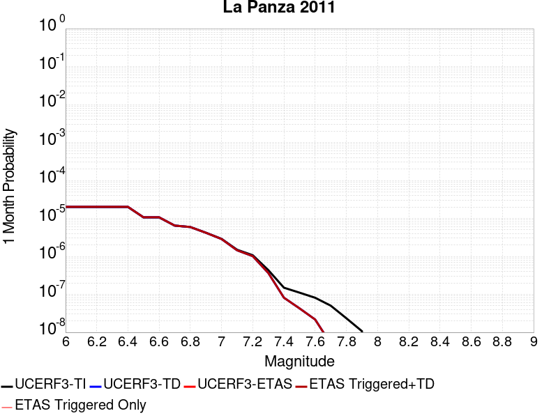 |  | 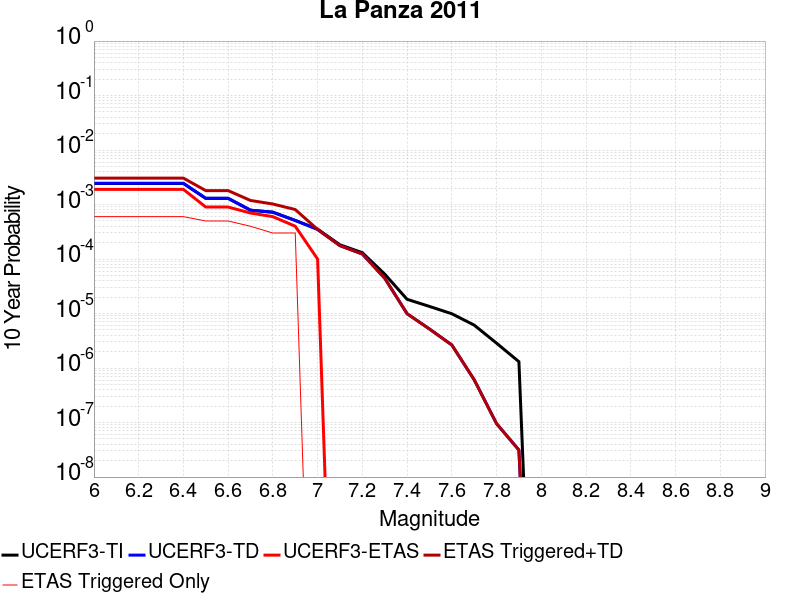 |

| Magnitude | 1 wk TI Prob | 1 wk TD Prob | 1 wk ETAS Prob | 1 wk ETAS/TD Gain | 1 wk ETAS Triggered+TD | 1 wk ETAS Triggered Only | 1 mo TI Prob | 1 mo TD Prob | 1 mo ETAS Prob | 1 mo ETAS/TD Gain | 1 mo ETAS Triggered+TD | 1 mo ETAS Triggered Only | 1 yr TI Prob | 1 yr TD Prob | 1 yr ETAS Prob | 1 yr ETAS/TD Gain | 1 yr ETAS Triggered+TD | 1 yr ETAS Triggered Only | 10 yr TI Prob | 10 yr TD Prob | 10 yr ETAS Prob | 10 yr ETAS/TD Gain | 10 yr ETAS Triggered+TD | 10 yr ETAS Triggered Only |
|-----|-----|-----|-----|-----|-----|-----|-----|-----|-----|-----|-----|-----|-----|-----|-----|-----|-----|-----|-----|-----|-----|-----|-----|-----|
| 6.0 | 4.6754544E-6 | 4.7154263E-6 | 0.0 | 0.0 | 4.7154263E-6 | 0.0 | 2.0037509E-5 | 2.0208823E-5 | 0.0 | 0.0 | 2.0208823E-5 | 0.0 | 2.4392935E-4 | 2.4601663E-4 | 2.0E-4 | 0.8129532 | 2.4601663E-4 | 0.0 | 0.0024366176 | 0.002457637 | 0.0019 | 0.7731003 | 0.0030561625 | 6.0E-4 |
| 6.1 | 4.6754544E-6 | 4.7154263E-6 | 0.0 | 0.0 | 4.7154263E-6 | 0.0 | 2.0037509E-5 | 2.0208823E-5 | 0.0 | 0.0 | 2.0208823E-5 | 0.0 | 2.4392935E-4 | 2.4601663E-4 | 2.0E-4 | 0.8129532 | 2.4601663E-4 | 0.0 | 0.0024366176 | 0.002457637 | 0.0019 | 0.7731003 | 0.0030561625 | 6.0E-4 |
| 6.2 | 4.6754544E-6 | 4.7154263E-6 | 0.0 | 0.0 | 4.7154263E-6 | 0.0 | 2.0037509E-5 | 2.0208823E-5 | 0.0 | 0.0 | 2.0208823E-5 | 0.0 | 2.4392935E-4 | 2.4601663E-4 | 2.0E-4 | 0.8129532 | 2.4601663E-4 | 0.0 | 0.0024366176 | 0.002457637 | 0.0019 | 0.7731003 | 0.0030561625 | 6.0E-4 |
| 6.3 | 4.6754544E-6 | 4.7154263E-6 | 0.0 | 0.0 | 4.7154263E-6 | 0.0 | 2.0037509E-5 | 2.0208823E-5 | 0.0 | 0.0 | 2.0208823E-5 | 0.0 | 2.4392935E-4 | 2.4601663E-4 | 2.0E-4 | 0.8129532 | 2.4601663E-4 | 0.0 | 0.0024366176 | 0.002457637 | 0.0019 | 0.7731003 | 0.0030561625 | 6.0E-4 |
| 6.4 | 4.6754544E-6 | 4.7154263E-6 | 0.0 | 0.0 | 4.7154263E-6 | 0.0 | 2.0037509E-5 | 2.0208823E-5 | 0.0 | 0.0 | 2.0208823E-5 | 0.0 | 2.4392935E-4 | 2.4601663E-4 | 2.0E-4 | 0.8129532 | 2.4601663E-4 | 0.0 | 0.0024366176 | 0.002457637 | 0.0019 | 0.7731003 | 0.0030561625 | 6.0E-4 |
| 6.5 | 2.485343E-6 | 2.4987223E-6 | 0.0 | 0.0 | 2.4987223E-6 | 0.0 | 1.0651426E-5 | 1.0708768E-5 | 0.0 | 0.0 | 1.0708768E-5 | 0.0 | 1.296734E-4 | 1.3037183E-4 | 1.0E-4 | 0.76703686 | 1.3037183E-4 | 0.0 | 0.0012959775 | 0.0013029919 | 9.0E-4 | 0.69071805 | 0.0018023404 | 5.0E-4 |
| 6.6 | 2.485343E-6 | 2.4987223E-6 | 0.0 | 0.0 | 2.4987223E-6 | 0.0 | 1.0651426E-5 | 1.0708768E-5 | 0.0 | 0.0 | 1.0708768E-5 | 0.0 | 1.296734E-4 | 1.3037183E-4 | 1.0E-4 | 0.76703686 | 1.3037183E-4 | 0.0 | 0.0012959775 | 0.0013029919 | 9.0E-4 | 0.69071805 | 0.0018023404 | 5.0E-4 |
| 6.7 | 1.5108508E-6 | 1.5128819E-6 | 0.0 | 0.0 | 1.5128819E-6 | 0.0 | 6.4750584E-6 | 6.483764E-6 | 0.0 | 0.0 | 6.483764E-6 | 0.0 | 7.8830984E-5 | 7.8937075E-5 | 1.0E-4 | 1.2668318 | 7.8937075E-5 | 0.0 | 7.880303E-4 | 7.891012E-4 | 7.0E-4 | 0.8870852 | 0.0011887855 | 4.0E-4 |
| 6.8 | 1.3865837E-6 | 1.3867743E-6 | 0.0 | 0.0 | 1.3867743E-6 | 0.0 | 5.942488E-6 | 5.9433055E-6 | 0.0 | 0.0 | 5.9433055E-6 | 0.0 | 7.234739E-5 | 7.235744E-5 | 1.0E-4 | 1.3820279 | 7.235744E-5 | 0.0 | 7.232384E-4 | 7.2334864E-4 | 6.0E-4 | 0.8294755 | 0.0010231317 | 3.0E-4 |
| 6.9 | 9.826583E-7 | 9.779452E-7 | 0.0 | 0.0 | 9.779452E-7 | 0.0 | 4.2113857E-6 | 4.191187E-6 | 0.0 | 0.0 | 4.191187E-6 | 0.0 | 5.1272415E-5 | 5.1026564E-5 | 0.0 | 0.0 | 5.1026564E-5 | 0.0 | 5.126059E-4 | 5.101538E-4 | 4.0E-4 | 0.7840772 | 8.100008E-4 | 3.0E-4 |
| 7.0 | 6.7797646E-7 | 6.693795E-7 | 0.0 | 0.0 | 6.693795E-7 | 0.0 | 2.9056102E-6 | 2.8687664E-6 | 0.0 | 0.0 | 2.8687664E-6 | 0.0 | 3.537523E-5 | 3.4926703E-5 | 0.0 | 0.0 | 3.4926703E-5 | 0.0 | 3.5369597E-4 | 3.4921523E-4 | 1.0E-4 | 0.28635636 | 3.4921523E-4 | 0.0 |
| 7.1 | 3.4979826E-7 | 3.3714028E-7 | 0.0 | 0.0 | 3.3714028E-7 | 0.0 | 1.4991346E-6 | 1.4448862E-6 | 0.0 | 0.0 | 1.4448862E-6 | 0.0 | 1.825181E-5 | 1.759136E-5 | 0.0 | 0.0 | 1.759136E-5 | 0.0 | 1.825031E-4 | 1.7590083E-4 | 0.0 | 0.0 | 1.7590083E-4 | 0.0 |
| 7.2 | 2.5088332E-7 | 2.3673644E-7 | 0.0 | 0.0 | 2.3673644E-7 | 0.0 | 1.0752137E-6 | 1.0145844E-6 | 0.0 | 0.0 | 1.0145844E-6 | 0.0 | 1.3090649E-5 | 1.2352503E-5 | 0.0 | 0.0 | 1.2352503E-5 | 0.0 | 1.3089878E-4 | 1.2351901E-4 | 0.0 | 0.0 | 1.2351901E-4 | 0.0 |
| 7.3 | 1.0159086E-7 | 8.4891084E-8 | 0.0 | 0.0 | 8.4891084E-8 | 0.0 | 4.3538932E-7 | 3.6381888E-7 | 0.0 | 0.0 | 3.6381888E-7 | 0.0 | 5.300852E-6 | 4.429486E-6 | 0.0 | 0.0 | 4.429486E-6 | 0.0 | 5.3007258E-5 | 4.4294018E-5 | 0.0 | 0.0 | 4.4294018E-5 | 0.0 |
| 7.4 | 3.5006252E-8 | 1.8913989E-8 | 0.0 | 0.0 | 1.8913989E-8 | 0.0 | 1.5002678E-7 | 8.105995E-8 | 0.0 | 0.0 | 8.105995E-8 | 0.0 | 1.8265745E-6 | 9.869044E-7 | 0.0 | 0.0 | 9.869044E-7 | 0.0 | 1.8265595E-5 | 9.8690025E-6 | 0.0 | 0.0 | 9.8690025E-6 | 0.0 |
| 7.5 | 2.592274E-8 | 9.87832E-9 | 0.0 | 0.0 | 9.87832E-9 | 0.0 | 1.1109746E-7 | 4.2335657E-8 | 0.0 | 0.0 | 4.2335657E-8 | 0.0 | 1.3526106E-6 | 5.154365E-7 | 0.0 | 0.0 | 5.154365E-7 | 0.0 | 1.3526024E-5 | 5.1543543E-6 | 0.0 | 0.0 | 5.1543543E-6 | 0.0 |
| 7.6 | 1.9016717E-8 | 5.015505E-9 | 0.0 | 0.0 | 5.015505E-9 | 0.0 | 8.150022E-8 | 2.149502E-8 | 0.0 | 0.0 | 2.149502E-8 | 0.0 | 9.922647E-7 | 2.6170184E-7 | 0.0 | 0.0 | 2.6170184E-7 | 0.0 | 9.922603E-6 | 2.6170155E-6 | 0.0 | 0.0 | 2.6170155E-6 | 0.0 |
| 7.7 | 1.17738495E-8 | 1.1435679E-9 | 0.0 | 0.0 | 1.1435679E-9 | 0.0 | 5.0459356E-8 | 4.901006E-9 | 0.0 | 0.0 | 4.901006E-9 | 0.0 | 6.1434247E-7 | 5.9669745E-8 | 0.0 | 0.0 | 5.9669745E-8 | 0.0 | 6.143408E-6 | 5.966973E-7 | 0.0 | 0.0 | 5.966973E-7 | 0.0 |
| 7.8 | 5.489079E-9 | 1.7732282E-10 | 0.0 | 0.0 | 1.7732282E-10 | 0.0 | 2.3524624E-8 | 7.5995565E-10 | 0.0 | 0.0 | 7.5995565E-10 | 0.0 | 2.8641225E-7 | 9.252459E-9 | 0.0 | 0.0 | 9.252459E-9 | 0.0 | 2.8641189E-6 | 9.252459E-8 | 0.0 | 0.0 | 9.252459E-8 | 0.0 |
| 7.9 | 2.5081048E-9 | 5.7998828E-11 | 0.0 | 0.0 | 5.7998828E-11 | 0.0 | 1.0749021E-8 | 2.4856706E-10 | 0.0 | 0.0 | 2.4856706E-10 | 0.0 | 1.3086932E-7 | 3.026304E-9 | 0.0 | 0.0 | 3.026304E-9 | 0.0 | 1.3086925E-6 | 3.026304E-8 | 0.0 | 0.0 | 3.026304E-8 | 0.0 |

## Canada David (Detachment)
*[(top)](#table-of-contents)*

| 1 Week | 1 Month | 1 Year | 10 Year |
|-----|-----|-----|-----|
|  |  | 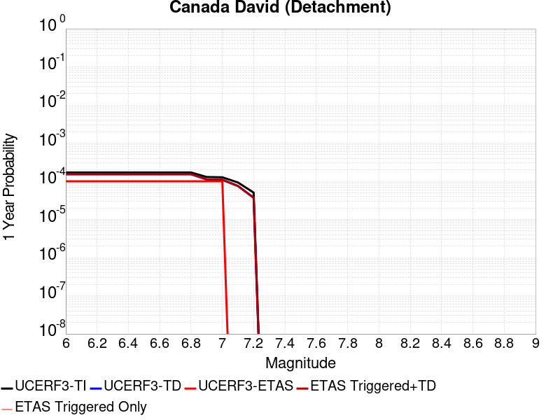 |  |

| Magnitude | 1 wk TI Prob | 1 wk TD Prob | 1 wk ETAS Prob | 1 wk ETAS/TD Gain | 1 wk ETAS Triggered+TD | 1 wk ETAS Triggered Only | 1 mo TI Prob | 1 mo TD Prob | 1 mo ETAS Prob | 1 mo ETAS/TD Gain | 1 mo ETAS Triggered+TD | 1 mo ETAS Triggered Only | 1 yr TI Prob | 1 yr TD Prob | 1 yr ETAS Prob | 1 yr ETAS/TD Gain | 1 yr ETAS Triggered+TD | 1 yr ETAS Triggered Only | 10 yr TI Prob | 10 yr TD Prob | 10 yr ETAS Prob | 10 yr ETAS/TD Gain | 10 yr ETAS Triggered+TD | 10 yr ETAS Triggered Only |
|-----|-----|-----|-----|-----|-----|-----|-----|-----|-----|-----|-----|-----|-----|-----|-----|-----|-----|-----|-----|-----|-----|-----|-----|-----|
| 6.0 | 3.2736298E-6 | 2.9513726E-6 | 0.0 | 0.0 | 2.9513726E-6 | 0.0 | 1.4029766E-5 | 1.2648686E-5 | 0.0 | 0.0 | 1.2648686E-5 | 0.0 | 1.7079902E-4 | 1.5398815E-4 | 1.0E-4 | 0.6494006 | 1.5398815E-4 | 0.0 | 0.001706678 | 0.0015389405 | 0.0016 | 1.0396763 | 0.0021380172 | 6.0E-4 |
| 6.1 | 3.2736298E-6 | 2.9513726E-6 | 0.0 | 0.0 | 2.9513726E-6 | 0.0 | 1.4029766E-5 | 1.2648686E-5 | 0.0 | 0.0 | 1.2648686E-5 | 0.0 | 1.7079902E-4 | 1.5398815E-4 | 1.0E-4 | 0.6494006 | 1.5398815E-4 | 0.0 | 0.001706678 | 0.0015389405 | 0.0016 | 1.0396763 | 0.0021380172 | 6.0E-4 |
| 6.2 | 3.2736298E-6 | 2.9513726E-6 | 0.0 | 0.0 | 2.9513726E-6 | 0.0 | 1.4029766E-5 | 1.2648686E-5 | 0.0 | 0.0 | 1.2648686E-5 | 0.0 | 1.7079902E-4 | 1.5398815E-4 | 1.0E-4 | 0.6494006 | 1.5398815E-4 | 0.0 | 0.001706678 | 0.0015389405 | 0.0016 | 1.0396763 | 0.0021380172 | 6.0E-4 |
| 6.3 | 3.2736298E-6 | 2.9513726E-6 | 0.0 | 0.0 | 2.9513726E-6 | 0.0 | 1.4029766E-5 | 1.2648686E-5 | 0.0 | 0.0 | 1.2648686E-5 | 0.0 | 1.7079902E-4 | 1.5398815E-4 | 1.0E-4 | 0.6494006 | 1.5398815E-4 | 0.0 | 0.001706678 | 0.0015389405 | 0.0016 | 1.0396763 | 0.0021380172 | 6.0E-4 |
| 6.4 | 3.2736298E-6 | 2.9513726E-6 | 0.0 | 0.0 | 2.9513726E-6 | 0.0 | 1.4029766E-5 | 1.2648686E-5 | 0.0 | 0.0 | 1.2648686E-5 | 0.0 | 1.7079902E-4 | 1.5398815E-4 | 1.0E-4 | 0.6494006 | 1.5398815E-4 | 0.0 | 0.001706678 | 0.0015389405 | 0.0016 | 1.0396763 | 0.0021380172 | 6.0E-4 |
| 6.5 | 3.2736298E-6 | 2.9513726E-6 | 0.0 | 0.0 | 2.9513726E-6 | 0.0 | 1.4029766E-5 | 1.2648686E-5 | 0.0 | 0.0 | 1.2648686E-5 | 0.0 | 1.7079902E-4 | 1.5398815E-4 | 1.0E-4 | 0.6494006 | 1.5398815E-4 | 0.0 | 0.001706678 | 0.0015389405 | 0.0016 | 1.0396763 | 0.0021380172 | 6.0E-4 |
| 6.6 | 3.2736298E-6 | 2.9513726E-6 | 0.0 | 0.0 | 2.9513726E-6 | 0.0 | 1.4029766E-5 | 1.2648686E-5 | 0.0 | 0.0 | 1.2648686E-5 | 0.0 | 1.7079902E-4 | 1.5398815E-4 | 1.0E-4 | 0.6494006 | 1.5398815E-4 | 0.0 | 0.001706678 | 0.0015389405 | 0.0016 | 1.0396763 | 0.0021380172 | 6.0E-4 |
| 6.7 | 3.2736298E-6 | 2.9513726E-6 | 0.0 | 0.0 | 2.9513726E-6 | 0.0 | 1.4029766E-5 | 1.2648686E-5 | 0.0 | 0.0 | 1.2648686E-5 | 0.0 | 1.7079902E-4 | 1.5398815E-4 | 1.0E-4 | 0.6494006 | 1.5398815E-4 | 0.0 | 0.001706678 | 0.0015389405 | 0.0016 | 1.0396763 | 0.0021380172 | 6.0E-4 |
| 6.8 | 3.2736298E-6 | 2.9513726E-6 | 0.0 | 0.0 | 2.9513726E-6 | 0.0 | 1.4029766E-5 | 1.2648686E-5 | 0.0 | 0.0 | 1.2648686E-5 | 0.0 | 1.7079902E-4 | 1.5398815E-4 | 1.0E-4 | 0.6494006 | 1.5398815E-4 | 0.0 | 0.001706678 | 0.0015389405 | 0.0016 | 1.0396763 | 0.0021380172 | 6.0E-4 |
| 6.9 | 2.4914223E-6 | 2.1503936E-6 | 0.0 | 0.0 | 2.1503936E-6 | 0.0 | 1.067748E-5 | 9.215943E-6 | 0.0 | 0.0 | 9.215943E-6 | 0.0 | 1.2999057E-4 | 1.1219888E-4 | 1.0E-4 | 0.8912745 | 1.1219888E-4 | 0.0 | 0.0012991455 | 0.0011214765 | 0.001 | 0.8916816 | 0.0015210279 | 4.0E-4 |
| 7.0 | 2.4482404E-6 | 2.1083463E-6 | 0.0 | 0.0 | 2.1083463E-6 | 0.0 | 1.0492417E-5 | 9.035742E-6 | 0.0 | 0.0 | 9.035742E-6 | 0.0 | 1.2773767E-4 | 1.1000515E-4 | 1.0E-4 | 0.9090483 | 1.1000515E-4 | 0.0 | 0.0012766428 | 0.0010995611 | 0.001 | 0.9094538 | 0.0014991213 | 4.0E-4 |
| 7.1 | 1.7887576E-6 | 1.4484149E-6 | 0.0 | 0.0 | 1.4484149E-6 | 0.0 | 7.666081E-6 | 6.207479E-6 | 0.0 | 0.0 | 6.207479E-6 | 0.0 | 9.333054E-5 | 7.557374E-5 | 0.0 | 0.0 | 7.557374E-5 | 0.0 | 9.329135E-4 | 7.5551076E-4 | 6.0E-4 | 0.7941647 | 0.001055284 | 3.0E-4 |
| 7.2 | 9.723109E-7 | 7.124557E-7 | 0.0 | 0.0 | 7.124557E-7 | 0.0 | 4.16704E-6 | 3.0533788E-6 | 0.0 | 0.0 | 3.0533788E-6 | 0.0 | 5.073253E-5 | 3.7174417E-5 | 0.0 | 0.0 | 3.7174417E-5 | 0.0 | 5.072095E-4 | 3.716982E-4 | 4.0E-4 | 1.0761418 | 5.7162385E-4 | 2.0E-4 |

## Pine Mtn
*[(top)](#table-of-contents)*

| 1 Week | 1 Month | 1 Year | 10 Year |
|-----|-----|-----|-----|
|  |  |  |  |

| Magnitude | 1 wk TI Prob | 1 wk TD Prob | 1 wk ETAS Prob | 1 wk ETAS/TD Gain | 1 wk ETAS Triggered+TD | 1 wk ETAS Triggered Only | 1 mo TI Prob | 1 mo TD Prob | 1 mo ETAS Prob | 1 mo ETAS/TD Gain | 1 mo ETAS Triggered+TD | 1 mo ETAS Triggered Only | 1 yr TI Prob | 1 yr TD Prob | 1 yr ETAS Prob | 1 yr ETAS/TD Gain | 1 yr ETAS Triggered+TD | 1 yr ETAS Triggered Only | 10 yr TI Prob | 10 yr TD Prob | 10 yr ETAS Prob | 10 yr ETAS/TD Gain | 10 yr ETAS Triggered+TD | 10 yr ETAS Triggered Only |
|-----|-----|-----|-----|-----|-----|-----|-----|-----|-----|-----|-----|-----|-----|-----|-----|-----|-----|-----|-----|-----|-----|-----|-----|-----|
| 6.0 | 6.894797E-6 | 7.2173143E-6 | 0.0 | 0.0 | 7.2173143E-6 | 0.0 | 2.9548795E-5 | 3.0930998E-5 | 0.0 | 0.0 | 3.0930998E-5 | 0.0 | 3.596972E-4 | 3.7652277E-4 | 3.0E-4 | 0.79676455 | 3.7652277E-4 | 0.0 | 0.0035911554 | 0.0037591455 | 0.0028 | 0.7448501 | 0.00435689 | 6.0E-4 |
| 6.1 | 6.894797E-6 | 7.2173143E-6 | 0.0 | 0.0 | 7.2173143E-6 | 0.0 | 2.9548795E-5 | 3.0930998E-5 | 0.0 | 0.0 | 3.0930998E-5 | 0.0 | 3.596972E-4 | 3.7652277E-4 | 3.0E-4 | 0.79676455 | 3.7652277E-4 | 0.0 | 0.0035911554 | 0.0037591455 | 0.0028 | 0.7448501 | 0.00435689 | 6.0E-4 |
| 6.2 | 6.894797E-6 | 7.2173143E-6 | 0.0 | 0.0 | 7.2173143E-6 | 0.0 | 2.9548795E-5 | 3.0930998E-5 | 0.0 | 0.0 | 3.0930998E-5 | 0.0 | 3.596972E-4 | 3.7652277E-4 | 3.0E-4 | 0.79676455 | 3.7652277E-4 | 0.0 | 0.0035911554 | 0.0037591455 | 0.0028 | 0.7448501 | 0.00435689 | 6.0E-4 |
| 6.3 | 6.894797E-6 | 7.2173143E-6 | 0.0 | 0.0 | 7.2173143E-6 | 0.0 | 2.9548795E-5 | 3.0930998E-5 | 0.0 | 0.0 | 3.0930998E-5 | 0.0 | 3.596972E-4 | 3.7652277E-4 | 3.0E-4 | 0.79676455 | 3.7652277E-4 | 0.0 | 0.0035911554 | 0.0037591455 | 0.0028 | 0.7448501 | 0.00435689 | 6.0E-4 |
| 6.4 | 6.894797E-6 | 7.2173143E-6 | 0.0 | 0.0 | 7.2173143E-6 | 0.0 | 2.9548795E-5 | 3.0930998E-5 | 0.0 | 0.0 | 3.0930998E-5 | 0.0 | 3.596972E-4 | 3.7652277E-4 | 3.0E-4 | 0.79676455 | 3.7652277E-4 | 0.0 | 0.0035911554 | 0.0037591455 | 0.0028 | 0.7448501 | 0.00435689 | 6.0E-4 |
| 6.5 | 6.894797E-6 | 7.2173143E-6 | 0.0 | 0.0 | 7.2173143E-6 | 0.0 | 2.9548795E-5 | 3.0930998E-5 | 0.0 | 0.0 | 3.0930998E-5 | 0.0 | 3.596972E-4 | 3.7652277E-4 | 3.0E-4 | 0.79676455 | 3.7652277E-4 | 0.0 | 0.0035911554 | 0.0037591455 | 0.0028 | 0.7448501 | 0.00435689 | 6.0E-4 |
| 6.6 | 6.894797E-6 | 7.2173143E-6 | 0.0 | 0.0 | 7.2173143E-6 | 0.0 | 2.9548795E-5 | 3.0930998E-5 | 0.0 | 0.0 | 3.0930998E-5 | 0.0 | 3.596972E-4 | 3.7652277E-4 | 3.0E-4 | 0.79676455 | 3.7652277E-4 | 0.0 | 0.0035911554 | 0.0037591455 | 0.0028 | 0.7448501 | 0.00435689 | 6.0E-4 |
| 6.7 | 6.0867933E-6 | 6.389184E-6 | 0.0 | 0.0 | 6.389184E-6 | 0.0 | 2.6085996E-5 | 2.7381942E-5 | 0.0 | 0.0 | 2.7381942E-5 | 0.0 | 3.1755073E-4 | 3.3332632E-4 | 3.0E-4 | 0.90001893 | 3.3332632E-4 | 0.0 | 0.0031709734 | 0.0033284824 | 0.0027 | 0.8111805 | 0.0039264853 | 6.0E-4 |
| 6.8 | 5.6530425E-6 | 5.9428035E-6 | 0.0 | 0.0 | 5.9428035E-6 | 0.0 | 2.42271E-5 | 2.546892E-5 | 0.0 | 0.0 | 2.546892E-5 | 0.0 | 2.94925E-4 | 3.1004203E-4 | 3.0E-4 | 0.9676107 | 3.1004203E-4 | 0.0 | 0.002945339 | 0.0030962992 | 0.0027 | 0.87200874 | 0.0036944414 | 6.0E-4 |
| 6.9 | 4.6015225E-6 | 4.856422E-6 | 0.0 | 0.0 | 4.856422E-6 | 0.0 | 1.9720663E-5 | 2.081308E-5 | 0.0 | 0.0 | 2.081308E-5 | 0.0 | 2.4007261E-4 | 2.5337122E-4 | 2.0E-4 | 0.7893556 | 2.5337122E-4 | 0.0 | 0.0023981342 | 0.0025309676 | 0.0024 | 0.948254 | 0.003029702 | 5.0E-4 |
| 7.0 | 4.4875965E-6 | 4.740087E-6 | 0.0 | 0.0 | 4.740087E-6 | 0.0 | 1.9232413E-5 | 2.031451E-5 | 0.0 | 0.0 | 2.031451E-5 | 0.0 | 2.3412947E-4 | 2.4730252E-4 | 2.0E-4 | 0.808726 | 2.4730252E-4 | 0.0 | 0.0023388295 | 0.002470417 | 0.0024 | 0.9714959 | 0.0029691816 | 5.0E-4 |
| 7.1 | 3.203907E-6 | 3.4223929E-6 | 0.0 | 0.0 | 3.4223929E-6 | 0.0 | 1.3730958E-5 | 1.4667319E-5 | 0.0 | 0.0 | 1.4667319E-5 | 0.0 | 1.6716159E-4 | 1.7856064E-4 | 2.0E-4 | 1.1200676 | 1.7856064E-4 | 0.0 | 0.0016703589 | 0.0017842377 | 0.0015 | 0.8406952 | 0.0019838808 | 2.0E-4 |
| 7.2 | 2.2060601E-6 | 2.372741E-6 | 0.0 | 0.0 | 2.372741E-6 | 0.0 | 9.4545085E-6 | 1.0168853E-5 | 0.0 | 0.0 | 1.0168853E-5 | 0.0 | 1.15102564E-4 | 1.237992E-4 | 2.0E-4 | 1.6155193 | 1.237992E-4 | 0.0 | 0.0011504296 | 0.001237347 | 0.0011 | 0.88899875 | 0.0013372233 | 1.0E-4 |
| 7.3 | 1.3765207E-6 | 1.5164808E-6 | 0.0 | 0.0 | 1.5164808E-6 | 0.0 | 5.899361E-6 | 6.4991877E-6 | 0.0 | 0.0 | 6.4991877E-6 | 0.0 | 7.182235E-5 | 7.9124824E-5 | 1.0E-4 | 1.2638258 | 7.9124824E-5 | 0.0 | 7.1799144E-4 | 7.909756E-4 | 7.0E-4 | 0.8849831 | 8.908965E-4 | 1.0E-4 |
| 7.4 | 1.1245983E-6 | 1.2540539E-6 | 0.0 | 0.0 | 1.2540539E-6 | 0.0 | 4.819698E-6 | 5.374506E-6 | 0.0 | 0.0 | 5.374506E-6 | 0.0 | 5.8678244E-5 | 6.543273E-5 | 1.0E-4 | 1.528287 | 6.543273E-5 | 0.0 | 5.866275E-4 | 6.541429E-4 | 6.0E-4 | 0.9172308 | 7.5407745E-4 | 1.0E-4 |
| 7.5 | 8.031682E-7 | 9.233474E-7 | 0.0 | 0.0 | 9.233474E-7 | 0.0 | 3.4421448E-6 | 3.9571974E-6 | 0.0 | 0.0 | 3.9571974E-6 | 0.0 | 4.1907308E-5 | 4.817788E-5 | 1.0E-4 | 2.0756412 | 4.817788E-5 | 0.0 | 4.1899405E-4 | 4.8168103E-4 | 6.0E-4 | 1.2456375 | 5.816329E-4 | 1.0E-4 |
| 7.6 | 4.8953444E-7 | 5.964397E-7 | 0.0 | 0.0 | 5.964397E-7 | 0.0 | 2.098003E-6 | 2.5561678E-6 | 0.0 | 0.0 | 2.5561678E-6 | 0.0 | 2.5542888E-5 | 3.1120948E-5 | 0.0 | 0.0 | 3.1120948E-5 | 0.0 | 2.5539953E-4 | 3.1117065E-4 | 2.0E-4 | 0.6427341 | 3.1117065E-4 | 0.0 |
| 7.7 | 6.634529E-8 | 6.7871596E-8 | 0.0 | 0.0 | 6.7871596E-8 | 0.0 | 2.843369E-7 | 2.9087823E-7 | 0.0 | 0.0 | 2.9087823E-7 | 0.0 | 3.4617963E-6 | 3.5414373E-6 | 0.0 | 0.0 | 3.5414373E-6 | 0.0 | 3.4617424E-5 | 3.5413857E-5 | 0.0 | 0.0 | 3.5413857E-5 | 0.0 |
| 7.8 | 9.235578E-9 | 9.485809E-9 | 0.0 | 0.0 | 9.485809E-9 | 0.0 | 3.9581046E-8 | 4.0653465E-8 | 0.0 | 0.0 | 4.0653465E-8 | 0.0 | 4.818991E-7 | 4.949558E-7 | 0.0 | 0.0 | 4.949558E-7 | 0.0 | 4.8189804E-6 | 4.949549E-6 | 0.0 | 0.0 | 4.949549E-6 | 0.0 |

## White Wolf (Extension)
*[(top)](#table-of-contents)*

| 1 Week | 1 Month | 1 Year | 10 Year |
|-----|-----|-----|-----|
|  |  | 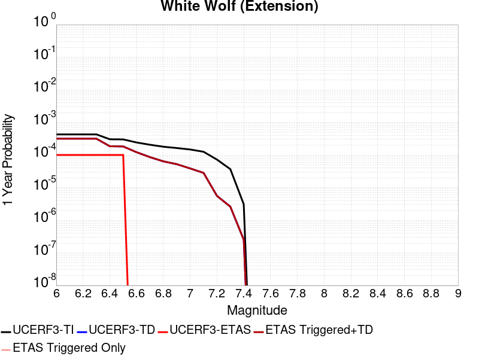 | 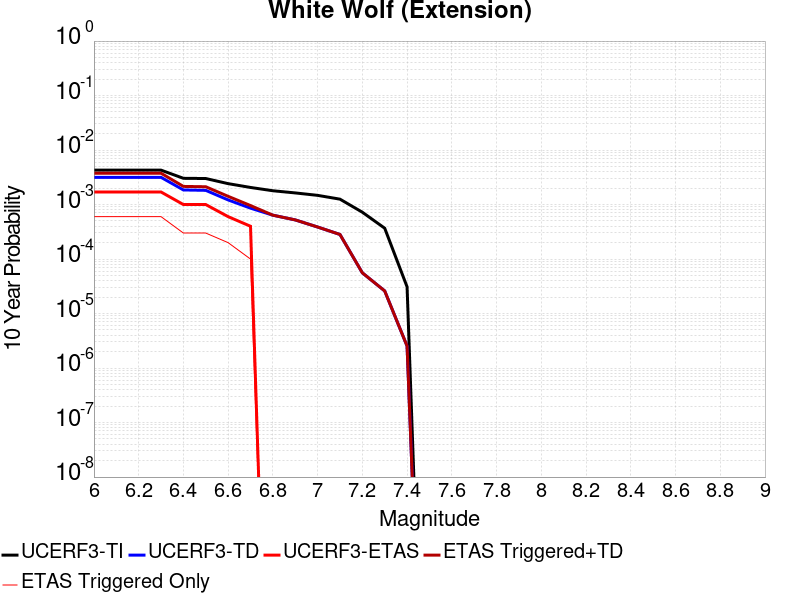 |

| Magnitude | 1 wk TI Prob | 1 wk TD Prob | 1 wk ETAS Prob | 1 wk ETAS/TD Gain | 1 wk ETAS Triggered+TD | 1 wk ETAS Triggered Only | 1 mo TI Prob | 1 mo TD Prob | 1 mo ETAS Prob | 1 mo ETAS/TD Gain | 1 mo ETAS Triggered+TD | 1 mo ETAS Triggered Only | 1 yr TI Prob | 1 yr TD Prob | 1 yr ETAS Prob | 1 yr ETAS/TD Gain | 1 yr ETAS Triggered+TD | 1 yr ETAS Triggered Only | 10 yr TI Prob | 10 yr TD Prob | 10 yr ETAS Prob | 10 yr ETAS/TD Gain | 10 yr ETAS Triggered+TD | 10 yr ETAS Triggered Only |
|-----|-----|-----|-----|-----|-----|-----|-----|-----|-----|-----|-----|-----|-----|-----|-----|-----|-----|-----|-----|-----|-----|-----|-----|-----|
| 6.0 | 8.222555E-6 | 6.0631282E-6 | 0.0 | 0.0 | 6.0631282E-6 | 0.0 | 3.5239045E-5 | 2.5984613E-5 | 0.0 | 0.0 | 2.5984613E-5 | 0.0 | 4.289509E-4 | 3.1632336E-4 | 1.0E-4 | 0.31613222 | 3.1632336E-4 | 0.0 | 0.0042812387 | 0.0031593821 | 0.0017 | 0.53807986 | 0.0037574866 | 6.0E-4 |
| 6.1 | 8.222555E-6 | 6.0631282E-6 | 0.0 | 0.0 | 6.0631282E-6 | 0.0 | 3.5239045E-5 | 2.5984613E-5 | 0.0 | 0.0 | 2.5984613E-5 | 0.0 | 4.289509E-4 | 3.1632336E-4 | 1.0E-4 | 0.31613222 | 3.1632336E-4 | 0.0 | 0.0042812387 | 0.0031593821 | 0.0017 | 0.53807986 | 0.0037574866 | 6.0E-4 |
| 6.2 | 8.222555E-6 | 6.0631282E-6 | 0.0 | 0.0 | 6.0631282E-6 | 0.0 | 3.5239045E-5 | 2.5984613E-5 | 0.0 | 0.0 | 2.5984613E-5 | 0.0 | 4.289509E-4 | 3.1632336E-4 | 1.0E-4 | 0.31613222 | 3.1632336E-4 | 0.0 | 0.0042812387 | 0.0031593821 | 0.0017 | 0.53807986 | 0.0037574866 | 6.0E-4 |
| 6.3 | 8.222555E-6 | 6.0631282E-6 | 0.0 | 0.0 | 6.0631282E-6 | 0.0 | 3.5239045E-5 | 2.5984613E-5 | 0.0 | 0.0 | 2.5984613E-5 | 0.0 | 4.289509E-4 | 3.1632336E-4 | 1.0E-4 | 0.31613222 | 3.1632336E-4 | 0.0 | 0.0042812387 | 0.0031593821 | 0.0017 | 0.53807986 | 0.0037574866 | 6.0E-4 |
| 6.4 | 5.821773E-6 | 3.5548255E-6 | 0.0 | 0.0 | 3.5548255E-6 | 0.0 | 2.4950215E-5 | 1.5234884E-5 | 0.0 | 0.0 | 1.5234884E-5 | 0.0 | 3.0372653E-4 | 1.8547002E-4 | 1.0E-4 | 0.5391707 | 1.8547002E-4 | 0.0 | 0.0030331176 | 0.0018532606 | 0.001 | 0.5395895 | 0.0021527046 | 3.0E-4 |
| 6.5 | 5.766023E-6 | 3.496785E-6 | 0.0 | 0.0 | 3.496785E-6 | 0.0 | 2.4711293E-5 | 1.4986141E-5 | 0.0 | 0.0 | 1.4986141E-5 | 0.0 | 3.0081844E-4 | 1.8244209E-4 | 1.0E-4 | 0.5481191 | 1.8244209E-4 | 0.0 | 0.0030041158 | 0.0018230312 | 0.001 | 0.54853696 | 0.0021224844 | 3.0E-4 |
| 6.6 | 4.643576E-6 | 2.3307762E-6 | 0.0 | 0.0 | 2.3307762E-6 | 0.0 | 1.9900888E-5 | 9.989005E-6 | 0.0 | 0.0 | 9.989005E-6 | 0.0 | 2.4226638E-4 | 1.2160977E-4 | 0.0 | 0.0 | 1.2160977E-4 | 0.0 | 0.0024200242 | 0.0012154747 | 6.0E-4 | 0.4936343 | 0.0014152316 | 2.0E-4 |
| 6.7 | 3.9529173E-6 | 1.6468016E-6 | 0.0 | 0.0 | 1.6468016E-6 | 0.0 | 1.6940963E-5 | 7.057703E-6 | 0.0 | 0.0 | 7.057703E-6 | 0.0 | 2.0623671E-4 | 8.592434E-5 | 0.0 | 0.0 | 8.592434E-5 | 0.0 | 0.002060454 | 8.5892965E-4 | 4.0E-4 | 0.4656959 | 9.5884374E-4 | 1.0E-4 |
| 6.8 | 3.4377522E-6 | 1.2232036E-6 | 0.0 | 0.0 | 1.2232036E-6 | 0.0 | 1.473314E-5 | 5.2422915E-6 | 0.0 | 0.0 | 5.2422915E-6 | 0.0 | 1.7936122E-4 | 6.382312E-5 | 0.0 | 0.0 | 6.382312E-5 | 0.0 | 0.0017921652 | 6.38057E-4 | 0.0 | 0.0 | 6.38057E-4 | 0.0 |
| 6.9 | 3.1367306E-6 | 1.0021989E-6 | 0.0 | 0.0 | 1.0021989E-6 | 0.0 | 1.3443062E-5 | 4.295132E-6 | 0.0 | 0.0 | 4.295132E-6 | 0.0 | 1.63657E-4 | 5.2292053E-5 | 0.0 | 0.0 | 5.2292053E-5 | 0.0 | 0.0016353652 | 5.228051E-4 | 0.0 | 0.0 | 5.228051E-4 | 0.0 |
| 7.0 | 2.8298145E-6 | 7.4181105E-7 | 0.0 | 0.0 | 7.4181105E-7 | 0.0 | 1.2127721E-5 | 3.1791865E-6 | 0.0 | 0.0 | 3.1791865E-6 | 0.0 | 1.47645E-4 | 3.870596E-5 | 0.0 | 0.0 | 3.870596E-5 | 0.0 | 0.0014754693 | 3.8699716E-4 | 0.0 | 0.0 | 3.8699716E-4 | 0.0 |
| 7.1 | 2.4091064E-6 | 5.414195E-7 | 0.0 | 0.0 | 5.414195E-7 | 0.0 | 1.03247E-5 | 2.3203675E-6 | 0.0 | 0.0 | 2.3203675E-6 | 0.0 | 1.2569598E-4 | 2.8250148E-5 | 0.0 | 0.0 | 2.8250148E-5 | 0.0 | 0.001256249 | 2.824696E-4 | 0.0 | 0.0 | 2.824696E-4 | 0.0 |
| 7.2 | 1.3875518E-6 | 1.0699991E-7 | 0.0 | 0.0 | 1.0699991E-7 | 0.0 | 5.9466374E-6 | 4.5857098E-7 | 0.0 | 0.0 | 4.5857098E-7 | 0.0 | 7.23979E-5 | 5.5830888E-6 | 0.0 | 0.0 | 5.5830888E-6 | 0.0 | 7.2374323E-4 | 5.5829594E-5 | 0.0 | 0.0 | 5.5829594E-5 | 0.0 |
| 7.3 | 7.056077E-7 | 4.977136E-8 | 0.0 | 0.0 | 4.977136E-8 | 0.0 | 3.0240296E-6 | 2.133058E-7 | 0.0 | 0.0 | 2.133058E-7 | 0.0 | 3.681694E-5 | 2.5969955E-6 | 0.0 | 0.0 | 2.5969955E-6 | 0.0 | 3.681084E-4 | 2.5969697E-5 | 0.0 | 0.0 | 2.5969697E-5 | 0.0 |
| 7.4 | 5.9334678E-8 | 4.8415534E-9 | 0.0 | 0.0 | 4.8415534E-9 | 0.0 | 2.5429145E-7 | 2.0749514E-8 | 0.0 | 0.0 | 2.0749514E-8 | 0.0 | 3.095994E-6 | 2.526253E-7 | 0.0 | 0.0 | 2.526253E-7 | 0.0 | 3.095951E-5 | 2.5262514E-6 | 0.0 | 0.0 | 2.5262514E-6 | 0.0 |

## Great Valley 02
*[(top)](#table-of-contents)*

| 1 Week | 1 Month | 1 Year | 10 Year |
|-----|-----|-----|-----|
|  | 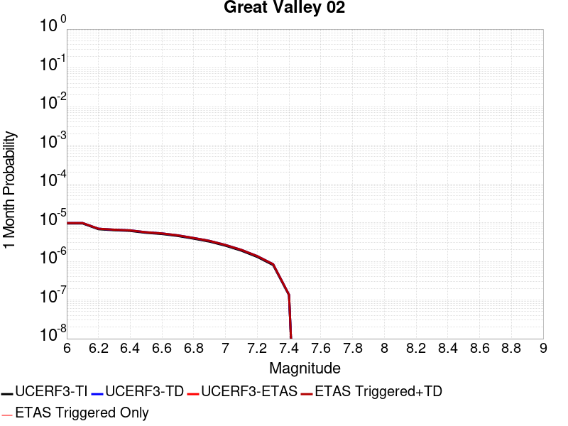 |  | 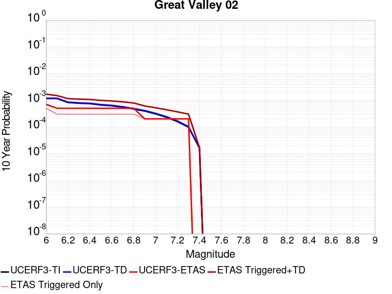 |

| Magnitude | 1 wk TI Prob | 1 wk TD Prob | 1 wk ETAS Prob | 1 wk ETAS/TD Gain | 1 wk ETAS Triggered+TD | 1 wk ETAS Triggered Only | 1 mo TI Prob | 1 mo TD Prob | 1 mo ETAS Prob | 1 mo ETAS/TD Gain | 1 mo ETAS Triggered+TD | 1 mo ETAS Triggered Only | 1 yr TI Prob | 1 yr TD Prob | 1 yr ETAS Prob | 1 yr ETAS/TD Gain | 1 yr ETAS Triggered+TD | 1 yr ETAS Triggered Only | 10 yr TI Prob | 10 yr TD Prob | 10 yr ETAS Prob | 10 yr ETAS/TD Gain | 10 yr ETAS Triggered+TD | 10 yr ETAS Triggered Only |
|-----|-----|-----|-----|-----|-----|-----|-----|-----|-----|-----|-----|-----|-----|-----|-----|-----|-----|-----|-----|-----|-----|-----|-----|-----|
| 6.0 | 2.2243487E-6 | 2.281145E-6 | 0.0 | 0.0 | 2.281145E-6 | 0.0 | 9.532888E-6 | 9.776302E-6 | 0.0 | 0.0 | 9.776302E-6 | 0.0 | 1.1605673E-4 | 1.19020486E-4 | 1.0E-4 | 0.8401915 | 2.1900858E-4 | 1.0E-4 | 0.0011599615 | 0.0011896173 | 7.0E-4 | 0.5884245 | 0.0016890225 | 5.0E-4 |
| 6.1 | 2.2243487E-6 | 2.281145E-6 | 0.0 | 0.0 | 2.281145E-6 | 0.0 | 9.532888E-6 | 9.776302E-6 | 0.0 | 0.0 | 9.776302E-6 | 0.0 | 1.1605673E-4 | 1.19020486E-4 | 1.0E-4 | 0.8401915 | 2.1900858E-4 | 1.0E-4 | 0.0011599615 | 0.0011896173 | 5.0E-4 | 0.42030323 | 0.0014892605 | 3.0E-4 |
| 6.2 | 1.5787732E-6 | 1.6267251E-6 | 0.0 | 0.0 | 1.6267251E-6 | 0.0 | 6.7661535E-6 | 6.9716602E-6 | 0.0 | 0.0 | 6.9716602E-6 | 0.0 | 8.2374805E-5 | 8.487671E-5 | 1.0E-4 | 1.1781796 | 1.8486822E-4 | 1.0E-4 | 8.2344277E-4 | 8.484476E-4 | 5.0E-4 | 0.58931154 | 0.0011481931 | 3.0E-4 |
| 6.3 | 1.4850314E-6 | 1.53178E-6 | 0.0 | 0.0 | 1.53178E-6 | 0.0 | 6.3644047E-6 | 6.564755E-6 | 0.0 | 0.0 | 6.564755E-6 | 0.0 | 7.748387E-5 | 7.9923E-5 | 1.0E-4 | 1.2512044 | 1.79915E-4 | 1.0E-4 | 7.745686E-4 | 7.9894636E-4 | 5.0E-4 | 0.6258242 | 0.0010987067 | 3.0E-4 |
| 6.4 | 1.4266972E-6 | 1.4729251E-6 | 0.0 | 0.0 | 1.4729251E-6 | 0.0 | 6.114402E-6 | 6.312521E-6 | 0.0 | 0.0 | 6.312521E-6 | 0.0 | 7.44403E-5 | 7.6852266E-5 | 1.0E-4 | 1.3011979 | 1.7684458E-4 | 1.0E-4 | 7.441537E-4 | 7.682603E-4 | 5.0E-4 | 0.6508211 | 0.0010680298 | 3.0E-4 |
| 6.5 | 1.2728015E-6 | 1.3166414E-6 | 0.0 | 0.0 | 1.3166414E-6 | 0.0 | 5.4548523E-6 | 5.642737E-6 | 0.0 | 0.0 | 5.642737E-6 | 0.0 | 6.64108E-5 | 6.869818E-5 | 1.0E-4 | 1.4556426 | 1.6869132E-4 | 1.0E-4 | 6.639096E-4 | 6.8677205E-4 | 5.0E-4 | 0.7280436 | 9.865661E-4 | 3.0E-4 |
| 6.6 | 1.1857247E-6 | 1.2284668E-6 | 0.0 | 0.0 | 1.2284668E-6 | 0.0 | 5.0816675E-6 | 5.264847E-6 | 0.0 | 0.0 | 5.264847E-6 | 0.0 | 6.186755E-5 | 6.409765E-5 | 1.0E-4 | 1.5601195 | 1.6409124E-4 | 1.0E-4 | 6.1850325E-4 | 6.407941E-4 | 5.0E-4 | 0.78028184 | 9.4060187E-4 | 3.0E-4 |
| 6.7 | 1.0550715E-6 | 1.0948922E-6 | 0.0 | 0.0 | 1.0948922E-6 | 0.0 | 4.521727E-6 | 4.692387E-6 | 0.0 | 0.0 | 4.692387E-6 | 0.0 | 5.5050637E-5 | 5.7128334E-5 | 1.0E-4 | 1.7504449 | 1.5712262E-4 | 1.0E-4 | 5.5037E-4 | 5.711386E-4 | 5.0E-4 | 0.87544423 | 8.709673E-4 | 3.0E-4 |
| 6.8 | 8.9881183E-7 | 9.3515223E-7 | 0.0 | 0.0 | 9.3515223E-7 | 0.0 | 3.8520448E-6 | 4.0077894E-6 | 0.0 | 0.0 | 4.0077894E-6 | 0.0 | 4.689764E-5 | 4.879376E-5 | 1.0E-4 | 2.0494423 | 1.4878888E-4 | 1.0E-4 | 4.688774E-4 | 4.878322E-4 | 5.0E-4 | 1.0249425 | 7.8768586E-4 | 3.0E-4 |
| 6.9 | 7.5417256E-7 | 7.8674594E-7 | 0.0 | 0.0 | 7.8674594E-7 | 0.0 | 3.232164E-6 | 3.371764E-6 | 0.0 | 0.0 | 3.371764E-6 | 0.0 | 3.9350885E-5 | 4.105047E-5 | 1.0E-4 | 2.4360259 | 1.4104636E-4 | 1.0E-4 | 3.934392E-4 | 4.104303E-4 | 2.0E-4 | 0.48729345 | 6.103482E-4 | 2.0E-4 |
| 7.0 | 5.909726E-7 | 6.1749876E-7 | 0.0 | 0.0 | 6.1749876E-7 | 0.0 | 2.5327372E-6 | 2.6464206E-6 | 0.0 | 0.0 | 2.6464206E-6 | 0.0 | 3.083564E-5 | 3.2219705E-5 | 1.0E-4 | 3.1036909 | 1.3221648E-4 | 1.0E-4 | 3.083136E-4 | 3.2215135E-4 | 2.0E-4 | 0.62082624 | 5.220869E-4 | 2.0E-4 |
| 7.1 | 4.4054178E-7 | 4.6147488E-7 | 0.0 | 0.0 | 4.6147488E-7 | 0.0 | 1.8880348E-6 | 1.977748E-6 | 0.0 | 0.0 | 1.977748E-6 | 0.0 | 2.2986582E-5 | 2.4078823E-5 | 1.0E-4 | 4.153027 | 1.2407641E-4 | 1.0E-4 | 2.2984203E-4 | 2.4076286E-4 | 2.0E-4 | 0.8306929 | 4.407147E-4 | 2.0E-4 |
| 7.2 | 3.029834E-7 | 3.1805135E-7 | 0.0 | 0.0 | 3.1805135E-7 | 0.0 | 1.2984997E-6 | 1.3630764E-6 | 0.0 | 0.0 | 1.3630764E-6 | 0.0 | 1.5809119E-5 | 1.6595333E-5 | 1.0E-4 | 6.02579 | 1.1659368E-4 | 1.0E-4 | 1.5807994E-4 | 1.659414E-4 | 2.0E-4 | 1.2052448 | 3.659082E-4 | 2.0E-4 |
| 7.3 | 1.8700909E-7 | 1.966933E-7 | 0.0 | 0.0 | 1.966933E-7 | 0.0 | 8.0146725E-7 | 8.429711E-7 | 0.0 | 0.0 | 8.429711E-7 | 0.0 | 9.75782E-6 | 1.02631275E-5 | 1.0E-4 | 9.743619 | 1.102621E-4 | 1.0E-4 | 9.757392E-5 | 1.0262681E-4 | 2.0E-4 | 1.9488086 | 3.026063E-4 | 2.0E-4 |
| 7.4 | 3.112171E-8 | 3.2058175E-8 | 0.0 | 0.0 | 3.2058175E-8 | 0.0 | 1.3337875E-7 | 1.3739218E-7 | 0.0 | 0.0 | 1.3739218E-7 | 0.0 | 1.6238852E-6 | 1.6727486E-6 | 0.0 | 0.0 | 1.6727486E-6 | 0.0 | 1.6238733E-5 | 1.6727368E-5 | 0.0 | 0.0 | 1.6727368E-5 | 0.0 |

## Hilton Creek 2011 CFM
*[(top)](#table-of-contents)*

| 1 Week | 1 Month | 1 Year | 10 Year |
|-----|-----|-----|-----|
|  |  | 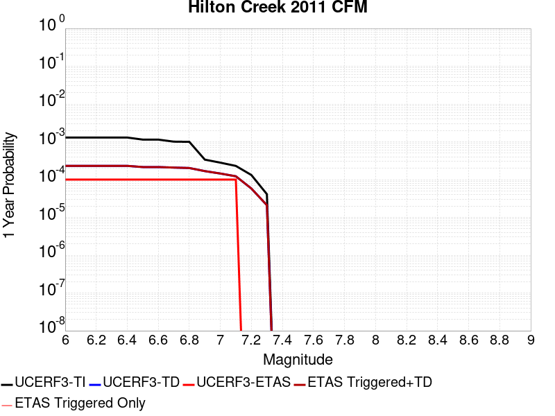 |  |

| Magnitude | 1 wk TI Prob | 1 wk TD Prob | 1 wk ETAS Prob | 1 wk ETAS/TD Gain | 1 wk ETAS Triggered+TD | 1 wk ETAS Triggered Only | 1 mo TI Prob | 1 mo TD Prob | 1 mo ETAS Prob | 1 mo ETAS/TD Gain | 1 mo ETAS Triggered+TD | 1 mo ETAS Triggered Only | 1 yr TI Prob | 1 yr TD Prob | 1 yr ETAS Prob | 1 yr ETAS/TD Gain | 1 yr ETAS Triggered+TD | 1 yr ETAS Triggered Only | 10 yr TI Prob | 10 yr TD Prob | 10 yr ETAS Prob | 10 yr ETAS/TD Gain | 10 yr ETAS Triggered+TD | 10 yr ETAS Triggered Only |
|-----|-----|-----|-----|-----|-----|-----|-----|-----|-----|-----|-----|-----|-----|-----|-----|-----|-----|-----|-----|-----|-----|-----|-----|-----|
| 6.0 | 2.4923684E-5 | 4.4273243E-6 | 0.0 | 0.0 | 4.4273243E-6 | 0.0 | 1.06811414E-4 | 1.8974117E-5 | 0.0 | 0.0 | 1.8974117E-5 | 0.0 | 0.0012996531 | 2.3098699E-4 | 1.0E-4 | 0.4329248 | 2.3098699E-4 | 0.0 | 0.012920785 | 0.0023104653 | 0.0011 | 0.47609457 | 0.00280931 | 5.0E-4 |
| 6.1 | 2.4923684E-5 | 4.4273243E-6 | 0.0 | 0.0 | 4.4273243E-6 | 0.0 | 1.06811414E-4 | 1.8974117E-5 | 0.0 | 0.0 | 1.8974117E-5 | 0.0 | 0.0012996531 | 2.3098699E-4 | 1.0E-4 | 0.4329248 | 2.3098699E-4 | 0.0 | 0.012920785 | 0.0023104653 | 0.0011 | 0.47609457 | 0.00280931 | 5.0E-4 |
| 6.2 | 2.4923684E-5 | 4.4273243E-6 | 0.0 | 0.0 | 4.4273243E-6 | 0.0 | 1.06811414E-4 | 1.8974117E-5 | 0.0 | 0.0 | 1.8974117E-5 | 0.0 | 0.0012996531 | 2.3098699E-4 | 1.0E-4 | 0.4329248 | 2.3098699E-4 | 0.0 | 0.012920785 | 0.0023104653 | 0.0011 | 0.47609457 | 0.00280931 | 5.0E-4 |
| 6.3 | 2.4923684E-5 | 4.4273243E-6 | 0.0 | 0.0 | 4.4273243E-6 | 0.0 | 1.06811414E-4 | 1.8974117E-5 | 0.0 | 0.0 | 1.8974117E-5 | 0.0 | 0.0012996531 | 2.3098699E-4 | 1.0E-4 | 0.4329248 | 2.3098699E-4 | 0.0 | 0.012920785 | 0.0023104653 | 0.0011 | 0.47609457 | 0.00280931 | 5.0E-4 |
| 6.4 | 2.4923684E-5 | 4.4273243E-6 | 0.0 | 0.0 | 4.4273243E-6 | 0.0 | 1.06811414E-4 | 1.8974117E-5 | 0.0 | 0.0 | 1.8974117E-5 | 0.0 | 0.0012996531 | 2.3098699E-4 | 1.0E-4 | 0.4329248 | 2.3098699E-4 | 0.0 | 0.012920785 | 0.0023104653 | 0.0011 | 0.47609457 | 0.00280931 | 5.0E-4 |
| 6.5 | 2.1963904E-5 | 4.11599E-6 | 0.0 | 0.0 | 4.11599E-6 | 0.0 | 9.412762E-5 | 1.7639846E-5 | 0.0 | 0.0 | 1.7639846E-5 | 0.0 | 0.0011454013 | 2.1474544E-4 | 1.0E-4 | 0.46566764 | 2.1474544E-4 | 0.0 | 0.011395155 | 0.0021502108 | 9.0E-4 | 0.4185636 | 0.0025493507 | 4.0E-4 |
| 6.6 | 2.1963904E-5 | 4.11599E-6 | 0.0 | 0.0 | 4.11599E-6 | 0.0 | 9.412762E-5 | 1.7639846E-5 | 0.0 | 0.0 | 1.7639846E-5 | 0.0 | 0.0011454013 | 2.1474544E-4 | 1.0E-4 | 0.46566764 | 2.1474544E-4 | 0.0 | 0.011395155 | 0.0021502108 | 9.0E-4 | 0.4185636 | 0.0025493507 | 4.0E-4 |
| 6.7 | 1.9397496E-5 | 3.9872543E-6 | 0.0 | 0.0 | 3.9872543E-6 | 0.0 | 8.3129475E-5 | 1.708813E-5 | 0.0 | 0.0 | 1.708813E-5 | 0.0 | 0.0010116313 | 2.0802957E-4 | 1.0E-4 | 0.48070088 | 2.0802957E-4 | 0.0 | 0.0100703845 | 0.0020827733 | 9.0E-4 | 0.43211618 | 0.0024819402 | 4.0E-4 |
| 6.8 | 1.917303E-5 | 3.880981E-6 | 0.0 | 0.0 | 3.880981E-6 | 0.0 | 8.216754E-5 | 1.6632677E-5 | 0.0 | 0.0 | 1.6632677E-5 | 0.0 | 9.999307E-4 | 2.0248548E-4 | 1.0E-4 | 0.4938626 | 2.0248548E-4 | 0.0 | 0.009954433 | 0.002027434 | 9.0E-4 | 0.44391087 | 0.0024266231 | 4.0E-4 |
| 6.9 | 6.480681E-6 | 3.2171663E-6 | 0.0 | 0.0 | 3.2171663E-6 | 0.0 | 2.7774051E-5 | 1.3787789E-5 | 0.0 | 0.0 | 1.3787789E-5 | 0.0 | 3.380966E-4 | 1.6785452E-4 | 1.0E-4 | 0.595754 | 1.6785452E-4 | 0.0 | 0.0033758266 | 0.0016773874 | 7.0E-4 | 0.41731563 | 0.0019768842 | 3.0E-4 |
| 7.0 | 5.388316E-6 | 2.7758965E-6 | 0.0 | 0.0 | 2.7758965E-6 | 0.0 | 2.3092578E-5 | 1.1896651E-5 | 0.0 | 0.0 | 1.1896651E-5 | 0.0 | 2.8111585E-4 | 1.4483313E-4 | 1.0E-4 | 0.6904498 | 1.4483313E-4 | 0.0 | 0.002807605 | 0.0014474891 | 7.0E-4 | 0.48359606 | 0.0017470549 | 3.0E-4 |
| 7.1 | 4.41728E-6 | 2.3467217E-6 | 0.0 | 0.0 | 2.3467217E-6 | 0.0 | 1.8931061E-5 | 1.0057345E-5 | 0.0 | 0.0 | 1.0057345E-5 | 0.0 | 2.304613E-4 | 1.2244227E-4 | 1.0E-4 | 0.81671137 | 1.2244227E-4 | 0.0 | 0.0023022245 | 0.0012238437 | 7.0E-4 | 0.57196844 | 0.0015234766 | 3.0E-4 |
| 7.2 | 2.535495E-6 | 1.1126469E-6 | 0.0 | 0.0 | 1.1126469E-6 | 0.0 | 1.0866362E-5 | 4.7684807E-6 | 0.0 | 0.0 | 4.7684807E-6 | 0.0 | 1.3228992E-4 | 5.8055222E-5 | 0.0 | 0.0 | 5.8055222E-5 | 0.0 | 0.0013221119 | 5.80451E-4 | 3.0E-4 | 0.5168395 | 6.8039296E-4 | 1.0E-4 |
| 7.3 | 7.900015E-7 | 4.033625E-7 | 0.0 | 0.0 | 4.033625E-7 | 0.0 | 3.3857161E-6 | 1.7286964E-6 | 0.0 | 0.0 | 1.7286964E-6 | 0.0 | 4.1220315E-5 | 2.1046879E-5 | 0.0 | 0.0 | 2.1046879E-5 | 0.0 | 4.121267E-4 | 2.1046879E-4 | 2.0E-4 | 0.9502597 | 3.1044774E-4 | 1.0E-4 |

## Silver Creek 2011 CFM
*[(top)](#table-of-contents)*

| 1 Week | 1 Month | 1 Year | 10 Year |
|-----|-----|-----|-----|
|  | 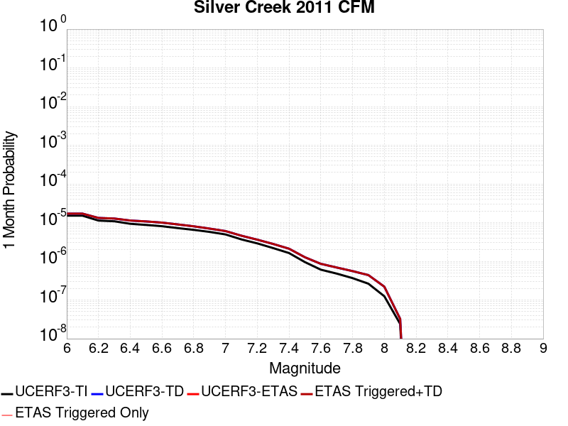 | 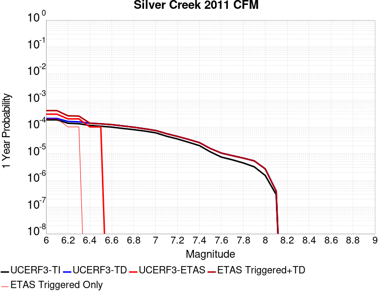 | 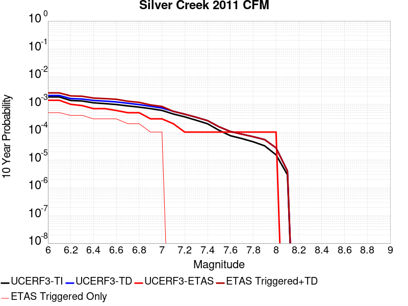 |

| Magnitude | 1 wk TI Prob | 1 wk TD Prob | 1 wk ETAS Prob | 1 wk ETAS/TD Gain | 1 wk ETAS Triggered+TD | 1 wk ETAS Triggered Only | 1 mo TI Prob | 1 mo TD Prob | 1 mo ETAS Prob | 1 mo ETAS/TD Gain | 1 mo ETAS Triggered+TD | 1 mo ETAS Triggered Only | 1 yr TI Prob | 1 yr TD Prob | 1 yr ETAS Prob | 1 yr ETAS/TD Gain | 1 yr ETAS Triggered+TD | 1 yr ETAS Triggered Only | 10 yr TI Prob | 10 yr TD Prob | 10 yr ETAS Prob | 10 yr ETAS/TD Gain | 10 yr ETAS Triggered+TD | 10 yr ETAS Triggered Only |
|-----|-----|-----|-----|-----|-----|-----|-----|-----|-----|-----|-----|-----|-----|-----|-----|-----|-----|-----|-----|-----|-----|-----|-----|-----|
| 6.0 | 3.5229125E-6 | 3.9729434E-6 | 0.0 | 0.0 | 3.9729434E-6 | 0.0 | 1.5098109E-5 | 1.7026792E-5 | 0.0 | 0.0 | 1.7026792E-5 | 0.0 | 1.8380396E-4 | 2.0728185E-4 | 3.0E-4 | 1.4473047 | 4.0724038E-4 | 2.0E-4 | 0.0018365202 | 0.0020712514 | 0.0014 | 0.6759199 | 0.0025702156 | 5.0E-4 |
| 6.1 | 3.5229125E-6 | 3.9729434E-6 | 0.0 | 0.0 | 3.9729434E-6 | 0.0 | 1.5098109E-5 | 1.7026792E-5 | 0.0 | 0.0 | 1.7026792E-5 | 0.0 | 1.8380396E-4 | 2.0728185E-4 | 3.0E-4 | 1.4473047 | 4.0724038E-4 | 2.0E-4 | 0.0018365202 | 0.0020712514 | 0.0014 | 0.6759199 | 0.0025702156 | 5.0E-4 |
| 6.2 | 2.6363234E-6 | 3.0754463E-6 | 0.0 | 0.0 | 3.0754463E-6 | 0.0 | 1.129848E-5 | 1.3180418E-5 | 0.0 | 0.0 | 1.3180418E-5 | 0.0 | 1.375503E-4 | 1.6045984E-4 | 2.0E-4 | 1.2464179 | 2.6044378E-4 | 1.0E-4 | 0.0013746519 | 0.0016037752 | 0.001 | 0.6235288 | 0.0020031335 | 4.0E-4 |
| 6.3 | 2.5275126E-6 | 2.9651017E-6 | 0.0 | 0.0 | 2.9651017E-6 | 0.0 | 1.0832152E-5 | 1.2707517E-5 | 0.0 | 0.0 | 1.2707517E-5 | 0.0 | 1.3187347E-4 | 1.5470308E-4 | 2.0E-4 | 1.292799 | 2.5468762E-4 | 1.0E-4 | 0.0013179524 | 0.0015462884 | 9.0E-4 | 0.5820389 | 0.0019456699 | 4.0E-4 |
| 6.4 | 2.178732E-6 | 2.6362497E-6 | 0.0 | 0.0 | 2.6362497E-6 | 0.0 | 9.337389E-6 | 1.1298165E-5 | 0.0 | 0.0 | 1.1298165E-5 | 0.0 | 1.1367678E-4 | 1.375465E-4 | 1.0E-4 | 0.7270268 | 1.375465E-4 | 0.0 | 0.0011361865 | 0.0013749459 | 7.0E-4 | 0.509111 | 0.0016745334 | 3.0E-4 |
| 6.5 | 2.0341574E-6 | 2.4954852E-6 | 0.0 | 0.0 | 2.4954852E-6 | 0.0 | 8.717788E-6 | 1.0694893E-5 | 0.0 | 0.0 | 1.0694893E-5 | 0.0 | 1.061339E-4 | 1.3020256E-4 | 1.0E-4 | 0.768034 | 1.3020256E-4 | 0.0 | 0.0010608323 | 0.0013015944 | 7.0E-4 | 0.5378019 | 0.001601204 | 3.0E-4 |
| 6.6 | 1.8856827E-6 | 2.3277084E-6 | 0.0 | 0.0 | 2.3277084E-6 | 0.0 | 8.0814725E-6 | 9.975855E-6 | 0.0 | 0.0 | 9.975855E-6 | 0.0 | 9.838748E-5 | 1.2144929E-4 | 0.0 | 0.0 | 1.2144929E-4 | 0.0 | 9.834393E-4 | 0.0012141604 | 6.0E-4 | 0.49416864 | 0.0015137962 | 3.0E-4 |
| 6.7 | 1.6844668E-6 | 2.087264E-6 | 0.0 | 0.0 | 2.087264E-6 | 0.0 | 7.2191233E-6 | 8.945386E-6 | 0.0 | 0.0 | 8.945386E-6 | 0.0 | 8.788928E-5 | 1.0890465E-4 | 0.0 | 0.0 | 1.0890465E-4 | 0.0 | 8.785453E-4 | 0.0010888433 | 5.0E-4 | 0.4592029 | 0.0012886255 | 2.0E-4 |
| 6.8 | 1.5177161E-6 | 1.8649915E-6 | 0.0 | 0.0 | 1.8649915E-6 | 0.0 | 6.504481E-6 | 7.992796E-6 | 0.0 | 0.0 | 7.992796E-6 | 0.0 | 7.918918E-5 | 9.730796E-5 | 0.0 | 0.0 | 9.730796E-5 | 0.0 | 7.9160964E-4 | 9.7298354E-4 | 5.0E-4 | 0.5138833 | 0.0011727889 | 2.0E-4 |
| 6.9 | 1.3437394E-6 | 1.6285475E-6 | 0.0 | 0.0 | 1.6285475E-6 | 0.0 | 5.7588704E-6 | 6.9794705E-6 | 0.0 | 0.0 | 6.9794705E-6 | 0.0 | 7.011199E-5 | 8.497175E-5 | 0.0 | 0.0 | 8.497175E-5 | 0.0 | 7.0089876E-4 | 8.497221E-4 | 3.0E-4 | 0.3530566 | 9.4963715E-4 | 1.0E-4 |
| 7.0 | 1.1563575E-6 | 1.4059393E-6 | 0.0 | 0.0 | 1.4059393E-6 | 0.0 | 4.9558084E-6 | 6.02544E-6 | 0.0 | 0.0 | 6.02544E-6 | 0.0 | 6.03353E-5 | 7.335727E-5 | 0.0 | 0.0 | 7.335727E-5 | 0.0 | 6.0318917E-4 | 7.3366E-4 | 3.0E-4 | 0.40890875 | 8.335866E-4 | 1.0E-4 |
| 7.1 | 8.602183E-7 | 1.066756E-6 | 0.0 | 0.0 | 1.066756E-6 | 0.0 | 3.6866445E-6 | 4.5718034E-6 | 0.0 | 0.0 | 4.5718034E-6 | 0.0 | 4.4883975E-5 | 5.5660286E-5 | 0.0 | 0.0 | 5.5660286E-5 | 0.0 | 4.4874908E-4 | 5.567927E-4 | 2.0E-4 | 0.3592001 | 5.567927E-4 | 0.0 |
| 7.2 | 6.788407E-7 | 8.423095E-7 | 0.0 | 0.0 | 8.423095E-7 | 0.0 | 2.9093142E-6 | 3.6098927E-6 | 0.0 | 0.0 | 3.6098927E-6 | 0.0 | 3.5420322E-5 | 4.394956E-5 | 0.0 | 0.0 | 4.394956E-5 | 0.0 | 3.541468E-4 | 4.3973792E-4 | 1.0E-4 | 0.22740819 | 4.3973792E-4 | 0.0 |
| 7.3 | 5.1292045E-7 | 6.5255654E-7 | 0.0 | 0.0 | 6.5255654E-7 | 0.0 | 2.1982287E-6 | 2.7966678E-6 | 0.0 | 0.0 | 2.7966678E-6 | 0.0 | 2.6763106E-5 | 3.40489E-5 | 0.0 | 0.0 | 3.40489E-5 | 0.0 | 2.6759884E-4 | 3.4076607E-4 | 1.0E-4 | 0.29345647 | 3.4076607E-4 | 0.0 |
| 7.4 | 3.820994E-7 | 4.924713E-7 | 0.0 | 0.0 | 4.924713E-7 | 0.0 | 1.6375678E-6 | 2.1105898E-6 | 0.0 | 0.0 | 2.1105898E-6 | 0.0 | 1.9937206E-5 | 2.5696127E-5 | 0.0 | 0.0 | 2.5696127E-5 | 0.0 | 1.9935417E-4 | 2.572608E-4 | 1.0E-4 | 0.38871062 | 2.572608E-4 | 0.0 |
| 7.5 | 2.2292595E-7 | 2.960106E-7 | 0.0 | 0.0 | 2.960106E-7 | 0.0 | 9.553966E-7 | 1.2686162E-6 | 0.0 | 0.0 | 1.2686162E-6 | 0.0 | 1.16318915E-5 | 1.5445294E-5 | 0.0 | 0.0 | 1.5445294E-5 | 0.0 | 1.16312825E-4 | 1.5477142E-4 | 1.0E-4 | 0.6461141 | 1.5477142E-4 | 0.0 |
| 7.6 | 1.420587E-7 | 2.001469E-7 | 0.0 | 0.0 | 2.001469E-7 | 0.0 | 6.088228E-7 | 8.5777214E-7 | 0.0 | 0.0 | 8.5777214E-7 | 0.0 | 7.4123927E-6 | 1.0443326E-5 | 0.0 | 0.0 | 1.0443326E-5 | 0.0 | 7.412145E-5 | 1.04757826E-4 | 1.0E-4 | 0.95458263 | 1.04757826E-4 | 0.0 |
| 7.7 | 1.1250075E-7 | 1.6066531E-7 | 0.0 | 0.0 | 1.6066531E-7 | 0.0 | 4.82146E-7 | 6.885654E-7 | 0.0 | 0.0 | 6.885654E-7 | 0.0 | 5.8701116E-6 | 8.383252E-6 | 0.0 | 0.0 | 8.383252E-6 | 0.0 | 5.8699567E-5 | 8.415408E-5 | 1.0E-4 | 1.1882966 | 8.415408E-5 | 0.0 |
| 7.8 | 8.592761E-8 | 1.2969757E-7 | 0.0 | 0.0 | 1.2969757E-7 | 0.0 | 3.682611E-7 | 5.558466E-7 | 0.0 | 0.0 | 5.558466E-7 | 0.0 | 4.48357E-6 | 6.7674114E-6 | 0.0 | 0.0 | 6.7674114E-6 | 0.0 | 4.4834796E-5 | 6.798567E-5 | 1.0E-4 | 1.4708982 | 6.798567E-5 | 0.0 |
| 7.9 | 6.156529E-8 | 1.0229637E-7 | 0.0 | 0.0 | 1.0229637E-7 | 0.0 | 2.638512E-7 | 4.3841294E-7 | 0.0 | 0.0 | 4.3841294E-7 | 0.0 | 3.212384E-6 | 5.3376643E-6 | 0.0 | 0.0 | 5.3376643E-6 | 0.0 | 3.2123375E-5 | 5.3643587E-5 | 1.0E-4 | 1.8641557 | 5.3643587E-5 | 0.0 |
| 8.0 | 2.9230547E-8 | 5.148457E-8 | 0.0 | 0.0 | 5.148457E-8 | 0.0 | 1.2527377E-7 | 2.2064815E-7 | 0.0 | 0.0 | 2.2064815E-7 | 0.0 | 1.525207E-6 | 2.686388E-6 | 0.0 | 0.0 | 2.686388E-6 | 0.0 | 1.5251966E-5 | 2.7000919E-5 | 1.0E-4 | 3.7035778 | 2.7000919E-5 | 0.0 |
| 8.1 | 5.6062213E-9 | 7.553767E-9 | 0.0 | 0.0 | 7.553767E-9 | 0.0 | 2.4026663E-8 | 3.2373286E-8 | 0.0 | 0.0 | 3.2373286E-8 | 0.0 | 2.925246E-7 | 3.941447E-7 | 0.0 | 0.0 | 3.941447E-7 | 0.0 | 2.925242E-6 | 3.9794677E-6 | 0.0 | 0.0 | 3.9794677E-6 | 0.0 |

## San Jacinto (Lytle Creek connector)
*[(top)](#table-of-contents)*

| 1 Week | 1 Month | 1 Year | 10 Year |
|-----|-----|-----|-----|
|  |  |  |  |

| Magnitude | 1 wk TI Prob | 1 wk TD Prob | 1 wk ETAS Prob | 1 wk ETAS/TD Gain | 1 wk ETAS Triggered+TD | 1 wk ETAS Triggered Only | 1 mo TI Prob | 1 mo TD Prob | 1 mo ETAS Prob | 1 mo ETAS/TD Gain | 1 mo ETAS Triggered+TD | 1 mo ETAS Triggered Only | 1 yr TI Prob | 1 yr TD Prob | 1 yr ETAS Prob | 1 yr ETAS/TD Gain | 1 yr ETAS Triggered+TD | 1 yr ETAS Triggered Only | 10 yr TI Prob | 10 yr TD Prob | 10 yr ETAS Prob | 10 yr ETAS/TD Gain | 10 yr ETAS Triggered+TD | 10 yr ETAS Triggered Only |
|-----|-----|-----|-----|-----|-----|-----|-----|-----|-----|-----|-----|-----|-----|-----|-----|-----|-----|-----|-----|-----|-----|-----|-----|-----|
| 6.0 | 6.693995E-6 | 6.4251267E-6 | 0.0 | 0.0 | 6.4251267E-6 | 0.0 | 2.8688235E-5 | 2.7535965E-5 | 1.0E-4 | 3.631614 | 1.2753322E-4 | 1.0E-4 | 3.492233E-4 | 3.3519889E-4 | 3.0E-4 | 0.89499104 | 4.3516536E-4 | 1.0E-4 | 0.00348675 | 0.0034272496 | 0.002 | 0.5835583 | 0.003925536 | 5.0E-4 |
| 6.1 | 6.693995E-6 | 6.4251267E-6 | 0.0 | 0.0 | 6.4251267E-6 | 0.0 | 2.8688235E-5 | 2.7535965E-5 | 1.0E-4 | 3.631614 | 1.2753322E-4 | 1.0E-4 | 3.492233E-4 | 3.3519889E-4 | 3.0E-4 | 0.89499104 | 4.3516536E-4 | 1.0E-4 | 0.00348675 | 0.0034272496 | 0.002 | 0.5835583 | 0.003925536 | 5.0E-4 |
| 6.2 | 6.693995E-6 | 6.4251267E-6 | 0.0 | 0.0 | 6.4251267E-6 | 0.0 | 2.8688235E-5 | 2.7535965E-5 | 1.0E-4 | 3.631614 | 1.2753322E-4 | 1.0E-4 | 3.492233E-4 | 3.3519889E-4 | 3.0E-4 | 0.89499104 | 4.3516536E-4 | 1.0E-4 | 0.00348675 | 0.0034272496 | 0.002 | 0.5835583 | 0.003925536 | 5.0E-4 |
| 6.3 | 6.693995E-6 | 6.4251267E-6 | 0.0 | 0.0 | 6.4251267E-6 | 0.0 | 2.8688235E-5 | 2.7535965E-5 | 1.0E-4 | 3.631614 | 1.2753322E-4 | 1.0E-4 | 3.492233E-4 | 3.3519889E-4 | 3.0E-4 | 0.89499104 | 4.3516536E-4 | 1.0E-4 | 0.00348675 | 0.0034272496 | 0.002 | 0.5835583 | 0.003925536 | 5.0E-4 |
| 6.4 | 6.693995E-6 | 6.4251267E-6 | 0.0 | 0.0 | 6.4251267E-6 | 0.0 | 2.8688235E-5 | 2.7535965E-5 | 1.0E-4 | 3.631614 | 1.2753322E-4 | 1.0E-4 | 3.492233E-4 | 3.3519889E-4 | 3.0E-4 | 0.89499104 | 4.3516536E-4 | 1.0E-4 | 0.00348675 | 0.0034272496 | 0.002 | 0.5835583 | 0.003925536 | 5.0E-4 |
| 6.5 | 6.6561875E-6 | 6.3853663E-6 | 0.0 | 0.0 | 6.3853663E-6 | 0.0 | 2.8526205E-5 | 2.7365568E-5 | 1.0E-4 | 3.654227 | 1.2736283E-4 | 1.0E-4 | 3.472512E-4 | 3.3312495E-4 | 3.0E-4 | 0.900563 | 4.3309163E-4 | 1.0E-4 | 0.0034670907 | 0.0034065738 | 0.002 | 0.58710015 | 0.0039048705 | 5.0E-4 |
| 6.6 | 6.6561875E-6 | 6.3853663E-6 | 0.0 | 0.0 | 6.3853663E-6 | 0.0 | 2.8526205E-5 | 2.7365568E-5 | 1.0E-4 | 3.654227 | 1.2736283E-4 | 1.0E-4 | 3.472512E-4 | 3.3312495E-4 | 3.0E-4 | 0.900563 | 4.3309163E-4 | 1.0E-4 | 0.0034670907 | 0.0034065738 | 0.002 | 0.58710015 | 0.0039048705 | 5.0E-4 |
| 6.7 | 6.5802237E-6 | 6.304594E-6 | 0.0 | 0.0 | 6.304594E-6 | 0.0 | 2.8200653E-5 | 2.7019409E-5 | 1.0E-4 | 3.7010434 | 1.2701671E-4 | 1.0E-4 | 3.4328885E-4 | 3.289117E-4 | 3.0E-4 | 0.9120989 | 4.2887882E-4 | 1.0E-4 | 0.0034275902 | 0.0033645695 | 0.002 | 0.5944297 | 0.0038628872 | 5.0E-4 |
| 6.8 | 6.575632E-6 | 6.2990957E-6 | 0.0 | 0.0 | 6.2990957E-6 | 0.0 | 2.8180975E-5 | 2.6995844E-5 | 1.0E-4 | 3.7042737 | 1.2699314E-4 | 1.0E-4 | 3.4304935E-4 | 3.286249E-4 | 3.0E-4 | 0.9128949 | 4.2859203E-4 | 1.0E-4 | 0.0034252026 | 0.00336171 | 0.002 | 0.5949353 | 0.0038600294 | 5.0E-4 |
| 6.9 | 6.570433E-6 | 6.290521E-6 | 0.0 | 0.0 | 6.290521E-6 | 0.0 | 2.8158694E-5 | 2.6959096E-5 | 1.0E-4 | 3.7093232 | 1.269564E-4 | 1.0E-4 | 3.4277816E-4 | 3.2817764E-4 | 3.0E-4 | 0.9141391 | 4.2814482E-4 | 1.0E-4 | 0.0034224992 | 0.003357251 | 0.002 | 0.5957255 | 0.0038555723 | 5.0E-4 |
| 7.0 | 6.5643826E-6 | 6.2806785E-6 | 0.0 | 0.0 | 6.2806785E-6 | 0.0 | 2.8132765E-5 | 2.6916916E-5 | 1.0E-4 | 3.7151358 | 1.2691422E-4 | 1.0E-4 | 3.424626E-4 | 3.2766422E-4 | 3.0E-4 | 0.9155714 | 4.2763146E-4 | 1.0E-4 | 0.0034193532 | 0.0033521326 | 0.002 | 0.5966351 | 0.0038504566 | 5.0E-4 |
| 7.1 | 6.557402E-6 | 6.269428E-6 | 0.0 | 0.0 | 6.269428E-6 | 0.0 | 2.8102848E-5 | 2.68687E-5 | 1.0E-4 | 3.7218027 | 1.2686601E-4 | 1.0E-4 | 3.4209844E-4 | 3.2707737E-4 | 3.0E-4 | 0.91721416 | 4.2704467E-4 | 1.0E-4 | 0.0034157229 | 0.0033462825 | 0.002 | 0.5976782 | 0.0038446095 | 5.0E-4 |
| 7.2 | 6.546394E-6 | 6.251467E-6 | 0.0 | 0.0 | 6.251467E-6 | 0.0 | 2.8055672E-5 | 2.6791728E-5 | 1.0E-4 | 3.7324955 | 1.2678905E-4 | 1.0E-4 | 3.4152428E-4 | 3.2614052E-4 | 3.0E-4 | 0.9198489 | 4.261079E-4 | 1.0E-4 | 0.0034099987 | 0.003336947 | 0.002 | 0.5993502 | 0.0038352786 | 5.0E-4 |
| 7.3 | 6.5364216E-6 | 6.232396E-6 | 0.0 | 0.0 | 6.232396E-6 | 0.0 | 2.8012933E-5 | 2.6709997E-5 | 1.0E-4 | 3.7439167 | 1.2670732E-4 | 1.0E-4 | 3.4100408E-4 | 3.2514575E-4 | 2.0E-4 | 0.6151088 | 4.2511325E-4 | 1.0E-4 | 0.003404813 | 0.003327043 | 0.0019 | 0.57107764 | 0.0038253795 | 5.0E-4 |
| 7.4 | 6.5269523E-6 | 6.2136583E-6 | 0.0 | 0.0 | 6.2136583E-6 | 0.0 | 2.7972354E-5 | 2.6629692E-5 | 1.0E-4 | 3.7552068 | 1.2662703E-4 | 1.0E-4 | 3.4051016E-4 | 3.2416833E-4 | 2.0E-4 | 0.6169634 | 4.241359E-4 | 1.0E-4 | 0.0033998888 | 0.003317309 | 0.0019 | 0.57275337 | 0.0038156505 | 5.0E-4 |
| 7.5 | 6.5111835E-6 | 6.190141E-6 | 0.0 | 0.0 | 6.190141E-6 | 0.0 | 2.7904773E-5 | 2.6528907E-5 | 1.0E-4 | 3.769473 | 1.2652625E-4 | 1.0E-4 | 3.3968766E-4 | 3.2294163E-4 | 2.0E-4 | 0.6193069 | 4.2290933E-4 | 1.0E-4 | 0.0033916887 | 0.0033050892 | 0.0018 | 0.5446147 | 0.0038034366 | 5.0E-4 |
| 7.6 | 6.4768806E-6 | 6.1496025E-6 | 0.0 | 0.0 | 6.1496025E-6 | 0.0 | 2.7757764E-5 | 2.6355174E-5 | 1.0E-4 | 3.7943215 | 1.2635253E-4 | 1.0E-4 | 3.3789838E-4 | 3.2082706E-4 | 2.0E-4 | 0.6233888 | 4.2079497E-4 | 1.0E-4 | 0.0033738504 | 0.0032839996 | 0.0016 | 0.48721078 | 0.0037823576 | 5.0E-4 |
| 7.7 | 6.1655364E-6 | 5.9450176E-6 | 0.0 | 0.0 | 5.9450176E-6 | 0.0 | 2.642346E-5 | 2.5478399E-5 | 1.0E-4 | 3.9248934 | 1.2547585E-4 | 1.0E-4 | 3.2165812E-4 | 3.1015542E-4 | 2.0E-4 | 0.64483804 | 4.101244E-4 | 1.0E-4 | 0.0032119295 | 0.0031771415 | 0.0016 | 0.5035973 | 0.003675553 | 5.0E-4 |
| 7.8 | 5.5043524E-6 | 5.513173E-6 | 0.0 | 0.0 | 5.513173E-6 | 0.0 | 2.3589868E-5 | 2.362767E-5 | 0.0 | 0.0 | 2.362767E-5 | 0.0 | 2.871688E-4 | 2.8762897E-4 | 1.0E-4 | 0.34767014 | 2.8762897E-4 | 0.0 | 0.0028679797 | 0.002950916 | 0.0015 | 0.5083167 | 0.0033497359 | 4.0E-4 |
| 7.9 | 3.889249E-6 | 3.893841E-6 | 0.0 | 0.0 | 3.893841E-6 | 0.0 | 1.6668104E-5 | 1.6687783E-5 | 0.0 | 0.0 | 1.6687783E-5 | 0.0 | 2.0291525E-4 | 2.0315485E-4 | 1.0E-4 | 0.49223536 | 2.0315485E-4 | 0.0 | 0.0020273007 | 0.002098645 | 0.0013 | 0.6194473 | 0.0024978057 | 4.0E-4 |
| 8.0 | 2.668535E-6 | 2.4034314E-6 | 0.0 | 0.0 | 2.4034314E-6 | 0.0 | 1.1436528E-5 | 1.03003795E-5 | 0.0 | 0.0 | 1.03003795E-5 | 0.0 | 1.3923083E-4 | 1.2539992E-4 | 0.0 | 0.0 | 1.2539992E-4 | 0.0 | 0.0013914363 | 0.0013079548 | 7.0E-4 | 0.5351867 | 0.0015076932 | 2.0E-4 |
| 8.1 | 1.5911459E-6 | 1.1496724E-6 | 0.0 | 0.0 | 1.1496724E-6 | 0.0 | 6.8191785E-6 | 4.927158E-6 | 0.0 | 0.0 | 4.927158E-6 | 0.0 | 8.3020335E-5 | 5.9986516E-5 | 0.0 | 0.0 | 5.9986516E-5 | 0.0 | 8.298933E-4 | 6.322829E-4 | 4.0E-4 | 0.6326282 | 8.3215645E-4 | 2.0E-4 |
| 8.2 | 6.1294963E-7 | 1.9759129E-7 | 0.0 | 0.0 | 1.9759129E-7 | 0.0 | 2.6269242E-6 | 8.4681955E-7 | 0.0 | 0.0 | 8.4681955E-7 | 0.0 | 3.1982334E-5 | 1.0309979E-5 | 0.0 | 0.0 | 1.0309979E-5 | 0.0 | 3.1977732E-4 | 1.16282965E-4 | 0.0 | 0.0 | 1.16282965E-4 | 0.0 |
| 8.3 | 1.762871E-7 | 4.245016E-8 | 0.0 | 0.0 | 4.245016E-8 | 0.0 | 7.5551594E-7 | 1.8192925E-7 | 0.0 | 0.0 | 1.8192925E-7 | 0.0 | 9.1983675E-6 | 2.2149864E-6 | 0.0 | 0.0 | 2.2149864E-6 | 0.0 | 9.197987E-5 | 2.5753252E-5 | 0.0 | 0.0 | 2.5753252E-5 | 0.0 |

## Verdugo
*[(top)](#table-of-contents)*

| 1 Week | 1 Month | 1 Year | 10 Year |
|-----|-----|-----|-----|
|  |  |  | 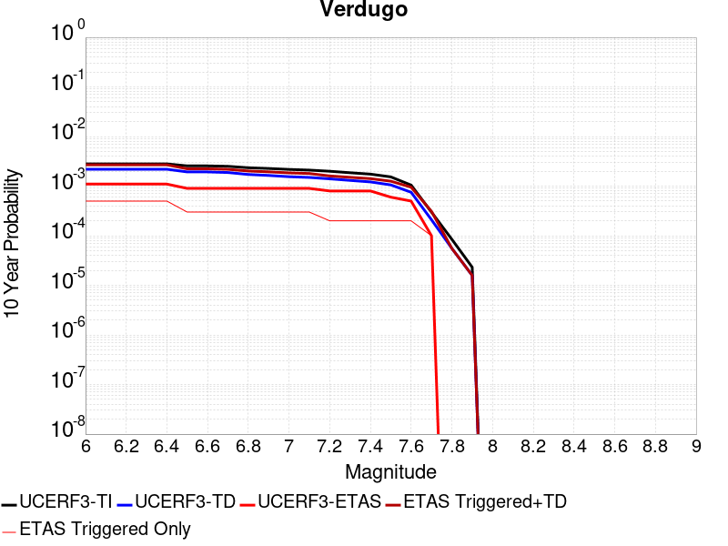 |

| Magnitude | 1 wk TI Prob | 1 wk TD Prob | 1 wk ETAS Prob | 1 wk ETAS/TD Gain | 1 wk ETAS Triggered+TD | 1 wk ETAS Triggered Only | 1 mo TI Prob | 1 mo TD Prob | 1 mo ETAS Prob | 1 mo ETAS/TD Gain | 1 mo ETAS Triggered+TD | 1 mo ETAS Triggered Only | 1 yr TI Prob | 1 yr TD Prob | 1 yr ETAS Prob | 1 yr ETAS/TD Gain | 1 yr ETAS Triggered+TD | 1 yr ETAS Triggered Only | 10 yr TI Prob | 10 yr TD Prob | 10 yr ETAS Prob | 10 yr ETAS/TD Gain | 10 yr ETAS Triggered+TD | 10 yr ETAS Triggered Only |
|-----|-----|-----|-----|-----|-----|-----|-----|-----|-----|-----|-----|-----|-----|-----|-----|-----|-----|-----|-----|-----|-----|-----|-----|-----|
| 6.0 | 5.392987E-6 | 4.2079487E-6 | 0.0 | 0.0 | 4.2079487E-6 | 0.0 | 2.3112598E-5 | 1.8033943E-5 | 0.0 | 0.0 | 1.8033943E-5 | 0.0 | 2.8135953E-4 | 2.1954162E-4 | 2.0E-4 | 0.910989 | 2.1954162E-4 | 0.0 | 0.0028100356 | 0.002193295 | 0.0011 | 0.50152856 | 0.0026921981 | 5.0E-4 |
| 6.1 | 5.392987E-6 | 4.2079487E-6 | 0.0 | 0.0 | 4.2079487E-6 | 0.0 | 2.3112598E-5 | 1.8033943E-5 | 0.0 | 0.0 | 1.8033943E-5 | 0.0 | 2.8135953E-4 | 2.1954162E-4 | 2.0E-4 | 0.910989 | 2.1954162E-4 | 0.0 | 0.0028100356 | 0.002193295 | 0.0011 | 0.50152856 | 0.0026921981 | 5.0E-4 |
| 6.2 | 5.392987E-6 | 4.2079487E-6 | 0.0 | 0.0 | 4.2079487E-6 | 0.0 | 2.3112598E-5 | 1.8033943E-5 | 0.0 | 0.0 | 1.8033943E-5 | 0.0 | 2.8135953E-4 | 2.1954162E-4 | 2.0E-4 | 0.910989 | 2.1954162E-4 | 0.0 | 0.0028100356 | 0.002193295 | 0.0011 | 0.50152856 | 0.0026921981 | 5.0E-4 |
| 6.3 | 5.392987E-6 | 4.2079487E-6 | 0.0 | 0.0 | 4.2079487E-6 | 0.0 | 2.3112598E-5 | 1.8033943E-5 | 0.0 | 0.0 | 1.8033943E-5 | 0.0 | 2.8135953E-4 | 2.1954162E-4 | 2.0E-4 | 0.910989 | 2.1954162E-4 | 0.0 | 0.0028100356 | 0.002193295 | 0.0011 | 0.50152856 | 0.0026921981 | 5.0E-4 |
| 6.4 | 5.392987E-6 | 4.2079487E-6 | 0.0 | 0.0 | 4.2079487E-6 | 0.0 | 2.3112598E-5 | 1.8033943E-5 | 0.0 | 0.0 | 1.8033943E-5 | 0.0 | 2.8135953E-4 | 2.1954162E-4 | 2.0E-4 | 0.910989 | 2.1954162E-4 | 0.0 | 0.0028100356 | 0.002193295 | 0.0011 | 0.50152856 | 0.0026921981 | 5.0E-4 |
| 6.5 | 4.9154837E-6 | 3.7140753E-6 | 0.0 | 0.0 | 3.7140753E-6 | 0.0 | 2.1066187E-5 | 1.5917369E-5 | 0.0 | 0.0 | 1.5917369E-5 | 0.0 | 2.5645064E-4 | 1.9377694E-4 | 2.0E-4 | 1.0321145 | 1.9377694E-4 | 0.0 | 0.002561549 | 0.0019361005 | 9.0E-4 | 0.46485192 | 0.0022355197 | 3.0E-4 |
| 6.6 | 4.9154837E-6 | 3.7140753E-6 | 0.0 | 0.0 | 3.7140753E-6 | 0.0 | 2.1066187E-5 | 1.5917369E-5 | 0.0 | 0.0 | 1.5917369E-5 | 0.0 | 2.5645064E-4 | 1.9377694E-4 | 2.0E-4 | 1.0321145 | 1.9377694E-4 | 0.0 | 0.002561549 | 0.0019361005 | 9.0E-4 | 0.46485192 | 0.0022355197 | 3.0E-4 |
| 6.7 | 4.817006E-6 | 3.6122979E-6 | 0.0 | 0.0 | 3.6122979E-6 | 0.0 | 2.0644147E-5 | 1.5481186E-5 | 0.0 | 0.0 | 1.5481186E-5 | 0.0 | 2.513135E-4 | 1.8846733E-4 | 2.0E-4 | 1.0611919 | 1.8846733E-4 | 0.0 | 0.0025102948 | 0.0018830944 | 9.0E-4 | 0.4779367 | 0.0021825295 | 3.0E-4 |
| 6.8 | 4.507407E-6 | 3.2989892E-6 | 0.0 | 0.0 | 3.2989892E-6 | 0.0 | 1.9317316E-5 | 1.413845E-5 | 0.0 | 0.0 | 1.413845E-5 | 0.0 | 2.3516294E-4 | 1.7212216E-4 | 2.0E-4 | 1.1619654 | 1.7212216E-4 | 0.0 | 0.0023491425 | 0.0017199027 | 9.0E-4 | 0.5232854 | 0.0020193867 | 3.0E-4 |
| 6.9 | 4.3573054E-6 | 3.1530003E-6 | 0.0 | 0.0 | 3.1530003E-6 | 0.0 | 1.8674033E-5 | 1.3512789E-5 | 0.0 | 0.0 | 1.3512789E-5 | 0.0 | 2.2733262E-4 | 1.6450591E-4 | 2.0E-4 | 1.2157618 | 1.6450591E-4 | 0.0 | 0.0022710022 | 0.0016438536 | 9.0E-4 | 0.547494 | 0.0019433604 | 3.0E-4 |
| 7.0 | 4.171527E-6 | 2.9757632E-6 | 0.0 | 0.0 | 2.9757632E-6 | 0.0 | 1.787785E-5 | 1.27532085E-5 | 0.0 | 0.0 | 1.27532085E-5 | 0.0 | 2.1764109E-4 | 1.5525936E-4 | 2.0E-4 | 1.2881671 | 1.5525936E-4 | 0.0 | 0.0021742806 | 0.0015515201 | 9.0E-4 | 0.5800763 | 0.0018510546 | 3.0E-4 |
| 7.1 | 4.0405484E-6 | 2.8744676E-6 | 0.0 | 0.0 | 2.8744676E-6 | 0.0 | 1.731652E-5 | 1.2319089E-5 | 0.0 | 0.0 | 1.2319089E-5 | 0.0 | 2.1080824E-4 | 1.499747E-4 | 2.0E-4 | 1.3335583 | 1.499747E-4 | 0.0 | 0.0021060838 | 0.0014987458 | 9.0E-4 | 0.6005021 | 0.0017982962 | 3.0E-4 |
| 7.2 | 3.8306007E-6 | 2.694271E-6 | 0.0 | 0.0 | 2.694271E-6 | 0.0 | 1.6416758E-5 | 1.1546825E-5 | 0.0 | 0.0 | 1.1546825E-5 | 0.0 | 1.9985568E-4 | 1.4057363E-4 | 2.0E-4 | 1.4227419 | 1.4057363E-4 | 0.0 | 0.0019967605 | 0.0014048577 | 8.0E-4 | 0.5694527 | 0.0016045767 | 2.0E-4 |
| 7.3 | 3.5750938E-6 | 2.5048005E-6 | 0.0 | 0.0 | 2.5048005E-6 | 0.0 | 1.532174E-5 | 1.0734815E-5 | 0.0 | 0.0 | 1.0734815E-5 | 0.0 | 1.8652623E-4 | 1.3068864E-4 | 2.0E-4 | 1.5303549 | 1.3068864E-4 | 0.0 | 0.0018636974 | 0.0013061283 | 8.0E-4 | 0.61249727 | 0.0015058671 | 2.0E-4 |
| 7.4 | 3.3510041E-6 | 2.3336188E-6 | 0.0 | 0.0 | 2.3336188E-6 | 0.0 | 1.4361368E-5 | 1.0001186E-5 | 0.0 | 0.0 | 1.0001186E-5 | 0.0 | 1.7483562E-4 | 1.2175773E-4 | 2.0E-4 | 1.6426061 | 1.2175773E-4 | 0.0 | 0.0017469813 | 0.0012169206 | 8.0E-4 | 0.6573971 | 0.0014166771 | 2.0E-4 |
| 7.5 | 2.948287E-6 | 2.032561E-6 | 0.0 | 0.0 | 2.032561E-6 | 0.0 | 1.2635454E-5 | 8.710947E-6 | 0.0 | 0.0 | 8.710947E-6 | 0.0 | 1.538258E-4 | 1.0605072E-4 | 2.0E-4 | 1.88589 | 1.0605072E-4 | 0.0 | 0.0015371935 | 0.0010600112 | 6.0E-4 | 0.56603175 | 0.0012597992 | 2.0E-4 |
| 7.6 | 2.0134323E-6 | 1.4417401E-6 | 0.0 | 0.0 | 1.4417401E-6 | 0.0 | 8.628967E-6 | 6.178872E-6 | 0.0 | 0.0 | 6.178872E-6 | 0.0 | 1.05052604E-4 | 7.522526E-5 | 1.0E-4 | 1.3293407 | 7.522526E-5 | 0.0 | 0.0010500296 | 7.5200666E-4 | 5.0E-4 | 0.6648877 | 9.5185626E-4 | 2.0E-4 |
| 7.7 | 5.726436E-7 | 4.0243603E-7 | 0.0 | 0.0 | 4.0243603E-7 | 0.0 | 2.4541846E-6 | 1.7247248E-6 | 0.0 | 0.0 | 1.7247248E-6 | 0.0 | 2.9879287E-5 | 2.0998348E-5 | 0.0 | 0.0 | 2.0998348E-5 | 0.0 | 2.987527E-4 | 2.0996614E-4 | 1.0E-4 | 0.47626728 | 3.0994514E-4 | 1.0E-4 |
| 7.8 | 1.6248204E-7 | 1.0652377E-7 | 0.0 | 0.0 | 1.0652377E-7 | 0.0 | 6.963514E-7 | 4.565304E-7 | 0.0 | 0.0 | 4.565304E-7 | 0.0 | 8.478045E-6 | 5.5582436E-6 | 0.0 | 0.0 | 5.5582436E-6 | 0.0 | 8.477722E-5 | 5.558108E-5 | 0.0 | 0.0 | 5.558108E-5 | 0.0 |
| 7.9 | 4.4475744E-8 | 3.0362166E-8 | 0.0 | 0.0 | 3.0362166E-8 | 0.0 | 1.9061031E-7 | 1.3012357E-7 | 0.0 | 0.0 | 1.3012357E-7 | 0.0 | 2.320678E-6 | 1.5842534E-6 | 0.0 | 0.0 | 1.5842534E-6 | 0.0 | 2.3206538E-5 | 1.5842435E-5 | 0.0 | 0.0 | 1.5842435E-5 | 0.0 |

## Fitzhugh Creek
*[(top)](#table-of-contents)*

| 1 Week | 1 Month | 1 Year | 10 Year |
|-----|-----|-----|-----|
|  | 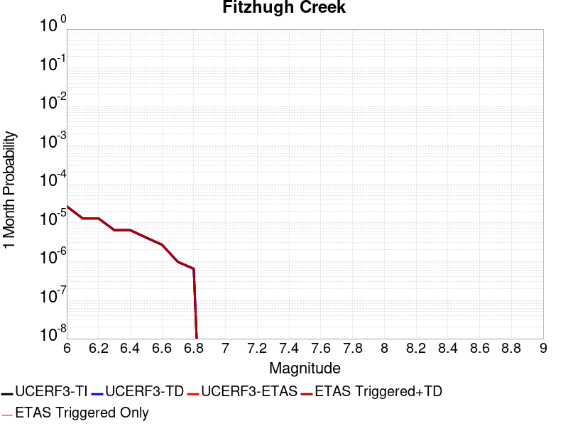 |  | 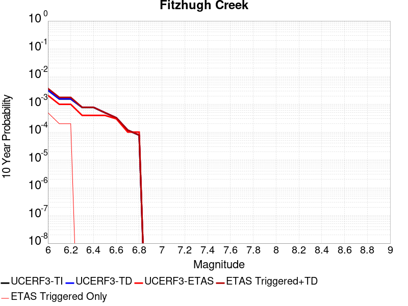 |

| Magnitude | 1 wk TI Prob | 1 wk TD Prob | 1 wk ETAS Prob | 1 wk ETAS/TD Gain | 1 wk ETAS Triggered+TD | 1 wk ETAS Triggered Only | 1 mo TI Prob | 1 mo TD Prob | 1 mo ETAS Prob | 1 mo ETAS/TD Gain | 1 mo ETAS Triggered+TD | 1 mo ETAS Triggered Only | 1 yr TI Prob | 1 yr TD Prob | 1 yr ETAS Prob | 1 yr ETAS/TD Gain | 1 yr ETAS Triggered+TD | 1 yr ETAS Triggered Only | 10 yr TI Prob | 10 yr TD Prob | 10 yr ETAS Prob | 10 yr ETAS/TD Gain | 10 yr ETAS Triggered+TD | 10 yr ETAS Triggered Only |
|-----|-----|-----|-----|-----|-----|-----|-----|-----|-----|-----|-----|-----|-----|-----|-----|-----|-----|-----|-----|-----|-----|-----|-----|-----|
| 6.0 | 6.1090436E-6 | 6.209083E-6 | 0.0 | 0.0 | 6.209083E-6 | 0.0 | 2.6181353E-5 | 2.6610109E-5 | 0.0 | 0.0 | 2.6610109E-5 | 0.0 | 3.1871133E-4 | 3.2393442E-4 | 4.0E-4 | 1.2348179 | 4.23902E-4 | 1.0E-4 | 0.0031825465 | 0.0032350663 | 0.0021 | 0.6491366 | 0.0037334487 | 5.0E-4 |
| 6.1 | 2.9741811E-6 | 3.021078E-6 | 0.0 | 0.0 | 3.021078E-6 | 0.0 | 1.2746428E-5 | 1.2947419E-5 | 0.0 | 0.0 | 1.2947419E-5 | 0.0 | 1.5517672E-4 | 1.5762437E-4 | 3.0E-4 | 1.903259 | 2.576086E-4 | 1.0E-4 | 0.001550684 | 0.0015752186 | 0.001 | 0.6348325 | 0.0017749036 | 2.0E-4 |
| 6.2 | 2.9741811E-6 | 3.021078E-6 | 0.0 | 0.0 | 3.021078E-6 | 0.0 | 1.2746428E-5 | 1.2947419E-5 | 0.0 | 0.0 | 1.2947419E-5 | 0.0 | 1.5517672E-4 | 1.5762437E-4 | 3.0E-4 | 1.903259 | 2.576086E-4 | 1.0E-4 | 0.001550684 | 0.0015752186 | 0.001 | 0.6348325 | 0.0017749036 | 2.0E-4 |
| 6.3 | 1.4781198E-6 | 1.5010254E-6 | 0.0 | 0.0 | 1.5010254E-6 | 0.0 | 6.3347834E-6 | 6.432951E-6 | 0.0 | 0.0 | 6.432951E-6 | 0.0 | 7.712326E-5 | 7.831857E-5 | 1.0E-4 | 1.2768364 | 7.831857E-5 | 0.0 | 7.70965E-4 | 7.829296E-4 | 4.0E-4 | 0.51090163 | 7.829296E-4 | 0.0 |
| 6.4 | 1.4781198E-6 | 1.5010254E-6 | 0.0 | 0.0 | 1.5010254E-6 | 0.0 | 6.3347834E-6 | 6.432951E-6 | 0.0 | 0.0 | 6.432951E-6 | 0.0 | 7.712326E-5 | 7.831857E-5 | 1.0E-4 | 1.2768364 | 7.831857E-5 | 0.0 | 7.70965E-4 | 7.829296E-4 | 4.0E-4 | 0.51090163 | 7.829296E-4 | 0.0 |
| 6.5 | 9.5176676E-7 | 9.664486E-7 | 0.0 | 0.0 | 9.664486E-7 | 0.0 | 4.078994E-6 | 4.1419166E-6 | 0.0 | 0.0 | 4.1419166E-6 | 0.0 | 4.9660623E-5 | 5.0426774E-5 | 1.0E-4 | 1.9830735 | 5.0426774E-5 | 0.0 | 4.964952E-4 | 5.0416373E-4 | 4.0E-4 | 0.793393 | 5.0416373E-4 | 0.0 |
| 6.6 | 6.21145E-7 | 6.307556E-7 | 0.0 | 0.0 | 6.307556E-7 | 0.0 | 2.662047E-6 | 2.7032359E-6 | 0.0 | 0.0 | 2.7032359E-6 | 0.0 | 3.2409942E-5 | 3.2911466E-5 | 1.0E-4 | 3.0384548 | 3.2911466E-5 | 0.0 | 3.2405215E-4 | 3.290725E-4 | 3.0E-4 | 0.9116532 | 3.290725E-4 | 0.0 |
| 6.7 | 2.2377962E-7 | 2.2730853E-7 | 0.0 | 0.0 | 2.2730853E-7 | 0.0 | 9.590551E-7 | 9.741792E-7 | 0.0 | 0.0 | 9.741792E-7 | 0.0 | 1.1676434E-5 | 1.1860599E-5 | 1.0E-4 | 8.431277 | 1.1860599E-5 | 0.0 | 1.1675821E-4 | 1.186028E-4 | 1.0E-4 | 0.8431504 | 1.186028E-4 | 0.0 |
| 6.8 | 1.4785022E-7 | 1.5018983E-7 | 0.0 | 0.0 | 1.5018983E-7 | 0.0 | 6.3364365E-7 | 6.436707E-7 | 0.0 | 0.0 | 6.436707E-7 | 0.0 | 7.714584E-6 | 7.836691E-6 | 1.0E-4 | 12.760488 | 7.836691E-6 | 0.0 | 7.714316E-5 | 7.836691E-5 | 1.0E-4 | 1.2760488 | 7.836691E-5 | 0.0 |

## Owens Valley
*[(top)](#table-of-contents)*

| 1 Week | 1 Month | 1 Year | 10 Year |
|-----|-----|-----|-----|
|  |  |  | 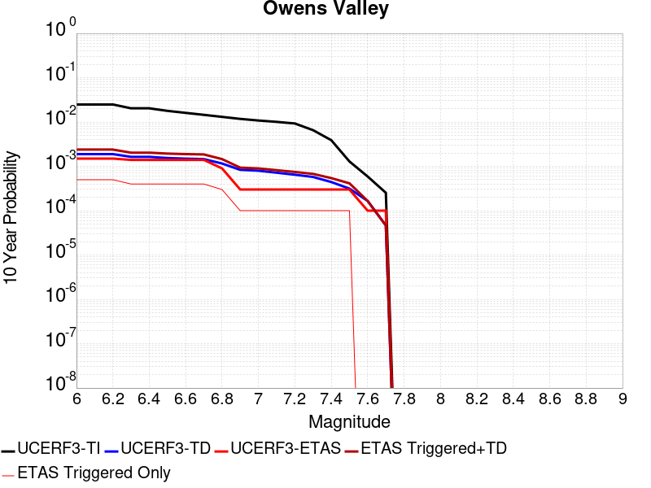 |

| Magnitude | 1 wk TI Prob | 1 wk TD Prob | 1 wk ETAS Prob | 1 wk ETAS/TD Gain | 1 wk ETAS Triggered+TD | 1 wk ETAS Triggered Only | 1 mo TI Prob | 1 mo TD Prob | 1 mo ETAS Prob | 1 mo ETAS/TD Gain | 1 mo ETAS Triggered+TD | 1 mo ETAS Triggered Only | 1 yr TI Prob | 1 yr TD Prob | 1 yr ETAS Prob | 1 yr ETAS/TD Gain | 1 yr ETAS Triggered+TD | 1 yr ETAS Triggered Only | 10 yr TI Prob | 10 yr TD Prob | 10 yr ETAS Prob | 10 yr ETAS/TD Gain | 10 yr ETAS Triggered+TD | 10 yr ETAS Triggered Only |
|-----|-----|-----|-----|-----|-----|-----|-----|-----|-----|-----|-----|-----|-----|-----|-----|-----|-----|-----|-----|-----|-----|-----|-----|-----|
| 6.0 | 4.83821E-5 | 3.553485E-6 | 0.0 | 0.0 | 3.553485E-6 | 0.0 | 2.0733538E-4 | 1.5229138E-5 | 0.0 | 0.0 | 1.5229138E-5 | 0.0 | 0.002521386 | 1.8539993E-4 | 0.0 | 0.0 | 1.8539993E-4 | 0.0 | 0.024929691 | 0.0018779148 | 0.0015 | 0.7987583 | 0.0023769757 | 5.0E-4 |
| 6.1 | 4.83821E-5 | 3.553485E-6 | 0.0 | 0.0 | 3.553485E-6 | 0.0 | 2.0733538E-4 | 1.5229138E-5 | 0.0 | 0.0 | 1.5229138E-5 | 0.0 | 0.002521386 | 1.8539993E-4 | 0.0 | 0.0 | 1.8539993E-4 | 0.0 | 0.024929691 | 0.0018779148 | 0.0015 | 0.7987583 | 0.0023769757 | 5.0E-4 |
| 6.2 | 4.83821E-5 | 3.553485E-6 | 0.0 | 0.0 | 3.553485E-6 | 0.0 | 2.0733538E-4 | 1.5229138E-5 | 0.0 | 0.0 | 1.5229138E-5 | 0.0 | 0.002521386 | 1.8539993E-4 | 0.0 | 0.0 | 1.8539993E-4 | 0.0 | 0.024929691 | 0.0018779148 | 0.0015 | 0.7987583 | 0.0023769757 | 5.0E-4 |
| 6.3 | 3.953008E-5 | 3.1146653E-6 | 0.0 | 0.0 | 3.1146653E-6 | 0.0 | 1.6940363E-4 | 1.3348502E-5 | 0.0 | 0.0 | 1.3348502E-5 | 0.0 | 0.002060538 | 1.625066E-4 | 0.0 | 0.0 | 1.625066E-4 | 0.0 | 0.020415364 | 0.001635654 | 0.0014 | 0.85592675 | 0.0020349997 | 4.0E-4 |
| 6.4 | 3.953008E-5 | 3.1146653E-6 | 0.0 | 0.0 | 3.1146653E-6 | 0.0 | 1.6940363E-4 | 1.3348502E-5 | 0.0 | 0.0 | 1.3348502E-5 | 0.0 | 0.002060538 | 1.625066E-4 | 0.0 | 0.0 | 1.625066E-4 | 0.0 | 0.020415364 | 0.001635654 | 0.0014 | 0.85592675 | 0.0020349997 | 4.0E-4 |
| 6.5 | 3.457342E-5 | 2.944885E-6 | 0.0 | 0.0 | 2.944885E-6 | 0.0 | 1.4816338E-4 | 1.2620879E-5 | 0.0 | 0.0 | 1.2620879E-5 | 0.0 | 0.0018023965 | 1.5364906E-4 | 0.0 | 0.0 | 1.5364906E-4 | 0.0 | 0.017878477 | 0.0015404408 | 0.0014 | 0.90883076 | 0.0019398247 | 4.0E-4 |
| 6.6 | 3.1127765E-5 | 2.8551772E-6 | 0.0 | 0.0 | 2.8551772E-6 | 0.0 | 1.3339789E-4 | 1.223642E-5 | 0.0 | 0.0 | 1.223642E-5 | 0.0 | 0.0016229092 | 1.4896892E-4 | 0.0 | 0.0 | 1.4896892E-4 | 0.0 | 0.016111081 | 0.0014915651 | 0.0014 | 0.9386113 | 0.0018909685 | 4.0E-4 |
| 6.7 | 2.806885E-5 | 2.7961862E-6 | 0.0 | 0.0 | 2.7961862E-6 | 0.0 | 1.2028952E-4 | 1.1983604E-5 | 0.0 | 0.0 | 1.1983604E-5 | 0.0 | 0.001463541 | 1.4589129E-4 | 0.0 | 0.0 | 1.4589129E-4 | 0.0 | 0.014539397 | 0.0014583865 | 0.0014 | 0.959965 | 0.0018578032 | 4.0E-4 |
| 6.8 | 2.524524E-5 | 2.2230183E-6 | 0.0 | 0.0 | 2.2230183E-6 | 0.0 | 1.0818939E-4 | 9.527188E-6 | 0.0 | 0.0 | 9.527188E-6 | 0.0 | 0.0013164099 | 1.1598764E-4 | 0.0 | 0.0 | 1.1598764E-4 | 0.0 | 0.01308639 | 0.0011595791 | 9.0E-4 | 0.77614367 | 0.0014592313 | 3.0E-4 |
| 6.9 | 2.2704568E-5 | 1.599E-6 | 0.0 | 0.0 | 1.599E-6 | 0.0 | 9.730166E-5 | 6.8528393E-6 | 0.0 | 0.0 | 6.8528393E-6 | 0.0 | 0.0011840039 | 8.343014E-5 | 0.0 | 0.0 | 8.343014E-5 | 0.0 | 0.011777153 | 8.342342E-4 | 3.0E-4 | 0.35961127 | 9.341507E-4 | 1.0E-4 |
| 7.0 | 2.0871712E-5 | 1.5308683E-6 | 0.0 | 0.0 | 1.5308683E-6 | 0.0 | 8.944713E-5 | 6.560848E-6 | 0.0 | 0.0 | 6.560848E-6 | 0.0 | 0.0010884746 | 7.987541E-5 | 0.0 | 0.0 | 7.987541E-5 | 0.0 | 0.010831586 | 7.9867634E-4 | 3.0E-4 | 0.3756215 | 8.985965E-4 | 1.0E-4 |
| 7.1 | 1.944928E-5 | 1.3789747E-6 | 0.0 | 0.0 | 1.3789747E-6 | 0.0 | 8.335139E-5 | 5.9098784E-6 | 0.0 | 0.0 | 5.9098784E-6 | 0.0 | 0.0010143308 | 7.19504E-5 | 0.0 | 0.0 | 7.19504E-5 | 0.0 | 0.010097133 | 7.1946834E-4 | 3.0E-4 | 0.41697454 | 8.193964E-4 | 1.0E-4 |
| 7.2 | 1.7876306E-5 | 1.2423458E-6 | 0.0 | 0.0 | 1.2423458E-6 | 0.0 | 7.6610486E-5 | 5.324328E-6 | 0.0 | 0.0 | 5.324328E-6 | 0.0 | 9.3233347E-4 | 6.4821776E-5 | 0.0 | 0.0 | 6.4821776E-5 | 0.0 | 0.009284316 | 6.4821105E-4 | 3.0E-4 | 0.46281224 | 7.481462E-4 | 1.0E-4 |
| 7.3 | 1.2618672E-5 | 1.1054104E-6 | 0.0 | 0.0 | 1.1054104E-6 | 0.0 | 5.40789E-5 | 4.7374647E-6 | 0.0 | 0.0 | 4.7374647E-6 | 0.0 | 6.582117E-4 | 5.7677113E-5 | 0.0 | 0.0 | 5.7677113E-5 | 0.0 | 0.0065626553 | 5.7679886E-4 | 3.0E-4 | 0.520112 | 6.767412E-4 | 1.0E-4 |
| 7.4 | 7.4874442E-6 | 8.496985E-7 | 0.0 | 0.0 | 8.496985E-7 | 0.0 | 3.208865E-5 | 3.64156E-6 | 0.0 | 0.0 | 3.64156E-6 | 0.0 | 3.906093E-4 | 4.4335095E-5 | 0.0 | 0.0 | 4.4335095E-5 | 0.0 | 0.003899234 | 4.4340023E-4 | 3.0E-4 | 0.6765896 | 5.433559E-4 | 1.0E-4 |
| 7.5 | 2.4734156E-6 | 6.0339664E-7 | 0.0 | 0.0 | 6.0339664E-7 | 0.0 | 1.060031E-5 | 2.585983E-6 | 0.0 | 0.0 | 2.585983E-6 | 0.0 | 1.2905113E-4 | 3.148389E-5 | 0.0 | 0.0 | 3.148389E-5 | 0.0 | 0.0012897621 | 3.1479463E-4 | 3.0E-4 | 0.9530023 | 4.1476317E-4 | 1.0E-4 |
| 7.6 | 1.1328841E-6 | 3.178669E-7 | 0.0 | 0.0 | 3.178669E-7 | 0.0 | 4.8552088E-6 | 1.362286E-6 | 0.0 | 0.0 | 1.362286E-6 | 0.0 | 5.9110564E-5 | 1.6585707E-5 | 0.0 | 0.0 | 1.6585707E-5 | 0.0 | 5.9094845E-4 | 1.6584487E-4 | 1.0E-4 | 0.6029731 | 1.6584487E-4 | 0.0 |
| 7.7 | 4.8613185E-7 | 8.8860894E-8 | 0.0 | 0.0 | 8.8860894E-8 | 0.0 | 2.0834207E-6 | 3.8083235E-7 | 0.0 | 0.0 | 3.8083235E-7 | 0.0 | 2.536535E-5 | 4.6366245E-6 | 0.0 | 0.0 | 4.6366245E-6 | 0.0 | 2.5362454E-4 | 4.6365345E-5 | 1.0E-4 | 2.1567833 | 4.6365345E-5 | 0.0 |

## Elsinore (Julian)
*[(top)](#table-of-contents)*

| 1 Week | 1 Month | 1 Year | 10 Year |
|-----|-----|-----|-----|
|  |  | 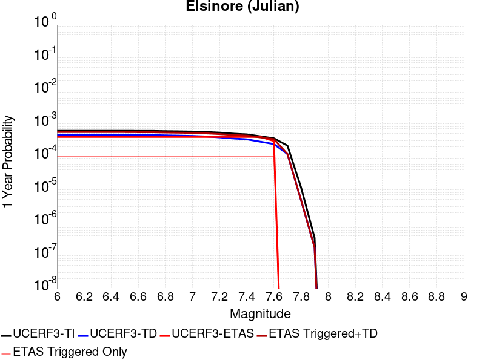 | 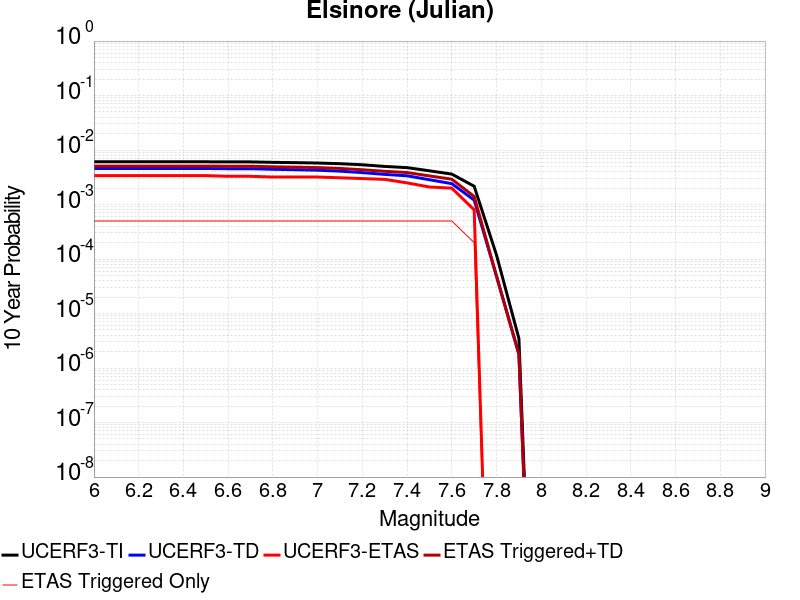 |

| Magnitude | 1 wk TI Prob | 1 wk TD Prob | 1 wk ETAS Prob | 1 wk ETAS/TD Gain | 1 wk ETAS Triggered+TD | 1 wk ETAS Triggered Only | 1 mo TI Prob | 1 mo TD Prob | 1 mo ETAS Prob | 1 mo ETAS/TD Gain | 1 mo ETAS Triggered+TD | 1 mo ETAS Triggered Only | 1 yr TI Prob | 1 yr TD Prob | 1 yr ETAS Prob | 1 yr ETAS/TD Gain | 1 yr ETAS Triggered+TD | 1 yr ETAS Triggered Only | 10 yr TI Prob | 10 yr TD Prob | 10 yr ETAS Prob | 10 yr ETAS/TD Gain | 10 yr ETAS Triggered+TD | 10 yr ETAS Triggered Only |
|-----|-----|-----|-----|-----|-----|-----|-----|-----|-----|-----|-----|-----|-----|-----|-----|-----|-----|-----|-----|-----|-----|-----|-----|-----|
| 6.0 | 1.1710231E-5 | 8.8099E-6 | 0.0 | 0.0 | 8.8099E-6 | 0.0 | 5.0185736E-5 | 3.7756174E-5 | 0.0 | 0.0 | 3.7756174E-5 | 0.0 | 6.1084004E-4 | 4.5958615E-4 | 4.0E-4 | 0.8703482 | 5.595402E-4 | 1.0E-4 | 0.006091637 | 0.004586544 | 0.0034 | 0.7412989 | 0.0050842506 | 5.0E-4 |
| 6.1 | 1.1710231E-5 | 8.8099E-6 | 0.0 | 0.0 | 8.8099E-6 | 0.0 | 5.0185736E-5 | 3.7756174E-5 | 0.0 | 0.0 | 3.7756174E-5 | 0.0 | 6.1084004E-4 | 4.5958615E-4 | 4.0E-4 | 0.8703482 | 5.595402E-4 | 1.0E-4 | 0.006091637 | 0.004586544 | 0.0034 | 0.7412989 | 0.0050842506 | 5.0E-4 |
| 6.2 | 1.1710231E-5 | 8.8099E-6 | 0.0 | 0.0 | 8.8099E-6 | 0.0 | 5.0185736E-5 | 3.7756174E-5 | 0.0 | 0.0 | 3.7756174E-5 | 0.0 | 6.1084004E-4 | 4.5958615E-4 | 4.0E-4 | 0.8703482 | 5.595402E-4 | 1.0E-4 | 0.006091637 | 0.004586544 | 0.0034 | 0.7412989 | 0.0050842506 | 5.0E-4 |
| 6.3 | 1.1710231E-5 | 8.8099E-6 | 0.0 | 0.0 | 8.8099E-6 | 0.0 | 5.0185736E-5 | 3.7756174E-5 | 0.0 | 0.0 | 3.7756174E-5 | 0.0 | 6.1084004E-4 | 4.5958615E-4 | 4.0E-4 | 0.8703482 | 5.595402E-4 | 1.0E-4 | 0.006091637 | 0.004586544 | 0.0034 | 0.7412989 | 0.0050842506 | 5.0E-4 |
| 6.4 | 1.1710231E-5 | 8.8099E-6 | 0.0 | 0.0 | 8.8099E-6 | 0.0 | 5.0185736E-5 | 3.7756174E-5 | 0.0 | 0.0 | 3.7756174E-5 | 0.0 | 6.1084004E-4 | 4.5958615E-4 | 4.0E-4 | 0.8703482 | 5.595402E-4 | 1.0E-4 | 0.006091637 | 0.004586544 | 0.0034 | 0.7412989 | 0.0050842506 | 5.0E-4 |
| 6.5 | 1.1710231E-5 | 8.8099E-6 | 0.0 | 0.0 | 8.8099E-6 | 0.0 | 5.0185736E-5 | 3.7756174E-5 | 0.0 | 0.0 | 3.7756174E-5 | 0.0 | 6.1084004E-4 | 4.5958615E-4 | 4.0E-4 | 0.8703482 | 5.595402E-4 | 1.0E-4 | 0.006091637 | 0.004586544 | 0.0034 | 0.7412989 | 0.0050842506 | 5.0E-4 |
| 6.6 | 1.1650619E-5 | 8.742328E-6 | 0.0 | 0.0 | 8.742328E-6 | 0.0 | 4.993027E-5 | 3.746659E-5 | 0.0 | 0.0 | 3.746659E-5 | 0.0 | 6.0773146E-4 | 4.5606194E-4 | 4.0E-4 | 0.8770738 | 5.5601634E-4 | 1.0E-4 | 0.0060607214 | 0.0045514465 | 0.0033 | 0.7250442 | 0.005049171 | 5.0E-4 |
| 6.7 | 1.1650619E-5 | 8.742328E-6 | 0.0 | 0.0 | 8.742328E-6 | 0.0 | 4.993027E-5 | 3.746659E-5 | 0.0 | 0.0 | 3.746659E-5 | 0.0 | 6.0773146E-4 | 4.5606194E-4 | 4.0E-4 | 0.8770738 | 5.5601634E-4 | 1.0E-4 | 0.0060607214 | 0.0045514465 | 0.0033 | 0.7250442 | 0.005049171 | 5.0E-4 |
| 6.8 | 1.1442698E-5 | 8.5257125E-6 | 0.0 | 0.0 | 8.5257125E-6 | 0.0 | 4.9039216E-5 | 3.6538266E-5 | 0.0 | 0.0 | 3.6538266E-5 | 0.0 | 5.968889E-4 | 4.447642E-4 | 4.0E-4 | 0.8993529 | 5.4471975E-4 | 1.0E-4 | 0.0059528816 | 0.004438925 | 0.0032 | 0.72089523 | 0.004936706 | 5.0E-4 |
| 6.9 | 1.1300589E-5 | 8.373737E-6 | 0.0 | 0.0 | 8.373737E-6 | 0.0 | 4.8430196E-5 | 3.588696E-5 | 0.0 | 0.0 | 3.588696E-5 | 0.0 | 5.894781E-4 | 4.3683778E-4 | 4.0E-4 | 0.9156717 | 5.3679413E-4 | 1.0E-4 | 0.005879169 | 0.0043599736 | 0.0032 | 0.7339494 | 0.0048577935 | 5.0E-4 |
| 7.0 | 1.1117729E-5 | 8.191226E-6 | 0.0 | 0.0 | 8.191226E-6 | 0.0 | 4.764654E-5 | 3.510479E-5 | 0.0 | 0.0 | 3.510479E-5 | 0.0 | 5.799422E-4 | 4.2731862E-4 | 4.0E-4 | 0.93606967 | 5.272759E-4 | 1.0E-4 | 0.0057843104 | 0.0042651505 | 0.0032 | 0.7502666 | 0.004763018 | 5.0E-4 |
| 7.1 | 1.08053955E-5 | 7.877859E-6 | 0.0 | 0.0 | 7.877859E-6 | 0.0 | 4.6308014E-5 | 3.3761826E-5 | 0.0 | 0.0 | 3.3761826E-5 | 0.0 | 5.6365423E-4 | 4.1097435E-4 | 4.0E-4 | 0.97329676 | 5.109332E-4 | 1.0E-4 | 0.005622267 | 0.0041023213 | 0.0031 | 0.7556697 | 0.00460027 | 5.0E-4 |
| 7.2 | 1.032804E-5 | 7.399617E-6 | 0.0 | 0.0 | 7.399617E-6 | 0.0 | 4.4262277E-5 | 3.171227E-5 | 0.0 | 0.0 | 3.171227E-5 | 0.0 | 5.387599E-4 | 3.8603E-4 | 4.0E-4 | 1.0361888 | 4.859914E-4 | 1.0E-4 | 0.0053745564 | 0.0038537644 | 0.003 | 0.7784596 | 0.0043518376 | 5.0E-4 |
| 7.3 | 9.622426E-6 | 6.869473E-6 | 0.0 | 0.0 | 6.869473E-6 | 0.0 | 4.1238312E-5 | 2.9440274E-5 | 0.0 | 0.0 | 2.9440274E-5 | 0.0 | 5.019608E-4 | 3.583778E-4 | 4.0E-4 | 1.1161406 | 4.5834196E-4 | 1.0E-4 | 0.005008285 | 0.0035781534 | 0.0029 | 0.8104739 | 0.0040763645 | 5.0E-4 |
| 7.4 | 9.144434E-6 | 6.4709243E-6 | 0.0 | 0.0 | 6.4709243E-6 | 0.0 | 3.9189843E-5 | 2.7732245E-5 | 0.0 | 0.0 | 2.7732245E-5 | 0.0 | 4.7703186E-4 | 3.3758915E-4 | 4.0E-4 | 1.1848723 | 4.375554E-4 | 1.0E-4 | 0.0047600917 | 0.0033709055 | 0.0025 | 0.7416405 | 0.00386922 | 5.0E-4 |
| 7.5 | 7.988981E-6 | 5.476566E-6 | 0.0 | 0.0 | 5.476566E-6 | 0.0 | 3.4238044E-5 | 2.3470793E-5 | 0.0 | 0.0 | 2.3470793E-5 | 0.0 | 4.1676845E-4 | 2.8572071E-4 | 4.0E-4 | 1.3999686 | 3.8569214E-4 | 1.0E-4 | 0.0041598766 | 0.00285366 | 0.0021 | 0.73589706 | 0.003352233 | 5.0E-4 |
| 7.6 | 6.9554876E-6 | 4.6431246E-6 | 0.0 | 0.0 | 4.6431246E-6 | 0.0 | 2.9808893E-5 | 1.989896E-5 | 0.0 | 0.0 | 1.989896E-5 | 0.0 | 3.6286283E-4 | 2.4224407E-4 | 3.0E-4 | 1.2384204 | 3.4221984E-4 | 1.0E-4 | 0.0036227088 | 0.0024199155 | 0.002 | 0.82647514 | 0.0029187056 | 5.0E-4 |
| 7.7 | 4.1557314E-6 | 2.3127932E-6 | 0.0 | 0.0 | 2.3127932E-6 | 0.0 | 1.7810156E-5 | 9.911938E-6 | 0.0 | 0.0 | 9.911938E-6 | 0.0 | 2.1681708E-4 | 1.20671895E-4 | 0.0 | 0.0 | 1.20671895E-4 | 0.0 | 0.0021660565 | 0.0012061362 | 8.0E-4 | 0.66327506 | 0.0014058949 | 2.0E-4 |
| 7.8 | 2.2597293E-7 | 9.2611394E-8 | 0.0 | 0.0 | 9.2611394E-8 | 0.0 | 9.684551E-7 | 3.9690593E-7 | 0.0 | 0.0 | 3.9690593E-7 | 0.0 | 1.1790877E-5 | 4.8323222E-6 | 0.0 | 0.0 | 4.8323222E-6 | 0.0 | 1.17902506E-4 | 4.8322494E-5 | 0.0 | 0.0 | 4.8322494E-5 | 0.0 |
| 7.9 | 6.676829E-9 | 3.4267709E-9 | 0.0 | 0.0 | 3.4267709E-9 | 0.0 | 2.861498E-8 | 1.4686159E-8 | 0.0 | 0.0 | 1.4686159E-8 | 0.0 | 3.4838732E-7 | 1.7880397E-7 | 0.0 | 0.0 | 1.7880397E-7 | 0.0 | 3.4838679E-6 | 1.7880385E-6 | 0.0 | 0.0 | 1.7880385E-6 | 0.0 |

## Hosgri (Extension)
*[(top)](#table-of-contents)*

| 1 Week | 1 Month | 1 Year | 10 Year |
|-----|-----|-----|-----|
|  |  |  |  |

| Magnitude | 1 wk TI Prob | 1 wk TD Prob | 1 wk ETAS Prob | 1 wk ETAS/TD Gain | 1 wk ETAS Triggered+TD | 1 wk ETAS Triggered Only | 1 mo TI Prob | 1 mo TD Prob | 1 mo ETAS Prob | 1 mo ETAS/TD Gain | 1 mo ETAS Triggered+TD | 1 mo ETAS Triggered Only | 1 yr TI Prob | 1 yr TD Prob | 1 yr ETAS Prob | 1 yr ETAS/TD Gain | 1 yr ETAS Triggered+TD | 1 yr ETAS Triggered Only | 10 yr TI Prob | 10 yr TD Prob | 10 yr ETAS Prob | 10 yr ETAS/TD Gain | 10 yr ETAS Triggered+TD | 10 yr ETAS Triggered Only |
|-----|-----|-----|-----|-----|-----|-----|-----|-----|-----|-----|-----|-----|-----|-----|-----|-----|-----|-----|-----|-----|-----|-----|-----|-----|
| 6.0 | 1.1369135E-5 | 1.2072836E-5 | 1.0E-4 | 8.283058 | 1.12071626E-4 | 1.0E-4 | 4.8723956E-5 | 5.173983E-5 | 1.0E-4 | 1.932747 | 1.5173465E-4 | 1.0E-4 | 5.9305265E-4 | 6.29773E-4 | 5.0E-4 | 0.79393685 | 7.2971004E-4 | 1.0E-4 | 0.005914725 | 0.0062821284 | 0.0042 | 0.6685632 | 0.0067789876 | 5.0E-4 |
| 6.1 | 6.934979E-6 | 7.3179544E-6 | 0.0 | 0.0 | 7.3179544E-6 | 0.0 | 2.9721E-5 | 3.1362306E-5 | 0.0 | 0.0 | 3.1362306E-5 | 0.0 | 3.617931E-4 | 3.8177334E-4 | 1.0E-4 | 0.26193553 | 3.8177334E-4 | 0.0 | 0.0036120464 | 0.0038115869 | 0.0019 | 0.49848005 | 0.0040108245 | 2.0E-4 |
| 6.2 | 6.934979E-6 | 7.3179544E-6 | 0.0 | 0.0 | 7.3179544E-6 | 0.0 | 2.9721E-5 | 3.1362306E-5 | 0.0 | 0.0 | 3.1362306E-5 | 0.0 | 3.617931E-4 | 3.8177334E-4 | 1.0E-4 | 0.26193553 | 3.8177334E-4 | 0.0 | 0.0036120464 | 0.0038115869 | 0.0019 | 0.49848005 | 0.0040108245 | 2.0E-4 |
| 6.3 | 4.5484676E-6 | 4.764615E-6 | 0.0 | 0.0 | 4.764615E-6 | 0.0 | 1.9493287E-5 | 2.0419622E-5 | 0.0 | 0.0 | 2.0419622E-5 | 0.0 | 2.3730492E-4 | 2.4858094E-4 | 1.0E-4 | 0.40228346 | 2.4858094E-4 | 0.0 | 0.0023705168 | 0.0024830715 | 0.0012 | 0.48327243 | 0.0025828232 | 1.0E-4 |
| 6.4 | 4.218095E-6 | 4.4123926E-6 | 0.0 | 0.0 | 4.4123926E-6 | 0.0 | 1.8077424E-5 | 1.8910117E-5 | 0.0 | 0.0 | 1.8910117E-5 | 0.0 | 2.2007042E-4 | 2.3020669E-4 | 1.0E-4 | 0.43439224 | 2.3020669E-4 | 0.0 | 0.002198526 | 0.0022997158 | 0.0012 | 0.5218036 | 0.0023994858 | 1.0E-4 |
| 6.5 | 3.717374E-6 | 3.879767E-6 | 0.0 | 0.0 | 3.879767E-6 | 0.0 | 1.5931506E-5 | 1.6627468E-5 | 0.0 | 0.0 | 1.6627468E-5 | 0.0 | 1.9394881E-4 | 2.0242081E-4 | 1.0E-4 | 0.49402037 | 2.0242081E-4 | 0.0 | 0.0019377962 | 0.002022383 | 0.001 | 0.49446616 | 0.0021221808 | 1.0E-4 |
| 6.6 | 3.4605036E-6 | 3.6044048E-6 | 0.0 | 0.0 | 3.6044048E-6 | 0.0 | 1.4830645E-5 | 1.5447358E-5 | 0.0 | 0.0 | 1.5447358E-5 | 0.0 | 1.8054814E-4 | 1.880555E-4 | 1.0E-4 | 0.5317579 | 1.880555E-4 | 0.0 | 0.0018040152 | 0.0018789783 | 0.001 | 0.5322041 | 0.0019787904 | 1.0E-4 |
| 6.7 | 3.123439E-6 | 3.2429439E-6 | 0.0 | 0.0 | 3.2429439E-6 | 0.0 | 1.33860985E-5 | 1.3898257E-5 | 0.0 | 0.0 | 1.3898257E-5 | 0.0 | 1.6296357E-4 | 1.6919825E-4 | 1.0E-4 | 0.5910227 | 1.6919825E-4 | 0.0 | 0.001628441 | 0.0016907052 | 0.001 | 0.59146917 | 0.0017905361 | 1.0E-4 |
| 6.8 | 2.8290783E-6 | 2.9271582E-6 | 0.0 | 0.0 | 2.9271582E-6 | 0.0 | 1.2124565E-5 | 1.2544903E-5 | 0.0 | 0.0 | 1.2544903E-5 | 0.0 | 1.4760658E-4 | 1.5272359E-4 | 1.0E-4 | 0.6547777 | 1.5272359E-4 | 0.0 | 0.0014750857 | 0.001526195 | 7.0E-4 | 0.458657 | 0.0016260423 | 1.0E-4 |
| 6.9 | 2.454112E-6 | 2.5252425E-6 | 0.0 | 0.0 | 2.5252425E-6 | 0.0 | 1.0517581E-5 | 1.0822423E-5 | 0.0 | 0.0 | 1.0822423E-5 | 0.0 | 1.2804402E-4 | 1.3175509E-4 | 1.0E-4 | 0.75898397 | 1.3175509E-4 | 0.0 | 0.0012797028 | 0.0013167758 | 6.0E-4 | 0.4556584 | 0.0014166442 | 1.0E-4 |
| 7.0 | 2.1008145E-6 | 2.1470744E-6 | 0.0 | 0.0 | 2.1470744E-6 | 0.0 | 9.003459E-6 | 9.201714E-6 | 0.0 | 0.0 | 9.201714E-6 | 0.0 | 1.096116E-4 | 1.12025155E-4 | 1.0E-4 | 0.8926567 | 1.12025155E-4 | 0.0 | 0.0010955755 | 0.0011196906 | 5.0E-4 | 0.44655195 | 0.0012195786 | 1.0E-4 |
| 7.1 | 1.744384E-6 | 1.766116E-6 | 0.0 | 0.0 | 1.766116E-6 | 0.0 | 7.47591E-6 | 7.569047E-6 | 0.0 | 0.0 | 7.569047E-6 | 0.0 | 9.1015405E-5 | 9.214927E-5 | 1.0E-4 | 1.0851959 | 9.214927E-5 | 0.0 | 9.097813E-4 | 9.2111225E-4 | 4.0E-4 | 0.4342576 | 0.0010210201 | 1.0E-4 |
| 7.2 | 1.5456587E-6 | 1.5539209E-6 | 0.0 | 0.0 | 1.5539209E-6 | 0.0 | 6.6242346E-6 | 6.659644E-6 | 0.0 | 0.0 | 6.659644E-6 | 0.0 | 8.064707E-5 | 8.1078164E-5 | 1.0E-4 | 1.2333777 | 8.1078164E-5 | 0.0 | 8.0617814E-4 | 8.104871E-4 | 4.0E-4 | 0.4935304 | 9.10406E-4 | 1.0E-4 |
| 7.3 | 1.3775123E-6 | 1.3743695E-6 | 0.0 | 0.0 | 1.3743695E-6 | 0.0 | 5.9036106E-6 | 5.890142E-6 | 0.0 | 0.0 | 5.890142E-6 | 0.0 | 7.187409E-5 | 7.171013E-5 | 1.0E-4 | 1.3945032 | 7.171013E-5 | 0.0 | 7.185085E-4 | 7.168709E-4 | 3.0E-4 | 0.4184854 | 7.168709E-4 | 0.0 |
| 7.4 | 1.214491E-6 | 1.2002328E-6 | 0.0 | 0.0 | 1.2002328E-6 | 0.0 | 5.2049513E-6 | 5.143844E-6 | 0.0 | 0.0 | 5.143844E-6 | 0.0 | 6.336844E-5 | 6.262452E-5 | 1.0E-4 | 1.5968188 | 6.262452E-5 | 0.0 | 6.335037E-4 | 6.260695E-4 | 3.0E-4 | 0.47918004 | 6.260695E-4 | 0.0 |
| 7.5 | 1.0101123E-6 | 9.822643E-7 | 0.0 | 0.0 | 9.822643E-7 | 0.0 | 4.3290456E-6 | 4.209697E-6 | 0.0 | 0.0 | 4.209697E-6 | 0.0 | 5.2704854E-5 | 5.1251864E-5 | 0.0 | 0.0 | 5.1251864E-5 | 0.0 | 5.2692357E-4 | 5.1240105E-4 | 1.0E-4 | 0.19515964 | 5.1240105E-4 | 0.0 |
| 7.6 | 8.1558215E-7 | 7.7478217E-7 | 0.0 | 0.0 | 7.7478217E-7 | 0.0 | 3.4953473E-6 | 3.3204908E-6 | 0.0 | 0.0 | 3.3204908E-6 | 0.0 | 4.255502E-5 | 4.0426232E-5 | 0.0 | 0.0 | 4.0426232E-5 | 0.0 | 4.2546875E-4 | 4.0418922E-4 | 0.0 | 0.0 | 4.0418922E-4 | 0.0 |
| 7.7 | 4.757816E-7 | 4.1153908E-7 | 0.0 | 0.0 | 4.1153908E-7 | 0.0 | 2.0390623E-6 | 1.7637377E-6 | 0.0 | 0.0 | 1.7637377E-6 | 0.0 | 2.4825302E-5 | 2.1473295E-5 | 0.0 | 0.0 | 2.1473295E-5 | 0.0 | 2.482253E-4 | 2.1471233E-4 | 0.0 | 0.0 | 2.1471233E-4 | 0.0 |
| 7.8 | 2.782787E-7 | 1.9909719E-7 | 0.0 | 0.0 | 1.9909719E-7 | 0.0 | 1.1926223E-6 | 8.532734E-7 | 0.0 | 0.0 | 8.532734E-7 | 0.0 | 1.452008E-5 | 1.0388554E-5 | 0.0 | 0.0 | 1.0388554E-5 | 0.0 | 1.4519131E-4 | 1.0388072E-4 | 0.0 | 0.0 | 1.0388072E-4 | 0.0 |
| 7.9 | 1.6948086E-7 | 9.1191595E-8 | 0.0 | 0.0 | 9.1191595E-8 | 0.0 | 7.2634634E-7 | 3.9082107E-7 | 0.0 | 0.0 | 3.9082107E-7 | 0.0 | 8.843231E-6 | 4.758236E-6 | 0.0 | 0.0 | 4.758236E-6 | 0.0 | 8.842879E-5 | 4.758135E-5 | 0.0 | 0.0 | 4.758135E-5 | 0.0 |
| 8.0 | 1.0225492E-7 | 4.3830603E-8 | 0.0 | 0.0 | 4.3830603E-8 | 0.0 | 4.382353E-7 | 1.8784543E-7 | 0.0 | 0.0 | 1.8784543E-7 | 0.0 | 5.335502E-6 | 2.2870158E-6 | 0.0 | 0.0 | 2.2870158E-6 | 0.0 | 5.335374E-5 | 2.2869925E-5 | 0.0 | 0.0 | 2.2869925E-5 | 0.0 |
| 8.1 | 1.43711345E-8 | 5.6468283E-9 | 0.0 | 0.0 | 5.6468283E-9 | 0.0 | 6.1590576E-8 | 2.4200693E-8 | 0.0 | 0.0 | 2.4200693E-8 | 0.0 | 7.4986497E-7 | 2.946434E-7 | 0.0 | 0.0 | 2.946434E-7 | 0.0 | 7.4986247E-6 | 2.9464306E-6 | 0.0 | 0.0 | 2.9464306E-6 | 0.0 |

## Fickle Hill (alt1)
*[(top)](#table-of-contents)*

| 1 Week | 1 Month | 1 Year | 10 Year |
|-----|-----|-----|-----|
|  |  | 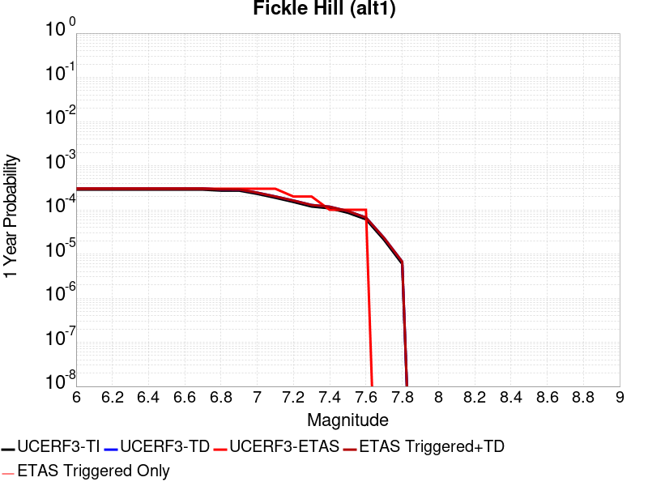 |  |

| Magnitude | 1 wk TI Prob | 1 wk TD Prob | 1 wk ETAS Prob | 1 wk ETAS/TD Gain | 1 wk ETAS Triggered+TD | 1 wk ETAS Triggered Only | 1 mo TI Prob | 1 mo TD Prob | 1 mo ETAS Prob | 1 mo ETAS/TD Gain | 1 mo ETAS Triggered+TD | 1 mo ETAS Triggered Only | 1 yr TI Prob | 1 yr TD Prob | 1 yr ETAS Prob | 1 yr ETAS/TD Gain | 1 yr ETAS Triggered+TD | 1 yr ETAS Triggered Only | 10 yr TI Prob | 10 yr TD Prob | 10 yr ETAS Prob | 10 yr ETAS/TD Gain | 10 yr ETAS Triggered+TD | 10 yr ETAS Triggered Only |
|-----|-----|-----|-----|-----|-----|-----|-----|-----|-----|-----|-----|-----|-----|-----|-----|-----|-----|-----|-----|-----|-----|-----|-----|-----|
| 6.0 | 5.491893E-6 | 5.823255E-6 | 1.0E-4 | 17.172527 | 5.823255E-6 | 0.0 | 2.3536471E-5 | 2.495658E-5 | 1.0E-4 | 4.0069594 | 2.495658E-5 | 0.0 | 2.8651886E-4 | 3.0380624E-4 | 3.0E-4 | 0.98747146 | 3.0380624E-4 | 0.0 | 0.0028614972 | 0.0030341332 | 0.0022 | 0.72508353 | 0.0035326162 | 5.0E-4 |
| 6.1 | 5.491893E-6 | 5.823255E-6 | 1.0E-4 | 17.172527 | 5.823255E-6 | 0.0 | 2.3536471E-5 | 2.495658E-5 | 1.0E-4 | 4.0069594 | 2.495658E-5 | 0.0 | 2.8651886E-4 | 3.0380624E-4 | 3.0E-4 | 0.98747146 | 3.0380624E-4 | 0.0 | 0.0028614972 | 0.0030341332 | 0.0022 | 0.72508353 | 0.0035326162 | 5.0E-4 |
| 6.2 | 5.491893E-6 | 5.823255E-6 | 1.0E-4 | 17.172527 | 5.823255E-6 | 0.0 | 2.3536471E-5 | 2.495658E-5 | 1.0E-4 | 4.0069594 | 2.495658E-5 | 0.0 | 2.8651886E-4 | 3.0380624E-4 | 3.0E-4 | 0.98747146 | 3.0380624E-4 | 0.0 | 0.0028614972 | 0.0030341332 | 0.0022 | 0.72508353 | 0.0035326162 | 5.0E-4 |
| 6.3 | 5.491893E-6 | 5.823255E-6 | 1.0E-4 | 17.172527 | 5.823255E-6 | 0.0 | 2.3536471E-5 | 2.495658E-5 | 1.0E-4 | 4.0069594 | 2.495658E-5 | 0.0 | 2.8651886E-4 | 3.0380624E-4 | 3.0E-4 | 0.98747146 | 3.0380624E-4 | 0.0 | 0.0028614972 | 0.0030341332 | 0.0022 | 0.72508353 | 0.0035326162 | 5.0E-4 |
| 6.4 | 5.491893E-6 | 5.823255E-6 | 1.0E-4 | 17.172527 | 5.823255E-6 | 0.0 | 2.3536471E-5 | 2.495658E-5 | 1.0E-4 | 4.0069594 | 2.495658E-5 | 0.0 | 2.8651886E-4 | 3.0380624E-4 | 3.0E-4 | 0.98747146 | 3.0380624E-4 | 0.0 | 0.0028614972 | 0.0030341332 | 0.0022 | 0.72508353 | 0.0035326162 | 5.0E-4 |
| 6.5 | 5.491893E-6 | 5.823255E-6 | 1.0E-4 | 17.172527 | 5.823255E-6 | 0.0 | 2.3536471E-5 | 2.495658E-5 | 1.0E-4 | 4.0069594 | 2.495658E-5 | 0.0 | 2.8651886E-4 | 3.0380624E-4 | 3.0E-4 | 0.98747146 | 3.0380624E-4 | 0.0 | 0.0028614972 | 0.0030341332 | 0.0022 | 0.72508353 | 0.0035326162 | 5.0E-4 |
| 6.6 | 5.491893E-6 | 5.823255E-6 | 1.0E-4 | 17.172527 | 5.823255E-6 | 0.0 | 2.3536471E-5 | 2.495658E-5 | 1.0E-4 | 4.0069594 | 2.495658E-5 | 0.0 | 2.8651886E-4 | 3.0380624E-4 | 3.0E-4 | 0.98747146 | 3.0380624E-4 | 0.0 | 0.0028614972 | 0.0030341332 | 0.0022 | 0.72508353 | 0.0035326162 | 5.0E-4 |
| 6.7 | 5.491893E-6 | 5.823255E-6 | 1.0E-4 | 17.172527 | 5.823255E-6 | 0.0 | 2.3536471E-5 | 2.495658E-5 | 1.0E-4 | 4.0069594 | 2.495658E-5 | 0.0 | 2.8651886E-4 | 3.0380624E-4 | 3.0E-4 | 0.98747146 | 3.0380624E-4 | 0.0 | 0.0028614972 | 0.0030341332 | 0.0022 | 0.72508353 | 0.0035326162 | 5.0E-4 |
| 6.8 | 5.2207747E-6 | 5.5420933E-6 | 1.0E-4 | 18.043724 | 5.5420933E-6 | 0.0 | 2.2374557E-5 | 2.3751625E-5 | 1.0E-4 | 4.2102385 | 2.3751625E-5 | 0.0 | 2.7237617E-4 | 2.8913986E-4 | 3.0E-4 | 1.0375602 | 2.8913986E-4 | 0.0 | 0.0027204256 | 0.0028878546 | 0.0021 | 0.72718346 | 0.0033864107 | 5.0E-4 |
| 6.9 | 5.2186956E-6 | 5.5399146E-6 | 1.0E-4 | 18.05082 | 5.5399146E-6 | 0.0 | 2.2365646E-5 | 2.3742288E-5 | 1.0E-4 | 4.211894 | 2.3742288E-5 | 0.0 | 2.722677E-4 | 2.890262E-4 | 3.0E-4 | 1.0379682 | 2.890262E-4 | 0.0 | 0.0027193436 | 0.0028867212 | 0.0021 | 0.72746897 | 0.0033852777 | 5.0E-4 |
| 7.0 | 4.403045E-6 | 4.6951664E-6 | 1.0E-4 | 21.2985 | 4.6951664E-6 | 0.0 | 1.8870056E-5 | 2.0121994E-5 | 1.0E-4 | 4.9696865 | 2.0121994E-5 | 0.0 | 2.297187E-4 | 2.4495905E-4 | 3.0E-4 | 1.2246945 | 2.4495905E-4 | 0.0 | 0.0022948137 | 0.0024470205 | 0.002 | 0.81732047 | 0.002945797 | 5.0E-4 |
| 7.1 | 3.5911396E-6 | 3.8450635E-6 | 1.0E-4 | 26.007374 | 3.8450635E-6 | 0.0 | 1.5390508E-5 | 1.6478743E-5 | 1.0E-4 | 6.0684237 | 1.6478743E-5 | 0.0 | 1.8736332E-4 | 2.0061097E-4 | 3.0E-4 | 1.4954317 | 2.0061097E-4 | 0.0 | 0.0018720542 | 0.0020043722 | 0.0017 | 0.8481459 | 0.0023037707 | 3.0E-4 |
| 7.2 | 2.888171E-6 | 3.1116026E-6 | 1.0E-4 | 32.13778 | 3.1116026E-6 | 0.0 | 1.2377816E-5 | 1.3335373E-5 | 1.0E-4 | 7.4988527 | 1.3335373E-5 | 0.0 | 1.5068949E-4 | 1.6234632E-4 | 2.0E-4 | 1.2319343 | 1.6234632E-4 | 0.0 | 0.0015058735 | 0.0016223019 | 0.0012 | 0.7396897 | 0.0019218152 | 3.0E-4 |
| 7.3 | 2.275019E-6 | 2.4653345E-6 | 1.0E-4 | 40.562447 | 2.4653345E-6 | 0.0 | 9.750045E-6 | 1.0565677E-5 | 1.0E-4 | 9.464608 | 1.0565677E-5 | 0.0 | 1.1870033E-4 | 1.2862966E-4 | 2.0E-4 | 1.5548513 | 1.2862966E-4 | 0.0 | 0.0011863695 | 0.001285566 | 9.0E-4 | 0.7000807 | 0.001485309 | 2.0E-4 |
| 7.4 | 2.076662E-6 | 2.2555528E-6 | 1.0E-4 | 44.33503 | 2.2555528E-6 | 0.0 | 8.8999495E-6 | 9.66662E-6 | 1.0E-4 | 10.344878 | 9.66662E-6 | 0.0 | 1.08351494E-4 | 1.1768487E-4 | 1.0E-4 | 0.8497269 | 1.1768487E-4 | 0.0 | 0.0010829868 | 0.0011762385 | 7.0E-4 | 0.5951174 | 0.0013760033 | 2.0E-4 |
| 7.5 | 1.6450799E-6 | 1.7936939E-6 | 1.0E-4 | 55.750874 | 1.7936939E-6 | 0.0 | 7.0503233E-6 | 7.6872375E-6 | 1.0E-4 | 13.0085745 | 7.6872375E-6 | 0.0 | 8.5834305E-5 | 9.358817E-5 | 1.0E-4 | 1.0685111 | 9.358817E-5 | 0.0 | 8.580116E-4 | 9.3549525E-4 | 6.0E-4 | 0.6413715 | 0.0011353082 | 2.0E-4 |
| 7.6 | 1.168891E-6 | 1.2816436E-6 | 1.0E-4 | 78.02482 | 1.2816436E-6 | 0.0 | 5.009523E-6 | 5.492747E-6 | 1.0E-4 | 18.205828 | 5.492747E-6 | 0.0 | 6.098924E-5 | 6.68722E-5 | 1.0E-4 | 1.4953898 | 6.68722E-5 | 0.0 | 6.09725E-4 | 6.6852634E-4 | 4.0E-4 | 0.5983309 | 7.684595E-4 | 1.0E-4 |
| 7.7 | 3.9871026E-7 | 4.422042E-7 | 0.0 | 0.0 | 4.422042E-7 | 0.0 | 1.708757E-6 | 1.8951595E-6 | 0.0 | 0.0 | 1.8951595E-6 | 0.0 | 2.0803918E-5 | 2.3073331E-5 | 0.0 | 0.0 | 2.3073331E-5 | 0.0 | 2.0801972E-4 | 2.3071018E-4 | 1.0E-4 | 0.43344423 | 3.3068712E-4 | 1.0E-4 |
| 7.8 | 1.14295965E-7 | 1.28371E-7 | 0.0 | 0.0 | 1.28371E-7 | 0.0 | 4.8983975E-7 | 5.5016136E-7 | 0.0 | 0.0 | 5.5016136E-7 | 0.0 | 5.9637828E-6 | 6.698195E-6 | 0.0 | 0.0 | 6.698195E-6 | 0.0 | 5.9636226E-5 | 6.698009E-5 | 0.0 | 0.0 | 6.698009E-5 | 0.0 |

## Los Alamos extension
*[(top)](#table-of-contents)*

| 1 Week | 1 Month | 1 Year | 10 Year |
|-----|-----|-----|-----|
|  |  | 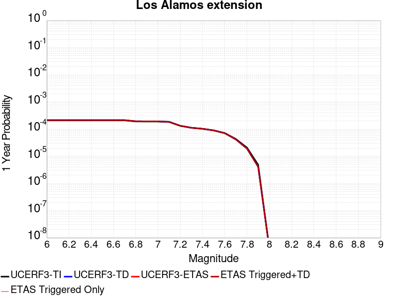 |  |

| Magnitude | 1 wk TI Prob | 1 wk TD Prob | 1 wk ETAS Prob | 1 wk ETAS/TD Gain | 1 wk ETAS Triggered+TD | 1 wk ETAS Triggered Only | 1 mo TI Prob | 1 mo TD Prob | 1 mo ETAS Prob | 1 mo ETAS/TD Gain | 1 mo ETAS Triggered+TD | 1 mo ETAS Triggered Only | 1 yr TI Prob | 1 yr TD Prob | 1 yr ETAS Prob | 1 yr ETAS/TD Gain | 1 yr ETAS Triggered+TD | 1 yr ETAS Triggered Only | 10 yr TI Prob | 10 yr TD Prob | 10 yr ETAS Prob | 10 yr ETAS/TD Gain | 10 yr ETAS Triggered+TD | 10 yr ETAS Triggered Only |
|-----|-----|-----|-----|-----|-----|-----|-----|-----|-----|-----|-----|-----|-----|-----|-----|-----|-----|-----|-----|-----|-----|-----|-----|-----|
| 6.0 | 4.0146506E-6 | 4.084475E-6 | 0.0 | 0.0 | 4.084475E-6 | 0.0 | 1.7205533E-5 | 1.7504783E-5 | 0.0 | 0.0 | 1.7504783E-5 | 0.0 | 2.0945723E-4 | 2.1310098E-4 | 0.0 | 0.0 | 2.1310098E-4 | 0.0 | 0.0020925992 | 0.0021290754 | 0.0022 | 1.0333124 | 0.002628011 | 5.0E-4 |
| 6.1 | 4.0146506E-6 | 4.084475E-6 | 0.0 | 0.0 | 4.084475E-6 | 0.0 | 1.7205533E-5 | 1.7504783E-5 | 0.0 | 0.0 | 1.7504783E-5 | 0.0 | 2.0945723E-4 | 2.1310098E-4 | 0.0 | 0.0 | 2.1310098E-4 | 0.0 | 0.0020925992 | 0.0021290754 | 0.0022 | 1.0333124 | 0.002628011 | 5.0E-4 |
| 6.2 | 4.0146506E-6 | 4.084475E-6 | 0.0 | 0.0 | 4.084475E-6 | 0.0 | 1.7205533E-5 | 1.7504783E-5 | 0.0 | 0.0 | 1.7504783E-5 | 0.0 | 2.0945723E-4 | 2.1310098E-4 | 0.0 | 0.0 | 2.1310098E-4 | 0.0 | 0.0020925992 | 0.0021290754 | 0.0022 | 1.0333124 | 0.002628011 | 5.0E-4 |
| 6.3 | 4.0146506E-6 | 4.084475E-6 | 0.0 | 0.0 | 4.084475E-6 | 0.0 | 1.7205533E-5 | 1.7504783E-5 | 0.0 | 0.0 | 1.7504783E-5 | 0.0 | 2.0945723E-4 | 2.1310098E-4 | 0.0 | 0.0 | 2.1310098E-4 | 0.0 | 0.0020925992 | 0.0021290754 | 0.0022 | 1.0333124 | 0.002628011 | 5.0E-4 |
| 6.4 | 4.0146506E-6 | 4.084475E-6 | 0.0 | 0.0 | 4.084475E-6 | 0.0 | 1.7205533E-5 | 1.7504783E-5 | 0.0 | 0.0 | 1.7504783E-5 | 0.0 | 2.0945723E-4 | 2.1310098E-4 | 0.0 | 0.0 | 2.1310098E-4 | 0.0 | 0.0020925992 | 0.0021290754 | 0.0022 | 1.0333124 | 0.002628011 | 5.0E-4 |
| 6.5 | 4.0146506E-6 | 4.084475E-6 | 0.0 | 0.0 | 4.084475E-6 | 0.0 | 1.7205533E-5 | 1.7504783E-5 | 0.0 | 0.0 | 1.7504783E-5 | 0.0 | 2.0945723E-4 | 2.1310098E-4 | 0.0 | 0.0 | 2.1310098E-4 | 0.0 | 0.0020925992 | 0.0021290754 | 0.0022 | 1.0333124 | 0.002628011 | 5.0E-4 |
| 6.6 | 4.0146506E-6 | 4.084475E-6 | 0.0 | 0.0 | 4.084475E-6 | 0.0 | 1.7205533E-5 | 1.7504783E-5 | 0.0 | 0.0 | 1.7504783E-5 | 0.0 | 2.0945723E-4 | 2.1310098E-4 | 0.0 | 0.0 | 2.1310098E-4 | 0.0 | 0.0020925992 | 0.0021290754 | 0.0022 | 1.0333124 | 0.002628011 | 5.0E-4 |
| 6.7 | 4.0146506E-6 | 4.084475E-6 | 0.0 | 0.0 | 4.084475E-6 | 0.0 | 1.7205533E-5 | 1.7504783E-5 | 0.0 | 0.0 | 1.7504783E-5 | 0.0 | 2.0945723E-4 | 2.1310098E-4 | 0.0 | 0.0 | 2.1310098E-4 | 0.0 | 0.0020925992 | 0.0021290754 | 0.0022 | 1.0333124 | 0.002628011 | 5.0E-4 |
| 6.8 | 3.6584688E-6 | 3.717294E-6 | 0.0 | 0.0 | 3.717294E-6 | 0.0 | 1.5679057E-5 | 1.5931168E-5 | 0.0 | 0.0 | 1.5931168E-5 | 0.0 | 1.9087581E-4 | 1.9394564E-4 | 0.0 | 0.0 | 1.9394564E-4 | 0.0 | 0.0019071194 | 0.0019378561 | 0.0018 | 0.9288615 | 0.002337081 | 4.0E-4 |
| 6.9 | 3.644631E-6 | 3.7030088E-6 | 0.0 | 0.0 | 3.7030088E-6 | 0.0 | 1.5619753E-5 | 1.5869946E-5 | 0.0 | 0.0 | 1.5869946E-5 | 0.0 | 1.901539E-4 | 1.932004E-4 | 0.0 | 0.0 | 1.932004E-4 | 0.0 | 0.0018999127 | 0.0019304167 | 0.0018 | 0.9324412 | 0.0023296445 | 4.0E-4 |
| 7.0 | 3.6318522E-6 | 3.6897743E-6 | 0.0 | 0.0 | 3.6897743E-6 | 0.0 | 1.5564989E-5 | 1.5813228E-5 | 0.0 | 0.0 | 1.5813228E-5 | 0.0 | 1.8948725E-4 | 1.9250998E-4 | 0.0 | 0.0 | 1.9250998E-4 | 0.0 | 0.0018932576 | 0.0019235244 | 0.0018 | 0.93578225 | 0.002322755 | 4.0E-4 |
| 7.1 | 3.5001724E-6 | 3.5538908E-6 | 0.0 | 0.0 | 3.5538908E-6 | 0.0 | 1.5000653E-5 | 1.5230877E-5 | 0.0 | 0.0 | 1.5230877E-5 | 0.0 | 1.8261763E-4 | 1.8542106E-4 | 0.0 | 0.0 | 1.8542106E-4 | 0.0 | 0.0018246764 | 0.001852754 | 0.0016 | 0.8635793 | 0.0021521982 | 3.0E-4 |
| 7.2 | 2.5204702E-6 | 2.54253E-6 | 0.0 | 0.0 | 2.54253E-6 | 0.0 | 1.080197E-5 | 1.0896511E-5 | 0.0 | 0.0 | 1.0896511E-5 | 0.0 | 1.3150605E-4 | 1.32657E-4 | 0.0 | 0.0 | 1.32657E-4 | 0.0 | 0.0013142825 | 0.0013257838 | 9.0E-4 | 0.67884374 | 0.0014256513 | 1.0E-4 |
| 7.3 | 2.1399692E-6 | 2.1491085E-6 | 0.0 | 0.0 | 2.1491085E-6 | 0.0 | 9.1712645E-6 | 9.210432E-6 | 0.0 | 0.0 | 9.210432E-6 | 0.0 | 1.1165442E-4 | 1.12131274E-4 | 0.0 | 0.0 | 1.12131274E-4 | 0.0 | 0.0011159834 | 0.0011207502 | 7.0E-4 | 0.62458163 | 0.0012206382 | 1.0E-4 |
| 7.4 | 1.9660122E-6 | 1.9692773E-6 | 0.0 | 0.0 | 1.9692773E-6 | 0.0 | 8.42574E-6 | 8.4397325E-6 | 0.0 | 0.0 | 8.4397325E-6 | 0.0 | 1.0257855E-4 | 1.02748934E-4 | 0.0 | 0.0 | 1.02748934E-4 | 0.0 | 0.0010253121 | 0.0010270174 | 5.0E-4 | 0.4868467 | 0.0011269146 | 1.0E-4 |
| 7.5 | 1.7204633E-6 | 1.7142435E-6 | 0.0 | 0.0 | 1.7142435E-6 | 0.0 | 7.373393E-6 | 7.346737E-6 | 0.0 | 0.0 | 7.346737E-6 | 0.0 | 8.976737E-5 | 8.944288E-5 | 0.0 | 0.0 | 8.944288E-5 | 0.0 | 8.9731114E-4 | 8.940718E-4 | 4.0E-4 | 0.44739136 | 8.940718E-4 | 0.0 |
| 7.6 | 1.3717638E-6 | 1.3528835E-6 | 0.0 | 0.0 | 1.3528835E-6 | 0.0 | 5.878974E-6 | 5.798059E-6 | 0.0 | 0.0 | 5.798059E-6 | 0.0 | 7.157416E-5 | 7.058911E-5 | 0.0 | 0.0 | 7.058911E-5 | 0.0 | 7.1551115E-4 | 7.056695E-4 | 3.0E-4 | 0.4251282 | 7.056695E-4 | 0.0 |
| 7.7 | 8.272564E-7 | 7.9530946E-7 | 0.0 | 0.0 | 7.9530946E-7 | 0.0 | 3.5453797E-6 | 3.4084646E-6 | 0.0 | 0.0 | 3.4084646E-6 | 0.0 | 4.3164142E-5 | 4.1497267E-5 | 0.0 | 0.0 | 4.1497267E-5 | 0.0 | 4.315576E-4 | 4.148954E-4 | 1.0E-4 | 0.24102461 | 4.148954E-4 | 0.0 |
| 7.8 | 3.9708277E-7 | 3.6697475E-7 | 0.0 | 0.0 | 3.6697475E-7 | 0.0 | 1.7017821E-6 | 1.5727479E-6 | 0.0 | 0.0 | 1.5727479E-6 | 0.0 | 2.0719E-5 | 1.9148038E-5 | 0.0 | 0.0 | 1.9148038E-5 | 0.0 | 2.071707E-4 | 1.9146396E-4 | 0.0 | 0.0 | 1.9146396E-4 | 0.0 |
| 7.9 | 9.292528E-8 | 7.884269E-8 | 0.0 | 0.0 | 7.884269E-8 | 0.0 | 3.9825116E-7 | 3.3789718E-7 | 0.0 | 0.0 | 3.3789718E-7 | 0.0 | 4.848697E-6 | 4.1138906E-6 | 0.0 | 0.0 | 4.1138906E-6 | 0.0 | 4.8485912E-5 | 4.113815E-5 | 0.0 | 0.0 | 4.113815E-5 | 0.0 |
| 8.0 | 7.880441E-11 | 8.231449E-11 | 0.0 | 0.0 | 8.231449E-11 | 0.0 | 3.3773329E-10 | 3.5277614E-10 | 0.0 | 0.0 | 3.5277614E-10 | 0.0 | 4.1119033E-9 | 4.29505E-9 | 0.0 | 0.0 | 4.29505E-9 | 0.0 | 4.1119034E-8 | 4.29505E-8 | 0.0 | 0.0 | 4.29505E-8 | 0.0 |

## Puente Hills
*[(top)](#table-of-contents)*

| 1 Week | 1 Month | 1 Year | 10 Year |
|-----|-----|-----|-----|
|  | 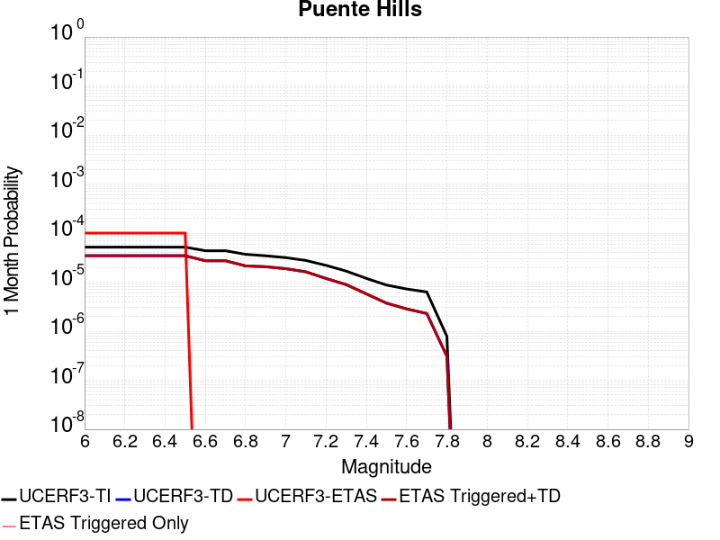 | 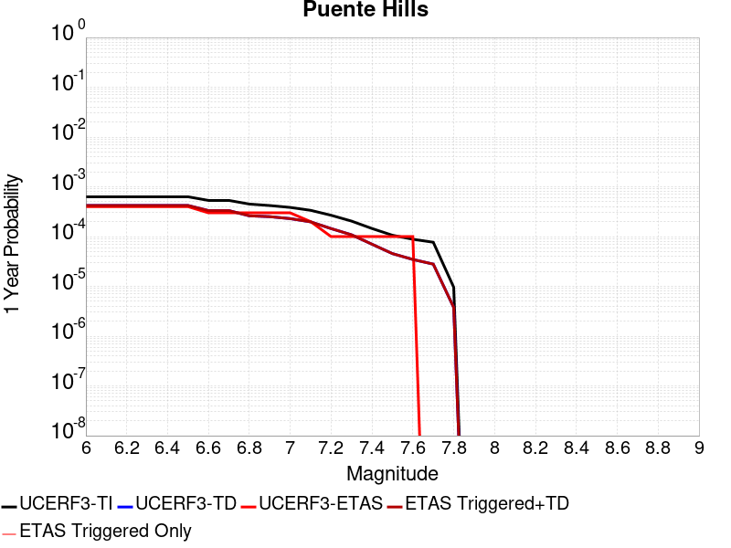 |  |

| Magnitude | 1 wk TI Prob | 1 wk TD Prob | 1 wk ETAS Prob | 1 wk ETAS/TD Gain | 1 wk ETAS Triggered+TD | 1 wk ETAS Triggered Only | 1 mo TI Prob | 1 mo TD Prob | 1 mo ETAS Prob | 1 mo ETAS/TD Gain | 1 mo ETAS Triggered+TD | 1 mo ETAS Triggered Only | 1 yr TI Prob | 1 yr TD Prob | 1 yr ETAS Prob | 1 yr ETAS/TD Gain | 1 yr ETAS Triggered+TD | 1 yr ETAS Triggered Only | 10 yr TI Prob | 10 yr TD Prob | 10 yr ETAS Prob | 10 yr ETAS/TD Gain | 10 yr ETAS Triggered+TD | 10 yr ETAS Triggered Only |
|-----|-----|-----|-----|-----|-----|-----|-----|-----|-----|-----|-----|-----|-----|-----|-----|-----|-----|-----|-----|-----|-----|-----|-----|-----|
| 6.0 | 1.2101656E-5 | 8.082964E-6 | 0.0 | 0.0 | 8.082964E-6 | 0.0 | 5.1863204E-5 | 3.464085E-5 | 1.0E-4 | 2.8867652 | 3.464085E-5 | 0.0 | 6.312516E-4 | 4.2167635E-4 | 4.0E-4 | 0.94859487 | 4.2167635E-4 | 0.0 | 0.0062946146 | 0.0042093215 | 0.0037 | 0.87900156 | 0.0047072168 | 5.0E-4 |
| 6.1 | 1.2101656E-5 | 8.082964E-6 | 0.0 | 0.0 | 8.082964E-6 | 0.0 | 5.1863204E-5 | 3.464085E-5 | 1.0E-4 | 2.8867652 | 3.464085E-5 | 0.0 | 6.312516E-4 | 4.2167635E-4 | 4.0E-4 | 0.94859487 | 4.2167635E-4 | 0.0 | 0.0062946146 | 0.0042093215 | 0.0037 | 0.87900156 | 0.0047072168 | 5.0E-4 |
| 6.2 | 1.2101656E-5 | 8.082964E-6 | 0.0 | 0.0 | 8.082964E-6 | 0.0 | 5.1863204E-5 | 3.464085E-5 | 1.0E-4 | 2.8867652 | 3.464085E-5 | 0.0 | 6.312516E-4 | 4.2167635E-4 | 4.0E-4 | 0.94859487 | 4.2167635E-4 | 0.0 | 0.0062946146 | 0.0042093215 | 0.0037 | 0.87900156 | 0.0047072168 | 5.0E-4 |
| 6.3 | 1.2101656E-5 | 8.082964E-6 | 0.0 | 0.0 | 8.082964E-6 | 0.0 | 5.1863204E-5 | 3.464085E-5 | 1.0E-4 | 2.8867652 | 3.464085E-5 | 0.0 | 6.312516E-4 | 4.2167635E-4 | 4.0E-4 | 0.94859487 | 4.2167635E-4 | 0.0 | 0.0062946146 | 0.0042093215 | 0.0037 | 0.87900156 | 0.0047072168 | 5.0E-4 |
| 6.4 | 1.2101656E-5 | 8.082964E-6 | 0.0 | 0.0 | 8.082964E-6 | 0.0 | 5.1863204E-5 | 3.464085E-5 | 1.0E-4 | 2.8867652 | 3.464085E-5 | 0.0 | 6.312516E-4 | 4.2167635E-4 | 4.0E-4 | 0.94859487 | 4.2167635E-4 | 0.0 | 0.0062946146 | 0.0042093215 | 0.0037 | 0.87900156 | 0.0047072168 | 5.0E-4 |
| 6.5 | 1.2101656E-5 | 8.082964E-6 | 0.0 | 0.0 | 8.082964E-6 | 0.0 | 5.1863204E-5 | 3.464085E-5 | 1.0E-4 | 2.8867652 | 3.464085E-5 | 0.0 | 6.312516E-4 | 4.2167635E-4 | 4.0E-4 | 0.94859487 | 4.2167635E-4 | 0.0 | 0.0062946146 | 0.0042093215 | 0.0037 | 0.87900156 | 0.0047072168 | 5.0E-4 |
| 6.6 | 1.0222488E-5 | 6.3847015E-6 | 0.0 | 0.0 | 6.3847015E-6 | 0.0 | 4.3809923E-5 | 2.7362734E-5 | 0.0 | 0.0 | 2.7362734E-5 | 0.0 | 5.332553E-4 | 3.3309282E-4 | 3.0E-4 | 0.9006499 | 3.3309282E-4 | 0.0 | 0.0053197746 | 0.00332618 | 0.0028 | 0.84180653 | 0.0037248496 | 4.0E-4 |
| 6.7 | 1.0222488E-5 | 6.3847015E-6 | 0.0 | 0.0 | 6.3847015E-6 | 0.0 | 4.3809923E-5 | 2.7362734E-5 | 0.0 | 0.0 | 2.7362734E-5 | 0.0 | 5.332553E-4 | 3.3309282E-4 | 3.0E-4 | 0.9006499 | 3.3309282E-4 | 0.0 | 0.0053197746 | 0.00332618 | 0.0028 | 0.84180653 | 0.0037248496 | 4.0E-4 |
| 6.8 | 8.6367845E-6 | 5.015095E-6 | 0.0 | 0.0 | 5.015095E-6 | 0.0 | 3.7014266E-5 | 2.1493091E-5 | 0.0 | 0.0 | 2.1493091E-5 | 0.0 | 4.505555E-4 | 2.616475E-4 | 3.0E-4 | 1.1465808 | 2.616475E-4 | 0.0 | 0.004496431 | 0.0026134506 | 0.0023 | 0.8800626 | 0.0028129278 | 2.0E-4 |
| 6.9 | 8.066481E-6 | 4.823201E-6 | 0.0 | 0.0 | 4.823201E-6 | 0.0 | 3.4570177E-5 | 2.0670699E-5 | 0.0 | 0.0 | 2.0670699E-5 | 0.0 | 4.2081063E-4 | 2.5163722E-4 | 3.0E-4 | 1.1921924 | 2.5163722E-4 | 0.0 | 0.0042001465 | 0.0025135765 | 0.0023 | 0.91503084 | 0.0027130737 | 2.0E-4 |
| 7.0 | 7.393828E-6 | 4.4051603E-6 | 0.0 | 0.0 | 4.4051603E-6 | 0.0 | 3.168745E-5 | 1.8879124E-5 | 0.0 | 0.0 | 1.8879124E-5 | 0.0 | 3.857264E-4 | 2.2982953E-4 | 3.0E-4 | 1.3053153 | 2.2982953E-4 | 0.0 | 0.0038505755 | 0.0022959637 | 0.0021 | 0.9146486 | 0.0023957342 | 1.0E-4 |
| 7.1 | 6.4660953E-6 | 3.793753E-6 | 0.0 | 0.0 | 3.793753E-6 | 0.0 | 2.7711543E-5 | 1.6258842E-5 | 0.0 | 0.0 | 1.6258842E-5 | 0.0 | 3.373358E-4 | 1.9793377E-4 | 2.0E-4 | 1.010439 | 1.9793377E-4 | 0.0 | 0.0033682417 | 0.0019776104 | 0.0017 | 0.85962325 | 0.0020774128 | 1.0E-4 |
| 7.2 | 5.143232E-6 | 2.7781773E-6 | 0.0 | 0.0 | 2.7781773E-6 | 0.0 | 2.2042237E-5 | 1.1906421E-5 | 0.0 | 0.0 | 1.1906421E-5 | 0.0 | 2.6833118E-4 | 1.4495112E-4 | 1.0E-4 | 0.68988776 | 1.4495112E-4 | 0.0 | 0.002680074 | 0.0014485754 | 0.0015 | 1.0355 | 0.0015484305 | 1.0E-4 |
| 7.3 | 3.928255E-6 | 2.0843436E-6 | 0.0 | 0.0 | 2.0843436E-6 | 0.0 | 1.683527E-5 | 8.932871E-6 | 0.0 | 0.0 | 8.932871E-6 | 0.0 | 2.0495013E-4 | 1.0875234E-4 | 1.0E-4 | 0.91952044 | 1.0875234E-4 | 0.0 | 0.002047612 | 0.0010869978 | 0.0013 | 1.1959546 | 0.0010869978 | 0.0 |
| 7.4 | 2.7894434E-6 | 1.3487361E-6 | 0.0 | 0.0 | 1.3487361E-6 | 0.0 | 1.1954703E-5 | 5.780285E-6 | 0.0 | 0.0 | 5.780285E-6 | 0.0 | 1.4553878E-4 | 7.037274E-5 | 1.0E-4 | 1.4210048 | 7.037274E-5 | 0.0 | 0.001454435 | 7.035089E-4 | 0.0012 | 1.7057353 | 7.035089E-4 | 0.0 |
| 7.5 | 2.041735E-6 | 8.7389367E-7 | 0.0 | 0.0 | 8.7389367E-7 | 0.0 | 8.750263E-6 | 3.7452535E-6 | 0.0 | 0.0 | 3.7452535E-6 | 0.0 | 1.06529245E-4 | 4.5597542E-5 | 1.0E-4 | 2.1931007 | 4.5597542E-5 | 0.0 | 0.0010647819 | 4.5588517E-4 | 8.0E-4 | 1.7548279 | 4.5588517E-4 | 0.0 |
| 7.6 | 1.6959062E-6 | 6.656155E-7 | 0.0 | 0.0 | 6.656155E-7 | 0.0 | 7.268149E-6 | 2.8526351E-6 | 0.0 | 0.0 | 2.8526351E-6 | 0.0 | 8.848612E-5 | 3.4730307E-5 | 1.0E-4 | 2.8793297 | 3.4730307E-5 | 0.0 | 8.84509E-4 | 3.4725165E-4 | 6.0E-4 | 1.7278537 | 3.4725165E-4 | 0.0 |
| 7.7 | 1.4767965E-6 | 5.369831E-7 | 0.0 | 0.0 | 5.369831E-7 | 0.0 | 6.3291122E-6 | 2.3013542E-6 | 0.0 | 0.0 | 2.3013542E-6 | 0.0 | 7.705422E-5 | 2.8018654E-5 | 0.0 | 0.0 | 2.8018654E-5 | 0.0 | 7.702751E-4 | 2.8015376E-4 | 5.0E-4 | 1.7847342 | 2.8015376E-4 | 0.0 |
| 7.8 | 1.8432911E-7 | 7.2190026E-8 | 0.0 | 0.0 | 7.2190026E-8 | 0.0 | 7.8998164E-7 | 3.0938583E-7 | 0.0 | 0.0 | 3.0938583E-7 | 0.0 | 9.617985E-6 | 3.7667692E-6 | 0.0 | 0.0 | 3.7667692E-6 | 0.0 | 9.617568E-5 | 3.7667374E-5 | 0.0 | 0.0 | 3.7667374E-5 | 0.0 |

## Sisar
*[(top)](#table-of-contents)*

| 1 Week | 1 Month | 1 Year | 10 Year |
|-----|-----|-----|-----|
|  |  | 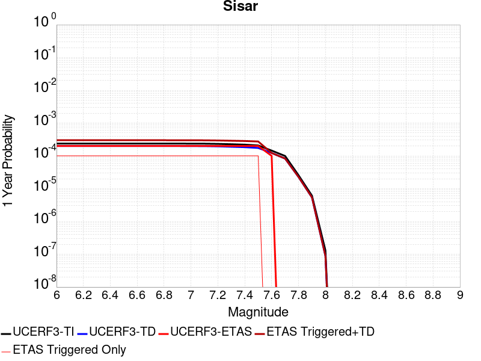 |  |

| Magnitude | 1 wk TI Prob | 1 wk TD Prob | 1 wk ETAS Prob | 1 wk ETAS/TD Gain | 1 wk ETAS Triggered+TD | 1 wk ETAS Triggered Only | 1 mo TI Prob | 1 mo TD Prob | 1 mo ETAS Prob | 1 mo ETAS/TD Gain | 1 mo ETAS Triggered+TD | 1 mo ETAS Triggered Only | 1 yr TI Prob | 1 yr TD Prob | 1 yr ETAS Prob | 1 yr ETAS/TD Gain | 1 yr ETAS Triggered+TD | 1 yr ETAS Triggered Only | 10 yr TI Prob | 10 yr TD Prob | 10 yr ETAS Prob | 10 yr ETAS/TD Gain | 10 yr ETAS Triggered+TD | 10 yr ETAS Triggered Only |
|-----|-----|-----|-----|-----|-----|-----|-----|-----|-----|-----|-----|-----|-----|-----|-----|-----|-----|-----|-----|-----|-----|-----|-----|-----|
| 6.0 | 4.544193E-6 | 3.833274E-6 | 0.0 | 0.0 | 3.833274E-6 | 0.0 | 1.9474966E-5 | 1.6428217E-5 | 0.0 | 0.0 | 1.6428217E-5 | 0.0 | 2.3708193E-4 | 1.9999551E-4 | 2.0E-4 | 1.0000224 | 2.999755E-4 | 1.0E-4 | 0.0023682916 | 0.001998189 | 0.0023 | 1.1510422 | 0.0023973896 | 4.0E-4 |
| 6.1 | 4.544193E-6 | 3.833274E-6 | 0.0 | 0.0 | 3.833274E-6 | 0.0 | 1.9474966E-5 | 1.6428217E-5 | 0.0 | 0.0 | 1.6428217E-5 | 0.0 | 2.3708193E-4 | 1.9999551E-4 | 2.0E-4 | 1.0000224 | 2.999755E-4 | 1.0E-4 | 0.0023682916 | 0.001998189 | 0.0023 | 1.1510422 | 0.0023973896 | 4.0E-4 |
| 6.2 | 4.544193E-6 | 3.833274E-6 | 0.0 | 0.0 | 3.833274E-6 | 0.0 | 1.9474966E-5 | 1.6428217E-5 | 0.0 | 0.0 | 1.6428217E-5 | 0.0 | 2.3708193E-4 | 1.9999551E-4 | 2.0E-4 | 1.0000224 | 2.999755E-4 | 1.0E-4 | 0.0023682916 | 0.001998189 | 0.0023 | 1.1510422 | 0.0023973896 | 4.0E-4 |
| 6.3 | 4.544193E-6 | 3.833274E-6 | 0.0 | 0.0 | 3.833274E-6 | 0.0 | 1.9474966E-5 | 1.6428217E-5 | 0.0 | 0.0 | 1.6428217E-5 | 0.0 | 2.3708193E-4 | 1.9999551E-4 | 2.0E-4 | 1.0000224 | 2.999755E-4 | 1.0E-4 | 0.0023682916 | 0.001998189 | 0.0023 | 1.1510422 | 0.0023973896 | 4.0E-4 |
| 6.4 | 4.544193E-6 | 3.833274E-6 | 0.0 | 0.0 | 3.833274E-6 | 0.0 | 1.9474966E-5 | 1.6428217E-5 | 0.0 | 0.0 | 1.6428217E-5 | 0.0 | 2.3708193E-4 | 1.9999551E-4 | 2.0E-4 | 1.0000224 | 2.999755E-4 | 1.0E-4 | 0.0023682916 | 0.001998189 | 0.0023 | 1.1510422 | 0.0023973896 | 4.0E-4 |
| 6.5 | 4.544193E-6 | 3.833274E-6 | 0.0 | 0.0 | 3.833274E-6 | 0.0 | 1.9474966E-5 | 1.6428217E-5 | 0.0 | 0.0 | 1.6428217E-5 | 0.0 | 2.3708193E-4 | 1.9999551E-4 | 2.0E-4 | 1.0000224 | 2.999755E-4 | 1.0E-4 | 0.0023682916 | 0.001998189 | 0.0023 | 1.1510422 | 0.0023973896 | 4.0E-4 |
| 6.6 | 4.544193E-6 | 3.833274E-6 | 0.0 | 0.0 | 3.833274E-6 | 0.0 | 1.9474966E-5 | 1.6428217E-5 | 0.0 | 0.0 | 1.6428217E-5 | 0.0 | 2.3708193E-4 | 1.9999551E-4 | 2.0E-4 | 1.0000224 | 2.999755E-4 | 1.0E-4 | 0.0023682916 | 0.001998189 | 0.0023 | 1.1510422 | 0.0023973896 | 4.0E-4 |
| 6.7 | 4.544193E-6 | 3.833274E-6 | 0.0 | 0.0 | 3.833274E-6 | 0.0 | 1.9474966E-5 | 1.6428217E-5 | 0.0 | 0.0 | 1.6428217E-5 | 0.0 | 2.3708193E-4 | 1.9999551E-4 | 2.0E-4 | 1.0000224 | 2.999755E-4 | 1.0E-4 | 0.0023682916 | 0.001998189 | 0.0023 | 1.1510422 | 0.0023973896 | 4.0E-4 |
| 6.8 | 4.544193E-6 | 3.833274E-6 | 0.0 | 0.0 | 3.833274E-6 | 0.0 | 1.9474966E-5 | 1.6428217E-5 | 0.0 | 0.0 | 1.6428217E-5 | 0.0 | 2.3708193E-4 | 1.9999551E-4 | 2.0E-4 | 1.0000224 | 2.999755E-4 | 1.0E-4 | 0.0023682916 | 0.001998189 | 0.0023 | 1.1510422 | 0.0023973896 | 4.0E-4 |
| 6.9 | 4.542225E-6 | 3.831237E-6 | 0.0 | 0.0 | 3.831237E-6 | 0.0 | 1.9466532E-5 | 1.6419486E-5 | 0.0 | 0.0 | 1.6419486E-5 | 0.0 | 2.3697925E-4 | 1.9988924E-4 | 2.0E-4 | 1.0005541 | 2.9986925E-4 | 1.0E-4 | 0.002367267 | 0.0019971281 | 0.0023 | 1.1516538 | 0.0023963293 | 4.0E-4 |
| 7.0 | 4.5278484E-6 | 3.816307E-6 | 0.0 | 0.0 | 3.816307E-6 | 0.0 | 1.940492E-5 | 1.6355501E-5 | 0.0 | 0.0 | 1.6355501E-5 | 0.0 | 2.3622929E-4 | 1.9911036E-4 | 2.0E-4 | 1.004468 | 2.9909046E-4 | 1.0E-4 | 0.0023597833 | 0.0019893534 | 0.0023 | 1.1561546 | 0.0023885577 | 4.0E-4 |
| 7.1 | 4.5132488E-6 | 3.8011012E-6 | 0.0 | 0.0 | 3.8011012E-6 | 0.0 | 1.9342351E-5 | 1.6290334E-5 | 0.0 | 0.0 | 1.6290334E-5 | 0.0 | 2.3546767E-4 | 1.983171E-4 | 2.0E-4 | 1.0084859 | 2.9829727E-4 | 1.0E-4 | 0.0023521832 | 0.0019814349 | 0.0023 | 1.160775 | 0.0023806423 | 4.0E-4 |
| 7.2 | 4.448859E-6 | 3.7335963E-6 | 0.0 | 0.0 | 3.7335963E-6 | 0.0 | 1.9066398E-5 | 1.6001031E-5 | 0.0 | 0.0 | 1.6001031E-5 | 0.0 | 2.3210866E-4 | 1.9479546E-4 | 2.0E-4 | 1.0267179 | 2.94776E-4 | 1.0E-4 | 0.0023186638 | 0.0019462806 | 0.0023 | 1.1817412 | 0.0023455021 | 4.0E-4 |
| 7.3 | 4.3424366E-6 | 3.6274957E-6 | 0.0 | 0.0 | 3.6274957E-6 | 0.0 | 1.861031E-5 | 1.554632E-5 | 0.0 | 0.0 | 1.554632E-5 | 0.0 | 2.2655698E-4 | 1.8926033E-4 | 2.0E-4 | 1.0567454 | 2.892414E-4 | 1.0E-4 | 0.0022632615 | 0.0018910249 | 0.0022 | 1.1633903 | 0.0022902684 | 4.0E-4 |
| 7.4 | 4.218641E-6 | 3.5269727E-6 | 0.0 | 0.0 | 3.5269727E-6 | 0.0 | 1.8079765E-5 | 1.5115511E-5 | 0.0 | 0.0 | 1.5115511E-5 | 0.0 | 2.2009891E-4 | 1.8401614E-4 | 2.0E-4 | 1.0868611 | 2.8399774E-4 | 1.0E-4 | 0.0021988105 | 0.0018386709 | 0.002 | 1.0877422 | 0.0022379353 | 4.0E-4 |
| 7.5 | 3.983779E-6 | 3.3419244E-6 | 0.0 | 0.0 | 3.3419244E-6 | 0.0 | 1.7073227E-5 | 1.4322457E-5 | 0.0 | 0.0 | 1.4322457E-5 | 0.0 | 2.0784672E-4 | 1.7436229E-4 | 2.0E-4 | 1.147037 | 2.7434484E-4 | 1.0E-4 | 0.0020765243 | 0.0017422877 | 0.0018 | 1.0331244 | 0.0021415907 | 4.0E-4 |
| 7.6 | 2.777393E-6 | 2.3473794E-6 | 0.0 | 0.0 | 2.3473794E-6 | 0.0 | 1.1903058E-5 | 1.0060159E-5 | 0.0 | 0.0 | 1.0060159E-5 | 0.0 | 1.449101E-4 | 1.2247563E-4 | 1.0E-4 | 0.816489 | 1.2247563E-4 | 0.0 | 0.0014481564 | 0.001224089 | 0.001 | 0.81693405 | 0.0013239665 | 1.0E-4 |
| 7.7 | 1.9028433E-6 | 1.5900055E-6 | 0.0 | 0.0 | 1.5900055E-6 | 0.0 | 8.155017E-6 | 6.8142917E-6 | 0.0 | 0.0 | 6.8142917E-6 | 0.0 | 9.928281E-5 | 8.296089E-5 | 0.0 | 0.0 | 8.296089E-5 | 0.0 | 9.923846E-4 | 8.2930387E-4 | 8.0E-4 | 0.96466446 | 9.29221E-4 | 1.0E-4 |
| 7.8 | 4.9095956E-7 | 4.3551648E-7 | 0.0 | 0.0 | 4.3551648E-7 | 0.0 | 2.1041105E-6 | 1.8664979E-6 | 0.0 | 0.0 | 1.8664979E-6 | 0.0 | 2.5617246E-5 | 2.2724376E-5 | 0.0 | 0.0 | 2.2724376E-5 | 0.0 | 2.5614293E-4 | 2.2722069E-4 | 1.0E-4 | 0.44010076 | 2.2722069E-4 | 0.0 |
| 7.9 | 1.16657894E-7 | 1.0330405E-7 | 0.0 | 0.0 | 1.0330405E-7 | 0.0 | 4.999623E-7 | 4.427316E-7 | 0.0 | 0.0 | 4.427316E-7 | 0.0 | 6.087024E-6 | 5.390244E-6 | 0.0 | 0.0 | 5.390244E-6 | 0.0 | 6.0868573E-5 | 5.390116E-5 | 1.0E-4 | 1.8552476 | 5.390116E-5 | 0.0 |
| 8.0 | 2.5100346E-9 | 1.702437E-9 | 0.0 | 0.0 | 1.702437E-9 | 0.0 | 1.0757291E-8 | 7.2961583E-9 | 0.0 | 0.0 | 7.2961583E-9 | 0.0 | 1.3097001E-7 | 8.8830724E-8 | 0.0 | 0.0 | 8.8830724E-8 | 0.0 | 1.3096993E-6 | 8.8830694E-7 | 0.0 | 0.0 | 8.8830694E-7 | 0.0 |

## Yorba Linda
*[(top)](#table-of-contents)*

| 1 Week | 1 Month | 1 Year | 10 Year |
|-----|-----|-----|-----|
|  |  |  | 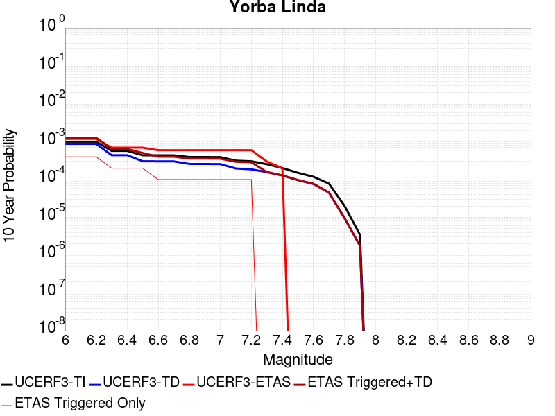 |

| Magnitude | 1 wk TI Prob | 1 wk TD Prob | 1 wk ETAS Prob | 1 wk ETAS/TD Gain | 1 wk ETAS Triggered+TD | 1 wk ETAS Triggered Only | 1 mo TI Prob | 1 mo TD Prob | 1 mo ETAS Prob | 1 mo ETAS/TD Gain | 1 mo ETAS Triggered+TD | 1 mo ETAS Triggered Only | 1 yr TI Prob | 1 yr TD Prob | 1 yr ETAS Prob | 1 yr ETAS/TD Gain | 1 yr ETAS Triggered+TD | 1 yr ETAS Triggered Only | 10 yr TI Prob | 10 yr TD Prob | 10 yr ETAS Prob | 10 yr ETAS/TD Gain | 10 yr ETAS Triggered+TD | 10 yr ETAS Triggered Only |
|-----|-----|-----|-----|-----|-----|-----|-----|-----|-----|-----|-----|-----|-----|-----|-----|-----|-----|-----|-----|-----|-----|-----|-----|-----|
| 6.0 | 1.9346849E-6 | 1.6898641E-6 | 0.0 | 0.0 | 1.6898641E-6 | 0.0 | 8.29148E-6 | 7.24226E-6 | 0.0 | 0.0 | 7.24226E-6 | 0.0 | 1.009441E-4 | 8.8171895E-5 | 1.0E-4 | 1.1341482 | 1.8816307E-4 | 1.0E-4 | 0.0010089825 | 8.814622E-4 | 0.0012 | 1.3613744 | 0.0012811096 | 4.0E-4 |
| 6.1 | 1.9346849E-6 | 1.6898641E-6 | 0.0 | 0.0 | 1.6898641E-6 | 0.0 | 8.29148E-6 | 7.24226E-6 | 0.0 | 0.0 | 7.24226E-6 | 0.0 | 1.009441E-4 | 8.8171895E-5 | 1.0E-4 | 1.1341482 | 1.8816307E-4 | 1.0E-4 | 0.0010089825 | 8.814622E-4 | 0.0012 | 1.3613744 | 0.0012811096 | 4.0E-4 |
| 6.2 | 1.9346849E-6 | 1.6898641E-6 | 0.0 | 0.0 | 1.6898641E-6 | 0.0 | 8.29148E-6 | 7.24226E-6 | 0.0 | 0.0 | 7.24226E-6 | 0.0 | 1.009441E-4 | 8.8171895E-5 | 1.0E-4 | 1.1341482 | 1.8816307E-4 | 1.0E-4 | 0.0010089825 | 8.814622E-4 | 0.0012 | 1.3613744 | 0.0012811096 | 4.0E-4 |
| 6.3 | 1.1028608E-6 | 8.4725457E-7 | 0.0 | 0.0 | 8.4725457E-7 | 0.0 | 4.7265376E-6 | 3.6310862E-6 | 0.0 | 0.0 | 3.6310862E-6 | 0.0 | 5.754407E-5 | 4.4207645E-5 | 0.0 | 0.0 | 4.4207645E-5 | 0.0 | 5.7529175E-4 | 4.41995E-4 | 7.0E-4 | 1.5837282 | 6.4190663E-4 | 2.0E-4 |
| 6.4 | 1.1028608E-6 | 8.4725457E-7 | 0.0 | 0.0 | 8.4725457E-7 | 0.0 | 4.7265376E-6 | 3.6310862E-6 | 0.0 | 0.0 | 3.6310862E-6 | 0.0 | 5.754407E-5 | 4.4207645E-5 | 0.0 | 0.0 | 4.4207645E-5 | 0.0 | 5.7529175E-4 | 4.41995E-4 | 7.0E-4 | 1.5837282 | 6.4190663E-4 | 2.0E-4 |
| 6.5 | 8.4451364E-7 | 5.860101E-7 | 0.0 | 0.0 | 5.860101E-7 | 0.0 | 3.619339E-6 | 2.5114696E-6 | 0.0 | 0.0 | 2.5114696E-6 | 0.0 | 4.406456E-5 | 3.0576735E-5 | 0.0 | 0.0 | 3.0576735E-5 | 0.0 | 4.4055824E-4 | 3.0572742E-4 | 7.0E-4 | 2.2896214 | 5.0566625E-4 | 2.0E-4 |
| 6.6 | 8.422957E-7 | 5.835641E-7 | 0.0 | 0.0 | 5.835641E-7 | 0.0 | 3.6098338E-6 | 2.5009865E-6 | 0.0 | 0.0 | 2.5009865E-6 | 0.0 | 4.3948843E-5 | 3.0449108E-5 | 0.0 | 0.0 | 3.0449108E-5 | 0.0 | 4.394015E-4 | 3.044515E-4 | 6.0E-4 | 1.9707572 | 4.0442104E-4 | 1.0E-4 |
| 6.7 | 8.4119705E-7 | 5.8234855E-7 | 0.0 | 0.0 | 5.8234855E-7 | 0.0 | 3.6051254E-6 | 2.4957774E-6 | 0.0 | 0.0 | 2.4957774E-6 | 0.0 | 4.3891516E-5 | 3.0385687E-5 | 0.0 | 0.0 | 3.0385687E-5 | 0.0 | 4.388285E-4 | 3.0381745E-4 | 6.0E-4 | 1.9748701 | 4.0378707E-4 | 1.0E-4 |
| 6.8 | 7.5919155E-7 | 4.9861677E-7 | 0.0 | 0.0 | 4.9861677E-7 | 0.0 | 3.253674E-6 | 2.1369274E-6 | 0.0 | 0.0 | 2.1369274E-6 | 0.0 | 3.961276E-5 | 2.6016798E-5 | 0.0 | 0.0 | 2.6016798E-5 | 0.0 | 3.9605703E-4 | 2.6013923E-4 | 6.0E-4 | 2.306457 | 3.6011322E-4 | 1.0E-4 |
| 6.9 | 7.5804564E-7 | 4.9723553E-7 | 0.0 | 0.0 | 4.9723553E-7 | 0.0 | 3.248763E-6 | 2.1310077E-6 | 0.0 | 0.0 | 2.1310077E-6 | 0.0 | 3.955297E-5 | 2.5944728E-5 | 0.0 | 0.0 | 2.5944728E-5 | 0.0 | 3.9545933E-4 | 2.5941868E-4 | 6.0E-4 | 2.3128633 | 3.5939275E-4 | 1.0E-4 |
| 7.0 | 7.539293E-7 | 4.9345005E-7 | 0.0 | 0.0 | 4.9345005E-7 | 0.0 | 3.2311218E-6 | 2.1147844E-6 | 0.0 | 0.0 | 2.1147844E-6 | 0.0 | 3.9338196E-5 | 2.5747211E-5 | 0.0 | 0.0 | 2.5747211E-5 | 0.0 | 3.9331234E-4 | 2.57444E-4 | 6.0E-4 | 2.3306038 | 3.5741826E-4 | 1.0E-4 |
| 7.1 | 6.0900885E-7 | 3.7736595E-7 | 0.0 | 0.0 | 3.7736595E-7 | 0.0 | 2.6100352E-6 | 1.6172817E-6 | 0.0 | 0.0 | 1.6172817E-6 | 0.0 | 3.1776715E-5 | 1.9690231E-5 | 0.0 | 0.0 | 1.9690231E-5 | 0.0 | 3.1772171E-4 | 1.9688522E-4 | 6.0E-4 | 3.047461 | 2.9686553E-4 | 1.0E-4 |
| 7.2 | 5.849925E-7 | 3.5800423E-7 | 0.0 | 0.0 | 3.5800423E-7 | 0.0 | 2.5071083E-6 | 1.534303E-6 | 0.0 | 0.0 | 1.534303E-6 | 0.0 | 3.0523614E-5 | 1.8679983E-5 | 0.0 | 0.0 | 1.8679983E-5 | 0.0 | 3.0519423E-4 | 1.8678444E-4 | 6.0E-4 | 3.2122588 | 2.8676577E-4 | 1.0E-4 |
| 7.3 | 4.89808E-7 | 3.031628E-7 | 0.0 | 0.0 | 3.031628E-7 | 0.0 | 2.0991754E-6 | 1.2992685E-6 | 0.0 | 0.0 | 1.2992685E-6 | 0.0 | 2.5557161E-5 | 1.5818481E-5 | 0.0 | 0.0 | 1.5818481E-5 | 0.0 | 2.5554223E-4 | 1.5817379E-4 | 3.0E-4 | 1.8966479 | 1.5817379E-4 | 0.0 |
| 7.4 | 3.8700415E-7 | 2.4670638E-7 | 0.0 | 0.0 | 2.4670638E-7 | 0.0 | 1.6585881E-6 | 1.0573127E-6 | 0.0 | 0.0 | 1.0573127E-6 | 0.0 | 2.0193123E-5 | 1.2872707E-5 | 0.0 | 0.0 | 1.2872707E-5 | 0.0 | 2.0191289E-4 | 1.2871974E-4 | 2.0E-4 | 1.5537633 | 1.2871974E-4 | 0.0 |
| 7.5 | 2.900565E-7 | 1.8606309E-7 | 0.0 | 0.0 | 1.8606309E-7 | 0.0 | 1.2430987E-6 | 7.97413E-7 | 0.0 | 0.0 | 7.97413E-7 | 0.0 | 1.5134622E-5 | 9.708461E-6 | 0.0 | 0.0 | 9.708461E-6 | 0.0 | 1.5133592E-4 | 9.708045E-5 | 0.0 | 0.0 | 9.708045E-5 | 0.0 |
| 7.6 | 2.2770318E-7 | 1.4789921E-7 | 0.0 | 0.0 | 1.4789921E-7 | 0.0 | 9.758704E-7 | 6.338536E-7 | 0.0 | 0.0 | 6.338536E-7 | 0.0 | 1.1881158E-5 | 7.717141E-6 | 0.0 | 0.0 | 7.717141E-6 | 0.0 | 1.1880523E-4 | 7.716878E-5 | 0.0 | 0.0 | 7.716878E-5 | 0.0 |
| 7.7 | 1.5017194E-7 | 8.718325E-8 | 0.0 | 0.0 | 8.718325E-8 | 0.0 | 6.4359386E-7 | 3.7364245E-7 | 0.0 | 0.0 | 3.7364245E-7 | 0.0 | 7.835727E-6 | 4.5490874E-6 | 0.0 | 0.0 | 4.5490874E-6 | 0.0 | 7.835451E-5 | 4.548997E-5 | 0.0 | 0.0 | 4.548997E-5 | 0.0 |
| 7.8 | 3.895753E-8 | 1.8458216E-8 | 0.0 | 0.0 | 1.8458216E-8 | 0.0 | 1.6696083E-7 | 7.910664E-8 | 0.0 | 0.0 | 7.910664E-8 | 0.0 | 2.0327461E-6 | 9.63123E-7 | 0.0 | 0.0 | 9.63123E-7 | 0.0 | 2.0327276E-5 | 9.63119E-6 | 0.0 | 0.0 | 9.63119E-6 | 0.0 |
| 7.9 | 6.648505E-9 | 3.405407E-9 | 0.0 | 0.0 | 3.405407E-9 | 0.0 | 2.8493591E-8 | 1.4594601E-8 | 0.0 | 0.0 | 1.4594601E-8 | 0.0 | 3.4690942E-7 | 1.7768926E-7 | 0.0 | 0.0 | 1.7768926E-7 | 0.0 | 3.4690888E-6 | 1.7768913E-6 | 0.0 | 0.0 | 1.7768913E-6 | 0.0 |

## Compton
*[(top)](#table-of-contents)*

| 1 Week | 1 Month | 1 Year | 10 Year |
|-----|-----|-----|-----|
|  | 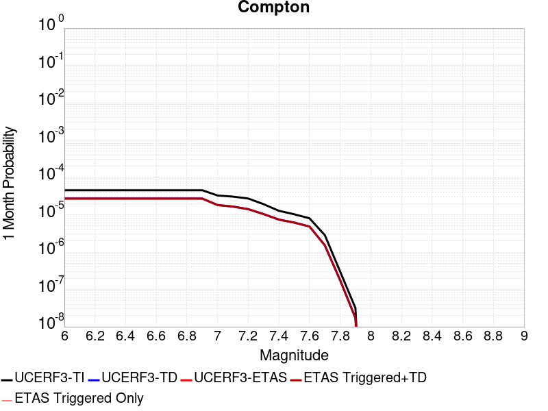 |  | 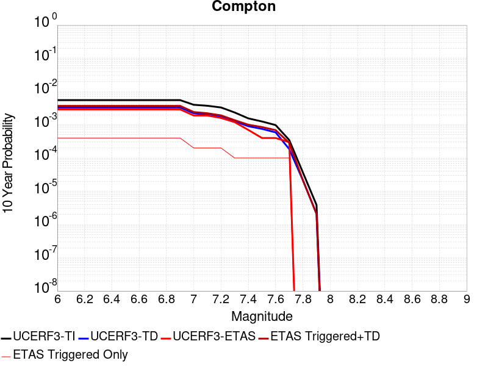 |

| Magnitude | 1 wk TI Prob | 1 wk TD Prob | 1 wk ETAS Prob | 1 wk ETAS/TD Gain | 1 wk ETAS Triggered+TD | 1 wk ETAS Triggered Only | 1 mo TI Prob | 1 mo TD Prob | 1 mo ETAS Prob | 1 mo ETAS/TD Gain | 1 mo ETAS Triggered+TD | 1 mo ETAS Triggered Only | 1 yr TI Prob | 1 yr TD Prob | 1 yr ETAS Prob | 1 yr ETAS/TD Gain | 1 yr ETAS Triggered+TD | 1 yr ETAS Triggered Only | 10 yr TI Prob | 10 yr TD Prob | 10 yr ETAS Prob | 10 yr ETAS/TD Gain | 10 yr ETAS Triggered+TD | 10 yr ETAS Triggered Only |
|-----|-----|-----|-----|-----|-----|-----|-----|-----|-----|-----|-----|-----|-----|-----|-----|-----|-----|-----|-----|-----|-----|-----|-----|-----|
| 6.0 | 1.06050875E-5 | 6.3433017E-6 | 0.0 | 0.0 | 6.3433017E-6 | 0.0 | 4.5449582E-5 | 2.7185311E-5 | 0.0 | 0.0 | 2.7185311E-5 | 0.0 | 5.5320817E-4 | 3.3093375E-4 | 1.0E-4 | 0.30217528 | 4.3090066E-4 | 1.0E-4 | 0.0055183303 | 0.0033046925 | 0.0029 | 0.87754005 | 0.0037033707 | 4.0E-4 |
| 6.1 | 1.06050875E-5 | 6.3433017E-6 | 0.0 | 0.0 | 6.3433017E-6 | 0.0 | 4.5449582E-5 | 2.7185311E-5 | 0.0 | 0.0 | 2.7185311E-5 | 0.0 | 5.5320817E-4 | 3.3093375E-4 | 1.0E-4 | 0.30217528 | 4.3090066E-4 | 1.0E-4 | 0.0055183303 | 0.0033046925 | 0.0029 | 0.87754005 | 0.0037033707 | 4.0E-4 |
| 6.2 | 1.06050875E-5 | 6.3433017E-6 | 0.0 | 0.0 | 6.3433017E-6 | 0.0 | 4.5449582E-5 | 2.7185311E-5 | 0.0 | 0.0 | 2.7185311E-5 | 0.0 | 5.5320817E-4 | 3.3093375E-4 | 1.0E-4 | 0.30217528 | 4.3090066E-4 | 1.0E-4 | 0.0055183303 | 0.0033046925 | 0.0029 | 0.87754005 | 0.0037033707 | 4.0E-4 |
| 6.3 | 1.06050875E-5 | 6.3433017E-6 | 0.0 | 0.0 | 6.3433017E-6 | 0.0 | 4.5449582E-5 | 2.7185311E-5 | 0.0 | 0.0 | 2.7185311E-5 | 0.0 | 5.5320817E-4 | 3.3093375E-4 | 1.0E-4 | 0.30217528 | 4.3090066E-4 | 1.0E-4 | 0.0055183303 | 0.0033046925 | 0.0029 | 0.87754005 | 0.0037033707 | 4.0E-4 |
| 6.4 | 1.06050875E-5 | 6.3433017E-6 | 0.0 | 0.0 | 6.3433017E-6 | 0.0 | 4.5449582E-5 | 2.7185311E-5 | 0.0 | 0.0 | 2.7185311E-5 | 0.0 | 5.5320817E-4 | 3.3093375E-4 | 1.0E-4 | 0.30217528 | 4.3090066E-4 | 1.0E-4 | 0.0055183303 | 0.0033046925 | 0.0029 | 0.87754005 | 0.0037033707 | 4.0E-4 |
| 6.5 | 1.06050875E-5 | 6.3433017E-6 | 0.0 | 0.0 | 6.3433017E-6 | 0.0 | 4.5449582E-5 | 2.7185311E-5 | 0.0 | 0.0 | 2.7185311E-5 | 0.0 | 5.5320817E-4 | 3.3093375E-4 | 1.0E-4 | 0.30217528 | 4.3090066E-4 | 1.0E-4 | 0.0055183303 | 0.0033046925 | 0.0029 | 0.87754005 | 0.0037033707 | 4.0E-4 |
| 6.6 | 1.06050875E-5 | 6.3433017E-6 | 0.0 | 0.0 | 6.3433017E-6 | 0.0 | 4.5449582E-5 | 2.7185311E-5 | 0.0 | 0.0 | 2.7185311E-5 | 0.0 | 5.5320817E-4 | 3.3093375E-4 | 1.0E-4 | 0.30217528 | 4.3090066E-4 | 1.0E-4 | 0.0055183303 | 0.0033046925 | 0.0029 | 0.87754005 | 0.0037033707 | 4.0E-4 |
| 6.7 | 1.06050875E-5 | 6.3433017E-6 | 0.0 | 0.0 | 6.3433017E-6 | 0.0 | 4.5449582E-5 | 2.7185311E-5 | 0.0 | 0.0 | 2.7185311E-5 | 0.0 | 5.5320817E-4 | 3.3093375E-4 | 1.0E-4 | 0.30217528 | 4.3090066E-4 | 1.0E-4 | 0.0055183303 | 0.0033046925 | 0.0029 | 0.87754005 | 0.0037033707 | 4.0E-4 |
| 6.8 | 1.06050875E-5 | 6.3433017E-6 | 0.0 | 0.0 | 6.3433017E-6 | 0.0 | 4.5449582E-5 | 2.7185311E-5 | 0.0 | 0.0 | 2.7185311E-5 | 0.0 | 5.5320817E-4 | 3.3093375E-4 | 1.0E-4 | 0.30217528 | 4.3090066E-4 | 1.0E-4 | 0.0055183303 | 0.0033046925 | 0.0029 | 0.87754005 | 0.0037033707 | 4.0E-4 |
| 6.9 | 1.06050875E-5 | 6.3433017E-6 | 0.0 | 0.0 | 6.3433017E-6 | 0.0 | 4.5449582E-5 | 2.7185311E-5 | 0.0 | 0.0 | 2.7185311E-5 | 0.0 | 5.5320817E-4 | 3.3093375E-4 | 1.0E-4 | 0.30217528 | 4.3090066E-4 | 1.0E-4 | 0.0055183303 | 0.0033046925 | 0.0029 | 0.87754005 | 0.0037033707 | 4.0E-4 |
| 7.0 | 7.672486E-6 | 4.2592465E-6 | 0.0 | 0.0 | 4.2592465E-6 | 0.0 | 3.288167E-5 | 1.825379E-5 | 0.0 | 0.0 | 1.825379E-5 | 0.0 | 4.0026082E-4 | 2.2221784E-4 | 0.0 | 0.0 | 2.2221784E-4 | 0.0 | 0.0039954064 | 0.002220018 | 0.0019 | 0.8558489 | 0.0024195742 | 2.0E-4 |
| 7.1 | 7.163992E-6 | 3.8713692E-6 | 0.0 | 0.0 | 3.8713692E-6 | 0.0 | 3.0702464E-5 | 1.659148E-5 | 0.0 | 0.0 | 1.659148E-5 | 0.0 | 3.7373835E-4 | 2.0198312E-4 | 0.0 | 0.0 | 2.0198312E-4 | 0.0 | 0.0037311043 | 0.002018052 | 0.0019 | 0.94150203 | 0.0022176483 | 2.0E-4 |
| 7.2 | 6.3689185E-6 | 3.299305E-6 | 0.0 | 0.0 | 3.299305E-6 | 0.0 | 2.729508E-5 | 1.4139804E-5 | 0.0 | 0.0 | 1.4139804E-5 | 0.0 | 3.322669E-4 | 1.7213893E-4 | 0.0 | 0.0 | 1.7213893E-4 | 0.0 | 0.0033177056 | 0.0017200974 | 0.0016 | 0.9301799 | 0.0019197534 | 2.0E-4 |
| 7.3 | 4.4987873E-6 | 2.4412468E-6 | 0.0 | 0.0 | 2.4412468E-6 | 0.0 | 1.9280375E-5 | 1.0462446E-5 | 0.0 | 0.0 | 1.0462446E-5 | 0.0 | 2.3471327E-4 | 1.2737315E-4 | 0.0 | 0.0 | 1.2737315E-4 | 0.0 | 0.002344655 | 0.0012730313 | 0.0012 | 0.9426319 | 0.001372904 | 1.0E-4 |
| 7.4 | 2.987296E-6 | 1.7346217E-6 | 0.0 | 0.0 | 1.7346217E-6 | 0.0 | 1.2802635E-5 | 7.4340724E-6 | 0.0 | 0.0 | 7.4340724E-6 | 0.0 | 1.5586092E-4 | 9.0506124E-5 | 0.0 | 0.0 | 9.0506124E-5 | 0.0 | 0.0015575165 | 9.0469845E-4 | 7.0E-4 | 0.7737385 | 0.001004608 | 1.0E-4 |
| 7.5 | 2.4111696E-6 | 1.4430154E-6 | 0.0 | 0.0 | 1.4430154E-6 | 0.0 | 1.0333543E-5 | 6.184337E-6 | 0.0 | 0.0 | 6.184337E-6 | 0.0 | 1.2580362E-4 | 7.529175E-5 | 0.0 | 0.0 | 7.529175E-5 | 0.0 | 0.0012573242 | 7.526671E-4 | 4.0E-4 | 0.5314435 | 8.525918E-4 | 1.0E-4 |
| 7.6 | 1.8783096E-6 | 1.1325025E-6 | 0.0 | 0.0 | 1.1325025E-6 | 0.0 | 8.049874E-6 | 4.853573E-6 | 0.0 | 0.0 | 4.853573E-6 | 0.0 | 9.8002805E-5 | 5.909069E-5 | 0.0 | 0.0 | 5.909069E-5 | 0.0 | 9.795959E-4 | 5.9075374E-4 | 4.0E-4 | 0.6771011 | 6.9069467E-4 | 1.0E-4 |
| 7.7 | 6.6646817E-7 | 3.5557844E-7 | 0.0 | 0.0 | 3.5557844E-7 | 0.0 | 2.856289E-6 | 1.5239068E-6 | 0.0 | 0.0 | 1.5239068E-6 | 0.0 | 3.4774763E-5 | 1.855342E-5 | 0.0 | 0.0 | 1.855342E-5 | 0.0 | 3.4769322E-4 | 1.8552005E-4 | 3.0E-4 | 1.6170758 | 2.855015E-4 | 1.0E-4 |
| 7.8 | 7.054689E-8 | 4.1250875E-8 | 0.0 | 0.0 | 4.1250875E-8 | 0.0 | 3.0234378E-7 | 1.7678946E-7 | 0.0 | 0.0 | 1.7678946E-7 | 0.0 | 3.6810293E-6 | 2.1524095E-6 | 0.0 | 0.0 | 2.1524095E-6 | 0.0 | 3.6809684E-5 | 2.1523898E-5 | 0.0 | 0.0 | 2.1523898E-5 | 0.0 |
| 7.9 | 7.420925E-9 | 3.999901E-9 | 0.0 | 0.0 | 3.999901E-9 | 0.0 | 3.1803964E-8 | 1.7142431E-8 | 0.0 | 0.0 | 1.7142431E-8 | 0.0 | 3.872132E-7 | 2.0870908E-7 | 0.0 | 0.0 | 2.0870908E-7 | 0.0 | 3.872125E-6 | 2.0870891E-6 | 0.0 | 0.0 | 2.0870891E-6 | 0.0 |

## Lake Isabella (Seismicity)
*[(top)](#table-of-contents)*

| 1 Week | 1 Month | 1 Year | 10 Year |
|-----|-----|-----|-----|
|  |  | 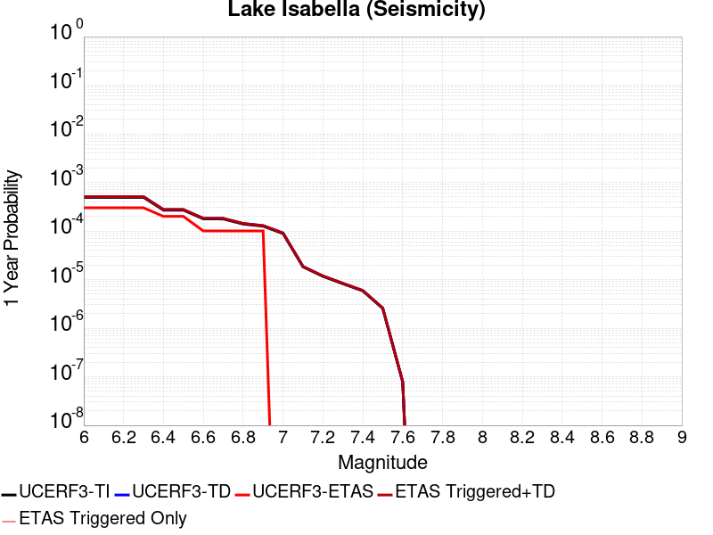 |  |

| Magnitude | 1 wk TI Prob | 1 wk TD Prob | 1 wk ETAS Prob | 1 wk ETAS/TD Gain | 1 wk ETAS Triggered+TD | 1 wk ETAS Triggered Only | 1 mo TI Prob | 1 mo TD Prob | 1 mo ETAS Prob | 1 mo ETAS/TD Gain | 1 mo ETAS Triggered+TD | 1 mo ETAS Triggered Only | 1 yr TI Prob | 1 yr TD Prob | 1 yr ETAS Prob | 1 yr ETAS/TD Gain | 1 yr ETAS Triggered+TD | 1 yr ETAS Triggered Only | 10 yr TI Prob | 10 yr TD Prob | 10 yr ETAS Prob | 10 yr ETAS/TD Gain | 10 yr ETAS Triggered+TD | 10 yr ETAS Triggered Only |
|-----|-----|-----|-----|-----|-----|-----|-----|-----|-----|-----|-----|-----|-----|-----|-----|-----|-----|-----|-----|-----|-----|-----|-----|-----|
| 6.0 | 9.431637E-6 | 9.738307E-6 | 0.0 | 0.0 | 9.738307E-6 | 0.0 | 4.0420677E-5 | 4.173501E-5 | 0.0 | 0.0 | 4.173501E-5 | 0.0 | 4.920106E-4 | 5.080183E-4 | 3.0E-4 | 0.59052986 | 5.080183E-4 | 0.0 | 0.004909227 | 0.0050698617 | 0.0026 | 0.5128345 | 0.0054678335 | 4.0E-4 |
| 6.1 | 9.431637E-6 | 9.738307E-6 | 0.0 | 0.0 | 9.738307E-6 | 0.0 | 4.0420677E-5 | 4.173501E-5 | 0.0 | 0.0 | 4.173501E-5 | 0.0 | 4.920106E-4 | 5.080183E-4 | 3.0E-4 | 0.59052986 | 5.080183E-4 | 0.0 | 0.004909227 | 0.0050698617 | 0.0026 | 0.5128345 | 0.0054678335 | 4.0E-4 |
| 6.2 | 9.431637E-6 | 9.738307E-6 | 0.0 | 0.0 | 9.738307E-6 | 0.0 | 4.0420677E-5 | 4.173501E-5 | 0.0 | 0.0 | 4.173501E-5 | 0.0 | 4.920106E-4 | 5.080183E-4 | 3.0E-4 | 0.59052986 | 5.080183E-4 | 0.0 | 0.004909227 | 0.0050698617 | 0.0026 | 0.5128345 | 0.0054678335 | 4.0E-4 |
| 6.3 | 9.431637E-6 | 9.738307E-6 | 0.0 | 0.0 | 9.738307E-6 | 0.0 | 4.0420677E-5 | 4.173501E-5 | 0.0 | 0.0 | 4.173501E-5 | 0.0 | 4.920106E-4 | 5.080183E-4 | 3.0E-4 | 0.59052986 | 5.080183E-4 | 0.0 | 0.004909227 | 0.0050698617 | 0.0026 | 0.5128345 | 0.0054678335 | 4.0E-4 |
| 6.4 | 5.144063E-6 | 5.2983974E-6 | 0.0 | 0.0 | 5.2983974E-6 | 0.0 | 2.2045799E-5 | 2.270724E-5 | 0.0 | 0.0 | 2.270724E-5 | 0.0 | 2.6837454E-4 | 2.7642903E-4 | 2.0E-4 | 0.72351307 | 2.7642903E-4 | 0.0 | 0.0026805066 | 0.002761192 | 0.0018 | 0.6518924 | 0.0029606395 | 2.0E-4 |
| 6.5 | 5.144063E-6 | 5.2983974E-6 | 0.0 | 0.0 | 5.2983974E-6 | 0.0 | 2.2045799E-5 | 2.270724E-5 | 0.0 | 0.0 | 2.270724E-5 | 0.0 | 2.6837454E-4 | 2.7642903E-4 | 2.0E-4 | 0.72351307 | 2.7642903E-4 | 0.0 | 0.0026805066 | 0.002761192 | 0.0018 | 0.6518924 | 0.0029606395 | 2.0E-4 |
| 6.6 | 3.4009804E-6 | 3.4977352E-6 | 0.0 | 0.0 | 3.4977352E-6 | 0.0 | 1.4575549E-5 | 1.4990216E-5 | 0.0 | 0.0 | 1.4990216E-5 | 0.0 | 1.7744285E-4 | 1.8249221E-4 | 1.0E-4 | 0.5479686 | 1.8249221E-4 | 0.0 | 0.0017730123 | 0.001823581 | 0.0014 | 0.76772016 | 0.0020232163 | 2.0E-4 |
| 6.7 | 3.3880428E-6 | 3.484604E-6 | 0.0 | 0.0 | 3.484604E-6 | 0.0 | 1.4520103E-5 | 1.493394E-5 | 0.0 | 0.0 | 1.493394E-5 | 0.0 | 1.767679E-4 | 1.8180716E-4 | 1.0E-4 | 0.55003333 | 1.8180716E-4 | 0.0 | 0.0017662736 | 0.0018167418 | 0.0014 | 0.77061033 | 0.0020163783 | 2.0E-4 |
| 6.8 | 2.6582E-6 | 2.7328892E-6 | 0.0 | 0.0 | 2.7328892E-6 | 0.0 | 1.1392236E-5 | 1.1712337E-5 | 0.0 | 0.0 | 1.1712337E-5 | 0.0 | 1.3869164E-4 | 1.4258972E-4 | 1.0E-4 | 0.70131284 | 1.4258972E-4 | 0.0 | 0.0013860512 | 0.0014251142 | 0.001 | 0.7016981 | 0.0015249718 | 1.0E-4 |
| 6.9 | 2.406011E-6 | 2.473595E-6 | 0.0 | 0.0 | 2.473595E-6 | 0.0 | 1.0311434E-5 | 1.0601086E-5 | 0.0 | 0.0 | 1.0601086E-5 | 0.0 | 1.2553448E-4 | 1.290619E-4 | 1.0E-4 | 0.77482206 | 1.290619E-4 | 0.0 | 0.0012546359 | 0.0012899989 | 9.0E-4 | 0.697675 | 0.00138987 | 1.0E-4 |
| 7.0 | 1.6953097E-6 | 1.7424256E-6 | 0.0 | 0.0 | 1.7424256E-6 | 0.0 | 7.265593E-6 | 7.4675227E-6 | 0.0 | 0.0 | 7.4675227E-6 | 0.0 | 8.8455E-5 | 9.091434E-5 | 0.0 | 0.0 | 9.091434E-5 | 0.0 | 8.84198E-4 | 9.088742E-4 | 6.0E-4 | 0.6601574 | 9.088742E-4 | 0.0 |
| 7.1 | 3.5013824E-7 | 3.5707356E-7 | 0.0 | 0.0 | 3.5707356E-7 | 0.0 | 1.5005916E-6 | 1.5303144E-6 | 0.0 | 0.0 | 1.5303144E-6 | 0.0 | 1.826955E-5 | 1.8631421E-5 | 0.0 | 0.0 | 1.8631421E-5 | 0.0 | 1.8268047E-4 | 1.8629884E-4 | 2.0E-4 | 1.0735439 | 1.8629884E-4 | 0.0 |
| 7.2 | 2.2321095E-7 | 2.2746003E-7 | 0.0 | 0.0 | 2.2746003E-7 | 0.0 | 9.56618E-7 | 9.748284E-7 | 0.0 | 0.0 | 9.748284E-7 | 0.0 | 1.1646762E-5 | 1.1868471E-5 | 0.0 | 0.0 | 1.1868471E-5 | 0.0 | 1.1646151E-4 | 1.1867848E-4 | 1.0E-4 | 0.84261274 | 1.1867848E-4 | 0.0 |
| 7.3 | 1.5760406E-7 | 1.6057724E-7 | 0.0 | 0.0 | 1.6057724E-7 | 0.0 | 6.7544585E-7 | 6.8818804E-7 | 0.0 | 0.0 | 6.8818804E-7 | 0.0 | 8.223522E-6 | 8.378658E-6 | 0.0 | 0.0 | 8.378658E-6 | 0.0 | 8.2232174E-5 | 8.378348E-5 | 1.0E-4 | 1.1935527 | 8.378348E-5 | 0.0 |
| 7.4 | 1.1216497E-7 | 1.1429416E-7 | 0.0 | 0.0 | 1.1429416E-7 | 0.0 | 4.8070694E-7 | 4.89832E-7 | 0.0 | 0.0 | 4.89832E-7 | 0.0 | 5.852591E-6 | 5.963689E-6 | 0.0 | 0.0 | 5.963689E-6 | 0.0 | 5.8524372E-5 | 5.9635335E-5 | 1.0E-4 | 1.6768582 | 5.9635335E-5 | 0.0 |
| 7.5 | 4.885185E-8 | 4.977778E-8 | 0.0 | 0.0 | 4.977778E-8 | 0.0 | 2.0936506E-7 | 2.1333332E-7 | 0.0 | 0.0 | 2.1333332E-7 | 0.0 | 2.5490165E-6 | 2.5973302E-6 | 0.0 | 0.0 | 2.5973302E-6 | 0.0 | 2.5489873E-5 | 2.5973017E-5 | 0.0 | 0.0 | 2.5973017E-5 | 0.0 |
| 7.6 | 1.504641E-9 | 1.5315017E-9 | 0.0 | 0.0 | 1.5315017E-9 | 0.0 | 6.4484613E-9 | 6.563579E-9 | 0.0 | 0.0 | 6.563579E-9 | 0.0 | 7.851001E-8 | 7.991157E-8 | 0.0 | 0.0 | 7.991157E-8 | 0.0 | 7.8509987E-7 | 7.9911575E-7 | 0.0 | 0.0 | 7.9911575E-7 | 0.0 |

## Tin Mountain
*[(top)](#table-of-contents)*

| 1 Week | 1 Month | 1 Year | 10 Year |
|-----|-----|-----|-----|
| 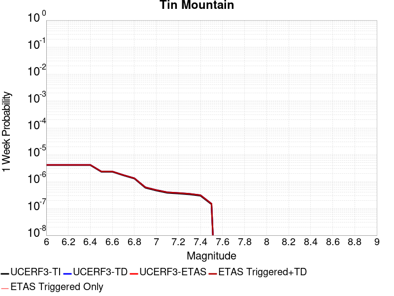 | 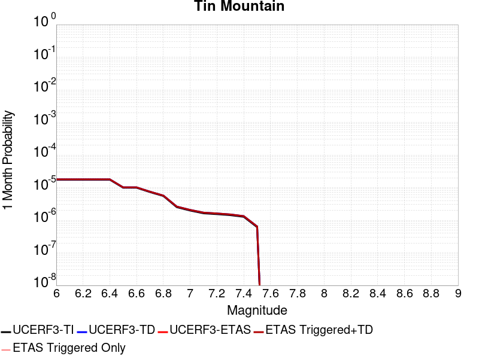 | 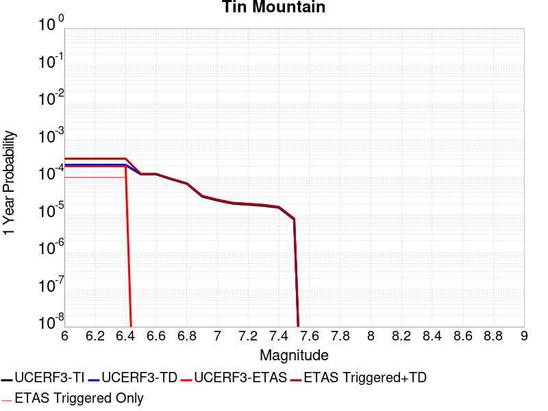 | 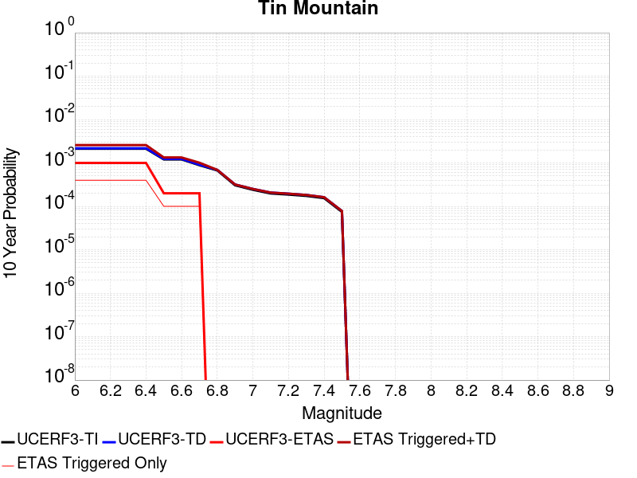 |

| Magnitude | 1 wk TI Prob | 1 wk TD Prob | 1 wk ETAS Prob | 1 wk ETAS/TD Gain | 1 wk ETAS Triggered+TD | 1 wk ETAS Triggered Only | 1 mo TI Prob | 1 mo TD Prob | 1 mo ETAS Prob | 1 mo ETAS/TD Gain | 1 mo ETAS Triggered+TD | 1 mo ETAS Triggered Only | 1 yr TI Prob | 1 yr TD Prob | 1 yr ETAS Prob | 1 yr ETAS/TD Gain | 1 yr ETAS Triggered+TD | 1 yr ETAS Triggered Only | 10 yr TI Prob | 10 yr TD Prob | 10 yr ETAS Prob | 10 yr ETAS/TD Gain | 10 yr ETAS Triggered+TD | 10 yr ETAS Triggered Only |
|-----|-----|-----|-----|-----|-----|-----|-----|-----|-----|-----|-----|-----|-----|-----|-----|-----|-----|-----|-----|-----|-----|-----|-----|-----|
| 6.0 | 4.083776E-6 | 4.1804883E-6 | 0.0 | 0.0 | 4.1804883E-6 | 0.0 | 1.750178E-5 | 1.7916278E-5 | 0.0 | 0.0 | 1.7916278E-5 | 0.0 | 2.1306332E-4 | 2.1811256E-4 | 2.0E-4 | 0.91695774 | 3.1809075E-4 | 1.0E-4 | 0.0021285915 | 0.0021793505 | 0.001 | 0.45885232 | 0.0025784788 | 4.0E-4 |
| 6.1 | 4.083776E-6 | 4.1804883E-6 | 0.0 | 0.0 | 4.1804883E-6 | 0.0 | 1.750178E-5 | 1.7916278E-5 | 0.0 | 0.0 | 1.7916278E-5 | 0.0 | 2.1306332E-4 | 2.1811256E-4 | 2.0E-4 | 0.91695774 | 3.1809075E-4 | 1.0E-4 | 0.0021285915 | 0.0021793505 | 0.001 | 0.45885232 | 0.0025784788 | 4.0E-4 |
| 6.2 | 4.083776E-6 | 4.1804883E-6 | 0.0 | 0.0 | 4.1804883E-6 | 0.0 | 1.750178E-5 | 1.7916278E-5 | 0.0 | 0.0 | 1.7916278E-5 | 0.0 | 2.1306332E-4 | 2.1811256E-4 | 2.0E-4 | 0.91695774 | 3.1809075E-4 | 1.0E-4 | 0.0021285915 | 0.0021793505 | 0.001 | 0.45885232 | 0.0025784788 | 4.0E-4 |
| 6.3 | 4.083776E-6 | 4.1804883E-6 | 0.0 | 0.0 | 4.1804883E-6 | 0.0 | 1.750178E-5 | 1.7916278E-5 | 0.0 | 0.0 | 1.7916278E-5 | 0.0 | 2.1306332E-4 | 2.1811256E-4 | 2.0E-4 | 0.91695774 | 3.1809075E-4 | 1.0E-4 | 0.0021285915 | 0.0021793505 | 0.001 | 0.45885232 | 0.0025784788 | 4.0E-4 |
| 6.4 | 4.083776E-6 | 4.1804883E-6 | 0.0 | 0.0 | 4.1804883E-6 | 0.0 | 1.750178E-5 | 1.7916278E-5 | 0.0 | 0.0 | 1.7916278E-5 | 0.0 | 2.1306332E-4 | 2.1811256E-4 | 2.0E-4 | 0.91695774 | 3.1809075E-4 | 1.0E-4 | 0.0021285915 | 0.0021793505 | 0.001 | 0.45885232 | 0.0025784788 | 4.0E-4 |
| 6.5 | 2.3143427E-6 | 2.3725247E-6 | 0.0 | 0.0 | 2.3725247E-6 | 0.0 | 9.9185745E-6 | 1.0167928E-5 | 0.0 | 0.0 | 1.0167928E-5 | 0.0 | 1.2075195E-4 | 1.2378825E-4 | 0.0 | 0.0 | 1.2378825E-4 | 0.0 | 0.0012068636 | 0.0012372689 | 2.0E-4 | 0.16164634 | 0.0013371452 | 1.0E-4 |
| 6.6 | 2.3143427E-6 | 2.3725247E-6 | 0.0 | 0.0 | 2.3725247E-6 | 0.0 | 9.9185745E-6 | 1.0167928E-5 | 0.0 | 0.0 | 1.0167928E-5 | 0.0 | 1.2075195E-4 | 1.2378825E-4 | 0.0 | 0.0 | 1.2378825E-4 | 0.0 | 0.0012068636 | 0.0012372689 | 2.0E-4 | 0.16164634 | 0.0013371452 | 1.0E-4 |
| 6.7 | 1.7029532E-6 | 1.7492865E-6 | 0.0 | 0.0 | 1.7492865E-6 | 0.0 | 7.2983503E-6 | 7.4969234E-6 | 0.0 | 0.0 | 7.4969234E-6 | 0.0 | 8.885379E-5 | 9.127176E-5 | 0.0 | 0.0 | 9.127176E-5 | 0.0 | 8.881827E-4 | 9.123953E-4 | 2.0E-4 | 0.21920323 | 0.0010123041 | 1.0E-4 |
| 6.8 | 1.2914646E-6 | 1.329522E-6 | 0.0 | 0.0 | 1.329522E-6 | 0.0 | 5.534837E-6 | 5.6979416E-6 | 0.0 | 0.0 | 5.6979416E-6 | 0.0 | 6.738455E-5 | 6.937067E-5 | 0.0 | 0.0 | 6.937067E-5 | 0.0 | 6.736412E-4 | 6.9353345E-4 | 0.0 | 0.0 | 6.9353345E-4 | 0.0 |
| 6.9 | 5.8708974E-7 | 6.114311E-7 | 0.0 | 0.0 | 6.114311E-7 | 0.0 | 2.5160964E-6 | 2.6204166E-6 | 0.0 | 0.0 | 2.6204166E-6 | 0.0 | 3.0633044E-5 | 3.190315E-5 | 0.0 | 0.0 | 3.190315E-5 | 0.0 | 3.0628822E-4 | 3.189898E-4 | 0.0 | 0.0 | 3.189898E-4 | 0.0 |
| 7.0 | 4.6248786E-7 | 4.829753E-7 | 0.0 | 0.0 | 4.829753E-7 | 0.0 | 1.9820893E-6 | 2.0698926E-6 | 0.0 | 0.0 | 2.0698926E-6 | 0.0 | 2.413167E-5 | 2.5200687E-5 | 0.0 | 0.0 | 2.5200687E-5 | 0.0 | 2.412905E-4 | 2.5198198E-4 | 0.0 | 0.0 | 2.5198198E-4 | 0.0 |
| 7.1 | 3.804606E-7 | 3.9851489E-7 | 0.0 | 0.0 | 3.9851489E-7 | 0.0 | 1.6305444E-6 | 1.70792E-6 | 0.0 | 0.0 | 1.70792E-6 | 0.0 | 1.9851697E-5 | 2.0793761E-5 | 0.0 | 0.0 | 2.0793761E-5 | 0.0 | 1.9849923E-4 | 2.0792152E-4 | 0.0 | 0.0 | 2.0792152E-4 | 0.0 |
| 7.2 | 3.5864858E-7 | 3.7597673E-7 | 0.0 | 0.0 | 3.7597673E-7 | 0.0 | 1.5370645E-6 | 1.611328E-6 | 0.0 | 0.0 | 1.611328E-6 | 0.0 | 1.87136E-5 | 1.9617775E-5 | 0.0 | 0.0 | 1.9617775E-5 | 0.0 | 1.8712023E-4 | 1.9616375E-4 | 0.0 | 0.0 | 1.9616375E-4 | 0.0 |
| 7.3 | 3.342063E-7 | 3.5045474E-7 | 0.0 | 0.0 | 3.5045474E-7 | 0.0 | 1.4323119E-6 | 1.5019482E-6 | 0.0 | 0.0 | 1.5019482E-6 | 0.0 | 1.7438259E-5 | 1.8286099E-5 | 0.0 | 0.0 | 1.8286099E-5 | 0.0 | 1.743689E-4 | 1.8284924E-4 | 0.0 | 0.0 | 1.8284924E-4 | 0.0 |
| 7.4 | 2.971242E-7 | 3.11499E-7 | 0.0 | 0.0 | 3.11499E-7 | 0.0 | 1.2733886E-6 | 1.3349952E-6 | 0.0 | 0.0 | 1.3349952E-6 | 0.0 | 1.5503398E-5 | 1.625348E-5 | 0.0 | 0.0 | 1.625348E-5 | 0.0 | 1.5502315E-4 | 1.6252618E-4 | 0.0 | 0.0 | 1.6252618E-4 | 0.0 |
| 7.5 | 1.4326713E-7 | 1.5005024E-7 | 0.0 | 0.0 | 1.5005024E-7 | 0.0 | 6.140018E-7 | 6.4307244E-7 | 0.0 | 0.0 | 6.4307244E-7 | 0.0 | 7.4754466E-6 | 7.829407E-6 | 0.0 | 0.0 | 7.829407E-6 | 0.0 | 7.475195E-5 | 7.829407E-5 | 0.0 | 0.0 | 7.829407E-5 | 0.0 |

## Fish Slough 2011 CFM
*[(top)](#table-of-contents)*

| 1 Week | 1 Month | 1 Year | 10 Year |
|-----|-----|-----|-----|
|  |  |  | 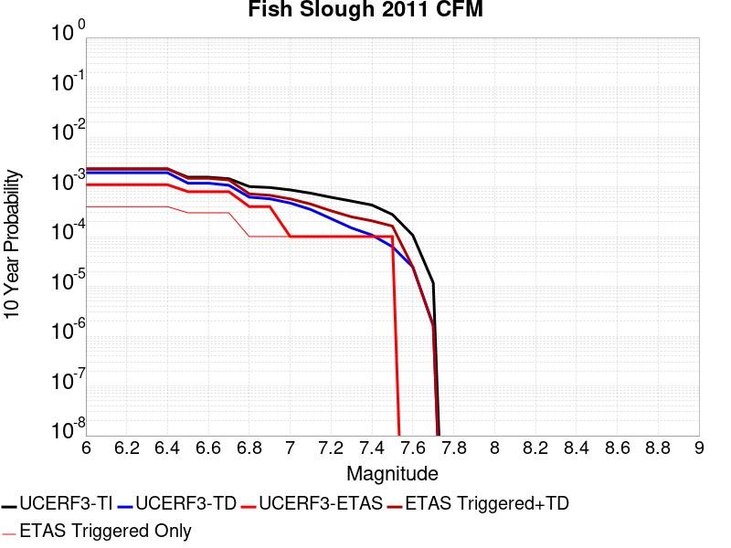 |

| Magnitude | 1 wk TI Prob | 1 wk TD Prob | 1 wk ETAS Prob | 1 wk ETAS/TD Gain | 1 wk ETAS Triggered+TD | 1 wk ETAS Triggered Only | 1 mo TI Prob | 1 mo TD Prob | 1 mo ETAS Prob | 1 mo ETAS/TD Gain | 1 mo ETAS Triggered+TD | 1 mo ETAS Triggered Only | 1 yr TI Prob | 1 yr TD Prob | 1 yr ETAS Prob | 1 yr ETAS/TD Gain | 1 yr ETAS Triggered+TD | 1 yr ETAS Triggered Only | 10 yr TI Prob | 10 yr TD Prob | 10 yr ETAS Prob | 10 yr ETAS/TD Gain | 10 yr ETAS Triggered+TD | 10 yr ETAS Triggered Only |
|-----|-----|-----|-----|-----|-----|-----|-----|-----|-----|-----|-----|-----|-----|-----|-----|-----|-----|-----|-----|-----|-----|-----|-----|-----|
| 6.0 | 4.3629925E-6 | 3.6746292E-6 | 0.0 | 0.0 | 3.6746292E-6 | 0.0 | 1.8698405E-5 | 1.5748328E-5 | 0.0 | 0.0 | 1.5748328E-5 | 0.0 | 2.276293E-4 | 1.9172113E-4 | 1.0E-4 | 0.5215909 | 2.9170196E-4 | 1.0E-4 | 0.0022739628 | 0.0019157663 | 0.0011 | 0.5741828 | 0.002315 | 4.0E-4 |
| 6.1 | 4.3629925E-6 | 3.6746292E-6 | 0.0 | 0.0 | 3.6746292E-6 | 0.0 | 1.8698405E-5 | 1.5748328E-5 | 0.0 | 0.0 | 1.5748328E-5 | 0.0 | 2.276293E-4 | 1.9172113E-4 | 1.0E-4 | 0.5215909 | 2.9170196E-4 | 1.0E-4 | 0.0022739628 | 0.0019157663 | 0.0011 | 0.5741828 | 0.002315 | 4.0E-4 |
| 6.2 | 4.3629925E-6 | 3.6746292E-6 | 0.0 | 0.0 | 3.6746292E-6 | 0.0 | 1.8698405E-5 | 1.5748328E-5 | 0.0 | 0.0 | 1.5748328E-5 | 0.0 | 2.276293E-4 | 1.9172113E-4 | 1.0E-4 | 0.5215909 | 2.9170196E-4 | 1.0E-4 | 0.0022739628 | 0.0019157663 | 0.0011 | 0.5741828 | 0.002315 | 4.0E-4 |
| 6.3 | 4.3629925E-6 | 3.6746292E-6 | 0.0 | 0.0 | 3.6746292E-6 | 0.0 | 1.8698405E-5 | 1.5748328E-5 | 0.0 | 0.0 | 1.5748328E-5 | 0.0 | 2.276293E-4 | 1.9172113E-4 | 1.0E-4 | 0.5215909 | 2.9170196E-4 | 1.0E-4 | 0.0022739628 | 0.0019157663 | 0.0011 | 0.5741828 | 0.002315 | 4.0E-4 |
| 6.4 | 4.3629925E-6 | 3.6746292E-6 | 0.0 | 0.0 | 3.6746292E-6 | 0.0 | 1.8698405E-5 | 1.5748328E-5 | 0.0 | 0.0 | 1.5748328E-5 | 0.0 | 2.276293E-4 | 1.9172113E-4 | 1.0E-4 | 0.5215909 | 2.9170196E-4 | 1.0E-4 | 0.0022739628 | 0.0019157663 | 0.0011 | 0.5741828 | 0.002315 | 4.0E-4 |
| 6.5 | 2.991715E-6 | 2.2681304E-6 | 0.0 | 0.0 | 2.2681304E-6 | 0.0 | 1.2821573E-5 | 9.7205275E-6 | 0.0 | 0.0 | 9.7205275E-6 | 0.0 | 1.5609147E-4 | 1.18341915E-4 | 1.0E-4 | 0.84500915 | 2.1833008E-4 | 1.0E-4 | 0.0015598187 | 0.0011828791 | 8.0E-4 | 0.67631596 | 0.0014825242 | 3.0E-4 |
| 6.6 | 2.991715E-6 | 2.2681304E-6 | 0.0 | 0.0 | 2.2681304E-6 | 0.0 | 1.2821573E-5 | 9.7205275E-6 | 0.0 | 0.0 | 9.7205275E-6 | 0.0 | 1.5609147E-4 | 1.18341915E-4 | 1.0E-4 | 0.84500915 | 2.1833008E-4 | 1.0E-4 | 0.0015598187 | 0.0011828791 | 8.0E-4 | 0.67631596 | 0.0014825242 | 3.0E-4 |
| 6.7 | 2.7890346E-6 | 2.059985E-6 | 0.0 | 0.0 | 2.059985E-6 | 0.0 | 1.1952951E-5 | 8.828483E-6 | 0.0 | 0.0 | 8.828483E-6 | 0.0 | 1.4551746E-4 | 1.07482374E-4 | 1.0E-4 | 0.9303851 | 2.0747163E-4 | 1.0E-4 | 0.0014542221 | 0.0010743921 | 8.0E-4 | 0.7446071 | 0.0013740698 | 3.0E-4 |
| 6.8 | 1.9416723E-6 | 1.1905935E-6 | 0.0 | 0.0 | 1.1905935E-6 | 0.0 | 8.321425E-6 | 5.102534E-6 | 0.0 | 0.0 | 5.102534E-6 | 0.0 | 1.01308644E-4 | 6.212162E-5 | 0.0 | 0.0 | 6.212162E-5 | 0.0 | 0.0010126247 | 6.2104664E-4 | 4.0E-4 | 0.644074 | 7.2098454E-4 | 1.0E-4 |
| 6.9 | 1.8567416E-6 | 1.1027666E-6 | 0.0 | 0.0 | 1.1027666E-6 | 0.0 | 7.957439E-6 | 4.7261346E-6 | 0.0 | 0.0 | 4.7261346E-6 | 0.0 | 9.687752E-5 | 5.7539208E-5 | 0.0 | 0.0 | 5.7539208E-5 | 0.0 | 9.6835295E-4 | 5.75247E-4 | 4.0E-4 | 0.6953535 | 6.751894E-4 | 1.0E-4 |
| 7.0 | 1.6634067E-6 | 9.0554016E-7 | 0.0 | 0.0 | 9.0554016E-7 | 0.0 | 7.1288664E-6 | 3.8808807E-6 | 0.0 | 0.0 | 3.8808807E-6 | 0.0 | 8.679049E-5 | 4.724873E-5 | 0.0 | 0.0 | 4.724873E-5 | 0.0 | 8.6756604E-4 | 4.7238971E-4 | 1.0E-4 | 0.21168962 | 5.723425E-4 | 1.0E-4 |
| 7.1 | 1.4281054E-6 | 6.7193105E-7 | 0.0 | 0.0 | 6.7193105E-7 | 0.0 | 6.1204373E-6 | 2.8797012E-6 | 0.0 | 0.0 | 2.8797012E-6 | 0.0 | 7.451377E-5 | 3.5059817E-5 | 0.0 | 0.0 | 3.5059817E-5 | 0.0 | 7.44888E-4 | 3.5054464E-4 | 1.0E-4 | 0.28527036 | 4.505096E-4 | 1.0E-4 |
| 7.2 | 1.1810387E-6 | 4.3926684E-7 | 0.0 | 0.0 | 4.3926684E-7 | 0.0 | 5.0615845E-6 | 1.8825709E-6 | 0.0 | 0.0 | 1.8825709E-6 | 0.0 | 6.1623046E-5 | 2.2920069E-5 | 0.0 | 0.0 | 2.2920069E-5 | 0.0 | 6.160596E-4 | 2.2917794E-4 | 1.0E-4 | 0.43634215 | 3.2915504E-4 | 1.0E-4 |
| 7.3 | 9.918052E-7 | 2.8591708E-7 | 0.0 | 0.0 | 2.8591708E-7 | 0.0 | 4.2505867E-6 | 1.2253583E-6 | 0.0 | 0.0 | 1.2253583E-6 | 0.0 | 5.1749663E-5 | 1.4918637E-5 | 0.0 | 0.0 | 1.4918637E-5 | 0.0 | 5.173762E-4 | 1.4917647E-4 | 1.0E-4 | 0.67034703 | 2.4916156E-4 | 1.0E-4 |
| 7.4 | 8.25252E-7 | 2.057333E-7 | 0.0 | 0.0 | 2.057333E-7 | 0.0 | 3.5367896E-6 | 8.8171385E-7 | 0.0 | 0.0 | 8.8171385E-7 | 0.0 | 4.3059565E-5 | 1.0734814E-5 | 0.0 | 0.0 | 1.0734814E-5 | 0.0 | 4.305122E-4 | 1.07343025E-4 | 1.0E-4 | 0.93159294 | 2.0733228E-4 | 1.0E-4 |
| 7.5 | 5.3248567E-7 | 1.1988566E-7 | 0.0 | 0.0 | 1.1988566E-7 | 0.0 | 2.2820795E-6 | 5.1379556E-7 | 0.0 | 0.0 | 5.1379556E-7 | 0.0 | 2.7783964E-5 | 6.255443E-6 | 0.0 | 0.0 | 6.255443E-6 | 0.0 | 2.778049E-4 | 6.255271E-5 | 1.0E-4 | 1.5986516 | 1.6254645E-4 | 1.0E-4 |
| 7.6 | 2.037542E-7 | 4.678543E-8 | 0.0 | 0.0 | 4.678543E-8 | 0.0 | 8.73232E-7 | 2.0050898E-7 | 0.0 | 0.0 | 2.0050898E-7 | 0.0 | 1.0631547E-5 | 2.4411943E-6 | 0.0 | 0.0 | 2.4411943E-6 | 0.0 | 1.0631039E-4 | 2.4411696E-5 | 0.0 | 0.0 | 2.4411696E-5 | 0.0 |
| 7.7 | 2.2501226E-8 | 3.124149E-9 | 0.0 | 0.0 | 3.124149E-9 | 0.0 | 9.6433816E-8 | 1.3389211E-8 | 0.0 | 0.0 | 1.3389211E-8 | 0.0 | 1.1740811E-6 | 1.6301362E-7 | 0.0 | 0.0 | 1.6301362E-7 | 0.0 | 1.1740749E-5 | 1.6301352E-6 | 0.0 | 0.0 | 1.6301352E-6 | 0.0 |

## North Salt Lake
*[(top)](#table-of-contents)*

| 1 Week | 1 Month | 1 Year | 10 Year |
|-----|-----|-----|-----|
| 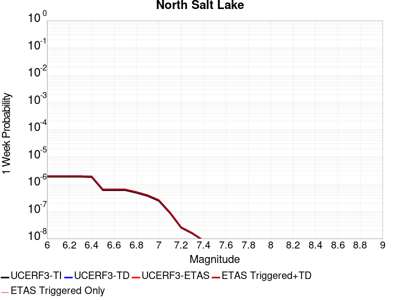 |  | 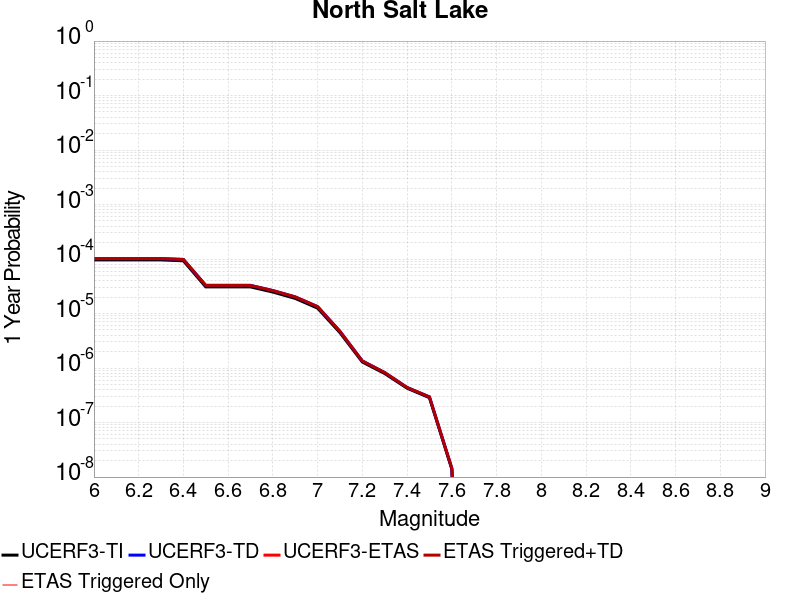 | 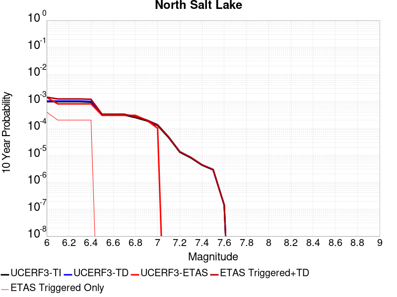 |

| Magnitude | 1 wk TI Prob | 1 wk TD Prob | 1 wk ETAS Prob | 1 wk ETAS/TD Gain | 1 wk ETAS Triggered+TD | 1 wk ETAS Triggered Only | 1 mo TI Prob | 1 mo TD Prob | 1 mo ETAS Prob | 1 mo ETAS/TD Gain | 1 mo ETAS Triggered+TD | 1 mo ETAS Triggered Only | 1 yr TI Prob | 1 yr TD Prob | 1 yr ETAS Prob | 1 yr ETAS/TD Gain | 1 yr ETAS Triggered+TD | 1 yr ETAS Triggered Only | 10 yr TI Prob | 10 yr TD Prob | 10 yr ETAS Prob | 10 yr ETAS/TD Gain | 10 yr ETAS Triggered+TD | 10 yr ETAS Triggered Only |
|-----|-----|-----|-----|-----|-----|-----|-----|-----|-----|-----|-----|-----|-----|-----|-----|-----|-----|-----|-----|-----|-----|-----|-----|-----|
| 6.0 | 1.849599E-6 | 1.9543972E-6 | 0.0 | 0.0 | 1.9543972E-6 | 0.0 | 7.926829E-6 | 8.375973E-6 | 0.0 | 0.0 | 8.375973E-6 | 0.0 | 9.650487E-5 | 1.01974714E-4 | 0.0 | 0.0 | 1.01974714E-4 | 0.0 | 9.646297E-4 | 0.0010194768 | 0.0014 | 1.3732535 | 0.001419069 | 4.0E-4 |
| 6.1 | 1.849599E-6 | 1.9543972E-6 | 0.0 | 0.0 | 1.9543972E-6 | 0.0 | 7.926829E-6 | 8.375973E-6 | 0.0 | 0.0 | 8.375973E-6 | 0.0 | 9.650487E-5 | 1.01974714E-4 | 0.0 | 0.0 | 1.01974714E-4 | 0.0 | 9.646297E-4 | 0.0010194768 | 8.0E-4 | 0.78471625 | 0.0012192728 | 2.0E-4 |
| 6.2 | 1.849599E-6 | 1.9543972E-6 | 0.0 | 0.0 | 1.9543972E-6 | 0.0 | 7.926829E-6 | 8.375973E-6 | 0.0 | 0.0 | 8.375973E-6 | 0.0 | 9.650487E-5 | 1.01974714E-4 | 0.0 | 0.0 | 1.01974714E-4 | 0.0 | 9.646297E-4 | 0.0010194768 | 8.0E-4 | 0.78471625 | 0.0012192728 | 2.0E-4 |
| 6.3 | 1.849599E-6 | 1.9543972E-6 | 0.0 | 0.0 | 1.9543972E-6 | 0.0 | 7.926829E-6 | 8.375973E-6 | 0.0 | 0.0 | 8.375973E-6 | 0.0 | 9.650487E-5 | 1.01974714E-4 | 0.0 | 0.0 | 1.01974714E-4 | 0.0 | 9.646297E-4 | 0.0010194768 | 8.0E-4 | 0.78471625 | 0.0012192728 | 2.0E-4 |
| 6.4 | 1.7803909E-6 | 1.8849003E-6 | 0.0 | 0.0 | 1.8849003E-6 | 0.0 | 7.630225E-6 | 8.07813E-6 | 0.0 | 0.0 | 8.07813E-6 | 0.0 | 9.289402E-5 | 9.8348806E-5 | 0.0 | 0.0 | 9.8348806E-5 | 0.0 | 9.28552E-4 | 9.832497E-4 | 8.0E-4 | 0.81362844 | 0.0011830531 | 2.0E-4 |
| 6.5 | 5.9157696E-7 | 6.2958924E-7 | 0.0 | 0.0 | 6.2958924E-7 | 0.0 | 2.5353274E-6 | 2.698237E-6 | 0.0 | 0.0 | 2.698237E-6 | 0.0 | 3.0867173E-5 | 3.285058E-5 | 0.0 | 0.0 | 3.285058E-5 | 0.0 | 3.0862886E-4 | 3.2846117E-4 | 3.0E-4 | 0.91335 | 3.2846117E-4 | 0.0 |
| 6.6 | 5.9157696E-7 | 6.2958924E-7 | 0.0 | 0.0 | 6.2958924E-7 | 0.0 | 2.5353274E-6 | 2.698237E-6 | 0.0 | 0.0 | 2.698237E-6 | 0.0 | 3.0867173E-5 | 3.285058E-5 | 0.0 | 0.0 | 3.285058E-5 | 0.0 | 3.0862886E-4 | 3.2846117E-4 | 3.0E-4 | 0.91335 | 3.2846117E-4 | 0.0 |
| 6.7 | 5.9157696E-7 | 6.2958924E-7 | 0.0 | 0.0 | 6.2958924E-7 | 0.0 | 2.5353274E-6 | 2.698237E-6 | 0.0 | 0.0 | 2.698237E-6 | 0.0 | 3.0867173E-5 | 3.285058E-5 | 0.0 | 0.0 | 3.285058E-5 | 0.0 | 3.0862886E-4 | 3.2846117E-4 | 3.0E-4 | 0.91335 | 3.2846117E-4 | 0.0 |
| 6.8 | 4.7536267E-7 | 5.06253E-7 | 0.0 | 0.0 | 5.06253E-7 | 0.0 | 2.037267E-6 | 2.169654E-6 | 0.0 | 0.0 | 2.169654E-6 | 0.0 | 2.4803443E-5 | 2.6415242E-5 | 0.0 | 0.0 | 2.6415242E-5 | 0.0 | 2.4800675E-4 | 2.6412346E-4 | 3.0E-4 | 1.1358324 | 2.6412346E-4 | 0.0 |
| 6.9 | 3.6345344E-7 | 3.872318E-7 | 0.0 | 0.0 | 3.872318E-7 | 0.0 | 1.5576567E-6 | 1.659564E-6 | 0.0 | 0.0 | 1.659564E-6 | 0.0 | 1.8964305E-5 | 2.0205021E-5 | 0.0 | 0.0 | 2.0205021E-5 | 0.0 | 1.8962687E-4 | 2.0203354E-4 | 2.0E-4 | 0.9899347 | 2.0203354E-4 | 0.0 |
| 7.0 | 2.4087325E-7 | 2.5691207E-7 | 0.0 | 0.0 | 2.5691207E-7 | 0.0 | 1.0323135E-6 | 1.1010513E-6 | 0.0 | 0.0 | 1.1010513E-6 | 0.0 | 1.25683455E-5 | 1.3405231E-5 | 0.0 | 0.0 | 1.3405231E-5 | 0.0 | 1.2567634E-4 | 1.3404548E-4 | 1.0E-4 | 0.7460154 | 1.3404548E-4 | 0.0 |
| 7.1 | 8.551555E-8 | 9.03901E-8 | 0.0 | 0.0 | 9.03901E-8 | 0.0 | 3.6649516E-7 | 3.873861E-7 | 0.0 | 0.0 | 3.873861E-7 | 0.0 | 4.4620692E-6 | 4.7164167E-6 | 0.0 | 0.0 | 4.7164167E-6 | 0.0 | 4.46198E-5 | 4.7163285E-5 | 0.0 | 0.0 | 4.7163285E-5 | 0.0 |
| 7.2 | 2.475279E-8 | 2.5880656E-8 | 0.0 | 0.0 | 2.5880656E-8 | 0.0 | 1.0608338E-7 | 1.10917085E-7 | 0.0 | 0.0 | 1.10917085E-7 | 0.0 | 1.2915643E-6 | 1.3504148E-6 | 0.0 | 0.0 | 1.3504148E-6 | 0.0 | 1.2915569E-5 | 1.3504072E-5 | 0.0 | 0.0 | 1.3504072E-5 | 0.0 |
| 7.3 | 1.5212393E-8 | 1.584054E-8 | 0.0 | 0.0 | 1.584054E-8 | 0.0 | 6.519597E-8 | 6.7888024E-8 | 0.0 | 0.0 | 6.7888024E-8 | 0.0 | 7.9376065E-7 | 8.265364E-7 | 0.0 | 0.0 | 8.265364E-7 | 0.0 | 7.937579E-6 | 8.265336E-6 | 0.0 | 0.0 | 8.265336E-6 | 0.0 |
| 7.4 | 8.182E-9 | 8.44443E-9 | 0.0 | 0.0 | 8.44443E-9 | 0.0 | 3.5065714E-8 | 3.6190414E-8 | 0.0 | 0.0 | 3.6190414E-8 | 0.0 | 4.26925E-7 | 4.4061818E-7 | 0.0 | 0.0 | 4.4061818E-7 | 0.0 | 4.269242E-6 | 4.4061735E-6 | 0.0 | 0.0 | 4.4061735E-6 | 0.0 |
| 7.5 | 5.479913E-9 | 5.666009E-9 | 0.0 | 0.0 | 5.666009E-9 | 0.0 | 2.3485342E-8 | 2.4282897E-8 | 0.0 | 0.0 | 2.4282897E-8 | 0.0 | 2.85934E-7 | 2.9564424E-7 | 0.0 | 0.0 | 2.9564424E-7 | 0.0 | 2.8593363E-6 | 2.956439E-6 | 0.0 | 0.0 | 2.956439E-6 | 0.0 |
| 7.6 | 2.6813562E-10 | 2.7722025E-10 | 0.0 | 0.0 | 2.7722025E-10 | 0.0 | 1.1491527E-9 | 1.1880862E-9 | 0.0 | 0.0 | 1.1880862E-9 | 0.0 | 1.3990933E-8 | 1.446495E-8 | 0.0 | 0.0 | 1.446495E-8 | 0.0 | 1.3990932E-7 | 1.4464949E-7 | 0.0 | 0.0 | 1.4464949E-7 | 0.0 |

## Butano 2011 CFM
*[(top)](#table-of-contents)*

| 1 Week | 1 Month | 1 Year | 10 Year |
|-----|-----|-----|-----|
|  |  |  |  |

| Magnitude | 1 wk TI Prob | 1 wk TD Prob | 1 wk ETAS Prob | 1 wk ETAS/TD Gain | 1 wk ETAS Triggered+TD | 1 wk ETAS Triggered Only | 1 mo TI Prob | 1 mo TD Prob | 1 mo ETAS Prob | 1 mo ETAS/TD Gain | 1 mo ETAS Triggered+TD | 1 mo ETAS Triggered Only | 1 yr TI Prob | 1 yr TD Prob | 1 yr ETAS Prob | 1 yr ETAS/TD Gain | 1 yr ETAS Triggered+TD | 1 yr ETAS Triggered Only | 10 yr TI Prob | 10 yr TD Prob | 10 yr ETAS Prob | 10 yr ETAS/TD Gain | 10 yr ETAS Triggered+TD | 10 yr ETAS Triggered Only |
|-----|-----|-----|-----|-----|-----|-----|-----|-----|-----|-----|-----|-----|-----|-----|-----|-----|-----|-----|-----|-----|-----|-----|-----|-----|
| 6.0 | 9.561135E-6 | 6.1362093E-6 | 0.0 | 0.0 | 6.1362093E-6 | 0.0 | 4.097565E-5 | 2.6297786E-5 | 0.0 | 0.0 | 2.6297786E-5 | 0.0 | 4.9876433E-4 | 3.201307E-4 | 2.0E-4 | 0.62474483 | 3.201307E-4 | 0.0 | 0.004976464 | 0.0032140645 | 0.0022 | 0.6844916 | 0.0036127788 | 4.0E-4 |
| 6.1 | 9.561135E-6 | 6.1362093E-6 | 0.0 | 0.0 | 6.1362093E-6 | 0.0 | 4.097565E-5 | 2.6297786E-5 | 0.0 | 0.0 | 2.6297786E-5 | 0.0 | 4.9876433E-4 | 3.201307E-4 | 2.0E-4 | 0.62474483 | 3.201307E-4 | 0.0 | 0.004976464 | 0.0032140645 | 0.0022 | 0.6844916 | 0.0036127788 | 4.0E-4 |
| 6.2 | 8.364741E-6 | 4.8898437E-6 | 0.0 | 0.0 | 4.8898437E-6 | 0.0 | 3.5848396E-5 | 2.0956313E-5 | 0.0 | 0.0 | 2.0956313E-5 | 0.0 | 4.3636683E-4 | 2.551148E-4 | 1.0E-4 | 0.39198035 | 2.551148E-4 | 0.0 | 0.0043551093 | 0.0025655364 | 0.0018 | 0.70160764 | 0.0028647669 | 3.0E-4 |
| 6.3 | 8.364741E-6 | 4.8898437E-6 | 0.0 | 0.0 | 4.8898437E-6 | 0.0 | 3.5848396E-5 | 2.0956313E-5 | 0.0 | 0.0 | 2.0956313E-5 | 0.0 | 4.3636683E-4 | 2.551148E-4 | 1.0E-4 | 0.39198035 | 2.551148E-4 | 0.0 | 0.0043551093 | 0.0025655364 | 0.0018 | 0.70160764 | 0.0028647669 | 3.0E-4 |
| 6.4 | 7.768282E-6 | 4.26807E-6 | 0.0 | 0.0 | 4.26807E-6 | 0.0 | 3.329221E-5 | 1.8291608E-5 | 0.0 | 0.0 | 1.8291608E-5 | 0.0 | 4.0525728E-4 | 2.2267894E-4 | 1.0E-4 | 0.44907707 | 2.2267894E-4 | 0.0 | 0.0040451903 | 0.0022418597 | 0.0014 | 0.62448156 | 0.0025411872 | 3.0E-4 |
| 6.5 | 7.673437E-6 | 4.167695E-6 | 0.0 | 0.0 | 4.167695E-6 | 0.0 | 3.2885746E-5 | 1.7861435E-5 | 0.0 | 0.0 | 1.7861435E-5 | 0.0 | 4.0031038E-4 | 2.1744262E-4 | 1.0E-4 | 0.45989144 | 2.1744262E-4 | 0.0 | 0.0039959005 | 0.0021896 | 0.0014 | 0.63938624 | 0.002488943 | 3.0E-4 |
| 6.6 | 7.5244197E-6 | 4.012763E-6 | 0.0 | 0.0 | 4.012763E-6 | 0.0 | 3.2247113E-5 | 1.719745E-5 | 0.0 | 0.0 | 1.719745E-5 | 0.0 | 3.9253788E-4 | 2.0936017E-4 | 1.0E-4 | 0.47764578 | 2.0936017E-4 | 0.0 | 0.003918452 | 0.0021089306 | 0.0013 | 0.61642617 | 0.002408298 | 3.0E-4 |
| 6.7 | 6.4921405E-6 | 2.9537437E-6 | 0.0 | 0.0 | 2.9537437E-6 | 0.0 | 2.7823162E-5 | 1.265884E-5 | 0.0 | 0.0 | 1.265884E-5 | 0.0 | 3.3869434E-4 | 1.5411056E-4 | 0.0 | 0.0 | 1.5411056E-4 | 0.0 | 0.003381786 | 0.0015572244 | 4.0E-4 | 0.2568673 | 0.001756913 | 2.0E-4 |
| 6.8 | 6.2890294E-6 | 2.740695E-6 | 0.0 | 0.0 | 2.740695E-6 | 0.0 | 2.6952705E-5 | 1.1745782E-5 | 0.0 | 0.0 | 1.1745782E-5 | 0.0 | 3.2809976E-4 | 1.4299559E-4 | 0.0 | 0.0 | 1.4299559E-4 | 0.0 | 0.0032761577 | 0.0014462244 | 4.0E-4 | 0.27658224 | 0.0016459351 | 2.0E-4 |
| 6.9 | 6.0965517E-6 | 2.54747E-6 | 0.0 | 0.0 | 2.54747E-6 | 0.0 | 2.6127816E-5 | 1.0917683E-5 | 0.0 | 0.0 | 1.0917683E-5 | 0.0 | 3.1805973E-4 | 1.3291475E-4 | 0.0 | 0.0 | 1.3291475E-4 | 0.0 | 0.0031760489 | 0.0013455414 | 4.0E-4 | 0.29727808 | 0.0015452724 | 2.0E-4 |
| 7.0 | 5.566252E-6 | 2.0657963E-6 | 0.0 | 0.0 | 2.0657963E-6 | 0.0 | 2.3855147E-5 | 8.8533825E-6 | 0.0 | 0.0 | 8.8533825E-6 | 0.0 | 2.9039773E-4 | 1.0778464E-4 | 0.0 | 0.0 | 1.0778464E-4 | 0.0 | 0.0029001853 | 0.0010945101 | 3.0E-4 | 0.27409524 | 0.0012942912 | 2.0E-4 |
| 7.1 | 3.878588E-6 | 1.5327756E-6 | 0.0 | 0.0 | 1.5327756E-6 | 0.0 | 1.6622414E-5 | 6.5690215E-6 | 0.0 | 0.0 | 6.5690215E-6 | 0.0 | 2.023591E-4 | 7.99749E-5 | 0.0 | 0.0 | 7.99749E-5 | 0.0 | 0.0020217493 | 8.163018E-4 | 1.0E-4 | 0.12250371 | 8.163018E-4 | 0.0 |
| 7.2 | 3.7038085E-6 | 1.4150893E-6 | 0.0 | 0.0 | 1.4150893E-6 | 0.0 | 1.587337E-5 | 6.064654E-6 | 0.0 | 0.0 | 6.064654E-6 | 0.0 | 1.9324113E-4 | 7.3834664E-5 | 0.0 | 0.0 | 7.3834664E-5 | 0.0 | 0.0019307317 | 7.5491285E-4 | 1.0E-4 | 0.13246563 | 7.5491285E-4 | 0.0 |
| 7.3 | 3.5277278E-6 | 1.3243301E-6 | 0.0 | 0.0 | 1.3243301E-6 | 0.0 | 1.5118746E-5 | 5.675688E-6 | 0.0 | 0.0 | 5.675688E-6 | 0.0 | 1.8405518E-4 | 6.909931E-5 | 0.0 | 0.0 | 6.909931E-5 | 0.0 | 0.0018390282 | 7.075099E-4 | 1.0E-4 | 0.14134078 | 7.075099E-4 | 0.0 |
| 7.4 | 3.3711294E-6 | 1.2629802E-6 | 0.0 | 0.0 | 1.2629802E-6 | 0.0 | 1.4447617E-5 | 5.412761E-6 | 0.0 | 0.0 | 5.412761E-6 | 0.0 | 1.7588554E-4 | 6.589837E-5 | 0.0 | 0.0 | 6.589837E-5 | 0.0 | 0.0017574639 | 6.754714E-4 | 1.0E-4 | 0.14804476 | 6.754714E-4 | 0.0 |
| 7.5 | 3.0496426E-6 | 1.1556441E-6 | 0.0 | 0.0 | 1.1556441E-6 | 0.0 | 1.3069831E-5 | 4.952751E-6 | 0.0 | 0.0 | 4.952751E-6 | 0.0 | 1.5911358E-4 | 6.0298076E-5 | 0.0 | 0.0 | 6.0298076E-5 | 0.0 | 0.001589997 | 6.194358E-4 | 1.0E-4 | 0.16143723 | 6.194358E-4 | 0.0 |
| 7.6 | 2.2179781E-6 | 8.339079E-7 | 0.0 | 0.0 | 8.339079E-7 | 0.0 | 9.505586E-6 | 3.573886E-6 | 0.0 | 0.0 | 3.573886E-6 | 0.0 | 1.1572436E-4 | 4.3511194E-5 | 0.0 | 0.0 | 4.3511194E-5 | 0.0 | 0.0011566412 | 4.515447E-4 | 0.0 | 0.0 | 4.515447E-4 | 0.0 |
| 7.7 | 1.7519328E-6 | 6.46127E-7 | 0.0 | 0.0 | 6.46127E-7 | 0.0 | 7.508262E-6 | 2.7691128E-6 | 0.0 | 0.0 | 2.7691128E-6 | 0.0 | 9.140925E-5 | 3.3713426E-5 | 0.0 | 0.0 | 3.3713426E-5 | 0.0 | 9.137166E-4 | 3.5289623E-4 | 0.0 | 0.0 | 3.5289623E-4 | 0.0 |
| 7.8 | 1.1478974E-6 | 5.74737E-7 | 0.0 | 0.0 | 5.74737E-7 | 0.0 | 4.9195505E-6 | 2.4631563E-6 | 0.0 | 0.0 | 2.4631563E-6 | 0.0 | 5.9893882E-5 | 2.9988514E-5 | 0.0 | 0.0 | 2.9988514E-5 | 0.0 | 5.9877743E-4 | 3.153512E-4 | 0.0 | 0.0 | 3.153512E-4 | 0.0 |
| 7.9 | 6.1154634E-7 | 5.212373E-7 | 0.0 | 0.0 | 5.212373E-7 | 0.0 | 2.6209104E-6 | 2.2338725E-6 | 0.0 | 0.0 | 2.2338725E-6 | 0.0 | 3.1909116E-5 | 2.7197057E-5 | 0.0 | 0.0 | 2.7197057E-5 | 0.0 | 3.1904536E-4 | 2.8628347E-4 | 0.0 | 0.0 | 2.8628347E-4 | 0.0 |
| 8.0 | 4.6520046E-7 | 4.853142E-7 | 0.0 | 0.0 | 4.853142E-7 | 0.0 | 1.9937147E-6 | 2.0799166E-6 | 0.0 | 0.0 | 2.0799166E-6 | 0.0 | 2.4273206E-5 | 2.532269E-5 | 0.0 | 0.0 | 2.532269E-5 | 0.0 | 2.4270554E-4 | 2.6660808E-4 | 0.0 | 0.0 | 2.6660808E-4 | 0.0 |
| 8.1 | 2.8425194E-7 | 2.8649276E-7 | 0.0 | 0.0 | 2.8649276E-7 | 0.0 | 1.218222E-6 | 1.2278256E-6 | 0.0 | 0.0 | 1.2278256E-6 | 0.0 | 1.4831752E-5 | 1.4948673E-5 | 0.0 | 0.0 | 1.4948673E-5 | 0.0 | 1.4830762E-4 | 1.5729504E-4 | 0.0 | 0.0 | 1.5729504E-4 | 0.0 |
| 8.2 | 5.585778E-8 | 3.733322E-8 | 0.0 | 0.0 | 3.733322E-8 | 0.0 | 2.3939046E-7 | 1.5999952E-7 | 0.0 | 0.0 | 1.5999952E-7 | 0.0 | 2.914575E-6 | 1.9479924E-6 | 0.0 | 0.0 | 1.9479924E-6 | 0.0 | 2.9145367E-5 | 2.1251977E-5 | 0.0 | 0.0 | 2.1251977E-5 | 0.0 |
| 8.3 | 1.0371215E-10 | 4.8450688E-11 | 0.0 | 0.0 | 4.8450688E-11 | 0.0 | 4.4448079E-10 | 2.0764612E-10 | 0.0 | 0.0 | 2.0764612E-10 | 0.0 | 5.4115543E-9 | 2.528091E-9 | 0.0 | 0.0 | 2.528091E-9 | 0.0 | 5.4115542E-8 | 2.9267524E-8 | 0.0 | 0.0 | 2.9267524E-8 | 0.0 |

## Holser alt 1
*[(top)](#table-of-contents)*

| 1 Week | 1 Month | 1 Year | 10 Year |
|-----|-----|-----|-----|
| 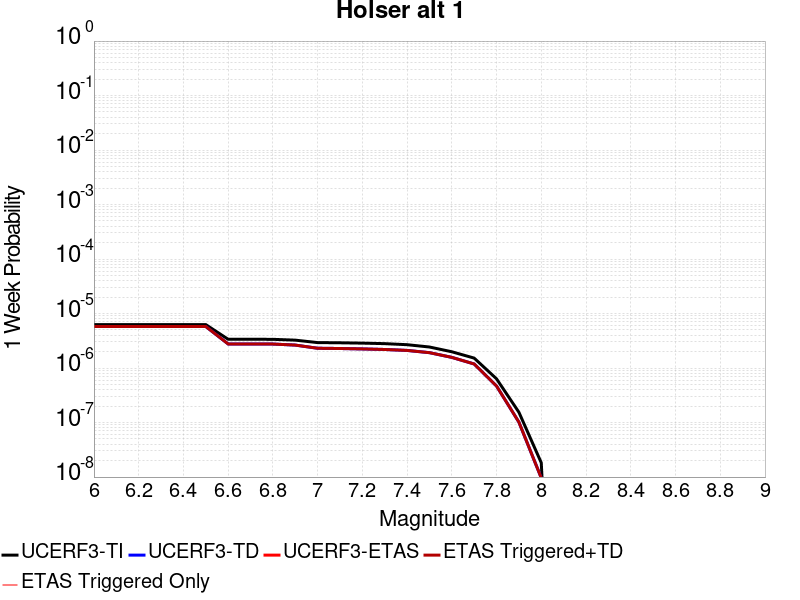 |  |  |  |

| Magnitude | 1 wk TI Prob | 1 wk TD Prob | 1 wk ETAS Prob | 1 wk ETAS/TD Gain | 1 wk ETAS Triggered+TD | 1 wk ETAS Triggered Only | 1 mo TI Prob | 1 mo TD Prob | 1 mo ETAS Prob | 1 mo ETAS/TD Gain | 1 mo ETAS Triggered+TD | 1 mo ETAS Triggered Only | 1 yr TI Prob | 1 yr TD Prob | 1 yr ETAS Prob | 1 yr ETAS/TD Gain | 1 yr ETAS Triggered+TD | 1 yr ETAS Triggered Only | 10 yr TI Prob | 10 yr TD Prob | 10 yr ETAS Prob | 10 yr ETAS/TD Gain | 10 yr ETAS Triggered+TD | 10 yr ETAS Triggered Only |
|-----|-----|-----|-----|-----|-----|-----|-----|-----|-----|-----|-----|-----|-----|-----|-----|-----|-----|-----|-----|-----|-----|-----|-----|-----|
| 6.0 | 6.2746653E-6 | 5.785281E-6 | 0.0 | 0.0 | 5.785281E-6 | 0.0 | 2.6891146E-5 | 2.479389E-5 | 0.0 | 0.0 | 2.479389E-5 | 0.0 | 3.273505E-4 | 3.0183533E-4 | 2.0E-4 | 0.662613 | 3.0183533E-4 | 0.0 | 0.0032686873 | 0.0030153857 | 0.0023 | 0.76275486 | 0.0034141794 | 4.0E-4 |
| 6.1 | 6.2746653E-6 | 5.785281E-6 | 0.0 | 0.0 | 5.785281E-6 | 0.0 | 2.6891146E-5 | 2.479389E-5 | 0.0 | 0.0 | 2.479389E-5 | 0.0 | 3.273505E-4 | 3.0183533E-4 | 2.0E-4 | 0.662613 | 3.0183533E-4 | 0.0 | 0.0032686873 | 0.0030153857 | 0.0023 | 0.76275486 | 0.0034141794 | 4.0E-4 |
| 6.2 | 6.2746653E-6 | 5.785281E-6 | 0.0 | 0.0 | 5.785281E-6 | 0.0 | 2.6891146E-5 | 2.479389E-5 | 0.0 | 0.0 | 2.479389E-5 | 0.0 | 3.273505E-4 | 3.0183533E-4 | 2.0E-4 | 0.662613 | 3.0183533E-4 | 0.0 | 0.0032686873 | 0.0030153857 | 0.0023 | 0.76275486 | 0.0034141794 | 4.0E-4 |
| 6.3 | 6.2746653E-6 | 5.785281E-6 | 0.0 | 0.0 | 5.785281E-6 | 0.0 | 2.6891146E-5 | 2.479389E-5 | 0.0 | 0.0 | 2.479389E-5 | 0.0 | 3.273505E-4 | 3.0183533E-4 | 2.0E-4 | 0.662613 | 3.0183533E-4 | 0.0 | 0.0032686873 | 0.0030153857 | 0.0023 | 0.76275486 | 0.0034141794 | 4.0E-4 |
| 6.4 | 6.2746653E-6 | 5.785281E-6 | 0.0 | 0.0 | 5.785281E-6 | 0.0 | 2.6891146E-5 | 2.479389E-5 | 0.0 | 0.0 | 2.479389E-5 | 0.0 | 3.273505E-4 | 3.0183533E-4 | 2.0E-4 | 0.662613 | 3.0183533E-4 | 0.0 | 0.0032686873 | 0.0030153857 | 0.0023 | 0.76275486 | 0.0034141794 | 4.0E-4 |
| 6.5 | 6.2746653E-6 | 5.785281E-6 | 0.0 | 0.0 | 5.785281E-6 | 0.0 | 2.6891146E-5 | 2.479389E-5 | 0.0 | 0.0 | 2.479389E-5 | 0.0 | 3.273505E-4 | 3.0183533E-4 | 2.0E-4 | 0.662613 | 3.0183533E-4 | 0.0 | 0.0032686873 | 0.0030153857 | 0.0023 | 0.76275486 | 0.0034141794 | 4.0E-4 |
| 6.6 | 3.375825E-6 | 2.767809E-6 | 0.0 | 0.0 | 2.767809E-6 | 0.0 | 1.4467741E-5 | 1.1861986E-5 | 0.0 | 0.0 | 1.1861986E-5 | 0.0 | 1.761305E-4 | 1.4441028E-4 | 1.0E-4 | 0.6924715 | 1.4441028E-4 | 0.0 | 0.0017599097 | 0.0014431813 | 0.0012 | 0.83149636 | 0.0017427484 | 3.0E-4 |
| 6.7 | 3.375825E-6 | 2.767809E-6 | 0.0 | 0.0 | 2.767809E-6 | 0.0 | 1.4467741E-5 | 1.1861986E-5 | 0.0 | 0.0 | 1.1861986E-5 | 0.0 | 1.761305E-4 | 1.4441028E-4 | 1.0E-4 | 0.6924715 | 1.4441028E-4 | 0.0 | 0.0017599097 | 0.0014431813 | 0.0012 | 0.83149636 | 0.0017427484 | 3.0E-4 |
| 6.8 | 3.366533E-6 | 2.758212E-6 | 0.0 | 0.0 | 2.758212E-6 | 0.0 | 1.4427919E-5 | 1.1820856E-5 | 0.0 | 0.0 | 1.1820856E-5 | 0.0 | 1.7564575E-4 | 1.439096E-4 | 1.0E-4 | 0.6948807 | 1.439096E-4 | 0.0 | 0.0017550698 | 0.0014381809 | 0.0012 | 0.8343874 | 0.0017377494 | 3.0E-4 |
| 6.9 | 3.253174E-6 | 2.640482E-6 | 0.0 | 0.0 | 2.640482E-6 | 0.0 | 1.39421E-5 | 1.1316303E-5 | 0.0 | 0.0 | 1.1316303E-5 | 0.0 | 1.6973184E-4 | 1.3776745E-4 | 1.0E-4 | 0.7258609 | 1.3776745E-4 | 0.0 | 0.0016960226 | 0.0013768362 | 0.0012 | 0.8715634 | 0.0016764231 | 3.0E-4 |
| 7.0 | 2.9336593E-6 | 2.3086081E-6 | 0.0 | 0.0 | 2.3086081E-6 | 0.0 | 1.2572766E-5 | 9.893998E-6 | 0.0 | 0.0 | 9.893998E-6 | 0.0 | 1.5306266E-4 | 1.2045279E-4 | 1.0E-4 | 0.8302008 | 1.2045279E-4 | 0.0 | 0.0015295728 | 0.0012038775 | 0.001 | 0.8306493 | 0.0013037571 | 1.0E-4 |
| 7.1 | 2.9087812E-6 | 2.284478E-6 | 0.0 | 0.0 | 2.284478E-6 | 0.0 | 1.2466146E-5 | 9.790583E-6 | 0.0 | 0.0 | 9.790583E-6 | 0.0 | 1.5176475E-4 | 1.1919386E-4 | 1.0E-4 | 0.8389694 | 1.1919386E-4 | 0.0 | 0.0015166114 | 0.0011913017 | 9.0E-4 | 0.7554761 | 0.0011913017 | 0.0 |
| 7.2 | 2.8674524E-6 | 2.2444067E-6 | 0.0 | 0.0 | 2.2444067E-6 | 0.0 | 1.2289024E-5 | 9.61885E-6 | 0.0 | 0.0 | 9.61885E-6 | 0.0 | 1.4960859E-4 | 1.1710323E-4 | 1.0E-4 | 0.8539474 | 1.1710323E-4 | 0.0 | 0.0014950791 | 0.0011704175 | 9.0E-4 | 0.76895636 | 0.0011704175 | 0.0 |
| 7.3 | 2.8057775E-6 | 2.1923609E-6 | 0.0 | 0.0 | 2.1923609E-6 | 0.0 | 1.2024705E-5 | 9.395799E-6 | 0.0 | 0.0 | 9.395799E-6 | 0.0 | 1.4639096E-4 | 1.1438786E-4 | 1.0E-4 | 0.87421864 | 1.1438786E-4 | 0.0 | 0.0014629456 | 0.0011432921 | 9.0E-4 | 0.7872004 | 0.0011432921 | 0.0 |
| 7.4 | 2.683666E-6 | 2.1063188E-6 | 0.0 | 0.0 | 2.1063188E-6 | 0.0 | 1.1501375E-5 | 9.027049E-6 | 0.0 | 0.0 | 9.027049E-6 | 0.0 | 1.4002025E-4 | 1.098988E-4 | 1.0E-4 | 0.9099281 | 1.098988E-4 | 0.0 | 0.0013993206 | 0.0010984467 | 7.0E-4 | 0.63726354 | 0.0010984467 | 0.0 |
| 7.5 | 2.434495E-6 | 1.9169684E-6 | 0.0 | 0.0 | 1.9169684E-6 | 0.0 | 1.0433508E-5 | 8.215552E-6 | 0.0 | 0.0 | 8.215552E-6 | 0.0 | 1.2702055E-4 | 1.0001978E-4 | 1.0E-4 | 0.99980223 | 1.0001978E-4 | 0.0 | 0.0012694797 | 9.997496E-4 | 7.0E-4 | 0.7001753 | 9.997496E-4 | 0.0 |
| 7.6 | 1.9914562E-6 | 1.5711643E-6 | 0.0 | 0.0 | 1.5711643E-6 | 0.0 | 8.534785E-6 | 6.733544E-6 | 0.0 | 0.0 | 6.733544E-6 | 0.0 | 1.03906044E-4 | 8.197783E-5 | 0.0 | 0.0 | 8.197783E-5 | 0.0 | 0.0010385747 | 8.194774E-4 | 4.0E-4 | 0.48811597 | 8.194774E-4 | 0.0 |
| 7.7 | 1.5229501E-6 | 1.188101E-6 | 0.0 | 0.0 | 1.188101E-6 | 0.0 | 6.526913E-6 | 5.0918516E-6 | 0.0 | 0.0 | 5.0918516E-6 | 0.0 | 7.946226E-5 | 6.1991544E-5 | 0.0 | 0.0 | 6.1991544E-5 | 0.0 | 7.943385E-4 | 6.197438E-4 | 4.0E-4 | 0.64542806 | 6.197438E-4 | 0.0 |
| 7.8 | 6.3489426E-7 | 4.6806187E-7 | 0.0 | 0.0 | 4.6806187E-7 | 0.0 | 2.7209726E-6 | 2.0059779E-6 | 0.0 | 0.0 | 2.0059779E-6 | 0.0 | 3.312734E-5 | 2.4422508E-5 | 0.0 | 0.0 | 2.4422508E-5 | 0.0 | 3.31224E-4 | 2.4419843E-4 | 2.0E-4 | 0.8190061 | 2.4419843E-4 | 0.0 |
| 7.9 | 1.5459432E-7 | 1.0168801E-7 | 0.0 | 0.0 | 1.0168801E-7 | 0.0 | 6.6254694E-7 | 4.3580567E-7 | 0.0 | 0.0 | 4.3580567E-7 | 0.0 | 8.066479E-6 | 5.3059216E-6 | 0.0 | 0.0 | 5.3059216E-6 | 0.0 | 8.066186E-5 | 5.3057964E-5 | 1.0E-4 | 1.8847312 | 5.3057964E-5 | 0.0 |
| 8.0 | 1.8307812E-8 | 9.636768E-9 | 0.0 | 0.0 | 9.636768E-9 | 0.0 | 7.846205E-8 | 4.1300435E-8 | 0.0 | 0.0 | 4.1300435E-8 | 0.0 | 9.55275E-7 | 5.028327E-7 | 0.0 | 0.0 | 5.028327E-7 | 0.0 | 9.552709E-6 | 5.0283156E-6 | 0.0 | 0.0 | 5.0283156E-6 | 0.0 |

## Camp Rock 2011
*[(top)](#table-of-contents)*

| 1 Week | 1 Month | 1 Year | 10 Year |
|-----|-----|-----|-----|
|  |  |  | 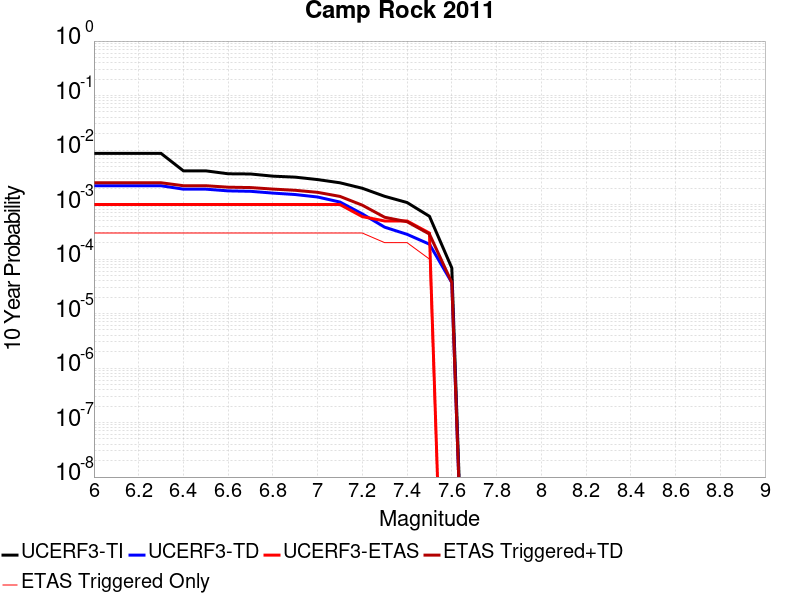 |

| Magnitude | 1 wk TI Prob | 1 wk TD Prob | 1 wk ETAS Prob | 1 wk ETAS/TD Gain | 1 wk ETAS Triggered+TD | 1 wk ETAS Triggered Only | 1 mo TI Prob | 1 mo TD Prob | 1 mo ETAS Prob | 1 mo ETAS/TD Gain | 1 mo ETAS Triggered+TD | 1 mo ETAS Triggered Only | 1 yr TI Prob | 1 yr TD Prob | 1 yr ETAS Prob | 1 yr ETAS/TD Gain | 1 yr ETAS Triggered+TD | 1 yr ETAS Triggered Only | 10 yr TI Prob | 10 yr TD Prob | 10 yr ETAS Prob | 10 yr ETAS/TD Gain | 10 yr ETAS Triggered+TD | 10 yr ETAS Triggered Only |
|-----|-----|-----|-----|-----|-----|-----|-----|-----|-----|-----|-----|-----|-----|-----|-----|-----|-----|-----|-----|-----|-----|-----|-----|-----|
| 6.0 | 1.6710783E-5 | 4.2452543E-6 | 0.0 | 0.0 | 4.2452543E-6 | 0.0 | 7.161568E-5 | 1.8193823E-5 | 0.0 | 0.0 | 1.8193823E-5 | 0.0 | 8.7157206E-4 | 2.214878E-4 | 0.0 | 0.0 | 2.214878E-4 | 0.0 | 0.008681616 | 0.0022127233 | 0.001 | 0.4519318 | 0.0025120594 | 3.0E-4 |
| 6.1 | 1.6710783E-5 | 4.2452543E-6 | 0.0 | 0.0 | 4.2452543E-6 | 0.0 | 7.161568E-5 | 1.8193823E-5 | 0.0 | 0.0 | 1.8193823E-5 | 0.0 | 8.7157206E-4 | 2.214878E-4 | 0.0 | 0.0 | 2.214878E-4 | 0.0 | 0.008681616 | 0.0022127233 | 0.001 | 0.4519318 | 0.0025120594 | 3.0E-4 |
| 6.2 | 1.6710783E-5 | 4.2452543E-6 | 0.0 | 0.0 | 4.2452543E-6 | 0.0 | 7.161568E-5 | 1.8193823E-5 | 0.0 | 0.0 | 1.8193823E-5 | 0.0 | 8.7157206E-4 | 2.214878E-4 | 0.0 | 0.0 | 2.214878E-4 | 0.0 | 0.008681616 | 0.0022127233 | 0.001 | 0.4519318 | 0.0025120594 | 3.0E-4 |
| 6.3 | 1.6710783E-5 | 4.2452543E-6 | 0.0 | 0.0 | 4.2452543E-6 | 0.0 | 7.161568E-5 | 1.8193823E-5 | 0.0 | 0.0 | 1.8193823E-5 | 0.0 | 8.7157206E-4 | 2.214878E-4 | 0.0 | 0.0 | 2.214878E-4 | 0.0 | 0.008681616 | 0.0022127233 | 0.001 | 0.4519318 | 0.0025120594 | 3.0E-4 |
| 6.4 | 7.982846E-6 | 3.677464E-6 | 0.0 | 0.0 | 3.677464E-6 | 0.0 | 3.421175E-5 | 1.5760466E-5 | 0.0 | 0.0 | 1.5760466E-5 | 0.0 | 4.1644843E-4 | 1.9186713E-4 | 0.0 | 0.0 | 1.9186713E-4 | 0.0 | 0.0041566887 | 0.0019170496 | 0.001 | 0.52163494 | 0.0022164744 | 3.0E-4 |
| 6.5 | 7.982846E-6 | 3.677464E-6 | 0.0 | 0.0 | 3.677464E-6 | 0.0 | 3.421175E-5 | 1.5760466E-5 | 0.0 | 0.0 | 1.5760466E-5 | 0.0 | 4.1644843E-4 | 1.9186713E-4 | 0.0 | 0.0 | 1.9186713E-4 | 0.0 | 0.0041566887 | 0.0019170496 | 0.001 | 0.52163494 | 0.0022164744 | 3.0E-4 |
| 6.6 | 7.048869E-6 | 3.419898E-6 | 0.0 | 0.0 | 3.419898E-6 | 0.0 | 3.0209088E-5 | 1.4656624E-5 | 0.0 | 0.0 | 1.4656624E-5 | 0.0 | 3.677336E-4 | 1.784301E-4 | 0.0 | 0.0 | 1.784301E-4 | 0.0 | 0.0036712566 | 0.0017829001 | 0.001 | 0.56088394 | 0.002082365 | 3.0E-4 |
| 6.7 | 6.987307E-6 | 3.3579133E-6 | 0.0 | 0.0 | 3.3579133E-6 | 0.0 | 2.9945259E-5 | 1.4390979E-5 | 0.0 | 0.0 | 1.4390979E-5 | 0.0 | 3.6452254E-4 | 1.751964E-4 | 0.0 | 0.0 | 1.751964E-4 | 0.0 | 0.0036392517 | 0.0017506139 | 0.001 | 0.5712282 | 0.0020500887 | 3.0E-4 |
| 6.8 | 6.3737602E-6 | 3.113684E-6 | 0.0 | 0.0 | 3.113684E-6 | 0.0 | 2.731583E-5 | 1.3344293E-5 | 0.0 | 0.0 | 1.3344293E-5 | 0.0 | 3.3251947E-4 | 1.6245493E-4 | 0.0 | 0.0 | 1.6245493E-4 | 0.0 | 0.0033202237 | 0.0016233904 | 0.001 | 0.6159948 | 0.0019229033 | 3.0E-4 |
| 6.9 | 6.112211E-6 | 2.9290313E-6 | 0.0 | 0.0 | 2.9290313E-6 | 0.0 | 2.6194928E-5 | 1.2552932E-5 | 0.0 | 0.0 | 1.2552932E-5 | 0.0 | 3.1887658E-4 | 1.528215E-4 | 0.0 | 0.0 | 1.528215E-4 | 0.0 | 0.003184194 | 0.001527192 | 0.001 | 0.65479654 | 0.0018267338 | 3.0E-4 |
| 7.0 | 5.5140117E-6 | 2.6382797E-6 | 0.0 | 0.0 | 2.6382797E-6 | 0.0 | 2.3631264E-5 | 1.1306866E-5 | 0.0 | 0.0 | 1.1306866E-5 | 0.0 | 2.8767265E-4 | 1.3765265E-4 | 0.0 | 0.0 | 1.3765265E-4 | 0.0 | 0.0028730053 | 0.0013756991 | 0.001 | 0.72690314 | 0.0016752864 | 3.0E-4 |
| 7.1 | 4.8151105E-6 | 2.1311002E-6 | 0.0 | 0.0 | 2.1311002E-6 | 0.0 | 2.0636026E-5 | 9.133256E-6 | 0.0 | 0.0 | 9.133256E-6 | 0.0 | 2.5121463E-4 | 1.11191934E-4 | 0.0 | 0.0 | 1.11191934E-4 | 0.0 | 0.0025093083 | 0.0011113848 | 0.001 | 0.8997783 | 0.0014110515 | 3.0E-4 |
| 7.2 | 3.818335E-6 | 1.2912051E-6 | 0.0 | 0.0 | 1.2912051E-6 | 0.0 | 1.6364189E-5 | 5.533725E-6 | 0.0 | 0.0 | 5.533725E-6 | 0.0 | 1.9921579E-4 | 6.7371104E-5 | 0.0 | 0.0 | 6.7371104E-5 | 0.0 | 0.0019903728 | 6.73515E-4 | 6.0E-4 | 0.89084876 | 9.7331294E-4 | 3.0E-4 |
| 7.3 | 2.7166698E-6 | 7.363538E-7 | 0.0 | 0.0 | 7.363538E-7 | 0.0 | 1.1642818E-5 | 3.1557984E-6 | 0.0 | 0.0 | 3.1557984E-6 | 0.0 | 1.4174209E-4 | 3.8421185E-5 | 0.0 | 0.0 | 3.8421185E-5 | 0.0 | 0.0014165172 | 3.8414745E-4 | 5.0E-4 | 1.3015835 | 5.840706E-4 | 2.0E-4 |
| 7.4 | 2.0893426E-6 | 5.44573E-7 | 0.0 | 0.0 | 5.44573E-7 | 0.0 | 8.954295E-6 | 2.3338823E-6 | 0.0 | 0.0 | 2.3338823E-6 | 0.0 | 1.0901308E-4 | 2.8414652E-5 | 0.0 | 0.0 | 2.8414652E-5 | 0.0 | 0.0010895962 | 2.8411072E-4 | 5.0E-4 | 1.7598773 | 4.840539E-4 | 2.0E-4 |
| 7.5 | 1.1681728E-6 | 3.592513E-7 | 0.0 | 0.0 | 3.592513E-7 | 0.0 | 5.0064455E-6 | 1.5396474E-6 | 0.0 | 0.0 | 1.5396474E-6 | 0.0 | 6.0951766E-5 | 1.8745051E-5 | 0.0 | 0.0 | 1.8745051E-5 | 0.0 | 6.093505E-4 | 1.8743517E-4 | 3.0E-4 | 1.6005534 | 2.8741642E-4 | 1.0E-4 |
| 7.6 | 1.3154387E-7 | 7.089255E-8 | 0.0 | 0.0 | 7.089255E-8 | 0.0 | 5.6375933E-7 | 3.0382517E-7 | 0.0 | 0.0 | 3.0382517E-7 | 0.0 | 6.863748E-6 | 3.6990668E-6 | 0.0 | 0.0 | 3.6990668E-6 | 0.0 | 6.863536E-5 | 3.6990208E-5 | 0.0 | 0.0 | 3.6990208E-5 | 0.0 |

## Elysian Park (Lower CFM)
*[(top)](#table-of-contents)*

| 1 Week | 1 Month | 1 Year | 10 Year |
|-----|-----|-----|-----|
|  |  |  |  |

| Magnitude | 1 wk TI Prob | 1 wk TD Prob | 1 wk ETAS Prob | 1 wk ETAS/TD Gain | 1 wk ETAS Triggered+TD | 1 wk ETAS Triggered Only | 1 mo TI Prob | 1 mo TD Prob | 1 mo ETAS Prob | 1 mo ETAS/TD Gain | 1 mo ETAS Triggered+TD | 1 mo ETAS Triggered Only | 1 yr TI Prob | 1 yr TD Prob | 1 yr ETAS Prob | 1 yr ETAS/TD Gain | 1 yr ETAS Triggered+TD | 1 yr ETAS Triggered Only | 10 yr TI Prob | 10 yr TD Prob | 10 yr ETAS Prob | 10 yr ETAS/TD Gain | 10 yr ETAS Triggered+TD | 10 yr ETAS Triggered Only |
|-----|-----|-----|-----|-----|-----|-----|-----|-----|-----|-----|-----|-----|-----|-----|-----|-----|-----|-----|-----|-----|-----|-----|-----|-----|
| 6.0 | 2.1766498E-6 | 2.103101E-6 | 0.0 | 0.0 | 2.103101E-6 | 0.0 | 9.328466E-6 | 9.013267E-6 | 0.0 | 0.0 | 9.013267E-6 | 0.0 | 1.1356815E-4 | 1.0973245E-4 | 0.0 | 0.0 | 1.0973245E-4 | 0.0 | 0.0011351013 | 0.0010969245 | 6.0E-4 | 0.54698384 | 0.0013965955 | 3.0E-4 |
| 6.1 | 2.1766498E-6 | 2.103101E-6 | 0.0 | 0.0 | 2.103101E-6 | 0.0 | 9.328466E-6 | 9.013267E-6 | 0.0 | 0.0 | 9.013267E-6 | 0.0 | 1.1356815E-4 | 1.0973245E-4 | 0.0 | 0.0 | 1.0973245E-4 | 0.0 | 0.0011351013 | 0.0010969245 | 6.0E-4 | 0.54698384 | 0.0013965955 | 3.0E-4 |
| 6.2 | 1.0031182E-6 | 9.180558E-7 | 0.0 | 0.0 | 9.180558E-7 | 0.0 | 4.299071E-6 | 3.934519E-6 | 0.0 | 0.0 | 3.934519E-6 | 0.0 | 5.2339932E-5 | 4.7901816E-5 | 0.0 | 0.0 | 4.7901816E-5 | 0.0 | 5.2327604E-4 | 4.7892472E-4 | 1.0E-4 | 0.20880108 | 4.7892472E-4 | 0.0 |
| 6.3 | 1.0031182E-6 | 9.180558E-7 | 0.0 | 0.0 | 9.180558E-7 | 0.0 | 4.299071E-6 | 3.934519E-6 | 0.0 | 0.0 | 3.934519E-6 | 0.0 | 5.2339932E-5 | 4.7901816E-5 | 0.0 | 0.0 | 4.7901816E-5 | 0.0 | 5.2327604E-4 | 4.7892472E-4 | 1.0E-4 | 0.20880108 | 4.7892472E-4 | 0.0 |
| 6.4 | 6.9606244E-7 | 6.086536E-7 | 0.0 | 0.0 | 6.086536E-7 | 0.0 | 2.9831212E-6 | 2.6085127E-6 | 0.0 | 0.0 | 2.6085127E-6 | 0.0 | 3.6318896E-5 | 3.175818E-5 | 0.0 | 0.0 | 3.175818E-5 | 0.0 | 3.6312963E-4 | 3.1753667E-4 | 1.0E-4 | 0.31492427 | 3.1753667E-4 | 0.0 |
| 6.5 | 6.901879E-7 | 6.0272254E-7 | 0.0 | 0.0 | 6.0272254E-7 | 0.0 | 2.9579448E-6 | 2.5830939E-6 | 0.0 | 0.0 | 2.5830939E-6 | 0.0 | 3.6012385E-5 | 3.144872E-5 | 0.0 | 0.0 | 3.144872E-5 | 0.0 | 3.600655E-4 | 3.144429E-4 | 1.0E-4 | 0.31802276 | 3.144429E-4 | 0.0 |
| 6.6 | 6.4198554E-7 | 5.5412505E-7 | 0.0 | 0.0 | 5.5412505E-7 | 0.0 | 2.7513638E-6 | 2.3748194E-6 | 0.0 | 0.0 | 2.3748194E-6 | 0.0 | 3.3497337E-5 | 2.8913044E-5 | 0.0 | 0.0 | 2.8913044E-5 | 0.0 | 3.349229E-4 | 2.8909295E-4 | 0.0 | 0.0 | 2.8909295E-4 | 0.0 |
| 6.7 | 6.138733E-7 | 5.2580793E-7 | 0.0 | 0.0 | 5.2580793E-7 | 0.0 | 2.6308828E-6 | 2.2534605E-6 | 0.0 | 0.0 | 2.2534605E-6 | 0.0 | 3.203053E-5 | 2.7435537E-5 | 0.0 | 0.0 | 2.7435537E-5 | 0.0 | 3.2025913E-4 | 2.7432162E-4 | 0.0 | 0.0 | 2.7432162E-4 | 0.0 |
| 6.8 | 5.84778E-7 | 4.997639E-7 | 0.0 | 0.0 | 4.997639E-7 | 0.0 | 2.506189E-6 | 2.1418434E-6 | 0.0 | 0.0 | 2.1418434E-6 | 0.0 | 3.0512423E-5 | 2.6076634E-5 | 0.0 | 0.0 | 2.6076634E-5 | 0.0 | 3.0508233E-4 | 2.6073586E-4 | 0.0 | 0.0 | 2.6073586E-4 | 0.0 |
| 6.9 | 5.322785E-7 | 4.5748806E-7 | 0.0 | 0.0 | 4.5748806E-7 | 0.0 | 2.2811914E-6 | 1.9606614E-6 | 0.0 | 0.0 | 1.9606614E-6 | 0.0 | 2.7773152E-5 | 2.3870793E-5 | 0.0 | 0.0 | 2.3870793E-5 | 0.0 | 2.7769682E-4 | 2.3868239E-4 | 0.0 | 0.0 | 2.3868239E-4 | 0.0 |
| 7.0 | 4.8147206E-7 | 4.107299E-7 | 0.0 | 0.0 | 4.107299E-7 | 0.0 | 2.06345E-6 | 1.7602698E-6 | 0.0 | 0.0 | 1.7602698E-6 | 0.0 | 2.5122214E-5 | 2.1431075E-5 | 0.0 | 0.0 | 2.1431075E-5 | 0.0 | 2.5119373E-4 | 2.1429016E-4 | 0.0 | 0.0 | 2.1429016E-4 | 0.0 |
| 7.1 | 4.1932955E-7 | 3.5409474E-7 | 0.0 | 0.0 | 3.5409474E-7 | 0.0 | 1.7971255E-6 | 1.5175478E-6 | 0.0 | 0.0 | 1.5175478E-6 | 0.0 | 2.1879783E-5 | 1.8475988E-5 | 0.0 | 0.0 | 1.8475988E-5 | 0.0 | 2.1877629E-4 | 1.8474458E-4 | 0.0 | 0.0 | 1.8474458E-4 | 0.0 |
| 7.2 | 3.426051E-7 | 2.7771074E-7 | 0.0 | 0.0 | 2.7771074E-7 | 0.0 | 1.4683067E-6 | 1.1901883E-6 | 0.0 | 0.0 | 1.1901883E-6 | 0.0 | 1.7876488E-5 | 1.4490445E-5 | 0.0 | 0.0 | 1.4490445E-5 | 0.0 | 1.787505E-4 | 1.4489504E-4 | 0.0 | 0.0 | 1.4489504E-4 | 0.0 |
| 7.3 | 2.7771645E-7 | 2.2063207E-7 | 0.0 | 0.0 | 2.2063207E-7 | 0.0 | 1.1902127E-6 | 9.4556566E-7 | 0.0 | 0.0 | 9.4556566E-7 | 0.0 | 1.4490744E-5 | 1.1512201E-5 | 0.0 | 0.0 | 1.1512201E-5 | 0.0 | 1.4489799E-4 | 1.1511607E-4 | 0.0 | 0.0 | 1.1511607E-4 | 0.0 |
| 7.4 | 2.2756493E-7 | 1.7810005E-7 | 0.0 | 0.0 | 1.7810005E-7 | 0.0 | 9.752779E-7 | 7.632857E-7 | 0.0 | 0.0 | 7.632857E-7 | 0.0 | 1.1873944E-5 | 9.292963E-6 | 0.0 | 0.0 | 9.292963E-6 | 0.0 | 1.18733085E-4 | 9.2925766E-5 | 0.0 | 0.0 | 9.2925766E-5 | 0.0 |
| 7.5 | 1.7874558E-7 | 1.351719E-7 | 0.0 | 0.0 | 1.351719E-7 | 0.0 | 7.660522E-7 | 5.7930805E-7 | 0.0 | 0.0 | 5.7930805E-7 | 0.0 | 9.326646E-6 | 7.0530527E-6 | 0.0 | 0.0 | 7.0530527E-6 | 0.0 | 9.326255E-5 | 7.05283E-5 | 0.0 | 0.0 | 7.05283E-5 | 0.0 |
| 7.6 | 1.3124549E-7 | 9.230548E-8 | 0.0 | 0.0 | 9.230548E-8 | 0.0 | 5.624805E-7 | 3.9559487E-7 | 0.0 | 0.0 | 3.9559487E-7 | 0.0 | 6.8481786E-6 | 4.8163565E-6 | 0.0 | 0.0 | 4.8163565E-6 | 0.0 | 6.8479676E-5 | 4.816254E-5 | 0.0 | 0.0 | 4.816254E-5 | 0.0 |
| 7.7 | 8.439993E-8 | 5.0735117E-8 | 0.0 | 0.0 | 5.0735117E-8 | 0.0 | 3.6171392E-7 | 2.174362E-7 | 0.0 | 0.0 | 2.174362E-7 | 0.0 | 4.403858E-6 | 2.6472826E-6 | 0.0 | 0.0 | 2.6472826E-6 | 0.0 | 4.4037708E-5 | 2.6472522E-5 | 0.0 | 0.0 | 2.6472522E-5 | 0.0 |
| 7.8 | 1.2591407E-8 | 7.195422E-9 | 0.0 | 0.0 | 7.195422E-9 | 0.0 | 5.3963173E-8 | 3.0837526E-8 | 0.0 | 0.0 | 3.0837526E-8 | 0.0 | 6.570014E-7 | 3.7544683E-7 | 0.0 | 0.0 | 3.7544683E-7 | 0.0 | 6.5699946E-6 | 3.7544619E-6 | 0.0 | 0.0 | 3.7544619E-6 | 0.0 |
| 7.9 | 2.8324232E-11 | 2.1363689E-11 | 0.0 | 0.0 | 2.1363689E-11 | 0.0 | 1.2138957E-10 | 9.1558316E-11 | 0.0 | 0.0 | 9.1558316E-11 | 0.0 | 1.4779177E-9 | 1.1147231E-9 | 0.0 | 0.0 | 1.1147231E-9 | 0.0 | 1.4779177E-8 | 1.1147231E-8 | 0.0 | 0.0 | 1.1147231E-8 | 0.0 |

## Great Valley 01
*[(top)](#table-of-contents)*

| 1 Week | 1 Month | 1 Year | 10 Year |
|-----|-----|-----|-----|
|  | 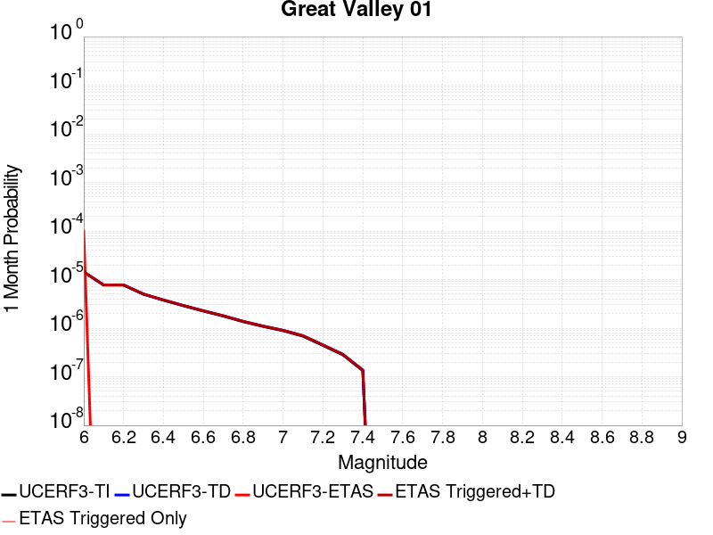 |  | 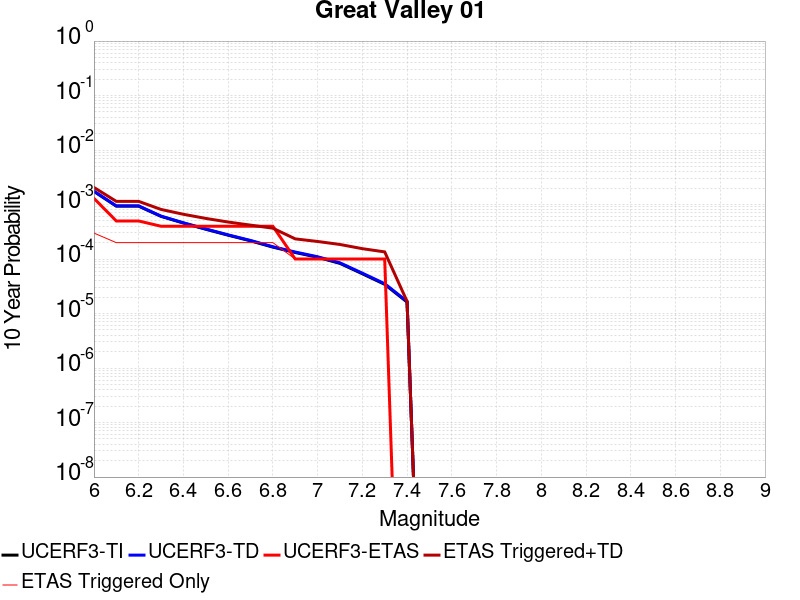 |

| Magnitude | 1 wk TI Prob | 1 wk TD Prob | 1 wk ETAS Prob | 1 wk ETAS/TD Gain | 1 wk ETAS Triggered+TD | 1 wk ETAS Triggered Only | 1 mo TI Prob | 1 mo TD Prob | 1 mo ETAS Prob | 1 mo ETAS/TD Gain | 1 mo ETAS Triggered+TD | 1 mo ETAS Triggered Only | 1 yr TI Prob | 1 yr TD Prob | 1 yr ETAS Prob | 1 yr ETAS/TD Gain | 1 yr ETAS Triggered+TD | 1 yr ETAS Triggered Only | 10 yr TI Prob | 10 yr TD Prob | 10 yr ETAS Prob | 10 yr ETAS/TD Gain | 10 yr ETAS Triggered+TD | 10 yr ETAS Triggered Only |
|-----|-----|-----|-----|-----|-----|-----|-----|-----|-----|-----|-----|-----|-----|-----|-----|-----|-----|-----|-----|-----|-----|-----|-----|-----|
| 6.0 | 3.3398478E-6 | 3.3759125E-6 | 0.0 | 0.0 | 3.3759125E-6 | 0.0 | 1.4313555E-5 | 1.4468123E-5 | 1.0E-4 | 6.9117465 | 1.4468123E-5 | 0.0 | 1.742536E-4 | 1.7613638E-4 | 2.0E-4 | 1.1354837 | 1.7613638E-4 | 0.0 | 0.0017411702 | 0.0017600879 | 0.0013 | 0.7385995 | 0.0020595598 | 3.0E-4 |
| 6.1 | 1.7919616E-6 | 1.8118128E-6 | 0.0 | 0.0 | 1.8118128E-6 | 0.0 | 7.679812E-6 | 7.76489E-6 | 0.0 | 0.0 | 7.76489E-6 | 0.0 | 9.349771E-5 | 9.453363E-5 | 0.0 | 0.0 | 9.453363E-5 | 0.0 | 9.345838E-4 | 9.449536E-4 | 5.0E-4 | 0.5291265 | 0.0011447646 | 2.0E-4 |
| 6.2 | 1.7919616E-6 | 1.8118128E-6 | 0.0 | 0.0 | 1.8118128E-6 | 0.0 | 7.679812E-6 | 7.76489E-6 | 0.0 | 0.0 | 7.76489E-6 | 0.0 | 9.349771E-5 | 9.453363E-5 | 0.0 | 0.0 | 9.453363E-5 | 0.0 | 9.345838E-4 | 9.449536E-4 | 5.0E-4 | 0.5291265 | 0.0011447646 | 2.0E-4 |
| 6.3 | 1.1636545E-6 | 1.177304E-6 | 0.0 | 0.0 | 1.177304E-6 | 0.0 | 4.9870814E-6 | 5.0455787E-6 | 0.0 | 0.0 | 5.0455787E-6 | 0.0 | 6.0716022E-5 | 6.142823E-5 | 0.0 | 0.0 | 6.142823E-5 | 0.0 | 6.069944E-4 | 6.141169E-4 | 4.0E-4 | 0.6513418 | 8.139941E-4 | 2.0E-4 |
| 6.4 | 8.770928E-7 | 8.880638E-7 | 0.0 | 0.0 | 8.880638E-7 | 0.0 | 3.7589639E-6 | 3.8059825E-6 | 0.0 | 0.0 | 3.8059825E-6 | 0.0 | 4.5764424E-5 | 4.6336874E-5 | 0.0 | 0.0 | 4.6336874E-5 | 0.0 | 4.5755E-4 | 4.6327425E-4 | 4.0E-4 | 0.8634195 | 6.631816E-4 | 2.0E-4 |
| 6.5 | 6.753308E-7 | 6.844284E-7 | 0.0 | 0.0 | 6.844284E-7 | 0.0 | 2.8942718E-6 | 2.9332614E-6 | 0.0 | 0.0 | 2.9332614E-6 | 0.0 | 3.523719E-5 | 3.571188E-5 | 0.0 | 0.0 | 3.571188E-5 | 0.0 | 3.52316E-4 | 3.570624E-4 | 4.0E-4 | 1.1202523 | 5.56991E-4 | 2.0E-4 |
| 6.6 | 5.2531993E-7 | 5.3304456E-7 | 0.0 | 0.0 | 5.3304456E-7 | 0.0 | 2.251369E-6 | 2.2844747E-6 | 0.0 | 0.0 | 2.2844747E-6 | 0.0 | 2.7410075E-5 | 2.7813128E-5 | 0.0 | 0.0 | 2.7813128E-5 | 0.0 | 2.7406693E-4 | 2.7809702E-4 | 4.0E-4 | 1.438347 | 4.7804142E-4 | 2.0E-4 |
| 6.7 | 4.1404678E-7 | 4.2078833E-7 | 0.0 | 0.0 | 4.2078833E-7 | 0.0 | 1.774485E-6 | 1.8033774E-6 | 0.0 | 0.0 | 1.8033774E-6 | 0.0 | 2.160414E-5 | 2.19559E-5 | 0.0 | 0.0 | 2.19559E-5 | 0.0 | 2.160204E-4 | 2.1953764E-4 | 4.0E-4 | 1.822011 | 4.1949374E-4 | 2.0E-4 |
| 6.8 | 3.1713054E-7 | 3.229668E-7 | 0.0 | 0.0 | 3.229668E-7 | 0.0 | 1.3591301E-6 | 1.3841427E-6 | 0.0 | 0.0 | 1.3841427E-6 | 0.0 | 1.6547285E-5 | 1.6851809E-5 | 0.0 | 0.0 | 1.6851809E-5 | 0.0 | 1.6546051E-4 | 1.6850549E-4 | 4.0E-4 | 2.3738098 | 3.6847178E-4 | 2.0E-4 |
| 6.9 | 2.528054E-7 | 2.579815E-7 | 0.0 | 0.0 | 2.579815E-7 | 0.0 | 1.0834511E-6 | 1.1056345E-6 | 0.0 | 0.0 | 1.1056345E-6 | 0.0 | 1.3190938E-5 | 1.3461019E-5 | 0.0 | 0.0 | 1.3461019E-5 | 0.0 | 1.3190156E-4 | 1.3460215E-4 | 1.0E-4 | 0.7429302 | 2.3458869E-4 | 1.0E-4 |
| 7.0 | 2.0667689E-7 | 2.1126274E-7 | 0.0 | 0.0 | 2.1126274E-7 | 0.0 | 8.857578E-7 | 9.0541147E-7 | 0.0 | 0.0 | 9.0541147E-7 | 0.0 | 1.0784048E-5 | 1.10233295E-5 | 0.0 | 0.0 | 1.10233295E-5 | 0.0 | 1.0783524E-4 | 1.1022791E-4 | 1.0E-4 | 0.90721124 | 2.102169E-4 | 1.0E-4 |
| 7.1 | 1.5951586E-7 | 1.6334337E-7 | 0.0 | 0.0 | 1.6334337E-7 | 0.0 | 6.8363926E-7 | 7.0004285E-7 | 0.0 | 0.0 | 7.0004285E-7 | 0.0 | 8.323276E-6 | 8.5229885E-6 | 0.0 | 0.0 | 8.5229885E-6 | 0.0 | 8.322964E-5 | 8.522668E-5 | 1.0E-4 | 1.1733415 | 1.8521816E-4 | 1.0E-4 |
| 7.2 | 1.02912296E-7 | 1.0563186E-7 | 0.0 | 0.0 | 1.0563186E-7 | 0.0 | 4.4105263E-7 | 4.527079E-7 | 0.0 | 0.0 | 4.527079E-7 | 0.0 | 5.3698027E-6 | 5.5117052E-6 | 0.0 | 0.0 | 5.5117052E-6 | 0.0 | 5.3696727E-5 | 5.5115717E-5 | 1.0E-4 | 1.8143646 | 1.551102E-4 | 1.0E-4 |
| 7.3 | 6.581281E-8 | 6.7700185E-8 | 0.0 | 0.0 | 6.7700185E-8 | 0.0 | 2.8205488E-7 | 2.9014362E-7 | 0.0 | 0.0 | 2.9014362E-7 | 0.0 | 3.4340128E-6 | 3.5324929E-6 | 0.0 | 0.0 | 3.5324929E-6 | 0.0 | 3.4339595E-5 | 3.532439E-5 | 1.0E-4 | 2.8309054 | 1.3532085E-4 | 1.0E-4 |
| 7.4 | 3.112171E-8 | 3.2058175E-8 | 0.0 | 0.0 | 3.2058175E-8 | 0.0 | 1.3337875E-7 | 1.3739218E-7 | 0.0 | 0.0 | 1.3739218E-7 | 0.0 | 1.6238852E-6 | 1.6727486E-6 | 0.0 | 0.0 | 1.6727486E-6 | 0.0 | 1.6238733E-5 | 1.6727368E-5 | 0.0 | 0.0 | 1.6727368E-5 | 0.0 |

## Anacapa-Dume alt 1
*[(top)](#table-of-contents)*

| 1 Week | 1 Month | 1 Year | 10 Year |
|-----|-----|-----|-----|
|  | 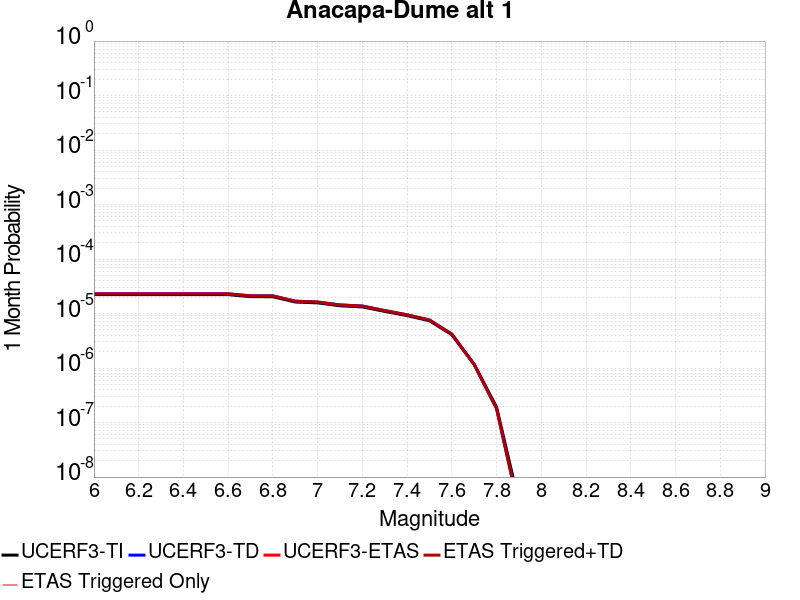 |  | 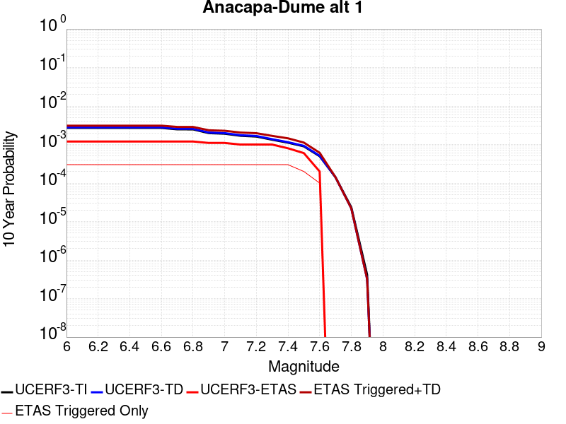 |

| Magnitude | 1 wk TI Prob | 1 wk TD Prob | 1 wk ETAS Prob | 1 wk ETAS/TD Gain | 1 wk ETAS Triggered+TD | 1 wk ETAS Triggered Only | 1 mo TI Prob | 1 mo TD Prob | 1 mo ETAS Prob | 1 mo ETAS/TD Gain | 1 mo ETAS Triggered+TD | 1 mo ETAS Triggered Only | 1 yr TI Prob | 1 yr TD Prob | 1 yr ETAS Prob | 1 yr ETAS/TD Gain | 1 yr ETAS Triggered+TD | 1 yr ETAS Triggered Only | 10 yr TI Prob | 10 yr TD Prob | 10 yr ETAS Prob | 10 yr ETAS/TD Gain | 10 yr ETAS Triggered+TD | 10 yr ETAS Triggered Only |
|-----|-----|-----|-----|-----|-----|-----|-----|-----|-----|-----|-----|-----|-----|-----|-----|-----|-----|-----|-----|-----|-----|-----|-----|-----|
| 6.0 | 5.1871802E-6 | 5.365183E-6 | 0.0 | 0.0 | 5.365183E-6 | 0.0 | 2.2230583E-5 | 2.2993445E-5 | 0.0 | 0.0 | 2.2993445E-5 | 0.0 | 2.7062374E-4 | 2.7991008E-4 | 0.0 | 0.0 | 2.7991008E-4 | 0.0 | 0.002702944 | 0.0027956604 | 0.0012 | 0.4292367 | 0.0030948217 | 3.0E-4 |
| 6.1 | 5.1871802E-6 | 5.365183E-6 | 0.0 | 0.0 | 5.365183E-6 | 0.0 | 2.2230583E-5 | 2.2993445E-5 | 0.0 | 0.0 | 2.2993445E-5 | 0.0 | 2.7062374E-4 | 2.7991008E-4 | 0.0 | 0.0 | 2.7991008E-4 | 0.0 | 0.002702944 | 0.0027956604 | 0.0012 | 0.4292367 | 0.0030948217 | 3.0E-4 |
| 6.2 | 5.1871802E-6 | 5.365183E-6 | 0.0 | 0.0 | 5.365183E-6 | 0.0 | 2.2230583E-5 | 2.2993445E-5 | 0.0 | 0.0 | 2.2993445E-5 | 0.0 | 2.7062374E-4 | 2.7991008E-4 | 0.0 | 0.0 | 2.7991008E-4 | 0.0 | 0.002702944 | 0.0027956604 | 0.0012 | 0.4292367 | 0.0030948217 | 3.0E-4 |
| 6.3 | 5.1871802E-6 | 5.365183E-6 | 0.0 | 0.0 | 5.365183E-6 | 0.0 | 2.2230583E-5 | 2.2993445E-5 | 0.0 | 0.0 | 2.2993445E-5 | 0.0 | 2.7062374E-4 | 2.7991008E-4 | 0.0 | 0.0 | 2.7991008E-4 | 0.0 | 0.002702944 | 0.0027956604 | 0.0012 | 0.4292367 | 0.0030948217 | 3.0E-4 |
| 6.4 | 5.1871802E-6 | 5.365183E-6 | 0.0 | 0.0 | 5.365183E-6 | 0.0 | 2.2230583E-5 | 2.2993445E-5 | 0.0 | 0.0 | 2.2993445E-5 | 0.0 | 2.7062374E-4 | 2.7991008E-4 | 0.0 | 0.0 | 2.7991008E-4 | 0.0 | 0.002702944 | 0.0027956604 | 0.0012 | 0.4292367 | 0.0030948217 | 3.0E-4 |
| 6.5 | 5.1871802E-6 | 5.365183E-6 | 0.0 | 0.0 | 5.365183E-6 | 0.0 | 2.2230583E-5 | 2.2993445E-5 | 0.0 | 0.0 | 2.2993445E-5 | 0.0 | 2.7062374E-4 | 2.7991008E-4 | 0.0 | 0.0 | 2.7991008E-4 | 0.0 | 0.002702944 | 0.0027956604 | 0.0012 | 0.4292367 | 0.0030948217 | 3.0E-4 |
| 6.6 | 5.1871802E-6 | 5.365183E-6 | 0.0 | 0.0 | 5.365183E-6 | 0.0 | 2.2230583E-5 | 2.2993445E-5 | 0.0 | 0.0 | 2.2993445E-5 | 0.0 | 2.7062374E-4 | 2.7991008E-4 | 0.0 | 0.0 | 2.7991008E-4 | 0.0 | 0.002702944 | 0.0027956604 | 0.0012 | 0.4292367 | 0.0030948217 | 3.0E-4 |
| 6.7 | 4.7693475E-6 | 4.934622E-6 | 0.0 | 0.0 | 4.934622E-6 | 0.0 | 2.04399E-5 | 2.1148215E-5 | 0.0 | 0.0 | 2.1148215E-5 | 0.0 | 2.4882736E-4 | 2.5744984E-4 | 0.0 | 0.0 | 2.5744984E-4 | 0.0 | 0.0024854892 | 0.0025715919 | 0.0012 | 0.46663705 | 0.0028708205 | 3.0E-4 |
| 6.8 | 4.753408E-6 | 4.9181763E-6 | 0.0 | 0.0 | 4.9181763E-6 | 0.0 | 2.037159E-5 | 2.1077733E-5 | 0.0 | 0.0 | 2.1077733E-5 | 0.0 | 2.4799586E-4 | 2.565919E-4 | 0.0 | 0.0 | 2.565919E-4 | 0.0 | 0.002477193 | 0.0025630326 | 0.0012 | 0.4681954 | 0.0028622635 | 3.0E-4 |
| 6.9 | 3.800069E-6 | 3.9353827E-6 | 0.0 | 0.0 | 3.9353827E-6 | 0.0 | 1.6285909E-5 | 1.6865819E-5 | 0.0 | 0.0 | 1.6865819E-5 | 0.0 | 1.9826289E-4 | 2.0532223E-4 | 0.0 | 0.0 | 2.0532223E-4 | 0.0 | 0.001980861 | 0.002051349 | 0.0011 | 0.5362325 | 0.0023507336 | 3.0E-4 |
| 7.0 | 3.6671938E-6 | 3.7982218E-6 | 0.0 | 0.0 | 3.7982218E-6 | 0.0 | 1.571645E-5 | 1.6277992E-5 | 0.0 | 0.0 | 1.6277992E-5 | 0.0 | 1.9133097E-4 | 1.9816677E-4 | 0.0 | 0.0 | 1.9816677E-4 | 0.0 | 0.0019116632 | 0.0019799238 | 0.0011 | 0.5555769 | 0.0022793298 | 3.0E-4 |
| 7.1 | 3.2394885E-6 | 3.3572412E-6 | 0.0 | 0.0 | 3.3572412E-6 | 0.0 | 1.3883448E-5 | 1.4388098E-5 | 0.0 | 0.0 | 1.4388098E-5 | 0.0 | 1.6901788E-4 | 1.7516111E-4 | 0.0 | 0.0 | 1.7516111E-4 | 0.0 | 0.0016888938 | 0.0017502417 | 0.001 | 0.5713497 | 0.0020497167 | 3.0E-4 |
| 7.2 | 3.0935948E-6 | 3.2064277E-6 | 0.0 | 0.0 | 3.2064277E-6 | 0.0 | 1.3258196E-5 | 1.3741761E-5 | 0.0 | 0.0 | 1.3741761E-5 | 0.0 | 1.6140658E-4 | 1.672932E-4 | 0.0 | 0.0 | 1.672932E-4 | 0.0 | 0.001612894 | 0.0016716836 | 0.001 | 0.5981993 | 0.0019711822 | 3.0E-4 |
| 7.3 | 2.5604163E-6 | 2.6458795E-6 | 0.0 | 0.0 | 2.6458795E-6 | 0.0 | 1.0973167E-5 | 1.1339434E-5 | 0.0 | 0.0 | 1.1339434E-5 | 0.0 | 1.3359012E-4 | 1.3804891E-4 | 0.0 | 0.0 | 1.3804891E-4 | 0.0 | 0.0013350984 | 0.0013796361 | 0.001 | 0.7248288 | 0.0016792222 | 3.0E-4 |
| 7.4 | 2.1429005E-6 | 2.2096165E-6 | 0.0 | 0.0 | 2.2096165E-6 | 0.0 | 9.1838265E-6 | 9.469751E-6 | 0.0 | 0.0 | 9.469751E-6 | 0.0 | 1.11807356E-4 | 1.1528814E-4 | 0.0 | 0.0 | 1.1528814E-4 | 0.0 | 0.0011175112 | 0.001152286 | 8.0E-4 | 0.6942721 | 0.0014519403 | 3.0E-4 |
| 7.5 | 1.7237151E-6 | 1.7753498E-6 | 0.0 | 0.0 | 1.7753498E-6 | 0.0 | 7.3873293E-6 | 7.60862E-6 | 0.0 | 0.0 | 7.60862E-6 | 0.0 | 8.993702E-5 | 9.263103E-5 | 0.0 | 0.0 | 9.263103E-5 | 0.0 | 8.990063E-4 | 9.2592655E-4 | 6.0E-4 | 0.6479996 | 0.0011257414 | 2.0E-4 |
| 7.6 | 9.541696E-7 | 9.818806E-7 | 0.0 | 0.0 | 9.818806E-7 | 0.0 | 4.089292E-6 | 4.208053E-6 | 0.0 | 0.0 | 4.208053E-6 | 0.0 | 4.9785995E-5 | 5.123185E-5 | 0.0 | 0.0 | 5.123185E-5 | 0.0 | 4.9774844E-4 | 5.122017E-4 | 2.0E-4 | 0.3904712 | 6.1215047E-4 | 1.0E-4 |
| 7.7 | 2.7226676E-7 | 2.7162645E-7 | 0.0 | 0.0 | 2.7162645E-7 | 0.0 | 1.166857E-6 | 1.1641129E-6 | 0.0 | 0.0 | 1.1641129E-6 | 0.0 | 1.4206392E-5 | 1.4172982E-5 | 0.0 | 0.0 | 1.4172982E-5 | 0.0 | 1.4205484E-4 | 1.4172086E-4 | 0.0 | 0.0 | 1.4172086E-4 | 0.0 |
| 7.8 | 4.5017995E-8 | 4.2144713E-8 | 0.0 | 0.0 | 4.2144713E-8 | 0.0 | 1.9293425E-7 | 1.8062018E-7 | 0.0 | 0.0 | 1.8062018E-7 | 0.0 | 2.348972E-6 | 2.1990486E-6 | 0.0 | 0.0 | 2.1990486E-6 | 0.0 | 2.348947E-5 | 2.199029E-5 | 0.0 | 0.0 | 2.199029E-5 | 0.0 |
| 7.9 | 8.007447E-10 | 6.1585737E-10 | 0.0 | 0.0 | 6.1585737E-10 | 0.0 | 3.4317629E-9 | 2.6393883E-9 | 0.0 | 0.0 | 2.6393883E-9 | 0.0 | 4.1781714E-8 | 3.2134555E-8 | 0.0 | 0.0 | 3.2134555E-8 | 0.0 | 4.1781706E-7 | 3.213455E-7 | 0.0 | 0.0 | 3.213455E-7 | 0.0 |

## San Luis Range - Pecho 2011 CFM
*[(top)](#table-of-contents)*

| 1 Week | 1 Month | 1 Year | 10 Year |
|-----|-----|-----|-----|
|  |  |  |  |

| Magnitude | 1 wk TI Prob | 1 wk TD Prob | 1 wk ETAS Prob | 1 wk ETAS/TD Gain | 1 wk ETAS Triggered+TD | 1 wk ETAS Triggered Only | 1 mo TI Prob | 1 mo TD Prob | 1 mo ETAS Prob | 1 mo ETAS/TD Gain | 1 mo ETAS Triggered+TD | 1 mo ETAS Triggered Only | 1 yr TI Prob | 1 yr TD Prob | 1 yr ETAS Prob | 1 yr ETAS/TD Gain | 1 yr ETAS Triggered+TD | 1 yr ETAS Triggered Only | 10 yr TI Prob | 10 yr TD Prob | 10 yr ETAS Prob | 10 yr ETAS/TD Gain | 10 yr ETAS Triggered+TD | 10 yr ETAS Triggered Only |
|-----|-----|-----|-----|-----|-----|-----|-----|-----|-----|-----|-----|-----|-----|-----|-----|-----|-----|-----|-----|-----|-----|-----|-----|-----|
| 6.0 | 1.687423E-6 | 1.6917523E-6 | 0.0 | 0.0 | 1.6917523E-6 | 0.0 | 7.231793E-6 | 7.2503485E-6 | 0.0 | 0.0 | 7.2503485E-6 | 0.0 | 8.804352E-5 | 8.826966E-5 | 0.0 | 0.0 | 8.826966E-5 | 0.0 | 8.8008645E-4 | 8.823699E-4 | 5.0E-4 | 0.56665576 | 0.0011821052 | 3.0E-4 |
| 6.1 | 1.687423E-6 | 1.6917523E-6 | 0.0 | 0.0 | 1.6917523E-6 | 0.0 | 7.231793E-6 | 7.2503485E-6 | 0.0 | 0.0 | 7.2503485E-6 | 0.0 | 8.804352E-5 | 8.826966E-5 | 0.0 | 0.0 | 8.826966E-5 | 0.0 | 8.8008645E-4 | 8.823699E-4 | 5.0E-4 | 0.56665576 | 0.0011821052 | 3.0E-4 |
| 6.2 | 1.0765672E-6 | 1.0766571E-6 | 0.0 | 0.0 | 1.0766571E-6 | 0.0 | 4.613851E-6 | 4.614237E-6 | 0.0 | 0.0 | 4.614237E-6 | 0.0 | 5.617219E-5 | 5.617695E-5 | 0.0 | 0.0 | 5.617695E-5 | 0.0 | 5.6157995E-4 | 5.6163373E-4 | 4.0E-4 | 0.7122079 | 7.615214E-4 | 2.0E-4 |
| 6.3 | 8.523104E-7 | 8.509209E-7 | 0.0 | 0.0 | 8.509209E-7 | 0.0 | 3.6527538E-6 | 3.6467989E-6 | 0.0 | 0.0 | 3.6467989E-6 | 0.0 | 4.447137E-5 | 4.4398905E-5 | 0.0 | 0.0 | 4.4398905E-5 | 0.0 | 4.4462472E-4 | 4.4390353E-4 | 4.0E-4 | 0.90109664 | 6.4381474E-4 | 2.0E-4 |
| 6.4 | 8.523104E-7 | 8.509209E-7 | 0.0 | 0.0 | 8.509209E-7 | 0.0 | 3.6527538E-6 | 3.6467989E-6 | 0.0 | 0.0 | 3.6467989E-6 | 0.0 | 4.447137E-5 | 4.4398905E-5 | 0.0 | 0.0 | 4.4398905E-5 | 0.0 | 4.4462472E-4 | 4.4390353E-4 | 4.0E-4 | 0.90109664 | 6.4381474E-4 | 2.0E-4 |
| 6.5 | 7.0029404E-7 | 6.972799E-7 | 0.0 | 0.0 | 6.972799E-7 | 0.0 | 3.0012568E-6 | 2.988339E-6 | 0.0 | 0.0 | 2.988339E-6 | 0.0 | 3.6539688E-5 | 3.6382437E-5 | 0.0 | 0.0 | 3.6382437E-5 | 0.0 | 3.653368E-4 | 3.637665E-4 | 4.0E-4 | 1.0996065 | 5.6369376E-4 | 2.0E-4 |
| 6.6 | 5.583906E-7 | 5.539344E-7 | 0.0 | 0.0 | 5.539344E-7 | 0.0 | 2.3931002E-6 | 2.3740024E-6 | 0.0 | 0.0 | 2.3740024E-6 | 0.0 | 2.9135606E-5 | 2.8903103E-5 | 0.0 | 0.0 | 2.8903103E-5 | 0.0 | 2.9131788E-4 | 2.8899417E-4 | 2.0E-4 | 0.69205546 | 3.8896527E-4 | 1.0E-4 |
| 6.7 | 4.73441E-7 | 4.6796887E-7 | 0.0 | 0.0 | 4.6796887E-7 | 0.0 | 2.0290313E-6 | 2.0055795E-6 | 0.0 | 0.0 | 2.0055795E-6 | 0.0 | 2.4703175E-5 | 2.441766E-5 | 0.0 | 0.0 | 2.441766E-5 | 0.0 | 2.470043E-4 | 2.4415023E-4 | 2.0E-4 | 0.8191678 | 3.4412582E-4 | 1.0E-4 |
| 6.8 | 4.1466086E-7 | 4.084497E-7 | 0.0 | 0.0 | 4.084497E-7 | 0.0 | 1.7771167E-6 | 1.7504975E-6 | 0.0 | 0.0 | 1.7504975E-6 | 0.0 | 2.1636182E-5 | 2.1312102E-5 | 0.0 | 0.0 | 2.1312102E-5 | 0.0 | 2.1634075E-4 | 2.1310092E-4 | 2.0E-4 | 0.93852246 | 3.1307962E-4 | 1.0E-4 |
| 6.9 | 3.2056641E-7 | 3.1297796E-7 | 0.0 | 0.0 | 3.1297796E-7 | 0.0 | 1.3738553E-6 | 1.3413334E-6 | 0.0 | 0.0 | 1.3413334E-6 | 0.0 | 1.6726559E-5 | 1.6330614E-5 | 0.0 | 0.0 | 1.6330614E-5 | 0.0 | 1.67253E-4 | 1.6329429E-4 | 0.0 | 0.0 | 1.6329429E-4 | 0.0 |
| 7.0 | 2.6315942E-7 | 2.545922E-7 | 0.0 | 0.0 | 2.545922E-7 | 0.0 | 1.1278256E-6 | 1.091109E-6 | 0.0 | 0.0 | 1.091109E-6 | 0.0 | 1.3731191E-5 | 1.32841715E-5 | 0.0 | 0.0 | 1.32841715E-5 | 0.0 | 1.3730342E-4 | 1.3283385E-4 | 0.0 | 0.0 | 1.3283385E-4 | 0.0 |
| 7.1 | 2.1832436E-7 | 2.0887805E-7 | 0.0 | 0.0 | 2.0887805E-7 | 0.0 | 9.356755E-7 | 8.9519136E-7 | 0.0 | 0.0 | 8.9519136E-7 | 0.0 | 1.13917895E-5 | 1.0898901E-5 | 0.0 | 0.0 | 1.0898901E-5 | 0.0 | 1.1391206E-4 | 1.0898371E-4 | 0.0 | 0.0 | 1.0898371E-4 | 0.0 |
| 7.2 | 1.7393015E-7 | 1.6348166E-7 | 0.0 | 0.0 | 1.6348166E-7 | 0.0 | 7.454147E-7 | 7.006355E-7 | 0.0 | 0.0 | 7.006355E-7 | 0.0 | 9.075386E-6 | 8.5302045E-6 | 0.0 | 0.0 | 8.5302045E-6 | 0.0 | 9.075015E-5 | 8.5298794E-5 | 0.0 | 0.0 | 8.5298794E-5 | 0.0 |
| 7.3 | 1.3744894E-7 | 1.2611156E-7 | 0.0 | 0.0 | 1.2611156E-7 | 0.0 | 5.890667E-7 | 5.4047797E-7 | 0.0 | 0.0 | 5.4047797E-7 | 0.0 | 7.1718637E-6 | 6.5802997E-6 | 0.0 | 0.0 | 6.5802997E-6 | 0.0 | 7.171632E-5 | 6.580106E-5 | 0.0 | 0.0 | 6.580106E-5 | 0.0 |
| 7.4 | 1.0915278E-7 | 9.7009455E-8 | 0.0 | 0.0 | 9.7009455E-8 | 0.0 | 4.6779755E-7 | 4.1575476E-7 | 0.0 | 0.0 | 4.1575476E-7 | 0.0 | 5.6954204E-6 | 5.0618023E-6 | 0.0 | 0.0 | 5.0618023E-6 | 0.0 | 5.6952744E-5 | 5.0616876E-5 | 0.0 | 0.0 | 5.0616876E-5 | 0.0 |
| 7.5 | 9.490291E-8 | 8.231033E-8 | 0.0 | 0.0 | 8.231033E-8 | 0.0 | 4.0672668E-7 | 3.527585E-7 | 0.0 | 0.0 | 3.527585E-7 | 0.0 | 4.9518862E-6 | 4.2948263E-6 | 0.0 | 0.0 | 4.2948263E-6 | 0.0 | 4.951776E-5 | 4.294744E-5 | 0.0 | 0.0 | 4.294744E-5 | 0.0 |
| 7.6 | 7.256678E-8 | 5.9173068E-8 | 0.0 | 0.0 | 5.9173068E-8 | 0.0 | 3.1100043E-7 | 2.5359884E-7 | 0.0 | 0.0 | 2.5359884E-7 | 0.0 | 3.7864236E-6 | 3.0875615E-6 | 0.0 | 0.0 | 3.0875615E-6 | 0.0 | 3.7863592E-5 | 3.0875188E-5 | 0.0 | 0.0 | 3.0875188E-5 | 0.0 |
| 7.7 | 5.446273E-8 | 4.033521E-8 | 0.0 | 0.0 | 4.033521E-8 | 0.0 | 2.3341168E-7 | 1.7286519E-7 | 0.0 | 0.0 | 1.7286519E-7 | 0.0 | 2.8417835E-6 | 2.1046314E-6 | 0.0 | 0.0 | 2.1046314E-6 | 0.0 | 2.8417471E-5 | 2.1046117E-5 | 0.0 | 0.0 | 2.1046117E-5 | 0.0 |
| 7.8 | 3.5850867E-8 | 2.1284722E-8 | 0.0 | 0.0 | 2.1284722E-8 | 0.0 | 1.5364655E-7 | 9.1220244E-8 | 0.0 | 0.0 | 9.1220244E-8 | 0.0 | 1.8706452E-6 | 1.1106058E-6 | 0.0 | 0.0 | 1.1106058E-6 | 0.0 | 1.8706294E-5 | 1.11060035E-5 | 0.0 | 0.0 | 1.11060035E-5 | 0.0 |
| 7.9 | 2.45879E-8 | 1.1178923E-8 | 0.0 | 0.0 | 1.1178923E-8 | 0.0 | 1.0537671E-7 | 4.7909676E-8 | 0.0 | 0.0 | 4.7909676E-8 | 0.0 | 1.2829606E-6 | 5.833001E-7 | 0.0 | 0.0 | 5.833001E-7 | 0.0 | 1.2829532E-5 | 5.832986E-6 | 0.0 | 0.0 | 5.832986E-6 | 0.0 |
| 8.0 | 1.8151761E-8 | 7.266575E-9 | 0.0 | 0.0 | 7.266575E-9 | 0.0 | 7.779326E-8 | 3.114247E-8 | 0.0 | 0.0 | 3.114247E-8 | 0.0 | 9.4713255E-7 | 3.791595E-7 | 0.0 | 0.0 | 3.791595E-7 | 0.0 | 9.471285E-6 | 3.7915886E-6 | 0.0 | 0.0 | 3.7915886E-6 | 0.0 |
| 8.1 | 9.559205E-9 | 4.009819E-9 | 0.0 | 0.0 | 4.009819E-9 | 0.0 | 4.096802E-8 | 1.7184941E-8 | 0.0 | 0.0 | 1.7184941E-8 | 0.0 | 4.9878554E-7 | 2.0922664E-7 | 0.0 | 0.0 | 2.0922664E-7 | 0.0 | 4.987844E-6 | 2.0922644E-6 | 0.0 | 0.0 | 2.0922644E-6 | 0.0 |

## San Jose
*[(top)](#table-of-contents)*

| 1 Week | 1 Month | 1 Year | 10 Year |
|-----|-----|-----|-----|
|  |  |  |  |

| Magnitude | 1 wk TI Prob | 1 wk TD Prob | 1 wk ETAS Prob | 1 wk ETAS/TD Gain | 1 wk ETAS Triggered+TD | 1 wk ETAS Triggered Only | 1 mo TI Prob | 1 mo TD Prob | 1 mo ETAS Prob | 1 mo ETAS/TD Gain | 1 mo ETAS Triggered+TD | 1 mo ETAS Triggered Only | 1 yr TI Prob | 1 yr TD Prob | 1 yr ETAS Prob | 1 yr ETAS/TD Gain | 1 yr ETAS Triggered+TD | 1 yr ETAS Triggered Only | 10 yr TI Prob | 10 yr TD Prob | 10 yr ETAS Prob | 10 yr ETAS/TD Gain | 10 yr ETAS Triggered+TD | 10 yr ETAS Triggered Only |
|-----|-----|-----|-----|-----|-----|-----|-----|-----|-----|-----|-----|-----|-----|-----|-----|-----|-----|-----|-----|-----|-----|-----|-----|-----|
| 6.0 | 5.0851277E-6 | 4.1185885E-6 | 0.0 | 0.0 | 4.1185885E-6 | 0.0 | 2.1793223E-5 | 1.7650988E-5 | 0.0 | 0.0 | 1.7650988E-5 | 0.0 | 2.653002E-4 | 2.1488222E-4 | 2.0E-4 | 0.93074244 | 2.1488222E-4 | 0.0 | 0.0026498367 | 0.0021470315 | 0.0011 | 0.5123353 | 0.0024463874 | 3.0E-4 |
| 6.1 | 5.0851277E-6 | 4.1185885E-6 | 0.0 | 0.0 | 4.1185885E-6 | 0.0 | 2.1793223E-5 | 1.7650988E-5 | 0.0 | 0.0 | 1.7650988E-5 | 0.0 | 2.653002E-4 | 2.1488222E-4 | 2.0E-4 | 0.93074244 | 2.1488222E-4 | 0.0 | 0.0026498367 | 0.0021470315 | 0.0011 | 0.5123353 | 0.0024463874 | 3.0E-4 |
| 6.2 | 5.0851277E-6 | 4.1185885E-6 | 0.0 | 0.0 | 4.1185885E-6 | 0.0 | 2.1793223E-5 | 1.7650988E-5 | 0.0 | 0.0 | 1.7650988E-5 | 0.0 | 2.653002E-4 | 2.1488222E-4 | 2.0E-4 | 0.93074244 | 2.1488222E-4 | 0.0 | 0.0026498367 | 0.0021470315 | 0.0011 | 0.5123353 | 0.0024463874 | 3.0E-4 |
| 6.3 | 5.0851277E-6 | 4.1185885E-6 | 0.0 | 0.0 | 4.1185885E-6 | 0.0 | 2.1793223E-5 | 1.7650988E-5 | 0.0 | 0.0 | 1.7650988E-5 | 0.0 | 2.653002E-4 | 2.1488222E-4 | 2.0E-4 | 0.93074244 | 2.1488222E-4 | 0.0 | 0.0026498367 | 0.0021470315 | 0.0011 | 0.5123353 | 0.0024463874 | 3.0E-4 |
| 6.4 | 4.3115124E-6 | 3.3170047E-6 | 0.0 | 0.0 | 3.3170047E-6 | 0.0 | 1.8477778E-5 | 1.421567E-5 | 0.0 | 0.0 | 1.421567E-5 | 0.0 | 2.2494372E-4 | 1.7306424E-4 | 1.0E-4 | 0.5778201 | 1.7306424E-4 | 0.0 | 0.0022471617 | 0.0017295403 | 9.0E-4 | 0.52036947 | 0.0019291944 | 2.0E-4 |
| 6.5 | 4.3115124E-6 | 3.3170047E-6 | 0.0 | 0.0 | 3.3170047E-6 | 0.0 | 1.8477778E-5 | 1.421567E-5 | 0.0 | 0.0 | 1.421567E-5 | 0.0 | 2.2494372E-4 | 1.7306424E-4 | 1.0E-4 | 0.5778201 | 1.7306424E-4 | 0.0 | 0.0022471617 | 0.0017295403 | 9.0E-4 | 0.52036947 | 0.0019291944 | 2.0E-4 |
| 6.6 | 3.110396E-6 | 2.0736695E-6 | 0.0 | 0.0 | 2.0736695E-6 | 0.0 | 1.33302E-5 | 8.887126E-6 | 0.0 | 0.0 | 8.887126E-6 | 0.0 | 1.622831E-4 | 1.08195665E-4 | 0.0 | 0.0 | 1.08195665E-4 | 0.0 | 0.0016216465 | 0.001081486 | 3.0E-4 | 0.27739608 | 0.0011813779 | 1.0E-4 |
| 6.7 | 3.110396E-6 | 2.0736695E-6 | 0.0 | 0.0 | 2.0736695E-6 | 0.0 | 1.33302E-5 | 8.887126E-6 | 0.0 | 0.0 | 8.887126E-6 | 0.0 | 1.622831E-4 | 1.08195665E-4 | 0.0 | 0.0 | 1.08195665E-4 | 0.0 | 0.0016216465 | 0.001081486 | 3.0E-4 | 0.27739608 | 0.0011813779 | 1.0E-4 |
| 6.8 | 2.856651E-6 | 1.8962563E-6 | 0.0 | 0.0 | 1.8962563E-6 | 0.0 | 1.2242733E-5 | 8.126789E-6 | 0.0 | 0.0 | 8.126789E-6 | 0.0 | 1.4904508E-4 | 9.893941E-5 | 0.0 | 0.0 | 9.893941E-5 | 0.0 | 0.0014894515 | 9.890067E-4 | 2.0E-4 | 0.20222309 | 9.890067E-4 | 0.0 |
| 6.9 | 2.1618725E-6 | 1.4128503E-6 | 0.0 | 0.0 | 1.4128503E-6 | 0.0 | 9.265135E-6 | 6.055059E-6 | 0.0 | 0.0 | 6.055059E-6 | 0.0 | 1.12797185E-4 | 7.371794E-5 | 0.0 | 0.0 | 7.371794E-5 | 0.0 | 0.0011273995 | 7.3697226E-4 | 2.0E-4 | 0.27138063 | 7.3697226E-4 | 0.0 |
| 7.0 | 1.9684312E-6 | 1.3199175E-6 | 0.0 | 0.0 | 1.3199175E-6 | 0.0 | 8.436106E-6 | 5.6567774E-6 | 0.0 | 0.0 | 5.6567774E-6 | 0.0 | 1.02704755E-4 | 6.886917E-5 | 0.0 | 0.0 | 6.886917E-5 | 0.0 | 0.001026573 | 6.8851514E-4 | 2.0E-4 | 0.2904802 | 6.8851514E-4 | 0.0 |
| 7.1 | 1.6070337E-6 | 1.1100453E-6 | 0.0 | 0.0 | 1.1100453E-6 | 0.0 | 6.887269E-6 | 4.7573285E-6 | 0.0 | 0.0 | 4.7573285E-6 | 0.0 | 8.384928E-5 | 5.7919E-5 | 0.0 | 0.0 | 5.7919E-5 | 0.0 | 8.3817646E-4 | 5.7907385E-4 | 2.0E-4 | 0.34537908 | 5.7907385E-4 | 0.0 |
| 7.2 | 1.0631658E-6 | 6.3608644E-7 | 0.0 | 0.0 | 6.3608644E-7 | 0.0 | 4.556417E-6 | 2.726082E-6 | 0.0 | 0.0 | 2.726082E-6 | 0.0 | 5.5472963E-5 | 3.3189557E-5 | 0.0 | 0.0 | 3.3189557E-5 | 0.0 | 5.545912E-4 | 3.3187607E-4 | 1.0E-4 | 0.3013173 | 3.3187607E-4 | 0.0 |
| 7.3 | 7.060711E-7 | 4.548345E-7 | 0.0 | 0.0 | 4.548345E-7 | 0.0 | 3.0260155E-6 | 1.9492893E-6 | 0.0 | 0.0 | 1.9492893E-6 | 0.0 | 3.6841117E-5 | 2.3732347E-5 | 0.0 | 0.0 | 2.3732347E-5 | 0.0 | 3.6835007E-4 | 2.3732771E-4 | 0.0 | 0.0 | 2.3732771E-4 | 0.0 |
| 7.4 | 3.3677085E-7 | 2.3000042E-7 | 0.0 | 0.0 | 2.3000042E-7 | 0.0 | 1.4433028E-6 | 9.857157E-7 | 0.0 | 0.0 | 9.857157E-7 | 0.0 | 1.757207E-5 | 1.2001025E-5 | 0.0 | 0.0 | 1.2001025E-5 | 0.0 | 1.7570681E-4 | 1.2003276E-4 | 0.0 | 0.0 | 1.2003276E-4 | 0.0 |
| 7.5 | 3.129161E-7 | 1.9333507E-7 | 0.0 | 0.0 | 1.9333507E-7 | 0.0 | 1.3410682E-6 | 8.285786E-7 | 0.0 | 0.0 | 8.285786E-7 | 0.0 | 1.6327383E-5 | 1.00879E-5 | 0.0 | 0.0 | 1.00879E-5 | 0.0 | 1.6326184E-4 | 1.0090336E-4 | 0.0 | 0.0 | 1.0090336E-4 | 0.0 |
| 7.6 | 2.8008668E-7 | 1.4096759E-7 | 0.0 | 0.0 | 1.4096759E-7 | 0.0 | 1.2003709E-6 | 6.0414663E-7 | 0.0 | 0.0 | 6.0414663E-7 | 0.0 | 1.46144175E-5 | 7.355462E-6 | 0.0 | 0.0 | 7.355462E-6 | 0.0 | 1.4613457E-4 | 7.3581126E-5 | 0.0 | 0.0 | 7.3581126E-5 | 0.0 |
| 7.7 | 2.7852005E-7 | 1.3874613E-7 | 0.0 | 0.0 | 1.3874613E-7 | 0.0 | 1.1936568E-6 | 5.9462616E-7 | 0.0 | 0.0 | 5.9462616E-7 | 0.0 | 1.4532674E-5 | 7.239551E-6 | 0.0 | 0.0 | 7.239551E-6 | 0.0 | 1.4531724E-4 | 7.242209E-5 | 0.0 | 0.0 | 7.242209E-5 | 0.0 |
| 7.8 | 1.1810797E-7 | 7.4484625E-8 | 0.0 | 0.0 | 7.4484625E-8 | 0.0 | 5.0617695E-7 | 3.192198E-7 | 0.0 | 0.0 | 3.192198E-7 | 0.0 | 6.1626865E-6 | 3.8864946E-6 | 0.0 | 0.0 | 3.8864946E-6 | 0.0 | 6.162516E-5 | 3.8864488E-5 | 0.0 | 0.0 | 3.8864488E-5 | 0.0 |

## Baker
*[(top)](#table-of-contents)*

| 1 Week | 1 Month | 1 Year | 10 Year |
|-----|-----|-----|-----|
|  |  | 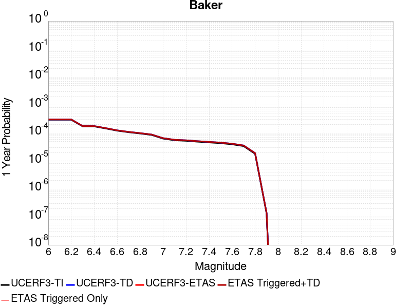 | 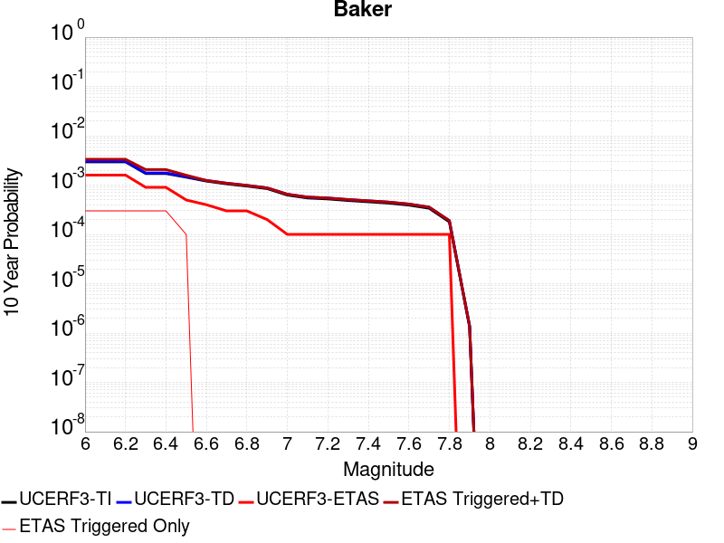 |

| Magnitude | 1 wk TI Prob | 1 wk TD Prob | 1 wk ETAS Prob | 1 wk ETAS/TD Gain | 1 wk ETAS Triggered+TD | 1 wk ETAS Triggered Only | 1 mo TI Prob | 1 mo TD Prob | 1 mo ETAS Prob | 1 mo ETAS/TD Gain | 1 mo ETAS Triggered+TD | 1 mo ETAS Triggered Only | 1 yr TI Prob | 1 yr TD Prob | 1 yr ETAS Prob | 1 yr ETAS/TD Gain | 1 yr ETAS Triggered+TD | 1 yr ETAS Triggered Only | 10 yr TI Prob | 10 yr TD Prob | 10 yr ETAS Prob | 10 yr ETAS/TD Gain | 10 yr ETAS Triggered+TD | 10 yr ETAS Triggered Only |
|-----|-----|-----|-----|-----|-----|-----|-----|-----|-----|-----|-----|-----|-----|-----|-----|-----|-----|-----|-----|-----|-----|-----|-----|-----|
| 6.0 | 5.695525E-6 | 5.833338E-6 | 0.0 | 0.0 | 5.833338E-6 | 0.0 | 2.4409164E-5 | 2.4999803E-5 | 0.0 | 0.0 | 2.4999803E-5 | 0.0 | 2.9714106E-4 | 3.043341E-4 | 0.0 | 0.0 | 3.043341E-4 | 0.0 | 0.0029674405 | 0.0030395687 | 0.0016 | 0.5263905 | 0.0033386569 | 3.0E-4 |
| 6.1 | 5.695525E-6 | 5.833338E-6 | 0.0 | 0.0 | 5.833338E-6 | 0.0 | 2.4409164E-5 | 2.4999803E-5 | 0.0 | 0.0 | 2.4999803E-5 | 0.0 | 2.9714106E-4 | 3.043341E-4 | 0.0 | 0.0 | 3.043341E-4 | 0.0 | 0.0029674405 | 0.0030395687 | 0.0016 | 0.5263905 | 0.0033386569 | 3.0E-4 |
| 6.2 | 5.695525E-6 | 5.833338E-6 | 0.0 | 0.0 | 5.833338E-6 | 0.0 | 2.4409164E-5 | 2.4999803E-5 | 0.0 | 0.0 | 2.4999803E-5 | 0.0 | 2.9714106E-4 | 3.043341E-4 | 0.0 | 0.0 | 3.043341E-4 | 0.0 | 0.0029674405 | 0.0030395687 | 0.0016 | 0.5263905 | 0.0033386569 | 3.0E-4 |
| 6.3 | 3.2995713E-6 | 3.382759E-6 | 0.0 | 0.0 | 3.382759E-6 | 0.0 | 1.4140943E-5 | 1.449746E-5 | 0.0 | 0.0 | 1.449746E-5 | 0.0 | 1.7215237E-4 | 1.7649274E-4 | 0.0 | 0.0 | 1.7649274E-4 | 0.0 | 0.0017201907 | 0.0017635729 | 9.0E-4 | 0.51032764 | 0.0020630439 | 3.0E-4 |
| 6.4 | 3.2995713E-6 | 3.382759E-6 | 0.0 | 0.0 | 3.382759E-6 | 0.0 | 1.4140943E-5 | 1.449746E-5 | 0.0 | 0.0 | 1.449746E-5 | 0.0 | 1.7215237E-4 | 1.7649274E-4 | 0.0 | 0.0 | 1.7649274E-4 | 0.0 | 0.0017201907 | 0.0017635729 | 9.0E-4 | 0.51032764 | 0.0020630439 | 3.0E-4 |
| 6.5 | 2.782202E-6 | 2.8550437E-6 | 0.0 | 0.0 | 2.8550437E-6 | 0.0 | 1.1923668E-5 | 1.2235846E-5 | 0.0 | 0.0 | 1.2235846E-5 | 0.0 | 1.4516099E-4 | 1.4896157E-4 | 0.0 | 0.0 | 1.4896157E-4 | 0.0 | 0.001450662 | 0.00148865 | 5.0E-4 | 0.3358748 | 0.001588501 | 1.0E-4 |
| 6.6 | 2.3163404E-6 | 2.3802197E-6 | 0.0 | 0.0 | 2.3802197E-6 | 0.0 | 9.927136E-6 | 1.0200903E-5 | 0.0 | 0.0 | 1.0200903E-5 | 0.0 | 1.20856166E-4 | 1.2418912E-4 | 0.0 | 0.0 | 1.2418912E-4 | 0.0 | 0.0012079047 | 0.0012412174 | 4.0E-4 | 0.32226425 | 0.0012412174 | 0.0 |
| 6.7 | 2.037056E-6 | 2.0958548E-6 | 0.0 | 0.0 | 2.0958548E-6 | 0.0 | 8.7302105E-6 | 8.982205E-6 | 0.0 | 0.0 | 8.982205E-6 | 0.0 | 1.0628513E-4 | 1.09353015E-4 | 0.0 | 0.0 | 1.09353015E-4 | 0.0 | 0.0010623431 | 0.0010930082 | 3.0E-4 | 0.27447188 | 0.0010930082 | 0.0 |
| 6.8 | 1.8356744E-6 | 1.8909211E-6 | 0.0 | 0.0 | 1.8909211E-6 | 0.0 | 7.867153E-6 | 8.103923E-6 | 0.0 | 0.0 | 8.103923E-6 | 0.0 | 9.577837E-5 | 9.8660945E-5 | 0.0 | 0.0 | 9.8660945E-5 | 0.0 | 9.57371E-4 | 9.861854E-4 | 3.0E-4 | 0.30420244 | 9.861854E-4 | 0.0 |
| 6.9 | 1.6310546E-6 | 1.6826391E-6 | 0.0 | 0.0 | 1.6826391E-6 | 0.0 | 6.9902153E-6 | 7.2112907E-6 | 0.0 | 0.0 | 7.2112907E-6 | 0.0 | 8.510255E-5 | 8.779404E-5 | 0.0 | 0.0 | 8.779404E-5 | 0.0 | 8.5069967E-4 | 8.776049E-4 | 2.0E-4 | 0.227893 | 8.776049E-4 | 0.0 |
| 7.0 | 1.2058036E-6 | 1.2503737E-6 | 0.0 | 0.0 | 1.2503737E-6 | 0.0 | 5.1677193E-6 | 5.3587337E-6 | 0.0 | 0.0 | 5.3587337E-6 | 0.0 | 6.291517E-5 | 6.524065E-5 | 0.0 | 0.0 | 6.524065E-5 | 0.0 | 6.289736E-4 | 6.522173E-4 | 1.0E-4 | 0.15332313 | 6.522173E-4 | 0.0 |
| 7.1 | 1.052382E-6 | 1.0946922E-6 | 0.0 | 0.0 | 1.0946922E-6 | 0.0 | 4.5102006E-6 | 4.6915297E-6 | 0.0 | 0.0 | 4.6915297E-6 | 0.0 | 5.491031E-5 | 5.7117886E-5 | 0.0 | 0.0 | 5.7117886E-5 | 0.0 | 5.4896745E-4 | 5.710329E-4 | 1.0E-4 | 0.17512125 | 5.710329E-4 | 0.0 |
| 7.2 | 1.0067454E-6 | 1.0483104E-6 | 0.0 | 0.0 | 1.0483104E-6 | 0.0 | 4.3146156E-6 | 4.4927515E-6 | 0.0 | 0.0 | 4.4927515E-6 | 0.0 | 5.252918E-5 | 5.469788E-5 | 0.0 | 0.0 | 5.469788E-5 | 0.0 | 5.251676E-4 | 5.468451E-4 | 1.0E-4 | 0.18286715 | 5.468451E-4 | 0.0 |
| 7.3 | 9.3596316E-7 | 9.763247E-7 | 0.0 | 0.0 | 9.763247E-7 | 0.0 | 4.0112645E-6 | 4.184242E-6 | 0.0 | 0.0 | 4.184242E-6 | 0.0 | 4.8836053E-5 | 5.0941962E-5 | 0.0 | 0.0 | 5.0941962E-5 | 0.0 | 4.8825322E-4 | 5.0930365E-4 | 1.0E-4 | 0.19634654 | 5.0930365E-4 | 0.0 |
| 7.4 | 8.8117395E-7 | 9.203317E-7 | 0.0 | 0.0 | 9.203317E-7 | 0.0 | 3.7764542E-6 | 3.944273E-6 | 0.0 | 0.0 | 3.944273E-6 | 0.0 | 4.5977362E-5 | 4.802047E-5 | 0.0 | 0.0 | 4.802047E-5 | 0.0 | 4.596785E-4 | 4.801017E-4 | 1.0E-4 | 0.2082892 | 4.801017E-4 | 0.0 |
| 7.5 | 8.292386E-7 | 8.6703966E-7 | 0.0 | 0.0 | 8.6703966E-7 | 0.0 | 3.5538749E-6 | 3.715879E-6 | 0.0 | 0.0 | 3.715879E-6 | 0.0 | 4.326757E-5 | 4.5239896E-5 | 0.0 | 0.0 | 4.5239896E-5 | 0.0 | 4.3259145E-4 | 4.523076E-4 | 1.0E-4 | 0.22108848 | 4.523076E-4 | 0.0 |
| 7.6 | 7.553842E-7 | 7.910504E-7 | 0.0 | 0.0 | 7.910504E-7 | 0.0 | 3.2373566E-6 | 3.3902118E-6 | 0.0 | 0.0 | 3.3902118E-6 | 0.0 | 3.9414106E-5 | 4.1275052E-5 | 0.0 | 0.0 | 4.1275052E-5 | 0.0 | 3.9407116E-4 | 4.126746E-4 | 1.0E-4 | 0.24232168 | 4.126746E-4 | 0.0 |
| 7.7 | 6.5285366E-7 | 6.849225E-7 | 0.0 | 0.0 | 6.849225E-7 | 0.0 | 2.797941E-6 | 2.935379E-6 | 0.0 | 0.0 | 2.935379E-6 | 0.0 | 3.40644E-5 | 3.573766E-5 | 0.0 | 0.0 | 3.573766E-5 | 0.0 | 3.405918E-4 | 3.5731978E-4 | 1.0E-4 | 0.27986136 | 3.5731978E-4 | 0.0 |
| 7.8 | 3.4586725E-7 | 3.6461634E-7 | 0.0 | 0.0 | 3.6461634E-7 | 0.0 | 1.4822873E-6 | 1.5626406E-6 | 0.0 | 0.0 | 1.5626406E-6 | 0.0 | 1.80467E-5 | 1.9024988E-5 | 0.0 | 0.0 | 1.9024988E-5 | 0.0 | 1.8045233E-4 | 1.9023403E-4 | 1.0E-4 | 0.5256683 | 1.9023403E-4 | 0.0 |
| 7.9 | 2.5591178E-9 | 2.6684681E-9 | 0.0 | 0.0 | 2.6684681E-9 | 0.0 | 1.0967647E-8 | 1.1436292E-8 | 0.0 | 0.0 | 1.1436292E-8 | 0.0 | 1.335311E-7 | 1.3923685E-7 | 0.0 | 0.0 | 1.3923685E-7 | 0.0 | 1.3353102E-6 | 1.3923685E-6 | 0.0 | 0.0 | 1.3923685E-6 | 0.0 |

## Great Valley 12
*[(top)](#table-of-contents)*

| 1 Week | 1 Month | 1 Year | 10 Year |
|-----|-----|-----|-----|
|  | 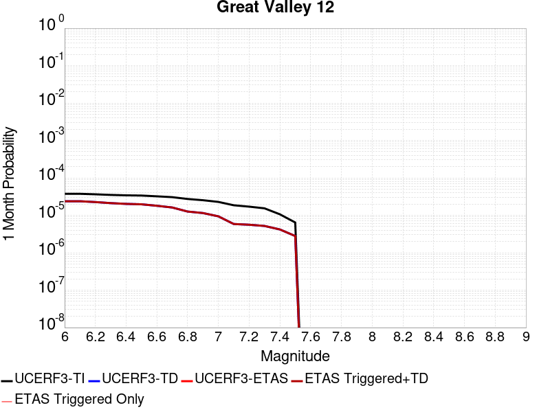 |  | 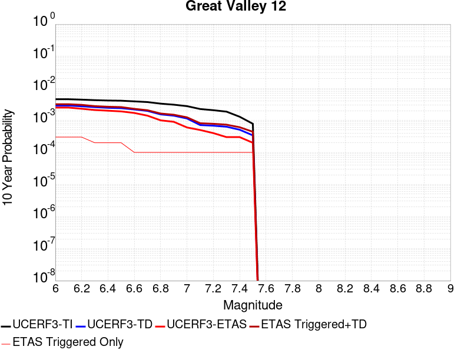 |

| Magnitude | 1 wk TI Prob | 1 wk TD Prob | 1 wk ETAS Prob | 1 wk ETAS/TD Gain | 1 wk ETAS Triggered+TD | 1 wk ETAS Triggered Only | 1 mo TI Prob | 1 mo TD Prob | 1 mo ETAS Prob | 1 mo ETAS/TD Gain | 1 mo ETAS Triggered+TD | 1 mo ETAS Triggered Only | 1 yr TI Prob | 1 yr TD Prob | 1 yr ETAS Prob | 1 yr ETAS/TD Gain | 1 yr ETAS Triggered+TD | 1 yr ETAS Triggered Only | 10 yr TI Prob | 10 yr TD Prob | 10 yr ETAS Prob | 10 yr ETAS/TD Gain | 10 yr ETAS Triggered+TD | 10 yr ETAS Triggered Only |
|-----|-----|-----|-----|-----|-----|-----|-----|-----|-----|-----|-----|-----|-----|-----|-----|-----|-----|-----|-----|-----|-----|-----|-----|-----|
| 6.0 | 8.757157E-6 | 5.5459627E-6 | 0.0 | 0.0 | 5.5459627E-6 | 0.0 | 3.7530135E-5 | 2.3768202E-5 | 0.0 | 0.0 | 2.3768202E-5 | 0.0 | 4.5683357E-4 | 2.8934065E-4 | 2.0E-4 | 0.6912268 | 2.8934065E-4 | 0.0 | 0.004558956 | 0.0028897598 | 0.0025 | 0.86512375 | 0.003188893 | 3.0E-4 |
| 6.1 | 8.757157E-6 | 5.5459627E-6 | 0.0 | 0.0 | 5.5459627E-6 | 0.0 | 3.7530135E-5 | 2.3768202E-5 | 0.0 | 0.0 | 2.3768202E-5 | 0.0 | 4.5683357E-4 | 2.8934065E-4 | 2.0E-4 | 0.6912268 | 2.8934065E-4 | 0.0 | 0.004558956 | 0.0028897598 | 0.0025 | 0.86512375 | 0.003188893 | 3.0E-4 |
| 6.2 | 8.499136E-6 | 5.271812E-6 | 0.0 | 0.0 | 5.271812E-6 | 0.0 | 3.642436E-5 | 2.259329E-5 | 0.0 | 0.0 | 2.259329E-5 | 0.0 | 4.4337637E-4 | 2.7503975E-4 | 2.0E-4 | 0.72716767 | 2.7503975E-4 | 0.0 | 0.0044249278 | 0.0027471078 | 0.0023 | 0.8372442 | 0.0030462835 | 3.0E-4 |
| 6.3 | 8.186883E-6 | 4.9401747E-6 | 0.0 | 0.0 | 4.9401747E-6 | 0.0 | 3.508617E-5 | 2.117201E-5 | 0.0 | 0.0 | 2.117201E-5 | 0.0 | 4.270904E-4 | 2.5773974E-4 | 2.0E-4 | 0.77597654 | 2.5773974E-4 | 0.0 | 0.004262705 | 0.0025745088 | 0.0021 | 0.8156896 | 0.0027739939 | 2.0E-4 |
| 6.4 | 7.979878E-6 | 4.7124195E-6 | 0.0 | 0.0 | 4.7124195E-6 | 0.0 | 3.419903E-5 | 2.0195932E-5 | 0.0 | 0.0 | 2.0195932E-5 | 0.0 | 4.1629362E-4 | 2.4585865E-4 | 2.0E-4 | 0.8134755 | 2.4585865E-4 | 0.0 | 0.0041551464 | 0.0024559605 | 0.002 | 0.81434536 | 0.0026554693 | 2.0E-4 |
| 6.5 | 7.871003E-6 | 4.592522E-6 | 0.0 | 0.0 | 4.592522E-6 | 0.0 | 3.373243E-5 | 1.9682095E-5 | 0.0 | 0.0 | 1.9682095E-5 | 0.0 | 4.1061494E-4 | 2.396041E-4 | 2.0E-4 | 0.8347103 | 2.396041E-4 | 0.0 | 0.0040985704 | 0.0023935505 | 0.0019 | 0.7937999 | 0.0025930717 | 2.0E-4 |
| 6.6 | 7.508221E-6 | 4.1962935E-6 | 0.0 | 0.0 | 4.1962935E-6 | 0.0 | 3.2177693E-5 | 1.7983995E-5 | 0.0 | 0.0 | 1.7983995E-5 | 0.0 | 3.91693E-4 | 2.1893402E-4 | 2.0E-4 | 0.91351724 | 2.1893402E-4 | 0.0 | 0.003910033 | 0.0021872693 | 0.0017 | 0.7772248 | 0.0022870507 | 1.0E-4 |
| 6.7 | 7.1297914E-6 | 3.774526E-6 | 0.0 | 0.0 | 3.774526E-6 | 0.0 | 3.055589E-5 | 1.6176444E-5 | 0.0 | 0.0 | 1.6176444E-5 | 0.0 | 3.7195446E-4 | 1.9693121E-4 | 2.0E-4 | 1.015583 | 1.9693121E-4 | 0.0 | 0.0037133251 | 0.0019676457 | 0.0014 | 0.71151024 | 0.0020674488 | 1.0E-4 |
| 6.8 | 6.376581E-6 | 2.9420255E-6 | 0.0 | 0.0 | 2.9420255E-6 | 0.0 | 2.7327918E-5 | 1.2608621E-5 | 0.0 | 0.0 | 1.2608621E-5 | 0.0 | 3.326666E-4 | 1.534993E-4 | 1.0E-4 | 0.65146875 | 1.534993E-4 | 0.0 | 0.0033216903 | 0.0015339494 | 0.001 | 0.651912 | 0.001633796 | 1.0E-4 |
| 6.9 | 5.9095E-6 | 2.680438E-6 | 0.0 | 0.0 | 2.680438E-6 | 0.0 | 2.5326184E-5 | 1.1487542E-5 | 0.0 | 0.0 | 1.1487542E-5 | 0.0 | 3.0830267E-4 | 1.39852E-4 | 1.0E-4 | 0.71504164 | 1.39852E-4 | 0.0 | 0.003078753 | 0.0013976552 | 9.0E-4 | 0.6439356 | 0.0014975155 | 1.0E-4 |
| 7.0 | 5.3239864E-6 | 2.1912285E-6 | 0.0 | 0.0 | 2.1912285E-6 | 0.0 | 2.2816885E-5 | 9.390947E-6 | 0.0 | 0.0 | 9.390947E-6 | 0.0 | 2.7776015E-4 | 1.1432891E-4 | 1.0E-4 | 0.8746694 | 1.1432891E-4 | 0.0 | 0.0027741324 | 0.0011427144 | 6.0E-4 | 0.5250656 | 0.0012426 | 1.0E-4 |
| 7.1 | 4.329147E-6 | 1.3667083E-6 | 0.0 | 0.0 | 1.3667083E-6 | 0.0 | 1.8553355E-5 | 5.857308E-6 | 0.0 | 0.0 | 5.857308E-6 | 0.0 | 2.2586368E-4 | 7.131048E-5 | 0.0 | 0.0 | 7.131048E-5 | 0.0 | 0.0022563424 | 7.1288465E-4 | 5.0E-4 | 0.7013758 | 8.1281335E-4 | 1.0E-4 |
| 7.2 | 3.978488E-6 | 1.3068424E-6 | 0.0 | 0.0 | 1.3068424E-6 | 0.0 | 1.7050552E-5 | 5.6007416E-6 | 0.0 | 0.0 | 5.6007416E-6 | 0.0 | 2.075707E-4 | 6.818698E-5 | 0.0 | 0.0 | 6.818698E-5 | 0.0 | 0.0020737692 | 6.8166916E-4 | 4.0E-4 | 0.5867949 | 7.81601E-4 | 1.0E-4 |
| 7.3 | 3.586542E-6 | 1.2123495E-6 | 0.0 | 0.0 | 1.2123495E-6 | 0.0 | 1.5370804E-5 | 5.195774E-6 | 0.0 | 0.0 | 5.195774E-6 | 0.0 | 1.8712347E-4 | 6.32568E-5 | 0.0 | 0.0 | 6.32568E-5 | 0.0 | 0.0018696598 | 6.323964E-4 | 3.0E-4 | 0.47438604 | 7.323331E-4 | 1.0E-4 |
| 7.4 | 2.4837766E-6 | 9.774011E-7 | 0.0 | 0.0 | 9.774011E-7 | 0.0 | 1.0644713E-5 | 4.1888557E-6 | 0.0 | 0.0 | 4.1888557E-6 | 0.0 | 1.2959167E-4 | 5.099819E-5 | 0.0 | 0.0 | 5.099819E-5 | 0.0 | 0.0012951613 | 5.098714E-4 | 3.0E-4 | 0.5883836 | 6.098204E-4 | 1.0E-4 |
| 7.5 | 1.5002679E-6 | 6.5268995E-7 | 0.0 | 0.0 | 6.5268995E-7 | 0.0 | 6.4297037E-6 | 2.79724E-6 | 0.0 | 0.0 | 2.79724E-6 | 0.0 | 7.827883E-5 | 3.4055905E-5 | 0.0 | 0.0 | 3.4055905E-5 | 0.0 | 7.825126E-4 | 3.40511E-4 | 2.0E-4 | 0.5873525 | 4.4047696E-4 | 1.0E-4 |

## Northridge Hills
*[(top)](#table-of-contents)*

| 1 Week | 1 Month | 1 Year | 10 Year |
|-----|-----|-----|-----|
|  |  | 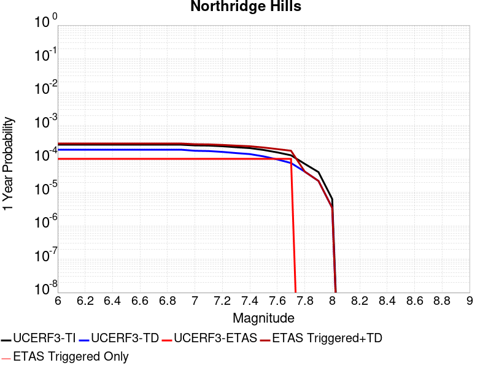 |  |

| Magnitude | 1 wk TI Prob | 1 wk TD Prob | 1 wk ETAS Prob | 1 wk ETAS/TD Gain | 1 wk ETAS Triggered+TD | 1 wk ETAS Triggered Only | 1 mo TI Prob | 1 mo TD Prob | 1 mo ETAS Prob | 1 mo ETAS/TD Gain | 1 mo ETAS Triggered+TD | 1 mo ETAS Triggered Only | 1 yr TI Prob | 1 yr TD Prob | 1 yr ETAS Prob | 1 yr ETAS/TD Gain | 1 yr ETAS Triggered+TD | 1 yr ETAS Triggered Only | 10 yr TI Prob | 10 yr TD Prob | 10 yr ETAS Prob | 10 yr ETAS/TD Gain | 10 yr ETAS Triggered+TD | 10 yr ETAS Triggered Only |
|-----|-----|-----|-----|-----|-----|-----|-----|-----|-----|-----|-----|-----|-----|-----|-----|-----|-----|-----|-----|-----|-----|-----|-----|-----|
| 6.0 | 5.095982E-6 | 3.6075262E-6 | 0.0 | 0.0 | 3.6075262E-6 | 0.0 | 2.183974E-5 | 1.5460735E-5 | 0.0 | 0.0 | 1.5460735E-5 | 0.0 | 2.658664E-4 | 1.8821831E-4 | 1.0E-4 | 0.5312979 | 2.881995E-4 | 1.0E-4 | 0.0026554854 | 0.0018806015 | 0.001 | 0.5317448 | 0.0021800373 | 3.0E-4 |
| 6.1 | 5.095982E-6 | 3.6075262E-6 | 0.0 | 0.0 | 3.6075262E-6 | 0.0 | 2.183974E-5 | 1.5460735E-5 | 0.0 | 0.0 | 1.5460735E-5 | 0.0 | 2.658664E-4 | 1.8821831E-4 | 1.0E-4 | 0.5312979 | 2.881995E-4 | 1.0E-4 | 0.0026554854 | 0.0018806015 | 0.001 | 0.5317448 | 0.0021800373 | 3.0E-4 |
| 6.2 | 5.095982E-6 | 3.6075262E-6 | 0.0 | 0.0 | 3.6075262E-6 | 0.0 | 2.183974E-5 | 1.5460735E-5 | 0.0 | 0.0 | 1.5460735E-5 | 0.0 | 2.658664E-4 | 1.8821831E-4 | 1.0E-4 | 0.5312979 | 2.881995E-4 | 1.0E-4 | 0.0026554854 | 0.0018806015 | 0.001 | 0.5317448 | 0.0021800373 | 3.0E-4 |
| 6.3 | 5.095982E-6 | 3.6075262E-6 | 0.0 | 0.0 | 3.6075262E-6 | 0.0 | 2.183974E-5 | 1.5460735E-5 | 0.0 | 0.0 | 1.5460735E-5 | 0.0 | 2.658664E-4 | 1.8821831E-4 | 1.0E-4 | 0.5312979 | 2.881995E-4 | 1.0E-4 | 0.0026554854 | 0.0018806015 | 0.001 | 0.5317448 | 0.0021800373 | 3.0E-4 |
| 6.4 | 5.095982E-6 | 3.6075262E-6 | 0.0 | 0.0 | 3.6075262E-6 | 0.0 | 2.183974E-5 | 1.5460735E-5 | 0.0 | 0.0 | 1.5460735E-5 | 0.0 | 2.658664E-4 | 1.8821831E-4 | 1.0E-4 | 0.5312979 | 2.881995E-4 | 1.0E-4 | 0.0026554854 | 0.0018806015 | 0.001 | 0.5317448 | 0.0021800373 | 3.0E-4 |
| 6.5 | 5.095982E-6 | 3.6075262E-6 | 0.0 | 0.0 | 3.6075262E-6 | 0.0 | 2.183974E-5 | 1.5460735E-5 | 0.0 | 0.0 | 1.5460735E-5 | 0.0 | 2.658664E-4 | 1.8821831E-4 | 1.0E-4 | 0.5312979 | 2.881995E-4 | 1.0E-4 | 0.0026554854 | 0.0018806015 | 0.001 | 0.5317448 | 0.0021800373 | 3.0E-4 |
| 6.6 | 5.095982E-6 | 3.6075262E-6 | 0.0 | 0.0 | 3.6075262E-6 | 0.0 | 2.183974E-5 | 1.5460735E-5 | 0.0 | 0.0 | 1.5460735E-5 | 0.0 | 2.658664E-4 | 1.8821831E-4 | 1.0E-4 | 0.5312979 | 2.881995E-4 | 1.0E-4 | 0.0026554854 | 0.0018806015 | 0.001 | 0.5317448 | 0.0021800373 | 3.0E-4 |
| 6.7 | 5.095982E-6 | 3.6075262E-6 | 0.0 | 0.0 | 3.6075262E-6 | 0.0 | 2.183974E-5 | 1.5460735E-5 | 0.0 | 0.0 | 1.5460735E-5 | 0.0 | 2.658664E-4 | 1.8821831E-4 | 1.0E-4 | 0.5312979 | 2.881995E-4 | 1.0E-4 | 0.0026554854 | 0.0018806015 | 0.001 | 0.5317448 | 0.0021800373 | 3.0E-4 |
| 6.8 | 5.095982E-6 | 3.6075262E-6 | 0.0 | 0.0 | 3.6075262E-6 | 0.0 | 2.183974E-5 | 1.5460735E-5 | 0.0 | 0.0 | 1.5460735E-5 | 0.0 | 2.658664E-4 | 1.8821831E-4 | 1.0E-4 | 0.5312979 | 2.881995E-4 | 1.0E-4 | 0.0026554854 | 0.0018806015 | 0.001 | 0.5317448 | 0.0021800373 | 3.0E-4 |
| 6.9 | 5.0942654E-6 | 3.605742E-6 | 0.0 | 0.0 | 3.605742E-6 | 0.0 | 2.1832384E-5 | 1.545309E-5 | 0.0 | 0.0 | 1.545309E-5 | 0.0 | 2.6577685E-4 | 1.8812524E-4 | 1.0E-4 | 0.5315608 | 2.881064E-4 | 1.0E-4 | 0.002654592 | 0.0018796722 | 0.001 | 0.53200763 | 0.0021791083 | 3.0E-4 |
| 7.0 | 4.851143E-6 | 3.3511833E-6 | 0.0 | 0.0 | 3.3511833E-6 | 0.0 | 2.0790447E-5 | 1.43621355E-5 | 0.0 | 0.0 | 1.43621355E-5 | 0.0 | 2.5309427E-4 | 1.74845E-4 | 1.0E-4 | 0.5719351 | 2.7482753E-4 | 1.0E-4 | 0.0025280623 | 0.0017470788 | 9.0E-4 | 0.5151456 | 0.0020465548 | 3.0E-4 |
| 7.1 | 4.7910607E-6 | 3.2894964E-6 | 0.0 | 0.0 | 3.2894964E-6 | 0.0 | 2.0532956E-5 | 1.4097765E-5 | 0.0 | 0.0 | 1.4097765E-5 | 0.0 | 2.4996005E-4 | 1.7162682E-4 | 1.0E-4 | 0.58265954 | 2.7160964E-4 | 1.0E-4 | 0.0024967908 | 0.0017149467 | 8.0E-4 | 0.46648678 | 0.0019146038 | 2.0E-4 |
| 7.2 | 4.580079E-6 | 3.0993763E-6 | 0.0 | 0.0 | 3.0993763E-6 | 0.0 | 1.9628762E-5 | 1.3282974E-5 | 0.0 | 0.0 | 1.3282974E-5 | 0.0 | 2.3895396E-4 | 1.6170823E-4 | 1.0E-4 | 0.6183977 | 2.6169207E-4 | 1.0E-4 | 0.0023869718 | 0.0016159092 | 7.0E-4 | 0.43319267 | 0.0017157475 | 1.0E-4 |
| 7.3 | 4.290062E-6 | 2.8610823E-6 | 0.0 | 0.0 | 2.8610823E-6 | 0.0 | 1.838585E-5 | 1.2261724E-5 | 0.0 | 0.0 | 1.2261724E-5 | 0.0 | 2.2382473E-4 | 1.4927628E-4 | 1.0E-4 | 0.66989875 | 2.4926136E-4 | 1.0E-4 | 0.0022359942 | 0.0014917632 | 7.0E-4 | 0.4692434 | 0.001591614 | 1.0E-4 |
| 7.4 | 4.0259683E-6 | 2.666922E-6 | 0.0 | 0.0 | 2.666922E-6 | 0.0 | 1.7254037E-5 | 1.1429615E-5 | 0.0 | 0.0 | 1.1429615E-5 | 0.0 | 2.1004764E-4 | 1.3914671E-4 | 1.0E-4 | 0.71866596 | 2.3913279E-4 | 1.0E-4 | 0.002098492 | 0.0013905986 | 7.0E-4 | 0.50338036 | 0.0014904595 | 1.0E-4 |
| 7.5 | 3.5477108E-6 | 2.2785744E-6 | 0.0 | 0.0 | 2.2785744E-6 | 0.0 | 1.5204386E-5 | 9.765282E-6 | 0.0 | 0.0 | 9.765282E-6 | 0.0 | 1.8509767E-4 | 1.1888583E-4 | 1.0E-4 | 0.84114313 | 2.1887395E-4 | 1.0E-4 | 0.0018494357 | 0.0011882238 | 6.0E-4 | 0.50495535 | 0.001288105 | 1.0E-4 |
| 7.6 | 2.9990608E-6 | 1.8466512E-6 | 0.0 | 0.0 | 1.8466512E-6 | 0.0 | 1.2853055E-5 | 7.9141955E-6 | 0.0 | 0.0 | 7.9141955E-6 | 0.0 | 1.564747E-4 | 9.6351076E-5 | 1.0E-4 | 1.0378711 | 1.9634144E-4 | 1.0E-4 | 0.0015636457 | 9.6309383E-4 | 4.0E-4 | 0.41532817 | 0.0010629975 | 1.0E-4 |
| 7.7 | 2.4542855E-6 | 1.4408764E-6 | 0.0 | 0.0 | 1.4408764E-6 | 0.0 | 1.05183235E-5 | 6.17517E-6 | 0.0 | 0.0 | 6.17517E-6 | 0.0 | 1.2805307E-4 | 7.5180105E-5 | 1.0E-4 | 1.3301392 | 1.7517258E-4 | 1.0E-4 | 0.001279793 | 7.515473E-4 | 4.0E-4 | 0.5322353 | 8.514721E-4 | 1.0E-4 |
| 7.8 | 1.3623128E-6 | 7.981647E-7 | 0.0 | 0.0 | 7.981647E-7 | 0.0 | 5.8384703E-6 | 3.4207014E-6 | 0.0 | 0.0 | 3.4207014E-6 | 0.0 | 7.108106E-5 | 4.1646246E-5 | 0.0 | 0.0 | 4.1646246E-5 | 0.0 | 7.1058323E-4 | 4.1638463E-4 | 1.0E-4 | 0.24016257 | 4.1638463E-4 | 0.0 |
| 7.9 | 7.716622E-7 | 4.1954917E-7 | 0.0 | 0.0 | 4.1954917E-7 | 0.0 | 3.3071194E-6 | 1.7980667E-6 | 0.0 | 0.0 | 1.7980667E-6 | 0.0 | 4.0263436E-5 | 2.1891243E-5 | 0.0 | 0.0 | 2.1891243E-5 | 0.0 | 4.0256142E-4 | 2.1889097E-4 | 0.0 | 0.0 | 2.1889097E-4 | 0.0 |
| 8.0 | 1.2117711E-7 | 6.584553E-8 | 0.0 | 0.0 | 6.584553E-8 | 0.0 | 5.1933034E-7 | 2.8219512E-7 | 0.0 | 0.0 | 2.8219512E-7 | 0.0 | 6.3228285E-6 | 3.4357201E-6 | 0.0 | 0.0 | 3.4357201E-6 | 0.0 | 6.3226486E-5 | 3.435669E-5 | 0.0 | 0.0 | 3.435669E-5 | 0.0 |

## Skinner Flat 2011 CFM
*[(top)](#table-of-contents)*

| 1 Week | 1 Month | 1 Year | 10 Year |
|-----|-----|-----|-----|
| 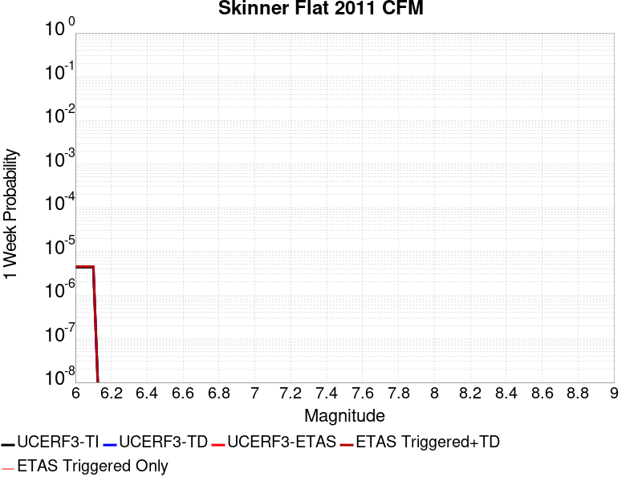 | 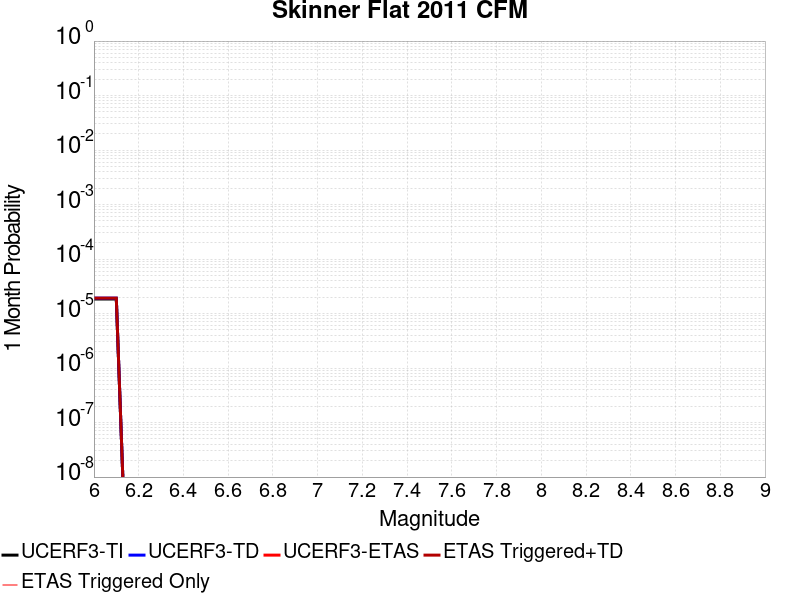 |  |  |

| Magnitude | 1 wk TI Prob | 1 wk TD Prob | 1 wk ETAS Prob | 1 wk ETAS/TD Gain | 1 wk ETAS Triggered+TD | 1 wk ETAS Triggered Only | 1 mo TI Prob | 1 mo TD Prob | 1 mo ETAS Prob | 1 mo ETAS/TD Gain | 1 mo ETAS Triggered+TD | 1 mo ETAS Triggered Only | 1 yr TI Prob | 1 yr TD Prob | 1 yr ETAS Prob | 1 yr ETAS/TD Gain | 1 yr ETAS Triggered+TD | 1 yr ETAS Triggered Only | 10 yr TI Prob | 10 yr TD Prob | 10 yr ETAS Prob | 10 yr ETAS/TD Gain | 10 yr ETAS Triggered+TD | 10 yr ETAS Triggered Only |
|-----|-----|-----|-----|-----|-----|-----|-----|-----|-----|-----|-----|-----|-----|-----|-----|-----|-----|-----|-----|-----|-----|-----|-----|-----|
| 6.0 | 4.3279074E-6 | 4.4832545E-6 | 0.0 | 0.0 | 4.4832545E-6 | 0.0 | 1.8548042E-5 | 1.9213947E-5 | 0.0 | 0.0 | 1.9213947E-5 | 0.0 | 2.2579901E-4 | 2.3392981E-4 | 0.0 | 0.0 | 2.3392981E-4 | 0.0 | 0.002255697 | 0.0023392981 | 0.0011 | 0.47022653 | 0.0026385963 | 3.0E-4 |
| 6.1 | 4.3279074E-6 | 4.4832545E-6 | 0.0 | 0.0 | 4.4832545E-6 | 0.0 | 1.8548042E-5 | 1.9213947E-5 | 0.0 | 0.0 | 1.9213947E-5 | 0.0 | 2.2579901E-4 | 2.3392981E-4 | 0.0 | 0.0 | 2.3392981E-4 | 0.0 | 0.002255697 | 0.0023392981 | 9.0E-4 | 0.3847308 | 0.0026385963 | 3.0E-4 |

## Carlsbad
*[(top)](#table-of-contents)*

| 1 Week | 1 Month | 1 Year | 10 Year |
|-----|-----|-----|-----|
|  | 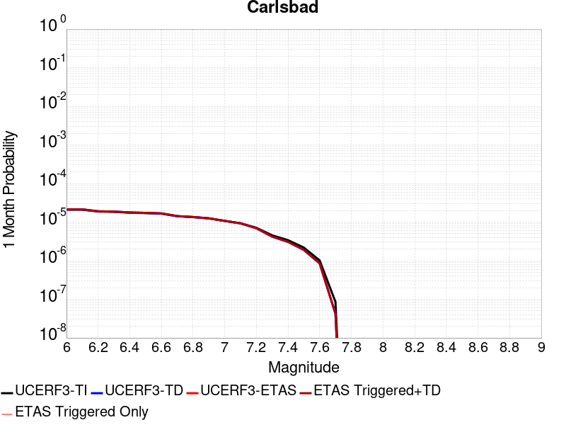 |  | 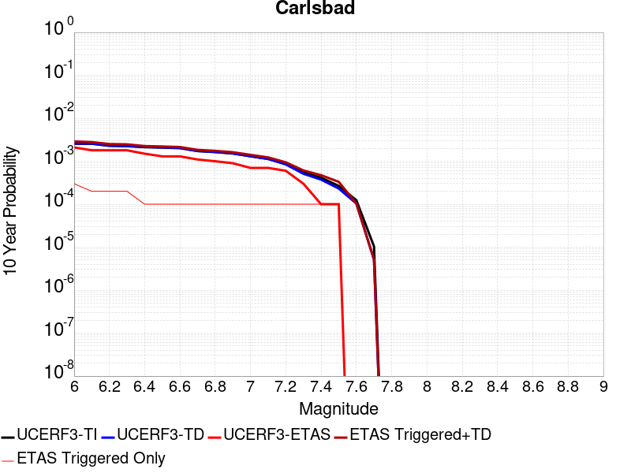 |

| Magnitude | 1 wk TI Prob | 1 wk TD Prob | 1 wk ETAS Prob | 1 wk ETAS/TD Gain | 1 wk ETAS Triggered+TD | 1 wk ETAS Triggered Only | 1 mo TI Prob | 1 mo TD Prob | 1 mo ETAS Prob | 1 mo ETAS/TD Gain | 1 mo ETAS Triggered+TD | 1 mo ETAS Triggered Only | 1 yr TI Prob | 1 yr TD Prob | 1 yr ETAS Prob | 1 yr ETAS/TD Gain | 1 yr ETAS Triggered+TD | 1 yr ETAS Triggered Only | 10 yr TI Prob | 10 yr TD Prob | 10 yr ETAS Prob | 10 yr ETAS/TD Gain | 10 yr ETAS Triggered+TD | 10 yr ETAS Triggered Only |
|-----|-----|-----|-----|-----|-----|-----|-----|-----|-----|-----|-----|-----|-----|-----|-----|-----|-----|-----|-----|-----|-----|-----|-----|-----|
| 6.0 | 4.9038536E-6 | 4.9847313E-6 | 0.0 | 0.0 | 4.9847313E-6 | 0.0 | 2.1016345E-5 | 2.1362963E-5 | 0.0 | 0.0 | 2.1362963E-5 | 0.0 | 2.5584397E-4 | 2.6006348E-4 | 0.0 | 0.0 | 2.6006348E-4 | 0.0 | 0.002555496 | 0.0025976384 | 0.0021 | 0.8084266 | 0.002896859 | 3.0E-4 |
| 6.1 | 4.9038536E-6 | 4.9847313E-6 | 0.0 | 0.0 | 4.9847313E-6 | 0.0 | 2.1016345E-5 | 2.1362963E-5 | 0.0 | 0.0 | 2.1362963E-5 | 0.0 | 2.5584397E-4 | 2.6006348E-4 | 0.0 | 0.0 | 2.6006348E-4 | 0.0 | 0.002555496 | 0.0025976384 | 0.0018 | 0.6929371 | 0.0027971189 | 2.0E-4 |
| 6.2 | 4.3820614E-6 | 4.4523576E-6 | 0.0 | 0.0 | 4.4523576E-6 | 0.0 | 1.8780129E-5 | 1.9081395E-5 | 0.0 | 0.0 | 1.9081395E-5 | 0.0 | 2.2862408E-4 | 2.3229158E-4 | 0.0 | 0.0 | 2.3229158E-4 | 0.0 | 0.00228389 | 0.0023205234 | 0.0018 | 0.7756871 | 0.0025200592 | 2.0E-4 |
| 6.3 | 4.302872E-6 | 4.370623E-6 | 0.0 | 0.0 | 4.370623E-6 | 0.0 | 1.8440749E-5 | 1.8731109E-5 | 0.0 | 0.0 | 1.8731109E-5 | 0.0 | 2.24493E-4 | 2.2802773E-4 | 0.0 | 0.0 | 2.2802773E-4 | 0.0 | 0.0022426634 | 0.0022779729 | 0.0018 | 0.7901763 | 0.0024775171 | 2.0E-4 |
| 6.4 | 4.0835243E-6 | 4.145336E-6 | 0.0 | 0.0 | 4.145336E-6 | 0.0 | 1.75007E-5 | 1.7765606E-5 | 0.0 | 0.0 | 1.7765606E-5 | 0.0 | 2.1305021E-4 | 2.1627512E-4 | 0.0 | 0.0 | 2.1627512E-4 | 0.0 | 0.0021284607 | 0.0021606805 | 0.0015 | 0.6942258 | 0.0022604642 | 1.0E-4 |
| 6.5 | 3.987806E-6 | 4.0466007E-6 | 0.0 | 0.0 | 4.0466007E-6 | 0.0 | 1.7090486E-5 | 1.7342461E-5 | 0.0 | 0.0 | 1.7342461E-5 | 0.0 | 2.080568E-4 | 2.1112435E-4 | 0.0 | 0.0 | 2.1112435E-4 | 0.0 | 0.002078621 | 0.0021092715 | 0.0013 | 0.6163265 | 0.0022090606 | 1.0E-4 |
| 6.6 | 3.8707576E-6 | 3.925249E-6 | 0.0 | 0.0 | 3.925249E-6 | 0.0 | 1.6588854E-5 | 1.682239E-5 | 0.0 | 0.0 | 1.682239E-5 | 0.0 | 2.0195059E-4 | 2.0479369E-4 | 0.0 | 0.0 | 2.0479369E-4 | 0.0 | 0.0020176715 | 0.002046083 | 0.0013 | 0.6353603 | 0.0021458785 | 1.0E-4 |
| 6.7 | 3.3093434E-6 | 3.340429E-6 | 0.0 | 0.0 | 3.340429E-6 | 0.0 | 1.4182823E-5 | 1.4316046E-5 | 0.0 | 0.0 | 1.4316046E-5 | 0.0 | 1.7266218E-4 | 1.7428398E-4 | 0.0 | 0.0 | 1.7428398E-4 | 0.0 | 0.001725281 | 0.001741479 | 0.0011 | 0.631647 | 0.0018413048 | 1.0E-4 |
| 6.8 | 3.136983E-6 | 3.1645923E-6 | 0.0 | 0.0 | 3.1645923E-6 | 0.0 | 1.3444143E-5 | 1.3562469E-5 | 0.0 | 0.0 | 1.3562469E-5 | 0.0 | 1.6367015E-4 | 1.651106E-4 | 0.0 | 0.0 | 1.651106E-4 | 0.0 | 0.0016354966 | 0.0016498849 | 0.001 | 0.6061029 | 0.00174972 | 1.0E-4 |
| 6.9 | 2.9056644E-6 | 2.9250382E-6 | 0.0 | 0.0 | 2.9250382E-6 | 0.0 | 1.2452788E-5 | 1.2535818E-5 | 0.0 | 0.0 | 1.2535818E-5 | 0.0 | 1.5160214E-4 | 1.5261295E-4 | 0.0 | 0.0 | 1.5261295E-4 | 0.0 | 0.0015149876 | 0.0015250867 | 9.0E-4 | 0.5901304 | 0.0016249343 | 1.0E-4 |
| 7.0 | 2.5071035E-6 | 2.5098989E-6 | 0.0 | 0.0 | 2.5098989E-6 | 0.0 | 1.0744685E-5 | 1.0756666E-5 | 0.0 | 0.0 | 1.0756666E-5 | 0.0 | 1.308087E-4 | 1.3095456E-4 | 0.0 | 0.0 | 1.3095456E-4 | 0.0 | 0.0013073172 | 0.0013087771 | 7.0E-4 | 0.5348504 | 0.0014086463 | 1.0E-4 |
| 7.1 | 2.1786877E-6 | 2.1665808E-6 | 0.0 | 0.0 | 2.1665808E-6 | 0.0 | 9.3372E-6 | 9.285313E-6 | 0.0 | 0.0 | 9.285313E-6 | 0.0 | 1.13674476E-4 | 1.1304285E-4 | 0.0 | 0.0 | 1.1304285E-4 | 0.0 | 0.0011361635 | 0.0011298563 | 7.0E-4 | 0.6195478 | 0.0012297434 | 1.0E-4 |
| 7.2 | 1.6628418E-6 | 1.6204554E-6 | 0.0 | 0.0 | 1.6204554E-6 | 0.0 | 7.1264453E-6 | 6.9447906E-6 | 0.0 | 0.0 | 6.9447906E-6 | 0.0 | 8.676102E-5 | 8.454957E-5 | 0.0 | 0.0 | 8.454957E-5 | 0.0 | 8.672715E-4 | 8.4517617E-4 | 6.0E-4 | 0.70991117 | 9.4509166E-4 | 1.0E-4 |
| 7.3 | 1.0595926E-6 | 9.812139E-7 | 0.0 | 0.0 | 9.812139E-7 | 0.0 | 4.541103E-6 | 4.2051956E-6 | 0.0 | 0.0 | 4.2051956E-6 | 0.0 | 5.5286528E-5 | 5.1197065E-5 | 0.0 | 0.0 | 5.1197065E-5 | 0.0 | 5.527277E-4 | 5.118536E-4 | 3.0E-4 | 0.5861051 | 6.118024E-4 | 1.0E-4 |
| 7.4 | 7.956623E-7 | 7.17056E-7 | 0.0 | 0.0 | 7.17056E-7 | 0.0 | 3.4099767E-6 | 3.0730937E-6 | 0.0 | 0.0 | 3.0730937E-6 | 0.0 | 4.1515676E-5 | 3.741428E-5 | 0.0 | 0.0 | 3.741428E-5 | 0.0 | 4.150792E-4 | 3.7408053E-4 | 1.0E-4 | 0.26732212 | 4.740431E-4 | 1.0E-4 |
| 7.5 | 5.1043804E-7 | 4.4467436E-7 | 0.0 | 0.0 | 4.4467436E-7 | 0.0 | 2.1875896E-6 | 1.9057459E-6 | 0.0 | 0.0 | 1.9057459E-6 | 0.0 | 2.663358E-5 | 2.3202216E-5 | 0.0 | 0.0 | 2.3202216E-5 | 0.0 | 2.6630386E-4 | 2.319985E-4 | 1.0E-4 | 0.43103728 | 3.319753E-4 | 1.0E-4 |
| 7.6 | 2.3723294E-7 | 1.9890412E-7 | 0.0 | 0.0 | 1.9890412E-7 | 0.0 | 1.0167122E-6 | 8.524459E-7 | 0.0 | 0.0 | 8.524459E-7 | 0.0 | 1.2378401E-5 | 1.0378482E-5 | 0.0 | 0.0 | 1.0378482E-5 | 0.0 | 1.237771E-4 | 1.0378025E-4 | 0.0 | 0.0 | 1.0378025E-4 | 0.0 |
| 7.7 | 1.9992152E-8 | 9.848918E-9 | 0.0 | 0.0 | 9.848918E-9 | 0.0 | 8.568065E-8 | 4.220965E-8 | 0.0 | 0.0 | 4.220965E-8 | 0.0 | 1.0431614E-6 | 5.139025E-7 | 0.0 | 0.0 | 5.139025E-7 | 0.0 | 1.0431565E-5 | 5.139025E-6 | 0.0 | 0.0 | 5.139025E-6 | 0.0 |

## San Joaquin Hills
*[(top)](#table-of-contents)*

| 1 Week | 1 Month | 1 Year | 10 Year |
|-----|-----|-----|-----|
|  |  |  | 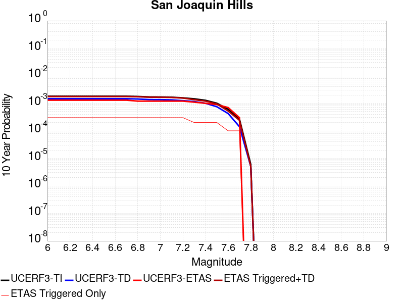 |

| Magnitude | 1 wk TI Prob | 1 wk TD Prob | 1 wk ETAS Prob | 1 wk ETAS/TD Gain | 1 wk ETAS Triggered+TD | 1 wk ETAS Triggered Only | 1 mo TI Prob | 1 mo TD Prob | 1 mo ETAS Prob | 1 mo ETAS/TD Gain | 1 mo ETAS Triggered+TD | 1 mo ETAS Triggered Only | 1 yr TI Prob | 1 yr TD Prob | 1 yr ETAS Prob | 1 yr ETAS/TD Gain | 1 yr ETAS Triggered+TD | 1 yr ETAS Triggered Only | 10 yr TI Prob | 10 yr TD Prob | 10 yr ETAS Prob | 10 yr ETAS/TD Gain | 10 yr ETAS Triggered+TD | 10 yr ETAS Triggered Only |
|-----|-----|-----|-----|-----|-----|-----|-----|-----|-----|-----|-----|-----|-----|-----|-----|-----|-----|-----|-----|-----|-----|-----|-----|-----|
| 6.0 | 3.4525704E-6 | 2.811636E-6 | 0.0 | 0.0 | 2.811636E-6 | 0.0 | 1.4796647E-5 | 1.2049813E-5 | 0.0 | 0.0 | 1.2049813E-5 | 0.0 | 1.8013427E-4 | 1.4669674E-4 | 2.0E-4 | 1.3633568 | 2.4668206E-4 | 1.0E-4 | 0.0017998833 | 0.0014660122 | 0.0013 | 0.88675934 | 0.0017655723 | 3.0E-4 |
| 6.1 | 3.4525704E-6 | 2.811636E-6 | 0.0 | 0.0 | 2.811636E-6 | 0.0 | 1.4796647E-5 | 1.2049813E-5 | 0.0 | 0.0 | 1.2049813E-5 | 0.0 | 1.8013427E-4 | 1.4669674E-4 | 2.0E-4 | 1.3633568 | 2.4668206E-4 | 1.0E-4 | 0.0017998833 | 0.0014660122 | 0.0013 | 0.88675934 | 0.0017655723 | 3.0E-4 |
| 6.2 | 3.4525704E-6 | 2.811636E-6 | 0.0 | 0.0 | 2.811636E-6 | 0.0 | 1.4796647E-5 | 1.2049813E-5 | 0.0 | 0.0 | 1.2049813E-5 | 0.0 | 1.8013427E-4 | 1.4669674E-4 | 2.0E-4 | 1.3633568 | 2.4668206E-4 | 1.0E-4 | 0.0017998833 | 0.0014660122 | 0.0013 | 0.88675934 | 0.0017655723 | 3.0E-4 |
| 6.3 | 3.4525704E-6 | 2.811636E-6 | 0.0 | 0.0 | 2.811636E-6 | 0.0 | 1.4796647E-5 | 1.2049813E-5 | 0.0 | 0.0 | 1.2049813E-5 | 0.0 | 1.8013427E-4 | 1.4669674E-4 | 2.0E-4 | 1.3633568 | 2.4668206E-4 | 1.0E-4 | 0.0017998833 | 0.0014660122 | 0.0013 | 0.88675934 | 0.0017655723 | 3.0E-4 |
| 6.4 | 3.4525704E-6 | 2.811636E-6 | 0.0 | 0.0 | 2.811636E-6 | 0.0 | 1.4796647E-5 | 1.2049813E-5 | 0.0 | 0.0 | 1.2049813E-5 | 0.0 | 1.8013427E-4 | 1.4669674E-4 | 2.0E-4 | 1.3633568 | 2.4668206E-4 | 1.0E-4 | 0.0017998833 | 0.0014660122 | 0.0013 | 0.88675934 | 0.0017655723 | 3.0E-4 |
| 6.5 | 3.4525704E-6 | 2.811636E-6 | 0.0 | 0.0 | 2.811636E-6 | 0.0 | 1.4796647E-5 | 1.2049813E-5 | 0.0 | 0.0 | 1.2049813E-5 | 0.0 | 1.8013427E-4 | 1.4669674E-4 | 2.0E-4 | 1.3633568 | 2.4668206E-4 | 1.0E-4 | 0.0017998833 | 0.0014660122 | 0.0013 | 0.88675934 | 0.0017655723 | 3.0E-4 |
| 6.6 | 3.4525704E-6 | 2.811636E-6 | 0.0 | 0.0 | 2.811636E-6 | 0.0 | 1.4796647E-5 | 1.2049813E-5 | 0.0 | 0.0 | 1.2049813E-5 | 0.0 | 1.8013427E-4 | 1.4669674E-4 | 2.0E-4 | 1.3633568 | 2.4668206E-4 | 1.0E-4 | 0.0017998833 | 0.0014660122 | 0.0013 | 0.88675934 | 0.0017655723 | 3.0E-4 |
| 6.7 | 3.4525704E-6 | 2.811636E-6 | 0.0 | 0.0 | 2.811636E-6 | 0.0 | 1.4796647E-5 | 1.2049813E-5 | 0.0 | 0.0 | 1.2049813E-5 | 0.0 | 1.8013427E-4 | 1.4669674E-4 | 2.0E-4 | 1.3633568 | 2.4668206E-4 | 1.0E-4 | 0.0017998833 | 0.0014660122 | 0.0013 | 0.88675934 | 0.0017655723 | 3.0E-4 |
| 6.8 | 3.388654E-6 | 2.746092E-6 | 0.0 | 0.0 | 2.746092E-6 | 0.0 | 1.4522722E-5 | 1.1768913E-5 | 0.0 | 0.0 | 1.1768913E-5 | 0.0 | 1.767998E-4 | 1.4327723E-4 | 2.0E-4 | 1.3958952 | 2.432629E-4 | 1.0E-4 | 0.001766592 | 0.0014318613 | 0.0012 | 0.83807 | 0.0017314317 | 3.0E-4 |
| 6.9 | 3.2694352E-6 | 2.6260386E-6 | 0.0 | 0.0 | 2.6260386E-6 | 0.0 | 1.401179E-5 | 1.1254403E-5 | 0.0 | 0.0 | 1.1254403E-5 | 0.0 | 1.7058018E-4 | 1.3701385E-4 | 2.0E-4 | 1.4597064 | 2.3700015E-4 | 1.0E-4 | 0.0017044931 | 0.0013693051 | 0.0012 | 0.87635696 | 0.0016688942 | 3.0E-4 |
| 7.0 | 3.246912E-6 | 2.6047035E-6 | 0.0 | 0.0 | 2.6047035E-6 | 0.0 | 1.39152635E-5 | 1.1162967E-5 | 0.0 | 0.0 | 1.1162967E-5 | 0.0 | 1.6940516E-4 | 1.3590076E-4 | 2.0E-4 | 1.471662 | 2.3588717E-4 | 1.0E-4 | 0.0016927607 | 0.0013581878 | 0.0012 | 0.88353026 | 0.0016577803 | 3.0E-4 |
| 7.1 | 3.1864927E-6 | 2.5500453E-6 | 0.0 | 0.0 | 2.5500453E-6 | 0.0 | 1.3656326E-5 | 1.0928721E-5 | 0.0 | 0.0 | 1.0928721E-5 | 0.0 | 1.6625308E-4 | 1.3304917E-4 | 2.0E-4 | 1.5032037 | 2.3303585E-4 | 1.0E-4 | 0.0016612876 | 0.001329706 | 0.0012 | 0.9024551 | 0.0016293072 | 3.0E-4 |
| 7.2 | 3.0220644E-6 | 2.3969453E-6 | 0.0 | 0.0 | 2.3969453E-6 | 0.0 | 1.295164E-5 | 1.0272583E-5 | 0.0 | 0.0 | 1.0272583E-5 | 0.0 | 1.576748E-4 | 1.2506162E-4 | 2.0E-4 | 1.5992117 | 2.2504911E-4 | 1.0E-4 | 0.0015756298 | 0.0012499227 | 0.0012 | 0.9600594 | 0.0015495478 | 3.0E-4 |
| 7.3 | 2.787619E-6 | 2.215373E-6 | 0.0 | 0.0 | 2.215373E-6 | 0.0 | 1.1946884E-5 | 9.494422E-6 | 0.0 | 0.0 | 9.494422E-6 | 0.0 | 1.454436E-4 | 1.1558855E-4 | 1.0E-4 | 0.86513764 | 1.1558855E-4 | 0.0 | 0.0014534845 | 0.001155294 | 0.0011 | 0.95213854 | 0.001355063 | 2.0E-4 |
| 7.4 | 2.4593792E-6 | 1.9207107E-6 | 0.0 | 0.0 | 1.9207107E-6 | 0.0 | 1.0540153E-5 | 8.231592E-6 | 0.0 | 0.0 | 8.231592E-6 | 0.0 | 1.2831882E-4 | 1.0021511E-4 | 1.0E-4 | 0.9978535 | 1.0021511E-4 | 0.0 | 0.0012824474 | 0.001001708 | 0.001 | 0.998295 | 0.0012015076 | 2.0E-4 |
| 7.5 | 1.926764E-6 | 1.4365178E-6 | 0.0 | 0.0 | 1.4365178E-6 | 0.0 | 8.257534E-6 | 6.156491E-6 | 0.0 | 0.0 | 6.156491E-6 | 0.0 | 1.00530844E-4 | 7.495276E-5 | 1.0E-4 | 1.3341737 | 7.495276E-5 | 0.0 | 0.0010048538 | 7.4928114E-4 | 9.0E-4 | 1.2011513 | 9.4913127E-4 | 2.0E-4 |
| 7.6 | 1.1609359E-6 | 8.129729E-7 | 0.0 | 0.0 | 8.129729E-7 | 0.0 | 4.97543E-6 | 3.4841653E-6 | 0.0 | 0.0 | 3.4841653E-6 | 0.0 | 6.0574173E-5 | 4.241893E-5 | 1.0E-4 | 2.357438 | 4.241893E-5 | 0.0 | 6.055767E-4 | 4.2411263E-4 | 7.0E-4 | 1.650505 | 5.2407023E-4 | 1.0E-4 |
| 7.7 | 5.1168536E-7 | 2.7130497E-7 | 0.0 | 0.0 | 2.7130497E-7 | 0.0 | 2.1929354E-6 | 1.1627352E-6 | 0.0 | 0.0 | 1.1627352E-6 | 0.0 | 2.669866E-5 | 1.4156222E-5 | 0.0 | 0.0 | 1.4156222E-5 | 0.0 | 2.6695454E-4 | 1.4155456E-4 | 3.0E-4 | 2.1193242 | 2.415404E-4 | 1.0E-4 |
| 7.8 | 1.16056995E-8 | 9.781111E-9 | 0.0 | 0.0 | 9.781111E-9 | 0.0 | 4.9738713E-8 | 4.1919048E-8 | 0.0 | 0.0 | 4.1919048E-8 | 0.0 | 6.0556863E-7 | 5.1036443E-7 | 0.0 | 0.0 | 5.1036443E-7 | 0.0 | 6.05567E-6 | 5.103644E-6 | 0.0 | 0.0 | 5.103644E-6 | 0.0 |

## Sierra Madre (San Fernando)
*[(top)](#table-of-contents)*

| 1 Week | 1 Month | 1 Year | 10 Year |
|-----|-----|-----|-----|
|  | 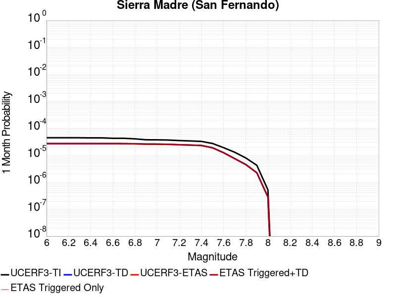 | 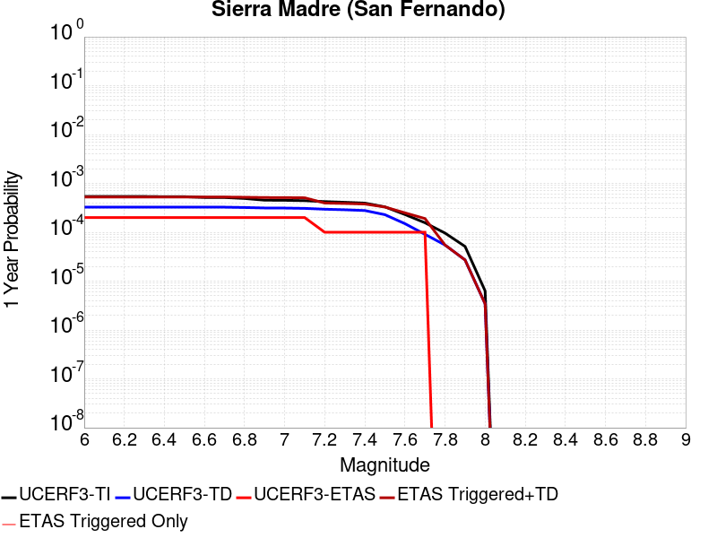 | 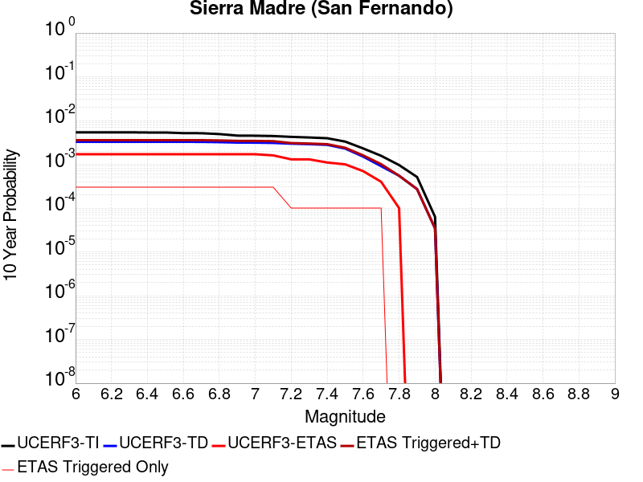 |

| Magnitude | 1 wk TI Prob | 1 wk TD Prob | 1 wk ETAS Prob | 1 wk ETAS/TD Gain | 1 wk ETAS Triggered+TD | 1 wk ETAS Triggered Only | 1 mo TI Prob | 1 mo TD Prob | 1 mo ETAS Prob | 1 mo ETAS/TD Gain | 1 mo ETAS Triggered+TD | 1 mo ETAS Triggered Only | 1 yr TI Prob | 1 yr TD Prob | 1 yr ETAS Prob | 1 yr ETAS/TD Gain | 1 yr ETAS Triggered+TD | 1 yr ETAS Triggered Only | 10 yr TI Prob | 10 yr TD Prob | 10 yr ETAS Prob | 10 yr ETAS/TD Gain | 10 yr ETAS Triggered+TD | 10 yr ETAS Triggered Only |
|-----|-----|-----|-----|-----|-----|-----|-----|-----|-----|-----|-----|-----|-----|-----|-----|-----|-----|-----|-----|-----|-----|-----|-----|-----|
| 6.0 | 1.0346413E-5 | 6.272881E-6 | 0.0 | 0.0 | 6.272881E-6 | 0.0 | 4.4341014E-5 | 2.6883505E-5 | 0.0 | 0.0 | 2.6883505E-5 | 0.0 | 5.3971814E-4 | 3.2725863E-4 | 2.0E-4 | 0.61113745 | 5.271932E-4 | 2.0E-4 | 0.0053840918 | 0.0032678794 | 0.0017 | 0.52021503 | 0.003566899 | 3.0E-4 |
| 6.1 | 1.0346413E-5 | 6.272881E-6 | 0.0 | 0.0 | 6.272881E-6 | 0.0 | 4.4341014E-5 | 2.6883505E-5 | 0.0 | 0.0 | 2.6883505E-5 | 0.0 | 5.3971814E-4 | 3.2725863E-4 | 2.0E-4 | 0.61113745 | 5.271932E-4 | 2.0E-4 | 0.0053840918 | 0.0032678794 | 0.0017 | 0.52021503 | 0.003566899 | 3.0E-4 |
| 6.2 | 1.0346413E-5 | 6.272881E-6 | 0.0 | 0.0 | 6.272881E-6 | 0.0 | 4.4341014E-5 | 2.6883505E-5 | 0.0 | 0.0 | 2.6883505E-5 | 0.0 | 5.3971814E-4 | 3.2725863E-4 | 2.0E-4 | 0.61113745 | 5.271932E-4 | 2.0E-4 | 0.0053840918 | 0.0032678794 | 0.0017 | 0.52021503 | 0.003566899 | 3.0E-4 |
| 6.3 | 1.0346413E-5 | 6.272881E-6 | 0.0 | 0.0 | 6.272881E-6 | 0.0 | 4.4341014E-5 | 2.6883505E-5 | 0.0 | 0.0 | 2.6883505E-5 | 0.0 | 5.3971814E-4 | 3.2725863E-4 | 2.0E-4 | 0.61113745 | 5.271932E-4 | 2.0E-4 | 0.0053840918 | 0.0032678794 | 0.0017 | 0.52021503 | 0.003566899 | 3.0E-4 |
| 6.4 | 1.0249558E-5 | 6.272881E-6 | 0.0 | 0.0 | 6.272881E-6 | 0.0 | 4.392594E-5 | 2.6883505E-5 | 0.0 | 0.0 | 2.6883505E-5 | 0.0 | 5.3466705E-4 | 3.2725863E-4 | 2.0E-4 | 0.61113745 | 5.271932E-4 | 2.0E-4 | 0.0053338245 | 0.0032678794 | 0.0017 | 0.52021503 | 0.003566899 | 3.0E-4 |
| 6.5 | 1.0249558E-5 | 6.272881E-6 | 0.0 | 0.0 | 6.272881E-6 | 0.0 | 4.392594E-5 | 2.6883505E-5 | 0.0 | 0.0 | 2.6883505E-5 | 0.0 | 5.3466705E-4 | 3.2725863E-4 | 2.0E-4 | 0.61113745 | 5.271932E-4 | 2.0E-4 | 0.0053338245 | 0.0032678794 | 0.0017 | 0.52021503 | 0.003566899 | 3.0E-4 |
| 6.6 | 9.9035515E-6 | 6.272881E-6 | 0.0 | 0.0 | 6.272881E-6 | 0.0 | 4.2443102E-5 | 2.6883505E-5 | 0.0 | 0.0 | 2.6883505E-5 | 0.0 | 5.166222E-4 | 3.2725863E-4 | 2.0E-4 | 0.61113745 | 5.271932E-4 | 2.0E-4 | 0.0051542283 | 0.0032678794 | 0.0017 | 0.52021503 | 0.003566899 | 3.0E-4 |
| 6.7 | 9.87217E-6 | 6.2603344E-6 | 0.0 | 0.0 | 6.2603344E-6 | 0.0 | 4.2308613E-5 | 2.6829734E-5 | 0.0 | 0.0 | 2.6829734E-5 | 0.0 | 5.149856E-4 | 3.2660415E-4 | 2.0E-4 | 0.6123621 | 5.265388E-4 | 2.0E-4 | 0.005137938 | 0.0032613538 | 0.0017 | 0.5212559 | 0.0035603754 | 3.0E-4 |
| 6.8 | 9.4359175E-6 | 6.164593E-6 | 0.0 | 0.0 | 6.164593E-6 | 0.0 | 4.043902E-5 | 2.6419422E-5 | 0.0 | 0.0 | 2.6419422E-5 | 0.0 | 4.9223384E-4 | 3.2161007E-4 | 2.0E-4 | 0.62187105 | 5.2154576E-4 | 2.0E-4 | 0.0049114493 | 0.0032115579 | 0.0017 | 0.5293381 | 0.0035105944 | 3.0E-4 |
| 6.9 | 8.700447E-6 | 6.0263274E-6 | 0.0 | 0.0 | 6.0263274E-6 | 0.0 | 3.72871E-5 | 2.5826866E-5 | 0.0 | 0.0 | 2.5826866E-5 | 0.0 | 4.5387587E-4 | 3.1439782E-4 | 2.0E-4 | 0.6361368 | 5.1433494E-4 | 2.0E-4 | 0.0045295 | 0.0031396395 | 0.0017 | 0.54146343 | 0.0034386977 | 3.0E-4 |
| 7.0 | 8.648878E-6 | 6.001341E-6 | 0.0 | 0.0 | 6.001341E-6 | 0.0 | 3.7066096E-5 | 2.5719784E-5 | 0.0 | 0.0 | 2.5719784E-5 | 0.0 | 4.5118626E-4 | 3.1309447E-4 | 2.0E-4 | 0.6387848 | 5.1303185E-4 | 2.0E-4 | 0.004502713 | 0.003126643 | 0.0017 | 0.54371417 | 0.0034257048 | 3.0E-4 |
| 7.1 | 8.505786E-6 | 5.911324E-6 | 0.0 | 0.0 | 5.911324E-6 | 0.0 | 3.645286E-5 | 2.5334008E-5 | 0.0 | 0.0 | 2.5334008E-5 | 0.0 | 4.437232E-4 | 3.0839894E-4 | 2.0E-4 | 0.64851063 | 5.083373E-4 | 2.0E-4 | 0.0044283825 | 0.0030798186 | 0.0016 | 0.5195111 | 0.0033788946 | 3.0E-4 |
| 7.2 | 8.139752E-6 | 5.6858466E-6 | 0.0 | 0.0 | 5.6858466E-6 | 0.0 | 3.4884186E-5 | 2.4367693E-5 | 0.0 | 0.0 | 2.4367693E-5 | 0.0 | 4.246322E-4 | 2.9663733E-4 | 1.0E-4 | 0.33711198 | 3.9660768E-4 | 1.0E-4 | 0.004238217 | 0.0029625196 | 0.0013 | 0.43881565 | 0.0030622233 | 1.0E-4 |
| 7.3 | 7.8816E-6 | 5.5393357E-6 | 0.0 | 0.0 | 5.5393357E-6 | 0.0 | 3.3777847E-5 | 2.37398E-5 | 0.0 | 0.0 | 2.37398E-5 | 0.0 | 4.111677E-4 | 2.8899478E-4 | 1.0E-4 | 0.34602702 | 3.8896588E-4 | 1.0E-4 | 0.004104078 | 0.002886295 | 0.0013 | 0.4504044 | 0.0029860064 | 1.0E-4 |
| 7.4 | 7.5810603E-6 | 5.3437257E-6 | 0.0 | 0.0 | 5.3437257E-6 | 0.0 | 3.2489854E-5 | 2.2901486E-5 | 0.0 | 0.0 | 2.2901486E-5 | 0.0 | 3.9549218E-4 | 2.7879095E-4 | 1.0E-4 | 0.3586917 | 3.7876307E-4 | 1.0E-4 | 0.0039478904 | 0.0027845171 | 0.0011 | 0.39504158 | 0.0028842385 | 1.0E-4 |
| 7.5 | 6.349153E-6 | 4.3955624E-6 | 0.0 | 0.0 | 4.3955624E-6 | 0.0 | 2.7210372E-5 | 1.8837993E-5 | 0.0 | 0.0 | 1.8837993E-5 | 0.0 | 3.312359E-4 | 2.2932925E-4 | 1.0E-4 | 0.43605426 | 3.2930632E-4 | 1.0E-4 | 0.0033074263 | 0.002291008 | 0.001 | 0.4364891 | 0.0023907789 | 1.0E-4 |
| 7.6 | 4.430576E-6 | 2.8797283E-6 | 0.0 | 0.0 | 2.8797283E-6 | 0.0 | 1.8988047E-5 | 1.2341636E-5 | 0.0 | 0.0 | 1.2341636E-5 | 0.0 | 2.3115493E-4 | 1.5024928E-4 | 1.0E-4 | 0.6655606 | 2.5023427E-4 | 1.0E-4 | 0.0023091463 | 0.0015014994 | 7.0E-4 | 0.46620065 | 0.0016013493 | 1.0E-4 |
| 7.7 | 3.005066E-6 | 1.7425353E-6 | 0.0 | 0.0 | 1.7425353E-6 | 0.0 | 1.2878791E-5 | 7.4679874E-6 | 0.0 | 0.0 | 7.4679874E-6 | 0.0 | 1.56788E-4 | 9.091896E-5 | 1.0E-4 | 1.0998806 | 1.9090988E-4 | 1.0E-4 | 0.0015667742 | 9.088188E-4 | 4.0E-4 | 0.44013172 | 0.0010087279 | 1.0E-4 |
| 7.8 | 1.8459098E-6 | 1.0524968E-6 | 0.0 | 0.0 | 1.0524968E-6 | 0.0 | 7.911018E-6 | 4.5106926E-6 | 0.0 | 0.0 | 4.5106926E-6 | 0.0 | 9.631238E-5 | 5.4916305E-5 | 0.0 | 0.0 | 5.4916305E-5 | 0.0 | 9.627065E-4 | 5.490278E-4 | 1.0E-4 | 0.18214014 | 5.490278E-4 | 0.0 |
| 7.9 | 9.839262E-7 | 5.2032686E-7 | 0.0 | 0.0 | 5.2032686E-7 | 0.0 | 4.2168194E-6 | 2.2299705E-6 | 0.0 | 0.0 | 2.2299705E-6 | 0.0 | 5.1338568E-5 | 2.7149556E-5 | 0.0 | 0.0 | 2.7149556E-5 | 0.0 | 5.132671E-4 | 2.7146266E-4 | 0.0 | 0.0 | 2.7146266E-4 | 0.0 |
| 8.0 | 1.210983E-7 | 6.576322E-8 | 0.0 | 0.0 | 6.576322E-8 | 0.0 | 5.1899264E-7 | 2.8184235E-7 | 0.0 | 0.0 | 2.8184235E-7 | 0.0 | 6.3187167E-6 | 3.4314253E-6 | 0.0 | 0.0 | 3.4314253E-6 | 0.0 | 6.318537E-5 | 3.431374E-5 | 0.0 | 0.0 | 3.431374E-5 | 0.0 |

## Great Valley 13 (Coalinga)
*[(top)](#table-of-contents)*

| 1 Week | 1 Month | 1 Year | 10 Year |
|-----|-----|-----|-----|
|  |  | 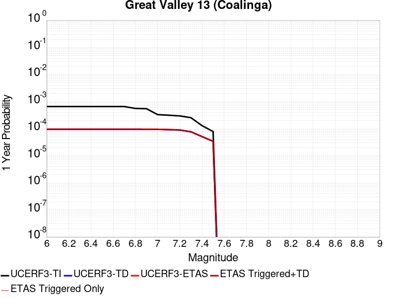 | 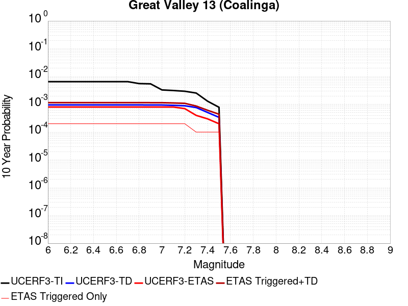 |

| Magnitude | 1 wk TI Prob | 1 wk TD Prob | 1 wk ETAS Prob | 1 wk ETAS/TD Gain | 1 wk ETAS Triggered+TD | 1 wk ETAS Triggered Only | 1 mo TI Prob | 1 mo TD Prob | 1 mo ETAS Prob | 1 mo ETAS/TD Gain | 1 mo ETAS Triggered+TD | 1 mo ETAS Triggered Only | 1 yr TI Prob | 1 yr TD Prob | 1 yr ETAS Prob | 1 yr ETAS/TD Gain | 1 yr ETAS Triggered+TD | 1 yr ETAS Triggered Only | 10 yr TI Prob | 10 yr TD Prob | 10 yr ETAS Prob | 10 yr ETAS/TD Gain | 10 yr ETAS Triggered+TD | 10 yr ETAS Triggered Only |
|-----|-----|-----|-----|-----|-----|-----|-----|-----|-----|-----|-----|-----|-----|-----|-----|-----|-----|-----|-----|-----|-----|-----|-----|-----|
| 6.0 | 1.25701345E-5 | 1.8194293E-6 | 0.0 | 0.0 | 1.8194293E-6 | 0.0 | 5.3870892E-5 | 7.797532E-6 | 0.0 | 0.0 | 7.797532E-6 | 0.0 | 6.556807E-4 | 9.4931005E-5 | 0.0 | 0.0 | 9.4931005E-5 | 0.0 | 0.006537495 | 9.4892376E-4 | 8.0E-4 | 0.8430604 | 0.0011487339 | 2.0E-4 |
| 6.1 | 1.25701345E-5 | 1.8194293E-6 | 0.0 | 0.0 | 1.8194293E-6 | 0.0 | 5.3870892E-5 | 7.797532E-6 | 0.0 | 0.0 | 7.797532E-6 | 0.0 | 6.556807E-4 | 9.4931005E-5 | 0.0 | 0.0 | 9.4931005E-5 | 0.0 | 0.006537495 | 9.4892376E-4 | 8.0E-4 | 0.8430604 | 0.0011487339 | 2.0E-4 |
| 6.2 | 1.25701345E-5 | 1.8194293E-6 | 0.0 | 0.0 | 1.8194293E-6 | 0.0 | 5.3870892E-5 | 7.797532E-6 | 0.0 | 0.0 | 7.797532E-6 | 0.0 | 6.556807E-4 | 9.4931005E-5 | 0.0 | 0.0 | 9.4931005E-5 | 0.0 | 0.006537495 | 9.4892376E-4 | 8.0E-4 | 0.8430604 | 0.0011487339 | 2.0E-4 |
| 6.3 | 1.25701345E-5 | 1.8194293E-6 | 0.0 | 0.0 | 1.8194293E-6 | 0.0 | 5.3870892E-5 | 7.797532E-6 | 0.0 | 0.0 | 7.797532E-6 | 0.0 | 6.556807E-4 | 9.4931005E-5 | 0.0 | 0.0 | 9.4931005E-5 | 0.0 | 0.006537495 | 9.4892376E-4 | 8.0E-4 | 0.8430604 | 0.0011487339 | 2.0E-4 |
| 6.4 | 1.25701345E-5 | 1.8194293E-6 | 0.0 | 0.0 | 1.8194293E-6 | 0.0 | 5.3870892E-5 | 7.797532E-6 | 0.0 | 0.0 | 7.797532E-6 | 0.0 | 6.556807E-4 | 9.4931005E-5 | 0.0 | 0.0 | 9.4931005E-5 | 0.0 | 0.006537495 | 9.4892376E-4 | 8.0E-4 | 0.8430604 | 0.0011487339 | 2.0E-4 |
| 6.5 | 1.25701345E-5 | 1.8194293E-6 | 0.0 | 0.0 | 1.8194293E-6 | 0.0 | 5.3870892E-5 | 7.797532E-6 | 0.0 | 0.0 | 7.797532E-6 | 0.0 | 6.556807E-4 | 9.4931005E-5 | 0.0 | 0.0 | 9.4931005E-5 | 0.0 | 0.006537495 | 9.4892376E-4 | 8.0E-4 | 0.8430604 | 0.0011487339 | 2.0E-4 |
| 6.6 | 1.25701345E-5 | 1.8194293E-6 | 0.0 | 0.0 | 1.8194293E-6 | 0.0 | 5.3870892E-5 | 7.797532E-6 | 0.0 | 0.0 | 7.797532E-6 | 0.0 | 6.556807E-4 | 9.4931005E-5 | 0.0 | 0.0 | 9.4931005E-5 | 0.0 | 0.006537495 | 9.4892376E-4 | 8.0E-4 | 0.8430604 | 0.0011487339 | 2.0E-4 |
| 6.7 | 1.25701345E-5 | 1.8194293E-6 | 0.0 | 0.0 | 1.8194293E-6 | 0.0 | 5.3870892E-5 | 7.797532E-6 | 0.0 | 0.0 | 7.797532E-6 | 0.0 | 6.556807E-4 | 9.4931005E-5 | 0.0 | 0.0 | 9.4931005E-5 | 0.0 | 0.006537495 | 9.4892376E-4 | 8.0E-4 | 0.8430604 | 0.0011487339 | 2.0E-4 |
| 6.8 | 1.0720415E-5 | 1.8194293E-6 | 0.0 | 0.0 | 1.8194293E-6 | 0.0 | 4.5943823E-5 | 7.797532E-6 | 0.0 | 0.0 | 7.797532E-6 | 0.0 | 5.592225E-4 | 9.4931005E-5 | 0.0 | 0.0 | 9.4931005E-5 | 0.0 | 0.005578173 | 9.4892376E-4 | 8.0E-4 | 0.8430604 | 0.0011487339 | 2.0E-4 |
| 6.9 | 1.0485409E-5 | 1.815388E-6 | 0.0 | 0.0 | 1.815388E-6 | 0.0 | 4.4936693E-5 | 7.780212E-6 | 0.0 | 0.0 | 7.780212E-6 | 0.0 | 5.469669E-4 | 9.472016E-5 | 0.0 | 0.0 | 9.472016E-5 | 0.0 | 0.005456226 | 9.468171E-4 | 8.0E-4 | 0.84493613 | 0.0011466277 | 2.0E-4 |
| 7.0 | 6.3302773E-6 | 1.8102922E-6 | 0.0 | 0.0 | 1.8102922E-6 | 0.0 | 2.7129478E-5 | 7.758374E-6 | 0.0 | 0.0 | 7.758374E-6 | 0.0 | 3.3025132E-4 | 9.445429E-5 | 0.0 | 0.0 | 9.445429E-5 | 0.0 | 0.0032976097 | 9.441607E-4 | 8.0E-4 | 0.8473134 | 0.0011439718 | 2.0E-4 |
| 7.1 | 6.022003E-6 | 1.7609434E-6 | 0.0 | 0.0 | 1.7609434E-6 | 0.0 | 2.5808331E-5 | 7.5468797E-6 | 0.0 | 0.0 | 7.5468797E-6 | 0.0 | 3.141711E-4 | 9.187958E-5 | 0.0 | 0.0 | 9.187958E-5 | 0.0 | 0.0031372732 | 9.18435E-4 | 8.0E-4 | 0.87104696 | 0.0011182514 | 2.0E-4 |
| 7.2 | 5.671345E-6 | 1.7010776E-6 | 0.0 | 0.0 | 1.7010776E-6 | 0.0 | 2.4305538E-5 | 7.2903135E-6 | 0.0 | 0.0 | 7.2903135E-6 | 0.0 | 2.9587973E-4 | 8.875615E-5 | 0.0 | 0.0 | 8.875615E-5 | 0.0 | 0.002954861 | 8.872259E-4 | 7.0E-4 | 0.7889761 | 0.0010870484 | 2.0E-4 |
| 7.3 | 4.8831785E-6 | 1.4688234E-6 | 0.0 | 0.0 | 1.4688234E-6 | 0.0 | 2.092774E-5 | 6.294943E-6 | 0.0 | 0.0 | 6.294943E-6 | 0.0 | 2.5476544E-4 | 7.6638404E-5 | 0.0 | 0.0 | 7.6638404E-5 | 0.0 | 0.0025447358 | 7.661363E-4 | 4.0E-4 | 0.5221003 | 8.660596E-4 | 1.0E-4 |
| 7.4 | 2.4837766E-6 | 9.774011E-7 | 0.0 | 0.0 | 9.774011E-7 | 0.0 | 1.0644713E-5 | 4.1888557E-6 | 0.0 | 0.0 | 4.1888557E-6 | 0.0 | 1.2959167E-4 | 5.099819E-5 | 0.0 | 0.0 | 5.099819E-5 | 0.0 | 0.0012951613 | 5.098714E-4 | 3.0E-4 | 0.5883836 | 6.098204E-4 | 1.0E-4 |
| 7.5 | 1.5002679E-6 | 6.5268995E-7 | 0.0 | 0.0 | 6.5268995E-7 | 0.0 | 6.4297037E-6 | 2.79724E-6 | 0.0 | 0.0 | 2.79724E-6 | 0.0 | 7.827883E-5 | 3.4055905E-5 | 0.0 | 0.0 | 3.4055905E-5 | 0.0 | 7.825126E-4 | 3.40511E-4 | 2.0E-4 | 0.5873525 | 4.4047696E-4 | 1.0E-4 |

## Richfield
*[(top)](#table-of-contents)*

| 1 Week | 1 Month | 1 Year | 10 Year |
|-----|-----|-----|-----|
|  | 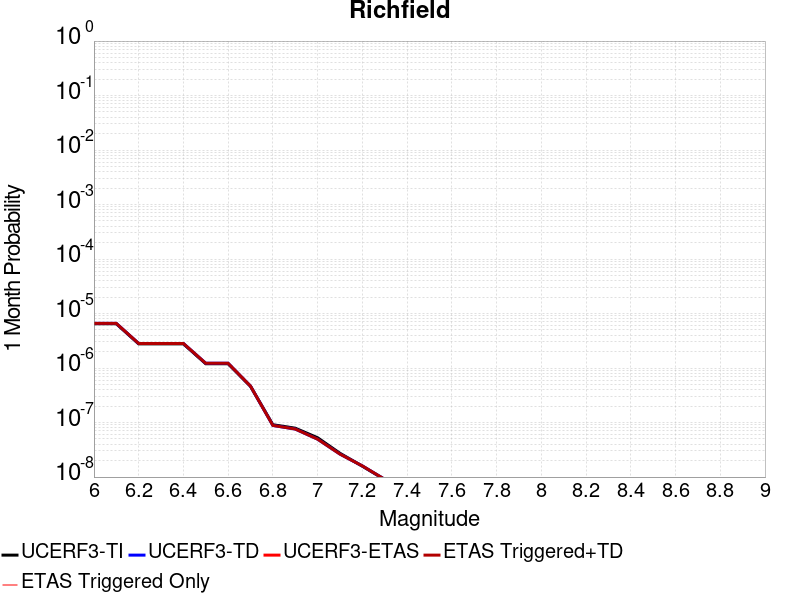 | 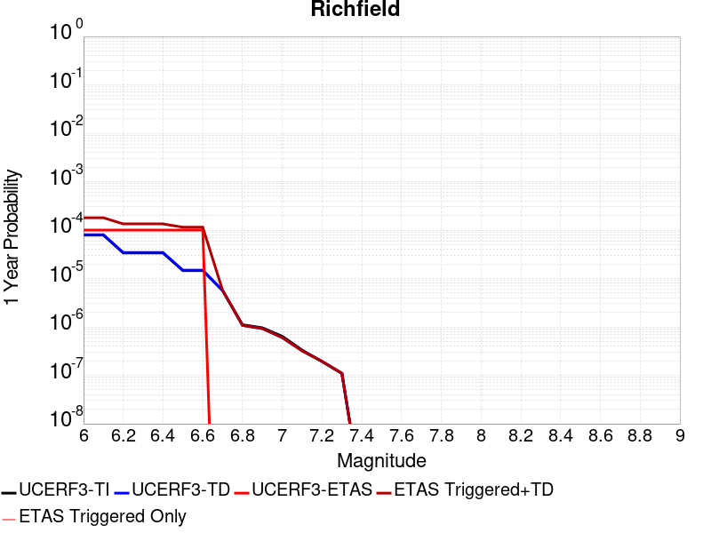 |  |

| Magnitude | 1 wk TI Prob | 1 wk TD Prob | 1 wk ETAS Prob | 1 wk ETAS/TD Gain | 1 wk ETAS Triggered+TD | 1 wk ETAS Triggered Only | 1 mo TI Prob | 1 mo TD Prob | 1 mo ETAS Prob | 1 mo ETAS/TD Gain | 1 mo ETAS Triggered+TD | 1 mo ETAS Triggered Only | 1 yr TI Prob | 1 yr TD Prob | 1 yr ETAS Prob | 1 yr ETAS/TD Gain | 1 yr ETAS Triggered+TD | 1 yr ETAS Triggered Only | 10 yr TI Prob | 10 yr TD Prob | 10 yr ETAS Prob | 10 yr ETAS/TD Gain | 10 yr ETAS Triggered+TD | 10 yr ETAS Triggered Only |
|-----|-----|-----|-----|-----|-----|-----|-----|-----|-----|-----|-----|-----|-----|-----|-----|-----|-----|-----|-----|-----|-----|-----|-----|-----|
| 6.0 | 1.5166896E-6 | 1.5390189E-6 | 0.0 | 0.0 | 1.5390189E-6 | 0.0 | 6.5000822E-6 | 6.5957847E-6 | 0.0 | 0.0 | 6.5957847E-6 | 0.0 | 7.913562E-5 | 8.030182E-5 | 1.0E-4 | 1.2453018 | 1.8029379E-4 | 1.0E-4 | 7.910745E-4 | 8.0283574E-4 | 2.0E-4 | 0.24911696 | 0.0010026752 | 2.0E-4 |
| 6.1 | 1.5166896E-6 | 1.5390189E-6 | 0.0 | 0.0 | 1.5390189E-6 | 0.0 | 6.5000822E-6 | 6.5957847E-6 | 0.0 | 0.0 | 6.5957847E-6 | 0.0 | 7.913562E-5 | 8.030182E-5 | 1.0E-4 | 1.2453018 | 1.8029379E-4 | 1.0E-4 | 7.910745E-4 | 8.0283574E-4 | 2.0E-4 | 0.24911696 | 0.0010026752 | 2.0E-4 |
| 6.2 | 6.473272E-7 | 6.5970505E-7 | 0.0 | 0.0 | 6.5970505E-7 | 0.0 | 2.7742565E-6 | 2.827305E-6 | 0.0 | 0.0 | 2.827305E-6 | 0.0 | 3.377605E-5 | 3.4422028E-5 | 1.0E-4 | 2.9051166 | 1.3441859E-4 | 1.0E-4 | 3.3770915E-4 | 3.4417998E-4 | 1.0E-4 | 0.29054564 | 4.4414558E-4 | 1.0E-4 |
| 6.3 | 6.473272E-7 | 6.5970505E-7 | 0.0 | 0.0 | 6.5970505E-7 | 0.0 | 2.7742565E-6 | 2.827305E-6 | 0.0 | 0.0 | 2.827305E-6 | 0.0 | 3.377605E-5 | 3.4422028E-5 | 1.0E-4 | 2.9051166 | 1.3441859E-4 | 1.0E-4 | 3.3770915E-4 | 3.4417998E-4 | 1.0E-4 | 0.29054564 | 4.4414558E-4 | 1.0E-4 |
| 6.4 | 6.473272E-7 | 6.5970505E-7 | 0.0 | 0.0 | 6.5970505E-7 | 0.0 | 2.7742565E-6 | 2.827305E-6 | 0.0 | 0.0 | 2.827305E-6 | 0.0 | 3.377605E-5 | 3.4422028E-5 | 1.0E-4 | 2.9051166 | 1.3441859E-4 | 1.0E-4 | 3.3770915E-4 | 3.4417998E-4 | 1.0E-4 | 0.29054564 | 4.4414558E-4 | 1.0E-4 |
| 6.5 | 2.7954403E-7 | 2.8524502E-7 | 0.0 | 0.0 | 2.8524502E-7 | 0.0 | 1.1980452E-6 | 1.2224783E-6 | 0.0 | 0.0 | 1.2224783E-6 | 0.0 | 1.4586103E-5 | 1.4883615E-5 | 1.0E-4 | 6.7187977 | 1.14882125E-4 | 1.0E-4 | 1.4585146E-4 | 1.4883043E-4 | 1.0E-4 | 0.67190564 | 2.4881554E-4 | 1.0E-4 |
| 6.6 | 2.7954403E-7 | 2.8524502E-7 | 0.0 | 0.0 | 2.8524502E-7 | 0.0 | 1.1980452E-6 | 1.2224783E-6 | 0.0 | 0.0 | 1.2224783E-6 | 0.0 | 1.4586103E-5 | 1.4883615E-5 | 1.0E-4 | 6.7187977 | 1.14882125E-4 | 1.0E-4 | 1.4585146E-4 | 1.4883043E-4 | 1.0E-4 | 0.67190564 | 2.4881554E-4 | 1.0E-4 |
| 6.7 | 1.0777299E-7 | 1.0876814E-7 | 0.0 | 0.0 | 1.0876814E-7 | 0.0 | 4.6188418E-7 | 4.6614912E-7 | 0.0 | 0.0 | 4.6614912E-7 | 0.0 | 5.6234253E-6 | 5.675355E-6 | 0.0 | 0.0 | 5.675355E-6 | 0.0 | 5.623283E-5 | 5.675253E-5 | 0.0 | 0.0 | 5.675253E-5 | 0.0 |
| 6.8 | 2.1301874E-8 | 2.0663752E-8 | 0.0 | 0.0 | 2.0663752E-8 | 0.0 | 9.129375E-8 | 8.855893E-8 | 0.0 | 0.0 | 8.855893E-8 | 0.0 | 1.1115008E-6 | 1.0782045E-6 | 0.0 | 0.0 | 1.0782045E-6 | 0.0 | 1.1114952E-5 | 1.0781997E-5 | 0.0 | 0.0 | 1.0781997E-5 | 0.0 |
| 6.9 | 1.8413502E-8 | 1.7748995E-8 | 0.0 | 0.0 | 1.7748995E-8 | 0.0 | 7.891501E-8 | 7.6067124E-8 | 0.0 | 0.0 | 7.6067124E-8 | 0.0 | 9.607899E-7 | 9.2611685E-7 | 0.0 | 0.0 | 9.2611685E-7 | 0.0 | 9.607857E-6 | 9.261133E-6 | 0.0 | 0.0 | 9.261133E-6 | 0.0 |
| 7.0 | 1.2290541E-8 | 1.1572781E-8 | 0.0 | 0.0 | 1.1572781E-8 | 0.0 | 5.2673748E-8 | 4.9597634E-8 | 0.0 | 0.0 | 4.9597634E-8 | 0.0 | 6.413027E-7 | 6.0385105E-7 | 0.0 | 0.0 | 6.0385105E-7 | 0.0 | 6.4130086E-6 | 6.038495E-6 | 0.0 | 0.0 | 6.038495E-6 | 0.0 |
| 7.1 | 6.373573E-9 | 6.1550285E-9 | 0.0 | 0.0 | 6.1550285E-9 | 0.0 | 2.7315311E-8 | 2.6378693E-8 | 0.0 | 0.0 | 2.6378693E-8 | 0.0 | 3.3256384E-7 | 3.2116054E-7 | 0.0 | 0.0 | 3.2116054E-7 | 0.0 | 3.3256335E-6 | 3.2116013E-6 | 0.0 | 0.0 | 3.2116013E-6 | 0.0 |
| 7.2 | 3.6989944E-9 | 3.7356243E-9 | 0.0 | 0.0 | 3.7356243E-9 | 0.0 | 1.5852834E-8 | 1.6009817E-8 | 0.0 | 0.0 | 1.6009817E-8 | 0.0 | 1.9300822E-7 | 1.9491952E-7 | 0.0 | 0.0 | 1.9491952E-7 | 0.0 | 1.9300805E-6 | 1.9491936E-6 | 0.0 | 0.0 | 1.9491936E-6 | 0.0 |
| 7.3 | 2.097397E-9 | 2.119811E-9 | 0.0 | 0.0 | 2.119811E-9 | 0.0 | 8.9888434E-9 | 9.084904E-9 | 0.0 | 0.0 | 9.084904E-9 | 0.0 | 1.0943917E-7 | 1.106087E-7 | 0.0 | 0.0 | 1.106087E-7 | 0.0 | 1.0943911E-6 | 1.1060866E-6 | 0.0 | 0.0 | 1.1060866E-6 | 0.0 |
| 7.4 | 5.8314464E-12 | 5.8912875E-12 | 0.0 | 0.0 | 5.8912875E-12 | 0.0 | 2.4991786E-11 | 2.5248137E-11 | 0.0 | 0.0 | 2.5248137E-11 | 0.0 | 3.0427527E-10 | 3.0739644E-10 | 0.0 | 0.0 | 3.0739644E-10 | 0.0 | 3.0427532E-9 | 3.0739646E-9 | 0.0 | 0.0 | 3.0739646E-9 | 0.0 |

## Great Valley 14 (Kettleman Hills)
*[(top)](#table-of-contents)*

| 1 Week | 1 Month | 1 Year | 10 Year |
|-----|-----|-----|-----|
| 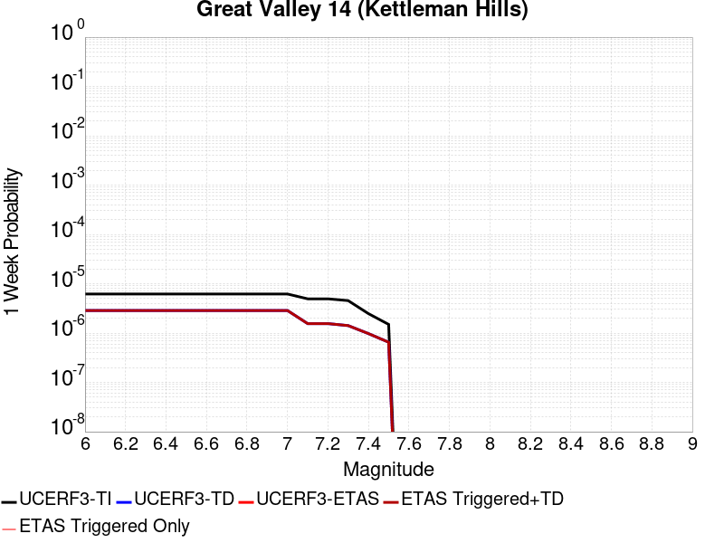 |  |  | 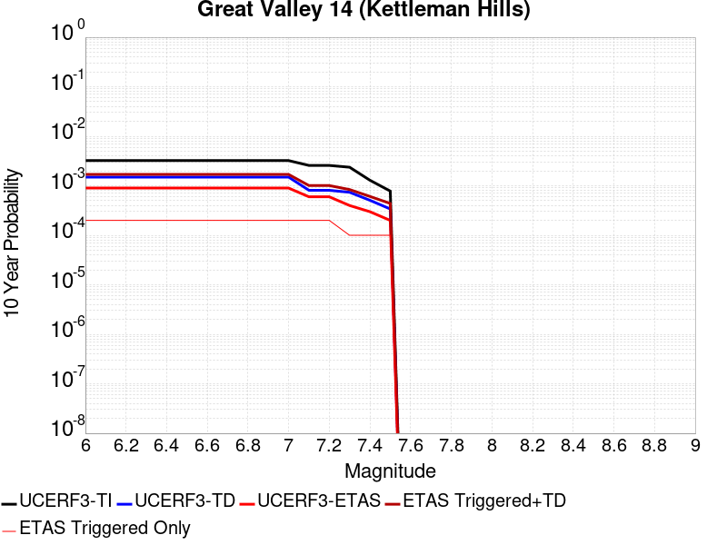 |

| Magnitude | 1 wk TI Prob | 1 wk TD Prob | 1 wk ETAS Prob | 1 wk ETAS/TD Gain | 1 wk ETAS Triggered+TD | 1 wk ETAS Triggered Only | 1 mo TI Prob | 1 mo TD Prob | 1 mo ETAS Prob | 1 mo ETAS/TD Gain | 1 mo ETAS Triggered+TD | 1 mo ETAS Triggered Only | 1 yr TI Prob | 1 yr TD Prob | 1 yr ETAS Prob | 1 yr ETAS/TD Gain | 1 yr ETAS Triggered+TD | 1 yr ETAS Triggered Only | 10 yr TI Prob | 10 yr TD Prob | 10 yr ETAS Prob | 10 yr ETAS/TD Gain | 10 yr ETAS Triggered+TD | 10 yr ETAS Triggered Only |
|-----|-----|-----|-----|-----|-----|-----|-----|-----|-----|-----|-----|-----|-----|-----|-----|-----|-----|-----|-----|-----|-----|-----|-----|-----|
| 6.0 | 6.2057843E-6 | 2.8718878E-6 | 0.0 | 0.0 | 2.8718878E-6 | 0.0 | 2.6595946E-5 | 1.2308045E-5 | 0.0 | 0.0 | 1.2308045E-5 | 0.0 | 3.2375753E-4 | 1.498425E-4 | 0.0 | 0.0 | 1.498425E-4 | 0.0 | 0.0032328626 | 0.0014976456 | 9.0E-4 | 0.6009432 | 0.0016973461 | 2.0E-4 |
| 6.1 | 6.2057843E-6 | 2.8718878E-6 | 0.0 | 0.0 | 2.8718878E-6 | 0.0 | 2.6595946E-5 | 1.2308045E-5 | 0.0 | 0.0 | 1.2308045E-5 | 0.0 | 3.2375753E-4 | 1.498425E-4 | 0.0 | 0.0 | 1.498425E-4 | 0.0 | 0.0032328626 | 0.0014976456 | 9.0E-4 | 0.6009432 | 0.0016973461 | 2.0E-4 |
| 6.2 | 6.2057843E-6 | 2.8718878E-6 | 0.0 | 0.0 | 2.8718878E-6 | 0.0 | 2.6595946E-5 | 1.2308045E-5 | 0.0 | 0.0 | 1.2308045E-5 | 0.0 | 3.2375753E-4 | 1.498425E-4 | 0.0 | 0.0 | 1.498425E-4 | 0.0 | 0.0032328626 | 0.0014976456 | 9.0E-4 | 0.6009432 | 0.0016973461 | 2.0E-4 |
| 6.3 | 6.2057843E-6 | 2.8718878E-6 | 0.0 | 0.0 | 2.8718878E-6 | 0.0 | 2.6595946E-5 | 1.2308045E-5 | 0.0 | 0.0 | 1.2308045E-5 | 0.0 | 3.2375753E-4 | 1.498425E-4 | 0.0 | 0.0 | 1.498425E-4 | 0.0 | 0.0032328626 | 0.0014976456 | 9.0E-4 | 0.6009432 | 0.0016973461 | 2.0E-4 |
| 6.4 | 6.2057843E-6 | 2.8718878E-6 | 0.0 | 0.0 | 2.8718878E-6 | 0.0 | 2.6595946E-5 | 1.2308045E-5 | 0.0 | 0.0 | 1.2308045E-5 | 0.0 | 3.2375753E-4 | 1.498425E-4 | 0.0 | 0.0 | 1.498425E-4 | 0.0 | 0.0032328626 | 0.0014976456 | 9.0E-4 | 0.6009432 | 0.0016973461 | 2.0E-4 |
| 6.5 | 6.2057843E-6 | 2.8718878E-6 | 0.0 | 0.0 | 2.8718878E-6 | 0.0 | 2.6595946E-5 | 1.2308045E-5 | 0.0 | 0.0 | 1.2308045E-5 | 0.0 | 3.2375753E-4 | 1.498425E-4 | 0.0 | 0.0 | 1.498425E-4 | 0.0 | 0.0032328626 | 0.0014976456 | 9.0E-4 | 0.6009432 | 0.0016973461 | 2.0E-4 |
| 6.6 | 6.2057843E-6 | 2.8718878E-6 | 0.0 | 0.0 | 2.8718878E-6 | 0.0 | 2.6595946E-5 | 1.2308045E-5 | 0.0 | 0.0 | 1.2308045E-5 | 0.0 | 3.2375753E-4 | 1.498425E-4 | 0.0 | 0.0 | 1.498425E-4 | 0.0 | 0.0032328626 | 0.0014976456 | 9.0E-4 | 0.6009432 | 0.0016973461 | 2.0E-4 |
| 6.7 | 6.2057843E-6 | 2.8718878E-6 | 0.0 | 0.0 | 2.8718878E-6 | 0.0 | 2.6595946E-5 | 1.2308045E-5 | 0.0 | 0.0 | 1.2308045E-5 | 0.0 | 3.2375753E-4 | 1.498425E-4 | 0.0 | 0.0 | 1.498425E-4 | 0.0 | 0.0032328626 | 0.0014976456 | 9.0E-4 | 0.6009432 | 0.0016973461 | 2.0E-4 |
| 6.8 | 6.2057843E-6 | 2.8718878E-6 | 0.0 | 0.0 | 2.8718878E-6 | 0.0 | 2.6595946E-5 | 1.2308045E-5 | 0.0 | 0.0 | 1.2308045E-5 | 0.0 | 3.2375753E-4 | 1.498425E-4 | 0.0 | 0.0 | 1.498425E-4 | 0.0 | 0.0032328626 | 0.0014976456 | 9.0E-4 | 0.6009432 | 0.0016973461 | 2.0E-4 |
| 6.9 | 6.2057843E-6 | 2.8718878E-6 | 0.0 | 0.0 | 2.8718878E-6 | 0.0 | 2.6595946E-5 | 1.2308045E-5 | 0.0 | 0.0 | 1.2308045E-5 | 0.0 | 3.2375753E-4 | 1.498425E-4 | 0.0 | 0.0 | 1.498425E-4 | 0.0 | 0.0032328626 | 0.0014976456 | 9.0E-4 | 0.6009432 | 0.0016973461 | 2.0E-4 |
| 7.0 | 6.2057843E-6 | 2.8718878E-6 | 0.0 | 0.0 | 2.8718878E-6 | 0.0 | 2.6595946E-5 | 1.2308045E-5 | 0.0 | 0.0 | 1.2308045E-5 | 0.0 | 3.2375753E-4 | 1.498425E-4 | 0.0 | 0.0 | 1.498425E-4 | 0.0 | 0.0032328626 | 0.0014976456 | 9.0E-4 | 0.6009432 | 0.0016973461 | 2.0E-4 |
| 7.1 | 4.95113E-6 | 1.5563107E-6 | 0.0 | 0.0 | 1.5563107E-6 | 0.0 | 2.1218955E-5 | 6.6698876E-6 | 0.0 | 0.0 | 6.6698876E-6 | 0.0 | 2.5831014E-4 | 8.120304E-5 | 0.0 | 0.0 | 8.120304E-5 | 0.0 | 0.0025801011 | 8.117526E-4 | 6.0E-4 | 0.7391415 | 0.0010115902 | 2.0E-4 |
| 7.2 | 4.95113E-6 | 1.5563107E-6 | 0.0 | 0.0 | 1.5563107E-6 | 0.0 | 2.1218955E-5 | 6.6698876E-6 | 0.0 | 0.0 | 6.6698876E-6 | 0.0 | 2.5831014E-4 | 8.120304E-5 | 0.0 | 0.0 | 8.120304E-5 | 0.0 | 0.0025801011 | 8.117526E-4 | 6.0E-4 | 0.7391415 | 0.0010115902 | 2.0E-4 |
| 7.3 | 4.5549086E-6 | 1.4185493E-6 | 0.0 | 0.0 | 1.4185493E-6 | 0.0 | 1.9520892E-5 | 6.0794837E-6 | 0.0 | 0.0 | 6.0794837E-6 | 0.0 | 2.3764092E-4 | 7.401537E-5 | 0.0 | 0.0 | 7.401537E-5 | 0.0 | 0.0023738695 | 7.399237E-4 | 4.0E-4 | 0.5405963 | 8.3984964E-4 | 1.0E-4 |
| 7.4 | 2.4837766E-6 | 9.774011E-7 | 0.0 | 0.0 | 9.774011E-7 | 0.0 | 1.0644713E-5 | 4.1888557E-6 | 0.0 | 0.0 | 4.1888557E-6 | 0.0 | 1.2959167E-4 | 5.099819E-5 | 0.0 | 0.0 | 5.099819E-5 | 0.0 | 0.0012951613 | 5.098714E-4 | 3.0E-4 | 0.5883836 | 6.098204E-4 | 1.0E-4 |
| 7.5 | 1.5002679E-6 | 6.5268995E-7 | 0.0 | 0.0 | 6.5268995E-7 | 0.0 | 6.4297037E-6 | 2.79724E-6 | 0.0 | 0.0 | 2.79724E-6 | 0.0 | 7.827883E-5 | 3.4055905E-5 | 0.0 | 0.0 | 3.4055905E-5 | 0.0 | 7.825126E-4 | 3.40511E-4 | 2.0E-4 | 0.5873525 | 4.4047696E-4 | 1.0E-4 |

## South Cuyama
*[(top)](#table-of-contents)*

| 1 Week | 1 Month | 1 Year | 10 Year |
|-----|-----|-----|-----|
|  | 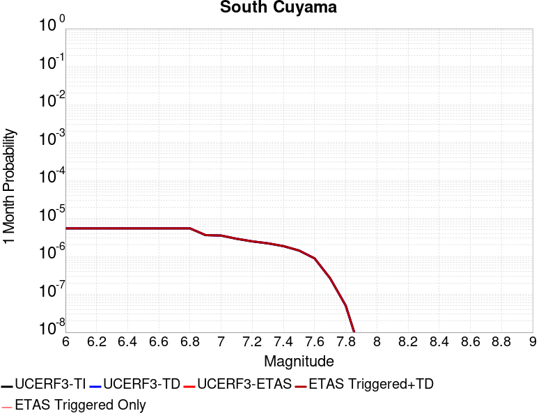 |  |  |

| Magnitude | 1 wk TI Prob | 1 wk TD Prob | 1 wk ETAS Prob | 1 wk ETAS/TD Gain | 1 wk ETAS Triggered+TD | 1 wk ETAS Triggered Only | 1 mo TI Prob | 1 mo TD Prob | 1 mo ETAS Prob | 1 mo ETAS/TD Gain | 1 mo ETAS Triggered+TD | 1 mo ETAS Triggered Only | 1 yr TI Prob | 1 yr TD Prob | 1 yr ETAS Prob | 1 yr ETAS/TD Gain | 1 yr ETAS Triggered+TD | 1 yr ETAS Triggered Only | 10 yr TI Prob | 10 yr TD Prob | 10 yr ETAS Prob | 10 yr ETAS/TD Gain | 10 yr ETAS Triggered+TD | 10 yr ETAS Triggered Only |
|-----|-----|-----|-----|-----|-----|-----|-----|-----|-----|-----|-----|-----|-----|-----|-----|-----|-----|-----|-----|-----|-----|-----|-----|-----|
| 6.0 | 1.2747308E-6 | 1.2817948E-6 | 0.0 | 0.0 | 1.2817948E-6 | 0.0 | 5.4631205E-6 | 5.493395E-6 | 0.0 | 0.0 | 5.493395E-6 | 0.0 | 6.6511464E-5 | 6.68801E-5 | 1.0E-4 | 1.495213 | 6.68801E-5 | 0.0 | 6.649156E-4 | 6.686067E-4 | 5.0E-4 | 0.7478238 | 8.6847297E-4 | 2.0E-4 |
| 6.1 | 1.2747308E-6 | 1.2817948E-6 | 0.0 | 0.0 | 1.2817948E-6 | 0.0 | 5.4631205E-6 | 5.493395E-6 | 0.0 | 0.0 | 5.493395E-6 | 0.0 | 6.6511464E-5 | 6.68801E-5 | 1.0E-4 | 1.495213 | 6.68801E-5 | 0.0 | 6.649156E-4 | 6.686067E-4 | 5.0E-4 | 0.7478238 | 8.6847297E-4 | 2.0E-4 |
| 6.2 | 1.2747308E-6 | 1.2817948E-6 | 0.0 | 0.0 | 1.2817948E-6 | 0.0 | 5.4631205E-6 | 5.493395E-6 | 0.0 | 0.0 | 5.493395E-6 | 0.0 | 6.6511464E-5 | 6.68801E-5 | 1.0E-4 | 1.495213 | 6.68801E-5 | 0.0 | 6.649156E-4 | 6.686067E-4 | 5.0E-4 | 0.7478238 | 8.6847297E-4 | 2.0E-4 |
| 6.3 | 1.2747308E-6 | 1.2817948E-6 | 0.0 | 0.0 | 1.2817948E-6 | 0.0 | 5.4631205E-6 | 5.493395E-6 | 0.0 | 0.0 | 5.493395E-6 | 0.0 | 6.6511464E-5 | 6.68801E-5 | 1.0E-4 | 1.495213 | 6.68801E-5 | 0.0 | 6.649156E-4 | 6.686067E-4 | 5.0E-4 | 0.7478238 | 8.6847297E-4 | 2.0E-4 |
| 6.4 | 1.2747308E-6 | 1.2817948E-6 | 0.0 | 0.0 | 1.2817948E-6 | 0.0 | 5.4631205E-6 | 5.493395E-6 | 0.0 | 0.0 | 5.493395E-6 | 0.0 | 6.6511464E-5 | 6.68801E-5 | 1.0E-4 | 1.495213 | 6.68801E-5 | 0.0 | 6.649156E-4 | 6.686067E-4 | 5.0E-4 | 0.7478238 | 8.6847297E-4 | 2.0E-4 |
| 6.5 | 1.2747308E-6 | 1.2817948E-6 | 0.0 | 0.0 | 1.2817948E-6 | 0.0 | 5.4631205E-6 | 5.493395E-6 | 0.0 | 0.0 | 5.493395E-6 | 0.0 | 6.6511464E-5 | 6.68801E-5 | 1.0E-4 | 1.495213 | 6.68801E-5 | 0.0 | 6.649156E-4 | 6.686067E-4 | 5.0E-4 | 0.7478238 | 8.6847297E-4 | 2.0E-4 |
| 6.6 | 1.2747308E-6 | 1.2817948E-6 | 0.0 | 0.0 | 1.2817948E-6 | 0.0 | 5.4631205E-6 | 5.493395E-6 | 0.0 | 0.0 | 5.493395E-6 | 0.0 | 6.6511464E-5 | 6.68801E-5 | 1.0E-4 | 1.495213 | 6.68801E-5 | 0.0 | 6.649156E-4 | 6.686067E-4 | 5.0E-4 | 0.7478238 | 8.6847297E-4 | 2.0E-4 |
| 6.7 | 1.2747308E-6 | 1.2817948E-6 | 0.0 | 0.0 | 1.2817948E-6 | 0.0 | 5.4631205E-6 | 5.493395E-6 | 0.0 | 0.0 | 5.493395E-6 | 0.0 | 6.6511464E-5 | 6.68801E-5 | 1.0E-4 | 1.495213 | 6.68801E-5 | 0.0 | 6.649156E-4 | 6.686067E-4 | 5.0E-4 | 0.7478238 | 8.6847297E-4 | 2.0E-4 |
| 6.8 | 1.2747308E-6 | 1.2817948E-6 | 0.0 | 0.0 | 1.2817948E-6 | 0.0 | 5.4631205E-6 | 5.493395E-6 | 0.0 | 0.0 | 5.493395E-6 | 0.0 | 6.6511464E-5 | 6.68801E-5 | 1.0E-4 | 1.495213 | 6.68801E-5 | 0.0 | 6.649156E-4 | 6.686067E-4 | 5.0E-4 | 0.7478238 | 8.6847297E-4 | 2.0E-4 |
| 6.9 | 8.4566324E-7 | 8.507344E-7 | 0.0 | 0.0 | 8.507344E-7 | 0.0 | 3.624266E-6 | 3.6459996E-6 | 0.0 | 0.0 | 3.6459996E-6 | 0.0 | 4.4124543E-5 | 4.438915E-5 | 0.0 | 0.0 | 4.438915E-5 | 0.0 | 4.4115784E-4 | 4.4380387E-4 | 3.0E-4 | 0.67597425 | 5.437595E-4 | 1.0E-4 |
| 7.0 | 8.2277904E-7 | 8.277294E-7 | 0.0 | 0.0 | 8.277294E-7 | 0.0 | 3.526191E-6 | 3.547407E-6 | 0.0 | 0.0 | 3.547407E-6 | 0.0 | 4.293053E-5 | 4.3188833E-5 | 0.0 | 0.0 | 4.3188833E-5 | 0.0 | 4.292224E-4 | 4.318054E-4 | 3.0E-4 | 0.6947574 | 5.317622E-4 | 1.0E-4 |
| 7.1 | 6.7661887E-7 | 6.8086786E-7 | 0.0 | 0.0 | 6.8086786E-7 | 0.0 | 2.899792E-6 | 2.9180019E-6 | 0.0 | 0.0 | 2.9180019E-6 | 0.0 | 3.5304394E-5 | 3.5526096E-5 | 0.0 | 0.0 | 3.5526096E-5 | 0.0 | 3.5298787E-4 | 3.5520457E-4 | 2.0E-4 | 0.5630558 | 3.5520457E-4 | 0.0 |
| 7.2 | 5.783336E-7 | 5.820793E-7 | 0.0 | 0.0 | 5.820793E-7 | 0.0 | 2.4785702E-6 | 2.494623E-6 | 0.0 | 0.0 | 2.494623E-6 | 0.0 | 3.0176174E-5 | 3.0371615E-5 | 0.0 | 0.0 | 3.0371615E-5 | 0.0 | 3.0172078E-4 | 3.036749E-4 | 1.0E-4 | 0.32929954 | 3.036749E-4 | 0.0 |
| 7.3 | 5.136759E-7 | 5.1705786E-7 | 0.0 | 0.0 | 5.1705786E-7 | 0.0 | 2.2014663E-6 | 2.2159604E-6 | 0.0 | 0.0 | 2.2159604E-6 | 0.0 | 2.6802521E-5 | 2.6978985E-5 | 0.0 | 0.0 | 2.6978985E-5 | 0.0 | 2.679929E-4 | 2.697573E-4 | 1.0E-4 | 0.37070358 | 2.697573E-4 | 0.0 |
| 7.4 | 4.3370295E-7 | 4.366226E-7 | 0.0 | 0.0 | 4.366226E-7 | 0.0 | 1.8587256E-6 | 1.8712384E-6 | 0.0 | 0.0 | 1.8712384E-6 | 0.0 | 2.2629749E-5 | 2.2782091E-5 | 0.0 | 0.0 | 2.2782091E-5 | 0.0 | 2.2627445E-4 | 2.2779772E-4 | 1.0E-4 | 0.43898597 | 2.2779772E-4 | 0.0 |
| 7.5 | 3.3242574E-7 | 3.3474004E-7 | 0.0 | 0.0 | 3.3474004E-7 | 0.0 | 1.4246809E-6 | 1.4345994E-6 | 0.0 | 0.0 | 1.4345994E-6 | 0.0 | 1.7345352E-5 | 1.7466109E-5 | 0.0 | 0.0 | 1.7466109E-5 | 0.0 | 1.7343998E-4 | 1.7464749E-4 | 0.0 | 0.0 | 1.7464749E-4 | 0.0 |
| 7.6 | 2.0627535E-7 | 2.0777307E-7 | 0.0 | 0.0 | 2.0777307E-7 | 0.0 | 8.840369E-7 | 8.9045574E-7 | 0.0 | 0.0 | 8.9045574E-7 | 0.0 | 1.0763096E-5 | 1.0841245E-5 | 0.0 | 0.0 | 1.0841245E-5 | 0.0 | 1.0762575E-4 | 1.0840725E-4 | 0.0 | 0.0 | 1.0840725E-4 | 0.0 |
| 7.7 | 6.15236E-8 | 6.197821E-8 | 0.0 | 0.0 | 6.197821E-8 | 0.0 | 2.6367252E-7 | 2.6562088E-7 | 0.0 | 0.0 | 2.6562088E-7 | 0.0 | 3.2102084E-6 | 3.2339294E-6 | 0.0 | 0.0 | 3.2339294E-6 | 0.0 | 3.210162E-5 | 3.2338834E-5 | 0.0 | 0.0 | 3.2338834E-5 | 0.0 |
| 7.8 | 1.1765573E-8 | 1.18722765E-8 | 0.0 | 0.0 | 1.18722765E-8 | 0.0 | 5.0423886E-8 | 5.0881184E-8 | 0.0 | 0.0 | 5.0881184E-8 | 0.0 | 6.1391063E-7 | 6.194782E-7 | 0.0 | 0.0 | 6.194782E-7 | 0.0 | 6.1390897E-6 | 6.1947662E-6 | 0.0 | 0.0 | 6.1947662E-6 | 0.0 |
| 7.9 | 6.0381755E-10 | 6.0999217E-10 | 0.0 | 0.0 | 6.0999217E-10 | 0.0 | 2.5877895E-9 | 2.614252E-9 | 0.0 | 0.0 | 2.614252E-9 | 0.0 | 3.1506335E-8 | 3.1828517E-8 | 0.0 | 0.0 | 3.1828517E-8 | 0.0 | 3.1506332E-7 | 3.1828515E-7 | 0.0 | 0.0 | 3.1828515E-7 | 0.0 |

## Morales (West)
*[(top)](#table-of-contents)*

| 1 Week | 1 Month | 1 Year | 10 Year |
|-----|-----|-----|-----|
|  | 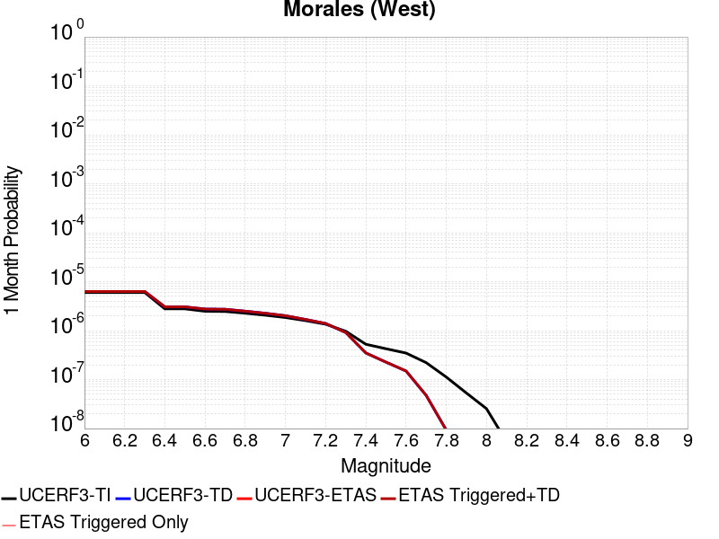 | 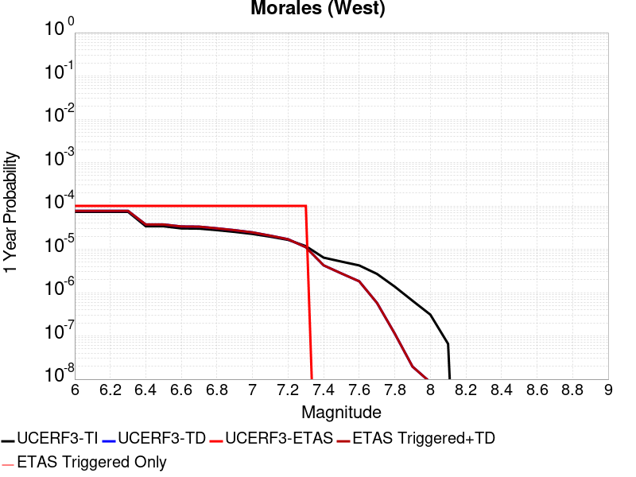 |  |

| Magnitude | 1 wk TI Prob | 1 wk TD Prob | 1 wk ETAS Prob | 1 wk ETAS/TD Gain | 1 wk ETAS Triggered+TD | 1 wk ETAS Triggered Only | 1 mo TI Prob | 1 mo TD Prob | 1 mo ETAS Prob | 1 mo ETAS/TD Gain | 1 mo ETAS Triggered+TD | 1 mo ETAS Triggered Only | 1 yr TI Prob | 1 yr TD Prob | 1 yr ETAS Prob | 1 yr ETAS/TD Gain | 1 yr ETAS Triggered+TD | 1 yr ETAS Triggered Only | 10 yr TI Prob | 10 yr TD Prob | 10 yr ETAS Prob | 10 yr ETAS/TD Gain | 10 yr ETAS Triggered+TD | 10 yr ETAS Triggered Only |
|-----|-----|-----|-----|-----|-----|-----|-----|-----|-----|-----|-----|-----|-----|-----|-----|-----|-----|-----|-----|-----|-----|-----|-----|-----|
| 6.0 | 1.4027072E-6 | 1.4713751E-6 | 0.0 | 0.0 | 1.4713751E-6 | 0.0 | 6.0115885E-6 | 6.305882E-6 | 0.0 | 0.0 | 6.305882E-6 | 0.0 | 7.318863E-5 | 7.677211E-5 | 1.0E-4 | 1.3025564 | 7.677211E-5 | 0.0 | 7.316453E-4 | 7.6752435E-4 | 4.0E-4 | 0.5211561 | 9.6737087E-4 | 2.0E-4 |
| 6.1 | 1.4027072E-6 | 1.4713751E-6 | 0.0 | 0.0 | 1.4713751E-6 | 0.0 | 6.0115885E-6 | 6.305882E-6 | 0.0 | 0.0 | 6.305882E-6 | 0.0 | 7.318863E-5 | 7.677211E-5 | 1.0E-4 | 1.3025564 | 7.677211E-5 | 0.0 | 7.316453E-4 | 7.6752435E-4 | 4.0E-4 | 0.5211561 | 9.6737087E-4 | 2.0E-4 |
| 6.2 | 1.4027072E-6 | 1.4713751E-6 | 0.0 | 0.0 | 1.4713751E-6 | 0.0 | 6.0115885E-6 | 6.305882E-6 | 0.0 | 0.0 | 6.305882E-6 | 0.0 | 7.318863E-5 | 7.677211E-5 | 1.0E-4 | 1.3025564 | 7.677211E-5 | 0.0 | 7.316453E-4 | 7.6752435E-4 | 4.0E-4 | 0.5211561 | 9.6737087E-4 | 2.0E-4 |
| 6.3 | 1.4027072E-6 | 1.4713751E-6 | 0.0 | 0.0 | 1.4713751E-6 | 0.0 | 6.0115885E-6 | 6.305882E-6 | 0.0 | 0.0 | 6.305882E-6 | 0.0 | 7.318863E-5 | 7.677211E-5 | 1.0E-4 | 1.3025564 | 7.677211E-5 | 0.0 | 7.316453E-4 | 7.6752435E-4 | 4.0E-4 | 0.5211561 | 9.6737087E-4 | 2.0E-4 |
| 6.4 | 6.504502E-7 | 7.1267425E-7 | 0.0 | 0.0 | 7.1267425E-7 | 0.0 | 2.7876408E-6 | 3.0543147E-6 | 0.0 | 0.0 | 3.0543147E-6 | 0.0 | 3.3939E-5 | 3.718566E-5 | 1.0E-4 | 2.6892087 | 3.718566E-5 | 0.0 | 3.3933815E-4 | 3.7179553E-4 | 4.0E-4 | 1.0758601 | 5.717212E-4 | 2.0E-4 |
| 6.5 | 6.504502E-7 | 7.1267425E-7 | 0.0 | 0.0 | 7.1267425E-7 | 0.0 | 2.7876408E-6 | 3.0543147E-6 | 0.0 | 0.0 | 3.0543147E-6 | 0.0 | 3.3939E-5 | 3.718566E-5 | 1.0E-4 | 2.6892087 | 3.718566E-5 | 0.0 | 3.3933815E-4 | 3.7179553E-4 | 4.0E-4 | 1.0758601 | 5.717212E-4 | 2.0E-4 |
| 6.6 | 5.8056526E-7 | 6.423054E-7 | 0.0 | 0.0 | 6.423054E-7 | 0.0 | 2.4881344E-6 | 2.7527344E-6 | 0.0 | 0.0 | 2.7527344E-6 | 0.0 | 3.0292615E-5 | 3.3514032E-5 | 1.0E-4 | 2.9838247 | 3.3514032E-5 | 0.0 | 3.0288487E-4 | 3.350904E-4 | 4.0E-4 | 1.1937078 | 5.350234E-4 | 2.0E-4 |
| 6.7 | 5.741448E-7 | 6.35837E-7 | 0.0 | 0.0 | 6.35837E-7 | 0.0 | 2.4606184E-6 | 2.725013E-6 | 0.0 | 0.0 | 2.725013E-6 | 0.0 | 2.9957617E-5 | 3.3176533E-5 | 1.0E-4 | 3.0141788 | 3.3176533E-5 | 0.0 | 2.9953578E-4 | 3.317164E-4 | 4.0E-4 | 1.2058493 | 5.316501E-4 | 2.0E-4 |
| 6.8 | 5.299428E-7 | 5.8162937E-7 | 0.0 | 0.0 | 5.8162937E-7 | 0.0 | 2.2711813E-6 | 2.4926949E-6 | 0.0 | 0.0 | 2.4926949E-6 | 0.0 | 2.7651282E-5 | 3.0348143E-5 | 1.0E-4 | 3.2950945 | 3.0348143E-5 | 0.0 | 2.7647841E-4 | 3.0344047E-4 | 3.0E-4 | 0.9886618 | 5.033798E-4 | 2.0E-4 |
| 6.9 | 4.82394E-7 | 5.268734E-7 | 0.0 | 0.0 | 5.268734E-7 | 0.0 | 2.0674013E-6 | 2.2580268E-6 | 0.0 | 0.0 | 2.2580268E-6 | 0.0 | 2.517032E-5 | 2.7491134E-5 | 1.0E-4 | 3.6375363 | 2.7491134E-5 | 0.0 | 2.516747E-4 | 2.7487773E-4 | 3.0E-4 | 1.0913943 | 4.7482277E-4 | 2.0E-4 |
| 7.0 | 4.3264512E-7 | 4.6889903E-7 | 0.0 | 0.0 | 4.6889903E-7 | 0.0 | 1.8541921E-6 | 2.0095658E-6 | 0.0 | 0.0 | 2.0095658E-6 | 0.0 | 2.2574555E-5 | 2.4466191E-5 | 1.0E-4 | 4.0872726 | 2.4466191E-5 | 0.0 | 2.2572262E-4 | 2.446353E-4 | 2.0E-4 | 0.81754345 | 3.4461086E-4 | 1.0E-4 |
| 7.1 | 3.7388565E-7 | 3.9336354E-7 | 0.0 | 0.0 | 3.9336354E-7 | 0.0 | 1.6023661E-6 | 1.6858426E-6 | 0.0 | 0.0 | 1.6858426E-6 | 0.0 | 1.9508632E-5 | 2.0524942E-5 | 1.0E-4 | 4.872121 | 2.0524942E-5 | 0.0 | 1.950692E-4 | 2.052307E-4 | 2.0E-4 | 0.97451305 | 3.0521018E-4 | 1.0E-4 |
| 7.2 | 3.1592543E-7 | 3.2553598E-7 | 0.0 | 0.0 | 3.2553598E-7 | 0.0 | 1.3539654E-6 | 1.3951535E-6 | 0.0 | 0.0 | 1.3951535E-6 | 0.0 | 1.6484404E-5 | 1.6985863E-5 | 1.0E-4 | 5.887249 | 1.6985863E-5 | 0.0 | 1.6483181E-4 | 1.6984582E-4 | 2.0E-4 | 1.1775386 | 2.6982883E-4 | 1.0E-4 |
| 7.3 | 2.2677783E-7 | 2.124779E-7 | 0.0 | 0.0 | 2.124779E-7 | 0.0 | 9.719047E-7 | 9.1061924E-7 | 0.0 | 0.0 | 9.1061924E-7 | 0.0 | 1.1832874E-5 | 1.1086733E-5 | 1.0E-4 | 9.01979 | 1.1086733E-5 | 0.0 | 1.18322445E-4 | 1.10861845E-4 | 2.0E-4 | 1.8040471 | 2.1085076E-4 | 1.0E-4 |
| 7.4 | 1.2295531E-7 | 8.102608E-8 | 0.0 | 0.0 | 8.102608E-8 | 0.0 | 5.269512E-7 | 3.4725457E-7 | 0.0 | 0.0 | 3.4725457E-7 | 0.0 | 6.4156125E-6 | 4.227816E-6 | 0.0 | 0.0 | 4.227816E-6 | 0.0 | 6.415427E-5 | 4.2277366E-5 | 1.0E-4 | 2.365332 | 1.4227314E-4 | 1.0E-4 |
| 7.5 | 9.9632544E-8 | 5.2670416E-8 | 0.0 | 0.0 | 5.2670416E-8 | 0.0 | 4.2699656E-7 | 2.2573033E-7 | 0.0 | 0.0 | 2.2573033E-7 | 0.0 | 5.198671E-6 | 2.7482633E-6 | 0.0 | 0.0 | 2.7482633E-6 | 0.0 | 5.198549E-5 | 2.7482296E-5 | 1.0E-4 | 3.638706 | 1.2747955E-4 | 1.0E-4 |
| 7.6 | 8.125894E-8 | 3.4633654E-8 | 0.0 | 0.0 | 3.4633654E-8 | 0.0 | 3.4825257E-7 | 1.4842995E-7 | 0.0 | 0.0 | 1.4842995E-7 | 0.0 | 4.2399665E-6 | 1.8071331E-6 | 0.0 | 0.0 | 1.8071331E-6 | 0.0 | 4.2398857E-5 | 1.8071187E-5 | 1.0E-4 | 5.533671 | 1.1806938E-4 | 1.0E-4 |
| 7.7 | 5.1810765E-8 | 1.0940942E-8 | 0.0 | 0.0 | 1.0940942E-8 | 0.0 | 2.2204613E-7 | 4.6889763E-8 | 0.0 | 0.0 | 4.6889763E-8 | 0.0 | 2.7034082E-6 | 5.708827E-7 | 0.0 | 0.0 | 5.708827E-7 | 0.0 | 2.7033753E-5 | 5.7088137E-6 | 0.0 | 0.0 | 5.7088137E-6 | 0.0 |
| 7.8 | 2.6315043E-8 | 2.1213555E-9 | 0.0 | 0.0 | 2.1213555E-9 | 0.0 | 1.1277875E-7 | 9.091529E-9 | 0.0 | 0.0 | 9.091529E-9 | 0.0 | 1.3730804E-6 | 1.1068937E-7 | 0.0 | 0.0 | 1.1068937E-7 | 0.0 | 1.3730719E-5 | 1.1068946E-6 | 0.0 | 0.0 | 1.1068946E-6 | 0.0 |
| 7.9 | 1.24281545E-8 | 3.6303682E-10 | 0.0 | 0.0 | 3.6303682E-10 | 0.0 | 5.3263516E-8 | 1.555875E-9 | 0.0 | 0.0 | 1.555875E-9 | 0.0 | 6.4848314E-7 | 1.8942787E-8 | 0.0 | 0.0 | 1.8942787E-8 | 0.0 | 6.4848123E-6 | 1.8942924E-7 | 0.0 | 0.0 | 1.8942924E-7 | 0.0 |
| 8.0 | 5.954214E-9 | 1.5800916E-10 | 0.0 | 0.0 | 1.5800916E-10 | 0.0 | 2.551806E-8 | 6.7718153E-10 | 0.0 | 0.0 | 6.7718153E-10 | 0.0 | 3.1068234E-7 | 8.244689E-9 | 0.0 | 0.0 | 8.244689E-9 | 0.0 | 3.1068191E-6 | 8.2448295E-8 | 0.0 | 0.0 | 8.2448295E-8 | 0.0 |
| 8.1 | 1.2586262E-9 | 7.2848616E-11 | 0.0 | 0.0 | 7.2848616E-11 | 0.0 | 5.3941123E-9 | 3.1220815E-10 | 0.0 | 0.0 | 3.1220815E-10 | 0.0 | 6.567332E-8 | 3.80114E-9 | 0.0 | 0.0 | 3.80114E-9 | 0.0 | 6.56733E-7 | 3.80128E-8 | 0.0 | 0.0 | 3.80128E-8 | 0.0 |

## East Huasna 2011 CFM
*[(top)](#table-of-contents)*

| 1 Week | 1 Month | 1 Year | 10 Year |
|-----|-----|-----|-----|
| 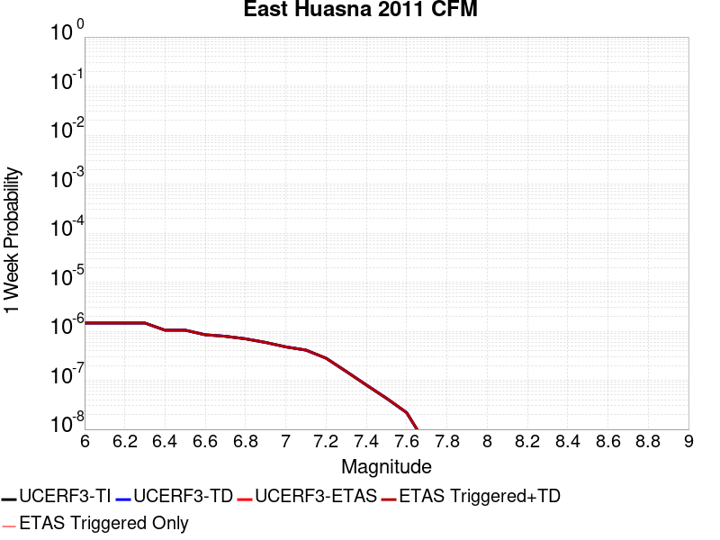 | 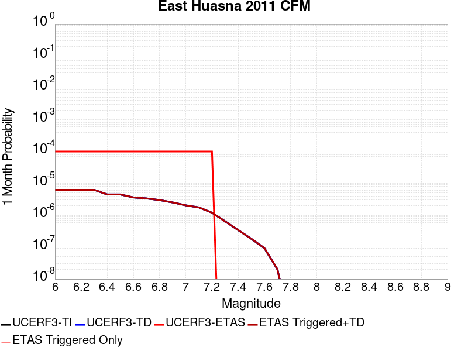 | 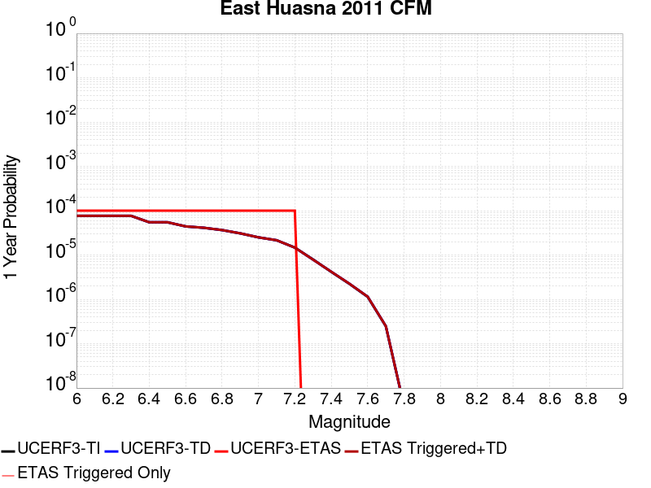 | 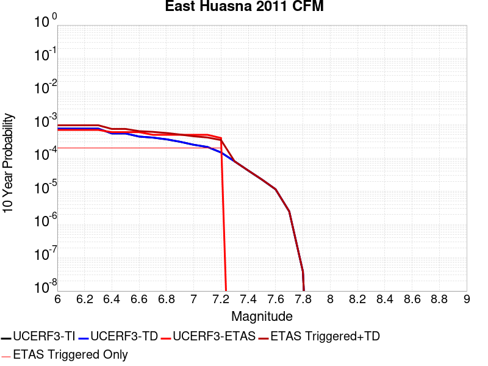 |

| Magnitude | 1 wk TI Prob | 1 wk TD Prob | 1 wk ETAS Prob | 1 wk ETAS/TD Gain | 1 wk ETAS Triggered+TD | 1 wk ETAS Triggered Only | 1 mo TI Prob | 1 mo TD Prob | 1 mo ETAS Prob | 1 mo ETAS/TD Gain | 1 mo ETAS Triggered+TD | 1 mo ETAS Triggered Only | 1 yr TI Prob | 1 yr TD Prob | 1 yr ETAS Prob | 1 yr ETAS/TD Gain | 1 yr ETAS Triggered+TD | 1 yr ETAS Triggered Only | 10 yr TI Prob | 10 yr TD Prob | 10 yr ETAS Prob | 10 yr ETAS/TD Gain | 10 yr ETAS Triggered+TD | 10 yr ETAS Triggered Only |
|-----|-----|-----|-----|-----|-----|-----|-----|-----|-----|-----|-----|-----|-----|-----|-----|-----|-----|-----|-----|-----|-----|-----|-----|-----|
| 6.0 | 1.4658423E-6 | 1.4714694E-6 | 0.0 | 0.0 | 1.4714694E-6 | 0.0 | 6.282166E-6 | 6.3062826E-6 | 1.0E-4 | 15.857203 | 6.3062826E-6 | 0.0 | 7.6482684E-5 | 7.6776356E-5 | 1.0E-4 | 1.3024843 | 7.6776356E-5 | 0.0 | 7.645637E-4 | 7.675053E-4 | 7.0E-4 | 0.9120458 | 9.6735184E-4 | 2.0E-4 |
| 6.1 | 1.4658423E-6 | 1.4714694E-6 | 0.0 | 0.0 | 1.4714694E-6 | 0.0 | 6.282166E-6 | 6.3062826E-6 | 1.0E-4 | 15.857203 | 6.3062826E-6 | 0.0 | 7.6482684E-5 | 7.6776356E-5 | 1.0E-4 | 1.3024843 | 7.6776356E-5 | 0.0 | 7.645637E-4 | 7.675053E-4 | 7.0E-4 | 0.9120458 | 9.6735184E-4 | 2.0E-4 |
| 6.2 | 1.4658423E-6 | 1.4714694E-6 | 0.0 | 0.0 | 1.4714694E-6 | 0.0 | 6.282166E-6 | 6.3062826E-6 | 1.0E-4 | 15.857203 | 6.3062826E-6 | 0.0 | 7.6482684E-5 | 7.6776356E-5 | 1.0E-4 | 1.3024843 | 7.6776356E-5 | 0.0 | 7.645637E-4 | 7.675053E-4 | 7.0E-4 | 0.9120458 | 9.6735184E-4 | 2.0E-4 |
| 6.3 | 1.4658423E-6 | 1.4714694E-6 | 0.0 | 0.0 | 1.4714694E-6 | 0.0 | 6.282166E-6 | 6.3062826E-6 | 1.0E-4 | 15.857203 | 6.3062826E-6 | 0.0 | 7.6482684E-5 | 7.6776356E-5 | 1.0E-4 | 1.3024843 | 7.6776356E-5 | 0.0 | 7.645637E-4 | 7.675053E-4 | 7.0E-4 | 0.9120458 | 9.6735184E-4 | 2.0E-4 |
| 6.4 | 1.0488257E-6 | 1.0526737E-6 | 0.0 | 0.0 | 1.0526737E-6 | 0.0 | 4.4949593E-6 | 4.511451E-6 | 1.0E-4 | 22.165817 | 4.511451E-6 | 0.0 | 5.472476E-5 | 5.4925553E-5 | 1.0E-4 | 1.8206462 | 5.4925553E-5 | 0.0 | 5.4711284E-4 | 5.491217E-4 | 6.0E-4 | 1.092654 | 7.490119E-4 | 2.0E-4 |
| 6.5 | 1.0488257E-6 | 1.0526737E-6 | 0.0 | 0.0 | 1.0526737E-6 | 0.0 | 4.4949593E-6 | 4.511451E-6 | 1.0E-4 | 22.165817 | 4.511451E-6 | 0.0 | 5.472476E-5 | 5.4925553E-5 | 1.0E-4 | 1.8206462 | 5.4925553E-5 | 0.0 | 5.4711284E-4 | 5.491217E-4 | 6.0E-4 | 1.092654 | 7.490119E-4 | 2.0E-4 |
| 6.6 | 8.463064E-7 | 8.492946E-7 | 0.0 | 0.0 | 8.492946E-7 | 0.0 | 3.6270226E-6 | 3.6398292E-6 | 1.0E-4 | 27.473818 | 3.6398292E-6 | 0.0 | 4.4158103E-5 | 4.4314027E-5 | 1.0E-4 | 2.2566218 | 4.4314027E-5 | 0.0 | 4.414933E-4 | 4.430528E-4 | 6.0E-4 | 1.3542404 | 6.4296415E-4 | 2.0E-4 |
| 6.7 | 7.876149E-7 | 7.901891E-7 | 0.0 | 0.0 | 7.901891E-7 | 0.0 | 3.375488E-6 | 3.3865203E-6 | 1.0E-4 | 29.528835 | 3.3865203E-6 | 0.0 | 4.109579E-5 | 4.1230112E-5 | 1.0E-4 | 2.4254117 | 4.1230112E-5 | 0.0 | 4.108819E-4 | 4.1222526E-4 | 5.0E-4 | 1.2129291 | 6.121428E-4 | 2.0E-4 |
| 6.8 | 6.9940785E-7 | 7.015976E-7 | 0.0 | 0.0 | 7.015976E-7 | 0.0 | 2.9974588E-6 | 3.0068436E-6 | 1.0E-4 | 33.257465 | 3.0068436E-6 | 0.0 | 3.649345E-5 | 3.660771E-5 | 1.0E-4 | 2.731665 | 3.660771E-5 | 0.0 | 3.6487455E-4 | 3.6601728E-4 | 5.0E-4 | 1.3660557 | 5.6594406E-4 | 2.0E-4 |
| 6.9 | 5.899658E-7 | 5.915067E-7 | 0.0 | 0.0 | 5.915067E-7 | 0.0 | 2.5284223E-6 | 2.5350262E-6 | 1.0E-4 | 39.447323 | 2.5350262E-6 | 0.0 | 3.0783107E-5 | 3.086351E-5 | 1.0E-4 | 3.240072 | 3.086351E-5 | 0.0 | 3.0778843E-4 | 3.085925E-4 | 5.0E-4 | 1.6202596 | 5.085308E-4 | 2.0E-4 |
| 7.0 | 4.793814E-7 | 4.8028085E-7 | 0.0 | 0.0 | 4.8028085E-7 | 0.0 | 2.05449E-6 | 2.058345E-6 | 1.0E-4 | 48.58272 | 2.058345E-6 | 0.0 | 2.501313E-5 | 2.5060064E-5 | 1.0E-4 | 3.9904127 | 2.5060064E-5 | 0.0 | 2.5010316E-4 | 2.5057257E-4 | 5.0E-4 | 1.99543 | 4.5052244E-4 | 2.0E-4 |
| 7.1 | 4.1256908E-7 | 4.1295317E-7 | 0.0 | 0.0 | 4.1295317E-7 | 0.0 | 1.768152E-6 | 1.7697981E-6 | 1.0E-4 | 56.50362 | 1.7697981E-6 | 0.0 | 2.1527037E-5 | 2.154708E-5 | 1.0E-4 | 4.641 | 2.154708E-5 | 0.0 | 2.1524953E-4 | 2.1545005E-4 | 5.0E-4 | 2.3207235 | 4.1540698E-4 | 2.0E-4 |
| 7.2 | 2.822599E-7 | 2.8158453E-7 | 0.0 | 0.0 | 2.8158453E-7 | 0.0 | 1.2096847E-6 | 1.2067903E-6 | 1.0E-4 | 82.86443 | 1.2067903E-6 | 0.0 | 1.47278115E-5 | 1.4692574E-5 | 1.0E-4 | 6.806159 | 1.4692574E-5 | 0.0 | 1.4726835E-4 | 1.469161E-4 | 4.0E-4 | 2.7226424 | 3.4688672E-4 | 2.0E-4 |
| 7.3 | 1.5261652E-7 | 1.5073346E-7 | 0.0 | 0.0 | 1.5073346E-7 | 0.0 | 6.540707E-7 | 6.460004E-7 | 0.0 | 0.0 | 6.460004E-7 | 0.0 | 7.963281E-6 | 7.865026E-6 | 0.0 | 0.0 | 7.865026E-6 | 0.0 | 7.962996E-5 | 7.86475E-5 | 0.0 | 0.0 | 7.86475E-5 | 0.0 |
| 7.4 | 7.976414E-8 | 8.0570054E-8 | 0.0 | 0.0 | 8.0570054E-8 | 0.0 | 3.418463E-7 | 3.4530018E-7 | 0.0 | 0.0 | 3.4530018E-7 | 0.0 | 4.1619705E-6 | 4.2040215E-6 | 0.0 | 0.0 | 4.2040215E-6 | 0.0 | 4.161893E-5 | 4.2039424E-5 | 0.0 | 0.0 | 4.2039424E-5 | 0.0 |
| 7.5 | 4.2715055E-8 | 4.319736E-8 | 0.0 | 0.0 | 4.319736E-8 | 0.0 | 1.830645E-7 | 1.8513153E-7 | 0.0 | 0.0 | 1.8513153E-7 | 0.0 | 2.228808E-6 | 2.2539741E-6 | 0.0 | 0.0 | 2.2539741E-6 | 0.0 | 2.2287857E-5 | 2.2539514E-5 | 0.0 | 0.0 | 2.2539514E-5 | 0.0 |
| 7.6 | 2.1807532E-8 | 2.2054834E-8 | 0.0 | 0.0 | 2.2054834E-8 | 0.0 | 9.346085E-8 | 9.4520715E-8 | 0.0 | 0.0 | 9.4520715E-8 | 0.0 | 1.1378852E-6 | 1.1507891E-6 | 0.0 | 0.0 | 1.1507891E-6 | 0.0 | 1.1378794E-5 | 1.1507832E-5 | 0.0 | 0.0 | 1.1507832E-5 | 0.0 |
| 7.7 | 4.7196043E-9 | 4.7667803E-9 | 0.0 | 0.0 | 4.7667803E-9 | 0.0 | 2.0226874E-8 | 2.0429058E-8 | 0.0 | 0.0 | 2.0429058E-8 | 0.0 | 2.4626218E-7 | 2.4872375E-7 | 0.0 | 0.0 | 2.4872375E-7 | 0.0 | 2.462619E-6 | 2.4872347E-6 | 0.0 | 0.0 | 2.4872347E-6 | 0.0 |
| 7.8 | 7.400003E-11 | 7.464762E-11 | 0.0 | 0.0 | 7.464762E-11 | 0.0 | 3.171432E-10 | 3.199182E-10 | 0.0 | 0.0 | 3.199182E-10 | 0.0 | 3.861218E-9 | 3.8950034E-9 | 0.0 | 0.0 | 3.8950034E-9 | 0.0 | 3.861218E-8 | 3.8950034E-8 | 0.0 | 0.0 | 3.8950034E-8 | 0.0 |

## Kern Canyon (Lake Isabella) 2011
*[(top)](#table-of-contents)*

| 1 Week | 1 Month | 1 Year | 10 Year |
|-----|-----|-----|-----|
|  |  |  |  |

| Magnitude | 1 wk TI Prob | 1 wk TD Prob | 1 wk ETAS Prob | 1 wk ETAS/TD Gain | 1 wk ETAS Triggered+TD | 1 wk ETAS Triggered Only | 1 mo TI Prob | 1 mo TD Prob | 1 mo ETAS Prob | 1 mo ETAS/TD Gain | 1 mo ETAS Triggered+TD | 1 mo ETAS Triggered Only | 1 yr TI Prob | 1 yr TD Prob | 1 yr ETAS Prob | 1 yr ETAS/TD Gain | 1 yr ETAS Triggered+TD | 1 yr ETAS Triggered Only | 10 yr TI Prob | 10 yr TD Prob | 10 yr ETAS Prob | 10 yr ETAS/TD Gain | 10 yr ETAS Triggered+TD | 10 yr ETAS Triggered Only |
|-----|-----|-----|-----|-----|-----|-----|-----|-----|-----|-----|-----|-----|-----|-----|-----|-----|-----|-----|-----|-----|-----|-----|-----|-----|
| 6.0 | 4.2387383E-6 | 4.0006266E-6 | 0.0 | 0.0 | 4.0006266E-6 | 0.0 | 1.8165894E-5 | 1.7145441E-5 | 0.0 | 0.0 | 1.7145441E-5 | 0.0 | 2.2114732E-4 | 2.0872762E-4 | 0.0 | 0.0 | 2.0872762E-4 | 0.0 | 0.0022092736 | 0.0020854995 | 7.0E-4 | 0.335651 | 0.002185291 | 1.0E-4 |
| 6.1 | 4.2387383E-6 | 4.0006266E-6 | 0.0 | 0.0 | 4.0006266E-6 | 0.0 | 1.8165894E-5 | 1.7145441E-5 | 0.0 | 0.0 | 1.7145441E-5 | 0.0 | 2.2114732E-4 | 2.0872762E-4 | 0.0 | 0.0 | 2.0872762E-4 | 0.0 | 0.0022092736 | 0.0020854995 | 7.0E-4 | 0.335651 | 0.002185291 | 1.0E-4 |
| 6.2 | 4.2387383E-6 | 4.0006266E-6 | 0.0 | 0.0 | 4.0006266E-6 | 0.0 | 1.8165894E-5 | 1.7145441E-5 | 0.0 | 0.0 | 1.7145441E-5 | 0.0 | 2.2114732E-4 | 2.0872762E-4 | 0.0 | 0.0 | 2.0872762E-4 | 0.0 | 0.0022092736 | 0.0020854995 | 7.0E-4 | 0.335651 | 0.002185291 | 1.0E-4 |
| 6.3 | 4.2387383E-6 | 4.0006266E-6 | 0.0 | 0.0 | 4.0006266E-6 | 0.0 | 1.8165894E-5 | 1.7145441E-5 | 0.0 | 0.0 | 1.7145441E-5 | 0.0 | 2.2114732E-4 | 2.0872762E-4 | 0.0 | 0.0 | 2.0872762E-4 | 0.0 | 0.0022092736 | 0.0020854995 | 7.0E-4 | 0.335651 | 0.002185291 | 1.0E-4 |
| 6.4 | 4.2387383E-6 | 4.0006266E-6 | 0.0 | 0.0 | 4.0006266E-6 | 0.0 | 1.8165894E-5 | 1.7145441E-5 | 0.0 | 0.0 | 1.7145441E-5 | 0.0 | 2.2114732E-4 | 2.0872762E-4 | 0.0 | 0.0 | 2.0872762E-4 | 0.0 | 0.0022092736 | 0.0020854995 | 7.0E-4 | 0.335651 | 0.002185291 | 1.0E-4 |
| 6.5 | 2.7857532E-6 | 2.5171832E-6 | 0.0 | 0.0 | 2.5171832E-6 | 0.0 | 1.1938888E-5 | 1.0787886E-5 | 0.0 | 0.0 | 1.0787886E-5 | 0.0 | 1.4534626E-4 | 1.3133492E-4 | 0.0 | 0.0 | 1.3133492E-4 | 0.0 | 0.0014525123 | 0.0013126058 | 2.0E-4 | 0.15236868 | 0.0013126058 | 0.0 |
| 6.6 | 2.2233348E-6 | 1.9435606E-6 | 0.0 | 0.0 | 1.9435606E-6 | 0.0 | 9.528543E-6 | 8.329519E-6 | 0.0 | 0.0 | 8.329519E-6 | 0.0 | 1.1600384E-4 | 1.0140726E-4 | 0.0 | 0.0 | 1.0140726E-4 | 0.0 | 0.001159433 | 0.0010136185 | 2.0E-4 | 0.19731289 | 0.0010136185 | 0.0 |
| 6.7 | 2.1635126E-6 | 1.882949E-6 | 0.0 | 0.0 | 1.882949E-6 | 0.0 | 9.272164E-6 | 8.069757E-6 | 0.0 | 0.0 | 8.069757E-6 | 0.0 | 1.1288274E-4 | 9.824494E-5 | 0.0 | 0.0 | 9.824494E-5 | 0.0 | 0.0011282542 | 9.820233E-4 | 2.0E-4 | 0.20366116 | 9.820233E-4 | 0.0 |
| 6.8 | 1.8685711E-6 | 1.5826456E-6 | 0.0 | 0.0 | 1.5826456E-6 | 0.0 | 8.008137E-6 | 6.7827496E-6 | 0.0 | 0.0 | 6.7827496E-6 | 0.0 | 9.74947E-5 | 8.2576895E-5 | 0.0 | 0.0 | 8.2576895E-5 | 0.0 | 9.745194E-4 | 8.2546705E-4 | 1.0E-4 | 0.12114354 | 8.2546705E-4 | 0.0 |
| 6.9 | 1.5815071E-6 | 1.3060636E-6 | 0.0 | 0.0 | 1.3060636E-6 | 0.0 | 6.77787E-6 | 5.5974037E-6 | 0.0 | 0.0 | 5.5974037E-6 | 0.0 | 8.251744E-5 | 6.8146284E-5 | 0.0 | 0.0 | 6.8146284E-5 | 0.0 | 8.248681E-4 | 6.812566E-4 | 1.0E-4 | 0.14678757 | 6.812566E-4 | 0.0 |
| 7.0 | 1.3772564E-6 | 1.1206982E-6 | 0.0 | 0.0 | 1.1206982E-6 | 0.0 | 5.9025137E-6 | 4.8029833E-6 | 0.0 | 0.0 | 4.8029833E-6 | 0.0 | 7.186073E-5 | 5.8474776E-5 | 0.0 | 0.0 | 5.8474776E-5 | 0.0 | 7.18375E-4 | 5.8459595E-4 | 1.0E-4 | 0.17105833 | 5.8459595E-4 | 0.0 |
| 7.1 | 1.0916998E-6 | 8.7609243E-7 | 0.0 | 0.0 | 8.7609243E-7 | 0.0 | 4.678705E-6 | 3.7546765E-6 | 0.0 | 0.0 | 3.7546765E-6 | 0.0 | 5.6961744E-5 | 4.571224E-5 | 0.0 | 0.0 | 4.571224E-5 | 0.0 | 5.6947145E-4 | 4.5702973E-4 | 1.0E-4 | 0.21880415 | 4.5702973E-4 | 0.0 |
| 7.2 | 7.6277024E-7 | 5.899507E-7 | 0.0 | 0.0 | 5.899507E-7 | 0.0 | 3.2690114E-6 | 2.5283575E-6 | 0.0 | 0.0 | 2.5283575E-6 | 0.0 | 3.9799485E-5 | 3.0782325E-5 | 0.0 | 0.0 | 3.0782325E-5 | 0.0 | 3.9792358E-4 | 3.077812E-4 | 0.0 | 0.0 | 3.077812E-4 | 0.0 |
| 7.3 | 5.3265916E-7 | 4.381071E-7 | 0.0 | 0.0 | 4.381071E-7 | 0.0 | 2.282823E-6 | 1.8776004E-6 | 0.0 | 0.0 | 1.8776004E-6 | 0.0 | 2.7793016E-5 | 2.2859549E-5 | 0.0 | 0.0 | 2.2859549E-5 | 0.0 | 2.778954E-4 | 2.2857236E-4 | 0.0 | 0.0 | 2.2857236E-4 | 0.0 |
| 7.4 | 3.4946007E-7 | 3.0056464E-7 | 0.0 | 0.0 | 3.0056464E-7 | 0.0 | 1.497685E-6 | 1.2881335E-6 | 0.0 | 0.0 | 1.2881335E-6 | 0.0 | 1.8234163E-5 | 1.5682916E-5 | 0.0 | 0.0 | 1.5682916E-5 | 0.0 | 1.8232666E-4 | 1.568183E-4 | 0.0 | 0.0 | 1.568183E-4 | 0.0 |
| 7.5 | 1.8317026E-7 | 1.4239252E-7 | 0.0 | 0.0 | 1.4239252E-7 | 0.0 | 7.850152E-7 | 6.102535E-7 | 0.0 | 0.0 | 6.102535E-7 | 0.0 | 9.557518E-6 | 7.429812E-6 | 0.0 | 0.0 | 7.429812E-6 | 0.0 | 9.5571064E-5 | 7.429571E-5 | 0.0 | 0.0 | 7.429571E-5 | 0.0 |
| 7.6 | 2.572245E-8 | 1.734379E-8 | 0.0 | 0.0 | 1.734379E-8 | 0.0 | 1.10239064E-7 | 7.433053E-8 | 0.0 | 0.0 | 7.433053E-8 | 0.0 | 1.3421597E-6 | 9.049739E-7 | 0.0 | 0.0 | 9.049739E-7 | 0.0 | 1.3421517E-5 | 9.049708E-6 | 0.0 | 0.0 | 9.049708E-6 | 0.0 |

## Santa Monica Bay
*[(top)](#table-of-contents)*

| 1 Week | 1 Month | 1 Year | 10 Year |
|-----|-----|-----|-----|
| 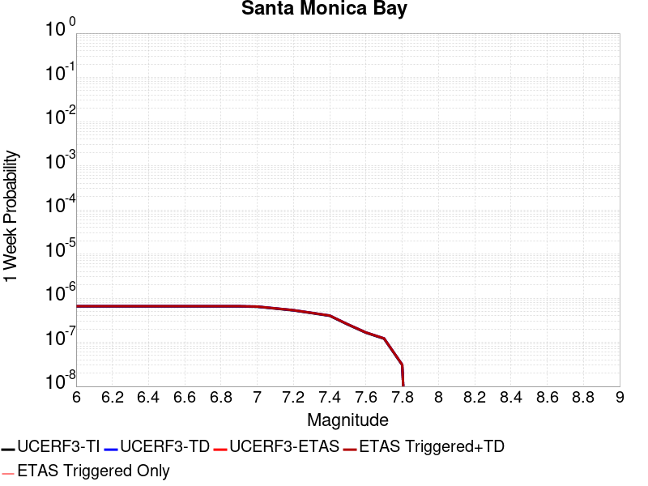 |  |  |  |

| Magnitude | 1 wk TI Prob | 1 wk TD Prob | 1 wk ETAS Prob | 1 wk ETAS/TD Gain | 1 wk ETAS Triggered+TD | 1 wk ETAS Triggered Only | 1 mo TI Prob | 1 mo TD Prob | 1 mo ETAS Prob | 1 mo ETAS/TD Gain | 1 mo ETAS Triggered+TD | 1 mo ETAS Triggered Only | 1 yr TI Prob | 1 yr TD Prob | 1 yr ETAS Prob | 1 yr ETAS/TD Gain | 1 yr ETAS Triggered+TD | 1 yr ETAS Triggered Only | 10 yr TI Prob | 10 yr TD Prob | 10 yr ETAS Prob | 10 yr ETAS/TD Gain | 10 yr ETAS Triggered+TD | 10 yr ETAS Triggered Only |
|-----|-----|-----|-----|-----|-----|-----|-----|-----|-----|-----|-----|-----|-----|-----|-----|-----|-----|-----|-----|-----|-----|-----|-----|-----|
| 6.0 | 6.493459E-7 | 6.5700857E-7 | 0.0 | 0.0 | 6.5700857E-7 | 0.0 | 2.782908E-6 | 2.815748E-6 | 0.0 | 0.0 | 2.815748E-6 | 0.0 | 3.388138E-5 | 3.4281213E-5 | 0.0 | 0.0 | 3.4281213E-5 | 0.0 | 3.3876215E-4 | 3.4276102E-4 | 1.0E-4 | 0.29174846 | 4.4272677E-4 | 1.0E-4 |
| 6.1 | 6.493459E-7 | 6.5700857E-7 | 0.0 | 0.0 | 6.5700857E-7 | 0.0 | 2.782908E-6 | 2.815748E-6 | 0.0 | 0.0 | 2.815748E-6 | 0.0 | 3.388138E-5 | 3.4281213E-5 | 0.0 | 0.0 | 3.4281213E-5 | 0.0 | 3.3876215E-4 | 3.4276102E-4 | 1.0E-4 | 0.29174846 | 4.4272677E-4 | 1.0E-4 |
| 6.2 | 6.493459E-7 | 6.5700857E-7 | 0.0 | 0.0 | 6.5700857E-7 | 0.0 | 2.782908E-6 | 2.815748E-6 | 0.0 | 0.0 | 2.815748E-6 | 0.0 | 3.388138E-5 | 3.4281213E-5 | 0.0 | 0.0 | 3.4281213E-5 | 0.0 | 3.3876215E-4 | 3.4276102E-4 | 1.0E-4 | 0.29174846 | 4.4272677E-4 | 1.0E-4 |
| 6.3 | 6.493459E-7 | 6.5700857E-7 | 0.0 | 0.0 | 6.5700857E-7 | 0.0 | 2.782908E-6 | 2.815748E-6 | 0.0 | 0.0 | 2.815748E-6 | 0.0 | 3.388138E-5 | 3.4281213E-5 | 0.0 | 0.0 | 3.4281213E-5 | 0.0 | 3.3876215E-4 | 3.4276102E-4 | 1.0E-4 | 0.29174846 | 4.4272677E-4 | 1.0E-4 |
| 6.4 | 6.493459E-7 | 6.5700857E-7 | 0.0 | 0.0 | 6.5700857E-7 | 0.0 | 2.782908E-6 | 2.815748E-6 | 0.0 | 0.0 | 2.815748E-6 | 0.0 | 3.388138E-5 | 3.4281213E-5 | 0.0 | 0.0 | 3.4281213E-5 | 0.0 | 3.3876215E-4 | 3.4276102E-4 | 1.0E-4 | 0.29174846 | 4.4272677E-4 | 1.0E-4 |
| 6.5 | 6.493459E-7 | 6.5700857E-7 | 0.0 | 0.0 | 6.5700857E-7 | 0.0 | 2.782908E-6 | 2.815748E-6 | 0.0 | 0.0 | 2.815748E-6 | 0.0 | 3.388138E-5 | 3.4281213E-5 | 0.0 | 0.0 | 3.4281213E-5 | 0.0 | 3.3876215E-4 | 3.4276102E-4 | 1.0E-4 | 0.29174846 | 4.4272677E-4 | 1.0E-4 |
| 6.6 | 6.493459E-7 | 6.5700857E-7 | 0.0 | 0.0 | 6.5700857E-7 | 0.0 | 2.782908E-6 | 2.815748E-6 | 0.0 | 0.0 | 2.815748E-6 | 0.0 | 3.388138E-5 | 3.4281213E-5 | 0.0 | 0.0 | 3.4281213E-5 | 0.0 | 3.3876215E-4 | 3.4276102E-4 | 1.0E-4 | 0.29174846 | 4.4272677E-4 | 1.0E-4 |
| 6.7 | 6.493459E-7 | 6.5700857E-7 | 0.0 | 0.0 | 6.5700857E-7 | 0.0 | 2.782908E-6 | 2.815748E-6 | 0.0 | 0.0 | 2.815748E-6 | 0.0 | 3.388138E-5 | 3.4281213E-5 | 0.0 | 0.0 | 3.4281213E-5 | 0.0 | 3.3876215E-4 | 3.4276102E-4 | 1.0E-4 | 0.29174846 | 4.4272677E-4 | 1.0E-4 |
| 6.8 | 6.493459E-7 | 6.5700857E-7 | 0.0 | 0.0 | 6.5700857E-7 | 0.0 | 2.782908E-6 | 2.815748E-6 | 0.0 | 0.0 | 2.815748E-6 | 0.0 | 3.388138E-5 | 3.4281213E-5 | 0.0 | 0.0 | 3.4281213E-5 | 0.0 | 3.3876215E-4 | 3.4276102E-4 | 1.0E-4 | 0.29174846 | 4.4272677E-4 | 1.0E-4 |
| 6.9 | 6.493459E-7 | 6.5700857E-7 | 0.0 | 0.0 | 6.5700857E-7 | 0.0 | 2.782908E-6 | 2.815748E-6 | 0.0 | 0.0 | 2.815748E-6 | 0.0 | 3.388138E-5 | 3.4281213E-5 | 0.0 | 0.0 | 3.4281213E-5 | 0.0 | 3.3876215E-4 | 3.4276102E-4 | 1.0E-4 | 0.29174846 | 4.4272677E-4 | 1.0E-4 |
| 7.0 | 6.3621707E-7 | 6.4381584E-7 | 0.0 | 0.0 | 6.4381584E-7 | 0.0 | 2.726642E-6 | 2.7592077E-6 | 0.0 | 0.0 | 2.7592077E-6 | 0.0 | 3.319636E-5 | 3.3592856E-5 | 0.0 | 0.0 | 3.3592856E-5 | 0.0 | 3.31914E-4 | 3.3587957E-4 | 1.0E-4 | 0.29772577 | 4.3584596E-4 | 1.0E-4 |
| 7.1 | 5.796316E-7 | 5.868724E-7 | 0.0 | 0.0 | 5.868724E-7 | 0.0 | 2.4841331E-6 | 2.515165E-6 | 0.0 | 0.0 | 2.515165E-6 | 0.0 | 3.0243902E-5 | 3.062172E-5 | 0.0 | 0.0 | 3.062172E-5 | 0.0 | 3.0239785E-4 | 3.0617657E-4 | 1.0E-4 | 0.32660893 | 4.0614596E-4 | 1.0E-4 |
| 7.2 | 5.2654514E-7 | 5.333992E-7 | 0.0 | 0.0 | 5.333992E-7 | 0.0 | 2.25662E-6 | 2.2859947E-6 | 0.0 | 0.0 | 2.2859947E-6 | 0.0 | 2.7474003E-5 | 2.7831644E-5 | 0.0 | 0.0 | 2.7831644E-5 | 0.0 | 2.7470608E-4 | 2.78283E-4 | 1.0E-4 | 0.35934642 | 3.7825518E-4 | 1.0E-4 |
| 7.3 | 4.582996E-7 | 4.645649E-7 | 0.0 | 0.0 | 4.645649E-7 | 0.0 | 1.9641398E-6 | 1.990991E-6 | 0.0 | 0.0 | 1.990991E-6 | 0.0 | 2.3913139E-5 | 2.4240058E-5 | 0.0 | 0.0 | 2.4240058E-5 | 0.0 | 2.3910566E-4 | 2.4237538E-4 | 1.0E-4 | 0.41258314 | 3.4235115E-4 | 1.0E-4 |
| 7.4 | 3.9690556E-7 | 4.0255134E-7 | 0.0 | 0.0 | 4.0255134E-7 | 0.0 | 1.7010227E-6 | 1.7252189E-6 | 0.0 | 0.0 | 1.7252189E-6 | 0.0 | 2.0709755E-5 | 2.1004349E-5 | 0.0 | 0.0 | 2.1004349E-5 | 0.0 | 2.0707825E-4 | 2.1002478E-4 | 1.0E-4 | 0.47613427 | 3.100038E-4 | 1.0E-4 |
| 7.5 | 2.514765E-7 | 2.5536687E-7 | 0.0 | 0.0 | 2.5536687E-7 | 0.0 | 1.077756E-6 | 1.094429E-6 | 0.0 | 0.0 | 1.094429E-6 | 0.0 | 1.31216E-5 | 1.3324598E-5 | 0.0 | 0.0 | 1.3324598E-5 | 0.0 | 1.3120825E-4 | 1.3323856E-4 | 1.0E-4 | 0.7505335 | 2.3322523E-4 | 1.0E-4 |
| 7.6 | 1.6412821E-7 | 1.6687189E-7 | 0.0 | 0.0 | 1.6687189E-7 | 0.0 | 7.0340644E-7 | 7.15165E-7 | 0.0 | 0.0 | 7.15165E-7 | 0.0 | 8.563939E-6 | 8.707099E-6 | 0.0 | 0.0 | 8.707099E-6 | 0.0 | 8.56361E-5 | 8.706764E-5 | 0.0 | 0.0 | 8.706764E-5 | 0.0 |
| 7.7 | 1.2030355E-7 | 1.2241027E-7 | 0.0 | 0.0 | 1.2241027E-7 | 0.0 | 5.155865E-7 | 5.2461536E-7 | 0.0 | 0.0 | 5.2461536E-7 | 0.0 | 6.277248E-6 | 6.3871735E-6 | 0.0 | 0.0 | 6.3871735E-6 | 0.0 | 6.2770705E-5 | 6.386994E-5 | 0.0 | 0.0 | 6.386994E-5 | 0.0 |
| 7.8 | 3.0539674E-8 | 3.111765E-8 | 0.0 | 0.0 | 3.111765E-8 | 0.0 | 1.308843E-7 | 1.3336135E-7 | 0.0 | 0.0 | 1.3336135E-7 | 0.0 | 1.5935152E-6 | 1.6236735E-6 | 0.0 | 0.0 | 1.6236735E-6 | 0.0 | 1.5935038E-5 | 1.6236636E-5 | 0.0 | 0.0 | 1.6236636E-5 | 0.0 |

## Anaheim
*[(top)](#table-of-contents)*

| 1 Week | 1 Month | 1 Year | 10 Year |
|-----|-----|-----|-----|
|  | 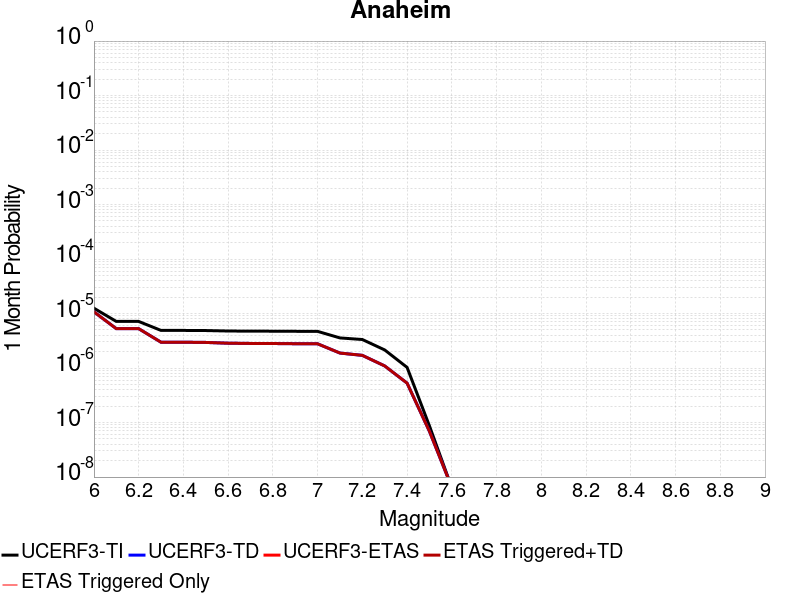 | 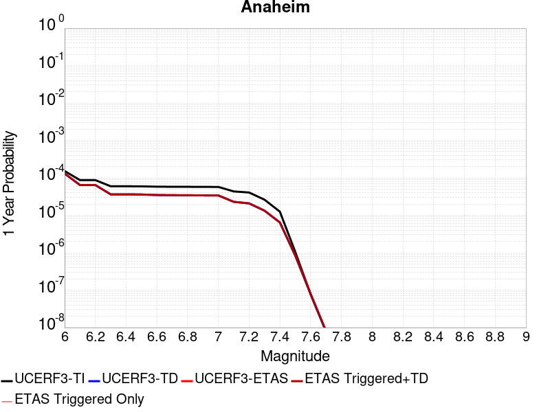 | 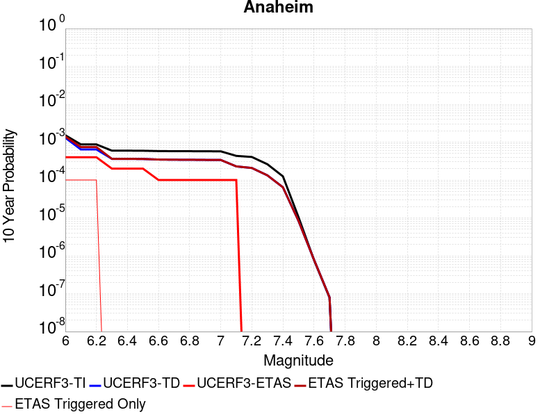 |

| Magnitude | 1 wk TI Prob | 1 wk TD Prob | 1 wk ETAS Prob | 1 wk ETAS/TD Gain | 1 wk ETAS Triggered+TD | 1 wk ETAS Triggered Only | 1 mo TI Prob | 1 mo TD Prob | 1 mo ETAS Prob | 1 mo ETAS/TD Gain | 1 mo ETAS Triggered+TD | 1 mo ETAS Triggered Only | 1 yr TI Prob | 1 yr TD Prob | 1 yr ETAS Prob | 1 yr ETAS/TD Gain | 1 yr ETAS Triggered+TD | 1 yr ETAS Triggered Only | 10 yr TI Prob | 10 yr TD Prob | 10 yr ETAS Prob | 10 yr ETAS/TD Gain | 10 yr ETAS Triggered+TD | 10 yr ETAS Triggered Only |
|-----|-----|-----|-----|-----|-----|-----|-----|-----|-----|-----|-----|-----|-----|-----|-----|-----|-----|-----|-----|-----|-----|-----|-----|-----|
| 6.0 | 2.9254998E-6 | 2.5109766E-6 | 0.0 | 0.0 | 2.5109766E-6 | 0.0 | 1.25377965E-5 | 1.0761297E-5 | 0.0 | 0.0 | 1.0761297E-5 | 0.0 | 1.5263697E-4 | 1.3101326E-4 | 0.0 | 0.0 | 1.3101326E-4 | 0.0 | 0.0015253217 | 0.0013095903 | 4.0E-4 | 0.30543903 | 0.0014094594 | 1.0E-4 |
| 6.1 | 1.6729715E-6 | 1.2327025E-6 | 0.0 | 0.0 | 1.2327025E-6 | 0.0 | 7.1698582E-6 | 5.2830023E-6 | 0.0 | 0.0 | 5.2830023E-6 | 0.0 | 8.7289525E-5 | 6.431907E-5 | 0.0 | 0.0 | 6.431907E-5 | 0.0 | 8.7255245E-4 | 6.4304547E-4 | 4.0E-4 | 0.62204 | 7.4298115E-4 | 1.0E-4 |
| 6.2 | 1.6729715E-6 | 1.2327025E-6 | 0.0 | 0.0 | 1.2327025E-6 | 0.0 | 7.1698582E-6 | 5.2830023E-6 | 0.0 | 0.0 | 5.2830023E-6 | 0.0 | 8.7289525E-5 | 6.431907E-5 | 0.0 | 0.0 | 6.431907E-5 | 0.0 | 8.7255245E-4 | 6.4304547E-4 | 4.0E-4 | 0.62204 | 7.4298115E-4 | 1.0E-4 |
| 6.3 | 1.1444064E-6 | 6.9503216E-7 | 0.0 | 0.0 | 6.9503216E-7 | 0.0 | 4.9045893E-6 | 2.978706E-6 | 0.0 | 0.0 | 2.978706E-6 | 0.0 | 5.971174E-5 | 3.62652E-5 | 0.0 | 0.0 | 3.62652E-5 | 0.0 | 5.96957E-4 | 3.625983E-4 | 2.0E-4 | 0.5515746 | 3.625983E-4 | 0.0 |
| 6.4 | 1.1444064E-6 | 6.9503216E-7 | 0.0 | 0.0 | 6.9503216E-7 | 0.0 | 4.9045893E-6 | 2.978706E-6 | 0.0 | 0.0 | 2.978706E-6 | 0.0 | 5.971174E-5 | 3.62652E-5 | 0.0 | 0.0 | 3.62652E-5 | 0.0 | 5.96957E-4 | 3.625983E-4 | 2.0E-4 | 0.5515746 | 3.625983E-4 | 0.0 |
| 6.5 | 1.1385318E-6 | 6.891011E-7 | 0.0 | 0.0 | 6.891011E-7 | 0.0 | 4.879413E-6 | 2.9532873E-6 | 0.0 | 0.0 | 2.9532873E-6 | 0.0 | 5.9405233E-5 | 3.5955738E-5 | 0.0 | 0.0 | 3.5955738E-5 | 0.0 | 5.938936E-4 | 3.595047E-4 | 2.0E-4 | 0.55632097 | 3.595047E-4 | 0.0 |
| 6.6 | 1.1165511E-6 | 6.668907E-7 | 0.0 | 0.0 | 6.668907E-7 | 0.0 | 4.78521E-6 | 2.8581E-6 | 0.0 | 0.0 | 2.8581E-6 | 0.0 | 5.8258374E-5 | 3.4796867E-5 | 0.0 | 0.0 | 3.4796867E-5 | 0.0 | 5.8243104E-4 | 3.4791962E-4 | 1.0E-4 | 0.28742272 | 3.4791962E-4 | 0.0 |
| 6.7 | 1.1098243E-6 | 6.601107E-7 | 0.0 | 0.0 | 6.601107E-7 | 0.0 | 4.7563813E-6 | 2.829043E-6 | 0.0 | 0.0 | 2.829043E-6 | 0.0 | 5.7907404E-5 | 3.444311E-5 | 0.0 | 0.0 | 3.444311E-5 | 0.0 | 5.7892315E-4 | 3.4438312E-4 | 1.0E-4 | 0.29037428 | 3.4438312E-4 | 0.0 |
| 6.8 | 1.1077587E-6 | 6.580311E-7 | 0.0 | 0.0 | 6.580311E-7 | 0.0 | 4.7475287E-6 | 2.8201307E-6 | 0.0 | 0.0 | 2.8201307E-6 | 0.0 | 5.779963E-5 | 3.4334604E-5 | 0.0 | 0.0 | 3.4334604E-5 | 0.0 | 5.77846E-4 | 3.4329842E-4 | 1.0E-4 | 0.29129174 | 3.4329842E-4 | 0.0 |
| 6.9 | 1.1024468E-6 | 6.5268915E-7 | 0.0 | 0.0 | 6.5268915E-7 | 0.0 | 4.7247636E-6 | 2.7972364E-6 | 0.0 | 0.0 | 2.7972364E-6 | 0.0 | 5.752248E-5 | 3.4055876E-5 | 0.0 | 0.0 | 3.4055876E-5 | 0.0 | 5.750759E-4 | 3.40512E-4 | 1.0E-4 | 0.2936754 | 3.40512E-4 | 0.0 |
| 7.0 | 1.0993066E-6 | 6.5010045E-7 | 0.0 | 0.0 | 6.5010045E-7 | 0.0 | 4.7113053E-6 | 2.786142E-6 | 0.0 | 0.0 | 2.786142E-6 | 0.0 | 5.7358633E-5 | 3.3920805E-5 | 0.0 | 0.0 | 3.3920805E-5 | 0.0 | 5.734383E-4 | 3.3916172E-4 | 1.0E-4 | 0.2948446 | 3.3916172E-4 | 0.0 |
| 7.1 | 8.334877E-7 | 4.3970527E-7 | 0.0 | 0.0 | 4.3970527E-7 | 0.0 | 3.5720855E-6 | 1.88445E-6 | 0.0 | 0.0 | 1.88445E-6 | 0.0 | 4.348927E-5 | 2.2942959E-5 | 0.0 | 0.0 | 2.2942959E-5 | 0.0 | 4.3480762E-4 | 2.2940812E-4 | 1.0E-4 | 0.43590435 | 2.2940812E-4 | 0.0 |
| 7.2 | 7.794411E-7 | 3.9903873E-7 | 0.0 | 0.0 | 3.9903873E-7 | 0.0 | 3.3404576E-6 | 1.710165E-6 | 0.0 | 0.0 | 1.710165E-6 | 0.0 | 4.0669314E-5 | 2.082108E-5 | 0.0 | 0.0 | 2.082108E-5 | 0.0 | 4.066187E-4 | 2.0819333E-4 | 0.0 | 0.0 | 2.0819333E-4 | 0.0 |
| 7.3 | 5.01704E-7 | 2.552751E-7 | 0.0 | 0.0 | 2.552751E-7 | 0.0 | 2.150158E-6 | 1.0940357E-6 | 0.0 | 0.0 | 1.0940357E-6 | 0.0 | 2.617786E-5 | 1.3319816E-5 | 0.0 | 0.0 | 1.3319816E-5 | 0.0 | 2.6174777E-4 | 1.3319142E-4 | 0.0 | 0.0 | 1.3319142E-4 | 0.0 |
| 7.4 | 2.4008182E-7 | 1.2346648E-7 | 0.0 | 0.0 | 1.2346648E-7 | 0.0 | 1.0289217E-6 | 5.29142E-7 | 0.0 | 0.0 | 5.29142E-7 | 0.0 | 1.252705E-5 | 6.4422925E-6 | 0.0 | 0.0 | 6.4422925E-6 | 0.0 | 1.2526344E-4 | 6.4421816E-5 | 0.0 | 0.0 | 6.4421816E-5 | 0.0 |
| 7.5 | 2.0263876E-8 | 1.6112283E-8 | 0.0 | 0.0 | 1.6112283E-8 | 0.0 | 8.684518E-8 | 6.9052646E-8 | 0.0 | 0.0 | 6.9052646E-8 | 0.0 | 1.0573395E-6 | 8.407157E-7 | 0.0 | 0.0 | 8.407157E-7 | 0.0 | 1.0573345E-5 | 8.407134E-6 | 0.0 | 0.0 | 8.407134E-6 | 0.0 |
| 7.6 | 1.4871431E-9 | 1.5081927E-9 | 0.0 | 0.0 | 1.5081927E-9 | 0.0 | 6.37347E-9 | 6.463683E-9 | 0.0 | 0.0 | 6.463683E-9 | 0.0 | 7.7596994E-8 | 7.869534E-8 | 0.0 | 0.0 | 7.869534E-8 | 0.0 | 7.759697E-7 | 7.869531E-7 | 0.0 | 0.0 | 7.869531E-7 | 0.0 |
| 7.7 | 1.5093293E-10 | 1.5330981E-10 | 0.0 | 0.0 | 1.5330981E-10 | 0.0 | 6.4685546E-10 | 6.57042E-10 | 0.0 | 0.0 | 6.57042E-10 | 0.0 | 7.875465E-9 | 7.999484E-9 | 0.0 | 0.0 | 7.999484E-9 | 0.0 | 7.8754645E-8 | 7.999483E-8 | 0.0 | 0.0 | 7.999483E-8 | 0.0 |

## Jess Valley
*[(top)](#table-of-contents)*

| 1 Week | 1 Month | 1 Year | 10 Year |
|-----|-----|-----|-----|
|  | 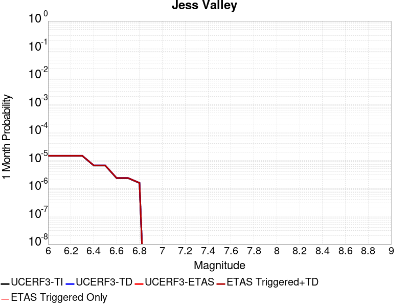 | 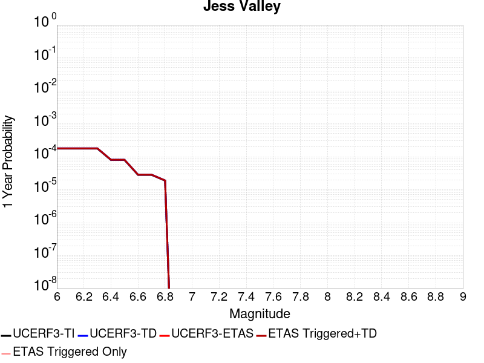 | 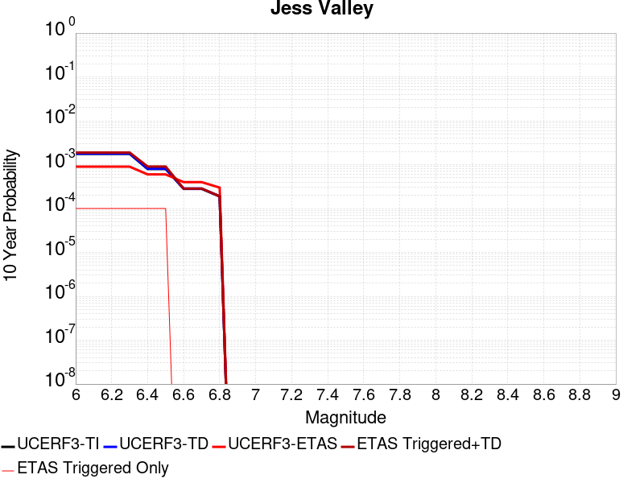 |

| Magnitude | 1 wk TI Prob | 1 wk TD Prob | 1 wk ETAS Prob | 1 wk ETAS/TD Gain | 1 wk ETAS Triggered+TD | 1 wk ETAS Triggered Only | 1 mo TI Prob | 1 mo TD Prob | 1 mo ETAS Prob | 1 mo ETAS/TD Gain | 1 mo ETAS Triggered+TD | 1 mo ETAS Triggered Only | 1 yr TI Prob | 1 yr TD Prob | 1 yr ETAS Prob | 1 yr ETAS/TD Gain | 1 yr ETAS Triggered+TD | 1 yr ETAS Triggered Only | 10 yr TI Prob | 10 yr TD Prob | 10 yr ETAS Prob | 10 yr ETAS/TD Gain | 10 yr ETAS Triggered+TD | 10 yr ETAS Triggered Only |
|-----|-----|-----|-----|-----|-----|-----|-----|-----|-----|-----|-----|-----|-----|-----|-----|-----|-----|-----|-----|-----|-----|-----|-----|-----|
| 6.0 | 3.3861274E-6 | 3.4335517E-6 | 0.0 | 0.0 | 3.4335517E-6 | 0.0 | 1.4511894E-5 | 1.4715154E-5 | 0.0 | 0.0 | 1.4715154E-5 | 0.0 | 1.7666799E-4 | 1.7914509E-4 | 0.0 | 0.0 | 1.7914509E-4 | 0.0 | 0.001765276 | 0.0017902832 | 9.0E-4 | 0.50271374 | 0.0018901041 | 1.0E-4 |
| 6.1 | 3.3861274E-6 | 3.4335517E-6 | 0.0 | 0.0 | 3.4335517E-6 | 0.0 | 1.4511894E-5 | 1.4715154E-5 | 0.0 | 0.0 | 1.4715154E-5 | 0.0 | 1.7666799E-4 | 1.7914509E-4 | 0.0 | 0.0 | 1.7914509E-4 | 0.0 | 0.001765276 | 0.0017902832 | 9.0E-4 | 0.50271374 | 0.0018901041 | 1.0E-4 |
| 6.2 | 3.3861274E-6 | 3.4335517E-6 | 0.0 | 0.0 | 3.4335517E-6 | 0.0 | 1.4511894E-5 | 1.4715154E-5 | 0.0 | 0.0 | 1.4715154E-5 | 0.0 | 1.7666799E-4 | 1.7914509E-4 | 0.0 | 0.0 | 1.7914509E-4 | 0.0 | 0.001765276 | 0.0017902832 | 9.0E-4 | 0.50271374 | 0.0018901041 | 1.0E-4 |
| 6.3 | 3.3861274E-6 | 3.4335517E-6 | 0.0 | 0.0 | 3.4335517E-6 | 0.0 | 1.4511894E-5 | 1.4715154E-5 | 0.0 | 0.0 | 1.4715154E-5 | 0.0 | 1.7666799E-4 | 1.7914509E-4 | 0.0 | 0.0 | 1.7914509E-4 | 0.0 | 0.001765276 | 0.0017902832 | 9.0E-4 | 0.50271374 | 0.0018901041 | 1.0E-4 |
| 6.4 | 1.5291708E-6 | 1.550055E-6 | 0.0 | 0.0 | 1.550055E-6 | 0.0 | 6.553573E-6 | 6.6430803E-6 | 0.0 | 0.0 | 6.6430803E-6 | 0.0 | 7.978683E-5 | 8.08773E-5 | 0.0 | 0.0 | 8.08773E-5 | 0.0 | 7.975819E-4 | 8.0855686E-4 | 6.0E-4 | 0.74206287 | 9.08476E-4 | 1.0E-4 |
| 6.5 | 1.5291708E-6 | 1.550055E-6 | 0.0 | 0.0 | 1.550055E-6 | 0.0 | 6.553573E-6 | 6.6430803E-6 | 0.0 | 0.0 | 6.6430803E-6 | 0.0 | 7.978683E-5 | 8.08773E-5 | 0.0 | 0.0 | 8.08773E-5 | 0.0 | 7.975819E-4 | 8.0855686E-4 | 6.0E-4 | 0.74206287 | 9.08476E-4 | 1.0E-4 |
| 6.6 | 5.396423E-7 | 5.4711955E-7 | 0.0 | 0.0 | 5.4711955E-7 | 0.0 | 2.312751E-6 | 2.344797E-6 | 0.0 | 0.0 | 2.344797E-6 | 0.0 | 2.8157378E-5 | 2.8547716E-5 | 0.0 | 0.0 | 2.8547716E-5 | 0.0 | 2.8153812E-4 | 2.854589E-4 | 4.0E-4 | 1.4012525 | 2.854589E-4 | 0.0 |
| 6.7 | 5.396423E-7 | 5.4711955E-7 | 0.0 | 0.0 | 5.4711955E-7 | 0.0 | 2.312751E-6 | 2.344797E-6 | 0.0 | 0.0 | 2.344797E-6 | 0.0 | 2.8157378E-5 | 2.8547716E-5 | 0.0 | 0.0 | 2.8547716E-5 | 0.0 | 2.8153812E-4 | 2.854589E-4 | 4.0E-4 | 1.4012525 | 2.854589E-4 | 0.0 |
| 6.8 | 3.6058395E-7 | 3.6557725E-7 | 0.0 | 0.0 | 3.6557725E-7 | 0.0 | 1.5453588E-6 | 1.5667596E-6 | 0.0 | 0.0 | 1.5667596E-6 | 0.0 | 1.8814582E-5 | 1.9075298E-5 | 0.0 | 0.0 | 1.9075298E-5 | 0.0 | 1.8812988E-4 | 1.9075298E-4 | 3.0E-4 | 1.5727146 | 1.9075298E-4 | 0.0 |

## Dog Valley
*[(top)](#table-of-contents)*

| 1 Week | 1 Month | 1 Year | 10 Year |
|-----|-----|-----|-----|
|  |  |  | 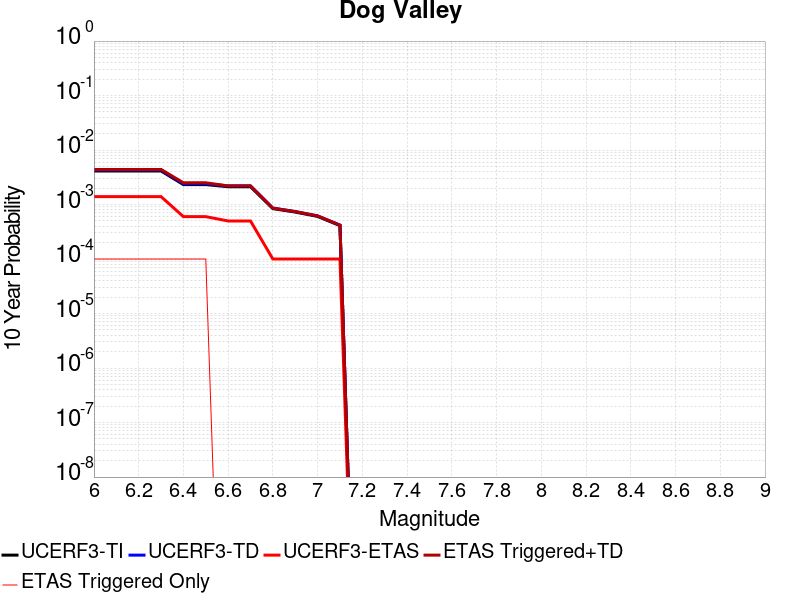 |

| Magnitude | 1 wk TI Prob | 1 wk TD Prob | 1 wk ETAS Prob | 1 wk ETAS/TD Gain | 1 wk ETAS Triggered+TD | 1 wk ETAS Triggered Only | 1 mo TI Prob | 1 mo TD Prob | 1 mo ETAS Prob | 1 mo ETAS/TD Gain | 1 mo ETAS Triggered+TD | 1 mo ETAS Triggered Only | 1 yr TI Prob | 1 yr TD Prob | 1 yr ETAS Prob | 1 yr ETAS/TD Gain | 1 yr ETAS Triggered+TD | 1 yr ETAS Triggered Only | 10 yr TI Prob | 10 yr TD Prob | 10 yr ETAS Prob | 10 yr ETAS/TD Gain | 10 yr ETAS Triggered+TD | 10 yr ETAS Triggered Only |
|-----|-----|-----|-----|-----|-----|-----|-----|-----|-----|-----|-----|-----|-----|-----|-----|-----|-----|-----|-----|-----|-----|-----|-----|-----|
| 6.0 | 7.949598E-6 | 8.272174E-6 | 0.0 | 0.0 | 8.272174E-6 | 0.0 | 3.4069257E-5 | 3.54518E-5 | 0.0 | 0.0 | 3.54518E-5 | 0.0 | 4.1471425E-4 | 4.315598E-4 | 0.0 | 0.0 | 4.315598E-4 | 0.0 | 0.0041394117 | 0.0043091457 | 0.0014 | 0.32489038 | 0.004408715 | 1.0E-4 |
| 6.1 | 7.949598E-6 | 8.272174E-6 | 0.0 | 0.0 | 8.272174E-6 | 0.0 | 3.4069257E-5 | 3.54518E-5 | 0.0 | 0.0 | 3.54518E-5 | 0.0 | 4.1471425E-4 | 4.315598E-4 | 0.0 | 0.0 | 4.315598E-4 | 0.0 | 0.0041394117 | 0.0043091457 | 0.0014 | 0.32489038 | 0.004408715 | 1.0E-4 |
| 6.2 | 7.949598E-6 | 8.272174E-6 | 0.0 | 0.0 | 8.272174E-6 | 0.0 | 3.4069257E-5 | 3.54518E-5 | 0.0 | 0.0 | 3.54518E-5 | 0.0 | 4.1471425E-4 | 4.315598E-4 | 0.0 | 0.0 | 4.315598E-4 | 0.0 | 0.0041394117 | 0.0043091457 | 0.0014 | 0.32489038 | 0.004408715 | 1.0E-4 |
| 6.3 | 7.949598E-6 | 8.272174E-6 | 0.0 | 0.0 | 8.272174E-6 | 0.0 | 3.4069257E-5 | 3.54518E-5 | 0.0 | 0.0 | 3.54518E-5 | 0.0 | 4.1471425E-4 | 4.315598E-4 | 0.0 | 0.0 | 4.315598E-4 | 0.0 | 0.0041394117 | 0.0043091457 | 0.0014 | 0.32489038 | 0.004408715 | 1.0E-4 |
| 6.4 | 4.462132E-6 | 4.6214154E-6 | 0.0 | 0.0 | 4.6214154E-6 | 0.0 | 1.9123283E-5 | 1.9805966E-5 | 0.0 | 0.0 | 1.9805966E-5 | 0.0 | 2.328011E-4 | 2.411199E-4 | 0.0 | 0.0 | 2.411199E-4 | 0.0 | 0.0023255737 | 0.002409459 | 6.0E-4 | 0.24901855 | 0.0025092182 | 1.0E-4 |
| 6.5 | 4.462132E-6 | 4.6214154E-6 | 0.0 | 0.0 | 4.6214154E-6 | 0.0 | 1.9123283E-5 | 1.9805966E-5 | 0.0 | 0.0 | 1.9805966E-5 | 0.0 | 2.328011E-4 | 2.411199E-4 | 0.0 | 0.0 | 2.411199E-4 | 0.0 | 0.0023255737 | 0.002409459 | 6.0E-4 | 0.24901855 | 0.0025092182 | 1.0E-4 |
| 6.6 | 4.074213E-6 | 4.2158235E-6 | 0.0 | 0.0 | 4.2158235E-6 | 0.0 | 1.7460794E-5 | 1.8067738E-5 | 0.0 | 0.0 | 1.8067738E-5 | 0.0 | 2.1256444E-4 | 2.199613E-4 | 0.0 | 0.0 | 2.199613E-4 | 0.0 | 0.0021236122 | 0.0021982966 | 5.0E-4 | 0.22744884 | 0.0021982966 | 0.0 |
| 6.7 | 4.074213E-6 | 4.2158235E-6 | 0.0 | 0.0 | 4.2158235E-6 | 0.0 | 1.7460794E-5 | 1.8067738E-5 | 0.0 | 0.0 | 1.8067738E-5 | 0.0 | 2.1256444E-4 | 2.199613E-4 | 0.0 | 0.0 | 2.199613E-4 | 0.0 | 0.0021236122 | 0.0021982966 | 5.0E-4 | 0.22744884 | 0.0021982966 | 0.0 |
| 6.8 | 1.6159543E-6 | 1.6499739E-6 | 0.0 | 0.0 | 1.6499739E-6 | 0.0 | 6.9255E-6 | 7.071301E-6 | 0.0 | 0.0 | 7.071301E-6 | 0.0 | 8.43147E-5 | 8.609024E-5 | 0.0 | 0.0 | 8.609024E-5 | 0.0 | 8.4282714E-4 | 8.606231E-4 | 1.0E-4 | 0.11619489 | 8.606231E-4 | 0.0 |
| 6.9 | 1.3952654E-6 | 1.4249674E-6 | 0.0 | 0.0 | 1.4249674E-6 | 0.0 | 5.9796953E-6 | 6.106992E-6 | 0.0 | 0.0 | 6.106992E-6 | 0.0 | 7.280036E-5 | 7.435057E-5 | 0.0 | 0.0 | 7.435057E-5 | 0.0 | 7.2776515E-4 | 7.4330496E-4 | 1.0E-4 | 0.13453428 | 7.4330496E-4 | 0.0 |
| 7.0 | 1.1619308E-6 | 1.1866858E-6 | 0.0 | 0.0 | 1.1866858E-6 | 0.0 | 4.979694E-6 | 5.085789E-6 | 0.0 | 0.0 | 5.085789E-6 | 0.0 | 6.0626087E-5 | 6.191817E-5 | 0.0 | 0.0 | 6.191817E-5 | 0.0 | 6.060955E-4 | 6.1905285E-4 | 1.0E-4 | 0.1615371 | 6.1905285E-4 | 0.0 |
| 7.1 | 7.8723247E-7 | 8.0451326E-7 | 0.0 | 0.0 | 8.0451326E-7 | 0.0 | 3.373849E-6 | 3.4479112E-6 | 0.0 | 0.0 | 3.4479112E-6 | 0.0 | 4.107584E-5 | 4.1977815E-5 | 0.0 | 0.0 | 4.1977815E-5 | 0.0 | 4.1068246E-4 | 4.1972872E-4 | 1.0E-4 | 0.23824912 | 4.1972872E-4 | 0.0 |

## Incline Village 2011 CFM
*[(top)](#table-of-contents)*

| 1 Week | 1 Month | 1 Year | 10 Year |
|-----|-----|-----|-----|
| 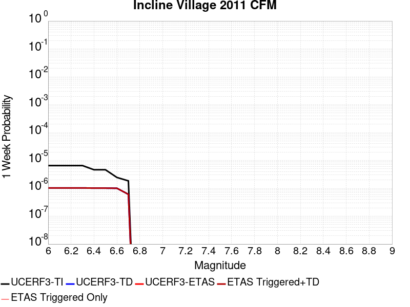 |  |  | 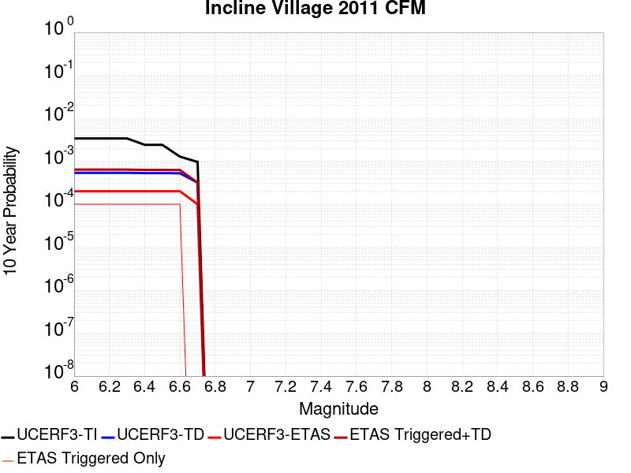 |

| Magnitude | 1 wk TI Prob | 1 wk TD Prob | 1 wk ETAS Prob | 1 wk ETAS/TD Gain | 1 wk ETAS Triggered+TD | 1 wk ETAS Triggered Only | 1 mo TI Prob | 1 mo TD Prob | 1 mo ETAS Prob | 1 mo ETAS/TD Gain | 1 mo ETAS Triggered+TD | 1 mo ETAS Triggered Only | 1 yr TI Prob | 1 yr TD Prob | 1 yr ETAS Prob | 1 yr ETAS/TD Gain | 1 yr ETAS Triggered+TD | 1 yr ETAS Triggered Only | 10 yr TI Prob | 10 yr TD Prob | 10 yr ETAS Prob | 10 yr ETAS/TD Gain | 10 yr ETAS Triggered+TD | 10 yr ETAS Triggered Only |
|-----|-----|-----|-----|-----|-----|-----|-----|-----|-----|-----|-----|-----|-----|-----|-----|-----|-----|-----|-----|-----|-----|-----|-----|-----|
| 6.0 | 6.5321456E-6 | 1.0320998E-6 | 0.0 | 0.0 | 1.0320998E-6 | 0.0 | 2.7994609E-5 | 4.4232816E-6 | 0.0 | 0.0 | 4.4232816E-6 | 0.0 | 3.4078106E-4 | 5.3852782E-5 | 0.0 | 0.0 | 5.3852782E-5 | 0.0 | 0.0034025894 | 5.3846225E-4 | 2.0E-4 | 0.3714281 | 6.384084E-4 | 1.0E-4 |
| 6.1 | 6.5321456E-6 | 1.0320998E-6 | 0.0 | 0.0 | 1.0320998E-6 | 0.0 | 2.7994609E-5 | 4.4232816E-6 | 0.0 | 0.0 | 4.4232816E-6 | 0.0 | 3.4078106E-4 | 5.3852782E-5 | 0.0 | 0.0 | 5.3852782E-5 | 0.0 | 0.0034025894 | 5.3846225E-4 | 2.0E-4 | 0.3714281 | 6.384084E-4 | 1.0E-4 |
| 6.2 | 6.5321456E-6 | 1.0320998E-6 | 0.0 | 0.0 | 1.0320998E-6 | 0.0 | 2.7994609E-5 | 4.4232816E-6 | 0.0 | 0.0 | 4.4232816E-6 | 0.0 | 3.4078106E-4 | 5.3852782E-5 | 0.0 | 0.0 | 5.3852782E-5 | 0.0 | 0.0034025894 | 5.3846225E-4 | 2.0E-4 | 0.3714281 | 6.384084E-4 | 1.0E-4 |
| 6.3 | 6.5321456E-6 | 1.0320998E-6 | 0.0 | 0.0 | 1.0320998E-6 | 0.0 | 2.7994609E-5 | 4.4232816E-6 | 0.0 | 0.0 | 4.4232816E-6 | 0.0 | 3.4078106E-4 | 5.3852782E-5 | 0.0 | 0.0 | 5.3852782E-5 | 0.0 | 0.0034025894 | 5.3846225E-4 | 2.0E-4 | 0.3714281 | 6.384084E-4 | 1.0E-4 |
| 6.4 | 4.6332716E-6 | 1.0168296E-6 | 0.0 | 0.0 | 1.0168296E-6 | 0.0 | 1.9856727E-5 | 4.3578375E-6 | 0.0 | 0.0 | 4.3578375E-6 | 0.0 | 2.4172882E-4 | 5.3056043E-5 | 0.0 | 0.0 | 5.3056043E-5 | 0.0 | 0.0024146605 | 5.304987E-4 | 2.0E-4 | 0.3770038 | 6.304456E-4 | 1.0E-4 |
| 6.5 | 4.6332716E-6 | 1.0168296E-6 | 0.0 | 0.0 | 1.0168296E-6 | 0.0 | 1.9856727E-5 | 4.3578375E-6 | 0.0 | 0.0 | 4.3578375E-6 | 0.0 | 2.4172882E-4 | 5.3056043E-5 | 0.0 | 0.0 | 5.3056043E-5 | 0.0 | 0.0024146605 | 5.304987E-4 | 2.0E-4 | 0.3770038 | 6.304456E-4 | 1.0E-4 |
| 6.6 | 2.4546039E-6 | 1.0073288E-6 | 0.0 | 0.0 | 1.0073288E-6 | 0.0 | 1.0519689E-5 | 4.3171203E-6 | 0.0 | 0.0 | 4.3171203E-6 | 0.0 | 1.2806967E-4 | 5.2560332E-5 | 0.0 | 0.0 | 5.2560332E-5 | 0.0 | 0.001279959 | 5.255439E-4 | 2.0E-4 | 0.38055813 | 6.254913E-4 | 1.0E-4 |
| 6.7 | 1.8511148E-6 | 6.0916835E-7 | 0.0 | 0.0 | 6.0916835E-7 | 0.0 | 7.933325E-6 | 2.6107216E-6 | 0.0 | 0.0 | 2.6107216E-6 | 0.0 | 9.658395E-5 | 3.1785534E-5 | 0.0 | 0.0 | 3.1785534E-5 | 0.0 | 9.6541987E-4 | 3.1785536E-4 | 1.0E-4 | 0.3146085 | 3.1785536E-4 | 0.0 |

## San Luis Range - Oceano 2011 CFM
*[(top)](#table-of-contents)*

| 1 Week | 1 Month | 1 Year | 10 Year |
|-----|-----|-----|-----|
|  |  |  |  |

| Magnitude | 1 wk TI Prob | 1 wk TD Prob | 1 wk ETAS Prob | 1 wk ETAS/TD Gain | 1 wk ETAS Triggered+TD | 1 wk ETAS Triggered Only | 1 mo TI Prob | 1 mo TD Prob | 1 mo ETAS Prob | 1 mo ETAS/TD Gain | 1 mo ETAS Triggered+TD | 1 mo ETAS Triggered Only | 1 yr TI Prob | 1 yr TD Prob | 1 yr ETAS Prob | 1 yr ETAS/TD Gain | 1 yr ETAS Triggered+TD | 1 yr ETAS Triggered Only | 10 yr TI Prob | 10 yr TD Prob | 10 yr ETAS Prob | 10 yr ETAS/TD Gain | 10 yr ETAS Triggered+TD | 10 yr ETAS Triggered Only |
|-----|-----|-----|-----|-----|-----|-----|-----|-----|-----|-----|-----|-----|-----|-----|-----|-----|-----|-----|-----|-----|-----|-----|-----|-----|
| 6.0 | 1.6025788E-6 | 1.6199335E-6 | 1.0E-4 | 61.730927 | 1.6199335E-6 | 0.0 | 6.8681766E-6 | 6.9425564E-6 | 1.0E-4 | 14.403916 | 6.9425564E-6 | 0.0 | 8.361684E-5 | 8.452276E-5 | 1.0E-4 | 1.1831133 | 8.452276E-5 | 0.0 | 8.3585386E-4 | 8.449469E-4 | 6.0E-4 | 0.7101038 | 9.4486243E-4 | 1.0E-4 |
| 6.1 | 1.6025788E-6 | 1.6199335E-6 | 1.0E-4 | 61.730927 | 1.6199335E-6 | 0.0 | 6.8681766E-6 | 6.9425564E-6 | 1.0E-4 | 14.403916 | 6.9425564E-6 | 0.0 | 8.361684E-5 | 8.452276E-5 | 1.0E-4 | 1.1831133 | 8.452276E-5 | 0.0 | 8.3585386E-4 | 8.449469E-4 | 6.0E-4 | 0.7101038 | 9.4486243E-4 | 1.0E-4 |
| 6.2 | 1.6025788E-6 | 1.6199335E-6 | 1.0E-4 | 61.730927 | 1.6199335E-6 | 0.0 | 6.8681766E-6 | 6.9425564E-6 | 1.0E-4 | 14.403916 | 6.9425564E-6 | 0.0 | 8.361684E-5 | 8.452276E-5 | 1.0E-4 | 1.1831133 | 8.452276E-5 | 0.0 | 8.3585386E-4 | 8.449469E-4 | 6.0E-4 | 0.7101038 | 9.4486243E-4 | 1.0E-4 |
| 6.3 | 1.6025788E-6 | 1.6199335E-6 | 1.0E-4 | 61.730927 | 1.6199335E-6 | 0.0 | 6.8681766E-6 | 6.9425564E-6 | 1.0E-4 | 14.403916 | 6.9425564E-6 | 0.0 | 8.361684E-5 | 8.452276E-5 | 1.0E-4 | 1.1831133 | 8.452276E-5 | 0.0 | 8.3585386E-4 | 8.449469E-4 | 6.0E-4 | 0.7101038 | 9.4486243E-4 | 1.0E-4 |
| 6.4 | 1.1621186E-6 | 1.1748533E-6 | 0.0 | 0.0 | 1.1748533E-6 | 0.0 | 4.980499E-6 | 5.0350773E-6 | 0.0 | 0.0 | 5.0350773E-6 | 0.0 | 6.0635884E-5 | 6.130061E-5 | 0.0 | 0.0 | 6.130061E-5 | 0.0 | 6.0619344E-4 | 6.1286363E-4 | 5.0E-4 | 0.81584215 | 7.1280234E-4 | 1.0E-4 |
| 6.5 | 1.1621186E-6 | 1.1748533E-6 | 0.0 | 0.0 | 1.1748533E-6 | 0.0 | 4.980499E-6 | 5.0350773E-6 | 0.0 | 0.0 | 5.0350773E-6 | 0.0 | 6.0635884E-5 | 6.130061E-5 | 0.0 | 0.0 | 6.130061E-5 | 0.0 | 6.0619344E-4 | 6.1286363E-4 | 5.0E-4 | 0.81584215 | 7.1280234E-4 | 1.0E-4 |
| 6.6 | 7.164729E-7 | 7.24769E-7 | 0.0 | 0.0 | 7.24769E-7 | 0.0 | 3.0705946E-6 | 3.1061493E-6 | 0.0 | 0.0 | 3.1061493E-6 | 0.0 | 3.738385E-5 | 3.7816728E-5 | 0.0 | 0.0 | 3.7816728E-5 | 0.0 | 3.737756E-4 | 3.781047E-4 | 3.0E-4 | 0.79343104 | 4.7806688E-4 | 1.0E-4 |
| 6.7 | 7.164729E-7 | 7.24769E-7 | 0.0 | 0.0 | 7.24769E-7 | 0.0 | 3.0705946E-6 | 3.1061493E-6 | 0.0 | 0.0 | 3.1061493E-6 | 0.0 | 3.738385E-5 | 3.7816728E-5 | 0.0 | 0.0 | 3.7816728E-5 | 0.0 | 3.737756E-4 | 3.781047E-4 | 3.0E-4 | 0.79343104 | 4.7806688E-4 | 1.0E-4 |
| 6.8 | 6.700177E-7 | 6.776621E-7 | 0.0 | 0.0 | 6.776621E-7 | 0.0 | 2.8715012E-6 | 2.904263E-6 | 0.0 | 0.0 | 2.904263E-6 | 0.0 | 3.495997E-5 | 3.5358848E-5 | 0.0 | 0.0 | 3.5358848E-5 | 0.0 | 3.495447E-4 | 3.5353383E-4 | 3.0E-4 | 0.84857506 | 4.5349848E-4 | 1.0E-4 |
| 6.9 | 5.657865E-7 | 5.721109E-7 | 0.0 | 0.0 | 5.721109E-7 | 0.0 | 2.424797E-6 | 2.4519015E-6 | 0.0 | 0.0 | 2.4519015E-6 | 0.0 | 2.9521503E-5 | 2.9851504E-5 | 0.0 | 0.0 | 2.9851504E-5 | 0.0 | 2.9517582E-4 | 2.98476E-4 | 3.0E-4 | 1.005106 | 3.9844617E-4 | 1.0E-4 |
| 7.0 | 4.608413E-7 | 4.6596202E-7 | 0.0 | 0.0 | 4.6596202E-7 | 0.0 | 1.9750328E-6 | 1.9969787E-6 | 0.0 | 0.0 | 1.9969787E-6 | 0.0 | 2.4045758E-5 | 2.4312945E-5 | 0.0 | 0.0 | 2.4312945E-5 | 0.0 | 2.4043156E-4 | 2.4310315E-4 | 3.0E-4 | 1.2340441 | 3.4307883E-4 | 1.0E-4 |
| 7.1 | 3.9177846E-7 | 3.9616896E-7 | 0.0 | 0.0 | 3.9616896E-7 | 0.0 | 1.6790494E-6 | 1.6978659E-6 | 0.0 | 0.0 | 1.6978659E-6 | 0.0 | 2.0442236E-5 | 2.0671321E-5 | 0.0 | 0.0 | 2.0671321E-5 | 0.0 | 2.0440355E-4 | 2.0669414E-4 | 1.0E-4 | 0.48380664 | 2.0669414E-4 | 0.0 |
| 7.2 | 3.3974752E-7 | 3.436237E-7 | 0.0 | 0.0 | 3.436237E-7 | 0.0 | 1.45606E-6 | 1.4726722E-6 | 0.0 | 0.0 | 1.4726722E-6 | 0.0 | 1.7727387E-5 | 1.7929638E-5 | 0.0 | 0.0 | 1.7929638E-5 | 0.0 | 1.7725973E-4 | 1.7928203E-4 | 1.0E-4 | 0.5577804 | 1.7928203E-4 | 0.0 |
| 7.3 | 2.8900928E-7 | 2.923048E-7 | 0.0 | 0.0 | 2.923048E-7 | 0.0 | 1.2386106E-6 | 1.2527343E-6 | 0.0 | 0.0 | 1.2527343E-6 | 0.0 | 1.5079979E-5 | 1.5251934E-5 | 0.0 | 0.0 | 1.5251934E-5 | 0.0 | 1.5078956E-4 | 1.5250896E-4 | 1.0E-4 | 0.6556992 | 1.5250896E-4 | 0.0 |
| 7.4 | 2.1881527E-7 | 2.2136851E-7 | 0.0 | 0.0 | 2.2136851E-7 | 0.0 | 9.3777936E-7 | 9.4872183E-7 | 0.0 | 0.0 | 9.4872183E-7 | 0.0 | 1.14174045E-5 | 1.1550627E-5 | 0.0 | 0.0 | 1.1550627E-5 | 0.0 | 1.1416818E-4 | 1.1550033E-4 | 1.0E-4 | 0.8657984 | 1.1550033E-4 | 0.0 |
| 7.5 | 1.356398E-7 | 1.3716993E-7 | 0.0 | 0.0 | 1.3716993E-7 | 0.0 | 5.813133E-7 | 5.87871E-7 | 0.0 | 0.0 | 5.87871E-7 | 0.0 | 7.0774663E-6 | 7.1573063E-6 | 0.0 | 0.0 | 7.1573063E-6 | 0.0 | 7.077241E-5 | 7.157079E-5 | 1.0E-4 | 1.3972181 | 7.157079E-5 | 0.0 |
| 7.6 | 5.9269272E-8 | 6.00057E-8 | 0.0 | 0.0 | 6.00057E-8 | 0.0 | 2.5401116E-7 | 2.5716727E-7 | 0.0 | 0.0 | 2.5716727E-7 | 0.0 | 3.0925814E-6 | 3.1310071E-6 | 0.0 | 0.0 | 3.1310071E-6 | 0.0 | 3.0925385E-5 | 3.1309643E-5 | 1.0E-4 | 3.1939042 | 3.1309643E-5 | 0.0 |
| 7.7 | 5.946232E-9 | 6.035955E-9 | 0.0 | 0.0 | 6.035955E-9 | 0.0 | 2.5483851E-8 | 2.586838E-8 | 0.0 | 0.0 | 2.586838E-8 | 0.0 | 3.1026585E-7 | 3.1494747E-7 | 0.0 | 0.0 | 3.1494747E-7 | 0.0 | 3.102654E-6 | 3.1494712E-6 | 1.0E-4 | 31.751362 | 3.1494712E-6 | 0.0 |

## Battle Creek 2011 CFM
*[(top)](#table-of-contents)*

| 1 Week | 1 Month | 1 Year | 10 Year |
|-----|-----|-----|-----|
| 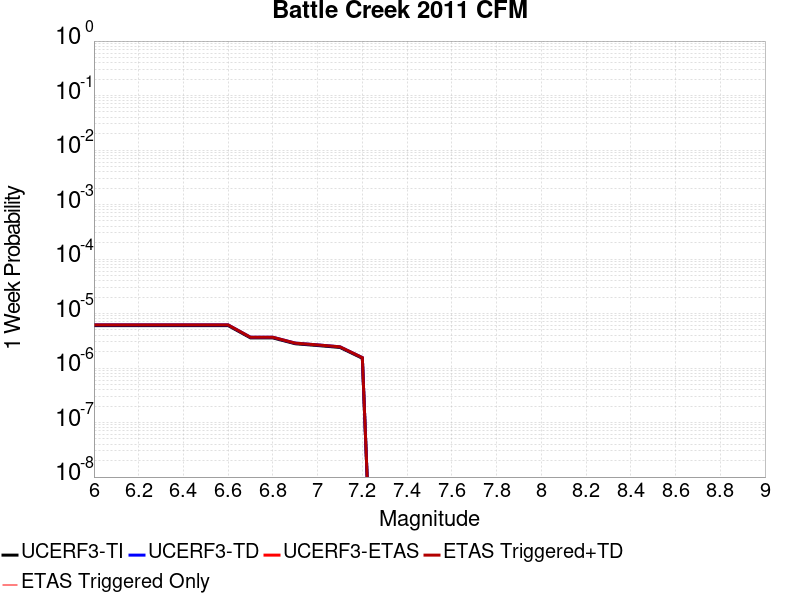 | 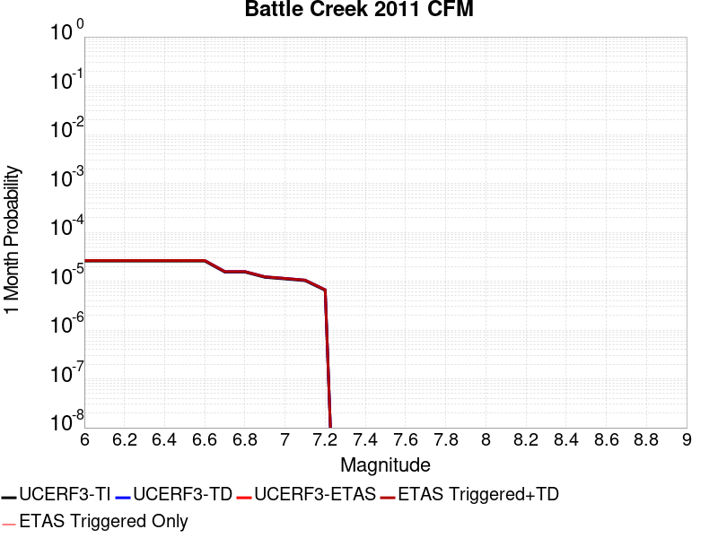 | 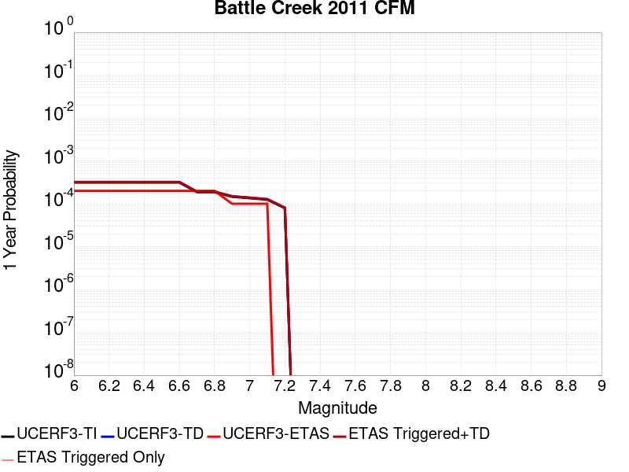 |  |

| Magnitude | 1 wk TI Prob | 1 wk TD Prob | 1 wk ETAS Prob | 1 wk ETAS/TD Gain | 1 wk ETAS Triggered+TD | 1 wk ETAS Triggered Only | 1 mo TI Prob | 1 mo TD Prob | 1 mo ETAS Prob | 1 mo ETAS/TD Gain | 1 mo ETAS Triggered+TD | 1 mo ETAS Triggered Only | 1 yr TI Prob | 1 yr TD Prob | 1 yr ETAS Prob | 1 yr ETAS/TD Gain | 1 yr ETAS Triggered+TD | 1 yr ETAS Triggered Only | 10 yr TI Prob | 10 yr TD Prob | 10 yr ETAS Prob | 10 yr ETAS/TD Gain | 10 yr ETAS Triggered+TD | 10 yr ETAS Triggered Only |
|-----|-----|-----|-----|-----|-----|-----|-----|-----|-----|-----|-----|-----|-----|-----|-----|-----|-----|-----|-----|-----|-----|-----|-----|-----|
| 6.0 | 6.0215425E-6 | 6.1873084E-6 | 0.0 | 0.0 | 6.1873084E-6 | 0.0 | 2.5806356E-5 | 2.6516804E-5 | 0.0 | 0.0 | 2.6516804E-5 | 0.0 | 3.1414707E-4 | 3.2280086E-4 | 2.0E-4 | 0.61957705 | 3.2280086E-4 | 0.0 | 0.0031370334 | 0.003223969 | 0.0017 | 0.52730036 | 0.0033236465 | 1.0E-4 |
| 6.1 | 6.0215425E-6 | 6.1873084E-6 | 0.0 | 0.0 | 6.1873084E-6 | 0.0 | 2.5806356E-5 | 2.6516804E-5 | 0.0 | 0.0 | 2.6516804E-5 | 0.0 | 3.1414707E-4 | 3.2280086E-4 | 2.0E-4 | 0.61957705 | 3.2280086E-4 | 0.0 | 0.0031370334 | 0.003223969 | 0.0017 | 0.52730036 | 0.0033236465 | 1.0E-4 |
| 6.2 | 6.0215425E-6 | 6.1873084E-6 | 0.0 | 0.0 | 6.1873084E-6 | 0.0 | 2.5806356E-5 | 2.6516804E-5 | 0.0 | 0.0 | 2.6516804E-5 | 0.0 | 3.1414707E-4 | 3.2280086E-4 | 2.0E-4 | 0.61957705 | 3.2280086E-4 | 0.0 | 0.0031370334 | 0.003223969 | 0.0017 | 0.52730036 | 0.0033236465 | 1.0E-4 |
| 6.3 | 6.0215425E-6 | 6.1873084E-6 | 0.0 | 0.0 | 6.1873084E-6 | 0.0 | 2.5806356E-5 | 2.6516804E-5 | 0.0 | 0.0 | 2.6516804E-5 | 0.0 | 3.1414707E-4 | 3.2280086E-4 | 2.0E-4 | 0.61957705 | 3.2280086E-4 | 0.0 | 0.0031370334 | 0.003223969 | 0.0017 | 0.52730036 | 0.0033236465 | 1.0E-4 |
| 6.4 | 6.0215425E-6 | 6.1873084E-6 | 0.0 | 0.0 | 6.1873084E-6 | 0.0 | 2.5806356E-5 | 2.6516804E-5 | 0.0 | 0.0 | 2.6516804E-5 | 0.0 | 3.1414707E-4 | 3.2280086E-4 | 2.0E-4 | 0.61957705 | 3.2280086E-4 | 0.0 | 0.0031370334 | 0.003223969 | 0.0017 | 0.52730036 | 0.0033236465 | 1.0E-4 |
| 6.5 | 6.0215425E-6 | 6.1873084E-6 | 0.0 | 0.0 | 6.1873084E-6 | 0.0 | 2.5806356E-5 | 2.6516804E-5 | 0.0 | 0.0 | 2.6516804E-5 | 0.0 | 3.1414707E-4 | 3.2280086E-4 | 2.0E-4 | 0.61957705 | 3.2280086E-4 | 0.0 | 0.0031370334 | 0.003223969 | 0.0017 | 0.52730036 | 0.0033236465 | 1.0E-4 |
| 6.6 | 6.0215425E-6 | 6.1873084E-6 | 0.0 | 0.0 | 6.1873084E-6 | 0.0 | 2.5806356E-5 | 2.6516804E-5 | 0.0 | 0.0 | 2.6516804E-5 | 0.0 | 3.1414707E-4 | 3.2280086E-4 | 2.0E-4 | 0.61957705 | 3.2280086E-4 | 0.0 | 0.0031370334 | 0.003223969 | 0.0017 | 0.52730036 | 0.0033236465 | 1.0E-4 |
| 6.7 | 3.5769701E-6 | 3.6742483E-6 | 0.0 | 0.0 | 3.6742483E-6 | 0.0 | 1.5329782E-5 | 1.5746706E-5 | 0.0 | 0.0 | 1.5746706E-5 | 0.0 | 1.8662411E-4 | 1.9170315E-4 | 2.0E-4 | 1.0432796 | 1.9170315E-4 | 0.0 | 0.0018646746 | 0.0019157592 | 0.0013 | 0.67858213 | 0.0020155676 | 1.0E-4 |
| 6.8 | 3.5769701E-6 | 3.6742483E-6 | 0.0 | 0.0 | 3.6742483E-6 | 0.0 | 1.5329782E-5 | 1.5746706E-5 | 0.0 | 0.0 | 1.5746706E-5 | 0.0 | 1.8662411E-4 | 1.9170315E-4 | 2.0E-4 | 1.0432796 | 1.9170315E-4 | 0.0 | 0.0018646746 | 0.0019157592 | 0.0013 | 0.67858213 | 0.0020155676 | 1.0E-4 |
| 6.9 | 2.7928356E-6 | 2.8684508E-6 | 0.0 | 0.0 | 2.8684508E-6 | 0.0 | 1.1969241E-5 | 1.22933225E-5 | 0.0 | 0.0 | 1.22933225E-5 | 0.0 | 1.4571576E-4 | 1.4966448E-4 | 1.0E-4 | 0.66816115 | 1.4966448E-4 | 0.0 | 0.0014562025 | 0.0014959867 | 0.001 | 0.6684551 | 0.0015958372 | 1.0E-4 |
| 7.0 | 2.590302E-6 | 2.6604625E-6 | 0.0 | 0.0 | 2.6604625E-6 | 0.0 | 1.1101247E-5 | 1.1401953E-5 | 0.0 | 0.0 | 1.1401953E-5 | 0.0 | 1.351493E-4 | 1.3881348E-4 | 1.0E-4 | 0.72039115 | 1.3881348E-4 | 0.0 | 0.0013506714 | 0.0013876158 | 9.0E-4 | 0.64859456 | 0.001487477 | 1.0E-4 |
| 7.1 | 2.3885443E-6 | 2.4533108E-6 | 0.0 | 0.0 | 2.4533108E-6 | 0.0 | 1.0236578E-5 | 1.0514167E-5 | 0.0 | 0.0 | 1.0514167E-5 | 0.0 | 1.2462321E-4 | 1.28006E-4 | 1.0E-4 | 0.78121346 | 1.28006E-4 | 0.0 | 0.0012455335 | 0.0012796684 | 9.0E-4 | 0.7033072 | 0.0013795404 | 1.0E-4 |
| 7.2 | 1.5140604E-6 | 1.5550153E-6 | 0.0 | 0.0 | 1.5550153E-6 | 0.0 | 6.4888145E-6 | 6.664351E-6 | 0.0 | 0.0 | 6.664351E-6 | 0.0 | 7.899845E-5 | 8.1138474E-5 | 0.0 | 0.0 | 8.1138474E-5 | 0.0 | 7.8970374E-4 | 8.1138476E-4 | 6.0E-4 | 0.73947656 | 8.1138476E-4 | 0.0 |

## Kern Canyon (South Kern) 2011
*[(top)](#table-of-contents)*

| 1 Week | 1 Month | 1 Year | 10 Year |
|-----|-----|-----|-----|
| 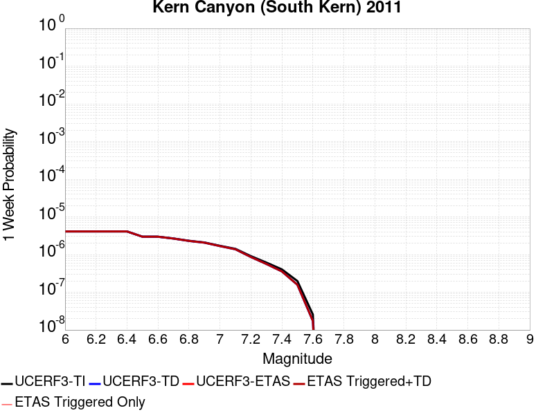 |  |  |  |

| Magnitude | 1 wk TI Prob | 1 wk TD Prob | 1 wk ETAS Prob | 1 wk ETAS/TD Gain | 1 wk ETAS Triggered+TD | 1 wk ETAS Triggered Only | 1 mo TI Prob | 1 mo TD Prob | 1 mo ETAS Prob | 1 mo ETAS/TD Gain | 1 mo ETAS Triggered+TD | 1 mo ETAS Triggered Only | 1 yr TI Prob | 1 yr TD Prob | 1 yr ETAS Prob | 1 yr ETAS/TD Gain | 1 yr ETAS Triggered+TD | 1 yr ETAS Triggered Only | 10 yr TI Prob | 10 yr TD Prob | 10 yr ETAS Prob | 10 yr ETAS/TD Gain | 10 yr ETAS Triggered+TD | 10 yr ETAS Triggered Only |
|-----|-----|-----|-----|-----|-----|-----|-----|-----|-----|-----|-----|-----|-----|-----|-----|-----|-----|-----|-----|-----|-----|-----|-----|-----|
| 6.0 | 4.105075E-6 | 4.112901E-6 | 0.0 | 0.0 | 4.112901E-6 | 0.0 | 1.7593058E-5 | 1.7626604E-5 | 0.0 | 0.0 | 1.7626604E-5 | 0.0 | 2.1417443E-4 | 2.1458342E-4 | 1.0E-4 | 0.46601924 | 2.1458342E-4 | 0.0 | 0.0021396813 | 0.002143826 | 0.0011 | 0.51310134 | 0.0022436115 | 1.0E-4 |
| 6.1 | 4.105075E-6 | 4.112901E-6 | 0.0 | 0.0 | 4.112901E-6 | 0.0 | 1.7593058E-5 | 1.7626604E-5 | 0.0 | 0.0 | 1.7626604E-5 | 0.0 | 2.1417443E-4 | 2.1458342E-4 | 1.0E-4 | 0.46601924 | 2.1458342E-4 | 0.0 | 0.0021396813 | 0.002143826 | 0.0011 | 0.51310134 | 0.0022436115 | 1.0E-4 |
| 6.2 | 4.105075E-6 | 4.112901E-6 | 0.0 | 0.0 | 4.112901E-6 | 0.0 | 1.7593058E-5 | 1.7626604E-5 | 0.0 | 0.0 | 1.7626604E-5 | 0.0 | 2.1417443E-4 | 2.1458342E-4 | 1.0E-4 | 0.46601924 | 2.1458342E-4 | 0.0 | 0.0021396813 | 0.002143826 | 0.0011 | 0.51310134 | 0.0022436115 | 1.0E-4 |
| 6.3 | 4.105075E-6 | 4.112901E-6 | 0.0 | 0.0 | 4.112901E-6 | 0.0 | 1.7593058E-5 | 1.7626604E-5 | 0.0 | 0.0 | 1.7626604E-5 | 0.0 | 2.1417443E-4 | 2.1458342E-4 | 1.0E-4 | 0.46601924 | 2.1458342E-4 | 0.0 | 0.0021396813 | 0.002143826 | 0.0011 | 0.51310134 | 0.0022436115 | 1.0E-4 |
| 6.4 | 4.105075E-6 | 4.112901E-6 | 0.0 | 0.0 | 4.112901E-6 | 0.0 | 1.7593058E-5 | 1.7626604E-5 | 0.0 | 0.0 | 1.7626604E-5 | 0.0 | 2.1417443E-4 | 2.1458342E-4 | 1.0E-4 | 0.46601924 | 2.1458342E-4 | 0.0 | 0.0021396813 | 0.002143826 | 0.0011 | 0.51310134 | 0.0022436115 | 1.0E-4 |
| 6.5 | 2.9849807E-6 | 2.9725472E-6 | 0.0 | 0.0 | 2.9725472E-6 | 0.0 | 1.2792712E-5 | 1.2739427E-5 | 0.0 | 0.0 | 1.2739427E-5 | 0.0 | 1.5574014E-4 | 1.5509163E-4 | 0.0 | 0.0 | 1.5509163E-4 | 0.0 | 0.0015563103 | 0.001549849 | 6.0E-4 | 0.38713446 | 0.001549849 | 0.0 |
| 6.6 | 2.9849807E-6 | 2.9725472E-6 | 0.0 | 0.0 | 2.9725472E-6 | 0.0 | 1.2792712E-5 | 1.2739427E-5 | 0.0 | 0.0 | 1.2739427E-5 | 0.0 | 1.5574014E-4 | 1.5509163E-4 | 0.0 | 0.0 | 1.5509163E-4 | 0.0 | 0.0015563103 | 0.001549849 | 6.0E-4 | 0.38713446 | 0.001549849 | 0.0 |
| 6.7 | 2.6756725E-6 | 2.6576731E-6 | 0.0 | 0.0 | 2.6576731E-6 | 0.0 | 1.1467117E-5 | 1.1389978E-5 | 0.0 | 0.0 | 1.1389978E-5 | 0.0 | 1.396032E-4 | 1.3866427E-4 | 0.0 | 0.0 | 1.3866427E-4 | 0.0 | 0.0013951553 | 0.0013857884 | 4.0E-4 | 0.28864437 | 0.0013857884 | 0.0 |
| 6.8 | 2.3283721E-6 | 2.3042965E-6 | 0.0 | 0.0 | 2.3042965E-6 | 0.0 | 9.9787E-6 | 9.875519E-6 | 0.0 | 0.0 | 9.875519E-6 | 0.0 | 1.214839E-4 | 1.2022788E-4 | 0.0 | 0.0 | 1.2022788E-4 | 0.0 | 0.001214175 | 0.0012016358 | 4.0E-4 | 0.33287954 | 0.0012016358 | 0.0 |
| 6.9 | 2.0972677E-6 | 2.0692014E-6 | 0.0 | 0.0 | 2.0692014E-6 | 0.0 | 8.988259E-6 | 8.867976E-6 | 0.0 | 0.0 | 8.867976E-6 | 0.0 | 1.0942656E-4 | 1.07962325E-4 | 0.0 | 0.0 | 1.07962325E-4 | 0.0 | 0.0010937268 | 0.0010791046 | 3.0E-4 | 0.27800828 | 0.0010791046 | 0.0 |
| 7.0 | 1.7132242E-6 | 1.6783372E-6 | 0.0 | 0.0 | 1.6783372E-6 | 0.0 | 7.3423685E-6 | 7.192854E-6 | 0.0 | 0.0 | 7.192854E-6 | 0.0 | 8.938967E-5 | 8.756952E-5 | 0.0 | 0.0 | 8.756952E-5 | 0.0 | 8.935372E-4 | 8.7535393E-4 | 2.0E-4 | 0.228479 | 8.7535393E-4 | 0.0 |
| 7.1 | 1.4215541E-6 | 1.3812669E-6 | 0.0 | 0.0 | 1.3812669E-6 | 0.0 | 6.0923603E-6 | 5.919702E-6 | 0.0 | 0.0 | 5.919702E-6 | 0.0 | 7.417196E-5 | 7.207001E-5 | 0.0 | 0.0 | 7.207001E-5 | 0.0 | 7.414721E-4 | 7.204691E-4 | 2.0E-4 | 0.27759692 | 7.204691E-4 | 0.0 |
| 7.2 | 9.097853E-7 | 8.601695E-7 | 0.0 | 0.0 | 8.601695E-7 | 0.0 | 3.899074E-6 | 3.6864355E-6 | 0.0 | 0.0 | 3.6864355E-6 | 0.0 | 4.7470192E-5 | 4.488144E-5 | 0.0 | 0.0 | 4.488144E-5 | 0.0 | 4.7460053E-4 | 4.4872484E-4 | 1.0E-4 | 0.22285372 | 4.4872484E-4 | 0.0 |
| 7.3 | 6.144169E-7 | 5.626726E-7 | 0.0 | 0.0 | 5.626726E-7 | 0.0 | 2.6332125E-6 | 2.4114518E-6 | 0.0 | 0.0 | 2.4114518E-6 | 0.0 | 3.205889E-5 | 2.9359035E-5 | 0.0 | 0.0 | 2.9359035E-5 | 0.0 | 3.2054266E-4 | 2.9355206E-4 | 1.0E-4 | 0.34065506 | 2.9355206E-4 | 0.0 |
| 7.4 | 4.049844E-7 | 3.5717895E-7 | 0.0 | 0.0 | 3.5717895E-7 | 0.0 | 1.7356463E-6 | 1.5307661E-6 | 0.0 | 0.0 | 1.5307661E-6 | 0.0 | 2.1131287E-5 | 1.863692E-5 | 0.0 | 0.0 | 1.863692E-5 | 0.0 | 2.1129279E-4 | 1.8635382E-4 | 1.0E-4 | 0.53661364 | 1.8635382E-4 | 0.0 |
| 7.5 | 1.9871162E-7 | 1.5824544E-7 | 0.0 | 0.0 | 1.5824544E-7 | 0.0 | 8.5162094E-7 | 6.781946E-7 | 0.0 | 0.0 | 6.781946E-7 | 0.0 | 1.0368436E-5 | 8.256989E-6 | 0.0 | 0.0 | 8.256989E-6 | 0.0 | 1.0367952E-4 | 8.2566905E-5 | 0.0 | 0.0 | 8.2566905E-5 | 0.0 |
| 7.6 | 2.572245E-8 | 1.734379E-8 | 0.0 | 0.0 | 1.734379E-8 | 0.0 | 1.10239064E-7 | 7.433053E-8 | 0.0 | 0.0 | 7.433053E-8 | 0.0 | 1.3421597E-6 | 9.049739E-7 | 0.0 | 0.0 | 9.049739E-7 | 0.0 | 1.3421517E-5 | 9.049708E-6 | 0.0 | 0.0 | 9.049708E-6 | 0.0 |

## Kern Canyon (North Kern) 2011
*[(top)](#table-of-contents)*

| 1 Week | 1 Month | 1 Year | 10 Year |
|-----|-----|-----|-----|
|  |  | 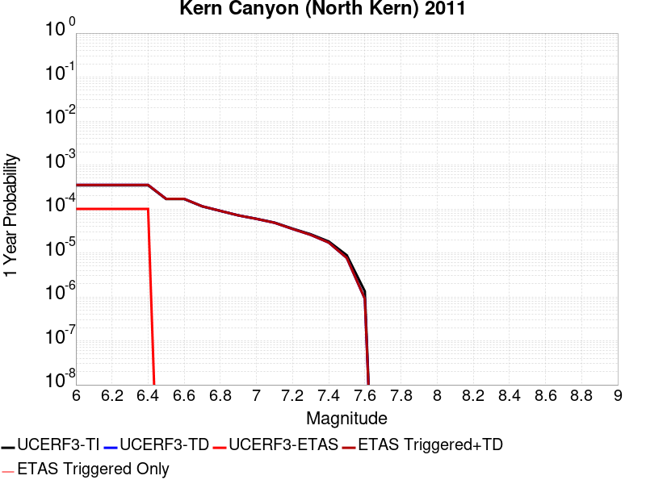 |  |

| Magnitude | 1 wk TI Prob | 1 wk TD Prob | 1 wk ETAS Prob | 1 wk ETAS/TD Gain | 1 wk ETAS Triggered+TD | 1 wk ETAS Triggered Only | 1 mo TI Prob | 1 mo TD Prob | 1 mo ETAS Prob | 1 mo ETAS/TD Gain | 1 mo ETAS Triggered+TD | 1 mo ETAS Triggered Only | 1 yr TI Prob | 1 yr TD Prob | 1 yr ETAS Prob | 1 yr ETAS/TD Gain | 1 yr ETAS Triggered+TD | 1 yr ETAS Triggered Only | 10 yr TI Prob | 10 yr TD Prob | 10 yr ETAS Prob | 10 yr ETAS/TD Gain | 10 yr ETAS Triggered+TD | 10 yr ETAS Triggered Only |
|-----|-----|-----|-----|-----|-----|-----|-----|-----|-----|-----|-----|-----|-----|-----|-----|-----|-----|-----|-----|-----|-----|-----|-----|-----|
| 6.0 | 6.6264497E-6 | 6.755636E-6 | 0.0 | 0.0 | 6.755636E-6 | 0.0 | 2.8398761E-5 | 2.895245E-5 | 0.0 | 0.0 | 2.895245E-5 | 0.0 | 3.4570007E-4 | 3.5244707E-4 | 1.0E-4 | 0.28373054 | 3.5244707E-4 | 0.0 | 0.0034516277 | 0.003519669 | 0.0013 | 0.3693529 | 0.003619317 | 1.0E-4 |
| 6.1 | 6.6264497E-6 | 6.755636E-6 | 0.0 | 0.0 | 6.755636E-6 | 0.0 | 2.8398761E-5 | 2.895245E-5 | 0.0 | 0.0 | 2.895245E-5 | 0.0 | 3.4570007E-4 | 3.5244707E-4 | 1.0E-4 | 0.28373054 | 3.5244707E-4 | 0.0 | 0.0034516277 | 0.003519669 | 0.0013 | 0.3693529 | 0.003619317 | 1.0E-4 |
| 6.2 | 6.6264497E-6 | 6.755636E-6 | 0.0 | 0.0 | 6.755636E-6 | 0.0 | 2.8398761E-5 | 2.895245E-5 | 0.0 | 0.0 | 2.895245E-5 | 0.0 | 3.4570007E-4 | 3.5244707E-4 | 1.0E-4 | 0.28373054 | 3.5244707E-4 | 0.0 | 0.0034516277 | 0.003519669 | 0.0013 | 0.3693529 | 0.003619317 | 1.0E-4 |
| 6.3 | 6.6264497E-6 | 6.755636E-6 | 0.0 | 0.0 | 6.755636E-6 | 0.0 | 2.8398761E-5 | 2.895245E-5 | 0.0 | 0.0 | 2.895245E-5 | 0.0 | 3.4570007E-4 | 3.5244707E-4 | 1.0E-4 | 0.28373054 | 3.5244707E-4 | 0.0 | 0.0034516277 | 0.003519669 | 0.0013 | 0.3693529 | 0.003619317 | 1.0E-4 |
| 6.4 | 6.6264497E-6 | 6.755636E-6 | 0.0 | 0.0 | 6.755636E-6 | 0.0 | 2.8398761E-5 | 2.895245E-5 | 0.0 | 0.0 | 2.895245E-5 | 0.0 | 3.4570007E-4 | 3.5244707E-4 | 1.0E-4 | 0.28373054 | 3.5244707E-4 | 0.0 | 0.0034516277 | 0.003519669 | 0.0013 | 0.3693529 | 0.003619317 | 1.0E-4 |
| 6.5 | 3.2162225E-6 | 3.2563628E-6 | 0.0 | 0.0 | 3.2563628E-6 | 0.0 | 1.3783738E-5 | 1.3955771E-5 | 0.0 | 0.0 | 1.3955771E-5 | 0.0 | 1.6780409E-4 | 1.6989907E-4 | 0.0 | 0.0 | 1.6989907E-4 | 0.0 | 0.0016767744 | 0.0016977714 | 4.0E-4 | 0.23560297 | 0.0016977714 | 0.0 |
| 6.6 | 3.2162225E-6 | 3.2563628E-6 | 0.0 | 0.0 | 3.2563628E-6 | 0.0 | 1.3783738E-5 | 1.3955771E-5 | 0.0 | 0.0 | 1.3955771E-5 | 0.0 | 1.6780409E-4 | 1.6989907E-4 | 0.0 | 0.0 | 1.6989907E-4 | 0.0 | 0.0016767744 | 0.0016977714 | 4.0E-4 | 0.23560297 | 0.0016977714 | 0.0 |
| 6.7 | 2.1908265E-6 | 2.2066565E-6 | 0.0 | 0.0 | 2.2066565E-6 | 0.0 | 9.389223E-6 | 9.457066E-6 | 0.0 | 0.0 | 9.457066E-6 | 0.0 | 1.1430779E-4 | 1.1513389E-4 | 0.0 | 0.0 | 1.1513389E-4 | 0.0 | 0.0011424901 | 0.0011507617 | 3.0E-4 | 0.2606969 | 0.0011507617 | 0.0 |
| 6.8 | 1.7303895E-6 | 1.7361954E-6 | 0.0 | 0.0 | 1.7361954E-6 | 0.0 | 7.415934E-6 | 7.4408163E-6 | 0.0 | 0.0 | 7.4408163E-6 | 0.0 | 9.028525E-5 | 9.058827E-5 | 0.0 | 0.0 | 9.058827E-5 | 0.0 | 9.024858E-4 | 9.055232E-4 | 2.0E-4 | 0.2208668 | 9.055232E-4 | 0.0 |
| 6.9 | 1.3700314E-6 | 1.3685828E-6 | 0.0 | 0.0 | 1.3685828E-6 | 0.0 | 5.87155E-6 | 5.865342E-6 | 0.0 | 0.0 | 5.865342E-6 | 0.0 | 7.148377E-5 | 7.140824E-5 | 0.0 | 0.0 | 7.140824E-5 | 0.0 | 7.146078E-4 | 7.1385753E-4 | 1.0E-4 | 0.14008397 | 7.1385753E-4 | 0.0 |
| 7.0 | 1.1467797E-6 | 1.141146E-6 | 0.0 | 0.0 | 1.141146E-6 | 0.0 | 4.9147607E-6 | 4.8906168E-6 | 0.0 | 0.0 | 4.8906168E-6 | 0.0 | 5.983557E-5 | 5.9541664E-5 | 0.0 | 0.0 | 5.9541664E-5 | 0.0 | 5.981946E-4 | 5.9526024E-4 | 1.0E-4 | 0.16799374 | 5.9526024E-4 | 0.0 |
| 7.1 | 9.3952065E-7 | 9.300756E-7 | 0.0 | 0.0 | 9.300756E-7 | 0.0 | 4.026511E-6 | 3.9860324E-6 | 0.0 | 0.0 | 3.9860324E-6 | 0.0 | 4.9021666E-5 | 4.852888E-5 | 0.0 | 0.0 | 4.852888E-5 | 0.0 | 4.901085E-4 | 4.851846E-4 | 1.0E-4 | 0.20610712 | 4.851846E-4 | 0.0 |
| 7.2 | 6.858055E-7 | 6.7178576E-7 | 0.0 | 0.0 | 6.7178576E-7 | 0.0 | 2.939163E-6 | 2.8790787E-6 | 0.0 | 0.0 | 2.8790787E-6 | 0.0 | 3.5783723E-5 | 3.5052228E-5 | 0.0 | 0.0 | 3.5052228E-5 | 0.0 | 3.5777962E-4 | 3.5046786E-4 | 1.0E-4 | 0.28533286 | 3.5046786E-4 | 0.0 |
| 7.3 | 5.1101983E-7 | 4.9381987E-7 | 0.0 | 0.0 | 4.9381987E-7 | 0.0 | 2.1900833E-6 | 2.1163692E-6 | 0.0 | 0.0 | 2.1163692E-6 | 0.0 | 2.6663936E-5 | 2.5766494E-5 | 0.0 | 0.0 | 2.5766494E-5 | 0.0 | 2.6660739E-4 | 2.5763555E-4 | 1.0E-4 | 0.3881452 | 2.5763555E-4 | 0.0 |
| 7.4 | 3.4999414E-7 | 3.2988024E-7 | 0.0 | 0.0 | 3.2988024E-7 | 0.0 | 1.499974E-6 | 1.4137717E-6 | 0.0 | 0.0 | 1.4137717E-6 | 0.0 | 1.8262032E-5 | 1.7212536E-5 | 0.0 | 0.0 | 1.7212536E-5 | 0.0 | 1.826053E-4 | 1.7211228E-4 | 1.0E-4 | 0.58101606 | 1.7211228E-4 | 0.0 |
| 7.5 | 1.7021522E-7 | 1.4745702E-7 | 0.0 | 0.0 | 1.4745702E-7 | 0.0 | 7.2949354E-7 | 6.3195847E-7 | 0.0 | 0.0 | 6.3195847E-7 | 0.0 | 8.881548E-6 | 7.694068E-6 | 0.0 | 0.0 | 7.694068E-6 | 0.0 | 8.8811925E-5 | 7.69381E-5 | 0.0 | 0.0 | 7.69381E-5 | 0.0 |
| 7.6 | 2.572245E-8 | 1.734379E-8 | 0.0 | 0.0 | 1.734379E-8 | 0.0 | 1.10239064E-7 | 7.433053E-8 | 0.0 | 0.0 | 7.433053E-8 | 0.0 | 1.3421597E-6 | 9.049739E-7 | 0.0 | 0.0 | 9.049739E-7 | 0.0 | 1.3421517E-5 | 9.049708E-6 | 0.0 | 0.0 | 9.049708E-6 | 0.0 |

