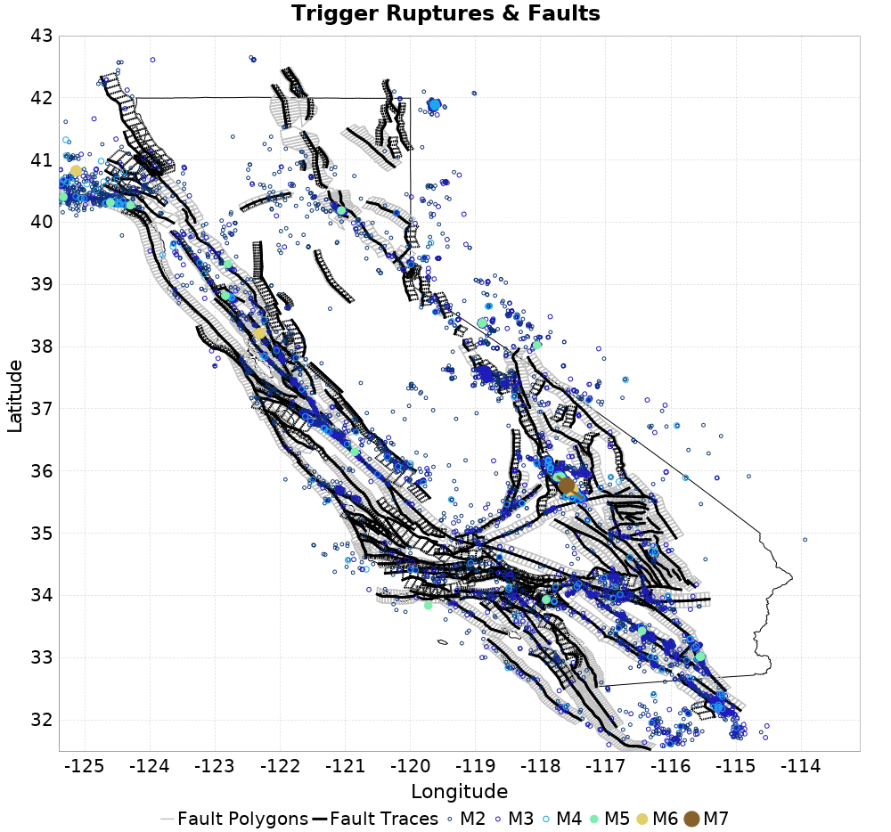

# ETAS Configuration for ComCat data 7.5 yr between historical and 2019-10-18, Statewide, ShakeMap Surfaces, Spontaneous, Historical Catalog

|   | ComCat data 7.5 yr between historical and 2019-10-18, Statewide, ShakeMap Surfaces, Spontaneous, Historical Catalog |
|-----|-----|
| Num Simulations | 10000 |
| Start Time | 2019/10/18 19:22:48 UTC |
| Start Time Epoch Milliseconds | 1571426568576 |
| Duration | 10 Years |
| Includes Spontaneous? | true |
| Trigger Ruptures | 10015 Trigger Ruptures |
|   | First: M2.54 at 2012/04/24 19:45:59 UTC |
|   | Last: M2.67 at 2019/10/18 18:02:34 UTC |
|   | Largest: M7.1 at 2019/07/06 03:19:53 UTC |
| Historical Ruptures | 60415 Trigger Ruptures |
|   | First: M7.3 at 1852/01/05 04:40:39 UTC |
|   | Last: M3.31 at 2012/04/24 19:44:09 UTC |
|   | Largest: M7.9 at 1857/01/09 16:25:39 UTC |
| Config Generated With | u3etas_comcat_config_builder.sh --start-after-historical --end-now --historical-catalog --include-spontaneous --num-simulations 10000 --finite-surf-shakemap --finite-surf-shakemap-min-mag 6 --hpc-site USC_HPC --nodes 36 --hours 24 --queue scec |

## Table Of Contents

* [Trigger Rupture Fault Map](#trigger-rupture-fault-map)
* [nc72182046 Possible Finite Rupture Subsection Mappings](#nc72182046-possible-finite-rupture-subsection-mappings)
* [nc72282711 Possible Finite Rupture Subsection Mappings](#nc72282711-possible-finite-rupture-subsection-mappings)
* [ci38443183 Possible Finite Rupture Subsection Mappings](#ci38443183-possible-finite-rupture-subsection-mappings)
* [ci38457511 Possible Finite Rupture Subsection Mappings](#ci38457511-possible-finite-rupture-subsection-mappings)
* [JSON Input File](#json-input-file)

## Trigger Rupture Fault Map
*[(top)](#table-of-contents)*



## nc72182046 Possible Finite Rupture Subsection Mappings
*[(top)](#table-of-contents)*

This gives any possible finite rupture surface subsection mappings. In the plot below, potentially suggested subsections are outlined in green, and all subsections for which any of this rupture is within the fault polygon are in gray. Suggested sections are those for which the area of the input rupture within the polygon is at least 50.0 % of the sub section area

Overlapping polygons are removed according to the mean distance of the actual subsection surface, with the polygons of closer sections masking out the polygons of further sections

As this is a point source, there will be no matches, but sections within 25km will be listed


| Section Index | Section Name | Suggested Match? | Section Area | Sect Distance To Rup | Hypocenter in Polygon? |
|-----|-----|-----|-----|-----|-----|

## nc72282711 Possible Finite Rupture Subsection Mappings
*[(top)](#table-of-contents)*

This gives any possible finite rupture surface subsection mappings. In the plot below, potentially suggested subsections are outlined in green, and all subsections for which any of this rupture is within the fault polygon are in gray. Suggested sections are those for which the area of the input rupture within the polygon is at least 50.0 % of the sub section area

Overlapping polygons are removed according to the mean distance of the actual subsection surface, with the polygons of closer sections masking out the polygons of further sections

As this is a point source, there will be no matches, but sections within 25km will be listed


| Section Index | Section Name | Suggested Match? | Section Area | Sect Distance To Rup | Hypocenter in Polygon? |
|-----|-----|-----|-----|-----|-----|
| 90 | Bennett Valley 2011 CFM, Subsection 0 | no | 42.62 | mean=16.84 [13.83 20.28] [km] | no |
| 91 | Bennett Valley 2011 CFM, Subsection 1 | no | 42.62 | mean=20.46 [17.4 23.88] [km] | no |
| 92 | Bennett Valley 2011 CFM, Subsection 2 | no | 42.62 | mean=24.24 [21.42 27.41] [km] | no |
| 351 | Contra Costa Shear Zone (connector) 2011 CFM, Subsection 0 | no | 70.54 | mean=13.01 [8.77 17.98] [km] | no |
| 352 | Contra Costa Shear Zone (connector) 2011 CFM, Subsection 1 | no | 70.54 | mean=18.62 [14.77 23.13] [km] | no |
| 353 | Contra Costa Shear Zone (connector) 2011 CFM, Subsection 2 | no | 70.54 | mean=24.37 [20.73 28.59] [km] | no |
| 583 | Franklin 2011 CFM, Subsection 3 | no | 75.29 | mean=26.5 [23.01 30.55] [km] | no |
| 584 | Franklin 2011 CFM, Subsection 4 | no | 75.29 | mean=20.53 [16.95 24.71] [km] | no |
| 585 | Franklin 2011 CFM, Subsection 5 | no | 75.29 | mean=14.63 [10.7 19.29] [km] | no |
| 707 | Great Valley 04b Gordon Valley, Subsection 1 | no | 93.69 | mean=28.67 [21.76 35.74] [km] | no |
| 708 | Great Valley 04b Gordon Valley, Subsection 2 | no | 93.69 | mean=25.98 [19.44 32.49] [km] | no |
| 709 | Great Valley 04b Gordon Valley, Subsection 3 | no | 93.69 | mean=25.24 [19.18 31.59] [km] | no |
| 775 | Green Valley 2011 CFM, Subsection 0 | no | 34.59 | mean=20.56 [18.07 23.25] [km] | no |
| 776 | Green Valley 2011 CFM, Subsection 1 | no | 34.59 | mean=16.09 [14.09 18.41] [km] | no |
| 777 | Green Valley 2011 CFM, Subsection 2 | no | 34.59 | mean=13.07 [12.09 14.58] [km] | no |
| 778 | Green Valley 2011 CFM, Subsection 3 | no | 16.93 | mean=12.41 [12.03 13.19] [km] | no |
| 779 | Green Valley 2011 CFM, Subsection 4 | no | 8.65 | mean=14.7 [13.11 16.54] [km] | no |
| 780 | Green Valley 2011 CFM, Subsection 5 | no | 9.98 | mean=19.04 [16.61 21.51] [km] | no |
| 781 | Green Valley 2011 CFM, Subsection 6 | no | 30.26 | mean=24.1 [21.53 26.79] [km] | no |
| 823 | Hayward (No) 2011 CFM, Subsection 5 | no | 47.83 | mean=24.24 [21.49 27.34] [km] | no |
| 824 | Hayward (No) 2011 CFM, Subsection 6 | no | 48.31 | mean=20.88 [18.3 23.89] [km] | no |
| 825 | Hayward (No) 2011 CFM, Subsection 7 | no | 53.81 | mean=18.31 [15.53 21.69] [km] | no |
| 826 | Hayward (No) 2011 CFM, Subsection 8 | no | 56.64 | mean=16.09 [13.2 19.82] [km] | no |
| 827 | Hayward (No) 2011 CFM, Subsection 9 | no | 56.8 | mean=14.8 [12.66 18.06] [km] | no |
| 952 | Hunting Creek - Berryessa 2011 CFM, Subsection 0 | no | 34.02 | mean=25.92 [23.59 28.5] [km] | no |
| 1723 | Rodgers Creek - Healdsburg 2011 CFM, Subsection 0 | no | 61.57 | mean=13.33 [9.79 17.55] [km] | no |
| 1724 | Rodgers Creek - Healdsburg 2011 CFM, Subsection 1 | no | 65.11 | mean=16.79 [12.92 21.23] [km] | no |
| 1725 | Rodgers Creek - Healdsburg 2011 CFM, Subsection 2 | no | 67.07 | mean=21.21 [17.19 25.72] [km] | no |
| 1726 | Rodgers Creek - Healdsburg 2011 CFM, Subsection 3 | no | 68.82 | mean=26.23 [22.22 30.75] [km] | no |
| 2537 | West Napa 2011 CFM, Subsection 1 | no | 85.21 | mean=27.07 [23.36 31.51] [km] | no |
| 2538 | West Napa 2011 CFM, Subsection 2 | no | 84.69 | mean=21.04 [17.14 25.79] [km] | no |
| 2539 | West Napa 2011 CFM, Subsection 3 | no | 82.66 | mean=15.25 [11.01 20.26] [km] | no |
| 2540 | West Napa 2011 CFM, Subsection 4 | no | 84.64 | mean=9.92 [4.86 15.92] [km] | no |
| 2541 | West Napa 2011 CFM, Subsection 5 | no | 85.21 | mean=5.9 [0.68 12.51] [km] | *yes* |
| 2542 | West Napa 2011 CFM, Subsection 6 | no | 85.21 | mean=7.36 [1.7 13.68] [km] | no |

## ci38443183 Possible Finite Rupture Subsection Mappings
*[(top)](#table-of-contents)*

This gives any possible finite rupture surface subsection mappings. In the plot below, potentially suggested subsections are outlined in green, and all subsections for which any of this rupture is within the fault polygon are in gray. Suggested sections are those for which the area of the input rupture within the polygon is at least 50.0 % of the sub section area

Overlapping polygons are removed according to the mean distance of the actual subsection surface, with the polygons of closer sections masking out the polygons of further sections


| Section Index | Section Name | Suggested Match? | Section Area | Rup Area in Raw Poly | Rup Area in No-Overlap Poly | Area Fraction | Sect Distance To Rup | Hypocenter in Polygon? |
|-----|-----|-----|-----|-----|-----|-----|-----|-----|

## ci38457511 Possible Finite Rupture Subsection Mappings
*[(top)](#table-of-contents)*

This gives any possible finite rupture surface subsection mappings. In the plot below, potentially suggested subsections are outlined in green, and all subsections for which any of this rupture is within the fault polygon are in gray. Suggested sections are those for which the area of the input rupture within the polygon is at least 50.0 % of the sub section area

Overlapping polygons are removed according to the mean distance of the actual subsection surface, with the polygons of closer sections masking out the polygons of further sections


| Section Index | Section Name | Suggested Match? | Section Area | Rup Area in Raw Poly | Rup Area in No-Overlap Poly | Area Fraction | Sect Distance To Rup | Hypocenter in Polygon? |
|-----|-----|-----|-----|-----|-----|-----|-----|-----|
| 0 | Airport Lake, Subsection 0 | *yes* | 120.19 | 322.07 | 322.07 | 2.68 | mean=6.09 [0.29 11.59] [km] | *yes* |
| 1 | Airport Lake, Subsection 1 | *yes* | 120.19 | 240.09 | 240.09 | 2 | mean=3.08 [0.11 8.65] [km] | no |
| 2 | Airport Lake, Subsection 2 | *yes* | 120.19 | 60.48 | 60.48 | 0.5 | mean=3.32 [0.31 8.48] [km] | no |
| 605 | Garlock (Central), Subsection 11 | *yes* | 61.94 | 81.32 | 81.32 | 1.31 | mean=6.51 [5.6 8.05] [km] | no |
| 606 | Garlock (Central), Subsection 12 | no | 61.94 | 24.4 | 24.4 | 0.39 | mean=6.51 [5.6 8.06] [km] | no |
| 1130 | Little Lake, Subsection 5 | no | 73.13 | 26.97 | 0 | 0 | mean=11.55 [11.29 12.16] [km] | no |

## JSON Input File
*[(top)](#table-of-contents)*

```
{
  "numSimulations": 10000,
  "duration": 10.0,
  "startTimeMillis": 1571426568576,
  "includeSpontaneous": true,
  "randomSeed": 1571426589690,
  "binaryOutput": true,
  "binaryOutputFilters": [
    {
      "prefix": "results_complete",
      "descendantsOnly": false
    },
    {
      "prefix": "results_m5_preserve_chain",
      "minMag": 5.0,
      "preserveChainBelowMag": true,
      "descendantsOnly": false
    },
    {
      "prefix": "results_triggered_descendants",
      "descendantsOnly": true
    }
  ],
  "forceRecalc": false,
  "simulationName": "ComCat data 7.5 yr between historical and 2019-10-18, Statewide, ShakeMap Surfaces, Spontaneous, Historical Catalog",
  "numRetries": 3,
  "outputDir": "${ETAS_SIM_DIR}/2019_10_18-ComCatdata7p5yrbetweenhistoricaland20191018_Statewide_ShakeMapSurfaces_Spontaneous_Histor",
  "triggerCatalog": "${ETAS_LAUNCHER}/inputs/u3_historical_catalog.txt",
  "triggerCatalogSurfaceMappings": "${ETAS_LAUNCHER}/inputs/u3_historical_catalog_finite_fault_mappings.xml",
  "treatTriggerCatalogAsSpontaneous": true,
  "triggerRuptures": [
    "omitted due to length, see original input file"
  ],
  "cacheDir": "${ETAS_LAUNCHER}/inputs/cache_fm3p1_ba",
  "fssFile": "${ETAS_LAUNCHER}/inputs/2013_05_10-ucerf3p3-production-10runs_COMPOUND_SOL_FM3_1_SpatSeisU3_MEAN_BRANCH_AVG_SOL.zip",
  "probModel": "FULL_TD",
  "applySubSeisForSupraNucl": true,
  "totRateScaleFactor": 1.14,
  "gridSeisCorr": true,
  "timeIndependentERF": false,
  "griddedOnly": false,
  "imposeGR": false,
  "includeIndirectTriggering": true,
  "gridSeisDiscr": 0.1,
  "catalogCompletenessModel": "RELAXED",
  "configCommand": "u3etas_comcat_config_builder.sh --start-after-historical --end-now --historical-catalog --include-spontaneous --num-simulations 10000 --finite-surf-shakemap --finite-surf-shakemap-min-mag 6 --hpc-site USC_HPC --nodes 36 --hours 24 --queue scec",
  "configTime": 1571426589690,
  "comcatMetadata": {
    "region": {
      "border": [
        {
          "latitude": 43.0,
          "longitude": -125.2
        },
        {
          "latitude": 43.0,
          "longitude": -119.0
        },
        {
          "latitude": 39.4,
          "longitude": -119.0
        },
        {
          "latitude": 35.7,
          "longitude": -114.00000000000001
        },
        {
          "latitude": 34.3,
          "longitude": -113.1
        },
        {
          "latitude": 32.9,
          "longitude": -113.5
        },
        {
          "latitude": 32.2,
          "longitude": -113.6
        },
        {
          "latitude": 31.7,
          "longitude": -114.5
        },
        {
          "latitude": 31.5,
          "longitude": -117.1
        },
        {
          "latitude": 31.900000000000002,
          "longitude": -117.90000000000002
        },
        {
          "latitude": 32.8,
          "longitude": -118.40000000000002
        },
        {
          "latitude": 33.7,
          "longitude": -121.0
        },
        {
          "latitude": 34.2,
          "longitude": -121.6
        },
        {
          "latitude": 37.7,
          "longitude": -123.80000000000001
        },
        {
          "latitude": 40.2,
          "longitude": -125.4
        },
        {
          "latitude": 40.5,
          "longitude": -125.4
        }
      ]
    },
    "minDepth": -10.0,
    "maxDepth": 24.0,
    "minMag": 2.5,
    "startTime": 1335296660000,
    "endTime": 1571426567576
  }
}
```

