# Parent Section Magnitude-Probability Distributions

Only fault sections with at least one triggered aftershock are plotted. Sections are sorted by total supraseismogenic trigger rate (decreasing)

## Table Of Contents

* [San Andreas (Parkfield)](#san-andreas-parkfield)
* [San Andreas (Creeping Section) 2011 CFM](#san-andreas-creeping-section-2011-cfm)
* [Mendocino](#mendocino)
* [San Andreas (Mojave S)](#san-andreas-mojave-s)
* [Cerro Prieto](#cerro-prieto)
* [Garlock (Central)](#garlock-central)
* [Imperial](#imperial)
* [Brawley (Seismic Zone) alt 1](#brawley-seismic-zone-alt-1)
* [Tank Canyon](#tank-canyon)
* [Hayward (So) 2011 CFM](#hayward-so-2011-cfm)
* [Laguna Salada](#laguna-salada)
* [San Andreas (Cholame) rev](#san-andreas-cholame-rev)
* [San Andreas (Offshore) 2011 CFM](#san-andreas-offshore-2011-cfm)
* [San Andreas (San Bernardino N)](#san-andreas-san-bernardino-n)
* [San Andreas (Carrizo) rev](#san-andreas-carrizo-rev)
* [Hayward (So) extension 2011 CFM](#hayward-so-extension-2011-cfm)
* [Hunting Creek - Berryessa 2011 CFM](#hunting-creek---berryessa-2011-cfm)
* [Calaveras (So) - Paicines extension 2011 CFM](#calaveras-so---paicines-extension-2011-cfm)
* [San Andreas (Coachella) rev](#san-andreas-coachella-rev)
* [Elsinore (Glen Ivy) rev](#elsinore-glen-ivy-rev)
* [Calaveras (So) 2011 CFM](#calaveras-so-2011-cfm)
* [Owl Lake](#owl-lake)
* [San Andreas (Big Bend)](#san-andreas-big-bend)
* [Calaveras (Central) 2011 CFM](#calaveras-central-2011-cfm)
* [San Andreas (Mojave N)](#san-andreas-mojave-n)
* [San Andreas (San Bernardino S)](#san-andreas-san-bernardino-s)
* [Little Lake](#little-lake)
* [San Andreas (San Gorgonio Pass-Garnet HIll)](#san-andreas-san-gorgonio-pass-garnet-hill)
* [San Jacinto (Superstition Mtn)](#san-jacinto-superstition-mtn)
* [Airport Lake](#airport-lake)
* [Green Valley 2011 CFM](#green-valley-2011-cfm)
* [Garlock (East)](#garlock-east)
* [Panamint Valley](#panamint-valley)
* [Hayward (No) 2011 CFM](#hayward-no-2011-cfm)
* [San Andreas (Santa Cruz Mts) 2011 CFM](#san-andreas-santa-cruz-mts-2011-cfm)
* [West Napa 2011 CFM](#west-napa-2011-cfm)
* [King Range 2011 CFM](#king-range-2011-cfm)
* [Calaveras (No) 2011 CFM](#calaveras-no-2011-cfm)
* [Cady](#cady)
* [Ortigalita (North)](#ortigalita-north)
* [Maacama 2011 CFM](#maacama-2011-cfm)
* [Santa Ynez (West)](#santa-ynez-west)
* [Elmore Ranch](#elmore-ranch)
* [San Andreas (North Coast) 2011 CFM](#san-andreas-north-coast-2011-cfm)
* [Rodgers Creek - Healdsburg 2011 CFM](#rodgers-creek---healdsburg-2011-cfm)
* [Hunter Mountain-Saline Valley](#hunter-mountain-saline-valley)
* [Mission Ridge-Arroyo Parida-Santa Ana](#mission-ridge-arroyo-parida-santa-ana)
* [Ash Hill](#ash-hill)
* [San Clemente](#san-clemente)
* [Calico-Hidalgo](#calico-hidalgo)
* [Garberville - Briceland 2011 CFM](#garberville---briceland-2011-cfm)
* [Pleito](#pleito)
* [Pinto Mtn](#pinto-mtn)
* [Concord 2011 CFM](#concord-2011-cfm)
* [Monte Vista - Shannon 2011 CFM](#monte-vista---shannon-2011-cfm)
* [Red Mountain](#red-mountain)
* [Hunting Creek - Bartlett Springs connector 2011](#hunting-creek---bartlett-springs-connector-2011)
* [Coyote Canyon](#coyote-canyon)
* [Eaton Roughs 2011 CFM](#eaton-roughs-2011-cfm)
* [Honey Lake 2011 CFM](#honey-lake-2011-cfm)
* [Goldstone Lake](#goldstone-lake)
* [Mount Diablo Thrust South](#mount-diablo-thrust-south)
* [Bullion Mountains](#bullion-mountains)
* [Chino alt 1](#chino-alt-1)
* [Gravel Hills-Harper Lk](#gravel-hills-harper-lk)
* [Blackwater](#blackwater)
* [Garlock (West)](#garlock-west)
* [Sargent 2011 CFM](#sargent-2011-cfm)
* [Pisgah-Bullion Mtn-Mesquite Lk](#pisgah-bullion-mtn-mesquite-lk)
* [San Diego Trough south](#san-diego-trough-south)
* [Ortigalita (South)](#ortigalita-south)
* [Mission (connected) 2011 CFM](#mission-connected-2011-cfm)
* [Great Valley 05 Pittsburg - Kirby Hills alt1](#great-valley-05-pittsburg---kirby-hills-alt1)
* [McLean Lake](#mclean-lake)
* [Keddie Ridge 2011 CFM](#keddie-ridge-2011-cfm)
* [Almanor 2011 CFM](#almanor-2011-cfm)
* [White Mountains](#white-mountains)
* [Coronado Bank alt1](#coronado-bank-alt1)
* [Whittier alt 1](#whittier-alt-1)
* [Palos Verdes](#palos-verdes)
* [San Diego Trough north alt1](#san-diego-trough-north-alt1)
* [Great Valley 09 (Laguna Seca)](#great-valley-09-laguna-seca)
* [Ludlow](#ludlow)
* [Trinidad (alt1)](#trinidad-alt1)
* [Great Valley 07 (Orestimba)](#great-valley-07-orestimba)
* [Rose Canyon](#rose-canyon)
* [Ventura-Pitas Point](#ventura-pitas-point)
* [Elysian Park (Upper)](#elysian-park-upper)
* [Bicycle Lake](#bicycle-lake)
* [Great Valley 04b Gordon Valley](#great-valley-04b-gordon-valley)
* [Bennett Valley 2011 CFM](#bennett-valley-2011-cfm)
* [San Gregorio (North) 2011 CFM](#san-gregorio-north-2011-cfm)
* [Bartlett Springs 2011 CFM](#bartlett-springs-2011-cfm)
* [Lenwood-Lockhart-Old Woman Springs](#lenwood-lockhart-old-woman-springs)
* [Greenville (No) 2011 CFM](#greenville-no-2011-cfm)
* [South Klamath Lake East](#south-klamath-lake-east)
* [South Klamath Lake West](#south-klamath-lake-west)
* [Quien Sabe 2011 CFM](#quien-sabe-2011-cfm)
* [Cleghorn Pass](#cleghorn-pass)
* [Cleghorn Lake](#cleghorn-lake)
* [Manix-Afton Hills](#manix-afton-hills)
* [Monterey Bay-Tularcitos](#monterey-bay-tularcitos)
* [Great Valley 03 Mysterious Ridge](#great-valley-03-mysterious-ridge)
* [Mono Lake 2011 CFM](#mono-lake-2011-cfm)
* [Santa Susana East (connector)](#santa-susana-east-connector)
* [Death Valley (So)](#death-valley-so)
* [Santa Ynez (East)](#santa-ynez-east)
* [San Andreas (Peninsula) 2011 CFM](#san-andreas-peninsula-2011-cfm)
* [Big Lagoon - Bald Mtn 2011 CFM](#big-lagoon---bald-mtn-2011-cfm)
* [Garlic Springs](#garlic-springs)
* [Elsinore (Coyote Mountains)](#elsinore-coyote-mountains)
* [San Jacinto (Borrego)](#san-jacinto-borrego)
* [Carson Range (Genoa)](#carson-range-genoa)
* [Lost Hills](#lost-hills)
* [Nelson Lake](#nelson-lake)
* [So Sierra Nevada](#so-sierra-nevada)
* [Santa Cruz Island](#santa-cruz-island)
* [Santa Rosa Island](#santa-rosa-island)
* [Mission Hills 2011](#mission-hills-2011)
* [Hat Creek-McArthur-Mayfield](#hat-creek-mcarthur-mayfield)
* [Little Salmon (Onshore)](#little-salmon-onshore)
* [Surprise Valley 2011 CFM](#surprise-valley-2011-cfm)
* [Blue Cut](#blue-cut)
* [Paradise](#paradise)
* [Death Valley (Fish Lake Valley)](#death-valley-fish-lake-valley)
* [San Pedro Basin](#san-pedro-basin)
* [Robinson Creek](#robinson-creek)
* [Franklin 2011 CFM](#franklin-2011-cfm)
* [Great Valley 03a Dunnigan Hills](#great-valley-03a-dunnigan-hills)
* [Reliz 2011 CFM](#reliz-2011-cfm)
* [Contra Costa Shear Zone (connector) 2011 CFM](#contra-costa-shear-zone-connector-2011-cfm)
* [Mad River (alt1)](#mad-river-alt1)
* [Hosgri](#hosgri)
* [San Jacinto (San Bernardino)](#san-jacinto-san-bernardino)
* [Greenville (So) 2011 CFM](#greenville-so-2011-cfm)
* [Bear River fault zone](#bear-river-fault-zone)
* [Oceanic - West Huasna](#oceanic---west-huasna)
* [Santa Susana alt 1](#santa-susana-alt-1)
* [San Jacinto (Stepovers Combined)](#san-jacinto-stepovers-combined)
* [San Jacinto (San Jacinto Valley) rev](#san-jacinto-san-jacinto-valley-rev)
* [San Jacinto (Anza) rev](#san-jacinto-anza-rev)
* [McKinleyville (alt1)](#mckinleyville-alt1)
* [Channel Islands Thrust](#channel-islands-thrust)
* [Great Valley 04a Trout Creek](#great-valley-04a-trout-creek)
* [Raymond](#raymond)
* [Towne Pass](#towne-pass)
* [Great Valley 08 (Quinto)](#great-valley-08-quinto)
* [Helendale-So Lockhart](#helendale-so-lockhart)
* [Superstition Hills](#superstition-hills)
* [Coyote Lake](#coyote-lake)
* [San Gabriel](#san-gabriel)
* [Big Pine (East)](#big-pine-east)
* [Mission Creek](#mission-creek)
* [Oak Ridge (Onshore)](#oak-ridge-onshore)
* [San Andreas (North Branch Mill Creek)](#san-andreas-north-branch-mill-creek)
* [Santa Ynez River](#santa-ynez-river)
* [Burnt Mtn](#burnt-mtn)
* [San Jacinto (Coyote Creek)](#san-jacinto-coyote-creek)
* [Elsinore (Stepovers Combined)](#elsinore-stepovers-combined)
* [Rinconada 2011 CFM](#rinconada-2011-cfm)
* [Earthquake Valley (So Extension)](#earthquake-valley-so-extension)
* [Eureka Peak](#eureka-peak)
* [Big Pine (Central)](#big-pine-central)
* [Death Valley (Black Mtns Frontal)](#death-valley-black-mtns-frontal)
* [Puente Hills](#puente-hills)
* [Pitas Point (Lower West)](#pitas-point-lower-west)
* [Russ 2011 CFM](#russ-2011-cfm)
* [Cedar Mtn-Mahogany Mtn](#cedar-mtn-mahogany-mtn)
* [Homestead Valley 2011](#homestead-valley-2011)
* [Elsinore (Temecula) rev](#elsinore-temecula-rev)
* [Great Valley 11](#great-valley-11)
* [Las Positas](#las-positas)
* [Hector Mine](#hector-mine)
* [Lake Isabella (Seismicity)](#lake-isabella-seismicity)
* [Hartley Springs 2011 CFM](#hartley-springs-2011-cfm)
* [Red Pass](#red-pass)
* [Table Bluff](#table-bluff)
* [Malibu Coast alt 1](#malibu-coast-alt-1)
* [Likely 2011 CFM](#likely-2011-cfm)
* [Santa Cruz Catalina Ridge alt1](#santa-cruz-catalina-ridge-alt1)
* [Pine Mtn](#pine-mtn)
* [San Juan](#san-juan)
* [Johnson Valley (No) 2011 rev](#johnson-valley-no-2011-rev)
* [Newport-Inglewood alt 1](#newport-inglewood-alt-1)
* [Owens Valley Keough Hot Springs](#owens-valley-keough-hot-springs)
* [San Cayetano](#san-cayetano)
* [Antelope Valley 2011](#antelope-valley-2011)
* [Mohawk Valley 2011 CFM](#mohawk-valley-2011-cfm)
* [Earthquake Valley](#earthquake-valley)
* [Little Salmon (Offshore)](#little-salmon-offshore)
* [Swain Ravine - Spenceville](#swain-ravine---spenceville)
* [Emerson-Copper Mtn 2011](#emerson-copper-mtn-2011)
* [Death Valley (No)](#death-valley-no)
* [North Frontal  (East)](#north-frontal--east)
* [Simi-Santa Rosa](#simi-santa-rosa)
* [Clayton](#clayton)
* [Contra Costa (Lafayette) 2011 CFM](#contra-costa-lafayette-2011-cfm)
* [Butano 2011 CFM](#butano-2011-cfm)
* [Sierra Nevada  (No Extension)](#sierra-nevada--no-extension)
* [Rocky Ledge 2011 CFM](#rocky-ledge-2011-cfm)
* [Earthquake Valley (No  Extension)](#earthquake-valley-no--extension)
* [Deep Springs](#deep-springs)
* [Great Valley 10 (Panoche)](#great-valley-10-panoche)
* [West Tahoe](#west-tahoe)
* [Dry Mountain](#dry-mountain)
* [Mount Diablo Thrust North CFM](#mount-diablo-thrust-north-cfm)
* [Great Valley 06 (Midland) 2011 CFM alt1](#great-valley-06-midland-2011-cfm-alt1)
* [Sheephole](#sheephole)
* [Peralta Hills](#peralta-hills)
* [Morales (East)](#morales-east)
* [Oceanside alt1](#oceanside-alt1)
* [Cleghorn](#cleghorn)
* [Hollywood](#hollywood)
* [Round Valley](#round-valley)
* [Newport-Inglewood (Offshore)](#newport-inglewood-offshore)
* [San Gregorio (South) 2011 CFM](#san-gregorio-south-2011-cfm)
* [Collayami 2011 CFM](#collayami-2011-cfm)
* [San Jacinto (Clark) rev](#san-jacinto-clark-rev)
* [Compton](#compton)
* [Davis Creek](#davis-creek)
* [Hosgri (Extension)](#hosgri-extension)
* [Goose Lake 2011 CFM](#goose-lake-2011-cfm)
* [White Wolf (Extension)](#white-wolf-extension)
* [Pitas Point (Lower)-Montalvo](#pitas-point-lower-montalvo)
* [Pittville 2011 CFM](#pittville-2011-cfm)
* [San Gorgonio Pass](#san-gorgonio-pass)
* [La Panza 2011](#la-panza-2011)
* [Los Alamos 2011 CFM](#los-alamos-2011-cfm)
* [Independence rev 2011](#independence-rev-2011)
* [San Gabriel (Extension)](#san-gabriel-extension)
* [North Tahoe 2011 CFM](#north-tahoe-2011-cfm)
* [Sierra Madre](#sierra-madre)
* [Los Osos 2011](#los-osos-2011)
* [Scodie Lineament](#scodie-lineament)
* [San Jacinto (Lytle Creek connector)](#san-jacinto-lytle-creek-connector)
* [Gillem - Big Crack 2011 CFM](#gillem---big-crack-2011-cfm)
* [Los Alamos extension](#los-alamos-extension)
* [Santa Monica alt 1](#santa-monica-alt-1)
* [Thirty Mile Bank](#thirty-mile-bank)
* [Elsinore (Julian)](#elsinore-julian)
* [Redondo Canyon alt 1](#redondo-canyon-alt-1)
* [Point Reyes 2011 CFM](#point-reyes-2011-cfm)
* [Channel Islands Western Deep Ramp](#channel-islands-western-deep-ramp)
* [Fickle Hill (alt1)](#fickle-hill-alt1)
* [Owens Valley](#owens-valley)
* [Sisar](#sisar)
* [Ozena](#ozena)
* [Skinner Flat 2011 CFM](#skinner-flat-2011-cfm)
* [Polaris 2011 CFM](#polaris-2011-cfm)
* [Holser alt 1](#holser-alt-1)
* [Cucamonga](#cucamonga)
* [Camp Rock 2011](#camp-rock-2011)
* [Tin Mountain](#tin-mountain)
* [North Frontal  (West)](#north-frontal--west)
* [Walker Spring 2011 CFM](#walker-spring-2011-cfm)
* [Pilarcitos 2011 CFM](#pilarcitos-2011-cfm)
* [Baker](#baker)
* [San Luis Range 2011 CFM](#san-luis-range-2011-cfm)
* [Northridge](#northridge)
* [Great Valley 12](#great-valley-12)
* [Kern Canyon (North Kern) 2011](#kern-canyon-north-kern-2011)
* [South Cuyama](#south-cuyama)
* [San Luis Range - Oceano 2011 CFM](#san-luis-range---oceano-2011-cfm)
* [Fitzhugh Creek](#fitzhugh-creek)
* [Anaheim](#anaheim)
* [Del Valle](#del-valle)
* [Sierra Madre (San Fernando)](#sierra-madre-san-fernando)
* [Great Valley 02](#great-valley-02)
* [Jess Valley](#jess-valley)
* [Elysian Park (Lower CFM)](#elysian-park-lower-cfm)
* [Point Reyes 2011 connector](#point-reyes-2011-connector)
* [Great Valley 01](#great-valley-01)
* [Richfield](#richfield)
* [Northridge Hills](#northridge-hills)
* [Anacapa-Dume alt 1](#anacapa-dume-alt-1)
* [Casmalia 2011 CFM](#casmalia-2011-cfm)
* [Hilton Creek 2011 CFM](#hilton-creek-2011-cfm)
* [Great Valley 14 (Kettleman Hills)](#great-valley-14-kettleman-hills)
* [Kern Canyon (Lake Isabella) 2011](#kern-canyon-lake-isabella-2011)
* [Kern Canyon (South Kern) 2011](#kern-canyon-south-kern-2011)
* [Fish Slough 2011 CFM](#fish-slough-2011-cfm)
* [Great Valley 13 (Coalinga)](#great-valley-13-coalinga)
* [Battle Creek 2011 CFM](#battle-creek-2011-cfm)
* [Yorba Linda](#yorba-linda)
* [Carlsbad](#carlsbad)
* [Verdugo](#verdugo)
* [Malibu Coast (Extension) alt 1](#malibu-coast-extension-alt-1)
* [East Huasna 2011 CFM](#east-huasna-2011-cfm)
* [Fontana (Seismicity)](#fontana-seismicity)
* [Big Pine (West)](#big-pine-west)
* [Shoreline](#shoreline)
* [Los Medanos - Roe Island](#los-medanos---roe-island)
* [North Salt Lake](#north-salt-lake)
* [Dog Valley](#dog-valley)
* [Joshua Tree (Seismicity)](#joshua-tree-seismicity)
* [Last Chance](#last-chance)
* [San Joaquin Hills](#san-joaquin-hills)

## San Andreas (Parkfield)
*[(top)](#table-of-contents)*

| 1 Week | 1 Month | 1 Year | 10 Year |
|-----|-----|-----|-----|
|  |  |  |  |

| Magnitude | 1 wk TI Prob | 1 wk TD Prob | 1 wk ETAS Prob | 1 wk ETAS/TD Gain | 1 wk ETAS Triggered+TD | 1 wk ETAS Triggered Only | 1 mo TI Prob | 1 mo TD Prob | 1 mo ETAS Prob | 1 mo ETAS/TD Gain | 1 mo ETAS Triggered+TD | 1 mo ETAS Triggered Only | 1 yr TI Prob | 1 yr TD Prob | 1 yr ETAS Prob | 1 yr ETAS/TD Gain | 1 yr ETAS Triggered+TD | 1 yr ETAS Triggered Only | 10 yr TI Prob | 10 yr TD Prob | 10 yr ETAS Prob | 10 yr ETAS/TD Gain | 10 yr ETAS Triggered+TD | 10 yr ETAS Triggered Only |
|-----|-----|-----|-----|-----|-----|-----|-----|-----|-----|-----|-----|-----|-----|-----|-----|-----|-----|-----|-----|-----|-----|-----|-----|-----|
| 6.0 | 5.556969E-4 | 7.551005E-4 | 0.0015 | 1.9864905 | 0.001454572 | 7.0E-4 | 0.0023793848 | 0.0032326358 | 0.004 | 1.2373804 | 0.0052261706 | 0.002 | 0.028586963 | 0.03915851 | 0.0486 | 1.2411095 | 0.05818317 | 0.0198 | 0.25176284 | 0.33409002 | 0.4317 | 1.2921667 | 0.4387045 | 0.1571 |
| 6.1 | 1.925858E-4 | 2.9810658E-4 | 3.0E-4 | 1.0063515 | 3.9807678E-4 | 1.0E-4 | 8.2510663E-4 | 0.0012770599 | 6.0E-4 | 0.46982917 | 0.0015766768 | 3.0E-4 | 0.0099994885 | 0.015547422 | 0.0099 | 0.63676155 | 0.01889456 | 0.0034 | 0.095613256 | 0.14892888 | 0.1021 | 0.68556213 | 0.1766738 | 0.0326 |
| 6.2 | 9.4306815E-5 | 1.8283114E-4 | 2.0E-4 | 1.0939056 | 2.8281283E-4 | 1.0E-4 | 4.0410945E-4 | 7.833279E-4 | 4.0E-4 | 0.5106418 | 9.831713E-4 | 2.0E-4 | 0.0049089384 | 0.009495521 | 0.0058 | 0.6108143 | 0.01147653 | 0.002 | 0.048019063 | 0.09204253 | 0.0602 | 0.6540455 | 0.10820417 | 0.0178 |
| 6.3 | 9.283051E-5 | 1.7980185E-4 | 2.0E-4 | 1.1123356 | 2.7978388E-4 | 1.0E-4 | 3.9778434E-4 | 7.70353E-4 | 4.0E-4 | 0.51924247 | 9.701989E-4 | 2.0E-4 | 0.0048322747 | 0.009338911 | 0.0058 | 0.62105745 | 0.011320233 | 0.002 | 0.047285385 | 0.09069738 | 0.0595 | 0.6560278 | 0.1067011 | 0.0176 |
| 6.4 | 9.138826E-5 | 1.7743045E-4 | 2.0E-4 | 1.1272022 | 2.774127E-4 | 1.0E-4 | 3.916052E-4 | 7.6019584E-4 | 4.0E-4 | 0.5261802 | 9.600438E-4 | 2.0E-4 | 0.0047573745 | 0.009216296 | 0.0057 | 0.6184697 | 0.011197863 | 0.002 | 0.046568092 | 0.089603946 | 0.0583 | 0.65064096 | 0.1053538 | 0.0173 |
| 6.5 | 9.000255E-5 | 1.7501561E-4 | 2.0E-4 | 1.1427553 | 2.749981E-4 | 1.0E-4 | 3.8566816E-4 | 7.4985245E-4 | 4.0E-4 | 0.53343827 | 9.4970246E-4 | 2.0E-4 | 0.0046854047 | 0.009091439 | 0.0057 | 0.62696344 | 0.011073256 | 0.002 | 0.045878403 | 0.088488586 | 0.0573 | 0.64754117 | 0.10389313 | 0.0169 |
| 6.6 | 8.8109264E-5 | 1.7184477E-4 | 2.0E-4 | 1.1638411 | 2.718276E-4 | 1.0E-4 | 3.7755648E-4 | 7.3627086E-4 | 3.0E-4 | 0.40745875 | 8.361972E-4 | 1.0E-4 | 0.0045870654 | 0.008927467 | 0.0055 | 0.61607623 | 0.010810505 | 0.0019 | 0.04493529 | 0.08702814 | 0.0565 | 0.6492153 | 0.10227477 | 0.0167 |
| 6.7 | 8.738073E-5 | 1.7051847E-4 | 2.0E-4 | 1.1728935 | 2.7050142E-4 | 1.0E-4 | 3.7443507E-4 | 7.305899E-4 | 3.0E-4 | 0.41062707 | 8.3051686E-4 | 1.0E-4 | 0.0045492216 | 0.00885891 | 0.0055 | 0.6208439 | 0.010742078 | 0.0019 | 0.04457213 | 0.08642941 | 0.0563 | 0.6513986 | 0.10159469 | 0.0166 |
| 6.8 | 8.710195E-5 | 1.6997545E-4 | 2.0E-4 | 1.1766405 | 2.6995846E-4 | 1.0E-4 | 3.7324068E-4 | 7.28264E-4 | 3.0E-4 | 0.41193852 | 8.281912E-4 | 1.0E-4 | 0.0045347405 | 0.00883083 | 0.0055 | 0.622818 | 0.010714051 | 0.0019 | 0.04443313 | 0.08617794 | 0.0561 | 0.6509787 | 0.101073235 | 0.0163 |
| 6.9 | 8.6801556E-5 | 1.6938642E-4 | 2.0E-4 | 1.1807323 | 2.6936948E-4 | 1.0E-4 | 3.7195362E-4 | 7.25741E-4 | 3.0E-4 | 0.41337064 | 8.256684E-4 | 1.0E-4 | 0.0045191357 | 0.00880036 | 0.0055 | 0.62497437 | 0.01068364 | 0.0019 | 0.044283327 | 0.08590447 | 0.0559 | 0.6507228 | 0.10080423 | 0.0163 |
| 7.0 | 8.5571606E-5 | 1.669188E-4 | 2.0E-4 | 1.1981874 | 2.6690212E-4 | 1.0E-4 | 3.6668387E-4 | 7.1517134E-4 | 3.0E-4 | 0.4194799 | 8.150998E-4 | 1.0E-4 | 0.004455241 | 0.008672707 | 0.0055 | 0.6341734 | 0.010556228 | 0.0019 | 0.043669727 | 0.08475413 | 0.0554 | 0.65365547 | 0.099581115 | 0.0162 |
| 7.1 | 7.82589E-5 | 1.5172547E-4 | 2.0E-4 | 1.3181702 | 2.517103E-4 | 1.0E-4 | 3.3535215E-4 | 6.5009075E-4 | 3.0E-4 | 0.46147406 | 7.5002573E-4 | 1.0E-4 | 0.0040752706 | 0.007886302 | 0.005 | 0.63401073 | 0.009672106 | 0.0018 | 0.040013418 | 0.07767115 | 0.0487 | 0.6270024 | 0.09095269 | 0.0144 |
| 7.2 | 7.690929E-5 | 1.4909779E-4 | 2.0E-4 | 1.3414015 | 2.490829E-4 | 1.0E-4 | 3.2956956E-4 | 6.388348E-4 | 3.0E-4 | 0.46960497 | 7.3877093E-4 | 1.0E-4 | 0.004005129 | 0.0077502434 | 0.005 | 0.645141 | 0.009536293 | 0.0018 | 0.0393371 | 0.076444395 | 0.0483 | 0.6318318 | 0.08965124 | 0.0143 |
| 7.3 | 7.5543794E-5 | 1.4606223E-4 | 2.0E-4 | 1.3692794 | 2.4604762E-4 | 1.0E-4 | 3.2371894E-4 | 6.2583154E-4 | 3.0E-4 | 0.47936222 | 7.25769E-4 | 1.0E-4 | 0.003934157 | 0.0075930427 | 0.0048 | 0.6321577 | 0.009280134 | 0.0017 | 0.038652334 | 0.07500545 | 0.047 | 0.6266211 | 0.087492876 | 0.0135 |
| 7.4 | 7.4214564E-5 | 1.43072E-4 | 2.0E-4 | 1.3978976 | 2.4305769E-4 | 1.0E-4 | 3.1802364E-4 | 6.130223E-4 | 3.0E-4 | 0.48937857 | 7.12961E-4 | 1.0E-4 | 0.003865065 | 0.007438165 | 0.0047 | 0.6318763 | 0.009026264 | 0.0016 | 0.03798529 | 0.07357985 | 0.0463 | 0.6292484 | 0.0858086 | 0.0132 |
| 7.5 | 6.149578E-5 | 1.12324225E-4 | 2.0E-4 | 1.7805598 | 2.12313E-4 | 1.0E-4 | 2.6352672E-4 | 4.8130084E-4 | 2.0E-4 | 0.41554052 | 5.812527E-4 | 1.0E-4 | 0.0032037178 | 0.0058441255 | 0.0037 | 0.6331144 | 0.007136528 | 0.0013 | 0.03157923 | 0.058748506 | 0.0353 | 0.6008663 | 0.067690395 | 0.0095 |
| 7.6 | 6.0643448E-5 | 1.10609086E-4 | 2.0E-4 | 1.8081697 | 2.1059802E-4 | 1.0E-4 | 2.598746E-4 | 4.739529E-4 | 2.0E-4 | 0.42198285 | 5.7390553E-4 | 1.0E-4 | 0.0031593828 | 0.0057551404 | 0.0036 | 0.62552774 | 0.0069482345 | 0.0012 | 0.031148417 | 0.05790897 | 0.0351 | 0.6061237 | 0.06676463 | 0.0094 |
| 7.7 | 5.1652263E-5 | 9.212877E-5 | 2.0E-4 | 2.1708744 | 1.9211957E-4 | 1.0E-4 | 2.2134806E-4 | 3.947779E-4 | 2.0E-4 | 0.50661397 | 4.947384E-4 | 1.0E-4 | 0.002691582 | 0.004795838 | 0.0027 | 0.5629881 | 0.0057910425 | 0.001 | 0.026592141 | 0.048709713 | 0.0286 | 0.5871519 | 0.056034647 | 0.0077 |
| 7.8 | 4.8090482E-5 | 8.59526E-5 | 2.0E-4 | 2.326864 | 1.8594401E-4 | 1.0E-4 | 2.060858E-4 | 3.683163E-4 | 2.0E-4 | 0.54301155 | 4.6827947E-4 | 1.0E-4 | 0.0025062072 | 0.004475039 | 0.0024 | 0.53630817 | 0.0053710113 | 9.0E-4 | 0.024781305 | 0.04546465 | 0.0271 | 0.5960675 | 0.05252821 | 0.0074 |
| 7.9 | 3.970278E-5 | 6.777544E-5 | 2.0E-4 | 2.9509213 | 1.6776867E-4 | 1.0E-4 | 1.7014367E-4 | 2.9043388E-4 | 2.0E-4 | 0.6886249 | 3.9040484E-4 | 1.0E-4 | 0.002069531 | 0.0035303028 | 0.0019 | 0.53819746 | 0.0041281846 | 6.0E-4 | 0.020503636 | 0.036008544 | 0.0207 | 0.57486355 | 0.041310497 | 0.0055 |
| 8.0 | 2.8982335E-5 | 4.0847928E-5 | 2.0E-4 | 4.8962092 | 1.4084384E-4 | 1.0E-4 | 1.2420409E-4 | 1.7505081E-4 | 2.0E-4 | 1.1425254 | 2.750333E-4 | 1.0E-4 | 0.0015111357 | 0.0021291617 | 8.0E-4 | 0.37573475 | 0.0024285228 | 3.0E-4 | 0.015009012 | 0.022084689 | 0.0118 | 0.5343068 | 0.024627268 | 0.0026 |
| 8.1 | 1.8836186E-5 | 1.8747107E-5 | 2.0E-4 | 10.668313 | 1.1874523E-4 | 1.0E-4 | 8.0724014E-5 | 8.034227E-5 | 2.0E-4 | 2.4893496 | 1.8033423E-4 | 1.0E-4 | 9.823717E-4 | 9.777289E-4 | 5.0E-4 | 0.51138926 | 0.0011775333 | 2.0E-4 | 0.009780403 | 0.010522773 | 0.0051 | 0.48466313 | 0.011611198 | 0.0011 |
| 8.2 | 8.643924E-6 | 5.491857E-6 | 2.0E-4 | 36.417553 | 1.0549131E-4 | 1.0E-4 | 3.704486E-5 | 2.3536319E-5 | 2.0E-4 | 8.497506 | 1.2353396E-4 | 1.0E-4 | 4.5092785E-4 | 2.8651708E-4 | 2.0E-4 | 0.6980387 | 3.8648842E-4 | 1.0E-4 | 0.0045001395 | 0.003257976 | 0.0013 | 0.39902076 | 0.0036566728 | 4.0E-4 |
| 8.3 | 1.983087E-6 | 7.683211E-7 | 0.0 | 0.0 | 7.683211E-7 | 0.0 | 8.498917E-6 | 3.2928008E-6 | 0.0 | 0.0 | 3.2928008E-6 | 0.0 | 1.034694E-4 | 4.008913E-5 | 0.0 | 0.0 | 4.008913E-5 | 0.0 | 0.0010342124 | 4.7332307E-4 | 1.0E-4 | 0.21127218 | 4.7332307E-4 | 0.0 |

## San Andreas (Creeping Section) 2011 CFM
*[(top)](#table-of-contents)*

| 1 Week | 1 Month | 1 Year | 10 Year |
|-----|-----|-----|-----|
|  |  |  |  |

| Magnitude | 1 wk TI Prob | 1 wk TD Prob | 1 wk ETAS Prob | 1 wk ETAS/TD Gain | 1 wk ETAS Triggered+TD | 1 wk ETAS Triggered Only | 1 mo TI Prob | 1 mo TD Prob | 1 mo ETAS Prob | 1 mo ETAS/TD Gain | 1 mo ETAS Triggered+TD | 1 mo ETAS Triggered Only | 1 yr TI Prob | 1 yr TD Prob | 1 yr ETAS Prob | 1 yr ETAS/TD Gain | 1 yr ETAS Triggered+TD | 1 yr ETAS Triggered Only | 10 yr TI Prob | 10 yr TD Prob | 10 yr ETAS Prob | 10 yr ETAS/TD Gain | 10 yr ETAS Triggered+TD | 10 yr ETAS Triggered Only |
|-----|-----|-----|-----|-----|-----|-----|-----|-----|-----|-----|-----|-----|-----|-----|-----|-----|-----|-----|-----|-----|-----|-----|-----|-----|
| 6.0 | 5.986481E-4 | 0.0012270801 | 0.0027 | 2.2003453 | 0.0033245033 | 0.0021 | 0.0025631124 | 0.0052434863 | 0.0061 | 1.1633482 | 0.009620415 | 0.0044 | 0.030762846 | 0.06118238 | 0.0433 | 0.7077201 | 0.07517076 | 0.0149 | 0.26835477 | 0.4258624 | 0.3359 | 0.78875244 | 0.47253978 | 0.0813 |
| 6.1 | 5.015945E-4 | 0.0010218403 | 0.0024 | 2.3487039 | 0.0030197965 | 0.002 | 0.00214792 | 0.004368172 | 0.005 | 1.1446435 | 0.008251136 | 0.0039 | 0.025839351 | 0.05125233 | 0.0346 | 0.67509127 | 0.063396305 | 0.0128 | 0.23032776 | 0.37288848 | 0.269 | 0.7213953 | 0.41314903 | 0.0642 |
| 6.2 | 4.073338E-4 | 8.108313E-4 | 0.0022 | 2.7132647 | 0.002609372 | 0.0018 | 0.0017445484 | 0.0034676988 | 0.0041 | 1.1823403 | 0.006656602 | 0.0032 | 0.021034058 | 0.040939804 | 0.0281 | 0.6863736 | 0.05091403 | 0.0104 | 0.19150782 | 0.3130788 | 0.2246 | 0.7173913 | 0.3503099 | 0.0542 |
| 6.3 | 3.464099E-4 | 6.7403435E-4 | 0.0021 | 3.1155682 | 0.0023728886 | 0.0017 | 0.0014837692 | 0.0028835654 | 0.0035 | 1.2137752 | 0.00557578 | 0.0027 | 0.017915873 | 0.034196787 | 0.0231 | 0.67550206 | 0.042599276 | 0.0087 | 0.16538359 | 0.27136716 | 0.1941 | 0.7152671 | 0.30466568 | 0.0457 |
| 6.4 | 2.935057E-4 | 5.545557E-4 | 0.0014 | 2.5245435 | 0.0017538902 | 0.0012 | 0.0012572751 | 0.0023731734 | 0.0026 | 1.0955795 | 0.0044681896 | 0.0021 | 0.015200248 | 0.02827216 | 0.019 | 0.6720392 | 0.035074253 | 0.007 | 0.14201577 | 0.23304081 | 0.1621 | 0.6955863 | 0.26272213 | 0.0387 |
| 6.5 | 2.3409708E-4 | 4.2107346E-4 | 0.0011 | 2.6123707 | 0.0013206945 | 9.0E-4 | 0.0010028875 | 0.001802629 | 0.002 | 1.1094906 | 0.0033997449 | 0.0016 | 0.012141965 | 0.021595377 | 0.0142 | 0.6575481 | 0.026096039 | 0.0046 | 0.11499573 | 0.1868837 | 0.1239 | 0.6629791 | 0.21054539 | 0.0291 |
| 6.6 | 1.5842178E-4 | 2.508709E-4 | 5.0E-4 | 1.993057 | 5.5079564E-4 | 3.0E-4 | 6.7877385E-4 | 0.001074706 | 0.001 | 0.9304871 | 0.0016740612 | 6.0E-4 | 0.0082328 | 0.013004655 | 0.0081 | 0.6228539 | 0.015669541 | 0.0027 | 0.07934396 | 0.12321971 | 0.0743 | 0.60298795 | 0.13944015 | 0.0185 |
| 6.7 | 1.5616413E-4 | 2.4623756E-4 | 5.0E-4 | 2.0305595 | 5.461637E-4 | 3.0E-4 | 6.691031E-4 | 0.0010548689 | 0.001 | 0.9479851 | 0.001654236 | 6.0E-4 | 0.0081159435 | 0.012766596 | 0.0079 | 0.61880237 | 0.015432126 | 0.0027 | 0.0782586 | 0.12124758 | 0.0732 | 0.60372335 | 0.13732876 | 0.0183 |
| 6.8 | 1.5538467E-4 | 2.4447628E-4 | 5.0E-4 | 2.0451882 | 5.444029E-4 | 3.0E-4 | 6.6576427E-4 | 0.0010473278 | 0.001 | 0.9548109 | 0.0016466994 | 6.0E-4 | 0.008075596 | 0.012676011 | 0.0079 | 0.62322444 | 0.015341786 | 0.0027 | 0.07788358 | 0.12047861 | 0.0724 | 0.60093653 | 0.1364859 | 0.0182 |
| 6.9 | 1.5153569E-4 | 2.3556093E-4 | 5.0E-4 | 2.1225932 | 5.354903E-4 | 3.0E-4 | 6.49277E-4 | 0.0010091582 | 0.001 | 0.9909249 | 0.0016085528 | 6.0E-4 | 0.007876333 | 0.012217806 | 0.0079 | 0.6465973 | 0.014884817 | 0.0027 | 0.07602952 | 0.11654615 | 0.0699 | 0.59976244 | 0.13227162 | 0.0178 |
| 7.0 | 1.4588932E-4 | 2.2413935E-4 | 5.0E-4 | 2.230755 | 5.240721E-4 | 3.0E-4 | 6.250901E-4 | 9.6024555E-4 | 0.001 | 1.0414003 | 0.0015596694 | 6.0E-4 | 0.0075839474 | 0.011628817 | 0.0078 | 0.6707475 | 0.014297419 | 0.0027 | 0.073302895 | 0.11139518 | 0.0671 | 0.60236 | 0.12659033 | 0.0171 |
| 7.1 | 1.1565079E-4 | 1.6304065E-4 | 3.0E-4 | 1.8400319 | 2.6302435E-4 | 1.0E-4 | 4.955521E-4 | 6.985594E-4 | 7.0E-4 | 1.0020622 | 9.983499E-4 | 3.0E-4 | 0.006016669 | 0.0084719965 | 0.0052 | 0.6137869 | 0.010256747 | 0.0018 | 0.058563538 | 0.08376795 | 0.0485 | 0.5789804 | 0.09567896 | 0.013 |
| 7.2 | 1.0393792E-4 | 1.4641967E-4 | 3.0E-4 | 2.0489051 | 2.4640502E-4 | 1.0E-4 | 4.4537216E-4 | 6.273627E-4 | 6.0E-4 | 0.95638454 | 8.272372E-4 | 2.0E-4 | 0.005408933 | 0.0076115606 | 0.0047 | 0.61748177 | 0.009298621 | 0.0017 | 0.052791595 | 0.07573751 | 0.0444 | 0.5862353 | 0.08655138 | 0.0117 |
| 7.3 | 9.332884E-5 | 1.2810559E-4 | 2.0E-4 | 1.5612122 | 2.2809277E-4 | 1.0E-4 | 3.999194E-4 | 5.4890907E-4 | 4.0E-4 | 0.72871816 | 7.487993E-4 | 2.0E-4 | 0.0048581534 | 0.006662625 | 0.004 | 0.600364 | 0.008251964 | 0.0016 | 0.047533102 | 0.0666171 | 0.0403 | 0.6049497 | 0.07669764 | 0.0108 |
| 7.4 | 8.670252E-5 | 1.1730852E-4 | 2.0E-4 | 1.7049061 | 2.1729678E-4 | 1.0E-4 | 3.715293E-4 | 5.026545E-4 | 4.0E-4 | 0.79577523 | 7.0255395E-4 | 2.0E-4 | 0.004513991 | 0.0061027673 | 0.0034 | 0.5571243 | 0.0073948335 | 0.0013 | 0.044233937 | 0.061276626 | 0.0363 | 0.59239554 | 0.07056999 | 0.0099 |
| 7.5 | 7.3036405E-5 | 9.0326605E-5 | 2.0E-4 | 2.2141871 | 1.9031757E-4 | 1.0E-4 | 3.129756E-4 | 3.8705667E-4 | 3.0E-4 | 0.7750803 | 5.8697927E-4 | 2.0E-4 | 0.0038038217 | 0.004702254 | 0.0027 | 0.5741927 | 0.0057970816 | 0.0011 | 0.03739367 | 0.048000187 | 0.0276 | 0.5749978 | 0.055044983 | 0.0074 |
| 7.6 | 6.3935775E-5 | 8.30785E-5 | 2.0E-4 | 2.4073617 | 1.830702E-4 | 1.0E-4 | 2.7398168E-4 | 3.5600222E-4 | 2.0E-4 | 0.5617943 | 4.5596663E-4 | 1.0E-4 | 0.0033306254 | 0.0043257317 | 0.0023 | 0.5317019 | 0.0052218386 | 9.0E-4 | 0.032811474 | 0.044119008 | 0.025 | 0.5666492 | 0.050619 | 0.0068 |
| 7.7 | 5.5050095E-5 | 6.687642E-5 | 2.0E-4 | 2.9905906 | 1.6686974E-4 | 1.0E-4 | 2.3590765E-4 | 2.8658175E-4 | 2.0E-4 | 0.6978811 | 3.8655312E-4 | 1.0E-4 | 0.0028683927 | 0.003483555 | 0.0018 | 0.51671356 | 0.0041811164 | 7.0E-4 | 0.0283165 | 0.035917137 | 0.02 | 0.55683726 | 0.041219592 | 0.0055 |
| 7.8 | 5.027131E-5 | 6.1868894E-5 | 2.0E-4 | 3.2326424 | 1.618627E-4 | 1.0E-4 | 2.1543067E-4 | 2.6512545E-4 | 2.0E-4 | 0.75435984 | 3.6509894E-4 | 1.0E-4 | 0.0026197135 | 0.003223128 | 0.0017 | 0.5274379 | 0.0039208718 | 7.0E-4 | 0.025890453 | 0.03323982 | 0.0191 | 0.5746121 | 0.038363647 | 0.0053 |
| 7.9 | 3.7271806E-5 | 5.041823E-5 | 2.0E-4 | 3.966819 | 1.504132E-4 | 1.0E-4 | 1.5972654E-4 | 2.1606025E-4 | 2.0E-4 | 0.92566776 | 3.1603864E-4 | 1.0E-4 | 0.0019429359 | 0.0026273623 | 0.0014 | 0.53285384 | 0.0030263113 | 4.0E-4 | 0.019260362 | 0.02715965 | 0.0154 | 0.5670176 | 0.03124558 | 0.0042 |
| 8.0 | 2.7310243E-5 | 3.1540694E-5 | 2.0E-4 | 6.3410144 | 1.3153754E-4 | 1.0E-4 | 1.17038646E-4 | 1.351674E-4 | 2.0E-4 | 1.4796467 | 2.3515389E-4 | 1.0E-4 | 0.0014240141 | 0.0016444217 | 6.0E-4 | 0.3648699 | 0.0018440929 | 2.0E-4 | 0.014149235 | 0.017270068 | 0.009 | 0.5211329 | 0.019432073 | 0.0022 |
| 8.1 | 1.7940547E-5 | 1.7461014E-5 | 2.0E-4 | 11.454088 | 1.1745927E-4 | 1.0E-4 | 7.688579E-5 | 7.483077E-5 | 2.0E-4 | 2.6726973 | 1.7482329E-4 | 1.0E-4 | 9.3568244E-4 | 9.106844E-4 | 5.0E-4 | 0.54903764 | 0.0011105023 | 2.0E-4 | 0.009317525 | 0.009830745 | 0.0047 | 0.47809193 | 0.010919931 | 0.0011 |
| 8.2 | 8.643924E-6 | 5.491857E-6 | 2.0E-4 | 36.417553 | 1.0549131E-4 | 1.0E-4 | 3.704486E-5 | 2.3536319E-5 | 2.0E-4 | 8.497506 | 1.2353396E-4 | 1.0E-4 | 4.5092785E-4 | 2.8651708E-4 | 2.0E-4 | 0.6980387 | 3.8648842E-4 | 1.0E-4 | 0.0045001395 | 0.003257976 | 0.0013 | 0.39902076 | 0.0036566728 | 4.0E-4 |
| 8.3 | 1.983087E-6 | 7.683211E-7 | 0.0 | 0.0 | 7.683211E-7 | 0.0 | 8.498917E-6 | 3.2928008E-6 | 0.0 | 0.0 | 3.2928008E-6 | 0.0 | 1.034694E-4 | 4.008913E-5 | 0.0 | 0.0 | 4.008913E-5 | 0.0 | 0.0010342124 | 4.7332307E-4 | 1.0E-4 | 0.21127218 | 4.7332307E-4 | 0.0 |

## Mendocino
*[(top)](#table-of-contents)*

| 1 Week | 1 Month | 1 Year | 10 Year |
|-----|-----|-----|-----|
|  | 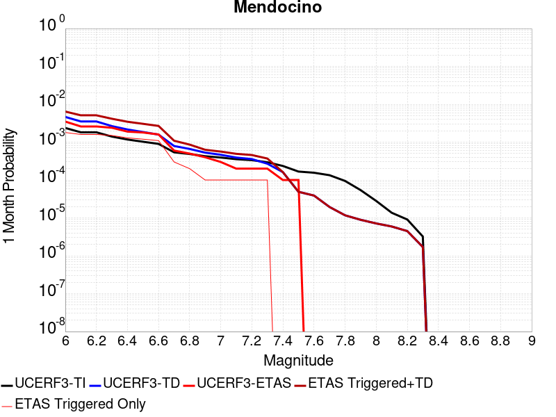 |  |  |

| Magnitude | 1 wk TI Prob | 1 wk TD Prob | 1 wk ETAS Prob | 1 wk ETAS/TD Gain | 1 wk ETAS Triggered+TD | 1 wk ETAS Triggered Only | 1 mo TI Prob | 1 mo TD Prob | 1 mo ETAS Prob | 1 mo ETAS/TD Gain | 1 mo ETAS Triggered+TD | 1 mo ETAS Triggered Only | 1 yr TI Prob | 1 yr TD Prob | 1 yr ETAS Prob | 1 yr ETAS/TD Gain | 1 yr ETAS Triggered+TD | 1 yr ETAS Triggered Only | 10 yr TI Prob | 10 yr TD Prob | 10 yr ETAS Prob | 10 yr ETAS/TD Gain | 10 yr ETAS Triggered+TD | 10 yr ETAS Triggered Only |
|-----|-----|-----|-----|-----|-----|-----|-----|-----|-----|-----|-----|-----|-----|-----|-----|-----|-----|-----|-----|-----|-----|-----|-----|-----|
| 6.0 | 5.5409013E-4 | 0.0010846633 | 9.0E-4 | 0.8297506 | 0.0013843379 | 3.0E-4 | 0.0023725112 | 0.004638279 | 0.0035 | 0.7545902 | 0.00642993 | 0.0018 | 0.028505474 | 0.054707065 | 0.0303 | 0.553859 | 0.0648217 | 0.0107 | 0.25113493 | 0.41203982 | 0.2532 | 0.61450374 | 0.45743033 | 0.0772 |
| 6.1 | 4.2515888E-4 | 8.233349E-4 | 7.0E-4 | 0.8502008 | 0.001123088 | 3.0E-4 | 0.0018208373 | 0.0035222336 | 0.0026 | 0.738168 | 0.0051165977 | 0.0016 | 0.021944538 | 0.04177556 | 0.025 | 0.59843606 | 0.051070336 | 0.0097 | 0.19899574 | 0.33009794 | 0.2169 | 0.6570777 | 0.37866583 | 0.0725 |
| 6.2 | 4.2515888E-4 | 8.233349E-4 | 7.0E-4 | 0.8502008 | 0.001123088 | 3.0E-4 | 0.0018208373 | 0.0035222336 | 0.0026 | 0.738168 | 0.0051165977 | 0.0016 | 0.021944538 | 0.04177556 | 0.025 | 0.59843606 | 0.051070336 | 0.0097 | 0.19899574 | 0.33009794 | 0.2169 | 0.6570777 | 0.37866583 | 0.0725 |
| 6.3 | 3.2773745E-4 | 6.1976456E-4 | 6.0E-4 | 0.9681096 | 8.196406E-4 | 2.0E-4 | 0.0014038329 | 0.0026521818 | 0.0024 | 0.9049154 | 0.0041482034 | 0.0015 | 0.016958237 | 0.0316147 | 0.0211 | 0.6674111 | 0.039749134 | 0.0084 | 0.1572094 | 0.26091513 | 0.1748 | 0.66994965 | 0.30511242 | 0.0598 |
| 6.4 | 2.7417165E-4 | 5.0518103E-4 | 5.0E-4 | 0.98974425 | 7.0508E-4 | 2.0E-4 | 0.0011744922 | 0.0021622586 | 0.0019 | 0.8787108 | 0.0034594478 | 0.0013 | 0.014205975 | 0.025858795 | 0.0171 | 0.6612837 | 0.032872614 | 0.0072 | 0.13331394 | 0.21961598 | 0.1438 | 0.6547793 | 0.25855714 | 0.0499 |
| 6.5 | 2.3984899E-4 | 4.3273522E-4 | 4.0E-4 | 0.92435277 | 5.3269195E-4 | 1.0E-4 | 0.0010275192 | 0.0018524511 | 0.0018 | 0.9716855 | 0.003050228 | 0.0012 | 0.012438473 | 0.022200633 | 0.0155 | 0.6981783 | 0.028556328 | 0.0065 | 0.11764851 | 0.19217058 | 0.1267 | 0.6593101 | 0.22763428 | 0.0439 |
| 6.6 | 2.1023539E-4 | 3.6971868E-4 | 3.0E-4 | 0.8114278 | 4.6968172E-4 | 1.0E-4 | 9.0069766E-4 | 0.001582888 | 0.0016 | 1.0108106 | 0.0026811468 | 0.0011 | 0.010910975 | 0.019008918 | 0.0135 | 0.71019304 | 0.024698665 | 0.0058 | 0.10390546 | 0.16762495 | 0.1116 | 0.665772 | 0.1992552 | 0.038 |
| 6.7 | 1.2592976E-4 | 1.8458818E-4 | 2.0E-4 | 1.083493 | 2.8456972E-4 | 1.0E-4 | 5.395873E-4 | 7.907774E-4 | 6.0E-4 | 0.75874704 | 0.0010905402 | 3.0E-4 | 0.006549705 | 0.009573642 | 0.0064 | 0.66850215 | 0.011653537 | 0.0021 | 0.063599944 | 0.09110104 | 0.054 | 0.5927484 | 0.10482542 | 0.0151 |
| 6.8 | 1.13663555E-4 | 1.5431417E-4 | 2.0E-4 | 1.2960573 | 2.5429873E-4 | 1.0E-4 | 4.8703855E-4 | 6.6115055E-4 | 5.0E-4 | 0.7562574 | 8.610183E-4 | 2.0E-4 | 0.0059135845 | 0.008015618 | 0.0053 | 0.66120917 | 0.009701991 | 0.0017 | 0.057586733 | 0.07751504 | 0.0445 | 0.57408214 | 0.08950735 | 0.013 |
| 6.9 | 9.926894E-5 | 1.2326919E-4 | 2.0E-4 | 1.6224655 | 2.2325687E-4 | 1.0E-4 | 4.2536893E-4 | 5.281832E-4 | 4.0E-4 | 0.757313 | 6.281304E-4 | 1.0E-4 | 0.0051665753 | 0.006410687 | 0.0044 | 0.68635386 | 0.0077023534 | 0.0013 | 0.050480947 | 0.062969945 | 0.0381 | 0.60505056 | 0.073745795 | 0.0115 |
| 7.0 | 9.168125E-5 | 1.080911E-4 | 1.0E-4 | 0.9251455 | 2.080803E-4 | 1.0E-4 | 3.9286047E-4 | 4.6316144E-4 | 3.0E-4 | 0.6477223 | 5.631151E-4 | 1.0E-4 | 0.004772591 | 0.0056240456 | 0.0038 | 0.6756702 | 0.0067178593 | 0.0011 | 0.04671385 | 0.05572506 | 0.035 | 0.62808365 | 0.06592323 | 0.0108 |
| 7.1 | 8.2854116E-5 | 9.128317E-5 | 1.0E-4 | 1.0954922 | 1.9127404E-4 | 1.0E-4 | 3.5504074E-4 | 3.911553E-4 | 2.0E-4 | 0.51130587 | 4.911162E-4 | 1.0E-4 | 0.004314056 | 0.004751981 | 0.0032 | 0.6734034 | 0.0058467537 | 0.0011 | 0.042312626 | 0.047577653 | 0.0315 | 0.6620755 | 0.057578087 | 0.0105 |
| 7.2 | 7.8255274E-5 | 8.322483E-5 | 1.0E-4 | 1.2015644 | 1.8321651E-4 | 1.0E-4 | 3.3533663E-4 | 3.5662993E-4 | 2.0E-4 | 0.56080544 | 4.5659425E-4 | 1.0E-4 | 0.0040750825 | 0.0043334733 | 0.003 | 0.6922853 | 0.00532914 | 0.001 | 0.040011603 | 0.043617453 | 0.0288 | 0.6602861 | 0.052798726 | 0.0096 |
| 7.3 | 6.887904E-5 | 6.274889E-5 | 1.0E-4 | 1.5936537 | 1.6274261E-4 | 1.0E-4 | 2.9516246E-4 | 2.6889666E-4 | 2.0E-4 | 0.7437802 | 3.6886975E-4 | 1.0E-4 | 0.0035876823 | 0.0032689997 | 0.0023 | 0.7035791 | 0.0040663844 | 8.0E-4 | 0.035303112 | 0.03341804 | 0.0222 | 0.6643118 | 0.040764064 | 0.0076 |
| 7.4 | 5.4898497E-5 | 3.749164E-5 | 0.0 | 0.0 | 3.749164E-5 | 0.0 | 2.3525805E-4 | 1.6066889E-4 | 1.0E-4 | 0.6223981 | 1.6066889E-4 | 0.0 | 0.0028605047 | 0.0019544451 | 0.0014 | 0.7163158 | 0.0023536633 | 4.0E-4 | 0.02823963 | 0.0204497 | 0.0123 | 0.60147583 | 0.024661766 | 0.0043 |
| 7.5 | 3.9103943E-5 | 1.132455E-5 | 0.0 | 0.0 | 1.132455E-5 | 0.0 | 1.6757756E-4 | 4.853289E-5 | 1.0E-4 | 2.0604584 | 4.853289E-5 | 0.0 | 0.0020383475 | 5.9072935E-4 | 4.0E-4 | 0.67712903 | 5.9072935E-4 | 0.0 | 0.020197518 | 0.006631736 | 0.0036 | 0.5428443 | 0.0076251044 | 0.001 |
| 7.6 | 3.641042E-5 | 8.998687E-6 | 0.0 | 0.0 | 8.998687E-6 | 0.0 | 1.5603533E-4 | 3.856524E-5 | 0.0 | 0.0 | 3.856524E-5 | 0.0 | 0.0018980748 | 4.6943198E-4 | 3.0E-4 | 0.6390702 | 4.6943198E-4 | 0.0 | 0.018819444 | 0.005354082 | 0.0026 | 0.48561075 | 0.00595087 | 6.0E-4 |
| 7.7 | 3.1318774E-5 | 4.4653216E-6 | 0.0 | 0.0 | 4.4653216E-6 | 0.0 | 1.342164E-4 | 1.9136953E-5 | 0.0 | 0.0 | 1.9136953E-5 | 0.0 | 0.0016328598 | 2.3296766E-4 | 0.0 | 0.0 | 2.3296766E-4 | 0.0 | 0.016209139 | 0.0028722486 | 0.0011 | 0.3829752 | 0.003171387 | 3.0E-4 |
| 7.8 | 2.209241E-5 | 2.6879616E-6 | 0.0 | 0.0 | 2.6879616E-6 | 0.0 | 9.467832E-5 | 1.1519785E-5 | 0.0 | 0.0 | 1.1519785E-5 | 0.0 | 0.001152099 | 1.4024439E-4 | 0.0 | 0.0 | 1.4024439E-4 | 0.0 | 0.011461443 | 0.0017417684 | 0.001 | 0.57412916 | 0.00194142 | 2.0E-4 |
| 7.9 | 1.2640477E-5 | 2.0476398E-6 | 0.0 | 0.0 | 2.0476398E-6 | 0.0 | 5.4172346E-5 | 8.77557E-6 | 0.0 | 0.0 | 8.77557E-6 | 0.0 | 6.593487E-4 | 1.0683735E-4 | 0.0 | 0.0 | 1.0683735E-4 | 0.0 | 0.006573958 | 0.0013011658 | 6.0E-4 | 0.46112496 | 0.0015009056 | 2.0E-4 |
| 8.0 | 6.5548907E-6 | 1.6441751E-6 | 0.0 | 0.0 | 1.6441751E-6 | 0.0 | 2.8092087E-5 | 7.0464457E-6 | 0.0 | 0.0 | 7.0464457E-6 | 0.0 | 3.4196748E-4 | 8.578712E-5 | 0.0 | 0.0 | 8.578712E-5 | 0.0 | 0.0034144172 | 0.0010341692 | 2.0E-4 | 0.19339195 | 0.0011340658 | 1.0E-4 |
| 8.1 | 3.1916707E-6 | 1.3643197E-6 | 0.0 | 0.0 | 1.3643197E-6 | 0.0 | 1.3678517E-5 | 5.8470714E-6 | 0.0 | 0.0 | 5.8470714E-6 | 0.0 | 1.6652321E-4 | 7.1185794E-5 | 0.0 | 0.0 | 7.1185794E-5 | 0.0 | 0.0016639848 | 8.66262E-4 | 2.0E-4 | 0.23087703 | 9.661754E-4 | 1.0E-4 |
| 8.2 | 2.1193785E-6 | 1.034455E-6 | 0.0 | 0.0 | 1.034455E-6 | 0.0 | 9.083019E-6 | 4.433371E-6 | 0.0 | 0.0 | 4.433371E-6 | 0.0 | 1.1058014E-4 | 5.3974978E-5 | 0.0 | 0.0 | 5.3974978E-5 | 0.0 | 0.0011052513 | 6.527772E-4 | 0.0 | 0.0 | 6.527772E-4 | 0.0 |
| 8.3 | 7.536878E-7 | 3.9415366E-7 | 0.0 | 0.0 | 3.9415366E-7 | 0.0 | 3.2300866E-6 | 1.689229E-6 | 0.0 | 0.0 | 1.689229E-6 | 0.0 | 3.9325594E-5 | 2.0566182E-5 | 0.0 | 0.0 | 2.0566182E-5 | 0.0 | 3.9318635E-4 | 2.4211706E-4 | 0.0 | 0.0 | 2.4211706E-4 | 0.0 |

## San Andreas (Mojave S)
*[(top)](#table-of-contents)*

| 1 Week | 1 Month | 1 Year | 10 Year |
|-----|-----|-----|-----|
|  | 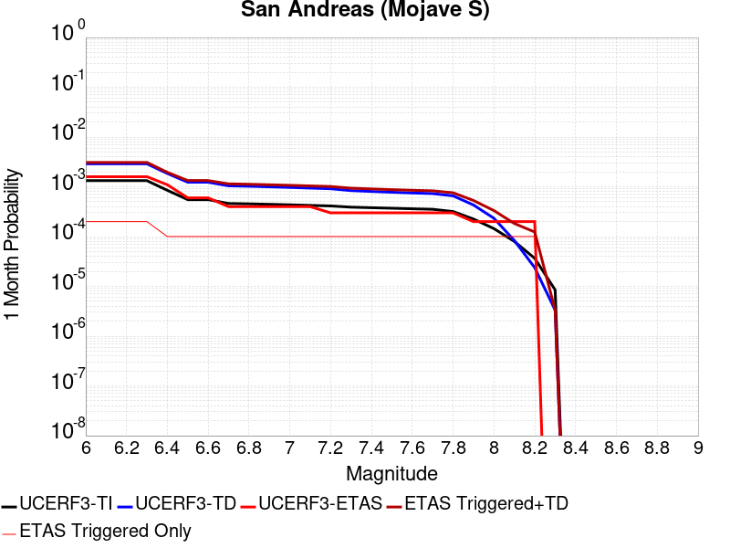 |  |  |

| Magnitude | 1 wk TI Prob | 1 wk TD Prob | 1 wk ETAS Prob | 1 wk ETAS/TD Gain | 1 wk ETAS Triggered+TD | 1 wk ETAS Triggered Only | 1 mo TI Prob | 1 mo TD Prob | 1 mo ETAS Prob | 1 mo ETAS/TD Gain | 1 mo ETAS Triggered+TD | 1 mo ETAS Triggered Only | 1 yr TI Prob | 1 yr TD Prob | 1 yr ETAS Prob | 1 yr ETAS/TD Gain | 1 yr ETAS Triggered+TD | 1 yr ETAS Triggered Only | 10 yr TI Prob | 10 yr TD Prob | 10 yr ETAS Prob | 10 yr ETAS/TD Gain | 10 yr ETAS Triggered+TD | 10 yr ETAS Triggered Only |
|-----|-----|-----|-----|-----|-----|-----|-----|-----|-----|-----|-----|-----|-----|-----|-----|-----|-----|-----|-----|-----|-----|-----|-----|-----|
| 6.0 | 3.1064058E-4 | 6.756277E-4 | 6.0E-4 | 0.888063 | 7.7556015E-4 | 1.0E-4 | 0.0013306376 | 0.0028924625 | 0.0016 | 0.55316186 | 0.003091884 | 2.0E-4 | 0.016080605 | 0.034616176 | 0.025 | 0.7222057 | 0.04089117 | 0.0065 | 0.1496549 | 0.28689292 | 0.2089 | 0.72814626 | 0.32996458 | 0.0604 |
| 6.1 | 3.1064058E-4 | 6.756277E-4 | 6.0E-4 | 0.888063 | 7.7556015E-4 | 1.0E-4 | 0.0013306376 | 0.0028924625 | 0.0016 | 0.55316186 | 0.003091884 | 2.0E-4 | 0.016080605 | 0.034616176 | 0.025 | 0.7222057 | 0.04089117 | 0.0065 | 0.1496549 | 0.28689292 | 0.2089 | 0.72814626 | 0.32996458 | 0.0604 |
| 6.2 | 3.1064058E-4 | 6.756277E-4 | 6.0E-4 | 0.888063 | 7.7556015E-4 | 1.0E-4 | 0.0013306376 | 0.0028924625 | 0.0016 | 0.55316186 | 0.003091884 | 2.0E-4 | 0.016080605 | 0.034616176 | 0.025 | 0.7222057 | 0.04089117 | 0.0065 | 0.1496549 | 0.28689292 | 0.2089 | 0.72814626 | 0.32996458 | 0.0604 |
| 6.3 | 3.1064058E-4 | 6.756277E-4 | 6.0E-4 | 0.888063 | 7.7556015E-4 | 1.0E-4 | 0.0013306376 | 0.0028924625 | 0.0016 | 0.55316186 | 0.003091884 | 2.0E-4 | 0.016080605 | 0.034616176 | 0.025 | 0.7222057 | 0.04089117 | 0.0065 | 0.1496549 | 0.28689292 | 0.2089 | 0.72814626 | 0.32996458 | 0.0604 |
| 6.4 | 1.9872203E-4 | 4.3274742E-4 | 4.0E-4 | 0.9243267 | 5.327042E-4 | 1.0E-4 | 8.5138786E-4 | 0.0018533418 | 0.0011 | 0.5935224 | 0.0019531564 | 1.0E-4 | 0.010316478 | 0.022337126 | 0.0166 | 0.7431574 | 0.026247777 | 0.004 | 0.098504856 | 0.19726658 | 0.1432 | 0.7259212 | 0.227931 | 0.0382 |
| 6.5 | 1.291105E-4 | 2.8841046E-4 | 2.0E-4 | 0.6934561 | 3.8838162E-4 | 1.0E-4 | 5.5321335E-4 | 0.0012354621 | 6.0E-4 | 0.48564824 | 0.0013353386 | 1.0E-4 | 0.006714592 | 0.01493884 | 0.0114 | 0.7631115 | 0.018091036 | 0.0032 | 0.065152965 | 0.13841788 | 0.0978 | 0.7065561 | 0.15995744 | 0.025 |
| 6.6 | 1.291105E-4 | 2.8841046E-4 | 2.0E-4 | 0.6934561 | 3.8838162E-4 | 1.0E-4 | 5.5321335E-4 | 0.0012354621 | 6.0E-4 | 0.48564824 | 0.0013353386 | 1.0E-4 | 0.006714592 | 0.01493884 | 0.0114 | 0.7631115 | 0.018091036 | 0.0032 | 0.065152965 | 0.13841788 | 0.0978 | 0.7065561 | 0.15995744 | 0.025 |
| 6.7 | 1.08001186E-4 | 2.4420428E-4 | 2.0E-4 | 0.81898654 | 3.4417983E-4 | 1.0E-4 | 4.6278012E-4 | 0.0010461705 | 4.0E-4 | 0.38234687 | 0.0011460659 | 1.0E-4 | 0.0056198016 | 0.01266304 | 0.0094 | 0.74231774 | 0.015328851 | 0.0027 | 0.054797906 | 0.11952464 | 0.0815 | 0.6818677 | 0.13819072 | 0.0212 |
| 6.8 | 1.0624356E-4 | 2.393772E-4 | 2.0E-4 | 0.83550143 | 3.3935325E-4 | 1.0E-4 | 4.5525006E-4 | 0.0010254994 | 4.0E-4 | 0.39005384 | 0.0011253969 | 1.0E-4 | 0.0055285925 | 0.012414257 | 0.0091 | 0.7330282 | 0.014883221 | 0.0025 | 0.053930566 | 0.1174732 | 0.079 | 0.6724938 | 0.13565326 | 0.0206 |
| 6.9 | 1.0393785E-4 | 2.3307577E-4 | 2.0E-4 | 0.85809004 | 3.3305248E-4 | 1.0E-4 | 4.4537184E-4 | 9.985142E-4 | 4.0E-4 | 0.4005952 | 0.0010984144 | 1.0E-4 | 0.0054089287 | 0.012089399 | 0.0088 | 0.7279105 | 0.014361593 | 0.0023 | 0.05279156 | 0.114771985 | 0.0768 | 0.66915286 | 0.13238803 | 0.0199 |
| 7.0 | 1.0155622E-4 | 2.2676578E-4 | 2.0E-4 | 0.88196725 | 3.2674312E-4 | 1.0E-4 | 4.3516833E-4 | 9.714918E-4 | 4.0E-4 | 0.41173792 | 0.0010713947 | 1.0E-4 | 0.005285311 | 0.011763994 | 0.0085 | 0.7225437 | 0.014036937 | 0.0023 | 0.05161361 | 0.1120261 | 0.074 | 0.6605603 | 0.12925279 | 0.0194 |
| 7.1 | 9.885595E-5 | 2.1964363E-4 | 2.0E-4 | 0.910566 | 3.1962164E-4 | 1.0E-4 | 4.2359953E-4 | 9.409905E-4 | 4.0E-4 | 0.42508397 | 0.0010408964 | 1.0E-4 | 0.0051451353 | 0.011396579 | 0.0082 | 0.71951413 | 0.013670367 | 0.0023 | 0.05027629 | 0.10891034 | 0.0711 | 0.6528306 | 0.12566282 | 0.0188 |
| 7.2 | 9.6411415E-5 | 2.132676E-4 | 2.0E-4 | 0.93778896 | 3.1324627E-4 | 1.0E-4 | 4.1312634E-4 | 9.1368414E-4 | 3.0E-4 | 0.32834104 | 0.0010135928 | 1.0E-4 | 0.005018219 | 0.011067549 | 0.0077 | 0.69572765 | 0.0132432 | 0.0022 | 0.049064007 | 0.10609853 | 0.0686 | 0.6465688 | 0.12218876 | 0.018 |
| 7.3 | 9.1180635E-5 | 1.9551715E-4 | 2.0E-4 | 1.0229281 | 2.954976E-4 | 1.0E-4 | 3.907156E-4 | 8.376617E-4 | 3.0E-4 | 0.3581398 | 9.375779E-4 | 1.0E-4 | 0.004746591 | 0.010150954 | 0.0069 | 0.67973906 | 0.012229637 | 0.0021 | 0.046464786 | 0.09829431 | 0.062 | 0.6307588 | 0.11281177 | 0.0161 |
| 7.4 | 8.887388E-5 | 1.8798959E-4 | 2.0E-4 | 1.0638887 | 2.879708E-4 | 1.0E-4 | 3.8083247E-4 | 8.05421E-4 | 3.0E-4 | 0.372476 | 9.053404E-4 | 1.0E-4 | 0.0046267817 | 0.00976201 | 0.0064 | 0.65560275 | 0.011643462 | 0.0019 | 0.045316286 | 0.09492415 | 0.0602 | 0.63419056 | 0.108681306 | 0.0152 |
| 7.5 | 8.6750515E-5 | 1.8129284E-4 | 2.0E-4 | 1.1031876 | 2.812747E-4 | 1.0E-4 | 3.7173493E-4 | 7.7673804E-4 | 3.0E-4 | 0.38623062 | 8.7666034E-4 | 1.0E-4 | 0.004516484 | 0.009415867 | 0.0061 | 0.64784265 | 0.011198918 | 0.0018 | 0.04425787 | 0.09188434 | 0.0584 | 0.6355817 | 0.10550607 | 0.015 |
| 7.6 | 8.453092E-5 | 1.7515438E-4 | 2.0E-4 | 1.1418499 | 2.7513687E-4 | 1.0E-4 | 3.6222505E-4 | 7.5044576E-4 | 3.0E-4 | 0.39976242 | 8.503707E-4 | 1.0E-4 | 0.0044011753 | 0.009098477 | 0.0059 | 0.6484602 | 0.010882099 | 0.0018 | 0.04315024 | 0.08903706 | 0.0559 | 0.6278284 | 0.10197274 | 0.0142 |
| 7.7 | 8.259102E-5 | 1.7036348E-4 | 2.0E-4 | 1.1739604 | 2.7034644E-4 | 1.0E-4 | 3.539135E-4 | 7.2992494E-4 | 3.0E-4 | 0.41100115 | 8.2985195E-4 | 1.0E-4 | 0.004300386 | 0.008850695 | 0.0059 | 0.66661435 | 0.010634763 | 0.0018 | 0.042181134 | 0.08678416 | 0.0537 | 0.6187765 | 0.09929522 | 0.0137 |
| 7.8 | 7.444844E-5 | 1.5350789E-4 | 2.0E-4 | 1.3028647 | 2.5349253E-4 | 1.0E-4 | 3.1902574E-4 | 6.5772515E-4 | 3.0E-4 | 0.4561176 | 7.576594E-4 | 1.0E-4 | 0.0038772223 | 0.007978451 | 0.0054 | 0.6768231 | 0.009466483 | 0.0015 | 0.03810269 | 0.07858261 | 0.0485 | 0.61718494 | 0.08954748 | 0.0119 |
| 7.9 | 5.2586525E-5 | 1.0048883E-4 | 2.0E-4 | 1.990271 | 2.0047878E-4 | 1.0E-4 | 2.2535135E-4 | 4.3059536E-4 | 2.0E-4 | 0.4644732 | 5.305523E-4 | 1.0E-4 | 0.0027402006 | 0.005229908 | 0.0034 | 0.650107 | 0.006125201 | 9.0E-4 | 0.027066574 | 0.05239679 | 0.032 | 0.61072445 | 0.059598573 | 0.0076 |
| 8.0 | 3.379877E-5 | 5.428442E-5 | 2.0E-4 | 3.6842983 | 1.54279E-4 | 1.0E-4 | 1.4484383E-4 | 2.3262679E-4 | 2.0E-4 | 0.8597462 | 3.3260352E-4 | 1.0E-4 | 0.0017620471 | 0.0028285545 | 0.0015 | 0.5303062 | 0.003227423 | 4.0E-4 | 0.017481409 | 0.028936815 | 0.0161 | 0.5563847 | 0.032335535 | 0.0035 |
| 8.1 | 1.8668277E-5 | 1.937845E-5 | 2.0E-4 | 10.320743 | 1.1937651E-4 | 1.0E-4 | 8.000444E-5 | 8.304786E-5 | 2.0E-4 | 2.4082499 | 1.8303955E-4 | 1.0E-4 | 9.736188E-4 | 0.0010106394 | 7.0E-4 | 0.6926309 | 0.0012104373 | 2.0E-4 | 0.009693642 | 0.010834823 | 0.0057 | 0.52608144 | 0.012120739 | 0.0013 |
| 8.2 | 8.541571E-6 | 5.4778425E-6 | 2.0E-4 | 36.510727 | 1.05477295E-4 | 1.0E-4 | 3.660622E-5 | 2.3476256E-5 | 2.0E-4 | 8.519246 | 1.234739E-4 | 1.0E-4 | 4.455896E-4 | 2.8578602E-4 | 2.0E-4 | 0.69982433 | 3.8575742E-4 | 1.0E-4 | 0.0044469717 | 0.0032500897 | 0.0013 | 0.39998895 | 0.0036487896 | 4.0E-4 |
| 8.3 | 1.983087E-6 | 7.683211E-7 | 0.0 | 0.0 | 7.683211E-7 | 0.0 | 8.498917E-6 | 3.2928008E-6 | 0.0 | 0.0 | 3.2928008E-6 | 0.0 | 1.034694E-4 | 4.008913E-5 | 0.0 | 0.0 | 4.008913E-5 | 0.0 | 0.0010342124 | 4.7332307E-4 | 1.0E-4 | 0.21127218 | 4.7332307E-4 | 0.0 |

## Cerro Prieto
*[(top)](#table-of-contents)*

| 1 Week | 1 Month | 1 Year | 10 Year |
|-----|-----|-----|-----|
|  |  |  |  |

| Magnitude | 1 wk TI Prob | 1 wk TD Prob | 1 wk ETAS Prob | 1 wk ETAS/TD Gain | 1 wk ETAS Triggered+TD | 1 wk ETAS Triggered Only | 1 mo TI Prob | 1 mo TD Prob | 1 mo ETAS Prob | 1 mo ETAS/TD Gain | 1 mo ETAS Triggered+TD | 1 mo ETAS Triggered Only | 1 yr TI Prob | 1 yr TD Prob | 1 yr ETAS Prob | 1 yr ETAS/TD Gain | 1 yr ETAS Triggered+TD | 1 yr ETAS Triggered Only | 10 yr TI Prob | 10 yr TD Prob | 10 yr ETAS Prob | 10 yr ETAS/TD Gain | 10 yr ETAS Triggered+TD | 10 yr ETAS Triggered Only |
|-----|-----|-----|-----|-----|-----|-----|-----|-----|-----|-----|-----|-----|-----|-----|-----|-----|-----|-----|-----|-----|-----|-----|-----|-----|
| 6.0 | 2.9101528E-4 | 5.9808954E-4 | 3.0E-4 | 0.5015971 | 7.9796993E-4 | 2.0E-4 | 0.0012466122 | 0.0025609662 | 0.0016 | 0.6247642 | 0.0031594296 | 6.0E-4 | 0.015072231 | 0.030695252 | 0.0192 | 0.6255039 | 0.036317218 | 0.0058 | 0.14089979 | 0.25457677 | 0.1775 | 0.69723564 | 0.28938803 | 0.0467 |
| 6.1 | 2.9101528E-4 | 5.9808954E-4 | 3.0E-4 | 0.5015971 | 7.9796993E-4 | 2.0E-4 | 0.0012466122 | 0.0025609662 | 0.0016 | 0.6247642 | 0.0031594296 | 6.0E-4 | 0.015072231 | 0.030695252 | 0.0192 | 0.6255039 | 0.036317218 | 0.0058 | 0.14089979 | 0.25457677 | 0.1775 | 0.69723564 | 0.28938803 | 0.0467 |
| 6.2 | 2.9101528E-4 | 5.9808954E-4 | 3.0E-4 | 0.5015971 | 7.9796993E-4 | 2.0E-4 | 0.0012466122 | 0.0025609662 | 0.0016 | 0.6247642 | 0.0031594296 | 6.0E-4 | 0.015072231 | 0.030695252 | 0.0192 | 0.6255039 | 0.036317218 | 0.0058 | 0.14089979 | 0.25457677 | 0.1775 | 0.69723564 | 0.28938803 | 0.0467 |
| 6.3 | 2.9101528E-4 | 5.9808954E-4 | 3.0E-4 | 0.5015971 | 7.9796993E-4 | 2.0E-4 | 0.0012466122 | 0.0025609662 | 0.0016 | 0.6247642 | 0.0031594296 | 6.0E-4 | 0.015072231 | 0.030695252 | 0.0192 | 0.6255039 | 0.036317218 | 0.0058 | 0.14089979 | 0.25457677 | 0.1775 | 0.69723564 | 0.28938803 | 0.0467 |
| 6.4 | 2.508648E-4 | 5.155046E-4 | 3.0E-4 | 0.58195406 | 7.1540155E-4 | 2.0E-4 | 0.0010746918 | 0.0022076345 | 0.0015 | 0.6794603 | 0.0027065307 | 5.0E-4 | 0.013006088 | 0.0265219 | 0.017 | 0.6409797 | 0.031681333 | 0.0053 | 0.12270685 | 0.22494599 | 0.1559 | 0.6930552 | 0.25734326 | 0.0418 |
| 6.5 | 2.508648E-4 | 5.155046E-4 | 3.0E-4 | 0.58195406 | 7.1540155E-4 | 2.0E-4 | 0.0010746918 | 0.0022076345 | 0.0015 | 0.6794603 | 0.0027065307 | 5.0E-4 | 0.013006088 | 0.0265219 | 0.017 | 0.6409797 | 0.031681333 | 0.0053 | 0.12270685 | 0.22494599 | 0.1559 | 0.6930552 | 0.25734326 | 0.0418 |
| 6.6 | 2.294914E-4 | 4.7264987E-4 | 2.0E-4 | 0.4231462 | 5.726026E-4 | 1.0E-4 | 9.831638E-4 | 0.0020242583 | 0.0014 | 0.69161135 | 0.0024234487 | 4.0E-4 | 0.011904482 | 0.024354722 | 0.0155 | 0.63642687 | 0.029232949 | 0.005 | 0.11286586 | 0.2090983 | 0.1456 | 0.6963232 | 0.24033892 | 0.0395 |
| 6.7 | 1.9621674E-4 | 4.0559118E-4 | 2.0E-4 | 0.49310735 | 5.0555065E-4 | 1.0E-4 | 8.4065786E-4 | 0.0017372493 | 0.0012 | 0.69074714 | 0.0020367282 | 3.0E-4 | 0.010187071 | 0.020967446 | 0.013 | 0.6200087 | 0.025177287 | 0.0043 | 0.09732539 | 0.18345389 | 0.1256 | 0.6846407 | 0.21162473 | 0.0345 |
| 6.8 | 1.5476145E-4 | 3.0681433E-4 | 2.0E-4 | 0.65186006 | 4.0678366E-4 | 1.0E-4 | 6.6309475E-4 | 0.0013143589 | 9.0E-4 | 0.68474454 | 0.0015140959 | 2.0E-4 | 0.008043335 | 0.015882768 | 0.0091 | 0.57294804 | 0.019228766 | 0.0034 | 0.07758363 | 0.14385986 | 0.095 | 0.66036487 | 0.16714688 | 0.0272 |
| 6.9 | 1.20509176E-4 | 2.2677695E-4 | 2.0E-4 | 0.88192385 | 3.2675426E-4 | 1.0E-4 | 5.1636563E-4 | 9.71603E-4 | 7.0E-4 | 0.7204589 | 0.0011714087 | 2.0E-4 | 0.006268645 | 0.0117801335 | 0.006 | 0.50933206 | 0.014349505 | 0.0026 | 0.060947374 | 0.10990398 | 0.0693 | 0.63055044 | 0.1277059 | 0.02 |
| 7.0 | 9.3269155E-5 | 1.6792802E-4 | 2.0E-4 | 1.1909865 | 2.6791124E-4 | 1.0E-4 | 3.9966372E-4 | 7.195365E-4 | 5.0E-4 | 0.6948918 | 9.1939257E-4 | 2.0E-4 | 0.0048550544 | 0.008732889 | 0.0044 | 0.5038424 | 0.010616296 | 0.0019 | 0.04750344 | 0.08351717 | 0.0511 | 0.6118502 | 0.09662288 | 0.0143 |
| 7.1 | 5.029709E-5 | 8.213458E-5 | 1.0E-4 | 1.2175139 | 1.8212637E-4 | 1.0E-4 | 2.1554115E-4 | 3.5197733E-4 | 1.0E-4 | 0.2841092 | 4.5194215E-4 | 1.0E-4 | 0.0026210553 | 0.0042803525 | 0.002 | 0.4672512 | 0.0051765004 | 9.0E-4 | 0.025903556 | 0.042642303 | 0.0277 | 0.6495897 | 0.050492633 | 0.0082 |
| 7.2 | 6.5445185E-8 | 6.905684E-8 | 0.0 | 0.0 | 6.905684E-8 | 0.0 | 2.8047933E-7 | 2.9595788E-7 | 0.0 | 0.0 | 2.9595788E-7 | 0.0 | 3.4148304E-6 | 3.6032873E-6 | 0.0 | 0.0 | 3.6032873E-6 | 0.0 | 3.414778E-5 | 3.6032874E-5 | 1.0E-4 | 2.7752435 | 3.6032874E-5 | 0.0 |

## Garlock (Central)
*[(top)](#table-of-contents)*

| 1 Week | 1 Month | 1 Year | 10 Year |
|-----|-----|-----|-----|
| 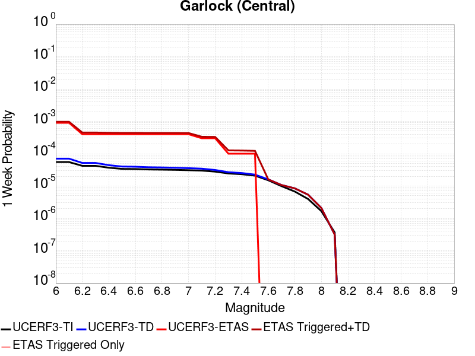 |  |  |  |

| Magnitude | 1 wk TI Prob | 1 wk TD Prob | 1 wk ETAS Prob | 1 wk ETAS/TD Gain | 1 wk ETAS Triggered+TD | 1 wk ETAS Triggered Only | 1 mo TI Prob | 1 mo TD Prob | 1 mo ETAS Prob | 1 mo ETAS/TD Gain | 1 mo ETAS Triggered+TD | 1 mo ETAS Triggered Only | 1 yr TI Prob | 1 yr TD Prob | 1 yr ETAS Prob | 1 yr ETAS/TD Gain | 1 yr ETAS Triggered+TD | 1 yr ETAS Triggered Only | 10 yr TI Prob | 10 yr TD Prob | 10 yr ETAS Prob | 10 yr ETAS/TD Gain | 10 yr ETAS Triggered+TD | 10 yr ETAS Triggered Only |
|-----|-----|-----|-----|-----|-----|-----|-----|-----|-----|-----|-----|-----|-----|-----|-----|-----|-----|-----|-----|-----|-----|-----|-----|-----|
| 6.0 | 5.5131142E-5 | 7.03374E-5 | 9.0E-4 | 12.795468 | 9.702741E-4 | 9.0E-4 | 2.3625491E-4 | 3.0141155E-4 | 0.0034 | 11.280258 | 0.0037003867 | 0.0034 | 0.0028726095 | 0.003663575 | 0.0201 | 5.486444 | 0.021796899 | 0.0182 | 0.028357591 | 0.03612697 | 0.0616 | 1.7050972 | 0.07901932 | 0.0445 |
| 6.1 | 5.5131142E-5 | 7.03374E-5 | 9.0E-4 | 12.795468 | 9.702741E-4 | 9.0E-4 | 2.3625491E-4 | 3.0141155E-4 | 0.0034 | 11.280258 | 0.0037003867 | 0.0034 | 0.0028726095 | 0.003663575 | 0.0201 | 5.486444 | 0.021796899 | 0.0182 | 0.028357591 | 0.03612697 | 0.0616 | 1.7050972 | 0.07901932 | 0.0445 |
| 6.2 | 4.216245E-5 | 5.1742314E-5 | 4.0E-4 | 7.730617 | 4.5172163E-4 | 4.0E-4 | 1.806837E-4 | 2.217341E-4 | 0.0016 | 7.21585 | 0.0018213793 | 0.0016 | 0.0021976046 | 0.002696302 | 0.012 | 4.45054 | 0.013367452 | 0.0107 | 0.021759989 | 0.02672653 | 0.0399 | 1.4928986 | 0.05349155 | 0.0275 |
| 6.3 | 4.216245E-5 | 5.1742314E-5 | 4.0E-4 | 7.730617 | 4.5172163E-4 | 4.0E-4 | 1.806837E-4 | 2.217341E-4 | 0.0016 | 7.21585 | 0.0018213793 | 0.0016 | 0.0021976046 | 0.002696302 | 0.012 | 4.45054 | 0.013367452 | 0.0107 | 0.021759989 | 0.02672653 | 0.0399 | 1.4928986 | 0.05349155 | 0.0275 |
| 6.4 | 3.6858168E-5 | 4.418838E-5 | 4.0E-4 | 9.052154 | 4.441707E-4 | 4.0E-4 | 1.5795401E-4 | 1.8936515E-4 | 0.0014 | 7.3931236 | 0.0015891 | 0.0014 | 0.0019213937 | 0.002303108 | 0.0101 | 4.385378 | 0.011082841 | 0.0088 | 0.019048655 | 0.022869205 | 0.0317 | 1.3861434 | 0.04338895 | 0.021 |
| 6.5 | 3.39199E-5 | 4.0094397E-5 | 4.0E-4 | 9.976456 | 4.4007835E-4 | 4.0E-4 | 1.453629E-4 | 1.7182194E-4 | 0.0014 | 8.14797 | 0.0015715813 | 0.0014 | 0.0017683565 | 0.002089947 | 0.0093 | 4.449874 | 0.010173018 | 0.0081 | 0.017543508 | 0.020796381 | 0.0291 | 1.3992819 | 0.039792933 | 0.0194 |
| 6.6 | 3.3571985E-5 | 3.9548002E-5 | 4.0E-4 | 10.114291 | 4.395322E-4 | 4.0E-4 | 1.4387199E-4 | 1.6948055E-4 | 0.0014 | 8.260535 | 0.0015692433 | 0.0014 | 0.0017502342 | 0.0020614946 | 0.0093 | 4.51129 | 0.010144796 | 0.0081 | 0.017365133 | 0.020517377 | 0.0289 | 1.4085622 | 0.03942139 | 0.0193 |
| 6.7 | 3.2580007E-5 | 3.81639E-5 | 4.0E-4 | 10.481109 | 4.3814862E-4 | 4.0E-4 | 1.3962112E-4 | 1.6354944E-4 | 0.0013 | 7.9486666 | 0.0014633369 | 0.0013 | 0.0016985617 | 0.0019894175 | 0.0088 | 4.4234056 | 0.009674099 | 0.0077 | 0.016856372 | 0.019812621 | 0.0278 | 1.403146 | 0.03784807 | 0.0184 |
| 6.8 | 3.2185937E-5 | 3.7590755E-5 | 4.0E-4 | 10.640914 | 4.375757E-4 | 4.0E-4 | 1.3793244E-4 | 1.6109341E-4 | 0.0013 | 8.069852 | 0.001460884 | 0.0013 | 0.0016780337 | 0.0019595695 | 0.0087 | 4.4397507 | 0.009544677 | 0.0076 | 0.016654192 | 0.019519277 | 0.0275 | 1.4088637 | 0.037364025 | 0.0182 |
| 6.9 | 3.165394E-5 | 3.6794798E-5 | 4.0E-4 | 10.871102 | 4.3678007E-4 | 4.0E-4 | 1.3565269E-4 | 1.5768259E-4 | 0.0012 | 7.6102257 | 0.0013574933 | 0.0012 | 0.0016503202 | 0.0019181165 | 0.0084 | 4.3792963 | 0.009204114 | 0.0073 | 0.01638118 | 0.019112317 | 0.0271 | 1.4179338 | 0.036670204 | 0.0179 |
| 7.0 | 3.0903822E-5 | 3.5699482E-5 | 4.0E-4 | 11.204644 | 4.3568522E-4 | 4.0E-4 | 1.3243823E-4 | 1.5298893E-4 | 0.0011 | 7.1900625 | 0.0012528206 | 0.0011 | 0.0016112428 | 0.0018610702 | 0.0083 | 4.4598 | 0.00904767 | 0.0072 | 0.015996104 | 0.018550634 | 0.0262 | 1.4123507 | 0.035333417 | 0.0171 |
| 7.1 | 3.0069863E-5 | 3.4465076E-5 | 3.0E-4 | 8.704464 | 3.3445473E-4 | 3.0E-4 | 1.2886449E-4 | 1.4769922E-4 | 0.001 | 6.7705164 | 0.0011475516 | 0.001 | 0.0015677959 | 0.001796776 | 0.0076 | 4.2297983 | 0.008584558 | 0.0068 | 0.01556781 | 0.017917795 | 0.0247 | 1.3785179 | 0.033925734 | 0.0163 |
| 7.2 | 2.7957109E-5 | 3.1352753E-5 | 3.0E-4 | 9.568539 | 3.3134336E-4 | 3.0E-4 | 1.1981068E-4 | 1.3436213E-4 | 8.0E-4 | 5.954059 | 9.342546E-4 | 8.0E-4 | 0.0014577188 | 0.0016346509 | 0.0066 | 4.0375595 | 0.00742517 | 0.0058 | 0.014481937 | 0.016320668 | 0.0218 | 1.3357296 | 0.030288916 | 0.0142 |
| 7.3 | 2.4519275E-5 | 2.6781456E-5 | 1.0E-4 | 3.733927 | 1.2677877E-4 | 1.0E-4 | 1.0507837E-4 | 1.147727E-4 | 5.0E-4 | 4.3564367 | 6.1471533E-4 | 5.0E-4 | 0.0012785783 | 0.0013964766 | 0.0047 | 3.365613 | 0.005390891 | 0.004 | 0.012712469 | 0.013962875 | 0.0163 | 1.1673814 | 0.02392185 | 0.0101 |
| 7.4 | 2.3225532E-5 | 2.5264599E-5 | 1.0E-4 | 3.9581077 | 1.2526207E-4 | 1.0E-4 | 9.95342E-5 | 1.0827244E-4 | 5.0E-4 | 4.6179805 | 6.082183E-4 | 5.0E-4 | 0.0012111551 | 0.0013174342 | 0.0044 | 3.3398252 | 0.0050125597 | 0.0037 | 0.012045753 | 0.013179924 | 0.0152 | 1.1532692 | 0.022456033 | 0.0094 |
| 7.5 | 2.097765E-5 | 2.254545E-5 | 1.0E-4 | 4.435485 | 1.2254319E-4 | 1.0E-4 | 8.9901114E-5 | 9.661984E-5 | 4.0E-4 | 4.1399364 | 4.965812E-4 | 4.0E-4 | 0.0010939965 | 0.0011757236 | 0.0036 | 3.0619442 | 0.0042720786 | 0.0031 | 0.010886264 | 0.01177214 | 0.013 | 1.1043022 | 0.019776786 | 0.0081 |
| 7.6 | 1.511254E-5 | 1.6048523E-5 | 0.0 | 0.0 | 1.6048523E-5 | 0.0 | 6.476642E-5 | 6.877761E-5 | 3.0E-4 | 4.361884 | 3.6875697E-4 | 3.0E-4 | 7.882459E-4 | 8.370536E-4 | 0.0026 | 3.1061332 | 0.0028353794 | 0.002 | 0.007854558 | 0.008412951 | 0.0086 | 1.0222335 | 0.013172569 | 0.0048 |
| 7.7 | 9.934069E-6 | 1.0731606E-5 | 0.0 | 0.0 | 1.0731606E-5 | 0.0 | 4.2573887E-5 | 4.599179E-5 | 0.0 | 0.0 | 4.599179E-5 | 0.0 | 5.182138E-4 | 5.5980653E-4 | 0.0012 | 2.1435976 | 0.0012594147 | 7.0E-4 | 0.00517007 | 0.005655176 | 0.0048 | 0.8487799 | 0.007444997 | 0.0018 |
| 7.8 | 6.7562896E-6 | 8.471905E-6 | 0.0 | 0.0 | 8.471905E-6 | 0.0 | 2.8955206E-5 | 3.630766E-5 | 0.0 | 0.0 | 3.630766E-5 | 0.0 | 3.5247262E-4 | 4.4195628E-4 | 7.0E-4 | 1.5838672 | 7.418237E-4 | 3.0E-4 | 0.0035191406 | 0.0044695106 | 0.0037 | 0.82783115 | 0.0058632535 | 0.0014 |
| 7.9 | 3.975453E-6 | 5.397471E-6 | 0.0 | 0.0 | 5.397471E-6 | 0.0 | 1.7037546E-5 | 2.3131812E-5 | 0.0 | 0.0 | 2.3131812E-5 | 0.0 | 2.0741238E-4 | 2.8159353E-4 | 5.0E-4 | 1.775609 | 4.815372E-4 | 2.0E-4 | 0.002072189 | 0.00284763 | 0.0026 | 0.91304 | 0.0037450672 | 9.0E-4 |
| 8.0 | 1.6729537E-6 | 2.0862415E-6 | 0.0 | 0.0 | 2.0862415E-6 | 0.0 | 7.169782E-6 | 8.941004E-6 | 0.0 | 0.0 | 8.941004E-6 | 0.0 | 8.7288594E-5 | 1.0885132E-4 | 2.0E-4 | 1.8373685 | 1.0885132E-4 | 0.0 | 8.7254314E-4 | 0.0011018032 | 9.0E-4 | 0.8168428 | 0.0015013624 | 4.0E-4 |
| 8.1 | 3.6733252E-7 | 3.160605E-7 | 0.0 | 0.0 | 3.160605E-7 | 0.0 | 1.5742813E-6 | 1.3545445E-6 | 0.0 | 0.0 | 1.3545445E-6 | 0.0 | 1.9166706E-5 | 1.6491469E-5 | 1.0E-4 | 6.0637407 | 1.6491469E-5 | 0.0 | 1.9165053E-4 | 1.6698637E-4 | 4.0E-4 | 2.395405 | 3.6695297E-4 | 2.0E-4 |

## Imperial
*[(top)](#table-of-contents)*

| 1 Week | 1 Month | 1 Year | 10 Year |
|-----|-----|-----|-----|
|  | 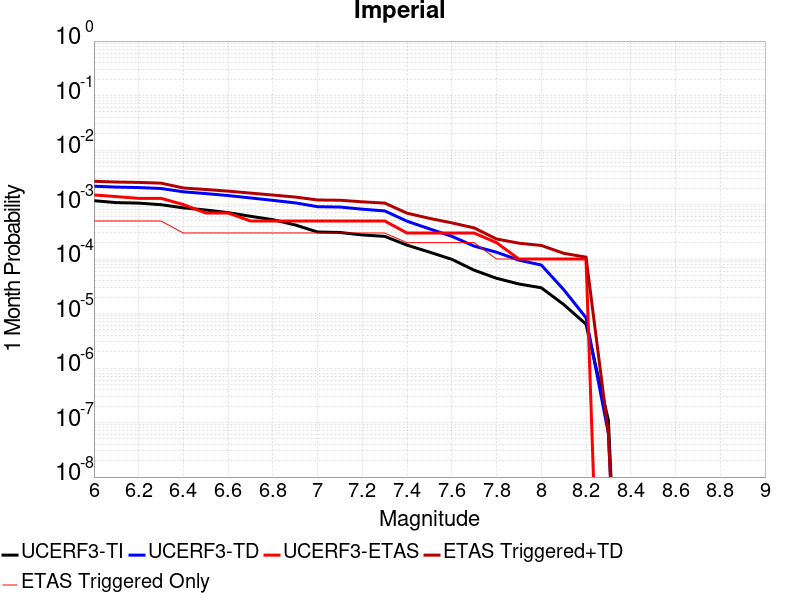 |  |  |

| Magnitude | 1 wk TI Prob | 1 wk TD Prob | 1 wk ETAS Prob | 1 wk ETAS/TD Gain | 1 wk ETAS Triggered+TD | 1 wk ETAS Triggered Only | 1 mo TI Prob | 1 mo TD Prob | 1 mo ETAS Prob | 1 mo ETAS/TD Gain | 1 mo ETAS Triggered+TD | 1 mo ETAS Triggered Only | 1 yr TI Prob | 1 yr TD Prob | 1 yr ETAS Prob | 1 yr ETAS/TD Gain | 1 yr ETAS Triggered+TD | 1 yr ETAS Triggered Only | 10 yr TI Prob | 10 yr TD Prob | 10 yr ETAS Prob | 10 yr ETAS/TD Gain | 10 yr ETAS Triggered+TD | 10 yr ETAS Triggered Only |
|-----|-----|-----|-----|-----|-----|-----|-----|-----|-----|-----|-----|-----|-----|-----|-----|-----|-----|-----|-----|-----|-----|-----|-----|-----|
| 6.0 | 2.7496446E-4 | 5.0308515E-4 | 3.0E-4 | 0.5963205 | 6.0303486E-4 | 1.0E-4 | 0.0011778869 | 0.0021543368 | 0.0015 | 0.69627 | 0.0026532596 | 5.0E-4 | 0.0142467655 | 0.02590124 | 0.0133 | 0.51348895 | 0.030479504 | 0.0047 | 0.13367249 | 0.22725955 | 0.1467 | 0.6455174 | 0.25886464 | 0.0409 |
| 6.1 | 2.5356023E-4 | 4.8455226E-4 | 3.0E-4 | 0.6191282 | 5.845038E-4 | 1.0E-4 | 0.001086234 | 0.002075038 | 0.0014 | 0.67468643 | 0.0025740005 | 5.0E-4 | 0.013144928 | 0.02496432 | 0.0126 | 0.50472033 | 0.029351981 | 0.0045 | 0.123940155 | 0.21882914 | 0.1396 | 0.63794065 | 0.24851362 | 0.038 |
| 6.2 | 2.4820742E-4 | 4.7555735E-4 | 2.0E-4 | 0.42055917 | 5.755098E-4 | 1.0E-4 | 0.0010633124 | 0.0020365487 | 0.0013 | 0.6383349 | 0.0025355304 | 5.0E-4 | 0.01286919 | 0.024506925 | 0.0121 | 0.49373803 | 0.028701544 | 0.0043 | 0.12148927 | 0.21534587 | 0.1362 | 0.6324709 | 0.2436719 | 0.0361 |
| 6.3 | 2.3205351E-4 | 4.572534E-4 | 2.0E-4 | 0.43739426 | 5.572077E-4 | 1.0E-4 | 9.94136E-4 | 0.0019582224 | 0.0013 | 0.6638674 | 0.0024572432 | 5.0E-4 | 0.012036599 | 0.023569172 | 0.0117 | 0.49641117 | 0.02767018 | 0.0042 | 0.11405133 | 0.20736982 | 0.1308 | 0.6307572 | 0.2343985 | 0.0341 |
| 6.4 | 2.0304754E-4 | 3.9717823E-4 | 2.0E-4 | 0.50355226 | 4.971385E-4 | 1.0E-4 | 8.6991355E-4 | 0.0017010964 | 0.001 | 0.5878562 | 0.0020005861 | 3.0E-4 | 0.010539869 | 0.020507334 | 0.0102 | 0.49738303 | 0.02403351 | 0.0036 | 0.100537635 | 0.18450408 | 0.1137 | 0.6162466 | 0.20782726 | 0.0286 |
| 6.5 | 1.854992E-4 | 3.684604E-4 | 1.0E-4 | 0.2713996 | 4.6842356E-4 | 1.0E-4 | 7.9475436E-4 | 0.0015781726 | 7.0E-4 | 0.443551 | 0.001877699 | 3.0E-4 | 0.009633281 | 0.019041441 | 0.0092 | 0.4831567 | 0.0223767 | 0.0034 | 0.0922623 | 0.17277978 | 0.1056 | 0.61118263 | 0.19470112 | 0.0265 |
| 6.6 | 1.6586106E-4 | 3.3913355E-4 | 1.0E-4 | 0.2948691 | 4.3909962E-4 | 1.0E-4 | 7.106394E-4 | 0.0014526299 | 7.0E-4 | 0.48188463 | 0.0017521941 | 3.0E-4 | 0.008617763 | 0.01754584 | 0.009 | 0.51294214 | 0.020886183 | 0.0034 | 0.08291132 | 0.16032182 | 0.0981 | 0.61189425 | 0.18064204 | 0.0242 |
| 6.7 | 1.4224656E-4 | 3.067023E-4 | 1.0E-4 | 0.3260491 | 4.0667164E-4 | 1.0E-4 | 6.094856E-4 | 0.0013137844 | 5.0E-4 | 0.38057998 | 0.0016133902 | 3.0E-4 | 0.0073952693 | 0.01587948 | 0.0081 | 0.51009226 | 0.018733429 | 0.0029 | 0.07153955 | 0.14611313 | 0.0894 | 0.6118547 | 0.16464248 | 0.0217 |
| 6.8 | 1.2317259E-4 | 2.772348E-4 | 1.0E-4 | 0.36070508 | 3.7720706E-4 | 1.0E-4 | 5.2777573E-4 | 0.0011876142 | 5.0E-4 | 0.42101213 | 0.0014872579 | 3.0E-4 | 0.0064067547 | 0.01436471 | 0.0067 | 0.46642083 | 0.016730234 | 0.0024 | 0.06225166 | 0.13266233 | 0.0803 | 0.6052962 | 0.14888154 | 0.0187 |
| 6.9 | 9.859898E-5 | 2.4983735E-4 | 1.0E-4 | 0.40026042 | 3.4981236E-4 | 1.0E-4 | 4.2249862E-4 | 0.0010702964 | 5.0E-4 | 0.4671603 | 0.0013699753 | 3.0E-4 | 0.0051317946 | 0.012953959 | 0.0063 | 0.48633778 | 0.015224165 | 0.0023 | 0.05014893 | 0.11928018 | 0.0729 | 0.61116606 | 0.13390014 | 0.0166 |
| 7.0 | 7.3191884E-5 | 2.1261195E-4 | 1.0E-4 | 0.47034043 | 3.125907E-4 | 1.0E-4 | 3.136418E-4 | 9.108791E-4 | 5.0E-4 | 0.5489203 | 0.0012106058 | 3.0E-4 | 0.003811904 | 0.0110342465 | 0.005 | 0.45313472 | 0.012814385 | 0.0018 | 0.037471764 | 0.102043614 | 0.0616 | 0.60366344 | 0.11443541 | 0.0138 |
| 7.1 | 7.1760296E-5 | 2.0963328E-4 | 1.0E-4 | 0.47702348 | 3.096123E-4 | 1.0E-4 | 3.0750787E-4 | 8.9812215E-4 | 5.0E-4 | 0.55671716 | 0.0011978528 | 3.0E-4 | 0.003737482 | 0.010880493 | 0.005 | 0.45953804 | 0.012660908 | 0.0018 | 0.03675245 | 0.1006833 | 0.0612 | 0.60784656 | 0.11300394 | 0.0137 |
| 7.2 | 6.46614E-5 | 1.9133263E-4 | 1.0E-4 | 0.52265 | 2.913135E-4 | 1.0E-4 | 2.7709085E-4 | 8.1974233E-4 | 5.0E-4 | 0.60994774 | 0.0011194964 | 3.0E-4 | 0.0033683628 | 0.009935312 | 0.0047 | 0.47306013 | 0.011420409 | 0.0015 | 0.033177625 | 0.09249613 | 0.0545 | 0.58921385 | 0.10329542 | 0.0119 |
| 7.3 | 6.088115E-5 | 1.7806026E-4 | 1.0E-4 | 0.5616076 | 2.7804245E-4 | 1.0E-4 | 2.6089314E-4 | 7.628951E-4 | 5.0E-4 | 0.6553981 | 0.0010626662 | 3.0E-4 | 0.0031717476 | 0.009249266 | 0.0042 | 0.4540901 | 0.010735392 | 0.0015 | 0.031268585 | 0.0865506 | 0.05 | 0.57769674 | 0.09678123 | 0.0112 |
| 7.4 | 4.199346E-5 | 1.15127004E-4 | 1.0E-4 | 0.8686059 | 2.1511549E-4 | 1.0E-4 | 1.7995955E-4 | 4.9330905E-4 | 3.0E-4 | 0.6081381 | 6.9321034E-4 | 2.0E-4 | 0.0021888057 | 0.0059896666 | 0.0032 | 0.5342534 | 0.0072818804 | 0.0013 | 0.02167372 | 0.05745071 | 0.0329 | 0.5726648 | 0.06470834 | 0.0077 |
| 7.5 | 3.130448E-5 | 8.338533E-5 | 1.0E-4 | 1.1992518 | 1.83377E-4 | 1.0E-4 | 1.3415517E-4 | 3.5731704E-4 | 3.0E-4 | 0.8395905 | 5.5724557E-4 | 2.0E-4 | 0.0016321153 | 0.004341717 | 0.002 | 0.46064726 | 0.0051382435 | 8.0E-4 | 0.016201803 | 0.042153154 | 0.0234 | 0.5551186 | 0.047133956 | 0.0052 |
| 7.6 | 2.3074248E-5 | 6.090974E-5 | 1.0E-4 | 1.6417736 | 1.6090366E-4 | 1.0E-4 | 9.888588E-5 | 2.6101575E-4 | 3.0E-4 | 1.1493559 | 4.6096355E-4 | 2.0E-4 | 0.0012032706 | 0.003173259 | 0.0015 | 0.47270012 | 0.0038710379 | 7.0E-4 | 0.011967761 | 0.031053554 | 0.0173 | 0.5571021 | 0.03473555 | 0.0038 |
| 7.7 | 1.45864815E-5 | 4.019811E-5 | 1.0E-4 | 2.4876792 | 1.401941E-4 | 1.0E-4 | 6.2511994E-5 | 1.7226627E-4 | 3.0E-4 | 1.7414901 | 3.7223182E-4 | 2.0E-4 | 7.608177E-4 | 0.0020953298 | 0.0011 | 0.524977 | 0.0025942822 | 5.0E-4 | 0.007582182 | 0.020660019 | 0.011 | 0.53242934 | 0.023010435 | 0.0024 |
| 7.8 | 1.0352979E-5 | 3.1034884E-5 | 1.0E-4 | 3.2221808 | 1.3103177E-4 | 1.0E-4 | 4.4369157E-5 | 1.3299988E-4 | 2.0E-4 | 1.5037608 | 2.3298657E-4 | 1.0E-4 | 5.400606E-4 | 0.0016180731 | 9.0E-4 | 0.55621713 | 0.0020174258 | 4.0E-4 | 0.0053875 | 0.016049923 | 0.0088 | 0.54828924 | 0.017919429 | 0.0019 |
| 7.9 | 8.137906E-6 | 2.220761E-5 | 1.0E-4 | 4.5029607 | 1.2220538E-4 | 1.0E-4 | 3.4876273E-5 | 9.517201E-5 | 1.0E-4 | 1.0507292 | 1.9516249E-4 | 1.0E-4 | 4.2453592E-4 | 0.0011581043 | 8.0E-4 | 0.6907841 | 0.001557641 | 4.0E-4 | 0.004237258 | 0.011644873 | 0.0063 | 0.5410107 | 0.013423911 | 0.0018 |
| 8.0 | 6.93792E-6 | 1.8056355E-5 | 1.0E-4 | 5.538216 | 1.1805455E-4 | 1.0E-4 | 2.9733603E-5 | 7.738209E-5 | 1.0E-4 | 1.2922887 | 1.7737436E-4 | 1.0E-4 | 3.6194647E-4 | 9.417205E-4 | 7.0E-4 | 0.74332035 | 0.0013413437 | 4.0E-4 | 0.0036135751 | 0.009523678 | 0.0048 | 0.504007 | 0.010811297 | 0.0013 |
| 8.1 | 3.4286315E-6 | 6.3928323E-6 | 1.0E-4 | 15.642519 | 1.06392195E-4 | 1.0E-4 | 1.4694053E-5 | 2.7397566E-5 | 1.0E-4 | 3.6499593 | 1.2739483E-4 | 1.0E-4 | 1.7888541E-4 | 3.3351444E-4 | 3.0E-4 | 0.89951134 | 5.334477E-4 | 2.0E-4 | 0.0017874148 | 0.003492634 | 0.0015 | 0.4294753 | 0.0040905382 | 6.0E-4 |
| 8.2 | 1.4906886E-6 | 1.9398237E-6 | 1.0E-4 | 51.55107 | 1.0193963E-4 | 1.0E-4 | 6.3886496E-6 | 8.313505E-6 | 1.0E-4 | 12.028622 | 1.0831267E-4 | 1.0E-4 | 7.7779034E-5 | 1.01212245E-4 | 1.0E-4 | 0.98802274 | 2.0120213E-4 | 1.0E-4 | 7.775182E-4 | 0.0011091309 | 4.0E-4 | 0.36064273 | 0.001308909 | 2.0E-4 |
| 8.3 | 2.5758007E-8 | 1.4516197E-8 | 0.0 | 0.0 | 1.4516197E-8 | 0.0 | 1.10391454E-7 | 6.221227E-8 | 0.0 | 0.0 | 6.221227E-8 | 0.0 | 1.3440151E-6 | 7.574344E-7 | 0.0 | 0.0 | 7.574344E-7 | 0.0 | 1.344007E-5 | 7.896028E-6 | 0.0 | 0.0 | 7.896028E-6 | 0.0 |

## Brawley (Seismic Zone) alt 1
*[(top)](#table-of-contents)*

| 1 Week | 1 Month | 1 Year | 10 Year |
|-----|-----|-----|-----|
|  |  |  |  |

| Magnitude | 1 wk TI Prob | 1 wk TD Prob | 1 wk ETAS Prob | 1 wk ETAS/TD Gain | 1 wk ETAS Triggered+TD | 1 wk ETAS Triggered Only | 1 mo TI Prob | 1 mo TD Prob | 1 mo ETAS Prob | 1 mo ETAS/TD Gain | 1 mo ETAS Triggered+TD | 1 mo ETAS Triggered Only | 1 yr TI Prob | 1 yr TD Prob | 1 yr ETAS Prob | 1 yr ETAS/TD Gain | 1 yr ETAS Triggered+TD | 1 yr ETAS Triggered Only | 10 yr TI Prob | 10 yr TD Prob | 10 yr ETAS Prob | 10 yr ETAS/TD Gain | 10 yr ETAS Triggered+TD | 10 yr ETAS Triggered Only |
|-----|-----|-----|-----|-----|-----|-----|-----|-----|-----|-----|-----|-----|-----|-----|-----|-----|-----|-----|-----|-----|-----|-----|-----|-----|
| 6.0 | 2.2521618E-4 | 4.750382E-4 | 4.0E-4 | 0.84203756 | 5.749907E-4 | 1.0E-4 | 9.6485513E-4 | 0.0020343263 | 0.0017 | 0.8356574 | 0.0025333092 | 5.0E-4 | 0.011683988 | 0.02447872 | 0.015 | 0.6127771 | 0.029161224 | 0.0048 | 0.11088423 | 0.21307302 | 0.1548 | 0.72651154 | 0.2444714 | 0.0399 |
| 6.1 | 2.2521618E-4 | 4.750382E-4 | 3.0E-4 | 0.6315282 | 5.749907E-4 | 1.0E-4 | 9.6485513E-4 | 0.0020343263 | 0.0014 | 0.6881885 | 0.0025333092 | 5.0E-4 | 0.011683988 | 0.02447872 | 0.0122 | 0.49839205 | 0.028673463 | 0.0043 | 0.11088423 | 0.21307302 | 0.1353 | 0.6349936 | 0.24108762 | 0.0356 |
| 6.2 | 2.198148E-4 | 4.6593507E-4 | 2.0E-4 | 0.42924437 | 5.658885E-4 | 1.0E-4 | 9.417233E-4 | 0.0019953728 | 0.0013 | 0.6515073 | 0.0024943752 | 5.0E-4 | 0.011405343 | 0.02401559 | 0.0117 | 0.48718354 | 0.028017126 | 0.0041 | 0.10837428 | 0.20952168 | 0.1318 | 0.62905186 | 0.2361608 | 0.0337 |
| 6.3 | 2.1704129E-4 | 4.6029498E-4 | 2.0E-4 | 0.43450397 | 5.6024897E-4 | 1.0E-4 | 9.298453E-4 | 0.0019712378 | 0.0013 | 0.6594841 | 0.002470252 | 5.0E-4 | 0.011262234 | 0.023728633 | 0.0117 | 0.4930752 | 0.027731346 | 0.0041 | 0.107082725 | 0.20741256 | 0.1306 | 0.629663 | 0.23388498 | 0.0334 |
| 6.4 | 1.876142E-4 | 3.9928066E-4 | 2.0E-4 | 0.5009008 | 4.992407E-4 | 1.0E-4 | 8.038131E-4 | 0.0017100949 | 0.001 | 0.5847629 | 0.0020095818 | 3.0E-4 | 0.00974259 | 0.020619275 | 0.0102 | 0.49468276 | 0.024047107 | 0.0035 | 0.093263686 | 0.18416926 | 0.1135 | 0.6162809 | 0.20693094 | 0.0279 |
| 6.5 | 1.7390939E-4 | 3.73673E-4 | 1.0E-4 | 0.26761365 | 4.7363565E-4 | 1.0E-4 | 7.45113E-4 | 0.001600485 | 7.0E-4 | 0.43736744 | 0.0019000048 | 3.0E-4 | 0.009034078 | 0.0193111 | 0.0093 | 0.4815883 | 0.022547374 | 0.0033 | 0.086755216 | 0.17400762 | 0.1064 | 0.6114674 | 0.19540083 | 0.0259 |
| 6.6 | 1.591791E-4 | 3.479232E-4 | 1.0E-4 | 0.28741977 | 4.478884E-4 | 1.0E-4 | 6.8201777E-4 | 0.0014902573 | 7.0E-4 | 0.46971756 | 0.0017898103 | 3.0E-4 | 0.008271996 | 0.017994352 | 0.0091 | 0.50571424 | 0.02123497 | 0.0033 | 0.07970774 | 0.16344234 | 0.0997 | 0.610001 | 0.18360339 | 0.0241 |
| 6.7 | 1.4268003E-4 | 3.196884E-4 | 1.0E-4 | 0.31280458 | 4.1965643E-4 | 1.0E-4 | 6.1134255E-4 | 0.0013693819 | 5.0E-4 | 0.36512825 | 0.001668971 | 3.0E-4 | 0.007417723 | 0.0165463 | 0.0083 | 0.50162274 | 0.019398315 | 0.0029 | 0.07174956 | 0.15159906 | 0.0925 | 0.6101621 | 0.17034872 | 0.0221 |
| 6.8 | 1.239713E-4 | 2.899261E-4 | 1.0E-4 | 0.34491548 | 3.8989712E-4 | 1.0E-4 | 5.3119735E-4 | 0.0012419549 | 5.0E-4 | 0.4025911 | 0.0015415823 | 3.0E-4 | 0.0064481674 | 0.015017381 | 0.0069 | 0.4594676 | 0.01738134 | 0.0024 | 0.06264243 | 0.13813664 | 0.0833 | 0.6030261 | 0.15459824 | 0.0191 |
| 6.9 | 1.0180238E-4 | 2.6227604E-4 | 1.0E-4 | 0.38127768 | 3.6224982E-4 | 1.0E-4 | 4.3622297E-4 | 0.0011235601 | 5.0E-4 | 0.445014 | 0.0014232231 | 3.0E-4 | 0.005298089 | 0.013594542 | 0.0065 | 0.47813308 | 0.015863273 | 0.0023 | 0.05173543 | 0.1248521 | 0.0758 | 0.6071183 | 0.13981713 | 0.0171 |
| 7.0 | 7.6619996E-5 | 2.23971E-4 | 1.0E-4 | 0.44648635 | 3.239486E-4 | 1.0E-4 | 3.283301E-4 | 9.595258E-4 | 5.0E-4 | 0.52109075 | 0.001259238 | 3.0E-4 | 0.0039900932 | 0.0116203595 | 0.0052 | 0.44749045 | 0.013399444 | 0.0018 | 0.039192066 | 0.1072594 | 0.0645 | 0.6013459 | 0.12002559 | 0.0143 |
| 7.1 | 7.5127435E-5 | 2.2081027E-4 | 1.0E-4 | 0.4528775 | 3.2078818E-4 | 1.0E-4 | 3.2193496E-4 | 9.459896E-4 | 5.0E-4 | 0.528547 | 0.0012457059 | 3.0E-4 | 0.0039125155 | 0.011457302 | 0.0052 | 0.45385903 | 0.013236678 | 0.0018 | 0.038443442 | 0.10582652 | 0.064 | 0.6047633 | 0.118523784 | 0.0142 |
| 7.2 | 6.788582E-5 | 2.0210134E-4 | 1.0E-4 | 0.49480128 | 3.020811E-4 | 1.0E-4 | 2.9090676E-4 | 8.6586404E-4 | 5.0E-4 | 0.57745785 | 0.0011656043 | 3.0E-4 | 0.0035360386 | 0.010491578 | 0.0049 | 0.46704125 | 0.011975841 | 0.0015 | 0.034803 | 0.09750234 | 0.0571 | 0.58562696 | 0.10869331 | 0.0124 |
| 7.3 | 6.399602E-5 | 1.8842099E-4 | 1.0E-4 | 0.53072643 | 2.8840214E-4 | 1.0E-4 | 2.7423984E-4 | 8.072715E-4 | 5.0E-4 | 0.6193703 | 0.0011070293 | 3.0E-4 | 0.0033337586 | 0.009784827 | 0.0043 | 0.4394559 | 0.011270151 | 0.0015 | 0.03284188 | 0.0914007 | 0.0525 | 0.57439387 | 0.10203131 | 0.0117 |
| 7.4 | 4.506759E-5 | 1.2534867E-4 | 1.0E-4 | 0.7977747 | 2.2533615E-4 | 1.0E-4 | 1.9313251E-4 | 5.3709885E-4 | 3.0E-4 | 0.5585564 | 7.3699147E-4 | 2.0E-4 | 0.0023488526 | 0.006519747 | 0.0033 | 0.50615466 | 0.007811271 | 0.0013 | 0.023241805 | 0.062388737 | 0.0353 | 0.5658072 | 0.07007715 | 0.0082 |
| 7.5 | 3.43289E-5 | 9.343974E-5 | 1.0E-4 | 1.0702084 | 1.9343039E-4 | 1.0E-4 | 1.4711556E-4 | 4.0039487E-4 | 3.0E-4 | 0.74926037 | 6.003148E-4 | 2.0E-4 | 0.0017896603 | 0.0048639737 | 0.0021 | 0.43174577 | 0.005660082 | 8.0E-4 | 0.01775316 | 0.04709058 | 0.0258 | 0.5478803 | 0.052522164 | 0.0057 |
| 7.6 | 2.5980507E-5 | 7.06289E-5 | 1.0E-4 | 1.415851 | 1.7062185E-4 | 1.0E-4 | 1.1134028E-4 | 3.026603E-4 | 3.0E-4 | 0.9912102 | 5.0259975E-4 | 2.0E-4 | 0.001354725 | 0.0036786874 | 0.0016 | 0.43493775 | 0.004376112 | 7.0E-4 | 0.013464959 | 0.03588224 | 0.0198 | 0.551805 | 0.040027946 | 0.0043 |
| 7.7 | 1.7292105E-5 | 4.9513106E-5 | 1.0E-4 | 2.0196674 | 1.4950815E-4 | 1.0E-4 | 7.4106916E-5 | 2.121818E-4 | 3.0E-4 | 1.4138819 | 4.1213937E-4 | 2.0E-4 | 9.018782E-4 | 0.0025802588 | 0.0012 | 0.46506965 | 0.0030789685 | 5.0E-4 | 0.008982267 | 0.02533684 | 0.0132 | 0.52098054 | 0.028163362 | 0.0029 |
| 7.8 | 1.2927471E-5 | 3.979827E-5 | 1.0E-4 | 2.5126722 | 1.3979428E-4 | 1.0E-4 | 5.5402274E-5 | 1.7055287E-4 | 2.0E-4 | 1.1726569 | 2.7053582E-4 | 1.0E-4 | 6.743139E-4 | 0.0020745061 | 0.001 | 0.48204243 | 0.0024736763 | 4.0E-4 | 0.0067227143 | 0.020478463 | 0.0106 | 0.5176169 | 0.022633411 | 0.0022 |
| 7.9 | 1.0200774E-5 | 2.8828552E-5 | 1.0E-4 | 3.4687834 | 1.2882568E-4 | 1.0E-4 | 4.371687E-5 | 1.2354509E-4 | 1.0E-4 | 0.80942106 | 2.2353274E-4 | 1.0E-4 | 5.321229E-4 | 0.0015031247 | 8.0E-4 | 0.5322246 | 0.0019025235 | 4.0E-4 | 0.005308505 | 0.015029486 | 0.0073 | 0.48571187 | 0.01690093 | 0.0019 |
| 8.0 | 8.650396E-6 | 2.334436E-5 | 1.0E-4 | 4.28369 | 1.2334203E-4 | 1.0E-4 | 3.70726E-5 | 1.0004343E-4 | 1.0E-4 | 0.9995659 | 2.0003342E-4 | 1.0E-4 | 4.5126543E-4 | 0.001217349 | 7.0E-4 | 0.57501996 | 0.001616862 | 4.0E-4 | 0.0045035016 | 0.012241943 | 0.0056 | 0.4574437 | 0.013526028 | 0.0013 |
| 8.1 | 3.9368224E-6 | 7.3442234E-6 | 1.0E-4 | 13.616144 | 1.0734349E-4 | 1.0E-4 | 1.6871985E-5 | 3.1474865E-5 | 1.0E-4 | 3.1771386 | 1.3147172E-4 | 1.0E-4 | 2.0539707E-4 | 3.831392E-4 | 3.0E-4 | 0.78300524 | 5.830626E-4 | 2.0E-4 | 0.0020520731 | 0.004009425 | 0.0016 | 0.39905968 | 0.0046070195 | 6.0E-4 |
| 8.2 | 1.7101195E-6 | 2.2220747E-6 | 1.0E-4 | 45.002987 | 1.0222185E-4 | 1.0E-4 | 7.329063E-6 | 9.5231435E-6 | 1.0E-4 | 10.500734 | 1.0952219E-4 | 1.0E-4 | 8.922769E-5 | 1.1593813E-4 | 1.0E-4 | 0.862529 | 2.1592654E-4 | 1.0E-4 | 8.9191867E-4 | 0.0012688163 | 4.0E-4 | 0.31525448 | 0.0014685625 | 2.0E-4 |
| 8.3 | 3.0346666E-8 | 1.7239671E-8 | 0.0 | 0.0 | 1.7239671E-8 | 0.0 | 1.3005713E-7 | 7.38843E-8 | 0.0 | 0.0 | 7.38843E-8 | 0.0 | 1.5834444E-6 | 8.9954125E-7 | 0.0 | 0.0 | 8.9954125E-7 | 0.0 | 1.5834332E-5 | 9.379855E-6 | 0.0 | 0.0 | 9.379855E-6 | 0.0 |

## Tank Canyon
*[(top)](#table-of-contents)*

| 1 Week | 1 Month | 1 Year | 10 Year |
|-----|-----|-----|-----|
| 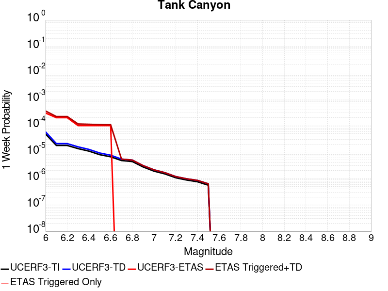 | 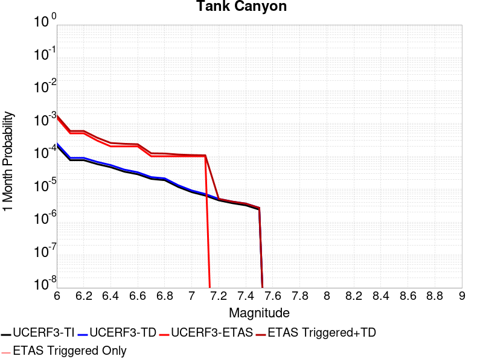 |  | 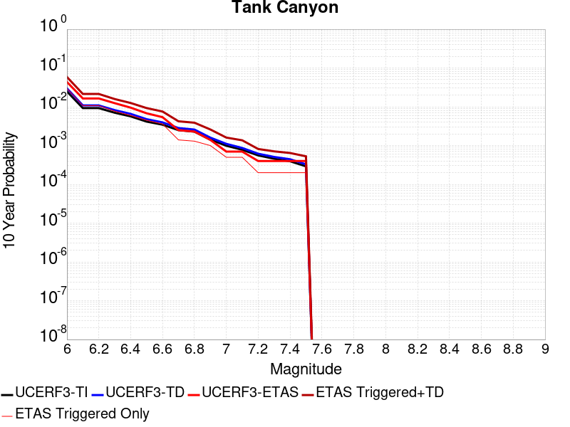 |

| Magnitude | 1 wk TI Prob | 1 wk TD Prob | 1 wk ETAS Prob | 1 wk ETAS/TD Gain | 1 wk ETAS Triggered+TD | 1 wk ETAS Triggered Only | 1 mo TI Prob | 1 mo TD Prob | 1 mo ETAS Prob | 1 mo ETAS/TD Gain | 1 mo ETAS Triggered+TD | 1 mo ETAS Triggered Only | 1 yr TI Prob | 1 yr TD Prob | 1 yr ETAS Prob | 1 yr ETAS/TD Gain | 1 yr ETAS Triggered+TD | 1 yr ETAS Triggered Only | 10 yr TI Prob | 10 yr TD Prob | 10 yr ETAS Prob | 10 yr ETAS/TD Gain | 10 yr ETAS Triggered+TD | 10 yr ETAS Triggered Only |
|-----|-----|-----|-----|-----|-----|-----|-----|-----|-----|-----|-----|-----|-----|-----|-----|-----|-----|-----|-----|-----|-----|-----|-----|-----|
| 6.0 | 4.8284557E-5 | 5.7987254E-5 | 3.0E-4 | 5.1735506 | 3.5796987E-4 | 3.0E-4 | 2.0691741E-4 | 2.4849697E-4 | 0.0015 | 6.036291 | 0.0017481243 | 0.0015 | 0.0025163088 | 0.0030219224 | 0.012 | 3.9709823 | 0.013290796 | 0.0103 | 0.02488006 | 0.029875208 | 0.0437 | 1.4627514 | 0.0585909 | 0.0296 |
| 6.1 | 1.7796336E-5 | 2.0880292E-5 | 2.0E-4 | 9.57841 | 2.2087611E-4 | 2.0E-4 | 7.626778E-5 | 8.948412E-5 | 5.0E-4 | 5.5875835 | 5.8943935E-4 | 5.0E-4 | 9.281647E-4 | 0.001088963 | 0.0043 | 3.948711 | 0.0045851516 | 0.0035 | 0.009242975 | 0.010840205 | 0.0164 | 1.5128865 | 0.021424215 | 0.0107 |
| 6.2 | 1.7796336E-5 | 2.0880292E-5 | 2.0E-4 | 9.57841 | 2.2087611E-4 | 2.0E-4 | 7.626778E-5 | 8.948412E-5 | 5.0E-4 | 5.5875835 | 5.8943935E-4 | 5.0E-4 | 9.281647E-4 | 0.001088963 | 0.0043 | 3.948711 | 0.0045851516 | 0.0035 | 0.009242975 | 0.010840205 | 0.0164 | 1.5128865 | 0.021424215 | 0.0107 |
| 6.3 | 1.3515912E-5 | 1.5764594E-5 | 1.0E-4 | 6.343329 | 1.1576302E-4 | 1.0E-4 | 5.792405E-5 | 6.7560926E-5 | 3.0E-4 | 4.4404364 | 3.6754066E-4 | 3.0E-4 | 7.049971E-4 | 8.222676E-4 | 0.0033 | 4.013292 | 0.0034201297 | 0.0026 | 0.007027647 | 0.008194706 | 0.0124 | 1.5131719 | 0.015831606 | 0.0077 |
| 6.4 | 1.0870146E-5 | 1.2621889E-5 | 1.0E-4 | 7.9227443 | 1.12620626E-4 | 1.0E-4 | 4.658551E-5 | 5.4092787E-5 | 2.0E-4 | 3.6973505 | 2.5408197E-4 | 2.0E-4 | 5.67031E-4 | 6.5839844E-4 | 0.0025 | 3.797093 | 0.0025571475 | 0.0019 | 0.005655863 | 0.00656633 | 0.0095 | 1.4467747 | 0.012526932 | 0.006 |
| 6.5 | 7.964826E-6 | 9.1987595E-6 | 1.0E-4 | 10.871031 | 1.0919784E-4 | 1.0E-4 | 3.4134522E-5 | 3.9422717E-5 | 2.0E-4 | 5.073217 | 2.3941483E-4 | 2.0E-4 | 4.1550855E-4 | 4.7987647E-4 | 0.0018 | 3.750965 | 0.0019791566 | 0.0015 | 0.0041473247 | 0.0047895485 | 0.0068 | 1.419758 | 0.009267996 | 0.0045 |
| 6.6 | 6.6317E-6 | 7.6143924E-6 | 1.0E-4 | 13.133024 | 1.0761363E-4 | 1.0E-4 | 2.8421264E-5 | 3.2632754E-5 | 2.0E-4 | 6.1288114 | 2.3262623E-4 | 2.0E-4 | 3.4597394E-4 | 3.9724045E-4 | 0.0015 | 3.7760506 | 0.001696724 | 0.0013 | 0.0034543579 | 0.0039663003 | 0.0054 | 1.3614703 | 0.0075520216 | 0.0036 |
| 6.7 | 4.793663E-6 | 5.4321117E-6 | 0.0 | 0.0 | 5.4321117E-6 | 0.0 | 2.0544108E-5 | 2.3280296E-5 | 1.0E-4 | 4.295478 | 1.2327796E-4 | 1.0E-4 | 2.500958E-4 | 2.8340513E-4 | 5.0E-4 | 1.7642589 | 7.832634E-4 | 5.0E-4 | 0.0024981452 | 0.002830972 | 0.0025 | 0.8830889 | 0.0042270087 | 0.0014 |
| 6.8 | 4.382823E-6 | 4.970436E-6 | 0.0 | 0.0 | 4.970436E-6 | 0.0 | 1.8783392E-5 | 2.1301717E-5 | 1.0E-4 | 4.694457 | 1.21299585E-4 | 1.0E-4 | 2.286638E-4 | 2.5932182E-4 | 4.0E-4 | 1.5424849 | 6.592181E-4 | 4.0E-4 | 0.0022842865 | 0.002590703 | 0.0023 | 0.88778985 | 0.0038873353 | 0.0013 |
| 6.9 | 2.729601E-6 | 3.0742299E-6 | 0.0 | 0.0 | 3.0742299E-6 | 0.0 | 1.1698237E-5 | 1.3175211E-5 | 1.0E-4 | 7.5900106 | 1.131739E-4 | 1.0E-4 | 1.4241673E-4 | 1.6039763E-4 | 3.0E-4 | 1.8703519 | 4.603495E-4 | 3.0E-4 | 0.001423255 | 0.001603092 | 0.0014 | 0.87331235 | 0.0026014887 | 0.001 |
| 7.0 | 1.8987357E-6 | 2.1273077E-6 | 0.0 | 0.0 | 2.1273077E-6 | 0.0 | 8.137413E-6 | 9.117005E-6 | 1.0E-4 | 10.968514 | 1.09116096E-4 | 1.0E-4 | 9.90685E-5 | 1.1099458E-4 | 2.0E-4 | 1.8018898 | 3.109724E-4 | 2.0E-4 | 9.902435E-4 | 0.0011094601 | 7.0E-4 | 0.6309375 | 0.0016089054 | 5.0E-4 |
| 7.1 | 1.4928986E-6 | 1.6644209E-6 | 0.0 | 0.0 | 1.6644209E-6 | 0.0 | 6.398121E-6 | 7.133216E-6 | 1.0E-4 | 14.018922 | 1.071325E-4 | 1.0E-4 | 7.789434E-5 | 8.684403E-5 | 2.0E-4 | 2.3029792 | 2.8682666E-4 | 2.0E-4 | 7.786704E-4 | 8.681589E-4 | 7.0E-4 | 0.80630404 | 0.0013677247 | 5.0E-4 |
| 7.2 | 1.069082E-6 | 1.18309E-6 | 0.0 | 0.0 | 1.18309E-6 | 0.0 | 4.581772E-6 | 5.070379E-6 | 0.0 | 0.0 | 5.070379E-6 | 0.0 | 5.5781646E-5 | 6.173065E-5 | 0.0 | 0.0 | 6.173065E-5 | 0.0 | 5.576765E-4 | 6.171873E-4 | 4.0E-4 | 0.6481015 | 8.1706385E-4 | 2.0E-4 |
| 7.3 | 8.776551E-7 | 9.77203E-7 | 0.0 | 0.0 | 9.77203E-7 | 0.0 | 3.7613736E-6 | 4.188009E-6 | 0.0 | 0.0 | 4.188009E-6 | 0.0 | 4.579376E-5 | 5.0988336E-5 | 0.0 | 0.0 | 5.0988336E-5 | 0.0 | 4.5784327E-4 | 5.098174E-4 | 4.0E-4 | 0.78459466 | 7.097155E-4 | 2.0E-4 |
| 7.4 | 7.55721E-7 | 8.51098E-7 | 0.0 | 0.0 | 8.51098E-7 | 0.0 | 3.2388E-6 | 3.6475606E-6 | 0.0 | 0.0 | 3.6475606E-6 | 0.0 | 3.9431678E-5 | 4.440866E-5 | 0.0 | 0.0 | 4.440866E-5 | 0.0 | 3.942468E-4 | 4.4404875E-4 | 4.0E-4 | 0.900802 | 6.439599E-4 | 2.0E-4 |
| 7.5 | 5.587665E-7 | 6.3061736E-7 | 0.0 | 0.0 | 6.3061736E-7 | 0.0 | 2.3947114E-6 | 2.7026458E-6 | 0.0 | 0.0 | 2.7026458E-6 | 0.0 | 2.915522E-5 | 3.2904714E-5 | 0.0 | 0.0 | 3.2904714E-5 | 0.0 | 2.9151395E-4 | 3.2904715E-4 | 4.0E-4 | 1.2156312 | 5.289813E-4 | 2.0E-4 |

## Hayward (So) 2011 CFM
*[(top)](#table-of-contents)*

| 1 Week | 1 Month | 1 Year | 10 Year |
|-----|-----|-----|-----|
| 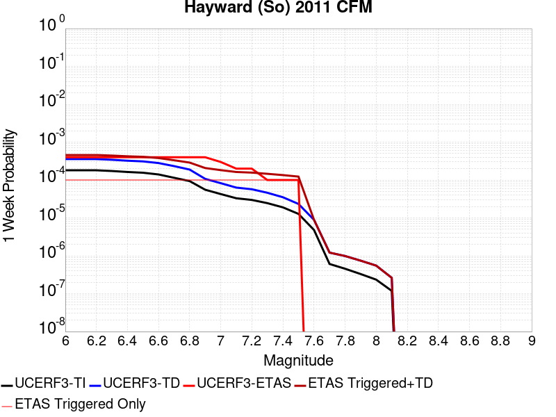 |  |  |  |

| Magnitude | 1 wk TI Prob | 1 wk TD Prob | 1 wk ETAS Prob | 1 wk ETAS/TD Gain | 1 wk ETAS Triggered+TD | 1 wk ETAS Triggered Only | 1 mo TI Prob | 1 mo TD Prob | 1 mo ETAS Prob | 1 mo ETAS/TD Gain | 1 mo ETAS Triggered+TD | 1 mo ETAS Triggered Only | 1 yr TI Prob | 1 yr TD Prob | 1 yr ETAS Prob | 1 yr ETAS/TD Gain | 1 yr ETAS Triggered+TD | 1 yr ETAS Triggered Only | 10 yr TI Prob | 10 yr TD Prob | 10 yr ETAS Prob | 10 yr ETAS/TD Gain | 10 yr ETAS Triggered+TD | 10 yr ETAS Triggered Only |
|-----|-----|-----|-----|-----|-----|-----|-----|-----|-----|-----|-----|-----|-----|-----|-----|-----|-----|-----|-----|-----|-----|-----|-----|-----|
| 6.0 | 1.8091932E-4 | 3.5637422E-4 | 4.0E-4 | 1.1224157 | 4.5633857E-4 | 1.0E-4 | 7.751381E-4 | 0.001526434 | 0.0015 | 0.9826825 | 0.0020256708 | 5.0E-4 | 0.00939654 | 0.018428368 | 0.0124 | 0.67287564 | 0.022550968 | 0.0042 | 0.090090066 | 0.16649885 | 0.1163 | 0.6985033 | 0.19125384 | 0.0297 |
| 6.1 | 1.8091932E-4 | 3.5637422E-4 | 4.0E-4 | 1.1224157 | 4.5633857E-4 | 1.0E-4 | 7.751381E-4 | 0.001526434 | 0.0015 | 0.9826825 | 0.0020256708 | 5.0E-4 | 0.00939654 | 0.018428368 | 0.0124 | 0.67287564 | 0.022550968 | 0.0042 | 0.090090066 | 0.16649885 | 0.1163 | 0.6985033 | 0.19125384 | 0.0297 |
| 6.2 | 1.8091932E-4 | 3.5637422E-4 | 4.0E-4 | 1.1224157 | 4.5633857E-4 | 1.0E-4 | 7.751381E-4 | 0.001526434 | 0.0015 | 0.9826825 | 0.0020256708 | 5.0E-4 | 0.00939654 | 0.018428368 | 0.0124 | 0.67287564 | 0.022550968 | 0.0042 | 0.090090066 | 0.16649885 | 0.1163 | 0.6985033 | 0.19125384 | 0.0297 |
| 6.3 | 1.7322872E-4 | 3.4197042E-4 | 4.0E-4 | 1.1696918 | 4.4193622E-4 | 1.0E-4 | 7.4219756E-4 | 0.0014647739 | 0.0015 | 1.0240488 | 0.0019640415 | 5.0E-4 | 0.0089988755 | 0.017690057 | 0.0116 | 0.65573555 | 0.021422835 | 0.0038 | 0.08643075 | 0.16042204 | 0.1116 | 0.695665 | 0.1841821 | 0.0283 |
| 6.4 | 1.6334097E-4 | 3.228172E-4 | 4.0E-4 | 1.2390914 | 4.227849E-4 | 1.0E-4 | 6.998449E-4 | 0.0013827774 | 0.0013 | 0.94013685 | 0.0016823625 | 3.0E-4 | 0.008487372 | 0.016707357 | 0.0111 | 0.6643779 | 0.020050554 | 0.0034 | 0.081704415 | 0.15233755 | 0.1058 | 0.6945103 | 0.17437677 | 0.026 |
| 6.5 | 1.5600289E-4 | 3.0958976E-4 | 4.0E-4 | 1.2920324 | 4.095588E-4 | 1.0E-4 | 6.684125E-4 | 0.0013261469 | 0.0013 | 0.98028356 | 0.001625749 | 3.0E-4 | 0.008107598 | 0.01602819 | 0.0107 | 0.6675738 | 0.0191769 | 0.0032 | 0.078181036 | 0.14662284 | 0.1015 | 0.69225234 | 0.16727456 | 0.0242 |
| 6.6 | 1.4046066E-4 | 2.7977658E-4 | 4.0E-4 | 1.4297123 | 3.7974858E-4 | 1.0E-4 | 6.018354E-4 | 0.0011984982 | 0.0012 | 1.0012531 | 0.0014981386 | 3.0E-4 | 0.0073027555 | 0.014495581 | 0.0093 | 0.6415748 | 0.017254993 | 0.0028 | 0.07067384 | 0.13372427 | 0.0922 | 0.68947846 | 0.15312885 | 0.0224 |
| 6.7 | 1.14696966E-4 | 2.3223765E-4 | 4.0E-4 | 1.7223736 | 3.3221443E-4 | 1.0E-4 | 4.914658E-4 | 9.949296E-4 | 0.0012 | 1.2061155 | 0.0012946312 | 3.0E-4 | 0.0059671924 | 0.012047048 | 0.0081 | 0.67236394 | 0.014319339 | 0.0023 | 0.058094822 | 0.11258624 | 0.0764 | 0.67859095 | 0.1283822 | 0.0178 |
| 6.8 | 9.3874296E-5 | 1.882577E-4 | 4.0E-4 | 2.124747 | 2.8823887E-4 | 1.0E-4 | 4.0225635E-4 | 8.065729E-4 | 0.0011 | 1.3637948 | 0.001106331 | 3.0E-4 | 0.0048864787 | 0.009776541 | 0.0068 | 0.6955426 | 0.01185601 | 0.0021 | 0.047804173 | 0.09243946 | 0.0615 | 0.6653003 | 0.10532682 | 0.0142 |
| 6.9 | 5.551852E-5 | 1.0711707E-4 | 4.0E-4 | 3.734232 | 2.0710636E-4 | 1.0E-4 | 2.3791482E-4 | 4.5899302E-4 | 7.0E-4 | 1.5250777 | 6.5890123E-4 | 2.0E-4 | 0.0028927654 | 0.005574039 | 0.0044 | 0.7893737 | 0.007065678 | 0.0015 | 0.028553981 | 0.054160826 | 0.0385 | 0.7108458 | 0.061822124 | 0.0081 |
| 7.0 | 4.2662363E-5 | 8.234189E-5 | 3.0E-4 | 3.6433463 | 1.8233365E-4 | 1.0E-4 | 1.8282588E-4 | 3.5284646E-4 | 6.0E-4 | 1.7004564 | 5.5277586E-4 | 2.0E-4 | 0.0022236328 | 0.0042875167 | 0.0037 | 0.8629704 | 0.0053828005 | 0.0011 | 0.022015138 | 0.042008106 | 0.0288 | 0.6855819 | 0.047468662 | 0.0057 |
| 7.1 | 3.305886E-5 | 6.293956E-5 | 2.0E-4 | 3.177652 | 1.6293327E-4 | 1.0E-4 | 1.4167312E-4 | 2.6971317E-4 | 4.0E-4 | 1.483057 | 4.6965922E-4 | 2.0E-4 | 0.0017235056 | 0.0032788322 | 0.0027 | 0.8234639 | 0.004076209 | 8.0E-4 | 0.017101998 | 0.032414988 | 0.0213 | 0.6571034 | 0.035995055 | 0.0037 |
| 7.2 | 2.9856887E-5 | 5.6942805E-5 | 2.0E-4 | 3.5122962 | 1.5693711E-4 | 1.0E-4 | 1.2795182E-4 | 2.4401785E-4 | 4.0E-4 | 1.6392243 | 4.4396904E-4 | 2.0E-4 | 0.0015567001 | 0.0029668866 | 0.0023 | 0.7752234 | 0.0037645132 | 8.0E-4 | 0.015458403 | 0.02941949 | 0.0189 | 0.64243126 | 0.032719463 | 0.0034 |
| 7.3 | 2.4559737E-5 | 4.5942823E-5 | 1.0E-4 | 2.1766186 | 1.4593823E-4 | 1.0E-4 | 1.0525176E-4 | 1.9688303E-4 | 2.0E-4 | 1.0158316 | 3.9684365E-4 | 2.0E-4 | 0.0012806869 | 0.0023944287 | 0.0019 | 0.7935087 | 0.0030927525 | 7.0E-4 | 0.012733313 | 0.023833824 | 0.0158 | 0.6629234 | 0.026859941 | 0.0031 |
| 7.4 | 1.9002231E-5 | 3.5018693E-5 | 1.0E-4 | 2.8556178 | 1.3501519E-4 | 1.0E-4 | 8.143559E-5 | 1.5007153E-4 | 2.0E-4 | 1.3326977 | 3.5004152E-4 | 2.0E-4 | 9.910273E-4 | 0.0018255996 | 0.0019 | 1.040754 | 0.0025243217 | 7.0E-4 | 0.009866194 | 0.018243343 | 0.0117 | 0.6413299 | 0.020697733 | 0.0025 |
| 7.5 | 1.2783333E-5 | 2.331816E-5 | 1.0E-4 | 4.288503 | 1.2331583E-4 | 1.0E-4 | 5.4784563E-5 | 9.9931174E-5 | 2.0E-4 | 2.0013773 | 2.999112E-4 | 2.0E-4 | 6.667979E-4 | 0.0012159888 | 0.0012 | 0.98685116 | 0.0018152592 | 6.0E-4 | 0.006648007 | 0.01220349 | 0.0075 | 0.61457825 | 0.013882745 | 0.0017 |
| 7.6 | 4.8149627E-6 | 8.8884E-6 | 0.0 | 0.0 | 8.8884E-6 | 0.0 | 2.063539E-5 | 3.8092592E-5 | 0.0 | 0.0 | 3.8092592E-5 | 0.0 | 2.5120692E-4 | 4.6367984E-4 | 4.0E-4 | 0.86266416 | 4.6367984E-4 | 0.0 | 0.0025092314 | 0.0046810834 | 0.0022 | 0.46997666 | 0.005079211 | 4.0E-4 |
| 7.7 | 6.0838227E-7 | 1.2071006E-6 | 0.0 | 0.0 | 1.2071006E-6 | 0.0 | 2.6073499E-6 | 5.1732777E-6 | 0.0 | 0.0 | 5.1732777E-6 | 0.0 | 3.174402E-5 | 6.2982836E-5 | 0.0 | 0.0 | 6.2982836E-5 | 0.0 | 3.1739488E-4 | 6.536091E-4 | 1.0E-4 | 0.15299664 | 6.536091E-4 | 0.0 |
| 7.8 | 4.5542808E-7 | 9.811092E-7 | 0.0 | 0.0 | 9.811092E-7 | 0.0 | 1.9518332E-6 | 4.204747E-6 | 0.0 | 0.0 | 4.204747E-6 | 0.0 | 2.376331E-5 | 5.1191593E-5 | 0.0 | 0.0 | 5.1191593E-5 | 0.0 | 2.3760769E-4 | 5.3305447E-4 | 1.0E-4 | 0.1875981 | 5.3305447E-4 | 0.0 |
| 7.9 | 3.3016747E-7 | 7.4056663E-7 | 0.0 | 0.0 | 7.4056663E-7 | 0.0 | 1.4150027E-6 | 3.173853E-6 | 0.0 | 0.0 | 3.173853E-6 | 0.0 | 1.7227521E-5 | 3.8640977E-5 | 0.0 | 0.0 | 3.8640977E-5 | 0.0 | 1.7226185E-4 | 4.0024644E-4 | 1.0E-4 | 0.24984607 | 4.0024644E-4 | 0.0 |
| 8.0 | 2.347038E-7 | 5.4876637E-7 | 0.0 | 0.0 | 5.4876637E-7 | 0.0 | 1.0058731E-6 | 2.3518537E-6 | 0.0 | 0.0 | 2.3518537E-6 | 0.0 | 1.2246436E-5 | 2.8633445E-5 | 0.0 | 0.0 | 2.8633445E-5 | 0.0 | 1.2245761E-4 | 2.9435186E-4 | 1.0E-4 | 0.33972946 | 2.9435186E-4 | 0.0 |
| 8.1 | 1.18822804E-7 | 2.613743E-7 | 0.0 | 0.0 | 2.613743E-7 | 0.0 | 5.092405E-7 | 1.1201752E-6 | 0.0 | 0.0 | 1.1201752E-6 | 0.0 | 6.1999854E-6 | 1.3638048E-5 | 0.0 | 0.0 | 1.3638048E-5 | 0.0 | 6.199812E-5 | 1.3957464E-4 | 0.0 | 0.0 | 1.3957464E-4 | 0.0 |

## Laguna Salada
*[(top)](#table-of-contents)*

| 1 Week | 1 Month | 1 Year | 10 Year |
|-----|-----|-----|-----|
|  |  | 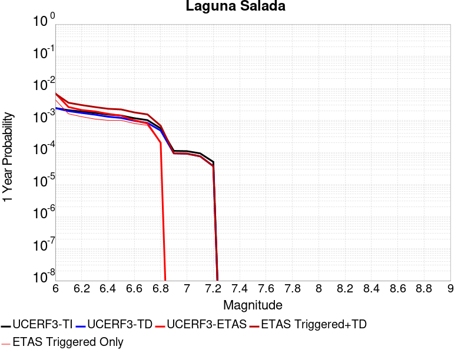 | 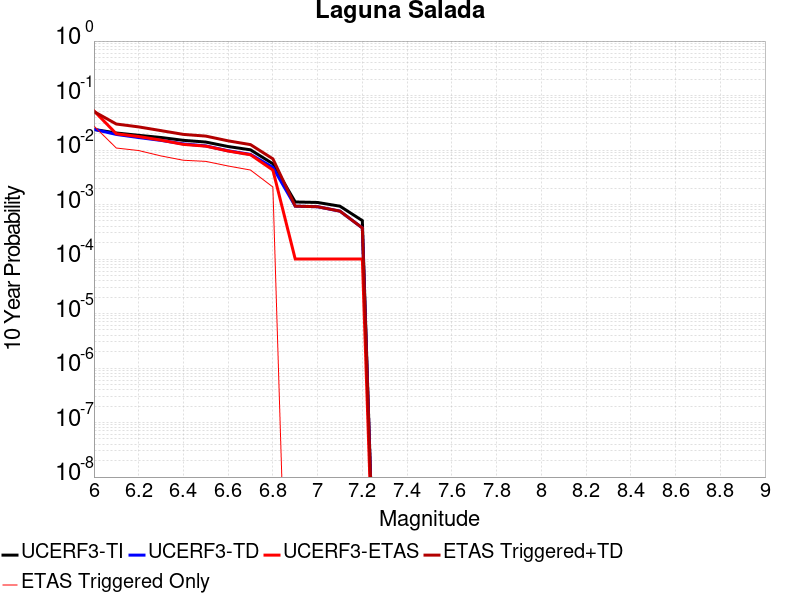 |

| Magnitude | 1 wk TI Prob | 1 wk TD Prob | 1 wk ETAS Prob | 1 wk ETAS/TD Gain | 1 wk ETAS Triggered+TD | 1 wk ETAS Triggered Only | 1 mo TI Prob | 1 mo TD Prob | 1 mo ETAS Prob | 1 mo ETAS/TD Gain | 1 mo ETAS Triggered+TD | 1 mo ETAS Triggered Only | 1 yr TI Prob | 1 yr TD Prob | 1 yr ETAS Prob | 1 yr ETAS/TD Gain | 1 yr ETAS Triggered+TD | 1 yr ETAS Triggered Only | 10 yr TI Prob | 10 yr TD Prob | 10 yr ETAS Prob | 10 yr ETAS/TD Gain | 10 yr ETAS Triggered+TD | 10 yr ETAS Triggered Only |
|-----|-----|-----|-----|-----|-----|-----|-----|-----|-----|-----|-----|-----|-----|-----|-----|-----|-----|-----|-----|-----|-----|-----|-----|-----|
| 6.0 | 4.6465593E-5 | 4.6369365E-5 | 1.0E-4 | 2.1565964 | 4.6369365E-5 | 0.0 | 1.9912305E-4 | 1.987108E-4 | 5.0E-4 | 2.5162196 | 3.9867105E-4 | 2.0E-4 | 0.0024216278 | 0.0024166992 | 0.007 | 2.8965127 | 0.006806066 | 0.0044 | 0.02395408 | 0.023962088 | 0.0525 | 2.190961 | 0.050900735 | 0.0276 |
| 6.1 | 3.982297E-5 | 3.7262707E-5 | 0.0 | 0.0 | 3.7262707E-5 | 0.0 | 1.706587E-4 | 1.5968809E-4 | 1.0E-4 | 0.6262208 | 2.5967212E-4 | 1.0E-4 | 0.0020757897 | 0.0019425648 | 0.0026 | 1.3384366 | 0.0035394568 | 0.0016 | 0.020565065 | 0.019315308 | 0.0199 | 1.0302709 | 0.03000477 | 0.0109 |
| 6.2 | 3.6067784E-5 | 3.261627E-5 | 0.0 | 0.0 | 3.261627E-5 | 0.0 | 1.5456705E-4 | 1.39777E-4 | 1.0E-4 | 0.7154253 | 2.3976302E-4 | 1.0E-4 | 0.0018802295 | 0.0017005508 | 0.0021 | 1.234894 | 0.0029983402 | 0.0013 | 0.018644003 | 0.016926095 | 0.0177 | 1.0457226 | 0.026560219 | 0.0098 |
| 6.3 | 3.2859112E-5 | 2.8860013E-5 | 0.0 | 0.0 | 2.8860013E-5 | 0.0 | 1.4081717E-4 | 1.2368034E-4 | 0.0 | 0.0 | 1.2368034E-4 | 0.0 | 0.0017131006 | 0.0015048609 | 0.0019 | 1.262575 | 0.0026032056 | 0.0011 | 0.016999546 | 0.015011236 | 0.0152 | 1.0125749 | 0.022694148 | 0.0078 |
| 6.4 | 2.9132116E-5 | 2.4860527E-5 | 0.0 | 0.0 | 2.4860527E-5 | 0.0 | 1.2484594E-4 | 1.0654126E-4 | 0.0 | 0.0 | 1.0654126E-4 | 0.0 | 0.0015189396 | 0.0012964567 | 0.0016 | 1.234133 | 0.0022951602 | 0.001 | 0.015085992 | 0.012965323 | 0.0127 | 0.97953594 | 0.019381048 | 0.0065 |
| 6.5 | 2.7075037E-5 | 2.283213E-5 | 0.0 | 0.0 | 2.283213E-5 | 0.0 | 1.1603071E-4 | 9.784881E-5 | 0.0 | 0.0 | 9.784881E-5 | 0.0 | 0.0014117584 | 0.0011907466 | 0.0014 | 1.175733 | 0.002189556 | 0.001 | 0.014028233 | 0.011915851 | 0.0118 | 0.9902776 | 0.018041972 | 0.0062 |
| 6.6 | 2.2367465E-5 | 1.8578865E-5 | 0.0 | 0.0 | 1.8578865E-5 | 0.0 | 9.5857045E-5 | 7.962174E-5 | 0.0 | 0.0 | 7.962174E-5 | 0.0 | 0.0011664346 | 9.6904597E-4 | 0.001 | 1.0319428 | 0.0017682707 | 8.0E-4 | 0.011603311 | 0.009714015 | 0.0096 | 0.98826283 | 0.014764474 | 0.0051 |
| 6.7 | 1.9458053E-5 | 1.591941E-5 | 0.0 | 0.0 | 1.591941E-5 | 0.0 | 8.338899E-5 | 6.822471E-5 | 0.0 | 0.0 | 6.822471E-5 | 0.0 | 0.001014788 | 8.3039975E-4 | 8.0E-4 | 0.9633914 | 0.0015298185 | 7.0E-4 | 0.010101665 | 0.008321056 | 0.0082 | 0.9854519 | 0.012585276 | 0.0043 |
| 6.8 | 1.0767866E-5 | 9.187617E-6 | 0.0 | 0.0 | 9.187617E-6 | 0.0 | 4.614718E-5 | 3.9375296E-5 | 0.0 | 0.0 | 3.9375296E-5 | 0.0 | 5.6169706E-4 | 4.7935752E-4 | 2.0E-4 | 0.41722512 | 6.7926163E-4 | 2.0E-4 | 0.0056027942 | 0.0048107556 | 0.0043 | 0.8938305 | 0.006900653 | 0.0021 |
| 6.9 | 2.1384765E-6 | 1.7915328E-6 | 0.0 | 0.0 | 1.7915328E-6 | 0.0 | 9.164866E-6 | 7.677977E-6 | 0.0 | 0.0 | 7.677977E-6 | 0.0 | 1.1157654E-4 | 9.347575E-5 | 0.0 | 0.0 | 9.347575E-5 | 0.0 | 0.0011152053 | 9.3440263E-4 | 1.0E-4 | 0.10702025 | 9.3440263E-4 | 0.0 |
| 7.0 | 2.0952946E-6 | 1.7494677E-6 | 0.0 | 0.0 | 1.7494677E-6 | 0.0 | 8.979802E-6 | 7.4976992E-6 | 0.0 | 0.0 | 7.4976992E-6 | 0.0 | 1.0932361E-4 | 9.128106E-5 | 0.0 | 0.0 | 9.128106E-5 | 0.0 | 0.0010926984 | 9.124738E-4 | 1.0E-4 | 0.109592184 | 9.124738E-4 | 0.0 |
| 7.1 | 1.7887576E-6 | 1.45017E-6 | 0.0 | 0.0 | 1.45017E-6 | 0.0 | 7.666081E-6 | 6.215001E-6 | 0.0 | 0.0 | 6.215001E-6 | 0.0 | 9.333054E-5 | 7.566532E-5 | 0.0 | 0.0 | 7.566532E-5 | 0.0 | 9.329135E-4 | 7.5642596E-4 | 1.0E-4 | 0.13220064 | 7.5642596E-4 | 0.0 |
| 7.2 | 9.723109E-7 | 7.1366026E-7 | 0.0 | 0.0 | 7.1366026E-7 | 0.0 | 4.16704E-6 | 3.0585413E-6 | 0.0 | 0.0 | 3.0585413E-6 | 0.0 | 5.073253E-5 | 3.723727E-5 | 0.0 | 0.0 | 3.723727E-5 | 0.0 | 5.072095E-4 | 3.7232658E-4 | 1.0E-4 | 0.26858142 | 3.7232658E-4 | 0.0 |

## San Andreas (Cholame) rev
*[(top)](#table-of-contents)*

| 1 Week | 1 Month | 1 Year | 10 Year |
|-----|-----|-----|-----|
|  |  |  |  |

| Magnitude | 1 wk TI Prob | 1 wk TD Prob | 1 wk ETAS Prob | 1 wk ETAS/TD Gain | 1 wk ETAS Triggered+TD | 1 wk ETAS Triggered Only | 1 mo TI Prob | 1 mo TD Prob | 1 mo ETAS Prob | 1 mo ETAS/TD Gain | 1 mo ETAS Triggered+TD | 1 mo ETAS Triggered Only | 1 yr TI Prob | 1 yr TD Prob | 1 yr ETAS Prob | 1 yr ETAS/TD Gain | 1 yr ETAS Triggered+TD | 1 yr ETAS Triggered Only | 10 yr TI Prob | 10 yr TD Prob | 10 yr ETAS Prob | 10 yr ETAS/TD Gain | 10 yr ETAS Triggered+TD | 10 yr ETAS Triggered Only |
|-----|-----|-----|-----|-----|-----|-----|-----|-----|-----|-----|-----|-----|-----|-----|-----|-----|-----|-----|-----|-----|-----|-----|-----|-----|
| 6.0 | 1.2302514E-4 | 2.5275283E-4 | 2.0E-4 | 0.7912869 | 3.5272754E-4 | 1.0E-4 | 5.27144E-4 | 0.0010827783 | 5.0E-4 | 0.46177503 | 0.0012825618 | 2.0E-4 | 0.0063991086 | 0.013103653 | 0.0091 | 0.6944629 | 0.015373514 | 0.0023 | 0.06217949 | 0.12469076 | 0.0852 | 0.68329036 | 0.14587325 | 0.0242 |
| 6.1 | 1.2302514E-4 | 2.5275283E-4 | 2.0E-4 | 0.7912869 | 3.5272754E-4 | 1.0E-4 | 5.27144E-4 | 0.0010827783 | 5.0E-4 | 0.46177503 | 0.0012825618 | 2.0E-4 | 0.0063991086 | 0.013103653 | 0.0091 | 0.6944629 | 0.015373514 | 0.0023 | 0.06217949 | 0.12469076 | 0.0852 | 0.68329036 | 0.14587325 | 0.0242 |
| 6.2 | 1.2203569E-4 | 2.5091908E-4 | 2.0E-4 | 0.7970697 | 3.5089397E-4 | 1.0E-4 | 5.2290526E-4 | 0.0010749259 | 5.0E-4 | 0.46514836 | 0.0012747109 | 2.0E-4 | 0.006347804 | 0.013009194 | 0.0088 | 0.67644465 | 0.015279273 | 0.0023 | 0.061695136 | 0.12387573 | 0.0844 | 0.681328 | 0.14507793 | 0.0242 |
| 6.3 | 1.2142645E-4 | 2.4977775E-4 | 2.0E-4 | 0.80071187 | 3.4975275E-4 | 1.0E-4 | 5.202953E-4 | 0.0010700384 | 5.0E-4 | 0.46727294 | 0.0012698245 | 2.0E-4 | 0.006316212 | 0.012950399 | 0.0087 | 0.671794 | 0.015220612 | 0.0023 | 0.06139677 | 0.12336951 | 0.084 | 0.6808814 | 0.14440864 | 0.024 |
| 6.4 | 1.1865206E-4 | 2.448338E-4 | 2.0E-4 | 0.8168807 | 3.4480932E-4 | 1.0E-4 | 5.0840975E-4 | 0.0010488674 | 5.0E-4 | 0.47670472 | 0.0012486576 | 2.0E-4 | 0.006172335 | 0.012695669 | 0.0085 | 0.66951966 | 0.014966469 | 0.0023 | 0.060036868 | 0.121163815 | 0.0819 | 0.6759444 | 0.14172858 | 0.0234 |
| 6.5 | 1.17443946E-4 | 2.4277101E-4 | 2.0E-4 | 0.82382154 | 3.4274673E-4 | 1.0E-4 | 5.032341E-4 | 0.0010400339 | 5.0E-4 | 0.48075354 | 0.0012398259 | 2.0E-4 | 0.006109677 | 0.012589367 | 0.0085 | 0.6751729 | 0.014860411 | 0.0023 | 0.059444077 | 0.1202368 | 0.0811 | 0.6745023 | 0.14047135 | 0.023 |
| 6.6 | 1.13579066E-4 | 2.3587304E-4 | 2.0E-4 | 0.84791374 | 3.3584947E-4 | 1.0E-4 | 4.866766E-4 | 0.0010104944 | 3.0E-4 | 0.2968844 | 0.0011103933 | 1.0E-4 | 0.0059092017 | 0.012233814 | 0.0081 | 0.6620993 | 0.0144069 | 0.0022 | 0.057545185 | 0.11715612 | 0.0792 | 0.67602104 | 0.13693182 | 0.0224 |
| 6.7 | 1.1271412E-4 | 2.3431791E-4 | 2.0E-4 | 0.85354125 | 3.3429448E-4 | 1.0E-4 | 4.829711E-4 | 0.0010038347 | 3.0E-4 | 0.298854 | 0.0011037342 | 1.0E-4 | 0.005864331 | 0.01215364 | 0.0081 | 0.666467 | 0.014326902 | 0.0022 | 0.057119697 | 0.1164606 | 0.0785 | 0.6740477 | 0.13607517 | 0.0222 |
| 6.8 | 1.1217975E-4 | 2.3320287E-4 | 2.0E-4 | 0.8576224 | 3.3317955E-4 | 1.0E-4 | 4.8068175E-4 | 9.990595E-4 | 3.0E-4 | 0.3002824 | 0.0010989597 | 1.0E-4 | 0.005836608 | 0.012096151 | 0.0081 | 0.6696345 | 0.014269539 | 0.0022 | 0.056856725 | 0.11595897 | 0.0781 | 0.67351407 | 0.13531947 | 0.0219 |
| 6.9 | 1.1146753E-4 | 2.3168989E-4 | 2.0E-4 | 0.8632228 | 3.3166673E-4 | 1.0E-4 | 4.7763053E-4 | 9.925803E-4 | 3.0E-4 | 0.30224252 | 0.0010924811 | 1.0E-4 | 0.0057996577 | 0.0120181395 | 0.0081 | 0.6739812 | 0.014191699 | 0.0022 | 0.056506127 | 0.115278676 | 0.0774 | 0.67141646 | 0.13447712 | 0.0217 |
| 7.0 | 1.0965793E-4 | 2.2792497E-4 | 2.0E-4 | 0.8774817 | 3.2790218E-4 | 1.0E-4 | 4.698779E-4 | 9.7645714E-4 | 3.0E-4 | 0.30723315 | 0.0010763595 | 1.0E-4 | 0.005705768 | 0.011823987 | 0.0081 | 0.68504816 | 0.013997974 | 0.0022 | 0.055614736 | 0.11358073 | 0.0765 | 0.67352974 | 0.1325501 | 0.0214 |
| 7.1 | 9.927982E-5 | 2.0610183E-4 | 2.0E-4 | 0.97039413 | 3.0608123E-4 | 1.0E-4 | 4.2541555E-4 | 8.8299555E-4 | 3.0E-4 | 0.33975255 | 9.829073E-4 | 1.0E-4 | 0.0051671406 | 0.010697775 | 0.0077 | 0.71977586 | 0.012775309 | 0.0021 | 0.05048634 | 0.10367566 | 0.0681 | 0.6568562 | 0.12043693 | 0.0187 |
| 7.2 | 9.696786E-5 | 2.0113795E-4 | 2.0E-4 | 0.99434245 | 3.0111783E-4 | 1.0E-4 | 4.1551032E-4 | 8.61736E-4 | 3.0E-4 | 0.34813446 | 9.616498E-4 | 1.0E-4 | 0.00504711 | 0.010441449 | 0.0074 | 0.70871395 | 0.012519522 | 0.0021 | 0.04934009 | 0.101409644 | 0.0661 | 0.6518118 | 0.11776399 | 0.0182 |
| 7.3 | 9.4727984E-5 | 1.9541918E-4 | 2.0E-4 | 1.023441 | 2.9539966E-4 | 1.0E-4 | 4.0591392E-4 | 8.37243E-4 | 3.0E-4 | 0.35831892 | 9.3715923E-4 | 1.0E-4 | 0.0049308087 | 0.010146061 | 0.0071 | 0.6997789 | 0.012125769 | 0.002 | 0.048228268 | 0.098774776 | 0.064 | 0.6479387 | 0.11436597 | 0.0173 |
| 7.4 | 9.220358E-5 | 1.8911288E-4 | 2.0E-4 | 1.0575694 | 2.8909396E-4 | 1.0E-4 | 3.9509835E-4 | 8.1023294E-4 | 3.0E-4 | 0.37026387 | 9.101519E-4 | 1.0E-4 | 0.004799717 | 0.009820217 | 0.0069 | 0.7026321 | 0.011701559 | 0.0019 | 0.046973653 | 0.09585557 | 0.0621 | 0.6478497 | 0.1110452 | 0.0168 |
| 7.5 | 7.71631E-5 | 1.5241727E-4 | 2.0E-4 | 1.3121873 | 2.5240204E-4 | 1.0E-4 | 3.306571E-4 | 6.530535E-4 | 2.0E-4 | 0.3062536 | 7.529882E-4 | 1.0E-4 | 0.0040183207 | 0.007922012 | 0.0055 | 0.694268 | 0.009509337 | 0.0016 | 0.03946433 | 0.07856355 | 0.049 | 0.6236989 | 0.09054223 | 0.013 |
| 7.6 | 7.5634416E-5 | 1.4900418E-4 | 2.0E-4 | 1.3422443 | 2.4898926E-4 | 1.0E-4 | 3.241072E-4 | 6.384332E-4 | 2.0E-4 | 0.3132669 | 7.3836936E-4 | 1.0E-4 | 0.0039388672 | 0.0077452897 | 0.0054 | 0.6971979 | 0.009233672 | 0.0015 | 0.038697794 | 0.076923706 | 0.0484 | 0.62919486 | 0.08873908 | 0.0128 |
| 7.7 | 6.3783E-5 | 1.241588E-4 | 2.0E-4 | 1.6108402 | 2.241464E-4 | 1.0E-4 | 2.7332708E-4 | 5.3200073E-4 | 2.0E-4 | 0.37593934 | 6.3194754E-4 | 1.0E-4 | 0.0033226798 | 0.0064578997 | 0.0042 | 0.65036625 | 0.00765015 | 0.0012 | 0.032734364 | 0.06479178 | 0.0397 | 0.612732 | 0.07451795 | 0.0104 |
| 7.8 | 5.863422E-5 | 1.1468137E-4 | 2.0E-4 | 1.7439625 | 2.146699E-4 | 1.0E-4 | 2.512653E-4 | 4.91399E-4 | 2.0E-4 | 0.4070012 | 5.913499E-4 | 1.0E-4 | 0.003054864 | 0.0059663923 | 0.0038 | 0.6369008 | 0.0070598293 | 0.0011 | 0.030132094 | 0.059887156 | 0.037 | 0.6178286 | 0.06881823 | 0.0095 |
| 7.9 | 4.595283E-5 | 8.462023E-5 | 2.0E-4 | 2.363501 | 1.8461177E-4 | 1.0E-4 | 1.9692584E-4 | 3.6260774E-4 | 2.0E-4 | 0.5515602 | 4.6257148E-4 | 1.0E-4 | 0.0023949358 | 0.0044058193 | 0.0027 | 0.6128259 | 0.0051027355 | 7.0E-4 | 0.023692891 | 0.04452799 | 0.0262 | 0.5883939 | 0.050451916 | 0.0062 |
| 8.0 | 3.2950178E-5 | 5.0969204E-5 | 2.0E-4 | 3.9239383 | 1.509641E-4 | 1.0E-4 | 1.412074E-4 | 2.1842116E-4 | 2.0E-4 | 0.9156622 | 3.183993E-4 | 1.0E-4 | 0.0017178444 | 0.0026560363 | 0.0013 | 0.48945114 | 0.003054974 | 4.0E-4 | 0.017046256 | 0.027275093 | 0.0151 | 0.55361867 | 0.030387811 | 0.0032 |
| 8.1 | 1.9177472E-5 | 1.9254E-5 | 2.0E-4 | 10.387452 | 1.1925207E-4 | 1.0E-4 | 8.218658E-5 | 8.251453E-5 | 2.0E-4 | 2.4238155 | 1.8250628E-4 | 1.0E-4 | 0.0010001622 | 0.0010041521 | 6.0E-4 | 0.59751904 | 0.0012039513 | 2.0E-4 | 0.009956728 | 0.01079408 | 0.0055 | 0.50953853 | 0.011981128 | 0.0012 |
| 8.2 | 8.643924E-6 | 5.491857E-6 | 2.0E-4 | 36.417553 | 1.0549131E-4 | 1.0E-4 | 3.704486E-5 | 2.3536319E-5 | 2.0E-4 | 8.497506 | 1.2353396E-4 | 1.0E-4 | 4.5092785E-4 | 2.8651708E-4 | 2.0E-4 | 0.6980387 | 3.8648842E-4 | 1.0E-4 | 0.0045001395 | 0.003257976 | 0.0013 | 0.39902076 | 0.0036566728 | 4.0E-4 |
| 8.3 | 1.983087E-6 | 7.683211E-7 | 0.0 | 0.0 | 7.683211E-7 | 0.0 | 8.498917E-6 | 3.2928008E-6 | 0.0 | 0.0 | 3.2928008E-6 | 0.0 | 1.034694E-4 | 4.008913E-5 | 0.0 | 0.0 | 4.008913E-5 | 0.0 | 0.0010342124 | 4.7332307E-4 | 1.0E-4 | 0.21127218 | 4.7332307E-4 | 0.0 |

## San Andreas (Offshore) 2011 CFM
*[(top)](#table-of-contents)*

| 1 Week | 1 Month | 1 Year | 10 Year |
|-----|-----|-----|-----|
|  | 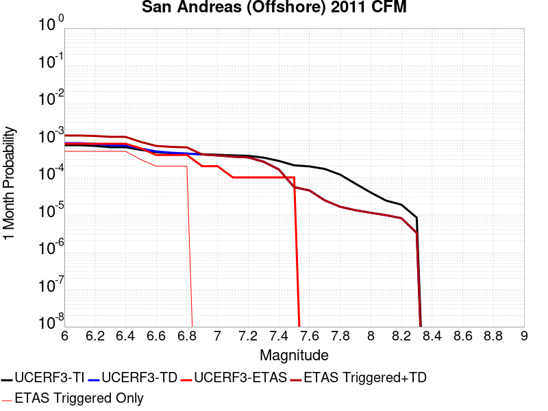 |  |  |

| Magnitude | 1 wk TI Prob | 1 wk TD Prob | 1 wk ETAS Prob | 1 wk ETAS/TD Gain | 1 wk ETAS Triggered+TD | 1 wk ETAS Triggered Only | 1 mo TI Prob | 1 mo TD Prob | 1 mo ETAS Prob | 1 mo ETAS/TD Gain | 1 mo ETAS Triggered+TD | 1 mo ETAS Triggered Only | 1 yr TI Prob | 1 yr TD Prob | 1 yr ETAS Prob | 1 yr ETAS/TD Gain | 1 yr ETAS Triggered+TD | 1 yr ETAS Triggered Only | 10 yr TI Prob | 10 yr TD Prob | 10 yr ETAS Prob | 10 yr ETAS/TD Gain | 10 yr ETAS Triggered+TD | 10 yr ETAS Triggered Only |
|-----|-----|-----|-----|-----|-----|-----|-----|-----|-----|-----|-----|-----|-----|-----|-----|-----|-----|-----|-----|-----|-----|-----|-----|-----|
| 6.0 | 1.7072787E-4 | 1.9249508E-4 | 1.0E-4 | 0.5194938 | 1.9249508E-4 | 0.0 | 7.3148566E-4 | 8.247205E-4 | 8.0E-4 | 0.9700256 | 0.0013243081 | 5.0E-4 | 0.008869528 | 0.009995259 | 0.0079 | 0.7903747 | 0.012767273 | 0.0028 | 0.085237645 | 0.09694891 | 0.0675 | 0.69624305 | 0.11826091 | 0.0236 |
| 6.1 | 1.7072787E-4 | 1.9249508E-4 | 1.0E-4 | 0.5194938 | 1.9249508E-4 | 0.0 | 7.3148566E-4 | 8.247205E-4 | 8.0E-4 | 0.9700256 | 0.0013243081 | 5.0E-4 | 0.008869528 | 0.009995259 | 0.0079 | 0.7903747 | 0.012767273 | 0.0028 | 0.085237645 | 0.09694891 | 0.0675 | 0.69624305 | 0.11826091 | 0.0236 |
| 6.2 | 1.6312556E-4 | 1.843119E-4 | 1.0E-4 | 0.54255855 | 1.843119E-4 | 0.0 | 6.989222E-4 | 7.8967144E-4 | 8.0E-4 | 1.0130796 | 0.0012892765 | 5.0E-4 | 0.008476226 | 0.009572366 | 0.0077 | 0.8043988 | 0.012246521 | 0.0027 | 0.08160117 | 0.09297214 | 0.0649 | 0.6980586 | 0.11383378 | 0.023 |
| 6.3 | 1.5103363E-4 | 1.6904328E-4 | 1.0E-4 | 0.5915645 | 1.6904328E-4 | 0.0 | 6.471264E-4 | 7.242723E-4 | 8.0E-4 | 1.104557 | 0.0012239101 | 5.0E-4 | 0.007850339 | 0.008782808 | 0.0074 | 0.84255517 | 0.011459094 | 0.0027 | 0.075787395 | 0.085597716 | 0.0594 | 0.69394374 | 0.10534881 | 0.0216 |
| 6.4 | 1.5047993E-4 | 1.6790113E-4 | 1.0E-4 | 0.5955886 | 1.6790113E-4 | 0.0 | 6.4475456E-4 | 7.1938004E-4 | 8.0E-4 | 1.1120687 | 0.0012190203 | 5.0E-4 | 0.007821669 | 0.008723722 | 0.0074 | 0.84826183 | 0.011400168 | 0.0027 | 0.0755203 | 0.08507751 | 0.059 | 0.69348526 | 0.104748346 | 0.0215 |
| 6.5 | 1.2760791E-4 | 1.3758797E-4 | 1.0E-4 | 0.7268078 | 1.3758797E-4 | 0.0 | 5.467764E-4 | 5.8953086E-4 | 6.0E-4 | 1.0177585 | 8.89354E-4 | 3.0E-4 | 0.0066367025 | 0.007154192 | 0.0063 | 0.8806026 | 0.009139883 | 0.002 | 0.064419635 | 0.0703395 | 0.0495 | 0.7037298 | 0.087166354 | 0.0181 |
| 6.6 | 1.1063525E-4 | 1.15802766E-4 | 0.0 | 0.0 | 1.15802766E-4 | 0.0 | 4.740649E-4 | 4.9620424E-4 | 4.0E-4 | 0.8061197 | 6.96105E-4 | 2.0E-4 | 0.0057564764 | 0.006024755 | 0.0048 | 0.7967129 | 0.0076151155 | 0.0016 | 0.05609626 | 0.05958456 | 0.0411 | 0.68977594 | 0.073690794 | 0.015 |
| 6.7 | 1.0391049E-4 | 1.06695865E-4 | 0.0 | 0.0 | 1.06695865E-4 | 0.0 | 4.4525467E-4 | 4.5718884E-4 | 4.0E-4 | 0.87491196 | 6.5709744E-4 | 2.0E-4 | 0.0054075094 | 0.005552257 | 0.0045 | 0.81048125 | 0.0069444836 | 0.0014 | 0.052778035 | 0.05508673 | 0.0372 | 0.67529875 | 0.06727611 | 0.0129 |
| 6.8 | 1.0096706E-4 | 1.01816266E-4 | 0.0 | 0.0 | 1.01816266E-4 | 0.0 | 4.3264418E-4 | 4.3628342E-4 | 4.0E-4 | 0.9168352 | 6.361962E-4 | 2.0E-4 | 0.0052547283 | 0.005298992 | 0.0043 | 0.8114751 | 0.0066915737 | 0.0014 | 0.051321987 | 0.052783705 | 0.0353 | 0.668767 | 0.06452919 | 0.0124 |
| 6.9 | 9.800265E-5 | 9.6118834E-5 | 0.0 | 0.0 | 9.6118834E-5 | 0.0 | 4.1994374E-4 | 4.1187374E-4 | 2.0E-4 | 0.4855857 | 4.1187374E-4 | 0.0 | 0.0051008356 | 0.0050032027 | 0.0039 | 0.7795007 | 0.006097699 | 0.0011 | 0.049853306 | 0.05011043 | 0.033 | 0.65854555 | 0.06074919 | 0.0112 |
| 7.0 | 9.4642375E-5 | 9.024948E-5 | 0.0 | 0.0 | 9.024948E-5 | 0.0 | 4.0554712E-4 | 3.8672704E-4 | 2.0E-4 | 0.51716065 | 3.8672704E-4 | 0.0 | 0.004926363 | 0.0046984 | 0.0037 | 0.7875021 | 0.0055941716 | 9.0E-4 | 0.048185747 | 0.047288798 | 0.031 | 0.65554637 | 0.057101723 | 0.0103 |
| 7.1 | 9.0996844E-5 | 8.3764906E-5 | 0.0 | 0.0 | 8.3764906E-5 | 0.0 | 3.8992817E-4 | 3.5894391E-4 | 1.0E-4 | 0.27859506 | 3.5894391E-4 | 0.0 | 0.004737046 | 0.004361543 | 0.0032 | 0.7336853 | 0.0052576177 | 9.0E-4 | 0.04637333 | 0.04414003 | 0.0292 | 0.66153103 | 0.05369863 | 0.01 |
| 7.2 | 8.848287E-5 | 8.003618E-5 | 0.0 | 0.0 | 8.003618E-5 | 0.0 | 3.791572E-4 | 3.4296798E-4 | 1.0E-4 | 0.29157242 | 3.4296798E-4 | 0.0 | 0.004606472 | 0.004167795 | 0.003 | 0.719805 | 0.0050640446 | 9.0E-4 | 0.045121472 | 0.04228061 | 0.0276 | 0.6527815 | 0.051187404 | 0.0093 |
| 7.3 | 7.9280784E-5 | 6.143627E-5 | 0.0 | 0.0 | 6.143627E-5 | 0.0 | 3.3973053E-4 | 2.6327232E-4 | 1.0E-4 | 0.37983486 | 2.6327232E-4 | 0.0 | 0.004128377 | 0.0032007324 | 0.0021 | 0.65609986 | 0.0038984919 | 7.0E-4 | 0.040525194 | 0.032969505 | 0.0214 | 0.6490846 | 0.04012553 | 0.0074 |
| 7.4 | 6.468038E-5 | 3.8027592E-5 | 0.0 | 0.0 | 3.8027592E-5 | 0.0 | 2.771722E-4 | 1.6296555E-4 | 1.0E-4 | 0.61362666 | 1.6296555E-4 | 0.0 | 0.0033693502 | 0.0019823583 | 0.0014 | 0.70622957 | 0.0023815653 | 4.0E-4 | 0.0331872 | 0.020861687 | 0.0125 | 0.5991846 | 0.025169894 | 0.0044 |
| 7.5 | 4.930574E-5 | 1.2723224E-5 | 0.0 | 0.0 | 1.2723224E-5 | 0.0 | 2.1129321E-4 | 5.4526972E-5 | 1.0E-4 | 1.8339548 | 5.4526972E-5 | 0.0 | 0.0025694598 | 6.636653E-4 | 4.0E-4 | 0.60271347 | 6.636653E-4 | 0.0 | 0.02539953 | 0.00749053 | 0.004 | 0.5340076 | 0.00858229 | 0.0011 |
| 7.6 | 4.612566E-5 | 1.035342E-5 | 0.0 | 0.0 | 1.035342E-5 | 0.0 | 1.9766642E-4 | 4.4371056E-5 | 0.0 | 0.0 | 4.4371056E-5 | 0.0 | 0.0024039324 | 5.400851E-4 | 3.0E-4 | 0.5554681 | 5.400851E-4 | 0.0 | 0.023780935 | 0.00617966 | 0.003 | 0.4854636 | 0.006875335 | 7.0E-4 |
| 7.7 | 3.9435414E-5 | 5.5879354E-6 | 0.0 | 0.0 | 5.5879354E-6 | 0.0 | 1.6899795E-4 | 2.3948076E-5 | 0.0 | 0.0 | 2.3948076E-5 | 0.0 | 0.0020556084 | 2.91529E-4 | 0.0 | 0.0 | 2.91529E-4 | 0.0 | 0.020366974 | 0.0035500329 | 0.0015 | 0.4225313 | 0.0039486126 | 4.0E-4 |
| 7.8 | 2.7787428E-5 | 3.7649156E-6 | 0.0 | 0.0 | 3.7649156E-6 | 0.0 | 1.1908354E-4 | 1.6135253E-5 | 0.0 | 0.0 | 1.6135253E-5 | 0.0 | 0.0014488777 | 1.9642903E-4 | 0.0 | 0.0 | 1.9642903E-4 | 0.0 | 0.014394675 | 0.0023934008 | 0.0014 | 0.58494174 | 0.0026926827 | 3.0E-4 |
| 7.9 | 1.590671E-5 | 3.0494423E-6 | 0.0 | 0.0 | 3.0494423E-6 | 0.0 | 6.816983E-5 | 1.3068972E-5 | 0.0 | 0.0 | 1.3068972E-5 | 0.0 | 8.2965166E-4 | 1.5910316E-4 | 0.0 | 0.0 | 1.5910316E-4 | 0.0 | 0.008265611 | 0.0019091917 | 9.0E-4 | 0.47140366 | 0.002208619 | 3.0E-4 |
| 8.0 | 9.193638E-6 | 2.600857E-6 | 0.0 | 0.0 | 2.600857E-6 | 0.0 | 3.940071E-5 | 1.11464815E-5 | 0.0 | 0.0 | 1.11464815E-5 | 0.0 | 4.7959806E-4 | 1.357E-4 | 0.0 | 0.0 | 1.357E-4 | 0.0 | 0.0047856434 | 0.0016165314 | 5.0E-4 | 0.30930424 | 0.001816208 | 2.0E-4 |
| 8.1 | 5.601576E-6 | 2.2437075E-6 | 0.0 | 0.0 | 2.2437075E-6 | 0.0 | 2.4006533E-5 | 9.615854E-6 | 0.0 | 0.0 | 9.615854E-6 | 0.0 | 2.9224035E-4 | 1.1706676E-4 | 0.0 | 0.0 | 1.1706676E-4 | 0.0 | 0.0029185633 | 0.0014074877 | 5.0E-4 | 0.3552429 | 0.0016072062 | 2.0E-4 |
| 8.2 | 4.3508785E-6 | 1.8650505E-6 | 0.0 | 0.0 | 1.8650505E-6 | 0.0 | 1.864649E-5 | 7.99305E-6 | 0.0 | 0.0 | 7.99305E-6 | 0.0 | 2.2699735E-4 | 9.731106E-5 | 0.0 | 0.0 | 9.731106E-5 | 0.0 | 0.0022676561 | 0.0011637018 | 3.0E-4 | 0.25779802 | 0.0012635854 | 1.0E-4 |
| 8.3 | 1.9573292E-6 | 7.538049E-7 | 0.0 | 0.0 | 7.538049E-7 | 0.0 | 8.388526E-6 | 3.2305886E-6 | 0.0 | 0.0 | 3.2305886E-6 | 0.0 | 1.0212552E-4 | 3.9331724E-5 | 0.0 | 0.0 | 3.9331724E-5 | 0.0 | 0.001020786 | 4.6543073E-4 | 1.0E-4 | 0.21485475 | 4.6543073E-4 | 0.0 |

## San Andreas (San Bernardino N)
*[(top)](#table-of-contents)*

| 1 Week | 1 Month | 1 Year | 10 Year |
|-----|-----|-----|-----|
|  | 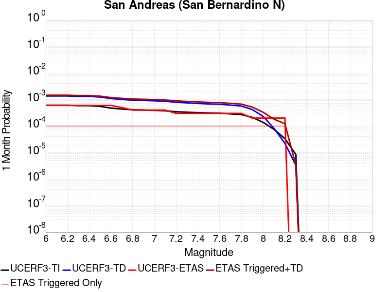 | 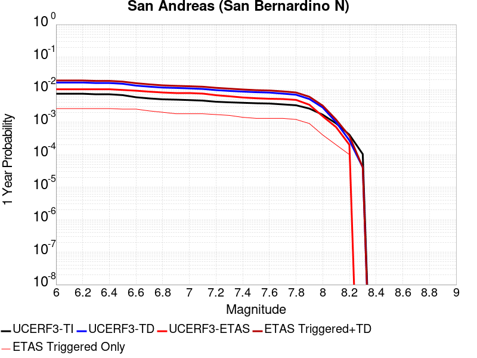 | 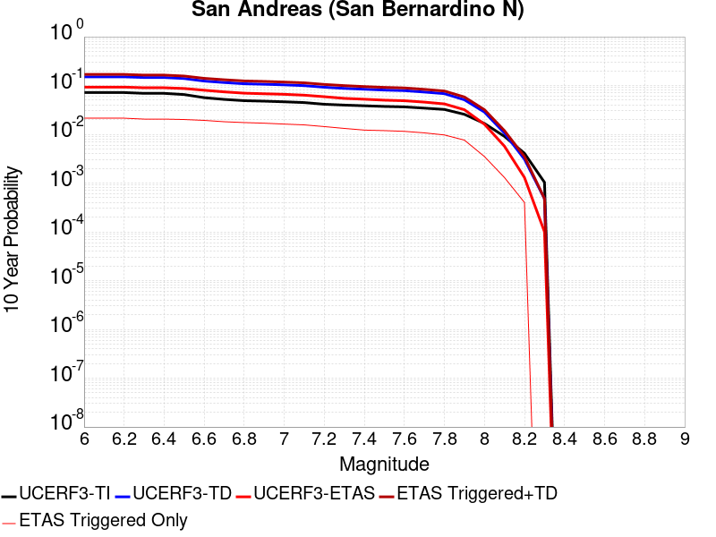 |

| Magnitude | 1 wk TI Prob | 1 wk TD Prob | 1 wk ETAS Prob | 1 wk ETAS/TD Gain | 1 wk ETAS Triggered+TD | 1 wk ETAS Triggered Only | 1 mo TI Prob | 1 mo TD Prob | 1 mo ETAS Prob | 1 mo ETAS/TD Gain | 1 mo ETAS Triggered+TD | 1 mo ETAS Triggered Only | 1 yr TI Prob | 1 yr TD Prob | 1 yr ETAS Prob | 1 yr ETAS/TD Gain | 1 yr ETAS Triggered+TD | 1 yr ETAS Triggered Only | 10 yr TI Prob | 10 yr TD Prob | 10 yr ETAS Prob | 10 yr ETAS/TD Gain | 10 yr ETAS Triggered+TD | 10 yr ETAS Triggered Only |
|-----|-----|-----|-----|-----|-----|-----|-----|-----|-----|-----|-----|-----|-----|-----|-----|-----|-----|-----|-----|-----|-----|-----|-----|-----|
| 6.0 | 1.4273766E-4 | 3.168128E-4 | 2.0E-4 | 0.63128763 | 4.167811E-4 | 1.0E-4 | 6.115894E-4 | 0.0013570685 | 6.0E-4 | 0.44212946 | 0.0014569329 | 1.0E-4 | 0.0074207084 | 0.016398644 | 0.0102 | 0.62200266 | 0.018956007 | 0.0026 | 0.07177748 | 0.15058622 | 0.0928 | 0.61625826 | 0.16876368 | 0.0214 |
| 6.1 | 1.4273766E-4 | 3.168128E-4 | 2.0E-4 | 0.63128763 | 4.167811E-4 | 1.0E-4 | 6.115894E-4 | 0.0013570685 | 6.0E-4 | 0.44212946 | 0.0014569329 | 1.0E-4 | 0.0074207084 | 0.016398644 | 0.0102 | 0.62200266 | 0.018956007 | 0.0026 | 0.07177748 | 0.15058622 | 0.0928 | 0.61625826 | 0.16876368 | 0.0214 |
| 6.2 | 1.4273766E-4 | 3.168128E-4 | 2.0E-4 | 0.63128763 | 4.167811E-4 | 1.0E-4 | 6.115894E-4 | 0.0013570685 | 6.0E-4 | 0.44212946 | 0.0014569329 | 1.0E-4 | 0.0074207084 | 0.016398644 | 0.0102 | 0.62200266 | 0.018956007 | 0.0026 | 0.07177748 | 0.15058622 | 0.0928 | 0.61625826 | 0.16876368 | 0.0214 |
| 6.3 | 1.3730655E-4 | 3.058562E-4 | 2.0E-4 | 0.65390205 | 4.0582562E-4 | 1.0E-4 | 5.883239E-4 | 0.0013101595 | 6.0E-4 | 0.45795953 | 0.0014100284 | 1.0E-4 | 0.0071393442 | 0.015835932 | 0.0102 | 0.64410484 | 0.018394759 | 0.0026 | 0.06914291 | 0.14587222 | 0.0901 | 0.61766386 | 0.16338183 | 0.0205 |
| 6.4 | 1.3730655E-4 | 3.058562E-4 | 2.0E-4 | 0.65390205 | 4.0582562E-4 | 1.0E-4 | 5.883239E-4 | 0.0013101595 | 6.0E-4 | 0.45795953 | 0.0014100284 | 1.0E-4 | 0.0071393442 | 0.015835932 | 0.0102 | 0.64410484 | 0.018394759 | 0.0026 | 0.06914291 | 0.14587222 | 0.0901 | 0.61766386 | 0.16338183 | 0.0205 |
| 6.5 | 1.2942807E-4 | 2.8999255E-4 | 2.0E-4 | 0.6896729 | 3.8996356E-4 | 1.0E-4 | 5.545738E-4 | 0.0012422384 | 6.0E-4 | 0.48299906 | 0.0013421142 | 1.0E-4 | 0.0067310524 | 0.015020622 | 0.0097 | 0.64577883 | 0.01748307 | 0.0025 | 0.06530788 | 0.13899623 | 0.0869 | 0.6251968 | 0.1563024 | 0.0201 |
| 6.6 | 1.1125901E-4 | 2.5435883E-4 | 2.0E-4 | 0.78629076 | 3.543334E-4 | 1.0E-4 | 4.767372E-4 | 0.0010896561 | 6.0E-4 | 0.5506324 | 0.0011895472 | 1.0E-4 | 0.005788839 | 0.0131865 | 0.0092 | 0.6976832 | 0.015653534 | 0.0025 | 0.056403454 | 0.123310305 | 0.0801 | 0.6495807 | 0.14023042 | 0.0193 |
| 6.7 | 1.02209575E-4 | 2.3570107E-4 | 2.0E-4 | 0.84853244 | 3.356775E-4 | 1.0E-4 | 4.3796748E-4 | 0.0010097577 | 5.0E-4 | 0.49516824 | 0.0011096568 | 1.0E-4 | 0.0053192247 | 0.012224927 | 0.0086 | 0.70348066 | 0.014398032 | 0.0022 | 0.051936906 | 0.11507658 | 0.0741 | 0.64391905 | 0.1310937 | 0.0181 |
| 6.8 | 9.610582E-5 | 2.2094428E-4 | 2.0E-4 | 0.9052056 | 3.2092218E-4 | 1.0E-4 | 4.1181705E-4 | 9.465611E-4 | 4.0E-4 | 0.42258233 | 0.0010464665 | 1.0E-4 | 0.0050023515 | 0.011463753 | 0.0081 | 0.7065749 | 0.013440825 | 0.002 | 0.048912346 | 0.108484246 | 0.0697 | 0.6424896 | 0.12399662 | 0.0174 |
| 6.9 | 9.3877505E-5 | 2.15495E-4 | 2.0E-4 | 0.92809576 | 3.1547344E-4 | 1.0E-4 | 4.0227012E-4 | 9.232238E-4 | 4.0E-4 | 0.4332644 | 0.0010231314 | 1.0E-4 | 0.0048866454 | 0.011182567 | 0.0078 | 0.6975143 | 0.012962438 | 0.0018 | 0.04780577 | 0.106076695 | 0.0678 | 0.6391602 | 0.121184 | 0.0169 |
| 7.0 | 9.1019785E-5 | 2.0875766E-4 | 2.0E-4 | 0.9580487 | 3.0873678E-4 | 1.0E-4 | 3.900265E-4 | 8.943695E-4 | 4.0E-4 | 0.44724244 | 9.942801E-4 | 1.0E-4 | 0.0047382377 | 0.010834809 | 0.0078 | 0.71990186 | 0.012615307 | 0.0018 | 0.046384744 | 0.103036076 | 0.0661 | 0.6415229 | 0.11756689 | 0.0162 |
| 7.1 | 8.771155E-5 | 2.0049523E-4 | 2.0E-4 | 0.99753 | 3.0047516E-4 | 1.0E-4 | 3.758525E-4 | 8.5898285E-4 | 4.0E-4 | 0.46566704 | 9.5889694E-4 | 1.0E-4 | 0.0045664064 | 0.010408166 | 0.0075 | 0.7205881 | 0.012189431 | 0.0018 | 0.044737056 | 0.09935176 | 0.0634 | 0.6381366 | 0.113401875 | 0.0156 |
| 7.2 | 8.0830236E-5 | 1.8453442E-4 | 2.0E-4 | 1.0838087 | 2.8451596E-4 | 1.0E-4 | 3.4636928E-4 | 7.9062226E-4 | 3.0E-4 | 0.37944794 | 8.905432E-4 | 1.0E-4 | 0.0042088944 | 0.009583449 | 0.0067 | 0.699122 | 0.011267157 | 0.0017 | 0.041300658 | 0.092071354 | 0.059 | 0.64080733 | 0.10514553 | 0.0144 |
| 7.3 | 7.7668235E-5 | 1.7395207E-4 | 2.0E-4 | 1.149742 | 2.7393465E-4 | 1.0E-4 | 3.328214E-4 | 7.452959E-4 | 3.0E-4 | 0.40252468 | 8.452214E-4 | 1.0E-4 | 0.0040445733 | 0.009036305 | 0.0062 | 0.6861211 | 0.010621848 | 0.0016 | 0.03971748 | 0.08733995 | 0.0545 | 0.6239985 | 0.099387065 | 0.0132 |
| 7.4 | 7.520177E-5 | 1.6613993E-4 | 2.0E-4 | 1.2038046 | 2.661233E-4 | 1.0E-4 | 3.2225347E-4 | 7.11834E-4 | 3.0E-4 | 0.42144656 | 8.117628E-4 | 1.0E-4 | 0.0039163795 | 0.008632208 | 0.0057 | 0.6603177 | 0.010020123 | 0.0014 | 0.038480744 | 0.08379064 | 0.0524 | 0.62536824 | 0.094968386 | 0.0122 |
| 7.5 | 7.274697E-5 | 1.5900414E-4 | 2.0E-4 | 1.257829 | 2.5898824E-4 | 1.0E-4 | 3.1173544E-4 | 6.812684E-4 | 3.0E-4 | 0.4403551 | 7.8120024E-4 | 1.0E-4 | 0.003788775 | 0.008262956 | 0.0054 | 0.6535192 | 0.009552213 | 0.0013 | 0.03724827 | 0.08050346 | 0.0501 | 0.6223335 | 0.09144547 | 0.0119 |
| 7.6 | 7.1185845E-5 | 1.5469486E-4 | 2.0E-4 | 1.2928678 | 2.5467938E-4 | 1.0E-4 | 3.0504653E-4 | 6.628096E-4 | 3.0E-4 | 0.4526187 | 7.627433E-4 | 1.0E-4 | 0.0037076178 | 0.008039901 | 0.0052 | 0.6467742 | 0.009329448 | 0.0013 | 0.036463667 | 0.078490324 | 0.0488 | 0.6217327 | 0.08908768 | 0.0115 |
| 7.7 | 6.709961E-5 | 1.4377428E-4 | 2.0E-4 | 1.3910694 | 2.437599E-4 | 1.0E-4 | 2.8753807E-4 | 6.1603E-4 | 3.0E-4 | 0.48698926 | 7.159684E-4 | 1.0E-4 | 0.003495157 | 0.0074744117 | 0.0051 | 0.6823279 | 0.008764695 | 0.0013 | 0.034406938 | 0.07331736 | 0.0457 | 0.6233176 | 0.083232865 | 0.0107 |
| 7.8 | 6.300812E-5 | 1.3258014E-4 | 2.0E-4 | 1.5085216 | 2.3256689E-4 | 1.0E-4 | 2.7000686E-4 | 5.680769E-4 | 3.0E-4 | 0.5280975 | 6.680201E-4 | 1.0E-4 | 0.0032823787 | 0.006894432 | 0.0048 | 0.69621396 | 0.008086159 | 0.0012 | 0.032343175 | 0.067962006 | 0.042 | 0.61799234 | 0.07700277 | 0.0097 |
| 7.9 | 4.983037E-5 | 9.764597E-5 | 2.0E-4 | 2.0482156 | 1.9763621E-4 | 1.0E-4 | 2.1354125E-4 | 4.1841564E-4 | 2.0E-4 | 0.4779936 | 5.183738E-4 | 1.0E-4 | 0.0025967648 | 0.005082322 | 0.0034 | 0.6689856 | 0.0059777475 | 9.0E-4 | 0.025666296 | 0.050839365 | 0.0319 | 0.62746656 | 0.058052983 | 0.0076 |
| 8.0 | 3.2211527E-5 | 5.351099E-5 | 2.0E-4 | 3.73755 | 1.5350564E-4 | 1.0E-4 | 1.380421E-4 | 2.2931266E-4 | 2.0E-4 | 0.87217164 | 3.2928973E-4 | 1.0E-4 | 0.0016793669 | 0.002788309 | 0.0015 | 0.53796047 | 0.0031871938 | 4.0E-4 | 0.016667323 | 0.028461184 | 0.0161 | 0.5656827 | 0.03186157 | 0.0035 |
| 8.1 | 1.743376E-5 | 1.8891016E-5 | 2.0E-4 | 10.587043 | 1.18889126E-4 | 1.0E-4 | 7.471398E-5 | 8.095899E-5 | 2.0E-4 | 2.4703865 | 1.809509E-4 | 1.0E-4 | 9.0926304E-4 | 9.852307E-4 | 7.0E-4 | 0.71049356 | 0.0011850336 | 2.0E-4 | 0.009055517 | 0.010518595 | 0.0057 | 0.5418975 | 0.011804921 | 0.0013 |
| 8.2 | 7.831616E-6 | 5.170661E-6 | 2.0E-4 | 38.679775 | 1.0517015E-4 | 1.0E-4 | 3.3563636E-5 | 2.2159787E-5 | 2.0E-4 | 9.025357 | 1.2215757E-4 | 1.0E-4 | 4.0856065E-4 | 2.697621E-4 | 2.0E-4 | 0.741394 | 3.6973512E-4 | 1.0E-4 | 0.004078103 | 0.0030502297 | 0.0013 | 0.42619738 | 0.0034490097 | 4.0E-4 |
| 8.3 | 1.983087E-6 | 7.683211E-7 | 0.0 | 0.0 | 7.683211E-7 | 0.0 | 8.498917E-6 | 3.2928008E-6 | 0.0 | 0.0 | 3.2928008E-6 | 0.0 | 1.034694E-4 | 4.008913E-5 | 0.0 | 0.0 | 4.008913E-5 | 0.0 | 0.0010342124 | 4.7332307E-4 | 1.0E-4 | 0.21127218 | 4.7332307E-4 | 0.0 |

## San Andreas (Carrizo) rev
*[(top)](#table-of-contents)*

| 1 Week | 1 Month | 1 Year | 10 Year |
|-----|-----|-----|-----|
|  | 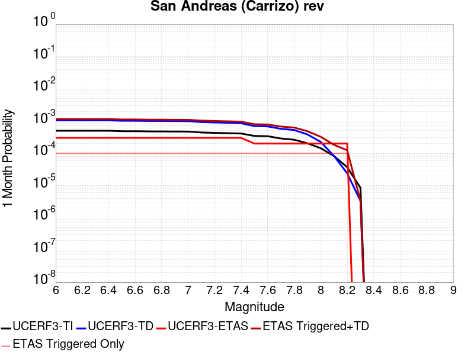 | 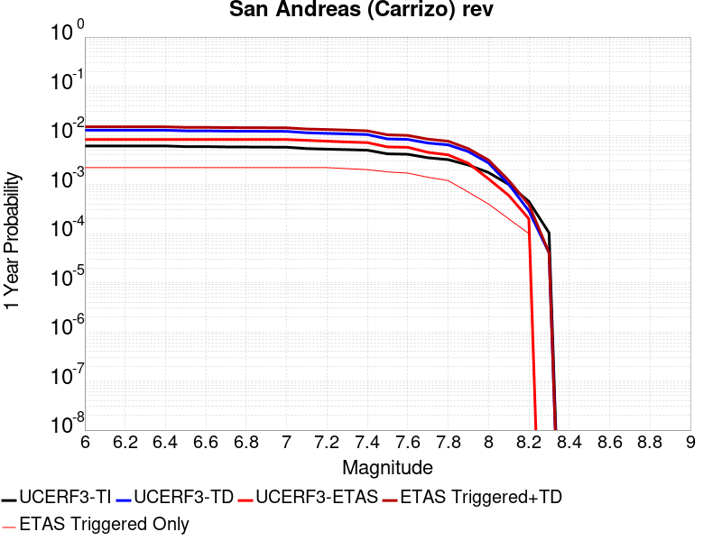 | 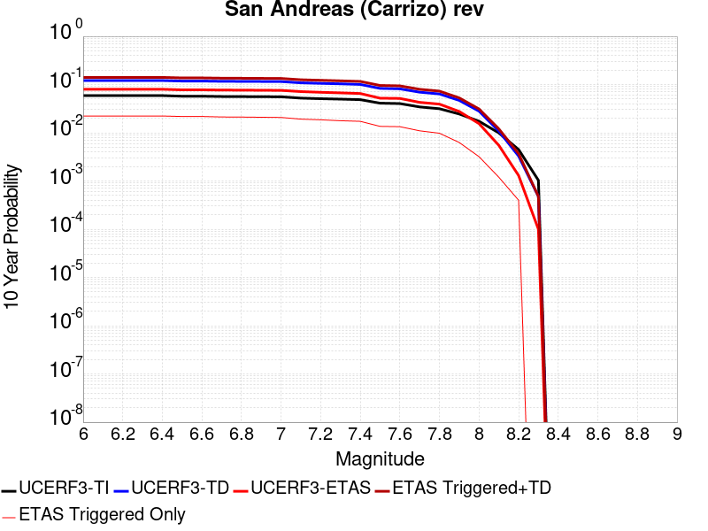 |

| Magnitude | 1 wk TI Prob | 1 wk TD Prob | 1 wk ETAS Prob | 1 wk ETAS/TD Gain | 1 wk ETAS Triggered+TD | 1 wk ETAS Triggered Only | 1 mo TI Prob | 1 mo TD Prob | 1 mo ETAS Prob | 1 mo ETAS/TD Gain | 1 mo ETAS Triggered+TD | 1 mo ETAS Triggered Only | 1 yr TI Prob | 1 yr TD Prob | 1 yr ETAS Prob | 1 yr ETAS/TD Gain | 1 yr ETAS Triggered+TD | 1 yr ETAS Triggered Only | 10 yr TI Prob | 10 yr TD Prob | 10 yr ETAS Prob | 10 yr ETAS/TD Gain | 10 yr ETAS Triggered+TD | 10 yr ETAS Triggered Only |
|-----|-----|-----|-----|-----|-----|-----|-----|-----|-----|-----|-----|-----|-----|-----|-----|-----|-----|-----|-----|-----|-----|-----|-----|-----|
| 6.0 | 1.1674632E-4 | 2.4403539E-4 | 2.0E-4 | 0.8195533 | 3.4401097E-4 | 1.0E-4 | 5.002454E-4 | 0.0010454484 | 3.0E-4 | 0.28695822 | 0.0011453438 | 1.0E-4 | 0.006073493 | 0.0126545355 | 0.0082 | 0.647989 | 0.014826695 | 0.0022 | 0.0591016 | 0.120943 | 0.0799 | 0.6606418 | 0.14054598 | 0.0223 |
| 6.1 | 1.1674632E-4 | 2.4403539E-4 | 2.0E-4 | 0.8195533 | 3.4401097E-4 | 1.0E-4 | 5.002454E-4 | 0.0010454484 | 3.0E-4 | 0.28695822 | 0.0011453438 | 1.0E-4 | 0.006073493 | 0.0126545355 | 0.0082 | 0.647989 | 0.014826695 | 0.0022 | 0.0591016 | 0.120943 | 0.0799 | 0.6606418 | 0.14054598 | 0.0223 |
| 6.2 | 1.1674632E-4 | 2.4403539E-4 | 2.0E-4 | 0.8195533 | 3.4401097E-4 | 1.0E-4 | 5.002454E-4 | 0.0010454484 | 3.0E-4 | 0.28695822 | 0.0011453438 | 1.0E-4 | 0.006073493 | 0.0126545355 | 0.0082 | 0.647989 | 0.014826695 | 0.0022 | 0.0591016 | 0.120943 | 0.0799 | 0.6606418 | 0.14054598 | 0.0223 |
| 6.3 | 1.1674632E-4 | 2.4403539E-4 | 2.0E-4 | 0.8195533 | 3.4401097E-4 | 1.0E-4 | 5.002454E-4 | 0.0010454484 | 3.0E-4 | 0.28695822 | 0.0011453438 | 1.0E-4 | 0.006073493 | 0.0126545355 | 0.0082 | 0.647989 | 0.014826695 | 0.0022 | 0.0591016 | 0.120943 | 0.0799 | 0.6606418 | 0.14054598 | 0.0223 |
| 6.4 | 1.1674632E-4 | 2.4403539E-4 | 2.0E-4 | 0.8195533 | 3.4401097E-4 | 1.0E-4 | 5.002454E-4 | 0.0010454484 | 3.0E-4 | 0.28695822 | 0.0011453438 | 1.0E-4 | 0.006073493 | 0.0126545355 | 0.0082 | 0.647989 | 0.014826695 | 0.0022 | 0.0591016 | 0.120943 | 0.0799 | 0.6606418 | 0.14054598 | 0.0223 |
| 6.5 | 1.13136164E-4 | 2.3722947E-4 | 2.0E-4 | 0.84306556 | 3.3720574E-4 | 1.0E-4 | 4.847792E-4 | 0.0010163031 | 3.0E-4 | 0.29518753 | 0.0011162015 | 1.0E-4 | 0.0058862255 | 0.012303742 | 0.0082 | 0.6664639 | 0.014476673 | 0.0022 | 0.057327334 | 0.11791766 | 0.0778 | 0.65978247 | 0.13714705 | 0.0218 |
| 6.6 | 1.13136164E-4 | 2.3722947E-4 | 2.0E-4 | 0.84306556 | 3.3720574E-4 | 1.0E-4 | 4.847792E-4 | 0.0010163031 | 3.0E-4 | 0.29518753 | 0.0011162015 | 1.0E-4 | 0.0058862255 | 0.012303742 | 0.0082 | 0.6664639 | 0.014476673 | 0.0022 | 0.057327334 | 0.11791766 | 0.0778 | 0.65978247 | 0.13714705 | 0.0218 |
| 6.7 | 1.1149675E-4 | 2.3413934E-4 | 2.0E-4 | 0.8541922 | 3.3411593E-4 | 1.0E-4 | 4.777557E-4 | 0.0010030699 | 3.0E-4 | 0.29908183 | 0.0011029696 | 1.0E-4 | 0.0058011734 | 0.0121444315 | 0.0082 | 0.6752066 | 0.014317714 | 0.0022 | 0.05652051 | 0.11653524 | 0.0769 | 0.65988624 | 0.13535304 | 0.0213 |
| 6.8 | 1.1103589E-4 | 2.3315939E-4 | 2.0E-4 | 0.8577823 | 3.3313606E-4 | 1.0E-4 | 4.7578133E-4 | 9.988734E-4 | 3.0E-4 | 0.30033836 | 0.0010987734 | 1.0E-4 | 0.005777263 | 0.012093907 | 0.0082 | 0.6780274 | 0.0142673 | 0.0022 | 0.056293584 | 0.116094485 | 0.0767 | 0.66066873 | 0.13483329 | 0.0212 |
| 6.9 | 1.1053259E-4 | 2.3208147E-4 | 2.0E-4 | 0.8617664 | 3.3205826E-4 | 1.0E-4 | 4.7362508E-4 | 9.942572E-4 | 3.0E-4 | 0.30173278 | 0.0010941578 | 1.0E-4 | 0.0057511497 | 0.012038328 | 0.0082 | 0.68115777 | 0.014211843 | 0.0022 | 0.05604569 | 0.11560957 | 0.0762 | 0.659115 | 0.13418177 | 0.021 |
| 7.0 | 1.1005377E-4 | 2.3108827E-4 | 2.0E-4 | 0.8654702 | 3.3106515E-4 | 1.0E-4 | 4.7157376E-4 | 9.900039E-4 | 3.0E-4 | 0.30302912 | 0.0010899049 | 1.0E-4 | 0.0057263062 | 0.011987114 | 0.0082 | 0.68406785 | 0.014160743 | 0.0022 | 0.055809796 | 0.11516107 | 0.0758 | 0.65820855 | 0.13356572 | 0.0208 |
| 7.1 | 1.0308142E-4 | 2.1616157E-4 | 2.0E-4 | 0.92523384 | 3.1613995E-4 | 1.0E-4 | 4.417027E-4 | 9.260789E-4 | 3.0E-4 | 0.3239465 | 0.0010259863 | 1.0E-4 | 0.0053644776 | 0.011217038 | 0.0079 | 0.70428574 | 0.013392361 | 0.0022 | 0.052368138 | 0.108415306 | 0.0715 | 0.659501 | 0.12553373 | 0.0192 |
| 7.2 | 1.0027479E-4 | 2.1023068E-4 | 2.0E-4 | 0.95133597 | 3.1020964E-4 | 1.0E-4 | 4.296783E-4 | 9.006785E-4 | 3.0E-4 | 0.33308223 | 0.0010005884 | 1.0E-4 | 0.0052187922 | 0.010910925 | 0.0076 | 0.69654953 | 0.013086922 | 0.0022 | 0.050979212 | 0.10571732 | 0.0692 | 0.65457577 | 0.12235098 | 0.0186 |
| 7.3 | 9.816942E-5 | 2.0497073E-4 | 2.0E-4 | 0.9757491 | 3.0495023E-4 | 1.0E-4 | 4.2065824E-4 | 8.781512E-4 | 3.0E-4 | 0.3416268 | 9.780634E-4 | 1.0E-4 | 0.005109493 | 0.010639367 | 0.0073 | 0.68613106 | 0.012717024 | 0.0021 | 0.049935985 | 0.10329492 | 0.0673 | 0.65153253 | 0.11925627 | 0.0178 |
| 7.4 | 9.5634205E-5 | 1.9865317E-4 | 2.0E-4 | 1.0067798 | 2.986333E-4 | 1.0E-4 | 4.0979648E-4 | 8.510939E-4 | 3.0E-4 | 0.35248753 | 9.510088E-4 | 1.0E-4 | 0.0049778637 | 0.010313101 | 0.0071 | 0.68844473 | 0.0122924745 | 0.002 | 0.048678253 | 0.10038385 | 0.0653 | 0.65050304 | 0.11594721 | 0.0173 |
| 7.5 | 8.052417E-5 | 1.6181369E-4 | 2.0E-4 | 1.2359893 | 2.617975E-4 | 1.0E-4 | 3.4505792E-4 | 6.933031E-4 | 2.0E-4 | 0.2884741 | 7.9323375E-4 | 1.0E-4 | 0.0041929903 | 0.008408378 | 0.0058 | 0.6897882 | 0.010193243 | 0.0018 | 0.04114753 | 0.083107986 | 0.0522 | 0.6280985 | 0.09557772 | 0.0136 |
| 7.6 | 7.897024E-5 | 1.5833748E-4 | 2.0E-4 | 1.2631248 | 2.5832164E-4 | 1.0E-4 | 3.384E-4 | 6.784129E-4 | 2.0E-4 | 0.2948057 | 7.7834504E-4 | 1.0E-4 | 0.0041122385 | 0.008228473 | 0.0057 | 0.6927166 | 0.009914485 | 0.0017 | 0.040369697 | 0.081445634 | 0.0516 | 0.6335514 | 0.09375426 | 0.0134 |
| 7.7 | 6.707427E-5 | 1.3338088E-4 | 2.0E-4 | 1.4994653 | 2.3336754E-4 | 1.0E-4 | 2.8742946E-4 | 5.7150715E-4 | 2.0E-4 | 0.3499519 | 6.7145E-4 | 1.0E-4 | 0.003493839 | 0.006935933 | 0.0045 | 0.6487952 | 0.008326223 | 0.0014 | 0.034394164 | 0.0693185 | 0.0428 | 0.61743975 | 0.079556 | 0.011 |
| 7.8 | 6.147705E-5 | 1.2253434E-4 | 2.0E-4 | 1.6321956 | 2.2252208E-4 | 1.0E-4 | 2.6344648E-4 | 5.250415E-4 | 2.0E-4 | 0.38092226 | 6.24989E-4 | 1.0E-4 | 0.0032027436 | 0.0063736695 | 0.004 | 0.62758195 | 0.0075660213 | 0.0012 | 0.031569764 | 0.06375908 | 0.0393 | 0.6163828 | 0.07293424 | 0.0098 |
| 7.9 | 4.7636717E-5 | 8.9173984E-5 | 2.0E-4 | 2.2428067 | 1.8916506E-4 | 1.0E-4 | 2.0414138E-4 | 3.8211825E-4 | 2.0E-4 | 0.52339816 | 4.8208004E-4 | 1.0E-4 | 0.0024825884 | 0.0046423734 | 0.0027 | 0.58159906 | 0.005339124 | 7.0E-4 | 0.024550365 | 0.04680268 | 0.0277 | 0.59184647 | 0.052807823 | 0.0063 |
| 8.0 | 3.3554235E-5 | 5.233884E-5 | 2.0E-4 | 3.8212538 | 1.5233361E-4 | 1.0E-4 | 1.4379594E-4 | 2.2429005E-4 | 2.0E-4 | 0.89170253 | 3.2426763E-4 | 1.0E-4 | 0.0017493097 | 0.0027273134 | 0.0013 | 0.47665954 | 0.0031262226 | 4.0E-4 | 0.017356034 | 0.027978579 | 0.0155 | 0.55399525 | 0.031089047 | 0.0032 |
| 8.1 | 1.9175432E-5 | 1.9253832E-5 | 2.0E-4 | 10.387543 | 1.19251905E-4 | 1.0E-4 | 8.217783E-5 | 8.251381E-5 | 2.0E-4 | 2.4238367 | 1.8250557E-4 | 1.0E-4 | 0.0010000558 | 0.0010041433 | 6.0E-4 | 0.5975243 | 0.0012039425 | 2.0E-4 | 0.009955673 | 0.010793965 | 0.0055 | 0.50954396 | 0.011981013 | 0.0012 |
| 8.2 | 8.643924E-6 | 5.491857E-6 | 2.0E-4 | 36.417553 | 1.0549131E-4 | 1.0E-4 | 3.704486E-5 | 2.3536319E-5 | 2.0E-4 | 8.497506 | 1.2353396E-4 | 1.0E-4 | 4.5092785E-4 | 2.8651708E-4 | 2.0E-4 | 0.6980387 | 3.8648842E-4 | 1.0E-4 | 0.0045001395 | 0.003257976 | 0.0013 | 0.39902076 | 0.0036566728 | 4.0E-4 |
| 8.3 | 1.983087E-6 | 7.683211E-7 | 0.0 | 0.0 | 7.683211E-7 | 0.0 | 8.498917E-6 | 3.2928008E-6 | 0.0 | 0.0 | 3.2928008E-6 | 0.0 | 1.034694E-4 | 4.008913E-5 | 0.0 | 0.0 | 4.008913E-5 | 0.0 | 0.0010342124 | 4.7332307E-4 | 1.0E-4 | 0.21127218 | 4.7332307E-4 | 0.0 |

## Hayward (So) extension 2011 CFM
*[(top)](#table-of-contents)*

| 1 Week | 1 Month | 1 Year | 10 Year |
|-----|-----|-----|-----|
|  |  |  |  |

| Magnitude | 1 wk TI Prob | 1 wk TD Prob | 1 wk ETAS Prob | 1 wk ETAS/TD Gain | 1 wk ETAS Triggered+TD | 1 wk ETAS Triggered Only | 1 mo TI Prob | 1 mo TD Prob | 1 mo ETAS Prob | 1 mo ETAS/TD Gain | 1 mo ETAS Triggered+TD | 1 mo ETAS Triggered Only | 1 yr TI Prob | 1 yr TD Prob | 1 yr ETAS Prob | 1 yr ETAS/TD Gain | 1 yr ETAS Triggered+TD | 1 yr ETAS Triggered Only | 10 yr TI Prob | 10 yr TD Prob | 10 yr ETAS Prob | 10 yr ETAS/TD Gain | 10 yr ETAS Triggered+TD | 10 yr ETAS Triggered Only |
|-----|-----|-----|-----|-----|-----|-----|-----|-----|-----|-----|-----|-----|-----|-----|-----|-----|-----|-----|-----|-----|-----|-----|-----|-----|
| 6.0 | 1.1721256E-4 | 2.3661005E-4 | 1.0E-4 | 0.4226363 | 2.3661005E-4 | 0.0 | 5.022428E-4 | 0.0010134481 | 9.0E-4 | 0.8880573 | 0.0012132454 | 2.0E-4 | 0.0060976758 | 0.012245327 | 0.008 | 0.6533104 | 0.014615938 | 0.0024 | 0.0593305 | 0.112809815 | 0.0866 | 0.7676637 | 0.12993258 | 0.0193 |
| 6.1 | 6.99169E-5 | 1.3793635E-4 | 1.0E-4 | 0.724972 | 1.3793635E-4 | 0.0 | 2.9960944E-4 | 5.909276E-4 | 3.0E-4 | 0.50767636 | 5.909276E-4 | 0.0 | 0.0036416445 | 0.0071647204 | 0.004 | 0.55829114 | 0.00825684 | 0.0011 | 0.035825435 | 0.06774945 | 0.0484 | 0.71439695 | 0.07875001 | 0.0118 |
| 6.2 | 6.99169E-5 | 1.3793635E-4 | 1.0E-4 | 0.724972 | 1.3793635E-4 | 0.0 | 2.9960944E-4 | 5.909276E-4 | 3.0E-4 | 0.50767636 | 5.909276E-4 | 0.0 | 0.0036416445 | 0.0071647204 | 0.004 | 0.55829114 | 0.00825684 | 0.0011 | 0.035825435 | 0.06774945 | 0.0484 | 0.71439695 | 0.07875001 | 0.0118 |
| 6.3 | 6.970908E-5 | 1.3761765E-4 | 1.0E-4 | 0.72665095 | 1.3761765E-4 | 0.0 | 2.9871898E-4 | 5.895626E-4 | 3.0E-4 | 0.5088518 | 5.895626E-4 | 0.0 | 0.0036308395 | 0.0071482495 | 0.004 | 0.5595775 | 0.008240387 | 0.0011 | 0.035720866 | 0.06759834 | 0.0483 | 0.71451455 | 0.07860068 | 0.0118 |
| 6.4 | 6.9517155E-5 | 1.3728668E-4 | 1.0E-4 | 0.72840273 | 1.3728668E-4 | 0.0 | 2.9789665E-4 | 5.8814505E-4 | 3.0E-4 | 0.51007825 | 5.8814505E-4 | 0.0 | 0.0036208609 | 0.0071311537 | 0.004 | 0.56091905 | 0.008223309 | 0.0011 | 0.03562429 | 0.0674423 | 0.0482 | 0.714685 | 0.07835322 | 0.0117 |
| 6.5 | 4.786248E-5 | 9.3984076E-5 | 1.0E-4 | 1.06401 | 9.3984076E-5 | 0.0 | 2.0510878E-4 | 4.0272923E-4 | 3.0E-4 | 0.7449174 | 4.0272923E-4 | 0.0 | 0.0024943394 | 0.004892638 | 0.0025 | 0.5109718 | 0.005589213 | 7.0E-4 | 0.02466527 | 0.046835396 | 0.0351 | 0.7494332 | 0.05560451 | 0.0092 |
| 6.6 | 4.4662214E-5 | 8.865375E-5 | 1.0E-4 | 1.1279838 | 8.865375E-5 | 0.0 | 1.9139545E-4 | 3.7989192E-4 | 3.0E-4 | 0.7896983 | 3.7989192E-4 | 0.0 | 0.0023277493 | 0.004615837 | 0.0022 | 0.47661996 | 0.0052130674 | 6.0E-4 | 0.02303517 | 0.044227816 | 0.0331 | 0.7483978 | 0.05263861 | 0.0088 |
| 6.7 | 3.884542E-5 | 7.8494864E-5 | 1.0E-4 | 1.2739687 | 7.8494864E-5 | 0.0 | 1.6646975E-4 | 3.3636566E-4 | 3.0E-4 | 0.89188653 | 3.3636566E-4 | 0.0 | 0.002024885 | 0.0040880046 | 0.002 | 0.48923624 | 0.004685552 | 6.0E-4 | 0.020065336 | 0.039271306 | 0.0281 | 0.71553516 | 0.04657284 | 0.0076 |
| 6.8 | 3.4221863E-5 | 6.84258E-5 | 1.0E-4 | 1.4614371 | 6.84258E-5 | 0.0 | 1.4665688E-4 | 2.932228E-4 | 3.0E-4 | 1.0231128 | 2.932228E-4 | 0.0 | 0.0017840851 | 0.0035645629 | 0.0018 | 0.5049707 | 0.0040627806 | 5.0E-4 | 0.017698295 | 0.03436905 | 0.0241 | 0.7012123 | 0.04093534 | 0.0068 |
| 6.9 | 1.6927712E-5 | 3.0018602E-5 | 1.0E-4 | 3.3312676 | 3.0018602E-5 | 0.0 | 7.2545314E-5 | 1.2864513E-4 | 2.0E-4 | 1.5546644 | 1.2864513E-4 | 0.0 | 8.828813E-4 | 0.0015651858 | 0.001 | 0.63890177 | 0.0019645598 | 4.0E-4 | 0.008793819 | 0.015445455 | 0.0127 | 0.82224834 | 0.019186763 | 0.0038 |
| 7.0 | 1.2509653E-5 | 2.242742E-5 | 1.0E-4 | 4.4588275 | 2.242742E-5 | 0.0 | 5.3611697E-5 | 9.611422E-5 | 2.0E-4 | 2.0808575 | 9.611422E-5 | 0.0 | 6.525269E-4 | 0.0011696062 | 9.0E-4 | 0.7694897 | 0.0014692554 | 3.0E-4 | 0.0065061417 | 0.011567157 | 0.009 | 0.778065 | 0.014137082 | 0.0026 |
| 7.1 | 8.751583E-6 | 1.491067E-5 | 0.0 | 0.0 | 1.491067E-5 | 0.0 | 3.750624E-5 | 6.390134E-5 | 0.0 | 0.0 | 6.390134E-5 | 0.0 | 4.5654282E-4 | 7.7772693E-4 | 4.0E-4 | 0.5143193 | 8.776492E-4 | 1.0E-4 | 0.0045560603 | 0.0077569983 | 0.0058 | 0.7477119 | 0.009344587 | 0.0016 |
| 7.2 | 6.354379E-6 | 1.1486984E-5 | 0.0 | 0.0 | 1.1486984E-5 | 0.0 | 2.7232769E-5 | 4.9229027E-5 | 0.0 | 0.0 | 4.9229027E-5 | 0.0 | 3.3150852E-4 | 5.992034E-4 | 3.0E-4 | 0.5006647 | 6.991435E-4 | 1.0E-4 | 0.0033101442 | 0.005995344 | 0.0043 | 0.7172232 | 0.0071881497 | 0.0012 |
| 7.3 | 4.645554E-6 | 8.81185E-6 | 0.0 | 0.0 | 8.81185E-6 | 0.0 | 1.9909365E-5 | 3.776455E-5 | 0.0 | 0.0 | 3.776455E-5 | 0.0 | 2.4236954E-4 | 4.5969032E-4 | 3.0E-4 | 0.6526133 | 5.5964437E-4 | 1.0E-4 | 0.0024210536 | 0.0046082027 | 0.0031 | 0.6727134 | 0.0054045166 | 8.0E-4 |
| 7.4 | 4.23437E-6 | 7.987797E-6 | 0.0 | 0.0 | 7.987797E-6 | 0.0 | 1.8147173E-5 | 3.4232988E-5 | 0.0 | 0.0 | 3.4232988E-5 | 0.0 | 2.2091944E-4 | 4.1671077E-4 | 3.0E-4 | 0.7199238 | 5.166691E-4 | 1.0E-4 | 0.0022069993 | 0.004180277 | 0.0027 | 0.6458902 | 0.0048773508 | 7.0E-4 |
| 7.5 | 2.2187417E-6 | 3.9534675E-6 | 0.0 | 0.0 | 3.9534675E-6 | 0.0 | 9.508858E-6 | 1.6943339E-5 | 0.0 | 0.0 | 1.6943339E-5 | 0.0 | 1.157642E-4 | 2.0626823E-4 | 0.0 | 0.0 | 2.0626823E-4 | 0.0 | 0.0011570391 | 0.0020742514 | 0.0015 | 0.72315246 | 0.0024734216 | 4.0E-4 |
| 7.6 | 2.7952495E-8 | 3.8712834E-8 | 0.0 | 0.0 | 3.8712834E-8 | 0.0 | 1.1979641E-7 | 1.6591213E-7 | 0.0 | 0.0 | 1.6591213E-7 | 0.0 | 1.4585203E-6 | 2.0199784E-6 | 0.0 | 0.0 | 2.0199784E-6 | 0.0 | 1.4585107E-5 | 2.0282578E-5 | 0.0 | 0.0 | 2.0282578E-5 | 0.0 |
| 7.7 | 1.7192724E-8 | 2.3391257E-8 | 0.0 | 0.0 | 2.3391257E-8 | 0.0 | 7.36831E-8 | 1.00248236E-7 | 0.0 | 0.0 | 1.00248236E-7 | 0.0 | 8.9709135E-7 | 1.2205217E-6 | 0.0 | 0.0 | 1.2205217E-6 | 0.0 | 8.970877E-6 | 1.226495E-5 | 0.0 | 0.0 | 1.226495E-5 | 0.0 |

## Hunting Creek - Berryessa 2011 CFM
*[(top)](#table-of-contents)*

| 1 Week | 1 Month | 1 Year | 10 Year |
|-----|-----|-----|-----|
|  |  | 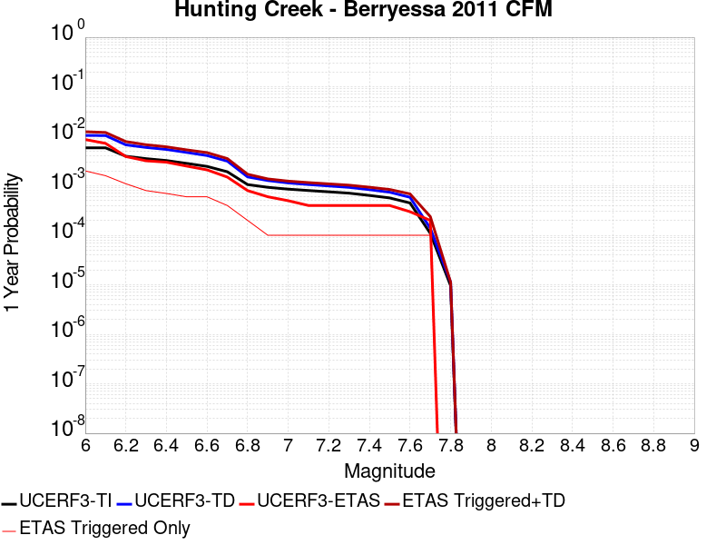 | 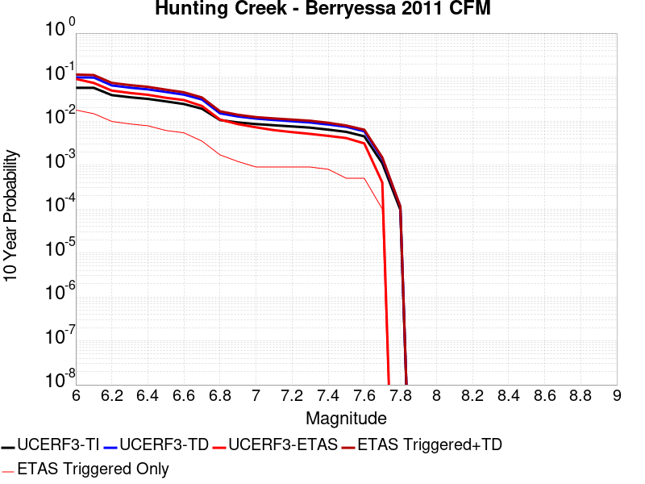 |

| Magnitude | 1 wk TI Prob | 1 wk TD Prob | 1 wk ETAS Prob | 1 wk ETAS/TD Gain | 1 wk ETAS Triggered+TD | 1 wk ETAS Triggered Only | 1 mo TI Prob | 1 mo TD Prob | 1 mo ETAS Prob | 1 mo ETAS/TD Gain | 1 mo ETAS Triggered+TD | 1 mo ETAS Triggered Only | 1 yr TI Prob | 1 yr TD Prob | 1 yr ETAS Prob | 1 yr ETAS/TD Gain | 1 yr ETAS Triggered+TD | 1 yr ETAS Triggered Only | 10 yr TI Prob | 10 yr TD Prob | 10 yr ETAS Prob | 10 yr ETAS/TD Gain | 10 yr ETAS Triggered+TD | 10 yr ETAS Triggered Only |
|-----|-----|-----|-----|-----|-----|-----|-----|-----|-----|-----|-----|-----|-----|-----|-----|-----|-----|-----|-----|-----|-----|-----|-----|-----|
| 6.0 | 1.1270982E-4 | 2.004215E-4 | 2.0E-4 | 0.99789685 | 2.004215E-4 | 0.0 | 4.8295266E-4 | 8.5865654E-4 | 7.0E-4 | 0.81522703 | 9.585707E-4 | 1.0E-4 | 0.0058641075 | 0.01039388 | 0.0086 | 0.8274099 | 0.012373093 | 0.002 | 0.057117578 | 0.09810527 | 0.091 | 0.92757505 | 0.114158995 | 0.0178 |
| 6.1 | 1.1239393E-4 | 1.9990253E-4 | 2.0E-4 | 1.0004876 | 1.9990253E-4 | 0.0 | 4.8159933E-4 | 8.564338E-4 | 4.0E-4 | 0.467053 | 9.563482E-4 | 1.0E-4 | 0.0058477195 | 0.010367103 | 0.0072 | 0.6945045 | 0.011950516 | 0.0016 | 0.056962132 | 0.09786357 | 0.0735 | 0.7510456 | 0.11112497 | 0.0147 |
| 6.2 | 7.596265E-5 | 1.2944541E-4 | 0.0 | 0.0 | 1.2944541E-4 | 0.0 | 3.2551357E-4 | 5.5460486E-4 | 2.0E-4 | 0.3606171 | 6.545494E-4 | 1.0E-4 | 0.0039559277 | 0.006726756 | 0.0039 | 0.5797742 | 0.007819357 | 0.0011 | 0.038862433 | 0.064639345 | 0.0492 | 0.7611463 | 0.07380588 | 0.0098 |
| 6.3 | 6.78794E-5 | 1.14579154E-4 | 0.0 | 0.0 | 1.14579154E-4 | 0.0 | 2.9087928E-4 | 4.9092947E-4 | 0.0 | 0.0 | 4.9092947E-4 | 0.0 | 0.003535705 | 0.0059575005 | 0.0032 | 0.537138 | 0.0067527345 | 8.0E-4 | 0.034799766 | 0.05750884 | 0.0436 | 0.7581443 | 0.06561426 | 0.0086 |
| 6.4 | 6.2165134E-5 | 1.0443812E-4 | 0.0 | 0.0 | 1.0443812E-4 | 0.0 | 2.6639478E-4 | 4.4748944E-4 | 0.0 | 0.0 | 4.4748944E-4 | 0.0 | 0.0032385332 | 0.00543196 | 0.003 | 0.55228686 | 0.0061281575 | 7.0E-4 | 0.03191742 | 0.052591655 | 0.0395 | 0.7510697 | 0.05998144 | 0.0078 |
| 6.5 | 5.4368087E-5 | 9.07844E-5 | 0.0 | 0.0 | 9.07844E-5 | 0.0 | 2.3298527E-4 | 3.8899828E-4 | 0.0 | 0.0 | 3.8899828E-4 | 0.0 | 0.0028329059 | 0.0047238227 | 0.0025 | 0.5292324 | 0.005320988 | 6.0E-4 | 0.027970633 | 0.045917444 | 0.0338 | 0.73610365 | 0.05173735 | 0.0061 |
| 6.6 | 4.729947E-5 | 7.8542726E-5 | 0.0 | 0.0 | 7.8542726E-5 | 0.0 | 2.0269625E-4 | 3.3655725E-4 | 0.0 | 0.0 | 3.3655725E-4 | 0.0 | 0.002465034 | 0.004088469 | 0.0021 | 0.5136397 | 0.0046860157 | 6.0E-4 | 0.02437869 | 0.03988562 | 0.03 | 0.7521508 | 0.04507024 | 0.0054 |
| 6.7 | 3.6875328E-5 | 6.0504968E-5 | 0.0 | 0.0 | 6.0504968E-5 | 0.0 | 1.5802756E-4 | 2.592712E-4 | 0.0 | 0.0 | 2.592712E-4 | 0.0 | 0.0019222875 | 0.0031514375 | 0.0015 | 0.47597325 | 0.003550177 | 4.0E-4 | 0.019057442 | 0.030922001 | 0.022 | 0.7114675 | 0.034313776 | 0.0035 |
| 6.8 | 2.0292036E-5 | 2.8990444E-5 | 0.0 | 0.0 | 2.8990444E-5 | 0.0 | 8.6962966E-5 | 1.2423864E-4 | 0.0 | 0.0 | 1.2423864E-4 | 0.0 | 0.0010582599 | 0.001511543 | 8.0E-4 | 0.52926046 | 0.0017112407 | 2.0E-4 | 0.010532344 | 0.014985861 | 0.0108 | 0.7206793 | 0.016660385 | 0.0017 |
| 6.9 | 1.7871042E-5 | 2.4484749E-5 | 0.0 | 0.0 | 2.4484749E-5 | 0.0 | 7.658793E-5 | 1.04930405E-4 | 0.0 | 0.0 | 1.04930405E-4 | 0.0 | 9.320591E-4 | 0.0012767784 | 6.0E-4 | 0.46993276 | 0.0013766508 | 1.0E-4 | 0.009281595 | 0.01268619 | 0.0085 | 0.6700199 | 0.013870967 | 0.0012 |
| 7.0 | 1.6415532E-5 | 2.1917964E-5 | 0.0 | 0.0 | 2.1917964E-5 | 0.0 | 7.035038E-5 | 9.3930765E-5 | 0.0 | 0.0 | 9.3930765E-5 | 0.0 | 8.561793E-4 | 0.0011430084 | 5.0E-4 | 0.43744215 | 0.001242894 | 1.0E-4 | 0.008528882 | 0.0113706 | 0.0072 | 0.6332119 | 0.012260367 | 9.0E-4 |
| 7.1 | 1.5409885E-5 | 2.0357553E-5 | 0.0 | 0.0 | 2.0357553E-5 | 0.0 | 6.6040695E-5 | 8.724375E-5 | 0.0 | 0.0 | 8.724375E-5 | 0.0 | 8.0374884E-4 | 0.0010616778 | 4.0E-4 | 0.37676212 | 0.0011615717 | 1.0E-4 | 0.00800848 | 0.010566531 | 0.0062 | 0.5867583 | 0.011457021 | 9.0E-4 |
| 7.2 | 1.4497423E-5 | 1.9065661E-5 | 0.0 | 0.0 | 1.9065661E-5 | 0.0 | 6.213033E-5 | 8.170743E-5 | 0.0 | 0.0 | 8.170743E-5 | 0.0 | 7.5617427E-4 | 9.94337E-4 | 4.0E-4 | 0.40227807 | 0.0010942377 | 1.0E-4 | 0.0075360634 | 0.009899622 | 0.0056 | 0.5656781 | 0.010790712 | 9.0E-4 |
| 7.3 | 1.3615175E-5 | 1.783644E-5 | 0.0 | 0.0 | 1.783644E-5 | 0.0 | 5.8349444E-5 | 7.643967E-5 | 0.0 | 0.0 | 7.643967E-5 | 0.0 | 7.101729E-4 | 9.3025854E-4 | 4.0E-4 | 0.42998797 | 0.0010301656 | 1.0E-4 | 0.0070790765 | 0.009264388 | 0.0051 | 0.550495 | 0.01015605 | 9.0E-4 |
| 7.4 | 1.2252825E-5 | 1.6035796E-5 | 0.0 | 0.0 | 1.6035796E-5 | 0.0 | 5.251105E-5 | 6.872304E-5 | 0.0 | 0.0 | 6.872304E-5 | 0.0 | 6.391345E-4 | 8.363847E-4 | 4.0E-4 | 0.47824883 | 9.363011E-4 | 1.0E-4 | 0.0063729943 | 0.008333002 | 0.0046 | 0.5520219 | 0.009126335 | 8.0E-4 |
| 7.5 | 1.0913301E-5 | 1.4249328E-5 | 0.0 | 0.0 | 1.4249328E-5 | 0.0 | 4.6770452E-5 | 6.1067134E-5 | 0.0 | 0.0 | 6.1067134E-5 | 0.0 | 5.6928146E-4 | 7.4324146E-4 | 4.0E-4 | 0.5381831 | 8.4316713E-4 | 1.0E-4 | 0.0056782532 | 0.0074081584 | 0.0041 | 0.55344385 | 0.007904454 | 5.0E-4 |
| 7.6 | 8.623192E-6 | 1.1241596E-5 | 0.0 | 0.0 | 1.1241596E-5 | 0.0 | 3.6956015E-5 | 4.8177397E-5 | 0.0 | 0.0 | 4.8177397E-5 | 0.0 | 4.4984656E-4 | 5.864045E-4 | 3.0E-4 | 0.51159227 | 6.8634585E-4 | 1.0E-4 | 0.00448937 | 0.005849086 | 0.0031 | 0.52999735 | 0.0063461615 | 5.0E-4 |
| 7.7 | 2.0993634E-6 | 2.6637122E-6 | 0.0 | 0.0 | 2.6637122E-6 | 0.0 | 8.997241E-6 | 1.1415859E-5 | 0.0 | 0.0 | 1.1415859E-5 | 0.0 | 1.09535904E-4 | 1.389793E-4 | 2.0E-4 | 1.4390632 | 2.389654E-4 | 1.0E-4 | 0.0010948193 | 0.0013889574 | 4.0E-4 | 0.2879858 | 0.0014888186 | 1.0E-4 |
| 7.8 | 1.8428308E-7 | 2.1680233E-7 | 0.0 | 0.0 | 2.1680233E-7 | 0.0 | 7.897844E-7 | 9.291526E-7 | 0.0 | 0.0 | 9.291526E-7 | 0.0 | 9.615583E-6 | 1.1312378E-5 | 0.0 | 0.0 | 1.1312378E-5 | 0.0 | 9.615166E-5 | 1.1311122E-4 | 0.0 | 0.0 | 1.1311122E-4 | 0.0 |

## Calaveras (So) - Paicines extension 2011 CFM
*[(top)](#table-of-contents)*

| 1 Week | 1 Month | 1 Year | 10 Year |
|-----|-----|-----|-----|
|  | 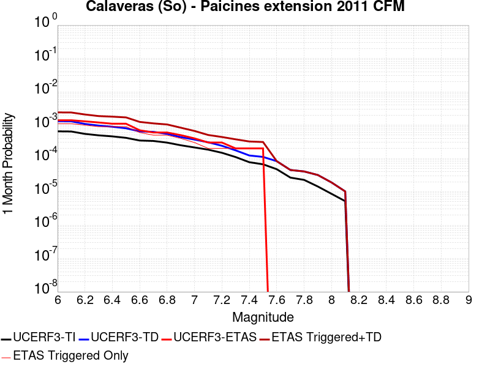 | 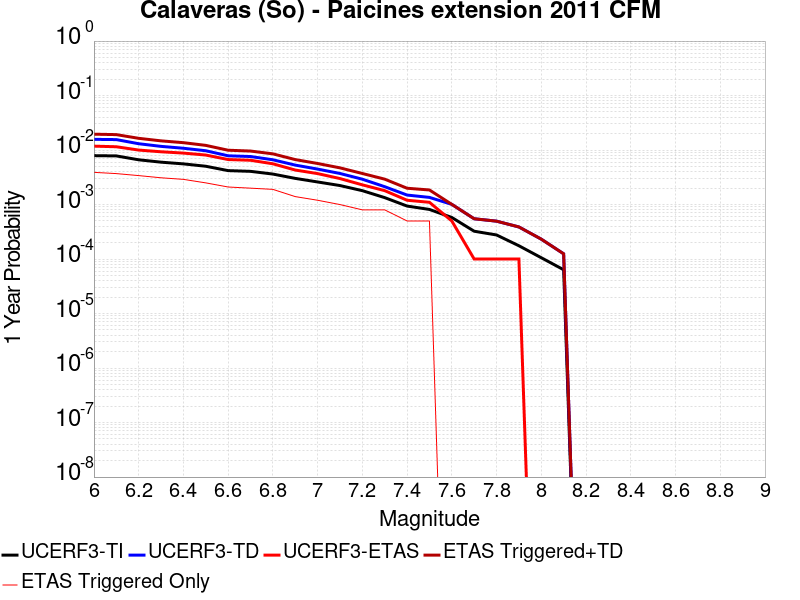 | 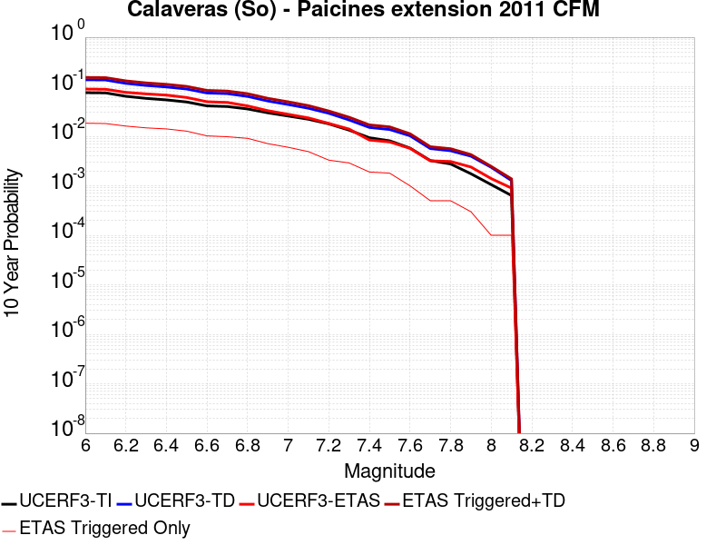 |

| Magnitude | 1 wk TI Prob | 1 wk TD Prob | 1 wk ETAS Prob | 1 wk ETAS/TD Gain | 1 wk ETAS Triggered+TD | 1 wk ETAS Triggered Only | 1 mo TI Prob | 1 mo TD Prob | 1 mo ETAS Prob | 1 mo ETAS/TD Gain | 1 mo ETAS Triggered+TD | 1 mo ETAS Triggered Only | 1 yr TI Prob | 1 yr TD Prob | 1 yr ETAS Prob | 1 yr ETAS/TD Gain | 1 yr ETAS Triggered+TD | 1 yr ETAS Triggered Only | 10 yr TI Prob | 10 yr TD Prob | 10 yr ETAS Prob | 10 yr ETAS/TD Gain | 10 yr ETAS Triggered+TD | 10 yr ETAS Triggered Only |
|-----|-----|-----|-----|-----|-----|-----|-----|-----|-----|-----|-----|-----|-----|-----|-----|-----|-----|-----|-----|-----|-----|-----|-----|-----|
| 6.0 | 1.5183659E-4 | 3.0542197E-4 | 9.0E-4 | 2.9467428 | 0.0010052081 | 7.0E-4 | 6.5056595E-4 | 0.0013077306 | 0.0014 | 1.070557 | 0.002406292 | 0.0011 | 0.007891912 | 0.015707174 | 0.0118 | 0.751249 | 0.019545916 | 0.0039 | 0.076174594 | 0.1385761 | 0.0901 | 0.6501842 | 0.1544263 | 0.0184 |
| 6.1 | 1.5024997E-4 | 3.023623E-4 | 9.0E-4 | 2.9765615 | 0.0010021507 | 7.0E-4 | 6.437695E-4 | 0.0012946327 | 0.0014 | 1.0813879 | 0.0023932084 | 0.0011 | 0.0078097614 | 0.015550468 | 0.0115 | 0.7395276 | 0.019192932 | 0.0037 | 0.075409345 | 0.13724504 | 0.0891 | 0.6492037 | 0.15286091 | 0.0181 |
| 6.2 | 1.2743923E-4 | 2.5333153E-4 | 9.0E-4 | 3.5526571 | 9.531542E-4 | 7.0E-4 | 5.460538E-4 | 0.0010848618 | 0.0013 | 1.1983093 | 0.002083777 | 0.001 | 0.0066279583 | 0.013057299 | 0.01 | 0.7658552 | 0.016412904 | 0.0034 | 0.064337276 | 0.11734072 | 0.0772 | 0.6579131 | 0.13155153 | 0.0161 |
| 6.3 | 1.1525114E-4 | 2.2619101E-4 | 9.0E-4 | 3.9789379 | 9.2603266E-4 | 7.0E-4 | 4.9383997E-4 | 9.687346E-4 | 0.0012 | 1.2387294 | 0.0018678628 | 9.0E-4 | 0.0059959386 | 0.011678442 | 0.0093 | 0.79633904 | 0.014742239 | 0.0031 | 0.058367174 | 0.106457286 | 0.0719 | 0.6753883 | 0.119681716 | 0.0148 |
| 6.4 | 1.07200925E-4 | 2.086006E-4 | 9.0E-4 | 4.314465 | 9.084546E-4 | 7.0E-4 | 4.5935164E-4 | 8.934666E-4 | 0.0011 | 1.2311596 | 0.0017926624 | 9.0E-4 | 0.0055782744 | 0.010783245 | 0.0088 | 0.81608087 | 0.013651974 | 0.0029 | 0.0544031 | 0.0992799 | 0.0679 | 0.6839249 | 0.11198006 | 0.0141 |
| 6.5 | 9.69631E-5 | 1.8753097E-4 | 9.0E-4 | 4.799207 | 8.873997E-4 | 7.0E-4 | 4.1548995E-4 | 8.0328423E-4 | 0.0011 | 1.3693783 | 0.0017025613 | 9.0E-4 | 0.0050468626 | 0.00970476 | 0.0081 | 0.83464193 | 0.012180499 | 0.0025 | 0.04933773 | 0.09016951 | 0.0608 | 0.67428553 | 0.10172436 | 0.0127 |
| 6.6 | 8.0552316E-5 | 1.508985E-4 | 5.0E-4 | 3.3134856 | 5.5083813E-4 | 4.0E-4 | 3.4517853E-4 | 6.465067E-4 | 7.0E-4 | 1.082742 | 0.0012461188 | 6.0E-4 | 0.0041944524 | 0.007836337 | 0.0067 | 0.8549913 | 0.009919881 | 0.0021 | 0.04116161 | 0.07493985 | 0.0499 | 0.6658674 | 0.08437546 | 0.0102 |
| 6.7 | 7.815757E-5 | 1.4630088E-4 | 5.0E-4 | 3.4176145 | 5.4624234E-4 | 4.0E-4 | 3.34918E-4 | 6.2681787E-4 | 6.0E-4 | 0.95721585 | 0.0011265045 | 5.0E-4 | 0.004070005 | 0.007598995 | 0.0065 | 0.85537624 | 0.009583797 | 0.002 | 0.039962657 | 0.07278834 | 0.0483 | 0.6635678 | 0.08187502 | 0.0098 |
| 6.8 | 6.965264E-5 | 1.2739346E-4 | 5.0E-4 | 3.9248483 | 5.273425E-4 | 4.0E-4 | 2.9847719E-4 | 5.458396E-4 | 6.0E-4 | 1.099224 | 0.0010455668 | 5.0E-4 | 0.0036279052 | 0.0066221342 | 0.0056 | 0.8456488 | 0.008509552 | 0.0019 | 0.03569247 | 0.063874796 | 0.0411 | 0.64344627 | 0.07239354 | 0.0091 |
| 6.9 | 5.8000453E-5 | 1.01566824E-4 | 4.0E-4 | 3.9382937 | 4.0153635E-4 | 3.0E-4 | 2.4854968E-4 | 4.3521432E-4 | 5.0E-4 | 1.1488593 | 8.3504023E-4 | 4.0E-4 | 0.0030218933 | 0.0052859583 | 0.0043 | 0.81347597 | 0.006678558 | 0.0014 | 0.029811295 | 0.051564656 | 0.0329 | 0.6380339 | 0.058298547 | 0.0071 |
| 7.0 | 4.9865852E-5 | 8.577992E-5 | 3.0E-4 | 3.497322 | 2.8576277E-4 | 2.0E-4 | 2.1369329E-4 | 3.675769E-4 | 4.0E-4 | 1.0882076 | 6.6746667E-4 | 3.0E-4 | 0.0025986114 | 0.004466155 | 0.0037 | 0.8284531 | 0.0056607956 | 0.0012 | 0.025684336 | 0.043831944 | 0.0278 | 0.6342406 | 0.04956895 | 0.006 |
| 7.1 | 4.283875E-5 | 7.1207956E-5 | 2.0E-4 | 2.8086748 | 1.7120084E-4 | 1.0E-4 | 1.8358172E-4 | 3.0514158E-4 | 3.0E-4 | 0.9831502 | 5.0508056E-4 | 2.0E-4 | 0.0022328163 | 0.0037088266 | 0.003 | 0.80888116 | 0.004705118 | 0.001 | 0.022105146 | 0.03677775 | 0.0235 | 0.6389733 | 0.04149754 | 0.0049 |
| 7.2 | 3.450115E-5 | 5.5859324E-5 | 2.0E-4 | 3.5804229 | 1.5585373E-4 | 1.0E-4 | 1.478537E-4 | 2.393753E-4 | 3.0E-4 | 1.2532622 | 4.393274E-4 | 2.0E-4 | 0.0017986323 | 0.0029105286 | 0.0023 | 0.7902345 | 0.0037082 | 8.0E-4 | 0.017841442 | 0.029120376 | 0.0182 | 0.6249919 | 0.03232428 | 0.0033 |
| 7.3 | 2.5709045E-5 | 4.068057E-5 | 1.0E-4 | 2.4581761 | 1.4067651E-4 | 1.0E-4 | 1.1017697E-4 | 1.7433373E-4 | 2.0E-4 | 1.1472249 | 3.7429886E-4 | 2.0E-4 | 0.0013405791 | 0.0021204643 | 0.0018 | 0.8488707 | 0.002918768 | 8.0E-4 | 0.013325208 | 0.021342836 | 0.014 | 0.6559578 | 0.024180941 | 0.0029 |
| 7.4 | 1.8003093E-5 | 2.8536913E-5 | 1.0E-4 | 3.5042334 | 1.2853405E-4 | 1.0E-4 | 7.715383E-5 | 1.2229533E-4 | 2.0E-4 | 1.6353854 | 3.2227088E-4 | 2.0E-4 | 9.3894306E-4 | 0.0014879311 | 0.0012 | 0.806489 | 0.0019871872 | 5.0E-4 | 0.009349857 | 0.015063516 | 0.0084 | 0.55763876 | 0.016934896 | 0.0019 |
| 7.5 | 1.5595824E-5 | 2.5851303E-5 | 1.0E-4 | 3.868277 | 1.2584872E-4 | 1.0E-4 | 6.683753E-5 | 1.10786605E-4 | 2.0E-4 | 1.8052725 | 3.1076444E-4 | 2.0E-4 | 8.134431E-4 | 0.0013479945 | 0.0011 | 0.81602705 | 0.0018473206 | 5.0E-4 | 0.008104719 | 0.013664662 | 0.0077 | 0.5634973 | 0.015440066 | 0.0018 |
| 7.6 | 1.1110309E-5 | 1.92588E-5 | 0.0 | 0.0 | 1.92588E-5 | 0.0 | 4.761474E-5 | 8.253511E-5 | 0.0 | 0.0 | 8.253511E-5 | 0.0 | 5.795553E-4 | 0.001004403 | 5.0E-4 | 0.49780813 | 0.001004403 | 0.0 | 0.0057804612 | 0.010220913 | 0.0057 | 0.5576801 | 0.011210693 | 0.001 |
| 7.7 | 6.2140443E-6 | 1.0474379E-5 | 0.0 | 0.0 | 1.0474379E-5 | 0.0 | 2.6631347E-5 | 4.4889424E-5 | 0.0 | 0.0 | 4.4889424E-5 | 0.0 | 3.241884E-4 | 5.463918E-4 | 1.0E-4 | 0.18301885 | 5.463918E-4 | 0.0 | 0.0032371588 | 0.0056378203 | 0.0032 | 0.56759524 | 0.0061350013 | 5.0E-4 |
| 7.8 | 5.305533E-6 | 9.469078E-6 | 0.0 | 0.0 | 9.469078E-6 | 0.0 | 2.27378E-5 | 4.058113E-5 | 0.0 | 0.0 | 4.058113E-5 | 0.0 | 2.7679754E-4 | 4.9396337E-4 | 1.0E-4 | 0.20244417 | 4.9396337E-4 | 0.0 | 0.0027645302 | 0.005091755 | 0.0031 | 0.6088274 | 0.0055892095 | 5.0E-4 |
| 7.9 | 3.363505E-6 | 7.4140553E-6 | 0.0 | 0.0 | 7.4140553E-6 | 0.0 | 1.4414942E-5 | 3.1774136E-5 | 0.0 | 0.0 | 3.1774136E-5 | 0.0 | 1.7548777E-4 | 3.8678152E-4 | 1.0E-4 | 0.25854388 | 3.8678152E-4 | 0.0 | 0.0017534926 | 0.003962651 | 0.0024 | 0.6056552 | 0.004261462 | 3.0E-4 |
| 8.0 | 2.0271132E-6 | 4.4299677E-6 | 0.0 | 0.0 | 4.4299677E-6 | 0.0 | 8.687599E-6 | 1.8985438E-5 | 0.0 | 0.0 | 1.8985438E-5 | 0.0 | 1.05766376E-4 | 2.3112324E-4 | 0.0 | 0.0 | 2.3112324E-4 | 0.0 | 0.0010571606 | 0.0023594582 | 0.0014 | 0.59335655 | 0.0024592225 | 1.0E-4 |
| 8.1 | 1.2206116E-6 | 2.3841594E-6 | 0.0 | 0.0 | 2.3841594E-6 | 0.0 | 5.2311816E-6 | 1.0217786E-5 | 0.0 | 0.0 | 1.0217786E-5 | 0.0 | 6.3687774E-5 | 1.2439449E-4 | 0.0 | 0.0 | 1.2439449E-4 | 0.0 | 6.366953E-4 | 0.0012751496 | 9.0E-4 | 0.7057995 | 0.0013750221 | 1.0E-4 |

## San Andreas (Coachella) rev
*[(top)](#table-of-contents)*

| 1 Week | 1 Month | 1 Year | 10 Year |
|-----|-----|-----|-----|
|  | 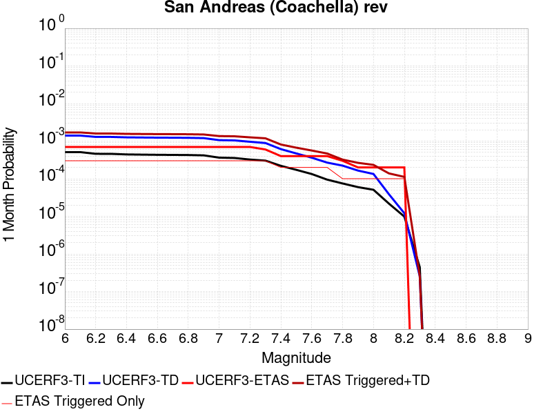 |  | 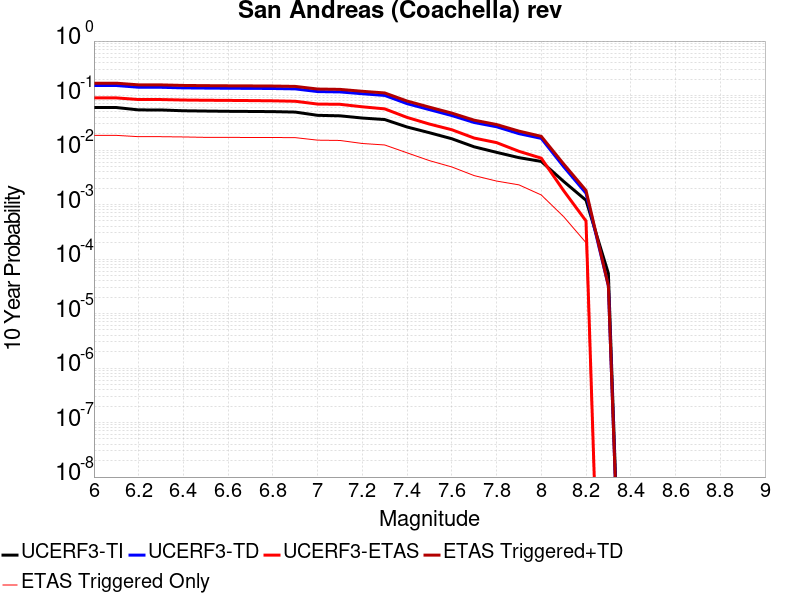 |

| Magnitude | 1 wk TI Prob | 1 wk TD Prob | 1 wk ETAS Prob | 1 wk ETAS/TD Gain | 1 wk ETAS Triggered+TD | 1 wk ETAS Triggered Only | 1 mo TI Prob | 1 mo TD Prob | 1 mo ETAS Prob | 1 mo ETAS/TD Gain | 1 mo ETAS Triggered+TD | 1 mo ETAS Triggered Only | 1 yr TI Prob | 1 yr TD Prob | 1 yr ETAS Prob | 1 yr ETAS/TD Gain | 1 yr ETAS Triggered+TD | 1 yr ETAS Triggered Only | 10 yr TI Prob | 10 yr TD Prob | 10 yr ETAS Prob | 10 yr ETAS/TD Gain | 10 yr ETAS Triggered+TD | 10 yr ETAS Triggered Only |
|-----|-----|-----|-----|-----|-----|-----|-----|-----|-----|-----|-----|-----|-----|-----|-----|-----|-----|-----|-----|-----|-----|-----|-----|-----|
| 6.0 | 1.1925945E-4 | 3.2730258E-4 | 2.0E-4 | 0.6110554 | 4.2726984E-4 | 1.0E-4 | 5.110118E-4 | 0.0014019759 | 7.0E-4 | 0.4992953 | 0.0017015553 | 3.0E-4 | 0.0062038354 | 0.016936801 | 0.0078 | 0.4605356 | 0.019197848 | 0.0023 | 0.060334753 | 0.152645 | 0.0906 | 0.593534 | 0.1684058 | 0.0186 |
| 6.1 | 1.1925945E-4 | 3.2730258E-4 | 2.0E-4 | 0.6110554 | 4.2726984E-4 | 1.0E-4 | 5.110118E-4 | 0.0014019759 | 7.0E-4 | 0.4992953 | 0.0017015553 | 3.0E-4 | 0.0062038354 | 0.016936801 | 0.0078 | 0.4605356 | 0.019197848 | 0.0023 | 0.060334753 | 0.152645 | 0.0906 | 0.593534 | 0.1684058 | 0.0186 |
| 6.2 | 1.07432395E-4 | 3.0230498E-4 | 2.0E-4 | 0.66158354 | 4.0227477E-4 | 1.0E-4 | 4.603433E-4 | 0.0012949535 | 7.0E-4 | 0.54055995 | 0.001594565 | 3.0E-4 | 0.005590286 | 0.015653184 | 0.0075 | 0.47913575 | 0.017818747 | 0.0022 | 0.05451731 | 0.14180487 | 0.0845 | 0.5958892 | 0.15690911 | 0.0176 |
| 6.3 | 1.0718766E-4 | 3.0175803E-4 | 2.0E-4 | 0.6627827 | 4.0172786E-4 | 1.0E-4 | 4.592948E-4 | 0.0012926117 | 7.0E-4 | 0.54153925 | 0.0015922239 | 3.0E-4 | 0.005577586 | 0.01562508 | 0.0075 | 0.47999752 | 0.017790705 | 0.0022 | 0.054396555 | 0.14157309 | 0.0845 | 0.5968648 | 0.1566814 | 0.0176 |
| 6.4 | 1.0355944E-4 | 2.9383783E-4 | 2.0E-4 | 0.68064755 | 3.9380847E-4 | 1.0E-4 | 4.4375064E-4 | 0.0012587012 | 7.0E-4 | 0.5561288 | 0.0015583236 | 3.0E-4 | 0.0053892885 | 0.0152180595 | 0.0074 | 0.48626438 | 0.01738458 | 0.0022 | 0.052604496 | 0.13815981 | 0.0828 | 0.599306 | 0.15315583 | 0.0174 |
| 6.5 | 1.0227914E-4 | 2.9103184E-4 | 2.0E-4 | 0.68721 | 3.9100274E-4 | 1.0E-4 | 4.382655E-4 | 0.0012466871 | 7.0E-4 | 0.56148815 | 0.001546313 | 3.0E-4 | 0.0053228354 | 0.015073821 | 0.0074 | 0.49091733 | 0.017240658 | 0.0022 | 0.051971316 | 0.13694228 | 0.082 | 0.59879243 | 0.15170057 | 0.0171 |
| 6.6 | 1.0116757E-4 | 2.8868907E-4 | 2.0E-4 | 0.6927869 | 3.886602E-4 | 1.0E-4 | 4.3350324E-4 | 0.0012366562 | 7.0E-4 | 0.56604254 | 0.0015362852 | 3.0E-4 | 0.0052651367 | 0.014953377 | 0.0074 | 0.49487153 | 0.017120479 | 0.0022 | 0.051421247 | 0.13592054 | 0.0815 | 0.59961504 | 0.1506963 | 0.0171 |
| 6.7 | 1.0050676E-4 | 2.8727457E-4 | 2.0E-4 | 0.69619805 | 3.8724585E-4 | 1.0E-4 | 4.3067214E-4 | 0.0012305997 | 7.0E-4 | 0.56882834 | 0.0015302305 | 3.0E-4 | 0.005230834 | 0.014880649 | 0.0073 | 0.49057 | 0.017047912 | 0.0022 | 0.051094085 | 0.1353049 | 0.0809 | 0.59790885 | 0.15000471 | 0.017 |
| 6.8 | 9.976819E-5 | 2.8531102E-4 | 2.0E-4 | 0.70098937 | 3.852825E-4 | 1.0E-4 | 4.2750788E-4 | 0.0012221924 | 7.0E-4 | 0.5727412 | 0.0015218258 | 3.0E-4 | 0.0051924936 | 0.014779684 | 0.0073 | 0.49392125 | 0.016947169 | 0.0022 | 0.050728295 | 0.13445678 | 0.0801 | 0.5957304 | 0.14917102 | 0.017 |
| 6.9 | 9.77719E-5 | 2.8028406E-4 | 2.0E-4 | 0.71356183 | 3.80256E-4 | 1.0E-4 | 4.1895514E-4 | 0.0012006683 | 7.0E-4 | 0.58300865 | 0.001500308 | 3.0E-4 | 0.0050888555 | 0.01452115 | 0.0073 | 0.50271505 | 0.016689204 | 0.0022 | 0.049738888 | 0.13228731 | 0.0786 | 0.59416133 | 0.14695165 | 0.0169 |
| 7.0 | 8.500761E-5 | 2.4766594E-4 | 2.0E-4 | 0.8075394 | 3.4764118E-4 | 1.0E-4 | 3.6426744E-4 | 0.0010609969 | 7.0E-4 | 0.6597569 | 0.0013606786 | 3.0E-4 | 0.0044259406 | 0.012841902 | 0.0061 | 0.47500753 | 0.014618786 | 0.0018 | 0.04338823 | 0.11815146 | 0.0698 | 0.59076715 | 0.13155556 | 0.0152 |
| 7.1 | 8.319876E-5 | 2.4370069E-4 | 2.0E-4 | 0.82067883 | 3.436763E-4 | 1.0E-4 | 3.5651738E-4 | 0.0010440167 | 7.0E-4 | 0.6704874 | 0.0013437035 | 3.0E-4 | 0.004331963 | 0.012637584 | 0.006 | 0.4747743 | 0.014414837 | 0.0018 | 0.042484846 | 0.11637489 | 0.0691 | 0.5937707 | 0.12962927 | 0.015 |
| 7.2 | 7.563917E-5 | 2.2419867E-4 | 2.0E-4 | 0.89206594 | 3.2417625E-4 | 1.0E-4 | 3.2412758E-4 | 9.605007E-4 | 7.0E-4 | 0.7287866 | 0.0012602125 | 3.0E-4 | 0.0039391145 | 0.011632082 | 0.0058 | 0.49862096 | 0.013114634 | 0.0015 | 0.03870018 | 0.107786536 | 0.0622 | 0.5770665 | 0.11956376 | 0.0132 |
| 7.3 | 7.082985E-5 | 2.0736855E-4 | 2.0E-4 | 0.96446645 | 3.073478E-4 | 1.0E-4 | 3.0352117E-4 | 8.884225E-4 | 6.0E-4 | 0.67535436 | 0.001188156 | 3.0E-4 | 0.0036891096 | 0.010763523 | 0.005 | 0.4645319 | 0.012247378 | 0.0015 | 0.03628465 | 0.10031239 | 0.057 | 0.56822497 | 0.11146851 | 0.0124 |
| 7.4 | 5.146215E-5 | 1.4285372E-4 | 2.0E-4 | 1.4000335 | 2.4283944E-4 | 1.0E-4 | 2.2053342E-4 | 6.120875E-4 | 4.0E-4 | 0.65350133 | 8.119651E-4 | 2.0E-4 | 0.0026816884 | 0.0074268905 | 0.004 | 0.5385834 | 0.008717236 | 0.0013 | 0.02649557 | 0.070900604 | 0.0397 | 0.55993885 | 0.07916959 | 0.0089 |
| 7.5 | 4.0285166E-5 | 1.0955965E-4 | 2.0E-4 | 1.8254896 | 2.095487E-4 | 1.0E-4 | 1.7263928E-4 | 4.6945718E-4 | 4.0E-4 | 0.85204786 | 6.693633E-4 | 2.0E-4 | 0.002099857 | 0.0057007316 | 0.0028 | 0.491165 | 0.006496171 | 8.0E-4 | 0.020801254 | 0.055072293 | 0.03 | 0.54473853 | 0.06111983 | 0.0064 |
| 7.6 | 3.1168736E-5 | 8.45427E-5 | 2.0E-4 | 2.3656685 | 1.8453425E-4 | 1.0E-4 | 1.3357346E-4 | 3.6227566E-4 | 4.0E-4 | 1.1041316 | 5.6220323E-4 | 2.0E-4 | 0.0016250437 | 0.0044018123 | 0.0023 | 0.522512 | 0.0050987313 | 7.0E-4 | 0.016132116 | 0.042876575 | 0.0236 | 0.5504171 | 0.04756648 | 0.0049 |
| 7.7 | 2.2100989E-5 | 6.2548075E-5 | 2.0E-4 | 3.1975405 | 1.6254182E-4 | 1.0E-4 | 9.4715084E-5 | 2.6803566E-4 | 4.0E-4 | 1.4923388 | 4.6798206E-4 | 2.0E-4 | 0.001152546 | 0.0032584574 | 0.0019 | 0.583098 | 0.0037568281 | 5.0E-4 | 0.011465867 | 0.031971566 | 0.0166 | 0.51921135 | 0.035262864 | 0.0034 |
| 7.8 | 1.7484861E-5 | 5.1953106E-5 | 2.0E-4 | 3.8496256 | 1.5194791E-4 | 1.0E-4 | 7.493296E-5 | 2.2263719E-4 | 3.0E-4 | 1.3474839 | 3.226149E-4 | 1.0E-4 | 9.1192697E-4 | 0.002707241 | 0.0017 | 0.62794554 | 0.0031061582 | 4.0E-4 | 0.009081938 | 0.026710793 | 0.0137 | 0.51290125 | 0.029338675 | 0.0027 |
| 7.9 | 1.3967285E-5 | 3.8348353E-5 | 2.0E-4 | 5.2153482 | 1.3834452E-4 | 1.0E-4 | 5.985842E-5 | 1.6433973E-4 | 2.0E-4 | 1.2169912 | 2.643233E-4 | 1.0E-4 | 7.2853256E-4 | 0.0019990013 | 0.0014 | 0.7003497 | 0.0023982017 | 4.0E-4 | 0.0072614877 | 0.01996716 | 0.0095 | 0.47578126 | 0.022221234 | 0.0023 |
| 8.0 | 1.1887396E-5 | 3.116772E-5 | 2.0E-4 | 6.4168954 | 1.311646E-4 | 1.0E-4 | 5.094499E-5 | 1.335691E-4 | 2.0E-4 | 1.4973522 | 2.3355575E-4 | 1.0E-4 | 6.200787E-4 | 0.0016249919 | 0.0012 | 0.73846525 | 0.0020243418 | 4.0E-4 | 0.006183513 | 0.016326722 | 0.0071 | 0.43486992 | 0.017802231 | 0.0015 |
| 8.1 | 5.100864E-6 | 8.999646E-6 | 2.0E-4 | 22.223097 | 1.0899875E-4 | 1.0E-4 | 2.1860664E-5 | 3.8569342E-5 | 2.0E-4 | 5.185466 | 1.3856549E-4 | 1.0E-4 | 2.6612106E-4 | 4.6948067E-4 | 4.0E-4 | 0.85200524 | 6.6938676E-4 | 2.0E-4 | 0.002658026 | 0.0049311016 | 0.0018 | 0.36503 | 0.005528143 | 6.0E-4 |
| 8.2 | 2.3004484E-6 | 2.794734E-6 | 2.0E-4 | 71.563156 | 1.0279445E-4 | 1.0E-4 | 9.859027E-6 | 1.1977377E-5 | 2.0E-4 | 16.698147 | 1.1197618E-4 | 1.0E-4 | 1.2002704E-4 | 1.4581483E-4 | 2.0E-4 | 1.3716025 | 2.4580024E-4 | 1.0E-4 | 0.0011996223 | 0.0016016988 | 5.0E-4 | 0.31216857 | 0.0018013784 | 2.0E-4 |
| 8.3 | 1.0424446E-7 | 5.8319376E-8 | 0.0 | 0.0 | 5.8319376E-8 | 0.0 | 4.4676187E-7 | 2.4994014E-7 | 0.0 | 0.0 | 2.4994014E-7 | 0.0 | 5.439312E-6 | 3.0430174E-6 | 0.0 | 0.0 | 3.0430174E-6 | 0.0 | 5.4391792E-5 | 3.1991236E-5 | 0.0 | 0.0 | 3.1991236E-5 | 0.0 |

## Elsinore (Glen Ivy) rev
*[(top)](#table-of-contents)*

| 1 Week | 1 Month | 1 Year | 10 Year |
|-----|-----|-----|-----|
|  |  |  |  |

| Magnitude | 1 wk TI Prob | 1 wk TD Prob | 1 wk ETAS Prob | 1 wk ETAS/TD Gain | 1 wk ETAS Triggered+TD | 1 wk ETAS Triggered Only | 1 mo TI Prob | 1 mo TD Prob | 1 mo ETAS Prob | 1 mo ETAS/TD Gain | 1 mo ETAS Triggered+TD | 1 mo ETAS Triggered Only | 1 yr TI Prob | 1 yr TD Prob | 1 yr ETAS Prob | 1 yr ETAS/TD Gain | 1 yr ETAS Triggered+TD | 1 yr ETAS Triggered Only | 10 yr TI Prob | 10 yr TD Prob | 10 yr ETAS Prob | 10 yr ETAS/TD Gain | 10 yr ETAS Triggered+TD | 10 yr ETAS Triggered Only |
|-----|-----|-----|-----|-----|-----|-----|-----|-----|-----|-----|-----|-----|-----|-----|-----|-----|-----|-----|-----|-----|-----|-----|-----|-----|
| 6.0 | 1.6204086E-4 | 2.941327E-4 | 4.0E-4 | 1.3599303 | 3.9410332E-4 | 1.0E-4 | 6.94276E-4 | 0.0012600938 | 6.0E-4 | 0.47615504 | 0.0015597157 | 3.0E-4 | 0.008420097 | 0.015255029 | 0.008 | 0.5244172 | 0.016929096 | 0.0017 | 0.081081145 | 0.13978311 | 0.0882 | 0.63097745 | 0.15406272 | 0.0166 |
| 6.1 | 1.6204086E-4 | 2.941327E-4 | 4.0E-4 | 1.3599303 | 3.9410332E-4 | 1.0E-4 | 6.94276E-4 | 0.0012600938 | 6.0E-4 | 0.47615504 | 0.0015597157 | 3.0E-4 | 0.008420097 | 0.015255029 | 0.008 | 0.5244172 | 0.016929096 | 0.0017 | 0.081081145 | 0.13978311 | 0.0882 | 0.63097745 | 0.15406272 | 0.0166 |
| 6.2 | 1.6204086E-4 | 2.941327E-4 | 4.0E-4 | 1.3599303 | 3.9410332E-4 | 1.0E-4 | 6.94276E-4 | 0.0012600938 | 6.0E-4 | 0.47615504 | 0.0015597157 | 3.0E-4 | 0.008420097 | 0.015255029 | 0.008 | 0.5244172 | 0.016929096 | 0.0017 | 0.081081145 | 0.13978311 | 0.0882 | 0.63097745 | 0.15406272 | 0.0166 |
| 6.3 | 1.0111737E-4 | 1.7736456E-4 | 2.0E-4 | 1.1276209 | 1.7736456E-4 | 0.0 | 4.332882E-4 | 7.600296E-4 | 4.0E-4 | 0.5262953 | 9.5987757E-4 | 2.0E-4 | 0.005262531 | 0.009234881 | 0.0051 | 0.55225396 | 0.010324723 | 0.0011 | 0.0513964 | 0.0872148 | 0.0595 | 0.6822237 | 0.09643393 | 0.0101 |
| 6.4 | 1.0111737E-4 | 1.7736456E-4 | 2.0E-4 | 1.1276209 | 1.7736456E-4 | 0.0 | 4.332882E-4 | 7.600296E-4 | 4.0E-4 | 0.5262953 | 9.5987757E-4 | 2.0E-4 | 0.005262531 | 0.009234881 | 0.0051 | 0.55225396 | 0.010324723 | 0.0011 | 0.0513964 | 0.0872148 | 0.0595 | 0.6822237 | 0.09643393 | 0.0101 |
| 6.5 | 3.6624708E-5 | 4.642631E-5 | 0.0 | 0.0 | 4.642631E-5 | 0.0 | 1.569536E-4 | 1.9895675E-4 | 1.0E-4 | 0.50262177 | 2.9893685E-4 | 1.0E-4 | 0.001909235 | 0.0024199684 | 0.002 | 0.8264571 | 0.0028190003 | 4.0E-4 | 0.01892915 | 0.023715464 | 0.0163 | 0.6873152 | 0.026058547 | 0.0024 |
| 6.6 | 2.5051324E-5 | 2.6173208E-5 | 0.0 | 0.0 | 2.6173208E-5 | 0.0 | 1.073584E-4 | 1.1216632E-4 | 1.0E-4 | 0.8915332 | 2.1215511E-4 | 1.0E-4 | 0.0013063047 | 0.001364814 | 0.0014 | 1.0257808 | 0.0016644046 | 3.0E-4 | 0.012986525 | 0.0135804955 | 0.0086 | 0.63326114 | 0.014764199 | 0.0012 |
| 6.7 | 2.2189772E-5 | 2.2089307E-5 | 0.0 | 0.0 | 2.2089307E-5 | 0.0 | 9.509556E-5 | 9.466523E-5 | 0.0 | 0.0 | 9.466523E-5 | 0.0 | 0.0011571734 | 0.0011519762 | 0.0012 | 1.0416882 | 0.0013517458 | 2.0E-4 | 0.011511663 | 0.011476635 | 0.0072 | 0.6273616 | 0.012366306 | 9.0E-4 |
| 6.8 | 1.6654378E-5 | 1.444795E-5 | 0.0 | 0.0 | 1.444795E-5 | 0.0 | 7.137396E-5 | 6.191834E-5 | 0.0 | 0.0 | 6.191834E-5 | 0.0 | 8.686314E-4 | 7.5360027E-4 | 9.0E-4 | 1.1942672 | 9.534495E-4 | 2.0E-4 | 0.008652439 | 0.007515814 | 0.0041 | 0.54551643 | 0.008210553 | 7.0E-4 |
| 6.9 | 1.5042909E-5 | 1.2340899E-5 | 0.0 | 0.0 | 1.2340899E-5 | 0.0 | 6.446802E-5 | 5.2888514E-5 | 0.0 | 0.0 | 5.2888514E-5 | 0.0 | 7.8461546E-4 | 6.437306E-4 | 8.0E-4 | 1.242756 | 8.436018E-4 | 2.0E-4 | 0.007818509 | 0.0064228764 | 0.0035 | 0.5449272 | 0.0071183806 | 7.0E-4 |
| 7.0 | 1.4361385E-5 | 1.1459702E-5 | 0.0 | 0.0 | 1.1459702E-5 | 0.0 | 6.154734E-5 | 4.9112103E-5 | 0.0 | 0.0 | 4.9112103E-5 | 0.0 | 7.490812E-4 | 5.9777877E-4 | 8.0E-4 | 1.3382878 | 7.976592E-4 | 2.0E-4 | 0.007465612 | 0.0059654056 | 0.0032 | 0.5364262 | 0.00666123 | 7.0E-4 |
| 7.1 | 1.3265571E-5 | 1.025239E-5 | 0.0 | 0.0 | 1.025239E-5 | 0.0 | 5.6851208E-5 | 4.393809E-5 | 0.0 | 0.0 | 4.393809E-5 | 0.0 | 6.919436E-4 | 5.3481746E-4 | 8.0E-4 | 1.4958375 | 7.3471054E-4 | 2.0E-4 | 0.006897931 | 0.005338533 | 0.003 | 0.5619521 | 0.00593533 | 6.0E-4 |
| 7.2 | 1.1596403E-5 | 8.511288E-6 | 0.0 | 0.0 | 8.511288E-6 | 0.0 | 4.9697923E-5 | 3.6476446E-5 | 0.0 | 0.0 | 3.6476446E-5 | 0.0 | 6.049042E-4 | 4.4401194E-4 | 8.0E-4 | 1.8017534 | 6.439231E-4 | 2.0E-4 | 0.006032603 | 0.004432667 | 0.0028 | 0.63167393 | 0.0049304506 | 5.0E-4 |
| 7.3 | 1.0150827E-5 | 7.2440353E-6 | 0.0 | 0.0 | 7.2440353E-6 | 0.0 | 4.3502816E-5 | 3.1045503E-5 | 0.0 | 0.0 | 3.1045503E-5 | 0.0 | 5.2951806E-4 | 3.779149E-4 | 6.0E-4 | 1.587659 | 3.779149E-4 | 0.0 | 0.005282581 | 0.0037731125 | 0.0021 | 0.55656964 | 0.0040719807 | 3.0E-4 |
| 7.4 | 9.080705E-6 | 6.3571392E-6 | 0.0 | 0.0 | 6.3571392E-6 | 0.0 | 3.8916725E-5 | 2.7244607E-5 | 0.0 | 0.0 | 2.7244607E-5 | 0.0 | 4.7370812E-4 | 3.3165395E-4 | 5.0E-4 | 1.5075954 | 3.3165395E-4 | 0.0 | 0.004726996 | 0.0033117416 | 0.0017 | 0.51332504 | 0.003610748 | 3.0E-4 |
| 7.5 | 7.671649E-6 | 5.229524E-6 | 0.0 | 0.0 | 5.229524E-6 | 0.0 | 3.287808E-5 | 2.2412061E-5 | 0.0 | 0.0 | 2.2412061E-5 | 0.0 | 4.0021708E-4 | 2.7283392E-4 | 3.0E-4 | 1.09957 | 2.7283392E-4 | 0.0 | 0.0039949706 | 0.0027251148 | 0.001 | 0.366957 | 0.0028248425 | 1.0E-4 |
| 7.6 | 6.990086E-6 | 4.691115E-6 | 0.0 | 0.0 | 4.691115E-6 | 0.0 | 2.9957167E-5 | 2.010463E-5 | 0.0 | 0.0 | 2.010463E-5 | 0.0 | 3.6466747E-4 | 2.4474753E-4 | 3.0E-4 | 1.2257528 | 2.4474753E-4 | 0.0 | 0.0036406964 | 0.0024448964 | 8.0E-4 | 0.32721224 | 0.0024448964 | 0.0 |
| 7.7 | 4.163505E-6 | 2.33142E-6 | 0.0 | 0.0 | 2.33142E-6 | 0.0 | 1.7843471E-5 | 9.991766E-6 | 0.0 | 0.0 | 9.991766E-6 | 0.0 | 2.172226E-4 | 1.2164371E-4 | 2.0E-4 | 1.6441458 | 1.2164371E-4 | 0.0 | 0.0021701038 | 0.0012158444 | 5.0E-4 | 0.41123682 | 0.0012158444 | 0.0 |
| 7.8 | 2.2692414E-7 | 9.391389E-8 | 0.0 | 0.0 | 9.391389E-8 | 0.0 | 9.725317E-7 | 4.0248807E-7 | 0.0 | 0.0 | 4.0248807E-7 | 0.0 | 1.1840509E-5 | 4.9002842E-6 | 0.0 | 0.0 | 4.9002842E-6 | 0.0 | 1.1839878E-4 | 4.900209E-5 | 0.0 | 0.0 | 4.900209E-5 | 0.0 |
| 7.9 | 6.676829E-9 | 3.4415768E-9 | 0.0 | 0.0 | 3.4415768E-9 | 0.0 | 2.861498E-8 | 1.4749616E-8 | 0.0 | 0.0 | 1.4749616E-8 | 0.0 | 3.4838732E-7 | 1.7957656E-7 | 0.0 | 0.0 | 1.7957656E-7 | 0.0 | 3.4838679E-6 | 1.7957643E-6 | 0.0 | 0.0 | 1.7957643E-6 | 0.0 |

## Calaveras (So) 2011 CFM
*[(top)](#table-of-contents)*

| 1 Week | 1 Month | 1 Year | 10 Year |
|-----|-----|-----|-----|
| 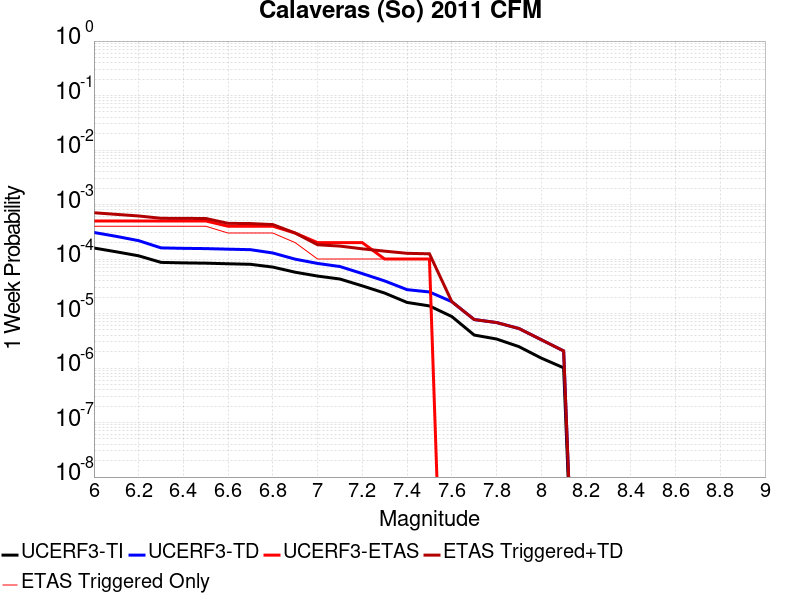 | 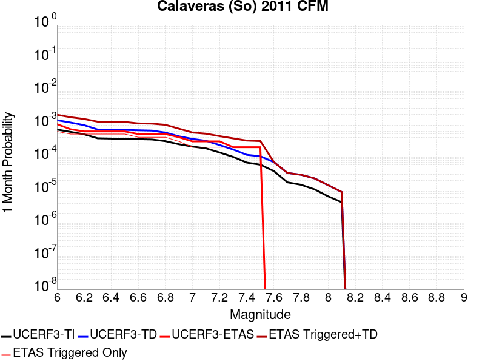 | 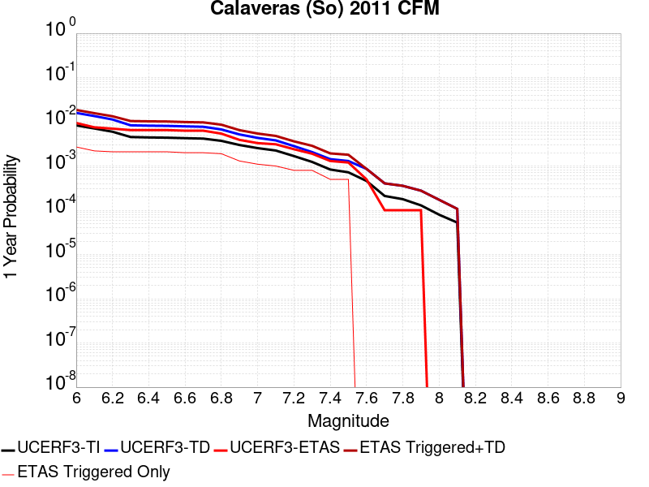 |  |

| Magnitude | 1 wk TI Prob | 1 wk TD Prob | 1 wk ETAS Prob | 1 wk ETAS/TD Gain | 1 wk ETAS Triggered+TD | 1 wk ETAS Triggered Only | 1 mo TI Prob | 1 mo TD Prob | 1 mo ETAS Prob | 1 mo ETAS/TD Gain | 1 mo ETAS Triggered+TD | 1 mo ETAS Triggered Only | 1 yr TI Prob | 1 yr TD Prob | 1 yr ETAS Prob | 1 yr ETAS/TD Gain | 1 yr ETAS Triggered+TD | 1 yr ETAS Triggered Only | 10 yr TI Prob | 10 yr TD Prob | 10 yr ETAS Prob | 10 yr ETAS/TD Gain | 10 yr ETAS Triggered+TD | 10 yr ETAS Triggered Only |
|-----|-----|-----|-----|-----|-----|-----|-----|-----|-----|-----|-----|-----|-----|-----|-----|-----|-----|-----|-----|-----|-----|-----|-----|-----|
| 6.0 | 1.5950744E-4 | 3.0739134E-4 | 5.0E-4 | 1.6265911 | 7.0726837E-4 | 4.0E-4 | 6.834242E-4 | 0.0013165604 | 0.001 | 0.759555 | 0.0019157705 | 6.0E-4 | 0.00828899 | 0.015871853 | 0.0094 | 0.5922434 | 0.018528998 | 0.0027 | 0.079865426 | 0.14450727 | 0.0949 | 0.6567144 | 0.1599917 | 0.0181 |
| 6.1 | 1.3584697E-4 | 2.6059715E-4 | 5.0E-4 | 1.9186702 | 6.604929E-4 | 4.0E-4 | 5.8207137E-4 | 0.0011162079 | 7.0E-4 | 0.6271233 | 0.0016156498 | 5.0E-4 | 0.007063716 | 0.0134735955 | 0.0075 | 0.5566443 | 0.015643954 | 0.0022 | 0.06843361 | 0.124127306 | 0.0767 | 0.61791396 | 0.13691504 | 0.0146 |
| 6.2 | 1.14676266E-4 | 2.1736816E-4 | 5.0E-4 | 2.300245 | 6.172812E-4 | 4.0E-4 | 4.9137714E-4 | 9.311574E-4 | 6.0E-4 | 0.6443594 | 0.0014306918 | 5.0E-4 | 0.0059661185 | 0.011256213 | 0.007 | 0.6218788 | 0.013332575 | 0.0021 | 0.058084648 | 0.105111696 | 0.0668 | 0.63551444 | 0.11620831 | 0.0124 |
| 6.3 | 8.691518E-5 | 1.600787E-4 | 5.0E-4 | 3.1234634 | 5.600147E-4 | 4.0E-4 | 3.7244044E-4 | 6.8583246E-4 | 6.0E-4 | 0.87484926 | 0.0011854896 | 5.0E-4 | 0.004525038 | 0.008311381 | 0.0065 | 0.78206015 | 0.010393927 | 0.0021 | 0.044339992 | 0.07942337 | 0.0527 | 0.6635327 | 0.088997364 | 0.0104 |
| 6.4 | 8.50982E-5 | 1.5714287E-4 | 5.0E-4 | 3.181818 | 5.5708E-4 | 4.0E-4 | 3.646556E-4 | 6.732568E-4 | 6.0E-4 | 0.89119035 | 0.0011729202 | 5.0E-4 | 0.0044306475 | 0.008159426 | 0.0065 | 0.7966247 | 0.010242291 | 0.0021 | 0.04343345 | 0.07802973 | 0.0522 | 0.6689758 | 0.087618224 | 0.0104 |
| 6.5 | 8.4062965E-5 | 1.5538682E-4 | 5.0E-4 | 3.2177763 | 5.5532466E-4 | 4.0E-4 | 3.602201E-4 | 6.6573475E-4 | 6.0E-4 | 0.90125984 | 0.0011654019 | 5.0E-4 | 0.004376863 | 0.008068619 | 0.0065 | 0.80559015 | 0.010151675 | 0.0021 | 0.042916555 | 0.07720107 | 0.0519 | 0.6722705 | 0.086798176 | 0.0104 |
| 6.6 | 8.194716E-5 | 1.5174398E-4 | 4.0E-4 | 2.636019 | 4.5169846E-4 | 3.0E-4 | 3.5115483E-4 | 6.50131E-4 | 5.0E-4 | 0.7690757 | 0.001049871 | 4.0E-4 | 0.0042669317 | 0.007880406 | 0.0063 | 0.7994511 | 0.009864646 | 0.002 | 0.04185927 | 0.07548617 | 0.051 | 0.6756205 | 0.084916204 | 0.0102 |
| 6.7 | 8.012326E-5 | 1.484212E-4 | 4.0E-4 | 2.6950328 | 4.4837667E-4 | 3.0E-4 | 3.433402E-4 | 6.359007E-4 | 5.0E-4 | 0.7862863 | 0.0010356463 | 4.0E-4 | 0.004172157 | 0.0077088154 | 0.0063 | 0.8172462 | 0.009693397 | 0.002 | 0.040946912 | 0.07392775 | 0.0499 | 0.6749833 | 0.08309587 | 0.0099 |
| 6.8 | 7.119773E-5 | 1.2899244E-4 | 4.0E-4 | 3.100957 | 4.2895373E-4 | 3.0E-4 | 3.0509746E-4 | 5.526895E-4 | 5.0E-4 | 0.90466714 | 9.524684E-4 | 4.0E-4 | 0.0037082357 | 0.0067050084 | 0.0054 | 0.8053681 | 0.008592268 | 0.0019 | 0.036469642 | 0.06476323 | 0.0428 | 0.66086876 | 0.07336742 | 0.0092 |
| 6.9 | 5.7343088E-5 | 9.9328296E-5 | 3.0E-4 | 3.0202873 | 2.9930842E-4 | 2.0E-4 | 2.4573295E-4 | 4.2562367E-4 | 4.0E-4 | 0.93979734 | 7.25496E-4 | 3.0E-4 | 0.0029876942 | 0.0051697306 | 0.0039 | 0.7543914 | 0.00646301 | 0.0013 | 0.02947844 | 0.050575 | 0.0334 | 0.66040534 | 0.057220973 | 0.007 |
| 7.0 | 4.8746577E-5 | 8.295798E-5 | 2.0E-4 | 2.4108589 | 1.8294969E-4 | 1.0E-4 | 2.0889717E-4 | 3.5548612E-4 | 3.0E-4 | 0.8439148 | 5.5541506E-4 | 2.0E-4 | 0.0025403565 | 0.004319521 | 0.0033 | 0.7639736 | 0.0054147695 | 0.0011 | 0.025115121 | 0.042538084 | 0.0279 | 0.65588284 | 0.04818711 | 0.0059 |
| 7.1 | 4.2998014E-5 | 7.27354E-5 | 2.0E-4 | 2.749693 | 1.7272812E-4 | 1.0E-4 | 1.8426418E-4 | 3.1168622E-4 | 3.0E-4 | 0.9625065 | 5.1162386E-4 | 2.0E-4 | 0.002241108 | 0.0037882372 | 0.0031 | 0.8183226 | 0.004784449 | 0.001 | 0.022186412 | 0.03746549 | 0.0244 | 0.651266 | 0.042278163 | 0.005 |
| 7.2 | 3.221292E-5 | 5.398705E-5 | 2.0E-4 | 3.7045922 | 1.5398164E-4 | 1.0E-4 | 1.3804805E-4 | 2.313527E-4 | 3.0E-4 | 1.2967215 | 4.3130643E-4 | 2.0E-4 | 0.0016794393 | 0.002813109 | 0.0024 | 0.8531486 | 0.0036108585 | 8.0E-4 | 0.016668037 | 0.028077021 | 0.0179 | 0.637532 | 0.031187175 | 0.0032 |
| 7.3 | 2.3756531E-5 | 3.9556642E-5 | 1.0E-4 | 2.5280204 | 1.3955269E-4 | 1.0E-4 | 1.0180973E-4 | 1.6951756E-4 | 2.0E-4 | 1.1798189 | 3.6948366E-4 | 2.0E-4 | 0.0012388286 | 0.0020619398 | 0.0019 | 0.92146236 | 0.0028602902 | 8.0E-4 | 0.012319452 | 0.020686235 | 0.0137 | 0.66227615 | 0.023428313 | 0.0028 |
| 7.4 | 1.5997684E-5 | 2.7358772E-5 | 1.0E-4 | 3.655135 | 1.2735603E-4 | 1.0E-4 | 6.8559704E-5 | 1.1724662E-4 | 2.0E-4 | 1.705806 | 3.1722317E-4 | 2.0E-4 | 8.343947E-4 | 0.0014265453 | 0.0013 | 0.91129243 | 0.0019258321 | 5.0E-4 | 0.008312687 | 0.014384258 | 0.0081 | 0.5631156 | 0.016158367 | 0.0018 |
| 7.5 | 1.3814293E-5 | 2.4800409E-5 | 1.0E-4 | 4.0321918 | 1.2479792E-4 | 1.0E-4 | 5.9202768E-5 | 1.0628315E-4 | 2.0E-4 | 1.8817658 | 3.0626188E-4 | 2.0E-4 | 7.205553E-4 | 0.0012932316 | 0.0012 | 0.92790806 | 0.001792585 | 5.0E-4 | 0.007182234 | 0.013063414 | 0.0076 | 0.5817775 | 0.014741206 | 0.0017 |
| 7.6 | 8.817309E-6 | 1.6456002E-5 | 0.0 | 0.0 | 1.6456002E-5 | 0.0 | 3.7787922E-5 | 7.052383E-5 | 0.0 | 0.0 | 7.052383E-5 | 0.0 | 4.5997082E-4 | 8.582907E-4 | 5.0E-4 | 0.5825532 | 8.582907E-4 | 0.0 | 0.004590199 | 0.008732024 | 0.005 | 0.57260495 | 0.009624165 | 9.0E-4 |
| 7.7 | 4.0352206E-6 | 7.733318E-6 | 0.0 | 0.0 | 7.733318E-6 | 0.0 | 1.7293689E-5 | 3.3142373E-5 | 0.0 | 0.0 | 3.3142373E-5 | 0.0 | 2.1053031E-4 | 4.0343375E-4 | 1.0E-4 | 0.24787217 | 4.0343375E-4 | 0.0 | 0.0021033096 | 0.0041779513 | 0.0025 | 0.59837943 | 0.00457628 | 4.0E-4 |
| 7.8 | 3.413169E-6 | 6.812264E-6 | 0.0 | 0.0 | 6.812264E-6 | 0.0 | 1.4627784E-5 | 2.9195091E-5 | 0.0 | 0.0 | 2.9195091E-5 | 0.0 | 1.7807873E-4 | 3.5539232E-4 | 1.0E-4 | 0.2813792 | 3.5539232E-4 | 0.0 | 0.0017793609 | 0.0036787924 | 0.0024 | 0.652388 | 0.004077321 | 4.0E-4 |
| 7.9 | 2.4740732E-6 | 5.2994505E-6 | 0.0 | 0.0 | 5.2994505E-6 | 0.0 | 1.06031275E-5 | 2.2711733E-5 | 0.0 | 0.0 | 2.2711733E-5 | 0.0 | 1.2908543E-4 | 2.764803E-4 | 1.0E-4 | 0.3616894 | 2.764803E-4 | 0.0 | 0.0012901047 | 0.0028447302 | 0.0019 | 0.6679017 | 0.0030441612 | 2.0E-4 |
| 8.0 | 1.5231818E-6 | 3.30128E-6 | 0.0 | 0.0 | 3.30128E-6 | 0.0 | 6.527906E-6 | 1.4148267E-5 | 0.0 | 0.0 | 1.4148267E-5 | 0.0 | 7.9474354E-5 | 1.7224158E-4 | 0.0 | 0.0 | 1.7224158E-4 | 0.0 | 7.944594E-4 | 0.0017626551 | 0.001 | 0.56732595 | 0.0018624789 | 1.0E-4 |
| 8.1 | 1.0104524E-6 | 2.0533746E-6 | 0.0 | 0.0 | 2.0533746E-6 | 0.0 | 4.330503E-6 | 8.800147E-6 | 0.0 | 0.0 | 8.800147E-6 | 0.0 | 5.2722597E-5 | 1.0713656E-4 | 0.0 | 0.0 | 1.0713656E-4 | 0.0 | 5.271009E-4 | 0.0010968526 | 7.0E-4 | 0.6381897 | 0.0011967429 | 1.0E-4 |

## Owl Lake
*[(top)](#table-of-contents)*

| 1 Week | 1 Month | 1 Year | 10 Year |
|-----|-----|-----|-----|
|  | 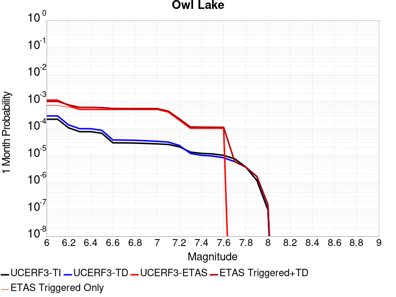 | 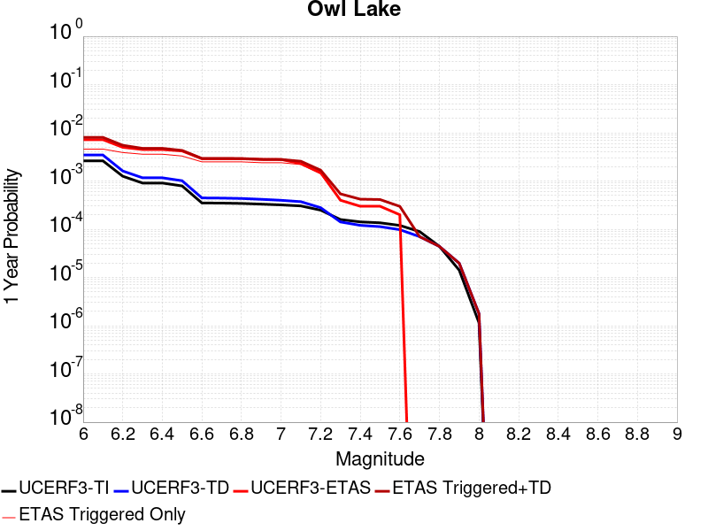 | 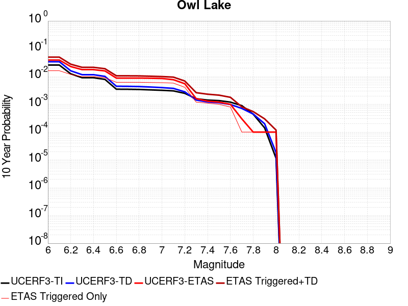 |

| Magnitude | 1 wk TI Prob | 1 wk TD Prob | 1 wk ETAS Prob | 1 wk ETAS/TD Gain | 1 wk ETAS Triggered+TD | 1 wk ETAS Triggered Only | 1 mo TI Prob | 1 mo TD Prob | 1 mo ETAS Prob | 1 mo ETAS/TD Gain | 1 mo ETAS Triggered+TD | 1 mo ETAS Triggered Only | 1 yr TI Prob | 1 yr TD Prob | 1 yr ETAS Prob | 1 yr ETAS/TD Gain | 1 yr ETAS Triggered+TD | 1 yr ETAS Triggered Only | 10 yr TI Prob | 10 yr TD Prob | 10 yr ETAS Prob | 10 yr ETAS/TD Gain | 10 yr ETAS Triggered+TD | 10 yr ETAS Triggered Only |
|-----|-----|-----|-----|-----|-----|-----|-----|-----|-----|-----|-----|-----|-----|-----|-----|-----|-----|-----|-----|-----|-----|-----|-----|-----|
| 6.0 | 5.0320643E-5 | 6.6404245E-5 | 2.0E-4 | 3.0118556 | 2.6639097E-4 | 2.0E-4 | 2.1564208E-4 | 2.8456486E-4 | 0.0011 | 3.865551 | 9.843657E-4 | 7.0E-4 | 0.0026222812 | 0.0034599854 | 0.0072 | 2.0809336 | 0.00804407 | 0.0046 | 0.02591553 | 0.034164615 | 0.0392 | 1.147386 | 0.049811147 | 0.0162 |
| 6.1 | 5.0320643E-5 | 6.6404245E-5 | 2.0E-4 | 3.0118556 | 2.6639097E-4 | 2.0E-4 | 2.1564208E-4 | 2.8456486E-4 | 0.0011 | 3.865551 | 9.843657E-4 | 7.0E-4 | 0.0026222812 | 0.0034599854 | 0.0072 | 2.0809336 | 0.00804407 | 0.0046 | 0.02591553 | 0.034164615 | 0.0392 | 1.147386 | 0.049811147 | 0.0162 |
| 6.2 | 2.4125871E-5 | 3.1004492E-5 | 2.0E-4 | 6.450678 | 2.309983E-4 | 2.0E-4 | 1.0339249E-4 | 1.328708E-4 | 7.0E-4 | 5.2682757 | 7.327911E-4 | 6.0E-4 | 0.0012580766 | 0.001616676 | 0.005 | 3.0927658 | 0.0055103707 | 0.0039 | 0.012509781 | 0.016082855 | 0.0229 | 1.4238765 | 0.02779147 | 0.0119 |
| 6.3 | 1.7433485E-5 | 2.2374723E-5 | 2.0E-4 | 8.938658 | 2.2237025E-4 | 2.0E-4 | 7.471279E-5 | 9.5889045E-5 | 5.0E-4 | 5.21436 | 5.958411E-4 | 5.0E-4 | 9.0924866E-4 | 0.0011669628 | 0.0045 | 3.8561642 | 0.0047627618 | 0.0036 | 0.009055373 | 0.011638838 | 0.0177 | 1.5207704 | 0.021423614 | 0.0099 |
| 6.4 | 1.7433485E-5 | 2.2374723E-5 | 2.0E-4 | 8.938658 | 2.2237025E-4 | 2.0E-4 | 7.471279E-5 | 9.5889045E-5 | 5.0E-4 | 5.21436 | 5.958411E-4 | 5.0E-4 | 9.0924866E-4 | 0.0011669628 | 0.0045 | 3.8561642 | 0.0047627618 | 0.0036 | 0.009055373 | 0.011638838 | 0.0177 | 1.5207704 | 0.021423614 | 0.0099 |
| 6.5 | 1.5182742E-5 | 1.9446805E-5 | 2.0E-4 | 10.284466 | 2.1944291E-4 | 2.0E-4 | 6.506727E-5 | 8.334164E-5 | 5.0E-4 | 5.9994016 | 5.8329996E-4 | 5.0E-4 | 7.919061E-4 | 0.001014349 | 0.0042 | 4.1405864 | 0.004311002 | 0.0033 | 0.0078909 | 0.010127526 | 0.0159 | 1.5699787 | 0.019135365 | 0.0091 |
| 6.6 | 6.7271576E-6 | 8.559068E-6 | 2.0E-4 | 23.36703 | 2.0855735E-4 | 2.0E-4 | 2.8830356E-5 | 3.668124E-5 | 5.0E-4 | 13.630946 | 5.366629E-4 | 5.0E-4 | 3.5095305E-4 | 4.4650823E-4 | 0.0029 | 6.494841 | 0.002945392 | 0.0025 | 0.0035039932 | 0.004473807 | 0.0088 | 1.9670049 | 0.010646069 | 0.0062 |
| 6.7 | 6.682835E-6 | 8.4914955E-6 | 2.0E-4 | 23.552979 | 2.084898E-4 | 2.0E-4 | 2.8640408E-5 | 3.6391648E-5 | 5.0E-4 | 13.739417 | 5.3637347E-4 | 5.0E-4 | 3.4864116E-4 | 4.4298387E-4 | 0.0029 | 6.5465136 | 0.0029418764 | 0.0025 | 0.003480947 | 0.004438663 | 0.0088 | 1.9825791 | 0.010611143 | 0.0062 |
| 6.8 | 6.5774975E-6 | 8.337909E-6 | 2.0E-4 | 23.986828 | 2.0833625E-4 | 2.0E-4 | 2.8188972E-5 | 3.573344E-5 | 5.0E-4 | 13.992496 | 5.3571555E-4 | 5.0E-4 | 3.4314668E-4 | 4.3497345E-4 | 0.0029 | 6.6670737 | 0.002933886 | 0.0025 | 0.0034261728 | 0.0043588197 | 0.0088 | 2.0188951 | 0.010531795 | 0.0062 |
| 6.9 | 6.363419E-6 | 8.010923E-6 | 2.0E-4 | 24.965912 | 2.0800933E-4 | 2.0E-4 | 2.727151E-5 | 3.4332108E-5 | 5.0E-4 | 14.563626 | 5.3431495E-4 | 5.0E-4 | 3.3198006E-4 | 4.1791884E-4 | 0.0028 | 6.6998653 | 0.0028169157 | 0.0024 | 0.0033148455 | 0.0041887476 | 0.0087 | 2.0769932 | 0.010263196 | 0.0061 |
| 7.0 | 6.1342453E-6 | 7.6429205E-6 | 2.0E-4 | 26.168007 | 2.076414E-4 | 2.0E-4 | 2.6289357E-5 | 3.2754993E-5 | 5.0E-4 | 15.264848 | 5.3273863E-4 | 5.0E-4 | 3.2002592E-4 | 3.987246E-4 | 0.0028 | 7.022391 | 0.0027977678 | 0.0024 | 0.0031956544 | 0.0039973236 | 0.0085 | 2.126423 | 0.00997334 | 0.006 |
| 7.1 | 5.842926E-6 | 7.153173E-6 | 1.0E-4 | 13.97981 | 1.0715246E-4 | 1.0E-4 | 2.504087E-5 | 3.0656127E-5 | 4.0E-4 | 13.047962 | 4.3064388E-4 | 4.0E-4 | 3.0482994E-4 | 3.7317985E-4 | 0.0023 | 6.163248 | 0.0025723588 | 0.0022 | 0.0030441214 | 0.003742471 | 0.0077 | 2.0574641 | 0.009520764 | 0.0058 |
| 7.2 | 4.77173E-6 | 5.368395E-6 | 1.0E-4 | 18.627542 | 1.0536786E-4 | 1.0E-4 | 2.045011E-5 | 2.3007226E-5 | 2.0E-4 | 8.692922 | 2.2300263E-4 | 2.0E-4 | 2.4895166E-4 | 2.8008103E-4 | 0.0015 | 5.355593 | 0.0016796889 | 0.0014 | 0.0024867293 | 0.0028135956 | 0.0055 | 1.9547942 | 0.00690206 | 0.0041 |
| 7.3 | 3.0494948E-6 | 2.7175586E-6 | 0.0 | 0.0 | 2.7175586E-6 | 0.0 | 1.3069198E-5 | 1.1646629E-5 | 1.0E-4 | 8.586176 | 1.11645466E-4 | 1.0E-4 | 1.5910587E-4 | 1.4178864E-4 | 4.0E-4 | 2.8211005 | 5.4173195E-4 | 4.0E-4 | 0.0015899199 | 0.0014269709 | 0.0016 | 1.1212561 | 0.0026252586 | 0.0012 |
| 7.4 | 2.7263884E-6 | 2.3123018E-6 | 0.0 | 0.0 | 2.3123018E-6 | 0.0 | 1.1684469E-5 | 9.909828E-6 | 1.0E-4 | 10.090993 | 1.0990884E-4 | 1.0E-4 | 1.4224913E-4 | 1.2064558E-4 | 3.0E-4 | 2.4866223 | 4.2060937E-4 | 3.0E-4 | 0.0014215811 | 0.0012147214 | 0.0013 | 1.0702043 | 0.0023133853 | 0.0011 |
| 7.5 | 2.6090431E-6 | 2.1720973E-6 | 0.0 | 0.0 | 2.1720973E-6 | 0.0 | 1.1181565E-5 | 9.308956E-6 | 1.0E-4 | 10.742343 | 1.0930803E-4 | 1.0E-4 | 1.3612706E-4 | 1.1333074E-4 | 3.0E-4 | 2.6471193 | 4.1329674E-4 | 3.0E-4 | 0.001360437 | 0.0011413869 | 0.0012 | 1.0513525 | 0.0021402456 | 0.001 |
| 7.6 | 2.3008756E-6 | 1.878883E-6 | 0.0 | 0.0 | 1.878883E-6 | 0.0 | 9.860858E-6 | 8.052331E-6 | 1.0E-4 | 12.418763 | 1.0805153E-4 | 1.0E-4 | 1.20049335E-4 | 9.803281E-5 | 2.0E-4 | 2.0401332 | 2.980132E-4 | 2.0E-4 | 0.001199845 | 9.88211E-4 | 0.001 | 1.0119296 | 0.0017874204 | 8.0E-4 |
| 7.7 | 1.7184348E-6 | 1.3475178E-6 | 0.0 | 0.0 | 1.3475178E-6 | 0.0 | 7.3646997E-6 | 5.7750635E-6 | 0.0 | 0.0 | 5.7750635E-6 | 0.0 | 8.966153E-5 | 7.030917E-5 | 0.0 | 0.0 | 7.030917E-5 | 0.0 | 8.962536E-4 | 7.1088574E-4 | 3.0E-4 | 0.42200875 | 8.108147E-4 | 1.0E-4 |
| 7.8 | 8.4612907E-7 | 8.446032E-7 | 0.0 | 0.0 | 8.446032E-7 | 0.0 | 3.6262625E-6 | 3.6197232E-6 | 0.0 | 0.0 | 3.6197232E-6 | 0.0 | 4.4148852E-5 | 4.406926E-5 | 0.0 | 0.0 | 4.406926E-5 | 0.0 | 4.414008E-4 | 4.462981E-4 | 1.0E-4 | 0.22406548 | 5.4625346E-4 | 1.0E-4 |
| 7.9 | 2.716738E-7 | 3.7860366E-7 | 0.0 | 0.0 | 3.7860366E-7 | 0.0 | 1.1643157E-6 | 1.6225862E-6 | 0.0 | 0.0 | 1.6225862E-6 | 0.0 | 1.4175452E-5 | 1.9754818E-5 | 0.0 | 0.0 | 1.9754818E-5 | 0.0 | 1.4174548E-4 | 1.9950586E-4 | 1.0E-4 | 0.5012384 | 2.994859E-4 | 1.0E-4 |
| 8.0 | 2.1995428E-8 | 3.3980594E-8 | 0.0 | 0.0 | 3.3980594E-8 | 0.0 | 9.426611E-8 | 1.456311E-7 | 0.0 | 0.0 | 1.456311E-7 | 0.0 | 1.1476893E-6 | 1.773058E-6 | 0.0 | 0.0 | 1.773058E-6 | 0.0 | 1.14768345E-5 | 1.8277455E-5 | 1.0E-4 | 5.4712214 | 1.18275624E-4 | 1.0E-4 |

## San Andreas (Big Bend)
*[(top)](#table-of-contents)*

| 1 Week | 1 Month | 1 Year | 10 Year |
|-----|-----|-----|-----|
|  | 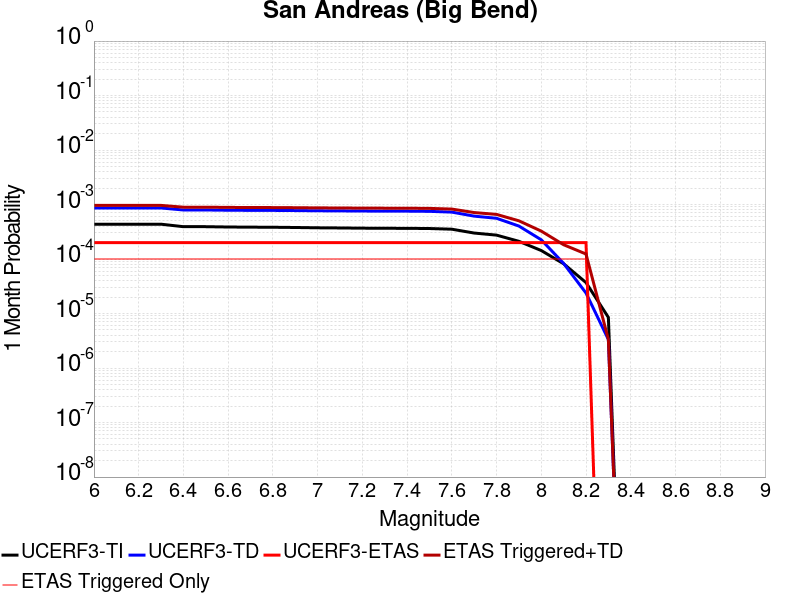 |  | 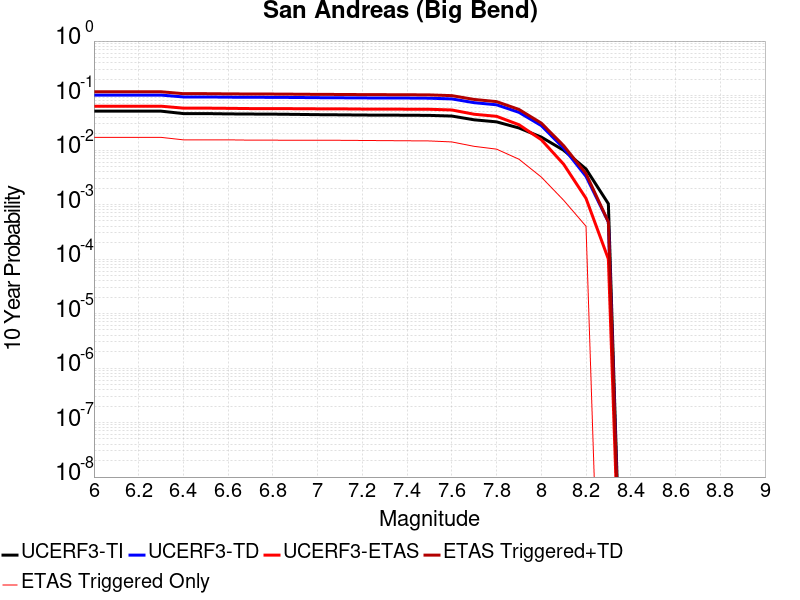 |

| Magnitude | 1 wk TI Prob | 1 wk TD Prob | 1 wk ETAS Prob | 1 wk ETAS/TD Gain | 1 wk ETAS Triggered+TD | 1 wk ETAS Triggered Only | 1 mo TI Prob | 1 mo TD Prob | 1 mo ETAS Prob | 1 mo ETAS/TD Gain | 1 mo ETAS Triggered+TD | 1 mo ETAS Triggered Only | 1 yr TI Prob | 1 yr TD Prob | 1 yr ETAS Prob | 1 yr ETAS/TD Gain | 1 yr ETAS Triggered+TD | 1 yr ETAS Triggered Only | 10 yr TI Prob | 10 yr TD Prob | 10 yr ETAS Prob | 10 yr ETAS/TD Gain | 10 yr ETAS Triggered+TD | 10 yr ETAS Triggered Only |
|-----|-----|-----|-----|-----|-----|-----|-----|-----|-----|-----|-----|-----|-----|-----|-----|-----|-----|-----|-----|-----|-----|-----|-----|-----|
| 6.0 | 1.0179969E-4 | 2.0150865E-4 | 2.0E-4 | 0.99251324 | 3.014885E-4 | 1.0E-4 | 4.362114E-4 | 8.633237E-4 | 2.0E-4 | 0.23166282 | 9.6323737E-4 | 1.0E-4 | 0.0052979486 | 0.010460595 | 0.007 | 0.669178 | 0.012538628 | 0.0021 | 0.051734097 | 0.10177268 | 0.0638 | 0.6268873 | 0.117132366 | 0.0171 |
| 6.1 | 1.0179969E-4 | 2.0150865E-4 | 2.0E-4 | 0.99251324 | 3.014885E-4 | 1.0E-4 | 4.362114E-4 | 8.633237E-4 | 2.0E-4 | 0.23166282 | 9.6323737E-4 | 1.0E-4 | 0.0052979486 | 0.010460595 | 0.007 | 0.669178 | 0.012538628 | 0.0021 | 0.051734097 | 0.10177268 | 0.0638 | 0.6268873 | 0.117132366 | 0.0171 |
| 6.2 | 1.0179969E-4 | 2.0150865E-4 | 2.0E-4 | 0.99251324 | 3.014885E-4 | 1.0E-4 | 4.362114E-4 | 8.633237E-4 | 2.0E-4 | 0.23166282 | 9.6323737E-4 | 1.0E-4 | 0.0052979486 | 0.010460595 | 0.007 | 0.669178 | 0.012538628 | 0.0021 | 0.051734097 | 0.10177268 | 0.0638 | 0.6268873 | 0.117132366 | 0.0171 |
| 6.3 | 1.0179969E-4 | 2.0150865E-4 | 2.0E-4 | 0.99251324 | 3.014885E-4 | 1.0E-4 | 4.362114E-4 | 8.633237E-4 | 2.0E-4 | 0.23166282 | 9.6323737E-4 | 1.0E-4 | 0.0052979486 | 0.010460595 | 0.007 | 0.669178 | 0.012538628 | 0.0021 | 0.051734097 | 0.10177268 | 0.0638 | 0.6268873 | 0.117132366 | 0.0171 |
| 6.4 | 9.1639464E-5 | 1.8505927E-4 | 2.0E-4 | 1.0807348 | 2.8504076E-4 | 1.0E-4 | 3.9268145E-4 | 7.928703E-4 | 2.0E-4 | 0.25224808 | 8.92791E-4 | 1.0E-4 | 0.0047704205 | 0.009610589 | 0.0064 | 0.6659321 | 0.011492329 | 0.0019 | 0.046693064 | 0.09409976 | 0.0588 | 0.62486875 | 0.10805062 | 0.0154 |
| 6.5 | 9.1639464E-5 | 1.8505927E-4 | 2.0E-4 | 1.0807348 | 2.8504076E-4 | 1.0E-4 | 3.9268145E-4 | 7.928703E-4 | 2.0E-4 | 0.25224808 | 8.92791E-4 | 1.0E-4 | 0.0047704205 | 0.009610589 | 0.0064 | 0.6659321 | 0.011492329 | 0.0019 | 0.046693064 | 0.09409976 | 0.0588 | 0.62486875 | 0.10805062 | 0.0154 |
| 6.6 | 9.042622E-5 | 1.8312673E-4 | 2.0E-4 | 1.0921398 | 2.831084E-4 | 1.0E-4 | 3.8748336E-4 | 7.84593E-4 | 2.0E-4 | 0.25490925 | 8.8451453E-4 | 1.0E-4 | 0.0047074095 | 0.009510695 | 0.0063 | 0.66241217 | 0.011392624 | 0.0019 | 0.046089325 | 0.09319578 | 0.0583 | 0.6255648 | 0.10716057 | 0.0154 |
| 6.7 | 8.9836685E-5 | 1.8226917E-4 | 2.0E-4 | 1.0972782 | 2.8225096E-4 | 1.0E-4 | 3.8495753E-4 | 7.809199E-4 | 2.0E-4 | 0.2561082 | 8.8084186E-4 | 1.0E-4 | 0.00467679 | 0.009466364 | 0.0063 | 0.66551423 | 0.011348378 | 0.0019 | 0.045795817 | 0.09278976 | 0.0577 | 0.6218358 | 0.10657936 | 0.0152 |
| 6.8 | 8.9471854E-5 | 1.8173592E-4 | 2.0E-4 | 1.100498 | 2.8171774E-4 | 1.0E-4 | 3.8339442E-4 | 7.786359E-4 | 2.0E-4 | 0.25685945 | 8.78558E-4 | 1.0E-4 | 0.004657841 | 0.009438797 | 0.0063 | 0.66745794 | 0.011320864 | 0.0019 | 0.04561414 | 0.09253657 | 0.0577 | 0.6235373 | 0.106330015 | 0.0152 |
| 6.9 | 8.858234E-5 | 1.8055373E-4 | 2.0E-4 | 1.1077034 | 2.805357E-4 | 1.0E-4 | 3.7958333E-4 | 7.735724E-4 | 2.0E-4 | 0.25854075 | 8.7349507E-4 | 1.0E-4 | 0.004611638 | 0.009377682 | 0.0063 | 0.6718079 | 0.011160801 | 0.0018 | 0.04517103 | 0.091976106 | 0.0574 | 0.6240751 | 0.10568727 | 0.0151 |
| 7.0 | 8.7433385E-5 | 1.7893878E-4 | 2.0E-4 | 1.1177007 | 2.789209E-4 | 1.0E-4 | 3.746607E-4 | 7.666553E-4 | 2.0E-4 | 0.26087344 | 8.665786E-4 | 1.0E-4 | 0.004551957 | 0.009294187 | 0.0062 | 0.6670837 | 0.011077457 | 0.0018 | 0.044598386 | 0.09121003 | 0.0571 | 0.62602764 | 0.104932755 | 0.0151 |
| 7.1 | 8.684964E-5 | 1.7805654E-4 | 2.0E-4 | 1.1232387 | 2.7803873E-4 | 1.0E-4 | 3.7215967E-4 | 7.628765E-4 | 2.0E-4 | 0.26216564 | 8.628002E-4 | 1.0E-4 | 0.0045216335 | 0.0092485715 | 0.0062 | 0.67037386 | 0.011031924 | 0.0018 | 0.04430731 | 0.09079085 | 0.057 | 0.62781656 | 0.10451991 | 0.0151 |
| 7.2 | 8.606521E-5 | 1.7696086E-4 | 2.0E-4 | 1.1301934 | 2.7694317E-4 | 1.0E-4 | 3.6879873E-4 | 7.581835E-4 | 2.0E-4 | 0.2637884 | 8.5810764E-4 | 1.0E-4 | 0.0044808835 | 0.009191917 | 0.0061 | 0.66362655 | 0.010975371 | 0.0018 | 0.043916024 | 0.09027082 | 0.0565 | 0.6258944 | 0.10391676 | 0.015 |
| 7.3 | 8.568266E-5 | 1.7637883E-4 | 2.0E-4 | 1.1339229 | 2.7636118E-4 | 1.0E-4 | 3.6715972E-4 | 7.556905E-4 | 2.0E-4 | 0.26465863 | 8.556149E-4 | 1.0E-4 | 0.0044610105 | 0.009161821 | 0.0061 | 0.66580653 | 0.010945329 | 0.0018 | 0.043725148 | 0.08999105 | 0.0564 | 0.626729 | 0.10355018 | 0.0149 |
| 7.4 | 8.5432206E-5 | 1.7600335E-4 | 2.0E-4 | 1.136342 | 2.7598575E-4 | 1.0E-4 | 3.6608664E-4 | 7.540822E-4 | 2.0E-4 | 0.2652231 | 8.540068E-4 | 1.0E-4 | 0.004447999 | 0.009142404 | 0.0061 | 0.66722053 | 0.010925948 | 0.0018 | 0.043600157 | 0.08981061 | 0.0562 | 0.6257613 | 0.10328141 | 0.0148 |
| 7.5 | 8.4791965E-5 | 1.7469256E-4 | 2.0E-4 | 1.1448685 | 2.7467508E-4 | 1.0E-4 | 3.633435E-4 | 7.4846775E-4 | 2.0E-4 | 0.26721257 | 8.483929E-4 | 1.0E-4 | 0.0044147377 | 0.00907462 | 0.0061 | 0.6722045 | 0.010858285 | 0.0018 | 0.043280575 | 0.089186385 | 0.056 | 0.6278985 | 0.10257535 | 0.0147 |
| 7.6 | 8.241105E-5 | 1.6913189E-4 | 2.0E-4 | 1.1825091 | 2.6911497E-4 | 1.0E-4 | 3.531424E-4 | 7.2464976E-4 | 2.0E-4 | 0.2759954 | 8.245773E-4 | 1.0E-4 | 0.0042910352 | 0.008787011 | 0.006 | 0.68282604 | 0.010472073 | 0.0017 | 0.042091176 | 0.08655644 | 0.0544 | 0.62849164 | 0.09943599 | 0.0141 |
| 7.7 | 7.00432E-5 | 1.4270685E-4 | 2.0E-4 | 1.4014744 | 2.4269258E-4 | 1.0E-4 | 3.001506E-4 | 6.114575E-4 | 2.0E-4 | 0.32708734 | 7.1139634E-4 | 1.0E-4 | 0.0036482112 | 0.007419124 | 0.0048 | 0.64697665 | 0.008808738 | 0.0014 | 0.035888977 | 0.07380531 | 0.0454 | 0.6151319 | 0.084641784 | 0.0117 |
| 7.8 | 6.415362E-5 | 1.3027992E-4 | 2.0E-4 | 1.535156 | 2.3026689E-4 | 1.0E-4 | 2.749151E-4 | 5.582231E-4 | 2.0E-4 | 0.3582797 | 6.5816724E-4 | 1.0E-4 | 0.0033419547 | 0.006775217 | 0.0042 | 0.6199063 | 0.0079670865 | 0.0012 | 0.03292141 | 0.067509726 | 0.0416 | 0.6162075 | 0.077207625 | 0.0104 |
| 7.9 | 4.939911E-5 | 9.380489E-5 | 2.0E-4 | 2.132085 | 1.9379551E-4 | 1.0E-4 | 2.116933E-4 | 4.0195903E-4 | 2.0E-4 | 0.49756315 | 5.0191884E-4 | 1.0E-4 | 0.0025743195 | 0.004882879 | 0.0028 | 0.5734322 | 0.005579461 | 7.0E-4 | 0.025447013 | 0.049096424 | 0.0292 | 0.594748 | 0.055562567 | 0.0068 |
| 8.0 | 3.344983E-5 | 5.242933E-5 | 2.0E-4 | 3.8146589 | 1.5242408E-4 | 1.0E-4 | 1.4334853E-4 | 2.2467777E-4 | 2.0E-4 | 0.8901637 | 3.246553E-4 | 1.0E-4 | 0.0017438711 | 0.0027320222 | 0.0013 | 0.475838 | 0.0031309295 | 4.0E-4 | 0.017302496 | 0.028020073 | 0.0155 | 0.55317485 | 0.031130409 | 0.0032 |
| 8.1 | 1.9104898E-5 | 1.9241908E-5 | 2.0E-4 | 10.393979 | 1.1923999E-4 | 1.0E-4 | 8.1875565E-5 | 8.246272E-5 | 2.0E-4 | 2.4253385 | 1.8245447E-4 | 1.0E-4 | 9.963791E-4 | 0.0010035218 | 6.0E-4 | 0.5978943 | 0.0012033212 | 2.0E-4 | 0.009919235 | 0.010785733 | 0.0055 | 0.5099329 | 0.01197279 | 0.0012 |
| 8.2 | 8.643924E-6 | 5.491857E-6 | 2.0E-4 | 36.417553 | 1.0549131E-4 | 1.0E-4 | 3.704486E-5 | 2.3536319E-5 | 2.0E-4 | 8.497506 | 1.2353396E-4 | 1.0E-4 | 4.5092785E-4 | 2.8651708E-4 | 2.0E-4 | 0.6980387 | 3.8648842E-4 | 1.0E-4 | 0.0045001395 | 0.003257976 | 0.0013 | 0.39902076 | 0.0036566728 | 4.0E-4 |
| 8.3 | 1.983087E-6 | 7.683211E-7 | 0.0 | 0.0 | 7.683211E-7 | 0.0 | 8.498917E-6 | 3.2928008E-6 | 0.0 | 0.0 | 3.2928008E-6 | 0.0 | 1.034694E-4 | 4.008913E-5 | 0.0 | 0.0 | 4.008913E-5 | 0.0 | 0.0010342124 | 4.7332307E-4 | 1.0E-4 | 0.21127218 | 4.7332307E-4 | 0.0 |

## Calaveras (Central) 2011 CFM
*[(top)](#table-of-contents)*

| 1 Week | 1 Month | 1 Year | 10 Year |
|-----|-----|-----|-----|
|  |  | 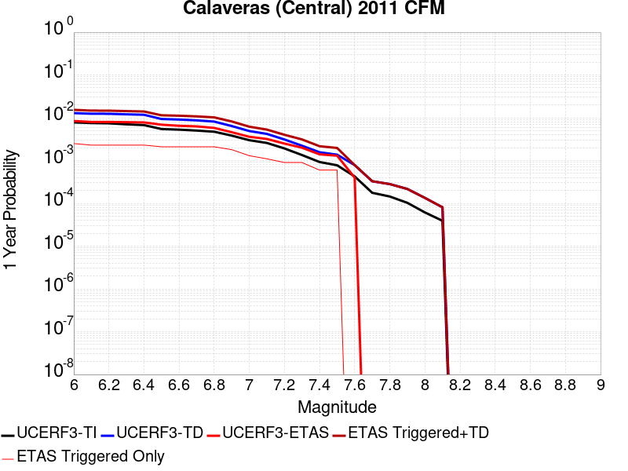 | 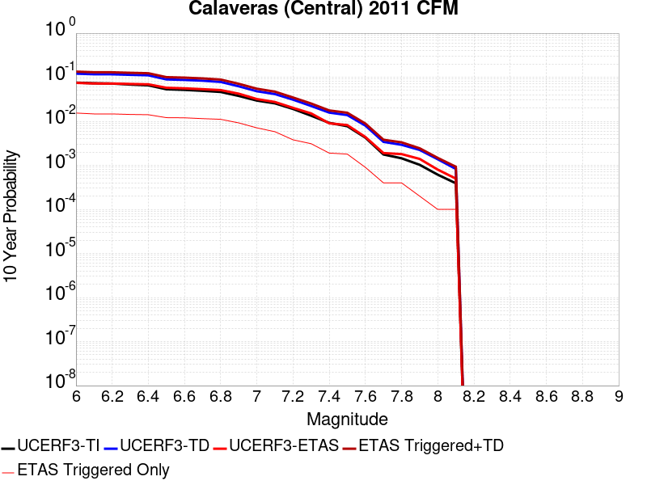 |

| Magnitude | 1 wk TI Prob | 1 wk TD Prob | 1 wk ETAS Prob | 1 wk ETAS/TD Gain | 1 wk ETAS Triggered+TD | 1 wk ETAS Triggered Only | 1 mo TI Prob | 1 mo TD Prob | 1 mo ETAS Prob | 1 mo ETAS/TD Gain | 1 mo ETAS Triggered+TD | 1 mo ETAS Triggered Only | 1 yr TI Prob | 1 yr TD Prob | 1 yr ETAS Prob | 1 yr ETAS/TD Gain | 1 yr ETAS Triggered+TD | 1 yr ETAS Triggered Only | 10 yr TI Prob | 10 yr TD Prob | 10 yr ETAS Prob | 10 yr ETAS/TD Gain | 10 yr ETAS Triggered+TD | 10 yr ETAS Triggered Only |
|-----|-----|-----|-----|-----|-----|-----|-----|-----|-----|-----|-----|-----|-----|-----|-----|-----|-----|-----|-----|-----|-----|-----|-----|-----|
| 6.0 | 1.5010907E-4 | 2.4814546E-4 | 4.0E-4 | 1.6119577 | 4.4809585E-4 | 2.0E-4 | 6.4316596E-4 | 0.0010629459 | 8.0E-4 | 0.75262535 | 0.0014625207 | 4.0E-4 | 0.0078024664 | 0.012855816 | 0.0084 | 0.6534008 | 0.015323676 | 0.0025 | 0.07534136 | 0.1204494 | 0.0746 | 0.6193472 | 0.13399448 | 0.0154 |
| 6.1 | 1.4521465E-4 | 2.3975635E-4 | 4.0E-4 | 1.6683605 | 4.3970838E-4 | 2.0E-4 | 6.222001E-4 | 0.001027021 | 7.0E-4 | 0.6815829 | 0.0013267129 | 3.0E-4 | 0.0075490056 | 0.012424884 | 0.008 | 0.64386916 | 0.0146963075 | 0.0023 | 0.07297657 | 0.11671914 | 0.0721 | 0.61772215 | 0.12970337 | 0.0147 |
| 6.2 | 1.429998E-4 | 2.3906684E-4 | 4.0E-4 | 1.6731722 | 4.3901903E-4 | 2.0E-4 | 6.127123E-4 | 0.0010240684 | 7.0E-4 | 0.68354803 | 0.0013237613 | 3.0E-4 | 0.007434286 | 0.0123893935 | 0.008 | 0.6457136 | 0.014660898 | 0.0023 | 0.07190444 | 0.116372235 | 0.072 | 0.61870426 | 0.12936155 | 0.0147 |
| 6.3 | 1.3536277E-4 | 2.3237463E-4 | 4.0E-4 | 1.7213583 | 4.3232815E-4 | 2.0E-4 | 5.799972E-4 | 9.954139E-4 | 7.0E-4 | 0.7032251 | 0.0012951152 | 3.0E-4 | 0.0070386264 | 0.012045344 | 0.0079 | 0.65585506 | 0.01431764 | 0.0023 | 0.0681982 | 0.11328313 | 0.0705 | 0.62233454 | 0.12596318 | 0.0143 |
| 6.4 | 1.2993296E-4 | 2.266108E-4 | 4.0E-4 | 1.7651409 | 4.2656547E-4 | 2.0E-4 | 5.5673666E-4 | 9.707306E-4 | 7.0E-4 | 0.72110635 | 0.0012704394 | 3.0E-4 | 0.006757223 | 0.011748172 | 0.0078 | 0.66393304 | 0.014021152 | 0.0023 | 0.06555412 | 0.11056134 | 0.0691 | 0.62499243 | 0.12310243 | 0.0141 |
| 6.5 | 1.0498927E-4 | 1.79888E-4 | 4.0E-4 | 2.2236059 | 3.7985202E-4 | 2.0E-4 | 4.498764E-4 | 7.707199E-4 | 7.0E-4 | 0.90824175 | 0.0010704887 | 3.0E-4 | 0.005463498 | 0.00934305 | 0.0069 | 0.73851687 | 0.0114234295 | 0.0021 | 0.053311124 | 0.089231305 | 0.0577 | 0.64663404 | 0.10025161 | 0.0121 |
| 6.6 | 1.0157505E-4 | 1.7476104E-4 | 4.0E-4 | 2.2888396 | 3.7472608E-4 | 2.0E-4 | 4.35249E-4 | 7.487601E-4 | 6.0E-4 | 0.8013247 | 0.0010485355 | 3.0E-4 | 0.0052862884 | 0.009077984 | 0.0065 | 0.716018 | 0.01115892 | 0.0021 | 0.05162293 | 0.086807966 | 0.056 | 0.6451021 | 0.097766265 | 0.012 |
| 6.7 | 9.660386E-5 | 1.67349E-4 | 4.0E-4 | 2.3902144 | 3.6731554E-4 | 2.0E-4 | 4.1395082E-4 | 7.170124E-4 | 6.0E-4 | 0.8368056 | 0.0010167973 | 3.0E-4 | 0.0050282106 | 0.008694642 | 0.0063 | 0.7245842 | 0.010776383 | 0.0021 | 0.049159497 | 0.08329516 | 0.0536 | 0.6434948 | 0.09383726 | 0.0115 |
| 6.8 | 9.089927E-5 | 1.5650422E-4 | 4.0E-4 | 2.5558414 | 3.564729E-4 | 2.0E-4 | 3.8951015E-4 | 6.7055994E-4 | 5.0E-4 | 0.7456455 | 9.703587E-4 | 3.0E-4 | 0.0047319788 | 0.008133469 | 0.0058 | 0.7131028 | 0.010216389 | 0.0021 | 0.046324775 | 0.07819583 | 0.0511 | 0.65348756 | 0.08842786 | 0.0111 |
| 6.9 | 7.353187E-5 | 1.2305423E-4 | 4.0E-4 | 3.2505994 | 3.230296E-4 | 2.0E-4 | 3.150985E-4 | 5.2726927E-4 | 5.0E-4 | 0.94828206 | 8.271111E-4 | 3.0E-4 | 0.0038295772 | 0.006400729 | 0.0046 | 0.7186681 | 0.008189208 | 0.0018 | 0.037642512 | 0.062236223 | 0.0423 | 0.6796685 | 0.07086365 | 0.0092 |
| 7.0 | 5.746064E-5 | 9.3981005E-5 | 2.0E-4 | 2.1280897 | 1.939716E-4 | 1.0E-4 | 2.4623662E-4 | 4.0271392E-4 | 3.0E-4 | 0.7449457 | 6.026334E-4 | 2.0E-4 | 0.0029938098 | 0.004892091 | 0.0036 | 0.7358817 | 0.006185731 | 0.0013 | 0.02953797 | 0.04803218 | 0.032 | 0.66622 | 0.054791152 | 0.0071 |
| 7.1 | 4.9557195E-5 | 8.05978E-5 | 2.0E-4 | 2.4814575 | 1.8058973E-4 | 1.0E-4 | 2.123707E-4 | 3.4537373E-4 | 3.0E-4 | 0.86862427 | 5.453047E-4 | 2.0E-4 | 0.0025825473 | 0.004196881 | 0.0032 | 0.762471 | 0.0052922643 | 0.0011 | 0.0255274 | 0.041409466 | 0.0274 | 0.66168445 | 0.04696929 | 0.0058 |
| 7.2 | 3.687595E-5 | 5.959315E-5 | 2.0E-4 | 3.3560905 | 1.5958719E-4 | 1.0E-4 | 1.5803022E-4 | 2.5537435E-4 | 3.0E-4 | 1.1747459 | 4.553233E-4 | 2.0E-4 | 0.0019223199 | 0.0031047792 | 0.0025 | 0.80521023 | 0.004001985 | 9.0E-4 | 0.01905776 | 0.030918974 | 0.0202 | 0.6533205 | 0.034601483 | 0.0038 |
| 7.3 | 2.5846984E-5 | 4.25448E-5 | 1.0E-4 | 2.3504634 | 1.4254055E-4 | 1.0E-4 | 1.1076809E-4 | 1.8232223E-4 | 2.0E-4 | 1.096959 | 3.8228577E-4 | 2.0E-4 | 0.0013477671 | 0.002217531 | 0.002 | 0.901904 | 0.003115535 | 9.0E-4 | 0.013396223 | 0.022212688 | 0.0151 | 0.6797916 | 0.025243828 | 0.0031 |
| 7.4 | 1.7747854E-5 | 2.9942305E-5 | 1.0E-4 | 3.3397563 | 1.299393E-4 | 1.0E-4 | 7.6060016E-5 | 1.2831787E-4 | 2.0E-4 | 1.5586294 | 3.282922E-4 | 2.0E-4 | 9.2563726E-4 | 0.0015611533 | 0.0014 | 0.89677286 | 0.0021602167 | 6.0E-4 | 0.009217911 | 0.015711542 | 0.009 | 0.5728273 | 0.01758169 | 0.0019 |
| 7.5 | 1.4883479E-5 | 2.6250558E-5 | 1.0E-4 | 3.8094428 | 1.2624793E-4 | 1.0E-4 | 6.378478E-5 | 1.1249756E-4 | 2.0E-4 | 1.7778163 | 3.1247505E-4 | 2.0E-4 | 7.76303E-4 | 0.0013688001 | 0.0013 | 0.949737 | 0.0019679787 | 6.0E-4 | 0.0077359667 | 0.013805236 | 0.0082 | 0.5939776 | 0.015580386 | 0.0018 |
| 7.6 | 8.166975E-6 | 1.4982846E-5 | 0.0 | 0.0 | 1.4982846E-5 | 0.0 | 3.5000852E-5 | 6.4210624E-5 | 0.0 | 0.0 | 6.4210624E-5 | 0.0 | 4.2605202E-4 | 7.814853E-4 | 4.0E-4 | 0.5118459 | 7.814853E-4 | 0.0 | 0.004252361 | 0.00794875 | 0.0044 | 0.5535462 | 0.008841596 | 9.0E-4 |
| 7.7 | 3.3858064E-6 | 6.2736653E-6 | 0.0 | 0.0 | 6.2736653E-6 | 0.0 | 1.4510518E-5 | 2.688686E-5 | 0.0 | 0.0 | 2.688686E-5 | 0.0 | 1.7665124E-4 | 3.2729842E-4 | 0.0 | 0.0 | 3.2729842E-4 | 0.0 | 0.0017651088 | 0.0033979823 | 0.0019 | 0.55915534 | 0.003796623 | 4.0E-4 |
| 7.8 | 2.7721615E-6 | 5.385441E-6 | 0.0 | 0.0 | 5.385441E-6 | 0.0 | 1.1880637E-5 | 2.3080258E-5 | 0.0 | 0.0 | 2.3080258E-5 | 0.0 | 1.4463716E-4 | 2.8096596E-4 | 0.0 | 0.0 | 2.8096596E-4 | 0.0 | 0.0014454306 | 0.0029169004 | 0.0018 | 0.6170934 | 0.0033157337 | 4.0E-4 |
| 7.9 | 1.9736292E-6 | 4.1441194E-6 | 0.0 | 0.0 | 4.1441194E-6 | 0.0 | 8.4583835E-6 | 1.776039E-5 | 0.0 | 0.0 | 1.776039E-5 | 0.0 | 1.0297595E-4 | 2.1621135E-4 | 0.0 | 0.0 | 2.1621135E-4 | 0.0 | 0.0010292825 | 0.0022313327 | 0.0014 | 0.62742776 | 0.0024308863 | 2.0E-4 |
| 8.0 | 1.1767289E-6 | 2.5642385E-6 | 0.0 | 0.0 | 2.5642385E-6 | 0.0 | 5.0431145E-6 | 1.0989547E-5 | 0.0 | 0.0 | 1.0989547E-5 | 0.0 | 6.139818E-5 | 1.3378955E-4 | 0.0 | 0.0 | 1.3378955E-4 | 0.0 | 6.1381224E-4 | 0.001370958 | 8.0E-4 | 0.5835335 | 0.0014708209 | 1.0E-4 |
| 8.1 | 7.5112825E-7 | 1.5468539E-6 | 0.0 | 0.0 | 1.5468539E-6 | 0.0 | 3.2191172E-6 | 6.6293574E-6 | 0.0 | 0.0 | 6.6293574E-6 | 0.0 | 3.9192048E-5 | 8.0709455E-5 | 0.0 | 0.0 | 8.0709455E-5 | 0.0 | 3.9185135E-4 | 8.265332E-4 | 5.0E-4 | 0.60493636 | 9.2645054E-4 | 1.0E-4 |

## San Andreas (Mojave N)
*[(top)](#table-of-contents)*

| 1 Week | 1 Month | 1 Year | 10 Year |
|-----|-----|-----|-----|
| 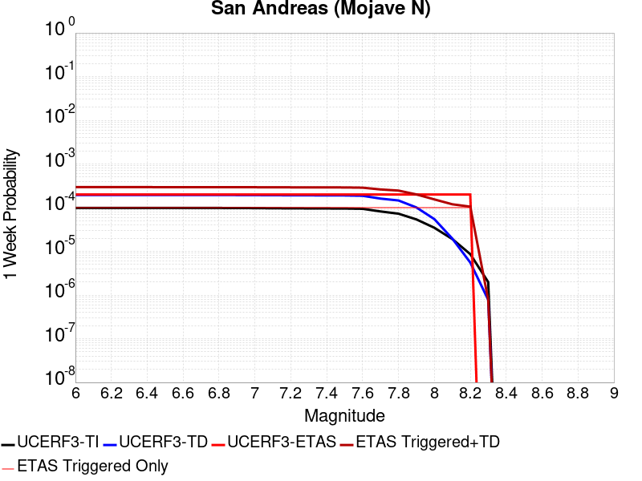 |  |  |  |

| Magnitude | 1 wk TI Prob | 1 wk TD Prob | 1 wk ETAS Prob | 1 wk ETAS/TD Gain | 1 wk ETAS Triggered+TD | 1 wk ETAS Triggered Only | 1 mo TI Prob | 1 mo TD Prob | 1 mo ETAS Prob | 1 mo ETAS/TD Gain | 1 mo ETAS Triggered+TD | 1 mo ETAS Triggered Only | 1 yr TI Prob | 1 yr TD Prob | 1 yr ETAS Prob | 1 yr ETAS/TD Gain | 1 yr ETAS Triggered+TD | 1 yr ETAS Triggered Only | 10 yr TI Prob | 10 yr TD Prob | 10 yr ETAS Prob | 10 yr ETAS/TD Gain | 10 yr ETAS Triggered+TD | 10 yr ETAS Triggered Only |
|-----|-----|-----|-----|-----|-----|-----|-----|-----|-----|-----|-----|-----|-----|-----|-----|-----|-----|-----|-----|-----|-----|-----|-----|-----|
| 6.0 | 9.877682E-5 | 1.9483463E-4 | 2.0E-4 | 1.0265115 | 2.9481514E-4 | 1.0E-4 | 4.2326056E-4 | 8.3473854E-4 | 3.0E-4 | 0.35939398 | 9.346551E-4 | 1.0E-4 | 0.0051410277 | 0.010115712 | 0.0079 | 0.7809633 | 0.012392446 | 0.0023 | 0.05023708 | 0.09867009 | 0.0646 | 0.654707 | 0.114172965 | 0.0172 |
| 6.1 | 9.877682E-5 | 1.9483463E-4 | 2.0E-4 | 1.0265115 | 2.9481514E-4 | 1.0E-4 | 4.2326056E-4 | 8.3473854E-4 | 3.0E-4 | 0.35939398 | 9.346551E-4 | 1.0E-4 | 0.0051410277 | 0.010115712 | 0.0079 | 0.7809633 | 0.012392446 | 0.0023 | 0.05023708 | 0.09867009 | 0.0646 | 0.654707 | 0.114172965 | 0.0172 |
| 6.2 | 9.877682E-5 | 1.9483463E-4 | 2.0E-4 | 1.0265115 | 2.9481514E-4 | 1.0E-4 | 4.2326056E-4 | 8.3473854E-4 | 3.0E-4 | 0.35939398 | 9.346551E-4 | 1.0E-4 | 0.0051410277 | 0.010115712 | 0.0079 | 0.7809633 | 0.012392446 | 0.0023 | 0.05023708 | 0.09867009 | 0.0646 | 0.654707 | 0.114172965 | 0.0172 |
| 6.3 | 9.877682E-5 | 1.9483463E-4 | 2.0E-4 | 1.0265115 | 2.9481514E-4 | 1.0E-4 | 4.2326056E-4 | 8.3473854E-4 | 3.0E-4 | 0.35939398 | 9.346551E-4 | 1.0E-4 | 0.0051410277 | 0.010115712 | 0.0079 | 0.7809633 | 0.012392446 | 0.0023 | 0.05023708 | 0.09867009 | 0.0646 | 0.654707 | 0.114172965 | 0.0172 |
| 6.4 | 9.877682E-5 | 1.9483463E-4 | 2.0E-4 | 1.0265115 | 2.9481514E-4 | 1.0E-4 | 4.2326056E-4 | 8.3473854E-4 | 3.0E-4 | 0.35939398 | 9.346551E-4 | 1.0E-4 | 0.0051410277 | 0.010115712 | 0.0079 | 0.7809633 | 0.012392446 | 0.0023 | 0.05023708 | 0.09867009 | 0.0646 | 0.654707 | 0.114172965 | 0.0172 |
| 6.5 | 9.861474E-5 | 1.9457194E-4 | 2.0E-4 | 1.0278975 | 2.9455248E-4 | 1.0E-4 | 4.2256617E-4 | 8.336134E-4 | 3.0E-4 | 0.35987905 | 9.3353004E-4 | 1.0E-4 | 0.0051326132 | 0.010102141 | 0.0079 | 0.78201246 | 0.012378906 | 0.0023 | 0.050156746 | 0.09854753 | 0.0645 | 0.65450644 | 0.11405252 | 0.0172 |
| 6.6 | 9.861474E-5 | 1.9457194E-4 | 2.0E-4 | 1.0278975 | 2.9455248E-4 | 1.0E-4 | 4.2256617E-4 | 8.336134E-4 | 3.0E-4 | 0.35987905 | 9.3353004E-4 | 1.0E-4 | 0.0051326132 | 0.010102141 | 0.0079 | 0.78201246 | 0.012378906 | 0.0023 | 0.050156746 | 0.09854753 | 0.0645 | 0.65450644 | 0.11405252 | 0.0172 |
| 6.7 | 9.8552715E-5 | 1.9447133E-4 | 2.0E-4 | 1.0284293 | 2.9445186E-4 | 1.0E-4 | 4.223004E-4 | 8.3318254E-4 | 3.0E-4 | 0.36006516 | 9.330992E-4 | 1.0E-4 | 0.0051293927 | 0.010096943 | 0.0079 | 0.78241503 | 0.01237372 | 0.0023 | 0.050125998 | 0.098500706 | 0.0644 | 0.6538024 | 0.1140065 | 0.0172 |
| 6.8 | 9.8464974E-5 | 1.943226E-4 | 2.0E-4 | 1.0292164 | 2.9430317E-4 | 1.0E-4 | 4.219245E-4 | 8.325455E-4 | 3.0E-4 | 0.36034065 | 9.324622E-4 | 1.0E-4 | 0.0051248376 | 0.01008926 | 0.0079 | 0.7830109 | 0.012366055 | 0.0023 | 0.05008251 | 0.09843062 | 0.0644 | 0.65426797 | 0.11393761 | 0.0172 |
| 6.9 | 9.825824E-5 | 1.9400203E-4 | 2.0E-4 | 1.030917 | 2.9398262E-4 | 1.0E-4 | 4.2103877E-4 | 8.311725E-4 | 3.0E-4 | 0.3609359 | 9.310894E-4 | 1.0E-4 | 0.0051141046 | 0.010072699 | 0.0078 | 0.77437043 | 0.012349531 | 0.0023 | 0.049980022 | 0.098279364 | 0.0641 | 0.65222234 | 0.11378896 | 0.0172 |
| 7.0 | 9.781462E-5 | 1.9331426E-4 | 2.0E-4 | 1.0345848 | 2.9329493E-4 | 1.0E-4 | 4.1913814E-4 | 8.2822685E-4 | 3.0E-4 | 0.3622196 | 9.28144E-4 | 1.0E-4 | 0.005091073 | 0.010037166 | 0.0077 | 0.76714885 | 0.01231408 | 0.0023 | 0.04976007 | 0.097955406 | 0.064 | 0.6533585 | 0.11347058 | 0.0172 |
| 7.1 | 9.7121134E-5 | 1.9232953E-4 | 2.0E-4 | 1.039882 | 2.923103E-4 | 1.0E-4 | 4.1616702E-4 | 8.2400924E-4 | 3.0E-4 | 0.36407357 | 9.239268E-4 | 1.0E-4 | 0.005055068 | 0.009986288 | 0.0077 | 0.77105725 | 0.012263319 | 0.0023 | 0.04941613 | 0.09749104 | 0.0638 | 0.6544191 | 0.11301419 | 0.0172 |
| 7.2 | 9.663819E-5 | 1.9163602E-4 | 2.0E-4 | 1.0436451 | 2.9161686E-4 | 1.0E-4 | 4.1409794E-4 | 8.210389E-4 | 3.0E-4 | 0.36539072 | 9.2095684E-4 | 1.0E-4 | 0.0050299936 | 0.009950455 | 0.0076 | 0.7637841 | 0.01222757 | 0.0023 | 0.049176537 | 0.09716385 | 0.0635 | 0.65353525 | 0.11269263 | 0.0172 |
| 7.3 | 9.6277574E-5 | 1.9115949E-4 | 2.0E-4 | 1.0462468 | 2.9114037E-4 | 1.0E-4 | 4.125529E-4 | 8.189979E-4 | 3.0E-4 | 0.3663013 | 9.18916E-4 | 1.0E-4 | 0.0050112694 | 0.009925833 | 0.0076 | 0.76567876 | 0.012203004 | 0.0023 | 0.04899759 | 0.0969366 | 0.0635 | 0.6550673 | 0.11246929 | 0.0172 |
| 7.4 | 9.593308E-5 | 1.9055538E-4 | 2.0E-4 | 1.0495636 | 2.9053632E-4 | 1.0E-4 | 4.1107697E-4 | 8.164105E-4 | 3.0E-4 | 0.3674622 | 9.1632886E-4 | 1.0E-4 | 0.0049933824 | 0.009894618 | 0.0076 | 0.7680943 | 0.012171861 | 0.0023 | 0.04882661 | 0.09665416 | 0.0634 | 0.6559469 | 0.112101376 | 0.0171 |
| 7.5 | 9.561707E-5 | 1.9001456E-4 | 2.0E-4 | 1.0525509 | 2.8999554E-4 | 1.0E-4 | 4.0972308E-4 | 8.140941E-4 | 3.0E-4 | 0.36850777 | 9.140127E-4 | 1.0E-4 | 0.0049769743 | 0.009866672 | 0.0076 | 0.7702699 | 0.012143979 | 0.0023 | 0.048669744 | 0.096399516 | 0.0633 | 0.6566423 | 0.11185108 | 0.0171 |
| 7.6 | 9.418194E-5 | 1.8652725E-4 | 2.0E-4 | 1.0722294 | 2.8650858E-4 | 1.0E-4 | 4.0357444E-4 | 7.991577E-4 | 3.0E-4 | 0.37539524 | 8.990778E-4 | 1.0E-4 | 0.004902454 | 0.009686451 | 0.0075 | 0.7742773 | 0.011964173 | 0.0023 | 0.047957025 | 0.09477709 | 0.0616 | 0.6499461 | 0.109622754 | 0.0164 |
| 7.7 | 8.202141E-5 | 1.609542E-4 | 2.0E-4 | 1.2425896 | 2.609381E-4 | 1.0E-4 | 3.51473E-4 | 6.896214E-4 | 3.0E-4 | 0.4350213 | 7.895524E-4 | 1.0E-4 | 0.00427079 | 0.008363875 | 0.0064 | 0.7651956 | 0.010446311 | 0.0021 | 0.04189639 | 0.08255425 | 0.0527 | 0.6383681 | 0.09530675 | 0.0139 |
| 7.8 | 7.2859846E-5 | 1.4582204E-4 | 2.0E-4 | 1.3715348 | 2.4580746E-4 | 1.0E-4 | 3.1221908E-4 | 6.248019E-4 | 3.0E-4 | 0.48015216 | 7.2473945E-4 | 1.0E-4 | 0.003794643 | 0.007580473 | 0.0053 | 0.6991648 | 0.009069102 | 0.0015 | 0.037304975 | 0.07501128 | 0.0477 | 0.6359043 | 0.08620365 | 0.0121 |
| 7.9 | 5.3874453E-5 | 1.00882164E-4 | 2.0E-4 | 1.982511 | 2.0087208E-4 | 1.0E-4 | 2.3087008E-4 | 4.322805E-4 | 2.0E-4 | 0.46266255 | 5.322373E-4 | 1.0E-4 | 0.0028072202 | 0.005250326 | 0.0034 | 0.64757884 | 0.0061456007 | 9.0E-4 | 0.02772022 | 0.052621625 | 0.0324 | 0.61571646 | 0.05991644 | 0.0077 |
| 8.0 | 3.468538E-5 | 5.4471027E-5 | 2.0E-4 | 3.6716766 | 1.5446558E-4 | 1.0E-4 | 1.4864317E-4 | 2.3342638E-4 | 2.0E-4 | 0.85680115 | 3.3340303E-4 | 1.0E-4 | 0.0018082283 | 0.0028382642 | 0.0015 | 0.52849203 | 0.003237129 | 4.0E-4 | 0.017935853 | 0.02904975 | 0.0163 | 0.5611064 | 0.032448076 | 0.0035 |
| 8.1 | 1.9152367E-5 | 1.947201E-5 | 2.0E-4 | 10.2711525 | 1.1947007E-4 | 1.0E-4 | 8.207899E-5 | 8.344881E-5 | 2.0E-4 | 2.396679 | 1.8344047E-4 | 1.0E-4 | 9.988535E-4 | 0.0010155163 | 7.0E-4 | 0.68930453 | 0.0012153132 | 2.0E-4 | 0.009943757 | 0.010892393 | 0.0058 | 0.53248173 | 0.012178233 | 0.0013 |
| 8.2 | 8.643924E-6 | 5.491857E-6 | 2.0E-4 | 36.417553 | 1.0549131E-4 | 1.0E-4 | 3.704486E-5 | 2.3536319E-5 | 2.0E-4 | 8.497506 | 1.2353396E-4 | 1.0E-4 | 4.5092785E-4 | 2.8651708E-4 | 2.0E-4 | 0.6980387 | 3.8648842E-4 | 1.0E-4 | 0.0045001395 | 0.003257976 | 0.0013 | 0.39902076 | 0.0036566728 | 4.0E-4 |
| 8.3 | 1.983087E-6 | 7.683211E-7 | 0.0 | 0.0 | 7.683211E-7 | 0.0 | 8.498917E-6 | 3.2928008E-6 | 0.0 | 0.0 | 3.2928008E-6 | 0.0 | 1.034694E-4 | 4.008913E-5 | 0.0 | 0.0 | 4.008913E-5 | 0.0 | 0.0010342124 | 4.7332307E-4 | 1.0E-4 | 0.21127218 | 4.7332307E-4 | 0.0 |

## San Andreas (San Bernardino S)
*[(top)](#table-of-contents)*

| 1 Week | 1 Month | 1 Year | 10 Year |
|-----|-----|-----|-----|
| 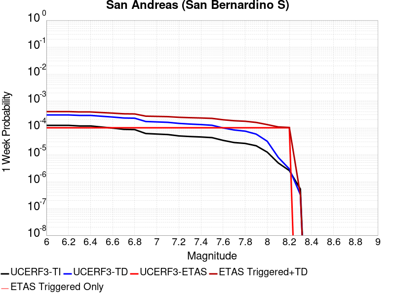 |  |  |  |

| Magnitude | 1 wk TI Prob | 1 wk TD Prob | 1 wk ETAS Prob | 1 wk ETAS/TD Gain | 1 wk ETAS Triggered+TD | 1 wk ETAS Triggered Only | 1 mo TI Prob | 1 mo TD Prob | 1 mo ETAS Prob | 1 mo ETAS/TD Gain | 1 mo ETAS Triggered+TD | 1 mo ETAS Triggered Only | 1 yr TI Prob | 1 yr TD Prob | 1 yr ETAS Prob | 1 yr ETAS/TD Gain | 1 yr ETAS Triggered+TD | 1 yr ETAS Triggered Only | 10 yr TI Prob | 10 yr TD Prob | 10 yr ETAS Prob | 10 yr ETAS/TD Gain | 10 yr ETAS Triggered+TD | 10 yr ETAS Triggered Only |
|-----|-----|-----|-----|-----|-----|-----|-----|-----|-----|-----|-----|-----|-----|-----|-----|-----|-----|-----|-----|-----|-----|-----|-----|-----|
| 6.0 | 1.2336002E-4 | 3.0053212E-4 | 1.0E-4 | 0.33274314 | 4.0050206E-4 | 1.0E-4 | 5.2857865E-4 | 0.0012873852 | 4.0E-4 | 0.31070733 | 0.0013872564 | 1.0E-4 | 0.006416472 | 0.01556624 | 0.0089 | 0.57175016 | 0.017535107 | 0.002 | 0.06234337 | 0.14288172 | 0.0801 | 0.56060356 | 0.15702417 | 0.0165 |
| 6.1 | 1.2336002E-4 | 3.0053212E-4 | 1.0E-4 | 0.33274314 | 4.0050206E-4 | 1.0E-4 | 5.2857865E-4 | 0.0012873852 | 4.0E-4 | 0.31070733 | 0.0013872564 | 1.0E-4 | 0.006416472 | 0.01556624 | 0.0089 | 0.57175016 | 0.017535107 | 0.002 | 0.06234337 | 0.14288172 | 0.0801 | 0.56060356 | 0.15702417 | 0.0165 |
| 6.2 | 1.2336002E-4 | 3.0053212E-4 | 1.0E-4 | 0.33274314 | 4.0050206E-4 | 1.0E-4 | 5.2857865E-4 | 0.0012873852 | 4.0E-4 | 0.31070733 | 0.0013872564 | 1.0E-4 | 0.006416472 | 0.01556624 | 0.0089 | 0.57175016 | 0.017535107 | 0.002 | 0.06234337 | 0.14288172 | 0.0801 | 0.56060356 | 0.15702417 | 0.0165 |
| 6.3 | 1.1712257E-4 | 2.8840674E-4 | 1.0E-4 | 0.34673253 | 3.883779E-4 | 1.0E-4 | 5.018573E-4 | 0.0012354691 | 4.0E-4 | 0.32376367 | 0.0013353456 | 1.0E-4 | 0.006093008 | 0.01494295 | 0.0087 | 0.58221436 | 0.016913064 | 0.002 | 0.059286322 | 0.13758326 | 0.0775 | 0.56329525 | 0.15146817 | 0.0161 |
| 6.4 | 1.1712257E-4 | 2.8840674E-4 | 1.0E-4 | 0.34673253 | 3.883779E-4 | 1.0E-4 | 5.018573E-4 | 0.0012354691 | 4.0E-4 | 0.32376367 | 0.0013353456 | 1.0E-4 | 0.006093008 | 0.01494295 | 0.0087 | 0.58221436 | 0.016913064 | 0.002 | 0.059286322 | 0.13758326 | 0.0775 | 0.56329525 | 0.15146817 | 0.0161 |
| 6.5 | 1.0689076E-4 | 2.6852218E-4 | 1.0E-4 | 0.3724087 | 3.6849536E-4 | 1.0E-4 | 4.5802278E-4 | 0.0011503267 | 4.0E-4 | 0.3477273 | 0.0012502116 | 1.0E-4 | 0.0055621783 | 0.013919921 | 0.008 | 0.5747159 | 0.015793473 | 0.0019 | 0.05425003 | 0.12881799 | 0.0733 | 0.5690199 | 0.14223419 | 0.0154 |
| 6.6 | 9.7648895E-5 | 2.509565E-4 | 1.0E-4 | 0.3984754 | 3.5093143E-4 | 1.0E-4 | 4.1842813E-4 | 0.0010751083 | 4.0E-4 | 0.37205553 | 0.0011750008 | 1.0E-4 | 0.005082469 | 0.013015261 | 0.0075 | 0.5762466 | 0.014791834 | 0.0018 | 0.049677886 | 0.1209902 | 0.0695 | 0.57442665 | 0.13399954 | 0.0148 |
| 6.7 | 8.757013E-5 | 2.3165291E-4 | 1.0E-4 | 0.4316803 | 3.3162974E-4 | 1.0E-4 | 3.7524657E-4 | 9.924428E-4 | 4.0E-4 | 0.4030459 | 0.0010923436 | 1.0E-4 | 0.00455906 | 0.012020145 | 0.0072 | 0.59899443 | 0.013798509 | 0.0018 | 0.04466656 | 0.112267725 | 0.0643 | 0.57273805 | 0.124607205 | 0.0139 |
| 6.8 | 8.562978E-5 | 2.2724611E-4 | 1.0E-4 | 0.44005153 | 3.272234E-4 | 1.0E-4 | 3.6693315E-4 | 9.735707E-4 | 4.0E-4 | 0.41085872 | 0.0010734734 | 1.0E-4 | 0.004458263 | 0.01179288 | 0.007 | 0.5935785 | 0.013472832 | 0.0017 | 0.043698758 | 0.11028014 | 0.0632 | 0.57308596 | 0.1224693 | 0.0137 |
| 6.9 | 6.124075E-5 | 1.7102055E-4 | 1.0E-4 | 0.584725 | 2.7100346E-4 | 1.0E-4 | 2.6243398E-4 | 7.327402E-4 | 3.0E-4 | 0.40942207 | 8.3266693E-4 | 1.0E-4 | 0.0031904527 | 0.008884829 | 0.0054 | 0.60777766 | 0.010371502 | 0.0015 | 0.031450346 | 0.084337935 | 0.0501 | 0.5940387 | 0.09486805 | 0.0115 |
| 7.0 | 5.8598747E-5 | 1.6530439E-4 | 1.0E-4 | 0.60494465 | 2.6528785E-4 | 1.0E-4 | 2.5111332E-4 | 7.082558E-4 | 3.0E-4 | 0.42357576 | 8.0818497E-4 | 1.0E-4 | 0.0030530186 | 0.008589117 | 0.0052 | 0.60541725 | 0.009977092 | 0.0014 | 0.03011414 | 0.081648596 | 0.0489 | 0.59890807 | 0.09175046 | 0.011 |
| 7.1 | 5.613814E-5 | 1.594834E-4 | 1.0E-4 | 0.62702453 | 2.5946746E-4 | 1.0E-4 | 2.4056983E-4 | 6.83322E-4 | 3.0E-4 | 0.43903166 | 7.832537E-4 | 1.0E-4 | 0.0029250039 | 0.008287892 | 0.0051 | 0.6153555 | 0.009676289 | 0.0014 | 0.028868021 | 0.07895334 | 0.0472 | 0.5978214 | 0.08890065 | 0.0108 |
| 7.2 | 4.991222E-5 | 1.4553322E-4 | 1.0E-4 | 0.6871283 | 2.4551866E-4 | 1.0E-4 | 2.1389198E-4 | 6.2356517E-4 | 2.0E-4 | 0.32073635 | 7.235028E-4 | 1.0E-4 | 0.002601025 | 0.0075655817 | 0.0044 | 0.5815812 | 0.008855746 | 0.0013 | 0.025707912 | 0.07239337 | 0.0439 | 0.60640913 | 0.081854954 | 0.0102 |
| 7.3 | 4.7410045E-5 | 1.3746205E-4 | 1.0E-4 | 0.7274735 | 2.374483E-4 | 1.0E-4 | 2.0317009E-4 | 5.889904E-4 | 2.0E-4 | 0.3395641 | 6.889315E-4 | 1.0E-4 | 0.0024707897 | 0.0071474663 | 0.0041 | 0.57362986 | 0.008338889 | 0.0012 | 0.024434982 | 0.06867629 | 0.0401 | 0.5838987 | 0.07733761 | 0.0093 |
| 7.4 | 4.5556746E-5 | 1.3153153E-4 | 1.0E-4 | 0.760274 | 2.3151838E-4 | 1.0E-4 | 1.952286E-4 | 5.635851E-4 | 2.0E-4 | 0.35487098 | 6.6352874E-4 | 1.0E-4 | 0.002374317 | 0.0068401396 | 0.0039 | 0.5701638 | 0.0079326155 | 0.0011 | 0.023491086 | 0.065923885 | 0.039 | 0.59159136 | 0.07405035 | 0.0087 |
| 7.5 | 4.3084514E-5 | 1.2387354E-4 | 1.0E-4 | 0.8072749 | 2.2386116E-4 | 1.0E-4 | 1.8463485E-4 | 5.307789E-4 | 2.0E-4 | 0.3768047 | 6.307258E-4 | 1.0E-4 | 0.0022456115 | 0.0064431573 | 0.0036 | 0.5587323 | 0.007436714 | 0.001 | 0.022230545 | 0.062320255 | 0.0363 | 0.5824752 | 0.07019676 | 0.0084 |
| 7.6 | 3.408608E-5 | 9.865928E-5 | 1.0E-4 | 1.0135894 | 1.9864942E-4 | 1.0E-4 | 1.4607502E-4 | 4.2275706E-4 | 2.0E-4 | 0.47308496 | 5.227148E-4 | 1.0E-4 | 0.0017770125 | 0.0051349457 | 0.003 | 0.5842321 | 0.0060303244 | 9.0E-4 | 0.017628696 | 0.050154895 | 0.0295 | 0.58817786 | 0.05661384 | 0.0068 |
| 7.7 | 2.8315713E-5 | 8.278981E-5 | 1.0E-4 | 1.2078781 | 1.8278153E-4 | 1.0E-4 | 1.2134742E-4 | 3.5476527E-4 | 2.0E-4 | 0.56375307 | 4.547298E-4 | 1.0E-4 | 0.0014764034 | 0.004310722 | 0.0029 | 0.6727411 | 0.0052068424 | 9.0E-4 | 0.01466633 | 0.042406343 | 0.0243 | 0.5730275 | 0.04776887 | 0.0056 |
| 7.8 | 2.6222975E-5 | 7.491339E-5 | 1.0E-4 | 1.3348747 | 1.749059E-4 | 1.0E-4 | 1.1237934E-4 | 3.2101793E-4 | 2.0E-4 | 0.6230182 | 4.2098583E-4 | 1.0E-4 | 0.0013673597 | 0.003901395 | 0.0028 | 0.717692 | 0.004797884 | 9.0E-4 | 0.013589768 | 0.038562916 | 0.0222 | 0.5756826 | 0.0433701 | 0.005 |
| 7.9 | 2.1469694E-5 | 5.810514E-5 | 1.0E-4 | 1.7210182 | 1.5809933E-4 | 1.0E-4 | 9.200973E-5 | 2.4899826E-4 | 1.0E-4 | 0.4016092 | 3.4897338E-4 | 1.0E-4 | 0.0011196428 | 0.0030273427 | 0.0023 | 0.7597422 | 0.0038249209 | 8.0E-4 | 0.011140184 | 0.030255072 | 0.0173 | 0.57180494 | 0.03452195 | 0.0044 |
| 8.0 | 1.2420249E-5 | 3.1425905E-5 | 1.0E-4 | 3.1820881 | 1.3142276E-4 | 1.0E-4 | 5.322855E-5 | 1.346755E-4 | 1.0E-4 | 0.7425255 | 2.3466203E-4 | 1.0E-4 | 6.478649E-4 | 0.001638442 | 0.0011 | 0.6713695 | 0.0020377866 | 4.0E-4 | 0.0064597935 | 0.016572256 | 0.0074 | 0.44652942 | 0.018342426 | 0.0018 |
| 8.1 | 4.9197724E-6 | 7.846811E-6 | 1.0E-4 | 12.744031 | 1.0784603E-4 | 1.0E-4 | 2.1084568E-5 | 3.3628756E-5 | 1.0E-4 | 2.9736454 | 1.3362539E-4 | 1.0E-4 | 2.566744E-4 | 4.0935332E-4 | 4.0E-4 | 0.977151 | 6.0927146E-4 | 2.0E-4 | 0.002563781 | 0.004396776 | 0.0014 | 0.3184151 | 0.004894578 | 5.0E-4 |
| 8.2 | 2.5634774E-6 | 2.9165785E-6 | 1.0E-4 | 34.28675 | 1.0291629E-4 | 1.0E-4 | 1.0986286E-5 | 1.2499563E-5 | 1.0E-4 | 8.000279 | 1.1249831E-4 | 1.0E-4 | 1.3374983E-4 | 1.5217159E-4 | 1.0E-4 | 0.6571529 | 2.5215637E-4 | 1.0E-4 | 0.0013366934 | 0.0017101837 | 4.0E-4 | 0.233893 | 0.0019098417 | 2.0E-4 |
| 8.3 | 5.2850464E-7 | 3.2215723E-7 | 0.0 | 0.0 | 3.2215723E-7 | 0.0 | 2.2650179E-6 | 1.3806731E-6 | 0.0 | 0.0 | 1.3806731E-6 | 0.0 | 2.7576245E-5 | 1.6809578E-5 | 0.0 | 0.0 | 1.6809578E-5 | 0.0 | 2.7572823E-4 | 1.9943445E-4 | 0.0 | 0.0 | 1.9943445E-4 | 0.0 |

## Little Lake
*[(top)](#table-of-contents)*

| 1 Week | 1 Month | 1 Year | 10 Year |
|-----|-----|-----|-----|
|  |  |  | 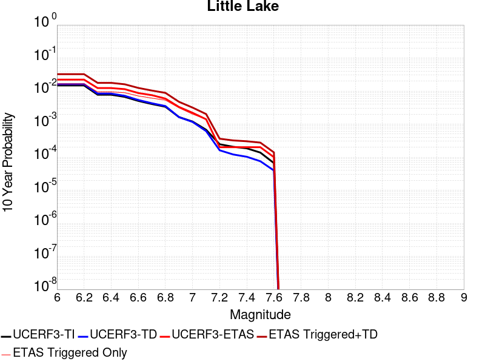 |

| Magnitude | 1 wk TI Prob | 1 wk TD Prob | 1 wk ETAS Prob | 1 wk ETAS/TD Gain | 1 wk ETAS Triggered+TD | 1 wk ETAS Triggered Only | 1 mo TI Prob | 1 mo TD Prob | 1 mo ETAS Prob | 1 mo ETAS/TD Gain | 1 mo ETAS Triggered+TD | 1 mo ETAS Triggered Only | 1 yr TI Prob | 1 yr TD Prob | 1 yr ETAS Prob | 1 yr ETAS/TD Gain | 1 yr ETAS Triggered+TD | 1 yr ETAS Triggered Only | 10 yr TI Prob | 10 yr TD Prob | 10 yr ETAS Prob | 10 yr ETAS/TD Gain | 10 yr ETAS Triggered+TD | 10 yr ETAS Triggered Only |
|-----|-----|-----|-----|-----|-----|-----|-----|-----|-----|-----|-----|-----|-----|-----|-----|-----|-----|-----|-----|-----|-----|-----|-----|-----|
| 6.0 | 2.8424427E-5 | 3.121222E-5 | 0.0 | 0.0 | 3.121222E-5 | 0.0 | 1.2181328E-4 | 1.3376055E-4 | 8.0E-4 | 5.980837 | 8.3366694E-4 | 7.0E-4 | 0.0014820677 | 0.0016274514 | 0.0058 | 3.5638547 | 0.0069188257 | 0.0053 | 0.014722223 | 0.016168743 | 0.0221 | 1.3668346 | 0.032303575 | 0.0164 |
| 6.1 | 2.8424427E-5 | 3.121222E-5 | 0.0 | 0.0 | 3.121222E-5 | 0.0 | 1.2181328E-4 | 1.3376055E-4 | 8.0E-4 | 5.980837 | 8.3366694E-4 | 7.0E-4 | 0.0014820677 | 0.0016274514 | 0.0058 | 3.5638547 | 0.0069188257 | 0.0053 | 0.014722223 | 0.016168743 | 0.0221 | 1.3668346 | 0.032303575 | 0.0164 |
| 6.2 | 2.8424427E-5 | 3.121222E-5 | 0.0 | 0.0 | 3.121222E-5 | 0.0 | 1.2181328E-4 | 1.3376055E-4 | 8.0E-4 | 5.980837 | 8.3366694E-4 | 7.0E-4 | 0.0014820677 | 0.0016274514 | 0.0058 | 3.5638547 | 0.0069188257 | 0.0053 | 0.014722223 | 0.016168743 | 0.0221 | 1.3668346 | 0.032303575 | 0.0164 |
| 6.3 | 1.48860645E-5 | 1.6084372E-5 | 0.0 | 0.0 | 1.6084372E-5 | 0.0 | 6.379586E-5 | 6.893136E-5 | 4.0E-4 | 5.8028736 | 3.689107E-4 | 3.0E-4 | 7.7643775E-4 | 8.389444E-4 | 0.0028 | 3.3375275 | 0.003436763 | 0.0026 | 0.007737305 | 0.008360593 | 0.0123 | 1.4711876 | 0.017682003 | 0.0094 |
| 6.4 | 1.48860645E-5 | 1.6084372E-5 | 0.0 | 0.0 | 1.6084372E-5 | 0.0 | 6.379586E-5 | 6.893136E-5 | 4.0E-4 | 5.8028736 | 3.689107E-4 | 3.0E-4 | 7.7643775E-4 | 8.389444E-4 | 0.0028 | 3.3375275 | 0.003436763 | 0.0026 | 0.007737305 | 0.008360593 | 0.0123 | 1.4711876 | 0.017682003 | 0.0094 |
| 6.5 | 1.2797581E-5 | 1.3768048E-5 | 0.0 | 0.0 | 1.3768048E-5 | 0.0 | 5.4845623E-5 | 5.900473E-5 | 4.0E-4 | 6.7791176 | 3.5898702E-4 | 3.0E-4 | 6.675408E-4 | 7.1817153E-4 | 0.0027 | 3.7595477 | 0.003216376 | 0.0025 | 0.006655392 | 0.0071610576 | 0.0114 | 1.5919436 | 0.015997324 | 0.0089 |
| 6.6 | 9.661896E-6 | 1.0290771E-5 | 0.0 | 0.0 | 1.0290771E-5 | 0.0 | 4.1407468E-5 | 4.410265E-5 | 4.0E-4 | 9.06975 | 3.440894E-4 | 3.0E-4 | 5.040193E-4 | 5.368337E-4 | 0.0021 | 3.9118257 | 0.0024358137 | 0.0019 | 0.005028777 | 0.005356975 | 0.0087 | 1.624051 | 0.01241894 | 0.0071 |
| 6.7 | 7.767871E-6 | 8.200992E-6 | 0.0 | 0.0 | 8.200992E-6 | 0.0 | 3.329045E-5 | 3.5146713E-5 | 3.0E-4 | 8.535648 | 2.3513968E-4 | 2.0E-4 | 4.0523586E-4 | 4.2784095E-4 | 0.0018 | 4.207171 | 0.0020271563 | 0.0016 | 0.004044977 | 0.004271525 | 0.0075 | 1.7558132 | 0.010345468 | 0.0061 |
| 6.8 | 6.4235196E-6 | 6.7367905E-6 | 0.0 | 0.0 | 6.7367905E-6 | 0.0 | 2.752908E-5 | 2.8871711E-5 | 3.0E-4 | 10.390794 | 2.2886593E-4 | 2.0E-4 | 3.35115E-4 | 3.5146924E-4 | 0.0018 | 5.121359 | 0.0019509068 | 0.0016 | 0.003346101 | 0.0035103944 | 0.0059 | 1.6807228 | 0.008791789 | 0.0053 |
| 6.9 | 3.1283696E-6 | 3.112507E-6 | 0.0 | 0.0 | 3.112507E-6 | 0.0 | 1.3407229E-5 | 1.3339257E-5 | 2.0E-4 | 14.99334 | 1.1333792E-4 | 1.0E-4 | 1.6322079E-4 | 1.6239486E-4 | 0.0011 | 6.7736135 | 0.0011622325 | 0.001 | 0.0016310095 | 0.0016229101 | 0.0033 | 2.0333843 | 0.004717879 | 0.0031 |
| 7.0 | 2.290603E-6 | 2.2289125E-6 | 0.0 | 0.0 | 2.2289125E-6 | 0.0 | 9.816834E-6 | 9.552453E-6 | 1.0E-4 | 10.468515 | 9.552453E-6 | 0.0 | 1.19513395E-4 | 1.1629595E-4 | 5.0E-4 | 4.2993755 | 5.1624945E-4 | 4.0E-4 | 0.0011944914 | 0.0011624531 | 0.0022 | 1.8925494 | 0.0031601281 | 0.002 |
| 7.1 | 1.293693E-6 | 1.1778006E-6 | 0.0 | 0.0 | 1.1778006E-6 | 0.0 | 5.5443866E-6 | 5.047711E-6 | 0.0 | 0.0 | 5.047711E-6 | 0.0 | 6.750081E-5 | 6.145485E-5 | 2.0E-4 | 3.254422 | 2.6144256E-4 | 2.0E-4 | 6.7480316E-4 | 6.14447E-4 | 0.0014 | 2.2784715 | 0.0020135867 | 0.0014 |
| 7.2 | 4.715842E-7 | 3.091991E-7 | 0.0 | 0.0 | 3.091991E-7 | 0.0 | 2.0210737E-6 | 1.3251383E-6 | 0.0 | 0.0 | 1.3251383E-6 | 0.0 | 2.4606294E-5 | 1.6133445E-5 | 0.0 | 0.0 | 1.6133445E-5 | 0.0 | 2.460357E-4 | 1.6132329E-4 | 2.0E-4 | 1.2397467 | 3.6129102E-4 | 2.0E-4 |
| 7.3 | 3.9430947E-7 | 2.3098947E-7 | 0.0 | 0.0 | 2.3098947E-7 | 0.0 | 1.6898966E-6 | 9.899545E-7 | 0.0 | 0.0 | 9.899545E-7 | 0.0 | 2.0574296E-5 | 1.205263E-5 | 0.0 | 0.0 | 1.205263E-5 | 0.0 | 2.0572392E-4 | 1.20519835E-4 | 2.0E-4 | 1.6594778 | 3.2049572E-4 | 2.0E-4 |
| 7.4 | 3.547123E-7 | 1.9680391E-7 | 0.0 | 0.0 | 1.9680391E-7 | 0.0 | 1.5201948E-6 | 8.434451E-7 | 0.0 | 0.0 | 8.434451E-7 | 0.0 | 1.8508214E-5 | 1.0268896E-5 | 0.0 | 0.0 | 1.0268896E-5 | 0.0 | 1.8506673E-4 | 1.0268428E-4 | 2.0E-4 | 1.9477178 | 3.0266374E-4 | 2.0E-4 |
| 7.5 | 2.6354266E-7 | 1.4424032E-7 | 0.0 | 0.0 | 1.4424032E-7 | 0.0 | 1.129468E-6 | 6.1817263E-7 | 0.0 | 0.0 | 6.1817263E-7 | 0.0 | 1.3751187E-5 | 7.526227E-6 | 0.0 | 0.0 | 7.526227E-6 | 0.0 | 1.3750336E-4 | 7.525977E-5 | 2.0E-4 | 2.6574624 | 2.7524473E-4 | 2.0E-4 |
| 7.6 | 1.269913E-7 | 7.572988E-8 | 0.0 | 0.0 | 7.572988E-8 | 0.0 | 5.4424834E-7 | 3.245566E-7 | 0.0 | 0.0 | 3.245566E-7 | 0.0 | 6.6262032E-6 | 3.95147E-6 | 0.0 | 0.0 | 3.95147E-6 | 0.0 | 6.626006E-5 | 3.951403E-5 | 1.0E-4 | 2.5307467 | 1.3951008E-4 | 1.0E-4 |

## San Andreas (San Gorgonio Pass-Garnet HIll)
*[(top)](#table-of-contents)*

| 1 Week | 1 Month | 1 Year | 10 Year |
|-----|-----|-----|-----|
| 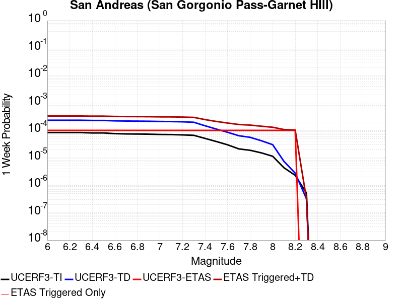 |  | 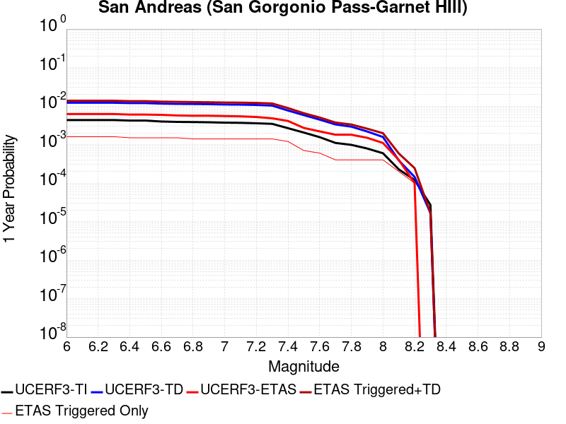 |  |

| Magnitude | 1 wk TI Prob | 1 wk TD Prob | 1 wk ETAS Prob | 1 wk ETAS/TD Gain | 1 wk ETAS Triggered+TD | 1 wk ETAS Triggered Only | 1 mo TI Prob | 1 mo TD Prob | 1 mo ETAS Prob | 1 mo ETAS/TD Gain | 1 mo ETAS Triggered+TD | 1 mo ETAS Triggered Only | 1 yr TI Prob | 1 yr TD Prob | 1 yr ETAS Prob | 1 yr ETAS/TD Gain | 1 yr ETAS Triggered+TD | 1 yr ETAS Triggered Only | 10 yr TI Prob | 10 yr TD Prob | 10 yr ETAS Prob | 10 yr ETAS/TD Gain | 10 yr ETAS Triggered+TD | 10 yr ETAS Triggered Only |
|-----|-----|-----|-----|-----|-----|-----|-----|-----|-----|-----|-----|-----|-----|-----|-----|-----|-----|-----|-----|-----|-----|-----|-----|-----|
| 6.0 | 8.31567E-5 | 2.3399283E-4 | 1.0E-4 | 0.4273635 | 3.3396942E-4 | 1.0E-4 | 3.5633717E-4 | 0.0010024379 | 4.0E-4 | 0.3990272 | 0.0012022374 | 2.0E-4 | 0.004329778 | 0.0121362815 | 0.0062 | 0.51086485 | 0.0137168635 | 0.0016 | 0.042463828 | 0.11264647 | 0.0655 | 0.5814652 | 0.12524688 | 0.0142 |
| 6.1 | 8.31567E-5 | 2.3399283E-4 | 1.0E-4 | 0.4273635 | 3.3396942E-4 | 1.0E-4 | 3.5633717E-4 | 0.0010024379 | 4.0E-4 | 0.3990272 | 0.0012022374 | 2.0E-4 | 0.004329778 | 0.0121362815 | 0.0062 | 0.51086485 | 0.0137168635 | 0.0016 | 0.042463828 | 0.11264647 | 0.0655 | 0.5814652 | 0.12524688 | 0.0142 |
| 6.2 | 8.31567E-5 | 2.3399283E-4 | 1.0E-4 | 0.4273635 | 3.3396942E-4 | 1.0E-4 | 3.5633717E-4 | 0.0010024379 | 4.0E-4 | 0.3990272 | 0.0012022374 | 2.0E-4 | 0.004329778 | 0.0121362815 | 0.0062 | 0.51086485 | 0.0137168635 | 0.0016 | 0.042463828 | 0.11264647 | 0.0655 | 0.5814652 | 0.12524688 | 0.0142 |
| 6.3 | 8.31567E-5 | 2.3399283E-4 | 1.0E-4 | 0.4273635 | 3.3396942E-4 | 1.0E-4 | 3.5633717E-4 | 0.0010024379 | 4.0E-4 | 0.3990272 | 0.0012022374 | 2.0E-4 | 0.004329778 | 0.0121362815 | 0.0062 | 0.51086485 | 0.0137168635 | 0.0016 | 0.042463828 | 0.11264647 | 0.0655 | 0.5814652 | 0.12524688 | 0.0142 |
| 6.4 | 8.059055E-5 | 2.295642E-4 | 1.0E-4 | 0.43560797 | 3.2954125E-4 | 1.0E-4 | 3.4534236E-4 | 9.834773E-4 | 4.0E-4 | 0.4067201 | 0.0011832806 | 2.0E-4 | 0.0041964394 | 0.011908304 | 0.006 | 0.5038501 | 0.013390441 | 0.0015 | 0.041180745 | 0.11062623 | 0.0641 | 0.5794286 | 0.12307746 | 0.014 |
| 6.5 | 8.059055E-5 | 2.295642E-4 | 1.0E-4 | 0.43560797 | 3.2954125E-4 | 1.0E-4 | 3.4534236E-4 | 9.834773E-4 | 4.0E-4 | 0.4067201 | 0.0011832806 | 2.0E-4 | 0.0041964394 | 0.011908304 | 0.006 | 0.5038501 | 0.013390441 | 0.0015 | 0.041180745 | 0.11062623 | 0.0641 | 0.5794286 | 0.12307746 | 0.014 |
| 6.6 | 7.619237E-5 | 2.2200467E-4 | 1.0E-4 | 0.45044094 | 3.219825E-4 | 1.0E-4 | 3.2649786E-4 | 9.51104E-4 | 4.0E-4 | 0.4205639 | 0.0011509138 | 2.0E-4 | 0.0039678677 | 0.011518755 | 0.0059 | 0.5122081 | 0.013001477 | 0.0015 | 0.03897764 | 0.10716084 | 0.0624 | 0.58230233 | 0.11921416 | 0.0135 |
| 6.7 | 7.440636E-5 | 2.1876149E-4 | 1.0E-4 | 0.45711884 | 3.1873962E-4 | 1.0E-4 | 3.188454E-4 | 9.3721465E-4 | 4.0E-4 | 0.4267966 | 0.0011370272 | 2.0E-4 | 0.0038750346 | 0.011351423 | 0.0057 | 0.5021397 | 0.012834396 | 0.0015 | 0.038081564 | 0.10566883 | 0.0612 | 0.57916796 | 0.11765286 | 0.0134 |
| 6.8 | 7.3735864E-5 | 2.1723237E-4 | 1.0E-4 | 0.46033654 | 3.1721065E-4 | 1.0E-4 | 3.1597257E-4 | 9.30666E-4 | 4.0E-4 | 0.42979974 | 0.0011304799 | 2.0E-4 | 0.0038401815 | 0.011272524 | 0.0056 | 0.4967832 | 0.012656742 | 0.0014 | 0.03774495 | 0.10497001 | 0.0605 | 0.5763551 | 0.11687391 | 0.0133 |
| 6.9 | 7.27575E-5 | 2.1492114E-4 | 1.0E-4 | 0.46528694 | 3.1489966E-4 | 1.0E-4 | 3.117806E-4 | 9.207677E-4 | 4.0E-4 | 0.4344201 | 0.0011205835 | 2.0E-4 | 0.003789323 | 0.011153252 | 0.0056 | 0.5020957 | 0.012537637 | 0.0014 | 0.037253562 | 0.103917554 | 0.0602 | 0.5793054 | 0.11574584 | 0.0132 |
| 7.0 | 7.102591E-5 | 2.10759E-4 | 1.0E-4 | 0.4744756 | 3.1073793E-4 | 1.0E-4 | 3.0436125E-4 | 9.029424E-4 | 4.0E-4 | 0.44299614 | 0.0011027618 | 2.0E-4 | 0.003699303 | 0.010938426 | 0.0055 | 0.5028146 | 0.012323111 | 0.0014 | 0.03638325 | 0.10201837 | 0.0592 | 0.58028764 | 0.11369213 | 0.013 |
| 7.1 | 7.028513E-5 | 2.0911425E-4 | 1.0E-4 | 0.4782075 | 3.0909333E-4 | 1.0E-4 | 3.0118722E-4 | 8.958983E-4 | 4.0E-4 | 0.44647923 | 0.0010957192 | 2.0E-4 | 0.0036607897 | 0.010853522 | 0.0054 | 0.49753433 | 0.012238327 | 0.0014 | 0.036010686 | 0.101261005 | 0.0586 | 0.5787025 | 0.112854734 | 0.0129 |
| 7.2 | 6.8498244E-5 | 2.0519004E-4 | 1.0E-4 | 0.4873531 | 3.0516952E-4 | 1.0E-4 | 2.9353087E-4 | 8.790917E-4 | 4.0E-4 | 0.4550151 | 0.0010789159 | 2.0E-4 | 0.003567883 | 0.010650918 | 0.0052 | 0.48822084 | 0.012036006 | 0.0014 | 0.035111405 | 0.099452004 | 0.0577 | 0.5801794 | 0.11097902 | 0.0128 |
| 7.3 | 6.622592E-5 | 1.9745881E-4 | 1.0E-4 | 0.50643474 | 2.9743908E-4 | 1.0E-4 | 2.8379448E-4 | 8.459798E-4 | 3.0E-4 | 0.3546184 | 0.0010458105 | 2.0E-4 | 0.0034497243 | 0.010251642 | 0.0048 | 0.46821767 | 0.01163729 | 0.0014 | 0.033966612 | 0.095947616 | 0.0553 | 0.5763562 | 0.10715786 | 0.0124 |
| 7.4 | 5.1050705E-5 | 1.4705659E-4 | 1.0E-4 | 0.6800103 | 2.470419E-4 | 1.0E-4 | 2.1877038E-4 | 6.300912E-4 | 2.0E-4 | 0.31741437 | 7.300282E-4 | 1.0E-4 | 0.002660276 | 0.0076445695 | 0.0041 | 0.53632843 | 0.008835396 | 0.0012 | 0.02628654 | 0.07293427 | 0.041 | 0.56215 | 0.081555985 | 0.0093 |
| 7.5 | 3.9302922E-5 | 1.11485184E-4 | 1.0E-4 | 0.89698017 | 2.1147403E-4 | 1.0E-4 | 1.6843023E-4 | 4.7770646E-4 | 2.0E-4 | 0.41866714 | 5.776587E-4 | 1.0E-4 | 0.0020487092 | 0.0058006356 | 0.0027 | 0.46546623 | 0.006496575 | 7.0E-4 | 0.020299247 | 0.056090266 | 0.0308 | 0.5491149 | 0.06250885 | 0.0068 |
| 7.6 | 2.9851626E-5 | 8.514301E-5 | 1.0E-4 | 1.1744945 | 1.851345E-4 | 1.0E-4 | 1.2792926E-4 | 3.648477E-4 | 2.0E-4 | 0.5481739 | 4.6481122E-4 | 1.0E-4 | 0.0015564259 | 0.004432999 | 0.0022 | 0.49627802 | 0.005030339 | 6.0E-4 | 0.0154556995 | 0.043278623 | 0.0241 | 0.5568569 | 0.048253577 | 0.0052 |
| 7.7 | 2.1135214E-5 | 6.372898E-5 | 1.0E-4 | 1.5691448 | 1.6372261E-4 | 1.0E-4 | 9.0576345E-5 | 2.7309562E-4 | 2.0E-4 | 0.7323442 | 3.7306832E-4 | 1.0E-4 | 0.0011022091 | 0.0033198756 | 0.0018 | 0.542189 | 0.0037185475 | 4.0E-4 | 0.010967582 | 0.03267241 | 0.0174 | 0.53255945 | 0.036348253 | 0.0038 |
| 7.8 | 1.883379E-5 | 5.5827077E-5 | 1.0E-4 | 1.7912455 | 1.558215E-4 | 1.0E-4 | 8.0713755E-5 | 2.3923698E-4 | 2.0E-4 | 0.83599114 | 3.3921306E-4 | 1.0E-4 | 9.822468E-4 | 0.002908823 | 0.0018 | 0.618807 | 0.0033076594 | 4.0E-4 | 0.0097791655 | 0.028779393 | 0.0153 | 0.5316304 | 0.031984422 | 0.0033 |
| 7.9 | 1.5156185E-5 | 4.180683E-5 | 1.0E-4 | 2.3919537 | 1.4180265E-4 | 1.0E-4 | 6.495346E-5 | 1.7915983E-4 | 1.0E-4 | 0.55816084 | 2.791419E-4 | 1.0E-4 | 7.9052144E-4 | 0.0021790902 | 0.0015 | 0.68836063 | 0.0025782187 | 4.0E-4 | 0.007877152 | 0.021827592 | 0.0112 | 0.51311207 | 0.024566473 | 0.0028 |
| 8.0 | 1.1405907E-5 | 3.0075196E-5 | 1.0E-4 | 3.324999 | 1.3007219E-4 | 1.0E-4 | 4.8881542E-5 | 1.2888733E-4 | 1.0E-4 | 0.77587146 | 2.2887444E-4 | 1.0E-4 | 5.9497025E-4 | 0.0015680748 | 0.0011 | 0.70149714 | 0.0019674476 | 4.0E-4 | 0.005933798 | 0.015819613 | 0.007 | 0.4424887 | 0.017492719 | 0.0017 |
| 8.1 | 4.3511436E-6 | 7.3914503E-6 | 1.0E-4 | 13.529144 | 1.0739071E-4 | 1.0E-4 | 1.8647626E-5 | 3.167726E-5 | 1.0E-4 | 3.1568387 | 1.316741E-4 | 1.0E-4 | 2.2701119E-4 | 3.8560253E-4 | 4.0E-4 | 1.0373375 | 5.855254E-4 | 2.0E-4 | 0.0022677942 | 0.0041275662 | 0.0014 | 0.3391829 | 0.0046255025 | 5.0E-4 |
| 8.2 | 2.3042528E-6 | 2.7418507E-6 | 1.0E-4 | 36.471714 | 1.0274158E-4 | 1.0E-4 | 9.875332E-6 | 1.1750736E-5 | 1.0E-4 | 8.510105 | 1.1174956E-4 | 1.0E-4 | 1.2022553E-4 | 1.4305586E-4 | 1.0E-4 | 0.6990276 | 2.4304156E-4 | 1.0E-4 | 0.0012016051 | 0.0016026953 | 4.0E-4 | 0.24957958 | 0.0018023747 | 2.0E-4 |
| 8.3 | 5.202968E-7 | 3.1723667E-7 | 0.0 | 0.0 | 3.1723667E-7 | 0.0 | 2.2298414E-6 | 1.3595851E-6 | 0.0 | 0.0 | 1.3595851E-6 | 0.0 | 2.714798E-5 | 1.6552836E-5 | 0.0 | 0.0 | 1.6552836E-5 | 0.0 | 2.7144665E-4 | 1.9635838E-4 | 0.0 | 0.0 | 1.9635838E-4 | 0.0 |

## San Jacinto (Superstition Mtn)
*[(top)](#table-of-contents)*

| 1 Week | 1 Month | 1 Year | 10 Year |
|-----|-----|-----|-----|
|  | 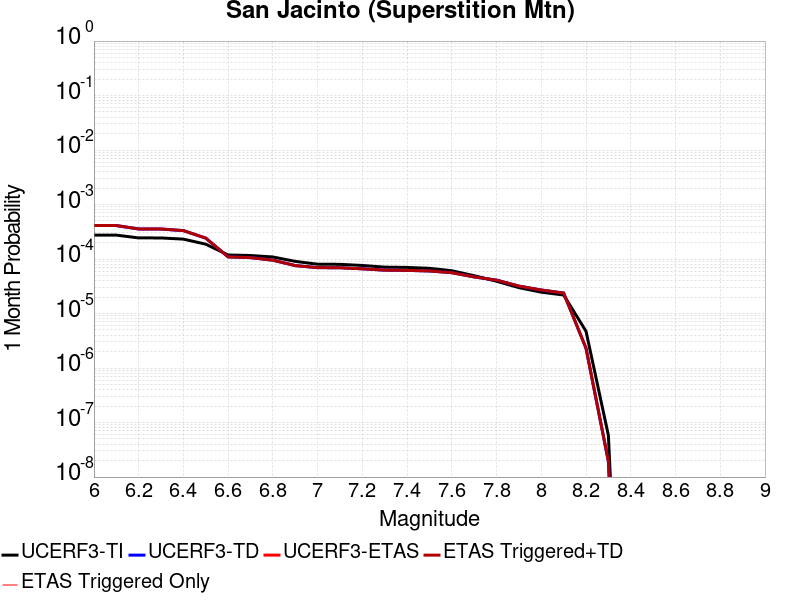 |  |  |

| Magnitude | 1 wk TI Prob | 1 wk TD Prob | 1 wk ETAS Prob | 1 wk ETAS/TD Gain | 1 wk ETAS Triggered+TD | 1 wk ETAS Triggered Only | 1 mo TI Prob | 1 mo TD Prob | 1 mo ETAS Prob | 1 mo ETAS/TD Gain | 1 mo ETAS Triggered+TD | 1 mo ETAS Triggered Only | 1 yr TI Prob | 1 yr TD Prob | 1 yr ETAS Prob | 1 yr ETAS/TD Gain | 1 yr ETAS Triggered+TD | 1 yr ETAS Triggered Only | 10 yr TI Prob | 10 yr TD Prob | 10 yr ETAS Prob | 10 yr ETAS/TD Gain | 10 yr ETAS Triggered+TD | 10 yr ETAS Triggered Only |
|-----|-----|-----|-----|-----|-----|-----|-----|-----|-----|-----|-----|-----|-----|-----|-----|-----|-----|-----|-----|-----|-----|-----|-----|-----|
| 6.0 | 6.4193904E-5 | 9.6054275E-5 | 0.0 | 0.0 | 9.6054275E-5 | 0.0 | 2.7508775E-4 | 4.1160223E-4 | 0.0 | 0.0 | 4.1160223E-4 | 0.0 | 0.0033440501 | 0.00500114 | 0.0029 | 0.57986784 | 0.0064936383 | 0.0015 | 0.03294174 | 0.048853457 | 0.0341 | 0.6980059 | 0.060837902 | 0.0126 |
| 6.1 | 6.4193904E-5 | 9.6054275E-5 | 0.0 | 0.0 | 9.6054275E-5 | 0.0 | 2.7508775E-4 | 4.1160223E-4 | 0.0 | 0.0 | 4.1160223E-4 | 0.0 | 0.0033440501 | 0.00500114 | 0.0029 | 0.57986784 | 0.0064936383 | 0.0015 | 0.03294174 | 0.048853457 | 0.0341 | 0.6980059 | 0.060837902 | 0.0126 |
| 6.2 | 5.7023593E-5 | 8.319494E-5 | 0.0 | 0.0 | 8.319494E-5 | 0.0 | 2.4436394E-4 | 3.565104E-4 | 0.0 | 0.0 | 3.565104E-4 | 0.0 | 0.002971072 | 0.0043335175 | 0.0023 | 0.5307467 | 0.0055283173 | 0.0012 | 0.029316625 | 0.042532858 | 0.0287 | 0.67477244 | 0.052299023 | 0.0102 |
| 6.3 | 5.6940098E-5 | 8.304024E-5 | 0.0 | 0.0 | 8.304024E-5 | 0.0 | 2.4400617E-4 | 3.5584765E-4 | 0.0 | 0.0 | 3.5584765E-4 | 0.0 | 0.002966728 | 0.00432548 | 0.0023 | 0.53173286 | 0.0055202898 | 0.0012 | 0.029274331 | 0.04245621 | 0.0287 | 0.67599064 | 0.052223153 | 0.0102 |
| 6.4 | 5.4171585E-5 | 7.753056E-5 | 0.0 | 0.0 | 7.753056E-5 | 0.0 | 2.3214328E-4 | 3.322408E-4 | 0.0 | 0.0 | 3.322408E-4 | 0.0 | 0.0028226813 | 0.004039178 | 0.0023 | 0.5694228 | 0.005234331 | 0.0012 | 0.02787096 | 0.039744034 | 0.0262 | 0.65921843 | 0.048770443 | 0.0094 |
| 6.5 | 4.375144E-5 | 5.646516E-5 | 0.0 | 0.0 | 5.646516E-5 | 0.0 | 1.874927E-4 | 2.4197773E-4 | 0.0 | 0.0 | 2.4197773E-4 | 0.0 | 0.0022803338 | 0.0029432748 | 0.0017 | 0.5775879 | 0.003840626 | 9.0E-4 | 0.022570757 | 0.02926223 | 0.0189 | 0.6458838 | 0.035766173 | 0.0067 |
| 6.6 | 2.772192E-5 | 2.5528338E-5 | 0.0 | 0.0 | 2.5528338E-5 | 0.0 | 1.1880282E-4 | 1.0940268E-4 | 0.0 | 0.0 | 1.0940268E-4 | 0.0 | 0.0014454646 | 0.0013311831 | 6.0E-4 | 0.45072687 | 0.0016307838 | 3.0E-4 | 0.014360986 | 0.0135606425 | 0.0084 | 0.61943966 | 0.015632166 | 0.0021 |
| 6.7 | 2.7124124E-5 | 2.4739511E-5 | 0.0 | 0.0 | 2.4739511E-5 | 0.0 | 1.1624106E-4 | 1.0602227E-4 | 0.0 | 0.0 | 1.0602227E-4 | 0.0 | 0.0014143161 | 0.0012900761 | 6.0E-4 | 0.46508887 | 0.001589689 | 3.0E-4 | 0.014053487 | 0.013154348 | 0.0083 | 0.63097006 | 0.01512804 | 0.002 |
| 6.8 | 2.5475807E-5 | 2.220493E-5 | 0.0 | 0.0 | 2.220493E-5 | 0.0 | 1.0917746E-4 | 9.516058E-5 | 0.0 | 0.0 | 9.516058E-5 | 0.0 | 0.001328425 | 0.0011579762 | 6.0E-4 | 0.5181453 | 0.0014576289 | 3.0E-4 | 0.0132051185 | 0.011842619 | 0.0074 | 0.6248618 | 0.013423671 | 0.0016 |
| 6.9 | 2.1162023E-5 | 1.7666207E-5 | 0.0 | 0.0 | 1.7666207E-5 | 0.0 | 9.069123E-5 | 7.571014E-5 | 0.0 | 0.0 | 7.571014E-5 | 0.0 | 0.0011036064 | 9.2138496E-4 | 3.0E-4 | 0.3255968 | 0.0010212928 | 1.0E-4 | 0.010981417 | 0.009467175 | 0.0061 | 0.6443316 | 0.010556761 | 0.0011 |
| 7.0 | 1.8754288E-5 | 1.6202019E-5 | 0.0 | 0.0 | 1.6202019E-5 | 0.0 | 8.037304E-5 | 6.943539E-5 | 0.0 | 0.0 | 6.943539E-5 | 0.0 | 9.781026E-4 | 8.4505044E-4 | 2.0E-4 | 0.23667225 | 8.4505044E-4 | 0.0 | 0.009738087 | 0.0086906925 | 0.0047 | 0.54080844 | 0.009285479 | 6.0E-4 |
| 7.1 | 1.8678527E-5 | 1.6127136E-5 | 0.0 | 0.0 | 1.6127136E-5 | 0.0 | 8.0048376E-5 | 6.911448E-5 | 0.0 | 0.0 | 6.911448E-5 | 0.0 | 9.7415317E-4 | 8.411464E-4 | 2.0E-4 | 0.23777074 | 8.411464E-4 | 0.0 | 0.009698939 | 0.008651633 | 0.0047 | 0.5432501 | 0.009246442 | 6.0E-4 |
| 7.2 | 1.7804578E-5 | 1.5421732E-5 | 0.0 | 0.0 | 1.5421732E-5 | 0.0 | 7.6303106E-5 | 6.6091474E-5 | 0.0 | 0.0 | 6.6091474E-5 | 0.0 | 9.285943E-4 | 8.0436893E-4 | 2.0E-4 | 0.24864212 | 8.0436893E-4 | 0.0 | 0.009247236 | 0.008283091 | 0.0046 | 0.5553482 | 0.008878121 | 6.0E-4 |
| 7.3 | 1.6583685E-5 | 1.4570801E-5 | 0.0 | 0.0 | 1.4570801E-5 | 0.0 | 7.1070994E-5 | 6.244481E-5 | 0.0 | 0.0 | 6.244481E-5 | 0.0 | 8.649459E-4 | 7.6000235E-4 | 2.0E-4 | 0.26315707 | 7.6000235E-4 | 0.0 | 0.00861587 | 0.007838385 | 0.0045 | 0.5740979 | 0.008433682 | 6.0E-4 |
| 7.4 | 1.6387552E-5 | 1.4435687E-5 | 0.0 | 0.0 | 1.4435687E-5 | 0.0 | 7.023047E-5 | 6.186577E-5 | 0.0 | 0.0 | 6.186577E-5 | 0.0 | 8.5472054E-4 | 7.5295754E-4 | 2.0E-4 | 0.26561925 | 7.5295754E-4 | 0.0 | 0.008514405 | 0.007767765 | 0.0044 | 0.5664435 | 0.008363104 | 6.0E-4 |
| 7.5 | 1.5790754E-5 | 1.4076132E-5 | 0.0 | 0.0 | 1.4076132E-5 | 0.0 | 6.767291E-5 | 6.0324895E-5 | 0.0 | 0.0 | 6.0324895E-5 | 0.0 | 8.236062E-4 | 7.342101E-4 | 2.0E-4 | 0.2724016 | 7.342101E-4 | 0.0 | 0.008205604 | 0.007578211 | 0.0043 | 0.56741625 | 0.008173664 | 6.0E-4 |
| 7.6 | 1.4248672E-5 | 1.3094449E-5 | 0.0 | 0.0 | 1.3094449E-5 | 0.0 | 6.106431E-5 | 5.6117868E-5 | 0.0 | 0.0 | 5.6117868E-5 | 0.0 | 7.432043E-4 | 6.830226E-4 | 2.0E-4 | 0.29281607 | 6.830226E-4 | 0.0 | 0.007407237 | 0.0070605534 | 0.0039 | 0.55236465 | 0.007656317 | 6.0E-4 |
| 7.7 | 1.15449975E-5 | 1.0941954E-5 | 0.0 | 0.0 | 1.0941954E-5 | 0.0 | 4.947762E-5 | 4.689325E-5 | 0.0 | 0.0 | 4.689325E-5 | 0.0 | 6.022235E-4 | 5.707765E-4 | 2.0E-4 | 0.35039982 | 5.707765E-4 | 0.0 | 0.006005941 | 0.0059300773 | 0.0031 | 0.5227588 | 0.0062282984 | 3.0E-4 |
| 7.8 | 9.1391985E-6 | 9.5516225E-6 | 0.0 | 0.0 | 9.5516225E-6 | 0.0 | 3.9167408E-5 | 4.0934887E-5 | 0.0 | 0.0 | 4.0934887E-5 | 0.0 | 4.767588E-4 | 4.9826887E-4 | 2.0E-4 | 0.40138972 | 4.9826887E-4 | 0.0 | 0.0047573727 | 0.0051959716 | 0.0028 | 0.538879 | 0.005494413 | 3.0E-4 |
| 7.9 | 6.973017E-6 | 7.4141244E-6 | 0.0 | 0.0 | 7.4141244E-6 | 0.0 | 2.9884017E-5 | 3.1774434E-5 | 0.0 | 0.0 | 3.1774434E-5 | 0.0 | 3.6377716E-4 | 3.867856E-4 | 1.0E-4 | 0.25854117 | 3.867856E-4 | 0.0 | 0.0036318225 | 0.004068204 | 0.0022 | 0.5407791 | 0.004267391 | 2.0E-4 |
| 8.0 | 5.7638235E-6 | 6.2878244E-6 | 0.0 | 0.0 | 6.2878244E-6 | 0.0 | 2.4701867E-5 | 2.6947544E-5 | 0.0 | 0.0 | 2.6947544E-5 | 0.0 | 3.0070372E-4 | 3.2803745E-4 | 1.0E-4 | 0.30484325 | 3.2803745E-4 | 0.0 | 0.0030029714 | 0.0034677952 | 0.002 | 0.5767353 | 0.0036671017 | 2.0E-4 |
| 8.1 | 5.1124434E-6 | 5.519482E-6 | 0.0 | 0.0 | 5.519482E-6 | 0.0 | 2.1910288E-5 | 2.365471E-5 | 0.0 | 0.0 | 2.365471E-5 | 0.0 | 2.6672508E-4 | 2.8795854E-4 | 1.0E-4 | 0.34727225 | 2.8795854E-4 | 0.0 | 0.0026640517 | 0.0030525858 | 0.0019 | 0.6224231 | 0.0032519754 | 2.0E-4 |
| 8.2 | 1.1075938E-6 | 5.3484956E-7 | 0.0 | 0.0 | 5.3484956E-7 | 0.0 | 4.7468216E-6 | 2.2922104E-6 | 0.0 | 0.0 | 2.2922104E-6 | 0.0 | 5.779102E-5 | 2.7907327E-5 | 0.0 | 0.0 | 2.7907327E-5 | 0.0 | 5.777599E-4 | 3.141541E-4 | 2.0E-4 | 0.63663024 | 4.1412268E-4 | 1.0E-4 |
| 8.3 | 1.3584393E-8 | 4.4832715E-9 | 0.0 | 0.0 | 4.4832715E-9 | 0.0 | 5.8218827E-8 | 1.921402E-8 | 0.0 | 0.0 | 1.921402E-8 | 0.0 | 7.0881396E-7 | 2.3393069E-7 | 0.0 | 0.0 | 2.3393069E-7 | 0.0 | 7.0881174E-6 | 2.6224475E-6 | 0.0 | 0.0 | 2.6224475E-6 | 0.0 |

## Airport Lake
*[(top)](#table-of-contents)*

| 1 Week | 1 Month | 1 Year | 10 Year |
|-----|-----|-----|-----|
|  |  | 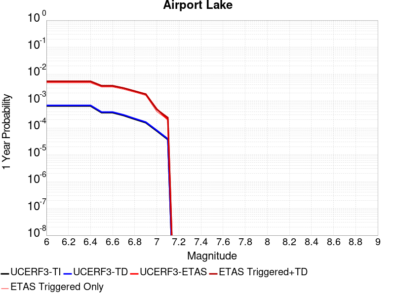 | 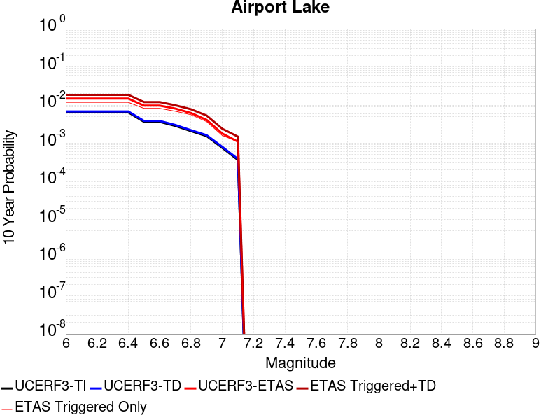 |

| Magnitude | 1 wk TI Prob | 1 wk TD Prob | 1 wk ETAS Prob | 1 wk ETAS/TD Gain | 1 wk ETAS Triggered+TD | 1 wk ETAS Triggered Only | 1 mo TI Prob | 1 mo TD Prob | 1 mo ETAS Prob | 1 mo ETAS/TD Gain | 1 mo ETAS Triggered+TD | 1 mo ETAS Triggered Only | 1 yr TI Prob | 1 yr TD Prob | 1 yr ETAS Prob | 1 yr ETAS/TD Gain | 1 yr ETAS Triggered+TD | 1 yr ETAS Triggered Only | 10 yr TI Prob | 10 yr TD Prob | 10 yr ETAS Prob | 10 yr ETAS/TD Gain | 10 yr ETAS Triggered+TD | 10 yr ETAS Triggered Only |
|-----|-----|-----|-----|-----|-----|-----|-----|-----|-----|-----|-----|-----|-----|-----|-----|-----|-----|-----|-----|-----|-----|-----|-----|-----|
| 6.0 | 1.2387061E-5 | 1.310466E-5 | 1.0E-4 | 7.630873 | 1.1310335E-4 | 1.0E-4 | 5.3086325E-5 | 5.616178E-5 | 7.0E-4 | 12.463992 | 6.561281E-4 | 6.0E-4 | 6.461343E-4 | 6.8358355E-4 | 0.0052 | 7.6069703 | 0.0053803707 | 0.0047 | 0.0064425888 | 0.0068176193 | 0.0148 | 2.1708457 | 0.018537171 | 0.0118 |
| 6.1 | 1.2387061E-5 | 1.310466E-5 | 1.0E-4 | 7.630873 | 1.1310335E-4 | 1.0E-4 | 5.3086325E-5 | 5.616178E-5 | 7.0E-4 | 12.463992 | 6.561281E-4 | 6.0E-4 | 6.461343E-4 | 6.8358355E-4 | 0.0052 | 7.6069703 | 0.0053803707 | 0.0047 | 0.0064425888 | 0.0068176193 | 0.0148 | 2.1708457 | 0.018537171 | 0.0118 |
| 6.2 | 1.2387061E-5 | 1.310466E-5 | 1.0E-4 | 7.630873 | 1.1310335E-4 | 1.0E-4 | 5.3086325E-5 | 5.616178E-5 | 7.0E-4 | 12.463992 | 6.561281E-4 | 6.0E-4 | 6.461343E-4 | 6.8358355E-4 | 0.0052 | 7.6069703 | 0.0053803707 | 0.0047 | 0.0064425888 | 0.0068176193 | 0.0148 | 2.1708457 | 0.018537171 | 0.0118 |
| 6.3 | 1.2387061E-5 | 1.310466E-5 | 1.0E-4 | 7.630873 | 1.1310335E-4 | 1.0E-4 | 5.3086325E-5 | 5.616178E-5 | 7.0E-4 | 12.463992 | 6.561281E-4 | 6.0E-4 | 6.461343E-4 | 6.8358355E-4 | 0.0052 | 7.6069703 | 0.0053803707 | 0.0047 | 0.0064425888 | 0.0068176193 | 0.0148 | 2.1708457 | 0.018537171 | 0.0118 |
| 6.4 | 1.2387061E-5 | 1.310466E-5 | 1.0E-4 | 7.630873 | 1.1310335E-4 | 1.0E-4 | 5.3086325E-5 | 5.616178E-5 | 7.0E-4 | 12.463992 | 6.561281E-4 | 6.0E-4 | 6.461343E-4 | 6.8358355E-4 | 0.0052 | 7.6069703 | 0.0053803707 | 0.0047 | 0.0064425888 | 0.0068176193 | 0.0148 | 2.1708457 | 0.018537171 | 0.0118 |
| 6.5 | 6.9922594E-6 | 7.3857477E-6 | 0.0 | 0.0 | 7.3857477E-6 | 0.0 | 2.996648E-5 | 3.1652853E-5 | 5.0E-4 | 15.796365 | 4.316402E-4 | 4.0E-4 | 3.6478083E-4 | 3.8531076E-4 | 0.0036 | 9.343108 | 0.0036840392 | 0.0033 | 0.003641826 | 0.0038469643 | 0.0097 | 2.5214686 | 0.012015419 | 0.0082 |
| 6.6 | 6.9922594E-6 | 7.3857477E-6 | 0.0 | 0.0 | 7.3857477E-6 | 0.0 | 2.996648E-5 | 3.1652853E-5 | 5.0E-4 | 15.796365 | 4.316402E-4 | 4.0E-4 | 3.6478083E-4 | 3.8531076E-4 | 0.0036 | 9.343108 | 0.0036840392 | 0.0033 | 0.003641826 | 0.0038469643 | 0.0097 | 2.5214686 | 0.012015419 | 0.0082 |
| 6.7 | 5.477277E-6 | 5.7867155E-6 | 0.0 | 0.0 | 5.7867155E-6 | 0.0 | 2.3473833E-5 | 2.4799996E-5 | 4.0E-4 | 16.129036 | 3.2479255E-4 | 3.0E-4 | 2.8575645E-4 | 3.01902E-4 | 0.003 | 9.936999 | 0.0030010869 | 0.0027 | 0.0028538927 | 0.0030153026 | 0.0081 | 2.6862977 | 0.009894497 | 0.0069 |
| 6.8 | 3.9950432E-6 | 4.2195566E-6 | 0.0 | 0.0 | 4.2195566E-6 | 0.0 | 1.7121502E-5 | 1.8083703E-5 | 3.0E-4 | 16.589521 | 2.1808008E-4 | 2.0E-4 | 2.0843433E-4 | 2.201496E-4 | 0.0023 | 10.447441 | 0.0023196873 | 0.0021 | 0.0020823893 | 0.0021995862 | 0.0062 | 2.818712 | 0.0077872686 | 0.0056 |
| 6.9 | 2.95695E-6 | 3.1233722E-6 | 0.0 | 0.0 | 3.1233722E-6 | 0.0 | 1.2672582E-5 | 1.3385825E-5 | 2.0E-4 | 14.941178 | 1.13384485E-4 | 1.0E-4 | 1.5427776E-4 | 1.629625E-4 | 0.0018 | 11.045486 | 0.0017627018 | 0.0016 | 0.001541707 | 0.0016286524 | 0.0041 | 2.5174186 | 0.0053226263 | 0.0037 |
| 7.0 | 1.456072E-6 | 1.5409898E-6 | 0.0 | 0.0 | 1.5409898E-6 | 0.0 | 6.2402937E-6 | 6.604231E-6 | 1.0E-4 | 15.141808 | 6.604231E-6 | 0.0 | 7.597293E-5 | 8.0404556E-5 | 5.0E-4 | 6.218553 | 4.803724E-4 | 4.0E-4 | 7.594696E-4 | 8.0385356E-4 | 0.0018 | 2.2392137 | 0.0024025673 | 0.0016 |
| 7.1 | 6.995192E-7 | 7.409844E-7 | 0.0 | 0.0 | 7.409844E-7 | 0.0 | 2.997936E-6 | 3.1756472E-6 | 0.0 | 0.0 | 3.1756472E-6 | 0.0 | 3.649926E-5 | 3.8663504E-5 | 2.0E-4 | 5.172837 | 2.3865578E-4 | 2.0E-4 | 3.6493264E-4 | 3.8663505E-4 | 0.0011 | 2.84506 | 0.0014862098 | 0.0011 |

## Green Valley 2011 CFM
*[(top)](#table-of-contents)*

| 1 Week | 1 Month | 1 Year | 10 Year |
|-----|-----|-----|-----|
|  |  |  |  |

| Magnitude | 1 wk TI Prob | 1 wk TD Prob | 1 wk ETAS Prob | 1 wk ETAS/TD Gain | 1 wk ETAS Triggered+TD | 1 wk ETAS Triggered Only | 1 mo TI Prob | 1 mo TD Prob | 1 mo ETAS Prob | 1 mo ETAS/TD Gain | 1 mo ETAS Triggered+TD | 1 mo ETAS Triggered Only | 1 yr TI Prob | 1 yr TD Prob | 1 yr ETAS Prob | 1 yr ETAS/TD Gain | 1 yr ETAS Triggered+TD | 1 yr ETAS Triggered Only | 10 yr TI Prob | 10 yr TD Prob | 10 yr ETAS Prob | 10 yr ETAS/TD Gain | 10 yr ETAS Triggered+TD | 10 yr ETAS Triggered Only |
|-----|-----|-----|-----|-----|-----|-----|-----|-----|-----|-----|-----|-----|-----|-----|-----|-----|-----|-----|-----|-----|-----|-----|-----|-----|
| 6.0 | 9.9629346E-5 | 1.7316075E-4 | 1.0E-4 | 0.5774981 | 2.7314344E-4 | 1.0E-4 | 4.2691303E-4 | 7.4188446E-4 | 2.0E-4 | 0.26958376 | 9.417361E-4 | 2.0E-4 | 0.0051852856 | 0.008993628 | 0.0048 | 0.5337112 | 0.010678339 | 0.0017 | 0.050659515 | 0.08558589 | 0.0601 | 0.70221853 | 0.09610166 | 0.0115 |
| 6.1 | 9.88615E-5 | 1.7163092E-4 | 1.0E-4 | 0.5826456 | 2.7161377E-4 | 1.0E-4 | 4.2362334E-4 | 7.353318E-4 | 2.0E-4 | 0.27198607 | 9.351847E-4 | 2.0E-4 | 0.0051454236 | 0.00891451 | 0.0047 | 0.5272303 | 0.010599355 | 0.0017 | 0.050279044 | 0.084872425 | 0.059 | 0.695161 | 0.09521337 | 0.0113 |
| 6.2 | 9.696895E-5 | 1.6801736E-4 | 1.0E-4 | 0.5951766 | 2.6800056E-4 | 1.0E-4 | 4.15515E-4 | 7.1985484E-4 | 1.0E-4 | 0.1389169 | 8.1978284E-4 | 1.0E-4 | 0.0050471667 | 0.0087276865 | 0.0045 | 0.51560056 | 0.010313722 | 0.0016 | 0.04934063 | 0.08317977 | 0.0578 | 0.6948805 | 0.093264796 | 0.011 |
| 6.3 | 9.275224E-5 | 1.5980966E-4 | 1.0E-4 | 0.6257444 | 2.5979368E-4 | 1.0E-4 | 3.9744904E-4 | 6.846977E-4 | 1.0E-4 | 0.14604986 | 7.846292E-4 | 1.0E-4 | 0.0048282105 | 0.008302957 | 0.0043 | 0.51788783 | 0.0097905025 | 0.0015 | 0.047246475 | 0.07931792 | 0.0552 | 0.6959335 | 0.08898508 | 0.0105 |
| 6.4 | 8.391499E-5 | 1.4374856E-4 | 1.0E-4 | 0.6956591 | 2.4373419E-4 | 1.0E-4 | 3.595861E-4 | 6.1590155E-4 | 1.0E-4 | 0.16236362 | 7.158399E-4 | 1.0E-4 | 0.004369175 | 0.007471708 | 0.0038 | 0.50858516 | 0.0087619955 | 0.0013 | 0.04284265 | 0.071678385 | 0.0499 | 0.6961652 | 0.081054434 | 0.0101 |
| 6.5 | 5.9519385E-5 | 9.940625E-5 | 1.0E-4 | 1.005973 | 1.9939631E-4 | 1.0E-4 | 2.5505814E-4 | 4.2593988E-4 | 1.0E-4 | 0.23477492 | 5.2589725E-4 | 1.0E-4 | 0.0031009112 | 0.0051723677 | 0.0028 | 0.54133815 | 0.006266678 | 0.0011 | 0.030579966 | 0.050180767 | 0.0357 | 0.711428 | 0.05730441 | 0.0075 |
| 6.6 | 4.5361558E-5 | 7.4090676E-5 | 0.0 | 0.0 | 7.4090676E-5 | 0.0 | 1.9439218E-4 | 3.174824E-4 | 0.0 | 0.0 | 3.174824E-4 | 0.0 | 0.0023641558 | 0.00385754 | 0.0014 | 0.36292562 | 0.00455484 | 7.0E-4 | 0.023391623 | 0.03769878 | 0.0275 | 0.7294666 | 0.042991437 | 0.0055 |
| 6.7 | 3.8808106E-5 | 6.270957E-5 | 0.0 | 0.0 | 6.270957E-5 | 0.0 | 1.6630985E-4 | 2.6871765E-4 | 0.0 | 0.0 | 2.6871765E-4 | 0.0 | 0.0020229418 | 0.0032661217 | 0.0012 | 0.36740822 | 0.0037644887 | 5.0E-4 | 0.020046256 | 0.03203665 | 0.0228 | 0.7116848 | 0.03581171 | 0.0039 |
| 6.8 | 2.2284667E-5 | 3.130395E-5 | 0.0 | 0.0 | 3.130395E-5 | 0.0 | 9.550222E-5 | 1.3415272E-4 | 0.0 | 0.0 | 1.3415272E-4 | 0.0 | 0.0011621192 | 0.0016320843 | 5.0E-4 | 0.30635673 | 0.0019315947 | 3.0E-4 | 0.011560607 | 0.016174562 | 0.0116 | 0.7171755 | 0.018240597 | 0.0021 |
| 6.9 | 1.8050168E-5 | 2.4465095E-5 | 0.0 | 0.0 | 2.4465095E-5 | 0.0 | 7.735557E-5 | 1.04846185E-4 | 0.0 | 0.0 | 1.04846185E-4 | 0.0 | 9.4139716E-4 | 0.0012757576 | 3.0E-4 | 0.2351544 | 0.0013756299 | 1.0E-4 | 0.009374191 | 0.0126769645 | 0.0087 | 0.6862842 | 0.014059217 | 0.0014 |
| 7.0 | 1.4763166E-5 | 1.9595645E-5 | 0.0 | 0.0 | 1.9595645E-5 | 0.0 | 6.326917E-5 | 8.3978644E-5 | 0.0 | 0.0 | 8.3978644E-5 | 0.0 | 7.7002996E-4 | 0.0010219617 | 3.0E-4 | 0.29355308 | 0.0011218594 | 1.0E-4 | 0.007673672 | 0.010172426 | 0.0072 | 0.70779574 | 0.011162253 | 0.001 |
| 7.1 | 1.2399713E-5 | 1.6314632E-5 | 0.0 | 0.0 | 1.6314632E-5 | 0.0 | 5.3140546E-5 | 6.9917995E-5 | 0.0 | 0.0 | 6.9917995E-5 | 0.0 | 6.467941E-4 | 8.5092103E-4 | 2.0E-4 | 0.23503943 | 9.50836E-4 | 1.0E-4 | 0.006449148 | 0.008477002 | 0.0059 | 0.69600075 | 0.009468526 | 0.001 |
| 7.2 | 1.0584195E-5 | 1.3932011E-5 | 0.0 | 0.0 | 1.3932011E-5 | 0.0 | 4.5360044E-5 | 5.970726E-5 | 0.0 | 0.0 | 5.970726E-5 | 0.0 | 5.521186E-4 | 7.2669506E-4 | 2.0E-4 | 0.2752186 | 8.266224E-4 | 1.0E-4 | 0.0055074887 | 0.007243837 | 0.0049 | 0.6764371 | 0.008236594 | 0.001 |
| 7.3 | 7.998173E-6 | 1.0549708E-5 | 0.0 | 0.0 | 1.0549708E-5 | 0.0 | 3.4277433E-5 | 4.521226E-5 | 0.0 | 0.0 | 4.521226E-5 | 0.0 | 4.1724785E-4 | 5.503213E-4 | 2.0E-4 | 0.36342406 | 6.5026624E-4 | 1.0E-4 | 0.004164653 | 0.0054902164 | 0.0037 | 0.67392606 | 0.0062858243 | 8.0E-4 |
| 7.4 | 6.7571127E-6 | 8.93814E-6 | 0.0 | 0.0 | 8.93814E-6 | 0.0 | 2.8958733E-5 | 3.830576E-5 | 0.0 | 0.0 | 3.830576E-5 | 0.0 | 3.5251552E-4 | 4.6627375E-4 | 2.0E-4 | 0.42893258 | 5.662271E-4 | 1.0E-4 | 0.0035195686 | 0.004653349 | 0.0032 | 0.6876768 | 0.0053500915 | 7.0E-4 |
| 7.5 | 5.69878E-6 | 7.52065E-6 | 0.0 | 0.0 | 7.52065E-6 | 0.0 | 2.4423114E-5 | 3.2230964E-5 | 0.0 | 0.0 | 3.2230964E-5 | 0.0 | 2.9731085E-4 | 3.923422E-4 | 2.0E-4 | 0.50975907 | 4.9230293E-4 | 1.0E-4 | 0.002969134 | 0.003916874 | 0.0027 | 0.68932515 | 0.0043153074 | 4.0E-4 |
| 7.6 | 4.503664E-6 | 5.9396157E-6 | 0.0 | 0.0 | 5.9396157E-6 | 0.0 | 1.9301275E-5 | 2.545525E-5 | 0.0 | 0.0 | 2.545525E-5 | 0.0 | 2.3496768E-4 | 3.0987445E-4 | 2.0E-4 | 0.6454227 | 4.0984346E-4 | 1.0E-4 | 0.002347194 | 0.003094749 | 0.002 | 0.64625597 | 0.0034935111 | 4.0E-4 |
| 7.7 | 1.0873546E-6 | 1.4112346E-6 | 0.0 | 0.0 | 1.4112346E-6 | 0.0 | 4.6600826E-6 | 6.0481343E-6 | 0.0 | 0.0 | 6.0481343E-6 | 0.0 | 5.6735033E-5 | 7.363358E-5 | 2.0E-4 | 2.7161522 | 1.736262E-4 | 1.0E-4 | 5.672055E-4 | 7.3612086E-4 | 3.0E-4 | 0.40754175 | 8.360473E-4 | 1.0E-4 |
| 7.8 | 4.9373917E-8 | 6.1790004E-8 | 0.0 | 0.0 | 6.1790004E-8 | 0.0 | 2.1160248E-7 | 2.6481428E-7 | 0.0 | 0.0 | 2.6481428E-7 | 0.0 | 2.5762572E-6 | 3.2241103E-6 | 0.0 | 0.0 | 3.2241103E-6 | 0.0 | 2.5762274E-5 | 3.2233616E-5 | 0.0 | 0.0 | 3.2233616E-5 | 0.0 |

## Garlock (East)
*[(top)](#table-of-contents)*

| 1 Week | 1 Month | 1 Year | 10 Year |
|-----|-----|-----|-----|
|  |  | 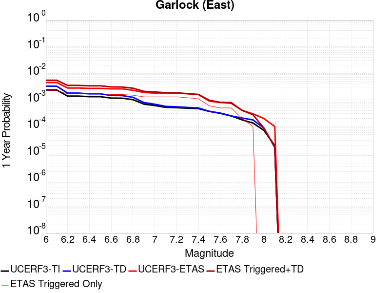 |  |

| Magnitude | 1 wk TI Prob | 1 wk TD Prob | 1 wk ETAS Prob | 1 wk ETAS/TD Gain | 1 wk ETAS Triggered+TD | 1 wk ETAS Triggered Only | 1 mo TI Prob | 1 mo TD Prob | 1 mo ETAS Prob | 1 mo ETAS/TD Gain | 1 mo ETAS Triggered+TD | 1 mo ETAS Triggered Only | 1 yr TI Prob | 1 yr TD Prob | 1 yr ETAS Prob | 1 yr ETAS/TD Gain | 1 yr ETAS Triggered+TD | 1 yr ETAS Triggered Only | 10 yr TI Prob | 10 yr TD Prob | 10 yr ETAS Prob | 10 yr ETAS/TD Gain | 10 yr ETAS Triggered+TD | 10 yr ETAS Triggered Only |
|-----|-----|-----|-----|-----|-----|-----|-----|-----|-----|-----|-----|-----|-----|-----|-----|-----|-----|-----|-----|-----|-----|-----|-----|-----|
| 6.0 | 4.5092507E-5 | 6.2957064E-5 | 0.0 | 0.0 | 6.2957064E-5 | 0.0 | 1.9323928E-4 | 2.6979062E-4 | 1.0E-4 | 0.3706578 | 3.6976364E-4 | 1.0E-4 | 0.0023501497 | 0.0032801998 | 0.0045 | 1.3718677 | 0.0054729832 | 0.0022 | 0.023254504 | 0.032401353 | 0.034 | 1.0493388 | 0.04256114 | 0.0105 |
| 6.1 | 4.5092507E-5 | 6.2957064E-5 | 0.0 | 0.0 | 6.2957064E-5 | 0.0 | 1.9323928E-4 | 2.6979062E-4 | 1.0E-4 | 0.3706578 | 3.6976364E-4 | 1.0E-4 | 0.0023501497 | 0.0032801998 | 0.0045 | 1.3718677 | 0.0054729832 | 0.0022 | 0.023254504 | 0.032401353 | 0.034 | 1.0493388 | 0.04256114 | 0.0105 |
| 6.2 | 2.6674514E-5 | 3.455192E-5 | 0.0 | 0.0 | 3.455192E-5 | 0.0 | 1.1431433E-4 | 1.4807143E-4 | 1.0E-4 | 0.6753498 | 2.4805663E-4 | 1.0E-4 | 0.0013908884 | 0.001801312 | 0.0028 | 1.5544225 | 0.0034982497 | 0.0017 | 0.01382215 | 0.017901713 | 0.0194 | 1.0836952 | 0.024776401 | 0.007 |
| 6.3 | 2.6674514E-5 | 3.455192E-5 | 0.0 | 0.0 | 3.455192E-5 | 0.0 | 1.1431433E-4 | 1.4807143E-4 | 1.0E-4 | 0.6753498 | 2.4805663E-4 | 1.0E-4 | 0.0013908884 | 0.001801312 | 0.0028 | 1.5544225 | 0.0034982497 | 0.0017 | 0.01382215 | 0.017901713 | 0.0194 | 1.0836952 | 0.024776401 | 0.007 |
| 6.4 | 2.5312667E-5 | 3.2379834E-5 | 0.0 | 0.0 | 3.2379834E-5 | 0.0 | 1.0847834E-4 | 1.387635E-4 | 1.0E-4 | 0.7206506 | 2.3874962E-4 | 1.0E-4 | 0.0013199237 | 0.0016881658 | 0.0027 | 1.5993689 | 0.0033852959 | 0.0017 | 0.013121112 | 0.016801344 | 0.0186 | 1.1070544 | 0.023388775 | 0.0067 |
| 6.5 | 2.5312667E-5 | 3.2379834E-5 | 0.0 | 0.0 | 3.2379834E-5 | 0.0 | 1.0847834E-4 | 1.387635E-4 | 1.0E-4 | 0.7206506 | 2.3874962E-4 | 1.0E-4 | 0.0013199237 | 0.0016881658 | 0.0027 | 1.5993689 | 0.0033852959 | 0.0017 | 0.013121112 | 0.016801344 | 0.0186 | 1.1070544 | 0.023388775 | 0.0067 |
| 6.6 | 2.246556E-5 | 2.817271E-5 | 0.0 | 0.0 | 2.817271E-5 | 0.0 | 9.627742E-5 | 1.2073473E-4 | 1.0E-4 | 0.8282621 | 2.2072265E-4 | 1.0E-4 | 0.0011715472 | 0.0014689778 | 0.0026 | 1.7699383 | 0.0030666273 | 0.0016 | 0.011653901 | 0.014643866 | 0.0171 | 1.1677245 | 0.020753074 | 0.0062 |
| 6.7 | 2.2241198E-5 | 2.7842305E-5 | 0.0 | 0.0 | 2.7842305E-5 | 0.0 | 9.531594E-5 | 1.1931884E-4 | 1.0E-4 | 0.83809066 | 2.1930691E-4 | 1.0E-4 | 0.0011598538 | 0.0014517623 | 0.0026 | 1.7909268 | 0.0030494395 | 0.0016 | 0.011538187 | 0.014473142 | 0.017 | 1.1745894 | 0.020484855 | 0.0061 |
| 6.8 | 1.9528685E-5 | 2.393446E-5 | 0.0 | 0.0 | 2.393446E-5 | 0.0 | 8.369167E-5 | 1.0257233E-4 | 1.0E-4 | 0.97492176 | 2.0256208E-4 | 1.0E-4 | 0.0010184698 | 0.0012481224 | 0.0023 | 1.842768 | 0.0027462502 | 0.0015 | 0.010138147 | 0.01245446 | 0.0144 | 1.1562123 | 0.017984716 | 0.0056 |
| 6.9 | 1.3318621E-5 | 1.52292705E-5 | 0.0 | 0.0 | 1.52292705E-5 | 0.0 | 5.7078556E-5 | 6.52667E-5 | 1.0E-4 | 1.5321748 | 1.6526018E-4 | 1.0E-4 | 6.9470983E-4 | 7.943381E-4 | 0.0019 | 2.3919284 | 0.0020933056 | 0.0013 | 0.0069254204 | 0.007954995 | 0.0095 | 1.1942183 | 0.01202238 | 0.0041 |
| 7.0 | 1.1760853E-5 | 1.3136979E-5 | 0.0 | 0.0 | 1.3136979E-5 | 0.0 | 5.0402683E-5 | 5.6300152E-5 | 1.0E-4 | 1.7761942 | 1.5629453E-4 | 1.0E-4 | 6.134799E-4 | 6.852438E-4 | 0.0018 | 2.6268024 | 0.001984353 | 0.0013 | 0.0061178906 | 0.0068710903 | 0.0085 | 1.2370671 | 0.010843606 | 0.004 |
| 7.1 | 1.0064758E-5 | 1.093096E-5 | 0.0 | 0.0 | 1.093096E-5 | 0.0 | 4.3133965E-5 | 4.684615E-5 | 1.0E-4 | 2.1346471 | 1.4684147E-4 | 1.0E-4 | 5.2502943E-4 | 5.7020615E-4 | 0.0018 | 3.156753 | 0.0018694649 | 0.0013 | 0.005237907 | 0.005728246 | 0.0072 | 1.2569292 | 0.009506479 | 0.0038 |
| 7.2 | 9.768808E-6 | 1.052662E-5 | 0.0 | 0.0 | 1.052662E-5 | 0.0 | 4.186565E-5 | 4.5113324E-5 | 1.0E-4 | 2.21664 | 1.4510882E-4 | 1.0E-4 | 5.095951E-4 | 5.491198E-4 | 0.0018 | 3.2779732 | 0.0018484059 | 0.0013 | 0.0050842804 | 0.005518468 | 0.007 | 1.268468 | 0.00919805 | 0.0037 |
| 7.3 | 9.344516E-6 | 9.9717045E-6 | 0.0 | 0.0 | 9.9717045E-6 | 0.0 | 4.004731E-5 | 4.2735195E-5 | 1.0E-4 | 2.3399916 | 1.4273092E-4 | 1.0E-4 | 4.8746695E-4 | 5.2018027E-4 | 0.0017 | 3.2680979 | 0.001719556 | 0.0012 | 0.0048639905 | 0.005229862 | 0.0064 | 1.2237418 | 0.0086120805 | 0.0034 |
| 7.4 | 9.023491E-6 | 9.517291E-6 | 0.0 | 0.0 | 9.517291E-6 | 0.0 | 3.867153E-5 | 4.0787774E-5 | 1.0E-4 | 2.4517152 | 1.407837E-4 | 1.0E-4 | 4.7072413E-4 | 4.9648137E-4 | 0.0016 | 3.222679 | 0.0015959352 | 0.0011 | 0.004697283 | 0.004993019 | 0.006 | 1.2016777 | 0.00797804 | 0.003 |
| 7.5 | 7.081253E-6 | 7.111118E-6 | 0.0 | 0.0 | 7.111118E-6 | 0.0 | 3.0347876E-5 | 3.0475869E-5 | 0.0 | 0.0 | 3.0475869E-5 | 0.0 | 3.6942272E-4 | 3.7098126E-4 | 9.0E-4 | 2.4259984 | 9.707587E-4 | 6.0E-4 | 0.003688092 | 0.003736609 | 0.004 | 1.0704893 | 0.005629509 | 0.0019 |
| 7.6 | 6.116396E-6 | 5.9814274E-6 | 0.0 | 0.0 | 5.9814274E-6 | 0.0 | 2.6212863E-5 | 2.5634437E-5 | 0.0 | 0.0 | 2.5634437E-5 | 0.0 | 3.1909486E-4 | 3.1205485E-4 | 8.0E-4 | 2.5636518 | 8.1189885E-4 | 5.0E-4 | 0.0031863707 | 0.0031473185 | 0.0032 | 1.0167385 | 0.0045429124 | 0.0014 |
| 7.7 | 4.797145E-6 | 4.778117E-6 | 0.0 | 0.0 | 4.778117E-6 | 0.0 | 2.055903E-5 | 2.0477484E-5 | 0.0 | 0.0 | 2.0477484E-5 | 0.0 | 2.5027743E-4 | 2.4928496E-4 | 8.0E-4 | 3.2091787 | 7.491603E-4 | 5.0E-4 | 0.0024999576 | 0.0025203077 | 0.0026 | 1.03162 | 0.0037172835 | 0.0012 |
| 7.8 | 3.4028885E-6 | 3.997069E-6 | 0.0 | 0.0 | 3.997069E-6 | 0.0 | 1.4583726E-5 | 1.7130184E-5 | 0.0 | 0.0 | 1.7130184E-5 | 0.0 | 1.775424E-4 | 2.085401E-4 | 4.0E-4 | 1.9180963 | 4.084984E-4 | 2.0E-4 | 0.0017740062 | 0.0021110766 | 0.002 | 0.9473839 | 0.0030091768 | 9.0E-4 |
| 7.9 | 2.5928412E-6 | 3.388227E-6 | 0.0 | 0.0 | 3.388227E-6 | 0.0 | 1.1112129E-5 | 1.4520892E-5 | 0.0 | 0.0 | 1.4520892E-5 | 0.0 | 1.3528178E-4 | 1.7677758E-4 | 3.0E-4 | 1.6970477 | 2.767599E-4 | 1.0E-4 | 0.0013519945 | 0.0017895203 | 0.0017 | 0.94997525 | 0.0023884466 | 6.0E-4 |
| 8.0 | 1.3743648E-6 | 1.680507E-6 | 0.0 | 0.0 | 1.680507E-6 | 0.0 | 5.8901214E-6 | 7.2021535E-6 | 0.0 | 0.0 | 7.2021535E-6 | 0.0 | 7.1709874E-5 | 8.768272E-5 | 2.0E-4 | 2.2809513 | 8.768272E-5 | 0.0 | 7.1686733E-4 | 8.8751916E-4 | 8.0E-4 | 0.901389 | 0.0011872529 | 3.0E-4 |
| 8.1 | 3.6733252E-7 | 3.160605E-7 | 0.0 | 0.0 | 3.160605E-7 | 0.0 | 1.5742813E-6 | 1.3545445E-6 | 0.0 | 0.0 | 1.3545445E-6 | 0.0 | 1.9166706E-5 | 1.6491469E-5 | 1.0E-4 | 6.0637407 | 1.6491469E-5 | 0.0 | 1.9165053E-4 | 1.6698637E-4 | 4.0E-4 | 2.395405 | 3.6695297E-4 | 2.0E-4 |

## Panamint Valley
*[(top)](#table-of-contents)*

| 1 Week | 1 Month | 1 Year | 10 Year |
|-----|-----|-----|-----|
|  |  | 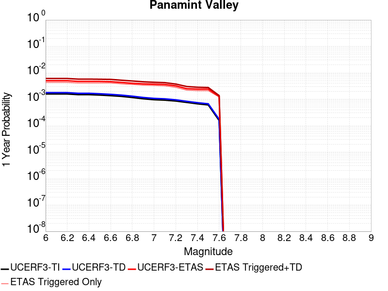 |  |

| Magnitude | 1 wk TI Prob | 1 wk TD Prob | 1 wk ETAS Prob | 1 wk ETAS/TD Gain | 1 wk ETAS Triggered+TD | 1 wk ETAS Triggered Only | 1 mo TI Prob | 1 mo TD Prob | 1 mo ETAS Prob | 1 mo ETAS/TD Gain | 1 mo ETAS Triggered+TD | 1 mo ETAS Triggered Only | 1 yr TI Prob | 1 yr TD Prob | 1 yr ETAS Prob | 1 yr ETAS/TD Gain | 1 yr ETAS Triggered+TD | 1 yr ETAS Triggered Only | 10 yr TI Prob | 10 yr TD Prob | 10 yr ETAS Prob | 10 yr ETAS/TD Gain | 10 yr ETAS Triggered+TD | 10 yr ETAS Triggered Only |
|-----|-----|-----|-----|-----|-----|-----|-----|-----|-----|-----|-----|-----|-----|-----|-----|-----|-----|-----|-----|-----|-----|-----|-----|-----|
| 6.0 | 3.0211835E-5 | 3.399739E-5 | 2.0E-4 | 5.882805 | 2.3399059E-4 | 2.0E-4 | 1.2947287E-4 | 1.4569511E-4 | 7.0E-4 | 4.8045535 | 8.455931E-4 | 7.0E-4 | 0.0015751923 | 0.0017724243 | 0.005 | 2.8209949 | 0.006064803 | 0.0043 | 0.015640736 | 0.017589863 | 0.0194 | 1.1029079 | 0.028396375 | 0.011 |
| 6.1 | 3.0211835E-5 | 3.399739E-5 | 2.0E-4 | 5.882805 | 2.3399059E-4 | 2.0E-4 | 1.2947287E-4 | 1.4569511E-4 | 7.0E-4 | 4.8045535 | 8.455931E-4 | 7.0E-4 | 0.0015751923 | 0.0017724243 | 0.005 | 2.8209949 | 0.006064803 | 0.0043 | 0.015640736 | 0.017589863 | 0.0194 | 1.1029079 | 0.028396375 | 0.011 |
| 6.2 | 3.0211835E-5 | 3.399739E-5 | 2.0E-4 | 5.882805 | 2.3399059E-4 | 2.0E-4 | 1.2947287E-4 | 1.4569511E-4 | 7.0E-4 | 4.8045535 | 8.455931E-4 | 7.0E-4 | 0.0015751923 | 0.0017724243 | 0.005 | 2.8209949 | 0.006064803 | 0.0043 | 0.015640736 | 0.017589863 | 0.0194 | 1.1029079 | 0.028396375 | 0.011 |
| 6.3 | 2.8573924E-5 | 3.211487E-5 | 2.0E-4 | 6.227645 | 2.3210845E-4 | 2.0E-4 | 1.2245393E-4 | 1.3762806E-4 | 7.0E-4 | 5.0861726 | 8.375317E-4 | 7.0E-4 | 0.001489857 | 0.0016743615 | 0.0047 | 2.8070402 | 0.005767497 | 0.0041 | 0.01479908 | 0.01662406 | 0.0177 | 1.0647218 | 0.027047845 | 0.0106 |
| 6.4 | 2.8573924E-5 | 3.211487E-5 | 2.0E-4 | 6.227645 | 2.3210845E-4 | 2.0E-4 | 1.2245393E-4 | 1.3762806E-4 | 7.0E-4 | 5.0861726 | 8.375317E-4 | 7.0E-4 | 0.001489857 | 0.0016743615 | 0.0047 | 2.8070402 | 0.005767497 | 0.0041 | 0.01479908 | 0.01662406 | 0.0177 | 1.0647218 | 0.027047845 | 0.0106 |
| 6.5 | 2.7468774E-5 | 3.0840125E-5 | 2.0E-4 | 6.485058 | 2.3083396E-4 | 2.0E-4 | 1.1771801E-4 | 1.3216543E-4 | 7.0E-4 | 5.296393 | 8.320729E-4 | 7.0E-4 | 0.0014322745 | 0.0016079537 | 0.0047 | 2.9229698 | 0.005701361 | 0.0041 | 0.014230782 | 0.015969694 | 0.0171 | 1.0707781 | 0.02620361 | 0.0104 |
| 6.6 | 2.6135967E-5 | 2.9263689E-5 | 2.0E-4 | 6.8344083 | 2.2925784E-4 | 2.0E-4 | 1.1200648E-4 | 1.2540993E-4 | 7.0E-4 | 5.581695 | 8.253221E-4 | 7.0E-4 | 0.0013628257 | 0.001525823 | 0.0046 | 3.0147665 | 0.0056195674 | 0.0041 | 0.013544982 | 0.015159937 | 0.016 | 1.0554134 | 0.025008338 | 0.01 |
| 6.7 | 2.4498746E-5 | 2.7352397E-5 | 2.0E-4 | 7.3119736 | 2.2734693E-4 | 2.0E-4 | 1.04990395E-4 | 1.1721943E-4 | 7.0E-4 | 5.9717064 | 8.1713736E-4 | 7.0E-4 | 0.0012775084 | 0.0014262374 | 0.0043 | 3.014926 | 0.005220818 | 0.0038 | 0.012701893 | 0.014177105 | 0.0149 | 1.0509902 | 0.023345258 | 0.0093 |
| 6.8 | 2.2244329E-5 | 2.494569E-5 | 2.0E-4 | 8.017417 | 2.249407E-4 | 2.0E-4 | 9.532935E-5 | 1.0690584E-4 | 7.0E-4 | 6.5478177 | 8.06831E-4 | 7.0E-4 | 0.0011600169 | 0.0013008233 | 0.004 | 3.0749757 | 0.00489614 | 0.0036 | 0.011539802 | 0.012937944 | 0.0135 | 1.0434425 | 0.021426678 | 0.0086 |
| 6.9 | 1.9902658E-5 | 2.2299711E-5 | 2.0E-4 | 8.968726 | 2.2229525E-4 | 2.0E-4 | 8.529431E-5 | 9.556679E-5 | 7.0E-4 | 7.32472 | 7.954999E-4 | 7.0E-4 | 0.0010379635 | 0.0011629232 | 0.0038 | 3.2676277 | 0.0045589693 | 0.0034 | 0.010331288 | 0.011573873 | 0.0122 | 1.0540982 | 0.019580126 | 0.0081 |
| 7.0 | 1.8353881E-5 | 2.0575173E-5 | 2.0E-4 | 9.720453 | 2.2057106E-4 | 2.0E-4 | 7.865712E-5 | 8.8176435E-5 | 7.0E-4 | 7.938629 | 7.8811473E-4 | 7.0E-4 | 9.5722964E-4 | 0.001073037 | 0.0037 | 3.4481568 | 0.004369496 | 0.0033 | 0.009531168 | 0.0106837945 | 0.0114 | 1.0670366 | 0.01830153 | 0.0077 |
| 7.1 | 1.7667631E-5 | 1.9781386E-5 | 2.0E-4 | 10.110515 | 2.1977743E-4 | 2.0E-4 | 7.571623E-5 | 8.4774714E-5 | 7.0E-4 | 8.257179 | 7.8471535E-4 | 7.0E-4 | 9.2145515E-4 | 0.001031661 | 0.0036 | 3.4895184 | 0.0042283596 | 0.0032 | 0.009176437 | 0.010273907 | 0.0112 | 1.0901402 | 0.017795825 | 0.0076 |
| 7.2 | 1.6381597E-5 | 1.8166309E-5 | 2.0E-4 | 11.009391 | 2.1816268E-4 | 2.0E-4 | 7.020495E-5 | 7.785338E-5 | 6.0E-4 | 7.7067943 | 6.778067E-4 | 6.0E-4 | 8.544101E-4 | 9.474701E-4 | 0.0032 | 3.3774154 | 0.003744817 | 0.0028 | 0.008511325 | 0.009439194 | 0.0103 | 1.0911949 | 0.016175007 | 0.0068 |
| 7.3 | 1.4520491E-5 | 1.5972872E-5 | 1.0E-4 | 6.260615 | 1.1597128E-4 | 1.0E-4 | 6.222919E-5 | 6.845346E-5 | 4.0E-4 | 5.843386 | 4.6842606E-4 | 4.0E-4 | 7.57377E-4 | 8.331184E-4 | 0.0025 | 3.000774 | 0.0030312855 | 0.0022 | 0.0075480095 | 0.008303196 | 0.0088 | 1.0598329 | 0.014253377 | 0.006 |
| 7.4 | 1.2852287E-5 | 1.4151001E-5 | 1.0E-4 | 7.066638 | 1.1414959E-4 | 1.0E-4 | 5.5080065E-5 | 6.0645823E-5 | 3.0E-4 | 4.9467545 | 3.6062763E-4 | 3.0E-4 | 6.7039346E-4 | 7.381286E-4 | 0.0024 | 3.251466 | 0.0028365785 | 0.0021 | 0.0066837464 | 0.0073598395 | 0.0082 | 1.1141547 | 0.013017888 | 0.0057 |
| 7.5 | 1.1637851E-5 | 1.2842109E-5 | 1.0E-4 | 7.7868834 | 1.12840826E-4 | 1.0E-4 | 4.987555E-5 | 5.5036537E-5 | 3.0E-4 | 5.4509244 | 3.5502002E-4 | 3.0E-4 | 6.070656E-4 | 6.698795E-4 | 0.0024 | 3.5827339 | 0.0027684728 | 0.0021 | 0.006054099 | 0.0066816593 | 0.0082 | 1.2272401 | 0.012343574 | 0.0057 |
| 7.6 | 3.0068115E-6 | 3.3351353E-6 | 0.0 | 0.0 | 3.3351353E-6 | 0.0 | 1.2886271E-5 | 1.42933995E-5 | 2.0E-4 | 13.992473 | 2.1429054E-4 | 2.0E-4 | 1.5687906E-4 | 1.7401553E-4 | 0.0013 | 7.4705977 | 0.0013738067 | 0.0012 | 0.0015676835 | 0.0017403212 | 0.0026 | 1.4939771 | 0.0040363185 | 0.0023 |

## Hayward (No) 2011 CFM
*[(top)](#table-of-contents)*

| 1 Week | 1 Month | 1 Year | 10 Year |
|-----|-----|-----|-----|
|  |  | 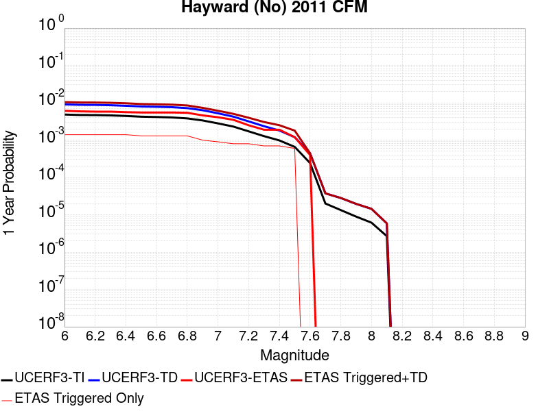 |  |

| Magnitude | 1 wk TI Prob | 1 wk TD Prob | 1 wk ETAS Prob | 1 wk ETAS/TD Gain | 1 wk ETAS Triggered+TD | 1 wk ETAS Triggered Only | 1 mo TI Prob | 1 mo TD Prob | 1 mo ETAS Prob | 1 mo ETAS/TD Gain | 1 mo ETAS Triggered+TD | 1 mo ETAS Triggered Only | 1 yr TI Prob | 1 yr TD Prob | 1 yr ETAS Prob | 1 yr ETAS/TD Gain | 1 yr ETAS Triggered+TD | 1 yr ETAS Triggered Only | 10 yr TI Prob | 10 yr TD Prob | 10 yr ETAS Prob | 10 yr ETAS/TD Gain | 10 yr ETAS Triggered+TD | 10 yr ETAS Triggered Only |
|-----|-----|-----|-----|-----|-----|-----|-----|-----|-----|-----|-----|-----|-----|-----|-----|-----|-----|-----|-----|-----|-----|-----|-----|-----|
| 6.0 | 9.3068506E-5 | 1.7391592E-4 | 2.0E-4 | 1.149981 | 2.7389853E-4 | 1.0E-4 | 3.9880406E-4 | 7.4514106E-4 | 6.0E-4 | 0.80521667 | 9.44992E-4 | 2.0E-4 | 0.0048446343 | 0.009034234 | 0.0061 | 0.6752094 | 0.010421586 | 0.0014 | 0.047403704 | 0.08633799 | 0.0525 | 0.6080753 | 0.09593144 | 0.0105 |
| 6.1 | 9.055486E-5 | 1.6942507E-4 | 2.0E-4 | 1.180463 | 2.694081E-4 | 1.0E-4 | 3.880345E-4 | 7.259058E-4 | 5.0E-4 | 0.6887946 | 9.257606E-4 | 2.0E-4 | 0.0047140904 | 0.008802163 | 0.0059 | 0.67028975 | 0.010189841 | 0.0014 | 0.046153355 | 0.08423453 | 0.0518 | 0.6149497 | 0.09375849 | 0.0104 |
| 6.2 | 9.006742E-5 | 1.6863039E-4 | 2.0E-4 | 1.1860259 | 2.6861354E-4 | 1.0E-4 | 3.859461E-4 | 7.2250207E-4 | 5.0E-4 | 0.69203955 | 9.223576E-4 | 2.0E-4 | 0.0046887742 | 0.008761095 | 0.0058 | 0.6620177 | 0.01014883 | 0.0014 | 0.0459107 | 0.08385845 | 0.0516 | 0.6153226 | 0.09338632 | 0.0104 |
| 6.3 | 8.8336754E-5 | 1.6542483E-4 | 2.0E-4 | 1.2090083 | 2.6540828E-4 | 1.0E-4 | 3.7853114E-4 | 7.087716E-4 | 5.0E-4 | 0.7054459 | 9.086298E-4 | 2.0E-4 | 0.004598882 | 0.00859531 | 0.0058 | 0.6747866 | 0.009983276 | 0.0014 | 0.04504866 | 0.08234996 | 0.0508 | 0.61687946 | 0.091709994 | 0.0102 |
| 6.4 | 8.526157E-5 | 1.5968773E-4 | 2.0E-4 | 1.2524444 | 2.5967177E-4 | 1.0E-4 | 3.6535555E-4 | 6.841971E-4 | 5.0E-4 | 0.7307836 | 8.840603E-4 | 2.0E-4 | 0.0044391346 | 0.008298443 | 0.0056 | 0.67482543 | 0.009686825 | 0.0014 | 0.043514993 | 0.07965776 | 0.0492 | 0.6176422 | 0.088677116 | 0.0098 |
| 6.5 | 8.152396E-5 | 1.5301206E-4 | 2.0E-4 | 1.3070865 | 2.5299675E-4 | 1.0E-4 | 3.493416E-4 | 6.5560185E-4 | 5.0E-4 | 0.762658 | 8.554708E-4 | 2.0E-4 | 0.0042449418 | 0.00795289 | 0.0055 | 0.6915724 | 0.009242551 | 0.0013 | 0.04164765 | 0.07648929 | 0.048 | 0.62753886 | 0.08535499 | 0.0096 |
| 6.6 | 7.987405E-5 | 1.500534E-4 | 2.0E-4 | 1.3328589 | 2.500384E-4 | 1.0E-4 | 3.4227243E-4 | 6.429282E-4 | 5.0E-4 | 0.77769184 | 8.427996E-4 | 2.0E-4 | 0.0041592065 | 0.007799714 | 0.0055 | 0.70515406 | 0.009089574 | 0.0013 | 0.04082218 | 0.07508146 | 0.047 | 0.62598675 | 0.08386818 | 0.0095 |
| 6.7 | 7.777665E-5 | 1.4644327E-4 | 2.0E-4 | 1.3657166 | 2.4642862E-4 | 1.0E-4 | 3.332859E-4 | 6.2746374E-4 | 5.0E-4 | 0.7968588 | 8.2733826E-4 | 2.0E-4 | 0.004050208 | 0.007612767 | 0.0055 | 0.7224705 | 0.00890287 | 0.0013 | 0.039771806 | 0.07335651 | 0.0463 | 0.6311642 | 0.08206696 | 0.0094 |
| 6.8 | 7.3284005E-5 | 1.379564E-4 | 2.0E-4 | 1.4497334 | 2.379426E-4 | 1.0E-4 | 3.140365E-4 | 5.9110834E-4 | 5.0E-4 | 0.8458686 | 7.9099013E-4 | 2.0E-4 | 0.0038166929 | 0.0071731335 | 0.0054 | 0.7528091 | 0.008463808 | 0.0013 | 0.037518036 | 0.069272704 | 0.0436 | 0.6293965 | 0.07774232 | 0.0091 |
| 6.9 | 6.458263E-5 | 1.2127394E-4 | 2.0E-4 | 1.649159 | 2.2126181E-4 | 1.0E-4 | 2.7675333E-4 | 5.196424E-4 | 4.0E-4 | 0.76976013 | 7.195385E-4 | 2.0E-4 | 0.0033642664 | 0.0063083945 | 0.0046 | 0.72918713 | 0.007302086 | 0.001 | 0.033137884 | 0.06120623 | 0.039 | 0.63719004 | 0.06871658 | 0.008 |
| 7.0 | 5.3853604E-5 | 1.0021601E-4 | 2.0E-4 | 1.995689 | 2.0020599E-4 | 1.0E-4 | 2.3078074E-4 | 4.2942684E-4 | 4.0E-4 | 0.93147415 | 6.2934094E-4 | 2.0E-4 | 0.0028061352 | 0.0052158027 | 0.0041 | 0.7860727 | 0.006111108 | 9.0E-4 | 0.027709642 | 0.050940726 | 0.0324 | 0.6360333 | 0.056824893 | 0.0062 |
| 7.1 | 4.4308683E-5 | 8.168137E-5 | 2.0E-4 | 2.4485385 | 1.8167321E-4 | 1.0E-4 | 1.8988053E-4 | 3.500163E-4 | 4.0E-4 | 1.142804 | 5.499463E-4 | 2.0E-4 | 0.0023093442 | 0.0042531625 | 0.0035 | 0.82291704 | 0.00504976 | 8.0E-4 | 0.022854926 | 0.041811354 | 0.0266 | 0.63619083 | 0.046314843 | 0.0047 |
| 7.2 | 3.295973E-5 | 6.0739534E-5 | 1.0E-4 | 1.6463742 | 1.6073346E-4 | 1.0E-4 | 1.4124835E-4 | 2.6028644E-4 | 3.0E-4 | 1.1525763 | 4.6023438E-4 | 2.0E-4 | 0.0017183421 | 0.0031644052 | 0.0025 | 0.7900379 | 0.0039618737 | 8.0E-4 | 0.017051157 | 0.031352863 | 0.0198 | 0.6315213 | 0.03542118 | 0.0042 |
| 7.3 | 2.452256E-5 | 4.5144116E-5 | 1.0E-4 | 2.2151282 | 1.4513961E-4 | 1.0E-4 | 1.05092455E-4 | 1.9346051E-4 | 2.0E-4 | 1.0338026 | 3.9342183E-4 | 2.0E-4 | 0.0012787496 | 0.0023528512 | 0.0019 | 0.8075309 | 0.0030512041 | 7.0E-4 | 0.0127141625 | 0.023423083 | 0.0151 | 0.6446632 | 0.026450472 | 0.0031 |
| 7.4 | 1.8829967E-5 | 3.4571156E-5 | 1.0E-4 | 2.8925848 | 1.345677E-4 | 1.0E-4 | 8.069736E-5 | 1.4815373E-4 | 2.0E-4 | 1.349949 | 3.481241E-4 | 2.0E-4 | 9.820475E-4 | 0.0018022893 | 0.0019 | 1.0542148 | 0.0025010277 | 7.0E-4 | 0.009777189 | 0.018004216 | 0.0118 | 0.655402 | 0.020459207 | 0.0025 |
| 7.5 | 1.26374125E-5 | 2.2908282E-5 | 1.0E-4 | 4.3652334 | 1.2290599E-4 | 1.0E-4 | 5.4159216E-5 | 9.817469E-5 | 2.0E-4 | 2.037185 | 2.9815506E-4 | 2.0E-4 | 6.5918895E-4 | 0.0011946273 | 0.0012 | 1.0044974 | 0.0017939104 | 6.0E-4 | 0.00657237 | 0.011982334 | 0.0076 | 0.6342671 | 0.013661964 | 0.0017 |
| 7.6 | 4.666429E-6 | 8.478986E-6 | 0.0 | 0.0 | 8.478986E-6 | 0.0 | 1.9998828E-5 | 3.6338013E-5 | 0.0 | 0.0 | 3.6338013E-5 | 0.0 | 2.4345852E-4 | 4.423267E-4 | 4.0E-4 | 0.9043089 | 4.423267E-4 | 0.0 | 0.0024319198 | 0.0044584745 | 0.0022 | 0.49344233 | 0.004856691 | 4.0E-4 |
| 7.7 | 3.8399318E-7 | 7.1363104E-7 | 0.0 | 0.0 | 7.1363104E-7 | 0.0 | 1.6456839E-6 | 3.0584151E-6 | 0.0 | 0.0 | 3.0584151E-6 | 0.0 | 2.003602E-5 | 3.7235568E-5 | 0.0 | 0.0 | 3.7235568E-5 | 0.0 | 2.0034213E-4 | 3.8625067E-4 | 1.0E-4 | 0.2588992 | 3.8625067E-4 | 0.0 |
| 7.8 | 2.5637698E-7 | 5.3728036E-7 | 0.0 | 0.0 | 5.3728036E-7 | 0.0 | 1.098758E-6 | 2.302628E-6 | 0.0 | 0.0 | 2.302628E-6 | 0.0 | 1.3377297E-5 | 2.8034137E-5 | 0.0 | 0.0 | 2.8034137E-5 | 0.0 | 1.3376492E-4 | 2.9276457E-4 | 1.0E-4 | 0.3415714 | 2.9276457E-4 | 0.0 |
| 7.9 | 1.7141245E-7 | 3.7369296E-7 | 0.0 | 0.0 | 3.7369296E-7 | 0.0 | 7.3462456E-7 | 1.6015401E-6 | 0.0 | 0.0 | 1.6015401E-6 | 0.0 | 8.944017E-6 | 1.9498579E-5 | 0.0 | 0.0 | 1.9498579E-5 | 0.0 | 8.943657E-5 | 2.0284187E-4 | 1.0E-4 | 0.49299487 | 2.0284187E-4 | 0.0 |
| 8.0 | 1.1808895E-7 | 2.757906E-7 | 0.0 | 0.0 | 2.757906E-7 | 0.0 | 5.060954E-7 | 1.1819592E-6 | 0.0 | 0.0 | 1.1819592E-6 | 0.0 | 6.161694E-6 | 1.4390259E-5 | 0.0 | 0.0 | 1.4390259E-5 | 0.0 | 6.161523E-5 | 1.4850916E-4 | 1.0E-4 | 0.67335916 | 1.4850916E-4 | 0.0 |
| 8.1 | 5.138535E-8 | 1.1259246E-7 | 0.0 | 0.0 | 1.1259246E-7 | 0.0 | 2.2022292E-7 | 4.82539E-7 | 0.0 | 0.0 | 4.82539E-7 | 0.0 | 2.6812106E-6 | 5.874897E-6 | 0.0 | 0.0 | 5.874897E-6 | 0.0 | 2.6811784E-5 | 6.031215E-5 | 0.0 | 0.0 | 6.031215E-5 | 0.0 |

## San Andreas (Santa Cruz Mts) 2011 CFM
*[(top)](#table-of-contents)*

| 1 Week | 1 Month | 1 Year | 10 Year |
|-----|-----|-----|-----|
| 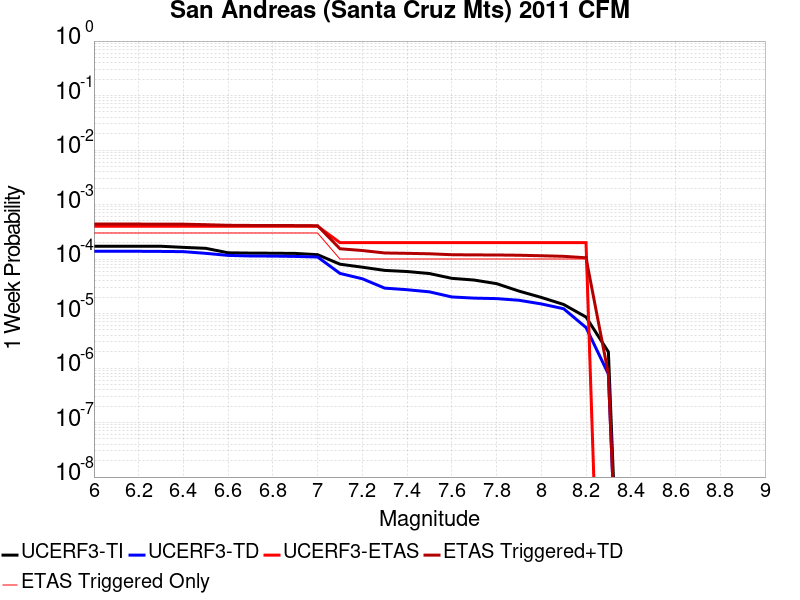 | 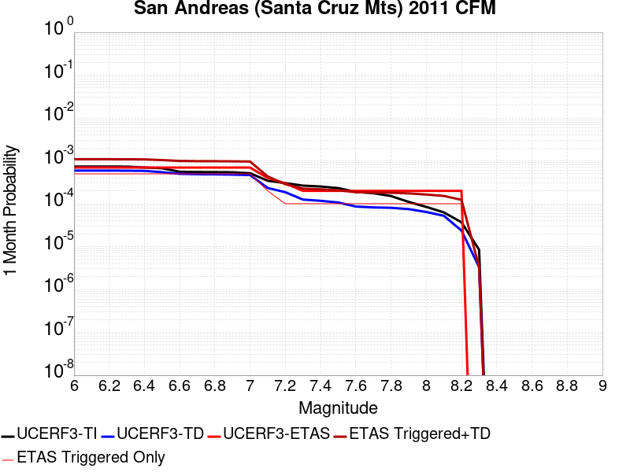 |  |  |

| Magnitude | 1 wk TI Prob | 1 wk TD Prob | 1 wk ETAS Prob | 1 wk ETAS/TD Gain | 1 wk ETAS Triggered+TD | 1 wk ETAS Triggered Only | 1 mo TI Prob | 1 mo TD Prob | 1 mo ETAS Prob | 1 mo ETAS/TD Gain | 1 mo ETAS Triggered+TD | 1 mo ETAS Triggered Only | 1 yr TI Prob | 1 yr TD Prob | 1 yr ETAS Prob | 1 yr ETAS/TD Gain | 1 yr ETAS Triggered+TD | 1 yr ETAS Triggered Only | 10 yr TI Prob | 10 yr TD Prob | 10 yr ETAS Prob | 10 yr ETAS/TD Gain | 10 yr ETAS Triggered+TD | 10 yr ETAS Triggered Only |
|-----|-----|-----|-----|-----|-----|-----|-----|-----|-----|-----|-----|-----|-----|-----|-----|-----|-----|-----|-----|-----|-----|-----|-----|-----|
| 6.0 | 1.7221631E-4 | 1.3768877E-4 | 4.0E-4 | 2.9051025 | 4.3764745E-4 | 3.0E-4 | 7.378611E-4 | 5.8996334E-4 | 7.0E-4 | 1.1865145 | 0.0010896684 | 5.0E-4 | 0.008946515 | 0.007159522 | 0.0047 | 0.65646845 | 0.008648782 | 0.0015 | 0.08594794 | 0.07042297 | 0.0427 | 0.6063363 | 0.07999761 | 0.0103 |
| 6.1 | 1.7221631E-4 | 1.3768877E-4 | 4.0E-4 | 2.9051025 | 4.3764745E-4 | 3.0E-4 | 7.378611E-4 | 5.8996334E-4 | 7.0E-4 | 1.1865145 | 0.0010896684 | 5.0E-4 | 0.008946515 | 0.007159522 | 0.0047 | 0.65646845 | 0.008648782 | 0.0015 | 0.08594794 | 0.07042297 | 0.0427 | 0.6063363 | 0.07999761 | 0.0103 |
| 6.2 | 1.7221631E-4 | 1.3768877E-4 | 4.0E-4 | 2.9051025 | 4.3764745E-4 | 3.0E-4 | 7.378611E-4 | 5.8996334E-4 | 7.0E-4 | 1.1865145 | 0.0010896684 | 5.0E-4 | 0.008946515 | 0.007159522 | 0.0047 | 0.65646845 | 0.008648782 | 0.0015 | 0.08594794 | 0.07042297 | 0.0427 | 0.6063363 | 0.07999761 | 0.0103 |
| 6.3 | 1.716926E-4 | 1.368833E-4 | 4.0E-4 | 2.9221973 | 4.3684224E-4 | 3.0E-4 | 7.3561794E-4 | 5.8651285E-4 | 7.0E-4 | 1.1934947 | 0.0010862196 | 5.0E-4 | 0.008919428 | 0.007117787 | 0.0047 | 0.6603176 | 0.00860711 | 0.0015 | 0.08569809 | 0.07003488 | 0.0425 | 0.6068405 | 0.07952052 | 0.0102 |
| 6.4 | 1.6392978E-4 | 1.3567029E-4 | 4.0E-4 | 2.9483242 | 4.356296E-4 | 3.0E-4 | 7.02367E-4 | 5.8131653E-4 | 7.0E-4 | 1.2041632 | 0.0010810259 | 5.0E-4 | 0.008517839 | 0.007054932 | 0.0047 | 0.6662006 | 0.00854435 | 0.0015 | 0.08198654 | 0.0692885 | 0.0423 | 0.6104909 | 0.078781754 | 0.0102 |
| 6.5 | 1.5742714E-4 | 1.2628998E-4 | 4.0E-4 | 3.167314 | 4.2625208E-4 | 3.0E-4 | 6.745133E-4 | 5.411322E-4 | 7.0E-4 | 1.2935841 | 0.0010408616 | 5.0E-4 | 0.00818132 | 0.006568692 | 0.004 | 0.60894924 | 0.007860153 | 0.0013 | 0.078865945 | 0.06474506 | 0.0397 | 0.61317414 | 0.07381704 | 0.0097 |
| 6.6 | 1.3038084E-4 | 1.15789044E-4 | 4.0E-4 | 3.4545584 | 4.157543E-4 | 3.0E-4 | 5.5865536E-4 | 4.961456E-4 | 7.0E-4 | 1.410876 | 9.958976E-4 | 5.0E-4 | 0.006780438 | 0.00602407 | 0.0038 | 0.63080275 | 0.0073162387 | 0.0013 | 0.0657725 | 0.05927933 | 0.0361 | 0.60898125 | 0.06774582 | 0.009 |
| 6.7 | 1.2867592E-4 | 1.1305846E-4 | 4.0E-4 | 3.5379927 | 4.1302454E-4 | 3.0E-4 | 5.5135164E-4 | 4.8444752E-4 | 7.0E-4 | 1.4449449 | 9.842053E-4 | 5.0E-4 | 0.0066920654 | 0.005882422 | 0.0038 | 0.64599246 | 0.0071747745 | 0.0013 | 0.06494093 | 0.057992216 | 0.0353 | 0.60870236 | 0.06637608 | 0.0089 |
| 6.8 | 1.2801298E-4 | 1.124347E-4 | 4.0E-4 | 3.5576205 | 4.1240096E-4 | 3.0E-4 | 5.485117E-4 | 4.817753E-4 | 7.0E-4 | 1.4529595 | 9.815344E-4 | 5.0E-4 | 0.0066577005 | 0.0058500767 | 0.0038 | 0.6495641 | 0.0071424716 | 0.0013 | 0.06461738 | 0.057706382 | 0.0349 | 0.6047858 | 0.0660928 | 0.0089 |
| 6.9 | 1.269149E-4 | 1.1085675E-4 | 4.0E-4 | 3.6082602 | 4.108235E-4 | 3.0E-4 | 5.4380763E-4 | 4.7501514E-4 | 7.0E-4 | 1.4736372 | 9.747776E-4 | 5.0E-4 | 0.006600777 | 0.0057682106 | 0.0038 | 0.65878314 | 0.0070607117 | 0.0013 | 0.06408122 | 0.056978326 | 0.0342 | 0.6002282 | 0.06518262 | 0.0087 |
| 7.0 | 1.2030331E-4 | 1.0816785E-4 | 4.0E-4 | 3.6979566 | 4.0813538E-4 | 3.0E-4 | 5.154837E-4 | 4.6349538E-4 | 7.0E-4 | 1.5102631 | 9.632636E-4 | 5.0E-4 | 0.006257969 | 0.0056286906 | 0.0038 | 0.6751126 | 0.0069213733 | 0.0013 | 0.06084648 | 0.055659458 | 0.0334 | 0.6000777 | 0.06359192 | 0.0084 |
| 7.1 | 8.049617E-5 | 5.3904292E-5 | 2.0E-4 | 3.7102797 | 1.538989E-4 | 1.0E-4 | 3.4493793E-4 | 2.3099814E-4 | 4.0E-4 | 1.7316157 | 4.3095194E-4 | 2.0E-4 | 0.0041915346 | 0.0028088097 | 0.0014 | 0.49843174 | 0.0033074054 | 5.0E-4 | 0.041133516 | 0.029608745 | 0.0164 | 0.5538904 | 0.033684388 | 0.0042 |
| 7.2 | 7.093979E-5 | 4.295602E-5 | 2.0E-4 | 4.655925 | 1.4295173E-4 | 1.0E-4 | 3.0399222E-4 | 1.8408438E-4 | 3.0E-4 | 1.6296874 | 2.8406596E-4 | 1.0E-4 | 0.0036948253 | 0.0022389463 | 0.0012 | 0.5359664 | 0.0026380508 | 4.0E-4 | 0.03633994 | 0.023951627 | 0.0132 | 0.55111074 | 0.026782168 | 0.0029 |
| 7.3 | 6.193693E-5 | 2.8943608E-5 | 2.0E-4 | 6.9099884 | 1.2894071E-4 | 1.0E-4 | 2.6541698E-4 | 1.2403814E-4 | 2.0E-4 | 1.6124072 | 2.2402575E-4 | 1.0E-4 | 0.0032266637 | 0.00150912 | 7.0E-4 | 0.46384647 | 0.0018086672 | 3.0E-4 | 0.031802133 | 0.016522711 | 0.0099 | 0.5991753 | 0.01878471 | 0.0023 |
| 7.4 | 5.906492E-5 | 2.7075097E-5 | 2.0E-4 | 7.386862 | 1.2707239E-4 | 1.0E-4 | 2.5311083E-4 | 1.1603098E-4 | 2.0E-4 | 1.7236776 | 2.1601937E-4 | 1.0E-4 | 0.0030772698 | 0.0014117631 | 7.0E-4 | 0.4958339 | 0.0017113396 | 3.0E-4 | 0.030350044 | 0.015495801 | 0.0095 | 0.6130693 | 0.017661711 | 0.0022 |
| 7.5 | 5.424296E-5 | 2.4733521E-5 | 2.0E-4 | 8.086192 | 1.2473104E-4 | 1.0E-4 | 2.324491E-4 | 1.059965E-4 | 2.0E-4 | 1.8868548 | 2.059859E-4 | 1.0E-4 | 0.002826395 | 0.0012897446 | 6.0E-4 | 0.46520838 | 0.0014894867 | 2.0E-4 | 0.027907165 | 0.014190462 | 0.0086 | 0.6060409 | 0.0160635 | 0.0019 |
| 7.6 | 4.43084E-5 | 1.9968033E-5 | 2.0E-4 | 10.016009 | 1.1996604E-4 | 1.0E-4 | 1.8987931E-4 | 8.557448E-5 | 2.0E-4 | 2.3371453 | 1.8556592E-4 | 1.0E-4 | 0.0023093296 | 0.0010413716 | 5.0E-4 | 0.48013604 | 0.0012411632 | 2.0E-4 | 0.022854783 | 0.011444671 | 0.0065 | 0.56794995 | 0.0130263595 | 0.0016 |
| 7.7 | 4.118098E-5 | 1.900131E-5 | 2.0E-4 | 10.52559 | 1.1899941E-4 | 1.0E-4 | 1.7647797E-4 | 8.1431645E-5 | 2.0E-4 | 2.4560478 | 1.814235E-4 | 1.0E-4 | 0.002146502 | 9.909796E-4 | 5.0E-4 | 0.50455123 | 0.0011907814 | 2.0E-4 | 0.021258866 | 0.010903253 | 0.0063 | 0.57780915 | 0.0123868985 | 0.0015 |
| 7.8 | 3.5408906E-5 | 1.8628532E-5 | 2.0E-4 | 10.736218 | 1.1862667E-4 | 1.0E-4 | 1.5174363E-4 | 7.983412E-5 | 2.0E-4 | 2.5051944 | 1.7982614E-4 | 1.0E-4 | 0.0018459131 | 9.7154727E-4 | 5.0E-4 | 0.514643 | 0.0011713529 | 2.0E-4 | 0.018306552 | 0.010684593 | 0.0062 | 0.58027476 | 0.012168566 | 0.0015 |
| 7.9 | 2.5860836E-5 | 1.737619E-5 | 2.0E-4 | 11.510004 | 1.1737445E-4 | 1.0E-4 | 1.10827445E-4 | 7.446726E-5 | 2.0E-4 | 2.6857443 | 1.7445981E-4 | 1.0E-4 | 0.001348489 | 9.0626196E-4 | 5.0E-4 | 0.55171686 | 0.0011060807 | 2.0E-4 | 0.013403354 | 0.009938521 | 0.0055 | 0.55340225 | 0.011423614 | 0.0015 |
| 8.0 | 1.9777332E-5 | 1.4888793E-5 | 2.0E-4 | 13.432922 | 1.14887305E-4 | 1.0E-4 | 8.4757245E-5 | 6.380755E-5 | 2.0E-4 | 3.1344252 | 1.6380117E-4 | 1.0E-4 | 0.0010314309 | 7.7658024E-4 | 5.0E-4 | 0.6438485 | 9.7642496E-4 | 2.0E-4 | 0.010266567 | 0.008534746 | 0.0048 | 0.5624069 | 0.009823651 | 0.0013 |
| 8.1 | 1.468494E-5 | 1.2145579E-5 | 2.0E-4 | 16.466898 | 1.12144364E-4 | 1.0E-4 | 6.293394E-5 | 5.2051444E-5 | 2.0E-4 | 3.8423526 | 1.5204624E-4 | 1.0E-4 | 7.6595135E-4 | 6.3354225E-4 | 5.0E-4 | 0.78921336 | 8.3341554E-4 | 2.0E-4 | 0.0076331664 | 0.0069895447 | 0.0032 | 0.45782667 | 0.007883254 | 9.0E-4 |
| 8.2 | 8.63836E-6 | 5.4860348E-6 | 2.0E-4 | 36.456203 | 1.0548549E-4 | 1.0E-4 | 3.7021015E-5 | 2.3511366E-5 | 2.0E-4 | 8.506524 | 1.2350902E-4 | 1.0E-4 | 4.5063766E-4 | 2.8621336E-4 | 2.0E-4 | 0.6987794 | 3.8618475E-4 | 1.0E-4 | 0.004497249 | 0.003254948 | 0.0013 | 0.39939195 | 0.003653646 | 4.0E-4 |
| 8.3 | 1.983087E-6 | 7.683211E-7 | 0.0 | 0.0 | 7.683211E-7 | 0.0 | 8.498917E-6 | 3.2928008E-6 | 0.0 | 0.0 | 3.2928008E-6 | 0.0 | 1.034694E-4 | 4.008913E-5 | 0.0 | 0.0 | 4.008913E-5 | 0.0 | 0.0010342124 | 4.7332307E-4 | 1.0E-4 | 0.21127218 | 4.7332307E-4 | 0.0 |

## West Napa 2011 CFM
*[(top)](#table-of-contents)*

| 1 Week | 1 Month | 1 Year | 10 Year |
|-----|-----|-----|-----|
|  | 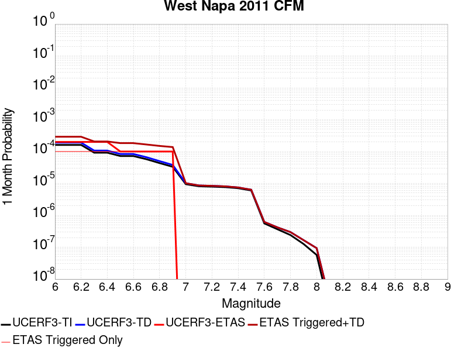 |  | 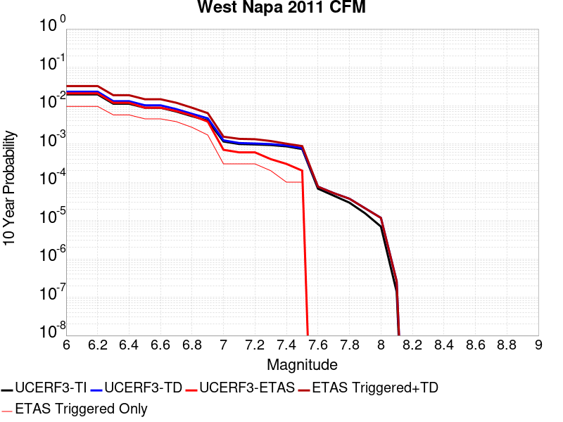 |

| Magnitude | 1 wk TI Prob | 1 wk TD Prob | 1 wk ETAS Prob | 1 wk ETAS/TD Gain | 1 wk ETAS Triggered+TD | 1 wk ETAS Triggered Only | 1 mo TI Prob | 1 mo TD Prob | 1 mo ETAS Prob | 1 mo ETAS/TD Gain | 1 mo ETAS Triggered+TD | 1 mo ETAS Triggered Only | 1 yr TI Prob | 1 yr TD Prob | 1 yr ETAS Prob | 1 yr ETAS/TD Gain | 1 yr ETAS Triggered+TD | 1 yr ETAS Triggered Only | 10 yr TI Prob | 10 yr TD Prob | 10 yr ETAS Prob | 10 yr ETAS/TD Gain | 10 yr ETAS Triggered+TD | 10 yr ETAS Triggered Only |
|-----|-----|-----|-----|-----|-----|-----|-----|-----|-----|-----|-----|-----|-----|-----|-----|-----|-----|-----|-----|-----|-----|-----|-----|-----|
| 6.0 | 3.773104E-5 | 4.4544835E-5 | 0.0 | 0.0 | 4.4544835E-5 | 0.0 | 1.6169442E-4 | 1.9089426E-4 | 2.0E-4 | 1.0477004 | 2.9087518E-4 | 1.0E-4 | 0.001966852 | 0.0023219779 | 0.0018 | 0.7752012 | 0.003319656 | 0.001 | 0.019495348 | 0.023010314 | 0.0208 | 0.9039425 | 0.032291714 | 0.0095 |
| 6.1 | 3.773104E-5 | 4.4544835E-5 | 0.0 | 0.0 | 4.4544835E-5 | 0.0 | 1.6169442E-4 | 1.9089426E-4 | 2.0E-4 | 1.0477004 | 2.9087518E-4 | 1.0E-4 | 0.001966852 | 0.0023219779 | 0.0018 | 0.7752012 | 0.003319656 | 0.001 | 0.019495348 | 0.023010314 | 0.0208 | 0.9039425 | 0.032291714 | 0.0095 |
| 6.2 | 3.773104E-5 | 4.4544835E-5 | 0.0 | 0.0 | 4.4544835E-5 | 0.0 | 1.6169442E-4 | 1.9089426E-4 | 2.0E-4 | 1.0477004 | 2.9087518E-4 | 1.0E-4 | 0.001966852 | 0.0023219779 | 0.0018 | 0.7752012 | 0.003319656 | 0.001 | 0.019495348 | 0.023010314 | 0.0208 | 0.9039425 | 0.032291714 | 0.0095 |
| 6.3 | 2.147964E-5 | 2.499556E-5 | 0.0 | 0.0 | 2.499556E-5 | 0.0 | 9.2052345E-5 | 1.07119944E-4 | 2.0E-4 | 1.8670659 | 2.0710923E-4 | 1.0E-4 | 0.001120161 | 0.0013034969 | 0.0012 | 0.9206006 | 0.0018028452 | 5.0E-4 | 0.011145315 | 0.012968821 | 0.0118 | 0.9098745 | 0.0185949 | 0.0057 |
| 6.4 | 2.147964E-5 | 2.499556E-5 | 0.0 | 0.0 | 2.499556E-5 | 0.0 | 9.2052345E-5 | 1.07119944E-4 | 2.0E-4 | 1.8670659 | 2.0710923E-4 | 1.0E-4 | 0.001120161 | 0.0013034969 | 0.0012 | 0.9206006 | 0.0018028452 | 5.0E-4 | 0.011145315 | 0.012968821 | 0.0118 | 0.9098745 | 0.0185949 | 0.0057 |
| 6.5 | 1.688201E-5 | 1.955389E-5 | 0.0 | 0.0 | 1.955389E-5 | 0.0 | 7.234947E-5 | 8.380011E-5 | 1.0E-4 | 1.1933159 | 1.8379172E-4 | 1.0E-4 | 8.804988E-4 | 0.0010198615 | 0.001 | 0.98052526 | 0.0015193516 | 5.0E-4 | 0.008770182 | 0.0101601705 | 0.0088 | 0.86612725 | 0.014614449 | 0.0045 |
| 6.6 | 1.6846381E-5 | 1.9513573E-5 | 0.0 | 0.0 | 1.9513573E-5 | 0.0 | 7.219678E-5 | 8.3627325E-5 | 1.0E-4 | 1.1957814 | 1.8361896E-4 | 1.0E-4 | 8.7864127E-4 | 0.0010177599 | 0.001 | 0.98255 | 0.001517251 | 5.0E-4 | 0.008751754 | 0.010139346 | 0.0088 | 0.8679061 | 0.014593719 | 0.0045 |
| 6.7 | 1.3396501E-5 | 1.5472824E-5 | 0.0 | 0.0 | 1.5472824E-5 | 0.0 | 5.7412315E-5 | 6.631078E-5 | 1.0E-4 | 1.5080506 | 1.6630415E-4 | 1.0E-4 | 6.9877075E-4 | 8.0709823E-4 | 0.001 | 1.2390066 | 0.0013066947 | 5.0E-4 | 0.0069657755 | 0.008049082 | 0.0072 | 0.89451194 | 0.011818496 | 0.0038 |
| 6.8 | 1.0139058E-5 | 1.1676075E-5 | 0.0 | 0.0 | 1.1676075E-5 | 0.0 | 4.3452383E-5 | 5.0039675E-5 | 1.0E-4 | 1.9984144 | 1.5003467E-4 | 1.0E-4 | 5.289043E-4 | 6.0911826E-4 | 9.0E-4 | 1.4775456 | 0.0010088746 | 4.0E-4 | 0.005276473 | 0.006081095 | 0.0055 | 0.90444237 | 0.008764676 | 0.0027 |
| 6.9 | 7.761281E-6 | 8.89368E-6 | 0.0 | 0.0 | 8.89368E-6 | 0.0 | 3.326221E-5 | 3.8115508E-5 | 1.0E-4 | 2.623604 | 1.3811169E-4 | 1.0E-4 | 4.0489217E-4 | 4.6400892E-4 | 7.0E-4 | 1.5085917 | 8.6382334E-4 | 4.0E-4 | 0.0040415525 | 0.0046366 | 0.0038 | 0.819566 | 0.0063287183 | 0.0017 |
| 7.0 | 2.2109202E-6 | 2.367319E-6 | 0.0 | 0.0 | 2.367319E-6 | 0.0 | 9.475338E-6 | 1.0145614E-5 | 0.0 | 0.0 | 1.0145614E-5 | 0.0 | 1.1535613E-4 | 1.2351593E-4 | 2.0E-4 | 1.6192243 | 1.2351593E-4 | 0.0 | 0.0011529627 | 0.0012356394 | 7.0E-4 | 0.5665083 | 0.0015352687 | 3.0E-4 |
| 7.1 | 1.9008926E-6 | 2.0139098E-6 | 0.0 | 0.0 | 2.0139098E-6 | 0.0 | 8.146657E-6 | 8.631014E-6 | 0.0 | 0.0 | 8.631014E-6 | 0.0 | 9.918104E-5 | 1.0507755E-4 | 2.0E-4 | 1.9033561 | 1.0507755E-4 | 0.0 | 9.913679E-4 | 0.0010514403 | 6.0E-4 | 0.57064587 | 0.0013511248 | 3.0E-4 |
| 7.2 | 1.8495944E-6 | 1.9567035E-6 | 0.0 | 0.0 | 1.9567035E-6 | 0.0 | 7.926808E-6 | 8.385846E-6 | 0.0 | 0.0 | 8.385846E-6 | 0.0 | 9.650462E-5 | 1.0209291E-4 | 2.0E-4 | 1.9589999 | 1.0209291E-4 | 0.0 | 9.6462725E-4 | 0.0010216216 | 6.0E-4 | 0.58730155 | 0.0013213152 | 3.0E-4 |
| 7.3 | 1.7883189E-6 | 1.8886536E-6 | 0.0 | 0.0 | 1.8886536E-6 | 0.0 | 7.664201E-6 | 8.0942045E-6 | 0.0 | 0.0 | 8.0942045E-6 | 0.0 | 9.330765E-5 | 9.8542514E-5 | 1.0E-4 | 1.0147904 | 9.8542514E-5 | 0.0 | 9.3268487E-4 | 9.861492E-4 | 4.0E-4 | 0.40561816 | 0.001185952 | 2.0E-4 |
| 7.4 | 1.6520572E-6 | 1.7420134E-6 | 0.0 | 0.0 | 1.7420134E-6 | 0.0 | 7.0802257E-6 | 7.4657505E-6 | 0.0 | 0.0 | 7.4657505E-6 | 0.0 | 8.6198335E-5 | 9.089175E-5 | 1.0E-4 | 1.10021 | 9.089175E-5 | 0.0 | 8.616491E-4 | 9.09706E-4 | 3.0E-4 | 0.32977688 | 0.001009615 | 1.0E-4 |
| 7.5 | 1.4040345E-6 | 1.4804174E-6 | 0.0 | 0.0 | 1.4804174E-6 | 0.0 | 6.0172765E-6 | 6.3446305E-6 | 0.0 | 0.0 | 6.3446305E-6 | 0.0 | 7.325788E-5 | 7.724317E-5 | 1.0E-4 | 1.2946129 | 7.724317E-5 | 0.0 | 7.3233736E-4 | 7.7329116E-4 | 2.0E-4 | 0.25863478 | 8.7321387E-4 | 1.0E-4 |
| 7.6 | 1.3013842E-7 | 1.4423296E-7 | 0.0 | 0.0 | 1.4423296E-7 | 0.0 | 5.57736E-7 | 6.181411E-7 | 0.0 | 0.0 | 6.181411E-7 | 0.0 | 6.790414E-6 | 7.5258413E-6 | 0.0 | 0.0 | 7.5258413E-6 | 0.0 | 6.790207E-5 | 7.618687E-5 | 0.0 | 0.0 | 7.618687E-5 | 0.0 |
| 7.7 | 8.541512E-8 | 9.727767E-8 | 0.0 | 0.0 | 9.727767E-8 | 0.0 | 3.6606474E-7 | 4.1690421E-7 | 0.0 | 0.0 | 4.1690421E-7 | 0.0 | 4.456829E-6 | 5.075797E-6 | 0.0 | 0.0 | 5.075797E-6 | 0.0 | 4.4567398E-5 | 5.1662628E-5 | 0.0 | 0.0 | 5.1662628E-5 | 0.0 |
| 7.8 | 5.6074793E-8 | 6.9109575E-8 | 0.0 | 0.0 | 6.9109575E-8 | 0.0 | 2.403205E-7 | 2.9618386E-7 | 0.0 | 0.0 | 2.9618386E-7 | 0.0 | 2.9258983E-6 | 3.6060324E-6 | 0.0 | 0.0 | 3.6060324E-6 | 0.0 | 2.9258597E-5 | 3.689465E-5 | 0.0 | 0.0 | 3.689465E-5 | 0.0 |
| 7.9 | 2.9475839E-8 | 3.8694537E-8 | 0.0 | 0.0 | 3.8694537E-8 | 0.0 | 1.2632502E-7 | 1.6583373E-7 | 0.0 | 0.0 | 1.6583373E-7 | 0.0 | 1.538006E-6 | 2.0190237E-6 | 0.0 | 0.0 | 2.0190237E-6 | 0.0 | 1.5379954E-5 | 2.07301E-5 | 0.0 | 0.0 | 2.07301E-5 | 0.0 |
| 8.0 | 1.3337122E-8 | 2.1720219E-8 | 0.0 | 0.0 | 2.1720219E-8 | 0.0 | 5.7159088E-8 | 9.308665E-8 | 0.0 | 0.0 | 9.308665E-8 | 0.0 | 6.959117E-7 | 1.1333293E-6 | 0.0 | 0.0 | 1.1333293E-6 | 0.0 | 6.959095E-6 | 1.1688967E-5 | 0.0 | 0.0 | 1.1688967E-5 | 0.0 |
| 8.1 | 2.6589986E-10 | 4.882048E-10 | 0.0 | 0.0 | 4.882048E-10 | 0.0 | 1.1395708E-9 | 2.092306E-9 | 0.0 | 0.0 | 2.092306E-9 | 0.0 | 1.3874274E-8 | 2.547383E-8 | 0.0 | 0.0 | 2.547383E-8 | 0.0 | 1.3874273E-7 | 2.614116E-7 | 0.0 | 0.0 | 2.614116E-7 | 0.0 |

## King Range 2011 CFM
*[(top)](#table-of-contents)*

| 1 Week | 1 Month | 1 Year | 10 Year |
|-----|-----|-----|-----|
|  |  | 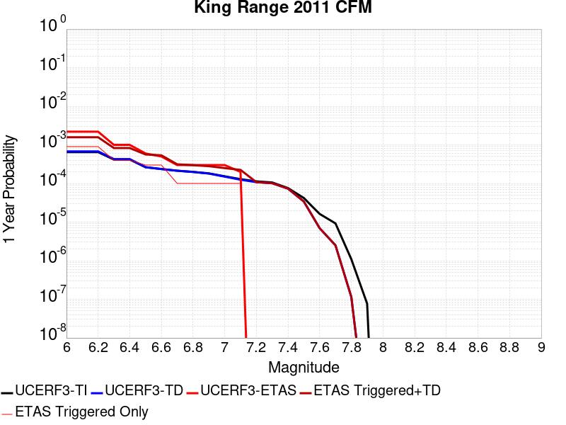 |  |

| Magnitude | 1 wk TI Prob | 1 wk TD Prob | 1 wk ETAS Prob | 1 wk ETAS/TD Gain | 1 wk ETAS Triggered+TD | 1 wk ETAS Triggered Only | 1 mo TI Prob | 1 mo TD Prob | 1 mo ETAS Prob | 1 mo ETAS/TD Gain | 1 mo ETAS Triggered+TD | 1 mo ETAS Triggered Only | 1 yr TI Prob | 1 yr TD Prob | 1 yr ETAS Prob | 1 yr ETAS/TD Gain | 1 yr ETAS Triggered+TD | 1 yr ETAS Triggered Only | 10 yr TI Prob | 10 yr TD Prob | 10 yr ETAS Prob | 10 yr ETAS/TD Gain | 10 yr ETAS Triggered+TD | 10 yr ETAS Triggered Only |
|-----|-----|-----|-----|-----|-----|-----|-----|-----|-----|-----|-----|-----|-----|-----|-----|-----|-----|-----|-----|-----|-----|-----|-----|-----|
| 6.0 | 1.2462566E-5 | 1.30234475E-5 | 0.0 | 0.0 | 1.30234475E-5 | 0.0 | 5.34099E-5 | 5.581378E-5 | 1.0E-4 | 1.7916722 | 1.558082E-4 | 1.0E-4 | 6.5007154E-4 | 6.793558E-4 | 0.0022 | 3.2383618 | 0.0015787444 | 9.0E-4 | 0.0064817313 | 0.0067771636 | 0.0176 | 2.5969565 | 0.014921591 | 0.0082 |
| 6.1 | 1.2462566E-5 | 1.30234475E-5 | 0.0 | 0.0 | 1.30234475E-5 | 0.0 | 5.34099E-5 | 5.581378E-5 | 1.0E-4 | 1.7916722 | 1.558082E-4 | 1.0E-4 | 6.5007154E-4 | 6.793558E-4 | 0.0022 | 3.2383618 | 0.0015787444 | 9.0E-4 | 0.0064817313 | 0.0067771636 | 0.0176 | 2.5969565 | 0.014921591 | 0.0082 |
| 6.2 | 1.2462566E-5 | 1.30234475E-5 | 0.0 | 0.0 | 1.30234475E-5 | 0.0 | 5.34099E-5 | 5.581378E-5 | 1.0E-4 | 1.7916722 | 1.558082E-4 | 1.0E-4 | 6.5007154E-4 | 6.793558E-4 | 0.0022 | 3.2383618 | 0.0015787444 | 9.0E-4 | 0.0064817313 | 0.0067771636 | 0.0176 | 2.5969565 | 0.014921591 | 0.0082 |
| 6.3 | 7.988484E-6 | 8.21385E-6 | 0.0 | 0.0 | 8.21385E-6 | 0.0 | 3.423591E-5 | 3.5201814E-5 | 0.0 | 0.0 | 3.5201814E-5 | 0.0 | 4.1674246E-4 | 4.285107E-4 | 0.001 | 2.333664 | 8.283393E-4 | 4.0E-4 | 0.004159618 | 0.004279048 | 0.0089 | 2.079902 | 0.007963216 | 0.0037 |
| 6.4 | 7.988484E-6 | 8.21385E-6 | 0.0 | 0.0 | 8.21385E-6 | 0.0 | 3.423591E-5 | 3.5201814E-5 | 0.0 | 0.0 | 3.5201814E-5 | 0.0 | 4.1674246E-4 | 4.285107E-4 | 0.001 | 2.333664 | 8.283393E-4 | 4.0E-4 | 0.004159618 | 0.004279048 | 0.0089 | 2.079902 | 0.007963216 | 0.0037 |
| 6.5 | 5.0522513E-6 | 5.0819035E-6 | 0.0 | 0.0 | 5.0819035E-6 | 0.0 | 2.1652326E-5 | 2.177941E-5 | 0.0 | 0.0 | 2.177941E-5 | 0.0 | 2.6358519E-4 | 2.6513299E-4 | 6.0E-4 | 2.2630153 | 5.6505343E-4 | 3.0E-4 | 0.0026327274 | 0.0026491918 | 0.0044 | 1.6608839 | 0.0046438933 | 0.002 |
| 6.6 | 4.53682E-6 | 4.538551E-6 | 0.0 | 0.0 | 4.538551E-6 | 0.0 | 1.944337E-5 | 1.9450792E-5 | 0.0 | 0.0 | 1.9450792E-5 | 0.0 | 2.3669732E-4 | 2.3678826E-4 | 5.0E-4 | 2.111591 | 5.3671724E-4 | 3.0E-4 | 0.0023644536 | 0.0023663521 | 0.0032 | 1.3522923 | 0.0038628026 | 0.0015 |
| 6.7 | 4.1144335E-6 | 4.0965438E-6 | 0.0 | 0.0 | 4.0965438E-6 | 0.0 | 1.7633167E-5 | 1.75565E-5 | 0.0 | 0.0 | 1.75565E-5 | 0.0 | 2.1466266E-4 | 2.1372983E-4 | 3.0E-4 | 1.4036412 | 3.1370844E-4 | 1.0E-4 | 0.0021445542 | 0.0021362144 | 0.0022 | 1.0298592 | 0.003134078 | 0.001 |
| 6.8 | 3.8321214E-6 | 3.8069911E-6 | 0.0 | 0.0 | 3.8069911E-6 | 0.0 | 1.6423275E-5 | 1.6315576E-5 | 0.0 | 0.0 | 1.6315576E-5 | 0.0 | 1.9993502E-4 | 1.9862436E-4 | 3.0E-4 | 1.5103887 | 2.986045E-4 | 1.0E-4 | 0.0019975523 | 0.0019854337 | 0.002 | 1.0073366 | 0.0028836469 | 9.0E-4 |
| 6.9 | 3.4999944E-6 | 3.4634138E-6 | 0.0 | 0.0 | 3.4634138E-6 | 0.0 | 1.499989E-5 | 1.4843118E-5 | 0.0 | 0.0 | 1.4843118E-5 | 0.0 | 1.8260835E-4 | 1.8070024E-4 | 3.0E-4 | 1.6602081 | 2.8068217E-4 | 1.0E-4 | 0.0018245836 | 0.0018064906 | 0.0018 | 0.99640703 | 0.0027048648 | 9.0E-4 |
| 7.0 | 2.9470837E-6 | 2.8864877E-6 | 0.0 | 0.0 | 2.8864877E-6 | 0.0 | 1.26302975E-5 | 1.2370604E-5 | 0.0 | 0.0 | 1.2370604E-5 | 0.0 | 1.5376302E-4 | 1.5060187E-4 | 3.0E-4 | 1.9920071 | 2.505868E-4 | 1.0E-4 | 0.0015365666 | 0.0015059465 | 0.0016 | 1.0624547 | 0.0022048925 | 7.0E-4 |
| 7.1 | 2.4850247E-6 | 2.3976593E-6 | 0.0 | 0.0 | 2.3976593E-6 | 0.0 | 1.0650062E-5 | 1.0275643E-5 | 0.0 | 0.0 | 1.0275643E-5 | 0.0 | 1.296568E-4 | 1.2509892E-4 | 2.0E-4 | 1.5987349 | 2.250864E-4 | 1.0E-4 | 0.0012958117 | 0.0012512245 | 0.0012 | 0.95906043 | 0.001750599 | 5.0E-4 |
| 7.2 | 2.1800304E-6 | 2.0759387E-6 | 0.0 | 0.0 | 2.0759387E-6 | 0.0 | 9.342954E-6 | 8.89685E-6 | 0.0 | 0.0 | 8.89685E-6 | 0.0 | 1.1374453E-4 | 1.0831385E-4 | 0.0 | 0.0 | 1.0831385E-4 | 0.0 | 0.0011368633 | 0.0010835365 | 9.0E-4 | 0.83061343 | 0.0013832115 | 3.0E-4 |
| 7.3 | 2.0378504E-6 | 1.9495285E-6 | 0.0 | 0.0 | 1.9495285E-6 | 0.0 | 8.733615E-6 | 8.355096E-6 | 0.0 | 0.0 | 8.355096E-6 | 0.0 | 1.0632657E-4 | 1.0171863E-4 | 0.0 | 0.0 | 1.0171863E-4 | 0.0 | 0.0010627571 | 0.0010176315 | 8.0E-4 | 0.78613925 | 0.0013173262 | 3.0E-4 |
| 7.4 | 1.4577047E-6 | 1.4096246E-6 | 0.0 | 0.0 | 1.4096246E-6 | 0.0 | 6.247291E-6 | 6.041235E-6 | 0.0 | 0.0 | 6.041235E-6 | 0.0 | 7.605811E-5 | 7.354962E-5 | 0.0 | 0.0 | 7.354962E-5 | 0.0 | 7.603208E-4 | 7.360986E-4 | 5.0E-4 | 0.6792568 | 0.0010358777 | 3.0E-4 |
| 7.5 | 8.0685743E-7 | 6.534215E-7 | 0.0 | 0.0 | 6.534215E-7 | 0.0 | 3.457956E-6 | 2.8003753E-6 | 0.0 | 0.0 | 2.8003753E-6 | 0.0 | 4.20998E-5 | 3.4094082E-5 | 0.0 | 0.0 | 3.4094082E-5 | 0.0 | 4.2091825E-4 | 3.4158927E-4 | 5.0E-4 | 1.4637463 | 6.414868E-4 | 3.0E-4 |
| 7.6 | 3.1239435E-7 | 1.3262603E-7 | 0.0 | 0.0 | 1.3262603E-7 | 0.0 | 1.3388321E-6 | 5.683971E-7 | 0.0 | 0.0 | 5.683971E-7 | 0.0 | 1.630016E-5 | 6.9202138E-6 | 0.0 | 0.0 | 6.9202138E-6 | 0.0 | 1.6298964E-4 | 6.983621E-5 | 0.0 | 0.0 | 6.983621E-5 | 0.0 |
| 7.7 | 1.7747207E-7 | 4.7712724E-8 | 0.0 | 0.0 | 4.7712724E-8 | 0.0 | 7.605944E-7 | 2.0448309E-7 | 0.0 | 0.0 | 2.0448309E-7 | 0.0 | 9.260198E-6 | 2.489579E-6 | 0.0 | 0.0 | 2.489579E-6 | 0.0 | 9.2598115E-5 | 2.5304711E-5 | 0.0 | 0.0 | 2.5304711E-5 | 0.0 |
| 7.8 | 2.1035538E-8 | 2.1979227E-9 | 0.0 | 0.0 | 2.1979227E-9 | 0.0 | 9.0152305E-8 | 9.419668E-9 | 0.0 | 0.0 | 9.419668E-9 | 0.0 | 1.0976038E-6 | 1.1468444E-7 | 0.0 | 0.0 | 1.1468444E-7 | 0.0 | 1.0975983E-5 | 1.1835027E-6 | 0.0 | 0.0 | 1.1835027E-6 | 0.0 |
| 7.9 | 1.4782963E-9 | 8.547607E-13 | 0.0 | 0.0 | 8.547607E-13 | 0.0 | 6.335555E-9 | 3.663625E-12 | 0.0 | 0.0 | 3.663625E-12 | 0.0 | 7.713538E-8 | 4.46001E-11 | 0.0 | 0.0 | 4.46001E-11 | 0.0 | 7.7135354E-7 | 6.4476247E-10 | 0.0 | 0.0 | 6.4476247E-10 | 0.0 |

## Calaveras (No) 2011 CFM
*[(top)](#table-of-contents)*

| 1 Week | 1 Month | 1 Year | 10 Year |
|-----|-----|-----|-----|
|  |  |  |  |

| Magnitude | 1 wk TI Prob | 1 wk TD Prob | 1 wk ETAS Prob | 1 wk ETAS/TD Gain | 1 wk ETAS Triggered+TD | 1 wk ETAS Triggered Only | 1 mo TI Prob | 1 mo TD Prob | 1 mo ETAS Prob | 1 mo ETAS/TD Gain | 1 mo ETAS Triggered+TD | 1 mo ETAS Triggered Only | 1 yr TI Prob | 1 yr TD Prob | 1 yr ETAS Prob | 1 yr ETAS/TD Gain | 1 yr ETAS Triggered+TD | 1 yr ETAS Triggered Only | 10 yr TI Prob | 10 yr TD Prob | 10 yr ETAS Prob | 10 yr ETAS/TD Gain | 10 yr ETAS Triggered+TD | 10 yr ETAS Triggered Only |
|-----|-----|-----|-----|-----|-----|-----|-----|-----|-----|-----|-----|-----|-----|-----|-----|-----|-----|-----|-----|-----|-----|-----|-----|-----|
| 6.0 | 4.8694856E-5 | 6.758049E-5 | 0.0 | 0.0 | 6.758049E-5 | 0.0 | 2.0867554E-4 | 2.895992E-4 | 2.0E-4 | 0.69060963 | 2.895992E-4 | 0.0 | 0.0025376645 | 0.0035201684 | 0.0024 | 0.6817856 | 0.004317352 | 8.0E-4 | 0.02508881 | 0.034824032 | 0.0286 | 0.82127196 | 0.042931512 | 0.0084 |
| 6.1 | 4.8694856E-5 | 6.758049E-5 | 0.0 | 0.0 | 6.758049E-5 | 0.0 | 2.0867554E-4 | 2.895992E-4 | 2.0E-4 | 0.69060963 | 2.895992E-4 | 0.0 | 0.0025376645 | 0.0035201684 | 0.0024 | 0.6817856 | 0.004317352 | 8.0E-4 | 0.02508881 | 0.034824032 | 0.0285 | 0.8184003 | 0.042931512 | 0.0084 |
| 6.2 | 4.7541962E-5 | 6.5910404E-5 | 0.0 | 0.0 | 6.5910404E-5 | 0.0 | 2.0373536E-4 | 2.8244327E-4 | 1.0E-4 | 0.3540534 | 2.8244327E-4 | 0.0 | 0.0024776561 | 0.0034333447 | 0.0022 | 0.6407746 | 0.0041309414 | 7.0E-4 | 0.024502134 | 0.033984885 | 0.0271 | 0.79741335 | 0.041713007 | 0.008 |
| 6.3 | 4.6717287E-5 | 6.474316E-5 | 0.0 | 0.0 | 6.474316E-5 | 0.0 | 2.0020158E-4 | 2.77442E-4 | 1.0E-4 | 0.36043566 | 2.77442E-4 | 0.0 | 0.0024347296 | 0.0033726539 | 0.0021 | 0.62265503 | 0.004070293 | 7.0E-4 | 0.024082264 | 0.033397045 | 0.0263 | 0.7874948 | 0.04093655 | 0.0078 |
| 6.4 | 4.6276386E-5 | 6.4104366E-5 | 0.0 | 0.0 | 6.4104366E-5 | 0.0 | 1.983123E-4 | 2.7470491E-4 | 1.0E-4 | 0.364027 | 2.7470491E-4 | 0.0 | 0.0024117786 | 0.0033394394 | 0.0021 | 0.628848 | 0.0040371018 | 7.0E-4 | 0.02385771 | 0.033075698 | 0.026 | 0.78607565 | 0.040521014 | 0.0077 |
| 6.5 | 4.5720994E-5 | 6.33045E-5 | 0.0 | 0.0 | 6.33045E-5 | 0.0 | 1.9593239E-4 | 2.7127785E-4 | 1.0E-4 | 0.36862576 | 2.7127785E-4 | 0.0 | 0.002382867 | 0.0032978505 | 0.0021 | 0.6367784 | 0.003995542 | 7.0E-4 | 0.023574775 | 0.032673035 | 0.0258 | 0.789642 | 0.04002472 | 0.0076 |
| 6.6 | 4.549134E-5 | 6.2957704E-5 | 0.0 | 0.0 | 6.2957704E-5 | 0.0 | 1.949483E-4 | 2.6979187E-4 | 1.0E-4 | 0.37065607 | 2.6979187E-4 | 0.0 | 0.0023709119 | 0.0032798136 | 0.0021 | 0.6402803 | 0.0039775176 | 7.0E-4 | 0.023457756 | 0.032498483 | 0.0257 | 0.7908062 | 0.039754745 | 0.0075 |
| 6.7 | 3.701047E-5 | 5.0454924E-5 | 0.0 | 0.0 | 5.0454924E-5 | 0.0 | 1.5860666E-4 | 2.1621771E-4 | 0.0 | 0.0 | 2.1621771E-4 | 0.0 | 0.0019293258 | 0.0026293164 | 0.0016 | 0.6085232 | 0.0031280017 | 5.0E-4 | 0.019126613 | 0.02617287 | 0.0194 | 0.74122554 | 0.031334154 | 0.0053 |
| 6.8 | 3.5523568E-5 | 4.8436556E-5 | 0.0 | 0.0 | 4.8436556E-5 | 0.0 | 1.5223498E-4 | 2.0756897E-4 | 0.0 | 0.0 | 2.0756897E-4 | 0.0 | 0.0018518851 | 0.0025242665 | 0.0016 | 0.6338475 | 0.0030230044 | 5.0E-4 | 0.018365284 | 0.0251452 | 0.0183 | 0.72777313 | 0.029921988 | 0.0049 |
| 6.9 | 3.2946147E-5 | 4.4755518E-5 | 0.0 | 0.0 | 4.4755518E-5 | 0.0 | 1.4119013E-4 | 1.917955E-4 | 0.0 | 0.0 | 1.917955E-4 | 0.0 | 0.0017176344 | 0.002332652 | 0.0015 | 0.64304495 | 0.0028314856 | 5.0E-4 | 0.017044188 | 0.02326607 | 0.0169 | 0.7263797 | 0.027661372 | 0.0045 |
| 7.0 | 2.7682381E-5 | 3.7114398E-5 | 0.0 | 0.0 | 3.7114398E-5 | 0.0 | 1.1863338E-4 | 1.5905219E-4 | 0.0 | 0.0 | 1.5905219E-4 | 0.0 | 0.0014434044 | 0.0019347707 | 0.0014 | 0.7236 | 0.0023339968 | 4.0E-4 | 0.01434065 | 0.019357244 | 0.0135 | 0.6974134 | 0.022789493 | 0.0035 |
| 7.1 | 2.471967E-5 | 3.3377473E-5 | 0.0 | 0.0 | 3.3377473E-5 | 0.0 | 1.05937135E-4 | 1.4303865E-4 | 0.0 | 0.0 | 1.4303865E-4 | 0.0 | 0.0012890215 | 0.0017401335 | 0.0012 | 0.68960226 | 0.0020396116 | 3.0E-4 | 0.0128157 | 0.01743187 | 0.0121 | 0.6941309 | 0.020183062 | 0.0028 |
| 7.2 | 1.9748062E-5 | 2.6864735E-5 | 0.0 | 0.0 | 2.6864735E-5 | 0.0 | 8.463181E-5 | 1.15129624E-4 | 0.0 | 0.0 | 1.15129624E-4 | 0.0 | 0.0010299052 | 0.0014008256 | 0.0012 | 0.8566377 | 0.0017004054 | 3.0E-4 | 0.01025145 | 0.014076818 | 0.0098 | 0.6961801 | 0.016147256 | 0.0021 |
| 7.3 | 1.1603734E-5 | 1.5865282E-5 | 0.0 | 0.0 | 1.5865282E-5 | 0.0 | 4.9729337E-5 | 6.7992376E-5 | 0.0 | 0.0 | 6.7992376E-5 | 0.0 | 6.052865E-4 | 8.275072E-4 | 8.0E-4 | 0.96675897 | 0.001127259 | 3.0E-4 | 0.0060364045 | 0.008350763 | 0.0061 | 0.7304722 | 0.009739072 | 0.0014 |
| 7.4 | 4.885381E-6 | 6.0439243E-6 | 0.0 | 0.0 | 6.0439243E-6 | 0.0 | 2.0937177E-5 | 2.5902276E-5 | 0.0 | 0.0 | 2.5902276E-5 | 0.0 | 2.5488032E-4 | 3.1531474E-4 | 2.0E-4 | 0.6342869 | 3.1531474E-4 | 0.0 | 0.0025458818 | 0.0032052535 | 0.0016 | 0.4991805 | 0.0036039713 | 4.0E-4 |
| 7.5 | 3.0571264E-6 | 4.1630155E-6 | 0.0 | 0.0 | 4.1630155E-6 | 0.0 | 1.3101904E-5 | 1.7841374E-5 | 0.0 | 0.0 | 1.7841374E-5 | 0.0 | 1.5950401E-4 | 2.1719719E-4 | 1.0E-4 | 0.46041113 | 2.1719719E-4 | 0.0 | 0.0015938957 | 0.0022246994 | 0.0012 | 0.5393987 | 0.0026238095 | 4.0E-4 |
| 7.6 | 1.764948E-6 | 2.802955E-6 | 0.0 | 0.0 | 2.802955E-6 | 0.0 | 7.564041E-6 | 1.2012609E-5 | 0.0 | 0.0 | 1.2012609E-5 | 0.0 | 9.208831E-5 | 1.4624376E-4 | 0.0 | 0.0 | 1.4624376E-4 | 0.0 | 9.205016E-4 | 0.0015160835 | 0.001 | 0.6595943 | 0.0018156286 | 3.0E-4 |
| 7.7 | 1.3173734E-6 | 2.0659218E-6 | 0.0 | 0.0 | 2.0659218E-6 | 0.0 | 5.645874E-6 | 8.85392E-6 | 0.0 | 0.0 | 8.85392E-6 | 0.0 | 6.873634E-5 | 1.07791166E-4 | 0.0 | 0.0 | 1.07791166E-4 | 0.0 | 6.8715087E-4 | 0.0011299014 | 6.0E-4 | 0.53101975 | 0.0013296754 | 2.0E-4 |
| 7.8 | 9.4429885E-7 | 1.5559012E-6 | 0.0 | 0.0 | 1.5559012E-6 | 0.0 | 4.0469886E-6 | 6.6681314E-6 | 0.0 | 0.0 | 6.6681314E-6 | 0.0 | 4.9270973E-5 | 8.118149E-5 | 0.0 | 0.0 | 8.118149E-5 | 0.0 | 4.926005E-4 | 8.536823E-4 | 5.0E-4 | 0.585698 | 0.0010535115 | 2.0E-4 |
| 7.9 | 6.388233E-7 | 1.120367E-6 | 0.0 | 0.0 | 1.120367E-6 | 0.0 | 2.7378112E-6 | 4.801564E-6 | 0.0 | 0.0 | 4.801564E-6 | 0.0 | 3.3332344E-5 | 5.8457485E-5 | 0.0 | 0.0 | 5.8457485E-5 | 0.0 | 3.3327343E-4 | 6.124097E-4 | 3.0E-4 | 0.4898681 | 7.123485E-4 | 1.0E-4 |
| 8.0 | 3.087986E-7 | 5.7870875E-7 | 0.0 | 0.0 | 5.7870875E-7 | 0.0 | 1.323422E-6 | 2.480178E-6 | 0.0 | 0.0 | 2.480178E-6 | 0.0 | 1.6112543E-5 | 3.0195752E-5 | 0.0 | 0.0 | 3.0195752E-5 | 0.0 | 1.6111376E-4 | 3.1270308E-4 | 2.0E-4 | 0.63958436 | 3.1270308E-4 | 0.0 |
| 8.1 | 1.6725647E-7 | 2.7597E-7 | 0.0 | 0.0 | 2.7597E-7 | 0.0 | 7.168133E-7 | 1.182728E-6 | 0.0 | 0.0 | 1.182728E-6 | 0.0 | 8.7271665E-6 | 1.439962E-5 | 0.0 | 0.0 | 1.439962E-5 | 0.0 | 8.726824E-5 | 1.4946028E-4 | 1.0E-4 | 0.6690741 | 1.4946028E-4 | 0.0 |

## Cady
*[(top)](#table-of-contents)*

| 1 Week | 1 Month | 1 Year | 10 Year |
|-----|-----|-----|-----|
|  |  |  |  |

| Magnitude | 1 wk TI Prob | 1 wk TD Prob | 1 wk ETAS Prob | 1 wk ETAS/TD Gain | 1 wk ETAS Triggered+TD | 1 wk ETAS Triggered Only | 1 mo TI Prob | 1 mo TD Prob | 1 mo ETAS Prob | 1 mo ETAS/TD Gain | 1 mo ETAS Triggered+TD | 1 mo ETAS Triggered Only | 1 yr TI Prob | 1 yr TD Prob | 1 yr ETAS Prob | 1 yr ETAS/TD Gain | 1 yr ETAS Triggered+TD | 1 yr ETAS Triggered Only | 10 yr TI Prob | 10 yr TD Prob | 10 yr ETAS Prob | 10 yr ETAS/TD Gain | 10 yr ETAS Triggered+TD | 10 yr ETAS Triggered Only |
|-----|-----|-----|-----|-----|-----|-----|-----|-----|-----|-----|-----|-----|-----|-----|-----|-----|-----|-----|-----|-----|-----|-----|-----|-----|
| 6.0 | 1.9892565E-5 | 2.1863018E-5 | 0.0 | 0.0 | 2.1863018E-5 | 0.0 | 8.525106E-5 | 9.3695795E-5 | 0.0 | 0.0 | 9.3695795E-5 | 0.0 | 0.0010374374 | 0.0011402402 | 8.0E-4 | 0.7016065 | 0.0015397841 | 4.0E-4 | 0.010326075 | 0.011352916 | 0.0123 | 1.0834221 | 0.019558687 | 0.0083 |
| 6.1 | 1.9892565E-5 | 2.1863018E-5 | 0.0 | 0.0 | 2.1863018E-5 | 0.0 | 8.525106E-5 | 9.3695795E-5 | 0.0 | 0.0 | 9.3695795E-5 | 0.0 | 0.0010374374 | 0.0011402402 | 8.0E-4 | 0.7016065 | 0.0015397841 | 4.0E-4 | 0.010326075 | 0.011352916 | 0.0123 | 1.0834221 | 0.019558687 | 0.0083 |
| 6.2 | 1.9892565E-5 | 2.1863018E-5 | 0.0 | 0.0 | 2.1863018E-5 | 0.0 | 8.525106E-5 | 9.3695795E-5 | 0.0 | 0.0 | 9.3695795E-5 | 0.0 | 0.0010374374 | 0.0011402402 | 8.0E-4 | 0.7016065 | 0.0015397841 | 4.0E-4 | 0.010326075 | 0.011352916 | 0.0123 | 1.0834221 | 0.019558687 | 0.0083 |
| 6.3 | 1.1117327E-5 | 1.2178886E-5 | 0.0 | 0.0 | 1.2178886E-5 | 0.0 | 4.764482E-5 | 5.219436E-5 | 0.0 | 0.0 | 5.219436E-5 | 0.0 | 5.7992124E-4 | 6.353126E-4 | 6.0E-4 | 0.944417 | 9.3512196E-4 | 3.0E-4 | 0.0057841022 | 0.0063380706 | 0.0064 | 1.009771 | 0.0105114505 | 0.0042 |
| 6.4 | 1.1117327E-5 | 1.2178886E-5 | 0.0 | 0.0 | 1.2178886E-5 | 0.0 | 4.764482E-5 | 5.219436E-5 | 0.0 | 0.0 | 5.219436E-5 | 0.0 | 5.7992124E-4 | 6.353126E-4 | 6.0E-4 | 0.944417 | 9.3512196E-4 | 3.0E-4 | 0.0057841022 | 0.0063380706 | 0.0064 | 1.009771 | 0.0105114505 | 0.0042 |
| 6.5 | 6.103093E-6 | 6.6732555E-6 | 0.0 | 0.0 | 6.6732555E-6 | 0.0 | 2.615585E-5 | 2.8599423E-5 | 0.0 | 0.0 | 2.8599423E-5 | 0.0 | 3.1840094E-4 | 3.4815492E-4 | 2.0E-4 | 0.57445693 | 4.481201E-4 | 1.0E-4 | 0.0031794512 | 0.0034773292 | 0.0028 | 0.8052157 | 0.005370722 | 0.0019 |
| 6.6 | 5.817237E-6 | 6.3668494E-6 | 0.0 | 0.0 | 6.3668494E-6 | 0.0 | 2.4930776E-5 | 2.7286284E-5 | 0.0 | 0.0 | 2.7286284E-5 | 0.0 | 3.034899E-4 | 3.3217232E-4 | 2.0E-4 | 0.60209715 | 4.321391E-4 | 1.0E-4 | 0.0030307577 | 0.0033179806 | 0.0028 | 0.8438868 | 0.0052116765 | 0.0019 |
| 6.7 | 4.8846314E-6 | 5.341558E-6 | 0.0 | 0.0 | 5.341558E-6 | 0.0 | 2.0933967E-5 | 2.2892256E-5 | 0.0 | 0.0 | 2.2892256E-5 | 0.0 | 2.5484123E-4 | 2.7868935E-4 | 2.0E-4 | 0.71764493 | 3.7866147E-4 | 1.0E-4 | 0.0025454918 | 0.0027845544 | 0.0024 | 0.8618973 | 0.004380099 | 0.0016 |
| 6.8 | 1.7788773E-6 | 1.9402564E-6 | 0.0 | 0.0 | 1.9402564E-6 | 0.0 | 7.6237375E-6 | 8.315367E-6 | 0.0 | 0.0 | 8.315367E-6 | 0.0 | 9.281505E-5 | 1.01236474E-4 | 2.0E-4 | 1.9755726 | 2.0122634E-4 | 1.0E-4 | 9.2776294E-4 | 0.0010120582 | 7.0E-4 | 0.6916598 | 0.0015115523 | 5.0E-4 |
| 6.9 | 7.5455404E-7 | 8.2987316E-7 | 0.0 | 0.0 | 8.2987316E-7 | 0.0 | 3.233799E-6 | 3.5565963E-6 | 0.0 | 0.0 | 3.5565963E-6 | 0.0 | 3.937079E-5 | 4.3301035E-5 | 1.0E-4 | 2.3094137 | 1.4329671E-4 | 1.0E-4 | 3.9363815E-4 | 4.3295894E-4 | 2.0E-4 | 0.46193758 | 6.3287234E-4 | 2.0E-4 |
| 7.0 | 6.8578805E-7 | 7.543308E-7 | 0.0 | 0.0 | 7.543308E-7 | 0.0 | 2.9390883E-6 | 3.2328442E-6 | 0.0 | 0.0 | 3.2328442E-6 | 0.0 | 3.578281E-5 | 3.9359496E-5 | 1.0E-4 | 2.5406828 | 1.3935556E-4 | 1.0E-4 | 3.577705E-4 | 3.9355774E-4 | 1.0E-4 | 0.2540923 | 4.9351837E-4 | 1.0E-4 |

## Ortigalita (North)
*[(top)](#table-of-contents)*

| 1 Week | 1 Month | 1 Year | 10 Year |
|-----|-----|-----|-----|
| 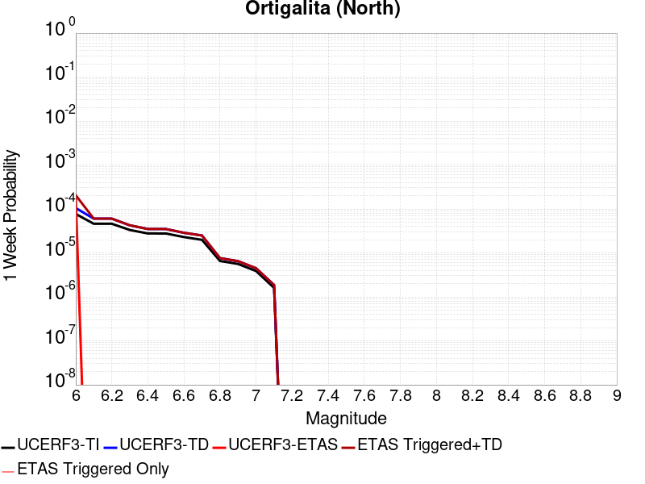 |  |  |  |

| Magnitude | 1 wk TI Prob | 1 wk TD Prob | 1 wk ETAS Prob | 1 wk ETAS/TD Gain | 1 wk ETAS Triggered+TD | 1 wk ETAS Triggered Only | 1 mo TI Prob | 1 mo TD Prob | 1 mo ETAS Prob | 1 mo ETAS/TD Gain | 1 mo ETAS Triggered+TD | 1 mo ETAS Triggered Only | 1 yr TI Prob | 1 yr TD Prob | 1 yr ETAS Prob | 1 yr ETAS/TD Gain | 1 yr ETAS Triggered+TD | 1 yr ETAS Triggered Only | 10 yr TI Prob | 10 yr TD Prob | 10 yr ETAS Prob | 10 yr ETAS/TD Gain | 10 yr ETAS Triggered+TD | 10 yr ETAS Triggered Only |
|-----|-----|-----|-----|-----|-----|-----|-----|-----|-----|-----|-----|-----|-----|-----|-----|-----|-----|-----|-----|-----|-----|-----|-----|-----|
| 6.0 | 7.711876E-5 | 1.0512432E-4 | 2.0E-4 | 1.9025092 | 2.0511381E-4 | 1.0E-4 | 3.3046713E-4 | 4.5045366E-4 | 5.0E-4 | 1.109992 | 5.504086E-4 | 1.0E-4 | 0.004016016 | 0.005471653 | 0.0046 | 0.84069663 | 0.006565634 | 0.0011 | 0.039442103 | 0.053489465 | 0.0412 | 0.77024513 | 0.06030434 | 0.0072 |
| 6.1 | 4.607858E-5 | 6.027583E-5 | 0.0 | 0.0 | 6.027583E-5 | 0.0 | 1.9746469E-4 | 2.5830086E-4 | 2.0E-4 | 0.77429086 | 2.5830086E-4 | 0.0 | 0.0024014818 | 0.0031405955 | 0.0025 | 0.79602736 | 0.0037387111 | 6.0E-4 | 0.023756953 | 0.03099323 | 0.0246 | 0.7937217 | 0.035450663 | 0.0046 |
| 6.2 | 4.607858E-5 | 6.027583E-5 | 0.0 | 0.0 | 6.027583E-5 | 0.0 | 1.9746469E-4 | 2.5830086E-4 | 2.0E-4 | 0.77429086 | 2.5830086E-4 | 0.0 | 0.0024014818 | 0.0031405955 | 0.0025 | 0.79602736 | 0.0037387111 | 6.0E-4 | 0.023756953 | 0.03099323 | 0.0246 | 0.7937217 | 0.035450663 | 0.0046 |
| 6.3 | 3.327423E-5 | 4.2499472E-5 | 0.0 | 0.0 | 4.2499472E-5 | 0.0 | 1.4259605E-4 | 1.8212963E-4 | 1.0E-4 | 0.5490595 | 1.8212963E-4 | 0.0 | 0.0017347244 | 0.0022154208 | 0.0017 | 0.7673486 | 0.0026145347 | 4.0E-4 | 0.017212452 | 0.0219576 | 0.0166 | 0.7560024 | 0.02518514 | 0.0033 |
| 6.4 | 2.7732503E-5 | 3.501747E-5 | 0.0 | 0.0 | 3.501747E-5 | 0.0 | 1.1884817E-4 | 1.5006775E-4 | 1.0E-4 | 0.6663657 | 1.5006775E-4 | 0.0 | 0.001446016 | 0.0018257776 | 0.0012 | 0.6572542 | 0.0021252297 | 3.0E-4 | 0.014366428 | 0.018130744 | 0.0136 | 0.7501071 | 0.020879978 | 0.0028 |
| 6.5 | 2.7689714E-5 | 3.496727E-5 | 0.0 | 0.0 | 3.496727E-5 | 0.0 | 1.186648E-4 | 1.4985261E-4 | 1.0E-4 | 0.66732234 | 1.4985261E-4 | 0.0 | 0.0014437864 | 0.0018231627 | 0.0012 | 0.65819687 | 0.0021226157 | 3.0E-4 | 0.014344421 | 0.018105023 | 0.0136 | 0.7511728 | 0.020854328 | 0.0028 |
| 6.6 | 2.2976905E-5 | 2.8732931E-5 | 0.0 | 0.0 | 2.8732931E-5 | 0.0 | 9.846873E-5 | 1.2313675E-4 | 1.0E-4 | 0.81210524 | 1.2313675E-4 | 0.0 | 0.0011981975 | 0.0014983977 | 0.0012 | 0.8008555 | 0.0017979481 | 3.0E-4 | 0.011917574 | 0.014906267 | 0.0119 | 0.79832196 | 0.017270492 | 0.0024 |
| 6.7 | 1.9871539E-5 | 2.4917535E-5 | 0.0 | 0.0 | 2.4917535E-5 | 0.0 | 8.516096E-5 | 1.0678647E-4 | 1.0E-4 | 0.9364482 | 1.0678647E-4 | 0.0 | 0.0010363415 | 0.0012995923 | 0.0012 | 0.92336655 | 0.0015992024 | 3.0E-4 | 0.010315218 | 0.0129436 | 0.0107 | 0.8266634 | 0.015213829 | 0.0023 |
| 6.8 | 6.5640475E-6 | 7.6078904E-6 | 0.0 | 0.0 | 7.6078904E-6 | 0.0 | 2.813133E-5 | 3.2604854E-5 | 1.0E-4 | 3.067028 | 3.2604854E-5 | 0.0 | 3.424451E-4 | 3.9689467E-4 | 2.0E-4 | 0.50391203 | 3.9689467E-4 | 0.0 | 0.0034191788 | 0.0039621457 | 0.0029 | 0.7319267 | 0.0044601643 | 5.0E-4 |
| 6.9 | 5.6219683E-6 | 6.503859E-6 | 0.0 | 0.0 | 6.503859E-6 | 0.0 | 2.4093928E-5 | 2.7873399E-5 | 1.0E-4 | 3.58765 | 2.7873399E-5 | 0.0 | 2.933041E-4 | 3.3930838E-4 | 1.0E-4 | 0.29471716 | 3.3930838E-4 | 0.0 | 0.0029291727 | 0.0033881601 | 0.0025 | 0.7378636 | 0.0037868049 | 4.0E-4 |
| 7.0 | 3.875591E-6 | 4.486155E-6 | 0.0 | 0.0 | 4.486155E-6 | 0.0 | 1.6609569E-5 | 1.9226249E-5 | 1.0E-4 | 5.201223 | 1.9226249E-5 | 0.0 | 2.0220275E-4 | 2.3405654E-4 | 1.0E-4 | 0.4272472 | 2.3405654E-4 | 0.0 | 0.0020201886 | 0.0023383086 | 0.0018 | 0.76978713 | 0.0027373733 | 4.0E-4 |
| 7.1 | 1.6017933E-6 | 1.8576296E-6 | 0.0 | 0.0 | 1.8576296E-6 | 0.0 | 6.8648105E-6 | 7.961251E-6 | 0.0 | 0.0 | 7.961251E-6 | 0.0 | 8.357586E-5 | 9.692499E-5 | 0.0 | 0.0 | 9.692499E-5 | 0.0 | 8.3544437E-4 | 9.6893194E-4 | 7.0E-4 | 0.72244495 | 0.0011687381 | 2.0E-4 |

## Maacama 2011 CFM
*[(top)](#table-of-contents)*

| 1 Week | 1 Month | 1 Year | 10 Year |
|-----|-----|-----|-----|
| 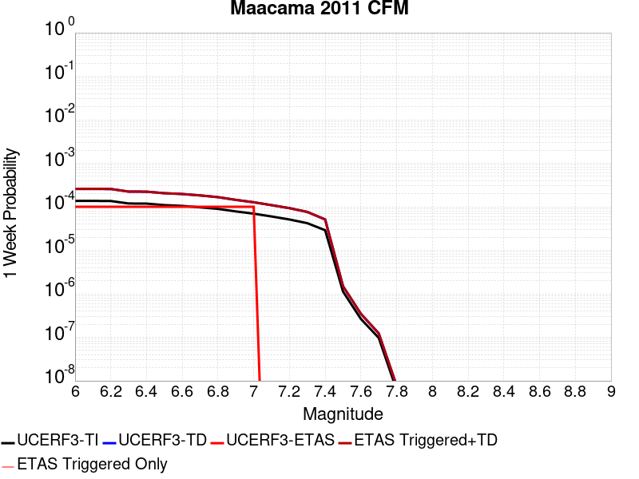 |  | 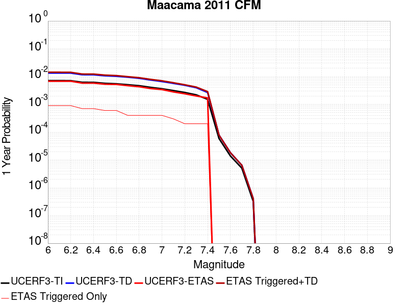 |  |

| Magnitude | 1 wk TI Prob | 1 wk TD Prob | 1 wk ETAS Prob | 1 wk ETAS/TD Gain | 1 wk ETAS Triggered+TD | 1 wk ETAS Triggered Only | 1 mo TI Prob | 1 mo TD Prob | 1 mo ETAS Prob | 1 mo ETAS/TD Gain | 1 mo ETAS Triggered+TD | 1 mo ETAS Triggered Only | 1 yr TI Prob | 1 yr TD Prob | 1 yr ETAS Prob | 1 yr ETAS/TD Gain | 1 yr ETAS Triggered+TD | 1 yr ETAS Triggered Only | 10 yr TI Prob | 10 yr TD Prob | 10 yr ETAS Prob | 10 yr ETAS/TD Gain | 10 yr ETAS Triggered+TD | 10 yr ETAS Triggered Only |
|-----|-----|-----|-----|-----|-----|-----|-----|-----|-----|-----|-----|-----|-----|-----|-----|-----|-----|-----|-----|-----|-----|-----|-----|-----|
| 6.0 | 1.368203E-4 | 2.5820456E-4 | 1.0E-4 | 0.38728985 | 2.5820456E-4 | 0.0 | 5.862409E-4 | 0.0011060338 | 1.0E-4 | 0.090413146 | 0.0011060338 | 0.0 | 0.0071141496 | 0.013365483 | 0.0068 | 0.5087732 | 0.014253454 | 9.0E-4 | 0.06890667 | 0.12431795 | 0.0614 | 0.4938949 | 0.1310607 | 0.0077 |
| 6.1 | 1.368203E-4 | 2.5820456E-4 | 1.0E-4 | 0.38728985 | 2.5820456E-4 | 0.0 | 5.862409E-4 | 0.0011060338 | 1.0E-4 | 0.090413146 | 0.0011060338 | 0.0 | 0.0071141496 | 0.013365483 | 0.0068 | 0.5087732 | 0.014253454 | 9.0E-4 | 0.06890667 | 0.12431795 | 0.0614 | 0.4938949 | 0.1310607 | 0.0077 |
| 6.2 | 1.360743E-4 | 2.5695047E-4 | 1.0E-4 | 0.38918006 | 2.5695047E-4 | 0.0 | 5.8304524E-4 | 0.0011006644 | 1.0E-4 | 0.09085422 | 0.0011006644 | 0.0 | 0.007075496 | 0.013300984 | 0.0068 | 0.51124036 | 0.014189013 | 9.0E-4 | 0.06854413 | 0.12375199 | 0.0609 | 0.4921133 | 0.1304991 | 0.0077 |
| 6.3 | 1.1917239E-4 | 2.2388036E-4 | 1.0E-4 | 0.44666713 | 2.2388036E-4 | 0.0 | 5.1063887E-4 | 9.59055E-4 | 1.0E-4 | 0.1042693 | 9.59055E-4 | 0.0 | 0.0061993203 | 0.011601437 | 0.0058 | 0.4999381 | 0.0122933155 | 7.0E-4 | 0.060292065 | 0.10896608 | 0.0529 | 0.48547214 | 0.11493602 | 0.0067 |
| 6.4 | 1.1859289E-4 | 2.2291548E-4 | 1.0E-4 | 0.4486005 | 2.2291548E-4 | 0.0 | 5.0815626E-4 | 9.54923E-4 | 1.0E-4 | 0.10472049 | 9.54923E-4 | 0.0 | 0.006169266 | 0.011551718 | 0.0058 | 0.5020898 | 0.012243632 | 7.0E-4 | 0.06000784 | 0.10852265 | 0.0527 | 0.4856129 | 0.11440641 | 0.0066 |
| 6.5 | 1.09512424E-4 | 2.0543886E-4 | 1.0E-4 | 0.48676282 | 2.0543886E-4 | 0.0 | 4.6925453E-4 | 8.801093E-4 | 1.0E-4 | 0.11362225 | 8.801093E-4 | 0.0 | 0.005698218 | 0.010652695 | 0.0053 | 0.4975267 | 0.011246303 | 6.0E-4 | 0.055543028 | 0.10061146 | 0.0482 | 0.47907066 | 0.106097735 | 0.0061 |
| 6.6 | 1.0502928E-4 | 1.9700732E-4 | 1.0E-4 | 0.50759536 | 1.9700732E-4 | 0.0 | 4.500478E-4 | 8.4400765E-4 | 1.0E-4 | 0.11848234 | 8.4400765E-4 | 0.0 | 0.0054655746 | 0.010218539 | 0.0052 | 0.508879 | 0.010812408 | 6.0E-4 | 0.053330887 | 0.09676218 | 0.0469 | 0.4846935 | 0.10200096 | 0.0058 |
| 6.7 | 9.739358E-5 | 1.8283937E-4 | 1.0E-4 | 0.54692817 | 1.8283937E-4 | 0.0 | 4.173343E-4 | 7.833262E-4 | 1.0E-4 | 0.12766074 | 7.833262E-4 | 0.0 | 0.0050692135 | 0.009488103 | 0.0047 | 0.4953572 | 0.009884308 | 4.0E-4 | 0.049551267 | 0.09023164 | 0.0432 | 0.47876775 | 0.09532634 | 0.0056 |
| 6.8 | 8.969524E-5 | 1.6680949E-4 | 1.0E-4 | 0.5994863 | 1.6680949E-4 | 0.0 | 3.8435153E-4 | 7.1467704E-4 | 1.0E-4 | 0.13992335 | 7.1467704E-4 | 0.0 | 0.0046694432 | 0.0086608855 | 0.0043 | 0.49648502 | 0.009057421 | 4.0E-4 | 0.045725387 | 0.08275676 | 0.0398 | 0.4809275 | 0.087434694 | 0.0051 |
| 6.9 | 7.838291E-5 | 1.4439132E-4 | 1.0E-4 | 0.6925624 | 1.4439132E-4 | 0.0 | 3.358835E-4 | 6.186476E-4 | 1.0E-4 | 0.16164291 | 6.186476E-4 | 0.0 | 0.0040817154 | 0.0075021614 | 0.0037 | 0.4931912 | 0.0078991605 | 4.0E-4 | 0.04007554 | 0.07214671 | 0.0344 | 0.47680622 | 0.07650762 | 0.0047 |
| 7.0 | 6.961957E-5 | 1.272627E-4 | 1.0E-4 | 0.78577626 | 1.272627E-4 | 0.0 | 2.9833548E-4 | 5.452888E-4 | 1.0E-4 | 0.18338905 | 5.452888E-4 | 0.0 | 0.0036261857 | 0.0066160914 | 0.0034 | 0.51389855 | 0.0070134453 | 4.0E-4 | 0.035675827 | 0.0639573 | 0.0306 | 0.47844425 | 0.06807588 | 0.0044 |
| 7.1 | 5.999398E-5 | 1.0921442E-4 | 0.0 | 0.0 | 1.0921442E-4 | 0.0 | 2.570917E-4 | 4.6797146E-4 | 0.0 | 0.0 | 4.6797146E-4 | 0.0 | 0.0031255994 | 0.005681144 | 0.0028 | 0.49285847 | 0.0059794397 | 3.0E-4 | 0.030820016 | 0.055215787 | 0.0262 | 0.47450197 | 0.05880597 | 0.0038 |
| 7.2 | 5.116532E-5 | 9.319654E-5 | 0.0 | 0.0 | 9.319654E-5 | 0.0 | 2.1926152E-4 | 3.993477E-4 | 0.0 | 0.0 | 3.993477E-4 | 0.0 | 0.002666241 | 0.0048504886 | 0.0024 | 0.4947955 | 0.005049519 | 2.0E-4 | 0.026344774 | 0.047372088 | 0.0225 | 0.47496325 | 0.050706282 | 0.0035 |
| 7.3 | 4.2087835E-5 | 7.62857E-5 | 0.0 | 0.0 | 7.62857E-5 | 0.0 | 1.8036396E-4 | 3.268941E-4 | 0.0 | 0.0 | 3.268941E-4 | 0.0 | 0.0021937196 | 0.003972205 | 0.002 | 0.5034987 | 0.0041714106 | 2.0E-4 | 0.0217219 | 0.03896118 | 0.0191 | 0.49023154 | 0.041844297 | 0.003 |
| 7.4 | 2.8991652E-5 | 5.1237694E-5 | 0.0 | 0.0 | 5.1237694E-5 | 0.0 | 1.2424402E-4 | 2.1957121E-4 | 0.0 | 0.0 | 2.1957121E-4 | 0.0 | 0.0015116213 | 0.0026699514 | 0.0017 | 0.6367157 | 0.0028694174 | 2.0E-4 | 0.015013801 | 0.026368849 | 0.0134 | 0.5081754 | 0.028413475 | 0.0021 |
| 7.5 | 1.1292299E-6 | 1.4954545E-6 | 0.0 | 0.0 | 1.4954545E-6 | 0.0 | 4.8395473E-6 | 6.409082E-6 | 0.0 | 0.0 | 6.409082E-6 | 0.0 | 5.8919897E-5 | 7.802903E-5 | 0.0 | 0.0 | 7.802903E-5 | 0.0 | 5.890428E-4 | 7.8071555E-4 | 3.0E-4 | 0.38426286 | 8.806375E-4 | 1.0E-4 |
| 7.6 | 2.6535366E-7 | 3.4697905E-7 | 0.0 | 0.0 | 3.4697905E-7 | 0.0 | 1.1372296E-6 | 1.4870521E-6 | 0.0 | 0.0 | 1.4870521E-6 | 0.0 | 1.3845682E-5 | 1.810471E-5 | 0.0 | 0.0 | 1.810471E-5 | 0.0 | 1.3844819E-4 | 1.8156304E-4 | 0.0 | 0.0 | 1.8156304E-4 | 0.0 |
| 7.7 | 9.727789E-8 | 1.2279365E-7 | 0.0 | 0.0 | 1.2279365E-7 | 0.0 | 4.1690518E-7 | 5.2625836E-7 | 0.0 | 0.0 | 5.2625836E-7 | 0.0 | 5.0758085E-6 | 6.407177E-6 | 0.0 | 0.0 | 6.407177E-6 | 0.0 | 5.0756928E-5 | 6.444357E-5 | 0.0 | 0.0 | 6.444357E-5 | 0.0 |
| 7.8 | 6.1939325E-9 | 7.699313E-9 | 0.0 | 0.0 | 7.699313E-9 | 0.0 | 2.6545425E-8 | 3.2997054E-8 | 0.0 | 0.0 | 3.2997054E-8 | 0.0 | 3.231905E-7 | 4.0173907E-7 | 0.0 | 0.0 | 4.0173907E-7 | 0.0 | 3.2319003E-6 | 4.0532727E-6 | 0.0 | 0.0 | 4.0532727E-6 | 0.0 |

## Santa Ynez (West)
*[(top)](#table-of-contents)*

| 1 Week | 1 Month | 1 Year | 10 Year |
|-----|-----|-----|-----|
| 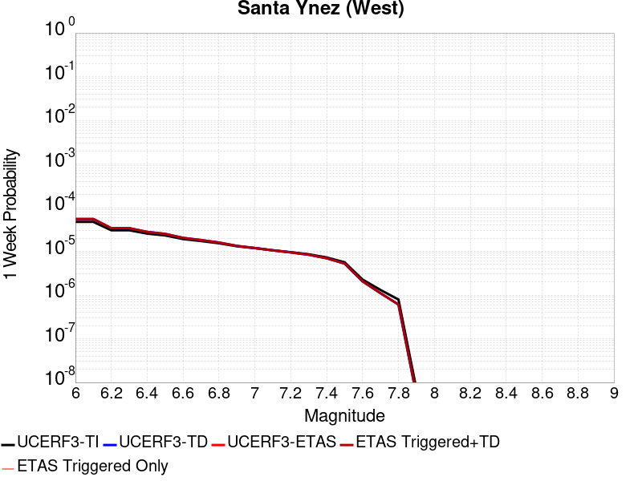 |  |  |  |

| Magnitude | 1 wk TI Prob | 1 wk TD Prob | 1 wk ETAS Prob | 1 wk ETAS/TD Gain | 1 wk ETAS Triggered+TD | 1 wk ETAS Triggered Only | 1 mo TI Prob | 1 mo TD Prob | 1 mo ETAS Prob | 1 mo ETAS/TD Gain | 1 mo ETAS Triggered+TD | 1 mo ETAS Triggered Only | 1 yr TI Prob | 1 yr TD Prob | 1 yr ETAS Prob | 1 yr ETAS/TD Gain | 1 yr ETAS Triggered+TD | 1 yr ETAS Triggered Only | 10 yr TI Prob | 10 yr TD Prob | 10 yr ETAS Prob | 10 yr ETAS/TD Gain | 10 yr ETAS Triggered+TD | 10 yr ETAS Triggered Only |
|-----|-----|-----|-----|-----|-----|-----|-----|-----|-----|-----|-----|-----|-----|-----|-----|-----|-----|-----|-----|-----|-----|-----|-----|-----|
| 6.0 | 4.7352758E-5 | 5.4991593E-5 | 0.0 | 0.0 | 5.4991593E-5 | 0.0 | 2.0292461E-4 | 2.356586E-4 | 1.0E-4 | 0.42434266 | 2.356586E-4 | 0.0 | 0.0024678076 | 0.002865639 | 0.0017 | 0.5932359 | 0.0033642063 | 5.0E-4 | 0.024405818 | 0.028314982 | 0.0237 | 0.8370127 | 0.03414509 | 0.006 |
| 6.1 | 4.7352758E-5 | 5.4991593E-5 | 0.0 | 0.0 | 5.4991593E-5 | 0.0 | 2.0292461E-4 | 2.356586E-4 | 1.0E-4 | 0.42434266 | 2.356586E-4 | 0.0 | 0.0024678076 | 0.002865639 | 0.0014 | 0.4885472 | 0.0032644928 | 4.0E-4 | 0.024405818 | 0.028314982 | 0.0203 | 0.7169349 | 0.03297907 | 0.0048 |
| 6.2 | 3.0415853E-5 | 3.3935707E-5 | 0.0 | 0.0 | 3.3935707E-5 | 0.0 | 1.3034715E-4 | 1.4543082E-4 | 0.0 | 0.0 | 1.4543082E-4 | 0.0 | 0.0015858212 | 0.0017692166 | 6.0E-4 | 0.33913314 | 0.0019688627 | 2.0E-4 | 0.015745522 | 0.017555261 | 0.0146 | 0.8316595 | 0.021190308 | 0.0037 |
| 6.3 | 3.0415853E-5 | 3.3935707E-5 | 0.0 | 0.0 | 3.3935707E-5 | 0.0 | 1.3034715E-4 | 1.4543082E-4 | 0.0 | 0.0 | 1.4543082E-4 | 0.0 | 0.0015858212 | 0.0017692166 | 6.0E-4 | 0.33913314 | 0.0019688627 | 2.0E-4 | 0.015745522 | 0.017555261 | 0.0146 | 0.8316595 | 0.021190308 | 0.0037 |
| 6.4 | 2.5452082E-5 | 2.7920496E-5 | 0.0 | 0.0 | 2.7920496E-5 | 0.0 | 1.09075794E-4 | 1.19653865E-4 | 0.0 | 0.0 | 1.19653865E-4 | 0.0 | 0.0013271887 | 0.0014558313 | 4.0E-4 | 0.27475712 | 0.0015556857 | 1.0E-4 | 0.013192902 | 0.014465111 | 0.0118 | 0.8157559 | 0.016830394 | 0.0024 |
| 6.5 | 2.3143784E-5 | 2.5135161E-5 | 0.0 | 0.0 | 2.5135161E-5 | 0.0 | 9.9183875E-5 | 1.0771775E-4 | 0.0 | 0.0 | 1.0771775E-4 | 0.0 | 0.0012068948 | 0.0013106893 | 2.0E-4 | 0.15259147 | 0.0014105582 | 1.0E-4 | 0.012003611 | 0.013031258 | 0.0108 | 0.8287765 | 0.015103892 | 0.0021 |
| 6.6 | 1.9118515E-5 | 2.0359505E-5 | 0.0 | 0.0 | 2.0359505E-5 | 0.0 | 8.193392E-5 | 8.725215E-5 | 0.0 | 0.0 | 8.725215E-5 | 0.0 | 9.97089E-4 | 0.001061785 | 2.0E-4 | 0.18836203 | 0.0011616789 | 1.0E-4 | 0.00992627 | 0.010568032 | 0.0085 | 0.80431247 | 0.01205218 | 0.0015 |
| 6.7 | 1.722807E-5 | 1.8150771E-5 | 0.0 | 0.0 | 1.8150771E-5 | 0.0 | 7.3832496E-5 | 7.778673E-5 | 0.0 | 0.0 | 7.778673E-5 | 0.0 | 8.985399E-4 | 9.4664755E-4 | 1.0E-4 | 0.10563593 | 9.4664755E-4 | 0.0 | 0.008949154 | 0.009426797 | 0.0072 | 0.7637801 | 0.010714542 | 0.0013 |
| 6.8 | 1.5317364E-5 | 1.593019E-5 | 0.0 | 0.0 | 1.593019E-5 | 0.0 | 6.56442E-5 | 6.8270485E-5 | 0.0 | 0.0 | 6.8270485E-5 | 0.0 | 7.98925E-4 | 8.308805E-4 | 1.0E-4 | 0.12035426 | 8.308805E-4 | 0.0 | 0.007960589 | 0.008278227 | 0.0062 | 0.7489526 | 0.009468294 | 0.0012 |
| 6.9 | 1.3071226E-5 | 1.333252E-5 | 0.0 | 0.0 | 1.333252E-5 | 0.0 | 5.6018336E-5 | 5.713813E-5 | 0.0 | 0.0 | 5.713813E-5 | 0.0 | 6.8180985E-4 | 6.9543696E-4 | 1.0E-4 | 0.14379448 | 6.9543696E-4 | 0.0 | 0.0067972173 | 0.0069328677 | 0.0054 | 0.7788985 | 0.007925935 | 0.001 |
| 7.0 | 1.1836986E-5 | 1.1935309E-5 | 0.0 | 0.0 | 1.1935309E-5 | 0.0 | 5.0728955E-5 | 5.115033E-5 | 0.0 | 0.0 | 5.115033E-5 | 0.0 | 6.1745E-4 | 6.22579E-4 | 1.0E-4 | 0.16062218 | 6.22579E-4 | 0.0 | 0.006157372 | 0.006208542 | 0.005 | 0.8053421 | 0.0072023333 | 0.001 |
| 7.1 | 1.0597169E-5 | 1.054439E-5 | 0.0 | 0.0 | 1.054439E-5 | 0.0 | 4.541565E-5 | 4.5189467E-5 | 0.0 | 0.0 | 4.5189467E-5 | 0.0 | 5.5279525E-4 | 5.50044E-4 | 1.0E-4 | 0.18180364 | 5.50044E-4 | 0.0 | 0.0055142213 | 0.005486957 | 0.0043 | 0.7836767 | 0.006282567 | 8.0E-4 |
| 7.2 | 9.59113E-6 | 9.461166E-6 | 0.0 | 0.0 | 9.461166E-6 | 0.0 | 4.11042E-5 | 4.054723E-5 | 0.0 | 0.0 | 4.054723E-5 | 0.0 | 5.0032866E-4 | 4.935518E-4 | 1.0E-4 | 0.20261298 | 4.935518E-4 | 0.0 | 0.004992037 | 0.0049246754 | 0.0041 | 0.8325422 | 0.005621228 | 7.0E-4 |
| 7.3 | 8.586084E-6 | 8.381446E-6 | 0.0 | 0.0 | 8.381446E-6 | 0.0 | 3.679698E-5 | 3.591999E-5 | 0.0 | 0.0 | 3.591999E-5 | 0.0 | 4.4791115E-4 | 4.3723918E-4 | 1.0E-4 | 0.22870778 | 4.3723918E-4 | 0.0 | 0.004470094 | 0.0043639005 | 0.0035 | 0.8020348 | 0.0050608455 | 7.0E-4 |
| 7.4 | 7.2622997E-6 | 6.9531748E-6 | 0.0 | 0.0 | 6.9531748E-6 | 0.0 | 3.112377E-5 | 2.9798986E-5 | 0.0 | 0.0 | 2.9798986E-5 | 0.0 | 3.78866E-4 | 3.6274322E-4 | 1.0E-4 | 0.2756771 | 3.6274322E-4 | 0.0 | 0.0037822074 | 0.0036216115 | 0.0031 | 0.8559725 | 0.0043190764 | 7.0E-4 |
| 7.5 | 5.627296E-6 | 5.252646E-6 | 0.0 | 0.0 | 5.252646E-6 | 0.0 | 2.411676E-5 | 2.251115E-5 | 0.0 | 0.0 | 2.251115E-5 | 0.0 | 2.9358198E-4 | 2.7403948E-4 | 1.0E-4 | 0.3649109 | 2.7403948E-4 | 0.0 | 0.0029319443 | 0.0027370877 | 0.0025 | 0.9133796 | 0.0034351717 | 7.0E-4 |
| 7.6 | 2.265244E-6 | 2.0611337E-6 | 0.0 | 0.0 | 2.0611337E-6 | 0.0 | 9.708152E-6 | 8.833401E-6 | 0.0 | 0.0 | 8.833401E-6 | 0.0 | 1.18190335E-4 | 1.0754143E-4 | 0.0 | 0.0 | 1.0754143E-4 | 0.0 | 0.001181275 | 0.0010749025 | 7.0E-4 | 0.6512219 | 0.0013745801 | 3.0E-4 |
| 7.7 | 1.3099874E-6 | 1.1017639E-6 | 0.0 | 0.0 | 1.1017639E-6 | 0.0 | 5.61422E-6 | 4.721837E-6 | 0.0 | 0.0 | 4.721837E-6 | 0.0 | 6.8350986E-5 | 5.748687E-5 | 0.0 | 0.0 | 5.748687E-5 | 0.0 | 6.832996E-4 | 5.747224E-4 | 3.0E-4 | 0.52199113 | 7.7460747E-4 | 2.0E-4 |
| 7.8 | 7.903951E-7 | 6.071819E-7 | 0.0 | 0.0 | 6.071819E-7 | 0.0 | 3.3874032E-6 | 2.6022058E-6 | 0.0 | 0.0 | 2.6022058E-6 | 0.0 | 4.1240855E-5 | 3.1681408E-5 | 0.0 | 0.0 | 3.1681408E-5 | 0.0 | 4.12332E-4 | 3.1677022E-4 | 1.0E-4 | 0.31568623 | 3.1677022E-4 | 0.0 |
| 7.9 | 7.0753297E-9 | 5.0903277E-9 | 0.0 | 0.0 | 5.0903277E-9 | 0.0 | 3.032284E-8 | 2.181569E-8 | 0.0 | 0.0 | 2.181569E-8 | 0.0 | 3.6918053E-7 | 2.6560602E-7 | 0.0 | 0.0 | 2.6560602E-7 | 0.0 | 3.691799E-6 | 2.6560579E-6 | 0.0 | 0.0 | 2.6560579E-6 | 0.0 |

## Elmore Ranch
*[(top)](#table-of-contents)*

| 1 Week | 1 Month | 1 Year | 10 Year |
|-----|-----|-----|-----|
| 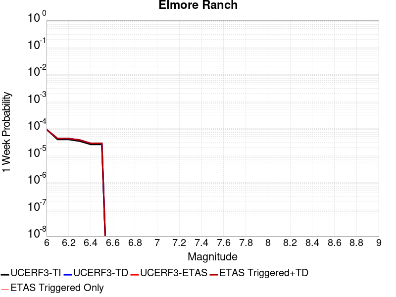 |  | 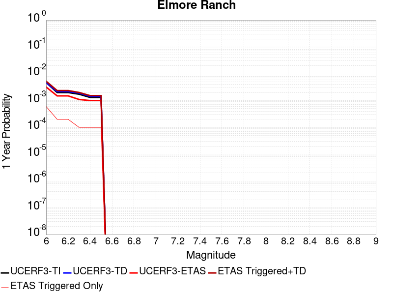 |  |

| Magnitude | 1 wk TI Prob | 1 wk TD Prob | 1 wk ETAS Prob | 1 wk ETAS/TD Gain | 1 wk ETAS Triggered+TD | 1 wk ETAS Triggered Only | 1 mo TI Prob | 1 mo TD Prob | 1 mo ETAS Prob | 1 mo ETAS/TD Gain | 1 mo ETAS Triggered+TD | 1 mo ETAS Triggered Only | 1 yr TI Prob | 1 yr TD Prob | 1 yr ETAS Prob | 1 yr ETAS/TD Gain | 1 yr ETAS Triggered+TD | 1 yr ETAS Triggered Only | 10 yr TI Prob | 10 yr TD Prob | 10 yr ETAS Prob | 10 yr ETAS/TD Gain | 10 yr ETAS Triggered+TD | 10 yr ETAS Triggered Only |
|-----|-----|-----|-----|-----|-----|-----|-----|-----|-----|-----|-----|-----|-----|-----|-----|-----|-----|-----|-----|-----|-----|-----|-----|-----|
| 6.0 | 9.102099E-5 | 8.962159E-5 | 0.0 | 0.0 | 8.962159E-5 | 0.0 | 3.9003167E-4 | 3.8403473E-4 | 2.0E-4 | 0.5207862 | 3.8403473E-4 | 0.0 | 0.0047383 | 0.0046662055 | 0.0032 | 0.685782 | 0.005263406 | 6.0E-4 | 0.046385348 | 0.04588316 | 0.034 | 0.7410126 | 0.053039037 | 0.0075 |
| 6.1 | 3.8306698E-5 | 4.1530962E-5 | 0.0 | 0.0 | 4.1530962E-5 | 0.0 | 1.6416123E-4 | 1.7798175E-4 | 2.0E-4 | 1.1237108 | 1.7798175E-4 | 0.0 | 0.0019968306 | 0.002165218 | 0.0015 | 0.6927709 | 0.002364785 | 2.0E-4 | 0.019789828 | 0.021621784 | 0.0146 | 0.6752449 | 0.024361243 | 0.0028 |
| 6.2 | 3.8306698E-5 | 4.1530962E-5 | 0.0 | 0.0 | 4.1530962E-5 | 0.0 | 1.6416123E-4 | 1.7798175E-4 | 2.0E-4 | 1.1237108 | 1.7798175E-4 | 0.0 | 0.0019968306 | 0.002165218 | 0.0015 | 0.6927709 | 0.002364785 | 2.0E-4 | 0.019789828 | 0.021621784 | 0.0146 | 0.6752449 | 0.024361243 | 0.0028 |
| 6.3 | 3.3197924E-5 | 3.6583027E-5 | 0.0 | 0.0 | 3.6583027E-5 | 0.0 | 1.4226905E-4 | 1.5677896E-4 | 1.0E-4 | 0.6378407 | 1.5677896E-4 | 0.0 | 0.0017307495 | 0.0019076503 | 0.0011 | 0.57662565 | 0.0020074595 | 1.0E-4 | 0.017173318 | 0.019081328 | 0.0132 | 0.69177574 | 0.021533625 | 0.0025 |
| 6.4 | 2.5148964E-5 | 2.744243E-5 | 0.0 | 0.0 | 2.744243E-5 | 0.0 | 1.0777682E-4 | 1.1760877E-4 | 1.0E-4 | 0.8502767 | 1.1760877E-4 | 0.0 | 0.0013113929 | 0.0014315953 | 0.001 | 0.69852144 | 0.001531452 | 1.0E-4 | 0.01303681 | 0.014382674 | 0.0096 | 0.66746974 | 0.015959661 | 0.0016 |
| 6.5 | 2.5148964E-5 | 2.744243E-5 | 0.0 | 0.0 | 2.744243E-5 | 0.0 | 1.0777682E-4 | 1.1760877E-4 | 1.0E-4 | 0.8502767 | 1.1760877E-4 | 0.0 | 0.0013113929 | 0.0014315953 | 0.001 | 0.69852144 | 0.001531452 | 1.0E-4 | 0.01303681 | 0.014382674 | 0.0096 | 0.66746974 | 0.015959661 | 0.0016 |

## San Andreas (North Coast) 2011 CFM
*[(top)](#table-of-contents)*

| 1 Week | 1 Month | 1 Year | 10 Year |
|-----|-----|-----|-----|
|  |  |  | 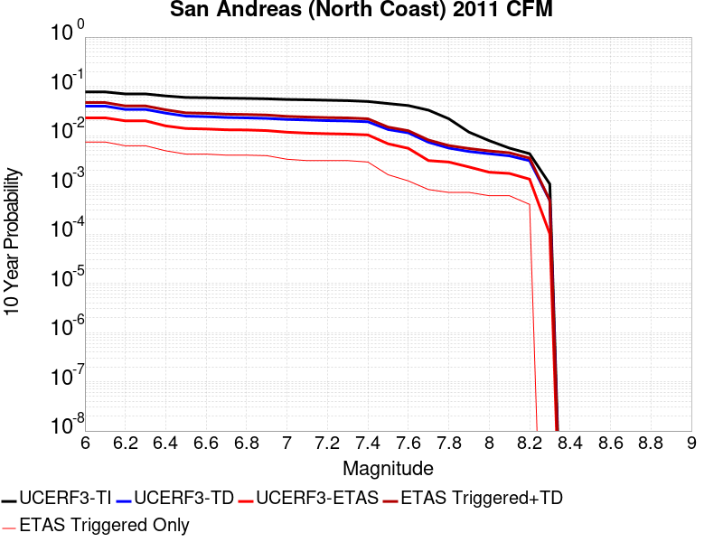 |

| Magnitude | 1 wk TI Prob | 1 wk TD Prob | 1 wk ETAS Prob | 1 wk ETAS/TD Gain | 1 wk ETAS Triggered+TD | 1 wk ETAS Triggered Only | 1 mo TI Prob | 1 mo TD Prob | 1 mo ETAS Prob | 1 mo ETAS/TD Gain | 1 mo ETAS Triggered+TD | 1 mo ETAS Triggered Only | 1 yr TI Prob | 1 yr TD Prob | 1 yr ETAS Prob | 1 yr ETAS/TD Gain | 1 yr ETAS Triggered+TD | 1 yr ETAS Triggered Only | 10 yr TI Prob | 10 yr TD Prob | 10 yr ETAS Prob | 10 yr ETAS/TD Gain | 10 yr ETAS Triggered+TD | 10 yr ETAS Triggered Only |
|-----|-----|-----|-----|-----|-----|-----|-----|-----|-----|-----|-----|-----|-----|-----|-----|-----|-----|-----|-----|-----|-----|-----|-----|-----|
| 6.0 | 1.5333705E-4 | 7.1163064E-5 | 2.0E-4 | 2.810447 | 1.7115595E-4 | 1.0E-4 | 6.5699324E-4 | 3.0494906E-4 | 3.0E-4 | 0.9837708 | 4.0491857E-4 | 1.0E-4 | 0.007969595 | 0.0037064683 | 0.0025 | 0.67449653 | 0.004204615 | 5.0E-4 | 0.0768977 | 0.039366726 | 0.0229 | 0.5817095 | 0.046475414 | 0.0074 |
| 6.1 | 1.5333705E-4 | 7.1163064E-5 | 2.0E-4 | 2.810447 | 1.7115595E-4 | 1.0E-4 | 6.5699324E-4 | 3.0494906E-4 | 3.0E-4 | 0.9837708 | 4.0491857E-4 | 1.0E-4 | 0.007969595 | 0.0037064683 | 0.0025 | 0.67449653 | 0.004204615 | 5.0E-4 | 0.0768977 | 0.039366726 | 0.0229 | 0.5817095 | 0.046475414 | 0.0074 |
| 6.2 | 1.3912938E-4 | 6.055855E-5 | 2.0E-4 | 3.302589 | 1.6055249E-4 | 1.0E-4 | 5.961325E-4 | 2.5951097E-4 | 3.0E-4 | 1.1560205 | 3.59485E-4 | 1.0E-4 | 0.007233787 | 0.0031549956 | 0.0024 | 0.7606984 | 0.003653418 | 5.0E-4 | 0.07002798 | 0.033720057 | 0.0199 | 0.5901532 | 0.03971099 | 0.0062 |
| 6.3 | 1.3912938E-4 | 6.055855E-5 | 2.0E-4 | 3.302589 | 1.6055249E-4 | 1.0E-4 | 5.961325E-4 | 2.5951097E-4 | 3.0E-4 | 1.1560205 | 3.59485E-4 | 1.0E-4 | 0.007233787 | 0.0031549956 | 0.0024 | 0.7606984 | 0.003653418 | 5.0E-4 | 0.07002798 | 0.033720057 | 0.0199 | 0.5901532 | 0.03971099 | 0.0062 |
| 6.4 | 1.2623647E-4 | 5.0501865E-5 | 2.0E-4 | 3.9602497 | 1.5049681E-4 | 1.0E-4 | 5.4090127E-4 | 2.1641873E-4 | 3.0E-4 | 1.3862016 | 3.1639708E-4 | 1.0E-4 | 0.0065656058 | 0.0026317341 | 0.0017 | 0.6459619 | 0.0029309448 | 3.0E-4 | 0.06374981 | 0.028328128 | 0.0157 | 0.5542194 | 0.03308932 | 0.0049 |
| 6.5 | 1.1736096E-4 | 4.3584765E-5 | 2.0E-4 | 4.5887594 | 1.4358042E-4 | 1.0E-4 | 5.028786E-4 | 1.8677858E-4 | 3.0E-4 | 1.60618 | 2.867599E-4 | 1.0E-4 | 0.006105373 | 0.0022716739 | 0.0017 | 0.74834687 | 0.0025709923 | 3.0E-4 | 0.05940335 | 0.024608096 | 0.0139 | 0.56485474 | 0.028704742 | 0.0042 |
| 6.6 | 1.1586959E-4 | 4.248509E-5 | 2.0E-4 | 4.7075334 | 1.4248084E-4 | 1.0E-4 | 4.964894E-4 | 1.8206636E-4 | 3.0E-4 | 1.647751 | 2.8204816E-4 | 1.0E-4 | 0.006028018 | 0.0022144206 | 0.0016 | 0.7225366 | 0.0025137563 | 3.0E-4 | 0.058671024 | 0.024012491 | 0.0136 | 0.5663719 | 0.028111639 | 0.0042 |
| 6.7 | 1.13693764E-4 | 4.0797488E-5 | 2.0E-4 | 4.9022627 | 1.407934E-4 | 1.0E-4 | 4.87168E-4 | 1.7483474E-4 | 3.0E-4 | 1.715906 | 2.7481726E-4 | 1.0E-4 | 0.005915152 | 0.002126551 | 0.0016 | 0.752392 | 0.002425913 | 3.0E-4 | 0.057601593 | 0.023104666 | 0.0131 | 0.5669851 | 0.027012248 | 0.004 |
| 6.8 | 1.1204889E-4 | 4.001528E-5 | 2.0E-4 | 4.9980907 | 1.4001128E-4 | 1.0E-4 | 4.8012115E-4 | 1.7148287E-4 | 3.0E-4 | 1.7494459 | 2.7146572E-4 | 1.0E-4 | 0.005829819 | 0.0020858208 | 0.0016 | 0.7670841 | 0.0023851949 | 3.0E-4 | 0.05679232 | 0.022665037 | 0.013 | 0.57357067 | 0.026574377 | 0.004 |
| 6.9 | 1.1005794E-4 | 3.9071394E-5 | 2.0E-4 | 5.1188345 | 1.3906749E-4 | 1.0E-4 | 4.7159163E-4 | 1.6743818E-4 | 3.0E-4 | 1.7917061 | 2.6742145E-4 | 1.0E-4 | 0.0057265228 | 0.0020366698 | 0.0015 | 0.73649645 | 0.0023360588 | 3.0E-4 | 0.055811852 | 0.022131098 | 0.0126 | 0.5693346 | 0.025944788 | 0.0039 |
| 7.0 | 1.0647948E-4 | 3.722779E-5 | 2.0E-4 | 5.372331 | 1.3722407E-4 | 1.0E-4 | 4.562608E-4 | 1.59538E-4 | 3.0E-4 | 1.8804297 | 2.5952203E-4 | 1.0E-4 | 0.0055408357 | 0.0019406603 | 0.0015 | 0.77293277 | 0.002240078 | 3.0E-4 | 0.054047033 | 0.021088708 | 0.0117 | 0.55479926 | 0.024319116 | 0.0033 |
| 7.1 | 1.04795035E-4 | 3.627722E-5 | 2.0E-4 | 5.5131016 | 1.362736E-4 | 1.0E-4 | 4.4904428E-4 | 1.5546462E-4 | 3.0E-4 | 1.9296995 | 2.5544906E-4 | 1.0E-4 | 0.0054534175 | 0.0018911541 | 0.0015 | 0.79316646 | 0.0021905866 | 3.0E-4 | 0.053215165 | 0.020557646 | 0.0112 | 0.54480946 | 0.023593917 | 0.0031 |
| 7.2 | 1.02724036E-4 | 3.5185745E-5 | 2.0E-4 | 5.6841197 | 1.3518223E-4 | 1.0E-4 | 4.401716E-4 | 1.5078743E-4 | 3.0E-4 | 1.9895558 | 2.5077234E-4 | 1.0E-4 | 0.0053459285 | 0.0018343065 | 0.0014 | 0.7632312 | 0.0021337562 | 3.0E-4 | 0.052191395 | 0.019945422 | 0.0109 | 0.5464913 | 0.02298359 | 0.0031 |
| 7.3 | 1.00650694E-4 | 3.4653527E-5 | 2.0E-4 | 5.7714186 | 1.3465006E-4 | 1.0E-4 | 4.312888E-4 | 1.4850675E-4 | 3.0E-4 | 2.0201104 | 2.4849188E-4 | 1.0E-4 | 0.005238306 | 0.0018065856 | 0.0012 | 0.6642365 | 0.0021060435 | 3.0E-4 | 0.051165357 | 0.019623129 | 0.0107 | 0.5452749 | 0.022662297 | 0.0031 |
| 7.4 | 9.672919E-5 | 3.3441178E-5 | 2.0E-4 | 5.980651 | 1.3343783E-4 | 1.0E-4 | 4.144878E-4 | 1.4331154E-4 | 3.0E-4 | 2.0933416 | 2.4329721E-4 | 1.0E-4 | 0.005034718 | 0.0017434369 | 0.0012 | 0.68829566 | 0.0020429138 | 3.0E-4 | 0.049221683 | 0.018896315 | 0.0103 | 0.5450798 | 0.021741517 | 0.0029 |
| 7.5 | 8.7600405E-5 | 2.2732249E-5 | 2.0E-4 | 8.798074 | 1.2272998E-4 | 1.0E-4 | 3.753763E-4 | 9.74203E-5 | 3.0E-4 | 3.0794404 | 1.9741055E-4 | 1.0E-4 | 0.0045606326 | 0.0011854485 | 8.0E-4 | 0.67485005 | 0.00128533 | 1.0E-4 | 0.04468165 | 0.01314579 | 0.0068 | 0.51727587 | 0.014724757 | 0.0016 |
| 7.6 | 7.9562284E-5 | 1.9255174E-5 | 2.0E-4 | 10.386818 | 1.1925325E-4 | 1.0E-4 | 3.4093665E-4 | 8.2519575E-5 | 2.0E-4 | 2.4236674 | 1.8251133E-4 | 1.0E-4 | 0.0041430052 | 0.0010042143 | 7.0E-4 | 0.69706243 | 0.0011041139 | 1.0E-4 | 0.040666126 | 0.011235768 | 0.0055 | 0.48950812 | 0.012422286 | 0.0012 |
| 7.7 | 6.3866544E-5 | 1.1968294E-5 | 2.0E-4 | 16.71082 | 1.119671E-4 | 1.0E-4 | 2.7368503E-4 | 5.129168E-5 | 2.0E-4 | 3.8992677 | 1.5128656E-4 | 1.0E-4 | 0.0033270244 | 6.2429754E-4 | 3.0E-4 | 0.4805401 | 7.2423514E-4 | 1.0E-4 | 0.032776527 | 0.0072253905 | 0.0031 | 0.42904258 | 0.00801961 | 8.0E-4 |
| 7.8 | 4.2543215E-5 | 9.100212E-6 | 2.0E-4 | 21.97751 | 1.090993E-4 | 1.0E-4 | 1.8231533E-4 | 3.9000322E-5 | 2.0E-4 | 5.1281624 | 1.3899643E-4 | 1.0E-4 | 0.0022174292 | 4.747256E-4 | 2.0E-4 | 0.42129603 | 5.746781E-4 | 1.0E-4 | 0.021954332 | 0.005503644 | 0.0029 | 0.52692366 | 0.006199791 | 7.0E-4 |
| 7.9 | 2.2636612E-5 | 7.837861E-6 | 2.0E-4 | 25.517166 | 1.0783708E-4 | 1.0E-4 | 9.7010445E-5 | 3.35904E-5 | 2.0E-4 | 5.954082 | 1.3358705E-4 | 1.0E-4 | 0.0011804621 | 4.0888647E-4 | 2.0E-4 | 0.48913333 | 5.0884555E-4 | 1.0E-4 | 0.011742111 | 0.004696227 | 0.0023 | 0.48975483 | 0.00539294 | 7.0E-4 |
| 8.0 | 1.5167874E-5 | 7.072962E-6 | 2.0E-4 | 28.276697 | 1.0707226E-4 | 1.0E-4 | 6.500356E-5 | 3.0312342E-5 | 2.0E-4 | 6.5979724 | 1.3030932E-4 | 1.0E-4 | 7.9113094E-4 | 3.6899035E-4 | 2.0E-4 | 0.5420196 | 4.6895345E-4 | 1.0E-4 | 0.007883203 | 0.004228504 | 0.0018 | 0.42568246 | 0.004825967 | 6.0E-4 |
| 8.1 | 1.0681047E-5 | 6.4098813E-6 | 2.0E-4 | 31.201826 | 1.0640924E-4 | 1.0E-4 | 4.5775112E-5 | 2.747063E-5 | 2.0E-4 | 7.280503 | 1.2746788E-4 | 1.0E-4 | 5.5716943E-4 | 3.3440368E-4 | 2.0E-4 | 0.5980795 | 4.3437025E-4 | 1.0E-4 | 0.0055577457 | 0.0038299893 | 0.0017 | 0.44386548 | 0.0044276915 | 6.0E-4 |
| 8.2 | 8.226114E-6 | 5.1313377E-6 | 2.0E-4 | 38.976192 | 1.0513083E-4 | 1.0E-4 | 3.52543E-5 | 2.1991262E-5 | 2.0E-4 | 9.0945215 | 1.2198906E-4 | 1.0E-4 | 4.2913653E-4 | 2.677108E-4 | 2.0E-4 | 0.74707484 | 3.6768403E-4 | 1.0E-4 | 0.004283088 | 0.0030539788 | 0.0013 | 0.42567423 | 0.0034527571 | 4.0E-4 |
| 8.3 | 1.983087E-6 | 7.683211E-7 | 0.0 | 0.0 | 7.683211E-7 | 0.0 | 8.498917E-6 | 3.2928008E-6 | 0.0 | 0.0 | 3.2928008E-6 | 0.0 | 1.034694E-4 | 4.008913E-5 | 0.0 | 0.0 | 4.008913E-5 | 0.0 | 0.0010342124 | 4.7332307E-4 | 1.0E-4 | 0.21127218 | 4.7332307E-4 | 0.0 |

## Rodgers Creek - Healdsburg 2011 CFM
*[(top)](#table-of-contents)*

| 1 Week | 1 Month | 1 Year | 10 Year |
|-----|-----|-----|-----|
|  |  |  | 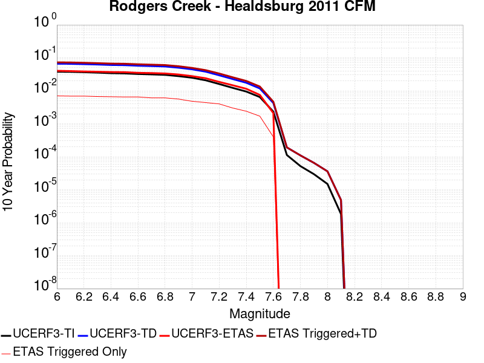 |

| Magnitude | 1 wk TI Prob | 1 wk TD Prob | 1 wk ETAS Prob | 1 wk ETAS/TD Gain | 1 wk ETAS Triggered+TD | 1 wk ETAS Triggered Only | 1 mo TI Prob | 1 mo TD Prob | 1 mo ETAS Prob | 1 mo ETAS/TD Gain | 1 mo ETAS Triggered+TD | 1 mo ETAS Triggered Only | 1 yr TI Prob | 1 yr TD Prob | 1 yr ETAS Prob | 1 yr ETAS/TD Gain | 1 yr ETAS Triggered+TD | 1 yr ETAS Triggered Only | 10 yr TI Prob | 10 yr TD Prob | 10 yr ETAS Prob | 10 yr ETAS/TD Gain | 10 yr ETAS Triggered+TD | 10 yr ETAS Triggered Only |
|-----|-----|-----|-----|-----|-----|-----|-----|-----|-----|-----|-----|-----|-----|-----|-----|-----|-----|-----|-----|-----|-----|-----|-----|-----|
| 6.0 | 7.390182E-5 | 1.3141175E-4 | 2.0E-4 | 1.5219339 | 2.313986E-4 | 1.0E-4 | 3.1668364E-4 | 5.6307035E-4 | 5.0E-4 | 0.8879885 | 8.6290145E-4 | 3.0E-4 | 0.0038488081 | 0.0068337927 | 0.0043 | 0.62922597 | 0.0077276425 | 9.0E-4 | 0.037828278 | 0.06619933 | 0.0404 | 0.61027807 | 0.072735935 | 0.007 |
| 6.1 | 7.318768E-5 | 1.3039123E-4 | 2.0E-4 | 1.5338455 | 2.303782E-4 | 1.0E-4 | 3.1362378E-4 | 5.5869855E-4 | 5.0E-4 | 0.894937 | 8.58531E-4 | 3.0E-4 | 0.0038116854 | 0.0067809136 | 0.0042 | 0.61938554 | 0.007674811 | 9.0E-4 | 0.037469655 | 0.06570359 | 0.0396 | 0.6027068 | 0.07215024 | 0.0069 |
| 6.2 | 7.1379836E-5 | 1.2731788E-4 | 2.0E-4 | 1.5708712 | 2.2730515E-4 | 1.0E-4 | 3.058777E-4 | 5.455327E-4 | 5.0E-4 | 0.91653544 | 8.45369E-4 | 3.0E-4 | 0.003717703 | 0.006621602 | 0.0041 | 0.6191855 | 0.0075156423 | 9.0E-4 | 0.0365612 | 0.0642249 | 0.0386 | 0.60101306 | 0.07068174 | 0.0069 |
| 6.3 | 6.9255926E-5 | 1.2385866E-4 | 2.0E-4 | 1.614744 | 2.2384626E-4 | 1.0E-4 | 2.9677735E-4 | 5.307145E-4 | 5.0E-4 | 0.9421261 | 8.3055533E-4 | 3.0E-4 | 0.0036072785 | 0.006442355 | 0.0041 | 0.6364132 | 0.007336557 | 9.0E-4 | 0.035492823 | 0.06255512 | 0.0379 | 0.60586566 | 0.068836 | 0.0067 |
| 6.4 | 6.6757144E-5 | 1.1962318E-4 | 2.0E-4 | 1.6719167 | 2.1961122E-4 | 1.0E-4 | 2.8607066E-4 | 5.125703E-4 | 4.0E-4 | 0.7803807 | 7.124678E-4 | 2.0E-4 | 0.0034773487 | 0.0062227594 | 0.004 | 0.64280164 | 0.0070177815 | 8.0E-4 | 0.034234364 | 0.06050399 | 0.0371 | 0.6131827 | 0.06670466 | 0.0066 |
| 6.5 | 6.5735134E-5 | 1.1811293E-4 | 2.0E-4 | 1.6932948 | 2.1810112E-4 | 1.0E-4 | 2.8169158E-4 | 5.061005E-4 | 4.0E-4 | 0.79035693 | 7.059992E-4 | 2.0E-4 | 0.003424202 | 0.0061444486 | 0.0039 | 0.6347193 | 0.0069395327 | 8.0E-4 | 0.03371918 | 0.059767928 | 0.0367 | 0.6140417 | 0.065879434 | 0.0065 |
| 6.6 | 6.289601E-5 | 1.1346461E-4 | 2.0E-4 | 1.7626641 | 2.1345327E-4 | 1.0E-4 | 2.6952647E-4 | 4.8618665E-4 | 4.0E-4 | 0.8227293 | 6.860894E-4 | 2.0E-4 | 0.0032765474 | 0.005903337 | 0.0038 | 0.6437037 | 0.0066986145 | 8.0E-4 | 0.032286562 | 0.05750476 | 0.0351 | 0.6103843 | 0.063630976 | 0.0065 |
| 6.7 | 6.115274E-5 | 1.106331E-4 | 2.0E-4 | 1.8077773 | 2.1062203E-4 | 1.0E-4 | 2.6205686E-4 | 4.7405605E-4 | 4.0E-4 | 0.84378207 | 6.7396124E-4 | 2.0E-4 | 0.0031858748 | 0.005756438 | 0.0038 | 0.66013044 | 0.006551833 | 8.0E-4 | 0.031405866 | 0.056122005 | 0.0345 | 0.61473215 | 0.06187966 | 0.0061 |
| 6.8 | 5.9232367E-5 | 1.0730475E-4 | 2.0E-4 | 1.8638504 | 2.0729403E-4 | 1.0E-4 | 2.538283E-4 | 4.5979684E-4 | 4.0E-4 | 0.86994946 | 6.597049E-4 | 2.0E-4 | 0.0030859804 | 0.0055837343 | 0.0038 | 0.68054813 | 0.006379267 | 8.0E-4 | 0.030434765 | 0.05448807 | 0.0335 | 0.6148135 | 0.06025569 | 0.0061 |
| 6.9 | 5.4030377E-5 | 9.824218E-5 | 2.0E-4 | 2.0357854 | 1.9823236E-4 | 1.0E-4 | 2.315382E-4 | 4.2097032E-4 | 4.0E-4 | 0.9501858 | 6.208861E-4 | 2.0E-4 | 0.0028153337 | 0.005113335 | 0.0037 | 0.72359824 | 0.005909244 | 8.0E-4 | 0.027799325 | 0.050022442 | 0.0312 | 0.62372005 | 0.055342317 | 0.0056 |
| 7.0 | 4.8260714E-5 | 8.740989E-5 | 2.0E-4 | 2.2880707 | 1.8740115E-4 | 1.0E-4 | 2.0681522E-4 | 3.745603E-4 | 4.0E-4 | 1.0679188 | 5.744854E-4 | 2.0E-4 | 0.0025150678 | 0.0045507904 | 0.0033 | 0.72514874 | 0.00534715 | 8.0E-4 | 0.024867928 | 0.044668127 | 0.0278 | 0.62236774 | 0.04925372 | 0.0048 |
| 7.1 | 4.0294493E-5 | 7.388282E-5 | 2.0E-4 | 2.7069893 | 1.7387542E-4 | 1.0E-4 | 1.7267925E-4 | 3.166024E-4 | 4.0E-4 | 1.2634143 | 5.165391E-4 | 2.0E-4 | 0.0021003427 | 0.0038478596 | 0.0032 | 0.8316312 | 0.0046447814 | 8.0E-4 | 0.02080602 | 0.03791783 | 0.024 | 0.6329476 | 0.042150993 | 0.0044 |
| 7.2 | 3.096388E-5 | 5.6954992E-5 | 1.0E-4 | 1.7557722 | 1.569493E-4 | 1.0E-4 | 1.326956E-4 | 2.4407012E-4 | 3.0E-4 | 1.229155 | 4.440213E-4 | 2.0E-4 | 0.0016143717 | 0.0029675264 | 0.0025 | 0.84245247 | 0.0037651525 | 8.0E-4 | 0.01602694 | 0.029424217 | 0.0186 | 0.63213235 | 0.03330652 | 0.004 |
| 7.3 | 2.3615226E-5 | 4.359306E-5 | 1.0E-4 | 2.2939432 | 1.435887E-4 | 1.0E-4 | 1.0120418E-4 | 1.868141E-4 | 2.0E-4 | 1.070583 | 3.8677672E-4 | 2.0E-4 | 0.0012314644 | 0.0022721027 | 0.0019 | 0.8362298 | 0.0029705123 | 7.0E-4 | 0.0122466255 | 0.022619566 | 0.0147 | 0.6498799 | 0.025551707 | 0.003 |
| 7.4 | 1.8251132E-5 | 3.3509976E-5 | 1.0E-4 | 2.984186 | 1.3350662E-4 | 1.0E-4 | 7.821679E-5 | 1.4360633E-4 | 2.0E-4 | 1.3926961 | 3.4357762E-4 | 2.0E-4 | 9.518733E-4 | 0.0017470148 | 0.0019 | 1.0875695 | 0.0024457918 | 7.0E-4 | 0.009478063 | 0.017450398 | 0.0115 | 0.65901077 | 0.019808518 | 0.0024 |
| 7.5 | 1.2411432E-5 | 2.2446831E-5 | 1.0E-4 | 4.454972 | 1.2244459E-4 | 1.0E-4 | 5.3190768E-5 | 9.619719E-5 | 2.0E-4 | 2.079063 | 2.9617795E-4 | 2.0E-4 | 6.4740516E-4 | 0.0011705772 | 0.0012 | 1.0251353 | 0.001769875 | 6.0E-4 | 0.006455223 | 0.011736601 | 0.0075 | 0.63902664 | 0.013416648 | 0.0017 |
| 7.6 | 4.4771446E-6 | 8.083282E-6 | 0.0 | 0.0 | 8.083282E-6 | 0.0 | 1.918762E-5 | 3.4642188E-5 | 0.0 | 0.0 | 3.4642188E-5 | 0.0 | 2.3358424E-4 | 4.2168822E-4 | 4.0E-4 | 0.9485681 | 4.2168822E-4 | 0.0 | 0.0023333887 | 0.004245179 | 0.0021 | 0.4946788 | 0.0046434808 | 4.0E-4 |
| 7.7 | 2.157941E-7 | 3.5313468E-7 | 0.0 | 0.0 | 3.5313468E-7 | 0.0 | 9.248315E-7 | 1.5134334E-6 | 0.0 | 0.0 | 1.5134334E-6 | 0.0 | 1.1259765E-5 | 1.8425895E-5 | 0.0 | 0.0 | 1.8425895E-5 | 0.0 | 1.1259195E-4 | 1.9049557E-4 | 0.0 | 0.0 | 1.9049557E-4 | 0.0 |
| 7.8 | 9.9623286E-8 | 1.9901896E-7 | 0.0 | 0.0 | 1.9901896E-7 | 0.0 | 4.269569E-7 | 8.5293806E-7 | 0.0 | 0.0 | 8.5293806E-7 | 0.0 | 5.1981874E-6 | 1.0384471E-5 | 0.0 | 0.0 | 1.0384471E-5 | 0.0 | 5.198066E-5 | 1.0902461E-4 | 0.0 | 0.0 | 1.0902461E-4 | 0.0 |
| 7.9 | 5.6745257E-8 | 1.1788461E-7 | 0.0 | 0.0 | 1.1788461E-7 | 0.0 | 2.4319394E-7 | 5.0521965E-7 | 0.0 | 0.0 | 5.0521965E-7 | 0.0 | 2.960882E-6 | 6.151032E-6 | 0.0 | 0.0 | 6.151032E-6 | 0.0 | 2.9608427E-5 | 6.478141E-5 | 0.0 | 0.0 | 6.478141E-5 | 0.0 |
| 8.0 | 2.8614323E-8 | 6.591961E-8 | 0.0 | 0.0 | 6.591961E-8 | 0.0 | 1.2263281E-7 | 2.8251256E-7 | 0.0 | 0.0 | 2.8251256E-7 | 0.0 | 1.4930534E-6 | 3.439585E-6 | 0.0 | 0.0 | 3.439585E-6 | 0.0 | 1.4930434E-5 | 3.5893187E-5 | 0.0 | 0.0 | 3.5893187E-5 | 0.0 |
| 8.1 | 3.5045191E-9 | 8.987488E-9 | 0.0 | 0.0 | 8.987488E-9 | 0.0 | 1.5019367E-8 | 3.8517808E-8 | 0.0 | 0.0 | 3.8517808E-8 | 0.0 | 1.8286079E-7 | 4.6895423E-7 | 0.0 | 0.0 | 4.6895423E-7 | 0.0 | 1.8286064E-6 | 4.8440297E-6 | 0.0 | 0.0 | 4.8440297E-6 | 0.0 |

## Hunter Mountain-Saline Valley
*[(top)](#table-of-contents)*

| 1 Week | 1 Month | 1 Year | 10 Year |
|-----|-----|-----|-----|
|  |  |  |  |

| Magnitude | 1 wk TI Prob | 1 wk TD Prob | 1 wk ETAS Prob | 1 wk ETAS/TD Gain | 1 wk ETAS Triggered+TD | 1 wk ETAS Triggered Only | 1 mo TI Prob | 1 mo TD Prob | 1 mo ETAS Prob | 1 mo ETAS/TD Gain | 1 mo ETAS Triggered+TD | 1 mo ETAS Triggered Only | 1 yr TI Prob | 1 yr TD Prob | 1 yr ETAS Prob | 1 yr ETAS/TD Gain | 1 yr ETAS Triggered+TD | 1 yr ETAS Triggered Only | 10 yr TI Prob | 10 yr TD Prob | 10 yr ETAS Prob | 10 yr ETAS/TD Gain | 10 yr ETAS Triggered+TD | 10 yr ETAS Triggered Only |
|-----|-----|-----|-----|-----|-----|-----|-----|-----|-----|-----|-----|-----|-----|-----|-----|-----|-----|-----|-----|-----|-----|-----|-----|-----|
| 6.0 | 4.5103672E-5 | 5.4594766E-5 | 2.0E-4 | 3.6633549 | 1.545893E-4 | 1.0E-4 | 1.9328714E-4 | 2.3395738E-4 | 4.0E-4 | 1.7097131 | 5.338872E-4 | 3.0E-4 | 0.002350731 | 0.0028448845 | 0.0033 | 1.1599767 | 0.0049389102 | 0.0021 | 0.023260195 | 0.028105218 | 0.0183 | 0.65112466 | 0.034519725 | 0.0066 |
| 6.1 | 4.5103672E-5 | 5.4594766E-5 | 2.0E-4 | 3.6633549 | 1.545893E-4 | 1.0E-4 | 1.9328714E-4 | 2.3395738E-4 | 4.0E-4 | 1.7097131 | 5.338872E-4 | 3.0E-4 | 0.002350731 | 0.0028448845 | 0.0033 | 1.1599767 | 0.0049389102 | 0.0021 | 0.023260195 | 0.028105218 | 0.0183 | 0.65112466 | 0.034519725 | 0.0066 |
| 6.2 | 3.9363465E-5 | 4.7084E-5 | 2.0E-4 | 4.2477274 | 1.4707929E-4 | 1.0E-4 | 1.6868966E-4 | 2.0177383E-4 | 4.0E-4 | 1.9824176 | 5.017133E-4 | 3.0E-4 | 0.002051862 | 0.0024539623 | 0.0032 | 1.3040135 | 0.004548809 | 0.0021 | 0.020330196 | 0.0242846 | 0.0167 | 0.68767864 | 0.030626748 | 0.0065 |
| 6.3 | 3.9363465E-5 | 4.7084E-5 | 2.0E-4 | 4.2477274 | 1.4707929E-4 | 1.0E-4 | 1.6868966E-4 | 2.0177383E-4 | 4.0E-4 | 1.9824176 | 5.017133E-4 | 3.0E-4 | 0.002051862 | 0.0024539623 | 0.0032 | 1.3040135 | 0.004548809 | 0.0021 | 0.020330196 | 0.0242846 | 0.0167 | 0.68767864 | 0.030626748 | 0.0065 |
| 6.4 | 3.2311684E-5 | 3.7967282E-5 | 2.0E-4 | 5.2676935 | 1.3796349E-4 | 1.0E-4 | 1.384713E-4 | 1.6270719E-4 | 4.0E-4 | 2.458404 | 4.6265838E-4 | 3.0E-4 | 0.0016845843 | 0.0019792293 | 0.0032 | 1.616791 | 0.0040750727 | 0.0021 | 0.016718714 | 0.019624965 | 0.0148 | 0.75414145 | 0.025899366 | 0.0064 |
| 6.5 | 3.2311684E-5 | 3.7967282E-5 | 2.0E-4 | 5.2676935 | 1.3796349E-4 | 1.0E-4 | 1.384713E-4 | 1.6270719E-4 | 4.0E-4 | 2.458404 | 4.6265838E-4 | 3.0E-4 | 0.0016845843 | 0.0019792293 | 0.0032 | 1.616791 | 0.0040750727 | 0.0021 | 0.016718714 | 0.019624965 | 0.0148 | 0.75414145 | 0.025899366 | 0.0064 |
| 6.6 | 2.9305844E-5 | 3.4196255E-5 | 2.0E-4 | 5.8485937 | 1.3419283E-4 | 1.0E-4 | 1.2559042E-4 | 1.465475E-4 | 4.0E-4 | 2.7294903 | 4.4650355E-4 | 3.0E-4 | 0.0015279909 | 0.0017828173 | 0.0028 | 1.5705479 | 0.0037792516 | 0.002 | 0.015175272 | 0.017693229 | 0.0137 | 0.77430755 | 0.023881761 | 0.0063 |
| 6.7 | 2.7826512E-5 | 3.2357773E-5 | 1.0E-4 | 3.0904474 | 1.3235454E-4 | 1.0E-4 | 1.19251024E-4 | 1.3866914E-4 | 3.0E-4 | 2.163423 | 4.3862752E-4 | 3.0E-4 | 0.0014509142 | 0.0016870496 | 0.0027 | 1.6004272 | 0.0036836755 | 0.002 | 0.014414776 | 0.016750282 | 0.0132 | 0.7880465 | 0.022944754 | 0.0063 |
| 6.8 | 2.3389874E-5 | 2.6877658E-5 | 1.0E-4 | 3.720562 | 1.2687498E-4 | 1.0E-4 | 1.0023846E-4 | 1.1518515E-4 | 3.0E-4 | 2.6045024 | 4.151506E-4 | 3.0E-4 | 0.00121972 | 0.0014015244 | 0.0024 | 1.7124212 | 0.0033987213 | 0.002 | 0.01213047 | 0.013933235 | 0.0113 | 0.81101054 | 0.019849636 | 0.006 |
| 6.9 | 2.069209E-5 | 2.3579525E-5 | 1.0E-4 | 4.2409678 | 1.2357716E-4 | 1.0E-4 | 8.867737E-5 | 1.01051395E-4 | 3.0E-4 | 2.9687862 | 4.0102107E-4 | 3.0E-4 | 0.0010791123 | 0.0012296425 | 0.0023 | 1.8704623 | 0.0032271831 | 0.002 | 0.010738871 | 0.012233584 | 0.0104 | 0.8501188 | 0.018160183 | 0.006 |
| 7.0 | 1.7462342E-5 | 1.964133E-5 | 1.0E-4 | 5.0913053 | 1.19639364E-4 | 1.0E-4 | 7.483646E-5 | 8.4174535E-5 | 3.0E-4 | 3.5640233 | 3.841493E-4 | 3.0E-4 | 9.1075303E-4 | 0.0010243658 | 0.0023 | 2.2452917 | 0.003022317 | 0.002 | 0.009070295 | 0.010200239 | 0.0101 | 0.99017286 | 0.016139038 | 0.006 |
| 7.1 | 1.4807709E-5 | 1.644825E-5 | 1.0E-4 | 6.0796742 | 1.1644661E-4 | 1.0E-4 | 6.3460066E-5 | 7.049069E-5 | 3.0E-4 | 4.2558813 | 3.7046956E-4 | 3.0E-4 | 7.723524E-4 | 8.5790275E-4 | 0.0023 | 2.6809566 | 0.0028561868 | 0.002 | 0.007696735 | 0.008549062 | 0.0092 | 1.0761415 | 0.014398622 | 0.0059 |
| 7.2 | 1.4180048E-5 | 1.5704565E-5 | 1.0E-4 | 6.367575 | 1.15703E-4 | 1.0E-4 | 6.077022E-5 | 6.7303634E-5 | 3.0E-4 | 4.4574113 | 3.6728344E-4 | 3.0E-4 | 7.396263E-4 | 8.191299E-4 | 0.0023 | 2.8078573 | 0.0028174918 | 0.002 | 0.0073716943 | 0.008164224 | 0.0088 | 1.0778733 | 0.0139168715 | 0.0058 |
| 7.3 | 1.3730402E-5 | 1.5178125E-5 | 1.0E-4 | 6.588429 | 1.15176605E-4 | 1.0E-4 | 5.8843252E-5 | 6.504758E-5 | 3.0E-4 | 4.612009 | 3.6502807E-4 | 3.0E-4 | 7.161811E-4 | 7.9168257E-4 | 0.0023 | 2.9052048 | 0.0027900992 | 0.002 | 0.007138774 | 0.007891722 | 0.0084 | 1.0644065 | 0.013546739 | 0.0057 |
| 7.4 | 1.2810095E-5 | 1.4114831E-5 | 1.0E-4 | 7.0847464 | 1.1411342E-4 | 1.0E-4 | 5.489925E-5 | 6.049082E-5 | 3.0E-4 | 4.95943 | 3.6047268E-4 | 3.0E-4 | 6.681934E-4 | 7.362427E-4 | 0.0023 | 3.1239698 | 0.0027347703 | 0.002 | 0.006661878 | 0.007341097 | 0.0081 | 1.1033773 | 0.012899987 | 0.0056 |
| 7.5 | 1.1595659E-5 | 1.2805939E-5 | 1.0E-4 | 7.8088765 | 1.1280466E-4 | 1.0E-4 | 4.9694736E-5 | 5.488153E-5 | 3.0E-4 | 5.46632 | 3.5486507E-4 | 3.0E-4 | 6.0486543E-4 | 6.6799344E-4 | 0.0023 | 3.4431474 | 0.0026666576 | 0.002 | 0.006032217 | 0.0066629043 | 0.0081 | 1.2156861 | 0.012225592 | 0.0056 |
| 7.6 | 2.997694E-6 | 3.3272543E-6 | 0.0 | 0.0 | 3.3272543E-6 | 0.0 | 1.28471975E-5 | 1.4259624E-5 | 2.0E-4 | 14.025616 | 2.1425677E-4 | 2.0E-4 | 1.564034E-4 | 1.7360438E-4 | 0.0012 | 6.912268 | 0.0012734134 | 0.0011 | 0.0015629337 | 0.001736228 | 0.0025 | 1.439903 | 0.0039324085 | 0.0022 |

## Mission Ridge-Arroyo Parida-Santa Ana
*[(top)](#table-of-contents)*

| 1 Week | 1 Month | 1 Year | 10 Year |
|-----|-----|-----|-----|
|  | 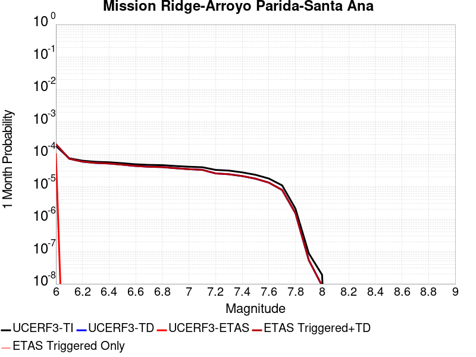 | 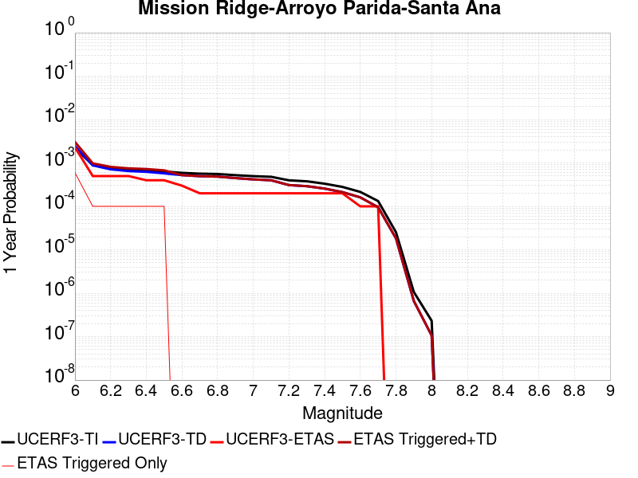 |  |

| Magnitude | 1 wk TI Prob | 1 wk TD Prob | 1 wk ETAS Prob | 1 wk ETAS/TD Gain | 1 wk ETAS Triggered+TD | 1 wk ETAS Triggered Only | 1 mo TI Prob | 1 mo TD Prob | 1 mo ETAS Prob | 1 mo ETAS/TD Gain | 1 mo ETAS Triggered+TD | 1 mo ETAS Triggered Only | 1 yr TI Prob | 1 yr TD Prob | 1 yr ETAS Prob | 1 yr ETAS/TD Gain | 1 yr ETAS Triggered+TD | 1 yr ETAS Triggered Only | 10 yr TI Prob | 10 yr TD Prob | 10 yr ETAS Prob | 10 yr ETAS/TD Gain | 10 yr ETAS Triggered+TD | 10 yr ETAS Triggered Only |
|-----|-----|-----|-----|-----|-----|-----|-----|-----|-----|-----|-----|-----|-----|-----|-----|-----|-----|-----|-----|-----|-----|-----|-----|-----|
| 6.0 | 4.169034E-5 | 4.7156387E-5 | 1.0E-4 | 2.1206036 | 4.7156387E-5 | 0.0 | 1.7866064E-4 | 2.0208802E-4 | 1.0E-4 | 0.4948339 | 2.0208802E-4 | 0.0 | 0.0021730233 | 0.0024584758 | 0.0023 | 0.93553907 | 0.0030570007 | 6.0E-4 | 0.021518968 | 0.024394637 | 0.0224 | 0.9182346 | 0.029955588 | 0.0057 |
| 6.1 | 1.73813E-5 | 1.6858843E-5 | 0.0 | 0.0 | 1.6858843E-5 | 0.0 | 7.4489166E-5 | 7.2250245E-5 | 0.0 | 0.0 | 7.2250245E-5 | 0.0 | 9.065282E-4 | 8.7930245E-4 | 5.0E-4 | 0.56863254 | 9.792146E-4 | 1.0E-4 | 0.009028391 | 0.008759415 | 0.0073 | 0.83338904 | 0.010642772 | 0.0019 |
| 6.2 | 1.4622182E-5 | 1.3676925E-5 | 0.0 | 0.0 | 1.3676925E-5 | 0.0 | 6.2664985E-5 | 5.86141E-5 | 0.0 | 0.0 | 5.86141E-5 | 0.0 | 7.6267915E-4 | 7.133969E-4 | 5.0E-4 | 0.7008722 | 8.133255E-4 | 1.0E-4 | 0.007600669 | 0.0071115494 | 0.0056 | 0.78745145 | 0.008501593 | 0.0014 |
| 6.3 | 1.3552434E-5 | 1.2485565E-5 | 0.0 | 0.0 | 1.2485565E-5 | 0.0 | 5.8080568E-5 | 5.3508487E-5 | 0.0 | 0.0 | 5.3508487E-5 | 0.0 | 7.069015E-4 | 6.512742E-4 | 5.0E-4 | 0.76772577 | 7.512091E-4 | 1.0E-4 | 0.00704657 | 0.006494058 | 0.0053 | 0.8161307 | 0.0077856155 | 0.0013 |
| 6.4 | 1.30977305E-5 | 1.19824135E-5 | 0.0 | 0.0 | 1.19824135E-5 | 0.0 | 5.613192E-5 | 5.1352206E-5 | 0.0 | 0.0 | 5.1352206E-5 | 0.0 | 6.831918E-4 | 6.250368E-4 | 4.0E-4 | 0.6399623 | 7.2497426E-4 | 1.0E-4 | 0.006810953 | 0.006233172 | 0.005 | 0.8021598 | 0.0074256924 | 0.0012 |
| 6.5 | 1.225205E-5 | 1.1051875E-5 | 0.0 | 0.0 | 1.1051875E-5 | 0.0 | 5.2507727E-5 | 4.7364334E-5 | 0.0 | 0.0 | 4.7364334E-5 | 0.0 | 6.3909404E-4 | 5.765109E-4 | 4.0E-4 | 0.693829 | 6.7645323E-4 | 1.0E-4 | 0.006372592 | 0.0057505015 | 0.0043 | 0.7477609 | 0.006844176 | 0.0011 |
| 6.6 | 1.1352241E-5 | 1.0066421E-5 | 0.0 | 0.0 | 1.0066421E-5 | 0.0 | 4.8651553E-5 | 4.3141103E-5 | 0.0 | 0.0 | 4.3141103E-5 | 0.0 | 5.921717E-4 | 5.2511843E-4 | 3.0E-4 | 0.5712997 | 5.2511843E-4 | 0.0 | 0.0059059616 | 0.005239061 | 0.0038 | 0.7253208 | 0.0061343457 | 9.0E-4 |
| 6.7 | 1.0864116E-5 | 9.519782E-6 | 0.0 | 0.0 | 9.519782E-6 | 0.0 | 4.6559664E-5 | 4.0798437E-5 | 0.0 | 0.0 | 4.0798437E-5 | 0.0 | 5.667165E-4 | 4.966098E-4 | 2.0E-4 | 0.4027307 | 4.966098E-4 | 0.0 | 0.005652734 | 0.0049552727 | 0.0034 | 0.68613786 | 0.005850813 | 9.0E-4 |
| 6.8 | 1.0666365E-5 | 9.302491E-6 | 0.0 | 0.0 | 9.302491E-6 | 0.0 | 4.571219E-5 | 3.986722E-5 | 0.0 | 0.0 | 3.986722E-5 | 0.0 | 5.564038E-4 | 4.852773E-4 | 2.0E-4 | 0.4121355 | 4.852773E-4 | 0.0 | 0.005550127 | 0.0048424467 | 0.0031 | 0.64017224 | 0.0057380884 | 9.0E-4 |
| 6.9 | 1.0038665E-5 | 8.594578E-6 | 0.0 | 0.0 | 8.594578E-6 | 0.0 | 4.302214E-5 | 3.6833393E-5 | 0.0 | 0.0 | 3.6833393E-5 | 0.0 | 5.236687E-4 | 4.4835612E-4 | 2.0E-4 | 0.44607398 | 4.4835612E-4 | 0.0 | 0.005224364 | 0.0044747647 | 0.003 | 0.6704263 | 0.0052711847 | 8.0E-4 |
| 7.0 | 9.5379955E-6 | 8.0274485E-6 | 0.0 | 0.0 | 8.0274485E-6 | 0.0 | 4.0876483E-5 | 3.4402907E-5 | 0.0 | 0.0 | 3.4402907E-5 | 0.0 | 4.975576E-4 | 4.1877662E-4 | 2.0E-4 | 0.4775816 | 4.1877662E-4 | 0.0 | 0.00496445 | 0.0041801124 | 0.0029 | 0.6937612 | 0.0049767685 | 8.0E-4 |
| 7.1 | 9.207389E-6 | 7.654644E-6 | 0.0 | 0.0 | 7.654644E-6 | 0.0 | 3.945964E-5 | 3.2805212E-5 | 0.0 | 0.0 | 3.2805212E-5 | 0.0 | 4.803152E-4 | 3.9933197E-4 | 2.0E-4 | 0.50083643 | 3.9933197E-4 | 0.0 | 0.004792784 | 0.0039863787 | 0.0029 | 0.7274773 | 0.0047831894 | 8.0E-4 |
| 7.2 | 7.638091E-6 | 5.9328377E-6 | 0.0 | 0.0 | 5.9328377E-6 | 0.0 | 3.2734264E-5 | 2.5426201E-5 | 0.0 | 0.0 | 2.5426201E-5 | 0.0 | 3.984668E-4 | 3.0952034E-4 | 2.0E-4 | 0.6461611 | 3.0952034E-4 | 0.0 | 0.0039775306 | 0.0030909877 | 0.0022 | 0.71174663 | 0.003589442 | 5.0E-4 |
| 7.3 | 7.2500147E-6 | 5.597754E-6 | 0.0 | 0.0 | 5.597754E-6 | 0.0 | 3.1071122E-5 | 2.3990155E-5 | 0.0 | 0.0 | 2.3990155E-5 | 0.0 | 3.7822526E-4 | 2.9204128E-4 | 2.0E-4 | 0.6848347 | 2.9204128E-4 | 0.0 | 0.0037758215 | 0.0029166688 | 0.0018 | 0.6171424 | 0.0032157938 | 3.0E-4 |
| 7.4 | 6.3899715E-6 | 4.9198884E-6 | 0.0 | 0.0 | 4.9198884E-6 | 0.0 | 2.7385306E-5 | 2.1085067E-5 | 0.0 | 0.0 | 2.1085067E-5 | 0.0 | 3.3336508E-4 | 2.5668065E-4 | 2.0E-4 | 0.7791784 | 2.5668065E-4 | 0.0 | 0.0033286542 | 0.0025639245 | 0.0017 | 0.663046 | 0.0028631554 | 3.0E-4 |
| 7.5 | 5.379025E-6 | 4.0849795E-6 | 0.0 | 0.0 | 4.0849795E-6 | 0.0 | 2.305276E-5 | 1.7506938E-5 | 0.0 | 0.0 | 1.7506938E-5 | 0.0 | 2.806312E-4 | 2.1312622E-4 | 2.0E-4 | 0.93841106 | 2.1312622E-4 | 0.0 | 0.0028027708 | 0.0021292295 | 0.0011 | 0.5166188 | 0.0024285908 | 3.0E-4 |
| 7.6 | 4.1270696E-6 | 3.0890897E-6 | 0.0 | 0.0 | 3.0890897E-6 | 0.0 | 1.768732E-5 | 1.3238889E-5 | 0.0 | 0.0 | 1.3238889E-5 | 0.0 | 2.1532185E-4 | 1.6117163E-4 | 1.0E-4 | 0.6204566 | 1.6117163E-4 | 0.0 | 0.0021511333 | 0.0016105555 | 7.0E-4 | 0.43463266 | 0.0017103944 | 1.0E-4 |
| 7.7 | 2.5406805E-6 | 1.8286506E-6 | 0.0 | 0.0 | 1.8286506E-6 | 0.0 | 1.0888585E-5 | 7.837051E-6 | 0.0 | 0.0 | 7.837051E-6 | 0.0 | 1.3256045E-4 | 9.541198E-5 | 1.0E-4 | 1.0480864 | 9.541198E-5 | 0.0 | 0.0013248142 | 9.5371634E-4 | 3.0E-4 | 0.31455895 | 0.001053621 | 1.0E-4 |
| 7.8 | 4.8608285E-7 | 3.5104594E-7 | 0.0 | 0.0 | 3.5104594E-7 | 0.0 | 2.0832106E-6 | 1.5044817E-6 | 0.0 | 0.0 | 1.5044817E-6 | 0.0 | 2.5362791E-5 | 1.8316912E-5 | 0.0 | 0.0 | 1.8316912E-5 | 0.0 | 2.5359896E-4 | 1.8315414E-4 | 0.0 | 0.0 | 1.8315414E-4 | 0.0 |
| 7.9 | 2.0472514E-8 | 1.2691718E-8 | 0.0 | 0.0 | 1.2691718E-8 | 0.0 | 8.7739345E-8 | 5.4393077E-8 | 0.0 | 0.0 | 5.4393077E-8 | 0.0 | 1.068226E-6 | 6.622355E-7 | 0.0 | 0.0 | 6.622355E-7 | 0.0 | 1.0682209E-5 | 6.6223365E-6 | 0.0 | 0.0 | 6.6223365E-6 | 0.0 |
| 8.0 | 4.443582E-9 | 2.0333268E-9 | 0.0 | 0.0 | 2.0333268E-9 | 0.0 | 1.9043922E-8 | 8.714258E-9 | 0.0 | 0.0 | 8.714258E-9 | 0.0 | 2.3185973E-7 | 1.0609608E-7 | 0.0 | 0.0 | 1.0609608E-7 | 0.0 | 2.3185949E-6 | 1.0609605E-6 | 0.0 | 0.0 | 1.0609605E-6 | 0.0 |

## Ash Hill
*[(top)](#table-of-contents)*

| 1 Week | 1 Month | 1 Year | 10 Year |
|-----|-----|-----|-----|
|  | 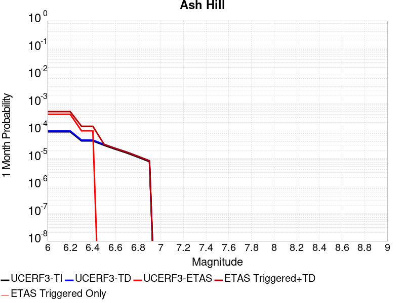 |  |  |

| Magnitude | 1 wk TI Prob | 1 wk TD Prob | 1 wk ETAS Prob | 1 wk ETAS/TD Gain | 1 wk ETAS Triggered+TD | 1 wk ETAS Triggered Only | 1 mo TI Prob | 1 mo TD Prob | 1 mo ETAS Prob | 1 mo ETAS/TD Gain | 1 mo ETAS Triggered+TD | 1 mo ETAS Triggered Only | 1 yr TI Prob | 1 yr TD Prob | 1 yr ETAS Prob | 1 yr ETAS/TD Gain | 1 yr ETAS Triggered+TD | 1 yr ETAS Triggered Only | 10 yr TI Prob | 10 yr TD Prob | 10 yr ETAS Prob | 10 yr ETAS/TD Gain | 10 yr ETAS Triggered+TD | 10 yr ETAS Triggered Only |
|-----|-----|-----|-----|-----|-----|-----|-----|-----|-----|-----|-----|-----|-----|-----|-----|-----|-----|-----|-----|-----|-----|-----|-----|-----|
| 6.0 | 2.1545662E-5 | 2.319797E-5 | 0.0 | 0.0 | 2.319797E-5 | 0.0 | 9.2335285E-5 | 9.941653E-5 | 4.0E-4 | 4.0234756 | 4.9937674E-4 | 4.0E-4 | 0.0011236023 | 0.0012098042 | 0.0023 | 1.9011341 | 0.0032073846 | 0.002 | 0.011179381 | 0.012040167 | 0.0115 | 0.95513624 | 0.017967926 | 0.006 |
| 6.1 | 2.1545662E-5 | 2.319797E-5 | 0.0 | 0.0 | 2.319797E-5 | 0.0 | 9.2335285E-5 | 9.941653E-5 | 4.0E-4 | 4.0234756 | 4.9937674E-4 | 4.0E-4 | 0.0011236023 | 0.0012098042 | 0.0023 | 1.9011341 | 0.0032073846 | 0.002 | 0.011179381 | 0.012040167 | 0.0115 | 0.95513624 | 0.017967926 | 0.006 |
| 6.2 | 2.1545662E-5 | 2.319797E-5 | 0.0 | 0.0 | 2.319797E-5 | 0.0 | 9.2335285E-5 | 9.941653E-5 | 4.0E-4 | 4.0234756 | 4.9937674E-4 | 4.0E-4 | 0.0011236023 | 0.0012098042 | 0.0023 | 1.9011341 | 0.0032073846 | 0.002 | 0.011179381 | 0.012040167 | 0.0115 | 0.95513624 | 0.017967926 | 0.006 |
| 6.3 | 1.0025529E-5 | 1.0748468E-5 | 0.0 | 0.0 | 1.0748468E-5 | 0.0 | 4.2965847E-5 | 4.6064124E-5 | 1.0E-4 | 2.1708868 | 1.4605952E-4 | 1.0E-4 | 5.229836E-4 | 5.606996E-4 | 6.0E-4 | 1.0700916 | 0.0010604193 | 5.0E-4 | 0.005217545 | 0.0055941627 | 0.005 | 0.8937888 | 0.008080177 | 0.0025 |
| 6.4 | 1.0025529E-5 | 1.0748468E-5 | 0.0 | 0.0 | 1.0748468E-5 | 0.0 | 4.2965847E-5 | 4.6064124E-5 | 1.0E-4 | 2.1708868 | 1.4605952E-4 | 1.0E-4 | 5.229836E-4 | 5.606996E-4 | 6.0E-4 | 1.0700916 | 0.0010604193 | 5.0E-4 | 0.005217545 | 0.0055941627 | 0.005 | 0.8937888 | 0.008080177 | 0.0025 |
| 6.5 | 6.9617327E-6 | 7.4576856E-6 | 0.0 | 0.0 | 7.4576856E-6 | 0.0 | 2.9835655E-5 | 3.1961168E-5 | 0.0 | 0.0 | 3.1961168E-5 | 0.0 | 3.6318856E-4 | 3.8906638E-4 | 5.0E-4 | 1.2851278 | 7.889108E-4 | 4.0E-4 | 0.0036259557 | 0.003884707 | 0.0035 | 0.90096885 | 0.005777326 | 0.0019 |
| 6.6 | 4.9919777E-6 | 5.347442E-6 | 0.0 | 0.0 | 5.347442E-6 | 0.0 | 2.1394015E-5 | 2.2917444E-5 | 0.0 | 0.0 | 2.2917444E-5 | 0.0 | 2.60441E-4 | 2.7899086E-4 | 4.0E-4 | 1.4337387 | 5.7890714E-4 | 3.0E-4 | 0.0026013597 | 0.002787065 | 0.0023 | 0.8252409 | 0.00398372 | 0.0012 |
| 6.7 | 3.6630722E-6 | 3.9251795E-6 | 0.0 | 0.0 | 3.9251795E-6 | 0.0 | 1.5698786E-5 | 1.6822121E-5 | 0.0 | 0.0 | 1.6822121E-5 | 0.0 | 1.9111596E-4 | 2.0479583E-4 | 2.0E-4 | 0.9765824 | 4.0475486E-4 | 2.0E-4 | 0.0019095168 | 0.0020466342 | 0.0014 | 0.68404996 | 0.0027452016 | 7.0E-4 |
| 6.8 | 2.5599613E-6 | 2.7453184E-6 | 0.0 | 0.0 | 2.7453184E-6 | 0.0 | 1.0971216E-5 | 1.17656255E-5 | 0.0 | 0.0 | 1.17656255E-5 | 0.0 | 1.3356637E-4 | 1.4324202E-4 | 2.0E-4 | 1.3962383 | 3.4321338E-4 | 2.0E-4 | 0.0013348613 | 0.001431982 | 0.0011 | 0.76816607 | 0.0021309797 | 7.0E-4 |
| 6.9 | 1.7684905E-6 | 1.8971439E-6 | 0.0 | 0.0 | 1.8971439E-6 | 0.0 | 7.579223E-6 | 8.130616E-6 | 0.0 | 0.0 | 8.130616E-6 | 0.0 | 9.2273134E-5 | 9.8990255E-5 | 0.0 | 0.0 | 9.8990255E-5 | 0.0 | 9.223483E-4 | 9.899025E-4 | 6.0E-4 | 0.6061203 | 0.0013895066 | 4.0E-4 |

## San Clemente
*[(top)](#table-of-contents)*

| 1 Week | 1 Month | 1 Year | 10 Year |
|-----|-----|-----|-----|
| 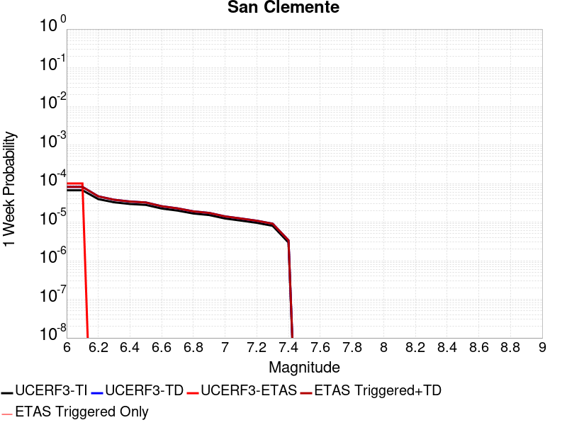 | 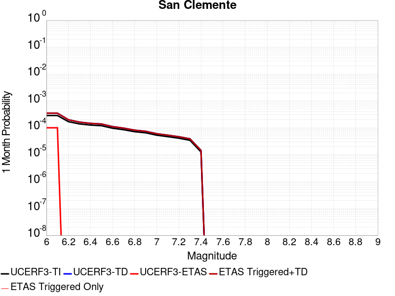 |  |  |

| Magnitude | 1 wk TI Prob | 1 wk TD Prob | 1 wk ETAS Prob | 1 wk ETAS/TD Gain | 1 wk ETAS Triggered+TD | 1 wk ETAS Triggered Only | 1 mo TI Prob | 1 mo TD Prob | 1 mo ETAS Prob | 1 mo ETAS/TD Gain | 1 mo ETAS Triggered+TD | 1 mo ETAS Triggered Only | 1 yr TI Prob | 1 yr TD Prob | 1 yr ETAS Prob | 1 yr ETAS/TD Gain | 1 yr ETAS Triggered+TD | 1 yr ETAS Triggered Only | 10 yr TI Prob | 10 yr TD Prob | 10 yr ETAS Prob | 10 yr ETAS/TD Gain | 10 yr ETAS Triggered+TD | 10 yr ETAS Triggered Only |
|-----|-----|-----|-----|-----|-----|-----|-----|-----|-----|-----|-----|-----|-----|-----|-----|-----|-----|-----|-----|-----|-----|-----|-----|-----|
| 6.0 | 6.681379E-5 | 8.16743E-5 | 1.0E-4 | 1.2243754 | 8.16743E-5 | 0.0 | 2.8631336E-4 | 3.4998887E-4 | 1.0E-4 | 0.28572336 | 3.4998887E-4 | 0.0 | 0.003480294 | 0.0042532785 | 0.0029 | 0.681827 | 0.0049503013 | 7.0E-4 | 0.03426291 | 0.041773956 | 0.0302 | 0.7229384 | 0.04733167 | 0.0058 |
| 6.1 | 6.681379E-5 | 8.16743E-5 | 1.0E-4 | 1.2243754 | 8.16743E-5 | 0.0 | 2.8631336E-4 | 3.4998887E-4 | 1.0E-4 | 0.28572336 | 3.4998887E-4 | 0.0 | 0.003480294 | 0.0042532785 | 0.0023 | 0.5407593 | 0.0048507266 | 6.0E-4 | 0.03426291 | 0.041773956 | 0.024 | 0.5745206 | 0.04627762 | 0.0047 |
| 6.2 | 3.9400576E-5 | 4.6469024E-5 | 0.0 | 0.0 | 4.6469024E-5 | 0.0 | 1.6884868E-4 | 1.9913798E-4 | 0.0 | 0.0 | 1.9913798E-4 | 0.0 | 0.0020537945 | 0.0024218638 | 0.0011 | 0.45419565 | 0.0027211371 | 3.0E-4 | 0.020349167 | 0.023961358 | 0.0135 | 0.5634072 | 0.025913434 | 0.002 |
| 6.3 | 3.2590255E-5 | 3.794153E-5 | 0.0 | 0.0 | 3.794153E-5 | 0.0 | 1.3966505E-4 | 1.6259658E-4 | 0.0 | 0.0 | 1.6259658E-4 | 0.0 | 0.0016990956 | 0.0019778463 | 0.001 | 0.5056005 | 0.0021774506 | 2.0E-4 | 0.01686163 | 0.019606225 | 0.0111 | 0.56614673 | 0.021174856 | 0.0016 |
| 6.4 | 2.9454652E-5 | 3.410849E-5 | 0.0 | 0.0 | 3.410849E-5 | 0.0 | 1.2622811E-4 | 1.461712E-4 | 0.0 | 0.0 | 1.461712E-4 | 0.0 | 0.0015357438 | 0.0017782076 | 0.001 | 0.56236404 | 0.001977852 | 2.0E-4 | 0.015251739 | 0.017642964 | 0.0104 | 0.58947015 | 0.019116499 | 0.0015 |
| 6.5 | 2.790836E-5 | 3.2257463E-5 | 0.0 | 0.0 | 3.2257463E-5 | 0.0 | 1.1960178E-4 | 1.3823908E-4 | 0.0 | 0.0 | 1.3823908E-4 | 0.0 | 0.001455179 | 0.0016817868 | 0.001 | 0.5946056 | 0.0018814505 | 2.0E-4 | 0.014456868 | 0.016693613 | 0.0097 | 0.5810606 | 0.01797191 | 0.0013 |
| 6.6 | 2.2492153E-5 | 2.5770154E-5 | 0.0 | 0.0 | 2.5770154E-5 | 0.0 | 9.639138E-5 | 1.1043892E-4 | 0.0 | 0.0 | 1.1043892E-4 | 0.0 | 0.0011729331 | 0.0013437793 | 7.0E-4 | 0.5209189 | 0.0015435105 | 2.0E-4 | 0.011667615 | 0.013358254 | 0.0068 | 0.5090486 | 0.01444356 | 0.0011 |
| 6.7 | 1.9862755E-5 | 2.267278E-5 | 0.0 | 0.0 | 2.267278E-5 | 0.0 | 8.512331E-5 | 9.716551E-5 | 0.0 | 0.0 | 9.716551E-5 | 0.0 | 0.0010358836 | 0.0011823593 | 6.0E-4 | 0.50745994 | 0.0013821229 | 2.0E-4 | 0.010310682 | 0.01176198 | 0.0058 | 0.49311423 | 0.012849042 | 0.0011 |
| 6.8 | 1.6697575E-5 | 1.8982853E-5 | 0.0 | 0.0 | 1.8982853E-5 | 0.0 | 7.155907E-5 | 8.1352606E-5 | 0.0 | 0.0 | 8.1352606E-5 | 0.0 | 8.7088346E-4 | 9.900272E-4 | 3.0E-4 | 0.30302197 | 0.0010899282 | 1.0E-4 | 0.008674784 | 0.009857195 | 0.005 | 0.5072437 | 0.0108473385 | 0.001 |
| 6.9 | 1.5218415E-5 | 1.727402E-5 | 0.0 | 0.0 | 1.727402E-5 | 0.0 | 6.522015E-5 | 7.402946E-5 | 0.0 | 0.0 | 7.402946E-5 | 0.0 | 7.93766E-4 | 9.009448E-4 | 3.0E-4 | 0.33298376 | 0.0010008548 | 1.0E-4 | 0.007909367 | 0.0089738695 | 0.0045 | 0.5014559 | 0.009964895 | 0.001 |
| 7.0 | 1.2392958E-5 | 1.40367E-5 | 0.0 | 0.0 | 1.40367E-5 | 0.0 | 5.3111595E-5 | 6.015594E-5 | 0.0 | 0.0 | 6.015594E-5 | 0.0 | 6.4644177E-4 | 7.3216006E-4 | 3.0E-4 | 0.40974647 | 8.3208684E-4 | 1.0E-4 | 0.0064456454 | 0.0072982656 | 0.0036 | 0.4932679 | 0.008191697 | 9.0E-4 |
| 7.1 | 1.0934128E-5 | 1.2378374E-5 | 0.0 | 0.0 | 1.2378374E-5 | 0.0 | 4.6859706E-5 | 5.3049134E-5 | 0.0 | 0.0 | 5.3049134E-5 | 0.0 | 5.7036756E-4 | 6.4568914E-4 | 3.0E-4 | 0.46461987 | 7.456246E-4 | 1.0E-4 | 0.0056890585 | 0.0064388774 | 0.0032 | 0.49698102 | 0.0073330826 | 9.0E-4 |
| 7.2 | 9.5798805E-6 | 1.0847776E-5 | 0.0 | 0.0 | 1.0847776E-5 | 0.0 | 4.1055984E-5 | 4.648968E-5 | 0.0 | 0.0 | 4.648968E-5 | 0.0 | 4.9974193E-4 | 5.6587206E-4 | 3.0E-4 | 0.5301552 | 6.658155E-4 | 1.0E-4 | 0.0049861963 | 0.0056450358 | 0.0026 | 0.46058166 | 0.0061422135 | 5.0E-4 |
| 7.3 | 8.0167365E-6 | 9.086316E-6 | 0.0 | 0.0 | 9.086316E-6 | 0.0 | 3.4356988E-5 | 3.8940812E-5 | 0.0 | 0.0 | 3.8940812E-5 | 0.0 | 4.1821605E-4 | 4.7400832E-4 | 2.0E-4 | 0.4219335 | 4.7400832E-4 | 0.0 | 0.0041742986 | 0.0047306763 | 0.0022 | 0.4650498 | 0.0051287836 | 4.0E-4 |
| 7.4 | 2.9581017E-6 | 3.3632907E-6 | 0.0 | 0.0 | 3.3632907E-6 | 0.0 | 1.2677518E-5 | 1.4414052E-5 | 0.0 | 0.0 | 1.4414052E-5 | 0.0 | 1.5433785E-4 | 1.75482E-4 | 0.0 | 0.0 | 1.75482E-4 | 0.0 | 0.001542307 | 0.0017539297 | 7.0E-4 | 0.39910382 | 0.0018537543 | 1.0E-4 |

## Calico-Hidalgo
*[(top)](#table-of-contents)*

| 1 Week | 1 Month | 1 Year | 10 Year |
|-----|-----|-----|-----|
|  |  |  |  |

| Magnitude | 1 wk TI Prob | 1 wk TD Prob | 1 wk ETAS Prob | 1 wk ETAS/TD Gain | 1 wk ETAS Triggered+TD | 1 wk ETAS Triggered Only | 1 mo TI Prob | 1 mo TD Prob | 1 mo ETAS Prob | 1 mo ETAS/TD Gain | 1 mo ETAS Triggered+TD | 1 mo ETAS Triggered Only | 1 yr TI Prob | 1 yr TD Prob | 1 yr ETAS Prob | 1 yr ETAS/TD Gain | 1 yr ETAS Triggered+TD | 1 yr ETAS Triggered Only | 10 yr TI Prob | 10 yr TD Prob | 10 yr ETAS Prob | 10 yr ETAS/TD Gain | 10 yr ETAS Triggered+TD | 10 yr ETAS Triggered Only |
|-----|-----|-----|-----|-----|-----|-----|-----|-----|-----|-----|-----|-----|-----|-----|-----|-----|-----|-----|-----|-----|-----|-----|-----|-----|
| 6.0 | 4.0906612E-5 | 5.071949E-5 | 1.0E-4 | 1.9716287 | 5.071949E-5 | 0.0 | 1.7530227E-4 | 2.1735334E-4 | 2.0E-4 | 0.92016065 | 2.1735334E-4 | 0.0 | 0.0021322158 | 0.0026434613 | 0.003 | 1.1348757 | 0.0037405535 | 0.0011 | 0.02111873 | 0.026160482 | 0.0196 | 0.7492217 | 0.031711366 | 0.0057 |
| 6.1 | 4.0906612E-5 | 5.071949E-5 | 1.0E-4 | 1.9716287 | 5.071949E-5 | 0.0 | 1.7530227E-4 | 2.1735334E-4 | 2.0E-4 | 0.92016065 | 2.1735334E-4 | 0.0 | 0.0021322158 | 0.0026434613 | 0.003 | 1.1348757 | 0.0037405535 | 0.0011 | 0.02111873 | 0.026160482 | 0.0196 | 0.7492217 | 0.031711366 | 0.0057 |
| 6.2 | 4.0906612E-5 | 5.071949E-5 | 1.0E-4 | 1.9716287 | 5.071949E-5 | 0.0 | 1.7530227E-4 | 2.1735334E-4 | 2.0E-4 | 0.92016065 | 2.1735334E-4 | 0.0 | 0.0021322158 | 0.0026434613 | 0.003 | 1.1348757 | 0.0037405535 | 0.0011 | 0.02111873 | 0.026160482 | 0.0196 | 0.7492217 | 0.031711366 | 0.0057 |
| 6.3 | 2.4242801E-5 | 3.0097084E-5 | 0.0 | 0.0 | 3.0097084E-5 | 0.0 | 1.0389358E-4 | 1.2898132E-4 | 1.0E-4 | 0.7753061 | 1.2898132E-4 | 0.0 | 0.0012641704 | 0.0015692497 | 0.0017 | 1.0833204 | 0.002168308 | 6.0E-4 | 0.01257003 | 0.0155853685 | 0.0128 | 0.8212831 | 0.019424586 | 0.0039 |
| 6.4 | 2.4242801E-5 | 3.0097084E-5 | 0.0 | 0.0 | 3.0097084E-5 | 0.0 | 1.0389358E-4 | 1.2898132E-4 | 1.0E-4 | 0.7753061 | 1.2898132E-4 | 0.0 | 0.0012641704 | 0.0015692497 | 0.0017 | 1.0833204 | 0.002168308 | 6.0E-4 | 0.01257003 | 0.0155853685 | 0.0128 | 0.8212831 | 0.019424586 | 0.0039 |
| 6.5 | 2.0286952E-5 | 2.5320429E-5 | 0.0 | 0.0 | 2.5320429E-5 | 0.0 | 8.694118E-5 | 1.0851171E-4 | 1.0E-4 | 0.9215595 | 1.0851171E-4 | 0.0 | 0.0010579949 | 0.0013203465 | 0.0015 | 1.1360655 | 0.0018196863 | 5.0E-4 | 0.010529719 | 0.0131269535 | 0.011 | 0.8379705 | 0.016284948 | 0.0032 |
| 6.6 | 2.0269223E-5 | 2.5301377E-5 | 0.0 | 0.0 | 2.5301377E-5 | 0.0 | 8.6865206E-5 | 1.0843006E-4 | 1.0E-4 | 0.9222535 | 1.0843006E-4 | 0.0 | 0.0010570707 | 0.0013193536 | 0.0015 | 1.1369203 | 0.0018186939 | 5.0E-4 | 0.010520565 | 0.013117142 | 0.011 | 0.8385973 | 0.016275167 | 0.0032 |
| 6.7 | 1.799852E-5 | 2.254457E-5 | 0.0 | 0.0 | 2.254457E-5 | 0.0 | 7.713423E-5 | 9.661608E-5 | 1.0E-4 | 1.0350244 | 9.661608E-5 | 0.0 | 9.3870464E-4 | 0.0011756807 | 0.0015 | 1.2758567 | 0.0016750928 | 5.0E-4 | 0.009347493 | 0.01169622 | 0.01 | 0.8549771 | 0.014661131 | 0.003 |
| 6.8 | 1.7458793E-5 | 2.1845864E-5 | 0.0 | 0.0 | 2.1845864E-5 | 0.0 | 7.4821255E-5 | 9.362186E-5 | 1.0E-4 | 1.0681267 | 9.362186E-5 | 0.0 | 9.10568E-4 | 0.0011392646 | 0.0014 | 1.228863 | 0.0015388088 | 4.0E-4 | 0.009068459 | 0.011335826 | 0.0093 | 0.8204078 | 0.013906352 | 0.0026 |
| 6.9 | 1.542884E-5 | 1.9029081E-5 | 0.0 | 0.0 | 1.9029081E-5 | 0.0 | 6.612192E-5 | 8.155073E-5 | 1.0E-4 | 1.2262306 | 8.155073E-5 | 0.0 | 8.04737E-4 | 9.92441E-4 | 0.0012 | 1.20914 | 0.0012921432 | 3.0E-4 | 0.008018291 | 0.009881487 | 0.0079 | 0.7994748 | 0.01215876 | 0.0023 |
| 7.0 | 1.468253E-5 | 1.803341E-5 | 0.0 | 0.0 | 1.803341E-5 | 0.0 | 6.292361E-5 | 7.7283825E-5 | 1.0E-4 | 1.2939318 | 7.7283825E-5 | 0.0 | 7.658257E-4 | 9.405374E-4 | 0.0012 | 1.2758664 | 0.0012402552 | 3.0E-4 | 0.0076319184 | 0.009366934 | 0.0078 | 0.8327164 | 0.011546327 | 0.0022 |
| 7.1 | 1.3139281E-5 | 1.620339E-5 | 0.0 | 0.0 | 1.620339E-5 | 0.0 | 5.6309986E-5 | 6.9441325E-5 | 0.0 | 0.0 | 6.9441325E-5 | 0.0 | 6.853584E-4 | 8.451328E-4 | 9.0E-4 | 1.0649214 | 9.450483E-4 | 1.0E-4 | 0.0068324856 | 0.008420485 | 0.0071 | 0.8431818 | 0.010403644 | 0.002 |
| 7.2 | 1.1127404E-5 | 1.3868697E-5 | 0.0 | 0.0 | 1.3868697E-5 | 0.0 | 4.7688E-5 | 5.943598E-5 | 0.0 | 0.0 | 5.943598E-5 | 0.0 | 5.8044674E-4 | 7.234037E-4 | 9.0E-4 | 1.2441186 | 8.2333136E-4 | 1.0E-4 | 0.0057893298 | 0.0072115967 | 0.0065 | 0.90132606 | 0.008998616 | 0.0018 |
| 7.3 | 9.808154E-6 | 1.2177887E-5 | 0.0 | 0.0 | 1.2177887E-5 | 0.0 | 4.2034266E-5 | 5.218996E-5 | 0.0 | 0.0 | 5.218996E-5 | 0.0 | 5.11647E-4 | 6.3523825E-4 | 7.0E-4 | 1.1019487 | 7.351747E-4 | 1.0E-4 | 0.0051047057 | 0.0063353 | 0.0056 | 0.88393605 | 0.007825797 | 0.0015 |
| 7.4 | 7.942452E-6 | 9.793294E-6 | 0.0 | 0.0 | 9.793294E-6 | 0.0 | 3.4038632E-5 | 4.1970638E-5 | 0.0 | 0.0 | 4.1970638E-5 | 0.0 | 4.1434157E-4 | 5.108822E-4 | 6.0E-4 | 1.1744391 | 5.108822E-4 | 0.0 | 0.0041356985 | 0.005098019 | 0.0049 | 0.96115774 | 0.006291901 | 0.0012 |
| 7.5 | 4.7121216E-6 | 5.7734387E-6 | 0.0 | 0.0 | 5.7734387E-6 | 0.0 | 2.019465E-5 | 2.4743118E-5 | 0.0 | 0.0 | 2.4743118E-5 | 0.0 | 2.4584212E-4 | 3.0121347E-4 | 4.0E-4 | 1.3279618 | 3.0121347E-4 | 0.0 | 0.0024557032 | 0.0030088047 | 0.0032 | 1.0635452 | 0.0037066985 | 7.0E-4 |
| 7.6 | 2.21172E-7 | 2.6041212E-7 | 0.0 | 0.0 | 2.6041212E-7 | 0.0 | 9.478797E-7 | 1.1160516E-6 | 0.0 | 0.0 | 1.1160516E-6 | 0.0 | 1.1540374E-5 | 1.3587873E-5 | 0.0 | 0.0 | 1.3587873E-5 | 0.0 | 1.1539775E-4 | 1.3587323E-4 | 1.0E-4 | 0.73598015 | 1.3587323E-4 | 0.0 |

## Garberville - Briceland 2011 CFM
*[(top)](#table-of-contents)*

| 1 Week | 1 Month | 1 Year | 10 Year |
|-----|-----|-----|-----|
| 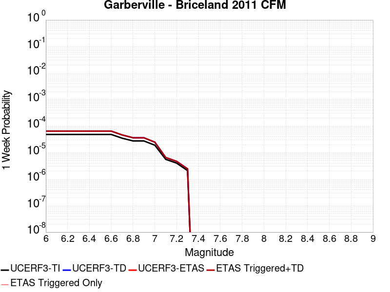 | 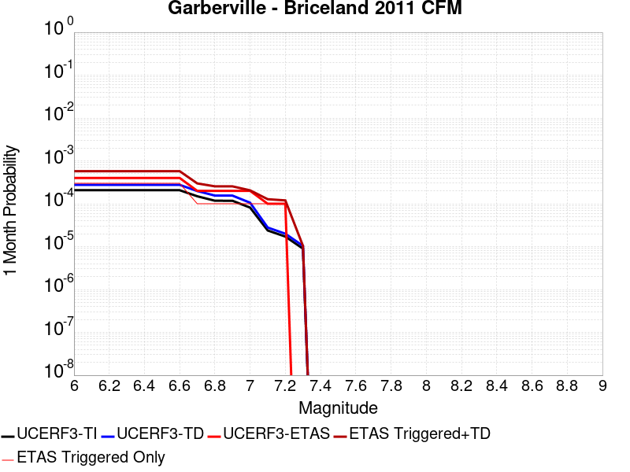 |  |  |

| Magnitude | 1 wk TI Prob | 1 wk TD Prob | 1 wk ETAS Prob | 1 wk ETAS/TD Gain | 1 wk ETAS Triggered+TD | 1 wk ETAS Triggered Only | 1 mo TI Prob | 1 mo TD Prob | 1 mo ETAS Prob | 1 mo ETAS/TD Gain | 1 mo ETAS Triggered+TD | 1 mo ETAS Triggered Only | 1 yr TI Prob | 1 yr TD Prob | 1 yr ETAS Prob | 1 yr ETAS/TD Gain | 1 yr ETAS Triggered+TD | 1 yr ETAS Triggered Only | 10 yr TI Prob | 10 yr TD Prob | 10 yr ETAS Prob | 10 yr ETAS/TD Gain | 10 yr ETAS Triggered+TD | 10 yr ETAS Triggered Only |
|-----|-----|-----|-----|-----|-----|-----|-----|-----|-----|-----|-----|-----|-----|-----|-----|-----|-----|-----|-----|-----|-----|-----|-----|-----|
| 6.0 | 4.8399295E-5 | 6.456981E-5 | 0.0 | 0.0 | 6.456981E-5 | 0.0 | 2.0740906E-4 | 2.76702E-4 | 4.0E-4 | 1.4455986 | 5.76619E-4 | 3.0E-4 | 0.002522281 | 0.0033642966 | 0.0025 | 0.74309736 | 0.0040619415 | 7.0E-4 | 0.024938442 | 0.033199932 | 0.0209 | 0.62951934 | 0.038904056 | 0.0059 |
| 6.1 | 4.8399295E-5 | 6.456981E-5 | 0.0 | 0.0 | 6.456981E-5 | 0.0 | 2.0740906E-4 | 2.76702E-4 | 4.0E-4 | 1.4455986 | 5.76619E-4 | 3.0E-4 | 0.002522281 | 0.0033642966 | 0.0025 | 0.74309736 | 0.0040619415 | 7.0E-4 | 0.024938442 | 0.033199932 | 0.0209 | 0.62951934 | 0.038904056 | 0.0059 |
| 6.2 | 4.8399295E-5 | 6.456981E-5 | 0.0 | 0.0 | 6.456981E-5 | 0.0 | 2.0740906E-4 | 2.76702E-4 | 4.0E-4 | 1.4455986 | 5.76619E-4 | 3.0E-4 | 0.002522281 | 0.0033642966 | 0.0025 | 0.74309736 | 0.0040619415 | 7.0E-4 | 0.024938442 | 0.033199932 | 0.0209 | 0.62951934 | 0.038904056 | 0.0059 |
| 6.3 | 4.8399295E-5 | 6.456981E-5 | 0.0 | 0.0 | 6.456981E-5 | 0.0 | 2.0740906E-4 | 2.76702E-4 | 4.0E-4 | 1.4455986 | 5.76619E-4 | 3.0E-4 | 0.002522281 | 0.0033642966 | 0.0025 | 0.74309736 | 0.0040619415 | 7.0E-4 | 0.024938442 | 0.033199932 | 0.0209 | 0.62951934 | 0.038904056 | 0.0059 |
| 6.4 | 4.8399295E-5 | 6.456981E-5 | 0.0 | 0.0 | 6.456981E-5 | 0.0 | 2.0740906E-4 | 2.76702E-4 | 4.0E-4 | 1.4455986 | 5.76619E-4 | 3.0E-4 | 0.002522281 | 0.0033642966 | 0.0025 | 0.74309736 | 0.0040619415 | 7.0E-4 | 0.024938442 | 0.033199932 | 0.0209 | 0.62951934 | 0.038904056 | 0.0059 |
| 6.5 | 4.8399295E-5 | 6.456981E-5 | 0.0 | 0.0 | 6.456981E-5 | 0.0 | 2.0740906E-4 | 2.76702E-4 | 4.0E-4 | 1.4455986 | 5.76619E-4 | 3.0E-4 | 0.002522281 | 0.0033642966 | 0.0025 | 0.74309736 | 0.0040619415 | 7.0E-4 | 0.024938442 | 0.033199932 | 0.0209 | 0.62951934 | 0.038904056 | 0.0059 |
| 6.6 | 4.8399295E-5 | 6.456981E-5 | 0.0 | 0.0 | 6.456981E-5 | 0.0 | 2.0740906E-4 | 2.76702E-4 | 4.0E-4 | 1.4455986 | 5.76619E-4 | 3.0E-4 | 0.002522281 | 0.0033642966 | 0.0025 | 0.74309736 | 0.0040619415 | 7.0E-4 | 0.024938442 | 0.033199932 | 0.0209 | 0.62951934 | 0.038904056 | 0.0059 |
| 6.7 | 3.495179E-5 | 4.6339086E-5 | 0.0 | 0.0 | 4.6339086E-5 | 0.0 | 1.4978478E-4 | 1.9858389E-4 | 2.0E-4 | 1.0071311 | 2.9856403E-4 | 1.0E-4 | 0.0018221042 | 0.0024156088 | 0.0016 | 0.6623589 | 0.0028146426 | 4.0E-4 | 0.018072363 | 0.023945963 | 0.0152 | 0.6347625 | 0.0282406 | 0.0044 |
| 6.8 | 2.7517597E-5 | 3.626468E-5 | 0.0 | 0.0 | 3.626468E-5 | 0.0 | 1.1792722E-4 | 1.5541336E-4 | 2.0E-4 | 1.2868906 | 2.553978E-4 | 1.0E-4 | 0.0014348183 | 0.0018909883 | 0.001 | 0.528824 | 0.002190421 | 3.0E-4 | 0.014255894 | 0.018795334 | 0.0118 | 0.6278154 | 0.02213143 | 0.0034 |
| 6.9 | 2.74461E-5 | 3.6182377E-5 | 0.0 | 0.0 | 3.6182377E-5 | 0.0 | 1.1762084E-4 | 1.5506068E-4 | 2.0E-4 | 1.2898176 | 2.550452E-4 | 1.0E-4 | 0.001431093 | 0.001886702 | 0.001 | 0.5300254 | 0.002186136 | 3.0E-4 | 0.014219119 | 0.018753195 | 0.0117 | 0.6238937 | 0.021991309 | 0.0033 |
| 7.0 | 1.9023773E-5 | 2.4722609E-5 | 0.0 | 0.0 | 2.4722609E-5 | 0.0 | 8.152791E-5 | 1.05951854E-4 | 2.0E-4 | 1.8876498 | 2.0594127E-4 | 1.0E-4 | 9.921503E-4 | 0.0012896006 | 6.0E-4 | 0.46526033 | 0.0014893427 | 2.0E-4 | 0.009877323 | 0.012860258 | 0.0077 | 0.5987438 | 0.014834538 | 0.002 |
| 7.1 | 5.566844E-6 | 6.51435E-6 | 0.0 | 0.0 | 6.51435E-6 | 0.0 | 2.3857683E-5 | 2.7918368E-5 | 1.0E-4 | 3.5818713 | 1.2791557E-4 | 1.0E-4 | 2.9042858E-4 | 3.3985736E-4 | 4.0E-4 | 1.1769644 | 4.3982337E-4 | 1.0E-4 | 0.002900493 | 0.003393797 | 0.0024 | 0.7071726 | 0.003991761 | 6.0E-4 |
| 7.2 | 4.011353E-6 | 4.6761556E-6 | 0.0 | 0.0 | 4.6761556E-6 | 0.0 | 1.7191402E-5 | 2.0040534E-5 | 1.0E-4 | 4.989887 | 1.2003853E-4 | 1.0E-4 | 2.0928521E-4 | 2.4396961E-4 | 3.0E-4 | 1.2296613 | 3.439452E-4 | 1.0E-4 | 0.0020908823 | 0.0024373555 | 0.0019 | 0.7795334 | 0.0028363806 | 4.0E-4 |
| 7.3 | 2.0974871E-6 | 2.4403803E-6 | 0.0 | 0.0 | 2.4403803E-6 | 0.0 | 8.989199E-6 | 1.0458745E-5 | 0.0 | 0.0 | 1.0458745E-5 | 0.0 | 1.09438006E-4 | 1.2733028E-4 | 1.0E-4 | 0.78535914 | 1.2733028E-4 | 0.0 | 0.0010938413 | 0.0012728187 | 0.0015 | 1.1784868 | 0.0014725641 | 2.0E-4 |

## Pleito
*[(top)](#table-of-contents)*

| 1 Week | 1 Month | 1 Year | 10 Year |
|-----|-----|-----|-----|
|  |  |  |  |

| Magnitude | 1 wk TI Prob | 1 wk TD Prob | 1 wk ETAS Prob | 1 wk ETAS/TD Gain | 1 wk ETAS Triggered+TD | 1 wk ETAS Triggered Only | 1 mo TI Prob | 1 mo TD Prob | 1 mo ETAS Prob | 1 mo ETAS/TD Gain | 1 mo ETAS Triggered+TD | 1 mo ETAS Triggered Only | 1 yr TI Prob | 1 yr TD Prob | 1 yr ETAS Prob | 1 yr ETAS/TD Gain | 1 yr ETAS Triggered+TD | 1 yr ETAS Triggered Only | 10 yr TI Prob | 10 yr TD Prob | 10 yr ETAS Prob | 10 yr ETAS/TD Gain | 10 yr ETAS Triggered+TD | 10 yr ETAS Triggered Only |
|-----|-----|-----|-----|-----|-----|-----|-----|-----|-----|-----|-----|-----|-----|-----|-----|-----|-----|-----|-----|-----|-----|-----|-----|-----|
| 6.0 | 1.6763008E-5 | 2.4832976E-5 | 0.0 | 0.0 | 2.4832976E-5 | 0.0 | 7.183948E-5 | 1.06423104E-4 | 0.0 | 0.0 | 1.06423104E-4 | 0.0 | 8.742947E-4 | 0.0012950032 | 0.0021 | 1.6216176 | 0.0019940967 | 7.0E-4 | 0.00870863 | 0.012988581 | 0.0179 | 1.3781337 | 0.018713247 | 0.0058 |
| 6.1 | 1.6763008E-5 | 2.4832976E-5 | 0.0 | 0.0 | 2.4832976E-5 | 0.0 | 7.183948E-5 | 1.06423104E-4 | 0.0 | 0.0 | 1.06423104E-4 | 0.0 | 8.742947E-4 | 0.0012950032 | 0.0021 | 1.6216176 | 0.0019940967 | 7.0E-4 | 0.00870863 | 0.012988581 | 0.0179 | 1.3781337 | 0.018713247 | 0.0058 |
| 6.2 | 1.6763008E-5 | 2.4832976E-5 | 0.0 | 0.0 | 2.4832976E-5 | 0.0 | 7.183948E-5 | 1.06423104E-4 | 0.0 | 0.0 | 1.06423104E-4 | 0.0 | 8.742947E-4 | 0.0012950032 | 0.0021 | 1.6216176 | 0.0019940967 | 7.0E-4 | 0.00870863 | 0.012988581 | 0.0179 | 1.3781337 | 0.018713247 | 0.0058 |
| 6.3 | 1.6763008E-5 | 2.4832976E-5 | 0.0 | 0.0 | 2.4832976E-5 | 0.0 | 7.183948E-5 | 1.06423104E-4 | 0.0 | 0.0 | 1.06423104E-4 | 0.0 | 8.742947E-4 | 0.0012950032 | 0.0021 | 1.6216176 | 0.0019940967 | 7.0E-4 | 0.00870863 | 0.012988581 | 0.0179 | 1.3781337 | 0.018713247 | 0.0058 |
| 6.4 | 1.6763008E-5 | 2.4832976E-5 | 0.0 | 0.0 | 2.4832976E-5 | 0.0 | 7.183948E-5 | 1.06423104E-4 | 0.0 | 0.0 | 1.06423104E-4 | 0.0 | 8.742947E-4 | 0.0012950032 | 0.0021 | 1.6216176 | 0.0019940967 | 7.0E-4 | 0.00870863 | 0.012988581 | 0.0179 | 1.3781337 | 0.018713247 | 0.0058 |
| 6.5 | 1.6763008E-5 | 2.4832976E-5 | 0.0 | 0.0 | 2.4832976E-5 | 0.0 | 7.183948E-5 | 1.06423104E-4 | 0.0 | 0.0 | 1.06423104E-4 | 0.0 | 8.742947E-4 | 0.0012950032 | 0.0021 | 1.6216176 | 0.0019940967 | 7.0E-4 | 0.00870863 | 0.012988581 | 0.0179 | 1.3781337 | 0.018713247 | 0.0058 |
| 6.6 | 9.910213E-6 | 1.7282238E-5 | 0.0 | 0.0 | 1.7282238E-5 | 0.0 | 4.247165E-5 | 7.406466E-5 | 0.0 | 0.0 | 7.406466E-5 | 0.0 | 5.169696E-4 | 9.0136786E-4 | 7.0E-4 | 0.77659744 | 0.0012010975 | 3.0E-4 | 0.0051576863 | 0.00908474 | 0.007 | 0.7705229 | 0.011462936 | 0.0024 |
| 6.7 | 9.910213E-6 | 1.7282238E-5 | 0.0 | 0.0 | 1.7282238E-5 | 0.0 | 4.247165E-5 | 7.406466E-5 | 0.0 | 0.0 | 7.406466E-5 | 0.0 | 5.169696E-4 | 9.0136786E-4 | 7.0E-4 | 0.77659744 | 0.0012010975 | 3.0E-4 | 0.0051576863 | 0.00908474 | 0.007 | 0.7705229 | 0.011462936 | 0.0024 |
| 6.8 | 8.300162E-6 | 1.5541567E-5 | 0.0 | 0.0 | 1.5541567E-5 | 0.0 | 3.557164E-5 | 6.6605025E-5 | 0.0 | 0.0 | 6.6605025E-5 | 0.0 | 4.3299864E-4 | 8.1061595E-4 | 6.0E-4 | 0.74017787 | 0.0010104538 | 2.0E-4 | 0.004321559 | 0.008184062 | 0.0053 | 0.6476001 | 0.009969331 | 0.0018 |
| 6.9 | 8.183114E-6 | 1.5412741E-5 | 0.0 | 0.0 | 1.5412741E-5 | 0.0 | 3.5070017E-5 | 6.605294E-5 | 0.0 | 0.0 | 6.605294E-5 | 0.0 | 4.2689382E-4 | 8.038992E-4 | 6.0E-4 | 0.7463622 | 0.0010037384 | 2.0E-4 | 0.0042607468 | 0.008117387 | 0.0052 | 0.6406002 | 0.009803588 | 0.0017 |
| 7.0 | 7.1748823E-6 | 1.4198588E-5 | 0.0 | 0.0 | 1.4198588E-5 | 0.0 | 3.0749135E-5 | 6.0849678E-5 | 0.0 | 0.0 | 6.0849678E-5 | 0.0 | 3.743064E-4 | 7.4059353E-4 | 6.0E-4 | 0.810161 | 9.404454E-4 | 2.0E-4 | 0.0037367654 | 0.0074883993 | 0.0044 | 0.5875755 | 0.008778664 | 0.0013 |
| 7.1 | 7.1671807E-6 | 1.4188947E-5 | 0.0 | 0.0 | 1.4188947E-5 | 0.0 | 3.0716128E-5 | 6.0808357E-5 | 0.0 | 0.0 | 6.0808357E-5 | 0.0 | 3.7390468E-4 | 7.400908E-4 | 6.0E-4 | 0.8107113 | 9.399428E-4 | 2.0E-4 | 0.0037327618 | 0.007483406 | 0.0044 | 0.5879676 | 0.008773678 | 0.0013 |
| 7.2 | 7.0649667E-6 | 1.403594E-5 | 0.0 | 0.0 | 1.403594E-5 | 0.0 | 3.0278077E-5 | 6.0152644E-5 | 0.0 | 0.0 | 6.0152644E-5 | 0.0 | 3.6857324E-4 | 7.321129E-4 | 6.0E-4 | 0.81954575 | 9.3196647E-4 | 2.0E-4 | 0.0036796255 | 0.0074040173 | 0.0043 | 0.5807658 | 0.008694392 | 0.0013 |
| 7.3 | 7.02082E-6 | 1.3979223E-5 | 0.0 | 0.0 | 1.3979223E-5 | 0.0 | 3.008888E-5 | 5.9909584E-5 | 0.0 | 0.0 | 5.9909584E-5 | 0.0 | 3.6627054E-4 | 7.291556E-4 | 6.0E-4 | 0.82286966 | 9.2900975E-4 | 2.0E-4 | 0.0036566744 | 0.007374429 | 0.0043 | 0.58309597 | 0.008664842 | 0.0013 |
| 7.4 | 6.987146E-6 | 1.3938688E-5 | 0.0 | 0.0 | 1.3938688E-5 | 0.0 | 2.9944567E-5 | 5.973587E-5 | 0.0 | 0.0 | 5.973587E-5 | 0.0 | 3.6451413E-4 | 7.2704203E-4 | 6.0E-4 | 0.8252618 | 9.2689664E-4 | 2.0E-4 | 0.0036391679 | 0.007353316 | 0.0042 | 0.57117087 | 0.008544492 | 0.0012 |
| 7.5 | 6.9494554E-6 | 1.389552E-5 | 0.0 | 0.0 | 1.389552E-5 | 0.0 | 2.9783041E-5 | 5.955087E-5 | 0.0 | 0.0 | 5.955087E-5 | 0.0 | 3.625482E-4 | 7.247912E-4 | 6.0E-4 | 0.82782465 | 9.246462E-4 | 2.0E-4 | 0.0036195726 | 0.0073309075 | 0.0042 | 0.5729168 | 0.00852211 | 0.0012 |
| 7.6 | 6.92694E-6 | 1.3854496E-5 | 0.0 | 0.0 | 1.3854496E-5 | 0.0 | 2.9686547E-5 | 5.937506E-5 | 0.0 | 0.0 | 5.937506E-5 | 0.0 | 3.6137376E-4 | 7.226521E-4 | 6.0E-4 | 0.830275 | 9.225076E-4 | 2.0E-4 | 0.0036078666 | 0.0073095905 | 0.0042 | 0.5745876 | 0.008500819 | 0.0012 |
| 7.7 | 6.395867E-6 | 1.2730574E-5 | 0.0 | 0.0 | 1.2730574E-5 | 0.0 | 2.741057E-5 | 5.4558466E-5 | 0.0 | 0.0 | 5.4558466E-5 | 0.0 | 3.336726E-4 | 6.640472E-4 | 5.0E-4 | 0.75295854 | 7.639808E-4 | 1.0E-4 | 0.0033317201 | 0.006726785 | 0.0037 | 0.5500399 | 0.007620731 | 9.0E-4 |
| 7.8 | 5.8664327E-6 | 1.159194E-5 | 0.0 | 0.0 | 1.159194E-5 | 0.0 | 2.5141611E-5 | 4.9678798E-5 | 0.0 | 0.0 | 4.9678798E-5 | 0.0 | 3.060561E-4 | 6.046717E-4 | 4.0E-4 | 0.66151595 | 7.046113E-4 | 1.0E-4 | 0.0030563495 | 0.0061291065 | 0.0032 | 0.52209896 | 0.006924203 | 8.0E-4 |
| 7.9 | 3.7167474E-6 | 7.1464633E-6 | 0.0 | 0.0 | 7.1464633E-6 | 0.0 | 1.592882E-5 | 3.0627343E-5 | 0.0 | 0.0 | 3.0627343E-5 | 0.0 | 1.9391612E-4 | 3.7282423E-4 | 3.0E-4 | 0.8046687 | 4.7278695E-4 | 1.0E-4 | 0.0019374699 | 0.0037839413 | 0.0018 | 0.47569448 | 0.004381671 | 6.0E-4 |
| 8.0 | 1.0903841E-6 | 1.2934664E-6 | 0.0 | 0.0 | 1.2934664E-6 | 0.0 | 4.6730665E-6 | 5.5434157E-6 | 0.0 | 0.0 | 5.5434157E-6 | 0.0 | 5.68931E-5 | 6.748901E-5 | 0.0 | 0.0 | 6.748901E-5 | 0.0 | 5.6878536E-4 | 6.9704343E-4 | 5.0E-4 | 0.71731544 | 8.9690404E-4 | 2.0E-4 |
| 8.1 | 2.6894583E-7 | 1.1088922E-7 | 0.0 | 0.0 | 1.1088922E-7 | 0.0 | 1.1526245E-6 | 4.752394E-7 | 0.0 | 0.0 | 4.752394E-7 | 0.0 | 1.4033113E-5 | 5.7860248E-6 | 0.0 | 0.0 | 5.7860248E-6 | 0.0 | 1.4032227E-4 | 6.472036E-5 | 1.0E-4 | 1.5451088 | 6.472036E-5 | 0.0 |
| 8.2 | 5.2967013E-9 | 2.4652547E-9 | 0.0 | 0.0 | 2.4652547E-9 | 0.0 | 2.2700148E-8 | 1.0565377E-8 | 0.0 | 0.0 | 1.0565377E-8 | 0.0 | 2.7637427E-7 | 1.2863346E-7 | 0.0 | 0.0 | 1.2863346E-7 | 0.0 | 2.7637393E-6 | 1.4632178E-6 | 0.0 | 0.0 | 1.4632178E-6 | 0.0 |

## Pinto Mtn
*[(top)](#table-of-contents)*

| 1 Week | 1 Month | 1 Year | 10 Year |
|-----|-----|-----|-----|
| 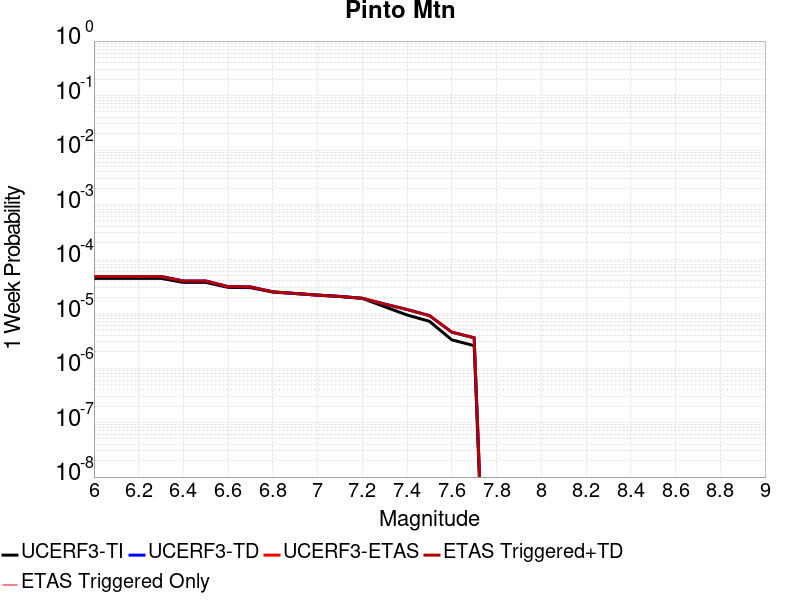 |  | 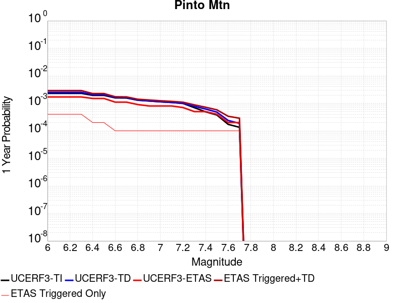 |  |

| Magnitude | 1 wk TI Prob | 1 wk TD Prob | 1 wk ETAS Prob | 1 wk ETAS/TD Gain | 1 wk ETAS Triggered+TD | 1 wk ETAS Triggered Only | 1 mo TI Prob | 1 mo TD Prob | 1 mo ETAS Prob | 1 mo ETAS/TD Gain | 1 mo ETAS Triggered+TD | 1 mo ETAS Triggered Only | 1 yr TI Prob | 1 yr TD Prob | 1 yr ETAS Prob | 1 yr ETAS/TD Gain | 1 yr ETAS Triggered+TD | 1 yr ETAS Triggered Only | 10 yr TI Prob | 10 yr TD Prob | 10 yr ETAS Prob | 10 yr ETAS/TD Gain | 10 yr ETAS Triggered+TD | 10 yr ETAS Triggered Only |
|-----|-----|-----|-----|-----|-----|-----|-----|-----|-----|-----|-----|-----|-----|-----|-----|-----|-----|-----|-----|-----|-----|-----|-----|-----|
| 6.0 | 4.4194956E-5 | 4.7860514E-5 | 0.0 | 0.0 | 4.7860514E-5 | 0.0 | 1.893932E-4 | 2.051013E-4 | 2.0E-4 | 0.9751279 | 3.050808E-4 | 1.0E-4 | 0.0023034236 | 0.0024944122 | 0.0017 | 0.68152326 | 0.0028934146 | 4.0E-4 | 0.022796938 | 0.024681672 | 0.0181 | 0.7333377 | 0.02985086 | 0.0053 |
| 6.1 | 4.4194956E-5 | 4.7860514E-5 | 0.0 | 0.0 | 4.7860514E-5 | 0.0 | 1.893932E-4 | 2.051013E-4 | 2.0E-4 | 0.9751279 | 3.050808E-4 | 1.0E-4 | 0.0023034236 | 0.0024944122 | 0.0017 | 0.68152326 | 0.0028934146 | 4.0E-4 | 0.022796938 | 0.024681672 | 0.0181 | 0.7333377 | 0.02985086 | 0.0053 |
| 6.2 | 4.4194956E-5 | 4.7860514E-5 | 0.0 | 0.0 | 4.7860514E-5 | 0.0 | 1.893932E-4 | 2.051013E-4 | 2.0E-4 | 0.9751279 | 3.050808E-4 | 1.0E-4 | 0.0023034236 | 0.0024944122 | 0.0017 | 0.68152326 | 0.0028934146 | 4.0E-4 | 0.022796938 | 0.024681672 | 0.0181 | 0.7333377 | 0.02985086 | 0.0053 |
| 6.3 | 4.4194956E-5 | 4.7860514E-5 | 0.0 | 0.0 | 4.7860514E-5 | 0.0 | 1.893932E-4 | 2.051013E-4 | 2.0E-4 | 0.9751279 | 3.050808E-4 | 1.0E-4 | 0.0023034236 | 0.0024944122 | 0.0017 | 0.68152326 | 0.0028934146 | 4.0E-4 | 0.022796938 | 0.024681672 | 0.0181 | 0.7333377 | 0.02985086 | 0.0053 |
| 6.4 | 3.729929E-5 | 3.960687E-5 | 0.0 | 0.0 | 3.960687E-5 | 0.0 | 1.5984432E-4 | 1.6973322E-4 | 2.0E-4 | 1.1783197 | 2.6971626E-4 | 1.0E-4 | 0.0019443673 | 0.0020646367 | 0.0015 | 0.72652006 | 0.0022642238 | 2.0E-4 | 0.019274427 | 0.020464584 | 0.0158 | 0.7720656 | 0.024872493 | 0.0045 |
| 6.5 | 3.729929E-5 | 3.960687E-5 | 0.0 | 0.0 | 3.960687E-5 | 0.0 | 1.5984432E-4 | 1.6973322E-4 | 2.0E-4 | 1.1783197 | 2.6971626E-4 | 1.0E-4 | 0.0019443673 | 0.0020646367 | 0.0015 | 0.72652006 | 0.0022642238 | 2.0E-4 | 0.019274427 | 0.020464584 | 0.0158 | 0.7720656 | 0.024872493 | 0.0045 |
| 6.6 | 3.0204548E-5 | 3.1205924E-5 | 0.0 | 0.0 | 3.1205924E-5 | 0.0 | 1.2944164E-4 | 1.3373302E-4 | 2.0E-4 | 1.495517 | 2.3371963E-4 | 1.0E-4 | 0.0015748127 | 0.0016270181 | 0.0011 | 0.67608345 | 0.0017268554 | 1.0E-4 | 0.015636992 | 0.016154932 | 0.0119 | 0.73661715 | 0.019696774 | 0.0036 |
| 6.7 | 2.9857754E-5 | 3.0815212E-5 | 0.0 | 0.0 | 3.0815212E-5 | 0.0 | 1.2795553E-4 | 1.320587E-4 | 2.0E-4 | 1.5144781 | 2.320455E-4 | 1.0E-4 | 0.0015567453 | 0.0016066635 | 0.0011 | 0.6846487 | 0.0017065027 | 1.0E-4 | 0.015458848 | 0.015954321 | 0.0119 | 0.7458794 | 0.019496886 | 0.0036 |
| 6.8 | 2.4819734E-5 | 2.5008128E-5 | 0.0 | 0.0 | 2.5008128E-5 | 0.0 | 1.0636595E-4 | 1.07173415E-4 | 2.0E-4 | 1.8661344 | 2.071627E-4 | 1.0E-4 | 0.0012942362 | 0.001304077 | 9.0E-4 | 0.69014335 | 0.0014039465 | 1.0E-4 | 0.012867244 | 0.012966612 | 0.0099 | 0.7634994 | 0.016026415 | 0.0031 |
| 6.9 | 2.331124E-5 | 2.3336048E-5 | 0.0 | 0.0 | 2.3336048E-5 | 0.0 | 9.990149E-5 | 1.00007914E-4 | 2.0E-4 | 1.9998417 | 1.9999791E-4 | 1.0E-4 | 0.001215622 | 0.0012169366 | 8.0E-4 | 0.6573884 | 0.0013168149 | 1.0E-4 | 0.012089936 | 0.012104919 | 0.0091 | 0.7517605 | 0.014871025 | 0.0028 |
| 7.0 | 2.1818534E-5 | 2.1758919E-5 | 0.0 | 0.0 | 2.1758919E-5 | 0.0 | 9.3504656E-5 | 9.324929E-5 | 2.0E-4 | 2.1447885 | 1.9323996E-4 | 1.0E-4 | 0.0011378246 | 0.0011347387 | 8.0E-4 | 0.70500815 | 0.0012346251 | 1.0E-4 | 0.011320163 | 0.011291548 | 0.0087 | 0.7704878 | 0.01386219 | 0.0026 |
| 7.1 | 2.066081E-5 | 2.0538317E-5 | 0.0 | 0.0 | 2.0538317E-5 | 0.0 | 8.854332E-5 | 8.80185E-5 | 2.0E-4 | 2.2722495 | 1.880097E-4 | 1.0E-4 | 0.0010774818 | 0.001071118 | 8.0E-4 | 0.74688315 | 0.0011710109 | 1.0E-4 | 0.010722724 | 0.010661605 | 0.0082 | 0.769115 | 0.013036016 | 0.0024 |
| 7.2 | 1.8990233E-5 | 1.9051433E-5 | 0.0 | 0.0 | 1.9051433E-5 | 0.0 | 8.138417E-5 | 8.164655E-5 | 1.0E-4 | 1.2247915 | 1.8163839E-4 | 1.0E-4 | 9.904018E-4 | 9.936128E-4 | 7.0E-4 | 0.7044998 | 0.0010935134 | 1.0E-4 | 0.009859995 | 0.009893701 | 0.0079 | 0.7984878 | 0.012170946 | 0.0023 |
| 7.3 | 1.3335872E-5 | 1.4903476E-5 | 0.0 | 0.0 | 1.4903476E-5 | 0.0 | 5.7152483E-5 | 6.3870546E-5 | 1.0E-4 | 1.5656669 | 1.6386416E-4 | 1.0E-4 | 6.956093E-4 | 7.7735924E-4 | 5.0E-4 | 0.64320326 | 8.772815E-4 | 1.0E-4 | 0.006934359 | 0.0077477 | 0.0063 | 0.81314456 | 0.009335304 | 0.0016 |
| 7.4 | 9.414066E-6 | 1.1857467E-5 | 0.0 | 0.0 | 1.1857467E-5 | 0.0 | 4.0345374E-5 | 5.081678E-5 | 1.0E-4 | 1.967854 | 1.508117E-4 | 1.0E-4 | 4.910942E-4 | 6.1852805E-4 | 5.0E-4 | 0.80837077 | 7.1846624E-4 | 1.0E-4 | 0.0049001034 | 0.0061690137 | 0.0044 | 0.71324205 | 0.0072622276 | 0.0011 |
| 7.5 | 7.2101157E-6 | 9.154366E-6 | 0.0 | 0.0 | 9.154366E-6 | 0.0 | 3.090013E-5 | 3.923245E-5 | 1.0E-4 | 2.5489104 | 1.3922853E-4 | 1.0E-4 | 3.7614413E-4 | 4.775582E-4 | 4.0E-4 | 0.8375943 | 5.7751045E-4 | 1.0E-4 | 0.0037550807 | 0.0047660945 | 0.0035 | 0.73435384 | 0.005661805 | 9.0E-4 |
| 7.6 | 3.296375E-6 | 4.541263E-6 | 0.0 | 0.0 | 4.541263E-6 | 0.0 | 1.4127245E-5 | 1.9462419E-5 | 1.0E-4 | 5.1381073 | 1.1946047E-4 | 1.0E-4 | 1.7198564E-4 | 2.3693057E-4 | 2.0E-4 | 0.84412915 | 3.3690687E-4 | 1.0E-4 | 0.0017185259 | 0.0023669167 | 0.0012 | 0.5069887 | 0.0025664433 | 2.0E-4 |
| 7.7 | 2.5741092E-6 | 3.579696E-6 | 0.0 | 0.0 | 3.579696E-6 | 0.0 | 1.103185E-5 | 1.5341473E-5 | 1.0E-4 | 6.518279 | 1.15339935E-4 | 1.0E-4 | 1.3430449E-4 | 1.8676773E-4 | 2.0E-4 | 1.0708488 | 2.8674904E-4 | 1.0E-4 | 0.0013422335 | 0.0018662371 | 8.0E-4 | 0.42867008 | 0.002065864 | 2.0E-4 |

## Concord 2011 CFM
*[(top)](#table-of-contents)*

| 1 Week | 1 Month | 1 Year | 10 Year |
|-----|-----|-----|-----|
|  |  |  | 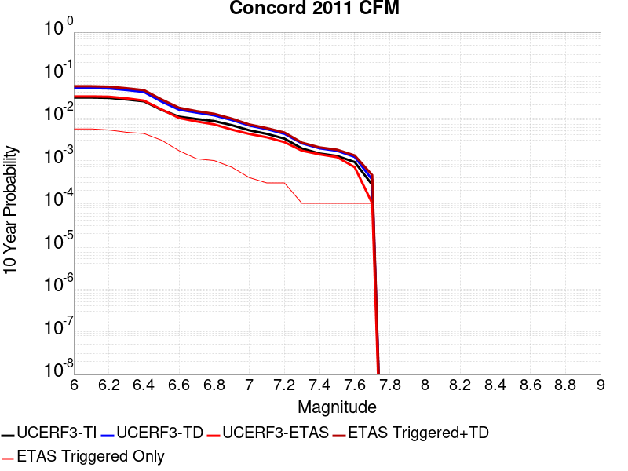 |

| Magnitude | 1 wk TI Prob | 1 wk TD Prob | 1 wk ETAS Prob | 1 wk ETAS/TD Gain | 1 wk ETAS Triggered+TD | 1 wk ETAS Triggered Only | 1 mo TI Prob | 1 mo TD Prob | 1 mo ETAS Prob | 1 mo ETAS/TD Gain | 1 mo ETAS Triggered+TD | 1 mo ETAS Triggered Only | 1 yr TI Prob | 1 yr TD Prob | 1 yr ETAS Prob | 1 yr ETAS/TD Gain | 1 yr ETAS Triggered+TD | 1 yr ETAS Triggered Only | 10 yr TI Prob | 10 yr TD Prob | 10 yr ETAS Prob | 10 yr ETAS/TD Gain | 10 yr ETAS Triggered+TD | 10 yr ETAS Triggered Only |
|-----|-----|-----|-----|-----|-----|-----|-----|-----|-----|-----|-----|-----|-----|-----|-----|-----|-----|-----|-----|-----|-----|-----|-----|-----|
| 6.0 | 5.7865112E-5 | 9.7666845E-5 | 1.0E-4 | 1.023889 | 1.9765708E-4 | 1.0E-4 | 2.4796976E-4 | 4.1850324E-4 | 3.0E-4 | 0.7168403 | 7.183777E-4 | 3.0E-4 | 0.0030148525 | 0.0050839093 | 0.0028 | 0.5507573 | 0.0064767916 | 0.0014 | 0.029742775 | 0.049292166 | 0.0316 | 0.64107555 | 0.054521058 | 0.0055 |
| 6.1 | 5.7865112E-5 | 9.7666845E-5 | 1.0E-4 | 1.023889 | 1.9765708E-4 | 1.0E-4 | 2.4796976E-4 | 4.1850324E-4 | 3.0E-4 | 0.7168403 | 7.183777E-4 | 3.0E-4 | 0.0030148525 | 0.0050839093 | 0.0028 | 0.5507573 | 0.0064767916 | 0.0014 | 0.029742775 | 0.049292166 | 0.0316 | 0.64107555 | 0.054521058 | 0.0055 |
| 6.2 | 5.6789337E-5 | 9.586835E-5 | 1.0E-4 | 1.043097 | 1.9585877E-4 | 1.0E-4 | 2.4336016E-4 | 4.1079795E-4 | 3.0E-4 | 0.730286 | 7.106747E-4 | 3.0E-4 | 0.0029588845 | 0.0049905754 | 0.0027 | 0.5410198 | 0.0062840874 | 0.0013 | 0.029197963 | 0.048408285 | 0.0311 | 0.642452 | 0.05335656 | 0.0052 |
| 6.3 | 5.203322E-5 | 8.8105575E-5 | 1.0E-4 | 1.1350019 | 1.8809676E-4 | 1.0E-4 | 2.2298045E-4 | 3.775451E-4 | 1.0E-4 | 0.26486903 | 4.7750733E-4 | 1.0E-4 | 0.0027114071 | 0.0045877076 | 0.0024 | 0.5231371 | 0.00558312 | 0.001 | 0.026785625 | 0.04457668 | 0.0285 | 0.63934773 | 0.048971627 | 0.0046 |
| 6.4 | 4.7120942E-5 | 7.9017955E-5 | 1.0E-4 | 1.2655352 | 1.7901005E-4 | 1.0E-4 | 2.0193127E-4 | 3.386086E-4 | 1.0E-4 | 0.29532623 | 4.3857476E-4 | 1.0E-4 | 0.0024557412 | 0.004115512 | 0.002 | 0.48596624 | 0.00491222 | 8.0E-4 | 0.024287801 | 0.04009287 | 0.0252 | 0.6285407 | 0.04422047 | 0.0043 |
| 6.5 | 2.9598437E-5 | 4.6714948E-5 | 1.0E-4 | 2.1406424 | 1.4671027E-4 | 1.0E-4 | 1.2684427E-4 | 2.0019274E-4 | 1.0E-4 | 0.49951863 | 3.0017272E-4 | 1.0E-4 | 0.001543235 | 0.0024348327 | 0.0015 | 0.61605877 | 0.0031331282 | 7.0E-4 | 0.015325619 | 0.023927266 | 0.0157 | 0.6561552 | 0.026855484 | 0.003 |
| 6.6 | 2.0443718E-5 | 3.0022491E-5 | 0.0 | 0.0 | 3.0022491E-5 | 0.0 | 8.7613E-5 | 1.2866168E-4 | 0.0 | 0.0 | 1.2866168E-4 | 0.0 | 0.0010661662 | 0.0015653666 | 4.0E-4 | 0.2555312 | 0.0018648971 | 3.0E-4 | 0.010610655 | 0.015484323 | 0.0099 | 0.6393563 | 0.017158 | 0.0017 |
| 6.7 | 1.798539E-5 | 2.5595002E-5 | 0.0 | 0.0 | 2.5595002E-5 | 0.0 | 7.7077966E-5 | 1.0968837E-4 | 0.0 | 0.0 | 1.0968837E-4 | 0.0 | 9.380202E-4 | 0.0013346595 | 3.0E-4 | 0.22477643 | 0.0015343926 | 2.0E-4 | 0.009340706 | 0.013234832 | 0.0082 | 0.61957717 | 0.014320274 | 0.0011 |
| 6.8 | 1.613555E-5 | 2.1975631E-5 | 0.0 | 0.0 | 2.1975631E-5 | 0.0 | 6.915052E-5 | 9.417796E-5 | 0.0 | 0.0 | 9.417796E-5 | 0.0 | 8.4158237E-4 | 0.0011460275 | 3.0E-4 | 0.26177382 | 0.0013457983 | 2.0E-4 | 0.008384023 | 0.011385578 | 0.007 | 0.6148129 | 0.012374192 | 0.001 |
| 6.9 | 1.2916435E-5 | 1.7096578E-5 | 0.0 | 0.0 | 1.7096578E-5 | 0.0 | 5.5354973E-5 | 7.326902E-5 | 0.0 | 0.0 | 7.326902E-5 | 0.0 | 6.7373837E-4 | 8.916911E-4 | 2.0E-4 | 0.22429293 | 9.916018E-4 | 1.0E-4 | 0.006716994 | 0.008875473 | 0.0053 | 0.5971513 | 0.00956926 | 7.0E-4 |
| 7.0 | 9.81129E-6 | 1.264222E-5 | 0.0 | 0.0 | 1.264222E-5 | 0.0 | 4.2047708E-5 | 5.4179825E-5 | 0.0 | 0.0 | 5.4179825E-5 | 0.0 | 5.118106E-4 | 6.594414E-4 | 2.0E-4 | 0.303287 | 7.5937546E-4 | 1.0E-4 | 0.005106334 | 0.006575606 | 0.0042 | 0.63872445 | 0.0069729756 | 4.0E-4 |
| 7.1 | 8.0889195E-6 | 1.0427976E-5 | 0.0 | 0.0 | 1.0427976E-5 | 0.0 | 3.4666336E-5 | 4.4690565E-5 | 0.0 | 0.0 | 4.4690565E-5 | 0.0 | 4.219809E-4 | 5.439729E-4 | 2.0E-4 | 0.3676654 | 6.4391847E-4 | 1.0E-4 | 0.004211805 | 0.005426708 | 0.0035 | 0.6449582 | 0.00572508 | 3.0E-4 |
| 7.2 | 6.267438E-6 | 8.124594E-6 | 0.0 | 0.0 | 8.124594E-6 | 0.0 | 2.6860173E-5 | 3.481923E-5 | 0.0 | 0.0 | 3.481923E-5 | 0.0 | 3.2697353E-4 | 4.238424E-4 | 2.0E-4 | 0.4718735 | 5.2380003E-4 | 1.0E-4 | 0.0032649285 | 0.0042307875 | 0.0027 | 0.63817906 | 0.004529518 | 3.0E-4 |
| 7.3 | 3.6761196E-6 | 4.8442653E-6 | 0.0 | 0.0 | 4.8442653E-6 | 0.0 | 1.5754704E-5 | 2.0760972E-5 | 0.0 | 0.0 | 2.0760972E-5 | 0.0 | 1.9179663E-4 | 2.5273574E-4 | 1.0E-4 | 0.3956702 | 3.5271046E-4 | 1.0E-4 | 0.0019163118 | 0.0025248902 | 0.0017 | 0.67329663 | 0.0026246377 | 1.0E-4 |
| 7.4 | 2.8044356E-6 | 3.713519E-6 | 0.0 | 0.0 | 3.713519E-6 | 0.0 | 1.2018954E-5 | 1.5914984E-5 | 0.0 | 0.0 | 1.5914984E-5 | 0.0 | 1.4632095E-4 | 1.9374782E-4 | 1.0E-4 | 0.51613486 | 2.9372846E-4 | 1.0E-4 | 0.0014622464 | 0.001936026 | 0.0014 | 0.72313076 | 0.0020358325 | 1.0E-4 |
| 7.5 | 2.4578699E-6 | 3.2481973E-6 | 0.0 | 0.0 | 3.2481973E-6 | 0.0 | 1.0533685E-5 | 1.3920772E-5 | 0.0 | 0.0 | 1.3920772E-5 | 0.0 | 1.2824008E-4 | 1.6947233E-4 | 1.0E-4 | 0.5900668 | 2.694554E-4 | 1.0E-4 | 0.0012816609 | 0.0016936563 | 0.0012 | 0.70852625 | 0.001793487 | 1.0E-4 |
| 7.6 | 1.7713267E-6 | 2.338302E-6 | 0.0 | 0.0 | 2.338302E-6 | 0.0 | 7.591378E-6 | 1.00212565E-5 | 0.0 | 0.0 | 1.00212565E-5 | 0.0 | 9.2421105E-5 | 1.2200206E-4 | 1.0E-4 | 0.81965834 | 2.2198986E-4 | 1.0E-4 | 9.2382677E-4 | 0.0012195694 | 7.0E-4 | 0.5739731 | 0.0013194474 | 1.0E-4 |
| 7.7 | 5.1912366E-7 | 6.832616E-7 | 0.0 | 0.0 | 6.832616E-7 | 0.0 | 2.2248137E-6 | 2.9282608E-6 | 0.0 | 0.0 | 2.9282608E-6 | 0.0 | 2.708677E-5 | 3.5651003E-5 | 1.0E-4 | 2.8049703 | 1.3564744E-4 | 1.0E-4 | 2.708347E-4 | 3.56472E-4 | 1.0E-4 | 0.28052694 | 4.5643636E-4 | 1.0E-4 |

## Monte Vista - Shannon 2011 CFM
*[(top)](#table-of-contents)*

| 1 Week | 1 Month | 1 Year | 10 Year |
|-----|-----|-----|-----|
|  |  | 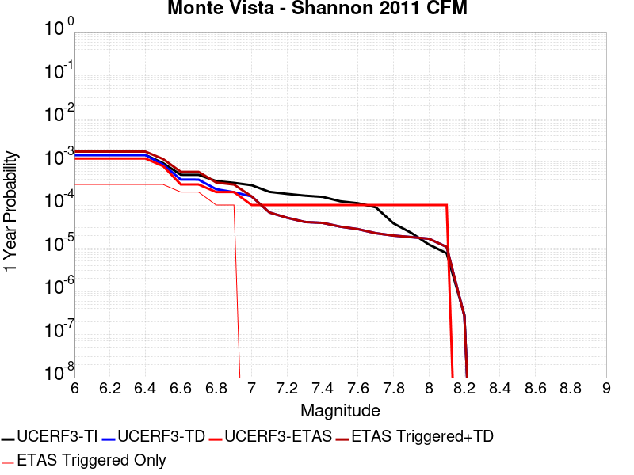 |  |

| Magnitude | 1 wk TI Prob | 1 wk TD Prob | 1 wk ETAS Prob | 1 wk ETAS/TD Gain | 1 wk ETAS Triggered+TD | 1 wk ETAS Triggered Only | 1 mo TI Prob | 1 mo TD Prob | 1 mo ETAS Prob | 1 mo ETAS/TD Gain | 1 mo ETAS Triggered+TD | 1 mo ETAS Triggered Only | 1 yr TI Prob | 1 yr TD Prob | 1 yr ETAS Prob | 1 yr ETAS/TD Gain | 1 yr ETAS Triggered+TD | 1 yr ETAS Triggered Only | 10 yr TI Prob | 10 yr TD Prob | 10 yr ETAS Prob | 10 yr ETAS/TD Gain | 10 yr ETAS Triggered+TD | 10 yr ETAS Triggered Only |
|-----|-----|-----|-----|-----|-----|-----|-----|-----|-----|-----|-----|-----|-----|-----|-----|-----|-----|-----|-----|-----|-----|-----|-----|-----|
| 6.0 | 2.7907707E-5 | 2.7588221E-5 | 0.0 | 0.0 | 2.7588221E-5 | 0.0 | 1.19598975E-4 | 1.1823057E-4 | 2.0E-4 | 1.6916099 | 2.1821875E-4 | 1.0E-4 | 0.0014551448 | 0.0014386305 | 0.0012 | 0.83412665 | 0.0017381989 | 3.0E-4 | 0.014456532 | 0.014322221 | 0.0129 | 0.9006983 | 0.019152042 | 0.0049 |
| 6.1 | 2.7907707E-5 | 2.7588221E-5 | 0.0 | 0.0 | 2.7588221E-5 | 0.0 | 1.19598975E-4 | 1.1823057E-4 | 2.0E-4 | 1.6916099 | 2.1821875E-4 | 1.0E-4 | 0.0014551448 | 0.0014386305 | 0.0012 | 0.83412665 | 0.0017381989 | 3.0E-4 | 0.014456532 | 0.014322221 | 0.0129 | 0.9006983 | 0.019152042 | 0.0049 |
| 6.2 | 2.7907707E-5 | 2.7588221E-5 | 0.0 | 0.0 | 2.7588221E-5 | 0.0 | 1.19598975E-4 | 1.1823057E-4 | 2.0E-4 | 1.6916099 | 2.1821875E-4 | 1.0E-4 | 0.0014551448 | 0.0014386305 | 0.0012 | 0.83412665 | 0.0017381989 | 3.0E-4 | 0.014456532 | 0.014322221 | 0.0129 | 0.9006983 | 0.019152042 | 0.0049 |
| 6.3 | 2.7907707E-5 | 2.7588221E-5 | 0.0 | 0.0 | 2.7588221E-5 | 0.0 | 1.19598975E-4 | 1.1823057E-4 | 2.0E-4 | 1.6916099 | 2.1821875E-4 | 1.0E-4 | 0.0014551448 | 0.0014386305 | 0.0012 | 0.83412665 | 0.0017381989 | 3.0E-4 | 0.014456532 | 0.014322221 | 0.0129 | 0.9006983 | 0.019152042 | 0.0049 |
| 6.4 | 2.7907707E-5 | 2.7588221E-5 | 0.0 | 0.0 | 2.7588221E-5 | 0.0 | 1.19598975E-4 | 1.1823057E-4 | 2.0E-4 | 1.6916099 | 2.1821875E-4 | 1.0E-4 | 0.0014551448 | 0.0014386305 | 0.0012 | 0.83412665 | 0.0017381989 | 3.0E-4 | 0.014456532 | 0.014322221 | 0.0129 | 0.9006983 | 0.019152042 | 0.0049 |
| 6.5 | 1.7990213E-5 | 1.6641647E-5 | 0.0 | 0.0 | 1.6641647E-5 | 0.0 | 7.709863E-5 | 7.1319766E-5 | 2.0E-4 | 2.8042717 | 1.7131263E-4 | 1.0E-4 | 9.382716E-4 | 8.6803857E-4 | 8.0E-4 | 0.92161804 | 0.0011677782 | 3.0E-4 | 0.0093431985 | 0.008669812 | 0.0073 | 0.8420021 | 0.011148137 | 0.0025 |
| 6.6 | 9.650407E-6 | 7.4570635E-6 | 0.0 | 0.0 | 7.4570635E-6 | 0.0 | 4.135823E-5 | 3.1958498E-5 | 1.0E-4 | 3.1290584 | 1.319553E-4 | 1.0E-4 | 5.0342013E-4 | 3.8903306E-4 | 3.0E-4 | 0.77114266 | 5.8895524E-4 | 2.0E-4 | 0.005022812 | 0.003901157 | 0.0028 | 0.71773577 | 0.004996866 | 0.0011 |
| 6.7 | 9.62828E-6 | 7.4349773E-6 | 0.0 | 0.0 | 7.4349773E-6 | 0.0 | 4.1263404E-5 | 3.1863845E-5 | 1.0E-4 | 3.1383533 | 1.3186065E-4 | 1.0E-4 | 5.022661E-4 | 3.8788107E-4 | 3.0E-4 | 0.77343297 | 5.878035E-4 | 2.0E-4 | 0.0050113243 | 0.0038896776 | 0.0028 | 0.719854 | 0.004985399 | 0.0011 |
| 6.8 | 6.887523E-6 | 4.460979E-6 | 0.0 | 0.0 | 4.460979E-6 | 0.0 | 2.9517621E-5 | 1.9118355E-5 | 1.0E-4 | 5.2305756 | 1.1911644E-4 | 1.0E-4 | 3.5931775E-4 | 2.3274335E-4 | 2.0E-4 | 0.8593157 | 3.3272005E-4 | 1.0E-4 | 0.0035873733 | 0.0023421056 | 0.0017 | 0.7258426 | 0.0031402318 | 8.0E-4 |
| 6.9 | 6.2722347E-6 | 3.8027501E-6 | 0.0 | 0.0 | 3.8027501E-6 | 0.0 | 2.6880729E-5 | 1.629741E-5 | 1.0E-4 | 6.1359444 | 1.1629578E-4 | 1.0E-4 | 3.2722374E-4 | 1.9840493E-4 | 2.0E-4 | 1.0080395 | 2.983851E-4 | 1.0E-4 | 0.003267423 | 0.0019993735 | 0.0015 | 0.75023496 | 0.002697974 | 7.0E-4 |
| 7.0 | 5.5320347E-6 | 3.0298074E-6 | 0.0 | 0.0 | 3.0298074E-6 | 0.0 | 2.3708504E-5 | 1.2984835E-5 | 0.0 | 0.0 | 1.2984835E-5 | 0.0 | 2.8861282E-4 | 1.5808073E-4 | 1.0E-4 | 0.63258815 | 1.5808073E-4 | 0.0 | 0.0028823826 | 0.0015967649 | 0.0011 | 0.6888929 | 0.0018962858 | 3.0E-4 |
| 7.1 | 3.8794055E-6 | 1.2826373E-6 | 0.0 | 0.0 | 1.2826373E-6 | 0.0 | 1.6625918E-5 | 5.4970055E-6 | 0.0 | 0.0 | 5.4970055E-6 | 0.0 | 2.0240174E-4 | 6.6924E-5 | 1.0E-4 | 1.4942323 | 6.6924E-5 | 0.0 | 0.002022175 | 6.859444E-4 | 7.0E-4 | 1.0204909 | 8.858072E-4 | 2.0E-4 |
| 7.2 | 3.4813652E-6 | 9.661153E-7 | 0.0 | 0.0 | 9.661153E-7 | 0.0 | 1.49200505E-5 | 4.1404874E-6 | 0.0 | 0.0 | 4.1404874E-6 | 0.0 | 1.8163648E-4 | 5.040928E-5 | 1.0E-4 | 1.9837618 | 5.040928E-5 | 0.0 | 0.0018148809 | 5.2087277E-4 | 4.0E-4 | 0.7679419 | 5.2087277E-4 | 0.0 |
| 7.3 | 3.1682148E-6 | 7.7104846E-7 | 0.0 | 0.0 | 7.7104846E-7 | 0.0 | 1.3577992E-5 | 3.3044892E-6 | 0.0 | 0.0 | 3.3044892E-6 | 0.0 | 1.6529951E-4 | 4.0231414E-5 | 1.0E-4 | 2.4856198 | 4.0231414E-5 | 0.0 | 0.0016517661 | 4.1911114E-4 | 3.0E-4 | 0.7158006 | 4.1911114E-4 | 0.0 |
| 7.4 | 2.9707667E-6 | 7.3391163E-7 | 0.0 | 0.0 | 7.3391163E-7 | 0.0 | 1.2731795E-5 | 3.145332E-6 | 0.0 | 0.0 | 3.145332E-6 | 0.0 | 1.5499859E-4 | 3.8293747E-5 | 1.0E-4 | 2.6113925 | 3.8293747E-5 | 0.0 | 0.0015489052 | 3.9953776E-4 | 3.0E-4 | 0.75086766 | 3.9953776E-4 | 0.0 |
| 7.5 | 2.3462758E-6 | 6.012565E-7 | 0.0 | 0.0 | 6.012565E-7 | 0.0 | 1.0055429E-5 | 2.5768109E-6 | 0.0 | 0.0 | 2.5768109E-6 | 0.0 | 1.2241797E-4 | 3.1372223E-5 | 1.0E-4 | 3.1875331 | 3.1372223E-5 | 0.0 | 0.0012235056 | 3.2861784E-4 | 2.0E-4 | 0.60860974 | 3.2861784E-4 | 0.0 |
| 7.6 | 2.112783E-6 | 5.257006E-7 | 0.0 | 0.0 | 5.257006E-7 | 0.0 | 9.054753E-6 | 2.2530007E-6 | 0.0 | 0.0 | 2.2530007E-6 | 0.0 | 1.1023604E-4 | 2.742994E-5 | 1.0E-4 | 3.6456513 | 2.742994E-5 | 0.0 | 0.0011018137 | 2.8877618E-4 | 1.0E-4 | 0.34628895 | 2.8877618E-4 | 0.0 |
| 7.7 | 1.7022471E-6 | 4.238386E-7 | 0.0 | 0.0 | 4.238386E-7 | 0.0 | 7.2953244E-6 | 1.8164499E-6 | 0.0 | 0.0 | 1.8164499E-6 | 0.0 | 8.881695E-5 | 2.2115055E-5 | 1.0E-4 | 4.5218067 | 2.2115055E-5 | 0.0 | 8.878146E-4 | 2.3432048E-4 | 1.0E-4 | 0.42676592 | 2.3432048E-4 | 0.0 |
| 7.8 | 7.230914E-7 | 3.7361536E-7 | 0.0 | 0.0 | 3.7361536E-7 | 0.0 | 3.0989595E-6 | 1.6012077E-6 | 0.0 | 0.0 | 1.6012077E-6 | 0.0 | 3.772918E-5 | 1.9494531E-5 | 1.0E-4 | 5.129644 | 1.9494531E-5 | 0.0 | 3.7722773E-4 | 2.0765288E-4 | 1.0E-4 | 0.4815729 | 2.0765288E-4 | 0.0 |
| 7.9 | 4.3588446E-7 | 3.4391311E-7 | 0.0 | 0.0 | 3.4391311E-7 | 0.0 | 1.868075E-6 | 1.4739126E-6 | 0.0 | 0.0 | 1.4739126E-6 | 0.0 | 2.2743576E-5 | 1.7944738E-5 | 1.0E-4 | 5.5726643 | 1.7944738E-5 | 0.0 | 2.2741247E-4 | 1.9039221E-4 | 1.0E-4 | 0.5252316 | 1.9039221E-4 | 0.0 |
| 8.0 | 2.3317523E-7 | 3.1600513E-7 | 0.0 | 0.0 | 3.1600513E-7 | 0.0 | 9.99322E-7 | 1.3543071E-6 | 0.0 | 0.0 | 1.3543071E-6 | 0.0 | 1.2166677E-5 | 1.6488564E-5 | 1.0E-4 | 6.0648093 | 1.6488564E-5 | 0.0 | 1.21660116E-4 | 1.7444052E-4 | 1.0E-4 | 0.5732613 | 1.7444052E-4 | 0.0 |
| 8.1 | 1.4662456E-7 | 2.0359343E-7 | 0.0 | 0.0 | 2.0359343E-7 | 0.0 | 6.283908E-7 | 8.72543E-7 | 0.0 | 0.0 | 8.72543E-7 | 0.0 | 7.650631E-6 | 1.062316E-5 | 1.0E-4 | 9.413395 | 1.062316E-5 | 0.0 | 7.650368E-5 | 1.1158566E-4 | 1.0E-4 | 0.8961725 | 1.1158566E-4 | 0.0 |
| 8.2 | 5.4931775E-9 | 5.084799E-9 | 0.0 | 0.0 | 5.084799E-9 | 0.0 | 2.3542189E-8 | 2.1791994E-8 | 0.0 | 0.0 | 2.1791994E-8 | 0.0 | 2.8662612E-7 | 2.653175E-7 | 0.0 | 0.0 | 2.653175E-7 | 0.0 | 2.8662573E-6 | 2.758491E-6 | 0.0 | 0.0 | 2.758491E-6 | 0.0 |

## Red Mountain
*[(top)](#table-of-contents)*

| 1 Week | 1 Month | 1 Year | 10 Year |
|-----|-----|-----|-----|
| 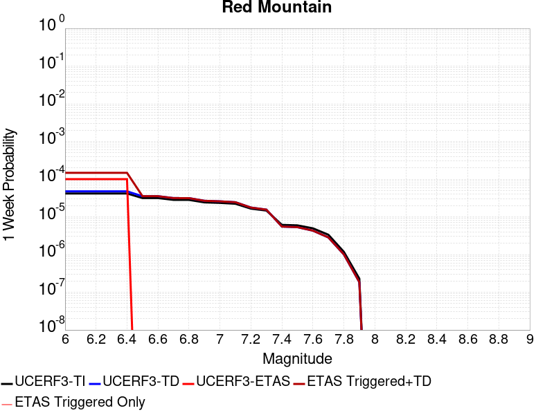 | 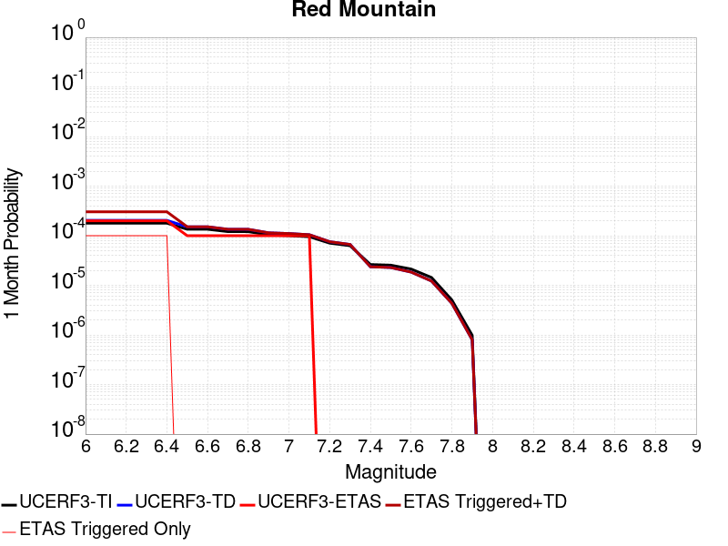 |  |  |

| Magnitude | 1 wk TI Prob | 1 wk TD Prob | 1 wk ETAS Prob | 1 wk ETAS/TD Gain | 1 wk ETAS Triggered+TD | 1 wk ETAS Triggered Only | 1 mo TI Prob | 1 mo TD Prob | 1 mo ETAS Prob | 1 mo ETAS/TD Gain | 1 mo ETAS Triggered+TD | 1 mo ETAS Triggered Only | 1 yr TI Prob | 1 yr TD Prob | 1 yr ETAS Prob | 1 yr ETAS/TD Gain | 1 yr ETAS Triggered+TD | 1 yr ETAS Triggered Only | 10 yr TI Prob | 10 yr TD Prob | 10 yr ETAS Prob | 10 yr ETAS/TD Gain | 10 yr ETAS Triggered+TD | 10 yr ETAS Triggered Only |
|-----|-----|-----|-----|-----|-----|-----|-----|-----|-----|-----|-----|-----|-----|-----|-----|-----|-----|-----|-----|-----|-----|-----|-----|-----|
| 6.0 | 4.1810763E-5 | 4.760584E-5 | 1.0E-4 | 2.1005826 | 1.4760108E-4 | 1.0E-4 | 1.7917668E-4 | 2.0401001E-4 | 2.0E-4 | 0.98034406 | 3.039896E-4 | 1.0E-4 | 0.0021792934 | 0.0024811574 | 0.0015 | 0.60455656 | 0.0029799168 | 5.0E-4 | 0.021580452 | 0.024552178 | 0.0168 | 0.68425703 | 0.028649058 | 0.0042 |
| 6.1 | 4.1810763E-5 | 4.760584E-5 | 1.0E-4 | 2.1005826 | 1.4760108E-4 | 1.0E-4 | 1.7917668E-4 | 2.0401001E-4 | 2.0E-4 | 0.98034406 | 3.039896E-4 | 1.0E-4 | 0.0021792934 | 0.0024811574 | 0.0015 | 0.60455656 | 0.0029799168 | 5.0E-4 | 0.021580452 | 0.024552178 | 0.0168 | 0.68425703 | 0.028649058 | 0.0042 |
| 6.2 | 4.1810763E-5 | 4.760584E-5 | 1.0E-4 | 2.1005826 | 1.4760108E-4 | 1.0E-4 | 1.7917668E-4 | 2.0401001E-4 | 2.0E-4 | 0.98034406 | 3.039896E-4 | 1.0E-4 | 0.0021792934 | 0.0024811574 | 0.0015 | 0.60455656 | 0.0029799168 | 5.0E-4 | 0.021580452 | 0.024552178 | 0.0168 | 0.68425703 | 0.028649058 | 0.0042 |
| 6.3 | 4.1810763E-5 | 4.760584E-5 | 1.0E-4 | 2.1005826 | 1.4760108E-4 | 1.0E-4 | 1.7917668E-4 | 2.0401001E-4 | 2.0E-4 | 0.98034406 | 3.039896E-4 | 1.0E-4 | 0.0021792934 | 0.0024811574 | 0.0015 | 0.60455656 | 0.0029799168 | 5.0E-4 | 0.021580452 | 0.024552178 | 0.0168 | 0.68425703 | 0.028649058 | 0.0042 |
| 6.4 | 4.1810763E-5 | 4.760584E-5 | 1.0E-4 | 2.1005826 | 1.4760108E-4 | 1.0E-4 | 1.7917668E-4 | 2.0401001E-4 | 2.0E-4 | 0.98034406 | 3.039896E-4 | 1.0E-4 | 0.0021792934 | 0.0024811574 | 0.0015 | 0.60455656 | 0.0029799168 | 5.0E-4 | 0.021580452 | 0.024552178 | 0.0168 | 0.68425703 | 0.028649058 | 0.0042 |
| 6.5 | 3.154503E-5 | 3.5370947E-5 | 0.0 | 0.0 | 3.5370947E-5 | 0.0 | 1.3518598E-4 | 1.5158148E-4 | 1.0E-4 | 0.6597112 | 1.5158148E-4 | 0.0 | 0.0016446467 | 0.0018440346 | 0.0012 | 0.650747 | 0.0021434813 | 3.0E-4 | 0.01632528 | 0.018296983 | 0.0133 | 0.7268958 | 0.021536604 | 0.0033 |
| 6.6 | 3.1535834E-5 | 3.536033E-5 | 0.0 | 0.0 | 3.536033E-5 | 0.0 | 1.3514658E-4 | 1.5153598E-4 | 1.0E-4 | 0.6599093 | 1.5153598E-4 | 0.0 | 0.0016441676 | 0.0018434814 | 0.0012 | 0.65094227 | 0.0021429283 | 3.0E-4 | 0.01632056 | 0.018291542 | 0.0133 | 0.727112 | 0.02153118 | 0.0033 |
| 6.7 | 2.8267326E-5 | 3.1479103E-5 | 0.0 | 0.0 | 3.1479103E-5 | 0.0 | 1.2114006E-4 | 1.3490395E-4 | 1.0E-4 | 0.74126816 | 1.3490395E-4 | 0.0 | 0.0014738824 | 0.0016413033 | 0.001 | 0.60927194 | 0.0019408108 | 3.0E-4 | 0.014641452 | 0.016300581 | 0.0117 | 0.7177658 | 0.01925168 | 0.003 |
| 6.8 | 2.8212884E-5 | 3.141697E-5 | 0.0 | 0.0 | 3.141697E-5 | 0.0 | 1.20906756E-4 | 1.346377E-4 | 1.0E-4 | 0.7427341 | 1.346377E-4 | 0.0 | 0.0014710457 | 0.0016380665 | 0.001 | 0.61047584 | 0.001937575 | 3.0E-4 | 0.014613459 | 0.01626869 | 0.0117 | 0.7191729 | 0.019219883 | 0.003 |
| 6.9 | 2.4227871E-5 | 2.671505E-5 | 0.0 | 0.0 | 2.671505E-5 | 0.0 | 1.03829596E-4 | 1.1448847E-4 | 1.0E-4 | 0.8734504 | 1.1448847E-4 | 0.0 | 0.0012633923 | 0.0013930819 | 0.001 | 0.7178329 | 0.0016926639 | 3.0E-4 | 0.012562336 | 0.013851184 | 0.0101 | 0.7291795 | 0.016316557 | 0.0025 |
| 7.0 | 2.348524E-5 | 2.5843534E-5 | 0.0 | 0.0 | 2.5843534E-5 | 0.0 | 1.0064714E-4 | 1.1075373E-4 | 1.0E-4 | 0.90290415 | 1.1075373E-4 | 0.0 | 0.0012246901 | 0.0013476682 | 9.0E-4 | 0.66782016 | 0.001647264 | 3.0E-4 | 0.012179627 | 0.013402596 | 0.0099 | 0.73866284 | 0.01586909 | 0.0025 |
| 7.1 | 2.2311642E-5 | 2.4470135E-5 | 0.0 | 0.0 | 2.4470135E-5 | 0.0 | 9.561782E-5 | 1.0486822E-4 | 1.0E-4 | 0.95357776 | 1.0486822E-4 | 0.0 | 0.0011635252 | 0.0012760976 | 8.0E-4 | 0.6269113 | 0.0015757148 | 3.0E-4 | 0.01157452 | 0.012695221 | 0.0096 | 0.75619006 | 0.015163483 | 0.0025 |
| 7.2 | 1.6533986E-5 | 1.7675286E-5 | 0.0 | 0.0 | 1.7675286E-5 | 0.0 | 7.085802E-5 | 7.5749376E-5 | 0.0 | 0.0 | 7.5749376E-5 | 0.0 | 8.623549E-4 | 9.21922E-4 | 6.0E-4 | 0.6508143 | 0.0011217376 | 2.0E-4 | 0.008590161 | 0.009187257 | 0.0076 | 0.8272328 | 0.011069801 | 0.0019 |
| 7.3 | 1.4703092E-5 | 1.5563814E-5 | 0.0 | 0.0 | 1.5563814E-5 | 0.0 | 6.301173E-5 | 6.67007E-5 | 0.0 | 0.0 | 6.67007E-5 | 0.0 | 7.668978E-4 | 8.1184006E-4 | 5.0E-4 | 0.61588484 | 0.0010116777 | 2.0E-4 | 0.0076425658 | 0.008094822 | 0.0063 | 0.7782753 | 0.00958268 | 0.0015 |
| 7.4 | 6.1331984E-6 | 5.5297623E-6 | 0.0 | 0.0 | 5.5297623E-6 | 0.0 | 2.6284872E-5 | 2.369877E-5 | 0.0 | 0.0 | 2.369877E-5 | 0.0 | 3.199713E-4 | 2.8849486E-4 | 2.0E-4 | 0.6932533 | 4.8843713E-4 | 2.0E-4 | 0.0031951098 | 0.0028812578 | 0.0025 | 0.8676766 | 0.003579241 | 7.0E-4 |
| 7.5 | 5.954766E-6 | 5.33936E-6 | 0.0 | 0.0 | 5.33936E-6 | 0.0 | 2.5520176E-5 | 2.2882774E-5 | 0.0 | 0.0 | 2.2882774E-5 | 0.0 | 3.1066386E-4 | 2.785627E-4 | 2.0E-4 | 0.71797127 | 4.7850696E-4 | 2.0E-4 | 0.003102299 | 0.002782189 | 0.0024 | 0.86263007 | 0.0034802414 | 7.0E-4 |
| 7.6 | 4.9726646E-6 | 4.3159957E-6 | 0.0 | 0.0 | 4.3159957E-6 | 0.0 | 2.1311245E-5 | 1.8496996E-5 | 0.0 | 0.0 | 1.8496996E-5 | 0.0 | 2.5943352E-4 | 2.25178E-4 | 2.0E-4 | 0.8881863 | 4.2513295E-4 | 2.0E-4 | 0.0025913084 | 0.0022495328 | 0.0019 | 0.84461975 | 0.0027484081 | 5.0E-4 |
| 7.7 | 3.3613894E-6 | 2.853132E-6 | 0.0 | 0.0 | 2.853132E-6 | 0.0 | 1.4405875E-5 | 1.2227652E-5 | 0.0 | 0.0 | 1.2227652E-5 | 0.0 | 1.7537741E-4 | 1.4886176E-4 | 0.0 | 0.0 | 1.4886176E-4 | 0.0 | 0.0017523908 | 0.0014876467 | 0.0013 | 0.8738634 | 0.0017872005 | 3.0E-4 |
| 7.8 | 1.1828961E-6 | 1.0124115E-6 | 0.0 | 0.0 | 1.0124115E-6 | 0.0 | 5.069545E-6 | 4.3388995E-6 | 0.0 | 0.0 | 4.3388995E-6 | 0.0 | 6.171996E-5 | 5.2824853E-5 | 0.0 | 0.0 | 5.2824853E-5 | 0.0 | 6.170282E-4 | 5.281259E-4 | 4.0E-4 | 0.75739515 | 7.2802027E-4 | 2.0E-4 |
| 7.9 | 2.2967266E-7 | 1.862149E-7 | 0.0 | 0.0 | 1.862149E-7 | 0.0 | 9.843111E-7 | 7.9806364E-7 | 0.0 | 0.0 | 7.9806364E-7 | 0.0 | 1.19839215E-5 | 9.716385E-6 | 0.0 | 0.0 | 9.716385E-6 | 0.0 | 1.1983275E-4 | 9.7159886E-5 | 2.0E-4 | 2.0584629 | 2.9714045E-4 | 2.0E-4 |

## Hunting Creek - Bartlett Springs connector 2011
*[(top)](#table-of-contents)*

| 1 Week | 1 Month | 1 Year | 10 Year |
|-----|-----|-----|-----|
|  |  |  | 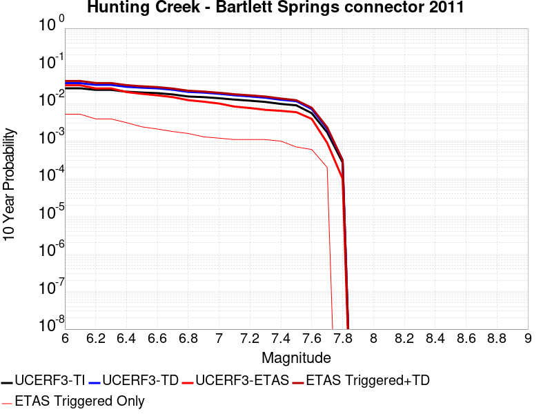 |

| Magnitude | 1 wk TI Prob | 1 wk TD Prob | 1 wk ETAS Prob | 1 wk ETAS/TD Gain | 1 wk ETAS Triggered+TD | 1 wk ETAS Triggered Only | 1 mo TI Prob | 1 mo TD Prob | 1 mo ETAS Prob | 1 mo ETAS/TD Gain | 1 mo ETAS Triggered+TD | 1 mo ETAS Triggered Only | 1 yr TI Prob | 1 yr TD Prob | 1 yr ETAS Prob | 1 yr ETAS/TD Gain | 1 yr ETAS Triggered+TD | 1 yr ETAS Triggered Only | 10 yr TI Prob | 10 yr TD Prob | 10 yr ETAS Prob | 10 yr ETAS/TD Gain | 10 yr ETAS Triggered+TD | 10 yr ETAS Triggered Only |
|-----|-----|-----|-----|-----|-----|-----|-----|-----|-----|-----|-----|-----|-----|-----|-----|-----|-----|-----|-----|-----|-----|-----|-----|-----|
| 6.0 | 4.940016E-5 | 6.7914334E-5 | 2.0E-4 | 2.9448862 | 6.7914334E-5 | 0.0 | 2.1169778E-4 | 2.910261E-4 | 4.0E-4 | 1.3744472 | 3.9099698E-4 | 1.0E-4 | 0.002574374 | 0.0035373413 | 0.0031 | 0.8763644 | 0.004135219 | 6.0E-4 | 0.025447546 | 0.034796044 | 0.0306 | 0.87941027 | 0.039815105 | 0.0052 |
| 6.1 | 4.940016E-5 | 6.7914334E-5 | 2.0E-4 | 2.9448862 | 6.7914334E-5 | 0.0 | 2.1169778E-4 | 2.910261E-4 | 4.0E-4 | 1.3744472 | 3.9099698E-4 | 1.0E-4 | 0.002574374 | 0.0035373413 | 0.0031 | 0.8763644 | 0.004135219 | 6.0E-4 | 0.025447546 | 0.034796044 | 0.0306 | 0.87941027 | 0.039815105 | 0.0052 |
| 6.2 | 4.472471E-5 | 6.104415E-5 | 2.0E-4 | 3.2763171 | 6.104415E-5 | 0.0 | 1.9166325E-4 | 2.615899E-4 | 4.0E-4 | 1.5291109 | 3.6156375E-4 | 1.0E-4 | 0.0023310026 | 0.0031801076 | 0.0029 | 0.9119188 | 0.0037781994 | 6.0E-4 | 0.02306703 | 0.031336576 | 0.0253 | 0.8073632 | 0.035114367 | 0.0039 |
| 6.3 | 4.472471E-5 | 6.104415E-5 | 2.0E-4 | 3.2763171 | 6.104415E-5 | 0.0 | 1.9166325E-4 | 2.615899E-4 | 4.0E-4 | 1.5291109 | 3.6156375E-4 | 1.0E-4 | 0.0023310026 | 0.0031801076 | 0.0029 | 0.9119188 | 0.0037781994 | 6.0E-4 | 0.02306703 | 0.031336576 | 0.0253 | 0.8073632 | 0.035114367 | 0.0039 |
| 6.4 | 4.0001003E-5 | 5.4138003E-5 | 2.0E-4 | 3.6942627 | 5.4138003E-5 | 0.0 | 1.714216E-4 | 2.3199919E-4 | 2.0E-4 | 0.86207193 | 2.3199919E-4 | 0.0 | 0.0020850603 | 0.0028208806 | 0.0023 | 0.81534827 | 0.0033194702 | 5.0E-4 | 0.02065605 | 0.027845427 | 0.0202 | 0.7254333 | 0.030859107 | 0.0031 |
| 6.5 | 3.8033053E-5 | 5.1297422E-5 | 2.0E-4 | 3.8988316 | 5.1297422E-5 | 0.0 | 1.6298861E-4 | 2.1982734E-4 | 2.0E-4 | 0.90980494 | 2.1982734E-4 | 0.0 | 0.0019825802 | 0.0026730858 | 0.0021 | 0.7856089 | 0.0030720166 | 4.0E-4 | 0.019649856 | 0.02640647 | 0.0181 | 0.6854381 | 0.028743094 | 0.0024 |
| 6.6 | 3.653754E-5 | 4.915885E-5 | 2.0E-4 | 4.0684433 | 4.915885E-5 | 0.0 | 1.5658008E-4 | 2.1066378E-4 | 2.0E-4 | 0.9493801 | 2.1066378E-4 | 0.0 | 0.0019046954 | 0.0025618074 | 0.0018 | 0.7026289 | 0.0029607827 | 4.0E-4 | 0.018884527 | 0.025321629 | 0.0165 | 0.6516168 | 0.027368454 | 0.0021 |
| 6.7 | 3.372024E-5 | 4.5166544E-5 | 1.0E-4 | 2.2140281 | 4.5166544E-5 | 0.0 | 1.4450731E-4 | 1.9355648E-4 | 1.0E-4 | 0.5166451 | 1.9355648E-4 | 0.0 | 0.0017579567 | 0.0023540214 | 0.0016 | 0.679688 | 0.0026533152 | 3.0E-4 | 0.017441148 | 0.023291877 | 0.0148 | 0.63541466 | 0.02504995 | 0.0018 |
| 6.8 | 2.9650024E-5 | 3.9433417E-5 | 1.0E-4 | 2.5359201 | 3.9433417E-5 | 0.0 | 1.2706534E-4 | 1.6898921E-4 | 1.0E-4 | 0.5917538 | 1.6898921E-4 | 0.0 | 0.0015459227 | 0.0020554923 | 0.0011 | 0.5351516 | 0.0023548757 | 3.0E-4 | 0.015352124 | 0.020362703 | 0.0123 | 0.6040455 | 0.021930123 | 0.0016 |
| 6.9 | 2.860775E-5 | 3.783323E-5 | 1.0E-4 | 2.6431792 | 3.783323E-5 | 0.0 | 1.2259888E-4 | 1.6213233E-4 | 1.0E-4 | 0.6167801 | 1.6213233E-4 | 0.0 | 0.0014916194 | 0.0019721806 | 9.0E-4 | 0.45634767 | 0.002171786 | 2.0E-4 | 0.014816469 | 0.019546606 | 0.0112 | 0.5729895 | 0.020821195 | 0.0013 |
| 7.0 | 2.6696067E-5 | 3.508623E-5 | 1.0E-4 | 2.850121 | 3.508623E-5 | 0.0 | 1.144067E-4 | 1.5036094E-4 | 1.0E-4 | 0.66506636 | 1.5036094E-4 | 0.0 | 0.0013920115 | 0.0018291157 | 8.0E-4 | 0.43736982 | 0.0020287498 | 2.0E-4 | 0.013833242 | 0.018141165 | 0.01 | 0.5512325 | 0.019319396 | 0.0012 |
| 7.1 | 2.456087E-5 | 3.2030614E-5 | 1.0E-4 | 3.122013 | 3.2030614E-5 | 0.0 | 1.0525662E-4 | 1.3726689E-4 | 1.0E-4 | 0.7285078 | 1.3726689E-4 | 0.0 | 0.001280746 | 0.0016699523 | 6.0E-4 | 0.3592917 | 0.0017697853 | 1.0E-4 | 0.012733897 | 0.01657554 | 0.0083 | 0.50073785 | 0.017657306 | 0.0011 |
| 7.2 | 2.295761E-5 | 2.9839379E-5 | 1.0E-4 | 3.3512762 | 2.9839379E-5 | 0.0 | 9.8386045E-5 | 1.2787683E-4 | 1.0E-4 | 0.78200245 | 1.2787683E-4 | 0.0 | 0.0011971919 | 0.0015557979 | 6.0E-4 | 0.3856542 | 0.0016556423 | 1.0E-4 | 0.011907627 | 0.01545073 | 0.0076 | 0.49188614 | 0.016533734 | 0.0011 |
| 7.3 | 2.1256936E-5 | 2.7557317E-5 | 1.0E-4 | 3.6288004 | 2.7557317E-5 | 0.0 | 9.109797E-5 | 1.1809749E-4 | 1.0E-4 | 0.84675807 | 1.1809749E-4 | 0.0 | 0.0011085535 | 0.0014368974 | 6.0E-4 | 0.41756633 | 0.0015367537 | 1.0E-4 | 0.011030397 | 0.014277649 | 0.0068 | 0.4762689 | 0.015361943 | 0.0011 |
| 7.4 | 1.8784336E-5 | 2.4320507E-5 | 1.0E-4 | 4.1117563 | 2.4320507E-5 | 0.0 | 8.050181E-5 | 1.0422662E-4 | 1.0E-4 | 0.95944774 | 1.0422662E-4 | 0.0 | 9.796688E-4 | 0.001268228 | 6.0E-4 | 0.47310102 | 0.0013681012 | 1.0E-4 | 0.009753612 | 0.012611193 | 0.0064 | 0.5074857 | 0.013598582 | 0.001 |
| 7.5 | 1.7248298E-5 | 2.2281372E-5 | 1.0E-4 | 4.488054 | 2.2281372E-5 | 0.0 | 7.391918E-5 | 9.548815E-5 | 1.0E-4 | 1.0472504 | 9.548815E-5 | 0.0 | 8.9959445E-4 | 0.0011619556 | 6.0E-4 | 0.51637083 | 0.0012618394 | 1.0E-4 | 0.008959615 | 0.011560005 | 0.0059 | 0.5103804 | 0.012251913 | 7.0E-4 |
| 7.6 | 1.0653709E-5 | 1.3730191E-5 | 1.0E-4 | 7.28322 | 1.3730191E-5 | 0.0 | 4.5657955E-5 | 5.8842365E-5 | 1.0E-4 | 1.6994559 | 5.8842365E-5 | 0.0 | 5.557438E-4 | 7.1617303E-4 | 4.0E-4 | 0.55852425 | 8.161014E-4 | 1.0E-4 | 0.0055435603 | 0.0071391985 | 0.0039 | 0.5462798 | 0.0077349152 | 6.0E-4 |
| 7.7 | 3.286316E-6 | 4.0920513E-6 | 0.0 | 0.0 | 4.0920513E-6 | 0.0 | 1.4084137E-5 | 1.7537244E-5 | 0.0 | 0.0 | 1.7537244E-5 | 0.0 | 1.7146087E-4 | 2.134952E-4 | 2.0E-4 | 0.9367892 | 3.1347384E-4 | 1.0E-4 | 0.0017132863 | 0.0021329436 | 9.0E-4 | 0.42195207 | 0.002332517 | 2.0E-4 |
| 7.8 | 5.1855085E-7 | 5.9737005E-7 | 0.0 | 0.0 | 5.9737005E-7 | 0.0 | 2.222359E-6 | 2.5601548E-6 | 0.0 | 0.0 | 2.5601548E-6 | 0.0 | 2.7056883E-5 | 3.116945E-5 | 0.0 | 0.0 | 3.116945E-5 | 0.0 | 2.705359E-4 | 3.116446E-4 | 1.0E-4 | 0.32087833 | 3.116446E-4 | 0.0 |

## Coyote Canyon
*[(top)](#table-of-contents)*

| 1 Week | 1 Month | 1 Year | 10 Year |
|-----|-----|-----|-----|
| 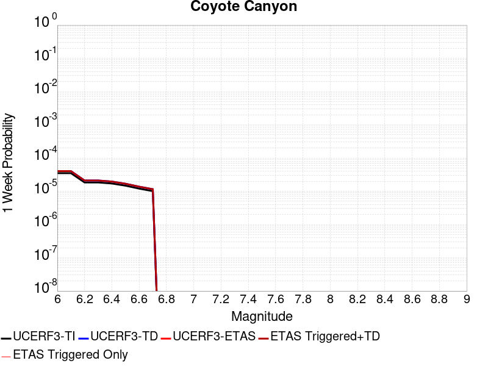 | 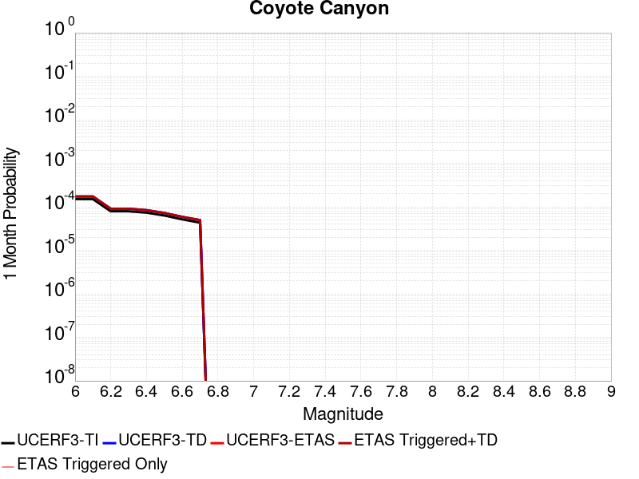 | 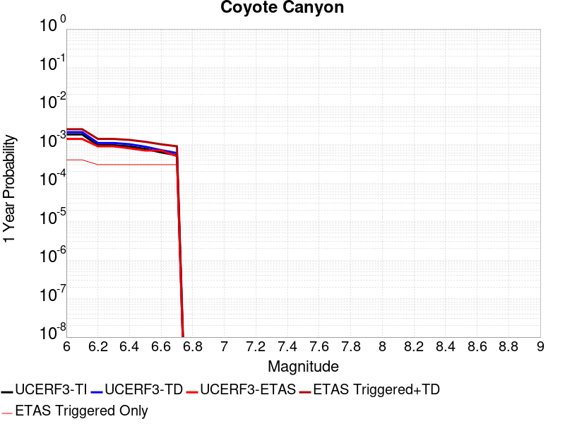 |  |

| Magnitude | 1 wk TI Prob | 1 wk TD Prob | 1 wk ETAS Prob | 1 wk ETAS/TD Gain | 1 wk ETAS Triggered+TD | 1 wk ETAS Triggered Only | 1 mo TI Prob | 1 mo TD Prob | 1 mo ETAS Prob | 1 mo ETAS/TD Gain | 1 mo ETAS Triggered+TD | 1 mo ETAS Triggered Only | 1 yr TI Prob | 1 yr TD Prob | 1 yr ETAS Prob | 1 yr ETAS/TD Gain | 1 yr ETAS Triggered+TD | 1 yr ETAS Triggered Only | 10 yr TI Prob | 10 yr TD Prob | 10 yr ETAS Prob | 10 yr ETAS/TD Gain | 10 yr ETAS Triggered+TD | 10 yr ETAS Triggered Only |
|-----|-----|-----|-----|-----|-----|-----|-----|-----|-----|-----|-----|-----|-----|-----|-----|-----|-----|-----|-----|-----|-----|-----|-----|-----|
| 6.0 | 3.5090034E-5 | 4.037636E-5 | 0.0 | 0.0 | 4.037636E-5 | 0.0 | 1.503772E-4 | 1.7303151E-4 | 0.0 | 0.0 | 1.7303151E-4 | 0.0 | 0.0018293047 | 0.0021048808 | 0.0014 | 0.66512084 | 0.0025040389 | 4.0E-4 | 0.018143194 | 0.020875376 | 0.019 | 0.9101633 | 0.0249877 | 0.0042 |
| 6.1 | 3.5090034E-5 | 4.037636E-5 | 0.0 | 0.0 | 4.037636E-5 | 0.0 | 1.503772E-4 | 1.7303151E-4 | 0.0 | 0.0 | 1.7303151E-4 | 0.0 | 0.0018293047 | 0.0021048808 | 0.0014 | 0.66512084 | 0.0025040389 | 4.0E-4 | 0.018143194 | 0.020875376 | 0.019 | 0.9101633 | 0.0249877 | 0.0042 |
| 6.2 | 1.841879E-5 | 2.1065785E-5 | 0.0 | 0.0 | 2.1065785E-5 | 0.0 | 7.8935285E-5 | 9.027939E-5 | 0.0 | 0.0 | 9.027939E-5 | 0.0 | 9.606133E-4 | 0.0010986994 | 9.0E-4 | 0.8191503 | 0.0013983698 | 3.0E-4 | 0.0095647145 | 0.010942766 | 0.011 | 1.0052303 | 0.013613221 | 0.0027 |
| 6.3 | 1.841879E-5 | 2.1065785E-5 | 0.0 | 0.0 | 2.1065785E-5 | 0.0 | 7.8935285E-5 | 9.027939E-5 | 0.0 | 0.0 | 9.027939E-5 | 0.0 | 9.606133E-4 | 0.0010986994 | 9.0E-4 | 0.8191503 | 0.0013983698 | 3.0E-4 | 0.0095647145 | 0.010942766 | 0.011 | 1.0052303 | 0.013613221 | 0.0027 |
| 6.4 | 1.712201E-5 | 1.957075E-5 | 0.0 | 0.0 | 1.957075E-5 | 0.0 | 7.337798E-5 | 8.387252E-5 | 0.0 | 0.0 | 8.387252E-5 | 0.0 | 8.930107E-4 | 0.0010207702 | 8.0E-4 | 0.783722 | 0.001320464 | 3.0E-4 | 0.008894307 | 0.010170738 | 0.0105 | 1.0323734 | 0.012843277 | 0.0027 |
| 6.5 | 1.4744935E-5 | 1.6841712E-5 | 0.0 | 0.0 | 1.6841712E-5 | 0.0 | 6.3191044E-5 | 7.2177296E-5 | 0.0 | 0.0 | 7.2177296E-5 | 0.0 | 7.6907943E-4 | 8.7849784E-4 | 7.0E-4 | 0.7968147 | 0.0011782343 | 3.0E-4 | 0.007664232 | 0.008759452 | 0.0092 | 1.0502939 | 0.01113843 | 0.0024 |
| 6.6 | 1.2017839E-5 | 1.3727956E-5 | 0.0 | 0.0 | 1.3727956E-5 | 0.0 | 5.150401E-5 | 5.883327E-5 | 0.0 | 0.0 | 5.883327E-5 | 0.0 | 6.268809E-4 | 7.161483E-4 | 7.0E-4 | 0.9774512 | 0.0010159335 | 3.0E-4 | 0.0062511545 | 0.0071471026 | 0.0076 | 1.063368 | 0.009132808 | 0.002 |
| 6.7 | 1.00956095E-5 | 1.1536777E-5 | 0.0 | 0.0 | 1.1536777E-5 | 0.0 | 4.326618E-5 | 4.9442882E-5 | 0.0 | 0.0 | 4.9442882E-5 | 0.0 | 5.266384E-4 | 6.018878E-4 | 5.0E-4 | 0.83071953 | 9.017073E-4 | 3.0E-4 | 0.005253921 | 0.006011109 | 0.0063 | 1.0480596 | 0.0076014907 | 0.0016 |

## Eaton Roughs 2011 CFM
*[(top)](#table-of-contents)*

| 1 Week | 1 Month | 1 Year | 10 Year |
|-----|-----|-----|-----|
|  |  | 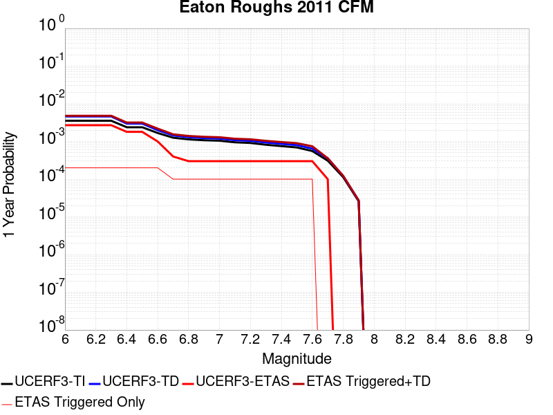 |  |

| Magnitude | 1 wk TI Prob | 1 wk TD Prob | 1 wk ETAS Prob | 1 wk ETAS/TD Gain | 1 wk ETAS Triggered+TD | 1 wk ETAS Triggered Only | 1 mo TI Prob | 1 mo TD Prob | 1 mo ETAS Prob | 1 mo ETAS/TD Gain | 1 mo ETAS Triggered+TD | 1 mo ETAS Triggered Only | 1 yr TI Prob | 1 yr TD Prob | 1 yr ETAS Prob | 1 yr ETAS/TD Gain | 1 yr ETAS Triggered+TD | 1 yr ETAS Triggered Only | 10 yr TI Prob | 10 yr TD Prob | 10 yr ETAS Prob | 10 yr ETAS/TD Gain | 10 yr ETAS Triggered+TD | 10 yr ETAS Triggered Only |
|-----|-----|-----|-----|-----|-----|-----|-----|-----|-----|-----|-----|-----|-----|-----|-----|-----|-----|-----|-----|-----|-----|-----|-----|-----|
| 6.0 | 6.8044945E-5 | 8.848526E-5 | 2.0E-4 | 2.2602632 | 8.848526E-5 | 0.0 | 2.9158857E-4 | 3.7916636E-4 | 3.0E-4 | 0.7912094 | 3.7916636E-4 | 0.0 | 0.0035443127 | 0.004607257 | 0.0027 | 0.58603203 | 0.0048063355 | 2.0E-4 | 0.03488314 | 0.045188148 | 0.0304 | 0.6727428 | 0.049771246 | 0.0048 |
| 6.1 | 6.8044945E-5 | 8.848526E-5 | 2.0E-4 | 2.2602632 | 8.848526E-5 | 0.0 | 2.9158857E-4 | 3.7916636E-4 | 3.0E-4 | 0.7912094 | 3.7916636E-4 | 0.0 | 0.0035443127 | 0.004607257 | 0.0027 | 0.58603203 | 0.0048063355 | 2.0E-4 | 0.03488314 | 0.045188148 | 0.0304 | 0.6727428 | 0.049771246 | 0.0048 |
| 6.2 | 6.8044945E-5 | 8.848526E-5 | 2.0E-4 | 2.2602632 | 8.848526E-5 | 0.0 | 2.9158857E-4 | 3.7916636E-4 | 3.0E-4 | 0.7912094 | 3.7916636E-4 | 0.0 | 0.0035443127 | 0.004607257 | 0.0027 | 0.58603203 | 0.0048063355 | 2.0E-4 | 0.03488314 | 0.045188148 | 0.0304 | 0.6727428 | 0.049771246 | 0.0048 |
| 6.3 | 6.8044945E-5 | 8.848526E-5 | 2.0E-4 | 2.2602632 | 8.848526E-5 | 0.0 | 2.9158857E-4 | 3.7916636E-4 | 3.0E-4 | 0.7912094 | 3.7916636E-4 | 0.0 | 0.0035443127 | 0.004607257 | 0.0027 | 0.58603203 | 0.0048063355 | 2.0E-4 | 0.03488314 | 0.045188148 | 0.0304 | 0.6727428 | 0.049771246 | 0.0048 |
| 6.4 | 4.5830013E-5 | 5.7182817E-5 | 2.0E-4 | 3.4975543 | 5.7182817E-5 | 0.0 | 1.9639956E-4 | 2.4504925E-4 | 2.0E-4 | 0.8161625 | 2.4504925E-4 | 0.0 | 0.0023885423 | 0.0029797624 | 0.0018 | 0.604075 | 0.0031791665 | 2.0E-4 | 0.023630321 | 0.029435728 | 0.0202 | 0.6862409 | 0.03263859 | 0.0033 |
| 6.5 | 4.5830013E-5 | 5.7182817E-5 | 2.0E-4 | 3.4975543 | 5.7182817E-5 | 0.0 | 1.9639956E-4 | 2.4504925E-4 | 2.0E-4 | 0.8161625 | 2.4504925E-4 | 0.0 | 0.0023885423 | 0.0029797624 | 0.0018 | 0.604075 | 0.0031791665 | 2.0E-4 | 0.023630321 | 0.029435728 | 0.0202 | 0.6862409 | 0.03263859 | 0.0033 |
| 6.6 | 3.222194E-5 | 3.827706E-5 | 1.0E-4 | 2.612531 | 3.827706E-5 | 0.0 | 1.3808672E-4 | 1.6403486E-4 | 1.0E-4 | 0.6096265 | 1.6403486E-4 | 0.0 | 0.0016799092 | 0.0019953828 | 0.001 | 0.501157 | 0.0021949837 | 2.0E-4 | 0.016672665 | 0.019784007 | 0.0136 | 0.68742394 | 0.021646418 | 0.0019 |
| 6.7 | 2.4155654E-5 | 2.7794362E-5 | 1.0E-4 | 3.597852 | 2.7794362E-5 | 0.0 | 1.0352012E-4 | 1.191133E-4 | 1.0E-4 | 0.83953685 | 1.191133E-4 | 0.0 | 0.0012596287 | 0.0014492478 | 4.0E-4 | 0.27600524 | 0.001549103 | 1.0E-4 | 0.012525126 | 0.014399208 | 0.0093 | 0.64586884 | 0.01577905 | 0.0014 |
| 6.8 | 2.1814667E-5 | 2.4947763E-5 | 1.0E-4 | 4.008375 | 2.4947763E-5 | 0.0 | 9.348808E-5 | 1.0691463E-4 | 1.0E-4 | 0.9353257 | 1.0691463E-4 | 0.0 | 0.001137623 | 0.0013009121 | 3.0E-4 | 0.23060744 | 0.001400782 | 1.0E-4 | 0.011318169 | 0.012933678 | 0.008 | 0.6185402 | 0.014118157 | 0.0012 |
| 6.9 | 2.0700467E-5 | 2.3635363E-5 | 1.0E-4 | 4.2309484 | 2.3635363E-5 | 0.0 | 8.871327E-5 | 1.012905E-4 | 1.0E-4 | 0.98725945 | 1.012905E-4 | 0.0 | 0.0010795488 | 0.0012325174 | 3.0E-4 | 0.24340427 | 0.0013323941 | 1.0E-4 | 0.010743194 | 0.012257437 | 0.0077 | 0.62819004 | 0.013442728 | 0.0012 |
| 7.0 | 2.0104066E-5 | 2.2942706E-5 | 1.0E-4 | 4.358684 | 2.2942706E-5 | 0.0 | 8.615744E-5 | 9.832219E-5 | 1.0E-4 | 1.0170643 | 9.832219E-5 | 0.0 | 0.0010484619 | 0.0011964184 | 3.0E-4 | 0.2507484 | 0.0012962987 | 1.0E-4 | 0.010435291 | 0.01190036 | 0.0075 | 0.63023305 | 0.01308608 | 0.0012 |
| 7.1 | 1.8225232E-5 | 2.0778598E-5 | 1.0E-4 | 4.8126445 | 2.0778598E-5 | 0.0 | 7.81058E-5 | 8.90481E-5 | 1.0E-4 | 1.1229886 | 8.90481E-5 | 0.0 | 9.5052324E-4 | 0.0010836229 | 3.0E-4 | 0.27684906 | 0.0011835146 | 1.0E-4 | 0.009464677 | 0.010783778 | 0.0073 | 0.6769427 | 0.011970838 | 0.0012 |
| 7.2 | 1.7526572E-5 | 1.9998855E-5 | 1.0E-4 | 5.0002866 | 1.9998855E-5 | 0.0 | 7.511172E-5 | 8.570657E-5 | 1.0E-4 | 1.1667717 | 8.570657E-5 | 0.0 | 9.141015E-4 | 0.0010429794 | 3.0E-4 | 0.2876375 | 0.0011428752 | 1.0E-4 | 0.009103506 | 0.01038121 | 0.0067 | 0.6453968 | 0.011469791 | 0.0011 |
| 7.3 | 1.5727232E-5 | 1.8026487E-5 | 1.0E-4 | 5.5473924 | 1.8026487E-5 | 0.0 | 6.740067E-5 | 7.7254095E-5 | 1.0E-4 | 1.2944298 | 7.7254095E-5 | 0.0 | 8.2029426E-4 | 9.40164E-4 | 3.0E-4 | 0.31909326 | 0.00104007 | 1.0E-4 | 0.008172729 | 0.009362173 | 0.0062 | 0.6622394 | 0.010253747 | 9.0E-4 |
| 7.4 | 1.4457361E-5 | 1.660299E-5 | 1.0E-4 | 6.0230117 | 1.660299E-5 | 0.0 | 6.195865E-5 | 7.1153736E-5 | 1.0E-4 | 1.4054075 | 7.1153736E-5 | 0.0 | 7.540854E-4 | 8.6595333E-4 | 3.0E-4 | 0.346439 | 9.658667E-4 | 1.0E-4 | 0.007515317 | 0.008626039 | 0.0057 | 0.66078997 | 0.00932 | 7.0E-4 |
| 7.5 | 1.33280955E-5 | 1.5349786E-5 | 1.0E-4 | 6.514749 | 1.5349786E-5 | 0.0 | 5.711916E-5 | 6.578314E-5 | 1.0E-4 | 1.5201464 | 6.578314E-5 | 0.0 | 6.9520384E-4 | 8.006163E-4 | 3.0E-4 | 0.37471133 | 9.005362E-4 | 1.0E-4 | 0.00693033 | 0.007977548 | 0.0053 | 0.6643645 | 0.008671964 | 7.0E-4 |
| 7.6 | 1.0699478E-5 | 1.2391409E-5 | 1.0E-4 | 8.070107 | 1.2391409E-5 | 0.0 | 4.5854096E-5 | 5.310496E-5 | 1.0E-4 | 1.8830632 | 5.310496E-5 | 0.0 | 5.581306E-4 | 6.463616E-4 | 3.0E-4 | 0.46413645 | 7.46297E-4 | 1.0E-4 | 0.005567309 | 0.006444986 | 0.0047 | 0.72924906 | 0.0071404744 | 7.0E-4 |
| 7.7 | 5.9390236E-6 | 6.8547984E-6 | 0.0 | 0.0 | 6.8547984E-6 | 0.0 | 2.545271E-5 | 2.937738E-5 | 0.0 | 0.0 | 2.937738E-5 | 0.0 | 3.0984267E-4 | 3.5761113E-4 | 1.0E-4 | 0.27963334 | 3.5761113E-4 | 0.0 | 0.0030941102 | 0.0035703962 | 0.0023 | 0.6441862 | 0.003968968 | 4.0E-4 |
| 7.8 | 2.1622036E-6 | 2.3300493E-6 | 0.0 | 0.0 | 2.3300493E-6 | 0.0 | 9.266554E-6 | 9.985887E-6 | 0.0 | 0.0 | 9.985887E-6 | 0.0 | 1.1281446E-4 | 1.21571466E-4 | 0.0 | 0.0 | 1.21571466E-4 | 0.0 | 0.001127572 | 0.0012150499 | 0.0012 | 0.98761374 | 0.0014148069 | 2.0E-4 |
| 7.9 | 4.9586197E-7 | 5.2194645E-7 | 0.0 | 0.0 | 5.2194645E-7 | 0.0 | 2.125121E-6 | 2.2369118E-6 | 0.0 | 0.0 | 2.2369118E-6 | 0.0 | 2.5873042E-5 | 2.723408E-5 | 0.0 | 0.0 | 2.723408E-5 | 0.0 | 2.5870028E-4 | 2.7230952E-4 | 3.0E-4 | 1.1016876 | 2.7230952E-4 | 0.0 |

## Honey Lake 2011 CFM
*[(top)](#table-of-contents)*

| 1 Week | 1 Month | 1 Year | 10 Year |
|-----|-----|-----|-----|
| 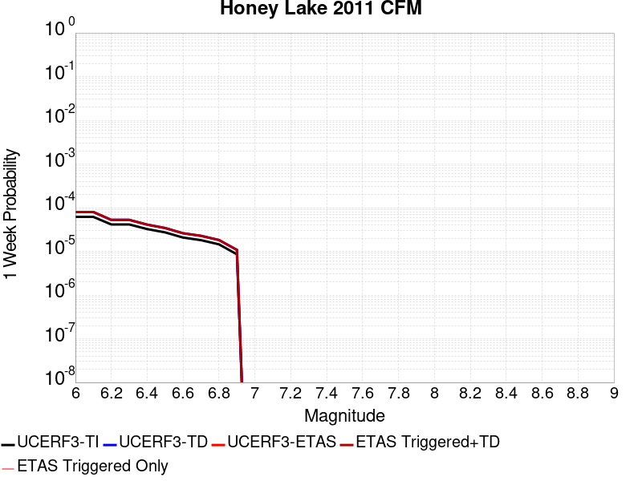 | 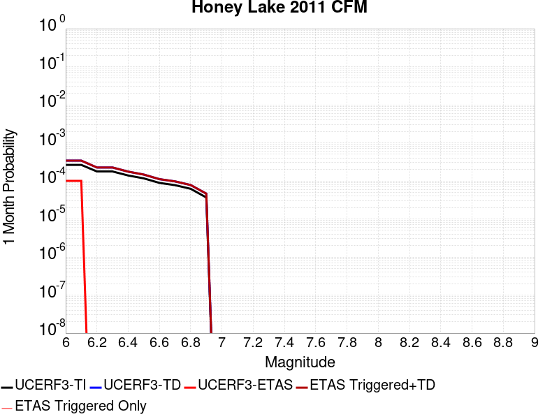 | 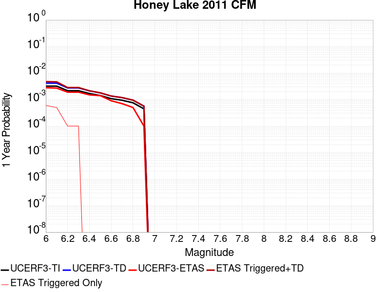 |  |

| Magnitude | 1 wk TI Prob | 1 wk TD Prob | 1 wk ETAS Prob | 1 wk ETAS/TD Gain | 1 wk ETAS Triggered+TD | 1 wk ETAS Triggered Only | 1 mo TI Prob | 1 mo TD Prob | 1 mo ETAS Prob | 1 mo ETAS/TD Gain | 1 mo ETAS Triggered+TD | 1 mo ETAS Triggered Only | 1 yr TI Prob | 1 yr TD Prob | 1 yr ETAS Prob | 1 yr ETAS/TD Gain | 1 yr ETAS Triggered+TD | 1 yr ETAS Triggered Only | 10 yr TI Prob | 10 yr TD Prob | 10 yr ETAS Prob | 10 yr ETAS/TD Gain | 10 yr ETAS Triggered+TD | 10 yr ETAS Triggered Only |
|-----|-----|-----|-----|-----|-----|-----|-----|-----|-----|-----|-----|-----|-----|-----|-----|-----|-----|-----|-----|-----|-----|-----|-----|-----|
| 6.0 | 6.155506E-5 | 7.959183E-5 | 0.0 | 0.0 | 7.959183E-5 | 0.0 | 2.6378073E-4 | 3.410655E-4 | 1.0E-4 | 0.29319882 | 3.410655E-4 | 0.0 | 0.0032068014 | 0.00414501 | 0.0028 | 0.67551106 | 0.0047425227 | 6.0E-4 | 0.03160919 | 0.04072542 | 0.0256 | 0.6286 | 0.04532994 | 0.0048 |
| 6.1 | 6.155506E-5 | 7.959183E-5 | 0.0 | 0.0 | 7.959183E-5 | 0.0 | 2.6378073E-4 | 3.410655E-4 | 1.0E-4 | 0.29319882 | 3.410655E-4 | 0.0 | 0.0032068014 | 0.00414501 | 0.0027 | 0.65138566 | 0.0046429373 | 5.0E-4 | 0.03160919 | 0.04072542 | 0.0233 | 0.57212424 | 0.0448503 | 0.0043 |
| 6.2 | 4.1335024E-5 | 5.260448E-5 | 0.0 | 0.0 | 5.260448E-5 | 0.0 | 1.7713808E-4 | 2.2542929E-4 | 0.0 | 0.0 | 2.2542929E-4 | 0.0 | 0.0021545228 | 0.0027412993 | 0.0019 | 0.69310194 | 0.0028410254 | 1.0E-4 | 0.021337535 | 0.02709096 | 0.0153 | 0.564764 | 0.029036777 | 0.002 |
| 6.3 | 4.1335024E-5 | 5.260448E-5 | 0.0 | 0.0 | 5.260448E-5 | 0.0 | 1.7713808E-4 | 2.2542929E-4 | 0.0 | 0.0 | 2.2542929E-4 | 0.0 | 0.0021545228 | 0.0027412993 | 0.0019 | 0.69310194 | 0.0028410254 | 1.0E-4 | 0.021337535 | 0.02709096 | 0.0153 | 0.564764 | 0.029036777 | 0.002 |
| 6.4 | 3.2393702E-5 | 4.090835E-5 | 0.0 | 0.0 | 4.090835E-5 | 0.0 | 1.3882275E-4 | 1.7531037E-4 | 0.0 | 0.0 | 1.7531037E-4 | 0.0 | 0.0016888566 | 0.0021324214 | 0.0015 | 0.7034257 | 0.0021324214 | 0.0 | 0.016760793 | 0.02113062 | 0.0119 | 0.5631638 | 0.022403149 | 0.0013 |
| 6.5 | 2.7205504E-5 | 3.4229153E-5 | 0.0 | 0.0 | 3.4229153E-5 | 0.0 | 1.1658981E-4 | 1.4668866E-4 | 0.0 | 0.0 | 1.4668866E-4 | 0.0 | 0.0014185566 | 0.001784565 | 0.0014 | 0.7845049 | 0.001784565 | 0.0 | 0.014095354 | 0.017711867 | 0.01 | 0.5645932 | 0.018792383 | 0.0011 |
| 6.6 | 2.069265E-5 | 2.5968484E-5 | 0.0 | 0.0 | 2.5968484E-5 | 0.0 | 8.867977E-5 | 1.1128924E-4 | 0.0 | 0.0 | 1.1128924E-4 | 0.0 | 0.0010791414 | 0.0013541887 | 9.0E-4 | 0.6646046 | 0.0013541887 | 0.0 | 0.010739161 | 0.013467745 | 0.0071 | 0.5271855 | 0.014355624 | 9.0E-4 |
| 6.7 | 1.8060919E-5 | 2.2668266E-5 | 0.0 | 0.0 | 2.2668266E-5 | 0.0 | 7.7401644E-5 | 9.714655E-5 | 0.0 | 0.0 | 9.714655E-5 | 0.0 | 9.419576E-4 | 0.0011821985 | 7.0E-4 | 0.59211713 | 0.0011821985 | 0.0 | 0.009379748 | 0.011767146 | 0.0063 | 0.53538895 | 0.012557733 | 8.0E-4 |
| 6.8 | 1.4474663E-5 | 1.8190507E-5 | 0.0 | 0.0 | 1.8190507E-5 | 0.0 | 6.203279E-5 | 7.795742E-5 | 0.0 | 0.0 | 7.795742E-5 | 0.0 | 7.5498753E-4 | 9.487948E-4 | 5.0E-4 | 0.52698433 | 9.487948E-4 | 0.0 | 0.007524277 | 0.009454975 | 0.0048 | 0.5076692 | 0.010049302 | 6.0E-4 |
| 6.9 | 8.564552E-6 | 1.08079075E-5 | 0.0 | 0.0 | 1.08079075E-5 | 0.0 | 3.6704707E-5 | 4.6319157E-5 | 0.0 | 0.0 | 4.6319157E-5 | 0.0 | 4.4678818E-4 | 5.6385633E-4 | 1.0E-4 | 0.17735015 | 5.6385633E-4 | 0.0 | 0.0044589094 | 0.0056307605 | 0.0029 | 0.5150281 | 0.0060285083 | 4.0E-4 |

## Goldstone Lake
*[(top)](#table-of-contents)*

| 1 Week | 1 Month | 1 Year | 10 Year |
|-----|-----|-----|-----|
|  | 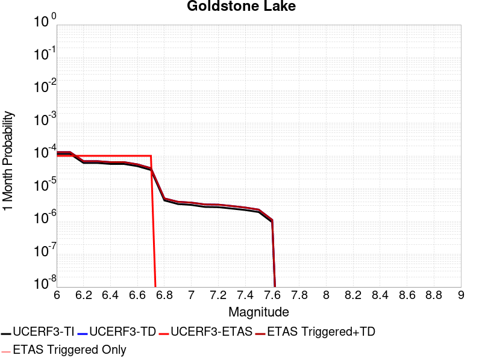 |  |  |

| Magnitude | 1 wk TI Prob | 1 wk TD Prob | 1 wk ETAS Prob | 1 wk ETAS/TD Gain | 1 wk ETAS Triggered+TD | 1 wk ETAS Triggered Only | 1 mo TI Prob | 1 mo TD Prob | 1 mo ETAS Prob | 1 mo ETAS/TD Gain | 1 mo ETAS Triggered+TD | 1 mo ETAS Triggered Only | 1 yr TI Prob | 1 yr TD Prob | 1 yr ETAS Prob | 1 yr ETAS/TD Gain | 1 yr ETAS Triggered+TD | 1 yr ETAS Triggered Only | 10 yr TI Prob | 10 yr TD Prob | 10 yr ETAS Prob | 10 yr ETAS/TD Gain | 10 yr ETAS Triggered+TD | 10 yr ETAS Triggered Only |
|-----|-----|-----|-----|-----|-----|-----|-----|-----|-----|-----|-----|-----|-----|-----|-----|-----|-----|-----|-----|-----|-----|-----|-----|-----|
| 6.0 | 2.671352E-5 | 3.0384148E-5 | 0.0 | 0.0 | 3.0384148E-5 | 0.0 | 1.1448149E-4 | 1.3021239E-4 | 1.0E-4 | 0.7679761 | 1.3021239E-4 | 0.0 | 0.001392921 | 0.0015843794 | 0.0014 | 0.88362676 | 0.0024829535 | 9.0E-4 | 0.013842222 | 0.015750345 | 0.0183 | 1.1618793 | 0.020474743 | 0.0048 |
| 6.1 | 2.671352E-5 | 3.0384148E-5 | 0.0 | 0.0 | 3.0384148E-5 | 0.0 | 1.1448149E-4 | 1.3021239E-4 | 1.0E-4 | 0.7679761 | 1.3021239E-4 | 0.0 | 0.001392921 | 0.0015843794 | 0.0014 | 0.88362676 | 0.0024829535 | 9.0E-4 | 0.013842222 | 0.015750345 | 0.0183 | 1.1618793 | 0.020474743 | 0.0048 |
| 6.2 | 1.4197047E-5 | 1.6100306E-5 | 0.0 | 0.0 | 1.6100306E-5 | 0.0 | 6.0843064E-5 | 6.9000045E-5 | 1.0E-4 | 1.4492745 | 6.9000045E-5 | 0.0 | 7.4051257E-4 | 8.398504E-4 | 7.0E-4 | 0.8334818 | 0.0011395984 | 3.0E-4 | 0.007380498 | 0.008376466 | 0.0105 | 1.2535119 | 0.010954687 | 0.0026 |
| 6.3 | 1.4197047E-5 | 1.6100306E-5 | 0.0 | 0.0 | 1.6100306E-5 | 0.0 | 6.0843064E-5 | 6.9000045E-5 | 1.0E-4 | 1.4492745 | 6.9000045E-5 | 0.0 | 7.4051257E-4 | 8.398504E-4 | 7.0E-4 | 0.8334818 | 0.0011395984 | 3.0E-4 | 0.007380498 | 0.008376466 | 0.0105 | 1.2535119 | 0.010954687 | 0.0026 |
| 6.4 | 1.3238931E-5 | 1.5012229E-5 | 0.0 | 0.0 | 1.5012229E-5 | 0.0 | 5.6737044E-5 | 6.433709E-5 | 1.0E-4 | 1.5543134 | 6.433709E-5 | 0.0 | 6.9055456E-4 | 7.831206E-4 | 7.0E-4 | 0.89385974 | 0.0010828857 | 3.0E-4 | 0.006884126 | 0.00781324 | 0.0098 | 1.2542812 | 0.010194489 | 0.0024 |
| 6.5 | 1.3238931E-5 | 1.5012229E-5 | 0.0 | 0.0 | 1.5012229E-5 | 0.0 | 5.6737044E-5 | 6.433709E-5 | 1.0E-4 | 1.5543134 | 6.433709E-5 | 0.0 | 6.9055456E-4 | 7.831206E-4 | 7.0E-4 | 0.89385974 | 0.0010828857 | 3.0E-4 | 0.006884126 | 0.00781324 | 0.0098 | 1.2542812 | 0.010194489 | 0.0024 |
| 6.6 | 1.1328278E-5 | 1.28583915E-5 | 0.0 | 0.0 | 1.28583915E-5 | 0.0 | 4.8548856E-5 | 5.5106768E-5 | 1.0E-4 | 1.8146591 | 5.5106768E-5 | 0.0 | 5.90922E-4 | 6.7081413E-4 | 6.0E-4 | 0.8944355 | 9.7061286E-4 | 3.0E-4 | 0.0058935313 | 0.0066972864 | 0.0087 | 1.2990336 | 0.008981883 | 0.0023 |
| 6.7 | 8.651175E-6 | 9.826997E-6 | 0.0 | 0.0 | 9.826997E-6 | 0.0 | 3.707594E-5 | 4.211553E-5 | 1.0E-4 | 2.374421 | 4.211553E-5 | 0.0 | 4.5130608E-4 | 5.1272655E-4 | 3.0E-4 | 0.5851072 | 7.12624E-4 | 2.0E-4 | 0.0045039062 | 0.005124319 | 0.006 | 1.1708874 | 0.00671612 | 0.0016 |
| 6.8 | 1.0215377E-6 | 1.1756098E-6 | 0.0 | 0.0 | 1.1756098E-6 | 0.0 | 4.378012E-6 | 5.0383187E-6 | 0.0 | 0.0 | 5.0383187E-6 | 0.0 | 5.3300988E-5 | 6.133992E-5 | 1.0E-4 | 1.6302599 | 1.6133378E-4 | 1.0E-4 | 5.3288206E-4 | 6.132411E-4 | 9.0E-4 | 1.467612 | 9.130571E-4 | 3.0E-4 |
| 6.9 | 7.9360774E-7 | 9.284379E-7 | 0.0 | 0.0 | 9.284379E-7 | 0.0 | 3.4011714E-6 | 3.979014E-6 | 0.0 | 0.0 | 3.979014E-6 | 0.0 | 4.1408475E-5 | 4.844349E-5 | 0.0 | 0.0 | 4.844349E-5 | 0.0 | 4.140076E-4 | 4.8433628E-4 | 6.0E-4 | 1.2388088 | 6.8423944E-4 | 2.0E-4 |
| 7.0 | 7.4382757E-7 | 8.7482294E-7 | 0.0 | 0.0 | 8.7482294E-7 | 0.0 | 3.1878285E-6 | 3.7492362E-6 | 0.0 | 0.0 | 3.7492362E-6 | 0.0 | 3.8811122E-5 | 4.5646062E-5 | 0.0 | 0.0 | 4.5646062E-5 | 0.0 | 3.8804344E-4 | 4.563735E-4 | 6.0E-4 | 1.3147126 | 6.5628224E-4 | 2.0E-4 |
| 7.1 | 6.4709513E-7 | 7.7120546E-7 | 0.0 | 0.0 | 7.7120546E-7 | 0.0 | 2.773262E-6 | 3.3051624E-6 | 0.0 | 0.0 | 3.3051624E-6 | 0.0 | 3.376394E-5 | 4.023967E-5 | 0.0 | 0.0 | 4.023967E-5 | 0.0 | 3.375881E-4 | 4.023298E-4 | 6.0E-4 | 1.4913138 | 6.0224935E-4 | 2.0E-4 |
| 7.2 | 6.356704E-7 | 7.589096E-7 | 0.0 | 0.0 | 7.589096E-7 | 0.0 | 2.7242988E-6 | 3.2524658E-6 | 0.0 | 0.0 | 3.2524658E-6 | 0.0 | 3.3167835E-5 | 3.9598115E-5 | 0.0 | 0.0 | 3.9598115E-5 | 0.0 | 3.3162883E-4 | 3.9591652E-4 | 6.0E-4 | 1.515471 | 5.958373E-4 | 2.0E-4 |
| 7.3 | 5.7695723E-7 | 6.897233E-7 | 0.0 | 0.0 | 6.897233E-7 | 0.0 | 2.4726714E-6 | 2.9559542E-6 | 0.0 | 0.0 | 2.9559542E-6 | 0.0 | 3.0104358E-5 | 3.5988207E-5 | 0.0 | 0.0 | 3.5988207E-5 | 0.0 | 3.0100282E-4 | 3.5982952E-4 | 5.0E-4 | 1.389547 | 4.5979352E-4 | 1.0E-4 |
| 7.4 | 5.209647E-7 | 6.1940716E-7 | 0.0 | 0.0 | 6.1940716E-7 | 0.0 | 2.232704E-6 | 2.6545997E-6 | 0.0 | 0.0 | 2.6545997E-6 | 0.0 | 2.718283E-5 | 3.231933E-5 | 0.0 | 0.0 | 3.231933E-5 | 0.0 | 2.7179506E-4 | 3.2315185E-4 | 4.0E-4 | 1.2378082 | 4.2311955E-4 | 1.0E-4 |
| 7.5 | 4.512955E-7 | 5.34934E-7 | 0.0 | 0.0 | 5.34934E-7 | 0.0 | 1.934122E-6 | 2.2925724E-6 | 0.0 | 0.0 | 2.2925724E-6 | 0.0 | 2.3547682E-5 | 2.7911767E-5 | 0.0 | 0.0 | 2.7911767E-5 | 0.0 | 2.3545188E-4 | 2.7908792E-4 | 2.0E-4 | 0.7166201 | 2.7908792E-4 | 0.0 |
| 7.6 | 2.21172E-7 | 2.6041212E-7 | 0.0 | 0.0 | 2.6041212E-7 | 0.0 | 9.478797E-7 | 1.1160516E-6 | 0.0 | 0.0 | 1.1160516E-6 | 0.0 | 1.1540374E-5 | 1.3587873E-5 | 0.0 | 0.0 | 1.3587873E-5 | 0.0 | 1.1539775E-4 | 1.3587323E-4 | 1.0E-4 | 0.73598015 | 1.3587323E-4 | 0.0 |

## Mount Diablo Thrust South
*[(top)](#table-of-contents)*

| 1 Week | 1 Month | 1 Year | 10 Year |
|-----|-----|-----|-----|
|  | 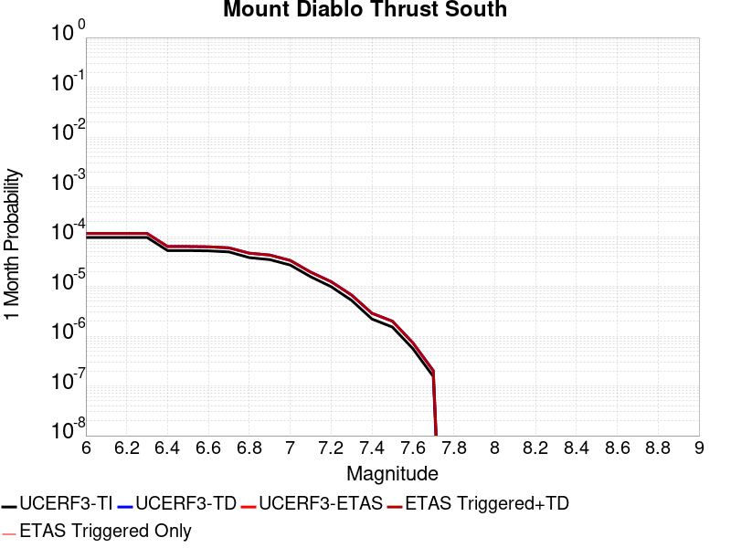 |  | 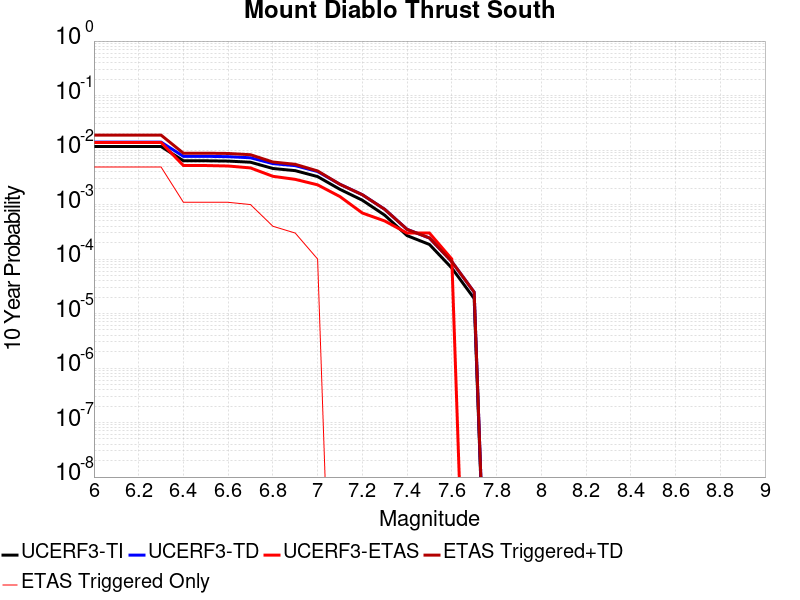 |

| Magnitude | 1 wk TI Prob | 1 wk TD Prob | 1 wk ETAS Prob | 1 wk ETAS/TD Gain | 1 wk ETAS Triggered+TD | 1 wk ETAS Triggered Only | 1 mo TI Prob | 1 mo TD Prob | 1 mo ETAS Prob | 1 mo ETAS/TD Gain | 1 mo ETAS Triggered+TD | 1 mo ETAS Triggered Only | 1 yr TI Prob | 1 yr TD Prob | 1 yr ETAS Prob | 1 yr ETAS/TD Gain | 1 yr ETAS Triggered+TD | 1 yr ETAS Triggered Only | 10 yr TI Prob | 10 yr TD Prob | 10 yr ETAS Prob | 10 yr ETAS/TD Gain | 10 yr ETAS Triggered+TD | 10 yr ETAS Triggered Only |
|-----|-----|-----|-----|-----|-----|-----|-----|-----|-----|-----|-----|-----|-----|-----|-----|-----|-----|-----|-----|-----|-----|-----|-----|-----|
| 6.0 | 2.2377444E-5 | 2.6965981E-5 | 0.0 | 0.0 | 2.6965981E-5 | 0.0 | 9.5899806E-5 | 1.1556449E-4 | 0.0 | 0.0 | 1.1556449E-4 | 0.0 | 0.0011669548 | 0.0014062878 | 0.0015 | 1.066638 | 0.0027044595 | 0.0013 | 0.011608457 | 0.013994078 | 0.0138 | 0.98613137 | 0.018825507 | 0.0049 |
| 6.1 | 2.2377444E-5 | 2.6965981E-5 | 0.0 | 0.0 | 2.6965981E-5 | 0.0 | 9.5899806E-5 | 1.1556449E-4 | 0.0 | 0.0 | 1.1556449E-4 | 0.0 | 0.0011669548 | 0.0014062878 | 0.0015 | 1.066638 | 0.0027044595 | 0.0013 | 0.011608457 | 0.013994078 | 0.0138 | 0.98613137 | 0.018825507 | 0.0049 |
| 6.2 | 2.2377444E-5 | 2.6965981E-5 | 0.0 | 0.0 | 2.6965981E-5 | 0.0 | 9.5899806E-5 | 1.1556449E-4 | 0.0 | 0.0 | 1.1556449E-4 | 0.0 | 0.0011669548 | 0.0014062878 | 0.0015 | 1.066638 | 0.0027044595 | 0.0013 | 0.011608457 | 0.013994078 | 0.0138 | 0.98613137 | 0.018825507 | 0.0049 |
| 6.3 | 2.2377444E-5 | 2.6965981E-5 | 0.0 | 0.0 | 2.6965981E-5 | 0.0 | 9.5899806E-5 | 1.1556449E-4 | 0.0 | 0.0 | 1.1556449E-4 | 0.0 | 0.0011669548 | 0.0014062878 | 0.0015 | 1.066638 | 0.0027044595 | 0.0013 | 0.011608457 | 0.013994078 | 0.0138 | 0.98613137 | 0.018825507 | 0.0049 |
| 6.4 | 1.2228463E-5 | 1.4752545E-5 | 0.0 | 0.0 | 1.4752545E-5 | 0.0 | 5.2406645E-5 | 6.3223735E-5 | 0.0 | 0.0 | 6.3223735E-5 | 0.0 | 6.378641E-4 | 7.6948997E-4 | 6.0E-4 | 0.77973723 | 0.0011691822 | 4.0E-4 | 0.0063603627 | 0.007670218 | 0.0052 | 0.67794687 | 0.00876178 | 0.0011 |
| 6.5 | 1.2228463E-5 | 1.4752545E-5 | 0.0 | 0.0 | 1.4752545E-5 | 0.0 | 5.2406645E-5 | 6.3223735E-5 | 0.0 | 0.0 | 6.3223735E-5 | 0.0 | 6.378641E-4 | 7.6948997E-4 | 6.0E-4 | 0.77973723 | 0.0011691822 | 4.0E-4 | 0.0063603627 | 0.007670218 | 0.0052 | 0.67794687 | 0.00876178 | 0.0011 |
| 6.6 | 1.2068118E-5 | 1.455726E-5 | 0.0 | 0.0 | 1.455726E-5 | 0.0 | 5.1719482E-5 | 6.238684E-5 | 0.0 | 0.0 | 6.238684E-5 | 0.0 | 6.2950276E-4 | 7.593079E-4 | 6.0E-4 | 0.7901933 | 0.0011590042 | 4.0E-4 | 0.006277225 | 0.007569095 | 0.0051 | 0.6737926 | 0.008660769 | 0.0011 |
| 6.7 | 1.1499428E-5 | 1.3879664E-5 | 0.0 | 0.0 | 1.3879664E-5 | 0.0 | 4.9282335E-5 | 5.948299E-5 | 0.0 | 0.0 | 5.948299E-5 | 0.0 | 5.9984723E-4 | 7.239775E-4 | 5.0E-4 | 0.6906292 | 0.0010237603 | 3.0E-4 | 0.0059823063 | 0.007218135 | 0.0047 | 0.6511377 | 0.008210917 | 0.001 |
| 6.8 | 8.82118E-6 | 1.0834118E-5 | 0.0 | 0.0 | 1.0834118E-5 | 0.0 | 3.780451E-5 | 4.643114E-5 | 0.0 | 0.0 | 4.643114E-5 | 0.0 | 4.601727E-4 | 5.6515815E-4 | 3.0E-4 | 0.5308249 | 6.6510163E-4 | 1.0E-4 | 0.0045922096 | 0.0056384364 | 0.0033 | 0.5852686 | 0.006036181 | 4.0E-4 |
| 6.9 | 8.047112E-6 | 9.942817E-6 | 0.0 | 0.0 | 9.942817E-6 | 0.0 | 3.4487166E-5 | 4.2611406E-5 | 0.0 | 0.0 | 4.2611406E-5 | 0.0 | 4.1980037E-4 | 5.1867566E-4 | 3.0E-4 | 0.57839614 | 6.186238E-4 | 1.0E-4 | 0.004190082 | 0.005175843 | 0.0029 | 0.5602952 | 0.00547429 | 3.0E-4 |
| 7.0 | 6.2574763E-6 | 7.751359E-6 | 0.0 | 0.0 | 7.751359E-6 | 0.0 | 2.681748E-5 | 3.3219705E-5 | 0.0 | 0.0 | 3.3219705E-5 | 0.0 | 3.264539E-4 | 4.0437854E-4 | 2.0E-4 | 0.49458608 | 4.0437854E-4 | 0.0 | 0.0032597475 | 0.004037377 | 0.0023 | 0.56967676 | 0.0041369735 | 1.0E-4 |
| 7.1 | 3.6485903E-6 | 4.5142924E-6 | 0.0 | 0.0 | 4.5142924E-6 | 0.0 | 1.5636722E-5 | 1.9346828E-5 | 0.0 | 0.0 | 1.9346828E-5 | 0.0 | 1.9036046E-4 | 2.3552257E-4 | 1.0E-4 | 0.42458776 | 2.3552257E-4 | 0.0 | 0.0019019748 | 0.0023528356 | 0.0014 | 0.5950267 | 0.0023528356 | 0.0 |
| 7.2 | 2.3034274E-6 | 2.9060848E-6 | 0.0 | 0.0 | 2.9060848E-6 | 0.0 | 9.871795E-6 | 1.245459E-5 | 0.0 | 0.0 | 1.245459E-5 | 0.0 | 1.2018247E-4 | 1.5162434E-4 | 1.0E-4 | 0.65952474 | 1.5162434E-4 | 0.0 | 0.0012011749 | 0.0015153944 | 7.0E-4 | 0.46192592 | 0.0015153944 | 0.0 |
| 7.3 | 1.224035E-6 | 1.5682622E-6 | 0.0 | 0.0 | 1.5682622E-6 | 0.0 | 5.245854E-6 | 6.721107E-6 | 0.0 | 0.0 | 6.721107E-6 | 0.0 | 6.38664E-5 | 8.182652E-5 | 0.0 | 0.0 | 8.182652E-5 | 0.0 | 6.384805E-4 | 8.1810314E-4 | 5.0E-4 | 0.6111699 | 8.1810314E-4 | 0.0 |
| 7.4 | 5.1601154E-7 | 6.724685E-7 | 0.0 | 0.0 | 6.724685E-7 | 0.0 | 2.2114762E-6 | 2.8820048E-6 | 0.0 | 0.0 | 2.8820048E-6 | 0.0 | 2.6924388E-5 | 3.508786E-5 | 0.0 | 0.0 | 3.508786E-5 | 0.0 | 2.6921128E-4 | 3.5078867E-4 | 3.0E-4 | 0.8552157 | 3.5078867E-4 | 0.0 |
| 7.5 | 3.552894E-7 | 4.665793E-7 | 0.0 | 0.0 | 4.665793E-7 | 0.0 | 1.5226678E-6 | 1.9996241E-6 | 0.0 | 0.0 | 1.9996241E-6 | 0.0 | 1.8538323E-5 | 2.4345167E-5 | 0.0 | 0.0 | 2.4345167E-5 | 0.0 | 1.8536777E-4 | 2.4343736E-4 | 3.0E-4 | 1.2323499 | 2.4343736E-4 | 0.0 |
| 7.6 | 1.3124082E-7 | 1.7192494E-7 | 0.0 | 0.0 | 1.7192494E-7 | 0.0 | 5.6246057E-7 | 7.36821E-7 | 0.0 | 0.0 | 7.36821E-7 | 0.0 | 6.8479358E-6 | 8.970767E-6 | 0.0 | 0.0 | 8.970767E-6 | 0.0 | 6.8477246E-5 | 8.9704095E-5 | 1.0E-4 | 1.1147763 | 8.9704095E-5 | 0.0 |
| 7.7 | 3.6193022E-8 | 4.7337167E-8 | 0.0 | 0.0 | 4.7337167E-8 | 0.0 | 1.5511293E-7 | 2.0287355E-7 | 0.0 | 0.0 | 2.0287355E-7 | 0.0 | 1.8884983E-6 | 2.4699839E-6 | 0.0 | 0.0 | 2.4699839E-6 | 0.0 | 1.8884823E-5 | 2.470406E-5 | 0.0 | 0.0 | 2.470406E-5 | 0.0 |

## Bullion Mountains
*[(top)](#table-of-contents)*

| 1 Week | 1 Month | 1 Year | 10 Year |
|-----|-----|-----|-----|
| 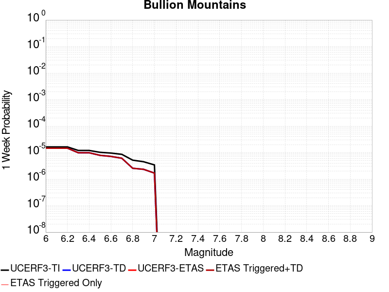 |  | 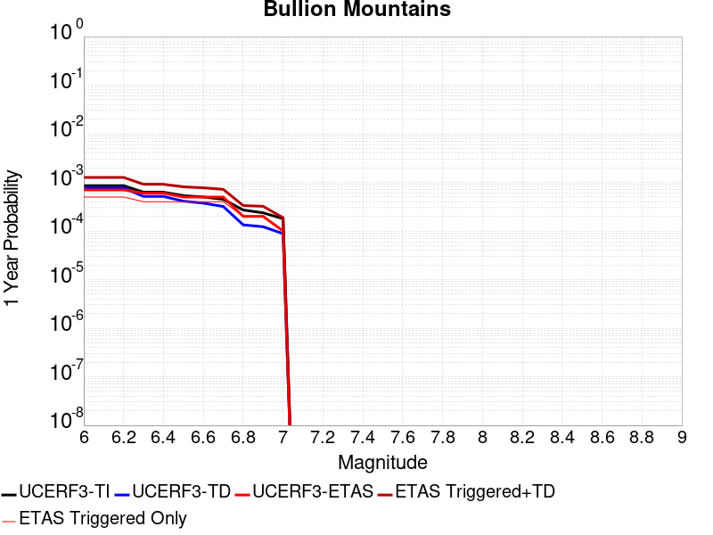 | 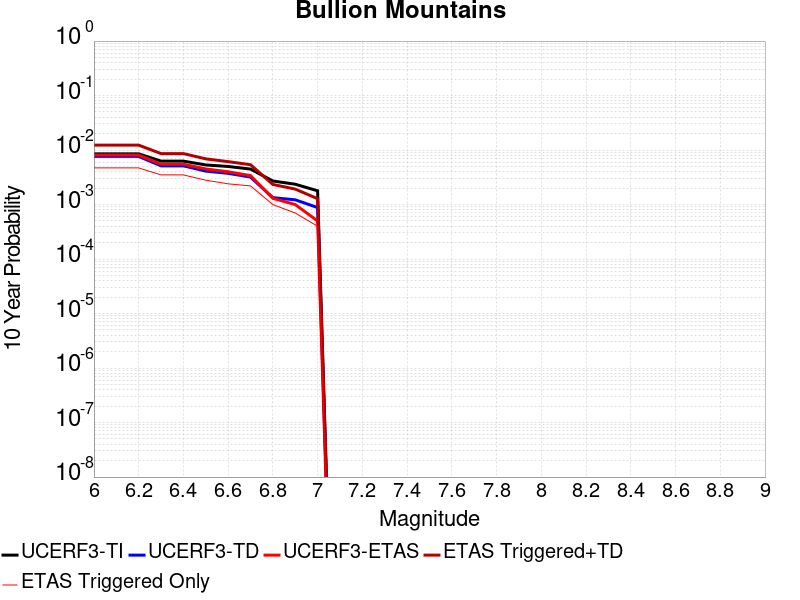 |

| Magnitude | 1 wk TI Prob | 1 wk TD Prob | 1 wk ETAS Prob | 1 wk ETAS/TD Gain | 1 wk ETAS Triggered+TD | 1 wk ETAS Triggered Only | 1 mo TI Prob | 1 mo TD Prob | 1 mo ETAS Prob | 1 mo ETAS/TD Gain | 1 mo ETAS Triggered+TD | 1 mo ETAS Triggered Only | 1 yr TI Prob | 1 yr TD Prob | 1 yr ETAS Prob | 1 yr ETAS/TD Gain | 1 yr ETAS Triggered+TD | 1 yr ETAS Triggered Only | 10 yr TI Prob | 10 yr TD Prob | 10 yr ETAS Prob | 10 yr ETAS/TD Gain | 10 yr ETAS Triggered+TD | 10 yr ETAS Triggered Only |
|-----|-----|-----|-----|-----|-----|-----|-----|-----|-----|-----|-----|-----|-----|-----|-----|-----|-----|-----|-----|-----|-----|-----|-----|-----|
| 6.0 | 1.6420427E-5 | 1.4692948E-5 | 0.0 | 0.0 | 1.4692948E-5 | 0.0 | 7.037136E-5 | 6.296847E-5 | 0.0 | 0.0 | 6.296847E-5 | 0.0 | 8.5643446E-4 | 7.6640985E-4 | 7.0E-4 | 0.9133494 | 0.0012660266 | 5.0E-4 | 0.008531413 | 0.0076414617 | 0.0081 | 1.0600066 | 0.012305547 | 0.0047 |
| 6.1 | 1.6420427E-5 | 1.4692948E-5 | 0.0 | 0.0 | 1.4692948E-5 | 0.0 | 7.037136E-5 | 6.296847E-5 | 0.0 | 0.0 | 6.296847E-5 | 0.0 | 8.5643446E-4 | 7.6640985E-4 | 7.0E-4 | 0.9133494 | 0.0012660266 | 5.0E-4 | 0.008531413 | 0.0076414617 | 0.0081 | 1.0600066 | 0.012305547 | 0.0047 |
| 6.2 | 1.6420427E-5 | 1.4692948E-5 | 0.0 | 0.0 | 1.4692948E-5 | 0.0 | 7.037136E-5 | 6.296847E-5 | 0.0 | 0.0 | 6.296847E-5 | 0.0 | 8.5643446E-4 | 7.6640985E-4 | 7.0E-4 | 0.9133494 | 0.0012660266 | 5.0E-4 | 0.008531413 | 0.0076414617 | 0.0081 | 1.0600066 | 0.012305547 | 0.0047 |
| 6.3 | 1.2046778E-5 | 9.862194E-6 | 0.0 | 0.0 | 9.862194E-6 | 0.0 | 5.1628023E-5 | 4.226599E-5 | 0.0 | 0.0 | 4.226599E-5 | 0.0 | 6.283899E-4 | 5.144901E-4 | 6.0E-4 | 1.1662031 | 9.142843E-4 | 4.0E-4 | 0.0062661595 | 0.0051352717 | 0.0055 | 1.0710241 | 0.008617299 | 0.0035 |
| 6.4 | 1.2046778E-5 | 9.862194E-6 | 0.0 | 0.0 | 9.862194E-6 | 0.0 | 5.1628023E-5 | 4.226599E-5 | 0.0 | 0.0 | 4.226599E-5 | 0.0 | 6.283899E-4 | 5.144901E-4 | 6.0E-4 | 1.1662031 | 9.142843E-4 | 4.0E-4 | 0.0062661595 | 0.0051352717 | 0.0055 | 1.0710241 | 0.008617299 | 0.0035 |
| 6.5 | 1.0244343E-5 | 7.8789235E-6 | 0.0 | 0.0 | 7.8789235E-6 | 0.0 | 4.390359E-5 | 3.3766493E-5 | 0.0 | 0.0 | 3.3766493E-5 | 0.0 | 5.343951E-4 | 4.110502E-4 | 5.0E-4 | 1.2163965 | 8.1088574E-4 | 4.0E-4 | 0.005331118 | 0.00410493 | 0.0045 | 1.0962428 | 0.0068934364 | 0.0028 |
| 6.6 | 9.605408E-6 | 7.176824E-6 | 0.0 | 0.0 | 7.176824E-6 | 0.0 | 4.1165385E-5 | 3.075757E-5 | 0.0 | 0.0 | 3.075757E-5 | 0.0 | 5.010733E-4 | 3.7442942E-4 | 5.0E-4 | 1.3353652 | 7.7427964E-4 | 4.0E-4 | 0.00499945 | 0.0037399826 | 0.004 | 1.0695237 | 0.006131007 | 0.0024 |
| 6.7 | 8.60418E-6 | 6.1231563E-6 | 0.0 | 0.0 | 6.1231563E-6 | 0.0 | 3.687454E-5 | 2.6241943E-5 | 0.0 | 0.0 | 2.6241943E-5 | 0.0 | 4.48855E-4 | 3.1946832E-4 | 5.0E-4 | 1.5651004 | 7.193405E-4 | 4.0E-4 | 0.004479495 | 0.0031920027 | 0.0034 | 1.065162 | 0.0053849802 | 0.0022 |
| 6.8 | 5.187994E-6 | 2.5616891E-6 | 0.0 | 0.0 | 2.5616891E-6 | 0.0 | 2.223407E-5 | 1.0978644E-5 | 0.0 | 0.0 | 1.0978644E-5 | 0.0 | 2.7066618E-4 | 1.3366078E-4 | 2.0E-4 | 1.4963253 | 3.3363406E-4 | 2.0E-4 | 0.0027033675 | 0.001336195 | 0.0013 | 0.97291183 | 0.0023348588 | 0.001 |
| 6.9 | 4.5302368E-6 | 2.3430391E-6 | 0.0 | 0.0 | 2.3430391E-6 | 0.0 | 1.9415156E-5 | 1.004158E-5 | 0.0 | 0.0 | 1.004158E-5 | 0.0 | 2.3635388E-4 | 1.2225335E-4 | 2.0E-4 | 1.6359471 | 3.2222888E-4 | 2.0E-4 | 0.0023610266 | 0.0012222496 | 0.001 | 0.8181635 | 0.0019213939 | 7.0E-4 |
| 7.0 | 3.431668E-6 | 1.6872395E-6 | 0.0 | 0.0 | 1.6872395E-6 | 0.0 | 1.4707065E-5 | 7.2310268E-6 | 0.0 | 0.0 | 7.2310268E-6 | 0.0 | 1.7904381E-4 | 8.803775E-5 | 1.0E-4 | 1.1358764 | 1.8802895E-4 | 1.0E-4 | 0.0017889962 | 8.803775E-4 | 5.0E-4 | 0.5679382 | 0.0012800253 | 4.0E-4 |

## Chino alt 1
*[(top)](#table-of-contents)*

| 1 Week | 1 Month | 1 Year | 10 Year |
|-----|-----|-----|-----|
|  |  |  |  |

| Magnitude | 1 wk TI Prob | 1 wk TD Prob | 1 wk ETAS Prob | 1 wk ETAS/TD Gain | 1 wk ETAS Triggered+TD | 1 wk ETAS Triggered Only | 1 mo TI Prob | 1 mo TD Prob | 1 mo ETAS Prob | 1 mo ETAS/TD Gain | 1 mo ETAS Triggered+TD | 1 mo ETAS Triggered Only | 1 yr TI Prob | 1 yr TD Prob | 1 yr ETAS Prob | 1 yr ETAS/TD Gain | 1 yr ETAS Triggered+TD | 1 yr ETAS Triggered Only | 10 yr TI Prob | 10 yr TD Prob | 10 yr ETAS Prob | 10 yr ETAS/TD Gain | 10 yr ETAS Triggered+TD | 10 yr ETAS Triggered Only |
|-----|-----|-----|-----|-----|-----|-----|-----|-----|-----|-----|-----|-----|-----|-----|-----|-----|-----|-----|-----|-----|-----|-----|-----|-----|
| 6.0 | 3.939946E-5 | 4.898163E-5 | 0.0 | 0.0 | 4.898163E-5 | 0.0 | 1.6884391E-4 | 2.0990732E-4 | 1.0E-4 | 0.47640073 | 2.0990732E-4 | 0.0 | 0.0020537362 | 0.0025531386 | 0.0023 | 0.90085196 | 0.0032513514 | 7.0E-4 | 0.020348595 | 0.025298217 | 0.0183 | 0.72337115 | 0.029781844 | 0.0046 |
| 6.1 | 2.1505624E-5 | 2.6902339E-5 | 0.0 | 0.0 | 2.6902339E-5 | 0.0 | 9.2163704E-5 | 1.1529127E-4 | 0.0 | 0.0 | 1.1529127E-4 | 0.0 | 0.0011215154 | 0.0014028774 | 0.0013 | 0.92666686 | 0.0018023163 | 4.0E-4 | 0.011158722 | 0.013960431 | 0.0097 | 0.69482094 | 0.015538095 | 0.0016 |
| 6.2 | 2.1505624E-5 | 2.6902339E-5 | 0.0 | 0.0 | 2.6902339E-5 | 0.0 | 9.2163704E-5 | 1.1529127E-4 | 0.0 | 0.0 | 1.1529127E-4 | 0.0 | 0.0011215154 | 0.0014028774 | 0.0013 | 0.92666686 | 0.0018023163 | 4.0E-4 | 0.011158722 | 0.013960431 | 0.0097 | 0.69482094 | 0.015538095 | 0.0016 |
| 6.3 | 1.4290785E-5 | 1.8184768E-5 | 0.0 | 0.0 | 1.8184768E-5 | 0.0 | 6.1244784E-5 | 7.7932644E-5 | 0.0 | 0.0 | 7.7932644E-5 | 0.0 | 7.454001E-4 | 9.484622E-4 | 9.0E-4 | 0.94890445 | 0.0010483674 | 1.0E-4 | 0.007429048 | 0.009457948 | 0.0061 | 0.64496017 | 0.010052273 | 6.0E-4 |
| 6.4 | 1.4290785E-5 | 1.8184768E-5 | 0.0 | 0.0 | 1.8184768E-5 | 0.0 | 6.1244784E-5 | 7.7932644E-5 | 0.0 | 0.0 | 7.7932644E-5 | 0.0 | 7.454001E-4 | 9.484622E-4 | 9.0E-4 | 0.94890445 | 0.0010483674 | 1.0E-4 | 0.007429048 | 0.009457948 | 0.0061 | 0.64496017 | 0.010052273 | 6.0E-4 |
| 6.5 | 1.3017944E-5 | 1.667116E-5 | 0.0 | 0.0 | 1.667116E-5 | 0.0 | 5.5789995E-5 | 7.144612E-5 | 0.0 | 0.0 | 7.144612E-5 | 0.0 | 6.790315E-4 | 8.695532E-4 | 9.0E-4 | 1.0350143 | 9.6946623E-4 | 1.0E-4 | 0.0067696036 | 0.008675157 | 0.006 | 0.6916301 | 0.009269952 | 6.0E-4 |
| 6.6 | 9.470016E-6 | 1.2055214E-5 | 0.0 | 0.0 | 1.2055214E-5 | 0.0 | 4.058515E-5 | 5.166437E-5 | 0.0 | 0.0 | 5.166437E-5 | 0.0 | 4.940122E-4 | 6.288662E-4 | 7.0E-4 | 1.1131144 | 7.2880334E-4 | 1.0E-4 | 0.004929154 | 0.00628299 | 0.0045 | 0.7162195 | 0.0067798486 | 5.0E-4 |
| 6.7 | 8.314155E-6 | 1.0416118E-5 | 0.0 | 0.0 | 1.0416118E-5 | 0.0 | 3.5631605E-5 | 4.4639924E-5 | 0.0 | 0.0 | 4.4639924E-5 | 0.0 | 4.3372845E-4 | 5.4338784E-4 | 6.0E-4 | 1.1041837 | 6.433335E-4 | 1.0E-4 | 0.004328829 | 0.0054331543 | 0.0041 | 0.7546261 | 0.0058309813 | 4.0E-4 |
| 6.8 | 3.4856364E-6 | 3.8163416E-6 | 0.0 | 0.0 | 3.8163416E-6 | 0.0 | 1.4938357E-5 | 1.635566E-5 | 0.0 | 0.0 | 1.635566E-5 | 0.0 | 1.8185932E-4 | 1.9911403E-4 | 3.0E-4 | 1.5066743 | 2.9909413E-4 | 1.0E-4 | 0.0018171056 | 0.0019913313 | 0.0013 | 0.6528295 | 0.002190933 | 2.0E-4 |
| 6.9 | 2.2645952E-6 | 2.1547792E-6 | 0.0 | 0.0 | 2.1547792E-6 | 0.0 | 9.705372E-6 | 9.234736E-6 | 0.0 | 0.0 | 9.234736E-6 | 0.0 | 1.18156495E-4 | 1.1242733E-4 | 2.0E-4 | 1.7789268 | 2.124161E-4 | 1.0E-4 | 0.0011809369 | 0.0011245658 | 8.0E-4 | 0.71138567 | 0.0013243409 | 2.0E-4 |
| 7.0 | 1.7864003E-6 | 1.5446867E-6 | 0.0 | 0.0 | 1.5446867E-6 | 0.0 | 7.655979E-6 | 6.6200696E-6 | 0.0 | 0.0 | 6.6200696E-6 | 0.0 | 9.3207556E-5 | 8.059642E-5 | 2.0E-4 | 2.4814997 | 1.8058837E-4 | 1.0E-4 | 9.316847E-4 | 8.061203E-4 | 5.0E-4 | 0.6202548 | 9.0603967E-4 | 1.0E-4 |
| 7.1 | 1.7315456E-6 | 1.4749259E-6 | 0.0 | 0.0 | 1.4749259E-6 | 0.0 | 7.420889E-6 | 6.321096E-6 | 0.0 | 0.0 | 6.321096E-6 | 0.0 | 9.034557E-5 | 7.695668E-5 | 2.0E-4 | 2.5988648 | 1.7694899E-4 | 1.0E-4 | 9.0308854E-4 | 7.697338E-4 | 5.0E-4 | 0.64957523 | 8.6965685E-4 | 1.0E-4 |
| 7.2 | 1.6008337E-6 | 1.3589153E-6 | 0.0 | 0.0 | 1.3589153E-6 | 0.0 | 6.860698E-6 | 5.8239098E-6 | 0.0 | 0.0 | 5.8239098E-6 | 0.0 | 8.352579E-5 | 7.090385E-5 | 2.0E-4 | 2.8207214 | 1.7089676E-4 | 1.0E-4 | 8.34944E-4 | 7.092318E-4 | 5.0E-4 | 0.7049881 | 8.0916093E-4 | 1.0E-4 |
| 7.3 | 1.3320939E-6 | 1.1231142E-6 | 0.0 | 0.0 | 1.1231142E-6 | 0.0 | 5.7089615E-6 | 4.813338E-6 | 0.0 | 0.0 | 4.813338E-6 | 0.0 | 6.9504385E-5 | 5.8600865E-5 | 1.0E-4 | 1.7064595 | 5.8600865E-5 | 0.0 | 6.9482654E-4 | 5.8599655E-4 | 3.0E-4 | 0.5119484 | 5.8599655E-4 | 0.0 |
| 7.4 | 1.114294E-6 | 9.249076E-7 | 0.0 | 0.0 | 9.249076E-7 | 0.0 | 4.775537E-6 | 3.963884E-6 | 0.0 | 0.0 | 3.963884E-6 | 0.0 | 5.8140613E-5 | 4.825926E-5 | 0.0 | 0.0 | 4.825926E-5 | 0.0 | 5.81254E-4 | 4.825052E-4 | 1.0E-4 | 0.20725167 | 4.825052E-4 | 0.0 |
| 7.5 | 9.354081E-7 | 7.63435E-7 | 0.0 | 0.0 | 7.63435E-7 | 0.0 | 4.0088858E-6 | 3.2718606E-6 | 0.0 | 0.0 | 3.2718606E-6 | 0.0 | 4.8807087E-5 | 3.983421E-5 | 0.0 | 0.0 | 3.983421E-5 | 0.0 | 4.879637E-4 | 3.982741E-4 | 1.0E-4 | 0.25108337 | 3.982741E-4 | 0.0 |
| 7.6 | 8.521771E-7 | 6.8911964E-7 | 0.0 | 0.0 | 6.8911964E-7 | 0.0 | 3.6521824E-6 | 2.9533667E-6 | 0.0 | 0.0 | 2.9533667E-6 | 0.0 | 4.4464414E-5 | 3.595668E-5 | 0.0 | 0.0 | 3.595668E-5 | 0.0 | 4.4455516E-4 | 3.595118E-4 | 1.0E-4 | 0.278155 | 3.595118E-4 | 0.0 |
| 7.7 | 2.1803626E-7 | 1.4214484E-7 | 0.0 | 0.0 | 1.4214484E-7 | 0.0 | 9.344408E-7 | 6.091921E-7 | 0.0 | 0.0 | 6.091921E-7 | 0.0 | 1.1376757E-5 | 7.4168984E-6 | 0.0 | 0.0 | 7.4168984E-6 | 0.0 | 1.13761744E-4 | 7.4167474E-5 | 0.0 | 0.0 | 7.4167474E-5 | 0.0 |

## Gravel Hills-Harper Lk
*[(top)](#table-of-contents)*

| 1 Week | 1 Month | 1 Year | 10 Year |
|-----|-----|-----|-----|
|  |  | 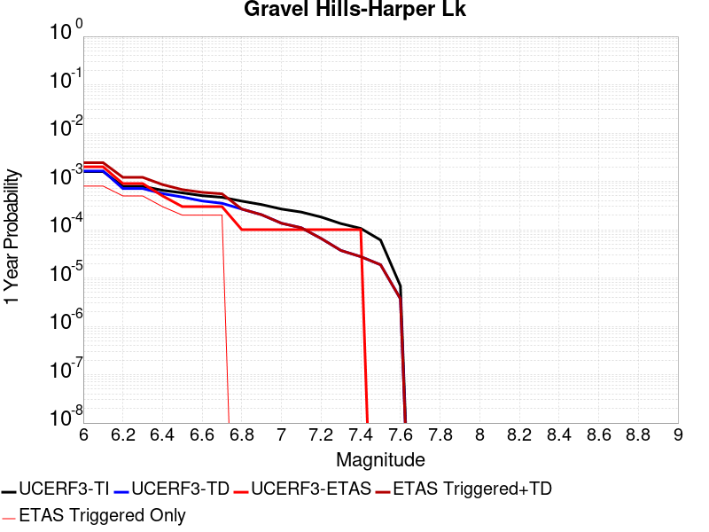 |  |

| Magnitude | 1 wk TI Prob | 1 wk TD Prob | 1 wk ETAS Prob | 1 wk ETAS/TD Gain | 1 wk ETAS Triggered+TD | 1 wk ETAS Triggered Only | 1 mo TI Prob | 1 mo TD Prob | 1 mo ETAS Prob | 1 mo ETAS/TD Gain | 1 mo ETAS Triggered+TD | 1 mo ETAS Triggered Only | 1 yr TI Prob | 1 yr TD Prob | 1 yr ETAS Prob | 1 yr ETAS/TD Gain | 1 yr ETAS Triggered+TD | 1 yr ETAS Triggered Only | 10 yr TI Prob | 10 yr TD Prob | 10 yr ETAS Prob | 10 yr ETAS/TD Gain | 10 yr ETAS Triggered+TD | 10 yr ETAS Triggered Only |
|-----|-----|-----|-----|-----|-----|-----|-----|-----|-----|-----|-----|-----|-----|-----|-----|-----|-----|-----|-----|-----|-----|-----|-----|-----|
| 6.0 | 3.0679566E-5 | 3.1472173E-5 | 0.0 | 0.0 | 3.1472173E-5 | 0.0 | 1.3147724E-4 | 1.3487498E-4 | 0.0 | 0.0 | 1.3487498E-4 | 0.0 | 0.0015995599 | 0.0016410832 | 0.002 | 1.2187073 | 0.0024397704 | 8.0E-4 | 0.015880952 | 0.016311225 | 0.0138 | 0.8460431 | 0.020934563 | 0.0047 |
| 6.1 | 3.0679566E-5 | 3.1472173E-5 | 0.0 | 0.0 | 3.1472173E-5 | 0.0 | 1.3147724E-4 | 1.3487498E-4 | 0.0 | 0.0 | 1.3487498E-4 | 0.0 | 0.0015995599 | 0.0016410832 | 0.002 | 1.2187073 | 0.0024397704 | 8.0E-4 | 0.015880952 | 0.016311225 | 0.0138 | 0.8460431 | 0.020934563 | 0.0047 |
| 6.2 | 1.514536E-5 | 1.36374665E-5 | 0.0 | 0.0 | 1.36374665E-5 | 0.0 | 6.490707E-5 | 5.8445043E-5 | 0.0 | 0.0 | 5.8445043E-5 | 0.0 | 7.8995706E-4 | 7.1134797E-4 | 9.0E-4 | 1.2652036 | 0.0012109923 | 5.0E-4 | 0.007871548 | 0.007091912 | 0.0054 | 0.7614308 | 0.008978437 | 0.0019 |
| 6.3 | 1.514536E-5 | 1.36374665E-5 | 0.0 | 0.0 | 1.36374665E-5 | 0.0 | 6.490707E-5 | 5.8445043E-5 | 0.0 | 0.0 | 5.8445043E-5 | 0.0 | 7.8995706E-4 | 7.1134797E-4 | 9.0E-4 | 1.2652036 | 0.0012109923 | 5.0E-4 | 0.007871548 | 0.007091912 | 0.0054 | 0.7614308 | 0.008978437 | 0.0019 |
| 6.4 | 1.2532521E-5 | 1.0691202E-5 | 0.0 | 0.0 | 1.0691202E-5 | 0.0 | 5.37097E-5 | 4.5818666E-5 | 0.0 | 0.0 | 4.5818666E-5 | 0.0 | 6.537194E-4 | 5.577053E-4 | 5.0E-4 | 0.89653087 | 8.5753796E-4 | 3.0E-4 | 0.0065179965 | 0.005563647 | 0.0035 | 0.62908375 | 0.0066575273 | 0.0011 |
| 6.5 | 1.1094058E-5 | 9.084802E-6 | 0.0 | 0.0 | 9.084802E-6 | 0.0 | 4.7545094E-5 | 3.8934308E-5 | 0.0 | 0.0 | 3.8934308E-5 | 0.0 | 5.787078E-4 | 4.739261E-4 | 3.0E-4 | 0.6330101 | 6.738313E-4 | 2.0E-4 | 0.0057720304 | 0.004729562 | 0.0029 | 0.6131646 | 0.005426251 | 7.0E-4 |
| 6.6 | 9.688328E-6 | 7.532512E-6 | 0.0 | 0.0 | 7.532512E-6 | 0.0 | 4.1520743E-5 | 3.228181E-5 | 0.0 | 0.0 | 3.228181E-5 | 0.0 | 5.053978E-4 | 3.9296268E-4 | 3.0E-4 | 0.76343125 | 5.928841E-4 | 2.0E-4 | 0.0050424994 | 0.003922935 | 0.0026 | 0.6627691 | 0.0045205816 | 6.0E-4 |
| 6.7 | 8.974824E-6 | 6.7500796E-6 | 0.0 | 0.0 | 6.7500796E-6 | 0.0 | 3.8462964E-5 | 2.8928605E-5 | 0.0 | 0.0 | 2.8928605E-5 | 0.0 | 4.6818596E-4 | 3.5215105E-4 | 3.0E-4 | 0.85190713 | 5.5208063E-4 | 2.0E-4 | 0.004672008 | 0.0035161513 | 0.0025 | 0.7110047 | 0.0041140416 | 6.0E-4 |
| 6.8 | 7.4780046E-6 | 5.1165644E-6 | 0.0 | 0.0 | 5.1165644E-6 | 0.0 | 3.20482E-5 | 2.1927955E-5 | 0.0 | 0.0 | 2.1927955E-5 | 0.0 | 3.9011694E-4 | 2.6694156E-4 | 1.0E-4 | 0.37461385 | 2.6694156E-4 | 0.0 | 0.0038943281 | 0.0026663472 | 0.0018 | 0.67508084 | 0.0029655474 | 3.0E-4 |
| 6.9 | 6.3409307E-6 | 3.907678E-6 | 0.0 | 0.0 | 3.907678E-6 | 0.0 | 2.7175134E-5 | 1.674709E-5 | 0.0 | 0.0 | 1.674709E-5 | 0.0 | 3.3080703E-4 | 2.0387773E-4 | 1.0E-4 | 0.49049005 | 2.0387773E-4 | 0.0 | 0.0033031502 | 0.002037005 | 0.0015 | 0.7363752 | 0.002336394 | 3.0E-4 |
| 7.0 | 5.1239335E-6 | 2.6058347E-6 | 0.0 | 0.0 | 2.6058347E-6 | 0.0 | 2.195953E-5 | 1.1167816E-5 | 0.0 | 0.0 | 1.1167816E-5 | 0.0 | 2.6732447E-4 | 1.3595994E-4 | 1.0E-4 | 0.73551077 | 1.3595994E-4 | 0.0 | 0.0026700313 | 0.0013587929 | 0.0011 | 0.8095421 | 0.0015585211 | 2.0E-4 |
| 7.1 | 4.438899E-6 | 2.0984237E-6 | 0.0 | 0.0 | 2.0984237E-6 | 0.0 | 1.9023713E-5 | 8.993215E-6 | 0.0 | 0.0 | 8.993215E-6 | 0.0 | 2.315891E-4 | 1.0948711E-4 | 1.0E-4 | 0.9133495 | 1.0948711E-4 | 0.0 | 0.002313479 | 0.0010943536 | 0.001 | 0.91378146 | 0.0012941347 | 2.0E-4 |
| 7.2 | 3.50367E-6 | 1.2614584E-6 | 0.0 | 0.0 | 1.2614584E-6 | 0.0 | 1.5015643E-5 | 5.4062393E-6 | 0.0 | 0.0 | 5.4062393E-6 | 0.0 | 1.8280011E-4 | 6.581906E-5 | 1.0E-4 | 1.5193168 | 6.581906E-5 | 0.0 | 0.0018264982 | 6.580039E-4 | 7.0E-4 | 1.0638235 | 8.578723E-4 | 2.0E-4 |
| 7.3 | 2.561638E-6 | 7.1177504E-7 | 0.0 | 0.0 | 7.1177504E-7 | 0.0 | 1.0978401E-5 | 3.050461E-6 | 0.0 | 0.0 | 3.050461E-6 | 0.0 | 1.3365384E-4 | 3.713875E-5 | 1.0E-4 | 2.6926055 | 3.713875E-5 | 0.0 | 0.0013357349 | 3.7132742E-4 | 6.0E-4 | 1.6158247 | 4.712903E-4 | 1.0E-4 |
| 7.4 | 2.0368864E-6 | 5.3037087E-7 | 0.0 | 0.0 | 5.3037087E-7 | 0.0 | 8.729483E-6 | 2.2730162E-6 | 0.0 | 0.0 | 2.2730162E-6 | 0.0 | 1.06276275E-4 | 2.7673625E-5 | 1.0E-4 | 3.613549 | 2.7673625E-5 | 0.0 | 0.0010622547 | 2.7670234E-4 | 4.0E-4 | 1.4455968 | 3.7667467E-4 | 1.0E-4 |
| 7.5 | 1.1681728E-6 | 3.6024073E-7 | 0.0 | 0.0 | 3.6024073E-7 | 0.0 | 5.0064455E-6 | 1.543888E-6 | 0.0 | 0.0 | 1.543888E-6 | 0.0 | 6.0951766E-5 | 1.8796678E-5 | 0.0 | 0.0 | 1.8796678E-5 | 0.0 | 6.093505E-4 | 1.8795136E-4 | 1.0E-4 | 0.5320526 | 1.8795136E-4 | 0.0 |
| 7.6 | 1.3154387E-7 | 7.119339E-8 | 0.0 | 0.0 | 7.119339E-8 | 0.0 | 5.6375933E-7 | 3.051145E-7 | 0.0 | 0.0 | 3.051145E-7 | 0.0 | 6.863748E-6 | 3.7147643E-6 | 0.0 | 0.0 | 3.7147643E-6 | 0.0 | 6.863536E-5 | 3.714718E-5 | 1.0E-4 | 2.6919944 | 3.714718E-5 | 0.0 |

## Blackwater
*[(top)](#table-of-contents)*

| 1 Week | 1 Month | 1 Year | 10 Year |
|-----|-----|-----|-----|
|  |  | 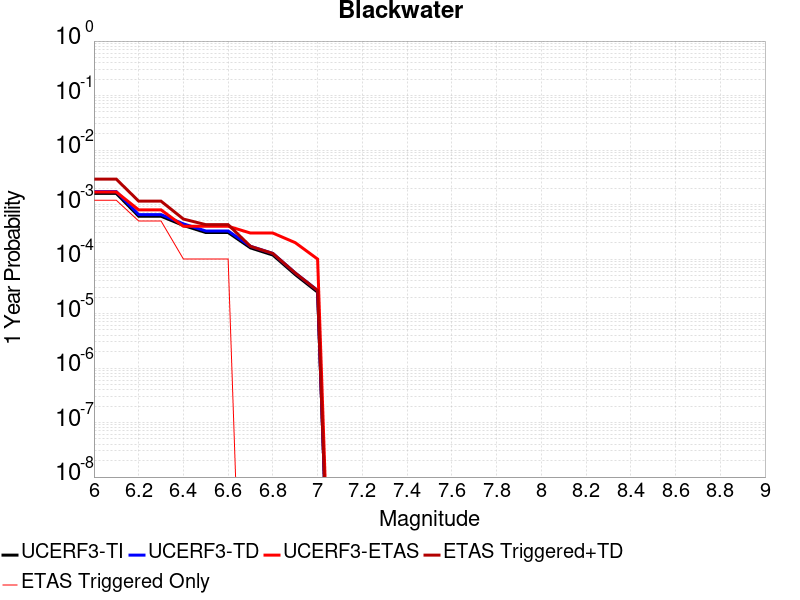 | 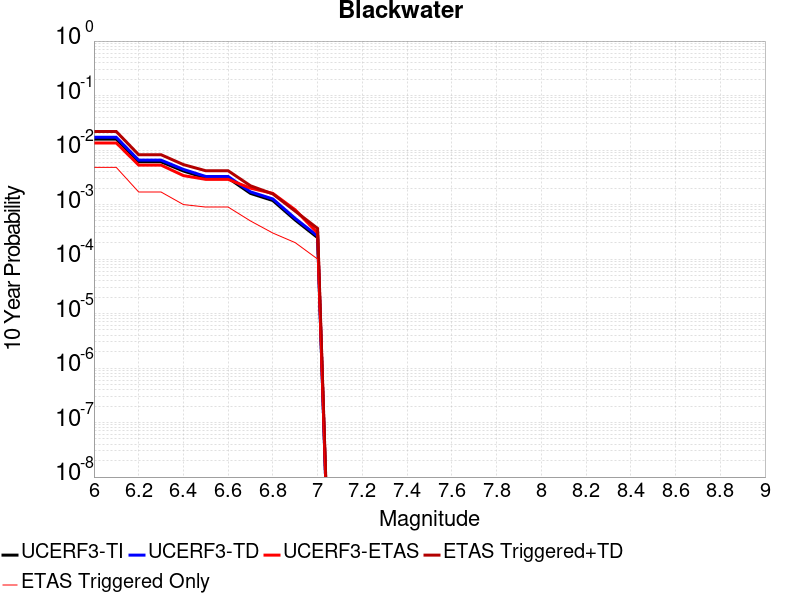 |

| Magnitude | 1 wk TI Prob | 1 wk TD Prob | 1 wk ETAS Prob | 1 wk ETAS/TD Gain | 1 wk ETAS Triggered+TD | 1 wk ETAS Triggered Only | 1 mo TI Prob | 1 mo TD Prob | 1 mo ETAS Prob | 1 mo ETAS/TD Gain | 1 mo ETAS Triggered+TD | 1 mo ETAS Triggered Only | 1 yr TI Prob | 1 yr TD Prob | 1 yr ETAS Prob | 1 yr ETAS/TD Gain | 1 yr ETAS Triggered+TD | 1 yr ETAS Triggered Only | 10 yr TI Prob | 10 yr TD Prob | 10 yr ETAS Prob | 10 yr ETAS/TD Gain | 10 yr ETAS Triggered+TD | 10 yr ETAS Triggered Only |
|-----|-----|-----|-----|-----|-----|-----|-----|-----|-----|-----|-----|-----|-----|-----|-----|-----|-----|-----|-----|-----|-----|-----|-----|-----|
| 6.0 | 3.0708583E-5 | 3.3100958E-5 | 0.0 | 0.0 | 3.3100958E-5 | 0.0 | 1.3160157E-4 | 1.4185431E-4 | 0.0 | 0.0 | 1.4185431E-4 | 0.0 | 0.0016010714 | 0.0017258448 | 0.0017 | 0.98502487 | 0.0029237738 | 0.0012 | 0.015895851 | 0.01713826 | 0.0135 | 0.78771126 | 0.021855995 | 0.0048 |
| 6.1 | 3.0708583E-5 | 3.3100958E-5 | 0.0 | 0.0 | 3.3100958E-5 | 0.0 | 1.3160157E-4 | 1.4185431E-4 | 0.0 | 0.0 | 1.4185431E-4 | 0.0 | 0.0016010714 | 0.0017258448 | 0.0017 | 0.98502487 | 0.0029237738 | 0.0012 | 0.015895851 | 0.01713826 | 0.0135 | 0.78771126 | 0.021855995 | 0.0048 |
| 6.2 | 1.1707779E-5 | 1.2546903E-5 | 0.0 | 0.0 | 1.2546903E-5 | 0.0 | 5.017523E-5 | 5.3771386E-5 | 0.0 | 0.0 | 5.3771386E-5 | 0.0 | 6.107122E-4 | 6.544796E-4 | 8.0E-4 | 1.2223452 | 0.0011541523 | 5.0E-4 | 0.006090366 | 0.006526493 | 0.0053 | 0.8120747 | 0.008215398 | 0.0017 |
| 6.3 | 1.1707779E-5 | 1.2546903E-5 | 0.0 | 0.0 | 1.2546903E-5 | 0.0 | 5.017523E-5 | 5.3771386E-5 | 0.0 | 0.0 | 5.3771386E-5 | 0.0 | 6.107122E-4 | 6.544796E-4 | 8.0E-4 | 1.2223452 | 0.0011541523 | 5.0E-4 | 0.006090366 | 0.006526493 | 0.0053 | 0.8120747 | 0.008215398 | 0.0017 |
| 6.4 | 7.929244E-6 | 8.481266E-6 | 0.0 | 0.0 | 8.481266E-6 | 0.0 | 3.3982033E-5 | 3.6347803E-5 | 0.0 | 0.0 | 3.6347803E-5 | 0.0 | 4.136527E-4 | 4.4244868E-4 | 4.0E-4 | 0.90405965 | 5.424044E-4 | 1.0E-4 | 0.0041288356 | 0.0044160835 | 0.0034 | 0.769913 | 0.0054116673 | 0.001 |
| 6.5 | 5.8832115E-6 | 6.2868444E-6 | 0.0 | 0.0 | 6.2868444E-6 | 0.0 | 2.521352E-5 | 2.6943355E-5 | 0.0 | 0.0 | 2.6943355E-5 | 0.0 | 3.0693135E-4 | 3.2798853E-4 | 4.0E-4 | 1.2195549 | 4.2795573E-4 | 1.0E-4 | 0.0030650778 | 0.0032752978 | 0.0029 | 0.8854157 | 0.00417235 | 9.0E-4 |
| 6.6 | 5.8832115E-6 | 6.2868444E-6 | 0.0 | 0.0 | 6.2868444E-6 | 0.0 | 2.521352E-5 | 2.6943355E-5 | 0.0 | 0.0 | 2.6943355E-5 | 0.0 | 3.0693135E-4 | 3.2798853E-4 | 4.0E-4 | 1.2195549 | 4.2795573E-4 | 1.0E-4 | 0.0030650778 | 0.0032752978 | 0.0029 | 0.8854157 | 0.00417235 | 9.0E-4 |
| 6.7 | 3.0715053E-6 | 3.2819112E-6 | 0.0 | 0.0 | 3.2819112E-6 | 0.0 | 1.3163528E-5 | 1.4065264E-5 | 0.0 | 0.0 | 1.4065264E-5 | 0.0 | 1.6025416E-4 | 1.712323E-4 | 3.0E-4 | 1.7520059 | 1.712323E-4 | 0.0 | 0.0016013865 | 0.0017111182 | 0.002 | 1.1688263 | 0.0022102627 | 5.0E-4 |
| 6.8 | 2.2722281E-6 | 2.4290855E-6 | 0.0 | 0.0 | 2.4290855E-6 | 0.0 | 9.738084E-6 | 1.041033E-5 | 0.0 | 0.0 | 1.041033E-5 | 0.0 | 1.1855473E-4 | 1.2673931E-4 | 3.0E-4 | 2.3670635 | 1.2673931E-4 | 0.0 | 0.001184915 | 0.0012667605 | 0.0016 | 1.2630643 | 0.0015663805 | 3.0E-4 |
| 6.9 | 9.952399E-7 | 1.0654977E-6 | 0.0 | 0.0 | 1.0654977E-6 | 0.0 | 4.265307E-6 | 4.5664137E-6 | 0.0 | 0.0 | 4.5664137E-6 | 0.0 | 5.1928873E-5 | 5.5595185E-5 | 2.0E-4 | 3.5974338 | 5.5595185E-5 | 0.0 | 5.191674E-4 | 5.558634E-4 | 8.0E-4 | 1.4392025 | 7.557522E-4 | 2.0E-4 |
| 7.0 | 4.7385504E-7 | 5.0762753E-7 | 0.0 | 0.0 | 5.0762753E-7 | 0.0 | 2.0308057E-6 | 2.1755466E-6 | 0.0 | 0.0 | 2.1755466E-6 | 0.0 | 2.4724779E-5 | 2.648728E-5 | 1.0E-4 | 3.775397 | 2.648728E-5 | 0.0 | 2.4722028E-4 | 2.648728E-4 | 3.0E-4 | 1.1326191 | 3.6484632E-4 | 1.0E-4 |

## Garlock (West)
*[(top)](#table-of-contents)*

| 1 Week | 1 Month | 1 Year | 10 Year |
|-----|-----|-----|-----|
| 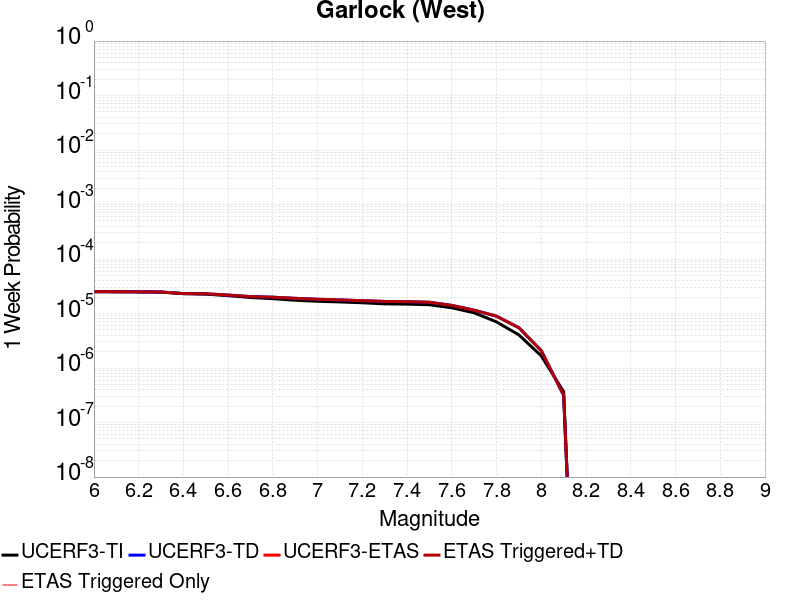 |  | 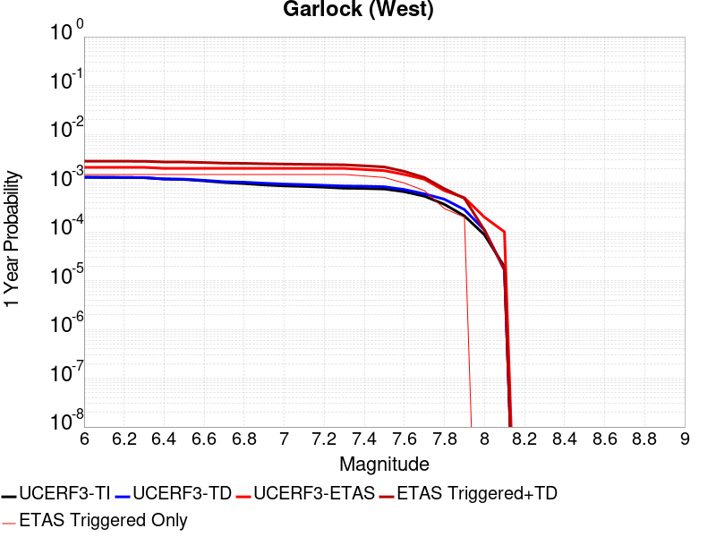 | 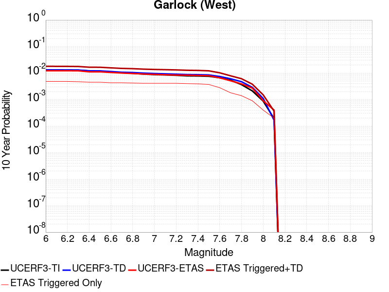 |

| Magnitude | 1 wk TI Prob | 1 wk TD Prob | 1 wk ETAS Prob | 1 wk ETAS/TD Gain | 1 wk ETAS Triggered+TD | 1 wk ETAS Triggered Only | 1 mo TI Prob | 1 mo TD Prob | 1 mo ETAS Prob | 1 mo ETAS/TD Gain | 1 mo ETAS Triggered+TD | 1 mo ETAS Triggered Only | 1 yr TI Prob | 1 yr TD Prob | 1 yr ETAS Prob | 1 yr ETAS/TD Gain | 1 yr ETAS Triggered+TD | 1 yr ETAS Triggered Only | 10 yr TI Prob | 10 yr TD Prob | 10 yr ETAS Prob | 10 yr ETAS/TD Gain | 10 yr ETAS Triggered+TD | 10 yr ETAS Triggered Only |
|-----|-----|-----|-----|-----|-----|-----|-----|-----|-----|-----|-----|-----|-----|-----|-----|-----|-----|-----|-----|-----|-----|-----|-----|-----|
| 6.0 | 2.5181727E-5 | 2.5266709E-5 | 0.0 | 0.0 | 2.5266709E-5 | 0.0 | 1.0791722E-4 | 1.0828142E-4 | 1.0E-4 | 0.9235195 | 2.0827059E-4 | 1.0E-4 | 0.0013131002 | 0.0013175325 | 0.0021 | 1.5938886 | 0.0028155562 | 0.0015 | 0.013053683 | 0.0131771965 | 0.0122 | 0.9258418 | 0.017913947 | 0.0048 |
| 6.1 | 2.5077732E-5 | 2.5167737E-5 | 0.0 | 0.0 | 2.5167737E-5 | 0.0 | 1.0747157E-4 | 1.0785729E-4 | 1.0E-4 | 0.9271511 | 2.078465E-4 | 1.0E-4 | 0.001307681 | 0.001312375 | 0.0021 | 1.6001525 | 0.0028104063 | 0.0015 | 0.013000126 | 0.013126232 | 0.0122 | 0.92943656 | 0.017863225 | 0.0048 |
| 6.2 | 2.494612E-5 | 2.5049354E-5 | 0.0 | 0.0 | 2.5049354E-5 | 0.0 | 1.0690756E-4 | 1.0734998E-4 | 1.0E-4 | 0.93153256 | 2.0733924E-4 | 1.0E-4 | 0.0013008224 | 0.0013062058 | 0.0021 | 1.6077099 | 0.0028042465 | 0.0015 | 0.012932341 | 0.013065267 | 0.0122 | 0.93377346 | 0.017802553 | 0.0048 |
| 6.3 | 2.4733758E-5 | 2.4868665E-5 | 0.0 | 0.0 | 2.4868665E-5 | 0.0 | 1.0599751E-4 | 1.0657565E-4 | 1.0E-4 | 0.9383006 | 2.0656499E-4 | 1.0E-4 | 0.0012897556 | 0.0012967896 | 0.0021 | 1.6193837 | 0.0027948446 | 0.0015 | 0.012822957 | 0.01297221 | 0.0121 | 0.9327632 | 0.01761124 | 0.0047 |
| 6.4 | 2.3237335E-5 | 2.3247441E-5 | 0.0 | 0.0 | 2.3247441E-5 | 0.0 | 9.958477E-5 | 9.96281E-5 | 1.0E-4 | 1.0037328 | 1.9961814E-4 | 1.0E-4 | 0.0012117702 | 0.0012123 | 0.002 | 1.6497567 | 0.0027104816 | 0.0015 | 0.012051838 | 0.012136813 | 0.0111 | 0.91457283 | 0.016582198 | 0.0045 |
| 6.5 | 2.2732203E-5 | 2.3061786E-5 | 0.0 | 0.0 | 2.3061786E-5 | 0.0 | 9.742009E-5 | 9.88325E-5 | 1.0E-4 | 1.0118129 | 1.9882261E-4 | 1.0E-4 | 0.0011854442 | 0.0012026243 | 0.002 | 1.6630298 | 0.0027008203 | 0.0015 | 0.011791403 | 0.012041109 | 0.0111 | 0.92184204 | 0.016486924 | 0.0045 |
| 6.6 | 2.1319436E-5 | 2.1841146E-5 | 0.0 | 0.0 | 2.1841146E-5 | 0.0 | 9.136581E-5 | 9.3601564E-5 | 1.0E-4 | 1.0683582 | 1.935922E-4 | 1.0E-4 | 0.001111811 | 0.0011390056 | 0.002 | 1.7559175 | 0.0026372971 | 0.0015 | 0.011062649 | 0.011411601 | 0.0105 | 0.92011636 | 0.01566253 | 0.0043 |
| 6.7 | 1.970802E-5 | 2.046028E-5 | 0.0 | 0.0 | 2.046028E-5 | 0.0 | 8.446021E-5 | 8.768398E-5 | 1.0E-4 | 1.1404592 | 1.876752E-4 | 1.0E-4 | 0.001027818 | 0.0010670313 | 0.002 | 1.8743593 | 0.0025654307 | 0.0015 | 0.010230771 | 0.0106989695 | 0.01 | 0.93466944 | 0.014952964 | 0.0043 |
| 6.8 | 1.8744462E-5 | 1.9967561E-5 | 0.0 | 0.0 | 1.9967561E-5 | 0.0 | 8.033094E-5 | 8.5572465E-5 | 1.0E-4 | 1.1686002 | 1.855639E-4 | 1.0E-4 | 9.775903E-4 | 0.0010413484 | 0.002 | 1.9205867 | 0.0025397865 | 0.0015 | 0.009733009 | 0.010444562 | 0.0096 | 0.9191386 | 0.014600694 | 0.0042 |
| 6.9 | 1.7559682E-5 | 1.901948E-5 | 0.0 | 0.0 | 1.901948E-5 | 0.0 | 7.5253614E-5 | 8.1509526E-5 | 1.0E-4 | 1.2268505 | 1.8150137E-4 | 1.0E-4 | 9.158276E-4 | 9.91928E-4 | 0.002 | 2.0162752 | 0.0024904402 | 0.0015 | 0.0091206245 | 0.009954898 | 0.0092 | 0.9241682 | 0.014014082 | 0.0041 |
| 7.0 | 1.6794445E-5 | 1.828182E-5 | 0.0 | 0.0 | 1.828182E-5 | 0.0 | 7.197421E-5 | 7.834831E-5 | 1.0E-4 | 1.2763517 | 1.7834047E-4 | 1.0E-4 | 8.759337E-4 | 9.5347466E-4 | 0.002 | 2.0975912 | 0.0024520445 | 0.0015 | 0.008724891 | 0.009573574 | 0.0089 | 0.9296424 | 0.013634322 | 0.0041 |
| 7.1 | 1.6337795E-5 | 1.7782277E-5 | 0.0 | 0.0 | 1.7782277E-5 | 0.0 | 7.0017246E-5 | 7.6207536E-5 | 1.0E-4 | 1.3122061 | 1.7619992E-4 | 1.0E-4 | 8.521265E-4 | 9.2743314E-4 | 0.002 | 2.1564896 | 0.002426042 | 0.0015 | 0.008488664 | 0.009315243 | 0.0086 | 0.923218 | 0.013377051 | 0.0041 |
| 7.2 | 1.5780008E-5 | 1.7230672E-5 | 0.0 | 0.0 | 1.7230672E-5 | 0.0 | 6.762685E-5 | 7.384366E-5 | 1.0E-4 | 1.3542125 | 1.7383628E-4 | 1.0E-4 | 8.2304585E-4 | 8.98677E-4 | 0.002 | 2.2254937 | 0.002397329 | 0.0015 | 0.008200042 | 0.009029955 | 0.0084 | 0.93023723 | 0.013092931 | 0.0041 |
| 7.3 | 1.5058865E-5 | 1.6683256E-5 | 0.0 | 0.0 | 1.6683256E-5 | 0.0 | 6.45364E-5 | 7.149772E-5 | 1.0E-4 | 1.398646 | 1.7149057E-4 | 1.0E-4 | 7.854473E-4 | 8.701383E-4 | 0.002 | 2.2984853 | 0.0023688332 | 0.0015 | 0.00782677 | 0.00874641 | 0.0083 | 0.9489608 | 0.012711424 | 0.004 |
| 7.4 | 1.4887923E-5 | 1.6519012E-5 | 0.0 | 0.0 | 1.6519012E-5 | 0.0 | 6.380382E-5 | 7.079385E-5 | 1.0E-4 | 1.412552 | 1.7078678E-4 | 1.0E-4 | 7.7653467E-4 | 8.6157554E-4 | 0.0019 | 2.2052622 | 0.0022603692 | 0.0014 | 0.0077382675 | 0.008661226 | 0.0081 | 0.9352024 | 0.012527448 | 0.0039 |
| 7.5 | 1.4509299E-5 | 1.6110545E-5 | 0.0 | 0.0 | 1.6110545E-5 | 0.0 | 6.218123E-5 | 6.904337E-5 | 1.0E-4 | 1.4483649 | 1.6903647E-4 | 1.0E-4 | 7.567935E-4 | 8.402801E-4 | 0.0018 | 2.142143 | 0.0021391877 | 0.0013 | 0.0075422134 | 0.008449281 | 0.0079 | 0.9349908 | 0.012118018 | 0.0037 |
| 7.6 | 1.2756717E-5 | 1.411191E-5 | 0.0 | 0.0 | 1.411191E-5 | 0.0 | 5.4670498E-5 | 6.0478214E-5 | 1.0E-4 | 1.6534879 | 1.6047216E-4 | 1.0E-4 | 6.6541E-4 | 7.360742E-4 | 0.0015 | 2.037838 | 0.0017353381 | 0.001 | 0.006634211 | 0.007412855 | 0.0066 | 0.8903452 | 0.010192099 | 0.0028 |
| 7.7 | 1.0328985E-5 | 1.1517697E-5 | 0.0 | 0.0 | 1.1517697E-5 | 0.0 | 4.4266326E-5 | 4.9360628E-5 | 0.0 | 0.0 | 4.9360628E-5 | 0.0 | 5.388092E-4 | 6.008003E-4 | 0.0012 | 1.9973358 | 0.0013003798 | 7.0E-4 | 0.0053750467 | 0.0060681584 | 0.0051 | 0.8404527 | 0.007857236 | 0.0018 |
| 7.8 | 7.0306583E-6 | 8.945658E-6 | 0.0 | 0.0 | 8.945658E-6 | 0.0 | 3.0131043E-5 | 3.8337974E-5 | 0.0 | 0.0 | 3.8337974E-5 | 0.0 | 3.667837E-4 | 4.6666502E-4 | 7.0E-4 | 1.5000054 | 7.66525E-4 | 3.0E-4 | 0.003661789 | 0.0047194287 | 0.0039 | 0.8263712 | 0.006112822 | 0.0014 |
| 7.9 | 4.060633E-6 | 5.492304E-6 | 0.0 | 0.0 | 5.492304E-6 | 0.0 | 1.7402595E-5 | 2.3538232E-5 | 0.0 | 0.0 | 2.3538232E-5 | 0.0 | 2.11856E-4 | 2.865404E-4 | 5.0E-4 | 1.7449547 | 4.864831E-4 | 2.0E-4 | 0.0021165414 | 0.0028984442 | 0.0027 | 0.93153423 | 0.0037958357 | 9.0E-4 |
| 8.0 | 1.6729537E-6 | 2.0862415E-6 | 0.0 | 0.0 | 2.0862415E-6 | 0.0 | 7.169782E-6 | 8.941004E-6 | 0.0 | 0.0 | 8.941004E-6 | 0.0 | 8.7288594E-5 | 1.0885132E-4 | 2.0E-4 | 1.8373685 | 1.0885132E-4 | 0.0 | 8.7254314E-4 | 0.0011018032 | 9.0E-4 | 0.8168428 | 0.0015013624 | 4.0E-4 |
| 8.1 | 3.6733252E-7 | 3.160605E-7 | 0.0 | 0.0 | 3.160605E-7 | 0.0 | 1.5742813E-6 | 1.3545445E-6 | 0.0 | 0.0 | 1.3545445E-6 | 0.0 | 1.9166706E-5 | 1.6491469E-5 | 1.0E-4 | 6.0637407 | 1.6491469E-5 | 0.0 | 1.9165053E-4 | 1.6698637E-4 | 4.0E-4 | 2.395405 | 3.6695297E-4 | 2.0E-4 |

## Sargent 2011 CFM
*[(top)](#table-of-contents)*

| 1 Week | 1 Month | 1 Year | 10 Year |
|-----|-----|-----|-----|
|  |  |  |  |

| Magnitude | 1 wk TI Prob | 1 wk TD Prob | 1 wk ETAS Prob | 1 wk ETAS/TD Gain | 1 wk ETAS Triggered+TD | 1 wk ETAS Triggered Only | 1 mo TI Prob | 1 mo TD Prob | 1 mo ETAS Prob | 1 mo ETAS/TD Gain | 1 mo ETAS Triggered+TD | 1 mo ETAS Triggered Only | 1 yr TI Prob | 1 yr TD Prob | 1 yr ETAS Prob | 1 yr ETAS/TD Gain | 1 yr ETAS Triggered+TD | 1 yr ETAS Triggered Only | 10 yr TI Prob | 10 yr TD Prob | 10 yr ETAS Prob | 10 yr ETAS/TD Gain | 10 yr ETAS Triggered+TD | 10 yr ETAS Triggered Only |
|-----|-----|-----|-----|-----|-----|-----|-----|-----|-----|-----|-----|-----|-----|-----|-----|-----|-----|-----|-----|-----|-----|-----|-----|-----|
| 6.0 | 3.7327867E-5 | 3.666842E-5 | 2.0E-4 | 5.4542847 | 3.666842E-5 | 0.0 | 1.5996677E-4 | 1.5714313E-4 | 2.0E-4 | 1.2727251 | 1.5714313E-4 | 0.0 | 0.0019458556 | 0.0019119518 | 0.0019 | 0.99374884 | 0.0026106136 | 7.0E-4 | 0.01928905 | 0.019027062 | 0.0184 | 0.96704364 | 0.023735732 | 0.0048 |
| 6.1 | 2.3771476E-5 | 1.8484865E-5 | 1.0E-4 | 5.409831 | 1.8484865E-5 | 0.0 | 1.01873775E-4 | 7.921894E-5 | 1.0E-4 | 1.2623243 | 7.921894E-5 | 0.0 | 0.0012396075 | 9.641449E-4 | 9.0E-4 | 0.9334697 | 0.0010640485 | 1.0E-4 | 0.012327154 | 0.009639088 | 0.0088 | 0.91294944 | 0.011916918 | 0.0023 |
| 6.2 | 2.3112721E-5 | 1.7715969E-5 | 1.0E-4 | 5.6446247 | 1.7715969E-5 | 0.0 | 9.9050754E-5 | 7.592386E-5 | 1.0E-4 | 1.317109 | 7.592386E-5 | 0.0 | 0.0012052758 | 9.240615E-4 | 9.0E-4 | 0.9739612 | 0.001023969 | 1.0E-4 | 0.011987597 | 0.00924161 | 0.0086 | 0.9305738 | 0.011421278 | 0.0022 |
| 6.3 | 1.728509E-5 | 1.04609235E-5 | 1.0E-4 | 9.559385 | 1.04609235E-5 | 0.0 | 7.407686E-5 | 4.4832028E-5 | 1.0E-4 | 2.2305484 | 4.4832028E-5 | 0.0 | 9.015125E-4 | 5.457396E-4 | 5.0E-4 | 0.9161878 | 5.457396E-4 | 0.0 | 0.008978641 | 0.005480173 | 0.0047 | 0.85763717 | 0.006673597 | 0.0012 |
| 6.4 | 1.48395575E-5 | 7.4566433E-6 | 1.0E-4 | 13.41086 | 7.4566433E-6 | 0.0 | 6.3596555E-5 | 3.1956864E-5 | 1.0E-4 | 3.129218 | 3.1956864E-5 | 0.0 | 7.7401294E-4 | 3.8904304E-4 | 4.0E-4 | 1.0281639 | 3.8904304E-4 | 0.0 | 0.0077132257 | 0.0039190133 | 0.0034 | 0.86756533 | 0.005014702 | 0.0011 |
| 6.5 | 1.4358964E-5 | 6.89523E-6 | 1.0E-4 | 14.50278 | 6.89523E-6 | 0.0 | 6.1536964E-5 | 2.9550863E-5 | 1.0E-4 | 3.3839958 | 2.9550863E-5 | 0.0 | 7.48955E-4 | 3.597599E-4 | 4.0E-4 | 1.1118526 | 3.597599E-4 | 0.0 | 0.0074643586 | 0.003627164 | 0.0032 | 0.88223195 | 0.0045238994 | 9.0E-4 |
| 6.6 | 9.772591E-6 | 1.3718877E-6 | 0.0 | 0.0 | 1.3718877E-6 | 0.0 | 4.188186E-5 | 5.879506E-6 | 0.0 | 0.0 | 5.879506E-6 | 0.0 | 5.097923E-4 | 7.158066E-5 | 0.0 | 0.0 | 7.158066E-5 | 0.0 | 0.005086244 | 7.473906E-4 | 0.001 | 1.3379884 | 0.001247017 | 5.0E-4 |
| 6.7 | 9.752745E-6 | 1.350576E-6 | 0.0 | 0.0 | 1.350576E-6 | 0.0 | 4.179681E-5 | 5.78817E-6 | 0.0 | 0.0 | 5.78817E-6 | 0.0 | 5.0875737E-4 | 7.046872E-5 | 0.0 | 0.0 | 7.046872E-5 | 0.0 | 0.005075942 | 7.3627866E-4 | 0.001 | 1.3581814 | 0.0012359106 | 5.0E-4 |
| 6.8 | 9.608213E-6 | 1.23451E-6 | 0.0 | 0.0 | 1.23451E-6 | 0.0 | 4.1177405E-5 | 5.2907467E-6 | 0.0 | 0.0 | 5.2907467E-6 | 0.0 | 5.012196E-4 | 6.441296E-5 | 0.0 | 0.0 | 6.441296E-5 | 0.0 | 0.005000906 | 6.754553E-4 | 9.0E-4 | 1.3324345 | 0.0011751176 | 5.0E-4 |
| 6.9 | 9.427164E-6 | 1.1194813E-6 | 0.0 | 0.0 | 1.1194813E-6 | 0.0 | 4.04015E-5 | 4.7977683E-6 | 0.0 | 0.0 | 4.7977683E-6 | 0.0 | 4.9177726E-4 | 5.8411282E-5 | 0.0 | 0.0 | 5.8411282E-5 | 0.0 | 0.004906904 | 6.1474065E-4 | 7.0E-4 | 1.1386915 | 0.0010144947 | 4.0E-4 |
| 7.0 | 9.247601E-6 | 9.860503E-7 | 0.0 | 0.0 | 9.860503E-7 | 0.0 | 3.9631974E-5 | 4.225923E-6 | 0.0 | 0.0 | 4.225923E-6 | 0.0 | 4.8241246E-4 | 5.1449413E-5 | 0.0 | 0.0 | 5.1449413E-5 | 0.0 | 0.0048136655 | 5.4464804E-4 | 7.0E-4 | 1.2852336 | 9.444302E-4 | 4.0E-4 |
| 7.1 | 8.995454E-6 | 8.257242E-7 | 0.0 | 0.0 | 8.257242E-7 | 0.0 | 3.8551374E-5 | 3.5388134E-6 | 0.0 | 0.0 | 3.5388134E-6 | 0.0 | 4.6926187E-4 | 4.3084216E-5 | 0.0 | 0.0 | 4.3084216E-5 | 0.0 | 0.004682722 | 4.6010833E-4 | 7.0E-4 | 1.5213808 | 8.599243E-4 | 4.0E-4 |
| 7.2 | 8.520861E-6 | 5.265847E-7 | 0.0 | 0.0 | 5.265847E-7 | 0.0 | 3.6517464E-5 | 2.2567895E-6 | 0.0 | 0.0 | 2.2567895E-6 | 0.0 | 4.445094E-4 | 2.7476073E-5 | 0.0 | 0.0 | 2.7476073E-5 | 0.0 | 0.004436213 | 3.023318E-4 | 4.0E-4 | 1.3230497 | 4.0230158E-4 | 1.0E-4 |
| 7.3 | 8.043592E-6 | 3.4478427E-7 | 0.0 | 0.0 | 3.4478427E-7 | 0.0 | 3.4472083E-5 | 1.477646E-6 | 0.0 | 0.0 | 1.477646E-6 | 0.0 | 4.196168E-4 | 1.7990194E-5 | 0.0 | 0.0 | 1.7990194E-5 | 0.0 | 0.004188253 | 2.0617219E-4 | 3.0E-4 | 1.4550943 | 3.0615157E-4 | 1.0E-4 |
| 7.4 | 7.662316E-6 | 2.921357E-7 | 0.0 | 0.0 | 2.921357E-7 | 0.0 | 3.2838085E-5 | 1.2520095E-6 | 0.0 | 0.0 | 1.2520095E-6 | 0.0 | 3.9973034E-4 | 1.5243109E-5 | 0.0 | 0.0 | 1.5243109E-5 | 0.0 | 0.0039901207 | 1.7690322E-4 | 2.0E-4 | 1.1305617 | 2.7688552E-4 | 1.0E-4 |
| 7.5 | 6.961638E-6 | 2.351403E-7 | 0.0 | 0.0 | 2.351403E-7 | 0.0 | 2.9835252E-5 | 1.0077438E-6 | 0.0 | 0.0 | 1.0077438E-6 | 0.0 | 3.6318362E-4 | 1.2269212E-5 | 0.0 | 0.0 | 1.2269212E-5 | 0.0 | 0.0036259065 | 1.4373042E-4 | 2.0E-4 | 1.3914939 | 2.4371604E-4 | 1.0E-4 |
| 7.6 | 6.282332E-6 | 1.6848747E-7 | 0.0 | 0.0 | 1.6848747E-7 | 0.0 | 2.6924003E-5 | 7.22089E-7 | 0.0 | 0.0 | 7.22089E-7 | 0.0 | 3.2775043E-4 | 8.791399E-6 | 0.0 | 0.0 | 8.791399E-6 | 0.0 | 0.0032726745 | 1.0477031E-4 | 2.0E-4 | 1.9089377 | 2.0475984E-4 | 1.0E-4 |
| 7.7 | 4.934408E-6 | 4.9888097E-8 | 0.0 | 0.0 | 4.9888097E-8 | 0.0 | 2.114729E-5 | 2.1380612E-7 | 0.0 | 0.0 | 2.1380612E-7 | 0.0 | 2.5743784E-4 | 2.6030862E-6 | 0.0 | 0.0 | 2.6030862E-6 | 0.0 | 0.0025713982 | 3.2463406E-5 | 0.0 | 0.0 | 3.2463406E-5 | 0.0 |
| 7.8 | 2.373212E-6 | 3.508102E-8 | 0.0 | 0.0 | 3.508102E-8 | 0.0 | 1.0170869E-5 | 1.5034722E-7 | 0.0 | 0.0 | 1.5034722E-7 | 0.0 | 1.238233E-4 | 1.8304758E-6 | 0.0 | 0.0 | 1.8304758E-6 | 0.0 | 0.0012375432 | 2.4065781E-5 | 0.0 | 0.0 | 2.4065781E-5 | 0.0 |
| 7.9 | 1.8227792E-6 | 3.054075E-8 | 0.0 | 0.0 | 3.054075E-8 | 0.0 | 7.811887E-6 | 1.3088892E-7 | 0.0 | 0.0 | 1.3088892E-7 | 0.0 | 9.510558E-5 | 1.5935715E-6 | 0.0 | 0.0 | 1.5935715E-6 | 0.0 | 9.5064886E-4 | 2.1360247E-5 | 0.0 | 0.0 | 2.1360247E-5 | 0.0 |
| 8.0 | 1.9095137E-7 | 1.325092E-8 | 0.0 | 0.0 | 1.325092E-8 | 0.0 | 8.1836276E-7 | 5.678966E-8 | 0.0 | 0.0 | 5.678966E-8 | 0.0 | 9.963521E-6 | 6.914139E-7 | 0.0 | 0.0 | 6.914139E-7 | 0.0 | 9.963074E-5 | 8.455305E-6 | 0.0 | 0.0 | 8.455305E-6 | 0.0 |

## Pisgah-Bullion Mtn-Mesquite Lk
*[(top)](#table-of-contents)*

| 1 Week | 1 Month | 1 Year | 10 Year |
|-----|-----|-----|-----|
| 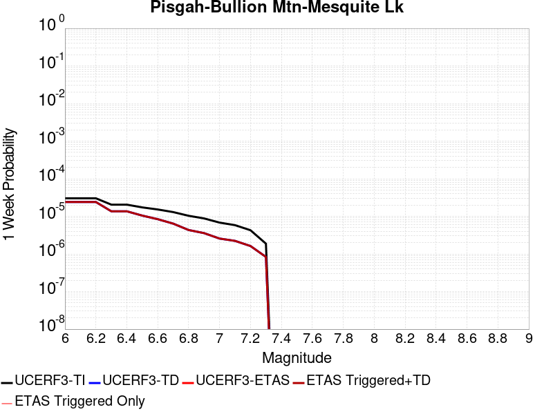 | 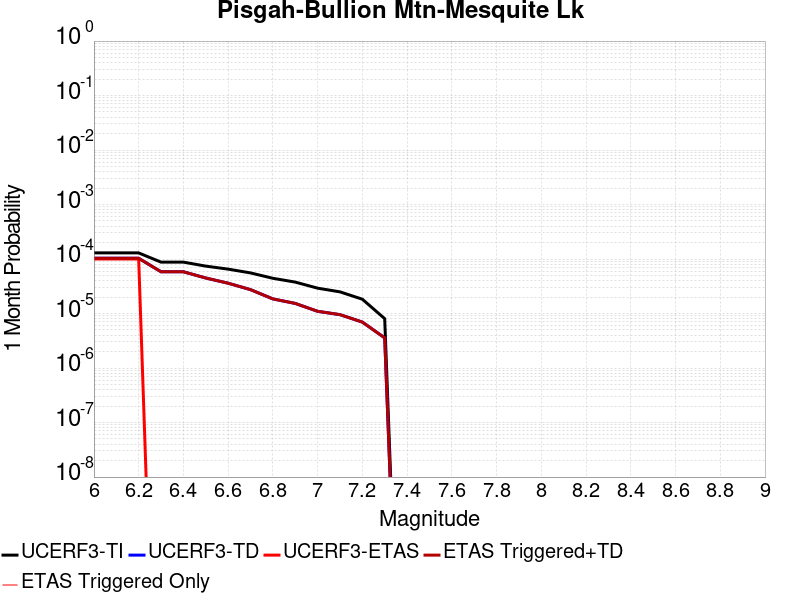 | 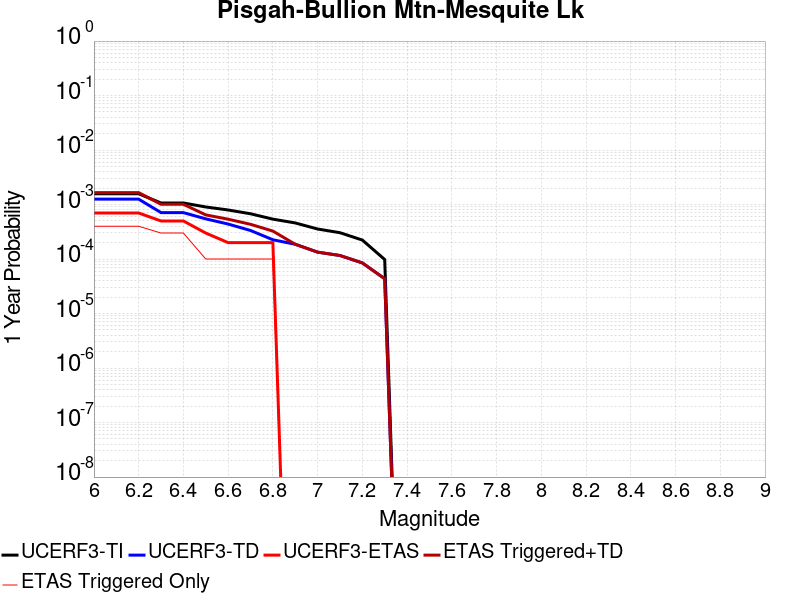 | 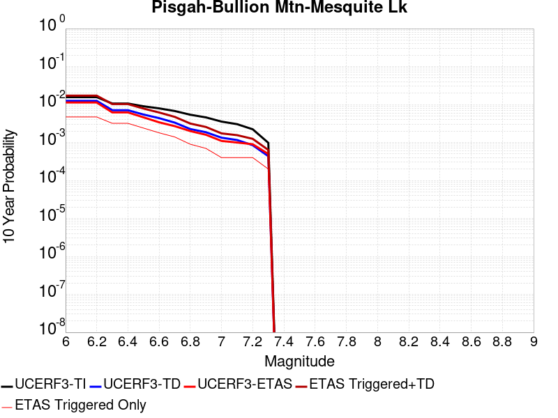 |

| Magnitude | 1 wk TI Prob | 1 wk TD Prob | 1 wk ETAS Prob | 1 wk ETAS/TD Gain | 1 wk ETAS Triggered+TD | 1 wk ETAS Triggered Only | 1 mo TI Prob | 1 mo TD Prob | 1 mo ETAS Prob | 1 mo ETAS/TD Gain | 1 mo ETAS Triggered+TD | 1 mo ETAS Triggered Only | 1 yr TI Prob | 1 yr TD Prob | 1 yr ETAS Prob | 1 yr ETAS/TD Gain | 1 yr ETAS Triggered+TD | 1 yr ETAS Triggered Only | 10 yr TI Prob | 10 yr TD Prob | 10 yr ETAS Prob | 10 yr ETAS/TD Gain | 10 yr ETAS Triggered+TD | 10 yr ETAS Triggered Only |
|-----|-----|-----|-----|-----|-----|-----|-----|-----|-----|-----|-----|-----|-----|-----|-----|-----|-----|-----|-----|-----|-----|-----|-----|-----|
| 6.0 | 3.0240792E-5 | 2.4093963E-5 | 0.0 | 0.0 | 2.4093963E-5 | 0.0 | 1.2959696E-4 | 1.0325632E-4 | 1.0E-4 | 0.96846366 | 1.0325632E-4 | 0.0 | 0.0015767008 | 0.0012565214 | 7.0E-4 | 0.55709356 | 0.0016560189 | 4.0E-4 | 0.015655609 | 0.012504198 | 0.0113 | 0.90369654 | 0.017145427 | 0.0047 |
| 6.1 | 3.0240792E-5 | 2.4093963E-5 | 0.0 | 0.0 | 2.4093963E-5 | 0.0 | 1.2959696E-4 | 1.0325632E-4 | 1.0E-4 | 0.96846366 | 1.0325632E-4 | 0.0 | 0.0015767008 | 0.0012565214 | 7.0E-4 | 0.55709356 | 0.0016560189 | 4.0E-4 | 0.015655609 | 0.012504198 | 0.0113 | 0.90369654 | 0.017145427 | 0.0047 |
| 6.2 | 3.0240792E-5 | 2.4093963E-5 | 0.0 | 0.0 | 2.4093963E-5 | 0.0 | 1.2959696E-4 | 1.0325632E-4 | 1.0E-4 | 0.96846366 | 1.0325632E-4 | 0.0 | 0.0015767008 | 0.0012565214 | 7.0E-4 | 0.55709356 | 0.0016560189 | 4.0E-4 | 0.015655609 | 0.012504198 | 0.0113 | 0.90369654 | 0.017145427 | 0.0047 |
| 6.3 | 2.0498217E-5 | 1.3638267E-5 | 0.0 | 0.0 | 1.3638267E-5 | 0.0 | 8.784654E-5 | 5.8448495E-5 | 0.0 | 0.0 | 5.8448495E-5 | 0.0 | 0.0010690069 | 7.1139436E-4 | 5.0E-4 | 0.70284504 | 0.0010111809 | 3.0E-4 | 0.01063879 | 0.007092797 | 0.0062 | 0.8741262 | 0.0102701 | 0.0032 |
| 6.4 | 2.0498217E-5 | 1.3638267E-5 | 0.0 | 0.0 | 1.3638267E-5 | 0.0 | 8.784654E-5 | 5.8448495E-5 | 0.0 | 0.0 | 5.8448495E-5 | 0.0 | 0.0010690069 | 7.1139436E-4 | 5.0E-4 | 0.70284504 | 0.0010111809 | 3.0E-4 | 0.01063879 | 0.007092797 | 0.0062 | 0.8741262 | 0.0102701 | 0.0032 |
| 6.5 | 1.7316182E-5 | 1.0476533E-5 | 0.0 | 0.0 | 1.0476533E-5 | 0.0 | 7.42101E-5 | 4.4898712E-5 | 0.0 | 0.0 | 4.4898712E-5 | 0.0 | 9.0313336E-4 | 5.465147E-4 | 3.0E-4 | 0.5489331 | 6.4646004E-4 | 1.0E-4 | 0.008994718 | 0.0054527028 | 0.0046 | 0.84361833 | 0.007839616 | 0.0024 |
| 6.6 | 1.5251077E-5 | 8.413294E-6 | 0.0 | 0.0 | 8.413294E-6 | 0.0 | 6.536012E-5 | 3.6056517E-5 | 0.0 | 0.0 | 3.6056517E-5 | 0.0 | 7.9546886E-4 | 4.389069E-4 | 2.0E-4 | 0.4556775 | 5.38863E-4 | 1.0E-4 | 0.007926274 | 0.004381118 | 0.0034 | 0.77605766 | 0.0061732316 | 0.0018 |
| 6.7 | 1.2997425E-5 | 6.4100736E-6 | 0.0 | 0.0 | 6.4100736E-6 | 0.0 | 5.570206E-5 | 2.747148E-5 | 0.0 | 0.0 | 2.747148E-5 | 0.0 | 6.7796157E-4 | 3.344186E-4 | 2.0E-4 | 0.59805286 | 4.3438515E-4 | 1.0E-4 | 0.0067589693 | 0.0033396136 | 0.0027 | 0.80847675 | 0.004734938 | 0.0014 |
| 6.8 | 1.035386E-5 | 4.3320383E-6 | 0.0 | 0.0 | 4.3320383E-6 | 0.0 | 4.437293E-5 | 1.8565752E-5 | 0.0 | 0.0 | 1.8565752E-5 | 0.0 | 5.401065E-4 | 2.2601544E-4 | 2.0E-4 | 0.88489527 | 3.2599285E-4 | 1.0E-4 | 0.0053879567 | 0.0022579425 | 0.002 | 0.88576216 | 0.0031559104 | 9.0E-4 |
| 6.9 | 8.816252E-6 | 3.5794494E-6 | 0.0 | 0.0 | 3.5794494E-6 | 0.0 | 3.778339E-5 | 1.534041E-5 | 0.0 | 0.0 | 1.534041E-5 | 0.0 | 4.5991567E-4 | 1.8675409E-4 | 0.0 | 0.0 | 1.8675409E-4 | 0.0 | 0.00458965 | 0.0018660298 | 0.0016 | 0.8574354 | 0.0025647236 | 7.0E-4 |
| 7.0 | 6.8232207E-6 | 2.5666427E-6 | 0.0 | 0.0 | 2.5666427E-6 | 0.0 | 2.9242048E-5 | 1.0999853E-5 | 0.0 | 0.0 | 1.0999853E-5 | 0.0 | 3.5596377E-4 | 1.339153E-4 | 0.0 | 0.0 | 1.339153E-4 | 0.0 | 0.0035539411 | 0.001338377 | 0.0011 | 0.821891 | 0.0017378416 | 4.0E-4 |
| 7.1 | 5.837013E-6 | 2.226573E-6 | 0.0 | 0.0 | 2.226573E-6 | 0.0 | 2.501553E-5 | 9.542423E-6 | 0.0 | 0.0 | 9.542423E-6 | 0.0 | 3.045215E-4 | 1.161731E-4 | 0.0 | 0.0 | 1.161731E-4 | 0.0 | 0.0030410455 | 0.0011611526 | 0.001 | 0.8612132 | 0.0015606881 | 4.0E-4 |
| 7.2 | 4.278052E-6 | 1.6270068E-6 | 0.0 | 0.0 | 1.6270068E-6 | 0.0 | 1.833438E-5 | 6.972869E-6 | 0.0 | 0.0 | 6.972869E-6 | 0.0 | 2.231982E-4 | 8.489161E-5 | 0.0 | 0.0 | 8.489161E-5 | 0.0 | 0.0022297418 | 8.4861496E-4 | 9.0E-4 | 1.0605516 | 0.0012482755 | 4.0E-4 |
| 7.3 | 1.8803692E-6 | 8.342604E-7 | 0.0 | 0.0 | 8.342604E-7 | 0.0 | 8.0587E-6 | 3.5753974E-6 | 0.0 | 0.0 | 3.5753974E-6 | 0.0 | 9.811026E-5 | 4.352974E-5 | 0.0 | 0.0 | 4.352974E-5 | 0.0 | 9.806695E-4 | 4.3522663E-4 | 5.0E-4 | 1.1488268 | 6.351396E-4 | 2.0E-4 |

## San Diego Trough south
*[(top)](#table-of-contents)*

| 1 Week | 1 Month | 1 Year | 10 Year |
|-----|-----|-----|-----|
|  |  |  | 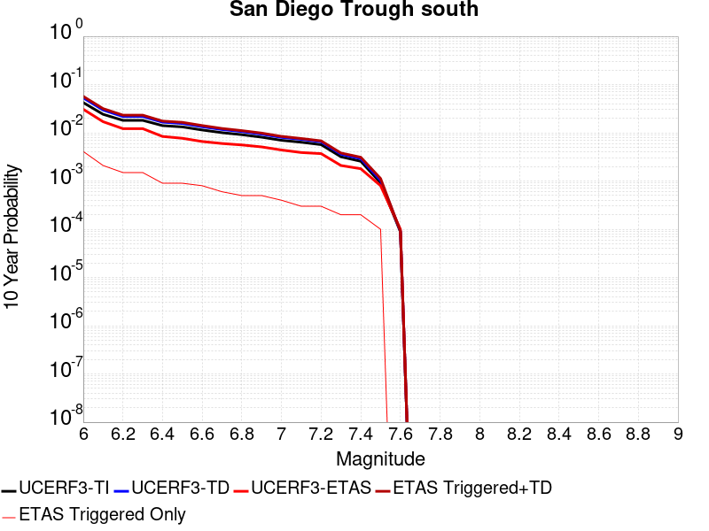 |

| Magnitude | 1 wk TI Prob | 1 wk TD Prob | 1 wk ETAS Prob | 1 wk ETAS/TD Gain | 1 wk ETAS Triggered+TD | 1 wk ETAS Triggered Only | 1 mo TI Prob | 1 mo TD Prob | 1 mo ETAS Prob | 1 mo ETAS/TD Gain | 1 mo ETAS Triggered+TD | 1 mo ETAS Triggered Only | 1 yr TI Prob | 1 yr TD Prob | 1 yr ETAS Prob | 1 yr ETAS/TD Gain | 1 yr ETAS Triggered+TD | 1 yr ETAS Triggered Only | 10 yr TI Prob | 10 yr TD Prob | 10 yr ETAS Prob | 10 yr ETAS/TD Gain | 10 yr ETAS Triggered+TD | 10 yr ETAS Triggered Only |
|-----|-----|-----|-----|-----|-----|-----|-----|-----|-----|-----|-----|-----|-----|-----|-----|-----|-----|-----|-----|-----|-----|-----|-----|-----|
| 6.0 | 8.279495E-5 | 1.04307226E-4 | 0.0 | 0.0 | 1.04307226E-4 | 0.0 | 3.5478722E-4 | 4.469593E-4 | 1.0E-4 | 0.223734 | 4.469593E-4 | 0.0 | 0.004310982 | 0.0054286052 | 0.002 | 0.36841875 | 0.005726977 | 3.0E-4 | 0.042283054 | 0.05301837 | 0.0308 | 0.58093077 | 0.056900993 | 0.0041 |
| 6.1 | 4.6961468E-5 | 5.7755435E-5 | 0.0 | 0.0 | 5.7755435E-5 | 0.0 | 2.0124791E-4 | 2.4750078E-4 | 1.0E-4 | 0.40403914 | 2.4750078E-4 | 0.0 | 0.00244744 | 0.0030092376 | 0.0011 | 0.36554107 | 0.0032086358 | 2.0E-4 | 0.024206603 | 0.029692695 | 0.017 | 0.5725314 | 0.03173034 | 0.0021 |
| 6.2 | 3.5079658E-5 | 4.2159343E-5 | 0.0 | 0.0 | 4.2159343E-5 | 0.0 | 1.5033272E-4 | 1.8067063E-4 | 1.0E-4 | 0.5534934 | 1.8067063E-4 | 0.0 | 0.0018287642 | 0.002197466 | 8.0E-4 | 0.3640557 | 0.0022972464 | 1.0E-4 | 0.018137876 | 0.02175977 | 0.0122 | 0.56066763 | 0.023227131 | 0.0015 |
| 6.3 | 3.5079658E-5 | 4.2159343E-5 | 0.0 | 0.0 | 4.2159343E-5 | 0.0 | 1.5033272E-4 | 1.8067063E-4 | 1.0E-4 | 0.5534934 | 1.8067063E-4 | 0.0 | 0.0018287642 | 0.002197466 | 8.0E-4 | 0.3640557 | 0.0022972464 | 1.0E-4 | 0.018137876 | 0.02175977 | 0.0122 | 0.56066763 | 0.023227131 | 0.0015 |
| 6.4 | 2.7196904E-5 | 3.209867E-5 | 0.0 | 0.0 | 3.209867E-5 | 0.0 | 1.16552954E-4 | 1.3755856E-4 | 1.0E-4 | 0.72696316 | 1.3755856E-4 | 0.0 | 0.0014181085 | 0.0016734999 | 7.0E-4 | 0.41828507 | 0.0017733326 | 1.0E-4 | 0.014090929 | 0.016610572 | 0.0084 | 0.505702 | 0.017495623 | 9.0E-4 |
| 6.5 | 2.5584688E-5 | 3.0112242E-5 | 0.0 | 0.0 | 3.0112242E-5 | 0.0 | 1.0964406E-4 | 1.2904615E-4 | 1.0E-4 | 0.7749166 | 1.2904615E-4 | 0.0 | 0.0013340989 | 0.0015700158 | 7.0E-4 | 0.44585538 | 0.0016698588 | 1.0E-4 | 0.013261181 | 0.015590781 | 0.0077 | 0.4938816 | 0.016476749 | 9.0E-4 |
| 6.6 | 2.2034688E-5 | 2.575136E-5 | 0.0 | 0.0 | 2.575136E-5 | 0.0 | 9.443096E-5 | 1.1035835E-4 | 1.0E-4 | 0.90613896 | 1.1035835E-4 | 0.0 | 0.0011490905 | 0.0013427921 | 6.0E-4 | 0.44683015 | 0.0014426578 | 1.0E-4 | 0.011431668 | 0.013347778 | 0.0066 | 0.49446434 | 0.0141370995 | 8.0E-4 |
| 6.7 | 1.9394853E-5 | 2.2549064E-5 | 0.0 | 0.0 | 2.2549064E-5 | 0.0 | 8.311815E-5 | 9.6635296E-5 | 1.0E-4 | 1.0348186 | 9.6635296E-5 | 0.0 | 0.0010114936 | 0.0011759049 | 4.0E-4 | 0.34016356 | 0.0011759049 | 0.0 | 0.01006902 | 0.011697533 | 0.006 | 0.51292866 | 0.012290514 | 6.0E-4 |
| 6.8 | 1.7615313E-5 | 2.0409623E-5 | 0.0 | 0.0 | 2.0409623E-5 | 0.0 | 7.549201E-5 | 8.7466906E-5 | 1.0E-4 | 1.1432896 | 8.7466906E-5 | 0.0 | 9.1872766E-4 | 0.0010643937 | 4.0E-4 | 0.37580082 | 0.0010643937 | 0.0 | 0.009149387 | 0.010593523 | 0.0056 | 0.52862483 | 0.011088227 | 5.0E-4 |
| 6.9 | 1.5621423E-5 | 1.8031646E-5 | 0.0 | 0.0 | 1.8031646E-5 | 0.0 | 6.6947236E-5 | 7.727621E-5 | 1.0E-4 | 1.2940594 | 7.727621E-5 | 0.0 | 8.147778E-4 | 9.404353E-4 | 4.0E-4 | 0.42533496 | 9.404353E-4 | 0.0 | 0.008117969 | 0.009365001 | 0.0051 | 0.5445809 | 0.009860318 | 5.0E-4 |
| 7.0 | 1.3444376E-5 | 1.5452673E-5 | 0.0 | 0.0 | 1.5452673E-5 | 0.0 | 5.7617483E-5 | 6.622408E-5 | 1.0E-4 | 1.5100248 | 6.622408E-5 | 0.0 | 7.0126704E-4 | 8.059827E-4 | 4.0E-4 | 0.4962886 | 8.059827E-4 | 0.0 | 0.006990582 | 0.008030929 | 0.0044 | 0.54788184 | 0.008427716 | 4.0E-4 |
| 7.1 | 1.2268361E-5 | 1.4077152E-5 | 0.0 | 0.0 | 1.4077152E-5 | 0.0 | 5.2577634E-5 | 6.0329272E-5 | 1.0E-4 | 1.6575701 | 6.0329272E-5 | 0.0 | 6.399447E-4 | 7.34264E-4 | 4.0E-4 | 0.5447632 | 7.34264E-4 | 0.0 | 0.0063810493 | 0.0073186844 | 0.0039 | 0.53288263 | 0.0076164887 | 3.0E-4 |
| 7.2 | 1.0922655E-5 | 1.2517193E-5 | 0.0 | 0.0 | 1.2517193E-5 | 0.0 | 4.681054E-5 | 5.3644024E-5 | 1.0E-4 | 1.8641405 | 5.3644024E-5 | 0.0 | 5.697693E-4 | 6.5292284E-4 | 3.0E-4 | 0.4594724 | 6.5292284E-4 | 0.0 | 0.0056831064 | 0.0065103257 | 0.0037 | 0.56832796 | 0.0068083727 | 3.0E-4 |
| 7.3 | 6.1106753E-6 | 6.9307744E-6 | 0.0 | 0.0 | 6.9307744E-6 | 0.0 | 2.6188345E-5 | 2.9702984E-5 | 1.0E-4 | 3.3666651 | 2.9702984E-5 | 0.0 | 3.1879646E-4 | 3.6157423E-4 | 3.0E-4 | 0.8297052 | 3.6157423E-4 | 0.0 | 0.0031833951 | 0.0036099046 | 0.0021 | 0.5817328 | 0.0038091827 | 2.0E-4 |
| 7.4 | 4.933187E-6 | 5.5910364E-6 | 0.0 | 0.0 | 5.5910364E-6 | 0.0 | 2.114206E-5 | 2.3961367E-5 | 1.0E-4 | 4.1733847 | 2.3961367E-5 | 0.0 | 2.5737417E-4 | 2.91691E-4 | 3.0E-4 | 1.0284857 | 2.91691E-4 | 0.0 | 0.002570763 | 0.0029131223 | 0.0018 | 0.6178937 | 0.0031125399 | 2.0E-4 |
| 7.5 | 1.7489613E-6 | 1.9701774E-6 | 0.0 | 0.0 | 1.9701774E-6 | 0.0 | 7.495527E-6 | 8.4435915E-6 | 0.0 | 0.0 | 8.4435915E-6 | 0.0 | 9.125422E-5 | 1.02796104E-4 | 2.0E-4 | 1.9455991 | 1.02796104E-4 | 0.0 | 9.1216754E-4 | 0.0010275076 | 8.0E-4 | 0.7785831 | 0.0011274049 | 1.0E-4 |
| 7.6 | 1.6988751E-7 | 1.753494E-7 | 0.0 | 0.0 | 1.753494E-7 | 0.0 | 7.2808916E-7 | 7.5149717E-7 | 0.0 | 0.0 | 7.5149717E-7 | 0.0 | 8.864449E-6 | 9.149442E-6 | 0.0 | 0.0 | 9.149442E-6 | 0.0 | 8.8640954E-5 | 9.149085E-5 | 1.0E-4 | 1.0930055 | 9.149085E-5 | 0.0 |

## Ortigalita (South)
*[(top)](#table-of-contents)*

| 1 Week | 1 Month | 1 Year | 10 Year |
|-----|-----|-----|-----|
|  |  | 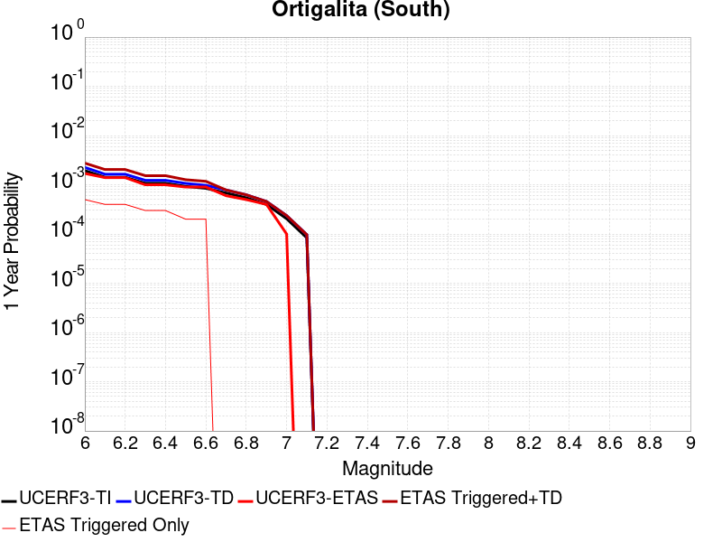 | 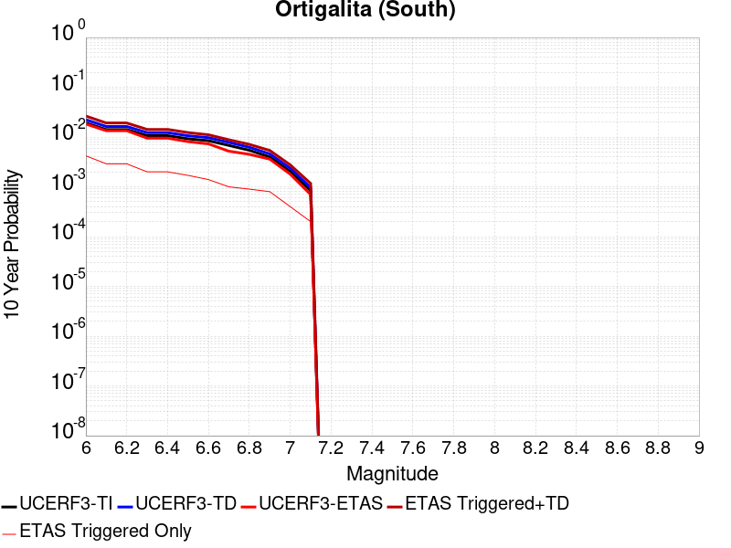 |

| Magnitude | 1 wk TI Prob | 1 wk TD Prob | 1 wk ETAS Prob | 1 wk ETAS/TD Gain | 1 wk ETAS Triggered+TD | 1 wk ETAS Triggered Only | 1 mo TI Prob | 1 mo TD Prob | 1 mo ETAS Prob | 1 mo ETAS/TD Gain | 1 mo ETAS Triggered+TD | 1 mo ETAS Triggered Only | 1 yr TI Prob | 1 yr TD Prob | 1 yr ETAS Prob | 1 yr ETAS/TD Gain | 1 yr ETAS Triggered+TD | 1 yr ETAS Triggered Only | 10 yr TI Prob | 10 yr TD Prob | 10 yr ETAS Prob | 10 yr ETAS/TD Gain | 10 yr ETAS Triggered+TD | 10 yr ETAS Triggered Only |
|-----|-----|-----|-----|-----|-----|-----|-----|-----|-----|-----|-----|-----|-----|-----|-----|-----|-----|-----|-----|-----|-----|-----|-----|-----|
| 6.0 | 3.72394E-5 | 4.3269527E-5 | 1.0E-4 | 2.3110955 | 4.3269527E-5 | 0.0 | 1.5958765E-4 | 1.8542854E-4 | 3.0E-4 | 1.617874 | 2.8541E-4 | 1.0E-4 | 0.0019412481 | 0.0022554111 | 0.0017 | 0.7537429 | 0.0027542834 | 5.0E-4 | 0.019243775 | 0.02234161 | 0.0183 | 0.81909937 | 0.026447777 | 0.0042 |
| 6.1 | 2.7299884E-5 | 3.150166E-5 | 1.0E-4 | 3.174436 | 3.150166E-5 | 0.0 | 1.16994255E-4 | 1.3500043E-4 | 3.0E-4 | 2.222215 | 2.3498693E-4 | 1.0E-4 | 0.0014234743 | 0.0016424471 | 0.0014 | 0.85238665 | 0.0020417902 | 4.0E-4 | 0.014143906 | 0.016309015 | 0.0134 | 0.82163143 | 0.01916172 | 0.0029 |
| 6.2 | 2.7299884E-5 | 3.150166E-5 | 1.0E-4 | 3.174436 | 3.150166E-5 | 0.0 | 1.16994255E-4 | 1.3500043E-4 | 3.0E-4 | 2.222215 | 2.3498693E-4 | 1.0E-4 | 0.0014234743 | 0.0016424471 | 0.0014 | 0.85238665 | 0.0020417902 | 4.0E-4 | 0.014143906 | 0.016309015 | 0.0134 | 0.82163143 | 0.01916172 | 0.0029 |
| 6.3 | 2.0546433E-5 | 2.3638513E-5 | 0.0 | 0.0 | 2.3638513E-5 | 0.0 | 8.805317E-5 | 1.0130409E-4 | 2.0E-4 | 1.974254 | 2.0129395E-4 | 1.0E-4 | 0.00107152 | 0.0012326984 | 0.001 | 0.81122845 | 0.0015323285 | 3.0E-4 | 0.010663681 | 0.012260672 | 0.0095 | 0.7748352 | 0.01423615 | 0.002 |
| 6.4 | 2.0546433E-5 | 2.3638513E-5 | 0.0 | 0.0 | 2.3638513E-5 | 0.0 | 8.805317E-5 | 1.0130409E-4 | 2.0E-4 | 1.974254 | 2.0129395E-4 | 1.0E-4 | 0.00107152 | 0.0012326984 | 0.001 | 0.81122845 | 0.0015323285 | 3.0E-4 | 0.010663681 | 0.012260672 | 0.0095 | 0.7748352 | 0.01423615 | 0.002 |
| 6.5 | 1.7779594E-5 | 2.045308E-5 | 0.0 | 0.0 | 2.045308E-5 | 0.0 | 7.619603E-5 | 8.765319E-5 | 1.0E-4 | 1.1408597 | 8.765319E-5 | 0.0 | 9.272918E-4 | 0.0010666688 | 9.0E-4 | 0.8437484 | 0.0012664554 | 2.0E-4 | 0.009234319 | 0.010616956 | 0.0081 | 0.7629305 | 0.012298908 | 0.0017 |
| 6.6 | 1.6272212E-5 | 1.872056E-5 | 0.0 | 0.0 | 1.872056E-5 | 0.0 | 6.973618E-5 | 8.022857E-5 | 1.0E-4 | 1.2464387 | 8.022857E-5 | 0.0 | 8.487073E-4 | 9.7635743E-4 | 9.0E-4 | 0.9217936 | 0.0011761622 | 2.0E-4 | 0.008454733 | 0.009721981 | 0.0073 | 0.7508758 | 0.0111083705 | 0.0014 |
| 6.7 | 1.3051484E-5 | 1.5043318E-5 | 0.0 | 0.0 | 1.5043318E-5 | 0.0 | 5.593373E-5 | 6.446982E-5 | 1.0E-4 | 1.5511134 | 6.446982E-5 | 0.0 | 6.807804E-4 | 7.846469E-4 | 6.0E-4 | 0.76467514 | 7.846469E-4 | 0.0 | 0.006786986 | 0.007819749 | 0.0052 | 0.664983 | 0.008811929 | 0.001 |
| 6.8 | 1.04277415E-5 | 1.1990799E-5 | 0.0 | 0.0 | 1.1990799E-5 | 0.0 | 4.4689557E-5 | 5.1388168E-5 | 1.0E-4 | 1.9459732 | 5.1388168E-5 | 0.0 | 5.439595E-4 | 6.254788E-4 | 5.0E-4 | 0.79938763 | 6.254788E-4 | 0.0 | 0.0054262993 | 0.0062379385 | 0.0045 | 0.72139215 | 0.0071323244 | 9.0E-4 |
| 6.9 | 7.639968E-6 | 8.794136E-6 | 0.0 | 0.0 | 8.794136E-6 | 0.0 | 3.274231E-5 | 3.7688646E-5 | 1.0E-4 | 2.6533191 | 3.7688646E-5 | 0.0 | 3.9856473E-4 | 4.587685E-4 | 4.0E-4 | 0.8718994 | 4.587685E-4 | 0.0 | 0.003978506 | 0.004578801 | 0.0036 | 0.786232 | 0.005375138 | 8.0E-4 |
| 7.0 | 3.919831E-6 | 4.5348106E-6 | 0.0 | 0.0 | 4.5348106E-6 | 0.0 | 1.679917E-5 | 1.943477E-5 | 1.0E-4 | 5.145417 | 1.943477E-5 | 0.0 | 2.045107E-4 | 2.3659476E-4 | 1.0E-4 | 0.42266363 | 2.3659476E-4 | 0.0 | 0.0020432258 | 0.0023636373 | 0.0018 | 0.76153815 | 0.0027626918 | 4.0E-4 |
| 7.1 | 1.6017933E-6 | 1.8576296E-6 | 0.0 | 0.0 | 1.8576296E-6 | 0.0 | 6.8648105E-6 | 7.961251E-6 | 0.0 | 0.0 | 7.961251E-6 | 0.0 | 8.357586E-5 | 9.692499E-5 | 0.0 | 0.0 | 9.692499E-5 | 0.0 | 8.3544437E-4 | 9.6893194E-4 | 7.0E-4 | 0.72244495 | 0.0011687381 | 2.0E-4 |

## Mission (connected) 2011 CFM
*[(top)](#table-of-contents)*

| 1 Week | 1 Month | 1 Year | 10 Year |
|-----|-----|-----|-----|
| 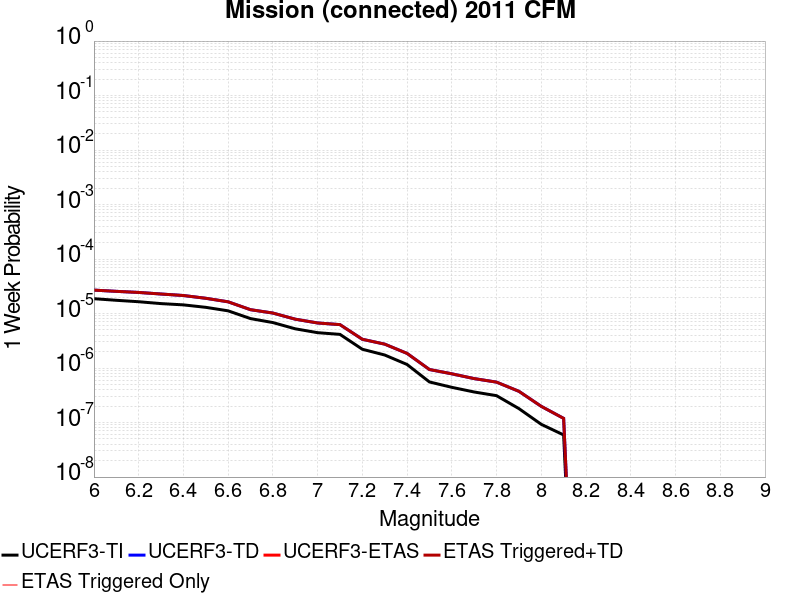 | 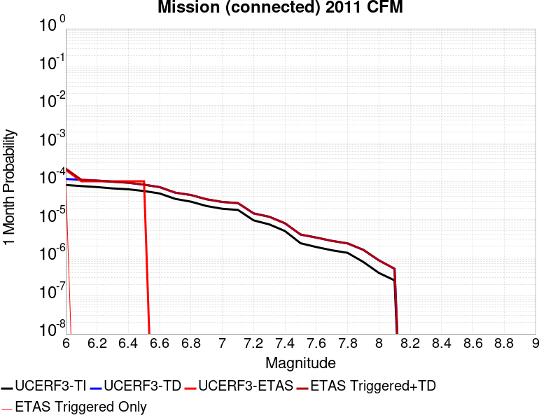 | 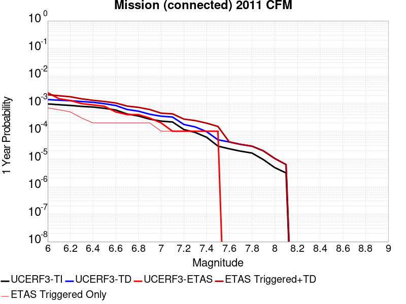 |  |

| Magnitude | 1 wk TI Prob | 1 wk TD Prob | 1 wk ETAS Prob | 1 wk ETAS/TD Gain | 1 wk ETAS Triggered+TD | 1 wk ETAS Triggered Only | 1 mo TI Prob | 1 mo TD Prob | 1 mo ETAS Prob | 1 mo ETAS/TD Gain | 1 mo ETAS Triggered+TD | 1 mo ETAS Triggered Only | 1 yr TI Prob | 1 yr TD Prob | 1 yr ETAS Prob | 1 yr ETAS/TD Gain | 1 yr ETAS Triggered+TD | 1 yr ETAS Triggered Only | 10 yr TI Prob | 10 yr TD Prob | 10 yr ETAS Prob | 10 yr ETAS/TD Gain | 10 yr ETAS Triggered+TD | 10 yr ETAS Triggered Only |
|-----|-----|-----|-----|-----|-----|-----|-----|-----|-----|-----|-----|-----|-----|-----|-----|-----|-----|-----|-----|-----|-----|-----|-----|-----|
| 6.0 | 1.8735573E-5 | 2.6871314E-5 | 0.0 | 0.0 | 2.6871314E-5 | 0.0 | 8.029284E-5 | 1.1515633E-4 | 2.0E-4 | 1.7367694 | 2.1514481E-4 | 1.0E-4 | 9.771269E-4 | 0.001401029 | 0.0025 | 1.7844028 | 0.0021000481 | 7.0E-4 | 0.009728416 | 0.013931743 | 0.0157 | 1.126923 | 0.017974623 | 0.0041 |
| 6.1 | 1.7515964E-5 | 2.5512281E-5 | 0.0 | 0.0 | 2.5512281E-5 | 0.0 | 7.506625E-5 | 1.0933241E-4 | 1.0E-4 | 0.91464186 | 1.0933241E-4 | 0.0 | 9.135484E-4 | 0.0013302112 | 0.0015 | 1.1276405 | 0.0019294131 | 6.0E-4 | 0.009098019 | 0.013232185 | 0.011 | 0.83130646 | 0.015995134 | 0.0028 |
| 6.2 | 1.6486343E-5 | 2.4356674E-5 | 0.0 | 0.0 | 2.4356674E-5 | 0.0 | 7.065384E-5 | 1.0438022E-4 | 1.0E-4 | 0.95803595 | 1.0438022E-4 | 0.0 | 8.5987104E-4 | 0.0012699903 | 0.0013 | 1.0236298 | 0.0017693554 | 5.0E-4 | 0.008565514 | 0.012637013 | 0.01 | 0.7913263 | 0.01510542 | 0.0025 |
| 6.3 | 1.5229385E-5 | 2.2786335E-5 | 0.0 | 0.0 | 2.2786335E-5 | 0.0 | 6.526716E-5 | 9.7650714E-5 | 1.0E-4 | 1.024058 | 9.7650714E-5 | 0.0 | 7.9433795E-4 | 0.0011881512 | 0.001 | 0.84164375 | 0.0014877947 | 3.0E-4 | 0.007915046 | 0.011830297 | 0.0091 | 0.7692115 | 0.0139054535 | 0.0021 |
| 6.4 | 1.4435828E-5 | 2.1388541E-5 | 0.0 | 0.0 | 2.1388541E-5 | 0.0 | 6.186637E-5 | 9.1660615E-5 | 1.0E-4 | 1.0909811 | 9.1660615E-5 | 0.0 | 7.529627E-4 | 0.0011152999 | 9.0E-4 | 0.8069579 | 0.0013150768 | 2.0E-4 | 0.007504165 | 0.011114359 | 0.0081 | 0.72878695 | 0.012894353 | 0.0018 |
| 6.5 | 1.30127955E-5 | 1.9026049E-5 | 0.0 | 0.0 | 1.9026049E-5 | 0.0 | 5.576793E-5 | 8.153757E-5 | 1.0E-4 | 1.2264285 | 8.153757E-5 | 0.0 | 6.78763E-4 | 9.922326E-4 | 8.0E-4 | 0.8062626 | 0.0011920341 | 2.0E-4 | 0.0067669353 | 0.009906723 | 0.0073 | 0.7368733 | 0.011688891 | 0.0018 |
| 6.6 | 1.1220718E-5 | 1.6381764E-5 | 0.0 | 0.0 | 1.6381764E-5 | 0.0 | 4.8087906E-5 | 7.020567E-5 | 0.0 | 0.0 | 7.020567E-5 | 0.0 | 5.8531296E-4 | 8.544183E-4 | 5.0E-4 | 0.58519346 | 0.0010542474 | 2.0E-4 | 0.005837737 | 0.008544383 | 0.0061 | 0.71391934 | 0.010229858 | 0.0017 |
| 6.7 | 8.086152E-6 | 1.1744607E-5 | 0.0 | 0.0 | 1.1744607E-5 | 0.0 | 3.4654473E-5 | 5.0333063E-5 | 0.0 | 0.0 | 5.0333063E-5 | 0.0 | 4.2183654E-4 | 6.126335E-4 | 4.0E-4 | 0.65291893 | 8.1251096E-4 | 2.0E-4 | 0.004210367 | 0.0061469907 | 0.0049 | 0.79713804 | 0.0076377704 | 0.0015 |
| 6.8 | 6.8361655E-6 | 1.0192817E-5 | 0.0 | 0.0 | 1.0192817E-5 | 0.0 | 2.9297524E-5 | 4.3682772E-5 | 0.0 | 0.0 | 4.3682772E-5 | 0.0 | 3.5663895E-4 | 5.3170865E-4 | 4.0E-4 | 0.75229174 | 7.3160225E-4 | 2.0E-4 | 0.0035606713 | 0.005337389 | 0.0046 | 0.86184454 | 0.0068293833 | 0.0015 |
| 6.9 | 5.2517353E-6 | 7.870721E-6 | 0.0 | 0.0 | 7.870721E-6 | 0.0 | 2.2507242E-5 | 3.3731223E-5 | 0.0 | 0.0 | 3.3731223E-5 | 0.0 | 2.739912E-4 | 4.106005E-4 | 3.0E-4 | 0.7306372 | 6.105184E-4 | 2.0E-4 | 0.0027365363 | 0.004130599 | 0.0038 | 0.9199634 | 0.0055248165 | 0.0014 |
| 7.0 | 4.4602784E-6 | 6.7053993E-6 | 0.0 | 0.0 | 6.7053993E-6 | 0.0 | 1.911534E-5 | 2.873711E-5 | 0.0 | 0.0 | 2.873711E-5 | 0.0 | 2.327044E-4 | 3.498183E-4 | 2.0E-4 | 0.57172537 | 4.497833E-4 | 1.0E-4 | 0.0023246086 | 0.0035239125 | 0.0031 | 0.87970406 | 0.0045203883 | 0.001 |
| 7.1 | 4.1492594E-6 | 6.2544163E-6 | 0.0 | 0.0 | 6.2544163E-6 | 0.0 | 1.7782419E-5 | 2.6804366E-5 | 0.0 | 0.0 | 2.6804366E-5 | 0.0 | 2.1647944E-4 | 3.2629445E-4 | 1.0E-4 | 0.30647165 | 4.2626183E-4 | 1.0E-4 | 0.0021626868 | 0.0032888714 | 0.0026 | 0.79054475 | 0.0041859113 | 9.0E-4 |
| 7.2 | 2.213247E-6 | 3.3629537E-6 | 0.0 | 0.0 | 3.3629537E-6 | 0.0 | 9.485309E-6 | 1.4412579E-5 | 0.0 | 0.0 | 1.4412579E-5 | 0.0 | 1.15477524E-4 | 1.7545905E-4 | 1.0E-4 | 0.56993353 | 2.754415E-4 | 1.0E-4 | 0.0011541754 | 0.0017818547 | 0.0016 | 0.8979408 | 0.0022809638 | 5.0E-4 |
| 7.3 | 1.7362703E-6 | 2.7390788E-6 | 0.0 | 0.0 | 2.7390788E-6 | 0.0 | 7.4411373E-6 | 1.1738856E-5 | 0.0 | 0.0 | 1.1738856E-5 | 0.0 | 9.0592075E-5 | 1.4291123E-4 | 1.0E-4 | 0.6997351 | 2.4289693E-4 | 1.0E-4 | 9.0555154E-4 | 0.0014534763 | 0.0013 | 0.89440745 | 0.0019527494 | 5.0E-4 |
| 7.4 | 1.1628409E-6 | 1.8509077E-6 | 0.0 | 0.0 | 1.8509077E-6 | 0.0 | 4.9835944E-6 | 7.932437E-6 | 0.0 | 0.0 | 7.932437E-6 | 0.0 | 6.0673574E-5 | 9.657316E-5 | 1.0E-4 | 1.0354844 | 1.965635E-4 | 1.0E-4 | 6.065701E-4 | 9.860673E-4 | 8.0E-4 | 0.81130356 | 0.001385673 | 4.0E-4 |
| 7.5 | 5.5610667E-7 | 9.364746E-7 | 0.0 | 0.0 | 9.364746E-7 | 0.0 | 2.3833122E-6 | 4.0134564E-6 | 0.0 | 0.0 | 4.0134564E-6 | 0.0 | 2.9016439E-5 | 4.8862737E-5 | 1.0E-4 | 2.0465493 | 1.4885786E-4 | 1.0E-4 | 2.901265E-4 | 5.0515577E-4 | 4.0E-4 | 0.791835 | 6.0510525E-4 | 1.0E-4 |
| 7.6 | 4.4307663E-7 | 7.8070474E-7 | 0.0 | 0.0 | 7.8070474E-7 | 0.0 | 1.8988985E-6 | 3.3458732E-6 | 0.0 | 0.0 | 3.3458732E-6 | 0.0 | 2.3118844E-5 | 4.073525E-5 | 0.0 | 0.0 | 4.073525E-5 | 0.0 | 2.3116439E-4 | 4.2322872E-4 | 2.0E-4 | 0.47255772 | 4.2322872E-4 | 0.0 |
| 7.7 | 3.639119E-7 | 6.377106E-7 | 0.0 | 0.0 | 6.377106E-7 | 0.0 | 1.5596215E-6 | 2.7330425E-6 | 0.0 | 0.0 | 2.7330425E-6 | 0.0 | 1.8988227E-5 | 3.3274286E-5 | 0.0 | 0.0 | 3.3274286E-5 | 0.0 | 1.8986604E-4 | 3.480123E-4 | 2.0E-4 | 0.5746923 | 3.480123E-4 | 0.0 |
| 7.8 | 3.1152942E-7 | 5.4953887E-7 | 0.0 | 0.0 | 5.4953887E-7 | 0.0 | 1.3351254E-6 | 2.3551645E-6 | 0.0 | 0.0 | 2.3551645E-6 | 0.0 | 1.6255031E-5 | 2.8673752E-5 | 0.0 | 0.0 | 2.8673752E-5 | 0.0 | 1.6253842E-4 | 2.9874142E-4 | 2.0E-4 | 0.6694753 | 2.9874142E-4 | 0.0 |
| 7.9 | 1.8035962E-7 | 3.7334448E-7 | 0.0 | 0.0 | 3.7334448E-7 | 0.0 | 7.729696E-7 | 1.6000467E-6 | 0.0 | 0.0 | 1.6000467E-6 | 0.0 | 9.410865E-6 | 1.9480396E-5 | 0.0 | 0.0 | 1.9480396E-5 | 0.0 | 9.410465E-5 | 2.0145085E-4 | 2.0E-4 | 0.99279803 | 2.0145085E-4 | 0.0 |
| 8.0 | 9.279334E-8 | 1.9773935E-7 | 0.0 | 0.0 | 1.9773935E-7 | 0.0 | 3.976857E-7 | 8.474541E-7 | 0.0 | 0.0 | 8.474541E-7 | 0.0 | 4.841813E-6 | 1.0317705E-5 | 0.0 | 0.0 | 1.0317705E-5 | 0.0 | 4.841707E-5 | 1.0568206E-4 | 1.0E-4 | 0.94623435 | 1.0568206E-4 | 0.0 |
| 8.1 | 5.9253985E-8 | 1.18956265E-7 | 0.0 | 0.0 | 1.18956265E-7 | 0.0 | 2.5394561E-7 | 5.098124E-7 | 0.0 | 0.0 | 5.098124E-7 | 0.0 | 3.0917836E-6 | 6.2069494E-6 | 0.0 | 0.0 | 6.2069494E-6 | 0.0 | 3.0917407E-5 | 6.344753E-5 | 1.0E-4 | 1.5761056 | 6.344753E-5 | 0.0 |

## Great Valley 05 Pittsburg - Kirby Hills alt1
*[(top)](#table-of-contents)*

| 1 Week | 1 Month | 1 Year | 10 Year |
|-----|-----|-----|-----|
| 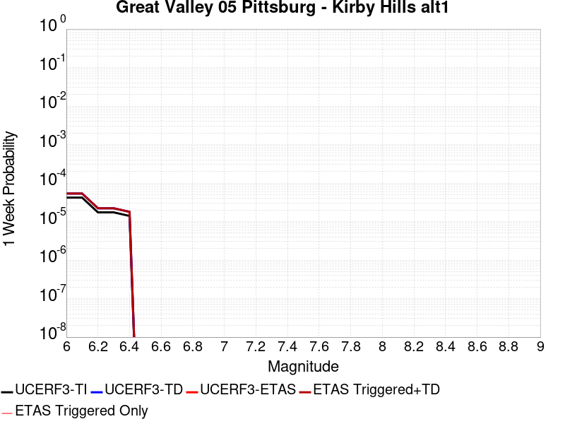 |  |  | 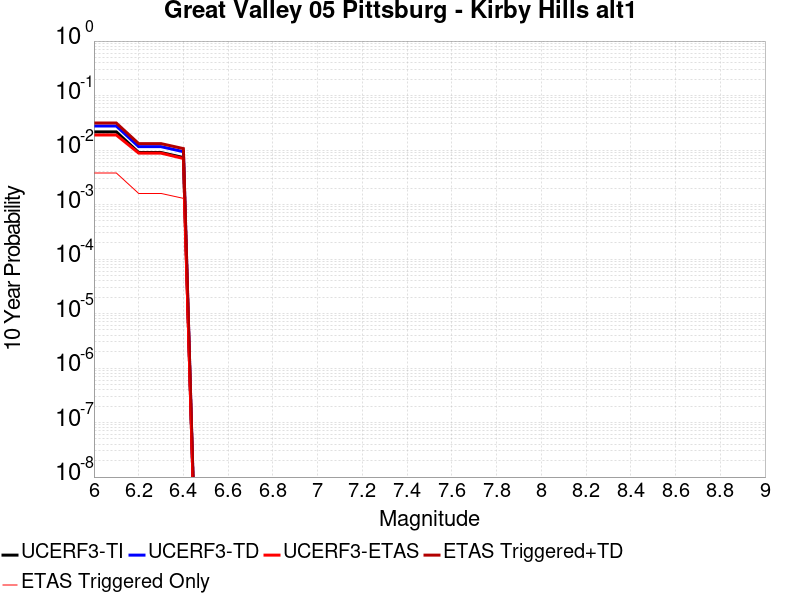 |

| Magnitude | 1 wk TI Prob | 1 wk TD Prob | 1 wk ETAS Prob | 1 wk ETAS/TD Gain | 1 wk ETAS Triggered+TD | 1 wk ETAS Triggered Only | 1 mo TI Prob | 1 mo TD Prob | 1 mo ETAS Prob | 1 mo ETAS/TD Gain | 1 mo ETAS Triggered+TD | 1 mo ETAS Triggered Only | 1 yr TI Prob | 1 yr TD Prob | 1 yr ETAS Prob | 1 yr ETAS/TD Gain | 1 yr ETAS Triggered+TD | 1 yr ETAS Triggered Only | 10 yr TI Prob | 10 yr TD Prob | 10 yr ETAS Prob | 10 yr ETAS/TD Gain | 10 yr ETAS Triggered+TD | 10 yr ETAS Triggered Only |
|-----|-----|-----|-----|-----|-----|-----|-----|-----|-----|-----|-----|-----|-----|-----|-----|-----|-----|-----|-----|-----|-----|-----|-----|-----|
| 6.0 | 4.187212E-5 | 5.347151E-5 | 0.0 | 0.0 | 5.347151E-5 | 0.0 | 1.794396E-4 | 2.2914926E-4 | 3.0E-4 | 1.3091904 | 2.2914926E-4 | 0.0 | 0.002182488 | 0.0027872948 | 0.0011 | 0.3946479 | 0.0029867373 | 2.0E-4 | 0.021611776 | 0.027617814 | 0.0189 | 0.6843409 | 0.031312868 | 0.0038 |
| 6.1 | 4.187212E-5 | 5.347151E-5 | 0.0 | 0.0 | 5.347151E-5 | 0.0 | 1.794396E-4 | 2.2914926E-4 | 3.0E-4 | 1.3091904 | 2.2914926E-4 | 0.0 | 0.002182488 | 0.0027872948 | 0.0011 | 0.3946479 | 0.0029867373 | 2.0E-4 | 0.021611776 | 0.027617814 | 0.0189 | 0.6843409 | 0.031312868 | 0.0038 |
| 6.2 | 1.7353306E-5 | 2.216655E-5 | 0.0 | 0.0 | 2.216655E-5 | 0.0 | 7.436919E-5 | 9.4998366E-5 | 0.0 | 0.0 | 9.4998366E-5 | 0.0 | 9.050688E-4 | 0.0011563788 | 3.0E-4 | 0.25943056 | 0.0011563788 | 0.0 | 0.009013915 | 0.011541356 | 0.0088 | 0.7624754 | 0.01312289 | 0.0016 |
| 6.3 | 1.7353306E-5 | 2.216655E-5 | 0.0 | 0.0 | 2.216655E-5 | 0.0 | 7.436919E-5 | 9.4998366E-5 | 0.0 | 0.0 | 9.4998366E-5 | 0.0 | 9.050688E-4 | 0.0011563788 | 3.0E-4 | 0.25943056 | 0.0011563788 | 0.0 | 0.009013915 | 0.011541356 | 0.0088 | 0.7624754 | 0.01312289 | 0.0016 |
| 6.4 | 1.4028824E-5 | 1.791064E-5 | 0.0 | 0.0 | 1.791064E-5 | 0.0 | 6.0122147E-5 | 7.675988E-5 | 0.0 | 0.0 | 7.675988E-5 | 0.0 | 7.3174125E-4 | 9.3453156E-4 | 3.0E-4 | 0.32101646 | 9.3453156E-4 | 0.0 | 0.0072933645 | 0.009343195 | 0.007 | 0.74920845 | 0.010631048 | 0.0013 |

## McLean Lake
*[(top)](#table-of-contents)*

| 1 Week | 1 Month | 1 Year | 10 Year |
|-----|-----|-----|-----|
|  | 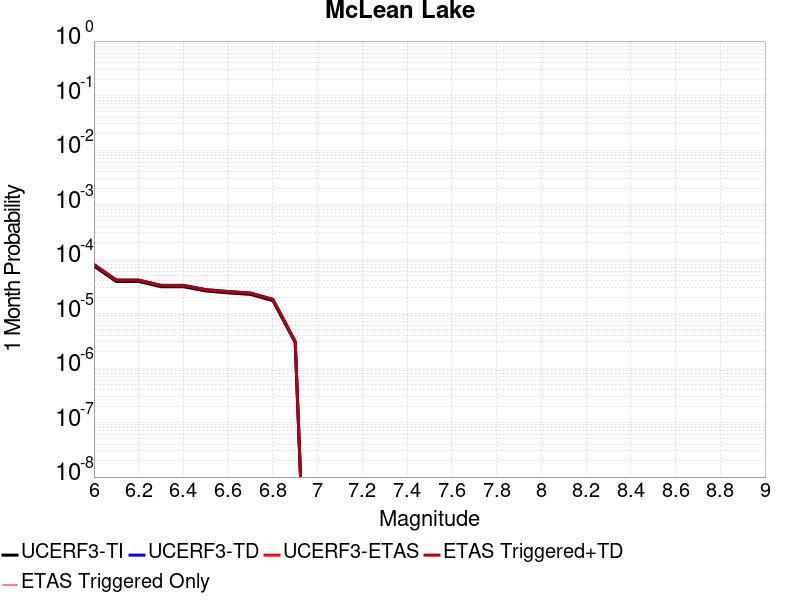 |  | 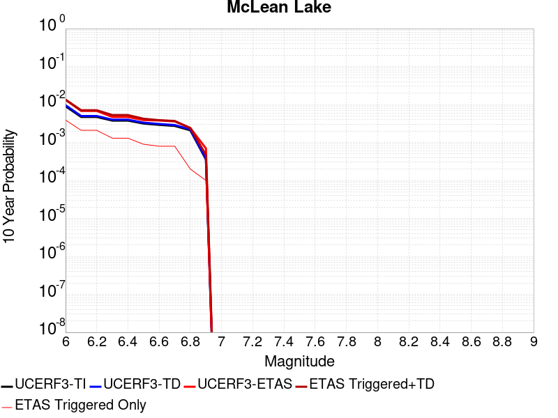 |

| Magnitude | 1 wk TI Prob | 1 wk TD Prob | 1 wk ETAS Prob | 1 wk ETAS/TD Gain | 1 wk ETAS Triggered+TD | 1 wk ETAS Triggered Only | 1 mo TI Prob | 1 mo TD Prob | 1 mo ETAS Prob | 1 mo ETAS/TD Gain | 1 mo ETAS Triggered+TD | 1 mo ETAS Triggered Only | 1 yr TI Prob | 1 yr TD Prob | 1 yr ETAS Prob | 1 yr ETAS/TD Gain | 1 yr ETAS Triggered+TD | 1 yr ETAS Triggered Only | 10 yr TI Prob | 10 yr TD Prob | 10 yr ETAS Prob | 10 yr ETAS/TD Gain | 10 yr ETAS Triggered+TD | 10 yr ETAS Triggered Only |
|-----|-----|-----|-----|-----|-----|-----|-----|-----|-----|-----|-----|-----|-----|-----|-----|-----|-----|-----|-----|-----|-----|-----|-----|-----|
| 6.0 | 1.7360222E-5 | 1.8504044E-5 | 0.0 | 0.0 | 1.8504044E-5 | 0.0 | 7.439883E-5 | 7.930091E-5 | 0.0 | 0.0 | 7.930091E-5 | 0.0 | 9.0542925E-4 | 9.6510956E-4 | 0.0014 | 1.4506124 | 0.0019641444 | 0.001 | 0.009017491 | 0.009614025 | 0.0133 | 1.3833956 | 0.01347653 | 0.0039 |
| 6.1 | 9.062689E-6 | 9.5933065E-6 | 0.0 | 0.0 | 9.5933065E-6 | 0.0 | 3.8839516E-5 | 4.1113573E-5 | 0.0 | 0.0 | 4.1113573E-5 | 0.0 | 4.727685E-4 | 5.0045166E-4 | 6.0E-4 | 1.198917 | 0.0010002014 | 5.0E-4 | 0.0047176396 | 0.0049941298 | 0.0068 | 1.3615986 | 0.007083642 | 0.0021 |
| 6.2 | 9.062689E-6 | 9.5933065E-6 | 0.0 | 0.0 | 9.5933065E-6 | 0.0 | 3.8839516E-5 | 4.1113573E-5 | 0.0 | 0.0 | 4.1113573E-5 | 0.0 | 4.727685E-4 | 5.0045166E-4 | 6.0E-4 | 1.198917 | 0.0010002014 | 5.0E-4 | 0.0047176396 | 0.0049941298 | 0.0068 | 1.3615986 | 0.007083642 | 0.0021 |
| 6.3 | 7.2575485E-6 | 7.668569E-6 | 0.0 | 0.0 | 7.668569E-6 | 0.0 | 3.110341E-5 | 3.2864926E-5 | 0.0 | 0.0 | 3.2864926E-5 | 0.0 | 3.786182E-4 | 4.0006413E-4 | 4.0E-4 | 0.9998397 | 6.999441E-4 | 3.0E-4 | 0.0037797375 | 0.003994144 | 0.0047 | 1.1767228 | 0.0052889516 | 0.0013 |
| 6.4 | 7.2575485E-6 | 7.668569E-6 | 0.0 | 0.0 | 7.668569E-6 | 0.0 | 3.110341E-5 | 3.2864926E-5 | 0.0 | 0.0 | 3.2864926E-5 | 0.0 | 3.786182E-4 | 4.0006413E-4 | 4.0E-4 | 0.9998397 | 6.999441E-4 | 3.0E-4 | 0.0037797375 | 0.003994144 | 0.0047 | 1.1767228 | 0.0052889516 | 0.0013 |
| 6.5 | 6.06582E-6 | 6.4045857E-6 | 0.0 | 0.0 | 6.4045857E-6 | 0.0 | 2.5996113E-5 | 2.7447972E-5 | 0.0 | 0.0 | 2.7447972E-5 | 0.0 | 3.164567E-4 | 3.341343E-4 | 2.0E-4 | 0.5985617 | 4.341009E-4 | 1.0E-4 | 0.0031600643 | 0.003336958 | 0.0039 | 1.1687292 | 0.0042339545 | 9.0E-4 |
| 6.6 | 5.598744E-6 | 5.910915E-6 | 0.0 | 0.0 | 5.910915E-6 | 0.0 | 2.3994397E-5 | 2.5332283E-5 | 0.0 | 0.0 | 2.5332283E-5 | 0.0 | 2.9209262E-4 | 3.0838329E-4 | 2.0E-4 | 0.6485436 | 4.0835244E-4 | 1.0E-4 | 0.0029170897 | 0.0030801827 | 0.0038 | 1.233693 | 0.0038777187 | 8.0E-4 |
| 6.7 | 5.246996E-6 | 5.539774E-6 | 0.0 | 0.0 | 5.539774E-6 | 0.0 | 2.2486933E-5 | 2.374171E-5 | 0.0 | 0.0 | 2.374171E-5 | 0.0 | 2.73744E-4 | 2.8902333E-4 | 2.0E-4 | 0.69198567 | 3.889944E-4 | 1.0E-4 | 0.0027340704 | 0.0028870984 | 0.0036 | 1.2469267 | 0.0036847887 | 8.0E-4 |
| 6.8 | 4.02324E-6 | 4.247373E-6 | 0.0 | 0.0 | 4.247373E-6 | 0.0 | 1.7242342E-5 | 1.8202934E-5 | 0.0 | 0.0 | 1.8202934E-5 | 0.0 | 2.099053E-4 | 2.2160415E-4 | 1.0E-4 | 0.4512551 | 2.2160415E-4 | 0.0 | 0.0020970714 | 0.0022144162 | 0.0024 | 1.0838071 | 0.0024139732 | 2.0E-4 |
| 6.9 | 6.835972E-7 | 7.140558E-7 | 0.0 | 0.0 | 7.140558E-7 | 0.0 | 2.9296991E-6 | 3.0602373E-6 | 0.0 | 0.0 | 3.0602373E-6 | 0.0 | 3.56685E-5 | 3.7258073E-5 | 0.0 | 0.0 | 3.7258073E-5 | 0.0 | 3.5662777E-4 | 3.7254952E-4 | 7.0E-4 | 1.8789449 | 4.7251224E-4 | 1.0E-4 |

## Keddie Ridge 2011 CFM
*[(top)](#table-of-contents)*

| 1 Week | 1 Month | 1 Year | 10 Year |
|-----|-----|-----|-----|
|  |  | 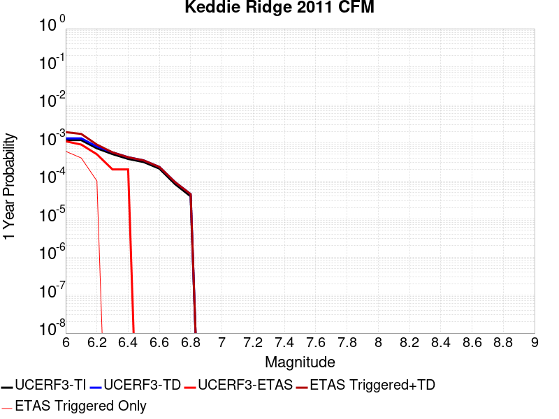 |  |

| Magnitude | 1 wk TI Prob | 1 wk TD Prob | 1 wk ETAS Prob | 1 wk ETAS/TD Gain | 1 wk ETAS Triggered+TD | 1 wk ETAS Triggered Only | 1 mo TI Prob | 1 mo TD Prob | 1 mo ETAS Prob | 1 mo ETAS/TD Gain | 1 mo ETAS Triggered+TD | 1 mo ETAS Triggered Only | 1 yr TI Prob | 1 yr TD Prob | 1 yr ETAS Prob | 1 yr ETAS/TD Gain | 1 yr ETAS Triggered+TD | 1 yr ETAS Triggered Only | 10 yr TI Prob | 10 yr TD Prob | 10 yr ETAS Prob | 10 yr ETAS/TD Gain | 10 yr ETAS Triggered+TD | 10 yr ETAS Triggered Only |
|-----|-----|-----|-----|-----|-----|-----|-----|-----|-----|-----|-----|-----|-----|-----|-----|-----|-----|-----|-----|-----|-----|-----|-----|-----|
| 6.0 | 2.2591947E-5 | 2.5194968E-5 | 0.0 | 0.0 | 2.5194968E-5 | 0.0 | 9.6819036E-5 | 1.0797441E-4 | 1.0E-4 | 0.9261453 | 1.0797441E-4 | 0.0 | 0.0011781343 | 0.0013138748 | 0.0011 | 0.8372183 | 0.0019130865 | 6.0E-4 | 0.011719079 | 0.013069018 | 0.0105 | 0.80342686 | 0.017016742 | 0.004 |
| 6.1 | 2.2591947E-5 | 2.5194968E-5 | 0.0 | 0.0 | 2.5194968E-5 | 0.0 | 9.6819036E-5 | 1.0797441E-4 | 1.0E-4 | 0.9261453 | 1.0797441E-4 | 0.0 | 0.0011781343 | 0.0013138748 | 9.0E-4 | 0.6849968 | 0.0017133493 | 4.0E-4 | 0.011719079 | 0.013069018 | 0.0091 | 0.6963033 | 0.01632589 | 0.0033 |
| 6.2 | 1.3775145E-5 | 1.5326263E-5 | 0.0 | 0.0 | 1.5326263E-5 | 0.0 | 5.9035E-5 | 6.568246E-5 | 1.0E-4 | 1.5224764 | 6.568246E-5 | 0.0 | 7.185141E-4 | 7.994148E-4 | 5.0E-4 | 0.6254575 | 8.9933485E-4 | 1.0E-4 | 0.0071619535 | 0.007967811 | 0.0053 | 0.6651764 | 0.00945586 | 0.0015 |
| 6.3 | 9.705435E-6 | 1.07707165E-5 | 0.0 | 0.0 | 1.07707165E-5 | 0.0 | 4.1594063E-5 | 4.6159465E-5 | 1.0E-4 | 2.1664028 | 4.6159465E-5 | 0.0 | 5.0629E-4 | 5.61859E-4 | 2.0E-4 | 0.3559612 | 5.61859E-4 | 0.0 | 0.005051381 | 0.0056056157 | 0.0036 | 0.6422131 | 0.00660001 | 0.001 |
| 6.4 | 7.2549733E-6 | 8.0289865E-6 | 0.0 | 0.0 | 8.0289865E-6 | 0.0 | 3.109237E-5 | 3.4409535E-5 | 1.0E-4 | 2.9061713 | 3.4409535E-5 | 0.0 | 3.7848388E-4 | 4.1886352E-4 | 2.0E-4 | 0.4774825 | 4.1886352E-4 | 0.0 | 0.003778399 | 0.004181528 | 0.0027 | 0.645697 | 0.0048786006 | 7.0E-4 |
| 6.5 | 5.983293E-6 | 6.614426E-6 | 0.0 | 0.0 | 6.614426E-6 | 0.0 | 2.5642432E-5 | 2.8347271E-5 | 0.0 | 0.0 | 2.8347271E-5 | 0.0 | 3.1215188E-4 | 3.450801E-4 | 0.0 | 0.0 | 3.450801E-4 | 0.0 | 0.0031171376 | 0.0034461054 | 0.0023 | 0.6674201 | 0.004044038 | 6.0E-4 |
| 6.6 | 4.0336154E-6 | 4.4587537E-6 | 0.0 | 0.0 | 4.4587537E-6 | 0.0 | 1.728681E-5 | 1.9108827E-5 | 0.0 | 0.0 | 1.9108827E-5 | 0.0 | 2.1044657E-4 | 2.3262917E-4 | 0.0 | 0.0 | 2.3262917E-4 | 0.0 | 0.002102474 | 0.0023242526 | 0.0016 | 0.68839335 | 0.002723323 | 4.0E-4 |
| 6.7 | 1.5832104E-6 | 1.7820614E-6 | 0.0 | 0.0 | 1.7820614E-6 | 0.0 | 6.7851697E-6 | 7.637385E-6 | 0.0 | 0.0 | 7.637385E-6 | 0.0 | 8.260631E-5 | 9.298147E-5 | 0.0 | 0.0 | 9.298147E-5 | 0.0 | 8.2575605E-4 | 9.2945236E-4 | 6.0E-4 | 0.6455414 | 0.0012291735 | 3.0E-4 |
| 6.8 | 7.5177275E-7 | 8.59276E-7 | 0.0 | 0.0 | 8.59276E-7 | 0.0 | 3.221879E-6 | 3.682607E-6 | 0.0 | 0.0 | 3.682607E-6 | 0.0 | 3.9225673E-5 | 4.4834986E-5 | 0.0 | 0.0 | 4.4834986E-5 | 0.0 | 3.921875E-4 | 4.4827597E-4 | 3.0E-4 | 0.66923064 | 6.481863E-4 | 2.0E-4 |

## Almanor 2011 CFM
*[(top)](#table-of-contents)*

| 1 Week | 1 Month | 1 Year | 10 Year |
|-----|-----|-----|-----|
|  |  |  | 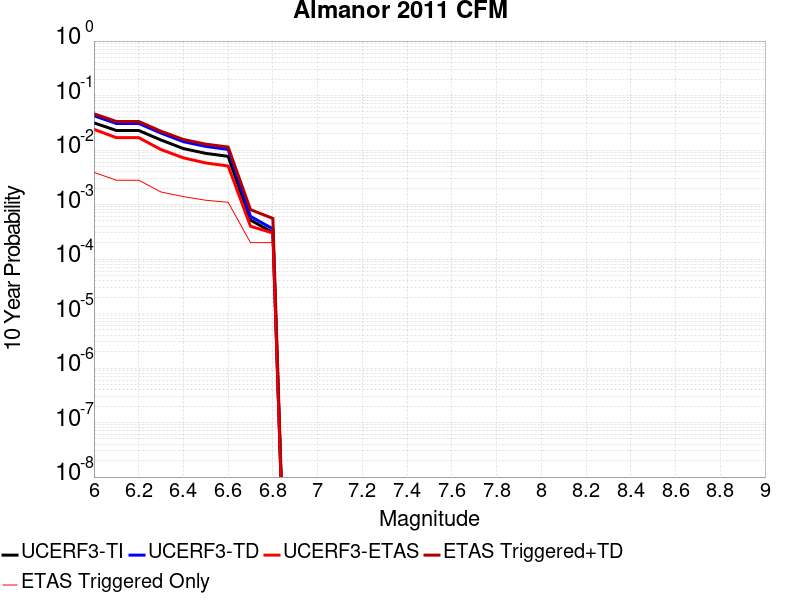 |

| Magnitude | 1 wk TI Prob | 1 wk TD Prob | 1 wk ETAS Prob | 1 wk ETAS/TD Gain | 1 wk ETAS Triggered+TD | 1 wk ETAS Triggered Only | 1 mo TI Prob | 1 mo TD Prob | 1 mo ETAS Prob | 1 mo ETAS/TD Gain | 1 mo ETAS Triggered+TD | 1 mo ETAS Triggered Only | 1 yr TI Prob | 1 yr TD Prob | 1 yr ETAS Prob | 1 yr ETAS/TD Gain | 1 yr ETAS Triggered+TD | 1 yr ETAS Triggered Only | 10 yr TI Prob | 10 yr TD Prob | 10 yr ETAS Prob | 10 yr ETAS/TD Gain | 10 yr ETAS Triggered+TD | 10 yr ETAS Triggered Only |
|-----|-----|-----|-----|-----|-----|-----|-----|-----|-----|-----|-----|-----|-----|-----|-----|-----|-----|-----|-----|-----|-----|-----|-----|-----|
| 6.0 | 6.1479834E-5 | 8.332679E-5 | 0.0 | 0.0 | 8.332679E-5 | 0.0 | 2.6345838E-4 | 3.5706963E-4 | 2.0E-4 | 0.56011486 | 4.5703392E-4 | 1.0E-4 | 0.0032028882 | 0.0043393364 | 0.0021 | 0.48394495 | 0.0047376007 | 4.0E-4 | 0.031571172 | 0.042613592 | 0.024 | 0.5632006 | 0.0463474 | 0.0039 |
| 6.1 | 4.4387216E-5 | 5.9806192E-5 | 0.0 | 0.0 | 5.9806192E-5 | 0.0 | 1.9021705E-4 | 2.562891E-4 | 1.0E-4 | 0.39018437 | 2.562891E-4 | 0.0 | 0.0023134327 | 0.0031163595 | 0.0014 | 0.44924214 | 0.0033157363 | 2.0E-4 | 0.022894967 | 0.030774908 | 0.0169 | 0.5491487 | 0.03348874 | 0.0028 |
| 6.2 | 4.4387216E-5 | 5.9806192E-5 | 0.0 | 0.0 | 5.9806192E-5 | 0.0 | 1.9021705E-4 | 2.562891E-4 | 1.0E-4 | 0.39018437 | 2.562891E-4 | 0.0 | 0.0023134327 | 0.0031163595 | 0.0014 | 0.44924214 | 0.0033157363 | 2.0E-4 | 0.022894967 | 0.030774908 | 0.0169 | 0.5491487 | 0.03348874 | 0.0028 |
| 6.3 | 2.9523822E-5 | 3.9572184E-5 | 0.0 | 0.0 | 3.9572184E-5 | 0.0 | 1.2652454E-4 | 1.6958476E-4 | 1.0E-4 | 0.5896756 | 1.6958476E-4 | 0.0 | 0.0015393476 | 0.0020631023 | 7.0E-4 | 0.33929485 | 0.0022626899 | 2.0E-4 | 0.015287281 | 0.020473847 | 0.0102 | 0.49819657 | 0.02213904 | 0.0017 |
| 6.4 | 2.0512744E-5 | 2.7448028E-5 | 0.0 | 0.0 | 2.7448028E-5 | 0.0 | 8.79088E-5 | 1.17629694E-4 | 1.0E-4 | 0.8501255 | 1.17629694E-4 | 0.0 | 0.001069764 | 0.0014315207 | 5.0E-4 | 0.34927893 | 0.0016312344 | 2.0E-4 | 0.010646289 | 0.014253425 | 0.0072 | 0.50514174 | 0.015633471 | 0.0014 |
| 6.5 | 1.6750226E-5 | 2.2404536E-5 | 0.0 | 0.0 | 2.2404536E-5 | 0.0 | 7.178471E-5 | 9.601642E-5 | 0.0 | 0.0 | 9.601642E-5 | 0.0 | 8.7362836E-4 | 0.0011686971 | 3.0E-4 | 0.2566961 | 0.0012685803 | 1.0E-4 | 0.008702018 | 0.0116564315 | 0.0058 | 0.4975794 | 0.012842444 | 0.0012 |
| 6.6 | 1.4745303E-5 | 1.9719348E-5 | 0.0 | 0.0 | 1.9719348E-5 | 0.0 | 6.319262E-5 | 8.4509324E-5 | 0.0 | 0.0 | 8.4509324E-5 | 0.0 | 7.690986E-4 | 0.0010287465 | 2.0E-4 | 0.19441135 | 0.0011286436 | 1.0E-4 | 0.0076644225 | 0.01027151 | 0.0051 | 0.49651903 | 0.011360211 | 0.0011 |
| 6.7 | 9.951145E-7 | 1.1620207E-6 | 0.0 | 0.0 | 1.1620207E-6 | 0.0 | 4.26477E-6 | 4.98008E-6 | 0.0 | 0.0 | 4.98008E-6 | 0.0 | 5.1922336E-5 | 6.0630966E-5 | 0.0 | 0.0 | 6.0630966E-5 | 0.0 | 5.1910203E-4 | 6.061615E-4 | 4.0E-4 | 0.6598902 | 8.0604025E-4 | 2.0E-4 |
| 6.8 | 5.866312E-7 | 6.851662E-7 | 0.0 | 0.0 | 6.851662E-7 | 0.0 | 2.5141312E-6 | 2.936424E-6 | 0.0 | 0.0 | 2.936424E-6 | 0.0 | 3.0609117E-5 | 3.5750505E-5 | 0.0 | 0.0 | 3.5750505E-5 | 0.0 | 3.06049E-4 | 3.5746038E-4 | 3.0E-4 | 0.83925384 | 5.573889E-4 | 2.0E-4 |

## White Mountains
*[(top)](#table-of-contents)*

| 1 Week | 1 Month | 1 Year | 10 Year |
|-----|-----|-----|-----|
|  | 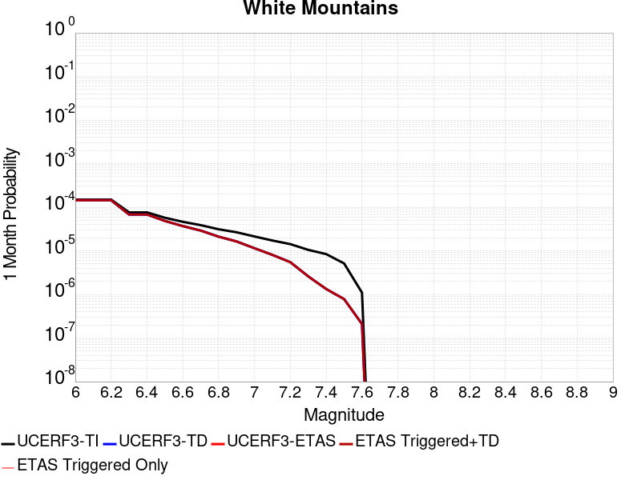 |  |  |

| Magnitude | 1 wk TI Prob | 1 wk TD Prob | 1 wk ETAS Prob | 1 wk ETAS/TD Gain | 1 wk ETAS Triggered+TD | 1 wk ETAS Triggered Only | 1 mo TI Prob | 1 mo TD Prob | 1 mo ETAS Prob | 1 mo ETAS/TD Gain | 1 mo ETAS Triggered+TD | 1 mo ETAS Triggered Only | 1 yr TI Prob | 1 yr TD Prob | 1 yr ETAS Prob | 1 yr ETAS/TD Gain | 1 yr ETAS Triggered+TD | 1 yr ETAS Triggered Only | 10 yr TI Prob | 10 yr TD Prob | 10 yr ETAS Prob | 10 yr ETAS/TD Gain | 10 yr ETAS Triggered+TD | 10 yr ETAS Triggered Only |
|-----|-----|-----|-----|-----|-----|-----|-----|-----|-----|-----|-----|-----|-----|-----|-----|-----|-----|-----|-----|-----|-----|-----|-----|-----|
| 6.0 | 3.503579E-5 | 3.37895E-5 | 0.0 | 0.0 | 3.37895E-5 | 0.0 | 1.5014476E-4 | 1.4480478E-4 | 0.0 | 0.0 | 1.4480478E-4 | 0.0 | 0.0018264796 | 0.0017616935 | 0.0014 | 0.7946899 | 0.0022608126 | 5.0E-4 | 0.018115403 | 0.017489618 | 0.0118 | 0.674686 | 0.021321408 | 0.0039 |
| 6.1 | 3.503579E-5 | 3.37895E-5 | 0.0 | 0.0 | 3.37895E-5 | 0.0 | 1.5014476E-4 | 1.4480478E-4 | 0.0 | 0.0 | 1.4480478E-4 | 0.0 | 0.0018264796 | 0.0017616935 | 0.0014 | 0.7946899 | 0.0022608126 | 5.0E-4 | 0.018115403 | 0.017489618 | 0.0118 | 0.674686 | 0.021321408 | 0.0039 |
| 6.2 | 3.503579E-5 | 3.37895E-5 | 0.0 | 0.0 | 3.37895E-5 | 0.0 | 1.5014476E-4 | 1.4480478E-4 | 0.0 | 0.0 | 1.4480478E-4 | 0.0 | 0.0018264796 | 0.0017616935 | 0.0014 | 0.7946899 | 0.0022608126 | 5.0E-4 | 0.018115403 | 0.017489618 | 0.0118 | 0.674686 | 0.021321408 | 0.0039 |
| 6.3 | 1.7818425E-5 | 1.591837E-5 | 0.0 | 0.0 | 1.591837E-5 | 0.0 | 7.636245E-5 | 6.821988E-5 | 0.0 | 0.0 | 6.821988E-5 | 0.0 | 9.293162E-4 | 8.302748E-4 | 6.0E-4 | 0.7226523 | 0.0010301088 | 2.0E-4 | 0.009254395 | 0.008273187 | 0.0055 | 0.66479826 | 0.010256641 | 0.002 |
| 6.4 | 1.7818425E-5 | 1.591837E-5 | 0.0 | 0.0 | 1.591837E-5 | 0.0 | 7.636245E-5 | 6.821988E-5 | 0.0 | 0.0 | 6.821988E-5 | 0.0 | 9.293162E-4 | 8.302748E-4 | 6.0E-4 | 0.7226523 | 0.0010301088 | 2.0E-4 | 0.009254395 | 0.008273187 | 0.0055 | 0.66479826 | 0.010256641 | 0.002 |
| 6.5 | 1.3397557E-5 | 1.1337856E-5 | 0.0 | 0.0 | 1.1337856E-5 | 0.0 | 5.741684E-5 | 4.8589947E-5 | 0.0 | 0.0 | 4.8589947E-5 | 0.0 | 6.988258E-4 | 5.91429E-4 | 6.0E-4 | 1.014492 | 7.9131074E-4 | 2.0E-4 | 0.006966323 | 0.005899256 | 0.0042 | 0.7119542 | 0.007390407 | 0.0015 |
| 6.6 | 1.0818695E-5 | 8.626439E-6 | 0.0 | 0.0 | 8.626439E-6 | 0.0 | 4.6365014E-5 | 3.6969952E-5 | 0.0 | 0.0 | 3.6969952E-5 | 0.0 | 5.6434784E-4 | 4.5002057E-4 | 5.0E-4 | 1.1110603 | 5.4997555E-4 | 1.0E-4 | 0.005629168 | 0.0044915294 | 0.0034 | 0.7569805 | 0.0055865888 | 0.0011 |
| 6.7 | 9.067908E-6 | 6.803186E-6 | 0.0 | 0.0 | 6.803186E-6 | 0.0 | 3.8861883E-5 | 2.9156203E-5 | 0.0 | 0.0 | 2.9156203E-5 | 0.0 | 4.7304068E-4 | 3.5492214E-4 | 4.0E-4 | 1.1270077 | 4.5488664E-4 | 1.0E-4 | 0.00472035 | 0.00354387 | 0.0027 | 0.7618789 | 0.0044406806 | 9.0E-4 |
| 6.8 | 7.295947E-6 | 4.9368537E-6 | 0.0 | 0.0 | 4.9368537E-6 | 0.0 | 3.126797E-5 | 2.1157779E-5 | 0.0 | 0.0 | 2.1157779E-5 | 0.0 | 3.8062103E-4 | 2.5756666E-4 | 2.0E-4 | 0.7764981 | 2.5756666E-4 | 0.0 | 0.0037996976 | 0.0025727942 | 0.0014 | 0.5441555 | 0.0030715077 | 5.0E-4 |
| 6.9 | 6.2243444E-6 | 3.8325475E-6 | 0.0 | 0.0 | 3.8325475E-6 | 0.0 | 2.6675489E-5 | 1.6425103E-5 | 0.0 | 0.0 | 1.6425103E-5 | 0.0 | 3.2472567E-4 | 1.9995781E-4 | 2.0E-4 | 1.000211 | 1.9995781E-4 | 0.0 | 0.0032425157 | 0.0019978315 | 0.0013 | 0.6507055 | 0.0024968327 | 5.0E-4 |
| 7.0 | 4.9878413E-6 | 2.6797848E-6 | 0.0 | 0.0 | 2.6797848E-6 | 0.0 | 2.1376287E-5 | 1.14847435E-5 | 0.0 | 0.0 | 1.14847435E-5 | 0.0 | 2.602252E-4 | 1.3981805E-4 | 2.0E-4 | 1.4304305 | 1.3981805E-4 | 0.0 | 0.002599207 | 0.0013973269 | 9.0E-4 | 0.6440869 | 0.0015970476 | 2.0E-4 |
| 7.1 | 4.0252844E-6 | 1.885908E-6 | 0.0 | 0.0 | 1.885908E-6 | 0.0 | 1.7251105E-5 | 8.082438E-6 | 0.0 | 0.0 | 8.082438E-6 | 0.0 | 2.1001195E-4 | 9.8399374E-5 | 1.0E-4 | 1.0162666 | 9.8399374E-5 | 0.0 | 0.0020981359 | 9.835708E-4 | 5.0E-4 | 0.5083518 | 0.0010834725 | 1.0E-4 |
| 7.2 | 3.3284066E-6 | 1.2819683E-6 | 0.0 | 0.0 | 1.2819683E-6 | 0.0 | 1.4264522E-5 | 5.494139E-6 | 0.0 | 0.0 | 5.494139E-6 | 0.0 | 1.736567E-4 | 6.688919E-5 | 1.0E-4 | 1.4950099 | 6.688919E-5 | 0.0 | 0.0017352107 | 6.687006E-4 | 4.0E-4 | 0.598175 | 7.6863373E-4 | 1.0E-4 |
| 7.3 | 2.458226E-6 | 6.057333E-7 | 0.0 | 0.0 | 6.057333E-7 | 0.0 | 1.0535211E-5 | 2.5959973E-6 | 0.0 | 0.0 | 2.5959973E-6 | 0.0 | 1.2825865E-4 | 3.1605847E-5 | 0.0 | 0.0 | 3.1605847E-5 | 0.0 | 0.0012818464 | 3.1601728E-4 | 1.0E-4 | 0.31643838 | 3.1601728E-4 | 0.0 |
| 7.4 | 1.965953E-6 | 3.1090468E-7 | 0.0 | 0.0 | 3.1090468E-7 | 0.0 | 8.425486E-6 | 1.3324479E-6 | 0.0 | 0.0 | 1.3324479E-6 | 0.0 | 1.0257547E-4 | 1.6222435E-5 | 0.0 | 0.0 | 1.6222435E-5 | 0.0 | 0.0010252813 | 1.6221263E-4 | 0.0 | 0.0 | 1.6221263E-4 | 0.0 |
| 7.5 | 1.2014192E-6 | 1.8245092E-7 | 0.0 | 0.0 | 1.8245092E-7 | 0.0 | 5.148929E-6 | 7.819323E-7 | 0.0 | 0.0 | 7.819323E-7 | 0.0 | 6.2686406E-5 | 9.519985E-6 | 0.0 | 0.0 | 9.519985E-6 | 0.0 | 6.266873E-4 | 9.519585E-5 | 0.0 | 0.0 | 9.519585E-5 | 0.0 |
| 7.6 | 2.5612175E-7 | 4.8949865E-8 | 0.0 | 0.0 | 4.8949865E-8 | 0.0 | 1.0976642E-6 | 2.0978513E-7 | 0.0 | 0.0 | 2.0978513E-7 | 0.0 | 1.3363979E-5 | 2.5541312E-6 | 0.0 | 0.0 | 2.5541312E-6 | 0.0 | 1.3363175E-4 | 2.5541056E-5 | 0.0 | 0.0 | 2.5541056E-5 | 0.0 |

## Coronado Bank alt1
*[(top)](#table-of-contents)*

| 1 Week | 1 Month | 1 Year | 10 Year |
|-----|-----|-----|-----|
|  | 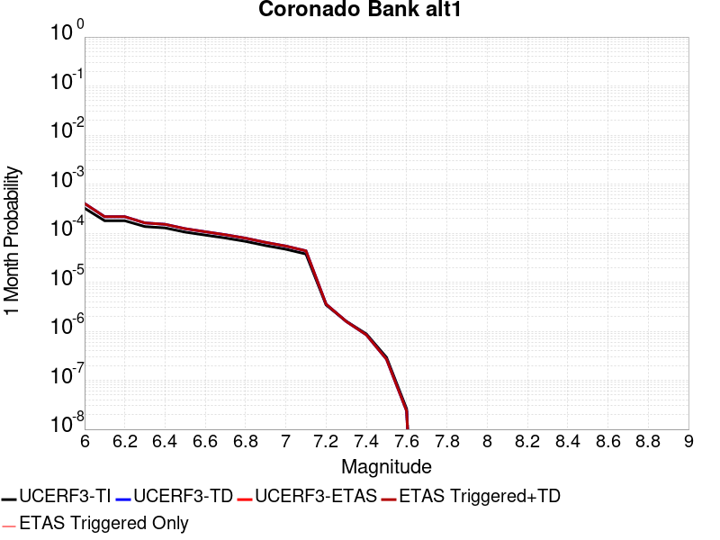 |  |  |

| Magnitude | 1 wk TI Prob | 1 wk TD Prob | 1 wk ETAS Prob | 1 wk ETAS/TD Gain | 1 wk ETAS Triggered+TD | 1 wk ETAS Triggered Only | 1 mo TI Prob | 1 mo TD Prob | 1 mo ETAS Prob | 1 mo ETAS/TD Gain | 1 mo ETAS Triggered+TD | 1 mo ETAS Triggered Only | 1 yr TI Prob | 1 yr TD Prob | 1 yr ETAS Prob | 1 yr ETAS/TD Gain | 1 yr ETAS Triggered+TD | 1 yr ETAS Triggered Only | 10 yr TI Prob | 10 yr TD Prob | 10 yr ETAS Prob | 10 yr ETAS/TD Gain | 10 yr ETAS Triggered+TD | 10 yr ETAS Triggered Only |
|-----|-----|-----|-----|-----|-----|-----|-----|-----|-----|-----|-----|-----|-----|-----|-----|-----|-----|-----|-----|-----|-----|-----|-----|-----|
| 6.0 | 7.533492E-5 | 9.399735E-5 | 0.0 | 0.0 | 9.399735E-5 | 0.0 | 3.22824E-4 | 4.0278552E-4 | 0.0 | 0.0 | 4.0278552E-4 | 0.0 | 0.0039233007 | 0.004893489 | 0.0024 | 0.4904476 | 0.0049929996 | 1.0E-4 | 0.03854755 | 0.04792656 | 0.0307 | 0.64056337 | 0.051734854 | 0.004 |
| 6.1 | 4.1807285E-5 | 5.0514012E-5 | 0.0 | 0.0 | 5.0514012E-5 | 0.0 | 1.7916178E-4 | 2.1647112E-4 | 0.0 | 0.0 | 2.1647112E-4 | 0.0 | 0.0021791123 | 0.0026324256 | 0.0014 | 0.5318289 | 0.0026324256 | 0.0 | 0.021578677 | 0.026021732 | 0.013 | 0.4995824 | 0.027677495 | 0.0017 |
| 6.2 | 4.1807285E-5 | 5.0514012E-5 | 0.0 | 0.0 | 5.0514012E-5 | 0.0 | 1.7916178E-4 | 2.1647112E-4 | 0.0 | 0.0 | 2.1647112E-4 | 0.0 | 0.0021791123 | 0.0026324256 | 0.0014 | 0.5318289 | 0.0026324256 | 0.0 | 0.021578677 | 0.026021732 | 0.013 | 0.4995824 | 0.027677495 | 0.0017 |
| 6.3 | 3.1793104E-5 | 3.772518E-5 | 0.0 | 0.0 | 3.772518E-5 | 0.0 | 1.3624904E-4 | 1.6166954E-4 | 0.0 | 0.0 | 1.6166954E-4 | 0.0 | 0.0016575698 | 0.0019665814 | 0.001 | 0.50849664 | 0.0019665814 | 0.0 | 0.016452603 | 0.019495685 | 0.0087 | 0.4462526 | 0.02077034 | 0.0013 |
| 6.4 | 2.9878007E-5 | 3.534873E-5 | 0.0 | 0.0 | 3.534873E-5 | 0.0 | 1.2804232E-4 | 1.5148596E-4 | 0.0 | 0.0 | 1.5148596E-4 | 0.0 | 0.0015578003 | 0.0018428133 | 0.001 | 0.54264855 | 0.0018428133 | 0.0 | 0.015469253 | 0.018279087 | 0.0081 | 0.44312933 | 0.019555325 | 0.0013 |
| 6.5 | 2.4512565E-5 | 2.8774117E-5 | 0.0 | 0.0 | 2.8774117E-5 | 0.0 | 1.0504962E-4 | 1.2331197E-4 | 0.0 | 0.0 | 1.2331197E-4 | 0.0 | 0.0012782287 | 0.0015003161 | 9.0E-4 | 0.5998736 | 0.0015003161 | 0.0 | 0.012709012 | 0.014904841 | 0.0065 | 0.43609995 | 0.015889935 | 0.001 |
| 6.6 | 2.1317413E-5 | 2.4915096E-5 | 0.0 | 0.0 | 2.4915096E-5 | 0.0 | 9.135714E-5 | 1.0677474E-4 | 0.0 | 0.0 | 1.0677474E-4 | 0.0 | 0.0011117056 | 0.0012992295 | 8.0E-4 | 0.6157496 | 0.0012992295 | 0.0 | 0.011061605 | 0.012918749 | 0.0061 | 0.47218198 | 0.01390583 | 0.001 |
| 6.7 | 1.8585655E-5 | 2.1642021E-5 | 0.0 | 0.0 | 2.1642021E-5 | 0.0 | 7.9650374E-5 | 9.274834E-5 | 0.0 | 0.0 | 9.274834E-5 | 0.0 | 9.6931186E-4 | 0.0011286465 | 7.0E-4 | 0.6202119 | 0.0011286465 | 0.0 | 0.0096509475 | 0.011231309 | 0.0053 | 0.47189516 | 0.012220077 | 0.001 |
| 6.8 | 1.5862879E-5 | 1.8425457E-5 | 0.0 | 0.0 | 1.8425457E-5 | 0.0 | 6.798199E-5 | 7.896396E-5 | 0.0 | 0.0 | 7.896396E-5 | 0.0 | 8.273665E-4 | 9.609815E-4 | 6.0E-4 | 0.6243617 | 9.609815E-4 | 0.0 | 0.008242928 | 0.009570243 | 0.0048 | 0.50155467 | 0.010362587 | 8.0E-4 |
| 6.9 | 1.3021509E-5 | 1.5100121E-5 | 0.0 | 0.0 | 1.5100121E-5 | 0.0 | 5.5805274E-5 | 6.47133E-5 | 0.0 | 0.0 | 6.47133E-5 | 0.0 | 6.792174E-4 | 7.8761776E-4 | 5.0E-4 | 0.6348257 | 7.8761776E-4 | 0.0 | 0.006771452 | 0.007850088 | 0.0044 | 0.5605033 | 0.008544593 | 7.0E-4 |
| 7.0 | 1.0974371E-5 | 1.2724202E-5 | 0.0 | 0.0 | 1.2724202E-5 | 0.0 | 4.7032172E-5 | 5.4531254E-5 | 0.0 | 0.0 | 5.4531254E-5 | 0.0 | 5.7246623E-4 | 6.6373334E-4 | 4.0E-4 | 0.60265166 | 6.6373334E-4 | 0.0 | 0.0057099373 | 0.00661926 | 0.0036 | 0.5438674 | 0.0073146266 | 7.0E-4 |
| 7.1 | 8.766221E-6 | 1.0167127E-5 | 0.0 | 0.0 | 1.0167127E-5 | 0.0 | 3.7568978E-5 | 4.357277E-5 | 0.0 | 0.0 | 4.357277E-5 | 0.0 | 4.573063E-4 | 5.303866E-4 | 2.0E-4 | 0.37708345 | 5.303866E-4 | 0.0 | 0.0045636636 | 0.0052929083 | 0.003 | 0.5667962 | 0.005989203 | 7.0E-4 |
| 7.2 | 8.026024E-7 | 8.332866E-7 | 0.0 | 0.0 | 8.332866E-7 | 0.0 | 3.43972E-6 | 3.5712233E-6 | 0.0 | 0.0 | 3.5712233E-6 | 0.0 | 4.1877785E-5 | 4.3478787E-5 | 1.0E-4 | 2.299972 | 4.3478787E-5 | 0.0 | 4.1869894E-4 | 4.347039E-4 | 4.0E-4 | 0.92016655 | 4.347039E-4 | 0.0 |
| 7.3 | 3.7293114E-7 | 3.7004682E-7 | 0.0 | 0.0 | 3.7004682E-7 | 0.0 | 1.5982754E-6 | 1.585914E-6 | 0.0 | 0.0 | 1.585914E-6 | 0.0 | 1.9458828E-5 | 1.9308332E-5 | 1.0E-4 | 5.179111 | 1.9308332E-5 | 0.0 | 1.9457124E-4 | 1.9306662E-4 | 2.0E-4 | 1.0359119 | 1.9306662E-4 | 0.0 |
| 7.4 | 2.0557036E-7 | 1.9676082E-7 | 0.0 | 0.0 | 1.9676082E-7 | 0.0 | 8.810155E-7 | 8.432604E-7 | 0.0 | 0.0 | 8.432604E-7 | 0.0 | 1.0726311E-5 | 1.0266647E-5 | 0.0 | 0.0 | 1.0266647E-5 | 0.0 | 1.0725793E-4 | 1.0266176E-4 | 1.0E-4 | 0.9740725 | 1.0266176E-4 | 0.0 |
| 7.5 | 6.845446E-8 | 6.279951E-8 | 0.0 | 0.0 | 6.279951E-8 | 0.0 | 2.9337625E-7 | 2.691407E-7 | 0.0 | 0.0 | 2.691407E-7 | 0.0 | 3.5718497E-6 | 3.2767832E-6 | 0.0 | 0.0 | 3.2767832E-6 | 0.0 | 3.5717923E-5 | 3.276736E-5 | 1.0E-4 | 3.0518174 | 3.276736E-5 | 0.0 |
| 7.6 | 6.0975145E-9 | 5.5319433E-9 | 0.0 | 0.0 | 5.5319433E-9 | 0.0 | 2.6132206E-8 | 2.3708328E-8 | 0.0 | 0.0 | 2.3708328E-8 | 0.0 | 3.1815955E-7 | 2.8864886E-7 | 0.0 | 0.0 | 2.8864886E-7 | 0.0 | 3.181591E-6 | 2.8864858E-6 | 0.0 | 0.0 | 2.8864858E-6 | 0.0 |

## Whittier alt 1
*[(top)](#table-of-contents)*

| 1 Week | 1 Month | 1 Year | 10 Year |
|-----|-----|-----|-----|
| 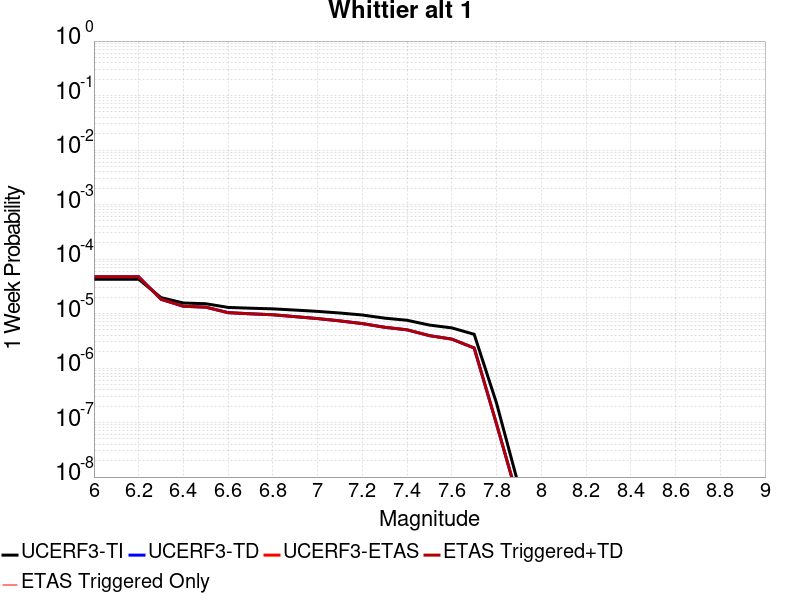 |  |  |  |

| Magnitude | 1 wk TI Prob | 1 wk TD Prob | 1 wk ETAS Prob | 1 wk ETAS/TD Gain | 1 wk ETAS Triggered+TD | 1 wk ETAS Triggered Only | 1 mo TI Prob | 1 mo TD Prob | 1 mo ETAS Prob | 1 mo ETAS/TD Gain | 1 mo ETAS Triggered+TD | 1 mo ETAS Triggered Only | 1 yr TI Prob | 1 yr TD Prob | 1 yr ETAS Prob | 1 yr ETAS/TD Gain | 1 yr ETAS Triggered+TD | 1 yr ETAS Triggered Only | 10 yr TI Prob | 10 yr TD Prob | 10 yr ETAS Prob | 10 yr ETAS/TD Gain | 10 yr ETAS Triggered+TD | 10 yr ETAS Triggered Only |
|-----|-----|-----|-----|-----|-----|-----|-----|-----|-----|-----|-----|-----|-----|-----|-----|-----|-----|-----|-----|-----|-----|-----|-----|-----|
| 6.0 | 4.2554693E-5 | 4.727002E-5 | 0.0 | 0.0 | 4.727002E-5 | 0.0 | 1.8236451E-4 | 2.0257189E-4 | 0.0 | 0.0 | 2.0257189E-4 | 0.0 | 0.002218027 | 0.002463845 | 0.0015 | 0.6088045 | 0.0027631058 | 3.0E-4 | 0.02196019 | 0.02439963 | 0.0163 | 0.6680429 | 0.028009351 | 0.0037 |
| 6.1 | 4.2554693E-5 | 4.727002E-5 | 0.0 | 0.0 | 4.727002E-5 | 0.0 | 1.8236451E-4 | 2.0257189E-4 | 0.0 | 0.0 | 2.0257189E-4 | 0.0 | 0.002218027 | 0.002463845 | 0.0015 | 0.6088045 | 0.0027631058 | 3.0E-4 | 0.02196019 | 0.02439963 | 0.0163 | 0.6680429 | 0.028009351 | 0.0037 |
| 6.2 | 4.2554693E-5 | 4.727002E-5 | 0.0 | 0.0 | 4.727002E-5 | 0.0 | 1.8236451E-4 | 2.0257189E-4 | 0.0 | 0.0 | 2.0257189E-4 | 0.0 | 0.002218027 | 0.002463845 | 0.0015 | 0.6088045 | 0.0027631058 | 3.0E-4 | 0.02196019 | 0.02439963 | 0.0163 | 0.6680429 | 0.028009351 | 0.0037 |
| 6.3 | 1.9617712E-5 | 1.827824E-5 | 0.0 | 0.0 | 1.827824E-5 | 0.0 | 8.40732E-5 | 7.833307E-5 | 0.0 | 0.0 | 7.833307E-5 | 0.0 | 0.0010231105 | 9.5330685E-4 | 8.0E-4 | 0.8391841 | 0.0010532115 | 1.0E-4 | 0.01018413 | 0.009495753 | 0.0062 | 0.65292346 | 0.010783408 | 0.0013 |
| 6.4 | 1.5611336E-5 | 1.3612437E-5 | 0.0 | 0.0 | 1.3612437E-5 | 0.0 | 6.690401E-5 | 5.8337748E-5 | 0.0 | 0.0 | 5.8337748E-5 | 0.0 | 8.142519E-4 | 7.100366E-4 | 8.0E-4 | 1.1267024 | 8.099656E-4 | 1.0E-4 | 0.008112748 | 0.0070799356 | 0.0045 | 0.635599 | 0.007973564 | 9.0E-4 |
| 6.5 | 1.5150166E-5 | 1.3108997E-5 | 0.0 | 0.0 | 1.3108997E-5 | 0.0 | 6.492767E-5 | 5.618024E-5 | 0.0 | 0.0 | 5.618024E-5 | 0.0 | 7.9020765E-4 | 6.8378565E-4 | 8.0E-4 | 1.1699573 | 7.8371726E-4 | 1.0E-4 | 0.007874036 | 0.0068190573 | 0.0043 | 0.6305857 | 0.007613602 | 8.0E-4 |
| 6.6 | 1.295588E-5 | 1.0387315E-5 | 0.0 | 0.0 | 1.0387315E-5 | 0.0 | 5.552402E-5 | 4.4516317E-5 | 0.0 | 0.0 | 4.4516317E-5 | 0.0 | 6.7579525E-4 | 5.418533E-4 | 7.0E-4 | 1.2918626 | 6.417991E-4 | 1.0E-4 | 0.006737438 | 0.0054068724 | 0.0033 | 0.61033434 | 0.006202547 | 8.0E-4 |
| 6.7 | 1.2542085E-5 | 9.905748E-6 | 0.0 | 0.0 | 9.905748E-6 | 0.0 | 5.3750682E-5 | 4.2452524E-5 | 0.0 | 0.0 | 4.2452524E-5 | 0.0 | 6.542181E-4 | 5.167388E-4 | 7.0E-4 | 1.3546495 | 6.166871E-4 | 1.0E-4 | 0.006522954 | 0.005156908 | 0.003 | 0.58174396 | 0.005753814 | 6.0E-4 |
| 6.8 | 1.2195878E-5 | 9.50157E-6 | 0.0 | 0.0 | 9.50157E-6 | 0.0 | 5.2267E-5 | 4.072039E-5 | 0.0 | 0.0 | 4.072039E-5 | 0.0 | 6.36165E-4 | 4.956598E-4 | 6.0E-4 | 1.2105076 | 5.956103E-4 | 1.0E-4 | 0.0063434686 | 0.0049470123 | 0.0028 | 0.5659982 | 0.005544044 | 6.0E-4 |
| 6.9 | 1.1580298E-5 | 8.778675E-6 | 0.0 | 0.0 | 8.778675E-6 | 0.0 | 4.9628903E-5 | 3.762236E-5 | 0.0 | 0.0 | 3.762236E-5 | 0.0 | 6.040644E-4 | 4.5795762E-4 | 6.0E-4 | 1.3101649 | 5.579118E-4 | 1.0E-4 | 0.00602425 | 0.0045715463 | 0.0026 | 0.5687353 | 0.0051688035 | 6.0E-4 |
| 7.0 | 1.0964795E-5 | 8.089428E-6 | 0.0 | 0.0 | 8.089428E-6 | 0.0 | 4.6991136E-5 | 3.4668523E-5 | 0.0 | 0.0 | 3.4668523E-5 | 0.0 | 5.7196687E-4 | 4.2200906E-4 | 6.0E-4 | 1.4217705 | 5.2196684E-4 | 1.0E-4 | 0.0057049696 | 0.004213378 | 0.0023 | 0.5458803 | 0.0047112713 | 5.0E-4 |
| 7.1 | 1.0230601E-5 | 7.331466E-6 | 0.0 | 0.0 | 7.331466E-6 | 0.0 | 4.3844695E-5 | 3.1420197E-5 | 0.0 | 0.0 | 3.1420197E-5 | 0.0 | 5.336784E-4 | 3.8247506E-4 | 6.0E-4 | 1.5687298 | 4.824368E-4 | 1.0E-4 | 0.005323986 | 0.0038193513 | 0.0022 | 0.57601404 | 0.0042178235 | 4.0E-4 |
| 7.2 | 9.40865E-6 | 6.5476665E-6 | 0.0 | 0.0 | 6.5476665E-6 | 0.0 | 4.032216E-5 | 2.8061133E-5 | 0.0 | 0.0 | 2.8061133E-5 | 0.0 | 4.908117E-4 | 3.4159195E-4 | 6.0E-4 | 1.7564816 | 4.4155782E-4 | 1.0E-4 | 0.0048972913 | 0.0034117836 | 0.0022 | 0.644824 | 0.003810419 | 4.0E-4 |
| 7.3 | 8.237384E-6 | 5.601519E-6 | 0.0 | 0.0 | 5.601519E-6 | 0.0 | 3.5302593E-5 | 2.4006295E-5 | 0.0 | 0.0 | 2.4006295E-5 | 0.0 | 4.2972428E-4 | 2.922385E-4 | 5.0E-4 | 1.7109314 | 2.922385E-4 | 0.0 | 0.0042889426 | 0.0029188825 | 0.0017 | 0.5824147 | 0.0032180068 | 3.0E-4 |
| 7.4 | 7.5316966E-6 | 5.0312383E-6 | 0.0 | 0.0 | 5.0312383E-6 | 0.0 | 3.2278298E-5 | 2.1562277E-5 | 0.0 | 0.0 | 2.1562277E-5 | 0.0 | 3.9291743E-4 | 2.6249012E-4 | 4.0E-4 | 1.5238669 | 2.6249012E-4 | 0.0 | 0.0039222343 | 0.0026219133 | 0.0014 | 0.5339612 | 0.0029211268 | 3.0E-4 |
| 7.5 | 6.149649E-6 | 3.93657E-6 | 0.0 | 0.0 | 3.93657E-6 | 0.0 | 2.6355372E-5 | 1.687091E-5 | 0.0 | 0.0 | 1.687091E-5 | 0.0 | 3.208294E-4 | 2.0538487E-4 | 2.0E-4 | 0.9737816 | 2.0538487E-4 | 0.0 | 0.003203666 | 0.0020520398 | 7.0E-4 | 0.34112397 | 0.0021518348 | 1.0E-4 |
| 7.6 | 5.457711E-6 | 3.3977947E-6 | 0.0 | 0.0 | 3.3977947E-6 | 0.0 | 2.338998E-5 | 1.4561901E-5 | 0.0 | 0.0 | 1.4561901E-5 | 0.0 | 2.8473578E-4 | 1.7727753E-4 | 2.0E-4 | 1.1281745 | 1.7727753E-4 | 0.0 | 0.0028437122 | 0.001771442 | 5.0E-4 | 0.28225592 | 0.001771442 | 0.0 |
| 7.7 | 4.1676276E-6 | 2.3350815E-6 | 0.0 | 0.0 | 2.3350815E-6 | 0.0 | 1.7861139E-5 | 1.00074585E-5 | 0.0 | 0.0 | 1.00074585E-5 | 0.0 | 2.1743766E-4 | 1.2183474E-4 | 2.0E-4 | 1.641568 | 1.2183474E-4 | 0.0 | 0.0021722503 | 0.0012177526 | 5.0E-4 | 0.41059244 | 0.0012177526 | 0.0 |
| 7.8 | 2.2692414E-7 | 9.391389E-8 | 0.0 | 0.0 | 9.391389E-8 | 0.0 | 9.725317E-7 | 4.0248807E-7 | 0.0 | 0.0 | 4.0248807E-7 | 0.0 | 1.1840509E-5 | 4.9002842E-6 | 0.0 | 0.0 | 4.9002842E-6 | 0.0 | 1.1839878E-4 | 4.900209E-5 | 0.0 | 0.0 | 4.900209E-5 | 0.0 |
| 7.9 | 6.676829E-9 | 3.4415768E-9 | 0.0 | 0.0 | 3.4415768E-9 | 0.0 | 2.861498E-8 | 1.4749616E-8 | 0.0 | 0.0 | 1.4749616E-8 | 0.0 | 3.4838732E-7 | 1.7957656E-7 | 0.0 | 0.0 | 1.7957656E-7 | 0.0 | 3.4838679E-6 | 1.7957643E-6 | 0.0 | 0.0 | 1.7957643E-6 | 0.0 |

## Palos Verdes
*[(top)](#table-of-contents)*

| 1 Week | 1 Month | 1 Year | 10 Year |
|-----|-----|-----|-----|
| 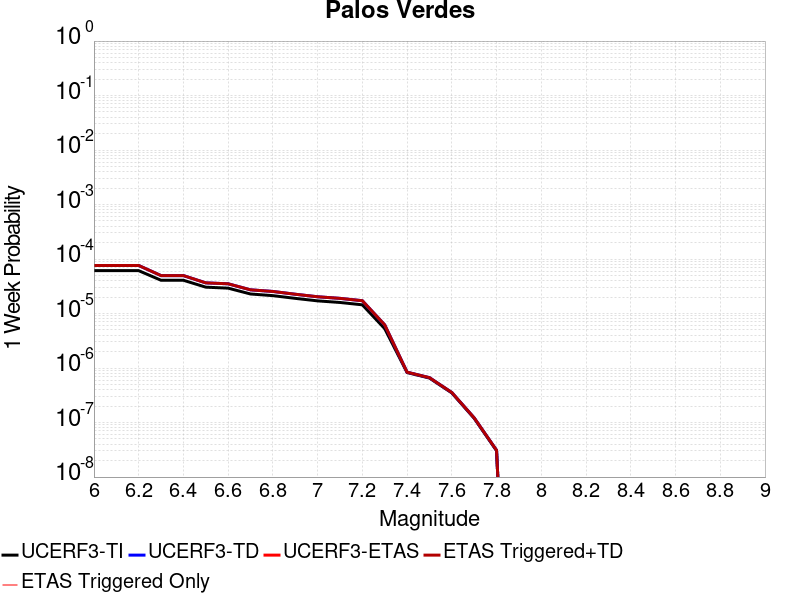 |  | 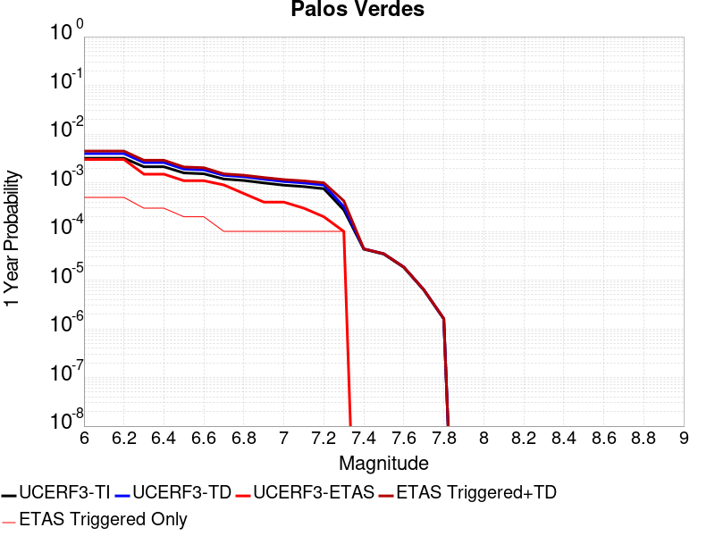 |  |

| Magnitude | 1 wk TI Prob | 1 wk TD Prob | 1 wk ETAS Prob | 1 wk ETAS/TD Gain | 1 wk ETAS Triggered+TD | 1 wk ETAS Triggered Only | 1 mo TI Prob | 1 mo TD Prob | 1 mo ETAS Prob | 1 mo ETAS/TD Gain | 1 mo ETAS Triggered+TD | 1 mo ETAS Triggered Only | 1 yr TI Prob | 1 yr TD Prob | 1 yr ETAS Prob | 1 yr ETAS/TD Gain | 1 yr ETAS Triggered+TD | 1 yr ETAS Triggered Only | 10 yr TI Prob | 10 yr TD Prob | 10 yr ETAS Prob | 10 yr ETAS/TD Gain | 10 yr ETAS Triggered+TD | 10 yr ETAS Triggered Only |
|-----|-----|-----|-----|-----|-----|-----|-----|-----|-----|-----|-----|-----|-----|-----|-----|-----|-----|-----|-----|-----|-----|-----|-----|-----|
| 6.0 | 6.126063E-5 | 7.626235E-5 | 0.0 | 0.0 | 7.626235E-5 | 0.0 | 2.6251914E-4 | 3.2680106E-4 | 1.0E-4 | 0.30599657 | 3.2680106E-4 | 0.0 | 0.0031914865 | 0.003972081 | 0.003 | 0.75527155 | 0.004470095 | 5.0E-4 | 0.031460393 | 0.03906746 | 0.0235 | 0.60152364 | 0.042719003 | 0.0038 |
| 6.1 | 6.126063E-5 | 7.626235E-5 | 0.0 | 0.0 | 7.626235E-5 | 0.0 | 2.6251914E-4 | 3.2680106E-4 | 1.0E-4 | 0.30599657 | 3.2680106E-4 | 0.0 | 0.0031914865 | 0.003972081 | 0.003 | 0.75527155 | 0.004470095 | 5.0E-4 | 0.031460393 | 0.03906746 | 0.0235 | 0.60152364 | 0.042719003 | 0.0038 |
| 6.2 | 6.126063E-5 | 7.626235E-5 | 0.0 | 0.0 | 7.626235E-5 | 0.0 | 2.6251914E-4 | 3.2680106E-4 | 1.0E-4 | 0.30599657 | 3.2680106E-4 | 0.0 | 0.0031914865 | 0.003972081 | 0.003 | 0.75527155 | 0.004470095 | 5.0E-4 | 0.031460393 | 0.03906746 | 0.0235 | 0.60152364 | 0.042719003 | 0.0038 |
| 6.3 | 4.0838047E-5 | 4.9770555E-5 | 0.0 | 0.0 | 4.9770555E-5 | 0.0 | 1.7500846E-4 | 2.1328621E-4 | 1.0E-4 | 0.46885356 | 2.1328621E-4 | 0.0 | 0.0021286458 | 0.0025938775 | 0.0015 | 0.5782848 | 0.0028930993 | 3.0E-4 | 0.021083709 | 0.025657712 | 0.0147 | 0.5729272 | 0.028288437 | 0.0027 |
| 6.4 | 4.0838047E-5 | 4.9770555E-5 | 0.0 | 0.0 | 4.9770555E-5 | 0.0 | 1.7500846E-4 | 2.1328621E-4 | 1.0E-4 | 0.46885356 | 2.1328621E-4 | 0.0 | 0.0021286458 | 0.0025938775 | 0.0015 | 0.5782848 | 0.0028930993 | 3.0E-4 | 0.021083709 | 0.025657712 | 0.0147 | 0.5729272 | 0.028288437 | 0.0027 |
| 6.5 | 3.0512005E-5 | 3.657606E-5 | 0.0 | 0.0 | 3.657606E-5 | 0.0 | 1.3075917E-4 | 1.5674581E-4 | 1.0E-4 | 0.6379756 | 1.5674581E-4 | 0.0 | 0.0015908304 | 0.0019068262 | 0.0011 | 0.57687485 | 0.0021064447 | 2.0E-4 | 0.015794903 | 0.018916588 | 0.0107 | 0.5656411 | 0.02058443 | 0.0017 |
| 6.6 | 2.9255087E-5 | 3.5168527E-5 | 0.0 | 0.0 | 3.5168527E-5 | 0.0 | 1.2537291E-4 | 1.507142E-4 | 1.0E-4 | 0.66350746 | 1.507142E-4 | 0.0 | 0.0015253464 | 0.001833515 | 0.0011 | 0.59994054 | 0.0020331482 | 2.0E-4 | 0.015149189 | 0.018195493 | 0.0105 | 0.57706594 | 0.019766381 | 0.0016 |
| 6.7 | 2.287198E-5 | 2.7258708E-5 | 0.0 | 0.0 | 2.7258708E-5 | 0.0 | 9.801909E-5 | 1.1681832E-4 | 1.0E-4 | 0.8560301 | 1.1681832E-4 | 0.0 | 0.001192729 | 0.0014214269 | 9.0E-4 | 0.6331666 | 0.0015212847 | 1.0E-4 | 0.011863477 | 0.01413259 | 0.0075 | 0.5306883 | 0.015315631 | 0.0012 |
| 6.8 | 2.1325764E-5 | 2.544167E-5 | 0.0 | 0.0 | 2.544167E-5 | 0.0 | 9.139293E-5 | 1.0903168E-4 | 1.0E-4 | 0.9171646 | 1.0903168E-4 | 0.0 | 0.001112141 | 0.0013267426 | 6.0E-4 | 0.45223543 | 0.0014266099 | 1.0E-4 | 0.011065915 | 0.013197261 | 0.0069 | 0.5228358 | 0.0143814245 | 0.0012 |
| 6.9 | 1.9009392E-5 | 2.2622127E-5 | 0.0 | 0.0 | 2.2622127E-5 | 0.0 | 8.1466285E-5 | 9.694886E-5 | 1.0E-4 | 1.0314716 | 9.694886E-5 | 0.0 | 9.914007E-4 | 0.0011798007 | 4.0E-4 | 0.3390403 | 0.0012796827 | 1.0E-4 | 0.009869894 | 0.011744064 | 0.0063 | 0.5364412 | 0.012831146 | 0.0011 |
| 7.0 | 1.7098473E-5 | 2.0327021E-5 | 0.0 | 0.0 | 2.0327021E-5 | 0.0 | 7.3277115E-5 | 8.7113374E-5 | 1.0E-4 | 1.1479293 | 8.7113374E-5 | 0.0 | 8.917837E-4 | 0.0010601747 | 4.0E-4 | 0.37729633 | 0.0011600686 | 1.0E-4 | 0.008882134 | 0.010559612 | 0.0054 | 0.51138246 | 0.011549052 | 0.001 |
| 7.1 | 1.5982785E-5 | 1.900193E-5 | 0.0 | 0.0 | 1.900193E-5 | 0.0 | 6.849585E-5 | 8.143478E-5 | 1.0E-4 | 1.2279766 | 8.143478E-5 | 0.0 | 8.336179E-4 | 9.911022E-4 | 3.0E-4 | 0.3026933 | 0.0010910031 | 1.0E-4 | 0.008304977 | 0.009875191 | 0.0051 | 0.5164457 | 0.010865316 | 0.001 |
| 7.2 | 1.4468002E-5 | 1.7203736E-5 | 0.0 | 0.0 | 1.7203736E-5 | 0.0 | 6.200425E-5 | 7.372869E-5 | 0.0 | 0.0 | 7.372869E-5 | 0.0 | 7.546402E-4 | 8.973612E-4 | 2.0E-4 | 0.2228757 | 9.972715E-4 | 1.0E-4 | 0.007520827 | 0.008945653 | 0.0049 | 0.5477521 | 0.009936707 | 0.001 |
| 7.3 | 5.288233E-6 | 6.2058593E-6 | 0.0 | 0.0 | 6.2058593E-6 | 0.0 | 2.2663658E-5 | 2.6596466E-5 | 0.0 | 0.0 | 2.6596466E-5 | 0.0 | 2.7589512E-4 | 3.237988E-4 | 1.0E-4 | 0.30883375 | 4.237664E-4 | 1.0E-4 | 0.0027555283 | 0.0032366957 | 0.0012 | 0.3707485 | 0.0037350773 | 5.0E-4 |
| 7.4 | 8.279556E-7 | 8.408606E-7 | 0.0 | 0.0 | 8.408606E-7 | 0.0 | 3.5483763E-6 | 3.6036838E-6 | 0.0 | 0.0 | 3.6036838E-6 | 0.0 | 4.3200624E-5 | 4.387404E-5 | 0.0 | 0.0 | 4.387404E-5 | 0.0 | 4.3192226E-4 | 4.38661E-4 | 0.0 | 0.0 | 4.38661E-4 | 0.0 |
| 7.5 | 6.559831E-7 | 6.6674454E-7 | 0.0 | 0.0 | 6.6674454E-7 | 0.0 | 2.8113532E-6 | 2.8574739E-6 | 0.0 | 0.0 | 2.8574739E-6 | 0.0 | 3.4227687E-5 | 3.4789256E-5 | 0.0 | 0.0 | 3.4789256E-5 | 0.0 | 3.4222414E-4 | 3.4784473E-4 | 0.0 | 0.0 | 3.4784473E-4 | 0.0 |
| 7.6 | 3.5018968E-7 | 3.562124E-7 | 0.0 | 0.0 | 3.562124E-7 | 0.0 | 1.500812E-6 | 1.526624E-6 | 0.0 | 0.0 | 1.526624E-6 | 0.0 | 1.8272232E-5 | 1.8586536E-5 | 0.0 | 0.0 | 1.8586536E-5 | 0.0 | 1.8270731E-4 | 1.8585441E-4 | 0.0 | 0.0 | 1.8585441E-4 | 0.0 |
| 7.7 | 1.1986104E-7 | 1.2198805E-7 | 0.0 | 0.0 | 1.2198805E-7 | 0.0 | 5.1369005E-7 | 5.228058E-7 | 0.0 | 0.0 | 5.228058E-7 | 0.0 | 6.2541585E-6 | 6.365143E-6 | 0.0 | 0.0 | 6.365143E-6 | 0.0 | 6.2539824E-5 | 6.364965E-5 | 0.0 | 0.0 | 6.364965E-5 | 0.0 |
| 7.8 | 3.0445005E-8 | 3.1028762E-8 | 0.0 | 0.0 | 3.1028762E-8 | 0.0 | 1.3047858E-7 | 1.329804E-7 | 0.0 | 0.0 | 1.329804E-7 | 0.0 | 1.5885756E-6 | 1.6190354E-6 | 0.0 | 0.0 | 1.6190354E-6 | 0.0 | 1.5885644E-5 | 1.6190257E-5 | 0.0 | 0.0 | 1.6190257E-5 | 0.0 |

## San Diego Trough north alt1
*[(top)](#table-of-contents)*

| 1 Week | 1 Month | 1 Year | 10 Year |
|-----|-----|-----|-----|
|  |  | 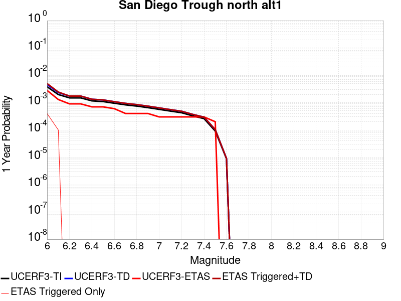 |  |

| Magnitude | 1 wk TI Prob | 1 wk TD Prob | 1 wk ETAS Prob | 1 wk ETAS/TD Gain | 1 wk ETAS Triggered+TD | 1 wk ETAS Triggered Only | 1 mo TI Prob | 1 mo TD Prob | 1 mo ETAS Prob | 1 mo ETAS/TD Gain | 1 mo ETAS Triggered+TD | 1 mo ETAS Triggered Only | 1 yr TI Prob | 1 yr TD Prob | 1 yr ETAS Prob | 1 yr ETAS/TD Gain | 1 yr ETAS Triggered+TD | 1 yr ETAS Triggered Only | 10 yr TI Prob | 10 yr TD Prob | 10 yr ETAS Prob | 10 yr ETAS/TD Gain | 10 yr ETAS Triggered+TD | 10 yr ETAS Triggered Only |
|-----|-----|-----|-----|-----|-----|-----|-----|-----|-----|-----|-----|-----|-----|-----|-----|-----|-----|-----|-----|-----|-----|-----|-----|-----|
| 6.0 | 7.329252E-5 | 8.824872E-5 | 0.0 | 0.0 | 8.824872E-5 | 0.0 | 3.14073E-4 | 3.78157E-4 | 2.0E-4 | 0.52888083 | 4.781192E-4 | 1.0E-4 | 0.0038171355 | 0.0045949104 | 0.0028 | 0.6093699 | 0.0049930722 | 4.0E-4 | 0.03752231 | 0.04506296 | 0.0305 | 0.6768308 | 0.048596226 | 0.0037 |
| 6.1 | 3.7940346E-5 | 4.490157E-5 | 0.0 | 0.0 | 4.490157E-5 | 0.0 | 1.6259136E-4 | 1.9242105E-4 | 1.0E-4 | 0.5196937 | 1.9242105E-4 | 0.0 | 0.0019777524 | 0.0023402898 | 0.0013 | 0.55548674 | 0.0024400558 | 1.0E-4 | 0.019602431 | 0.02316512 | 0.0145 | 0.62594104 | 0.02482574 | 0.0017 |
| 6.2 | 2.8645263E-5 | 3.330762E-5 | 0.0 | 0.0 | 3.330762E-5 | 0.0 | 1.2275964E-4 | 1.4273915E-4 | 1.0E-4 | 0.70057863 | 1.4273915E-4 | 0.0 | 0.0014935739 | 0.0017364867 | 9.0E-4 | 0.5182879 | 0.0017364867 | 0.0 | 0.0148357535 | 0.017231833 | 0.0102 | 0.59192777 | 0.018214602 | 0.001 |
| 6.3 | 2.8645263E-5 | 3.330762E-5 | 0.0 | 0.0 | 3.330762E-5 | 0.0 | 1.2275964E-4 | 1.4273915E-4 | 1.0E-4 | 0.70057863 | 1.4273915E-4 | 0.0 | 0.0014935739 | 0.0017364867 | 9.0E-4 | 0.5182879 | 0.0017364867 | 0.0 | 0.0148357535 | 0.017231833 | 0.0102 | 0.59192777 | 0.018214602 | 0.001 |
| 6.4 | 2.2204576E-5 | 2.5455778E-5 | 0.0 | 0.0 | 2.5455778E-5 | 0.0 | 9.5159E-5 | 1.0909168E-4 | 1.0E-4 | 0.9166602 | 1.0909168E-4 | 0.0 | 0.001157945 | 0.0013273912 | 7.0E-4 | 0.5273502 | 0.0013273912 | 0.0 | 0.011519298 | 0.013195796 | 0.0073 | 0.5532065 | 0.013886559 | 7.0E-4 |
| 6.5 | 2.1004838E-5 | 2.403162E-5 | 0.0 | 0.0 | 2.403162E-5 | 0.0 | 9.0017624E-5 | 1.0298863E-4 | 1.0E-4 | 0.97098094 | 1.0298863E-4 | 0.0 | 0.0010954136 | 0.0012531743 | 7.0E-4 | 0.55858153 | 0.0012531743 | 0.0 | 0.010900296 | 0.012462159 | 0.0073 | 0.58577335 | 0.013153435 | 7.0E-4 |
| 6.6 | 1.820557E-5 | 2.0710482E-5 | 0.0 | 0.0 | 2.0710482E-5 | 0.0 | 7.802154E-5 | 8.875621E-5 | 1.0E-4 | 1.1266817 | 8.875621E-5 | 0.0 | 9.4949827E-4 | 0.0010800766 | 6.0E-4 | 0.5555162 | 0.0010800766 | 0.0 | 0.009454516 | 0.010748942 | 0.0059 | 0.5488912 | 0.011342494 | 6.0E-4 |
| 6.7 | 1.5884485E-5 | 1.7988401E-5 | 0.0 | 0.0 | 1.7988401E-5 | 0.0 | 6.807459E-5 | 7.709089E-5 | 1.0E-4 | 1.2971702 | 7.709089E-5 | 0.0 | 8.284929E-4 | 9.3818014E-4 | 4.0E-4 | 0.42635736 | 9.3818014E-4 | 0.0 | 0.008254109 | 0.0093425615 | 0.0046 | 0.4923703 | 0.00983789 | 5.0E-4 |
| 6.8 | 1.4331171E-5 | 1.6205291E-5 | 0.0 | 0.0 | 1.6205291E-5 | 0.0 | 6.141786E-5 | 6.944941E-5 | 1.0E-4 | 1.4398971 | 6.944941E-5 | 0.0 | 7.4750587E-4 | 8.452205E-4 | 4.0E-4 | 0.4732493 | 8.452205E-4 | 0.0 | 0.0074499645 | 0.008420326 | 0.0042 | 0.49879307 | 0.0088169575 | 4.0E-4 |
| 6.9 | 1.2574203E-5 | 1.4209517E-5 | 0.0 | 0.0 | 1.4209517E-5 | 0.0 | 5.3888325E-5 | 6.0896517E-5 | 1.0E-4 | 1.6421301 | 6.0896517E-5 | 0.0 | 6.558929E-4 | 7.4116426E-4 | 4.0E-4 | 0.53969145 | 7.4116426E-4 | 0.0 | 0.0065396037 | 0.0073871105 | 0.0039 | 0.52794665 | 0.0076848944 | 3.0E-4 |
| 7.0 | 1.0883844E-5 | 1.2292431E-5 | 0.0 | 0.0 | 1.2292431E-5 | 0.0 | 4.664421E-5 | 5.268079E-5 | 1.0E-4 | 1.8982252 | 5.268079E-5 | 0.0 | 5.677453E-4 | 6.4120087E-4 | 3.0E-4 | 0.4678721 | 6.4120087E-4 | 0.0 | 0.00566297 | 0.006393636 | 0.0034 | 0.5317788 | 0.006691718 | 3.0E-4 |
| 7.1 | 9.393088E-6 | 1.060976E-5 | 0.0 | 0.0 | 1.060976E-5 | 0.0 | 4.025547E-5 | 4.546961E-5 | 1.0E-4 | 2.1992712 | 4.546961E-5 | 0.0 | 4.900001E-4 | 5.5345264E-4 | 3.0E-4 | 0.5420518 | 5.5345264E-4 | 0.0 | 0.0048892107 | 0.0055208397 | 0.0028 | 0.50716925 | 0.0057197353 | 2.0E-4 |
| 7.2 | 8.190791E-6 | 9.261039E-6 | 0.0 | 0.0 | 9.261039E-6 | 0.0 | 3.510292E-5 | 3.9689567E-5 | 1.0E-4 | 2.519554 | 3.9689567E-5 | 0.0 | 4.2729423E-4 | 4.83114E-4 | 3.0E-4 | 0.62097144 | 4.83114E-4 | 0.0 | 0.0042647356 | 0.004820718 | 0.0026 | 0.53933877 | 0.0050197537 | 2.0E-4 |
| 7.3 | 6.268162E-6 | 7.091572E-6 | 0.0 | 0.0 | 7.091572E-6 | 0.0 | 2.6863276E-5 | 3.0392099E-5 | 1.0E-4 | 3.2903287 | 3.0392099E-5 | 0.0 | 3.2701128E-4 | 3.699614E-4 | 3.0E-4 | 0.81089544 | 3.699614E-4 | 0.0 | 0.003265305 | 0.003693501 | 0.0021 | 0.56856626 | 0.0038927624 | 2.0E-4 |
| 7.4 | 4.985186E-6 | 5.6441677E-6 | 0.0 | 0.0 | 5.6441677E-6 | 0.0 | 2.1364907E-5 | 2.4189068E-5 | 1.0E-4 | 4.134099 | 2.4189068E-5 | 0.0 | 2.600867E-4 | 2.944625E-4 | 3.0E-4 | 1.0188055 | 2.944625E-4 | 0.0 | 0.002597825 | 0.0029407647 | 0.0018 | 0.6120857 | 0.0031401764 | 2.0E-4 |
| 7.5 | 1.7489613E-6 | 1.9701774E-6 | 0.0 | 0.0 | 1.9701774E-6 | 0.0 | 7.495527E-6 | 8.4435915E-6 | 0.0 | 0.0 | 8.4435915E-6 | 0.0 | 9.125422E-5 | 1.02796104E-4 | 2.0E-4 | 1.9455991 | 1.02796104E-4 | 0.0 | 9.1216754E-4 | 0.0010275076 | 8.0E-4 | 0.7785831 | 0.0011274049 | 1.0E-4 |
| 7.6 | 1.6988751E-7 | 1.753494E-7 | 0.0 | 0.0 | 1.753494E-7 | 0.0 | 7.2808916E-7 | 7.5149717E-7 | 0.0 | 0.0 | 7.5149717E-7 | 0.0 | 8.864449E-6 | 9.149442E-6 | 0.0 | 0.0 | 9.149442E-6 | 0.0 | 8.8640954E-5 | 9.149085E-5 | 1.0E-4 | 1.0930055 | 9.149085E-5 | 0.0 |

## Great Valley 09 (Laguna Seca)
*[(top)](#table-of-contents)*

| 1 Week | 1 Month | 1 Year | 10 Year |
|-----|-----|-----|-----|
|  |  |  |  |

| Magnitude | 1 wk TI Prob | 1 wk TD Prob | 1 wk ETAS Prob | 1 wk ETAS/TD Gain | 1 wk ETAS Triggered+TD | 1 wk ETAS Triggered Only | 1 mo TI Prob | 1 mo TD Prob | 1 mo ETAS Prob | 1 mo ETAS/TD Gain | 1 mo ETAS Triggered+TD | 1 mo ETAS Triggered Only | 1 yr TI Prob | 1 yr TD Prob | 1 yr ETAS Prob | 1 yr ETAS/TD Gain | 1 yr ETAS Triggered+TD | 1 yr ETAS Triggered Only | 10 yr TI Prob | 10 yr TD Prob | 10 yr ETAS Prob | 10 yr ETAS/TD Gain | 10 yr ETAS Triggered+TD | 10 yr ETAS Triggered Only |
|-----|-----|-----|-----|-----|-----|-----|-----|-----|-----|-----|-----|-----|-----|-----|-----|-----|-----|-----|-----|-----|-----|-----|-----|-----|
| 6.0 | 5.4353277E-5 | 7.054394E-5 | 1.0E-4 | 1.4175562 | 7.054394E-5 | 0.0 | 2.3292181E-4 | 3.0229666E-4 | 2.0E-4 | 0.6616018 | 3.0229666E-4 | 0.0 | 0.0028321352 | 0.0036742473 | 0.0017 | 0.4626798 | 0.0037738797 | 1.0E-4 | 0.02796312 | 0.03613718 | 0.0245 | 0.67797214 | 0.039510697 | 0.0035 |
| 6.1 | 4.5578287E-5 | 5.8255384E-5 | 1.0E-4 | 1.7165796 | 5.8255384E-5 | 0.0 | 1.953209E-4 | 2.4964192E-4 | 2.0E-4 | 0.8011475 | 2.4964192E-4 | 0.0 | 0.0023754383 | 0.0030351458 | 0.0013 | 0.42831552 | 0.0030351458 | 0.0 | 0.023502063 | 0.029937055 | 0.0176 | 0.58790016 | 0.032556225 | 0.0027 |
| 6.2 | 2.8536782E-5 | 3.4754892E-5 | 1.0E-4 | 2.8772929 | 3.4754892E-5 | 0.0 | 1.2229476E-4 | 1.4894037E-4 | 2.0E-4 | 1.3428193 | 1.4894037E-4 | 0.0 | 0.0014879217 | 0.0018118154 | 8.0E-4 | 0.44154608 | 0.0018118154 | 0.0 | 0.014779986 | 0.017967587 | 0.0112 | 0.62334466 | 0.019538838 | 0.0016 |
| 6.3 | 2.3698774E-5 | 2.8227565E-5 | 1.0E-4 | 3.5426364 | 2.8227565E-5 | 0.0 | 1.01562226E-4 | 1.2096887E-4 | 2.0E-4 | 1.6533179 | 1.2096887E-4 | 0.0 | 0.0012358186 | 0.0014717904 | 8.0E-4 | 0.5435557 | 0.0014717904 | 0.0 | 0.012289686 | 0.014618673 | 0.0091 | 0.62249154 | 0.015406978 | 8.0E-4 |
| 6.4 | 1.9191197E-5 | 2.2133154E-5 | 1.0E-4 | 4.518109 | 2.2133154E-5 | 0.0 | 8.2245395E-5 | 9.4852694E-5 | 1.0E-4 | 1.0542663 | 9.4852694E-5 | 0.0 | 0.0010008777 | 0.0011542242 | 5.0E-4 | 0.43319142 | 0.0011542242 | 0.0 | 0.009963818 | 0.011482257 | 0.0064 | 0.5573817 | 0.012075368 | 6.0E-4 |
| 6.5 | 1.5203241E-5 | 1.680821E-5 | 1.0E-4 | 5.9494734 | 1.680821E-5 | 0.0 | 6.5155116E-5 | 7.20329E-5 | 1.0E-4 | 1.3882545 | 7.20329E-5 | 0.0 | 7.9297484E-4 | 8.7666075E-4 | 3.0E-4 | 0.34220764 | 8.7666075E-4 | 0.0 | 0.007901512 | 0.00873313 | 0.0048 | 0.5496311 | 0.00932789 | 6.0E-4 |
| 6.6 | 1.0984925E-5 | 1.1246114E-5 | 1.0E-4 | 8.891961 | 1.1246114E-5 | 0.0 | 4.70774E-5 | 4.8196758E-5 | 1.0E-4 | 2.0748284 | 4.8196758E-5 | 0.0 | 5.730166E-4 | 5.8664137E-4 | 2.0E-4 | 0.3409238 | 5.8664137E-4 | 0.0 | 0.005715413 | 0.0058513186 | 0.0029 | 0.4956148 | 0.006149563 | 3.0E-4 |
| 6.7 | 9.134616E-6 | 9.022535E-6 | 1.0E-4 | 11.08336 | 9.022535E-6 | 0.0 | 3.9147766E-5 | 3.8667447E-5 | 1.0E-4 | 2.5861547 | 3.8667447E-5 | 0.0 | 4.7651984E-4 | 4.7067684E-4 | 2.0E-4 | 0.42492 | 4.7067684E-4 | 0.0 | 0.004754993 | 0.004697045 | 0.0021 | 0.4470896 | 0.0047965753 | 1.0E-4 |
| 6.8 | 7.785589E-6 | 7.4540794E-6 | 0.0 | 0.0 | 7.4540794E-6 | 0.0 | 3.3366385E-5 | 3.1945674E-5 | 0.0 | 0.0 | 3.1945674E-5 | 0.0 | 4.0616E-4 | 3.888712E-4 | 1.0E-4 | 0.25715455 | 3.888712E-4 | 0.0 | 0.0040541845 | 0.0038821115 | 0.0018 | 0.4636652 | 0.0039817235 | 1.0E-4 |
| 6.9 | 5.579095E-6 | 4.899831E-6 | 0.0 | 0.0 | 4.899831E-6 | 0.0 | 2.3910188E-5 | 2.0999114E-5 | 0.0 | 0.0 | 2.0999114E-5 | 0.0 | 2.9106764E-4 | 2.556356E-4 | 1.0E-4 | 0.39118183 | 2.556356E-4 | 0.0 | 0.002906867 | 0.0025535529 | 0.0013 | 0.5090946 | 0.0026532975 | 1.0E-4 |
| 7.0 | 2.6816688E-6 | 1.5218409E-6 | 0.0 | 0.0 | 1.5218409E-6 | 0.0 | 1.1492816E-5 | 6.5221593E-6 | 0.0 | 0.0 | 6.5221593E-6 | 0.0 | 1.3991605E-4 | 7.940448E-5 | 0.0 | 0.0 | 7.940448E-5 | 0.0 | 0.0013982799 | 7.9376984E-4 | 4.0E-4 | 0.5039244 | 7.9376984E-4 | 0.0 |
| 7.1 | 1.9951021E-6 | 7.4540964E-7 | 0.0 | 0.0 | 7.4540964E-7 | 0.0 | 8.55041E-6 | 3.194609E-6 | 0.0 | 0.0 | 3.194609E-6 | 0.0 | 1.0409627E-4 | 3.8893715E-5 | 0.0 | 0.0 | 3.8893715E-5 | 0.0 | 0.0010404752 | 3.8887322E-4 | 1.0E-4 | 0.2571532 | 3.8887322E-4 | 0.0 |
| 7.2 | 1.9951021E-6 | 7.4540964E-7 | 0.0 | 0.0 | 7.4540964E-7 | 0.0 | 8.55041E-6 | 3.194609E-6 | 0.0 | 0.0 | 3.194609E-6 | 0.0 | 1.0409627E-4 | 3.8893715E-5 | 0.0 | 0.0 | 3.8893715E-5 | 0.0 | 0.0010404752 | 3.8887322E-4 | 1.0E-4 | 0.2571532 | 3.8887322E-4 | 0.0 |
| 7.3 | 1.7087556E-6 | 6.578665E-7 | 0.0 | 0.0 | 6.578665E-7 | 0.0 | 7.3232177E-6 | 2.819425E-6 | 0.0 | 0.0 | 2.819425E-6 | 0.0 | 8.915652E-5 | 3.4326E-5 | 0.0 | 0.0 | 3.4326E-5 | 0.0 | 8.9120766E-4 | 3.4321102E-4 | 1.0E-4 | 0.29136592 | 3.4321102E-4 | 0.0 |
| 7.4 | 1.3804846E-6 | 6.073419E-7 | 0.0 | 0.0 | 6.073419E-7 | 0.0 | 5.916349E-6 | 2.6028915E-6 | 0.0 | 0.0 | 2.6028915E-6 | 0.0 | 7.2029165E-5 | 3.1689786E-5 | 0.0 | 0.0 | 3.1689786E-5 | 0.0 | 7.200583E-4 | 3.1685666E-4 | 1.0E-4 | 0.3156001 | 3.1685666E-4 | 0.0 |
| 7.5 | 1.3804846E-6 | 6.073419E-7 | 0.0 | 0.0 | 6.073419E-7 | 0.0 | 5.916349E-6 | 2.6028915E-6 | 0.0 | 0.0 | 2.6028915E-6 | 0.0 | 7.2029165E-5 | 3.1689786E-5 | 0.0 | 0.0 | 3.1689786E-5 | 0.0 | 7.200583E-4 | 3.1685666E-4 | 1.0E-4 | 0.3156001 | 3.1685666E-4 | 0.0 |

## Ludlow
*[(top)](#table-of-contents)*

| 1 Week | 1 Month | 1 Year | 10 Year |
|-----|-----|-----|-----|
| 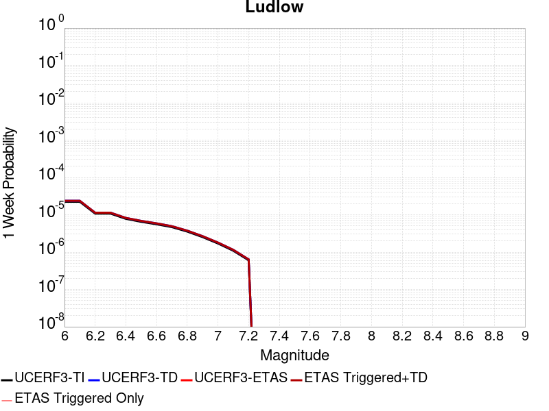 |  | 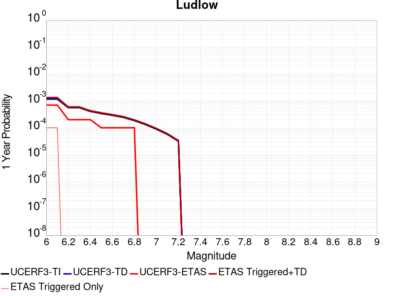 | 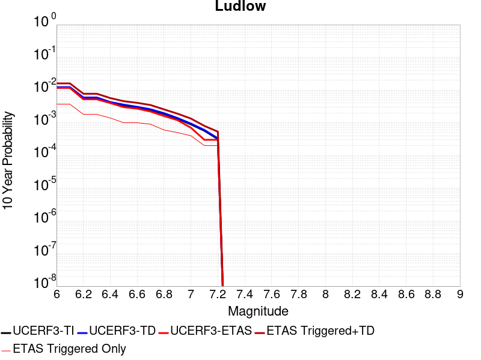 |

| Magnitude | 1 wk TI Prob | 1 wk TD Prob | 1 wk ETAS Prob | 1 wk ETAS/TD Gain | 1 wk ETAS Triggered+TD | 1 wk ETAS Triggered Only | 1 mo TI Prob | 1 mo TD Prob | 1 mo ETAS Prob | 1 mo ETAS/TD Gain | 1 mo ETAS Triggered+TD | 1 mo ETAS Triggered Only | 1 yr TI Prob | 1 yr TD Prob | 1 yr ETAS Prob | 1 yr ETAS/TD Gain | 1 yr ETAS Triggered+TD | 1 yr ETAS Triggered Only | 10 yr TI Prob | 10 yr TD Prob | 10 yr ETAS Prob | 10 yr ETAS/TD Gain | 10 yr ETAS Triggered+TD | 10 yr ETAS Triggered Only |
|-----|-----|-----|-----|-----|-----|-----|-----|-----|-----|-----|-----|-----|-----|-----|-----|-----|-----|-----|-----|-----|-----|-----|-----|-----|
| 6.0 | 2.2407607E-5 | 2.3659872E-5 | 0.0 | 0.0 | 2.3659872E-5 | 0.0 | 9.602906E-5 | 1.0139576E-4 | 0.0 | 0.0 | 1.0139576E-4 | 0.0 | 0.0011685267 | 0.0012338384 | 7.0E-4 | 0.56733525 | 0.001333715 | 1.0E-4 | 0.011624013 | 0.012274393 | 0.0116 | 0.945057 | 0.015928978 | 0.0037 |
| 6.1 | 2.2407607E-5 | 2.3659872E-5 | 0.0 | 0.0 | 2.3659872E-5 | 0.0 | 9.602906E-5 | 1.0139576E-4 | 0.0 | 0.0 | 1.0139576E-4 | 0.0 | 0.0011685267 | 0.0012338384 | 7.0E-4 | 0.56733525 | 0.001333715 | 1.0E-4 | 0.011624013 | 0.012274393 | 0.0116 | 0.945057 | 0.015928978 | 0.0037 |
| 6.2 | 1.0781252E-5 | 1.1366887E-5 | 0.0 | 0.0 | 1.1366887E-5 | 0.0 | 4.620455E-5 | 4.871434E-5 | 0.0 | 0.0 | 4.871434E-5 | 0.0 | 5.623952E-4 | 5.9293973E-4 | 2.0E-4 | 0.33730242 | 5.9293973E-4 | 0.0 | 0.00560974 | 0.0059139957 | 0.0052 | 0.8792702 | 0.0077033504 | 0.0018 |
| 6.3 | 1.0781252E-5 | 1.1366887E-5 | 0.0 | 0.0 | 1.1366887E-5 | 0.0 | 4.620455E-5 | 4.871434E-5 | 0.0 | 0.0 | 4.871434E-5 | 0.0 | 5.623952E-4 | 5.9293973E-4 | 2.0E-4 | 0.33730242 | 5.9293973E-4 | 0.0 | 0.00560974 | 0.0059139957 | 0.0052 | 0.8792702 | 0.0077033504 | 0.0018 |
| 6.4 | 7.814439E-6 | 8.238614E-6 | 0.0 | 0.0 | 8.238614E-6 | 0.0 | 3.3490025E-5 | 3.5307876E-5 | 0.0 | 0.0 | 3.5307876E-5 | 0.0 | 4.0766477E-4 | 4.2979003E-4 | 2.0E-4 | 0.46534353 | 4.2979003E-4 | 0.0 | 0.0040691774 | 0.0042897346 | 0.004 | 0.9324586 | 0.005683729 | 0.0014 |
| 6.5 | 6.4986366E-6 | 6.8516565E-6 | 0.0 | 0.0 | 6.8516565E-6 | 0.0 | 2.7851002E-5 | 2.9363919E-5 | 0.0 | 0.0 | 2.9363919E-5 | 0.0 | 3.390332E-4 | 3.5744798E-4 | 1.0E-4 | 0.279761 | 3.5744798E-4 | 0.0 | 0.003385164 | 0.0035688265 | 0.003 | 0.8406125 | 0.0045652576 | 0.001 |
| 6.6 | 5.582177E-6 | 5.8866412E-6 | 0.0 | 0.0 | 5.8866412E-6 | 0.0 | 2.3923398E-5 | 2.5228223E-5 | 0.0 | 0.0 | 2.5228223E-5 | 0.0 | 2.9122844E-4 | 3.0711104E-4 | 1.0E-4 | 0.32561514 | 3.0711104E-4 | 0.0 | 0.0029084706 | 0.0030669395 | 0.0027 | 0.88035643 | 0.0040638726 | 0.001 |
| 6.7 | 4.6858763E-6 | 4.94096E-6 | 0.0 | 0.0 | 4.94096E-6 | 0.0 | 2.0082172E-5 | 2.1175374E-5 | 0.0 | 0.0 | 2.1175374E-5 | 0.0 | 2.4447302E-4 | 2.5778022E-4 | 1.0E-4 | 0.38792735 | 2.5778022E-4 | 0.0 | 0.0024420423 | 0.0025748685 | 0.0022 | 0.85441256 | 0.0034725512 | 9.0E-4 |
| 6.8 | 3.5584908E-6 | 3.7524233E-6 | 0.0 | 0.0 | 3.7524233E-6 | 0.0 | 1.5250586E-5 | 1.6081716E-5 | 0.0 | 0.0 | 1.6081716E-5 | 0.0 | 1.8566006E-4 | 1.9577773E-4 | 1.0E-4 | 0.5107834 | 1.9577773E-4 | 0.0 | 0.0018550502 | 0.0019560936 | 0.0016 | 0.8179568 | 0.0025549198 | 6.0E-4 |
| 6.9 | 2.532834E-6 | 2.6712926E-6 | 0.0 | 0.0 | 2.6712926E-6 | 0.0 | 1.0854958E-5 | 1.1448348E-5 | 0.0 | 0.0 | 1.1448348E-5 | 0.0 | 1.3215111E-4 | 1.39375E-4 | 0.0 | 0.0 | 1.39375E-4 | 0.0 | 0.0013207254 | 0.0013929035 | 0.0012 | 0.8615098 | 0.0018922071 | 5.0E-4 |
| 7.0 | 1.7083285E-6 | 1.8021398E-6 | 0.0 | 0.0 | 1.8021398E-6 | 0.0 | 7.3213873E-6 | 7.7234345E-6 | 0.0 | 0.0 | 7.7234345E-6 | 0.0 | 8.913424E-5 | 9.402892E-5 | 0.0 | 0.0 | 9.402892E-5 | 0.0 | 8.9098496E-4 | 9.3990786E-4 | 7.0E-4 | 0.74475384 | 0.0013395319 | 4.0E-4 |
| 7.1 | 1.0905424E-6 | 1.1498859E-6 | 0.0 | 0.0 | 1.1498859E-6 | 0.0 | 4.6737446E-6 | 4.9280734E-6 | 0.0 | 0.0 | 4.9280734E-6 | 0.0 | 5.6901354E-5 | 5.999774E-5 | 0.0 | 0.0 | 5.999774E-5 | 0.0 | 5.6886784E-4 | 5.9982523E-4 | 3.0E-4 | 0.5001457 | 7.997052E-4 | 2.0E-4 |
| 7.2 | 6.06668E-7 | 6.387947E-7 | 0.0 | 0.0 | 6.387947E-7 | 0.0 | 2.600003E-6 | 2.737689E-6 | 0.0 | 0.0 | 2.737689E-6 | 0.0 | 3.1654577E-5 | 3.3330925E-5 | 0.0 | 0.0 | 3.3330925E-5 | 0.0 | 3.1650066E-4 | 3.332661E-4 | 3.0E-4 | 0.9001816 | 5.3319946E-4 | 2.0E-4 |

## Trinidad (alt1)
*[(top)](#table-of-contents)*

| 1 Week | 1 Month | 1 Year | 10 Year |
|-----|-----|-----|-----|
|  |  | 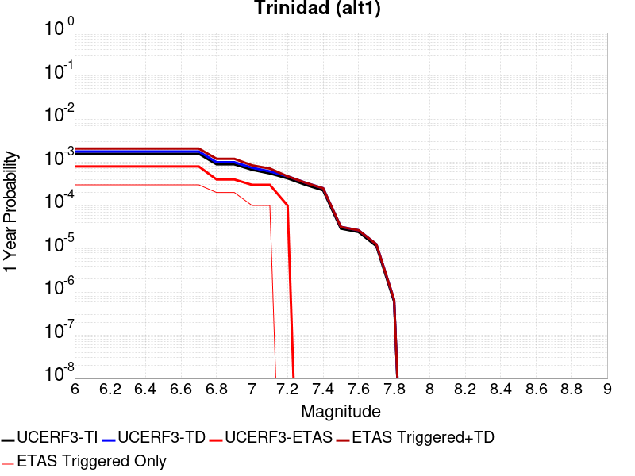 |  |

| Magnitude | 1 wk TI Prob | 1 wk TD Prob | 1 wk ETAS Prob | 1 wk ETAS/TD Gain | 1 wk ETAS Triggered+TD | 1 wk ETAS Triggered Only | 1 mo TI Prob | 1 mo TD Prob | 1 mo ETAS Prob | 1 mo ETAS/TD Gain | 1 mo ETAS Triggered+TD | 1 mo ETAS Triggered Only | 1 yr TI Prob | 1 yr TD Prob | 1 yr ETAS Prob | 1 yr ETAS/TD Gain | 1 yr ETAS Triggered+TD | 1 yr ETAS Triggered Only | 10 yr TI Prob | 10 yr TD Prob | 10 yr ETAS Prob | 10 yr ETAS/TD Gain | 10 yr ETAS Triggered+TD | 10 yr ETAS Triggered Only |
|-----|-----|-----|-----|-----|-----|-----|-----|-----|-----|-----|-----|-----|-----|-----|-----|-----|-----|-----|-----|-----|-----|-----|-----|-----|
| 6.0 | 3.0167168E-5 | 3.404185E-5 | 0.0 | 0.0 | 3.404185E-5 | 0.0 | 1.2928146E-4 | 1.4588643E-4 | 1.0E-4 | 0.6854647 | 1.4588643E-4 | 0.0 | 0.0015728653 | 0.0017748888 | 8.0E-4 | 0.45073247 | 0.0020743564 | 3.0E-4 | 0.0156177925 | 0.017624097 | 0.0131 | 0.74330044 | 0.021062413 | 0.0035 |
| 6.1 | 3.0167168E-5 | 3.404185E-5 | 0.0 | 0.0 | 3.404185E-5 | 0.0 | 1.2928146E-4 | 1.4588643E-4 | 1.0E-4 | 0.6854647 | 1.4588643E-4 | 0.0 | 0.0015728653 | 0.0017748888 | 8.0E-4 | 0.45073247 | 0.0020743564 | 3.0E-4 | 0.0156177925 | 0.017624097 | 0.0131 | 0.74330044 | 0.021062413 | 0.0035 |
| 6.2 | 3.0167168E-5 | 3.404185E-5 | 0.0 | 0.0 | 3.404185E-5 | 0.0 | 1.2928146E-4 | 1.4588643E-4 | 1.0E-4 | 0.6854647 | 1.4588643E-4 | 0.0 | 0.0015728653 | 0.0017748888 | 8.0E-4 | 0.45073247 | 0.0020743564 | 3.0E-4 | 0.0156177925 | 0.017624097 | 0.0131 | 0.74330044 | 0.021062413 | 0.0035 |
| 6.3 | 3.0167168E-5 | 3.404185E-5 | 0.0 | 0.0 | 3.404185E-5 | 0.0 | 1.2928146E-4 | 1.4588643E-4 | 1.0E-4 | 0.6854647 | 1.4588643E-4 | 0.0 | 0.0015728653 | 0.0017748888 | 8.0E-4 | 0.45073247 | 0.0020743564 | 3.0E-4 | 0.0156177925 | 0.017624097 | 0.0131 | 0.74330044 | 0.021062413 | 0.0035 |
| 6.4 | 3.0167168E-5 | 3.404185E-5 | 0.0 | 0.0 | 3.404185E-5 | 0.0 | 1.2928146E-4 | 1.4588643E-4 | 1.0E-4 | 0.6854647 | 1.4588643E-4 | 0.0 | 0.0015728653 | 0.0017748888 | 8.0E-4 | 0.45073247 | 0.0020743564 | 3.0E-4 | 0.0156177925 | 0.017624097 | 0.0131 | 0.74330044 | 0.021062413 | 0.0035 |
| 6.5 | 3.0167168E-5 | 3.404185E-5 | 0.0 | 0.0 | 3.404185E-5 | 0.0 | 1.2928146E-4 | 1.4588643E-4 | 1.0E-4 | 0.6854647 | 1.4588643E-4 | 0.0 | 0.0015728653 | 0.0017748888 | 8.0E-4 | 0.45073247 | 0.0020743564 | 3.0E-4 | 0.0156177925 | 0.017624097 | 0.0131 | 0.74330044 | 0.021062413 | 0.0035 |
| 6.6 | 3.0167168E-5 | 3.404185E-5 | 0.0 | 0.0 | 3.404185E-5 | 0.0 | 1.2928146E-4 | 1.4588643E-4 | 1.0E-4 | 0.6854647 | 1.4588643E-4 | 0.0 | 0.0015728653 | 0.0017748888 | 8.0E-4 | 0.45073247 | 0.0020743564 | 3.0E-4 | 0.0156177925 | 0.017624097 | 0.0131 | 0.74330044 | 0.021062413 | 0.0035 |
| 6.7 | 3.0167168E-5 | 3.404185E-5 | 0.0 | 0.0 | 3.404185E-5 | 0.0 | 1.2928146E-4 | 1.4588643E-4 | 1.0E-4 | 0.6854647 | 1.4588643E-4 | 0.0 | 0.0015728653 | 0.0017748888 | 8.0E-4 | 0.45073247 | 0.0020743564 | 3.0E-4 | 0.0156177925 | 0.017624097 | 0.0131 | 0.74330044 | 0.021062413 | 0.0035 |
| 6.8 | 1.717077E-5 | 1.9200179E-5 | 0.0 | 0.0 | 1.9200179E-5 | 0.0 | 7.358694E-5 | 8.228413E-5 | 0.0 | 0.0 | 8.228413E-5 | 0.0 | 8.9555274E-4 | 0.0010013934 | 4.0E-4 | 0.39944342 | 0.0012011932 | 2.0E-4 | 0.008919522 | 0.009973263 | 0.0083 | 0.83222514 | 0.012250325 | 0.0023 |
| 6.9 | 1.717077E-5 | 1.9200179E-5 | 0.0 | 0.0 | 1.9200179E-5 | 0.0 | 7.358694E-5 | 8.228413E-5 | 0.0 | 0.0 | 8.228413E-5 | 0.0 | 8.9555274E-4 | 0.0010013934 | 4.0E-4 | 0.39944342 | 0.0012011932 | 2.0E-4 | 0.008919522 | 0.009973263 | 0.0083 | 0.83222514 | 0.012250325 | 0.0023 |
| 7.0 | 1.2858572E-5 | 1.4340644E-5 | 0.0 | 0.0 | 1.4340644E-5 | 0.0 | 5.5107E-5 | 6.145864E-5 | 0.0 | 0.0 | 6.145864E-5 | 0.0 | 6.707212E-4 | 7.480341E-4 | 3.0E-4 | 0.40105122 | 8.479593E-4 | 1.0E-4 | 0.006687004 | 0.0074583427 | 0.0068 | 0.9117307 | 0.0094434265 | 0.002 |
| 7.1 | 1.0588431E-5 | 1.18039525E-5 | 0.0 | 0.0 | 1.18039525E-5 | 0.0 | 4.53782E-5 | 5.058755E-5 | 0.0 | 0.0 | 5.058755E-5 | 0.0 | 5.5233954E-4 | 6.157583E-4 | 3.0E-4 | 0.48720416 | 7.156967E-4 | 1.0E-4 | 0.005509687 | 0.006143372 | 0.0058 | 0.9441069 | 0.007832929 | 0.0017 |
| 7.2 | 8.138061E-6 | 9.069269E-6 | 0.0 | 0.0 | 9.069269E-6 | 0.0 | 3.487694E-5 | 3.8867856E-5 | 0.0 | 0.0 | 3.8867856E-5 | 0.0 | 4.2454398E-4 | 4.7313827E-4 | 1.0E-4 | 0.2113547 | 4.7313827E-4 | 0.0 | 0.0042373384 | 0.0047237515 | 0.0046 | 0.9738023 | 0.005918083 | 0.0012 |
| 7.3 | 5.787542E-6 | 6.4618107E-6 | 0.0 | 0.0 | 6.4618107E-6 | 0.0 | 2.4803514E-5 | 2.7693302E-5 | 0.0 | 0.0 | 2.7693302E-5 | 0.0 | 3.0194095E-4 | 3.3713534E-4 | 0.0 | 0.0 | 3.3713534E-4 | 0.0 | 0.00301531 | 0.0033683507 | 0.0032 | 0.95001984 | 0.004165656 | 8.0E-4 |
| 7.4 | 4.303563E-6 | 4.8019524E-6 | 0.0 | 0.0 | 4.8019524E-6 | 0.0 | 1.844371E-5 | 2.0579746E-5 | 0.0 | 0.0 | 2.0579746E-5 | 0.0 | 2.2452902E-4 | 2.5054938E-4 | 0.0 | 0.0 | 2.5054938E-4 | 0.0 | 0.0022430231 | 0.0025046081 | 0.0022 | 0.87838095 | 0.0030033558 | 5.0E-4 |
| 7.5 | 5.6063425E-7 | 6.144149E-7 | 0.0 | 0.0 | 6.144149E-7 | 0.0 | 2.402716E-6 | 2.633204E-6 | 0.0 | 0.0 | 2.633204E-6 | 0.0 | 2.9252675E-5 | 3.2058804E-5 | 0.0 | 0.0 | 3.2058804E-5 | 0.0 | 2.9248823E-4 | 3.2054336E-4 | 1.0E-4 | 0.3119703 | 3.2054336E-4 | 0.0 |
| 7.6 | 4.6699128E-7 | 5.126792E-7 | 0.0 | 0.0 | 5.126792E-7 | 0.0 | 2.0013897E-6 | 2.197195E-6 | 0.0 | 0.0 | 2.197195E-6 | 0.0 | 2.4366647E-5 | 2.6750535E-5 | 0.0 | 0.0 | 2.6750535E-5 | 0.0 | 2.4363975E-4 | 2.6747456E-4 | 1.0E-4 | 0.37386733 | 2.6747456E-4 | 0.0 |
| 7.7 | 2.2080937E-7 | 2.4351854E-7 | 0.0 | 0.0 | 2.4351854E-7 | 0.0 | 9.4632554E-7 | 1.0436505E-6 | 0.0 | 0.0 | 1.0436505E-6 | 0.0 | 1.15214525E-5 | 1.2706377E-5 | 0.0 | 0.0 | 1.2706377E-5 | 0.0 | 1.1520855E-4 | 1.270571E-4 | 1.0E-4 | 0.7870477 | 1.270571E-4 | 0.0 |
| 7.8 | 1.1438307E-8 | 1.26857005E-8 | 0.0 | 0.0 | 1.26857005E-8 | 0.0 | 4.9021317E-8 | 5.4367288E-8 | 0.0 | 0.0 | 5.4367288E-8 | 0.0 | 5.9683435E-7 | 6.619217E-7 | 0.0 | 0.0 | 6.619217E-7 | 0.0 | 5.9683275E-6 | 6.6192174E-6 | 0.0 | 0.0 | 6.6192174E-6 | 0.0 |

## Great Valley 07 (Orestimba)
*[(top)](#table-of-contents)*

| 1 Week | 1 Month | 1 Year | 10 Year |
|-----|-----|-----|-----|
|  |  |  |  |

| Magnitude | 1 wk TI Prob | 1 wk TD Prob | 1 wk ETAS Prob | 1 wk ETAS/TD Gain | 1 wk ETAS Triggered+TD | 1 wk ETAS Triggered Only | 1 mo TI Prob | 1 mo TD Prob | 1 mo ETAS Prob | 1 mo ETAS/TD Gain | 1 mo ETAS Triggered+TD | 1 mo ETAS Triggered Only | 1 yr TI Prob | 1 yr TD Prob | 1 yr ETAS Prob | 1 yr ETAS/TD Gain | 1 yr ETAS Triggered+TD | 1 yr ETAS Triggered Only | 10 yr TI Prob | 10 yr TD Prob | 10 yr ETAS Prob | 10 yr ETAS/TD Gain | 10 yr ETAS Triggered+TD | 10 yr ETAS Triggered Only |
|-----|-----|-----|-----|-----|-----|-----|-----|-----|-----|-----|-----|-----|-----|-----|-----|-----|-----|-----|-----|-----|-----|-----|-----|-----|
| 6.0 | 2.9687902E-5 | 3.2764223E-5 | 1.0E-4 | 3.0521095 | 1.3276095E-4 | 1.0E-4 | 1.2722766E-4 | 1.4041095E-4 | 1.0E-4 | 0.71219516 | 2.4039691E-4 | 1.0E-4 | 0.0015478961 | 0.0017082348 | 0.001 | 0.5853996 | 0.0019078931 | 2.0E-4 | 0.015371585 | 0.016958589 | 0.015 | 0.8845076 | 0.020202626 | 0.0033 |
| 6.1 | 2.9687902E-5 | 3.2764223E-5 | 1.0E-4 | 3.0521095 | 1.3276095E-4 | 1.0E-4 | 1.2722766E-4 | 1.4041095E-4 | 1.0E-4 | 0.71219516 | 2.4039691E-4 | 1.0E-4 | 0.0015478961 | 0.0017082348 | 9.0E-4 | 0.5268597 | 0.0019078931 | 2.0E-4 | 0.015371585 | 0.016958589 | 0.0119 | 0.70170933 | 0.019809408 | 0.0029 |
| 6.2 | 1.9231524E-5 | 2.1163376E-5 | 1.0E-4 | 4.7251444 | 1.2116126E-4 | 1.0E-4 | 8.2418206E-5 | 9.0697155E-5 | 1.0E-4 | 1.1025704 | 1.906881E-4 | 1.0E-4 | 0.0010029797 | 0.0011037017 | 7.0E-4 | 0.63422936 | 0.0013034809 | 2.0E-4 | 0.00998465 | 0.010984614 | 0.0074 | 0.6736696 | 0.013259349 | 0.0023 |
| 6.3 | 1.324766E-5 | 1.4551368E-5 | 1.0E-4 | 6.872206 | 1.1454991E-4 | 1.0E-4 | 5.6774446E-5 | 6.236156E-5 | 1.0E-4 | 1.6035517 | 1.6235533E-4 | 1.0E-4 | 6.910097E-4 | 7.5899676E-4 | 6.0E-4 | 0.7905172 | 8.5892086E-4 | 1.0E-4 | 0.006888649 | 0.0075649917 | 0.0046 | 0.6080641 | 0.009053645 | 0.0015 |
| 6.4 | 7.818645E-6 | 8.5744805E-6 | 0.0 | 0.0 | 8.5744805E-6 | 0.0 | 3.3508048E-5 | 3.6747275E-5 | 0.0 | 0.0 | 3.6747275E-5 | 0.0 | 4.078841E-4 | 4.473096E-4 | 2.0E-4 | 0.44711763 | 4.473096E-4 | 0.0 | 0.004071363 | 0.0044644326 | 0.0029 | 0.6495786 | 0.0052608615 | 8.0E-4 |
| 6.5 | 5.3076565E-6 | 5.81891E-6 | 0.0 | 0.0 | 5.81891E-6 | 0.0 | 2.27469E-5 | 2.493796E-5 | 0.0 | 0.0 | 2.493796E-5 | 0.0 | 2.7690834E-4 | 3.0357947E-4 | 2.0E-4 | 0.6588061 | 3.0357947E-4 | 0.0 | 0.0027656353 | 0.003031857 | 0.0021 | 0.69264483 | 0.0034306443 | 4.0E-4 |
| 6.6 | 3.6003578E-6 | 3.949253E-6 | 0.0 | 0.0 | 3.949253E-6 | 0.0 | 1.5430012E-5 | 1.6925267E-5 | 0.0 | 0.0 | 1.6925267E-5 | 0.0 | 1.8784421E-4 | 2.0604722E-4 | 2.0E-4 | 0.9706513 | 2.0604722E-4 | 0.0 | 0.0018768552 | 0.0020587158 | 0.0012 | 0.58288765 | 0.002258304 | 2.0E-4 |
| 6.7 | 2.5361826E-6 | 2.7840063E-6 | 0.0 | 0.0 | 2.7840063E-6 | 0.0 | 1.0869308E-5 | 1.1931408E-5 | 0.0 | 0.0 | 1.1931408E-5 | 0.0 | 1.3232579E-4 | 1.4525653E-4 | 2.0E-4 | 1.3768743 | 1.4525653E-4 | 0.0 | 0.0013224703 | 0.0014517459 | 0.0011 | 0.7577084 | 0.0016514555 | 2.0E-4 |
| 6.8 | 1.2115831E-6 | 1.3316409E-6 | 0.0 | 0.0 | 1.3316409E-6 | 0.0 | 5.1924885E-6 | 5.7070256E-6 | 0.0 | 0.0 | 5.7070256E-6 | 0.0 | 6.3216714E-5 | 6.9481786E-5 | 2.0E-4 | 2.878452 | 6.9481786E-5 | 0.0 | 6.3198735E-4 | 6.946958E-4 | 5.0E-4 | 0.7197395 | 6.946958E-4 | 0.0 |

## Rose Canyon
*[(top)](#table-of-contents)*

| 1 Week | 1 Month | 1 Year | 10 Year |
|-----|-----|-----|-----|
|  | 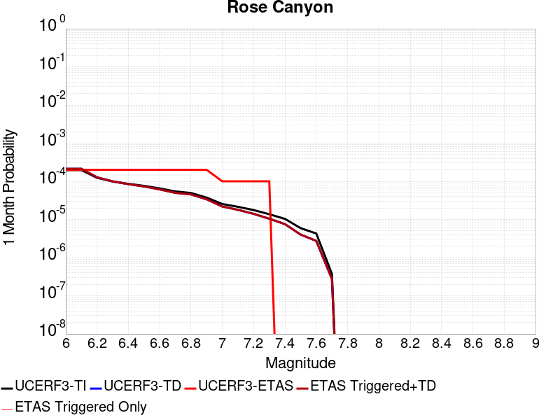 |  |  |

| Magnitude | 1 wk TI Prob | 1 wk TD Prob | 1 wk ETAS Prob | 1 wk ETAS/TD Gain | 1 wk ETAS Triggered+TD | 1 wk ETAS Triggered Only | 1 mo TI Prob | 1 mo TD Prob | 1 mo ETAS Prob | 1 mo ETAS/TD Gain | 1 mo ETAS Triggered+TD | 1 mo ETAS Triggered Only | 1 yr TI Prob | 1 yr TD Prob | 1 yr ETAS Prob | 1 yr ETAS/TD Gain | 1 yr ETAS Triggered+TD | 1 yr ETAS Triggered Only | 10 yr TI Prob | 10 yr TD Prob | 10 yr ETAS Prob | 10 yr ETAS/TD Gain | 10 yr ETAS Triggered+TD | 10 yr ETAS Triggered Only |
|-----|-----|-----|-----|-----|-----|-----|-----|-----|-----|-----|-----|-----|-----|-----|-----|-----|-----|-----|-----|-----|-----|-----|-----|-----|
| 6.0 | 4.5923203E-5 | 4.980191E-5 | 0.0 | 0.0 | 4.980191E-5 | 0.0 | 1.9679888E-4 | 2.1342064E-4 | 2.0E-4 | 0.93711644 | 2.1342064E-4 | 0.0 | 0.0023933933 | 0.0025954922 | 0.0026 | 1.0017368 | 0.0028947135 | 3.0E-4 | 0.023677798 | 0.025698004 | 0.0251 | 0.9767295 | 0.029205492 | 0.0036 |
| 6.1 | 4.5923203E-5 | 4.980191E-5 | 0.0 | 0.0 | 4.980191E-5 | 0.0 | 1.9679888E-4 | 2.1342064E-4 | 2.0E-4 | 0.93711644 | 2.1342064E-4 | 0.0 | 0.0023933933 | 0.0025954922 | 0.0013 | 0.5008684 | 0.002794973 | 2.0E-4 | 0.023677798 | 0.025698004 | 0.0157 | 0.61094236 | 0.02754918 | 0.0019 |
| 6.2 | 2.8844734E-5 | 2.9745892E-5 | 0.0 | 0.0 | 2.9745892E-5 | 0.0 | 1.2361443E-4 | 1.2747636E-4 | 2.0E-4 | 1.5689183 | 1.2747636E-4 | 0.0 | 0.0015039665 | 0.0015509472 | 4.0E-4 | 0.2579069 | 0.0015509472 | 0.0 | 0.0149382865 | 0.015406352 | 0.0095 | 0.61662877 | 0.016587865 | 0.0012 |
| 6.3 | 2.3171577E-5 | 2.3234461E-5 | 0.0 | 0.0 | 2.3234461E-5 | 0.0 | 9.9302975E-5 | 9.9572535E-5 | 2.0E-4 | 2.008586 | 9.9572535E-5 | 0.0 | 0.0012083431 | 0.001211635 | 4.0E-4 | 0.33013245 | 0.001211635 | 0.0 | 0.012017938 | 0.012060664 | 0.0071 | 0.58869064 | 0.012851016 | 8.0E-4 |
| 6.4 | 2.0066604E-5 | 1.971309E-5 | 0.0 | 0.0 | 1.971309E-5 | 0.0 | 8.599689E-5 | 8.4481995E-5 | 2.0E-4 | 2.3673685 | 8.4481995E-5 | 0.0 | 0.0010465092 | 0.001028093 | 4.0E-4 | 0.38906986 | 0.001028093 | 0.0 | 0.010415946 | 0.010241575 | 0.0064 | 0.6249039 | 0.011033381 | 8.0E-4 |
| 6.5 | 1.776989E-5 | 1.7142169E-5 | 0.0 | 0.0 | 1.7142169E-5 | 0.0 | 7.615444E-5 | 7.3464405E-5 | 2.0E-4 | 2.7224069 | 7.3464405E-5 | 0.0 | 9.267859E-4 | 8.9406915E-4 | 3.0E-4 | 0.33554453 | 8.9406915E-4 | 0.0 | 0.009229303 | 0.00891355 | 0.0053 | 0.5946004 | 0.009508201 | 6.0E-4 |
| 6.6 | 1.5227364E-5 | 1.4350414E-5 | 0.0 | 0.0 | 1.4350414E-5 | 0.0 | 6.52585E-5 | 6.150035E-5 | 2.0E-4 | 3.2520137 | 6.150035E-5 | 0.0 | 7.942326E-4 | 7.485148E-4 | 3.0E-4 | 0.40079367 | 7.485148E-4 | 0.0 | 0.007914 | 0.007458894 | 0.0047 | 0.6301202 | 0.0080544185 | 6.0E-4 |
| 6.7 | 1.2703898E-5 | 1.1676593E-5 | 0.0 | 0.0 | 1.1676593E-5 | 0.0 | 5.4444143E-5 | 5.0041606E-5 | 2.0E-4 | 3.9966743 | 5.0041606E-5 | 0.0 | 6.626558E-4 | 6.090905E-4 | 3.0E-4 | 0.49253765 | 6.090905E-4 | 0.0 | 0.006606833 | 0.006071041 | 0.0039 | 0.64239395 | 0.0065680053 | 5.0E-4 |
| 6.8 | 1.1554917E-5 | 1.0612514E-5 | 0.0 | 0.0 | 1.0612514E-5 | 0.0 | 4.9520135E-5 | 4.5481433E-5 | 2.0E-4 | 4.3973985 | 4.5481433E-5 | 0.0 | 6.0274085E-4 | 5.5359985E-4 | 3.0E-4 | 0.54190767 | 5.5359985E-4 | 0.0 | 0.0060110865 | 0.0055123353 | 0.0034 | 0.61679846 | 0.0058106817 | 3.0E-4 |
| 6.9 | 8.732078E-6 | 7.883398E-6 | 0.0 | 0.0 | 7.883398E-6 | 0.0 | 3.7422655E-5 | 3.378557E-5 | 2.0E-4 | 5.919687 | 3.378557E-5 | 0.0 | 4.5552556E-4 | 4.1126463E-4 | 3.0E-4 | 0.7294573 | 4.1126463E-4 | 0.0 | 0.0045459294 | 0.004090093 | 0.0025 | 0.611233 | 0.004289275 | 2.0E-4 |
| 7.0 | 5.9337494E-6 | 5.108273E-6 | 0.0 | 0.0 | 5.108273E-6 | 0.0 | 2.5430107E-5 | 2.1892414E-5 | 1.0E-4 | 4.567792 | 2.1892414E-5 | 0.0 | 3.0956755E-4 | 2.6650768E-4 | 2.0E-4 | 0.7504474 | 2.6650768E-4 | 0.0 | 0.0030913667 | 0.0026618964 | 0.0017 | 0.63864243 | 0.002861364 | 2.0E-4 |
| 7.1 | 5.013409E-6 | 4.1780345E-6 | 0.0 | 0.0 | 4.1780345E-6 | 0.0 | 2.1485863E-5 | 1.790574E-5 | 1.0E-4 | 5.584801 | 1.790574E-5 | 0.0 | 2.6155898E-4 | 2.1798068E-4 | 2.0E-4 | 0.91751254 | 2.1798068E-4 | 0.0 | 0.0026125133 | 0.0021776804 | 0.0013 | 0.5969655 | 0.0022774625 | 1.0E-4 |
| 7.2 | 4.120763E-6 | 3.2826335E-6 | 0.0 | 0.0 | 3.2826335E-6 | 0.0 | 1.7660293E-5 | 1.4068354E-5 | 1.0E-4 | 7.108152 | 1.4068354E-5 | 0.0 | 2.1499286E-4 | 1.7126884E-4 | 2.0E-4 | 1.1677548 | 1.7126884E-4 | 0.0 | 0.0021478499 | 0.001711378 | 0.0013 | 0.7596218 | 0.0018112069 | 1.0E-4 |
| 7.3 | 3.2081239E-6 | 2.4408919E-6 | 0.0 | 0.0 | 2.4408919E-6 | 0.0 | 1.374903E-5 | 1.04609235E-5 | 1.0E-4 | 9.559385 | 1.04609235E-5 | 0.0 | 1.6738157E-4 | 1.2735437E-4 | 2.0E-4 | 1.5704212 | 1.2735437E-4 | 0.0 | 0.0016725556 | 0.0012728209 | 8.0E-4 | 0.6285252 | 0.0012728209 | 0.0 |
| 7.4 | 2.4194755E-6 | 1.7682929E-6 | 0.0 | 0.0 | 1.7682929E-6 | 0.0 | 1.0369139E-5 | 7.5783764E-6 | 0.0 | 0.0 | 7.5783764E-6 | 0.0 | 1.2623696E-4 | 9.2262875E-5 | 0.0 | 0.0 | 9.2262875E-5 | 0.0 | 0.0012616527 | 9.222511E-4 | 4.0E-4 | 0.43372136 | 9.222511E-4 | 0.0 |
| 7.5 | 1.3842889E-6 | 9.380231E-7 | 0.0 | 0.0 | 9.380231E-7 | 0.0 | 5.9326535E-6 | 4.020093E-6 | 0.0 | 0.0 | 4.020093E-6 | 0.0 | 7.222766E-5 | 4.894357E-5 | 0.0 | 0.0 | 4.894357E-5 | 0.0 | 7.220419E-4 | 4.8933143E-4 | 3.0E-4 | 0.6130814 | 4.8933143E-4 | 0.0 |
| 7.6 | 1.0021575E-6 | 6.412422E-7 | 0.0 | 0.0 | 6.412422E-7 | 0.0 | 4.2949537E-6 | 2.748178E-6 | 0.0 | 0.0 | 2.748178E-6 | 0.0 | 5.2289808E-5 | 3.3458575E-5 | 0.0 | 0.0 | 3.3458575E-5 | 0.0 | 5.2277505E-4 | 3.3453753E-4 | 2.0E-4 | 0.59784025 | 3.3453753E-4 | 0.0 |
| 7.7 | 8.7620116E-8 | 6.449803E-8 | 0.0 | 0.0 | 6.449803E-8 | 0.0 | 3.7551473E-7 | 2.764201E-7 | 0.0 | 0.0 | 2.764201E-7 | 0.0 | 4.5718825E-6 | 3.36541E-6 | 0.0 | 0.0 | 3.36541E-6 | 0.0 | 4.5717883E-5 | 3.3653618E-5 | 0.0 | 0.0 | 3.3653618E-5 | 0.0 |

## Ventura-Pitas Point
*[(top)](#table-of-contents)*

| 1 Week | 1 Month | 1 Year | 10 Year |
|-----|-----|-----|-----|
|  |  |  | 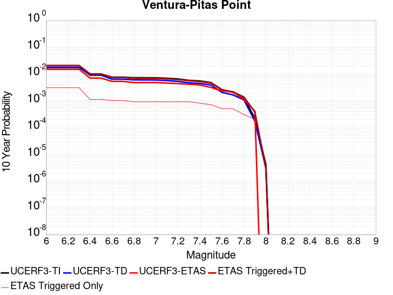 |

| Magnitude | 1 wk TI Prob | 1 wk TD Prob | 1 wk ETAS Prob | 1 wk ETAS/TD Gain | 1 wk ETAS Triggered+TD | 1 wk ETAS Triggered Only | 1 mo TI Prob | 1 mo TD Prob | 1 mo ETAS Prob | 1 mo ETAS/TD Gain | 1 mo ETAS Triggered+TD | 1 mo ETAS Triggered Only | 1 yr TI Prob | 1 yr TD Prob | 1 yr ETAS Prob | 1 yr ETAS/TD Gain | 1 yr ETAS Triggered+TD | 1 yr ETAS Triggered Only | 10 yr TI Prob | 10 yr TD Prob | 10 yr ETAS Prob | 10 yr ETAS/TD Gain | 10 yr ETAS Triggered+TD | 10 yr ETAS Triggered Only |
|-----|-----|-----|-----|-----|-----|-----|-----|-----|-----|-----|-----|-----|-----|-----|-----|-----|-----|-----|-----|-----|-----|-----|-----|-----|
| 6.0 | 3.3179622E-5 | 3.3745913E-5 | 0.0 | 0.0 | 3.3745913E-5 | 0.0 | 1.4219063E-4 | 1.4461878E-4 | 1.0E-4 | 0.6914731 | 1.4461878E-4 | 0.0 | 0.0017297962 | 0.0017595685 | 9.0E-4 | 0.51148903 | 0.0020590406 | 3.0E-4 | 0.017163932 | 0.017481824 | 0.0147 | 0.8408733 | 0.02042938 | 0.003 |
| 6.1 | 3.3179622E-5 | 3.3745913E-5 | 0.0 | 0.0 | 3.3745913E-5 | 0.0 | 1.4219063E-4 | 1.4461878E-4 | 1.0E-4 | 0.6914731 | 1.4461878E-4 | 0.0 | 0.0017297962 | 0.0017595685 | 9.0E-4 | 0.51148903 | 0.0020590406 | 3.0E-4 | 0.017163932 | 0.017481824 | 0.0147 | 0.8408733 | 0.02042938 | 0.003 |
| 6.2 | 3.3179622E-5 | 3.3745913E-5 | 0.0 | 0.0 | 3.3745913E-5 | 0.0 | 1.4219063E-4 | 1.4461878E-4 | 1.0E-4 | 0.6914731 | 1.4461878E-4 | 0.0 | 0.0017297962 | 0.0017595685 | 9.0E-4 | 0.51148903 | 0.0020590406 | 3.0E-4 | 0.017163932 | 0.017481824 | 0.0147 | 0.8408733 | 0.02042938 | 0.003 |
| 6.3 | 3.3179622E-5 | 3.3745913E-5 | 0.0 | 0.0 | 3.3745913E-5 | 0.0 | 1.4219063E-4 | 1.4461878E-4 | 1.0E-4 | 0.6914731 | 1.4461878E-4 | 0.0 | 0.0017297962 | 0.0017595685 | 9.0E-4 | 0.51148903 | 0.0020590406 | 3.0E-4 | 0.017163932 | 0.017481824 | 0.0147 | 0.8408733 | 0.02042938 | 0.003 |
| 6.4 | 1.8754668E-5 | 1.7025039E-5 | 0.0 | 0.0 | 1.7025039E-5 | 0.0 | 8.037467E-5 | 7.2962546E-5 | 1.0E-4 | 1.3705662 | 7.2962546E-5 | 0.0 | 9.781223E-4 | 8.8798004E-4 | 6.0E-4 | 0.6756908 | 8.8798004E-4 | 0.0 | 0.009738282 | 0.008846571 | 0.0069 | 0.77996325 | 0.009936839 | 0.0011 |
| 6.5 | 1.8754668E-5 | 1.7025039E-5 | 0.0 | 0.0 | 1.7025039E-5 | 0.0 | 8.037467E-5 | 7.2962546E-5 | 1.0E-4 | 1.3705662 | 7.2962546E-5 | 0.0 | 9.781223E-4 | 8.8798004E-4 | 6.0E-4 | 0.6756908 | 8.8798004E-4 | 0.0 | 0.009738282 | 0.008846571 | 0.0069 | 0.77996325 | 0.009936839 | 0.0011 |
| 6.6 | 1.4361558E-5 | 1.21265875E-5 | 0.0 | 0.0 | 1.21265875E-5 | 0.0 | 6.154808E-5 | 5.197007E-5 | 1.0E-4 | 1.9241844 | 5.197007E-5 | 0.0 | 7.490902E-4 | 6.325542E-4 | 5.0E-4 | 0.7904461 | 6.325542E-4 | 0.0 | 0.0074657016 | 0.006307708 | 0.0052 | 0.8243882 | 0.0073014004 | 0.001 |
| 6.7 | 1.4361558E-5 | 1.21265875E-5 | 0.0 | 0.0 | 1.21265875E-5 | 0.0 | 6.154808E-5 | 5.197007E-5 | 1.0E-4 | 1.9241844 | 5.197007E-5 | 0.0 | 7.490902E-4 | 6.325542E-4 | 5.0E-4 | 0.7904461 | 6.325542E-4 | 0.0 | 0.0074657016 | 0.006307708 | 0.0052 | 0.8243882 | 0.0073014004 | 0.001 |
| 6.8 | 1.3663846E-5 | 1.1348554E-5 | 0.0 | 0.0 | 1.1348554E-5 | 0.0 | 5.8558027E-5 | 4.8635764E-5 | 1.0E-4 | 2.0561001 | 4.8635764E-5 | 0.0 | 7.127108E-4 | 5.9198146E-4 | 5.0E-4 | 0.844621 | 5.9198146E-4 | 0.0 | 0.007104293 | 0.005904176 | 0.0047 | 0.7960468 | 0.006798862 | 9.0E-4 |
| 6.9 | 1.3644157E-5 | 1.132665E-5 | 0.0 | 0.0 | 1.132665E-5 | 0.0 | 5.8473648E-5 | 4.8541893E-5 | 1.0E-4 | 2.0600762 | 4.8541893E-5 | 0.0 | 7.116841E-4 | 5.908392E-4 | 5.0E-4 | 0.84625393 | 5.908392E-4 | 0.0 | 0.007094092 | 0.0058928137 | 0.0047 | 0.7975817 | 0.00678751 | 9.0E-4 |
| 7.0 | 1.3568845E-5 | 1.1246195E-5 | 0.0 | 0.0 | 1.1246195E-5 | 0.0 | 5.8150898E-5 | 4.8197096E-5 | 1.0E-4 | 2.0748138 | 4.8197096E-5 | 0.0 | 7.077572E-4 | 5.866436E-4 | 5.0E-4 | 0.85230625 | 5.866436E-4 | 0.0 | 0.007055073 | 0.0058510792 | 0.0047 | 0.80327064 | 0.006745813 | 9.0E-4 |
| 7.1 | 1.306572E-5 | 1.07245105E-5 | 0.0 | 0.0 | 1.07245105E-5 | 0.0 | 5.599474E-5 | 4.5961388E-5 | 1.0E-4 | 2.1757393 | 4.5961388E-5 | 0.0 | 6.815227E-4 | 5.594381E-4 | 5.0E-4 | 0.89375395 | 5.594381E-4 | 0.0 | 0.0067943637 | 0.0055804164 | 0.0045 | 0.8063914 | 0.006475394 | 9.0E-4 |
| 7.2 | 1.232604E-5 | 9.998866E-6 | 0.0 | 0.0 | 9.998866E-6 | 0.0 | 5.2824813E-5 | 4.2851585E-5 | 1.0E-4 | 2.333636 | 4.2851585E-5 | 0.0 | 6.429523E-4 | 5.2159495E-4 | 5.0E-4 | 0.95859826 | 5.2159495E-4 | 0.0 | 0.0064109527 | 0.005203813 | 0.0043 | 0.8263172 | 0.0060991296 | 9.0E-4 |
| 7.3 | 1.0917261E-5 | 8.84583E-6 | 0.0 | 0.0 | 8.84583E-6 | 0.0 | 4.678742E-5 | 3.791016E-5 | 1.0E-4 | 2.6378155 | 3.791016E-5 | 0.0 | 5.69488E-4 | 4.6145997E-4 | 5.0E-4 | 1.0835176 | 4.6145997E-4 | 0.0 | 0.0056803077 | 0.004605097 | 0.0041 | 0.89031774 | 0.0055009527 | 9.0E-4 |
| 7.4 | 1.039959E-5 | 8.425418E-6 | 0.0 | 0.0 | 8.425418E-6 | 0.0 | 4.456891E-5 | 3.6108442E-5 | 1.0E-4 | 2.7694354 | 3.6108442E-5 | 0.0 | 5.424914E-4 | 4.3953312E-4 | 5.0E-4 | 1.1375707 | 4.3953312E-4 | 0.0 | 0.0054116896 | 0.004386714 | 0.0038 | 0.86625195 | 0.005183205 | 8.0E-4 |
| 7.5 | 9.015877E-6 | 7.2989824E-6 | 0.0 | 0.0 | 7.2989824E-6 | 0.0 | 3.86389E-5 | 3.1280986E-5 | 0.0 | 0.0 | 3.1280986E-5 | 0.0 | 4.7032707E-4 | 3.8078087E-4 | 4.0E-4 | 1.050473 | 3.8078087E-4 | 0.0 | 0.004693329 | 0.0038013423 | 0.0031 | 0.8155014 | 0.0044986815 | 7.0E-4 |
| 7.6 | 4.900162E-6 | 3.8747276E-6 | 0.0 | 0.0 | 3.8747276E-6 | 0.0 | 2.1000526E-5 | 1.660587E-5 | 0.0 | 0.0 | 1.660587E-5 | 0.0 | 2.556514E-4 | 2.0215785E-4 | 3.0E-4 | 1.4839889 | 2.0215785E-4 | 0.0 | 0.0025535747 | 0.0020197532 | 0.0023 | 1.138753 | 0.0025187433 | 5.0E-4 |
| 7.7 | 3.8850626E-6 | 3.127229E-6 | 0.0 | 0.0 | 3.127229E-6 | 0.0 | 1.6650163E-5 | 1.3402342E-5 | 0.0 | 0.0 | 1.3402342E-5 | 0.0 | 2.0269687E-4 | 1.6316138E-4 | 2.0E-4 | 1.2257802 | 1.6316138E-4 | 0.0 | 0.002025121 | 0.0016304253 | 0.0021 | 1.2880075 | 0.0021296102 | 5.0E-4 |
| 7.8 | 2.4654719E-6 | 2.0302175E-6 | 0.0 | 0.0 | 2.0302175E-6 | 0.0 | 1.0566265E-5 | 8.700903E-6 | 0.0 | 0.0 | 8.700903E-6 | 0.0 | 1.2863669E-4 | 1.059284E-4 | 1.0E-4 | 0.9440339 | 1.059284E-4 | 0.0 | 0.0012856225 | 0.0010587837 | 0.0011 | 1.0389279 | 0.0013584661 | 3.0E-4 |
| 7.9 | 4.095894E-7 | 3.2769407E-7 | 0.0 | 0.0 | 3.2769407E-7 | 0.0 | 1.7553821E-6 | 1.4044024E-6 | 0.0 | 0.0 | 1.4044024E-6 | 0.0 | 2.1371567E-5 | 1.7098468E-5 | 0.0 | 0.0 | 1.7098468E-5 | 0.0 | 2.1369511E-4 | 1.7097183E-4 | 4.0E-4 | 2.3395665 | 3.7093763E-4 | 2.0E-4 |
| 8.0 | 7.791402E-9 | 5.684371E-9 | 0.0 | 0.0 | 5.684371E-9 | 0.0 | 3.3391725E-8 | 2.4361592E-8 | 0.0 | 0.0 | 2.4361592E-8 | 0.0 | 4.0654416E-7 | 2.9660237E-7 | 0.0 | 0.0 | 2.9660237E-7 | 0.0 | 4.065434E-6 | 2.9660216E-6 | 0.0 | 0.0 | 2.9660216E-6 | 0.0 |

## Elysian Park (Upper)
*[(top)](#table-of-contents)*

| 1 Week | 1 Month | 1 Year | 10 Year |
|-----|-----|-----|-----|
|  | 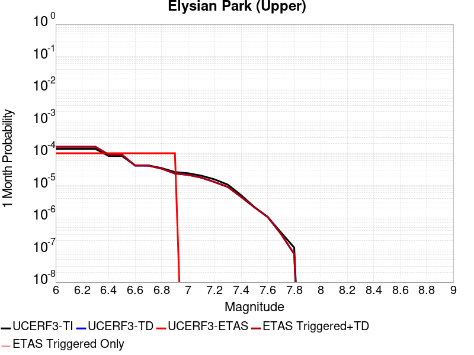 |  |  |

| Magnitude | 1 wk TI Prob | 1 wk TD Prob | 1 wk ETAS Prob | 1 wk ETAS/TD Gain | 1 wk ETAS Triggered+TD | 1 wk ETAS Triggered Only | 1 mo TI Prob | 1 mo TD Prob | 1 mo ETAS Prob | 1 mo ETAS/TD Gain | 1 mo ETAS Triggered+TD | 1 mo ETAS Triggered Only | 1 yr TI Prob | 1 yr TD Prob | 1 yr ETAS Prob | 1 yr ETAS/TD Gain | 1 yr ETAS Triggered+TD | 1 yr ETAS Triggered Only | 10 yr TI Prob | 10 yr TD Prob | 10 yr ETAS Prob | 10 yr ETAS/TD Gain | 10 yr ETAS Triggered+TD | 10 yr ETAS Triggered Only |
|-----|-----|-----|-----|-----|-----|-----|-----|-----|-----|-----|-----|-----|-----|-----|-----|-----|-----|-----|-----|-----|-----|-----|-----|-----|
| 6.0 | 3.1876025E-5 | 3.7050286E-5 | 0.0 | 0.0 | 3.7050286E-5 | 0.0 | 1.3660437E-4 | 1.5877996E-4 | 1.0E-4 | 0.6298024 | 1.5877996E-4 | 0.0 | 0.0016618895 | 0.0019319041 | 0.0016 | 0.82819843 | 0.002031711 | 1.0E-4 | 0.016495159 | 0.01919757 | 0.0141 | 0.7344679 | 0.0225323 | 0.0034 |
| 6.1 | 3.1876025E-5 | 3.7050286E-5 | 0.0 | 0.0 | 3.7050286E-5 | 0.0 | 1.3660437E-4 | 1.5877996E-4 | 1.0E-4 | 0.6298024 | 1.5877996E-4 | 0.0 | 0.0016618895 | 0.0019319041 | 0.0016 | 0.82819843 | 0.002031711 | 1.0E-4 | 0.016495159 | 0.01919757 | 0.0141 | 0.7344679 | 0.0225323 | 0.0034 |
| 6.2 | 3.1876025E-5 | 3.7050286E-5 | 0.0 | 0.0 | 3.7050286E-5 | 0.0 | 1.3660437E-4 | 1.5877996E-4 | 1.0E-4 | 0.6298024 | 1.5877996E-4 | 0.0 | 0.0016618895 | 0.0019319041 | 0.0016 | 0.82819843 | 0.002031711 | 1.0E-4 | 0.016495159 | 0.01919757 | 0.0141 | 0.7344679 | 0.0225323 | 0.0034 |
| 6.3 | 3.1876025E-5 | 3.7050286E-5 | 0.0 | 0.0 | 3.7050286E-5 | 0.0 | 1.3660437E-4 | 1.5877996E-4 | 1.0E-4 | 0.6298024 | 1.5877996E-4 | 0.0 | 0.0016618895 | 0.0019319041 | 0.0016 | 0.82819843 | 0.002031711 | 1.0E-4 | 0.016495159 | 0.01919757 | 0.0141 | 0.7344679 | 0.0225323 | 0.0034 |
| 6.4 | 1.9273462E-5 | 2.120953E-5 | 0.0 | 0.0 | 2.120953E-5 | 0.0 | 8.259794E-5 | 9.089574E-5 | 1.0E-4 | 1.1001617 | 9.089574E-5 | 0.0 | 0.001005166 | 0.0011062649 | 0.0011 | 0.99433684 | 0.0012061542 | 1.0E-4 | 0.010006315 | 0.0110244 | 0.0079 | 0.7165923 | 0.013002351 | 0.002 |
| 6.5 | 1.9273462E-5 | 2.120953E-5 | 0.0 | 0.0 | 2.120953E-5 | 0.0 | 8.259794E-5 | 9.089574E-5 | 1.0E-4 | 1.1001617 | 9.089574E-5 | 0.0 | 0.001005166 | 0.0011062649 | 0.0011 | 0.99433684 | 0.0012061542 | 1.0E-4 | 0.010006315 | 0.0110244 | 0.0079 | 0.7165923 | 0.013002351 | 0.002 |
| 6.6 | 9.813258E-6 | 9.667649E-6 | 0.0 | 0.0 | 9.667649E-6 | 0.0 | 4.205614E-5 | 4.1432166E-5 | 1.0E-4 | 2.4135838 | 4.1432166E-5 | 0.0 | 5.119132E-4 | 5.043271E-4 | 5.0E-4 | 0.99142003 | 6.0427666E-4 | 1.0E-4 | 0.005107356 | 0.0050325496 | 0.0042 | 0.834567 | 0.006127014 | 0.0011 |
| 6.7 | 9.801478E-6 | 9.655217E-6 | 0.0 | 0.0 | 9.655217E-6 | 0.0 | 4.2005657E-5 | 4.1378888E-5 | 1.0E-4 | 2.4166915 | 4.1378888E-5 | 0.0 | 5.112989E-4 | 5.0367875E-4 | 5.0E-4 | 0.9926963 | 6.0362834E-4 | 1.0E-4 | 0.0051012407 | 0.0050260955 | 0.0042 | 0.8356387 | 0.0061205667 | 0.0011 |
| 6.8 | 8.102489E-6 | 7.774654E-6 | 0.0 | 0.0 | 7.774654E-6 | 0.0 | 3.4724493E-5 | 3.3319546E-5 | 1.0E-4 | 3.0012414 | 3.3319546E-5 | 0.0 | 4.2268867E-4 | 4.0559494E-4 | 5.0E-4 | 1.232757 | 5.055544E-4 | 1.0E-4 | 0.004218856 | 0.004049041 | 0.0033 | 0.8150078 | 0.0046466114 | 6.0E-4 |
| 6.9 | 6.08275E-6 | 5.4824886E-6 | 0.0 | 0.0 | 5.4824886E-6 | 0.0 | 2.6068668E-5 | 2.3496174E-5 | 1.0E-4 | 4.256012 | 2.3496174E-5 | 0.0 | 3.173398E-4 | 2.8602913E-4 | 3.0E-4 | 1.0488442 | 3.8600052E-4 | 1.0E-4 | 0.0031688702 | 0.0028566876 | 0.0022 | 0.7701227 | 0.003255545 | 4.0E-4 |
| 7.0 | 5.5995934E-6 | 4.983728E-6 | 0.0 | 0.0 | 4.983728E-6 | 0.0 | 2.3998036E-5 | 2.1358665E-5 | 0.0 | 0.0 | 2.1358665E-5 | 0.0 | 2.9213692E-4 | 2.6001138E-4 | 1.0E-4 | 0.38459855 | 2.6001138E-4 | 0.0 | 0.0029175316 | 0.002597139 | 0.0019 | 0.73157424 | 0.0027966194 | 2.0E-4 |
| 7.1 | 4.709881E-6 | 4.0881955E-6 | 0.0 | 0.0 | 4.0881955E-6 | 0.0 | 2.0185047E-5 | 1.7520722E-5 | 0.0 | 0.0 | 1.7520722E-5 | 0.0 | 2.4572524E-4 | 2.1329432E-4 | 1.0E-4 | 0.4688357 | 2.1329432E-4 | 0.0 | 0.002454537 | 0.0021309375 | 0.0015 | 0.70391554 | 0.0023305113 | 2.0E-4 |
| 7.2 | 3.6063436E-6 | 2.9785488E-6 | 0.0 | 0.0 | 2.9785488E-6 | 0.0 | 1.5455667E-5 | 1.2765147E-5 | 0.0 | 0.0 | 1.2765147E-5 | 0.0 | 1.881565E-4 | 1.5540469E-4 | 0.0 | 0.0 | 1.5540469E-4 | 0.0 | 0.0018799726 | 0.0015529714 | 0.0013 | 0.8371049 | 0.0017526608 | 2.0E-4 |
| 7.3 | 2.471135E-6 | 2.0959199E-6 | 0.0 | 0.0 | 2.0959199E-6 | 0.0 | 1.0590536E-5 | 8.9824825E-6 | 0.0 | 0.0 | 8.9824825E-6 | 0.0 | 1.2893214E-4 | 1.0935631E-4 | 0.0 | 0.0 | 1.0935631E-4 | 0.0 | 0.0012885736 | 0.0010930322 | 0.001 | 0.9148861 | 0.0010930322 | 0.0 |
| 7.4 | 1.163943E-6 | 1.0278102E-6 | 0.0 | 0.0 | 1.0278102E-6 | 0.0 | 4.988318E-6 | 4.404894E-6 | 0.0 | 0.0 | 4.404894E-6 | 0.0 | 6.0731076E-5 | 5.362829E-5 | 0.0 | 0.0 | 5.362829E-5 | 0.0 | 6.071448E-4 | 5.3615647E-4 | 4.0E-4 | 0.7460509 | 5.3615647E-4 | 0.0 |
| 7.5 | 4.99459E-7 | 4.9186906E-7 | 0.0 | 0.0 | 4.9186906E-7 | 0.0 | 2.140537E-6 | 2.1080086E-6 | 0.0 | 0.0 | 2.1080086E-6 | 0.0 | 2.6060725E-5 | 2.5664718E-5 | 0.0 | 0.0 | 2.5664718E-5 | 0.0 | 2.605767E-4 | 2.566191E-4 | 1.0E-4 | 0.3896826 | 2.566191E-4 | 0.0 |
| 7.6 | 2.4667852E-7 | 2.4782352E-7 | 0.0 | 0.0 | 2.4782352E-7 | 0.0 | 1.0571932E-6 | 1.0621004E-6 | 0.0 | 0.0 | 1.0621004E-6 | 0.0 | 1.2871251E-5 | 1.2930999E-5 | 0.0 | 0.0 | 1.2930999E-5 | 0.0 | 1.2870505E-4 | 1.2930283E-4 | 1.0E-4 | 0.7733782 | 1.2930283E-4 | 0.0 |
| 7.7 | 8.2312795E-8 | 7.388145E-8 | 0.0 | 0.0 | 7.388145E-8 | 0.0 | 3.527691E-7 | 3.1663478E-7 | 0.0 | 0.0 | 3.1663478E-7 | 0.0 | 4.294955E-6 | 3.855023E-6 | 0.0 | 0.0 | 3.855023E-6 | 0.0 | 4.2948723E-5 | 3.8549675E-5 | 1.0E-4 | 2.5940557 | 3.8549675E-5 | 0.0 |
| 7.8 | 2.7819295E-8 | 1.7576525E-8 | 0.0 | 0.0 | 1.7576525E-8 | 0.0 | 1.1922555E-7 | 7.532797E-8 | 0.0 | 0.0 | 7.532797E-8 | 0.0 | 1.45157E-6 | 9.1711775E-7 | 0.0 | 0.0 | 9.1711775E-7 | 0.0 | 1.45156055E-5 | 9.1711545E-6 | 0.0 | 0.0 | 9.1711545E-6 | 0.0 |

## Bicycle Lake
*[(top)](#table-of-contents)*

| 1 Week | 1 Month | 1 Year | 10 Year |
|-----|-----|-----|-----|
|  | 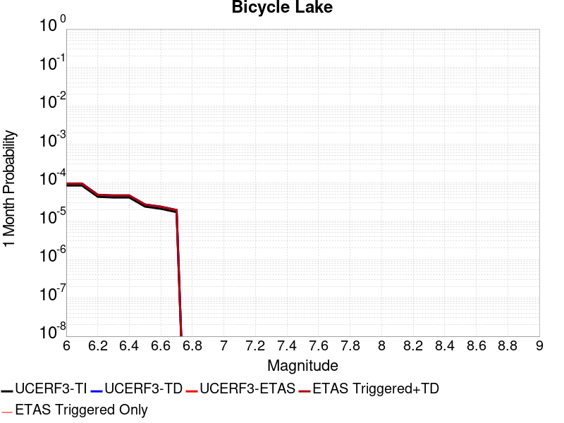 |  |  |

| Magnitude | 1 wk TI Prob | 1 wk TD Prob | 1 wk ETAS Prob | 1 wk ETAS/TD Gain | 1 wk ETAS Triggered+TD | 1 wk ETAS Triggered Only | 1 mo TI Prob | 1 mo TD Prob | 1 mo ETAS Prob | 1 mo ETAS/TD Gain | 1 mo ETAS Triggered+TD | 1 mo ETAS Triggered Only | 1 yr TI Prob | 1 yr TD Prob | 1 yr ETAS Prob | 1 yr ETAS/TD Gain | 1 yr ETAS Triggered+TD | 1 yr ETAS Triggered Only | 10 yr TI Prob | 10 yr TD Prob | 10 yr ETAS Prob | 10 yr ETAS/TD Gain | 10 yr ETAS Triggered+TD | 10 yr ETAS Triggered Only |
|-----|-----|-----|-----|-----|-----|-----|-----|-----|-----|-----|-----|-----|-----|-----|-----|-----|-----|-----|-----|-----|-----|-----|-----|-----|
| 6.0 | 1.9621975E-5 | 2.210261E-5 | 0.0 | 0.0 | 2.210261E-5 | 0.0 | 8.4091465E-5 | 9.4722796E-5 | 0.0 | 0.0 | 9.4722796E-5 | 0.0 | 0.0010233327 | 0.0011527749 | 0.0012 | 1.0409664 | 0.0016521986 | 5.0E-4 | 0.01018633 | 0.011481269 | 0.0132 | 1.1496986 | 0.014842233 | 0.0034 |
| 6.1 | 1.9621975E-5 | 2.210261E-5 | 0.0 | 0.0 | 2.210261E-5 | 0.0 | 8.4091465E-5 | 9.4722796E-5 | 0.0 | 0.0 | 9.4722796E-5 | 0.0 | 0.0010233327 | 0.0011527749 | 0.0012 | 1.0409664 | 0.0016521986 | 5.0E-4 | 0.01018633 | 0.011481269 | 0.0132 | 1.1496986 | 0.014842233 | 0.0034 |
| 6.2 | 9.9971285E-6 | 1.1258451E-5 | 0.0 | 0.0 | 1.1258451E-5 | 0.0 | 4.2844134E-5 | 4.8249905E-5 | 0.0 | 0.0 | 4.8249905E-5 | 0.0 | 5.2150246E-4 | 5.873363E-4 | 4.0E-4 | 0.6810408 | 6.872775E-4 | 1.0E-4 | 0.0052028033 | 0.0058629476 | 0.007 | 1.1939386 | 0.007552981 | 0.0017 |
| 6.3 | 9.589428E-6 | 1.0801047E-5 | 0.0 | 0.0 | 1.0801047E-5 | 0.0 | 4.10969E-5 | 4.628967E-5 | 0.0 | 0.0 | 4.628967E-5 | 0.0 | 5.002399E-4 | 5.634829E-4 | 4.0E-4 | 0.7098707 | 6.634266E-4 | 1.0E-4 | 0.0049911533 | 0.005625634 | 0.0067 | 1.1909769 | 0.007216633 | 0.0016 |
| 6.4 | 9.589428E-6 | 1.0801047E-5 | 0.0 | 0.0 | 1.0801047E-5 | 0.0 | 4.10969E-5 | 4.628967E-5 | 0.0 | 0.0 | 4.628967E-5 | 0.0 | 5.002399E-4 | 5.634829E-4 | 4.0E-4 | 0.7098707 | 6.634266E-4 | 1.0E-4 | 0.0049911533 | 0.005625634 | 0.0067 | 1.1909769 | 0.007216633 | 0.0016 |
| 6.5 | 5.557707E-6 | 6.2872346E-6 | 0.0 | 0.0 | 6.2872346E-6 | 0.0 | 2.3818526E-5 | 2.6945163E-5 | 0.0 | 0.0 | 2.6945163E-5 | 0.0 | 2.8995197E-4 | 3.280349E-4 | 2.0E-4 | 0.60969126 | 4.2800207E-4 | 1.0E-4 | 0.0028957394 | 0.0032781442 | 0.0042 | 1.2812127 | 0.004374538 | 0.0011 |
| 6.6 | 4.8742945E-6 | 5.5147234E-6 | 0.0 | 0.0 | 5.5147234E-6 | 0.0 | 2.0889667E-5 | 2.3634462E-5 | 0.0 | 0.0 | 2.3634462E-5 | 0.0 | 2.54302E-4 | 2.8773778E-4 | 2.0E-4 | 0.69507724 | 3.8770903E-4 | 1.0E-4 | 0.002540112 | 0.0028762226 | 0.0035 | 1.2168738 | 0.0038733464 | 0.001 |
| 6.7 | 3.991108E-6 | 4.517088E-6 | 0.0 | 0.0 | 4.517088E-6 | 0.0 | 1.7104636E-5 | 1.935895E-5 | 0.0 | 0.0 | 1.935895E-5 | 0.0 | 2.0822904E-4 | 2.356952E-4 | 1.0E-4 | 0.42427677 | 3.3567165E-4 | 1.0E-4 | 0.0020803404 | 0.002356952 | 0.0027 | 1.1455473 | 0.0031550664 | 8.0E-4 |

## Great Valley 04b Gordon Valley
*[(top)](#table-of-contents)*

| 1 Week | 1 Month | 1 Year | 10 Year |
|-----|-----|-----|-----|
|  |  |  |  |

| Magnitude | 1 wk TI Prob | 1 wk TD Prob | 1 wk ETAS Prob | 1 wk ETAS/TD Gain | 1 wk ETAS Triggered+TD | 1 wk ETAS Triggered Only | 1 mo TI Prob | 1 mo TD Prob | 1 mo ETAS Prob | 1 mo ETAS/TD Gain | 1 mo ETAS Triggered+TD | 1 mo ETAS Triggered Only | 1 yr TI Prob | 1 yr TD Prob | 1 yr ETAS Prob | 1 yr ETAS/TD Gain | 1 yr ETAS Triggered+TD | 1 yr ETAS Triggered Only | 10 yr TI Prob | 10 yr TD Prob | 10 yr ETAS Prob | 10 yr ETAS/TD Gain | 10 yr ETAS Triggered+TD | 10 yr ETAS Triggered Only |
|-----|-----|-----|-----|-----|-----|-----|-----|-----|-----|-----|-----|-----|-----|-----|-----|-----|-----|-----|-----|-----|-----|-----|-----|-----|
| 6.0 | 2.1181217E-5 | 2.398826E-5 | 0.0 | 0.0 | 2.398826E-5 | 0.0 | 9.077348E-5 | 1.02803715E-4 | 0.0 | 0.0 | 1.02803715E-4 | 0.0 | 0.0011046068 | 0.0012510833 | 3.0E-4 | 0.23979217 | 0.0013509582 | 1.0E-4 | 0.010991322 | 0.012456861 | 0.0098 | 0.78671503 | 0.015715754 | 0.0033 |
| 6.1 | 2.1181217E-5 | 2.398826E-5 | 0.0 | 0.0 | 2.398826E-5 | 0.0 | 9.077348E-5 | 1.02803715E-4 | 0.0 | 0.0 | 1.02803715E-4 | 0.0 | 0.0011046068 | 0.0012510833 | 3.0E-4 | 0.23979217 | 0.0013509582 | 1.0E-4 | 0.010991322 | 0.012456861 | 0.0098 | 0.78671503 | 0.015715754 | 0.0033 |
| 6.2 | 2.1181217E-5 | 2.398826E-5 | 0.0 | 0.0 | 2.398826E-5 | 0.0 | 9.077348E-5 | 1.02803715E-4 | 0.0 | 0.0 | 1.02803715E-4 | 0.0 | 0.0011046068 | 0.0012510833 | 3.0E-4 | 0.23979217 | 0.0013509582 | 1.0E-4 | 0.010991322 | 0.012456861 | 0.0098 | 0.78671503 | 0.015715754 | 0.0033 |
| 6.3 | 2.1181217E-5 | 2.398826E-5 | 0.0 | 0.0 | 2.398826E-5 | 0.0 | 9.077348E-5 | 1.02803715E-4 | 0.0 | 0.0 | 1.02803715E-4 | 0.0 | 0.0011046068 | 0.0012510833 | 3.0E-4 | 0.23979217 | 0.0013509582 | 1.0E-4 | 0.010991322 | 0.012456861 | 0.0098 | 0.78671503 | 0.015715754 | 0.0033 |
| 6.4 | 1.0988268E-5 | 1.2257301E-5 | 0.0 | 0.0 | 1.2257301E-5 | 0.0 | 4.7091726E-5 | 5.2530326E-5 | 0.0 | 0.0 | 5.2530326E-5 | 0.0 | 5.731909E-4 | 6.3938496E-4 | 1.0E-4 | 0.1564003 | 7.3932105E-4 | 1.0E-4 | 0.005717147 | 0.0063770413 | 0.0048 | 0.75270015 | 0.007867476 | 0.0015 |
| 6.5 | 1.0988268E-5 | 1.2257301E-5 | 0.0 | 0.0 | 1.2257301E-5 | 0.0 | 4.7091726E-5 | 5.2530326E-5 | 0.0 | 0.0 | 5.2530326E-5 | 0.0 | 5.731909E-4 | 6.3938496E-4 | 1.0E-4 | 0.1564003 | 7.3932105E-4 | 1.0E-4 | 0.005717147 | 0.0063770413 | 0.0048 | 0.75270015 | 0.007867476 | 0.0015 |
| 6.6 | 1.0517822E-5 | 1.1726731E-5 | 0.0 | 0.0 | 1.1726731E-5 | 0.0 | 4.5075605E-5 | 5.0256538E-5 | 0.0 | 0.0 | 5.0256538E-5 | 0.0 | 5.4865726E-4 | 6.117172E-4 | 1.0E-4 | 0.16347423 | 7.11656E-4 | 1.0E-4 | 0.0054730466 | 0.006101888 | 0.0046 | 0.75386506 | 0.0075927353 | 0.0015 |
| 6.7 | 7.789219E-6 | 8.679609E-6 | 0.0 | 0.0 | 8.679609E-6 | 0.0 | 3.3381937E-5 | 3.7197824E-5 | 0.0 | 0.0 | 3.7197824E-5 | 0.0 | 4.063493E-4 | 4.5279457E-4 | 1.0E-4 | 0.2208507 | 5.527493E-4 | 1.0E-4 | 0.004056071 | 0.0045192377 | 0.0033 | 0.7302117 | 0.005514718 | 0.001 |
| 6.8 | 7.5850853E-6 | 8.454308E-6 | 0.0 | 0.0 | 8.454308E-6 | 0.0 | 3.2507105E-5 | 3.623227E-5 | 0.0 | 0.0 | 3.623227E-5 | 0.0 | 3.957021E-4 | 4.4104378E-4 | 1.0E-4 | 0.22673486 | 5.409997E-4 | 1.0E-4 | 0.0039499826 | 0.0044021974 | 0.0033 | 0.7496257 | 0.0053977952 | 0.001 |
| 6.9 | 6.604105E-6 | 7.360218E-6 | 0.0 | 0.0 | 7.360218E-6 | 0.0 | 2.8303E-5 | 3.1543434E-5 | 0.0 | 0.0 | 3.1543434E-5 | 0.0 | 3.4453452E-4 | 3.8397752E-4 | 0.0 | 0.0 | 3.8397752E-4 | 0.0 | 0.0034400085 | 0.0038335272 | 0.0028 | 0.7303978 | 0.004530844 | 7.0E-4 |
| 7.0 | 5.3701115E-6 | 5.9897875E-6 | 0.0 | 0.0 | 5.9897875E-6 | 0.0 | 2.301456E-5 | 2.5670282E-5 | 0.0 | 0.0 | 2.5670282E-5 | 0.0 | 2.8016625E-4 | 3.1249376E-4 | 0.0 | 0.0 | 3.1249376E-4 | 0.0 | 0.0027981328 | 0.0031208321 | 0.0026 | 0.8331111 | 0.0037189596 | 6.0E-4 |
| 7.1 | 4.4685607E-6 | 4.987626E-6 | 0.0 | 0.0 | 4.987626E-6 | 0.0 | 1.9150835E-5 | 2.137538E-5 | 0.0 | 0.0 | 2.137538E-5 | 0.0 | 2.3313647E-4 | 2.6021665E-4 | 0.0 | 0.0 | 2.6021665E-4 | 0.0 | 0.0023289204 | 0.0025993644 | 0.0023 | 0.8848317 | 0.0031978048 | 6.0E-4 |
| 7.2 | 2.833378E-6 | 3.1651539E-6 | 0.0 | 0.0 | 3.1651539E-6 | 0.0 | 1.2142991E-5 | 1.3564885E-5 | 0.0 | 0.0 | 1.3564885E-5 | 0.0 | 1.4783088E-4 | 1.6514171E-4 | 0.0 | 0.0 | 1.6514171E-4 | 0.0 | 0.0014773258 | 0.0016503618 | 0.0014 | 0.84829885 | 0.0020497018 | 4.0E-4 |
| 7.3 | 7.0087293E-7 | 7.774509E-7 | 0.0 | 0.0 | 7.774509E-7 | 0.0 | 3.0037377E-6 | 3.3319307E-6 | 0.0 | 0.0 | 3.3319307E-6 | 0.0 | 3.656989E-5 | 4.056596E-5 | 0.0 | 0.0 | 4.056596E-5 | 0.0 | 3.6563876E-4 | 4.0563053E-4 | 3.0E-4 | 0.7395893 | 5.0559E-4 | 1.0E-4 |
| 7.4 | 3.112171E-8 | 3.2070304E-8 | 0.0 | 0.0 | 3.2070304E-8 | 0.0 | 1.3337875E-7 | 1.3744415E-7 | 0.0 | 0.0 | 1.3744415E-7 | 0.0 | 1.6238852E-6 | 1.6733812E-6 | 0.0 | 0.0 | 1.6733812E-6 | 0.0 | 1.6238733E-5 | 1.6733695E-5 | 0.0 | 0.0 | 1.6733695E-5 | 0.0 |

## Bennett Valley 2011 CFM
*[(top)](#table-of-contents)*

| 1 Week | 1 Month | 1 Year | 10 Year |
|-----|-----|-----|-----|
| 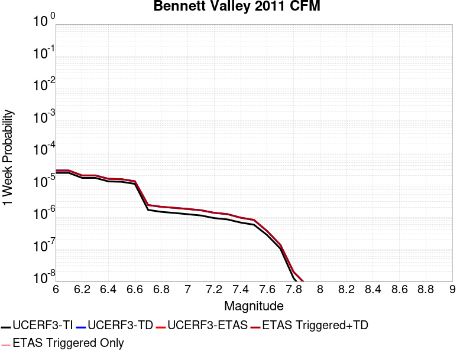 |  | 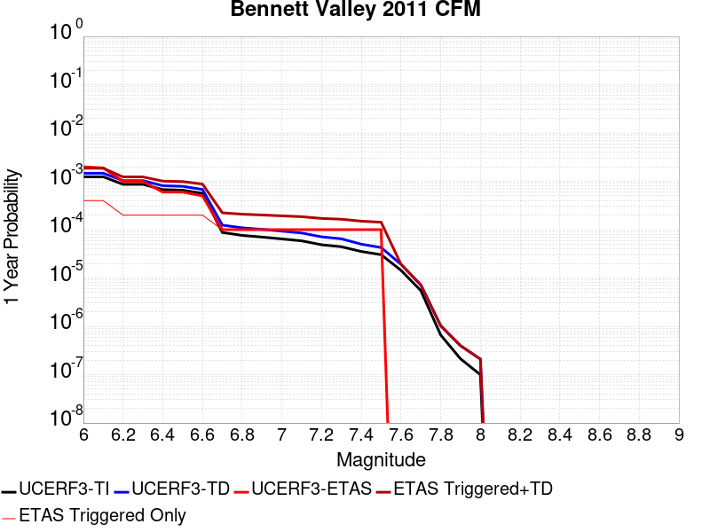 |  |

| Magnitude | 1 wk TI Prob | 1 wk TD Prob | 1 wk ETAS Prob | 1 wk ETAS/TD Gain | 1 wk ETAS Triggered+TD | 1 wk ETAS Triggered Only | 1 mo TI Prob | 1 mo TD Prob | 1 mo ETAS Prob | 1 mo ETAS/TD Gain | 1 mo ETAS Triggered+TD | 1 mo ETAS Triggered Only | 1 yr TI Prob | 1 yr TD Prob | 1 yr ETAS Prob | 1 yr ETAS/TD Gain | 1 yr ETAS Triggered+TD | 1 yr ETAS Triggered Only | 10 yr TI Prob | 10 yr TD Prob | 10 yr ETAS Prob | 10 yr ETAS/TD Gain | 10 yr ETAS Triggered+TD | 10 yr ETAS Triggered Only |
|-----|-----|-----|-----|-----|-----|-----|-----|-----|-----|-----|-----|-----|-----|-----|-----|-----|-----|-----|-----|-----|-----|-----|-----|-----|
| 6.0 | 2.3893934E-5 | 2.8245595E-5 | 0.0 | 0.0 | 2.8245595E-5 | 0.0 | 1.0239855E-4 | 1.21047975E-4 | 1.0E-4 | 0.8261187 | 2.2103587E-4 | 1.0E-4 | 0.0012459893 | 0.0014729478 | 0.002 | 1.3578213 | 0.0018723586 | 4.0E-4 | 0.012390262 | 0.014654616 | 0.0137 | 0.934859 | 0.01800479 | 0.0034 |
| 6.1 | 2.3893934E-5 | 2.8245595E-5 | 0.0 | 0.0 | 2.8245595E-5 | 0.0 | 1.0239855E-4 | 1.21047975E-4 | 1.0E-4 | 0.8261187 | 2.2103587E-4 | 1.0E-4 | 0.0012459893 | 0.0014729478 | 0.0019 | 1.2899303 | 0.0018723586 | 4.0E-4 | 0.012390262 | 0.014654616 | 0.0129 | 0.8802687 | 0.017906256 | 0.0033 |
| 6.2 | 1.6657146E-5 | 1.9857838E-5 | 0.0 | 0.0 | 1.9857838E-5 | 0.0 | 7.138582E-5 | 8.510304E-5 | 1.0E-4 | 1.1750461 | 1.8509453E-4 | 1.0E-4 | 8.6877577E-4 | 0.0010357786 | 0.001 | 0.9654573 | 0.0012355715 | 2.0E-4 | 0.008653872 | 0.010327891 | 0.0088 | 0.8520616 | 0.012604138 | 0.0023 |
| 6.3 | 1.6657146E-5 | 1.9857838E-5 | 0.0 | 0.0 | 1.9857838E-5 | 0.0 | 7.138582E-5 | 8.510304E-5 | 1.0E-4 | 1.1750461 | 1.8509453E-4 | 1.0E-4 | 8.6877577E-4 | 0.0010357786 | 0.001 | 0.9654573 | 0.0012355715 | 2.0E-4 | 0.008653872 | 0.010327891 | 0.0088 | 0.8520616 | 0.012604138 | 0.0023 |
| 6.4 | 1.29418495E-5 | 1.5570251E-5 | 0.0 | 0.0 | 1.5570251E-5 | 0.0 | 5.546389E-5 | 6.672867E-5 | 1.0E-4 | 1.4986062 | 1.66722E-4 | 1.0E-4 | 6.7506364E-4 | 8.122491E-4 | 6.0E-4 | 0.73868966 | 0.0010120866 | 2.0E-4 | 0.0067301663 | 0.0081100585 | 0.007 | 0.8631257 | 0.009895461 | 0.0018 |
| 6.5 | 1.2582504E-5 | 1.513714E-5 | 0.0 | 0.0 | 1.513714E-5 | 0.0 | 5.39239E-5 | 6.4872576E-5 | 1.0E-4 | 1.5414834 | 1.6486608E-4 | 1.0E-4 | 6.563257E-4 | 7.8966765E-4 | 6.0E-4 | 0.7598133 | 9.895097E-4 | 2.0E-4 | 0.006543907 | 0.007885896 | 0.0069 | 0.87497985 | 0.009671701 | 0.0018 |
| 6.6 | 1.0846706E-5 | 1.30387025E-5 | 0.0 | 0.0 | 1.30387025E-5 | 0.0 | 4.6485053E-5 | 5.5879682E-5 | 1.0E-4 | 1.7895592 | 1.5587409E-4 | 1.0E-4 | 5.6580856E-4 | 6.8025116E-4 | 5.0E-4 | 0.7350226 | 8.8011514E-4 | 2.0E-4 | 0.005643701 | 0.0067988066 | 0.0065 | 0.95605016 | 0.008586569 | 0.0018 |
| 6.7 | 1.6803231E-6 | 2.3765E-6 | 0.0 | 0.0 | 2.3765E-6 | 0.0 | 7.2013645E-6 | 1.0184962E-5 | 1.0E-4 | 9.8183975 | 1.10183944E-4 | 1.0E-4 | 8.7673085E-5 | 1.2399498E-4 | 1.0E-4 | 0.8064842 | 2.2398258E-4 | 1.0E-4 | 8.76385E-4 | 0.0012436598 | 0.0011 | 0.8844863 | 0.0015432866 | 3.0E-4 |
| 6.8 | 1.4609833E-6 | 2.0924795E-6 | 0.0 | 0.0 | 2.0924795E-6 | 0.0 | 6.261342E-6 | 8.967739E-6 | 1.0E-4 | 11.151083 | 1.08966844E-4 | 1.0E-4 | 7.6229175E-5 | 1.0917682E-4 | 1.0E-4 | 0.91594535 | 2.0916591E-4 | 1.0E-4 | 7.620303E-4 | 0.0010955837 | 8.0E-4 | 0.7302044 | 0.0012953645 | 2.0E-4 |
| 6.9 | 1.3492396E-6 | 1.9443821E-6 | 0.0 | 0.0 | 1.9443821E-6 | 0.0 | 5.7824427E-6 | 8.33304E-6 | 1.0E-4 | 12.0004225 | 1.08332206E-4 | 1.0E-4 | 7.0398964E-5 | 1.01450096E-4 | 1.0E-4 | 0.98570627 | 2.0143995E-4 | 1.0E-4 | 7.037667E-4 | 0.0010183592 | 7.0E-4 | 0.68738025 | 0.0011182574 | 1.0E-4 |
| 7.0 | 1.2347921E-6 | 1.7873286E-6 | 0.0 | 0.0 | 1.7873286E-6 | 0.0 | 5.291955E-6 | 7.659958E-6 | 1.0E-4 | 13.054902 | 1.07659194E-4 | 1.0E-4 | 6.442765E-5 | 9.325605E-5 | 1.0E-4 | 1.0723164 | 1.9324673E-4 | 1.0E-4 | 6.440897E-4 | 9.3649206E-4 | 7.0E-4 | 0.7474703 | 0.0010363983 | 1.0E-4 |
| 7.1 | 1.1262973E-6 | 1.6340535E-6 | 0.0 | 0.0 | 1.6340535E-6 | 0.0 | 4.8269794E-6 | 7.0030683E-6 | 1.0E-4 | 14.279455 | 1.07002365E-4 | 1.0E-4 | 5.876689E-5 | 8.5259075E-5 | 1.0E-4 | 1.1728957 | 1.8525055E-4 | 1.0E-4 | 5.875135E-4 | 8.565709E-4 | 7.0E-4 | 0.817212 | 9.564852E-4 | 1.0E-4 |
| 7.2 | 9.351744E-7 | 1.3592285E-6 | 0.0 | 0.0 | 1.3592285E-6 | 0.0 | 4.007884E-6 | 5.8252517E-6 | 1.0E-4 | 17.16664 | 1.0582467E-4 | 1.0E-4 | 4.8794896E-5 | 7.0920156E-5 | 1.0E-4 | 1.4100364 | 1.7091306E-4 | 1.0E-4 | 4.878418E-4 | 7.132437E-4 | 5.0E-4 | 0.7010227 | 8.131724E-4 | 1.0E-4 |
| 7.3 | 8.5039534E-7 | 1.2368049E-6 | 0.0 | 0.0 | 1.2368049E-6 | 0.0 | 3.6445463E-6 | 5.3005815E-6 | 1.0E-4 | 18.865854 | 1.0530005E-4 | 1.0E-4 | 4.437145E-5 | 6.453269E-5 | 1.0E-4 | 1.5496023 | 1.6452624E-4 | 1.0E-4 | 4.436259E-4 | 6.4913975E-4 | 5.0E-4 | 0.7702502 | 7.490748E-4 | 1.0E-4 |
| 7.4 | 6.7875015E-7 | 9.588362E-7 | 0.0 | 0.0 | 9.588362E-7 | 0.0 | 2.908926E-6 | 4.1092912E-6 | 1.0E-4 | 24.335096 | 1.0410888E-4 | 1.0E-4 | 3.54156E-5 | 5.0029485E-5 | 1.0E-4 | 1.9988213 | 1.5002448E-4 | 1.0E-4 | 3.5409955E-4 | 5.03468E-4 | 3.0E-4 | 0.59586704 | 6.0341763E-4 | 1.0E-4 |
| 7.5 | 5.826867E-7 | 8.1788454E-7 | 0.0 | 0.0 | 8.1788454E-7 | 0.0 | 2.4972264E-6 | 3.5052146E-6 | 1.0E-4 | 28.528923 | 1.0350486E-4 | 1.0E-4 | 3.0403306E-5 | 4.267516E-5 | 1.0E-4 | 2.3432834 | 1.4267089E-4 | 1.0E-4 | 3.0399146E-4 | 4.295233E-4 | 3.0E-4 | 0.6984487 | 5.2948034E-4 | 1.0E-4 |
| 7.6 | 2.7734902E-7 | 3.6796231E-7 | 0.0 | 0.0 | 3.6796231E-7 | 0.0 | 1.1886381E-6 | 1.5769804E-6 | 0.0 | 0.0 | 1.5769804E-6 | 0.0 | 1.4471572E-5 | 1.9199568E-5 | 0.0 | 0.0 | 1.9199568E-5 | 0.0 | 1.447063E-4 | 1.9299515E-4 | 0.0 | 0.0 | 1.9299515E-4 | 0.0 |
| 7.7 | 1.0530888E-7 | 1.372523E-7 | 0.0 | 0.0 | 1.372523E-7 | 0.0 | 4.513237E-7 | 5.88224E-7 | 0.0 | 0.0 | 5.88224E-7 | 0.0 | 5.4948523E-6 | 7.1616037E-6 | 0.0 | 0.0 | 7.1616037E-6 | 0.0 | 5.4947162E-5 | 7.243076E-5 | 0.0 | 0.0 | 7.243076E-5 | 0.0 |
| 7.8 | 1.2714258E-8 | 1.9623247E-8 | 0.0 | 0.0 | 1.9623247E-8 | 0.0 | 5.448968E-8 | 8.409963E-8 | 0.0 | 0.0 | 8.409963E-8 | 0.0 | 6.6341164E-7 | 1.0239125E-6 | 0.0 | 0.0 | 1.0239125E-6 | 0.0 | 6.6340967E-6 | 1.0652838E-5 | 0.0 | 0.0 | 1.0652838E-5 | 0.0 |
| 7.9 | 4.075888E-9 | 7.569352E-9 | 0.0 | 0.0 | 7.569352E-9 | 0.0 | 1.7468091E-8 | 3.2440084E-8 | 0.0 | 0.0 | 3.2440084E-8 | 0.0 | 2.12674E-7 | 3.9495794E-7 | 0.0 | 0.0 | 3.9495794E-7 | 0.0 | 2.1267379E-6 | 4.199757E-6 | 0.0 | 0.0 | 4.199757E-6 | 0.0 |
| 8.0 | 1.9126138E-9 | 4.0035006E-9 | 0.0 | 0.0 | 4.0035006E-9 | 0.0 | 8.196917E-9 | 1.715786E-8 | 0.0 | 0.0 | 1.715786E-8 | 0.0 | 9.9797454E-8 | 2.088969E-7 | 0.0 | 0.0 | 2.088969E-7 | 0.0 | 9.979741E-7 | 2.2019833E-6 | 0.0 | 0.0 | 2.2019833E-6 | 0.0 |

## San Gregorio (North) 2011 CFM
*[(top)](#table-of-contents)*

| 1 Week | 1 Month | 1 Year | 10 Year |
|-----|-----|-----|-----|
| 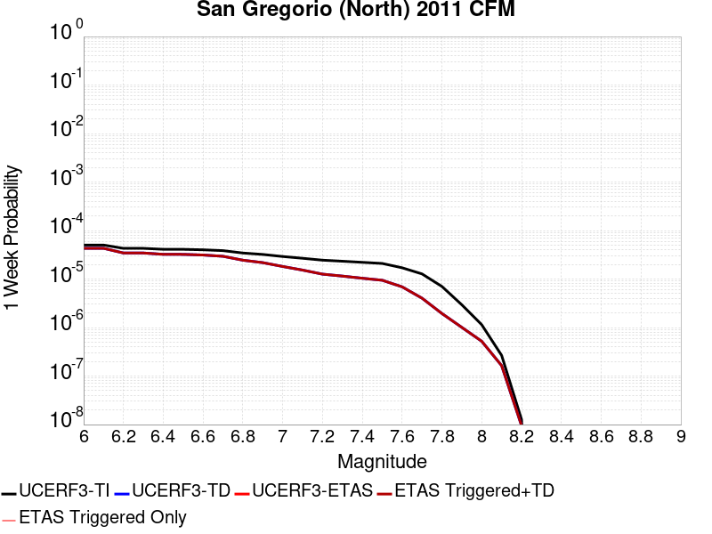 |  | 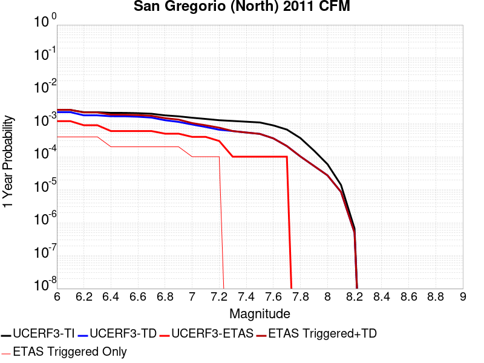 | 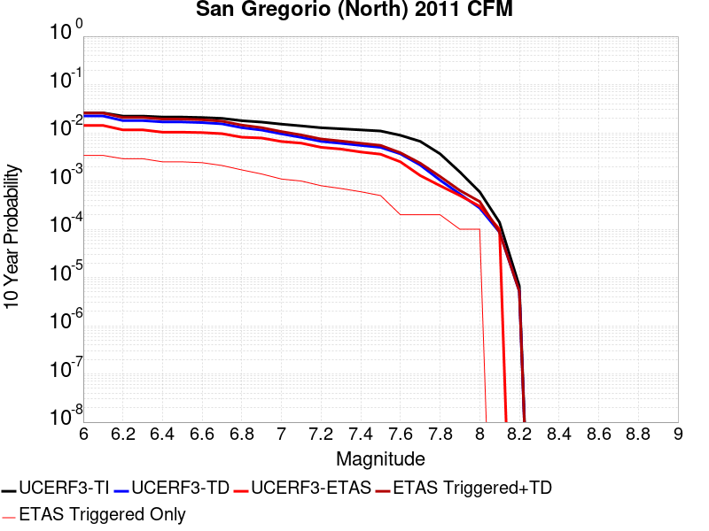 |

| Magnitude | 1 wk TI Prob | 1 wk TD Prob | 1 wk ETAS Prob | 1 wk ETAS/TD Gain | 1 wk ETAS Triggered+TD | 1 wk ETAS Triggered Only | 1 mo TI Prob | 1 mo TD Prob | 1 mo ETAS Prob | 1 mo ETAS/TD Gain | 1 mo ETAS Triggered+TD | 1 mo ETAS Triggered Only | 1 yr TI Prob | 1 yr TD Prob | 1 yr ETAS Prob | 1 yr ETAS/TD Gain | 1 yr ETAS Triggered+TD | 1 yr ETAS Triggered Only | 10 yr TI Prob | 10 yr TD Prob | 10 yr ETAS Prob | 10 yr ETAS/TD Gain | 10 yr ETAS Triggered+TD | 10 yr ETAS Triggered Only |
|-----|-----|-----|-----|-----|-----|-----|-----|-----|-----|-----|-----|-----|-----|-----|-----|-----|-----|-----|-----|-----|-----|-----|-----|-----|
| 6.0 | 5.0283932E-5 | 4.3077293E-5 | 0.0 | 0.0 | 4.3077293E-5 | 0.0 | 2.1548476E-4 | 1.8460402E-4 | 0.0 | 0.0 | 1.8460402E-4 | 0.0 | 0.0026203706 | 0.002245251 | 0.0012 | 0.5344614 | 0.002644353 | 4.0E-4 | 0.02589687 | 0.022302555 | 0.0142 | 0.63669837 | 0.025626726 | 0.0034 |
| 6.1 | 5.0283932E-5 | 4.3077293E-5 | 0.0 | 0.0 | 4.3077293E-5 | 0.0 | 2.1548476E-4 | 1.8460402E-4 | 0.0 | 0.0 | 1.8460402E-4 | 0.0 | 0.0026203706 | 0.002245251 | 0.0012 | 0.5344614 | 0.002644353 | 4.0E-4 | 0.02589687 | 0.022302555 | 0.0142 | 0.63669837 | 0.025626726 | 0.0034 |
| 6.2 | 4.2998647E-5 | 3.4456418E-5 | 0.0 | 0.0 | 3.4456418E-5 | 0.0 | 1.842669E-4 | 1.476621E-4 | 0.0 | 0.0 | 1.476621E-4 | 0.0 | 0.0022411412 | 0.001796316 | 9.0E-4 | 0.50102544 | 0.0021955974 | 4.0E-4 | 0.022186736 | 0.01789347 | 0.0115 | 0.6426925 | 0.02074158 | 0.0029 |
| 6.3 | 4.2998647E-5 | 3.4456418E-5 | 0.0 | 0.0 | 3.4456418E-5 | 0.0 | 1.842669E-4 | 1.476621E-4 | 0.0 | 0.0 | 1.476621E-4 | 0.0 | 0.0022411412 | 0.001796316 | 9.0E-4 | 0.50102544 | 0.0021955974 | 4.0E-4 | 0.022186736 | 0.01789347 | 0.0115 | 0.6426925 | 0.02074158 | 0.0029 |
| 6.4 | 4.1101295E-5 | 3.2340326E-5 | 0.0 | 0.0 | 3.2340326E-5 | 0.0 | 1.7613651E-4 | 1.3859411E-4 | 0.0 | 0.0 | 1.3859411E-4 | 0.0 | 0.0021423528 | 0.0016860906 | 6.0E-4 | 0.35585275 | 0.0018857534 | 2.0E-4 | 0.02121817 | 0.01680913 | 0.0103 | 0.6127622 | 0.019267108 | 0.0025 |
| 6.5 | 4.1032585E-5 | 3.225833E-5 | 0.0 | 0.0 | 3.225833E-5 | 0.0 | 1.7584208E-4 | 1.3824274E-4 | 0.0 | 0.0 | 1.3824274E-4 | 0.0 | 0.0021387753 | 0.0016818192 | 6.0E-4 | 0.35675654 | 0.0018814829 | 2.0E-4 | 0.021183075 | 0.016767068 | 0.0103 | 0.6142994 | 0.01922515 | 0.0025 |
| 6.6 | 4.011629E-5 | 3.1279487E-5 | 0.0 | 0.0 | 3.1279487E-5 | 0.0 | 1.7191563E-4 | 1.3404814E-4 | 0.0 | 0.0 | 1.3404814E-4 | 0.0 | 0.0020910634 | 0.0016308281 | 6.0E-4 | 0.36791125 | 0.001830502 | 2.0E-4 | 0.020714961 | 0.016263075 | 0.0101 | 0.62103873 | 0.018624045 | 0.0024 |
| 6.7 | 3.8583938E-5 | 2.9465631E-5 | 0.0 | 0.0 | 2.9465631E-5 | 0.0 | 1.6534925E-4 | 1.2627525E-4 | 0.0 | 0.0 | 1.2627525E-4 | 0.0 | 0.0020112682 | 0.0015363311 | 6.0E-4 | 0.3905408 | 0.0017360239 | 2.0E-4 | 0.019931622 | 0.015332939 | 0.0096 | 0.62610304 | 0.01740074 | 0.0021 |
| 6.8 | 3.44341E-5 | 2.4460434E-5 | 0.0 | 0.0 | 2.4460434E-5 | 0.0 | 1.4756636E-4 | 1.0482628E-4 | 0.0 | 0.0 | 1.0482628E-4 | 0.0 | 0.0017951399 | 0.0012755232 | 5.0E-4 | 0.391996 | 0.0014752682 | 2.0E-4 | 0.017807078 | 0.01275686 | 0.0081 | 0.6349525 | 0.014435174 | 0.0017 |
| 6.9 | 3.221199E-5 | 2.1782964E-5 | 0.0 | 0.0 | 2.1782964E-5 | 0.0 | 1.3804408E-4 | 9.335226E-5 | 0.0 | 0.0 | 9.335226E-5 | 0.0 | 0.0016793909 | 0.0011359794 | 5.0E-4 | 0.4401488 | 0.0013357522 | 2.0E-4 | 0.01666756 | 0.011375574 | 0.0078 | 0.6856796 | 0.012759649 | 0.0014 |
| 7.0 | 2.9186718E-5 | 1.814836E-5 | 0.0 | 0.0 | 1.814836E-5 | 0.0 | 1.2507994E-4 | 7.777639E-5 | 0.0 | 0.0 | 7.777639E-5 | 0.0 | 0.0015217843 | 9.4652065E-4 | 4.0E-4 | 0.4226004 | 0.001046426 | 1.0E-4 | 0.015114053 | 0.009498038 | 0.0066 | 0.6948803 | 0.010587591 | 0.0011 |
| 7.1 | 2.6840138E-5 | 1.52843E-5 | 0.0 | 0.0 | 1.52843E-5 | 0.0 | 1.1502409E-4 | 6.550251E-5 | 0.0 | 0.0 | 6.550251E-5 | 0.0 | 0.0013995186 | 7.972032E-4 | 4.0E-4 | 0.5017541 | 8.971235E-4 | 1.0E-4 | 0.013907375 | 0.008016013 | 0.0061 | 0.76097685 | 0.009007996 | 0.001 |
| 7.2 | 2.453002E-5 | 1.2605421E-5 | 0.0 | 0.0 | 1.2605421E-5 | 0.0 | 1.05124425E-4 | 5.4022115E-5 | 0.0 | 0.0 | 5.4022115E-5 | 0.0 | 0.0012791384 | 6.5752136E-4 | 3.0E-4 | 0.45625892 | 7.5745565E-4 | 1.0E-4 | 0.012718005 | 0.0066271587 | 0.005 | 0.7544712 | 0.0074218567 | 8.0E-4 |
| 7.3 | 2.3330727E-5 | 1.14870945E-5 | 0.0 | 0.0 | 1.14870945E-5 | 0.0 | 9.9985E-5 | 4.922948E-5 | 0.0 | 0.0 | 4.922948E-5 | 0.0 | 0.0012166376 | 5.992045E-4 | 1.0E-4 | 0.16688792 | 5.992045E-4 | 0.0 | 0.012099981 | 0.006046038 | 0.0046 | 0.76082885 | 0.0067418055 | 7.0E-4 |
| 7.4 | 2.2136466E-5 | 1.0366971E-5 | 0.0 | 0.0 | 1.0366971E-5 | 0.0 | 9.486712E-5 | 4.4429118E-5 | 0.0 | 0.0 | 4.4429118E-5 | 0.0 | 0.0011543952 | 5.407905E-4 | 1.0E-4 | 0.18491448 | 5.407905E-4 | 0.0 | 0.011484168 | 0.00546339 | 0.004 | 0.73214614 | 0.006060112 | 6.0E-4 |
| 7.5 | 2.0994974E-5 | 9.425034E-6 | 0.0 | 0.0 | 9.425034E-6 | 0.0 | 8.997535E-5 | 4.0392373E-5 | 0.0 | 0.0 | 4.0392373E-5 | 0.0 | 0.0010948994 | 4.9166643E-4 | 1.0E-4 | 0.20338993 | 4.9166643E-4 | 0.0 | 0.010895205 | 0.004972472 | 0.0036 | 0.72398597 | 0.005469986 | 5.0E-4 |
| 7.6 | 1.7091823E-5 | 6.8930776E-6 | 0.0 | 0.0 | 6.8930776E-6 | 0.0 | 7.3248615E-5 | 2.9541427E-5 | 0.0 | 0.0 | 2.9541427E-5 | 0.0 | 8.9143694E-4 | 3.5960763E-4 | 1.0E-4 | 0.27808088 | 3.5960763E-4 | 0.0 | 0.008878695 | 0.0036481675 | 0.0025 | 0.68527555 | 0.003847438 | 2.0E-4 |
| 7.7 | 1.2772179E-5 | 4.020495E-6 | 0.0 | 0.0 | 4.020495E-6 | 0.0 | 5.473676E-5 | 1.7230579E-5 | 0.0 | 0.0 | 1.7230579E-5 | 0.0 | 6.6621625E-4 | 2.0976213E-4 | 1.0E-4 | 0.47673047 | 2.0976213E-4 | 0.0 | 0.006642225 | 0.0021367355 | 0.0013 | 0.60840476 | 0.0023363081 | 2.0E-4 |
| 7.8 | 7.041923E-6 | 1.9405102E-6 | 0.0 | 0.0 | 1.9405102E-6 | 0.0 | 3.017932E-5 | 8.316445E-6 | 0.0 | 0.0 | 8.316445E-6 | 0.0 | 3.6737128E-4 | 1.0124801E-4 | 0.0 | 0.0 | 1.0124801E-4 | 0.0 | 0.0036676454 | 0.0010378514 | 8.0E-4 | 0.77082324 | 0.0012376439 | 2.0E-4 |
| 7.9 | 2.946768E-6 | 1.0036827E-6 | 0.0 | 0.0 | 1.0036827E-6 | 0.0 | 1.2628945E-5 | 4.3014898E-6 | 0.0 | 0.0 | 4.3014898E-6 | 0.0 | 1.5374656E-4 | 5.236938E-5 | 0.0 | 0.0 | 5.236938E-5 | 0.0 | 0.0015364023 | 5.341827E-4 | 5.0E-4 | 0.93600935 | 6.341293E-4 | 1.0E-4 |
| 8.0 | 1.1433375E-6 | 5.1865254E-7 | 0.0 | 0.0 | 5.1865254E-7 | 0.0 | 4.9000087E-6 | 2.2227946E-6 | 0.0 | 0.0 | 2.2227946E-6 | 0.0 | 5.965597E-5 | 2.7062188E-5 | 0.0 | 0.0 | 2.7062188E-5 | 0.0 | 5.963996E-4 | 2.742547E-4 | 3.0E-4 | 1.0938736 | 3.742273E-4 | 1.0E-4 |
| 8.1 | 2.6675295E-7 | 1.6319402E-7 | 0.0 | 0.0 | 1.6319402E-7 | 0.0 | 1.1432264E-6 | 6.994028E-7 | 0.0 | 0.0 | 6.994028E-7 | 0.0 | 1.3918692E-5 | 8.515195E-6 | 0.0 | 0.0 | 8.515195E-6 | 0.0 | 1.391782E-4 | 8.653684E-5 | 1.0E-4 | 1.1555772 | 8.653684E-5 | 0.0 |
| 8.2 | 1.2704569E-8 | 9.464214E-9 | 0.0 | 0.0 | 9.464214E-9 | 0.0 | 5.444815E-8 | 4.056092E-8 | 0.0 | 0.0 | 4.056092E-8 | 0.0 | 6.629061E-7 | 4.938291E-7 | 0.0 | 0.0 | 4.938291E-7 | 0.0 | 6.629041E-6 | 5.1289267E-6 | 0.0 | 0.0 | 5.1289267E-6 | 0.0 |

## Bartlett Springs 2011 CFM
*[(top)](#table-of-contents)*

| 1 Week | 1 Month | 1 Year | 10 Year |
|-----|-----|-----|-----|
| 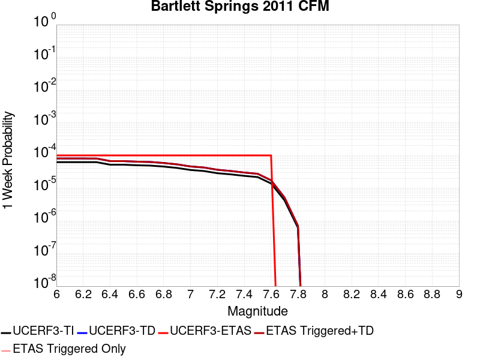 | 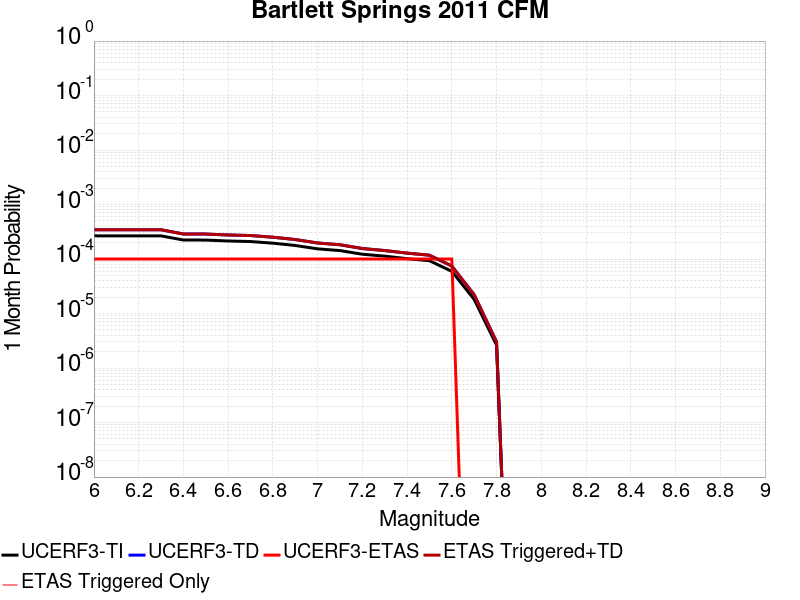 |  |  |

| Magnitude | 1 wk TI Prob | 1 wk TD Prob | 1 wk ETAS Prob | 1 wk ETAS/TD Gain | 1 wk ETAS Triggered+TD | 1 wk ETAS Triggered Only | 1 mo TI Prob | 1 mo TD Prob | 1 mo ETAS Prob | 1 mo ETAS/TD Gain | 1 mo ETAS Triggered+TD | 1 mo ETAS Triggered Only | 1 yr TI Prob | 1 yr TD Prob | 1 yr ETAS Prob | 1 yr ETAS/TD Gain | 1 yr ETAS Triggered+TD | 1 yr ETAS Triggered Only | 10 yr TI Prob | 10 yr TD Prob | 10 yr ETAS Prob | 10 yr ETAS/TD Gain | 10 yr ETAS Triggered+TD | 10 yr ETAS Triggered Only |
|-----|-----|-----|-----|-----|-----|-----|-----|-----|-----|-----|-----|-----|-----|-----|-----|-----|-----|-----|-----|-----|-----|-----|-----|-----|
| 6.0 | 6.2326144E-5 | 8.06516E-5 | 1.0E-4 | 1.2399011 | 8.06516E-5 | 0.0 | 2.6708472E-4 | 3.4560452E-4 | 1.0E-4 | 0.28934807 | 3.4560452E-4 | 0.0 | 0.003246908 | 0.0041997083 | 0.0024 | 0.57146823 | 0.0045980285 | 4.0E-4 | 0.031998757 | 0.041220505 | 0.0279 | 0.67684764 | 0.044288598 | 0.0032 |
| 6.1 | 6.227657E-5 | 8.058907E-5 | 1.0E-4 | 1.2408631 | 8.058907E-5 | 0.0 | 2.668723E-4 | 3.4533662E-4 | 1.0E-4 | 0.28957254 | 3.4533662E-4 | 0.0 | 0.0032443295 | 0.004196459 | 0.0023 | 0.54808116 | 0.0044952002 | 3.0E-4 | 0.031973712 | 0.041189224 | 0.0278 | 0.67493385 | 0.044161536 | 0.0031 |
| 6.2 | 6.22452E-5 | 8.054965E-5 | 1.0E-4 | 1.2414703 | 8.054965E-5 | 0.0 | 2.6673786E-4 | 3.4516773E-4 | 1.0E-4 | 0.28971422 | 3.4516773E-4 | 0.0 | 0.0032426978 | 0.004194411 | 0.0023 | 0.5483488 | 0.0044931527 | 3.0E-4 | 0.03195787 | 0.041169506 | 0.0278 | 0.6752571 | 0.04414188 | 0.0031 |
| 6.3 | 6.219006E-5 | 8.0479454E-5 | 1.0E-4 | 1.2425532 | 8.0479454E-5 | 0.0 | 2.6650162E-4 | 3.4486694E-4 | 1.0E-4 | 0.2899669 | 3.4486694E-4 | 0.0 | 0.00323983 | 0.004190763 | 0.0023 | 0.5488261 | 0.0044895057 | 3.0E-4 | 0.031930014 | 0.041134387 | 0.0278 | 0.6758336 | 0.04410687 | 0.0031 |
| 6.4 | 5.2175856E-5 | 6.7290894E-5 | 1.0E-4 | 1.4860852 | 6.7290894E-5 | 0.0 | 2.2359163E-4 | 2.8835796E-4 | 1.0E-4 | 0.3467912 | 2.8835796E-4 | 0.0 | 0.0027188298 | 0.0035051545 | 0.002 | 0.5705883 | 0.0038041028 | 3.0E-4 | 0.026858058 | 0.03450812 | 0.0222 | 0.6433269 | 0.037114948 | 0.0027 |
| 6.5 | 5.205166E-5 | 6.713348E-5 | 1.0E-4 | 1.4895698 | 6.713348E-5 | 0.0 | 2.2305945E-4 | 2.8768345E-4 | 1.0E-4 | 0.34760427 | 2.8768345E-4 | 0.0 | 0.0027123666 | 0.0034969691 | 0.002 | 0.57192385 | 0.00379592 | 3.0E-4 | 0.026794989 | 0.034428824 | 0.0222 | 0.64480853 | 0.037035868 | 0.0027 |
| 6.6 | 5.0085426E-5 | 6.452825E-5 | 1.0E-4 | 1.5497088 | 6.452825E-5 | 0.0 | 2.1463417E-4 | 2.765206E-4 | 1.0E-4 | 0.36163673 | 2.765206E-4 | 0.0 | 0.0026100394 | 0.0033614908 | 0.002 | 0.59497416 | 0.0036604824 | 3.0E-4 | 0.025795965 | 0.033115637 | 0.0211 | 0.63716125 | 0.035629533 | 0.0026 |
| 6.7 | 4.8930866E-5 | 6.305212E-5 | 1.0E-4 | 1.5859896 | 6.305212E-5 | 0.0 | 2.0968684E-4 | 2.7019563E-4 | 1.0E-4 | 0.3701022 | 2.7019563E-4 | 0.0 | 0.0025499484 | 0.0032847193 | 0.002 | 0.60888 | 0.003583734 | 3.0E-4 | 0.025208864 | 0.032370612 | 0.0209 | 0.64564735 | 0.034789685 | 0.0025 |
| 6.8 | 4.5679535E-5 | 5.8773876E-5 | 1.0E-4 | 1.7014362 | 5.8773876E-5 | 0.0 | 1.9575475E-4 | 2.518639E-4 | 1.0E-4 | 0.3970398 | 2.518639E-4 | 0.0 | 0.002380709 | 0.003062169 | 0.0018 | 0.5878186 | 0.0033612505 | 3.0E-4 | 0.023553653 | 0.030206777 | 0.0191 | 0.6323084 | 0.032437302 | 0.0023 |
| 6.9 | 4.1439176E-5 | 5.324878E-5 | 1.0E-4 | 1.8779774 | 5.324878E-5 | 0.0 | 1.7758438E-4 | 2.2818922E-4 | 1.0E-4 | 0.4382328 | 2.2818922E-4 | 0.0 | 0.002159946 | 0.0027746896 | 0.0016 | 0.5766411 | 0.0030738572 | 3.0E-4 | 0.021390721 | 0.027405495 | 0.0174 | 0.63490915 | 0.029447943 | 0.0021 |
| 7.0 | 3.5920104E-5 | 4.6033012E-5 | 1.0E-4 | 2.172354 | 4.6033012E-5 | 0.0 | 1.5393422E-4 | 1.972695E-4 | 1.0E-4 | 0.50692075 | 1.972695E-4 | 0.0 | 0.001872538 | 0.0023991265 | 0.0013 | 0.54186386 | 0.0026984068 | 3.0E-4 | 0.018568378 | 0.023735547 | 0.0141 | 0.5940457 | 0.025492823 | 0.0018 |
| 7.1 | 3.338812E-5 | 4.271182E-5 | 1.0E-4 | 2.341272 | 4.271182E-5 | 0.0 | 1.430841E-4 | 1.830379E-4 | 1.0E-4 | 0.5463349 | 1.830379E-4 | 0.0 | 0.0017406568 | 0.0022262232 | 0.001 | 0.44919124 | 0.002425778 | 2.0E-4 | 0.017270854 | 0.02204206 | 0.0128 | 0.58070797 | 0.023704588 | 0.0017 |
| 7.2 | 2.8619615E-5 | 3.6420344E-5 | 1.0E-4 | 2.7457182 | 3.6420344E-5 | 0.0 | 1.2264973E-4 | 1.560779E-4 | 1.0E-4 | 0.6407057 | 1.560779E-4 | 0.0 | 0.0014922376 | 0.001898602 | 7.0E-4 | 0.36869234 | 0.0020982223 | 2.0E-4 | 0.014822568 | 0.018825885 | 0.0102 | 0.54180723 | 0.020199528 | 0.0014 |
| 7.3 | 2.6376783E-5 | 3.3440003E-5 | 1.0E-4 | 2.9904306 | 3.3440003E-5 | 0.0 | 1.13038455E-4 | 1.4330648E-4 | 1.0E-4 | 0.69780517 | 1.4330648E-4 | 0.0 | 0.0013753743 | 0.0017433693 | 7.0E-4 | 0.40152135 | 0.0019430206 | 2.0E-4 | 0.01366893 | 0.01729881 | 0.009 | 0.520267 | 0.018576322 | 0.0013 |
| 7.4 | 2.3738676E-5 | 2.9994439E-5 | 1.0E-4 | 3.3339515 | 2.9994439E-5 | 0.0 | 1.0173322E-4 | 1.285413E-4 | 1.0E-4 | 0.77796006 | 1.285413E-4 | 0.0 | 0.0012378981 | 0.0015638749 | 7.0E-4 | 0.44760612 | 0.0017635622 | 2.0E-4 | 0.012310251 | 0.01553022 | 0.0085 | 0.54732 | 0.016711583 | 0.0012 |
| 7.5 | 2.1789481E-5 | 2.7453336E-5 | 1.0E-4 | 3.6425445 | 2.7453336E-5 | 0.0 | 9.338015E-5 | 1.1765189E-4 | 1.0E-4 | 0.84996504 | 1.1765189E-4 | 0.0 | 0.0011363103 | 0.0014314785 | 7.0E-4 | 0.4890049 | 0.0016311922 | 2.0E-4 | 0.011305175 | 0.014223979 | 0.0076 | 0.53430897 | 0.015111177 | 9.0E-4 |
| 7.6 | 1.3895281E-5 | 1.7377411E-5 | 1.0E-4 | 5.754597 | 1.7377411E-5 | 0.0 | 5.9549846E-5 | 7.447251E-5 | 1.0E-4 | 1.3427774 | 7.447251E-5 | 0.0 | 7.2477816E-4 | 9.063285E-4 | 5.0E-4 | 0.55167633 | 0.0011061472 | 2.0E-4 | 0.0072241887 | 0.00902693 | 0.0053 | 0.58713204 | 0.009819709 | 8.0E-4 |
| 7.7 | 4.245981E-6 | 5.164425E-6 | 0.0 | 0.0 | 5.164425E-6 | 0.0 | 1.8196934E-5 | 2.2133063E-5 | 0.0 | 0.0 | 2.2133063E-5 | 0.0 | 2.2152514E-4 | 2.6943692E-4 | 2.0E-4 | 0.7422888 | 3.6940997E-4 | 1.0E-4 | 0.0022130446 | 0.002691149 | 0.0011 | 0.40874735 | 0.0028906108 | 2.0E-4 |
| 7.8 | 6.145192E-7 | 7.048893E-7 | 0.0 | 0.0 | 7.048893E-7 | 0.0 | 2.633651E-6 | 3.0209508E-6 | 0.0 | 0.0 | 3.0209508E-6 | 0.0 | 3.206423E-5 | 3.6779467E-5 | 0.0 | 0.0 | 3.6779467E-5 | 0.0 | 3.2059604E-4 | 3.6772783E-4 | 1.0E-4 | 0.27194026 | 3.6772783E-4 | 0.0 |

## Lenwood-Lockhart-Old Woman Springs
*[(top)](#table-of-contents)*

| 1 Week | 1 Month | 1 Year | 10 Year |
|-----|-----|-----|-----|
|  |  |  |  |

| Magnitude | 1 wk TI Prob | 1 wk TD Prob | 1 wk ETAS Prob | 1 wk ETAS/TD Gain | 1 wk ETAS Triggered+TD | 1 wk ETAS Triggered Only | 1 mo TI Prob | 1 mo TD Prob | 1 mo ETAS Prob | 1 mo ETAS/TD Gain | 1 mo ETAS Triggered+TD | 1 mo ETAS Triggered Only | 1 yr TI Prob | 1 yr TD Prob | 1 yr ETAS Prob | 1 yr ETAS/TD Gain | 1 yr ETAS Triggered+TD | 1 yr ETAS Triggered Only | 10 yr TI Prob | 10 yr TD Prob | 10 yr ETAS Prob | 10 yr ETAS/TD Gain | 10 yr ETAS Triggered+TD | 10 yr ETAS Triggered Only |
|-----|-----|-----|-----|-----|-----|-----|-----|-----|-----|-----|-----|-----|-----|-----|-----|-----|-----|-----|-----|-----|-----|-----|-----|-----|
| 6.0 | 3.744542E-5 | 4.3969532E-5 | 0.0 | 0.0 | 4.3969532E-5 | 0.0 | 1.604705E-4 | 1.8842822E-4 | 2.0E-4 | 1.0614121 | 2.8840938E-4 | 1.0E-4 | 0.0019519776 | 0.002291872 | 0.0016 | 0.6981193 | 0.0030900384 | 8.0E-4 | 0.019349206 | 0.022700373 | 0.0152 | 0.66959256 | 0.025827732 | 0.0032 |
| 6.1 | 3.744542E-5 | 4.3969532E-5 | 0.0 | 0.0 | 4.3969532E-5 | 0.0 | 1.604705E-4 | 1.8842822E-4 | 2.0E-4 | 1.0614121 | 2.8840938E-4 | 1.0E-4 | 0.0019519776 | 0.002291872 | 0.0016 | 0.6981193 | 0.0030900384 | 8.0E-4 | 0.019349206 | 0.022700373 | 0.0152 | 0.66959256 | 0.025827732 | 0.0032 |
| 6.2 | 3.744542E-5 | 4.3969532E-5 | 0.0 | 0.0 | 4.3969532E-5 | 0.0 | 1.604705E-4 | 1.8842822E-4 | 2.0E-4 | 1.0614121 | 2.8840938E-4 | 1.0E-4 | 0.0019519776 | 0.002291872 | 0.0016 | 0.6981193 | 0.0030900384 | 8.0E-4 | 0.019349206 | 0.022700373 | 0.0152 | 0.66959256 | 0.025827732 | 0.0032 |
| 6.3 | 2.1079984E-5 | 2.5356216E-5 | 0.0 | 0.0 | 2.5356216E-5 | 0.0 | 9.0339665E-5 | 1.0866508E-4 | 2.0E-4 | 1.8405176 | 2.0865421E-4 | 1.0E-4 | 0.0010993304 | 0.0013222144 | 6.0E-4 | 0.4537842 | 0.00152195 | 2.0E-4 | 0.010939079 | 0.01314569 | 0.009 | 0.68463504 | 0.015119399 | 0.002 |
| 6.4 | 2.1079984E-5 | 2.5356216E-5 | 0.0 | 0.0 | 2.5356216E-5 | 0.0 | 9.0339665E-5 | 1.0866508E-4 | 2.0E-4 | 1.8405176 | 2.0865421E-4 | 1.0E-4 | 0.0010993304 | 0.0013222144 | 6.0E-4 | 0.4537842 | 0.00152195 | 2.0E-4 | 0.010939079 | 0.01314569 | 0.009 | 0.68463504 | 0.015119399 | 0.002 |
| 6.5 | 1.7397282E-5 | 2.0664718E-5 | 0.0 | 0.0 | 2.0664718E-5 | 0.0 | 7.455765E-5 | 8.856014E-5 | 1.0E-4 | 1.1291763 | 8.856014E-5 | 0.0 | 9.073613E-4 | 0.0010776981 | 4.0E-4 | 0.37116146 | 0.0011775903 | 1.0E-4 | 0.009036654 | 0.010726013 | 0.0073 | 0.6805884 | 0.012110996 | 0.0014 |
| 6.6 | 1.52050325E-5 | 1.768136E-5 | 0.0 | 0.0 | 1.768136E-5 | 0.0 | 6.51628E-5 | 7.57751E-5 | 1.0E-4 | 1.3196948 | 7.57751E-5 | 0.0 | 7.9306826E-4 | 9.221792E-4 | 4.0E-4 | 0.43375516 | 0.001022087 | 1.0E-4 | 0.007902439 | 0.0091843875 | 0.0061 | 0.66417056 | 0.010373366 | 0.0012 |
| 6.7 | 1.332523E-5 | 1.5265508E-5 | 0.0 | 0.0 | 1.5265508E-5 | 0.0 | 5.7106878E-5 | 6.5422E-5 | 1.0E-4 | 1.5285378 | 6.5422E-5 | 0.0 | 6.950544E-4 | 7.962276E-4 | 4.0E-4 | 0.5023689 | 8.96148E-4 | 1.0E-4 | 0.006928845 | 0.007934378 | 0.0055 | 0.693186 | 0.009124857 | 0.0012 |
| 6.8 | 1.1525329E-5 | 1.303235E-5 | 0.0 | 0.0 | 1.303235E-5 | 0.0 | 4.9393333E-5 | 5.5851757E-5 | 1.0E-4 | 1.790454 | 5.5851757E-5 | 0.0 | 6.011979E-4 | 6.7978725E-4 | 3.0E-4 | 0.44131458 | 7.7971927E-4 | 1.0E-4 | 0.00599574 | 0.0067775296 | 0.005 | 0.73773193 | 0.007969396 | 0.0012 |
| 6.9 | 1.0253909E-5 | 1.1515601E-5 | 0.0 | 0.0 | 1.1515601E-5 | 0.0 | 4.3944583E-5 | 4.935166E-5 | 1.0E-4 | 2.0262742 | 4.935166E-5 | 0.0 | 5.3489394E-4 | 6.0069445E-4 | 3.0E-4 | 0.49942198 | 7.006344E-4 | 1.0E-4 | 0.0053360825 | 0.005991087 | 0.0045 | 0.7511158 | 0.006985096 | 0.001 |
| 7.0 | 8.104563E-6 | 8.991998E-6 | 0.0 | 0.0 | 8.991998E-6 | 0.0 | 3.4733377E-5 | 3.853658E-5 | 1.0E-4 | 2.5949373 | 3.853658E-5 | 0.0 | 4.2279682E-4 | 4.6908422E-4 | 3.0E-4 | 0.639544 | 5.6903734E-4 | 1.0E-4 | 0.0042199334 | 0.004681189 | 0.0033 | 0.70494914 | 0.00527838 | 6.0E-4 |
| 7.1 | 6.7986157E-6 | 7.516428E-6 | 0.0 | 0.0 | 7.516428E-6 | 0.0 | 2.91366E-5 | 3.221288E-5 | 1.0E-4 | 3.1043484 | 3.221288E-5 | 0.0 | 3.5468035E-4 | 3.9212336E-4 | 3.0E-4 | 0.7650654 | 4.9208413E-4 | 1.0E-4 | 0.003541148 | 0.003914531 | 0.0029 | 0.7408295 | 0.0044125738 | 5.0E-4 |
| 7.2 | 5.6893327E-6 | 6.2804797E-6 | 0.0 | 0.0 | 6.2804797E-6 | 0.0 | 2.4382627E-5 | 2.6916076E-5 | 1.0E-4 | 3.715252 | 2.6916076E-5 | 0.0 | 2.9681803E-4 | 3.2765593E-4 | 3.0E-4 | 0.91559464 | 4.2762316E-4 | 1.0E-4 | 0.002964219 | 0.003271927 | 0.0025 | 0.76407576 | 0.0037702909 | 5.0E-4 |
| 7.3 | 4.253348E-6 | 4.707329E-6 | 0.0 | 0.0 | 4.707329E-6 | 0.0 | 1.8228506E-5 | 2.0174122E-5 | 0.0 | 0.0 | 2.0174122E-5 | 0.0 | 2.2190946E-4 | 2.4559407E-4 | 0.0 | 0.0 | 2.4559407E-4 | 0.0 | 0.00221688 | 0.0024534077 | 0.0015 | 0.6113945 | 0.002652917 | 2.0E-4 |
| 7.4 | 2.5448119E-6 | 2.852198E-6 | 0.0 | 0.0 | 2.852198E-6 | 0.0 | 1.0906291E-5 | 1.2223658E-5 | 0.0 | 0.0 | 1.2223658E-5 | 0.0 | 1.3277601E-4 | 1.4881452E-4 | 0.0 | 0.0 | 1.4881452E-4 | 0.0 | 0.001326967 | 0.0014873109 | 0.001 | 0.6723544 | 0.0015871621 | 1.0E-4 |
| 7.5 | 4.3706837E-8 | 4.5633072E-8 | 0.0 | 0.0 | 4.5633072E-8 | 0.0 | 1.8731501E-7 | 1.955703E-7 | 0.0 | 0.0 | 1.955703E-7 | 0.0 | 2.2805577E-6 | 2.3810662E-6 | 0.0 | 0.0 | 2.3810662E-6 | 0.0 | 2.2805343E-5 | 2.3810462E-5 | 0.0 | 0.0 | 2.3810462E-5 | 0.0 |

## Greenville (No) 2011 CFM
*[(top)](#table-of-contents)*

| 1 Week | 1 Month | 1 Year | 10 Year |
|-----|-----|-----|-----|
| 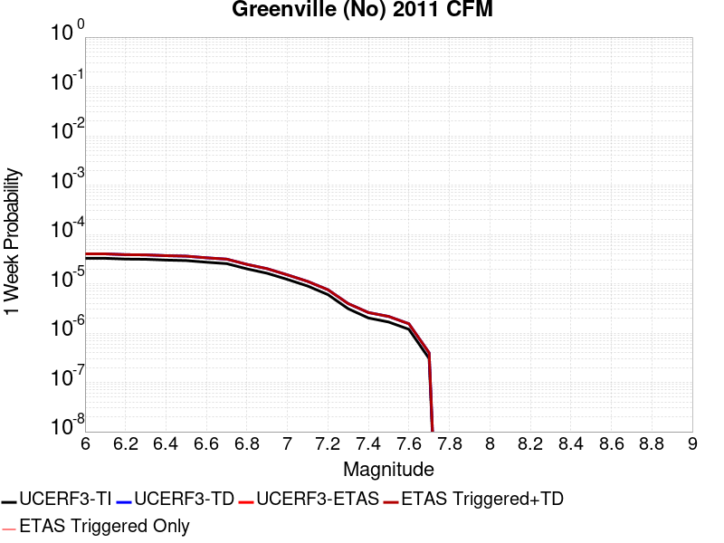 |  | 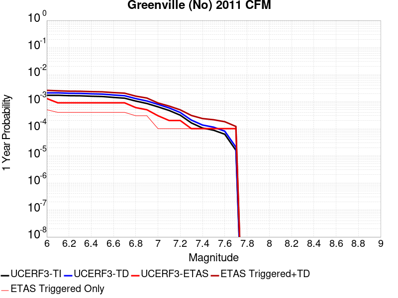 | 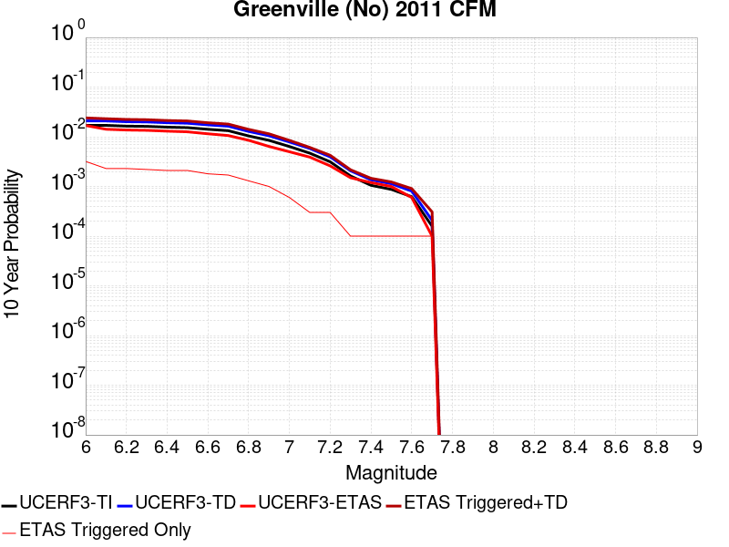 |

| Magnitude | 1 wk TI Prob | 1 wk TD Prob | 1 wk ETAS Prob | 1 wk ETAS/TD Gain | 1 wk ETAS Triggered+TD | 1 wk ETAS Triggered Only | 1 mo TI Prob | 1 mo TD Prob | 1 mo ETAS Prob | 1 mo ETAS/TD Gain | 1 mo ETAS Triggered+TD | 1 mo ETAS Triggered Only | 1 yr TI Prob | 1 yr TD Prob | 1 yr ETAS Prob | 1 yr ETAS/TD Gain | 1 yr ETAS Triggered+TD | 1 yr ETAS Triggered Only | 10 yr TI Prob | 10 yr TD Prob | 10 yr ETAS Prob | 10 yr ETAS/TD Gain | 10 yr ETAS Triggered+TD | 10 yr ETAS Triggered Only |
|-----|-----|-----|-----|-----|-----|-----|-----|-----|-----|-----|-----|-----|-----|-----|-----|-----|-----|-----|-----|-----|-----|-----|-----|-----|
| 6.0 | 3.286654E-5 | 4.0390813E-5 | 0.0 | 0.0 | 4.0390813E-5 | 0.0 | 1.4084899E-4 | 1.7309222E-4 | 1.0E-4 | 0.5777267 | 1.7309222E-4 | 0.0 | 0.0017134876 | 0.0021053986 | 0.0013 | 0.6174603 | 0.0026043458 | 5.0E-4 | 0.017003356 | 0.0208594 | 0.0169 | 0.8101863 | 0.023992648 | 0.0032 |
| 6.1 | 3.286654E-5 | 4.0390813E-5 | 0.0 | 0.0 | 4.0390813E-5 | 0.0 | 1.4084899E-4 | 1.7309222E-4 | 0.0 | 0.0 | 1.7309222E-4 | 0.0 | 0.0017134876 | 0.0021053986 | 9.0E-4 | 0.4274725 | 0.0025045564 | 4.0E-4 | 0.017003356 | 0.0208594 | 0.0142 | 0.6807483 | 0.023111423 | 0.0023 |
| 6.2 | 3.1697953E-5 | 3.895307E-5 | 0.0 | 0.0 | 3.895307E-5 | 0.0 | 1.358413E-4 | 1.6693125E-4 | 0.0 | 0.0 | 1.6693125E-4 | 0.0 | 0.0016526132 | 0.0020305302 | 9.0E-4 | 0.44323397 | 0.0024297182 | 4.0E-4 | 0.01640377 | 0.020124469 | 0.0137 | 0.6807633 | 0.022378182 | 0.0023 |
| 6.3 | 3.1363317E-5 | 3.8541755E-5 | 0.0 | 0.0 | 3.8541755E-5 | 0.0 | 1.344073E-4 | 1.651687E-4 | 0.0 | 0.0 | 1.651687E-4 | 0.0 | 0.0016351803 | 0.0020091112 | 9.0E-4 | 0.4479593 | 0.0024083075 | 4.0E-4 | 0.016232004 | 0.019914145 | 0.0135 | 0.67791015 | 0.022070333 | 0.0022 |
| 6.4 | 3.0228604E-5 | 3.7148257E-5 | 0.0 | 0.0 | 3.7148257E-5 | 0.0 | 1.2954473E-4 | 1.591973E-4 | 0.0 | 0.0 | 1.591973E-4 | 0.0 | 0.0015760659 | 0.0019365402 | 9.0E-4 | 0.46474636 | 0.0023357656 | 4.0E-4 | 0.015649348 | 0.019201173 | 0.013 | 0.67704195 | 0.02126085 | 0.0021 |
| 6.5 | 2.9537814E-5 | 3.6303332E-5 | 0.0 | 0.0 | 3.6303332E-5 | 0.0 | 1.2658449E-4 | 1.5557664E-4 | 0.0 | 0.0 | 1.5557664E-4 | 0.0 | 0.0015400766 | 0.0018925361 | 9.0E-4 | 0.47555238 | 0.002291779 | 4.0E-4 | 0.01529447 | 0.01876865 | 0.0126 | 0.6713323 | 0.020829234 | 0.0021 |
| 6.6 | 2.7345395E-5 | 3.3611443E-5 | 0.0 | 0.0 | 3.3611443E-5 | 0.0 | 1.1718928E-4 | 1.4404126E-4 | 0.0 | 0.0 | 1.4404126E-4 | 0.0 | 0.0014258457 | 0.0017523228 | 9.0E-4 | 0.513604 | 0.0021516217 | 4.0E-4 | 0.014167317 | 0.01738887 | 0.0115 | 0.66134256 | 0.01915757 | 0.0018 |
| 6.7 | 2.5615784E-5 | 3.1587653E-5 | 0.0 | 0.0 | 3.1587653E-5 | 0.0 | 1.09777306E-4 | 1.353688E-4 | 0.0 | 0.0 | 1.353688E-4 | 0.0 | 0.0013357193 | 0.0016468999 | 9.0E-4 | 0.5464813 | 0.0020462412 | 4.0E-4 | 0.013277191 | 0.016350621 | 0.0106 | 0.64829344 | 0.018022824 | 0.0017 |
| 6.8 | 2.0059057E-5 | 2.4729448E-5 | 0.0 | 0.0 | 2.4729448E-5 | 0.0 | 8.596455E-5 | 1.0597914E-4 | 0.0 | 0.0 | 1.0597914E-4 | 0.0 | 0.0010461159 | 0.0012895486 | 6.0E-4 | 0.4652791 | 0.0015891617 | 3.0E-4 | 0.0104120495 | 0.012822673 | 0.0085 | 0.66288835 | 0.014106003 | 0.0013 |
| 6.9 | 1.6321746E-5 | 2.020013E-5 | 0.0 | 0.0 | 2.020013E-5 | 0.0 | 6.9948466E-5 | 8.656918E-5 | 0.0 | 0.0 | 8.656918E-5 | 0.0 | 8.5128983E-4 | 0.0010534825 | 5.0E-4 | 0.47461632 | 0.0013531665 | 3.0E-4 | 0.008480361 | 0.010486412 | 0.0064 | 0.61031365 | 0.011475925 | 0.001 |
| 7.0 | 1.22527645E-5 | 1.5145875E-5 | 0.0 | 0.0 | 1.5145875E-5 | 0.0 | 5.2510793E-5 | 6.4909305E-5 | 0.0 | 0.0 | 6.4909305E-5 | 0.0 | 6.3913135E-4 | 7.899885E-4 | 3.0E-4 | 0.37975237 | 8.899095E-4 | 1.0E-4 | 0.0063729626 | 0.0078725815 | 0.005 | 0.6351157 | 0.008467858 | 6.0E-4 |
| 7.1 | 8.996482E-6 | 1.1172974E-5 | 0.0 | 0.0 | 1.1172974E-5 | 0.0 | 3.8555783E-5 | 4.7883303E-5 | 0.0 | 0.0 | 4.7883303E-5 | 0.0 | 4.6931554E-4 | 5.828245E-4 | 2.0E-4 | 0.3431565 | 6.827662E-4 | 1.0E-4 | 0.004683256 | 0.0058134114 | 0.0039 | 0.67086256 | 0.0061116675 | 3.0E-4 |
| 7.2 | 6.0273087E-6 | 7.5762746E-6 | 0.0 | 0.0 | 7.5762746E-6 | 0.0 | 2.5831067E-5 | 3.246935E-5 | 0.0 | 0.0 | 3.246935E-5 | 0.0 | 3.1444785E-4 | 3.9524332E-4 | 2.0E-4 | 0.50601745 | 4.9520377E-4 | 1.0E-4 | 0.0031400328 | 0.0039458917 | 0.0026 | 0.6589132 | 0.004244708 | 3.0E-4 |
| 7.3 | 3.1209995E-6 | 3.9684146E-6 | 0.0 | 0.0 | 3.9684146E-6 | 0.0 | 1.3375643E-5 | 1.7007382E-5 | 0.0 | 0.0 | 1.7007382E-5 | 0.0 | 1.6283628E-4 | 2.0704535E-4 | 1.0E-4 | 0.48298597 | 3.0702466E-4 | 1.0E-4 | 0.0016271701 | 0.0020689745 | 0.0015 | 0.7249968 | 0.0021687676 | 1.0E-4 |
| 7.4 | 2.0254208E-6 | 2.6113983E-6 | 0.0 | 0.0 | 2.6113983E-6 | 0.0 | 8.680347E-6 | 1.1191659E-5 | 0.0 | 0.0 | 1.1191659E-5 | 0.0 | 1.0567809E-4 | 1.3624999E-4 | 1.0E-4 | 0.733945 | 2.3623636E-4 | 1.0E-4 | 0.0010562785 | 0.0013619498 | 0.0012 | 0.8810897 | 0.0014618137 | 1.0E-4 |
| 7.5 | 1.6763418E-6 | 2.1747528E-6 | 0.0 | 0.0 | 2.1747528E-6 | 0.0 | 7.184302E-6 | 9.320336E-6 | 0.0 | 0.0 | 9.320336E-6 | 0.0 | 8.746537E-5 | 1.13469236E-4 | 1.0E-4 | 0.88129616 | 2.1345788E-4 | 1.0E-4 | 8.743095E-4 | 0.0011344026 | 0.001 | 0.8815213 | 0.0012342891 | 1.0E-4 |
| 7.6 | 1.1935462E-6 | 1.54715E-6 | 0.0 | 0.0 | 1.54715E-6 | 0.0 | 5.115188E-6 | 6.630626E-6 | 0.0 | 0.0 | 6.630626E-6 | 0.0 | 6.2275634E-5 | 8.072492E-5 | 1.0E-4 | 1.2387748 | 1.8071686E-4 | 1.0E-4 | 6.2258187E-4 | 8.0723653E-4 | 6.0E-4 | 0.7432766 | 9.071558E-4 | 1.0E-4 |
| 7.7 | 3.0464201E-7 | 3.987992E-7 | 0.0 | 0.0 | 3.987992E-7 | 0.0 | 1.3056081E-6 | 1.7091384E-6 | 0.0 | 0.0 | 1.7091384E-6 | 0.0 | 1.589566E-5 | 2.0808566E-5 | 1.0E-4 | 4.805713 | 1.20806486E-4 | 1.0E-4 | 1.5894524E-4 | 2.0807415E-4 | 1.0E-4 | 0.48059788 | 3.0805334E-4 | 1.0E-4 |

## South Klamath Lake East
*[(top)](#table-of-contents)*

| 1 Week | 1 Month | 1 Year | 10 Year |
|-----|-----|-----|-----|
|  |  | 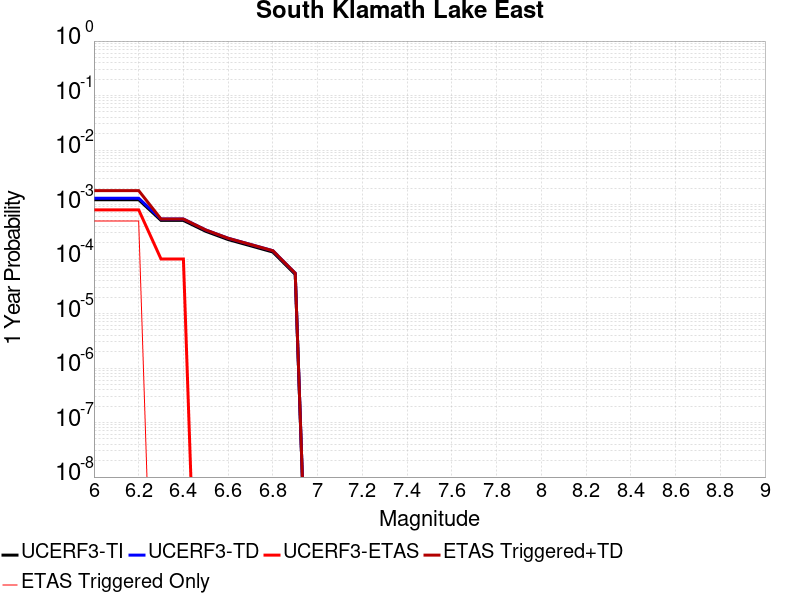 | 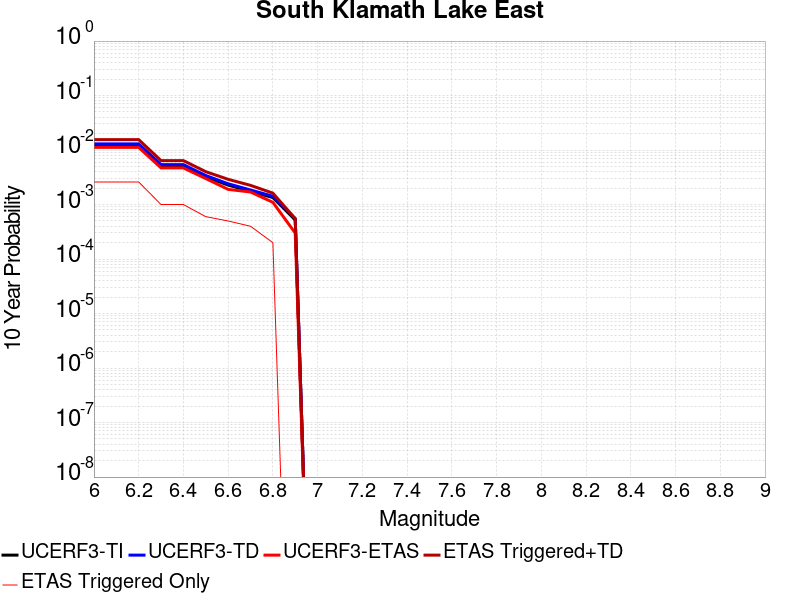 |

| Magnitude | 1 wk TI Prob | 1 wk TD Prob | 1 wk ETAS Prob | 1 wk ETAS/TD Gain | 1 wk ETAS Triggered+TD | 1 wk ETAS Triggered Only | 1 mo TI Prob | 1 mo TD Prob | 1 mo ETAS Prob | 1 mo ETAS/TD Gain | 1 mo ETAS Triggered+TD | 1 mo ETAS Triggered Only | 1 yr TI Prob | 1 yr TD Prob | 1 yr ETAS Prob | 1 yr ETAS/TD Gain | 1 yr ETAS Triggered+TD | 1 yr ETAS Triggered Only | 10 yr TI Prob | 10 yr TD Prob | 10 yr ETAS Prob | 10 yr ETAS/TD Gain | 10 yr ETAS Triggered+TD | 10 yr ETAS Triggered Only |
|-----|-----|-----|-----|-----|-----|-----|-----|-----|-----|-----|-----|-----|-----|-----|-----|-----|-----|-----|-----|-----|-----|-----|-----|-----|
| 6.0 | 2.3539369E-5 | 2.5050493E-5 | 0.0 | 0.0 | 2.5050493E-5 | 0.0 | 1.0087911E-4 | 1.0735531E-4 | 0.0 | 0.0 | 1.0735531E-4 | 0.0 | 0.0012275111 | 0.0013063503 | 8.0E-4 | 0.61239314 | 0.0018056972 | 5.0E-4 | 0.012207527 | 0.01299506 | 0.0112 | 0.861866 | 0.015561272 | 0.0026 |
| 6.1 | 2.3539369E-5 | 2.5050493E-5 | 0.0 | 0.0 | 2.5050493E-5 | 0.0 | 1.0087911E-4 | 1.0735531E-4 | 0.0 | 0.0 | 1.0735531E-4 | 0.0 | 0.0012275111 | 0.0013063503 | 8.0E-4 | 0.61239314 | 0.0018056972 | 5.0E-4 | 0.012207527 | 0.01299506 | 0.0112 | 0.861866 | 0.015561272 | 0.0026 |
| 6.2 | 2.3539369E-5 | 2.5050493E-5 | 0.0 | 0.0 | 2.5050493E-5 | 0.0 | 1.0087911E-4 | 1.0735531E-4 | 0.0 | 0.0 | 1.0735531E-4 | 0.0 | 0.0012275111 | 0.0013063503 | 8.0E-4 | 0.61239314 | 0.0018056972 | 5.0E-4 | 0.012207527 | 0.01299506 | 0.0112 | 0.861866 | 0.015561272 | 0.0026 |
| 6.3 | 9.807823E-6 | 1.0397281E-5 | 0.0 | 0.0 | 1.0397281E-5 | 0.0 | 4.2032847E-5 | 4.455906E-5 | 0.0 | 0.0 | 4.455906E-5 | 0.0 | 5.1162974E-4 | 5.423799E-4 | 1.0E-4 | 0.18437262 | 5.423799E-4 | 0.0 | 0.005104534 | 0.005411398 | 0.0047 | 0.86853707 | 0.006405987 | 0.001 |
| 6.4 | 9.807823E-6 | 1.0397281E-5 | 0.0 | 0.0 | 1.0397281E-5 | 0.0 | 4.2032847E-5 | 4.455906E-5 | 0.0 | 0.0 | 4.455906E-5 | 0.0 | 5.1162974E-4 | 5.423799E-4 | 1.0E-4 | 0.18437262 | 5.423799E-4 | 0.0 | 0.005104534 | 0.005411398 | 0.0047 | 0.86853707 | 0.006405987 | 0.001 |
| 6.5 | 6.191981E-6 | 6.5515933E-6 | 0.0 | 0.0 | 6.5515933E-6 | 0.0 | 2.653679E-5 | 2.807797E-5 | 0.0 | 0.0 | 2.807797E-5 | 0.0 | 3.2303753E-4 | 3.4179844E-4 | 0.0 | 0.0 | 3.4179844E-4 | 0.0 | 0.0032256835 | 0.0034130057 | 0.003 | 0.8789906 | 0.004010958 | 6.0E-4 |
| 6.6 | 4.3693776E-6 | 4.6170753E-6 | 0.0 | 0.0 | 4.6170753E-6 | 0.0 | 1.8725768E-5 | 1.9787323E-5 | 0.0 | 0.0 | 1.9787323E-5 | 0.0 | 2.2796239E-4 | 2.4088516E-4 | 0.0 | 0.0 | 2.4088516E-4 | 0.0 | 0.0022772867 | 0.002406353 | 0.0019 | 0.7895766 | 0.00290515 | 5.0E-4 |
| 6.7 | 3.360834E-6 | 3.5516393E-6 | 0.0 | 0.0 | 3.5516393E-6 | 0.0 | 1.4403494E-5 | 1.5221227E-5 | 0.0 | 0.0 | 1.5221227E-5 | 0.0 | 1.7534842E-4 | 1.8530349E-4 | 0.0 | 0.0 | 1.8530349E-4 | 0.0 | 0.0017521014 | 0.0018515697 | 0.0017 | 0.9181399 | 0.002250829 | 4.0E-4 |
| 6.8 | 2.57873E-6 | 2.7254778E-6 | 0.0 | 0.0 | 2.7254778E-6 | 0.0 | 1.1051653E-5 | 1.168057E-5 | 0.0 | 0.0 | 1.168057E-5 | 0.0 | 1.3454557E-4 | 1.4220228E-4 | 0.0 | 0.0 | 1.4220228E-4 | 0.0 | 0.0013446413 | 0.0014211736 | 0.0011 | 0.7740082 | 0.0016208893 | 2.0E-4 |
| 6.9 | 9.987825E-7 | 1.0567426E-6 | 0.0 | 0.0 | 1.0567426E-6 | 0.0 | 4.2804895E-6 | 4.528891E-6 | 0.0 | 0.0 | 4.528891E-6 | 0.0 | 5.211371E-5 | 5.513818E-5 | 0.0 | 0.0 | 5.513818E-5 | 0.0 | 5.210149E-4 | 5.512772E-4 | 3.0E-4 | 0.5441909 | 5.512772E-4 | 0.0 |

## South Klamath Lake West
*[(top)](#table-of-contents)*

| 1 Week | 1 Month | 1 Year | 10 Year |
|-----|-----|-----|-----|
| 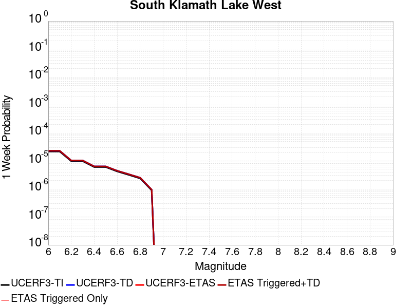 | 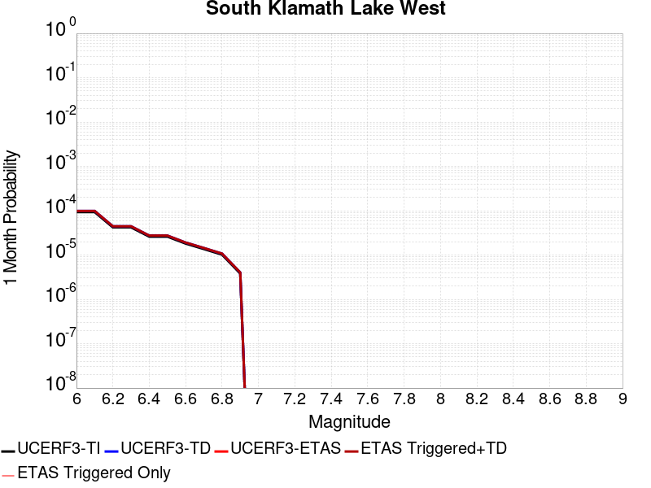 | 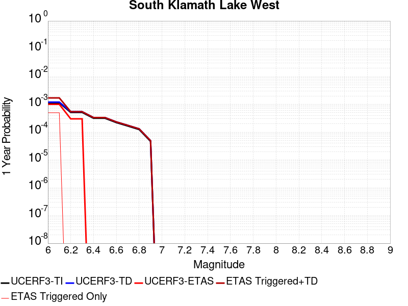 |  |

| Magnitude | 1 wk TI Prob | 1 wk TD Prob | 1 wk ETAS Prob | 1 wk ETAS/TD Gain | 1 wk ETAS Triggered+TD | 1 wk ETAS Triggered Only | 1 mo TI Prob | 1 mo TD Prob | 1 mo ETAS Prob | 1 mo ETAS/TD Gain | 1 mo ETAS Triggered+TD | 1 mo ETAS Triggered Only | 1 yr TI Prob | 1 yr TD Prob | 1 yr ETAS Prob | 1 yr ETAS/TD Gain | 1 yr ETAS Triggered+TD | 1 yr ETAS Triggered Only | 10 yr TI Prob | 10 yr TD Prob | 10 yr ETAS Prob | 10 yr ETAS/TD Gain | 10 yr ETAS Triggered+TD | 10 yr ETAS Triggered Only |
|-----|-----|-----|-----|-----|-----|-----|-----|-----|-----|-----|-----|-----|-----|-----|-----|-----|-----|-----|-----|-----|-----|-----|-----|-----|
| 6.0 | 2.174025E-5 | 2.3044764E-5 | 0.0 | 0.0 | 2.3044764E-5 | 0.0 | 9.3169176E-5 | 9.8759905E-5 | 0.0 | 0.0 | 9.8759905E-5 | 0.0 | 0.0011337444 | 0.0012018044 | 0.001 | 0.83208215 | 0.0017012035 | 5.0E-4 | 0.011279777 | 0.011959654 | 0.0112 | 0.93648195 | 0.014429755 | 0.0025 |
| 6.1 | 2.174025E-5 | 2.3044764E-5 | 0.0 | 0.0 | 2.3044764E-5 | 0.0 | 9.3169176E-5 | 9.8759905E-5 | 0.0 | 0.0 | 9.8759905E-5 | 0.0 | 0.0011337444 | 0.0012018044 | 0.001 | 0.83208215 | 0.0017012035 | 5.0E-4 | 0.011279777 | 0.011959654 | 0.0112 | 0.93648195 | 0.014429755 | 0.0025 |
| 6.2 | 9.834929E-6 | 1.0395013E-5 | 0.0 | 0.0 | 1.0395013E-5 | 0.0 | 4.2149015E-5 | 4.4549346E-5 | 0.0 | 0.0 | 4.4549346E-5 | 0.0 | 5.1304343E-4 | 5.4226234E-4 | 3.0E-4 | 0.55323774 | 5.4226234E-4 | 0.0 | 0.0051186057 | 0.005410294 | 0.0056 | 1.0350639 | 0.0063054245 | 9.0E-4 |
| 6.3 | 9.834929E-6 | 1.0395013E-5 | 0.0 | 0.0 | 1.0395013E-5 | 0.0 | 4.2149015E-5 | 4.4549346E-5 | 0.0 | 0.0 | 4.4549346E-5 | 0.0 | 5.1304343E-4 | 5.4226234E-4 | 3.0E-4 | 0.55323774 | 5.4226234E-4 | 0.0 | 0.0051186057 | 0.005410294 | 0.0056 | 1.0350639 | 0.0063054245 | 9.0E-4 |
| 6.4 | 6.066321E-6 | 6.401129E-6 | 0.0 | 0.0 | 6.401129E-6 | 0.0 | 2.5998259E-5 | 2.7433138E-5 | 0.0 | 0.0 | 2.7433138E-5 | 0.0 | 3.1648282E-4 | 3.3394998E-4 | 0.0 | 0.0 | 3.3394998E-4 | 0.0 | 0.0031603249 | 0.0033347518 | 0.0037 | 1.1095278 | 0.003932751 | 6.0E-4 |
| 6.5 | 6.066321E-6 | 6.401129E-6 | 0.0 | 0.0 | 6.401129E-6 | 0.0 | 2.5998259E-5 | 2.7433138E-5 | 0.0 | 0.0 | 2.7433138E-5 | 0.0 | 3.1648282E-4 | 3.3394998E-4 | 0.0 | 0.0 | 3.3394998E-4 | 0.0 | 0.0031603249 | 0.0033347518 | 0.0037 | 1.1095278 | 0.003932751 | 6.0E-4 |
| 6.6 | 4.2321803E-6 | 4.4617705E-6 | 0.0 | 0.0 | 4.4617705E-6 | 0.0 | 1.8137789E-5 | 1.9121739E-5 | 0.0 | 0.0 | 1.9121739E-5 | 0.0 | 2.208052E-4 | 2.3278332E-4 | 0.0 | 0.0 | 2.3278332E-4 | 0.0 | 0.0022058594 | 0.0023254966 | 0.0026 | 1.1180407 | 0.0027245665 | 4.0E-4 |
| 6.7 | 3.186646E-6 | 3.3606684E-6 | 0.0 | 0.0 | 3.3606684E-6 | 0.0 | 1.3656982E-5 | 1.4402789E-5 | 0.0 | 0.0 | 1.4402789E-5 | 0.0 | 1.6626107E-4 | 1.7534052E-4 | 0.0 | 0.0 | 1.7534052E-4 | 0.0 | 0.0016613674 | 0.0017520889 | 0.0019 | 1.0844198 | 0.0020515632 | 3.0E-4 |
| 6.8 | 2.380121E-6 | 2.5111806E-6 | 0.0 | 0.0 | 2.5111806E-6 | 0.0 | 1.0200479E-5 | 1.0762161E-5 | 0.0 | 0.0 | 1.0762161E-5 | 0.0 | 1.2418375E-4 | 1.310219E-4 | 0.0 | 0.0 | 1.310219E-4 | 0.0 | 0.0012411437 | 0.0013094923 | 0.0011 | 0.8400202 | 0.0015092305 | 2.0E-4 |
| 6.9 | 8.928287E-7 | 9.431302E-7 | 0.0 | 0.0 | 9.431302E-7 | 0.0 | 3.826403E-6 | 4.0419814E-6 | 0.0 | 0.0 | 4.0419814E-6 | 0.0 | 4.658546E-5 | 4.9210234E-5 | 0.0 | 0.0 | 4.9210234E-5 | 0.0 | 4.6575698E-4 | 4.92015E-4 | 5.0E-4 | 1.0162292 | 4.92015E-4 | 0.0 |

## Quien Sabe 2011 CFM
*[(top)](#table-of-contents)*

| 1 Week | 1 Month | 1 Year | 10 Year |
|-----|-----|-----|-----|
|  |  | 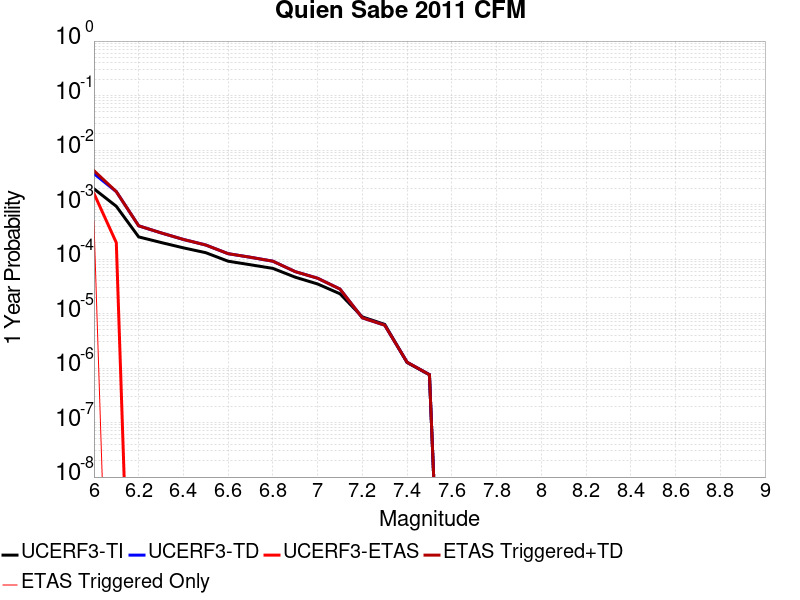 | 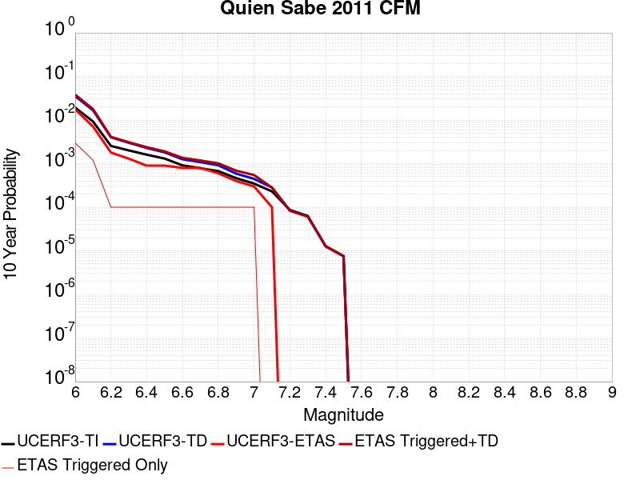 |

| Magnitude | 1 wk TI Prob | 1 wk TD Prob | 1 wk ETAS Prob | 1 wk ETAS/TD Gain | 1 wk ETAS Triggered+TD | 1 wk ETAS Triggered Only | 1 mo TI Prob | 1 mo TD Prob | 1 mo ETAS Prob | 1 mo ETAS/TD Gain | 1 mo ETAS Triggered+TD | 1 mo ETAS Triggered Only | 1 yr TI Prob | 1 yr TD Prob | 1 yr ETAS Prob | 1 yr ETAS/TD Gain | 1 yr ETAS Triggered+TD | 1 yr ETAS Triggered Only | 10 yr TI Prob | 10 yr TD Prob | 10 yr ETAS Prob | 10 yr ETAS/TD Gain | 10 yr ETAS Triggered+TD | 10 yr ETAS Triggered Only |
|-----|-----|-----|-----|-----|-----|-----|-----|-----|-----|-----|-----|-----|-----|-----|-----|-----|-----|-----|-----|-----|-----|-----|-----|-----|
| 6.0 | 3.729899E-5 | 7.0980765E-5 | 0.0 | 0.0 | 7.0980765E-5 | 0.0 | 1.5984301E-4 | 3.0413744E-4 | 3.0E-4 | 0.98639613 | 4.0410704E-4 | 1.0E-4 | 0.0019443515 | 0.0036872316 | 0.0016 | 0.4339299 | 0.004185388 | 5.0E-4 | 0.019274272 | 0.035368133 | 0.0176 | 0.4976231 | 0.03826203 | 0.003 |
| 6.1 | 1.7825725E-5 | 3.322785E-5 | 0.0 | 0.0 | 3.322785E-5 | 0.0 | 7.639373E-5 | 1.42363E-4 | 0.0 | 0.0 | 1.42363E-4 | 0.0 | 9.296967E-4 | 0.0017275462 | 2.0E-4 | 0.115771145 | 0.0017275462 | 0.0 | 0.009258169 | 0.016706752 | 0.0071 | 0.42497787 | 0.017886704 | 0.0012 |
| 6.2 | 4.8865336E-6 | 7.809333E-6 | 0.0 | 0.0 | 7.809333E-6 | 0.0 | 2.0942118E-5 | 3.3466968E-5 | 0.0 | 0.0 | 3.3466968E-5 | 0.0 | 2.5494045E-4 | 4.0703724E-4 | 0.0 | 0.0 | 4.0703724E-4 | 0.0 | 0.0025464818 | 0.004014469 | 0.0018 | 0.4483781 | 0.0041140676 | 1.0E-4 |
| 6.3 | 3.858491E-6 | 5.790725E-6 | 0.0 | 0.0 | 5.790725E-6 | 0.0 | 1.6536285E-5 | 2.4817182E-5 | 0.0 | 0.0 | 2.4817182E-5 | 0.0 | 2.0131067E-4 | 3.02112E-4 | 0.0 | 0.0 | 3.02112E-4 | 0.0 | 0.002011284 | 0.0030023973 | 0.0013 | 0.43298733 | 0.0031020972 | 1.0E-4 |
| 6.4 | 3.0771805E-6 | 4.3859604E-6 | 0.0 | 0.0 | 4.3859604E-6 | 0.0 | 1.318785E-5 | 1.879685E-5 | 0.0 | 0.0 | 1.879685E-5 | 0.0 | 1.6055023E-4 | 2.2883006E-4 | 0.0 | 0.0 | 2.2883006E-4 | 0.0 | 0.001604343 | 0.0022868488 | 9.0E-4 | 0.39355466 | 0.00238662 | 1.0E-4 |
| 6.5 | 2.5081235E-6 | 3.4646885E-6 | 0.0 | 0.0 | 3.4646885E-6 | 0.0 | 1.0749056E-5 | 1.4848589E-5 | 0.0 | 0.0 | 1.4848589E-5 | 0.0 | 1.308619E-4 | 1.8076804E-4 | 0.0 | 0.0 | 1.8076804E-4 | 0.0 | 0.0013078486 | 0.0018128488 | 9.0E-4 | 0.49645615 | 0.0019126676 | 1.0E-4 |
| 6.6 | 1.7505364E-6 | 2.4035508E-6 | 0.0 | 0.0 | 2.4035508E-6 | 0.0 | 7.502277E-6 | 1.0300895E-5 | 0.0 | 0.0 | 1.0300895E-5 | 0.0 | 9.13364E-5 | 1.2540689E-4 | 0.0 | 0.0 | 1.2540689E-4 | 0.0 | 9.129886E-4 | 0.0012589748 | 8.0E-4 | 0.63543767 | 0.0013588489 | 1.0E-4 |
| 6.7 | 1.505737E-6 | 2.0649895E-6 | 0.0 | 0.0 | 2.0649895E-6 | 0.0 | 6.4531428E-6 | 8.849929E-6 | 0.0 | 0.0 | 8.849929E-6 | 0.0 | 7.8564175E-5 | 1.0774316E-4 | 0.0 | 0.0 | 1.0774316E-4 | 0.0 | 7.853641E-4 | 0.0010825163 | 8.0E-4 | 0.7390189 | 0.001182408 | 1.0E-4 |
| 6.8 | 1.2924105E-6 | 1.74968E-6 | 0.0 | 0.0 | 1.74968E-6 | 0.0 | 5.5388905E-6 | 7.49861E-6 | 0.0 | 0.0 | 7.49861E-6 | 0.0 | 6.74339E-5 | 9.12923E-5 | 0.0 | 0.0 | 9.12923E-5 | 0.0 | 6.741344E-4 | 9.168233E-4 | 6.0E-4 | 0.65443367 | 0.0010167316 | 1.0E-4 |
| 6.9 | 8.9075286E-7 | 1.1258761E-6 | 0.0 | 0.0 | 1.1258761E-6 | 0.0 | 3.8175067E-6 | 4.825176E-6 | 0.0 | 0.0 | 4.825176E-6 | 0.0 | 4.6477155E-5 | 5.8745154E-5 | 0.0 | 0.0 | 5.8745154E-5 | 0.0 | 4.6467435E-4 | 5.9093296E-4 | 4.0E-4 | 0.67689574 | 6.908738E-4 | 1.0E-4 |
| 7.0 | 6.6891175E-7 | 8.525275E-7 | 0.0 | 0.0 | 8.525275E-7 | 0.0 | 2.8667614E-6 | 3.653685E-6 | 0.0 | 0.0 | 3.653685E-6 | 0.0 | 3.4902263E-5 | 4.4482906E-5 | 0.0 | 0.0 | 4.4482906E-5 | 0.0 | 3.4896782E-4 | 4.473122E-4 | 3.0E-4 | 0.67067254 | 5.4726744E-4 | 1.0E-4 |
| 7.1 | 4.4205015E-7 | 5.392288E-7 | 0.0 | 0.0 | 5.392288E-7 | 0.0 | 1.8944993E-6 | 2.3109794E-6 | 0.0 | 0.0 | 2.3109794E-6 | 0.0 | 2.3065284E-5 | 2.813598E-5 | 0.0 | 0.0 | 2.813598E-5 | 0.0 | 2.3062891E-4 | 2.8273594E-4 | 1.0E-4 | 0.3536869 | 2.8273594E-4 | 0.0 |
| 7.2 | 1.6620965E-7 | 1.5990408E-7 | 0.0 | 0.0 | 1.5990408E-7 | 0.0 | 7.123269E-7 | 6.85303E-7 | 0.0 | 0.0 | 6.85303E-7 | 0.0 | 8.672545E-6 | 8.343536E-6 | 0.0 | 0.0 | 8.343536E-6 | 0.0 | 8.6722066E-5 | 8.3612715E-5 | 0.0 | 0.0 | 8.3612715E-5 | 0.0 |
| 7.3 | 1.2142488E-7 | 1.1723531E-7 | 0.0 | 0.0 | 1.1723531E-7 | 0.0 | 5.2039223E-7 | 5.0243693E-7 | 0.0 | 0.0 | 5.0243693E-7 | 0.0 | 6.335757E-6 | 6.1171563E-6 | 0.0 | 0.0 | 6.1171563E-6 | 0.0 | 6.3355765E-5 | 6.119373E-5 | 0.0 | 0.0 | 6.119373E-5 | 0.0 |
| 7.4 | 2.4192937E-8 | 2.4537492E-8 | 0.0 | 0.0 | 2.4537492E-8 | 0.0 | 1.0368401E-7 | 1.0516067E-7 | 0.0 | 0.0 | 1.0516067E-7 | 0.0 | 1.2623522E-6 | 1.2803306E-6 | 0.0 | 0.0 | 1.2803306E-6 | 0.0 | 1.2623449E-5 | 1.2763481E-5 | 0.0 | 0.0 | 1.2763481E-5 | 0.0 |
| 7.5 | 1.4432802E-8 | 1.4508868E-8 | 0.0 | 0.0 | 1.4508868E-8 | 0.0 | 6.185486E-8 | 6.218086E-8 | 0.0 | 0.0 | 6.218086E-8 | 0.0 | 7.530827E-7 | 7.5705185E-7 | 0.0 | 0.0 | 7.5705185E-7 | 0.0 | 7.530801E-6 | 7.5292173E-6 | 0.0 | 0.0 | 7.5292173E-6 | 0.0 |

## Cleghorn Pass
*[(top)](#table-of-contents)*

| 1 Week | 1 Month | 1 Year | 10 Year |
|-----|-----|-----|-----|
| 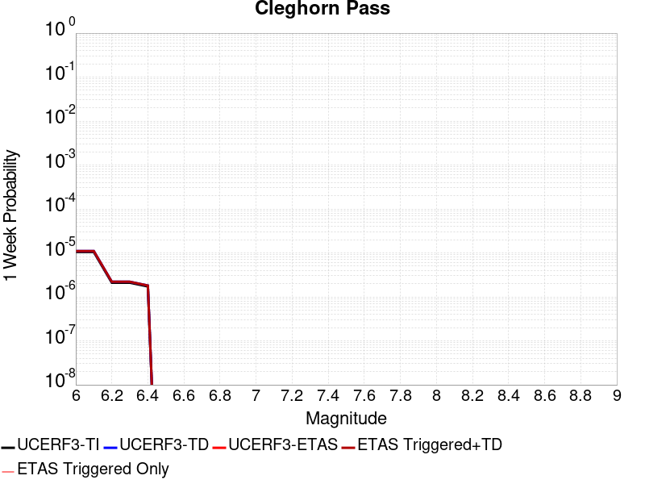 |  |  | 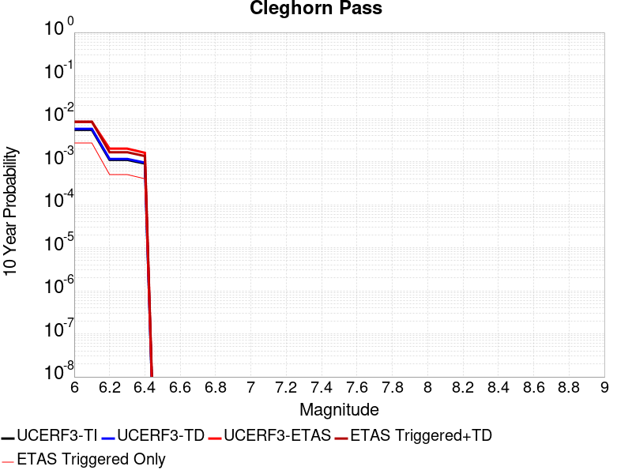 |

| Magnitude | 1 wk TI Prob | 1 wk TD Prob | 1 wk ETAS Prob | 1 wk ETAS/TD Gain | 1 wk ETAS Triggered+TD | 1 wk ETAS Triggered Only | 1 mo TI Prob | 1 mo TD Prob | 1 mo ETAS Prob | 1 mo ETAS/TD Gain | 1 mo ETAS Triggered+TD | 1 mo ETAS Triggered Only | 1 yr TI Prob | 1 yr TD Prob | 1 yr ETAS Prob | 1 yr ETAS/TD Gain | 1 yr ETAS Triggered+TD | 1 yr ETAS Triggered Only | 10 yr TI Prob | 10 yr TD Prob | 10 yr ETAS Prob | 10 yr ETAS/TD Gain | 10 yr ETAS Triggered+TD | 10 yr ETAS Triggered Only |
|-----|-----|-----|-----|-----|-----|-----|-----|-----|-----|-----|-----|-----|-----|-----|-----|-----|-----|-----|-----|-----|-----|-----|-----|-----|
| 6.0 | 1.0522846E-5 | 1.10417195E-5 | 0.0 | 0.0 | 1.10417195E-5 | 0.0 | 4.509713E-5 | 4.7321093E-5 | 0.0 | 0.0 | 4.7321093E-5 | 0.0 | 5.4891926E-4 | 5.7603465E-4 | 7.0E-4 | 1.2152047 | 7.759194E-4 | 2.0E-4 | 0.0054756533 | 0.005750582 | 0.0084 | 1.4607217 | 0.008435056 | 0.0027 |
| 6.1 | 1.0522846E-5 | 1.10417195E-5 | 0.0 | 0.0 | 1.10417195E-5 | 0.0 | 4.509713E-5 | 4.7321093E-5 | 0.0 | 0.0 | 4.7321093E-5 | 0.0 | 5.4891926E-4 | 5.7603465E-4 | 7.0E-4 | 1.2152047 | 7.759194E-4 | 2.0E-4 | 0.0054756533 | 0.005750582 | 0.0084 | 1.4607217 | 0.008435056 | 0.0027 |
| 6.2 | 2.1045846E-6 | 2.208418E-6 | 0.0 | 0.0 | 2.208418E-6 | 0.0 | 9.019617E-6 | 9.464638E-6 | 0.0 | 0.0 | 9.464638E-6 | 0.0 | 1.098083E-4 | 1.15230076E-4 | 3.0E-4 | 2.603487 | 1.15230076E-4 | 0.0 | 0.0010975406 | 0.0011521147 | 0.002 | 1.7359382 | 0.0016515387 | 5.0E-4 |
| 6.3 | 2.1045846E-6 | 2.208418E-6 | 0.0 | 0.0 | 2.208418E-6 | 0.0 | 9.019617E-6 | 9.464638E-6 | 0.0 | 0.0 | 9.464638E-6 | 0.0 | 1.098083E-4 | 1.15230076E-4 | 3.0E-4 | 2.603487 | 1.15230076E-4 | 0.0 | 0.0010975406 | 0.0011521147 | 0.002 | 1.7359382 | 0.0016515387 | 5.0E-4 |
| 6.4 | 1.7259927E-6 | 1.8110537E-6 | 0.0 | 0.0 | 1.8110537E-6 | 0.0 | 7.3970905E-6 | 7.761659E-6 | 0.0 | 0.0 | 7.761659E-6 | 0.0 | 9.005586E-5 | 9.4498195E-5 | 2.0E-4 | 2.1164424 | 9.4498195E-5 | 0.0 | 9.001937E-4 | 9.4498193E-4 | 0.0016 | 1.693154 | 0.001344604 | 4.0E-4 |

## Cleghorn Lake
*[(top)](#table-of-contents)*

| 1 Week | 1 Month | 1 Year | 10 Year |
|-----|-----|-----|-----|
| 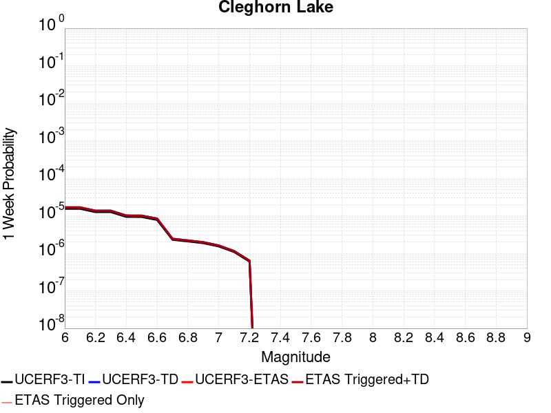 |  |  | 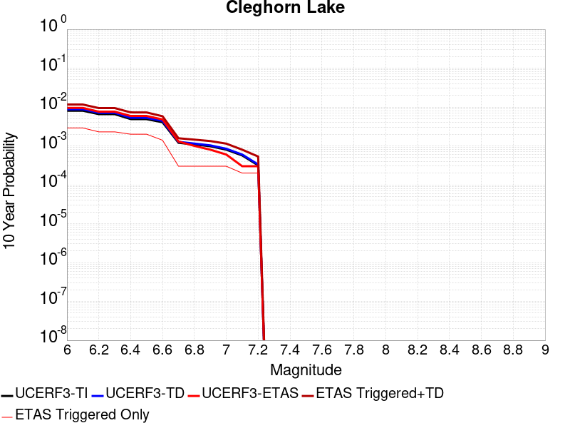 |

| Magnitude | 1 wk TI Prob | 1 wk TD Prob | 1 wk ETAS Prob | 1 wk ETAS/TD Gain | 1 wk ETAS Triggered+TD | 1 wk ETAS Triggered Only | 1 mo TI Prob | 1 mo TD Prob | 1 mo ETAS Prob | 1 mo ETAS/TD Gain | 1 mo ETAS Triggered+TD | 1 mo ETAS Triggered Only | 1 yr TI Prob | 1 yr TD Prob | 1 yr ETAS Prob | 1 yr ETAS/TD Gain | 1 yr ETAS Triggered+TD | 1 yr ETAS Triggered Only | 10 yr TI Prob | 10 yr TD Prob | 10 yr ETAS Prob | 10 yr ETAS/TD Gain | 10 yr ETAS Triggered+TD | 10 yr ETAS Triggered Only |
|-----|-----|-----|-----|-----|-----|-----|-----|-----|-----|-----|-----|-----|-----|-----|-----|-----|-----|-----|-----|-----|-----|-----|-----|-----|
| 6.0 | 1.5467183E-5 | 1.6797072E-5 | 0.0 | 0.0 | 1.6797072E-5 | 0.0 | 6.6286244E-5 | 7.198577E-5 | 1.0E-4 | 1.3891634 | 1.7197857E-4 | 1.0E-4 | 8.067362E-4 | 8.7612926E-4 | 4.0E-4 | 0.45655364 | 0.0010759541 | 2.0E-4 | 0.008038137 | 0.008732181 | 0.0095 | 1.0879298 | 0.011606857 | 0.0029 |
| 6.1 | 1.5467183E-5 | 1.6797072E-5 | 0.0 | 0.0 | 1.6797072E-5 | 0.0 | 6.6286244E-5 | 7.198577E-5 | 1.0E-4 | 1.3891634 | 1.7197857E-4 | 1.0E-4 | 8.067362E-4 | 8.7612926E-4 | 4.0E-4 | 0.45655364 | 0.0010759541 | 2.0E-4 | 0.008038137 | 0.008732181 | 0.0095 | 1.0879298 | 0.011606857 | 0.0029 |
| 6.2 | 1.2624631E-5 | 1.3683825E-5 | 0.0 | 0.0 | 1.3683825E-5 | 0.0 | 5.410444E-5 | 5.864392E-5 | 1.0E-4 | 1.7052066 | 1.5863805E-4 | 1.0E-4 | 6.585225E-4 | 7.1380456E-4 | 3.0E-4 | 0.4202831 | 8.1373315E-4 | 1.0E-4 | 0.0065657445 | 0.0071199154 | 0.0076 | 1.0674285 | 0.00940354 | 0.0023 |
| 6.3 | 1.2624631E-5 | 1.3683825E-5 | 0.0 | 0.0 | 1.3683825E-5 | 0.0 | 5.410444E-5 | 5.864392E-5 | 1.0E-4 | 1.7052066 | 1.5863805E-4 | 1.0E-4 | 6.585225E-4 | 7.1380456E-4 | 3.0E-4 | 0.4202831 | 8.1373315E-4 | 1.0E-4 | 0.0065657445 | 0.0071199154 | 0.0076 | 1.0674285 | 0.00940354 | 0.0023 |
| 6.4 | 9.417684E-6 | 1.0171737E-5 | 0.0 | 0.0 | 1.0171737E-5 | 0.0 | 4.036088E-5 | 4.359266E-5 | 1.0E-4 | 2.2939641 | 1.435883E-4 | 1.0E-4 | 4.912829E-4 | 5.306525E-4 | 3.0E-4 | 0.5653417 | 6.3059945E-4 | 1.0E-4 | 0.004901982 | 0.0052978913 | 0.0059 | 1.1136507 | 0.0072872955 | 0.002 |
| 6.5 | 9.368219E-6 | 1.0119157E-5 | 0.0 | 0.0 | 1.0119157E-5 | 0.0 | 4.014889E-5 | 4.3367327E-5 | 1.0E-4 | 2.3058834 | 1.43363E-4 | 1.0E-4 | 4.8870314E-4 | 5.2791036E-4 | 3.0E-4 | 0.56827825 | 6.278576E-4 | 1.0E-4 | 0.004876298 | 0.0052706003 | 0.0059 | 1.1194171 | 0.007260059 | 0.002 |
| 6.6 | 7.803798E-6 | 8.443205E-6 | 0.0 | 0.0 | 8.443205E-6 | 0.0 | 3.3444423E-5 | 3.6184887E-5 | 0.0 | 0.0 | 3.6184887E-5 | 0.0 | 4.0710976E-4 | 4.405019E-4 | 2.0E-4 | 0.45402756 | 4.405019E-4 | 0.0 | 0.0040636472 | 0.004400206 | 0.0048 | 1.0908581 | 0.0057940455 | 0.0014 |
| 6.7 | 2.3108669E-6 | 2.4441129E-6 | 0.0 | 0.0 | 2.4441129E-6 | 0.0 | 9.903678E-6 | 1.0474728E-5 | 0.0 | 0.0 | 1.0474728E-5 | 0.0 | 1.205706E-4 | 1.2752254E-4 | 0.0 | 0.0 | 1.2752254E-4 | 0.0 | 0.001205052 | 0.0012745123 | 0.0013 | 1.0199981 | 0.0015741299 | 3.0E-4 |
| 6.8 | 2.0882828E-6 | 2.2065296E-6 | 0.0 | 0.0 | 2.2065296E-6 | 0.0 | 8.949753E-6 | 9.456522E-6 | 0.0 | 0.0 | 9.456522E-6 | 0.0 | 1.08957785E-4 | 1.15127244E-4 | 0.0 | 0.0 | 1.15127244E-4 | 0.0 | 0.0010890438 | 0.0011506929 | 0.001 | 0.8690416 | 0.0014503477 | 3.0E-4 |
| 6.9 | 1.876935E-6 | 1.981269E-6 | 0.0 | 0.0 | 1.981269E-6 | 0.0 | 8.043982E-6 | 8.491126E-6 | 0.0 | 0.0 | 8.491126E-6 | 0.0 | 9.7931086E-5 | 1.0337472E-4 | 0.0 | 0.0 | 1.0337472E-4 | 0.0 | 9.788794E-4 | 0.0010332823 | 8.0E-4 | 0.7742318 | 0.0013329723 | 3.0E-4 |
| 7.0 | 1.5357559E-6 | 1.6204576E-6 | 0.0 | 0.0 | 1.6204576E-6 | 0.0 | 6.5817944E-6 | 6.9448006E-6 | 0.0 | 0.0 | 6.9448006E-6 | 0.0 | 8.01304E-5 | 8.454979E-5 | 0.0 | 0.0 | 8.454979E-5 | 0.0 | 8.010151E-4 | 8.451887E-4 | 6.0E-4 | 0.7099006 | 0.0011449351 | 3.0E-4 |
| 7.1 | 1.0905424E-6 | 1.1498859E-6 | 0.0 | 0.0 | 1.1498859E-6 | 0.0 | 4.6737446E-6 | 4.9280734E-6 | 0.0 | 0.0 | 4.9280734E-6 | 0.0 | 5.6901354E-5 | 5.999774E-5 | 0.0 | 0.0 | 5.999774E-5 | 0.0 | 5.6886784E-4 | 5.9982523E-4 | 3.0E-4 | 0.5001457 | 7.997052E-4 | 2.0E-4 |
| 7.2 | 6.06668E-7 | 6.387947E-7 | 0.0 | 0.0 | 6.387947E-7 | 0.0 | 2.600003E-6 | 2.737689E-6 | 0.0 | 0.0 | 2.737689E-6 | 0.0 | 3.1654577E-5 | 3.3330925E-5 | 0.0 | 0.0 | 3.3330925E-5 | 0.0 | 3.1650066E-4 | 3.332661E-4 | 3.0E-4 | 0.9001816 | 5.3319946E-4 | 2.0E-4 |

## Manix-Afton Hills
*[(top)](#table-of-contents)*

| 1 Week | 1 Month | 1 Year | 10 Year |
|-----|-----|-----|-----|
|  | 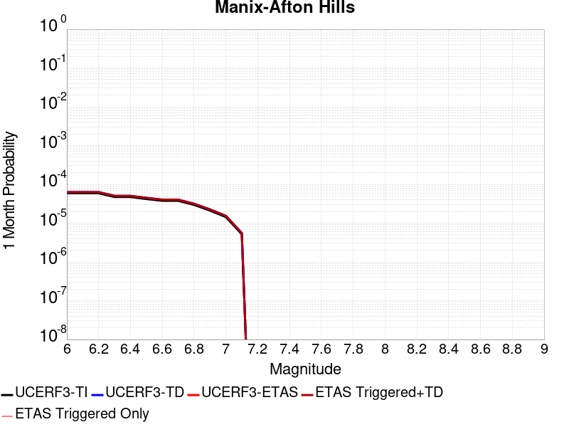 |  |  |

| Magnitude | 1 wk TI Prob | 1 wk TD Prob | 1 wk ETAS Prob | 1 wk ETAS/TD Gain | 1 wk ETAS Triggered+TD | 1 wk ETAS Triggered Only | 1 mo TI Prob | 1 mo TD Prob | 1 mo ETAS Prob | 1 mo ETAS/TD Gain | 1 mo ETAS Triggered+TD | 1 mo ETAS Triggered Only | 1 yr TI Prob | 1 yr TD Prob | 1 yr ETAS Prob | 1 yr ETAS/TD Gain | 1 yr ETAS Triggered+TD | 1 yr ETAS Triggered Only | 10 yr TI Prob | 10 yr TD Prob | 10 yr ETAS Prob | 10 yr ETAS/TD Gain | 10 yr ETAS Triggered+TD | 10 yr ETAS Triggered Only |
|-----|-----|-----|-----|-----|-----|-----|-----|-----|-----|-----|-----|-----|-----|-----|-----|-----|-----|-----|-----|-----|-----|-----|-----|-----|
| 6.0 | 1.3783202E-5 | 1.4713058E-5 | 0.0 | 0.0 | 1.4713058E-5 | 0.0 | 5.906953E-5 | 6.305454E-5 | 0.0 | 0.0 | 6.305454E-5 | 0.0 | 7.189342E-4 | 7.6743605E-4 | 7.0E-4 | 0.9121281 | 9.6728257E-4 | 2.0E-4 | 0.0071661277 | 0.0076496154 | 0.0058 | 0.75820804 | 0.010229726 | 0.0026 |
| 6.1 | 1.3783202E-5 | 1.4713058E-5 | 0.0 | 0.0 | 1.4713058E-5 | 0.0 | 5.906953E-5 | 6.305454E-5 | 0.0 | 0.0 | 6.305454E-5 | 0.0 | 7.189342E-4 | 7.6743605E-4 | 7.0E-4 | 0.9121281 | 9.6728257E-4 | 2.0E-4 | 0.0071661277 | 0.0076496154 | 0.0058 | 0.75820804 | 0.010229726 | 0.0026 |
| 6.2 | 1.3783202E-5 | 1.4713058E-5 | 0.0 | 0.0 | 1.4713058E-5 | 0.0 | 5.906953E-5 | 6.305454E-5 | 0.0 | 0.0 | 6.305454E-5 | 0.0 | 7.189342E-4 | 7.6743605E-4 | 7.0E-4 | 0.9121281 | 9.6728257E-4 | 2.0E-4 | 0.0071661277 | 0.0076496154 | 0.0058 | 0.75820804 | 0.010229726 | 0.0026 |
| 6.3 | 1.10494875E-5 | 1.1794713E-5 | 0.0 | 0.0 | 1.1794713E-5 | 0.0 | 4.7354086E-5 | 5.054785E-5 | 0.0 | 0.0 | 5.054785E-5 | 0.0 | 5.763835E-4 | 6.1525666E-4 | 7.0E-4 | 1.1377366 | 8.151336E-4 | 2.0E-4 | 0.005748908 | 0.006136574 | 0.0046 | 0.7496039 | 0.0084224595 | 0.0023 |
| 6.4 | 1.10494875E-5 | 1.1794713E-5 | 0.0 | 0.0 | 1.1794713E-5 | 0.0 | 4.7354086E-5 | 5.054785E-5 | 0.0 | 0.0 | 5.054785E-5 | 0.0 | 5.763835E-4 | 6.1525666E-4 | 7.0E-4 | 1.1377366 | 8.151336E-4 | 2.0E-4 | 0.005748908 | 0.006136574 | 0.0046 | 0.7496039 | 0.0084224595 | 0.0023 |
| 6.5 | 9.788949E-6 | 1.0455732E-5 | 0.0 | 0.0 | 1.0455732E-5 | 0.0 | 4.1951964E-5 | 4.4809563E-5 | 0.0 | 0.0 | 4.4809563E-5 | 0.0 | 5.1064545E-4 | 5.454292E-4 | 6.0E-4 | 1.1000512 | 7.453201E-4 | 2.0E-4 | 0.0050947363 | 0.005441832 | 0.004 | 0.73504657 | 0.00762986 | 0.0022 |
| 6.6 | 8.810006E-6 | 9.414911E-6 | 0.0 | 0.0 | 9.414911E-6 | 0.0 | 3.775662E-5 | 4.0349045E-5 | 0.0 | 0.0 | 4.0349045E-5 | 0.0 | 4.5958988E-4 | 4.9114774E-4 | 6.0E-4 | 1.2216283 | 6.9104956E-4 | 2.0E-4 | 0.0045864056 | 0.0049015055 | 0.0037 | 0.7548701 | 0.0067921923 | 0.0019 |
| 6.7 | 8.80128E-6 | 9.4053885E-6 | 0.0 | 0.0 | 9.4053885E-6 | 0.0 | 3.7719226E-5 | 4.0308238E-5 | 0.0 | 0.0 | 4.0308238E-5 | 0.0 | 4.591348E-4 | 4.906512E-4 | 6.0E-4 | 1.2228647 | 6.9055305E-4 | 2.0E-4 | 0.004581874 | 0.004896561 | 0.0037 | 0.75563234 | 0.0067872577 | 0.0019 |
| 6.8 | 6.8994877E-6 | 7.3810984E-6 | 0.0 | 0.0 | 7.3810984E-6 | 0.0 | 2.9568899E-5 | 3.1632942E-5 | 0.0 | 0.0 | 3.1632942E-5 | 0.0 | 3.5994186E-4 | 3.8507115E-4 | 5.0E-4 | 1.2984613 | 4.8503265E-4 | 1.0E-4 | 0.003593594 | 0.0038448444 | 0.0026 | 0.6762302 | 0.004940615 | 0.0011 |
| 6.9 | 4.9328037E-6 | 5.27168E-6 | 0.0 | 0.0 | 5.27168E-6 | 0.0 | 2.1140417E-5 | 2.2592754E-5 | 0.0 | 0.0 | 2.2592754E-5 | 0.0 | 2.5735417E-4 | 2.750382E-4 | 4.0E-4 | 1.4543433 | 3.750107E-4 | 1.0E-4 | 0.0025705635 | 0.0027475837 | 0.0015 | 0.54593426 | 0.0033459351 | 6.0E-4 |
| 7.0 | 3.347973E-6 | 3.5905464E-6 | 0.0 | 0.0 | 3.5905464E-6 | 0.0 | 1.4348378E-5 | 1.5387988E-5 | 0.0 | 0.0 | 1.5387988E-5 | 0.0 | 1.746775E-4 | 1.8733674E-4 | 3.0E-4 | 1.6013943 | 2.8731802E-4 | 1.0E-4 | 0.0017454025 | 0.001872191 | 8.0E-4 | 0.42730683 | 0.0021716293 | 3.0E-4 |
| 7.1 | 1.2073567E-6 | 1.293665E-6 | 0.0 | 0.0 | 1.293665E-6 | 0.0 | 5.1743755E-6 | 5.544276E-6 | 0.0 | 0.0 | 5.544276E-6 | 0.0 | 6.29962E-5 | 6.75011E-5 | 0.0 | 0.0 | 6.75011E-5 | 0.0 | 6.297835E-4 | 6.749662E-4 | 4.0E-4 | 0.5926222 | 8.748312E-4 | 2.0E-4 |

## Monterey Bay-Tularcitos
*[(top)](#table-of-contents)*

| 1 Week | 1 Month | 1 Year | 10 Year |
|-----|-----|-----|-----|
| 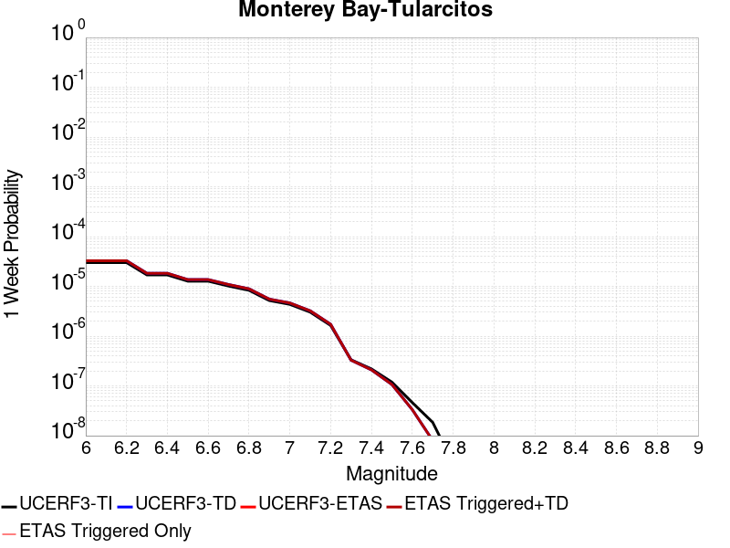 | 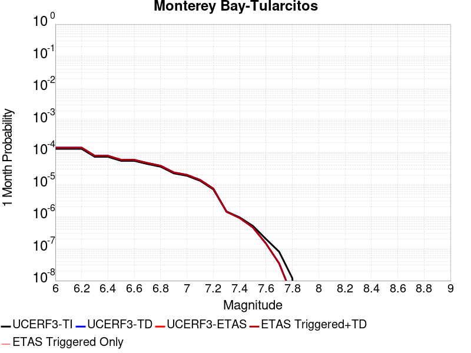 |  | 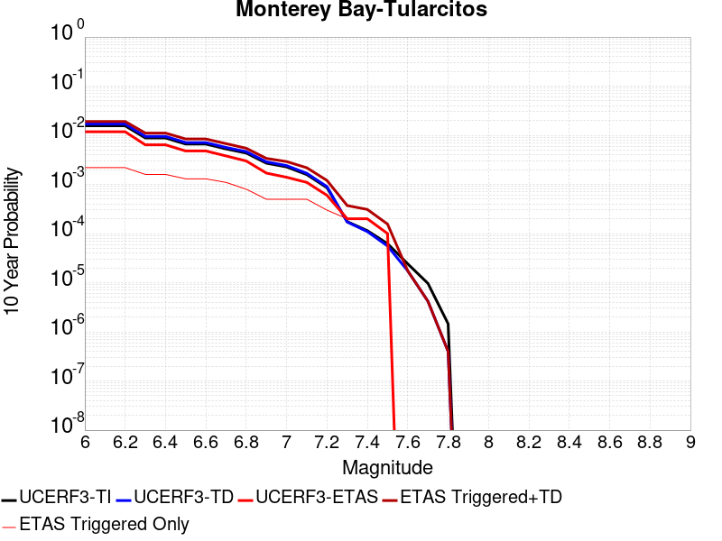 |

| Magnitude | 1 wk TI Prob | 1 wk TD Prob | 1 wk ETAS Prob | 1 wk ETAS/TD Gain | 1 wk ETAS Triggered+TD | 1 wk ETAS Triggered Only | 1 mo TI Prob | 1 mo TD Prob | 1 mo ETAS Prob | 1 mo ETAS/TD Gain | 1 mo ETAS Triggered+TD | 1 mo ETAS Triggered Only | 1 yr TI Prob | 1 yr TD Prob | 1 yr ETAS Prob | 1 yr ETAS/TD Gain | 1 yr ETAS Triggered+TD | 1 yr ETAS Triggered Only | 10 yr TI Prob | 10 yr TD Prob | 10 yr ETAS Prob | 10 yr ETAS/TD Gain | 10 yr ETAS Triggered+TD | 10 yr ETAS Triggered Only |
|-----|-----|-----|-----|-----|-----|-----|-----|-----|-----|-----|-----|-----|-----|-----|-----|-----|-----|-----|-----|-----|-----|-----|-----|-----|
| 6.0 | 3.0131365E-5 | 3.2804637E-5 | 0.0 | 0.0 | 3.2804637E-5 | 0.0 | 1.2912804E-4 | 1.4058432E-4 | 0.0 | 0.0 | 1.4058432E-4 | 0.0 | 0.001571 | 0.001710376 | 0.0011 | 0.64313346 | 0.0018102049 | 1.0E-4 | 0.015599402 | 0.016982932 | 0.0118 | 0.6948153 | 0.019145569 | 0.0022 |
| 6.1 | 3.0131365E-5 | 3.2804637E-5 | 0.0 | 0.0 | 3.2804637E-5 | 0.0 | 1.2912804E-4 | 1.4058432E-4 | 0.0 | 0.0 | 1.4058432E-4 | 0.0 | 0.001571 | 0.001710376 | 0.0011 | 0.64313346 | 0.0018102049 | 1.0E-4 | 0.015599402 | 0.016982932 | 0.0118 | 0.6948153 | 0.019145569 | 0.0022 |
| 6.2 | 3.0131365E-5 | 3.2804637E-5 | 0.0 | 0.0 | 3.2804637E-5 | 0.0 | 1.2912804E-4 | 1.4058432E-4 | 0.0 | 0.0 | 1.4058432E-4 | 0.0 | 0.001571 | 0.001710376 | 0.0011 | 0.64313346 | 0.0018102049 | 1.0E-4 | 0.015599402 | 0.016982932 | 0.0118 | 0.6948153 | 0.019145569 | 0.0022 |
| 6.3 | 1.6998249E-5 | 1.8333743E-5 | 0.0 | 0.0 | 1.8333743E-5 | 0.0 | 7.28476E-5 | 7.857093E-5 | 0.0 | 0.0 | 7.857093E-5 | 0.0 | 8.865586E-4 | 9.561999E-4 | 3.0E-4 | 0.31374192 | 0.0010561043 | 1.0E-4 | 0.0088303005 | 0.009522781 | 0.0064 | 0.6720726 | 0.011107544 | 0.0016 |
| 6.4 | 1.6998249E-5 | 1.8333743E-5 | 0.0 | 0.0 | 1.8333743E-5 | 0.0 | 7.28476E-5 | 7.857093E-5 | 0.0 | 0.0 | 7.857093E-5 | 0.0 | 8.865586E-4 | 9.561999E-4 | 3.0E-4 | 0.31374192 | 0.0010561043 | 1.0E-4 | 0.0088303005 | 0.009522781 | 0.0064 | 0.6720726 | 0.011107544 | 0.0016 |
| 6.5 | 1.27470785E-5 | 1.3695421E-5 | 0.0 | 0.0 | 1.3695421E-5 | 0.0 | 5.4629192E-5 | 5.86934E-5 | 0.0 | 0.0 | 5.86934E-5 | 0.0 | 6.649074E-4 | 7.143682E-4 | 3.0E-4 | 0.4199515 | 8.1429677E-4 | 1.0E-4 | 0.0066292146 | 0.007121771 | 0.0048 | 0.67398965 | 0.008412513 | 0.0013 |
| 6.6 | 1.2739422E-5 | 1.3687508E-5 | 0.0 | 0.0 | 1.3687508E-5 | 0.0 | 5.4596385E-5 | 5.8659487E-5 | 0.0 | 0.0 | 5.8659487E-5 | 0.0 | 6.645082E-4 | 7.1395555E-4 | 3.0E-4 | 0.4201942 | 8.138842E-4 | 1.0E-4 | 0.0066252467 | 0.0071176714 | 0.0048 | 0.67437786 | 0.008408418 | 0.0013 |
| 6.7 | 1.0160109E-5 | 1.0887387E-5 | 0.0 | 0.0 | 1.0887387E-5 | 0.0 | 4.35426E-5 | 4.665944E-5 | 0.0 | 0.0 | 4.665944E-5 | 0.0 | 5.300022E-4 | 5.679376E-4 | 2.0E-4 | 0.35215133 | 6.678809E-4 | 1.0E-4 | 0.005287399 | 0.0056655738 | 0.0038 | 0.6707176 | 0.0067593413 | 0.0011 |
| 6.8 | 8.349859E-6 | 8.933914E-6 | 0.0 | 0.0 | 8.933914E-6 | 0.0 | 3.578462E-5 | 3.828767E-5 | 0.0 | 0.0 | 3.828767E-5 | 0.0 | 4.3559066E-4 | 4.6605835E-4 | 2.0E-4 | 0.42913082 | 5.6601176E-4 | 1.0E-4 | 0.004347378 | 0.0046513746 | 0.003 | 0.64497066 | 0.0054476536 | 8.0E-4 |
| 6.9 | 5.193639E-6 | 5.5372443E-6 | 0.0 | 0.0 | 5.5372443E-6 | 0.0 | 2.2258262E-5 | 2.373085E-5 | 0.0 | 0.0 | 2.373085E-5 | 0.0 | 2.7096065E-4 | 2.8888806E-4 | 1.0E-4 | 0.34615484 | 2.8888806E-4 | 0.0 | 0.0027063051 | 0.0028854462 | 0.0017 | 0.58916366 | 0.0033840034 | 5.0E-4 |
| 7.0 | 4.359381E-6 | 4.6440555E-6 | 0.0 | 0.0 | 4.6440555E-6 | 0.0 | 1.8682927E-5 | 1.990296E-5 | 0.0 | 0.0 | 1.990296E-5 | 0.0 | 2.274409E-4 | 2.4229457E-4 | 1.0E-4 | 0.41272077 | 2.4229457E-4 | 0.0 | 0.0022720827 | 0.002420597 | 0.0014 | 0.57836974 | 0.0029193866 | 5.0E-4 |
| 7.1 | 3.0398533E-6 | 3.2315347E-6 | 0.0 | 0.0 | 3.2315347E-6 | 0.0 | 1.3027877E-5 | 1.3849376E-5 | 0.0 | 0.0 | 1.3849376E-5 | 0.0 | 1.5860285E-4 | 1.6860574E-4 | 0.0 | 0.0 | 1.6860574E-4 | 0.0 | 0.001584897 | 0.0016850359 | 0.0011 | 0.6528051 | 0.0021841933 | 5.0E-4 |
| 7.2 | 1.642335E-6 | 1.7335942E-6 | 0.0 | 0.0 | 1.7335942E-6 | 0.0 | 7.0385595E-6 | 7.42968E-6 | 0.0 | 0.0 | 7.42968E-6 | 0.0 | 8.569109E-5 | 9.045467E-5 | 0.0 | 0.0 | 9.045467E-5 | 0.0 | 8.5658056E-4 | 9.043812E-4 | 6.0E-4 | 0.663437 | 0.0012041099 | 3.0E-4 |
| 7.3 | 3.356842E-7 | 3.295953E-7 | 0.0 | 0.0 | 3.295953E-7 | 0.0 | 1.4386458E-6 | 1.4125505E-6 | 0.0 | 0.0 | 1.4125505E-6 | 0.0 | 1.7515373E-5 | 1.7197668E-5 | 0.0 | 0.0 | 1.7197668E-5 | 0.0 | 1.7513991E-4 | 1.7196347E-4 | 2.0E-4 | 1.1630377 | 3.7192908E-4 | 2.0E-4 |
| 7.4 | 2.1973483E-7 | 2.1012835E-7 | 0.0 | 0.0 | 2.1012835E-7 | 0.0 | 9.417204E-7 | 9.005497E-7 | 0.0 | 0.0 | 9.005497E-7 | 0.0 | 1.1465385E-5 | 1.0964138E-5 | 0.0 | 0.0 | 1.0964138E-5 | 0.0 | 1.1464794E-4 | 1.0963601E-4 | 2.0E-4 | 1.8242182 | 3.096141E-4 | 2.0E-4 |
| 7.5 | 1.1944135E-7 | 1.0701797E-7 | 0.0 | 0.0 | 1.0701797E-7 | 0.0 | 5.118914E-7 | 4.5864834E-7 | 0.0 | 0.0 | 4.5864834E-7 | 0.0 | 6.23226E-6 | 5.584029E-6 | 0.0 | 0.0 | 5.584029E-6 | 0.0 | 6.2320854E-5 | 5.5838904E-5 | 1.0E-4 | 1.7908661 | 1.5583332E-4 | 1.0E-4 |
| 7.6 | 4.636058E-8 | 3.3395036E-8 | 0.0 | 0.0 | 3.3395036E-8 | 0.0 | 1.9868818E-7 | 1.4312157E-7 | 0.0 | 0.0 | 1.4312157E-7 | 0.0 | 2.419026E-6 | 1.7425037E-6 | 0.0 | 0.0 | 1.7425037E-6 | 0.0 | 2.4189996E-5 | 1.7424903E-5 | 0.0 | 0.0 | 1.7424903E-5 | 0.0 |
| 7.7 | 1.8588572E-8 | 8.0130516E-9 | 0.0 | 0.0 | 8.0130516E-9 | 0.0 | 7.9665305E-8 | 3.4341653E-8 | 0.0 | 0.0 | 3.4341653E-8 | 0.0 | 9.699246E-7 | 4.1810952E-7 | 0.0 | 0.0 | 4.1810952E-7 | 0.0 | 9.699204E-6 | 4.1810877E-6 | 0.0 | 0.0 | 4.1810877E-6 | 0.0 |
| 7.8 | 2.7960154E-9 | 7.621863E-10 | 0.0 | 0.0 | 7.621863E-10 | 0.0 | 1.1982923E-8 | 3.266513E-9 | 0.0 | 0.0 | 3.266513E-9 | 0.0 | 1.4589209E-7 | 3.9769798E-8 | 0.0 | 0.0 | 3.9769798E-8 | 0.0 | 1.4589199E-6 | 3.9769793E-7 | 0.0 | 0.0 | 3.9769793E-7 | 0.0 |

## Great Valley 03 Mysterious Ridge
*[(top)](#table-of-contents)*

| 1 Week | 1 Month | 1 Year | 10 Year |
|-----|-----|-----|-----|
|  | 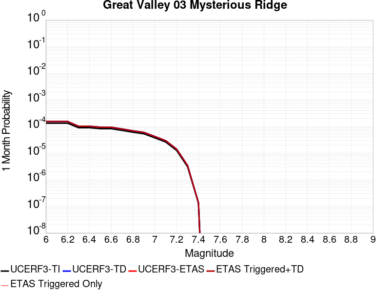 |  |  |

| Magnitude | 1 wk TI Prob | 1 wk TD Prob | 1 wk ETAS Prob | 1 wk ETAS/TD Gain | 1 wk ETAS Triggered+TD | 1 wk ETAS Triggered Only | 1 mo TI Prob | 1 mo TD Prob | 1 mo ETAS Prob | 1 mo ETAS/TD Gain | 1 mo ETAS Triggered+TD | 1 mo ETAS Triggered Only | 1 yr TI Prob | 1 yr TD Prob | 1 yr ETAS Prob | 1 yr ETAS/TD Gain | 1 yr ETAS Triggered+TD | 1 yr ETAS Triggered Only | 10 yr TI Prob | 10 yr TD Prob | 10 yr ETAS Prob | 10 yr ETAS/TD Gain | 10 yr ETAS Triggered+TD | 10 yr ETAS Triggered Only |
|-----|-----|-----|-----|-----|-----|-----|-----|-----|-----|-----|-----|-----|-----|-----|-----|-----|-----|-----|-----|-----|-----|-----|-----|-----|
| 6.0 | 3.1182444E-5 | 3.6045352E-5 | 0.0 | 0.0 | 3.6045352E-5 | 0.0 | 1.336322E-4 | 1.5447199E-4 | 0.0 | 0.0 | 1.5447199E-4 | 0.0 | 0.0016257578 | 0.0018792601 | 7.0E-4 | 0.37248704 | 0.0020788843 | 2.0E-4 | 0.016139153 | 0.018652432 | 0.0124 | 0.66479266 | 0.021203937 | 0.0026 |
| 6.1 | 3.1182444E-5 | 3.6045352E-5 | 0.0 | 0.0 | 3.6045352E-5 | 0.0 | 1.336322E-4 | 1.5447199E-4 | 0.0 | 0.0 | 1.5447199E-4 | 0.0 | 0.0016257578 | 0.0018792601 | 7.0E-4 | 0.37248704 | 0.0020788843 | 2.0E-4 | 0.016139153 | 0.018652432 | 0.0124 | 0.66479266 | 0.021203937 | 0.0026 |
| 6.2 | 3.1182444E-5 | 3.6045352E-5 | 0.0 | 0.0 | 3.6045352E-5 | 0.0 | 1.336322E-4 | 1.5447199E-4 | 0.0 | 0.0 | 1.5447199E-4 | 0.0 | 0.0016257578 | 0.0018792601 | 7.0E-4 | 0.37248704 | 0.0020788843 | 2.0E-4 | 0.016139153 | 0.018652432 | 0.0124 | 0.66479266 | 0.021203937 | 0.0026 |
| 6.3 | 2.106934E-5 | 2.3856586E-5 | 0.0 | 0.0 | 2.3856586E-5 | 0.0 | 9.0294045E-5 | 1.02238686E-4 | 0.0 | 0.0 | 1.02238686E-4 | 0.0 | 0.0010987755 | 0.0012440763 | 4.0E-4 | 0.3215237 | 0.0012440763 | 0.0 | 0.010933585 | 0.012374367 | 0.0082 | 0.6626602 | 0.014152093 | 0.0018 |
| 6.4 | 2.106934E-5 | 2.3856586E-5 | 0.0 | 0.0 | 2.3856586E-5 | 0.0 | 9.0294045E-5 | 1.02238686E-4 | 0.0 | 0.0 | 1.02238686E-4 | 0.0 | 0.0010987755 | 0.0012440763 | 4.0E-4 | 0.3215237 | 0.0012440763 | 0.0 | 0.010933585 | 0.012374367 | 0.0082 | 0.6626602 | 0.014152093 | 0.0018 |
| 6.5 | 1.9389783E-5 | 2.1890599E-5 | 0.0 | 0.0 | 2.1890599E-5 | 0.0 | 8.309642E-5 | 9.3813636E-5 | 0.0 | 0.0 | 9.3813636E-5 | 0.0 | 0.0010112294 | 0.0011416103 | 4.0E-4 | 0.35038227 | 0.0011416103 | 0.0 | 0.010066401 | 0.011360333 | 0.0077 | 0.677797 | 0.013139885 | 0.0018 |
| 6.6 | 1.9370193E-5 | 2.1870519E-5 | 0.0 | 0.0 | 2.1870519E-5 | 0.0 | 8.301247E-5 | 9.372758E-5 | 0.0 | 0.0 | 9.372758E-5 | 0.0 | 0.0010102082 | 0.0011405637 | 4.0E-4 | 0.35070378 | 0.0011405637 | 0.0 | 0.010056281 | 0.011349975 | 0.0077 | 0.6784156 | 0.013129545 | 0.0018 |
| 6.7 | 1.6723505E-5 | 1.880393E-5 | 0.0 | 0.0 | 1.880393E-5 | 0.0 | 7.16702E-5 | 8.0585894E-5 | 0.0 | 0.0 | 8.0585894E-5 | 0.0 | 8.722353E-4 | 9.807112E-4 | 3.0E-4 | 0.30590045 | 9.807112E-4 | 0.0 | 0.008688197 | 0.009765843 | 0.0071 | 0.7270238 | 0.011449241 | 0.0017 |
| 6.8 | 1.426937E-5 | 1.6001068E-5 | 0.0 | 0.0 | 1.6001068E-5 | 0.0 | 6.115301E-5 | 6.857428E-5 | 0.0 | 0.0 | 6.857428E-5 | 0.0 | 7.4428355E-4 | 8.345865E-4 | 3.0E-4 | 0.35945943 | 8.345865E-4 | 0.0 | 0.007417957 | 0.008316002 | 0.0066 | 0.7936506 | 0.009902696 | 0.0016 |
| 6.9 | 1.2469891E-5 | 1.3960242E-5 | 0.0 | 0.0 | 1.3960242E-5 | 0.0 | 5.3441294E-5 | 5.98283E-5 | 0.0 | 0.0 | 5.98283E-5 | 0.0 | 6.504535E-4 | 7.2817825E-4 | 3.0E-4 | 0.41198704 | 7.2817825E-4 | 0.0 | 0.006485529 | 0.007259147 | 0.0053 | 0.7301133 | 0.008648984 | 0.0014 |
| 7.0 | 8.7746275E-6 | 9.793992E-6 | 0.0 | 0.0 | 9.793992E-6 | 0.0 | 3.7605005E-5 | 4.197362E-5 | 0.0 | 0.0 | 4.197362E-5 | 0.0 | 4.5774475E-4 | 5.1091635E-4 | 1.0E-4 | 0.19572677 | 5.1091635E-4 | 0.0 | 0.00456803 | 0.00509815 | 0.004 | 0.7845983 | 0.005993562 | 9.0E-4 |
| 7.1 | 6.1067153E-6 | 6.815295E-6 | 0.0 | 0.0 | 6.815295E-6 | 0.0 | 2.6171374E-5 | 2.9208111E-5 | 0.0 | 0.0 | 2.9208111E-5 | 0.0 | 3.1858988E-4 | 3.5555632E-4 | 0.0 | 0.0 | 3.5555632E-4 | 0.0 | 0.0031813353 | 0.0035504254 | 0.003 | 0.84496915 | 0.004347585 | 8.0E-4 |
| 7.2 | 2.939283E-6 | 3.2748485E-6 | 0.0 | 0.0 | 3.2748485E-6 | 0.0 | 1.2596866E-5 | 1.4034999E-5 | 0.0 | 0.0 | 1.4034999E-5 | 0.0 | 1.5335606E-4 | 1.7086447E-4 | 0.0 | 0.0 | 1.7086447E-4 | 0.0 | 0.0015325027 | 0.0017075031 | 0.0015 | 0.8784757 | 0.0022066494 | 5.0E-4 |
| 7.3 | 7.2387763E-7 | 8.01021E-7 | 0.0 | 0.0 | 8.01021E-7 | 0.0 | 3.102329E-6 | 3.4329453E-6 | 0.0 | 0.0 | 3.4329453E-6 | 0.0 | 3.77702E-5 | 4.1795764E-5 | 0.0 | 0.0 | 4.1795764E-5 | 0.0 | 3.7763783E-4 | 4.1792405E-4 | 3.0E-4 | 0.7178338 | 5.1788223E-4 | 1.0E-4 |
| 7.4 | 3.112171E-8 | 3.2070304E-8 | 0.0 | 0.0 | 3.2070304E-8 | 0.0 | 1.3337875E-7 | 1.3744415E-7 | 0.0 | 0.0 | 1.3744415E-7 | 0.0 | 1.6238852E-6 | 1.6733812E-6 | 0.0 | 0.0 | 1.6733812E-6 | 0.0 | 1.6238733E-5 | 1.6733695E-5 | 0.0 | 0.0 | 1.6733695E-5 | 0.0 |

## Mono Lake 2011 CFM
*[(top)](#table-of-contents)*

| 1 Week | 1 Month | 1 Year | 10 Year |
|-----|-----|-----|-----|
|  |  |  |  |

| Magnitude | 1 wk TI Prob | 1 wk TD Prob | 1 wk ETAS Prob | 1 wk ETAS/TD Gain | 1 wk ETAS Triggered+TD | 1 wk ETAS Triggered Only | 1 mo TI Prob | 1 mo TD Prob | 1 mo ETAS Prob | 1 mo ETAS/TD Gain | 1 mo ETAS Triggered+TD | 1 mo ETAS Triggered Only | 1 yr TI Prob | 1 yr TD Prob | 1 yr ETAS Prob | 1 yr ETAS/TD Gain | 1 yr ETAS Triggered+TD | 1 yr ETAS Triggered Only | 10 yr TI Prob | 10 yr TD Prob | 10 yr ETAS Prob | 10 yr ETAS/TD Gain | 10 yr ETAS Triggered+TD | 10 yr ETAS Triggered Only |
|-----|-----|-----|-----|-----|-----|-----|-----|-----|-----|-----|-----|-----|-----|-----|-----|-----|-----|-----|-----|-----|-----|-----|-----|-----|
| 6.0 | 2.0341662E-5 | 2.3836292E-5 | 0.0 | 0.0 | 2.3836292E-5 | 0.0 | 8.717564E-5 | 1.0215453E-4 | 0.0 | 0.0 | 1.0215453E-4 | 0.0 | 0.0010608466 | 0.0012435531 | 0.0011 | 0.88456213 | 0.0016430557 | 4.0E-4 | 0.010557966 | 0.012418052 | 0.0107 | 0.86164886 | 0.015084523 | 0.0027 |
| 6.1 | 2.0341662E-5 | 2.3836292E-5 | 0.0 | 0.0 | 2.3836292E-5 | 0.0 | 8.717564E-5 | 1.0215453E-4 | 0.0 | 0.0 | 1.0215453E-4 | 0.0 | 0.0010608466 | 0.0012435531 | 0.0011 | 0.88456213 | 0.0016430557 | 4.0E-4 | 0.010557966 | 0.012418052 | 0.0107 | 0.86164886 | 0.015084523 | 0.0027 |
| 6.2 | 2.0341662E-5 | 2.3836292E-5 | 0.0 | 0.0 | 2.3836292E-5 | 0.0 | 8.717564E-5 | 1.0215453E-4 | 0.0 | 0.0 | 1.0215453E-4 | 0.0 | 0.0010608466 | 0.0012435531 | 0.0011 | 0.88456213 | 0.0016430557 | 4.0E-4 | 0.010557966 | 0.012418052 | 0.0107 | 0.86164886 | 0.015084523 | 0.0027 |
| 6.3 | 2.0341662E-5 | 2.3836292E-5 | 0.0 | 0.0 | 2.3836292E-5 | 0.0 | 8.717564E-5 | 1.0215453E-4 | 0.0 | 0.0 | 1.0215453E-4 | 0.0 | 0.0010608466 | 0.0012435531 | 0.0011 | 0.88456213 | 0.0016430557 | 4.0E-4 | 0.010557966 | 0.012418052 | 0.0107 | 0.86164886 | 0.015084523 | 0.0027 |
| 6.4 | 1.749821E-5 | 2.0497962E-5 | 0.0 | 0.0 | 2.0497962E-5 | 0.0 | 7.499018E-5 | 8.7848406E-5 | 0.0 | 0.0 | 8.7848406E-5 | 0.0 | 9.1262296E-4 | 0.0010695539 | 0.001 | 0.93496925 | 0.0014691261 | 4.0E-4 | 0.009088841 | 0.010695495 | 0.0096 | 0.8975742 | 0.0129708955 | 0.0023 |
| 6.5 | 1.749821E-5 | 2.0497962E-5 | 0.0 | 0.0 | 2.0497962E-5 | 0.0 | 7.499018E-5 | 8.7848406E-5 | 0.0 | 0.0 | 8.7848406E-5 | 0.0 | 9.1262296E-4 | 0.0010695539 | 0.001 | 0.93496925 | 0.0014691261 | 4.0E-4 | 0.009088841 | 0.010695495 | 0.0096 | 0.8975742 | 0.0129708955 | 0.0023 |

## Santa Susana East (connector)
*[(top)](#table-of-contents)*

| 1 Week | 1 Month | 1 Year | 10 Year |
|-----|-----|-----|-----|
| 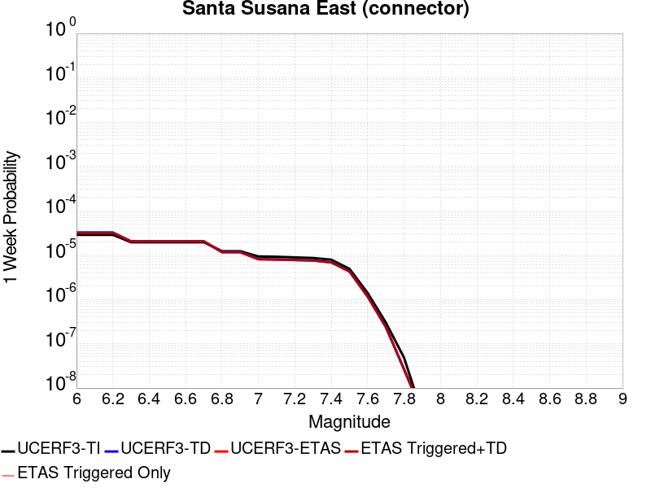 |  | 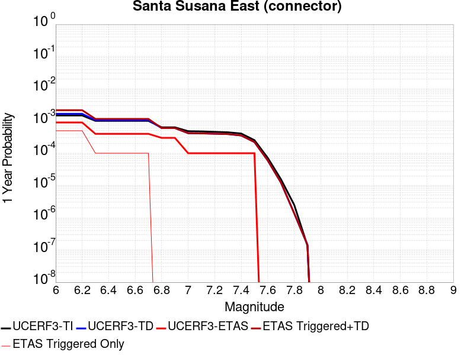 | 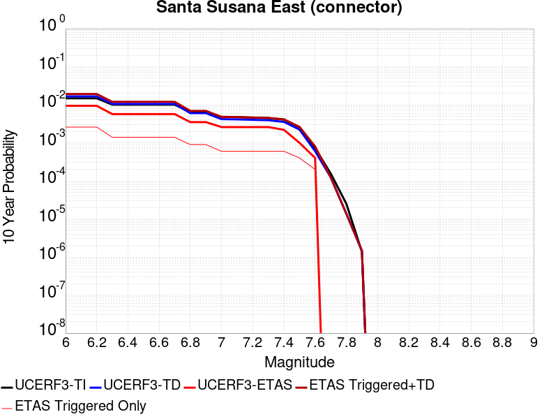 |

| Magnitude | 1 wk TI Prob | 1 wk TD Prob | 1 wk ETAS Prob | 1 wk ETAS/TD Gain | 1 wk ETAS Triggered+TD | 1 wk ETAS Triggered Only | 1 mo TI Prob | 1 mo TD Prob | 1 mo ETAS Prob | 1 mo ETAS/TD Gain | 1 mo ETAS Triggered+TD | 1 mo ETAS Triggered Only | 1 yr TI Prob | 1 yr TD Prob | 1 yr ETAS Prob | 1 yr ETAS/TD Gain | 1 yr ETAS Triggered+TD | 1 yr ETAS Triggered Only | 10 yr TI Prob | 10 yr TD Prob | 10 yr ETAS Prob | 10 yr ETAS/TD Gain | 10 yr ETAS Triggered+TD | 10 yr ETAS Triggered Only |
|-----|-----|-----|-----|-----|-----|-----|-----|-----|-----|-----|-----|-----|-----|-----|-----|-----|-----|-----|-----|-----|-----|-----|-----|-----|
| 6.0 | 2.858397E-5 | 3.2035143E-5 | 0.0 | 0.0 | 3.2035143E-5 | 0.0 | 1.2249697E-4 | 1.3728737E-4 | 0.0 | 0.0 | 1.3728737E-4 | 0.0 | 0.0014903803 | 0.0016704637 | 9.0E-4 | 0.5387725 | 0.0021696286 | 5.0E-4 | 0.014804244 | 0.016605841 | 0.0094 | 0.56606585 | 0.019162666 | 0.0026 |
| 6.1 | 2.858397E-5 | 3.2035143E-5 | 0.0 | 0.0 | 3.2035143E-5 | 0.0 | 1.2249697E-4 | 1.3728737E-4 | 0.0 | 0.0 | 1.3728737E-4 | 0.0 | 0.0014903803 | 0.0016704637 | 9.0E-4 | 0.5387725 | 0.0021696286 | 5.0E-4 | 0.014804244 | 0.016605841 | 0.0094 | 0.56606585 | 0.019162666 | 0.0026 |
| 6.2 | 2.858397E-5 | 3.2035143E-5 | 0.0 | 0.0 | 3.2035143E-5 | 0.0 | 1.2249697E-4 | 1.3728737E-4 | 0.0 | 0.0 | 1.3728737E-4 | 0.0 | 0.0014903803 | 0.0016704637 | 9.0E-4 | 0.5387725 | 0.0021696286 | 5.0E-4 | 0.014804244 | 0.016605841 | 0.0094 | 0.56606585 | 0.019162666 | 0.0026 |
| 6.3 | 1.943582E-5 | 2.0374442E-5 | 0.0 | 0.0 | 2.0374442E-5 | 0.0 | 8.329371E-5 | 8.731675E-5 | 0.0 | 0.0 | 8.731675E-5 | 0.0 | 0.001013629 | 0.0010626751 | 4.0E-4 | 0.37640855 | 0.0011625689 | 1.0E-4 | 0.010090181 | 0.010587209 | 0.0057 | 0.5383855 | 0.011972386 | 0.0014 |
| 6.4 | 1.943582E-5 | 2.0374442E-5 | 0.0 | 0.0 | 2.0374442E-5 | 0.0 | 8.329371E-5 | 8.731675E-5 | 0.0 | 0.0 | 8.731675E-5 | 0.0 | 0.001013629 | 0.0010626751 | 4.0E-4 | 0.37640855 | 0.0011625689 | 1.0E-4 | 0.010090181 | 0.010587209 | 0.0057 | 0.5383855 | 0.011972386 | 0.0014 |
| 6.5 | 1.943582E-5 | 2.0374442E-5 | 0.0 | 0.0 | 2.0374442E-5 | 0.0 | 8.329371E-5 | 8.731675E-5 | 0.0 | 0.0 | 8.731675E-5 | 0.0 | 0.001013629 | 0.0010626751 | 4.0E-4 | 0.37640855 | 0.0011625689 | 1.0E-4 | 0.010090181 | 0.010587209 | 0.0057 | 0.5383855 | 0.011972386 | 0.0014 |
| 6.6 | 1.943582E-5 | 2.0374442E-5 | 0.0 | 0.0 | 2.0374442E-5 | 0.0 | 8.329371E-5 | 8.731675E-5 | 0.0 | 0.0 | 8.731675E-5 | 0.0 | 0.001013629 | 0.0010626751 | 4.0E-4 | 0.37640855 | 0.0011625689 | 1.0E-4 | 0.010090181 | 0.010587209 | 0.0057 | 0.5383855 | 0.011972386 | 0.0014 |
| 6.7 | 1.9404439E-5 | 2.0361862E-5 | 0.0 | 0.0 | 2.0361862E-5 | 0.0 | 8.3159226E-5 | 8.726284E-5 | 0.0 | 0.0 | 8.726284E-5 | 0.0 | 0.0010119933 | 0.0010620194 | 4.0E-4 | 0.37664098 | 0.0011619132 | 1.0E-4 | 0.010073971 | 0.010580713 | 0.0057 | 0.5387161 | 0.0119659 | 0.0014 |
| 6.8 | 1.2217526E-5 | 1.1595887E-5 | 0.0 | 0.0 | 1.1595887E-5 | 0.0 | 5.2359774E-5 | 4.969581E-5 | 0.0 | 0.0 | 4.969581E-5 | 0.0 | 6.372938E-4 | 6.048953E-4 | 3.0E-4 | 0.4959536 | 6.048953E-4 | 0.0 | 0.0063546924 | 0.0060343696 | 0.0035 | 0.5800109 | 0.006928939 | 9.0E-4 |
| 6.9 | 1.2217526E-5 | 1.1595887E-5 | 0.0 | 0.0 | 1.1595887E-5 | 0.0 | 5.2359774E-5 | 4.969581E-5 | 0.0 | 0.0 | 4.969581E-5 | 0.0 | 6.372938E-4 | 6.048953E-4 | 3.0E-4 | 0.4959536 | 6.048953E-4 | 0.0 | 0.0063546924 | 0.0060343696 | 0.0035 | 0.5800109 | 0.006928939 | 9.0E-4 |
| 7.0 | 9.276017E-6 | 8.0605205E-6 | 0.0 | 0.0 | 8.0605205E-6 | 0.0 | 3.9753755E-5 | 3.454465E-5 | 0.0 | 0.0 | 3.454465E-5 | 0.0 | 4.8389446E-4 | 4.205034E-4 | 1.0E-4 | 0.2378102 | 4.205034E-4 | 0.0 | 0.0048284214 | 0.004197636 | 0.0026 | 0.6193962 | 0.004795118 | 6.0E-4 |
| 7.1 | 9.130355E-6 | 7.94367E-6 | 0.0 | 0.0 | 7.94367E-6 | 0.0 | 3.9129503E-5 | 3.404388E-5 | 0.0 | 0.0 | 3.404388E-5 | 0.0 | 4.7629757E-4 | 4.1440883E-4 | 1.0E-4 | 0.2413076 | 4.1440883E-4 | 0.0 | 0.00475278 | 0.0041369186 | 0.0026 | 0.6284871 | 0.0047344365 | 6.0E-4 |
| 7.2 | 8.851015E-6 | 7.742807E-6 | 0.0 | 0.0 | 7.742807E-6 | 0.0 | 3.7932372E-5 | 3.3183056E-5 | 0.0 | 0.0 | 3.3183056E-5 | 0.0 | 4.6172875E-4 | 4.039322E-4 | 1.0E-4 | 0.24756628 | 4.039322E-4 | 0.0 | 0.0046077054 | 0.0040325355 | 0.0026 | 0.64475566 | 0.004630116 | 6.0E-4 |
| 7.3 | 8.573006E-6 | 7.5514977E-6 | 0.0 | 0.0 | 7.5514977E-6 | 0.0 | 3.6740938E-5 | 3.236318E-5 | 0.0 | 0.0 | 3.236318E-5 | 0.0 | 4.472291E-4 | 3.9395387E-4 | 1.0E-4 | 0.2538368 | 3.9395387E-4 | 0.0 | 0.004463301 | 0.003933101 | 0.0026 | 0.66105604 | 0.004530741 | 6.0E-4 |
| 7.4 | 7.852282E-6 | 6.818787E-6 | 0.0 | 0.0 | 6.818787E-6 | 0.0 | 3.36522E-5 | 2.9223063E-5 | 0.0 | 0.0 | 2.9223063E-5 | 0.0 | 4.096385E-4 | 3.5573574E-4 | 1.0E-4 | 0.28110754 | 3.5573574E-4 | 0.0 | 0.0040888423 | 0.0035521584 | 0.0022 | 0.6193418 | 0.004150027 | 6.0E-4 |
| 7.5 | 4.8869324E-6 | 4.279742E-6 | 0.0 | 0.0 | 4.279742E-6 | 0.0 | 2.0943828E-5 | 1.834163E-5 | 0.0 | 0.0 | 1.834163E-5 | 0.0 | 2.5496128E-4 | 2.2328812E-4 | 1.0E-4 | 0.44785184 | 2.2328812E-4 | 0.0 | 0.0025466895 | 0.002230715 | 0.001 | 0.44828674 | 0.0026298228 | 4.0E-4 |
| 7.6 | 1.3894544E-6 | 1.1569718E-6 | 0.0 | 0.0 | 1.1569718E-6 | 0.0 | 5.954791E-6 | 4.958443E-6 | 0.0 | 0.0 | 4.958443E-6 | 0.0 | 7.249717E-5 | 6.036759E-5 | 0.0 | 0.0 | 6.036759E-5 | 0.0 | 7.247352E-4 | 6.0353376E-4 | 4.0E-4 | 0.6627633 | 8.0341304E-4 | 2.0E-4 |
| 7.7 | 2.9924632E-7 | 2.3728275E-7 | 0.0 | 0.0 | 2.3728275E-7 | 0.0 | 1.2824837E-6 | 1.0169257E-6 | 0.0 | 0.0 | 1.0169257E-6 | 0.0 | 1.5614127E-5 | 1.2381008E-5 | 0.0 | 0.0 | 1.2381008E-5 | 0.0 | 1.5613029E-4 | 1.238039E-4 | 0.0 | 0.0 | 1.238039E-4 | 0.0 |
| 7.8 | 4.8188564E-8 | 2.638625E-8 | 0.0 | 0.0 | 2.638625E-8 | 0.0 | 2.065224E-7 | 1.1308392E-7 | 0.0 | 0.0 | 1.1308392E-7 | 0.0 | 2.5144072E-6 | 1.3767959E-6 | 0.0 | 0.0 | 1.3767959E-6 | 0.0 | 2.5143789E-5 | 1.3767883E-5 | 0.0 | 0.0 | 1.3767883E-5 | 0.0 |
| 7.9 | 2.6127251E-9 | 2.7684366E-9 | 0.0 | 0.0 | 2.7684366E-9 | 0.0 | 1.1197393E-8 | 1.1864729E-8 | 0.0 | 0.0 | 1.1864729E-8 | 0.0 | 1.3632825E-7 | 1.4445307E-7 | 0.0 | 0.0 | 1.4445307E-7 | 0.0 | 1.3632817E-6 | 1.4445308E-6 | 0.0 | 0.0 | 1.4445308E-6 | 0.0 |

## Death Valley (So)
*[(top)](#table-of-contents)*

| 1 Week | 1 Month | 1 Year | 10 Year |
|-----|-----|-----|-----|
| 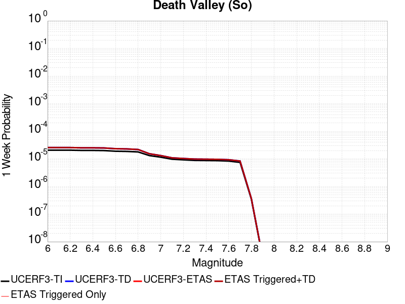 |  |  | 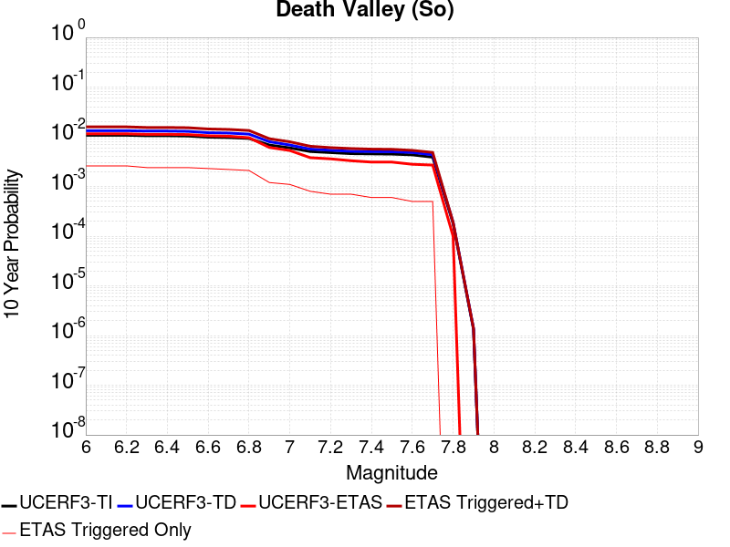 |

| Magnitude | 1 wk TI Prob | 1 wk TD Prob | 1 wk ETAS Prob | 1 wk ETAS/TD Gain | 1 wk ETAS Triggered+TD | 1 wk ETAS Triggered Only | 1 mo TI Prob | 1 mo TD Prob | 1 mo ETAS Prob | 1 mo ETAS/TD Gain | 1 mo ETAS Triggered+TD | 1 mo ETAS Triggered Only | 1 yr TI Prob | 1 yr TD Prob | 1 yr ETAS Prob | 1 yr ETAS/TD Gain | 1 yr ETAS Triggered+TD | 1 yr ETAS Triggered Only | 10 yr TI Prob | 10 yr TD Prob | 10 yr ETAS Prob | 10 yr ETAS/TD Gain | 10 yr ETAS Triggered+TD | 10 yr ETAS Triggered Only |
|-----|-----|-----|-----|-----|-----|-----|-----|-----|-----|-----|-----|-----|-----|-----|-----|-----|-----|-----|-----|-----|-----|-----|-----|-----|
| 6.0 | 2.0684236E-5 | 2.5627864E-5 | 0.0 | 0.0 | 2.5627864E-5 | 0.0 | 8.864371E-5 | 1.09829176E-4 | 0.0 | 0.0 | 1.09829176E-4 | 0.0 | 0.0010787029 | 0.0013363669 | 0.0011 | 0.8231272 | 0.001635966 | 3.0E-4 | 0.010734817 | 0.01328546 | 0.0115 | 0.8656079 | 0.015850918 | 0.0026 |
| 6.1 | 2.0684236E-5 | 2.5627864E-5 | 0.0 | 0.0 | 2.5627864E-5 | 0.0 | 8.864371E-5 | 1.09829176E-4 | 0.0 | 0.0 | 1.09829176E-4 | 0.0 | 0.0010787029 | 0.0013363669 | 0.0011 | 0.8231272 | 0.001635966 | 3.0E-4 | 0.010734817 | 0.01328546 | 0.0115 | 0.8656079 | 0.015850918 | 0.0026 |
| 6.2 | 2.0684236E-5 | 2.5627864E-5 | 0.0 | 0.0 | 2.5627864E-5 | 0.0 | 8.864371E-5 | 1.09829176E-4 | 0.0 | 0.0 | 1.09829176E-4 | 0.0 | 0.0010787029 | 0.0013363669 | 0.0011 | 0.8231272 | 0.001635966 | 3.0E-4 | 0.010734817 | 0.01328546 | 0.0115 | 0.8656079 | 0.015850918 | 0.0026 |
| 6.3 | 2.0240292E-5 | 2.5127823E-5 | 0.0 | 0.0 | 2.5127823E-5 | 0.0 | 8.6741224E-5 | 1.0768632E-4 | 0.0 | 0.0 | 1.0768632E-4 | 0.0 | 0.0010555626 | 0.0013103092 | 0.001 | 0.76317865 | 0.0015100471 | 2.0E-4 | 0.010505628 | 0.013027957 | 0.0112 | 0.8596897 | 0.015396689 | 0.0024 |
| 6.4 | 2.0240292E-5 | 2.5127823E-5 | 0.0 | 0.0 | 2.5127823E-5 | 0.0 | 8.6741224E-5 | 1.0768632E-4 | 0.0 | 0.0 | 1.0768632E-4 | 0.0 | 0.0010555626 | 0.0013103092 | 0.001 | 0.76317865 | 0.0015100471 | 2.0E-4 | 0.010505628 | 0.013027957 | 0.0112 | 0.8596897 | 0.015396689 | 0.0024 |
| 6.5 | 1.9962767E-5 | 2.4817004E-5 | 0.0 | 0.0 | 2.4817004E-5 | 0.0 | 8.55519E-5 | 1.0635434E-4 | 0.0 | 0.0 | 1.0635434E-4 | 0.0 | 0.0010410968 | 0.0012941117 | 0.001 | 0.7727308 | 0.0014938528 | 2.0E-4 | 0.010362327 | 0.012867865 | 0.0111 | 0.8626139 | 0.015236982 | 0.0024 |
| 6.6 | 1.8937297E-5 | 2.332037E-5 | 0.0 | 0.0 | 2.332037E-5 | 0.0 | 8.115732E-5 | 9.99407E-5 | 0.0 | 0.0 | 9.99407E-5 | 0.0 | 9.876423E-4 | 0.0012161133 | 9.0E-4 | 0.7400626 | 0.0014158702 | 2.0E-4 | 0.009832645 | 0.012096784 | 0.0105 | 0.8679993 | 0.014368962 | 0.0023 |
| 6.7 | 1.8621096E-5 | 2.2920907E-5 | 0.0 | 0.0 | 2.2920907E-5 | 0.0 | 7.980225E-5 | 9.822885E-5 | 0.0 | 0.0 | 9.822885E-5 | 0.0 | 9.711593E-4 | 0.0011952945 | 9.0E-4 | 0.75295246 | 0.0013950556 | 2.0E-4 | 0.009669261 | 0.011890838 | 0.0103 | 0.8662131 | 0.014064679 | 0.0022 |
| 6.8 | 1.7830353E-5 | 2.1814458E-5 | 0.0 | 0.0 | 2.1814458E-5 | 0.0 | 7.641356E-5 | 9.348726E-5 | 0.0 | 0.0 | 9.348726E-5 | 0.0 | 9.29938E-4 | 0.0011376272 | 8.0E-4 | 0.7032181 | 0.0013373996 | 2.0E-4 | 0.009260561 | 0.0113193495 | 0.0096 | 0.8481053 | 0.013395579 | 0.0021 |
| 6.9 | 1.3135183E-5 | 1.530884E-5 | 0.0 | 0.0 | 1.530884E-5 | 0.0 | 5.6292425E-5 | 6.56077E-5 | 0.0 | 0.0 | 6.56077E-5 | 0.0 | 6.8514474E-4 | 7.984875E-4 | 5.0E-4 | 0.62618387 | 8.9840766E-4 | 1.0E-4 | 0.006830362 | 0.007955789 | 0.0061 | 0.76673734 | 0.0091462415 | 0.0012 |
| 7.0 | 1.1507512E-5 | 1.31579645E-5 | 0.0 | 0.0 | 1.31579645E-5 | 0.0 | 4.9316975E-5 | 5.6390087E-5 | 0.0 | 0.0 | 5.6390087E-5 | 0.0 | 6.002687E-4 | 6.863388E-4 | 4.0E-4 | 0.58280253 | 7.862702E-4 | 1.0E-4 | 0.0059864987 | 0.0068415613 | 0.0053 | 0.774677 | 0.007934036 | 0.0011 |
| 7.1 | 9.715903E-6 | 1.0867917E-5 | 0.0 | 0.0 | 1.0867917E-5 | 0.0 | 4.1638916E-5 | 4.657598E-5 | 0.0 | 0.0 | 4.657598E-5 | 0.0 | 5.068359E-4 | 5.669193E-4 | 4.0E-4 | 0.70556784 | 6.668626E-4 | 1.0E-4 | 0.0050568148 | 0.005655111 | 0.0038 | 0.6719585 | 0.006450587 | 8.0E-4 |
| 7.2 | 9.233269E-6 | 1.0288746E-5 | 0.0 | 0.0 | 1.0288746E-5 | 0.0 | 3.9570554E-5 | 4.4093904E-5 | 0.0 | 0.0 | 4.4093904E-5 | 0.0 | 4.81665E-4 | 5.3671526E-4 | 4.0E-4 | 0.7452741 | 6.366616E-4 | 1.0E-4 | 0.0048062233 | 0.005354622 | 0.0036 | 0.6723164 | 0.0060508735 | 7.0E-4 |
| 7.3 | 8.8041315E-6 | 9.810394E-6 | 0.0 | 0.0 | 9.810394E-6 | 0.0 | 3.7731446E-5 | 4.2043892E-5 | 0.0 | 0.0 | 4.2043892E-5 | 0.0 | 4.592835E-4 | 5.1176833E-4 | 4.0E-4 | 0.78160363 | 6.117172E-4 | 1.0E-4 | 0.0045833546 | 0.005106325 | 0.0033 | 0.64625734 | 0.0058027506 | 7.0E-4 |
| 7.4 | 8.708749E-6 | 9.7093925E-6 | 0.0 | 0.0 | 9.7093925E-6 | 0.0 | 3.7322676E-5 | 4.161104E-5 | 0.0 | 0.0 | 4.161104E-5 | 0.0 | 4.5430884E-4 | 5.065009E-4 | 4.0E-4 | 0.7897321 | 6.0645025E-4 | 1.0E-4 | 0.004533812 | 0.0050538913 | 0.0031 | 0.6133888 | 0.005650859 | 6.0E-4 |
| 7.5 | 8.612678E-6 | 9.607022E-6 | 0.0 | 0.0 | 9.607022E-6 | 0.0 | 3.6910955E-5 | 4.1172323E-5 | 0.0 | 0.0 | 4.1172323E-5 | 0.0 | 4.492982E-4 | 5.011619E-4 | 4.0E-4 | 0.79814523 | 6.011118E-4 | 1.0E-4 | 0.004483909 | 0.005000743 | 0.0031 | 0.61990786 | 0.0055977427 | 6.0E-4 |
| 7.6 | 8.319024E-6 | 9.28606E-6 | 0.0 | 0.0 | 9.28606E-6 | 0.0 | 3.5652476E-5 | 3.9796818E-5 | 0.0 | 0.0 | 3.9796818E-5 | 0.0 | 4.3398244E-4 | 4.8442275E-4 | 4.0E-4 | 0.8257251 | 5.843743E-4 | 1.0E-4 | 0.0043313587 | 0.0048340918 | 0.0028 | 0.57921946 | 0.005331675 | 5.0E-4 |
| 7.7 | 7.4718328E-6 | 8.347111E-6 | 0.0 | 0.0 | 8.347111E-6 | 0.0 | 3.2021748E-5 | 3.5772868E-5 | 0.0 | 0.0 | 3.5772868E-5 | 0.0 | 3.8979502E-4 | 4.3545166E-4 | 4.0E-4 | 0.91858643 | 5.354081E-4 | 1.0E-4 | 0.00389112 | 0.0043463893 | 0.0027 | 0.6212053 | 0.004844216 | 5.0E-4 |
| 7.8 | 3.4586725E-7 | 3.64866E-7 | 0.0 | 0.0 | 3.64866E-7 | 0.0 | 1.4822873E-6 | 1.5637105E-6 | 0.0 | 0.0 | 1.5637105E-6 | 0.0 | 1.80467E-5 | 1.9038014E-5 | 0.0 | 0.0 | 1.9038014E-5 | 0.0 | 1.8045233E-4 | 1.9036427E-4 | 1.0E-4 | 0.52530867 | 1.9036427E-4 | 0.0 |
| 7.9 | 2.5591178E-9 | 2.6699005E-9 | 0.0 | 0.0 | 2.6699005E-9 | 0.0 | 1.0967647E-8 | 1.1442431E-8 | 0.0 | 0.0 | 1.1442431E-8 | 0.0 | 1.335311E-7 | 1.393116E-7 | 0.0 | 0.0 | 1.393116E-7 | 0.0 | 1.3353102E-6 | 1.3931159E-6 | 0.0 | 0.0 | 1.3931159E-6 | 0.0 |

## Santa Ynez (East)
*[(top)](#table-of-contents)*

| 1 Week | 1 Month | 1 Year | 10 Year |
|-----|-----|-----|-----|
| 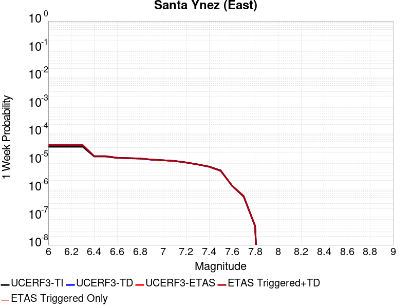 |  | 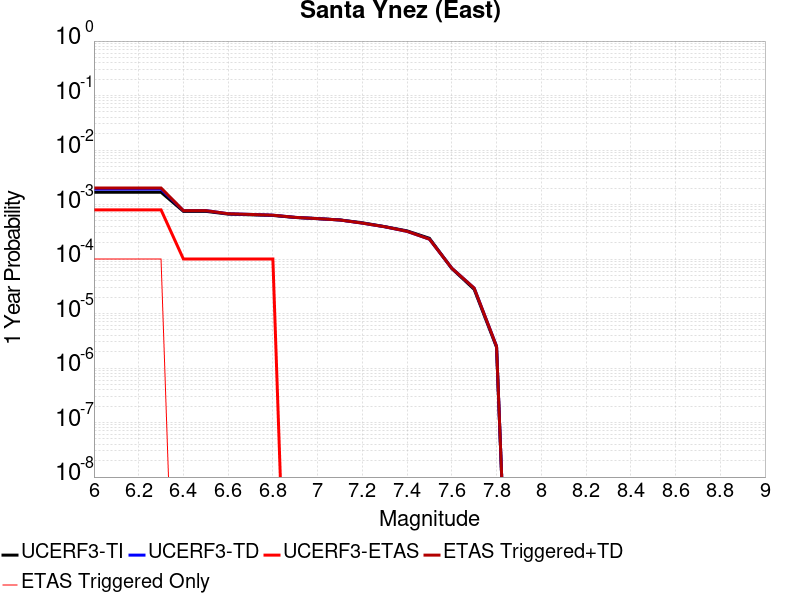 | 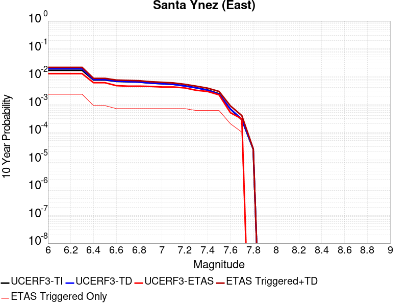 |

| Magnitude | 1 wk TI Prob | 1 wk TD Prob | 1 wk ETAS Prob | 1 wk ETAS/TD Gain | 1 wk ETAS Triggered+TD | 1 wk ETAS Triggered Only | 1 mo TI Prob | 1 mo TD Prob | 1 mo ETAS Prob | 1 mo ETAS/TD Gain | 1 mo ETAS Triggered+TD | 1 mo ETAS Triggered Only | 1 yr TI Prob | 1 yr TD Prob | 1 yr ETAS Prob | 1 yr ETAS/TD Gain | 1 yr ETAS Triggered+TD | 1 yr ETAS Triggered Only | 10 yr TI Prob | 10 yr TD Prob | 10 yr ETAS Prob | 10 yr ETAS/TD Gain | 10 yr ETAS Triggered+TD | 10 yr ETAS Triggered Only |
|-----|-----|-----|-----|-----|-----|-----|-----|-----|-----|-----|-----|-----|-----|-----|-----|-----|-----|-----|-----|-----|-----|-----|-----|-----|
| 6.0 | 3.2269712E-5 | 3.676393E-5 | 0.0 | 0.0 | 3.676393E-5 | 0.0 | 1.3829143E-4 | 1.5755351E-4 | 1.0E-4 | 0.634705 | 1.5755351E-4 | 0.0 | 0.0016823979 | 0.0019171119 | 8.0E-4 | 0.41729438 | 0.0020169201 | 1.0E-4 | 0.016697178 | 0.019063229 | 0.0127 | 0.66620404 | 0.021319384 | 0.0023 |
| 6.1 | 3.2269712E-5 | 3.676393E-5 | 0.0 | 0.0 | 3.676393E-5 | 0.0 | 1.3829143E-4 | 1.5755351E-4 | 1.0E-4 | 0.634705 | 1.5755351E-4 | 0.0 | 0.0016823979 | 0.0019171119 | 8.0E-4 | 0.41729438 | 0.0020169201 | 1.0E-4 | 0.016697178 | 0.019063229 | 0.0127 | 0.66620404 | 0.021319384 | 0.0023 |
| 6.2 | 3.2269712E-5 | 3.676393E-5 | 0.0 | 0.0 | 3.676393E-5 | 0.0 | 1.3829143E-4 | 1.5755351E-4 | 1.0E-4 | 0.634705 | 1.5755351E-4 | 0.0 | 0.0016823979 | 0.0019171119 | 8.0E-4 | 0.41729438 | 0.0020169201 | 1.0E-4 | 0.016697178 | 0.019063229 | 0.0127 | 0.66620404 | 0.021319384 | 0.0023 |
| 6.3 | 3.2269712E-5 | 3.676393E-5 | 0.0 | 0.0 | 3.676393E-5 | 0.0 | 1.3829143E-4 | 1.5755351E-4 | 1.0E-4 | 0.634705 | 1.5755351E-4 | 0.0 | 0.0016823979 | 0.0019171119 | 8.0E-4 | 0.41729438 | 0.0020169201 | 1.0E-4 | 0.016697178 | 0.019063229 | 0.0127 | 0.66620404 | 0.021319384 | 0.0023 |
| 6.4 | 1.4404779E-5 | 1.4852703E-5 | 0.0 | 0.0 | 1.4852703E-5 | 0.0 | 6.1733306E-5 | 6.3652915E-5 | 0.0 | 0.0 | 6.3652915E-5 | 0.0 | 7.513438E-4 | 7.747038E-4 | 1.0E-4 | 0.12908159 | 7.747038E-4 | 0.0 | 0.0074880854 | 0.007720582 | 0.006 | 0.7771435 | 0.008613634 | 9.0E-4 |
| 6.5 | 1.4404779E-5 | 1.4852703E-5 | 0.0 | 0.0 | 1.4852703E-5 | 0.0 | 6.1733306E-5 | 6.3652915E-5 | 0.0 | 0.0 | 6.3652915E-5 | 0.0 | 7.513438E-4 | 7.747038E-4 | 1.0E-4 | 0.12908159 | 7.747038E-4 | 0.0 | 0.0074880854 | 0.007720582 | 0.006 | 0.7771435 | 0.008613634 | 9.0E-4 |
| 6.6 | 1.280208E-5 | 1.3014733E-5 | 0.0 | 0.0 | 1.3014733E-5 | 0.0 | 5.4864904E-5 | 5.5776243E-5 | 0.0 | 0.0 | 5.5776243E-5 | 0.0 | 6.6777546E-4 | 6.7886594E-4 | 1.0E-4 | 0.14730449 | 6.7886594E-4 | 0.0 | 0.006657724 | 0.0067681326 | 0.0047 | 0.6944309 | 0.0074633947 | 7.0E-4 |
| 6.7 | 1.2457027E-5 | 1.2631168E-5 | 0.0 | 0.0 | 1.2631168E-5 | 0.0 | 5.3386164E-5 | 5.4132466E-5 | 0.0 | 0.0 | 5.4132466E-5 | 0.0 | 6.497827E-4 | 6.5886514E-4 | 1.0E-4 | 0.15177613 | 6.5886514E-4 | 0.0 | 0.00647886 | 0.006569315 | 0.0045 | 0.6850029 | 0.0072647166 | 7.0E-4 |
| 6.8 | 1.2095134E-5 | 1.2233538E-5 | 0.0 | 0.0 | 1.2233538E-5 | 0.0 | 5.1835254E-5 | 5.24284E-5 | 0.0 | 0.0 | 5.24284E-5 | 0.0 | 6.309115E-4 | 6.3813047E-4 | 1.0E-4 | 0.15670776 | 6.3813047E-4 | 0.0 | 0.0062912325 | 0.006363169 | 0.0045 | 0.7071948 | 0.007058715 | 7.0E-4 |
| 6.9 | 1.1104036E-5 | 1.115979E-5 | 0.0 | 0.0 | 1.115979E-5 | 0.0 | 4.758786E-5 | 4.78268E-5 | 0.0 | 0.0 | 4.78268E-5 | 0.0 | 5.7922816E-4 | 5.82137E-4 | 0.0 | 0.0 | 5.82137E-4 | 0.0 | 0.005777207 | 0.0058062663 | 0.0044 | 0.75780195 | 0.0065022022 | 7.0E-4 |
| 7.0 | 1.0577444E-5 | 1.0584016E-5 | 0.0 | 0.0 | 1.0584016E-5 | 0.0 | 4.5331115E-5 | 4.5359287E-5 | 0.0 | 0.0 | 4.5359287E-5 | 0.0 | 5.5176654E-4 | 5.521106E-4 | 0.0 | 0.0 | 5.521106E-4 | 0.0 | 0.0055039856 | 0.005507528 | 0.0042 | 0.7625926 | 0.006203673 | 7.0E-4 |
| 7.1 | 1.0021775E-5 | 9.983226E-6 | 0.0 | 0.0 | 9.983226E-6 | 0.0 | 4.294976E-5 | 4.278456E-5 | 0.0 | 0.0 | 4.278456E-5 | 0.0 | 5.2278786E-4 | 5.207787E-4 | 0.0 | 0.0 | 5.207787E-4 | 0.0 | 0.0052155964 | 0.0051957155 | 0.0042 | 0.8083584 | 0.0058920784 | 7.0E-4 |
| 7.2 | 8.874109E-6 | 8.750827E-6 | 0.0 | 0.0 | 8.750827E-6 | 0.0 | 3.8031343E-5 | 3.750301E-5 | 0.0 | 0.0 | 3.750301E-5 | 0.0 | 4.629332E-4 | 4.5650458E-4 | 0.0 | 0.0 | 4.5650458E-4 | 0.0 | 0.0046197 | 0.0045557865 | 0.0039 | 0.8560542 | 0.0052525974 | 7.0E-4 |
| 7.3 | 7.5504267E-6 | 7.506881E-6 | 0.0 | 0.0 | 7.506881E-6 | 0.0 | 3.235857E-5 | 3.2171956E-5 | 0.0 | 0.0 | 3.2171956E-5 | 0.0 | 3.9389438E-4 | 3.916242E-4 | 0.0 | 0.0 | 3.916242E-4 | 0.0 | 0.0039319694 | 0.0039094477 | 0.0032 | 0.81852996 | 0.004507102 | 6.0E-4 |
| 7.4 | 6.309394E-6 | 6.1846868E-6 | 0.0 | 0.0 | 6.1846868E-6 | 0.0 | 2.703998E-5 | 2.6505537E-5 | 0.0 | 0.0 | 2.6505537E-5 | 0.0 | 3.2916202E-4 | 3.2265807E-4 | 0.0 | 0.0 | 3.2265807E-4 | 0.0 | 0.003286749 | 0.0032219933 | 0.0029 | 0.90006393 | 0.0038200603 | 6.0E-4 |
| 7.5 | 4.6103073E-6 | 4.441821E-6 | 0.0 | 0.0 | 4.441821E-6 | 0.0 | 1.975831E-5 | 1.903624E-5 | 0.0 | 0.0 | 1.903624E-5 | 0.0 | 2.4053088E-4 | 2.3174229E-4 | 0.0 | 0.0 | 2.3174229E-4 | 0.0 | 0.002402707 | 0.0023150758 | 0.0022 | 0.9502929 | 0.0029136867 | 6.0E-4 |
| 7.6 | 1.2858658E-6 | 1.300962E-6 | 0.0 | 0.0 | 1.300962E-6 | 0.0 | 5.5108417E-6 | 5.57554E-6 | 0.0 | 0.0 | 5.57554E-6 | 0.0 | 6.7092435E-5 | 6.788016E-5 | 0.0 | 0.0 | 6.788016E-5 | 0.0 | 6.707218E-4 | 6.786011E-4 | 5.0E-4 | 0.7368099 | 8.7846536E-4 | 2.0E-4 |
| 7.7 | 5.3302307E-7 | 5.6127305E-7 | 0.0 | 0.0 | 5.6127305E-7 | 0.0 | 2.2843826E-6 | 2.4054539E-6 | 0.0 | 0.0 | 2.4054539E-6 | 0.0 | 2.7812002E-5 | 2.9286044E-5 | 0.0 | 0.0 | 2.9286044E-5 | 0.0 | 2.7808524E-4 | 2.9282543E-4 | 3.0E-4 | 1.0245012 | 3.9279615E-4 | 1.0E-4 |
| 7.8 | 4.613933E-8 | 4.8034003E-8 | 0.0 | 0.0 | 4.8034003E-8 | 0.0 | 1.9773998E-7 | 2.0585999E-7 | 0.0 | 0.0 | 2.0585999E-7 | 0.0 | 2.4074816E-6 | 2.5063428E-6 | 0.0 | 0.0 | 2.5063428E-6 | 0.0 | 2.4074554E-5 | 2.5063155E-5 | 0.0 | 0.0 | 2.5063155E-5 | 0.0 |

## San Andreas (Peninsula) 2011 CFM
*[(top)](#table-of-contents)*

| 1 Week | 1 Month | 1 Year | 10 Year |
|-----|-----|-----|-----|
| 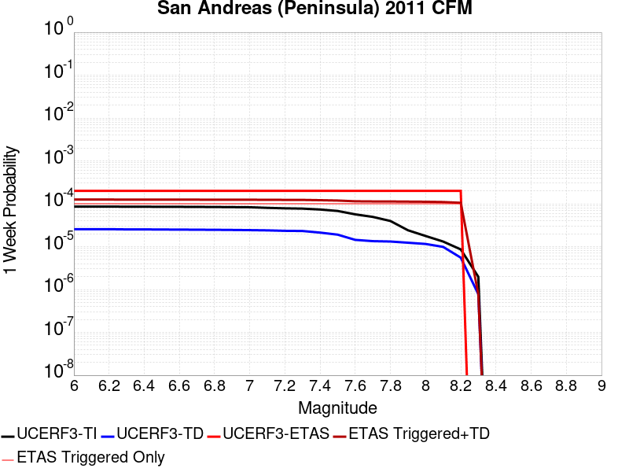 |  |  | 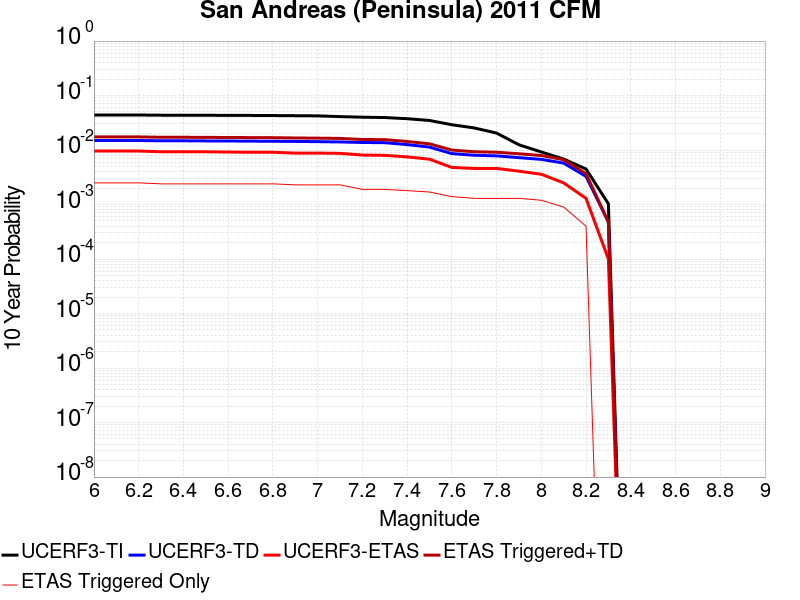 |

| Magnitude | 1 wk TI Prob | 1 wk TD Prob | 1 wk ETAS Prob | 1 wk ETAS/TD Gain | 1 wk ETAS Triggered+TD | 1 wk ETAS Triggered Only | 1 mo TI Prob | 1 mo TD Prob | 1 mo ETAS Prob | 1 mo ETAS/TD Gain | 1 mo ETAS Triggered+TD | 1 mo ETAS Triggered Only | 1 yr TI Prob | 1 yr TD Prob | 1 yr ETAS Prob | 1 yr ETAS/TD Gain | 1 yr ETAS Triggered+TD | 1 yr ETAS Triggered Only | 10 yr TI Prob | 10 yr TD Prob | 10 yr ETAS Prob | 10 yr ETAS/TD Gain | 10 yr ETAS Triggered+TD | 10 yr ETAS Triggered Only |
|-----|-----|-----|-----|-----|-----|-----|-----|-----|-----|-----|-----|-----|-----|-----|-----|-----|-----|-----|-----|-----|-----|-----|-----|-----|
| 6.0 | 8.6200685E-5 | 2.5237072E-5 | 2.0E-4 | 7.9248495 | 1.2523455E-4 | 1.0E-4 | 3.6937918E-4 | 1.081544E-4 | 2.0E-4 | 1.8492081 | 2.0814358E-4 | 1.0E-4 | 0.0044879215 | 0.001315986 | 7.0E-4 | 0.5319205 | 0.0015157228 | 2.0E-4 | 0.043983612 | 0.014786609 | 0.0096 | 0.6492361 | 0.017249642 | 0.0025 |
| 6.1 | 8.6200685E-5 | 2.5237072E-5 | 2.0E-4 | 7.9248495 | 1.2523455E-4 | 1.0E-4 | 3.6937918E-4 | 1.081544E-4 | 2.0E-4 | 1.8492081 | 2.0814358E-4 | 1.0E-4 | 0.0044879215 | 0.001315986 | 7.0E-4 | 0.5319205 | 0.0015157228 | 2.0E-4 | 0.043983612 | 0.014786609 | 0.0096 | 0.6492361 | 0.017249642 | 0.0025 |
| 6.2 | 8.6200685E-5 | 2.5237072E-5 | 2.0E-4 | 7.9248495 | 1.2523455E-4 | 1.0E-4 | 3.6937918E-4 | 1.081544E-4 | 2.0E-4 | 1.8492081 | 2.0814358E-4 | 1.0E-4 | 0.0044879215 | 0.001315986 | 7.0E-4 | 0.5319205 | 0.0015157228 | 2.0E-4 | 0.043983612 | 0.014786609 | 0.0096 | 0.6492361 | 0.017249642 | 0.0025 |
| 6.3 | 8.551163E-5 | 2.4929E-5 | 2.0E-4 | 8.022785 | 1.249265E-4 | 1.0E-4 | 3.6642692E-4 | 1.068342E-4 | 2.0E-4 | 1.8720596 | 2.0682352E-4 | 1.0E-4 | 0.004452125 | 0.0012999319 | 7.0E-4 | 0.5384897 | 0.001499672 | 2.0E-4 | 0.043639794 | 0.014613353 | 0.0093 | 0.6364043 | 0.01697828 | 0.0024 |
| 6.4 | 8.551163E-5 | 2.4929E-5 | 2.0E-4 | 8.022785 | 1.249265E-4 | 1.0E-4 | 3.6642692E-4 | 1.068342E-4 | 2.0E-4 | 1.8720596 | 2.0682352E-4 | 1.0E-4 | 0.004452125 | 0.0012999319 | 7.0E-4 | 0.5384897 | 0.001499672 | 2.0E-4 | 0.043639794 | 0.014613353 | 0.0093 | 0.6364043 | 0.01697828 | 0.0024 |
| 6.5 | 8.511146E-5 | 2.4750545E-5 | 2.0E-4 | 8.08063 | 1.2474807E-4 | 1.0E-4 | 3.647124E-4 | 1.0606946E-4 | 2.0E-4 | 1.8855568 | 2.0605886E-4 | 1.0E-4 | 0.004431336 | 0.0012906323 | 7.0E-4 | 0.54236984 | 0.0014903741 | 2.0E-4 | 0.04344007 | 0.014513159 | 0.0093 | 0.64079773 | 0.016878327 | 0.0024 |
| 6.6 | 8.4985084E-5 | 2.4681229E-5 | 2.0E-4 | 8.103324 | 1.2467876E-4 | 1.0E-4 | 3.6417096E-4 | 1.05772415E-4 | 2.0E-4 | 1.8908522 | 2.0576184E-4 | 1.0E-4 | 0.0044247704 | 0.00128702 | 7.0E-4 | 0.5438921 | 0.0014867627 | 2.0E-4 | 0.043376986 | 0.014475129 | 0.0092 | 0.6355729 | 0.016840389 | 0.0024 |
| 6.7 | 8.462618E-5 | 2.4509805E-5 | 2.0E-4 | 8.16 | 1.2450735E-4 | 1.0E-4 | 3.6263323E-4 | 1.05037805E-4 | 2.0E-4 | 1.9040763 | 2.050273E-4 | 1.0E-4 | 0.004406125 | 0.0012780867 | 7.0E-4 | 0.5476937 | 0.001477831 | 2.0E-4 | 0.043197807 | 0.014379936 | 0.0091 | 0.63282615 | 0.016745424 | 0.0024 |
| 6.8 | 8.42337E-5 | 2.4405754E-5 | 2.0E-4 | 8.194789 | 1.2440332E-4 | 1.0E-4 | 3.6095164E-4 | 1.04591905E-4 | 2.0E-4 | 1.9121939 | 2.0458145E-4 | 1.0E-4 | 0.004385734 | 0.0012726642 | 7.0E-4 | 0.55002725 | 0.0014724096 | 2.0E-4 | 0.043001823 | 0.014320639 | 0.0091 | 0.63544655 | 0.016686268 | 0.0024 |
| 6.9 | 8.365989E-5 | 2.4210576E-5 | 2.0E-4 | 8.260853 | 1.2420815E-4 | 1.0E-4 | 3.5849313E-4 | 1.0375549E-4 | 2.0E-4 | 1.9276088 | 2.0374512E-4 | 1.0E-4 | 0.004355922 | 0.0012624927 | 6.0E-4 | 0.47525027 | 0.0014622402 | 2.0E-4 | 0.04271523 | 0.014213223 | 0.0088 | 0.61914176 | 0.016480533 | 0.0023 |
| 7.0 | 8.30936E-5 | 2.3972276E-5 | 2.0E-4 | 8.342971 | 1.2396988E-4 | 1.0E-4 | 3.560668E-4 | 1.0273429E-4 | 2.0E-4 | 1.9467697 | 2.0272401E-4 | 1.0E-4 | 0.004326499 | 0.0012500739 | 6.0E-4 | 0.47997162 | 0.0014498238 | 2.0E-4 | 0.042432297 | 0.014084306 | 0.0088 | 0.62480897 | 0.016351912 | 0.0023 |
| 7.1 | 8.041264E-5 | 2.3659553E-5 | 2.0E-4 | 8.453245 | 1.2365718E-4 | 1.0E-4 | 3.4458007E-4 | 1.0139416E-4 | 2.0E-4 | 1.9725003 | 2.0138401E-4 | 1.0E-4 | 0.0041871946 | 0.0012337763 | 6.0E-4 | 0.4863118 | 0.0014335297 | 2.0E-4 | 0.041091725 | 0.013907789 | 0.0087 | 0.6255488 | 0.016175801 | 0.0023 |
| 7.2 | 7.8427016E-5 | 2.308404E-5 | 2.0E-4 | 8.663995 | 1.2308173E-4 | 1.0E-4 | 3.3607247E-4 | 9.892785E-5 | 2.0E-4 | 2.0216753 | 1.9891796E-4 | 1.0E-4 | 0.004084008 | 0.0012037827 | 6.0E-4 | 0.49842882 | 0.0014035419 | 2.0E-4 | 0.040097635 | 0.013592503 | 0.0081 | 0.59591675 | 0.015466677 | 0.0019 |
| 7.3 | 7.721087E-5 | 2.2869219E-5 | 2.0E-4 | 8.745379 | 1.2286693E-4 | 1.0E-4 | 3.3086175E-4 | 9.8007265E-5 | 2.0E-4 | 2.040665 | 1.9799746E-4 | 1.0E-4 | 0.004020803 | 0.0011925868 | 6.0E-4 | 0.503108 | 0.0013923483 | 2.0E-4 | 0.03948827 | 0.013476408 | 0.008 | 0.59362996 | 0.015350803 | 0.0019 |
| 7.4 | 7.3536525E-5 | 2.0988951E-5 | 2.0E-4 | 9.528823 | 1.2098685E-4 | 1.0E-4 | 3.1511846E-4 | 8.994956E-5 | 2.0E-4 | 2.2234685 | 1.8994056E-4 | 1.0E-4 | 0.0038298194 | 0.0010945869 | 6.0E-4 | 0.54815197 | 0.0012943681 | 2.0E-4 | 0.037644852 | 0.012434425 | 0.0075 | 0.6031642 | 0.014212043 | 0.0018 |
| 7.5 | 6.806207E-5 | 1.8799083E-5 | 2.0E-4 | 10.638818 | 1.187972E-4 | 1.0E-4 | 2.9166197E-4 | 8.056501E-5 | 2.0E-4 | 2.4824672 | 1.8055695E-4 | 1.0E-4 | 0.0035452035 | 9.804387E-4 | 6.0E-4 | 0.61197096 | 0.0011802426 | 2.0E-4 | 0.034891766 | 0.011189966 | 0.0068 | 0.60768723 | 0.012870944 | 0.0017 |
| 7.6 | 5.6731416E-5 | 1.4217919E-5 | 2.0E-4 | 14.066756 | 1.142165E-4 | 1.0E-4 | 2.43112E-4 | 6.0932514E-5 | 2.0E-4 | 3.2823198 | 1.6092641E-4 | 1.0E-4 | 0.0029558712 | 7.41601E-4 | 5.0E-4 | 0.674217 | 9.414527E-4 | 2.0E-4 | 0.02916862 | 0.008507224 | 0.0048 | 0.5642264 | 0.0098953135 | 0.0014 |
| 7.7 | 4.946994E-5 | 1.328855E-5 | 2.0E-4 | 15.050551 | 1.1328722E-4 | 1.0E-4 | 2.1199681E-4 | 5.694968E-5 | 2.0E-4 | 3.511872 | 1.5694399E-4 | 1.0E-4 | 0.002578006 | 6.9314195E-4 | 4.0E-4 | 0.5770824 | 8.930033E-4 | 2.0E-4 | 0.02548303 | 0.007930608 | 0.0046 | 0.5800313 | 0.009220297 | 0.0013 |
| 7.8 | 3.9718198E-5 | 1.3024659E-5 | 2.0E-4 | 15.355489 | 1.1302336E-4 | 1.0E-4 | 1.7020974E-4 | 5.581877E-5 | 2.0E-4 | 3.583024 | 1.5581319E-4 | 1.0E-4 | 0.0020703338 | 6.793818E-4 | 4.0E-4 | 0.58877057 | 8.792459E-4 | 2.0E-4 | 0.020511515 | 0.0077410443 | 0.0046 | 0.59423506 | 0.009030981 | 0.0013 |
| 7.9 | 2.4115114E-5 | 1.2226233E-5 | 2.0E-4 | 16.358269 | 1.1222501E-4 | 1.0E-4 | 1.0334639E-4 | 5.2397085E-5 | 2.0E-4 | 3.817006 | 1.5239185E-4 | 1.0E-4 | 0.001257516 | 6.3774793E-4 | 4.0E-4 | 0.62720704 | 8.376204E-4 | 2.0E-4 | 0.012504238 | 0.0071807476 | 0.0041 | 0.5709712 | 0.008471413 | 0.0013 |
| 8.0 | 1.7756569E-5 | 1.1448431E-5 | 2.0E-4 | 17.469643 | 1.1144728E-4 | 1.0E-4 | 7.6097356E-5 | 4.906378E-5 | 2.0E-4 | 4.076327 | 1.4905888E-4 | 1.0E-4 | 9.260915E-4 | 5.9718796E-4 | 4.0E-4 | 0.6698059 | 7.9706847E-4 | 2.0E-4 | 0.009222416 | 0.006680002 | 0.0036 | 0.538922 | 0.007871986 | 0.0012 |
| 8.1 | 1.3159258E-5 | 9.778358E-6 | 2.0E-4 | 20.453331 | 1.0977738E-4 | 1.0E-4 | 5.6395602E-5 | 4.1906576E-5 | 2.0E-4 | 4.7725205 | 1.4190239E-4 | 1.0E-4 | 6.864001E-4 | 5.1009323E-4 | 4.0E-4 | 0.7841703 | 7.099912E-4 | 2.0E-4 | 0.0068428386 | 0.005706895 | 0.0025 | 0.43806657 | 0.006601759 | 9.0E-4 |
| 8.2 | 8.635426E-6 | 5.483879E-6 | 2.0E-4 | 36.470535 | 1.05483334E-4 | 1.0E-4 | 3.700844E-5 | 2.3502125E-5 | 2.0E-4 | 8.509869 | 1.2349978E-4 | 1.0E-4 | 4.5048463E-4 | 2.861009E-4 | 2.0E-4 | 0.69905406 | 3.860723E-4 | 1.0E-4 | 0.004495725 | 0.0032537563 | 0.0013 | 0.39953822 | 0.0036524548 | 4.0E-4 |
| 8.3 | 1.983087E-6 | 7.683211E-7 | 0.0 | 0.0 | 7.683211E-7 | 0.0 | 8.498917E-6 | 3.2928008E-6 | 0.0 | 0.0 | 3.2928008E-6 | 0.0 | 1.034694E-4 | 4.008913E-5 | 0.0 | 0.0 | 4.008913E-5 | 0.0 | 0.0010342124 | 4.7332307E-4 | 1.0E-4 | 0.21127218 | 4.7332307E-4 | 0.0 |

## Big Lagoon - Bald Mtn 2011 CFM
*[(top)](#table-of-contents)*

| 1 Week | 1 Month | 1 Year | 10 Year |
|-----|-----|-----|-----|
|  | 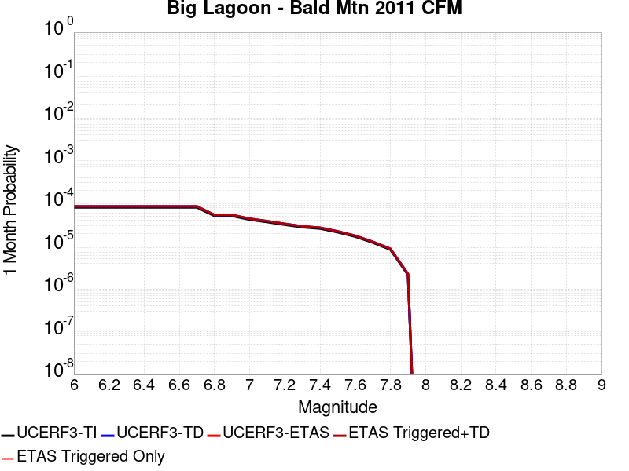 |  |  |

| Magnitude | 1 wk TI Prob | 1 wk TD Prob | 1 wk ETAS Prob | 1 wk ETAS/TD Gain | 1 wk ETAS Triggered+TD | 1 wk ETAS Triggered Only | 1 mo TI Prob | 1 mo TD Prob | 1 mo ETAS Prob | 1 mo ETAS/TD Gain | 1 mo ETAS Triggered+TD | 1 mo ETAS Triggered Only | 1 yr TI Prob | 1 yr TD Prob | 1 yr ETAS Prob | 1 yr ETAS/TD Gain | 1 yr ETAS Triggered+TD | 1 yr ETAS Triggered Only | 10 yr TI Prob | 10 yr TD Prob | 10 yr ETAS Prob | 10 yr ETAS/TD Gain | 10 yr ETAS Triggered+TD | 10 yr ETAS Triggered Only |
|-----|-----|-----|-----|-----|-----|-----|-----|-----|-----|-----|-----|-----|-----|-----|-----|-----|-----|-----|-----|-----|-----|-----|-----|-----|
| 6.0 | 1.8699735E-5 | 1.9852614E-5 | 0.0 | 0.0 | 1.9852614E-5 | 0.0 | 8.013926E-5 | 8.508007E-5 | 0.0 | 0.0 | 8.508007E-5 | 0.0 | 9.752587E-4 | 0.0010353954 | 3.0E-4 | 0.28974438 | 0.0011352919 | 1.0E-4 | 0.009709897 | 0.010309531 | 0.0089 | 0.8632788 | 0.012783757 | 0.0025 |
| 6.1 | 1.8699735E-5 | 1.9852614E-5 | 0.0 | 0.0 | 1.9852614E-5 | 0.0 | 8.013926E-5 | 8.508007E-5 | 0.0 | 0.0 | 8.508007E-5 | 0.0 | 9.752587E-4 | 0.0010353954 | 3.0E-4 | 0.28974438 | 0.0011352919 | 1.0E-4 | 0.009709897 | 0.010309531 | 0.0089 | 0.8632788 | 0.012783757 | 0.0025 |
| 6.2 | 1.8699735E-5 | 1.9852614E-5 | 0.0 | 0.0 | 1.9852614E-5 | 0.0 | 8.013926E-5 | 8.508007E-5 | 0.0 | 0.0 | 8.508007E-5 | 0.0 | 9.752587E-4 | 0.0010353954 | 3.0E-4 | 0.28974438 | 0.0011352919 | 1.0E-4 | 0.009709897 | 0.010309531 | 0.0089 | 0.8632788 | 0.012783757 | 0.0025 |
| 6.3 | 1.8699735E-5 | 1.9852614E-5 | 0.0 | 0.0 | 1.9852614E-5 | 0.0 | 8.013926E-5 | 8.508007E-5 | 0.0 | 0.0 | 8.508007E-5 | 0.0 | 9.752587E-4 | 0.0010353954 | 3.0E-4 | 0.28974438 | 0.0011352919 | 1.0E-4 | 0.009709897 | 0.010309531 | 0.0089 | 0.8632788 | 0.012783757 | 0.0025 |
| 6.4 | 1.8699735E-5 | 1.9852614E-5 | 0.0 | 0.0 | 1.9852614E-5 | 0.0 | 8.013926E-5 | 8.508007E-5 | 0.0 | 0.0 | 8.508007E-5 | 0.0 | 9.752587E-4 | 0.0010353954 | 3.0E-4 | 0.28974438 | 0.0011352919 | 1.0E-4 | 0.009709897 | 0.010309531 | 0.0089 | 0.8632788 | 0.012783757 | 0.0025 |
| 6.5 | 1.8699735E-5 | 1.9852614E-5 | 0.0 | 0.0 | 1.9852614E-5 | 0.0 | 8.013926E-5 | 8.508007E-5 | 0.0 | 0.0 | 8.508007E-5 | 0.0 | 9.752587E-4 | 0.0010353954 | 3.0E-4 | 0.28974438 | 0.0011352919 | 1.0E-4 | 0.009709897 | 0.010309531 | 0.0089 | 0.8632788 | 0.012783757 | 0.0025 |
| 6.6 | 1.8699735E-5 | 1.9852614E-5 | 0.0 | 0.0 | 1.9852614E-5 | 0.0 | 8.013926E-5 | 8.508007E-5 | 0.0 | 0.0 | 8.508007E-5 | 0.0 | 9.752587E-4 | 0.0010353954 | 3.0E-4 | 0.28974438 | 0.0011352919 | 1.0E-4 | 0.009709897 | 0.010309531 | 0.0089 | 0.8632788 | 0.012783757 | 0.0025 |
| 6.7 | 1.8699735E-5 | 1.9852614E-5 | 0.0 | 0.0 | 1.9852614E-5 | 0.0 | 8.013926E-5 | 8.508007E-5 | 0.0 | 0.0 | 8.508007E-5 | 0.0 | 9.752587E-4 | 0.0010353954 | 3.0E-4 | 0.28974438 | 0.0011352919 | 1.0E-4 | 0.009709897 | 0.010309531 | 0.0089 | 0.8632788 | 0.012783757 | 0.0025 |
| 6.8 | 1.18505095E-5 | 1.2501166E-5 | 0.0 | 0.0 | 1.2501166E-5 | 0.0 | 5.078691E-5 | 5.3575353E-5 | 0.0 | 0.0 | 5.3575353E-5 | 0.0 | 6.181552E-4 | 6.5208954E-4 | 3.0E-4 | 0.46005952 | 7.520243E-4 | 1.0E-4 | 0.006164385 | 0.006502265 | 0.0064 | 0.9842724 | 0.008389911 | 0.0019 |
| 6.9 | 1.18505095E-5 | 1.2501166E-5 | 0.0 | 0.0 | 1.2501166E-5 | 0.0 | 5.078691E-5 | 5.3575353E-5 | 0.0 | 0.0 | 5.3575353E-5 | 0.0 | 6.181552E-4 | 6.5208954E-4 | 3.0E-4 | 0.46005952 | 7.520243E-4 | 1.0E-4 | 0.006164385 | 0.006502265 | 0.0064 | 0.9842724 | 0.008389911 | 0.0019 |
| 7.0 | 9.719786E-6 | 1.02365675E-5 | 0.0 | 0.0 | 1.02365675E-5 | 0.0 | 4.1655563E-5 | 4.3870277E-5 | 0.0 | 0.0 | 4.3870277E-5 | 0.0 | 5.0703844E-4 | 5.339921E-4 | 3.0E-4 | 0.5618061 | 6.3393865E-4 | 1.0E-4 | 0.005058831 | 0.005327336 | 0.0056 | 1.051182 | 0.006918812 | 0.0016 |
| 7.1 | 8.523418E-6 | 8.970396E-6 | 0.0 | 0.0 | 8.970396E-6 | 0.0 | 3.652842E-5 | 3.8444E-5 | 0.0 | 0.0 | 3.8444E-5 | 0.0 | 4.4464276E-4 | 4.679567E-4 | 3.0E-4 | 0.6410849 | 5.679099E-4 | 1.0E-4 | 0.0044375416 | 0.004669877 | 0.0047 | 1.0064505 | 0.006063339 | 0.0014 |
| 7.2 | 7.378894E-6 | 7.761912E-6 | 0.0 | 0.0 | 7.761912E-6 | 0.0 | 3.162345E-5 | 3.3264918E-5 | 0.0 | 0.0 | 3.3264918E-5 | 0.0 | 3.8494746E-4 | 4.04926E-4 | 3.0E-4 | 0.74087614 | 5.048855E-4 | 1.0E-4 | 0.0038428132 | 0.0040419777 | 0.0046 | 1.1380568 | 0.005436319 | 0.0014 |
| 7.3 | 6.4640294E-6 | 6.7931296E-6 | 0.0 | 0.0 | 6.7931296E-6 | 0.0 | 2.7702688E-5 | 2.9113091E-5 | 0.0 | 0.0 | 2.9113091E-5 | 0.0 | 3.3722803E-4 | 3.543949E-4 | 3.0E-4 | 0.84651333 | 4.5435946E-4 | 1.0E-4 | 0.0033671674 | 0.0035383673 | 0.0037 | 1.04568 | 0.0046344753 | 0.0011 |
| 7.4 | 5.9959093E-6 | 6.2994322E-6 | 0.0 | 0.0 | 6.2994322E-6 | 0.0 | 2.5696501E-5 | 2.6997292E-5 | 0.0 | 0.0 | 2.6997292E-5 | 0.0 | 3.1280998E-4 | 3.2864304E-4 | 2.0E-4 | 0.608563 | 3.2864304E-4 | 0.0 | 0.0031237002 | 0.0032816324 | 0.0035 | 1.0665424 | 0.0042783506 | 0.001 |
| 7.5 | 4.929265E-6 | 5.1769116E-6 | 0.0 | 0.0 | 5.1769116E-6 | 0.0 | 2.112525E-5 | 2.2186578E-5 | 0.0 | 0.0 | 2.2186578E-5 | 0.0 | 2.5716957E-4 | 2.700885E-4 | 1.0E-4 | 0.37024903 | 2.700885E-4 | 0.0 | 0.0025687215 | 0.0026976431 | 0.0029 | 1.0750124 | 0.0034954848 | 8.0E-4 |
| 7.6 | 3.8982403E-6 | 4.0893237E-6 | 0.0 | 0.0 | 4.0893237E-6 | 0.0 | 1.6706637E-5 | 1.7525557E-5 | 0.0 | 0.0 | 1.7525557E-5 | 0.0 | 2.0338432E-4 | 2.1335304E-4 | 1.0E-4 | 0.4687067 | 2.1335304E-4 | 0.0 | 0.0020319829 | 0.0021315098 | 0.0026 | 1.2197926 | 0.0029298046 | 8.0E-4 |
| 7.7 | 2.820968E-6 | 2.957495E-6 | 0.0 | 0.0 | 2.957495E-6 | 0.0 | 1.2089806E-5 | 1.2674918E-5 | 0.0 | 0.0 | 1.2674918E-5 | 0.0 | 1.4718344E-4 | 1.5430637E-4 | 0.0 | 0.0 | 1.5430637E-4 | 0.0 | 0.00147086 | 0.00154201 | 0.0019 | 1.2321581 | 0.002041239 | 5.0E-4 |
| 7.8 | 1.9314455E-6 | 2.0262153E-6 | 0.0 | 0.0 | 2.0262153E-6 | 0.0 | 8.277597E-6 | 8.683752E-6 | 0.0 | 0.0 | 8.683752E-6 | 0.0 | 1.0077508E-4 | 1.0571968E-4 | 0.0 | 0.0 | 1.0571968E-4 | 0.0 | 0.0010072939 | 0.0010567068 | 0.0015 | 1.4195045 | 0.0012564954 | 2.0E-4 |
| 7.9 | 4.9586197E-7 | 5.2194645E-7 | 0.0 | 0.0 | 5.2194645E-7 | 0.0 | 2.125121E-6 | 2.2369118E-6 | 0.0 | 0.0 | 2.2369118E-6 | 0.0 | 2.5873042E-5 | 2.723408E-5 | 0.0 | 0.0 | 2.723408E-5 | 0.0 | 2.5870028E-4 | 2.7230952E-4 | 3.0E-4 | 1.1016876 | 2.7230952E-4 | 0.0 |

## Garlic Springs
*[(top)](#table-of-contents)*

| 1 Week | 1 Month | 1 Year | 10 Year |
|-----|-----|-----|-----|
|  | 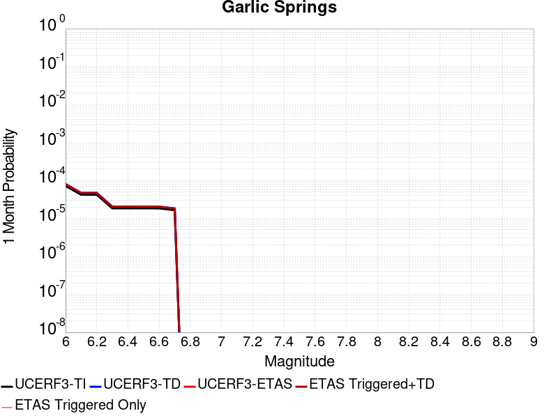 |  | 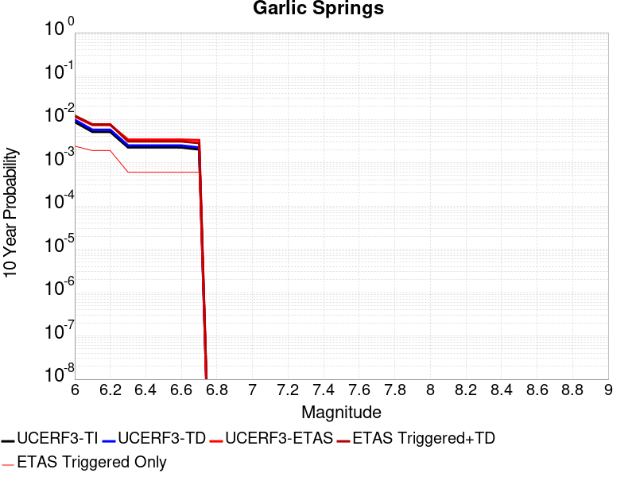 |

| Magnitude | 1 wk TI Prob | 1 wk TD Prob | 1 wk ETAS Prob | 1 wk ETAS/TD Gain | 1 wk ETAS Triggered+TD | 1 wk ETAS Triggered Only | 1 mo TI Prob | 1 mo TD Prob | 1 mo ETAS Prob | 1 mo ETAS/TD Gain | 1 mo ETAS Triggered+TD | 1 mo ETAS Triggered Only | 1 yr TI Prob | 1 yr TD Prob | 1 yr ETAS Prob | 1 yr ETAS/TD Gain | 1 yr ETAS Triggered+TD | 1 yr ETAS Triggered Only | 10 yr TI Prob | 10 yr TD Prob | 10 yr ETAS Prob | 10 yr ETAS/TD Gain | 10 yr ETAS Triggered+TD | 10 yr ETAS Triggered Only |
|-----|-----|-----|-----|-----|-----|-----|-----|-----|-----|-----|-----|-----|-----|-----|-----|-----|-----|-----|-----|-----|-----|-----|-----|-----|
| 6.0 | 1.6760017E-5 | 1.8781318E-5 | 0.0 | 0.0 | 1.8781318E-5 | 0.0 | 7.182667E-5 | 8.048954E-5 | 0.0 | 0.0 | 8.048954E-5 | 0.0 | 8.7413884E-4 | 9.79637E-4 | 7.0E-4 | 0.7145504 | 0.0012793432 | 3.0E-4 | 0.008707083 | 0.0097647365 | 0.0116 | 1.1879481 | 0.012141301 | 0.0024 |
| 6.1 | 9.852767E-6 | 1.0976064E-5 | 0.0 | 0.0 | 1.0976064E-5 | 0.0 | 4.222546E-5 | 4.7039826E-5 | 0.0 | 0.0 | 4.7039826E-5 | 0.0 | 5.139737E-4 | 5.726304E-4 | 6.0E-4 | 1.0477964 | 7.7251584E-4 | 2.0E-4 | 0.005127866 | 0.0057185097 | 0.0074 | 1.2940434 | 0.007607645 | 0.0019 |
| 6.2 | 9.852767E-6 | 1.0976064E-5 | 0.0 | 0.0 | 1.0976064E-5 | 0.0 | 4.222546E-5 | 4.7039826E-5 | 0.0 | 0.0 | 4.7039826E-5 | 0.0 | 5.139737E-4 | 5.726304E-4 | 6.0E-4 | 1.0477964 | 7.7251584E-4 | 2.0E-4 | 0.005127866 | 0.0057185097 | 0.0074 | 1.2940434 | 0.007607645 | 0.0019 |
| 6.3 | 4.3167724E-6 | 4.7790413E-6 | 0.0 | 0.0 | 4.7790413E-6 | 0.0 | 1.8500323E-5 | 2.0481575E-5 | 0.0 | 0.0 | 2.0481575E-5 | 0.0 | 2.2521814E-4 | 2.4935766E-4 | 3.0E-4 | 1.2030911 | 3.4933272E-4 | 1.0E-4 | 0.0022499003 | 0.002493038 | 0.0034 | 1.3637979 | 0.0030915423 | 6.0E-4 |
| 6.4 | 4.3167724E-6 | 4.7790413E-6 | 0.0 | 0.0 | 4.7790413E-6 | 0.0 | 1.8500323E-5 | 2.0481575E-5 | 0.0 | 0.0 | 2.0481575E-5 | 0.0 | 2.2521814E-4 | 2.4935766E-4 | 3.0E-4 | 1.2030911 | 3.4933272E-4 | 1.0E-4 | 0.0022499003 | 0.002493038 | 0.0034 | 1.3637979 | 0.0030915423 | 6.0E-4 |
| 6.5 | 4.3167724E-6 | 4.7790413E-6 | 0.0 | 0.0 | 4.7790413E-6 | 0.0 | 1.8500323E-5 | 2.0481575E-5 | 0.0 | 0.0 | 2.0481575E-5 | 0.0 | 2.2521814E-4 | 2.4935766E-4 | 3.0E-4 | 1.2030911 | 3.4933272E-4 | 1.0E-4 | 0.0022499003 | 0.002493038 | 0.0034 | 1.3637979 | 0.0030915423 | 6.0E-4 |
| 6.6 | 4.301311E-6 | 4.761906E-6 | 0.0 | 0.0 | 4.761906E-6 | 0.0 | 1.8434059E-5 | 2.0408139E-5 | 0.0 | 0.0 | 2.0408139E-5 | 0.0 | 2.2441156E-4 | 2.484638E-4 | 3.0E-4 | 1.2074194 | 3.4843895E-4 | 1.0E-4 | 0.0022418506 | 0.0024841193 | 0.0034 | 1.3686943 | 0.0030826288 | 6.0E-4 |
| 6.7 | 3.8599724E-6 | 4.271962E-6 | 0.0 | 0.0 | 4.271962E-6 | 0.0 | 1.6542634E-5 | 1.8308408E-5 | 0.0 | 0.0 | 1.8308408E-5 | 0.0 | 2.0138794E-4 | 2.2290487E-4 | 3.0E-4 | 1.3458656 | 3.2288258E-4 | 1.0E-4 | 0.0020120554 | 0.0022290489 | 0.0033 | 1.4804522 | 0.0028277114 | 6.0E-4 |

## Elsinore (Coyote Mountains)
*[(top)](#table-of-contents)*

| 1 Week | 1 Month | 1 Year | 10 Year |
|-----|-----|-----|-----|
| 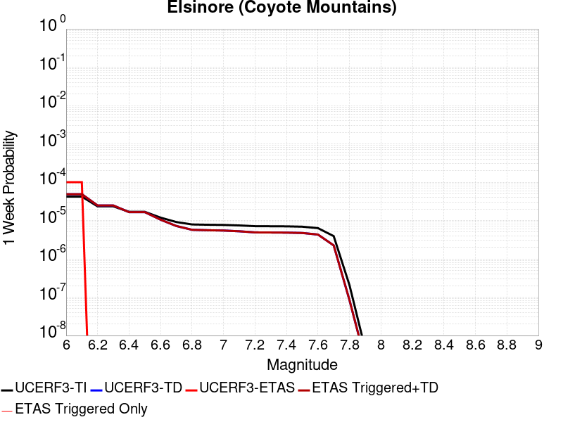 |  |  |  |

| Magnitude | 1 wk TI Prob | 1 wk TD Prob | 1 wk ETAS Prob | 1 wk ETAS/TD Gain | 1 wk ETAS Triggered+TD | 1 wk ETAS Triggered Only | 1 mo TI Prob | 1 mo TD Prob | 1 mo ETAS Prob | 1 mo ETAS/TD Gain | 1 mo ETAS Triggered+TD | 1 mo ETAS Triggered Only | 1 yr TI Prob | 1 yr TD Prob | 1 yr ETAS Prob | 1 yr ETAS/TD Gain | 1 yr ETAS Triggered+TD | 1 yr ETAS Triggered Only | 10 yr TI Prob | 10 yr TD Prob | 10 yr ETAS Prob | 10 yr ETAS/TD Gain | 10 yr ETAS Triggered+TD | 10 yr ETAS Triggered Only |
|-----|-----|-----|-----|-----|-----|-----|-----|-----|-----|-----|-----|-----|-----|-----|-----|-----|-----|-----|-----|-----|-----|-----|-----|-----|
| 6.0 | 4.20513E-5 | 4.8656337E-5 | 1.0E-4 | 2.0552306 | 4.8656337E-5 | 0.0 | 1.8020741E-4 | 2.0851374E-4 | 3.0E-4 | 1.4387541 | 2.0851374E-4 | 0.0 | 0.0021918174 | 0.0025362293 | 0.0015 | 0.5914292 | 0.002935215 | 4.0E-4 | 0.021703249 | 0.025124125 | 0.0141 | 0.56121355 | 0.027463827 | 0.0024 |
| 6.1 | 4.20513E-5 | 4.8656337E-5 | 1.0E-4 | 2.0552306 | 4.8656337E-5 | 0.0 | 1.8020741E-4 | 2.0851374E-4 | 3.0E-4 | 1.4387541 | 2.0851374E-4 | 0.0 | 0.0021918174 | 0.0025362293 | 0.0015 | 0.5914292 | 0.002935215 | 4.0E-4 | 0.021703249 | 0.025124125 | 0.0141 | 0.56121355 | 0.027463827 | 0.0024 |
| 6.2 | 2.3413893E-5 | 2.4707664E-5 | 0.0 | 0.0 | 2.4707664E-5 | 0.0 | 1.0034139E-4 | 1.0588623E-4 | 1.0E-4 | 0.94440985 | 1.0588623E-4 | 0.0 | 0.0012209718 | 0.001288491 | 6.0E-4 | 0.46566102 | 0.001288491 | 0.0 | 0.012142851 | 0.012818878 | 0.0066 | 0.5148657 | 0.014299649 | 0.0015 |
| 6.3 | 2.3413893E-5 | 2.4707664E-5 | 0.0 | 0.0 | 2.4707664E-5 | 0.0 | 1.0034139E-4 | 1.0588623E-4 | 1.0E-4 | 0.94440985 | 1.0588623E-4 | 0.0 | 0.0012209718 | 0.001288491 | 6.0E-4 | 0.46566102 | 0.001288491 | 0.0 | 0.012142851 | 0.012818878 | 0.0066 | 0.5148657 | 0.014299649 | 0.0015 |
| 6.4 | 1.6894814E-5 | 1.6576523E-5 | 0.0 | 0.0 | 1.6576523E-5 | 0.0 | 7.240433E-5 | 7.104052E-5 | 1.0E-4 | 1.4076473 | 7.104052E-5 | 0.0 | 8.811662E-4 | 8.646121E-4 | 5.0E-4 | 0.578294 | 8.646121E-4 | 0.0 | 0.0087768035 | 0.008616141 | 0.0041 | 0.4758511 | 0.009607525 | 0.001 |
| 6.5 | 1.6894814E-5 | 1.6576523E-5 | 0.0 | 0.0 | 1.6576523E-5 | 0.0 | 7.240433E-5 | 7.104052E-5 | 1.0E-4 | 1.4076473 | 7.104052E-5 | 0.0 | 8.811662E-4 | 8.646121E-4 | 5.0E-4 | 0.578294 | 8.646121E-4 | 0.0 | 0.0087768035 | 0.008616141 | 0.0041 | 0.4758511 | 0.009607525 | 0.001 |
| 6.6 | 1.1910969E-5 | 1.05363215E-5 | 0.0 | 0.0 | 1.05363215E-5 | 0.0 | 5.1046012E-5 | 4.515496E-5 | 0.0 | 0.0 | 4.515496E-5 | 0.0 | 6.21308E-4 | 5.496361E-4 | 2.0E-4 | 0.36387715 | 5.496361E-4 | 0.0 | 0.0061957375 | 0.005484068 | 0.0021 | 0.38292742 | 0.005981326 | 5.0E-4 |
| 6.7 | 9.1486E-6 | 7.207078E-6 | 0.0 | 0.0 | 7.207078E-6 | 0.0 | 3.9207694E-5 | 3.088713E-5 | 0.0 | 0.0 | 3.088713E-5 | 0.0 | 4.7724912E-4 | 3.7598977E-4 | 2.0E-4 | 0.5319294 | 3.7598977E-4 | 0.0 | 0.0047622547 | 0.0037539161 | 0.0014 | 0.37294388 | 0.0039531654 | 2.0E-4 |
| 6.8 | 7.90441E-6 | 5.7327056E-6 | 0.0 | 0.0 | 5.7327056E-6 | 0.0 | 3.3875604E-5 | 2.4568513E-5 | 0.0 | 0.0 | 2.4568513E-5 | 0.0 | 4.1235742E-4 | 2.9908188E-4 | 2.0E-4 | 0.6687132 | 2.9908188E-4 | 0.0 | 0.0041159308 | 0.0029869226 | 0.001 | 0.33479276 | 0.0030866237 | 1.0E-4 |
| 6.9 | 7.77015E-6 | 5.5866344E-6 | 0.0 | 0.0 | 5.5866344E-6 | 0.0 | 3.3300217E-5 | 2.3942506E-5 | 0.0 | 0.0 | 2.3942506E-5 | 0.0 | 4.0535472E-4 | 2.914623E-4 | 2.0E-4 | 0.68619514 | 2.914623E-4 | 0.0 | 0.004046161 | 0.0029109276 | 0.001 | 0.34353313 | 0.0030106364 | 1.0E-4 |
| 7.0 | 7.675798E-6 | 5.483474E-6 | 0.0 | 0.0 | 5.483474E-6 | 0.0 | 3.289586E-5 | 2.3500397E-5 | 0.0 | 0.0 | 2.3500397E-5 | 0.0 | 4.004335E-4 | 2.8608105E-4 | 2.0E-4 | 0.6991026 | 2.8608105E-4 | 0.0 | 0.003997127 | 0.0028572544 | 0.001 | 0.34998634 | 0.0029569685 | 1.0E-4 |
| 7.1 | 7.447814E-6 | 5.242317E-6 | 0.0 | 0.0 | 5.242317E-6 | 0.0 | 3.191881E-5 | 2.2466886E-5 | 0.0 | 0.0 | 2.2466886E-5 | 0.0 | 3.8854225E-4 | 2.7350124E-4 | 2.0E-4 | 0.7312581 | 2.7350124E-4 | 0.0 | 0.003878636 | 0.002731771 | 8.0E-4 | 0.29285032 | 0.002831498 | 1.0E-4 |
| 7.2 | 7.128185E-6 | 4.9089517E-6 | 0.0 | 0.0 | 4.9089517E-6 | 0.0 | 3.0549007E-5 | 2.1038202E-5 | 0.0 | 0.0 | 2.1038202E-5 | 0.0 | 3.7187067E-4 | 2.561112E-4 | 2.0E-4 | 0.7809108 | 2.561112E-4 | 0.0 | 0.00371249 | 0.0025582789 | 8.0E-4 | 0.31271023 | 0.002658023 | 1.0E-4 |
| 7.3 | 7.0913875E-6 | 4.877622E-6 | 0.0 | 0.0 | 4.877622E-6 | 0.0 | 3.0391306E-5 | 2.0903932E-5 | 0.0 | 0.0 | 2.0903932E-5 | 0.0 | 3.6995133E-4 | 2.5447685E-4 | 2.0E-4 | 0.7859261 | 2.5447685E-4 | 0.0 | 0.0036933604 | 0.002541973 | 8.0E-4 | 0.3147162 | 0.0026417188 | 1.0E-4 |
| 7.4 | 7.051521E-6 | 4.8414695E-6 | 0.0 | 0.0 | 4.8414695E-6 | 0.0 | 3.0220453E-5 | 2.0748997E-5 | 0.0 | 0.0 | 2.0748997E-5 | 0.0 | 3.6787192E-4 | 2.5259095E-4 | 2.0E-4 | 0.791794 | 2.5259095E-4 | 0.0 | 0.0036726352 | 0.0025231568 | 8.0E-4 | 0.31706312 | 0.0026229045 | 1.0E-4 |
| 7.5 | 6.910666E-6 | 4.736918E-6 | 0.0 | 0.0 | 4.736918E-6 | 0.0 | 2.9616802E-5 | 2.0300926E-5 | 0.0 | 0.0 | 2.0300926E-5 | 0.0 | 3.605249E-4 | 2.4713692E-4 | 2.0E-4 | 0.80926794 | 2.4713692E-4 | 0.0 | 0.0035994058 | 0.0024687392 | 8.0E-4 | 0.32405207 | 0.0025684922 | 1.0E-4 |
| 7.6 | 6.341753E-6 | 4.3098894E-6 | 0.0 | 0.0 | 4.3098894E-6 | 0.0 | 2.7178658E-5 | 1.847083E-5 | 0.0 | 0.0 | 1.847083E-5 | 0.0 | 3.3084993E-4 | 2.2486031E-4 | 2.0E-4 | 0.88944113 | 2.2486031E-4 | 0.0 | 0.0033035777 | 0.0022464432 | 7.0E-4 | 0.3116037 | 0.0022464432 | 0.0 |
| 7.7 | 3.9205916E-6 | 2.2457596E-6 | 0.0 | 0.0 | 2.2457596E-6 | 0.0 | 1.6802427E-5 | 9.624652E-6 | 0.0 | 0.0 | 9.624652E-6 | 0.0 | 2.0455034E-4 | 1.1717459E-4 | 1.0E-4 | 0.85342735 | 1.1717459E-4 | 0.0 | 0.0020436216 | 0.0011712011 | 4.0E-4 | 0.34152973 | 0.0011712011 | 0.0 |
| 7.8 | 2.0846227E-7 | 8.49184E-8 | 0.0 | 0.0 | 8.49184E-8 | 0.0 | 8.9340944E-7 | 3.6393595E-7 | 0.0 | 0.0 | 3.6393595E-7 | 0.0 | 1.0877206E-5 | 4.4309145E-6 | 0.0 | 0.0 | 4.4309145E-6 | 0.0 | 1.0876673E-4 | 4.4308592E-5 | 0.0 | 0.0 | 4.4308592E-5 | 0.0 |
| 7.9 | 4.4969806E-9 | 2.2703426E-9 | 0.0 | 0.0 | 2.2703426E-9 | 0.0 | 1.9272775E-8 | 9.73004E-9 | 0.0 | 0.0 | 9.73004E-9 | 0.0 | 2.3464601E-7 | 1.1846323E-7 | 0.0 | 0.0 | 1.1846323E-7 | 0.0 | 2.3464577E-6 | 1.1846317E-6 | 0.0 | 0.0 | 1.1846317E-6 | 0.0 |

## San Jacinto (Borrego)
*[(top)](#table-of-contents)*

| 1 Week | 1 Month | 1 Year | 10 Year |
|-----|-----|-----|-----|
|  |  |  |  |

| Magnitude | 1 wk TI Prob | 1 wk TD Prob | 1 wk ETAS Prob | 1 wk ETAS/TD Gain | 1 wk ETAS Triggered+TD | 1 wk ETAS Triggered Only | 1 mo TI Prob | 1 mo TD Prob | 1 mo ETAS Prob | 1 mo ETAS/TD Gain | 1 mo ETAS Triggered+TD | 1 mo ETAS Triggered Only | 1 yr TI Prob | 1 yr TD Prob | 1 yr ETAS Prob | 1 yr ETAS/TD Gain | 1 yr ETAS Triggered+TD | 1 yr ETAS Triggered Only | 10 yr TI Prob | 10 yr TD Prob | 10 yr ETAS Prob | 10 yr ETAS/TD Gain | 10 yr ETAS Triggered+TD | 10 yr ETAS Triggered Only |
|-----|-----|-----|-----|-----|-----|-----|-----|-----|-----|-----|-----|-----|-----|-----|-----|-----|-----|-----|-----|-----|-----|-----|-----|-----|
| 6.0 | 3.543992E-5 | 2.798106E-5 | 0.0 | 0.0 | 2.798106E-5 | 0.0 | 1.5187653E-4 | 1.1991338E-4 | 0.0 | 0.0 | 1.1991338E-4 | 0.0 | 0.0018475284 | 0.0014589799 | 9.0E-4 | 0.61686933 | 0.0018583963 | 4.0E-4 | 0.018322436 | 0.014898006 | 0.01 | 0.6712308 | 0.01726225 | 0.0024 |
| 6.1 | 3.542281E-5 | 2.798106E-5 | 0.0 | 0.0 | 2.798106E-5 | 0.0 | 1.5180321E-4 | 1.1991338E-4 | 0.0 | 0.0 | 1.1991338E-4 | 0.0 | 0.0018466372 | 0.0014589799 | 9.0E-4 | 0.61686933 | 0.0018583963 | 4.0E-4 | 0.018313672 | 0.014898006 | 0.01 | 0.6712308 | 0.01726225 | 0.0024 |
| 6.2 | 3.4688688E-5 | 2.798106E-5 | 0.0 | 0.0 | 2.798106E-5 | 0.0 | 1.4865733E-4 | 1.1991338E-4 | 0.0 | 0.0 | 1.1991338E-4 | 0.0 | 0.0018084005 | 0.0014589799 | 9.0E-4 | 0.61686933 | 0.0018583963 | 4.0E-4 | 0.017937548 | 0.014898005 | 0.01 | 0.6712308 | 0.01726225 | 0.0024 |
| 6.3 | 3.2087122E-5 | 2.782636E-5 | 0.0 | 0.0 | 2.782636E-5 | 0.0 | 1.3750899E-4 | 1.1925044E-4 | 0.0 | 0.0 | 1.1925044E-4 | 0.0 | 0.0016728862 | 0.0014509194 | 9.0E-4 | 0.62029636 | 0.001850339 | 4.0E-4 | 0.016603488 | 0.014819141 | 0.01 | 0.67480296 | 0.017183576 | 0.0024 |
| 6.4 | 3.1828724E-5 | 2.7793336E-5 | 0.0 | 0.0 | 2.7793336E-5 | 0.0 | 1.364017E-4 | 1.19108925E-4 | 0.0 | 0.0 | 1.19108925E-4 | 0.0 | 0.0016594254 | 0.0014491988 | 9.0E-4 | 0.62103283 | 0.0018486191 | 4.0E-4 | 0.016470885 | 0.014801918 | 0.01 | 0.67558813 | 0.017166393 | 0.0024 |
| 6.5 | 3.1563577E-5 | 2.753274E-5 | 0.0 | 0.0 | 2.753274E-5 | 0.0 | 1.3526545E-4 | 1.1799219E-4 | 0.0 | 0.0 | 1.1799219E-4 | 0.0 | 0.0016456128 | 0.0014356205 | 9.0E-4 | 0.62690663 | 0.0018350462 | 4.0E-4 | 0.0163348 | 0.014667862 | 0.0097 | 0.6613098 | 0.016934127 | 0.0023 |
| 6.6 | 3.1467625E-5 | 2.7376846E-5 | 0.0 | 0.0 | 2.7376846E-5 | 0.0 | 1.3485427E-4 | 1.17324125E-4 | 0.0 | 0.0 | 1.17324125E-4 | 0.0 | 0.0016406142 | 0.0014274975 | 8.0E-4 | 0.5604213 | 0.0017270693 | 3.0E-4 | 0.016285548 | 0.014588157 | 0.0096 | 0.65806806 | 0.016756063 | 0.0022 |
| 6.7 | 3.1223695E-5 | 2.6994696E-5 | 0.0 | 0.0 | 2.6994696E-5 | 0.0 | 1.3380898E-4 | 1.156865E-4 | 0.0 | 0.0 | 1.156865E-4 | 0.0 | 0.0016279068 | 0.0014075852 | 8.0E-4 | 0.56834924 | 0.0017071629 | 3.0E-4 | 0.01616033 | 0.0143925855 | 0.0096 | 0.6670101 | 0.016560921 | 0.0022 |
| 6.8 | 3.1015585E-5 | 2.6815576E-5 | 0.0 | 0.0 | 2.6815576E-5 | 0.0 | 1.3291716E-4 | 1.14918905E-4 | 0.0 | 0.0 | 1.14918905E-4 | 0.0 | 0.001617065 | 0.0013982519 | 8.0E-4 | 0.572143 | 0.0016978324 | 3.0E-4 | 0.016053487 | 0.0142998025 | 0.0095 | 0.66434485 | 0.016369773 | 0.0021 |
| 6.9 | 2.6641965E-5 | 2.2237497E-5 | 0.0 | 0.0 | 2.2237497E-5 | 0.0 | 1.1417485E-4 | 9.53001E-5 | 0.0 | 0.0 | 9.53001E-5 | 0.0 | 0.0013891924 | 0.0011596651 | 5.0E-4 | 0.431159 | 0.001259549 | 1.0E-4 | 0.0138054015 | 0.011909848 | 0.0082 | 0.6885058 | 0.013490792 | 0.0016 |
| 7.0 | 2.3854353E-5 | 2.0532767E-5 | 0.0 | 0.0 | 2.0532767E-5 | 0.0 | 1.02228936E-4 | 8.799462E-5 | 0.0 | 0.0 | 8.799462E-5 | 0.0 | 0.0012439266 | 0.0010708105 | 4.0E-4 | 0.3735488 | 0.0010708105 | 0.0 | 0.012369866 | 0.011010575 | 0.0067 | 0.6085059 | 0.012098464 | 0.0011 |
| 7.1 | 2.3672901E-5 | 2.0369229E-5 | 0.0 | 0.0 | 2.0369229E-5 | 0.0 | 1.0145135E-4 | 8.729378E-5 | 0.0 | 0.0 | 8.729378E-5 | 0.0 | 0.0012344702 | 0.0010622862 | 4.0E-4 | 0.37654635 | 0.0010622862 | 0.0 | 0.0122763505 | 0.01092573 | 0.0067 | 0.6132313 | 0.012013712 | 0.0011 |
| 7.2 | 2.2717244E-5 | 1.9596624E-5 | 0.0 | 0.0 | 1.9596624E-5 | 0.0 | 9.735599E-5 | 8.398284E-5 | 0.0 | 0.0 | 8.398284E-5 | 0.0 | 0.0011846646 | 0.0010220138 | 4.0E-4 | 0.39138412 | 0.0010220138 | 0.0 | 0.01178369 | 0.010523236 | 0.0066 | 0.62718344 | 0.011611661 | 0.0011 |
| 7.3 | 2.1016205E-5 | 1.8437953E-5 | 0.0 | 0.0 | 1.8437953E-5 | 0.0 | 9.006634E-5 | 7.901742E-5 | 0.0 | 0.0 | 7.901742E-5 | 0.0 | 0.001096006 | 9.616146E-4 | 4.0E-4 | 0.41596708 | 9.616146E-4 | 0.0 | 0.010906163 | 0.009918627 | 0.0065 | 0.6553326 | 0.011007716 | 0.0011 |
| 7.4 | 2.0683625E-5 | 1.8240424E-5 | 0.0 | 0.0 | 1.8240424E-5 | 0.0 | 8.86411E-5 | 7.817092E-5 | 0.0 | 0.0 | 7.817092E-5 | 0.0 | 0.001078671 | 9.513174E-4 | 4.0E-4 | 0.42046955 | 9.513174E-4 | 0.0 | 0.010734501 | 0.009815323 | 0.0063 | 0.6418536 | 0.010904526 | 0.0011 |
| 7.5 | 1.9993966E-5 | 1.783518E-5 | 0.0 | 0.0 | 1.783518E-5 | 0.0 | 8.568561E-5 | 7.6434255E-5 | 0.0 | 0.0 | 7.6434255E-5 | 0.0 | 0.001042723 | 9.301918E-4 | 4.0E-4 | 0.43001884 | 9.301918E-4 | 0.0 | 0.010378438 | 0.009602115 | 0.0062 | 0.6456911 | 0.010691552 | 0.0011 |
| 7.6 | 1.788966E-5 | 1.6487578E-5 | 0.0 | 0.0 | 1.6487578E-5 | 0.0 | 7.666772E-5 | 7.0659145E-5 | 0.0 | 0.0 | 7.0659145E-5 | 0.0 | 9.3302975E-4 | 8.5993734E-4 | 4.0E-4 | 0.46515015 | 8.5993734E-4 | 0.0 | 0.00929122 | 0.008893643 | 0.0055 | 0.6184193 | 0.009884749 | 0.001 |
| 7.7 | 1.5125781E-5 | 1.4288408E-5 | 0.0 | 0.0 | 1.4288408E-5 | 0.0 | 6.4823165E-5 | 6.1234605E-5 | 0.0 | 0.0 | 6.1234605E-5 | 0.0 | 7.889362E-4 | 7.452771E-4 | 4.0E-4 | 0.5367131 | 7.452771E-4 | 0.0 | 0.007861412 | 0.007740867 | 0.0047 | 0.6071671 | 0.008435449 | 7.0E-4 |
| 7.8 | 1.250089E-5 | 1.2680075E-5 | 0.0 | 0.0 | 1.2680075E-5 | 0.0 | 5.3574146E-5 | 5.4342054E-5 | 0.0 | 0.0 | 5.4342054E-5 | 0.0 | 6.5207E-4 | 6.614143E-4 | 4.0E-4 | 0.6047647 | 6.614143E-4 | 0.0 | 0.006501599 | 0.006893534 | 0.0044 | 0.63827926 | 0.007588709 | 7.0E-4 |
| 7.9 | 9.561E-6 | 9.796749E-6 | 0.0 | 0.0 | 9.796749E-6 | 0.0 | 4.0975072E-5 | 4.1985393E-5 | 0.0 | 0.0 | 4.1985393E-5 | 0.0 | 4.987573E-4 | 5.1105284E-4 | 3.0E-4 | 0.58702344 | 5.1105284E-4 | 0.0 | 0.0049763937 | 0.0053741266 | 0.0038 | 0.7070916 | 0.0059709023 | 6.0E-4 |
| 8.0 | 8.01699E-6 | 8.330007E-6 | 0.0 | 0.0 | 8.330007E-6 | 0.0 | 3.4358076E-5 | 3.5699548E-5 | 0.0 | 0.0 | 3.5699548E-5 | 0.0 | 4.1822926E-4 | 4.345558E-4 | 2.0E-4 | 0.46024007 | 4.345558E-4 | 0.0 | 0.0041744304 | 0.004592267 | 0.0034 | 0.74037504 | 0.005189512 | 6.0E-4 |
| 8.1 | 6.541947E-6 | 6.4891583E-6 | 0.0 | 0.0 | 6.4891583E-6 | 0.0 | 2.8036617E-5 | 2.7810385E-5 | 0.0 | 0.0 | 2.7810385E-5 | 0.0 | 3.4129233E-4 | 3.3853934E-4 | 2.0E-4 | 0.5907733 | 3.3853934E-4 | 0.0 | 0.0034076865 | 0.003594616 | 0.0026 | 0.723304 | 0.0040928186 | 5.0E-4 |
| 8.2 | 1.7968189E-6 | 7.9889634E-7 | 0.0 | 0.0 | 7.9889634E-7 | 0.0 | 7.70063E-6 | 3.4238371E-6 | 0.0 | 0.0 | 3.4238371E-6 | 0.0 | 9.3751136E-5 | 4.168444E-5 | 0.0 | 0.0 | 4.168444E-5 | 0.0 | 9.371159E-4 | 4.7223098E-4 | 5.0E-4 | 1.0588039 | 6.7213655E-4 | 2.0E-4 |
| 8.3 | 1.5167889E-7 | 4.9076437E-8 | 0.0 | 0.0 | 4.9076437E-8 | 0.0 | 6.500522E-7 | 2.1032757E-7 | 0.0 | 0.0 | 2.1032757E-7 | 0.0 | 7.9143565E-6 | 2.5607358E-6 | 0.0 | 0.0 | 2.5607358E-6 | 0.0 | 7.914075E-5 | 2.9753824E-5 | 0.0 | 0.0 | 2.9753824E-5 | 0.0 |

## Carson Range (Genoa)
*[(top)](#table-of-contents)*

| 1 Week | 1 Month | 1 Year | 10 Year |
|-----|-----|-----|-----|
|  |  | 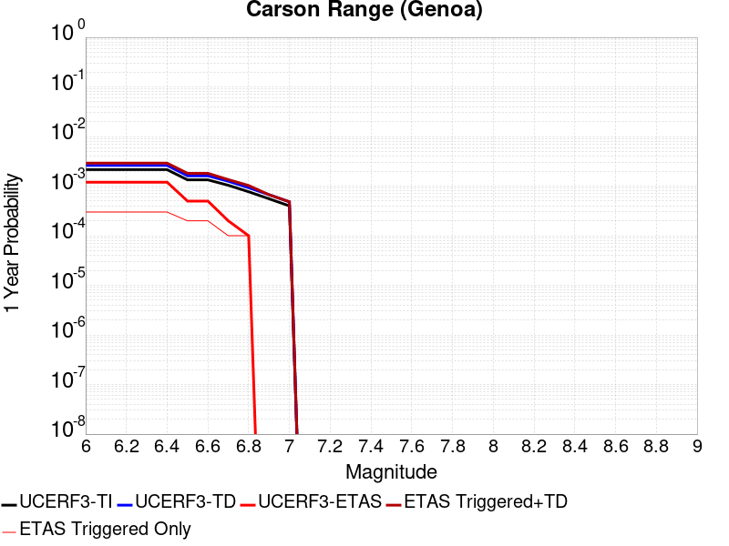 | 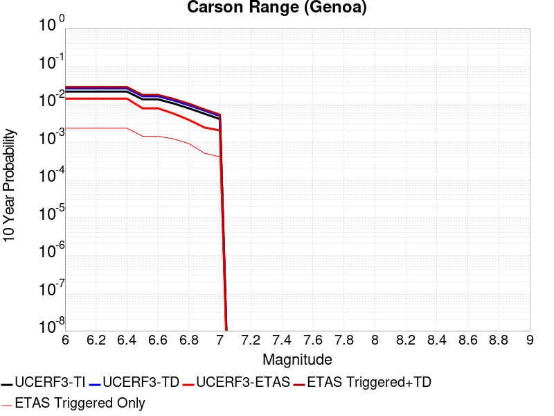 |

| Magnitude | 1 wk TI Prob | 1 wk TD Prob | 1 wk ETAS Prob | 1 wk ETAS/TD Gain | 1 wk ETAS Triggered+TD | 1 wk ETAS Triggered Only | 1 mo TI Prob | 1 mo TD Prob | 1 mo ETAS Prob | 1 mo ETAS/TD Gain | 1 mo ETAS Triggered+TD | 1 mo ETAS Triggered Only | 1 yr TI Prob | 1 yr TD Prob | 1 yr ETAS Prob | 1 yr ETAS/TD Gain | 1 yr ETAS Triggered+TD | 1 yr ETAS Triggered Only | 10 yr TI Prob | 10 yr TD Prob | 10 yr ETAS Prob | 10 yr ETAS/TD Gain | 10 yr ETAS Triggered+TD | 10 yr ETAS Triggered Only |
|-----|-----|-----|-----|-----|-----|-----|-----|-----|-----|-----|-----|-----|-----|-----|-----|-----|-----|-----|-----|-----|-----|-----|-----|-----|
| 6.0 | 4.1268457E-5 | 5.0168303E-5 | 0.0 | 0.0 | 5.0168303E-5 | 0.0 | 1.7685282E-4 | 2.1499154E-4 | 0.0 | 0.0 | 2.1499154E-4 | 0.0 | 0.0021510567 | 0.0026147708 | 0.0012 | 0.45893127 | 0.0029139863 | 3.0E-4 | 0.02130354 | 0.02587974 | 0.0139 | 0.53709966 | 0.028120216 | 0.0023 |
| 6.1 | 4.1268457E-5 | 5.0168303E-5 | 0.0 | 0.0 | 5.0168303E-5 | 0.0 | 1.7685282E-4 | 2.1499154E-4 | 0.0 | 0.0 | 2.1499154E-4 | 0.0 | 0.0021510567 | 0.0026147708 | 0.0012 | 0.45893127 | 0.0029139863 | 3.0E-4 | 0.02130354 | 0.02587974 | 0.0139 | 0.53709966 | 0.028120216 | 0.0023 |
| 6.2 | 4.1268457E-5 | 5.0168303E-5 | 0.0 | 0.0 | 5.0168303E-5 | 0.0 | 1.7685282E-4 | 2.1499154E-4 | 0.0 | 0.0 | 2.1499154E-4 | 0.0 | 0.0021510567 | 0.0026147708 | 0.0012 | 0.45893127 | 0.0029139863 | 3.0E-4 | 0.02130354 | 0.02587974 | 0.0139 | 0.53709966 | 0.028120216 | 0.0023 |
| 6.3 | 4.1268457E-5 | 5.0168303E-5 | 0.0 | 0.0 | 5.0168303E-5 | 0.0 | 1.7685282E-4 | 2.1499154E-4 | 0.0 | 0.0 | 2.1499154E-4 | 0.0 | 0.0021510567 | 0.0026147708 | 0.0012 | 0.45893127 | 0.0029139863 | 3.0E-4 | 0.02130354 | 0.02587974 | 0.0139 | 0.53709966 | 0.028120216 | 0.0023 |
| 6.4 | 4.1268457E-5 | 5.0168303E-5 | 0.0 | 0.0 | 5.0168303E-5 | 0.0 | 1.7685282E-4 | 2.1499154E-4 | 0.0 | 0.0 | 2.1499154E-4 | 0.0 | 0.0021510567 | 0.0026147708 | 0.0012 | 0.45893127 | 0.0029139863 | 3.0E-4 | 0.02130354 | 0.02587974 | 0.0139 | 0.53709966 | 0.028120216 | 0.0023 |
| 6.5 | 2.5677185E-5 | 3.0990985E-5 | 0.0 | 0.0 | 3.0990985E-5 | 0.0 | 1.1004044E-4 | 1.3281277E-4 | 0.0 | 0.0 | 1.3281277E-4 | 0.0 | 0.0013389189 | 0.0016159759 | 5.0E-4 | 0.30941054 | 0.0018156527 | 2.0E-4 | 0.0133088045 | 0.016060183 | 0.0077 | 0.4794466 | 0.017437698 | 0.0014 |
| 6.6 | 2.5677185E-5 | 3.0990985E-5 | 0.0 | 0.0 | 3.0990985E-5 | 0.0 | 1.1004044E-4 | 1.3281277E-4 | 0.0 | 0.0 | 1.3281277E-4 | 0.0 | 0.0013389189 | 0.0016159759 | 5.0E-4 | 0.30941054 | 0.0018156527 | 2.0E-4 | 0.0133088045 | 0.016060183 | 0.0077 | 0.4794466 | 0.017437698 | 0.0014 |
| 6.7 | 1.9969408E-5 | 2.407326E-5 | 0.0 | 0.0 | 2.407326E-5 | 0.0 | 8.558037E-5 | 1.031679E-4 | 0.0 | 0.0 | 1.031679E-4 | 0.0 | 0.0010414429 | 0.0012554991 | 2.0E-4 | 0.1592992 | 0.0013553735 | 1.0E-4 | 0.010365757 | 0.012499231 | 0.0056 | 0.44802758 | 0.013684232 | 0.0012 |
| 6.8 | 1.4783156E-5 | 1.7824825E-5 | 0.0 | 0.0 | 1.7824825E-5 | 0.0 | 6.335485E-5 | 7.639061E-5 | 0.0 | 0.0 | 7.639061E-5 | 0.0 | 7.710722E-4 | 9.2978904E-4 | 1.0E-4 | 0.107551284 | 0.0010296961 | 1.0E-4 | 0.0076840227 | 0.009271787 | 0.0038 | 0.4098455 | 0.010163442 | 9.0E-4 |
| 6.9 | 1.06660555E-5 | 1.2882322E-5 | 0.0 | 0.0 | 1.2882322E-5 | 0.0 | 4.5710865E-5 | 5.5209435E-5 | 0.0 | 0.0 | 5.5209435E-5 | 0.0 | 5.5638765E-4 | 6.720829E-4 | 0.0 | 0.0 | 6.720829E-4 | 0.0 | 0.005549967 | 0.006711811 | 0.0024 | 0.3575786 | 0.007208455 | 5.0E-4 |
| 7.0 | 7.664838E-6 | 9.262125E-6 | 0.0 | 0.0 | 9.262125E-6 | 0.0 | 3.2848893E-5 | 3.969482E-5 | 0.0 | 0.0 | 3.969482E-5 | 0.0 | 3.998619E-4 | 4.8328444E-4 | 0.0 | 0.0 | 4.8328444E-4 | 0.0 | 0.0039914316 | 0.004832842 | 0.002 | 0.41383517 | 0.005230909 | 4.0E-4 |

## Lost Hills
*[(top)](#table-of-contents)*

| 1 Week | 1 Month | 1 Year | 10 Year |
|-----|-----|-----|-----|
| 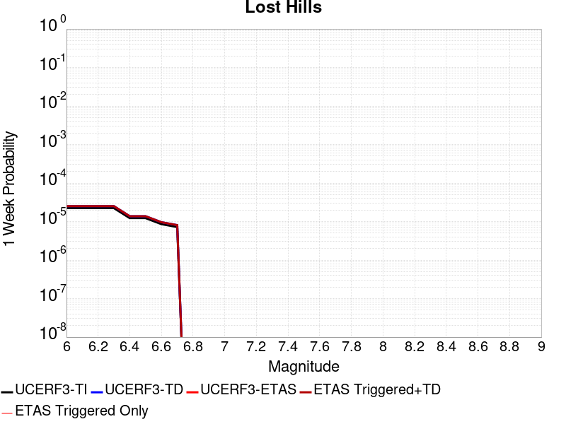 |  |  |  |

| Magnitude | 1 wk TI Prob | 1 wk TD Prob | 1 wk ETAS Prob | 1 wk ETAS/TD Gain | 1 wk ETAS Triggered+TD | 1 wk ETAS Triggered Only | 1 mo TI Prob | 1 mo TD Prob | 1 mo ETAS Prob | 1 mo ETAS/TD Gain | 1 mo ETAS Triggered+TD | 1 mo ETAS Triggered Only | 1 yr TI Prob | 1 yr TD Prob | 1 yr ETAS Prob | 1 yr ETAS/TD Gain | 1 yr ETAS Triggered+TD | 1 yr ETAS Triggered Only | 10 yr TI Prob | 10 yr TD Prob | 10 yr ETAS Prob | 10 yr ETAS/TD Gain | 10 yr ETAS Triggered+TD | 10 yr ETAS Triggered Only |
|-----|-----|-----|-----|-----|-----|-----|-----|-----|-----|-----|-----|-----|-----|-----|-----|-----|-----|-----|-----|-----|-----|-----|-----|-----|
| 6.0 | 2.233523E-5 | 2.5112762E-5 | 0.0 | 0.0 | 2.5112762E-5 | 0.0 | 9.571891E-5 | 1.0762263E-4 | 0.0 | 0.0 | 1.0762263E-4 | 0.0 | 0.0011647546 | 0.0013096861 | 0.0014 | 1.0689584 | 0.0015094242 | 2.0E-4 | 0.011586686 | 0.013036282 | 0.0126 | 0.96653324 | 0.0154049955 | 0.0024 |
| 6.1 | 2.233523E-5 | 2.5112762E-5 | 0.0 | 0.0 | 2.5112762E-5 | 0.0 | 9.571891E-5 | 1.0762263E-4 | 0.0 | 0.0 | 1.0762263E-4 | 0.0 | 0.0011647546 | 0.0013096861 | 0.0014 | 1.0689584 | 0.0015094242 | 2.0E-4 | 0.011586686 | 0.013036282 | 0.0126 | 0.96653324 | 0.0154049955 | 0.0024 |
| 6.2 | 2.233523E-5 | 2.5112762E-5 | 0.0 | 0.0 | 2.5112762E-5 | 0.0 | 9.571891E-5 | 1.0762263E-4 | 0.0 | 0.0 | 1.0762263E-4 | 0.0 | 0.0011647546 | 0.0013096861 | 0.0014 | 1.0689584 | 0.0015094242 | 2.0E-4 | 0.011586686 | 0.013036282 | 0.0126 | 0.96653324 | 0.0154049955 | 0.0024 |
| 6.3 | 2.233523E-5 | 2.5112762E-5 | 0.0 | 0.0 | 2.5112762E-5 | 0.0 | 9.571891E-5 | 1.0762263E-4 | 0.0 | 0.0 | 1.0762263E-4 | 0.0 | 0.0011647546 | 0.0013096861 | 0.0014 | 1.0689584 | 0.0015094242 | 2.0E-4 | 0.011586686 | 0.013036282 | 0.0126 | 0.96653324 | 0.0154049955 | 0.0024 |
| 6.4 | 1.2288092E-5 | 1.3784429E-5 | 0.0 | 0.0 | 1.3784429E-5 | 0.0 | 5.2662188E-5 | 5.9075315E-5 | 0.0 | 0.0 | 5.9075315E-5 | 0.0 | 6.409735E-4 | 7.1909843E-4 | 7.0E-4 | 0.9734411 | 8.1902655E-4 | 1.0E-4 | 0.006391279 | 0.0071769264 | 0.0065 | 0.9056802 | 0.008566879 | 0.0014 |
| 6.5 | 1.2288092E-5 | 1.3784429E-5 | 0.0 | 0.0 | 1.3784429E-5 | 0.0 | 5.2662188E-5 | 5.9075315E-5 | 0.0 | 0.0 | 5.9075315E-5 | 0.0 | 6.409735E-4 | 7.1909843E-4 | 7.0E-4 | 0.9734411 | 8.1902655E-4 | 1.0E-4 | 0.006391279 | 0.0071769264 | 0.0065 | 0.9056802 | 0.008566879 | 0.0014 |
| 6.6 | 8.58281E-6 | 9.63611E-6 | 0.0 | 0.0 | 9.63611E-6 | 0.0 | 3.6782953E-5 | 4.129743E-5 | 0.0 | 0.0 | 4.129743E-5 | 0.0 | 4.4774043E-4 | 5.0276343E-4 | 7.0E-4 | 1.3923049 | 6.0271315E-4 | 1.0E-4 | 0.0044683935 | 0.0050244243 | 0.0043 | 0.85581946 | 0.005919902 | 9.0E-4 |
| 6.7 | 7.205685E-6 | 8.090266E-6 | 0.0 | 0.0 | 8.090266E-6 | 0.0 | 3.088114E-5 | 3.4672572E-5 | 0.0 | 0.0 | 3.4672572E-5 | 0.0 | 3.7591302E-4 | 4.2213858E-4 | 4.0E-4 | 0.9475562 | 4.2213858E-4 | 0.0 | 0.0037527776 | 0.004221386 | 0.0031 | 0.73435605 | 0.004719275 | 5.0E-4 |

## Nelson Lake
*[(top)](#table-of-contents)*

| 1 Week | 1 Month | 1 Year | 10 Year |
|-----|-----|-----|-----|
|  | 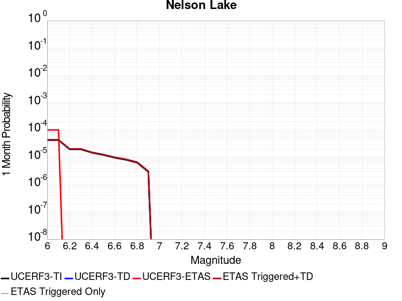 |  | 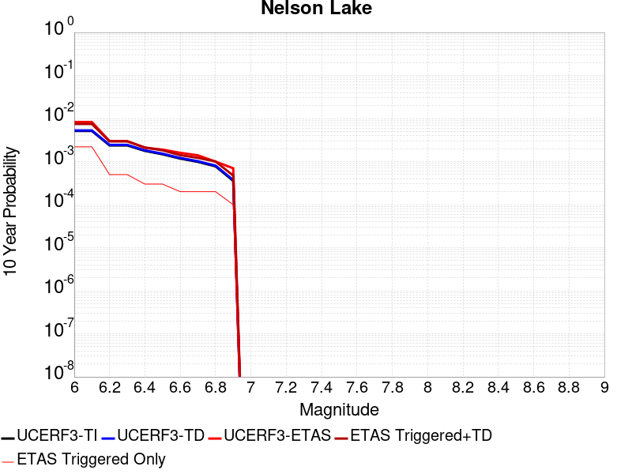 |

| Magnitude | 1 wk TI Prob | 1 wk TD Prob | 1 wk ETAS Prob | 1 wk ETAS/TD Gain | 1 wk ETAS Triggered+TD | 1 wk ETAS Triggered Only | 1 mo TI Prob | 1 mo TD Prob | 1 mo ETAS Prob | 1 mo ETAS/TD Gain | 1 mo ETAS Triggered+TD | 1 mo ETAS Triggered Only | 1 yr TI Prob | 1 yr TD Prob | 1 yr ETAS Prob | 1 yr ETAS/TD Gain | 1 yr ETAS Triggered+TD | 1 yr ETAS Triggered Only | 10 yr TI Prob | 10 yr TD Prob | 10 yr ETAS Prob | 10 yr ETAS/TD Gain | 10 yr ETAS Triggered+TD | 10 yr ETAS Triggered Only |
|-----|-----|-----|-----|-----|-----|-----|-----|-----|-----|-----|-----|-----|-----|-----|-----|-----|-----|-----|-----|-----|-----|-----|-----|-----|
| 6.0 | 9.913453E-6 | 1.0192824E-5 | 0.0 | 0.0 | 1.0192824E-5 | 0.0 | 4.2485535E-5 | 4.368286E-5 | 1.0E-4 | 2.2892275 | 4.368286E-5 | 0.0 | 5.1713863E-4 | 5.3171936E-4 | 7.0E-4 | 1.3164839 | 6.316662E-4 | 1.0E-4 | 0.0051593683 | 0.0053054993 | 0.0083 | 1.5644144 | 0.0074938275 | 0.0022 |
| 6.1 | 9.913453E-6 | 1.0192824E-5 | 0.0 | 0.0 | 1.0192824E-5 | 0.0 | 4.2485535E-5 | 4.368286E-5 | 1.0E-4 | 2.2892275 | 4.368286E-5 | 0.0 | 5.1713863E-4 | 5.3171936E-4 | 7.0E-4 | 1.3164839 | 6.316662E-4 | 1.0E-4 | 0.0051593683 | 0.0053054993 | 0.0083 | 1.5644144 | 0.0074938275 | 0.0022 |
| 6.2 | 4.5596407E-6 | 4.696593E-6 | 0.0 | 0.0 | 4.696593E-6 | 0.0 | 1.954117E-5 | 2.0128107E-5 | 0.0 | 0.0 | 2.0128107E-5 | 0.0 | 2.3788778E-4 | 2.450334E-4 | 2.0E-4 | 0.8162152 | 2.450334E-4 | 0.0 | 0.0023763329 | 0.0024477583 | 0.003 | 1.2256111 | 0.0029465347 | 5.0E-4 |
| 6.3 | 4.5596407E-6 | 4.696593E-6 | 0.0 | 0.0 | 4.696593E-6 | 0.0 | 1.954117E-5 | 2.0128107E-5 | 0.0 | 0.0 | 2.0128107E-5 | 0.0 | 2.3788778E-4 | 2.450334E-4 | 2.0E-4 | 0.8162152 | 2.450334E-4 | 0.0 | 0.0023763329 | 0.0024477583 | 0.003 | 1.2256111 | 0.0029465347 | 5.0E-4 |
| 6.4 | 3.4025713E-6 | 3.5101173E-6 | 0.0 | 0.0 | 3.5101173E-6 | 0.0 | 1.4582367E-5 | 1.5043278E-5 | 0.0 | 0.0 | 1.5043278E-5 | 0.0 | 1.7752586E-4 | 1.8313735E-4 | 2.0E-4 | 1.0920765 | 1.8313735E-4 | 0.0 | 0.001773841 | 0.0018299472 | 0.0021 | 1.1475741 | 0.0021293983 | 3.0E-4 |
| 6.5 | 2.8352947E-6 | 2.9280461E-6 | 0.0 | 0.0 | 2.9280461E-6 | 0.0 | 1.2151207E-5 | 1.2548713E-5 | 0.0 | 0.0 | 1.2548713E-5 | 0.0 | 1.479309E-4 | 1.5277062E-4 | 2.0E-4 | 1.3091522 | 1.5277062E-4 | 0.0 | 0.0014783246 | 0.0015267298 | 0.0019 | 1.24449 | 0.0018262718 | 3.0E-4 |
| 6.6 | 2.251518E-6 | 2.329227E-6 | 0.0 | 0.0 | 2.329227E-6 | 0.0 | 9.649328E-6 | 9.9823665E-6 | 0.0 | 0.0 | 9.9823665E-6 | 0.0 | 1.1747423E-4 | 1.2152916E-4 | 2.0E-4 | 1.6456954 | 1.2152916E-4 | 0.0 | 0.0011741214 | 0.0012146888 | 0.0016 | 1.3172098 | 0.0014144459 | 2.0E-4 |
| 6.7 | 1.8911853E-6 | 1.9592796E-6 | 0.0 | 0.0 | 1.9592796E-6 | 0.0 | 8.105055E-6 | 8.396889E-6 | 0.0 | 0.0 | 8.396889E-6 | 0.0 | 9.867457E-5 | 1.0222791E-4 | 2.0E-4 | 1.9564129 | 1.0222791E-4 | 0.0 | 9.863076E-4 | 0.0010218663 | 0.0014 | 1.3700422 | 0.001221662 | 2.0E-4 |
| 6.8 | 1.4874814E-6 | 1.5439467E-6 | 0.0 | 0.0 | 1.5439467E-6 | 0.0 | 6.374905E-6 | 6.6169005E-6 | 0.0 | 0.0 | 6.6169005E-6 | 0.0 | 7.76117E-5 | 8.0558304E-5 | 0.0 | 0.0 | 8.0558304E-5 | 0.0 | 7.75846E-4 | 8.0534216E-4 | 0.001 | 1.2417083 | 0.0010051811 | 2.0E-4 |
| 6.9 | 6.835972E-7 | 7.140558E-7 | 0.0 | 0.0 | 7.140558E-7 | 0.0 | 2.9296991E-6 | 3.0602373E-6 | 0.0 | 0.0 | 3.0602373E-6 | 0.0 | 3.56685E-5 | 3.7258073E-5 | 0.0 | 0.0 | 3.7258073E-5 | 0.0 | 3.5662777E-4 | 3.7254952E-4 | 7.0E-4 | 1.8789449 | 4.7251224E-4 | 1.0E-4 |

## So Sierra Nevada
*[(top)](#table-of-contents)*

| 1 Week | 1 Month | 1 Year | 10 Year |
|-----|-----|-----|-----|
|  | 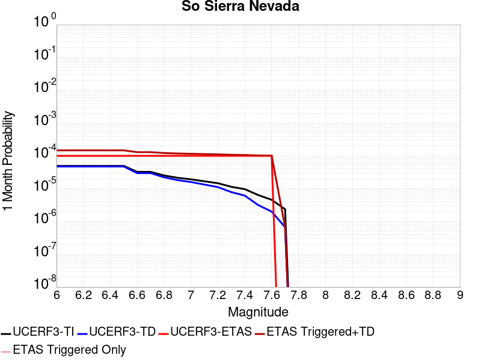 |  |  |

| Magnitude | 1 wk TI Prob | 1 wk TD Prob | 1 wk ETAS Prob | 1 wk ETAS/TD Gain | 1 wk ETAS Triggered+TD | 1 wk ETAS Triggered Only | 1 mo TI Prob | 1 mo TD Prob | 1 mo ETAS Prob | 1 mo ETAS/TD Gain | 1 mo ETAS Triggered+TD | 1 mo ETAS Triggered Only | 1 yr TI Prob | 1 yr TD Prob | 1 yr ETAS Prob | 1 yr ETAS/TD Gain | 1 yr ETAS Triggered+TD | 1 yr ETAS Triggered Only | 10 yr TI Prob | 10 yr TD Prob | 10 yr ETAS Prob | 10 yr ETAS/TD Gain | 10 yr ETAS Triggered+TD | 10 yr ETAS Triggered Only |
|-----|-----|-----|-----|-----|-----|-----|-----|-----|-----|-----|-----|-----|-----|-----|-----|-----|-----|-----|-----|-----|-----|-----|-----|-----|
| 6.0 | 1.15488665E-5 | 1.1080521E-5 | 0.0 | 0.0 | 1.1080521E-5 | 0.0 | 4.9494203E-5 | 4.7487156E-5 | 1.0E-4 | 2.1058326 | 1.4748241E-4 | 1.0E-4 | 6.024253E-4 | 5.780155E-4 | 7.0E-4 | 1.2110401 | 0.0012776109 | 7.0E-4 | 0.006007948 | 0.0057663904 | 0.0055 | 0.95380294 | 0.007953704 | 0.0022 |
| 6.1 | 1.15488665E-5 | 1.1080521E-5 | 0.0 | 0.0 | 1.1080521E-5 | 0.0 | 4.9494203E-5 | 4.7487156E-5 | 1.0E-4 | 2.1058326 | 1.4748241E-4 | 1.0E-4 | 6.024253E-4 | 5.780155E-4 | 7.0E-4 | 1.2110401 | 0.0012776109 | 7.0E-4 | 0.006007948 | 0.0057663904 | 0.0055 | 0.95380294 | 0.007953704 | 0.0022 |
| 6.2 | 1.15488665E-5 | 1.1080521E-5 | 0.0 | 0.0 | 1.1080521E-5 | 0.0 | 4.9494203E-5 | 4.7487156E-5 | 1.0E-4 | 2.1058326 | 1.4748241E-4 | 1.0E-4 | 6.024253E-4 | 5.780155E-4 | 7.0E-4 | 1.2110401 | 0.0012776109 | 7.0E-4 | 0.006007948 | 0.0057663904 | 0.0055 | 0.95380294 | 0.007953704 | 0.0022 |
| 6.3 | 1.15488665E-5 | 1.1080521E-5 | 0.0 | 0.0 | 1.1080521E-5 | 0.0 | 4.9494203E-5 | 4.7487156E-5 | 1.0E-4 | 2.1058326 | 1.4748241E-4 | 1.0E-4 | 6.024253E-4 | 5.780155E-4 | 7.0E-4 | 1.2110401 | 0.0012776109 | 7.0E-4 | 0.006007948 | 0.0057663904 | 0.0055 | 0.95380294 | 0.007953704 | 0.0022 |
| 6.4 | 1.15488665E-5 | 1.1080521E-5 | 0.0 | 0.0 | 1.1080521E-5 | 0.0 | 4.9494203E-5 | 4.7487156E-5 | 1.0E-4 | 2.1058326 | 1.4748241E-4 | 1.0E-4 | 6.024253E-4 | 5.780155E-4 | 7.0E-4 | 1.2110401 | 0.0012776109 | 7.0E-4 | 0.006007948 | 0.0057663904 | 0.0055 | 0.95380294 | 0.007953704 | 0.0022 |
| 6.5 | 1.15488665E-5 | 1.1080521E-5 | 0.0 | 0.0 | 1.1080521E-5 | 0.0 | 4.9494203E-5 | 4.7487156E-5 | 1.0E-4 | 2.1058326 | 1.4748241E-4 | 1.0E-4 | 6.024253E-4 | 5.780155E-4 | 7.0E-4 | 1.2110401 | 0.0012776109 | 7.0E-4 | 0.006007948 | 0.0057663904 | 0.0055 | 0.95380294 | 0.007953704 | 0.0022 |
| 6.6 | 7.587044E-6 | 6.936135E-6 | 0.0 | 0.0 | 6.936135E-6 | 0.0 | 3.2515498E-5 | 2.972597E-5 | 1.0E-4 | 3.3640618 | 1.29723E-4 | 1.0E-4 | 3.9580427E-4 | 3.618565E-4 | 3.0E-4 | 0.8290579 | 6.6174794E-4 | 3.0E-4 | 0.003951 | 0.0036129646 | 0.0025 | 0.6919525 | 0.004509713 | 9.0E-4 |
| 6.7 | 7.587044E-6 | 6.936135E-6 | 0.0 | 0.0 | 6.936135E-6 | 0.0 | 3.2515498E-5 | 2.972597E-5 | 1.0E-4 | 3.3640618 | 1.29723E-4 | 1.0E-4 | 3.9580427E-4 | 3.618565E-4 | 3.0E-4 | 0.8290579 | 6.6174794E-4 | 3.0E-4 | 0.003951 | 0.0036129646 | 0.0025 | 0.6919525 | 0.004509713 | 9.0E-4 |
| 6.8 | 5.9026956E-6 | 5.1797438E-6 | 0.0 | 0.0 | 5.1797438E-6 | 0.0 | 2.5297022E-5 | 2.219872E-5 | 1.0E-4 | 4.5047646 | 1.2219649E-4 | 1.0E-4 | 3.0794772E-4 | 2.7023704E-4 | 2.0E-4 | 0.74009097 | 4.70183E-4 | 2.0E-4 | 0.0030752132 | 0.0026992005 | 0.0019 | 0.70391214 | 0.003397311 | 7.0E-4 |
| 6.9 | 5.0118915E-6 | 4.2527017E-6 | 0.0 | 0.0 | 4.2527017E-6 | 0.0 | 2.1479358E-5 | 1.822574E-5 | 1.0E-4 | 5.4867454 | 1.1822392E-4 | 1.0E-4 | 2.614798E-4 | 2.2187653E-4 | 2.0E-4 | 0.90140224 | 4.2183214E-4 | 2.0E-4 | 0.0026117235 | 0.0022166227 | 0.0015 | 0.6767052 | 0.0028152927 | 6.0E-4 |
| 7.0 | 4.4924795E-6 | 3.7141542E-6 | 0.0 | 0.0 | 3.7141542E-6 | 0.0 | 1.925334E-5 | 1.591771E-5 | 1.0E-4 | 6.2823105 | 1.1591612E-4 | 1.0E-4 | 2.3438422E-4 | 1.9378153E-4 | 2.0E-4 | 1.0320902 | 3.9374275E-4 | 2.0E-4 | 0.0023413717 | 0.0019361884 | 0.0012 | 0.6197744 | 0.0025350268 | 6.0E-4 |
| 7.1 | 3.9118436E-6 | 3.1121676E-6 | 0.0 | 0.0 | 3.1121676E-6 | 0.0 | 1.6764936E-5 | 1.3337796E-5 | 1.0E-4 | 7.4974904 | 1.13336464E-4 | 1.0E-4 | 2.0409399E-4 | 1.6237613E-4 | 2.0E-4 | 1.231708 | 3.6234365E-4 | 2.0E-4 | 0.0020390663 | 0.001622631 | 0.001 | 0.61628306 | 0.0021218196 | 5.0E-4 |
| 7.2 | 3.4200818E-6 | 2.6056084E-6 | 0.0 | 0.0 | 2.6056084E-6 | 0.0 | 1.4657411E-5 | 1.1166848E-5 | 1.0E-4 | 8.955079 | 1.1116573E-4 | 1.0E-4 | 1.7843937E-4 | 1.359484E-4 | 2.0E-4 | 1.4711465 | 3.359212E-4 | 2.0E-4 | 0.0017829615 | 0.001358702 | 9.0E-4 | 0.6623969 | 0.0017581586 | 4.0E-4 |
| 7.3 | 2.6593618E-6 | 1.8285212E-6 | 0.0 | 0.0 | 1.8285212E-6 | 0.0 | 1.13972155E-5 | 7.836497E-6 | 1.0E-4 | 12.760803 | 1.07835716E-4 | 1.0E-4 | 1.3875226E-4 | 9.540548E-5 | 1.0E-4 | 1.0481579 | 1.9539593E-4 | 1.0E-4 | 0.0013866565 | 9.536741E-4 | 6.0E-4 | 0.62914574 | 0.001253388 | 3.0E-4 |
| 7.4 | 2.2577992E-6 | 1.4365139E-6 | 0.0 | 0.0 | 1.4365139E-6 | 0.0 | 9.676246E-6 | 6.1564747E-6 | 1.0E-4 | 16.243061 | 1.0615586E-4 | 1.0E-4 | 1.1780193E-4 | 7.495276E-5 | 1.0E-4 | 1.3341737 | 1.7494526E-4 | 1.0E-4 | 0.001177395 | 7.492998E-4 | 5.0E-4 | 0.6672896 | 0.001049075 | 3.0E-4 |
| 7.5 | 1.489319E-6 | 7.354268E-7 | 0.0 | 0.0 | 7.354268E-7 | 0.0 | 6.3827797E-6 | 3.1518252E-6 | 1.0E-4 | 31.727648 | 1.0315151E-4 | 1.0E-4 | 7.770758E-5 | 3.83728E-5 | 1.0E-4 | 2.6060126 | 1.3836897E-4 | 1.0E-4 | 7.7680405E-4 | 3.8366218E-4 | 3.0E-4 | 0.7819379 | 6.835471E-4 | 3.0E-4 |
| 7.6 | 1.0680322E-6 | 4.659834E-7 | 0.0 | 0.0 | 4.659834E-7 | 0.0 | 4.577273E-6 | 1.99707E-6 | 1.0E-4 | 50.073353 | 1.0199687E-4 | 1.0E-4 | 5.5726876E-5 | 2.431406E-5 | 1.0E-4 | 4.1128464 | 1.2431163E-4 | 1.0E-4 | 5.5712904E-4 | 2.4311426E-4 | 2.0E-4 | 0.8226584 | 4.4306566E-4 | 2.0E-4 |
| 7.7 | 5.509146E-7 | 1.5580498E-7 | 0.0 | 0.0 | 1.5580498E-7 | 0.0 | 2.3610605E-6 | 6.677355E-7 | 0.0 | 0.0 | 6.677355E-7 | 0.0 | 2.8745531E-5 | 8.12965E-6 | 0.0 | 0.0 | 8.12965E-6 | 0.0 | 2.8741814E-4 | 8.129365E-5 | 0.0 | 0.0 | 8.129365E-5 | 0.0 |

## Santa Cruz Island
*[(top)](#table-of-contents)*

| 1 Week | 1 Month | 1 Year | 10 Year |
|-----|-----|-----|-----|
| 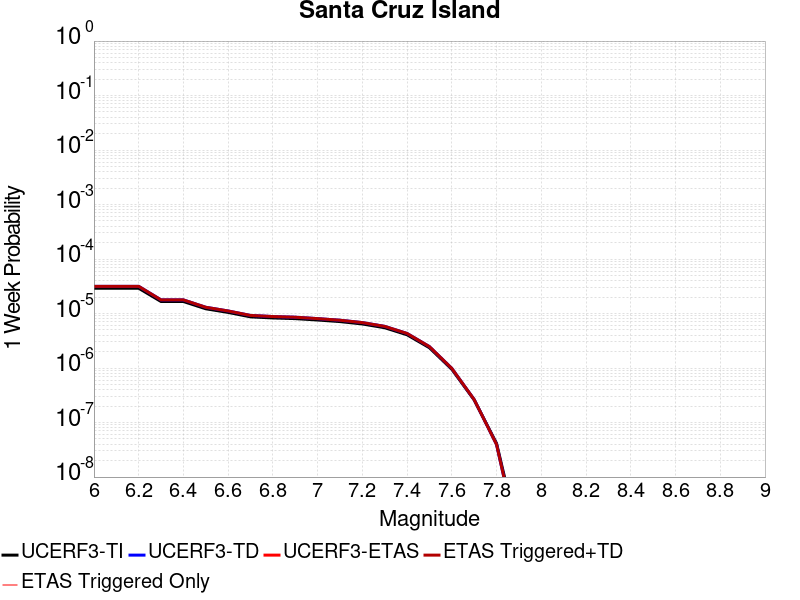 |  |  |  |

| Magnitude | 1 wk TI Prob | 1 wk TD Prob | 1 wk ETAS Prob | 1 wk ETAS/TD Gain | 1 wk ETAS Triggered+TD | 1 wk ETAS Triggered Only | 1 mo TI Prob | 1 mo TD Prob | 1 mo ETAS Prob | 1 mo ETAS/TD Gain | 1 mo ETAS Triggered+TD | 1 mo ETAS Triggered Only | 1 yr TI Prob | 1 yr TD Prob | 1 yr ETAS Prob | 1 yr ETAS/TD Gain | 1 yr ETAS Triggered+TD | 1 yr ETAS Triggered Only | 10 yr TI Prob | 10 yr TD Prob | 10 yr ETAS Prob | 10 yr ETAS/TD Gain | 10 yr ETAS Triggered+TD | 10 yr ETAS Triggered Only |
|-----|-----|-----|-----|-----|-----|-----|-----|-----|-----|-----|-----|-----|-----|-----|-----|-----|-----|-----|-----|-----|-----|-----|-----|-----|
| 6.0 | 2.9164563E-5 | 3.1605017E-5 | 0.0 | 0.0 | 3.1605017E-5 | 0.0 | 1.2498499E-4 | 1.3544381E-4 | 1.0E-4 | 0.73831356 | 1.3544381E-4 | 0.0 | 0.0015206301 | 0.0016479173 | 0.0011 | 0.6675092 | 0.0018475878 | 2.0E-4 | 0.015102667 | 0.016370712 | 0.0133 | 0.81242645 | 0.018042883 | 0.0017 |
| 6.1 | 2.9164563E-5 | 3.1605017E-5 | 0.0 | 0.0 | 3.1605017E-5 | 0.0 | 1.2498499E-4 | 1.3544381E-4 | 1.0E-4 | 0.73831356 | 1.3544381E-4 | 0.0 | 0.0015206301 | 0.0016479173 | 0.0011 | 0.6675092 | 0.0018475878 | 2.0E-4 | 0.015102667 | 0.016370712 | 0.0133 | 0.81242645 | 0.018042883 | 0.0017 |
| 6.2 | 2.9164563E-5 | 3.1605017E-5 | 0.0 | 0.0 | 3.1605017E-5 | 0.0 | 1.2498499E-4 | 1.3544381E-4 | 1.0E-4 | 0.73831356 | 1.3544381E-4 | 0.0 | 0.0015206301 | 0.0016479173 | 0.0011 | 0.6675092 | 0.0018475878 | 2.0E-4 | 0.015102667 | 0.016370712 | 0.0133 | 0.81242645 | 0.018042883 | 0.0017 |
| 6.3 | 1.6635553E-5 | 1.7806862E-5 | 0.0 | 0.0 | 1.7806862E-5 | 0.0 | 7.1293274E-5 | 7.6312994E-5 | 0.0 | 0.0 | 7.6312994E-5 | 0.0 | 8.6765E-4 | 9.287329E-4 | 5.0E-4 | 0.5383679 | 0.0010286401 | 1.0E-4 | 0.008642701 | 0.0092503885 | 0.0073 | 0.789156 | 0.010142063 | 9.0E-4 |
| 6.4 | 1.6635553E-5 | 1.7806862E-5 | 0.0 | 0.0 | 1.7806862E-5 | 0.0 | 7.1293274E-5 | 7.6312994E-5 | 0.0 | 0.0 | 7.6312994E-5 | 0.0 | 8.6765E-4 | 9.287329E-4 | 5.0E-4 | 0.5383679 | 0.0010286401 | 1.0E-4 | 0.008642701 | 0.0092503885 | 0.0073 | 0.789156 | 0.010142063 | 9.0E-4 |
| 6.5 | 1.2238748E-5 | 1.3044715E-5 | 0.0 | 0.0 | 1.3044715E-5 | 0.0 | 5.2450723E-5 | 5.5904748E-5 | 0.0 | 0.0 | 5.5904748E-5 | 0.0 | 6.3840044E-4 | 6.8043143E-4 | 4.0E-4 | 0.5878623 | 6.8043143E-4 | 0.0 | 0.0063656955 | 0.0067838794 | 0.0053 | 0.7812639 | 0.0072804876 | 5.0E-4 |
| 6.6 | 1.0489767E-5 | 1.1158062E-5 | 0.0 | 0.0 | 1.1158062E-5 | 0.0 | 4.495537E-5 | 4.78194E-5 | 0.0 | 0.0 | 4.78194E-5 | 0.0 | 5.4719415E-4 | 5.820479E-4 | 3.0E-4 | 0.5154215 | 5.820479E-4 | 0.0 | 0.005458487 | 0.0058054756 | 0.0044 | 0.7579052 | 0.006302573 | 5.0E-4 |
| 6.7 | 8.699222E-6 | 9.237933E-6 | 0.0 | 0.0 | 9.237933E-6 | 0.0 | 3.7281847E-5 | 3.9590544E-5 | 0.0 | 0.0 | 3.9590544E-5 | 0.0 | 4.5381195E-4 | 4.819088E-4 | 2.0E-4 | 0.4150163 | 4.819088E-4 | 0.0 | 0.0045288634 | 0.0048087053 | 0.0034 | 0.707051 | 0.005007744 | 2.0E-4 |
| 6.8 | 8.307732E-6 | 8.817995E-6 | 0.0 | 0.0 | 8.817995E-6 | 0.0 | 3.560408E-5 | 3.7790862E-5 | 0.0 | 0.0 | 3.7790862E-5 | 0.0 | 4.3339343E-4 | 4.6000702E-4 | 2.0E-4 | 0.43477598 | 4.6000702E-4 | 0.0 | 0.004325492 | 0.0045906017 | 0.0033 | 0.71886003 | 0.0047896835 | 2.0E-4 |
| 6.9 | 8.073121E-6 | 8.565992E-6 | 0.0 | 0.0 | 8.565992E-6 | 0.0 | 3.459863E-5 | 3.671088E-5 | 0.0 | 0.0 | 3.671088E-5 | 0.0 | 4.2115687E-4 | 4.4686373E-4 | 2.0E-4 | 0.44756374 | 4.4686373E-4 | 0.0 | 0.004203596 | 0.0044597033 | 0.0032 | 0.71753657 | 0.0046588113 | 2.0E-4 |
| 7.0 | 7.617019E-6 | 8.075644E-6 | 0.0 | 0.0 | 8.075644E-6 | 0.0 | 3.264396E-5 | 3.4609446E-5 | 0.0 | 0.0 | 3.4609446E-5 | 0.0 | 3.9736772E-4 | 4.2128892E-4 | 2.0E-4 | 0.4747336 | 4.2128892E-4 | 0.0 | 0.003966579 | 0.0042049503 | 0.0029 | 0.68966335 | 0.0043045296 | 1.0E-4 |
| 7.1 | 7.1224836E-6 | 7.546694E-6 | 0.0 | 0.0 | 7.546694E-6 | 0.0 | 3.052457E-5 | 3.2342577E-5 | 0.0 | 0.0 | 3.2342577E-5 | 0.0 | 3.715733E-4 | 3.937001E-4 | 2.0E-4 | 0.5080009 | 3.937001E-4 | 0.0 | 0.003709526 | 0.003930069 | 0.0026 | 0.661566 | 0.004029676 | 1.0E-4 |
| 7.2 | 6.441115E-6 | 6.8282116E-6 | 0.0 | 0.0 | 6.8282116E-6 | 0.0 | 2.7604487E-5 | 2.9263438E-5 | 0.0 | 0.0 | 2.9263438E-5 | 0.0 | 3.360328E-4 | 3.5622434E-4 | 2.0E-4 | 0.5614439 | 3.5622434E-4 | 0.0 | 0.0033552512 | 0.0035565617 | 0.002 | 0.56234086 | 0.003656206 | 1.0E-4 |
| 7.3 | 5.494274E-6 | 5.8206942E-6 | 0.0 | 0.0 | 5.8206942E-6 | 0.0 | 2.3546674E-5 | 2.4945595E-5 | 0.0 | 0.0 | 2.4945595E-5 | 0.0 | 2.8664304E-4 | 3.036705E-4 | 2.0E-4 | 0.65860856 | 3.036705E-4 | 0.0 | 0.002862736 | 0.0030325786 | 0.0014 | 0.46165332 | 0.0031322753 | 1.0E-4 |
| 7.4 | 4.0802624E-6 | 4.3127575E-6 | 0.0 | 0.0 | 4.3127575E-6 | 0.0 | 1.7486722E-5 | 1.8483117E-5 | 0.0 | 0.0 | 1.8483117E-5 | 0.0 | 2.1288003E-4 | 2.2500879E-4 | 2.0E-4 | 0.8888542 | 2.2500879E-4 | 0.0 | 0.0021267622 | 0.0022478185 | 0.0012 | 0.5338509 | 0.002347594 | 1.0E-4 |
| 7.5 | 2.3584746E-6 | 2.4755668E-6 | 0.0 | 0.0 | 2.4755668E-6 | 0.0 | 1.0107709E-5 | 1.0609529E-5 | 0.0 | 0.0 | 1.0609529E-5 | 0.0 | 1.2305441E-4 | 1.2916341E-4 | 1.0E-4 | 0.7742131 | 1.2916341E-4 | 0.0 | 0.0012298629 | 0.0012908884 | 9.0E-4 | 0.6971943 | 0.0013907594 | 1.0E-4 |
| 7.6 | 9.4981914E-7 | 9.861797E-7 | 0.0 | 0.0 | 9.861797E-7 | 0.0 | 4.0706473E-6 | 4.2264774E-6 | 0.0 | 0.0 | 4.2264774E-6 | 0.0 | 4.9559E-5 | 5.145616E-5 | 0.0 | 0.0 | 5.145616E-5 | 0.0 | 4.954795E-4 | 5.144438E-4 | 4.0E-4 | 0.7775388 | 5.144438E-4 | 0.0 |
| 7.7 | 2.6013532E-7 | 2.641836E-7 | 0.0 | 0.0 | 2.641836E-7 | 0.0 | 1.1148652E-6 | 1.132215E-6 | 0.0 | 0.0 | 1.132215E-6 | 0.0 | 1.3573399E-5 | 1.3784631E-5 | 0.0 | 0.0 | 1.3784631E-5 | 0.0 | 1.357257E-4 | 1.3783782E-4 | 1.0E-4 | 0.7254903 | 1.3783782E-4 | 0.0 |
| 7.8 | 4.1522263E-8 | 3.965892E-8 | 0.0 | 0.0 | 3.965892E-8 | 0.0 | 1.7795254E-7 | 1.699668E-7 | 0.0 | 0.0 | 1.699668E-7 | 0.0 | 2.16657E-6 | 2.069344E-6 | 0.0 | 0.0 | 2.069344E-6 | 0.0 | 2.1665488E-5 | 2.069327E-5 | 0.0 | 0.0 | 2.069327E-5 | 0.0 |
| 7.9 | 7.7242046E-10 | 5.94802E-10 | 0.0 | 0.0 | 5.94802E-10 | 0.0 | 3.3103735E-9 | 2.5491516E-9 | 0.0 | 0.0 | 2.5491516E-9 | 0.0 | 4.0303796E-8 | 3.103592E-8 | 0.0 | 0.0 | 3.103592E-8 | 0.0 | 4.030379E-7 | 3.1035916E-7 | 0.0 | 0.0 | 3.1035916E-7 | 0.0 |

## Santa Rosa Island
*[(top)](#table-of-contents)*

| 1 Week | 1 Month | 1 Year | 10 Year |
|-----|-----|-----|-----|
|  |  | 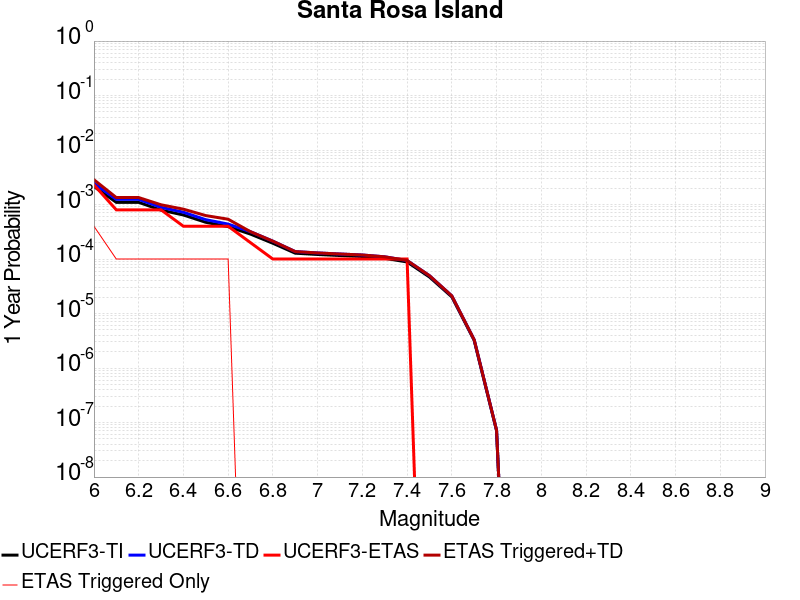 | 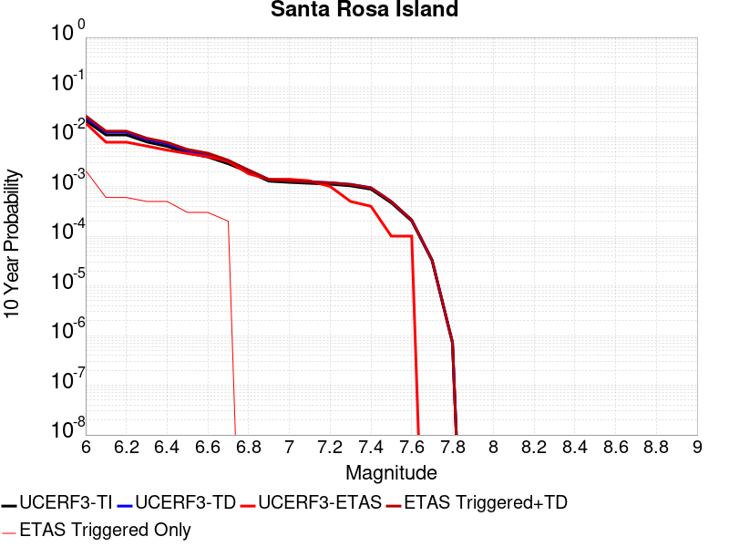 |

| Magnitude | 1 wk TI Prob | 1 wk TD Prob | 1 wk ETAS Prob | 1 wk ETAS/TD Gain | 1 wk ETAS Triggered+TD | 1 wk ETAS Triggered Only | 1 mo TI Prob | 1 mo TD Prob | 1 mo ETAS Prob | 1 mo ETAS/TD Gain | 1 mo ETAS Triggered+TD | 1 mo ETAS Triggered Only | 1 yr TI Prob | 1 yr TD Prob | 1 yr ETAS Prob | 1 yr ETAS/TD Gain | 1 yr ETAS Triggered+TD | 1 yr ETAS Triggered Only | 10 yr TI Prob | 10 yr TD Prob | 10 yr ETAS Prob | 10 yr ETAS/TD Gain | 10 yr ETAS Triggered+TD | 10 yr ETAS Triggered Only |
|-----|-----|-----|-----|-----|-----|-----|-----|-----|-----|-----|-----|-----|-----|-----|-----|-----|-----|-----|-----|-----|-----|-----|-----|-----|
| 6.0 | 4.1143165E-5 | 4.7104702E-5 | 1.0E-4 | 2.1229303 | 1.4709999E-4 | 1.0E-4 | 1.7631594E-4 | 2.0186279E-4 | 1.0E-4 | 0.49538603 | 3.018426E-4 | 1.0E-4 | 0.002144533 | 0.002455106 | 0.0023 | 0.9368231 | 0.002854124 | 4.0E-4 | 0.021239553 | 0.024300482 | 0.0189 | 0.77776235 | 0.02634945 | 0.0021 |
| 6.1 | 2.1061249E-5 | 2.3871296E-5 | 0.0 | 0.0 | 2.3871296E-5 | 0.0 | 9.0259375E-5 | 1.0230171E-4 | 0.0 | 0.0 | 1.0230171E-4 | 0.0 | 0.0010983539 | 0.0012448406 | 8.0E-4 | 0.6426526 | 0.0013447162 | 1.0E-4 | 0.01092941 | 0.012381718 | 0.0078 | 0.6299611 | 0.012974288 | 6.0E-4 |
| 6.2 | 2.1061249E-5 | 2.3871296E-5 | 0.0 | 0.0 | 2.3871296E-5 | 0.0 | 9.0259375E-5 | 1.0230171E-4 | 0.0 | 0.0 | 1.0230171E-4 | 0.0 | 0.0010983539 | 0.0012448406 | 8.0E-4 | 0.6426526 | 0.0013447162 | 1.0E-4 | 0.01092941 | 0.012381718 | 0.0078 | 0.6299611 | 0.012974288 | 6.0E-4 |
| 6.3 | 1.5158236E-5 | 1.7078726E-5 | 0.0 | 0.0 | 1.7078726E-5 | 0.0 | 6.496225E-5 | 7.3192554E-5 | 0.0 | 0.0 | 7.3192554E-5 | 0.0 | 7.906284E-4 | 8.90767E-4 | 8.0E-4 | 0.8981024 | 9.90678E-4 | 1.0E-4 | 0.007878214 | 0.008873219 | 0.0065 | 0.73254144 | 0.009368782 | 5.0E-4 |
| 6.4 | 1.2341918E-5 | 1.3856303E-5 | 0.0 | 0.0 | 1.3856303E-5 | 0.0 | 5.2892858E-5 | 5.9382848E-5 | 0.0 | 0.0 | 5.9382848E-5 | 0.0 | 6.437803E-4 | 7.227545E-4 | 4.0E-4 | 0.55343825 | 8.226822E-4 | 1.0E-4 | 0.006419184 | 0.0072048763 | 0.0054 | 0.7494924 | 0.007701274 | 5.0E-4 |
| 6.5 | 9.061158E-6 | 1.0119389E-5 | 0.0 | 0.0 | 1.0119389E-5 | 0.0 | 3.883296E-5 | 4.336812E-5 | 0.0 | 0.0 | 4.336812E-5 | 0.0 | 4.726887E-4 | 5.278842E-4 | 4.0E-4 | 0.75774187 | 6.2783144E-4 | 1.0E-4 | 0.004716845 | 0.0052668415 | 0.0046 | 0.8733887 | 0.0055652615 | 3.0E-4 |
| 6.6 | 7.5461685E-6 | 8.402639E-6 | 0.0 | 0.0 | 8.402639E-6 | 0.0 | 3.2340322E-5 | 3.6010835E-5 | 0.0 | 0.0 | 3.6010835E-5 | 0.0 | 3.936723E-4 | 4.38348E-4 | 4.0E-4 | 0.91251695 | 5.3830416E-4 | 1.0E-4 | 0.003929756 | 0.0043752636 | 0.004 | 0.91423064 | 0.004673951 | 3.0E-4 |
| 6.7 | 5.5023775E-6 | 6.0886805E-6 | 0.0 | 0.0 | 6.0886805E-6 | 0.0 | 2.3581404E-5 | 2.6094101E-5 | 0.0 | 0.0 | 2.6094101E-5 | 0.0 | 2.8706578E-4 | 3.1765262E-4 | 2.0E-4 | 0.6296186 | 3.1765262E-4 | 0.0 | 0.0028669522 | 0.0031723077 | 0.0032 | 1.0087295 | 0.0033716732 | 2.0E-4 |
| 6.8 | 3.7351679E-6 | 4.083907E-6 | 0.0 | 0.0 | 4.083907E-6 | 0.0 | 1.6007763E-5 | 1.7502354E-5 | 0.0 | 0.0 | 1.7502354E-5 | 0.0 | 1.948771E-4 | 2.1307282E-4 | 1.0E-4 | 0.46932313 | 2.1307282E-4 | 0.0 | 0.0019470629 | 0.0021289305 | 0.0018 | 0.8454949 | 0.0021289305 | 0.0 |
| 6.9 | 2.456366E-6 | 2.629642E-6 | 0.0 | 0.0 | 2.629642E-6 | 0.0 | 1.0527241E-5 | 1.1269845E-5 | 0.0 | 0.0 | 1.1269845E-5 | 0.0 | 1.2816161E-4 | 1.3720176E-4 | 1.0E-4 | 0.72885364 | 1.3720176E-4 | 0.0 | 0.0012808773 | 0.0013711734 | 0.0014 | 1.0210233 | 0.0013711734 | 0.0 |
| 7.0 | 2.3245157E-6 | 2.4831174E-6 | 0.0 | 0.0 | 2.4831174E-6 | 0.0 | 9.962172E-6 | 1.0641888E-5 | 0.0 | 0.0 | 1.0641888E-5 | 0.0 | 1.2128269E-4 | 1.2955732E-4 | 1.0E-4 | 0.77185917 | 1.2955732E-4 | 0.0 | 0.0012121652 | 0.0012948201 | 0.0014 | 1.0812314 | 0.0012948201 | 0.0 |
| 7.1 | 2.2248344E-6 | 2.3735677E-6 | 0.0 | 0.0 | 2.3735677E-6 | 0.0 | 9.53497E-6 | 1.0172393E-5 | 0.0 | 0.0 | 1.0172393E-5 | 0.0 | 1.1608207E-4 | 1.2384186E-4 | 1.0E-4 | 0.8074814 | 1.2384186E-4 | 0.0 | 0.0011602144 | 0.0012377305 | 0.0013 | 1.0503094 | 0.0012377305 | 0.0 |
| 7.2 | 2.1350402E-6 | 2.276456E-6 | 0.0 | 0.0 | 2.276456E-6 | 0.0 | 9.150141E-6 | 9.756203E-6 | 0.0 | 0.0 | 9.756203E-6 | 0.0 | 1.1139726E-4 | 1.18775315E-4 | 1.0E-4 | 0.8419258 | 1.18775315E-4 | 0.0 | 0.0011134144 | 0.0011871202 | 0.001 | 0.8423746 | 0.0011871202 | 0.0 |
| 7.3 | 1.9793572E-6 | 2.108996E-6 | 0.0 | 0.0 | 2.108996E-6 | 0.0 | 8.482932E-6 | 9.038523E-6 | 0.0 | 0.0 | 9.038523E-6 | 0.0 | 1.032748E-4 | 1.1003847E-4 | 1.0E-4 | 0.90877306 | 1.1003847E-4 | 0.0 | 0.0010322682 | 0.0010998417 | 5.0E-4 | 0.4546109 | 0.0010998417 | 0.0 |
| 7.4 | 1.6951194E-6 | 1.8048078E-6 | 0.0 | 0.0 | 1.8048078E-6 | 0.0 | 7.264777E-6 | 7.734868E-6 | 0.0 | 0.0 | 7.734868E-6 | 0.0 | 8.844508E-5 | 9.416796E-5 | 1.0E-4 | 1.0619323 | 9.416796E-5 | 0.0 | 8.840988E-4 | 9.4128225E-4 | 4.0E-4 | 0.42495224 | 9.4128225E-4 | 0.0 |
| 7.5 | 8.987207E-7 | 9.513347E-7 | 0.0 | 0.0 | 9.513347E-7 | 0.0 | 3.8516546E-6 | 4.0771424E-6 | 0.0 | 0.0 | 4.0771424E-6 | 0.0 | 4.6892885E-5 | 4.963809E-5 | 0.0 | 0.0 | 4.963809E-5 | 0.0 | 4.688299E-4 | 4.962712E-4 | 1.0E-4 | 0.20150274 | 4.962712E-4 | 0.0 |
| 7.6 | 3.8783037E-7 | 4.0533195E-7 | 0.0 | 0.0 | 4.0533195E-7 | 0.0 | 1.6621291E-6 | 1.7371357E-6 | 0.0 | 0.0 | 1.7371357E-6 | 0.0 | 2.0236233E-5 | 2.1149428E-5 | 0.0 | 0.0 | 2.1149428E-5 | 0.0 | 2.023439E-4 | 2.114748E-4 | 1.0E-4 | 0.47286955 | 2.114748E-4 | 0.0 |
| 7.7 | 6.181804E-8 | 6.339514E-8 | 0.0 | 0.0 | 6.339514E-8 | 0.0 | 2.6493444E-7 | 2.7169344E-7 | 0.0 | 0.0 | 2.7169344E-7 | 0.0 | 3.225572E-6 | 3.3078627E-6 | 0.0 | 0.0 | 3.3078627E-6 | 0.0 | 3.225525E-5 | 3.307814E-5 | 0.0 | 0.0 | 3.307814E-5 | 0.0 |
| 7.8 | 1.3704449E-9 | 1.3964679E-9 | 0.0 | 0.0 | 1.3964679E-9 | 0.0 | 5.873335E-9 | 5.984862E-9 | 0.0 | 0.0 | 5.984862E-9 | 0.0 | 7.1507856E-8 | 7.2865696E-8 | 0.0 | 0.0 | 7.2865696E-8 | 0.0 | 7.1507833E-7 | 7.286568E-7 | 0.0 | 0.0 | 7.286568E-7 | 0.0 |

## Mission Hills 2011
*[(top)](#table-of-contents)*

| 1 Week | 1 Month | 1 Year | 10 Year |
|-----|-----|-----|-----|
| 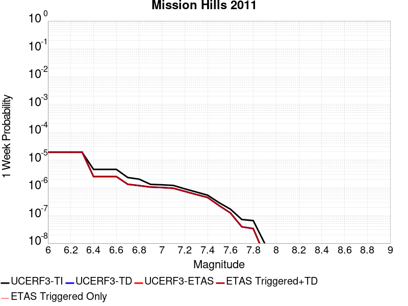 | 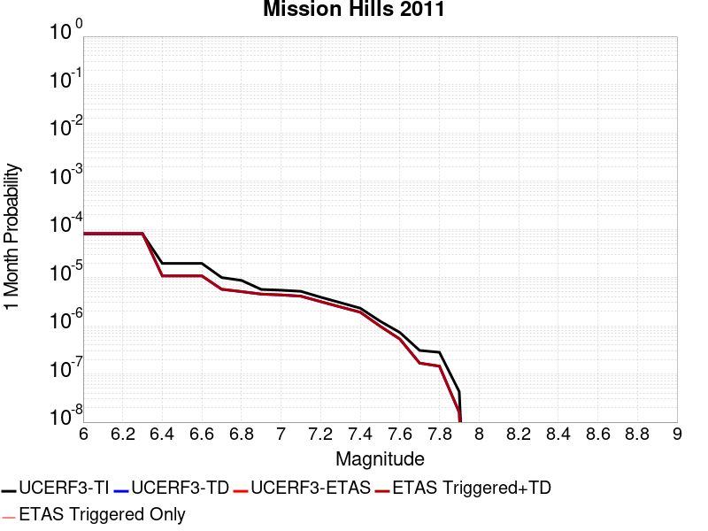 | 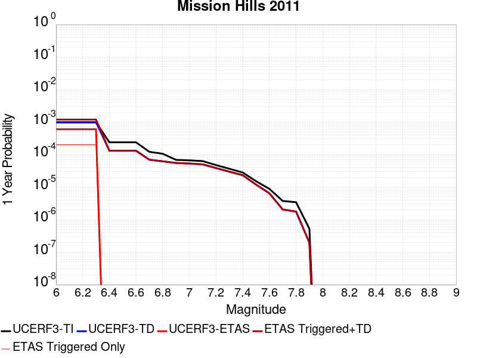 | 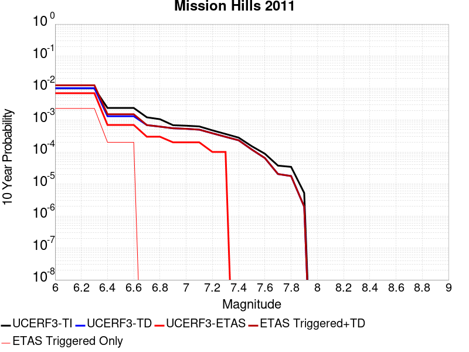 |

| Magnitude | 1 wk TI Prob | 1 wk TD Prob | 1 wk ETAS Prob | 1 wk ETAS/TD Gain | 1 wk ETAS Triggered+TD | 1 wk ETAS Triggered Only | 1 mo TI Prob | 1 mo TD Prob | 1 mo ETAS Prob | 1 mo ETAS/TD Gain | 1 mo ETAS Triggered+TD | 1 mo ETAS Triggered Only | 1 yr TI Prob | 1 yr TD Prob | 1 yr ETAS Prob | 1 yr ETAS/TD Gain | 1 yr ETAS Triggered+TD | 1 yr ETAS Triggered Only | 10 yr TI Prob | 10 yr TD Prob | 10 yr ETAS Prob | 10 yr ETAS/TD Gain | 10 yr ETAS Triggered+TD | 10 yr ETAS Triggered Only |
|-----|-----|-----|-----|-----|-----|-----|-----|-----|-----|-----|-----|-----|-----|-----|-----|-----|-----|-----|-----|-----|-----|-----|-----|-----|
| 6.0 | 1.8765717E-5 | 1.9060602E-5 | 0.0 | 0.0 | 1.9060602E-5 | 0.0 | 8.0422025E-5 | 8.168768E-5 | 0.0 | 0.0 | 8.168768E-5 | 0.0 | 9.786983E-4 | 9.944373E-4 | 6.0E-4 | 0.60335636 | 0.0011942383 | 2.0E-4 | 0.009743992 | 0.009933559 | 0.0069 | 0.69461507 | 0.012210712 | 0.0023 |
| 6.1 | 1.8765717E-5 | 1.9060602E-5 | 0.0 | 0.0 | 1.9060602E-5 | 0.0 | 8.0422025E-5 | 8.168768E-5 | 0.0 | 0.0 | 8.168768E-5 | 0.0 | 9.786983E-4 | 9.944373E-4 | 6.0E-4 | 0.60335636 | 0.0011942383 | 2.0E-4 | 0.009743992 | 0.009933559 | 0.0069 | 0.69461507 | 0.012210712 | 0.0023 |
| 6.2 | 1.8765717E-5 | 1.9060602E-5 | 0.0 | 0.0 | 1.9060602E-5 | 0.0 | 8.0422025E-5 | 8.168768E-5 | 0.0 | 0.0 | 8.168768E-5 | 0.0 | 9.786983E-4 | 9.944373E-4 | 6.0E-4 | 0.60335636 | 0.0011942383 | 2.0E-4 | 0.009743992 | 0.009933559 | 0.0069 | 0.69461507 | 0.012210712 | 0.0023 |
| 6.3 | 1.8765717E-5 | 1.9060602E-5 | 0.0 | 0.0 | 1.9060602E-5 | 0.0 | 8.0422025E-5 | 8.168768E-5 | 0.0 | 0.0 | 8.168768E-5 | 0.0 | 9.786983E-4 | 9.944373E-4 | 6.0E-4 | 0.60335636 | 0.0011942383 | 2.0E-4 | 0.009743992 | 0.009933559 | 0.0069 | 0.69461507 | 0.012210712 | 0.0023 |
| 6.4 | 4.566357E-6 | 2.515389E-6 | 0.0 | 0.0 | 2.515389E-6 | 0.0 | 1.9569954E-5 | 1.0780204E-5 | 0.0 | 0.0 | 1.0780204E-5 | 0.0 | 2.3823815E-4 | 1.312429E-4 | 0.0 | 0.0 | 1.312429E-4 | 0.0 | 0.002379829 | 0.0013118322 | 7.0E-4 | 0.5336048 | 0.0015115698 | 2.0E-4 |
| 6.5 | 4.566357E-6 | 2.515389E-6 | 0.0 | 0.0 | 2.515389E-6 | 0.0 | 1.9569954E-5 | 1.0780204E-5 | 0.0 | 0.0 | 1.0780204E-5 | 0.0 | 2.3823815E-4 | 1.312429E-4 | 0.0 | 0.0 | 1.312429E-4 | 0.0 | 0.002379829 | 0.0013118322 | 7.0E-4 | 0.5336048 | 0.0015115698 | 2.0E-4 |
| 6.6 | 4.566357E-6 | 2.515389E-6 | 0.0 | 0.0 | 2.515389E-6 | 0.0 | 1.9569954E-5 | 1.0780204E-5 | 0.0 | 0.0 | 1.0780204E-5 | 0.0 | 2.3823815E-4 | 1.312429E-4 | 0.0 | 0.0 | 1.312429E-4 | 0.0 | 0.002379829 | 0.0013118322 | 7.0E-4 | 0.5336048 | 0.0015115698 | 2.0E-4 |
| 6.7 | 2.3266773E-6 | 1.3298293E-6 | 0.0 | 0.0 | 1.3298293E-6 | 0.0 | 9.971435E-6 | 5.6992562E-6 | 0.0 | 0.0 | 5.6992562E-6 | 0.0 | 1.2139547E-4 | 6.93863E-5 | 0.0 | 0.0 | 6.93863E-5 | 0.0 | 0.0012132917 | 6.9365243E-4 | 3.0E-4 | 0.43249327 | 6.9365243E-4 | 0.0 |
| 6.8 | 2.032735E-6 | 1.189601E-6 | 0.0 | 0.0 | 1.189601E-6 | 0.0 | 8.711692E-6 | 5.0982803E-6 | 0.0 | 0.0 | 5.0982803E-6 | 0.0 | 1.06059684E-4 | 6.206984E-5 | 0.0 | 0.0 | 6.206984E-5 | 0.0 | 0.0010600908 | 6.205299E-4 | 3.0E-4 | 0.48345774 | 6.205299E-4 | 0.0 |
| 6.9 | 1.3186259E-6 | 1.0563318E-6 | 0.0 | 0.0 | 1.0563318E-6 | 0.0 | 5.6512413E-6 | 4.5271286E-6 | 0.0 | 0.0 | 4.5271286E-6 | 0.0 | 6.8801695E-5 | 5.511643E-5 | 0.0 | 0.0 | 5.511643E-5 | 0.0 | 6.8780396E-4 | 5.5103056E-4 | 2.0E-4 | 0.36295626 | 5.5103056E-4 | 0.0 |
| 7.0 | 1.2726016E-6 | 1.0160574E-6 | 0.0 | 0.0 | 1.0160574E-6 | 0.0 | 5.4539955E-6 | 4.354524E-6 | 0.0 | 0.0 | 4.354524E-6 | 0.0 | 6.6400375E-5 | 5.3015072E-5 | 0.0 | 0.0 | 5.3015072E-5 | 0.0 | 6.6380535E-4 | 5.300271E-4 | 2.0E-4 | 0.37733918 | 5.300271E-4 | 0.0 |
| 7.1 | 1.2063913E-6 | 9.571496E-7 | 0.0 | 0.0 | 9.571496E-7 | 0.0 | 5.170238E-6 | 4.1020635E-6 | 0.0 | 0.0 | 4.1020635E-6 | 0.0 | 6.294583E-5 | 4.9941504E-5 | 0.0 | 0.0 | 4.9941504E-5 | 0.0 | 6.2928005E-4 | 4.993054E-4 | 2.0E-4 | 0.40055647 | 4.993054E-4 | 0.0 |
| 7.2 | 9.105806E-7 | 7.377781E-7 | 0.0 | 0.0 | 7.377781E-7 | 0.0 | 3.9024826E-6 | 3.1619027E-6 | 0.0 | 0.0 | 3.1619027E-6 | 0.0 | 4.7511687E-5 | 3.84955E-5 | 0.0 | 0.0 | 3.84955E-5 | 0.0 | 4.7501532E-4 | 3.8488986E-4 | 1.0E-4 | 0.2598146 | 3.8488986E-4 | 0.0 |
| 7.3 | 7.020432E-7 | 5.71118E-7 | 0.0 | 0.0 | 5.71118E-7 | 0.0 | 3.0087533E-6 | 2.4476462E-6 | 0.0 | 0.0 | 2.4476462E-6 | 0.0 | 3.6630954E-5 | 2.97997E-5 | 0.0 | 0.0 | 2.97997E-5 | 0.0 | 3.6624918E-4 | 2.9795835E-4 | 1.0E-4 | 0.33561736 | 2.9795835E-4 | 0.0 |
| 7.4 | 5.3900635E-7 | 4.44908E-7 | 0.0 | 0.0 | 4.44908E-7 | 0.0 | 2.3100251E-6 | 1.9067473E-6 | 0.0 | 0.0 | 1.9067473E-6 | 0.0 | 2.8124194E-5 | 2.3214414E-5 | 0.0 | 0.0 | 2.3214414E-5 | 0.0 | 2.8120633E-4 | 2.321211E-4 | 0.0 | 0.0 | 2.321211E-4 | 0.0 |
| 7.5 | 2.907075E-7 | 2.288012E-7 | 0.0 | 0.0 | 2.288012E-7 | 0.0 | 1.2458887E-6 | 9.805761E-7 | 0.0 | 0.0 | 9.805761E-7 | 0.0 | 1.5168589E-5 | 1.1938451E-5 | 0.0 | 0.0 | 1.1938451E-5 | 0.0 | 1.5167553E-4 | 1.1937828E-4 | 0.0 | 0.0 | 1.1937828E-4 | 0.0 |
| 7.6 | 1.6903675E-7 | 1.2356485E-7 | 0.0 | 0.0 | 1.2356485E-7 | 0.0 | 7.2444305E-7 | 5.295635E-7 | 0.0 | 0.0 | 5.295635E-7 | 0.0 | 8.820059E-6 | 6.447418E-6 | 0.0 | 0.0 | 6.447418E-6 | 0.0 | 8.8197085E-5 | 6.4472435E-5 | 0.0 | 0.0 | 6.4472435E-5 | 0.0 |
| 7.7 | 7.168073E-8 | 3.9151157E-8 | 0.0 | 0.0 | 3.9151157E-8 | 0.0 | 3.072031E-7 | 1.6779066E-7 | 0.0 | 0.0 | 1.6779066E-7 | 0.0 | 3.7401915E-6 | 2.0428495E-6 | 0.0 | 0.0 | 2.0428495E-6 | 0.0 | 3.7401285E-5 | 2.0428319E-5 | 0.0 | 0.0 | 2.0428319E-5 | 0.0 |
| 7.8 | 6.564101E-8 | 3.385102E-8 | 0.0 | 0.0 | 3.385102E-8 | 0.0 | 2.813186E-7 | 1.4507579E-7 | 0.0 | 0.0 | 1.4507579E-7 | 0.0 | 3.4250486E-6 | 1.7662964E-6 | 0.0 | 0.0 | 1.7662964E-6 | 0.0 | 3.424996E-5 | 1.7662835E-5 | 0.0 | 0.0 | 1.7662835E-5 | 0.0 |
| 7.9 | 1.0029074E-8 | 3.732016E-9 | 0.0 | 0.0 | 3.732016E-9 | 0.0 | 4.2981743E-8 | 1.5994354E-8 | 0.0 | 0.0 | 1.5994354E-8 | 0.0 | 5.2330256E-7 | 1.9473126E-7 | 0.0 | 0.0 | 1.9473126E-7 | 0.0 | 5.2330133E-6 | 1.947312E-6 | 0.0 | 0.0 | 1.947312E-6 | 0.0 |

## Hat Creek-McArthur-Mayfield
*[(top)](#table-of-contents)*

| 1 Week | 1 Month | 1 Year | 10 Year |
|-----|-----|-----|-----|
| 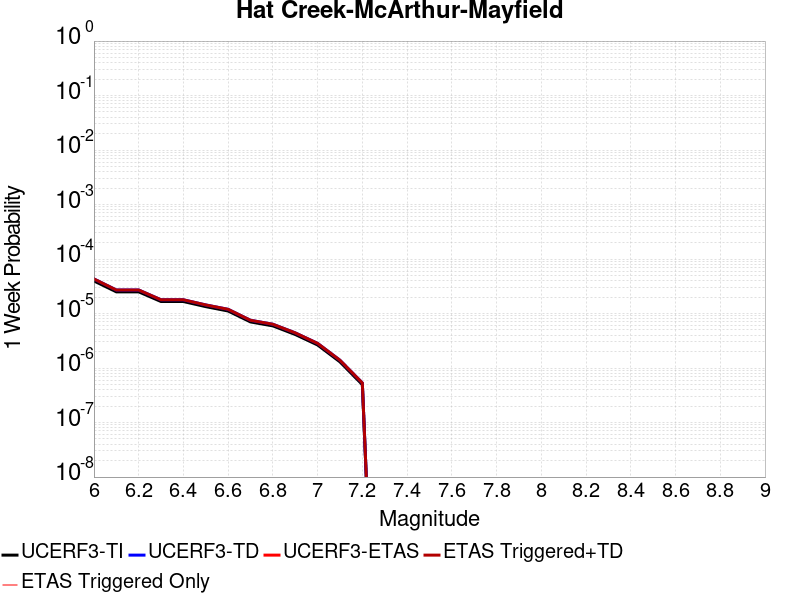 |  | 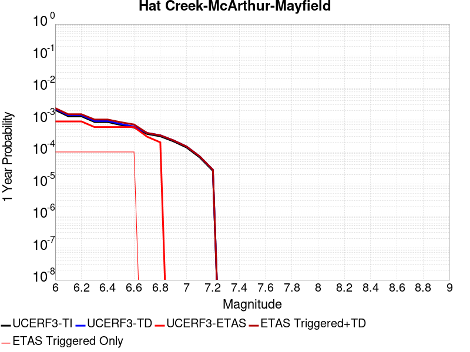 |  |

| Magnitude | 1 wk TI Prob | 1 wk TD Prob | 1 wk ETAS Prob | 1 wk ETAS/TD Gain | 1 wk ETAS Triggered+TD | 1 wk ETAS Triggered Only | 1 mo TI Prob | 1 mo TD Prob | 1 mo ETAS Prob | 1 mo ETAS/TD Gain | 1 mo ETAS Triggered+TD | 1 mo ETAS Triggered Only | 1 yr TI Prob | 1 yr TD Prob | 1 yr ETAS Prob | 1 yr ETAS/TD Gain | 1 yr ETAS Triggered+TD | 1 yr ETAS Triggered Only | 10 yr TI Prob | 10 yr TD Prob | 10 yr ETAS Prob | 10 yr ETAS/TD Gain | 10 yr ETAS Triggered+TD | 10 yr ETAS Triggered Only |
|-----|-----|-----|-----|-----|-----|-----|-----|-----|-----|-----|-----|-----|-----|-----|-----|-----|-----|-----|-----|-----|-----|-----|-----|-----|
| 6.0 | 3.967457E-5 | 4.3165863E-5 | 0.0 | 0.0 | 4.3165863E-5 | 0.0 | 1.7002279E-4 | 1.8498408E-4 | 0.0 | 0.0 | 1.8498408E-4 | 0.0 | 0.002068062 | 0.0022499692 | 9.0E-4 | 0.4000055 | 0.002349744 | 1.0E-4 | 0.02048922 | 0.022284256 | 0.0123 | 0.5519592 | 0.02433746 | 0.0021 |
| 6.1 | 2.5044013E-5 | 2.7075523E-5 | 0.0 | 0.0 | 2.7075523E-5 | 0.0 | 1.0732707E-4 | 1.1603298E-4 | 0.0 | 0.0 | 1.1603298E-4 | 0.0 | 0.0013059238 | 0.0014118177 | 9.0E-4 | 0.637476 | 0.0015116766 | 1.0E-4 | 0.01298276 | 0.014031905 | 0.0081 | 0.5772559 | 0.015215066 | 0.0012 |
| 6.2 | 2.5044013E-5 | 2.7075523E-5 | 0.0 | 0.0 | 2.7075523E-5 | 0.0 | 1.0732707E-4 | 1.1603298E-4 | 0.0 | 0.0 | 1.1603298E-4 | 0.0 | 0.0013059238 | 0.0014118177 | 9.0E-4 | 0.637476 | 0.0015116766 | 1.0E-4 | 0.01298276 | 0.014031905 | 0.0081 | 0.5772559 | 0.015215066 | 0.0012 |
| 6.3 | 1.6624012E-5 | 1.789378E-5 | 0.0 | 0.0 | 1.789378E-5 | 0.0 | 7.124382E-5 | 7.668543E-5 | 0.0 | 0.0 | 7.668543E-5 | 0.0 | 8.670483E-4 | 9.332538E-4 | 6.0E-4 | 0.642912 | 0.0010331605 | 1.0E-4 | 0.008636732 | 0.00929428 | 0.0058 | 0.6240397 | 0.010086845 | 8.0E-4 |
| 6.4 | 1.6624012E-5 | 1.789378E-5 | 0.0 | 0.0 | 1.789378E-5 | 0.0 | 7.124382E-5 | 7.668543E-5 | 0.0 | 0.0 | 7.668543E-5 | 0.0 | 8.670483E-4 | 9.332538E-4 | 6.0E-4 | 0.642912 | 0.0010331605 | 1.0E-4 | 0.008636732 | 0.00929428 | 0.0058 | 0.6240397 | 0.010086845 | 8.0E-4 |
| 6.5 | 1.3394842E-5 | 1.4394265E-5 | 0.0 | 0.0 | 1.4394265E-5 | 0.0 | 5.7405203E-5 | 6.168828E-5 | 0.0 | 0.0 | 6.168828E-5 | 0.0 | 6.986842E-4 | 7.508016E-4 | 6.0E-4 | 0.79914594 | 8.507265E-4 | 1.0E-4 | 0.006964916 | 0.007483243 | 0.0052 | 0.6948859 | 0.008178005 | 7.0E-4 |
| 6.6 | 1.1137514E-5 | 1.19562865E-5 | 0.0 | 0.0 | 1.19562865E-5 | 0.0 | 4.7731326E-5 | 5.1240248E-5 | 0.0 | 0.0 | 5.1240248E-5 | 0.0 | 5.809739E-4 | 6.2367547E-4 | 6.0E-4 | 0.9620388 | 7.236131E-4 | 1.0E-4 | 0.005794574 | 0.006219673 | 0.0046 | 0.7395887 | 0.0068159415 | 6.0E-4 |
| 6.7 | 7.0200663E-6 | 7.525362E-6 | 0.0 | 0.0 | 7.525362E-6 | 0.0 | 3.008565E-5 | 3.2251162E-5 | 0.0 | 0.0 | 3.2251162E-5 | 0.0 | 3.6623122E-4 | 3.9258876E-4 | 3.0E-4 | 0.7641584 | 3.9258876E-4 | 0.0 | 0.0036562826 | 0.003919115 | 0.0029 | 0.739963 | 0.0044171554 | 5.0E-4 |
| 6.8 | 5.940172E-6 | 6.366381E-6 | 0.0 | 0.0 | 6.366381E-6 | 0.0 | 2.545763E-5 | 2.7284212E-5 | 0.0 | 0.0 | 2.7284212E-5 | 0.0 | 3.0990256E-4 | 3.321359E-4 | 2.0E-4 | 0.60216314 | 3.321359E-4 | 0.0 | 0.0030947074 | 0.0033165237 | 0.0024 | 0.72364926 | 0.0038148656 | 5.0E-4 |
| 6.9 | 4.129831E-6 | 4.4241715E-6 | 0.0 | 0.0 | 4.4241715E-6 | 0.0 | 1.7699154E-5 | 1.8960602E-5 | 0.0 | 0.0 | 1.8960602E-5 | 0.0 | 2.154659E-4 | 2.3082165E-4 | 0.0 | 0.0 | 2.3082165E-4 | 0.0 | 0.002152571 | 0.0023058974 | 0.0018 | 0.78060716 | 0.002704975 | 4.0E-4 |
| 7.0 | 2.6512955E-6 | 2.8377951E-6 | 0.0 | 0.0 | 2.8377951E-6 | 0.0 | 1.1362646E-5 | 1.2161925E-5 | 0.0 | 0.0 | 1.2161925E-5 | 0.0 | 1.3833142E-4 | 1.4806181E-4 | 0.0 | 0.0 | 1.4806181E-4 | 0.0 | 0.0013824535 | 0.0014796741 | 0.0014 | 0.94615424 | 0.0018790823 | 4.0E-4 |
| 7.1 | 1.2992575E-6 | 1.3911265E-6 | 0.0 | 0.0 | 1.3911265E-6 | 0.0 | 5.568235E-6 | 5.9619583E-6 | 0.0 | 0.0 | 5.9619583E-6 | 0.0 | 6.779115E-5 | 7.258464E-5 | 0.0 | 0.0 | 7.258464E-5 | 0.0 | 6.7770475E-4 | 7.2563096E-4 | 6.0E-4 | 0.82686657 | 9.2548586E-4 | 2.0E-4 |
| 7.2 | 4.968191E-7 | 5.327911E-7 | 0.0 | 0.0 | 5.327911E-7 | 0.0 | 2.1292228E-6 | 2.2833892E-6 | 0.0 | 0.0 | 2.2833892E-6 | 0.0 | 2.592298E-5 | 2.7800035E-5 | 0.0 | 0.0 | 2.7800035E-5 | 0.0 | 2.5919956E-4 | 2.7797793E-4 | 3.0E-4 | 1.0792223 | 3.7795014E-4 | 1.0E-4 |

## Little Salmon (Onshore)
*[(top)](#table-of-contents)*

| 1 Week | 1 Month | 1 Year | 10 Year |
|-----|-----|-----|-----|
| 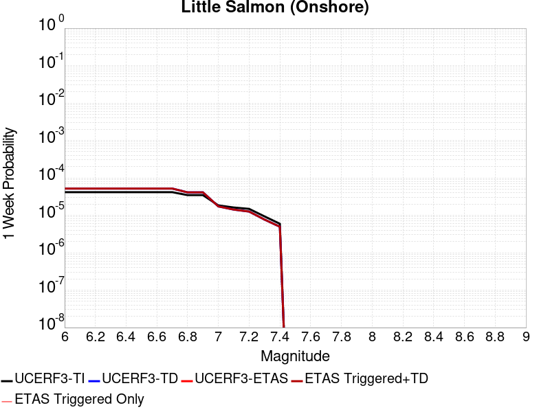 |  |  |  |

| Magnitude | 1 wk TI Prob | 1 wk TD Prob | 1 wk ETAS Prob | 1 wk ETAS/TD Gain | 1 wk ETAS Triggered+TD | 1 wk ETAS Triggered Only | 1 mo TI Prob | 1 mo TD Prob | 1 mo ETAS Prob | 1 mo ETAS/TD Gain | 1 mo ETAS Triggered+TD | 1 mo ETAS Triggered Only | 1 yr TI Prob | 1 yr TD Prob | 1 yr ETAS Prob | 1 yr ETAS/TD Gain | 1 yr ETAS Triggered+TD | 1 yr ETAS Triggered Only | 10 yr TI Prob | 10 yr TD Prob | 10 yr ETAS Prob | 10 yr ETAS/TD Gain | 10 yr ETAS Triggered+TD | 10 yr ETAS Triggered Only |
|-----|-----|-----|-----|-----|-----|-----|-----|-----|-----|-----|-----|-----|-----|-----|-----|-----|-----|-----|-----|-----|-----|-----|-----|-----|
| 6.0 | 4.1582247E-5 | 5.1887124E-5 | 0.0 | 0.0 | 5.1887124E-5 | 0.0 | 1.7819746E-4 | 2.2235911E-4 | 0.0 | 0.0 | 2.2235911E-4 | 0.0 | 0.0021673953 | 0.00270469 | 0.0013 | 0.48064658 | 0.0028044195 | 1.0E-4 | 0.021463778 | 0.027069423 | 0.0164 | 0.6058496 | 0.02920987 | 0.0022 |
| 6.1 | 4.1582247E-5 | 5.1887124E-5 | 0.0 | 0.0 | 5.1887124E-5 | 0.0 | 1.7819746E-4 | 2.2235911E-4 | 0.0 | 0.0 | 2.2235911E-4 | 0.0 | 0.0021673953 | 0.00270469 | 0.0013 | 0.48064658 | 0.0028044195 | 1.0E-4 | 0.021463778 | 0.027069423 | 0.0164 | 0.6058496 | 0.02920987 | 0.0022 |
| 6.2 | 4.1582247E-5 | 5.1887124E-5 | 0.0 | 0.0 | 5.1887124E-5 | 0.0 | 1.7819746E-4 | 2.2235911E-4 | 0.0 | 0.0 | 2.2235911E-4 | 0.0 | 0.0021673953 | 0.00270469 | 0.0013 | 0.48064658 | 0.0028044195 | 1.0E-4 | 0.021463778 | 0.027069423 | 0.0164 | 0.6058496 | 0.02920987 | 0.0022 |
| 6.3 | 4.1582247E-5 | 5.1887124E-5 | 0.0 | 0.0 | 5.1887124E-5 | 0.0 | 1.7819746E-4 | 2.2235911E-4 | 0.0 | 0.0 | 2.2235911E-4 | 0.0 | 0.0021673953 | 0.00270469 | 0.0013 | 0.48064658 | 0.0028044195 | 1.0E-4 | 0.021463778 | 0.027069423 | 0.0164 | 0.6058496 | 0.02920987 | 0.0022 |
| 6.4 | 4.1582247E-5 | 5.1887124E-5 | 0.0 | 0.0 | 5.1887124E-5 | 0.0 | 1.7819746E-4 | 2.2235911E-4 | 0.0 | 0.0 | 2.2235911E-4 | 0.0 | 0.0021673953 | 0.00270469 | 0.0013 | 0.48064658 | 0.0028044195 | 1.0E-4 | 0.021463778 | 0.027069423 | 0.0164 | 0.6058496 | 0.02920987 | 0.0022 |
| 6.5 | 4.1582247E-5 | 5.1887124E-5 | 0.0 | 0.0 | 5.1887124E-5 | 0.0 | 1.7819746E-4 | 2.2235911E-4 | 0.0 | 0.0 | 2.2235911E-4 | 0.0 | 0.0021673953 | 0.00270469 | 0.0013 | 0.48064658 | 0.0028044195 | 1.0E-4 | 0.021463778 | 0.027069423 | 0.0164 | 0.6058496 | 0.02920987 | 0.0022 |
| 6.6 | 4.1582247E-5 | 5.1887124E-5 | 0.0 | 0.0 | 5.1887124E-5 | 0.0 | 1.7819746E-4 | 2.2235911E-4 | 0.0 | 0.0 | 2.2235911E-4 | 0.0 | 0.0021673953 | 0.00270469 | 0.0013 | 0.48064658 | 0.0028044195 | 1.0E-4 | 0.021463778 | 0.027069423 | 0.0164 | 0.6058496 | 0.02920987 | 0.0022 |
| 6.7 | 4.1582247E-5 | 5.1887124E-5 | 0.0 | 0.0 | 5.1887124E-5 | 0.0 | 1.7819746E-4 | 2.2235911E-4 | 0.0 | 0.0 | 2.2235911E-4 | 0.0 | 0.0021673953 | 0.00270469 | 0.0013 | 0.48064658 | 0.0028044195 | 1.0E-4 | 0.021463778 | 0.027069423 | 0.0164 | 0.6058496 | 0.02920987 | 0.0022 |
| 6.8 | 3.4607925E-5 | 4.0998435E-5 | 0.0 | 0.0 | 4.0998435E-5 | 0.0 | 1.4831126E-4 | 1.757E-4 | 0.0 | 0.0 | 1.757E-4 | 0.0 | 0.001804194 | 0.0021378025 | 0.001 | 0.46777004 | 0.0022375889 | 1.0E-4 | 0.01789616 | 0.0214831 | 0.0127 | 0.5911624 | 0.022950875 | 0.0015 |
| 6.9 | 3.4607925E-5 | 4.0998435E-5 | 0.0 | 0.0 | 4.0998435E-5 | 0.0 | 1.4831126E-4 | 1.757E-4 | 0.0 | 0.0 | 1.757E-4 | 0.0 | 0.001804194 | 0.0021378025 | 0.001 | 0.46777004 | 0.0022375889 | 1.0E-4 | 0.01789616 | 0.0214831 | 0.0127 | 0.5911624 | 0.022950875 | 0.0015 |
| 7.0 | 1.8411014E-5 | 1.7308621E-5 | 0.0 | 0.0 | 1.7308621E-5 | 0.0 | 7.8901954E-5 | 7.4177995E-5 | 0.0 | 0.0 | 7.4177995E-5 | 0.0 | 9.6020795E-4 | 9.027965E-4 | 6.0E-4 | 0.66460156 | 0.0010027062 | 1.0E-4 | 0.009560696 | 0.009019101 | 0.0051 | 0.5654666 | 0.009712787 | 7.0E-4 |
| 7.1 | 1.6183103E-5 | 1.4226047E-5 | 0.0 | 0.0 | 1.4226047E-5 | 0.0 | 6.935431E-5 | 6.0967614E-5 | 0.0 | 0.0 | 6.0967614E-5 | 0.0 | 8.440616E-4 | 7.420755E-4 | 5.0E-4 | 0.67378587 | 8.420013E-4 | 1.0E-4 | 0.008408628 | 0.0074232053 | 0.0044 | 0.5927358 | 0.008018752 | 6.0E-4 |
| 7.2 | 1.4868988E-5 | 1.2604527E-5 | 0.0 | 0.0 | 1.2604527E-5 | 0.0 | 6.372268E-5 | 5.401854E-5 | 0.0 | 0.0 | 5.401854E-5 | 0.0 | 7.755474E-4 | 6.5752247E-4 | 5.0E-4 | 0.76043034 | 7.574567E-4 | 1.0E-4 | 0.0077284635 | 0.006582297 | 0.004 | 0.60769063 | 0.0070790057 | 5.0E-4 |
| 7.3 | 9.3599865E-6 | 7.705265E-6 | 0.0 | 0.0 | 7.705265E-6 | 0.0 | 4.011361E-5 | 3.302235E-5 | 0.0 | 0.0 | 3.302235E-5 | 0.0 | 4.8827377E-4 | 4.0200865E-4 | 5.0E-4 | 1.2437543 | 5.0196843E-4 | 1.0E-4 | 0.004872023 | 0.004029657 | 0.003 | 0.7444802 | 0.0043284483 | 3.0E-4 |
| 7.4 | 5.941556E-6 | 4.9578575E-6 | 0.0 | 0.0 | 4.9578575E-6 | 0.0 | 2.5463563E-5 | 2.124796E-5 | 0.0 | 0.0 | 2.124796E-5 | 0.0 | 3.0997477E-4 | 2.586939E-4 | 4.0E-4 | 1.5462289 | 3.5866804E-4 | 1.0E-4 | 0.0030954275 | 0.002595933 | 0.0021 | 0.80895776 | 0.002895154 | 3.0E-4 |

## Surprise Valley 2011 CFM
*[(top)](#table-of-contents)*

| 1 Week | 1 Month | 1 Year | 10 Year |
|-----|-----|-----|-----|
|  | 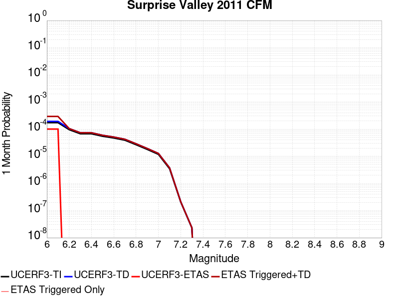 | 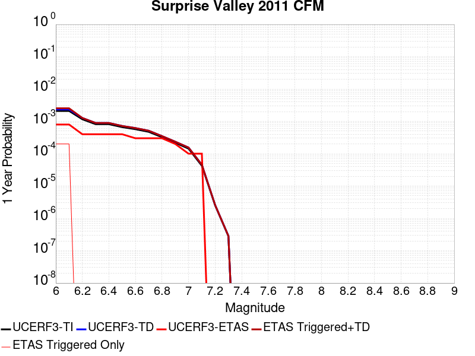 | 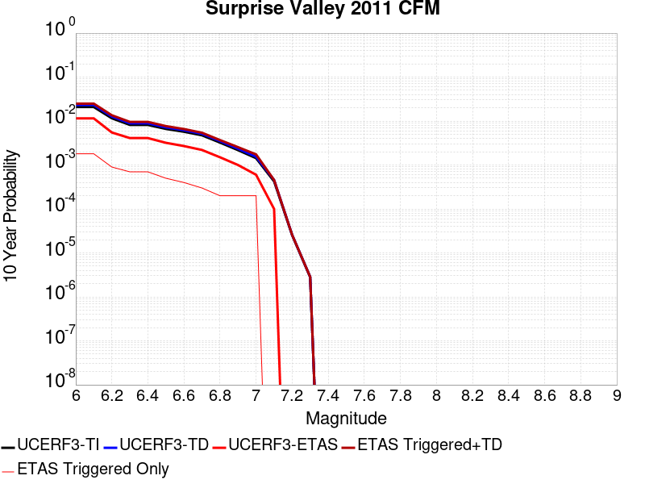 |

| Magnitude | 1 wk TI Prob | 1 wk TD Prob | 1 wk ETAS Prob | 1 wk ETAS/TD Gain | 1 wk ETAS Triggered+TD | 1 wk ETAS Triggered Only | 1 mo TI Prob | 1 mo TD Prob | 1 mo ETAS Prob | 1 mo ETAS/TD Gain | 1 mo ETAS Triggered+TD | 1 mo ETAS Triggered Only | 1 yr TI Prob | 1 yr TD Prob | 1 yr ETAS Prob | 1 yr ETAS/TD Gain | 1 yr ETAS Triggered+TD | 1 yr ETAS Triggered Only | 10 yr TI Prob | 10 yr TD Prob | 10 yr ETAS Prob | 10 yr ETAS/TD Gain | 10 yr ETAS Triggered+TD | 10 yr ETAS Triggered Only |
|-----|-----|-----|-----|-----|-----|-----|-----|-----|-----|-----|-----|-----|-----|-----|-----|-----|-----|-----|-----|-----|-----|-----|-----|-----|
| 6.0 | 4.0396248E-5 | 4.4861183E-5 | 0.0 | 0.0 | 4.4861183E-5 | 0.0 | 1.7311527E-4 | 1.9224924E-4 | 1.0E-4 | 0.5201581 | 2.9223002E-4 | 1.0E-4 | 0.002105641 | 0.002338332 | 8.0E-4 | 0.34212425 | 0.002537864 | 2.0E-4 | 0.020858008 | 0.023159012 | 0.0115 | 0.49656695 | 0.024917325 | 0.0018 |
| 6.1 | 4.0396248E-5 | 4.4861183E-5 | 0.0 | 0.0 | 4.4861183E-5 | 0.0 | 1.7311527E-4 | 1.9224924E-4 | 1.0E-4 | 0.5201581 | 2.9223002E-4 | 1.0E-4 | 0.002105641 | 0.002338332 | 8.0E-4 | 0.34212425 | 0.002537864 | 2.0E-4 | 0.020858008 | 0.023159012 | 0.0115 | 0.49656695 | 0.024917325 | 0.0018 |
| 6.2 | 2.2295266E-5 | 2.4405841E-5 | 0.0 | 0.0 | 2.4405841E-5 | 0.0 | 9.554764E-5 | 1.04592444E-4 | 0.0 | 0.0 | 1.04592444E-4 | 0.0 | 0.0011626717 | 0.0012726999 | 4.0E-4 | 0.3142925 | 0.0012726999 | 0.0 | 0.011566074 | 0.012657348 | 0.0055 | 0.4345302 | 0.013545956 | 9.0E-4 |
| 6.3 | 1.572643E-5 | 1.7099772E-5 | 0.0 | 0.0 | 1.7099772E-5 | 0.0 | 6.7397246E-5 | 7.328274E-5 | 0.0 | 0.0 | 7.328274E-5 | 0.0 | 8.202525E-4 | 8.918626E-4 | 4.0E-4 | 0.4484996 | 8.918626E-4 | 0.0 | 0.008172315 | 0.00888394 | 0.0041 | 0.4615069 | 0.009577721 | 7.0E-4 |
| 6.4 | 1.5714395E-5 | 1.7087594E-5 | 0.0 | 0.0 | 1.7087594E-5 | 0.0 | 6.734567E-5 | 7.323055E-5 | 0.0 | 0.0 | 7.323055E-5 | 0.0 | 8.1962504E-4 | 8.912277E-4 | 4.0E-4 | 0.4488191 | 8.912277E-4 | 0.0 | 0.008166086 | 0.008877642 | 0.0041 | 0.46183434 | 0.0095714275 | 7.0E-4 |
| 6.5 | 1.2733495E-5 | 1.3803903E-5 | 0.0 | 0.0 | 1.3803903E-5 | 0.0 | 5.457098E-5 | 5.9158283E-5 | 0.0 | 0.0 | 5.9158283E-5 | 0.0 | 6.641992E-4 | 7.2002073E-4 | 4.0E-4 | 0.55553955 | 7.2002073E-4 | 0.0 | 0.0066221743 | 0.007177573 | 0.0032 | 0.44583315 | 0.0076739844 | 5.0E-4 |
| 6.6 | 1.0983784E-5 | 1.1888497E-5 | 0.0 | 0.0 | 1.1888497E-5 | 0.0 | 4.7072506E-5 | 5.0949737E-5 | 0.0 | 0.0 | 5.0949737E-5 | 0.0 | 5.7295704E-4 | 6.2014186E-4 | 3.0E-4 | 0.4837603 | 6.2014186E-4 | 0.0 | 0.0057148207 | 0.0061846627 | 0.0027 | 0.43656382 | 0.006582189 | 4.0E-4 |
| 6.7 | 9.104806E-6 | 9.841071E-6 | 0.0 | 0.0 | 9.841071E-6 | 0.0 | 3.902001E-5 | 4.2175358E-5 | 0.0 | 0.0 | 4.2175358E-5 | 0.0 | 4.7496508E-4 | 5.133679E-4 | 3.0E-4 | 0.5843762 | 5.133679E-4 | 0.0 | 0.004739512 | 0.005122217 | 0.0022 | 0.4295015 | 0.0054206806 | 3.0E-4 |
| 6.8 | 6.2162403E-6 | 6.7051815E-6 | 0.0 | 0.0 | 6.7051815E-6 | 0.0 | 2.6640759E-5 | 2.8736187E-5 | 0.0 | 0.0 | 2.8736187E-5 | 0.0 | 3.2430296E-4 | 3.4980915E-4 | 3.0E-4 | 0.8576105 | 3.4980915E-4 | 0.0 | 0.003238301 | 0.0034928087 | 0.0015 | 0.42945382 | 0.00369211 | 2.0E-4 |
| 6.9 | 4.1792696E-6 | 4.5039255E-6 | 0.0 | 0.0 | 4.5039255E-6 | 0.0 | 1.7911032E-5 | 1.9302404E-5 | 0.0 | 0.0 | 1.9302404E-5 | 0.0 | 2.1804498E-4 | 2.3498297E-4 | 2.0E-4 | 0.8511255 | 2.3498297E-4 | 0.0 | 0.0021783116 | 0.0023474984 | 0.001 | 0.4259854 | 0.002547029 | 2.0E-4 |
| 7.0 | 2.7478413E-6 | 2.9627033E-6 | 0.0 | 0.0 | 2.9627033E-6 | 0.0 | 1.177641E-5 | 1.2697245E-5 | 0.0 | 0.0 | 1.2697245E-5 | 0.0 | 1.4336836E-4 | 1.5457923E-4 | 1.0E-4 | 0.6469174 | 1.5457923E-4 | 0.0 | 0.001432759 | 0.0015448397 | 6.0E-4 | 0.38838983 | 0.0017445307 | 2.0E-4 |
| 7.1 | 8.128648E-7 | 8.7262043E-7 | 0.0 | 0.0 | 8.7262043E-7 | 0.0 | 3.4837017E-6 | 3.7398E-6 | 0.0 | 0.0 | 3.7398E-6 | 0.0 | 4.2413245E-5 | 4.5531713E-5 | 1.0E-4 | 2.1962714 | 4.5531713E-5 | 0.0 | 4.2405148E-4 | 4.5528266E-4 | 1.0E-4 | 0.21964377 | 4.5528266E-4 | 0.0 |
| 7.2 | 4.8641045E-8 | 4.94036E-8 | 0.0 | 0.0 | 4.94036E-8 | 0.0 | 2.084616E-7 | 2.117297E-7 | 0.0 | 0.0 | 2.117297E-7 | 0.0 | 2.538017E-6 | 2.577806E-6 | 0.0 | 0.0 | 2.577806E-6 | 0.0 | 2.537988E-5 | 2.5777774E-5 | 0.0 | 0.0 | 2.5777774E-5 | 0.0 |
| 7.3 | 5.3911844E-9 | 5.4759846E-9 | 0.0 | 0.0 | 5.4759846E-9 | 0.0 | 2.3105075E-8 | 2.3468505E-8 | 0.0 | 0.0 | 2.3468505E-8 | 0.0 | 2.8130427E-7 | 2.8572904E-7 | 0.0 | 0.0 | 2.8572904E-7 | 0.0 | 2.8130391E-6 | 2.8572883E-6 | 0.0 | 0.0 | 2.8572883E-6 | 0.0 |

## Blue Cut
*[(top)](#table-of-contents)*

| 1 Week | 1 Month | 1 Year | 10 Year |
|-----|-----|-----|-----|
|  |  | 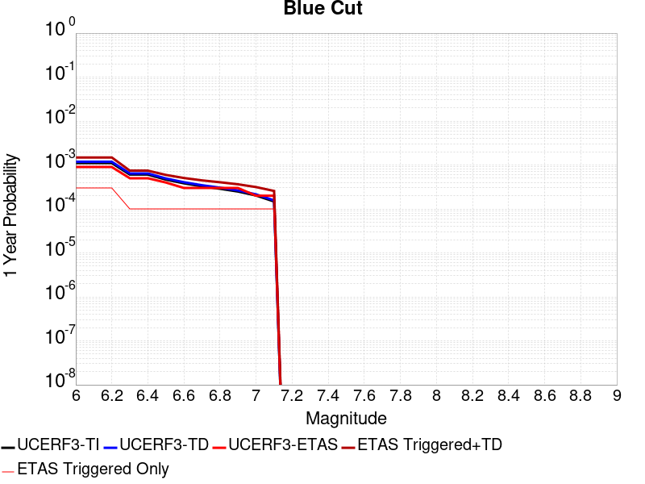 |  |

| Magnitude | 1 wk TI Prob | 1 wk TD Prob | 1 wk ETAS Prob | 1 wk ETAS/TD Gain | 1 wk ETAS Triggered+TD | 1 wk ETAS Triggered Only | 1 mo TI Prob | 1 mo TD Prob | 1 mo ETAS Prob | 1 mo ETAS/TD Gain | 1 mo ETAS Triggered+TD | 1 mo ETAS Triggered Only | 1 yr TI Prob | 1 yr TD Prob | 1 yr ETAS Prob | 1 yr ETAS/TD Gain | 1 yr ETAS Triggered+TD | 1 yr ETAS Triggered Only | 10 yr TI Prob | 10 yr TD Prob | 10 yr ETAS Prob | 10 yr ETAS/TD Gain | 10 yr ETAS Triggered+TD | 10 yr ETAS Triggered Only |
|-----|-----|-----|-----|-----|-----|-----|-----|-----|-----|-----|-----|-----|-----|-----|-----|-----|-----|-----|-----|-----|-----|-----|-----|-----|
| 6.0 | 2.1227985E-5 | 2.2722747E-5 | 0.0 | 0.0 | 2.2722747E-5 | 0.0 | 9.097391E-5 | 9.737989E-5 | 1.0E-4 | 1.026906 | 1.9737016E-4 | 1.0E-4 | 0.0011070445 | 0.0011850134 | 9.0E-4 | 0.75948507 | 0.0014846579 | 3.0E-4 | 0.011015458 | 0.011792789 | 0.01 | 0.84797585 | 0.013868024 | 0.0021 |
| 6.1 | 2.1227985E-5 | 2.2722747E-5 | 0.0 | 0.0 | 2.2722747E-5 | 0.0 | 9.097391E-5 | 9.737989E-5 | 1.0E-4 | 1.026906 | 1.9737016E-4 | 1.0E-4 | 0.0011070445 | 0.0011850134 | 9.0E-4 | 0.75948507 | 0.0014846579 | 3.0E-4 | 0.011015458 | 0.011792789 | 0.01 | 0.84797585 | 0.013868024 | 0.0021 |
| 6.2 | 2.1227985E-5 | 2.2722747E-5 | 0.0 | 0.0 | 2.2722747E-5 | 0.0 | 9.097391E-5 | 9.737989E-5 | 1.0E-4 | 1.026906 | 1.9737016E-4 | 1.0E-4 | 0.0011070445 | 0.0011850134 | 9.0E-4 | 0.75948507 | 0.0014846579 | 3.0E-4 | 0.011015458 | 0.011792789 | 0.01 | 0.84797585 | 0.013868024 | 0.0021 |
| 6.3 | 1.1613981E-5 | 1.2355103E-5 | 0.0 | 0.0 | 1.2355103E-5 | 0.0 | 4.9773254E-5 | 5.2949435E-5 | 0.0 | 0.0 | 5.2949435E-5 | 0.0 | 6.0582085E-4 | 6.4448116E-4 | 5.0E-4 | 0.7758179 | 7.444167E-4 | 1.0E-4 | 0.0060417196 | 0.006427369 | 0.0055 | 0.85571563 | 0.0074209417 | 0.001 |
| 6.4 | 1.1613981E-5 | 1.2355103E-5 | 0.0 | 0.0 | 1.2355103E-5 | 0.0 | 4.9773254E-5 | 5.2949435E-5 | 0.0 | 0.0 | 5.2949435E-5 | 0.0 | 6.0582085E-4 | 6.4448116E-4 | 5.0E-4 | 0.7758179 | 7.444167E-4 | 1.0E-4 | 0.0060417196 | 0.006427369 | 0.0055 | 0.85571563 | 0.0074209417 | 0.001 |
| 6.5 | 8.931326E-6 | 9.482758E-6 | 0.0 | 0.0 | 9.482758E-6 | 0.0 | 3.8276554E-5 | 4.0639814E-5 | 0.0 | 0.0 | 4.0639814E-5 | 0.0 | 4.6591737E-4 | 4.9468654E-4 | 4.0E-4 | 0.80859286 | 5.9463707E-4 | 1.0E-4 | 0.0046494175 | 0.004936763 | 0.0049 | 0.99255323 | 0.0059318263 | 0.001 |
| 6.6 | 7.345353E-6 | 7.7912155E-6 | 0.0 | 0.0 | 7.7912155E-6 | 0.0 | 3.1479703E-5 | 3.339054E-5 | 0.0 | 0.0 | 3.339054E-5 | 0.0 | 3.83198E-4 | 4.06462E-4 | 3.0E-4 | 0.7380764 | 5.064214E-4 | 1.0E-4 | 0.0038253788 | 0.0040579773 | 0.0041 | 1.0103556 | 0.004854731 | 8.0E-4 |
| 6.7 | 6.2775666E-6 | 6.655943E-6 | 0.0 | 0.0 | 6.655943E-6 | 0.0 | 2.690358E-5 | 2.85252E-5 | 0.0 | 0.0 | 2.85252E-5 | 0.0 | 3.2750185E-4 | 3.472465E-4 | 3.0E-4 | 0.8639396 | 4.4721176E-4 | 1.0E-4 | 0.0032701963 | 0.00346778 | 0.0038 | 1.0958018 | 0.0042650057 | 8.0E-4 |
| 6.8 | 5.5234095E-6 | 5.8558085E-6 | 0.0 | 0.0 | 5.8558085E-6 | 0.0 | 2.367154E-5 | 2.5096122E-5 | 0.0 | 0.0 | 2.5096122E-5 | 0.0 | 2.8816288E-4 | 3.0550972E-4 | 3.0E-4 | 0.9819654 | 4.054792E-4 | 1.0E-4 | 0.002877895 | 0.0030516135 | 0.0035 | 1.1469343 | 0.0038491723 | 8.0E-4 |
| 6.9 | 4.7780054E-6 | 5.0660246E-6 | 0.0 | 0.0 | 5.0660246E-6 | 0.0 | 2.0477004E-5 | 2.1711394E-5 | 0.0 | 0.0 | 2.1711394E-5 | 0.0 | 2.4927902E-4 | 2.643112E-4 | 3.0E-4 | 1.1350256 | 3.642848E-4 | 1.0E-4 | 0.0024899957 | 0.0026406609 | 0.0031 | 1.1739485 | 0.0033388124 | 7.0E-4 |
| 7.0 | 3.883171E-6 | 4.118982E-6 | 0.0 | 0.0 | 4.118982E-6 | 0.0 | 1.6642054E-5 | 1.76527E-5 | 0.0 | 0.0 | 1.76527E-5 | 0.0 | 2.0259817E-4 | 2.1490731E-4 | 2.0E-4 | 0.9306338 | 3.148858E-4 | 1.0E-4 | 0.0020241356 | 0.0021476708 | 0.0027 | 1.2571759 | 0.002746382 | 6.0E-4 |
| 7.1 | 2.8358215E-6 | 3.0100819E-6 | 0.0 | 0.0 | 3.0100819E-6 | 0.0 | 1.2153464E-5 | 1.2900325E-5 | 0.0 | 0.0 | 1.2900325E-5 | 0.0 | 1.4795837E-4 | 1.5705671E-4 | 2.0E-4 | 1.2734253 | 2.57041E-4 | 1.0E-4 | 0.001478599 | 0.0015701025 | 0.0017 | 1.0827318 | 0.0018696315 | 3.0E-4 |

## Paradise
*[(top)](#table-of-contents)*

| 1 Week | 1 Month | 1 Year | 10 Year |
|-----|-----|-----|-----|
|  | 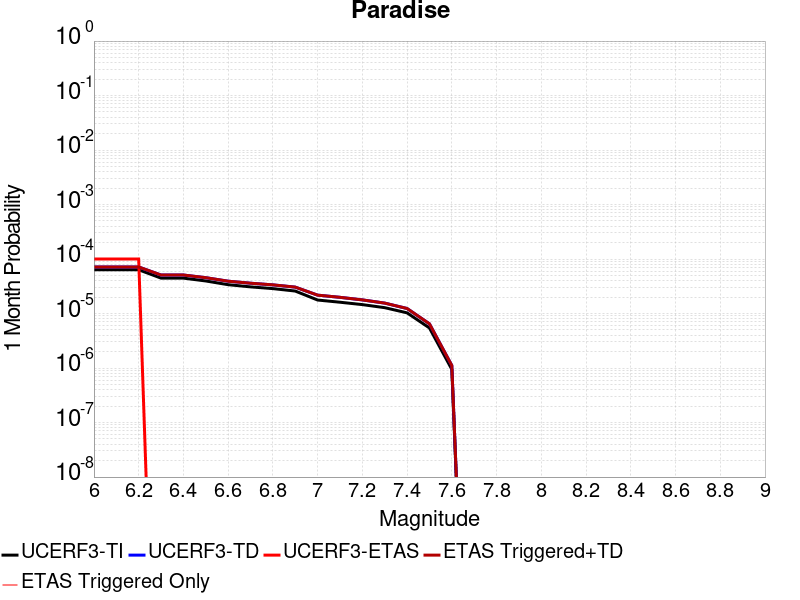 |  |  |

| Magnitude | 1 wk TI Prob | 1 wk TD Prob | 1 wk ETAS Prob | 1 wk ETAS/TD Gain | 1 wk ETAS Triggered+TD | 1 wk ETAS Triggered Only | 1 mo TI Prob | 1 mo TD Prob | 1 mo ETAS Prob | 1 mo ETAS/TD Gain | 1 mo ETAS Triggered+TD | 1 mo ETAS Triggered Only | 1 yr TI Prob | 1 yr TD Prob | 1 yr ETAS Prob | 1 yr ETAS/TD Gain | 1 yr ETAS Triggered+TD | 1 yr ETAS Triggered Only | 10 yr TI Prob | 10 yr TD Prob | 10 yr ETAS Prob | 10 yr ETAS/TD Gain | 10 yr ETAS Triggered+TD | 10 yr ETAS Triggered Only |
|-----|-----|-----|-----|-----|-----|-----|-----|-----|-----|-----|-----|-----|-----|-----|-----|-----|-----|-----|-----|-----|-----|-----|-----|-----|
| 6.0 | 1.4851273E-5 | 1.6697566E-5 | 1.0E-4 | 5.9888964 | 1.6697566E-5 | 0.0 | 6.364676E-5 | 7.1559174E-5 | 1.0E-4 | 1.397445 | 7.1559174E-5 | 0.0 | 7.7462377E-4 | 8.7090826E-4 | 0.0013 | 1.4926945 | 0.0014703857 | 6.0E-4 | 0.0077192914 | 0.008677333 | 0.0095 | 1.0948064 | 0.010659978 | 0.002 |
| 6.1 | 1.4851273E-5 | 1.6697566E-5 | 1.0E-4 | 5.9888964 | 1.6697566E-5 | 0.0 | 6.364676E-5 | 7.1559174E-5 | 1.0E-4 | 1.397445 | 7.1559174E-5 | 0.0 | 7.7462377E-4 | 8.7090826E-4 | 0.0013 | 1.4926945 | 0.0014703857 | 6.0E-4 | 0.0077192914 | 0.008677333 | 0.0095 | 1.0948064 | 0.010659978 | 0.002 |
| 6.2 | 1.4851273E-5 | 1.6697566E-5 | 1.0E-4 | 5.9888964 | 1.6697566E-5 | 0.0 | 6.364676E-5 | 7.1559174E-5 | 1.0E-4 | 1.397445 | 7.1559174E-5 | 0.0 | 7.7462377E-4 | 8.7090826E-4 | 0.0013 | 1.4926945 | 0.0014703857 | 6.0E-4 | 0.0077192914 | 0.008677333 | 0.0095 | 1.0948064 | 0.010659978 | 0.002 |
| 6.3 | 1.0426831E-5 | 1.1890672E-5 | 0.0 | 0.0 | 1.1890672E-5 | 0.0 | 4.4685654E-5 | 5.095906E-5 | 0.0 | 0.0 | 5.095906E-5 | 0.0 | 5.43912E-4 | 6.202559E-4 | 0.001 | 1.6122378 | 0.0010200078 | 4.0E-4 | 0.0054258266 | 0.0061858557 | 0.0064 | 1.0346184 | 0.007378433 | 0.0012 |
| 6.4 | 1.0426831E-5 | 1.1890672E-5 | 0.0 | 0.0 | 1.1890672E-5 | 0.0 | 4.4685654E-5 | 5.095906E-5 | 0.0 | 0.0 | 5.095906E-5 | 0.0 | 5.43912E-4 | 6.202559E-4 | 0.001 | 1.6122378 | 0.0010200078 | 4.0E-4 | 0.0054258266 | 0.0061858557 | 0.0064 | 1.0346184 | 0.007378433 | 0.0012 |
| 6.5 | 9.25027E-6 | 1.0621814E-5 | 0.0 | 0.0 | 1.0621814E-5 | 0.0 | 3.964341E-5 | 4.5521294E-5 | 0.0 | 0.0 | 4.5521294E-5 | 0.0 | 4.8255164E-4 | 5.540857E-4 | 8.0E-4 | 1.4438199 | 8.539195E-4 | 3.0E-4 | 0.0048150513 | 0.005527542 | 0.0053 | 0.9588349 | 0.006422567 | 9.0E-4 |
| 6.6 | 7.904275E-6 | 9.161133E-6 | 0.0 | 0.0 | 9.161133E-6 | 0.0 | 3.3875025E-5 | 3.9261427E-5 | 0.0 | 0.0 | 3.9261427E-5 | 0.0 | 4.1235037E-4 | 4.77907E-4 | 6.0E-4 | 1.2554744 | 6.778114E-4 | 2.0E-4 | 0.0041158604 | 0.0047691893 | 0.0044 | 0.92258865 | 0.0054658507 | 7.0E-4 |
| 6.7 | 7.2061953E-6 | 8.40874E-6 | 0.0 | 0.0 | 8.40874E-6 | 0.0 | 3.088333E-5 | 3.603698E-5 | 0.0 | 0.0 | 3.603698E-5 | 0.0 | 3.7593965E-4 | 4.3866556E-4 | 6.0E-4 | 1.3677846 | 6.3857785E-4 | 2.0E-4 | 0.003753043 | 0.004378366 | 0.0039 | 0.89074326 | 0.005075301 | 7.0E-4 |
| 6.8 | 6.6948724E-6 | 7.843574E-6 | 0.0 | 0.0 | 7.843574E-6 | 0.0 | 2.8691995E-5 | 3.3614902E-5 | 0.0 | 0.0 | 3.3614902E-5 | 0.0 | 3.4926904E-4 | 4.0918816E-4 | 6.0E-4 | 1.4663181 | 6.091063E-4 | 2.0E-4 | 0.003487206 | 0.004084705 | 0.0035 | 0.85685503 | 0.004682254 | 6.0E-4 |
| 6.9 | 6.0421025E-6 | 7.1319246E-6 | 0.0 | 0.0 | 7.1319246E-6 | 0.0 | 2.5894467E-5 | 3.0565054E-5 | 0.0 | 0.0 | 3.0565054E-5 | 0.0 | 3.1521954E-4 | 3.7206936E-4 | 5.0E-4 | 1.3438355 | 4.7203214E-4 | 1.0E-4 | 0.0031477278 | 0.0037148027 | 0.0032 | 0.8614186 | 0.0042129452 | 5.0E-4 |
| 7.0 | 4.134091E-6 | 5.0813496E-6 | 0.0 | 0.0 | 5.0813496E-6 | 0.0 | 1.7717413E-5 | 2.177704E-5 | 0.0 | 0.0 | 2.177704E-5 | 0.0 | 2.1568815E-4 | 2.6510473E-4 | 5.0E-4 | 1.886047 | 3.6507822E-4 | 1.0E-4 | 0.0021547892 | 0.0026480379 | 0.0025 | 0.94409525 | 0.003146714 | 5.0E-4 |
| 7.1 | 3.7674888E-6 | 4.6328414E-6 | 0.0 | 0.0 | 4.6328414E-6 | 0.0 | 1.6146281E-5 | 1.9854893E-5 | 0.0 | 0.0 | 1.9854893E-5 | 0.0 | 1.9656324E-4 | 2.4170802E-4 | 5.0E-4 | 2.0686114 | 3.4168386E-4 | 1.0E-4 | 0.0019638946 | 0.002414602 | 0.0023 | 0.95253795 | 0.0029133947 | 5.0E-4 |
| 7.2 | 3.4065345E-6 | 4.1576286E-6 | 0.0 | 0.0 | 4.1576286E-6 | 0.0 | 1.4599351E-5 | 1.7818295E-5 | 0.0 | 0.0 | 1.7818295E-5 | 0.0 | 1.777326E-4 | 2.1691764E-4 | 5.0E-4 | 2.3050222 | 3.1689595E-4 | 1.0E-4 | 0.0017759053 | 0.0021672074 | 0.0022 | 1.0151314 | 0.0026661237 | 5.0E-4 |
| 7.3 | 2.9934936E-6 | 3.6299389E-6 | 0.0 | 0.0 | 3.6299389E-6 | 0.0 | 1.2829195E-5 | 1.5556796E-5 | 0.0 | 0.0 | 1.5556796E-5 | 0.0 | 1.5618425E-4 | 1.8938901E-4 | 4.0E-4 | 2.112055 | 2.8937007E-4 | 1.0E-4 | 0.0015607453 | 0.0018924215 | 0.002 | 1.056847 | 0.0022916645 | 4.0E-4 |
| 7.4 | 2.4049796E-6 | 2.8893242E-6 | 0.0 | 0.0 | 2.8893242E-6 | 0.0 | 1.0307015E-5 | 1.2382768E-5 | 0.0 | 0.0 | 1.2382768E-5 | 0.0 | 1.2548068E-4 | 1.507512E-4 | 3.0E-4 | 1.9900339 | 1.507512E-4 | 0.0 | 0.0012540985 | 0.0015066309 | 0.0017 | 1.1283454 | 0.0018061788 | 3.0E-4 |
| 7.5 | 1.2710091E-6 | 1.513636E-6 | 0.0 | 0.0 | 1.513636E-6 | 0.0 | 5.44717E-6 | 6.4870023E-6 | 0.0 | 0.0 | 6.4870023E-6 | 0.0 | 6.631728E-5 | 7.897764E-5 | 2.0E-4 | 2.5323625 | 7.897764E-5 | 0.0 | 6.6297496E-4 | 7.8961835E-4 | 9.0E-4 | 1.1397911 | 7.8961835E-4 | 0.0 |
| 7.6 | 2.21172E-7 | 2.6041212E-7 | 0.0 | 0.0 | 2.6041212E-7 | 0.0 | 9.478797E-7 | 1.1160516E-6 | 0.0 | 0.0 | 1.1160516E-6 | 0.0 | 1.1540374E-5 | 1.3587873E-5 | 0.0 | 0.0 | 1.3587873E-5 | 0.0 | 1.1539775E-4 | 1.3587323E-4 | 1.0E-4 | 0.73598015 | 1.3587323E-4 | 0.0 |

## Death Valley (Fish Lake Valley)
*[(top)](#table-of-contents)*

| 1 Week | 1 Month | 1 Year | 10 Year |
|-----|-----|-----|-----|
| 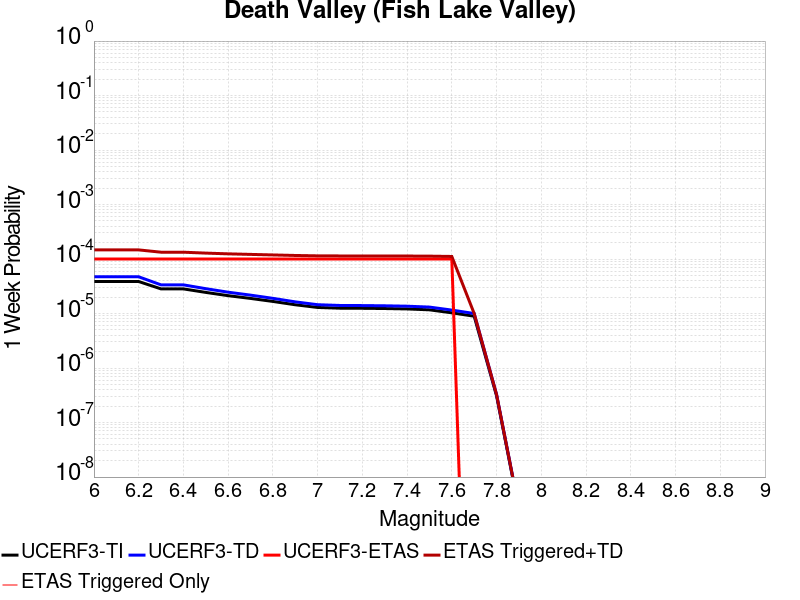 |  |  | 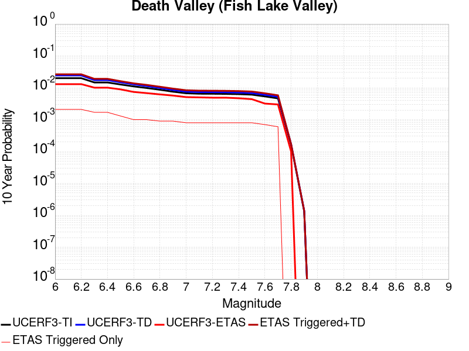 |

| Magnitude | 1 wk TI Prob | 1 wk TD Prob | 1 wk ETAS Prob | 1 wk ETAS/TD Gain | 1 wk ETAS Triggered+TD | 1 wk ETAS Triggered Only | 1 mo TI Prob | 1 mo TD Prob | 1 mo ETAS Prob | 1 mo ETAS/TD Gain | 1 mo ETAS Triggered+TD | 1 mo ETAS Triggered Only | 1 yr TI Prob | 1 yr TD Prob | 1 yr ETAS Prob | 1 yr ETAS/TD Gain | 1 yr ETAS Triggered+TD | 1 yr ETAS Triggered Only | 10 yr TI Prob | 10 yr TD Prob | 10 yr ETAS Prob | 10 yr ETAS/TD Gain | 10 yr ETAS Triggered+TD | 10 yr ETAS Triggered Only |
|-----|-----|-----|-----|-----|-----|-----|-----|-----|-----|-----|-----|-----|-----|-----|-----|-----|-----|-----|-----|-----|-----|-----|-----|-----|
| 6.0 | 3.872328E-5 | 4.7286507E-5 | 1.0E-4 | 2.1147683 | 1.4728178E-4 | 1.0E-4 | 1.6594635E-4 | 2.0264216E-4 | 3.0E-4 | 1.4804422 | 4.0260164E-4 | 2.0E-4 | 0.0020185246 | 0.0024646402 | 0.0018 | 0.73032975 | 0.0028636544 | 4.0E-4 | 0.02000288 | 0.024398867 | 0.013 | 0.53281164 | 0.02644763 | 0.0021 |
| 6.1 | 3.872328E-5 | 4.7286507E-5 | 1.0E-4 | 2.1147683 | 1.4728178E-4 | 1.0E-4 | 1.6594635E-4 | 2.0264216E-4 | 3.0E-4 | 1.4804422 | 4.0260164E-4 | 2.0E-4 | 0.0020185246 | 0.0024646402 | 0.0018 | 0.73032975 | 0.0028636544 | 4.0E-4 | 0.02000288 | 0.024398867 | 0.013 | 0.53281164 | 0.02644763 | 0.0021 |
| 6.2 | 3.872328E-5 | 4.7286507E-5 | 1.0E-4 | 2.1147683 | 1.4728178E-4 | 1.0E-4 | 1.6594635E-4 | 2.0264216E-4 | 3.0E-4 | 1.4804422 | 4.0260164E-4 | 2.0E-4 | 0.0020185246 | 0.0024646402 | 0.0018 | 0.73032975 | 0.0028636544 | 4.0E-4 | 0.02000288 | 0.024398867 | 0.013 | 0.53281164 | 0.02644763 | 0.0021 |
| 6.3 | 2.8356371E-5 | 3.36223E-5 | 1.0E-4 | 2.9742167 | 1.3361893E-4 | 1.0E-4 | 1.2152165E-4 | 1.4408799E-4 | 2.0E-4 | 1.3880408 | 2.4407357E-4 | 1.0E-4 | 0.0014785219 | 0.0017529293 | 0.0013 | 0.7416158 | 0.0019525787 | 2.0E-4 | 0.014687235 | 0.01739821 | 0.0101 | 0.58051944 | 0.019068634 | 0.0017 |
| 6.4 | 2.8356371E-5 | 3.36223E-5 | 1.0E-4 | 2.9742167 | 1.3361893E-4 | 1.0E-4 | 1.2152165E-4 | 1.4408799E-4 | 2.0E-4 | 1.3880408 | 2.4407357E-4 | 1.0E-4 | 0.0014785219 | 0.0017529293 | 0.0013 | 0.7416158 | 0.0019525787 | 2.0E-4 | 0.014687235 | 0.01739821 | 0.0101 | 0.58051944 | 0.019068634 | 0.0017 |
| 6.5 | 2.4448687E-5 | 2.861738E-5 | 1.0E-4 | 3.49438 | 1.2861451E-4 | 1.0E-4 | 1.0477588E-4 | 1.2264037E-4 | 2.0E-4 | 1.6307844 | 2.226281E-4 | 1.0E-4 | 0.0012748998 | 0.0014921706 | 0.0012 | 0.8041976 | 0.0016918721 | 2.0E-4 | 0.012676105 | 0.01482641 | 0.0089 | 0.60028017 | 0.016107136 | 0.0013 |
| 6.6 | 2.1298161E-5 | 2.466789E-5 | 1.0E-4 | 4.053853 | 1.2466543E-4 | 1.0E-4 | 9.127464E-5 | 1.0571543E-4 | 2.0E-4 | 1.8918713 | 2.0570486E-4 | 1.0E-4 | 0.0011107022 | 0.0012863582 | 0.0012 | 0.9328661 | 0.001486101 | 2.0E-4 | 0.011051672 | 0.012792554 | 0.0074 | 0.5784615 | 0.013779761 | 0.001 |
| 6.7 | 1.8959729E-5 | 2.1787522E-5 | 1.0E-4 | 4.589783 | 1.2178534E-4 | 1.0E-4 | 8.125345E-5 | 9.337189E-5 | 2.0E-4 | 2.141972 | 1.9336256E-4 | 1.0E-4 | 9.888117E-4 | 0.0011362355 | 0.0011 | 0.96810913 | 0.0013360083 | 2.0E-4 | 0.009844234 | 0.011306923 | 0.0068 | 0.60140145 | 0.012295616 | 0.001 |
| 6.8 | 1.6691629E-5 | 1.9023651E-5 | 1.0E-4 | 5.2566147 | 1.1902175E-4 | 1.0E-4 | 7.153359E-5 | 8.152748E-5 | 2.0E-4 | 2.4531605 | 1.8151932E-4 | 1.0E-4 | 8.7057345E-4 | 9.921619E-4 | 9.0E-4 | 0.90711 | 0.0011919636 | 2.0E-4 | 0.008671708 | 0.009879082 | 0.0062 | 0.6275886 | 0.010770191 | 9.0E-4 |
| 6.9 | 1.450505E-5 | 1.6393784E-5 | 1.0E-4 | 6.099873 | 1.1639215E-4 | 1.0E-4 | 6.216302E-5 | 7.025723E-5 | 1.0E-4 | 1.423341 | 1.702502E-4 | 1.0E-4 | 7.5657194E-4 | 8.550549E-4 | 8.0E-4 | 0.93561244 | 0.0010548839 | 2.0E-4 | 0.007540013 | 0.008518582 | 0.0057 | 0.66912544 | 0.009410915 | 9.0E-4 |
| 7.0 | 1.2940855E-5 | 1.4541541E-5 | 1.0E-4 | 6.8768506 | 1.1454009E-4 | 1.0E-4 | 5.545963E-5 | 6.2319436E-5 | 1.0E-4 | 1.604636 | 1.623132E-4 | 1.0E-4 | 6.750118E-4 | 7.5848075E-4 | 8.0E-4 | 1.05474 | 9.5832907E-4 | 2.0E-4 | 0.006729651 | 0.0075595384 | 0.0051 | 0.67464435 | 0.00835349 | 8.0E-4 |
| 7.1 | 1.2544658E-5 | 1.408163E-5 | 1.0E-4 | 7.1014504 | 1.1408022E-4 | 1.0E-4 | 5.3761712E-5 | 6.034848E-5 | 1.0E-4 | 1.6570426 | 1.6034245E-4 | 1.0E-4 | 6.5435225E-4 | 7.3450065E-4 | 8.0E-4 | 1.0891753 | 9.3435374E-4 | 2.0E-4 | 0.006524288 | 0.0073213237 | 0.005 | 0.6829366 | 0.008115467 | 8.0E-4 |
| 7.2 | 1.2489416E-5 | 1.40190805E-5 | 1.0E-4 | 7.1331353 | 1.14017676E-4 | 1.0E-4 | 5.3524967E-5 | 6.008042E-5 | 1.0E-4 | 1.6644357 | 1.6007441E-4 | 1.0E-4 | 6.514716E-4 | 7.312392E-4 | 8.0E-4 | 1.0940332 | 9.31093E-4 | 2.0E-4 | 0.006495651 | 0.0072889244 | 0.0049 | 0.67225283 | 0.008083093 | 8.0E-4 |
| 7.3 | 1.2368307E-5 | 1.3883186E-5 | 1.0E-4 | 7.202958 | 1.138818E-4 | 1.0E-4 | 5.3005948E-5 | 5.949804E-5 | 1.0E-4 | 1.6807276 | 1.5949209E-4 | 1.0E-4 | 6.451563E-4 | 7.241535E-4 | 8.0E-4 | 1.1047381 | 9.2400867E-4 | 2.0E-4 | 0.0064328653 | 0.0072185295 | 0.0049 | 0.6788086 | 0.008012755 | 8.0E-4 |
| 7.4 | 1.2161707E-5 | 1.36511835E-5 | 1.0E-4 | 7.325372 | 1.1364982E-4 | 1.0E-4 | 5.212056E-5 | 5.8503792E-5 | 1.0E-4 | 1.7092909 | 1.5849795E-4 | 1.0E-4 | 6.3438306E-4 | 7.1205647E-4 | 8.0E-4 | 1.1235063 | 9.119141E-4 | 2.0E-4 | 0.006325751 | 0.007098339 | 0.0047 | 0.6621268 | 0.00789266 | 8.0E-4 |
| 7.5 | 1.1707948E-5 | 1.3148723E-5 | 1.0E-4 | 7.6053014 | 1.13147406E-4 | 1.0E-4 | 5.0175953E-5 | 5.6350484E-5 | 1.0E-4 | 1.7746077 | 1.5634485E-4 | 1.0E-4 | 6.10721E-4 | 6.8585674E-4 | 7.0E-4 | 1.0206213 | 8.857196E-4 | 2.0E-4 | 0.0060904534 | 0.0068379836 | 0.0044 | 0.6434645 | 0.0076325135 | 8.0E-4 |
| 7.6 | 1.0319538E-5 | 1.15824305E-5 | 1.0E-4 | 8.633766 | 1.1158127E-4 | 1.0E-4 | 4.4225842E-5 | 4.9638074E-5 | 1.0E-4 | 2.0145826 | 1.4963311E-4 | 1.0E-4 | 5.383166E-4 | 6.0418114E-4 | 6.0E-4 | 0.99307966 | 8.040603E-4 | 2.0E-4 | 0.0053701443 | 0.0060259174 | 0.0032 | 0.5310395 | 0.006721699 | 7.0E-4 |
| 7.7 | 8.937764E-6 | 1.0025196E-5 | 0.0 | 0.0 | 1.0025196E-5 | 0.0 | 3.830414E-5 | 4.296445E-5 | 0.0 | 0.0 | 4.296445E-5 | 0.0 | 4.6625308E-4 | 5.229716E-4 | 5.0E-4 | 0.9560748 | 6.2291935E-4 | 1.0E-4 | 0.0046527605 | 0.005217919 | 0.003 | 0.5749418 | 0.0058147884 | 6.0E-4 |
| 7.8 | 3.108007E-7 | 3.285026E-7 | 0.0 | 0.0 | 3.285026E-7 | 0.0 | 1.3320023E-6 | 1.4078676E-6 | 0.0 | 0.0 | 1.4078676E-6 | 0.0 | 1.6217007E-5 | 1.7140657E-5 | 0.0 | 0.0 | 1.7140657E-5 | 0.0 | 1.6215823E-4 | 1.7139372E-4 | 1.0E-4 | 0.5834519 | 1.7139372E-4 | 0.0 |
| 7.9 | 2.5591178E-9 | 2.6699005E-9 | 0.0 | 0.0 | 2.6699005E-9 | 0.0 | 1.0967647E-8 | 1.1442431E-8 | 0.0 | 0.0 | 1.1442431E-8 | 0.0 | 1.335311E-7 | 1.393116E-7 | 0.0 | 0.0 | 1.393116E-7 | 0.0 | 1.3353102E-6 | 1.3931159E-6 | 0.0 | 0.0 | 1.3931159E-6 | 0.0 |

## San Pedro Basin
*[(top)](#table-of-contents)*

| 1 Week | 1 Month | 1 Year | 10 Year |
|-----|-----|-----|-----|
|  |  | 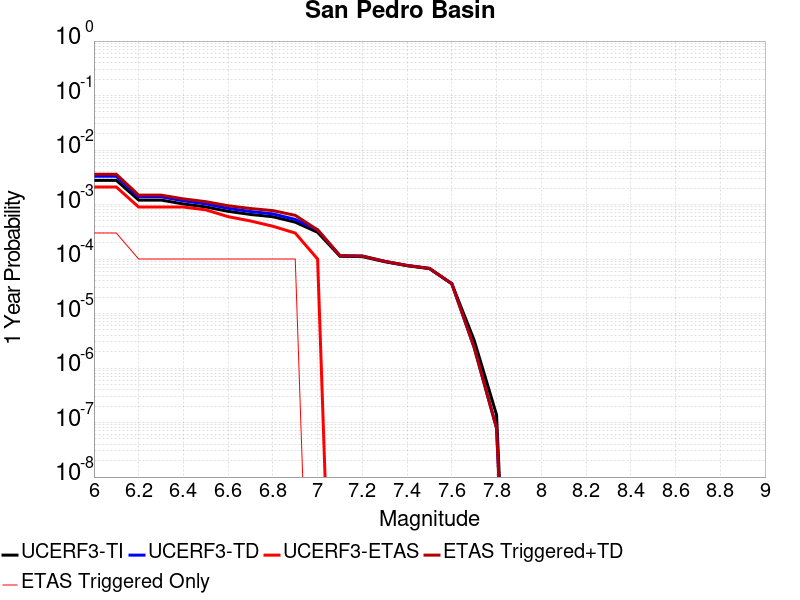 |  |

| Magnitude | 1 wk TI Prob | 1 wk TD Prob | 1 wk ETAS Prob | 1 wk ETAS/TD Gain | 1 wk ETAS Triggered+TD | 1 wk ETAS Triggered Only | 1 mo TI Prob | 1 mo TD Prob | 1 mo ETAS Prob | 1 mo ETAS/TD Gain | 1 mo ETAS Triggered+TD | 1 mo ETAS Triggered Only | 1 yr TI Prob | 1 yr TD Prob | 1 yr ETAS Prob | 1 yr ETAS/TD Gain | 1 yr ETAS Triggered+TD | 1 yr ETAS Triggered Only | 10 yr TI Prob | 10 yr TD Prob | 10 yr ETAS Prob | 10 yr ETAS/TD Gain | 10 yr ETAS Triggered+TD | 10 yr ETAS Triggered Only |
|-----|-----|-----|-----|-----|-----|-----|-----|-----|-----|-----|-----|-----|-----|-----|-----|-----|-----|-----|-----|-----|-----|-----|-----|-----|
| 6.0 | 5.3449043E-5 | 6.339375E-5 | 0.0 | 0.0 | 6.339375E-5 | 0.0 | 2.2904722E-4 | 2.716627E-4 | 3.0E-4 | 1.1043106 | 3.7163554E-4 | 1.0E-4 | 0.0027850836 | 0.0033030796 | 0.0021 | 0.6357703 | 0.003602089 | 3.0E-4 | 0.027504366 | 0.032601435 | 0.0196 | 0.6012005 | 0.03463297 | 0.0021 |
| 6.1 | 5.3449043E-5 | 6.339375E-5 | 0.0 | 0.0 | 6.339375E-5 | 0.0 | 2.2904722E-4 | 2.716627E-4 | 3.0E-4 | 1.1043106 | 3.7163554E-4 | 1.0E-4 | 0.0027850836 | 0.0033030796 | 0.0021 | 0.6357703 | 0.003602089 | 3.0E-4 | 0.027504366 | 0.032601435 | 0.0196 | 0.6012005 | 0.03463297 | 0.0021 |
| 6.2 | 2.3189454E-5 | 2.6650865E-5 | 0.0 | 0.0 | 2.6650865E-5 | 0.0 | 9.9379584E-5 | 1.1421326E-4 | 2.0E-4 | 1.7511102 | 1.1421326E-4 | 0.0 | 0.0012092749 | 0.0013897064 | 9.0E-4 | 0.64761883 | 0.0014895675 | 1.0E-4 | 0.012027155 | 0.013815028 | 0.0082 | 0.5935565 | 0.014702594 | 9.0E-4 |
| 6.3 | 2.3189454E-5 | 2.6650865E-5 | 0.0 | 0.0 | 2.6650865E-5 | 0.0 | 9.9379584E-5 | 1.1421326E-4 | 2.0E-4 | 1.7511102 | 1.1421326E-4 | 0.0 | 0.0012092749 | 0.0013897064 | 9.0E-4 | 0.64761883 | 0.0014895675 | 1.0E-4 | 0.012027155 | 0.013815028 | 0.0082 | 0.5935565 | 0.014702594 | 9.0E-4 |
| 6.4 | 1.966056E-5 | 2.2469927E-5 | 0.0 | 0.0 | 2.2469927E-5 | 0.0 | 8.425682E-5 | 9.629636E-5 | 2.0E-4 | 2.0769217 | 9.629636E-5 | 0.0 | 0.001025344 | 0.0011718177 | 9.0E-4 | 0.76803756 | 0.0012717005 | 1.0E-4 | 0.010206259 | 0.011660476 | 0.0075 | 0.64319843 | 0.012451148 | 8.0E-4 |
| 6.5 | 1.7342953E-5 | 1.9750723E-5 | 0.0 | 0.0 | 1.9750723E-5 | 0.0 | 7.4324824E-5 | 8.464342E-5 | 1.0E-4 | 1.1814268 | 8.464342E-5 | 0.0 | 9.04529E-4 | 0.0010300834 | 8.0E-4 | 0.7766361 | 0.0011299804 | 1.0E-4 | 0.009008561 | 0.010256813 | 0.0066 | 0.64347476 | 0.010949633 | 7.0E-4 |
| 6.6 | 1.439804E-5 | 1.6327187E-5 | 0.0 | 0.0 | 1.6327187E-5 | 0.0 | 6.170443E-5 | 6.997196E-5 | 0.0 | 0.0 | 6.997196E-5 | 0.0 | 7.509924E-4 | 8.5160777E-4 | 6.0E-4 | 0.7045497 | 9.515226E-4 | 1.0E-4 | 0.0074845953 | 0.008486648 | 0.0052 | 0.6127272 | 0.0090815555 | 6.0E-4 |
| 6.7 | 1.2634884E-5 | 1.4289139E-5 | 0.0 | 0.0 | 1.4289139E-5 | 0.0 | 5.414838E-5 | 6.12379E-5 | 0.0 | 0.0 | 6.12379E-5 | 0.0 | 6.590571E-4 | 7.453469E-4 | 5.0E-4 | 0.6708286 | 8.452723E-4 | 1.0E-4 | 0.006571059 | 0.007431493 | 0.0043 | 0.5786186 | 0.007927777 | 5.0E-4 |
| 6.8 | 1.146091E-5 | 1.2936626E-5 | 0.0 | 0.0 | 1.2936626E-5 | 0.0 | 4.911726E-5 | 5.5441673E-5 | 0.0 | 0.0 | 5.5441673E-5 | 0.0 | 5.9783855E-4 | 6.748231E-4 | 4.0E-4 | 0.5927479 | 7.747556E-4 | 1.0E-4 | 0.0059623276 | 0.0067306813 | 0.0037 | 0.5497215 | 0.007227316 | 5.0E-4 |
| 6.9 | 9.109035E-6 | 1.0237657E-5 | 0.0 | 0.0 | 1.0237657E-5 | 0.0 | 3.9038136E-5 | 4.3875094E-5 | 0.0 | 0.0 | 4.3875094E-5 | 0.0 | 4.7518566E-4 | 5.3407636E-4 | 3.0E-4 | 0.56171745 | 6.3402293E-4 | 1.0E-4 | 0.0047417083 | 0.0053306837 | 0.0031 | 0.5815389 | 0.0057285517 | 4.0E-4 |
| 7.0 | 5.9351028E-6 | 6.5855197E-6 | 0.0 | 0.0 | 6.5855197E-6 | 0.0 | 2.5435906E-5 | 2.8223483E-5 | 0.0 | 0.0 | 2.8223483E-5 | 0.0 | 3.0963816E-4 | 3.4359036E-4 | 1.0E-4 | 0.29104424 | 3.4359036E-4 | 0.0 | 0.0030920706 | 0.0034329097 | 0.0022 | 0.6408557 | 0.0037318799 | 3.0E-4 |
| 7.1 | 2.1557585E-6 | 2.2098368E-6 | 0.0 | 0.0 | 2.2098368E-6 | 0.0 | 9.238933E-6 | 9.470696E-6 | 0.0 | 0.0 | 9.470696E-6 | 0.0 | 1.1247819E-4 | 1.1529977E-4 | 0.0 | 0.0 | 1.1529977E-4 | 0.0 | 0.0011242128 | 0.0011524148 | 7.0E-4 | 0.60742015 | 0.0012522996 | 1.0E-4 |
| 7.2 | 2.1251979E-6 | 2.1781807E-6 | 0.0 | 0.0 | 2.1781807E-6 | 0.0 | 9.107958E-6 | 9.335027E-6 | 0.0 | 0.0 | 9.335027E-6 | 0.0 | 1.1088375E-4 | 1.1364819E-4 | 0.0 | 0.0 | 1.1364819E-4 | 0.0 | 0.0011082845 | 0.001135916 | 7.0E-4 | 0.61624277 | 0.0012358024 | 1.0E-4 |
| 7.3 | 1.7145798E-6 | 1.7444253E-6 | 0.0 | 0.0 | 1.7444253E-6 | 0.0 | 7.3481783E-6 | 7.4760874E-6 | 0.0 | 0.0 | 7.4760874E-6 | 0.0 | 8.94604E-5 | 9.101765E-5 | 0.0 | 0.0 | 9.101765E-5 | 0.0 | 8.9424395E-4 | 9.0981286E-4 | 7.0E-4 | 0.769389 | 0.0010097219 | 1.0E-4 |
| 7.4 | 1.4467993E-6 | 1.464299E-6 | 0.0 | 0.0 | 1.464299E-6 | 0.0 | 6.200554E-6 | 6.275552E-6 | 0.0 | 0.0 | 6.275552E-6 | 0.0 | 7.548913E-5 | 7.640224E-5 | 0.0 | 0.0 | 7.640224E-5 | 0.0 | 7.546349E-4 | 7.6376705E-4 | 5.0E-4 | 0.65464985 | 8.636907E-4 | 1.0E-4 |
| 7.5 | 1.2803735E-6 | 1.2932485E-6 | 0.0 | 0.0 | 1.2932485E-6 | 0.0 | 5.487303E-6 | 5.542482E-6 | 0.0 | 0.0 | 5.542482E-6 | 0.0 | 6.680587E-5 | 6.7477704E-5 | 0.0 | 0.0 | 6.7477704E-5 | 0.0 | 6.678579E-4 | 6.745792E-4 | 5.0E-4 | 0.74120283 | 7.745117E-4 | 1.0E-4 |
| 7.6 | 6.755009E-7 | 6.769984E-7 | 0.0 | 0.0 | 6.769984E-7 | 0.0 | 2.8950008E-6 | 2.9014188E-6 | 0.0 | 0.0 | 2.9014188E-6 | 0.0 | 3.5246063E-5 | 3.532426E-5 | 0.0 | 0.0 | 3.532426E-5 | 0.0 | 3.5240475E-4 | 3.5319218E-4 | 3.0E-4 | 0.84939593 | 3.5319218E-4 | 0.0 |
| 7.7 | 6.211885E-8 | 4.5703633E-8 | 0.0 | 0.0 | 4.5703633E-8 | 0.0 | 2.6622362E-7 | 1.958727E-7 | 0.0 | 0.0 | 1.958727E-7 | 0.0 | 3.2412677E-6 | 2.3847476E-6 | 0.0 | 0.0 | 2.3847476E-6 | 0.0 | 3.2412205E-5 | 2.3847242E-5 | 0.0 | 0.0 | 2.3847242E-5 | 0.0 |
| 7.8 | 2.6580573E-9 | 1.5145317E-9 | 0.0 | 0.0 | 1.5145317E-9 | 0.0 | 1.1391674E-8 | 6.49085E-9 | 0.0 | 0.0 | 6.49085E-9 | 0.0 | 1.3869362E-7 | 7.90261E-8 | 0.0 | 0.0 | 7.90261E-8 | 0.0 | 1.3869354E-6 | 7.90261E-7 | 0.0 | 0.0 | 7.90261E-7 | 0.0 |

## Robinson Creek
*[(top)](#table-of-contents)*

| 1 Week | 1 Month | 1 Year | 10 Year |
|-----|-----|-----|-----|
| 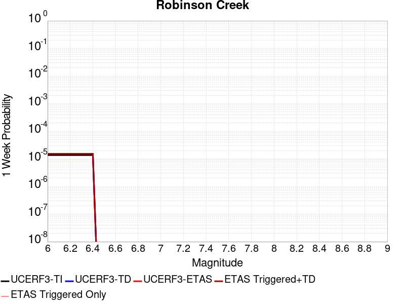 |  |  |  |

| Magnitude | 1 wk TI Prob | 1 wk TD Prob | 1 wk ETAS Prob | 1 wk ETAS/TD Gain | 1 wk ETAS Triggered+TD | 1 wk ETAS Triggered Only | 1 mo TI Prob | 1 mo TD Prob | 1 mo ETAS Prob | 1 mo ETAS/TD Gain | 1 mo ETAS Triggered+TD | 1 mo ETAS Triggered Only | 1 yr TI Prob | 1 yr TD Prob | 1 yr ETAS Prob | 1 yr ETAS/TD Gain | 1 yr ETAS Triggered+TD | 1 yr ETAS Triggered Only | 10 yr TI Prob | 10 yr TD Prob | 10 yr ETAS Prob | 10 yr ETAS/TD Gain | 10 yr ETAS Triggered+TD | 10 yr ETAS Triggered Only |
|-----|-----|-----|-----|-----|-----|-----|-----|-----|-----|-----|-----|-----|-----|-----|-----|-----|-----|-----|-----|-----|-----|-----|-----|-----|
| 6.0 | 1.3705327E-5 | 1.5288508E-5 | 0.0 | 0.0 | 1.5288508E-5 | 0.0 | 5.8735794E-5 | 6.5522174E-5 | 0.0 | 0.0 | 6.5522174E-5 | 0.0 | 7.1487366E-4 | 7.977325E-4 | 6.0E-4 | 0.7521318 | 0.0011974134 | 4.0E-4 | 0.0071257832 | 0.007977325 | 0.0055 | 0.6894542 | 0.010060572 | 0.0021 |
| 6.1 | 1.3705327E-5 | 1.5288508E-5 | 0.0 | 0.0 | 1.5288508E-5 | 0.0 | 5.8735794E-5 | 6.5522174E-5 | 0.0 | 0.0 | 6.5522174E-5 | 0.0 | 7.1487366E-4 | 7.977325E-4 | 6.0E-4 | 0.7521318 | 0.0011974134 | 4.0E-4 | 0.0071257832 | 0.007977325 | 0.0055 | 0.6894542 | 0.010060572 | 0.0021 |
| 6.2 | 1.3705327E-5 | 1.5288508E-5 | 0.0 | 0.0 | 1.5288508E-5 | 0.0 | 5.8735794E-5 | 6.5522174E-5 | 0.0 | 0.0 | 6.5522174E-5 | 0.0 | 7.1487366E-4 | 7.977325E-4 | 6.0E-4 | 0.7521318 | 0.0011974134 | 4.0E-4 | 0.0071257832 | 0.007977325 | 0.0055 | 0.6894542 | 0.010060572 | 0.0021 |
| 6.3 | 1.3705327E-5 | 1.5288508E-5 | 0.0 | 0.0 | 1.5288508E-5 | 0.0 | 5.8735794E-5 | 6.5522174E-5 | 0.0 | 0.0 | 6.5522174E-5 | 0.0 | 7.1487366E-4 | 7.977325E-4 | 6.0E-4 | 0.7521318 | 0.0011974134 | 4.0E-4 | 0.0071257832 | 0.007977325 | 0.0055 | 0.6894542 | 0.010060572 | 0.0021 |
| 6.4 | 1.3705327E-5 | 1.5288508E-5 | 0.0 | 0.0 | 1.5288508E-5 | 0.0 | 5.8735794E-5 | 6.5522174E-5 | 0.0 | 0.0 | 6.5522174E-5 | 0.0 | 7.1487366E-4 | 7.977325E-4 | 6.0E-4 | 0.7521318 | 0.0011974134 | 4.0E-4 | 0.0071257832 | 0.007977325 | 0.0055 | 0.6894542 | 0.010060572 | 0.0021 |

## Franklin 2011 CFM
*[(top)](#table-of-contents)*

| 1 Week | 1 Month | 1 Year | 10 Year |
|-----|-----|-----|-----|
|  |  |  |  |

| Magnitude | 1 wk TI Prob | 1 wk TD Prob | 1 wk ETAS Prob | 1 wk ETAS/TD Gain | 1 wk ETAS Triggered+TD | 1 wk ETAS Triggered Only | 1 mo TI Prob | 1 mo TD Prob | 1 mo ETAS Prob | 1 mo ETAS/TD Gain | 1 mo ETAS Triggered+TD | 1 mo ETAS Triggered Only | 1 yr TI Prob | 1 yr TD Prob | 1 yr ETAS Prob | 1 yr ETAS/TD Gain | 1 yr ETAS Triggered+TD | 1 yr ETAS Triggered Only | 10 yr TI Prob | 10 yr TD Prob | 10 yr ETAS Prob | 10 yr ETAS/TD Gain | 10 yr ETAS Triggered+TD | 10 yr ETAS Triggered Only |
|-----|-----|-----|-----|-----|-----|-----|-----|-----|-----|-----|-----|-----|-----|-----|-----|-----|-----|-----|-----|-----|-----|-----|-----|-----|
| 6.0 | 1.845602E-5 | 2.0218238E-5 | 0.0 | 0.0 | 2.0218238E-5 | 0.0 | 7.9094825E-5 | 8.6646876E-5 | 2.0E-4 | 2.3082194 | 2.8662954E-4 | 2.0E-4 | 9.6255407E-4 | 0.0010544442 | 6.0E-4 | 0.56902015 | 0.0012542333 | 2.0E-4 | 0.009583955 | 0.010511776 | 0.0073 | 0.6944592 | 0.012490753 | 0.002 |
| 6.1 | 1.845602E-5 | 2.0218238E-5 | 0.0 | 0.0 | 2.0218238E-5 | 0.0 | 7.9094825E-5 | 8.6646876E-5 | 2.0E-4 | 2.3082194 | 2.8662954E-4 | 2.0E-4 | 9.6255407E-4 | 0.0010544442 | 6.0E-4 | 0.56902015 | 0.0012542333 | 2.0E-4 | 0.009583955 | 0.010511776 | 0.0073 | 0.6944592 | 0.012490753 | 0.002 |
| 6.2 | 1.845602E-5 | 2.0218238E-5 | 0.0 | 0.0 | 2.0218238E-5 | 0.0 | 7.9094825E-5 | 8.6646876E-5 | 2.0E-4 | 2.3082194 | 2.8662954E-4 | 2.0E-4 | 9.6255407E-4 | 0.0010544442 | 6.0E-4 | 0.56902015 | 0.0012542333 | 2.0E-4 | 0.009583955 | 0.010511776 | 0.0073 | 0.6944592 | 0.012490753 | 0.002 |
| 6.3 | 1.3813506E-5 | 1.5159548E-5 | 0.0 | 0.0 | 1.5159548E-5 | 0.0 | 5.9199396E-5 | 6.496791E-5 | 2.0E-4 | 3.0784426 | 2.6495493E-4 | 2.0E-4 | 7.205143E-4 | 7.9070503E-4 | 5.0E-4 | 0.63234705 | 9.905469E-4 | 2.0E-4 | 0.007181826 | 0.007894166 | 0.0053 | 0.6713819 | 0.009580746 | 0.0017 |
| 6.4 | 1.3813506E-5 | 1.5159548E-5 | 0.0 | 0.0 | 1.5159548E-5 | 0.0 | 5.9199396E-5 | 6.496791E-5 | 2.0E-4 | 3.0784426 | 2.6495493E-4 | 2.0E-4 | 7.205143E-4 | 7.9070503E-4 | 5.0E-4 | 0.63234705 | 9.905469E-4 | 2.0E-4 | 0.007181826 | 0.007894166 | 0.0053 | 0.6713819 | 0.009580746 | 0.0017 |
| 6.5 | 1.1308949E-5 | 1.2422017E-5 | 0.0 | 0.0 | 1.2422017E-5 | 0.0 | 4.8466023E-5 | 5.3236137E-5 | 1.0E-4 | 1.8784232 | 1.5323081E-4 | 1.0E-4 | 5.899141E-4 | 6.479593E-4 | 4.0E-4 | 0.61732274 | 7.478945E-4 | 1.0E-4 | 0.0058835056 | 0.0064753946 | 0.0039 | 0.6022799 | 0.007866329 | 0.0014 |
| 6.6 | 1.0813164E-5 | 1.188014E-5 | 0.0 | 0.0 | 1.188014E-5 | 0.0 | 4.6341313E-5 | 5.09139E-5 | 0.0 | 0.0 | 5.09139E-5 | 0.0 | 5.640594E-4 | 6.1970233E-4 | 3.0E-4 | 0.48410338 | 6.1970233E-4 | 0.0 | 0.005626298 | 0.006194421 | 0.0035 | 0.56502455 | 0.0073869876 | 0.0012 |
| 6.7 | 1.0706348E-5 | 1.1761878E-5 | 0.0 | 0.0 | 1.1761878E-5 | 0.0 | 4.5883542E-5 | 5.040709E-5 | 0.0 | 0.0 | 5.040709E-5 | 0.0 | 5.5848894E-4 | 6.1353535E-4 | 3.0E-4 | 0.48896936 | 6.1353535E-4 | 0.0 | 0.005570874 | 0.006133093 | 0.0035 | 0.57067454 | 0.0073257335 | 0.0012 |
| 6.8 | 9.443655E-6 | 1.0352875E-5 | 0.0 | 0.0 | 1.0352875E-5 | 0.0 | 4.0472176E-5 | 4.4368717E-5 | 0.0 | 0.0 | 4.4368717E-5 | 0.0 | 4.9263734E-4 | 5.4005656E-4 | 3.0E-4 | 0.55549735 | 5.4005656E-4 | 0.0 | 0.0049154665 | 0.00540207 | 0.0031 | 0.5738541 | 0.006396668 | 0.001 |
| 6.9 | 8.7001645E-6 | 9.52576E-6 | 0.0 | 0.0 | 9.52576E-6 | 0.0 | 3.728589E-5 | 4.0824056E-5 | 0.0 | 0.0 | 4.0824056E-5 | 0.0 | 4.538611E-4 | 4.969208E-4 | 3.0E-4 | 0.603718 | 4.969208E-4 | 0.0 | 0.0045293528 | 0.0049727075 | 0.0029 | 0.58318335 | 0.005868232 | 9.0E-4 |
| 7.0 | 8.074731E-6 | 8.819189E-6 | 0.0 | 0.0 | 8.819189E-6 | 0.0 | 3.460553E-5 | 3.779598E-5 | 0.0 | 0.0 | 3.779598E-5 | 0.0 | 4.212409E-4 | 4.6007E-4 | 3.0E-4 | 0.6520747 | 4.6007E-4 | 0.0 | 0.004204433 | 0.004605775 | 0.0028 | 0.60793245 | 0.00550163 | 9.0E-4 |
| 7.1 | 7.3370957E-6 | 7.964991E-6 | 0.0 | 0.0 | 7.964991E-6 | 0.0 | 3.1444317E-5 | 3.4135235E-5 | 0.0 | 0.0 | 3.4135235E-5 | 0.0 | 3.8276732E-4 | 4.1551824E-4 | 3.0E-4 | 0.72199 | 4.1551824E-4 | 0.0 | 0.0038210868 | 0.0041619292 | 0.0026 | 0.62471026 | 0.0049586 | 8.0E-4 |
| 7.2 | 5.1750103E-6 | 5.460277E-6 | 0.0 | 0.0 | 5.460277E-6 | 0.0 | 2.2178427E-5 | 2.3400979E-5 | 0.0 | 0.0 | 2.3400979E-5 | 0.0 | 2.699889E-4 | 2.8486998E-4 | 3.0E-4 | 1.0531119 | 2.8486998E-4 | 0.0 | 0.002696611 | 0.0028591137 | 0.0013 | 0.45468637 | 0.003357684 | 5.0E-4 |
| 7.3 | 3.5221371E-6 | 3.7988266E-6 | 0.0 | 0.0 | 3.7988266E-6 | 0.0 | 1.5094786E-5 | 1.6280585E-5 | 0.0 | 0.0 | 1.6280585E-5 | 0.0 | 1.8376352E-4 | 1.9819819E-4 | 2.0E-4 | 1.009091 | 1.9819819E-4 | 0.0 | 0.0018361164 | 0.0019936254 | 7.0E-4 | 0.3511191 | 0.0021932267 | 2.0E-4 |
| 7.4 | 2.5749775E-6 | 2.8203322E-6 | 0.0 | 0.0 | 2.8203322E-6 | 0.0 | 1.1035571E-5 | 1.2087082E-5 | 0.0 | 0.0 | 1.2087082E-5 | 0.0 | 1.343498E-4 | 1.4715035E-4 | 2.0E-4 | 1.3591541 | 1.4715035E-4 | 0.0 | 0.001342686 | 0.0014825544 | 5.0E-4 | 0.33725575 | 0.0015824061 | 1.0E-4 |
| 7.5 | 1.3642131E-6 | 1.5509339E-6 | 0.0 | 0.0 | 1.5509339E-6 | 0.0 | 5.8466144E-6 | 6.646843E-6 | 0.0 | 0.0 | 6.646843E-6 | 0.0 | 7.1180206E-5 | 8.092233E-5 | 1.0E-4 | 1.2357529 | 8.092233E-5 | 0.0 | 7.115741E-4 | 8.194865E-4 | 3.0E-4 | 0.3660829 | 9.1940456E-4 | 1.0E-4 |
| 7.6 | 5.329124E-7 | 6.7106544E-7 | 0.0 | 0.0 | 6.7106544E-7 | 0.0 | 2.2839083E-6 | 2.8759916E-6 | 0.0 | 0.0 | 2.8759916E-6 | 0.0 | 2.7806227E-5 | 3.501464E-5 | 0.0 | 0.0 | 3.501464E-5 | 0.0 | 2.780275E-4 | 3.6048275E-4 | 2.0E-4 | 0.5548116 | 4.604467E-4 | 1.0E-4 |
| 7.7 | 4.199127E-7 | 5.497668E-7 | 0.0 | 0.0 | 5.497668E-7 | 0.0 | 1.7996247E-6 | 2.3561413E-6 | 0.0 | 0.0 | 2.3561413E-6 | 0.0 | 2.191021E-5 | 2.8685645E-5 | 0.0 | 0.0 | 2.8685645E-5 | 0.0 | 2.190805E-4 | 2.9702112E-4 | 2.0E-4 | 0.6733528 | 3.969914E-4 | 1.0E-4 |
| 7.8 | 2.2586491E-7 | 3.0761169E-7 | 0.0 | 0.0 | 3.0761169E-7 | 0.0 | 9.67992E-7 | 1.3183351E-6 | 0.0 | 0.0 | 1.3183351E-6 | 0.0 | 1.178524E-5 | 1.6050613E-5 | 0.0 | 0.0 | 1.6050613E-5 | 0.0 | 1.17846146E-4 | 1.6679957E-4 | 1.0E-4 | 0.59952193 | 2.6678288E-4 | 1.0E-4 |
| 7.9 | 1.4568845E-7 | 2.1283951E-7 | 0.0 | 0.0 | 2.1283951E-7 | 0.0 | 6.243789E-7 | 9.12169E-7 | 0.0 | 0.0 | 9.12169E-7 | 0.0 | 7.601787E-6 | 1.11056015E-5 | 0.0 | 0.0 | 1.11056015E-5 | 0.0 | 7.601527E-5 | 1.15495284E-4 | 1.0E-4 | 0.8658362 | 2.1548373E-4 | 1.0E-4 |
| 8.0 | 5.2868224E-8 | 1.0040192E-7 | 0.0 | 0.0 | 1.0040192E-7 | 0.0 | 2.2657808E-7 | 4.3029385E-7 | 0.0 | 0.0 | 4.3029385E-7 | 0.0 | 2.7585847E-6 | 5.2388154E-6 | 0.0 | 0.0 | 5.2388154E-6 | 0.0 | 2.7585504E-5 | 5.4232354E-5 | 0.0 | 0.0 | 5.4232354E-5 | 0.0 |
| 8.1 | 2.654434E-9 | 4.741157E-9 | 0.0 | 0.0 | 4.741157E-9 | 0.0 | 1.1376145E-8 | 2.0319243E-8 | 0.0 | 0.0 | 2.0319243E-8 | 0.0 | 1.3850456E-7 | 2.4738677E-7 | 0.0 | 0.0 | 2.4738677E-7 | 0.0 | 1.3850448E-6 | 2.5431093E-6 | 0.0 | 0.0 | 2.5431093E-6 | 0.0 |

## Great Valley 03a Dunnigan Hills
*[(top)](#table-of-contents)*

| 1 Week | 1 Month | 1 Year | 10 Year |
|-----|-----|-----|-----|
|  |  |  |  |

| Magnitude | 1 wk TI Prob | 1 wk TD Prob | 1 wk ETAS Prob | 1 wk ETAS/TD Gain | 1 wk ETAS Triggered+TD | 1 wk ETAS Triggered Only | 1 mo TI Prob | 1 mo TD Prob | 1 mo ETAS Prob | 1 mo ETAS/TD Gain | 1 mo ETAS Triggered+TD | 1 mo ETAS Triggered Only | 1 yr TI Prob | 1 yr TD Prob | 1 yr ETAS Prob | 1 yr ETAS/TD Gain | 1 yr ETAS Triggered+TD | 1 yr ETAS Triggered Only | 10 yr TI Prob | 10 yr TD Prob | 10 yr ETAS Prob | 10 yr ETAS/TD Gain | 10 yr ETAS Triggered+TD | 10 yr ETAS Triggered Only |
|-----|-----|-----|-----|-----|-----|-----|-----|-----|-----|-----|-----|-----|-----|-----|-----|-----|-----|-----|-----|-----|-----|-----|-----|-----|
| 6.0 | 1.6591328E-5 | 1.8111237E-5 | 0.0 | 0.0 | 1.8111237E-5 | 0.0 | 7.110376E-5 | 7.761767E-5 | 1.0E-4 | 1.2883664 | 1.7760991E-4 | 1.0E-4 | 8.6534437E-4 | 9.446546E-4 | 4.0E-4 | 0.4234352 | 0.0010445601 | 1.0E-4 | 0.008619824 | 0.009413225 | 0.009 | 0.9561017 | 0.010998163 | 0.0016 |
| 6.1 | 8.041125E-6 | 8.771302E-6 | 0.0 | 0.0 | 8.771302E-6 | 0.0 | 3.4461507E-5 | 3.759087E-5 | 1.0E-4 | 2.6602204 | 1.375871E-4 | 1.0E-4 | 4.194881E-4 | 4.5759307E-4 | 1.0E-4 | 0.21853478 | 5.575473E-4 | 1.0E-4 | 0.004186971 | 0.0045685065 | 0.004 | 0.8755597 | 0.0058625676 | 0.0013 |
| 6.2 | 3.2807004E-6 | 3.5802157E-6 | 0.0 | 0.0 | 3.5802157E-6 | 0.0 | 1.4060069E-5 | 1.5343714E-5 | 0.0 | 0.0 | 1.5343714E-5 | 0.0 | 1.7116789E-4 | 1.8679787E-4 | 0.0 | 0.0 | 1.8679787E-4 | 0.0 | 0.0017103611 | 0.0018668167 | 0.0014 | 0.74993974 | 0.0023658832 | 5.0E-4 |
| 6.3 | 1.9339366E-6 | 2.1107626E-6 | 0.0 | 0.0 | 2.1107626E-6 | 0.0 | 8.288273E-6 | 9.04611E-6 | 0.0 | 0.0 | 9.04611E-6 | 0.0 | 1.00905054E-4 | 1.1013368E-4 | 0.0 | 0.0 | 1.1013368E-4 | 0.0 | 0.0010085925 | 0.001101071 | 8.0E-4 | 0.7265653 | 0.001200961 | 1.0E-4 |
| 6.4 | 1.3142635E-6 | 1.4342457E-6 | 0.0 | 0.0 | 1.4342457E-6 | 0.0 | 5.6325457E-6 | 6.146767E-6 | 0.0 | 0.0 | 6.146767E-6 | 0.0 | 6.857408E-5 | 7.483689E-5 | 0.0 | 0.0 | 7.483689E-5 | 0.0 | 6.8552926E-4 | 7.483689E-4 | 5.0E-4 | 0.66811967 | 7.483689E-4 | 0.0 |

## Reliz 2011 CFM
*[(top)](#table-of-contents)*

| 1 Week | 1 Month | 1 Year | 10 Year |
|-----|-----|-----|-----|
| 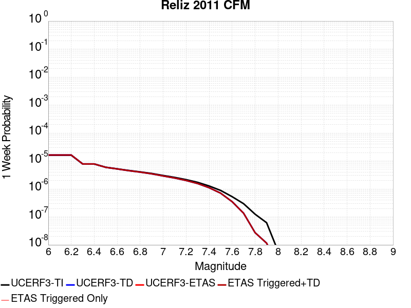 | 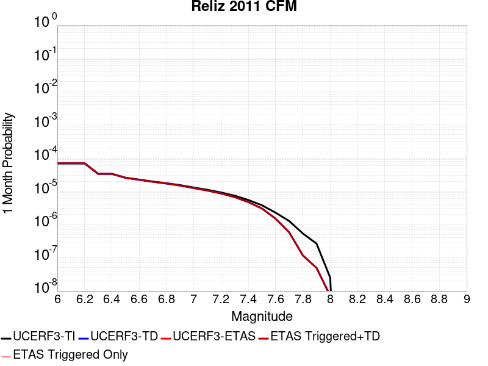 |  |  |

| Magnitude | 1 wk TI Prob | 1 wk TD Prob | 1 wk ETAS Prob | 1 wk ETAS/TD Gain | 1 wk ETAS Triggered+TD | 1 wk ETAS Triggered Only | 1 mo TI Prob | 1 mo TD Prob | 1 mo ETAS Prob | 1 mo ETAS/TD Gain | 1 mo ETAS Triggered+TD | 1 mo ETAS Triggered Only | 1 yr TI Prob | 1 yr TD Prob | 1 yr ETAS Prob | 1 yr ETAS/TD Gain | 1 yr ETAS Triggered+TD | 1 yr ETAS Triggered Only | 10 yr TI Prob | 10 yr TD Prob | 10 yr ETAS Prob | 10 yr ETAS/TD Gain | 10 yr ETAS Triggered+TD | 10 yr ETAS Triggered Only |
|-----|-----|-----|-----|-----|-----|-----|-----|-----|-----|-----|-----|-----|-----|-----|-----|-----|-----|-----|-----|-----|-----|-----|-----|-----|
| 6.0 | 1.6002472E-5 | 1.6283846E-5 | 0.0 | 0.0 | 1.6283846E-5 | 0.0 | 6.8580215E-5 | 6.9786154E-5 | 0.0 | 0.0 | 6.9786154E-5 | 0.0 | 8.3464425E-4 | 8.493351E-4 | 7.0E-4 | 0.8241741 | 0.0011490802 | 3.0E-4 | 0.008315164 | 0.008463087 | 0.0073 | 0.86256945 | 0.010247854 | 0.0018 |
| 6.1 | 1.6002472E-5 | 1.6283846E-5 | 0.0 | 0.0 | 1.6283846E-5 | 0.0 | 6.8580215E-5 | 6.9786154E-5 | 0.0 | 0.0 | 6.9786154E-5 | 0.0 | 8.3464425E-4 | 8.493351E-4 | 7.0E-4 | 0.8241741 | 0.0011490802 | 3.0E-4 | 0.008315164 | 0.008463087 | 0.0073 | 0.86256945 | 0.010247854 | 0.0018 |
| 6.2 | 1.6002472E-5 | 1.6283846E-5 | 0.0 | 0.0 | 1.6283846E-5 | 0.0 | 6.8580215E-5 | 6.9786154E-5 | 0.0 | 0.0 | 6.9786154E-5 | 0.0 | 8.3464425E-4 | 8.493351E-4 | 7.0E-4 | 0.8241741 | 0.0011490802 | 3.0E-4 | 0.008315164 | 0.008463087 | 0.0073 | 0.86256945 | 0.010247854 | 0.0018 |
| 6.3 | 7.792404E-6 | 7.804292E-6 | 0.0 | 0.0 | 7.804292E-6 | 0.0 | 3.339559E-5 | 3.344654E-5 | 0.0 | 0.0 | 3.344654E-5 | 0.0 | 4.0651546E-4 | 4.0713634E-4 | 2.0E-4 | 0.49123594 | 5.070956E-4 | 1.0E-4 | 0.0040577264 | 0.004064181 | 0.0024 | 0.5905249 | 0.004661742 | 6.0E-4 |
| 6.4 | 7.792404E-6 | 7.804292E-6 | 0.0 | 0.0 | 7.804292E-6 | 0.0 | 3.339559E-5 | 3.344654E-5 | 0.0 | 0.0 | 3.344654E-5 | 0.0 | 4.0651546E-4 | 4.0713634E-4 | 2.0E-4 | 0.49123594 | 5.070956E-4 | 1.0E-4 | 0.0040577264 | 0.004064181 | 0.0024 | 0.5905249 | 0.004661742 | 6.0E-4 |
| 6.5 | 5.9659374E-6 | 5.929129E-6 | 0.0 | 0.0 | 5.929129E-6 | 0.0 | 2.5568053E-5 | 2.5410307E-5 | 0.0 | 0.0 | 2.5410307E-5 | 0.0 | 3.1124658E-4 | 3.0932677E-4 | 0.0 | 0.0 | 3.0932677E-4 | 0.0 | 0.00310811 | 0.00308918 | 0.0021 | 0.67979205 | 0.0035876355 | 5.0E-4 |
| 6.6 | 5.2350692E-6 | 5.1793386E-6 | 0.0 | 0.0 | 5.1793386E-6 | 0.0 | 2.2435817E-5 | 2.2196977E-5 | 0.0 | 0.0 | 2.2196977E-5 | 0.0 | 2.7312184E-4 | 2.7021483E-4 | 0.0 | 0.0 | 2.7021483E-4 | 0.0 | 0.002727864 | 0.0026990725 | 0.0018 | 0.66689575 | 0.003197723 | 5.0E-4 |
| 6.7 | 4.580206E-6 | 4.506436E-6 | 0.0 | 0.0 | 4.506436E-6 | 0.0 | 1.9629308E-5 | 1.9313155E-5 | 0.0 | 0.0 | 1.9313155E-5 | 0.0 | 2.389606E-4 | 2.3511237E-4 | 0.0 | 0.0 | 2.3511237E-4 | 0.0 | 0.002387038 | 0.002348838 | 0.0014 | 0.5960394 | 0.0025483682 | 2.0E-4 |
| 6.8 | 4.0765017E-6 | 3.988525E-6 | 0.0 | 0.0 | 3.988525E-6 | 0.0 | 1.7470604E-5 | 1.7093567E-5 | 0.0 | 0.0 | 1.7093567E-5 | 0.0 | 2.1268385E-4 | 2.0809434E-4 | 0.0 | 0.0 | 2.0809434E-4 | 0.0 | 0.002124804 | 0.0020791928 | 0.0012 | 0.57714707 | 0.0022787768 | 2.0E-4 |
| 6.9 | 3.5752896E-6 | 3.4727746E-6 | 0.0 | 0.0 | 3.4727746E-6 | 0.0 | 1.532258E-5 | 1.4883235E-5 | 0.0 | 0.0 | 1.4883235E-5 | 0.0 | 1.8653645E-4 | 1.8118834E-4 | 0.0 | 0.0 | 1.8118834E-4 | 0.0 | 0.0018637994 | 0.0018106024 | 0.0012 | 0.6627629 | 0.0020102402 | 2.0E-4 |
| 7.0 | 3.0259848E-6 | 2.9081675E-6 | 0.0 | 0.0 | 2.9081675E-6 | 0.0 | 1.2968442E-5 | 1.2463515E-5 | 0.0 | 0.0 | 1.2463515E-5 | 0.0 | 1.5787935E-4 | 1.5173275E-4 | 0.0 | 0.0 | 1.5173275E-4 | 0.0 | 0.0015776722 | 0.0015164865 | 9.0E-4 | 0.5934771 | 0.0017161833 | 2.0E-4 |
| 7.1 | 2.5861116E-6 | 2.4553665E-6 | 0.0 | 0.0 | 2.4553665E-6 | 0.0 | 1.1083288E-5 | 1.05229565E-5 | 0.0 | 0.0 | 1.05229565E-5 | 0.0 | 1.3493067E-4 | 1.2810947E-4 | 0.0 | 0.0 | 1.2810947E-4 | 0.0 | 0.0013484878 | 0.0012805507 | 9.0E-4 | 0.7028226 | 0.0014802946 | 2.0E-4 |
| 7.2 | 2.1482588E-6 | 2.0034072E-6 | 0.0 | 0.0 | 2.0034072E-6 | 0.0 | 9.20679E-6 | 8.586002E-6 | 0.0 | 0.0 | 8.586002E-6 | 0.0 | 1.12086906E-4 | 1.0452957E-4 | 0.0 | 0.0 | 1.0452957E-4 | 0.0 | 0.0011203039 | 0.0010449981 | 8.0E-4 | 0.7655516 | 0.0012447891 | 2.0E-4 |
| 7.3 | 1.7194744E-6 | 1.5612668E-6 | 0.0 | 0.0 | 1.5612668E-6 | 0.0 | 7.3691554E-6 | 6.691126E-6 | 0.0 | 0.0 | 6.691126E-6 | 0.0 | 8.971577E-5 | 8.146142E-5 | 0.0 | 0.0 | 8.146142E-5 | 0.0 | 8.967956E-4 | 8.145094E-4 | 7.0E-4 | 0.859413 | 0.0010143465 | 2.0E-4 |
| 7.4 | 1.2755178E-6 | 1.1057441E-6 | 0.0 | 0.0 | 1.1057441E-6 | 0.0 | 5.4664933E-6 | 4.7388944E-6 | 0.0 | 0.0 | 4.7388944E-6 | 0.0 | 6.655252E-5 | 5.7694513E-5 | 0.0 | 0.0 | 5.7694513E-5 | 0.0 | 6.6532596E-4 | 5.76989E-4 | 5.0E-4 | 0.8665676 | 7.768736E-4 | 2.0E-4 |
| 7.5 | 8.8463224E-7 | 7.0589226E-7 | 0.0 | 0.0 | 7.0589226E-7 | 0.0 | 3.7912755E-6 | 3.025249E-6 | 0.0 | 0.0 | 3.025249E-6 | 0.0 | 4.6157802E-5 | 3.6831785E-5 | 0.0 | 0.0 | 3.6831785E-5 | 0.0 | 4.6148215E-4 | 3.684504E-4 | 2.0E-4 | 0.54281396 | 4.6841355E-4 | 1.0E-4 |
| 7.6 | 5.291355E-7 | 3.5012195E-7 | 0.0 | 0.0 | 3.5012195E-7 | 0.0 | 2.2677216E-6 | 1.5005218E-6 | 0.0 | 0.0 | 1.5005218E-6 | 0.0 | 2.760916E-5 | 1.82687E-5 | 0.0 | 0.0 | 1.82687E-5 | 0.0 | 2.760573E-4 | 1.8286509E-4 | 1.0E-4 | 0.5468513 | 1.8286509E-4 | 0.0 |
| 7.7 | 2.9663357E-7 | 1.3511924E-7 | 0.0 | 0.0 | 1.3511924E-7 | 0.0 | 1.2712861E-6 | 5.790823E-7 | 0.0 | 0.0 | 5.790823E-7 | 0.0 | 1.5477797E-5 | 7.0503042E-6 | 0.0 | 0.0 | 7.0503042E-6 | 0.0 | 1.547672E-4 | 7.06861E-5 | 0.0 | 0.0 | 7.06861E-5 | 0.0 |
| 7.8 | 1.2509386E-7 | 2.7151984E-8 | 0.0 | 0.0 | 2.7151984E-8 | 0.0 | 5.3611643E-7 | 1.1636565E-7 | 0.0 | 0.0 | 1.1636565E-7 | 0.0 | 6.527198E-6 | 1.4167508E-6 | 0.0 | 0.0 | 1.4167508E-6 | 0.0 | 6.527006E-5 | 1.4323968E-5 | 0.0 | 0.0 | 1.4323968E-5 | 0.0 |
| 7.9 | 6.213493E-8 | 1.1479683E-8 | 0.0 | 0.0 | 1.1479683E-8 | 0.0 | 2.6629255E-7 | 4.9198643E-8 | 0.0 | 0.0 | 4.9198643E-8 | 0.0 | 3.242107E-6 | 5.989933E-7 | 0.0 | 0.0 | 5.989933E-7 | 0.0 | 3.2420594E-5 | 6.1211763E-6 | 0.0 | 0.0 | 6.1211763E-6 | 0.0 |
| 8.0 | 5.92383E-9 | 1.6777463E-9 | 0.0 | 0.0 | 1.6777463E-9 | 0.0 | 2.5387841E-8 | 7.1903403E-9 | 0.0 | 0.0 | 7.1903403E-9 | 0.0 | 3.0909692E-7 | 8.754239E-8 | 0.0 | 0.0 | 8.754239E-8 | 0.0 | 3.090965E-6 | 8.99231E-7 | 0.0 | 0.0 | 8.99231E-7 | 0.0 |

## Contra Costa Shear Zone (connector) 2011 CFM
*[(top)](#table-of-contents)*

| 1 Week | 1 Month | 1 Year | 10 Year |
|-----|-----|-----|-----|
|  |  |  |  |

| Magnitude | 1 wk TI Prob | 1 wk TD Prob | 1 wk ETAS Prob | 1 wk ETAS/TD Gain | 1 wk ETAS Triggered+TD | 1 wk ETAS Triggered Only | 1 mo TI Prob | 1 mo TD Prob | 1 mo ETAS Prob | 1 mo ETAS/TD Gain | 1 mo ETAS Triggered+TD | 1 mo ETAS Triggered Only | 1 yr TI Prob | 1 yr TD Prob | 1 yr ETAS Prob | 1 yr ETAS/TD Gain | 1 yr ETAS Triggered+TD | 1 yr ETAS Triggered Only | 10 yr TI Prob | 10 yr TD Prob | 10 yr ETAS Prob | 10 yr ETAS/TD Gain | 10 yr ETAS Triggered+TD | 10 yr ETAS Triggered Only |
|-----|-----|-----|-----|-----|-----|-----|-----|-----|-----|-----|-----|-----|-----|-----|-----|-----|-----|-----|-----|-----|-----|-----|-----|-----|
| 6.0 | 1.3187427E-5 | 1.4045168E-5 | 0.0 | 0.0 | 1.4045168E-5 | 0.0 | 5.6516317E-5 | 6.0192317E-5 | 1.0E-4 | 1.6613415 | 6.0192317E-5 | 0.0 | 6.878689E-4 | 7.3261786E-4 | 3.0E-4 | 0.4094904 | 9.3247136E-4 | 2.0E-4 | 0.006857436 | 0.007308375 | 0.0058 | 0.79361004 | 0.00909522 | 0.0018 |
| 6.1 | 1.3187427E-5 | 1.4045168E-5 | 0.0 | 0.0 | 1.4045168E-5 | 0.0 | 5.6516317E-5 | 6.0192317E-5 | 1.0E-4 | 1.6613415 | 6.0192317E-5 | 0.0 | 6.878689E-4 | 7.3261786E-4 | 3.0E-4 | 0.4094904 | 9.3247136E-4 | 2.0E-4 | 0.006857436 | 0.007308375 | 0.0058 | 0.79361004 | 0.00909522 | 0.0018 |
| 6.2 | 1.3187427E-5 | 1.4045168E-5 | 0.0 | 0.0 | 1.4045168E-5 | 0.0 | 5.6516317E-5 | 6.0192317E-5 | 1.0E-4 | 1.6613415 | 6.0192317E-5 | 0.0 | 6.878689E-4 | 7.3261786E-4 | 3.0E-4 | 0.4094904 | 9.3247136E-4 | 2.0E-4 | 0.006857436 | 0.007308375 | 0.0058 | 0.79361004 | 0.00909522 | 0.0018 |
| 6.3 | 9.315374E-6 | 9.827352E-6 | 0.0 | 0.0 | 9.827352E-6 | 0.0 | 3.992242E-5 | 4.2116564E-5 | 0.0 | 0.0 | 4.2116564E-5 | 0.0 | 4.8594706E-4 | 5.126527E-4 | 2.0E-4 | 0.3901277 | 7.125501E-4 | 2.0E-4 | 0.004848858 | 0.0051192036 | 0.0034 | 0.66416585 | 0.0066115246 | 0.0015 |
| 6.4 | 9.315374E-6 | 9.827352E-6 | 0.0 | 0.0 | 9.827352E-6 | 0.0 | 3.992242E-5 | 4.2116564E-5 | 0.0 | 0.0 | 4.2116564E-5 | 0.0 | 4.8594706E-4 | 5.126527E-4 | 2.0E-4 | 0.3901277 | 7.125501E-4 | 2.0E-4 | 0.004848858 | 0.0051192036 | 0.0034 | 0.66416585 | 0.0066115246 | 0.0015 |
| 6.5 | 8.492638E-6 | 8.940898E-6 | 0.0 | 0.0 | 8.940898E-6 | 0.0 | 3.639651E-5 | 3.831759E-5 | 0.0 | 0.0 | 3.831759E-5 | 0.0 | 4.430374E-4 | 4.6642017E-4 | 2.0E-4 | 0.42879793 | 6.663269E-4 | 2.0E-4 | 0.0044215517 | 0.0046588397 | 0.0031 | 0.66540176 | 0.0061518513 | 0.0015 |
| 6.6 | 8.402072E-6 | 8.841679E-6 | 0.0 | 0.0 | 8.841679E-6 | 0.0 | 3.6008387E-5 | 3.789238E-5 | 0.0 | 0.0 | 3.789238E-5 | 0.0 | 4.383139E-4 | 4.6124542E-4 | 2.0E-4 | 0.43360865 | 6.611532E-4 | 2.0E-4 | 0.0043745036 | 0.0046073077 | 0.0031 | 0.6728442 | 0.0061003966 | 0.0015 |
| 6.7 | 7.383587E-6 | 7.749119E-6 | 0.0 | 0.0 | 7.749119E-6 | 0.0 | 3.164356E-5 | 3.3210097E-5 | 0.0 | 0.0 | 3.3210097E-5 | 0.0 | 3.8519225E-4 | 4.0426E-4 | 1.0E-4 | 0.24736556 | 5.0421956E-4 | 1.0E-4 | 0.0038452526 | 0.0040395474 | 0.0028 | 0.69314694 | 0.005334296 | 0.0013 |
| 6.8 | 6.004921E-6 | 6.266575E-6 | 0.0 | 0.0 | 6.266575E-6 | 0.0 | 2.5735122E-5 | 2.6856476E-5 | 0.0 | 0.0 | 2.6856476E-5 | 0.0 | 3.1328006E-4 | 3.2692906E-4 | 1.0E-4 | 0.30587673 | 4.2689638E-4 | 1.0E-4 | 0.0031283877 | 0.0032686286 | 0.0019 | 0.5812835 | 0.004165687 | 9.0E-4 |
| 6.9 | 5.505255E-6 | 5.7188795E-6 | 0.0 | 0.0 | 5.7188795E-6 | 0.0 | 2.3593739E-5 | 2.4509256E-5 | 0.0 | 0.0 | 2.4509256E-5 | 0.0 | 2.872159E-4 | 2.9835978E-4 | 1.0E-4 | 0.33516583 | 3.9832992E-4 | 1.0E-4 | 0.0028684495 | 0.0029837305 | 0.0018 | 0.6032716 | 0.0038810452 | 9.0E-4 |
| 7.0 | 4.891922E-6 | 5.0494336E-6 | 0.0 | 0.0 | 5.0494336E-6 | 0.0 | 2.096521E-5 | 2.1640251E-5 | 0.0 | 0.0 | 2.1640251E-5 | 0.0 | 2.5522153E-4 | 2.6343856E-4 | 0.0 | 0.0 | 2.6343856E-4 | 0.0 | 0.0025492862 | 0.0026353933 | 0.0014 | 0.53123 | 0.0033335485 | 7.0E-4 |
| 7.1 | 4.3599E-6 | 4.4533135E-6 | 0.0 | 0.0 | 4.4533135E-6 | 0.0 | 1.868515E-5 | 1.9085492E-5 | 0.0 | 0.0 | 1.9085492E-5 | 0.0 | 2.2746796E-4 | 2.3234135E-4 | 0.0 | 0.0 | 2.3234135E-4 | 0.0 | 0.0022723526 | 0.0023251083 | 0.0014 | 0.6021225 | 0.0030234808 | 7.0E-4 |
| 7.2 | 3.7647926E-6 | 3.8042467E-6 | 0.0 | 0.0 | 3.8042467E-6 | 0.0 | 1.6134725E-5 | 1.6303815E-5 | 0.0 | 0.0 | 1.6303815E-5 | 0.0 | 1.9642258E-4 | 1.9848111E-4 | 0.0 | 0.0 | 1.9848111E-4 | 0.0 | 0.0019624906 | 0.0019871541 | 0.0012 | 0.6038787 | 0.002585962 | 6.0E-4 |
| 7.3 | 2.3179882E-6 | 2.3921575E-6 | 0.0 | 0.0 | 2.3921575E-6 | 0.0 | 9.934198E-6 | 1.02520635E-5 | 0.0 | 0.0 | 1.02520635E-5 | 0.0 | 1.20942146E-4 | 1.2481178E-4 | 0.0 | 0.0 | 1.2481178E-4 | 0.0 | 0.0012087635 | 0.001251493 | 7.0E-4 | 0.55933195 | 0.0016509923 | 4.0E-4 |
| 7.4 | 1.8378355E-6 | 1.919289E-6 | 0.0 | 0.0 | 1.919289E-6 | 0.0 | 7.876414E-6 | 8.225498E-6 | 0.0 | 0.0 | 8.225498E-6 | 0.0 | 9.5891126E-5 | 1.0014088E-4 | 0.0 | 0.0 | 1.0014088E-4 | 0.0 | 9.584976E-4 | 0.001004911 | 4.0E-4 | 0.39804518 | 0.0011048105 | 1.0E-4 |
| 7.5 | 9.840493E-7 | 1.0630176E-6 | 0.0 | 0.0 | 1.0630176E-6 | 0.0 | 4.2173474E-6 | 4.5557817E-6 | 0.0 | 0.0 | 4.5557817E-6 | 0.0 | 5.1344992E-5 | 5.5465243E-5 | 0.0 | 0.0 | 5.5465243E-5 | 0.0 | 5.133313E-4 | 5.581668E-4 | 1.0E-4 | 0.17915791 | 6.58111E-4 | 1.0E-4 |
| 7.6 | 3.1602997E-7 | 3.7072957E-7 | 0.0 | 0.0 | 3.7072957E-7 | 0.0 | 1.3544135E-6 | 1.58884E-6 | 0.0 | 0.0 | 1.58884E-6 | 0.0 | 1.648986E-5 | 1.9343957E-5 | 0.0 | 0.0 | 1.9343957E-5 | 0.0 | 1.6488635E-4 | 1.9692794E-4 | 0.0 | 0.0 | 1.9692794E-4 | 0.0 |
| 7.7 | 2.2125788E-7 | 2.763099E-7 | 0.0 | 0.0 | 2.763099E-7 | 0.0 | 9.482477E-7 | 1.1841847E-6 | 0.0 | 0.0 | 1.1841847E-6 | 0.0 | 1.1544855E-5 | 1.4417354E-5 | 0.0 | 0.0 | 1.4417354E-5 | 0.0 | 1.1544255E-4 | 1.4763203E-4 | 0.0 | 0.0 | 1.4763203E-4 | 0.0 |
| 7.8 | 1.0509553E-7 | 1.4420213E-7 | 0.0 | 0.0 | 1.4420213E-7 | 0.0 | 4.5040935E-7 | 6.18009E-7 | 0.0 | 0.0 | 6.18009E-7 | 0.0 | 5.48372E-6 | 7.5242333E-6 | 0.0 | 0.0 | 7.5242333E-6 | 0.0 | 5.4835844E-5 | 7.7533674E-5 | 0.0 | 0.0 | 7.7533674E-5 | 0.0 |
| 7.9 | 6.029319E-8 | 9.2754E-8 | 0.0 | 0.0 | 9.2754E-8 | 0.0 | 2.5839938E-7 | 3.9751708E-7 | 0.0 | 0.0 | 3.9751708E-7 | 0.0 | 3.1460077E-6 | 4.83976E-6 | 0.0 | 0.0 | 4.83976E-6 | 0.0 | 3.1459633E-5 | 4.9970287E-5 | 0.0 | 0.0 | 4.9970287E-5 | 0.0 |
| 8.0 | 3.531068E-8 | 6.536443E-8 | 0.0 | 0.0 | 6.536443E-8 | 0.0 | 1.5133148E-7 | 2.8013324E-7 | 0.0 | 0.0 | 2.8013324E-7 | 0.0 | 1.8424593E-6 | 3.410617E-6 | 0.0 | 0.0 | 3.410617E-6 | 0.0 | 1.842444E-5 | 3.523761E-5 | 0.0 | 0.0 | 3.523761E-5 | 0.0 |
| 8.1 | 3.5238246E-10 | 6.283275E-10 | 0.0 | 0.0 | 6.283275E-10 | 0.0 | 1.5102107E-9 | 2.6928317E-9 | 0.0 | 0.0 | 2.6928317E-9 | 0.0 | 1.8386816E-8 | 3.278523E-8 | 0.0 | 0.0 | 3.278523E-8 | 0.0 | 1.8386814E-7 | 3.3578857E-7 | 0.0 | 0.0 | 3.3578857E-7 | 0.0 |

## Mad River (alt1)
*[(top)](#table-of-contents)*

| 1 Week | 1 Month | 1 Year | 10 Year |
|-----|-----|-----|-----|
|  |  |  |  |

| Magnitude | 1 wk TI Prob | 1 wk TD Prob | 1 wk ETAS Prob | 1 wk ETAS/TD Gain | 1 wk ETAS Triggered+TD | 1 wk ETAS Triggered Only | 1 mo TI Prob | 1 mo TD Prob | 1 mo ETAS Prob | 1 mo ETAS/TD Gain | 1 mo ETAS Triggered+TD | 1 mo ETAS Triggered Only | 1 yr TI Prob | 1 yr TD Prob | 1 yr ETAS Prob | 1 yr ETAS/TD Gain | 1 yr ETAS Triggered+TD | 1 yr ETAS Triggered Only | 10 yr TI Prob | 10 yr TD Prob | 10 yr ETAS Prob | 10 yr ETAS/TD Gain | 10 yr ETAS Triggered+TD | 10 yr ETAS Triggered Only |
|-----|-----|-----|-----|-----|-----|-----|-----|-----|-----|-----|-----|-----|-----|-----|-----|-----|-----|-----|-----|-----|-----|-----|-----|-----|
| 6.0 | 1.1255216E-5 | 1.204134E-5 | 0.0 | 0.0 | 1.204134E-5 | 0.0 | 4.8235746E-5 | 5.1604802E-5 | 0.0 | 0.0 | 5.1604802E-5 | 0.0 | 5.87112E-4 | 6.281218E-4 | 2.0E-4 | 0.3184096 | 8.279962E-4 | 2.0E-4 | 0.0058556325 | 0.006264903 | 0.0052 | 0.8300208 | 0.008053627 | 0.0018 |
| 6.1 | 1.1255216E-5 | 1.204134E-5 | 0.0 | 0.0 | 1.204134E-5 | 0.0 | 4.8235746E-5 | 5.1604802E-5 | 0.0 | 0.0 | 5.1604802E-5 | 0.0 | 5.87112E-4 | 6.281218E-4 | 2.0E-4 | 0.3184096 | 8.279962E-4 | 2.0E-4 | 0.0058556325 | 0.006264903 | 0.0052 | 0.8300208 | 0.008053627 | 0.0018 |
| 6.2 | 1.1255216E-5 | 1.204134E-5 | 0.0 | 0.0 | 1.204134E-5 | 0.0 | 4.8235746E-5 | 5.1604802E-5 | 0.0 | 0.0 | 5.1604802E-5 | 0.0 | 5.87112E-4 | 6.281218E-4 | 2.0E-4 | 0.3184096 | 8.279962E-4 | 2.0E-4 | 0.0058556325 | 0.006264903 | 0.0052 | 0.8300208 | 0.008053627 | 0.0018 |
| 6.3 | 1.1255216E-5 | 1.204134E-5 | 0.0 | 0.0 | 1.204134E-5 | 0.0 | 4.8235746E-5 | 5.1604802E-5 | 0.0 | 0.0 | 5.1604802E-5 | 0.0 | 5.87112E-4 | 6.281218E-4 | 2.0E-4 | 0.3184096 | 8.279962E-4 | 2.0E-4 | 0.0058556325 | 0.006264903 | 0.0052 | 0.8300208 | 0.008053627 | 0.0018 |
| 6.4 | 1.1255216E-5 | 1.204134E-5 | 0.0 | 0.0 | 1.204134E-5 | 0.0 | 4.8235746E-5 | 5.1604802E-5 | 0.0 | 0.0 | 5.1604802E-5 | 0.0 | 5.87112E-4 | 6.281218E-4 | 2.0E-4 | 0.3184096 | 8.279962E-4 | 2.0E-4 | 0.0058556325 | 0.006264903 | 0.0052 | 0.8300208 | 0.008053627 | 0.0018 |
| 6.5 | 1.1255216E-5 | 1.204134E-5 | 0.0 | 0.0 | 1.204134E-5 | 0.0 | 4.8235746E-5 | 5.1604802E-5 | 0.0 | 0.0 | 5.1604802E-5 | 0.0 | 5.87112E-4 | 6.281218E-4 | 2.0E-4 | 0.3184096 | 8.279962E-4 | 2.0E-4 | 0.0058556325 | 0.006264903 | 0.0052 | 0.8300208 | 0.008053627 | 0.0018 |
| 6.6 | 1.1255216E-5 | 1.204134E-5 | 0.0 | 0.0 | 1.204134E-5 | 0.0 | 4.8235746E-5 | 5.1604802E-5 | 0.0 | 0.0 | 5.1604802E-5 | 0.0 | 5.87112E-4 | 6.281218E-4 | 2.0E-4 | 0.3184096 | 8.279962E-4 | 2.0E-4 | 0.0058556325 | 0.006264903 | 0.0052 | 0.8300208 | 0.008053627 | 0.0018 |
| 6.7 | 7.0564884E-6 | 7.6066203E-6 | 0.0 | 0.0 | 7.6066203E-6 | 0.0 | 3.0241743E-5 | 3.2599408E-5 | 0.0 | 0.0 | 3.2599408E-5 | 0.0 | 3.68131E-4 | 3.9682767E-4 | 1.0E-4 | 0.25199854 | 4.96788E-4 | 1.0E-4 | 0.0036752177 | 0.003961413 | 0.0032 | 0.80779254 | 0.0049574515 | 0.001 |
| 6.8 | 7.0564884E-6 | 7.6066203E-6 | 0.0 | 0.0 | 7.6066203E-6 | 0.0 | 3.0241743E-5 | 3.2599408E-5 | 0.0 | 0.0 | 3.2599408E-5 | 0.0 | 3.68131E-4 | 3.9682767E-4 | 1.0E-4 | 0.25199854 | 4.96788E-4 | 1.0E-4 | 0.0036752177 | 0.003961413 | 0.0032 | 0.80779254 | 0.0049574515 | 0.001 |
| 6.9 | 6.727494E-6 | 7.258432E-6 | 0.0 | 0.0 | 7.258432E-6 | 0.0 | 2.8831799E-5 | 3.1107207E-5 | 0.0 | 0.0 | 3.1107207E-5 | 0.0 | 3.509706E-4 | 3.7866656E-4 | 1.0E-4 | 0.26408458 | 4.786287E-4 | 1.0E-4 | 0.003504168 | 0.003780429 | 0.0027 | 0.71420467 | 0.0047766487 | 0.001 |
| 7.0 | 6.7021124E-6 | 7.2312682E-6 | 0.0 | 0.0 | 7.2312682E-6 | 0.0 | 2.8723021E-5 | 3.0990795E-5 | 0.0 | 0.0 | 3.0990795E-5 | 0.0 | 3.4964667E-4 | 3.7724973E-4 | 1.0E-4 | 0.2650764 | 4.7721202E-4 | 1.0E-4 | 0.0034909705 | 0.0037663085 | 0.0027 | 0.7168823 | 0.0047625424 | 0.001 |
| 7.1 | 5.2784667E-6 | 5.7332286E-6 | 0.0 | 0.0 | 5.7332286E-6 | 0.0 | 2.2621804E-5 | 2.4570752E-5 | 0.0 | 0.0 | 2.4570752E-5 | 0.0 | 2.7538565E-4 | 2.9910877E-4 | 1.0E-4 | 0.33432654 | 3.9907885E-4 | 1.0E-4 | 0.0027504463 | 0.002987154 | 0.0021 | 0.70301026 | 0.0037847643 | 8.0E-4 |
| 7.2 | 4.4085446E-6 | 4.820447E-6 | 0.0 | 0.0 | 4.820447E-6 | 0.0 | 1.8893625E-5 | 2.0658896E-5 | 0.0 | 0.0 | 2.0658896E-5 | 0.0 | 2.3000561E-4 | 2.5149342E-4 | 1.0E-4 | 0.3976247 | 3.5146828E-4 | 1.0E-4 | 0.0022976769 | 0.002512129 | 0.0016 | 0.63690996 | 0.003010873 | 5.0E-4 |
| 7.3 | 3.4060627E-6 | 3.7539396E-6 | 0.0 | 0.0 | 3.7539396E-6 | 0.0 | 1.459733E-5 | 1.6088214E-5 | 0.0 | 0.0 | 1.6088214E-5 | 0.0 | 1.77708E-4 | 1.9585664E-4 | 1.0E-4 | 0.51057756 | 2.9583706E-4 | 1.0E-4 | 0.0017756595 | 0.0019568638 | 0.0014 | 0.7154305 | 0.0022562766 | 3.0E-4 |
| 7.4 | 3.0570902E-6 | 3.3810104E-6 | 0.0 | 0.0 | 3.3810104E-6 | 0.0 | 1.310175E-5 | 1.4489965E-5 | 0.0 | 0.0 | 1.4489965E-5 | 0.0 | 1.5950213E-4 | 1.7640126E-4 | 1.0E-4 | 0.5668894 | 2.7638362E-4 | 1.0E-4 | 0.0015938769 | 0.0017626339 | 0.0013 | 0.7375326 | 0.0019622813 | 2.0E-4 |
| 7.5 | 2.674048E-6 | 2.9699215E-6 | 0.0 | 0.0 | 2.9699215E-6 | 0.0 | 1.1460155E-5 | 1.2728175E-5 | 0.0 | 0.0 | 1.2728175E-5 | 0.0 | 1.3951845E-4 | 1.549547E-4 | 1.0E-4 | 0.6453499 | 2.549392E-4 | 1.0E-4 | 0.0013943089 | 0.0015484862 | 0.0012 | 0.77495044 | 0.0017481765 | 2.0E-4 |
| 7.6 | 1.8806261E-6 | 2.1051053E-6 | 0.0 | 0.0 | 2.1051053E-6 | 0.0 | 8.059801E-6 | 9.02185E-6 | 0.0 | 0.0 | 9.02185E-6 | 0.0 | 9.812366E-5 | 1.0983561E-4 | 1.0E-4 | 0.91045153 | 2.0982462E-4 | 1.0E-4 | 9.808034E-4 | 0.0010978257 | 8.0E-4 | 0.72871315 | 0.001297606 | 2.0E-4 |
| 7.7 | 6.461283E-7 | 7.3427697E-7 | 0.0 | 0.0 | 7.3427697E-7 | 0.0 | 2.7691183E-6 | 3.1468976E-6 | 0.0 | 0.0 | 3.1468976E-6 | 0.0 | 3.371349E-5 | 3.831282E-5 | 0.0 | 0.0 | 3.831282E-5 | 0.0 | 3.370838E-4 | 3.8306369E-4 | 1.0E-4 | 0.2610532 | 3.8306369E-4 | 0.0 |
| 7.8 | 3.0785324E-7 | 3.5300266E-7 | 0.0 | 0.0 | 3.5300266E-7 | 0.0 | 1.3193703E-6 | 1.5128677E-6 | 0.0 | 0.0 | 1.5128677E-6 | 0.0 | 1.6063215E-5 | 1.8419016E-5 | 0.0 | 0.0 | 1.8419016E-5 | 0.0 | 1.6062055E-4 | 1.8417553E-4 | 1.0E-4 | 0.5429603 | 1.8417553E-4 | 0.0 |

## Hosgri
*[(top)](#table-of-contents)*

| 1 Week | 1 Month | 1 Year | 10 Year |
|-----|-----|-----|-----|
|  | 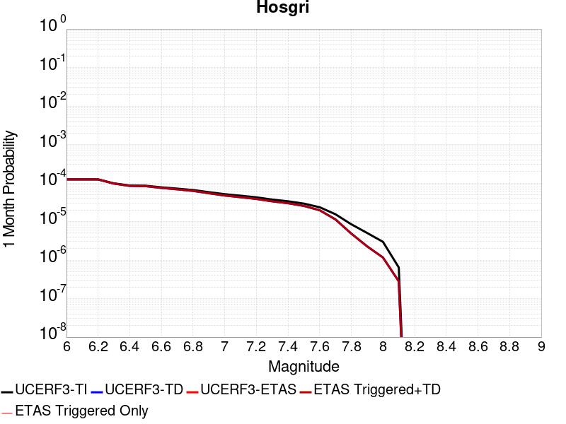 |  | 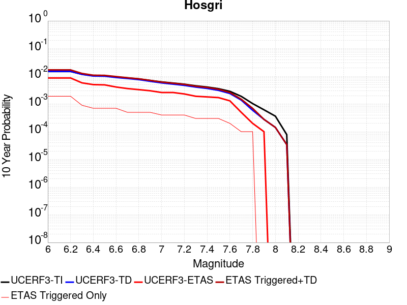 |

| Magnitude | 1 wk TI Prob | 1 wk TD Prob | 1 wk ETAS Prob | 1 wk ETAS/TD Gain | 1 wk ETAS Triggered+TD | 1 wk ETAS Triggered Only | 1 mo TI Prob | 1 mo TD Prob | 1 mo ETAS Prob | 1 mo ETAS/TD Gain | 1 mo ETAS Triggered+TD | 1 mo ETAS Triggered Only | 1 yr TI Prob | 1 yr TD Prob | 1 yr ETAS Prob | 1 yr ETAS/TD Gain | 1 yr ETAS Triggered+TD | 1 yr ETAS Triggered Only | 10 yr TI Prob | 10 yr TD Prob | 10 yr ETAS Prob | 10 yr ETAS/TD Gain | 10 yr ETAS Triggered+TD | 10 yr ETAS Triggered Only |
|-----|-----|-----|-----|-----|-----|-----|-----|-----|-----|-----|-----|-----|-----|-----|-----|-----|-----|-----|-----|-----|-----|-----|-----|-----|
| 6.0 | 2.883978E-5 | 2.91321E-5 | 0.0 | 0.0 | 2.91321E-5 | 0.0 | 1.235932E-4 | 1.2484603E-4 | 0.0 | 0.0 | 1.2484603E-4 | 0.0 | 0.0015037085 | 0.0015189678 | 7.0E-4 | 0.46083924 | 0.0015189678 | 0.0 | 0.01493574 | 0.015089629 | 0.0087 | 0.57655495 | 0.016960958 | 0.0019 |
| 6.1 | 2.883978E-5 | 2.91321E-5 | 0.0 | 0.0 | 2.91321E-5 | 0.0 | 1.235932E-4 | 1.2484603E-4 | 0.0 | 0.0 | 1.2484603E-4 | 0.0 | 0.0015037085 | 0.0015189678 | 7.0E-4 | 0.46083924 | 0.0015189678 | 0.0 | 0.01493574 | 0.015089629 | 0.0087 | 0.57655495 | 0.016960958 | 0.0019 |
| 6.2 | 2.883978E-5 | 2.91321E-5 | 0.0 | 0.0 | 2.91321E-5 | 0.0 | 1.235932E-4 | 1.2484603E-4 | 0.0 | 0.0 | 1.2484603E-4 | 0.0 | 0.0015037085 | 0.0015189678 | 7.0E-4 | 0.46083924 | 0.0015189678 | 0.0 | 0.01493574 | 0.015089629 | 0.0087 | 0.57655495 | 0.016960958 | 0.0019 |
| 6.3 | 2.2914428E-5 | 2.264443E-5 | 0.0 | 0.0 | 2.264443E-5 | 0.0 | 9.8200995E-5 | 9.704397E-5 | 0.0 | 0.0 | 9.704397E-5 | 0.0 | 0.0011949413 | 0.0011808749 | 6.0E-4 | 0.5080978 | 0.0011808749 | 0.0 | 0.011885363 | 0.0117473975 | 0.0058 | 0.4937264 | 0.0126368245 | 9.0E-4 |
| 6.4 | 2.0195741E-5 | 1.9698533E-5 | 0.0 | 0.0 | 1.9698533E-5 | 0.0 | 8.65503E-5 | 8.441956E-5 | 0.0 | 0.0 | 8.441956E-5 | 0.0 | 0.0010532405 | 0.0010273255 | 5.0E-4 | 0.48670068 | 0.0010273255 | 0.0 | 0.010482626 | 0.010226807 | 0.005 | 0.48891118 | 0.010919647 | 7.0E-4 |
| 6.5 | 1.9924333E-5 | 1.9410918E-5 | 0.0 | 0.0 | 1.9410918E-5 | 0.0 | 8.53872E-5 | 8.3187006E-5 | 0.0 | 0.0 | 8.3187006E-5 | 0.0 | 0.0010390934 | 0.0010123331 | 5.0E-4 | 0.49390855 | 0.0010123331 | 0.0 | 0.010342481 | 0.010078249 | 0.0049 | 0.48619556 | 0.0107711945 | 7.0E-4 |
| 6.6 | 1.809694E-5 | 1.7459965E-5 | 0.0 | 0.0 | 1.7459965E-5 | 0.0 | 7.7556004E-5 | 7.482628E-5 | 0.0 | 0.0 | 7.482628E-5 | 0.0 | 9.438353E-4 | 9.1063057E-4 | 4.0E-4 | 0.43925607 | 9.1063057E-4 | 0.0 | 0.009398366 | 0.00906993 | 0.0041 | 0.4520432 | 0.009763581 | 7.0E-4 |
| 6.7 | 1.675989E-5 | 1.6044249E-5 | 0.0 | 0.0 | 1.6044249E-5 | 0.0 | 7.182612E-5 | 6.875926E-5 | 0.0 | 0.0 | 6.875926E-5 | 0.0 | 8.7413215E-4 | 8.368236E-4 | 4.0E-4 | 0.477998 | 8.368236E-4 | 0.0 | 0.008707017 | 0.008337626 | 0.0036 | 0.43177757 | 0.008833458 | 5.0E-4 |
| 6.8 | 1.5401129E-5 | 1.4615389E-5 | 0.0 | 0.0 | 1.4615389E-5 | 0.0 | 6.6003166E-5 | 6.263588E-5 | 0.0 | 0.0 | 6.263588E-5 | 0.0 | 8.032922E-4 | 7.623259E-4 | 4.0E-4 | 0.52471 | 7.623259E-4 | 0.0 | 0.008003947 | 0.007597968 | 0.0033 | 0.43432665 | 0.008094169 | 5.0E-4 |
| 6.9 | 1.356559E-5 | 1.2691037E-5 | 0.0 | 0.0 | 1.2691037E-5 | 0.0 | 5.8136946E-5 | 5.4389027E-5 | 0.0 | 0.0 | 5.4389027E-5 | 0.0 | 7.0758746E-4 | 6.619857E-4 | 4.0E-4 | 0.6042427 | 6.619857E-4 | 0.0 | 0.007053386 | 0.006600938 | 0.003 | 0.4544809 | 0.0070976373 | 5.0E-4 |
| 7.0 | 1.2030819E-5 | 1.1096851E-5 | 0.0 | 0.0 | 1.1096851E-5 | 0.0 | 5.155963E-5 | 4.755707E-5 | 0.0 | 0.0 | 4.755707E-5 | 0.0 | 6.275577E-4 | 5.788536E-4 | 4.0E-4 | 0.691021 | 5.788536E-4 | 0.0 | 0.006257884 | 0.005774214 | 0.0026 | 0.45027772 | 0.0061719045 | 4.0E-4 |
| 7.1 | 1.0972698E-5 | 1.0022974E-5 | 0.0 | 0.0 | 1.0022974E-5 | 0.0 | 4.7025E-5 | 4.2954893E-5 | 0.0 | 0.0 | 4.2954893E-5 | 0.0 | 5.72379E-4 | 5.2285043E-4 | 4.0E-4 | 0.7650372 | 5.2285043E-4 | 0.0 | 0.0057090693 | 0.00521695 | 0.0026 | 0.4983755 | 0.0056148632 | 4.0E-4 |
| 7.2 | 9.961926E-6 | 9.03548E-6 | 0.0 | 0.0 | 9.03548E-6 | 0.0 | 4.2693267E-5 | 3.8722912E-5 | 0.0 | 0.0 | 3.8722912E-5 | 0.0 | 5.1966653E-4 | 4.7134951E-4 | 3.0E-4 | 0.6364704 | 4.7134951E-4 | 0.0 | 0.00518453 | 0.0047042393 | 0.0023 | 0.48892072 | 0.0051023574 | 4.0E-4 |
| 7.3 | 8.700929E-6 | 7.828771E-6 | 0.0 | 0.0 | 7.828771E-6 | 0.0 | 3.7289166E-5 | 3.3551445E-5 | 0.0 | 0.0 | 3.3551445E-5 | 0.0 | 4.53901E-4 | 4.0841228E-4 | 3.0E-4 | 0.73455185 | 4.0841228E-4 | 0.0 | 0.00452975 | 0.0040773517 | 0.0019 | 0.46598873 | 0.004376129 | 3.0E-4 |
| 7.4 | 7.866285E-6 | 6.999321E-6 | 0.0 | 0.0 | 6.999321E-6 | 0.0 | 3.3712215E-5 | 2.9996745E-5 | 0.0 | 0.0 | 2.9996745E-5 | 0.0 | 4.103689E-4 | 3.651492E-4 | 2.0E-4 | 0.5477213 | 3.651492E-4 | 0.0 | 0.004096119 | 0.0036462245 | 0.0018 | 0.4936613 | 0.003945131 | 3.0E-4 |
| 7.5 | 6.8381305E-6 | 5.9602003E-6 | 0.0 | 0.0 | 5.9602003E-6 | 0.0 | 2.9305946E-5 | 2.5543466E-5 | 0.0 | 0.0 | 2.5543466E-5 | 0.0 | 3.5674145E-4 | 3.1094733E-4 | 2.0E-4 | 0.64319575 | 3.1094733E-4 | 0.0 | 0.0035616932 | 0.0031058525 | 0.0017 | 0.54735374 | 0.003404921 | 3.0E-4 |
| 7.6 | 5.503376E-6 | 4.595639E-6 | 0.0 | 0.0 | 4.595639E-6 | 0.0 | 2.3585684E-5 | 1.9695446E-5 | 0.0 | 0.0 | 1.9695446E-5 | 0.0 | 2.8711787E-4 | 2.397657E-4 | 2.0E-4 | 0.8341477 | 2.397657E-4 | 0.0 | 0.002867472 | 0.0023957982 | 0.0013 | 0.54261667 | 0.0025953192 | 2.0E-4 |
| 7.7 | 3.6144982E-6 | 2.6524015E-6 | 0.0 | 0.0 | 2.6524015E-6 | 0.0 | 1.5490614E-5 | 1.1367386E-5 | 0.0 | 0.0 | 1.1367386E-5 | 0.0 | 1.8858191E-4 | 1.3838914E-4 | 0.0 | 0.0 | 1.3838914E-4 | 0.0 | 0.0018842196 | 0.0013837558 | 5.0E-4 | 0.36133543 | 0.0014836175 | 1.0E-4 |
| 7.8 | 1.9853494E-6 | 1.1361415E-6 | 0.0 | 0.0 | 1.1361415E-6 | 0.0 | 8.508612E-6 | 4.869168E-6 | 0.0 | 0.0 | 4.869168E-6 | 0.0 | 1.0358743E-4 | 5.928051E-5 | 0.0 | 0.0 | 5.928051E-5 | 0.0 | 0.0010353916 | 5.933721E-4 | 2.0E-4 | 0.33705664 | 6.9331273E-4 | 1.0E-4 |
| 7.9 | 1.1818757E-6 | 5.295048E-7 | 0.0 | 0.0 | 5.295048E-7 | 0.0 | 5.0651715E-6 | 2.269304E-6 | 0.0 | 0.0 | 2.269304E-6 | 0.0 | 6.1666724E-5 | 2.7628428E-5 | 0.0 | 0.0 | 2.7628428E-5 | 0.0 | 6.1649614E-4 | 2.7692906E-4 | 1.0E-4 | 0.36110333 | 2.7692906E-4 | 0.0 |
| 8.0 | 6.962958E-7 | 2.7139163E-7 | 0.0 | 0.0 | 2.7139163E-7 | 0.0 | 2.9841215E-6 | 1.1631064E-6 | 0.0 | 0.0 | 1.1631064E-6 | 0.0 | 3.6331072E-5 | 1.4160728E-5 | 0.0 | 0.0 | 1.4160728E-5 | 0.0 | 3.6325134E-4 | 1.4217096E-4 | 0.0 | 0.0 | 1.4217096E-4 | 0.0 |
| 8.1 | 1.5033264E-7 | 6.526449E-8 | 0.0 | 0.0 | 6.526449E-8 | 0.0 | 6.442826E-7 | 2.797049E-7 | 0.0 | 0.0 | 2.797049E-7 | 0.0 | 7.844113E-6 | 3.4054021E-6 | 0.0 | 0.0 | 3.4054021E-6 | 0.0 | 7.843835E-5 | 3.4072844E-5 | 0.0 | 0.0 | 3.4072844E-5 | 0.0 |

## San Jacinto (San Bernardino)
*[(top)](#table-of-contents)*

| 1 Week | 1 Month | 1 Year | 10 Year |
|-----|-----|-----|-----|
| 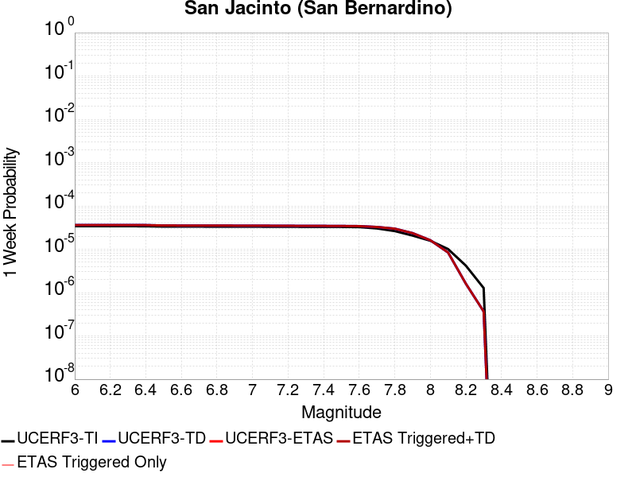 |  | 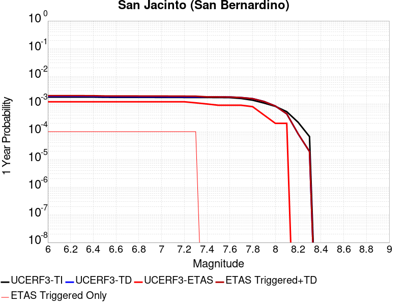 |  |

| Magnitude | 1 wk TI Prob | 1 wk TD Prob | 1 wk ETAS Prob | 1 wk ETAS/TD Gain | 1 wk ETAS Triggered+TD | 1 wk ETAS Triggered Only | 1 mo TI Prob | 1 mo TD Prob | 1 mo ETAS Prob | 1 mo ETAS/TD Gain | 1 mo ETAS Triggered+TD | 1 mo ETAS Triggered Only | 1 yr TI Prob | 1 yr TD Prob | 1 yr ETAS Prob | 1 yr ETAS/TD Gain | 1 yr ETAS Triggered+TD | 1 yr ETAS Triggered Only | 10 yr TI Prob | 10 yr TD Prob | 10 yr ETAS Prob | 10 yr ETAS/TD Gain | 10 yr ETAS Triggered+TD | 10 yr ETAS Triggered Only |
|-----|-----|-----|-----|-----|-----|-----|-----|-----|-----|-----|-----|-----|-----|-----|-----|-----|-----|-----|-----|-----|-----|-----|-----|-----|
| 6.0 | 3.409352E-5 | 3.613018E-5 | 0.0 | 0.0 | 3.613018E-5 | 0.0 | 1.461069E-4 | 1.5483444E-4 | 0.0 | 0.0 | 1.5483444E-4 | 0.0 | 0.0017774 | 0.001883481 | 0.0012 | 0.63711816 | 0.0019832926 | 1.0E-4 | 0.01763251 | 0.019422697 | 0.0115 | 0.5920908 | 0.021285793 | 0.0019 |
| 6.1 | 3.409352E-5 | 3.613018E-5 | 0.0 | 0.0 | 3.613018E-5 | 0.0 | 1.461069E-4 | 1.5483444E-4 | 0.0 | 0.0 | 1.5483444E-4 | 0.0 | 0.0017774 | 0.001883481 | 0.0012 | 0.63711816 | 0.0019832926 | 1.0E-4 | 0.01763251 | 0.019422697 | 0.0115 | 0.5920908 | 0.021285793 | 0.0019 |
| 6.2 | 3.409352E-5 | 3.613018E-5 | 0.0 | 0.0 | 3.613018E-5 | 0.0 | 1.461069E-4 | 1.5483444E-4 | 0.0 | 0.0 | 1.5483444E-4 | 0.0 | 0.0017774 | 0.001883481 | 0.0012 | 0.63711816 | 0.0019832926 | 1.0E-4 | 0.01763251 | 0.019422697 | 0.0115 | 0.5920908 | 0.021285793 | 0.0019 |
| 6.3 | 3.409352E-5 | 3.613018E-5 | 0.0 | 0.0 | 3.613018E-5 | 0.0 | 1.461069E-4 | 1.5483444E-4 | 0.0 | 0.0 | 1.5483444E-4 | 0.0 | 0.0017774 | 0.001883481 | 0.0012 | 0.63711816 | 0.0019832926 | 1.0E-4 | 0.01763251 | 0.019422697 | 0.0115 | 0.5920908 | 0.021285793 | 0.0019 |
| 6.4 | 3.400795E-5 | 3.602279E-5 | 0.0 | 0.0 | 3.602279E-5 | 0.0 | 1.4574021E-4 | 1.5437425E-4 | 0.0 | 0.0 | 1.5437425E-4 | 0.0 | 0.0017729428 | 0.0018778881 | 0.0012 | 0.63901573 | 0.0019777003 | 1.0E-4 | 0.017588645 | 0.019367754 | 0.0115 | 0.59377044 | 0.021230957 | 0.0019 |
| 6.5 | 3.341482E-5 | 3.5283065E-5 | 0.0 | 0.0 | 3.5283065E-5 | 0.0 | 1.4319851E-4 | 1.5120437E-4 | 0.0 | 0.0 | 1.5120437E-4 | 0.0 | 0.0017420477 | 0.0018393602 | 0.0012 | 0.6524008 | 0.0019391762 | 1.0E-4 | 0.017284546 | 0.018989142 | 0.0111 | 0.5845446 | 0.020754961 | 0.0018 |
| 6.6 | 3.3364955E-5 | 3.5220248E-5 | 0.0 | 0.0 | 3.5220248E-5 | 0.0 | 1.4298483E-4 | 1.509352E-4 | 0.0 | 0.0 | 1.509352E-4 | 0.0 | 0.0017394501 | 0.0018360886 | 0.0012 | 0.6535632 | 0.001935905 | 1.0E-4 | 0.017258976 | 0.018956993 | 0.0111 | 0.58553594 | 0.02072287 | 0.0018 |
| 6.7 | 3.335922E-5 | 3.5210018E-5 | 0.0 | 0.0 | 3.5210018E-5 | 0.0 | 1.4296026E-4 | 1.5089136E-4 | 0.0 | 0.0 | 1.5089136E-4 | 0.0 | 0.0017391514 | 0.0018355558 | 0.0012 | 0.653753 | 0.0019353721 | 1.0E-4 | 0.017256035 | 0.018951781 | 0.0111 | 0.58569694 | 0.02071767 | 0.0018 |
| 6.8 | 3.327683E-5 | 3.5104025E-5 | 0.0 | 0.0 | 3.5104025E-5 | 0.0 | 1.4260718E-4 | 1.5043716E-4 | 0.0 | 0.0 | 1.5043716E-4 | 0.0 | 0.0017348597 | 0.0018300351 | 0.0012 | 0.6557251 | 0.0019298522 | 1.0E-4 | 0.017213784 | 0.01889753 | 0.0109 | 0.576795 | 0.020663513 | 0.0018 |
| 6.9 | 3.3235785E-5 | 3.5044945E-5 | 0.0 | 0.0 | 3.5044945E-5 | 0.0 | 1.4243131E-4 | 1.5018399E-4 | 0.0 | 0.0 | 1.5018399E-4 | 0.0 | 0.0017327217 | 0.0018269579 | 0.0012 | 0.6568296 | 0.0019267752 | 1.0E-4 | 0.017192734 | 0.018867383 | 0.0109 | 0.5777166 | 0.02063342 | 0.0018 |
| 7.0 | 3.3197095E-5 | 3.4984834E-5 | 0.0 | 0.0 | 3.4984834E-5 | 0.0 | 1.422655E-4 | 1.4992639E-4 | 0.0 | 0.0 | 1.4992639E-4 | 0.0 | 0.0017307063 | 0.001823827 | 0.0012 | 0.65795714 | 0.0019236447 | 1.0E-4 | 0.017172894 | 0.018836742 | 0.0108 | 0.57334757 | 0.020602835 | 0.0018 |
| 7.1 | 3.3129716E-5 | 3.4864952E-5 | 0.0 | 0.0 | 3.4864952E-5 | 0.0 | 1.4197677E-4 | 1.4941268E-4 | 0.0 | 0.0 | 1.4941268E-4 | 0.0 | 0.0017271966 | 0.001817583 | 0.0012 | 0.66021746 | 0.0019174012 | 1.0E-4 | 0.017138338 | 0.018775785 | 0.0108 | 0.57520896 | 0.020541988 | 0.0018 |
| 7.2 | 3.3034008E-5 | 3.473233E-5 | 0.0 | 0.0 | 3.473233E-5 | 0.0 | 1.4156665E-4 | 1.4884435E-4 | 0.0 | 0.0 | 1.4884435E-4 | 0.0 | 0.0017222111 | 0.0018106751 | 0.0012 | 0.66273624 | 0.0019104941 | 1.0E-4 | 0.017089253 | 0.01870816 | 0.0107 | 0.5719429 | 0.020474486 | 0.0018 |
| 7.3 | 3.2956614E-5 | 3.4599954E-5 | 0.0 | 0.0 | 3.4599954E-5 | 0.0 | 1.4123498E-4 | 1.4827709E-4 | 0.0 | 0.0 | 1.4827709E-4 | 0.0 | 0.0017181796 | 0.0018037802 | 0.0011 | 0.6098304 | 0.0019035998 | 1.0E-4 | 0.017049557 | 0.018640842 | 0.0106 | 0.5686438 | 0.02040729 | 0.0018 |
| 7.4 | 3.2915937E-5 | 3.452155E-5 | 0.0 | 0.0 | 3.452155E-5 | 0.0 | 1.4106068E-4 | 1.4794111E-4 | 0.0 | 0.0 | 1.4794111E-4 | 0.0 | 0.0017160608 | 0.0017996965 | 0.001 | 0.5556493 | 0.0017996965 | 0.0 | 0.017028693 | 0.018601062 | 0.0105 | 0.5644839 | 0.02026944 | 0.0017 |
| 7.5 | 3.281791E-5 | 3.4386336E-5 | 0.0 | 0.0 | 3.4386336E-5 | 0.0 | 1.406406E-4 | 1.4736169E-4 | 0.0 | 0.0 | 1.4736169E-4 | 0.0 | 0.0017109542 | 0.0017926536 | 9.0E-4 | 0.502049 | 0.0017926536 | 0.0 | 0.016978411 | 0.018531892 | 0.0104 | 0.5611947 | 0.020200387 | 0.0017 |
| 7.6 | 3.2521442E-5 | 3.4110984E-5 | 0.0 | 0.0 | 3.4110984E-5 | 0.0 | 1.3937015E-4 | 1.4618174E-4 | 0.0 | 0.0 | 1.4618174E-4 | 0.0 | 0.0016955109 | 0.0017783113 | 9.0E-4 | 0.5060981 | 0.0017783113 | 0.0 | 0.016826328 | 0.018389383 | 0.0104 | 0.5655437 | 0.020058122 | 0.0017 |
| 7.7 | 3.0287873E-5 | 3.259334E-5 | 0.0 | 0.0 | 3.259334E-5 | 0.0 | 1.297987E-4 | 1.3967826E-4 | 0.0 | 0.0 | 1.3967826E-4 | 0.0 | 0.0015791537 | 0.0016992575 | 9.0E-4 | 0.52964306 | 0.0016992575 | 0.0 | 0.01567979 | 0.017599324 | 0.0103 | 0.5852497 | 0.019269405 | 0.0017 |
| 7.8 | 2.6316151E-5 | 2.979853E-5 | 0.0 | 0.0 | 2.979853E-5 | 0.0 | 1.1277862E-4 | 1.2770174E-4 | 0.0 | 0.0 | 1.2770174E-4 | 0.0 | 0.0013722149 | 0.0015536607 | 8.0E-4 | 0.5149129 | 0.0015536607 | 0.0 | 0.013637724 | 0.01613798 | 0.0099 | 0.61345965 | 0.017810546 | 0.0017 |
| 7.9 | 2.0761147E-5 | 2.3529898E-5 | 0.0 | 0.0 | 2.3529898E-5 | 0.0 | 8.897331E-5 | 1.0083852E-4 | 0.0 | 0.0 | 1.0083852E-4 | 0.0 | 0.0010827117 | 0.0012270184 | 4.0E-4 | 0.32599348 | 0.0012270184 | 0.0 | 0.010774517 | 0.0128500005 | 0.0086 | 0.6692607 | 0.014429441 | 0.0016 |
| 8.0 | 1.5738568E-5 | 1.6109549E-5 | 0.0 | 0.0 | 1.6109549E-5 | 0.0 | 6.744926E-5 | 6.9039095E-5 | 0.0 | 0.0 | 6.9039095E-5 | 0.0 | 8.2088535E-4 | 8.402275E-4 | 2.0E-4 | 0.23803076 | 8.402275E-4 | 0.0 | 0.008178596 | 0.0089052 | 0.0062 | 0.6962224 | 0.009896295 | 0.001 |
| 8.1 | 1.0105832E-5 | 8.364023E-6 | 0.0 | 0.0 | 8.364023E-6 | 0.0 | 4.3309992E-5 | 3.5845325E-5 | 0.0 | 0.0 | 3.5845325E-5 | 0.0 | 5.2717153E-4 | 4.3632995E-4 | 2.0E-4 | 0.45836872 | 4.3632995E-4 | 0.0 | 0.005259227 | 0.004694774 | 0.0034 | 0.72420955 | 0.005192426 | 5.0E-4 |
| 8.2 | 4.189207E-6 | 1.5822325E-6 | 0.0 | 0.0 | 1.5822325E-6 | 0.0 | 1.7953622E-5 | 6.7809788E-6 | 0.0 | 0.0 | 6.7809788E-6 | 0.0 | 2.1856341E-4 | 8.2555314E-5 | 0.0 | 0.0 | 8.2555314E-5 | 0.0 | 0.0021834858 | 9.5877436E-4 | 7.0E-4 | 0.7300988 | 0.0011585826 | 2.0E-4 |
| 8.3 | 1.2758221E-6 | 3.623731E-7 | 0.0 | 0.0 | 3.623731E-7 | 0.0 | 5.4677976E-6 | 1.5530267E-6 | 0.0 | 0.0 | 1.5530267E-6 | 0.0 | 6.65684E-5 | 1.890794E-5 | 0.0 | 0.0 | 1.890794E-5 | 0.0 | 6.6548464E-4 | 2.2803801E-4 | 1.0E-4 | 0.43852338 | 2.2803801E-4 | 0.0 |

## Greenville (So) 2011 CFM
*[(top)](#table-of-contents)*

| 1 Week | 1 Month | 1 Year | 10 Year |
|-----|-----|-----|-----|
|  | 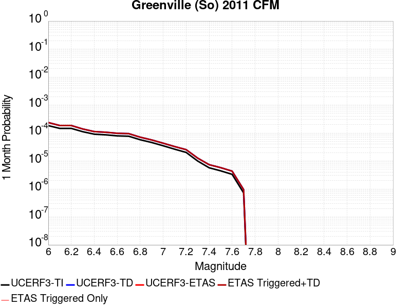 | 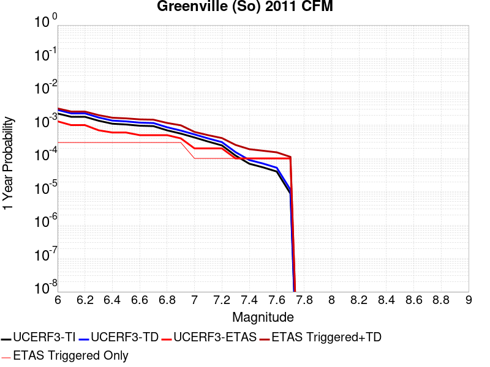 |  |

| Magnitude | 1 wk TI Prob | 1 wk TD Prob | 1 wk ETAS Prob | 1 wk ETAS/TD Gain | 1 wk ETAS Triggered+TD | 1 wk ETAS Triggered Only | 1 mo TI Prob | 1 mo TD Prob | 1 mo ETAS Prob | 1 mo ETAS/TD Gain | 1 mo ETAS Triggered+TD | 1 mo ETAS Triggered Only | 1 yr TI Prob | 1 yr TD Prob | 1 yr ETAS Prob | 1 yr ETAS/TD Gain | 1 yr ETAS Triggered+TD | 1 yr ETAS Triggered Only | 10 yr TI Prob | 10 yr TD Prob | 10 yr ETAS Prob | 10 yr ETAS/TD Gain | 10 yr ETAS Triggered+TD | 10 yr ETAS Triggered Only |
|-----|-----|-----|-----|-----|-----|-----|-----|-----|-----|-----|-----|-----|-----|-----|-----|-----|-----|-----|-----|-----|-----|-----|-----|-----|
| 6.0 | 4.279693E-5 | 5.507399E-5 | 0.0 | 0.0 | 5.507399E-5 | 0.0 | 1.8340252E-4 | 2.360119E-4 | 0.0 | 0.0 | 2.360119E-4 | 0.0 | 0.0022306389 | 0.0028699061 | 0.0013 | 0.4529765 | 0.003169045 | 3.0E-4 | 0.022083808 | 0.028355442 | 0.0146 | 0.51489234 | 0.030104402 | 0.0018 |
| 6.1 | 3.4037297E-5 | 4.3218006E-5 | 0.0 | 0.0 | 4.3218006E-5 | 0.0 | 1.4586597E-4 | 1.8520789E-4 | 0.0 | 0.0 | 1.8520789E-4 | 0.0 | 0.0017744715 | 0.0022527333 | 0.001 | 0.44390517 | 0.0025520576 | 3.0E-4 | 0.01760369 | 0.02231602 | 0.0109 | 0.48843834 | 0.023880316 | 0.0016 |
| 6.2 | 3.4037297E-5 | 4.3218006E-5 | 0.0 | 0.0 | 4.3218006E-5 | 0.0 | 1.4586597E-4 | 1.8520789E-4 | 0.0 | 0.0 | 1.8520789E-4 | 0.0 | 0.0017744715 | 0.0022527333 | 0.001 | 0.44390517 | 0.0025520576 | 3.0E-4 | 0.01760369 | 0.02231602 | 0.0109 | 0.48843834 | 0.023880316 | 0.0016 |
| 6.3 | 2.5956324E-5 | 3.2448268E-5 | 0.0 | 0.0 | 3.2448268E-5 | 0.0 | 1.11236644E-4 | 1.3905704E-4 | 0.0 | 0.0 | 1.3905704E-4 | 0.0 | 0.0013534647 | 0.001691769 | 7.0E-4 | 0.41376808 | 0.0019912615 | 3.0E-4 | 0.013452509 | 0.016795935 | 0.0093 | 0.5537054 | 0.018270742 | 0.0015 |
| 6.4 | 2.1145053E-5 | 2.6213136E-5 | 0.0 | 0.0 | 2.6213136E-5 | 0.0 | 9.061851E-5 | 1.12337366E-4 | 0.0 | 0.0 | 1.12337366E-4 | 0.0 | 0.0011027219 | 0.0013668805 | 6.0E-4 | 0.43895572 | 0.0016664704 | 3.0E-4 | 0.01097266 | 0.013588411 | 0.0077 | 0.56665933 | 0.014870746 | 0.0013 |
| 6.5 | 2.0030959E-5 | 2.4810559E-5 | 0.0 | 0.0 | 2.4810559E-5 | 0.0 | 8.584414E-5 | 1.06326814E-4 | 0.0 | 0.0 | 1.06326814E-4 | 0.0 | 0.0010446513 | 0.0012937912 | 6.0E-4 | 0.46375334 | 0.001593403 | 3.0E-4 | 0.010397541 | 0.012866208 | 0.0075 | 0.58292234 | 0.014149482 | 0.0013 |
| 6.6 | 1.8395405E-5 | 2.2768225E-5 | 0.0 | 0.0 | 2.2768225E-5 | 0.0 | 7.8835066E-5 | 9.7574615E-5 | 0.0 | 0.0 | 9.7574615E-5 | 0.0 | 9.5939427E-4 | 0.0011873521 | 5.0E-4 | 0.4211051 | 0.0014869958 | 3.0E-4 | 0.009552629 | 0.011813405 | 0.0068 | 0.5756173 | 0.01290041 | 0.0011 |
| 6.7 | 1.7883482E-5 | 2.2138986E-5 | 0.0 | 0.0 | 2.2138986E-5 | 0.0 | 7.664124E-5 | 9.487807E-5 | 0.0 | 0.0 | 9.487807E-5 | 0.0 | 9.3270757E-4 | 0.001154557 | 5.0E-4 | 0.43306652 | 0.0014542107 | 3.0E-4 | 0.009288026 | 0.011488908 | 0.0065 | 0.56576306 | 0.01257627 | 0.0011 |
| 6.8 | 1.3373564E-5 | 1.6516697E-5 | 0.0 | 0.0 | 1.6516697E-5 | 0.0 | 5.7314013E-5 | 7.078401E-5 | 0.0 | 0.0 | 7.078401E-5 | 0.0 | 6.975747E-4 | 8.6146937E-4 | 5.0E-4 | 0.5804037 | 0.0011612109 | 3.0E-4 | 0.0069538904 | 0.008583177 | 0.0052 | 0.6058363 | 0.009574594 | 0.001 |
| 6.9 | 1.06692905E-5 | 1.3161715E-5 | 0.0 | 0.0 | 1.3161715E-5 | 0.0 | 4.5724726E-5 | 5.6406196E-5 | 0.0 | 0.0 | 5.6406196E-5 | 0.0 | 5.5655633E-4 | 6.865403E-4 | 4.0E-4 | 0.58263147 | 9.863344E-4 | 3.0E-4 | 0.005551645 | 0.006845695 | 0.0037 | 0.5404857 | 0.0076402184 | 8.0E-4 |
| 7.0 | 8.157512E-6 | 1.0070359E-5 | 0.0 | 0.0 | 1.0070359E-5 | 0.0 | 3.4960296E-5 | 4.315799E-5 | 0.0 | 0.0 | 4.315799E-5 | 0.0 | 4.2555845E-4 | 5.2532554E-4 | 2.0E-4 | 0.3807163 | 6.2527304E-4 | 1.0E-4 | 0.004247444 | 0.0052415826 | 0.0032 | 0.61050266 | 0.0057389615 | 5.0E-4 |
| 7.1 | 6.1467113E-6 | 7.6341275E-6 | 0.0 | 0.0 | 7.6341275E-6 | 0.0 | 2.6342783E-5 | 3.2717286E-5 | 0.0 | 0.0 | 3.2717286E-5 | 0.0 | 3.206762E-4 | 3.9826098E-4 | 2.0E-4 | 0.50218326 | 4.9822114E-4 | 1.0E-4 | 0.0032021382 | 0.0039759283 | 0.0026 | 0.6539353 | 0.0042747357 | 3.0E-4 |
| 7.2 | 4.713467E-6 | 5.920383E-6 | 0.0 | 0.0 | 5.920383E-6 | 0.0 | 2.0200418E-5 | 2.5372827E-5 | 0.0 | 0.0 | 2.5372827E-5 | 0.0 | 2.4591232E-4 | 3.0887098E-4 | 2.0E-4 | 0.6475196 | 4.088401E-4 | 1.0E-4 | 0.0024564038 | 0.0030848128 | 0.0022 | 0.71317136 | 0.0033838872 | 3.0E-4 |
| 7.3 | 2.3266216E-6 | 2.9555756E-6 | 0.0 | 0.0 | 2.9555756E-6 | 0.0 | 9.971197E-6 | 1.2666693E-5 | 0.0 | 0.0 | 1.2666693E-5 | 0.0 | 1.2139256E-4 | 1.5420622E-4 | 1.0E-4 | 0.64848226 | 2.541908E-4 | 1.0E-4 | 0.0012132627 | 0.001541427 | 0.0011 | 0.7136245 | 0.0016412728 | 1.0E-4 |
| 7.4 | 1.3314E-6 | 1.719353E-6 | 0.0 | 0.0 | 1.719353E-6 | 0.0 | 5.7059874E-6 | 7.3686356E-6 | 0.0 | 0.0 | 7.3686356E-6 | 0.0 | 6.946818E-5 | 8.9709494E-5 | 1.0E-4 | 1.1147093 | 1.8970053E-4 | 1.0E-4 | 6.9446466E-4 | 8.970044E-4 | 9.0E-4 | 1.0033395 | 9.969147E-4 | 1.0E-4 |
| 7.5 | 1.0362941E-6 | 1.3479129E-6 | 0.0 | 0.0 | 1.3479129E-6 | 0.0 | 4.4412527E-6 | 5.776757E-6 | 0.0 | 0.0 | 5.776757E-6 | 0.0 | 5.407091E-5 | 7.032979E-5 | 1.0E-4 | 1.4218725 | 1.7032276E-4 | 1.0E-4 | 5.405776E-4 | 7.033495E-4 | 7.0E-4 | 0.99523777 | 8.0327917E-4 | 1.0E-4 |
| 7.6 | 7.764784E-7 | 1.0098306E-6 | 0.0 | 0.0 | 1.0098306E-6 | 0.0 | 3.3277602E-6 | 4.3278383E-6 | 0.0 | 0.0 | 4.3278383E-6 | 0.0 | 4.0514726E-5 | 5.2690197E-5 | 1.0E-4 | 1.8978862 | 1.5268492E-4 | 1.0E-4 | 4.050734E-4 | 5.270776E-4 | 5.0E-4 | 0.9486269 | 6.270249E-4 | 1.0E-4 |
| 7.7 | 1.6927763E-7 | 2.2141474E-7 | 0.0 | 0.0 | 2.2141474E-7 | 0.0 | 7.2547533E-7 | 9.4892E-7 | 0.0 | 0.0 | 9.4892E-7 | 0.0 | 8.832627E-6 | 1.1553043E-5 | 1.0E-4 | 8.655728 | 1.1155189E-4 | 1.0E-4 | 8.8322755E-5 | 1.1555114E-4 | 1.0E-4 | 0.8654177 | 2.1553958E-4 | 1.0E-4 |

## Bear River fault zone
*[(top)](#table-of-contents)*

| 1 Week | 1 Month | 1 Year | 10 Year |
|-----|-----|-----|-----|
|  |  | 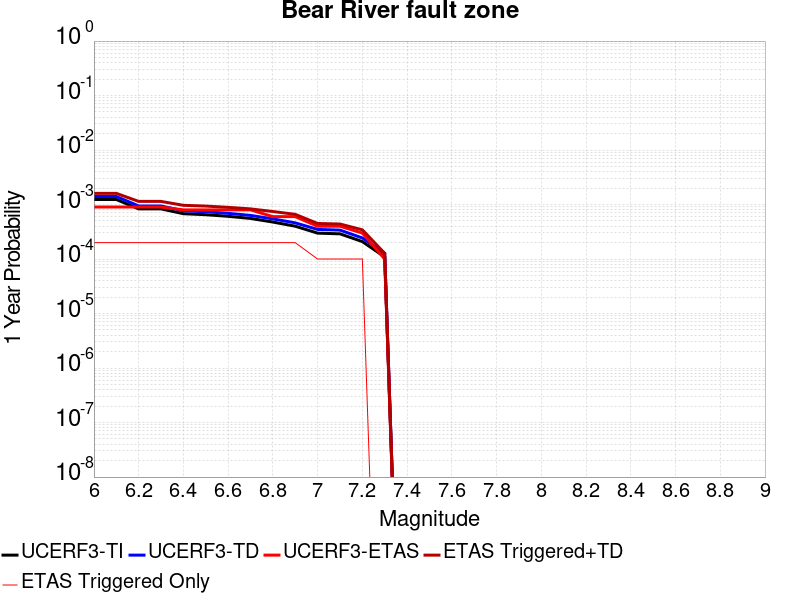 |  |

| Magnitude | 1 wk TI Prob | 1 wk TD Prob | 1 wk ETAS Prob | 1 wk ETAS/TD Gain | 1 wk ETAS Triggered+TD | 1 wk ETAS Triggered Only | 1 mo TI Prob | 1 mo TD Prob | 1 mo ETAS Prob | 1 mo ETAS/TD Gain | 1 mo ETAS Triggered+TD | 1 mo ETAS Triggered Only | 1 yr TI Prob | 1 yr TD Prob | 1 yr ETAS Prob | 1 yr ETAS/TD Gain | 1 yr ETAS Triggered+TD | 1 yr ETAS Triggered Only | 10 yr TI Prob | 10 yr TD Prob | 10 yr ETAS Prob | 10 yr ETAS/TD Gain | 10 yr ETAS Triggered+TD | 10 yr ETAS Triggered Only |
|-----|-----|-----|-----|-----|-----|-----|-----|-----|-----|-----|-----|-----|-----|-----|-----|-----|-----|-----|-----|-----|-----|-----|-----|-----|
| 6.0 | 2.3773342E-5 | 2.6987918E-5 | 0.0 | 0.0 | 2.6987918E-5 | 0.0 | 1.0188177E-4 | 1.1565791E-4 | 1.0E-4 | 0.8646188 | 2.1564635E-4 | 1.0E-4 | 0.0012397047 | 0.001407319 | 9.0E-4 | 0.63951385 | 0.0016070375 | 2.0E-4 | 0.012328116 | 0.01399348 | 0.0079 | 0.5645486 | 0.015768291 | 0.0018 |
| 6.1 | 2.3773342E-5 | 2.6987918E-5 | 0.0 | 0.0 | 2.6987918E-5 | 0.0 | 1.0188177E-4 | 1.1565791E-4 | 1.0E-4 | 0.8646188 | 2.1564635E-4 | 1.0E-4 | 0.0012397047 | 0.001407319 | 9.0E-4 | 0.63951385 | 0.0016070375 | 2.0E-4 | 0.012328116 | 0.01399348 | 0.0079 | 0.5645486 | 0.015768291 | 0.0018 |
| 6.2 | 1.5973403E-5 | 1.8066825E-5 | 0.0 | 0.0 | 1.8066825E-5 | 0.0 | 6.845564E-5 | 7.742708E-5 | 1.0E-4 | 1.2915378 | 1.7741934E-4 | 1.0E-4 | 8.3312875E-4 | 9.4229064E-4 | 9.0E-4 | 0.9551193 | 0.0011421022 | 2.0E-4 | 0.008300122 | 0.009385347 | 0.006 | 0.6392944 | 0.010673147 | 0.0013 |
| 6.3 | 1.5973403E-5 | 1.8066825E-5 | 0.0 | 0.0 | 1.8066825E-5 | 0.0 | 6.845564E-5 | 7.742708E-5 | 1.0E-4 | 1.2915378 | 1.7741934E-4 | 1.0E-4 | 8.3312875E-4 | 9.4229064E-4 | 9.0E-4 | 0.9551193 | 0.0011421022 | 2.0E-4 | 0.008300122 | 0.009385347 | 0.006 | 0.6392944 | 0.010673147 | 0.0013 |
| 6.4 | 1.3027338E-5 | 1.4744882E-5 | 0.0 | 0.0 | 1.4744882E-5 | 0.0 | 5.5830256E-5 | 6.31909E-5 | 1.0E-4 | 1.5825064 | 1.6318458E-4 | 1.0E-4 | 6.7952136E-4 | 7.690914E-4 | 8.0E-4 | 1.0401884 | 9.689376E-4 | 2.0E-4 | 0.0067744725 | 0.0076656993 | 0.0049 | 0.6392111 | 0.0088565005 | 0.0012 |
| 6.5 | 1.2489152E-5 | 1.4147429E-5 | 0.0 | 0.0 | 1.4147429E-5 | 0.0 | 5.352384E-5 | 6.0630508E-5 | 1.0E-4 | 1.6493347 | 1.6062445E-4 | 1.0E-4 | 6.514579E-4 | 7.3794E-4 | 8.0E-4 | 1.0840989 | 9.377925E-4 | 2.0E-4 | 0.0064955144 | 0.007356272 | 0.0048 | 0.65250444 | 0.008547445 | 0.0012 |
| 6.6 | 1.1662849E-5 | 1.3231681E-5 | 0.0 | 0.0 | 1.3231681E-5 | 0.0 | 4.9982682E-5 | 5.6706045E-5 | 1.0E-4 | 1.7634804 | 1.5670038E-4 | 1.0E-4 | 6.083692E-4 | 6.9019035E-4 | 8.0E-4 | 1.1591005 | 8.900523E-4 | 2.0E-4 | 0.006067064 | 0.006881769 | 0.0047 | 0.68296397 | 0.008073511 | 0.0012 |
| 6.7 | 1.0667623E-5 | 1.2131366E-5 | 0.0 | 0.0 | 1.2131366E-5 | 0.0 | 4.5717585E-5 | 5.19906E-5 | 1.0E-4 | 1.9234246 | 1.519854E-4 | 1.0E-4 | 5.5646943E-4 | 6.3281355E-4 | 8.0E-4 | 1.2641954 | 8.3268696E-4 | 2.0E-4 | 0.0055507803 | 0.006311298 | 0.0044 | 0.69716245 | 0.007404356 | 0.0011 |
| 6.8 | 9.154534E-6 | 1.0462286E-5 | 0.0 | 0.0 | 1.0462286E-5 | 0.0 | 3.923313E-5 | 4.4837656E-5 | 1.0E-4 | 2.2302682 | 1.4483317E-4 | 1.0E-4 | 4.7755867E-4 | 5.4577226E-4 | 6.0E-4 | 1.0993596 | 7.456631E-4 | 2.0E-4 | 0.004765337 | 0.0054453667 | 0.0037 | 0.67947674 | 0.006539377 | 0.0011 |
| 6.9 | 7.68501E-6 | 8.84858E-6 | 0.0 | 0.0 | 8.84858E-6 | 0.0 | 3.2935342E-5 | 3.7921985E-5 | 1.0E-4 | 2.6369927 | 1.3791819E-4 | 1.0E-4 | 4.0091402E-4 | 4.616117E-4 | 6.0E-4 | 1.2997937 | 6.6151936E-4 | 2.0E-4 | 0.004001915 | 0.00460745 | 0.0032 | 0.6945273 | 0.0055033034 | 9.0E-4 |
| 7.0 | 5.7315733E-6 | 6.705946E-6 | 0.0 | 0.0 | 6.705946E-6 | 0.0 | 2.4563653E-5 | 2.8739476E-5 | 1.0E-4 | 3.4795346 | 1.287366E-4 | 1.0E-4 | 2.9902143E-4 | 3.498512E-4 | 4.0E-4 | 1.1433432 | 4.498162E-4 | 1.0E-4 | 0.0029861939 | 0.0034934261 | 0.0025 | 0.7156299 | 0.00409133 | 6.0E-4 |
| 7.1 | 5.566844E-6 | 6.51435E-6 | 0.0 | 0.0 | 6.51435E-6 | 0.0 | 2.3857683E-5 | 2.7918368E-5 | 1.0E-4 | 3.5818713 | 1.2791557E-4 | 1.0E-4 | 2.9042858E-4 | 3.3985736E-4 | 4.0E-4 | 1.1769644 | 4.3982337E-4 | 1.0E-4 | 0.002900493 | 0.003393797 | 0.0024 | 0.7071726 | 0.003991761 | 6.0E-4 |
| 7.2 | 4.011353E-6 | 4.6761556E-6 | 0.0 | 0.0 | 4.6761556E-6 | 0.0 | 1.7191402E-5 | 2.0040534E-5 | 1.0E-4 | 4.989887 | 1.2003853E-4 | 1.0E-4 | 2.0928521E-4 | 2.4396961E-4 | 3.0E-4 | 1.2296613 | 3.439452E-4 | 1.0E-4 | 0.0020908823 | 0.0024373555 | 0.0019 | 0.7795334 | 0.0028363806 | 4.0E-4 |
| 7.3 | 2.0974871E-6 | 2.4403803E-6 | 0.0 | 0.0 | 2.4403803E-6 | 0.0 | 8.989199E-6 | 1.0458745E-5 | 0.0 | 0.0 | 1.0458745E-5 | 0.0 | 1.09438006E-4 | 1.2733028E-4 | 1.0E-4 | 0.78535914 | 1.2733028E-4 | 0.0 | 0.0010938413 | 0.0012728187 | 0.0015 | 1.1784868 | 0.0014725641 | 2.0E-4 |

## Oceanic - West Huasna
*[(top)](#table-of-contents)*

| 1 Week | 1 Month | 1 Year | 10 Year |
|-----|-----|-----|-----|
|  |  |  | 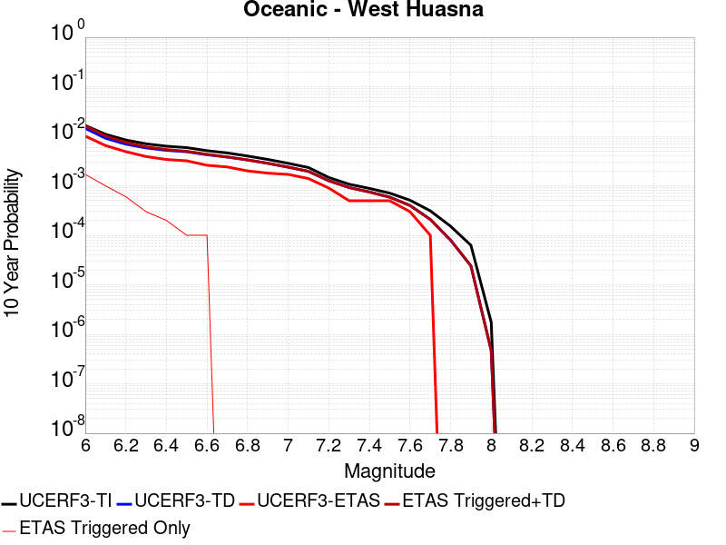 |

| Magnitude | 1 wk TI Prob | 1 wk TD Prob | 1 wk ETAS Prob | 1 wk ETAS/TD Gain | 1 wk ETAS Triggered+TD | 1 wk ETAS Triggered Only | 1 mo TI Prob | 1 mo TD Prob | 1 mo ETAS Prob | 1 mo ETAS/TD Gain | 1 mo ETAS Triggered+TD | 1 mo ETAS Triggered Only | 1 yr TI Prob | 1 yr TD Prob | 1 yr ETAS Prob | 1 yr ETAS/TD Gain | 1 yr ETAS Triggered+TD | 1 yr ETAS Triggered Only | 10 yr TI Prob | 10 yr TD Prob | 10 yr ETAS Prob | 10 yr ETAS/TD Gain | 10 yr ETAS Triggered+TD | 10 yr ETAS Triggered Only |
|-----|-----|-----|-----|-----|-----|-----|-----|-----|-----|-----|-----|-----|-----|-----|-----|-----|-----|-----|-----|-----|-----|-----|-----|-----|
| 6.0 | 3.195567E-5 | 2.7928352E-5 | 0.0 | 0.0 | 2.7928352E-5 | 0.0 | 1.3694567E-4 | 1.1968769E-4 | 2.0E-4 | 1.6710156 | 1.1968769E-4 | 0.0 | 0.0016660384 | 0.0014562667 | 6.0E-4 | 0.41201243 | 0.0014562667 | 0.0 | 0.016536033 | 0.014471793 | 0.0101 | 0.6979094 | 0.01614719 | 0.0017 |
| 6.1 | 2.1156782E-5 | 1.7573497E-5 | 0.0 | 0.0 | 1.7573497E-5 | 0.0 | 9.066878E-5 | 7.531286E-5 | 1.0E-4 | 1.3277944 | 7.531286E-5 | 0.0 | 0.0011033333 | 9.165578E-4 | 2.0E-4 | 0.21820773 | 9.165578E-4 | 0.0 | 0.010978713 | 0.009128784 | 0.0065 | 0.7120335 | 0.010119655 | 0.001 |
| 6.2 | 1.6195117E-5 | 1.3327076E-5 | 0.0 | 0.0 | 1.3327076E-5 | 0.0 | 6.9405796E-5 | 5.71148E-5 | 0.0 | 0.0 | 5.71148E-5 | 0.0 | 8.44688E-4 | 6.9515343E-4 | 1.0E-4 | 0.14385313 | 6.9515343E-4 | 0.0 | 0.008414844 | 0.0069300835 | 0.0049 | 0.7070622 | 0.0075259255 | 6.0E-4 |
| 6.3 | 1.3559345E-5 | 1.1179078E-5 | 0.0 | 0.0 | 1.1179078E-5 | 0.0 | 5.811018E-5 | 4.7909456E-5 | 0.0 | 0.0 | 4.7909456E-5 | 0.0 | 7.072618E-4 | 5.831425E-4 | 1.0E-4 | 0.17148468 | 5.831425E-4 | 0.0 | 0.0070501505 | 0.0058162413 | 0.0039 | 0.6705361 | 0.0061144964 | 3.0E-4 |
| 6.4 | 1.2120619E-5 | 1.0000871E-5 | 0.0 | 0.0 | 1.0000871E-5 | 0.0 | 5.1944477E-5 | 4.2860174E-5 | 0.0 | 0.0 | 4.2860174E-5 | 0.0 | 6.322405E-4 | 5.216982E-4 | 1.0E-4 | 0.19168171 | 5.216982E-4 | 0.0 | 0.006304447 | 0.0052048024 | 0.0034 | 0.6532429 | 0.0054037613 | 2.0E-4 |
| 6.5 | 1.13511915E-5 | 9.367331E-6 | 0.0 | 0.0 | 9.367331E-6 | 0.0 | 4.8647056E-5 | 4.014509E-5 | 0.0 | 0.0 | 4.014509E-5 | 0.0 | 5.9211696E-4 | 4.886573E-4 | 1.0E-4 | 0.2046424 | 4.886573E-4 | 0.0 | 0.0059054173 | 0.0048758867 | 0.0032 | 0.6562909 | 0.0049753995 | 1.0E-4 |
| 6.6 | 9.850605E-6 | 8.1352255E-6 | 0.0 | 0.0 | 8.1352255E-6 | 0.0 | 4.2216197E-5 | 3.4864788E-5 | 0.0 | 0.0 | 3.4864788E-5 | 0.0 | 5.1386096E-4 | 4.2439633E-4 | 1.0E-4 | 0.2356288 | 4.2439633E-4 | 0.0 | 0.0051267436 | 0.004235891 | 0.0026 | 0.6138024 | 0.0043354677 | 1.0E-4 |
| 6.7 | 8.8558645E-6 | 7.318222E-6 | 0.0 | 0.0 | 7.318222E-6 | 0.0 | 3.7953152E-5 | 3.136343E-5 | 0.0 | 0.0 | 3.136343E-5 | 0.0 | 4.6198163E-4 | 3.8178306E-4 | 1.0E-4 | 0.26192886 | 3.8178306E-4 | 0.0 | 0.004610224 | 0.0038112972 | 0.0024 | 0.62970686 | 0.0038112972 | 0.0 |
| 6.8 | 7.67136E-6 | 6.391582E-6 | 0.0 | 0.0 | 6.391582E-6 | 0.0 | 3.2876844E-5 | 2.7392207E-5 | 0.0 | 0.0 | 2.7392207E-5 | 0.0 | 4.0020206E-4 | 3.3344922E-4 | 1.0E-4 | 0.29989573 | 3.3344922E-4 | 0.0 | 0.003994821 | 0.00332951 | 0.002 | 0.60068893 | 0.00332951 | 0.0 |
| 6.9 | 6.534529E-6 | 5.4581787E-6 | 0.0 | 0.0 | 5.4581787E-6 | 0.0 | 2.8004823E-5 | 2.3391985E-5 | 0.0 | 0.0 | 2.3391985E-5 | 0.0 | 3.4090536E-4 | 2.8476035E-4 | 1.0E-4 | 0.3511725 | 2.8476035E-4 | 0.0 | 0.0034038287 | 0.0028439714 | 0.0018 | 0.63291776 | 0.0028439714 | 0.0 |
| 7.0 | 5.460525E-6 | 4.5698507E-6 | 0.0 | 0.0 | 4.5698507E-6 | 0.0 | 2.3402039E-5 | 1.958493E-5 | 0.0 | 0.0 | 1.958493E-5 | 0.0 | 2.8488258E-4 | 2.3842053E-4 | 1.0E-4 | 0.41942698 | 2.3842053E-4 | 0.0 | 0.0028451765 | 0.0023816614 | 0.0017 | 0.71378744 | 0.0023816614 | 0.0 |
| 7.1 | 4.4825083E-6 | 3.752401E-6 | 0.0 | 0.0 | 3.752401E-6 | 0.0 | 1.9210609E-5 | 1.608162E-5 | 0.0 | 0.0 | 1.608162E-5 | 0.0 | 2.3386406E-4 | 1.9577623E-4 | 1.0E-4 | 0.51078725 | 1.9577623E-4 | 0.0 | 0.002336181 | 0.0019560498 | 0.0014 | 0.7157282 | 0.0019560498 | 0.0 |
| 7.2 | 2.821708E-6 | 2.424989E-6 | 0.0 | 0.0 | 2.424989E-6 | 0.0 | 1.2092979E-5 | 1.0392769E-5 | 0.0 | 0.0 | 1.0392769E-5 | 0.0 | 1.4722206E-4 | 1.2652461E-4 | 0.0 | 0.0 | 1.2652461E-4 | 0.0 | 0.0014712457 | 0.0012645285 | 9.0E-4 | 0.71172774 | 0.0012645285 | 0.0 |
| 7.3 | 2.0644757E-6 | 1.7688135E-6 | 0.0 | 0.0 | 1.7688135E-6 | 0.0 | 8.847723E-6 | 7.580607E-6 | 0.0 | 0.0 | 7.580607E-6 | 0.0 | 1.0771569E-4 | 9.2289985E-5 | 0.0 | 0.0 | 9.2289985E-5 | 0.0 | 0.001076635 | 9.225185E-4 | 5.0E-4 | 0.5419946 | 9.225185E-4 | 0.0 |
| 7.4 | 1.6980367E-6 | 1.4380286E-6 | 0.0 | 0.0 | 1.4380286E-6 | 0.0 | 7.27728E-6 | 6.162965E-6 | 0.0 | 0.0 | 6.162965E-6 | 0.0 | 8.8597284E-5 | 7.5031516E-5 | 0.0 | 0.0 | 7.5031516E-5 | 0.0 | 8.8561967E-4 | 7.500636E-4 | 5.0E-4 | 0.6666101 | 7.500636E-4 | 0.0 |
| 7.5 | 1.3637683E-6 | 1.1303047E-6 | 0.0 | 0.0 | 1.1303047E-6 | 0.0 | 5.844708E-6 | 4.844154E-6 | 0.0 | 0.0 | 4.844154E-6 | 0.0 | 7.1156996E-5 | 5.8975977E-5 | 0.0 | 0.0 | 5.8975977E-5 | 0.0 | 7.1134215E-4 | 5.8960496E-4 | 5.0E-4 | 0.84802544 | 5.8960496E-4 | 0.0 |
| 7.6 | 9.802994E-7 | 7.677654E-7 | 0.0 | 0.0 | 7.677654E-7 | 0.0 | 4.2012766E-6 | 3.290419E-6 | 0.0 | 0.0 | 3.290419E-6 | 0.0 | 5.1149345E-5 | 4.0060117E-5 | 0.0 | 0.0 | 4.0060117E-5 | 0.0 | 5.113757E-4 | 4.0053055E-4 | 3.0E-4 | 0.7490065 | 4.0053055E-4 | 0.0 |
| 7.7 | 5.986191E-7 | 4.0051157E-7 | 0.0 | 0.0 | 4.0051157E-7 | 0.0 | 2.5655079E-6 | 1.716477E-6 | 0.0 | 0.0 | 1.716477E-6 | 0.0 | 3.1234613E-5 | 2.0897907E-5 | 0.0 | 0.0 | 2.0897907E-5 | 0.0 | 3.123022E-4 | 2.0896093E-4 | 1.0E-4 | 0.47855833 | 2.0896093E-4 | 0.0 |
| 7.8 | 2.9189815E-7 | 1.5284809E-7 | 0.0 | 0.0 | 1.5284809E-7 | 0.0 | 1.2509914E-6 | 6.5506305E-7 | 0.0 | 0.0 | 6.5506305E-7 | 0.0 | 1.5230714E-5 | 7.975364E-6 | 0.0 | 0.0 | 7.975364E-6 | 0.0 | 1.522967E-4 | 7.975226E-5 | 0.0 | 0.0 | 7.975226E-5 | 0.0 |
| 7.9 | 1.2057845E-7 | 4.6204836E-8 | 0.0 | 0.0 | 4.6204836E-8 | 0.0 | 5.1676466E-7 | 1.980207E-7 | 0.0 | 0.0 | 1.980207E-7 | 0.0 | 6.2915915E-6 | 2.4108995E-6 | 0.0 | 0.0 | 2.4108995E-6 | 0.0 | 6.2914136E-5 | 2.4110208E-5 | 0.0 | 0.0 | 2.4110208E-5 | 0.0 |
| 8.0 | 3.3806387E-9 | 9.008059E-10 | 0.0 | 0.0 | 9.008059E-10 | 0.0 | 1.4488451E-8 | 3.8605976E-9 | 0.0 | 0.0 | 3.8605976E-9 | 0.0 | 1.7639688E-7 | 4.7002775E-8 | 0.0 | 0.0 | 4.7002775E-8 | 0.0 | 1.7639674E-6 | 4.713547E-7 | 0.0 | 0.0 | 4.713547E-7 | 0.0 |

## Santa Susana alt 1
*[(top)](#table-of-contents)*

| 1 Week | 1 Month | 1 Year | 10 Year |
|-----|-----|-----|-----|
|  | 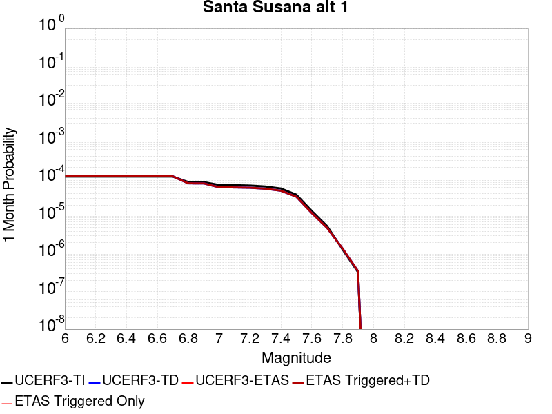 |  |  |

| Magnitude | 1 wk TI Prob | 1 wk TD Prob | 1 wk ETAS Prob | 1 wk ETAS/TD Gain | 1 wk ETAS Triggered+TD | 1 wk ETAS Triggered Only | 1 mo TI Prob | 1 mo TD Prob | 1 mo ETAS Prob | 1 mo ETAS/TD Gain | 1 mo ETAS Triggered+TD | 1 mo ETAS Triggered Only | 1 yr TI Prob | 1 yr TD Prob | 1 yr ETAS Prob | 1 yr ETAS/TD Gain | 1 yr ETAS Triggered+TD | 1 yr ETAS Triggered Only | 10 yr TI Prob | 10 yr TD Prob | 10 yr ETAS Prob | 10 yr ETAS/TD Gain | 10 yr ETAS Triggered+TD | 10 yr ETAS Triggered Only |
|-----|-----|-----|-----|-----|-----|-----|-----|-----|-----|-----|-----|-----|-----|-----|-----|-----|-----|-----|-----|-----|-----|-----|-----|-----|
| 6.0 | 2.674877E-5 | 2.7207221E-5 | 0.0 | 0.0 | 2.7207221E-5 | 0.0 | 1.1463255E-4 | 1.1659781E-4 | 0.0 | 0.0 | 1.1659781E-4 | 0.0 | 0.0013947578 | 0.0014187676 | 6.0E-4 | 0.42290223 | 0.0016184839 | 2.0E-4 | 0.013860362 | 0.014108728 | 0.0074 | 0.52449805 | 0.015883332 | 0.0018 |
| 6.1 | 2.674877E-5 | 2.7207221E-5 | 0.0 | 0.0 | 2.7207221E-5 | 0.0 | 1.1463255E-4 | 1.1659781E-4 | 0.0 | 0.0 | 1.1659781E-4 | 0.0 | 0.0013947578 | 0.0014187676 | 6.0E-4 | 0.42290223 | 0.0016184839 | 2.0E-4 | 0.013860362 | 0.014108728 | 0.0074 | 0.52449805 | 0.015883332 | 0.0018 |
| 6.2 | 2.674877E-5 | 2.7207221E-5 | 0.0 | 0.0 | 2.7207221E-5 | 0.0 | 1.1463255E-4 | 1.1659781E-4 | 0.0 | 0.0 | 1.1659781E-4 | 0.0 | 0.0013947578 | 0.0014187676 | 6.0E-4 | 0.42290223 | 0.0016184839 | 2.0E-4 | 0.013860362 | 0.014108728 | 0.0074 | 0.52449805 | 0.015883332 | 0.0018 |
| 6.3 | 2.674877E-5 | 2.7207221E-5 | 0.0 | 0.0 | 2.7207221E-5 | 0.0 | 1.1463255E-4 | 1.1659781E-4 | 0.0 | 0.0 | 1.1659781E-4 | 0.0 | 0.0013947578 | 0.0014187676 | 6.0E-4 | 0.42290223 | 0.0016184839 | 2.0E-4 | 0.013860362 | 0.014108728 | 0.0074 | 0.52449805 | 0.015883332 | 0.0018 |
| 6.4 | 2.674877E-5 | 2.7207221E-5 | 0.0 | 0.0 | 2.7207221E-5 | 0.0 | 1.1463255E-4 | 1.1659781E-4 | 0.0 | 0.0 | 1.1659781E-4 | 0.0 | 0.0013947578 | 0.0014187676 | 6.0E-4 | 0.42290223 | 0.0016184839 | 2.0E-4 | 0.013860362 | 0.014108728 | 0.0074 | 0.52449805 | 0.015883332 | 0.0018 |
| 6.5 | 2.674877E-5 | 2.7207221E-5 | 0.0 | 0.0 | 2.7207221E-5 | 0.0 | 1.1463255E-4 | 1.1659781E-4 | 0.0 | 0.0 | 1.1659781E-4 | 0.0 | 0.0013947578 | 0.0014187676 | 6.0E-4 | 0.42290223 | 0.0016184839 | 2.0E-4 | 0.013860362 | 0.014108728 | 0.0074 | 0.52449805 | 0.015883332 | 0.0018 |
| 6.6 | 2.6647976E-5 | 2.7083504E-5 | 0.0 | 0.0 | 2.7083504E-5 | 0.0 | 1.14200615E-4 | 1.1606764E-4 | 0.0 | 0.0 | 1.1606764E-4 | 0.0 | 0.0013895056 | 0.0014123212 | 5.0E-4 | 0.3540271 | 0.0016120388 | 2.0E-4 | 0.013808494 | 0.014045084 | 0.0073 | 0.5197548 | 0.015819803 | 0.0018 |
| 6.7 | 2.6647976E-5 | 2.7083504E-5 | 0.0 | 0.0 | 2.7083504E-5 | 0.0 | 1.14200615E-4 | 1.1606764E-4 | 0.0 | 0.0 | 1.1606764E-4 | 0.0 | 0.0013895056 | 0.0014123212 | 5.0E-4 | 0.3540271 | 0.0016120388 | 2.0E-4 | 0.013808494 | 0.014045084 | 0.0073 | 0.5197548 | 0.015819803 | 0.0018 |
| 6.8 | 1.9073179E-5 | 1.764181E-5 | 0.0 | 0.0 | 1.764181E-5 | 0.0 | 8.1739636E-5 | 7.5605676E-5 | 0.0 | 0.0 | 7.5605676E-5 | 0.0 | 9.947256E-4 | 9.201285E-4 | 3.0E-4 | 0.3260414 | 9.201285E-4 | 0.0 | 0.009902848 | 0.009165302 | 0.005 | 0.54553574 | 0.010354304 | 0.0012 |
| 6.9 | 1.9041876E-5 | 1.762394E-5 | 0.0 | 0.0 | 1.762394E-5 | 0.0 | 8.160549E-5 | 7.552908E-5 | 0.0 | 0.0 | 7.552908E-5 | 0.0 | 9.930939E-4 | 9.1919675E-4 | 3.0E-4 | 0.3263719 | 9.1919675E-4 | 0.0 | 0.0098866755 | 0.009156061 | 0.005 | 0.5460863 | 0.010345074 | 0.0012 |
| 7.0 | 1.5917482E-5 | 1.386679E-5 | 0.0 | 0.0 | 1.386679E-5 | 0.0 | 6.8215995E-5 | 5.9427774E-5 | 0.0 | 0.0 | 5.9427774E-5 | 0.0 | 8.302132E-4 | 7.232976E-4 | 1.0E-4 | 0.13825569 | 7.232976E-4 | 0.0 | 0.008271185 | 0.0072101653 | 0.004 | 0.5547723 | 0.008103676 | 9.0E-4 |
| 7.1 | 1.577788E-5 | 1.374677E-5 | 0.0 | 0.0 | 1.374677E-5 | 0.0 | 6.761774E-5 | 5.8913425E-5 | 0.0 | 0.0 | 5.8913425E-5 | 0.0 | 8.2293496E-4 | 7.170395E-4 | 1.0E-4 | 0.13946232 | 7.170395E-4 | 0.0 | 0.008198941 | 0.007147989 | 0.004 | 0.55959797 | 0.008041556 | 9.0E-4 |
| 7.2 | 1.5416446E-5 | 1.3472778E-5 | 0.0 | 0.0 | 1.3472778E-5 | 0.0 | 6.606882E-5 | 5.7739227E-5 | 0.0 | 0.0 | 5.7739227E-5 | 0.0 | 8.0409093E-4 | 7.0275296E-4 | 1.0E-4 | 0.14229752 | 7.0275296E-4 | 0.0 | 0.008011877 | 0.007006027 | 0.004 | 0.57093704 | 0.007899721 | 9.0E-4 |
| 7.3 | 1.4534083E-5 | 1.2720495E-5 | 0.0 | 0.0 | 1.2720495E-5 | 0.0 | 6.228744E-5 | 5.451529E-5 | 0.0 | 0.0 | 5.451529E-5 | 0.0 | 7.580857E-4 | 6.63526E-4 | 1.0E-4 | 0.15070999 | 6.63526E-4 | 0.0 | 0.007555048 | 0.006616127 | 0.004 | 0.60458326 | 0.0075101727 | 9.0E-4 |
| 7.4 | 1.2858995E-5 | 1.1231767E-5 | 0.0 | 0.0 | 1.1231767E-5 | 0.0 | 5.5108816E-5 | 4.8135276E-5 | 0.0 | 0.0 | 4.8135276E-5 | 0.0 | 6.7074323E-4 | 5.8589334E-4 | 1.0E-4 | 0.17067952 | 5.8589334E-4 | 0.0 | 0.0066872234 | 0.0058440925 | 0.0034 | 0.58178407 | 0.0066394173 | 8.0E-4 |
| 7.5 | 8.827668E-6 | 7.806757E-6 | 0.0 | 0.0 | 7.806757E-6 | 0.0 | 3.7832317E-5 | 3.3457112E-5 | 0.0 | 0.0 | 3.3457112E-5 | 0.0 | 4.605111E-4 | 4.072667E-4 | 1.0E-4 | 0.24553935 | 4.072667E-4 | 0.0 | 0.0045955796 | 0.004065365 | 0.002 | 0.49196073 | 0.004662926 | 6.0E-4 |
| 7.6 | 3.2533426E-6 | 2.8722882E-6 | 0.0 | 0.0 | 2.8722882E-6 | 0.0 | 1.3942822E-5 | 1.2309751E-5 | 0.0 | 0.0 | 1.2309751E-5 | 0.0 | 1.6974064E-4 | 1.4986127E-4 | 0.0 | 0.0 | 1.4986127E-4 | 0.0 | 0.0016961104 | 0.001497639 | 0.0012 | 0.8012612 | 0.0018970399 | 4.0E-4 |
| 7.7 | 1.2751709E-6 | 1.1492784E-6 | 0.0 | 0.0 | 1.1492784E-6 | 0.0 | 5.4650063E-6 | 4.9254704E-6 | 0.0 | 0.0 | 4.9254704E-6 | 0.0 | 6.653442E-5 | 5.996604E-5 | 0.0 | 0.0 | 5.996604E-5 | 0.0 | 6.6514505E-4 | 5.9950753E-4 | 7.0E-4 | 1.1676251 | 7.9938764E-4 | 2.0E-4 |
| 7.8 | 3.067544E-7 | 3.240475E-7 | 0.0 | 0.0 | 3.240475E-7 | 0.0 | 1.3146611E-6 | 1.3887743E-6 | 0.0 | 0.0 | 1.3887743E-6 | 0.0 | 1.600588E-5 | 1.6908207E-5 | 0.0 | 0.0 | 1.6908207E-5 | 0.0 | 1.6004729E-4 | 1.6907023E-4 | 4.0E-4 | 2.3658807 | 3.6903642E-4 | 2.0E-4 |
| 7.9 | 7.622999E-8 | 8.088989E-8 | 0.0 | 0.0 | 8.088989E-8 | 0.0 | 3.2669993E-7 | 3.466709E-7 | 0.0 | 0.0 | 3.466709E-7 | 0.0 | 3.977564E-6 | 4.220712E-6 | 0.0 | 0.0 | 4.220712E-6 | 0.0 | 3.977493E-5 | 4.220653E-5 | 3.0E-4 | 7.107905 | 2.4219809E-4 | 2.0E-4 |

## San Jacinto (Stepovers Combined)
*[(top)](#table-of-contents)*

| 1 Week | 1 Month | 1 Year | 10 Year |
|-----|-----|-----|-----|
|  | 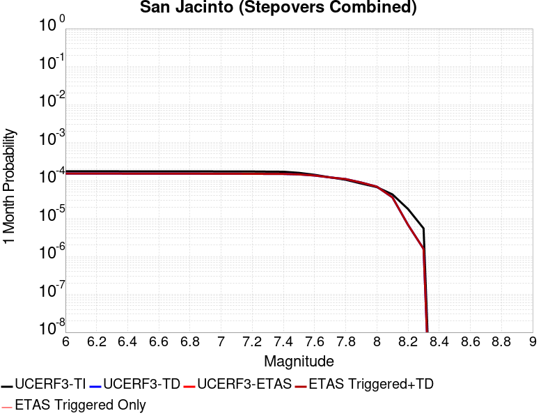 |  |  |

| Magnitude | 1 wk TI Prob | 1 wk TD Prob | 1 wk ETAS Prob | 1 wk ETAS/TD Gain | 1 wk ETAS Triggered+TD | 1 wk ETAS Triggered Only | 1 mo TI Prob | 1 mo TD Prob | 1 mo ETAS Prob | 1 mo ETAS/TD Gain | 1 mo ETAS Triggered+TD | 1 mo ETAS Triggered Only | 1 yr TI Prob | 1 yr TD Prob | 1 yr ETAS Prob | 1 yr ETAS/TD Gain | 1 yr ETAS Triggered+TD | 1 yr ETAS Triggered Only | 10 yr TI Prob | 10 yr TD Prob | 10 yr ETAS Prob | 10 yr ETAS/TD Gain | 10 yr ETAS Triggered+TD | 10 yr ETAS Triggered Only |
|-----|-----|-----|-----|-----|-----|-----|-----|-----|-----|-----|-----|-----|-----|-----|-----|-----|-----|-----|-----|-----|-----|-----|-----|-----|
| 6.0 | 4.0667746E-5 | 3.540715E-5 | 0.0 | 0.0 | 3.540715E-5 | 0.0 | 1.742787E-4 | 1.5173611E-4 | 0.0 | 0.0 | 1.5173611E-4 | 0.0 | 0.0021197782 | 0.0018458229 | 9.0E-4 | 0.48758742 | 0.0019456383 | 1.0E-4 | 0.020996714 | 0.019055946 | 0.0108 | 0.5667522 | 0.020821646 | 0.0018 |
| 6.1 | 4.0667746E-5 | 3.540715E-5 | 0.0 | 0.0 | 3.540715E-5 | 0.0 | 1.742787E-4 | 1.5173611E-4 | 0.0 | 0.0 | 1.5173611E-4 | 0.0 | 0.0021197782 | 0.0018458229 | 9.0E-4 | 0.48758742 | 0.0019456383 | 1.0E-4 | 0.020996714 | 0.019055946 | 0.0108 | 0.5667522 | 0.020821646 | 0.0018 |
| 6.2 | 4.0667746E-5 | 3.540715E-5 | 0.0 | 0.0 | 3.540715E-5 | 0.0 | 1.742787E-4 | 1.5173611E-4 | 0.0 | 0.0 | 1.5173611E-4 | 0.0 | 0.0021197782 | 0.0018458229 | 9.0E-4 | 0.48758742 | 0.0019456383 | 1.0E-4 | 0.020996714 | 0.019055946 | 0.0108 | 0.5667522 | 0.020821646 | 0.0018 |
| 6.3 | 4.0667746E-5 | 3.540715E-5 | 0.0 | 0.0 | 3.540715E-5 | 0.0 | 1.742787E-4 | 1.5173611E-4 | 0.0 | 0.0 | 1.5173611E-4 | 0.0 | 0.0021197782 | 0.0018458229 | 9.0E-4 | 0.48758742 | 0.0019456383 | 1.0E-4 | 0.020996714 | 0.019055946 | 0.0108 | 0.5667522 | 0.020821646 | 0.0018 |
| 6.4 | 4.0577226E-5 | 3.5278965E-5 | 0.0 | 0.0 | 3.5278965E-5 | 0.0 | 1.738908E-4 | 1.5118682E-4 | 0.0 | 0.0 | 1.5118682E-4 | 0.0 | 0.0021150648 | 0.0018391478 | 9.0E-4 | 0.48935708 | 0.0019389639 | 1.0E-4 | 0.020950472 | 0.018990472 | 0.0107 | 0.56344044 | 0.02075629 | 0.0018 |
| 6.5 | 4.0577226E-5 | 3.5278965E-5 | 0.0 | 0.0 | 3.5278965E-5 | 0.0 | 1.738908E-4 | 1.5118682E-4 | 0.0 | 0.0 | 1.5118682E-4 | 0.0 | 0.0021150648 | 0.0018391478 | 9.0E-4 | 0.48935708 | 0.0019389639 | 1.0E-4 | 0.020950472 | 0.018990472 | 0.0107 | 0.56344044 | 0.02075629 | 0.0018 |
| 6.6 | 4.053861E-5 | 3.5224264E-5 | 0.0 | 0.0 | 3.5224264E-5 | 0.0 | 1.7372532E-4 | 1.5095242E-4 | 0.0 | 0.0 | 1.5095242E-4 | 0.0 | 0.0021130538 | 0.0018362994 | 9.0E-4 | 0.49011615 | 0.0019361158 | 1.0E-4 | 0.020930743 | 0.018962532 | 0.0107 | 0.5642706 | 0.0207284 | 0.0018 |
| 6.7 | 4.0516545E-5 | 3.5193316E-5 | 0.0 | 0.0 | 3.5193316E-5 | 0.0 | 1.7363077E-4 | 1.508198E-4 | 0.0 | 0.0 | 1.508198E-4 | 0.0 | 0.002111905 | 0.0018346877 | 9.0E-4 | 0.4905467 | 0.0019345043 | 1.0E-4 | 0.020919468 | 0.018946718 | 0.0107 | 0.5647416 | 0.020712614 | 0.0018 |
| 6.8 | 4.049434E-5 | 3.516475E-5 | 0.0 | 0.0 | 3.516475E-5 | 0.0 | 1.7353562E-4 | 1.5069738E-4 | 0.0 | 0.0 | 1.5069738E-4 | 0.0 | 0.0021107488 | 0.0018331998 | 9.0E-4 | 0.49094486 | 0.0019330165 | 1.0E-4 | 0.020908125 | 0.018932065 | 0.0107 | 0.5651787 | 0.020697987 | 0.0018 |
| 6.9 | 4.046386E-5 | 3.5127214E-5 | 0.0 | 0.0 | 3.5127214E-5 | 0.0 | 1.73405E-4 | 1.5053654E-4 | 0.0 | 0.0 | 1.5053654E-4 | 0.0 | 0.0021091616 | 0.0018312448 | 9.0E-4 | 0.49146897 | 0.0019310616 | 1.0E-4 | 0.020892553 | 0.018912788 | 0.0107 | 0.5657547 | 0.020678746 | 0.0018 |
| 7.0 | 4.036382E-5 | 3.5007484E-5 | 0.0 | 0.0 | 3.5007484E-5 | 0.0 | 1.7297632E-4 | 1.5002348E-4 | 0.0 | 0.0 | 1.5002348E-4 | 0.0 | 0.0021039525 | 0.0018250088 | 9.0E-4 | 0.4931483 | 0.0019248263 | 1.0E-4 | 0.02084144 | 0.018851254 | 0.0107 | 0.5676015 | 0.020617323 | 0.0018 |
| 7.1 | 4.0343282E-5 | 3.4985915E-5 | 0.0 | 0.0 | 3.4985915E-5 | 0.0 | 1.7288832E-4 | 1.4993103E-4 | 0.0 | 0.0 | 1.4993103E-4 | 0.0 | 0.002102883 | 0.0018238852 | 9.0E-4 | 0.4934521 | 0.0019237029 | 1.0E-4 | 0.020830948 | 0.018840108 | 0.0107 | 0.5679373 | 0.020606196 | 0.0018 |
| 7.2 | 4.0257353E-5 | 3.4890265E-5 | 0.0 | 0.0 | 3.4890265E-5 | 0.0 | 1.725201E-4 | 1.4952116E-4 | 0.0 | 0.0 | 1.4952116E-4 | 0.0 | 0.0020984085 | 0.0018189034 | 9.0E-4 | 0.49480364 | 0.0019187215 | 1.0E-4 | 0.020787042 | 0.018790776 | 0.0107 | 0.5694283 | 0.020556953 | 0.0018 |
| 7.3 | 3.9940667E-5 | 3.4716548E-5 | 0.0 | 0.0 | 3.4716548E-5 | 0.0 | 1.7116306E-4 | 1.4877673E-4 | 0.0 | 0.0 | 1.4877673E-4 | 0.0 | 0.0020819185 | 0.0018098551 | 9.0E-4 | 0.49727738 | 0.0019096741 | 1.0E-4 | 0.020625217 | 0.018698683 | 0.0106 | 0.5668849 | 0.020465024 | 0.0018 |
| 7.4 | 3.9721202E-5 | 3.4601544E-5 | 0.0 | 0.0 | 3.4601544E-5 | 0.0 | 1.7022261E-4 | 1.4828393E-4 | 0.0 | 0.0 | 1.4828393E-4 | 0.0 | 0.0020704903 | 0.0018038651 | 8.0E-4 | 0.44349214 | 0.0018038651 | 0.0 | 0.020513052 | 0.018637586 | 0.0105 | 0.5633777 | 0.020305902 | 0.0017 |
| 7.5 | 3.7036873E-5 | 3.366559E-5 | 0.0 | 0.0 | 3.366559E-5 | 0.0 | 1.5871979E-4 | 1.4427313E-4 | 0.0 | 0.0 | 1.4427313E-4 | 0.0 | 0.0019307006 | 0.0017551132 | 8.0E-4 | 0.45581105 | 0.0017551132 | 0.0 | 0.019140124 | 0.018137345 | 0.0102 | 0.5623756 | 0.019708326 | 0.0016 |
| 7.6 | 3.2940967E-5 | 3.1437863E-5 | 0.0 | 0.0 | 3.1437863E-5 | 0.0 | 1.4116794E-4 | 1.3472675E-4 | 0.0 | 0.0 | 1.3472675E-4 | 0.0 | 0.0017173645 | 0.0016390664 | 8.0E-4 | 0.4880827 | 0.0016390664 | 0.0 | 0.01704153 | 0.016965834 | 0.0096 | 0.56584305 | 0.018440386 | 0.0015 |
| 7.7 | 2.8236149E-5 | 2.8001037E-5 | 0.0 | 0.0 | 2.8001037E-5 | 0.0 | 1.2100645E-4 | 1.19998935E-4 | 0.0 | 0.0 | 1.19998935E-4 | 0.0 | 0.0014722579 | 0.0014600089 | 8.0E-4 | 0.54794186 | 0.0014600089 | 0.0 | 0.014625421 | 0.015175301 | 0.0087 | 0.5733 | 0.01635709 | 0.0012 |
| 7.8 | 2.4329287E-5 | 2.5319612E-5 | 0.0 | 0.0 | 2.5319612E-5 | 0.0 | 1.042642E-4 | 1.0850812E-4 | 0.0 | 0.0 | 1.0850812E-4 | 0.0 | 0.0012686774 | 0.0013202865 | 7.0E-4 | 0.5301879 | 0.0013202865 | 0.0 | 0.012614589 | 0.013769966 | 0.0083 | 0.6027611 | 0.014953442 | 0.0012 |
| 7.9 | 1.9370926E-5 | 2.0518795E-5 | 0.0 | 0.0 | 2.0518795E-5 | 0.0 | 8.301561E-5 | 8.7934735E-5 | 0.0 | 0.0 | 8.7934735E-5 | 0.0 | 0.0010102465 | 0.0010700803 | 4.0E-4 | 0.3738037 | 0.0010700803 | 0.0 | 0.0100566605 | 0.011249543 | 0.0073 | 0.6489153 | 0.012337168 | 0.0011 |
| 8.0 | 1.5583017E-5 | 1.5961923E-5 | 0.0 | 0.0 | 1.5961923E-5 | 0.0 | 6.6782646E-5 | 6.840645E-5 | 0.0 | 0.0 | 6.840645E-5 | 0.0 | 8.127754E-4 | 8.3253096E-4 | 2.0E-4 | 0.2402313 | 8.3253096E-4 | 0.0 | 0.008098091 | 0.008820816 | 0.0061 | 0.691546 | 0.009811995 | 0.001 |
| 8.1 | 1.0024873E-5 | 8.32582E-6 | 0.0 | 0.0 | 8.32582E-6 | 0.0 | 4.2963035E-5 | 3.5681598E-5 | 0.0 | 0.0 | 3.5681598E-5 | 0.0 | 5.229494E-4 | 4.343374E-4 | 2.0E-4 | 0.4604715 | 4.343374E-4 | 0.0 | 0.0052172043 | 0.004670889 | 0.0034 | 0.72791284 | 0.0051685534 | 5.0E-4 |
| 8.2 | 4.142796E-6 | 1.5647538E-6 | 0.0 | 0.0 | 1.5647538E-6 | 0.0 | 1.775472E-5 | 6.706071E-6 | 0.0 | 0.0 | 6.706071E-6 | 0.0 | 2.1614227E-4 | 8.164338E-5 | 0.0 | 0.0 | 8.164338E-5 | 0.0 | 0.0021593217 | 9.4762514E-4 | 7.0E-4 | 0.7386887 | 0.0011474356 | 2.0E-4 |
| 8.3 | 1.2750878E-6 | 3.620865E-7 | 0.0 | 0.0 | 3.620865E-7 | 0.0 | 5.4646503E-6 | 1.5517984E-6 | 0.0 | 0.0 | 1.5517984E-6 | 0.0 | 6.653009E-5 | 1.8892986E-5 | 0.0 | 0.0 | 1.8892986E-5 | 0.0 | 6.6510175E-4 | 2.2786732E-4 | 1.0E-4 | 0.43885186 | 2.2786732E-4 | 0.0 |

## San Jacinto (San Jacinto Valley) rev
*[(top)](#table-of-contents)*

| 1 Week | 1 Month | 1 Year | 10 Year |
|-----|-----|-----|-----|
|  |  |  |  |

| Magnitude | 1 wk TI Prob | 1 wk TD Prob | 1 wk ETAS Prob | 1 wk ETAS/TD Gain | 1 wk ETAS Triggered+TD | 1 wk ETAS Triggered Only | 1 mo TI Prob | 1 mo TD Prob | 1 mo ETAS Prob | 1 mo ETAS/TD Gain | 1 mo ETAS Triggered+TD | 1 mo ETAS Triggered Only | 1 yr TI Prob | 1 yr TD Prob | 1 yr ETAS Prob | 1 yr ETAS/TD Gain | 1 yr ETAS Triggered+TD | 1 yr ETAS Triggered Only | 10 yr TI Prob | 10 yr TD Prob | 10 yr ETAS Prob | 10 yr ETAS/TD Gain | 10 yr ETAS Triggered+TD | 10 yr ETAS Triggered Only |
|-----|-----|-----|-----|-----|-----|-----|-----|-----|-----|-----|-----|-----|-----|-----|-----|-----|-----|-----|-----|-----|-----|-----|-----|-----|
| 6.0 | 3.652694E-5 | 3.4538778E-5 | 0.0 | 0.0 | 3.4538778E-5 | 0.0 | 1.5653463E-4 | 1.4801494E-4 | 0.0 | 0.0 | 1.4801494E-4 | 0.0 | 0.0019041431 | 0.0018005943 | 0.0011 | 0.61090946 | 0.0019004141 | 1.0E-4 | 0.018879099 | 0.018596424 | 0.0108 | 0.5807568 | 0.02026481 | 0.0017 |
| 6.1 | 3.652694E-5 | 3.4538778E-5 | 0.0 | 0.0 | 3.4538778E-5 | 0.0 | 1.5653463E-4 | 1.4801494E-4 | 0.0 | 0.0 | 1.4801494E-4 | 0.0 | 0.0019041431 | 0.0018005943 | 0.0011 | 0.61090946 | 0.0019004141 | 1.0E-4 | 0.018879099 | 0.018596424 | 0.0108 | 0.5807568 | 0.02026481 | 0.0017 |
| 6.2 | 3.652694E-5 | 3.4538778E-5 | 0.0 | 0.0 | 3.4538778E-5 | 0.0 | 1.5653463E-4 | 1.4801494E-4 | 0.0 | 0.0 | 1.4801494E-4 | 0.0 | 0.0019041431 | 0.0018005943 | 0.0011 | 0.61090946 | 0.0019004141 | 1.0E-4 | 0.018879099 | 0.018596424 | 0.0108 | 0.5807568 | 0.02026481 | 0.0017 |
| 6.3 | 3.652694E-5 | 3.4538778E-5 | 0.0 | 0.0 | 3.4538778E-5 | 0.0 | 1.5653463E-4 | 1.4801494E-4 | 0.0 | 0.0 | 1.4801494E-4 | 0.0 | 0.0019041431 | 0.0018005943 | 0.0011 | 0.61090946 | 0.0019004141 | 1.0E-4 | 0.018879099 | 0.018596424 | 0.0108 | 0.5807568 | 0.02026481 | 0.0017 |
| 6.4 | 3.646941E-5 | 3.44603E-5 | 0.0 | 0.0 | 3.44603E-5 | 0.0 | 1.5628811E-4 | 1.4767864E-4 | 0.0 | 0.0 | 1.4767864E-4 | 0.0 | 0.0019011468 | 0.001796507 | 0.0011 | 0.6122993 | 0.0018963274 | 1.0E-4 | 0.018849645 | 0.018556282 | 0.0108 | 0.5820132 | 0.020224735 | 0.0017 |
| 6.5 | 3.646941E-5 | 3.44603E-5 | 0.0 | 0.0 | 3.44603E-5 | 0.0 | 1.5628811E-4 | 1.4767864E-4 | 0.0 | 0.0 | 1.4767864E-4 | 0.0 | 0.0019011468 | 0.001796507 | 0.0011 | 0.6122993 | 0.0018963274 | 1.0E-4 | 0.018849645 | 0.018556282 | 0.0108 | 0.5820132 | 0.020224735 | 0.0017 |
| 6.6 | 3.6442503E-5 | 3.442366E-5 | 0.0 | 0.0 | 3.442366E-5 | 0.0 | 1.561728E-4 | 1.4752166E-4 | 0.0 | 0.0 | 1.4752166E-4 | 0.0 | 0.0018997455 | 0.0017945989 | 0.0011 | 0.6129503 | 0.0018944194 | 1.0E-4 | 0.018835869 | 0.01853754 | 0.0108 | 0.5826016 | 0.020206025 | 0.0017 |
| 6.7 | 3.6432113E-5 | 3.4409226E-5 | 0.0 | 0.0 | 3.4409226E-5 | 0.0 | 1.5612828E-4 | 1.474598E-4 | 0.0 | 0.0 | 1.474598E-4 | 0.0 | 0.0018992044 | 0.0017938471 | 0.0011 | 0.6132072 | 0.0018936677 | 1.0E-4 | 0.018830549 | 0.018530158 | 0.0108 | 0.58283365 | 0.020198656 | 0.0017 |
| 6.8 | 3.6409598E-5 | 3.437826E-5 | 0.0 | 0.0 | 3.437826E-5 | 0.0 | 1.560318E-4 | 1.473271E-4 | 0.0 | 0.0 | 1.473271E-4 | 0.0 | 0.0018980318 | 0.0017922341 | 0.0011 | 0.6137591 | 0.0018920549 | 1.0E-4 | 0.018819023 | 0.018514302 | 0.0108 | 0.58333284 | 0.020182827 | 0.0017 |
| 6.9 | 3.638078E-5 | 3.4338653E-5 | 0.0 | 0.0 | 3.4338653E-5 | 0.0 | 1.5590832E-4 | 1.4715738E-4 | 0.0 | 0.0 | 1.4715738E-4 | 0.0 | 0.0018965311 | 0.0017901713 | 0.0011 | 0.61446637 | 0.0018899923 | 1.0E-4 | 0.018804269 | 0.018494023 | 0.0108 | 0.58397245 | 0.020162582 | 0.0017 |
| 7.0 | 3.6294874E-5 | 3.4220586E-5 | 0.0 | 0.0 | 3.4220586E-5 | 0.0 | 1.5554018E-4 | 1.4665142E-4 | 0.0 | 0.0 | 1.4665142E-4 | 0.0 | 0.0018920569 | 0.0017840215 | 0.0011 | 0.6165845 | 0.0018838431 | 1.0E-4 | 0.018760284 | 0.018433565 | 0.0107 | 0.5804629 | 0.020102227 | 0.0017 |
| 7.1 | 3.6260717E-5 | 3.4176846E-5 | 0.0 | 0.0 | 3.4176846E-5 | 0.0 | 1.5539382E-4 | 1.46464E-4 | 0.0 | 0.0 | 1.46464E-4 | 0.0 | 0.001890278 | 0.0017817433 | 0.0011 | 0.61737293 | 0.0018815651 | 1.0E-4 | 0.018742796 | 0.018411148 | 0.0107 | 0.5811696 | 0.02007985 | 0.0017 |
| 7.2 | 3.6210204E-5 | 3.4110948E-5 | 0.0 | 0.0 | 3.4110948E-5 | 0.0 | 1.5517735E-4 | 1.4618161E-4 | 0.0 | 0.0 | 1.4618161E-4 | 0.0 | 0.001887647 | 0.0017783109 | 0.0011 | 0.6185645 | 0.001878133 | 1.0E-4 | 0.01871693 | 0.018377384 | 0.0107 | 0.58223736 | 0.020046143 | 0.0017 |
| 7.3 | 3.6119454E-5 | 3.3999E-5 | 0.0 | 0.0 | 3.3999E-5 | 0.0 | 1.5478847E-4 | 1.4570188E-4 | 0.0 | 0.0 | 1.4570188E-4 | 0.0 | 0.0018829206 | 0.0017724797 | 0.001 | 0.5641813 | 0.0018723025 | 1.0E-4 | 0.018670462 | 0.018319821 | 0.0105 | 0.5731497 | 0.019988678 | 0.0017 |
| 7.4 | 3.607848E-5 | 3.3946413E-5 | 0.0 | 0.0 | 3.3946413E-5 | 0.0 | 1.5461289E-4 | 1.4547653E-4 | 0.0 | 0.0 | 1.4547653E-4 | 0.0 | 0.0018807866 | 0.0017697405 | 9.0E-4 | 0.5085491 | 0.0017697405 | 0.0 | 0.018649481 | 0.018292775 | 0.0104 | 0.56853044 | 0.019863507 | 0.0016 |
| 7.5 | 3.5856774E-5 | 3.375515E-5 | 0.0 | 0.0 | 3.375515E-5 | 0.0 | 1.5366284E-4 | 1.4465692E-4 | 0.0 | 0.0 | 1.4465692E-4 | 0.0 | 0.0018692396 | 0.0017597779 | 8.0E-4 | 0.45460284 | 0.0017597779 | 0.0 | 0.018535944 | 0.018193334 | 0.0103 | 0.5661414 | 0.019764224 | 0.0016 |
| 7.6 | 3.286655E-5 | 3.2270014E-5 | 0.0 | 0.0 | 3.2270014E-5 | 0.0 | 1.4084904E-4 | 1.3829274E-4 | 0.0 | 0.0 | 1.3829274E-4 | 0.0 | 0.001713488 | 0.0016824158 | 8.0E-4 | 0.4755067 | 0.0016824158 | 0.0 | 0.017003361 | 0.017408721 | 0.01 | 0.57442474 | 0.018882608 | 0.0015 |
| 7.7 | 2.8882527E-5 | 2.9360399E-5 | 0.0 | 0.0 | 2.9360399E-5 | 0.0 | 1.237764E-4 | 1.2582421E-4 | 0.0 | 0.0 | 1.2582421E-4 | 0.0 | 0.0015059357 | 0.0015308345 | 8.0E-4 | 0.5225908 | 0.0015308345 | 0.0 | 0.014957713 | 0.015893964 | 0.0092 | 0.5788361 | 0.017173303 | 0.0013 |
| 7.8 | 2.4950225E-5 | 2.6646132E-5 | 0.0 | 0.0 | 2.6646132E-5 | 0.0 | 1.0692515E-4 | 1.1419271E-4 | 0.0 | 0.0 | 1.1419271E-4 | 0.0 | 0.0013010362 | 0.0013894106 | 7.0E-4 | 0.50381076 | 0.0013894106 | 0.0 | 0.012934455 | 0.0144725805 | 0.0088 | 0.60804635 | 0.015753767 | 0.0013 |
| 7.9 | 1.9881603E-5 | 2.1610242E-5 | 0.0 | 0.0 | 2.1610242E-5 | 0.0 | 8.520408E-5 | 9.261204E-5 | 0.0 | 0.0 | 9.261204E-5 | 0.0 | 0.001036866 | 0.0011269691 | 4.0E-4 | 0.3549343 | 0.0011269691 | 0.0 | 0.010320415 | 0.0118296705 | 0.0078 | 0.65935904 | 0.013015475 | 0.0012 |
| 8.0 | 1.563292E-5 | 1.6012968E-5 | 0.0 | 0.0 | 1.6012968E-5 | 0.0 | 6.6996516E-5 | 6.86252E-5 | 0.0 | 0.0 | 6.86252E-5 | 0.0 | 8.153773E-4 | 8.351922E-4 | 2.0E-4 | 0.23946583 | 8.351922E-4 | 0.0 | 0.00812392 | 0.008849602 | 0.0061 | 0.68929654 | 0.009840752 | 0.001 |
| 8.1 | 1.0045313E-5 | 8.335247E-6 | 0.0 | 0.0 | 8.335247E-6 | 0.0 | 4.305063E-5 | 3.5722E-5 | 0.0 | 0.0 | 3.5722E-5 | 0.0 | 5.2401534E-4 | 4.348291E-4 | 2.0E-4 | 0.45995083 | 4.348291E-4 | 0.0 | 0.0052278144 | 0.0046766084 | 0.0034 | 0.7270226 | 0.0051742704 | 5.0E-4 |
| 8.2 | 4.1554413E-6 | 1.5693208E-6 | 0.0 | 0.0 | 1.5693208E-6 | 0.0 | 1.7808914E-5 | 6.7256437E-6 | 0.0 | 0.0 | 6.7256437E-6 | 0.0 | 2.1680194E-4 | 8.188166E-5 | 0.0 | 0.0 | 8.188166E-5 | 0.0 | 0.0021659054 | 9.504571E-4 | 7.0E-4 | 0.73648775 | 0.0011502671 | 2.0E-4 |
| 8.3 | 1.2758221E-6 | 3.623731E-7 | 0.0 | 0.0 | 3.623731E-7 | 0.0 | 5.4677976E-6 | 1.5530267E-6 | 0.0 | 0.0 | 1.5530267E-6 | 0.0 | 6.65684E-5 | 1.890794E-5 | 0.0 | 0.0 | 1.890794E-5 | 0.0 | 6.6548464E-4 | 2.2803801E-4 | 1.0E-4 | 0.43852338 | 2.2803801E-4 | 0.0 |

## San Jacinto (Anza) rev
*[(top)](#table-of-contents)*

| 1 Week | 1 Month | 1 Year | 10 Year |
|-----|-----|-----|-----|
|  |  | 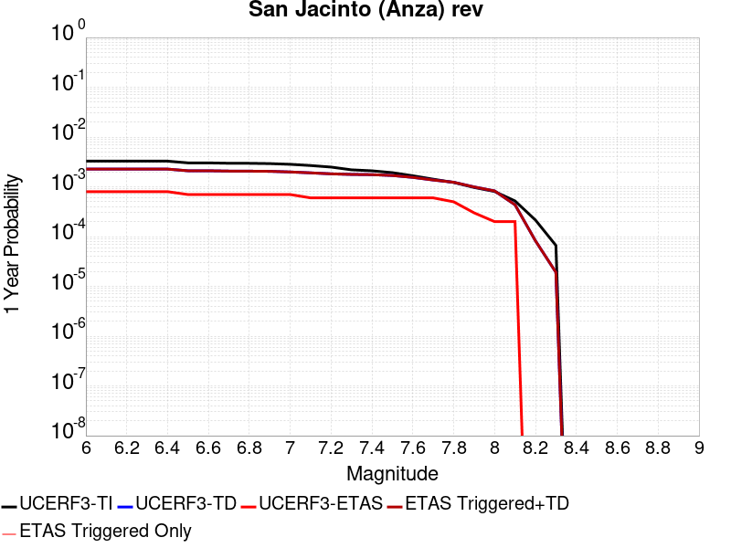 |  |

| Magnitude | 1 wk TI Prob | 1 wk TD Prob | 1 wk ETAS Prob | 1 wk ETAS/TD Gain | 1 wk ETAS Triggered+TD | 1 wk ETAS Triggered Only | 1 mo TI Prob | 1 mo TD Prob | 1 mo ETAS Prob | 1 mo ETAS/TD Gain | 1 mo ETAS Triggered+TD | 1 mo ETAS Triggered Only | 1 yr TI Prob | 1 yr TD Prob | 1 yr ETAS Prob | 1 yr ETAS/TD Gain | 1 yr ETAS Triggered+TD | 1 yr ETAS Triggered Only | 10 yr TI Prob | 10 yr TD Prob | 10 yr ETAS Prob | 10 yr ETAS/TD Gain | 10 yr ETAS Triggered+TD | 10 yr ETAS Triggered Only |
|-----|-----|-----|-----|-----|-----|-----|-----|-----|-----|-----|-----|-----|-----|-----|-----|-----|-----|-----|-----|-----|-----|-----|-----|-----|
| 6.0 | 6.3015636E-5 | 4.3453634E-5 | 0.0 | 0.0 | 4.3453634E-5 | 0.0 | 2.7003905E-4 | 1.8621662E-4 | 0.0 | 0.0 | 1.8621662E-4 | 0.0 | 0.0032827691 | 0.0022648422 | 8.0E-4 | 0.35322553 | 0.0022648422 | 0.0 | 0.032346968 | 0.023370396 | 0.0122 | 0.52202797 | 0.025030667 | 0.0017 |
| 6.1 | 6.3015636E-5 | 4.3453634E-5 | 0.0 | 0.0 | 4.3453634E-5 | 0.0 | 2.7003905E-4 | 1.8621662E-4 | 0.0 | 0.0 | 1.8621662E-4 | 0.0 | 0.0032827691 | 0.0022648422 | 8.0E-4 | 0.35322553 | 0.0022648422 | 0.0 | 0.032346968 | 0.023370396 | 0.0122 | 0.52202797 | 0.025030667 | 0.0017 |
| 6.2 | 6.3015636E-5 | 4.3453634E-5 | 0.0 | 0.0 | 4.3453634E-5 | 0.0 | 2.7003905E-4 | 1.8621662E-4 | 0.0 | 0.0 | 1.8621662E-4 | 0.0 | 0.0032827691 | 0.0022648422 | 8.0E-4 | 0.35322553 | 0.0022648422 | 0.0 | 0.032346968 | 0.023370396 | 0.0122 | 0.52202797 | 0.025030667 | 0.0017 |
| 6.3 | 6.3015636E-5 | 4.3453634E-5 | 0.0 | 0.0 | 4.3453634E-5 | 0.0 | 2.7003905E-4 | 1.8621662E-4 | 0.0 | 0.0 | 1.8621662E-4 | 0.0 | 0.0032827691 | 0.0022648422 | 8.0E-4 | 0.35322553 | 0.0022648422 | 0.0 | 0.032346968 | 0.023370396 | 0.0122 | 0.52202797 | 0.025030667 | 0.0017 |
| 6.4 | 6.3015636E-5 | 4.3453634E-5 | 0.0 | 0.0 | 4.3453634E-5 | 0.0 | 2.7003905E-4 | 1.8621662E-4 | 0.0 | 0.0 | 1.8621662E-4 | 0.0 | 0.0032827691 | 0.0022648422 | 8.0E-4 | 0.35322553 | 0.0022648422 | 0.0 | 0.032346968 | 0.023370396 | 0.0122 | 0.52202797 | 0.025030667 | 0.0017 |
| 6.5 | 5.811017E-5 | 4.023025E-5 | 0.0 | 0.0 | 4.023025E-5 | 0.0 | 2.4901982E-4 | 1.72404E-4 | 0.0 | 0.0 | 1.72404E-4 | 0.0 | 0.0030276014 | 0.0020970039 | 7.0E-4 | 0.3338096 | 0.0020970039 | 0.0 | 0.02986684 | 0.021665154 | 0.0118 | 0.5446534 | 0.023328323 | 0.0017 |
| 6.6 | 5.811017E-5 | 4.023025E-5 | 0.0 | 0.0 | 4.023025E-5 | 0.0 | 2.4901982E-4 | 1.72404E-4 | 0.0 | 0.0 | 1.72404E-4 | 0.0 | 0.0030276014 | 0.0020970039 | 7.0E-4 | 0.3338096 | 0.0020970039 | 0.0 | 0.02986684 | 0.021665154 | 0.0118 | 0.5446534 | 0.023328323 | 0.0017 |
| 6.7 | 5.712442E-5 | 3.9652583E-5 | 0.0 | 0.0 | 3.9652583E-5 | 0.0 | 2.4479596E-4 | 1.699286E-4 | 0.0 | 0.0 | 1.699286E-4 | 0.0 | 0.0029763177 | 0.002066923 | 7.0E-4 | 0.33866766 | 0.002066923 | 0.0 | 0.029367693 | 0.021354651 | 0.0117 | 0.54789 | 0.023018347 | 0.0017 |
| 6.8 | 5.6967532E-5 | 3.9508424E-5 | 0.0 | 0.0 | 3.9508424E-5 | 0.0 | 2.4412372E-4 | 1.6931086E-4 | 0.0 | 0.0 | 1.6931086E-4 | 0.0 | 0.0029681553 | 0.0020594164 | 7.0E-4 | 0.33990213 | 0.0020594164 | 0.0 | 0.029288229 | 0.021278588 | 0.0117 | 0.54984856 | 0.022942415 | 0.0017 |
| 6.9 | 5.6211324E-5 | 3.9212762E-5 | 0.0 | 0.0 | 3.9212762E-5 | 0.0 | 2.4088343E-4 | 1.680439E-4 | 0.0 | 0.0 | 1.680439E-4 | 0.0 | 0.0029288116 | 0.0020440202 | 7.0E-4 | 0.3424624 | 0.0020440202 | 0.0 | 0.028905109 | 0.021117745 | 0.0115 | 0.5445657 | 0.022781845 | 0.0017 |
| 7.0 | 5.4383527E-5 | 3.806994E-5 | 0.0 | 0.0 | 3.806994E-5 | 0.0 | 2.3305144E-4 | 1.631467E-4 | 0.0 | 0.0 | 1.631467E-4 | 0.0 | 0.0028337094 | 0.0019845064 | 7.0E-4 | 0.35273257 | 0.0019845064 | 0.0 | 0.027978465 | 0.020509487 | 0.0111 | 0.541213 | 0.022076672 | 0.0016 |
| 7.1 | 5.1393665E-5 | 3.6525995E-5 | 0.0 | 0.0 | 3.6525995E-5 | 0.0 | 2.2023996E-4 | 1.565306E-4 | 0.0 | 0.0 | 1.565306E-4 | 0.0 | 0.0026781242 | 0.0019040985 | 6.0E-4 | 0.31510976 | 0.0019040985 | 0.0 | 0.026460782 | 0.019683598 | 0.0108 | 0.5486802 | 0.021252103 | 0.0016 |
| 7.2 | 4.785222E-5 | 3.487019E-5 | 0.0 | 0.0 | 3.487019E-5 | 0.0 | 2.0506482E-4 | 1.4943515E-4 | 0.0 | 0.0 | 1.4943515E-4 | 0.0 | 0.0024938055 | 0.0018178581 | 6.0E-4 | 0.33005875 | 0.0018178581 | 0.0 | 0.024660049 | 0.018797392 | 0.0108 | 0.57454777 | 0.020367317 | 0.0016 |
| 7.3 | 4.2143256E-5 | 3.3961034E-5 | 0.0 | 0.0 | 3.3961034E-5 | 0.0 | 1.8060145E-4 | 1.4553918E-4 | 0.0 | 0.0 | 1.4553918E-4 | 0.0 | 0.002196605 | 0.0017705029 | 6.0E-4 | 0.33888677 | 0.0017705029 | 0.0 | 0.02175019 | 0.018301696 | 0.0107 | 0.5846453 | 0.019872414 | 0.0016 |
| 7.4 | 4.0264713E-5 | 3.3598037E-5 | 0.0 | 0.0 | 3.3598037E-5 | 0.0 | 1.7255165E-4 | 1.4398366E-4 | 0.0 | 0.0 | 1.4398366E-4 | 0.0 | 0.002098792 | 0.001751595 | 6.0E-4 | 0.34254494 | 0.001751595 | 0.0 | 0.020790804 | 0.018105503 | 0.0106 | 0.5854573 | 0.019676534 | 0.0016 |
| 7.5 | 3.694492E-5 | 3.2308446E-5 | 0.0 | 0.0 | 3.2308446E-5 | 0.0 | 1.5832575E-4 | 1.3845744E-4 | 0.0 | 0.0 | 1.3845744E-4 | 0.0 | 0.0019259118 | 0.001684419 | 6.0E-4 | 0.3562059 | 0.001684419 | 0.0 | 0.01909306 | 0.017420055 | 0.0102 | 0.585532 | 0.018893925 | 0.0015 |
| 7.6 | 3.200565E-5 | 2.9615268E-5 | 0.0 | 0.0 | 2.9615268E-5 | 0.0 | 1.3715986E-4 | 1.2691642E-4 | 0.0 | 0.0 | 1.2691642E-4 | 0.0 | 0.001668642 | 0.0015441144 | 6.0E-4 | 0.38857225 | 0.0015441144 | 0.0 | 0.01656168 | 0.01600355 | 0.0093 | 0.58112115 | 0.017381143 | 0.0014 |
| 7.7 | 2.731642E-5 | 2.6201247E-5 | 0.0 | 0.0 | 2.6201247E-5 | 0.0 | 1.1706512E-4 | 1.1228623E-4 | 0.0 | 0.0 | 1.1228623E-4 | 0.0 | 0.001424336 | 0.0013662286 | 6.0E-4 | 0.43916517 | 0.0013662286 | 0.0 | 0.014152412 | 0.01422298 | 0.0084 | 0.5905935 | 0.015307334 | 0.0011 |
| 7.8 | 2.3466424E-5 | 2.3608523E-5 | 0.0 | 0.0 | 2.3608523E-5 | 0.0 | 1.0056651E-4 | 1.01175465E-4 | 0.0 | 0.0 | 1.01175465E-4 | 0.0 | 0.0012237094 | 0.001231116 | 5.0E-4 | 0.40613556 | 0.001231116 | 0.0 | 0.012169928 | 0.012862359 | 0.008 | 0.6219699 | 0.0139482105 | 0.0011 |
| 7.9 | 1.8611925E-5 | 1.8998115E-5 | 0.0 | 0.0 | 1.8998115E-5 | 0.0 | 7.9762955E-5 | 8.141795E-5 | 0.0 | 0.0 | 8.141795E-5 | 0.0 | 9.7068126E-4 | 9.908135E-4 | 3.0E-4 | 0.3027815 | 9.908135E-4 | 0.0 | 0.0096645225 | 0.010440269 | 0.0071 | 0.68005913 | 0.011429829 | 0.001 |
| 8.0 | 1.5460775E-5 | 1.5815895E-5 | 0.0 | 0.0 | 1.5815895E-5 | 0.0 | 6.6258784E-5 | 6.778065E-5 | 0.0 | 0.0 | 6.778065E-5 | 0.0 | 8.0640207E-4 | 8.249177E-4 | 2.0E-4 | 0.24244843 | 8.249177E-4 | 0.0 | 0.008034821 | 0.008741614 | 0.0061 | 0.6978116 | 0.009732872 | 0.001 |
| 8.1 | 9.983884E-6 | 8.303313E-6 | 0.0 | 0.0 | 8.303313E-6 | 0.0 | 4.2787375E-5 | 3.5585144E-5 | 0.0 | 0.0 | 3.5585144E-5 | 0.0 | 5.2081177E-4 | 4.3316354E-4 | 2.0E-4 | 0.4617194 | 4.3316354E-4 | 0.0 | 0.0051959283 | 0.00465747 | 0.0034 | 0.7300101 | 0.0051551415 | 5.0E-4 |
| 8.2 | 4.1226E-6 | 1.5567102E-6 | 0.0 | 0.0 | 1.5567102E-6 | 0.0 | 1.7668166E-5 | 6.671598E-6 | 0.0 | 0.0 | 6.671598E-6 | 0.0 | 2.1508869E-4 | 8.1223705E-5 | 0.0 | 0.0 | 8.1223705E-5 | 0.0 | 0.0021488064 | 9.42651E-4 | 7.0E-4 | 0.7425866 | 0.0011424625 | 2.0E-4 |
| 8.3 | 1.2750878E-6 | 3.620865E-7 | 0.0 | 0.0 | 3.620865E-7 | 0.0 | 5.4646503E-6 | 1.5517984E-6 | 0.0 | 0.0 | 1.5517984E-6 | 0.0 | 6.653009E-5 | 1.8892986E-5 | 0.0 | 0.0 | 1.8892986E-5 | 0.0 | 6.6510175E-4 | 2.2786732E-4 | 1.0E-4 | 0.43885186 | 2.2786732E-4 | 0.0 |

## McKinleyville (alt1)
*[(top)](#table-of-contents)*

| 1 Week | 1 Month | 1 Year | 10 Year |
|-----|-----|-----|-----|
|  | 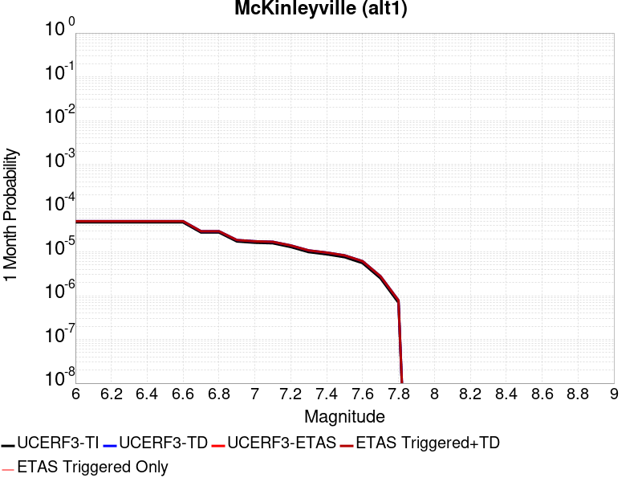 |  |  |

| Magnitude | 1 wk TI Prob | 1 wk TD Prob | 1 wk ETAS Prob | 1 wk ETAS/TD Gain | 1 wk ETAS Triggered+TD | 1 wk ETAS Triggered Only | 1 mo TI Prob | 1 mo TD Prob | 1 mo ETAS Prob | 1 mo ETAS/TD Gain | 1 mo ETAS Triggered+TD | 1 mo ETAS Triggered Only | 1 yr TI Prob | 1 yr TD Prob | 1 yr ETAS Prob | 1 yr ETAS/TD Gain | 1 yr ETAS Triggered+TD | 1 yr ETAS Triggered Only | 10 yr TI Prob | 10 yr TD Prob | 10 yr ETAS Prob | 10 yr ETAS/TD Gain | 10 yr ETAS Triggered+TD | 10 yr ETAS Triggered Only |
|-----|-----|-----|-----|-----|-----|-----|-----|-----|-----|-----|-----|-----|-----|-----|-----|-----|-----|-----|-----|-----|-----|-----|-----|-----|
| 6.0 | 1.1028524E-5 | 1.1729238E-5 | 0.0 | 0.0 | 1.1729238E-5 | 0.0 | 4.7264242E-5 | 5.0267343E-5 | 0.0 | 0.0 | 5.0267343E-5 | 0.0 | 5.7529024E-4 | 6.1185844E-4 | 4.0E-4 | 0.653746 | 6.1185844E-4 | 0.0 | 0.005738032 | 0.006104248 | 0.0072 | 1.1795064 | 0.0075950916 | 0.0015 |
| 6.1 | 1.1028524E-5 | 1.1729238E-5 | 0.0 | 0.0 | 1.1729238E-5 | 0.0 | 4.7264242E-5 | 5.0267343E-5 | 0.0 | 0.0 | 5.0267343E-5 | 0.0 | 5.7529024E-4 | 6.1185844E-4 | 4.0E-4 | 0.653746 | 6.1185844E-4 | 0.0 | 0.005738032 | 0.006104248 | 0.0072 | 1.1795064 | 0.0075950916 | 0.0015 |
| 6.2 | 1.1028524E-5 | 1.1729238E-5 | 0.0 | 0.0 | 1.1729238E-5 | 0.0 | 4.7264242E-5 | 5.0267343E-5 | 0.0 | 0.0 | 5.0267343E-5 | 0.0 | 5.7529024E-4 | 6.1185844E-4 | 4.0E-4 | 0.653746 | 6.1185844E-4 | 0.0 | 0.005738032 | 0.006104248 | 0.0072 | 1.1795064 | 0.0075950916 | 0.0015 |
| 6.3 | 1.1028524E-5 | 1.1729238E-5 | 0.0 | 0.0 | 1.1729238E-5 | 0.0 | 4.7264242E-5 | 5.0267343E-5 | 0.0 | 0.0 | 5.0267343E-5 | 0.0 | 5.7529024E-4 | 6.1185844E-4 | 4.0E-4 | 0.653746 | 6.1185844E-4 | 0.0 | 0.005738032 | 0.006104248 | 0.0072 | 1.1795064 | 0.0075950916 | 0.0015 |
| 6.4 | 1.1028524E-5 | 1.1729238E-5 | 0.0 | 0.0 | 1.1729238E-5 | 0.0 | 4.7264242E-5 | 5.0267343E-5 | 0.0 | 0.0 | 5.0267343E-5 | 0.0 | 5.7529024E-4 | 6.1185844E-4 | 4.0E-4 | 0.653746 | 6.1185844E-4 | 0.0 | 0.005738032 | 0.006104248 | 0.0072 | 1.1795064 | 0.0075950916 | 0.0015 |
| 6.5 | 1.1028524E-5 | 1.1729238E-5 | 0.0 | 0.0 | 1.1729238E-5 | 0.0 | 4.7264242E-5 | 5.0267343E-5 | 0.0 | 0.0 | 5.0267343E-5 | 0.0 | 5.7529024E-4 | 6.1185844E-4 | 4.0E-4 | 0.653746 | 6.1185844E-4 | 0.0 | 0.005738032 | 0.006104248 | 0.0072 | 1.1795064 | 0.0075950916 | 0.0015 |
| 6.6 | 1.1028524E-5 | 1.1729238E-5 | 0.0 | 0.0 | 1.1729238E-5 | 0.0 | 4.7264242E-5 | 5.0267343E-5 | 0.0 | 0.0 | 5.0267343E-5 | 0.0 | 5.7529024E-4 | 6.1185844E-4 | 4.0E-4 | 0.653746 | 6.1185844E-4 | 0.0 | 0.005738032 | 0.006104248 | 0.0072 | 1.1795064 | 0.0075950916 | 0.0015 |
| 6.7 | 6.483374E-6 | 6.9180064E-6 | 0.0 | 0.0 | 6.9180064E-6 | 0.0 | 2.7785592E-5 | 2.9648298E-5 | 0.0 | 0.0 | 2.9648298E-5 | 0.0 | 3.3823706E-4 | 3.6091445E-4 | 2.0E-4 | 0.55414796 | 3.6091445E-4 | 0.0 | 0.003377227 | 0.003603896 | 0.0035 | 0.97117126 | 0.0042017335 | 6.0E-4 |
| 6.8 | 6.483374E-6 | 6.9180064E-6 | 0.0 | 0.0 | 6.9180064E-6 | 0.0 | 2.7785592E-5 | 2.9648298E-5 | 0.0 | 0.0 | 2.9648298E-5 | 0.0 | 3.3823706E-4 | 3.6091445E-4 | 2.0E-4 | 0.55414796 | 3.6091445E-4 | 0.0 | 0.003377227 | 0.003603896 | 0.0035 | 0.97117126 | 0.0042017335 | 6.0E-4 |
| 6.9 | 4.0394048E-6 | 4.346E-6 | 0.0 | 0.0 | 4.346E-6 | 0.0 | 1.731162E-5 | 1.8625586E-5 | 0.0 | 0.0 | 1.8625586E-5 | 0.0 | 2.1074859E-4 | 2.2674345E-4 | 0.0 | 0.0 | 2.2674345E-4 | 0.0 | 0.0021054882 | 0.0022651758 | 0.0013 | 0.57390684 | 0.0024647228 | 2.0E-4 |
| 7.0 | 3.7791233E-6 | 4.0728296E-6 | 0.0 | 0.0 | 4.0728296E-6 | 0.0 | 1.6196142E-5 | 1.745487E-5 | 0.0 | 0.0 | 1.745487E-5 | 0.0 | 1.9717019E-4 | 2.1249281E-4 | 0.0 | 0.0 | 2.1249281E-4 | 0.0 | 0.0019699533 | 0.0021229463 | 0.0012 | 0.5652522 | 0.002222734 | 1.0E-4 |
| 7.1 | 3.675443E-6 | 3.9641195E-6 | 0.0 | 0.0 | 3.9641195E-6 | 0.0 | 1.5751802E-5 | 1.6988975E-5 | 0.0 | 0.0 | 1.6988975E-5 | 0.0 | 1.9176133E-4 | 2.0682164E-4 | 0.0 | 0.0 | 2.0682164E-4 | 0.0 | 0.0019159593 | 0.0020663412 | 0.0012 | 0.58073664 | 0.0021661345 | 1.0E-4 |
| 7.2 | 3.0165843E-6 | 3.2726525E-6 | 0.0 | 0.0 | 3.2726525E-6 | 0.0 | 1.2928153E-5 | 1.402558E-5 | 0.0 | 0.0 | 1.402558E-5 | 0.0 | 1.573889E-4 | 1.7074823E-4 | 0.0 | 0.0 | 1.7074823E-4 | 0.0 | 0.0015727748 | 0.0017061892 | 8.0E-4 | 0.46888116 | 0.0017061892 | 0.0 |
| 7.3 | 2.307633E-6 | 2.519374E-6 | 0.0 | 0.0 | 2.519374E-6 | 0.0 | 9.889818E-6 | 1.0797273E-5 | 0.0 | 0.0 | 1.0797273E-5 | 0.0 | 1.2040188E-4 | 1.3144895E-4 | 0.0 | 0.0 | 1.3144895E-4 | 0.0 | 0.0012033667 | 0.0013137204 | 8.0E-4 | 0.6089576 | 0.0013137204 | 0.0 |
| 7.4 | 2.0568484E-6 | 2.252148E-6 | 0.0 | 0.0 | 2.252148E-6 | 0.0 | 8.8150355E-6 | 9.652028E-6 | 0.0 | 0.0 | 9.652028E-6 | 0.0 | 1.0731777E-4 | 1.17507174E-4 | 0.0 | 0.0 | 1.17507174E-4 | 0.0 | 0.0010726595 | 0.0011744581 | 8.0E-4 | 0.6811652 | 0.0011744581 | 0.0 |
| 7.5 | 1.7674889E-6 | 1.9418057E-6 | 0.0 | 0.0 | 1.9418057E-6 | 0.0 | 7.5749304E-6 | 8.321998E-6 | 0.0 | 0.0 | 8.321998E-6 | 0.0 | 9.222087E-5 | 1.0131569E-4 | 0.0 | 0.0 | 1.0131569E-4 | 0.0 | 9.218261E-4 | 0.0010127017 | 8.0E-4 | 0.78996617 | 0.0010127017 | 0.0 |
| 7.6 | 1.2944297E-6 | 1.4299355E-6 | 0.0 | 0.0 | 1.4299355E-6 | 0.0 | 5.547544E-6 | 6.1282813E-6 | 0.0 | 0.0 | 6.1282813E-6 | 0.0 | 6.753925E-5 | 7.4609314E-5 | 0.0 | 0.0 | 7.4609314E-5 | 0.0 | 6.7518733E-4 | 7.4584753E-4 | 7.0E-4 | 0.9385297 | 7.4584753E-4 | 0.0 |
| 7.7 | 5.806243E-7 | 6.462457E-7 | 0.0 | 0.0 | 6.462457E-7 | 0.0 | 2.4883875E-6 | 2.7696217E-6 | 0.0 | 0.0 | 2.7696217E-6 | 0.0 | 3.0295698E-5 | 3.371964E-5 | 0.0 | 0.0 | 3.371964E-5 | 0.0 | 3.0291567E-4 | 3.371469E-4 | 1.0E-4 | 0.2966066 | 3.371469E-4 | 0.0 |
| 7.8 | 1.6121008E-7 | 1.8188115E-7 | 0.0 | 0.0 | 1.8188115E-7 | 0.0 | 6.909002E-7 | 7.7949045E-7 | 0.0 | 0.0 | 7.7949045E-7 | 0.0 | 8.411677E-6 | 9.490257E-6 | 0.0 | 0.0 | 9.490257E-6 | 0.0 | 8.411359E-5 | 9.4898765E-5 | 0.0 | 0.0 | 9.4898765E-5 | 0.0 |

## Channel Islands Thrust
*[(top)](#table-of-contents)*

| 1 Week | 1 Month | 1 Year | 10 Year |
|-----|-----|-----|-----|
|  |  |  | 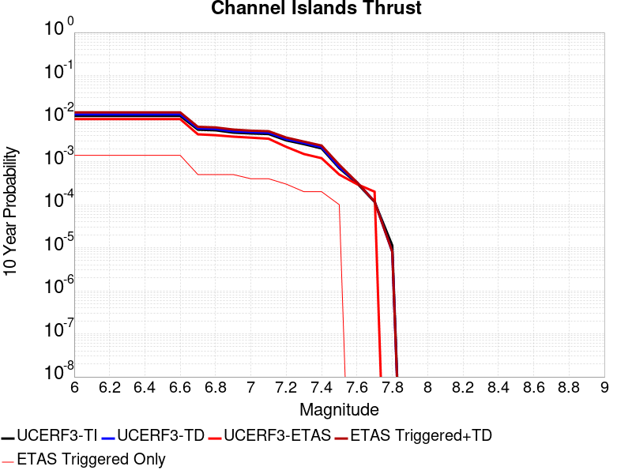 |

| Magnitude | 1 wk TI Prob | 1 wk TD Prob | 1 wk ETAS Prob | 1 wk ETAS/TD Gain | 1 wk ETAS Triggered+TD | 1 wk ETAS Triggered Only | 1 mo TI Prob | 1 mo TD Prob | 1 mo ETAS Prob | 1 mo ETAS/TD Gain | 1 mo ETAS Triggered+TD | 1 mo ETAS Triggered Only | 1 yr TI Prob | 1 yr TD Prob | 1 yr ETAS Prob | 1 yr ETAS/TD Gain | 1 yr ETAS Triggered+TD | 1 yr ETAS Triggered Only | 10 yr TI Prob | 10 yr TD Prob | 10 yr ETAS Prob | 10 yr ETAS/TD Gain | 10 yr ETAS Triggered+TD | 10 yr ETAS Triggered Only |
|-----|-----|-----|-----|-----|-----|-----|-----|-----|-----|-----|-----|-----|-----|-----|-----|-----|-----|-----|-----|-----|-----|-----|-----|-----|
| 6.0 | 2.2156251E-5 | 2.4096227E-5 | 0.0 | 0.0 | 2.4096227E-5 | 0.0 | 9.495191E-5 | 1.0326606E-4 | 1.0E-4 | 0.96837234 | 2.0325574E-4 | 1.0E-4 | 0.0011554264 | 0.0012566458 | 0.001 | 0.7957692 | 0.0013565201 | 1.0E-4 | 0.011494373 | 0.012505992 | 0.0097 | 0.77562815 | 0.013888484 | 0.0014 |
| 6.1 | 2.2156251E-5 | 2.4096227E-5 | 0.0 | 0.0 | 2.4096227E-5 | 0.0 | 9.495191E-5 | 1.0326606E-4 | 1.0E-4 | 0.96837234 | 2.0325574E-4 | 1.0E-4 | 0.0011554264 | 0.0012566458 | 0.001 | 0.7957692 | 0.0013565201 | 1.0E-4 | 0.011494373 | 0.012505992 | 0.0097 | 0.77562815 | 0.013888484 | 0.0014 |
| 6.2 | 2.2156251E-5 | 2.4096227E-5 | 0.0 | 0.0 | 2.4096227E-5 | 0.0 | 9.495191E-5 | 1.0326606E-4 | 1.0E-4 | 0.96837234 | 2.0325574E-4 | 1.0E-4 | 0.0011554264 | 0.0012566458 | 0.001 | 0.7957692 | 0.0013565201 | 1.0E-4 | 0.011494373 | 0.012505992 | 0.0097 | 0.77562815 | 0.013888484 | 0.0014 |
| 6.3 | 2.2156251E-5 | 2.4096227E-5 | 0.0 | 0.0 | 2.4096227E-5 | 0.0 | 9.495191E-5 | 1.0326606E-4 | 1.0E-4 | 0.96837234 | 2.0325574E-4 | 1.0E-4 | 0.0011554264 | 0.0012566458 | 0.001 | 0.7957692 | 0.0013565201 | 1.0E-4 | 0.011494373 | 0.012505992 | 0.0097 | 0.77562815 | 0.013888484 | 0.0014 |
| 6.4 | 2.2156251E-5 | 2.4096227E-5 | 0.0 | 0.0 | 2.4096227E-5 | 0.0 | 9.495191E-5 | 1.0326606E-4 | 1.0E-4 | 0.96837234 | 2.0325574E-4 | 1.0E-4 | 0.0011554264 | 0.0012566458 | 0.001 | 0.7957692 | 0.0013565201 | 1.0E-4 | 0.011494373 | 0.012505992 | 0.0097 | 0.77562815 | 0.013888484 | 0.0014 |
| 6.5 | 2.2156251E-5 | 2.4096227E-5 | 0.0 | 0.0 | 2.4096227E-5 | 0.0 | 9.495191E-5 | 1.0326606E-4 | 1.0E-4 | 0.96837234 | 2.0325574E-4 | 1.0E-4 | 0.0011554264 | 0.0012566458 | 0.001 | 0.7957692 | 0.0013565201 | 1.0E-4 | 0.011494373 | 0.012505992 | 0.0097 | 0.77562815 | 0.013888484 | 0.0014 |
| 6.6 | 2.2156251E-5 | 2.4096227E-5 | 0.0 | 0.0 | 2.4096227E-5 | 0.0 | 9.495191E-5 | 1.0326606E-4 | 1.0E-4 | 0.96837234 | 2.0325574E-4 | 1.0E-4 | 0.0011554264 | 0.0012566458 | 0.001 | 0.7957692 | 0.0013565201 | 1.0E-4 | 0.011494373 | 0.012505992 | 0.0097 | 0.77562815 | 0.013888484 | 0.0014 |
| 6.7 | 1.0601296E-5 | 1.1381223E-5 | 0.0 | 0.0 | 1.1381223E-5 | 0.0 | 4.5433335E-5 | 4.8775786E-5 | 1.0E-4 | 2.0501976 | 1.4877091E-4 | 1.0E-4 | 5.5301044E-4 | 5.936883E-4 | 4.0E-4 | 0.6737542 | 6.936289E-4 | 1.0E-4 | 0.005516363 | 0.0059215245 | 0.0043 | 0.72616434 | 0.006418564 | 5.0E-4 |
| 6.8 | 1.0246747E-5 | 1.09982875E-5 | 0.0 | 0.0 | 1.09982875E-5 | 0.0 | 4.391389E-5 | 4.7134694E-5 | 1.0E-4 | 2.1215794 | 1.4712998E-4 | 1.0E-4 | 5.345204E-4 | 5.737186E-4 | 4.0E-4 | 0.6972059 | 6.7366124E-4 | 1.0E-4 | 0.0053323656 | 0.005722865 | 0.0041 | 0.7164244 | 0.0062200036 | 5.0E-4 |
| 6.9 | 9.049551E-6 | 9.701049E-6 | 0.0 | 0.0 | 9.701049E-6 | 0.0 | 3.878322E-5 | 4.1575284E-5 | 1.0E-4 | 2.4052753 | 1.4157113E-4 | 1.0E-4 | 4.7208337E-4 | 5.060656E-4 | 3.0E-4 | 0.5928085 | 6.0601503E-4 | 1.0E-4 | 0.0047108172 | 0.0050495495 | 0.0038 | 0.7525424 | 0.005547025 | 5.0E-4 |
| 7.0 | 8.6542195E-6 | 9.275944E-6 | 0.0 | 0.0 | 9.275944E-6 | 0.0 | 3.7088983E-5 | 3.9753464E-5 | 1.0E-4 | 2.5155041 | 1.3974949E-4 | 1.0E-4 | 4.5146482E-4 | 4.83895E-4 | 3.0E-4 | 0.6199692 | 5.838466E-4 | 1.0E-4 | 0.004505487 | 0.0048288256 | 0.0036 | 0.7455229 | 0.0052268943 | 4.0E-4 |
| 7.1 | 8.391028E-6 | 8.994227E-6 | 0.0 | 0.0 | 8.994227E-6 | 0.0 | 3.5961057E-5 | 3.854614E-5 | 1.0E-4 | 2.5942936 | 1.3854228E-4 | 1.0E-4 | 4.3773788E-4 | 4.6920226E-4 | 3.0E-4 | 0.63938314 | 5.691553E-4 | 1.0E-4 | 0.004368766 | 0.0046825265 | 0.0034 | 0.7261037 | 0.0050806534 | 4.0E-4 |
| 7.2 | 5.965188E-6 | 6.3725774E-6 | 0.0 | 0.0 | 6.3725774E-6 | 0.0 | 2.556484E-5 | 2.7310763E-5 | 1.0E-4 | 3.66156 | 1.2730803E-4 | 1.0E-4 | 3.1120746E-4 | 3.3245835E-4 | 2.0E-4 | 0.60157907 | 4.3242512E-4 | 1.0E-4 | 0.00310772 | 0.0033196681 | 0.0022 | 0.66271687 | 0.0036186723 | 3.0E-4 |
| 7.3 | 4.877518E-6 | 5.2067226E-6 | 0.0 | 0.0 | 5.2067226E-6 | 0.0 | 2.0903482E-5 | 2.2314338E-5 | 0.0 | 0.0 | 2.2314338E-5 | 0.0 | 2.5447016E-4 | 2.7164363E-4 | 1.0E-4 | 0.36812937 | 2.7164363E-4 | 0.0 | 0.0025417898 | 0.0027131622 | 0.0015 | 0.55286044 | 0.0029126196 | 2.0E-4 |
| 7.4 | 3.8829853E-6 | 4.142431E-6 | 0.0 | 0.0 | 4.142431E-6 | 0.0 | 1.664126E-5 | 1.7753156E-5 | 0.0 | 0.0 | 1.7753156E-5 | 0.0 | 2.0258849E-4 | 2.1612366E-4 | 1.0E-4 | 0.46269804 | 2.1612366E-4 | 0.0 | 0.002024039 | 0.0021591766 | 0.0012 | 0.5557674 | 0.0023587449 | 2.0E-4 |
| 7.5 | 1.3489616E-6 | 1.4279756E-6 | 0.0 | 0.0 | 1.4279756E-6 | 0.0 | 5.7812517E-6 | 6.119881E-6 | 0.0 | 0.0 | 6.119881E-6 | 0.0 | 7.038446E-5 | 7.450704E-5 | 0.0 | 0.0 | 7.450704E-5 | 0.0 | 7.036218E-4 | 7.448246E-4 | 5.0E-4 | 0.671299 | 8.4475015E-4 | 1.0E-4 |
| 7.6 | 6.058192E-7 | 6.354584E-7 | 0.0 | 0.0 | 6.354584E-7 | 0.0 | 2.5963652E-6 | 2.7233903E-6 | 0.0 | 0.0 | 2.7233903E-6 | 0.0 | 3.161029E-5 | 3.315679E-5 | 0.0 | 0.0 | 3.315679E-5 | 0.0 | 3.1605794E-4 | 3.3152004E-4 | 3.0E-4 | 0.90492266 | 3.3152004E-4 | 0.0 |
| 7.7 | 2.2170494E-7 | 2.2610543E-7 | 0.0 | 0.0 | 2.2610543E-7 | 0.0 | 9.5016367E-7 | 9.69023E-7 | 0.0 | 0.0 | 9.69023E-7 | 0.0 | 1.1568181E-5 | 1.17978025E-5 | 0.0 | 0.0 | 1.17978025E-5 | 0.0 | 1.1567579E-4 | 1.1797287E-4 | 2.0E-4 | 1.6953051 | 1.1797287E-4 | 0.0 |
| 7.8 | 2.1613102E-8 | 1.546824E-8 | 0.0 | 0.0 | 1.546824E-8 | 0.0 | 9.262757E-8 | 6.629245E-8 | 0.0 | 0.0 | 6.629245E-8 | 0.0 | 1.1277401E-6 | 8.071104E-7 | 0.0 | 0.0 | 8.071104E-7 | 0.0 | 1.1277344E-5 | 8.071082E-6 | 0.0 | 0.0 | 8.071082E-6 | 0.0 |

## Great Valley 04a Trout Creek
*[(top)](#table-of-contents)*

| 1 Week | 1 Month | 1 Year | 10 Year |
|-----|-----|-----|-----|
|  |  |  |  |

| Magnitude | 1 wk TI Prob | 1 wk TD Prob | 1 wk ETAS Prob | 1 wk ETAS/TD Gain | 1 wk ETAS Triggered+TD | 1 wk ETAS Triggered Only | 1 mo TI Prob | 1 mo TD Prob | 1 mo ETAS Prob | 1 mo ETAS/TD Gain | 1 mo ETAS Triggered+TD | 1 mo ETAS Triggered Only | 1 yr TI Prob | 1 yr TD Prob | 1 yr ETAS Prob | 1 yr ETAS/TD Gain | 1 yr ETAS Triggered+TD | 1 yr ETAS Triggered Only | 10 yr TI Prob | 10 yr TD Prob | 10 yr ETAS Prob | 10 yr ETAS/TD Gain | 10 yr ETAS Triggered+TD | 10 yr ETAS Triggered Only |
|-----|-----|-----|-----|-----|-----|-----|-----|-----|-----|-----|-----|-----|-----|-----|-----|-----|-----|-----|-----|-----|-----|-----|-----|-----|
| 6.0 | 1.4088538E-5 | 1.5723168E-5 | 0.0 | 0.0 | 1.5723168E-5 | 0.0 | 6.037805E-5 | 6.7383335E-5 | 0.0 | 0.0 | 6.7383335E-5 | 0.0 | 7.3485484E-4 | 8.200958E-4 | 3.0E-4 | 0.36581093 | 9.200138E-4 | 1.0E-4 | 0.007324295 | 0.008171979 | 0.0057 | 0.6975055 | 0.009659721 | 0.0015 |
| 6.1 | 1.4088538E-5 | 1.5723168E-5 | 0.0 | 0.0 | 1.5723168E-5 | 0.0 | 6.037805E-5 | 6.7383335E-5 | 0.0 | 0.0 | 6.7383335E-5 | 0.0 | 7.3485484E-4 | 8.200958E-4 | 3.0E-4 | 0.36581093 | 9.200138E-4 | 1.0E-4 | 0.007324295 | 0.008171979 | 0.0057 | 0.6975055 | 0.009659721 | 0.0015 |
| 6.2 | 1.4088538E-5 | 1.5723168E-5 | 0.0 | 0.0 | 1.5723168E-5 | 0.0 | 6.037805E-5 | 6.7383335E-5 | 0.0 | 0.0 | 6.7383335E-5 | 0.0 | 7.3485484E-4 | 8.200958E-4 | 3.0E-4 | 0.36581093 | 9.200138E-4 | 1.0E-4 | 0.007324295 | 0.008171979 | 0.0057 | 0.6975055 | 0.009659721 | 0.0015 |
| 6.3 | 1.2882862E-5 | 1.4381918E-5 | 0.0 | 0.0 | 1.4381918E-5 | 0.0 | 5.5211098E-5 | 6.1635394E-5 | 0.0 | 0.0 | 6.1635394E-5 | 0.0 | 6.7198783E-4 | 7.5016293E-4 | 3.0E-4 | 0.3999131 | 8.500879E-4 | 1.0E-4 | 0.0066995937 | 0.0074773706 | 0.0054 | 0.722179 | 0.008966154 | 0.0015 |
| 6.4 | 1.2882862E-5 | 1.4381918E-5 | 0.0 | 0.0 | 1.4381918E-5 | 0.0 | 5.5211098E-5 | 6.1635394E-5 | 0.0 | 0.0 | 6.1635394E-5 | 0.0 | 6.7198783E-4 | 7.5016293E-4 | 3.0E-4 | 0.3999131 | 8.500879E-4 | 1.0E-4 | 0.0066995937 | 0.0074773706 | 0.0054 | 0.722179 | 0.008966154 | 0.0015 |
| 6.5 | 1.2762329E-5 | 1.4248447E-5 | 0.0 | 0.0 | 1.4248447E-5 | 0.0 | 5.469455E-5 | 6.10634E-5 | 0.0 | 0.0 | 6.10634E-5 | 0.0 | 6.657027E-4 | 7.432037E-4 | 3.0E-4 | 0.40365785 | 8.4312935E-4 | 1.0E-4 | 0.00663712 | 0.007408242 | 0.0054 | 0.7289179 | 0.008897129 | 0.0015 |
| 6.6 | 1.2762329E-5 | 1.4248447E-5 | 0.0 | 0.0 | 1.4248447E-5 | 0.0 | 5.469455E-5 | 6.10634E-5 | 0.0 | 0.0 | 6.10634E-5 | 0.0 | 6.657027E-4 | 7.432037E-4 | 3.0E-4 | 0.40365785 | 8.4312935E-4 | 1.0E-4 | 0.00663712 | 0.007408242 | 0.0054 | 0.7289179 | 0.008897129 | 0.0015 |
| 6.7 | 1.2557959E-5 | 1.4022635E-5 | 0.0 | 0.0 | 1.4022635E-5 | 0.0 | 5.3818712E-5 | 6.009568E-5 | 0.0 | 0.0 | 6.009568E-5 | 0.0 | 6.5504585E-4 | 7.3142967E-4 | 3.0E-4 | 0.41015565 | 8.313565E-4 | 1.0E-4 | 0.006531183 | 0.0072912774 | 0.0053 | 0.726896 | 0.008780341 | 0.0015 |
| 6.8 | 1.1871544E-5 | 1.3261901E-5 | 0.0 | 0.0 | 1.3261901E-5 | 0.0 | 5.0877054E-5 | 5.6835535E-5 | 0.0 | 0.0 | 5.6835535E-5 | 0.0 | 6.1925204E-4 | 6.9176295E-4 | 3.0E-4 | 0.43367457 | 7.916938E-4 | 1.0E-4 | 0.0061752927 | 0.0068971138 | 0.0051 | 0.7394397 | 0.008287458 | 0.0014 |
| 6.9 | 1.0500373E-5 | 1.1733992E-5 | 0.0 | 0.0 | 1.1733992E-5 | 0.0 | 4.5000823E-5 | 5.0287617E-5 | 0.0 | 0.0 | 5.0287617E-5 | 0.0 | 5.4774724E-4 | 6.1208836E-4 | 2.0E-4 | 0.32675022 | 6.1208836E-4 | 0.0 | 0.005463991 | 0.006104891 | 0.0045 | 0.7371139 | 0.0071981754 | 0.0011 |
| 7.0 | 8.524332E-6 | 9.535725E-6 | 0.0 | 0.0 | 9.535725E-6 | 0.0 | 3.653234E-5 | 4.08668E-5 | 0.0 | 0.0 | 4.08668E-5 | 0.0 | 4.4469046E-4 | 4.9744704E-4 | 1.0E-4 | 0.20102644 | 4.9744704E-4 | 0.0 | 0.0044380166 | 0.0049640667 | 0.0038 | 0.7655014 | 0.0057600955 | 8.0E-4 |
| 7.1 | 6.006849E-6 | 6.713124E-6 | 0.0 | 0.0 | 6.713124E-6 | 0.0 | 2.5743384E-5 | 2.8770246E-5 | 0.0 | 0.0 | 2.8770246E-5 | 0.0 | 3.1338062E-4 | 3.5022703E-4 | 0.0 | 0.0 | 3.5022703E-4 | 0.0 | 0.0031293905 | 0.0034973016 | 0.0029 | 0.82921076 | 0.0041948534 | 7.0E-4 |
| 7.2 | 2.9122193E-6 | 3.2472722E-6 | 0.0 | 0.0 | 3.2472722E-6 | 0.0 | 1.248088E-5 | 1.3916816E-5 | 0.0 | 0.0 | 1.3916816E-5 | 0.0 | 1.5194413E-4 | 1.6942581E-4 | 0.0 | 0.0 | 1.6942581E-4 | 0.0 | 0.0015184027 | 0.0016931385 | 0.0014 | 0.8268668 | 0.0020924613 | 4.0E-4 |
| 7.3 | 7.2194007E-7 | 7.990465E-7 | 0.0 | 0.0 | 7.990465E-7 | 0.0 | 3.0940253E-6 | 3.4244833E-6 | 0.0 | 0.0 | 3.4244833E-6 | 0.0 | 3.7669106E-5 | 4.1692743E-5 | 0.0 | 0.0 | 4.1692743E-5 | 0.0 | 3.766272E-4 | 4.168942E-4 | 3.0E-4 | 0.719607 | 5.1685254E-4 | 1.0E-4 |
| 7.4 | 3.112171E-8 | 3.2070304E-8 | 0.0 | 0.0 | 3.2070304E-8 | 0.0 | 1.3337875E-7 | 1.3744415E-7 | 0.0 | 0.0 | 1.3744415E-7 | 0.0 | 1.6238852E-6 | 1.6733812E-6 | 0.0 | 0.0 | 1.6733812E-6 | 0.0 | 1.6238733E-5 | 1.6733695E-5 | 0.0 | 0.0 | 1.6733695E-5 | 0.0 |

## Raymond
*[(top)](#table-of-contents)*

| 1 Week | 1 Month | 1 Year | 10 Year |
|-----|-----|-----|-----|
|  |  |  | 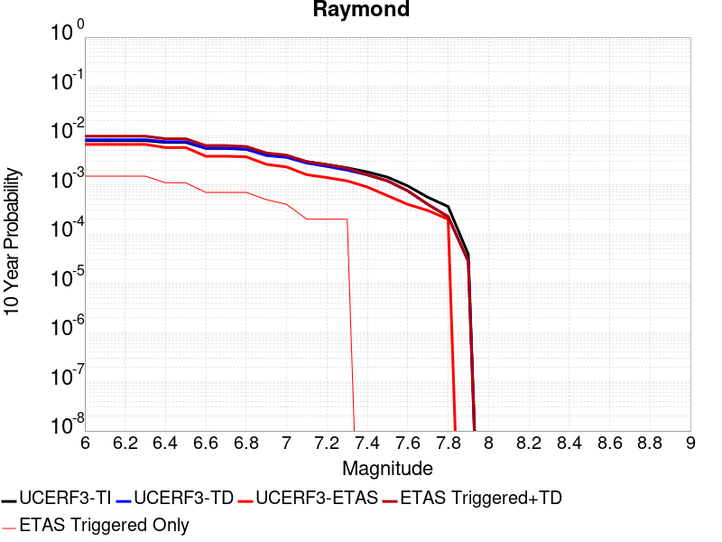 |

| Magnitude | 1 wk TI Prob | 1 wk TD Prob | 1 wk ETAS Prob | 1 wk ETAS/TD Gain | 1 wk ETAS Triggered+TD | 1 wk ETAS Triggered Only | 1 mo TI Prob | 1 mo TD Prob | 1 mo ETAS Prob | 1 mo ETAS/TD Gain | 1 mo ETAS Triggered+TD | 1 mo ETAS Triggered Only | 1 yr TI Prob | 1 yr TD Prob | 1 yr ETAS Prob | 1 yr ETAS/TD Gain | 1 yr ETAS Triggered+TD | 1 yr ETAS Triggered Only | 10 yr TI Prob | 10 yr TD Prob | 10 yr ETAS Prob | 10 yr ETAS/TD Gain | 10 yr ETAS Triggered+TD | 10 yr ETAS Triggered Only |
|-----|-----|-----|-----|-----|-----|-----|-----|-----|-----|-----|-----|-----|-----|-----|-----|-----|-----|-----|-----|-----|-----|-----|-----|-----|
| 6.0 | 1.5157413E-5 | 1.5813765E-5 | 0.0 | 0.0 | 1.5813765E-5 | 0.0 | 6.4958724E-5 | 6.777166E-5 | 1.0E-4 | 1.475543 | 6.777166E-5 | 0.0 | 7.905855E-4 | 8.248327E-4 | 9.0E-4 | 1.0911304 | 9.247502E-4 | 1.0E-4 | 0.007877788 | 0.008220209 | 0.0066 | 0.8028993 | 0.009707879 | 0.0015 |
| 6.1 | 1.5157413E-5 | 1.5813765E-5 | 0.0 | 0.0 | 1.5813765E-5 | 0.0 | 6.4958724E-5 | 6.777166E-5 | 1.0E-4 | 1.475543 | 6.777166E-5 | 0.0 | 7.905855E-4 | 8.248327E-4 | 9.0E-4 | 1.0911304 | 9.247502E-4 | 1.0E-4 | 0.007877788 | 0.008220209 | 0.0066 | 0.8028993 | 0.009707879 | 0.0015 |
| 6.2 | 1.5157413E-5 | 1.5813765E-5 | 0.0 | 0.0 | 1.5813765E-5 | 0.0 | 6.4958724E-5 | 6.777166E-5 | 1.0E-4 | 1.475543 | 6.777166E-5 | 0.0 | 7.905855E-4 | 8.248327E-4 | 9.0E-4 | 1.0911304 | 9.247502E-4 | 1.0E-4 | 0.007877788 | 0.008220209 | 0.0066 | 0.8028993 | 0.009707879 | 0.0015 |
| 6.3 | 1.5157413E-5 | 1.5813765E-5 | 0.0 | 0.0 | 1.5813765E-5 | 0.0 | 6.4958724E-5 | 6.777166E-5 | 1.0E-4 | 1.475543 | 6.777166E-5 | 0.0 | 7.905855E-4 | 8.248327E-4 | 9.0E-4 | 1.0911304 | 9.247502E-4 | 1.0E-4 | 0.007877788 | 0.008220209 | 0.0066 | 0.8028993 | 0.009707879 | 0.0015 |
| 6.4 | 1.3941944E-5 | 1.4458018E-5 | 0.0 | 0.0 | 1.4458018E-5 | 0.0 | 5.9749822E-5 | 6.19616E-5 | 1.0E-4 | 1.6139029 | 6.19616E-5 | 0.0 | 7.2721124E-4 | 7.541446E-4 | 9.0E-4 | 1.193405 | 8.5406925E-4 | 1.0E-4 | 0.007248361 | 0.0075181667 | 0.0057 | 0.7581636 | 0.0086098965 | 0.0011 |
| 6.5 | 1.3941944E-5 | 1.4458018E-5 | 0.0 | 0.0 | 1.4458018E-5 | 0.0 | 5.9749822E-5 | 6.19616E-5 | 1.0E-4 | 1.6139029 | 6.19616E-5 | 0.0 | 7.2721124E-4 | 7.541446E-4 | 9.0E-4 | 1.193405 | 8.5406925E-4 | 1.0E-4 | 0.007248361 | 0.0075181667 | 0.0057 | 0.7581636 | 0.0086098965 | 0.0011 |
| 6.6 | 1.0542609E-5 | 1.0673592E-5 | 0.0 | 0.0 | 1.0673592E-5 | 0.0 | 4.5181827E-5 | 4.5743196E-5 | 1.0E-4 | 2.1861176 | 4.5743196E-5 | 0.0 | 5.499499E-4 | 5.5678654E-4 | 7.0E-4 | 1.2572143 | 6.5673084E-4 | 1.0E-4 | 0.005485909 | 0.0055544544 | 0.0038 | 0.6841356 | 0.0062505663 | 7.0E-4 |
| 6.7 | 1.0542609E-5 | 1.0673592E-5 | 0.0 | 0.0 | 1.0673592E-5 | 0.0 | 4.5181827E-5 | 4.5743196E-5 | 1.0E-4 | 2.1861176 | 4.5743196E-5 | 0.0 | 5.499499E-4 | 5.5678654E-4 | 7.0E-4 | 1.2572143 | 6.5673084E-4 | 1.0E-4 | 0.005485909 | 0.0055544544 | 0.0038 | 0.6841356 | 0.0062505663 | 7.0E-4 |
| 6.8 | 1.0079132E-5 | 1.0179058E-5 | 0.0 | 0.0 | 1.0179058E-5 | 0.0 | 4.3195567E-5 | 4.3623837E-5 | 1.0E-4 | 2.2923248 | 4.3623837E-5 | 0.0 | 5.257791E-4 | 5.309961E-4 | 7.0E-4 | 1.318277 | 6.3094305E-4 | 1.0E-4 | 0.0052453685 | 0.005297801 | 0.0037 | 0.698403 | 0.0059940927 | 7.0E-4 |
| 6.9 | 7.721598E-6 | 7.5507132E-6 | 0.0 | 0.0 | 7.5507132E-6 | 0.0 | 3.3092143E-5 | 3.2359803E-5 | 1.0E-4 | 3.0902536 | 3.2359803E-5 | 0.0 | 4.0282236E-4 | 3.9391062E-4 | 5.0E-4 | 1.2693235 | 4.938712E-4 | 1.0E-4 | 0.0040209293 | 0.0039322353 | 0.0026 | 0.66120154 | 0.004430269 | 5.0E-4 |
| 7.0 | 7.137566E-6 | 6.9129974E-6 | 0.0 | 0.0 | 6.9129974E-6 | 0.0 | 3.058921E-5 | 2.96268E-5 | 0.0 | 0.0 | 2.96268E-5 | 0.0 | 3.7236E-4 | 3.6064768E-4 | 3.0E-4 | 0.83183676 | 3.6064768E-4 | 0.0 | 0.0037173668 | 0.0036007199 | 0.0023 | 0.63876116 | 0.0039992793 | 4.0E-4 |
| 7.1 | 5.654976E-6 | 5.300952E-6 | 0.0 | 0.0 | 5.300952E-6 | 0.0 | 2.4235387E-5 | 2.271817E-5 | 0.0 | 0.0 | 2.271817E-5 | 0.0 | 2.9502588E-4 | 2.7655883E-4 | 2.0E-4 | 0.72317344 | 2.7655883E-4 | 0.0 | 0.0029463451 | 0.0027621551 | 0.0016 | 0.57925785 | 0.0029616028 | 2.0E-4 |
| 7.2 | 4.9358455E-6 | 4.5279417E-6 | 0.0 | 0.0 | 4.5279417E-6 | 0.0 | 2.1153453E-5 | 1.9405321E-5 | 0.0 | 0.0 | 1.9405321E-5 | 0.0 | 2.5751285E-4 | 2.362343E-4 | 2.0E-4 | 0.8466171 | 2.362343E-4 | 0.0 | 0.0025721465 | 0.0023598315 | 0.0014 | 0.59326273 | 0.0025593594 | 2.0E-4 |
| 7.3 | 4.2368597E-6 | 3.806791E-6 | 0.0 | 0.0 | 3.806791E-6 | 0.0 | 1.8157843E-5 | 1.6314718E-5 | 0.0 | 0.0 | 1.6314718E-5 | 0.0 | 2.2104931E-4 | 1.9861368E-4 | 2.0E-4 | 1.00698 | 1.9861368E-4 | 0.0 | 0.0022082955 | 0.0019843578 | 0.0012 | 0.6047296 | 0.002183961 | 2.0E-4 |
| 7.4 | 3.4999923E-6 | 3.0447845E-6 | 0.0 | 0.0 | 3.0447845E-6 | 0.0 | 1.49998805E-5 | 1.3049012E-5 | 0.0 | 0.0 | 1.3049012E-5 | 0.0 | 1.8260824E-4 | 1.5886022E-4 | 2.0E-4 | 1.2589685 | 1.5886022E-4 | 0.0 | 0.0018245826 | 0.0015874597 | 9.0E-4 | 0.5669435 | 0.0015874597 | 0.0 |
| 7.5 | 2.738017E-6 | 2.3028326E-6 | 0.0 | 0.0 | 2.3028326E-6 | 0.0 | 1.1734306E-5 | 9.869246E-6 | 0.0 | 0.0 | 9.869246E-6 | 0.0 | 1.428558E-4 | 1.2015151E-4 | 2.0E-4 | 1.664565 | 1.2015151E-4 | 0.0 | 0.0014276401 | 0.0012008573 | 6.0E-4 | 0.49964306 | 0.0012008573 | 0.0 |
| 7.6 | 1.8186392E-6 | 1.4428148E-6 | 0.0 | 0.0 | 1.4428148E-6 | 0.0 | 7.794145E-6 | 6.183477E-6 | 0.0 | 0.0 | 6.183477E-6 | 0.0 | 9.488958E-5 | 7.528128E-5 | 1.0E-4 | 1.3283515 | 7.528128E-5 | 0.0 | 9.4849075E-4 | 7.5254665E-4 | 4.0E-4 | 0.5315285 | 7.5254665E-4 | 0.0 |
| 7.7 | 1.0660348E-6 | 7.6475527E-7 | 0.0 | 0.0 | 7.6475527E-7 | 0.0 | 4.5687125E-6 | 3.2775185E-6 | 0.0 | 0.0 | 3.2775185E-6 | 0.0 | 5.5622655E-5 | 3.9903076E-5 | 1.0E-4 | 2.5060725 | 3.9903076E-5 | 0.0 | 5.5608735E-4 | 3.9894562E-4 | 3.0E-4 | 0.7519822 | 3.9894562E-4 | 0.0 |
| 7.8 | 6.913602E-7 | 4.3235585E-7 | 0.0 | 0.0 | 4.3235585E-7 | 0.0 | 2.962969E-6 | 1.8529523E-6 | 0.0 | 0.0 | 1.8529523E-6 | 0.0 | 3.607355E-5 | 2.2559467E-5 | 1.0E-4 | 4.432729 | 2.2559467E-5 | 0.0 | 3.6067693E-4 | 2.2555719E-4 | 2.0E-4 | 0.8866931 | 2.2555719E-4 | 0.0 |
| 7.9 | 7.425201E-8 | 5.3241354E-8 | 0.0 | 0.0 | 5.3241354E-8 | 0.0 | 3.1822285E-7 | 2.2817721E-7 | 0.0 | 0.0 | 2.2817721E-7 | 0.0 | 3.874356E-6 | 2.7780554E-6 | 0.0 | 0.0 | 2.7780554E-6 | 0.0 | 3.8742884E-5 | 2.7780337E-5 | 0.0 | 0.0 | 2.7780337E-5 | 0.0 |

## Towne Pass
*[(top)](#table-of-contents)*

| 1 Week | 1 Month | 1 Year | 10 Year |
|-----|-----|-----|-----|
|  |  | 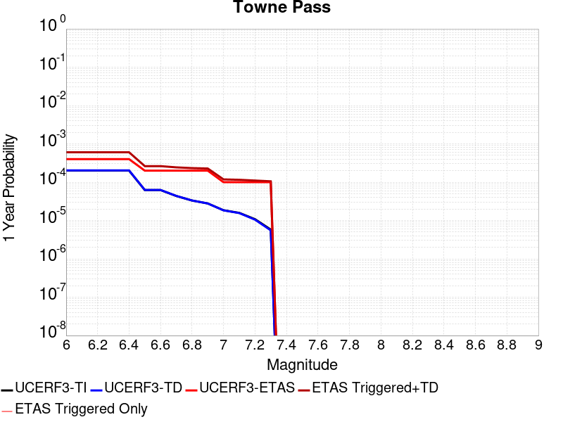 |  |

| Magnitude | 1 wk TI Prob | 1 wk TD Prob | 1 wk ETAS Prob | 1 wk ETAS/TD Gain | 1 wk ETAS Triggered+TD | 1 wk ETAS Triggered Only | 1 mo TI Prob | 1 mo TD Prob | 1 mo ETAS Prob | 1 mo ETAS/TD Gain | 1 mo ETAS Triggered+TD | 1 mo ETAS Triggered Only | 1 yr TI Prob | 1 yr TD Prob | 1 yr ETAS Prob | 1 yr ETAS/TD Gain | 1 yr ETAS Triggered+TD | 1 yr ETAS Triggered Only | 10 yr TI Prob | 10 yr TD Prob | 10 yr ETAS Prob | 10 yr ETAS/TD Gain | 10 yr ETAS Triggered+TD | 10 yr ETAS Triggered Only |
|-----|-----|-----|-----|-----|-----|-----|-----|-----|-----|-----|-----|-----|-----|-----|-----|-----|-----|-----|-----|-----|-----|-----|-----|-----|
| 6.0 | 3.849728E-6 | 3.894664E-6 | 0.0 | 0.0 | 3.894664E-6 | 0.0 | 1.649873E-5 | 1.6691334E-5 | 2.0E-4 | 11.982265 | 2.16688E-4 | 2.0E-4 | 2.0085352E-4 | 2.0320242E-4 | 4.0E-4 | 1.9684805 | 6.031211E-4 | 4.0E-4 | 0.0020067208 | 0.0020305954 | 0.0029 | 1.4281526 | 0.0035275496 | 0.0015 |
| 6.1 | 3.849728E-6 | 3.894664E-6 | 0.0 | 0.0 | 3.894664E-6 | 0.0 | 1.649873E-5 | 1.6691334E-5 | 2.0E-4 | 11.982265 | 2.16688E-4 | 2.0E-4 | 2.0085352E-4 | 2.0320242E-4 | 4.0E-4 | 1.9684805 | 6.031211E-4 | 4.0E-4 | 0.0020067208 | 0.0020305954 | 0.0029 | 1.4281526 | 0.0035275496 | 0.0015 |
| 6.2 | 3.849728E-6 | 3.894664E-6 | 0.0 | 0.0 | 3.894664E-6 | 0.0 | 1.649873E-5 | 1.6691334E-5 | 2.0E-4 | 11.982265 | 2.16688E-4 | 2.0E-4 | 2.0085352E-4 | 2.0320242E-4 | 4.0E-4 | 1.9684805 | 6.031211E-4 | 4.0E-4 | 0.0020067208 | 0.0020305954 | 0.0029 | 1.4281526 | 0.0035275496 | 0.0015 |
| 6.3 | 3.849728E-6 | 3.894664E-6 | 0.0 | 0.0 | 3.894664E-6 | 0.0 | 1.649873E-5 | 1.6691334E-5 | 2.0E-4 | 11.982265 | 2.16688E-4 | 2.0E-4 | 2.0085352E-4 | 2.0320242E-4 | 4.0E-4 | 1.9684805 | 6.031211E-4 | 4.0E-4 | 0.0020067208 | 0.0020305954 | 0.0029 | 1.4281526 | 0.0035275496 | 0.0015 |
| 6.4 | 3.849728E-6 | 3.894664E-6 | 0.0 | 0.0 | 3.894664E-6 | 0.0 | 1.649873E-5 | 1.6691334E-5 | 2.0E-4 | 11.982265 | 2.16688E-4 | 2.0E-4 | 2.0085352E-4 | 2.0320242E-4 | 4.0E-4 | 1.9684805 | 6.031211E-4 | 4.0E-4 | 0.0020067208 | 0.0020305954 | 0.0029 | 1.4281526 | 0.0035275496 | 0.0015 |
| 6.5 | 1.1953545E-6 | 1.2031E-6 | 0.0 | 0.0 | 1.2031E-6 | 0.0 | 5.1229376E-6 | 5.1561333E-6 | 1.0E-4 | 19.394379 | 1.0515562E-4 | 1.0E-4 | 6.236998E-5 | 6.2774234E-5 | 2.0E-4 | 3.1860206 | 2.627617E-4 | 2.0E-4 | 6.235248E-4 | 6.275767E-4 | 8.0E-4 | 1.2747445 | 0.001127263 | 5.0E-4 |
| 6.6 | 1.1953545E-6 | 1.2031E-6 | 0.0 | 0.0 | 1.2031E-6 | 0.0 | 5.1229376E-6 | 5.1561333E-6 | 1.0E-4 | 19.394379 | 1.0515562E-4 | 1.0E-4 | 6.236998E-5 | 6.2774234E-5 | 2.0E-4 | 3.1860206 | 2.627617E-4 | 2.0E-4 | 6.235248E-4 | 6.275767E-4 | 8.0E-4 | 1.2747445 | 0.001127263 | 5.0E-4 |
| 6.7 | 8.375951E-7 | 8.4110656E-7 | 0.0 | 0.0 | 8.4110656E-7 | 0.0 | 3.5896885E-6 | 3.6047377E-6 | 1.0E-4 | 27.74127 | 1.03604376E-4 | 1.0E-4 | 4.370358E-5 | 4.3886856E-5 | 2.0E-4 | 4.5571733 | 2.4387808E-4 | 2.0E-4 | 4.3694986E-4 | 4.387876E-4 | 7.0E-4 | 1.5953048 | 8.386121E-4 | 4.0E-4 |
| 6.8 | 6.38041E-7 | 6.392505E-7 | 0.0 | 0.0 | 6.392505E-7 | 0.0 | 2.7344586E-6 | 2.7396425E-6 | 1.0E-4 | 36.501114 | 1.0273937E-4 | 1.0E-4 | 3.3291526E-5 | 3.3354678E-5 | 2.0E-4 | 5.996161 | 2.3334801E-4 | 2.0E-4 | 3.3286537E-4 | 3.335005E-4 | 7.0E-4 | 2.0989473 | 7.333671E-4 | 4.0E-4 |
| 6.9 | 5.3460053E-7 | 5.3456574E-7 | 0.0 | 0.0 | 5.3456574E-7 | 0.0 | 2.2911431E-6 | 2.2909942E-6 | 1.0E-4 | 43.649174 | 1.0229077E-4 | 1.0E-4 | 2.789431E-5 | 2.789253E-5 | 2.0E-4 | 7.1703787 | 2.2788695E-4 | 2.0E-4 | 2.789081E-4 | 2.7889363E-4 | 4.0E-4 | 1.4342387 | 4.7883784E-4 | 2.0E-4 |
| 7.0 | 3.557783E-7 | 3.532697E-7 | 0.0 | 0.0 | 3.532697E-7 | 0.0 | 1.5247632E-6 | 1.5140122E-6 | 1.0E-4 | 66.04967 | 1.0151386E-4 | 1.0E-4 | 1.8563835E-5 | 1.8432951E-5 | 1.0E-4 | 5.4250674 | 1.18431104E-4 | 1.0E-4 | 1.8562283E-4 | 1.8431507E-4 | 1.0E-4 | 0.54254925 | 2.8429664E-4 | 1.0E-4 |
| 7.1 | 3.037942E-7 | 3.000471E-7 | 0.0 | 0.0 | 3.000471E-7 | 0.0 | 1.3019744E-6 | 1.2859156E-6 | 1.0E-4 | 77.7656 | 1.0128579E-4 | 1.0E-4 | 1.5851423E-5 | 1.5655918E-5 | 1.0E-4 | 6.387361 | 1.1565435E-4 | 1.0E-4 | 1.5850292E-4 | 1.565489E-4 | 1.0E-4 | 0.6387781 | 2.5653324E-4 | 1.0E-4 |
| 7.2 | 2.0808248E-7 | 2.0219726E-7 | 0.0 | 0.0 | 2.0219726E-7 | 0.0 | 8.917818E-7 | 8.665594E-7 | 1.0E-4 | 115.398895 | 1.0086647E-4 | 1.0E-4 | 1.0857389E-5 | 1.0550314E-5 | 1.0E-4 | 9.478391 | 1.10549256E-4 | 1.0E-4 | 1.0856859E-4 | 1.054986E-4 | 1.0E-4 | 0.9478799 | 2.0548805E-4 | 1.0E-4 |
| 7.3 | 1.1162073E-7 | 1.0638086E-7 | 0.0 | 0.0 | 1.0638086E-7 | 0.0 | 4.7837443E-7 | 4.559179E-7 | 1.0E-4 | 219.33774 | 1.0045587E-4 | 1.0E-4 | 5.8241935E-6 | 5.5507885E-6 | 1.0E-4 | 18.01546 | 1.05550236E-4 | 1.0E-4 | 5.8240406E-5 | 5.5506698E-5 | 1.0E-4 | 1.8015844 | 1.5550115E-4 | 1.0E-4 |

## Great Valley 08 (Quinto)
*[(top)](#table-of-contents)*

| 1 Week | 1 Month | 1 Year | 10 Year |
|-----|-----|-----|-----|
| 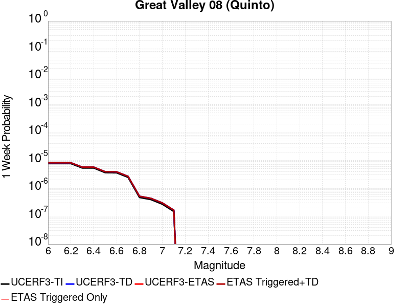 |  |  | 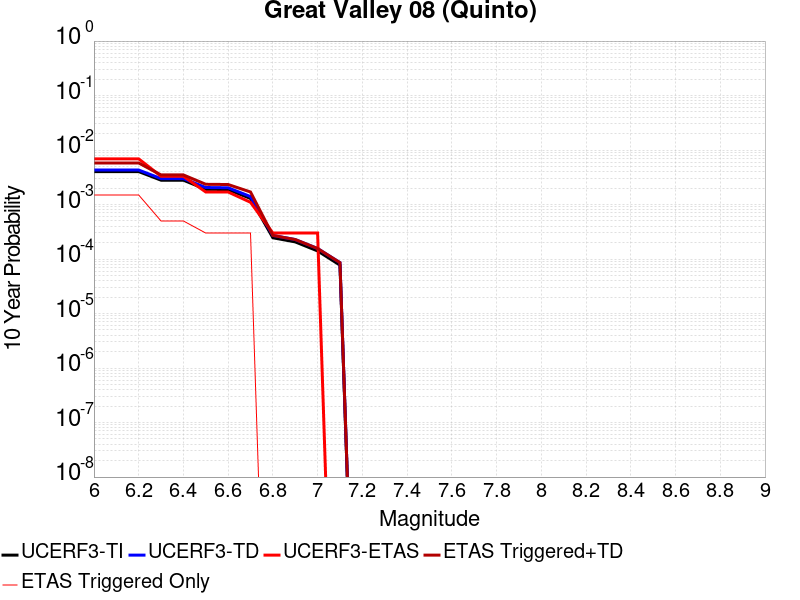 |

| Magnitude | 1 wk TI Prob | 1 wk TD Prob | 1 wk ETAS Prob | 1 wk ETAS/TD Gain | 1 wk ETAS Triggered+TD | 1 wk ETAS Triggered Only | 1 mo TI Prob | 1 mo TD Prob | 1 mo ETAS Prob | 1 mo ETAS/TD Gain | 1 mo ETAS Triggered+TD | 1 mo ETAS Triggered Only | 1 yr TI Prob | 1 yr TD Prob | 1 yr ETAS Prob | 1 yr ETAS/TD Gain | 1 yr ETAS Triggered+TD | 1 yr ETAS Triggered Only | 10 yr TI Prob | 10 yr TD Prob | 10 yr ETAS Prob | 10 yr ETAS/TD Gain | 10 yr ETAS Triggered+TD | 10 yr ETAS Triggered Only |
|-----|-----|-----|-----|-----|-----|-----|-----|-----|-----|-----|-----|-----|-----|-----|-----|-----|-----|-----|-----|-----|-----|-----|-----|-----|
| 6.0 | 7.737697E-6 | 8.254131E-6 | 0.0 | 0.0 | 8.254131E-6 | 0.0 | 3.3161137E-5 | 3.5374473E-5 | 1.0E-4 | 2.8268971 | 1.3537094E-4 | 1.0E-4 | 4.0366207E-4 | 4.3061798E-4 | 2.0E-4 | 0.4644488 | 5.305749E-4 | 1.0E-4 | 0.004029296 | 0.004299689 | 0.0069 | 1.6047672 | 0.0057932395 | 0.0015 |
| 6.1 | 7.737697E-6 | 8.254131E-6 | 0.0 | 0.0 | 8.254131E-6 | 0.0 | 3.3161137E-5 | 3.5374473E-5 | 1.0E-4 | 2.8268971 | 1.3537094E-4 | 1.0E-4 | 4.0366207E-4 | 4.3061798E-4 | 2.0E-4 | 0.4644488 | 5.305749E-4 | 1.0E-4 | 0.004029296 | 0.004299689 | 0.0069 | 1.6047672 | 0.0057932395 | 0.0015 |
| 6.2 | 7.737697E-6 | 8.254131E-6 | 0.0 | 0.0 | 8.254131E-6 | 0.0 | 3.3161137E-5 | 3.5374473E-5 | 1.0E-4 | 2.8268971 | 1.3537094E-4 | 1.0E-4 | 4.0366207E-4 | 4.3061798E-4 | 2.0E-4 | 0.4644488 | 5.305749E-4 | 1.0E-4 | 0.004029296 | 0.004299689 | 0.0069 | 1.6047672 | 0.0057932395 | 0.0015 |
| 6.3 | 5.374012E-6 | 5.7513753E-6 | 0.0 | 0.0 | 5.7513753E-6 | 0.0 | 2.3031276E-5 | 2.4648582E-5 | 0.0 | 0.0 | 2.4648582E-5 | 0.0 | 2.803697E-4 | 3.0006628E-4 | 1.0E-4 | 0.3332597 | 3.0006628E-4 | 0.0 | 0.0028001624 | 0.0029977048 | 0.0033 | 1.1008422 | 0.003496206 | 5.0E-4 |
| 6.4 | 5.374012E-6 | 5.7513753E-6 | 0.0 | 0.0 | 5.7513753E-6 | 0.0 | 2.3031276E-5 | 2.4648582E-5 | 0.0 | 0.0 | 2.4648582E-5 | 0.0 | 2.803697E-4 | 3.0006628E-4 | 1.0E-4 | 0.3332597 | 3.0006628E-4 | 0.0 | 0.0028001624 | 0.0029977048 | 0.0033 | 1.1008422 | 0.003496206 | 5.0E-4 |
| 6.5 | 3.65427E-6 | 3.9419388E-6 | 0.0 | 0.0 | 3.9419388E-6 | 0.0 | 1.5661062E-5 | 1.6893953E-5 | 0.0 | 0.0 | 1.6893953E-5 | 0.0 | 1.9065675E-4 | 2.0567152E-4 | 1.0E-4 | 0.4862122 | 2.0567152E-4 | 0.0 | 0.0019049325 | 0.0020555037 | 0.0017 | 0.8270479 | 0.002354887 | 3.0E-4 |
| 6.6 | 3.6143538E-6 | 3.8991193E-6 | 0.0 | 0.0 | 3.8991193E-6 | 0.0 | 1.5489995E-5 | 1.6710444E-5 | 0.0 | 0.0 | 1.6710444E-5 | 0.0 | 1.8857437E-4 | 2.0343771E-4 | 1.0E-4 | 0.49155095 | 2.0343771E-4 | 0.0 | 0.0018841444 | 0.0020332064 | 0.0017 | 0.83611774 | 0.0023325966 | 3.0E-4 |
| 6.7 | 2.4821015E-6 | 2.6861442E-6 | 0.0 | 0.0 | 2.6861442E-6 | 0.0 | 1.0637535E-5 | 1.1512028E-5 | 0.0 | 0.0 | 1.1512028E-5 | 0.0 | 1.2950429E-4 | 1.401556E-4 | 0.0 | 0.0 | 1.401556E-4 | 0.0 | 0.0012942884 | 0.001401227 | 0.0011 | 0.78502625 | 0.0017008067 | 3.0E-4 |
| 6.8 | 4.7110538E-7 | 5.1940754E-7 | 0.0 | 0.0 | 5.1940754E-7 | 0.0 | 2.0190216E-6 | 2.2260303E-6 | 0.0 | 0.0 | 2.2260303E-6 | 0.0 | 2.458131E-5 | 2.7101602E-5 | 0.0 | 0.0 | 2.7101602E-5 | 0.0 | 2.457859E-4 | 2.7098478E-4 | 3.0E-4 | 1.1070733 | 2.7098478E-4 | 0.0 |
| 6.9 | 3.958685E-7 | 4.371247E-7 | 0.0 | 0.0 | 4.371247E-7 | 0.0 | 1.6965782E-6 | 1.8733903E-6 | 0.0 | 0.0 | 1.8733903E-6 | 0.0 | 2.0655643E-5 | 2.2808304E-5 | 0.0 | 0.0 | 2.2808304E-5 | 0.0 | 2.0653724E-4 | 2.2806127E-4 | 3.0E-4 | 1.315436 | 2.2806127E-4 | 0.0 |
| 7.0 | 2.70294E-7 | 2.9926358E-7 | 0.0 | 0.0 | 2.9926358E-7 | 0.0 | 1.1584025E-6 | 1.2825576E-6 | 0.0 | 0.0 | 1.2825576E-6 | 0.0 | 1.4103458E-5 | 1.561504E-5 | 0.0 | 0.0 | 1.561504E-5 | 0.0 | 1.4102564E-4 | 1.561407E-4 | 3.0E-4 | 1.9213439 | 1.561407E-4 | 0.0 |
| 7.1 | 1.4828602E-7 | 1.6472721E-7 | 0.0 | 0.0 | 1.6472721E-7 | 0.0 | 6.3551136E-7 | 7.059736E-7 | 0.0 | 0.0 | 7.059736E-7 | 0.0 | 7.737323E-6 | 8.595203E-6 | 0.0 | 0.0 | 8.595203E-6 | 0.0 | 7.737054E-5 | 8.5949505E-5 | 0.0 | 0.0 | 8.5949505E-5 | 0.0 |

## Helendale-So Lockhart
*[(top)](#table-of-contents)*

| 1 Week | 1 Month | 1 Year | 10 Year |
|-----|-----|-----|-----|
| 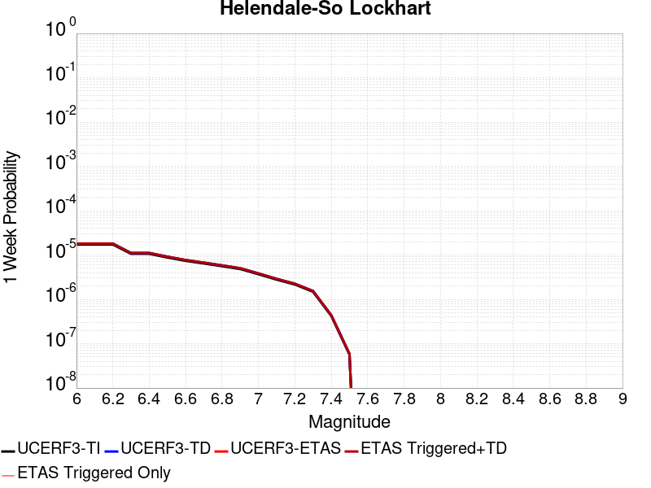 | 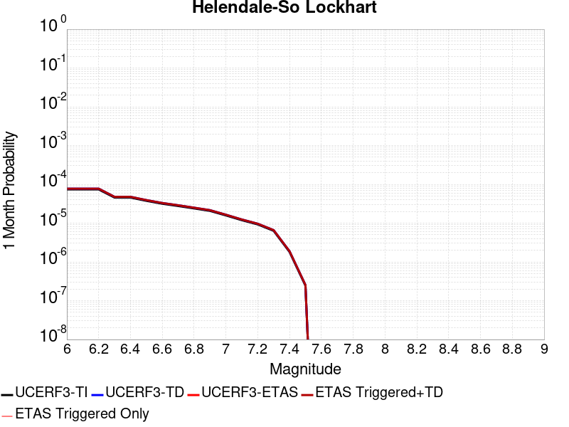 |  |  |

| Magnitude | 1 wk TI Prob | 1 wk TD Prob | 1 wk ETAS Prob | 1 wk ETAS/TD Gain | 1 wk ETAS Triggered+TD | 1 wk ETAS Triggered Only | 1 mo TI Prob | 1 mo TD Prob | 1 mo ETAS Prob | 1 mo ETAS/TD Gain | 1 mo ETAS Triggered+TD | 1 mo ETAS Triggered Only | 1 yr TI Prob | 1 yr TD Prob | 1 yr ETAS Prob | 1 yr ETAS/TD Gain | 1 yr ETAS Triggered+TD | 1 yr ETAS Triggered Only | 10 yr TI Prob | 10 yr TD Prob | 10 yr ETAS Prob | 10 yr ETAS/TD Gain | 10 yr ETAS Triggered+TD | 10 yr ETAS Triggered Only |
|-----|-----|-----|-----|-----|-----|-----|-----|-----|-----|-----|-----|-----|-----|-----|-----|-----|-----|-----|-----|-----|-----|-----|-----|-----|
| 6.0 | 1.7296055E-5 | 1.810541E-5 | 0.0 | 0.0 | 1.810541E-5 | 0.0 | 7.412385E-5 | 7.759242E-5 | 0.0 | 0.0 | 7.759242E-5 | 0.0 | 9.0208417E-4 | 9.4429904E-4 | 4.0E-4 | 0.42359462 | 0.0010442046 | 1.0E-4 | 0.008984311 | 0.009404985 | 0.0076 | 0.80808204 | 0.010791819 | 0.0014 |
| 6.1 | 1.7296055E-5 | 1.810541E-5 | 0.0 | 0.0 | 1.810541E-5 | 0.0 | 7.412385E-5 | 7.759242E-5 | 0.0 | 0.0 | 7.759242E-5 | 0.0 | 9.0208417E-4 | 9.4429904E-4 | 4.0E-4 | 0.42359462 | 0.0010442046 | 1.0E-4 | 0.008984311 | 0.009404985 | 0.0076 | 0.80808204 | 0.010791819 | 0.0014 |
| 6.2 | 1.7296055E-5 | 1.810541E-5 | 0.0 | 0.0 | 1.810541E-5 | 0.0 | 7.412385E-5 | 7.759242E-5 | 0.0 | 0.0 | 7.759242E-5 | 0.0 | 9.0208417E-4 | 9.4429904E-4 | 4.0E-4 | 0.42359462 | 0.0010442046 | 1.0E-4 | 0.008984311 | 0.009404985 | 0.0076 | 0.80808204 | 0.010791819 | 0.0014 |
| 6.3 | 1.0669118E-5 | 1.1136392E-5 | 0.0 | 0.0 | 1.1136392E-5 | 0.0 | 4.5723988E-5 | 4.7726535E-5 | 0.0 | 0.0 | 4.7726535E-5 | 0.0 | 5.5654737E-4 | 5.809184E-4 | 4.0E-4 | 0.68856484 | 6.808603E-4 | 1.0E-4 | 0.0055515557 | 0.005794295 | 0.0048 | 0.828401 | 0.00668908 | 9.0E-4 |
| 6.4 | 1.0669118E-5 | 1.1136392E-5 | 0.0 | 0.0 | 1.1136392E-5 | 0.0 | 4.5723988E-5 | 4.7726535E-5 | 0.0 | 0.0 | 4.7726535E-5 | 0.0 | 5.5654737E-4 | 5.809184E-4 | 4.0E-4 | 0.68856484 | 6.808603E-4 | 1.0E-4 | 0.0055515557 | 0.005794295 | 0.0048 | 0.828401 | 0.00668908 | 9.0E-4 |
| 6.5 | 8.790038E-6 | 9.170984E-6 | 0.0 | 0.0 | 9.170984E-6 | 0.0 | 3.767105E-5 | 3.9303635E-5 | 0.0 | 0.0 | 3.9303635E-5 | 0.0 | 4.585485E-4 | 4.7841825E-4 | 4.0E-4 | 0.8360885 | 5.783704E-4 | 1.0E-4 | 0.0045760344 | 0.0047740475 | 0.0039 | 0.8169169 | 0.0054707057 | 7.0E-4 |
| 6.6 | 7.396949E-6 | 7.716197E-6 | 0.0 | 0.0 | 7.716197E-6 | 0.0 | 3.1700827E-5 | 3.3069E-5 | 0.0 | 0.0 | 3.3069E-5 | 0.0 | 3.858892E-4 | 4.0254174E-4 | 2.0E-4 | 0.4968429 | 5.025015E-4 | 1.0E-4 | 0.003852198 | 0.0040182327 | 0.0032 | 0.79636997 | 0.004615822 | 6.0E-4 |
| 6.7 | 6.4600285E-6 | 6.7386068E-6 | 0.0 | 0.0 | 6.7386068E-6 | 0.0 | 2.7685543E-5 | 2.8879429E-5 | 0.0 | 0.0 | 2.8879429E-5 | 0.0 | 3.3701936E-4 | 3.515511E-4 | 2.0E-4 | 0.5689073 | 4.5151595E-4 | 1.0E-4 | 0.0033650869 | 0.0035100314 | 0.0028 | 0.79771364 | 0.0041079256 | 6.0E-4 |
| 6.8 | 5.600104E-6 | 5.8364976E-6 | 0.0 | 0.0 | 5.8364976E-6 | 0.0 | 2.4000226E-5 | 2.5013323E-5 | 0.0 | 0.0 | 2.5013323E-5 | 0.0 | 2.9216358E-4 | 3.0449525E-4 | 2.0E-4 | 0.6568247 | 4.044648E-4 | 1.0E-4 | 0.0029177975 | 0.003040842 | 0.0026 | 0.85502636 | 0.0036390175 | 6.0E-4 |
| 6.9 | 4.839122E-6 | 5.0399235E-6 | 0.0 | 0.0 | 5.0399235E-6 | 0.0 | 2.0738931E-5 | 2.1599495E-5 | 0.0 | 0.0 | 2.1599495E-5 | 0.0 | 2.5246723E-4 | 2.629426E-4 | 2.0E-4 | 0.7606223 | 3.629163E-4 | 1.0E-4 | 0.002521806 | 0.0026263623 | 0.0022 | 0.8376605 | 0.0032247866 | 6.0E-4 |
| 7.0 | 3.6937633E-6 | 3.845521E-6 | 0.0 | 0.0 | 3.845521E-6 | 0.0 | 1.5830317E-5 | 1.64807E-5 | 0.0 | 0.0 | 1.64807E-5 | 0.0 | 1.9271708E-4 | 2.0063437E-4 | 2.0E-4 | 0.99683815 | 3.006143E-4 | 1.0E-4 | 0.0019255003 | 0.0020045638 | 0.0019 | 0.9478371 | 0.0025035616 | 5.0E-4 |
| 7.1 | 2.7858857E-6 | 2.8980849E-6 | 0.0 | 0.0 | 2.8980849E-6 | 0.0 | 1.1939455E-5 | 1.2420306E-5 | 0.0 | 0.0 | 1.2420306E-5 | 0.0 | 1.4535317E-4 | 1.5120694E-4 | 0.0 | 0.0 | 1.5120694E-4 | 0.0 | 0.0014525814 | 0.0015110621 | 0.001 | 0.66178614 | 0.0017107599 | 2.0E-4 |
| 7.2 | 2.1672065E-6 | 2.254192E-6 | 0.0 | 0.0 | 2.254192E-6 | 0.0 | 9.2879945E-6 | 9.660787E-6 | 0.0 | 0.0 | 9.660787E-6 | 0.0 | 1.1307546E-4 | 1.1761393E-4 | 0.0 | 0.0 | 1.1761393E-4 | 0.0 | 0.0011301794 | 0.001175535 | 9.0E-4 | 0.76560885 | 0.0013752999 | 2.0E-4 |
| 7.3 | 1.4823496E-6 | 1.5423337E-6 | 0.0 | 0.0 | 1.5423337E-6 | 0.0 | 6.3529114E-6 | 6.609986E-6 | 0.0 | 0.0 | 6.609986E-6 | 0.0 | 7.734395E-5 | 8.047376E-5 | 0.0 | 0.0 | 8.047376E-5 | 0.0 | 7.731704E-4 | 8.044613E-4 | 7.0E-4 | 0.8701475 | 9.043808E-4 | 1.0E-4 |
| 7.4 | 4.2321457E-7 | 4.411246E-7 | 0.0 | 0.0 | 4.411246E-7 | 0.0 | 1.8137755E-6 | 1.8905329E-6 | 0.0 | 0.0 | 1.8905329E-6 | 0.0 | 2.2082493E-5 | 2.301704E-5 | 0.0 | 0.0 | 2.301704E-5 | 0.0 | 2.2080299E-4 | 2.301511E-4 | 1.0E-4 | 0.43449718 | 2.301511E-4 | 0.0 |
| 7.5 | 5.6942316E-8 | 5.9420763E-8 | 0.0 | 0.0 | 5.9420763E-8 | 0.0 | 2.440385E-7 | 2.546604E-7 | 0.0 | 0.0 | 2.546604E-7 | 0.0 | 2.9711643E-6 | 3.1004868E-6 | 0.0 | 0.0 | 3.1004868E-6 | 0.0 | 2.9711247E-5 | 3.1004514E-5 | 0.0 | 0.0 | 3.1004514E-5 | 0.0 |

## Superstition Hills
*[(top)](#table-of-contents)*

| 1 Week | 1 Month | 1 Year | 10 Year |
|-----|-----|-----|-----|
| 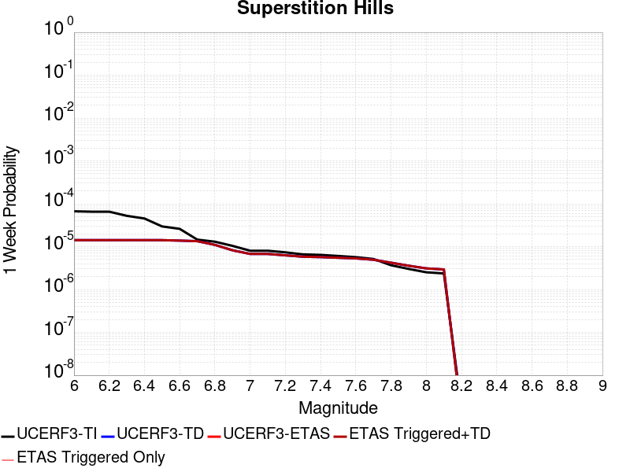 |  | 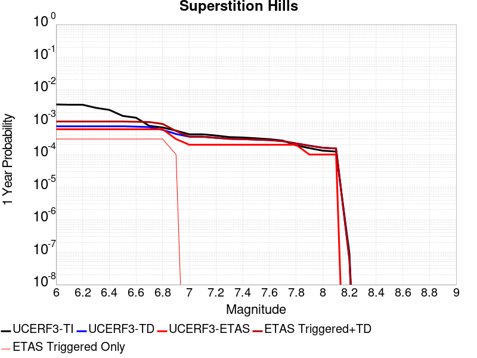 | 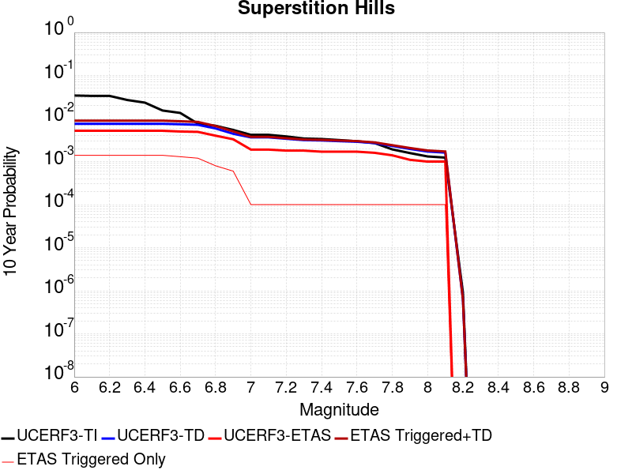 |

| Magnitude | 1 wk TI Prob | 1 wk TD Prob | 1 wk ETAS Prob | 1 wk ETAS/TD Gain | 1 wk ETAS Triggered+TD | 1 wk ETAS Triggered Only | 1 mo TI Prob | 1 mo TD Prob | 1 mo ETAS Prob | 1 mo ETAS/TD Gain | 1 mo ETAS Triggered+TD | 1 mo ETAS Triggered Only | 1 yr TI Prob | 1 yr TD Prob | 1 yr ETAS Prob | 1 yr ETAS/TD Gain | 1 yr ETAS Triggered+TD | 1 yr ETAS Triggered Only | 10 yr TI Prob | 10 yr TD Prob | 10 yr ETAS Prob | 10 yr ETAS/TD Gain | 10 yr ETAS Triggered+TD | 10 yr ETAS Triggered Only |
|-----|-----|-----|-----|-----|-----|-----|-----|-----|-----|-----|-----|-----|-----|-----|-----|-----|-----|-----|-----|-----|-----|-----|-----|-----|
| 6.0 | 6.6865185E-5 | 1.4153395E-5 | 0.0 | 0.0 | 1.4153395E-5 | 0.0 | 2.8653358E-4 | 6.0656086E-5 | 0.0 | 0.0 | 6.0656086E-5 | 0.0 | 0.0034829667 | 7.382538E-4 | 6.0E-4 | 0.81272864 | 0.0010380324 | 3.0E-4 | 0.03428881 | 0.0075283544 | 0.0052 | 0.690722 | 0.008917815 | 0.0014 |
| 6.1 | 6.544851E-5 | 1.4153394E-5 | 0.0 | 0.0 | 1.4153394E-5 | 0.0 | 2.8046346E-4 | 6.0656086E-5 | 0.0 | 0.0 | 6.0656086E-5 | 0.0 | 0.0034092965 | 7.382538E-4 | 6.0E-4 | 0.81272864 | 0.0010380324 | 3.0E-4 | 0.033574644 | 0.007528354 | 0.0052 | 0.69072205 | 0.008917814 | 0.0014 |
| 6.2 | 6.544851E-5 | 1.4153394E-5 | 0.0 | 0.0 | 1.4153394E-5 | 0.0 | 2.8046346E-4 | 6.0656086E-5 | 0.0 | 0.0 | 6.0656086E-5 | 0.0 | 0.0034092965 | 7.382538E-4 | 6.0E-4 | 0.81272864 | 0.0010380324 | 3.0E-4 | 0.033574644 | 0.007528354 | 0.0052 | 0.69072205 | 0.008917814 | 0.0014 |
| 6.3 | 5.2402065E-5 | 1.4153394E-5 | 0.0 | 0.0 | 1.4153394E-5 | 0.0 | 2.2456095E-4 | 6.0656082E-5 | 0.0 | 0.0 | 6.0656082E-5 | 0.0 | 0.0027306017 | 7.3825376E-4 | 6.0E-4 | 0.81272864 | 0.0010380324 | 3.0E-4 | 0.02697292 | 0.00752835 | 0.0052 | 0.69072235 | 0.00891781 | 0.0014 |
| 6.4 | 4.542238E-5 | 1.4153393E-5 | 0.0 | 0.0 | 1.4153393E-5 | 0.0 | 1.9465282E-4 | 6.065608E-5 | 0.0 | 0.0 | 6.065608E-5 | 0.0 | 0.0023673223 | 7.3825376E-4 | 6.0E-4 | 0.8127287 | 0.0010380322 | 3.0E-4 | 0.023422617 | 0.0075283484 | 0.0052 | 0.6907225 | 0.0089178085 | 0.0014 |
| 6.5 | 2.9672969E-5 | 1.4153393E-5 | 0.0 | 0.0 | 1.4153393E-5 | 0.0 | 1.2716366E-4 | 6.065608E-5 | 0.0 | 0.0 | 6.065608E-5 | 0.0 | 0.0015471181 | 7.382537E-4 | 6.0E-4 | 0.8127287 | 0.0010380322 | 3.0E-4 | 0.015363912 | 0.0075283446 | 0.0052 | 0.6907229 | 0.008917805 | 0.0014 |
| 6.6 | 2.6056105E-5 | 1.3819871E-5 | 0.0 | 0.0 | 1.3819871E-5 | 0.0 | 1.1166424E-4 | 5.9226764E-5 | 0.0 | 0.0 | 5.9226764E-5 | 0.0 | 0.0013586642 | 7.2086335E-4 | 6.0E-4 | 0.8323353 | 0.0010206471 | 3.0E-4 | 0.013503874 | 0.0073531666 | 0.005 | 0.67997915 | 0.008643608 | 0.0013 |
| 6.7 | 1.4611248E-5 | 1.3400084E-5 | 0.0 | 0.0 | 1.3400084E-5 | 0.0 | 6.261813E-5 | 5.7427755E-5 | 0.0 | 0.0 | 5.7427755E-5 | 0.0 | 7.6210906E-4 | 6.9897453E-4 | 6.0E-4 | 0.85840034 | 9.987649E-4 | 3.0E-4 | 0.0075950073 | 0.0071345535 | 0.0049 | 0.6867984 | 0.008325992 | 0.0012 |
| 6.8 | 1.30607E-5 | 1.0995988E-5 | 0.0 | 0.0 | 1.0995988E-5 | 0.0 | 5.597323E-5 | 4.712486E-5 | 0.0 | 0.0 | 4.712486E-5 | 0.0 | 6.8126095E-4 | 5.7360285E-4 | 6.0E-4 | 1.0460199 | 8.734308E-4 | 3.0E-4 | 0.006791762 | 0.005882999 | 0.004 | 0.6799254 | 0.0066782925 | 8.0E-4 |
| 6.9 | 1.0443096E-5 | 8.213347E-6 | 0.0 | 0.0 | 8.213347E-6 | 0.0 | 4.4755358E-5 | 3.51996E-5 | 0.0 | 0.0 | 3.51996E-5 | 0.0 | 5.447602E-4 | 4.284732E-4 | 3.0E-4 | 0.70016044 | 5.2843033E-4 | 1.0E-4 | 0.005434267 | 0.004418466 | 0.0033 | 0.7468656 | 0.005015815 | 6.0E-4 |
| 7.0 | 8.045912E-6 | 6.7581923E-6 | 0.0 | 0.0 | 6.7581923E-6 | 0.0 | 3.4482026E-5 | 2.8963366E-5 | 0.0 | 0.0 | 2.8963366E-5 | 0.0 | 4.197378E-4 | 3.5257294E-4 | 2.0E-4 | 0.5672585 | 3.5257294E-4 | 0.0 | 0.0041894587 | 0.0036427756 | 0.0019 | 0.52158034 | 0.0037424113 | 1.0E-4 |
| 7.1 | 8.045912E-6 | 6.7581923E-6 | 0.0 | 0.0 | 6.7581923E-6 | 0.0 | 3.4482026E-5 | 2.8963366E-5 | 0.0 | 0.0 | 2.8963366E-5 | 0.0 | 4.197378E-4 | 3.5257294E-4 | 2.0E-4 | 0.5672585 | 3.5257294E-4 | 0.0 | 0.0041894587 | 0.0036427756 | 0.0019 | 0.52158034 | 0.0037424113 | 1.0E-4 |
| 7.2 | 7.375506E-6 | 6.2652175E-6 | 0.0 | 0.0 | 6.2652175E-6 | 0.0 | 3.1608928E-5 | 2.6850661E-5 | 0.0 | 0.0 | 2.6850661E-5 | 0.0 | 3.8477074E-4 | 3.2685863E-4 | 2.0E-4 | 0.6118853 | 3.2685863E-4 | 0.0 | 0.003841052 | 0.0033834137 | 0.0018 | 0.5320071 | 0.0034830754 | 1.0E-4 |
| 7.3 | 6.6063913E-6 | 5.817745E-6 | 0.0 | 0.0 | 5.817745E-6 | 0.0 | 2.8312797E-5 | 2.4932959E-5 | 0.0 | 0.0 | 2.4932959E-5 | 0.0 | 3.446538E-4 | 3.035172E-4 | 2.0E-4 | 0.6589412 | 3.035172E-4 | 0.0 | 0.0034411973 | 0.0031476985 | 0.0018 | 0.5718464 | 0.0032473835 | 1.0E-4 |
| 7.4 | 6.4313126E-6 | 5.6991867E-6 | 0.0 | 0.0 | 5.6991867E-6 | 0.0 | 2.7562477E-5 | 2.442486E-5 | 0.0 | 0.0 | 2.442486E-5 | 0.0 | 3.355215E-4 | 2.973328E-4 | 2.0E-4 | 0.67264694 | 2.973328E-4 | 0.0 | 0.0033501536 | 0.0030854712 | 0.0017 | 0.55096936 | 0.0031851626 | 1.0E-4 |
| 7.5 | 6.0742927E-6 | 5.4949173E-6 | 0.0 | 0.0 | 5.4949173E-6 | 0.0 | 2.6032423E-5 | 2.3549437E-5 | 0.0 | 0.0 | 2.3549437E-5 | 0.0 | 3.1689866E-4 | 2.8667736E-4 | 2.0E-4 | 0.6976484 | 2.8667736E-4 | 0.0 | 0.0031644711 | 0.0029772567 | 0.0017 | 0.57099545 | 0.003076959 | 1.0E-4 |
| 7.6 | 5.6987187E-6 | 5.313053E-6 | 0.0 | 0.0 | 5.313053E-6 | 0.0 | 2.4422852E-5 | 2.2770031E-5 | 0.0 | 0.0 | 2.2770031E-5 | 0.0 | 2.9730765E-4 | 2.7719053E-4 | 2.0E-4 | 0.7215254 | 2.7719053E-4 | 0.0 | 0.002969102 | 0.0028804701 | 0.0017 | 0.59018147 | 0.002980182 | 1.0E-4 |
| 7.7 | 5.1658035E-6 | 4.9439705E-6 | 0.0 | 0.0 | 4.9439705E-6 | 0.0 | 2.2138971E-5 | 2.1188276E-5 | 0.0 | 0.0 | 2.1188276E-5 | 0.0 | 2.6950863E-4 | 2.5793735E-4 | 2.0E-4 | 0.7753821 | 2.5793735E-4 | 0.0 | 0.00269182 | 0.0026854246 | 0.0016 | 0.5958089 | 0.002785156 | 1.0E-4 |
| 7.8 | 3.6864697E-6 | 4.2147117E-6 | 0.0 | 0.0 | 4.2147117E-6 | 0.0 | 1.579906E-5 | 1.8062929E-5 | 0.0 | 0.0 | 1.8062929E-5 | 0.0 | 1.9233658E-4 | 2.1989443E-4 | 2.0E-4 | 0.90952736 | 2.1989443E-4 | 0.0 | 0.0019217018 | 0.0022985078 | 0.0014 | 0.6090908 | 0.0023982779 | 1.0E-4 |
| 7.9 | 3.0265903E-6 | 3.5803466E-6 | 0.0 | 0.0 | 3.5803466E-6 | 0.0 | 1.2971037E-5 | 1.5344254E-5 | 0.0 | 0.0 | 1.5344254E-5 | 0.0 | 1.5791094E-4 | 1.8680072E-4 | 1.0E-4 | 0.5353298 | 1.8680072E-4 | 0.0 | 0.0015779877 | 0.0019617956 | 0.0011 | 0.5607108 | 0.0020615994 | 1.0E-4 |
| 8.0 | 2.5271493E-6 | 3.101527E-6 | 0.0 | 0.0 | 3.101527E-6 | 0.0 | 1.0830595E-5 | 1.3292193E-5 | 0.0 | 0.0 | 1.3292193E-5 | 0.0 | 1.3185451E-4 | 1.6182085E-4 | 1.0E-4 | 0.6179673 | 1.6182085E-4 | 0.0 | 0.0013177631 | 0.0017047736 | 0.001 | 0.58658814 | 0.0018046031 | 1.0E-4 |
| 8.1 | 2.3749135E-6 | 2.9312148E-6 | 0.0 | 0.0 | 2.9312148E-6 | 0.0 | 1.0178161E-5 | 1.2562291E-5 | 0.0 | 0.0 | 1.2562291E-5 | 0.0 | 1.2391206E-4 | 1.5293558E-4 | 1.0E-4 | 0.6538701 | 1.5293558E-4 | 0.0 | 0.0012384299 | 0.0016119066 | 0.001 | 0.6203833 | 0.0017117454 | 1.0E-4 |
| 8.2 | 1.7186406E-9 | 1.1466078E-9 | 0.0 | 0.0 | 1.1466078E-9 | 0.0 | 7.3656024E-9 | 4.9140336E-9 | 0.0 | 0.0 | 4.9140336E-9 | 0.0 | 8.9676206E-8 | 5.982836E-8 | 0.0 | 0.0 | 5.982836E-8 | 0.0 | 8.9676166E-7 | 6.403464E-7 | 0.0 | 0.0 | 6.403464E-7 | 0.0 |

## Coyote Lake
*[(top)](#table-of-contents)*

| 1 Week | 1 Month | 1 Year | 10 Year |
|-----|-----|-----|-----|
|  | 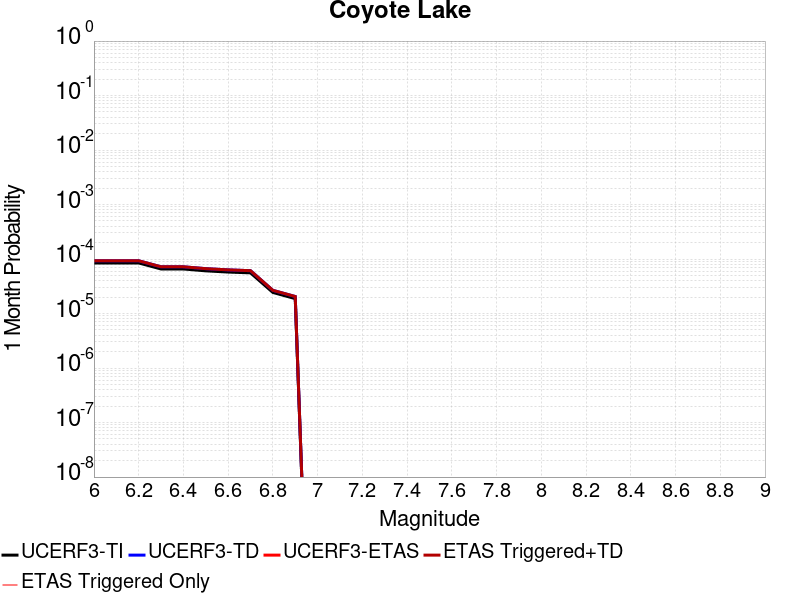 |  |  |

| Magnitude | 1 wk TI Prob | 1 wk TD Prob | 1 wk ETAS Prob | 1 wk ETAS/TD Gain | 1 wk ETAS Triggered+TD | 1 wk ETAS Triggered Only | 1 mo TI Prob | 1 mo TD Prob | 1 mo ETAS Prob | 1 mo ETAS/TD Gain | 1 mo ETAS Triggered+TD | 1 mo ETAS Triggered Only | 1 yr TI Prob | 1 yr TD Prob | 1 yr ETAS Prob | 1 yr ETAS/TD Gain | 1 yr ETAS Triggered+TD | 1 yr ETAS Triggered Only | 10 yr TI Prob | 10 yr TD Prob | 10 yr ETAS Prob | 10 yr ETAS/TD Gain | 10 yr ETAS Triggered+TD | 10 yr ETAS Triggered Only |
|-----|-----|-----|-----|-----|-----|-----|-----|-----|-----|-----|-----|-----|-----|-----|-----|-----|-----|-----|-----|-----|-----|-----|-----|-----|
| 6.0 | 1.980352E-5 | 2.1710885E-5 | 0.0 | 0.0 | 2.1710885E-5 | 0.0 | 8.486947E-5 | 9.304373E-5 | 0.0 | 0.0 | 9.304373E-5 | 0.0 | 0.0010327959 | 0.0011322908 | 0.0012 | 1.0597984 | 0.0014319512 | 3.0E-4 | 0.010280091 | 0.011272397 | 0.0089 | 0.7895393 | 0.012656615 | 0.0014 |
| 6.1 | 1.980352E-5 | 2.1710885E-5 | 0.0 | 0.0 | 2.1710885E-5 | 0.0 | 8.486947E-5 | 9.304373E-5 | 0.0 | 0.0 | 9.304373E-5 | 0.0 | 0.0010327959 | 0.0011322908 | 0.0012 | 1.0597984 | 0.0014319512 | 3.0E-4 | 0.010280091 | 0.011272397 | 0.0089 | 0.7895393 | 0.012656615 | 0.0014 |
| 6.2 | 1.980352E-5 | 2.1710885E-5 | 0.0 | 0.0 | 2.1710885E-5 | 0.0 | 8.486947E-5 | 9.304373E-5 | 0.0 | 0.0 | 9.304373E-5 | 0.0 | 0.0010327959 | 0.0011322908 | 0.0012 | 1.0597984 | 0.0014319512 | 3.0E-4 | 0.010280091 | 0.011272397 | 0.0089 | 0.7895393 | 0.012656615 | 0.0014 |
| 6.3 | 1.5344787E-5 | 1.682388E-5 | 0.0 | 0.0 | 1.682388E-5 | 0.0 | 6.576172E-5 | 7.2100695E-5 | 0.0 | 0.0 | 7.2100695E-5 | 0.0 | 8.003548E-4 | 8.7753363E-4 | 0.001 | 1.1395575 | 0.0010773581 | 2.0E-4 | 0.007974784 | 0.008746732 | 0.0077 | 0.8803288 | 0.009737985 | 0.001 |
| 6.4 | 1.5344787E-5 | 1.682388E-5 | 0.0 | 0.0 | 1.682388E-5 | 0.0 | 6.576172E-5 | 7.2100695E-5 | 0.0 | 0.0 | 7.2100695E-5 | 0.0 | 8.003548E-4 | 8.7753363E-4 | 0.001 | 1.1395575 | 0.0010773581 | 2.0E-4 | 0.007974784 | 0.008746732 | 0.0077 | 0.8803288 | 0.009737985 | 0.001 |
| 6.5 | 1.4189697E-5 | 1.5560963E-5 | 0.0 | 0.0 | 1.5560963E-5 | 0.0 | 6.081157E-5 | 6.668848E-5 | 0.0 | 0.0 | 6.668848E-5 | 0.0 | 7.401293E-4 | 8.116901E-4 | 0.001 | 1.2319973 | 0.0010115277 | 2.0E-4 | 0.0073766913 | 0.0080932 | 0.0072 | 0.8896358 | 0.009085106 | 0.001 |
| 6.6 | 1.3469301E-5 | 1.4774411E-5 | 0.0 | 0.0 | 1.4774411E-5 | 0.0 | 5.7724297E-5 | 6.3317704E-5 | 0.0 | 0.0 | 6.3317704E-5 | 0.0 | 7.025667E-4 | 7.7068043E-4 | 0.001 | 1.2975547 | 9.705263E-4 | 2.0E-4 | 0.0070034964 | 0.007685984 | 0.0067 | 0.8717166 | 0.008678298 | 0.001 |
| 6.7 | 1.3027966E-5 | 1.4284472E-5 | 0.0 | 0.0 | 1.4284472E-5 | 0.0 | 5.5832945E-5 | 6.121807E-5 | 0.0 | 0.0 | 6.121807E-5 | 0.0 | 6.7955407E-4 | 7.4513484E-4 | 0.001 | 1.342039 | 9.4498583E-4 | 2.0E-4 | 0.006774798 | 0.007432244 | 0.0066 | 0.88802254 | 0.008424811 | 0.001 |
| 6.8 | 5.695434E-6 | 6.2255644E-6 | 0.0 | 0.0 | 6.2255644E-6 | 0.0 | 2.4408775E-5 | 2.6680886E-5 | 0.0 | 0.0 | 2.6680886E-5 | 0.0 | 2.971363E-4 | 3.2482136E-4 | 6.0E-4 | 1.847169 | 4.247889E-4 | 1.0E-4 | 0.0029673933 | 0.003246408 | 0.0024 | 0.7392786 | 0.003545434 | 3.0E-4 |
| 6.9 | 4.385688E-6 | 4.7939384E-6 | 0.0 | 0.0 | 4.7939384E-6 | 0.0 | 1.879567E-5 | 2.054545E-5 | 0.0 | 0.0 | 2.054545E-5 | 0.0 | 2.2881327E-4 | 2.5014085E-4 | 5.0E-4 | 1.9988738 | 3.5011585E-4 | 1.0E-4 | 0.002285778 | 0.0025014086 | 0.0016 | 0.6396396 | 0.002800658 | 3.0E-4 |

## San Gabriel
*[(top)](#table-of-contents)*

| 1 Week | 1 Month | 1 Year | 10 Year |
|-----|-----|-----|-----|
| 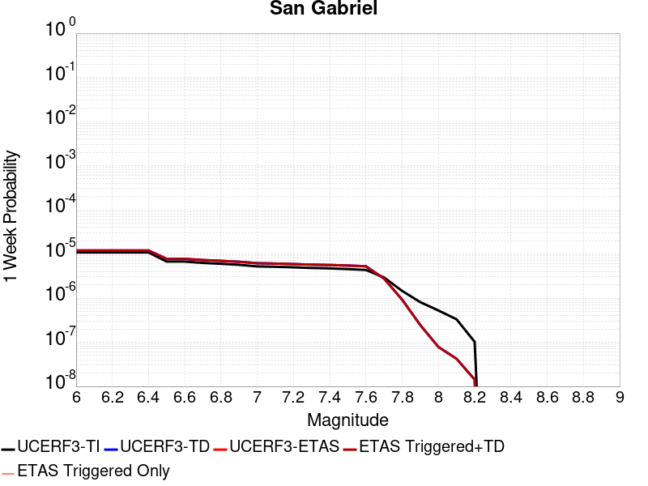 |  |  |  |

| Magnitude | 1 wk TI Prob | 1 wk TD Prob | 1 wk ETAS Prob | 1 wk ETAS/TD Gain | 1 wk ETAS Triggered+TD | 1 wk ETAS Triggered Only | 1 mo TI Prob | 1 mo TD Prob | 1 mo ETAS Prob | 1 mo ETAS/TD Gain | 1 mo ETAS Triggered+TD | 1 mo ETAS Triggered Only | 1 yr TI Prob | 1 yr TD Prob | 1 yr ETAS Prob | 1 yr ETAS/TD Gain | 1 yr ETAS Triggered+TD | 1 yr ETAS Triggered Only | 10 yr TI Prob | 10 yr TD Prob | 10 yr ETAS Prob | 10 yr ETAS/TD Gain | 10 yr ETAS Triggered+TD | 10 yr ETAS Triggered Only |
|-----|-----|-----|-----|-----|-----|-----|-----|-----|-----|-----|-----|-----|-----|-----|-----|-----|-----|-----|-----|-----|-----|-----|-----|-----|
| 6.0 | 1.083775E-5 | 1.2000347E-5 | 0.0 | 0.0 | 1.2000347E-5 | 0.0 | 4.6446676E-5 | 5.142911E-5 | 0.0 | 0.0 | 5.142911E-5 | 0.0 | 5.653415E-4 | 6.2598084E-4 | 8.0E-4 | 1.2779944 | 7.259183E-4 | 1.0E-4 | 0.0056390543 | 0.006254212 | 0.0053 | 0.84742886 | 0.007645456 | 0.0014 |
| 6.1 | 1.083775E-5 | 1.2000347E-5 | 0.0 | 0.0 | 1.2000347E-5 | 0.0 | 4.6446676E-5 | 5.142911E-5 | 0.0 | 0.0 | 5.142911E-5 | 0.0 | 5.653415E-4 | 6.2598084E-4 | 8.0E-4 | 1.2779944 | 7.259183E-4 | 1.0E-4 | 0.0056390543 | 0.006254212 | 0.0053 | 0.84742886 | 0.007645456 | 0.0014 |
| 6.2 | 1.083775E-5 | 1.2000347E-5 | 0.0 | 0.0 | 1.2000347E-5 | 0.0 | 4.6446676E-5 | 5.142911E-5 | 0.0 | 0.0 | 5.142911E-5 | 0.0 | 5.653415E-4 | 6.2598084E-4 | 8.0E-4 | 1.2779944 | 7.259183E-4 | 1.0E-4 | 0.0056390543 | 0.006254212 | 0.0053 | 0.84742886 | 0.007645456 | 0.0014 |
| 6.3 | 1.083775E-5 | 1.2000347E-5 | 0.0 | 0.0 | 1.2000347E-5 | 0.0 | 4.6446676E-5 | 5.142911E-5 | 0.0 | 0.0 | 5.142911E-5 | 0.0 | 5.653415E-4 | 6.2598084E-4 | 8.0E-4 | 1.2779944 | 7.259183E-4 | 1.0E-4 | 0.0056390543 | 0.006254212 | 0.0053 | 0.84742886 | 0.007645456 | 0.0014 |
| 6.4 | 1.083775E-5 | 1.2000347E-5 | 0.0 | 0.0 | 1.2000347E-5 | 0.0 | 4.6446676E-5 | 5.142911E-5 | 0.0 | 0.0 | 5.142911E-5 | 0.0 | 5.653415E-4 | 6.2598084E-4 | 8.0E-4 | 1.2779944 | 7.259183E-4 | 1.0E-4 | 0.0056390543 | 0.006254212 | 0.0053 | 0.84742886 | 0.007645456 | 0.0014 |
| 6.5 | 6.7317824E-6 | 7.73177E-6 | 0.0 | 0.0 | 7.73177E-6 | 0.0 | 2.8850178E-5 | 3.313574E-5 | 0.0 | 0.0 | 3.313574E-5 | 0.0 | 3.511943E-4 | 4.03354E-4 | 6.0E-4 | 1.487527 | 4.03354E-4 | 0.0 | 0.003506398 | 0.004037256 | 0.0032 | 0.79261756 | 0.00473443 | 7.0E-4 |
| 6.6 | 6.7317824E-6 | 7.73177E-6 | 0.0 | 0.0 | 7.73177E-6 | 0.0 | 2.8850178E-5 | 3.313574E-5 | 0.0 | 0.0 | 3.313574E-5 | 0.0 | 3.511943E-4 | 4.03354E-4 | 6.0E-4 | 1.487527 | 4.03354E-4 | 0.0 | 0.003506398 | 0.004037256 | 0.0032 | 0.79261756 | 0.00473443 | 7.0E-4 |
| 6.7 | 6.274881E-6 | 7.260661E-6 | 0.0 | 0.0 | 7.260661E-6 | 0.0 | 2.6892068E-5 | 3.1116753E-5 | 0.0 | 0.0 | 3.1116753E-5 | 0.0 | 3.2736175E-4 | 3.7878158E-4 | 5.0E-4 | 1.320022 | 3.7878158E-4 | 0.0 | 0.0032687993 | 0.0037923895 | 0.0029 | 0.7646894 | 0.004390114 | 6.0E-4 |
| 6.8 | 5.996209E-6 | 6.9733633E-6 | 0.0 | 0.0 | 6.9733633E-6 | 0.0 | 2.5697784E-5 | 2.9885505E-5 | 0.0 | 0.0 | 2.9885505E-5 | 0.0 | 3.128256E-4 | 3.6379622E-4 | 5.0E-4 | 1.3743958 | 3.6379622E-4 | 0.0 | 0.003123856 | 0.0036430343 | 0.0026 | 0.71369076 | 0.004141213 | 5.0E-4 |
| 6.9 | 5.686331E-6 | 6.6382913E-6 | 0.0 | 0.0 | 6.6382913E-6 | 0.0 | 2.4369761E-5 | 2.8449515E-5 | 0.0 | 0.0 | 2.8449515E-5 | 0.0 | 2.9666146E-4 | 3.463187E-4 | 5.0E-4 | 1.4437568 | 3.463187E-4 | 0.0 | 0.0029626573 | 0.0034688162 | 0.0024 | 0.6918787 | 0.0039670817 | 5.0E-4 |
| 7.0 | 5.2329838E-6 | 6.1620954E-6 | 0.0 | 0.0 | 6.1620954E-6 | 0.0 | 2.242688E-5 | 2.6408718E-5 | 0.0 | 0.0 | 2.6408718E-5 | 0.0 | 2.7301308E-4 | 3.2147946E-4 | 5.0E-4 | 1.5553093 | 3.2147946E-4 | 0.0 | 0.002726779 | 0.003221158 | 0.0023 | 0.71402895 | 0.0036198695 | 4.0E-4 |
| 7.1 | 5.135671E-6 | 6.0521447E-6 | 0.0 | 0.0 | 6.0521447E-6 | 0.0 | 2.2009834E-5 | 2.593751E-5 | 0.0 | 0.0 | 2.593751E-5 | 0.0 | 2.6793676E-4 | 3.157442E-4 | 5.0E-4 | 1.5835605 | 3.157442E-4 | 0.0 | 0.0026761394 | 0.0031639698 | 0.0023 | 0.7269349 | 0.0035627042 | 4.0E-4 |
| 7.2 | 4.989062E-6 | 5.885394E-6 | 0.0 | 0.0 | 5.885394E-6 | 0.0 | 2.1381518E-5 | 2.5222878E-5 | 0.0 | 0.0 | 2.5222878E-5 | 0.0 | 2.6028889E-4 | 3.0704602E-4 | 4.0E-4 | 1.3027363 | 3.0704602E-4 | 0.0 | 0.0025998424 | 0.0030772318 | 0.0022 | 0.71492827 | 0.0034760009 | 4.0E-4 |
| 7.3 | 4.8219395E-6 | 5.716832E-6 | 0.0 | 0.0 | 5.716832E-6 | 0.0 | 2.0665291E-5 | 2.4500485E-5 | 0.0 | 0.0 | 2.4500485E-5 | 0.0 | 2.5157086E-4 | 2.9825332E-4 | 4.0E-4 | 1.3411418 | 2.9825332E-4 | 0.0 | 0.0025128627 | 0.0029895445 | 0.0022 | 0.735898 | 0.0033883487 | 4.0E-4 |
| 7.4 | 4.7118383E-6 | 5.605286E-6 | 0.0 | 0.0 | 5.605286E-6 | 0.0 | 2.0193436E-5 | 2.4022436E-5 | 0.0 | 0.0 | 2.4022436E-5 | 0.0 | 2.4582737E-4 | 2.9243465E-4 | 4.0E-4 | 1.3678269 | 2.9243465E-4 | 0.0 | 0.002455556 | 0.002931511 | 0.0022 | 0.7504662 | 0.0033303383 | 4.0E-4 |
| 7.5 | 4.5506545E-6 | 5.4505063E-6 | 0.0 | 0.0 | 5.4505063E-6 | 0.0 | 1.9502659E-5 | 2.3359109E-5 | 0.0 | 0.0 | 2.3359109E-5 | 0.0 | 2.37419E-4 | 2.8436078E-4 | 4.0E-4 | 1.4066638 | 2.8436078E-4 | 0.0 | 0.002371655 | 0.0028509812 | 0.0021 | 0.73658854 | 0.0032498408 | 4.0E-4 |
| 7.6 | 4.343636E-6 | 5.2431474E-6 | 0.0 | 0.0 | 5.2431474E-6 | 0.0 | 1.861545E-5 | 2.2470442E-5 | 0.0 | 0.0 | 2.2470442E-5 | 0.0 | 2.2661954E-4 | 2.7354405E-4 | 4.0E-4 | 1.4622874 | 2.7354405E-4 | 0.0 | 0.0022638857 | 0.0027430777 | 0.0021 | 0.7655634 | 0.0031419806 | 4.0E-4 |
| 7.7 | 2.936235E-6 | 2.751478E-6 | 0.0 | 0.0 | 2.751478E-6 | 0.0 | 1.2583803E-5 | 1.1791995E-5 | 0.0 | 0.0 | 1.1791995E-5 | 0.0 | 1.5319703E-4 | 1.4355812E-4 | 4.0E-4 | 2.7863278 | 1.4355812E-4 | 0.0 | 0.0015309147 | 0.0014419503 | 0.0016 | 1.1096083 | 0.0017415178 | 3.0E-4 |
| 7.8 | 1.4541639E-6 | 9.138139E-7 | 0.0 | 0.0 | 9.138139E-7 | 0.0 | 6.232116E-6 | 3.916339E-6 | 0.0 | 0.0 | 3.916339E-6 | 0.0 | 7.587337E-5 | 4.768039E-5 | 0.0 | 0.0 | 4.768039E-5 | 0.0 | 7.584747E-4 | 4.8160835E-4 | 7.0E-4 | 1.4534632 | 6.8151206E-4 | 2.0E-4 |
| 7.9 | 8.098958E-7 | 2.4161423E-7 | 0.0 | 0.0 | 2.4161423E-7 | 0.0 | 3.4709774E-6 | 1.035489E-6 | 0.0 | 0.0 | 1.035489E-6 | 0.0 | 4.225833E-5 | 1.2607007E-5 | 0.0 | 0.0 | 1.2607007E-5 | 0.0 | 4.2250296E-4 | 1.2913617E-4 | 1.0E-4 | 0.7743764 | 2.2912325E-4 | 1.0E-4 |
| 8.0 | 5.2473234E-7 | 7.6608785E-8 | 0.0 | 0.0 | 7.6608785E-8 | 0.0 | 2.248851E-6 | 3.2832332E-7 | 0.0 | 0.0 | 3.2832332E-7 | 0.0 | 2.7379416E-5 | 3.9973293E-6 | 0.0 | 0.0 | 3.9973293E-6 | 0.0 | 2.7376044E-4 | 4.2090458E-5 | 0.0 | 0.0 | 4.2090458E-5 | 0.0 |
| 8.1 | 3.3162388E-7 | 4.139669E-8 | 0.0 | 0.0 | 4.139669E-8 | 0.0 | 1.4212444E-6 | 1.7741438E-7 | 0.0 | 0.0 | 1.7741438E-7 | 0.0 | 1.7303513E-5 | 2.1600179E-6 | 0.0 | 0.0 | 2.1600179E-6 | 0.0 | 1.7302166E-4 | 2.2909986E-5 | 0.0 | 0.0 | 2.2909986E-5 | 0.0 |
| 8.2 | 1.0235345E-7 | 1.4014808E-8 | 0.0 | 0.0 | 1.4014808E-8 | 0.0 | 4.3865757E-7 | 6.006346E-8 | 0.0 | 0.0 | 6.006346E-8 | 0.0 | 5.340643E-6 | 7.3127245E-7 | 0.0 | 0.0 | 7.3127245E-7 | 0.0 | 5.3405143E-5 | 7.911971E-6 | 0.0 | 0.0 | 7.911971E-6 | 0.0 |

## Big Pine (East)
*[(top)](#table-of-contents)*

| 1 Week | 1 Month | 1 Year | 10 Year |
|-----|-----|-----|-----|
|  |  |  | 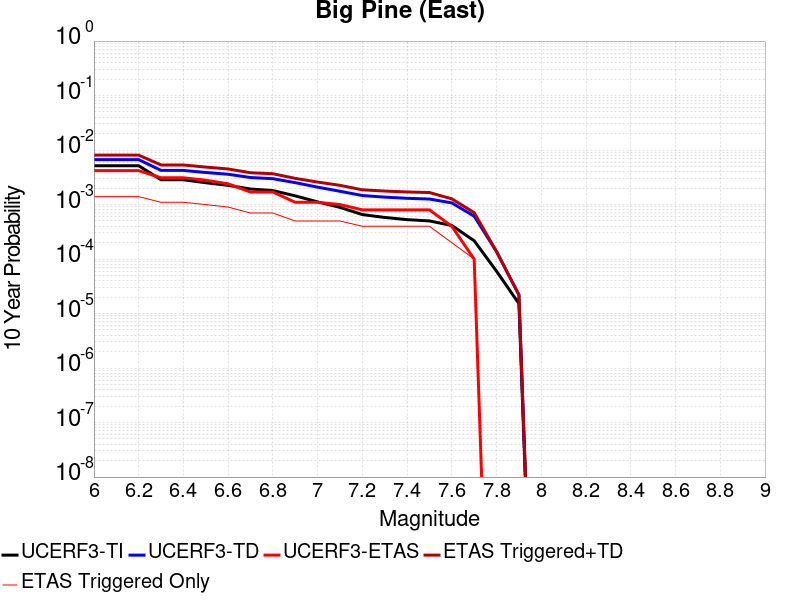 |

| Magnitude | 1 wk TI Prob | 1 wk TD Prob | 1 wk ETAS Prob | 1 wk ETAS/TD Gain | 1 wk ETAS Triggered+TD | 1 wk ETAS Triggered Only | 1 mo TI Prob | 1 mo TD Prob | 1 mo ETAS Prob | 1 mo ETAS/TD Gain | 1 mo ETAS Triggered+TD | 1 mo ETAS Triggered Only | 1 yr TI Prob | 1 yr TD Prob | 1 yr ETAS Prob | 1 yr ETAS/TD Gain | 1 yr ETAS Triggered+TD | 1 yr ETAS Triggered Only | 10 yr TI Prob | 10 yr TD Prob | 10 yr ETAS Prob | 10 yr ETAS/TD Gain | 10 yr ETAS Triggered+TD | 10 yr ETAS Triggered Only |
|-----|-----|-----|-----|-----|-----|-----|-----|-----|-----|-----|-----|-----|-----|-----|-----|-----|-----|-----|-----|-----|-----|-----|-----|-----|
| 6.0 | 9.916913E-6 | 1.2834394E-5 | 0.0 | 0.0 | 1.2834394E-5 | 0.0 | 4.250036E-5 | 5.5003507E-5 | 0.0 | 0.0 | 5.5003507E-5 | 0.0 | 5.173191E-4 | 6.694841E-4 | 6.0E-4 | 0.8962125 | 8.6935016E-4 | 2.0E-4 | 0.0051611643 | 0.0066794995 | 0.0042 | 0.6287896 | 0.0080701485 | 0.0014 |
| 6.1 | 9.916913E-6 | 1.2834394E-5 | 0.0 | 0.0 | 1.2834394E-5 | 0.0 | 4.250036E-5 | 5.5003507E-5 | 0.0 | 0.0 | 5.5003507E-5 | 0.0 | 5.173191E-4 | 6.694841E-4 | 6.0E-4 | 0.8962125 | 8.6935016E-4 | 2.0E-4 | 0.0051611643 | 0.0066794995 | 0.0042 | 0.6287896 | 0.0080701485 | 0.0014 |
| 6.2 | 9.916913E-6 | 1.2834394E-5 | 0.0 | 0.0 | 1.2834394E-5 | 0.0 | 4.250036E-5 | 5.5003507E-5 | 0.0 | 0.0 | 5.5003507E-5 | 0.0 | 5.173191E-4 | 6.694841E-4 | 6.0E-4 | 0.8962125 | 8.6935016E-4 | 2.0E-4 | 0.0051611643 | 0.0066794995 | 0.0042 | 0.6287896 | 0.0080701485 | 0.0014 |
| 6.3 | 5.479711E-6 | 8.129799E-6 | 0.0 | 0.0 | 8.129799E-6 | 0.0 | 2.3484265E-5 | 3.484155E-5 | 0.0 | 0.0 | 3.484155E-5 | 0.0 | 2.858834E-4 | 4.241165E-4 | 4.0E-4 | 0.9431371 | 6.2403164E-4 | 2.0E-4 | 0.0028551589 | 0.0042360323 | 0.0031 | 0.7318169 | 0.0053313724 | 0.0011 |
| 6.4 | 5.465009E-6 | 8.114091E-6 | 0.0 | 0.0 | 8.114091E-6 | 0.0 | 2.3421257E-5 | 3.4774228E-5 | 0.0 | 0.0 | 3.4774228E-5 | 0.0 | 2.851165E-4 | 4.2329717E-4 | 4.0E-4 | 0.9449626 | 6.232125E-4 | 2.0E-4 | 0.0028475097 | 0.00422787 | 0.0031 | 0.7332297 | 0.0053232196 | 0.0011 |
| 6.5 | 4.826767E-6 | 7.4390696E-6 | 0.0 | 0.0 | 7.4390696E-6 | 0.0 | 2.068598E-5 | 3.1881355E-5 | 0.0 | 0.0 | 3.1881355E-5 | 0.0 | 2.518227E-4 | 3.8808913E-4 | 3.0E-4 | 0.7730183 | 5.880115E-4 | 2.0E-4 | 0.0025153751 | 0.0038770335 | 0.0028 | 0.72220165 | 0.0048731565 | 0.001 |
| 6.6 | 4.3146847E-6 | 6.898947E-6 | 0.0 | 0.0 | 6.898947E-6 | 0.0 | 1.8491375E-5 | 2.9566596E-5 | 0.0 | 0.0 | 2.9566596E-5 | 0.0 | 2.2510924E-4 | 3.599163E-4 | 1.0E-4 | 0.27784237 | 4.598803E-4 | 1.0E-4 | 0.0022488134 | 0.003596221 | 0.0024 | 0.66736716 | 0.0044929846 | 9.0E-4 |
| 6.7 | 3.6968106E-6 | 6.0112575E-6 | 0.0 | 0.0 | 6.0112575E-6 | 0.0 | 1.5843378E-5 | 2.5762285E-5 | 0.0 | 0.0 | 2.5762285E-5 | 0.0 | 1.9287605E-4 | 3.1361222E-4 | 1.0E-4 | 0.31886512 | 4.1358086E-4 | 1.0E-4 | 0.0019270873 | 0.0031344933 | 0.0017 | 0.5423524 | 0.0038322993 | 7.0E-4 |
| 6.8 | 3.4671132E-6 | 5.71754E-6 | 0.0 | 0.0 | 5.71754E-6 | 0.0 | 1.4858972E-5 | 2.4503519E-5 | 0.0 | 0.0 | 2.4503519E-5 | 0.0 | 1.8089297E-4 | 2.9829095E-4 | 1.0E-4 | 0.33524317 | 3.9826112E-4 | 1.0E-4 | 0.0018074579 | 0.002981694 | 0.0017 | 0.5701457 | 0.0036796068 | 7.0E-4 |
| 6.9 | 2.7686972E-6 | 4.839423E-6 | 0.0 | 0.0 | 4.839423E-6 | 0.0 | 1.1865792E-5 | 2.0740224E-5 | 0.0 | 0.0 | 2.0740224E-5 | 0.0 | 1.4445644E-4 | 2.5248373E-4 | 0.0 | 0.0 | 2.5248373E-4 | 0.0 | 0.0014436257 | 0.002524689 | 0.0011 | 0.43569723 | 0.0030234265 | 5.0E-4 |
| 7.0 | 2.1472624E-6 | 3.9979504E-6 | 0.0 | 0.0 | 3.9979504E-6 | 0.0 | 9.20252E-6 | 1.7133965E-5 | 0.0 | 0.0 | 1.7133965E-5 | 0.0 | 1.12034926E-4 | 2.0858659E-4 | 0.0 | 0.0 | 2.0858659E-4 | 0.0 | 0.0011197845 | 0.0020866112 | 0.0011 | 0.52717054 | 0.002585568 | 5.0E-4 |
| 7.1 | 1.7018335E-6 | 3.3566514E-6 | 0.0 | 0.0 | 3.3566514E-6 | 0.0 | 7.293552E-6 | 1.4385572E-5 | 0.0 | 0.0 | 1.4385572E-5 | 0.0 | 8.879537E-5 | 1.7513063E-4 | 0.0 | 0.0 | 1.7513063E-4 | 0.0 | 8.87599E-4 | 0.0017525976 | 0.001 | 0.5705816 | 0.0022517212 | 5.0E-4 |
| 7.2 | 1.25603E-6 | 2.8056147E-6 | 0.0 | 0.0 | 2.8056147E-6 | 0.0 | 5.3829745E-6 | 1.2024009E-5 | 0.0 | 0.0 | 1.2024009E-5 | 0.0 | 6.553574E-5 | 1.463827E-4 | 0.0 | 0.0 | 1.463827E-4 | 0.0 | 6.551642E-4 | 0.0014655117 | 8.0E-4 | 0.54588443 | 0.0018649255 | 4.0E-4 |
| 7.3 | 1.112297E-6 | 2.6208538E-6 | 0.0 | 0.0 | 2.6208538E-6 | 0.0 | 4.7669787E-6 | 1.1232183E-5 | 0.0 | 0.0 | 1.1232183E-5 | 0.0 | 5.803642E-5 | 1.3674347E-4 | 0.0 | 0.0 | 1.3674347E-4 | 0.0 | 5.802127E-4 | 0.0013690814 | 8.0E-4 | 0.5843334 | 0.0017685338 | 4.0E-4 |
| 7.4 | 1.0137181E-6 | 2.4935748E-6 | 0.0 | 0.0 | 2.4935748E-6 | 0.0 | 4.3444993E-6 | 1.0686706E-5 | 0.0 | 0.0 | 1.0686706E-5 | 0.0 | 5.2892992E-5 | 1.301031E-4 | 0.0 | 0.0 | 1.301031E-4 | 0.0 | 5.288041E-4 | 0.0013025203 | 8.0E-4 | 0.6141939 | 0.0017019992 | 4.0E-4 |
| 7.5 | 9.598608E-7 | 2.416938E-6 | 0.0 | 0.0 | 2.416938E-6 | 0.0 | 4.1136827E-6 | 1.0358266E-5 | 0.0 | 0.0 | 1.0358266E-5 | 0.0 | 5.0082934E-5 | 1.261048E-4 | 0.0 | 0.0 | 1.261048E-4 | 0.0 | 5.007165E-4 | 0.0012623915 | 8.0E-4 | 0.63371783 | 0.0016618865 | 4.0E-4 |
| 7.6 | 7.929459E-7 | 2.0535228E-6 | 0.0 | 0.0 | 2.0535228E-6 | 0.0 | 3.3983351E-6 | 8.800784E-6 | 0.0 | 0.0 | 8.800784E-6 | 0.0 | 4.1373947E-5 | 1.0714444E-4 | 0.0 | 0.0 | 1.0714444E-4 | 0.0 | 4.1366243E-4 | 0.0010730766 | 4.0E-4 | 0.37275997 | 0.001272862 | 2.0E-4 |
| 7.7 | 4.155788E-7 | 1.1667323E-6 | 0.0 | 0.0 | 1.1667323E-6 | 0.0 | 1.7810507E-6 | 5.0002723E-6 | 0.0 | 0.0 | 5.0002723E-6 | 0.0 | 2.1684076E-5 | 6.0876653E-5 | 0.0 | 0.0 | 6.0876653E-5 | 0.0 | 2.1681961E-4 | 6.118003E-4 | 1.0E-4 | 0.16345203 | 7.117391E-4 | 1.0E-4 |
| 7.8 | 1.14666925E-7 | 2.60573E-7 | 0.0 | 0.0 | 2.60573E-7 | 0.0 | 4.914296E-7 | 1.1167409E-6 | 0.0 | 0.0 | 1.1167409E-6 | 0.0 | 5.9831386E-6 | 1.359624E-5 | 0.0 | 0.0 | 1.359624E-5 | 0.0 | 5.9829777E-5 | 1.3707802E-4 | 0.0 | 0.0 | 1.3707802E-4 | 0.0 |
| 7.9 | 2.9231824E-8 | 4.1679204E-8 | 0.0 | 0.0 | 4.1679204E-8 | 0.0 | 1.2527924E-7 | 1.7862516E-7 | 0.0 | 0.0 | 1.7862516E-7 | 0.0 | 1.5252737E-6 | 2.1747592E-6 | 0.0 | 0.0 | 2.1747592E-6 | 0.0 | 1.5252632E-5 | 2.2091683E-5 | 0.0 | 0.0 | 2.2091683E-5 | 0.0 |

## Mission Creek
*[(top)](#table-of-contents)*

| 1 Week | 1 Month | 1 Year | 10 Year |
|-----|-----|-----|-----|
| 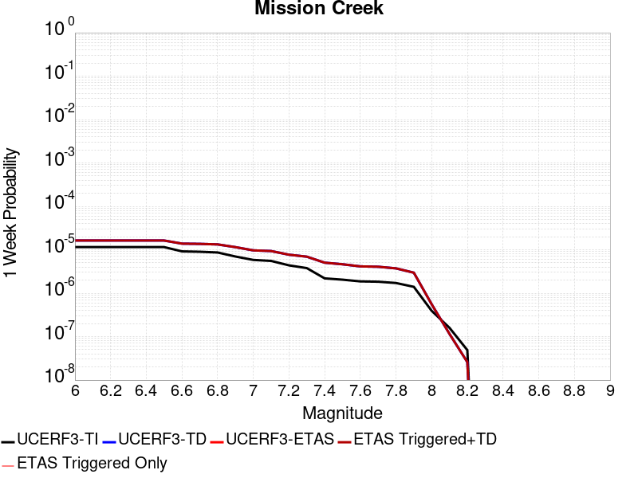 | 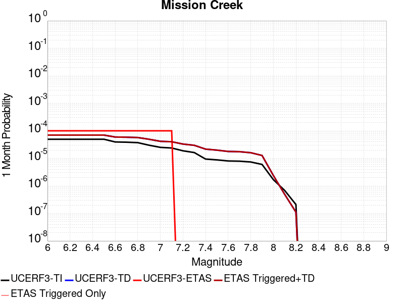 | 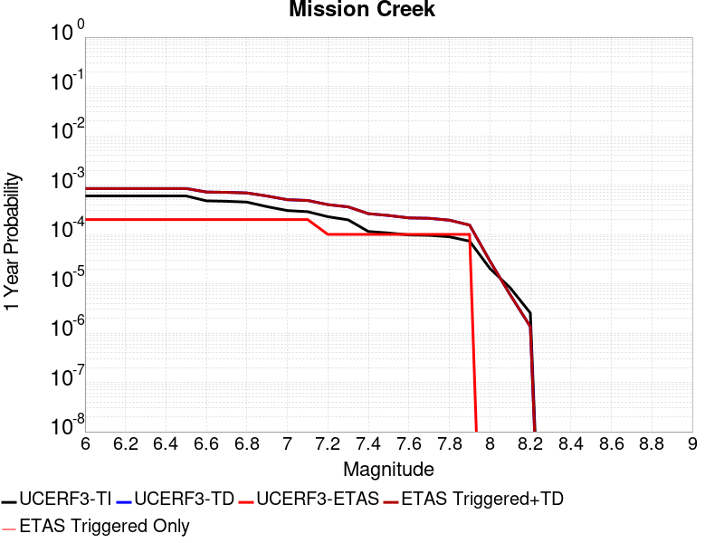 | 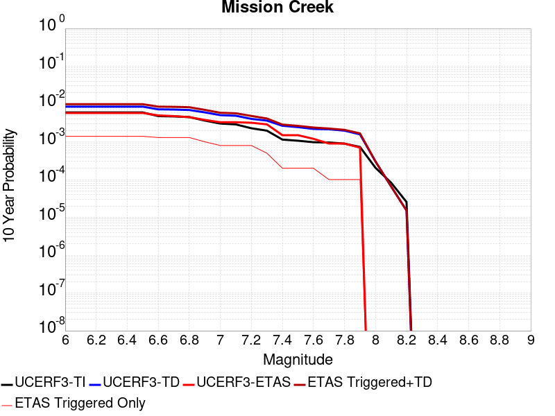 |

| Magnitude | 1 wk TI Prob | 1 wk TD Prob | 1 wk ETAS Prob | 1 wk ETAS/TD Gain | 1 wk ETAS Triggered+TD | 1 wk ETAS Triggered Only | 1 mo TI Prob | 1 mo TD Prob | 1 mo ETAS Prob | 1 mo ETAS/TD Gain | 1 mo ETAS Triggered+TD | 1 mo ETAS Triggered Only | 1 yr TI Prob | 1 yr TD Prob | 1 yr ETAS Prob | 1 yr ETAS/TD Gain | 1 yr ETAS Triggered+TD | 1 yr ETAS Triggered Only | 10 yr TI Prob | 10 yr TD Prob | 10 yr ETAS Prob | 10 yr ETAS/TD Gain | 10 yr ETAS Triggered+TD | 10 yr ETAS Triggered Only |
|-----|-----|-----|-----|-----|-----|-----|-----|-----|-----|-----|-----|-----|-----|-----|-----|-----|-----|-----|-----|-----|-----|-----|-----|-----|
| 6.0 | 1.1549387E-5 | 1.6350912E-5 | 0.0 | 0.0 | 1.6350912E-5 | 0.0 | 4.9496433E-5 | 7.007354E-5 | 1.0E-4 | 1.4270722 | 7.007354E-5 | 0.0 | 6.0245243E-4 | 8.5282646E-4 | 2.0E-4 | 0.23451431 | 8.5282646E-4 | 0.0 | 0.006008218 | 0.00852444 | 0.0058 | 0.6803966 | 0.009912506 | 0.0014 |
| 6.1 | 1.1549387E-5 | 1.6350912E-5 | 0.0 | 0.0 | 1.6350912E-5 | 0.0 | 4.9496433E-5 | 7.007354E-5 | 1.0E-4 | 1.4270722 | 7.007354E-5 | 0.0 | 6.0245243E-4 | 8.5282646E-4 | 2.0E-4 | 0.23451431 | 8.5282646E-4 | 0.0 | 0.006008218 | 0.00852444 | 0.0058 | 0.6803966 | 0.009912506 | 0.0014 |
| 6.2 | 1.1549387E-5 | 1.6350912E-5 | 0.0 | 0.0 | 1.6350912E-5 | 0.0 | 4.9496433E-5 | 7.007354E-5 | 1.0E-4 | 1.4270722 | 7.007354E-5 | 0.0 | 6.0245243E-4 | 8.5282646E-4 | 2.0E-4 | 0.23451431 | 8.5282646E-4 | 0.0 | 0.006008218 | 0.00852444 | 0.0058 | 0.6803966 | 0.009912506 | 0.0014 |
| 6.3 | 1.1549387E-5 | 1.6350912E-5 | 0.0 | 0.0 | 1.6350912E-5 | 0.0 | 4.9496433E-5 | 7.007354E-5 | 1.0E-4 | 1.4270722 | 7.007354E-5 | 0.0 | 6.0245243E-4 | 8.5282646E-4 | 2.0E-4 | 0.23451431 | 8.5282646E-4 | 0.0 | 0.006008218 | 0.00852444 | 0.0058 | 0.6803966 | 0.009912506 | 0.0014 |
| 6.4 | 1.1549387E-5 | 1.6350912E-5 | 0.0 | 0.0 | 1.6350912E-5 | 0.0 | 4.9496433E-5 | 7.007354E-5 | 1.0E-4 | 1.4270722 | 7.007354E-5 | 0.0 | 6.0245243E-4 | 8.5282646E-4 | 2.0E-4 | 0.23451431 | 8.5282646E-4 | 0.0 | 0.006008218 | 0.00852444 | 0.0058 | 0.6803966 | 0.009912506 | 0.0014 |
| 6.5 | 1.1549387E-5 | 1.6350912E-5 | 0.0 | 0.0 | 1.6350912E-5 | 0.0 | 4.9496433E-5 | 7.007354E-5 | 1.0E-4 | 1.4270722 | 7.007354E-5 | 0.0 | 6.0245243E-4 | 8.5282646E-4 | 2.0E-4 | 0.23451431 | 8.5282646E-4 | 0.0 | 0.006008218 | 0.00852444 | 0.0058 | 0.6803966 | 0.009912506 | 0.0014 |
| 6.6 | 9.202681E-6 | 1.3873917E-5 | 0.0 | 0.0 | 1.3873917E-5 | 0.0 | 3.9439463E-5 | 5.945834E-5 | 1.0E-4 | 1.6818498 | 5.945834E-5 | 0.0 | 4.800697E-4 | 7.236739E-4 | 2.0E-4 | 0.27636757 | 7.236739E-4 | 0.0 | 0.004790339 | 0.007241501 | 0.005 | 0.6904646 | 0.008532087 | 0.0013 |
| 6.7 | 9.019164E-6 | 1.3679563E-5 | 0.0 | 0.0 | 1.3679563E-5 | 0.0 | 3.8652986E-5 | 5.8625435E-5 | 1.0E-4 | 1.7057443 | 5.8625435E-5 | 0.0 | 4.7049852E-4 | 7.135399E-4 | 2.0E-4 | 0.28029266 | 7.135399E-4 | 0.0 | 0.004695036 | 0.007140815 | 0.0048 | 0.6721922 | 0.0084315315 | 0.0013 |
| 6.8 | 8.673558E-6 | 1.3301599E-5 | 0.0 | 0.0 | 1.3301599E-5 | 0.0 | 3.717186E-5 | 5.7005658E-5 | 1.0E-4 | 1.7542118 | 5.7005658E-5 | 0.0 | 4.524734E-4 | 6.9383177E-4 | 2.0E-4 | 0.28825432 | 6.9383177E-4 | 0.0 | 0.0045155324 | 0.006944967 | 0.0045 | 0.64795125 | 0.008235939 | 0.0013 |
| 6.9 | 7.002255E-6 | 1.1505561E-5 | 0.0 | 0.0 | 1.1505561E-5 | 0.0 | 3.000932E-5 | 4.930865E-5 | 1.0E-4 | 2.0280416 | 4.930865E-5 | 0.0 | 3.653022E-4 | 6.0017436E-4 | 2.0E-4 | 0.33323652 | 6.0017436E-4 | 0.0 | 0.0036470229 | 0.0060136644 | 0.0038 | 0.63189423 | 0.007007651 | 0.001 |
| 7.0 | 5.84644E-6 | 9.701095E-6 | 0.0 | 0.0 | 9.701095E-6 | 0.0 | 2.5055931E-5 | 4.1575484E-5 | 1.0E-4 | 2.4052637 | 4.1575484E-5 | 0.0 | 3.0501327E-4 | 5.060685E-4 | 2.0E-4 | 0.39520338 | 5.060685E-4 | 0.0 | 0.0030459496 | 0.005077083 | 0.0033 | 0.6499795 | 0.0058730217 | 8.0E-4 |
| 7.1 | 5.54703E-6 | 9.355451E-6 | 0.0 | 0.0 | 9.355451E-6 | 0.0 | 2.377277E-5 | 4.00942E-5 | 1.0E-4 | 2.4941263 | 4.00942E-5 | 0.0 | 2.8939504E-4 | 4.8804202E-4 | 2.0E-4 | 0.4098008 | 4.8804202E-4 | 0.0 | 0.0028901845 | 0.0048976173 | 0.0033 | 0.673797 | 0.0056936992 | 8.0E-4 |
| 7.2 | 4.384709E-6 | 7.706091E-6 | 0.0 | 0.0 | 7.706091E-6 | 0.0 | 1.8791474E-5 | 3.302571E-5 | 0.0 | 0.0 | 3.302571E-5 | 0.0 | 2.2876218E-4 | 4.0201747E-4 | 1.0E-4 | 0.2487454 | 4.0201747E-4 | 0.0 | 0.0022852682 | 0.0040408364 | 0.0032 | 0.7919153 | 0.004837604 | 8.0E-4 |
| 7.3 | 3.7888456E-6 | 6.9393473E-6 | 0.0 | 0.0 | 6.9393473E-6 | 0.0 | 1.623781E-5 | 2.973974E-5 | 0.0 | 0.0 | 2.973974E-5 | 0.0 | 1.9767738E-4 | 3.6202453E-4 | 1.0E-4 | 0.27622437 | 3.6202453E-4 | 0.0 | 0.0019750162 | 0.0036422687 | 0.0029 | 0.7962071 | 0.0041404474 | 5.0E-4 |
| 7.4 | 2.1982462E-6 | 5.0467584E-6 | 0.0 | 0.0 | 5.0467584E-6 | 0.0 | 9.421021E-6 | 2.1628786E-5 | 0.0 | 0.0 | 2.1628786E-5 | 0.0 | 1.1469489E-4 | 2.6329883E-4 | 1.0E-4 | 0.37979656 | 2.6329883E-4 | 0.0 | 0.0011463572 | 0.0026575762 | 0.0015 | 0.5644241 | 0.0028570446 | 2.0E-4 |
| 7.5 | 2.051923E-6 | 4.6372E-6 | 0.0 | 0.0 | 4.6372E-6 | 0.0 | 8.793926E-6 | 1.9873563E-5 | 0.0 | 0.0 | 1.9873563E-5 | 0.0 | 1.0706078E-4 | 2.4193391E-4 | 1.0E-4 | 0.413336 | 2.4193391E-4 | 0.0 | 0.0010700922 | 0.0024450147 | 0.0015 | 0.61349326 | 0.0026445256 | 2.0E-4 |
| 7.6 | 1.8733427E-6 | 4.144598E-6 | 0.0 | 0.0 | 4.144598E-6 | 0.0 | 8.028587E-6 | 1.776244E-5 | 0.0 | 0.0 | 1.776244E-5 | 0.0 | 9.774366E-5 | 2.1623634E-4 | 1.0E-4 | 0.46245694 | 2.1623634E-4 | 0.0 | 9.770069E-4 | 0.0021890393 | 0.0012 | 0.5481857 | 0.0023886014 | 2.0E-4 |
| 7.7 | 1.8411953E-6 | 4.064093E-6 | 0.0 | 0.0 | 4.064093E-6 | 0.0 | 7.890813E-6 | 1.7417426E-5 | 0.0 | 0.0 | 1.7417426E-5 | 0.0 | 9.606641E-5 | 2.1203661E-4 | 1.0E-4 | 0.47161666 | 2.1203661E-4 | 0.0 | 9.6024893E-4 | 0.0021472273 | 9.0E-4 | 0.4191452 | 0.0022470125 | 1.0E-4 |
| 7.8 | 1.7194251E-6 | 3.7296682E-6 | 0.0 | 0.0 | 3.7296682E-6 | 0.0 | 7.368944E-6 | 1.5984195E-5 | 0.0 | 0.0 | 1.5984195E-5 | 0.0 | 8.97132E-5 | 1.9459026E-4 | 1.0E-4 | 0.51390034 | 1.9459026E-4 | 0.0 | 8.967699E-4 | 0.0019723035 | 9.0E-4 | 0.4563192 | 0.0020721063 | 1.0E-4 |
| 7.9 | 1.4035052E-6 | 2.9649234E-6 | 0.0 | 0.0 | 2.9649234E-6 | 0.0 | 6.0150082E-6 | 1.2706752E-5 | 0.0 | 0.0 | 1.2706752E-5 | 0.0 | 7.3230265E-5 | 1.546938E-4 | 1.0E-4 | 0.64643836 | 1.546938E-4 | 0.0 | 7.3206134E-4 | 0.0015708042 | 7.0E-4 | 0.4456316 | 0.0016706471 | 1.0E-4 |
| 8.0 | 3.9318823E-7 | 5.55192E-7 | 0.0 | 0.0 | 5.55192E-7 | 0.0 | 1.6850913E-6 | 2.379392E-6 | 0.0 | 0.0 | 2.379392E-6 | 0.0 | 2.0515794E-5 | 2.896872E-5 | 0.0 | 0.0 | 2.896872E-5 | 0.0 | 2.0513899E-4 | 3.0029958E-4 | 0.0 | 0.0 | 3.0029958E-4 | 0.0 |
| 8.1 | 1.596793E-7 | 1.1420735E-7 | 0.0 | 0.0 | 1.1420735E-7 | 0.0 | 6.8433974E-7 | 4.8946E-7 | 0.0 | 0.0 | 4.8946E-7 | 0.0 | 8.331805E-6 | 5.9591594E-6 | 0.0 | 0.0 | 5.9591594E-6 | 0.0 | 8.331492E-5 | 6.572409E-5 | 0.0 | 0.0 | 6.572409E-5 | 0.0 |
| 8.2 | 4.9003038E-8 | 2.5534453E-8 | 0.0 | 0.0 | 2.5534453E-8 | 0.0 | 2.10013E-7 | 1.09433365E-7 | 0.0 | 0.0 | 1.09433365E-7 | 0.0 | 2.5569052E-6 | 1.3323504E-6 | 0.0 | 0.0 | 1.3323504E-6 | 0.0 | 2.556876E-5 | 1.50076685E-5 | 0.0 | 0.0 | 1.50076685E-5 | 0.0 |

## Oak Ridge (Onshore)
*[(top)](#table-of-contents)*

| 1 Week | 1 Month | 1 Year | 10 Year |
|-----|-----|-----|-----|
| 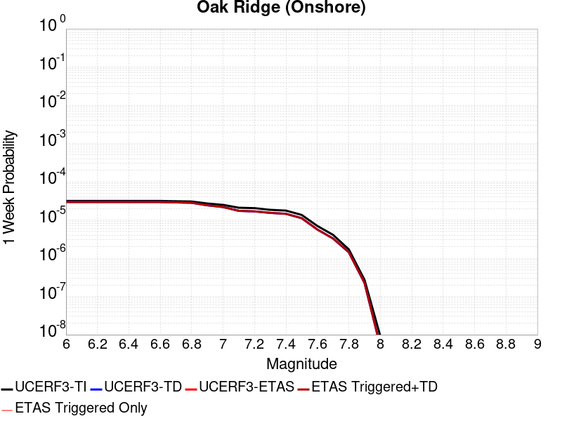 | 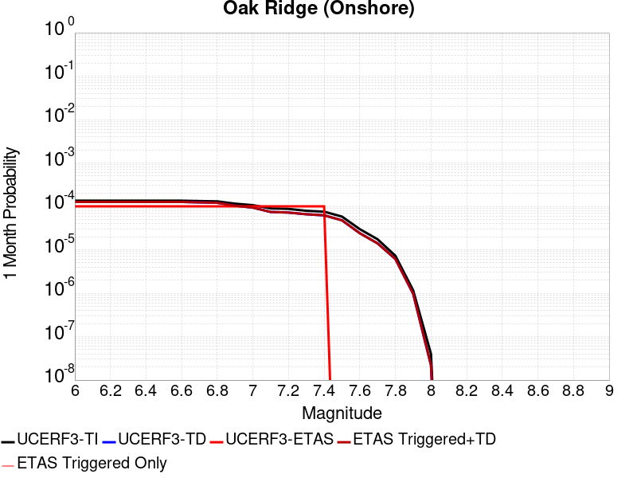 |  |  |

| Magnitude | 1 wk TI Prob | 1 wk TD Prob | 1 wk ETAS Prob | 1 wk ETAS/TD Gain | 1 wk ETAS Triggered+TD | 1 wk ETAS Triggered Only | 1 mo TI Prob | 1 mo TD Prob | 1 mo ETAS Prob | 1 mo ETAS/TD Gain | 1 mo ETAS Triggered+TD | 1 mo ETAS Triggered Only | 1 yr TI Prob | 1 yr TD Prob | 1 yr ETAS Prob | 1 yr ETAS/TD Gain | 1 yr ETAS Triggered+TD | 1 yr ETAS Triggered Only | 10 yr TI Prob | 10 yr TD Prob | 10 yr ETAS Prob | 10 yr ETAS/TD Gain | 10 yr ETAS Triggered+TD | 10 yr ETAS Triggered Only |
|-----|-----|-----|-----|-----|-----|-----|-----|-----|-----|-----|-----|-----|-----|-----|-----|-----|-----|-----|-----|-----|-----|-----|-----|-----|
| 6.0 | 3.155064E-5 | 2.953461E-5 | 0.0 | 0.0 | 2.953461E-5 | 0.0 | 1.3521002E-4 | 1.2657097E-4 | 1.0E-4 | 0.79007053 | 1.2657097E-4 | 0.0 | 0.001644939 | 0.0015399505 | 9.0E-4 | 0.5844344 | 0.0015399505 | 0.0 | 0.01632816 | 0.01529713 | 0.0089 | 0.5818085 | 0.016577244 | 0.0013 |
| 6.1 | 3.155064E-5 | 2.953461E-5 | 0.0 | 0.0 | 2.953461E-5 | 0.0 | 1.3521002E-4 | 1.2657097E-4 | 1.0E-4 | 0.79007053 | 1.2657097E-4 | 0.0 | 0.001644939 | 0.0015399505 | 9.0E-4 | 0.5844344 | 0.0015399505 | 0.0 | 0.01632816 | 0.01529713 | 0.0089 | 0.5818085 | 0.016577244 | 0.0013 |
| 6.2 | 3.155064E-5 | 2.953461E-5 | 0.0 | 0.0 | 2.953461E-5 | 0.0 | 1.3521002E-4 | 1.2657097E-4 | 1.0E-4 | 0.79007053 | 1.2657097E-4 | 0.0 | 0.001644939 | 0.0015399505 | 9.0E-4 | 0.5844344 | 0.0015399505 | 0.0 | 0.01632816 | 0.01529713 | 0.0089 | 0.5818085 | 0.016577244 | 0.0013 |
| 6.3 | 3.155064E-5 | 2.953461E-5 | 0.0 | 0.0 | 2.953461E-5 | 0.0 | 1.3521002E-4 | 1.2657097E-4 | 1.0E-4 | 0.79007053 | 1.2657097E-4 | 0.0 | 0.001644939 | 0.0015399505 | 9.0E-4 | 0.5844344 | 0.0015399505 | 0.0 | 0.01632816 | 0.01529713 | 0.0089 | 0.5818085 | 0.016577244 | 0.0013 |
| 6.4 | 3.155064E-5 | 2.953461E-5 | 0.0 | 0.0 | 2.953461E-5 | 0.0 | 1.3521002E-4 | 1.2657097E-4 | 1.0E-4 | 0.79007053 | 1.2657097E-4 | 0.0 | 0.001644939 | 0.0015399505 | 9.0E-4 | 0.5844344 | 0.0015399505 | 0.0 | 0.01632816 | 0.01529713 | 0.0089 | 0.5818085 | 0.016577244 | 0.0013 |
| 6.5 | 3.155064E-5 | 2.953461E-5 | 0.0 | 0.0 | 2.953461E-5 | 0.0 | 1.3521002E-4 | 1.2657097E-4 | 1.0E-4 | 0.79007053 | 1.2657097E-4 | 0.0 | 0.001644939 | 0.0015399505 | 9.0E-4 | 0.5844344 | 0.0015399505 | 0.0 | 0.01632816 | 0.01529713 | 0.0089 | 0.5818085 | 0.016577244 | 0.0013 |
| 6.6 | 3.155064E-5 | 2.953461E-5 | 0.0 | 0.0 | 2.953461E-5 | 0.0 | 1.3521002E-4 | 1.2657097E-4 | 1.0E-4 | 0.79007053 | 1.2657097E-4 | 0.0 | 0.001644939 | 0.0015399505 | 9.0E-4 | 0.5844344 | 0.0015399505 | 0.0 | 0.01632816 | 0.01529713 | 0.0089 | 0.5818085 | 0.016577244 | 0.0013 |
| 6.7 | 3.098897E-5 | 2.8872579E-5 | 0.0 | 0.0 | 2.8872579E-5 | 0.0 | 1.328031E-4 | 1.2373396E-4 | 1.0E-4 | 0.8081855 | 1.2373396E-4 | 0.0 | 0.0016156785 | 0.0015054577 | 9.0E-4 | 0.5978248 | 0.0015054577 | 0.0 | 0.016039822 | 0.014956865 | 0.0086 | 0.57498676 | 0.016237423 | 0.0013 |
| 6.8 | 3.0449872E-5 | 2.824758E-5 | 0.0 | 0.0 | 2.824758E-5 | 0.0 | 1.3049292E-4 | 1.21055644E-4 | 1.0E-4 | 0.8260664 | 1.21055644E-4 | 0.0 | 0.0015875935 | 0.0014728933 | 9.0E-4 | 0.61104226 | 0.0014728933 | 0.0 | 0.015762992 | 0.014635514 | 0.0086 | 0.58761173 | 0.015817951 | 0.0012 |
| 6.9 | 2.697928E-5 | 2.4226716E-5 | 0.0 | 0.0 | 2.4226716E-5 | 0.0 | 1.15620365E-4 | 1.0382477E-4 | 1.0E-4 | 0.9631613 | 1.0382477E-4 | 0.0 | 0.0014067689 | 0.0012633551 | 6.0E-4 | 0.47492585 | 0.0012633551 | 0.0 | 0.0139789665 | 0.012564277 | 0.0077 | 0.6128486 | 0.013749201 | 0.0012 |
| 7.0 | 2.4893961E-5 | 2.1868293E-5 | 0.0 | 0.0 | 2.1868293E-5 | 0.0 | 1.0668404E-4 | 9.3717994E-5 | 1.0E-4 | 1.067031 | 9.3717994E-5 | 0.0 | 0.0012981043 | 0.001140437 | 5.0E-4 | 0.43842843 | 0.001140437 | 0.0 | 0.012905477 | 0.011347961 | 0.007 | 0.6168509 | 0.012534344 | 0.0012 |
| 7.1 | 2.0945363E-5 | 1.7359444E-5 | 0.0 | 0.0 | 1.7359444E-5 | 0.0 | 8.976275E-5 | 7.4395524E-5 | 1.0E-4 | 1.3441669 | 7.4395524E-5 | 0.0 | 0.0010923136 | 9.0539386E-4 | 4.0E-4 | 0.4417967 | 9.0539386E-4 | 0.0 | 0.0108696 | 0.009017816 | 0.0057 | 0.6320821 | 0.010206995 | 0.0012 |
| 7.2 | 2.0439404E-5 | 1.6814236E-5 | 0.0 | 0.0 | 1.6814236E-5 | 0.0 | 8.7594504E-5 | 7.2059054E-5 | 1.0E-4 | 1.3877507 | 7.2059054E-5 | 0.0 | 0.0010659413 | 8.7697053E-4 | 4.0E-4 | 0.4561157 | 8.7697053E-4 | 0.0 | 0.010608427 | 0.008735845 | 0.0056 | 0.64103705 | 0.009925362 | 0.0012 |
| 7.3 | 1.8463334E-5 | 1.5384872E-5 | 0.0 | 0.0 | 1.5384872E-5 | 0.0 | 7.912617E-5 | 6.593353E-5 | 1.0E-4 | 1.5166792 | 6.593353E-5 | 0.0 | 9.6293533E-4 | 8.0244936E-4 | 4.0E-4 | 0.49847382 | 8.0244936E-4 | 0.0 | 0.009587734 | 0.007996211 | 0.0053 | 0.66281396 | 0.009186615 | 0.0012 |
| 7.4 | 1.763139E-5 | 1.4519539E-5 | 0.0 | 0.0 | 1.4519539E-5 | 0.0 | 7.556091E-5 | 6.222514E-5 | 1.0E-4 | 1.6070676 | 6.222514E-5 | 0.0 | 9.1956573E-4 | 7.5733167E-4 | 4.0E-4 | 0.52817017 | 7.5733167E-4 | 0.0 | 0.009157699 | 0.0075481427 | 0.0046 | 0.60942143 | 0.0086398395 | 0.0011 |
| 7.5 | 1.3594944E-5 | 1.1165264E-5 | 0.0 | 0.0 | 1.1165264E-5 | 0.0 | 5.8262744E-5 | 4.7850266E-5 | 0.0 | 0.0 | 4.7850266E-5 | 0.0 | 7.0911803E-4 | 5.824238E-4 | 3.0E-4 | 0.51508886 | 5.824238E-4 | 0.0 | 0.007068595 | 0.0058091586 | 0.0032 | 0.55085427 | 0.0067039304 | 9.0E-4 |
| 7.6 | 6.9889534E-6 | 5.6374233E-6 | 0.0 | 0.0 | 5.6374233E-6 | 0.0 | 2.9952313E-5 | 2.4160163E-5 | 0.0 | 0.0 | 2.4160163E-5 | 0.0 | 3.646084E-4 | 2.941107E-4 | 2.0E-4 | 0.68001604 | 2.941107E-4 | 0.0 | 0.0036401073 | 0.0029372587 | 0.0022 | 0.7489977 | 0.0036352025 | 7.0E-4 |
| 7.7 | 4.0824193E-6 | 3.2836836E-6 | 0.0 | 0.0 | 3.2836836E-6 | 0.0 | 1.7495966E-5 | 1.4072854E-5 | 0.0 | 0.0 | 1.4072854E-5 | 0.0 | 2.1299256E-4 | 1.7132366E-4 | 2.0E-4 | 1.167381 | 1.7132366E-4 | 0.0 | 0.0021278851 | 0.0017119292 | 0.0016 | 0.93461806 | 0.0022110732 | 5.0E-4 |
| 7.8 | 1.7023609E-6 | 1.4372064E-6 | 0.0 | 0.0 | 1.4372064E-6 | 0.0 | 7.295812E-6 | 6.159442E-6 | 0.0 | 0.0 | 6.159442E-6 | 0.0 | 8.882289E-5 | 7.498865E-5 | 1.0E-4 | 1.3335352 | 7.498865E-5 | 0.0 | 8.8787393E-4 | 7.4963627E-4 | 7.0E-4 | 0.9337862 | 0.0010494114 | 3.0E-4 |
| 7.9 | 2.721225E-7 | 2.2619702E-7 | 0.0 | 0.0 | 2.2619702E-7 | 0.0 | 1.1662388E-6 | 9.694154E-7 | 0.0 | 0.0 | 9.694154E-7 | 0.0 | 1.4198865E-5 | 1.1802572E-5 | 0.0 | 0.0 | 1.1802572E-5 | 0.0 | 1.4197957E-4 | 1.1801973E-4 | 3.0E-4 | 2.5419478 | 3.1799613E-4 | 2.0E-4 |
| 8.0 | 9.364255E-9 | 5.122841E-9 | 0.0 | 0.0 | 5.122841E-9 | 0.0 | 4.0132523E-8 | 2.1955032E-8 | 0.0 | 0.0 | 2.1955032E-8 | 0.0 | 4.8861335E-7 | 2.6730248E-7 | 0.0 | 0.0 | 2.6730248E-7 | 0.0 | 4.8861225E-6 | 2.673022E-6 | 0.0 | 0.0 | 2.673022E-6 | 0.0 |

## San Andreas (North Branch Mill Creek)
*[(top)](#table-of-contents)*

| 1 Week | 1 Month | 1 Year | 10 Year |
|-----|-----|-----|-----|
| 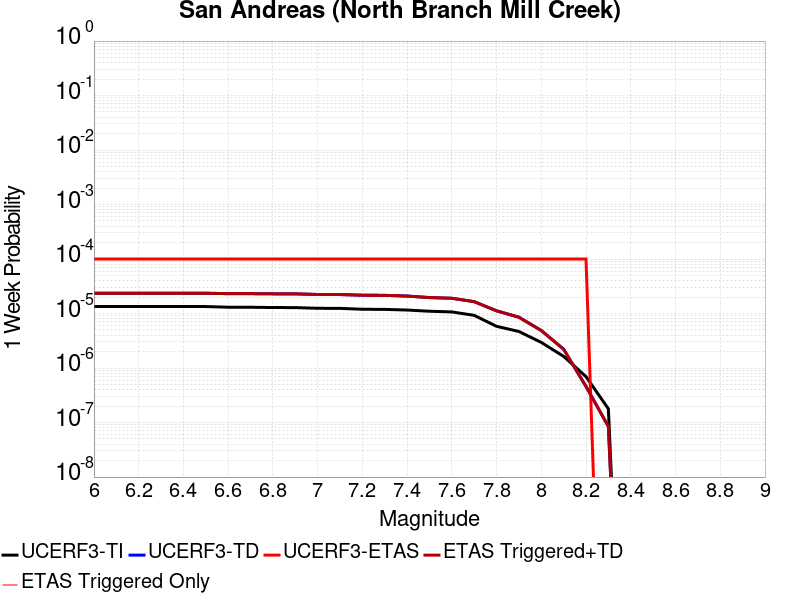 |  |  | 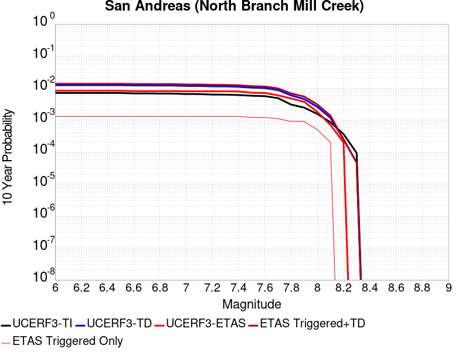 |

| Magnitude | 1 wk TI Prob | 1 wk TD Prob | 1 wk ETAS Prob | 1 wk ETAS/TD Gain | 1 wk ETAS Triggered+TD | 1 wk ETAS Triggered Only | 1 mo TI Prob | 1 mo TD Prob | 1 mo ETAS Prob | 1 mo ETAS/TD Gain | 1 mo ETAS Triggered+TD | 1 mo ETAS Triggered Only | 1 yr TI Prob | 1 yr TD Prob | 1 yr ETAS Prob | 1 yr ETAS/TD Gain | 1 yr ETAS Triggered+TD | 1 yr ETAS Triggered Only | 10 yr TI Prob | 10 yr TD Prob | 10 yr ETAS Prob | 10 yr ETAS/TD Gain | 10 yr ETAS Triggered+TD | 10 yr ETAS Triggered Only |
|-----|-----|-----|-----|-----|-----|-----|-----|-----|-----|-----|-----|-----|-----|-----|-----|-----|-----|-----|-----|-----|-----|-----|-----|-----|
| 6.0 | 1.3461156E-5 | 2.3540204E-5 | 1.0E-4 | 4.2480516 | 2.3540204E-5 | 0.0 | 5.7689394E-5 | 1.0088271E-4 | 2.0E-4 | 1.9825003 | 2.0087262E-4 | 1.0E-4 | 7.02142E-4 | 0.0012275582 | 9.0E-4 | 0.7331628 | 0.0013274355 | 1.0E-4 | 0.0069992766 | 0.012252563 | 0.0082 | 0.66924775 | 0.013536635 | 0.0013 |
| 6.1 | 1.3461156E-5 | 2.3540204E-5 | 1.0E-4 | 4.2480516 | 2.3540204E-5 | 0.0 | 5.7689394E-5 | 1.0088271E-4 | 2.0E-4 | 1.9825003 | 2.0087262E-4 | 1.0E-4 | 7.02142E-4 | 0.0012275582 | 9.0E-4 | 0.7331628 | 0.0013274355 | 1.0E-4 | 0.0069992766 | 0.012252563 | 0.0082 | 0.66924775 | 0.013536635 | 0.0013 |
| 6.2 | 1.3461156E-5 | 2.3540204E-5 | 1.0E-4 | 4.2480516 | 2.3540204E-5 | 0.0 | 5.7689394E-5 | 1.0088271E-4 | 2.0E-4 | 1.9825003 | 2.0087262E-4 | 1.0E-4 | 7.02142E-4 | 0.0012275582 | 9.0E-4 | 0.7331628 | 0.0013274355 | 1.0E-4 | 0.0069992766 | 0.012252563 | 0.0082 | 0.66924775 | 0.013536635 | 0.0013 |
| 6.3 | 1.3461156E-5 | 2.3540204E-5 | 1.0E-4 | 4.2480516 | 2.3540204E-5 | 0.0 | 5.7689394E-5 | 1.0088271E-4 | 2.0E-4 | 1.9825003 | 2.0087262E-4 | 1.0E-4 | 7.02142E-4 | 0.0012275582 | 9.0E-4 | 0.7331628 | 0.0013274355 | 1.0E-4 | 0.0069992766 | 0.012252563 | 0.0082 | 0.66924775 | 0.013536635 | 0.0013 |
| 6.4 | 1.3461156E-5 | 2.3540204E-5 | 1.0E-4 | 4.2480516 | 2.3540204E-5 | 0.0 | 5.7689394E-5 | 1.0088271E-4 | 2.0E-4 | 1.9825003 | 2.0087262E-4 | 1.0E-4 | 7.02142E-4 | 0.0012275582 | 9.0E-4 | 0.7331628 | 0.0013274355 | 1.0E-4 | 0.0069992766 | 0.012252563 | 0.0082 | 0.66924775 | 0.013536635 | 0.0013 |
| 6.5 | 1.3450706E-5 | 2.3529163E-5 | 1.0E-4 | 4.250045 | 2.3529163E-5 | 0.0 | 5.764461E-5 | 1.0083539E-4 | 2.0E-4 | 1.9834306 | 2.008253E-4 | 1.0E-4 | 7.0159714E-4 | 0.0012269828 | 9.0E-4 | 0.7335066 | 0.00132686 | 1.0E-4 | 0.006993862 | 0.012246872 | 0.0082 | 0.6695587 | 0.013530951 | 0.0013 |
| 6.6 | 1.3074523E-5 | 2.314341E-5 | 1.0E-4 | 4.3208847 | 2.314341E-5 | 0.0 | 5.6032466E-5 | 9.918229E-5 | 2.0E-4 | 2.016489 | 1.9917237E-4 | 1.0E-4 | 6.8198174E-4 | 0.0012068787 | 9.0E-4 | 0.74572533 | 0.001306758 | 1.0E-4 | 0.006798926 | 0.012048024 | 0.008 | 0.66400933 | 0.013332361 | 0.0013 |
| 6.7 | 1.3050216E-5 | 2.3118699E-5 | 1.0E-4 | 4.325503 | 2.3118699E-5 | 0.0 | 5.59283E-5 | 9.9076395E-5 | 2.0E-4 | 2.0186443 | 1.9906649E-4 | 1.0E-4 | 6.8071426E-4 | 0.0012055908 | 9.0E-4 | 0.74652195 | 0.0013054702 | 1.0E-4 | 0.0067863287 | 0.012035284 | 0.008 | 0.6647122 | 0.013319639 | 0.0013 |
| 6.8 | 1.29049395E-5 | 2.2967086E-5 | 1.0E-4 | 4.354057 | 2.2967086E-5 | 0.0 | 5.530571E-5 | 9.842667E-5 | 2.0E-4 | 2.0319695 | 1.9841683E-4 | 1.0E-4 | 6.73139E-4 | 0.0011976892 | 9.0E-4 | 0.7514471 | 0.0012975694 | 1.0E-4 | 0.0067110364 | 0.01195712 | 0.008 | 0.6690574 | 0.013241576 | 0.0013 |
| 6.9 | 1.2867369E-5 | 2.2926473E-5 | 1.0E-4 | 4.36177 | 2.2926473E-5 | 0.0 | 5.51447E-5 | 9.825263E-5 | 2.0E-4 | 2.035569 | 1.9824281E-4 | 1.0E-4 | 6.711799E-4 | 0.0011955725 | 9.0E-4 | 0.7527774 | 0.0012954529 | 1.0E-4 | 0.006691564 | 0.011936181 | 0.008 | 0.6702311 | 0.013220664 | 0.0013 |
| 7.0 | 1.2495996E-5 | 2.2325814E-5 | 1.0E-4 | 4.4791203 | 2.2325814E-5 | 0.0 | 5.3553173E-5 | 9.5678566E-5 | 2.0E-4 | 2.0903323 | 1.95669E-4 | 1.0E-4 | 6.518148E-4 | 0.0011642668 | 9.0E-4 | 0.77301866 | 0.0012641505 | 1.0E-4 | 0.0064990623 | 0.011626412 | 0.0079 | 0.67948735 | 0.012911297 | 0.0013 |
| 7.1 | 1.2452067E-5 | 2.2270855E-5 | 1.0E-4 | 4.4901733 | 2.2270855E-5 | 0.0 | 5.3364907E-5 | 9.544304E-5 | 2.0E-4 | 2.0954907 | 1.954335E-4 | 1.0E-4 | 6.4952404E-4 | 0.0011614024 | 9.0E-4 | 0.7749252 | 0.0012612863 | 1.0E-4 | 0.0064762887 | 0.011598067 | 0.0079 | 0.681148 | 0.01288299 | 0.0013 |
| 7.2 | 1.2002777E-5 | 2.1648853E-5 | 1.0E-4 | 4.6191826 | 2.1648853E-5 | 0.0 | 5.143946E-5 | 9.277751E-5 | 2.0E-4 | 2.1556947 | 1.9276823E-4 | 1.0E-4 | 6.2609545E-4 | 0.0011289836 | 9.0E-4 | 0.79717726 | 0.0012288706 | 1.0E-4 | 0.006243344 | 0.011277165 | 0.0079 | 0.70053065 | 0.012562505 | 0.0013 |
| 7.3 | 1.1923425E-5 | 2.1518581E-5 | 1.0E-4 | 4.647146 | 2.1518581E-5 | 0.0 | 5.109939E-5 | 9.221925E-5 | 2.0E-4 | 2.1687446 | 1.9221002E-4 | 1.0E-4 | 6.219575E-4 | 0.0011221936 | 9.0E-4 | 0.8020006 | 0.0012220815 | 1.0E-4 | 0.0062021962 | 0.011209971 | 0.0079 | 0.70472974 | 0.0124953985 | 0.0013 |
| 7.4 | 1.16105175E-5 | 2.0892781E-5 | 1.0E-4 | 4.786342 | 2.0892781E-5 | 0.0 | 4.975841E-5 | 8.953743E-5 | 2.0E-4 | 2.2337027 | 1.8952848E-4 | 1.0E-4 | 6.0564023E-4 | 0.0010895757 | 9.0E-4 | 0.82600963 | 0.0011894667 | 1.0E-4 | 0.006039923 | 0.010887871 | 0.0078 | 0.71639353 | 0.012173717 | 0.0013 |
| 7.5 | 1.1037265E-5 | 1.9594412E-5 | 1.0E-4 | 5.1034956 | 1.9594412E-5 | 0.0 | 4.7301706E-5 | 8.397336E-5 | 2.0E-4 | 2.3817077 | 1.8396496E-4 | 1.0E-4 | 5.757461E-4 | 0.0010218984 | 9.0E-4 | 0.8807138 | 0.0011217962 | 1.0E-4 | 0.005742567 | 0.010215801 | 0.0071 | 0.6950018 | 0.011403542 | 0.0012 |
| 7.6 | 1.0720915E-5 | 1.9036479E-5 | 1.0E-4 | 5.2530723 | 1.9036479E-5 | 0.0 | 4.5945973E-5 | 8.158237E-5 | 2.0E-4 | 2.45151 | 1.8157421E-4 | 1.0E-4 | 5.592486E-4 | 9.92815E-4 | 9.0E-4 | 0.90651333 | 0.0010927157 | 1.0E-4 | 0.005578433 | 0.009927613 | 0.007 | 0.70510405 | 0.011115699 | 0.0012 |
| 7.7 | 9.276279E-6 | 1.648326E-5 | 1.0E-4 | 6.066761 | 1.648326E-5 | 0.0 | 3.9754876E-5 | 7.064064E-5 | 2.0E-4 | 2.8312314 | 1.7063358E-4 | 1.0E-4 | 4.839081E-4 | 8.5971213E-4 | 8.0E-4 | 0.9305441 | 9.5962617E-4 | 1.0E-4 | 0.0048285574 | 0.008607548 | 0.0059 | 0.68544495 | 0.009698079 | 0.0011 |
| 7.8 | 5.8346777E-6 | 1.1200544E-5 | 1.0E-4 | 8.928138 | 1.1200544E-5 | 0.0 | 2.5005522E-5 | 4.800145E-5 | 1.0E-4 | 2.0832705 | 4.800145E-5 | 0.0 | 3.043997E-4 | 5.84261E-4 | 6.0E-4 | 1.0269382 | 5.84261E-4 | 0.0 | 0.0030398308 | 0.005870525 | 0.0047 | 0.8006099 | 0.0067652413 | 9.0E-4 |
| 7.9 | 4.690204E-6 | 8.5451875E-6 | 1.0E-4 | 11.702493 | 8.5451875E-6 | 0.0 | 2.0100719E-5 | 3.662172E-5 | 1.0E-4 | 2.73062 | 3.662172E-5 | 0.0 | 2.4469878E-4 | 4.457783E-4 | 4.0E-4 | 0.897307 | 4.457783E-4 | 0.0 | 0.002444295 | 0.0044894433 | 0.0037 | 0.8241557 | 0.0053854026 | 9.0E-4 |
| 8.0 | 2.9570454E-6 | 4.8649576E-6 | 1.0E-4 | 20.555164 | 4.8649576E-6 | 0.0 | 1.267299E-5 | 2.0849651E-5 | 1.0E-4 | 4.796243 | 2.0849651E-5 | 0.0 | 1.5428272E-4 | 2.5381497E-4 | 2.0E-4 | 0.7879756 | 2.5381497E-4 | 0.0 | 0.0015417566 | 0.0025592088 | 0.0018 | 0.70334244 | 0.003057929 | 5.0E-4 |
| 8.1 | 1.6376824E-6 | 2.203064E-6 | 1.0E-4 | 45.391327 | 2.203064E-6 | 0.0 | 7.01862E-6 | 9.441668E-6 | 1.0E-4 | 10.591349 | 9.441668E-6 | 0.0 | 8.544835E-5 | 1.1494627E-4 | 1.0E-4 | 0.8699717 | 1.1494627E-4 | 0.0 | 8.54155E-4 | 0.0011640398 | 7.0E-4 | 0.601354 | 0.001363807 | 2.0E-4 |
| 8.2 | 6.9631557E-7 | 4.5448257E-7 | 1.0E-4 | 220.03044 | 4.5448257E-7 | 0.0 | 2.984206E-6 | 1.947781E-6 | 1.0E-4 | 51.340477 | 1.947781E-6 | 0.0 | 3.63321E-5 | 2.3713976E-5 | 1.0E-4 | 4.2169223 | 2.3713976E-5 | 0.0 | 3.6326164E-4 | 2.456155E-4 | 2.0E-4 | 0.81428087 | 2.456155E-4 | 0.0 |
| 8.3 | 1.7876137E-7 | 8.379096E-8 | 0.0 | 0.0 | 8.379096E-8 | 0.0 | 7.661199E-7 | 3.5910404E-7 | 0.0 | 0.0 | 3.5910404E-7 | 0.0 | 9.32747E-6 | 4.3720834E-6 | 0.0 | 0.0 | 4.3720834E-6 | 0.0 | 9.3270784E-5 | 4.591572E-5 | 0.0 | 0.0 | 4.591572E-5 | 0.0 |

## Santa Ynez River
*[(top)](#table-of-contents)*

| 1 Week | 1 Month | 1 Year | 10 Year |
|-----|-----|-----|-----|
|  | 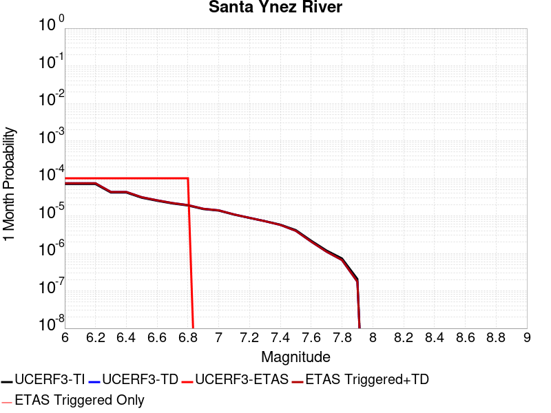 | 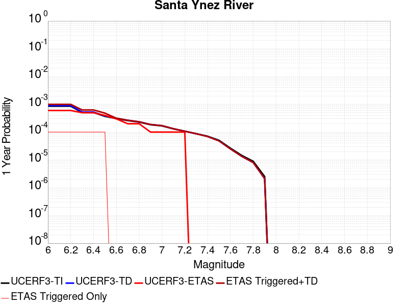 |  |

| Magnitude | 1 wk TI Prob | 1 wk TD Prob | 1 wk ETAS Prob | 1 wk ETAS/TD Gain | 1 wk ETAS Triggered+TD | 1 wk ETAS Triggered Only | 1 mo TI Prob | 1 mo TD Prob | 1 mo ETAS Prob | 1 mo ETAS/TD Gain | 1 mo ETAS Triggered+TD | 1 mo ETAS Triggered Only | 1 yr TI Prob | 1 yr TD Prob | 1 yr ETAS Prob | 1 yr ETAS/TD Gain | 1 yr ETAS Triggered+TD | 1 yr ETAS Triggered Only | 10 yr TI Prob | 10 yr TD Prob | 10 yr ETAS Prob | 10 yr ETAS/TD Gain | 10 yr ETAS Triggered+TD | 10 yr ETAS Triggered Only |
|-----|-----|-----|-----|-----|-----|-----|-----|-----|-----|-----|-----|-----|-----|-----|-----|-----|-----|-----|-----|-----|-----|-----|-----|-----|
| 6.0 | 1.6396456E-5 | 1.7211414E-5 | 0.0 | 0.0 | 1.7211414E-5 | 0.0 | 7.026863E-5 | 7.3761315E-5 | 1.0E-4 | 1.3557242 | 7.3761315E-5 | 0.0 | 8.551848E-4 | 8.977096E-4 | 6.0E-4 | 0.6683676 | 9.976198E-4 | 1.0E-4 | 0.0085190125 | 0.008944382 | 0.0072 | 0.80497456 | 0.010034543 | 0.0011 |
| 6.1 | 1.6396456E-5 | 1.7211414E-5 | 0.0 | 0.0 | 1.7211414E-5 | 0.0 | 7.026863E-5 | 7.3761315E-5 | 1.0E-4 | 1.3557242 | 7.3761315E-5 | 0.0 | 8.551848E-4 | 8.977096E-4 | 6.0E-4 | 0.6683676 | 9.976198E-4 | 1.0E-4 | 0.0085190125 | 0.008944382 | 0.0072 | 0.80497456 | 0.010034543 | 0.0011 |
| 6.2 | 1.6396456E-5 | 1.7211414E-5 | 0.0 | 0.0 | 1.7211414E-5 | 0.0 | 7.026863E-5 | 7.3761315E-5 | 1.0E-4 | 1.3557242 | 7.3761315E-5 | 0.0 | 8.551848E-4 | 8.977096E-4 | 6.0E-4 | 0.6683676 | 9.976198E-4 | 1.0E-4 | 0.0085190125 | 0.008944382 | 0.0072 | 0.80497456 | 0.010034543 | 0.0011 |
| 6.3 | 9.736976E-6 | 1.0123403E-5 | 0.0 | 0.0 | 1.0123403E-5 | 0.0 | 4.172923E-5 | 4.3385317E-5 | 1.0E-4 | 2.3049273 | 4.3385317E-5 | 0.0 | 5.0793495E-4 | 5.280932E-4 | 5.0E-4 | 0.94680256 | 6.280404E-4 | 1.0E-4 | 0.005067755 | 0.0052688885 | 0.0046 | 0.8730494 | 0.0062636198 | 0.001 |
| 6.4 | 9.736976E-6 | 1.0123403E-5 | 0.0 | 0.0 | 1.0123403E-5 | 0.0 | 4.172923E-5 | 4.3385317E-5 | 1.0E-4 | 2.3049273 | 4.3385317E-5 | 0.0 | 5.0793495E-4 | 5.280932E-4 | 5.0E-4 | 0.94680256 | 6.280404E-4 | 1.0E-4 | 0.005067755 | 0.0052688885 | 0.0046 | 0.8730494 | 0.0062636198 | 0.001 |
| 6.5 | 7.081964E-6 | 7.3306815E-6 | 0.0 | 0.0 | 7.3306815E-6 | 0.0 | 3.035092E-5 | 3.1416836E-5 | 1.0E-4 | 3.1830068 | 3.1416836E-5 | 0.0 | 3.694598E-4 | 3.8243443E-4 | 4.0E-4 | 1.045931 | 4.823962E-4 | 1.0E-4 | 0.0036884616 | 0.0038179248 | 0.0033 | 0.8643439 | 0.0046148705 | 8.0E-4 |
| 6.6 | 5.873247E-6 | 6.0603998E-6 | 0.0 | 0.0 | 6.0603998E-6 | 0.0 | 2.5170815E-5 | 2.5972888E-5 | 1.0E-4 | 3.8501687 | 2.5972888E-5 | 0.0 | 3.064116E-4 | 3.1617488E-4 | 3.0E-4 | 0.948842 | 3.1617488E-4 | 0.0 | 0.0030598943 | 0.003157338 | 0.0027 | 0.8551508 | 0.0036557592 | 5.0E-4 |
| 6.7 | 4.973277E-6 | 5.116466E-6 | 0.0 | 0.0 | 5.116466E-6 | 0.0 | 2.1313872E-5 | 2.1927532E-5 | 1.0E-4 | 4.560477 | 2.1927532E-5 | 0.0 | 2.5946548E-4 | 2.6693547E-4 | 2.0E-4 | 0.74924475 | 2.6693547E-4 | 0.0 | 0.0025916274 | 0.0026661973 | 0.0022 | 0.82514524 | 0.003065131 | 4.0E-4 |
| 6.8 | 4.396492E-6 | 4.5114843E-6 | 0.0 | 0.0 | 4.5114843E-6 | 0.0 | 1.884197E-5 | 1.9334791E-5 | 1.0E-4 | 5.172024 | 1.9334791E-5 | 0.0 | 2.2937685E-4 | 2.35376E-4 | 2.0E-4 | 0.84970427 | 2.35376E-4 | 0.0 | 0.0022914023 | 0.0023513024 | 0.0022 | 0.93565166 | 0.002750362 | 4.0E-4 |
| 6.9 | 3.5255632E-6 | 3.6017598E-6 | 0.0 | 0.0 | 3.6017598E-6 | 0.0 | 1.5109469E-5 | 1.5436022E-5 | 0.0 | 0.0 | 1.5436022E-5 | 0.0 | 1.8394225E-4 | 1.8791753E-4 | 1.0E-4 | 0.53214836 | 1.8791753E-4 | 0.0 | 0.0018379007 | 0.0018776024 | 0.002 | 1.0651883 | 0.0022768513 | 4.0E-4 |
| 7.0 | 3.211603E-6 | 3.274052E-6 | 0.0 | 0.0 | 3.274052E-6 | 0.0 | 1.376394E-5 | 1.4031577E-5 | 0.0 | 0.0 | 1.4031577E-5 | 0.0 | 1.6756308E-4 | 1.708212E-4 | 1.0E-4 | 0.58540744 | 1.708212E-4 | 0.0 | 0.0016743679 | 0.0017069131 | 0.0018 | 1.0545353 | 0.0021062302 | 4.0E-4 |
| 7.1 | 2.5094619E-6 | 2.541255E-6 | 0.0 | 0.0 | 2.541255E-6 | 0.0 | 1.0754793E-5 | 1.0891048E-5 | 0.0 | 0.0 | 1.0891048E-5 | 0.0 | 1.3093173E-4 | 1.325905E-4 | 1.0E-4 | 0.7542018 | 1.325905E-4 | 0.0 | 0.0013085462 | 0.0013251199 | 0.0015 | 1.131973 | 0.0017245898 | 4.0E-4 |
| 7.2 | 2.0515774E-6 | 2.0622283E-6 | 0.0 | 0.0 | 2.0622283E-6 | 0.0 | 8.792445E-6 | 8.838091E-6 | 0.0 | 0.0 | 8.838091E-6 | 0.0 | 1.0704277E-4 | 1.0759849E-4 | 1.0E-4 | 0.929381 | 1.0759849E-4 | 0.0 | 0.0010699122 | 0.0010754683 | 0.0012 | 1.115793 | 0.0013751456 | 3.0E-4 |
| 7.3 | 1.6845745E-6 | 1.6776448E-6 | 0.0 | 0.0 | 1.6776448E-6 | 0.0 | 7.219585E-6 | 7.189887E-6 | 0.0 | 0.0 | 7.189887E-6 | 0.0 | 8.78949E-5 | 8.7533386E-5 | 0.0 | 0.0 | 8.7533386E-5 | 0.0 | 8.7860145E-4 | 8.7499194E-4 | 9.0E-4 | 1.0285809 | 0.0011747294 | 3.0E-4 |
| 7.4 | 1.3600285E-6 | 1.3335489E-6 | 0.0 | 0.0 | 1.3335489E-6 | 0.0 | 5.82868E-6 | 5.715197E-6 | 0.0 | 0.0 | 5.715197E-6 | 0.0 | 7.096187E-5 | 6.9580325E-5 | 0.0 | 0.0 | 6.9580325E-5 | 0.0 | 7.0939213E-4 | 6.955876E-4 | 9.0E-4 | 1.2938701 | 9.953789E-4 | 3.0E-4 |
| 7.5 | 9.735342E-7 | 9.291773E-7 | 0.0 | 0.0 | 9.291773E-7 | 0.0 | 4.172283E-6 | 3.9821825E-6 | 0.0 | 0.0 | 3.9821825E-6 | 0.0 | 5.079636E-5 | 4.848201E-5 | 0.0 | 0.0 | 4.848201E-5 | 0.0 | 5.0784746E-4 | 4.8471603E-4 | 8.0E-4 | 1.6504508 | 7.8457064E-4 | 3.0E-4 |
| 7.6 | 5.067187E-7 | 4.779158E-7 | 0.0 | 0.0 | 4.779158E-7 | 0.0 | 2.1716498E-6 | 2.048209E-6 | 0.0 | 0.0 | 2.048209E-6 | 0.0 | 2.6439517E-5 | 2.4936666E-5 | 0.0 | 0.0 | 2.4936666E-5 | 0.0 | 2.643637E-4 | 2.4933944E-4 | 4.0E-4 | 1.6042389 | 3.493145E-4 | 1.0E-4 |
| 7.7 | 2.769089E-7 | 2.5762094E-7 | 0.0 | 0.0 | 2.5762094E-7 | 0.0 | 1.1867519E-6 | 1.1040893E-6 | 0.0 | 0.0 | 1.1040893E-6 | 0.0 | 1.4448608E-5 | 1.3442204E-5 | 0.0 | 0.0 | 1.3442204E-5 | 0.0 | 1.444767E-4 | 1.3441395E-4 | 2.0E-4 | 1.4879408 | 1.3441395E-4 | 0.0 |
| 7.8 | 1.7044663E-7 | 1.5450868E-7 | 0.0 | 0.0 | 1.5450868E-7 | 0.0 | 7.3048534E-7 | 6.621799E-7 | 0.0 | 0.0 | 6.621799E-7 | 0.0 | 8.893623E-6 | 8.06201E-6 | 0.0 | 0.0 | 8.06201E-6 | 0.0 | 8.893267E-5 | 8.06172E-5 | 1.0E-4 | 1.2404301 | 8.06172E-5 | 0.0 |
| 7.9 | 4.8344287E-8 | 4.091622E-8 | 0.0 | 0.0 | 4.091622E-8 | 0.0 | 2.0718979E-7 | 1.7535523E-7 | 0.0 | 0.0 | 1.7535523E-7 | 0.0 | 2.5225327E-6 | 2.1349479E-6 | 0.0 | 0.0 | 2.1349479E-6 | 0.0 | 2.5225041E-5 | 2.1349277E-5 | 1.0E-4 | 4.6839995 | 2.1349277E-5 | 0.0 |

## Burnt Mtn
*[(top)](#table-of-contents)*

| 1 Week | 1 Month | 1 Year | 10 Year |
|-----|-----|-----|-----|
|  |  | 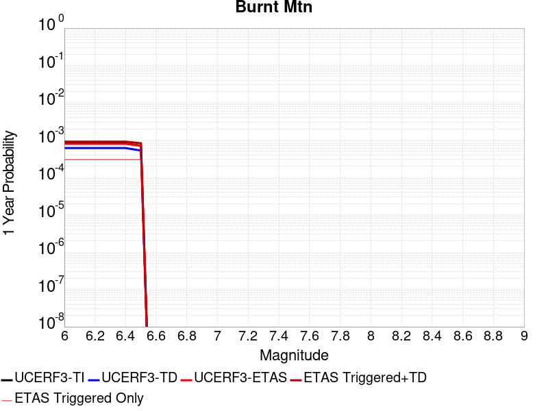 |  |

| Magnitude | 1 wk TI Prob | 1 wk TD Prob | 1 wk ETAS Prob | 1 wk ETAS/TD Gain | 1 wk ETAS Triggered+TD | 1 wk ETAS Triggered Only | 1 mo TI Prob | 1 mo TD Prob | 1 mo ETAS Prob | 1 mo ETAS/TD Gain | 1 mo ETAS Triggered+TD | 1 mo ETAS Triggered Only | 1 yr TI Prob | 1 yr TD Prob | 1 yr ETAS Prob | 1 yr ETAS/TD Gain | 1 yr ETAS Triggered+TD | 1 yr ETAS Triggered Only | 10 yr TI Prob | 10 yr TD Prob | 10 yr ETAS Prob | 10 yr ETAS/TD Gain | 10 yr ETAS Triggered+TD | 10 yr ETAS Triggered Only |
|-----|-----|-----|-----|-----|-----|-----|-----|-----|-----|-----|-----|-----|-----|-----|-----|-----|-----|-----|-----|-----|-----|-----|-----|-----|
| 6.0 | 1.5673151E-5 | 1.17495465E-5 | 0.0 | 0.0 | 1.17495465E-5 | 0.0 | 6.716892E-5 | 5.0354956E-5 | 1.0E-4 | 1.9859018 | 1.5034992E-4 | 1.0E-4 | 8.1747473E-4 | 6.13028E-4 | 8.0E-4 | 1.3049974 | 9.1284415E-4 | 3.0E-4 | 0.008144741 | 0.0061260103 | 0.0043 | 0.70192504 | 0.0074180462 | 0.0013 |
| 6.1 | 1.5673151E-5 | 1.17495465E-5 | 0.0 | 0.0 | 1.17495465E-5 | 0.0 | 6.716892E-5 | 5.0354956E-5 | 1.0E-4 | 1.9859018 | 1.5034992E-4 | 1.0E-4 | 8.1747473E-4 | 6.13028E-4 | 8.0E-4 | 1.3049974 | 9.1284415E-4 | 3.0E-4 | 0.008144741 | 0.0061260103 | 0.0043 | 0.70192504 | 0.0074180462 | 0.0013 |
| 6.2 | 1.5673151E-5 | 1.17495465E-5 | 0.0 | 0.0 | 1.17495465E-5 | 0.0 | 6.716892E-5 | 5.0354956E-5 | 1.0E-4 | 1.9859018 | 1.5034992E-4 | 1.0E-4 | 8.1747473E-4 | 6.13028E-4 | 8.0E-4 | 1.3049974 | 9.1284415E-4 | 3.0E-4 | 0.008144741 | 0.0061260103 | 0.0043 | 0.70192504 | 0.0074180462 | 0.0013 |
| 6.3 | 1.5673151E-5 | 1.17495465E-5 | 0.0 | 0.0 | 1.17495465E-5 | 0.0 | 6.716892E-5 | 5.0354956E-5 | 1.0E-4 | 1.9859018 | 1.5034992E-4 | 1.0E-4 | 8.1747473E-4 | 6.13028E-4 | 8.0E-4 | 1.3049974 | 9.1284415E-4 | 3.0E-4 | 0.008144741 | 0.0061260103 | 0.0043 | 0.70192504 | 0.0074180462 | 0.0013 |
| 6.4 | 1.5673151E-5 | 1.17495465E-5 | 0.0 | 0.0 | 1.17495465E-5 | 0.0 | 6.716892E-5 | 5.0354956E-5 | 1.0E-4 | 1.9859018 | 1.5034992E-4 | 1.0E-4 | 8.1747473E-4 | 6.13028E-4 | 8.0E-4 | 1.3049974 | 9.1284415E-4 | 3.0E-4 | 0.008144741 | 0.0061260103 | 0.0043 | 0.70192504 | 0.0074180462 | 0.0013 |
| 6.5 | 1.36191375E-5 | 1.007816E-5 | 0.0 | 0.0 | 1.007816E-5 | 0.0 | 5.8366426E-5 | 4.319211E-5 | 1.0E-4 | 2.3152375 | 1.4318779E-4 | 1.0E-4 | 7.103795E-4 | 5.2586396E-4 | 7.0E-4 | 1.3311428 | 8.257062E-4 | 3.0E-4 | 0.0070811296 | 0.00525864 | 0.0037 | 0.70360404 | 0.0064523295 | 0.0012 |

## San Jacinto (Coyote Creek)
*[(top)](#table-of-contents)*

| 1 Week | 1 Month | 1 Year | 10 Year |
|-----|-----|-----|-----|
|  |  |  |  |

| Magnitude | 1 wk TI Prob | 1 wk TD Prob | 1 wk ETAS Prob | 1 wk ETAS/TD Gain | 1 wk ETAS Triggered+TD | 1 wk ETAS Triggered Only | 1 mo TI Prob | 1 mo TD Prob | 1 mo ETAS Prob | 1 mo ETAS/TD Gain | 1 mo ETAS Triggered+TD | 1 mo ETAS Triggered Only | 1 yr TI Prob | 1 yr TD Prob | 1 yr ETAS Prob | 1 yr ETAS/TD Gain | 1 yr ETAS Triggered+TD | 1 yr ETAS Triggered Only | 10 yr TI Prob | 10 yr TD Prob | 10 yr ETAS Prob | 10 yr ETAS/TD Gain | 10 yr ETAS Triggered+TD | 10 yr ETAS Triggered Only |
|-----|-----|-----|-----|-----|-----|-----|-----|-----|-----|-----|-----|-----|-----|-----|-----|-----|-----|-----|-----|-----|-----|-----|-----|-----|
| 6.0 | 2.7374346E-5 | 2.4209996E-5 | 0.0 | 0.0 | 2.4209996E-5 | 0.0 | 1.1731335E-4 | 1.0375301E-4 | 0.0 | 0.0 | 1.0375301E-4 | 0.0 | 0.0014273542 | 0.0012624635 | 5.0E-4 | 0.39605105 | 0.0012624635 | 0.0 | 0.01418221 | 0.012961637 | 0.0081 | 0.6249211 | 0.014244787 | 0.0013 |
| 6.1 | 2.7374346E-5 | 2.4209996E-5 | 0.0 | 0.0 | 2.4209996E-5 | 0.0 | 1.1731335E-4 | 1.0375301E-4 | 0.0 | 0.0 | 1.0375301E-4 | 0.0 | 0.0014273542 | 0.0012624635 | 5.0E-4 | 0.39605105 | 0.0012624635 | 0.0 | 0.01418221 | 0.012961637 | 0.0081 | 0.6249211 | 0.014244787 | 0.0013 |
| 6.2 | 2.7374346E-5 | 2.4209996E-5 | 0.0 | 0.0 | 2.4209996E-5 | 0.0 | 1.1731335E-4 | 1.0375301E-4 | 0.0 | 0.0 | 1.0375301E-4 | 0.0 | 0.0014273542 | 0.0012624635 | 5.0E-4 | 0.39605105 | 0.0012624635 | 0.0 | 0.01418221 | 0.012961637 | 0.0081 | 0.6249211 | 0.014244787 | 0.0013 |
| 6.3 | 2.7374346E-5 | 2.4209996E-5 | 0.0 | 0.0 | 2.4209996E-5 | 0.0 | 1.1731335E-4 | 1.0375301E-4 | 0.0 | 0.0 | 1.0375301E-4 | 0.0 | 0.0014273542 | 0.0012624635 | 5.0E-4 | 0.39605105 | 0.0012624635 | 0.0 | 0.01418221 | 0.012961637 | 0.0081 | 0.6249211 | 0.014244787 | 0.0013 |
| 6.4 | 2.7374346E-5 | 2.4209996E-5 | 0.0 | 0.0 | 2.4209996E-5 | 0.0 | 1.1731335E-4 | 1.0375301E-4 | 0.0 | 0.0 | 1.0375301E-4 | 0.0 | 0.0014273542 | 0.0012624635 | 5.0E-4 | 0.39605105 | 0.0012624635 | 0.0 | 0.01418221 | 0.012961637 | 0.0081 | 0.6249211 | 0.014244787 | 0.0013 |
| 6.5 | 2.7282445E-5 | 2.409602E-5 | 0.0 | 0.0 | 2.409602E-5 | 0.0 | 1.16919524E-4 | 1.0326458E-4 | 0.0 | 0.0 | 1.0326458E-4 | 0.0 | 0.0014225657 | 0.0012565238 | 5.0E-4 | 0.39792323 | 0.0012565238 | 0.0 | 0.014134934 | 0.012902939 | 0.0081 | 0.6277639 | 0.014186165 | 0.0013 |
| 6.6 | 2.7282445E-5 | 2.409602E-5 | 0.0 | 0.0 | 2.409602E-5 | 0.0 | 1.16919524E-4 | 1.0326458E-4 | 0.0 | 0.0 | 1.0326458E-4 | 0.0 | 0.0014225657 | 0.0012565238 | 5.0E-4 | 0.39792323 | 0.0012565238 | 0.0 | 0.014134934 | 0.012902939 | 0.0081 | 0.6277639 | 0.014186165 | 0.0013 |
| 6.7 | 2.7216198E-5 | 2.402111E-5 | 0.0 | 0.0 | 2.402111E-5 | 0.0 | 1.1663563E-4 | 1.0294357E-4 | 0.0 | 0.0 | 1.0294357E-4 | 0.0 | 0.0014191137 | 0.00125262 | 5.0E-4 | 0.39916334 | 0.00125262 | 0.0 | 0.014100855 | 0.012864336 | 0.0081 | 0.62964773 | 0.014147613 | 0.0013 |
| 6.8 | 2.7078617E-5 | 2.3938304E-5 | 0.0 | 0.0 | 2.3938304E-5 | 0.0 | 1.1604605E-4 | 1.0258871E-4 | 0.0 | 0.0 | 1.0258871E-4 | 0.0 | 0.001411945 | 0.0012483046 | 5.0E-4 | 0.40054327 | 0.0012483046 | 0.0 | 0.014030075 | 0.012821472 | 0.008 | 0.6239533 | 0.014006087 | 0.0012 |
| 6.9 | 2.6982952E-5 | 2.3857778E-5 | 0.0 | 0.0 | 2.3857778E-5 | 0.0 | 1.15636096E-4 | 1.02243626E-4 | 0.0 | 0.0 | 1.02243626E-4 | 0.0 | 0.0014069602 | 0.001244108 | 5.0E-4 | 0.40189436 | 0.001244108 | 0.0 | 0.013980856 | 0.012779746 | 0.008 | 0.6259905 | 0.013964411 | 0.0012 |
| 7.0 | 2.6449972E-5 | 2.3434699E-5 | 0.0 | 0.0 | 2.3434699E-5 | 0.0 | 1.1335209E-4 | 1.00430574E-4 | 0.0 | 0.0 | 1.00430574E-4 | 0.0 | 0.001379188 | 0.001222059 | 4.0E-4 | 0.32731646 | 0.001222059 | 0.0 | 0.0137065975 | 0.012561068 | 0.0077 | 0.6130052 | 0.01364725 | 0.0011 |
| 7.1 | 2.6257849E-5 | 2.32607E-5 | 0.0 | 0.0 | 2.32607E-5 | 0.0 | 1.1252879E-4 | 9.968492E-5 | 0.0 | 0.0 | 9.968492E-5 | 0.0 | 0.0013691769 | 0.0012129908 | 4.0E-4 | 0.32976344 | 0.0012129908 | 0.0 | 0.013607717 | 0.012470908 | 0.0077 | 0.617437 | 0.01355719 | 0.0011 |
| 7.2 | 2.5270041E-5 | 2.2455457E-5 | 0.0 | 0.0 | 2.2455457E-5 | 0.0 | 1.0829568E-4 | 9.623414E-5 | 0.0 | 0.0 | 9.623414E-5 | 0.0 | 0.0013177024 | 0.0011710232 | 4.0E-4 | 0.3415816 | 0.0011710232 | 0.0 | 0.013099162 | 0.012052079 | 0.0076 | 0.6305966 | 0.013138822 | 0.0011 |
| 7.3 | 2.339701E-5 | 2.1186888E-5 | 0.0 | 0.0 | 2.1186888E-5 | 0.0 | 1.0026905E-4 | 9.07978E-5 | 0.0 | 0.0 | 9.07978E-5 | 0.0 | 0.001220092 | 0.0011049048 | 4.0E-4 | 0.36202216 | 0.0011049048 | 0.0 | 0.012134149 | 0.011390765 | 0.0075 | 0.65842813 | 0.012478235 | 0.0011 |
| 7.4 | 2.296333E-5 | 2.0917136E-5 | 0.0 | 0.0 | 2.0917136E-5 | 0.0 | 9.841056E-5 | 8.96418E-5 | 0.0 | 0.0 | 8.96418E-5 | 0.0 | 0.0011974899 | 0.0010908445 | 4.0E-4 | 0.36668837 | 0.0010908445 | 0.0 | 0.011910575 | 0.011249817 | 0.0073 | 0.6488995 | 0.012337442 | 0.0011 |
| 7.5 | 2.2188895E-5 | 2.0439755E-5 | 0.0 | 0.0 | 2.0439755E-5 | 0.0 | 9.50918E-5 | 8.759602E-5 | 0.0 | 0.0 | 8.759602E-5 | 0.0 | 0.0011571277 | 0.0010659618 | 4.0E-4 | 0.375248 | 0.0010659618 | 0.0 | 0.011511209 | 0.010999284 | 0.0072 | 0.65458804 | 0.012087185 | 0.0011 |
| 7.6 | 2.0013189E-5 | 1.9025178E-5 | 0.0 | 0.0 | 1.9025178E-5 | 0.0 | 8.5767984E-5 | 8.153394E-5 | 0.0 | 0.0 | 8.153394E-5 | 0.0 | 0.001043725 | 9.922254E-4 | 4.0E-4 | 0.4031342 | 9.922254E-4 | 0.0 | 0.010388365 | 0.010256935 | 0.0065 | 0.6337176 | 0.011246678 | 0.001 |
| 7.7 | 1.7230794E-5 | 1.6805248E-5 | 0.0 | 0.0 | 1.6805248E-5 | 0.0 | 7.384417E-5 | 7.202051E-5 | 0.0 | 0.0 | 7.202051E-5 | 0.0 | 8.986819E-4 | 8.7649777E-4 | 4.0E-4 | 0.45636168 | 8.7649777E-4 | 0.0 | 0.008950562 | 0.009094966 | 0.0057 | 0.62672037 | 0.009788599 | 7.0E-4 |
| 7.8 | 1.4478809E-5 | 1.50507085E-5 | 0.0 | 0.0 | 1.50507085E-5 | 0.0 | 6.205057E-5 | 6.4501444E-5 | 0.0 | 0.0 | 6.4501444E-5 | 0.0 | 7.552038E-4 | 7.850228E-4 | 4.0E-4 | 0.50953937 | 7.850228E-4 | 0.0 | 0.0075264242 | 0.008172331 | 0.0054 | 0.6607661 | 0.008866611 | 7.0E-4 |
| 7.9 | 1.1114467E-5 | 1.1695948E-5 | 0.0 | 0.0 | 1.1695948E-5 | 0.0 | 4.7632562E-5 | 5.0124534E-5 | 0.0 | 0.0 | 5.0124534E-5 | 0.0 | 5.797721E-4 | 6.1009586E-4 | 3.0E-4 | 0.49172598 | 6.1009586E-4 | 0.0 | 0.0057826187 | 0.006406557 | 0.0047 | 0.7336234 | 0.0070027127 | 6.0E-4 |
| 8.0 | 9.327402E-6 | 9.943082E-6 | 0.0 | 0.0 | 9.943082E-6 | 0.0 | 3.9973966E-5 | 4.2612515E-5 | 0.0 | 0.0 | 4.2612515E-5 | 0.0 | 4.8657437E-4 | 5.186844E-4 | 2.0E-4 | 0.3855909 | 5.186844E-4 | 0.0 | 0.0048551033 | 0.0054726284 | 0.0043 | 0.78572845 | 0.006069345 | 6.0E-4 |
| 8.1 | 7.0235833E-6 | 6.855625E-6 | 0.0 | 0.0 | 6.855625E-6 | 0.0 | 3.0100724E-5 | 2.938092E-5 | 0.0 | 0.0 | 2.938092E-5 | 0.0 | 3.664147E-4 | 3.5765453E-4 | 2.0E-4 | 0.55919886 | 3.5765453E-4 | 0.0 | 0.003658111 | 0.0038021607 | 0.0028 | 0.7364234 | 0.0043002595 | 5.0E-4 |
| 8.2 | 2.0358202E-6 | 9.0143783E-7 | 0.0 | 0.0 | 9.0143783E-7 | 0.0 | 8.724915E-6 | 3.8632993E-6 | 0.0 | 0.0 | 3.8632993E-6 | 0.0 | 1.06220665E-4 | 4.703468E-5 | 0.0 | 0.0 | 4.703468E-5 | 0.0 | 0.001061699 | 5.336939E-4 | 5.0E-4 | 0.93686664 | 7.3358713E-4 | 2.0E-4 |
| 8.3 | 2.0051264E-7 | 6.630583E-8 | 0.0 | 0.0 | 6.630583E-8 | 0.0 | 8.5933965E-7 | 2.841678E-7 | 0.0 | 0.0 | 2.841678E-7 | 0.0 | 1.046241E-5 | 3.459738E-6 | 0.0 | 0.0 | 3.459738E-6 | 0.0 | 1.0461917E-4 | 4.0217583E-5 | 0.0 | 0.0 | 4.0217583E-5 | 0.0 |

## Elsinore (Stepovers Combined)
*[(top)](#table-of-contents)*

| 1 Week | 1 Month | 1 Year | 10 Year |
|-----|-----|-----|-----|
|  | 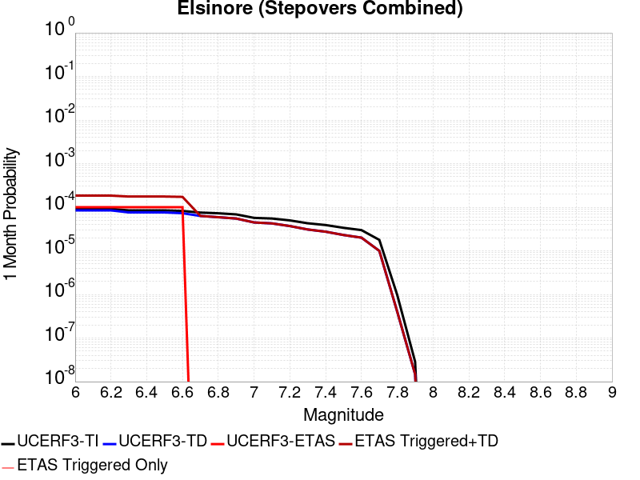 |  |  |

| Magnitude | 1 wk TI Prob | 1 wk TD Prob | 1 wk ETAS Prob | 1 wk ETAS/TD Gain | 1 wk ETAS Triggered+TD | 1 wk ETAS Triggered Only | 1 mo TI Prob | 1 mo TD Prob | 1 mo ETAS Prob | 1 mo ETAS/TD Gain | 1 mo ETAS Triggered+TD | 1 mo ETAS Triggered Only | 1 yr TI Prob | 1 yr TD Prob | 1 yr ETAS Prob | 1 yr ETAS/TD Gain | 1 yr ETAS Triggered+TD | 1 yr ETAS Triggered Only | 10 yr TI Prob | 10 yr TD Prob | 10 yr ETAS Prob | 10 yr ETAS/TD Gain | 10 yr ETAS Triggered+TD | 10 yr ETAS Triggered Only |
|-----|-----|-----|-----|-----|-----|-----|-----|-----|-----|-----|-----|-----|-----|-----|-----|-----|-----|-----|-----|-----|-----|-----|-----|-----|
| 6.0 | 2.144392E-5 | 1.9772704E-5 | 0.0 | 0.0 | 1.9772704E-5 | 0.0 | 9.189928E-5 | 8.473751E-5 | 1.0E-4 | 1.180115 | 1.8472904E-4 | 1.0E-4 | 0.0011182994 | 0.0010312101 | 0.0011 | 1.066708 | 0.0014307975 | 4.0E-4 | 0.011126885 | 0.010271182 | 0.0066 | 0.64257455 | 0.01155783 | 0.0013 |
| 6.1 | 2.144392E-5 | 1.9772704E-5 | 0.0 | 0.0 | 1.9772704E-5 | 0.0 | 9.189928E-5 | 8.473751E-5 | 1.0E-4 | 1.180115 | 1.8472904E-4 | 1.0E-4 | 0.0011182994 | 0.0010312101 | 0.0011 | 1.066708 | 0.0014307975 | 4.0E-4 | 0.011126885 | 0.010271182 | 0.0066 | 0.64257455 | 0.01155783 | 0.0013 |
| 6.2 | 2.144392E-5 | 1.9772704E-5 | 0.0 | 0.0 | 1.9772704E-5 | 0.0 | 9.189928E-5 | 8.473751E-5 | 1.0E-4 | 1.180115 | 1.8472904E-4 | 1.0E-4 | 0.0011182994 | 0.0010312101 | 0.0011 | 1.066708 | 0.0014307975 | 4.0E-4 | 0.011126885 | 0.010271182 | 0.0066 | 0.64257455 | 0.01155783 | 0.0013 |
| 6.3 | 1.9751555E-5 | 1.775319E-5 | 0.0 | 0.0 | 1.775319E-5 | 0.0 | 8.4646774E-5 | 7.608295E-5 | 1.0E-4 | 1.314355 | 1.7607534E-4 | 1.0E-4 | 0.0010300872 | 9.259304E-4 | 0.001 | 1.0799948 | 0.00132556 | 4.0E-4 | 0.010253254 | 0.009227147 | 0.0059 | 0.6394175 | 0.0105151525 | 0.0013 |
| 6.4 | 1.9751555E-5 | 1.775319E-5 | 0.0 | 0.0 | 1.775319E-5 | 0.0 | 8.4646774E-5 | 7.608295E-5 | 1.0E-4 | 1.314355 | 1.7607534E-4 | 1.0E-4 | 0.0010300872 | 9.259304E-4 | 0.001 | 1.0799948 | 0.00132556 | 4.0E-4 | 0.010253254 | 0.009227147 | 0.0059 | 0.6394175 | 0.0105151525 | 0.0013 |
| 6.5 | 1.9751555E-5 | 1.775319E-5 | 0.0 | 0.0 | 1.775319E-5 | 0.0 | 8.4646774E-5 | 7.608295E-5 | 1.0E-4 | 1.314355 | 1.7607534E-4 | 1.0E-4 | 0.0010300872 | 9.259304E-4 | 0.001 | 1.0799948 | 0.00132556 | 4.0E-4 | 0.010253254 | 0.009227147 | 0.0059 | 0.6394175 | 0.0105151525 | 0.0013 |
| 6.6 | 1.9188685E-5 | 1.7014672E-5 | 0.0 | 0.0 | 1.7014672E-5 | 0.0 | 8.2234634E-5 | 7.2918076E-5 | 1.0E-4 | 1.371402 | 1.7291079E-4 | 1.0E-4 | 0.0010007467 | 8.874322E-4 | 0.001 | 1.1268467 | 0.0012870772 | 4.0E-4 | 0.00996252 | 0.008845499 | 0.0054 | 0.61048 | 0.010034883 | 0.0012 |
| 6.7 | 1.7608272E-5 | 1.4742411E-5 | 0.0 | 0.0 | 1.4742411E-5 | 0.0 | 7.546184E-5 | 6.318028E-5 | 0.0 | 0.0 | 6.318028E-5 | 0.0 | 9.183606E-4 | 7.689583E-4 | 9.0E-4 | 1.1704146 | 0.0010687276 | 3.0E-4 | 0.009145746 | 0.007669642 | 0.0043 | 0.56065196 | 0.008562739 | 9.0E-4 |
| 6.8 | 1.697165E-5 | 1.3792449E-5 | 0.0 | 0.0 | 1.3792449E-5 | 0.0 | 7.273361E-5 | 5.9109203E-5 | 0.0 | 0.0 | 5.9109203E-5 | 0.0 | 8.8517193E-4 | 7.194256E-4 | 9.0E-4 | 1.250998 | 0.0010192097 | 3.0E-4 | 0.008816543 | 0.0071770395 | 0.0041 | 0.5712662 | 0.008070581 | 9.0E-4 |
| 6.9 | 1.600365E-5 | 1.2855437E-5 | 0.0 | 0.0 | 1.2855437E-5 | 0.0 | 6.858527E-5 | 5.509361E-5 | 0.0 | 0.0 | 5.509361E-5 | 0.0 | 8.347058E-4 | 6.7056605E-4 | 9.0E-4 | 1.3421496 | 9.703649E-4 | 3.0E-4 | 0.008315775 | 0.006691105 | 0.0041 | 0.6127538 | 0.007585083 | 9.0E-4 |
| 7.0 | 1.3314581E-5 | 1.0455193E-5 | 0.0 | 0.0 | 1.0455193E-5 | 0.0 | 5.7061243E-5 | 4.4807217E-5 | 0.0 | 0.0 | 4.4807217E-5 | 0.0 | 6.944992E-4 | 5.45394E-4 | 9.0E-4 | 1.6501832 | 8.4523036E-4 | 3.0E-4 | 0.006923327 | 0.0054441076 | 0.0032 | 0.58779144 | 0.0062397523 | 8.0E-4 |
| 7.1 | 1.2865345E-5 | 9.944716E-6 | 0.0 | 0.0 | 9.944716E-6 | 0.0 | 5.5136024E-5 | 4.261953E-5 | 0.0 | 0.0 | 4.261953E-5 | 0.0 | 6.710743E-4 | 5.1877176E-4 | 9.0E-4 | 1.7348669 | 8.186162E-4 | 3.0E-4 | 0.0066905143 | 0.0051788096 | 0.0031 | 0.5985931 | 0.0059746667 | 8.0E-4 |
| 7.2 | 1.1650051E-5 | 8.64003E-6 | 0.0 | 0.0 | 8.64003E-6 | 0.0 | 4.9927836E-5 | 3.702818E-5 | 0.0 | 0.0 | 3.702818E-5 | 0.0 | 6.0770183E-4 | 4.5072666E-4 | 9.0E-4 | 1.9967756 | 7.5059145E-4 | 3.0E-4 | 0.0060604266 | 0.0044995523 | 0.0029 | 0.6445086 | 0.0051964023 | 7.0E-4 |
| 7.3 | 1.0008533E-5 | 7.2062307E-6 | 0.0 | 0.0 | 7.2062307E-6 | 0.0 | 4.2893007E-5 | 3.088349E-5 | 0.0 | 0.0 | 3.088349E-5 | 0.0 | 5.220972E-4 | 3.7594305E-4 | 6.0E-4 | 1.5959864 | 3.7594305E-4 | 0.0 | 0.005208723 | 0.0037534619 | 0.0021 | 0.5594835 | 0.0041519604 | 4.0E-4 |
| 7.4 | 9.116759E-6 | 6.414671E-6 | 0.0 | 0.0 | 6.414671E-6 | 0.0 | 3.907124E-5 | 2.7491165E-5 | 0.0 | 0.0 | 2.7491165E-5 | 0.0 | 4.7558855E-4 | 3.346549E-4 | 5.0E-4 | 1.4940764 | 3.346549E-4 | 0.0 | 0.00474572 | 0.0033416625 | 0.0017 | 0.50872886 | 0.0037403258 | 4.0E-4 |
| 7.5 | 7.870524E-6 | 5.3864724E-6 | 0.0 | 0.0 | 5.3864724E-6 | 0.0 | 3.3730383E-5 | 2.3084685E-5 | 0.0 | 0.0 | 2.3084685E-5 | 0.0 | 4.1059E-4 | 2.8102106E-4 | 3.0E-4 | 1.0675356 | 2.8102106E-4 | 0.0 | 0.0040983222 | 0.0028067837 | 0.0011 | 0.39190766 | 0.0030062224 | 2.0E-4 |
| 7.6 | 6.9774537E-6 | 4.681174E-6 | 0.0 | 0.0 | 4.681174E-6 | 0.0 | 2.990303E-5 | 2.0062025E-5 | 0.0 | 0.0 | 2.0062025E-5 | 0.0 | 3.640086E-4 | 2.4422896E-4 | 3.0E-4 | 1.2283555 | 2.4422896E-4 | 0.0 | 0.003634129 | 0.002439722 | 8.0E-4 | 0.32790622 | 0.002439722 | 0.0 |
| 7.7 | 4.1616954E-6 | 2.3302257E-6 | 0.0 | 0.0 | 2.3302257E-6 | 0.0 | 1.7835715E-5 | 9.9866475E-6 | 0.0 | 0.0 | 9.9866475E-6 | 0.0 | 2.171282E-4 | 1.2158139E-4 | 2.0E-4 | 1.6449887 | 1.2158139E-4 | 0.0 | 0.0021691616 | 0.0012152218 | 5.0E-4 | 0.4114475 | 0.0012152218 | 0.0 |
| 7.8 | 2.2692414E-7 | 9.391389E-8 | 0.0 | 0.0 | 9.391389E-8 | 0.0 | 9.725317E-7 | 4.0248807E-7 | 0.0 | 0.0 | 4.0248807E-7 | 0.0 | 1.1840509E-5 | 4.9002842E-6 | 0.0 | 0.0 | 4.9002842E-6 | 0.0 | 1.1839878E-4 | 4.900209E-5 | 0.0 | 0.0 | 4.900209E-5 | 0.0 |
| 7.9 | 6.676829E-9 | 3.4415768E-9 | 0.0 | 0.0 | 3.4415768E-9 | 0.0 | 2.861498E-8 | 1.4749616E-8 | 0.0 | 0.0 | 1.4749616E-8 | 0.0 | 3.4838732E-7 | 1.7957656E-7 | 0.0 | 0.0 | 1.7957656E-7 | 0.0 | 3.4838679E-6 | 1.7957643E-6 | 0.0 | 0.0 | 1.7957643E-6 | 0.0 |

## Rinconada 2011 CFM
*[(top)](#table-of-contents)*

| 1 Week | 1 Month | 1 Year | 10 Year |
|-----|-----|-----|-----|
| 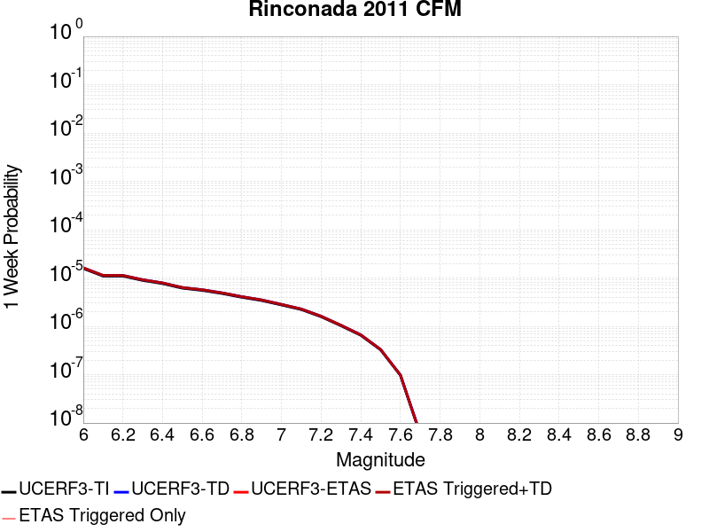 |  |  |  |

| Magnitude | 1 wk TI Prob | 1 wk TD Prob | 1 wk ETAS Prob | 1 wk ETAS/TD Gain | 1 wk ETAS Triggered+TD | 1 wk ETAS Triggered Only | 1 mo TI Prob | 1 mo TD Prob | 1 mo ETAS Prob | 1 mo ETAS/TD Gain | 1 mo ETAS Triggered+TD | 1 mo ETAS Triggered Only | 1 yr TI Prob | 1 yr TD Prob | 1 yr ETAS Prob | 1 yr ETAS/TD Gain | 1 yr ETAS Triggered+TD | 1 yr ETAS Triggered Only | 10 yr TI Prob | 10 yr TD Prob | 10 yr ETAS Prob | 10 yr ETAS/TD Gain | 10 yr ETAS Triggered+TD | 10 yr ETAS Triggered Only |
|-----|-----|-----|-----|-----|-----|-----|-----|-----|-----|-----|-----|-----|-----|-----|-----|-----|-----|-----|-----|-----|-----|-----|-----|-----|
| 6.0 | 1.5752368E-5 | 1.6275791E-5 | 0.0 | 0.0 | 1.6275791E-5 | 0.0 | 6.75084E-5 | 6.975154E-5 | 0.0 | 0.0 | 6.975154E-5 | 0.0 | 8.2160486E-4 | 8.488973E-4 | 2.0E-4 | 0.23559976 | 9.488124E-4 | 1.0E-4 | 0.008185739 | 0.008456927 | 0.0065 | 0.76860076 | 0.009646778 | 0.0012 |
| 6.1 | 1.0966133E-5 | 1.1323765E-5 | 0.0 | 0.0 | 1.1323765E-5 | 0.0 | 4.6996865E-5 | 4.852952E-5 | 0.0 | 0.0 | 4.852952E-5 | 0.0 | 5.720366E-4 | 5.906875E-4 | 1.0E-4 | 0.16929425 | 5.906875E-4 | 0.0 | 0.0057056635 | 0.0058912705 | 0.0043 | 0.7298935 | 0.0064877355 | 6.0E-4 |
| 6.2 | 1.0966133E-5 | 1.1323765E-5 | 0.0 | 0.0 | 1.1323765E-5 | 0.0 | 4.6996865E-5 | 4.852952E-5 | 0.0 | 0.0 | 4.852952E-5 | 0.0 | 5.720366E-4 | 5.906875E-4 | 1.0E-4 | 0.16929425 | 5.906875E-4 | 0.0 | 0.0057056635 | 0.0058912705 | 0.0043 | 0.7298935 | 0.0064877355 | 6.0E-4 |
| 6.3 | 8.926149E-6 | 9.213363E-6 | 0.0 | 0.0 | 9.213363E-6 | 0.0 | 3.8254362E-5 | 3.9485247E-5 | 0.0 | 0.0 | 3.9485247E-5 | 0.0 | 4.6564735E-4 | 4.8062715E-4 | 1.0E-4 | 0.20806149 | 4.8062715E-4 | 0.0 | 0.0046467283 | 0.0047959215 | 0.0034 | 0.7089357 | 0.005293524 | 5.0E-4 |
| 6.4 | 7.676955E-6 | 7.920693E-6 | 0.0 | 0.0 | 7.920693E-6 | 0.0 | 3.290082E-5 | 3.3945387E-5 | 0.0 | 0.0 | 3.3945387E-5 | 0.0 | 4.0049385E-4 | 4.132069E-4 | 1.0E-4 | 0.2420095 | 4.132069E-4 | 0.0 | 0.0039977287 | 0.0041244123 | 0.0033 | 0.800114 | 0.0045227627 | 4.0E-4 |
| 6.5 | 6.1671026E-6 | 6.359352E-6 | 0.0 | 0.0 | 6.359352E-6 | 0.0 | 2.6430173E-5 | 2.7254082E-5 | 0.0 | 0.0 | 2.7254082E-5 | 0.0 | 3.2173982E-4 | 3.3176798E-4 | 1.0E-4 | 0.30141544 | 3.3176798E-4 | 0.0 | 0.003212744 | 0.003312739 | 0.0025 | 0.7546625 | 0.0036117453 | 3.0E-4 |
| 6.6 | 5.553456E-6 | 5.7251677E-6 | 0.0 | 0.0 | 5.7251677E-6 | 0.0 | 2.3800309E-5 | 2.4536203E-5 | 0.0 | 0.0 | 2.4536203E-5 | 0.0 | 2.897302E-4 | 2.9868737E-4 | 1.0E-4 | 0.33479822 | 2.9868737E-4 | 0.0 | 0.0028935277 | 0.0029828679 | 0.0024 | 0.8045948 | 0.003281973 | 3.0E-4 |
| 6.7 | 4.787857E-6 | 4.9336113E-6 | 0.0 | 0.0 | 4.9336113E-6 | 0.0 | 2.0519226E-5 | 2.1143878E-5 | 0.0 | 0.0 | 2.1143878E-5 | 0.0 | 2.4979294E-4 | 2.5739634E-4 | 1.0E-4 | 0.3885059 | 2.5739634E-4 | 0.0 | 0.0024951235 | 0.002570988 | 0.002 | 0.77791107 | 0.0026707307 | 1.0E-4 |
| 6.8 | 3.9955166E-6 | 4.1137214E-6 | 0.0 | 0.0 | 4.1137214E-6 | 0.0 | 1.7123532E-5 | 1.7630116E-5 | 0.0 | 0.0 | 1.7630116E-5 | 0.0 | 2.0845905E-4 | 2.1462554E-4 | 1.0E-4 | 0.46592778 | 2.1462554E-4 | 0.0 | 0.002082636 | 0.0021441863 | 0.0016 | 0.74620384 | 0.002243972 | 1.0E-4 |
| 6.9 | 3.4250072E-6 | 3.5226494E-6 | 0.0 | 0.0 | 3.5226494E-6 | 0.0 | 1.46785205E-5 | 1.5096982E-5 | 0.0 | 0.0 | 1.5096982E-5 | 0.0 | 1.7869633E-4 | 1.8379027E-4 | 1.0E-4 | 0.54409844 | 1.8379027E-4 | 0.0 | 0.001785527 | 0.0018363851 | 0.0015 | 0.8168221 | 0.0019362015 | 1.0E-4 |
| 7.0 | 2.7712713E-6 | 2.8468578E-6 | 0.0 | 0.0 | 2.8468578E-6 | 0.0 | 1.1876823E-5 | 1.2200761E-5 | 0.0 | 0.0 | 1.2200761E-5 | 0.0 | 1.4459073E-4 | 1.4853416E-4 | 1.0E-4 | 0.6732458 | 1.4853416E-4 | 0.0 | 0.0014449668 | 0.0014843504 | 0.0014 | 0.9431735 | 0.0015842019 | 1.0E-4 |
| 7.1 | 2.227358E-6 | 2.2858212E-6 | 0.0 | 0.0 | 2.2858212E-6 | 0.0 | 9.545785E-6 | 9.79634E-6 | 0.0 | 0.0 | 9.79634E-6 | 0.0 | 1.16213734E-4 | 1.1926392E-4 | 0.0 | 0.0 | 1.1926392E-4 | 0.0 | 0.0011615298 | 0.0011920002 | 0.0013 | 1.0906038 | 0.001291881 | 1.0E-4 |
| 7.2 | 1.581796E-6 | 1.6209844E-6 | 0.0 | 0.0 | 1.6209844E-6 | 0.0 | 6.779108E-6 | 6.947058E-6 | 0.0 | 0.0 | 6.947058E-6 | 0.0 | 8.253252E-5 | 8.457715E-5 | 0.0 | 0.0 | 8.457715E-5 | 0.0 | 8.250187E-4 | 8.4545015E-4 | 0.001 | 1.1828018 | 9.4536564E-4 | 1.0E-4 |
| 7.3 | 1.0306567E-6 | 1.0547001E-6 | 0.0 | 0.0 | 1.0547001E-6 | 0.0 | 4.4170924E-6 | 4.5201355E-6 | 0.0 | 0.0 | 4.5201355E-6 | 0.0 | 5.3776774E-5 | 5.503126E-5 | 0.0 | 0.0 | 5.503126E-5 | 0.0 | 5.376376E-4 | 5.501766E-4 | 6.0E-4 | 1.090559 | 6.501216E-4 | 1.0E-4 |
| 7.4 | 6.535541E-7 | 6.6830773E-7 | 0.0 | 0.0 | 6.6830773E-7 | 0.0 | 2.800943E-6 | 2.8641728E-6 | 0.0 | 0.0 | 2.8641728E-6 | 0.0 | 3.4100947E-5 | 3.4870747E-5 | 0.0 | 0.0 | 3.4870747E-5 | 0.0 | 3.4095717E-4 | 3.486529E-4 | 4.0E-4 | 1.147273 | 4.48618E-4 | 1.0E-4 |
| 7.5 | 3.2656962E-7 | 3.3318386E-7 | 0.0 | 0.0 | 3.3318386E-7 | 0.0 | 1.3995833E-6 | 1.4279301E-6 | 0.0 | 0.0 | 1.4279301E-6 | 0.0 | 1.7039794E-5 | 1.7384911E-5 | 0.0 | 0.0 | 1.7384911E-5 | 0.0 | 1.7038487E-4 | 1.7383555E-4 | 2.0E-4 | 1.1505127 | 2.7381815E-4 | 1.0E-4 |
| 7.6 | 9.754343E-8 | 9.821481E-8 | 0.0 | 0.0 | 9.821481E-8 | 0.0 | 4.180432E-7 | 4.2092054E-7 | 0.0 | 0.0 | 4.2092054E-7 | 0.0 | 5.089664E-6 | 5.1246957E-6 | 0.0 | 0.0 | 5.1246957E-6 | 0.0 | 5.0895473E-5 | 5.1245785E-5 | 1.0E-4 | 1.95138 | 5.1245785E-5 | 0.0 |
| 7.7 | 6.0001453E-9 | 5.849319E-9 | 0.0 | 0.0 | 5.849319E-9 | 0.0 | 2.5714908E-8 | 2.5068507E-8 | 0.0 | 0.0 | 2.5068507E-8 | 0.0 | 3.1307894E-7 | 3.0520903E-7 | 0.0 | 0.0 | 3.0520903E-7 | 0.0 | 3.1307852E-6 | 3.0520864E-6 | 0.0 | 0.0 | 3.0520864E-6 | 0.0 |
| 7.8 | 7.400003E-11 | 7.4655726E-11 | 0.0 | 0.0 | 7.4655726E-11 | 0.0 | 3.171432E-10 | 3.1995329E-10 | 0.0 | 0.0 | 3.1995329E-10 | 0.0 | 3.861218E-9 | 3.8954315E-9 | 0.0 | 0.0 | 3.8954315E-9 | 0.0 | 3.861218E-8 | 3.8954315E-8 | 0.0 | 0.0 | 3.8954315E-8 | 0.0 |

## Earthquake Valley (So Extension)
*[(top)](#table-of-contents)*

| 1 Week | 1 Month | 1 Year | 10 Year |
|-----|-----|-----|-----|
|  |  | 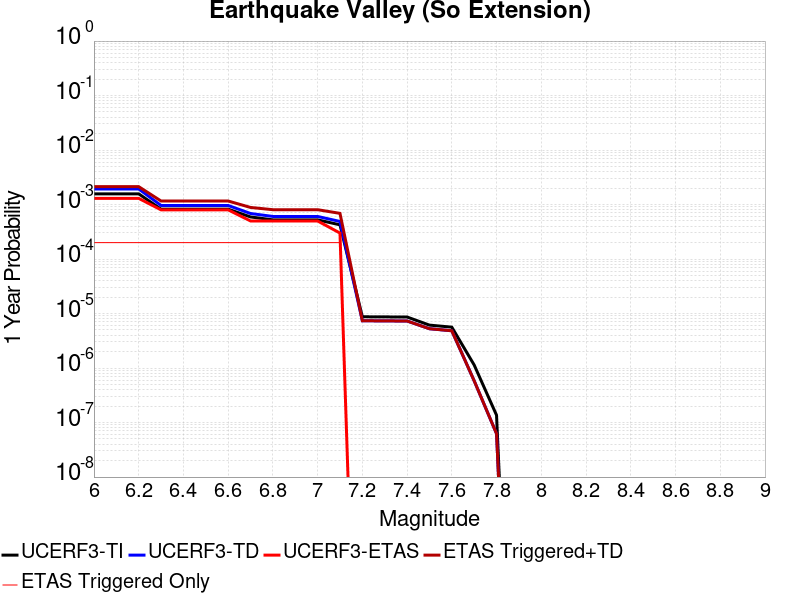 | 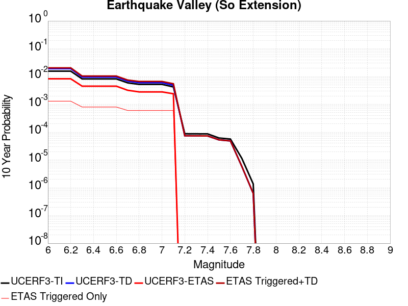 |

| Magnitude | 1 wk TI Prob | 1 wk TD Prob | 1 wk ETAS Prob | 1 wk ETAS/TD Gain | 1 wk ETAS Triggered+TD | 1 wk ETAS Triggered Only | 1 mo TI Prob | 1 mo TD Prob | 1 mo ETAS Prob | 1 mo ETAS/TD Gain | 1 mo ETAS Triggered+TD | 1 mo ETAS Triggered Only | 1 yr TI Prob | 1 yr TD Prob | 1 yr ETAS Prob | 1 yr ETAS/TD Gain | 1 yr ETAS Triggered+TD | 1 yr ETAS Triggered Only | 10 yr TI Prob | 10 yr TD Prob | 10 yr ETAS Prob | 10 yr ETAS/TD Gain | 10 yr ETAS Triggered+TD | 10 yr ETAS Triggered Only |
|-----|-----|-----|-----|-----|-----|-----|-----|-----|-----|-----|-----|-----|-----|-----|-----|-----|-----|-----|-----|-----|-----|-----|-----|-----|
| 6.0 | 3.0194888E-5 | 3.7088896E-5 | 1.0E-4 | 2.6962247 | 3.7088896E-5 | 0.0 | 1.2940024E-4 | 1.5894581E-4 | 1.0E-4 | 0.62914526 | 1.5894581E-4 | 0.0 | 0.0015743093 | 0.0019339652 | 0.0013 | 0.67219406 | 0.0021335785 | 2.0E-4 | 0.01563203 | 0.019221738 | 0.0083 | 0.4318028 | 0.020496748 | 0.0013 |
| 6.1 | 3.0194888E-5 | 3.7088896E-5 | 1.0E-4 | 2.6962247 | 3.7088896E-5 | 0.0 | 1.2940024E-4 | 1.5894581E-4 | 1.0E-4 | 0.62914526 | 1.5894581E-4 | 0.0 | 0.0015743093 | 0.0019339652 | 0.0013 | 0.67219406 | 0.0021335785 | 2.0E-4 | 0.01563203 | 0.019221738 | 0.0083 | 0.4318028 | 0.020496748 | 0.0013 |
| 6.2 | 3.0194888E-5 | 3.7088896E-5 | 1.0E-4 | 2.6962247 | 3.7088896E-5 | 0.0 | 1.2940024E-4 | 1.5894581E-4 | 1.0E-4 | 0.62914526 | 1.5894581E-4 | 0.0 | 0.0015743093 | 0.0019339652 | 0.0013 | 0.67219406 | 0.0021335785 | 2.0E-4 | 0.01563203 | 0.019221738 | 0.0083 | 0.4318028 | 0.020496748 | 0.0013 |
| 6.3 | 1.5795305E-5 | 1.845291E-5 | 0.0 | 0.0 | 1.845291E-5 | 0.0 | 6.769241E-5 | 7.9082136E-5 | 0.0 | 0.0 | 7.9082136E-5 | 0.0 | 8.238434E-4 | 9.6251053E-4 | 8.0E-4 | 0.8311597 | 0.001162318 | 2.0E-4 | 0.008207959 | 0.009594323 | 0.0045 | 0.46902734 | 0.010386648 | 8.0E-4 |
| 6.4 | 1.5795305E-5 | 1.845291E-5 | 0.0 | 0.0 | 1.845291E-5 | 0.0 | 6.769241E-5 | 7.9082136E-5 | 0.0 | 0.0 | 7.9082136E-5 | 0.0 | 8.238434E-4 | 9.6251053E-4 | 8.0E-4 | 0.8311597 | 0.001162318 | 2.0E-4 | 0.008207959 | 0.009594323 | 0.0045 | 0.46902734 | 0.010386648 | 8.0E-4 |
| 6.5 | 1.5795305E-5 | 1.845291E-5 | 0.0 | 0.0 | 1.845291E-5 | 0.0 | 6.769241E-5 | 7.9082136E-5 | 0.0 | 0.0 | 7.9082136E-5 | 0.0 | 8.238434E-4 | 9.6251053E-4 | 8.0E-4 | 0.8311597 | 0.001162318 | 2.0E-4 | 0.008207959 | 0.009594323 | 0.0045 | 0.46902734 | 0.010386648 | 8.0E-4 |
| 6.6 | 1.5795305E-5 | 1.845291E-5 | 0.0 | 0.0 | 1.845291E-5 | 0.0 | 6.769241E-5 | 7.9082136E-5 | 0.0 | 0.0 | 7.9082136E-5 | 0.0 | 8.238434E-4 | 9.6251053E-4 | 8.0E-4 | 0.8311597 | 0.001162318 | 2.0E-4 | 0.008207959 | 0.009594323 | 0.0045 | 0.46902734 | 0.010386648 | 8.0E-4 |
| 6.7 | 1.1363076E-5 | 1.3142505E-5 | 0.0 | 0.0 | 1.3142505E-5 | 0.0 | 4.8697988E-5 | 5.6324236E-5 | 0.0 | 0.0 | 5.6324236E-5 | 0.0 | 5.927367E-4 | 6.8560796E-4 | 5.0E-4 | 0.72927976 | 8.854708E-4 | 2.0E-4 | 0.0059115817 | 0.0068424055 | 0.0032 | 0.46767178 | 0.0074383 | 6.0E-4 |
| 6.8 | 1.0049611E-5 | 1.1598007E-5 | 0.0 | 0.0 | 1.1598007E-5 | 0.0 | 4.306905E-5 | 4.970521E-5 | 0.0 | 0.0 | 4.970521E-5 | 0.0 | 5.242395E-4 | 6.0506613E-4 | 5.0E-4 | 0.826356 | 8.049451E-4 | 2.0E-4 | 0.0052300454 | 0.0060413685 | 0.0028 | 0.46347117 | 0.006637743 | 6.0E-4 |
| 6.9 | 1.0049611E-5 | 1.1598007E-5 | 0.0 | 0.0 | 1.1598007E-5 | 0.0 | 4.306905E-5 | 4.970521E-5 | 0.0 | 0.0 | 4.970521E-5 | 0.0 | 5.242395E-4 | 6.0506613E-4 | 5.0E-4 | 0.826356 | 8.049451E-4 | 2.0E-4 | 0.0052300454 | 0.0060413685 | 0.0028 | 0.46347117 | 0.006637743 | 6.0E-4 |
| 7.0 | 1.0049611E-5 | 1.1598007E-5 | 0.0 | 0.0 | 1.1598007E-5 | 0.0 | 4.306905E-5 | 4.970521E-5 | 0.0 | 0.0 | 4.970521E-5 | 0.0 | 5.242395E-4 | 6.0506613E-4 | 5.0E-4 | 0.826356 | 8.049451E-4 | 2.0E-4 | 0.0052300454 | 0.0060413685 | 0.0028 | 0.46347117 | 0.006637743 | 6.0E-4 |
| 7.1 | 8.140254E-6 | 9.386438E-6 | 0.0 | 0.0 | 9.386438E-6 | 0.0 | 3.4886336E-5 | 4.022735E-5 | 0.0 | 0.0 | 4.022735E-5 | 0.0 | 4.2465836E-4 | 4.8972503E-4 | 3.0E-4 | 0.61258864 | 6.896271E-4 | 2.0E-4 | 0.0042384774 | 0.004893039 | 0.0024 | 0.49049273 | 0.0054901033 | 6.0E-4 |
| 7.2 | 1.673835E-7 | 1.416044E-7 | 0.0 | 0.0 | 1.416044E-7 | 0.0 | 7.173577E-7 | 6.068759E-7 | 0.0 | 0.0 | 6.068759E-7 | 0.0 | 8.733795E-6 | 7.3886927E-6 | 0.0 | 0.0 | 7.3886927E-6 | 0.0 | 8.733451E-5 | 7.3884825E-5 | 0.0 | 0.0 | 7.3884825E-5 | 0.0 |
| 7.3 | 1.6632116E-7 | 1.405865E-7 | 0.0 | 0.0 | 1.405865E-7 | 0.0 | 7.1280476E-7 | 6.025134E-7 | 0.0 | 0.0 | 6.025134E-7 | 0.0 | 8.678364E-6 | 7.3355795E-6 | 0.0 | 0.0 | 7.3355795E-6 | 0.0 | 8.6780245E-5 | 7.335373E-5 | 0.0 | 0.0 | 7.335373E-5 | 0.0 |
| 7.4 | 1.6569169E-7 | 1.4003261E-7 | 0.0 | 0.0 | 1.4003261E-7 | 0.0 | 7.1010703E-7 | 6.001397E-7 | 0.0 | 0.0 | 6.001397E-7 | 0.0 | 8.645519E-6 | 7.3066794E-6 | 0.0 | 0.0 | 7.3066794E-6 | 0.0 | 8.645182E-5 | 7.306475E-5 | 0.0 | 0.0 | 7.306475E-5 | 0.0 |
| 7.5 | 1.1764555E-7 | 1.0100879E-7 | 0.0 | 0.0 | 1.0100879E-7 | 0.0 | 5.041951E-7 | 4.3289472E-7 | 0.0 | 0.0 | 4.3289472E-7 | 0.0 | 6.138558E-6 | 5.2704827E-6 | 0.0 | 0.0 | 5.2704827E-6 | 0.0 | 6.1383886E-5 | 5.2703792E-5 | 0.0 | 0.0 | 5.2703792E-5 | 0.0 |
| 7.6 | 1.07927605E-7 | 9.26543E-8 | 0.0 | 0.0 | 9.26543E-8 | 0.0 | 4.6254678E-7 | 3.970898E-7 | 0.0 | 0.0 | 3.970898E-7 | 0.0 | 5.6314925E-6 | 4.8345596E-6 | 0.0 | 0.0 | 4.8345596E-6 | 0.0 | 5.63135E-5 | 4.8344755E-5 | 0.0 | 0.0 | 4.8344755E-5 | 0.0 |
| 7.7 | 2.1826905E-8 | 1.1188494E-8 | 0.0 | 0.0 | 1.1188494E-8 | 0.0 | 9.3543875E-8 | 4.7950685E-8 | 0.0 | 0.0 | 4.7950685E-8 | 0.0 | 1.1388961E-6 | 5.8379953E-7 | 0.0 | 0.0 | 5.8379953E-7 | 0.0 | 1.1388902E-5 | 5.837985E-6 | 0.0 | 0.0 | 5.837985E-6 | 0.0 |
| 7.8 | 2.6169649E-9 | 1.1977199E-9 | 0.0 | 0.0 | 1.1977199E-9 | 0.0 | 1.1215564E-8 | 5.133085E-9 | 0.0 | 0.0 | 5.133085E-9 | 0.0 | 1.3654947E-7 | 6.249531E-8 | 0.0 | 0.0 | 6.249531E-8 | 0.0 | 1.365494E-6 | 6.249531E-7 | 0.0 | 0.0 | 6.249531E-7 | 0.0 |

## Eureka Peak
*[(top)](#table-of-contents)*

| 1 Week | 1 Month | 1 Year | 10 Year |
|-----|-----|-----|-----|
| 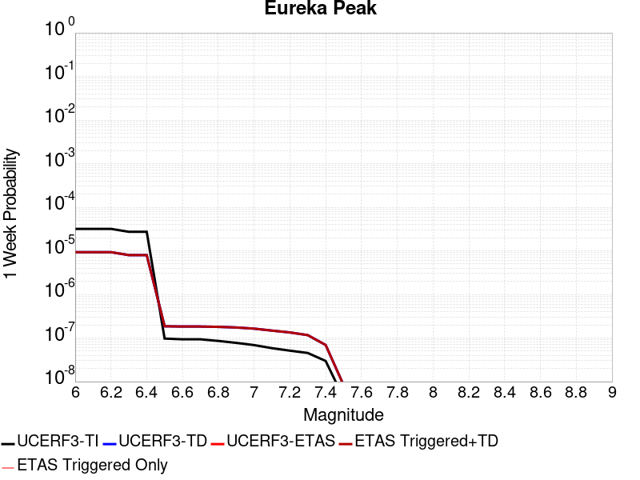 |  |  |  |

| Magnitude | 1 wk TI Prob | 1 wk TD Prob | 1 wk ETAS Prob | 1 wk ETAS/TD Gain | 1 wk ETAS Triggered+TD | 1 wk ETAS Triggered Only | 1 mo TI Prob | 1 mo TD Prob | 1 mo ETAS Prob | 1 mo ETAS/TD Gain | 1 mo ETAS Triggered+TD | 1 mo ETAS Triggered Only | 1 yr TI Prob | 1 yr TD Prob | 1 yr ETAS Prob | 1 yr ETAS/TD Gain | 1 yr ETAS Triggered+TD | 1 yr ETAS Triggered Only | 10 yr TI Prob | 10 yr TD Prob | 10 yr ETAS Prob | 10 yr ETAS/TD Gain | 10 yr ETAS Triggered+TD | 10 yr ETAS Triggered Only |
|-----|-----|-----|-----|-----|-----|-----|-----|-----|-----|-----|-----|-----|-----|-----|-----|-----|-----|-----|-----|-----|-----|-----|-----|-----|
| 6.0 | 3.1949054E-5 | 9.310965E-6 | 0.0 | 0.0 | 9.310965E-6 | 0.0 | 1.3691733E-4 | 3.9903964E-5 | 1.0E-4 | 2.5060167 | 3.9903964E-5 | 0.0 | 0.0016656938 | 4.8580059E-4 | 5.0E-4 | 1.0292289 | 4.8580059E-4 | 0.0 | 0.016532637 | 0.004921286 | 0.0035 | 0.71119624 | 0.00611538 | 0.0012 |
| 6.1 | 3.1949054E-5 | 9.310965E-6 | 0.0 | 0.0 | 9.310965E-6 | 0.0 | 1.3691733E-4 | 3.9903964E-5 | 1.0E-4 | 2.5060167 | 3.9903964E-5 | 0.0 | 0.0016656938 | 4.8580059E-4 | 5.0E-4 | 1.0292289 | 4.8580059E-4 | 0.0 | 0.016532637 | 0.004921286 | 0.0035 | 0.71119624 | 0.00611538 | 0.0012 |
| 6.2 | 3.1949054E-5 | 9.310965E-6 | 0.0 | 0.0 | 9.310965E-6 | 0.0 | 1.3691733E-4 | 3.9903964E-5 | 1.0E-4 | 2.5060167 | 3.9903964E-5 | 0.0 | 0.0016656938 | 4.8580059E-4 | 5.0E-4 | 1.0292289 | 4.8580059E-4 | 0.0 | 0.016532637 | 0.004921286 | 0.0035 | 0.71119624 | 0.00611538 | 0.0012 |
| 6.3 | 2.7339745E-5 | 7.980806E-6 | 0.0 | 0.0 | 7.980806E-6 | 0.0 | 1.1716507E-4 | 3.4203436E-5 | 1.0E-4 | 2.923683 | 3.4203436E-5 | 0.0 | 0.0014255513 | 4.1642317E-4 | 5.0E-4 | 1.2007017 | 4.1642317E-4 | 0.0 | 0.0141644105 | 0.004225988 | 0.003 | 0.70989317 | 0.0051221848 | 9.0E-4 |
| 6.4 | 2.7339745E-5 | 7.980806E-6 | 0.0 | 0.0 | 7.980806E-6 | 0.0 | 1.1716507E-4 | 3.4203436E-5 | 1.0E-4 | 2.923683 | 3.4203436E-5 | 0.0 | 0.0014255513 | 4.1642317E-4 | 5.0E-4 | 1.2007017 | 4.1642317E-4 | 0.0 | 0.0141644105 | 0.004225988 | 0.003 | 0.70989317 | 0.0051221848 | 9.0E-4 |
| 6.5 | 9.738388E-8 | 1.8618618E-7 | 0.0 | 0.0 | 1.8618618E-7 | 0.0 | 4.1735944E-7 | 7.979406E-7 | 0.0 | 0.0 | 7.979406E-7 | 0.0 | 5.081339E-6 | 9.714884E-6 | 0.0 | 0.0 | 9.714884E-6 | 0.0 | 5.0812232E-5 | 9.714467E-5 | 0.0 | 0.0 | 9.714467E-5 | 0.0 |
| 6.6 | 9.3495956E-8 | 1.8327452E-7 | 0.0 | 0.0 | 1.8327452E-7 | 0.0 | 4.0069688E-7 | 7.85462E-7 | 0.0 | 0.0 | 7.85462E-7 | 0.0 | 4.8784736E-6 | 9.562959E-6 | 0.0 | 0.0 | 9.562959E-6 | 0.0 | 4.8783666E-5 | 9.562555E-5 | 0.0 | 0.0 | 9.562555E-5 | 0.0 |
| 6.7 | 9.3495956E-8 | 1.8327452E-7 | 0.0 | 0.0 | 1.8327452E-7 | 0.0 | 4.0069688E-7 | 7.85462E-7 | 0.0 | 0.0 | 7.85462E-7 | 0.0 | 4.8784736E-6 | 9.562959E-6 | 0.0 | 0.0 | 9.562959E-6 | 0.0 | 4.8783666E-5 | 9.562555E-5 | 0.0 | 0.0 | 9.562555E-5 | 0.0 |
| 6.8 | 8.591428E-8 | 1.8020452E-7 | 0.0 | 0.0 | 1.8020452E-7 | 0.0 | 3.68204E-7 | 7.723049E-7 | 0.0 | 0.0 | 7.723049E-7 | 0.0 | 4.4828744E-6 | 9.402773E-6 | 0.0 | 0.0 | 9.402773E-6 | 0.0 | 4.482784E-5 | 9.4023824E-5 | 0.0 | 0.0 | 9.4023824E-5 | 0.0 |
| 6.9 | 7.749723E-8 | 1.7438482E-7 | 0.0 | 0.0 | 1.7438482E-7 | 0.0 | 3.3213098E-7 | 7.473633E-7 | 0.0 | 0.0 | 7.473633E-7 | 0.0 | 4.043687E-6 | 9.099111E-6 | 0.0 | 0.0 | 9.099111E-6 | 0.0 | 4.0436134E-5 | 9.098746E-5 | 0.0 | 0.0 | 9.098746E-5 | 0.0 |
| 7.0 | 6.897872E-8 | 1.6414104E-7 | 0.0 | 0.0 | 1.6414104E-7 | 0.0 | 2.9562307E-7 | 7.034614E-7 | 0.0 | 0.0 | 7.034614E-7 | 0.0 | 3.5992048E-6 | 8.56461E-6 | 0.0 | 0.0 | 8.56461E-6 | 0.0 | 3.5991467E-5 | 8.5642874E-5 | 0.0 | 0.0 | 8.5642874E-5 | 0.0 |
| 7.1 | 5.859318E-8 | 1.4784774E-7 | 0.0 | 0.0 | 1.4784774E-7 | 0.0 | 2.5111362E-7 | 6.33633E-7 | 0.0 | 0.0 | 6.33633E-7 | 0.0 | 3.057304E-6 | 7.714455E-6 | 0.0 | 0.0 | 7.714455E-6 | 0.0 | 3.0572617E-5 | 7.714194E-5 | 0.0 | 0.0 | 7.714194E-5 | 0.0 |
| 7.2 | 5.1375338E-8 | 1.3417598E-7 | 0.0 | 0.0 | 1.3417598E-7 | 0.0 | 2.2018E-7 | 5.750398E-7 | 0.0 | 0.0 | 5.750398E-7 | 0.0 | 2.680688E-6 | 7.0010874E-6 | 0.0 | 0.0 | 7.0010874E-6 | 0.0 | 2.6806558E-5 | 7.0008726E-5 | 0.0 | 0.0 | 7.0008726E-5 | 0.0 |
| 7.3 | 4.5441396E-8 | 1.1631074E-7 | 0.0 | 0.0 | 1.1631074E-7 | 0.0 | 1.9474882E-7 | 4.984745E-7 | 0.0 | 0.0 | 4.984745E-7 | 0.0 | 2.3710643E-6 | 6.068911E-6 | 0.0 | 0.0 | 6.068911E-6 | 0.0 | 2.371039E-5 | 6.0687504E-5 | 0.0 | 0.0 | 6.0687504E-5 | 0.0 |
| 7.4 | 2.981918E-8 | 6.902646E-8 | 0.0 | 0.0 | 6.902646E-8 | 0.0 | 1.2779647E-7 | 2.9582765E-7 | 0.0 | 0.0 | 2.9582765E-7 | 0.0 | 1.5559209E-6 | 3.601696E-6 | 0.0 | 0.0 | 3.601696E-6 | 0.0 | 1.55591E-5 | 3.601642E-5 | 0.0 | 0.0 | 3.601642E-5 | 0.0 |
| 7.5 | 4.24214E-9 | 8.328333E-9 | 0.0 | 0.0 | 8.328333E-9 | 0.0 | 1.81806E-8 | 3.5692853E-8 | 0.0 | 0.0 | 3.5692853E-8 | 0.0 | 2.213488E-7 | 4.345605E-7 | 0.0 | 0.0 | 4.345605E-7 | 0.0 | 2.2134857E-6 | 4.3456025E-6 | 0.0 | 0.0 | 4.3456025E-6 | 0.0 |

## Big Pine (Central)
*[(top)](#table-of-contents)*

| 1 Week | 1 Month | 1 Year | 10 Year |
|-----|-----|-----|-----|
|  | 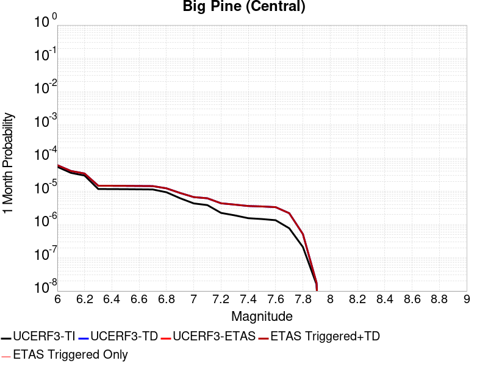 |  |  |

| Magnitude | 1 wk TI Prob | 1 wk TD Prob | 1 wk ETAS Prob | 1 wk ETAS/TD Gain | 1 wk ETAS Triggered+TD | 1 wk ETAS Triggered Only | 1 mo TI Prob | 1 mo TD Prob | 1 mo ETAS Prob | 1 mo ETAS/TD Gain | 1 mo ETAS Triggered+TD | 1 mo ETAS Triggered Only | 1 yr TI Prob | 1 yr TD Prob | 1 yr ETAS Prob | 1 yr ETAS/TD Gain | 1 yr ETAS Triggered+TD | 1 yr ETAS Triggered Only | 10 yr TI Prob | 10 yr TD Prob | 10 yr ETAS Prob | 10 yr ETAS/TD Gain | 10 yr ETAS Triggered+TD | 10 yr ETAS Triggered Only |
|-----|-----|-----|-----|-----|-----|-----|-----|-----|-----|-----|-----|-----|-----|-----|-----|-----|-----|-----|-----|-----|-----|-----|-----|-----|
| 6.0 | 1.2706755E-5 | 1.4257431E-5 | 0.0 | 0.0 | 1.4257431E-5 | 0.0 | 5.4456385E-5 | 6.110205E-5 | 0.0 | 0.0 | 6.110205E-5 | 0.0 | 6.628048E-4 | 7.4370013E-4 | 4.0E-4 | 0.5378512 | 7.4370013E-4 | 0.0 | 0.006608314 | 0.007417145 | 0.0057 | 0.7684897 | 0.008608244 | 0.0012 |
| 6.1 | 8.342579E-6 | 9.516855E-6 | 0.0 | 0.0 | 9.516855E-6 | 0.0 | 3.5753423E-5 | 4.0786006E-5 | 0.0 | 0.0 | 4.0786006E-5 | 0.0 | 4.3521097E-4 | 4.964782E-4 | 1.0E-4 | 0.20141871 | 4.964782E-4 | 0.0 | 0.0043435963 | 0.004957249 | 0.0033 | 0.6656918 | 0.005653779 | 7.0E-4 |
| 6.2 | 6.923899E-6 | 7.972971E-6 | 0.0 | 0.0 | 7.972971E-6 | 0.0 | 2.9673516E-5 | 3.4169538E-5 | 0.0 | 0.0 | 3.4169538E-5 | 0.0 | 3.6121515E-4 | 4.1595395E-4 | 1.0E-4 | 0.24041124 | 4.1595395E-4 | 0.0 | 0.003606286 | 0.004155066 | 0.0027 | 0.6498092 | 0.004852157 | 7.0E-4 |
| 6.3 | 2.728396E-6 | 3.4293685E-6 | 0.0 | 0.0 | 3.4293685E-6 | 0.0 | 1.1693074E-5 | 1.4697215E-5 | 0.0 | 0.0 | 1.4697215E-5 | 0.0 | 1.4235388E-4 | 1.7892478E-4 | 0.0 | 0.0 | 1.7892478E-4 | 0.0 | 0.0014226272 | 0.0017893175 | 9.0E-4 | 0.50298506 | 0.0020887807 | 3.0E-4 |
| 6.4 | 2.7136944E-6 | 3.4136597E-6 | 0.0 | 0.0 | 3.4136597E-6 | 0.0 | 1.1630066E-5 | 1.46298935E-5 | 0.0 | 0.0 | 1.46298935E-5 | 0.0 | 1.4158686E-4 | 1.7810526E-4 | 0.0 | 0.0 | 1.7810526E-4 | 0.0 | 0.0014149669 | 0.0017811354 | 9.0E-4 | 0.50529563 | 0.0020806012 | 3.0E-4 |
| 6.5 | 2.6971882E-6 | 3.3960023E-6 | 0.0 | 0.0 | 3.3960023E-6 | 0.0 | 1.1559327E-5 | 1.455422E-5 | 0.0 | 0.0 | 1.455422E-5 | 0.0 | 1.4072572E-4 | 1.7718409E-4 | 0.0 | 0.0 | 1.7718409E-4 | 0.0 | 0.0014063664 | 0.0017719384 | 9.0E-4 | 0.50791836 | 0.002071407 | 3.0E-4 |
| 6.6 | 2.669092E-6 | 3.366019E-6 | 0.0 | 0.0 | 3.366019E-6 | 0.0 | 1.1438916E-5 | 1.442572E-5 | 0.0 | 0.0 | 1.442572E-5 | 0.0 | 1.3925991E-4 | 1.7561986E-4 | 0.0 | 0.0 | 1.7561986E-4 | 0.0 | 0.0013917267 | 0.0017563209 | 9.0E-4 | 0.51243484 | 0.002055794 | 3.0E-4 |
| 6.7 | 2.6408059E-6 | 3.336041E-6 | 0.0 | 0.0 | 3.336041E-6 | 0.0 | 1.1317691E-5 | 1.4297245E-5 | 0.0 | 0.0 | 1.4297245E-5 | 0.0 | 1.3778417E-4 | 1.7405592E-4 | 0.0 | 0.0 | 1.7405592E-4 | 0.0 | 0.0013769877 | 0.0017407062 | 9.0E-4 | 0.51703155 | 0.0020401839 | 3.0E-4 |
| 6.8 | 2.1786943E-6 | 2.8594686E-6 | 0.0 | 0.0 | 2.8594686E-6 | 0.0 | 9.337228E-6 | 1.2254813E-5 | 0.0 | 0.0 | 1.2254813E-5 | 0.0 | 1.1367482E-4 | 1.4919286E-4 | 0.0 | 0.0 | 1.4919286E-4 | 0.0 | 0.0011361669 | 0.0014924237 | 9.0E-4 | 0.60304594 | 0.0017919759 | 3.0E-4 |
| 6.9 | 1.4411696E-6 | 2.0733112E-6 | 0.0 | 0.0 | 2.0733112E-6 | 0.0 | 6.1764263E-6 | 8.88559E-6 | 0.0 | 0.0 | 8.88559E-6 | 0.0 | 7.51954E-5 | 1.08176966E-4 | 0.0 | 0.0 | 1.08176966E-4 | 0.0 | 7.5169955E-4 | 0.0010826952 | 6.0E-4 | 0.55417264 | 0.0013823704 | 3.0E-4 |
| 7.0 | 1.0073411E-6 | 1.5585659E-6 | 0.0 | 0.0 | 1.5585659E-6 | 0.0 | 4.317169E-6 | 6.679552E-6 | 0.0 | 0.0 | 6.679552E-6 | 0.0 | 5.2560266E-5 | 8.1320664E-5 | 0.0 | 0.0 | 8.1320664E-5 | 0.0 | 5.2547833E-4 | 8.1434986E-4 | 5.0E-4 | 0.61398673 | 0.001014187 | 2.0E-4 |
| 7.1 | 8.947104E-7 | 1.4344926E-6 | 0.0 | 0.0 | 1.4344926E-6 | 0.0 | 3.834468E-6 | 6.1478117E-6 | 0.0 | 0.0 | 6.1478117E-6 | 0.0 | 4.6683643E-5 | 7.484719E-5 | 0.0 | 0.0 | 7.484719E-5 | 0.0 | 4.6673836E-4 | 7.496603E-4 | 3.0E-4 | 0.40018123 | 9.495104E-4 | 2.0E-4 |
| 7.2 | 5.215166E-7 | 1.0151305E-6 | 0.0 | 0.0 | 1.0151305E-6 | 0.0 | 2.2350691E-6 | 4.350552E-6 | 0.0 | 0.0 | 4.350552E-6 | 0.0 | 2.7211627E-5 | 5.2966727E-5 | 0.0 | 0.0 | 5.2966727E-5 | 0.0 | 2.7208295E-4 | 5.3097145E-4 | 2.0E-4 | 0.3766681 | 6.3091837E-4 | 1.0E-4 |
| 7.3 | 4.4024807E-7 | 9.2580615E-7 | 0.0 | 0.0 | 9.2580615E-7 | 0.0 | 1.8867761E-6 | 3.9677348E-6 | 0.0 | 0.0 | 3.9677348E-6 | 0.0 | 2.2971257E-5 | 4.830614E-5 | 0.0 | 0.0 | 4.830614E-5 | 0.0 | 2.2968883E-4 | 4.8438652E-4 | 2.0E-4 | 0.4128934 | 5.843381E-4 | 1.0E-4 |
| 7.4 | 3.6130905E-7 | 8.395833E-7 | 0.0 | 0.0 | 8.395833E-7 | 0.0 | 1.5484665E-6 | 3.5982096E-6 | 0.0 | 0.0 | 3.5982096E-6 | 0.0 | 1.8852415E-5 | 4.380736E-5 | 0.0 | 0.0 | 4.380736E-5 | 0.0 | 1.8850817E-4 | 4.3940725E-4 | 2.0E-4 | 0.45515862 | 5.393633E-4 | 1.0E-4 |
| 7.5 | 3.408184E-7 | 8.144665E-7 | 0.0 | 0.0 | 8.144665E-7 | 0.0 | 1.4606494E-6 | 3.490566E-6 | 0.0 | 0.0 | 3.490566E-6 | 0.0 | 1.7783263E-5 | 4.2496853E-5 | 0.0 | 0.0 | 4.2496853E-5 | 0.0 | 1.778184E-4 | 4.262833E-4 | 2.0E-4 | 0.46917152 | 5.262407E-4 | 1.0E-4 |
| 7.6 | 3.1428627E-7 | 7.766853E-7 | 0.0 | 0.0 | 7.766853E-7 | 0.0 | 1.3469405E-6 | 3.3286474E-6 | 0.0 | 0.0 | 3.3286474E-6 | 0.0 | 1.6398877E-5 | 4.0525567E-5 | 0.0 | 0.0 | 4.0525567E-5 | 0.0 | 1.6397667E-4 | 4.0655083E-4 | 1.0E-4 | 0.24597171 | 4.0655083E-4 | 0.0 |
| 7.7 | 1.7972785E-7 | 5.104923E-7 | 0.0 | 0.0 | 5.104923E-7 | 0.0 | 7.70262E-7 | 2.1878225E-6 | 0.0 | 0.0 | 2.1878225E-6 | 0.0 | 9.377899E-6 | 2.6636424E-5 | 0.0 | 0.0 | 2.6636424E-5 | 0.0 | 9.377503E-5 | 2.6768402E-4 | 0.0 | 0.0 | 2.6768402E-4 | 0.0 |
| 7.8 | 4.9230927E-8 | 1.204466E-7 | 0.0 | 0.0 | 1.204466E-7 | 0.0 | 2.1098968E-7 | 5.161996E-7 | 0.0 | 0.0 | 5.161996E-7 | 0.0 | 2.5687964E-6 | 6.2847134E-6 | 0.0 | 0.0 | 6.2847134E-6 | 0.0 | 2.5687666E-5 | 6.329464E-5 | 0.0 | 0.0 | 6.329464E-5 | 0.0 |
| 7.9 | 3.6805972E-9 | 4.129204E-9 | 0.0 | 0.0 | 4.129204E-9 | 0.0 | 1.5773987E-8 | 1.7696589E-8 | 0.0 | 0.0 | 1.7696589E-8 | 0.0 | 1.9204828E-7 | 2.1545596E-7 | 0.0 | 0.0 | 2.1545596E-7 | 0.0 | 1.920481E-6 | 2.202309E-6 | 0.0 | 0.0 | 2.202309E-6 | 0.0 |

## Death Valley (Black Mtns Frontal)
*[(top)](#table-of-contents)*

| 1 Week | 1 Month | 1 Year | 10 Year |
|-----|-----|-----|-----|
|  |  |  |  |

| Magnitude | 1 wk TI Prob | 1 wk TD Prob | 1 wk ETAS Prob | 1 wk ETAS/TD Gain | 1 wk ETAS Triggered+TD | 1 wk ETAS Triggered Only | 1 mo TI Prob | 1 mo TD Prob | 1 mo ETAS Prob | 1 mo ETAS/TD Gain | 1 mo ETAS Triggered+TD | 1 mo ETAS Triggered Only | 1 yr TI Prob | 1 yr TD Prob | 1 yr ETAS Prob | 1 yr ETAS/TD Gain | 1 yr ETAS Triggered+TD | 1 yr ETAS Triggered Only | 10 yr TI Prob | 10 yr TD Prob | 10 yr ETAS Prob | 10 yr ETAS/TD Gain | 10 yr ETAS Triggered+TD | 10 yr ETAS Triggered Only |
|-----|-----|-----|-----|-----|-----|-----|-----|-----|-----|-----|-----|-----|-----|-----|-----|-----|-----|-----|-----|-----|-----|-----|-----|-----|
| 6.0 | 1.6707214E-5 | 1.8674631E-5 | 1.0E-4 | 5.354858 | 1.1867277E-4 | 1.0E-4 | 7.160038E-5 | 8.003172E-5 | 1.0E-4 | 1.2495044 | 1.8002372E-4 | 1.0E-4 | 8.71386E-4 | 9.739583E-4 | 7.0E-4 | 0.7187166 | 0.0012736662 | 3.0E-4 | 0.00867977 | 0.009697752 | 0.0063 | 0.6496351 | 0.010886115 | 0.0012 |
| 6.1 | 1.6707214E-5 | 1.8674631E-5 | 1.0E-4 | 5.354858 | 1.1867277E-4 | 1.0E-4 | 7.160038E-5 | 8.003172E-5 | 1.0E-4 | 1.2495044 | 1.8002372E-4 | 1.0E-4 | 8.71386E-4 | 9.739583E-4 | 7.0E-4 | 0.7187166 | 0.0012736662 | 3.0E-4 | 0.00867977 | 0.009697752 | 0.0063 | 0.6496351 | 0.010886115 | 0.0012 |
| 6.2 | 1.6707214E-5 | 1.8674631E-5 | 1.0E-4 | 5.354858 | 1.1867277E-4 | 1.0E-4 | 7.160038E-5 | 8.003172E-5 | 1.0E-4 | 1.2495044 | 1.8002372E-4 | 1.0E-4 | 8.71386E-4 | 9.739583E-4 | 7.0E-4 | 0.7187166 | 0.0012736662 | 3.0E-4 | 0.00867977 | 0.009697752 | 0.0063 | 0.6496351 | 0.010886115 | 0.0012 |
| 6.3 | 1.6707214E-5 | 1.8674631E-5 | 1.0E-4 | 5.354858 | 1.1867277E-4 | 1.0E-4 | 7.160038E-5 | 8.003172E-5 | 1.0E-4 | 1.2495044 | 1.8002372E-4 | 1.0E-4 | 8.71386E-4 | 9.739583E-4 | 7.0E-4 | 0.7187166 | 0.0012736662 | 3.0E-4 | 0.00867977 | 0.009697752 | 0.0063 | 0.6496351 | 0.010886115 | 0.0012 |
| 6.4 | 1.5515609E-5 | 1.7342265E-5 | 1.0E-4 | 5.7662597 | 1.1734053E-4 | 1.0E-4 | 6.649377E-5 | 7.432191E-5 | 1.0E-4 | 1.3454982 | 1.7431448E-4 | 1.0E-4 | 8.0926094E-4 | 9.044997E-4 | 6.0E-4 | 0.6633501 | 0.0011043189 | 2.0E-4 | 0.008063202 | 0.009008869 | 0.0059 | 0.6549102 | 0.010098958 | 0.0011 |
| 6.5 | 1.5515609E-5 | 1.7342265E-5 | 1.0E-4 | 5.7662597 | 1.1734053E-4 | 1.0E-4 | 6.649377E-5 | 7.432191E-5 | 1.0E-4 | 1.3454982 | 1.7431448E-4 | 1.0E-4 | 8.0926094E-4 | 9.044997E-4 | 6.0E-4 | 0.6633501 | 0.0011043189 | 2.0E-4 | 0.008063202 | 0.009008869 | 0.0059 | 0.6549102 | 0.010098958 | 0.0011 |
| 6.6 | 1.5041828E-5 | 1.6813074E-5 | 1.0E-4 | 5.9477525 | 1.16811396E-4 | 1.0E-4 | 6.4463384E-5 | 7.205408E-5 | 1.0E-4 | 1.3878466 | 1.7204687E-4 | 1.0E-4 | 7.8455906E-4 | 8.7691116E-4 | 6.0E-4 | 0.68421984 | 0.0010767358 | 2.0E-4 | 0.00781795 | 0.008735165 | 0.0058 | 0.66398287 | 0.009825557 | 0.0011 |
| 6.7 | 1.4634985E-5 | 1.6359843E-5 | 1.0E-4 | 6.112528 | 1.16358206E-4 | 1.0E-4 | 6.271985E-5 | 7.011176E-5 | 1.0E-4 | 1.4262942 | 1.7010476E-4 | 1.0E-4 | 7.6334673E-4 | 8.5328217E-4 | 6.0E-4 | 0.70316714 | 0.0010531115 | 2.0E-4 | 0.007607299 | 0.008500696 | 0.0057 | 0.67053336 | 0.009591345 | 0.0011 |
| 6.8 | 1.4209158E-5 | 1.588577E-5 | 1.0E-4 | 6.2949424 | 1.1588418E-4 | 1.0E-4 | 6.089497E-5 | 6.808012E-5 | 1.0E-4 | 1.4688575 | 1.6807331E-4 | 1.0E-4 | 7.4114406E-4 | 8.2856586E-4 | 6.0E-4 | 0.7241428 | 0.0010284001 | 2.0E-4 | 0.007386771 | 0.008255382 | 0.0053 | 0.64200544 | 0.009346301 | 0.0011 |
| 6.9 | 1.3780098E-5 | 1.5408206E-5 | 1.0E-4 | 6.490048 | 1.1540666E-4 | 1.0E-4 | 5.9056227E-5 | 6.603353E-5 | 1.0E-4 | 1.5143821 | 1.6602693E-4 | 1.0E-4 | 7.1877235E-4 | 8.036672E-4 | 6.0E-4 | 0.74657774 | 0.0010035065 | 2.0E-4 | 0.0071645193 | 0.0080082035 | 0.0052 | 0.64933413 | 0.009000195 | 0.001 |
| 7.0 | 1.3585064E-5 | 1.5191722E-5 | 1.0E-4 | 6.5825324 | 1.151902E-4 | 1.0E-4 | 5.8220405E-5 | 6.5105785E-5 | 1.0E-4 | 1.5359617 | 1.6509928E-4 | 1.0E-4 | 7.086029E-4 | 7.9238013E-4 | 6.0E-4 | 0.75721234 | 9.922216E-4 | 2.0E-4 | 0.007063476 | 0.00789614 | 0.0052 | 0.65854955 | 0.008888245 | 0.001 |
| 7.1 | 1.3398601E-5 | 1.4984861E-5 | 1.0E-4 | 6.673402 | 1.1498336E-4 | 1.0E-4 | 5.742131E-5 | 6.421928E-5 | 1.0E-4 | 1.5571647 | 1.6421286E-4 | 1.0E-4 | 6.9888023E-4 | 7.815948E-4 | 6.0E-4 | 0.7676612 | 9.814384E-4 | 2.0E-4 | 0.0069668638 | 0.007789048 | 0.005 | 0.641927 | 0.008682038 | 9.0E-4 |
| 7.2 | 1.3126312E-5 | 1.4683018E-5 | 1.0E-4 | 6.810589 | 1.1468155E-4 | 1.0E-4 | 5.6254412E-5 | 6.2925734E-5 | 1.0E-4 | 1.589175 | 1.6291944E-4 | 1.0E-4 | 6.846822E-4 | 7.6585694E-4 | 6.0E-4 | 0.7834361 | 9.6570374E-4 | 2.0E-4 | 0.006825765 | 0.0076327603 | 0.005 | 0.655071 | 0.008525891 | 9.0E-4 |
| 7.3 | 1.2922429E-5 | 1.4457197E-5 | 1.0E-4 | 6.9169703 | 1.14455754E-4 | 1.0E-4 | 5.5380664E-5 | 6.195797E-5 | 1.0E-4 | 1.6139972 | 1.6195177E-4 | 1.0E-4 | 6.74051E-4 | 7.540827E-4 | 6.0E-4 | 0.7956687 | 9.539319E-4 | 2.0E-4 | 0.006720101 | 0.0075158207 | 0.0048 | 0.6386528 | 0.008409056 | 9.0E-4 |
| 7.4 | 1.2768878E-5 | 1.4287144E-5 | 1.0E-4 | 6.9992995 | 1.14285715E-4 | 1.0E-4 | 5.4722615E-5 | 6.122921E-5 | 1.0E-4 | 1.6332074 | 1.6122308E-4 | 1.0E-4 | 6.660441E-4 | 7.452161E-4 | 6.0E-4 | 0.8051356 | 9.4506703E-4 | 2.0E-4 | 0.0066405144 | 0.0074277506 | 0.0045 | 0.6058362 | 0.008221808 | 8.0E-4 |
| 7.5 | 1.2521929E-5 | 1.4015332E-5 | 1.0E-4 | 7.135043 | 1.1401393E-4 | 1.0E-4 | 5.366431E-5 | 6.0064358E-5 | 1.0E-4 | 1.6648809 | 1.6005835E-4 | 1.0E-4 | 6.531671E-4 | 7.3104363E-4 | 6.0E-4 | 0.82074445 | 9.308974E-4 | 2.0E-4 | 0.006512506 | 0.0072869645 | 0.0045 | 0.6175411 | 0.008081135 | 8.0E-4 |
| 7.6 | 1.1301089E-5 | 1.2651149E-5 | 1.0E-4 | 7.904421 | 1.1264988E-4 | 1.0E-4 | 4.8432343E-5 | 5.4218108E-5 | 1.0E-4 | 1.8444022 | 1.5421268E-4 | 1.0E-4 | 5.895042E-4 | 6.5991085E-4 | 6.0E-4 | 0.9092137 | 8.597789E-4 | 2.0E-4 | 0.0058794282 | 0.0065800655 | 0.0034 | 0.5167122 | 0.0072754594 | 7.0E-4 |
| 7.7 | 9.189108E-6 | 1.0285795E-5 | 0.0 | 0.0 | 1.0285795E-5 | 0.0 | 3.93813E-5 | 4.4081262E-5 | 0.0 | 0.0 | 4.4081262E-5 | 0.0 | 4.7936183E-4 | 5.3656223E-4 | 5.0E-4 | 0.93185836 | 6.365086E-4 | 1.0E-4 | 0.004783291 | 0.0053531784 | 0.0031 | 0.5790952 | 0.0059499666 | 6.0E-4 |
| 7.8 | 3.4586725E-7 | 3.64866E-7 | 0.0 | 0.0 | 3.64866E-7 | 0.0 | 1.4822873E-6 | 1.5637105E-6 | 0.0 | 0.0 | 1.5637105E-6 | 0.0 | 1.80467E-5 | 1.9038014E-5 | 0.0 | 0.0 | 1.9038014E-5 | 0.0 | 1.8045233E-4 | 1.9036427E-4 | 1.0E-4 | 0.52530867 | 1.9036427E-4 | 0.0 |
| 7.9 | 2.5591178E-9 | 2.6699005E-9 | 0.0 | 0.0 | 2.6699005E-9 | 0.0 | 1.0967647E-8 | 1.1442431E-8 | 0.0 | 0.0 | 1.1442431E-8 | 0.0 | 1.335311E-7 | 1.393116E-7 | 0.0 | 0.0 | 1.393116E-7 | 0.0 | 1.3353102E-6 | 1.3931159E-6 | 0.0 | 0.0 | 1.3931159E-6 | 0.0 |

## Puente Hills
*[(top)](#table-of-contents)*

| 1 Week | 1 Month | 1 Year | 10 Year |
|-----|-----|-----|-----|
| 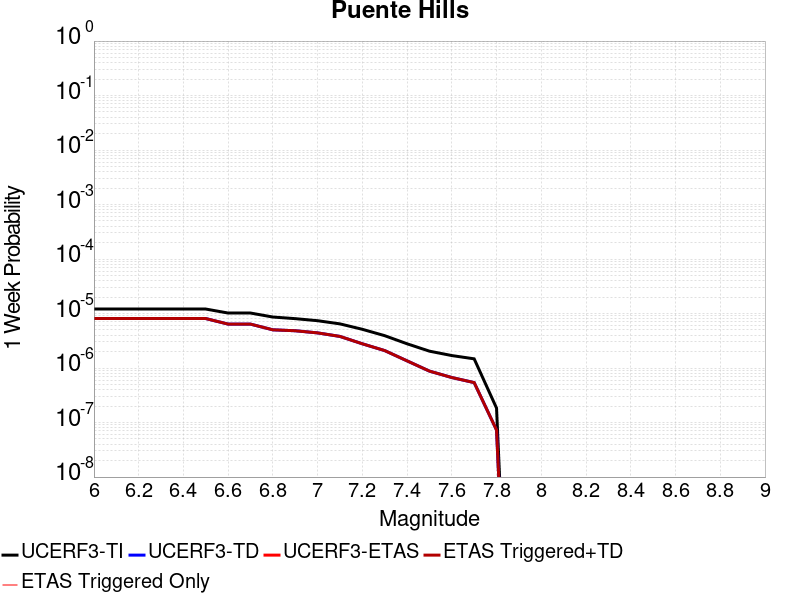 |  |  | 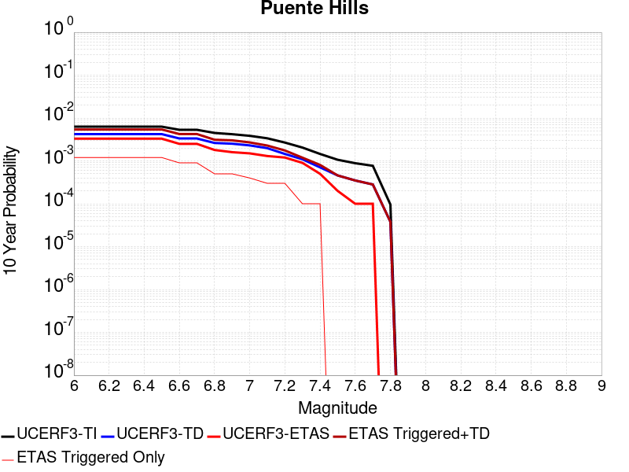 |

| Magnitude | 1 wk TI Prob | 1 wk TD Prob | 1 wk ETAS Prob | 1 wk ETAS/TD Gain | 1 wk ETAS Triggered+TD | 1 wk ETAS Triggered Only | 1 mo TI Prob | 1 mo TD Prob | 1 mo ETAS Prob | 1 mo ETAS/TD Gain | 1 mo ETAS Triggered+TD | 1 mo ETAS Triggered Only | 1 yr TI Prob | 1 yr TD Prob | 1 yr ETAS Prob | 1 yr ETAS/TD Gain | 1 yr ETAS Triggered+TD | 1 yr ETAS Triggered Only | 10 yr TI Prob | 10 yr TD Prob | 10 yr ETAS Prob | 10 yr ETAS/TD Gain | 10 yr ETAS Triggered+TD | 10 yr ETAS Triggered Only |
|-----|-----|-----|-----|-----|-----|-----|-----|-----|-----|-----|-----|-----|-----|-----|-----|-----|-----|-----|-----|-----|-----|-----|-----|-----|
| 6.0 | 1.2101656E-5 | 8.101014E-6 | 0.0 | 0.0 | 8.101014E-6 | 0.0 | 5.1863204E-5 | 3.47182E-5 | 0.0 | 0.0 | 3.47182E-5 | 0.0 | 6.312516E-4 | 4.2261774E-4 | 4.0E-4 | 0.9464818 | 5.2257546E-4 | 1.0E-4 | 0.0062946146 | 0.004218701 | 0.0033 | 0.78223133 | 0.0054136384 | 0.0012 |
| 6.1 | 1.2101656E-5 | 8.101014E-6 | 0.0 | 0.0 | 8.101014E-6 | 0.0 | 5.1863204E-5 | 3.47182E-5 | 0.0 | 0.0 | 3.47182E-5 | 0.0 | 6.312516E-4 | 4.2261774E-4 | 4.0E-4 | 0.9464818 | 5.2257546E-4 | 1.0E-4 | 0.0062946146 | 0.004218701 | 0.0033 | 0.78223133 | 0.0054136384 | 0.0012 |
| 6.2 | 1.2101656E-5 | 8.101014E-6 | 0.0 | 0.0 | 8.101014E-6 | 0.0 | 5.1863204E-5 | 3.47182E-5 | 0.0 | 0.0 | 3.47182E-5 | 0.0 | 6.312516E-4 | 4.2261774E-4 | 4.0E-4 | 0.9464818 | 5.2257546E-4 | 1.0E-4 | 0.0062946146 | 0.004218701 | 0.0033 | 0.78223133 | 0.0054136384 | 0.0012 |
| 6.3 | 1.2101656E-5 | 8.101014E-6 | 0.0 | 0.0 | 8.101014E-6 | 0.0 | 5.1863204E-5 | 3.47182E-5 | 0.0 | 0.0 | 3.47182E-5 | 0.0 | 6.312516E-4 | 4.2261774E-4 | 4.0E-4 | 0.9464818 | 5.2257546E-4 | 1.0E-4 | 0.0062946146 | 0.004218701 | 0.0033 | 0.78223133 | 0.0054136384 | 0.0012 |
| 6.4 | 1.2101656E-5 | 8.101014E-6 | 0.0 | 0.0 | 8.101014E-6 | 0.0 | 5.1863204E-5 | 3.47182E-5 | 0.0 | 0.0 | 3.47182E-5 | 0.0 | 6.312516E-4 | 4.2261774E-4 | 4.0E-4 | 0.9464818 | 5.2257546E-4 | 1.0E-4 | 0.0062946146 | 0.004218701 | 0.0033 | 0.78223133 | 0.0054136384 | 0.0012 |
| 6.5 | 1.2101656E-5 | 8.101014E-6 | 0.0 | 0.0 | 8.101014E-6 | 0.0 | 5.1863204E-5 | 3.47182E-5 | 0.0 | 0.0 | 3.47182E-5 | 0.0 | 6.312516E-4 | 4.2261774E-4 | 4.0E-4 | 0.9464818 | 5.2257546E-4 | 1.0E-4 | 0.0062946146 | 0.004218701 | 0.0033 | 0.78223133 | 0.0054136384 | 0.0012 |
| 6.6 | 1.0222488E-5 | 6.401434E-6 | 0.0 | 0.0 | 6.401434E-6 | 0.0 | 4.3809923E-5 | 2.7434442E-5 | 0.0 | 0.0 | 2.7434442E-5 | 0.0 | 5.332553E-4 | 3.339656E-4 | 3.0E-4 | 0.89829606 | 3.339656E-4 | 0.0 | 0.0053197746 | 0.0033348824 | 0.0025 | 0.7496516 | 0.0042318814 | 9.0E-4 |
| 6.7 | 1.0222488E-5 | 6.401434E-6 | 0.0 | 0.0 | 6.401434E-6 | 0.0 | 4.3809923E-5 | 2.7434442E-5 | 0.0 | 0.0 | 2.7434442E-5 | 0.0 | 5.332553E-4 | 3.339656E-4 | 3.0E-4 | 0.89829606 | 3.339656E-4 | 0.0 | 0.0053197746 | 0.0033348824 | 0.0025 | 0.7496516 | 0.0042318814 | 9.0E-4 |
| 6.8 | 8.6367845E-6 | 5.030248E-6 | 0.0 | 0.0 | 5.030248E-6 | 0.0 | 3.7014266E-5 | 2.1558031E-5 | 0.0 | 0.0 | 2.1558031E-5 | 0.0 | 4.505555E-4 | 2.6243797E-4 | 3.0E-4 | 1.1431273 | 2.6243797E-4 | 0.0 | 0.004496431 | 0.0026213366 | 0.0018 | 0.68667257 | 0.003120026 | 5.0E-4 |
| 6.9 | 8.066481E-6 | 4.838096E-6 | 0.0 | 0.0 | 4.838096E-6 | 0.0 | 3.4570177E-5 | 2.0734537E-5 | 0.0 | 0.0 | 2.0734537E-5 | 0.0 | 4.2081063E-4 | 2.5241426E-4 | 3.0E-4 | 1.1885223 | 2.5241426E-4 | 0.0 | 0.0042001465 | 0.0025213296 | 0.0016 | 0.6345858 | 0.0030200689 | 5.0E-4 |
| 7.0 | 7.393828E-6 | 4.4191543E-6 | 0.0 | 0.0 | 4.4191543E-6 | 0.0 | 3.168745E-5 | 1.8939098E-5 | 0.0 | 0.0 | 1.8939098E-5 | 0.0 | 3.857264E-4 | 2.3055957E-4 | 3.0E-4 | 1.3011822 | 2.3055957E-4 | 0.0 | 0.0038505755 | 0.0023032492 | 0.0015 | 0.6512539 | 0.002702328 | 4.0E-4 |
| 7.1 | 6.4660953E-6 | 3.8059763E-6 | 0.0 | 0.0 | 3.8059763E-6 | 0.0 | 2.7711543E-5 | 1.6311227E-5 | 0.0 | 0.0 | 1.6311227E-5 | 0.0 | 3.373358E-4 | 1.9857145E-4 | 3.0E-4 | 1.5107912 | 1.9857145E-4 | 0.0 | 0.0033682417 | 0.001983976 | 0.0013 | 0.65524983 | 0.0022833808 | 3.0E-4 |
| 7.2 | 5.143232E-6 | 2.7877454E-6 | 0.0 | 0.0 | 2.7877454E-6 | 0.0 | 2.2042237E-5 | 1.1947426E-5 | 0.0 | 0.0 | 1.1947426E-5 | 0.0 | 2.6833118E-4 | 1.454503E-4 | 2.0E-4 | 1.37504 | 1.454503E-4 | 0.0 | 0.002680074 | 0.0014535608 | 0.0012 | 0.82555884 | 0.0017531248 | 3.0E-4 |
| 7.3 | 3.928255E-6 | 2.0924263E-6 | 0.0 | 0.0 | 2.0924263E-6 | 0.0 | 1.683527E-5 | 8.96751E-6 | 0.0 | 0.0 | 8.96751E-6 | 0.0 | 2.0495013E-4 | 1.0917404E-4 | 2.0E-4 | 1.8319373 | 1.0917404E-4 | 0.0 | 0.002047612 | 0.0010912108 | 9.0E-4 | 0.82477194 | 0.0011911016 | 1.0E-4 |
| 7.4 | 2.7894434E-6 | 1.3555801E-6 | 0.0 | 0.0 | 1.3555801E-6 | 0.0 | 1.1954703E-5 | 5.8096166E-6 | 0.0 | 0.0 | 5.8096166E-6 | 0.0 | 1.4553878E-4 | 7.072983E-5 | 2.0E-4 | 2.8276613 | 7.072983E-5 | 0.0 | 0.001454435 | 7.0707756E-4 | 5.0E-4 | 0.707136 | 8.0700684E-4 | 1.0E-4 |
| 7.5 | 2.041735E-6 | 8.793661E-7 | 0.0 | 0.0 | 8.793661E-7 | 0.0 | 8.750263E-6 | 3.7687064E-6 | 0.0 | 0.0 | 3.7687064E-6 | 0.0 | 1.06529245E-4 | 4.588307E-5 | 1.0E-4 | 2.1794531 | 4.588307E-5 | 0.0 | 0.0010647819 | 4.5873932E-4 | 2.0E-4 | 0.43597746 | 4.5873932E-4 | 0.0 |
| 7.6 | 1.6959062E-6 | 6.7036274E-7 | 0.0 | 0.0 | 6.7036274E-7 | 0.0 | 7.268149E-6 | 2.87298E-6 | 0.0 | 0.0 | 2.87298E-6 | 0.0 | 8.848612E-5 | 3.4978002E-5 | 1.0E-4 | 2.85894 | 3.4978002E-5 | 0.0 | 8.84509E-4 | 3.4972784E-4 | 1.0E-4 | 0.28593662 | 3.4972784E-4 | 0.0 |
| 7.7 | 1.4767965E-6 | 5.4117845E-7 | 0.0 | 0.0 | 5.4117845E-7 | 0.0 | 6.3291122E-6 | 2.3193343E-6 | 0.0 | 0.0 | 2.3193343E-6 | 0.0 | 7.705422E-5 | 2.8237555E-5 | 1.0E-4 | 3.541383 | 2.8237555E-5 | 0.0 | 7.702751E-4 | 2.8234225E-4 | 1.0E-4 | 0.3541801 | 2.8234225E-4 | 0.0 |
| 7.8 | 1.8432911E-7 | 7.286716E-8 | 0.0 | 0.0 | 7.286716E-8 | 0.0 | 7.8998164E-7 | 3.1228782E-7 | 0.0 | 0.0 | 3.1228782E-7 | 0.0 | 9.617985E-6 | 3.8021008E-6 | 0.0 | 0.0 | 3.8021008E-6 | 0.0 | 9.617568E-5 | 3.8020684E-5 | 0.0 | 0.0 | 3.8020684E-5 | 0.0 |

## Pitas Point (Lower West)
*[(top)](#table-of-contents)*

| 1 Week | 1 Month | 1 Year | 10 Year |
|-----|-----|-----|-----|
|  |  | 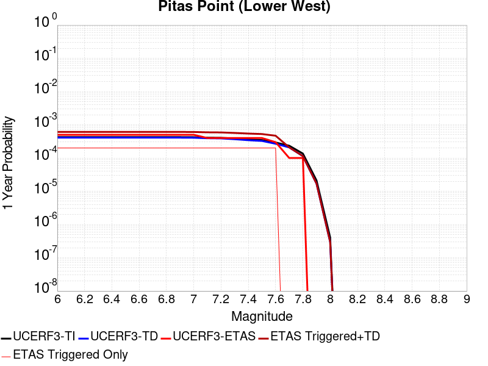 |  |

| Magnitude | 1 wk TI Prob | 1 wk TD Prob | 1 wk ETAS Prob | 1 wk ETAS/TD Gain | 1 wk ETAS Triggered+TD | 1 wk ETAS Triggered Only | 1 mo TI Prob | 1 mo TD Prob | 1 mo ETAS Prob | 1 mo ETAS/TD Gain | 1 mo ETAS Triggered+TD | 1 mo ETAS Triggered Only | 1 yr TI Prob | 1 yr TD Prob | 1 yr ETAS Prob | 1 yr ETAS/TD Gain | 1 yr ETAS Triggered+TD | 1 yr ETAS Triggered Only | 10 yr TI Prob | 10 yr TD Prob | 10 yr ETAS Prob | 10 yr ETAS/TD Gain | 10 yr ETAS Triggered+TD | 10 yr ETAS Triggered Only |
|-----|-----|-----|-----|-----|-----|-----|-----|-----|-----|-----|-----|-----|-----|-----|-----|-----|-----|-----|-----|-----|-----|-----|-----|-----|
| 6.0 | 8.151497E-6 | 7.856887E-6 | 0.0 | 0.0 | 7.856887E-6 | 0.0 | 3.493452E-5 | 3.3671942E-5 | 0.0 | 0.0 | 3.3671942E-5 | 0.0 | 4.252448E-4 | 4.0987955E-4 | 5.0E-4 | 1.2198706 | 6.0979754E-4 | 2.0E-4 | 0.0042443196 | 0.0040913164 | 0.0043 | 1.0510066 | 0.0051868157 | 0.0011 |
| 6.1 | 8.151497E-6 | 7.856887E-6 | 0.0 | 0.0 | 7.856887E-6 | 0.0 | 3.493452E-5 | 3.3671942E-5 | 0.0 | 0.0 | 3.3671942E-5 | 0.0 | 4.252448E-4 | 4.0987955E-4 | 5.0E-4 | 1.2198706 | 6.0979754E-4 | 2.0E-4 | 0.0042443196 | 0.0040913164 | 0.0043 | 1.0510066 | 0.0051868157 | 0.0011 |
| 6.2 | 8.151497E-6 | 7.856887E-6 | 0.0 | 0.0 | 7.856887E-6 | 0.0 | 3.493452E-5 | 3.3671942E-5 | 0.0 | 0.0 | 3.3671942E-5 | 0.0 | 4.252448E-4 | 4.0987955E-4 | 5.0E-4 | 1.2198706 | 6.0979754E-4 | 2.0E-4 | 0.0042443196 | 0.0040913164 | 0.0043 | 1.0510066 | 0.0051868157 | 0.0011 |
| 6.3 | 8.151497E-6 | 7.856887E-6 | 0.0 | 0.0 | 7.856887E-6 | 0.0 | 3.493452E-5 | 3.3671942E-5 | 0.0 | 0.0 | 3.3671942E-5 | 0.0 | 4.252448E-4 | 4.0987955E-4 | 5.0E-4 | 1.2198706 | 6.0979754E-4 | 2.0E-4 | 0.0042443196 | 0.0040913164 | 0.0043 | 1.0510066 | 0.0051868157 | 0.0011 |
| 6.4 | 8.151497E-6 | 7.856887E-6 | 0.0 | 0.0 | 7.856887E-6 | 0.0 | 3.493452E-5 | 3.3671942E-5 | 0.0 | 0.0 | 3.3671942E-5 | 0.0 | 4.252448E-4 | 4.0987955E-4 | 5.0E-4 | 1.2198706 | 6.0979754E-4 | 2.0E-4 | 0.0042443196 | 0.0040913164 | 0.0043 | 1.0510066 | 0.0051868157 | 0.0011 |
| 6.5 | 8.151497E-6 | 7.856887E-6 | 0.0 | 0.0 | 7.856887E-6 | 0.0 | 3.493452E-5 | 3.3671942E-5 | 0.0 | 0.0 | 3.3671942E-5 | 0.0 | 4.252448E-4 | 4.0987955E-4 | 5.0E-4 | 1.2198706 | 6.0979754E-4 | 2.0E-4 | 0.0042443196 | 0.0040913164 | 0.0043 | 1.0510066 | 0.0051868157 | 0.0011 |
| 6.6 | 8.151497E-6 | 7.856887E-6 | 0.0 | 0.0 | 7.856887E-6 | 0.0 | 3.493452E-5 | 3.3671942E-5 | 0.0 | 0.0 | 3.3671942E-5 | 0.0 | 4.252448E-4 | 4.0987955E-4 | 5.0E-4 | 1.2198706 | 6.0979754E-4 | 2.0E-4 | 0.0042443196 | 0.0040913164 | 0.0043 | 1.0510066 | 0.0051868157 | 0.0011 |
| 6.7 | 8.151497E-6 | 7.856887E-6 | 0.0 | 0.0 | 7.856887E-6 | 0.0 | 3.493452E-5 | 3.3671942E-5 | 0.0 | 0.0 | 3.3671942E-5 | 0.0 | 4.252448E-4 | 4.0987955E-4 | 5.0E-4 | 1.2198706 | 6.0979754E-4 | 2.0E-4 | 0.0042443196 | 0.0040913164 | 0.0043 | 1.0510066 | 0.0051868157 | 0.0011 |
| 6.8 | 8.151497E-6 | 7.856887E-6 | 0.0 | 0.0 | 7.856887E-6 | 0.0 | 3.493452E-5 | 3.3671942E-5 | 0.0 | 0.0 | 3.3671942E-5 | 0.0 | 4.252448E-4 | 4.0987955E-4 | 5.0E-4 | 1.2198706 | 6.0979754E-4 | 2.0E-4 | 0.0042443196 | 0.0040913164 | 0.0043 | 1.0510066 | 0.0051868157 | 0.0011 |
| 6.9 | 8.151497E-6 | 7.856887E-6 | 0.0 | 0.0 | 7.856887E-6 | 0.0 | 3.493452E-5 | 3.3671942E-5 | 0.0 | 0.0 | 3.3671942E-5 | 0.0 | 4.252448E-4 | 4.0987955E-4 | 5.0E-4 | 1.2198706 | 6.0979754E-4 | 2.0E-4 | 0.0042443196 | 0.0040913164 | 0.0043 | 1.0510066 | 0.0051868157 | 0.0011 |
| 7.0 | 8.103535E-6 | 7.806311E-6 | 0.0 | 0.0 | 7.806311E-6 | 0.0 | 3.4728975E-5 | 3.3455195E-5 | 0.0 | 0.0 | 3.3455195E-5 | 0.0 | 4.2274324E-4 | 4.0724163E-4 | 5.0E-4 | 1.2277724 | 6.0716015E-4 | 2.0E-4 | 0.0042193993 | 0.004065034 | 0.0043 | 1.0578018 | 0.005160562 | 0.0011 |
| 7.1 | 7.853298E-6 | 7.541973E-6 | 0.0 | 0.0 | 7.541973E-6 | 0.0 | 3.3656554E-5 | 3.2322347E-5 | 0.0 | 0.0 | 3.2322347E-5 | 0.0 | 4.096915E-4 | 3.934542E-4 | 4.0E-4 | 1.0166367 | 5.9337553E-4 | 2.0E-4 | 0.00408937 | 0.0039276523 | 0.0041 | 1.0438806 | 0.005023332 | 0.0011 |
| 7.2 | 7.771102E-6 | 7.454243E-6 | 0.0 | 0.0 | 7.454243E-6 | 0.0 | 3.33043E-5 | 3.194637E-5 | 0.0 | 0.0 | 3.194637E-5 | 0.0 | 4.0540437E-4 | 3.8887834E-4 | 4.0E-4 | 1.0285994 | 5.888006E-4 | 2.0E-4 | 0.0040466557 | 0.003882054 | 0.0041 | 1.056142 | 0.0049777837 | 0.0011 |
| 7.3 | 7.3945344E-6 | 7.0502897E-6 | 0.0 | 0.0 | 7.0502897E-6 | 0.0 | 3.1690477E-5 | 3.021518E-5 | 0.0 | 0.0 | 3.021518E-5 | 0.0 | 3.8576324E-4 | 3.6780836E-4 | 4.0E-4 | 1.0875229 | 5.677348E-4 | 2.0E-4 | 0.0038509427 | 0.0036720638 | 0.0038 | 1.0348405 | 0.004668392 | 0.001 |
| 7.4 | 6.964645E-6 | 6.5910767E-6 | 0.0 | 0.0 | 6.5910767E-6 | 0.0 | 2.9848137E-5 | 2.8247168E-5 | 0.0 | 0.0 | 2.8247168E-5 | 0.0 | 3.6334046E-4 | 3.438555E-4 | 4.0E-4 | 1.1632793 | 5.4378674E-4 | 2.0E-4 | 0.0036274698 | 0.0034332878 | 0.0035 | 1.019431 | 0.004330198 | 9.0E-4 |
| 7.5 | 6.6525035E-6 | 6.26007E-6 | 0.0 | 0.0 | 6.26007E-6 | 0.0 | 2.851042E-5 | 2.6828598E-5 | 0.0 | 0.0 | 2.6828598E-5 | 0.0 | 3.4705905E-4 | 3.265897E-4 | 4.0E-4 | 1.2247783 | 5.265244E-4 | 2.0E-4 | 0.0034651754 | 0.0032611492 | 0.0035 | 1.0732414 | 0.004158214 | 9.0E-4 |
| 7.6 | 5.613338E-6 | 5.1521374E-6 | 0.0 | 0.0 | 5.1521374E-6 | 0.0 | 2.405694E-5 | 2.2080403E-5 | 0.0 | 0.0 | 2.2080403E-5 | 0.0 | 2.928539E-4 | 2.6879605E-4 | 3.0E-4 | 1.1160878 | 4.6874228E-4 | 2.0E-4 | 0.0029246826 | 0.0026847408 | 0.0028 | 1.0429312 | 0.0033828616 | 7.0E-4 |
| 7.7 | 4.494704E-6 | 3.9975075E-6 | 0.0 | 0.0 | 3.9975075E-6 | 0.0 | 1.9262876E-5 | 1.7132063E-5 | 0.0 | 0.0 | 1.7132063E-5 | 0.0 | 2.3450027E-4 | 2.0856314E-4 | 1.0E-4 | 0.47947112 | 2.0856314E-4 | 0.0 | 0.0023425296 | 0.002083698 | 0.0022 | 1.0558151 | 0.0025826562 | 5.0E-4 |
| 7.8 | 2.6075882E-6 | 2.1839955E-6 | 0.0 | 0.0 | 2.1839955E-6 | 0.0 | 1.117533E-5 | 9.359947E-6 | 0.0 | 0.0 | 9.359947E-6 | 0.0 | 1.3605114E-4 | 1.1395144E-4 | 1.0E-4 | 0.87756675 | 1.1395144E-4 | 0.0 | 0.0013596788 | 0.0011389349 | 0.0011 | 0.9658147 | 0.0014385931 | 3.0E-4 |
| 7.9 | 4.045984E-7 | 3.242797E-7 | 0.0 | 0.0 | 3.242797E-7 | 0.0 | 1.733992E-6 | 1.3897695E-6 | 0.0 | 0.0 | 1.3897695E-6 | 0.0 | 2.1111147E-5 | 1.6920316E-5 | 0.0 | 0.0 | 1.6920316E-5 | 0.0 | 2.1109142E-4 | 1.6919058E-4 | 4.0E-4 | 2.3641977 | 3.6915674E-4 | 2.0E-4 |
| 8.0 | 7.791402E-9 | 5.684371E-9 | 0.0 | 0.0 | 5.684371E-9 | 0.0 | 3.3391725E-8 | 2.4361592E-8 | 0.0 | 0.0 | 2.4361592E-8 | 0.0 | 4.0654416E-7 | 2.9660237E-7 | 0.0 | 0.0 | 2.9660237E-7 | 0.0 | 4.065434E-6 | 2.9660216E-6 | 0.0 | 0.0 | 2.9660216E-6 | 0.0 |

## Russ 2011 CFM
*[(top)](#table-of-contents)*

| 1 Week | 1 Month | 1 Year | 10 Year |
|-----|-----|-----|-----|
| 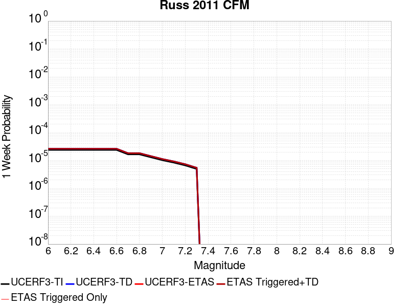 | 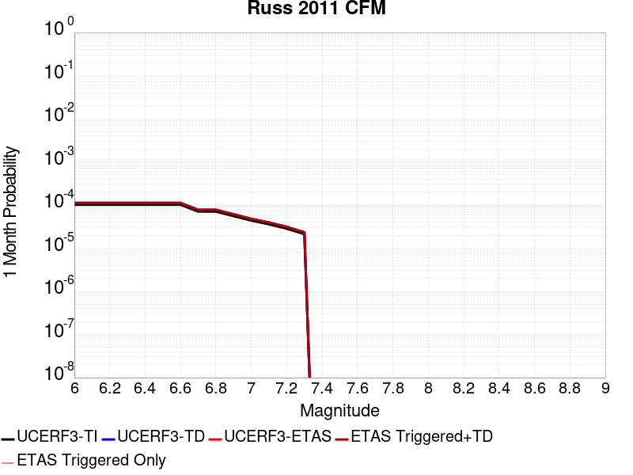 |  |  |

| Magnitude | 1 wk TI Prob | 1 wk TD Prob | 1 wk ETAS Prob | 1 wk ETAS/TD Gain | 1 wk ETAS Triggered+TD | 1 wk ETAS Triggered Only | 1 mo TI Prob | 1 mo TD Prob | 1 mo ETAS Prob | 1 mo ETAS/TD Gain | 1 mo ETAS Triggered+TD | 1 mo ETAS Triggered Only | 1 yr TI Prob | 1 yr TD Prob | 1 yr ETAS Prob | 1 yr ETAS/TD Gain | 1 yr ETAS Triggered+TD | 1 yr ETAS Triggered Only | 10 yr TI Prob | 10 yr TD Prob | 10 yr ETAS Prob | 10 yr ETAS/TD Gain | 10 yr ETAS Triggered+TD | 10 yr ETAS Triggered Only |
|-----|-----|-----|-----|-----|-----|-----|-----|-----|-----|-----|-----|-----|-----|-----|-----|-----|-----|-----|-----|-----|-----|-----|-----|-----|
| 6.0 | 2.3806366E-5 | 2.6259511E-5 | 0.0 | 0.0 | 2.6259511E-5 | 0.0 | 1.0202329E-4 | 1.1253626E-4 | 0.0 | 0.0 | 1.1253626E-4 | 0.0 | 0.0012414258 | 0.0013693315 | 4.0E-4 | 0.29211333 | 0.0013693315 | 0.0 | 0.012345135 | 0.013615423 | 0.008 | 0.587569 | 0.0147990845 | 0.0012 |
| 6.1 | 2.3806366E-5 | 2.6259511E-5 | 0.0 | 0.0 | 2.6259511E-5 | 0.0 | 1.0202329E-4 | 1.1253626E-4 | 0.0 | 0.0 | 1.1253626E-4 | 0.0 | 0.0012414258 | 0.0013693315 | 4.0E-4 | 0.29211333 | 0.0013693315 | 0.0 | 0.012345135 | 0.013615423 | 0.008 | 0.587569 | 0.0147990845 | 0.0012 |
| 6.2 | 2.3806366E-5 | 2.6259511E-5 | 0.0 | 0.0 | 2.6259511E-5 | 0.0 | 1.0202329E-4 | 1.1253626E-4 | 0.0 | 0.0 | 1.1253626E-4 | 0.0 | 0.0012414258 | 0.0013693315 | 4.0E-4 | 0.29211333 | 0.0013693315 | 0.0 | 0.012345135 | 0.013615423 | 0.008 | 0.587569 | 0.0147990845 | 0.0012 |
| 6.3 | 2.3806366E-5 | 2.6259511E-5 | 0.0 | 0.0 | 2.6259511E-5 | 0.0 | 1.0202329E-4 | 1.1253626E-4 | 0.0 | 0.0 | 1.1253626E-4 | 0.0 | 0.0012414258 | 0.0013693315 | 4.0E-4 | 0.29211333 | 0.0013693315 | 0.0 | 0.012345135 | 0.013615423 | 0.008 | 0.587569 | 0.0147990845 | 0.0012 |
| 6.4 | 2.3806366E-5 | 2.6259511E-5 | 0.0 | 0.0 | 2.6259511E-5 | 0.0 | 1.0202329E-4 | 1.1253626E-4 | 0.0 | 0.0 | 1.1253626E-4 | 0.0 | 0.0012414258 | 0.0013693315 | 4.0E-4 | 0.29211333 | 0.0013693315 | 0.0 | 0.012345135 | 0.013615423 | 0.008 | 0.587569 | 0.0147990845 | 0.0012 |
| 6.5 | 2.3806366E-5 | 2.6259511E-5 | 0.0 | 0.0 | 2.6259511E-5 | 0.0 | 1.0202329E-4 | 1.1253626E-4 | 0.0 | 0.0 | 1.1253626E-4 | 0.0 | 0.0012414258 | 0.0013693315 | 4.0E-4 | 0.29211333 | 0.0013693315 | 0.0 | 0.012345135 | 0.013615423 | 0.008 | 0.587569 | 0.0147990845 | 0.0012 |
| 6.6 | 2.3806366E-5 | 2.6259511E-5 | 0.0 | 0.0 | 2.6259511E-5 | 0.0 | 1.0202329E-4 | 1.1253626E-4 | 0.0 | 0.0 | 1.1253626E-4 | 0.0 | 0.0012414258 | 0.0013693315 | 4.0E-4 | 0.29211333 | 0.0013693315 | 0.0 | 0.012345135 | 0.013615423 | 0.008 | 0.587569 | 0.0147990845 | 0.0012 |
| 6.7 | 1.6515693E-5 | 1.8191598E-5 | 0.0 | 0.0 | 1.8191598E-5 | 0.0 | 7.077962E-5 | 7.796185E-5 | 0.0 | 0.0 | 7.796185E-5 | 0.0 | 8.6140115E-4 | 9.48806E-4 | 2.0E-4 | 0.21079125 | 9.48806E-4 | 0.0 | 0.008580698 | 0.009450945 | 0.0059 | 0.62427616 | 0.010243384 | 8.0E-4 |
| 6.8 | 1.6515693E-5 | 1.8191598E-5 | 0.0 | 0.0 | 1.8191598E-5 | 0.0 | 7.077962E-5 | 7.796185E-5 | 0.0 | 0.0 | 7.796185E-5 | 0.0 | 8.6140115E-4 | 9.48806E-4 | 2.0E-4 | 0.21079125 | 9.48806E-4 | 0.0 | 0.008580698 | 0.009450945 | 0.0059 | 0.62427616 | 0.010243384 | 8.0E-4 |
| 6.9 | 1.2971182E-5 | 1.4276675E-5 | 0.0 | 0.0 | 1.4276675E-5 | 0.0 | 5.5589593E-5 | 6.118446E-5 | 0.0 | 0.0 | 6.118446E-5 | 0.0 | 6.765931E-4 | 7.446921E-4 | 1.0E-4 | 0.13428369 | 7.446921E-4 | 0.0 | 0.0067453682 | 0.0074245413 | 0.0046 | 0.6195669 | 0.008020086 | 6.0E-4 |
| 7.0 | 1.0201805E-5 | 1.1224137E-5 | 0.0 | 0.0 | 1.1224137E-5 | 0.0 | 4.3721288E-5 | 4.8102676E-5 | 0.0 | 0.0 | 4.8102676E-5 | 0.0 | 5.3217664E-4 | 5.855135E-4 | 1.0E-4 | 0.17079026 | 5.855135E-4 | 0.0 | 0.00530904 | 0.005841761 | 0.0036 | 0.61625254 | 0.006438256 | 6.0E-4 |
| 7.1 | 8.3744935E-6 | 9.2144965E-6 | 0.0 | 0.0 | 9.2144965E-6 | 0.0 | 3.5890193E-5 | 3.9490205E-5 | 0.0 | 0.0 | 3.9490205E-5 | 0.0 | 4.368755E-4 | 4.8070573E-4 | 1.0E-4 | 0.20802748 | 4.8070573E-4 | 0.0 | 0.004360176 | 0.004798485 | 0.0032 | 0.66687715 | 0.0051965658 | 4.0E-4 |
| 7.2 | 6.649391E-6 | 7.3184665E-6 | 0.0 | 0.0 | 7.3184665E-6 | 0.0 | 2.8497077E-5 | 3.1364572E-5 | 0.0 | 0.0 | 3.1364572E-5 | 0.0 | 3.4689668E-4 | 3.8181336E-4 | 0.0 | 0.0 | 3.8181336E-4 | 0.0 | 0.0034635565 | 0.0038132048 | 0.0026 | 0.6818412 | 0.0041120606 | 3.0E-4 |
| 7.3 | 4.9549312E-6 | 5.455684E-6 | 0.0 | 0.0 | 5.455684E-6 | 0.0 | 2.1235246E-5 | 2.3381375E-5 | 0.0 | 0.0 | 2.3381375E-5 | 0.0 | 2.5850846E-4 | 2.846458E-4 | 0.0 | 0.0 | 2.846458E-4 | 0.0 | 0.0025820795 | 0.0028442566 | 0.0023 | 0.80864716 | 0.0031434032 | 3.0E-4 |

## Cedar Mtn-Mahogany Mtn
*[(top)](#table-of-contents)*

| 1 Week | 1 Month | 1 Year | 10 Year |
|-----|-----|-----|-----|
| 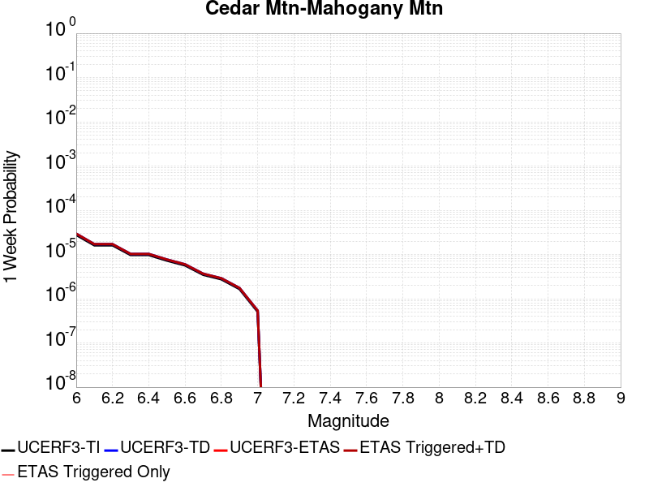 |  | 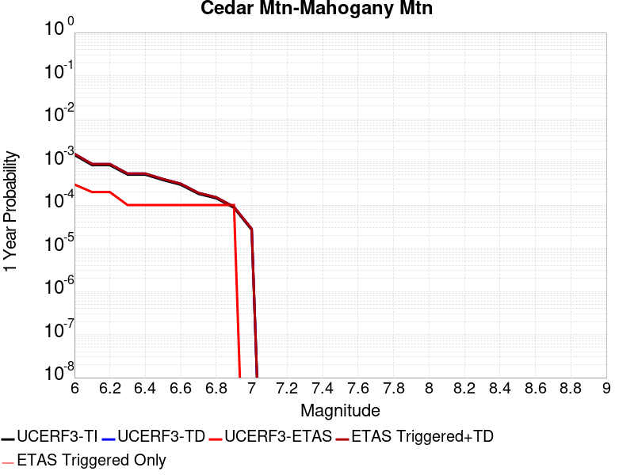 |  |

| Magnitude | 1 wk TI Prob | 1 wk TD Prob | 1 wk ETAS Prob | 1 wk ETAS/TD Gain | 1 wk ETAS Triggered+TD | 1 wk ETAS Triggered Only | 1 mo TI Prob | 1 mo TD Prob | 1 mo ETAS Prob | 1 mo ETAS/TD Gain | 1 mo ETAS Triggered+TD | 1 mo ETAS Triggered Only | 1 yr TI Prob | 1 yr TD Prob | 1 yr ETAS Prob | 1 yr ETAS/TD Gain | 1 yr ETAS Triggered+TD | 1 yr ETAS Triggered Only | 10 yr TI Prob | 10 yr TD Prob | 10 yr ETAS Prob | 10 yr ETAS/TD Gain | 10 yr ETAS Triggered+TD | 10 yr ETAS Triggered Only |
|-----|-----|-----|-----|-----|-----|-----|-----|-----|-----|-----|-----|-----|-----|-----|-----|-----|-----|-----|-----|-----|-----|-----|-----|-----|
| 6.0 | 2.7763876E-5 | 2.9592731E-5 | 0.0 | 0.0 | 2.9592731E-5 | 0.0 | 1.1898261E-4 | 1.2682022E-4 | 0.0 | 0.0 | 1.2682022E-4 | 0.0 | 0.0014476506 | 0.0015430127 | 3.0E-4 | 0.19442485 | 0.0015430127 | 0.0 | 0.0143825635 | 0.015330214 | 0.0085 | 0.55446064 | 0.016511817 | 0.0012 |
| 6.1 | 1.6162443E-5 | 1.7145032E-5 | 0.0 | 0.0 | 1.7145032E-5 | 0.0 | 6.926578E-5 | 7.347674E-5 | 0.0 | 0.0 | 7.347674E-5 | 0.0 | 8.4298453E-4 | 8.942298E-4 | 2.0E-4 | 0.22365615 | 8.942298E-4 | 0.0 | 0.008397939 | 0.008908127 | 0.0049 | 0.5500595 | 0.0095027825 | 6.0E-4 |
| 6.2 | 1.6162443E-5 | 1.7145032E-5 | 0.0 | 0.0 | 1.7145032E-5 | 0.0 | 6.926578E-5 | 7.347674E-5 | 0.0 | 0.0 | 7.347674E-5 | 0.0 | 8.4298453E-4 | 8.942298E-4 | 2.0E-4 | 0.22365615 | 8.942298E-4 | 0.0 | 0.008397939 | 0.008908127 | 0.0049 | 0.5500595 | 0.0095027825 | 6.0E-4 |
| 6.3 | 9.746053E-6 | 1.030432E-5 | 0.0 | 0.0 | 1.030432E-5 | 0.0 | 4.1768133E-5 | 4.416065E-5 | 0.0 | 0.0 | 4.416065E-5 | 0.0 | 5.0840835E-4 | 5.375274E-4 | 1.0E-4 | 0.18603703 | 5.375274E-4 | 0.0 | 0.0050724675 | 0.005362691 | 0.0032 | 0.59671533 | 0.0059594736 | 6.0E-4 |
| 6.4 | 9.746053E-6 | 1.030432E-5 | 0.0 | 0.0 | 1.030432E-5 | 0.0 | 4.1768133E-5 | 4.416065E-5 | 0.0 | 0.0 | 4.416065E-5 | 0.0 | 5.0840835E-4 | 5.375274E-4 | 1.0E-4 | 0.18603703 | 5.375274E-4 | 0.0 | 0.0050724675 | 0.005362691 | 0.0032 | 0.59671533 | 0.0059594736 | 6.0E-4 |
| 6.5 | 7.290083E-6 | 7.696173E-6 | 0.0 | 0.0 | 7.696173E-6 | 0.0 | 3.124284E-5 | 3.2983193E-5 | 0.0 | 0.0 | 3.2983193E-5 | 0.0 | 3.8031515E-4 | 4.0149858E-4 | 1.0E-4 | 0.24906689 | 4.0149858E-4 | 0.0 | 0.0037966494 | 0.0040079523 | 0.0025 | 0.6237599 | 0.0046055475 | 6.0E-4 |
| 6.6 | 5.67907E-6 | 5.9898016E-6 | 0.0 | 0.0 | 5.9898016E-6 | 0.0 | 2.4338644E-5 | 2.5670333E-5 | 0.0 | 0.0 | 2.5670333E-5 | 0.0 | 2.962827E-4 | 3.1249283E-4 | 1.0E-4 | 0.32000735 | 3.1249283E-4 | 0.0 | 0.0029588798 | 0.0031206703 | 0.0017 | 0.54475474 | 0.0035194221 | 4.0E-4 |
| 6.7 | 3.4853963E-6 | 3.6730223E-6 | 0.0 | 0.0 | 3.6730223E-6 | 0.0 | 1.4937327E-5 | 1.5741432E-5 | 0.0 | 0.0 | 1.5741432E-5 | 0.0 | 1.8184677E-4 | 1.9163571E-4 | 1.0E-4 | 0.5218234 | 1.9163571E-4 | 0.0 | 0.0018169804 | 0.0019147666 | 0.0015 | 0.7833853 | 0.0023140006 | 4.0E-4 |
| 6.8 | 2.7535168E-6 | 2.9018859E-6 | 0.0 | 0.0 | 2.9018859E-6 | 0.0 | 1.1800733E-5 | 1.2436597E-5 | 0.0 | 0.0 | 1.2436597E-5 | 0.0 | 1.4366445E-4 | 1.5140552E-4 | 1.0E-4 | 0.6604779 | 1.5140552E-4 | 0.0 | 0.0014357162 | 0.001513071 | 0.0013 | 0.8591798 | 0.0018126171 | 3.0E-4 |
| 6.9 | 1.6594106E-6 | 1.7498874E-6 | 0.0 | 0.0 | 1.7498874E-6 | 0.0 | 7.1117406E-6 | 7.4994978E-6 | 0.0 | 0.0 | 7.4994978E-6 | 0.0 | 8.6582E-5 | 9.130287E-5 | 1.0E-4 | 1.0952559 | 9.130287E-5 | 0.0 | 8.654827E-4 | 9.12684E-4 | 5.0E-4 | 0.5478347 | 0.0010125928 | 1.0E-4 |
| 7.0 | 5.10215E-7 | 5.3898555E-7 | 0.0 | 0.0 | 5.3898555E-7 | 0.0 | 2.186634E-6 | 2.3099367E-6 | 0.0 | 0.0 | 2.3099367E-6 | 0.0 | 2.6621943E-5 | 2.8123244E-5 | 0.0 | 0.0 | 2.8123244E-5 | 0.0 | 2.6618753E-4 | 2.812094E-4 | 2.0E-4 | 0.71121377 | 3.8118128E-4 | 1.0E-4 |

## Homestead Valley 2011
*[(top)](#table-of-contents)*

| 1 Week | 1 Month | 1 Year | 10 Year |
|-----|-----|-----|-----|
|  | 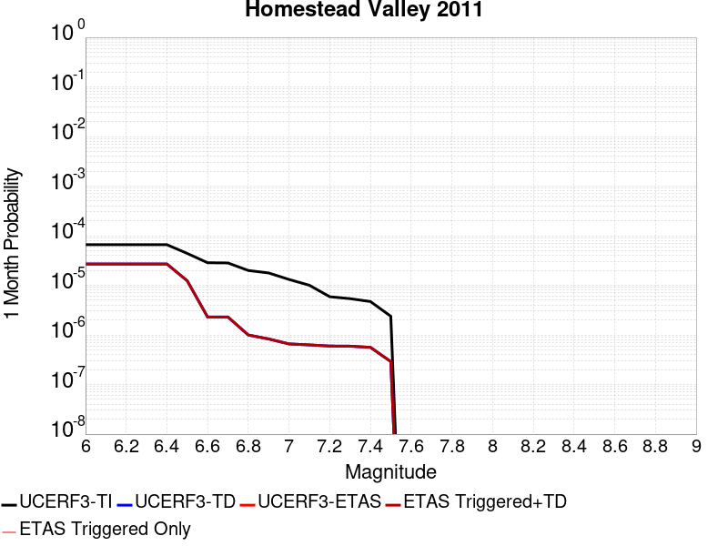 | 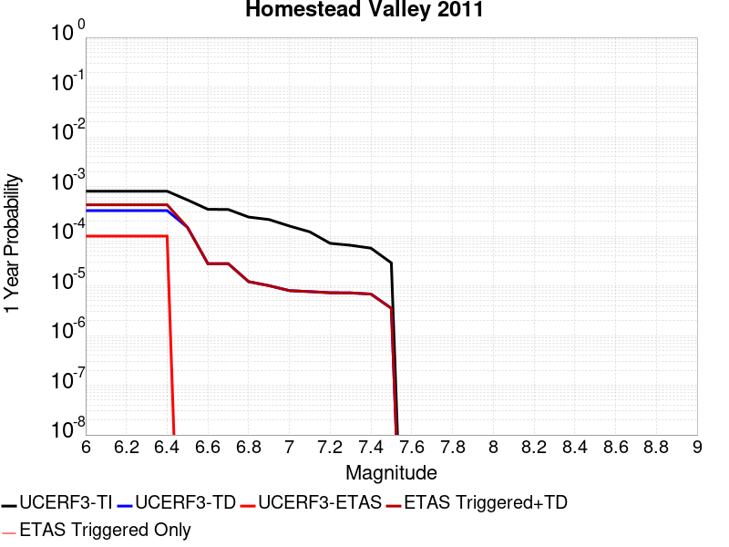 |  |

| Magnitude | 1 wk TI Prob | 1 wk TD Prob | 1 wk ETAS Prob | 1 wk ETAS/TD Gain | 1 wk ETAS Triggered+TD | 1 wk ETAS Triggered Only | 1 mo TI Prob | 1 mo TD Prob | 1 mo ETAS Prob | 1 mo ETAS/TD Gain | 1 mo ETAS Triggered+TD | 1 mo ETAS Triggered Only | 1 yr TI Prob | 1 yr TD Prob | 1 yr ETAS Prob | 1 yr ETAS/TD Gain | 1 yr ETAS Triggered+TD | 1 yr ETAS Triggered Only | 10 yr TI Prob | 10 yr TD Prob | 10 yr ETAS Prob | 10 yr ETAS/TD Gain | 10 yr ETAS Triggered+TD | 10 yr ETAS Triggered Only |
|-----|-----|-----|-----|-----|-----|-----|-----|-----|-----|-----|-----|-----|-----|-----|-----|-----|-----|-----|-----|-----|-----|-----|-----|-----|
| 6.0 | 1.539795E-5 | 6.286844E-6 | 0.0 | 0.0 | 6.286844E-6 | 0.0 | 6.5989545E-5 | 2.6943455E-5 | 0.0 | 0.0 | 2.6943455E-5 | 0.0 | 8.0312655E-4 | 3.280078E-4 | 1.0E-4 | 0.3048708 | 4.27975E-4 | 1.0E-4 | 0.008002302 | 0.003277258 | 0.0028 | 0.85437274 | 0.0044733253 | 0.0012 |
| 6.1 | 1.539795E-5 | 6.286844E-6 | 0.0 | 0.0 | 6.286844E-6 | 0.0 | 6.5989545E-5 | 2.6943455E-5 | 0.0 | 0.0 | 2.6943455E-5 | 0.0 | 8.0312655E-4 | 3.280078E-4 | 1.0E-4 | 0.3048708 | 4.27975E-4 | 1.0E-4 | 0.008002302 | 0.003277258 | 0.0028 | 0.85437274 | 0.0044733253 | 0.0012 |
| 6.2 | 1.539795E-5 | 6.286844E-6 | 0.0 | 0.0 | 6.286844E-6 | 0.0 | 6.5989545E-5 | 2.6943455E-5 | 0.0 | 0.0 | 2.6943455E-5 | 0.0 | 8.0312655E-4 | 3.280078E-4 | 1.0E-4 | 0.3048708 | 4.27975E-4 | 1.0E-4 | 0.008002302 | 0.003277258 | 0.0028 | 0.85437274 | 0.0044733253 | 0.0012 |
| 6.3 | 1.539795E-5 | 6.286844E-6 | 0.0 | 0.0 | 6.286844E-6 | 0.0 | 6.5989545E-5 | 2.6943455E-5 | 0.0 | 0.0 | 2.6943455E-5 | 0.0 | 8.0312655E-4 | 3.280078E-4 | 1.0E-4 | 0.3048708 | 4.27975E-4 | 1.0E-4 | 0.008002302 | 0.003277258 | 0.0028 | 0.85437274 | 0.0044733253 | 0.0012 |
| 6.4 | 1.539795E-5 | 6.286844E-6 | 0.0 | 0.0 | 6.286844E-6 | 0.0 | 6.5989545E-5 | 2.6943455E-5 | 0.0 | 0.0 | 2.6943455E-5 | 0.0 | 8.0312655E-4 | 3.280078E-4 | 1.0E-4 | 0.3048708 | 4.27975E-4 | 1.0E-4 | 0.008002302 | 0.003277258 | 0.0028 | 0.85437274 | 0.0044733253 | 0.0012 |
| 6.5 | 1.0265258E-5 | 2.8785712E-6 | 0.0 | 0.0 | 2.8785712E-6 | 0.0 | 4.3993223E-5 | 1.23367145E-5 | 0.0 | 0.0 | 1.23367145E-5 | 0.0 | 5.3548586E-4 | 1.501961E-4 | 0.0 | 0.0 | 1.501961E-4 | 0.0 | 0.005341973 | 0.0015016278 | 0.0018 | 1.1986991 | 0.0024002765 | 9.0E-4 |
| 6.6 | 6.664671E-6 | 5.342693E-7 | 0.0 | 0.0 | 5.342693E-7 | 0.0 | 2.8562565E-5 | 2.2897243E-6 | 0.0 | 0.0 | 2.2897243E-6 | 0.0 | 3.476937E-4 | 2.7877155E-5 | 0.0 | 0.0 | 2.7877155E-5 | 0.0 | 0.003471502 | 2.787482E-4 | 3.0E-4 | 1.0762402 | 3.7872032E-4 | 1.0E-4 |
| 6.7 | 6.5954046E-6 | 5.342693E-7 | 0.0 | 0.0 | 5.342693E-7 | 0.0 | 2.8265715E-5 | 2.2897243E-6 | 0.0 | 0.0 | 2.2897243E-6 | 0.0 | 3.4408073E-4 | 2.7877155E-5 | 0.0 | 0.0 | 2.7877155E-5 | 0.0 | 0.0034354846 | 2.787482E-4 | 3.0E-4 | 1.0762402 | 3.7872032E-4 | 1.0E-4 |
| 6.8 | 4.648189E-6 | 2.3245582E-7 | 0.0 | 0.0 | 2.3245582E-7 | 0.0 | 1.9920659E-5 | 9.962388E-7 | 0.0 | 0.0 | 9.962388E-7 | 0.0 | 2.4250703E-4 | 1.2129145E-5 | 0.0 | 0.0 | 1.2129145E-5 | 0.0 | 0.0024224254 | 1.2128531E-4 | 2.0E-4 | 1.6490043 | 2.2127318E-4 | 1.0E-4 |
| 6.9 | 4.1428534E-6 | 1.9331121E-7 | 0.0 | 0.0 | 1.9331121E-7 | 0.0 | 1.7754966E-5 | 8.2847635E-7 | 0.0 | 0.0 | 8.2847635E-7 | 0.0 | 2.1614527E-4 | 1.00866555E-5 | 0.0 | 0.0 | 1.00866555E-5 | 0.0 | 0.0021593515 | 1.0086228E-4 | 2.0E-4 | 1.9829019 | 2.0085218E-4 | 1.0E-4 |
| 7.0 | 3.0673707E-6 | 1.5358391E-7 | 0.0 | 0.0 | 1.5358391E-7 | 0.0 | 1.3145808E-5 | 6.582166E-7 | 0.0 | 0.0 | 6.582166E-7 | 0.0 | 1.6003846E-4 | 8.013759E-6 | 0.0 | 0.0 | 8.013759E-6 | 0.0 | 0.0015992324 | 8.01348E-5 | 2.0E-4 | 2.4957945 | 1.801268E-4 | 1.0E-4 |
| 7.1 | 2.340854E-6 | 1.4679102E-7 | 0.0 | 0.0 | 1.4679102E-7 | 0.0 | 1.0032193E-5 | 6.2910425E-7 | 0.0 | 0.0 | 6.2910425E-7 | 0.0 | 1.221351E-4 | 7.659319E-6 | 0.0 | 0.0 | 7.659319E-6 | 0.0 | 0.00122068 | 7.6590644E-5 | 2.0E-4 | 2.611285 | 1.7658298E-4 | 1.0E-4 |
| 7.2 | 1.3754182E-6 | 1.3915034E-7 | 0.0 | 0.0 | 1.3915034E-7 | 0.0 | 5.8946357E-6 | 5.9635846E-7 | 0.0 | 0.0 | 5.9635846E-7 | 0.0 | 7.176483E-5 | 7.2606413E-6 | 0.0 | 0.0 | 7.2606413E-6 | 0.0 | 7.174166E-4 | 7.260413E-5 | 2.0E-4 | 2.7546642 | 1.7259688E-4 | 1.0E-4 |
| 7.3 | 1.2573237E-6 | 1.3819663E-7 | 0.0 | 0.0 | 1.3819663E-7 | 0.0 | 5.388519E-6 | 5.9227114E-7 | 0.0 | 0.0 | 5.9227114E-7 | 0.0 | 6.560324E-5 | 7.2108783E-6 | 0.0 | 0.0 | 7.2108783E-6 | 0.0 | 6.558388E-4 | 7.210654E-5 | 2.0E-4 | 2.7736738 | 1.7209932E-4 | 1.0E-4 |
| 7.4 | 1.0994207E-6 | 1.3099175E-7 | 0.0 | 0.0 | 1.3099175E-7 | 0.0 | 4.7117946E-6 | 5.613931E-7 | 0.0 | 0.0 | 5.613931E-7 | 0.0 | 5.736459E-5 | 6.8349405E-6 | 0.0 | 0.0 | 6.8349405E-6 | 0.0 | 5.734978E-4 | 6.834739E-5 | 2.0E-4 | 2.926227 | 1.6834056E-4 | 1.0E-4 |
| 7.5 | 5.5569126E-7 | 6.7692156E-8 | 0.0 | 0.0 | 6.7692156E-8 | 0.0 | 2.3815317E-6 | 2.901092E-7 | 0.0 | 0.0 | 2.901092E-7 | 0.0 | 2.8994764E-5 | 3.5320745E-6 | 0.0 | 0.0 | 3.5320745E-6 | 0.0 | 2.899098E-4 | 3.532025E-5 | 0.0 | 0.0 | 3.532025E-5 | 0.0 |

## Elsinore (Temecula) rev
*[(top)](#table-of-contents)*

| 1 Week | 1 Month | 1 Year | 10 Year |
|-----|-----|-----|-----|
| 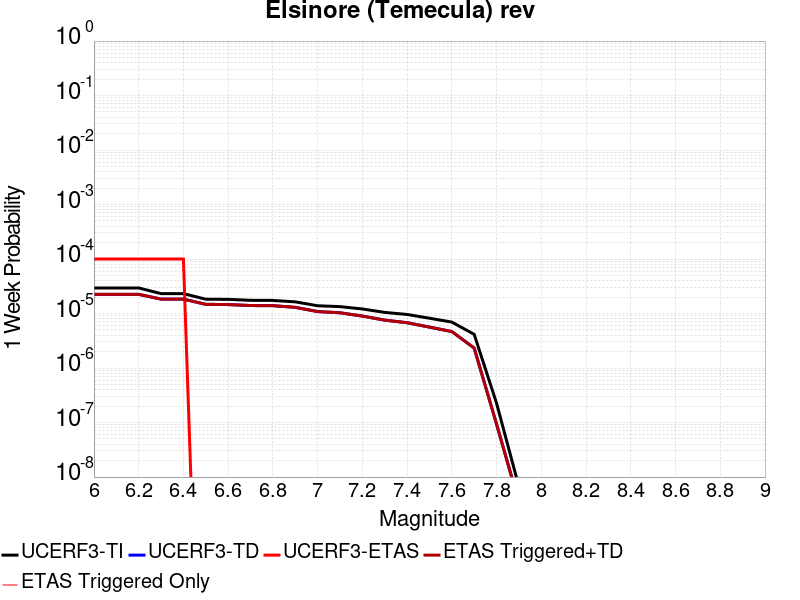 |  |  | 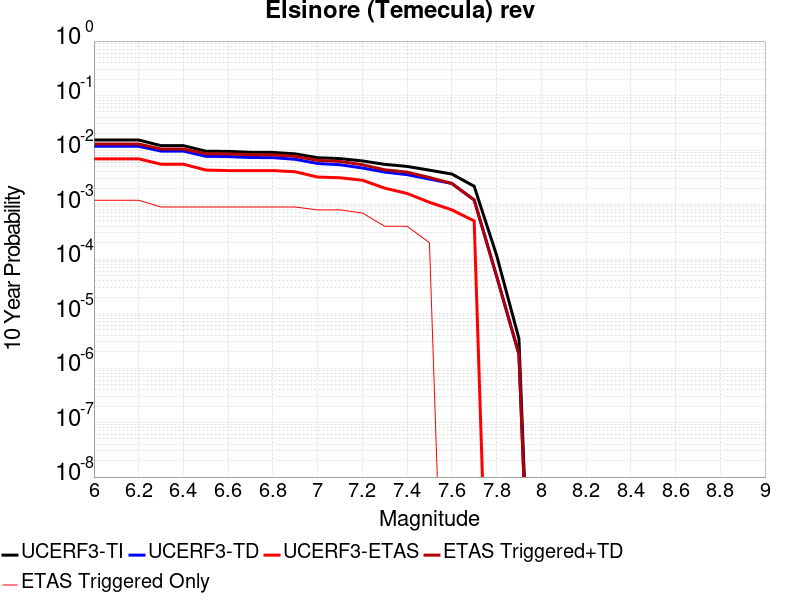 |

| Magnitude | 1 wk TI Prob | 1 wk TD Prob | 1 wk ETAS Prob | 1 wk ETAS/TD Gain | 1 wk ETAS Triggered+TD | 1 wk ETAS Triggered Only | 1 mo TI Prob | 1 mo TD Prob | 1 mo ETAS Prob | 1 mo ETAS/TD Gain | 1 mo ETAS Triggered+TD | 1 mo ETAS Triggered Only | 1 yr TI Prob | 1 yr TD Prob | 1 yr ETAS Prob | 1 yr ETAS/TD Gain | 1 yr ETAS Triggered+TD | 1 yr ETAS Triggered Only | 10 yr TI Prob | 10 yr TD Prob | 10 yr ETAS Prob | 10 yr ETAS/TD Gain | 10 yr ETAS Triggered+TD | 10 yr ETAS Triggered Only |
|-----|-----|-----|-----|-----|-----|-----|-----|-----|-----|-----|-----|-----|-----|-----|-----|-----|-----|-----|-----|-----|-----|-----|-----|-----|
| 6.0 | 2.9514995E-5 | 2.2532482E-5 | 1.0E-4 | 4.4380374 | 2.2532482E-5 | 0.0 | 1.264867E-4 | 9.656433E-5 | 1.0E-4 | 1.0355791 | 9.656433E-5 | 0.0 | 0.0015388876 | 0.0011750587 | 0.001 | 0.8510214 | 0.0014747061 | 3.0E-4 | 0.015282745 | 0.01172261 | 0.0069 | 0.58860606 | 0.012908543 | 0.0012 |
| 6.1 | 2.9514995E-5 | 2.2532482E-5 | 1.0E-4 | 4.4380374 | 2.2532482E-5 | 0.0 | 1.264867E-4 | 9.656433E-5 | 1.0E-4 | 1.0355791 | 9.656433E-5 | 0.0 | 0.0015388876 | 0.0011750587 | 0.001 | 0.8510214 | 0.0014747061 | 3.0E-4 | 0.015282745 | 0.01172261 | 0.0069 | 0.58860606 | 0.012908543 | 0.0012 |
| 6.2 | 2.9514995E-5 | 2.2532482E-5 | 1.0E-4 | 4.4380374 | 2.2532482E-5 | 0.0 | 1.264867E-4 | 9.656433E-5 | 1.0E-4 | 1.0355791 | 9.656433E-5 | 0.0 | 0.0015388876 | 0.0011750587 | 0.001 | 0.8510214 | 0.0014747061 | 3.0E-4 | 0.015282745 | 0.01172261 | 0.0069 | 0.58860606 | 0.012908543 | 0.0012 |
| 6.3 | 2.3223649E-5 | 1.8418947E-5 | 1.0E-4 | 5.429192 | 1.8418947E-5 | 0.0 | 9.952613E-5 | 7.893605E-5 | 1.0E-4 | 1.2668483 | 7.893605E-5 | 0.0 | 0.001211057 | 9.6063985E-4 | 0.001 | 1.0409728 | 0.0012603516 | 3.0E-4 | 0.012044783 | 0.009579194 | 0.0055 | 0.57416105 | 0.010470573 | 9.0E-4 |
| 6.4 | 2.3223649E-5 | 1.8418947E-5 | 1.0E-4 | 5.429192 | 1.8418947E-5 | 0.0 | 9.952613E-5 | 7.893605E-5 | 1.0E-4 | 1.2668483 | 7.893605E-5 | 0.0 | 0.001211057 | 9.6063985E-4 | 0.001 | 1.0409728 | 0.0012603516 | 3.0E-4 | 0.012044783 | 0.009579194 | 0.0055 | 0.57416105 | 0.010470573 | 9.0E-4 |
| 6.5 | 1.8338875E-5 | 1.475958E-5 | 0.0 | 0.0 | 1.475958E-5 | 0.0 | 7.8592806E-5 | 6.325386E-5 | 0.0 | 0.0 | 6.325386E-5 | 0.0 | 9.5644733E-4 | 7.698524E-4 | 8.0E-4 | 1.0391603 | 0.0010696214 | 3.0E-4 | 0.009523412 | 0.007680793 | 0.0043 | 0.55983806 | 0.00857388 | 9.0E-4 |
| 6.6 | 1.8223333E-5 | 1.4622085E-5 | 0.0 | 0.0 | 1.4622085E-5 | 0.0 | 7.809766E-5 | 6.266462E-5 | 0.0 | 0.0 | 6.266462E-5 | 0.0 | 9.504242E-4 | 7.6268346E-4 | 8.0E-4 | 1.0489279 | 0.0010624547 | 3.0E-4 | 0.009463696 | 0.0076095955 | 0.0042 | 0.5519347 | 0.008502747 | 9.0E-4 |
| 6.7 | 1.7512752E-5 | 1.4036417E-5 | 0.0 | 0.0 | 1.4036417E-5 | 0.0 | 7.505249E-5 | 6.0154736E-5 | 0.0 | 0.0 | 6.0154736E-5 | 0.0 | 9.13381E-4 | 7.3214644E-4 | 8.0E-4 | 1.0926776 | 0.0010319267 | 3.0E-4 | 0.00909636 | 0.0073025743 | 0.0042 | 0.57513964 | 0.008196002 | 9.0E-4 |
| 6.8 | 1.7417142E-5 | 1.396037E-5 | 0.0 | 0.0 | 1.396037E-5 | 0.0 | 7.4642754E-5 | 5.982883E-5 | 0.0 | 0.0 | 5.982883E-5 | 0.0 | 9.083966E-4 | 7.281812E-4 | 8.0E-4 | 1.0986277 | 0.0010279628 | 3.0E-4 | 0.009046922 | 0.0072631217 | 0.0042 | 0.57826376 | 0.0081565855 | 9.0E-4 |
| 6.9 | 1.6402591E-5 | 1.2997419E-5 | 0.0 | 0.0 | 1.2997419E-5 | 0.0 | 7.0294926E-5 | 5.5702076E-5 | 0.0 | 0.0 | 5.5702076E-5 | 0.0 | 8.5550465E-4 | 6.779695E-4 | 8.0E-4 | 1.1799941 | 9.777661E-4 | 3.0E-4 | 0.008522186 | 0.00676429 | 0.004 | 0.5913407 | 0.007658202 | 9.0E-4 |
| 7.0 | 1.3912486E-5 | 1.0886062E-5 | 0.0 | 0.0 | 1.0886062E-5 | 0.0 | 5.9623577E-5 | 4.665373E-5 | 0.0 | 0.0 | 4.665373E-5 | 0.0 | 7.2567526E-4 | 5.6786387E-4 | 8.0E-4 | 1.4087883 | 8.676935E-4 | 3.0E-4 | 0.0072331014 | 0.005667677 | 0.0032 | 0.56460524 | 0.006463143 | 8.0E-4 |
| 7.1 | 1.3405147E-5 | 1.03348375E-5 | 0.0 | 0.0 | 1.03348375E-5 | 0.0 | 5.7449364E-5 | 4.429142E-5 | 0.0 | 0.0 | 4.429142E-5 | 0.0 | 6.9922156E-4 | 5.391172E-4 | 8.0E-4 | 1.4839073 | 8.3895546E-4 | 3.0E-4 | 0.0069702556 | 0.0053812917 | 0.0031 | 0.57606983 | 0.0061769867 | 8.0E-4 |
| 7.2 | 1.21402E-5 | 9.003166E-6 | 0.0 | 0.0 | 9.003166E-6 | 0.0 | 5.202839E-5 | 3.8584436E-5 | 0.0 | 0.0 | 3.8584436E-5 | 0.0 | 6.332616E-4 | 4.6966603E-4 | 8.0E-4 | 1.703338 | 7.695251E-4 | 3.0E-4 | 0.0063146 | 0.0046881624 | 0.0028 | 0.5972489 | 0.0053848806 | 7.0E-4 |
| 7.3 | 1.05047775E-5 | 7.5771713E-6 | 0.0 | 0.0 | 7.5771713E-6 | 0.0 | 4.5019697E-5 | 3.2473195E-5 | 0.0 | 0.0 | 3.2473195E-5 | 0.0 | 5.4797693E-4 | 3.952909E-4 | 5.0E-4 | 1.2648913 | 3.952909E-4 | 0.0 | 0.005466277 | 0.003946271 | 0.002 | 0.50680757 | 0.0043446925 | 4.0E-4 |
| 7.4 | 9.624483E-6 | 6.7916867E-6 | 0.0 | 0.0 | 6.7916867E-6 | 0.0 | 4.124713E-5 | 2.9106912E-5 | 0.0 | 0.0 | 2.9106912E-5 | 0.0 | 5.0206814E-4 | 3.5432042E-4 | 4.0E-4 | 1.1289217 | 3.5432042E-4 | 0.0 | 0.005009353 | 0.0035377096 | 0.0016 | 0.45227003 | 0.0039362945 | 4.0E-4 |
| 7.5 | 8.215151E-6 | 5.639558E-6 | 0.0 | 0.0 | 5.639558E-6 | 0.0 | 3.5207315E-5 | 2.4169316E-5 | 0.0 | 0.0 | 2.4169316E-5 | 0.0 | 4.2856473E-4 | 2.9422296E-4 | 3.0E-4 | 1.0196348 | 2.9422296E-4 | 0.0 | 0.004277392 | 0.0029384624 | 0.0011 | 0.37434545 | 0.0031378746 | 2.0E-4 |
| 7.6 | 6.975058E-6 | 4.6796113E-6 | 0.0 | 0.0 | 4.6796113E-6 | 0.0 | 2.9892764E-5 | 2.005533E-5 | 0.0 | 0.0 | 2.005533E-5 | 0.0 | 3.6388362E-4 | 2.4414744E-4 | 3.0E-4 | 1.2287657 | 2.4414744E-4 | 0.0 | 0.0036328835 | 0.0024389087 | 8.0E-4 | 0.32801557 | 0.0024389087 | 0.0 |
| 7.7 | 4.159604E-6 | 2.3288771E-6 | 0.0 | 0.0 | 2.3288771E-6 | 0.0 | 1.7826753E-5 | 9.9808685E-6 | 0.0 | 0.0 | 9.9808685E-6 | 0.0 | 2.1701909E-4 | 1.2151104E-4 | 2.0E-4 | 1.645941 | 1.2151104E-4 | 0.0 | 0.0021680726 | 0.0012145191 | 5.0E-4 | 0.41168556 | 0.0012145191 | 0.0 |
| 7.8 | 2.2692414E-7 | 9.391389E-8 | 0.0 | 0.0 | 9.391389E-8 | 0.0 | 9.725317E-7 | 4.0248807E-7 | 0.0 | 0.0 | 4.0248807E-7 | 0.0 | 1.1840509E-5 | 4.9002842E-6 | 0.0 | 0.0 | 4.9002842E-6 | 0.0 | 1.1839878E-4 | 4.900209E-5 | 0.0 | 0.0 | 4.900209E-5 | 0.0 |
| 7.9 | 6.676829E-9 | 3.4415768E-9 | 0.0 | 0.0 | 3.4415768E-9 | 0.0 | 2.861498E-8 | 1.4749616E-8 | 0.0 | 0.0 | 1.4749616E-8 | 0.0 | 3.4838732E-7 | 1.7957656E-7 | 0.0 | 0.0 | 1.7957656E-7 | 0.0 | 3.4838679E-6 | 1.7957643E-6 | 0.0 | 0.0 | 1.7957643E-6 | 0.0 |

## Great Valley 11
*[(top)](#table-of-contents)*

| 1 Week | 1 Month | 1 Year | 10 Year |
|-----|-----|-----|-----|
| 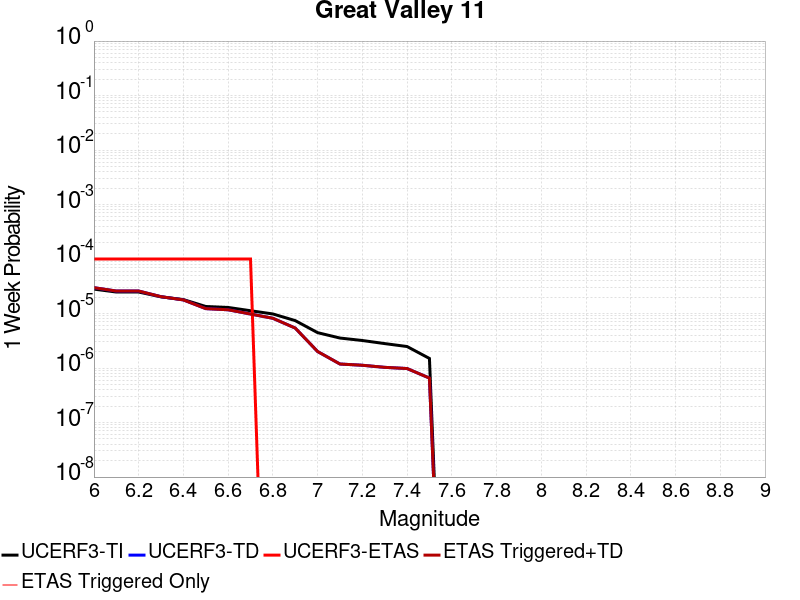 | 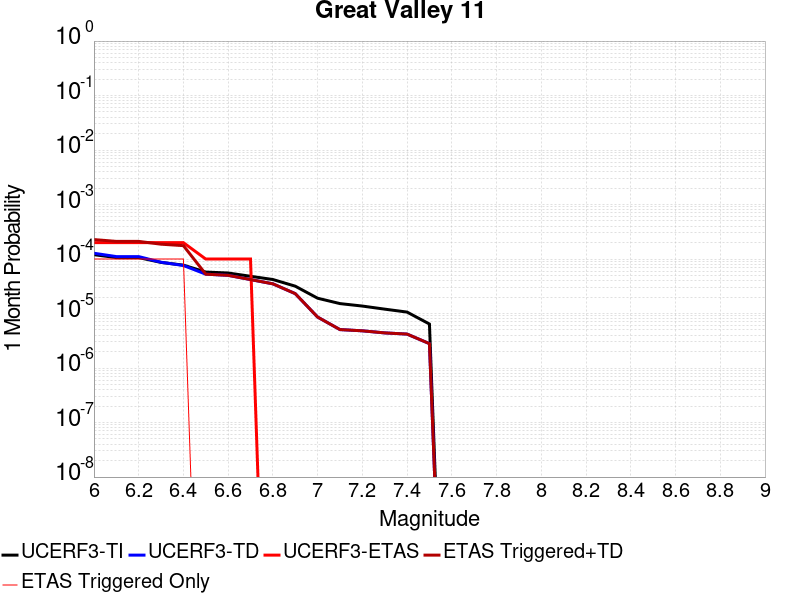 |  | 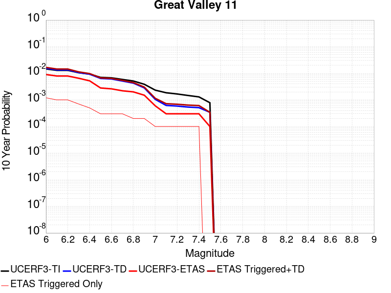 |

| Magnitude | 1 wk TI Prob | 1 wk TD Prob | 1 wk ETAS Prob | 1 wk ETAS/TD Gain | 1 wk ETAS Triggered+TD | 1 wk ETAS Triggered Only | 1 mo TI Prob | 1 mo TD Prob | 1 mo ETAS Prob | 1 mo ETAS/TD Gain | 1 mo ETAS Triggered+TD | 1 mo ETAS Triggered Only | 1 yr TI Prob | 1 yr TD Prob | 1 yr ETAS Prob | 1 yr ETAS/TD Gain | 1 yr ETAS Triggered+TD | 1 yr ETAS Triggered Only | 10 yr TI Prob | 10 yr TD Prob | 10 yr ETAS Prob | 10 yr ETAS/TD Gain | 10 yr ETAS Triggered+TD | 10 yr ETAS Triggered Only |
|-----|-----|-----|-----|-----|-----|-----|-----|-----|-----|-----|-----|-----|-----|-----|-----|-----|-----|-----|-----|-----|-----|-----|-----|-----|
| 6.0 | 2.8099583E-5 | 2.9842273E-5 | 1.0E-4 | 3.3509512 | 2.9842273E-5 | 0.0 | 1.20421224E-4 | 1.278896E-4 | 2.0E-4 | 1.5638489 | 2.2787681E-4 | 1.0E-4 | 0.0014651422 | 0.0015560172 | 0.0011 | 0.7069331 | 0.0016558616 | 1.0E-4 | 0.0145552 | 0.015458752 | 0.009 | 0.58219445 | 0.016640201 | 0.0012 |
| 6.1 | 2.483194E-5 | 2.591571E-5 | 1.0E-4 | 3.8586636 | 2.591571E-5 | 0.0 | 1.0641825E-4 | 1.1106296E-4 | 2.0E-4 | 1.8007804 | 2.1105185E-4 | 1.0E-4 | 0.0012948721 | 0.0013514161 | 9.0E-4 | 0.6659681 | 0.0014512809 | 1.0E-4 | 0.012873529 | 0.013438391 | 0.0079 | 0.58786803 | 0.014424952 | 0.001 |
| 6.2 | 2.483194E-5 | 2.591571E-5 | 1.0E-4 | 3.8586636 | 2.591571E-5 | 0.0 | 1.0641825E-4 | 1.1106296E-4 | 2.0E-4 | 1.8007804 | 2.1105185E-4 | 1.0E-4 | 0.0012948721 | 0.0013514161 | 9.0E-4 | 0.6659681 | 0.0014512809 | 1.0E-4 | 0.012873529 | 0.013438391 | 0.0079 | 0.58786803 | 0.014424952 | 0.001 |
| 6.3 | 2.0257901E-5 | 2.0405256E-5 | 1.0E-4 | 4.900698 | 2.0405256E-5 | 0.0 | 8.681669E-5 | 8.74484E-5 | 2.0E-4 | 2.287063 | 1.8743965E-4 | 1.0E-4 | 0.0010564806 | 0.0010642058 | 9.0E-4 | 0.8457011 | 0.0011640993 | 1.0E-4 | 0.01051472 | 0.010595269 | 0.0065 | 0.6134814 | 0.011287851 | 7.0E-4 |
| 6.4 | 1.8054898E-5 | 1.7786213E-5 | 1.0E-4 | 5.6223326 | 1.7786213E-5 | 0.0 | 7.737584E-5 | 7.622461E-5 | 2.0E-4 | 2.6238244 | 1.7621698E-4 | 1.0E-4 | 9.416436E-4 | 9.2767697E-4 | 8.0E-4 | 0.8623691 | 0.0010275842 | 1.0E-4 | 0.009376635 | 0.009241787 | 0.0052 | 0.56266177 | 0.009737166 | 5.0E-4 |
| 6.5 | 1.34804895E-5 | 1.2324267E-5 | 1.0E-4 | 8.114073 | 1.2324267E-5 | 0.0 | 5.777225E-5 | 5.281724E-5 | 1.0E-4 | 1.8933212 | 5.281724E-5 | 0.0 | 7.031501E-4 | 6.428643E-4 | 2.0E-4 | 0.31110764 | 6.428643E-4 | 0.0 | 0.007009294 | 0.0064104837 | 0.0028 | 0.4367845 | 0.006708561 | 3.0E-4 |
| 6.6 | 1.294883E-5 | 1.17353975E-5 | 1.0E-4 | 8.521228 | 1.17353975E-5 | 0.0 | 5.5493805E-5 | 5.0293613E-5 | 1.0E-4 | 1.988324 | 5.0293613E-5 | 0.0 | 6.754276E-4 | 6.121568E-4 | 2.0E-4 | 0.32671368 | 6.121568E-4 | 0.0 | 0.006733784 | 0.0061051315 | 0.0026 | 0.42587125 | 0.0064033 | 3.0E-4 |
| 6.7 | 1.1272237E-5 | 9.814416E-6 | 1.0E-4 | 10.189093 | 9.814416E-6 | 0.0 | 4.8308695E-5 | 4.206112E-5 | 1.0E-4 | 2.3774924 | 4.206112E-5 | 0.0 | 5.879996E-4 | 5.119766E-4 | 2.0E-4 | 0.39064285 | 5.119766E-4 | 0.0 | 0.005864462 | 0.005108255 | 0.0022 | 0.43067545 | 0.005406723 | 3.0E-4 |
| 6.8 | 9.8337505E-6 | 8.195899E-6 | 0.0 | 0.0 | 8.195899E-6 | 0.0 | 4.2143965E-5 | 3.512482E-5 | 0.0 | 0.0 | 3.512482E-5 | 0.0 | 5.1298196E-4 | 4.275628E-4 | 1.0E-4 | 0.23388377 | 4.275628E-4 | 0.0 | 0.005117994 | 0.004267612 | 0.002 | 0.46864617 | 0.0044667586 | 2.0E-4 |
| 6.9 | 7.4224813E-6 | 5.4144175E-6 | 0.0 | 0.0 | 5.4144175E-6 | 0.0 | 3.1810247E-5 | 2.3204448E-5 | 0.0 | 0.0 | 2.3204448E-5 | 0.0 | 3.872209E-4 | 2.8247893E-4 | 1.0E-4 | 0.3540087 | 2.8247893E-4 | 0.0 | 0.0038654688 | 0.0028213398 | 0.0015 | 0.53166234 | 0.0030207755 | 2.0E-4 |
| 7.0 | 4.4628923E-6 | 2.0112495E-6 | 0.0 | 0.0 | 2.0112495E-6 | 0.0 | 1.912654E-5 | 8.619613E-6 | 0.0 | 0.0 | 8.619613E-6 | 0.0 | 2.3284076E-4 | 1.0493885E-4 | 0.0 | 0.0 | 1.0493885E-4 | 0.0 | 0.0023259693 | 0.0010489046 | 6.0E-4 | 0.57202536 | 0.0011487997 | 1.0E-4 |
| 7.1 | 3.5546527E-6 | 1.1855622E-6 | 0.0 | 0.0 | 1.1855622E-6 | 0.0 | 1.5234136E-5 | 5.080971E-6 | 0.0 | 0.0 | 5.080971E-6 | 0.0 | 1.8545982E-4 | 6.185914E-5 | 0.0 | 0.0 | 6.185914E-5 | 0.0 | 0.0018530512 | 6.1842595E-4 | 3.0E-4 | 0.48510253 | 7.183641E-4 | 1.0E-4 |
| 7.2 | 3.2039936E-6 | 1.125404E-6 | 0.0 | 0.0 | 1.125404E-6 | 0.0 | 1.3731329E-5 | 4.8231514E-6 | 0.0 | 0.0 | 4.8231514E-6 | 0.0 | 1.671661E-4 | 5.8720354E-5 | 0.0 | 0.0 | 5.8720354E-5 | 0.0 | 0.0016704041 | 5.870551E-4 | 3.0E-4 | 0.5110253 | 6.869964E-4 | 1.0E-4 |
| 7.3 | 2.8120473E-6 | 1.0305071E-6 | 0.0 | 0.0 | 1.0305071E-6 | 0.0 | 1.2051575E-5 | 4.4164517E-6 | 0.0 | 0.0 | 4.4164517E-6 | 0.0 | 1.4671806E-4 | 5.3769043E-5 | 0.0 | 0.0 | 5.3769043E-5 | 0.0 | 0.0014662122 | 5.3756696E-4 | 3.0E-4 | 0.55807006 | 6.375132E-4 | 1.0E-4 |
| 7.4 | 2.4837766E-6 | 9.799826E-7 | 0.0 | 0.0 | 9.799826E-7 | 0.0 | 1.0644713E-5 | 4.1999187E-6 | 0.0 | 0.0 | 4.1999187E-6 | 0.0 | 1.2959167E-4 | 5.113288E-5 | 0.0 | 0.0 | 5.113288E-5 | 0.0 | 0.0012951613 | 5.112177E-4 | 3.0E-4 | 0.58683413 | 6.111666E-4 | 1.0E-4 |
| 7.5 | 1.5002679E-6 | 6.545664E-7 | 0.0 | 0.0 | 6.545664E-7 | 0.0 | 6.4297037E-6 | 2.8052818E-6 | 0.0 | 0.0 | 2.8052818E-6 | 0.0 | 7.827883E-5 | 3.415381E-5 | 0.0 | 0.0 | 3.415381E-5 | 0.0 | 7.825126E-4 | 3.414898E-4 | 1.0E-4 | 0.29283452 | 3.414898E-4 | 0.0 |

## Las Positas
*[(top)](#table-of-contents)*

| 1 Week | 1 Month | 1 Year | 10 Year |
|-----|-----|-----|-----|
|  |  |  |  |

| Magnitude | 1 wk TI Prob | 1 wk TD Prob | 1 wk ETAS Prob | 1 wk ETAS/TD Gain | 1 wk ETAS Triggered+TD | 1 wk ETAS Triggered Only | 1 mo TI Prob | 1 mo TD Prob | 1 mo ETAS Prob | 1 mo ETAS/TD Gain | 1 mo ETAS Triggered+TD | 1 mo ETAS Triggered Only | 1 yr TI Prob | 1 yr TD Prob | 1 yr ETAS Prob | 1 yr ETAS/TD Gain | 1 yr ETAS Triggered+TD | 1 yr ETAS Triggered Only | 10 yr TI Prob | 10 yr TD Prob | 10 yr ETAS Prob | 10 yr ETAS/TD Gain | 10 yr ETAS Triggered+TD | 10 yr ETAS Triggered Only |
|-----|-----|-----|-----|-----|-----|-----|-----|-----|-----|-----|-----|-----|-----|-----|-----|-----|-----|-----|-----|-----|-----|-----|-----|-----|
| 6.0 | 1.0659424E-5 | 1.1593132E-5 | 0.0 | 0.0 | 1.1593132E-5 | 0.0 | 4.568245E-5 | 4.968485E-5 | 0.0 | 0.0 | 4.968485E-5 | 0.0 | 5.560419E-4 | 6.0491305E-4 | 1.0E-4 | 0.16531302 | 7.048526E-4 | 1.0E-4 | 0.005546526 | 0.0060491306 | 0.0047 | 0.77697116 | 0.0072418717 | 0.0012 |
| 6.1 | 1.0659424E-5 | 1.1593132E-5 | 0.0 | 0.0 | 1.1593132E-5 | 0.0 | 4.568245E-5 | 4.968485E-5 | 0.0 | 0.0 | 4.968485E-5 | 0.0 | 5.560419E-4 | 6.0491305E-4 | 1.0E-4 | 0.16531302 | 7.048526E-4 | 1.0E-4 | 0.005546526 | 0.0060491306 | 0.0047 | 0.77697116 | 0.0072418717 | 0.0012 |
| 6.2 | 1.0659424E-5 | 1.1593132E-5 | 0.0 | 0.0 | 1.1593132E-5 | 0.0 | 4.568245E-5 | 4.968485E-5 | 0.0 | 0.0 | 4.968485E-5 | 0.0 | 5.560419E-4 | 6.0491305E-4 | 1.0E-4 | 0.16531302 | 7.048526E-4 | 1.0E-4 | 0.005546526 | 0.0060491306 | 0.0047 | 0.77697116 | 0.0072418717 | 0.0012 |
| 6.3 | 1.0659424E-5 | 1.1593132E-5 | 0.0 | 0.0 | 1.1593132E-5 | 0.0 | 4.568245E-5 | 4.968485E-5 | 0.0 | 0.0 | 4.968485E-5 | 0.0 | 5.560419E-4 | 6.0491305E-4 | 1.0E-4 | 0.16531302 | 7.048526E-4 | 1.0E-4 | 0.005546526 | 0.0060491306 | 0.0047 | 0.77697116 | 0.0072418717 | 0.0012 |

## Hector Mine
*[(top)](#table-of-contents)*

| 1 Week | 1 Month | 1 Year | 10 Year |
|-----|-----|-----|-----|
|  |  | 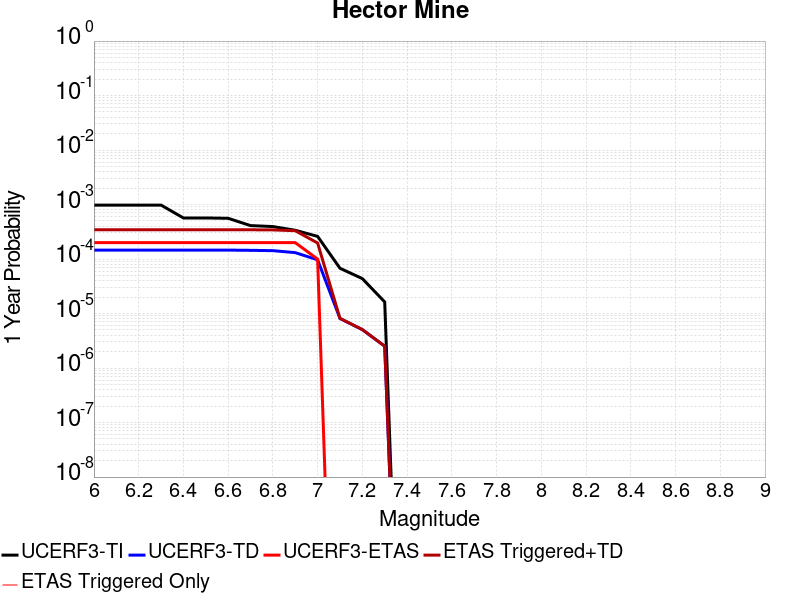 |  |

| Magnitude | 1 wk TI Prob | 1 wk TD Prob | 1 wk ETAS Prob | 1 wk ETAS/TD Gain | 1 wk ETAS Triggered+TD | 1 wk ETAS Triggered Only | 1 mo TI Prob | 1 mo TD Prob | 1 mo ETAS Prob | 1 mo ETAS/TD Gain | 1 mo ETAS Triggered+TD | 1 mo ETAS Triggered Only | 1 yr TI Prob | 1 yr TD Prob | 1 yr ETAS Prob | 1 yr ETAS/TD Gain | 1 yr ETAS Triggered+TD | 1 yr ETAS Triggered Only | 10 yr TI Prob | 10 yr TD Prob | 10 yr ETAS Prob | 10 yr ETAS/TD Gain | 10 yr ETAS Triggered+TD | 10 yr ETAS Triggered Only |
|-----|-----|-----|-----|-----|-----|-----|-----|-----|-----|-----|-----|-----|-----|-----|-----|-----|-----|-----|-----|-----|-----|-----|-----|-----|
| 6.0 | 1.8760093E-5 | 2.7945969E-6 | 0.0 | 0.0 | 2.7945969E-6 | 0.0 | 8.039792E-5 | 1.1976812E-5 | 0.0 | 0.0 | 1.1976812E-5 | 0.0 | 9.78405E-4 | 1.4581192E-4 | 2.0E-4 | 1.37163 | 3.4578276E-4 | 2.0E-4 | 0.009741086 | 0.0014575542 | 0.0014 | 0.9605132 | 0.002555951 | 0.0011 |
| 6.1 | 1.8760093E-5 | 2.7945969E-6 | 0.0 | 0.0 | 2.7945969E-6 | 0.0 | 8.039792E-5 | 1.1976812E-5 | 0.0 | 0.0 | 1.1976812E-5 | 0.0 | 9.78405E-4 | 1.4581192E-4 | 2.0E-4 | 1.37163 | 3.4578276E-4 | 2.0E-4 | 0.009741086 | 0.0014575542 | 0.0014 | 0.9605132 | 0.002555951 | 0.0011 |
| 6.2 | 1.8760093E-5 | 2.7945969E-6 | 0.0 | 0.0 | 2.7945969E-6 | 0.0 | 8.039792E-5 | 1.1976812E-5 | 0.0 | 0.0 | 1.1976812E-5 | 0.0 | 9.78405E-4 | 1.4581192E-4 | 2.0E-4 | 1.37163 | 3.4578276E-4 | 2.0E-4 | 0.009741086 | 0.0014575542 | 0.0014 | 0.9605132 | 0.002555951 | 0.0011 |
| 6.3 | 1.8760093E-5 | 2.7945969E-6 | 0.0 | 0.0 | 2.7945969E-6 | 0.0 | 8.039792E-5 | 1.1976812E-5 | 0.0 | 0.0 | 1.1976812E-5 | 0.0 | 9.78405E-4 | 1.4581192E-4 | 2.0E-4 | 1.37163 | 3.4578276E-4 | 2.0E-4 | 0.009741086 | 0.0014575542 | 0.0014 | 0.9605132 | 0.002555951 | 0.0011 |
| 6.4 | 1.0888055E-5 | 2.7945969E-6 | 0.0 | 0.0 | 2.7945969E-6 | 0.0 | 4.666226E-5 | 1.1976812E-5 | 0.0 | 0.0 | 1.1976812E-5 | 0.0 | 5.679649E-4 | 1.4581192E-4 | 2.0E-4 | 1.37163 | 3.4578276E-4 | 2.0E-4 | 0.0056651547 | 0.0014575542 | 0.0014 | 0.9605132 | 0.002555951 | 0.0011 |
| 6.5 | 1.0888055E-5 | 2.7945969E-6 | 0.0 | 0.0 | 2.7945969E-6 | 0.0 | 4.666226E-5 | 1.1976812E-5 | 0.0 | 0.0 | 1.1976812E-5 | 0.0 | 5.679649E-4 | 1.4581192E-4 | 2.0E-4 | 1.37163 | 3.4578276E-4 | 2.0E-4 | 0.0056651547 | 0.0014575542 | 0.0014 | 0.9605132 | 0.002555951 | 0.0011 |
| 6.6 | 1.0730738E-5 | 2.7945969E-6 | 0.0 | 0.0 | 2.7945969E-6 | 0.0 | 4.5988065E-5 | 1.1976812E-5 | 0.0 | 0.0 | 1.1976812E-5 | 0.0 | 5.5976084E-4 | 1.4581192E-4 | 2.0E-4 | 1.37163 | 3.4578276E-4 | 2.0E-4 | 0.0055835294 | 0.0014575542 | 0.0014 | 0.9605132 | 0.002555951 | 0.0011 |
| 6.7 | 7.881326E-6 | 2.769303E-6 | 0.0 | 0.0 | 2.769303E-6 | 0.0 | 3.3776672E-5 | 1.1868409E-5 | 0.0 | 0.0 | 1.1868409E-5 | 0.0 | 4.111534E-4 | 1.444923E-4 | 2.0E-4 | 1.3841568 | 3.444634E-4 | 2.0E-4 | 0.0041039353 | 0.0014443751 | 0.0014 | 0.96927726 | 0.0025427863 | 0.0011 |
| 6.8 | 7.5683483E-6 | 2.7311005E-6 | 0.0 | 0.0 | 2.7311005E-6 | 0.0 | 3.2435375E-5 | 1.1704686E-5 | 0.0 | 0.0 | 1.1704686E-5 | 0.0 | 3.9482914E-4 | 1.4249922E-4 | 2.0E-4 | 1.4035164 | 3.4247074E-4 | 2.0E-4 | 0.0039412836 | 0.0014244701 | 0.0013 | 0.91262007 | 0.0024230457 | 0.001 |
| 6.9 | 6.473048E-6 | 2.512382E-6 | 0.0 | 0.0 | 2.512382E-6 | 0.0 | 2.7741338E-5 | 1.07673295E-5 | 0.0 | 0.0 | 1.07673295E-5 | 0.0 | 3.3769844E-4 | 1.3108831E-4 | 2.0E-4 | 1.525689 | 3.310621E-4 | 2.0E-4 | 0.0033718573 | 0.0013104989 | 0.001 | 0.76306814 | 0.0020095815 | 7.0E-4 |
| 7.0 | 4.9959954E-6 | 1.8552807E-6 | 0.0 | 0.0 | 1.8552807E-6 | 0.0 | 2.1411232E-5 | 7.951199E-6 | 0.0 | 0.0 | 7.951199E-6 | 0.0 | 2.6065056E-4 | 9.680511E-5 | 1.0E-4 | 1.0330033 | 1.9679543E-4 | 1.0E-4 | 0.0026034506 | 9.6797856E-4 | 5.0E-4 | 0.51654035 | 0.0013675913 | 4.0E-4 |
| 7.1 | 1.2997541E-6 | 1.5581173E-7 | 0.0 | 0.0 | 1.5581173E-7 | 0.0 | 5.5703626E-6 | 6.677644E-7 | 0.0 | 0.0 | 6.677644E-7 | 0.0 | 6.7817055E-5 | 8.130006E-6 | 0.0 | 0.0 | 8.130006E-6 | 0.0 | 6.779636E-4 | 8.1297476E-5 | 0.0 | 0.0 | 8.1297476E-5 | 0.0 |
| 7.2 | 8.392699E-7 | 9.714455E-8 | 0.0 | 0.0 | 9.714455E-8 | 0.0 | 3.596866E-6 | 4.1633373E-7 | 0.0 | 0.0 | 4.1633373E-7 | 0.0 | 4.3790962E-5 | 5.068853E-6 | 0.0 | 0.0 | 5.068853E-6 | 0.0 | 4.3782333E-4 | 5.068757E-5 | 0.0 | 0.0 | 5.068757E-5 | 0.0 |
| 7.3 | 3.13015E-7 | 4.8237798E-8 | 0.0 | 0.0 | 4.8237798E-8 | 0.0 | 1.3414921E-6 | 2.067334E-7 | 0.0 | 0.0 | 2.067334E-7 | 0.0 | 1.6332544E-5 | 2.5169772E-6 | 0.0 | 0.0 | 2.5169772E-6 | 0.0 | 1.6331344E-4 | 2.5169571E-5 | 0.0 | 0.0 | 2.5169571E-5 | 0.0 |

## Lake Isabella (Seismicity)
*[(top)](#table-of-contents)*

| 1 Week | 1 Month | 1 Year | 10 Year |
|-----|-----|-----|-----|
|  |  | 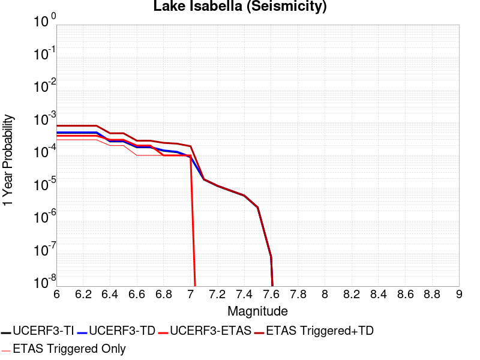 |  |

| Magnitude | 1 wk TI Prob | 1 wk TD Prob | 1 wk ETAS Prob | 1 wk ETAS/TD Gain | 1 wk ETAS Triggered+TD | 1 wk ETAS Triggered Only | 1 mo TI Prob | 1 mo TD Prob | 1 mo ETAS Prob | 1 mo ETAS/TD Gain | 1 mo ETAS Triggered+TD | 1 mo ETAS Triggered Only | 1 yr TI Prob | 1 yr TD Prob | 1 yr ETAS Prob | 1 yr ETAS/TD Gain | 1 yr ETAS Triggered+TD | 1 yr ETAS Triggered Only | 10 yr TI Prob | 10 yr TD Prob | 10 yr ETAS Prob | 10 yr ETAS/TD Gain | 10 yr ETAS Triggered+TD | 10 yr ETAS Triggered Only |
|-----|-----|-----|-----|-----|-----|-----|-----|-----|-----|-----|-----|-----|-----|-----|-----|-----|-----|-----|-----|-----|-----|-----|-----|-----|
| 6.0 | 9.431637E-6 | 9.742287E-6 | 0.0 | 0.0 | 9.742287E-6 | 0.0 | 4.0420677E-5 | 4.1752064E-5 | 0.0 | 0.0 | 4.1752064E-5 | 0.0 | 4.920106E-4 | 5.082259E-4 | 4.0E-4 | 0.7870516 | 8.0807344E-4 | 3.0E-4 | 0.004909227 | 0.0050719287 | 0.0024 | 0.47319275 | 0.0061663496 | 0.0011 |
| 6.1 | 9.431637E-6 | 9.742287E-6 | 0.0 | 0.0 | 9.742287E-6 | 0.0 | 4.0420677E-5 | 4.1752064E-5 | 0.0 | 0.0 | 4.1752064E-5 | 0.0 | 4.920106E-4 | 5.082259E-4 | 4.0E-4 | 0.7870516 | 8.0807344E-4 | 3.0E-4 | 0.004909227 | 0.0050719287 | 0.0024 | 0.47319275 | 0.0061663496 | 0.0011 |
| 6.2 | 9.431637E-6 | 9.742287E-6 | 0.0 | 0.0 | 9.742287E-6 | 0.0 | 4.0420677E-5 | 4.1752064E-5 | 0.0 | 0.0 | 4.1752064E-5 | 0.0 | 4.920106E-4 | 5.082259E-4 | 4.0E-4 | 0.7870516 | 8.0807344E-4 | 3.0E-4 | 0.004909227 | 0.0050719287 | 0.0024 | 0.47319275 | 0.0061663496 | 0.0011 |
| 6.3 | 9.431637E-6 | 9.742287E-6 | 0.0 | 0.0 | 9.742287E-6 | 0.0 | 4.0420677E-5 | 4.1752064E-5 | 0.0 | 0.0 | 4.1752064E-5 | 0.0 | 4.920106E-4 | 5.082259E-4 | 4.0E-4 | 0.7870516 | 8.0807344E-4 | 3.0E-4 | 0.004909227 | 0.0050719287 | 0.0024 | 0.47319275 | 0.0061663496 | 0.0011 |
| 6.4 | 5.144063E-6 | 5.300395E-6 | 0.0 | 0.0 | 5.300395E-6 | 0.0 | 2.2045799E-5 | 2.27158E-5 | 0.0 | 0.0 | 2.27158E-5 | 0.0 | 2.6837454E-4 | 2.7653322E-4 | 3.0E-4 | 1.0848606 | 4.7647793E-4 | 2.0E-4 | 0.0026805066 | 0.0027622317 | 0.0013 | 0.47063395 | 0.0031611267 | 4.0E-4 |
| 6.5 | 5.144063E-6 | 5.300395E-6 | 0.0 | 0.0 | 5.300395E-6 | 0.0 | 2.2045799E-5 | 2.27158E-5 | 0.0 | 0.0 | 2.27158E-5 | 0.0 | 2.6837454E-4 | 2.7653322E-4 | 3.0E-4 | 1.0848606 | 4.7647793E-4 | 2.0E-4 | 0.0026805066 | 0.0027622317 | 0.0013 | 0.47063395 | 0.0031611267 | 4.0E-4 |
| 6.6 | 3.4009804E-6 | 3.4989857E-6 | 0.0 | 0.0 | 3.4989857E-6 | 0.0 | 1.4575549E-5 | 1.4995577E-5 | 0.0 | 0.0 | 1.4995577E-5 | 0.0 | 1.7744285E-4 | 1.8255744E-4 | 2.0E-4 | 1.0955455 | 2.825392E-4 | 1.0E-4 | 0.0017730123 | 0.0018242326 | 9.0E-4 | 0.49335814 | 0.0021236853 | 3.0E-4 |
| 6.7 | 3.3880428E-6 | 3.485852E-6 | 0.0 | 0.0 | 3.485852E-6 | 0.0 | 1.4520103E-5 | 1.4939289E-5 | 0.0 | 0.0 | 1.4939289E-5 | 0.0 | 1.767679E-4 | 1.8187227E-4 | 2.0E-4 | 1.0996729 | 2.818541E-4 | 1.0E-4 | 0.0017662736 | 0.0018173921 | 9.0E-4 | 0.49521512 | 0.0021168469 | 3.0E-4 |
| 6.8 | 2.6582E-6 | 2.7338542E-6 | 0.0 | 0.0 | 2.7338542E-6 | 0.0 | 1.1392236E-5 | 1.1716474E-5 | 0.0 | 0.0 | 1.1716474E-5 | 0.0 | 1.3869164E-4 | 1.4264007E-4 | 1.0E-4 | 0.7010653 | 2.426258E-4 | 1.0E-4 | 0.0013860512 | 0.0014256173 | 7.0E-4 | 0.4910154 | 0.001625332 | 2.0E-4 |
| 6.9 | 2.406011E-6 | 2.4744684E-6 | 0.0 | 0.0 | 2.4744684E-6 | 0.0 | 1.0311434E-5 | 1.0604828E-5 | 0.0 | 0.0 | 1.0604828E-5 | 0.0 | 1.2553448E-4 | 1.2910746E-4 | 1.0E-4 | 0.7745486 | 2.2909454E-4 | 1.0E-4 | 0.0012546359 | 0.0012904541 | 7.0E-4 | 0.5424447 | 0.001490196 | 2.0E-4 |
| 7.0 | 1.6953097E-6 | 1.7430343E-6 | 0.0 | 0.0 | 1.7430343E-6 | 0.0 | 7.265593E-6 | 7.4701315E-6 | 0.0 | 0.0 | 7.4701315E-6 | 0.0 | 8.8455E-5 | 9.094611E-5 | 1.0E-4 | 1.0995523 | 1.90937E-4 | 1.0E-4 | 8.84198E-4 | 9.091916E-4 | 5.0E-4 | 0.5499391 | 0.0011090098 | 2.0E-4 |
| 7.1 | 3.5013824E-7 | 3.571624E-7 | 0.0 | 0.0 | 3.571624E-7 | 0.0 | 1.5005916E-6 | 1.5306952E-6 | 0.0 | 0.0 | 1.5306952E-6 | 0.0 | 1.826955E-5 | 1.8636058E-5 | 0.0 | 0.0 | 1.8636058E-5 | 0.0 | 1.8268047E-4 | 1.8634519E-4 | 2.0E-4 | 1.073277 | 2.8632657E-4 | 1.0E-4 |
| 7.2 | 2.2321095E-7 | 2.2751442E-7 | 0.0 | 0.0 | 2.2751442E-7 | 0.0 | 9.56618E-7 | 9.750614E-7 | 0.0 | 0.0 | 9.750614E-7 | 0.0 | 1.1646762E-5 | 1.187131E-5 | 0.0 | 0.0 | 1.187131E-5 | 0.0 | 1.1646151E-4 | 1.18706856E-4 | 2.0E-4 | 1.6848227 | 2.1869499E-4 | 1.0E-4 |
| 7.3 | 1.5760406E-7 | 1.606153E-7 | 0.0 | 0.0 | 1.606153E-7 | 0.0 | 6.7544585E-7 | 6.8835107E-7 | 0.0 | 0.0 | 6.8835107E-7 | 0.0 | 8.223522E-6 | 8.380643E-6 | 0.0 | 0.0 | 8.380643E-6 | 0.0 | 8.2232174E-5 | 8.380333E-5 | 2.0E-4 | 2.38654 | 1.8379495E-4 | 1.0E-4 |
| 7.4 | 1.1216497E-7 | 1.1432141E-7 | 0.0 | 0.0 | 1.1432141E-7 | 0.0 | 4.8070694E-7 | 4.8994883E-7 | 0.0 | 0.0 | 4.8994883E-7 | 0.0 | 5.852591E-6 | 5.965111E-6 | 0.0 | 0.0 | 5.965111E-6 | 0.0 | 5.8524372E-5 | 5.9649552E-5 | 1.0E-4 | 1.6764585 | 5.9649552E-5 | 0.0 |
| 7.5 | 4.885185E-8 | 4.978963E-8 | 0.0 | 0.0 | 4.978963E-8 | 0.0 | 2.0936506E-7 | 2.1338411E-7 | 0.0 | 0.0 | 2.1338411E-7 | 0.0 | 2.5490165E-6 | 2.5979487E-6 | 0.0 | 0.0 | 2.5979487E-6 | 0.0 | 2.5489873E-5 | 2.5979201E-5 | 0.0 | 0.0 | 2.5979201E-5 | 0.0 |
| 7.6 | 1.504641E-9 | 1.5318451E-9 | 0.0 | 0.0 | 1.5318451E-9 | 0.0 | 6.4484613E-9 | 6.5650503E-9 | 0.0 | 0.0 | 6.5650503E-9 | 0.0 | 7.851001E-8 | 7.992949E-8 | 0.0 | 0.0 | 7.992949E-8 | 0.0 | 7.8509987E-7 | 7.9929487E-7 | 0.0 | 0.0 | 7.9929487E-7 | 0.0 |

## Hartley Springs 2011 CFM
*[(top)](#table-of-contents)*

| 1 Week | 1 Month | 1 Year | 10 Year |
|-----|-----|-----|-----|
|  |  | 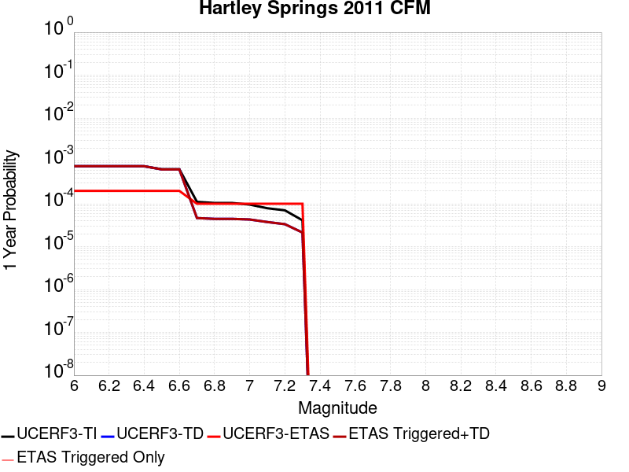 |  |

| Magnitude | 1 wk TI Prob | 1 wk TD Prob | 1 wk ETAS Prob | 1 wk ETAS/TD Gain | 1 wk ETAS Triggered+TD | 1 wk ETAS Triggered Only | 1 mo TI Prob | 1 mo TD Prob | 1 mo ETAS Prob | 1 mo ETAS/TD Gain | 1 mo ETAS Triggered+TD | 1 mo ETAS Triggered Only | 1 yr TI Prob | 1 yr TD Prob | 1 yr ETAS Prob | 1 yr ETAS/TD Gain | 1 yr ETAS Triggered+TD | 1 yr ETAS Triggered Only | 10 yr TI Prob | 10 yr TD Prob | 10 yr ETAS Prob | 10 yr ETAS/TD Gain | 10 yr ETAS Triggered+TD | 10 yr ETAS Triggered Only |
|-----|-----|-----|-----|-----|-----|-----|-----|-----|-----|-----|-----|-----|-----|-----|-----|-----|-----|-----|-----|-----|-----|-----|-----|-----|
| 6.0 | 1.4352418E-5 | 1.4437383E-5 | 0.0 | 0.0 | 1.4437383E-5 | 0.0 | 6.1508916E-5 | 6.187396E-5 | 0.0 | 0.0 | 6.187396E-5 | 0.0 | 7.486137E-4 | 7.532195E-4 | 2.0E-4 | 0.26552686 | 7.532195E-4 | 0.0 | 0.007460968 | 0.0075227935 | 0.0036 | 0.47854564 | 0.008614519 | 0.0011 |
| 6.1 | 1.4352418E-5 | 1.4437383E-5 | 0.0 | 0.0 | 1.4437383E-5 | 0.0 | 6.1508916E-5 | 6.187396E-5 | 0.0 | 0.0 | 6.187396E-5 | 0.0 | 7.486137E-4 | 7.532195E-4 | 2.0E-4 | 0.26552686 | 7.532195E-4 | 0.0 | 0.007460968 | 0.0075227935 | 0.0036 | 0.47854564 | 0.008614519 | 0.0011 |
| 6.2 | 1.4352418E-5 | 1.4437383E-5 | 0.0 | 0.0 | 1.4437383E-5 | 0.0 | 6.1508916E-5 | 6.187396E-5 | 0.0 | 0.0 | 6.187396E-5 | 0.0 | 7.486137E-4 | 7.532195E-4 | 2.0E-4 | 0.26552686 | 7.532195E-4 | 0.0 | 0.007460968 | 0.0075227935 | 0.0036 | 0.47854564 | 0.008614519 | 0.0011 |
| 6.3 | 1.4352418E-5 | 1.4437383E-5 | 0.0 | 0.0 | 1.4437383E-5 | 0.0 | 6.1508916E-5 | 6.187396E-5 | 0.0 | 0.0 | 6.187396E-5 | 0.0 | 7.486137E-4 | 7.532195E-4 | 2.0E-4 | 0.26552686 | 7.532195E-4 | 0.0 | 0.007460968 | 0.0075227935 | 0.0036 | 0.47854564 | 0.008614519 | 0.0011 |
| 6.4 | 1.4352418E-5 | 1.4437383E-5 | 0.0 | 0.0 | 1.4437383E-5 | 0.0 | 6.1508916E-5 | 6.187396E-5 | 0.0 | 0.0 | 6.187396E-5 | 0.0 | 7.486137E-4 | 7.532195E-4 | 2.0E-4 | 0.26552686 | 7.532195E-4 | 0.0 | 0.007460968 | 0.0075227935 | 0.0036 | 0.47854564 | 0.008614519 | 0.0011 |
| 6.5 | 1.2279858E-5 | 1.2135803E-5 | 0.0 | 0.0 | 1.2135803E-5 | 0.0 | 5.26269E-5 | 5.201044E-5 | 0.0 | 0.0 | 5.201044E-5 | 0.0 | 6.4054417E-4 | 6.332014E-4 | 2.0E-4 | 0.31585526 | 6.332014E-4 | 0.0 | 0.0063870098 | 0.006329491 | 0.0031 | 0.48977083 | 0.0071244272 | 8.0E-4 |
| 6.6 | 1.2279858E-5 | 1.2135803E-5 | 0.0 | 0.0 | 1.2135803E-5 | 0.0 | 5.26269E-5 | 5.201044E-5 | 0.0 | 0.0 | 5.201044E-5 | 0.0 | 6.4054417E-4 | 6.332014E-4 | 2.0E-4 | 0.31585526 | 6.332014E-4 | 0.0 | 0.0063870098 | 0.006329491 | 0.0031 | 0.48977083 | 0.0071244272 | 8.0E-4 |
| 6.7 | 2.1282601E-6 | 8.897817E-7 | 0.0 | 0.0 | 8.897817E-7 | 0.0 | 9.121083E-6 | 3.813346E-6 | 0.0 | 0.0 | 3.813346E-6 | 0.0 | 1.11043526E-4 | 4.6426754E-5 | 1.0E-4 | 2.1539304 | 4.6426754E-5 | 0.0 | 0.0011098806 | 4.6419588E-4 | 3.0E-4 | 0.64627886 | 5.6414946E-4 | 1.0E-4 |
| 6.8 | 2.00516E-6 | 8.5207563E-7 | 0.0 | 0.0 | 8.5207563E-7 | 0.0 | 8.593515E-6 | 3.651749E-6 | 0.0 | 0.0 | 3.651749E-6 | 0.0 | 1.04621024E-4 | 4.4459393E-5 | 1.0E-4 | 2.2492435 | 4.4459393E-5 | 0.0 | 0.0010457177 | 4.4453013E-4 | 3.0E-4 | 0.6748699 | 5.444857E-4 | 1.0E-4 |
| 6.9 | 2.00516E-6 | 8.5207563E-7 | 0.0 | 0.0 | 8.5207563E-7 | 0.0 | 8.593515E-6 | 3.651749E-6 | 0.0 | 0.0 | 3.651749E-6 | 0.0 | 1.04621024E-4 | 4.4459393E-5 | 1.0E-4 | 2.2492435 | 4.4459393E-5 | 0.0 | 0.0010457177 | 4.4453013E-4 | 3.0E-4 | 0.6748699 | 5.444857E-4 | 1.0E-4 |
| 7.0 | 1.8366732E-6 | 8.240685E-7 | 0.0 | 0.0 | 8.240685E-7 | 0.0 | 7.871433E-6 | 3.531719E-6 | 0.0 | 0.0 | 3.531719E-6 | 0.0 | 9.583048E-5 | 4.2998083E-5 | 1.0E-4 | 2.325685 | 4.2998083E-5 | 0.0 | 9.5789164E-4 | 4.299227E-4 | 2.0E-4 | 0.46519992 | 4.299227E-4 | 0.0 |
| 7.1 | 1.5097997E-6 | 7.194104E-7 | 0.0 | 0.0 | 7.194104E-7 | 0.0 | 6.470554E-6 | 3.0831854E-6 | 0.0 | 0.0 | 3.0831854E-6 | 0.0 | 7.877615E-5 | 3.753738E-5 | 1.0E-4 | 2.6640115 | 3.753738E-5 | 0.0 | 7.874823E-4 | 3.7533406E-4 | 2.0E-4 | 0.5328586 | 3.7533406E-4 | 0.0 |
| 7.2 | 1.3490993E-6 | 6.409296E-7 | 0.0 | 0.0 | 6.409296E-7 | 0.0 | 5.7818415E-6 | 2.7468395E-6 | 0.0 | 0.0 | 2.7468395E-6 | 0.0 | 7.0391645E-5 | 3.344249E-5 | 1.0E-4 | 2.9902077 | 3.344249E-5 | 0.0 | 7.0369354E-4 | 3.3439754E-4 | 2.0E-4 | 0.5980905 | 3.3439754E-4 | 0.0 |
| 7.3 | 7.900015E-7 | 4.0880732E-7 | 0.0 | 0.0 | 4.0880732E-7 | 0.0 | 3.3857161E-6 | 1.7520314E-6 | 0.0 | 0.0 | 1.7520314E-6 | 0.0 | 4.1220315E-5 | 2.1330983E-5 | 1.0E-4 | 4.6880164 | 2.1330983E-5 | 0.0 | 4.121267E-4 | 2.1330983E-4 | 1.0E-4 | 0.46880165 | 2.1330983E-4 | 0.0 |

## Red Pass
*[(top)](#table-of-contents)*

| 1 Week | 1 Month | 1 Year | 10 Year |
|-----|-----|-----|-----|
|  | 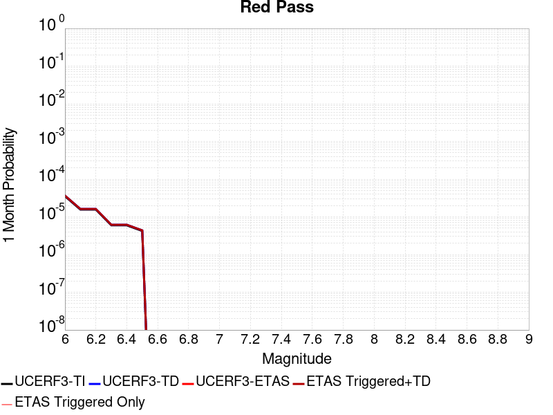 |  |  |

| Magnitude | 1 wk TI Prob | 1 wk TD Prob | 1 wk ETAS Prob | 1 wk ETAS/TD Gain | 1 wk ETAS Triggered+TD | 1 wk ETAS Triggered Only | 1 mo TI Prob | 1 mo TD Prob | 1 mo ETAS Prob | 1 mo ETAS/TD Gain | 1 mo ETAS Triggered+TD | 1 mo ETAS Triggered Only | 1 yr TI Prob | 1 yr TD Prob | 1 yr ETAS Prob | 1 yr ETAS/TD Gain | 1 yr ETAS Triggered+TD | 1 yr ETAS Triggered Only | 10 yr TI Prob | 10 yr TD Prob | 10 yr ETAS Prob | 10 yr ETAS/TD Gain | 10 yr ETAS Triggered+TD | 10 yr ETAS Triggered Only |
|-----|-----|-----|-----|-----|-----|-----|-----|-----|-----|-----|-----|-----|-----|-----|-----|-----|-----|-----|-----|-----|-----|-----|-----|-----|
| 6.0 | 8.258278E-6 | 8.551867E-6 | 0.0 | 0.0 | 8.551867E-6 | 0.0 | 3.539214E-5 | 3.6650443E-5 | 0.0 | 0.0 | 3.6650443E-5 | 0.0 | 4.308141E-4 | 4.4614566E-4 | 2.0E-4 | 0.4482841 | 5.46101E-4 | 1.0E-4 | 0.0042997985 | 0.0044542574 | 0.0043 | 0.9653685 | 0.0055493577 | 0.0011 |
| 6.1 | 3.649988E-6 | 3.775573E-6 | 0.0 | 0.0 | 3.775573E-6 | 0.0 | 1.5642712E-5 | 1.6180955E-5 | 0.0 | 0.0 | 1.6180955E-5 | 0.0 | 1.9043336E-4 | 1.9699008E-4 | 0.0 | 0.0 | 1.9699008E-4 | 0.0 | 0.0019027026 | 0.001968622 | 0.0018 | 0.9143452 | 0.0023678346 | 4.0E-4 |
| 6.2 | 3.649988E-6 | 3.775573E-6 | 0.0 | 0.0 | 3.775573E-6 | 0.0 | 1.5642712E-5 | 1.6180955E-5 | 0.0 | 0.0 | 1.6180955E-5 | 0.0 | 1.9043336E-4 | 1.9699008E-4 | 0.0 | 0.0 | 1.9699008E-4 | 0.0 | 0.0019027026 | 0.001968622 | 0.0018 | 0.9143452 | 0.0023678346 | 4.0E-4 |
| 6.3 | 1.3924937E-6 | 1.4412165E-6 | 0.0 | 0.0 | 1.4412165E-6 | 0.0 | 5.9678164E-6 | 6.176635E-6 | 0.0 | 0.0 | 6.176635E-6 | 0.0 | 7.265574E-5 | 7.519935E-5 | 0.0 | 0.0 | 7.519935E-5 | 0.0 | 7.263199E-4 | 7.5187784E-4 | 5.0E-4 | 0.66500163 | 8.5180264E-4 | 1.0E-4 |
| 6.4 | 1.3924937E-6 | 1.4412165E-6 | 0.0 | 0.0 | 1.4412165E-6 | 0.0 | 5.9678164E-6 | 6.176635E-6 | 0.0 | 0.0 | 6.176635E-6 | 0.0 | 7.265574E-5 | 7.519935E-5 | 0.0 | 0.0 | 7.519935E-5 | 0.0 | 7.263199E-4 | 7.5187784E-4 | 5.0E-4 | 0.66500163 | 8.5180264E-4 | 1.0E-4 |
| 6.5 | 9.876812E-7 | 1.022262E-6 | 0.0 | 0.0 | 1.022262E-6 | 0.0 | 4.2329125E-6 | 4.381123E-6 | 0.0 | 0.0 | 4.381123E-6 | 0.0 | 5.153449E-5 | 5.3340173E-5 | 0.0 | 0.0 | 5.3340173E-5 | 0.0 | 5.1522546E-4 | 5.3340173E-4 | 3.0E-4 | 0.5624279 | 6.3334836E-4 | 1.0E-4 |

## Table Bluff
*[(top)](#table-of-contents)*

| 1 Week | 1 Month | 1 Year | 10 Year |
|-----|-----|-----|-----|
|  | 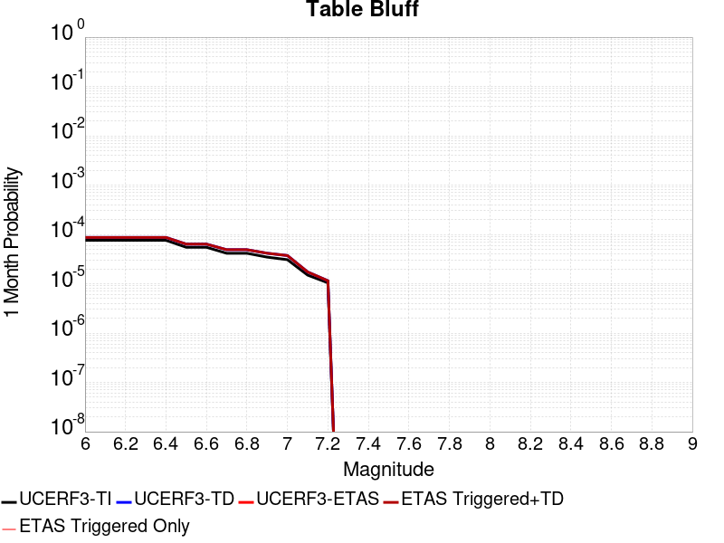 |  |  |

| Magnitude | 1 wk TI Prob | 1 wk TD Prob | 1 wk ETAS Prob | 1 wk ETAS/TD Gain | 1 wk ETAS Triggered+TD | 1 wk ETAS Triggered Only | 1 mo TI Prob | 1 mo TD Prob | 1 mo ETAS Prob | 1 mo ETAS/TD Gain | 1 mo ETAS Triggered+TD | 1 mo ETAS Triggered Only | 1 yr TI Prob | 1 yr TD Prob | 1 yr ETAS Prob | 1 yr ETAS/TD Gain | 1 yr ETAS Triggered+TD | 1 yr ETAS Triggered Only | 10 yr TI Prob | 10 yr TD Prob | 10 yr ETAS Prob | 10 yr ETAS/TD Gain | 10 yr ETAS Triggered+TD | 10 yr ETAS Triggered Only |
|-----|-----|-----|-----|-----|-----|-----|-----|-----|-----|-----|-----|-----|-----|-----|-----|-----|-----|-----|-----|-----|-----|-----|-----|-----|
| 6.0 | 1.7744695E-5 | 2.0291063E-5 | 0.0 | 0.0 | 2.0291063E-5 | 0.0 | 7.6046475E-5 | 8.695914E-5 | 0.0 | 0.0 | 8.695914E-5 | 0.0 | 9.2547253E-4 | 0.0010582729 | 5.0E-4 | 0.47246793 | 0.0010582729 | 0.0 | 0.009216278 | 0.010538279 | 0.0058 | 0.5503745 | 0.011626687 | 0.0011 |
| 6.1 | 1.7744695E-5 | 2.0291063E-5 | 0.0 | 0.0 | 2.0291063E-5 | 0.0 | 7.6046475E-5 | 8.695914E-5 | 0.0 | 0.0 | 8.695914E-5 | 0.0 | 9.2547253E-4 | 0.0010582729 | 5.0E-4 | 0.47246793 | 0.0010582729 | 0.0 | 0.009216278 | 0.010538279 | 0.0058 | 0.5503745 | 0.011626687 | 0.0011 |
| 6.2 | 1.7744695E-5 | 2.0291063E-5 | 0.0 | 0.0 | 2.0291063E-5 | 0.0 | 7.6046475E-5 | 8.695914E-5 | 0.0 | 0.0 | 8.695914E-5 | 0.0 | 9.2547253E-4 | 0.0010582729 | 5.0E-4 | 0.47246793 | 0.0010582729 | 0.0 | 0.009216278 | 0.010538279 | 0.0058 | 0.5503745 | 0.011626687 | 0.0011 |
| 6.3 | 1.7744695E-5 | 2.0291063E-5 | 0.0 | 0.0 | 2.0291063E-5 | 0.0 | 7.6046475E-5 | 8.695914E-5 | 0.0 | 0.0 | 8.695914E-5 | 0.0 | 9.2547253E-4 | 0.0010582729 | 5.0E-4 | 0.47246793 | 0.0010582729 | 0.0 | 0.009216278 | 0.010538279 | 0.0058 | 0.5503745 | 0.011626687 | 0.0011 |
| 6.4 | 1.7744695E-5 | 2.0291063E-5 | 0.0 | 0.0 | 2.0291063E-5 | 0.0 | 7.6046475E-5 | 8.695914E-5 | 0.0 | 0.0 | 8.695914E-5 | 0.0 | 9.2547253E-4 | 0.0010582729 | 5.0E-4 | 0.47246793 | 0.0010582729 | 0.0 | 0.009216278 | 0.010538279 | 0.0058 | 0.5503745 | 0.011626687 | 0.0011 |
| 6.5 | 1.2822383E-5 | 1.4864271E-5 | 0.0 | 0.0 | 1.4864271E-5 | 0.0 | 5.4951914E-5 | 6.370263E-5 | 0.0 | 0.0 | 6.370263E-5 | 0.0 | 6.6883414E-4 | 7.753333E-4 | 4.0E-4 | 0.51590717 | 7.753333E-4 | 0.0 | 0.0066682473 | 0.007729239 | 0.0045 | 0.5822048 | 0.008622283 | 9.0E-4 |
| 6.6 | 1.2822383E-5 | 1.4864271E-5 | 0.0 | 0.0 | 1.4864271E-5 | 0.0 | 5.4951914E-5 | 6.370263E-5 | 0.0 | 0.0 | 6.370263E-5 | 0.0 | 6.6883414E-4 | 7.753333E-4 | 4.0E-4 | 0.51590717 | 7.753333E-4 | 0.0 | 0.0066682473 | 0.007729239 | 0.0045 | 0.5822048 | 0.008622283 | 9.0E-4 |
| 6.7 | 9.690175E-6 | 1.14402E-5 | 0.0 | 0.0 | 1.14402E-5 | 0.0 | 4.1528663E-5 | 4.9028622E-5 | 0.0 | 0.0 | 4.9028622E-5 | 0.0 | 5.054941E-4 | 5.9678016E-4 | 3.0E-4 | 0.50269765 | 5.9678016E-4 | 0.0 | 0.005043458 | 0.0059537697 | 0.0032 | 0.5374746 | 0.0065501975 | 6.0E-4 |
| 6.8 | 9.690175E-6 | 1.14402E-5 | 0.0 | 0.0 | 1.14402E-5 | 0.0 | 4.1528663E-5 | 4.9028622E-5 | 0.0 | 0.0 | 4.9028622E-5 | 0.0 | 5.054941E-4 | 5.9678016E-4 | 3.0E-4 | 0.50269765 | 5.9678016E-4 | 0.0 | 0.005043458 | 0.0059537697 | 0.0032 | 0.5374746 | 0.0065501975 | 6.0E-4 |
| 6.9 | 8.096043E-6 | 9.704282E-6 | 0.0 | 0.0 | 9.704282E-6 | 0.0 | 3.4696863E-5 | 4.1589217E-5 | 0.0 | 0.0 | 4.1589217E-5 | 0.0 | 4.223524E-4 | 5.0624856E-4 | 2.0E-4 | 0.39506286 | 5.0624856E-4 | 0.0 | 0.004215506 | 0.005052675 | 0.0026 | 0.51457894 | 0.005450654 | 4.0E-4 |
| 7.0 | 7.185906E-6 | 8.715537E-6 | 0.0 | 0.0 | 8.715537E-6 | 0.0 | 3.0796375E-5 | 3.735186E-5 | 0.0 | 0.0 | 3.735186E-5 | 0.0 | 3.7488135E-4 | 4.546806E-4 | 2.0E-4 | 0.43986923 | 4.546806E-4 | 0.0 | 0.0037424958 | 0.0045391344 | 0.0019 | 0.418582 | 0.0049373186 | 4.0E-4 |
| 7.1 | 3.4937343E-6 | 4.0472114E-6 | 0.0 | 0.0 | 4.0472114E-6 | 0.0 | 1.497306E-5 | 1.7345117E-5 | 0.0 | 0.0 | 1.7345117E-5 | 0.0 | 1.8228177E-4 | 2.1116376E-4 | 0.0 | 0.0 | 2.1116376E-4 | 0.0 | 0.0018213232 | 0.0021103588 | 7.0E-4 | 0.33169717 | 0.0023099366 | 2.0E-4 |
| 7.2 | 2.4388776E-6 | 2.686036E-6 | 0.0 | 0.0 | 2.686036E-6 | 0.0 | 1.0452291E-5 | 1.1511561E-5 | 0.0 | 0.0 | 1.1511561E-5 | 0.0 | 1.2724921E-4 | 1.4014934E-4 | 0.0 | 0.0 | 1.4014934E-4 | 0.0 | 0.0012717636 | 0.0014011101 | 3.0E-4 | 0.21411595 | 0.00150097 | 1.0E-4 |

## Malibu Coast alt 1
*[(top)](#table-of-contents)*

| 1 Week | 1 Month | 1 Year | 10 Year |
|-----|-----|-----|-----|
|  |  | 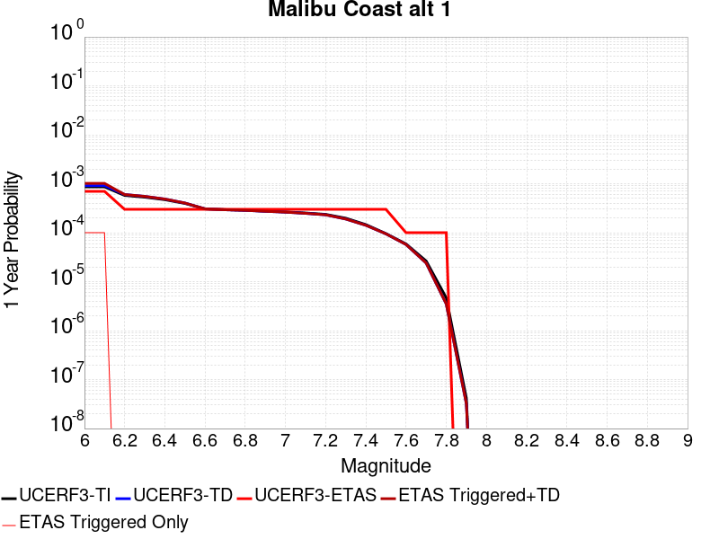 | 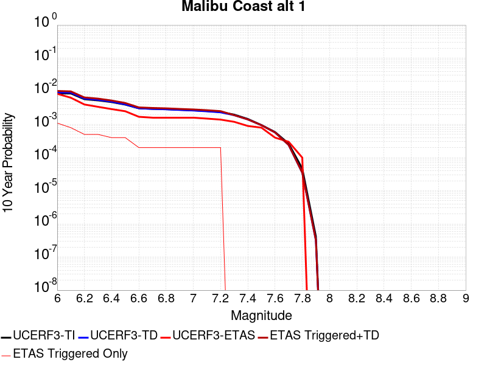 |

| Magnitude | 1 wk TI Prob | 1 wk TD Prob | 1 wk ETAS Prob | 1 wk ETAS/TD Gain | 1 wk ETAS Triggered+TD | 1 wk ETAS Triggered Only | 1 mo TI Prob | 1 mo TD Prob | 1 mo ETAS Prob | 1 mo ETAS/TD Gain | 1 mo ETAS Triggered+TD | 1 mo ETAS Triggered Only | 1 yr TI Prob | 1 yr TD Prob | 1 yr ETAS Prob | 1 yr ETAS/TD Gain | 1 yr ETAS Triggered+TD | 1 yr ETAS Triggered Only | 10 yr TI Prob | 10 yr TD Prob | 10 yr ETAS Prob | 10 yr ETAS/TD Gain | 10 yr ETAS Triggered+TD | 10 yr ETAS Triggered Only |
|-----|-----|-----|-----|-----|-----|-----|-----|-----|-----|-----|-----|-----|-----|-----|-----|-----|-----|-----|-----|-----|-----|-----|-----|-----|
| 6.0 | 1.6572556E-5 | 1.7601213E-5 | 1.0E-4 | 5.681427 | 1.17599455E-4 | 1.0E-4 | 7.102331E-5 | 7.543169E-5 | 1.0E-4 | 1.3257028 | 1.7542415E-4 | 1.0E-4 | 8.6436566E-4 | 9.180128E-4 | 7.0E-4 | 0.7625166 | 0.001017921 | 1.0E-4 | 0.0086101135 | 0.00914414 | 0.0084 | 0.9186211 | 0.010234081 | 0.0011 |
| 6.1 | 1.6572556E-5 | 1.7601213E-5 | 1.0E-4 | 5.681427 | 1.17599455E-4 | 1.0E-4 | 7.102331E-5 | 7.543169E-5 | 1.0E-4 | 1.3257028 | 1.7542415E-4 | 1.0E-4 | 8.6436566E-4 | 9.180128E-4 | 7.0E-4 | 0.7625166 | 0.001017921 | 1.0E-4 | 0.0086101135 | 0.00914414 | 0.0064 | 0.6999018 | 0.009936824 | 8.0E-4 |
| 6.2 | 1.1085717E-5 | 1.1559079E-5 | 0.0 | 0.0 | 1.1559079E-5 | 0.0 | 4.750935E-5 | 4.953799E-5 | 0.0 | 0.0 | 4.953799E-5 | 0.0 | 5.782728E-4 | 6.0296163E-4 | 3.0E-4 | 0.49754408 | 6.0296163E-4 | 0.0 | 0.0057677035 | 0.006013628 | 0.004 | 0.6651559 | 0.006510621 | 5.0E-4 |
| 6.3 | 1.0208568E-5 | 1.0593977E-5 | 0.0 | 0.0 | 1.0593977E-5 | 0.0 | 4.375027E-5 | 4.5401986E-5 | 0.0 | 0.0 | 4.5401986E-5 | 0.0 | 5.325294E-4 | 5.526319E-4 | 3.0E-4 | 0.5428568 | 5.526319E-4 | 0.0 | 0.0053125503 | 0.0055128844 | 0.0034 | 0.616737 | 0.006010128 | 5.0E-4 |
| 6.4 | 9.0682315E-6 | 9.344139E-6 | 0.0 | 0.0 | 9.344139E-6 | 0.0 | 3.8863272E-5 | 4.0045707E-5 | 0.0 | 0.0 | 4.0045707E-5 | 0.0 | 4.730576E-4 | 4.8744946E-4 | 3.0E-4 | 0.6154484 | 4.8744946E-4 | 0.0 | 0.0047205184 | 0.004864016 | 0.0029 | 0.5962151 | 0.0052620703 | 4.0E-4 |
| 6.5 | 7.605796E-6 | 7.749803E-6 | 0.0 | 0.0 | 7.749803E-6 | 0.0 | 3.259586E-5 | 3.321303E-5 | 0.0 | 0.0 | 3.321303E-5 | 0.0 | 3.9678233E-4 | 4.0429493E-4 | 3.0E-4 | 0.7420326 | 4.0429493E-4 | 0.0 | 0.0039607463 | 0.004035732 | 0.0025 | 0.6194663 | 0.0044341176 | 4.0E-4 |
| 6.6 | 5.889873E-6 | 5.8804235E-6 | 0.0 | 0.0 | 5.8804235E-6 | 0.0 | 2.5242069E-5 | 2.5201572E-5 | 0.0 | 0.0 | 2.5201572E-5 | 0.0 | 3.0727885E-4 | 3.0678604E-4 | 3.0E-4 | 0.97788024 | 3.0678604E-4 | 0.0 | 0.003068543 | 0.003063638 | 0.0017 | 0.5548958 | 0.0032630253 | 2.0E-4 |
| 6.7 | 5.66586E-6 | 5.642497E-6 | 0.0 | 0.0 | 5.642497E-6 | 0.0 | 2.428203E-5 | 2.4181905E-5 | 0.0 | 0.0 | 2.4181905E-5 | 0.0 | 2.955936E-4 | 2.9437503E-4 | 3.0E-4 | 1.0191082 | 2.9437503E-4 | 0.0 | 0.0029520073 | 0.0029398627 | 0.0016 | 0.5442431 | 0.003139275 | 2.0E-4 |
| 6.8 | 5.521556E-6 | 5.4902657E-6 | 0.0 | 0.0 | 5.4902657E-6 | 0.0 | 2.3663597E-5 | 2.35295E-5 | 0.0 | 0.0 | 2.35295E-5 | 0.0 | 2.880662E-4 | 2.8643408E-4 | 3.0E-4 | 1.0473614 | 2.8643408E-4 | 0.0 | 0.0028769306 | 0.0028606607 | 0.0016 | 0.5593114 | 0.0030600885 | 2.0E-4 |
| 6.9 | 5.29752E-6 | 5.2507376E-6 | 0.0 | 0.0 | 5.2507376E-6 | 0.0 | 2.270346E-5 | 2.2502967E-5 | 0.0 | 0.0 | 2.2502967E-5 | 0.0 | 2.7637955E-4 | 2.7393925E-4 | 3.0E-4 | 1.0951333 | 2.7393925E-4 | 0.0 | 0.0027603607 | 0.0027360262 | 0.0016 | 0.58478975 | 0.002935479 | 2.0E-4 |
| 7.0 | 5.106743E-6 | 5.04846E-6 | 0.0 | 0.0 | 5.04846E-6 | 0.0 | 2.1885859E-5 | 2.1636079E-5 | 0.0 | 0.0 | 2.1636079E-5 | 0.0 | 2.6642776E-4 | 2.6338748E-4 | 3.0E-4 | 1.1390063 | 2.6338748E-4 | 0.0 | 0.0026610855 | 0.002630763 | 0.0016 | 0.60818857 | 0.0028302367 | 2.0E-4 |
| 7.1 | 4.8469647E-6 | 4.7711173E-6 | 0.0 | 0.0 | 4.7711173E-6 | 0.0 | 2.0772539E-5 | 2.0447485E-5 | 0.0 | 0.0 | 2.0447485E-5 | 0.0 | 2.528763E-4 | 2.4891976E-4 | 3.0E-4 | 1.2052077 | 2.4891976E-4 | 0.0 | 0.0025258875 | 0.0024864175 | 0.0015 | 0.6032776 | 0.0026859203 | 2.0E-4 |
| 7.2 | 4.545514E-6 | 4.4488934E-6 | 0.0 | 0.0 | 4.4488934E-6 | 0.0 | 1.9480629E-5 | 1.9066547E-5 | 0.0 | 0.0 | 1.9066547E-5 | 0.0 | 2.3715083E-4 | 2.3211054E-4 | 3.0E-4 | 1.2924876 | 2.3211054E-4 | 0.0 | 0.0023689792 | 0.0023186887 | 0.0014 | 0.60378957 | 0.0025182248 | 2.0E-4 |
| 7.3 | 3.794097E-6 | 3.6525123E-6 | 0.0 | 0.0 | 3.6525123E-6 | 0.0 | 1.6260314E-5 | 1.5653532E-5 | 0.0 | 0.0 | 1.5653532E-5 | 0.0 | 1.9795135E-4 | 1.9056512E-4 | 3.0E-4 | 1.5742651 | 1.9056512E-4 | 0.0 | 0.001977751 | 0.0019040216 | 0.0012 | 0.6302449 | 0.0019040216 | 0.0 |
| 7.4 | 2.808217E-6 | 2.719539E-6 | 0.0 | 0.0 | 2.719539E-6 | 0.0 | 1.203516E-5 | 1.16551155E-5 | 0.0 | 0.0 | 1.16551155E-5 | 0.0 | 1.4651821E-4 | 1.4189181E-4 | 3.0E-4 | 2.114287 | 1.4189181E-4 | 0.0 | 0.0014642165 | 0.0014180149 | 9.0E-4 | 0.6346901 | 0.0014180149 | 0.0 |
| 7.5 | 1.83809E-6 | 1.8193278E-6 | 0.0 | 0.0 | 1.8193278E-6 | 0.0 | 7.877505E-6 | 7.797096E-6 | 0.0 | 0.0 | 7.797096E-6 | 0.0 | 9.59044E-5 | 9.4925526E-5 | 3.0E-4 | 3.1603723 | 9.4925526E-5 | 0.0 | 9.5863023E-4 | 9.488518E-4 | 8.0E-4 | 0.8431243 | 9.488518E-4 | 0.0 |
| 7.6 | 1.1292672E-6 | 1.1002836E-6 | 0.0 | 0.0 | 1.1002836E-6 | 0.0 | 4.839708E-6 | 4.7154927E-6 | 0.0 | 0.0 | 4.7154927E-6 | 0.0 | 5.8921847E-5 | 5.7409627E-5 | 1.0E-4 | 1.7418681 | 5.7409627E-5 | 0.0 | 5.890623E-4 | 5.739496E-4 | 4.0E-4 | 0.6969253 | 5.739496E-4 | 0.0 |
| 7.7 | 5.065272E-7 | 4.6097688E-7 | 0.0 | 0.0 | 4.6097688E-7 | 0.0 | 2.170829E-6 | 1.9756137E-6 | 0.0 | 0.0 | 1.9756137E-6 | 0.0 | 2.6429525E-5 | 2.4052842E-5 | 1.0E-4 | 4.1575127 | 2.4052842E-5 | 0.0 | 2.642638E-4 | 2.4050352E-4 | 3.0E-4 | 1.247383 | 2.4050352E-4 | 0.0 |
| 7.8 | 8.952991E-8 | 6.709284E-8 | 0.0 | 0.0 | 6.709284E-8 | 0.0 | 3.8369956E-7 | 2.875407E-7 | 0.0 | 0.0 | 2.875407E-7 | 0.0 | 4.671532E-6 | 3.5008027E-6 | 1.0E-4 | 28.564878 | 3.5008027E-6 | 0.0 | 4.671434E-5 | 3.5007495E-5 | 1.0E-4 | 2.8565311 | 3.5007495E-5 | 0.0 |
| 7.9 | 8.007447E-10 | 6.162303E-10 | 0.0 | 0.0 | 6.162303E-10 | 0.0 | 3.4317629E-9 | 2.6409874E-9 | 0.0 | 0.0 | 2.6409874E-9 | 0.0 | 4.1781714E-8 | 3.215402E-8 | 0.0 | 0.0 | 3.215402E-8 | 0.0 | 4.1781706E-7 | 3.2154017E-7 | 0.0 | 0.0 | 3.2154017E-7 | 0.0 |

## Likely 2011 CFM
*[(top)](#table-of-contents)*

| 1 Week | 1 Month | 1 Year | 10 Year |
|-----|-----|-----|-----|
|  | 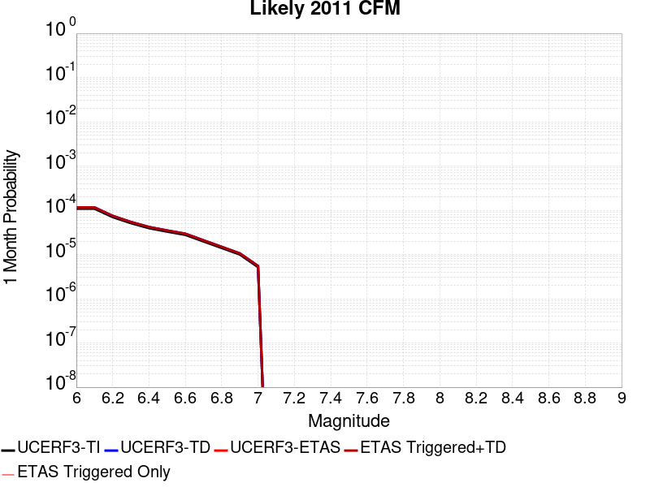 | 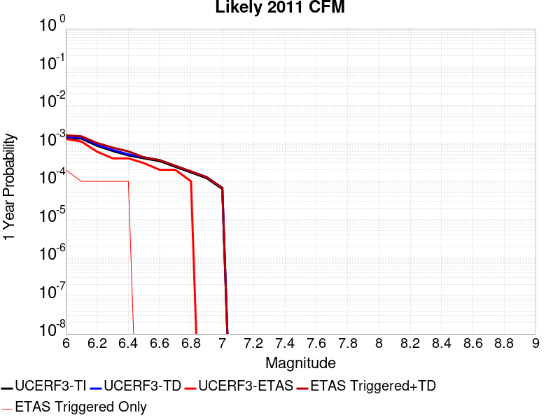 |  |

| Magnitude | 1 wk TI Prob | 1 wk TD Prob | 1 wk ETAS Prob | 1 wk ETAS/TD Gain | 1 wk ETAS Triggered+TD | 1 wk ETAS Triggered Only | 1 mo TI Prob | 1 mo TD Prob | 1 mo ETAS Prob | 1 mo ETAS/TD Gain | 1 mo ETAS Triggered+TD | 1 mo ETAS Triggered Only | 1 yr TI Prob | 1 yr TD Prob | 1 yr ETAS Prob | 1 yr ETAS/TD Gain | 1 yr ETAS Triggered+TD | 1 yr ETAS Triggered Only | 10 yr TI Prob | 10 yr TD Prob | 10 yr ETAS Prob | 10 yr ETAS/TD Gain | 10 yr ETAS Triggered+TD | 10 yr ETAS Triggered Only |
|-----|-----|-----|-----|-----|-----|-----|-----|-----|-----|-----|-----|-----|-----|-----|-----|-----|-----|-----|-----|-----|-----|-----|-----|-----|
| 6.0 | 2.5315949E-5 | 2.7108554E-5 | 0.0 | 0.0 | 2.7108554E-5 | 0.0 | 1.0849241E-4 | 1.1617459E-4 | 0.0 | 0.0 | 1.1617459E-4 | 0.0 | 0.0013200947 | 0.0014135524 | 0.0013 | 0.91966873 | 0.0016132698 | 2.0E-4 | 0.013122803 | 0.0140502695 | 0.0079 | 0.56226677 | 0.01503622 | 0.001 |
| 6.1 | 2.5315949E-5 | 2.7108554E-5 | 0.0 | 0.0 | 2.7108554E-5 | 0.0 | 1.0849241E-4 | 1.1617459E-4 | 0.0 | 0.0 | 1.1617459E-4 | 0.0 | 0.0013200947 | 0.0014135524 | 0.0011 | 0.7781812 | 0.0015134112 | 1.0E-4 | 0.013122803 | 0.0140502695 | 0.0072 | 0.5124457 | 0.01483903 | 8.0E-4 |
| 6.2 | 1.6375941E-5 | 1.746815E-5 | 0.0 | 0.0 | 1.746815E-5 | 0.0 | 7.0180715E-5 | 7.486142E-5 | 0.0 | 0.0 | 7.486142E-5 | 0.0 | 8.5411523E-4 | 9.11069E-4 | 6.0E-4 | 0.6585671 | 0.0010109779 | 1.0E-4 | 0.008508399 | 0.0090746265 | 0.0047 | 0.51792765 | 0.009669182 | 6.0E-4 |
| 6.3 | 1.1945543E-5 | 1.2714207E-5 | 0.0 | 0.0 | 1.2714207E-5 | 0.0 | 5.119418E-5 | 5.448835E-5 | 0.0 | 0.0 | 5.448835E-5 | 0.0 | 6.2311086E-4 | 6.6319905E-4 | 4.0E-4 | 0.60313714 | 7.6313276E-4 | 1.0E-4 | 0.0062136655 | 0.0066127544 | 0.0036 | 0.5444025 | 0.0070101093 | 4.0E-4 |
| 6.4 | 9.192729E-6 | 9.769702E-6 | 0.0 | 0.0 | 9.769702E-6 | 0.0 | 3.939681E-5 | 4.1869494E-5 | 0.0 | 0.0 | 4.1869494E-5 | 0.0 | 4.7955062E-4 | 5.0964457E-4 | 4.0E-4 | 0.78486073 | 6.095936E-4 | 1.0E-4 | 0.004785171 | 0.0050850394 | 0.0026 | 0.5113038 | 0.005383514 | 3.0E-4 |
| 6.5 | 7.67906E-6 | 8.15362E-6 | 0.0 | 0.0 | 8.15362E-6 | 0.0 | 3.2909844E-5 | 3.4943627E-5 | 0.0 | 0.0 | 3.4943627E-5 | 0.0 | 4.006037E-4 | 4.253575E-4 | 3.0E-4 | 0.7052891 | 4.253575E-4 | 0.0 | 0.0039988225 | 0.0042456263 | 0.0021 | 0.49462667 | 0.004345202 | 1.0E-4 |
| 6.6 | 6.4884057E-6 | 6.8855848E-6 | 0.0 | 0.0 | 6.8855848E-6 | 0.0 | 2.7807157E-5 | 2.9509323E-5 | 0.0 | 0.0 | 2.9509323E-5 | 0.0 | 3.3849955E-4 | 3.5921822E-4 | 2.0E-4 | 0.55676466 | 3.5921822E-4 | 0.0 | 0.003379844 | 0.0035865204 | 0.0016 | 0.44611484 | 0.003686162 | 1.0E-4 |
| 6.7 | 4.6060636E-6 | 4.884626E-6 | 0.0 | 0.0 | 4.884626E-6 | 0.0 | 1.9740122E-5 | 2.0933947E-5 | 0.0 | 0.0 | 2.0933947E-5 | 0.0 | 2.403095E-4 | 2.5484184E-4 | 2.0E-4 | 0.7848005 | 2.5484184E-4 | 0.0 | 0.002400498 | 0.0025455789 | 0.0012 | 0.47140554 | 0.0026453244 | 1.0E-4 |
| 6.8 | 3.2795615E-6 | 3.477789E-6 | 0.0 | 0.0 | 3.477789E-6 | 0.0 | 1.4055187E-5 | 1.4904728E-5 | 0.0 | 0.0 | 1.4904728E-5 | 0.0 | 1.7110848E-4 | 1.8145051E-4 | 1.0E-4 | 0.55111444 | 1.8145051E-4 | 0.0 | 0.0017097679 | 0.0018130789 | 9.0E-4 | 0.49639317 | 0.0019128976 | 1.0E-4 |
| 6.9 | 2.3289967E-6 | 2.4708547E-6 | 0.0 | 0.0 | 2.4708547E-6 | 0.0 | 9.981376E-6 | 1.0589337E-5 | 0.0 | 0.0 | 1.0589337E-5 | 0.0 | 1.2151648E-4 | 1.2891798E-4 | 0.0 | 0.0 | 1.2891798E-4 | 0.0 | 0.0012145005 | 0.0012884749 | 6.0E-4 | 0.4656668 | 0.0013883461 | 1.0E-4 |
| 7.0 | 1.211292E-6 | 1.2865539E-6 | 0.0 | 0.0 | 1.2865539E-6 | 0.0 | 5.1912407E-6 | 5.5137925E-6 | 0.0 | 0.0 | 5.5137925E-6 | 0.0 | 6.320152E-5 | 6.712866E-5 | 0.0 | 0.0 | 6.712866E-5 | 0.0 | 6.3183554E-4 | 6.7111367E-4 | 4.0E-4 | 0.5960242 | 7.7104656E-4 | 1.0E-4 |

## Santa Cruz Catalina Ridge alt1
*[(top)](#table-of-contents)*

| 1 Week | 1 Month | 1 Year | 10 Year |
|-----|-----|-----|-----|
|  |  | 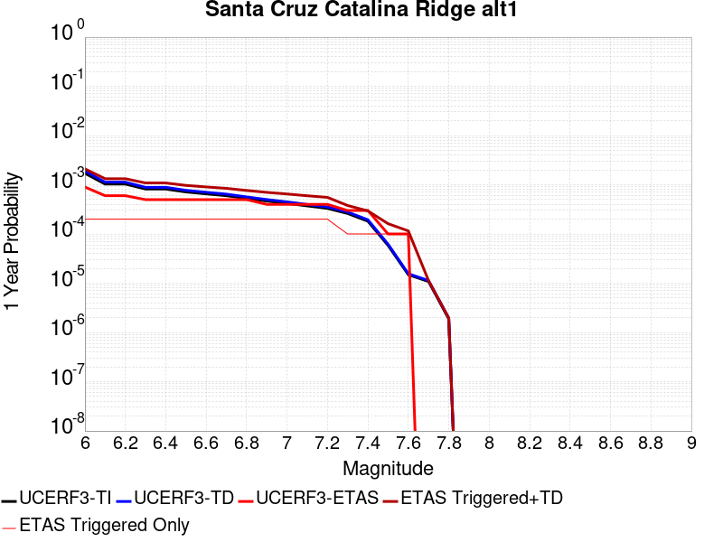 | 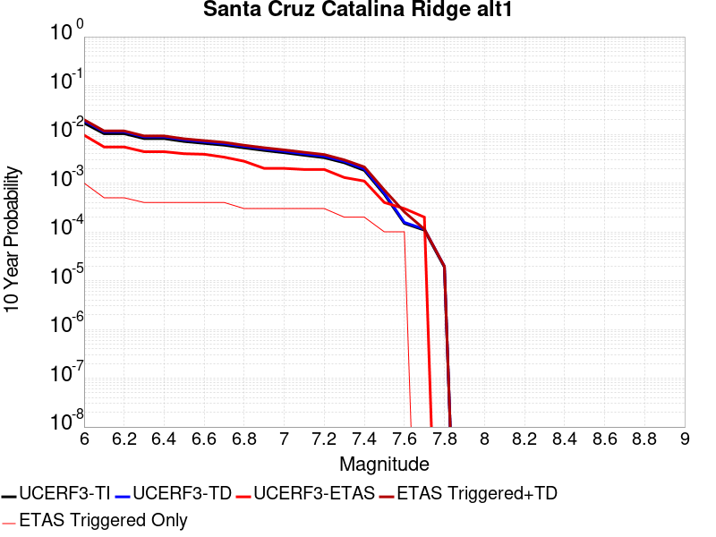 |

| Magnitude | 1 wk TI Prob | 1 wk TD Prob | 1 wk ETAS Prob | 1 wk ETAS/TD Gain | 1 wk ETAS Triggered+TD | 1 wk ETAS Triggered Only | 1 mo TI Prob | 1 mo TD Prob | 1 mo ETAS Prob | 1 mo ETAS/TD Gain | 1 mo ETAS Triggered+TD | 1 mo ETAS Triggered Only | 1 yr TI Prob | 1 yr TD Prob | 1 yr ETAS Prob | 1 yr ETAS/TD Gain | 1 yr ETAS Triggered+TD | 1 yr ETAS Triggered Only | 10 yr TI Prob | 10 yr TD Prob | 10 yr ETAS Prob | 10 yr ETAS/TD Gain | 10 yr ETAS Triggered+TD | 10 yr ETAS Triggered Only |
|-----|-----|-----|-----|-----|-----|-----|-----|-----|-----|-----|-----|-----|-----|-----|-----|-----|-----|-----|-----|-----|-----|-----|-----|-----|
| 6.0 | 3.2833184E-5 | 3.6566747E-5 | 0.0 | 0.0 | 3.6566747E-5 | 0.0 | 1.4070606E-4 | 1.5670617E-4 | 1.0E-4 | 0.638137 | 2.566905E-4 | 1.0E-4 | 0.00171175 | 0.0019063944 | 9.0E-4 | 0.47209537 | 0.0021060132 | 2.0E-4 | 0.016986247 | 0.018917318 | 0.0096 | 0.5074715 | 0.019898402 | 0.001 |
| 6.1 | 1.9835548E-5 | 2.1663489E-5 | 0.0 | 0.0 | 2.1663489E-5 | 0.0 | 8.500672E-5 | 9.284033E-5 | 1.0E-4 | 1.077118 | 1.9283105E-4 | 1.0E-4 | 0.0010344655 | 0.0011297651 | 6.0E-4 | 0.5310839 | 0.0013295391 | 2.0E-4 | 0.010296632 | 0.0112423515 | 0.0055 | 0.48922148 | 0.01173673 | 5.0E-4 |
| 6.2 | 1.9835548E-5 | 2.1663489E-5 | 0.0 | 0.0 | 2.1663489E-5 | 0.0 | 8.500672E-5 | 9.284033E-5 | 1.0E-4 | 1.077118 | 1.9283105E-4 | 1.0E-4 | 0.0010344655 | 0.0011297651 | 6.0E-4 | 0.5310839 | 0.0013295391 | 2.0E-4 | 0.010296632 | 0.0112423515 | 0.0055 | 0.48922148 | 0.01173673 | 5.0E-4 |
| 6.3 | 1.5728183E-5 | 1.7036768E-5 | 0.0 | 0.0 | 1.7036768E-5 | 0.0 | 6.7404755E-5 | 7.301271E-5 | 1.0E-4 | 1.3696246 | 1.730054E-4 | 1.0E-4 | 8.2034385E-4 | 8.885733E-4 | 5.0E-4 | 0.5626998 | 0.0010883956 | 2.0E-4 | 0.008173222 | 0.008850885 | 0.0044 | 0.49712545 | 0.009247344 | 4.0E-4 |
| 6.4 | 1.5728183E-5 | 1.7036768E-5 | 0.0 | 0.0 | 1.7036768E-5 | 0.0 | 6.7404755E-5 | 7.301271E-5 | 1.0E-4 | 1.3696246 | 1.730054E-4 | 1.0E-4 | 8.2034385E-4 | 8.885733E-4 | 5.0E-4 | 0.5626998 | 0.0010883956 | 2.0E-4 | 0.008173222 | 0.008850885 | 0.0044 | 0.49712545 | 0.009247344 | 4.0E-4 |
| 6.5 | 1.3707734E-5 | 1.4796856E-5 | 0.0 | 0.0 | 1.4796856E-5 | 0.0 | 5.8746107E-5 | 6.341357E-5 | 1.0E-4 | 1.5769495 | 1.6340724E-4 | 1.0E-4 | 7.1499916E-4 | 7.7179034E-4 | 5.0E-4 | 0.6478444 | 9.71636E-4 | 2.0E-4 | 0.0071270303 | 0.0076914984 | 0.004 | 0.5200547 | 0.008088422 | 4.0E-4 |
| 6.6 | 1.2539813E-5 | 1.3512298E-5 | 0.0 | 0.0 | 1.3512298E-5 | 0.0 | 5.3740947E-5 | 5.790858E-5 | 1.0E-4 | 1.7268598 | 1.5790279E-4 | 1.0E-4 | 6.540996E-4 | 7.048116E-4 | 5.0E-4 | 0.7094095 | 9.046706E-4 | 2.0E-4 | 0.0065217763 | 0.0070260656 | 0.0039 | 0.55507594 | 0.0074232556 | 4.0E-4 |
| 6.7 | 1.1504083E-5 | 1.2379242E-5 | 0.0 | 0.0 | 1.2379242E-5 | 0.0 | 4.930228E-5 | 5.305283E-5 | 1.0E-4 | 1.8849136 | 1.5304753E-4 | 1.0E-4 | 6.0008996E-4 | 6.457288E-4 | 5.0E-4 | 0.7743189 | 8.455996E-4 | 2.0E-4 | 0.005984721 | 0.0064387545 | 0.0034 | 0.52805245 | 0.0068361787 | 4.0E-4 |
| 6.8 | 1.012739E-5 | 1.0878672E-5 | 0.0 | 0.0 | 1.0878672E-5 | 0.0 | 4.340238E-5 | 4.662205E-5 | 1.0E-4 | 2.1449077 | 1.4661739E-4 | 1.0E-4 | 5.282958E-4 | 5.674772E-4 | 5.0E-4 | 0.8810927 | 7.673637E-4 | 2.0E-4 | 0.0052704164 | 0.00566045 | 0.0028 | 0.49466032 | 0.005958752 | 3.0E-4 |
| 6.9 | 8.9607865E-6 | 9.610499E-6 | 0.0 | 0.0 | 9.610499E-6 | 0.0 | 3.8402806E-5 | 4.1187206E-5 | 1.0E-4 | 2.4279382 | 1.4118309E-4 | 1.0E-4 | 4.6745385E-4 | 5.0133996E-4 | 4.0E-4 | 0.7978618 | 7.012397E-4 | 2.0E-4 | 0.0046647177 | 0.005002209 | 0.002 | 0.39982337 | 0.005300708 | 3.0E-4 |
| 7.0 | 8.046829E-6 | 8.620965E-6 | 0.0 | 0.0 | 8.620965E-6 | 0.0 | 3.4485955E-5 | 3.6946476E-5 | 1.0E-4 | 2.706618 | 1.3694278E-4 | 1.0E-4 | 4.1978562E-4 | 4.497313E-4 | 4.0E-4 | 0.88942 | 6.496414E-4 | 2.0E-4 | 0.004189935 | 0.0044883024 | 0.002 | 0.4456028 | 0.0047869557 | 3.0E-4 |
| 7.1 | 7.136131E-6 | 7.638722E-6 | 0.0 | 0.0 | 7.638722E-6 | 0.0 | 3.0583058E-5 | 3.2736974E-5 | 1.0E-4 | 3.0546498 | 1.3273371E-4 | 1.0E-4 | 3.7228514E-4 | 3.9850047E-4 | 4.0E-4 | 1.0037628 | 5.984208E-4 | 2.0E-4 | 0.0037166206 | 0.0039779353 | 0.0019 | 0.4776347 | 0.004276742 | 3.0E-4 |
| 7.2 | 6.362014E-6 | 6.8059E-6 | 0.0 | 0.0 | 6.8059E-6 | 0.0 | 2.726549E-5 | 2.916782E-5 | 1.0E-4 | 3.4284358 | 1.2916491E-4 | 1.0E-4 | 3.3190678E-4 | 3.55061E-4 | 4.0E-4 | 1.126567 | 5.5498997E-4 | 2.0E-4 | 0.0033141149 | 0.0035450056 | 0.0019 | 0.5359653 | 0.003843942 | 3.0E-4 |
| 7.3 | 5.004101E-6 | 5.3524536E-6 | 0.0 | 0.0 | 5.3524536E-6 | 0.0 | 2.1445969E-5 | 2.2938888E-5 | 0.0 | 0.0 | 2.2938888E-5 | 0.0 | 2.6107338E-4 | 2.7924572E-4 | 3.0E-4 | 1.0743227 | 3.792178E-4 | 1.0E-4 | 0.002607669 | 0.002789003 | 0.0013 | 0.4661164 | 0.002988445 | 2.0E-4 |
| 7.4 | 3.4901443E-6 | 3.7325667E-6 | 0.0 | 0.0 | 3.7325667E-6 | 0.0 | 1.4957676E-5 | 1.5996618E-5 | 0.0 | 0.0 | 1.5996618E-5 | 0.0 | 1.8209449E-4 | 1.947418E-4 | 3.0E-4 | 1.5405012 | 2.9472233E-4 | 1.0E-4 | 0.0018194534 | 0.0019457502 | 0.0011 | 0.5653347 | 0.002145361 | 2.0E-4 |
| 7.5 | 1.1215045E-6 | 1.1895304E-6 | 0.0 | 0.0 | 1.1895304E-6 | 0.0 | 4.806439E-6 | 5.0979775E-6 | 0.0 | 0.0 | 5.0979775E-6 | 0.0 | 5.851682E-5 | 6.206614E-5 | 1.0E-4 | 1.6111845 | 1.6205994E-4 | 1.0E-4 | 5.850142E-4 | 6.204911E-4 | 4.0E-4 | 0.64465064 | 7.2042906E-4 | 1.0E-4 |
| 7.6 | 2.8599047E-7 | 2.9954805E-7 | 0.0 | 0.0 | 2.9954805E-7 | 0.0 | 1.2256729E-6 | 1.2837768E-6 | 0.0 | 0.0 | 1.2837768E-6 | 0.0 | 1.4922465E-5 | 1.562987E-5 | 1.0E-4 | 6.3980055 | 1.1562831E-4 | 1.0E-4 | 1.4921463E-4 | 1.5628786E-4 | 3.0E-4 | 1.9195349 | 2.5627224E-4 | 1.0E-4 |
| 7.7 | 2.0781519E-7 | 2.1746322E-7 | 0.0 | 0.0 | 2.1746322E-7 | 0.0 | 8.906362E-7 | 9.319849E-7 | 0.0 | 0.0 | 9.319849E-7 | 0.0 | 1.08434415E-5 | 1.1346858E-5 | 0.0 | 0.0 | 1.1346858E-5 | 0.0 | 1.0842913E-4 | 1.13462884E-4 | 2.0E-4 | 1.762691 | 1.13462884E-4 | 0.0 |
| 7.8 | 3.614776E-8 | 3.7644103E-8 | 0.0 | 0.0 | 3.7644103E-8 | 0.0 | 1.5491896E-7 | 1.6133185E-7 | 0.0 | 0.0 | 1.6133185E-7 | 0.0 | 1.8861368E-6 | 1.9642137E-6 | 0.0 | 0.0 | 1.9642137E-6 | 0.0 | 1.8861208E-5 | 1.9641975E-5 | 0.0 | 0.0 | 1.9641975E-5 | 0.0 |

## Pine Mtn
*[(top)](#table-of-contents)*

| 1 Week | 1 Month | 1 Year | 10 Year |
|-----|-----|-----|-----|
|  | 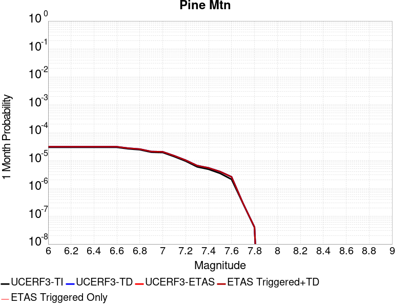 |  |  |

| Magnitude | 1 wk TI Prob | 1 wk TD Prob | 1 wk ETAS Prob | 1 wk ETAS/TD Gain | 1 wk ETAS Triggered+TD | 1 wk ETAS Triggered Only | 1 mo TI Prob | 1 mo TD Prob | 1 mo ETAS Prob | 1 mo ETAS/TD Gain | 1 mo ETAS Triggered+TD | 1 mo ETAS Triggered Only | 1 yr TI Prob | 1 yr TD Prob | 1 yr ETAS Prob | 1 yr ETAS/TD Gain | 1 yr ETAS Triggered+TD | 1 yr ETAS Triggered Only | 10 yr TI Prob | 10 yr TD Prob | 10 yr ETAS Prob | 10 yr ETAS/TD Gain | 10 yr ETAS Triggered+TD | 10 yr ETAS Triggered Only |
|-----|-----|-----|-----|-----|-----|-----|-----|-----|-----|-----|-----|-----|-----|-----|-----|-----|-----|-----|-----|-----|-----|-----|-----|-----|
| 6.0 | 6.894797E-6 | 7.226897E-6 | 0.0 | 0.0 | 7.226897E-6 | 0.0 | 2.9548795E-5 | 3.0972067E-5 | 0.0 | 0.0 | 3.0972067E-5 | 0.0 | 3.596972E-4 | 3.7702263E-4 | 2.0E-4 | 0.53047216 | 4.7698492E-4 | 1.0E-4 | 0.0035911554 | 0.0037641274 | 0.0028 | 0.7438643 | 0.004760363 | 0.001 |
| 6.1 | 6.894797E-6 | 7.226897E-6 | 0.0 | 0.0 | 7.226897E-6 | 0.0 | 2.9548795E-5 | 3.0972067E-5 | 0.0 | 0.0 | 3.0972067E-5 | 0.0 | 3.596972E-4 | 3.7702263E-4 | 2.0E-4 | 0.53047216 | 4.7698492E-4 | 1.0E-4 | 0.0035911554 | 0.0037641274 | 0.0028 | 0.7438643 | 0.004760363 | 0.001 |
| 6.2 | 6.894797E-6 | 7.226897E-6 | 0.0 | 0.0 | 7.226897E-6 | 0.0 | 2.9548795E-5 | 3.0972067E-5 | 0.0 | 0.0 | 3.0972067E-5 | 0.0 | 3.596972E-4 | 3.7702263E-4 | 2.0E-4 | 0.53047216 | 4.7698492E-4 | 1.0E-4 | 0.0035911554 | 0.0037641274 | 0.0028 | 0.7438643 | 0.004760363 | 0.001 |
| 6.3 | 6.894797E-6 | 7.226897E-6 | 0.0 | 0.0 | 7.226897E-6 | 0.0 | 2.9548795E-5 | 3.0972067E-5 | 0.0 | 0.0 | 3.0972067E-5 | 0.0 | 3.596972E-4 | 3.7702263E-4 | 2.0E-4 | 0.53047216 | 4.7698492E-4 | 1.0E-4 | 0.0035911554 | 0.0037641274 | 0.0028 | 0.7438643 | 0.004760363 | 0.001 |
| 6.4 | 6.894797E-6 | 7.226897E-6 | 0.0 | 0.0 | 7.226897E-6 | 0.0 | 2.9548795E-5 | 3.0972067E-5 | 0.0 | 0.0 | 3.0972067E-5 | 0.0 | 3.596972E-4 | 3.7702263E-4 | 2.0E-4 | 0.53047216 | 4.7698492E-4 | 1.0E-4 | 0.0035911554 | 0.0037641274 | 0.0028 | 0.7438643 | 0.004760363 | 0.001 |
| 6.5 | 6.894797E-6 | 7.226897E-6 | 0.0 | 0.0 | 7.226897E-6 | 0.0 | 2.9548795E-5 | 3.0972067E-5 | 0.0 | 0.0 | 3.0972067E-5 | 0.0 | 3.596972E-4 | 3.7702263E-4 | 2.0E-4 | 0.53047216 | 4.7698492E-4 | 1.0E-4 | 0.0035911554 | 0.0037641274 | 0.0028 | 0.7438643 | 0.004760363 | 0.001 |
| 6.6 | 6.894797E-6 | 7.226897E-6 | 0.0 | 0.0 | 7.226897E-6 | 0.0 | 2.9548795E-5 | 3.0972067E-5 | 0.0 | 0.0 | 3.0972067E-5 | 0.0 | 3.596972E-4 | 3.7702263E-4 | 2.0E-4 | 0.53047216 | 4.7698492E-4 | 1.0E-4 | 0.0035911554 | 0.0037641274 | 0.0028 | 0.7438643 | 0.004760363 | 0.001 |
| 6.7 | 6.0867933E-6 | 6.3985076E-6 | 0.0 | 0.0 | 6.3985076E-6 | 0.0 | 2.6085996E-5 | 2.74219E-5 | 0.0 | 0.0 | 2.74219E-5 | 0.0 | 3.1755073E-4 | 3.3381267E-4 | 2.0E-4 | 0.59913844 | 4.337793E-4 | 1.0E-4 | 0.0031709734 | 0.0033333318 | 0.0024 | 0.7200003 | 0.004130665 | 8.0E-4 |
| 6.8 | 5.6530425E-6 | 5.951964E-6 | 0.0 | 0.0 | 5.951964E-6 | 0.0 | 2.42271E-5 | 2.550818E-5 | 0.0 | 0.0 | 2.550818E-5 | 0.0 | 2.94925E-4 | 3.1051988E-4 | 2.0E-4 | 0.6440811 | 4.1048884E-4 | 1.0E-4 | 0.002945339 | 0.0031010648 | 0.0024 | 0.77392775 | 0.0038985838 | 8.0E-4 |
| 6.9 | 4.6015225E-6 | 4.8651304E-6 | 0.0 | 0.0 | 4.8651304E-6 | 0.0 | 1.9720663E-5 | 2.0850399E-5 | 0.0 | 0.0 | 2.0850399E-5 | 0.0 | 2.4007261E-4 | 2.538255E-4 | 1.0E-4 | 0.39397144 | 3.538001E-4 | 1.0E-4 | 0.0023981342 | 0.0025355 | 0.002 | 0.78879905 | 0.0033334717 | 8.0E-4 |
| 7.0 | 4.4875965E-6 | 4.7487642E-6 | 0.0 | 0.0 | 4.7487642E-6 | 0.0 | 1.9232413E-5 | 2.0351696E-5 | 0.0 | 0.0 | 2.0351696E-5 | 0.0 | 2.3412947E-4 | 2.4775518E-4 | 1.0E-4 | 0.40362427 | 3.477304E-4 | 1.0E-4 | 0.0023388295 | 0.0024749336 | 0.0019 | 0.7676974 | 0.003173201 | 7.0E-4 |
| 7.1 | 3.203907E-6 | 3.4306306E-6 | 0.0 | 0.0 | 3.4306306E-6 | 0.0 | 1.3730958E-5 | 1.4702624E-5 | 0.0 | 0.0 | 1.4702624E-5 | 0.0 | 1.6716159E-4 | 1.789904E-4 | 1.0E-4 | 0.5586892 | 2.789725E-4 | 1.0E-4 | 0.0016703589 | 0.0017885286 | 0.0012 | 0.6709426 | 0.0022876344 | 5.0E-4 |
| 7.2 | 2.2060601E-6 | 2.3794764E-6 | 0.0 | 0.0 | 2.3794764E-6 | 0.0 | 9.4545085E-6 | 1.0197718E-5 | 0.0 | 0.0 | 1.0197718E-5 | 0.0 | 1.15102564E-4 | 1.2415061E-4 | 1.0E-4 | 0.8054733 | 2.2413819E-4 | 1.0E-4 | 0.0011504296 | 0.0012408573 | 9.0E-4 | 0.72530496 | 0.0016403609 | 4.0E-4 |
| 7.3 | 1.3765207E-6 | 1.5225396E-6 | 0.0 | 0.0 | 1.5225396E-6 | 0.0 | 5.899361E-6 | 6.525154E-6 | 0.0 | 0.0 | 6.525154E-6 | 0.0 | 7.182235E-5 | 7.944094E-5 | 0.0 | 0.0 | 7.944094E-5 | 0.0 | 7.1799144E-4 | 7.941346E-4 | 4.0E-4 | 0.5036929 | 9.939758E-4 | 2.0E-4 |
| 7.4 | 1.1245983E-6 | 1.2595099E-6 | 0.0 | 0.0 | 1.2595099E-6 | 0.0 | 4.819698E-6 | 5.397889E-6 | 0.0 | 0.0 | 5.397889E-6 | 0.0 | 5.8678244E-5 | 6.5717395E-5 | 0.0 | 0.0 | 6.5717395E-5 | 0.0 | 5.866275E-4 | 6.5698795E-4 | 4.0E-4 | 0.60883915 | 8.568566E-4 | 2.0E-4 |
| 7.5 | 8.031682E-7 | 9.2844357E-7 | 0.0 | 0.0 | 9.2844357E-7 | 0.0 | 3.4421448E-6 | 3.979038E-6 | 0.0 | 0.0 | 3.979038E-6 | 0.0 | 4.1907308E-5 | 4.844378E-5 | 0.0 | 0.0 | 4.844378E-5 | 0.0 | 4.1899405E-4 | 4.8433896E-4 | 3.0E-4 | 0.6194009 | 5.8429054E-4 | 1.0E-4 |
| 7.6 | 4.8953444E-7 | 6.0096386E-7 | 0.0 | 0.0 | 6.0096386E-7 | 0.0 | 2.098003E-6 | 2.5755571E-6 | 0.0 | 0.0 | 2.5755571E-6 | 0.0 | 2.5542888E-5 | 3.1357005E-5 | 0.0 | 0.0 | 3.1357005E-5 | 0.0 | 2.5539953E-4 | 3.1353068E-4 | 3.0E-4 | 0.95684415 | 4.1349934E-4 | 1.0E-4 |
| 7.7 | 6.634529E-8 | 6.789142E-8 | 0.0 | 0.0 | 6.789142E-8 | 0.0 | 2.843369E-7 | 2.9096321E-7 | 0.0 | 0.0 | 2.9096321E-7 | 0.0 | 3.4617963E-6 | 3.5424719E-6 | 0.0 | 0.0 | 3.5424719E-6 | 0.0 | 3.4617424E-5 | 3.54242E-5 | 0.0 | 0.0 | 3.54242E-5 | 0.0 |
| 7.8 | 9.235578E-9 | 9.48909E-9 | 0.0 | 0.0 | 9.48909E-9 | 0.0 | 3.9581046E-8 | 4.066753E-8 | 0.0 | 0.0 | 4.066753E-8 | 0.0 | 4.818991E-7 | 4.951271E-7 | 0.0 | 0.0 | 4.951271E-7 | 0.0 | 4.8189804E-6 | 4.9512614E-6 | 0.0 | 0.0 | 4.9512614E-6 | 0.0 |

## San Juan
*[(top)](#table-of-contents)*

| 1 Week | 1 Month | 1 Year | 10 Year |
|-----|-----|-----|-----|
| 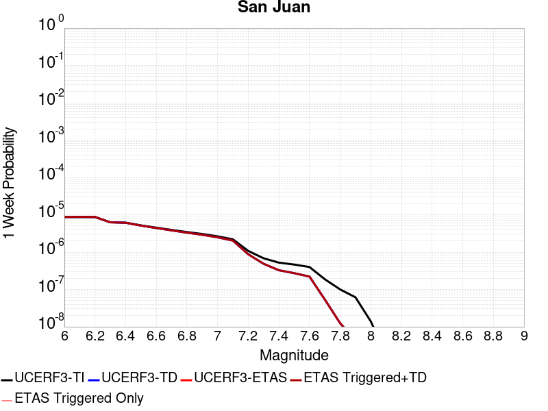 |  |  | 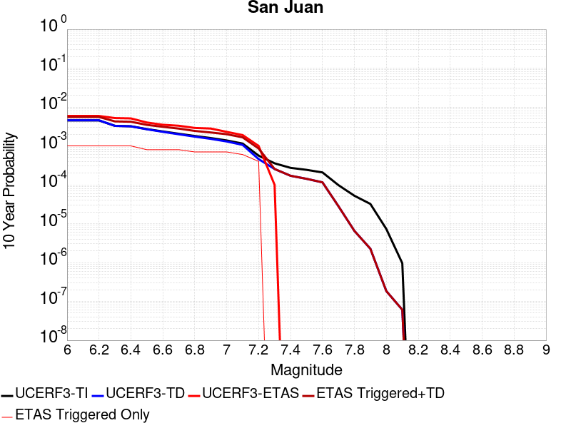 |

| Magnitude | 1 wk TI Prob | 1 wk TD Prob | 1 wk ETAS Prob | 1 wk ETAS/TD Gain | 1 wk ETAS Triggered+TD | 1 wk ETAS Triggered Only | 1 mo TI Prob | 1 mo TD Prob | 1 mo ETAS Prob | 1 mo ETAS/TD Gain | 1 mo ETAS Triggered+TD | 1 mo ETAS Triggered Only | 1 yr TI Prob | 1 yr TD Prob | 1 yr ETAS Prob | 1 yr ETAS/TD Gain | 1 yr ETAS Triggered+TD | 1 yr ETAS Triggered Only | 10 yr TI Prob | 10 yr TD Prob | 10 yr ETAS Prob | 10 yr ETAS/TD Gain | 10 yr ETAS Triggered+TD | 10 yr ETAS Triggered Only |
|-----|-----|-----|-----|-----|-----|-----|-----|-----|-----|-----|-----|-----|-----|-----|-----|-----|-----|-----|-----|-----|-----|-----|-----|-----|
| 6.0 | 8.682808E-6 | 8.741478E-6 | 0.0 | 0.0 | 8.741478E-6 | 0.0 | 3.72115E-5 | 3.7462967E-5 | 1.0E-4 | 2.6693027 | 3.7462967E-5 | 0.0 | 4.5295584E-4 | 4.56021E-4 | 8.0E-4 | 1.7543051 | 6.559298E-4 | 2.0E-4 | 0.004520337 | 0.004551394 | 0.0059 | 1.2963063 | 0.0055468422 | 0.001 |
| 6.1 | 8.682808E-6 | 8.741478E-6 | 0.0 | 0.0 | 8.741478E-6 | 0.0 | 3.72115E-5 | 3.7462967E-5 | 1.0E-4 | 2.6693027 | 3.7462967E-5 | 0.0 | 4.5295584E-4 | 4.56021E-4 | 8.0E-4 | 1.7543051 | 6.559298E-4 | 2.0E-4 | 0.004520337 | 0.004551394 | 0.0059 | 1.2963063 | 0.0055468422 | 0.001 |
| 6.2 | 8.682808E-6 | 8.741478E-6 | 0.0 | 0.0 | 8.741478E-6 | 0.0 | 3.72115E-5 | 3.7462967E-5 | 1.0E-4 | 2.6693027 | 3.7462967E-5 | 0.0 | 4.5295584E-4 | 4.56021E-4 | 8.0E-4 | 1.7543051 | 6.559298E-4 | 2.0E-4 | 0.004520337 | 0.004551394 | 0.0059 | 1.2963063 | 0.0055468422 | 0.001 |
| 6.3 | 6.3054235E-6 | 6.2747163E-6 | 0.0 | 0.0 | 6.2747163E-6 | 0.0 | 2.7022963E-5 | 2.6891372E-5 | 1.0E-4 | 3.718665 | 2.6891372E-5 | 0.0 | 3.2895492E-4 | 3.2735468E-4 | 6.0E-4 | 1.8328744 | 5.272892E-4 | 2.0E-4 | 0.003284684 | 0.003268925 | 0.0052 | 1.590737 | 0.004265656 | 0.001 |
| 6.4 | 6.1490473E-6 | 6.1078595E-6 | 0.0 | 0.0 | 6.1078595E-6 | 0.0 | 2.6352795E-5 | 2.6176285E-5 | 1.0E-4 | 3.8202517 | 2.6176285E-5 | 0.0 | 3.2079802E-4 | 3.1865103E-4 | 6.0E-4 | 1.8829376 | 5.185873E-4 | 2.0E-4 | 0.0032033534 | 0.003182138 | 0.0051 | 1.602696 | 0.004178956 | 0.001 |
| 6.5 | 5.204848E-6 | 5.1307134E-6 | 0.0 | 0.0 | 5.1307134E-6 | 0.0 | 2.23063E-5 | 2.1988591E-5 | 1.0E-4 | 4.547813 | 2.1988591E-5 | 0.0 | 2.7154534E-4 | 2.6767916E-4 | 3.0E-4 | 1.1207447 | 3.676524E-4 | 1.0E-4 | 0.0027121378 | 0.002673722 | 0.004 | 1.4960419 | 0.0034715831 | 8.0E-4 |
| 6.6 | 4.5179986E-6 | 4.4103363E-6 | 0.0 | 0.0 | 4.4103363E-6 | 0.0 | 1.9362706E-5 | 1.890131E-5 | 1.0E-4 | 5.290639 | 1.890131E-5 | 0.0 | 2.3571544E-4 | 2.3009993E-4 | 3.0E-4 | 1.3037814 | 3.300769E-4 | 1.0E-4 | 0.0023546559 | 0.0022987544 | 0.0035 | 1.5225637 | 0.0030969153 | 8.0E-4 |
| 6.7 | 3.9442616E-6 | 3.815661E-6 | 0.0 | 0.0 | 3.815661E-6 | 0.0 | 1.6903869E-5 | 1.6352735E-5 | 1.0E-4 | 6.1151853 | 1.6352735E-5 | 0.0 | 2.0578515E-4 | 1.9907703E-4 | 3.0E-4 | 1.5069544 | 2.990571E-4 | 1.0E-4 | 0.002055947 | 0.0019891122 | 0.0033 | 1.6590315 | 0.0027875209 | 8.0E-4 |
| 6.8 | 3.4536245E-6 | 3.312318E-6 | 0.0 | 0.0 | 3.312318E-6 | 0.0 | 1.4801163E-5 | 1.4195575E-5 | 1.0E-4 | 7.044449 | 1.4195575E-5 | 0.0 | 1.8018926E-4 | 1.7281804E-4 | 3.0E-4 | 1.73593 | 2.7280074E-4 | 1.0E-4 | 0.0018004322 | 0.0017269558 | 0.0029 | 1.6792555 | 0.002425747 | 7.0E-4 |
| 6.9 | 3.059865E-6 | 2.9081846E-6 | 0.0 | 0.0 | 2.9081846E-6 | 0.0 | 1.3113641E-5 | 1.2463592E-5 | 1.0E-4 | 8.02337 | 1.2463592E-5 | 0.0 | 1.596469E-4 | 1.5173423E-4 | 3.0E-4 | 1.9771411 | 2.5171906E-4 | 1.0E-4 | 0.0015953224 | 0.0015164214 | 0.0028 | 1.8464524 | 0.00221536 | 7.0E-4 |
| 7.0 | 2.6504351E-6 | 2.4883655E-6 | 0.0 | 0.0 | 2.4883655E-6 | 0.0 | 1.1358958E-5 | 1.0664383E-5 | 1.0E-4 | 9.377008 | 1.0664383E-5 | 0.0 | 1.3828653E-4 | 1.2983166E-4 | 3.0E-4 | 2.3106844 | 2.2981869E-4 | 1.0E-4 | 0.0013820052 | 0.0012976705 | 0.0023 | 1.7724067 | 0.0019967621 | 7.0E-4 |
| 7.1 | 2.2039317E-6 | 2.0309524E-6 | 0.0 | 0.0 | 2.0309524E-6 | 0.0 | 9.445387E-6 | 8.704055E-6 | 1.0E-4 | 11.488898 | 8.704055E-6 | 0.0 | 1.1499152E-4 | 1.0596724E-4 | 3.0E-4 | 2.8310635 | 2.0595665E-4 | 1.0E-4 | 0.0011493203 | 0.0010592777 | 0.0019 | 1.7936752 | 0.0016586421 | 6.0E-4 |
| 7.2 | 1.0786707E-6 | 8.7450377E-7 | 0.0 | 0.0 | 8.7450377E-7 | 0.0 | 4.622866E-6 | 3.747868E-6 | 1.0E-4 | 26.681837 | 3.747868E-6 | 0.0 | 5.628194E-5 | 4.562935E-5 | 2.0E-4 | 4.383144 | 1.4562478E-4 | 1.0E-4 | 5.6267687E-4 | 4.5625938E-4 | 0.001 | 2.1917357 | 8.560769E-4 | 4.0E-4 |
| 7.3 | 6.846433E-7 | 4.852022E-7 | 0.0 | 0.0 | 4.852022E-7 | 0.0 | 2.9341822E-6 | 2.0794362E-6 | 0.0 | 0.0 | 2.0794362E-6 | 0.0 | 3.5723086E-5 | 2.5316842E-5 | 0.0 | 0.0 | 2.5316842E-5 | 0.0 | 3.571734E-4 | 2.5317477E-4 | 1.0E-4 | 0.39498407 | 2.5317477E-4 | 0.0 |
| 7.4 | 5.23043E-7 | 3.250968E-7 | 0.0 | 0.0 | 3.250968E-7 | 0.0 | 2.2416111E-6 | 1.3932712E-6 | 0.0 | 0.0 | 1.3932712E-6 | 0.0 | 2.7291273E-5 | 1.6962946E-5 | 0.0 | 0.0 | 1.6962946E-5 | 0.0 | 2.7287923E-4 | 1.6965033E-4 | 0.0 | 0.0 | 1.6965033E-4 | 0.0 |
| 7.5 | 4.648444E-7 | 2.7135167E-7 | 0.0 | 0.0 | 2.7135167E-7 | 0.0 | 1.9921886E-6 | 1.1629352E-6 | 0.0 | 0.0 | 1.1629352E-6 | 0.0 | 2.4254627E-5 | 1.4158644E-5 | 0.0 | 0.0 | 1.4158644E-5 | 0.0 | 2.425198E-4 | 1.4160897E-4 | 0.0 | 0.0 | 1.4160897E-4 | 0.0 |
| 7.6 | 3.9906567E-7 | 2.2004379E-7 | 0.0 | 0.0 | 2.2004379E-7 | 0.0 | 1.7102802E-6 | 9.430445E-7 | 0.0 | 0.0 | 9.430445E-7 | 0.0 | 2.0822463E-5 | 1.1481507E-5 | 0.0 | 0.0 | 1.1481507E-5 | 0.0 | 2.0820512E-4 | 1.1483471E-4 | 0.0 | 0.0 | 1.1483471E-4 | 0.0 |
| 7.7 | 1.8784601E-7 | 5.3400743E-8 | 0.0 | 0.0 | 5.3400743E-8 | 0.0 | 8.0505407E-7 | 2.288603E-7 | 0.0 | 0.0 | 2.288603E-7 | 0.0 | 9.80149E-6 | 2.7863707E-6 | 0.0 | 0.0 | 2.7863707E-6 | 0.0 | 9.801057E-5 | 2.7872891E-5 | 0.0 | 0.0 | 2.7872891E-5 | 0.0 |
| 7.8 | 1.00154914E-7 | 1.2349305E-8 | 0.0 | 0.0 | 1.2349305E-8 | 0.0 | 4.2923529E-7 | 5.2925582E-8 | 0.0 | 0.0 | 5.2925582E-8 | 0.0 | 5.225927E-6 | 6.443688E-7 | 0.0 | 0.0 | 6.443688E-7 | 0.0 | 5.225804E-5 | 6.449471E-6 | 0.0 | 0.0 | 6.449471E-6 | 0.0 |
| 7.9 | 6.171429E-8 | 4.268012E-9 | 0.0 | 0.0 | 4.268012E-9 | 0.0 | 2.6448978E-7 | 1.829148E-8 | 0.0 | 0.0 | 1.829148E-8 | 0.0 | 3.2201583E-6 | 2.2269876E-7 | 0.0 | 0.0 | 2.2269876E-7 | 0.0 | 3.2201115E-5 | 2.2322042E-6 | 0.0 | 0.0 | 2.2322042E-6 | 0.0 |
| 8.0 | 1.3974572E-8 | 3.336218E-10 | 0.0 | 0.0 | 3.336218E-10 | 0.0 | 5.989102E-8 | 1.4298055E-9 | 0.0 | 0.0 | 1.4298055E-9 | 0.0 | 7.2917294E-7 | 1.7407872E-8 | 0.0 | 0.0 | 1.7407872E-8 | 0.0 | 7.2917055E-6 | 1.7833445E-7 | 0.0 | 0.0 | 1.7833445E-7 | 0.0 |
| 8.1 | 1.8403477E-9 | 1.1202783E-10 | 0.0 | 0.0 | 1.1202783E-10 | 0.0 | 7.887204E-9 | 4.8011795E-10 | 0.0 | 0.0 | 4.8011795E-10 | 0.0 | 9.602671E-8 | 5.845436E-9 | 0.0 | 0.0 | 5.845436E-9 | 0.0 | 9.602667E-7 | 5.970214E-8 | 0.0 | 0.0 | 5.970214E-8 | 0.0 |

## Johnson Valley (No) 2011 rev
*[(top)](#table-of-contents)*

| 1 Week | 1 Month | 1 Year | 10 Year |
|-----|-----|-----|-----|
|  | 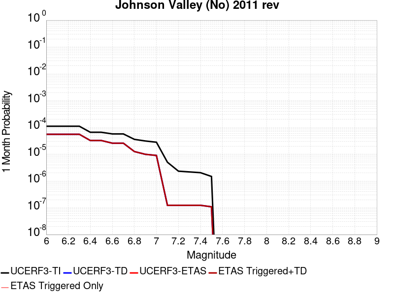 | 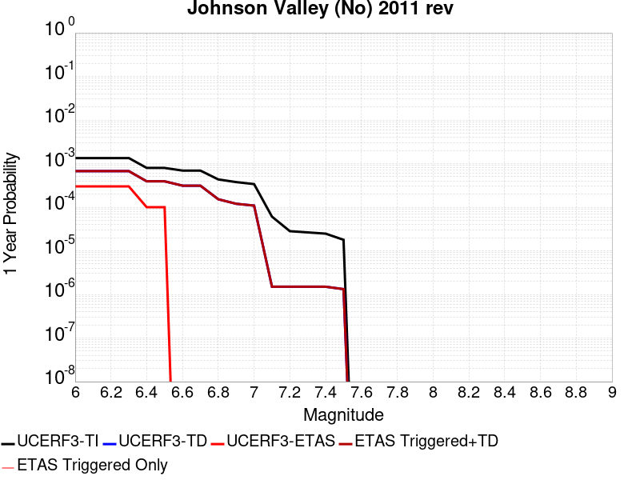 | 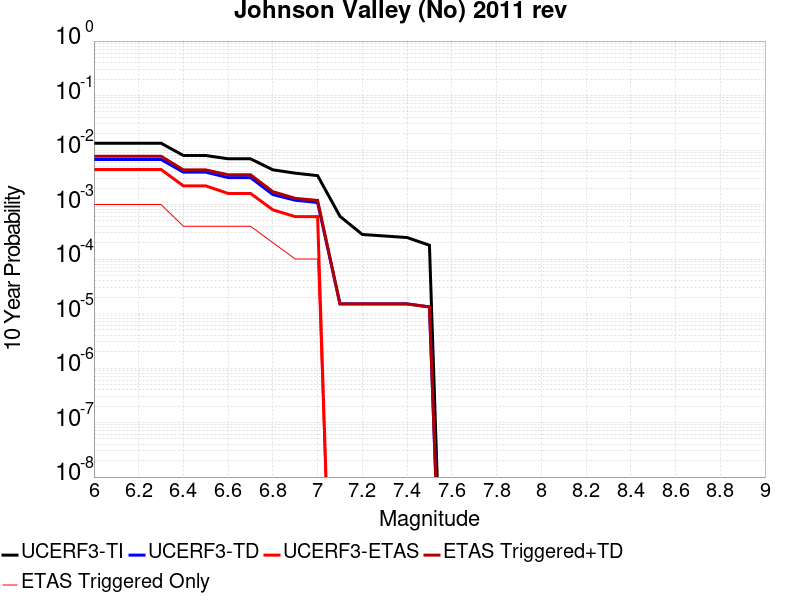 |

| Magnitude | 1 wk TI Prob | 1 wk TD Prob | 1 wk ETAS Prob | 1 wk ETAS/TD Gain | 1 wk ETAS Triggered+TD | 1 wk ETAS Triggered Only | 1 mo TI Prob | 1 mo TD Prob | 1 mo ETAS Prob | 1 mo ETAS/TD Gain | 1 mo ETAS Triggered+TD | 1 mo ETAS Triggered Only | 1 yr TI Prob | 1 yr TD Prob | 1 yr ETAS Prob | 1 yr ETAS/TD Gain | 1 yr ETAS Triggered+TD | 1 yr ETAS Triggered Only | 10 yr TI Prob | 10 yr TD Prob | 10 yr ETAS Prob | 10 yr ETAS/TD Gain | 10 yr ETAS Triggered+TD | 10 yr ETAS Triggered Only |
|-----|-----|-----|-----|-----|-----|-----|-----|-----|-----|-----|-----|-----|-----|-----|-----|-----|-----|-----|-----|-----|-----|-----|-----|-----|
| 6.0 | 2.577707E-5 | 1.29023465E-5 | 0.0 | 0.0 | 1.29023465E-5 | 0.0 | 1.1046848E-4 | 5.5294822E-5 | 0.0 | 0.0 | 5.5294822E-5 | 0.0 | 0.0013441239 | 6.730462E-4 | 3.0E-4 | 0.44573462 | 6.730462E-4 | 0.0 | 0.013360229 | 0.0067139883 | 0.0044 | 0.6553482 | 0.0077072745 | 0.001 |
| 6.1 | 2.577707E-5 | 1.29023465E-5 | 0.0 | 0.0 | 1.29023465E-5 | 0.0 | 1.1046848E-4 | 5.5294822E-5 | 0.0 | 0.0 | 5.5294822E-5 | 0.0 | 0.0013441239 | 6.730462E-4 | 3.0E-4 | 0.44573462 | 6.730462E-4 | 0.0 | 0.013360229 | 0.0067139883 | 0.0044 | 0.6553482 | 0.0077072745 | 0.001 |
| 6.2 | 2.577707E-5 | 1.29023465E-5 | 0.0 | 0.0 | 1.29023465E-5 | 0.0 | 1.1046848E-4 | 5.5294822E-5 | 0.0 | 0.0 | 5.5294822E-5 | 0.0 | 0.0013441239 | 6.730462E-4 | 3.0E-4 | 0.44573462 | 6.730462E-4 | 0.0 | 0.013360229 | 0.0067139883 | 0.0044 | 0.6553482 | 0.0077072745 | 0.001 |
| 6.3 | 2.577707E-5 | 1.29023465E-5 | 0.0 | 0.0 | 1.29023465E-5 | 0.0 | 1.1046848E-4 | 5.5294822E-5 | 0.0 | 0.0 | 5.5294822E-5 | 0.0 | 0.0013441239 | 6.730462E-4 | 3.0E-4 | 0.44573462 | 6.730462E-4 | 0.0 | 0.013360229 | 0.0067139883 | 0.0044 | 0.6553482 | 0.0077072745 | 0.001 |
| 6.4 | 1.5296591E-5 | 7.5369985E-6 | 0.0 | 0.0 | 7.5369985E-6 | 0.0 | 6.555518E-5 | 3.2301126E-5 | 0.0 | 0.0 | 3.2301126E-5 | 0.0 | 7.97842E-4 | 3.9321402E-4 | 1.0E-4 | 0.25431442 | 3.9321402E-4 | 0.0 | 0.007949836 | 0.003927024 | 0.0022 | 0.56022066 | 0.004325453 | 4.0E-4 |
| 6.5 | 1.5296591E-5 | 7.5369985E-6 | 0.0 | 0.0 | 7.5369985E-6 | 0.0 | 6.555518E-5 | 3.2301126E-5 | 0.0 | 0.0 | 3.2301126E-5 | 0.0 | 7.97842E-4 | 3.9321402E-4 | 1.0E-4 | 0.25431442 | 3.9321402E-4 | 0.0 | 0.007949836 | 0.003927024 | 0.0022 | 0.56022066 | 0.004325453 | 4.0E-4 |
| 6.6 | 1.3289383E-5 | 5.991806E-6 | 0.0 | 0.0 | 5.991806E-6 | 0.0 | 5.6953253E-5 | 2.5679012E-5 | 0.0 | 0.0 | 2.5679012E-5 | 0.0 | 6.9318525E-4 | 3.1261408E-4 | 0.0 | 0.0 | 3.1261408E-4 | 0.0 | 0.0069102696 | 0.0031234077 | 0.0016 | 0.512261 | 0.0035221584 | 4.0E-4 |
| 6.7 | 1.3289383E-5 | 5.991806E-6 | 0.0 | 0.0 | 5.991806E-6 | 0.0 | 5.6953253E-5 | 2.5679012E-5 | 0.0 | 0.0 | 2.5679012E-5 | 0.0 | 6.9318525E-4 | 3.1261408E-4 | 0.0 | 0.0 | 3.1261408E-4 | 0.0 | 0.0069102696 | 0.0031234077 | 0.0016 | 0.512261 | 0.0035221584 | 4.0E-4 |
| 6.8 | 8.330789E-6 | 2.9207117E-6 | 0.0 | 0.0 | 2.9207117E-6 | 0.0 | 3.570289E-5 | 1.2517308E-5 | 0.0 | 0.0 | 1.2517308E-5 | 0.0 | 4.34596E-4 | 1.5239327E-4 | 0.0 | 0.0 | 1.5239327E-4 | 0.0 | 0.0043374705 | 0.0015234475 | 8.0E-4 | 0.5251248 | 0.0017231427 | 2.0E-4 |
| 6.9 | 7.2359003E-6 | 2.300724E-6 | 0.0 | 0.0 | 2.300724E-6 | 0.0 | 3.1010633E-5 | 9.860239E-6 | 0.0 | 0.0 | 9.860239E-6 | 0.0 | 3.7748902E-4 | 1.2004712E-4 | 0.0 | 0.0 | 1.2004712E-4 | 0.0 | 0.0037684843 | 0.0012003453 | 6.0E-4 | 0.49985614 | 0.0013002253 | 1.0E-4 |
| 7.0 | 6.5149957E-6 | 2.0879784E-6 | 0.0 | 0.0 | 2.0879784E-6 | 0.0 | 2.792111E-5 | 8.948478E-6 | 0.0 | 0.0 | 8.948478E-6 | 0.0 | 3.398865E-4 | 1.0894758E-4 | 0.0 | 0.0 | 1.0894758E-4 | 0.0 | 0.003393671 | 0.0010894611 | 6.0E-4 | 0.550731 | 0.0011893522 | 1.0E-4 |
| 7.1 | 1.1662233E-6 | 2.8773426E-8 | 0.0 | 0.0 | 2.8773426E-8 | 0.0 | 4.9980904E-6 | 1.2331468E-7 | 0.0 | 0.0 | 1.2331468E-7 | 0.0 | 6.0850052E-5 | 1.5013553E-6 | 0.0 | 0.0 | 1.5013553E-6 | 0.0 | 6.083339E-4 | 1.5013468E-5 | 0.0 | 0.0 | 1.5013468E-5 | 0.0 |
| 7.2 | 5.413881E-7 | 2.8773426E-8 | 0.0 | 0.0 | 2.8773426E-8 | 0.0 | 2.3202326E-6 | 1.2331468E-7 | 0.0 | 0.0 | 1.2331468E-7 | 0.0 | 2.8248465E-5 | 1.5013553E-6 | 0.0 | 0.0 | 1.5013553E-6 | 0.0 | 2.8244875E-4 | 1.5013468E-5 | 0.0 | 0.0 | 1.5013468E-5 | 0.0 |
| 7.3 | 5.076821E-7 | 2.8773426E-8 | 0.0 | 0.0 | 2.8773426E-8 | 0.0 | 2.1757785E-6 | 1.2331468E-7 | 0.0 | 0.0 | 1.2331468E-7 | 0.0 | 2.648978E-5 | 1.5013553E-6 | 0.0 | 0.0 | 1.5013553E-6 | 0.0 | 2.6486625E-4 | 1.5013468E-5 | 0.0 | 0.0 | 1.5013468E-5 | 0.0 |
| 7.4 | 4.7568687E-7 | 2.8755407E-8 | 0.0 | 0.0 | 2.8755407E-8 | 0.0 | 2.0386565E-6 | 1.2323746E-7 | 0.0 | 0.0 | 1.2323746E-7 | 0.0 | 2.482036E-5 | 1.5004151E-6 | 0.0 | 0.0 | 1.5004151E-6 | 0.0 | 2.4817587E-4 | 1.5004066E-5 | 0.0 | 0.0 | 1.5004066E-5 | 0.0 |
| 7.5 | 3.435626E-7 | 2.53339E-8 | 0.0 | 0.0 | 2.53339E-8 | 0.0 | 1.4724103E-6 | 1.0857386E-7 | 0.0 | 0.0 | 1.0857386E-7 | 0.0 | 1.7926448E-5 | 1.3218861E-6 | 0.0 | 0.0 | 1.3218861E-6 | 0.0 | 1.7925001E-4 | 1.3218798E-5 | 0.0 | 0.0 | 1.3218798E-5 | 0.0 |

## Newport-Inglewood alt 1
*[(top)](#table-of-contents)*

| 1 Week | 1 Month | 1 Year | 10 Year |
|-----|-----|-----|-----|
| 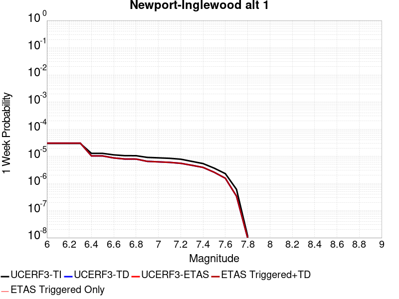 | 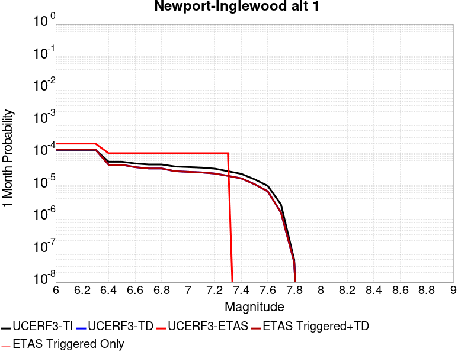 |  |  |

| Magnitude | 1 wk TI Prob | 1 wk TD Prob | 1 wk ETAS Prob | 1 wk ETAS/TD Gain | 1 wk ETAS Triggered+TD | 1 wk ETAS Triggered Only | 1 mo TI Prob | 1 mo TD Prob | 1 mo ETAS Prob | 1 mo ETAS/TD Gain | 1 mo ETAS Triggered+TD | 1 mo ETAS Triggered Only | 1 yr TI Prob | 1 yr TD Prob | 1 yr ETAS Prob | 1 yr ETAS/TD Gain | 1 yr ETAS Triggered+TD | 1 yr ETAS Triggered Only | 10 yr TI Prob | 10 yr TD Prob | 10 yr ETAS Prob | 10 yr ETAS/TD Gain | 10 yr ETAS Triggered+TD | 10 yr ETAS Triggered Only |
|-----|-----|-----|-----|-----|-----|-----|-----|-----|-----|-----|-----|-----|-----|-----|-----|-----|-----|-----|-----|-----|-----|-----|-----|-----|
| 6.0 | 2.9668912E-5 | 3.041443E-5 | 0.0 | 0.0 | 3.041443E-5 | 0.0 | 1.2714628E-4 | 1.3034379E-4 | 2.0E-4 | 1.5344038 | 1.3034379E-4 | 0.0 | 0.0015469068 | 0.0015862649 | 0.001 | 0.6304117 | 0.0015862649 | 0.0 | 0.015361829 | 0.015797067 | 0.0079 | 0.5000928 | 0.01668285 | 9.0E-4 |
| 6.1 | 2.9668912E-5 | 3.041443E-5 | 0.0 | 0.0 | 3.041443E-5 | 0.0 | 1.2714628E-4 | 1.3034379E-4 | 2.0E-4 | 1.5344038 | 1.3034379E-4 | 0.0 | 0.0015469068 | 0.0015862649 | 0.001 | 0.6304117 | 0.0015862649 | 0.0 | 0.015361829 | 0.015797067 | 0.0079 | 0.5000928 | 0.01668285 | 9.0E-4 |
| 6.2 | 2.9668912E-5 | 3.041443E-5 | 0.0 | 0.0 | 3.041443E-5 | 0.0 | 1.2714628E-4 | 1.3034379E-4 | 2.0E-4 | 1.5344038 | 1.3034379E-4 | 0.0 | 0.0015469068 | 0.0015862649 | 0.001 | 0.6304117 | 0.0015862649 | 0.0 | 0.015361829 | 0.015797067 | 0.0079 | 0.5000928 | 0.01668285 | 9.0E-4 |
| 6.3 | 2.9668912E-5 | 3.041443E-5 | 0.0 | 0.0 | 3.041443E-5 | 0.0 | 1.2714628E-4 | 1.3034379E-4 | 2.0E-4 | 1.5344038 | 1.3034379E-4 | 0.0 | 0.0015469068 | 0.0015862649 | 0.001 | 0.6304117 | 0.0015862649 | 0.0 | 0.015361829 | 0.015797067 | 0.0079 | 0.5000928 | 0.01668285 | 9.0E-4 |
| 6.4 | 1.275942E-5 | 1.0274143E-5 | 0.0 | 0.0 | 1.0274143E-5 | 0.0 | 5.4682085E-5 | 4.4031323E-5 | 1.0E-4 | 2.2711105 | 4.4031323E-5 | 0.0 | 6.65551E-4 | 5.359537E-4 | 4.0E-4 | 0.7463332 | 5.359537E-4 | 0.0 | 0.0066356123 | 0.005347036 | 0.0031 | 0.57976043 | 0.0058443625 | 5.0E-4 |
| 6.5 | 1.275942E-5 | 1.0274143E-5 | 0.0 | 0.0 | 1.0274143E-5 | 0.0 | 5.4682085E-5 | 4.4031323E-5 | 1.0E-4 | 2.2711105 | 4.4031323E-5 | 0.0 | 6.65551E-4 | 5.359537E-4 | 4.0E-4 | 0.7463332 | 5.359537E-4 | 0.0 | 0.0066356123 | 0.005347036 | 0.0031 | 0.57976043 | 0.0058443625 | 5.0E-4 |
| 6.6 | 1.1255358E-5 | 8.663118E-6 | 0.0 | 0.0 | 8.663118E-6 | 0.0 | 4.8236358E-5 | 3.712713E-5 | 1.0E-4 | 2.693448 | 3.712713E-5 | 0.0 | 5.871194E-4 | 4.5193077E-4 | 2.0E-4 | 0.44254565 | 4.5193077E-4 | 0.0 | 0.005855706 | 0.0045102946 | 0.0024 | 0.53211606 | 0.0050080395 | 5.0E-4 |
| 6.7 | 1.0504745E-5 | 7.9009005E-6 | 0.0 | 0.0 | 7.9009005E-6 | 0.0 | 4.5019555E-5 | 3.3860568E-5 | 1.0E-4 | 2.9532876 | 3.3860568E-5 | 0.0 | 5.4797524E-4 | 4.121757E-4 | 2.0E-4 | 0.48522997 | 4.121757E-4 | 0.0 | 0.0054662596 | 0.0041142423 | 0.0024 | 0.5833395 | 0.004612185 | 5.0E-4 |
| 6.8 | 1.0476007E-5 | 7.882281E-6 | 0.0 | 0.0 | 7.882281E-6 | 0.0 | 4.4896402E-5 | 3.3780776E-5 | 1.0E-4 | 2.9602637 | 3.3780776E-5 | 0.0 | 5.464766E-4 | 4.1120456E-4 | 2.0E-4 | 0.48637593 | 4.1120456E-4 | 0.0 | 0.005451347 | 0.0041045668 | 0.0023 | 0.5603515 | 0.004502925 | 4.0E-4 |
| 6.9 | 9.076797E-6 | 6.490477E-6 | 0.0 | 0.0 | 6.490477E-6 | 0.0 | 3.889998E-5 | 2.7816035E-5 | 1.0E-4 | 3.5950487 | 2.7816035E-5 | 0.0 | 4.7350433E-4 | 3.3860793E-4 | 2.0E-4 | 0.5906536 | 3.3860793E-4 | 0.0 | 0.004724967 | 0.0033809575 | 0.002 | 0.5915484 | 0.0035802813 | 2.0E-4 |
| 7.0 | 8.73795E-6 | 6.212869E-6 | 0.0 | 0.0 | 6.212869E-6 | 0.0 | 3.7447822E-5 | 2.662631E-5 | 1.0E-4 | 3.7556837 | 2.662631E-5 | 0.0 | 4.5583185E-4 | 3.2412738E-4 | 2.0E-4 | 0.61704135 | 3.2412738E-4 | 0.0 | 0.0045489795 | 0.003236578 | 0.0019 | 0.58703977 | 0.0033362543 | 1.0E-4 |
| 7.1 | 8.391299E-6 | 5.9565646E-6 | 0.0 | 0.0 | 5.9565646E-6 | 0.0 | 3.5962214E-5 | 2.5527886E-5 | 1.0E-4 | 3.917285 | 2.5527886E-5 | 0.0 | 4.37752E-4 | 3.1075795E-4 | 2.0E-4 | 0.6435877 | 3.1075795E-4 | 0.0 | 0.004368907 | 0.0031032634 | 0.0018 | 0.58003455 | 0.0032029531 | 1.0E-4 |
| 7.2 | 7.796882E-6 | 5.4972224E-6 | 0.0 | 0.0 | 5.4972224E-6 | 0.0 | 3.341478E-5 | 2.3559314E-5 | 1.0E-4 | 4.2446055 | 2.3559314E-5 | 0.0 | 4.06749E-4 | 2.8679712E-4 | 2.0E-4 | 0.6973571 | 2.8679712E-4 | 0.0 | 0.0040600533 | 0.0028642938 | 0.0018 | 0.62842715 | 0.0029640074 | 1.0E-4 |
| 7.3 | 6.4738833E-6 | 4.6483055E-6 | 0.0 | 0.0 | 4.6483055E-6 | 0.0 | 2.774492E-5 | 1.9921157E-5 | 1.0E-4 | 5.0197887 | 1.9921157E-5 | 0.0 | 3.3774204E-4 | 2.4251326E-4 | 1.0E-4 | 0.4123486 | 2.4251326E-4 | 0.0 | 0.0033722918 | 0.0024225027 | 0.0016 | 0.66047394 | 0.0024225027 | 0.0 |
| 7.4 | 5.382145E-6 | 3.886117E-6 | 0.0 | 0.0 | 3.886117E-6 | 0.0 | 2.3066134E-5 | 1.6654683E-5 | 0.0 | 0.0 | 1.6654683E-5 | 0.0 | 2.8079396E-4 | 2.0275204E-4 | 0.0 | 0.0 | 2.0275204E-4 | 0.0 | 0.0028043943 | 0.002025685 | 0.0012 | 0.5923922 | 0.002025685 | 0.0 |
| 7.5 | 3.648244E-6 | 2.5740599E-6 | 0.0 | 0.0 | 2.5740599E-6 | 0.0 | 1.5635238E-5 | 1.103164E-5 | 0.0 | 0.0 | 1.103164E-5 | 0.0 | 1.9034238E-4 | 1.3430203E-4 | 0.0 | 0.0 | 1.3430203E-4 | 0.0 | 0.0019017943 | 0.0013422191 | 0.0011 | 0.8195383 | 0.0013422191 | 0.0 |
| 7.6 | 2.2906888E-6 | 1.5481533E-6 | 0.0 | 0.0 | 1.5481533E-6 | 0.0 | 9.817201E-6 | 6.6349257E-6 | 0.0 | 0.0 | 6.6349257E-6 | 0.0 | 1.1951787E-4 | 8.0777296E-5 | 0.0 | 0.0 | 8.0777296E-5 | 0.0 | 0.0011945361 | 8.0748607E-4 | 0.001 | 1.2384114 | 8.0748607E-4 | 0.0 |
| 7.7 | 6.0479874E-7 | 3.3978827E-7 | 0.0 | 0.0 | 3.3978827E-7 | 0.0 | 2.5919921E-6 | 1.4562347E-6 | 0.0 | 0.0 | 1.4562347E-6 | 0.0 | 3.1557047E-5 | 1.7729528E-5 | 0.0 | 0.0 | 1.7729528E-5 | 0.0 | 3.1552566E-4 | 1.772825E-4 | 2.0E-4 | 1.1281428 | 1.772825E-4 | 0.0 |
| 7.8 | 1.16056995E-8 | 9.783043E-9 | 0.0 | 0.0 | 9.783043E-9 | 0.0 | 4.9738713E-8 | 4.1927326E-8 | 0.0 | 0.0 | 4.1927326E-8 | 0.0 | 6.0556863E-7 | 5.104652E-7 | 0.0 | 0.0 | 5.104652E-7 | 0.0 | 6.05567E-6 | 5.1046522E-6 | 0.0 | 0.0 | 5.1046522E-6 | 0.0 |

## Owens Valley Keough Hot Springs
*[(top)](#table-of-contents)*

| 1 Week | 1 Month | 1 Year | 10 Year |
|-----|-----|-----|-----|
|  | 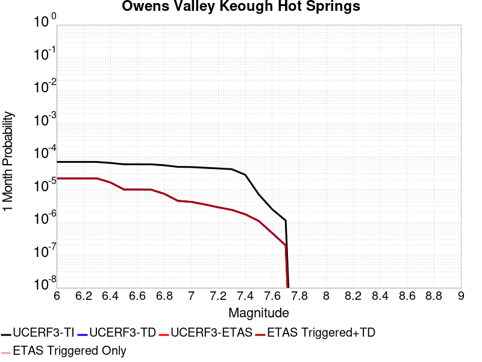 |  |  |

| Magnitude | 1 wk TI Prob | 1 wk TD Prob | 1 wk ETAS Prob | 1 wk ETAS/TD Gain | 1 wk ETAS Triggered+TD | 1 wk ETAS Triggered Only | 1 mo TI Prob | 1 mo TD Prob | 1 mo ETAS Prob | 1 mo ETAS/TD Gain | 1 mo ETAS Triggered+TD | 1 mo ETAS Triggered Only | 1 yr TI Prob | 1 yr TD Prob | 1 yr ETAS Prob | 1 yr ETAS/TD Gain | 1 yr ETAS Triggered+TD | 1 yr ETAS Triggered Only | 10 yr TI Prob | 10 yr TD Prob | 10 yr ETAS Prob | 10 yr ETAS/TD Gain | 10 yr ETAS Triggered+TD | 10 yr ETAS Triggered Only |
|-----|-----|-----|-----|-----|-----|-----|-----|-----|-----|-----|-----|-----|-----|-----|-----|-----|-----|-----|-----|-----|-----|-----|-----|-----|
| 6.0 | 1.5708529E-5 | 4.9514697E-6 | 0.0 | 0.0 | 4.9514697E-6 | 0.0 | 6.7320536E-5 | 2.122044E-5 | 0.0 | 0.0 | 2.122044E-5 | 0.0 | 8.193192E-4 | 2.5833334E-4 | 3.0E-4 | 1.1612903 | 2.5833334E-4 | 0.0 | 0.008163051 | 0.002581039 | 0.0022 | 0.85236996 | 0.003478716 | 9.0E-4 |
| 6.1 | 1.5708529E-5 | 4.9514697E-6 | 0.0 | 0.0 | 4.9514697E-6 | 0.0 | 6.7320536E-5 | 2.122044E-5 | 0.0 | 0.0 | 2.122044E-5 | 0.0 | 8.193192E-4 | 2.5833334E-4 | 3.0E-4 | 1.1612903 | 2.5833334E-4 | 0.0 | 0.008163051 | 0.002581039 | 0.0022 | 0.85236996 | 0.003478716 | 9.0E-4 |
| 6.2 | 1.5708529E-5 | 4.9514697E-6 | 0.0 | 0.0 | 4.9514697E-6 | 0.0 | 6.7320536E-5 | 2.122044E-5 | 0.0 | 0.0 | 2.122044E-5 | 0.0 | 8.193192E-4 | 2.5833334E-4 | 3.0E-4 | 1.1612903 | 2.5833334E-4 | 0.0 | 0.008163051 | 0.002581039 | 0.0022 | 0.85236996 | 0.003478716 | 9.0E-4 |
| 6.3 | 1.5708529E-5 | 4.9514697E-6 | 0.0 | 0.0 | 4.9514697E-6 | 0.0 | 6.7320536E-5 | 2.122044E-5 | 0.0 | 0.0 | 2.122044E-5 | 0.0 | 8.193192E-4 | 2.5833334E-4 | 3.0E-4 | 1.1612903 | 2.5833334E-4 | 0.0 | 0.008163051 | 0.002581039 | 0.0022 | 0.85236996 | 0.003478716 | 9.0E-4 |
| 6.4 | 1.4622509E-5 | 3.7270254E-6 | 0.0 | 0.0 | 3.7270254E-6 | 0.0 | 6.266639E-5 | 1.5972886E-5 | 0.0 | 0.0 | 1.5972886E-5 | 0.0 | 7.626962E-4 | 1.9445585E-4 | 3.0E-4 | 1.5427667 | 1.9445585E-4 | 0.0 | 0.007600839 | 0.0019433863 | 0.002 | 1.0291315 | 0.0027418316 | 8.0E-4 |
| 6.5 | 1.3335527E-5 | 2.2778606E-6 | 0.0 | 0.0 | 2.2778606E-6 | 0.0 | 5.7151006E-5 | 9.762227E-6 | 0.0 | 0.0 | 9.762227E-6 | 0.0 | 6.955913E-4 | 1.1884932E-4 | 1.0E-4 | 0.8414016 | 1.1884932E-4 | 0.0 | 0.0069341804 | 0.0011881297 | 8.0E-4 | 0.6733272 | 0.0014877731 | 3.0E-4 |
| 6.6 | 1.3332855E-5 | 2.2750094E-6 | 0.0 | 0.0 | 2.2750094E-6 | 0.0 | 5.7139558E-5 | 9.750008E-6 | 0.0 | 0.0 | 9.750008E-6 | 0.0 | 6.9545204E-4 | 1.1870056E-4 | 1.0E-4 | 0.842456 | 1.1870056E-4 | 0.0 | 0.0069327964 | 0.0011866436 | 8.0E-4 | 0.6741704 | 0.0014862877 | 3.0E-4 |
| 6.7 | 1.3318214E-5 | 2.264239E-6 | 0.0 | 0.0 | 2.264239E-6 | 0.0 | 5.707681E-5 | 9.703849E-6 | 0.0 | 0.0 | 9.703849E-6 | 0.0 | 6.946886E-4 | 1.1813864E-4 | 1.0E-4 | 0.84646314 | 1.1813864E-4 | 0.0 | 0.0069252094 | 0.0011810304 | 8.0E-4 | 0.6773746 | 0.0014806761 | 3.0E-4 |
| 6.8 | 1.2441338E-5 | 1.6778802E-6 | 0.0 | 0.0 | 1.6778802E-6 | 0.0 | 5.331893E-5 | 7.1908967E-6 | 0.0 | 0.0 | 7.1908967E-6 | 0.0 | 6.489646E-4 | 8.754595E-5 | 1.0E-4 | 1.1422573 | 8.754595E-5 | 0.0 | 0.0064707273 | 8.7534904E-4 | 5.0E-4 | 0.5712007 | 0.001075174 | 2.0E-4 |
| 6.9 | 1.1130476E-5 | 1.0303992E-6 | 0.0 | 0.0 | 1.0303992E-6 | 0.0 | 4.7701167E-5 | 4.4159888E-6 | 0.0 | 0.0 | 4.4159888E-6 | 0.0 | 5.806069E-4 | 5.3763353E-5 | 1.0E-4 | 1.860003 | 5.3763353E-5 | 0.0 | 0.0057909233 | 5.377072E-4 | 2.0E-4 | 0.37194967 | 6.376534E-4 | 1.0E-4 |
| 7.0 | 1.0986073E-5 | 9.579487E-7 | 0.0 | 0.0 | 9.579487E-7 | 0.0 | 4.7082318E-5 | 4.1054877E-6 | 0.0 | 0.0 | 4.1054877E-6 | 0.0 | 5.730765E-4 | 4.998318E-5 | 1.0E-4 | 2.000673 | 4.998318E-5 | 0.0 | 0.0057160086 | 4.9992226E-4 | 2.0E-4 | 0.4000622 | 5.9987226E-4 | 1.0E-4 |
| 7.1 | 1.0451338E-5 | 8.0001684E-7 | 0.0 | 0.0 | 8.0001684E-7 | 0.0 | 4.4790682E-5 | 3.428639E-6 | 0.0 | 0.0 | 3.428639E-6 | 0.0 | 5.451901E-4 | 4.1742886E-5 | 1.0E-4 | 2.3956177 | 4.1742886E-5 | 0.0 | 0.005438545 | 4.1754954E-4 | 2.0E-4 | 0.47898507 | 5.175078E-4 | 1.0E-4 |
| 7.2 | 9.989061E-6 | 6.544741E-7 | 0.0 | 0.0 | 6.544741E-7 | 0.0 | 4.280956E-5 | 2.804886E-6 | 0.0 | 0.0 | 2.804886E-6 | 0.0 | 5.2108173E-4 | 3.4148954E-5 | 1.0E-4 | 2.9283473 | 3.4148954E-5 | 0.0 | 0.0051986156 | 3.41633E-4 | 2.0E-4 | 0.5854236 | 4.4159882E-4 | 1.0E-4 |
| 7.3 | 9.465365E-6 | 5.459808E-7 | 0.0 | 0.0 | 5.459808E-7 | 0.0 | 4.056522E-5 | 2.3399157E-6 | 0.0 | 0.0 | 2.3399157E-6 | 0.0 | 4.937696E-4 | 2.8488104E-5 | 0.0 | 0.0 | 2.8488104E-5 | 0.0 | 0.0049267393 | 2.8503544E-4 | 1.0E-4 | 0.35083356 | 3.8500695E-4 | 1.0E-4 |
| 7.4 | 6.3824805E-6 | 4.0161476E-7 | 0.0 | 0.0 | 4.0161476E-7 | 0.0 | 2.73532E-5 | 1.721205E-6 | 0.0 | 0.0 | 1.721205E-6 | 0.0 | 3.3297433E-4 | 2.0955471E-5 | 0.0 | 0.0 | 2.0955471E-5 | 0.0 | 0.0033247585 | 2.0968313E-4 | 1.0E-4 | 0.47691008 | 3.0966217E-4 | 1.0E-4 |
| 7.5 | 1.6192645E-6 | 2.5161984E-7 | 0.0 | 0.0 | 2.5161984E-7 | 0.0 | 6.9396865E-6 | 1.0783702E-6 | 0.0 | 0.0 | 1.0783702E-6 | 0.0 | 8.448741E-5 | 1.3129081E-5 | 0.0 | 0.0 | 1.3129081E-5 | 0.0 | 8.4455294E-4 | 1.3128317E-4 | 0.0 | 0.0 | 1.3128317E-4 | 0.0 |
| 7.6 | 5.7062545E-7 | 1.0792601E-7 | 0.0 | 0.0 | 1.0792601E-7 | 0.0 | 2.4455355E-6 | 4.6254E-7 | 0.0 | 0.0 | 4.6254E-7 | 0.0 | 2.9773988E-5 | 5.6314107E-6 | 0.0 | 0.0 | 5.6314107E-6 | 0.0 | 2.977E-4 | 5.6312758E-5 | 0.0 | 0.0 | 5.6312758E-5 | 0.0 |
| 7.7 | 2.5988817E-7 | 4.5455025E-8 | 0.0 | 0.0 | 4.5455025E-8 | 0.0 | 1.113806E-6 | 1.9480723E-7 | 0.0 | 0.0 | 1.9480723E-7 | 0.0 | 1.3560503E-5 | 2.371776E-6 | 0.0 | 0.0 | 2.371776E-6 | 0.0 | 1.3559677E-4 | 2.371755E-5 | 0.0 | 0.0 | 2.371755E-5 | 0.0 |

## San Cayetano
*[(top)](#table-of-contents)*

| 1 Week | 1 Month | 1 Year | 10 Year |
|-----|-----|-----|-----|
| 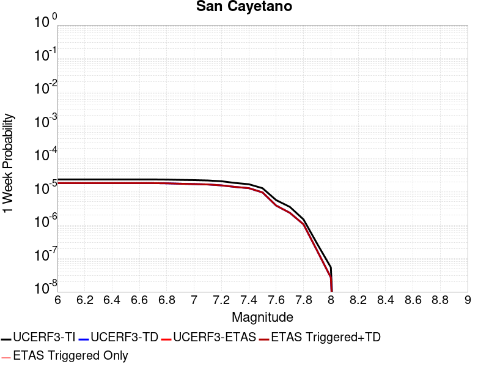 |  | 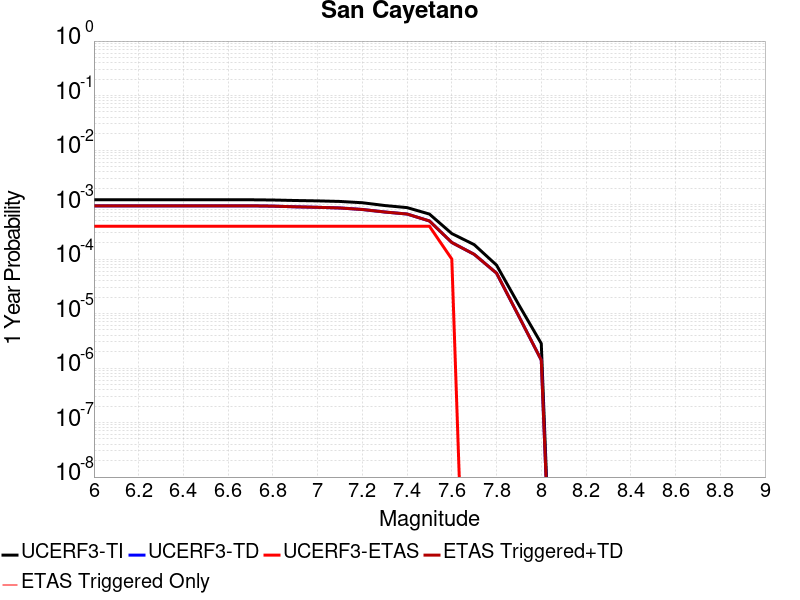 | 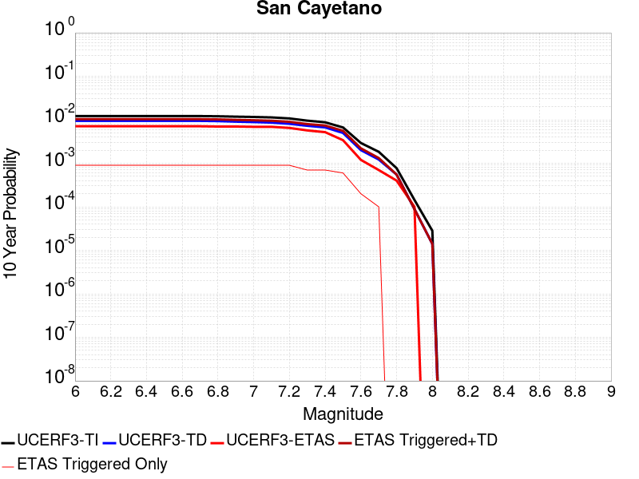 |

| Magnitude | 1 wk TI Prob | 1 wk TD Prob | 1 wk ETAS Prob | 1 wk ETAS/TD Gain | 1 wk ETAS Triggered+TD | 1 wk ETAS Triggered Only | 1 mo TI Prob | 1 mo TD Prob | 1 mo ETAS Prob | 1 mo ETAS/TD Gain | 1 mo ETAS Triggered+TD | 1 mo ETAS Triggered Only | 1 yr TI Prob | 1 yr TD Prob | 1 yr ETAS Prob | 1 yr ETAS/TD Gain | 1 yr ETAS Triggered+TD | 1 yr ETAS Triggered Only | 10 yr TI Prob | 10 yr TD Prob | 10 yr ETAS Prob | 10 yr ETAS/TD Gain | 10 yr ETAS Triggered+TD | 10 yr ETAS Triggered Only |
|-----|-----|-----|-----|-----|-----|-----|-----|-----|-----|-----|-----|-----|-----|-----|-----|-----|-----|-----|-----|-----|-----|-----|-----|-----|
| 6.0 | 2.3476267E-5 | 1.8176543E-5 | 0.0 | 0.0 | 1.8176543E-5 | 0.0 | 1.0060869E-4 | 7.7897166E-5 | 0.0 | 0.0 | 7.7897166E-5 | 0.0 | 0.0012242225 | 9.47989E-4 | 4.0E-4 | 0.4219458 | 9.47989E-4 | 0.0 | 0.012175002 | 0.009440215 | 0.0071 | 0.7521015 | 0.010331719 | 9.0E-4 |
| 6.1 | 2.3476267E-5 | 1.8176543E-5 | 0.0 | 0.0 | 1.8176543E-5 | 0.0 | 1.0060869E-4 | 7.7897166E-5 | 0.0 | 0.0 | 7.7897166E-5 | 0.0 | 0.0012242225 | 9.47989E-4 | 4.0E-4 | 0.4219458 | 9.47989E-4 | 0.0 | 0.012175002 | 0.009440215 | 0.0071 | 0.7521015 | 0.010331719 | 9.0E-4 |
| 6.2 | 2.3476267E-5 | 1.8176543E-5 | 0.0 | 0.0 | 1.8176543E-5 | 0.0 | 1.0060869E-4 | 7.7897166E-5 | 0.0 | 0.0 | 7.7897166E-5 | 0.0 | 0.0012242225 | 9.47989E-4 | 4.0E-4 | 0.4219458 | 9.47989E-4 | 0.0 | 0.012175002 | 0.009440215 | 0.0071 | 0.7521015 | 0.010331719 | 9.0E-4 |
| 6.3 | 2.3476267E-5 | 1.8176543E-5 | 0.0 | 0.0 | 1.8176543E-5 | 0.0 | 1.0060869E-4 | 7.7897166E-5 | 0.0 | 0.0 | 7.7897166E-5 | 0.0 | 0.0012242225 | 9.47989E-4 | 4.0E-4 | 0.4219458 | 9.47989E-4 | 0.0 | 0.012175002 | 0.009440215 | 0.0071 | 0.7521015 | 0.010331719 | 9.0E-4 |
| 6.4 | 2.3476267E-5 | 1.8176543E-5 | 0.0 | 0.0 | 1.8176543E-5 | 0.0 | 1.0060869E-4 | 7.7897166E-5 | 0.0 | 0.0 | 7.7897166E-5 | 0.0 | 0.0012242225 | 9.47989E-4 | 4.0E-4 | 0.4219458 | 9.47989E-4 | 0.0 | 0.012175002 | 0.009440215 | 0.0071 | 0.7521015 | 0.010331719 | 9.0E-4 |
| 6.5 | 2.3476267E-5 | 1.8176543E-5 | 0.0 | 0.0 | 1.8176543E-5 | 0.0 | 1.0060869E-4 | 7.7897166E-5 | 0.0 | 0.0 | 7.7897166E-5 | 0.0 | 0.0012242225 | 9.47989E-4 | 4.0E-4 | 0.4219458 | 9.47989E-4 | 0.0 | 0.012175002 | 0.009440215 | 0.0071 | 0.7521015 | 0.010331719 | 9.0E-4 |
| 6.6 | 2.3476267E-5 | 1.8176543E-5 | 0.0 | 0.0 | 1.8176543E-5 | 0.0 | 1.0060869E-4 | 7.7897166E-5 | 0.0 | 0.0 | 7.7897166E-5 | 0.0 | 0.0012242225 | 9.47989E-4 | 4.0E-4 | 0.4219458 | 9.47989E-4 | 0.0 | 0.012175002 | 0.009440215 | 0.0071 | 0.7521015 | 0.010331719 | 9.0E-4 |
| 6.7 | 2.3476267E-5 | 1.8176543E-5 | 0.0 | 0.0 | 1.8176543E-5 | 0.0 | 1.0060869E-4 | 7.7897166E-5 | 0.0 | 0.0 | 7.7897166E-5 | 0.0 | 0.0012242225 | 9.47989E-4 | 4.0E-4 | 0.4219458 | 9.47989E-4 | 0.0 | 0.012175002 | 0.009440215 | 0.0071 | 0.7521015 | 0.010331719 | 9.0E-4 |
| 6.8 | 2.3241924E-5 | 1.7944158E-5 | 0.0 | 0.0 | 1.7944158E-5 | 0.0 | 9.960445E-5 | 7.690129E-5 | 0.0 | 0.0 | 7.690129E-5 | 0.0 | 0.0012120095 | 9.3587465E-4 | 4.0E-4 | 0.42740768 | 9.3587465E-4 | 0.0 | 0.012054204 | 0.009320025 | 0.007 | 0.7510709 | 0.010211637 | 9.0E-4 |
| 6.9 | 2.2761007E-5 | 1.7439443E-5 | 0.0 | 0.0 | 1.7439443E-5 | 0.0 | 9.7543525E-5 | 7.473835E-5 | 0.0 | 0.0 | 7.473835E-5 | 0.0 | 0.0011869454 | 9.09563E-4 | 4.0E-4 | 0.43977162 | 9.09563E-4 | 0.0 | 0.011806256 | 0.00905907 | 0.007 | 0.7727063 | 0.009950916 | 9.0E-4 |
| 7.0 | 2.240283E-5 | 1.7073082E-5 | 0.0 | 0.0 | 1.7073082E-5 | 0.0 | 9.600859E-5 | 7.316832E-5 | 0.0 | 0.0 | 7.316832E-5 | 0.0 | 0.0011682777 | 8.9046365E-4 | 4.0E-4 | 0.4492042 | 8.9046365E-4 | 0.0 | 0.011621549 | 0.008869606 | 0.0069 | 0.7779376 | 0.009761623 | 9.0E-4 |
| 7.1 | 2.1871154E-5 | 1.6592861E-5 | 0.0 | 0.0 | 1.6592861E-5 | 0.0 | 9.373015E-5 | 7.111035E-5 | 0.0 | 0.0 | 7.111035E-5 | 0.0 | 0.0011405671 | 8.6542795E-4 | 4.0E-4 | 0.4621991 | 8.6542795E-4 | 0.0 | 0.011347309 | 0.008621215 | 0.0069 | 0.80035126 | 0.009513455 | 9.0E-4 |
| 7.2 | 2.0714133E-5 | 1.5571059E-5 | 0.0 | 0.0 | 1.5571059E-5 | 0.0 | 8.8771834E-5 | 6.673142E-5 | 0.0 | 0.0 | 6.673142E-5 | 0.0 | 0.0010802611 | 8.121555E-4 | 4.0E-4 | 0.49251655 | 8.121555E-4 | 0.0 | 0.010750249 | 0.0080924835 | 0.0065 | 0.80321443 | 0.008985201 | 9.0E-4 |
| 7.3 | 1.8408395E-5 | 1.400135E-5 | 0.0 | 0.0 | 1.400135E-5 | 0.0 | 7.8890735E-5 | 6.0004422E-5 | 0.0 | 0.0 | 6.0004422E-5 | 0.0 | 9.600714E-4 | 7.3031196E-4 | 4.0E-4 | 0.54771113 | 7.3031196E-4 | 0.0 | 0.009559342 | 0.0072796657 | 0.0057 | 0.783003 | 0.00797457 | 7.0E-4 |
| 7.4 | 1.6856795E-5 | 1.2854073E-5 | 0.0 | 0.0 | 1.2854073E-5 | 0.0 | 7.2241404E-5 | 5.5087738E-5 | 0.0 | 0.0 | 5.5087738E-5 | 0.0 | 8.7918417E-4 | 6.704896E-4 | 4.0E-4 | 0.59657896 | 6.704896E-4 | 0.0 | 0.00875714 | 0.0066851783 | 0.0052 | 0.77784014 | 0.0073804986 | 7.0E-4 |
| 7.5 | 1.2822778E-5 | 9.580312E-6 | 0.0 | 0.0 | 9.580312E-6 | 0.0 | 5.495361E-5 | 4.105784E-5 | 0.0 | 0.0 | 4.105784E-5 | 0.0 | 6.688548E-4 | 4.9976615E-4 | 4.0E-4 | 0.8003744 | 4.9976615E-4 | 0.0 | 0.006668452 | 0.0049865064 | 0.0034 | 0.68184006 | 0.0055835145 | 6.0E-4 |
| 7.6 | 5.6272684E-6 | 3.8560247E-6 | 0.0 | 0.0 | 3.8560247E-6 | 0.0 | 2.4116642E-5 | 1.6525715E-5 | 0.0 | 0.0 | 1.6525715E-5 | 0.0 | 2.9358055E-4 | 2.011821E-4 | 1.0E-4 | 0.4970621 | 2.011821E-4 | 0.0 | 0.0029319301 | 0.0020100106 | 0.0012 | 0.59701174 | 0.0022096087 | 2.0E-4 |
| 7.7 | 3.5261346E-6 | 2.341441E-6 | 0.0 | 0.0 | 2.341441E-6 | 0.0 | 1.5111918E-5 | 1.0034708E-5 | 0.0 | 0.0 | 1.0034708E-5 | 0.0 | 1.8397206E-4 | 1.2216579E-4 | 0.0 | 0.0 | 1.2216579E-4 | 0.0 | 0.0018381984 | 0.0012209937 | 7.0E-4 | 0.5733035 | 0.0013208716 | 1.0E-4 |
| 7.8 | 1.4826929E-6 | 1.056754E-6 | 0.0 | 0.0 | 1.056754E-6 | 0.0 | 6.354383E-6 | 4.528938E-6 | 0.0 | 0.0 | 4.528938E-6 | 0.0 | 7.736187E-5 | 5.5138444E-5 | 0.0 | 0.0 | 5.5138444E-5 | 0.0 | 7.733494E-4 | 5.5124966E-4 | 4.0E-4 | 0.725624 | 5.5124966E-4 | 0.0 |
| 7.9 | 2.7568166E-7 | 1.6982472E-7 | 0.0 | 0.0 | 1.6982472E-7 | 0.0 | 1.1814923E-6 | 7.2781995E-7 | 0.0 | 0.0 | 7.2781995E-7 | 0.0 | 1.4384574E-5 | 8.861172E-6 | 0.0 | 0.0 | 8.861172E-6 | 0.0 | 1.4383643E-4 | 8.860823E-5 | 1.0E-4 | 1.1285634 | 8.860823E-5 | 0.0 |
| 8.0 | 5.407832E-8 | 2.6898972E-8 | 0.0 | 0.0 | 2.6898972E-8 | 0.0 | 2.3176422E-7 | 1.152813E-7 | 0.0 | 0.0 | 1.152813E-7 | 0.0 | 2.8217257E-6 | 1.403549E-6 | 0.0 | 0.0 | 1.403549E-6 | 0.0 | 2.8216898E-5 | 1.4035406E-5 | 0.0 | 0.0 | 1.4035406E-5 | 0.0 |

## Antelope Valley 2011
*[(top)](#table-of-contents)*

| 1 Week | 1 Month | 1 Year | 10 Year |
|-----|-----|-----|-----|
| 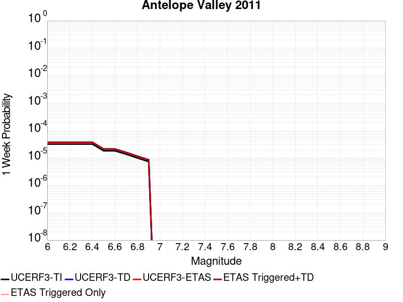 |  | 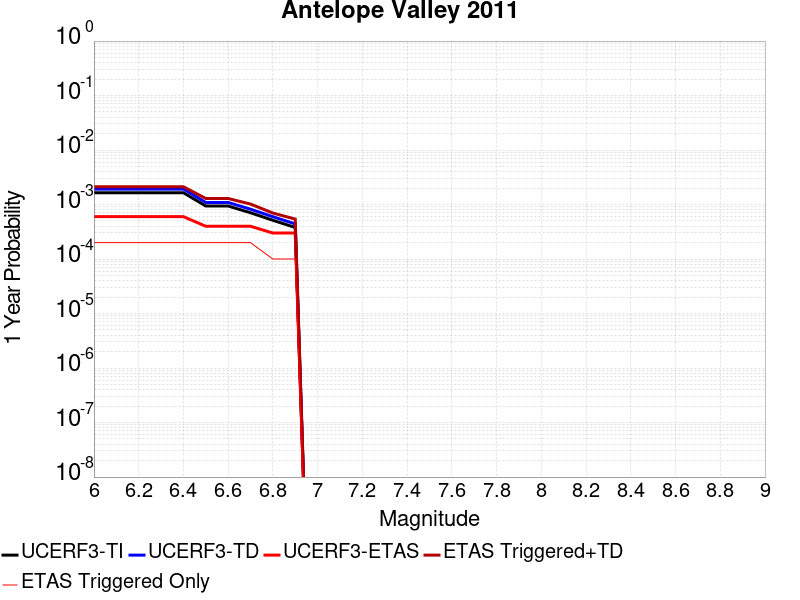 |  |

| Magnitude | 1 wk TI Prob | 1 wk TD Prob | 1 wk ETAS Prob | 1 wk ETAS/TD Gain | 1 wk ETAS Triggered+TD | 1 wk ETAS Triggered Only | 1 mo TI Prob | 1 mo TD Prob | 1 mo ETAS Prob | 1 mo ETAS/TD Gain | 1 mo ETAS Triggered+TD | 1 mo ETAS Triggered Only | 1 yr TI Prob | 1 yr TD Prob | 1 yr ETAS Prob | 1 yr ETAS/TD Gain | 1 yr ETAS Triggered+TD | 1 yr ETAS Triggered Only | 10 yr TI Prob | 10 yr TD Prob | 10 yr ETAS Prob | 10 yr ETAS/TD Gain | 10 yr ETAS Triggered+TD | 10 yr ETAS Triggered Only |
|-----|-----|-----|-----|-----|-----|-----|-----|-----|-----|-----|-----|-----|-----|-----|-----|-----|-----|-----|-----|-----|-----|-----|-----|-----|
| 6.0 | 3.1646934E-5 | 3.691655E-5 | 0.0 | 0.0 | 3.691655E-5 | 0.0 | 1.3562266E-4 | 1.5820569E-4 | 0.0 | 0.0 | 1.5820569E-4 | 0.0 | 0.0016499552 | 0.0019247174 | 6.0E-4 | 0.31173405 | 0.0021243326 | 2.0E-4 | 0.016377583 | 0.019106898 | 0.0083 | 0.43439808 | 0.019989703 | 9.0E-4 |
| 6.1 | 3.1646934E-5 | 3.691655E-5 | 0.0 | 0.0 | 3.691655E-5 | 0.0 | 1.3562266E-4 | 1.5820569E-4 | 0.0 | 0.0 | 1.5820569E-4 | 0.0 | 0.0016499552 | 0.0019247174 | 6.0E-4 | 0.31173405 | 0.0021243326 | 2.0E-4 | 0.016377583 | 0.019106898 | 0.0083 | 0.43439808 | 0.019989703 | 9.0E-4 |
| 6.2 | 3.1646934E-5 | 3.691655E-5 | 0.0 | 0.0 | 3.691655E-5 | 0.0 | 1.3562266E-4 | 1.5820569E-4 | 0.0 | 0.0 | 1.5820569E-4 | 0.0 | 0.0016499552 | 0.0019247174 | 6.0E-4 | 0.31173405 | 0.0021243326 | 2.0E-4 | 0.016377583 | 0.019106898 | 0.0083 | 0.43439808 | 0.019989703 | 9.0E-4 |
| 6.3 | 3.1646934E-5 | 3.691655E-5 | 0.0 | 0.0 | 3.691655E-5 | 0.0 | 1.3562266E-4 | 1.5820569E-4 | 0.0 | 0.0 | 1.5820569E-4 | 0.0 | 0.0016499552 | 0.0019247174 | 6.0E-4 | 0.31173405 | 0.0021243326 | 2.0E-4 | 0.016377583 | 0.019106898 | 0.0083 | 0.43439808 | 0.019989703 | 9.0E-4 |
| 6.4 | 3.1646934E-5 | 3.691655E-5 | 0.0 | 0.0 | 3.691655E-5 | 0.0 | 1.3562266E-4 | 1.5820569E-4 | 0.0 | 0.0 | 1.5820569E-4 | 0.0 | 0.0016499552 | 0.0019247174 | 6.0E-4 | 0.31173405 | 0.0021243326 | 2.0E-4 | 0.016377583 | 0.019106898 | 0.0083 | 0.43439808 | 0.019989703 | 9.0E-4 |
| 6.5 | 1.8034107E-5 | 2.0947651E-5 | 0.0 | 0.0 | 2.0947651E-5 | 0.0 | 7.7286735E-5 | 8.9773246E-5 | 0.0 | 0.0 | 8.9773246E-5 | 0.0 | 9.405598E-4 | 0.0010925638 | 4.0E-4 | 0.36611134 | 0.0012923452 | 2.0E-4 | 0.009365888 | 0.0108840065 | 0.0053 | 0.48695305 | 0.011477476 | 6.0E-4 |
| 6.6 | 1.8034107E-5 | 2.0947651E-5 | 0.0 | 0.0 | 2.0947651E-5 | 0.0 | 7.7286735E-5 | 8.9773246E-5 | 0.0 | 0.0 | 8.9773246E-5 | 0.0 | 9.405598E-4 | 0.0010925638 | 4.0E-4 | 0.36611134 | 0.0012923452 | 2.0E-4 | 0.009365888 | 0.0108840065 | 0.0053 | 0.48695305 | 0.011477476 | 6.0E-4 |
| 6.7 | 1.3567667E-5 | 1.5754533E-5 | 0.0 | 0.0 | 1.5754533E-5 | 0.0 | 5.814585E-5 | 6.751828E-5 | 0.0 | 0.0 | 6.751828E-5 | 0.0 | 7.076958E-4 | 8.2183135E-4 | 4.0E-4 | 0.48671788 | 0.001021667 | 2.0E-4 | 0.007054463 | 0.008198362 | 0.0039 | 0.4757048 | 0.0087934425 | 6.0E-4 |
| 6.8 | 9.867387E-6 | 1.1471625E-5 | 0.0 | 0.0 | 1.1471625E-5 | 0.0 | 4.2288117E-5 | 4.9163715E-5 | 0.0 | 0.0 | 4.9163715E-5 | 0.0 | 5.1473617E-4 | 5.9849885E-4 | 3.0E-4 | 0.5012541 | 6.98439E-4 | 1.0E-4 | 0.005135455 | 0.0059781885 | 0.0031 | 0.5185517 | 0.006375797 | 4.0E-4 |
| 6.9 | 7.273233E-6 | 8.457589E-6 | 0.0 | 0.0 | 8.457589E-6 | 0.0 | 3.1170628E-5 | 3.6246805E-5 | 0.0 | 0.0 | 3.6246805E-5 | 0.0 | 3.794363E-4 | 4.4130487E-4 | 3.0E-4 | 0.6798021 | 5.4126076E-4 | 1.0E-4 | 0.0037878908 | 0.0044130487 | 0.0023 | 0.52118164 | 0.004612166 | 2.0E-4 |

## Mohawk Valley 2011 CFM
*[(top)](#table-of-contents)*

| 1 Week | 1 Month | 1 Year | 10 Year |
|-----|-----|-----|-----|
|  | 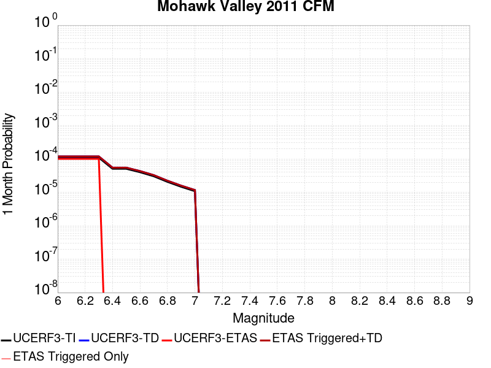 |  |  |

| Magnitude | 1 wk TI Prob | 1 wk TD Prob | 1 wk ETAS Prob | 1 wk ETAS/TD Gain | 1 wk ETAS Triggered+TD | 1 wk ETAS Triggered Only | 1 mo TI Prob | 1 mo TD Prob | 1 mo ETAS Prob | 1 mo ETAS/TD Gain | 1 mo ETAS Triggered+TD | 1 mo ETAS Triggered Only | 1 yr TI Prob | 1 yr TD Prob | 1 yr ETAS Prob | 1 yr ETAS/TD Gain | 1 yr ETAS Triggered+TD | 1 yr ETAS Triggered Only | 10 yr TI Prob | 10 yr TD Prob | 10 yr ETAS Prob | 10 yr ETAS/TD Gain | 10 yr ETAS Triggered+TD | 10 yr ETAS Triggered Only |
|-----|-----|-----|-----|-----|-----|-----|-----|-----|-----|-----|-----|-----|-----|-----|-----|-----|-----|-----|-----|-----|-----|-----|-----|-----|
| 6.0 | 2.5425423E-5 | 2.7649568E-5 | 0.0 | 0.0 | 2.7649568E-5 | 0.0 | 1.0896155E-4 | 1.1849338E-4 | 1.0E-4 | 0.843929 | 1.1849338E-4 | 0.0 | 0.0013257994 | 0.0014418107 | 7.0E-4 | 0.4855006 | 0.0014418107 | 0.0 | 0.013179175 | 0.014335448 | 0.0061 | 0.4255186 | 0.015222547 | 9.0E-4 |
| 6.1 | 2.5425423E-5 | 2.7649568E-5 | 0.0 | 0.0 | 2.7649568E-5 | 0.0 | 1.0896155E-4 | 1.1849338E-4 | 1.0E-4 | 0.843929 | 1.1849338E-4 | 0.0 | 0.0013257994 | 0.0014418107 | 7.0E-4 | 0.4855006 | 0.0014418107 | 0.0 | 0.013179175 | 0.014335448 | 0.0061 | 0.4255186 | 0.015222547 | 9.0E-4 |
| 6.2 | 2.5425423E-5 | 2.7649568E-5 | 0.0 | 0.0 | 2.7649568E-5 | 0.0 | 1.0896155E-4 | 1.1849338E-4 | 1.0E-4 | 0.843929 | 1.1849338E-4 | 0.0 | 0.0013257994 | 0.0014418107 | 7.0E-4 | 0.4855006 | 0.0014418107 | 0.0 | 0.013179175 | 0.014335448 | 0.0061 | 0.4255186 | 0.015222547 | 9.0E-4 |
| 6.3 | 2.5425423E-5 | 2.7649568E-5 | 0.0 | 0.0 | 2.7649568E-5 | 0.0 | 1.0896155E-4 | 1.1849338E-4 | 1.0E-4 | 0.843929 | 1.1849338E-4 | 0.0 | 0.0013257994 | 0.0014418107 | 7.0E-4 | 0.4855006 | 0.0014418107 | 0.0 | 0.013179175 | 0.014335448 | 0.0061 | 0.4255186 | 0.015222547 | 9.0E-4 |
| 6.4 | 1.1812642E-5 | 1.2765624E-5 | 0.0 | 0.0 | 1.2765624E-5 | 0.0 | 5.0624625E-5 | 5.4708755E-5 | 0.0 | 0.0 | 5.4708755E-5 | 0.0 | 6.161805E-4 | 6.658903E-4 | 4.0E-4 | 0.6006996 | 6.658903E-4 | 0.0 | 0.0061447476 | 0.0066404236 | 0.0035 | 0.5270748 | 0.0069384314 | 3.0E-4 |
| 6.5 | 1.1812642E-5 | 1.2765624E-5 | 0.0 | 0.0 | 1.2765624E-5 | 0.0 | 5.0624625E-5 | 5.4708755E-5 | 0.0 | 0.0 | 5.4708755E-5 | 0.0 | 6.161805E-4 | 6.658903E-4 | 4.0E-4 | 0.6006996 | 6.658903E-4 | 0.0 | 0.0061447476 | 0.0066404236 | 0.0035 | 0.5270748 | 0.0069384314 | 3.0E-4 |
| 6.6 | 9.34204E-6 | 1.0086781E-5 | 0.0 | 0.0 | 1.0086781E-5 | 0.0 | 4.0036703E-5 | 4.322841E-5 | 0.0 | 0.0 | 4.322841E-5 | 0.0 | 4.873378E-4 | 5.261906E-4 | 2.0E-4 | 0.38009042 | 5.261906E-4 | 0.0 | 0.0048627043 | 0.0052506155 | 0.0028 | 0.5332708 | 0.0055490406 | 3.0E-4 |
| 6.7 | 7.0661854E-6 | 7.6253946E-6 | 0.0 | 0.0 | 7.6253946E-6 | 0.0 | 3.02833E-5 | 3.2679905E-5 | 0.0 | 0.0 | 3.2679905E-5 | 0.0 | 3.686368E-4 | 3.978143E-4 | 1.0E-4 | 0.2513736 | 3.978143E-4 | 0.0 | 0.0036802588 | 0.003971917 | 0.002 | 0.50353515 | 0.00407152 | 1.0E-4 |
| 6.8 | 4.806676E-6 | 5.1880306E-6 | 0.0 | 0.0 | 5.1880306E-6 | 0.0 | 2.0599877E-5 | 2.2234264E-5 | 0.0 | 0.0 | 2.2234264E-5 | 0.0 | 2.507746E-4 | 2.706749E-4 | 1.0E-4 | 0.36944687 | 2.706749E-4 | 0.0 | 0.0025049183 | 0.002704079 | 0.0015 | 0.55471754 | 0.002704079 | 0.0 |
| 6.9 | 3.4163209E-6 | 3.6894814E-6 | 0.0 | 0.0 | 3.6894814E-6 | 0.0 | 1.4641293E-5 | 1.5811998E-5 | 0.0 | 0.0 | 1.5811998E-5 | 0.0 | 1.7824316E-4 | 1.9249949E-4 | 1.0E-4 | 0.5194819 | 1.9249949E-4 | 0.0 | 0.0017810026 | 0.0019238596 | 0.0013 | 0.675725 | 0.0019238596 | 0.0 |
| 7.0 | 2.5271734E-6 | 2.7314495E-6 | 0.0 | 0.0 | 2.7314495E-6 | 0.0 | 1.0830699E-5 | 1.1706188E-5 | 0.0 | 0.0 | 1.1706188E-5 | 0.0 | 1.3185578E-4 | 1.4251845E-4 | 1.0E-4 | 0.70166355 | 1.4251845E-4 | 0.0 | 0.0013177756 | 0.0014247543 | 0.001 | 0.70187545 | 0.0014247543 | 0.0 |

## Earthquake Valley
*[(top)](#table-of-contents)*

| 1 Week | 1 Month | 1 Year | 10 Year |
|-----|-----|-----|-----|
|  |  |  |  |

| Magnitude | 1 wk TI Prob | 1 wk TD Prob | 1 wk ETAS Prob | 1 wk ETAS/TD Gain | 1 wk ETAS Triggered+TD | 1 wk ETAS Triggered Only | 1 mo TI Prob | 1 mo TD Prob | 1 mo ETAS Prob | 1 mo ETAS/TD Gain | 1 mo ETAS Triggered+TD | 1 mo ETAS Triggered Only | 1 yr TI Prob | 1 yr TD Prob | 1 yr ETAS Prob | 1 yr ETAS/TD Gain | 1 yr ETAS Triggered+TD | 1 yr ETAS Triggered Only | 10 yr TI Prob | 10 yr TD Prob | 10 yr ETAS Prob | 10 yr ETAS/TD Gain | 10 yr ETAS Triggered+TD | 10 yr ETAS Triggered Only |
|-----|-----|-----|-----|-----|-----|-----|-----|-----|-----|-----|-----|-----|-----|-----|-----|-----|-----|-----|-----|-----|-----|-----|-----|-----|
| 6.0 | 1.9416384E-5 | 2.2591621E-5 | 0.0 | 0.0 | 2.2591621E-5 | 0.0 | 8.321042E-5 | 9.6818316E-5 | 0.0 | 0.0 | 9.6818316E-5 | 0.0 | 0.001012616 | 0.0011782453 | 9.0E-4 | 0.7638477 | 0.0013780097 | 2.0E-4 | 0.010080142 | 0.011731823 | 0.0055 | 0.46881035 | 0.012621265 | 9.0E-4 |
| 6.1 | 1.9416384E-5 | 2.2591621E-5 | 0.0 | 0.0 | 2.2591621E-5 | 0.0 | 8.321042E-5 | 9.6818316E-5 | 0.0 | 0.0 | 9.6818316E-5 | 0.0 | 0.001012616 | 0.0011782453 | 9.0E-4 | 0.7638477 | 0.0013780097 | 2.0E-4 | 0.010080142 | 0.011731823 | 0.0055 | 0.46881035 | 0.012621265 | 9.0E-4 |
| 6.2 | 1.9416384E-5 | 2.2591621E-5 | 0.0 | 0.0 | 2.2591621E-5 | 0.0 | 8.321042E-5 | 9.6818316E-5 | 0.0 | 0.0 | 9.6818316E-5 | 0.0 | 0.001012616 | 0.0011782453 | 9.0E-4 | 0.7638477 | 0.0013780097 | 2.0E-4 | 0.010080142 | 0.011731823 | 0.0055 | 0.46881035 | 0.012621265 | 9.0E-4 |
| 6.3 | 1.9416384E-5 | 2.2591621E-5 | 0.0 | 0.0 | 2.2591621E-5 | 0.0 | 8.321042E-5 | 9.6818316E-5 | 0.0 | 0.0 | 9.6818316E-5 | 0.0 | 0.001012616 | 0.0011782453 | 9.0E-4 | 0.7638477 | 0.0013780097 | 2.0E-4 | 0.010080142 | 0.011731823 | 0.0055 | 0.46881035 | 0.012621265 | 9.0E-4 |
| 6.4 | 1.9416384E-5 | 2.2591621E-5 | 0.0 | 0.0 | 2.2591621E-5 | 0.0 | 8.321042E-5 | 9.6818316E-5 | 0.0 | 0.0 | 9.6818316E-5 | 0.0 | 0.001012616 | 0.0011782453 | 9.0E-4 | 0.7638477 | 0.0013780097 | 2.0E-4 | 0.010080142 | 0.011731823 | 0.0055 | 0.46881035 | 0.012621265 | 9.0E-4 |
| 6.5 | 1.9389157E-5 | 2.25602E-5 | 0.0 | 0.0 | 2.25602E-5 | 0.0 | 8.309374E-5 | 9.668367E-5 | 0.0 | 0.0 | 9.668367E-5 | 0.0 | 0.0010111968 | 0.0011766077 | 9.0E-4 | 0.7649108 | 0.0013763724 | 2.0E-4 | 0.010066078 | 0.011715621 | 0.0055 | 0.4694587 | 0.012605077 | 9.0E-4 |
| 6.6 | 1.9389157E-5 | 2.25602E-5 | 0.0 | 0.0 | 2.25602E-5 | 0.0 | 8.309374E-5 | 9.668367E-5 | 0.0 | 0.0 | 9.668367E-5 | 0.0 | 0.0010111968 | 0.0011766077 | 9.0E-4 | 0.7649108 | 0.0013763724 | 2.0E-4 | 0.010066078 | 0.011715621 | 0.0055 | 0.4694587 | 0.012605077 | 9.0E-4 |
| 6.7 | 1.4925434E-5 | 1.7213628E-5 | 0.0 | 0.0 | 1.7213628E-5 | 0.0 | 6.396457E-5 | 7.377109E-5 | 0.0 | 0.0 | 7.377109E-5 | 0.0 | 7.7849044E-4 | 8.9787797E-4 | 6.0E-4 | 0.6682422 | 0.0010976985 | 2.0E-4 | 0.007757689 | 0.0089508835 | 0.0042 | 0.4692274 | 0.009644618 | 7.0E-4 |
| 6.8 | 1.3570335E-5 | 1.5621694E-5 | 0.0 | 0.0 | 1.5621694E-5 | 0.0 | 5.8157282E-5 | 6.694886E-5 | 0.0 | 0.0 | 6.694886E-5 | 0.0 | 7.0783484E-4 | 8.148797E-4 | 6.0E-4 | 0.736305 | 0.0010147167 | 2.0E-4 | 0.0070558446 | 0.008126993 | 0.0038 | 0.46757764 | 0.008821304 | 7.0E-4 |
| 6.9 | 1.3570335E-5 | 1.5621694E-5 | 0.0 | 0.0 | 1.5621694E-5 | 0.0 | 5.8157282E-5 | 6.694886E-5 | 0.0 | 0.0 | 6.694886E-5 | 0.0 | 7.0783484E-4 | 8.148797E-4 | 6.0E-4 | 0.736305 | 0.0010147167 | 2.0E-4 | 0.0070558446 | 0.008126993 | 0.0038 | 0.46757764 | 0.008821304 | 7.0E-4 |
| 7.0 | 1.3433392E-5 | 1.5465193E-5 | 0.0 | 0.0 | 1.5465193E-5 | 0.0 | 5.757041E-5 | 6.627818E-5 | 0.0 | 0.0 | 6.627818E-5 | 0.0 | 7.0069433E-4 | 8.0672017E-4 | 6.0E-4 | 0.7437523 | 0.0010065589 | 2.0E-4 | 0.006984891 | 0.00804599 | 0.0037 | 0.4598564 | 0.008740358 | 7.0E-4 |
| 7.1 | 8.181609E-6 | 9.419849E-6 | 0.0 | 0.0 | 9.419849E-6 | 0.0 | 3.5063567E-5 | 4.0370538E-5 | 0.0 | 0.0 | 4.0370538E-5 | 0.0 | 4.268153E-4 | 4.9146754E-4 | 3.0E-4 | 0.6104167 | 6.9136923E-4 | 2.0E-4 | 0.0042599645 | 0.004910387 | 0.0025 | 0.5091248 | 0.00560695 | 7.0E-4 |
| 7.2 | 2.0663983E-7 | 1.7271012E-7 | 0.0 | 0.0 | 1.7271012E-7 | 0.0 | 8.855989E-7 | 7.40186E-7 | 0.0 | 0.0 | 7.40186E-7 | 0.0 | 1.0782113E-5 | 9.011731E-6 | 0.0 | 0.0 | 9.011731E-6 | 0.0 | 1.07815904E-4 | 9.0114016E-5 | 1.0E-4 | 1.1097052 | 1.9010501E-4 | 1.0E-4 |
| 7.3 | 2.0462376E-7 | 1.7086461E-7 | 0.0 | 0.0 | 1.7086461E-7 | 0.0 | 8.7695867E-7 | 7.322767E-7 | 0.0 | 0.0 | 7.322767E-7 | 0.0 | 1.0676919E-5 | 8.915436E-6 | 0.0 | 0.0 | 8.915436E-6 | 0.0 | 1.0676406E-4 | 8.9151144E-5 | 1.0E-4 | 1.1216906 | 1.8914223E-4 | 1.0E-4 |
| 7.4 | 2.0171088E-7 | 1.6868849E-7 | 0.0 | 0.0 | 1.6868849E-7 | 0.0 | 8.644749E-7 | 7.229505E-7 | 0.0 | 0.0 | 7.229505E-7 | 0.0 | 1.0524931E-5 | 8.8018905E-6 | 0.0 | 0.0 | 8.8018905E-6 | 0.0 | 1.05244326E-4 | 8.8015775E-5 | 1.0E-4 | 1.1361599 | 1.8800698E-4 | 1.0E-4 |
| 7.5 | 1.4847944E-7 | 1.2565754E-7 | 0.0 | 0.0 | 1.2565754E-7 | 0.0 | 6.363403E-7 | 5.385322E-7 | 0.0 | 0.0 | 5.385322E-7 | 0.0 | 7.747416E-6 | 6.5566123E-6 | 0.0 | 0.0 | 6.5566123E-6 | 0.0 | 7.747146E-5 | 6.55644E-5 | 0.0 | 0.0 | 6.55644E-5 | 0.0 |
| 7.6 | 1.3185847E-7 | 1.1129099E-7 | 0.0 | 0.0 | 1.1129099E-7 | 0.0 | 5.6510765E-7 | 4.769613E-7 | 0.0 | 0.0 | 4.769613E-7 | 0.0 | 6.8801637E-6 | 5.8069904E-6 | 0.0 | 0.0 | 5.8069904E-6 | 0.0 | 6.8799505E-5 | 5.80686E-5 | 0.0 | 0.0 | 5.80686E-5 | 0.0 |
| 7.7 | 2.8609954E-8 | 1.4180792E-8 | 0.0 | 0.0 | 1.4180792E-8 | 0.0 | 1.2261408E-7 | 6.0774816E-8 | 0.0 | 0.0 | 6.0774816E-8 | 0.0 | 1.4928254E-6 | 7.399332E-7 | 0.0 | 0.0 | 7.399332E-7 | 0.0 | 1.4928154E-5 | 7.399313E-6 | 0.0 | 0.0 | 7.399313E-6 | 0.0 |
| 7.8 | 6.527266E-9 | 2.925105E-9 | 0.0 | 0.0 | 2.925105E-9 | 0.0 | 2.7973995E-8 | 1.2536165E-8 | 0.0 | 0.0 | 1.2536165E-8 | 0.0 | 3.4058334E-7 | 1.526278E-7 | 0.0 | 0.0 | 1.526278E-7 | 0.0 | 3.4058282E-6 | 1.5262772E-6 | 0.0 | 0.0 | 1.5262772E-6 | 0.0 |
| 7.9 | 1.2898267E-9 | 7.131178E-10 | 0.0 | 0.0 | 7.131178E-10 | 0.0 | 5.527829E-9 | 3.0562193E-9 | 0.0 | 0.0 | 3.0562193E-9 | 0.0 | 6.7301315E-8 | 3.7209468E-8 | 0.0 | 0.0 | 3.7209468E-8 | 0.0 | 6.7301295E-7 | 3.720947E-7 | 0.0 | 0.0 | 3.720947E-7 | 0.0 |

## Little Salmon (Offshore)
*[(top)](#table-of-contents)*

| 1 Week | 1 Month | 1 Year | 10 Year |
|-----|-----|-----|-----|
| 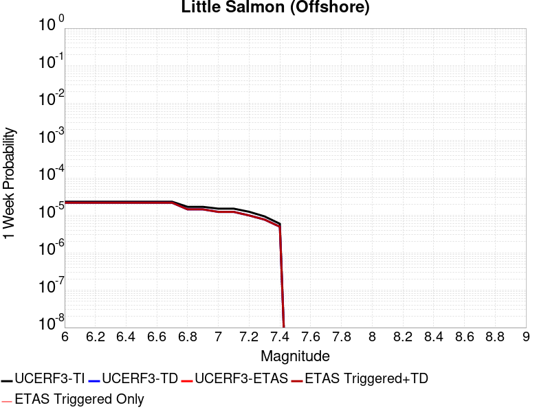 |  | 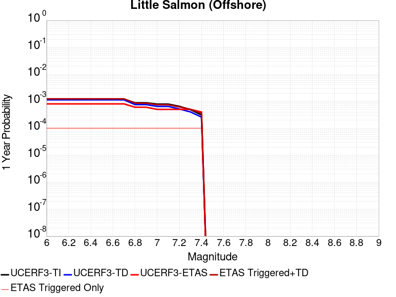 |  |

| Magnitude | 1 wk TI Prob | 1 wk TD Prob | 1 wk ETAS Prob | 1 wk ETAS/TD Gain | 1 wk ETAS Triggered+TD | 1 wk ETAS Triggered Only | 1 mo TI Prob | 1 mo TD Prob | 1 mo ETAS Prob | 1 mo ETAS/TD Gain | 1 mo ETAS Triggered+TD | 1 mo ETAS Triggered Only | 1 yr TI Prob | 1 yr TD Prob | 1 yr ETAS Prob | 1 yr ETAS/TD Gain | 1 yr ETAS Triggered+TD | 1 yr ETAS Triggered Only | 10 yr TI Prob | 10 yr TD Prob | 10 yr ETAS Prob | 10 yr ETAS/TD Gain | 10 yr ETAS Triggered+TD | 10 yr ETAS Triggered Only |
|-----|-----|-----|-----|-----|-----|-----|-----|-----|-----|-----|-----|-----|-----|-----|-----|-----|-----|-----|-----|-----|-----|-----|-----|-----|
| 6.0 | 2.3052053E-5 | 2.162446E-5 | 0.0 | 0.0 | 2.162446E-5 | 0.0 | 9.879077E-5 | 9.267362E-5 | 0.0 | 0.0 | 9.267362E-5 | 0.0 | 0.0012021139 | 0.0011278323 | 8.0E-4 | 0.7093253 | 0.0012277195 | 1.0E-4 | 0.011956319 | 0.011254897 | 0.0071 | 0.6308365 | 0.012144768 | 9.0E-4 |
| 6.1 | 2.3052053E-5 | 2.162446E-5 | 0.0 | 0.0 | 2.162446E-5 | 0.0 | 9.879077E-5 | 9.267362E-5 | 0.0 | 0.0 | 9.267362E-5 | 0.0 | 0.0012021139 | 0.0011278323 | 8.0E-4 | 0.7093253 | 0.0012277195 | 1.0E-4 | 0.011956319 | 0.011254897 | 0.0071 | 0.6308365 | 0.012144768 | 9.0E-4 |
| 6.2 | 2.3052053E-5 | 2.162446E-5 | 0.0 | 0.0 | 2.162446E-5 | 0.0 | 9.879077E-5 | 9.267362E-5 | 0.0 | 0.0 | 9.267362E-5 | 0.0 | 0.0012021139 | 0.0011278323 | 8.0E-4 | 0.7093253 | 0.0012277195 | 1.0E-4 | 0.011956319 | 0.011254897 | 0.0071 | 0.6308365 | 0.012144768 | 9.0E-4 |
| 6.3 | 2.3052053E-5 | 2.162446E-5 | 0.0 | 0.0 | 2.162446E-5 | 0.0 | 9.879077E-5 | 9.267362E-5 | 0.0 | 0.0 | 9.267362E-5 | 0.0 | 0.0012021139 | 0.0011278323 | 8.0E-4 | 0.7093253 | 0.0012277195 | 1.0E-4 | 0.011956319 | 0.011254897 | 0.0071 | 0.6308365 | 0.012144768 | 9.0E-4 |
| 6.4 | 2.3052053E-5 | 2.162446E-5 | 0.0 | 0.0 | 2.162446E-5 | 0.0 | 9.879077E-5 | 9.267362E-5 | 0.0 | 0.0 | 9.267362E-5 | 0.0 | 0.0012021139 | 0.0011278323 | 8.0E-4 | 0.7093253 | 0.0012277195 | 1.0E-4 | 0.011956319 | 0.011254897 | 0.0071 | 0.6308365 | 0.012144768 | 9.0E-4 |
| 6.5 | 2.3052053E-5 | 2.162446E-5 | 0.0 | 0.0 | 2.162446E-5 | 0.0 | 9.879077E-5 | 9.267362E-5 | 0.0 | 0.0 | 9.267362E-5 | 0.0 | 0.0012021139 | 0.0011278323 | 8.0E-4 | 0.7093253 | 0.0012277195 | 1.0E-4 | 0.011956319 | 0.011254897 | 0.0071 | 0.6308365 | 0.012144768 | 9.0E-4 |
| 6.6 | 2.3052053E-5 | 2.162446E-5 | 0.0 | 0.0 | 2.162446E-5 | 0.0 | 9.879077E-5 | 9.267362E-5 | 0.0 | 0.0 | 9.267362E-5 | 0.0 | 0.0012021139 | 0.0011278323 | 8.0E-4 | 0.7093253 | 0.0012277195 | 1.0E-4 | 0.011956319 | 0.011254897 | 0.0071 | 0.6308365 | 0.012144768 | 9.0E-4 |
| 6.7 | 2.3052053E-5 | 2.162446E-5 | 0.0 | 0.0 | 2.162446E-5 | 0.0 | 9.879077E-5 | 9.267362E-5 | 0.0 | 0.0 | 9.267362E-5 | 0.0 | 0.0012021139 | 0.0011278323 | 8.0E-4 | 0.7093253 | 0.0012277195 | 1.0E-4 | 0.011956319 | 0.011254897 | 0.0071 | 0.6308365 | 0.012144768 | 9.0E-4 |
| 6.8 | 1.683878E-5 | 1.4401346E-5 | 0.0 | 0.0 | 1.4401346E-5 | 0.0 | 7.21642E-5 | 6.171888E-5 | 0.0 | 0.0 | 6.171888E-5 | 0.0 | 8.78245E-4 | 7.5121934E-4 | 6.0E-4 | 0.79870147 | 8.5114426E-4 | 1.0E-4 | 0.008747822 | 0.0075143646 | 0.005 | 0.6653923 | 0.008010607 | 5.0E-4 |
| 6.9 | 1.683878E-5 | 1.4401346E-5 | 0.0 | 0.0 | 1.4401346E-5 | 0.0 | 7.21642E-5 | 6.171888E-5 | 0.0 | 0.0 | 6.171888E-5 | 0.0 | 8.78245E-4 | 7.5121934E-4 | 6.0E-4 | 0.79870147 | 8.5114426E-4 | 1.0E-4 | 0.008747822 | 0.0075143646 | 0.005 | 0.6653923 | 0.008010607 | 5.0E-4 |
| 7.0 | 1.5051273E-5 | 1.2348738E-5 | 0.0 | 0.0 | 1.2348738E-5 | 0.0 | 6.450386E-5 | 5.292235E-5 | 0.0 | 0.0 | 5.292235E-5 | 0.0 | 7.8505155E-4 | 6.4418523E-4 | 5.0E-4 | 0.7761743 | 7.441208E-4 | 1.0E-4 | 0.00782284 | 0.006450269 | 0.0046 | 0.7131486 | 0.006847689 | 4.0E-4 |
| 7.1 | 1.5051273E-5 | 1.2348738E-5 | 0.0 | 0.0 | 1.2348738E-5 | 0.0 | 6.450386E-5 | 5.292235E-5 | 0.0 | 0.0 | 5.292235E-5 | 0.0 | 7.8505155E-4 | 6.4418523E-4 | 5.0E-4 | 0.7761743 | 7.441208E-4 | 1.0E-4 | 0.00782284 | 0.006450269 | 0.0046 | 0.7131486 | 0.006847689 | 4.0E-4 |
| 7.2 | 1.24301405E-5 | 9.918518E-6 | 0.0 | 0.0 | 9.918518E-6 | 0.0 | 5.3270942E-5 | 4.2507465E-5 | 0.0 | 0.0 | 4.2507465E-5 | 0.0 | 6.483807E-4 | 5.174456E-4 | 5.0E-4 | 0.9662851 | 6.173939E-4 | 1.0E-4 | 0.006464922 | 0.0051884563 | 0.0037 | 0.71312153 | 0.005586381 | 4.0E-4 |
| 7.3 | 9.3599865E-6 | 7.705265E-6 | 0.0 | 0.0 | 7.705265E-6 | 0.0 | 4.011361E-5 | 3.302235E-5 | 0.0 | 0.0 | 3.302235E-5 | 0.0 | 4.8827377E-4 | 4.0200865E-4 | 5.0E-4 | 1.2437543 | 5.0196843E-4 | 1.0E-4 | 0.004872023 | 0.004029657 | 0.003 | 0.7444802 | 0.0043284483 | 3.0E-4 |
| 7.4 | 5.941556E-6 | 4.9578575E-6 | 0.0 | 0.0 | 4.9578575E-6 | 0.0 | 2.5463563E-5 | 2.124796E-5 | 0.0 | 0.0 | 2.124796E-5 | 0.0 | 3.0997477E-4 | 2.586939E-4 | 4.0E-4 | 1.5462289 | 3.5866804E-4 | 1.0E-4 | 0.0030954275 | 0.002595933 | 0.0021 | 0.80895776 | 0.002895154 | 3.0E-4 |

## Swain Ravine - Spenceville
*[(top)](#table-of-contents)*

| 1 Week | 1 Month | 1 Year | 10 Year |
|-----|-----|-----|-----|
| 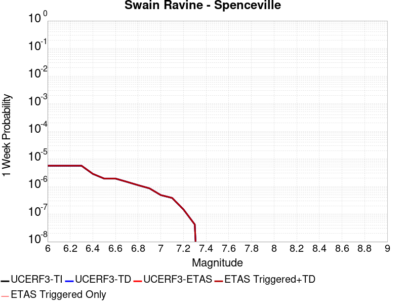 | 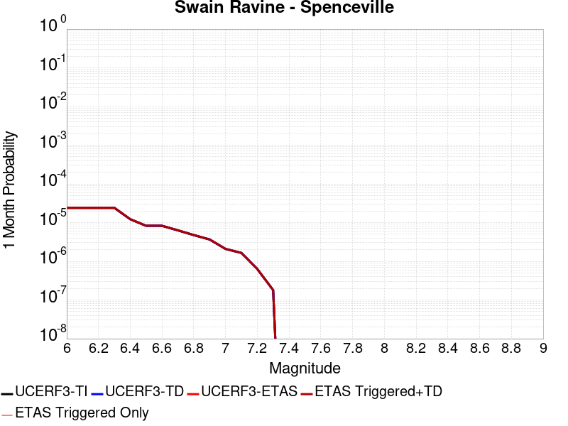 |  | 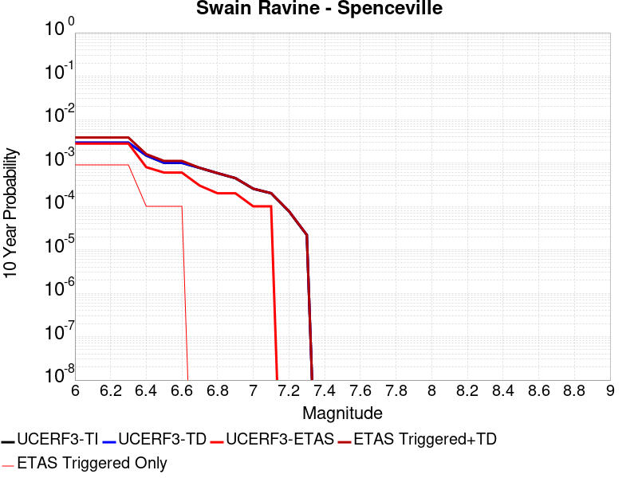 |

| Magnitude | 1 wk TI Prob | 1 wk TD Prob | 1 wk ETAS Prob | 1 wk ETAS/TD Gain | 1 wk ETAS Triggered+TD | 1 wk ETAS Triggered Only | 1 mo TI Prob | 1 mo TD Prob | 1 mo ETAS Prob | 1 mo ETAS/TD Gain | 1 mo ETAS Triggered+TD | 1 mo ETAS Triggered Only | 1 yr TI Prob | 1 yr TD Prob | 1 yr ETAS Prob | 1 yr ETAS/TD Gain | 1 yr ETAS Triggered+TD | 1 yr ETAS Triggered Only | 10 yr TI Prob | 10 yr TD Prob | 10 yr ETAS Prob | 10 yr ETAS/TD Gain | 10 yr ETAS Triggered+TD | 10 yr ETAS Triggered Only |
|-----|-----|-----|-----|-----|-----|-----|-----|-----|-----|-----|-----|-----|-----|-----|-----|-----|-----|-----|-----|-----|-----|-----|-----|-----|
| 6.0 | 5.596169E-6 | 5.66393E-6 | 0.0 | 0.0 | 5.66393E-6 | 0.0 | 2.398336E-5 | 2.4273775E-5 | 0.0 | 0.0 | 2.4273775E-5 | 0.0 | 2.9195828E-4 | 2.9549585E-4 | 3.0E-4 | 1.0152427 | 3.954663E-4 | 1.0E-4 | 0.00291575 | 0.0029512986 | 0.0028 | 0.9487349 | 0.0038486426 | 9.0E-4 |
| 6.1 | 5.596169E-6 | 5.66393E-6 | 0.0 | 0.0 | 5.66393E-6 | 0.0 | 2.398336E-5 | 2.4273775E-5 | 0.0 | 0.0 | 2.4273775E-5 | 0.0 | 2.9195828E-4 | 2.9549585E-4 | 3.0E-4 | 1.0152427 | 3.954663E-4 | 1.0E-4 | 0.00291575 | 0.0029512986 | 0.0028 | 0.9487349 | 0.0038486426 | 9.0E-4 |
| 6.2 | 5.596169E-6 | 5.66393E-6 | 0.0 | 0.0 | 5.66393E-6 | 0.0 | 2.398336E-5 | 2.4273775E-5 | 0.0 | 0.0 | 2.4273775E-5 | 0.0 | 2.9195828E-4 | 2.9549585E-4 | 3.0E-4 | 1.0152427 | 3.954663E-4 | 1.0E-4 | 0.00291575 | 0.0029512986 | 0.0028 | 0.9487349 | 0.0038486426 | 9.0E-4 |
| 6.3 | 5.596169E-6 | 5.66393E-6 | 0.0 | 0.0 | 5.66393E-6 | 0.0 | 2.398336E-5 | 2.4273775E-5 | 0.0 | 0.0 | 2.4273775E-5 | 0.0 | 2.9195828E-4 | 2.9549585E-4 | 3.0E-4 | 1.0152427 | 3.954663E-4 | 1.0E-4 | 0.00291575 | 0.0029512986 | 0.0028 | 0.9487349 | 0.0038486426 | 9.0E-4 |
| 6.4 | 2.8426775E-6 | 2.874207E-6 | 0.0 | 0.0 | 2.874207E-6 | 0.0 | 1.2182847E-5 | 1.2317974E-5 | 0.0 | 0.0 | 1.2317974E-5 | 0.0 | 1.4831607E-4 | 1.499614E-4 | 1.0E-4 | 0.6668382 | 2.499464E-4 | 1.0E-4 | 0.0014821711 | 0.0014986405 | 8.0E-4 | 0.5338171 | 0.0015984906 | 1.0E-4 |
| 6.5 | 1.9210793E-6 | 1.9414554E-6 | 0.0 | 0.0 | 1.9414554E-6 | 0.0 | 8.233172E-6 | 8.320498E-6 | 0.0 | 0.0 | 8.320498E-6 | 0.0 | 1.0023425E-4 | 1.0129748E-4 | 1.0E-4 | 0.9871913 | 2.0128736E-4 | 1.0E-4 | 0.0010018905 | 0.0010125266 | 6.0E-4 | 0.59257704 | 0.0011124252 | 1.0E-4 |
| 6.6 | 1.9210793E-6 | 1.9414554E-6 | 0.0 | 0.0 | 1.9414554E-6 | 0.0 | 8.233172E-6 | 8.320498E-6 | 0.0 | 0.0 | 8.320498E-6 | 0.0 | 1.0023425E-4 | 1.0129748E-4 | 1.0E-4 | 0.9871913 | 2.0128736E-4 | 1.0E-4 | 0.0010018905 | 0.0010125266 | 6.0E-4 | 0.59257704 | 0.0011124252 | 1.0E-4 |
| 6.7 | 1.4667394E-6 | 1.4819237E-6 | 0.0 | 0.0 | 1.4819237E-6 | 0.0 | 6.286011E-6 | 6.3510865E-6 | 0.0 | 0.0 | 6.3510865E-6 | 0.0 | 7.65295E-5 | 7.732181E-5 | 0.0 | 0.0 | 7.732181E-5 | 0.0 | 7.6503144E-4 | 7.729568E-4 | 3.0E-4 | 0.38812 | 7.729568E-4 | 0.0 |
| 6.8 | 1.1076943E-6 | 1.118976E-6 | 0.0 | 0.0 | 1.118976E-6 | 0.0 | 4.747252E-6 | 4.7956028E-6 | 0.0 | 0.0 | 4.7956028E-6 | 0.0 | 5.7796264E-5 | 5.8384947E-5 | 0.0 | 0.0 | 5.8384947E-5 | 0.0 | 5.778124E-4 | 5.837005E-4 | 2.0E-4 | 0.34264147 | 5.837005E-4 | 0.0 |
| 6.9 | 8.514296E-7 | 8.6002666E-7 | 0.0 | 0.0 | 8.6002666E-7 | 0.0 | 3.648979E-6 | 3.6858235E-6 | 0.0 | 0.0 | 3.6858235E-6 | 0.0 | 4.442541E-5 | 4.4874007E-5 | 0.0 | 0.0 | 4.4874007E-5 | 0.0 | 4.441653E-4 | 4.486523E-4 | 2.0E-4 | 0.4457795 | 4.486523E-4 | 0.0 |
| 7.0 | 4.8544706E-7 | 4.903398E-7 | 0.0 | 0.0 | 4.903398E-7 | 0.0 | 2.0804857E-6 | 2.1014546E-6 | 0.0 | 0.0 | 2.1014546E-6 | 0.0 | 2.532962E-5 | 2.5584925E-5 | 0.0 | 0.0 | 2.5584925E-5 | 0.0 | 2.5326732E-4 | 2.5582107E-4 | 1.0E-4 | 0.3908982 | 2.5582107E-4 | 0.0 |
| 7.1 | 3.829186E-7 | 3.867956E-7 | 0.0 | 0.0 | 3.867956E-7 | 0.0 | 1.6410787E-6 | 1.6576944E-6 | 0.0 | 0.0 | 1.6576944E-6 | 0.0 | 1.997995E-5 | 2.0182253E-5 | 0.0 | 0.0 | 2.0182253E-5 | 0.0 | 1.9978154E-4 | 2.0180526E-4 | 1.0E-4 | 0.49552724 | 2.0180526E-4 | 0.0 |
| 7.2 | 1.4726595E-7 | 1.4879744E-7 | 0.0 | 0.0 | 1.4879744E-7 | 0.0 | 6.3113964E-7 | 6.377032E-7 | 0.0 | 0.0 | 6.377032E-7 | 0.0 | 7.684098E-6 | 7.764014E-6 | 0.0 | 0.0 | 7.764014E-6 | 0.0 | 7.6838325E-5 | 7.763796E-5 | 0.0 | 0.0 | 7.763796E-5 | 0.0 |
| 7.3 | 4.1880604E-8 | 4.2325194E-8 | 0.0 | 0.0 | 4.2325194E-8 | 0.0 | 1.7948828E-7 | 1.8139369E-7 | 0.0 | 0.0 | 1.8139369E-7 | 0.0 | 2.1852677E-6 | 2.2084682E-6 | 0.0 | 0.0 | 2.2084682E-6 | 0.0 | 2.1852462E-5 | 2.2084681E-5 | 0.0 | 0.0 | 2.2084681E-5 | 0.0 |

## Emerson-Copper Mtn 2011
*[(top)](#table-of-contents)*

| 1 Week | 1 Month | 1 Year | 10 Year |
|-----|-----|-----|-----|
| 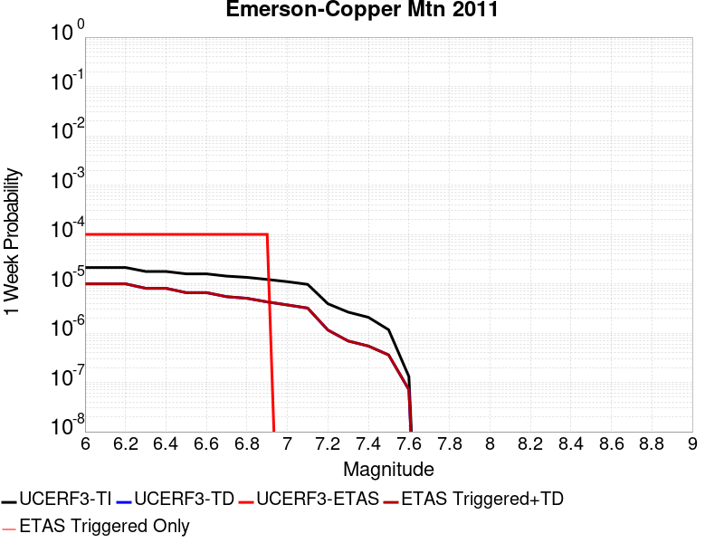 |  | 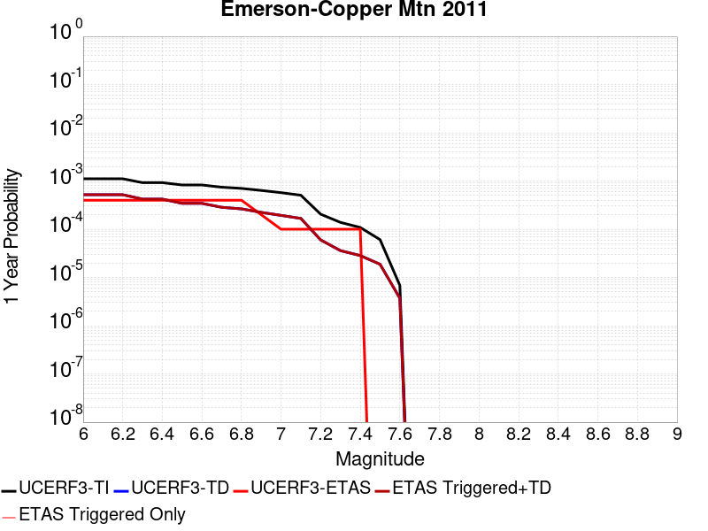 | 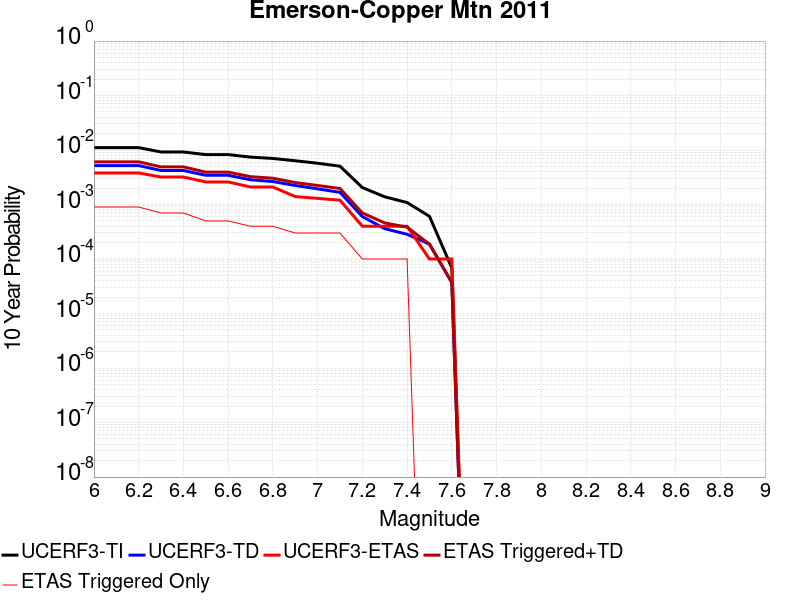 |

| Magnitude | 1 wk TI Prob | 1 wk TD Prob | 1 wk ETAS Prob | 1 wk ETAS/TD Gain | 1 wk ETAS Triggered+TD | 1 wk ETAS Triggered Only | 1 mo TI Prob | 1 mo TD Prob | 1 mo ETAS Prob | 1 mo ETAS/TD Gain | 1 mo ETAS Triggered+TD | 1 mo ETAS Triggered Only | 1 yr TI Prob | 1 yr TD Prob | 1 yr ETAS Prob | 1 yr ETAS/TD Gain | 1 yr ETAS Triggered+TD | 1 yr ETAS Triggered Only | 10 yr TI Prob | 10 yr TD Prob | 10 yr ETAS Prob | 10 yr ETAS/TD Gain | 10 yr ETAS Triggered+TD | 10 yr ETAS Triggered Only |
|-----|-----|-----|-----|-----|-----|-----|-----|-----|-----|-----|-----|-----|-----|-----|-----|-----|-----|-----|-----|-----|-----|-----|-----|-----|
| 6.0 | 2.1364202E-5 | 9.969106E-6 | 1.0E-4 | 10.03099 | 9.969106E-6 | 0.0 | 9.1557646E-5 | 4.272409E-5 | 1.0E-4 | 2.3405998 | 4.272409E-5 | 0.0 | 0.0011141442 | 5.2005035E-4 | 4.0E-4 | 0.7691563 | 5.2005035E-4 | 0.0 | 0.011085749 | 0.0051892037 | 0.0038 | 0.7322897 | 0.0060845334 | 9.0E-4 |
| 6.1 | 2.1364202E-5 | 9.969106E-6 | 1.0E-4 | 10.03099 | 9.969106E-6 | 0.0 | 9.1557646E-5 | 4.272409E-5 | 1.0E-4 | 2.3405998 | 4.272409E-5 | 0.0 | 0.0011141442 | 5.2005035E-4 | 4.0E-4 | 0.7691563 | 5.2005035E-4 | 0.0 | 0.011085749 | 0.0051892037 | 0.0038 | 0.7322897 | 0.0060845334 | 9.0E-4 |
| 6.2 | 2.1364202E-5 | 9.969106E-6 | 1.0E-4 | 10.03099 | 9.969106E-6 | 0.0 | 9.1557646E-5 | 4.272409E-5 | 1.0E-4 | 2.3405998 | 4.272409E-5 | 0.0 | 0.0011141442 | 5.2005035E-4 | 4.0E-4 | 0.7691563 | 5.2005035E-4 | 0.0 | 0.011085749 | 0.0051892037 | 0.0038 | 0.7322897 | 0.0060845334 | 9.0E-4 |
| 6.3 | 1.7751237E-5 | 8.089847E-6 | 1.0E-4 | 12.361174 | 8.089847E-6 | 0.0 | 7.607452E-5 | 3.4670345E-5 | 1.0E-4 | 2.8843093 | 3.4670345E-5 | 0.0 | 9.258136E-4 | 4.2203598E-4 | 4.0E-4 | 0.94778645 | 4.2203598E-4 | 0.0 | 0.00921966 | 0.0042129676 | 0.0032 | 0.7595596 | 0.0049100188 | 7.0E-4 |
| 6.4 | 1.7751237E-5 | 8.089847E-6 | 1.0E-4 | 12.361174 | 8.089847E-6 | 0.0 | 7.607452E-5 | 3.4670345E-5 | 1.0E-4 | 2.8843093 | 3.4670345E-5 | 0.0 | 9.258136E-4 | 4.2203598E-4 | 4.0E-4 | 0.94778645 | 4.2203598E-4 | 0.0 | 0.00921966 | 0.0042129676 | 0.0032 | 0.7595596 | 0.0049100188 | 7.0E-4 |
| 6.5 | 1.5886664E-5 | 6.604129E-6 | 1.0E-4 | 15.142043 | 6.604129E-6 | 0.0 | 6.808392E-5 | 2.8303128E-5 | 1.0E-4 | 3.5331783 | 2.8303128E-5 | 0.0 | 8.286065E-4 | 3.445408E-4 | 4.0E-4 | 1.1609656 | 3.445408E-4 | 0.0 | 0.008255237 | 0.0034405305 | 0.0026 | 0.7556974 | 0.0039388104 | 5.0E-4 |
| 6.6 | 1.5886664E-5 | 6.604129E-6 | 1.0E-4 | 15.142043 | 6.604129E-6 | 0.0 | 6.808392E-5 | 2.8303128E-5 | 1.0E-4 | 3.5331783 | 2.8303128E-5 | 0.0 | 8.286065E-4 | 3.445408E-4 | 4.0E-4 | 1.1609656 | 3.445408E-4 | 0.0 | 0.008255237 | 0.0034405305 | 0.0026 | 0.7556974 | 0.0039388104 | 5.0E-4 |
| 6.7 | 1.428471E-5 | 5.47048E-6 | 1.0E-4 | 18.27993 | 5.47048E-6 | 0.0 | 6.121875E-5 | 2.3444727E-5 | 1.0E-4 | 4.2653513 | 2.3444727E-5 | 0.0 | 7.450834E-4 | 2.854061E-4 | 4.0E-4 | 1.4015118 | 2.854061E-4 | 0.0 | 0.007425902 | 0.0028507835 | 0.0021 | 0.73663956 | 0.0032496431 | 4.0E-4 |
| 6.8 | 1.3490684E-5 | 5.0736858E-6 | 1.0E-4 | 19.709538 | 5.0736858E-6 | 0.0 | 5.7815934E-5 | 2.1744208E-5 | 1.0E-4 | 4.5989256 | 2.1744208E-5 | 0.0 | 7.0368167E-4 | 2.6470746E-4 | 4.0E-4 | 1.5111022 | 2.6470746E-4 | 0.0 | 0.007014576 | 0.0026443023 | 0.0021 | 0.79416037 | 0.0030432446 | 4.0E-4 |
| 6.9 | 1.2235421E-5 | 4.289552E-6 | 1.0E-4 | 23.312458 | 4.289552E-6 | 0.0 | 5.2436466E-5 | 1.8383686E-5 | 1.0E-4 | 5.4396057 | 1.8383686E-5 | 0.0 | 6.38227E-4 | 2.2380198E-4 | 2.0E-4 | 0.89364713 | 2.2380198E-4 | 0.0 | 0.0063639707 | 0.0022361204 | 0.0014 | 0.6260844 | 0.0025354496 | 3.0E-4 |
| 7.0 | 1.1009851E-5 | 3.7188006E-6 | 0.0 | 0.0 | 3.7188006E-6 | 0.0 | 4.7184225E-5 | 1.593764E-5 | 0.0 | 0.0 | 1.593764E-5 | 0.0 | 5.743165E-4 | 1.9402691E-4 | 1.0E-4 | 0.5153924 | 1.9402691E-4 | 0.0 | 0.005728345 | 0.0019389129 | 0.0013 | 0.6704788 | 0.0022383311 | 3.0E-4 |
| 7.1 | 9.726373E-6 | 3.2115195E-6 | 0.0 | 0.0 | 3.2115195E-6 | 0.0 | 4.168379E-5 | 1.3763602E-5 | 0.0 | 0.0 | 1.3763602E-5 | 0.0 | 5.07382E-4 | 1.6756234E-4 | 1.0E-4 | 0.5967928 | 1.6756234E-4 | 0.0 | 0.0050622504 | 0.0016746911 | 0.0012 | 0.71655005 | 0.0019741887 | 3.0E-4 |
| 7.2 | 3.9335127E-6 | 1.1523186E-6 | 0.0 | 0.0 | 1.1523186E-6 | 0.0 | 1.6857803E-5 | 4.9384994E-6 | 0.0 | 0.0 | 4.9384994E-6 | 0.0 | 2.0522442E-4 | 6.0124632E-5 | 1.0E-4 | 1.6632118 | 6.0124632E-5 | 0.0 | 0.00205035 | 6.010896E-4 | 4.0E-4 | 0.6654582 | 7.010295E-4 | 1.0E-4 |
| 7.3 | 2.661632E-6 | 6.9100474E-7 | 0.0 | 0.0 | 6.9100474E-7 | 0.0 | 1.14069435E-5 | 2.9614457E-6 | 0.0 | 0.0 | 2.9614457E-6 | 0.0 | 1.3887069E-4 | 3.6055015E-5 | 1.0E-4 | 2.7735393 | 3.6055015E-5 | 0.0 | 0.0013878393 | 3.604927E-4 | 4.0E-4 | 1.1095926 | 4.6045665E-4 | 1.0E-4 |
| 7.4 | 2.0893426E-6 | 5.4606875E-7 | 0.0 | 0.0 | 5.4606875E-7 | 0.0 | 8.954295E-6 | 2.3402924E-6 | 0.0 | 0.0 | 2.3402924E-6 | 0.0 | 1.0901308E-4 | 2.8492694E-5 | 1.0E-4 | 3.5096717 | 2.8492694E-5 | 0.0 | 0.0010895962 | 2.8489094E-4 | 4.0E-4 | 1.404046 | 3.8486245E-4 | 1.0E-4 |
| 7.5 | 1.1681728E-6 | 3.6024073E-7 | 0.0 | 0.0 | 3.6024073E-7 | 0.0 | 5.0064455E-6 | 1.543888E-6 | 0.0 | 0.0 | 1.543888E-6 | 0.0 | 6.0951766E-5 | 1.8796678E-5 | 0.0 | 0.0 | 1.8796678E-5 | 0.0 | 6.093505E-4 | 1.8795136E-4 | 1.0E-4 | 0.5320526 | 1.8795136E-4 | 0.0 |
| 7.6 | 1.3154387E-7 | 7.119339E-8 | 0.0 | 0.0 | 7.119339E-8 | 0.0 | 5.6375933E-7 | 3.051145E-7 | 0.0 | 0.0 | 3.051145E-7 | 0.0 | 6.863748E-6 | 3.7147643E-6 | 0.0 | 0.0 | 3.7147643E-6 | 0.0 | 6.863536E-5 | 3.714718E-5 | 1.0E-4 | 2.6919944 | 3.714718E-5 | 0.0 |

## Death Valley (No)
*[(top)](#table-of-contents)*

| 1 Week | 1 Month | 1 Year | 10 Year |
|-----|-----|-----|-----|
| 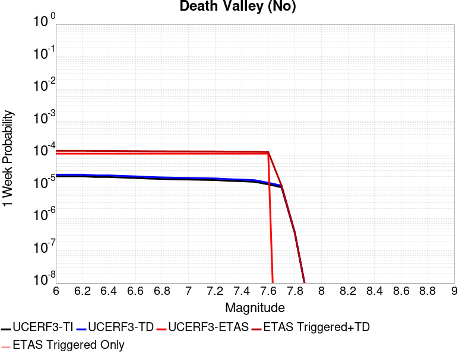 | 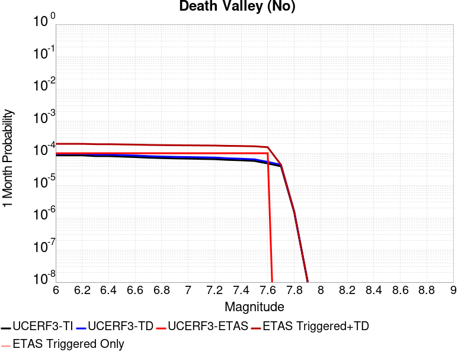 |  |  |

| Magnitude | 1 wk TI Prob | 1 wk TD Prob | 1 wk ETAS Prob | 1 wk ETAS/TD Gain | 1 wk ETAS Triggered+TD | 1 wk ETAS Triggered Only | 1 mo TI Prob | 1 mo TD Prob | 1 mo ETAS Prob | 1 mo ETAS/TD Gain | 1 mo ETAS Triggered+TD | 1 mo ETAS Triggered Only | 1 yr TI Prob | 1 yr TD Prob | 1 yr ETAS Prob | 1 yr ETAS/TD Gain | 1 yr ETAS Triggered+TD | 1 yr ETAS Triggered Only | 10 yr TI Prob | 10 yr TD Prob | 10 yr ETAS Prob | 10 yr ETAS/TD Gain | 10 yr ETAS Triggered+TD | 10 yr ETAS Triggered Only |
|-----|-----|-----|-----|-----|-----|-----|-----|-----|-----|-----|-----|-----|-----|-----|-----|-----|-----|-----|-----|-----|-----|-----|-----|-----|
| 6.0 | 2.0074807E-5 | 2.2505501E-5 | 1.0E-4 | 4.443358 | 1.2250325E-4 | 1.0E-4 | 8.603206E-5 | 9.6448624E-5 | 1.0E-4 | 1.0368215 | 1.9643898E-4 | 1.0E-4 | 0.001046937 | 0.0011736369 | 9.0E-4 | 0.76684713 | 0.0013734021 | 2.0E-4 | 0.010420183 | 0.011675301 | 0.0068 | 0.58242613 | 0.012564793 | 9.0E-4 |
| 6.1 | 2.0074807E-5 | 2.2505501E-5 | 1.0E-4 | 4.443358 | 1.2250325E-4 | 1.0E-4 | 8.603206E-5 | 9.6448624E-5 | 1.0E-4 | 1.0368215 | 1.9643898E-4 | 1.0E-4 | 0.001046937 | 0.0011736369 | 9.0E-4 | 0.76684713 | 0.0013734021 | 2.0E-4 | 0.010420183 | 0.011675301 | 0.0068 | 0.58242613 | 0.012564793 | 9.0E-4 |
| 6.2 | 2.0074807E-5 | 2.2505501E-5 | 1.0E-4 | 4.443358 | 1.2250325E-4 | 1.0E-4 | 8.603206E-5 | 9.6448624E-5 | 1.0E-4 | 1.0368215 | 1.9643898E-4 | 1.0E-4 | 0.001046937 | 0.0011736369 | 9.0E-4 | 0.76684713 | 0.0013734021 | 2.0E-4 | 0.010420183 | 0.011675301 | 0.0068 | 0.58242613 | 0.012564793 | 9.0E-4 |
| 6.3 | 1.9050609E-5 | 2.1342052E-5 | 1.0E-4 | 4.685585 | 1.21339915E-4 | 1.0E-4 | 8.164292E-5 | 9.146277E-5 | 1.0E-4 | 1.0933411 | 1.9145363E-4 | 1.0E-4 | 9.935491E-4 | 0.0011129971 | 8.0E-4 | 0.71878 | 0.0013127745 | 2.0E-4 | 0.009891188 | 0.011075053 | 0.0064 | 0.5778753 | 0.011965086 | 9.0E-4 |
| 6.4 | 1.9050609E-5 | 2.1342052E-5 | 1.0E-4 | 4.685585 | 1.21339915E-4 | 1.0E-4 | 8.164292E-5 | 9.146277E-5 | 1.0E-4 | 1.0933411 | 1.9145363E-4 | 1.0E-4 | 9.935491E-4 | 0.0011129971 | 8.0E-4 | 0.71878 | 0.0013127745 | 2.0E-4 | 0.009891188 | 0.011075053 | 0.0064 | 0.5778753 | 0.011965086 | 9.0E-4 |
| 6.5 | 1.8367004E-5 | 2.0565905E-5 | 1.0E-4 | 4.8624167 | 1.2056385E-4 | 1.0E-4 | 7.8713354E-5 | 8.813665E-5 | 1.0E-4 | 1.1346017 | 1.8812784E-4 | 1.0E-4 | 9.5791375E-4 | 0.001072542 | 8.0E-4 | 0.7458915 | 0.0012723275 | 2.0E-4 | 0.009537951 | 0.010674443 | 0.0063 | 0.5901947 | 0.011564837 | 9.0E-4 |
| 6.6 | 1.779439E-5 | 1.991565E-5 | 1.0E-4 | 5.021177 | 1.1991366E-4 | 1.0E-4 | 7.625944E-5 | 8.535003E-5 | 1.0E-4 | 1.1716458 | 1.8534149E-4 | 1.0E-4 | 9.280632E-4 | 0.0010386476 | 8.0E-4 | 0.7702323 | 0.0012384399 | 2.0E-4 | 0.009241969 | 0.010338691 | 0.0062 | 0.59968907 | 0.011229387 | 9.0E-4 |
| 6.7 | 1.7025437E-5 | 1.9047926E-5 | 1.0E-4 | 5.2499156 | 1.19046024E-4 | 1.0E-4 | 7.296412E-5 | 8.163145E-5 | 1.0E-4 | 1.2250181 | 1.8162328E-4 | 1.0E-4 | 8.87976E-4 | 9.93416E-4 | 8.0E-4 | 0.8053022 | 0.0011932172 | 2.0E-4 | 0.008844362 | 0.009890471 | 0.0061 | 0.6167553 | 0.010781569 | 9.0E-4 |
| 6.8 | 1.6545107E-5 | 1.8516932E-5 | 1.0E-4 | 5.4004626 | 1.1851508E-4 | 1.0E-4 | 7.090568E-5 | 7.93559E-5 | 1.0E-4 | 1.2601457 | 1.7934796E-4 | 1.0E-4 | 8.629347E-4 | 9.65736E-4 | 8.0E-4 | 0.82838374 | 0.0011655429 | 2.0E-4 | 0.008595915 | 0.0096160965 | 0.0061 | 0.63435304 | 0.010507442 | 9.0E-4 |
| 6.9 | 1.615478E-5 | 1.8091903E-5 | 1.0E-4 | 5.527334 | 1.18090094E-4 | 1.0E-4 | 6.9232934E-5 | 7.753446E-5 | 1.0E-4 | 1.289749 | 1.7752672E-4 | 1.0E-4 | 8.4258494E-4 | 9.4357936E-4 | 8.0E-4 | 0.8478354 | 0.0011433907 | 2.0E-4 | 0.008393973 | 0.009396424 | 0.006 | 0.6385408 | 0.010287967 | 9.0E-4 |
| 7.0 | 1.5894311E-5 | 1.7809813E-5 | 1.0E-4 | 5.6148825 | 1.17808035E-4 | 1.0E-4 | 6.81167E-5 | 7.632557E-5 | 1.0E-4 | 1.310177 | 1.7631793E-4 | 1.0E-4 | 8.2900526E-4 | 9.288737E-4 | 8.0E-4 | 0.8612581 | 0.001128688 | 2.0E-4 | 0.008259195 | 0.009250602 | 0.006 | 0.6486065 | 0.010142276 | 9.0E-4 |
| 7.1 | 1.5602263E-5 | 1.7487699E-5 | 1.0E-4 | 5.718305 | 1.1748595E-4 | 1.0E-4 | 6.6865134E-5 | 7.4945165E-5 | 1.0E-4 | 1.334309 | 1.7493767E-4 | 1.0E-4 | 8.137789E-4 | 9.1208145E-4 | 8.0E-4 | 0.87711465 | 0.001111899 | 2.0E-4 | 0.008108052 | 0.009084064 | 0.0059 | 0.64948905 | 0.009975888 | 9.0E-4 |
| 7.2 | 1.5323829E-5 | 1.7174749E-5 | 1.0E-4 | 5.8225017 | 1.1717303E-4 | 1.0E-4 | 6.56719E-5 | 7.3604024E-5 | 1.0E-4 | 1.3586214 | 1.7359667E-4 | 1.0E-4 | 7.99262E-4 | 8.957666E-4 | 8.0E-4 | 0.8930898 | 0.0010955875 | 2.0E-4 | 0.007963934 | 0.008922237 | 0.0057 | 0.63885325 | 0.0098142065 | 9.0E-4 |
| 7.3 | 1.4556212E-5 | 1.6306349E-5 | 1.0E-4 | 6.132581 | 1.1630472E-4 | 1.0E-4 | 6.238227E-5 | 6.988251E-5 | 1.0E-4 | 1.4309733 | 1.6987552E-4 | 1.0E-4 | 7.592395E-4 | 8.5049326E-4 | 8.0E-4 | 0.9406306 | 0.0010503231 | 2.0E-4 | 0.0075665074 | 0.008473028 | 0.0057 | 0.6727229 | 0.009365403 | 9.0E-4 |
| 7.4 | 1.411725E-5 | 1.5811727E-5 | 1.0E-4 | 6.3244195 | 1.15810144E-4 | 1.0E-4 | 6.0501097E-5 | 6.776282E-5 | 1.0E-4 | 1.4757355 | 1.6775605E-4 | 1.0E-4 | 7.363519E-4 | 8.247059E-4 | 8.0E-4 | 0.97004277 | 0.001024541 | 2.0E-4 | 0.0073391674 | 0.008217089 | 0.0054 | 0.6571671 | 0.009109693 | 9.0E-4 |
| 7.5 | 1.3503312E-5 | 1.5129906E-5 | 1.0E-4 | 6.6094265 | 1.15128394E-4 | 1.0E-4 | 5.7870053E-5 | 6.4840875E-5 | 1.0E-4 | 1.542237 | 1.6483439E-4 | 1.0E-4 | 7.043401E-4 | 7.891575E-4 | 7.0E-4 | 0.88702184 | 9.889997E-4 | 2.0E-4 | 0.007021119 | 0.007864177 | 0.0051 | 0.64851034 | 0.0087570995 | 9.0E-4 |
| 7.6 | 1.1279839E-5 | 1.2629325E-5 | 1.0E-4 | 7.9180794 | 1.1262806E-4 | 1.0E-4 | 4.834127E-5 | 5.4124586E-5 | 1.0E-4 | 1.8475893 | 1.5411917E-4 | 1.0E-4 | 5.88396E-4 | 6.587729E-4 | 6.0E-4 | 0.91078424 | 8.586412E-4 | 2.0E-4 | 0.005868405 | 0.006568753 | 0.0034 | 0.517602 | 0.007264155 | 7.0E-4 |
| 7.7 | 9.189108E-6 | 1.0285795E-5 | 0.0 | 0.0 | 1.0285795E-5 | 0.0 | 3.93813E-5 | 4.4081262E-5 | 0.0 | 0.0 | 4.4081262E-5 | 0.0 | 4.7936183E-4 | 5.3656223E-4 | 5.0E-4 | 0.93185836 | 6.365086E-4 | 1.0E-4 | 0.004783291 | 0.0053531784 | 0.0031 | 0.5790952 | 0.0059499666 | 6.0E-4 |
| 7.8 | 3.4586725E-7 | 3.64866E-7 | 0.0 | 0.0 | 3.64866E-7 | 0.0 | 1.4822873E-6 | 1.5637105E-6 | 0.0 | 0.0 | 1.5637105E-6 | 0.0 | 1.80467E-5 | 1.9038014E-5 | 0.0 | 0.0 | 1.9038014E-5 | 0.0 | 1.8045233E-4 | 1.9036427E-4 | 1.0E-4 | 0.52530867 | 1.9036427E-4 | 0.0 |
| 7.9 | 2.5591178E-9 | 2.6699005E-9 | 0.0 | 0.0 | 2.6699005E-9 | 0.0 | 1.0967647E-8 | 1.1442431E-8 | 0.0 | 0.0 | 1.1442431E-8 | 0.0 | 1.335311E-7 | 1.393116E-7 | 0.0 | 0.0 | 1.393116E-7 | 0.0 | 1.3353102E-6 | 1.3931159E-6 | 0.0 | 0.0 | 1.3931159E-6 | 0.0 |

## North Frontal  (East)
*[(top)](#table-of-contents)*

| 1 Week | 1 Month | 1 Year | 10 Year |
|-----|-----|-----|-----|
|  | 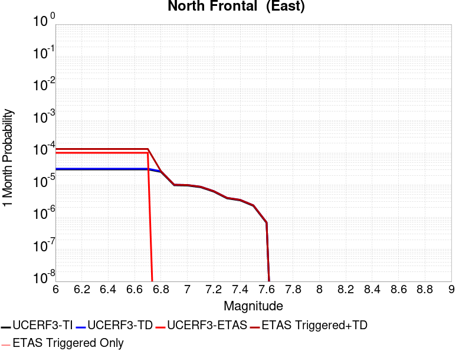 |  |  |

| Magnitude | 1 wk TI Prob | 1 wk TD Prob | 1 wk ETAS Prob | 1 wk ETAS/TD Gain | 1 wk ETAS Triggered+TD | 1 wk ETAS Triggered Only | 1 mo TI Prob | 1 mo TD Prob | 1 mo ETAS Prob | 1 mo ETAS/TD Gain | 1 mo ETAS Triggered+TD | 1 mo ETAS Triggered Only | 1 yr TI Prob | 1 yr TD Prob | 1 yr ETAS Prob | 1 yr ETAS/TD Gain | 1 yr ETAS Triggered+TD | 1 yr ETAS Triggered Only | 10 yr TI Prob | 10 yr TD Prob | 10 yr ETAS Prob | 10 yr ETAS/TD Gain | 10 yr ETAS Triggered+TD | 10 yr ETAS Triggered Only |
|-----|-----|-----|-----|-----|-----|-----|-----|-----|-----|-----|-----|-----|-----|-----|-----|-----|-----|-----|-----|-----|-----|-----|-----|-----|
| 6.0 | 7.135738E-6 | 7.477887E-6 | 0.0 | 0.0 | 7.477887E-6 | 0.0 | 3.0581377E-5 | 3.2047807E-5 | 1.0E-4 | 3.1203384 | 1.320446E-4 | 1.0E-4 | 3.7226462E-4 | 3.9013213E-4 | 8.0E-4 | 2.0505874 | 7.8997604E-4 | 4.0E-4 | 0.0037164164 | 0.0038964304 | 0.0032 | 0.8212645 | 0.0047929236 | 9.0E-4 |
| 6.1 | 7.135738E-6 | 7.477887E-6 | 0.0 | 0.0 | 7.477887E-6 | 0.0 | 3.0581377E-5 | 3.2047807E-5 | 1.0E-4 | 3.1203384 | 1.320446E-4 | 1.0E-4 | 3.7226462E-4 | 3.9013213E-4 | 8.0E-4 | 2.0505874 | 7.8997604E-4 | 4.0E-4 | 0.0037164164 | 0.0038964304 | 0.0032 | 0.8212645 | 0.0047929236 | 9.0E-4 |
| 6.2 | 7.135738E-6 | 7.477887E-6 | 0.0 | 0.0 | 7.477887E-6 | 0.0 | 3.0581377E-5 | 3.2047807E-5 | 1.0E-4 | 3.1203384 | 1.320446E-4 | 1.0E-4 | 3.7226462E-4 | 3.9013213E-4 | 8.0E-4 | 2.0505874 | 7.8997604E-4 | 4.0E-4 | 0.0037164164 | 0.0038964304 | 0.0032 | 0.8212645 | 0.0047929236 | 9.0E-4 |
| 6.3 | 7.135738E-6 | 7.477887E-6 | 0.0 | 0.0 | 7.477887E-6 | 0.0 | 3.0581377E-5 | 3.2047807E-5 | 1.0E-4 | 3.1203384 | 1.320446E-4 | 1.0E-4 | 3.7226462E-4 | 3.9013213E-4 | 8.0E-4 | 2.0505874 | 7.8997604E-4 | 4.0E-4 | 0.0037164164 | 0.0038964304 | 0.0032 | 0.8212645 | 0.0047929236 | 9.0E-4 |
| 6.4 | 7.135738E-6 | 7.477887E-6 | 0.0 | 0.0 | 7.477887E-6 | 0.0 | 3.0581377E-5 | 3.2047807E-5 | 1.0E-4 | 3.1203384 | 1.320446E-4 | 1.0E-4 | 3.7226462E-4 | 3.9013213E-4 | 8.0E-4 | 2.0505874 | 7.8997604E-4 | 4.0E-4 | 0.0037164164 | 0.0038964304 | 0.0032 | 0.8212645 | 0.0047929236 | 9.0E-4 |
| 6.5 | 7.135738E-6 | 7.477887E-6 | 0.0 | 0.0 | 7.477887E-6 | 0.0 | 3.0581377E-5 | 3.2047807E-5 | 1.0E-4 | 3.1203384 | 1.320446E-4 | 1.0E-4 | 3.7226462E-4 | 3.9013213E-4 | 8.0E-4 | 2.0505874 | 7.8997604E-4 | 4.0E-4 | 0.0037164164 | 0.0038964304 | 0.0032 | 0.8212645 | 0.0047929236 | 9.0E-4 |
| 6.6 | 7.135738E-6 | 7.477887E-6 | 0.0 | 0.0 | 7.477887E-6 | 0.0 | 3.0581377E-5 | 3.2047807E-5 | 1.0E-4 | 3.1203384 | 1.320446E-4 | 1.0E-4 | 3.7226462E-4 | 3.9013213E-4 | 8.0E-4 | 2.0505874 | 7.8997604E-4 | 4.0E-4 | 0.0037164164 | 0.0038964304 | 0.0032 | 0.8212645 | 0.0047929236 | 9.0E-4 |
| 6.7 | 7.135738E-6 | 7.477887E-6 | 0.0 | 0.0 | 7.477887E-6 | 0.0 | 3.0581377E-5 | 3.2047807E-5 | 1.0E-4 | 3.1203384 | 1.320446E-4 | 1.0E-4 | 3.7226462E-4 | 3.9013213E-4 | 8.0E-4 | 2.0505874 | 7.8997604E-4 | 4.0E-4 | 0.0037164164 | 0.0038964304 | 0.0032 | 0.8212645 | 0.0047929236 | 9.0E-4 |
| 6.8 | 5.959142E-6 | 6.2372596E-6 | 0.0 | 0.0 | 6.2372596E-6 | 0.0 | 2.553893E-5 | 2.673094E-5 | 0.0 | 0.0 | 2.673094E-5 | 0.0 | 3.108921E-4 | 3.254187E-4 | 6.0E-4 | 1.8437786 | 5.253536E-4 | 2.0E-4 | 0.0031045752 | 0.0032511952 | 0.0026 | 0.7997059 | 0.0036498946 | 4.0E-4 |
| 6.9 | 2.2946929E-6 | 2.3826415E-6 | 0.0 | 0.0 | 2.3826415E-6 | 0.0 | 9.834361E-6 | 1.0211284E-5 | 0.0 | 0.0 | 1.0211284E-5 | 0.0 | 1.1972676E-4 | 1.2431575E-4 | 3.0E-4 | 2.41321 | 2.2430332E-4 | 1.0E-4 | 0.0011966228 | 0.0012425085 | 0.001 | 0.8048234 | 0.0014422601 | 2.0E-4 |
| 7.0 | 2.2468673E-6 | 2.3323296E-6 | 0.0 | 0.0 | 2.3323296E-6 | 0.0 | 9.629396E-6 | 9.995662E-6 | 0.0 | 0.0 | 9.995662E-6 | 0.0 | 1.1723159E-4 | 1.21690864E-4 | 3.0E-4 | 2.4652631 | 2.216787E-4 | 1.0E-4 | 0.0011716976 | 0.0012162885 | 0.001 | 0.8221733 | 0.0014160454 | 2.0E-4 |
| 7.1 | 1.9921076E-6 | 2.0647524E-6 | 0.0 | 0.0 | 2.0647524E-6 | 0.0 | 8.537577E-6 | 8.8489105E-6 | 0.0 | 0.0 | 8.8489105E-6 | 0.0 | 1.0394004E-4 | 1.077306E-4 | 2.0E-4 | 1.8564827 | 2.0771983E-4 | 1.0E-4 | 0.0010389143 | 0.0010768265 | 8.0E-4 | 0.7429238 | 0.0012766111 | 2.0E-4 |
| 7.2 | 1.4524545E-6 | 1.5046218E-6 | 0.0 | 0.0 | 1.5046218E-6 | 0.0 | 6.2247905E-6 | 6.4483647E-6 | 0.0 | 0.0 | 6.4483647E-6 | 0.0 | 7.5784184E-5 | 7.850626E-5 | 0.0 | 0.0 | 7.850626E-5 | 0.0 | 7.575835E-4 | 7.848097E-4 | 3.0E-4 | 0.38225827 | 7.848097E-4 | 0.0 |
| 7.3 | 8.9802575E-7 | 9.3094036E-7 | 0.0 | 0.0 | 9.3094036E-7 | 0.0 | 3.848676E-6 | 3.989739E-6 | 0.0 | 0.0 | 3.989739E-6 | 0.0 | 4.685662E-5 | 4.8574104E-5 | 0.0 | 0.0 | 4.8574104E-5 | 0.0 | 4.6846745E-4 | 4.8564616E-4 | 3.0E-4 | 0.6177337 | 4.8564616E-4 | 0.0 |
| 7.4 | 7.776139E-7 | 8.0610596E-7 | 0.0 | 0.0 | 8.0610596E-7 | 0.0 | 3.3326266E-6 | 3.4547359E-6 | 0.0 | 0.0 | 3.4547359E-6 | 0.0 | 4.0573974E-5 | 4.2060707E-5 | 0.0 | 0.0 | 4.2060707E-5 | 0.0 | 4.0566566E-4 | 4.205382E-4 | 2.0E-4 | 0.47558102 | 4.205382E-4 | 0.0 |
| 7.5 | 5.244417E-7 | 5.4416245E-7 | 0.0 | 0.0 | 5.4416245E-7 | 0.0 | 2.2476054E-6 | 2.332123E-6 | 0.0 | 0.0 | 2.332123E-6 | 0.0 | 2.7364253E-5 | 2.8393293E-5 | 0.0 | 0.0 | 2.8393293E-5 | 0.0 | 2.7360884E-4 | 2.8390318E-4 | 2.0E-4 | 0.7044655 | 2.8390318E-4 | 0.0 |
| 7.6 | 1.5489647E-7 | 1.609074E-7 | 0.0 | 0.0 | 1.609074E-7 | 0.0 | 6.6384183E-7 | 6.896031E-7 | 0.0 | 0.0 | 6.896031E-7 | 0.0 | 8.082245E-6 | 8.395906E-6 | 0.0 | 0.0 | 8.395906E-6 | 0.0 | 8.08195E-5 | 8.395788E-5 | 0.0 | 0.0 | 8.395788E-5 | 0.0 |

## Simi-Santa Rosa
*[(top)](#table-of-contents)*

| 1 Week | 1 Month | 1 Year | 10 Year |
|-----|-----|-----|-----|
| 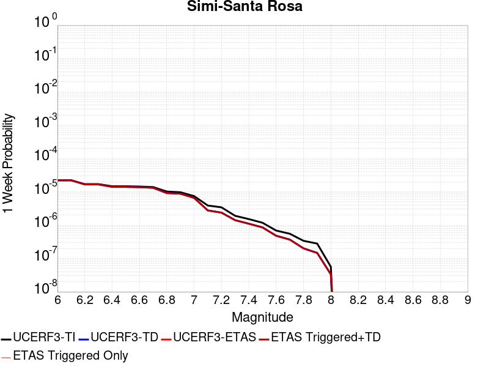 | 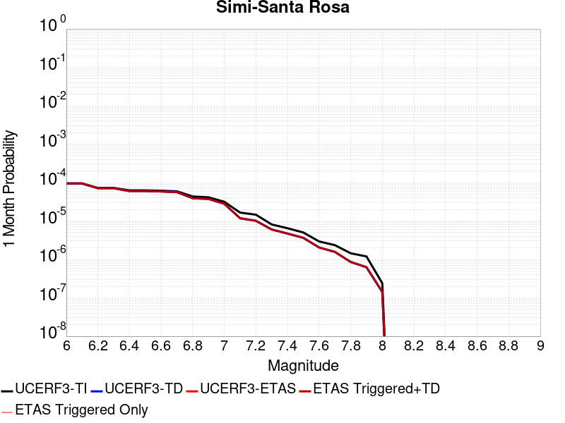 |  | 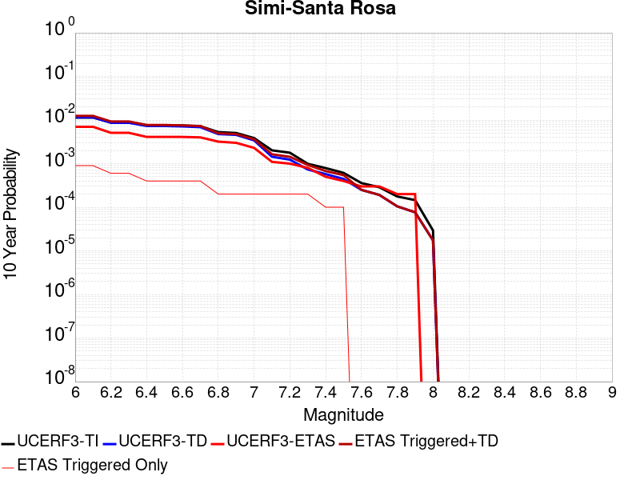 |

| Magnitude | 1 wk TI Prob | 1 wk TD Prob | 1 wk ETAS Prob | 1 wk ETAS/TD Gain | 1 wk ETAS Triggered+TD | 1 wk ETAS Triggered Only | 1 mo TI Prob | 1 mo TD Prob | 1 mo ETAS Prob | 1 mo ETAS/TD Gain | 1 mo ETAS Triggered+TD | 1 mo ETAS Triggered Only | 1 yr TI Prob | 1 yr TD Prob | 1 yr ETAS Prob | 1 yr ETAS/TD Gain | 1 yr ETAS Triggered+TD | 1 yr ETAS Triggered Only | 10 yr TI Prob | 10 yr TD Prob | 10 yr ETAS Prob | 10 yr ETAS/TD Gain | 10 yr ETAS Triggered+TD | 10 yr ETAS Triggered Only |
|-----|-----|-----|-----|-----|-----|-----|-----|-----|-----|-----|-----|-----|-----|-----|-----|-----|-----|-----|-----|-----|-----|-----|-----|-----|
| 6.0 | 2.198912E-5 | 2.2281214E-5 | 0.0 | 0.0 | 2.2281214E-5 | 0.0 | 9.4235686E-5 | 9.548767E-5 | 0.0 | 0.0 | 9.548767E-5 | 0.0 | 0.0011467156 | 0.0011619863 | 0.001 | 0.8605954 | 0.0011619863 | 0.0 | 0.011408163 | 0.011563554 | 0.007 | 0.6053502 | 0.012453147 | 9.0E-4 |
| 6.1 | 2.198912E-5 | 2.2281214E-5 | 0.0 | 0.0 | 2.2281214E-5 | 0.0 | 9.4235686E-5 | 9.548767E-5 | 0.0 | 0.0 | 9.548767E-5 | 0.0 | 0.0011467156 | 0.0011619863 | 0.001 | 0.8605954 | 0.0011619863 | 0.0 | 0.011408163 | 0.011563554 | 0.007 | 0.6053502 | 0.012453147 | 9.0E-4 |
| 6.2 | 1.69983E-5 | 1.6672957E-5 | 0.0 | 0.0 | 1.6672957E-5 | 0.0 | 7.284782E-5 | 7.145374E-5 | 0.0 | 0.0 | 7.145374E-5 | 0.0 | 8.865613E-4 | 8.6963124E-4 | 7.0E-4 | 0.80493885 | 8.6963124E-4 | 0.0 | 0.008830327 | 0.008665204 | 0.0051 | 0.5885608 | 0.009260005 | 6.0E-4 |
| 6.3 | 1.69983E-5 | 1.6672957E-5 | 0.0 | 0.0 | 1.6672957E-5 | 0.0 | 7.284782E-5 | 7.145374E-5 | 0.0 | 0.0 | 7.145374E-5 | 0.0 | 8.865613E-4 | 8.6963124E-4 | 7.0E-4 | 0.80493885 | 8.6963124E-4 | 0.0 | 0.008830327 | 0.008665204 | 0.0051 | 0.5885608 | 0.009260005 | 6.0E-4 |
| 6.4 | 1.4666188E-5 | 1.405631E-5 | 0.0 | 0.0 | 1.405631E-5 | 0.0 | 6.285358E-5 | 6.0240076E-5 | 0.0 | 0.0 | 6.0240076E-5 | 0.0 | 7.6497364E-4 | 7.3320104E-4 | 7.0E-4 | 0.9547177 | 7.3320104E-4 | 0.0 | 0.0076234564 | 0.0073102964 | 0.0041 | 0.56085277 | 0.0077073723 | 4.0E-4 |
| 6.5 | 1.4666188E-5 | 1.405631E-5 | 0.0 | 0.0 | 1.405631E-5 | 0.0 | 6.285358E-5 | 6.0240076E-5 | 0.0 | 0.0 | 6.0240076E-5 | 0.0 | 7.6497364E-4 | 7.3320104E-4 | 7.0E-4 | 0.9547177 | 7.3320104E-4 | 0.0 | 0.0076234564 | 0.0073102964 | 0.0041 | 0.56085277 | 0.0077073723 | 4.0E-4 |
| 6.6 | 1.4377586E-5 | 1.3733273E-5 | 0.0 | 0.0 | 1.3733273E-5 | 0.0 | 6.1616774E-5 | 5.8855698E-5 | 0.0 | 0.0 | 5.8855698E-5 | 0.0 | 7.4992597E-4 | 7.163574E-4 | 7.0E-4 | 0.9771659 | 7.163574E-4 | 0.0 | 0.007474003 | 0.0071429517 | 0.0041 | 0.5739924 | 0.0075400947 | 4.0E-4 |
| 6.7 | 1.3881404E-5 | 1.3211116E-5 | 0.0 | 0.0 | 1.3211116E-5 | 0.0 | 5.9490372E-5 | 5.661798E-5 | 0.0 | 0.0 | 5.661798E-5 | 0.0 | 7.240546E-4 | 6.891306E-4 | 7.0E-4 | 1.0157726 | 6.891306E-4 | 0.0 | 0.007217 | 0.0068723876 | 0.004 | 0.58203936 | 0.0072696386 | 4.0E-4 |
| 6.8 | 1.0176516E-5 | 9.156703E-6 | 0.0 | 0.0 | 9.156703E-6 | 0.0 | 4.3612912E-5 | 3.9242514E-5 | 0.0 | 0.0 | 3.9242514E-5 | 0.0 | 5.308578E-4 | 4.7768946E-4 | 5.0E-4 | 1.0467051 | 4.7768946E-4 | 0.0 | 0.0052959146 | 0.0047682608 | 0.0032 | 0.67110425 | 0.004967307 | 2.0E-4 |
| 6.9 | 9.699797E-6 | 8.777159E-6 | 0.0 | 0.0 | 8.777159E-6 | 0.0 | 4.15699E-5 | 3.7615944E-5 | 0.0 | 0.0 | 3.7615944E-5 | 0.0 | 5.05996E-4 | 4.5789432E-4 | 4.0E-4 | 0.873564 | 4.5789432E-4 | 0.0 | 0.005048454 | 0.0045711272 | 0.003 | 0.6562933 | 0.004770213 | 2.0E-4 |
| 7.0 | 7.4049476E-6 | 6.561131E-6 | 0.0 | 0.0 | 6.561131E-6 | 0.0 | 3.1735104E-5 | 2.8118902E-5 | 0.0 | 0.0 | 2.8118902E-5 | 0.0 | 3.8630638E-4 | 3.423065E-4 | 3.0E-4 | 0.87640756 | 3.423065E-4 | 0.0 | 0.0038563553 | 0.0034190353 | 0.0023 | 0.67270434 | 0.0036183516 | 2.0E-4 |
| 7.1 | 3.873439E-6 | 2.7602491E-6 | 0.0 | 0.0 | 2.7602491E-6 | 0.0 | 1.6600346E-5 | 1.1829587E-5 | 0.0 | 0.0 | 1.1829587E-5 | 0.0 | 2.0209046E-4 | 1.4401594E-4 | 2.0E-4 | 1.3887352 | 1.4401594E-4 | 0.0 | 0.0020190678 | 0.0014392497 | 0.0011 | 0.7642871 | 0.0016389618 | 2.0E-4 |
| 7.2 | 3.417706E-6 | 2.3683053E-6 | 0.0 | 0.0 | 2.3683053E-6 | 0.0 | 1.4647229E-5 | 1.0149842E-5 | 0.0 | 0.0 | 1.0149842E-5 | 0.0 | 1.7831543E-4 | 1.2356754E-4 | 2.0E-4 | 1.618548 | 1.2356754E-4 | 0.0 | 0.0017817242 | 0.0012350106 | 0.001 | 0.80970967 | 0.0014347635 | 2.0E-4 |
| 7.3 | 1.90225E-6 | 1.4078581E-6 | 0.0 | 0.0 | 1.4078581E-6 | 0.0 | 8.152474E-6 | 6.033664E-6 | 0.0 | 0.0 | 6.033664E-6 | 0.0 | 9.9251854E-5 | 7.3457406E-5 | 2.0E-4 | 2.7226663 | 7.3457406E-5 | 0.0 | 9.920754E-4 | 7.343335E-4 | 8.0E-4 | 1.0894233 | 9.341866E-4 | 2.0E-4 |
| 7.4 | 1.5170556E-6 | 1.1029196E-6 | 0.0 | 0.0 | 1.1029196E-6 | 0.0 | 6.5016507E-6 | 4.72679E-6 | 0.0 | 0.0 | 4.72679E-6 | 0.0 | 7.915472E-5 | 5.7547157E-5 | 2.0E-4 | 3.4754107 | 5.7547157E-5 | 0.0 | 7.9126534E-4 | 5.7532365E-4 | 5.0E-4 | 0.869076 | 6.7526614E-4 | 1.0E-4 |
| 7.5 | 1.178732E-6 | 8.5392657E-7 | 0.0 | 0.0 | 8.5392657E-7 | 0.0 | 5.0516987E-6 | 3.65968E-6 | 0.0 | 0.0 | 3.65968E-6 | 0.0 | 6.1502695E-5 | 4.4555705E-5 | 2.0E-4 | 4.488763 | 4.4555705E-5 | 0.0 | 6.148568E-4 | 4.4546867E-4 | 4.0E-4 | 0.89793074 | 5.454241E-4 | 1.0E-4 |
| 7.6 | 6.8722386E-7 | 4.796958E-7 | 0.0 | 0.0 | 4.796958E-7 | 0.0 | 2.9452417E-6 | 2.0558377E-6 | 0.0 | 0.0 | 2.0558377E-6 | 0.0 | 3.5857727E-5 | 2.5029538E-5 | 2.0E-4 | 7.990559 | 2.5029538E-5 | 0.0 | 3.5851944E-4 | 2.502673E-4 | 3.0E-4 | 1.1987183 | 2.502673E-4 | 0.0 |
| 7.7 | 5.5126515E-7 | 3.676705E-7 | 0.0 | 0.0 | 3.676705E-7 | 0.0 | 2.3625628E-6 | 1.5757298E-6 | 0.0 | 0.0 | 1.5757298E-6 | 0.0 | 2.8763823E-5 | 1.9184343E-5 | 2.0E-4 | 10.425168 | 1.9184343E-5 | 0.0 | 2.87601E-4 | 1.9182697E-4 | 3.0E-4 | 1.5639094 | 1.9182697E-4 | 0.0 |
| 7.8 | 3.3860243E-7 | 2.0097924E-7 | 0.0 | 0.0 | 2.0097924E-7 | 0.0 | 1.4511525E-6 | 8.6133934E-7 | 0.0 | 0.0 | 8.6133934E-7 | 0.0 | 1.7667637E-5 | 1.0486757E-5 | 1.0E-4 | 9.535837 | 1.0486757E-5 | 0.0 | 1.7666233E-4 | 1.0486267E-4 | 2.0E-4 | 1.9072565 | 1.0486267E-4 | 0.0 |
| 7.9 | 2.7955386E-7 | 1.4669033E-7 | 0.0 | 0.0 | 1.4669033E-7 | 0.0 | 1.1980875E-6 | 6.286727E-7 | 0.0 | 0.0 | 6.286727E-7 | 0.0 | 1.4586617E-5 | 7.654064E-6 | 1.0E-4 | 13.064956 | 7.654064E-6 | 0.0 | 1.458566E-4 | 7.653805E-5 | 2.0E-4 | 2.6130795 | 7.653805E-5 | 0.0 |
| 8.0 | 5.6259015E-8 | 3.336705E-8 | 0.0 | 0.0 | 3.336705E-8 | 0.0 | 2.4111003E-7 | 1.4300164E-7 | 0.0 | 0.0 | 1.4300164E-7 | 0.0 | 2.9355108E-6 | 1.7410438E-6 | 0.0 | 0.0 | 1.7410438E-6 | 0.0 | 2.935472E-5 | 1.7410315E-5 | 0.0 | 0.0 | 1.7410315E-5 | 0.0 |

## Clayton
*[(top)](#table-of-contents)*

| 1 Week | 1 Month | 1 Year | 10 Year |
|-----|-----|-----|-----|
|  |  |  | 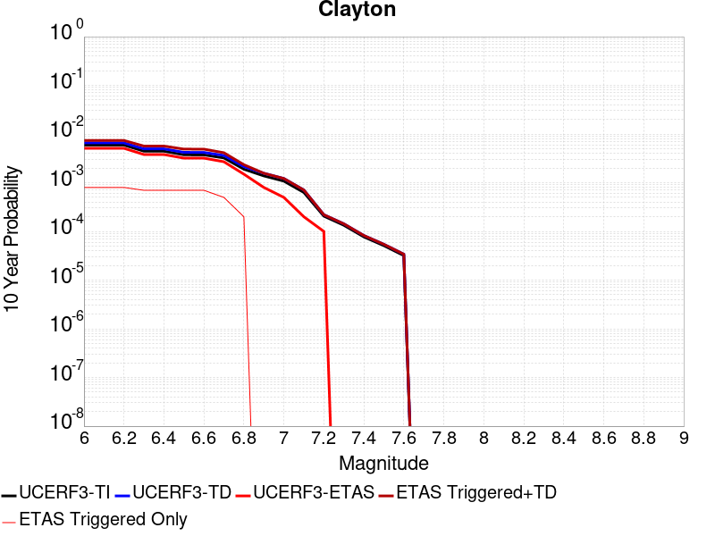 |

| Magnitude | 1 wk TI Prob | 1 wk TD Prob | 1 wk ETAS Prob | 1 wk ETAS/TD Gain | 1 wk ETAS Triggered+TD | 1 wk ETAS Triggered Only | 1 mo TI Prob | 1 mo TD Prob | 1 mo ETAS Prob | 1 mo ETAS/TD Gain | 1 mo ETAS Triggered+TD | 1 mo ETAS Triggered Only | 1 yr TI Prob | 1 yr TD Prob | 1 yr ETAS Prob | 1 yr ETAS/TD Gain | 1 yr ETAS Triggered+TD | 1 yr ETAS Triggered Only | 10 yr TI Prob | 10 yr TD Prob | 10 yr ETAS Prob | 10 yr ETAS/TD Gain | 10 yr ETAS Triggered+TD | 10 yr ETAS Triggered Only |
|-----|-----|-----|-----|-----|-----|-----|-----|-----|-----|-----|-----|-----|-----|-----|-----|-----|-----|-----|-----|-----|-----|-----|-----|-----|
| 6.0 | 1.1413061E-5 | 1.2669826E-5 | 0.0 | 0.0 | 1.2669826E-5 | 0.0 | 4.89122E-5 | 5.429825E-5 | 0.0 | 0.0 | 5.429825E-5 | 0.0 | 5.953433E-4 | 6.609029E-4 | 7.0E-4 | 1.0591571 | 8.607707E-4 | 2.0E-4 | 0.005937509 | 0.0065915775 | 0.0051 | 0.77371466 | 0.007386304 | 8.0E-4 |
| 6.1 | 1.1413061E-5 | 1.2669826E-5 | 0.0 | 0.0 | 1.2669826E-5 | 0.0 | 4.89122E-5 | 5.429825E-5 | 0.0 | 0.0 | 5.429825E-5 | 0.0 | 5.953433E-4 | 6.609029E-4 | 7.0E-4 | 1.0591571 | 8.607707E-4 | 2.0E-4 | 0.005937509 | 0.0065915775 | 0.0051 | 0.77371466 | 0.007386304 | 8.0E-4 |
| 6.2 | 1.1413061E-5 | 1.2669826E-5 | 0.0 | 0.0 | 1.2669826E-5 | 0.0 | 4.89122E-5 | 5.429825E-5 | 0.0 | 0.0 | 5.429825E-5 | 0.0 | 5.953433E-4 | 6.609029E-4 | 7.0E-4 | 1.0591571 | 8.607707E-4 | 2.0E-4 | 0.005937509 | 0.0065915775 | 0.0051 | 0.77371466 | 0.007386304 | 8.0E-4 |
| 6.3 | 8.538689E-6 | 9.534958E-6 | 0.0 | 0.0 | 9.534958E-6 | 0.0 | 3.659387E-5 | 4.0863524E-5 | 0.0 | 0.0 | 4.0863524E-5 | 0.0 | 4.4543925E-4 | 4.974106E-4 | 5.0E-4 | 1.0052058 | 6.9731113E-4 | 2.0E-4 | 0.0044454746 | 0.0049640387 | 0.0038 | 0.76550573 | 0.0056605637 | 7.0E-4 |
| 6.4 | 8.538689E-6 | 9.534958E-6 | 0.0 | 0.0 | 9.534958E-6 | 0.0 | 3.659387E-5 | 4.0863524E-5 | 0.0 | 0.0 | 4.0863524E-5 | 0.0 | 4.4543925E-4 | 4.974106E-4 | 5.0E-4 | 1.0052058 | 6.9731113E-4 | 2.0E-4 | 0.0044454746 | 0.0049640387 | 0.0038 | 0.76550573 | 0.0056605637 | 7.0E-4 |
| 6.5 | 7.197462E-6 | 8.082919E-6 | 0.0 | 0.0 | 8.082919E-6 | 0.0 | 3.08459E-5 | 3.4640667E-5 | 0.0 | 0.0 | 3.4640667E-5 | 0.0 | 3.7548412E-4 | 4.2167673E-4 | 5.0E-4 | 1.1857425 | 6.215924E-4 | 2.0E-4 | 0.003748503 | 0.004209578 | 0.0032 | 0.7601712 | 0.0049066315 | 7.0E-4 |
| 6.6 | 7.1760483E-6 | 8.058929E-6 | 0.0 | 0.0 | 8.058929E-6 | 0.0 | 3.075413E-5 | 3.4537858E-5 | 0.0 | 0.0 | 3.4537858E-5 | 0.0 | 3.743672E-4 | 4.204255E-4 | 5.0E-4 | 1.1892713 | 6.203414E-4 | 2.0E-4 | 0.0037373714 | 0.004197113 | 0.0032 | 0.7624288 | 0.004894175 | 7.0E-4 |
| 6.7 | 6.202582E-6 | 6.9784196E-6 | 0.0 | 0.0 | 6.9784196E-6 | 0.0 | 2.6582224E-5 | 2.9907213E-5 | 0.0 | 0.0 | 2.9907213E-5 | 0.0 | 3.235905E-4 | 3.6406715E-4 | 4.0E-4 | 1.0986984 | 4.6403075E-4 | 1.0E-4 | 0.0032311971 | 0.0036354633 | 0.0027 | 0.7426839 | 0.0041336454 | 5.0E-4 |
| 6.8 | 3.6417277E-6 | 4.12237E-6 | 0.0 | 0.0 | 4.12237E-6 | 0.0 | 1.5607311E-5 | 1.7667184E-5 | 0.0 | 0.0 | 1.7667184E-5 | 0.0 | 1.9000245E-4 | 2.1507751E-4 | 1.0E-4 | 0.46494865 | 2.1507751E-4 | 0.0 | 0.0018984007 | 0.00214877 | 0.0015 | 0.6980738 | 0.0023483401 | 2.0E-4 |
| 6.9 | 2.6498485E-6 | 3.0003034E-6 | 0.0 | 0.0 | 3.0003034E-6 | 0.0 | 1.1356444E-5 | 1.28583815E-5 | 0.0 | 0.0 | 1.28583815E-5 | 0.0 | 1.3825593E-4 | 1.5653994E-4 | 1.0E-4 | 0.63881457 | 1.5653994E-4 | 0.0 | 0.0013816995 | 0.0015643364 | 8.0E-4 | 0.511399 | 0.0015643364 | 0.0 |
| 7.0 | 2.070442E-6 | 2.341335E-6 | 0.0 | 0.0 | 2.341335E-6 | 0.0 | 8.873292E-6 | 1.0034256E-5 | 0.0 | 0.0 | 1.0034256E-5 | 0.0 | 1.0802698E-4 | 1.2216052E-4 | 1.0E-4 | 0.8185951 | 1.2216052E-4 | 0.0 | 0.0010797448 | 0.0012209634 | 5.0E-4 | 0.40951267 | 0.0012209634 | 0.0 |
| 7.1 | 1.2111691E-6 | 1.3592114E-6 | 0.0 | 0.0 | 1.3592114E-6 | 0.0 | 5.190714E-6 | 5.82518E-6 | 0.0 | 0.0 | 5.82518E-6 | 0.0 | 6.319511E-5 | 7.091942E-5 | 0.0 | 0.0 | 7.091942E-5 | 0.0 | 6.3177146E-4 | 7.0898427E-4 | 2.0E-4 | 0.2820937 | 7.0898427E-4 | 0.0 |
| 7.2 | 3.9541607E-7 | 4.223487E-7 | 0.0 | 0.0 | 4.223487E-7 | 0.0 | 1.6946392E-6 | 1.8100646E-6 | 0.0 | 0.0 | 1.8100646E-6 | 0.0 | 2.0632036E-5 | 2.2037315E-5 | 0.0 | 0.0 | 2.2037315E-5 | 0.0 | 2.063012E-4 | 2.2035145E-4 | 1.0E-4 | 0.45382047 | 2.2035145E-4 | 0.0 |
| 7.3 | 2.5685637E-7 | 2.7462383E-7 | 0.0 | 0.0 | 2.7462383E-7 | 0.0 | 1.1008126E-6 | 1.1769587E-6 | 0.0 | 0.0 | 1.1769587E-6 | 0.0 | 1.3402311E-5 | 1.4329379E-5 | 0.0 | 0.0 | 1.4329379E-5 | 0.0 | 1.3401502E-4 | 1.4328462E-4 | 0.0 | 0.0 | 1.4328462E-4 | 0.0 |
| 7.4 | 1.482299E-7 | 1.5811528E-7 | 0.0 | 0.0 | 1.5811528E-7 | 0.0 | 6.3527085E-7 | 6.7763676E-7 | 0.0 | 0.0 | 6.7763676E-7 | 0.0 | 7.734395E-6 | 8.2501965E-6 | 0.0 | 0.0 | 8.2501965E-6 | 0.0 | 7.734126E-5 | 8.2498926E-5 | 0.0 | 0.0 | 8.2498926E-5 | 0.0 |
| 7.5 | 9.7969505E-8 | 1.0441266E-7 | 0.0 | 0.0 | 1.0441266E-7 | 0.0 | 4.1986925E-7 | 4.4748276E-7 | 0.0 | 0.0 | 4.4748276E-7 | 0.0 | 5.111896E-6 | 5.4480893E-6 | 0.0 | 0.0 | 5.4480893E-6 | 0.0 | 5.1117782E-5 | 5.4479573E-5 | 0.0 | 0.0 | 5.4479573E-5 | 0.0 |
| 7.6 | 6.125415E-8 | 6.5235675E-8 | 0.0 | 0.0 | 6.5235675E-8 | 0.0 | 2.6251774E-7 | 2.7958143E-7 | 0.0 | 0.0 | 2.7958143E-7 | 0.0 | 3.196149E-6 | 3.4038987E-6 | 0.0 | 0.0 | 3.4038987E-6 | 0.0 | 3.196103E-5 | 3.403848E-5 | 0.0 | 0.0 | 3.403848E-5 | 0.0 |

## Contra Costa (Lafayette) 2011 CFM
*[(top)](#table-of-contents)*

| 1 Week | 1 Month | 1 Year | 10 Year |
|-----|-----|-----|-----|
| 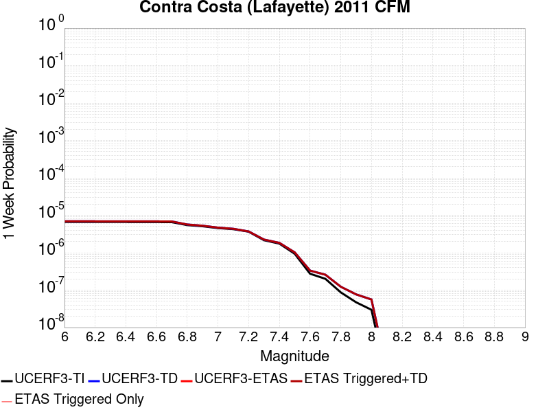 |  |  | 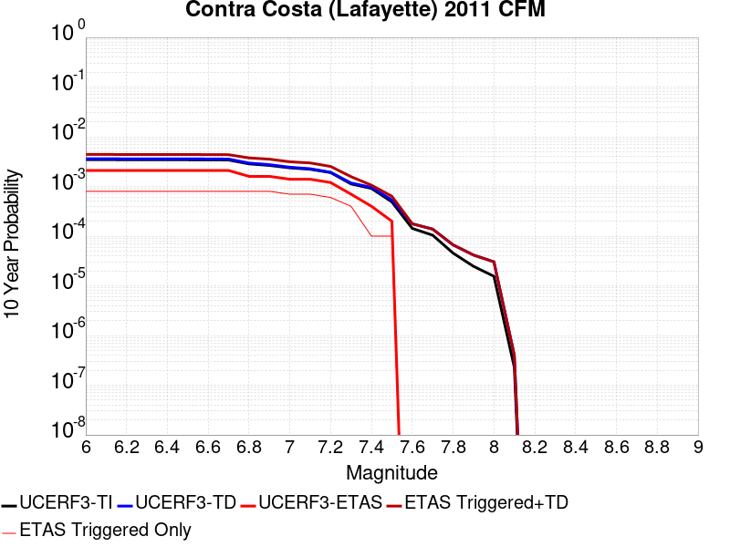 |

| Magnitude | 1 wk TI Prob | 1 wk TD Prob | 1 wk ETAS Prob | 1 wk ETAS/TD Gain | 1 wk ETAS Triggered+TD | 1 wk ETAS Triggered Only | 1 mo TI Prob | 1 mo TD Prob | 1 mo ETAS Prob | 1 mo ETAS/TD Gain | 1 mo ETAS Triggered+TD | 1 mo ETAS Triggered Only | 1 yr TI Prob | 1 yr TD Prob | 1 yr ETAS Prob | 1 yr ETAS/TD Gain | 1 yr ETAS Triggered+TD | 1 yr ETAS Triggered Only | 10 yr TI Prob | 10 yr TD Prob | 10 yr ETAS Prob | 10 yr ETAS/TD Gain | 10 yr ETAS Triggered+TD | 10 yr ETAS Triggered Only |
|-----|-----|-----|-----|-----|-----|-----|-----|-----|-----|-----|-----|-----|-----|-----|-----|-----|-----|-----|-----|-----|-----|-----|-----|-----|
| 6.0 | 6.655419E-6 | 6.938031E-6 | 0.0 | 0.0 | 6.938031E-6 | 0.0 | 2.8522913E-5 | 2.9734092E-5 | 0.0 | 0.0 | 2.9734092E-5 | 0.0 | 3.472111E-4 | 3.6195441E-4 | 1.0E-4 | 0.2762779 | 3.6195441E-4 | 0.0 | 0.0034666911 | 0.0036183153 | 0.0021 | 0.58038056 | 0.004415421 | 8.0E-4 |
| 6.1 | 6.655419E-6 | 6.938031E-6 | 0.0 | 0.0 | 6.938031E-6 | 0.0 | 2.8522913E-5 | 2.9734092E-5 | 0.0 | 0.0 | 2.9734092E-5 | 0.0 | 3.472111E-4 | 3.6195441E-4 | 1.0E-4 | 0.2762779 | 3.6195441E-4 | 0.0 | 0.0034666911 | 0.0036183153 | 0.0021 | 0.58038056 | 0.004415421 | 8.0E-4 |
| 6.2 | 6.6254133E-6 | 6.906437E-6 | 0.0 | 0.0 | 6.906437E-6 | 0.0 | 2.839432E-5 | 2.9598692E-5 | 0.0 | 0.0 | 2.9598692E-5 | 0.0 | 3.45646E-4 | 3.6030644E-4 | 1.0E-4 | 0.27754152 | 3.6030644E-4 | 0.0 | 0.003451089 | 0.0036018894 | 0.0021 | 0.58302736 | 0.0043990077 | 8.0E-4 |
| 6.3 | 6.6254133E-6 | 6.906437E-6 | 0.0 | 0.0 | 6.906437E-6 | 0.0 | 2.839432E-5 | 2.9598692E-5 | 0.0 | 0.0 | 2.9598692E-5 | 0.0 | 3.45646E-4 | 3.6030644E-4 | 1.0E-4 | 0.27754152 | 3.6030644E-4 | 0.0 | 0.003451089 | 0.0036018894 | 0.0021 | 0.58302736 | 0.0043990077 | 8.0E-4 |
| 6.4 | 6.6254133E-6 | 6.906437E-6 | 0.0 | 0.0 | 6.906437E-6 | 0.0 | 2.839432E-5 | 2.9598692E-5 | 0.0 | 0.0 | 2.9598692E-5 | 0.0 | 3.45646E-4 | 3.6030644E-4 | 1.0E-4 | 0.27754152 | 3.6030644E-4 | 0.0 | 0.003451089 | 0.0036018894 | 0.0021 | 0.58302736 | 0.0043990077 | 8.0E-4 |
| 6.5 | 6.606445E-6 | 6.885982E-6 | 0.0 | 0.0 | 6.885982E-6 | 0.0 | 2.8313027E-5 | 2.951103E-5 | 0.0 | 0.0 | 2.951103E-5 | 0.0 | 3.4465658E-4 | 3.5923952E-4 | 1.0E-4 | 0.2783658 | 3.5923952E-4 | 0.0 | 0.0034412253 | 0.0035912546 | 0.0021 | 0.5847539 | 0.0043883817 | 8.0E-4 |
| 6.6 | 6.59966E-6 | 6.878519E-6 | 0.0 | 0.0 | 6.878519E-6 | 0.0 | 2.828395E-5 | 2.9479044E-5 | 0.0 | 0.0 | 2.9479044E-5 | 0.0 | 3.4430268E-4 | 3.5885023E-4 | 1.0E-4 | 0.27866778 | 3.5885023E-4 | 0.0 | 0.0034376972 | 0.0035873742 | 0.0021 | 0.5853864 | 0.004384504 | 8.0E-4 |
| 6.7 | 6.5570975E-6 | 6.832502E-6 | 0.0 | 0.0 | 6.832502E-6 | 0.0 | 2.8101544E-5 | 2.9281835E-5 | 0.0 | 0.0 | 2.9281835E-5 | 0.0 | 3.4208258E-4 | 3.5645E-4 | 1.0E-4 | 0.28054425 | 3.5645E-4 | 0.0 | 0.0034155648 | 0.003563449 | 0.0021 | 0.58931667 | 0.0043605985 | 8.0E-4 |
| 6.8 | 5.472255E-6 | 5.6753493E-6 | 0.0 | 0.0 | 5.6753493E-6 | 0.0 | 2.345231E-5 | 2.43227E-5 | 0.0 | 0.0 | 2.43227E-5 | 0.0 | 2.8549446E-4 | 2.960891E-4 | 1.0E-4 | 0.33773616 | 2.960891E-4 | 0.0 | 0.0028512797 | 0.0029614647 | 0.0016 | 0.5402732 | 0.0037590954 | 8.0E-4 |
| 6.9 | 5.092346E-6 | 5.265648E-6 | 0.0 | 0.0 | 5.265648E-6 | 0.0 | 2.1824157E-5 | 2.256687E-5 | 0.0 | 0.0 | 2.256687E-5 | 0.0 | 2.656767E-4 | 2.7471737E-4 | 1.0E-4 | 0.36401048 | 2.7471737E-4 | 0.0 | 0.002653593 | 0.0027482882 | 0.0016 | 0.58218056 | 0.0035460896 | 8.0E-4 |
| 7.0 | 4.5525762E-6 | 4.6788587E-6 | 0.0 | 0.0 | 4.6788587E-6 | 0.0 | 1.9510895E-5 | 2.0052099E-5 | 0.0 | 0.0 | 2.0052099E-5 | 0.0 | 2.3751926E-4 | 2.4410724E-4 | 1.0E-4 | 0.40965602 | 2.4410724E-4 | 0.0 | 0.0023726553 | 0.0024428922 | 0.0014 | 0.5730912 | 0.003141182 | 7.0E-4 |
| 7.1 | 4.261504E-6 | 4.3579726E-6 | 0.0 | 0.0 | 4.3579726E-6 | 0.0 | 1.826346E-5 | 1.8676892E-5 | 0.0 | 0.0 | 1.8676892E-5 | 0.0 | 2.2233493E-4 | 2.2736771E-4 | 1.0E-4 | 0.4398162 | 2.2736771E-4 | 0.0 | 0.002221126 | 0.002275844 | 0.0014 | 0.61515635 | 0.002974251 | 7.0E-4 |
| 7.2 | 3.654114E-6 | 3.698608E-6 | 0.0 | 0.0 | 3.698608E-6 | 0.0 | 1.5660395E-5 | 1.5851083E-5 | 0.0 | 0.0 | 1.5851083E-5 | 0.0 | 1.9064861E-4 | 1.9297008E-4 | 1.0E-4 | 0.51821506 | 1.9297008E-4 | 0.0 | 0.0019048514 | 0.0019324701 | 0.0012 | 0.6209669 | 0.0025313108 | 6.0E-4 |
| 7.3 | 2.1595129E-6 | 2.245279E-6 | 0.0 | 0.0 | 2.245279E-6 | 0.0 | 9.255023E-6 | 9.622589E-6 | 0.0 | 0.0 | 9.622589E-6 | 0.0 | 1.1267407E-4 | 1.1714877E-4 | 1.0E-4 | 0.85361546 | 1.1714877E-4 | 0.0 | 0.0011261696 | 0.0011753006 | 7.0E-4 | 0.5955923 | 0.0015748305 | 4.0E-4 |
| 7.4 | 1.7532738E-6 | 1.8343949E-6 | 0.0 | 0.0 | 1.8343949E-6 | 0.0 | 7.5140088E-6 | 7.861669E-6 | 0.0 | 0.0 | 7.861669E-6 | 0.0 | 9.147922E-5 | 9.571166E-5 | 1.0E-4 | 1.0448048 | 9.571166E-5 | 0.0 | 9.144157E-4 | 9.60968E-4 | 4.0E-4 | 0.41624692 | 0.001060872 | 1.0E-4 |
| 7.5 | 9.387875E-7 | 1.0198363E-6 | 0.0 | 0.0 | 1.0198363E-6 | 0.0 | 4.0233685E-6 | 4.3707196E-6 | 0.0 | 0.0 | 4.3707196E-6 | 0.0 | 4.8983413E-5 | 5.3212225E-5 | 1.0E-4 | 1.8792673 | 5.3212225E-5 | 0.0 | 4.897262E-4 | 5.359679E-4 | 2.0E-4 | 0.3731567 | 6.359143E-4 | 1.0E-4 |
| 7.6 | 2.7471893E-7 | 3.3143687E-7 | 0.0 | 0.0 | 3.3143687E-7 | 0.0 | 1.1773664E-6 | 1.4204428E-6 | 0.0 | 0.0 | 1.4204428E-6 | 0.0 | 1.433434E-5 | 1.7293756E-5 | 0.0 | 0.0 | 1.7293756E-5 | 0.0 | 1.4333417E-4 | 1.7676907E-4 | 0.0 | 0.0 | 1.7676907E-4 | 0.0 |
| 7.7 | 2.0057985E-7 | 2.5687447E-7 | 0.0 | 0.0 | 2.5687447E-7 | 0.0 | 8.596276E-7 | 1.1008901E-6 | 0.0 | 0.0 | 1.1008901E-6 | 0.0 | 1.0465916E-5 | 1.3403256E-5 | 0.0 | 0.0 | 1.3403256E-5 | 0.0 | 1.0465423E-4 | 1.378247E-4 | 0.0 | 0.0 | 1.378247E-4 | 0.0 |
| 7.8 | 8.7403905E-8 | 1.2301152E-7 | 0.0 | 0.0 | 1.2301152E-7 | 0.0 | 3.745881E-7 | 5.271921E-7 | 0.0 | 0.0 | 5.271921E-7 | 0.0 | 4.5606007E-6 | 6.418545E-6 | 0.0 | 0.0 | 6.418545E-6 | 0.0 | 4.560507E-5 | 6.6445784E-5 | 0.0 | 0.0 | 6.6445784E-5 | 0.0 |
| 7.9 | 4.740233E-8 | 7.680873E-8 | 0.0 | 0.0 | 7.680873E-8 | 0.0 | 2.0315284E-7 | 3.2918024E-7 | 0.0 | 0.0 | 3.2918024E-7 | 0.0 | 2.473383E-6 | 4.007762E-6 | 0.0 | 0.0 | 4.007762E-6 | 0.0 | 2.4733554E-5 | 4.1611078E-5 | 0.0 | 0.0 | 4.1611078E-5 | 0.0 |
| 8.0 | 2.99164E-8 | 5.617189E-8 | 0.0 | 0.0 | 5.617189E-8 | 0.0 | 1.2821314E-7 | 2.4073665E-7 | 0.0 | 0.0 | 2.4073665E-7 | 0.0 | 1.5609938E-6 | 2.9309647E-6 | 0.0 | 0.0 | 2.9309647E-6 | 0.0 | 1.5609829E-5 | 3.0329857E-5 | 0.0 | 0.0 | 3.0329857E-5 | 0.0 |
| 8.1 | 4.431212E-10 | 7.4552076E-10 | 0.0 | 0.0 | 7.4552076E-10 | 0.0 | 1.899091E-9 | 3.1950909E-9 | 0.0 | 0.0 | 3.1950909E-9 | 0.0 | 2.3121432E-8 | 3.890023E-8 | 0.0 | 0.0 | 3.890023E-8 | 0.0 | 2.312143E-7 | 3.9784504E-7 | 0.0 | 0.0 | 3.9784504E-7 | 0.0 |

## Butano 2011 CFM
*[(top)](#table-of-contents)*

| 1 Week | 1 Month | 1 Year | 10 Year |
|-----|-----|-----|-----|
|  |  | 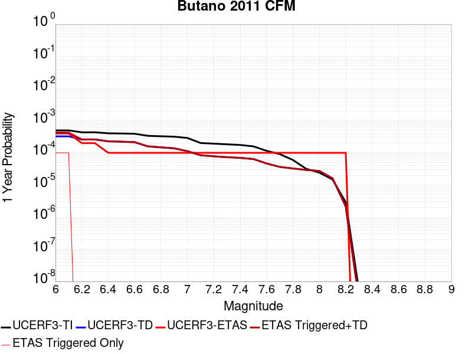 | 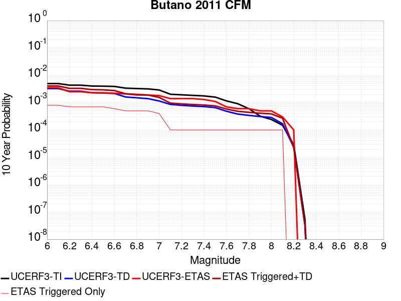 |

| Magnitude | 1 wk TI Prob | 1 wk TD Prob | 1 wk ETAS Prob | 1 wk ETAS/TD Gain | 1 wk ETAS Triggered+TD | 1 wk ETAS Triggered Only | 1 mo TI Prob | 1 mo TD Prob | 1 mo ETAS Prob | 1 mo ETAS/TD Gain | 1 mo ETAS Triggered+TD | 1 mo ETAS Triggered Only | 1 yr TI Prob | 1 yr TD Prob | 1 yr ETAS Prob | 1 yr ETAS/TD Gain | 1 yr ETAS Triggered+TD | 1 yr ETAS Triggered Only | 10 yr TI Prob | 10 yr TD Prob | 10 yr ETAS Prob | 10 yr ETAS/TD Gain | 10 yr ETAS Triggered+TD | 10 yr ETAS Triggered Only |
|-----|-----|-----|-----|-----|-----|-----|-----|-----|-----|-----|-----|-----|-----|-----|-----|-----|-----|-----|-----|-----|-----|-----|-----|-----|
| 6.0 | 9.561135E-6 | 6.2204717E-6 | 1.0E-4 | 16.075953 | 6.2204717E-6 | 0.0 | 4.097565E-5 | 2.6658903E-5 | 1.0E-4 | 3.751092 | 2.6658903E-5 | 0.0 | 4.9876433E-4 | 3.2452602E-4 | 4.0E-4 | 1.2325668 | 4.2449354E-4 | 1.0E-4 | 0.004976464 | 0.003258169 | 0.0035 | 1.074223 | 0.0040555624 | 8.0E-4 |
| 6.1 | 9.561135E-6 | 6.2204717E-6 | 1.0E-4 | 16.075953 | 6.2204717E-6 | 0.0 | 4.097565E-5 | 2.6658903E-5 | 1.0E-4 | 3.751092 | 2.6658903E-5 | 0.0 | 4.9876433E-4 | 3.2452602E-4 | 4.0E-4 | 1.2325668 | 4.2449354E-4 | 1.0E-4 | 0.004976464 | 0.003258169 | 0.0035 | 1.074223 | 0.0040555624 | 8.0E-4 |
| 6.2 | 8.364741E-6 | 4.973452E-6 | 1.0E-4 | 20.106758 | 4.973452E-6 | 0.0 | 3.5848396E-5 | 2.1314629E-5 | 1.0E-4 | 4.691613 | 2.1314629E-5 | 0.0 | 4.3636683E-4 | 2.5947628E-4 | 2.0E-4 | 0.77078336 | 2.5947628E-4 | 0.0 | 0.0043551093 | 0.002609329 | 0.0025 | 0.9581007 | 0.0033075025 | 7.0E-4 |
| 6.3 | 8.364741E-6 | 4.973452E-6 | 1.0E-4 | 20.106758 | 4.973452E-6 | 0.0 | 3.5848396E-5 | 2.1314629E-5 | 1.0E-4 | 4.691613 | 2.1314629E-5 | 0.0 | 4.3636683E-4 | 2.5947628E-4 | 2.0E-4 | 0.77078336 | 2.5947628E-4 | 0.0 | 0.0043551093 | 0.002609329 | 0.0025 | 0.9581007 | 0.0033075025 | 7.0E-4 |
| 6.4 | 7.768282E-6 | 4.351347E-6 | 1.0E-4 | 22.98139 | 4.351347E-6 | 0.0 | 3.329221E-5 | 1.8648505E-5 | 1.0E-4 | 5.3623605 | 1.8648505E-5 | 0.0 | 4.0525728E-4 | 2.2702325E-4 | 1.0E-4 | 0.4404835 | 2.2702325E-4 | 0.0 | 0.0040451903 | 0.002285494 | 0.0023 | 1.0063471 | 0.0029838942 | 7.0E-4 |
| 6.5 | 7.673437E-6 | 4.2508987E-6 | 1.0E-4 | 23.524439 | 4.2508987E-6 | 0.0 | 3.2885746E-5 | 1.8218016E-5 | 1.0E-4 | 5.489072 | 1.8218016E-5 | 0.0 | 4.0031038E-4 | 2.2178312E-4 | 1.0E-4 | 0.45089093 | 2.2178312E-4 | 0.0 | 0.0039959005 | 0.0022331981 | 0.0023 | 1.0299131 | 0.002931635 | 7.0E-4 |
| 6.6 | 7.5244197E-6 | 4.0958485E-6 | 1.0E-4 | 24.414967 | 4.0958485E-6 | 0.0 | 3.2247113E-5 | 1.7553524E-5 | 1.0E-4 | 5.6968617 | 1.7553524E-5 | 0.0 | 3.9253788E-4 | 2.1369454E-4 | 1.0E-4 | 0.46795768 | 2.1369454E-4 | 0.0 | 0.003918452 | 0.0021524709 | 0.0022 | 1.0220811 | 0.0027511795 | 6.0E-4 |
| 6.7 | 6.4921405E-6 | 3.0359163E-6 | 1.0E-4 | 32.938984 | 3.0359163E-6 | 0.0 | 2.7823162E-5 | 1.3011005E-5 | 1.0E-4 | 7.6858015 | 1.3011005E-5 | 0.0 | 3.3869434E-4 | 1.5839755E-4 | 1.0E-4 | 0.63132286 | 1.5839755E-4 | 0.0 | 0.003381786 | 0.0016003131 | 0.0021 | 1.3122432 | 0.002099513 | 5.0E-4 |
| 6.8 | 6.2890294E-6 | 2.8226605E-6 | 1.0E-4 | 35.42757 | 2.8226605E-6 | 0.0 | 2.6952705E-5 | 1.209706E-5 | 1.0E-4 | 8.266472 | 1.209706E-5 | 0.0 | 3.2809976E-4 | 1.4727183E-4 | 1.0E-4 | 0.6790165 | 1.4727183E-4 | 0.0 | 0.0032761577 | 0.00148921 | 0.0019 | 1.2758443 | 0.0019884654 | 5.0E-4 |
| 6.9 | 6.0965517E-6 | 2.6291632E-6 | 1.0E-4 | 38.034916 | 2.6291632E-6 | 0.0 | 2.6127816E-5 | 1.12677935E-5 | 1.0E-4 | 8.874852 | 1.12677935E-5 | 0.0 | 3.1805973E-4 | 1.3717682E-4 | 1.0E-4 | 0.72898614 | 1.3717682E-4 | 0.0 | 0.0031760489 | 0.0013883895 | 0.0019 | 1.3684921 | 0.0018876953 | 5.0E-4 |
| 7.0 | 5.566252E-6 | 2.1466064E-6 | 1.0E-4 | 46.585155 | 2.1466064E-6 | 0.0 | 2.3855147E-5 | 9.199709E-6 | 1.0E-4 | 10.869908 | 9.199709E-6 | 0.0 | 2.9039773E-4 | 1.12000744E-4 | 1.0E-4 | 0.89285123 | 1.12000744E-4 | 0.0 | 0.0029001853 | 0.0011369091 | 0.0018 | 1.58324 | 0.0015364543 | 4.0E-4 |
| 7.1 | 3.878588E-6 | 1.6014229E-6 | 1.0E-4 | 62.444466 | 1.6014229E-6 | 0.0 | 1.6622414E-5 | 6.863223E-6 | 1.0E-4 | 14.570415 | 6.863223E-6 | 0.0 | 2.023591E-4 | 8.355654E-5 | 1.0E-4 | 1.1967944 | 8.355654E-5 | 0.0 | 0.0020217493 | 8.52334E-4 | 0.0014 | 1.6425486 | 9.522488E-4 | 1.0E-4 |
| 7.2 | 3.7038085E-6 | 1.4826645E-6 | 1.0E-4 | 67.446144 | 1.4826645E-6 | 0.0 | 1.587337E-5 | 6.3542607E-6 | 1.0E-4 | 15.737473 | 6.3542607E-6 | 0.0 | 1.9324113E-4 | 7.7360375E-5 | 1.0E-4 | 1.2926514 | 7.7360375E-5 | 0.0 | 0.0019307317 | 7.9038553E-4 | 0.0014 | 1.7712876 | 8.903065E-4 | 1.0E-4 |
| 7.3 | 3.5277278E-6 | 1.3909512E-6 | 1.0E-4 | 71.89325 | 1.3909512E-6 | 0.0 | 1.5118746E-5 | 5.9612057E-6 | 1.0E-4 | 16.775131 | 5.9612057E-6 | 0.0 | 1.8405518E-4 | 7.257526E-5 | 1.0E-4 | 1.37788 | 7.257526E-5 | 0.0 | 0.0018390282 | 7.4248144E-4 | 0.0014 | 1.8855691 | 8.424072E-4 | 1.0E-4 |
| 7.4 | 3.3711294E-6 | 1.3284189E-6 | 1.0E-4 | 75.27746 | 1.3284189E-6 | 0.0 | 1.4447617E-5 | 5.6932113E-6 | 1.0E-4 | 17.56478 | 5.6932113E-6 | 0.0 | 1.7588554E-4 | 6.931264E-5 | 1.0E-4 | 1.4427383 | 6.931264E-5 | 0.0 | 0.0017574639 | 7.098254E-4 | 0.0013 | 1.8314363 | 8.097544E-4 | 1.0E-4 |
| 7.5 | 3.0496426E-6 | 1.2180254E-6 | 1.0E-4 | 82.1001 | 1.2180254E-6 | 0.0 | 1.3069831E-5 | 5.220098E-6 | 1.0E-4 | 19.156727 | 5.220098E-6 | 0.0 | 1.5911358E-4 | 6.355284E-5 | 1.0E-4 | 1.5734937 | 6.355284E-5 | 0.0 | 0.001589997 | 6.52194E-4 | 0.0011 | 1.6866146 | 7.5212884E-4 | 1.0E-4 |
| 7.6 | 2.2179781E-6 | 8.877593E-7 | 1.0E-4 | 112.64314 | 8.877593E-7 | 0.0 | 9.505586E-6 | 3.8046771E-6 | 1.0E-4 | 26.28344 | 3.8046771E-6 | 0.0 | 1.1572436E-4 | 4.6320958E-5 | 1.0E-4 | 2.15885 | 4.6320958E-5 | 0.0 | 0.0011566412 | 4.798548E-4 | 7.0E-4 | 1.4587747 | 5.798068E-4 | 1.0E-4 |
| 7.7 | 1.7519328E-6 | 6.941639E-7 | 1.0E-4 | 144.0582 | 6.941639E-7 | 0.0 | 7.508262E-6 | 2.9749847E-6 | 1.0E-4 | 33.613617 | 2.9749847E-6 | 0.0 | 9.140925E-5 | 3.6219837E-5 | 1.0E-4 | 2.7609181 | 3.6219837E-5 | 0.0 | 9.137166E-4 | 3.7814977E-4 | 6.0E-4 | 1.5866729 | 4.7811194E-4 | 1.0E-4 |
| 7.8 | 1.1478974E-6 | 6.1866217E-7 | 1.0E-4 | 161.63911 | 6.1866217E-7 | 0.0 | 4.9195505E-6 | 2.6514065E-6 | 1.0E-4 | 37.71583 | 2.6514065E-6 | 0.0 | 5.9893882E-5 | 3.2280393E-5 | 1.0E-4 | 3.0978556 | 3.2280393E-5 | 0.0 | 5.9877743E-4 | 3.3843837E-4 | 6.0E-4 | 1.7728485 | 4.3840453E-4 | 1.0E-4 |
| 7.9 | 6.1154634E-7 | 5.5966484E-7 | 1.0E-4 | 178.67838 | 5.5966484E-7 | 0.0 | 2.6209104E-6 | 2.3985613E-6 | 1.0E-4 | 41.691658 | 2.3985613E-6 | 0.0 | 3.1909116E-5 | 2.9202092E-5 | 1.0E-4 | 3.4244123 | 2.9202092E-5 | 0.0 | 3.1904536E-4 | 3.0641968E-4 | 5.0E-4 | 1.631749 | 4.0638904E-4 | 1.0E-4 |
| 8.0 | 4.6520046E-7 | 5.204351E-7 | 1.0E-4 | 192.14693 | 5.204351E-7 | 0.0 | 1.9937147E-6 | 2.2304341E-6 | 1.0E-4 | 44.83432 | 2.2304341E-6 | 0.0 | 2.4273206E-5 | 2.7155196E-5 | 1.0E-4 | 3.6825364 | 2.7155196E-5 | 0.0 | 2.4270554E-4 | 2.8498008E-4 | 5.0E-4 | 1.7545086 | 3.849516E-4 | 1.0E-4 |
| 8.1 | 2.8425194E-7 | 3.065484E-7 | 1.0E-4 | 326.21277 | 3.065484E-7 | 0.0 | 1.218222E-6 | 1.3137782E-6 | 1.0E-4 | 76.11635 | 1.3137782E-6 | 0.0 | 1.4831752E-5 | 1.5995132E-5 | 1.0E-4 | 6.251902 | 1.5995132E-5 | 0.0 | 1.4830762E-4 | 1.6785387E-4 | 3.0E-4 | 1.7872689 | 2.6783708E-4 | 1.0E-4 |
| 8.2 | 5.585778E-8 | 4.0653095E-8 | 1.0E-4 | 2459.8374 | 4.0653095E-8 | 0.0 | 2.3939046E-7 | 1.7422752E-7 | 1.0E-4 | 573.9621 | 1.7422752E-7 | 0.0 | 2.914575E-6 | 2.121218E-6 | 1.0E-4 | 47.142727 | 2.121218E-6 | 0.0 | 2.9145367E-5 | 2.3046701E-5 | 1.0E-4 | 4.3390155 | 2.3046701E-5 | 0.0 |
| 8.3 | 1.0371215E-10 | 5.371814E-11 | 0.0 | 0.0 | 5.371814E-11 | 0.0 | 4.4448079E-10 | 2.3021995E-10 | 0.0 | 0.0 | 2.3021995E-10 | 0.0 | 5.4115543E-9 | 2.802929E-9 | 0.0 | 0.0 | 2.802929E-9 | 0.0 | 5.4115542E-8 | 3.2242255E-8 | 0.0 | 0.0 | 3.2242255E-8 | 0.0 |

## Sierra Nevada  (No Extension)
*[(top)](#table-of-contents)*

| 1 Week | 1 Month | 1 Year | 10 Year |
|-----|-----|-----|-----|
|  | 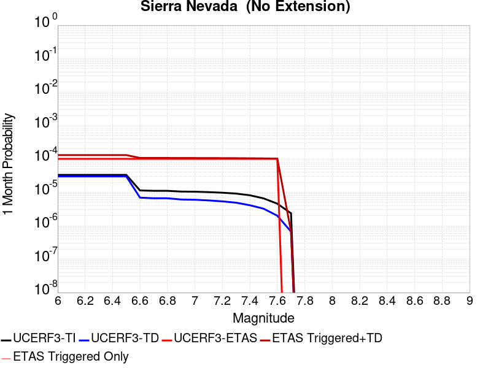 |  |  |

| Magnitude | 1 wk TI Prob | 1 wk TD Prob | 1 wk ETAS Prob | 1 wk ETAS/TD Gain | 1 wk ETAS Triggered+TD | 1 wk ETAS Triggered Only | 1 mo TI Prob | 1 mo TD Prob | 1 mo ETAS Prob | 1 mo ETAS/TD Gain | 1 mo ETAS Triggered+TD | 1 mo ETAS Triggered Only | 1 yr TI Prob | 1 yr TD Prob | 1 yr ETAS Prob | 1 yr ETAS/TD Gain | 1 yr ETAS Triggered+TD | 1 yr ETAS Triggered Only | 10 yr TI Prob | 10 yr TD Prob | 10 yr ETAS Prob | 10 yr ETAS/TD Gain | 10 yr ETAS Triggered+TD | 10 yr ETAS Triggered Only |
|-----|-----|-----|-----|-----|-----|-----|-----|-----|-----|-----|-----|-----|-----|-----|-----|-----|-----|-----|-----|-----|-----|-----|-----|-----|
| 6.0 | 7.7690465E-6 | 6.976904E-6 | 0.0 | 0.0 | 6.976904E-6 | 0.0 | 3.329549E-5 | 2.9900875E-5 | 1.0E-4 | 3.3443837 | 1.2989789E-4 | 1.0E-4 | 4.0529718E-4 | 3.640182E-4 | 1.0E-4 | 0.27471155 | 4.639818E-4 | 1.0E-4 | 0.004045588 | 0.003637736 | 0.0023 | 0.6322614 | 0.004434826 | 8.0E-4 |
| 6.1 | 7.7690465E-6 | 6.976904E-6 | 0.0 | 0.0 | 6.976904E-6 | 0.0 | 3.329549E-5 | 2.9900875E-5 | 1.0E-4 | 3.3443837 | 1.2989789E-4 | 1.0E-4 | 4.0529718E-4 | 3.640182E-4 | 1.0E-4 | 0.27471155 | 4.639818E-4 | 1.0E-4 | 0.004045588 | 0.003637736 | 0.0023 | 0.6322614 | 0.004434826 | 8.0E-4 |
| 6.2 | 7.7690465E-6 | 6.976904E-6 | 0.0 | 0.0 | 6.976904E-6 | 0.0 | 3.329549E-5 | 2.9900875E-5 | 1.0E-4 | 3.3443837 | 1.2989789E-4 | 1.0E-4 | 4.0529718E-4 | 3.640182E-4 | 1.0E-4 | 0.27471155 | 4.639818E-4 | 1.0E-4 | 0.004045588 | 0.003637736 | 0.0023 | 0.6322614 | 0.004434826 | 8.0E-4 |
| 6.3 | 7.7690465E-6 | 6.976904E-6 | 0.0 | 0.0 | 6.976904E-6 | 0.0 | 3.329549E-5 | 2.9900875E-5 | 1.0E-4 | 3.3443837 | 1.2989789E-4 | 1.0E-4 | 4.0529718E-4 | 3.640182E-4 | 1.0E-4 | 0.27471155 | 4.639818E-4 | 1.0E-4 | 0.004045588 | 0.003637736 | 0.0023 | 0.6322614 | 0.004434826 | 8.0E-4 |
| 6.4 | 7.7690465E-6 | 6.976904E-6 | 0.0 | 0.0 | 6.976904E-6 | 0.0 | 3.329549E-5 | 2.9900875E-5 | 1.0E-4 | 3.3443837 | 1.2989789E-4 | 1.0E-4 | 4.0529718E-4 | 3.640182E-4 | 1.0E-4 | 0.27471155 | 4.639818E-4 | 1.0E-4 | 0.004045588 | 0.003637736 | 0.0023 | 0.6322614 | 0.004434826 | 8.0E-4 |
| 6.5 | 7.7690465E-6 | 6.976904E-6 | 0.0 | 0.0 | 6.976904E-6 | 0.0 | 3.329549E-5 | 2.9900875E-5 | 1.0E-4 | 3.3443837 | 1.2989789E-4 | 1.0E-4 | 4.0529718E-4 | 3.640182E-4 | 1.0E-4 | 0.27471155 | 4.639818E-4 | 1.0E-4 | 0.004045588 | 0.003637736 | 0.0023 | 0.6322614 | 0.004434826 | 8.0E-4 |
| 6.6 | 2.653E-6 | 1.614926E-6 | 0.0 | 0.0 | 1.614926E-6 | 0.0 | 1.136995E-5 | 6.921093E-6 | 1.0E-4 | 14.4485855 | 1.069204E-4 | 1.0E-4 | 1.3842035E-4 | 8.426108E-5 | 1.0E-4 | 1.1867875 | 1.8425265E-4 | 1.0E-4 | 0.0013833415 | 8.422948E-4 | 5.0E-4 | 0.5936164 | 0.0011420421 | 3.0E-4 |
| 6.7 | 2.5902466E-6 | 1.5502555E-6 | 0.0 | 0.0 | 1.5502555E-6 | 0.0 | 1.11010095E-5 | 6.6439356E-6 | 1.0E-4 | 15.05132 | 1.06643274E-4 | 1.0E-4 | 1.351464E-4 | 8.0886944E-5 | 1.0E-4 | 1.2362934 | 1.8087885E-4 | 1.0E-4 | 0.0013506424 | 8.08578E-4 | 5.0E-4 | 0.6183695 | 0.0011083354 | 3.0E-4 |
| 6.8 | 2.5853892E-6 | 1.5470555E-6 | 0.0 | 0.0 | 1.5470555E-6 | 0.0 | 1.1080193E-5 | 6.6302214E-6 | 1.0E-4 | 15.082453 | 1.0662956E-4 | 1.0E-4 | 1.34893E-4 | 8.071998E-5 | 1.0E-4 | 1.2388506 | 1.8071191E-4 | 1.0E-4 | 0.0013481114 | 8.0690964E-4 | 5.0E-4 | 0.6196481 | 0.0011066676 | 3.0E-4 |
| 6.9 | 2.458257E-6 | 1.4221247E-6 | 0.0 | 0.0 | 1.4221247E-6 | 0.0 | 1.0535345E-5 | 6.094806E-6 | 1.0E-4 | 16.407413 | 1.06094194E-4 | 1.0E-4 | 1.2826028E-4 | 7.420176E-5 | 1.0E-4 | 1.347677 | 1.7419434E-4 | 1.0E-4 | 0.0012818627 | 7.417718E-4 | 4.0E-4 | 0.5392494 | 0.0010415493 | 3.0E-4 |
| 7.0 | 2.4341468E-6 | 1.3990876E-6 | 0.0 | 0.0 | 1.3990876E-6 | 0.0 | 1.0432016E-5 | 5.996076E-6 | 1.0E-4 | 16.677572 | 1.05995474E-4 | 1.0E-4 | 1.270024E-4 | 7.29998E-5 | 1.0E-4 | 1.3698667 | 1.729925E-4 | 1.0E-4 | 0.0012692984 | 7.2976016E-4 | 4.0E-4 | 0.5481253 | 0.0010295413 | 3.0E-4 |
| 7.1 | 2.3652476E-6 | 1.3340347E-6 | 0.0 | 0.0 | 1.3340347E-6 | 0.0 | 1.0136736E-5 | 5.7172792E-6 | 1.0E-4 | 17.490837 | 1.0571671E-4 | 1.0E-4 | 1.2340778E-4 | 6.960567E-5 | 1.0E-4 | 1.4366646 | 1.695987E-4 | 1.0E-4 | 0.0012333926 | 6.9584034E-4 | 4.0E-4 | 0.5748445 | 9.956316E-4 | 3.0E-4 |
| 7.2 | 2.272158E-6 | 1.2503382E-6 | 0.0 | 0.0 | 1.2503382E-6 | 0.0 | 9.737784E-6 | 5.3585813E-6 | 1.0E-4 | 18.661655 | 1.0535805E-4 | 1.0E-4 | 1.1855107E-4 | 6.523879E-5 | 1.0E-4 | 1.5328304 | 1.6523227E-4 | 1.0E-4 | 0.0011848784 | 6.521979E-4 | 4.0E-4 | 0.61331075 | 9.5200224E-4 | 3.0E-4 |
| 7.3 | 2.1382127E-6 | 1.1420219E-6 | 0.0 | 0.0 | 1.1420219E-6 | 0.0 | 9.163737E-6 | 4.8943707E-6 | 1.0E-4 | 20.431637 | 1.0489388E-4 | 1.0E-4 | 1.1156279E-4 | 5.9587343E-5 | 1.0E-4 | 1.6782087 | 1.5958138E-4 | 1.0E-4 | 0.001115068 | 5.9571484E-4 | 3.0E-4 | 0.50359666 | 8.9553616E-4 | 3.0E-4 |
| 7.4 | 1.9048055E-6 | 9.575683E-7 | 0.0 | 0.0 | 9.575683E-7 | 0.0 | 8.163426E-6 | 4.1038575E-6 | 1.0E-4 | 24.367317 | 1.0410345E-4 | 1.0E-4 | 9.9385186E-5 | 4.9963328E-5 | 1.0E-4 | 2.001468 | 1.4995833E-4 | 1.0E-4 | 9.934074E-4 | 4.995216E-4 | 3.0E-4 | 0.60057455 | 7.993718E-4 | 3.0E-4 |
| 7.5 | 1.5373403E-6 | 7.560389E-7 | 0.0 | 0.0 | 7.560389E-7 | 0.0 | 6.5885843E-6 | 3.2401626E-6 | 1.0E-4 | 30.862648 | 1.03239836E-4 | 1.0E-4 | 8.021306E-5 | 3.944827E-5 | 1.0E-4 | 2.5349653 | 1.3944432E-4 | 1.0E-4 | 8.0184115E-4 | 3.9441316E-4 | 3.0E-4 | 0.7606237 | 6.9429487E-4 | 3.0E-4 |
| 7.6 | 1.0680322E-6 | 4.659834E-7 | 0.0 | 0.0 | 4.659834E-7 | 0.0 | 4.577273E-6 | 1.99707E-6 | 1.0E-4 | 50.073353 | 1.0199687E-4 | 1.0E-4 | 5.5726876E-5 | 2.431406E-5 | 1.0E-4 | 4.1128464 | 1.2431163E-4 | 1.0E-4 | 5.5712904E-4 | 2.4311426E-4 | 2.0E-4 | 0.8226584 | 4.4306566E-4 | 2.0E-4 |
| 7.7 | 5.509146E-7 | 1.5580498E-7 | 0.0 | 0.0 | 1.5580498E-7 | 0.0 | 2.3610605E-6 | 6.677355E-7 | 0.0 | 0.0 | 6.677355E-7 | 0.0 | 2.8745531E-5 | 8.12965E-6 | 0.0 | 0.0 | 8.12965E-6 | 0.0 | 2.8741814E-4 | 8.129365E-5 | 0.0 | 0.0 | 8.129365E-5 | 0.0 |

## Rocky Ledge 2011 CFM
*[(top)](#table-of-contents)*

| 1 Week | 1 Month | 1 Year | 10 Year |
|-----|-----|-----|-----|
|  | 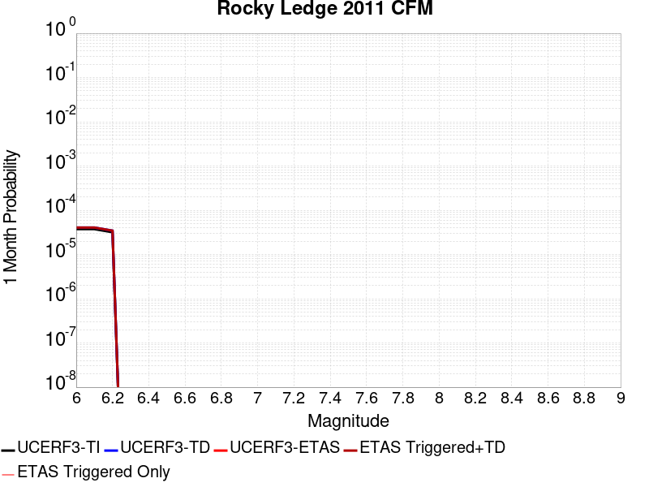 |  |  |

| Magnitude | 1 wk TI Prob | 1 wk TD Prob | 1 wk ETAS Prob | 1 wk ETAS/TD Gain | 1 wk ETAS Triggered+TD | 1 wk ETAS Triggered Only | 1 mo TI Prob | 1 mo TD Prob | 1 mo ETAS Prob | 1 mo ETAS/TD Gain | 1 mo ETAS Triggered+TD | 1 mo ETAS Triggered Only | 1 yr TI Prob | 1 yr TD Prob | 1 yr ETAS Prob | 1 yr ETAS/TD Gain | 1 yr ETAS Triggered+TD | 1 yr ETAS Triggered Only | 10 yr TI Prob | 10 yr TD Prob | 10 yr ETAS Prob | 10 yr ETAS/TD Gain | 10 yr ETAS Triggered+TD | 10 yr ETAS Triggered Only |
|-----|-----|-----|-----|-----|-----|-----|-----|-----|-----|-----|-----|-----|-----|-----|-----|-----|-----|-----|-----|-----|-----|-----|-----|-----|
| 6.0 | 8.7550525E-6 | 9.488178E-6 | 0.0 | 0.0 | 9.488178E-6 | 0.0 | 3.7521113E-5 | 4.066345E-5 | 0.0 | 0.0 | 4.066345E-5 | 0.0 | 4.567238E-4 | 4.9504754E-4 | 3.0E-4 | 0.6060024 | 4.9504754E-4 | 0.0 | 0.0045578624 | 0.0049475385 | 0.004 | 0.8084829 | 0.0057435804 | 8.0E-4 |
| 6.1 | 8.7550525E-6 | 9.488178E-6 | 0.0 | 0.0 | 9.488178E-6 | 0.0 | 3.7521113E-5 | 4.066345E-5 | 0.0 | 0.0 | 4.066345E-5 | 0.0 | 4.567238E-4 | 4.9504754E-4 | 1.0E-4 | 0.2020008 | 4.9504754E-4 | 0.0 | 0.0045578624 | 0.0049475385 | 0.0029 | 0.58615005 | 0.0054450645 | 5.0E-4 |
| 6.2 | 7.442295E-6 | 8.064374E-6 | 0.0 | 0.0 | 8.064374E-6 | 0.0 | 3.189516E-5 | 3.4561603E-5 | 0.0 | 0.0 | 3.4561603E-5 | 0.0 | 3.8825438E-4 | 4.2078752E-4 | 1.0E-4 | 0.23764963 | 4.2078752E-4 | 0.0 | 0.0038757676 | 0.004207875 | 0.0024 | 0.5703591 | 0.004606192 | 4.0E-4 |

## Earthquake Valley (No  Extension)
*[(top)](#table-of-contents)*

| 1 Week | 1 Month | 1 Year | 10 Year |
|-----|-----|-----|-----|
|  | 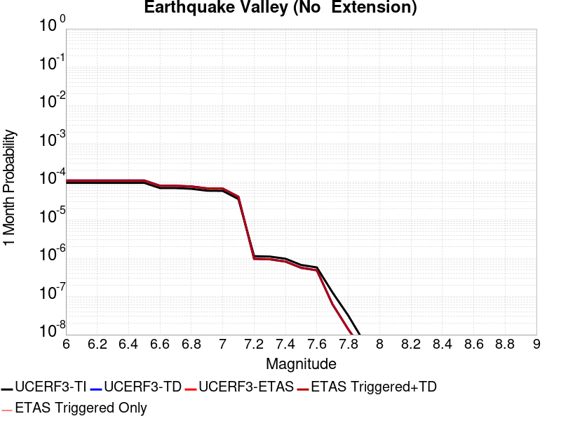 |  | 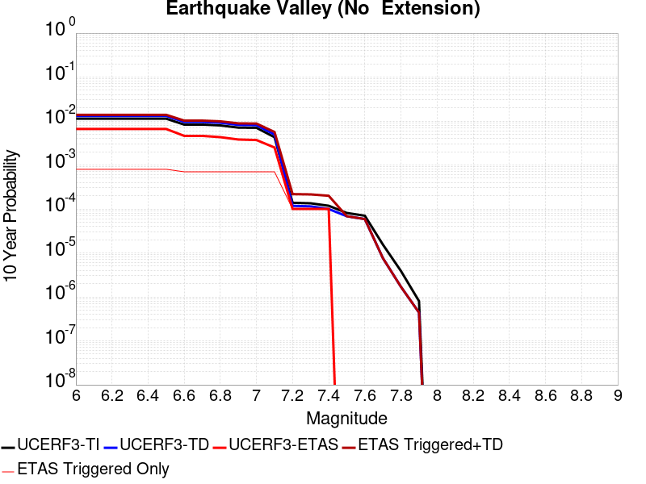 |

| Magnitude | 1 wk TI Prob | 1 wk TD Prob | 1 wk ETAS Prob | 1 wk ETAS/TD Gain | 1 wk ETAS Triggered+TD | 1 wk ETAS Triggered Only | 1 mo TI Prob | 1 mo TD Prob | 1 mo ETAS Prob | 1 mo ETAS/TD Gain | 1 mo ETAS Triggered+TD | 1 mo ETAS Triggered Only | 1 yr TI Prob | 1 yr TD Prob | 1 yr ETAS Prob | 1 yr ETAS/TD Gain | 1 yr ETAS Triggered+TD | 1 yr ETAS Triggered Only | 10 yr TI Prob | 10 yr TD Prob | 10 yr ETAS Prob | 10 yr ETAS/TD Gain | 10 yr ETAS Triggered+TD | 10 yr ETAS Triggered Only |
|-----|-----|-----|-----|-----|-----|-----|-----|-----|-----|-----|-----|-----|-----|-----|-----|-----|-----|-----|-----|-----|-----|-----|-----|-----|
| 6.0 | 2.1859703E-5 | 2.5206198E-5 | 0.0 | 0.0 | 2.5206198E-5 | 0.0 | 9.3681076E-5 | 1.0802291E-4 | 0.0 | 0.0 | 1.0802291E-4 | 0.0 | 0.0011399703 | 0.0013145307 | 0.001 | 0.76072776 | 0.0016141363 | 3.0E-4 | 0.011341401 | 0.013081919 | 0.0066 | 0.5045131 | 0.013871455 | 8.0E-4 |
| 6.1 | 2.1859703E-5 | 2.5206198E-5 | 0.0 | 0.0 | 2.5206198E-5 | 0.0 | 9.3681076E-5 | 1.0802291E-4 | 0.0 | 0.0 | 1.0802291E-4 | 0.0 | 0.0011399703 | 0.0013145307 | 0.001 | 0.76072776 | 0.0016141363 | 3.0E-4 | 0.011341401 | 0.013081919 | 0.0066 | 0.5045131 | 0.013871455 | 8.0E-4 |
| 6.2 | 2.1859703E-5 | 2.5206198E-5 | 0.0 | 0.0 | 2.5206198E-5 | 0.0 | 9.3681076E-5 | 1.0802291E-4 | 0.0 | 0.0 | 1.0802291E-4 | 0.0 | 0.0011399703 | 0.0013145307 | 0.001 | 0.76072776 | 0.0016141363 | 3.0E-4 | 0.011341401 | 0.013081919 | 0.0066 | 0.5045131 | 0.013871455 | 8.0E-4 |
| 6.3 | 2.1859703E-5 | 2.5206198E-5 | 0.0 | 0.0 | 2.5206198E-5 | 0.0 | 9.3681076E-5 | 1.0802291E-4 | 0.0 | 0.0 | 1.0802291E-4 | 0.0 | 0.0011399703 | 0.0013145307 | 0.001 | 0.76072776 | 0.0016141363 | 3.0E-4 | 0.011341401 | 0.013081919 | 0.0066 | 0.5045131 | 0.013871455 | 8.0E-4 |
| 6.4 | 2.1859703E-5 | 2.5206198E-5 | 0.0 | 0.0 | 2.5206198E-5 | 0.0 | 9.3681076E-5 | 1.0802291E-4 | 0.0 | 0.0 | 1.0802291E-4 | 0.0 | 0.0011399703 | 0.0013145307 | 0.001 | 0.76072776 | 0.0016141363 | 3.0E-4 | 0.011341401 | 0.013081919 | 0.0066 | 0.5045131 | 0.013871455 | 8.0E-4 |
| 6.5 | 2.1859703E-5 | 2.5206198E-5 | 0.0 | 0.0 | 2.5206198E-5 | 0.0 | 9.3681076E-5 | 1.0802291E-4 | 0.0 | 0.0 | 1.0802291E-4 | 0.0 | 0.0011399703 | 0.0013145307 | 0.001 | 0.76072776 | 0.0016141363 | 3.0E-4 | 0.011341401 | 0.013081919 | 0.0066 | 0.5045131 | 0.013871455 | 8.0E-4 |
| 6.6 | 1.597E-5 | 1.8361923E-5 | 0.0 | 0.0 | 1.8361923E-5 | 0.0 | 6.8441055E-5 | 7.869207E-5 | 0.0 | 0.0 | 7.869207E-5 | 0.0 | 8.329513E-4 | 9.577422E-4 | 7.0E-4 | 0.7308856 | 0.0011575506 | 2.0E-4 | 0.008298361 | 0.00954476 | 0.0046 | 0.48193982 | 0.010238078 | 7.0E-4 |
| 6.7 | 1.597E-5 | 1.8361923E-5 | 0.0 | 0.0 | 1.8361923E-5 | 0.0 | 6.8441055E-5 | 7.869207E-5 | 0.0 | 0.0 | 7.869207E-5 | 0.0 | 8.329513E-4 | 9.577422E-4 | 7.0E-4 | 0.7308856 | 0.0011575506 | 2.0E-4 | 0.008298361 | 0.00954476 | 0.0046 | 0.48193982 | 0.010238078 | 7.0E-4 |
| 6.8 | 1.5315149E-5 | 1.7607512E-5 | 0.0 | 0.0 | 1.7607512E-5 | 0.0 | 6.5634704E-5 | 7.545907E-5 | 0.0 | 0.0 | 7.545907E-5 | 0.0 | 7.988095E-4 | 9.184137E-4 | 7.0E-4 | 0.7621837 | 0.00111823 | 2.0E-4 | 0.007959441 | 0.009154727 | 0.0043 | 0.46970272 | 0.009848319 | 7.0E-4 |
| 6.9 | 1.3634728E-5 | 1.5680682E-5 | 0.0 | 0.0 | 1.5680682E-5 | 0.0 | 5.8433237E-5 | 6.7201654E-5 | 0.0 | 0.0 | 6.7201654E-5 | 0.0 | 7.1119244E-4 | 8.179551E-4 | 6.0E-4 | 0.73353654 | 0.0010177916 | 2.0E-4 | 0.007089207 | 0.0081575215 | 0.0038 | 0.46582776 | 0.008851811 | 7.0E-4 |
| 7.0 | 1.3496271E-5 | 1.552267E-5 | 0.0 | 0.0 | 1.552267E-5 | 0.0 | 5.783988E-5 | 6.6524495E-5 | 0.0 | 0.0 | 6.6524495E-5 | 0.0 | 7.03973E-4 | 8.097168E-4 | 6.0E-4 | 0.74099976 | 0.0010095548 | 2.0E-4 | 0.007017471 | 0.008075739 | 0.0037 | 0.45816243 | 0.008770086 | 7.0E-4 |
| 7.1 | 8.242798E-6 | 9.475608E-6 | 0.0 | 0.0 | 9.475608E-6 | 0.0 | 3.53258E-5 | 4.0609495E-5 | 0.0 | 0.0 | 4.0609495E-5 | 0.0 | 4.300067E-4 | 4.9437553E-4 | 3.0E-4 | 0.6068261 | 6.9427665E-4 | 2.0E-4 | 0.004291756 | 0.004939338 | 0.0025 | 0.5061407 | 0.0056358804 | 7.0E-4 |
| 7.2 | 2.6506527E-7 | 2.2569199E-7 | 0.0 | 0.0 | 2.2569199E-7 | 0.0 | 1.1359936E-6 | 9.67251E-7 | 0.0 | 0.0 | 9.67251E-7 | 0.0 | 1.3830633E-5 | 1.1776222E-5 | 0.0 | 0.0 | 1.1776222E-5 | 0.0 | 1.3829772E-4 | 1.1775639E-4 | 1.0E-4 | 0.8492108 | 2.1774461E-4 | 1.0E-4 |
| 7.3 | 2.5810488E-7 | 2.1964209E-7 | 0.0 | 0.0 | 2.1964209E-7 | 0.0 | 1.1061633E-6 | 9.413229E-7 | 0.0 | 0.0 | 9.413229E-7 | 0.0 | 1.3467455E-5 | 1.1460551E-5 | 0.0 | 0.0 | 1.1460551E-5 | 0.0 | 1.3466639E-4 | 1.1460001E-4 | 1.0E-4 | 0.8726003 | 2.1458855E-4 | 1.0E-4 |
| 7.4 | 2.2676066E-7 | 1.9119065E-7 | 0.0 | 0.0 | 1.9119065E-7 | 0.0 | 9.71831E-7 | 8.193883E-7 | 0.0 | 0.0 | 8.193883E-7 | 0.0 | 1.1831979E-5 | 9.97601E-6 | 0.0 | 0.0 | 9.97601E-6 | 0.0 | 1.1831349E-4 | 9.975601E-5 | 1.0E-4 | 1.0024458 | 1.9974603E-4 | 1.0E-4 |
| 7.5 | 1.5553917E-7 | 1.3118898E-7 | 0.0 | 0.0 | 1.3118898E-7 | 0.0 | 6.6659624E-7 | 5.622384E-7 | 0.0 | 0.0 | 5.622384E-7 | 0.0 | 8.115779E-6 | 6.845233E-6 | 0.0 | 0.0 | 6.845233E-6 | 0.0 | 8.115482E-5 | 6.845044E-5 | 0.0 | 0.0 | 6.845044E-5 | 0.0 |
| 7.6 | 1.3448629E-7 | 1.12943916E-7 | 0.0 | 0.0 | 1.12943916E-7 | 0.0 | 5.7636964E-7 | 4.840453E-7 | 0.0 | 0.0 | 4.840453E-7 | 0.0 | 7.017278E-6 | 5.8932374E-6 | 0.0 | 0.0 | 5.8932374E-6 | 0.0 | 7.0170565E-5 | 5.8931026E-5 | 0.0 | 0.0 | 5.8931026E-5 | 0.0 |
| 7.7 | 2.9719402E-8 | 1.459214E-8 | 0.0 | 0.0 | 1.459214E-8 | 0.0 | 1.2736886E-7 | 6.2537744E-8 | 0.0 | 0.0 | 6.2537744E-8 | 0.0 | 1.5507147E-6 | 7.613968E-7 | 0.0 | 0.0 | 7.613968E-7 | 0.0 | 1.550704E-5 | 7.613947E-6 | 0.0 | 0.0 | 7.613947E-6 | 0.0 |
| 7.8 | 7.4390196E-9 | 3.2520835E-9 | 0.0 | 0.0 | 3.2520835E-9 | 0.0 | 3.1881513E-8 | 1.3937501E-8 | 0.0 | 0.0 | 1.3937501E-8 | 0.0 | 3.8815733E-7 | 1.6968906E-7 | 0.0 | 0.0 | 1.6968906E-7 | 0.0 | 3.8815665E-6 | 1.6968895E-6 | 0.0 | 0.0 | 1.6968895E-6 | 0.0 |
| 7.9 | 1.5373532E-9 | 8.444304E-10 | 0.0 | 0.0 | 8.444304E-10 | 0.0 | 6.5886567E-9 | 3.6189873E-9 | 0.0 | 0.0 | 3.6189873E-9 | 0.0 | 8.021689E-8 | 4.406117E-8 | 0.0 | 0.0 | 4.406117E-8 | 0.0 | 8.0216864E-7 | 4.406117E-7 | 0.0 | 0.0 | 4.406117E-7 | 0.0 |

## Deep Springs
*[(top)](#table-of-contents)*

| 1 Week | 1 Month | 1 Year | 10 Year |
|-----|-----|-----|-----|
| 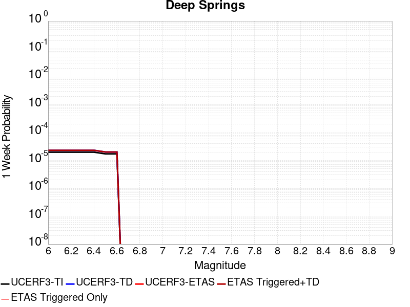 |  |  | 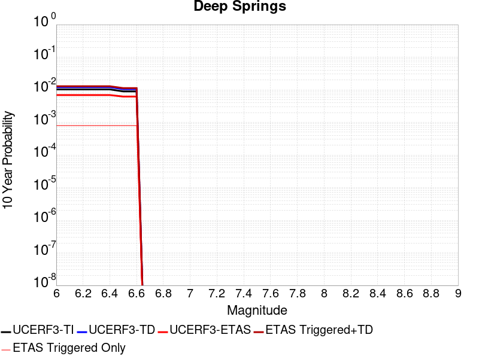 |

| Magnitude | 1 wk TI Prob | 1 wk TD Prob | 1 wk ETAS Prob | 1 wk ETAS/TD Gain | 1 wk ETAS Triggered+TD | 1 wk ETAS Triggered Only | 1 mo TI Prob | 1 mo TD Prob | 1 mo ETAS Prob | 1 mo ETAS/TD Gain | 1 mo ETAS Triggered+TD | 1 mo ETAS Triggered Only | 1 yr TI Prob | 1 yr TD Prob | 1 yr ETAS Prob | 1 yr ETAS/TD Gain | 1 yr ETAS Triggered+TD | 1 yr ETAS Triggered Only | 10 yr TI Prob | 10 yr TD Prob | 10 yr ETAS Prob | 10 yr ETAS/TD Gain | 10 yr ETAS Triggered+TD | 10 yr ETAS Triggered Only |
|-----|-----|-----|-----|-----|-----|-----|-----|-----|-----|-----|-----|-----|-----|-----|-----|-----|-----|-----|-----|-----|-----|-----|-----|-----|
| 6.0 | 1.9810619E-5 | 2.3120161E-5 | 0.0 | 0.0 | 2.3120161E-5 | 0.0 | 8.489989E-5 | 9.9085504E-5 | 0.0 | 0.0 | 9.9085504E-5 | 0.0 | 0.001033166 | 0.0012062063 | 6.0E-4 | 0.49742737 | 0.0013060856 | 1.0E-4 | 0.010283757 | 0.012046403 | 0.0069 | 0.5727851 | 0.012836766 | 8.0E-4 |
| 6.1 | 1.9810619E-5 | 2.3120161E-5 | 0.0 | 0.0 | 2.3120161E-5 | 0.0 | 8.489989E-5 | 9.9085504E-5 | 0.0 | 0.0 | 9.9085504E-5 | 0.0 | 0.001033166 | 0.0012062063 | 6.0E-4 | 0.49742737 | 0.0013060856 | 1.0E-4 | 0.010283757 | 0.012046403 | 0.0069 | 0.5727851 | 0.012836766 | 8.0E-4 |
| 6.2 | 1.9810619E-5 | 2.3120161E-5 | 0.0 | 0.0 | 2.3120161E-5 | 0.0 | 8.489989E-5 | 9.9085504E-5 | 0.0 | 0.0 | 9.9085504E-5 | 0.0 | 0.001033166 | 0.0012062063 | 6.0E-4 | 0.49742737 | 0.0013060856 | 1.0E-4 | 0.010283757 | 0.012046403 | 0.0069 | 0.5727851 | 0.012836766 | 8.0E-4 |
| 6.3 | 1.9810619E-5 | 2.3120161E-5 | 0.0 | 0.0 | 2.3120161E-5 | 0.0 | 8.489989E-5 | 9.9085504E-5 | 0.0 | 0.0 | 9.9085504E-5 | 0.0 | 0.001033166 | 0.0012062063 | 6.0E-4 | 0.49742737 | 0.0013060856 | 1.0E-4 | 0.010283757 | 0.012046403 | 0.0069 | 0.5727851 | 0.012836766 | 8.0E-4 |
| 6.4 | 1.9810619E-5 | 2.3120161E-5 | 0.0 | 0.0 | 2.3120161E-5 | 0.0 | 8.489989E-5 | 9.9085504E-5 | 0.0 | 0.0 | 9.9085504E-5 | 0.0 | 0.001033166 | 0.0012062063 | 6.0E-4 | 0.49742737 | 0.0013060856 | 1.0E-4 | 0.010283757 | 0.012046403 | 0.0069 | 0.5727851 | 0.012836766 | 8.0E-4 |
| 6.5 | 1.7190405E-5 | 2.0057176E-5 | 0.0 | 0.0 | 2.0057176E-5 | 0.0 | 7.367108E-5 | 8.595932E-5 | 0.0 | 0.0 | 8.595932E-5 | 0.0 | 8.9657627E-4 | 0.0010465544 | 5.0E-4 | 0.47775826 | 0.0011464497 | 1.0E-4 | 0.008929676 | 0.010465511 | 0.0062 | 0.59242207 | 0.011257139 | 8.0E-4 |
| 6.6 | 1.7190405E-5 | 2.0057176E-5 | 0.0 | 0.0 | 2.0057176E-5 | 0.0 | 7.367108E-5 | 8.595932E-5 | 0.0 | 0.0 | 8.595932E-5 | 0.0 | 8.9657627E-4 | 0.0010465544 | 5.0E-4 | 0.47775826 | 0.0011464497 | 1.0E-4 | 0.008929676 | 0.010465511 | 0.0062 | 0.59242207 | 0.011257139 | 8.0E-4 |

## Great Valley 10 (Panoche)
*[(top)](#table-of-contents)*

| 1 Week | 1 Month | 1 Year | 10 Year |
|-----|-----|-----|-----|
|  | 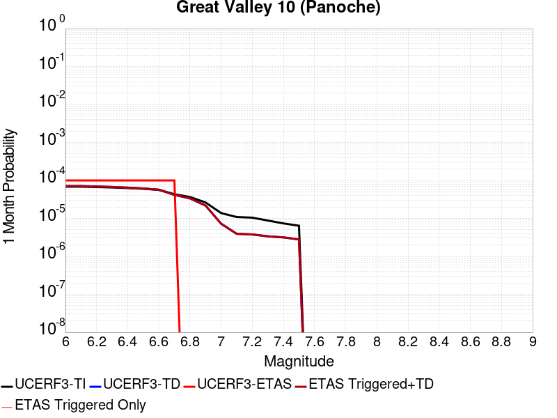 | 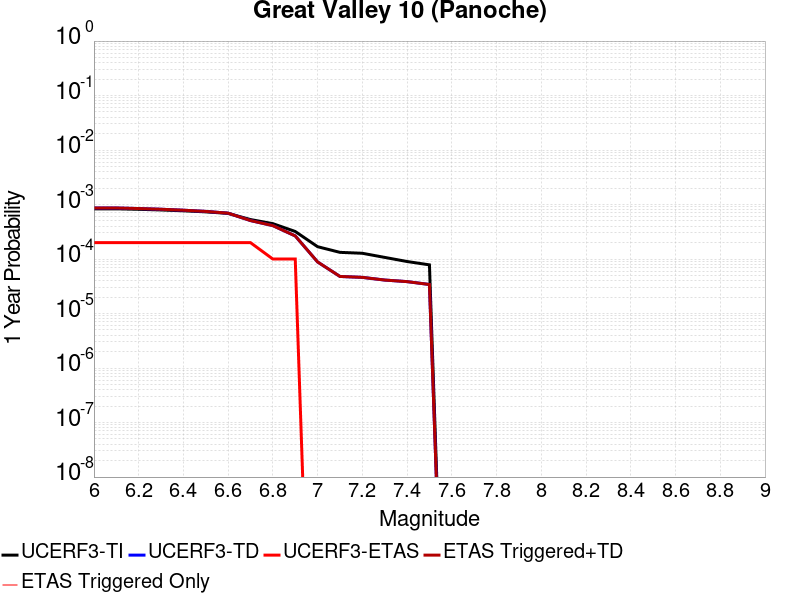 | 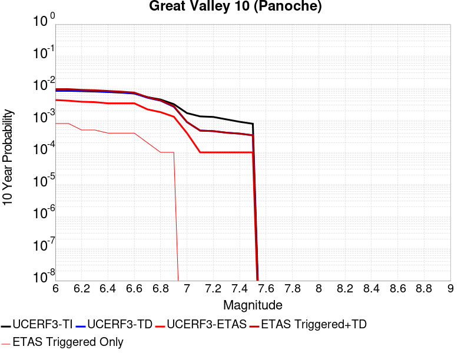 |

| Magnitude | 1 wk TI Prob | 1 wk TD Prob | 1 wk ETAS Prob | 1 wk ETAS/TD Gain | 1 wk ETAS Triggered+TD | 1 wk ETAS Triggered Only | 1 mo TI Prob | 1 mo TD Prob | 1 mo ETAS Prob | 1 mo ETAS/TD Gain | 1 mo ETAS Triggered+TD | 1 mo ETAS Triggered Only | 1 yr TI Prob | 1 yr TD Prob | 1 yr ETAS Prob | 1 yr ETAS/TD Gain | 1 yr ETAS Triggered+TD | 1 yr ETAS Triggered Only | 10 yr TI Prob | 10 yr TD Prob | 10 yr ETAS Prob | 10 yr ETAS/TD Gain | 10 yr ETAS Triggered+TD | 10 yr ETAS Triggered Only |
|-----|-----|-----|-----|-----|-----|-----|-----|-----|-----|-----|-----|-----|-----|-----|-----|-----|-----|-----|-----|-----|-----|-----|-----|-----|
| 6.0 | 1.6014626E-5 | 1.6580454E-5 | 1.0E-4 | 6.031198 | 1.6580454E-5 | 0.0 | 6.863231E-5 | 7.1057184E-5 | 1.0E-4 | 1.4073173 | 7.1057184E-5 | 0.0 | 8.35278E-4 | 8.647834E-4 | 2.0E-4 | 0.23127179 | 8.647834E-4 | 0.0 | 0.008321454 | 0.008614794 | 0.0043 | 0.49914134 | 0.009407903 | 8.0E-4 |
| 6.1 | 1.6014626E-5 | 1.6580454E-5 | 1.0E-4 | 6.031198 | 1.6580454E-5 | 0.0 | 6.863231E-5 | 7.1057184E-5 | 1.0E-4 | 1.4073173 | 7.1057184E-5 | 0.0 | 8.35278E-4 | 8.647834E-4 | 2.0E-4 | 0.23127179 | 8.647834E-4 | 0.0 | 0.008321454 | 0.008614794 | 0.0041 | 0.47592545 | 0.009407903 | 8.0E-4 |
| 6.2 | 1.56782E-5 | 1.620341E-5 | 1.0E-4 | 6.1715403 | 1.620341E-5 | 0.0 | 6.719056E-5 | 6.944137E-5 | 1.0E-4 | 1.4400637 | 6.944137E-5 | 0.0 | 8.17738E-4 | 8.451262E-4 | 2.0E-4 | 0.23665103 | 8.451262E-4 | 0.0 | 0.008147354 | 0.008419723 | 0.0038 | 0.4513212 | 0.008915514 | 5.0E-4 |
| 6.3 | 1.5263338E-5 | 1.5728343E-5 | 1.0E-4 | 6.3579493 | 1.5728343E-5 | 0.0 | 6.541267E-5 | 6.740547E-5 | 1.0E-4 | 1.4835591 | 6.740547E-5 | 0.0 | 7.961082E-4 | 8.20358E-4 | 2.0E-4 | 0.24379599 | 8.20358E-4 | 0.0 | 0.007932622 | 0.008173883 | 0.0037 | 0.45266122 | 0.008669796 | 5.0E-4 |
| 6.4 | 1.4720723E-5 | 1.5104018E-5 | 1.0E-4 | 6.620755 | 1.5104018E-5 | 0.0 | 6.308728E-5 | 6.4729924E-5 | 1.0E-4 | 1.5448805 | 6.4729924E-5 | 0.0 | 7.67817E-4 | 7.878072E-4 | 2.0E-4 | 0.2538692 | 7.878072E-4 | 0.0 | 0.007651695 | 0.007850714 | 0.0034 | 0.43308163 | 0.008247574 | 4.0E-4 |
| 6.5 | 1.408264E-5 | 1.4360368E-5 | 1.0E-4 | 6.9636097 | 1.4360368E-5 | 0.0 | 6.0352773E-5 | 6.154301E-5 | 1.0E-4 | 1.6248798 | 6.154301E-5 | 0.0 | 7.3454727E-4 | 7.4903376E-4 | 2.0E-4 | 0.26701066 | 7.4903376E-4 | 0.0 | 0.0073212404 | 0.007465641 | 0.0034 | 0.4554197 | 0.0078626545 | 4.0E-4 |
| 6.6 | 1.3197086E-5 | 1.332594E-5 | 1.0E-4 | 7.504161 | 1.332594E-5 | 0.0 | 5.6557717E-5 | 5.7109948E-5 | 1.0E-4 | 1.7510084 | 5.7109948E-5 | 0.0 | 6.8837265E-4 | 6.9509697E-4 | 2.0E-4 | 0.28772965 | 6.9509697E-4 | 0.0 | 0.006862442 | 0.006929761 | 0.0034 | 0.49063742 | 0.007326989 | 4.0E-4 |
| 6.7 | 1.017583E-5 | 9.748136E-6 | 1.0E-4 | 10.258371 | 9.748136E-6 | 0.0 | 4.360997E-5 | 4.177707E-5 | 1.0E-4 | 2.3936574 | 4.177707E-5 | 0.0 | 5.30822E-4 | 5.0851953E-4 | 2.0E-4 | 0.39329854 | 5.0851953E-4 | 0.0 | 0.0052955584 | 0.005073812 | 0.0022 | 0.43359905 | 0.005272797 | 2.0E-4 |
| 6.8 | 8.557912E-6 | 7.874875E-6 | 0.0 | 0.0 | 7.874875E-6 | 0.0 | 3.667625E-5 | 3.3749042E-5 | 0.0 | 0.0 | 3.3749042E-5 | 0.0 | 4.4644187E-4 | 4.1081914E-4 | 1.0E-4 | 0.24341613 | 4.1081914E-4 | 0.0 | 0.0044554602 | 0.0041008038 | 0.0018 | 0.43893835 | 0.004200394 | 1.0E-4 |
| 6.9 | 6.14664E-6 | 5.093393E-6 | 0.0 | 0.0 | 5.093393E-6 | 0.0 | 2.6342475E-5 | 2.1828653E-5 | 0.0 | 0.0 | 2.1828653E-5 | 0.0 | 3.2067244E-4 | 2.6573282E-4 | 1.0E-4 | 0.37631783 | 2.6573282E-4 | 0.0 | 0.003202101 | 0.0026542891 | 0.0013 | 0.48977333 | 0.0027540238 | 1.0E-4 |
| 7.0 | 3.2310581E-6 | 1.695329E-6 | 0.0 | 0.0 | 1.695329E-6 | 0.0 | 1.3847319E-5 | 7.2656762E-6 | 0.0 | 0.0 | 7.2656762E-6 | 0.0 | 1.6857806E-4 | 8.8456116E-5 | 0.0 | 0.0 | 8.8456116E-5 | 0.0 | 0.0016845023 | 8.8421843E-4 | 4.0E-4 | 0.4523769 | 8.8421843E-4 | 0.0 |
| 7.1 | 2.544492E-6 | 9.18898E-7 | 0.0 | 0.0 | 9.18898E-7 | 0.0 | 1.090492E-5 | 3.9381284E-6 | 0.0 | 0.0 | 3.9381284E-6 | 0.0 | 1.327593E-4 | 4.794571E-5 | 0.0 | 0.0 | 4.794571E-5 | 0.0 | 0.0013268003 | 4.7935842E-4 | 1.0E-4 | 0.20861216 | 4.7935842E-4 | 0.0 |
| 7.2 | 2.4479045E-6 | 8.841403E-7 | 0.0 | 0.0 | 8.841403E-7 | 0.0 | 1.0490977E-5 | 3.7891675E-6 | 0.0 | 0.0 | 3.7891675E-6 | 0.0 | 1.2772017E-4 | 4.6132187E-5 | 0.0 | 0.0 | 4.6132187E-5 | 0.0 | 0.0012764678 | 4.6123084E-4 | 1.0E-4 | 0.21681118 | 4.6123084E-4 | 0.0 |
| 7.3 | 2.0559578E-6 | 7.8924336E-7 | 0.0 | 0.0 | 7.8924336E-7 | 0.0 | 8.811218E-6 | 3.3824674E-6 | 0.0 | 0.0 | 3.3824674E-6 | 0.0 | 1.072713E-4 | 4.118081E-5 | 0.0 | 0.0 | 4.118081E-5 | 0.0 | 0.0010721954 | 4.1173643E-4 | 1.0E-4 | 0.24287382 | 4.1173643E-4 | 0.0 |
| 7.4 | 1.727687E-6 | 7.387188E-7 | 0.0 | 0.0 | 7.387188E-7 | 0.0 | 7.404352E-6 | 3.1659342E-6 | 0.0 | 0.0 | 3.1659342E-6 | 0.0 | 9.0144255E-5 | 3.8544615E-5 | 0.0 | 0.0 | 3.8544615E-5 | 0.0 | 9.0107694E-4 | 3.853839E-4 | 1.0E-4 | 0.25948152 | 3.853839E-4 | 0.0 |
| 7.5 | 1.5002679E-6 | 6.545664E-7 | 0.0 | 0.0 | 6.545664E-7 | 0.0 | 6.4297037E-6 | 2.8052818E-6 | 0.0 | 0.0 | 2.8052818E-6 | 0.0 | 7.827883E-5 | 3.415381E-5 | 0.0 | 0.0 | 3.415381E-5 | 0.0 | 7.825126E-4 | 3.414898E-4 | 1.0E-4 | 0.29283452 | 3.414898E-4 | 0.0 |

## West Tahoe
*[(top)](#table-of-contents)*

| 1 Week | 1 Month | 1 Year | 10 Year |
|-----|-----|-----|-----|
|  | 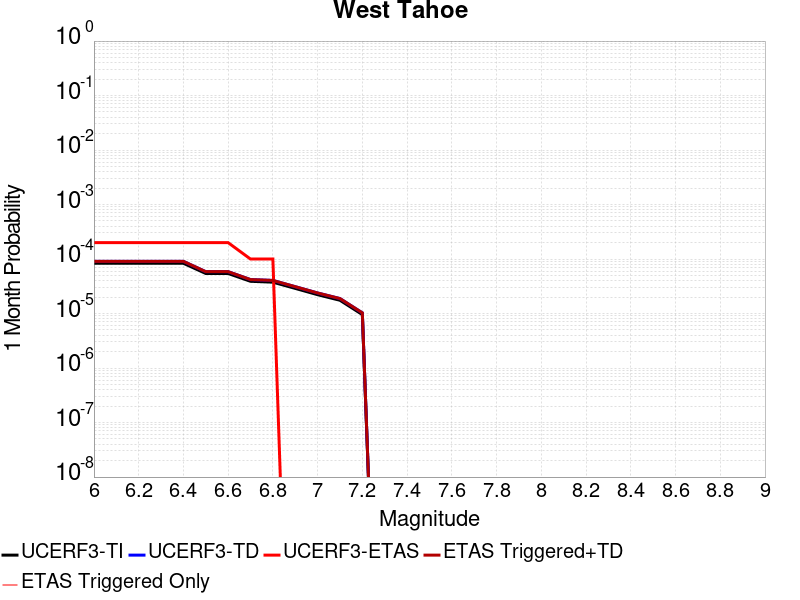 | 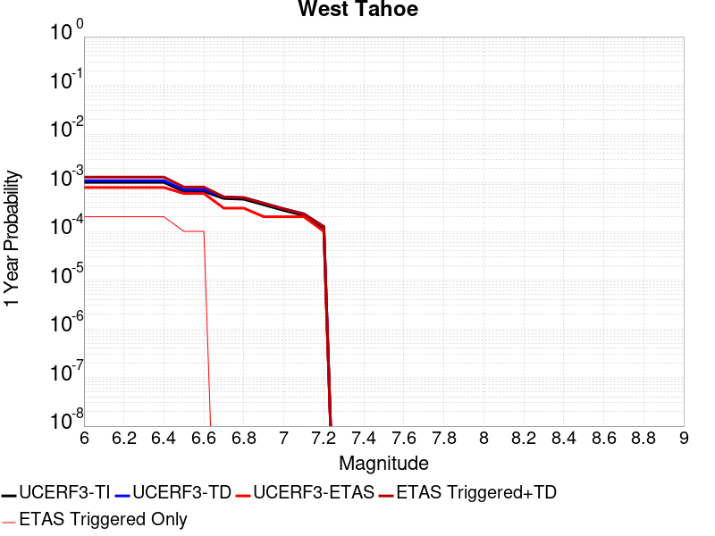 |  |

| Magnitude | 1 wk TI Prob | 1 wk TD Prob | 1 wk ETAS Prob | 1 wk ETAS/TD Gain | 1 wk ETAS Triggered+TD | 1 wk ETAS Triggered Only | 1 mo TI Prob | 1 mo TD Prob | 1 mo ETAS Prob | 1 mo ETAS/TD Gain | 1 mo ETAS Triggered+TD | 1 mo ETAS Triggered Only | 1 yr TI Prob | 1 yr TD Prob | 1 yr ETAS Prob | 1 yr ETAS/TD Gain | 1 yr ETAS Triggered+TD | 1 yr ETAS Triggered Only | 10 yr TI Prob | 10 yr TD Prob | 10 yr ETAS Prob | 10 yr ETAS/TD Gain | 10 yr ETAS Triggered+TD | 10 yr ETAS Triggered Only |
|-----|-----|-----|-----|-----|-----|-----|-----|-----|-----|-----|-----|-----|-----|-----|-----|-----|-----|-----|-----|-----|-----|-----|-----|-----|
| 6.0 | 1.952444E-5 | 2.1186746E-5 | 0.0 | 0.0 | 2.1186746E-5 | 0.0 | 8.367348E-5 | 9.079749E-5 | 2.0E-4 | 2.202704 | 9.079749E-5 | 0.0 | 0.0010182485 | 0.0011049536 | 8.0E-4 | 0.7240123 | 0.0013047326 | 2.0E-4 | 0.010135954 | 0.011000084 | 0.006 | 0.5454504 | 0.011791283 | 8.0E-4 |
| 6.1 | 1.952444E-5 | 2.1186746E-5 | 0.0 | 0.0 | 2.1186746E-5 | 0.0 | 8.367348E-5 | 9.079749E-5 | 2.0E-4 | 2.202704 | 9.079749E-5 | 0.0 | 0.0010182485 | 0.0011049536 | 8.0E-4 | 0.7240123 | 0.0013047326 | 2.0E-4 | 0.010135954 | 0.011000084 | 0.006 | 0.5454504 | 0.011791283 | 8.0E-4 |
| 6.2 | 1.952444E-5 | 2.1186746E-5 | 0.0 | 0.0 | 2.1186746E-5 | 0.0 | 8.367348E-5 | 9.079749E-5 | 2.0E-4 | 2.202704 | 9.079749E-5 | 0.0 | 0.0010182485 | 0.0011049536 | 8.0E-4 | 0.7240123 | 0.0013047326 | 2.0E-4 | 0.010135954 | 0.011000084 | 0.006 | 0.5454504 | 0.011791283 | 8.0E-4 |
| 6.3 | 1.952444E-5 | 2.1186746E-5 | 0.0 | 0.0 | 2.1186746E-5 | 0.0 | 8.367348E-5 | 9.079749E-5 | 2.0E-4 | 2.202704 | 9.079749E-5 | 0.0 | 0.0010182485 | 0.0011049536 | 8.0E-4 | 0.7240123 | 0.0013047326 | 2.0E-4 | 0.010135954 | 0.011000084 | 0.006 | 0.5454504 | 0.011791283 | 8.0E-4 |
| 6.4 | 1.952444E-5 | 2.1186746E-5 | 0.0 | 0.0 | 2.1186746E-5 | 0.0 | 8.367348E-5 | 9.079749E-5 | 2.0E-4 | 2.202704 | 9.079749E-5 | 0.0 | 0.0010182485 | 0.0011049536 | 8.0E-4 | 0.7240123 | 0.0013047326 | 2.0E-4 | 0.010135954 | 0.011000084 | 0.006 | 0.5454504 | 0.011791283 | 8.0E-4 |
| 6.5 | 1.2685271E-5 | 1.3692782E-5 | 0.0 | 0.0 | 1.3692782E-5 | 0.0 | 5.4364315E-5 | 5.8682126E-5 | 2.0E-4 | 3.4081929 | 5.8682126E-5 | 0.0 | 6.616845E-4 | 7.1423716E-4 | 6.0E-4 | 0.84005713 | 8.1416575E-4 | 1.0E-4 | 0.0065971776 | 0.0071210666 | 0.0034 | 0.47745657 | 0.007617506 | 5.0E-4 |
| 6.6 | 1.2685271E-5 | 1.3692782E-5 | 0.0 | 0.0 | 1.3692782E-5 | 0.0 | 5.4364315E-5 | 5.8682126E-5 | 2.0E-4 | 3.4081929 | 5.8682126E-5 | 0.0 | 6.616845E-4 | 7.1423716E-4 | 6.0E-4 | 0.84005713 | 8.1416575E-4 | 1.0E-4 | 0.0065971776 | 0.0071210666 | 0.0034 | 0.47745657 | 0.007617506 | 5.0E-4 |
| 6.7 | 9.117886E-6 | 9.811324E-6 | 0.0 | 0.0 | 9.811324E-6 | 0.0 | 3.9076072E-5 | 4.2047894E-5 | 1.0E-4 | 2.3782403 | 4.2047894E-5 | 0.0 | 4.756473E-4 | 5.1182E-4 | 3.0E-4 | 0.5861435 | 5.1182E-4 | 0.0 | 0.0047463053 | 0.005107131 | 0.0023 | 0.4503507 | 0.005405599 | 3.0E-4 |
| 6.8 | 8.786828E-6 | 9.459296E-6 | 0.0 | 0.0 | 9.459296E-6 | 0.0 | 3.7657293E-5 | 4.0539253E-5 | 1.0E-4 | 2.4667451 | 4.0539253E-5 | 0.0 | 4.5838108E-4 | 4.934606E-4 | 3.0E-4 | 0.6079512 | 4.934606E-4 | 0.0 | 0.0045743673 | 0.0049243504 | 0.0023 | 0.46706668 | 0.0052228733 | 3.0E-4 |
| 6.9 | 6.7562123E-6 | 7.2648913E-6 | 0.0 | 0.0 | 7.2648913E-6 | 0.0 | 2.8954875E-5 | 3.1134903E-5 | 0.0 | 0.0 | 3.1134903E-5 | 0.0 | 3.5246857E-4 | 3.790063E-4 | 2.0E-4 | 0.5276957 | 3.790063E-4 | 0.0 | 0.0035191004 | 0.0037840712 | 0.0018 | 0.47567818 | 0.004082936 | 3.0E-4 |
| 7.0 | 5.1792854E-6 | 5.5681658E-6 | 0.0 | 0.0 | 5.5681658E-6 | 0.0 | 2.2196748E-5 | 2.3863371E-5 | 0.0 | 0.0 | 2.3863371E-5 | 0.0 | 2.702119E-4 | 2.905016E-4 | 2.0E-4 | 0.68846434 | 2.905016E-4 | 0.0 | 0.0026988357 | 0.002901594 | 0.0012 | 0.41356578 | 0.002901594 | 0.0 |
| 7.1 | 4.090765E-6 | 4.3980763E-6 | 0.0 | 0.0 | 4.3980763E-6 | 0.0 | 1.7531731E-5 | 1.8848783E-5 | 0.0 | 0.0 | 1.8848783E-5 | 0.0 | 2.134279E-4 | 2.2946316E-4 | 2.0E-4 | 0.8715996 | 2.2946316E-4 | 0.0 | 0.0021322304 | 0.0022925967 | 9.0E-4 | 0.39256793 | 0.0022925967 | 0.0 |
| 7.2 | 2.2356758E-6 | 2.4027236E-6 | 0.0 | 0.0 | 2.4027236E-6 | 0.0 | 9.581432E-6 | 1.0297357E-5 | 0.0 | 0.0 | 1.0297357E-5 | 0.0 | 1.1664769E-4 | 1.25365E-4 | 1.0E-4 | 0.7976708 | 1.25365E-4 | 0.0 | 0.0011658648 | 0.0012531286 | 6.0E-4 | 0.4788016 | 0.0012531286 | 0.0 |

## Dry Mountain
*[(top)](#table-of-contents)*

| 1 Week | 1 Month | 1 Year | 10 Year |
|-----|-----|-----|-----|
|  | 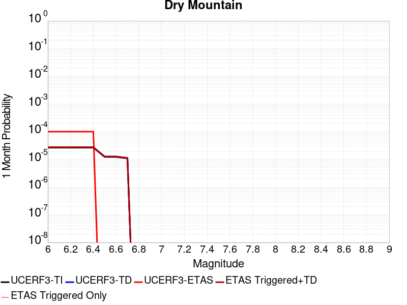 |  |  |

| Magnitude | 1 wk TI Prob | 1 wk TD Prob | 1 wk ETAS Prob | 1 wk ETAS/TD Gain | 1 wk ETAS Triggered+TD | 1 wk ETAS Triggered Only | 1 mo TI Prob | 1 mo TD Prob | 1 mo ETAS Prob | 1 mo ETAS/TD Gain | 1 mo ETAS Triggered+TD | 1 mo ETAS Triggered Only | 1 yr TI Prob | 1 yr TD Prob | 1 yr ETAS Prob | 1 yr ETAS/TD Gain | 1 yr ETAS Triggered+TD | 1 yr ETAS Triggered Only | 10 yr TI Prob | 10 yr TD Prob | 10 yr ETAS Prob | 10 yr ETAS/TD Gain | 10 yr ETAS Triggered+TD | 10 yr ETAS Triggered Only |
|-----|-----|-----|-----|-----|-----|-----|-----|-----|-----|-----|-----|-----|-----|-----|-----|-----|-----|-----|-----|-----|-----|-----|-----|-----|
| 6.0 | 6.222801E-6 | 6.439826E-6 | 0.0 | 0.0 | 6.439826E-6 | 0.0 | 2.6668875E-5 | 2.7599051E-5 | 1.0E-4 | 3.623313 | 2.7599051E-5 | 0.0 | 3.2464517E-4 | 3.3598256E-4 | 6.0E-4 | 1.785807 | 5.359154E-4 | 2.0E-4 | 0.0032417132 | 0.0033563082 | 0.0023 | 0.68527675 | 0.0041536232 | 8.0E-4 |
| 6.1 | 6.222801E-6 | 6.439826E-6 | 0.0 | 0.0 | 6.439826E-6 | 0.0 | 2.6668875E-5 | 2.7599051E-5 | 1.0E-4 | 3.623313 | 2.7599051E-5 | 0.0 | 3.2464517E-4 | 3.3598256E-4 | 6.0E-4 | 1.785807 | 5.359154E-4 | 2.0E-4 | 0.0032417132 | 0.0033563082 | 0.0023 | 0.68527675 | 0.0041536232 | 8.0E-4 |
| 6.2 | 6.222801E-6 | 6.439826E-6 | 0.0 | 0.0 | 6.439826E-6 | 0.0 | 2.6668875E-5 | 2.7599051E-5 | 1.0E-4 | 3.623313 | 2.7599051E-5 | 0.0 | 3.2464517E-4 | 3.3598256E-4 | 6.0E-4 | 1.785807 | 5.359154E-4 | 2.0E-4 | 0.0032417132 | 0.0033563082 | 0.0023 | 0.68527675 | 0.0041536232 | 8.0E-4 |
| 6.3 | 6.222801E-6 | 6.439826E-6 | 0.0 | 0.0 | 6.439826E-6 | 0.0 | 2.6668875E-5 | 2.7599051E-5 | 1.0E-4 | 3.623313 | 2.7599051E-5 | 0.0 | 3.2464517E-4 | 3.3598256E-4 | 6.0E-4 | 1.785807 | 5.359154E-4 | 2.0E-4 | 0.0032417132 | 0.0033563082 | 0.0023 | 0.68527675 | 0.0041536232 | 8.0E-4 |
| 6.4 | 6.222801E-6 | 6.439826E-6 | 0.0 | 0.0 | 6.439826E-6 | 0.0 | 2.6668875E-5 | 2.7599051E-5 | 1.0E-4 | 3.623313 | 2.7599051E-5 | 0.0 | 3.2464517E-4 | 3.3598256E-4 | 6.0E-4 | 1.785807 | 5.359154E-4 | 2.0E-4 | 0.0032417132 | 0.0033563082 | 0.0023 | 0.68527675 | 0.0041536232 | 8.0E-4 |
| 6.5 | 2.8528623E-6 | 2.9523721E-6 | 0.0 | 0.0 | 2.9523721E-6 | 0.0 | 1.22264955E-5 | 1.2653011E-5 | 0.0 | 0.0 | 1.2653011E-5 | 0.0 | 1.4884741E-4 | 1.5404823E-4 | 2.0E-4 | 1.2982948 | 2.540328E-4 | 1.0E-4 | 0.0014874774 | 0.001540268 | 0.0011 | 0.71416146 | 0.0020394977 | 5.0E-4 |
| 6.6 | 2.8528623E-6 | 2.9523721E-6 | 0.0 | 0.0 | 2.9523721E-6 | 0.0 | 1.22264955E-5 | 1.2653011E-5 | 0.0 | 0.0 | 1.2653011E-5 | 0.0 | 1.4884741E-4 | 1.5404823E-4 | 2.0E-4 | 1.2982948 | 2.540328E-4 | 1.0E-4 | 0.0014874774 | 0.001540268 | 0.0011 | 0.71416146 | 0.0020394977 | 5.0E-4 |
| 6.7 | 2.541E-6 | 2.6295393E-6 | 0.0 | 0.0 | 2.6295393E-6 | 0.0 | 1.0889954E-5 | 1.1269453E-5 | 0.0 | 0.0 | 1.1269453E-5 | 0.0 | 1.3257713E-4 | 1.372056E-4 | 1.0E-4 | 0.72883326 | 1.372056E-4 | 0.0 | 0.0013249806 | 0.001372056 | 8.0E-4 | 0.5830666 | 0.0016716444 | 3.0E-4 |

## Mount Diablo Thrust North CFM
*[(top)](#table-of-contents)*

| 1 Week | 1 Month | 1 Year | 10 Year |
|-----|-----|-----|-----|
|  | 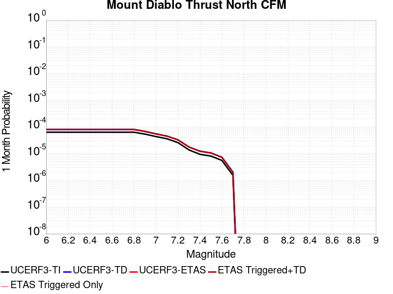 | 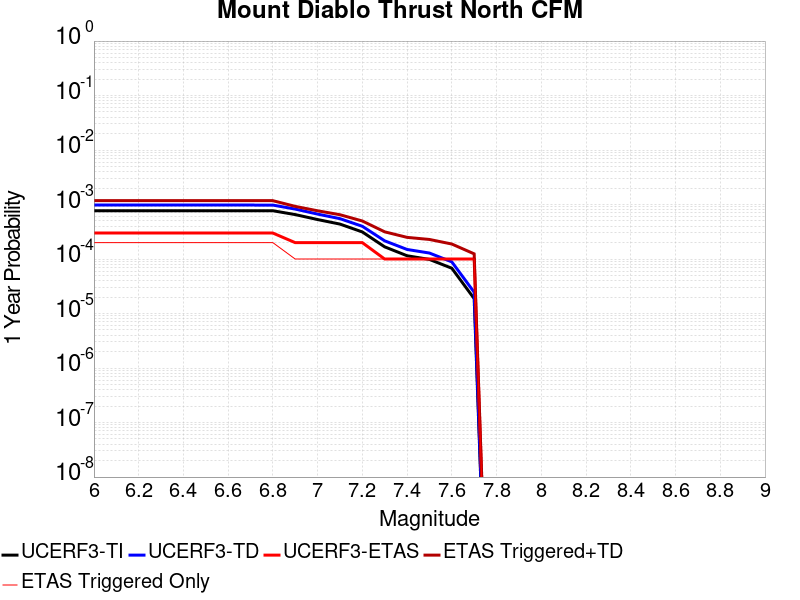 |  |

| Magnitude | 1 wk TI Prob | 1 wk TD Prob | 1 wk ETAS Prob | 1 wk ETAS/TD Gain | 1 wk ETAS Triggered+TD | 1 wk ETAS Triggered Only | 1 mo TI Prob | 1 mo TD Prob | 1 mo ETAS Prob | 1 mo ETAS/TD Gain | 1 mo ETAS Triggered+TD | 1 mo ETAS Triggered Only | 1 yr TI Prob | 1 yr TD Prob | 1 yr ETAS Prob | 1 yr ETAS/TD Gain | 1 yr ETAS Triggered+TD | 1 yr ETAS Triggered Only | 10 yr TI Prob | 10 yr TD Prob | 10 yr ETAS Prob | 10 yr ETAS/TD Gain | 10 yr ETAS Triggered+TD | 10 yr ETAS Triggered Only |
|-----|-----|-----|-----|-----|-----|-----|-----|-----|-----|-----|-----|-----|-----|-----|-----|-----|-----|-----|-----|-----|-----|-----|-----|-----|
| 6.0 | 1.479628E-5 | 1.8783709E-5 | 0.0 | 0.0 | 1.8783709E-5 | 0.0 | 6.341109E-5 | 8.049918E-5 | 0.0 | 0.0 | 8.049918E-5 | 0.0 | 7.717565E-4 | 9.796465E-4 | 3.0E-4 | 0.30623293 | 0.0011794505 | 2.0E-4 | 0.007690818 | 0.009753635 | 0.0062 | 0.63566047 | 0.010545832 | 8.0E-4 |
| 6.1 | 1.479628E-5 | 1.8783709E-5 | 0.0 | 0.0 | 1.8783709E-5 | 0.0 | 6.341109E-5 | 8.049918E-5 | 0.0 | 0.0 | 8.049918E-5 | 0.0 | 7.717565E-4 | 9.796465E-4 | 3.0E-4 | 0.30623293 | 0.0011794505 | 2.0E-4 | 0.007690818 | 0.009753635 | 0.0062 | 0.63566047 | 0.010545832 | 8.0E-4 |
| 6.2 | 1.479628E-5 | 1.8783709E-5 | 0.0 | 0.0 | 1.8783709E-5 | 0.0 | 6.341109E-5 | 8.049918E-5 | 0.0 | 0.0 | 8.049918E-5 | 0.0 | 7.717565E-4 | 9.796465E-4 | 3.0E-4 | 0.30623293 | 0.0011794505 | 2.0E-4 | 0.007690818 | 0.009753635 | 0.0062 | 0.63566047 | 0.010545832 | 8.0E-4 |
| 6.3 | 1.479628E-5 | 1.8783709E-5 | 0.0 | 0.0 | 1.8783709E-5 | 0.0 | 6.341109E-5 | 8.049918E-5 | 0.0 | 0.0 | 8.049918E-5 | 0.0 | 7.717565E-4 | 9.796465E-4 | 3.0E-4 | 0.30623293 | 0.0011794505 | 2.0E-4 | 0.007690818 | 0.009753635 | 0.0062 | 0.63566047 | 0.010545832 | 8.0E-4 |
| 6.4 | 1.479628E-5 | 1.8783709E-5 | 0.0 | 0.0 | 1.8783709E-5 | 0.0 | 6.341109E-5 | 8.049918E-5 | 0.0 | 0.0 | 8.049918E-5 | 0.0 | 7.717565E-4 | 9.796465E-4 | 3.0E-4 | 0.30623293 | 0.0011794505 | 2.0E-4 | 0.007690818 | 0.009753635 | 0.0062 | 0.63566047 | 0.010545832 | 8.0E-4 |
| 6.5 | 1.479628E-5 | 1.8783709E-5 | 0.0 | 0.0 | 1.8783709E-5 | 0.0 | 6.341109E-5 | 8.049918E-5 | 0.0 | 0.0 | 8.049918E-5 | 0.0 | 7.717565E-4 | 9.796465E-4 | 3.0E-4 | 0.30623293 | 0.0011794505 | 2.0E-4 | 0.007690818 | 0.009753635 | 0.0062 | 0.63566047 | 0.010545832 | 8.0E-4 |
| 6.6 | 1.479016E-5 | 1.877682E-5 | 0.0 | 0.0 | 1.877682E-5 | 0.0 | 6.338486E-5 | 8.0469654E-5 | 0.0 | 0.0 | 8.0469654E-5 | 0.0 | 7.714374E-4 | 9.792872E-4 | 3.0E-4 | 0.30634525 | 0.0011790914 | 2.0E-4 | 0.007687649 | 0.009750075 | 0.0062 | 0.63589257 | 0.010542274 | 8.0E-4 |
| 6.7 | 1.479016E-5 | 1.877682E-5 | 0.0 | 0.0 | 1.877682E-5 | 0.0 | 6.338486E-5 | 8.0469654E-5 | 0.0 | 0.0 | 8.0469654E-5 | 0.0 | 7.714374E-4 | 9.792872E-4 | 3.0E-4 | 0.30634525 | 0.0011790914 | 2.0E-4 | 0.007687649 | 0.009750075 | 0.0062 | 0.63589257 | 0.010542274 | 8.0E-4 |
| 6.8 | 1.4771667E-5 | 1.8755583E-5 | 0.0 | 0.0 | 1.8755583E-5 | 0.0 | 6.330561E-5 | 8.0378646E-5 | 0.0 | 0.0 | 8.0378646E-5 | 0.0 | 7.704732E-4 | 9.781802E-4 | 3.0E-4 | 0.30669194 | 0.0011779846 | 2.0E-4 | 0.007678074 | 0.009739102 | 0.0062 | 0.636609 | 0.01053131 | 8.0E-4 |
| 6.9 | 1.2548234E-5 | 1.583542E-5 | 0.0 | 0.0 | 1.583542E-5 | 0.0 | 5.3777036E-5 | 6.786434E-5 | 0.0 | 0.0 | 6.786434E-5 | 0.0 | 6.545387E-4 | 8.259387E-4 | 2.0E-4 | 0.24214871 | 9.258561E-4 | 1.0E-4 | 0.006526142 | 0.008229908 | 0.0053 | 0.64399266 | 0.00882497 | 6.0E-4 |
| 7.0 | 1.01754185E-5 | 1.281844E-5 | 0.0 | 0.0 | 1.281844E-5 | 0.0 | 4.360821E-5 | 5.4935022E-5 | 0.0 | 0.0 | 5.4935022E-5 | 0.0 | 5.308006E-4 | 6.6863035E-4 | 2.0E-4 | 0.29911894 | 7.685635E-4 | 1.0E-4 | 0.005295345 | 0.0066672186 | 0.0047 | 0.70494163 | 0.007163885 | 5.0E-4 |
| 7.1 | 8.398341E-6 | 1.0562474E-5 | 0.0 | 0.0 | 1.0562474E-5 | 0.0 | 3.5992394E-5 | 4.5266966E-5 | 0.0 | 0.0 | 4.5266966E-5 | 0.0 | 4.3811928E-4 | 5.50987E-4 | 2.0E-4 | 0.36298496 | 6.5093196E-4 | 1.0E-4 | 0.0043725655 | 0.0054966635 | 0.0039 | 0.70952135 | 0.0057950146 | 3.0E-4 |
| 7.2 | 6.024759E-6 | 7.655152E-6 | 0.0 | 0.0 | 7.655152E-6 | 0.0 | 2.582014E-5 | 3.2807387E-5 | 0.0 | 0.0 | 3.2807387E-5 | 0.0 | 3.1431485E-4 | 3.9935744E-4 | 2.0E-4 | 0.5008045 | 4.993175E-4 | 1.0E-4 | 0.0031387066 | 0.003986906 | 0.0026 | 0.6521348 | 0.00428571 | 3.0E-4 |
| 7.3 | 3.2099704E-6 | 4.137605E-6 | 0.0 | 0.0 | 4.137605E-6 | 0.0 | 1.3756943E-5 | 1.7732475E-5 | 0.0 | 0.0 | 1.7732475E-5 | 0.0 | 1.674779E-4 | 2.1587167E-4 | 1.0E-4 | 0.4632382 | 3.1585008E-4 | 1.0E-4 | 0.0016735174 | 0.00215709 | 0.0016 | 0.74174005 | 0.0022568742 | 1.0E-4 |
| 7.4 | 2.2041513E-6 | 2.8752138E-6 | 0.0 | 0.0 | 2.8752138E-6 | 0.0 | 9.4463285E-6 | 1.2322287E-5 | 0.0 | 0.0 | 1.2322287E-5 | 0.0 | 1.1500298E-4 | 1.500136E-4 | 1.0E-4 | 0.66660625 | 2.499986E-4 | 1.0E-4 | 0.0011494348 | 0.0014994297 | 0.0013 | 0.8669963 | 0.0015992798 | 1.0E-4 |
| 7.5 | 1.8869501E-6 | 2.4710512E-6 | 0.0 | 0.0 | 2.4710512E-6 | 0.0 | 8.086904E-6 | 1.0590176E-5 | 0.0 | 0.0 | 1.0590176E-5 | 0.0 | 9.845361E-5 | 1.2892784E-4 | 1.0E-4 | 0.7756277 | 2.2891494E-4 | 1.0E-4 | 9.841E-4 | 0.001288839 | 0.0011 | 0.8534813 | 0.0013887101 | 1.0E-4 |
| 7.6 | 1.3012458E-6 | 1.7018156E-6 | 0.0 | 0.0 | 1.7018156E-6 | 0.0 | 5.576756E-6 | 7.293475E-6 | 0.0 | 0.0 | 7.293475E-6 | 0.0 | 6.7894885E-5 | 8.879449E-5 | 1.0E-4 | 1.1261959 | 1.8878562E-4 | 1.0E-4 | 6.787415E-4 | 8.8787655E-4 | 7.0E-4 | 0.78839785 | 9.877877E-4 | 1.0E-4 |
| 7.7 | 3.603383E-7 | 4.7198472E-7 | 0.0 | 0.0 | 4.7198472E-7 | 0.0 | 1.5443061E-6 | 2.02279E-6 | 0.0 | 0.0 | 2.02279E-6 | 0.0 | 1.8801764E-5 | 2.4627197E-5 | 1.0E-4 | 4.060551 | 1.2462474E-4 | 1.0E-4 | 1.8800174E-4 | 2.4626206E-4 | 1.0E-4 | 0.40607148 | 3.4623744E-4 | 1.0E-4 |

## Great Valley 06 (Midland) 2011 CFM alt1
*[(top)](#table-of-contents)*

| 1 Week | 1 Month | 1 Year | 10 Year |
|-----|-----|-----|-----|
|  |  | 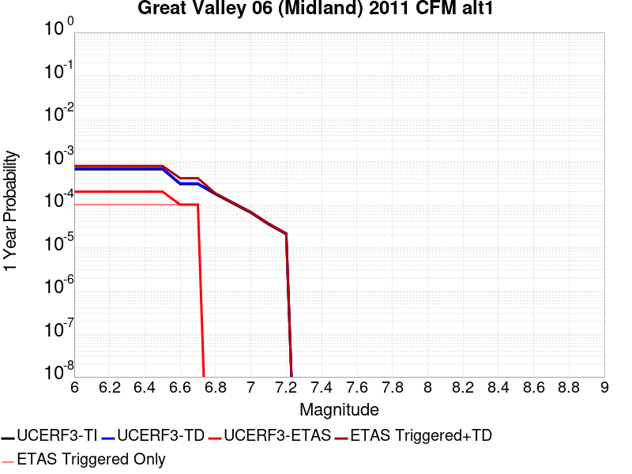 |  |

| Magnitude | 1 wk TI Prob | 1 wk TD Prob | 1 wk ETAS Prob | 1 wk ETAS/TD Gain | 1 wk ETAS Triggered+TD | 1 wk ETAS Triggered Only | 1 mo TI Prob | 1 mo TD Prob | 1 mo ETAS Prob | 1 mo ETAS/TD Gain | 1 mo ETAS Triggered+TD | 1 mo ETAS Triggered Only | 1 yr TI Prob | 1 yr TD Prob | 1 yr ETAS Prob | 1 yr ETAS/TD Gain | 1 yr ETAS Triggered+TD | 1 yr ETAS Triggered Only | 10 yr TI Prob | 10 yr TD Prob | 10 yr ETAS Prob | 10 yr ETAS/TD Gain | 10 yr ETAS Triggered+TD | 10 yr ETAS Triggered Only |
|-----|-----|-----|-----|-----|-----|-----|-----|-----|-----|-----|-----|-----|-----|-----|-----|-----|-----|-----|-----|-----|-----|-----|-----|-----|
| 6.0 | 1.2712525E-5 | 1.3211603E-5 | 0.0 | 0.0 | 1.3211603E-5 | 0.0 | 5.4481112E-5 | 5.662007E-5 | 0.0 | 0.0 | 5.662007E-5 | 0.0 | 6.6310563E-4 | 6.891567E-4 | 2.0E-4 | 0.29020977 | 7.890878E-4 | 1.0E-4 | 0.0066113044 | 0.0068727112 | 0.0053 | 0.7711658 | 0.007667213 | 8.0E-4 |
| 6.1 | 1.2712525E-5 | 1.3211603E-5 | 0.0 | 0.0 | 1.3211603E-5 | 0.0 | 5.4481112E-5 | 5.662007E-5 | 0.0 | 0.0 | 5.662007E-5 | 0.0 | 6.6310563E-4 | 6.891567E-4 | 2.0E-4 | 0.29020977 | 7.890878E-4 | 1.0E-4 | 0.0066113044 | 0.0068727112 | 0.0053 | 0.7711658 | 0.007667213 | 8.0E-4 |
| 6.2 | 1.2712525E-5 | 1.3211603E-5 | 0.0 | 0.0 | 1.3211603E-5 | 0.0 | 5.4481112E-5 | 5.662007E-5 | 0.0 | 0.0 | 5.662007E-5 | 0.0 | 6.6310563E-4 | 6.891567E-4 | 2.0E-4 | 0.29020977 | 7.890878E-4 | 1.0E-4 | 0.0066113044 | 0.0068727112 | 0.0053 | 0.7711658 | 0.007667213 | 8.0E-4 |
| 6.3 | 1.2712525E-5 | 1.3211603E-5 | 0.0 | 0.0 | 1.3211603E-5 | 0.0 | 5.4481112E-5 | 5.662007E-5 | 0.0 | 0.0 | 5.662007E-5 | 0.0 | 6.6310563E-4 | 6.891567E-4 | 2.0E-4 | 0.29020977 | 7.890878E-4 | 1.0E-4 | 0.0066113044 | 0.0068727112 | 0.0053 | 0.7711658 | 0.007667213 | 8.0E-4 |
| 6.4 | 1.2712525E-5 | 1.3211603E-5 | 0.0 | 0.0 | 1.3211603E-5 | 0.0 | 5.4481112E-5 | 5.662007E-5 | 0.0 | 0.0 | 5.662007E-5 | 0.0 | 6.6310563E-4 | 6.891567E-4 | 2.0E-4 | 0.29020977 | 7.890878E-4 | 1.0E-4 | 0.0066113044 | 0.0068727112 | 0.0053 | 0.7711658 | 0.007667213 | 8.0E-4 |
| 6.5 | 1.2712525E-5 | 1.3211603E-5 | 0.0 | 0.0 | 1.3211603E-5 | 0.0 | 5.4481112E-5 | 5.662007E-5 | 0.0 | 0.0 | 5.662007E-5 | 0.0 | 6.6310563E-4 | 6.891567E-4 | 2.0E-4 | 0.29020977 | 7.890878E-4 | 1.0E-4 | 0.0066113044 | 0.0068727112 | 0.0053 | 0.7711658 | 0.007667213 | 8.0E-4 |
| 6.6 | 5.7574384E-6 | 5.9710846E-6 | 0.0 | 0.0 | 5.9710846E-6 | 0.0 | 2.4674504E-5 | 2.5590134E-5 | 0.0 | 0.0 | 2.5590134E-5 | 0.0 | 3.0037065E-4 | 3.1151925E-4 | 1.0E-4 | 0.32100743 | 4.1148812E-4 | 1.0E-4 | 0.0029996498 | 0.0031112125 | 0.0027 | 0.86782885 | 0.0037093458 | 6.0E-4 |
| 6.7 | 5.7574384E-6 | 5.9710846E-6 | 0.0 | 0.0 | 5.9710846E-6 | 0.0 | 2.4674504E-5 | 2.5590134E-5 | 0.0 | 0.0 | 2.5590134E-5 | 0.0 | 3.0037065E-4 | 3.1151925E-4 | 1.0E-4 | 0.32100743 | 4.1148812E-4 | 1.0E-4 | 0.0029996498 | 0.0031112125 | 0.0027 | 0.86782885 | 0.0037093458 | 6.0E-4 |
| 6.8 | 3.3474828E-6 | 3.4696354E-6 | 0.0 | 0.0 | 3.4696354E-6 | 0.0 | 1.4346277E-5 | 1.4869789E-5 | 0.0 | 0.0 | 1.4869789E-5 | 0.0 | 1.7465191E-4 | 1.8102615E-4 | 0.0 | 0.0 | 1.8102615E-4 | 0.0 | 0.0017451472 | 0.0018089338 | 0.0014 | 0.77393657 | 0.0021083911 | 3.0E-4 |
| 6.9 | 2.035106E-6 | 2.1091876E-6 | 0.0 | 0.0 | 2.1091876E-6 | 0.0 | 8.721853E-6 | 9.039348E-6 | 0.0 | 0.0 | 9.039348E-6 | 0.0 | 1.0618339E-4 | 1.1004924E-4 | 0.0 | 0.0 | 1.1004924E-4 | 0.0 | 0.0010613267 | 0.0011000197 | 0.0013 | 1.181797 | 0.0013996897 | 3.0E-4 |
| 7.0 | 1.2424716E-6 | 1.2879696E-6 | 0.0 | 0.0 | 1.2879696E-6 | 0.0 | 5.3248673E-6 | 5.51986E-6 | 0.0 | 0.0 | 5.51986E-6 | 0.0 | 6.482833E-5 | 6.720268E-5 | 0.0 | 0.0 | 6.720268E-5 | 0.0 | 6.480942E-4 | 6.7186786E-4 | 4.0E-4 | 0.59535515 | 6.7186786E-4 | 0.0 |
| 7.1 | 6.6904556E-7 | 6.939546E-7 | 0.0 | 0.0 | 6.939546E-7 | 0.0 | 2.867335E-6 | 2.974089E-6 | 0.0 | 0.0 | 2.974089E-6 | 0.0 | 3.4909244E-5 | 3.6209192E-5 | 0.0 | 0.0 | 3.6209192E-5 | 0.0 | 3.490376E-4 | 3.6205846E-4 | 1.0E-4 | 0.2761985 | 3.6205846E-4 | 0.0 |
| 7.2 | 3.948168E-7 | 4.0960086E-7 | 0.0 | 0.0 | 4.0960086E-7 | 0.0 | 1.6920709E-6 | 1.7554322E-6 | 0.0 | 0.0 | 1.7554322E-6 | 0.0 | 2.0600768E-5 | 2.1372387E-5 | 0.0 | 0.0 | 2.1372387E-5 | 0.0 | 2.0598859E-4 | 2.1372388E-4 | 0.0 | 0.0 | 2.1372388E-4 | 0.0 |

## Sheephole
*[(top)](#table-of-contents)*

| 1 Week | 1 Month | 1 Year | 10 Year |
|-----|-----|-----|-----|
|  |  |  |  |

| Magnitude | 1 wk TI Prob | 1 wk TD Prob | 1 wk ETAS Prob | 1 wk ETAS/TD Gain | 1 wk ETAS Triggered+TD | 1 wk ETAS Triggered Only | 1 mo TI Prob | 1 mo TD Prob | 1 mo ETAS Prob | 1 mo ETAS/TD Gain | 1 mo ETAS Triggered+TD | 1 mo ETAS Triggered Only | 1 yr TI Prob | 1 yr TD Prob | 1 yr ETAS Prob | 1 yr ETAS/TD Gain | 1 yr ETAS Triggered+TD | 1 yr ETAS Triggered Only | 10 yr TI Prob | 10 yr TD Prob | 10 yr ETAS Prob | 10 yr ETAS/TD Gain | 10 yr ETAS Triggered+TD | 10 yr ETAS Triggered Only |
|-----|-----|-----|-----|-----|-----|-----|-----|-----|-----|-----|-----|-----|-----|-----|-----|-----|-----|-----|-----|-----|-----|-----|-----|-----|
| 6.0 | 4.5579695E-6 | 4.7416415E-6 | 0.0 | 0.0 | 4.7416415E-6 | 0.0 | 1.9534009E-5 | 2.0321193E-5 | 0.0 | 0.0 | 2.0321193E-5 | 0.0 | 2.3780059E-4 | 2.4738797E-4 | 2.0E-4 | 0.8084467 | 2.4738797E-4 | 0.0 | 0.0023754628 | 0.0024716705 | 0.0034 | 1.3755879 | 0.003269693 | 8.0E-4 |
| 6.1 | 4.5579695E-6 | 4.7416415E-6 | 0.0 | 0.0 | 4.7416415E-6 | 0.0 | 1.9534009E-5 | 2.0321193E-5 | 0.0 | 0.0 | 2.0321193E-5 | 0.0 | 2.3780059E-4 | 2.4738797E-4 | 2.0E-4 | 0.8084467 | 2.4738797E-4 | 0.0 | 0.0023754628 | 0.0024716705 | 0.0034 | 1.3755879 | 0.003269693 | 8.0E-4 |
| 6.2 | 2.6677674E-6 | 2.7876426E-6 | 0.0 | 0.0 | 2.7876426E-6 | 0.0 | 1.1433239E-5 | 1.19469905E-5 | 0.0 | 0.0 | 1.19469905E-5 | 0.0 | 1.3919079E-4 | 1.4544599E-4 | 0.0 | 0.0 | 1.4544599E-4 | 0.0 | 0.0013910364 | 0.0014536137 | 0.0017 | 1.169499 | 0.0020527416 | 6.0E-4 |
| 6.3 | 2.6677674E-6 | 2.7876426E-6 | 0.0 | 0.0 | 2.7876426E-6 | 0.0 | 1.1433239E-5 | 1.19469905E-5 | 0.0 | 0.0 | 1.19469905E-5 | 0.0 | 1.3919079E-4 | 1.4544599E-4 | 0.0 | 0.0 | 1.4544599E-4 | 0.0 | 0.0013910364 | 0.0014536137 | 0.0017 | 1.169499 | 0.0020527416 | 6.0E-4 |
| 6.4 | 2.2159759E-6 | 2.3231012E-6 | 0.0 | 0.0 | 2.3231012E-6 | 0.0 | 9.497005E-6 | 9.956114E-6 | 0.0 | 0.0 | 9.956114E-6 | 0.0 | 1.156199E-4 | 1.21209756E-4 | 0.0 | 0.0 | 1.21209756E-4 | 0.0 | 0.0011555976 | 0.0012115159 | 0.0016 | 1.3206596 | 0.0018107889 | 6.0E-4 |
| 6.5 | 2.1986082E-6 | 2.30498E-6 | 0.0 | 0.0 | 2.30498E-6 | 0.0 | 9.4225725E-6 | 9.878452E-6 | 0.0 | 0.0 | 9.878452E-6 | 0.0 | 1.1471378E-4 | 1.20264325E-4 | 0.0 | 0.0 | 1.20264325E-4 | 0.0 | 0.0011465458 | 0.0012020718 | 0.0016 | 1.3310354 | 0.0018013505 | 6.0E-4 |
| 6.6 | 1.5232331E-6 | 1.6020559E-6 | 0.0 | 0.0 | 1.6020559E-6 | 0.0 | 6.5281256E-6 | 6.865937E-6 | 0.0 | 0.0 | 6.865937E-6 | 0.0 | 7.947703E-5 | 8.3589766E-5 | 0.0 | 0.0 | 8.3589766E-5 | 0.0 | 7.9448614E-4 | 8.3560194E-4 | 9.0E-4 | 1.0770679 | 0.0011353513 | 3.0E-4 |
| 6.7 | 1.3137362E-6 | 1.3829632E-6 | 0.0 | 0.0 | 1.3829632E-6 | 0.0 | 5.6302856E-6 | 5.926973E-6 | 0.0 | 0.0 | 5.926973E-6 | 0.0 | 6.854657E-5 | 7.215865E-5 | 0.0 | 0.0 | 7.215865E-5 | 0.0 | 6.8525434E-4 | 7.21366E-4 | 7.0E-4 | 0.97038114 | 9.212218E-4 | 2.0E-4 |
| 6.8 | 1.2275751E-6 | 1.2924197E-6 | 0.0 | 0.0 | 1.2924197E-6 | 0.0 | 5.2610258E-6 | 5.538931E-6 | 0.0 | 0.0 | 5.538931E-6 | 0.0 | 6.4051106E-5 | 6.743453E-5 | 0.0 | 0.0 | 6.743453E-5 | 0.0 | 6.4032647E-4 | 6.74154E-4 | 5.0E-4 | 0.74167025 | 8.740192E-4 | 2.0E-4 |
| 6.9 | 1.1837088E-6 | 1.2462323E-6 | 0.0 | 0.0 | 1.2462323E-6 | 0.0 | 5.0730278E-6 | 5.3409854E-6 | 0.0 | 0.0 | 5.3409854E-6 | 0.0 | 6.176237E-5 | 6.502469E-5 | 0.0 | 0.0 | 6.502469E-5 | 0.0 | 6.17452E-4 | 6.500698E-4 | 5.0E-4 | 0.7691482 | 8.4993977E-4 | 2.0E-4 |
| 7.0 | 9.849371E-7 | 1.0367366E-6 | 0.0 | 0.0 | 1.0367366E-6 | 0.0 | 4.2211523E-6 | 4.4431504E-6 | 0.0 | 0.0 | 4.4431504E-6 | 0.0 | 5.1391315E-5 | 5.4094115E-5 | 0.0 | 0.0 | 5.4094115E-5 | 0.0 | 5.137943E-4 | 5.4081954E-4 | 4.0E-4 | 0.7396182 | 7.407114E-4 | 2.0E-4 |
| 7.1 | 8.1643645E-7 | 8.592561E-7 | 0.0 | 0.0 | 8.592561E-7 | 0.0 | 3.4990085E-6 | 3.6825213E-6 | 0.0 | 0.0 | 3.6825213E-6 | 0.0 | 4.2599597E-5 | 4.483386E-5 | 0.0 | 0.0 | 4.483386E-5 | 0.0 | 4.259143E-4 | 4.4825682E-4 | 3.0E-4 | 0.6692592 | 6.4816716E-4 | 2.0E-4 |
| 7.2 | 5.7295756E-7 | 6.030128E-7 | 0.0 | 0.0 | 6.030128E-7 | 0.0 | 2.45553E-6 | 2.5843383E-6 | 0.0 | 0.0 | 2.5843383E-6 | 0.0 | 2.9895667E-5 | 3.1463933E-5 | 0.0 | 0.0 | 3.1463933E-5 | 0.0 | 2.9891645E-4 | 3.1460146E-4 | 3.0E-4 | 0.9535874 | 5.1453855E-4 | 2.0E-4 |

## Peralta Hills
*[(top)](#table-of-contents)*

| 1 Week | 1 Month | 1 Year | 10 Year |
|-----|-----|-----|-----|
| 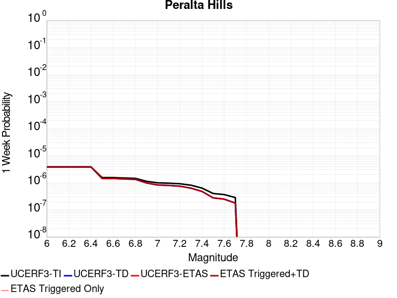 | 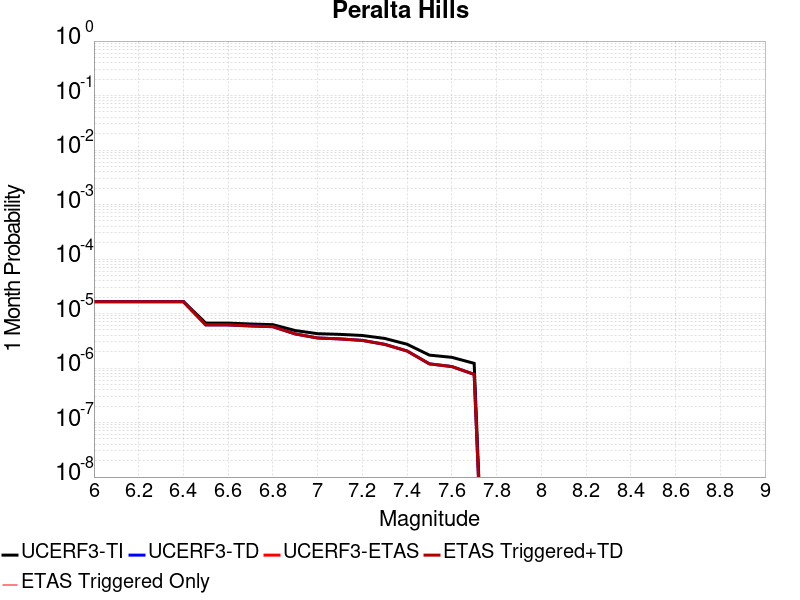 | 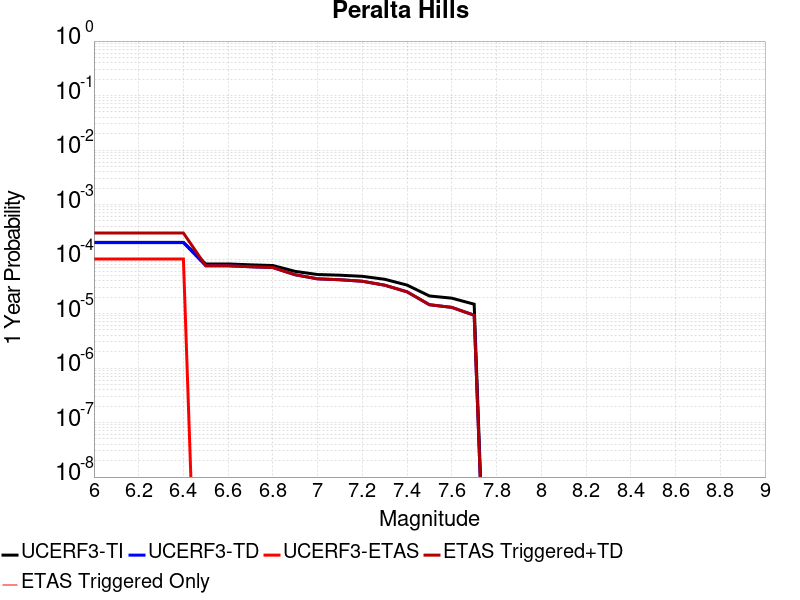 |  |

| Magnitude | 1 wk TI Prob | 1 wk TD Prob | 1 wk ETAS Prob | 1 wk ETAS/TD Gain | 1 wk ETAS Triggered+TD | 1 wk ETAS Triggered Only | 1 mo TI Prob | 1 mo TD Prob | 1 mo ETAS Prob | 1 mo ETAS/TD Gain | 1 mo ETAS Triggered+TD | 1 mo ETAS Triggered Only | 1 yr TI Prob | 1 yr TD Prob | 1 yr ETAS Prob | 1 yr ETAS/TD Gain | 1 yr ETAS Triggered+TD | 1 yr ETAS Triggered Only | 10 yr TI Prob | 10 yr TD Prob | 10 yr ETAS Prob | 10 yr ETAS/TD Gain | 10 yr ETAS Triggered+TD | 10 yr ETAS Triggered Only |
|-----|-----|-----|-----|-----|-----|-----|-----|-----|-----|-----|-----|-----|-----|-----|-----|-----|-----|-----|-----|-----|-----|-----|-----|-----|
| 6.0 | 3.8850067E-6 | 3.8404196E-6 | 0.0 | 0.0 | 3.8404196E-6 | 0.0 | 1.6649923E-5 | 1.645888E-5 | 0.0 | 0.0 | 1.645888E-5 | 0.0 | 2.0269395E-4 | 2.0037586E-4 | 1.0E-4 | 0.49906212 | 3.003558E-4 | 1.0E-4 | 0.0020250916 | 0.0020026795 | 0.0019 | 0.9487289 | 0.0027012776 | 7.0E-4 |
| 6.1 | 3.8850067E-6 | 3.8404196E-6 | 0.0 | 0.0 | 3.8404196E-6 | 0.0 | 1.6649923E-5 | 1.645888E-5 | 0.0 | 0.0 | 1.645888E-5 | 0.0 | 2.0269395E-4 | 2.0037586E-4 | 1.0E-4 | 0.49906212 | 3.003558E-4 | 1.0E-4 | 0.0020250916 | 0.0020026795 | 0.0019 | 0.9487289 | 0.0027012776 | 7.0E-4 |
| 6.2 | 3.8850067E-6 | 3.8404196E-6 | 0.0 | 0.0 | 3.8404196E-6 | 0.0 | 1.6649923E-5 | 1.645888E-5 | 0.0 | 0.0 | 1.645888E-5 | 0.0 | 2.0269395E-4 | 2.0037586E-4 | 1.0E-4 | 0.49906212 | 3.003558E-4 | 1.0E-4 | 0.0020250916 | 0.0020026795 | 0.0019 | 0.9487289 | 0.0027012776 | 7.0E-4 |
| 6.3 | 3.8850067E-6 | 3.8404196E-6 | 0.0 | 0.0 | 3.8404196E-6 | 0.0 | 1.6649923E-5 | 1.645888E-5 | 0.0 | 0.0 | 1.645888E-5 | 0.0 | 2.0269395E-4 | 2.0037586E-4 | 1.0E-4 | 0.49906212 | 3.003558E-4 | 1.0E-4 | 0.0020250916 | 0.0020026795 | 0.0019 | 0.9487289 | 0.0027012776 | 7.0E-4 |
| 6.4 | 3.8850067E-6 | 3.8404196E-6 | 0.0 | 0.0 | 3.8404196E-6 | 0.0 | 1.6649923E-5 | 1.645888E-5 | 0.0 | 0.0 | 1.645888E-5 | 0.0 | 2.0269395E-4 | 2.0037586E-4 | 1.0E-4 | 0.49906212 | 3.003558E-4 | 1.0E-4 | 0.0020250916 | 0.0020026795 | 0.0019 | 0.9487289 | 0.0027012776 | 7.0E-4 |
| 6.5 | 1.5587785E-6 | 1.4438441E-6 | 0.0 | 0.0 | 1.4438441E-6 | 0.0 | 6.6804623E-6 | 6.18789E-6 | 0.0 | 0.0 | 6.18789E-6 | 0.0 | 8.133159E-5 | 7.53352E-5 | 0.0 | 0.0 | 7.53352E-5 | 0.0 | 8.1301836E-4 | 7.531206E-4 | 7.0E-4 | 0.929466 | 9.5297E-4 | 2.0E-4 |
| 6.6 | 1.5587785E-6 | 1.4438441E-6 | 0.0 | 0.0 | 1.4438441E-6 | 0.0 | 6.6804623E-6 | 6.18789E-6 | 0.0 | 0.0 | 6.18789E-6 | 0.0 | 8.133159E-5 | 7.53352E-5 | 0.0 | 0.0 | 7.53352E-5 | 0.0 | 8.1301836E-4 | 7.531206E-4 | 7.0E-4 | 0.929466 | 9.5297E-4 | 2.0E-4 |
| 6.7 | 1.5018579E-6 | 1.3844616E-6 | 0.0 | 0.0 | 1.3844616E-6 | 0.0 | 6.436518E-6 | 5.9333947E-6 | 0.0 | 0.0 | 5.9333947E-6 | 0.0 | 7.836179E-5 | 7.223692E-5 | 0.0 | 0.0 | 7.223692E-5 | 0.0 | 7.833416E-4 | 7.22158E-4 | 6.0E-4 | 0.8308431 | 8.2208577E-4 | 1.0E-4 |
| 6.8 | 1.4584314E-6 | 1.3388892E-6 | 0.0 | 0.0 | 1.3388892E-6 | 0.0 | 6.250405E-6 | 5.7380853E-6 | 0.0 | 0.0 | 5.7380853E-6 | 0.0 | 7.6096025E-5 | 6.985919E-5 | 0.0 | 0.0 | 6.985919E-5 | 0.0 | 7.6069974E-4 | 6.983957E-4 | 6.0E-4 | 0.8591118 | 7.9832587E-4 | 1.0E-4 |
| 6.9 | 1.1382393E-6 | 9.867734E-7 | 0.0 | 0.0 | 9.867734E-7 | 0.0 | 4.8781594E-6 | 4.2290226E-6 | 0.0 | 0.0 | 4.2290226E-6 | 0.0 | 5.9389975E-5 | 5.148722E-5 | 0.0 | 0.0 | 5.148722E-5 | 0.0 | 5.93741E-4 | 5.1476114E-4 | 5.0E-4 | 0.9713243 | 6.147096E-4 | 1.0E-4 |
| 7.0 | 9.970413E-7 | 8.3142413E-7 | 0.0 | 0.0 | 8.3142413E-7 | 0.0 | 4.273027E-6 | 3.5632418E-6 | 0.0 | 0.0 | 3.5632418E-6 | 0.0 | 5.2022864E-5 | 4.3381675E-5 | 0.0 | 0.0 | 4.3381675E-5 | 0.0 | 5.2010687E-4 | 4.3373887E-4 | 4.0E-4 | 0.9222139 | 5.336955E-4 | 1.0E-4 |
| 7.1 | 9.684443E-7 | 7.9985284E-7 | 0.0 | 0.0 | 7.9985284E-7 | 0.0 | 4.150469E-6 | 3.4279365E-6 | 0.0 | 0.0 | 3.4279365E-6 | 0.0 | 5.053079E-5 | 4.1734398E-5 | 0.0 | 0.0 | 4.1734398E-5 | 0.0 | 5.05193E-4 | 4.1727233E-4 | 4.0E-4 | 0.9586066 | 5.172306E-4 | 1.0E-4 |
| 7.2 | 9.240811E-7 | 7.507402E-7 | 0.0 | 0.0 | 7.507402E-7 | 0.0 | 3.960342E-6 | 3.2174544E-6 | 0.0 | 0.0 | 3.2174544E-6 | 0.0 | 4.8216094E-5 | 3.9171868E-5 | 0.0 | 0.0 | 3.9171868E-5 | 0.0 | 4.8205635E-4 | 3.9165618E-4 | 4.0E-4 | 1.0213039 | 4.91617E-4 | 1.0E-4 |
| 7.3 | 8.158643E-7 | 6.3537783E-7 | 0.0 | 0.0 | 6.3537783E-7 | 0.0 | 3.4965567E-6 | 2.7230453E-6 | 0.0 | 0.0 | 2.7230453E-6 | 0.0 | 4.2569747E-5 | 3.3152635E-5 | 0.0 | 0.0 | 3.3152635E-5 | 0.0 | 4.2561593E-4 | 3.3148305E-4 | 4.0E-4 | 1.2066982 | 4.314499E-4 | 1.0E-4 |
| 7.4 | 6.3822824E-7 | 4.798556E-7 | 0.0 | 0.0 | 4.798556E-7 | 0.0 | 2.7352612E-6 | 2.0565228E-6 | 0.0 | 0.0 | 2.0565228E-6 | 0.0 | 3.3301294E-5 | 2.5037929E-5 | 0.0 | 0.0 | 2.5037929E-5 | 0.0 | 3.3296304E-4 | 2.503562E-4 | 3.0E-4 | 1.1982925 | 3.503312E-4 | 1.0E-4 |
| 7.5 | 4.0292628E-7 | 2.7862683E-7 | 0.0 | 0.0 | 2.7862683E-7 | 0.0 | 1.7268258E-6 | 1.1941146E-6 | 0.0 | 0.0 | 1.1941146E-6 | 0.0 | 2.1023901E-5 | 1.4538277E-5 | 0.0 | 0.0 | 1.4538277E-5 | 0.0 | 2.1021912E-4 | 1.4537605E-4 | 1.0E-4 | 0.68787116 | 1.4537605E-4 | 0.0 |
| 7.6 | 3.672993E-7 | 2.4869726E-7 | 0.0 | 0.0 | 2.4869726E-7 | 0.0 | 1.5741389E-6 | 1.0658451E-6 | 0.0 | 0.0 | 1.0658451E-6 | 0.0 | 1.9164972E-5 | 1.2976614E-5 | 0.0 | 0.0 | 1.2976614E-5 | 0.0 | 1.916332E-4 | 1.2976129E-4 | 1.0E-4 | 0.77064586 | 1.2976129E-4 | 0.0 |
| 7.7 | 2.8466823E-7 | 1.7871182E-7 | 0.0 | 0.0 | 1.7871182E-7 | 0.0 | 1.2200061E-6 | 7.659077E-7 | 0.0 | 0.0 | 7.659077E-7 | 0.0 | 1.4853474E-5 | 9.324914E-6 | 0.0 | 0.0 | 9.324914E-6 | 0.0 | 1.485248E-4 | 9.324782E-5 | 1.0E-4 | 1.0724111 | 9.324782E-5 | 0.0 |

## Morales (East)
*[(top)](#table-of-contents)*

| 1 Week | 1 Month | 1 Year | 10 Year |
|-----|-----|-----|-----|
| 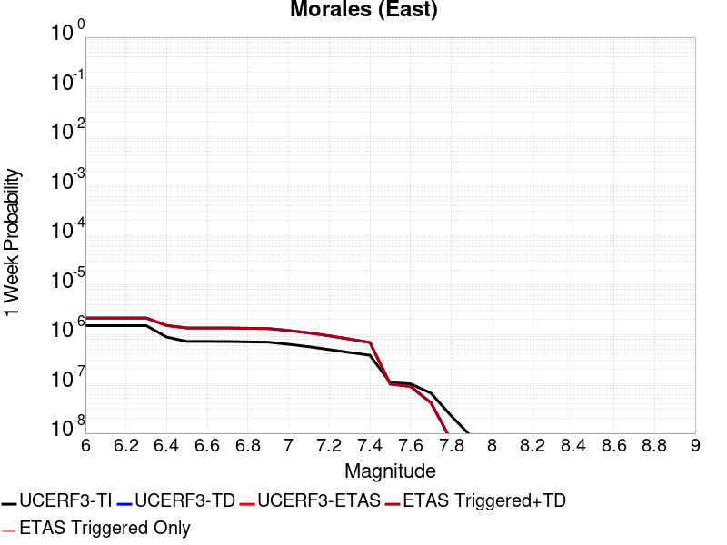 |  | 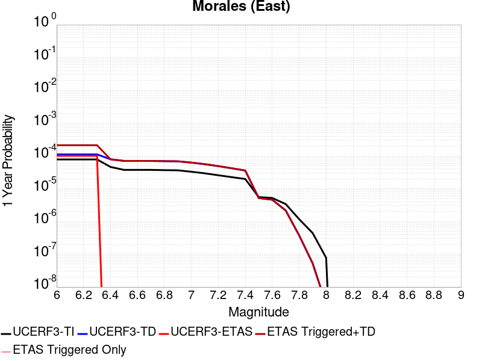 |  |

| Magnitude | 1 wk TI Prob | 1 wk TD Prob | 1 wk ETAS Prob | 1 wk ETAS/TD Gain | 1 wk ETAS Triggered+TD | 1 wk ETAS Triggered Only | 1 mo TI Prob | 1 mo TD Prob | 1 mo ETAS Prob | 1 mo ETAS/TD Gain | 1 mo ETAS Triggered+TD | 1 mo ETAS Triggered Only | 1 yr TI Prob | 1 yr TD Prob | 1 yr ETAS Prob | 1 yr ETAS/TD Gain | 1 yr ETAS Triggered+TD | 1 yr ETAS Triggered Only | 10 yr TI Prob | 10 yr TD Prob | 10 yr ETAS Prob | 10 yr ETAS/TD Gain | 10 yr ETAS Triggered+TD | 10 yr ETAS Triggered Only |
|-----|-----|-----|-----|-----|-----|-----|-----|-----|-----|-----|-----|-----|-----|-----|-----|-----|-----|-----|-----|-----|-----|-----|-----|-----|
| 6.0 | 1.4942771E-6 | 2.1252786E-6 | 0.0 | 0.0 | 2.1252786E-6 | 0.0 | 6.404029E-6 | 9.108308E-6 | 0.0 | 0.0 | 9.108308E-6 | 0.0 | 7.7966266E-5 | 1.1088859E-4 | 1.0E-4 | 0.901806 | 2.1087751E-4 | 1.0E-4 | 7.793892E-4 | 0.0011083923 | 0.0012 | 1.0826491 | 0.0018076164 | 7.0E-4 |
| 6.1 | 1.4942771E-6 | 2.1252786E-6 | 0.0 | 0.0 | 2.1252786E-6 | 0.0 | 6.404029E-6 | 9.108308E-6 | 0.0 | 0.0 | 9.108308E-6 | 0.0 | 7.7966266E-5 | 1.1088859E-4 | 1.0E-4 | 0.901806 | 2.1087751E-4 | 1.0E-4 | 7.793892E-4 | 0.0011083923 | 0.0012 | 1.0826491 | 0.0018076164 | 7.0E-4 |
| 6.2 | 1.4942771E-6 | 2.1252786E-6 | 0.0 | 0.0 | 2.1252786E-6 | 0.0 | 6.404029E-6 | 9.108308E-6 | 0.0 | 0.0 | 9.108308E-6 | 0.0 | 7.7966266E-5 | 1.1088859E-4 | 1.0E-4 | 0.901806 | 2.1087751E-4 | 1.0E-4 | 7.793892E-4 | 0.0011083923 | 0.0012 | 1.0826491 | 0.0018076164 | 7.0E-4 |
| 6.3 | 1.4942771E-6 | 2.1252786E-6 | 0.0 | 0.0 | 2.1252786E-6 | 0.0 | 6.404029E-6 | 9.108308E-6 | 0.0 | 0.0 | 9.108308E-6 | 0.0 | 7.7966266E-5 | 1.1088859E-4 | 1.0E-4 | 0.901806 | 2.1087751E-4 | 1.0E-4 | 7.793892E-4 | 0.0011083923 | 0.0012 | 1.0826491 | 0.0018076164 | 7.0E-4 |
| 6.4 | 8.798845E-7 | 1.504059E-6 | 0.0 | 0.0 | 1.504059E-6 | 0.0 | 3.7709283E-6 | 6.445952E-6 | 0.0 | 0.0 | 6.445952E-6 | 0.0 | 4.5910085E-5 | 7.847675E-5 | 0.0 | 0.0 | 7.847675E-5 | 0.0 | 4.59006E-4 | 7.8450376E-4 | 5.0E-4 | 0.63734555 | 0.0010842684 | 3.0E-4 |
| 6.5 | 7.1751725E-7 | 1.3402058E-6 | 0.0 | 0.0 | 1.3402058E-6 | 0.0 | 3.0750705E-6 | 5.7437273E-6 | 0.0 | 0.0 | 5.7437273E-6 | 0.0 | 3.7438338E-5 | 6.992771E-5 | 0.0 | 0.0 | 6.992771E-5 | 0.0 | 3.743203E-4 | 6.990672E-4 | 5.0E-4 | 0.71523887 | 9.988574E-4 | 3.0E-4 |
| 6.6 | 7.1751725E-7 | 1.3402058E-6 | 0.0 | 0.0 | 1.3402058E-6 | 0.0 | 3.0750705E-6 | 5.7437273E-6 | 0.0 | 0.0 | 5.7437273E-6 | 0.0 | 3.7438338E-5 | 6.992771E-5 | 0.0 | 0.0 | 6.992771E-5 | 0.0 | 3.743203E-4 | 6.990672E-4 | 5.0E-4 | 0.71523887 | 9.988574E-4 | 3.0E-4 |
| 6.7 | 7.159057E-7 | 1.3376692E-6 | 0.0 | 0.0 | 1.3376692E-6 | 0.0 | 3.0681638E-6 | 5.732856E-6 | 0.0 | 0.0 | 5.732856E-6 | 0.0 | 3.7354253E-5 | 6.9795366E-5 | 0.0 | 0.0 | 6.9795366E-5 | 0.0 | 3.7347974E-4 | 6.9774454E-4 | 5.0E-4 | 0.71659464 | 9.975352E-4 | 3.0E-4 |
| 6.8 | 7.032203E-7 | 1.3191953E-6 | 0.0 | 0.0 | 1.3191953E-6 | 0.0 | 3.0137978E-6 | 5.653683E-6 | 0.0 | 0.0 | 5.653683E-6 | 0.0 | 3.669237E-5 | 6.883149E-5 | 0.0 | 0.0 | 6.883149E-5 | 0.0 | 3.6686313E-4 | 6.8811176E-4 | 4.0E-4 | 0.5813009 | 8.879741E-4 | 2.0E-4 |
| 6.9 | 6.941549E-7 | 1.3042313E-6 | 0.0 | 0.0 | 1.3042313E-6 | 0.0 | 2.974946E-6 | 5.589551E-6 | 0.0 | 0.0 | 5.589551E-6 | 0.0 | 3.6219368E-5 | 6.805074E-5 | 0.0 | 0.0 | 6.805074E-5 | 0.0 | 3.6213463E-4 | 6.80309E-4 | 4.0E-4 | 0.58796805 | 8.80173E-4 | 2.0E-4 |
| 7.0 | 6.2932247E-7 | 1.1892669E-6 | 0.0 | 0.0 | 1.1892669E-6 | 0.0 | 2.6970936E-6 | 5.0968483E-6 | 0.0 | 0.0 | 5.0968483E-6 | 0.0 | 3.283662E-5 | 6.205242E-5 | 0.0 | 0.0 | 6.205242E-5 | 0.0 | 3.283177E-4 | 6.203598E-4 | 4.0E-4 | 0.64478713 | 8.202357E-4 | 2.0E-4 |
| 7.1 | 5.6200963E-7 | 1.06535E-6 | 0.0 | 0.0 | 1.06535E-6 | 0.0 | 2.4086105E-6 | 4.565778E-6 | 0.0 | 0.0 | 4.565778E-6 | 0.0 | 2.9324437E-5 | 5.5586977E-5 | 0.0 | 0.0 | 5.5586977E-5 | 0.0 | 2.9320567E-4 | 5.557379E-4 | 4.0E-4 | 0.71976376 | 7.556267E-4 | 2.0E-4 |
| 7.2 | 4.91044E-7 | 9.296513E-7 | 0.0 | 0.0 | 9.296513E-7 | 0.0 | 2.1044725E-6 | 3.9842143E-6 | 0.0 | 0.0 | 3.9842143E-6 | 0.0 | 2.5621652E-5 | 4.8506765E-5 | 0.0 | 0.0 | 4.8506765E-5 | 0.0 | 2.56187E-4 | 4.84968E-4 | 3.0E-4 | 0.6185975 | 5.8491953E-4 | 1.0E-4 |
| 7.3 | 4.2978448E-7 | 7.980718E-7 | 0.0 | 0.0 | 7.980718E-7 | 0.0 | 1.8419321E-6 | 3.4203035E-6 | 0.0 | 0.0 | 3.4203035E-6 | 0.0 | 2.2425293E-5 | 4.164143E-5 | 0.0 | 0.0 | 4.164143E-5 | 0.0 | 2.242303E-4 | 4.1634182E-4 | 3.0E-4 | 0.72056174 | 5.163002E-4 | 1.0E-4 |
| 7.4 | 3.774317E-7 | 6.809927E-7 | 0.0 | 0.0 | 6.809927E-7 | 0.0 | 1.6175634E-6 | 2.918537E-6 | 0.0 | 0.0 | 2.918537E-6 | 0.0 | 1.9693656E-5 | 3.5532637E-5 | 0.0 | 0.0 | 3.5532637E-5 | 0.0 | 1.969191E-4 | 3.5527477E-4 | 3.0E-4 | 0.84441686 | 4.5523923E-4 | 1.0E-4 |
| 7.5 | 1.0603232E-7 | 9.829765E-8 | 0.0 | 0.0 | 9.829765E-8 | 0.0 | 4.5442414E-7 | 4.2127556E-7 | 0.0 | 0.0 | 4.2127556E-7 | 0.0 | 5.5326E-6 | 5.129018E-6 | 0.0 | 0.0 | 5.129018E-6 | 0.0 | 5.532462E-5 | 5.1291474E-5 | 0.0 | 0.0 | 5.1291474E-5 | 0.0 |
| 7.6 | 9.960384E-8 | 8.744402E-8 | 0.0 | 0.0 | 8.744402E-8 | 0.0 | 4.2687353E-7 | 3.7476005E-7 | 0.0 | 0.0 | 3.7476005E-7 | 0.0 | 5.197173E-6 | 4.562694E-6 | 0.0 | 0.0 | 4.562694E-6 | 0.0 | 5.1970514E-5 | 4.562848E-5 | 0.0 | 0.0 | 4.562848E-5 | 0.0 |
| 7.7 | 6.499468E-8 | 4.095569E-8 | 0.0 | 0.0 | 4.095569E-8 | 0.0 | 2.785486E-7 | 1.7552438E-7 | 0.0 | 0.0 | 1.7552438E-7 | 0.0 | 3.3913238E-6 | 2.1370072E-6 | 0.0 | 0.0 | 2.1370072E-6 | 0.0 | 3.3912722E-5 | 2.1372334E-5 | 0.0 | 0.0 | 2.1372334E-5 | 0.0 |
| 7.8 | 2.2517119E-8 | 7.1105397E-9 | 0.0 | 0.0 | 7.1105397E-9 | 0.0 | 9.6501935E-8 | 3.047374E-8 | 0.0 | 0.0 | 3.047374E-8 | 0.0 | 1.1749105E-6 | 3.7101773E-7 | 0.0 | 0.0 | 3.7101773E-7 | 0.0 | 1.1749043E-5 | 3.7126142E-6 | 0.0 | 0.0 | 3.7126142E-6 | 0.0 |
| 7.9 | 8.493023E-9 | 9.915577E-10 | 0.0 | 0.0 | 9.915577E-10 | 0.0 | 3.639867E-8 | 4.2495305E-9 | 0.0 | 0.0 | 4.2495305E-9 | 0.0 | 4.4315374E-7 | 5.173804E-8 | 0.0 | 0.0 | 5.173804E-8 | 0.0 | 4.4315284E-6 | 5.1942953E-7 | 0.0 | 0.0 | 5.1942953E-7 | 0.0 |
| 8.0 | 1.4971842E-9 | 5.4898197E-11 | 0.0 | 0.0 | 5.4898197E-11 | 0.0 | 6.4165038E-9 | 2.3527635E-10 | 0.0 | 0.0 | 2.3527635E-10 | 0.0 | 7.812093E-8 | 2.8644958E-9 | 0.0 | 0.0 | 2.8644958E-9 | 0.0 | 7.81209E-7 | 2.988341E-8 | 0.0 | 0.0 | 2.988341E-8 | 0.0 |

## Oceanside alt1
*[(top)](#table-of-contents)*

| 1 Week | 1 Month | 1 Year | 10 Year |
|-----|-----|-----|-----|
|  | 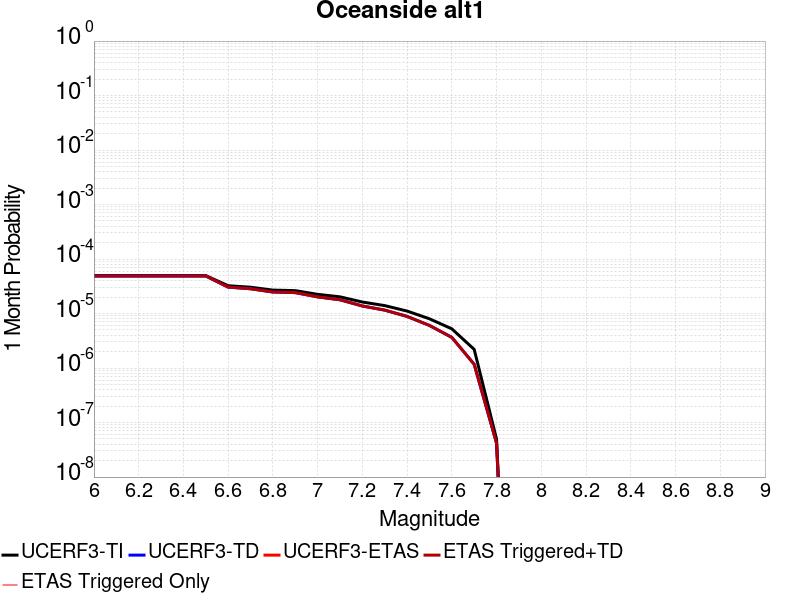 | 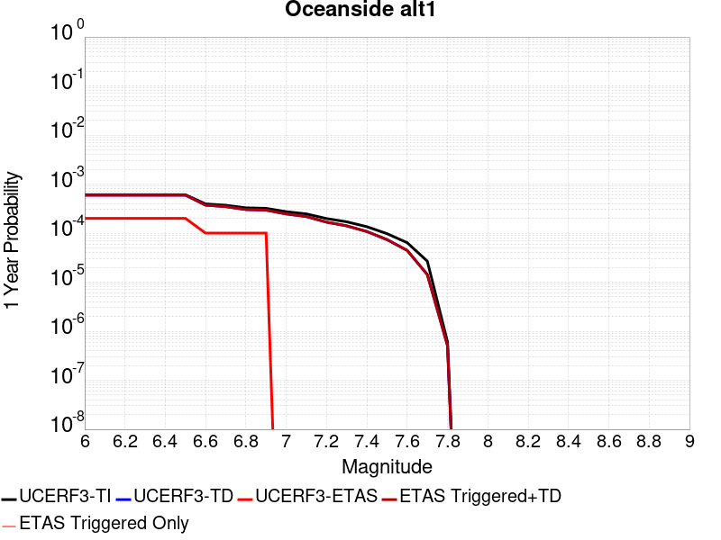 |  |

| Magnitude | 1 wk TI Prob | 1 wk TD Prob | 1 wk ETAS Prob | 1 wk ETAS/TD Gain | 1 wk ETAS Triggered+TD | 1 wk ETAS Triggered Only | 1 mo TI Prob | 1 mo TD Prob | 1 mo ETAS Prob | 1 mo ETAS/TD Gain | 1 mo ETAS Triggered+TD | 1 mo ETAS Triggered Only | 1 yr TI Prob | 1 yr TD Prob | 1 yr ETAS Prob | 1 yr ETAS/TD Gain | 1 yr ETAS Triggered+TD | 1 yr ETAS Triggered Only | 10 yr TI Prob | 10 yr TD Prob | 10 yr ETAS Prob | 10 yr ETAS/TD Gain | 10 yr ETAS Triggered+TD | 10 yr ETAS Triggered Only |
|-----|-----|-----|-----|-----|-----|-----|-----|-----|-----|-----|-----|-----|-----|-----|-----|-----|-----|-----|-----|-----|-----|-----|-----|-----|
| 6.0 | 1.1617542E-5 | 1.1424524E-5 | 0.0 | 0.0 | 1.1424524E-5 | 0.0 | 4.9788516E-5 | 4.8961418E-5 | 0.0 | 0.0 | 4.8961418E-5 | 0.0 | 6.060066E-4 | 5.959583E-4 | 2.0E-4 | 0.33559394 | 5.959583E-4 | 0.0 | 0.0060435664 | 0.0059451996 | 0.0039 | 0.6559914 | 0.006641038 | 7.0E-4 |
| 6.1 | 1.1617542E-5 | 1.1424524E-5 | 0.0 | 0.0 | 1.1424524E-5 | 0.0 | 4.9788516E-5 | 4.8961418E-5 | 0.0 | 0.0 | 4.8961418E-5 | 0.0 | 6.060066E-4 | 5.959583E-4 | 2.0E-4 | 0.33559394 | 5.959583E-4 | 0.0 | 0.0060435664 | 0.0059451996 | 0.0039 | 0.6559914 | 0.006641038 | 7.0E-4 |
| 6.2 | 1.1617542E-5 | 1.1424524E-5 | 0.0 | 0.0 | 1.1424524E-5 | 0.0 | 4.9788516E-5 | 4.8961418E-5 | 0.0 | 0.0 | 4.8961418E-5 | 0.0 | 6.060066E-4 | 5.959583E-4 | 2.0E-4 | 0.33559394 | 5.959583E-4 | 0.0 | 0.0060435664 | 0.0059451996 | 0.0039 | 0.6559914 | 0.006641038 | 7.0E-4 |
| 6.3 | 1.1617542E-5 | 1.1424524E-5 | 0.0 | 0.0 | 1.1424524E-5 | 0.0 | 4.9788516E-5 | 4.8961418E-5 | 0.0 | 0.0 | 4.8961418E-5 | 0.0 | 6.060066E-4 | 5.959583E-4 | 2.0E-4 | 0.33559394 | 5.959583E-4 | 0.0 | 0.0060435664 | 0.0059451996 | 0.0039 | 0.6559914 | 0.006641038 | 7.0E-4 |
| 6.4 | 1.1617542E-5 | 1.1424524E-5 | 0.0 | 0.0 | 1.1424524E-5 | 0.0 | 4.9788516E-5 | 4.8961418E-5 | 0.0 | 0.0 | 4.8961418E-5 | 0.0 | 6.060066E-4 | 5.959583E-4 | 2.0E-4 | 0.33559394 | 5.959583E-4 | 0.0 | 0.0060435664 | 0.0059451996 | 0.0039 | 0.6559914 | 0.006641038 | 7.0E-4 |
| 6.5 | 1.1617542E-5 | 1.1424524E-5 | 0.0 | 0.0 | 1.1424524E-5 | 0.0 | 4.9788516E-5 | 4.8961418E-5 | 0.0 | 0.0 | 4.8961418E-5 | 0.0 | 6.060066E-4 | 5.959583E-4 | 2.0E-4 | 0.33559394 | 5.959583E-4 | 0.0 | 0.0060435664 | 0.0059451996 | 0.0039 | 0.6559914 | 0.006641038 | 7.0E-4 |
| 6.6 | 7.561768E-6 | 7.1341556E-6 | 0.0 | 0.0 | 7.1341556E-6 | 0.0 | 3.2407173E-5 | 3.05746E-5 | 0.0 | 0.0 | 3.05746E-5 | 0.0 | 3.9448592E-4 | 3.7218325E-4 | 1.0E-4 | 0.26868486 | 3.7218325E-4 | 0.0 | 0.0039378637 | 0.0037157107 | 0.0028 | 0.753557 | 0.0041142246 | 4.0E-4 |
| 6.7 | 7.1042605E-6 | 6.6561834E-6 | 0.0 | 0.0 | 6.6561834E-6 | 0.0 | 3.0446476E-5 | 2.8526192E-5 | 0.0 | 0.0 | 2.8526192E-5 | 0.0 | 3.706228E-4 | 3.4725186E-4 | 1.0E-4 | 0.28797543 | 3.4725186E-4 | 0.0 | 0.0037000529 | 0.0034671759 | 0.0024 | 0.692206 | 0.003865789 | 4.0E-4 |
| 6.8 | 6.285554E-6 | 5.800126E-6 | 0.0 | 0.0 | 5.800126E-6 | 0.0 | 2.693781E-5 | 2.485745E-5 | 0.0 | 0.0 | 2.485745E-5 | 0.0 | 3.2791847E-4 | 3.0259797E-4 | 1.0E-4 | 0.3304715 | 3.0259797E-4 | 0.0 | 0.0032743502 | 0.0030219168 | 0.0022 | 0.7280147 | 0.0034207082 | 4.0E-4 |
| 6.9 | 6.148883E-6 | 5.656951E-6 | 0.0 | 0.0 | 5.656951E-6 | 0.0 | 2.635209E-5 | 2.4243855E-5 | 0.0 | 0.0 | 2.4243855E-5 | 0.0 | 3.2078946E-4 | 2.9512952E-4 | 1.0E-4 | 0.33883432 | 2.9512952E-4 | 0.0 | 0.003203268 | 0.0029474325 | 0.0022 | 0.74641234 | 0.0033462537 | 4.0E-4 |
| 7.0 | 5.253857E-6 | 4.722729E-6 | 0.0 | 0.0 | 4.722729E-6 | 0.0 | 2.2516335E-5 | 2.0240112E-5 | 0.0 | 0.0 | 2.0240112E-5 | 0.0 | 2.7410188E-4 | 2.463958E-4 | 0.0 | 0.0 | 2.463958E-4 | 0.0 | 0.0027376404 | 0.0024612576 | 0.0019 | 0.77196306 | 0.002860273 | 4.0E-4 |
| 7.1 | 4.730754E-6 | 4.1787853E-6 | 0.0 | 0.0 | 4.1787853E-6 | 0.0 | 2.0274503E-5 | 1.7908958E-5 | 0.0 | 0.0 | 1.7908958E-5 | 0.0 | 2.468141E-4 | 2.1802001E-4 | 0.0 | 0.0 | 2.1802001E-4 | 0.0 | 0.0024654015 | 0.0021780876 | 0.0017 | 0.7805012 | 0.0024774342 | 3.0E-4 |
| 7.2 | 3.7998386E-6 | 3.214213E-6 | 0.0 | 0.0 | 3.214213E-6 | 0.0 | 1.6284921E-5 | 1.3775127E-5 | 0.0 | 0.0 | 1.3775127E-5 | 0.0 | 1.9825088E-4 | 1.6769937E-4 | 0.0 | 0.0 | 1.6769937E-4 | 0.0 | 0.001980741 | 0.0016757405 | 0.0013 | 0.77577645 | 0.0017755729 | 1.0E-4 |
| 7.3 | 3.2656465E-6 | 2.6985242E-6 | 0.0 | 0.0 | 2.6985242E-6 | 0.0 | 1.3995553E-5 | 1.1565053E-5 | 0.0 | 0.0 | 1.1565053E-5 | 0.0 | 1.7038253E-4 | 1.4079553E-4 | 0.0 | 0.0 | 1.4079553E-4 | 0.0 | 0.0017025196 | 0.0014070744 | 0.0012 | 0.85283333 | 0.0014070744 | 0.0 |
| 7.4 | 2.593703E-6 | 2.0681225E-6 | 0.0 | 0.0 | 2.0681225E-6 | 0.0 | 1.1115822E-5 | 8.863352E-6 | 0.0 | 0.0 | 8.863352E-6 | 0.0 | 1.3532673E-4 | 1.0790607E-4 | 0.0 | 0.0 | 1.0790607E-4 | 0.0 | 0.0013524436 | 0.0010785456 | 9.0E-4 | 0.8344571 | 0.0010785456 | 0.0 |
| 7.5 | 1.8715585E-6 | 1.4137984E-6 | 0.0 | 0.0 | 1.4137984E-6 | 0.0 | 8.020941E-6 | 6.0591224E-6 | 0.0 | 0.0 | 6.0591224E-6 | 0.0 | 9.7650576E-5 | 7.3767376E-5 | 0.0 | 0.0 | 7.3767376E-5 | 0.0 | 9.7607676E-4 | 7.37435E-4 | 9.0E-4 | 1.2204466 | 7.37435E-4 | 0.0 |
| 7.6 | 1.2246786E-6 | 8.527528E-7 | 0.0 | 0.0 | 8.527528E-7 | 0.0 | 5.248612E-6 | 3.6546498E-6 | 0.0 | 0.0 | 3.6546498E-6 | 0.0 | 6.389998E-5 | 4.44945E-5 | 0.0 | 0.0 | 4.44945E-5 | 0.0 | 6.3881604E-4 | 4.448604E-4 | 9.0E-4 | 2.0231066 | 4.448604E-4 | 0.0 |
| 7.7 | 5.140719E-7 | 2.73501E-7 | 0.0 | 0.0 | 2.73501E-7 | 0.0 | 2.2031636E-6 | 1.1721468E-6 | 0.0 | 0.0 | 1.1721468E-6 | 0.0 | 2.6823185E-5 | 1.4270807E-5 | 0.0 | 0.0 | 1.4270807E-5 | 0.0 | 2.6819948E-4 | 1.4270026E-4 | 2.0E-4 | 1.4015392 | 1.4270026E-4 | 0.0 |
| 7.8 | 1.16056995E-8 | 9.783043E-9 | 0.0 | 0.0 | 9.783043E-9 | 0.0 | 4.9738713E-8 | 4.1927326E-8 | 0.0 | 0.0 | 4.1927326E-8 | 0.0 | 6.0556863E-7 | 5.104652E-7 | 0.0 | 0.0 | 5.104652E-7 | 0.0 | 6.05567E-6 | 5.1046522E-6 | 0.0 | 0.0 | 5.1046522E-6 | 0.0 |

## Cleghorn
*[(top)](#table-of-contents)*

| 1 Week | 1 Month | 1 Year | 10 Year |
|-----|-----|-----|-----|
|  |  |  |  |

| Magnitude | 1 wk TI Prob | 1 wk TD Prob | 1 wk ETAS Prob | 1 wk ETAS/TD Gain | 1 wk ETAS Triggered+TD | 1 wk ETAS Triggered Only | 1 mo TI Prob | 1 mo TD Prob | 1 mo ETAS Prob | 1 mo ETAS/TD Gain | 1 mo ETAS Triggered+TD | 1 mo ETAS Triggered Only | 1 yr TI Prob | 1 yr TD Prob | 1 yr ETAS Prob | 1 yr ETAS/TD Gain | 1 yr ETAS Triggered+TD | 1 yr ETAS Triggered Only | 10 yr TI Prob | 10 yr TD Prob | 10 yr ETAS Prob | 10 yr ETAS/TD Gain | 10 yr ETAS Triggered+TD | 10 yr ETAS Triggered Only |
|-----|-----|-----|-----|-----|-----|-----|-----|-----|-----|-----|-----|-----|-----|-----|-----|-----|-----|-----|-----|-----|-----|-----|-----|-----|
| 6.0 | 7.9267165E-6 | 9.844975E-6 | 0.0 | 0.0 | 9.844975E-6 | 0.0 | 3.39712E-5 | 4.2192125E-5 | 0.0 | 0.0 | 4.2192125E-5 | 0.0 | 4.1352084E-4 | 5.135787E-4 | 3.0E-4 | 0.58413637 | 5.135787E-4 | 0.0 | 0.004127522 | 0.0051389216 | 0.0036 | 0.70053613 | 0.005835324 | 7.0E-4 |
| 6.1 | 7.9267165E-6 | 9.844975E-6 | 0.0 | 0.0 | 9.844975E-6 | 0.0 | 3.39712E-5 | 4.2192125E-5 | 0.0 | 0.0 | 4.2192125E-5 | 0.0 | 4.1352084E-4 | 5.135787E-4 | 3.0E-4 | 0.58413637 | 5.135787E-4 | 0.0 | 0.004127522 | 0.0051389216 | 0.0036 | 0.70053613 | 0.005835324 | 7.0E-4 |
| 6.2 | 7.9267165E-6 | 9.844975E-6 | 0.0 | 0.0 | 9.844975E-6 | 0.0 | 3.39712E-5 | 4.2192125E-5 | 0.0 | 0.0 | 4.2192125E-5 | 0.0 | 4.1352084E-4 | 5.135787E-4 | 3.0E-4 | 0.58413637 | 5.135787E-4 | 0.0 | 0.004127522 | 0.0051389216 | 0.0036 | 0.70053613 | 0.005835324 | 7.0E-4 |
| 6.3 | 7.9267165E-6 | 9.844975E-6 | 0.0 | 0.0 | 9.844975E-6 | 0.0 | 3.39712E-5 | 4.2192125E-5 | 0.0 | 0.0 | 4.2192125E-5 | 0.0 | 4.1352084E-4 | 5.135787E-4 | 3.0E-4 | 0.58413637 | 5.135787E-4 | 0.0 | 0.004127522 | 0.0051389216 | 0.0036 | 0.70053613 | 0.005835324 | 7.0E-4 |
| 6.4 | 4.3445207E-6 | 6.1045084E-6 | 0.0 | 0.0 | 6.1045084E-6 | 0.0 | 1.8619241E-5 | 2.6161923E-5 | 0.0 | 0.0 | 2.6161923E-5 | 0.0 | 2.2666567E-4 | 3.1847585E-4 | 2.0E-4 | 0.6279911 | 3.1847585E-4 | 0.0 | 0.0022643462 | 0.0031942746 | 0.0029 | 0.9078744 | 0.0036926775 | 5.0E-4 |
| 6.5 | 4.3445207E-6 | 6.1045084E-6 | 0.0 | 0.0 | 6.1045084E-6 | 0.0 | 1.8619241E-5 | 2.6161923E-5 | 0.0 | 0.0 | 2.6161923E-5 | 0.0 | 2.2666567E-4 | 3.1847585E-4 | 2.0E-4 | 0.6279911 | 3.1847585E-4 | 0.0 | 0.0022643462 | 0.0031942746 | 0.0029 | 0.9078744 | 0.0036926775 | 5.0E-4 |
| 6.6 | 4.040109E-6 | 5.786889E-6 | 0.0 | 0.0 | 5.786889E-6 | 0.0 | 1.7314638E-5 | 2.4800722E-5 | 0.0 | 0.0 | 2.4800722E-5 | 0.0 | 2.1078532E-4 | 3.019079E-4 | 2.0E-4 | 0.6624537 | 3.019079E-4 | 0.0 | 0.002105855 | 0.0030290512 | 0.0027 | 0.8913682 | 0.0034278396 | 4.0E-4 |
| 6.7 | 3.3632055E-6 | 5.080325E-6 | 0.0 | 0.0 | 5.080325E-6 | 0.0 | 1.4413658E-5 | 2.1772643E-5 | 0.0 | 0.0 | 2.1772643E-5 | 0.0 | 1.7547216E-4 | 2.6505E-4 | 2.0E-4 | 0.7545746 | 2.6505E-4 | 0.0 | 0.0017533366 | 0.0026613565 | 0.0023 | 0.864221 | 0.002960558 | 3.0E-4 |
| 6.8 | 3.2902772E-6 | 5.0022213E-6 | 0.0 | 0.0 | 5.0022213E-6 | 0.0 | 1.4101111E-5 | 2.1437918E-5 | 0.0 | 0.0 | 2.1437918E-5 | 0.0 | 1.716675E-4 | 2.609757E-4 | 2.0E-4 | 0.7663549 | 2.609757E-4 | 0.0 | 0.0017153495 | 0.0026207096 | 0.0023 | 0.8776249 | 0.0029199233 | 3.0E-4 |
| 6.9 | 3.031547E-6 | 4.703704E-6 | 0.0 | 0.0 | 4.703704E-6 | 0.0 | 1.299228E-5 | 2.0158577E-5 | 0.0 | 0.0 | 2.0158577E-5 | 0.0 | 1.5816953E-4 | 2.454033E-4 | 2.0E-4 | 0.814985 | 2.454033E-4 | 0.0 | 0.00158057 | 0.0024653384 | 0.0022 | 0.8923724 | 0.002764599 | 3.0E-4 |
| 7.0 | 2.8259715E-6 | 4.3825517E-6 | 0.0 | 0.0 | 4.3825517E-6 | 0.0 | 1.211125E-5 | 1.8782232E-5 | 0.0 | 0.0 | 1.8782232E-5 | 0.0 | 1.4744449E-4 | 2.2864991E-4 | 2.0E-4 | 0.8746997 | 2.2864991E-4 | 0.0 | 0.001473467 | 0.0022981605 | 0.0021 | 0.9137743 | 0.002597471 | 3.0E-4 |
| 7.1 | 2.5962665E-6 | 4.0774516E-6 | 0.0 | 0.0 | 4.0774516E-6 | 0.0 | 1.1126809E-5 | 1.7474678E-5 | 0.0 | 0.0 | 1.7474678E-5 | 0.0 | 1.3546048E-4 | 2.1273365E-4 | 2.0E-4 | 0.94014275 | 2.1273365E-4 | 0.0 | 0.0013537793 | 0.002139313 | 0.002 | 0.9348796 | 0.002338885 | 2.0E-4 |
| 7.2 | 2.3247253E-6 | 3.6876065E-6 | 0.0 | 0.0 | 3.6876065E-6 | 0.0 | 9.96307E-6 | 1.5803933E-5 | 0.0 | 0.0 | 1.5803933E-5 | 0.0 | 1.21293626E-4 | 1.923961E-4 | 2.0E-4 | 1.0395222 | 1.923961E-4 | 0.0 | 0.0012122744 | 0.0019363295 | 0.0019 | 0.98123795 | 0.0021359422 | 2.0E-4 |
| 7.3 | 2.056928E-6 | 3.2454948E-6 | 0.0 | 0.0 | 3.2454948E-6 | 0.0 | 8.815376E-6 | 1.390919E-5 | 0.0 | 0.0 | 1.390919E-5 | 0.0 | 1.0732192E-4 | 1.6933138E-4 | 2.0E-4 | 1.181116 | 1.6933138E-4 | 0.0 | 0.001072701 | 0.0017061322 | 0.0019 | 1.1136299 | 0.001905791 | 2.0E-4 |
| 7.4 | 1.8055999E-6 | 2.835122E-6 | 0.0 | 0.0 | 2.835122E-6 | 0.0 | 7.738263E-6 | 1.2150467E-5 | 0.0 | 0.0 | 1.2150467E-5 | 0.0 | 9.4209274E-5 | 1.4792204E-4 | 2.0E-4 | 1.3520637 | 1.4792204E-4 | 0.0 | 9.4169343E-4 | 0.001492467 | 0.0015 | 1.0050473 | 0.0015923177 | 1.0E-4 |
| 7.5 | 1.4683443E-6 | 2.434015E-6 | 0.0 | 0.0 | 2.434015E-6 | 0.0 | 6.292889E-6 | 1.0431451E-5 | 0.0 | 0.0 | 1.0431451E-5 | 0.0 | 7.661323E-5 | 1.2699561E-4 | 2.0E-4 | 1.5748575 | 1.2699561E-4 | 0.0 | 7.658682E-4 | 0.0012835016 | 0.0014 | 1.0907661 | 0.0013833733 | 1.0E-4 |
| 7.6 | 9.804088E-7 | 1.9093416E-6 | 0.0 | 0.0 | 1.9093416E-6 | 0.0 | 4.201745E-6 | 8.182867E-6 | 0.0 | 0.0 | 8.182867E-6 | 0.0 | 5.1155046E-5 | 9.9621895E-5 | 2.0E-4 | 2.0075908 | 9.9621895E-5 | 0.0 | 5.114327E-4 | 0.0010100824 | 0.0011 | 1.0890201 | 0.0011099813 | 1.0E-4 |
| 7.7 | 7.3434086E-7 | 1.6373099E-6 | 0.0 | 0.0 | 1.6373099E-6 | 0.0 | 3.1471714E-6 | 7.0170236E-6 | 0.0 | 0.0 | 7.0170236E-6 | 0.0 | 3.831614E-5 | 8.542894E-5 | 2.0E-4 | 2.341127 | 8.542894E-5 | 0.0 | 3.8309532E-4 | 8.6830906E-4 | 0.0011 | 1.2668301 | 9.682222E-4 | 1.0E-4 |
| 7.8 | 6.434184E-7 | 1.5303846E-6 | 0.0 | 0.0 | 1.5303846E-6 | 0.0 | 2.7575045E-6 | 6.5587747E-6 | 0.0 | 0.0 | 6.5587747E-6 | 0.0 | 3.35721E-5 | 7.985018E-5 | 2.0E-4 | 2.5046906 | 7.985018E-5 | 0.0 | 3.3567028E-4 | 8.1221864E-4 | 8.0E-4 | 0.9849565 | 9.121374E-4 | 1.0E-4 |
| 7.9 | 3.4943926E-7 | 7.610892E-7 | 0.0 | 0.0 | 7.610892E-7 | 0.0 | 1.497596E-6 | 3.2618068E-6 | 0.0 | 0.0 | 3.2618068E-6 | 0.0 | 1.8233079E-5 | 3.9711784E-5 | 1.0E-4 | 2.5181444 | 3.9711784E-5 | 0.0 | 1.8231584E-4 | 4.0589005E-4 | 3.0E-4 | 0.7391164 | 4.0589005E-4 | 0.0 |
| 8.0 | 6.717524E-8 | 5.858182E-8 | 0.0 | 0.0 | 5.858182E-8 | 0.0 | 2.8789387E-7 | 2.510649E-7 | 0.0 | 0.0 | 2.510649E-7 | 0.0 | 3.505102E-6 | 3.056711E-6 | 0.0 | 0.0 | 3.056711E-6 | 0.0 | 3.5050467E-5 | 3.2832573E-5 | 0.0 | 0.0 | 3.2832573E-5 | 0.0 |
| 8.1 | 3.1984914E-8 | 1.2990904E-8 | 0.0 | 0.0 | 1.2990904E-8 | 0.0 | 1.370782E-7 | 5.56753E-8 | 0.0 | 0.0 | 5.56753E-8 | 0.0 | 1.6689258E-6 | 6.778466E-7 | 0.0 | 0.0 | 6.778466E-7 | 0.0 | 1.6689133E-5 | 7.765035E-6 | 0.0 | 0.0 | 7.765035E-6 | 0.0 |
| 8.2 | 1.21887656E-8 | 3.6579588E-9 | 0.0 | 0.0 | 3.6579588E-9 | 0.0 | 5.2237567E-8 | 1.5676966E-8 | 0.0 | 0.0 | 1.5676966E-8 | 0.0 | 6.359922E-7 | 1.9086704E-7 | 0.0 | 0.0 | 1.9086704E-7 | 0.0 | 6.3599036E-6 | 2.2520985E-6 | 0.0 | 0.0 | 2.2520985E-6 | 0.0 |

## Hollywood
*[(top)](#table-of-contents)*

| 1 Week | 1 Month | 1 Year | 10 Year |
|-----|-----|-----|-----|
|  | 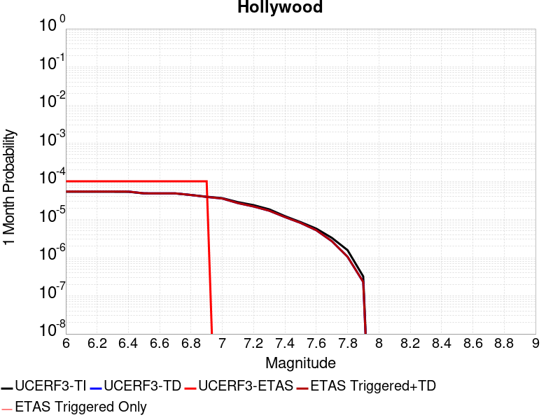 |  |  |

| Magnitude | 1 wk TI Prob | 1 wk TD Prob | 1 wk ETAS Prob | 1 wk ETAS/TD Gain | 1 wk ETAS Triggered+TD | 1 wk ETAS Triggered Only | 1 mo TI Prob | 1 mo TD Prob | 1 mo ETAS Prob | 1 mo ETAS/TD Gain | 1 mo ETAS Triggered+TD | 1 mo ETAS Triggered Only | 1 yr TI Prob | 1 yr TD Prob | 1 yr ETAS Prob | 1 yr ETAS/TD Gain | 1 yr ETAS Triggered+TD | 1 yr ETAS Triggered Only | 10 yr TI Prob | 10 yr TD Prob | 10 yr ETAS Prob | 10 yr ETAS/TD Gain | 10 yr ETAS Triggered+TD | 10 yr ETAS Triggered Only |
|-----|-----|-----|-----|-----|-----|-----|-----|-----|-----|-----|-----|-----|-----|-----|-----|-----|-----|-----|-----|-----|-----|-----|-----|-----|
| 6.0 | 1.24487615E-5 | 1.2595583E-5 | 0.0 | 0.0 | 1.2595583E-5 | 0.0 | 5.3350745E-5 | 5.3979977E-5 | 1.0E-4 | 1.8525387 | 5.3979977E-5 | 0.0 | 6.4935174E-4 | 6.570127E-4 | 8.0E-4 | 1.2176324 | 7.5694703E-4 | 1.0E-4 | 0.0064745755 | 0.0065511907 | 0.0045 | 0.686898 | 0.007246605 | 7.0E-4 |
| 6.1 | 1.24487615E-5 | 1.2595583E-5 | 0.0 | 0.0 | 1.2595583E-5 | 0.0 | 5.3350745E-5 | 5.3979977E-5 | 1.0E-4 | 1.8525387 | 5.3979977E-5 | 0.0 | 6.4935174E-4 | 6.570127E-4 | 8.0E-4 | 1.2176324 | 7.5694703E-4 | 1.0E-4 | 0.0064745755 | 0.0065511907 | 0.0045 | 0.686898 | 0.007246605 | 7.0E-4 |
| 6.2 | 1.24487615E-5 | 1.2595583E-5 | 0.0 | 0.0 | 1.2595583E-5 | 0.0 | 5.3350745E-5 | 5.3979977E-5 | 1.0E-4 | 1.8525387 | 5.3979977E-5 | 0.0 | 6.4935174E-4 | 6.570127E-4 | 8.0E-4 | 1.2176324 | 7.5694703E-4 | 1.0E-4 | 0.0064745755 | 0.0065511907 | 0.0045 | 0.686898 | 0.007246605 | 7.0E-4 |
| 6.3 | 1.24487615E-5 | 1.2595583E-5 | 0.0 | 0.0 | 1.2595583E-5 | 0.0 | 5.3350745E-5 | 5.3979977E-5 | 1.0E-4 | 1.8525387 | 5.3979977E-5 | 0.0 | 6.4935174E-4 | 6.570127E-4 | 8.0E-4 | 1.2176324 | 7.5694703E-4 | 1.0E-4 | 0.0064745755 | 0.0065511907 | 0.0045 | 0.686898 | 0.007246605 | 7.0E-4 |
| 6.4 | 1.2431024E-5 | 1.2576193E-5 | 0.0 | 0.0 | 1.2576193E-5 | 0.0 | 5.327473E-5 | 5.389688E-5 | 1.0E-4 | 1.855395 | 5.389688E-5 | 0.0 | 6.4842677E-4 | 6.560016E-4 | 8.0E-4 | 1.2195092 | 7.55936E-4 | 1.0E-4 | 0.0064653796 | 0.0065411394 | 0.0045 | 0.68795353 | 0.007236561 | 7.0E-4 |
| 6.5 | 1.1242222E-5 | 1.1320013E-5 | 0.0 | 0.0 | 1.1320013E-5 | 0.0 | 4.8180063E-5 | 4.851345E-5 | 1.0E-4 | 2.0612838 | 4.851345E-5 | 0.0 | 5.864344E-4 | 5.904939E-4 | 6.0E-4 | 1.0160985 | 6.904348E-4 | 1.0E-4 | 0.0058488925 | 0.005889536 | 0.004 | 0.67917067 | 0.006585413 | 7.0E-4 |
| 6.6 | 1.1234066E-5 | 1.1311125E-5 | 0.0 | 0.0 | 1.1311125E-5 | 0.0 | 4.8145106E-5 | 4.8475365E-5 | 1.0E-4 | 2.0629036 | 4.8475365E-5 | 0.0 | 5.86009E-4 | 5.900304E-4 | 6.0E-4 | 1.0168967 | 6.8997144E-4 | 1.0E-4 | 0.005844661 | 0.0058849254 | 0.004 | 0.67970276 | 0.006580806 | 7.0E-4 |
| 6.7 | 1.12294E-5 | 1.1305867E-5 | 0.0 | 0.0 | 1.1305867E-5 | 0.0 | 4.812511E-5 | 4.8452832E-5 | 1.0E-4 | 2.0638628 | 4.8452832E-5 | 0.0 | 5.857657E-4 | 5.8975624E-4 | 6.0E-4 | 1.0173695 | 6.896973E-4 | 1.0E-4 | 0.0058422405 | 0.005882198 | 0.004 | 0.6800179 | 0.0065780804 | 7.0E-4 |
| 6.8 | 1.0252819E-5 | 1.0220413E-5 | 0.0 | 0.0 | 1.0220413E-5 | 0.0 | 4.3939912E-5 | 4.3801047E-5 | 1.0E-4 | 2.2830505 | 4.3801047E-5 | 0.0 | 5.3483713E-4 | 5.331494E-4 | 6.0E-4 | 1.1253881 | 6.330961E-4 | 1.0E-4 | 0.005335517 | 0.0053189294 | 0.0035 | 0.6580272 | 0.005915738 | 6.0E-4 |
| 6.9 | 9.252289E-6 | 9.112037E-6 | 0.0 | 0.0 | 9.112037E-6 | 0.0 | 3.9652066E-5 | 3.9051014E-5 | 1.0E-4 | 2.560753 | 3.9051014E-5 | 0.0 | 4.8265693E-4 | 4.7534402E-4 | 6.0E-4 | 1.2622437 | 5.7529646E-4 | 1.0E-4 | 0.0048161 | 0.004743446 | 0.0035 | 0.7378602 | 0.0053406 | 6.0E-4 |
| 7.0 | 8.474604E-6 | 8.259826E-6 | 0.0 | 0.0 | 8.259826E-6 | 0.0 | 3.6319227E-5 | 3.539878E-5 | 0.0 | 0.0 | 3.539878E-5 | 0.0 | 4.4209688E-4 | 4.3089638E-4 | 4.0E-4 | 0.9282974 | 4.3089638E-4 | 0.0 | 0.004412184 | 0.004300759 | 0.0031 | 0.72080296 | 0.0046990393 | 4.0E-4 |
| 7.1 | 6.643643E-6 | 6.2695653E-6 | 0.0 | 0.0 | 6.2695653E-6 | 0.0 | 2.8472443E-5 | 2.6869291E-5 | 0.0 | 0.0 | 2.6869291E-5 | 0.0 | 3.4659685E-4 | 3.2708494E-4 | 4.0E-4 | 1.2229239 | 3.2708494E-4 | 0.0 | 0.0034605677 | 0.0032660814 | 0.0023 | 0.7042078 | 0.0035651017 | 3.0E-4 |
| 7.2 | 5.549002E-6 | 5.1097086E-6 | 0.0 | 0.0 | 5.1097086E-6 | 0.0 | 2.378122E-5 | 2.189857E-5 | 0.0 | 0.0 | 2.189857E-5 | 0.0 | 2.8949787E-4 | 2.665826E-4 | 3.0E-4 | 1.1253548 | 2.665826E-4 | 0.0 | 0.0028912104 | 0.0026626447 | 0.002 | 0.7511329 | 0.0029618458 | 3.0E-4 |
| 7.3 | 4.3059727E-6 | 3.9607194E-6 | 0.0 | 0.0 | 3.9607194E-6 | 0.0 | 1.8454039E-5 | 1.6974402E-5 | 0.0 | 0.0 | 1.6974402E-5 | 0.0 | 2.2465475E-4 | 2.0664383E-4 | 3.0E-4 | 1.4517733 | 2.0664383E-4 | 0.0 | 0.0022442779 | 0.002064527 | 0.0015 | 0.7265587 | 0.0021643206 | 1.0E-4 |
| 7.4 | 2.8550733E-6 | 2.7019582E-6 | 0.0 | 0.0 | 2.7019582E-6 | 0.0 | 1.2235971E-5 | 1.1579769E-5 | 0.0 | 0.0 | 1.1579769E-5 | 0.0 | 1.4896276E-4 | 1.4097462E-4 | 3.0E-4 | 2.1280427 | 1.4097462E-4 | 0.0 | 0.0014886294 | 0.001408857 | 9.0E-4 | 0.6388157 | 0.001408857 | 0.0 |
| 7.5 | 1.9927045E-6 | 1.8980671E-6 | 0.0 | 0.0 | 1.8980671E-6 | 0.0 | 8.540134E-6 | 8.134549E-6 | 0.0 | 0.0 | 8.134549E-6 | 0.0 | 1.0397117E-4 | 9.903366E-5 | 3.0E-4 | 3.029273 | 9.903366E-5 | 0.0 | 0.0010392254 | 9.898989E-4 | 7.0E-4 | 0.70714295 | 9.898989E-4 | 0.0 |
| 7.6 | 1.345084E-6 | 1.2218427E-6 | 0.0 | 0.0 | 1.2218427E-6 | 0.0 | 5.764633E-6 | 5.2364585E-6 | 0.0 | 0.0 | 5.2364585E-6 | 0.0 | 7.018215E-5 | 6.3752035E-5 | 1.0E-4 | 1.5685773 | 6.3752035E-5 | 0.0 | 7.0159987E-4 | 6.373394E-4 | 4.0E-4 | 0.627609 | 6.373394E-4 | 0.0 |
| 7.7 | 7.6835164E-7 | 6.279238E-7 | 0.0 | 0.0 | 6.279238E-7 | 0.0 | 3.2929315E-6 | 2.691099E-6 | 0.0 | 0.0 | 2.691099E-6 | 0.0 | 4.00907E-5 | 3.2763655E-5 | 1.0E-4 | 3.0521624 | 3.2763655E-5 | 0.0 | 4.0083472E-4 | 3.2758972E-4 | 3.0E-4 | 0.91577965 | 3.2758972E-4 | 0.0 |
| 7.8 | 3.6562128E-7 | 2.4545676E-7 | 0.0 | 0.0 | 2.4545676E-7 | 0.0 | 1.5669474E-6 | 1.0519572E-6 | 0.0 | 0.0 | 1.0519572E-6 | 0.0 | 1.9077417E-5 | 1.2807506E-5 | 1.0E-4 | 7.8079214 | 1.2807506E-5 | 0.0 | 1.907578E-4 | 1.2806806E-4 | 1.0E-4 | 0.78083485 | 1.2806806E-4 | 0.0 |
| 7.9 | 7.5024424E-8 | 5.3836157E-8 | 0.0 | 0.0 | 5.3836157E-8 | 0.0 | 3.215332E-7 | 2.3072637E-7 | 0.0 | 0.0 | 2.3072637E-7 | 0.0 | 3.91466E-6 | 2.8090913E-6 | 0.0 | 0.0 | 2.8090913E-6 | 0.0 | 3.9145907E-5 | 2.8090688E-5 | 0.0 | 0.0 | 2.8090688E-5 | 0.0 |

## Round Valley
*[(top)](#table-of-contents)*

| 1 Week | 1 Month | 1 Year | 10 Year |
|-----|-----|-----|-----|
|  |  |  | 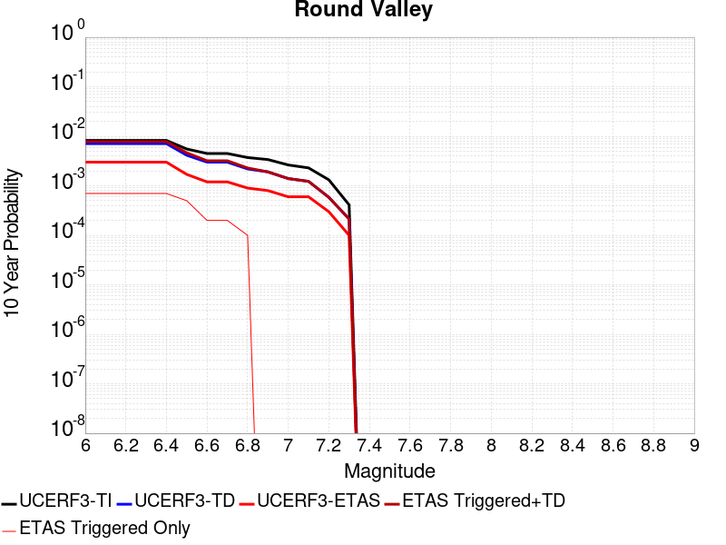 |

| Magnitude | 1 wk TI Prob | 1 wk TD Prob | 1 wk ETAS Prob | 1 wk ETAS/TD Gain | 1 wk ETAS Triggered+TD | 1 wk ETAS Triggered Only | 1 mo TI Prob | 1 mo TD Prob | 1 mo ETAS Prob | 1 mo ETAS/TD Gain | 1 mo ETAS Triggered+TD | 1 mo ETAS Triggered Only | 1 yr TI Prob | 1 yr TD Prob | 1 yr ETAS Prob | 1 yr ETAS/TD Gain | 1 yr ETAS Triggered+TD | 1 yr ETAS Triggered Only | 10 yr TI Prob | 10 yr TD Prob | 10 yr ETAS Prob | 10 yr ETAS/TD Gain | 10 yr ETAS Triggered+TD | 10 yr ETAS Triggered Only |
|-----|-----|-----|-----|-----|-----|-----|-----|-----|-----|-----|-----|-----|-----|-----|-----|-----|-----|-----|-----|-----|-----|-----|-----|-----|
| 6.0 | 1.588152E-5 | 1.3672326E-5 | 0.0 | 0.0 | 1.3672326E-5 | 0.0 | 6.806188E-5 | 5.859459E-5 | 0.0 | 0.0 | 5.859459E-5 | 0.0 | 8.283384E-4 | 7.13195E-4 | 4.0E-4 | 0.5608564 | 9.130524E-4 | 2.0E-4 | 0.008252576 | 0.007112951 | 0.003 | 0.4217659 | 0.007807972 | 7.0E-4 |
| 6.1 | 1.588152E-5 | 1.3672326E-5 | 0.0 | 0.0 | 1.3672326E-5 | 0.0 | 6.806188E-5 | 5.859459E-5 | 0.0 | 0.0 | 5.859459E-5 | 0.0 | 8.283384E-4 | 7.13195E-4 | 4.0E-4 | 0.5608564 | 9.130524E-4 | 2.0E-4 | 0.008252576 | 0.007112951 | 0.003 | 0.4217659 | 0.007807972 | 7.0E-4 |
| 6.2 | 1.588152E-5 | 1.3672326E-5 | 0.0 | 0.0 | 1.3672326E-5 | 0.0 | 6.806188E-5 | 5.859459E-5 | 0.0 | 0.0 | 5.859459E-5 | 0.0 | 8.283384E-4 | 7.13195E-4 | 4.0E-4 | 0.5608564 | 9.130524E-4 | 2.0E-4 | 0.008252576 | 0.007112951 | 0.003 | 0.4217659 | 0.007807972 | 7.0E-4 |
| 6.3 | 1.588152E-5 | 1.3672326E-5 | 0.0 | 0.0 | 1.3672326E-5 | 0.0 | 6.806188E-5 | 5.859459E-5 | 0.0 | 0.0 | 5.859459E-5 | 0.0 | 8.283384E-4 | 7.13195E-4 | 4.0E-4 | 0.5608564 | 9.130524E-4 | 2.0E-4 | 0.008252576 | 0.007112951 | 0.003 | 0.4217659 | 0.007807972 | 7.0E-4 |
| 6.4 | 1.588152E-5 | 1.3672326E-5 | 0.0 | 0.0 | 1.3672326E-5 | 0.0 | 6.806188E-5 | 5.859459E-5 | 0.0 | 0.0 | 5.859459E-5 | 0.0 | 8.283384E-4 | 7.13195E-4 | 4.0E-4 | 0.5608564 | 9.130524E-4 | 2.0E-4 | 0.008252576 | 0.007112951 | 0.003 | 0.4217659 | 0.007807972 | 7.0E-4 |
| 6.5 | 1.0646776E-5 | 7.953601E-6 | 0.0 | 0.0 | 7.953601E-6 | 0.0 | 4.5628243E-5 | 3.408646E-5 | 0.0 | 0.0 | 3.408646E-5 | 0.0 | 5.553823E-4 | 4.1493206E-4 | 4.0E-4 | 0.9640133 | 6.1484904E-4 | 2.0E-4 | 0.005539963 | 0.004142402 | 0.0017 | 0.4103899 | 0.004640331 | 5.0E-4 |
| 6.6 | 8.632956E-6 | 5.7689385E-6 | 0.0 | 0.0 | 5.7689385E-6 | 0.0 | 3.6997862E-5 | 2.472381E-5 | 0.0 | 0.0 | 2.472381E-5 | 0.0 | 4.5035584E-4 | 3.0097464E-4 | 3.0E-4 | 0.99676174 | 4.0094453E-4 | 1.0E-4 | 0.0044944426 | 0.0030060483 | 0.0012 | 0.3991952 | 0.003205447 | 2.0E-4 |
| 6.7 | 8.632956E-6 | 5.7689385E-6 | 0.0 | 0.0 | 5.7689385E-6 | 0.0 | 3.6997862E-5 | 2.472381E-5 | 0.0 | 0.0 | 2.472381E-5 | 0.0 | 4.5035584E-4 | 3.0097464E-4 | 3.0E-4 | 0.99676174 | 4.0094453E-4 | 1.0E-4 | 0.0044944426 | 0.0030060483 | 0.0012 | 0.3991952 | 0.003205447 | 2.0E-4 |
| 6.8 | 7.143895E-6 | 4.2018023E-6 | 0.0 | 0.0 | 4.2018023E-6 | 0.0 | 3.0616335E-5 | 1.800761E-5 | 0.0 | 0.0 | 1.800761E-5 | 0.0 | 3.726901E-4 | 2.1922226E-4 | 2.0E-4 | 0.9123161 | 2.1922226E-4 | 0.0 | 0.0037206567 | 0.0021902248 | 9.0E-4 | 0.41091672 | 0.0022900058 | 1.0E-4 |
| 6.9 | 6.5120694E-6 | 3.6644058E-6 | 0.0 | 0.0 | 3.6644058E-6 | 0.0 | 2.790857E-5 | 1.570451E-5 | 0.0 | 0.0 | 1.570451E-5 | 0.0 | 3.3973387E-4 | 1.9118715E-4 | 2.0E-4 | 1.0460954 | 1.9118715E-4 | 0.0 | 0.0033921495 | 0.0019103757 | 8.0E-4 | 0.41876578 | 0.0019103757 | 0.0 |
| 7.0 | 5.0614435E-6 | 2.6836253E-6 | 0.0 | 0.0 | 2.6836253E-6 | 0.0 | 2.169172E-5 | 1.1501206E-5 | 0.0 | 0.0 | 1.1501206E-5 | 0.0 | 2.6406467E-4 | 1.4001921E-4 | 1.0E-4 | 0.7141877 | 1.4001921E-4 | 0.0 | 0.0026375111 | 0.0013994112 | 6.0E-4 | 0.42875174 | 0.0013994112 | 0.0 |
| 7.1 | 4.41728E-6 | 2.3575355E-6 | 0.0 | 0.0 | 2.3575355E-6 | 0.0 | 1.8931061E-5 | 1.010369E-5 | 0.0 | 0.0 | 1.010369E-5 | 0.0 | 2.304613E-4 | 1.2300647E-4 | 1.0E-4 | 0.8129654 | 1.2300647E-4 | 0.0 | 0.0023022245 | 0.0012294803 | 6.0E-4 | 0.48801106 | 0.0012294803 | 0.0 |
| 7.2 | 2.535495E-6 | 1.1211132E-6 | 0.0 | 0.0 | 1.1211132E-6 | 0.0 | 1.0866362E-5 | 4.804765E-6 | 0.0 | 0.0 | 4.804765E-6 | 0.0 | 1.3228992E-4 | 5.8496968E-5 | 1.0E-4 | 1.7094904 | 5.8496968E-5 | 0.0 | 0.0013221119 | 5.8486685E-4 | 3.0E-4 | 0.51293725 | 5.8486685E-4 | 0.0 |
| 7.3 | 7.900015E-7 | 4.0880732E-7 | 0.0 | 0.0 | 4.0880732E-7 | 0.0 | 3.3857161E-6 | 1.7520314E-6 | 0.0 | 0.0 | 1.7520314E-6 | 0.0 | 4.1220315E-5 | 2.1330983E-5 | 1.0E-4 | 4.6880164 | 2.1330983E-5 | 0.0 | 4.121267E-4 | 2.1330983E-4 | 1.0E-4 | 0.46880165 | 2.1330983E-4 | 0.0 |

## Newport-Inglewood (Offshore)
*[(top)](#table-of-contents)*

| 1 Week | 1 Month | 1 Year | 10 Year |
|-----|-----|-----|-----|
| 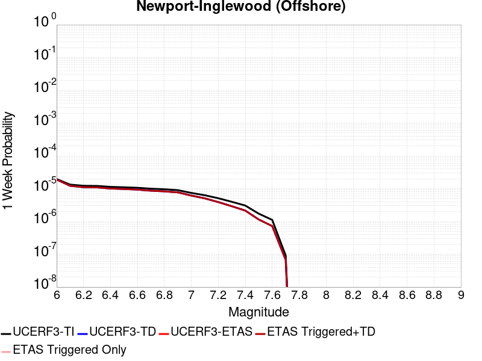 | 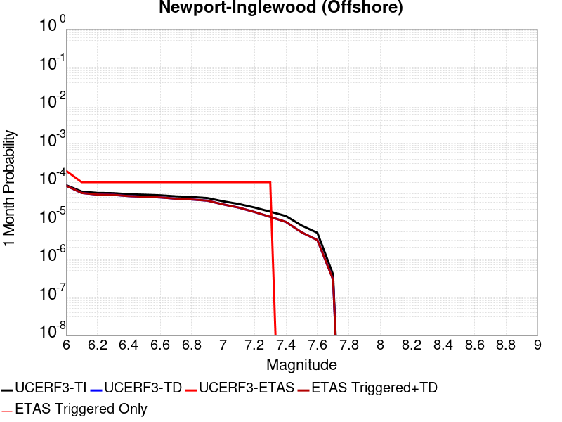 | 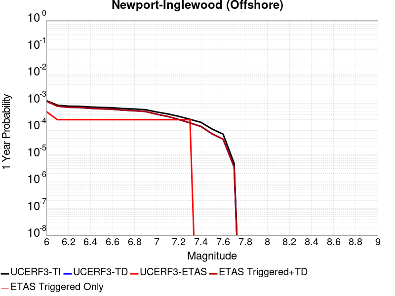 |  |

| Magnitude | 1 wk TI Prob | 1 wk TD Prob | 1 wk ETAS Prob | 1 wk ETAS/TD Gain | 1 wk ETAS Triggered+TD | 1 wk ETAS Triggered Only | 1 mo TI Prob | 1 mo TD Prob | 1 mo ETAS Prob | 1 mo ETAS/TD Gain | 1 mo ETAS Triggered+TD | 1 mo ETAS Triggered Only | 1 yr TI Prob | 1 yr TD Prob | 1 yr ETAS Prob | 1 yr ETAS/TD Gain | 1 yr ETAS Triggered+TD | 1 yr ETAS Triggered Only | 10 yr TI Prob | 10 yr TD Prob | 10 yr ETAS Prob | 10 yr ETAS/TD Gain | 10 yr ETAS Triggered+TD | 10 yr ETAS Triggered Only |
|-----|-----|-----|-----|-----|-----|-----|-----|-----|-----|-----|-----|-----|-----|-----|-----|-----|-----|-----|-----|-----|-----|-----|-----|-----|
| 6.0 | 1.9626508E-5 | 1.896817E-5 | 0.0 | 0.0 | 1.896817E-5 | 0.0 | 8.411089E-5 | 8.12897E-5 | 2.0E-4 | 2.4603364 | 8.12897E-5 | 0.0 | 0.001023569 | 9.892653E-4 | 4.0E-4 | 0.40434048 | 9.892653E-4 | 0.0 | 0.010188672 | 0.009849958 | 0.0054 | 0.5482257 | 0.010543063 | 7.0E-4 |
| 6.1 | 1.331886E-5 | 1.2219973E-5 | 0.0 | 0.0 | 1.2219973E-5 | 0.0 | 5.707958E-5 | 5.237027E-5 | 1.0E-4 | 1.9094803 | 5.237027E-5 | 0.0 | 6.947222E-4 | 6.37423E-4 | 2.0E-4 | 0.31376338 | 6.37423E-4 | 0.0 | 0.006925544 | 0.0063561243 | 0.0034 | 0.5349172 | 0.0069523104 | 6.0E-4 |
| 6.2 | 1.2250852E-5 | 1.1077753E-5 | 0.0 | 0.0 | 1.1077753E-5 | 0.0 | 5.2502597E-5 | 4.7475227E-5 | 1.0E-4 | 2.1063616 | 4.7475227E-5 | 0.0 | 6.3903164E-4 | 5.778586E-4 | 2.0E-4 | 0.34610543 | 5.778586E-4 | 0.0 | 0.006371971 | 0.005763681 | 0.0033 | 0.5725508 | 0.0063602226 | 6.0E-4 |
| 6.3 | 1.2106258E-5 | 1.0920588E-5 | 0.0 | 0.0 | 1.0920588E-5 | 0.0 | 5.1882926E-5 | 4.6801684E-5 | 1.0E-4 | 2.1366751 | 4.6801684E-5 | 0.0 | 6.3149154E-4 | 5.696625E-4 | 2.0E-4 | 0.35108507 | 5.696625E-4 | 0.0 | 0.0062970007 | 0.0056821397 | 0.0032 | 0.56316817 | 0.0061792983 | 5.0E-4 |
| 6.4 | 1.1348758E-5 | 1.0110948E-5 | 0.0 | 0.0 | 1.0110948E-5 | 0.0 | 4.8636626E-5 | 4.3331922E-5 | 1.0E-4 | 2.3077676 | 4.3331922E-5 | 0.0 | 5.919901E-4 | 5.2743923E-4 | 2.0E-4 | 0.3791906 | 5.2743923E-4 | 0.0 | 0.005904155 | 0.0052619698 | 0.0029 | 0.5511244 | 0.005759339 | 5.0E-4 |
| 6.5 | 1.100837E-5 | 9.744921E-6 | 0.0 | 0.0 | 9.744921E-6 | 0.0 | 4.7177873E-5 | 4.176328E-5 | 1.0E-4 | 2.3944478 | 4.176328E-5 | 0.0 | 5.7423924E-4 | 5.083501E-4 | 2.0E-4 | 0.39342964 | 5.083501E-4 | 0.0 | 0.005727576 | 0.005071964 | 0.0028 | 0.5520544 | 0.0055694277 | 5.0E-4 |
| 6.6 | 1.0634696E-5 | 9.347015E-6 | 0.0 | 0.0 | 9.347015E-6 | 0.0 | 4.557647E-5 | 4.0058025E-5 | 1.0E-4 | 2.4963787 | 4.0058025E-5 | 0.0 | 5.5475225E-4 | 4.8759807E-4 | 2.0E-4 | 0.4101739 | 4.8759807E-4 | 0.0 | 0.0055336943 | 0.004865369 | 0.0028 | 0.5754959 | 0.0053629363 | 5.0E-4 |
| 6.7 | 9.9780855E-6 | 8.669283E-6 | 0.0 | 0.0 | 8.669283E-6 | 0.0 | 4.276252E-5 | 3.7153546E-5 | 1.0E-4 | 2.6915333 | 3.7153546E-5 | 0.0 | 5.205093E-4 | 4.522512E-4 | 2.0E-4 | 0.4422321 | 4.522512E-4 | 0.0 | 0.0051929182 | 0.0045133876 | 0.0026 | 0.576064 | 0.0049115825 | 4.0E-4 |
| 6.8 | 9.59546E-6 | 8.27427E-6 | 0.0 | 0.0 | 8.27427E-6 | 0.0 | 4.1122752E-5 | 3.546068E-5 | 1.0E-4 | 2.820025 | 3.546068E-5 | 0.0 | 5.0055445E-4 | 4.316489E-4 | 2.0E-4 | 0.46333954 | 4.316489E-4 | 0.0 | 0.004994285 | 0.0043081804 | 0.0023 | 0.5338681 | 0.004507319 | 2.0E-4 |
| 6.9 | 9.000614E-6 | 7.708069E-6 | 0.0 | 0.0 | 7.708069E-6 | 0.0 | 3.857349E-5 | 3.3034165E-5 | 1.0E-4 | 3.0271692 | 3.3034165E-5 | 0.0 | 4.6953102E-4 | 4.0211738E-4 | 2.0E-4 | 0.49736723 | 4.0211738E-4 | 0.0 | 0.004685402 | 0.004013969 | 0.0021 | 0.5231729 | 0.0042131664 | 2.0E-4 |
| 7.0 | 7.4070194E-6 | 6.149822E-6 | 0.0 | 0.0 | 6.149822E-6 | 0.0 | 3.1743984E-5 | 2.6356114E-5 | 1.0E-4 | 3.7941859 | 2.6356114E-5 | 0.0 | 3.8641447E-4 | 3.2083862E-4 | 2.0E-4 | 0.62336636 | 3.2083862E-4 | 0.0 | 0.0038574322 | 0.0032037739 | 0.002 | 0.6242638 | 0.003403133 | 2.0E-4 |
| 7.1 | 6.299615E-6 | 5.057367E-6 | 0.0 | 0.0 | 5.057367E-6 | 0.0 | 2.699807E-5 | 2.1674252E-5 | 1.0E-4 | 4.6137695 | 2.1674252E-5 | 0.0 | 3.2865192E-4 | 2.6385218E-4 | 2.0E-4 | 0.75800014 | 2.6385218E-4 | 0.0 | 0.003281663 | 0.002635404 | 0.0015 | 0.5691727 | 0.0027351405 | 1.0E-4 |
| 7.2 | 5.096653E-6 | 3.8933704E-6 | 0.0 | 0.0 | 3.8933704E-6 | 0.0 | 2.1842614E-5 | 1.6685768E-5 | 1.0E-4 | 5.9931316 | 1.6685768E-5 | 0.0 | 2.6590136E-4 | 2.0313039E-4 | 2.0E-4 | 0.9845893 | 2.0313039E-4 | 0.0 | 0.0026558342 | 0.0020294583 | 0.0014 | 0.68983924 | 0.0021292553 | 1.0E-4 |
| 7.3 | 3.9753018E-6 | 2.9103253E-6 | 0.0 | 0.0 | 2.9103253E-6 | 0.0 | 1.7036897E-5 | 1.2472764E-5 | 1.0E-4 | 8.017469 | 1.2472764E-5 | 0.0 | 2.0740448E-4 | 1.518454E-4 | 2.0E-4 | 1.3171291 | 1.518454E-4 | 0.0 | 0.00207211 | 0.0015174245 | 9.0E-4 | 0.5931102 | 0.0015174245 | 0.0 |
| 7.4 | 3.0568392E-6 | 2.1452847E-6 | 0.0 | 0.0 | 2.1452847E-6 | 0.0 | 1.3100675E-5 | 9.194046E-6 | 0.0 | 0.0 | 9.194046E-6 | 0.0 | 1.5948903E-4 | 1.1193181E-4 | 0.0 | 0.0 | 1.1193181E-4 | 0.0 | 0.0015937461 | 0.0011187607 | 5.0E-4 | 0.44692314 | 0.0011187607 | 0.0 |
| 7.5 | 1.7279019E-6 | 1.1471839E-6 | 0.0 | 0.0 | 1.1471839E-6 | 0.0 | 7.405273E-6 | 4.9164933E-6 | 0.0 | 0.0 | 4.9164933E-6 | 0.0 | 9.015547E-5 | 5.98567E-5 | 0.0 | 0.0 | 5.98567E-5 | 0.0 | 9.01189E-4 | 5.984096E-4 | 4.0E-4 | 0.66843843 | 5.984096E-4 | 0.0 |
| 7.6 | 1.1156416E-6 | 7.224108E-7 | 0.0 | 0.0 | 7.224108E-7 | 0.0 | 4.7813123E-6 | 3.0960427E-6 | 0.0 | 0.0 | 3.0960427E-6 | 0.0 | 5.821092E-5 | 3.769369E-5 | 0.0 | 0.0 | 3.769369E-5 | 0.0 | 5.8195676E-4 | 3.7687534E-4 | 3.0E-4 | 0.7960192 | 3.7687534E-4 | 0.0 |
| 7.7 | 9.117973E-8 | 6.734732E-8 | 0.0 | 0.0 | 6.734732E-8 | 0.0 | 3.907702E-7 | 2.8863136E-7 | 0.0 | 0.0 | 2.8863136E-7 | 0.0 | 4.757617E-6 | 3.5140815E-6 | 0.0 | 0.0 | 3.5140815E-6 | 0.0 | 4.7575148E-5 | 3.514029E-5 | 0.0 | 0.0 | 3.514029E-5 | 0.0 |

## San Gregorio (South) 2011 CFM
*[(top)](#table-of-contents)*

| 1 Week | 1 Month | 1 Year | 10 Year |
|-----|-----|-----|-----|
| 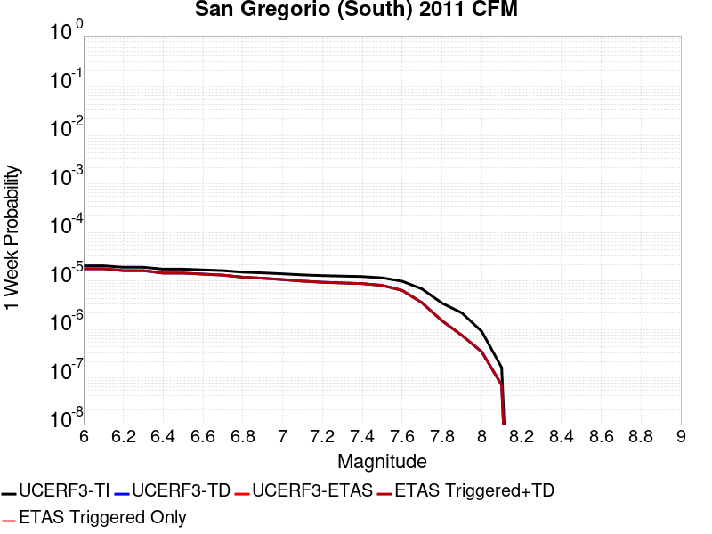 |  |  |  |

| Magnitude | 1 wk TI Prob | 1 wk TD Prob | 1 wk ETAS Prob | 1 wk ETAS/TD Gain | 1 wk ETAS Triggered+TD | 1 wk ETAS Triggered Only | 1 mo TI Prob | 1 mo TD Prob | 1 mo ETAS Prob | 1 mo ETAS/TD Gain | 1 mo ETAS Triggered+TD | 1 mo ETAS Triggered Only | 1 yr TI Prob | 1 yr TD Prob | 1 yr ETAS Prob | 1 yr ETAS/TD Gain | 1 yr ETAS Triggered+TD | 1 yr ETAS Triggered Only | 10 yr TI Prob | 10 yr TD Prob | 10 yr ETAS Prob | 10 yr ETAS/TD Gain | 10 yr ETAS Triggered+TD | 10 yr ETAS Triggered Only |
|-----|-----|-----|-----|-----|-----|-----|-----|-----|-----|-----|-----|-----|-----|-----|-----|-----|-----|-----|-----|-----|-----|-----|-----|-----|
| 6.0 | 1.8770423E-5 | 1.6282254E-5 | 0.0 | 0.0 | 1.6282254E-5 | 0.0 | 8.044219E-5 | 6.977924E-5 | 0.0 | 0.0 | 6.977924E-5 | 0.0 | 9.789435E-4 | 8.49235E-4 | 7.0E-4 | 0.82427126 | 9.4915007E-4 | 1.0E-4 | 0.009746423 | 0.0084728515 | 0.005 | 0.5901201 | 0.009166921 | 7.0E-4 |
| 6.1 | 1.8770423E-5 | 1.6282254E-5 | 0.0 | 0.0 | 1.6282254E-5 | 0.0 | 8.044219E-5 | 6.977924E-5 | 0.0 | 0.0 | 6.977924E-5 | 0.0 | 9.789435E-4 | 8.49235E-4 | 7.0E-4 | 0.82427126 | 9.4915007E-4 | 1.0E-4 | 0.009746423 | 0.0084728515 | 0.005 | 0.5901201 | 0.009166921 | 7.0E-4 |
| 6.2 | 1.7508692E-5 | 1.4901502E-5 | 0.0 | 0.0 | 1.4901502E-5 | 0.0 | 7.5035096E-5 | 6.386203E-5 | 0.0 | 0.0 | 6.386203E-5 | 0.0 | 9.1316935E-4 | 7.772459E-4 | 6.0E-4 | 0.77195644 | 8.771682E-4 | 1.0E-4 | 0.00909426 | 0.0077581475 | 0.0045 | 0.5800354 | 0.008452717 | 7.0E-4 |
| 6.3 | 1.7508692E-5 | 1.4901502E-5 | 0.0 | 0.0 | 1.4901502E-5 | 0.0 | 7.5035096E-5 | 6.386203E-5 | 0.0 | 0.0 | 6.386203E-5 | 0.0 | 9.1316935E-4 | 7.772459E-4 | 6.0E-4 | 0.77195644 | 8.771682E-4 | 1.0E-4 | 0.00909426 | 0.0077581475 | 0.0045 | 0.5800354 | 0.008452717 | 7.0E-4 |
| 6.4 | 1.6004591E-5 | 1.3251021E-5 | 0.0 | 0.0 | 1.3251021E-5 | 0.0 | 6.85893E-5 | 5.6788864E-5 | 0.0 | 0.0 | 5.6788864E-5 | 0.0 | 8.347548E-4 | 6.911861E-4 | 6.0E-4 | 0.86807305 | 7.9111697E-4 | 1.0E-4 | 0.008316261 | 0.006903035 | 0.0036 | 0.5215097 | 0.007598203 | 7.0E-4 |
| 6.5 | 1.6004591E-5 | 1.3251021E-5 | 0.0 | 0.0 | 1.3251021E-5 | 0.0 | 6.85893E-5 | 5.6788864E-5 | 0.0 | 0.0 | 5.6788864E-5 | 0.0 | 8.347548E-4 | 6.911861E-4 | 6.0E-4 | 0.86807305 | 7.9111697E-4 | 1.0E-4 | 0.008316261 | 0.006903035 | 0.0036 | 0.5215097 | 0.007598203 | 7.0E-4 |
| 6.6 | 1.5442201E-5 | 1.2635537E-5 | 0.0 | 0.0 | 1.2635537E-5 | 0.0 | 6.617918E-5 | 5.4151184E-5 | 0.0 | 0.0 | 5.4151184E-5 | 0.0 | 8.0543366E-4 | 6.590921E-4 | 5.0E-4 | 0.7586193 | 7.590262E-4 | 1.0E-4 | 0.008025207 | 0.0065840273 | 0.0033 | 0.501213 | 0.0072794184 | 7.0E-4 |
| 6.7 | 1.489921E-5 | 1.2043942E-5 | 0.0 | 0.0 | 1.2043942E-5 | 0.0 | 6.3852196E-5 | 5.1615876E-5 | 0.0 | 0.0 | 5.1615876E-5 | 0.0 | 7.7712315E-4 | 6.282428E-4 | 5.0E-4 | 0.79587066 | 7.2818E-4 | 1.0E-4 | 0.0077441116 | 0.0062773065 | 0.0032 | 0.5097728 | 0.0069729122 | 7.0E-4 |
| 6.8 | 1.3876024E-5 | 1.09226785E-5 | 0.0 | 0.0 | 1.09226785E-5 | 0.0 | 5.9467322E-5 | 4.681064E-5 | 0.0 | 0.0 | 4.681064E-5 | 0.0 | 7.237741E-4 | 5.6977087E-4 | 5.0E-4 | 0.8775458 | 6.697139E-4 | 1.0E-4 | 0.0072142133 | 0.0056957053 | 0.003 | 0.52671266 | 0.0062922877 | 6.0E-4 |
| 6.9 | 1.33922495E-5 | 1.0394083E-5 | 0.0 | 0.0 | 1.0394083E-5 | 0.0 | 5.7394092E-5 | 4.4545308E-5 | 0.0 | 0.0 | 4.4545308E-5 | 0.0 | 6.9854903E-4 | 5.422045E-4 | 5.0E-4 | 0.92216134 | 6.4215023E-4 | 1.0E-4 | 0.0069635725 | 0.005421412 | 0.003 | 0.55336136 | 0.0060181594 | 6.0E-4 |
| 7.0 | 1.2807324E-5 | 9.753923E-6 | 0.0 | 0.0 | 9.753923E-6 | 0.0 | 5.4887376E-5 | 4.180186E-5 | 0.0 | 0.0 | 4.180186E-5 | 0.0 | 6.680489E-4 | 5.08819E-4 | 5.0E-4 | 0.98266774 | 6.087681E-4 | 1.0E-4 | 0.006660442 | 0.005089128 | 0.0027 | 0.53054273 | 0.0055865836 | 5.0E-4 |
| 7.1 | 1.2191438E-5 | 9.06264E-6 | 0.0 | 0.0 | 9.06264E-6 | 0.0 | 5.224797E-5 | 3.883931E-5 | 0.0 | 0.0 | 3.883931E-5 | 0.0 | 6.3593336E-4 | 4.7276606E-4 | 5.0E-4 | 1.0576055 | 5.727188E-4 | 1.0E-4 | 0.0063411663 | 0.0047301836 | 0.0023 | 0.48623908 | 0.0052278186 | 5.0E-4 |
| 7.2 | 1.1769438E-5 | 8.582701E-6 | 0.0 | 0.0 | 8.582701E-6 | 0.0 | 5.0439474E-5 | 3.6782487E-5 | 0.0 | 0.0 | 3.6782487E-5 | 0.0 | 6.1392755E-4 | 4.4773484E-4 | 4.0E-4 | 0.89338595 | 5.476901E-4 | 1.0E-4 | 0.0061223423 | 0.004480907 | 0.0021 | 0.4686551 | 0.0049786665 | 5.0E-4 |
| 7.3 | 1.150374E-5 | 8.298085E-6 | 0.0 | 0.0 | 8.298085E-6 | 0.0 | 4.9300812E-5 | 3.5562738E-5 | 0.0 | 0.0 | 3.5562738E-5 | 0.0 | 6.0007203E-4 | 4.3289037E-4 | 3.0E-4 | 0.6930161 | 4.3289037E-4 | 0.0 | 0.0059845424 | 0.0043330286 | 0.0019 | 0.4384924 | 0.004731295 | 4.0E-4 |
| 7.4 | 1.12514E-5 | 8.04376E-6 | 0.0 | 0.0 | 8.04376E-6 | 0.0 | 4.8219394E-5 | 3.4472803E-5 | 0.0 | 0.0 | 3.4472803E-5 | 0.0 | 5.8691297E-4 | 4.196256E-4 | 3.0E-4 | 0.714923 | 4.196256E-4 | 0.0 | 0.005853653 | 0.0042008804 | 0.0019 | 0.45228615 | 0.0045991996 | 4.0E-4 |
| 7.5 | 1.059696E-5 | 7.393752E-6 | 0.0 | 0.0 | 7.393752E-6 | 0.0 | 4.5414752E-5 | 3.1687123E-5 | 0.0 | 0.0 | 3.1687123E-5 | 0.0 | 5.5278436E-4 | 3.857225E-4 | 3.0E-4 | 0.7777612 | 3.857225E-4 | 0.0 | 0.0055141128 | 0.0038630234 | 0.0018 | 0.4659563 | 0.004261478 | 4.0E-4 |
| 7.6 | 9.018592E-6 | 5.8372257E-6 | 0.0 | 0.0 | 5.8372257E-6 | 0.0 | 3.8650534E-5 | 2.5016441E-5 | 0.0 | 0.0 | 2.5016441E-5 | 0.0 | 4.7046866E-4 | 3.0453264E-4 | 3.0E-4 | 0.98511606 | 3.0453264E-4 | 0.0 | 0.004694739 | 0.003053281 | 0.0016 | 0.52402645 | 0.0032526704 | 2.0E-4 |
| 7.7 | 6.243489E-6 | 3.2395833E-6 | 0.0 | 0.0 | 3.2395833E-6 | 0.0 | 2.6757538E-5 | 1.3883854E-5 | 0.0 | 0.0 | 1.3883854E-5 | 0.0 | 3.257243E-4 | 1.6902282E-4 | 1.0E-4 | 0.59163606 | 1.6902282E-4 | 0.0 | 0.003252473 | 0.0016991848 | 7.0E-4 | 0.41196224 | 0.0017990149 | 1.0E-4 |
| 7.8 | 3.1941963E-6 | 1.3809516E-6 | 0.0 | 0.0 | 1.3809516E-6 | 0.0 | 1.368934E-5 | 5.918351E-6 | 0.0 | 0.0 | 5.918351E-6 | 0.0 | 1.6665498E-4 | 7.205354E-5 | 0.0 | 0.0 | 7.205354E-5 | 0.0 | 0.0016653005 | 7.263068E-4 | 2.0E-4 | 0.27536574 | 8.262342E-4 | 1.0E-4 |
| 7.9 | 2.0098398E-6 | 6.9154873E-7 | 0.0 | 0.0 | 6.9154873E-7 | 0.0 | 8.6135715E-6 | 2.9637768E-6 | 0.0 | 0.0 | 2.9637768E-6 | 0.0 | 1.0486518E-4 | 3.6083384E-5 | 0.0 | 0.0 | 3.6083384E-5 | 0.0 | 0.0010481571 | 3.6569653E-4 | 1.0E-4 | 0.2734508 | 3.6569653E-4 | 0.0 |
| 8.0 | 8.353119E-7 | 3.16238E-7 | 0.0 | 0.0 | 3.16238E-7 | 0.0 | 3.579903E-6 | 1.3553049E-6 | 0.0 | 0.0 | 1.3553049E-6 | 0.0 | 4.358445E-5 | 1.6500711E-5 | 0.0 | 0.0 | 1.6500711E-5 | 0.0 | 4.3575902E-4 | 1.662006E-4 | 0.0 | 0.0 | 1.662006E-4 | 0.0 |
| 8.1 | 1.5033264E-7 | 6.526449E-8 | 0.0 | 0.0 | 6.526449E-8 | 0.0 | 6.442826E-7 | 2.797049E-7 | 0.0 | 0.0 | 2.797049E-7 | 0.0 | 7.844113E-6 | 3.4054021E-6 | 0.0 | 0.0 | 3.4054021E-6 | 0.0 | 7.843835E-5 | 3.4072844E-5 | 0.0 | 0.0 | 3.4072844E-5 | 0.0 |

## Collayami 2011 CFM
*[(top)](#table-of-contents)*

| 1 Week | 1 Month | 1 Year | 10 Year |
|-----|-----|-----|-----|
|  |  |  |  |

| Magnitude | 1 wk TI Prob | 1 wk TD Prob | 1 wk ETAS Prob | 1 wk ETAS/TD Gain | 1 wk ETAS Triggered+TD | 1 wk ETAS Triggered Only | 1 mo TI Prob | 1 mo TD Prob | 1 mo ETAS Prob | 1 mo ETAS/TD Gain | 1 mo ETAS Triggered+TD | 1 mo ETAS Triggered Only | 1 yr TI Prob | 1 yr TD Prob | 1 yr ETAS Prob | 1 yr ETAS/TD Gain | 1 yr ETAS Triggered+TD | 1 yr ETAS Triggered Only | 10 yr TI Prob | 10 yr TD Prob | 10 yr ETAS Prob | 10 yr ETAS/TD Gain | 10 yr ETAS Triggered+TD | 10 yr ETAS Triggered Only |
|-----|-----|-----|-----|-----|-----|-----|-----|-----|-----|-----|-----|-----|-----|-----|-----|-----|-----|-----|-----|-----|-----|-----|-----|-----|
| 6.0 | 3.112429E-5 | 3.494707E-5 | 2.0E-4 | 5.722941 | 3.494707E-5 | 0.0 | 1.33383E-4 | 1.4976553E-4 | 3.0E-4 | 2.0031312 | 1.4976553E-4 | 0.0 | 0.0016227282 | 0.0018220444 | 0.0014 | 0.7683677 | 0.00202168 | 2.0E-4 | 0.016109297 | 0.018088594 | 0.0105 | 0.5804763 | 0.018775932 | 7.0E-4 |
| 6.1 | 1.7119446E-5 | 1.916114E-5 | 0.0 | 0.0 | 1.916114E-5 | 0.0 | 7.336699E-5 | 8.2116916E-5 | 1.0E-4 | 1.2177758 | 8.2116916E-5 | 0.0 | 8.92877E-4 | 9.993741E-4 | 9.0E-4 | 0.90056366 | 0.0010992741 | 1.0E-4 | 0.00889298 | 0.009954681 | 0.0052 | 0.52236736 | 0.010350699 | 4.0E-4 |
| 6.2 | 1.7119446E-5 | 1.916114E-5 | 0.0 | 0.0 | 1.916114E-5 | 0.0 | 7.336699E-5 | 8.2116916E-5 | 1.0E-4 | 1.2177758 | 8.2116916E-5 | 0.0 | 8.92877E-4 | 9.993741E-4 | 9.0E-4 | 0.90056366 | 0.0010992741 | 1.0E-4 | 0.00889298 | 0.009954681 | 0.0052 | 0.52236736 | 0.010350699 | 4.0E-4 |
| 6.3 | 9.041288E-6 | 1.0108457E-5 | 0.0 | 0.0 | 1.0108457E-5 | 0.0 | 3.87478E-5 | 4.332136E-5 | 1.0E-4 | 2.30833 | 4.332136E-5 | 0.0 | 4.7165234E-4 | 5.2733184E-4 | 5.0E-4 | 0.9481695 | 6.272791E-4 | 1.0E-4 | 0.0047065257 | 0.0052629644 | 0.003 | 0.570021 | 0.0055613853 | 3.0E-4 |
| 6.4 | 5.5972064E-6 | 6.2595122E-6 | 0.0 | 0.0 | 6.2595122E-6 | 0.0 | 2.3987806E-5 | 2.6826283E-5 | 1.0E-4 | 3.7276876 | 2.6826283E-5 | 0.0 | 2.920124E-4 | 3.2657463E-4 | 4.0E-4 | 1.2248348 | 3.2657463E-4 | 0.0 | 0.0029162897 | 0.003262282 | 0.0019 | 0.5824144 | 0.003361956 | 1.0E-4 |
| 6.5 | 3.530659E-6 | 3.952984E-6 | 0.0 | 0.0 | 3.952984E-6 | 0.0 | 1.5131307E-5 | 1.694131E-5 | 1.0E-4 | 5.9027314 | 1.694131E-5 | 0.0 | 1.842081E-4 | 2.0625132E-4 | 3.0E-4 | 1.4545362 | 2.0625132E-4 | 0.0 | 0.0018405546 | 0.0020616183 | 0.0012 | 0.5820671 | 0.002161412 | 1.0E-4 |
| 6.6 | 2.4625563E-6 | 2.7579204E-6 | 0.0 | 0.0 | 2.7579204E-6 | 0.0 | 1.0553769E-5 | 1.18196585E-5 | 0.0 | 0.0 | 1.18196585E-5 | 0.0 | 1.2848456E-4 | 1.4390434E-4 | 1.0E-4 | 0.69490606 | 1.4390434E-4 | 0.0 | 0.001284103 | 0.0014390433 | 9.0E-4 | 0.6254155 | 0.0015388995 | 1.0E-4 |

## San Jacinto (Clark) rev
*[(top)](#table-of-contents)*

| 1 Week | 1 Month | 1 Year | 10 Year |
|-----|-----|-----|-----|
| 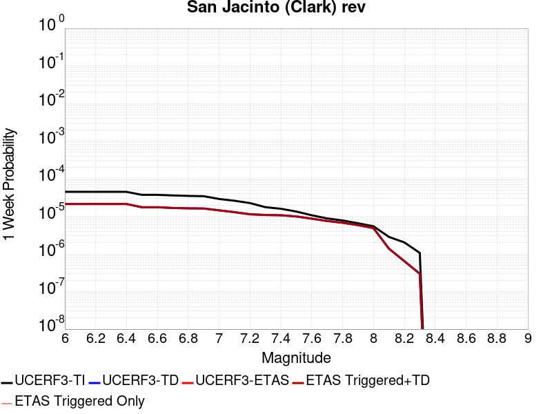 | 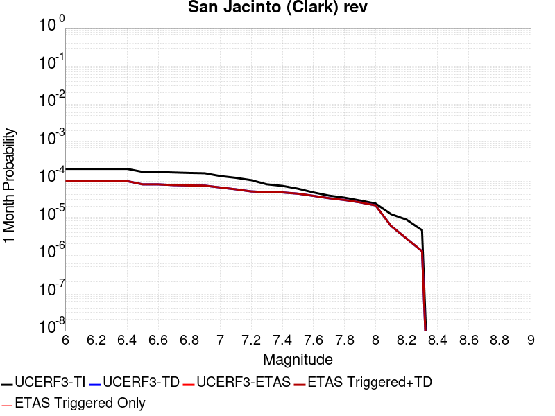 |  | 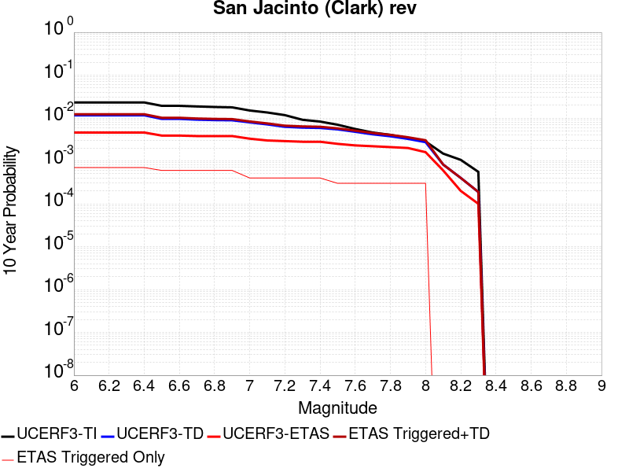 |

| Magnitude | 1 wk TI Prob | 1 wk TD Prob | 1 wk ETAS Prob | 1 wk ETAS/TD Gain | 1 wk ETAS Triggered+TD | 1 wk ETAS Triggered Only | 1 mo TI Prob | 1 mo TD Prob | 1 mo ETAS Prob | 1 mo ETAS/TD Gain | 1 mo ETAS Triggered+TD | 1 mo ETAS Triggered Only | 1 yr TI Prob | 1 yr TD Prob | 1 yr ETAS Prob | 1 yr ETAS/TD Gain | 1 yr ETAS Triggered+TD | 1 yr ETAS Triggered Only | 10 yr TI Prob | 10 yr TD Prob | 10 yr ETAS Prob | 10 yr ETAS/TD Gain | 10 yr ETAS Triggered+TD | 10 yr ETAS Triggered Only |
|-----|-----|-----|-----|-----|-----|-----|-----|-----|-----|-----|-----|-----|-----|-----|-----|-----|-----|-----|-----|-----|-----|-----|-----|-----|
| 6.0 | 4.482615E-5 | 2.1250606E-5 | 0.0 | 0.0 | 2.1250606E-5 | 0.0 | 1.9209793E-4 | 9.10709E-5 | 0.0 | 0.0 | 9.10709E-5 | 0.0 | 0.0023362834 | 0.0011082335 | 2.0E-4 | 0.18046738 | 0.0011082335 | 0.0 | 0.02311874 | 0.01155282 | 0.0046 | 0.39817116 | 0.012244733 | 7.0E-4 |
| 6.1 | 4.482615E-5 | 2.1250606E-5 | 0.0 | 0.0 | 2.1250606E-5 | 0.0 | 1.9209793E-4 | 9.10709E-5 | 0.0 | 0.0 | 9.10709E-5 | 0.0 | 0.0023362834 | 0.0011082335 | 2.0E-4 | 0.18046738 | 0.0011082335 | 0.0 | 0.02311874 | 0.01155282 | 0.0046 | 0.39817116 | 0.012244733 | 7.0E-4 |
| 6.2 | 4.482615E-5 | 2.1250606E-5 | 0.0 | 0.0 | 2.1250606E-5 | 0.0 | 1.9209793E-4 | 9.10709E-5 | 0.0 | 0.0 | 9.10709E-5 | 0.0 | 0.0023362834 | 0.0011082335 | 2.0E-4 | 0.18046738 | 0.0011082335 | 0.0 | 0.02311874 | 0.01155282 | 0.0046 | 0.39817116 | 0.012244733 | 7.0E-4 |
| 6.3 | 4.482615E-5 | 2.1250606E-5 | 0.0 | 0.0 | 2.1250606E-5 | 0.0 | 1.9209793E-4 | 9.10709E-5 | 0.0 | 0.0 | 9.10709E-5 | 0.0 | 0.0023362834 | 0.0011082335 | 2.0E-4 | 0.18046738 | 0.0011082335 | 0.0 | 0.02311874 | 0.01155282 | 0.0046 | 0.39817116 | 0.012244733 | 7.0E-4 |
| 6.4 | 4.482615E-5 | 2.1250606E-5 | 0.0 | 0.0 | 2.1250606E-5 | 0.0 | 1.9209793E-4 | 9.10709E-5 | 0.0 | 0.0 | 9.10709E-5 | 0.0 | 0.0023362834 | 0.0011082335 | 2.0E-4 | 0.18046738 | 0.0011082335 | 0.0 | 0.02311874 | 0.01155282 | 0.0046 | 0.39817116 | 0.012244733 | 7.0E-4 |
| 6.5 | 3.7294863E-5 | 1.7438566E-5 | 0.0 | 0.0 | 1.7438566E-5 | 0.0 | 1.5982533E-4 | 7.47346E-5 | 0.0 | 0.0 | 7.47346E-5 | 0.0 | 0.0019441366 | 9.0951845E-4 | 2.0E-4 | 0.21989658 | 9.0951845E-4 | 0.0 | 0.01927216 | 0.009526289 | 0.0039 | 0.4093934 | 0.010120573 | 6.0E-4 |
| 6.6 | 3.7294863E-5 | 1.7438566E-5 | 0.0 | 0.0 | 1.7438566E-5 | 0.0 | 1.5982533E-4 | 7.47346E-5 | 0.0 | 0.0 | 7.47346E-5 | 0.0 | 0.0019441366 | 9.0951845E-4 | 2.0E-4 | 0.21989658 | 9.0951845E-4 | 0.0 | 0.01927216 | 0.009526289 | 0.0039 | 0.4093934 | 0.010120573 | 6.0E-4 |
| 6.7 | 3.6039248E-5 | 1.6684187E-5 | 0.0 | 0.0 | 1.6684187E-5 | 0.0 | 1.5444479E-4 | 7.150172E-5 | 0.0 | 0.0 | 7.150172E-5 | 0.0 | 0.0018787434 | 8.701899E-4 | 2.0E-4 | 0.22983488 | 8.701899E-4 | 0.0 | 0.01862939 | 0.009125988 | 0.0038 | 0.41639328 | 0.009720513 | 6.0E-4 |
| 6.8 | 3.5031844E-5 | 1.6310878E-5 | 0.0 | 0.0 | 1.6310878E-5 | 0.0 | 1.5012783E-4 | 6.9901915E-5 | 0.0 | 0.0 | 6.9901915E-5 | 0.0 | 0.0018262739 | 8.507276E-4 | 2.0E-4 | 0.23509288 | 8.507276E-4 | 0.0 | 0.01811338 | 0.008924213 | 0.0038 | 0.42580783 | 0.009518859 | 6.0E-4 |
| 6.9 | 3.435112E-5 | 1.6140297E-5 | 0.0 | 0.0 | 1.6140297E-5 | 0.0 | 1.4721078E-4 | 6.917089E-5 | 0.0 | 0.0 | 6.917089E-5 | 0.0 | 0.0017908178 | 8.4183435E-4 | 2.0E-4 | 0.23757643 | 8.4183435E-4 | 0.0 | 0.017764548 | 0.008831792 | 0.0038 | 0.43026376 | 0.009426493 | 6.0E-4 |
| 7.0 | 2.8959772E-5 | 1.4405423E-5 | 0.0 | 0.0 | 1.4405423E-5 | 0.0 | 1.241074E-4 | 6.173608E-5 | 0.0 | 0.0 | 6.173608E-5 | 0.0 | 0.0015099603 | 7.513804E-4 | 2.0E-4 | 0.26617676 | 7.513804E-4 | 0.0 | 0.014997416 | 0.007899207 | 0.0033 | 0.41776344 | 0.008296047 | 4.0E-4 |
| 7.1 | 2.6002877E-5 | 1.2890838E-5 | 0.0 | 0.0 | 1.2890838E-5 | 0.0 | 1.11436144E-4 | 5.5245288E-5 | 0.0 | 0.0 | 5.5245288E-5 | 0.0 | 0.0013558907 | 6.7240593E-4 | 1.0E-4 | 0.14871968 | 6.7240593E-4 | 0.0 | 0.013476475 | 0.0070781955 | 0.003 | 0.42383683 | 0.007475364 | 4.0E-4 |
| 7.2 | 2.2544838E-5 | 1.1316836E-5 | 0.0 | 0.0 | 1.1316836E-5 | 0.0 | 9.661716E-5 | 4.8499835E-5 | 0.0 | 0.0 | 4.8499835E-5 | 0.0 | 0.001175679 | 5.9032696E-4 | 1.0E-4 | 0.16939765 | 5.9032696E-4 | 0.0 | 0.011694785 | 0.006223543 | 0.0029 | 0.4659725 | 0.0066210534 | 4.0E-4 |
| 7.3 | 1.75334E-5 | 1.0862907E-5 | 0.0 | 0.0 | 1.0862907E-5 | 0.0 | 7.514098E-5 | 4.6554494E-5 | 0.0 | 0.0 | 4.6554494E-5 | 0.0 | 9.144575E-4 | 5.6665496E-4 | 1.0E-4 | 0.17647423 | 5.6665496E-4 | 0.0 | 0.009107036 | 0.0059608594 | 0.0028 | 0.46973094 | 0.006358475 | 4.0E-4 |
| 7.4 | 1.5924552E-5 | 1.0661684E-5 | 0.0 | 0.0 | 1.0661684E-5 | 0.0 | 6.82463E-5 | 4.569214E-5 | 0.0 | 0.0 | 4.569214E-5 | 0.0 | 8.305819E-4 | 5.5616116E-4 | 1.0E-4 | 0.179804 | 5.5616116E-4 | 0.0 | 0.008274844 | 0.0058474205 | 0.0028 | 0.4788436 | 0.006245082 | 4.0E-4 |
| 7.5 | 1.3428931E-5 | 9.898787E-6 | 0.0 | 0.0 | 9.898787E-6 | 0.0 | 5.7551293E-5 | 4.242269E-5 | 0.0 | 0.0 | 4.242269E-5 | 0.0 | 7.004617E-4 | 5.163749E-4 | 1.0E-4 | 0.19365774 | 5.163749E-4 | 0.0 | 0.006982579 | 0.005431203 | 0.0025 | 0.46030316 | 0.005729574 | 3.0E-4 |
| 7.6 | 1.0688787E-5 | 8.653797E-6 | 0.0 | 0.0 | 8.653797E-6 | 0.0 | 4.5808283E-5 | 3.7087175E-5 | 0.0 | 0.0 | 3.7087175E-5 | 0.0 | 5.5757316E-4 | 4.5144328E-4 | 1.0E-4 | 0.22151177 | 4.5144328E-4 | 0.0 | 0.005561762 | 0.0047619925 | 0.0023 | 0.48299113 | 0.005060564 | 3.0E-4 |
| 7.7 | 8.81236E-6 | 7.5056255E-6 | 0.0 | 0.0 | 7.5056255E-6 | 0.0 | 3.776671E-5 | 3.216657E-5 | 0.0 | 0.0 | 3.216657E-5 | 0.0 | 4.597127E-4 | 3.915578E-4 | 1.0E-4 | 0.25539014 | 3.915578E-4 | 0.0 | 0.0045876284 | 0.00415419 | 0.0022 | 0.5295858 | 0.004452944 | 3.0E-4 |
| 7.8 | 7.780431E-6 | 6.7313554E-6 | 0.0 | 0.0 | 6.7313554E-6 | 0.0 | 3.3344273E-5 | 2.8848348E-5 | 0.0 | 0.0 | 2.8848348E-5 | 0.0 | 4.0589093E-4 | 3.5117223E-4 | 0.0 | 0.0 | 3.5117223E-4 | 0.0 | 0.0040515037 | 0.0037408832 | 0.0021 | 0.56136477 | 0.0040397607 | 3.0E-4 |
| 7.9 | 6.5437994E-6 | 5.8118558E-6 | 0.0 | 0.0 | 5.8118558E-6 | 0.0 | 2.8044553E-5 | 2.4907717E-5 | 0.0 | 0.0 | 2.4907717E-5 | 0.0 | 3.4138895E-4 | 3.032094E-4 | 0.0 | 0.0 | 3.032094E-4 | 0.0 | 0.0034086495 | 0.003251008 | 0.002 | 0.61519384 | 0.0035500326 | 3.0E-4 |
| 8.0 | 5.4488164E-6 | 4.8393586E-6 | 0.0 | 0.0 | 4.8393586E-6 | 0.0 | 2.3351862E-5 | 2.0739944E-5 | 0.0 | 0.0 | 2.0739944E-5 | 0.0 | 2.8427184E-4 | 2.5247972E-4 | 0.0 | 0.0 | 2.5247972E-4 | 0.0 | 0.0028390845 | 0.0027244994 | 0.0016 | 0.5872639 | 0.003023682 | 3.0E-4 |
| 8.1 | 2.8397242E-6 | 1.3720612E-6 | 0.0 | 0.0 | 1.3720612E-6 | 0.0 | 1.217019E-5 | 5.8802493E-6 | 0.0 | 0.0 | 5.8802493E-6 | 0.0 | 1.4816198E-4 | 7.15897E-5 | 0.0 | 0.0 | 7.15897E-5 | 0.0 | 0.0014806325 | 8.143283E-4 | 6.0E-4 | 0.73680353 | 8.143283E-4 | 0.0 |
| 8.2 | 2.030244E-6 | 6.3359386E-7 | 0.0 | 0.0 | 6.3359386E-7 | 0.0 | 8.701017E-6 | 2.7153994E-6 | 0.0 | 0.0 | 2.7153994E-6 | 0.0 | 1.05929736E-4 | 3.3059492E-5 | 0.0 | 0.0 | 3.3059492E-5 | 0.0 | 0.0010587925 | 3.9583474E-4 | 2.0E-4 | 0.50526136 | 3.9583474E-4 | 0.0 |
| 8.3 | 1.0659804E-6 | 2.9323482E-7 | 0.0 | 0.0 | 2.9323482E-7 | 0.0 | 4.568479E-6 | 1.2567201E-6 | 0.0 | 0.0 | 1.2567201E-6 | 0.0 | 5.5619817E-5 | 1.5300464E-5 | 0.0 | 0.0 | 1.5300464E-5 | 0.0 | 5.5605895E-4 | 1.861049E-4 | 1.0E-4 | 0.5373314 | 1.861049E-4 | 0.0 |

## Compton
*[(top)](#table-of-contents)*

| 1 Week | 1 Month | 1 Year | 10 Year |
|-----|-----|-----|-----|
|  | 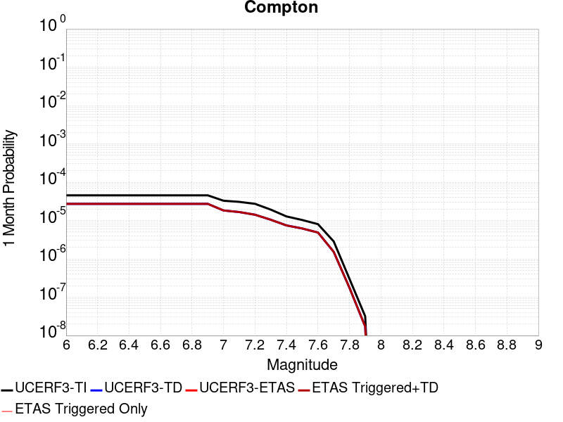 |  | 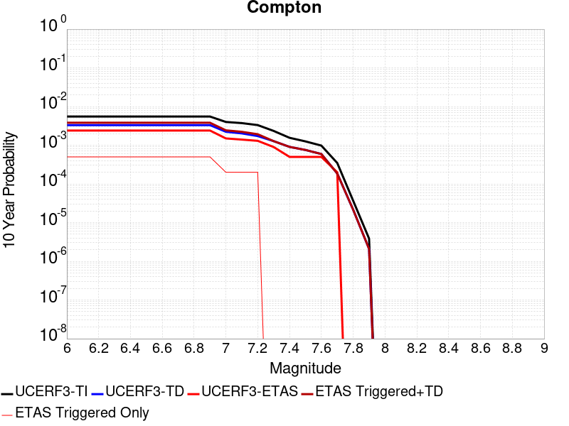 |

| Magnitude | 1 wk TI Prob | 1 wk TD Prob | 1 wk ETAS Prob | 1 wk ETAS/TD Gain | 1 wk ETAS Triggered+TD | 1 wk ETAS Triggered Only | 1 mo TI Prob | 1 mo TD Prob | 1 mo ETAS Prob | 1 mo ETAS/TD Gain | 1 mo ETAS Triggered+TD | 1 mo ETAS Triggered Only | 1 yr TI Prob | 1 yr TD Prob | 1 yr ETAS Prob | 1 yr ETAS/TD Gain | 1 yr ETAS Triggered+TD | 1 yr ETAS Triggered Only | 10 yr TI Prob | 10 yr TD Prob | 10 yr ETAS Prob | 10 yr ETAS/TD Gain | 10 yr ETAS Triggered+TD | 10 yr ETAS Triggered Only |
|-----|-----|-----|-----|-----|-----|-----|-----|-----|-----|-----|-----|-----|-----|-----|-----|-----|-----|-----|-----|-----|-----|-----|-----|-----|
| 6.0 | 1.06050875E-5 | 6.3601133E-6 | 0.0 | 0.0 | 6.3601133E-6 | 0.0 | 4.5449582E-5 | 2.725736E-5 | 0.0 | 0.0 | 2.725736E-5 | 0.0 | 5.5320817E-4 | 3.3181068E-4 | 5.0E-4 | 1.5068834 | 5.317443E-4 | 2.0E-4 | 0.0055183303 | 0.0033134366 | 0.0024 | 0.7243235 | 0.00381178 | 5.0E-4 |
| 6.1 | 1.06050875E-5 | 6.3601133E-6 | 0.0 | 0.0 | 6.3601133E-6 | 0.0 | 4.5449582E-5 | 2.725736E-5 | 0.0 | 0.0 | 2.725736E-5 | 0.0 | 5.5320817E-4 | 3.3181068E-4 | 5.0E-4 | 1.5068834 | 5.317443E-4 | 2.0E-4 | 0.0055183303 | 0.0033134366 | 0.0024 | 0.7243235 | 0.00381178 | 5.0E-4 |
| 6.2 | 1.06050875E-5 | 6.3601133E-6 | 0.0 | 0.0 | 6.3601133E-6 | 0.0 | 4.5449582E-5 | 2.725736E-5 | 0.0 | 0.0 | 2.725736E-5 | 0.0 | 5.5320817E-4 | 3.3181068E-4 | 5.0E-4 | 1.5068834 | 5.317443E-4 | 2.0E-4 | 0.0055183303 | 0.0033134366 | 0.0024 | 0.7243235 | 0.00381178 | 5.0E-4 |
| 6.3 | 1.06050875E-5 | 6.3601133E-6 | 0.0 | 0.0 | 6.3601133E-6 | 0.0 | 4.5449582E-5 | 2.725736E-5 | 0.0 | 0.0 | 2.725736E-5 | 0.0 | 5.5320817E-4 | 3.3181068E-4 | 5.0E-4 | 1.5068834 | 5.317443E-4 | 2.0E-4 | 0.0055183303 | 0.0033134366 | 0.0024 | 0.7243235 | 0.00381178 | 5.0E-4 |
| 6.4 | 1.06050875E-5 | 6.3601133E-6 | 0.0 | 0.0 | 6.3601133E-6 | 0.0 | 4.5449582E-5 | 2.725736E-5 | 0.0 | 0.0 | 2.725736E-5 | 0.0 | 5.5320817E-4 | 3.3181068E-4 | 5.0E-4 | 1.5068834 | 5.317443E-4 | 2.0E-4 | 0.0055183303 | 0.0033134366 | 0.0024 | 0.7243235 | 0.00381178 | 5.0E-4 |
| 6.5 | 1.06050875E-5 | 6.3601133E-6 | 0.0 | 0.0 | 6.3601133E-6 | 0.0 | 4.5449582E-5 | 2.725736E-5 | 0.0 | 0.0 | 2.725736E-5 | 0.0 | 5.5320817E-4 | 3.3181068E-4 | 5.0E-4 | 1.5068834 | 5.317443E-4 | 2.0E-4 | 0.0055183303 | 0.0033134366 | 0.0024 | 0.7243235 | 0.00381178 | 5.0E-4 |
| 6.6 | 1.06050875E-5 | 6.3601133E-6 | 0.0 | 0.0 | 6.3601133E-6 | 0.0 | 4.5449582E-5 | 2.725736E-5 | 0.0 | 0.0 | 2.725736E-5 | 0.0 | 5.5320817E-4 | 3.3181068E-4 | 5.0E-4 | 1.5068834 | 5.317443E-4 | 2.0E-4 | 0.0055183303 | 0.0033134366 | 0.0024 | 0.7243235 | 0.00381178 | 5.0E-4 |
| 6.7 | 1.06050875E-5 | 6.3601133E-6 | 0.0 | 0.0 | 6.3601133E-6 | 0.0 | 4.5449582E-5 | 2.725736E-5 | 0.0 | 0.0 | 2.725736E-5 | 0.0 | 5.5320817E-4 | 3.3181068E-4 | 5.0E-4 | 1.5068834 | 5.317443E-4 | 2.0E-4 | 0.0055183303 | 0.0033134366 | 0.0024 | 0.7243235 | 0.00381178 | 5.0E-4 |
| 6.8 | 1.06050875E-5 | 6.3601133E-6 | 0.0 | 0.0 | 6.3601133E-6 | 0.0 | 4.5449582E-5 | 2.725736E-5 | 0.0 | 0.0 | 2.725736E-5 | 0.0 | 5.5320817E-4 | 3.3181068E-4 | 5.0E-4 | 1.5068834 | 5.317443E-4 | 2.0E-4 | 0.0055183303 | 0.0033134366 | 0.0024 | 0.7243235 | 0.00381178 | 5.0E-4 |
| 6.9 | 1.06050875E-5 | 6.3601133E-6 | 0.0 | 0.0 | 6.3601133E-6 | 0.0 | 4.5449582E-5 | 2.725736E-5 | 0.0 | 0.0 | 2.725736E-5 | 0.0 | 5.5320817E-4 | 3.3181068E-4 | 5.0E-4 | 1.5068834 | 5.317443E-4 | 2.0E-4 | 0.0055183303 | 0.0033134366 | 0.0024 | 0.7243235 | 0.00381178 | 5.0E-4 |
| 7.0 | 7.672486E-6 | 4.272885E-6 | 0.0 | 0.0 | 4.272885E-6 | 0.0 | 3.288167E-5 | 1.8312237E-5 | 0.0 | 0.0 | 1.8312237E-5 | 0.0 | 4.0026082E-4 | 2.229293E-4 | 4.0E-4 | 1.7942908 | 3.22907E-4 | 1.0E-4 | 0.0039954064 | 0.002227119 | 0.0015 | 0.6735159 | 0.0024266734 | 2.0E-4 |
| 7.1 | 7.163992E-6 | 3.8845315E-6 | 0.0 | 0.0 | 3.8845315E-6 | 0.0 | 3.0702464E-5 | 1.6647888E-5 | 0.0 | 0.0 | 1.6647888E-5 | 0.0 | 3.7373835E-4 | 2.0266976E-4 | 4.0E-4 | 1.9736542 | 3.0264948E-4 | 1.0E-4 | 0.0037311043 | 0.0020249062 | 0.0014 | 0.69139004 | 0.0022245012 | 2.0E-4 |
| 7.2 | 6.3689185E-6 | 3.3108267E-6 | 0.0 | 0.0 | 3.3108267E-6 | 0.0 | 2.729508E-5 | 1.4189183E-5 | 0.0 | 0.0 | 1.4189183E-5 | 0.0 | 3.322669E-4 | 1.7274002E-4 | 3.0E-4 | 1.7367139 | 2.7272274E-4 | 1.0E-4 | 0.0033177056 | 0.0017260993 | 0.0013 | 0.7531432 | 0.0019257541 | 2.0E-4 |
| 7.3 | 4.4987873E-6 | 2.4484766E-6 | 0.0 | 0.0 | 2.4484766E-6 | 0.0 | 1.9280375E-5 | 1.0493431E-5 | 0.0 | 0.0 | 1.0493431E-5 | 0.0 | 2.3471327E-4 | 1.2775033E-4 | 1.0E-4 | 0.7827768 | 1.2775033E-4 | 0.0 | 0.002344655 | 0.0012767992 | 9.0E-4 | 0.7048876 | 0.0012767992 | 0.0 |
| 7.4 | 2.987296E-6 | 1.7397713E-6 | 0.0 | 0.0 | 1.7397713E-6 | 0.0 | 1.2802635E-5 | 7.4561417E-6 | 0.0 | 0.0 | 7.4561417E-6 | 0.0 | 1.5586092E-4 | 9.07748E-5 | 0.0 | 0.0 | 9.07748E-5 | 0.0 | 0.0015575165 | 9.07383E-4 | 5.0E-4 | 0.5510352 | 9.07383E-4 | 0.0 |
| 7.5 | 2.4111696E-6 | 1.4474724E-6 | 0.0 | 0.0 | 1.4474724E-6 | 0.0 | 1.0333543E-5 | 6.203439E-6 | 0.0 | 0.0 | 6.203439E-6 | 0.0 | 1.2580362E-4 | 7.55243E-5 | 0.0 | 0.0 | 7.55243E-5 | 0.0 | 0.0012573242 | 7.54991E-4 | 5.0E-4 | 0.6622596 | 7.54991E-4 | 0.0 |
| 7.6 | 1.8783096E-6 | 1.1362295E-6 | 0.0 | 0.0 | 1.1362295E-6 | 0.0 | 8.049874E-6 | 4.869546E-6 | 0.0 | 0.0 | 4.869546E-6 | 0.0 | 9.8002805E-5 | 5.928515E-5 | 0.0 | 0.0 | 5.928515E-5 | 0.0 | 9.795959E-4 | 5.926973E-4 | 5.0E-4 | 0.8436009 | 5.926973E-4 | 0.0 |
| 7.7 | 6.6646817E-7 | 3.560812E-7 | 0.0 | 0.0 | 3.560812E-7 | 0.0 | 2.856289E-6 | 1.5260614E-6 | 0.0 | 0.0 | 1.5260614E-6 | 0.0 | 3.4774763E-5 | 1.8579653E-5 | 0.0 | 0.0 | 1.8579653E-5 | 0.0 | 3.4769322E-4 | 1.8578234E-4 | 2.0E-4 | 1.0765287 | 1.8578234E-4 | 0.0 |
| 7.8 | 7.054689E-8 | 4.1355726E-8 | 0.0 | 0.0 | 4.1355726E-8 | 0.0 | 3.0234378E-7 | 1.772388E-7 | 0.0 | 0.0 | 1.772388E-7 | 0.0 | 3.6810293E-6 | 2.1578805E-6 | 0.0 | 0.0 | 2.1578805E-6 | 0.0 | 3.6809684E-5 | 2.1578606E-5 | 0.0 | 0.0 | 2.1578606E-5 | 0.0 |
| 7.9 | 7.420925E-9 | 4.0149506E-9 | 0.0 | 0.0 | 4.0149506E-9 | 0.0 | 3.1803964E-8 | 1.7206931E-8 | 0.0 | 0.0 | 1.7206931E-8 | 0.0 | 3.872132E-7 | 2.0949437E-7 | 0.0 | 0.0 | 2.0949437E-7 | 0.0 | 3.872125E-6 | 2.094942E-6 | 0.0 | 0.0 | 2.094942E-6 | 0.0 |

## Davis Creek
*[(top)](#table-of-contents)*

| 1 Week | 1 Month | 1 Year | 10 Year |
|-----|-----|-----|-----|
|  |  | 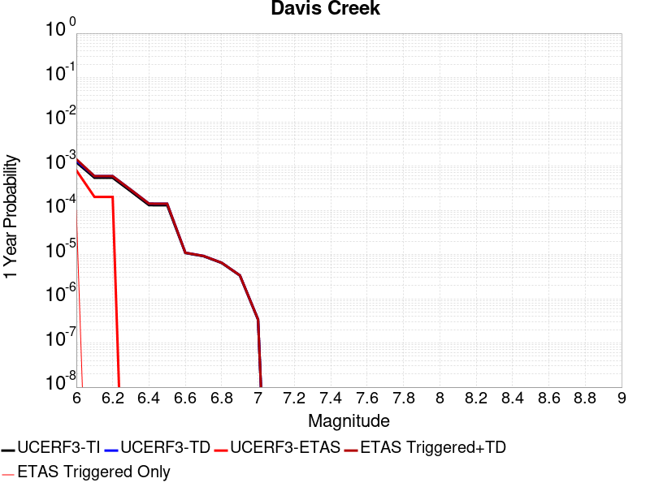 |  |

| Magnitude | 1 wk TI Prob | 1 wk TD Prob | 1 wk ETAS Prob | 1 wk ETAS/TD Gain | 1 wk ETAS Triggered+TD | 1 wk ETAS Triggered Only | 1 mo TI Prob | 1 mo TD Prob | 1 mo ETAS Prob | 1 mo ETAS/TD Gain | 1 mo ETAS Triggered+TD | 1 mo ETAS Triggered Only | 1 yr TI Prob | 1 yr TD Prob | 1 yr ETAS Prob | 1 yr ETAS/TD Gain | 1 yr ETAS Triggered+TD | 1 yr ETAS Triggered Only | 10 yr TI Prob | 10 yr TD Prob | 10 yr ETAS Prob | 10 yr ETAS/TD Gain | 10 yr ETAS Triggered+TD | 10 yr ETAS Triggered Only |
|-----|-----|-----|-----|-----|-----|-----|-----|-----|-----|-----|-----|-----|-----|-----|-----|-----|-----|-----|-----|-----|-----|-----|-----|-----|
| 6.0 | 2.331472E-5 | 2.5421763E-5 | 0.0 | 0.0 | 2.5421763E-5 | 0.0 | 9.99164E-5 | 1.0894653E-4 | 0.0 | 0.0 | 1.0894653E-4 | 0.0 | 0.0012158032 | 0.0013257355 | 8.0E-4 | 0.6034386 | 0.0014256029 | 1.0E-4 | 0.01209173 | 0.013190052 | 0.0071 | 0.5382845 | 0.013782137 | 6.0E-4 |
| 6.1 | 1.0407654E-5 | 1.1318951E-5 | 0.0 | 0.0 | 1.1318951E-5 | 0.0 | 4.4603472E-5 | 4.850904E-5 | 0.0 | 0.0 | 4.850904E-5 | 0.0 | 5.4291193E-4 | 5.904646E-4 | 2.0E-4 | 0.3387163 | 5.904646E-4 | 0.0 | 0.0054158745 | 0.005891631 | 0.0033 | 0.5601166 | 0.0060904524 | 2.0E-4 |
| 6.2 | 1.0407654E-5 | 1.1318951E-5 | 0.0 | 0.0 | 1.1318951E-5 | 0.0 | 4.4603472E-5 | 4.850904E-5 | 0.0 | 0.0 | 4.850904E-5 | 0.0 | 5.4291193E-4 | 5.904646E-4 | 2.0E-4 | 0.3387163 | 5.904646E-4 | 0.0 | 0.0054158745 | 0.005891631 | 0.0033 | 0.5601166 | 0.0060904524 | 2.0E-4 |
| 6.3 | 5.1323277E-6 | 5.5694973E-6 | 0.0 | 0.0 | 5.5694973E-6 | 0.0 | 2.1995505E-5 | 2.3869105E-5 | 0.0 | 0.0 | 2.3869105E-5 | 0.0 | 2.6776237E-4 | 2.9057622E-4 | 0.0 | 0.0 | 2.9057622E-4 | 0.0 | 0.0026743996 | 0.0029028093 | 0.0012 | 0.41339266 | 0.003002519 | 1.0E-4 |
| 6.4 | 2.4985154E-6 | 2.704983E-6 | 0.0 | 0.0 | 2.704983E-6 | 0.0 | 1.07078795E-5 | 1.1592752E-5 | 0.0 | 0.0 | 1.1592752E-5 | 0.0 | 1.3036063E-4 | 1.4113625E-4 | 0.0 | 0.0 | 1.4113625E-4 | 0.0 | 0.0013028418 | 0.0014108209 | 3.0E-4 | 0.21264216 | 0.0014108209 | 0.0 |
| 6.5 | 2.4846438E-6 | 2.6909167E-6 | 0.0 | 0.0 | 2.6909167E-6 | 0.0 | 1.064843E-5 | 1.1532469E-5 | 0.0 | 0.0 | 1.1532469E-5 | 0.0 | 1.2963692E-4 | 1.404024E-4 | 0.0 | 0.0 | 1.404024E-4 | 0.0 | 0.0012956132 | 0.0014034916 | 3.0E-4 | 0.21375261 | 0.0014034916 | 0.0 |
| 6.6 | 2.072566E-7 | 2.1018676E-7 | 0.0 | 0.0 | 2.1018676E-7 | 0.0 | 8.882423E-7 | 9.008001E-7 | 0.0 | 0.0 | 9.008001E-7 | 0.0 | 1.0814296E-5 | 1.0967187E-5 | 0.0 | 0.0 | 1.0967187E-5 | 0.0 | 1.081377E-4 | 1.09666646E-4 | 1.0E-4 | 0.91185427 | 1.09666646E-4 | 0.0 |
| 6.7 | 1.7544528E-7 | 1.7791321E-7 | 0.0 | 0.0 | 1.7791321E-7 | 0.0 | 7.5190815E-7 | 7.62485E-7 | 0.0 | 0.0 | 7.62485E-7 | 0.0 | 9.154443E-6 | 9.283217E-6 | 0.0 | 0.0 | 9.283217E-6 | 0.0 | 9.1540656E-5 | 9.282845E-5 | 1.0E-4 | 1.077256 | 9.282845E-5 | 0.0 |
| 6.8 | 1.2320395E-7 | 1.248146E-7 | 0.0 | 0.0 | 1.248146E-7 | 0.0 | 5.280168E-7 | 5.3491965E-7 | 0.0 | 0.0 | 5.3491965E-7 | 0.0 | 6.428586E-6 | 6.5126283E-6 | 0.0 | 0.0 | 6.5126283E-6 | 0.0 | 6.4284E-5 | 6.5124485E-5 | 1.0E-4 | 1.5355208 | 6.5124485E-5 | 0.0 |
| 6.9 | 6.399997E-8 | 6.4862306E-8 | 0.0 | 0.0 | 6.4862306E-8 | 0.0 | 2.7428555E-7 | 2.779813E-7 | 0.0 | 0.0 | 2.779813E-7 | 0.0 | 3.3394215E-6 | 3.3844176E-6 | 0.0 | 0.0 | 3.3844176E-6 | 0.0 | 3.3393713E-5 | 3.3843724E-5 | 0.0 | 0.0 | 3.3843724E-5 | 0.0 |
| 7.0 | 6.4455685E-9 | 6.535444E-9 | 0.0 | 0.0 | 6.535444E-9 | 0.0 | 2.7623864E-8 | 2.8009048E-8 | 0.0 | 0.0 | 2.8009048E-8 | 0.0 | 3.3632048E-7 | 3.4101015E-7 | 0.0 | 0.0 | 3.4101015E-7 | 0.0 | 3.3631998E-6 | 3.4101015E-6 | 0.0 | 0.0 | 3.4101015E-6 | 0.0 |

## Hosgri (Extension)
*[(top)](#table-of-contents)*

| 1 Week | 1 Month | 1 Year | 10 Year |
|-----|-----|-----|-----|
| 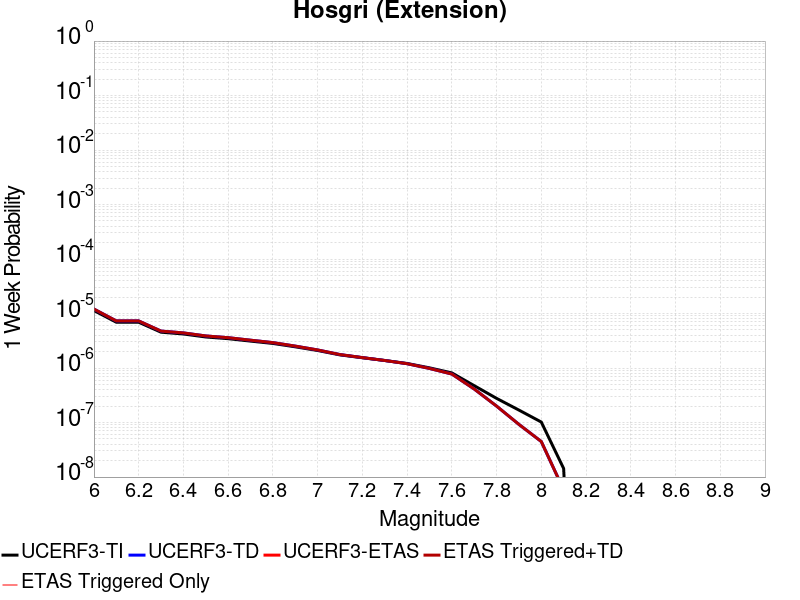 |  | 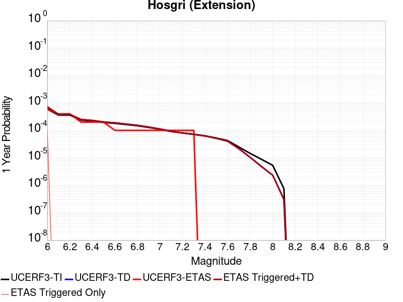 |  |

| Magnitude | 1 wk TI Prob | 1 wk TD Prob | 1 wk ETAS Prob | 1 wk ETAS/TD Gain | 1 wk ETAS Triggered+TD | 1 wk ETAS Triggered Only | 1 mo TI Prob | 1 mo TD Prob | 1 mo ETAS Prob | 1 mo ETAS/TD Gain | 1 mo ETAS Triggered+TD | 1 mo ETAS Triggered Only | 1 yr TI Prob | 1 yr TD Prob | 1 yr ETAS Prob | 1 yr ETAS/TD Gain | 1 yr ETAS Triggered+TD | 1 yr ETAS Triggered Only | 10 yr TI Prob | 10 yr TD Prob | 10 yr ETAS Prob | 10 yr ETAS/TD Gain | 10 yr ETAS Triggered+TD | 10 yr ETAS Triggered Only |
|-----|-----|-----|-----|-----|-----|-----|-----|-----|-----|-----|-----|-----|-----|-----|-----|-----|-----|-----|-----|-----|-----|-----|-----|-----|
| 6.0 | 1.1369135E-5 | 1.2084768E-5 | 0.0 | 0.0 | 1.2084768E-5 | 0.0 | 4.8723956E-5 | 5.1790965E-5 | 0.0 | 0.0 | 5.1790965E-5 | 0.0 | 5.9305265E-4 | 6.3039525E-4 | 6.0E-4 | 0.9517838 | 7.303322E-4 | 1.0E-4 | 0.005914725 | 0.00628832 | 0.0036 | 0.57249 | 0.006884547 | 6.0E-4 |
| 6.1 | 6.934979E-6 | 7.32556E-6 | 0.0 | 0.0 | 7.32556E-6 | 0.0 | 2.9721E-5 | 3.1394902E-5 | 0.0 | 0.0 | 3.1394902E-5 | 0.0 | 3.617931E-4 | 3.8217005E-4 | 4.0E-4 | 1.0466545 | 3.8217005E-4 | 0.0 | 0.0036120464 | 0.003815541 | 0.002 | 0.52417207 | 0.0041143964 | 3.0E-4 |
| 6.2 | 6.934979E-6 | 7.32556E-6 | 0.0 | 0.0 | 7.32556E-6 | 0.0 | 2.9721E-5 | 3.1394902E-5 | 0.0 | 0.0 | 3.1394902E-5 | 0.0 | 3.617931E-4 | 3.8217005E-4 | 4.0E-4 | 1.0466545 | 3.8217005E-4 | 0.0 | 0.0036120464 | 0.003815541 | 0.002 | 0.52417207 | 0.0041143964 | 3.0E-4 |
| 6.3 | 4.5484676E-6 | 4.769977E-6 | 0.0 | 0.0 | 4.769977E-6 | 0.0 | 1.9493287E-5 | 2.0442601E-5 | 0.0 | 0.0 | 2.0442601E-5 | 0.0 | 2.3730492E-4 | 2.4886066E-4 | 2.0E-4 | 0.8036626 | 2.4886066E-4 | 0.0 | 0.0023705168 | 0.0024858625 | 0.0016 | 0.6436398 | 0.0027851167 | 3.0E-4 |
| 6.4 | 4.218095E-6 | 4.4174617E-6 | 0.0 | 0.0 | 4.4174617E-6 | 0.0 | 1.8077424E-5 | 1.8931842E-5 | 0.0 | 0.0 | 1.8931842E-5 | 0.0 | 2.2007042E-4 | 2.3047112E-4 | 2.0E-4 | 0.86778766 | 2.3047112E-4 | 0.0 | 0.002198526 | 0.0023023547 | 0.0013 | 0.56463933 | 0.002601664 | 3.0E-4 |
| 6.5 | 3.717374E-6 | 3.8844096E-6 | 0.0 | 0.0 | 3.8844096E-6 | 0.0 | 1.5931506E-5 | 1.6647364E-5 | 0.0 | 0.0 | 1.6647364E-5 | 0.0 | 1.9394881E-4 | 2.02663E-4 | 2.0E-4 | 0.98686004 | 2.02663E-4 | 0.0 | 0.0019377962 | 0.0020248005 | 0.0012 | 0.59265095 | 0.002324193 | 3.0E-4 |
| 6.6 | 3.4605036E-6 | 3.6087981E-6 | 0.0 | 0.0 | 3.6087981E-6 | 0.0 | 1.4830645E-5 | 1.5466187E-5 | 0.0 | 0.0 | 1.5466187E-5 | 0.0 | 1.8054814E-4 | 1.882847E-4 | 1.0E-4 | 0.5311106 | 1.882847E-4 | 0.0 | 0.0018040152 | 0.0018812664 | 0.0011 | 0.5847125 | 0.002180702 | 3.0E-4 |
| 6.7 | 3.123439E-6 | 3.2470082E-6 | 0.0 | 0.0 | 3.2470082E-6 | 0.0 | 1.33860985E-5 | 1.3915676E-5 | 0.0 | 0.0 | 1.3915676E-5 | 0.0 | 1.6296357E-4 | 1.6941028E-4 | 1.0E-4 | 0.5902829 | 1.6941028E-4 | 0.0 | 0.001628441 | 0.0016928224 | 0.001 | 0.5907294 | 0.0018924838 | 2.0E-4 |
| 6.8 | 2.8290783E-6 | 2.9309338E-6 | 0.0 | 0.0 | 2.9309338E-6 | 0.0 | 1.2124565E-5 | 1.2561085E-5 | 0.0 | 0.0 | 1.2561085E-5 | 0.0 | 1.4760658E-4 | 1.5292056E-4 | 1.0E-4 | 0.6539343 | 1.5292056E-4 | 0.0 | 0.0014750857 | 0.001528162 | 9.0E-4 | 0.5889428 | 0.0017278563 | 2.0E-4 |
| 6.9 | 2.454112E-6 | 2.528655E-6 | 0.0 | 0.0 | 2.528655E-6 | 0.0 | 1.0517581E-5 | 1.0837048E-5 | 0.0 | 0.0 | 1.0837048E-5 | 0.0 | 1.2804402E-4 | 1.3193313E-4 | 1.0E-4 | 0.7579597 | 1.3193313E-4 | 0.0 | 0.0012797028 | 0.0013185542 | 7.0E-4 | 0.5308845 | 0.0015182905 | 2.0E-4 |
| 7.0 | 2.1008145E-6 | 2.1501523E-6 | 0.0 | 0.0 | 2.1501523E-6 | 0.0 | 9.003459E-6 | 9.214907E-6 | 0.0 | 0.0 | 9.214907E-6 | 0.0 | 1.096116E-4 | 1.1218574E-4 | 1.0E-4 | 0.8913789 | 1.1218574E-4 | 0.0 | 0.0010955755 | 0.0011212948 | 6.0E-4 | 0.53509563 | 0.0013210706 | 2.0E-4 |
| 7.1 | 1.744384E-6 | 1.7688646E-6 | 0.0 | 0.0 | 1.7688646E-6 | 0.0 | 7.47591E-6 | 7.5808266E-6 | 0.0 | 0.0 | 7.5808266E-6 | 0.0 | 9.1015405E-5 | 9.229267E-5 | 1.0E-4 | 1.0835097 | 9.229267E-5 | 0.0 | 9.097813E-4 | 9.2254515E-4 | 6.0E-4 | 0.6503747 | 0.0011223606 | 2.0E-4 |
| 7.2 | 1.5456587E-6 | 1.5564888E-6 | 0.0 | 0.0 | 1.5564888E-6 | 0.0 | 6.6242346E-6 | 6.6706493E-6 | 0.0 | 0.0 | 6.6706493E-6 | 0.0 | 8.064707E-5 | 8.1212136E-5 | 1.0E-4 | 1.231343 | 8.1212136E-5 | 0.0 | 8.0617814E-4 | 8.1182586E-4 | 5.0E-4 | 0.6158956 | 0.0010116635 | 2.0E-4 |
| 7.3 | 1.3775123E-6 | 1.3767843E-6 | 0.0 | 0.0 | 1.3767843E-6 | 0.0 | 5.9036106E-6 | 5.9004906E-6 | 0.0 | 0.0 | 5.9004906E-6 | 0.0 | 7.187409E-5 | 7.183612E-5 | 1.0E-4 | 1.3920574 | 7.183612E-5 | 0.0 | 7.185085E-4 | 7.1813E-4 | 4.0E-4 | 0.55700225 | 8.1805815E-4 | 1.0E-4 |
| 7.4 | 1.214491E-6 | 1.2024983E-6 | 0.0 | 0.0 | 1.2024983E-6 | 0.0 | 5.2049513E-6 | 5.153554E-6 | 0.0 | 0.0 | 5.153554E-6 | 0.0 | 6.336844E-5 | 6.274272E-5 | 0.0 | 0.0 | 6.274272E-5 | 0.0 | 6.335037E-4 | 6.272509E-4 | 3.0E-4 | 0.47827753 | 7.2718813E-4 | 1.0E-4 |
| 7.5 | 1.0101123E-6 | 9.843477E-7 | 0.0 | 0.0 | 9.843477E-7 | 0.0 | 4.3290456E-6 | 4.218626E-6 | 0.0 | 0.0 | 4.218626E-6 | 0.0 | 5.2704854E-5 | 5.136057E-5 | 0.0 | 0.0 | 5.136057E-5 | 0.0 | 5.2692357E-4 | 5.134876E-4 | 2.0E-4 | 0.38949335 | 6.134362E-4 | 1.0E-4 |
| 7.6 | 8.1558215E-7 | 7.7669205E-7 | 0.0 | 0.0 | 7.7669205E-7 | 0.0 | 3.4953473E-6 | 3.328676E-6 | 0.0 | 0.0 | 3.328676E-6 | 0.0 | 4.255502E-5 | 4.052588E-5 | 0.0 | 0.0 | 4.052588E-5 | 0.0 | 4.2546875E-4 | 4.0518533E-4 | 0.0 | 0.0 | 4.0518533E-4 | 0.0 |
| 7.7 | 4.757816E-7 | 4.13134E-7 | 0.0 | 0.0 | 4.13134E-7 | 0.0 | 2.0390623E-6 | 1.770573E-6 | 0.0 | 0.0 | 1.770573E-6 | 0.0 | 2.4825302E-5 | 2.1556514E-5 | 0.0 | 0.0 | 2.1556514E-5 | 0.0 | 2.482253E-4 | 2.1554437E-4 | 0.0 | 0.0 | 2.1554437E-4 | 0.0 |
| 7.8 | 2.782787E-7 | 2.0049006E-7 | 0.0 | 0.0 | 2.0049006E-7 | 0.0 | 1.1926223E-6 | 8.592428E-7 | 0.0 | 0.0 | 8.592428E-7 | 0.0 | 1.452008E-5 | 1.0461231E-5 | 0.0 | 0.0 | 1.0461231E-5 | 0.0 | 1.4519131E-4 | 1.04607425E-4 | 0.0 | 0.0 | 1.04607425E-4 | 0.0 |
| 7.9 | 1.6948086E-7 | 9.243912E-8 | 0.0 | 0.0 | 9.243912E-8 | 0.0 | 7.2634634E-7 | 3.961676E-7 | 0.0 | 0.0 | 3.961676E-7 | 0.0 | 8.843231E-6 | 4.8233296E-6 | 0.0 | 0.0 | 4.8233296E-6 | 0.0 | 8.842879E-5 | 4.8232258E-5 | 0.0 | 0.0 | 4.8232258E-5 | 0.0 |
| 8.0 | 1.0225492E-7 | 4.473332E-8 | 0.0 | 0.0 | 4.473332E-8 | 0.0 | 4.382353E-7 | 1.9171422E-7 | 0.0 | 0.0 | 1.9171422E-7 | 0.0 | 5.335502E-6 | 2.334118E-6 | 0.0 | 0.0 | 2.334118E-6 | 0.0 | 5.335374E-5 | 2.334094E-5 | 0.0 | 0.0 | 2.334094E-5 | 0.0 |
| 8.1 | 1.43711345E-8 | 5.786773E-9 | 0.0 | 0.0 | 5.786773E-9 | 0.0 | 6.1590576E-8 | 2.4800455E-8 | 0.0 | 0.0 | 2.4800455E-8 | 0.0 | 7.4986497E-7 | 3.019455E-7 | 0.0 | 0.0 | 3.019455E-7 | 0.0 | 7.4986247E-6 | 3.0194515E-6 | 0.0 | 0.0 | 3.0194515E-6 | 0.0 |

## Goose Lake 2011 CFM
*[(top)](#table-of-contents)*

| 1 Week | 1 Month | 1 Year | 10 Year |
|-----|-----|-----|-----|
|  | 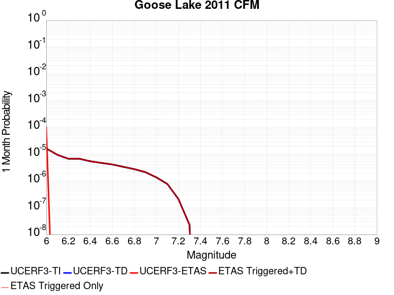 |  |  |

| Magnitude | 1 wk TI Prob | 1 wk TD Prob | 1 wk ETAS Prob | 1 wk ETAS/TD Gain | 1 wk ETAS Triggered+TD | 1 wk ETAS Triggered Only | 1 mo TI Prob | 1 mo TD Prob | 1 mo ETAS Prob | 1 mo ETAS/TD Gain | 1 mo ETAS Triggered+TD | 1 mo ETAS Triggered Only | 1 yr TI Prob | 1 yr TD Prob | 1 yr ETAS Prob | 1 yr ETAS/TD Gain | 1 yr ETAS Triggered+TD | 1 yr ETAS Triggered Only | 10 yr TI Prob | 10 yr TD Prob | 10 yr ETAS Prob | 10 yr ETAS/TD Gain | 10 yr ETAS Triggered+TD | 10 yr ETAS Triggered Only |
|-----|-----|-----|-----|-----|-----|-----|-----|-----|-----|-----|-----|-----|-----|-----|-----|-----|-----|-----|-----|-----|-----|-----|-----|-----|
| 6.0 | 3.780968E-6 | 3.823107E-6 | 1.0E-4 | 26.156738 | 3.823107E-6 | 0.0 | 1.6204049E-5 | 1.6384647E-5 | 1.0E-4 | 6.103275 | 1.6384647E-5 | 0.0 | 1.9726643E-4 | 1.9946591E-4 | 3.0E-4 | 1.5040164 | 1.9946591E-4 | 0.0 | 0.001970914 | 0.001992977 | 0.0015 | 0.7526429 | 0.0025917813 | 6.0E-4 |
| 6.1 | 2.2035124E-6 | 2.229854E-6 | 0.0 | 0.0 | 2.229854E-6 | 0.0 | 9.443591E-6 | 9.556484E-6 | 0.0 | 0.0 | 9.556484E-6 | 0.0 | 1.1496965E-4 | 1.1634416E-4 | 1.0E-4 | 0.8595189 | 1.1634416E-4 | 0.0 | 0.0011491019 | 0.0011628508 | 8.0E-4 | 0.68796444 | 0.0014625019 | 3.0E-4 |
| 6.2 | 1.5624689E-6 | 1.582733E-6 | 0.0 | 0.0 | 1.582733E-6 | 0.0 | 6.6962784E-6 | 6.7831243E-6 | 0.0 | 0.0 | 6.7831243E-6 | 0.0 | 8.152414E-5 | 8.258145E-5 | 1.0E-4 | 1.2109257 | 8.258145E-5 | 0.0 | 8.1494235E-4 | 8.255121E-4 | 4.0E-4 | 0.4845477 | 9.254296E-4 | 1.0E-4 |
| 6.3 | 1.5624689E-6 | 1.582733E-6 | 0.0 | 0.0 | 1.582733E-6 | 0.0 | 6.6962784E-6 | 6.7831243E-6 | 0.0 | 0.0 | 6.7831243E-6 | 0.0 | 8.152414E-5 | 8.258145E-5 | 1.0E-4 | 1.2109257 | 8.258145E-5 | 0.0 | 8.1494235E-4 | 8.255121E-4 | 4.0E-4 | 0.4845477 | 9.254296E-4 | 1.0E-4 |
| 6.4 | 1.256464E-6 | 1.2739047E-6 | 0.0 | 0.0 | 1.2739047E-6 | 0.0 | 5.3848344E-6 | 5.45958E-6 | 0.0 | 0.0 | 5.45958E-6 | 0.0 | 6.5558386E-5 | 6.6468376E-5 | 0.0 | 0.0 | 6.6468376E-5 | 0.0 | 6.553905E-4 | 6.6448696E-4 | 2.0E-4 | 0.30098408 | 6.6448696E-4 | 0.0 |
| 6.5 | 1.0910911E-6 | 1.1069724E-6 | 0.0 | 0.0 | 1.1069724E-6 | 0.0 | 4.6760965E-6 | 4.744159E-6 | 0.0 | 0.0 | 4.744159E-6 | 0.0 | 5.692999E-5 | 5.7758614E-5 | 0.0 | 0.0 | 5.7758614E-5 | 0.0 | 5.6915404E-4 | 5.774373E-4 | 2.0E-4 | 0.34635794 | 5.774373E-4 | 0.0 |
| 6.6 | 9.546601E-7 | 9.691538E-7 | 0.0 | 0.0 | 9.691538E-7 | 0.0 | 4.091394E-6 | 4.1535095E-6 | 0.0 | 0.0 | 4.1535095E-6 | 0.0 | 4.9811584E-5 | 5.0567814E-5 | 0.0 | 0.0 | 5.0567814E-5 | 0.0 | 4.980042E-4 | 5.05564E-4 | 2.0E-4 | 0.39559782 | 5.05564E-4 | 0.0 |
| 6.7 | 7.790316E-7 | 7.9162174E-7 | 0.0 | 0.0 | 7.9162174E-7 | 0.0 | 3.3387028E-6 | 3.3926601E-6 | 0.0 | 0.0 | 3.3926601E-6 | 0.0 | 4.0647945E-5 | 4.1304862E-5 | 0.0 | 0.0 | 4.1304862E-5 | 0.0 | 4.0640513E-4 | 4.1297244E-4 | 2.0E-4 | 0.48429382 | 4.1297244E-4 | 0.0 |
| 6.8 | 6.3714384E-7 | 6.4789566E-7 | 0.0 | 0.0 | 6.4789566E-7 | 0.0 | 2.7306137E-6 | 2.7766928E-6 | 0.0 | 0.0 | 2.7766928E-6 | 0.0 | 3.3244716E-5 | 3.3805714E-5 | 0.0 | 0.0 | 3.3805714E-5 | 0.0 | 3.323974E-4 | 3.380062E-4 | 2.0E-4 | 0.59170514 | 3.380062E-4 | 0.0 |
| 6.9 | 4.92586E-7 | 5.014093E-7 | 0.0 | 0.0 | 5.014093E-7 | 0.0 | 2.1110811E-6 | 2.1488952E-6 | 0.0 | 0.0 | 2.1488952E-6 | 0.0 | 2.5702111E-5 | 2.616249E-5 | 0.0 | 0.0 | 2.616249E-5 | 0.0 | 2.569914E-4 | 2.6159448E-4 | 1.0E-4 | 0.38227108 | 2.6159448E-4 | 0.0 |
| 7.0 | 3.130245E-7 | 3.190476E-7 | 0.0 | 0.0 | 3.190476E-7 | 0.0 | 1.3415328E-6 | 1.367346E-6 | 0.0 | 0.0 | 1.367346E-6 | 0.0 | 1.6333039E-5 | 1.6647313E-5 | 0.0 | 0.0 | 1.6647313E-5 | 0.0 | 1.6331839E-4 | 1.6646087E-4 | 1.0E-4 | 0.6007418 | 1.6646087E-4 | 0.0 |
| 7.1 | 1.7680084E-7 | 1.8024619E-7 | 0.0 | 0.0 | 1.8024619E-7 | 0.0 | 7.5771766E-7 | 7.724834E-7 | 0.0 | 0.0 | 7.724834E-7 | 0.0 | 9.225173E-6 | 9.4049465E-6 | 0.0 | 0.0 | 9.4049465E-6 | 0.0 | 9.22479E-5 | 9.4045594E-5 | 0.0 | 0.0 | 9.4045594E-5 | 0.0 |
| 7.2 | 4.8641045E-8 | 4.94036E-8 | 0.0 | 0.0 | 4.94036E-8 | 0.0 | 2.084616E-7 | 2.117297E-7 | 0.0 | 0.0 | 2.117297E-7 | 0.0 | 2.538017E-6 | 2.577806E-6 | 0.0 | 0.0 | 2.577806E-6 | 0.0 | 2.537988E-5 | 2.5777774E-5 | 0.0 | 0.0 | 2.5777774E-5 | 0.0 |
| 7.3 | 5.3911844E-9 | 5.4759846E-9 | 0.0 | 0.0 | 5.4759846E-9 | 0.0 | 2.3105075E-8 | 2.3468505E-8 | 0.0 | 0.0 | 2.3468505E-8 | 0.0 | 2.8130427E-7 | 2.8572904E-7 | 0.0 | 0.0 | 2.8572904E-7 | 0.0 | 2.8130391E-6 | 2.8572883E-6 | 0.0 | 0.0 | 2.8572883E-6 | 0.0 |

## White Wolf (Extension)
*[(top)](#table-of-contents)*

| 1 Week | 1 Month | 1 Year | 10 Year |
|-----|-----|-----|-----|
| 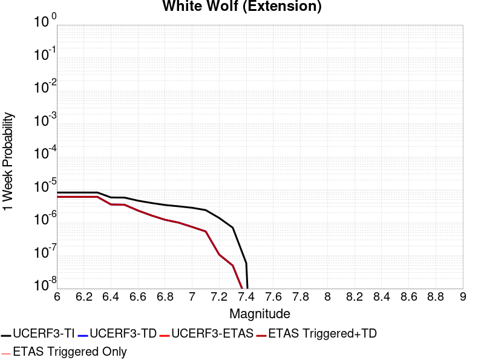 |  |  | 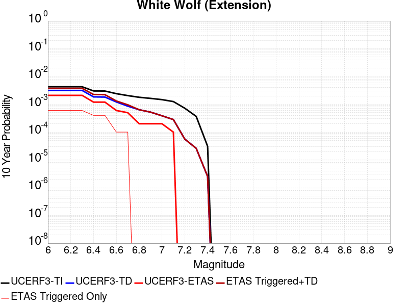 |

| Magnitude | 1 wk TI Prob | 1 wk TD Prob | 1 wk ETAS Prob | 1 wk ETAS/TD Gain | 1 wk ETAS Triggered+TD | 1 wk ETAS Triggered Only | 1 mo TI Prob | 1 mo TD Prob | 1 mo ETAS Prob | 1 mo ETAS/TD Gain | 1 mo ETAS Triggered+TD | 1 mo ETAS Triggered Only | 1 yr TI Prob | 1 yr TD Prob | 1 yr ETAS Prob | 1 yr ETAS/TD Gain | 1 yr ETAS Triggered+TD | 1 yr ETAS Triggered Only | 10 yr TI Prob | 10 yr TD Prob | 10 yr ETAS Prob | 10 yr ETAS/TD Gain | 10 yr ETAS Triggered+TD | 10 yr ETAS Triggered Only |
|-----|-----|-----|-----|-----|-----|-----|-----|-----|-----|-----|-----|-----|-----|-----|-----|-----|-----|-----|-----|-----|-----|-----|-----|-----|
| 6.0 | 8.222555E-6 | 6.0668895E-6 | 0.0 | 0.0 | 6.0668895E-6 | 0.0 | 3.5239045E-5 | 2.6000733E-5 | 0.0 | 0.0 | 2.6000733E-5 | 0.0 | 4.289509E-4 | 3.1651958E-4 | 2.0E-4 | 0.6318725 | 3.1651958E-4 | 0.0 | 0.0042812387 | 0.0031613396 | 0.0021 | 0.66427535 | 0.0037594428 | 6.0E-4 |
| 6.1 | 8.222555E-6 | 6.0668895E-6 | 0.0 | 0.0 | 6.0668895E-6 | 0.0 | 3.5239045E-5 | 2.6000733E-5 | 0.0 | 0.0 | 2.6000733E-5 | 0.0 | 4.289509E-4 | 3.1651958E-4 | 2.0E-4 | 0.6318725 | 3.1651958E-4 | 0.0 | 0.0042812387 | 0.0031613396 | 0.0021 | 0.66427535 | 0.0037594428 | 6.0E-4 |
| 6.2 | 8.222555E-6 | 6.0668895E-6 | 0.0 | 0.0 | 6.0668895E-6 | 0.0 | 3.5239045E-5 | 2.6000733E-5 | 0.0 | 0.0 | 2.6000733E-5 | 0.0 | 4.289509E-4 | 3.1651958E-4 | 2.0E-4 | 0.6318725 | 3.1651958E-4 | 0.0 | 0.0042812387 | 0.0031613396 | 0.0021 | 0.66427535 | 0.0037594428 | 6.0E-4 |
| 6.3 | 8.222555E-6 | 6.0668895E-6 | 0.0 | 0.0 | 6.0668895E-6 | 0.0 | 3.5239045E-5 | 2.6000733E-5 | 0.0 | 0.0 | 2.6000733E-5 | 0.0 | 4.289509E-4 | 3.1651958E-4 | 2.0E-4 | 0.6318725 | 3.1651958E-4 | 0.0 | 0.0042812387 | 0.0031613396 | 0.0021 | 0.66427535 | 0.0037594428 | 6.0E-4 |
| 6.4 | 5.821773E-6 | 3.5571748E-6 | 0.0 | 0.0 | 3.5571748E-6 | 0.0 | 2.4950215E-5 | 1.5244952E-5 | 0.0 | 0.0 | 1.5244952E-5 | 0.0 | 3.0372653E-4 | 1.8559258E-4 | 2.0E-4 | 1.0776293 | 1.8559258E-4 | 0.0 | 0.0030331176 | 0.0018544842 | 0.0012 | 0.6470802 | 0.0022537424 | 4.0E-4 |
| 6.5 | 5.766023E-6 | 3.4991042E-6 | 0.0 | 0.0 | 3.4991042E-6 | 0.0 | 2.4711293E-5 | 1.4996081E-5 | 0.0 | 0.0 | 1.4996081E-5 | 0.0 | 3.0081844E-4 | 1.8256308E-4 | 2.0E-4 | 1.0955118 | 1.8256308E-4 | 0.0 | 0.0030041158 | 0.0018242393 | 0.0012 | 0.6578085 | 0.0022235096 | 4.0E-4 |
| 6.6 | 4.643576E-6 | 2.3325267E-6 | 0.0 | 0.0 | 2.3325267E-6 | 0.0 | 1.9900888E-5 | 9.996507E-6 | 0.0 | 0.0 | 9.996507E-6 | 0.0 | 2.4226638E-4 | 1.21701116E-4 | 2.0E-4 | 1.6433704 | 1.21701116E-4 | 0.0 | 0.0024200242 | 0.001216387 | 6.0E-4 | 0.49326405 | 0.0013162654 | 1.0E-4 |
| 6.7 | 3.9529173E-6 | 1.6482076E-6 | 0.0 | 0.0 | 1.6482076E-6 | 0.0 | 1.6940963E-5 | 7.0637284E-6 | 0.0 | 0.0 | 7.0637284E-6 | 0.0 | 2.0623671E-4 | 8.5997686E-5 | 2.0E-4 | 2.325644 | 8.5997686E-5 | 0.0 | 0.002060454 | 8.596626E-4 | 5.0E-4 | 0.58162355 | 9.5957663E-4 | 1.0E-4 |
| 6.8 | 3.4377522E-6 | 1.2243668E-6 | 0.0 | 0.0 | 1.2243668E-6 | 0.0 | 1.473314E-5 | 5.247276E-6 | 0.0 | 0.0 | 5.247276E-6 | 0.0 | 1.7936122E-4 | 6.388381E-5 | 1.0E-4 | 1.5653418 | 6.388381E-5 | 0.0 | 0.0017921652 | 6.3866354E-4 | 2.0E-4 | 0.31315392 | 6.3866354E-4 | 0.0 |
| 6.9 | 3.1367306E-6 | 1.003219E-6 | 0.0 | 0.0 | 1.003219E-6 | 0.0 | 1.3443062E-5 | 4.2995034E-6 | 0.0 | 0.0 | 4.2995034E-6 | 0.0 | 1.63657E-4 | 5.2345276E-5 | 1.0E-4 | 1.910392 | 5.2345276E-5 | 0.0 | 0.0016353652 | 5.233371E-4 | 2.0E-4 | 0.38216287 | 5.233371E-4 | 0.0 |
| 7.0 | 2.8298145E-6 | 7.4270196E-7 | 0.0 | 0.0 | 7.4270196E-7 | 0.0 | 1.2127721E-5 | 3.1830048E-6 | 0.0 | 0.0 | 3.1830048E-6 | 0.0 | 1.47645E-4 | 3.8752445E-5 | 1.0E-4 | 2.5804822 | 3.8752445E-5 | 0.0 | 0.0014754693 | 3.8746189E-4 | 2.0E-4 | 0.5161798 | 3.8746189E-4 | 0.0 |
| 7.1 | 2.4091064E-6 | 5.421342E-7 | 0.0 | 0.0 | 5.421342E-7 | 0.0 | 1.03247E-5 | 2.3234306E-6 | 0.0 | 0.0 | 2.3234306E-6 | 0.0 | 1.2569598E-4 | 2.828744E-5 | 1.0E-4 | 3.5351377 | 2.828744E-5 | 0.0 | 0.001256249 | 2.8284243E-4 | 1.0E-4 | 0.3535537 | 2.8284243E-4 | 0.0 |
| 7.2 | 1.3875518E-6 | 1.0735398E-7 | 0.0 | 0.0 | 1.0735398E-7 | 0.0 | 5.9466374E-6 | 4.6008842E-7 | 0.0 | 0.0 | 4.6008842E-7 | 0.0 | 7.23979E-5 | 5.6015633E-6 | 0.0 | 0.0 | 5.6015633E-6 | 0.0 | 7.2374323E-4 | 5.6014334E-5 | 0.0 | 0.0 | 5.6014334E-5 | 0.0 |
| 7.3 | 7.056077E-7 | 4.99753E-8 | 0.0 | 0.0 | 4.99753E-8 | 0.0 | 3.0240296E-6 | 2.1417983E-7 | 0.0 | 0.0 | 2.1417983E-7 | 0.0 | 3.681694E-5 | 2.6076368E-6 | 0.0 | 0.0 | 2.6076368E-6 | 0.0 | 3.681084E-4 | 2.6076108E-5 | 0.0 | 0.0 | 2.6076108E-5 | 0.0 |
| 7.4 | 5.9334678E-8 | 4.8625486E-9 | 0.0 | 0.0 | 4.8625486E-9 | 0.0 | 2.5429145E-7 | 2.0839494E-8 | 0.0 | 0.0 | 2.0839494E-8 | 0.0 | 3.095994E-6 | 2.5372083E-7 | 0.0 | 0.0 | 2.5372083E-7 | 0.0 | 3.095951E-5 | 2.5372065E-6 | 0.0 | 0.0 | 2.5372065E-6 | 0.0 |

## Pitas Point (Lower)-Montalvo
*[(top)](#table-of-contents)*

| 1 Week | 1 Month | 1 Year | 10 Year |
|-----|-----|-----|-----|
|  |  |  |  |

| Magnitude | 1 wk TI Prob | 1 wk TD Prob | 1 wk ETAS Prob | 1 wk ETAS/TD Gain | 1 wk ETAS Triggered+TD | 1 wk ETAS Triggered Only | 1 mo TI Prob | 1 mo TD Prob | 1 mo ETAS Prob | 1 mo ETAS/TD Gain | 1 mo ETAS Triggered+TD | 1 mo ETAS Triggered Only | 1 yr TI Prob | 1 yr TD Prob | 1 yr ETAS Prob | 1 yr ETAS/TD Gain | 1 yr ETAS Triggered+TD | 1 yr ETAS Triggered Only | 10 yr TI Prob | 10 yr TD Prob | 10 yr ETAS Prob | 10 yr ETAS/TD Gain | 10 yr ETAS Triggered+TD | 10 yr ETAS Triggered Only |
|-----|-----|-----|-----|-----|-----|-----|-----|-----|-----|-----|-----|-----|-----|-----|-----|-----|-----|-----|-----|-----|-----|-----|-----|-----|
| 6.0 | 5.2543637E-6 | 4.8385486E-6 | 0.0 | 0.0 | 4.8385486E-6 | 0.0 | 2.2518509E-5 | 2.0736474E-5 | 0.0 | 0.0 | 2.0736474E-5 | 0.0 | 2.7412834E-4 | 2.5243763E-4 | 2.0E-4 | 0.7922749 | 3.524124E-4 | 1.0E-4 | 0.0027379042 | 0.0025215414 | 0.0024 | 0.9517988 | 0.0031200284 | 6.0E-4 |
| 6.1 | 5.2543637E-6 | 4.8385486E-6 | 0.0 | 0.0 | 4.8385486E-6 | 0.0 | 2.2518509E-5 | 2.0736474E-5 | 0.0 | 0.0 | 2.0736474E-5 | 0.0 | 2.7412834E-4 | 2.5243763E-4 | 2.0E-4 | 0.7922749 | 3.524124E-4 | 1.0E-4 | 0.0027379042 | 0.0025215414 | 0.0024 | 0.9517988 | 0.0031200284 | 6.0E-4 |
| 6.2 | 5.2543637E-6 | 4.8385486E-6 | 0.0 | 0.0 | 4.8385486E-6 | 0.0 | 2.2518509E-5 | 2.0736474E-5 | 0.0 | 0.0 | 2.0736474E-5 | 0.0 | 2.7412834E-4 | 2.5243763E-4 | 2.0E-4 | 0.7922749 | 3.524124E-4 | 1.0E-4 | 0.0027379042 | 0.0025215414 | 0.0024 | 0.9517988 | 0.0031200284 | 6.0E-4 |
| 6.3 | 5.2543637E-6 | 4.8385486E-6 | 0.0 | 0.0 | 4.8385486E-6 | 0.0 | 2.2518509E-5 | 2.0736474E-5 | 0.0 | 0.0 | 2.0736474E-5 | 0.0 | 2.7412834E-4 | 2.5243763E-4 | 2.0E-4 | 0.7922749 | 3.524124E-4 | 1.0E-4 | 0.0027379042 | 0.0025215414 | 0.0024 | 0.9517988 | 0.0031200284 | 6.0E-4 |
| 6.4 | 5.2543637E-6 | 4.8385486E-6 | 0.0 | 0.0 | 4.8385486E-6 | 0.0 | 2.2518509E-5 | 2.0736474E-5 | 0.0 | 0.0 | 2.0736474E-5 | 0.0 | 2.7412834E-4 | 2.5243763E-4 | 2.0E-4 | 0.7922749 | 3.524124E-4 | 1.0E-4 | 0.0027379042 | 0.0025215414 | 0.0024 | 0.9517988 | 0.0031200284 | 6.0E-4 |
| 6.5 | 5.2543637E-6 | 4.8385486E-6 | 0.0 | 0.0 | 4.8385486E-6 | 0.0 | 2.2518509E-5 | 2.0736474E-5 | 0.0 | 0.0 | 2.0736474E-5 | 0.0 | 2.7412834E-4 | 2.5243763E-4 | 2.0E-4 | 0.7922749 | 3.524124E-4 | 1.0E-4 | 0.0027379042 | 0.0025215414 | 0.0024 | 0.9517988 | 0.0031200284 | 6.0E-4 |
| 6.6 | 5.2543637E-6 | 4.8385486E-6 | 0.0 | 0.0 | 4.8385486E-6 | 0.0 | 2.2518509E-5 | 2.0736474E-5 | 0.0 | 0.0 | 2.0736474E-5 | 0.0 | 2.7412834E-4 | 2.5243763E-4 | 2.0E-4 | 0.7922749 | 3.524124E-4 | 1.0E-4 | 0.0027379042 | 0.0025215414 | 0.0024 | 0.9517988 | 0.0031200284 | 6.0E-4 |
| 6.7 | 5.2543637E-6 | 4.8385486E-6 | 0.0 | 0.0 | 4.8385486E-6 | 0.0 | 2.2518509E-5 | 2.0736474E-5 | 0.0 | 0.0 | 2.0736474E-5 | 0.0 | 2.7412834E-4 | 2.5243763E-4 | 2.0E-4 | 0.7922749 | 3.524124E-4 | 1.0E-4 | 0.0027379042 | 0.0025215414 | 0.0024 | 0.9517988 | 0.0031200284 | 6.0E-4 |
| 6.8 | 5.2543637E-6 | 4.8385486E-6 | 0.0 | 0.0 | 4.8385486E-6 | 0.0 | 2.2518509E-5 | 2.0736474E-5 | 0.0 | 0.0 | 2.0736474E-5 | 0.0 | 2.7412834E-4 | 2.5243763E-4 | 2.0E-4 | 0.7922749 | 3.524124E-4 | 1.0E-4 | 0.0027379042 | 0.0025215414 | 0.0024 | 0.9517988 | 0.0031200284 | 6.0E-4 |
| 6.9 | 5.2543637E-6 | 4.8385486E-6 | 0.0 | 0.0 | 4.8385486E-6 | 0.0 | 2.2518509E-5 | 2.0736474E-5 | 0.0 | 0.0 | 2.0736474E-5 | 0.0 | 2.7412834E-4 | 2.5243763E-4 | 2.0E-4 | 0.7922749 | 3.524124E-4 | 1.0E-4 | 0.0027379042 | 0.0025215414 | 0.0024 | 0.9517988 | 0.0031200284 | 6.0E-4 |
| 7.0 | 5.2543637E-6 | 4.8385486E-6 | 0.0 | 0.0 | 4.8385486E-6 | 0.0 | 2.2518509E-5 | 2.0736474E-5 | 0.0 | 0.0 | 2.0736474E-5 | 0.0 | 2.7412834E-4 | 2.5243763E-4 | 2.0E-4 | 0.7922749 | 3.524124E-4 | 1.0E-4 | 0.0027379042 | 0.0025215414 | 0.0024 | 0.9517988 | 0.0031200284 | 6.0E-4 |
| 7.1 | 5.2543637E-6 | 4.8385486E-6 | 0.0 | 0.0 | 4.8385486E-6 | 0.0 | 2.2518509E-5 | 2.0736474E-5 | 0.0 | 0.0 | 2.0736474E-5 | 0.0 | 2.7412834E-4 | 2.5243763E-4 | 2.0E-4 | 0.7922749 | 3.524124E-4 | 1.0E-4 | 0.0027379042 | 0.0025215414 | 0.0024 | 0.9517988 | 0.0031200284 | 6.0E-4 |
| 7.2 | 5.2458695E-6 | 4.8297015E-6 | 0.0 | 0.0 | 4.8297015E-6 | 0.0 | 2.2482105E-5 | 2.0698559E-5 | 0.0 | 0.0 | 2.0698559E-5 | 0.0 | 2.7368523E-4 | 2.5197613E-4 | 2.0E-4 | 0.79372597 | 3.5195093E-4 | 1.0E-4 | 0.0027334841 | 0.0025169367 | 0.0024 | 0.95354 | 0.0031154265 | 6.0E-4 |
| 7.3 | 5.22665E-6 | 4.809617E-6 | 0.0 | 0.0 | 4.809617E-6 | 0.0 | 2.2399736E-5 | 2.0612484E-5 | 0.0 | 0.0 | 2.0612484E-5 | 0.0 | 2.7268266E-4 | 2.509284E-4 | 2.0E-4 | 0.7970401 | 3.509033E-4 | 1.0E-4 | 0.002723483 | 0.0025064833 | 0.0024 | 0.95751685 | 0.0031049794 | 6.0E-4 |
| 7.4 | 5.210642E-6 | 4.792828E-6 | 0.0 | 0.0 | 4.792828E-6 | 0.0 | 2.233113E-5 | 2.0540532E-5 | 0.0 | 0.0 | 2.0540532E-5 | 0.0 | 2.718476E-4 | 2.5005257E-4 | 2.0E-4 | 0.79983175 | 3.5002758E-4 | 1.0E-4 | 0.002715153 | 0.0024977447 | 0.0024 | 0.9608668 | 0.0030962462 | 6.0E-4 |
| 7.5 | 5.1226016E-6 | 4.700706E-6 | 0.0 | 0.0 | 4.700706E-6 | 0.0 | 2.1953823E-5 | 2.014573E-5 | 0.0 | 0.0 | 2.014573E-5 | 0.0 | 2.67255E-4 | 2.4524695E-4 | 2.0E-4 | 0.8155045 | 3.4522245E-4 | 1.0E-4 | 0.0026693381 | 0.002449795 | 0.0024 | 0.97967386 | 0.003048325 | 6.0E-4 |
| 7.6 | 4.8796987E-6 | 4.4455796E-6 | 0.0 | 0.0 | 4.4455796E-6 | 0.0 | 2.0912828E-5 | 1.9052348E-5 | 0.0 | 0.0 | 1.9052348E-5 | 0.0 | 2.5458392E-4 | 2.3193794E-4 | 2.0E-4 | 0.8622996 | 3.3191475E-4 | 1.0E-4 | 0.0025429246 | 0.0023169892 | 0.0023 | 0.9926675 | 0.0029155992 | 6.0E-4 |
| 7.7 | 4.0834398E-6 | 3.6096585E-6 | 0.0 | 0.0 | 3.6096585E-6 | 0.0 | 1.7500339E-5 | 1.5469874E-5 | 0.0 | 0.0 | 1.5469874E-5 | 0.0 | 2.1304579E-4 | 1.8832968E-4 | 1.0E-4 | 0.53098375 | 1.8832968E-4 | 0.0 | 0.0021284167 | 0.0018817245 | 0.0019 | 1.0097121 | 0.0023807837 | 5.0E-4 |
| 7.8 | 2.5445438E-6 | 2.1215808E-6 | 0.0 | 0.0 | 2.1215808E-6 | 0.0 | 1.0905142E-5 | 9.092458E-6 | 0.0 | 0.0 | 9.092458E-6 | 0.0 | 1.3276201E-4 | 1.10695095E-4 | 1.0E-4 | 0.9033824 | 1.10695095E-4 | 0.0 | 0.0013268272 | 0.0011064042 | 0.0011 | 0.9942117 | 0.0014060723 | 3.0E-4 |
| 7.9 | 4.1677114E-7 | 3.3298403E-7 | 0.0 | 0.0 | 3.3298403E-7 | 0.0 | 1.7861609E-6 | 1.4270737E-6 | 0.0 | 0.0 | 1.4270737E-6 | 0.0 | 2.1746291E-5 | 1.7374487E-5 | 0.0 | 0.0 | 1.7374487E-5 | 0.0 | 2.1744163E-4 | 1.7373159E-4 | 4.0E-4 | 2.3024023 | 3.7369685E-4 | 2.0E-4 |
| 8.0 | 7.791402E-9 | 5.684371E-9 | 0.0 | 0.0 | 5.684371E-9 | 0.0 | 3.3391725E-8 | 2.4361592E-8 | 0.0 | 0.0 | 2.4361592E-8 | 0.0 | 4.0654416E-7 | 2.9660237E-7 | 0.0 | 0.0 | 2.9660237E-7 | 0.0 | 4.065434E-6 | 2.9660216E-6 | 0.0 | 0.0 | 2.9660216E-6 | 0.0 |

## Pittville 2011 CFM
*[(top)](#table-of-contents)*

| 1 Week | 1 Month | 1 Year | 10 Year |
|-----|-----|-----|-----|
|  |  | 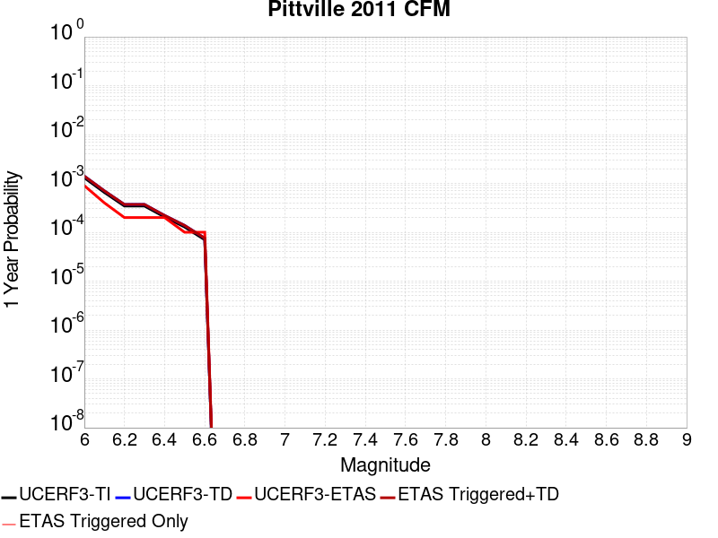 |  |

| Magnitude | 1 wk TI Prob | 1 wk TD Prob | 1 wk ETAS Prob | 1 wk ETAS/TD Gain | 1 wk ETAS Triggered+TD | 1 wk ETAS Triggered Only | 1 mo TI Prob | 1 mo TD Prob | 1 mo ETAS Prob | 1 mo ETAS/TD Gain | 1 mo ETAS Triggered+TD | 1 mo ETAS Triggered Only | 1 yr TI Prob | 1 yr TD Prob | 1 yr ETAS Prob | 1 yr ETAS/TD Gain | 1 yr ETAS Triggered+TD | 1 yr ETAS Triggered Only | 10 yr TI Prob | 10 yr TD Prob | 10 yr ETAS Prob | 10 yr ETAS/TD Gain | 10 yr ETAS Triggered+TD | 10 yr ETAS Triggered Only |
|-----|-----|-----|-----|-----|-----|-----|-----|-----|-----|-----|-----|-----|-----|-----|-----|-----|-----|-----|-----|-----|-----|-----|-----|-----|
| 6.0 | 2.5031832E-5 | 2.7061313E-5 | 0.0 | 0.0 | 2.7061313E-5 | 0.0 | 1.0727487E-4 | 1.1597245E-4 | 0.0 | 0.0 | 1.1597245E-4 | 0.0 | 0.001305289 | 0.0014111474 | 9.0E-4 | 0.6377788 | 0.0014111474 | 0.0 | 0.012976485 | 0.014031654 | 0.0086 | 0.61289996 | 0.014623235 | 6.0E-4 |
| 6.1 | 1.2540113E-5 | 1.3515146E-5 | 0.0 | 0.0 | 1.3515146E-5 | 0.0 | 5.3742235E-5 | 5.7920897E-5 | 0.0 | 0.0 | 5.7920897E-5 | 0.0 | 6.541153E-4 | 7.049812E-4 | 4.0E-4 | 0.567391 | 7.049812E-4 | 0.0 | 0.0065219323 | 0.0070296824 | 0.0048 | 0.6828189 | 0.0075261677 | 5.0E-4 |
| 6.2 | 6.603218E-6 | 7.108265E-6 | 0.0 | 0.0 | 7.108265E-6 | 0.0 | 2.8299199E-5 | 3.0463674E-5 | 0.0 | 0.0 | 3.0463674E-5 | 0.0 | 3.4448825E-4 | 3.708386E-4 | 2.0E-4 | 0.5393182 | 3.708386E-4 | 0.0 | 0.0034395473 | 0.0037028387 | 0.0026 | 0.702164 | 0.004001728 | 3.0E-4 |
| 6.3 | 6.603218E-6 | 7.108265E-6 | 0.0 | 0.0 | 7.108265E-6 | 0.0 | 2.8299199E-5 | 3.0463674E-5 | 0.0 | 0.0 | 3.0463674E-5 | 0.0 | 3.4448825E-4 | 3.708386E-4 | 2.0E-4 | 0.5393182 | 3.708386E-4 | 0.0 | 0.0034395473 | 0.0037028387 | 0.0026 | 0.702164 | 0.004001728 | 3.0E-4 |
| 6.4 | 3.9389015E-6 | 4.239816E-6 | 0.0 | 0.0 | 4.239816E-6 | 0.0 | 1.6880897E-5 | 1.817053E-5 | 0.0 | 0.0 | 1.817053E-5 | 0.0 | 2.0550552E-4 | 2.2120686E-4 | 2.0E-4 | 0.9041311 | 2.2120686E-4 | 0.0 | 0.0020531558 | 0.0022101717 | 0.0017 | 0.769171 | 0.0023099508 | 1.0E-4 |
| 6.5 | 2.4533072E-6 | 2.6416699E-6 | 0.0 | 0.0 | 2.6416699E-6 | 0.0 | 1.0514132E-5 | 1.1321405E-5 | 0.0 | 0.0 | 1.1321405E-5 | 0.0 | 1.2800204E-4 | 1.3783132E-4 | 1.0E-4 | 0.7255245 | 1.3783132E-4 | 0.0 | 0.0012792832 | 0.0013776486 | 7.0E-4 | 0.5081122 | 0.0013776486 | 0.0 |
| 6.6 | 1.3482367E-6 | 1.453217E-6 | 0.0 | 0.0 | 1.453217E-6 | 0.0 | 5.778144E-6 | 6.228064E-6 | 0.0 | 0.0 | 6.228064E-6 | 0.0 | 7.0346636E-5 | 7.582518E-5 | 1.0E-4 | 1.3188231 | 7.582518E-5 | 0.0 | 7.032437E-4 | 7.581042E-4 | 4.0E-4 | 0.52763194 | 7.581042E-4 | 0.0 |

## San Gorgonio Pass
*[(top)](#table-of-contents)*

| 1 Week | 1 Month | 1 Year | 10 Year |
|-----|-----|-----|-----|
|  |  |  |  |

| Magnitude | 1 wk TI Prob | 1 wk TD Prob | 1 wk ETAS Prob | 1 wk ETAS/TD Gain | 1 wk ETAS Triggered+TD | 1 wk ETAS Triggered Only | 1 mo TI Prob | 1 mo TD Prob | 1 mo ETAS Prob | 1 mo ETAS/TD Gain | 1 mo ETAS Triggered+TD | 1 mo ETAS Triggered Only | 1 yr TI Prob | 1 yr TD Prob | 1 yr ETAS Prob | 1 yr ETAS/TD Gain | 1 yr ETAS Triggered+TD | 1 yr ETAS Triggered Only | 10 yr TI Prob | 10 yr TD Prob | 10 yr ETAS Prob | 10 yr ETAS/TD Gain | 10 yr ETAS Triggered+TD | 10 yr ETAS Triggered Only |
|-----|-----|-----|-----|-----|-----|-----|-----|-----|-----|-----|-----|-----|-----|-----|-----|-----|-----|-----|-----|-----|-----|-----|-----|-----|
| 6.0 | 7.644328E-6 | 1.33174635E-5 | 0.0 | 0.0 | 1.33174635E-5 | 0.0 | 3.2760996E-5 | 5.707364E-5 | 0.0 | 0.0 | 5.707364E-5 | 0.0 | 3.987921E-4 | 6.946586E-4 | 5.0E-4 | 0.719778 | 8.945197E-4 | 2.0E-4 | 0.003980772 | 0.0069313194 | 0.0045 | 0.649227 | 0.0075271605 | 6.0E-4 |
| 6.1 | 7.644328E-6 | 1.33174635E-5 | 0.0 | 0.0 | 1.33174635E-5 | 0.0 | 3.2760996E-5 | 5.707364E-5 | 0.0 | 0.0 | 5.707364E-5 | 0.0 | 3.987921E-4 | 6.946586E-4 | 5.0E-4 | 0.719778 | 8.945197E-4 | 2.0E-4 | 0.003980772 | 0.0069313194 | 0.0045 | 0.649227 | 0.0075271605 | 6.0E-4 |
| 6.2 | 7.644328E-6 | 1.33174635E-5 | 0.0 | 0.0 | 1.33174635E-5 | 0.0 | 3.2760996E-5 | 5.707364E-5 | 0.0 | 0.0 | 5.707364E-5 | 0.0 | 3.987921E-4 | 6.946586E-4 | 5.0E-4 | 0.719778 | 8.945197E-4 | 2.0E-4 | 0.003980772 | 0.0069313194 | 0.0045 | 0.649227 | 0.0075271605 | 6.0E-4 |
| 6.3 | 7.644328E-6 | 1.33174635E-5 | 0.0 | 0.0 | 1.33174635E-5 | 0.0 | 3.2760996E-5 | 5.707364E-5 | 0.0 | 0.0 | 5.707364E-5 | 0.0 | 3.987921E-4 | 6.946586E-4 | 5.0E-4 | 0.719778 | 8.945197E-4 | 2.0E-4 | 0.003980772 | 0.0069313194 | 0.0045 | 0.649227 | 0.0075271605 | 6.0E-4 |
| 6.4 | 7.644328E-6 | 1.33174635E-5 | 0.0 | 0.0 | 1.33174635E-5 | 0.0 | 3.2760996E-5 | 5.707364E-5 | 0.0 | 0.0 | 5.707364E-5 | 0.0 | 3.987921E-4 | 6.946586E-4 | 5.0E-4 | 0.719778 | 8.945197E-4 | 2.0E-4 | 0.003980772 | 0.0069313194 | 0.0045 | 0.649227 | 0.0075271605 | 6.0E-4 |
| 6.5 | 7.644328E-6 | 1.33174635E-5 | 0.0 | 0.0 | 1.33174635E-5 | 0.0 | 3.2760996E-5 | 5.707364E-5 | 0.0 | 0.0 | 5.707364E-5 | 0.0 | 3.987921E-4 | 6.946586E-4 | 5.0E-4 | 0.719778 | 8.945197E-4 | 2.0E-4 | 0.003980772 | 0.0069313194 | 0.0045 | 0.649227 | 0.0075271605 | 6.0E-4 |
| 6.6 | 7.644328E-6 | 1.33174635E-5 | 0.0 | 0.0 | 1.33174635E-5 | 0.0 | 3.2760996E-5 | 5.707364E-5 | 0.0 | 0.0 | 5.707364E-5 | 0.0 | 3.987921E-4 | 6.946586E-4 | 5.0E-4 | 0.719778 | 8.945197E-4 | 2.0E-4 | 0.003980772 | 0.0069313194 | 0.0045 | 0.649227 | 0.0075271605 | 6.0E-4 |
| 6.7 | 6.987586E-6 | 1.26216555E-5 | 0.0 | 0.0 | 1.26216555E-5 | 0.0 | 2.9946454E-5 | 5.409173E-5 | 0.0 | 0.0 | 5.409173E-5 | 0.0 | 3.645371E-4 | 6.5837597E-4 | 5.0E-4 | 0.75944453 | 8.5824425E-4 | 2.0E-4 | 0.0036393967 | 0.0065706535 | 0.0043 | 0.654425 | 0.0070673684 | 5.0E-4 |
| 6.8 | 6.987586E-6 | 1.26216555E-5 | 0.0 | 0.0 | 1.26216555E-5 | 0.0 | 2.9946454E-5 | 5.409173E-5 | 0.0 | 0.0 | 5.409173E-5 | 0.0 | 3.645371E-4 | 6.5837597E-4 | 5.0E-4 | 0.75944453 | 8.5824425E-4 | 2.0E-4 | 0.0036393967 | 0.0065706535 | 0.0043 | 0.654425 | 0.0070673684 | 5.0E-4 |
| 6.9 | 5.504702E-6 | 1.1052338E-5 | 0.0 | 0.0 | 1.1052338E-5 | 0.0 | 2.3591367E-5 | 4.736633E-5 | 0.0 | 0.0 | 4.736633E-5 | 0.0 | 2.8718702E-4 | 5.765375E-4 | 5.0E-4 | 0.8672462 | 7.764222E-4 | 2.0E-4 | 0.0028681618 | 0.0057565127 | 0.0037 | 0.6427502 | 0.0061542103 | 4.0E-4 |
| 7.0 | 5.4825764E-6 | 1.10286755E-5 | 0.0 | 0.0 | 1.10286755E-5 | 0.0 | 2.3496545E-5 | 4.7264923E-5 | 0.0 | 0.0 | 4.7264923E-5 | 0.0 | 2.8603288E-4 | 5.7530357E-4 | 5.0E-4 | 0.8691064 | 7.751885E-4 | 2.0E-4 | 0.00285665 | 0.005744237 | 0.0037 | 0.64412385 | 0.006141939 | 4.0E-4 |
| 7.1 | 5.4692787E-6 | 1.1014383E-5 | 0.0 | 0.0 | 1.1014383E-5 | 0.0 | 2.3439556E-5 | 4.7203674E-5 | 0.0 | 0.0 | 4.7203674E-5 | 0.0 | 2.8533922E-4 | 5.745582E-4 | 5.0E-4 | 0.87023383 | 7.744433E-4 | 2.0E-4 | 0.0028497311 | 0.0057368223 | 0.0037 | 0.64495635 | 0.0061345277 | 4.0E-4 |
| 7.2 | 5.453661E-6 | 1.0997407E-5 | 0.0 | 0.0 | 1.0997407E-5 | 0.0 | 2.3372622E-5 | 4.713092E-5 | 0.0 | 0.0 | 4.713092E-5 | 0.0 | 2.8452452E-4 | 5.7367294E-4 | 5.0E-4 | 0.8715768 | 7.735582E-4 | 2.0E-4 | 0.002841605 | 0.005728015 | 0.0037 | 0.64594805 | 0.006125724 | 4.0E-4 |
| 7.3 | 5.4422303E-6 | 1.0984325E-5 | 0.0 | 0.0 | 1.0984325E-5 | 0.0 | 2.3323635E-5 | 4.7074856E-5 | 0.0 | 0.0 | 4.7074856E-5 | 0.0 | 2.8392827E-4 | 5.7299074E-4 | 5.0E-4 | 0.8726145 | 7.7287614E-4 | 2.0E-4 | 0.0028356577 | 0.005721228 | 0.0037 | 0.64671427 | 0.0061189397 | 4.0E-4 |
| 7.4 | 5.398595E-6 | 1.0931671E-5 | 0.0 | 0.0 | 1.0931671E-5 | 0.0 | 2.313663E-5 | 4.6849207E-5 | 0.0 | 0.0 | 4.6849207E-5 | 0.0 | 2.8165206E-4 | 5.7024485E-4 | 5.0E-4 | 0.87681633 | 7.701308E-4 | 2.0E-4 | 0.0028129534 | 0.0056939106 | 0.0037 | 0.64981705 | 0.006091633 | 4.0E-4 |
| 7.5 | 5.3578788E-6 | 1.0858154E-5 | 0.0 | 0.0 | 1.0858154E-5 | 0.0 | 2.2962136E-5 | 4.6534147E-5 | 0.0 | 0.0 | 4.6534147E-5 | 0.0 | 2.7952815E-4 | 5.66411E-4 | 5.0E-4 | 0.8827512 | 7.6629774E-4 | 2.0E-4 | 0.002791768 | 0.0056558014 | 0.0037 | 0.65419555 | 0.006053539 | 4.0E-4 |
| 7.6 | 4.8091474E-6 | 9.606348E-6 | 0.0 | 0.0 | 9.606348E-6 | 0.0 | 2.0610469E-5 | 4.116944E-5 | 0.0 | 0.0 | 4.116944E-5 | 0.0 | 2.5090357E-4 | 5.0112745E-4 | 5.0E-4 | 0.9977502 | 7.010272E-4 | 2.0E-4 | 0.0025062046 | 0.0050062574 | 0.0033 | 0.65917504 | 0.0053047556 | 3.0E-4 |
| 7.7 | 1.5991155E-6 | 3.3615968E-6 | 0.0 | 0.0 | 3.3615968E-6 | 0.0 | 6.853334E-6 | 1.4406765E-5 | 0.0 | 0.0 | 1.4406765E-5 | 0.0 | 8.343615E-5 | 1.753885E-4 | 2.0E-4 | 1.1403257 | 1.753885E-4 | 0.0 | 8.340483E-4 | 0.0017581134 | 0.0013 | 0.739429 | 0.0017581134 | 0.0 |
| 7.8 | 9.258398E-7 | 2.0673078E-6 | 0.0 | 0.0 | 2.0673078E-6 | 0.0 | 3.967879E-6 | 8.85986E-6 | 0.0 | 0.0 | 8.85986E-6 | 0.0 | 4.8307855E-5 | 1.0786348E-4 | 2.0E-4 | 1.8541957 | 1.0786348E-4 | 0.0 | 4.8297356E-4 | 0.0010836867 | 0.001 | 0.9227759 | 0.0010836867 | 0.0 |
| 7.9 | 5.975575E-7 | 1.2353632E-6 | 0.0 | 0.0 | 1.2353632E-6 | 0.0 | 2.5609581E-6 | 5.2944033E-6 | 0.0 | 0.0 | 5.2944033E-6 | 0.0 | 3.117922E-5 | 6.445746E-5 | 1.0E-4 | 1.5514108 | 6.445746E-5 | 0.0 | 3.1174847E-4 | 6.496252E-4 | 7.0E-4 | 1.0775445 | 6.496252E-4 | 0.0 |
| 8.0 | 3.4413725E-7 | 6.747442E-7 | 0.0 | 0.0 | 6.747442E-7 | 0.0 | 1.4748731E-6 | 2.8917575E-6 | 0.0 | 0.0 | 2.8917575E-6 | 0.0 | 1.7956432E-5 | 3.5206584E-5 | 0.0 | 0.0 | 3.5206584E-5 | 0.0 | 1.7954981E-4 | 3.5554272E-4 | 1.0E-4 | 0.28126016 | 3.5554272E-4 | 0.0 |
| 8.1 | 1.1787731E-8 | 9.662094E-9 | 0.0 | 0.0 | 9.662094E-9 | 0.0 | 5.0518846E-8 | 4.1408974E-8 | 0.0 | 0.0 | 4.1408974E-8 | 0.0 | 6.1506677E-7 | 5.041542E-7 | 0.0 | 0.0 | 5.041542E-7 | 0.0 | 6.1506507E-6 | 5.2573146E-6 | 0.0 | 0.0 | 5.2573146E-6 | 0.0 |

## La Panza 2011
*[(top)](#table-of-contents)*

| 1 Week | 1 Month | 1 Year | 10 Year |
|-----|-----|-----|-----|
|  | 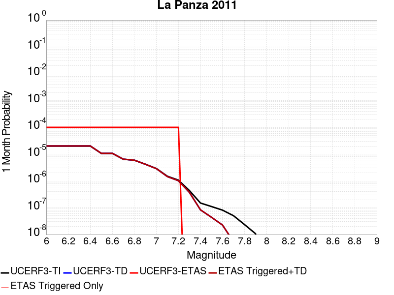 | 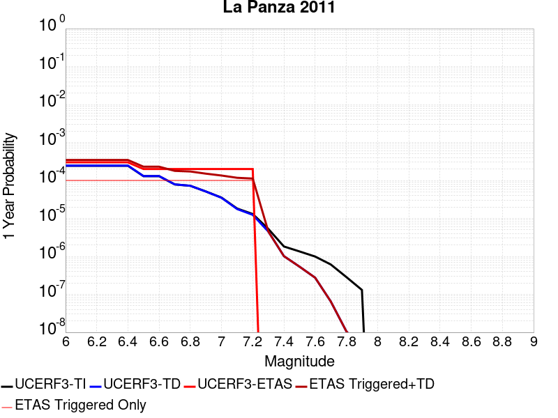 | 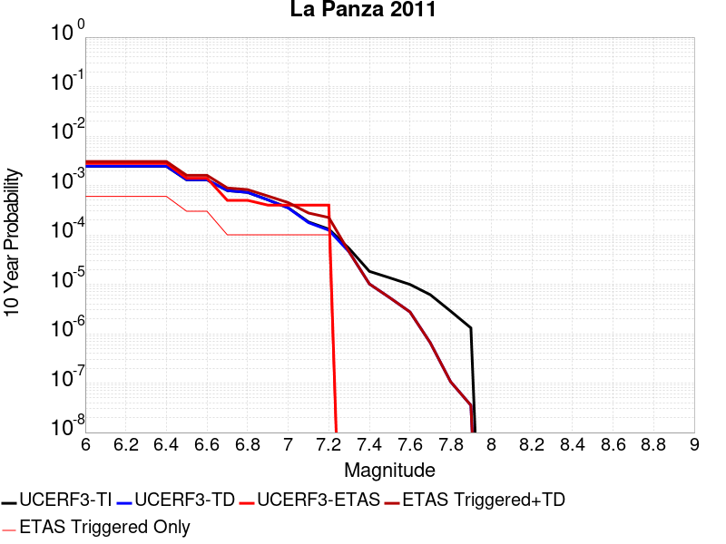 |

| Magnitude | 1 wk TI Prob | 1 wk TD Prob | 1 wk ETAS Prob | 1 wk ETAS/TD Gain | 1 wk ETAS Triggered+TD | 1 wk ETAS Triggered Only | 1 mo TI Prob | 1 mo TD Prob | 1 mo ETAS Prob | 1 mo ETAS/TD Gain | 1 mo ETAS Triggered+TD | 1 mo ETAS Triggered Only | 1 yr TI Prob | 1 yr TD Prob | 1 yr ETAS Prob | 1 yr ETAS/TD Gain | 1 yr ETAS Triggered+TD | 1 yr ETAS Triggered Only | 10 yr TI Prob | 10 yr TD Prob | 10 yr ETAS Prob | 10 yr ETAS/TD Gain | 10 yr ETAS Triggered+TD | 10 yr ETAS Triggered Only |
|-----|-----|-----|-----|-----|-----|-----|-----|-----|-----|-----|-----|-----|-----|-----|-----|-----|-----|-----|-----|-----|-----|-----|-----|-----|
| 6.0 | 4.6754544E-6 | 4.7173926E-6 | 0.0 | 0.0 | 4.7173926E-6 | 0.0 | 2.0037509E-5 | 2.0217252E-5 | 1.0E-4 | 4.9462705 | 2.0217252E-5 | 0.0 | 2.4392935E-4 | 2.4611922E-4 | 3.0E-4 | 1.2189215 | 3.460946E-4 | 1.0E-4 | 0.0024366176 | 0.0024586609 | 0.0028 | 1.1388314 | 0.0030571856 | 6.0E-4 |
| 6.1 | 4.6754544E-6 | 4.7173926E-6 | 0.0 | 0.0 | 4.7173926E-6 | 0.0 | 2.0037509E-5 | 2.0217252E-5 | 1.0E-4 | 4.9462705 | 2.0217252E-5 | 0.0 | 2.4392935E-4 | 2.4611922E-4 | 3.0E-4 | 1.2189215 | 3.460946E-4 | 1.0E-4 | 0.0024366176 | 0.0024586609 | 0.0028 | 1.1388314 | 0.0030571856 | 6.0E-4 |
| 6.2 | 4.6754544E-6 | 4.7173926E-6 | 0.0 | 0.0 | 4.7173926E-6 | 0.0 | 2.0037509E-5 | 2.0217252E-5 | 1.0E-4 | 4.9462705 | 2.0217252E-5 | 0.0 | 2.4392935E-4 | 2.4611922E-4 | 3.0E-4 | 1.2189215 | 3.460946E-4 | 1.0E-4 | 0.0024366176 | 0.0024586609 | 0.0028 | 1.1388314 | 0.0030571856 | 6.0E-4 |
| 6.3 | 4.6754544E-6 | 4.7173926E-6 | 0.0 | 0.0 | 4.7173926E-6 | 0.0 | 2.0037509E-5 | 2.0217252E-5 | 1.0E-4 | 4.9462705 | 2.0217252E-5 | 0.0 | 2.4392935E-4 | 2.4611922E-4 | 3.0E-4 | 1.2189215 | 3.460946E-4 | 1.0E-4 | 0.0024366176 | 0.0024586609 | 0.0028 | 1.1388314 | 0.0030571856 | 6.0E-4 |
| 6.4 | 4.6754544E-6 | 4.7173926E-6 | 0.0 | 0.0 | 4.7173926E-6 | 0.0 | 2.0037509E-5 | 2.0217252E-5 | 1.0E-4 | 4.9462705 | 2.0217252E-5 | 0.0 | 2.4392935E-4 | 2.4611922E-4 | 3.0E-4 | 1.2189215 | 3.460946E-4 | 1.0E-4 | 0.0024366176 | 0.0024586609 | 0.0028 | 1.1388314 | 0.0030571856 | 6.0E-4 |
| 6.5 | 2.485343E-6 | 2.5003508E-6 | 0.0 | 0.0 | 2.5003508E-6 | 0.0 | 1.0651426E-5 | 1.0715747E-5 | 1.0E-4 | 9.332061 | 1.0715747E-5 | 0.0 | 1.296734E-4 | 1.304568E-4 | 2.0E-4 | 1.5330746 | 2.3044375E-4 | 1.0E-4 | 0.0012959775 | 0.0013038405 | 0.0014 | 1.073751 | 0.0016034493 | 3.0E-4 |
| 6.6 | 2.485343E-6 | 2.5003508E-6 | 0.0 | 0.0 | 2.5003508E-6 | 0.0 | 1.0651426E-5 | 1.0715747E-5 | 1.0E-4 | 9.332061 | 1.0715747E-5 | 0.0 | 1.296734E-4 | 1.304568E-4 | 2.0E-4 | 1.5330746 | 2.3044375E-4 | 1.0E-4 | 0.0012959775 | 0.0013038405 | 0.0014 | 1.073751 | 0.0016034493 | 3.0E-4 |
| 6.7 | 1.5108508E-6 | 1.5143662E-6 | 0.0 | 0.0 | 1.5143662E-6 | 0.0 | 6.4750584E-6 | 6.4901255E-6 | 1.0E-4 | 15.408023 | 6.4901255E-6 | 0.0 | 7.8830984E-5 | 7.901452E-5 | 2.0E-4 | 2.5311804 | 1.7900662E-4 | 1.0E-4 | 7.880303E-4 | 7.898751E-4 | 5.0E-4 | 0.63301146 | 8.897961E-4 | 1.0E-4 |
| 6.8 | 1.3865837E-6 | 1.3882352E-6 | 0.0 | 0.0 | 1.3882352E-6 | 0.0 | 5.942488E-6 | 5.9495665E-6 | 1.0E-4 | 16.807947 | 5.9495665E-6 | 0.0 | 7.234739E-5 | 7.2433664E-5 | 2.0E-4 | 2.761147 | 1.7242641E-4 | 1.0E-4 | 7.232384E-4 | 7.2411034E-4 | 5.0E-4 | 0.69050246 | 8.2403794E-4 | 1.0E-4 |
| 6.9 | 9.826583E-7 | 9.793437E-7 | 0.0 | 0.0 | 9.793437E-7 | 0.0 | 4.2113857E-6 | 4.1971807E-6 | 1.0E-4 | 23.825516 | 4.1971807E-6 | 0.0 | 5.1272415E-5 | 5.1099534E-5 | 2.0E-4 | 3.91393 | 1.5109443E-4 | 1.0E-4 | 5.126059E-4 | 5.108832E-4 | 4.0E-4 | 0.7829578 | 6.108321E-4 | 1.0E-4 |
| 7.0 | 6.7797646E-7 | 6.7072864E-7 | 0.0 | 0.0 | 6.7072864E-7 | 0.0 | 2.9056102E-6 | 2.8745485E-6 | 1.0E-4 | 34.788074 | 2.8745485E-6 | 0.0 | 3.537523E-5 | 3.4997098E-5 | 2.0E-4 | 5.71476 | 1.3499359E-4 | 1.0E-4 | 3.5369597E-4 | 3.4991896E-4 | 4.0E-4 | 1.1431218 | 4.4988396E-4 | 1.0E-4 |
| 7.1 | 3.4979826E-7 | 3.3843776E-7 | 0.0 | 0.0 | 3.3843776E-7 | 0.0 | 1.4991346E-6 | 1.4504468E-6 | 1.0E-4 | 68.944275 | 1.4504468E-6 | 0.0 | 1.825181E-5 | 1.7659058E-5 | 2.0E-4 | 11.325632 | 1.1765729E-4 | 1.0E-4 | 1.825031E-4 | 1.7657771E-4 | 4.0E-4 | 2.2652915 | 2.7656005E-4 | 1.0E-4 |
| 7.2 | 2.5088332E-7 | 2.380149E-7 | 0.0 | 0.0 | 2.380149E-7 | 0.0 | 1.0752137E-6 | 1.0200636E-6 | 1.0E-4 | 98.03311 | 1.0200636E-6 | 0.0 | 1.3090649E-5 | 1.2419211E-5 | 2.0E-4 | 16.104082 | 1.1241797E-4 | 1.0E-4 | 1.3089878E-4 | 1.2418603E-4 | 4.0E-4 | 3.2209742 | 2.2417361E-4 | 1.0E-4 |
| 7.3 | 1.0159086E-7 | 8.613691E-8 | 0.0 | 0.0 | 8.613691E-8 | 0.0 | 4.3538932E-7 | 3.6915813E-7 | 0.0 | 0.0 | 3.6915813E-7 | 0.0 | 5.300852E-6 | 4.4944913E-6 | 0.0 | 0.0 | 4.4944913E-6 | 0.0 | 5.3007258E-5 | 4.4944045E-5 | 0.0 | 0.0 | 4.4944045E-5 | 0.0 |
| 7.4 | 3.5006252E-8 | 1.9312747E-8 | 0.0 | 0.0 | 1.9312747E-8 | 0.0 | 1.5002678E-7 | 8.276891E-8 | 0.0 | 0.0 | 8.276891E-8 | 0.0 | 1.8265745E-6 | 1.007711E-6 | 0.0 | 0.0 | 1.007711E-6 | 0.0 | 1.8265595E-5 | 1.0077067E-5 | 0.0 | 0.0 | 1.0077067E-5 | 0.0 |
| 7.5 | 2.592274E-8 | 1.0172897E-8 | 0.0 | 0.0 | 1.0172897E-8 | 0.0 | 1.1109746E-7 | 4.359813E-8 | 0.0 | 0.0 | 4.359813E-8 | 0.0 | 1.3526106E-6 | 5.3080714E-7 | 0.0 | 0.0 | 5.3080714E-7 | 0.0 | 1.3526024E-5 | 5.3080594E-6 | 0.0 | 0.0 | 5.3080594E-6 | 0.0 |
| 7.6 | 1.9016717E-8 | 5.2036464E-9 | 0.0 | 0.0 | 5.2036464E-9 | 0.0 | 8.150022E-8 | 2.2301341E-8 | 0.0 | 0.0 | 2.2301341E-8 | 0.0 | 9.922647E-7 | 2.7151881E-7 | 0.0 | 0.0 | 2.7151881E-7 | 0.0 | 9.922603E-6 | 2.7151848E-6 | 0.0 | 0.0 | 2.7151848E-6 | 0.0 |
| 7.7 | 1.17738495E-8 | 1.2238905E-9 | 0.0 | 0.0 | 1.2238905E-9 | 0.0 | 5.0459356E-8 | 5.245245E-9 | 0.0 | 0.0 | 5.245245E-9 | 0.0 | 6.1434247E-7 | 6.386086E-8 | 0.0 | 0.0 | 6.386086E-8 | 0.0 | 6.143408E-6 | 6.386084E-7 | 0.0 | 0.0 | 6.386084E-7 | 0.0 |
| 7.8 | 5.489079E-9 | 1.9797608E-10 | 0.0 | 0.0 | 1.9797608E-10 | 0.0 | 2.3524624E-8 | 8.484682E-10 | 0.0 | 0.0 | 8.484682E-10 | 0.0 | 2.8641225E-7 | 1.0330105E-8 | 0.0 | 0.0 | 1.0330105E-8 | 0.0 | 2.8641189E-6 | 1.0330104E-7 | 0.0 | 0.0 | 1.0330104E-7 | 0.0 |
| 7.9 | 2.5081048E-9 | 6.5780825E-11 | 0.0 | 0.0 | 6.5780825E-11 | 0.0 | 1.0749021E-8 | 2.8191782E-10 | 0.0 | 0.0 | 2.8191782E-10 | 0.0 | 1.3086932E-7 | 3.4323533E-9 | 0.0 | 0.0 | 3.4323533E-9 | 0.0 | 1.3086925E-6 | 3.432353E-8 | 0.0 | 0.0 | 3.432353E-8 | 0.0 |

## Los Alamos 2011 CFM
*[(top)](#table-of-contents)*

| 1 Week | 1 Month | 1 Year | 10 Year |
|-----|-----|-----|-----|
|  | 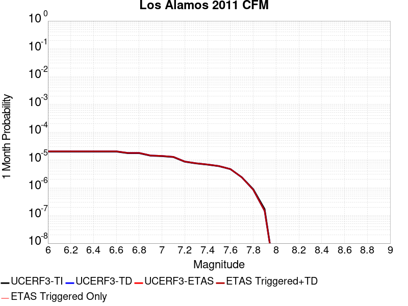 |  |  |

| Magnitude | 1 wk TI Prob | 1 wk TD Prob | 1 wk ETAS Prob | 1 wk ETAS/TD Gain | 1 wk ETAS Triggered+TD | 1 wk ETAS Triggered Only | 1 mo TI Prob | 1 mo TD Prob | 1 mo ETAS Prob | 1 mo ETAS/TD Gain | 1 mo ETAS Triggered+TD | 1 mo ETAS Triggered Only | 1 yr TI Prob | 1 yr TD Prob | 1 yr ETAS Prob | 1 yr ETAS/TD Gain | 1 yr ETAS Triggered+TD | 1 yr ETAS Triggered Only | 10 yr TI Prob | 10 yr TD Prob | 10 yr ETAS Prob | 10 yr ETAS/TD Gain | 10 yr ETAS Triggered+TD | 10 yr ETAS Triggered Only |
|-----|-----|-----|-----|-----|-----|-----|-----|-----|-----|-----|-----|-----|-----|-----|-----|-----|-----|-----|-----|-----|-----|-----|-----|-----|
| 6.0 | 4.6284417E-6 | 4.7520602E-6 | 0.0 | 0.0 | 4.7520602E-6 | 0.0 | 1.9836029E-5 | 2.0365824E-5 | 0.0 | 0.0 | 2.0365824E-5 | 0.0 | 2.4147688E-4 | 2.4792744E-4 | 1.0E-4 | 0.40334383 | 2.4792744E-4 | 0.0 | 0.0024121467 | 0.0024766827 | 0.0027 | 1.0901679 | 0.0030751966 | 6.0E-4 |
| 6.1 | 4.6284417E-6 | 4.7520602E-6 | 0.0 | 0.0 | 4.7520602E-6 | 0.0 | 1.9836029E-5 | 2.0365824E-5 | 0.0 | 0.0 | 2.0365824E-5 | 0.0 | 2.4147688E-4 | 2.4792744E-4 | 1.0E-4 | 0.40334383 | 2.4792744E-4 | 0.0 | 0.0024121467 | 0.0024766827 | 0.0027 | 1.0901679 | 0.0030751966 | 6.0E-4 |
| 6.2 | 4.6284417E-6 | 4.7520602E-6 | 0.0 | 0.0 | 4.7520602E-6 | 0.0 | 1.9836029E-5 | 2.0365824E-5 | 0.0 | 0.0 | 2.0365824E-5 | 0.0 | 2.4147688E-4 | 2.4792744E-4 | 1.0E-4 | 0.40334383 | 2.4792744E-4 | 0.0 | 0.0024121467 | 0.0024766827 | 0.0027 | 1.0901679 | 0.0030751966 | 6.0E-4 |
| 6.3 | 4.6284417E-6 | 4.7520602E-6 | 0.0 | 0.0 | 4.7520602E-6 | 0.0 | 1.9836029E-5 | 2.0365824E-5 | 0.0 | 0.0 | 2.0365824E-5 | 0.0 | 2.4147688E-4 | 2.4792744E-4 | 1.0E-4 | 0.40334383 | 2.4792744E-4 | 0.0 | 0.0024121467 | 0.0024766827 | 0.0027 | 1.0901679 | 0.0030751966 | 6.0E-4 |
| 6.4 | 4.6284417E-6 | 4.7520602E-6 | 0.0 | 0.0 | 4.7520602E-6 | 0.0 | 1.9836029E-5 | 2.0365824E-5 | 0.0 | 0.0 | 2.0365824E-5 | 0.0 | 2.4147688E-4 | 2.4792744E-4 | 1.0E-4 | 0.40334383 | 2.4792744E-4 | 0.0 | 0.0024121467 | 0.0024766827 | 0.0027 | 1.0901679 | 0.0030751966 | 6.0E-4 |
| 6.5 | 4.6284417E-6 | 4.7520602E-6 | 0.0 | 0.0 | 4.7520602E-6 | 0.0 | 1.9836029E-5 | 2.0365824E-5 | 0.0 | 0.0 | 2.0365824E-5 | 0.0 | 2.4147688E-4 | 2.4792744E-4 | 1.0E-4 | 0.40334383 | 2.4792744E-4 | 0.0 | 0.0024121467 | 0.0024766827 | 0.0027 | 1.0901679 | 0.0030751966 | 6.0E-4 |
| 6.6 | 4.6284417E-6 | 4.7520602E-6 | 0.0 | 0.0 | 4.7520602E-6 | 0.0 | 1.9836029E-5 | 2.0365824E-5 | 0.0 | 0.0 | 2.0365824E-5 | 0.0 | 2.4147688E-4 | 2.4792744E-4 | 1.0E-4 | 0.40334383 | 2.4792744E-4 | 0.0 | 0.0024121467 | 0.0024766827 | 0.0027 | 1.0901679 | 0.0030751966 | 6.0E-4 |
| 6.7 | 4.062321E-6 | 4.166638E-6 | 0.0 | 0.0 | 4.166638E-6 | 0.0 | 1.7409831E-5 | 1.7856908E-5 | 0.0 | 0.0 | 1.7856908E-5 | 0.0 | 2.1194408E-4 | 2.1738767E-4 | 1.0E-4 | 0.4600077 | 2.1738767E-4 | 0.0 | 0.0021174205 | 0.0021719 | 0.0024 | 1.1050233 | 0.002670814 | 5.0E-4 |
| 6.8 | 4.062321E-6 | 4.166638E-6 | 0.0 | 0.0 | 4.166638E-6 | 0.0 | 1.7409831E-5 | 1.7856908E-5 | 0.0 | 0.0 | 1.7856908E-5 | 0.0 | 2.1194408E-4 | 2.1738767E-4 | 1.0E-4 | 0.4600077 | 2.1738767E-4 | 0.0 | 0.0021174205 | 0.0021719 | 0.0024 | 1.1050233 | 0.002670814 | 5.0E-4 |
| 6.9 | 3.2936077E-6 | 3.3731967E-6 | 0.0 | 0.0 | 3.3731967E-6 | 0.0 | 1.4115385E-5 | 1.4456483E-5 | 0.0 | 0.0 | 1.4456483E-5 | 0.0 | 1.7184127E-4 | 1.759944E-4 | 1.0E-4 | 0.5681999 | 1.759944E-4 | 0.0 | 0.0017170844 | 0.0017586428 | 0.0021 | 1.1941026 | 0.0021579394 | 4.0E-4 |
| 7.0 | 3.1687898E-6 | 3.2450478E-6 | 0.0 | 0.0 | 3.2450478E-6 | 0.0 | 1.3580457E-5 | 1.3907278E-5 | 0.0 | 0.0 | 1.3907278E-5 | 0.0 | 1.6532952E-4 | 1.6930889E-4 | 0.0 | 0.0 | 1.6930889E-4 | 0.0 | 0.0016520657 | 0.0016918905 | 0.002 | 1.1821096 | 0.0020912138 | 4.0E-4 |
| 7.1 | 2.9379228E-6 | 3.0075444E-6 | 0.0 | 0.0 | 3.0075444E-6 | 0.0 | 1.25910365E-5 | 1.2889418E-5 | 0.0 | 0.0 | 1.2889418E-5 | 0.0 | 1.5328509E-4 | 1.5691826E-4 | 0.0 | 0.0 | 1.5691826E-4 | 0.0 | 0.001531794 | 0.0015681637 | 0.0019 | 1.2116082 | 0.0018676934 | 3.0E-4 |
| 7.2 | 2.0020686E-6 | 2.0417874E-6 | 0.0 | 0.0 | 2.0417874E-6 | 0.0 | 8.580266E-6 | 8.750488E-6 | 0.0 | 0.0 | 8.750488E-6 | 0.0 | 1.0445973E-4 | 1.0653203E-4 | 0.0 | 0.0 | 1.0653203E-4 | 0.0 | 0.0010441064 | 0.001064814 | 7.0E-4 | 0.6573918 | 0.0011647076 | 1.0E-4 |
| 7.3 | 1.7364243E-6 | 1.7680212E-6 | 0.0 | 0.0 | 1.7680212E-6 | 0.0 | 7.441797E-6 | 7.577212E-6 | 0.0 | 0.0 | 7.577212E-6 | 0.0 | 9.0600115E-5 | 9.224868E-5 | 0.0 | 0.0 | 9.224868E-5 | 0.0 | 9.0563187E-4 | 9.22107E-4 | 7.0E-4 | 0.75913095 | 0.0010220149 | 1.0E-4 |
| 7.4 | 1.5718434E-6 | 1.5984484E-6 | 0.0 | 0.0 | 1.5984484E-6 | 0.0 | 6.7364545E-6 | 6.8504755E-6 | 0.0 | 0.0 | 6.8504755E-6 | 0.0 | 8.201325E-5 | 8.340138E-5 | 0.0 | 0.0 | 8.340138E-5 | 0.0 | 8.198299E-4 | 8.337038E-4 | 6.0E-4 | 0.7196801 | 9.336204E-4 | 1.0E-4 |
| 7.5 | 1.3841119E-6 | 1.404397E-6 | 0.0 | 0.0 | 1.404397E-6 | 0.0 | 5.9318945E-6 | 6.018831E-6 | 0.0 | 0.0 | 6.018831E-6 | 0.0 | 7.221842E-5 | 7.327683E-5 | 0.0 | 0.0 | 7.327683E-5 | 0.0 | 7.2194956E-4 | 7.3252956E-4 | 6.0E-4 | 0.8190796 | 8.3245634E-4 | 1.0E-4 |
| 7.6 | 1.0843726E-6 | 1.0935371E-6 | 0.0 | 0.0 | 1.0935371E-6 | 0.0 | 4.647303E-6 | 4.6865794E-6 | 0.0 | 0.0 | 4.6865794E-6 | 0.0 | 5.6579443E-5 | 5.7057634E-5 | 0.0 | 0.0 | 5.7057634E-5 | 0.0 | 5.656504E-4 | 5.7043246E-4 | 4.0E-4 | 0.7012224 | 6.703754E-4 | 1.0E-4 |
| 7.7 | 5.544814E-7 | 5.5023645E-7 | 0.0 | 0.0 | 5.5023645E-7 | 0.0 | 2.3763469E-6 | 2.358154E-6 | 0.0 | 0.0 | 2.358154E-6 | 0.0 | 2.8931638E-5 | 2.871015E-5 | 0.0 | 0.0 | 2.871015E-5 | 0.0 | 2.8927872E-4 | 2.8706455E-4 | 3.0E-4 | 1.0450611 | 3.8703586E-4 | 1.0E-4 |
| 7.8 | 2.0707465E-7 | 1.978044E-7 | 0.0 | 0.0 | 1.978044E-7 | 0.0 | 8.874625E-7 | 8.4773285E-7 | 0.0 | 0.0 | 8.4773285E-7 | 0.0 | 1.08048025E-5 | 1.03211E-5 | 0.0 | 0.0 | 1.03211E-5 | 0.0 | 1.0804277E-4 | 1.0320624E-4 | 2.0E-4 | 1.9378673 | 2.0319592E-4 | 1.0E-4 |
| 7.9 | 3.9821284E-8 | 3.433498E-8 | 0.0 | 0.0 | 3.433498E-8 | 0.0 | 1.7066264E-7 | 1.471499E-7 | 0.0 | 0.0 | 1.471499E-7 | 0.0 | 2.0778157E-6 | 1.7915487E-6 | 0.0 | 0.0 | 1.7915487E-6 | 0.0 | 2.0777963E-5 | 1.7915349E-5 | 1.0E-4 | 5.581806 | 1.7915349E-5 | 0.0 |
| 8.0 | 7.880441E-11 | 8.236045E-11 | 0.0 | 0.0 | 8.236045E-11 | 0.0 | 3.3773329E-10 | 3.5297354E-10 | 0.0 | 0.0 | 3.5297354E-10 | 0.0 | 4.1119033E-9 | 4.297453E-9 | 0.0 | 0.0 | 4.297453E-9 | 0.0 | 4.1119034E-8 | 4.2974534E-8 | 0.0 | 0.0 | 4.2974534E-8 | 0.0 |

## Independence rev 2011
*[(top)](#table-of-contents)*

| 1 Week | 1 Month | 1 Year | 10 Year |
|-----|-----|-----|-----|
| 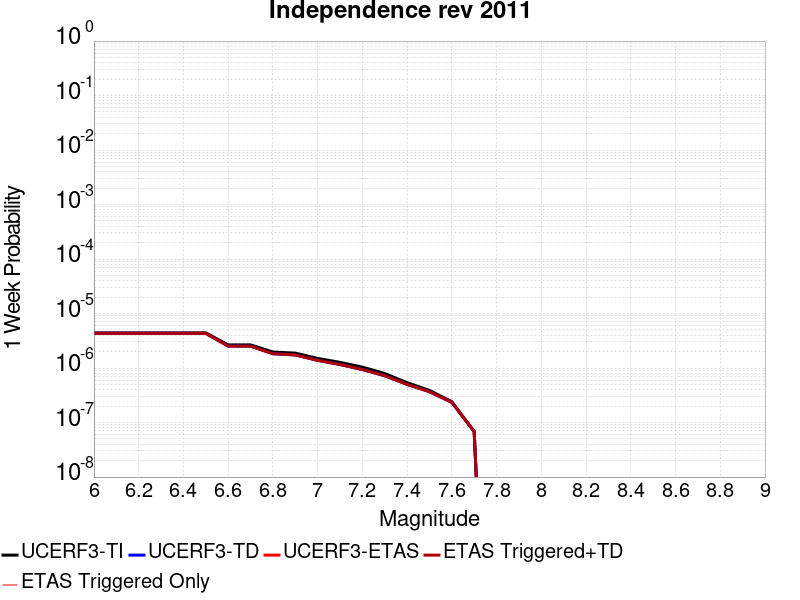 |  |  | 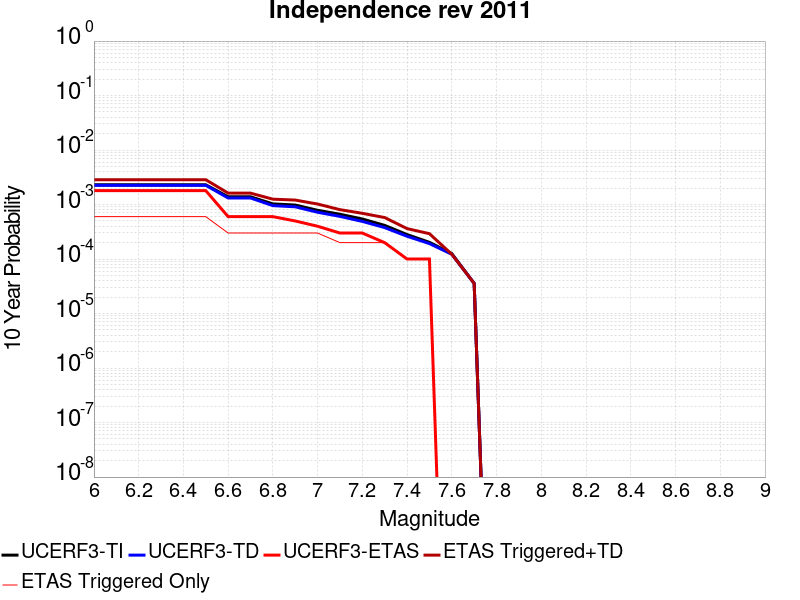 |

| Magnitude | 1 wk TI Prob | 1 wk TD Prob | 1 wk ETAS Prob | 1 wk ETAS/TD Gain | 1 wk ETAS Triggered+TD | 1 wk ETAS Triggered Only | 1 mo TI Prob | 1 mo TD Prob | 1 mo ETAS Prob | 1 mo ETAS/TD Gain | 1 mo ETAS Triggered+TD | 1 mo ETAS Triggered Only | 1 yr TI Prob | 1 yr TD Prob | 1 yr ETAS Prob | 1 yr ETAS/TD Gain | 1 yr ETAS Triggered+TD | 1 yr ETAS Triggered Only | 10 yr TI Prob | 10 yr TD Prob | 10 yr ETAS Prob | 10 yr ETAS/TD Gain | 10 yr ETAS Triggered+TD | 10 yr ETAS Triggered Only |
|-----|-----|-----|-----|-----|-----|-----|-----|-----|-----|-----|-----|-----|-----|-----|-----|-----|-----|-----|-----|-----|-----|-----|-----|-----|
| 6.0 | 4.422171E-6 | 4.326399E-6 | 0.0 | 0.0 | 4.326399E-6 | 0.0 | 1.8952025E-5 | 1.8541594E-5 | 1.0E-4 | 5.3932796 | 1.8541594E-5 | 0.0 | 2.3071647E-4 | 2.257235E-4 | 1.0E-4 | 0.44301987 | 2.257235E-4 | 0.0 | 0.0023047708 | 0.002255236 | 0.0018 | 0.7981426 | 0.002853883 | 6.0E-4 |
| 6.1 | 4.422171E-6 | 4.326399E-6 | 0.0 | 0.0 | 4.326399E-6 | 0.0 | 1.8952025E-5 | 1.8541594E-5 | 1.0E-4 | 5.3932796 | 1.8541594E-5 | 0.0 | 2.3071647E-4 | 2.257235E-4 | 1.0E-4 | 0.44301987 | 2.257235E-4 | 0.0 | 0.0023047708 | 0.002255236 | 0.0018 | 0.7981426 | 0.002853883 | 6.0E-4 |
| 6.2 | 4.422171E-6 | 4.326399E-6 | 0.0 | 0.0 | 4.326399E-6 | 0.0 | 1.8952025E-5 | 1.8541594E-5 | 1.0E-4 | 5.3932796 | 1.8541594E-5 | 0.0 | 2.3071647E-4 | 2.257235E-4 | 1.0E-4 | 0.44301987 | 2.257235E-4 | 0.0 | 0.0023047708 | 0.002255236 | 0.0018 | 0.7981426 | 0.002853883 | 6.0E-4 |
| 6.3 | 4.422171E-6 | 4.326399E-6 | 0.0 | 0.0 | 4.326399E-6 | 0.0 | 1.8952025E-5 | 1.8541594E-5 | 1.0E-4 | 5.3932796 | 1.8541594E-5 | 0.0 | 2.3071647E-4 | 2.257235E-4 | 1.0E-4 | 0.44301987 | 2.257235E-4 | 0.0 | 0.0023047708 | 0.002255236 | 0.0018 | 0.7981426 | 0.002853883 | 6.0E-4 |
| 6.4 | 4.422171E-6 | 4.326399E-6 | 0.0 | 0.0 | 4.326399E-6 | 0.0 | 1.8952025E-5 | 1.8541594E-5 | 1.0E-4 | 5.3932796 | 1.8541594E-5 | 0.0 | 2.3071647E-4 | 2.257235E-4 | 1.0E-4 | 0.44301987 | 2.257235E-4 | 0.0 | 0.0023047708 | 0.002255236 | 0.0018 | 0.7981426 | 0.002853883 | 6.0E-4 |
| 6.5 | 4.422171E-6 | 4.326399E-6 | 0.0 | 0.0 | 4.326399E-6 | 0.0 | 1.8952025E-5 | 1.8541594E-5 | 1.0E-4 | 5.3932796 | 1.8541594E-5 | 0.0 | 2.3071647E-4 | 2.257235E-4 | 1.0E-4 | 0.44301987 | 2.257235E-4 | 0.0 | 0.0023047708 | 0.002255236 | 0.0018 | 0.7981426 | 0.002853883 | 6.0E-4 |
| 6.6 | 2.663744E-6 | 2.5320855E-6 | 0.0 | 0.0 | 2.5320855E-6 | 0.0 | 1.1415996E-5 | 1.0851752E-5 | 0.0 | 0.0 | 1.0851752E-5 | 0.0 | 1.3898089E-4 | 1.3211256E-4 | 0.0 | 0.0 | 1.3211256E-4 | 0.0 | 0.0013889399 | 0.0013203885 | 6.0E-4 | 0.45441172 | 0.0016199924 | 3.0E-4 |
| 6.7 | 2.663744E-6 | 2.5320855E-6 | 0.0 | 0.0 | 2.5320855E-6 | 0.0 | 1.1415996E-5 | 1.0851752E-5 | 0.0 | 0.0 | 1.0851752E-5 | 0.0 | 1.3898089E-4 | 1.3211256E-4 | 0.0 | 0.0 | 1.3211256E-4 | 0.0 | 0.0013889399 | 0.0013203885 | 6.0E-4 | 0.45441172 | 0.0016199924 | 3.0E-4 |
| 6.8 | 1.9716529E-6 | 1.8323317E-6 | 0.0 | 0.0 | 1.8323317E-6 | 0.0 | 8.449913E-6 | 7.852827E-6 | 0.0 | 0.0 | 7.852827E-6 | 0.0 | 1.0287284E-4 | 9.5604104E-5 | 0.0 | 0.0 | 9.5604104E-5 | 0.0 | 0.0010282523 | 9.5564267E-4 | 6.0E-4 | 0.62784976 | 0.001255356 | 3.0E-4 |
| 6.9 | 1.8788617E-6 | 1.743069E-6 | 0.0 | 0.0 | 1.743069E-6 | 0.0 | 8.0522395E-6 | 7.4702752E-6 | 0.0 | 0.0 | 7.4702752E-6 | 0.0 | 9.80316E-5 | 9.094692E-5 | 0.0 | 0.0 | 9.094692E-5 | 0.0 | 9.798837E-4 | 9.091091E-4 | 5.0E-4 | 0.549989 | 0.0012088363 | 3.0E-4 |
| 7.0 | 1.5045488E-6 | 1.3850065E-6 | 0.0 | 0.0 | 1.3850065E-6 | 0.0 | 6.44805E-6 | 5.935729E-6 | 0.0 | 0.0 | 5.935729E-6 | 0.0 | 7.8502184E-5 | 7.226515E-5 | 0.0 | 0.0 | 7.226515E-5 | 0.0 | 7.8474457E-4 | 7.224217E-4 | 4.0E-4 | 0.55369323 | 0.001022205 | 3.0E-4 |
| 7.1 | 1.272341E-6 | 1.1625575E-6 | 0.0 | 0.0 | 1.1625575E-6 | 0.0 | 5.4528787E-6 | 4.98238E-6 | 0.0 | 0.0 | 4.98238E-6 | 0.0 | 6.6386776E-5 | 6.065882E-5 | 0.0 | 0.0 | 6.065882E-5 | 0.0 | 6.636695E-4 | 6.064258E-4 | 3.0E-4 | 0.4947019 | 8.0630457E-4 | 2.0E-4 |
| 7.2 | 1.0416892E-6 | 9.4102796E-7 | 0.0 | 0.0 | 9.4102796E-7 | 0.0 | 4.464375E-6 | 4.0329705E-6 | 0.0 | 0.0 | 4.0329705E-6 | 0.0 | 5.4352407E-5 | 4.910033E-5 | 0.0 | 0.0 | 4.910033E-5 | 0.0 | 5.4339116E-4 | 4.908967E-4 | 3.0E-4 | 0.61112654 | 6.907985E-4 | 2.0E-4 |
| 7.3 | 7.9450155E-7 | 7.235321E-7 | 0.0 | 0.0 | 7.235321E-7 | 0.0 | 3.4050022E-6 | 3.1008483E-6 | 0.0 | 0.0 | 3.1008483E-6 | 0.0 | 4.1455114E-5 | 3.7752183E-5 | 0.0 | 0.0 | 3.7752183E-5 | 0.0 | 4.144738E-4 | 3.774588E-4 | 2.0E-4 | 0.5298591 | 5.773833E-4 | 2.0E-4 |
| 7.4 | 5.3893444E-7 | 5.01973E-7 | 0.0 | 0.0 | 5.01973E-7 | 0.0 | 2.309717E-6 | 2.151311E-6 | 0.0 | 0.0 | 2.151311E-6 | 0.0 | 2.8120441E-5 | 2.6191901E-5 | 0.0 | 0.0 | 2.6191901E-5 | 0.0 | 2.8116882E-4 | 2.618886E-4 | 1.0E-4 | 0.38184175 | 3.6186242E-4 | 1.0E-4 |
| 7.5 | 3.8852085E-7 | 3.6827186E-7 | 0.0 | 0.0 | 3.6827186E-7 | 0.0 | 1.6650882E-6 | 1.578307E-6 | 0.0 | 0.0 | 1.578307E-6 | 0.0 | 2.027226E-5 | 1.921572E-5 | 0.0 | 0.0 | 1.921572E-5 | 0.0 | 2.0270412E-4 | 1.9214081E-4 | 1.0E-4 | 0.52045166 | 2.9212158E-4 | 1.0E-4 |
| 7.6 | 2.414929E-7 | 2.3458593E-7 | 0.0 | 0.0 | 2.3458593E-7 | 0.0 | 1.0349692E-6 | 1.0053678E-6 | 0.0 | 0.0 | 1.0053678E-6 | 0.0 | 1.2600677E-5 | 1.2240286E-5 | 0.0 | 0.0 | 1.2240286E-5 | 0.0 | 1.2599962E-4 | 1.2239625E-4 | 0.0 | 0.0 | 1.2239625E-4 | 0.0 |
| 7.7 | 6.8298014E-8 | 6.859264E-8 | 0.0 | 0.0 | 6.859264E-8 | 0.0 | 2.9270575E-7 | 2.9396844E-7 | 0.0 | 0.0 | 2.9396844E-7 | 0.0 | 3.5636867E-6 | 3.5790601E-6 | 0.0 | 0.0 | 3.5790601E-6 | 0.0 | 3.5636294E-5 | 3.5790075E-5 | 0.0 | 0.0 | 3.5790075E-5 | 0.0 |

## San Gabriel (Extension)
*[(top)](#table-of-contents)*

| 1 Week | 1 Month | 1 Year | 10 Year |
|-----|-----|-----|-----|
|  | 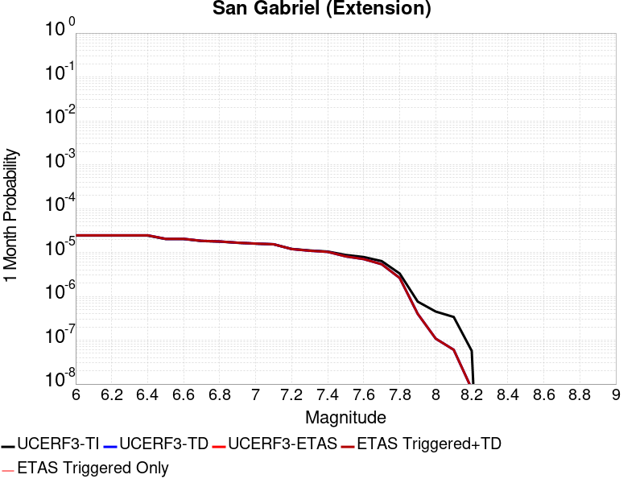 | 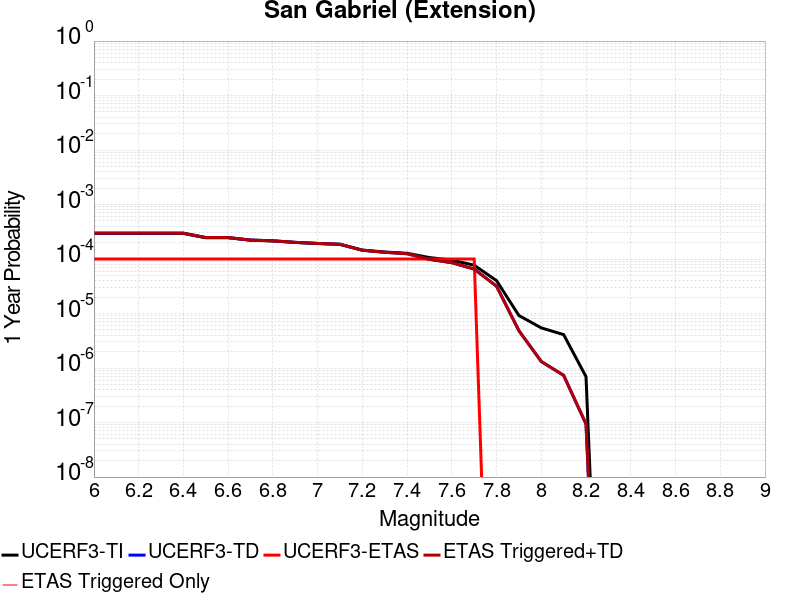 | 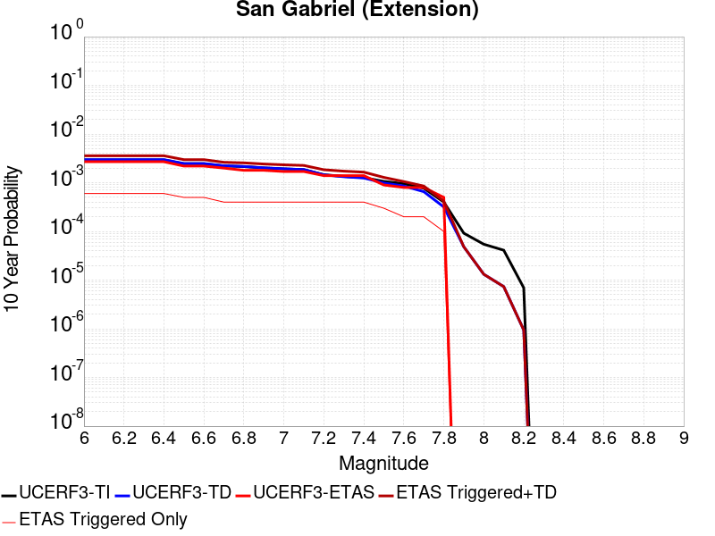 |

| Magnitude | 1 wk TI Prob | 1 wk TD Prob | 1 wk ETAS Prob | 1 wk ETAS/TD Gain | 1 wk ETAS Triggered+TD | 1 wk ETAS Triggered Only | 1 mo TI Prob | 1 mo TD Prob | 1 mo ETAS Prob | 1 mo ETAS/TD Gain | 1 mo ETAS Triggered+TD | 1 mo ETAS Triggered Only | 1 yr TI Prob | 1 yr TD Prob | 1 yr ETAS Prob | 1 yr ETAS/TD Gain | 1 yr ETAS Triggered+TD | 1 yr ETAS Triggered Only | 10 yr TI Prob | 10 yr TD Prob | 10 yr ETAS Prob | 10 yr ETAS/TD Gain | 10 yr ETAS Triggered+TD | 10 yr ETAS Triggered Only |
|-----|-----|-----|-----|-----|-----|-----|-----|-----|-----|-----|-----|-----|-----|-----|-----|-----|-----|-----|-----|-----|-----|-----|-----|-----|
| 6.0 | 5.6486106E-6 | 5.7198044E-6 | 0.0 | 0.0 | 5.7198044E-6 | 0.0 | 2.4208108E-5 | 2.4513223E-5 | 0.0 | 0.0 | 2.4513223E-5 | 0.0 | 2.9469383E-4 | 2.984089E-4 | 1.0E-4 | 0.33511066 | 2.984089E-4 | 0.0 | 0.0029430336 | 0.0029802145 | 0.0027 | 0.90597504 | 0.0035784263 | 6.0E-4 |
| 6.1 | 5.6486106E-6 | 5.7198044E-6 | 0.0 | 0.0 | 5.7198044E-6 | 0.0 | 2.4208108E-5 | 2.4513223E-5 | 0.0 | 0.0 | 2.4513223E-5 | 0.0 | 2.9469383E-4 | 2.984089E-4 | 1.0E-4 | 0.33511066 | 2.984089E-4 | 0.0 | 0.0029430336 | 0.0029802145 | 0.0027 | 0.90597504 | 0.0035784263 | 6.0E-4 |
| 6.2 | 5.6486106E-6 | 5.7198044E-6 | 0.0 | 0.0 | 5.7198044E-6 | 0.0 | 2.4208108E-5 | 2.4513223E-5 | 0.0 | 0.0 | 2.4513223E-5 | 0.0 | 2.9469383E-4 | 2.984089E-4 | 1.0E-4 | 0.33511066 | 2.984089E-4 | 0.0 | 0.0029430336 | 0.0029802145 | 0.0027 | 0.90597504 | 0.0035784263 | 6.0E-4 |
| 6.3 | 5.6486106E-6 | 5.7198044E-6 | 0.0 | 0.0 | 5.7198044E-6 | 0.0 | 2.4208108E-5 | 2.4513223E-5 | 0.0 | 0.0 | 2.4513223E-5 | 0.0 | 2.9469383E-4 | 2.984089E-4 | 1.0E-4 | 0.33511066 | 2.984089E-4 | 0.0 | 0.0029430336 | 0.0029802145 | 0.0027 | 0.90597504 | 0.0035784263 | 6.0E-4 |
| 6.4 | 5.6486106E-6 | 5.7198044E-6 | 0.0 | 0.0 | 5.7198044E-6 | 0.0 | 2.4208108E-5 | 2.4513223E-5 | 0.0 | 0.0 | 2.4513223E-5 | 0.0 | 2.9469383E-4 | 2.984089E-4 | 1.0E-4 | 0.33511066 | 2.984089E-4 | 0.0 | 0.0029430336 | 0.0029802145 | 0.0027 | 0.90597504 | 0.0035784263 | 6.0E-4 |
| 6.5 | 4.7134554E-6 | 4.7571725E-6 | 0.0 | 0.0 | 4.7571725E-6 | 0.0 | 2.0200367E-5 | 2.0387726E-5 | 0.0 | 0.0 | 2.0387726E-5 | 0.0 | 2.459117E-4 | 2.4819316E-4 | 1.0E-4 | 0.402912 | 2.4819316E-4 | 0.0 | 0.0024563975 | 0.00247925 | 0.0022 | 0.88736516 | 0.0029780103 | 5.0E-4 |
| 6.6 | 4.7134554E-6 | 4.7571725E-6 | 0.0 | 0.0 | 4.7571725E-6 | 0.0 | 2.0200367E-5 | 2.0387726E-5 | 0.0 | 0.0 | 2.0387726E-5 | 0.0 | 2.459117E-4 | 2.4819316E-4 | 1.0E-4 | 0.402912 | 2.4819316E-4 | 0.0 | 0.0024563975 | 0.00247925 | 0.0022 | 0.88736516 | 0.0029780103 | 5.0E-4 |
| 6.7 | 4.2468837E-6 | 4.276962E-6 | 0.0 | 0.0 | 4.276962E-6 | 0.0 | 1.8200803E-5 | 1.8329712E-5 | 0.0 | 0.0 | 1.8329712E-5 | 0.0 | 2.2157225E-4 | 2.2314212E-4 | 1.0E-4 | 0.44814488 | 2.2314212E-4 | 0.0 | 0.0022135144 | 0.0022292587 | 0.002 | 0.8971593 | 0.002628367 | 4.0E-4 |
| 6.8 | 4.1180615E-6 | 4.1443436E-6 | 0.0 | 0.0 | 4.1443436E-6 | 0.0 | 1.7648716E-5 | 1.7761357E-5 | 0.0 | 0.0 | 1.7761357E-5 | 0.0 | 2.1485193E-4 | 2.1622378E-4 | 1.0E-4 | 0.46248382 | 2.1622378E-4 | 0.0 | 0.0021464431 | 0.002160211 | 0.0018 | 0.8332519 | 0.002559347 | 4.0E-4 |
| 6.9 | 3.863861E-6 | 3.882644E-6 | 0.0 | 0.0 | 3.882644E-6 | 0.0 | 1.65593E-5 | 1.66398E-5 | 0.0 | 0.0 | 1.66398E-5 | 0.0 | 2.0159081E-4 | 2.025714E-4 | 1.0E-4 | 0.49365306 | 2.025714E-4 | 0.0 | 0.0020140803 | 0.0020239411 | 0.0018 | 0.88935393 | 0.0024231316 | 4.0E-4 |
| 7.0 | 3.6947372E-6 | 3.7085329E-6 | 0.0 | 0.0 | 3.7085329E-6 | 0.0 | 1.5834492E-5 | 1.589362E-5 | 0.0 | 0.0 | 1.589362E-5 | 0.0 | 1.9276788E-4 | 1.934883E-4 | 1.0E-4 | 0.5168271 | 1.934883E-4 | 0.0 | 0.0019260074 | 0.0019332707 | 0.0017 | 0.8793388 | 0.0023324974 | 4.0E-4 |
| 7.1 | 3.5686835E-6 | 3.5757373E-6 | 0.0 | 0.0 | 3.5757373E-6 | 0.0 | 1.5294268E-5 | 1.5324502E-5 | 0.0 | 0.0 | 1.5324502E-5 | 0.0 | 1.861918E-4 | 1.8656052E-4 | 1.0E-4 | 0.5360191 | 1.8656052E-4 | 0.0 | 0.0018603588 | 0.0018641107 | 0.0017 | 0.911963 | 0.002263365 | 4.0E-4 |
| 7.2 | 2.8023446E-6 | 2.7795616E-6 | 0.0 | 0.0 | 2.7795616E-6 | 0.0 | 1.2009994E-5 | 1.1912352E-5 | 0.0 | 0.0 | 1.1912352E-5 | 0.0 | 1.4621185E-4 | 1.4502335E-4 | 1.0E-4 | 0.68954414 | 1.4502335E-4 | 0.0 | 0.001461157 | 0.0014493038 | 0.0014 | 0.965981 | 0.0018487241 | 4.0E-4 |
| 7.3 | 2.5843012E-6 | 2.5486918E-6 | 0.0 | 0.0 | 2.5486918E-6 | 0.0 | 1.1075529E-5 | 1.09229195E-5 | 0.0 | 0.0 | 1.09229195E-5 | 0.0 | 1.3483623E-4 | 1.3297853E-4 | 1.0E-4 | 0.7520011 | 1.3297853E-4 | 0.0 | 0.0013475444 | 0.0013290052 | 0.0014 | 1.0534195 | 0.0017284736 | 4.0E-4 |
| 7.4 | 2.4464468E-6 | 2.3993277E-6 | 0.0 | 0.0 | 2.3993277E-6 | 0.0 | 1.04847295E-5 | 1.0282793E-5 | 0.0 | 0.0 | 1.0282793E-5 | 0.0 | 1.276441E-4 | 1.251859E-4 | 1.0E-4 | 0.798812 | 1.251859E-4 | 0.0 | 0.0012757082 | 0.0012511694 | 0.0014 | 1.1189532 | 0.0016506689 | 4.0E-4 |
| 7.5 | 2.0420266E-6 | 1.8931825E-6 | 0.0 | 0.0 | 1.8931825E-6 | 0.0 | 8.751514E-6 | 8.113614E-6 | 0.0 | 0.0 | 8.113614E-6 | 0.0 | 1.0654447E-4 | 9.877881E-5 | 1.0E-4 | 1.012363 | 9.877881E-5 | 0.0 | 0.001064934 | 9.873583E-4 | 9.0E-4 | 0.9115232 | 0.0012870621 | 3.0E-4 |
| 7.6 | 1.8326596E-6 | 1.6417191E-6 | 0.0 | 0.0 | 1.6417191E-6 | 0.0 | 7.854232E-6 | 7.03592E-6 | 0.0 | 0.0 | 7.03592E-6 | 0.0 | 9.562107E-5 | 8.565898E-5 | 1.0E-4 | 1.1674199 | 8.565898E-5 | 0.0 | 9.5579936E-4 | 8.562676E-4 | 8.0E-4 | 0.9342874 | 0.0010560963 | 2.0E-4 |
| 7.7 | 1.4786998E-6 | 1.2539679E-6 | 0.0 | 0.0 | 1.2539679E-6 | 0.0 | 6.3372695E-6 | 5.3741373E-6 | 0.0 | 0.0 | 5.3741373E-6 | 0.0 | 7.715353E-5 | 6.542817E-5 | 1.0E-4 | 1.5283937 | 6.542817E-5 | 0.0 | 7.7126746E-4 | 6.5409654E-4 | 8.0E-4 | 1.2230611 | 8.5396576E-4 | 2.0E-4 |
| 7.8 | 7.6975533E-7 | 6.0803825E-7 | 0.0 | 0.0 | 6.0803825E-7 | 0.0 | 3.2989474E-6 | 2.6058756E-6 | 0.0 | 0.0 | 2.6058756E-6 | 0.0 | 4.0163945E-5 | 3.1726075E-5 | 0.0 | 0.0 | 3.1726075E-5 | 0.0 | 4.0156685E-4 | 3.172211E-4 | 5.0E-4 | 1.5761876 | 4.1718938E-4 | 1.0E-4 |
| 7.9 | 1.7645915E-7 | 9.2184024E-8 | 0.0 | 0.0 | 9.2184024E-8 | 0.0 | 7.562533E-7 | 3.9507432E-7 | 0.0 | 0.0 | 3.9507432E-7 | 0.0 | 9.207345E-6 | 4.810019E-6 | 0.0 | 0.0 | 4.810019E-6 | 0.0 | 9.206964E-5 | 4.8104106E-5 | 0.0 | 0.0 | 4.8104106E-5 | 0.0 |
| 8.0 | 1.0463461E-7 | 2.4909074E-8 | 0.0 | 0.0 | 2.4909074E-8 | 0.0 | 4.4843398E-7 | 1.0675317E-7 | 0.0 | 0.0 | 1.0675317E-7 | 0.0 | 5.45967E-6 | 1.2997191E-6 | 0.0 | 0.0 | 1.2997191E-6 | 0.0 | 5.459536E-5 | 1.30020635E-5 | 0.0 | 0.0 | 1.30020635E-5 | 0.0 |
| 8.1 | 7.875717E-8 | 1.3838826E-8 | 0.0 | 0.0 | 1.3838826E-8 | 0.0 | 3.3753068E-7 | 5.9309254E-8 | 0.0 | 0.0 | 5.9309254E-8 | 0.0 | 4.109428E-6 | 7.2208996E-7 | 0.0 | 0.0 | 7.2208996E-7 | 0.0 | 4.109352E-5 | 7.2258244E-6 | 0.0 | 0.0 | 7.2258244E-6 | 0.0 |
| 8.2 | 1.33163E-8 | 1.7695001E-9 | 0.0 | 0.0 | 1.7695001E-9 | 0.0 | 5.7069855E-8 | 7.583575E-9 | 0.0 | 0.0 | 7.583575E-9 | 0.0 | 6.9482525E-7 | 9.233001E-8 | 0.0 | 0.0 | 9.233001E-8 | 0.0 | 6.9482307E-6 | 9.252364E-7 | 0.0 | 0.0 | 9.252364E-7 | 0.0 |

## North Tahoe 2011 CFM
*[(top)](#table-of-contents)*

| 1 Week | 1 Month | 1 Year | 10 Year |
|-----|-----|-----|-----|
| 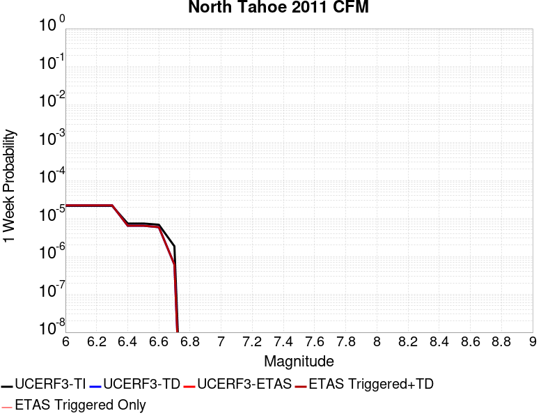 |  |  |  |

| Magnitude | 1 wk TI Prob | 1 wk TD Prob | 1 wk ETAS Prob | 1 wk ETAS/TD Gain | 1 wk ETAS Triggered+TD | 1 wk ETAS Triggered Only | 1 mo TI Prob | 1 mo TD Prob | 1 mo ETAS Prob | 1 mo ETAS/TD Gain | 1 mo ETAS Triggered+TD | 1 mo ETAS Triggered Only | 1 yr TI Prob | 1 yr TD Prob | 1 yr ETAS Prob | 1 yr ETAS/TD Gain | 1 yr ETAS Triggered+TD | 1 yr ETAS Triggered Only | 10 yr TI Prob | 10 yr TD Prob | 10 yr ETAS Prob | 10 yr ETAS/TD Gain | 10 yr ETAS Triggered+TD | 10 yr ETAS Triggered Only |
|-----|-----|-----|-----|-----|-----|-----|-----|-----|-----|-----|-----|-----|-----|-----|-----|-----|-----|-----|-----|-----|-----|-----|-----|-----|
| 6.0 | 2.150391E-5 | 2.2170048E-5 | 0.0 | 0.0 | 2.2170048E-5 | 0.0 | 9.215636E-5 | 9.501214E-5 | 0.0 | 0.0 | 9.501214E-5 | 0.0 | 0.0011214261 | 0.0011563549 | 8.0E-4 | 0.6918291 | 0.0011563549 | 0.0 | 0.011157839 | 0.011522643 | 0.0056 | 0.4859996 | 0.01211573 | 6.0E-4 |
| 6.1 | 2.150391E-5 | 2.2170048E-5 | 0.0 | 0.0 | 2.2170048E-5 | 0.0 | 9.215636E-5 | 9.501214E-5 | 0.0 | 0.0 | 9.501214E-5 | 0.0 | 0.0011214261 | 0.0011563549 | 8.0E-4 | 0.6918291 | 0.0011563549 | 0.0 | 0.011157839 | 0.011522643 | 0.0056 | 0.4859996 | 0.01211573 | 6.0E-4 |
| 6.2 | 2.150391E-5 | 2.2170048E-5 | 0.0 | 0.0 | 2.2170048E-5 | 0.0 | 9.215636E-5 | 9.501214E-5 | 0.0 | 0.0 | 9.501214E-5 | 0.0 | 0.0011214261 | 0.0011563549 | 8.0E-4 | 0.6918291 | 0.0011563549 | 0.0 | 0.011157839 | 0.011522643 | 0.0056 | 0.4859996 | 0.01211573 | 6.0E-4 |
| 6.3 | 2.150391E-5 | 2.2170048E-5 | 0.0 | 0.0 | 2.2170048E-5 | 0.0 | 9.215636E-5 | 9.501214E-5 | 0.0 | 0.0 | 9.501214E-5 | 0.0 | 0.0011214261 | 0.0011563549 | 8.0E-4 | 0.6918291 | 0.0011563549 | 0.0 | 0.011157839 | 0.011522643 | 0.0056 | 0.4859996 | 0.01211573 | 6.0E-4 |
| 6.4 | 7.3563056E-6 | 6.4464457E-6 | 0.0 | 0.0 | 6.4464457E-6 | 0.0 | 3.1526644E-5 | 2.7627504E-5 | 0.0 | 0.0 | 2.7627504E-5 | 0.0 | 3.8376928E-4 | 3.363435E-4 | 3.0E-4 | 0.8919453 | 3.363435E-4 | 0.0 | 0.003831072 | 0.0033613425 | 0.0015 | 0.4462503 | 0.0035606702 | 2.0E-4 |
| 6.5 | 7.3563056E-6 | 6.4464457E-6 | 0.0 | 0.0 | 6.4464457E-6 | 0.0 | 3.1526644E-5 | 2.7627504E-5 | 0.0 | 0.0 | 2.7627504E-5 | 0.0 | 3.8376928E-4 | 3.363435E-4 | 3.0E-4 | 0.8919453 | 3.363435E-4 | 0.0 | 0.003831072 | 0.0033613425 | 0.0015 | 0.4462503 | 0.0035606702 | 2.0E-4 |
| 6.6 | 6.8508816E-6 | 5.8854944E-6 | 0.0 | 0.0 | 5.8854944E-6 | 0.0 | 2.936059E-5 | 2.5223475E-5 | 0.0 | 0.0 | 2.5223475E-5 | 0.0 | 3.5740656E-4 | 3.070829E-4 | 3.0E-4 | 0.9769349 | 3.070829E-4 | 0.0 | 0.0035683226 | 0.003069564 | 0.0015 | 0.48866874 | 0.0032689502 | 2.0E-4 |
| 6.7 | 1.8511148E-6 | 6.102821E-7 | 0.0 | 0.0 | 6.102821E-7 | 0.0 | 7.933325E-6 | 2.6154946E-6 | 0.0 | 0.0 | 2.6154946E-6 | 0.0 | 9.658395E-5 | 3.1843647E-5 | 0.0 | 0.0 | 3.1843647E-5 | 0.0 | 9.6541987E-4 | 3.1843648E-4 | 0.0 | 0.0 | 3.1843648E-4 | 0.0 |

## Sierra Madre
*[(top)](#table-of-contents)*

| 1 Week | 1 Month | 1 Year | 10 Year |
|-----|-----|-----|-----|
|  | 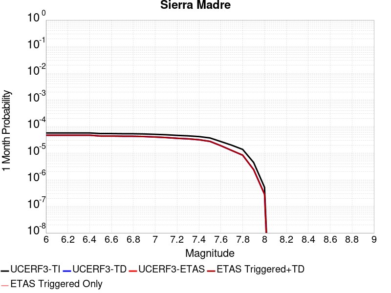 |  | 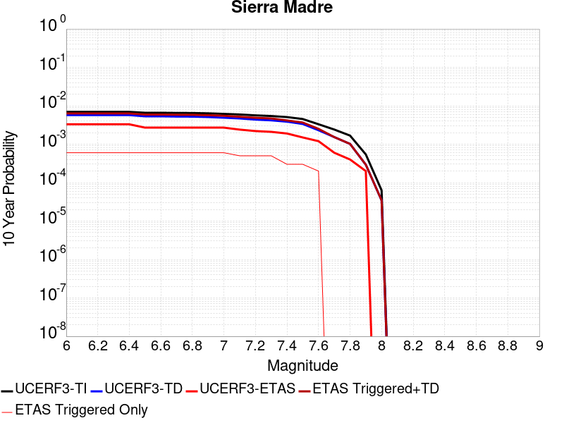 |

| Magnitude | 1 wk TI Prob | 1 wk TD Prob | 1 wk ETAS Prob | 1 wk ETAS/TD Gain | 1 wk ETAS Triggered+TD | 1 wk ETAS Triggered Only | 1 mo TI Prob | 1 mo TD Prob | 1 mo ETAS Prob | 1 mo ETAS/TD Gain | 1 mo ETAS Triggered+TD | 1 mo ETAS Triggered Only | 1 yr TI Prob | 1 yr TD Prob | 1 yr ETAS Prob | 1 yr ETAS/TD Gain | 1 yr ETAS Triggered+TD | 1 yr ETAS Triggered Only | 10 yr TI Prob | 10 yr TD Prob | 10 yr ETAS Prob | 10 yr ETAS/TD Gain | 10 yr ETAS Triggered+TD | 10 yr ETAS Triggered Only |
|-----|-----|-----|-----|-----|-----|-----|-----|-----|-----|-----|-----|-----|-----|-----|-----|-----|-----|-----|-----|-----|-----|-----|-----|-----|
| 6.0 | 1.3379373E-5 | 1.1004674E-5 | 0.0 | 0.0 | 1.1004674E-5 | 0.0 | 5.7338908E-5 | 4.7162044E-5 | 0.0 | 0.0 | 4.7162044E-5 | 0.0 | 6.978776E-4 | 5.740481E-4 | 6.0E-4 | 1.0452086 | 5.740481E-4 | 0.0 | 0.0069569005 | 0.0057260133 | 0.0033 | 0.5763172 | 0.0063225776 | 6.0E-4 |
| 6.1 | 1.3379373E-5 | 1.1004674E-5 | 0.0 | 0.0 | 1.1004674E-5 | 0.0 | 5.7338908E-5 | 4.7162044E-5 | 0.0 | 0.0 | 4.7162044E-5 | 0.0 | 6.978776E-4 | 5.740481E-4 | 6.0E-4 | 1.0452086 | 5.740481E-4 | 0.0 | 0.0069569005 | 0.0057260133 | 0.0033 | 0.5763172 | 0.0063225776 | 6.0E-4 |
| 6.2 | 1.3379373E-5 | 1.1004674E-5 | 0.0 | 0.0 | 1.1004674E-5 | 0.0 | 5.7338908E-5 | 4.7162044E-5 | 0.0 | 0.0 | 4.7162044E-5 | 0.0 | 6.978776E-4 | 5.740481E-4 | 6.0E-4 | 1.0452086 | 5.740481E-4 | 0.0 | 0.0069569005 | 0.0057260133 | 0.0033 | 0.5763172 | 0.0063225776 | 6.0E-4 |
| 6.3 | 1.3379373E-5 | 1.1004674E-5 | 0.0 | 0.0 | 1.1004674E-5 | 0.0 | 5.7338908E-5 | 4.7162044E-5 | 0.0 | 0.0 | 4.7162044E-5 | 0.0 | 6.978776E-4 | 5.740481E-4 | 6.0E-4 | 1.0452086 | 5.740481E-4 | 0.0 | 0.0069569005 | 0.0057260133 | 0.0033 | 0.5763172 | 0.0063225776 | 6.0E-4 |
| 6.4 | 1.3379373E-5 | 1.1004674E-5 | 0.0 | 0.0 | 1.1004674E-5 | 0.0 | 5.7338908E-5 | 4.7162044E-5 | 0.0 | 0.0 | 4.7162044E-5 | 0.0 | 6.978776E-4 | 5.740481E-4 | 6.0E-4 | 1.0452086 | 5.740481E-4 | 0.0 | 0.0069569005 | 0.0057260133 | 0.0033 | 0.5763172 | 0.0063225776 | 6.0E-4 |
| 6.5 | 1.26563245E-5 | 1.0234029E-5 | 0.0 | 0.0 | 1.0234029E-5 | 0.0 | 5.4240263E-5 | 4.3859396E-5 | 0.0 | 0.0 | 4.3859396E-5 | 0.0 | 6.601751E-4 | 5.338584E-4 | 6.0E-4 | 1.1238936 | 5.338584E-4 | 0.0 | 0.006582173 | 0.0053260773 | 0.0027 | 0.5069397 | 0.005922882 | 6.0E-4 |
| 6.6 | 1.26563245E-5 | 1.0234029E-5 | 0.0 | 0.0 | 1.0234029E-5 | 0.0 | 5.4240263E-5 | 4.3859396E-5 | 0.0 | 0.0 | 4.3859396E-5 | 0.0 | 6.601751E-4 | 5.338584E-4 | 6.0E-4 | 1.1238936 | 5.338584E-4 | 0.0 | 0.006582173 | 0.0053260773 | 0.0027 | 0.5069397 | 0.005922882 | 6.0E-4 |
| 6.7 | 1.2502474E-5 | 1.0070153E-5 | 0.0 | 0.0 | 1.0070153E-5 | 0.0 | 5.3580934E-5 | 4.3157088E-5 | 0.0 | 0.0 | 4.3157088E-5 | 0.0 | 6.521526E-4 | 5.253119E-4 | 6.0E-4 | 1.1421785 | 5.253119E-4 | 0.0 | 0.0065024206 | 0.005241018 | 0.0027 | 0.5151671 | 0.005837873 | 6.0E-4 |
| 6.8 | 1.2454966E-5 | 1.00224315E-5 | 0.0 | 0.0 | 1.00224315E-5 | 0.0 | 5.3377335E-5 | 4.2952575E-5 | 0.0 | 0.0 | 4.2952575E-5 | 0.0 | 6.4967526E-4 | 5.228232E-4 | 6.0E-4 | 1.1476156 | 5.228232E-4 | 0.0 | 0.006477792 | 0.0052162474 | 0.0027 | 0.51761353 | 0.0058131176 | 6.0E-4 |
| 6.9 | 1.2225574E-5 | 9.796227E-6 | 0.0 | 0.0 | 9.796227E-6 | 0.0 | 5.2394265E-5 | 4.198316E-5 | 0.0 | 0.0 | 4.198316E-5 | 0.0 | 6.3771347E-4 | 5.110261E-4 | 6.0E-4 | 1.1741083 | 5.110261E-4 | 0.0 | 0.006358865 | 0.0050988225 | 0.0027 | 0.529534 | 0.0056957635 | 6.0E-4 |
| 7.0 | 1.182946E-5 | 9.402687E-6 | 0.0 | 0.0 | 9.402687E-6 | 0.0 | 5.06967E-5 | 4.0296614E-5 | 0.0 | 0.0 | 4.0296614E-5 | 0.0 | 6.1705755E-4 | 4.905019E-4 | 6.0E-4 | 1.223237 | 4.905019E-4 | 0.0 | 0.006153469 | 0.0048945006 | 0.0027 | 0.55163956 | 0.005491564 | 6.0E-4 |
| 7.1 | 1.14369095E-5 | 8.989579E-6 | 0.0 | 0.0 | 8.989579E-6 | 0.0 | 4.9014405E-5 | 3.8526206E-5 | 0.0 | 0.0 | 3.8526206E-5 | 0.0 | 5.9658696E-4 | 4.6895657E-4 | 5.0E-4 | 1.0661968 | 4.6895657E-4 | 0.0 | 0.005949879 | 0.004679972 | 0.0024 | 0.5128236 | 0.005177632 | 5.0E-4 |
| 7.2 | 1.0836419E-5 | 8.402848E-6 | 0.0 | 0.0 | 8.402848E-6 | 0.0 | 4.644097E-5 | 3.6011712E-5 | 0.0 | 0.0 | 3.6011712E-5 | 0.0 | 5.652721E-4 | 4.3835532E-4 | 5.0E-4 | 1.1406271 | 4.3835532E-4 | 0.0 | 0.0056383642 | 0.0043752007 | 0.0022 | 0.5028341 | 0.004873013 | 5.0E-4 |
| 7.3 | 1.0403439E-5 | 8.02404E-6 | 0.0 | 0.0 | 8.02404E-6 | 0.0 | 4.4585406E-5 | 3.4388293E-5 | 0.0 | 0.0 | 3.4388293E-5 | 0.0 | 5.426921E-4 | 4.1859795E-4 | 5.0E-4 | 1.1944636 | 4.1859795E-4 | 0.0 | 0.005413687 | 0.0041783866 | 0.0021 | 0.50258636 | 0.0046762973 | 5.0E-4 |
| 7.4 | 9.768864E-6 | 7.4175377E-6 | 0.0 | 0.0 | 7.4175377E-6 | 0.0 | 4.186589E-5 | 3.1789063E-5 | 0.0 | 0.0 | 3.1789063E-5 | 0.0 | 5.09598E-4 | 3.86964E-4 | 5.0E-4 | 1.2921098 | 3.86964E-4 | 0.0 | 0.0050843097 | 0.0038631905 | 0.0019 | 0.49182147 | 0.0041620317 | 3.0E-4 |
| 7.5 | 8.687089E-6 | 6.4529563E-6 | 0.0 | 0.0 | 6.4529563E-6 | 0.0 | 3.722985E-5 | 2.7655238E-5 | 0.0 | 0.0 | 2.7655238E-5 | 0.0 | 4.5317915E-4 | 3.3665137E-4 | 4.0E-4 | 1.1881728 | 3.3665137E-4 | 0.0 | 0.004522561 | 0.0033616978 | 0.0015 | 0.4462031 | 0.0036606893 | 3.0E-4 |
| 7.6 | 6.3506063E-6 | 4.432749E-6 | 0.0 | 0.0 | 4.432749E-6 | 0.0 | 2.72166E-5 | 1.8997358E-5 | 0.0 | 0.0 | 1.8997358E-5 | 0.0 | 3.3131172E-4 | 2.3126855E-4 | 3.0E-4 | 1.2971932 | 2.3126855E-4 | 0.0 | 0.003308182 | 0.0023105007 | 0.0012 | 0.51936793 | 0.0025100384 | 2.0E-4 |
| 7.7 | 4.62223E-6 | 2.9351738E-6 | 0.0 | 0.0 | 2.9351738E-6 | 0.0 | 1.9809406E-5 | 1.2579256E-5 | 0.0 | 0.0 | 1.2579256E-5 | 0.0 | 2.4115283E-4 | 1.531417E-4 | 3.0E-4 | 1.9589701 | 1.531417E-4 | 0.0 | 0.0024089129 | 0.0015305597 | 6.0E-4 | 0.39201346 | 0.0015305597 | 0.0 |
| 7.8 | 3.2145008E-6 | 1.950848E-6 | 0.0 | 0.0 | 1.950848E-6 | 0.0 | 1.3776359E-5 | 8.36075E-6 | 0.0 | 0.0 | 8.36075E-6 | 0.0 | 1.6771426E-4 | 1.01787395E-4 | 2.0E-4 | 1.9648799 | 1.01787395E-4 | 0.0 | 0.0016758774 | 0.0010175584 | 4.0E-4 | 0.39309782 | 0.0010175584 | 0.0 |
| 7.9 | 1.0391769E-6 | 5.606891E-7 | 0.0 | 0.0 | 5.606891E-7 | 0.0 | 4.4536077E-6 | 2.4029512E-6 | 0.0 | 0.0 | 2.4029512E-6 | 0.0 | 5.4221324E-5 | 2.9255541E-5 | 1.0E-4 | 3.418156 | 2.9255541E-5 | 0.0 | 5.4208096E-4 | 2.9251733E-4 | 2.0E-4 | 0.6837202 | 2.9251733E-4 | 0.0 |
| 8.0 | 1.210983E-7 | 6.616357E-8 | 0.0 | 0.0 | 6.616357E-8 | 0.0 | 5.1899264E-7 | 2.8355814E-7 | 0.0 | 0.0 | 2.8355814E-7 | 0.0 | 6.3187167E-6 | 3.452315E-6 | 0.0 | 0.0 | 3.452315E-6 | 0.0 | 6.318537E-5 | 3.4522633E-5 | 0.0 | 0.0 | 3.4522633E-5 | 0.0 |

## Los Osos 2011
*[(top)](#table-of-contents)*

| 1 Week | 1 Month | 1 Year | 10 Year |
|-----|-----|-----|-----|
|  |  | 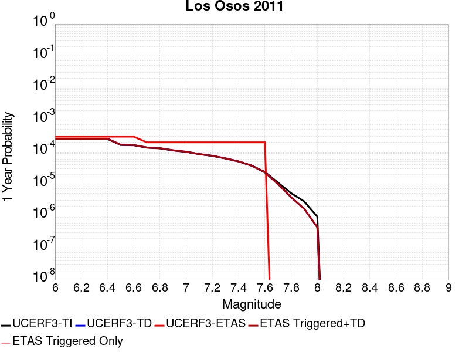 |  |

| Magnitude | 1 wk TI Prob | 1 wk TD Prob | 1 wk ETAS Prob | 1 wk ETAS/TD Gain | 1 wk ETAS Triggered+TD | 1 wk ETAS Triggered Only | 1 mo TI Prob | 1 mo TD Prob | 1 mo ETAS Prob | 1 mo ETAS/TD Gain | 1 mo ETAS Triggered+TD | 1 mo ETAS Triggered Only | 1 yr TI Prob | 1 yr TD Prob | 1 yr ETAS Prob | 1 yr ETAS/TD Gain | 1 yr ETAS Triggered+TD | 1 yr ETAS Triggered Only | 10 yr TI Prob | 10 yr TD Prob | 10 yr ETAS Prob | 10 yr ETAS/TD Gain | 10 yr ETAS Triggered+TD | 10 yr ETAS Triggered Only |
|-----|-----|-----|-----|-----|-----|-----|-----|-----|-----|-----|-----|-----|-----|-----|-----|-----|-----|-----|-----|-----|-----|-----|-----|-----|
| 6.0 | 4.8871775E-6 | 4.98173E-6 | 0.0 | 0.0 | 4.98173E-6 | 0.0 | 2.0944879E-5 | 2.1350112E-5 | 0.0 | 0.0 | 2.1350112E-5 | 0.0 | 2.5497406E-4 | 2.599094E-4 | 3.0E-4 | 1.1542484 | 2.599094E-4 | 0.0 | 0.002546817 | 0.0025963287 | 0.0018 | 0.69328666 | 0.0031947708 | 6.0E-4 |
| 6.1 | 4.8871775E-6 | 4.98173E-6 | 0.0 | 0.0 | 4.98173E-6 | 0.0 | 2.0944879E-5 | 2.1350112E-5 | 0.0 | 0.0 | 2.1350112E-5 | 0.0 | 2.5497406E-4 | 2.599094E-4 | 3.0E-4 | 1.1542484 | 2.599094E-4 | 0.0 | 0.002546817 | 0.0025963287 | 0.0018 | 0.69328666 | 0.0031947708 | 6.0E-4 |
| 6.2 | 4.8871775E-6 | 4.98173E-6 | 0.0 | 0.0 | 4.98173E-6 | 0.0 | 2.0944879E-5 | 2.1350112E-5 | 0.0 | 0.0 | 2.1350112E-5 | 0.0 | 2.5497406E-4 | 2.599094E-4 | 3.0E-4 | 1.1542484 | 2.599094E-4 | 0.0 | 0.002546817 | 0.0025963287 | 0.0018 | 0.69328666 | 0.0031947708 | 6.0E-4 |
| 6.3 | 4.8871775E-6 | 4.98173E-6 | 0.0 | 0.0 | 4.98173E-6 | 0.0 | 2.0944879E-5 | 2.1350112E-5 | 0.0 | 0.0 | 2.1350112E-5 | 0.0 | 2.5497406E-4 | 2.599094E-4 | 3.0E-4 | 1.1542484 | 2.599094E-4 | 0.0 | 0.002546817 | 0.0025963287 | 0.0018 | 0.69328666 | 0.0031947708 | 6.0E-4 |
| 6.4 | 4.8871775E-6 | 4.98173E-6 | 0.0 | 0.0 | 4.98173E-6 | 0.0 | 2.0944879E-5 | 2.1350112E-5 | 0.0 | 0.0 | 2.1350112E-5 | 0.0 | 2.5497406E-4 | 2.599094E-4 | 3.0E-4 | 1.1542484 | 2.599094E-4 | 0.0 | 0.002546817 | 0.0025963287 | 0.0018 | 0.69328666 | 0.0031947708 | 6.0E-4 |
| 6.5 | 3.1724062E-6 | 3.2235534E-6 | 0.0 | 0.0 | 3.2235534E-6 | 0.0 | 1.3595956E-5 | 1.3815156E-5 | 0.0 | 0.0 | 1.3815156E-5 | 0.0 | 1.6551818E-4 | 1.6818667E-4 | 3.0E-4 | 1.7837323 | 1.6818667E-4 | 0.0 | 0.0016539496 | 0.0016806074 | 0.0012 | 0.7140276 | 0.0019801033 | 3.0E-4 |
| 6.6 | 3.1022591E-6 | 3.1512584E-6 | 0.0 | 0.0 | 3.1512584E-6 | 0.0 | 1.3295328E-5 | 1.3505324E-5 | 0.0 | 0.0 | 1.3505324E-5 | 0.0 | 1.618586E-4 | 1.6441505E-4 | 3.0E-4 | 1.8246506 | 1.6441505E-4 | 0.0 | 0.0016174077 | 0.0016429469 | 0.0011 | 0.66952866 | 0.0019424539 | 3.0E-4 |
| 6.7 | 2.611518E-6 | 2.6493146E-6 | 0.0 | 0.0 | 2.6493146E-6 | 0.0 | 1.1192172E-5 | 1.1354156E-5 | 0.0 | 0.0 | 1.1354156E-5 | 0.0 | 1.3625617E-4 | 1.3822812E-4 | 2.0E-4 | 1.4468836 | 1.3822812E-4 | 0.0 | 0.0013617266 | 0.001381426 | 0.001 | 0.7238897 | 0.0016810115 | 3.0E-4 |
| 6.8 | 2.4780884E-6 | 2.5122833E-6 | 0.0 | 0.0 | 2.5122833E-6 | 0.0 | 1.0620336E-5 | 1.0766884E-5 | 0.0 | 0.0 | 1.0766884E-5 | 0.0 | 1.2929492E-4 | 1.3107897E-4 | 2.0E-4 | 1.5257978 | 1.3107897E-4 | 0.0 | 0.0012921972 | 0.0013100206 | 0.001 | 0.7633468 | 0.0016096276 | 3.0E-4 |
| 6.9 | 2.1376322E-6 | 2.1636129E-6 | 0.0 | 0.0 | 2.1636129E-6 | 0.0 | 9.161248E-6 | 9.272594E-6 | 0.0 | 0.0 | 9.272594E-6 | 0.0 | 1.1153249E-4 | 1.12888E-4 | 2.0E-4 | 1.7716675 | 1.12888E-4 | 0.0 | 0.0011147653 | 0.0011283085 | 8.0E-4 | 0.709026 | 0.0013280828 | 2.0E-4 |
| 7.0 | 1.9282882E-6 | 1.9495562E-6 | 0.0 | 0.0 | 1.9495562E-6 | 0.0 | 8.264066E-6 | 8.355215E-6 | 0.0 | 0.0 | 8.355215E-6 | 0.0 | 1.0061036E-4 | 1.01720005E-4 | 2.0E-4 | 1.9661816 | 1.01720005E-4 | 0.0 | 0.0010056482 | 0.0010167358 | 7.0E-4 | 0.68847775 | 0.0011166341 | 1.0E-4 |
| 7.1 | 1.6353226E-6 | 1.6501966E-6 | 0.0 | 0.0 | 1.6501966E-6 | 0.0 | 7.0085066E-6 | 7.072252E-6 | 0.0 | 0.0 | 7.072252E-6 | 0.0 | 8.532523E-5 | 8.6101274E-5 | 2.0E-4 | 2.322846 | 8.6101274E-5 | 0.0 | 8.529247E-4 | 8.606799E-4 | 6.0E-4 | 0.6971233 | 9.605938E-4 | 1.0E-4 |
| 7.2 | 1.4446276E-6 | 1.4554106E-6 | 0.0 | 0.0 | 1.4554106E-6 | 0.0 | 6.191247E-6 | 6.2374593E-6 | 0.0 | 0.0 | 6.2374593E-6 | 0.0 | 7.537582E-5 | 7.593843E-5 | 2.0E-4 | 2.6337128 | 7.593843E-5 | 0.0 | 7.535026E-4 | 7.5912534E-4 | 5.0E-4 | 0.6586528 | 8.5904944E-4 | 1.0E-4 |
| 7.3 | 1.2014582E-6 | 1.2069731E-6 | 0.0 | 0.0 | 1.2069731E-6 | 0.0 | 5.149096E-6 | 5.1727316E-6 | 0.0 | 0.0 | 5.1727316E-6 | 0.0 | 6.268844E-5 | 6.297619E-5 | 2.0E-4 | 3.1758032 | 6.297619E-5 | 0.0 | 6.267076E-4 | 6.2958384E-4 | 5.0E-4 | 0.7941754 | 7.295209E-4 | 1.0E-4 |
| 7.4 | 9.707733E-7 | 9.710325E-7 | 0.0 | 0.0 | 9.710325E-7 | 0.0 | 4.16045E-6 | 4.1615613E-6 | 0.0 | 0.0 | 4.1615613E-6 | 0.0 | 5.0652303E-5 | 5.0665833E-5 | 2.0E-4 | 3.9474335 | 5.0665833E-5 | 0.0 | 5.064076E-4 | 5.065431E-4 | 5.0E-4 | 0.9870829 | 6.0649245E-4 | 1.0E-4 |
| 7.5 | 7.174908E-7 | 7.1153397E-7 | 0.0 | 0.0 | 7.1153397E-7 | 0.0 | 3.074957E-6 | 3.0494277E-6 | 0.0 | 0.0 | 3.0494277E-6 | 0.0 | 3.743696E-5 | 3.7126152E-5 | 2.0E-4 | 5.387038 | 3.7126152E-5 | 0.0 | 3.7430652E-4 | 3.7119965E-4 | 5.0E-4 | 1.346984 | 4.7116252E-4 | 1.0E-4 |
| 7.6 | 4.5535776E-7 | 4.421069E-7 | 0.0 | 0.0 | 4.421069E-7 | 0.0 | 1.9515319E-6 | 1.8947426E-6 | 0.0 | 0.0 | 1.8947426E-6 | 0.0 | 2.3759641E-5 | 2.3068247E-5 | 2.0E-4 | 8.669927 | 2.3068247E-5 | 0.0 | 2.37571E-4 | 2.3065862E-4 | 3.0E-4 | 1.3006234 | 3.3063555E-4 | 1.0E-4 |
| 7.7 | 2.1173553E-7 | 1.9061955E-7 | 0.0 | 0.0 | 1.9061955E-7 | 0.0 | 9.0743765E-7 | 8.1694066E-7 | 0.0 | 0.0 | 8.1694066E-7 | 0.0 | 1.1047998E-5 | 9.946208E-6 | 0.0 | 0.0 | 9.946208E-6 | 0.0 | 1.1047449E-4 | 9.945765E-5 | 0.0 | 0.0 | 9.945765E-5 | 0.0 |
| 7.8 | 9.873608E-8 | 7.367788E-8 | 0.0 | 0.0 | 7.367788E-8 | 0.0 | 4.2315455E-7 | 3.157623E-7 | 0.0 | 0.0 | 3.157623E-7 | 0.0 | 5.1518946E-6 | 3.844399E-6 | 0.0 | 0.0 | 3.844399E-6 | 0.0 | 5.1517753E-5 | 3.8443333E-5 | 0.0 | 0.0 | 3.8443333E-5 | 0.0 |
| 7.9 | 5.4399106E-8 | 3.1879967E-8 | 0.0 | 0.0 | 3.1879967E-8 | 0.0 | 2.33139E-7 | 1.3662842E-7 | 0.0 | 0.0 | 1.3662842E-7 | 0.0 | 2.8384638E-6 | 1.6634498E-6 | 0.0 | 0.0 | 1.6634498E-6 | 0.0 | 2.8384275E-5 | 1.6634374E-5 | 0.0 | 0.0 | 1.6634374E-5 | 0.0 |
| 8.0 | 1.817203E-8 | 8.420013E-9 | 0.0 | 0.0 | 8.420013E-9 | 0.0 | 7.7880124E-8 | 3.608577E-8 | 0.0 | 0.0 | 3.608577E-8 | 0.0 | 9.481901E-7 | 4.3934415E-7 | 0.0 | 0.0 | 4.3934415E-7 | 0.0 | 9.481861E-6 | 4.3934333E-6 | 0.0 | 0.0 | 4.3934333E-6 | 0.0 |

## Scodie Lineament
*[(top)](#table-of-contents)*

| 1 Week | 1 Month | 1 Year | 10 Year |
|-----|-----|-----|-----|
| 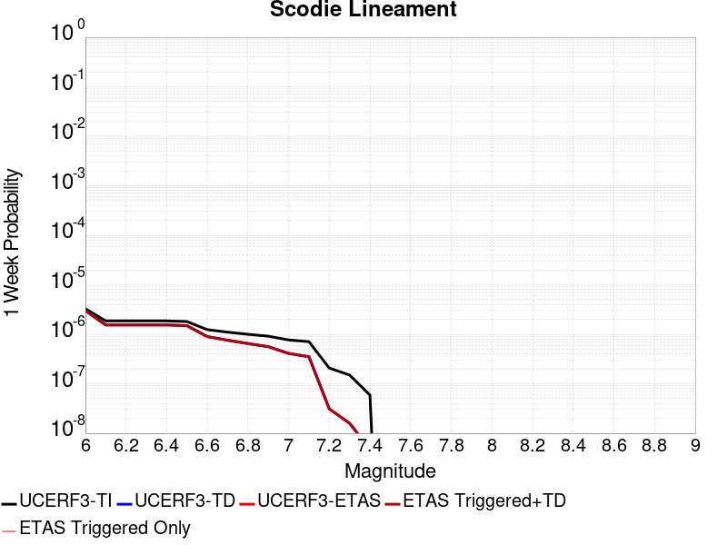 | 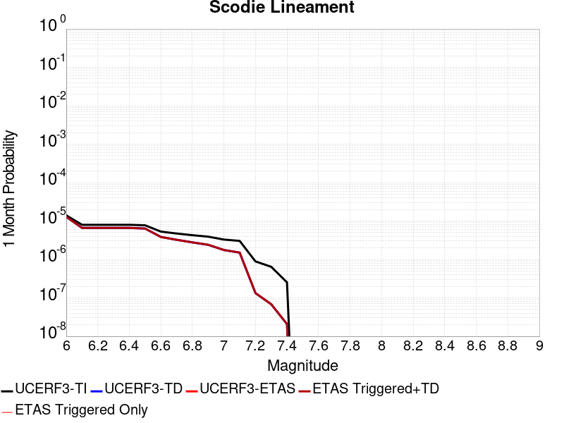 | 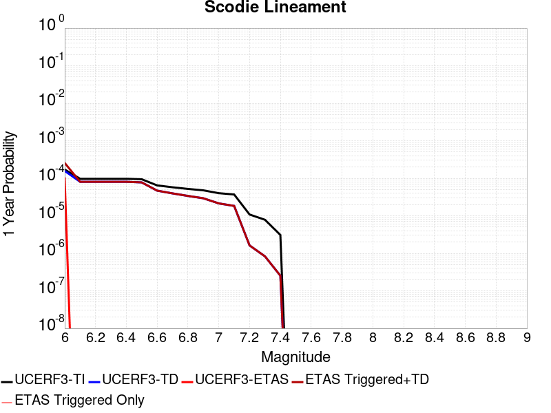 |  |

| Magnitude | 1 wk TI Prob | 1 wk TD Prob | 1 wk ETAS Prob | 1 wk ETAS/TD Gain | 1 wk ETAS Triggered+TD | 1 wk ETAS Triggered Only | 1 mo TI Prob | 1 mo TD Prob | 1 mo ETAS Prob | 1 mo ETAS/TD Gain | 1 mo ETAS Triggered+TD | 1 mo ETAS Triggered Only | 1 yr TI Prob | 1 yr TD Prob | 1 yr ETAS Prob | 1 yr ETAS/TD Gain | 1 yr ETAS Triggered+TD | 1 yr ETAS Triggered Only | 10 yr TI Prob | 10 yr TD Prob | 10 yr ETAS Prob | 10 yr ETAS/TD Gain | 10 yr ETAS Triggered+TD | 10 yr ETAS Triggered Only |
|-----|-----|-----|-----|-----|-----|-----|-----|-----|-----|-----|-----|-----|-----|-----|-----|-----|-----|-----|-----|-----|-----|-----|-----|-----|
| 6.0 | 3.2919327E-6 | 3.0134568E-6 | 0.0 | 0.0 | 3.0134568E-6 | 0.0 | 1.4108206E-5 | 1.2914768E-5 | 0.0 | 0.0 | 1.2914768E-5 | 0.0 | 1.7175387E-4 | 1.5722914E-4 | 1.0E-4 | 0.6360144 | 2.5721343E-4 | 1.0E-4 | 0.0017162118 | 0.0015714907 | 0.0013 | 0.82724005 | 0.0021705476 | 6.0E-4 |
| 6.1 | 1.8663811E-6 | 1.5490856E-6 | 0.0 | 0.0 | 1.5490856E-6 | 0.0 | 7.998751E-6 | 6.638924E-6 | 0.0 | 0.0 | 6.638924E-6 | 0.0 | 9.738045E-5 | 8.08264E-5 | 0.0 | 0.0 | 8.08264E-5 | 0.0 | 9.7337784E-4 | 8.0801884E-4 | 3.0E-4 | 0.37127846 | 0.0010078573 | 2.0E-4 |
| 6.2 | 1.8663811E-6 | 1.5490856E-6 | 0.0 | 0.0 | 1.5490856E-6 | 0.0 | 7.998751E-6 | 6.638924E-6 | 0.0 | 0.0 | 6.638924E-6 | 0.0 | 9.738045E-5 | 8.08264E-5 | 0.0 | 0.0 | 8.08264E-5 | 0.0 | 9.7337784E-4 | 8.0801884E-4 | 3.0E-4 | 0.37127846 | 0.0010078573 | 2.0E-4 |
| 6.3 | 1.8663811E-6 | 1.5490856E-6 | 0.0 | 0.0 | 1.5490856E-6 | 0.0 | 7.998751E-6 | 6.638924E-6 | 0.0 | 0.0 | 6.638924E-6 | 0.0 | 9.738045E-5 | 8.08264E-5 | 0.0 | 0.0 | 8.08264E-5 | 0.0 | 9.7337784E-4 | 8.0801884E-4 | 3.0E-4 | 0.37127846 | 0.0010078573 | 2.0E-4 |
| 6.4 | 1.8663811E-6 | 1.5490856E-6 | 0.0 | 0.0 | 1.5490856E-6 | 0.0 | 7.998751E-6 | 6.638924E-6 | 0.0 | 0.0 | 6.638924E-6 | 0.0 | 9.738045E-5 | 8.08264E-5 | 0.0 | 0.0 | 8.08264E-5 | 0.0 | 9.7337784E-4 | 8.0801884E-4 | 3.0E-4 | 0.37127846 | 0.0010078573 | 2.0E-4 |
| 6.5 | 1.8106311E-6 | 1.4910148E-6 | 0.0 | 0.0 | 1.4910148E-6 | 0.0 | 7.759824E-6 | 6.3900507E-6 | 0.0 | 0.0 | 6.3900507E-6 | 0.0 | 9.447177E-5 | 7.779658E-5 | 0.0 | 0.0 | 7.779658E-5 | 0.0 | 9.4431615E-4 | 7.777422E-4 | 3.0E-4 | 0.38573194 | 9.775866E-4 | 2.0E-4 |
| 6.6 | 1.2414679E-6 | 8.9974117E-7 | 0.0 | 0.0 | 8.9974117E-7 | 0.0 | 5.320566E-6 | 3.8560283E-6 | 0.0 | 0.0 | 3.8560283E-6 | 0.0 | 6.477596E-5 | 4.694622E-5 | 0.0 | 0.0 | 4.694622E-5 | 0.0 | 6.475708E-4 | 4.693717E-4 | 0.0 | 0.0 | 4.693717E-4 | 0.0 |
| 6.7 | 1.1062215E-6 | 7.594061E-7 | 0.0 | 0.0 | 7.594061E-7 | 0.0 | 4.7409408E-6 | 3.2545938E-6 | 0.0 | 0.0 | 3.2545938E-6 | 0.0 | 5.7719422E-5 | 3.962403E-5 | 0.0 | 0.0 | 3.962403E-5 | 0.0 | 5.770443E-4 | 3.9617662E-4 | 0.0 | 0.0 | 3.9617662E-4 | 0.0 |
| 6.8 | 1.0006736E-6 | 6.500067E-7 | 0.0 | 0.0 | 6.500067E-7 | 0.0 | 4.288594E-6 | 2.7857404E-6 | 0.0 | 0.0 | 2.7857404E-6 | 0.0 | 5.221238E-5 | 3.3915923E-5 | 0.0 | 0.0 | 3.3915923E-5 | 0.0 | 5.220012E-4 | 3.3911355E-4 | 0.0 | 0.0 | 3.3911355E-4 | 0.0 |
| 6.9 | 9.167364E-7 | 5.631235E-7 | 0.0 | 0.0 | 5.631235E-7 | 0.0 | 3.9288643E-6 | 2.4133844E-6 | 0.0 | 0.0 | 2.4133844E-6 | 0.0 | 4.7832873E-5 | 2.9382618E-5 | 0.0 | 0.0 | 2.9382618E-5 | 0.0 | 4.782258E-4 | 2.93793E-4 | 0.0 | 0.0 | 2.93793E-4 | 0.0 |
| 7.0 | 7.6987664E-7 | 4.1128914E-7 | 0.0 | 0.0 | 4.1128914E-7 | 0.0 | 3.2994672E-6 | 1.7626668E-6 | 0.0 | 0.0 | 1.7626668E-6 | 0.0 | 4.0170275E-5 | 2.1460295E-5 | 0.0 | 0.0 | 2.1460295E-5 | 0.0 | 4.0163012E-4 | 2.1458609E-4 | 0.0 | 0.0 | 2.1458609E-4 | 0.0 |
| 7.1 | 7.1038727E-7 | 3.5206264E-7 | 0.0 | 0.0 | 3.5206264E-7 | 0.0 | 3.0445133E-6 | 1.5088392E-6 | 0.0 | 0.0 | 1.5088392E-6 | 0.0 | 3.706632E-5 | 1.8369998E-5 | 0.0 | 0.0 | 1.8369998E-5 | 0.0 | 3.7060137E-4 | 1.8368829E-4 | 0.0 | 0.0 | 1.8368829E-4 | 0.0 |
| 7.2 | 2.0799602E-7 | 3.116925E-8 | 0.0 | 0.0 | 3.116925E-8 | 0.0 | 8.914113E-7 | 1.3358249E-7 | 0.0 | 0.0 | 1.3358249E-7 | 0.0 | 1.0852878E-5 | 1.6263657E-6 | 0.0 | 0.0 | 1.6263657E-6 | 0.0 | 1.08523476E-4 | 1.6263546E-5 | 0.0 | 0.0 | 1.6263546E-5 | 0.0 |
| 7.3 | 1.5048182E-7 | 1.593295E-8 | 0.0 | 0.0 | 1.593295E-8 | 0.0 | 6.449219E-7 | 6.8284066E-8 | 0.0 | 0.0 | 6.8284066E-8 | 0.0 | 7.851896E-6 | 8.313582E-7 | 0.0 | 0.0 | 8.313582E-7 | 0.0 | 7.851618E-5 | 8.313554E-6 | 0.0 | 0.0 | 8.313554E-6 | 0.0 |
| 7.4 | 5.9334678E-8 | 4.8625486E-9 | 0.0 | 0.0 | 4.8625486E-9 | 0.0 | 2.5429145E-7 | 2.0839494E-8 | 0.0 | 0.0 | 2.0839494E-8 | 0.0 | 3.095994E-6 | 2.5372083E-7 | 0.0 | 0.0 | 2.5372083E-7 | 0.0 | 3.095951E-5 | 2.5372065E-6 | 0.0 | 0.0 | 2.5372065E-6 | 0.0 |

## San Jacinto (Lytle Creek connector)
*[(top)](#table-of-contents)*

| 1 Week | 1 Month | 1 Year | 10 Year |
|-----|-----|-----|-----|
|  |  |  | 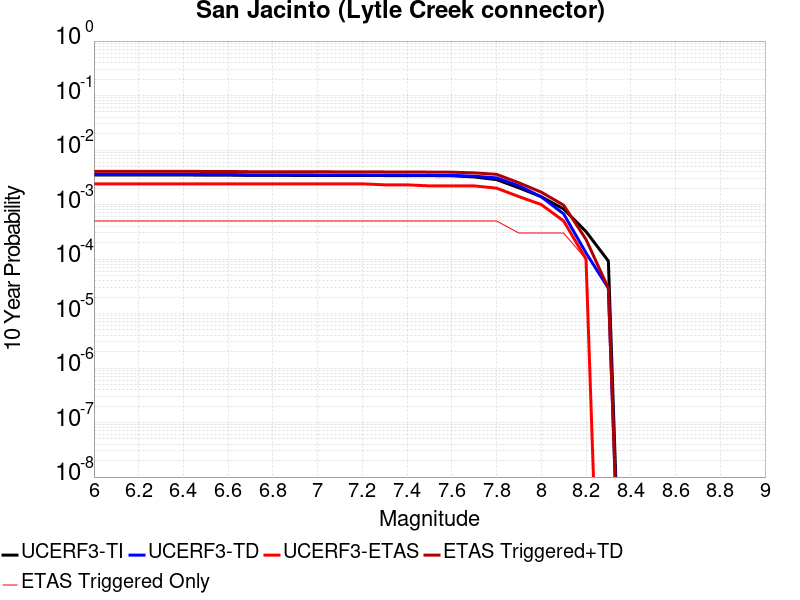 |

| Magnitude | 1 wk TI Prob | 1 wk TD Prob | 1 wk ETAS Prob | 1 wk ETAS/TD Gain | 1 wk ETAS Triggered+TD | 1 wk ETAS Triggered Only | 1 mo TI Prob | 1 mo TD Prob | 1 mo ETAS Prob | 1 mo ETAS/TD Gain | 1 mo ETAS Triggered+TD | 1 mo ETAS Triggered Only | 1 yr TI Prob | 1 yr TD Prob | 1 yr ETAS Prob | 1 yr ETAS/TD Gain | 1 yr ETAS Triggered+TD | 1 yr ETAS Triggered Only | 10 yr TI Prob | 10 yr TD Prob | 10 yr ETAS Prob | 10 yr ETAS/TD Gain | 10 yr ETAS Triggered+TD | 10 yr ETAS Triggered Only |
|-----|-----|-----|-----|-----|-----|-----|-----|-----|-----|-----|-----|-----|-----|-----|-----|-----|-----|-----|-----|-----|-----|-----|-----|-----|
| 6.0 | 6.693995E-6 | 6.685316E-6 | 0.0 | 0.0 | 6.685316E-6 | 0.0 | 2.8688235E-5 | 2.8651039E-5 | 0.0 | 0.0 | 2.8651039E-5 | 0.0 | 3.492233E-4 | 3.4877064E-4 | 6.0E-4 | 1.7203282 | 3.4877064E-4 | 0.0 | 0.00348675 | 0.003562309 | 0.0024 | 0.6737203 | 0.004060528 | 5.0E-4 |
| 6.1 | 6.693995E-6 | 6.685316E-6 | 0.0 | 0.0 | 6.685316E-6 | 0.0 | 2.8688235E-5 | 2.8651039E-5 | 0.0 | 0.0 | 2.8651039E-5 | 0.0 | 3.492233E-4 | 3.4877064E-4 | 6.0E-4 | 1.7203282 | 3.4877064E-4 | 0.0 | 0.00348675 | 0.003562309 | 0.0024 | 0.6737203 | 0.004060528 | 5.0E-4 |
| 6.2 | 6.693995E-6 | 6.685316E-6 | 0.0 | 0.0 | 6.685316E-6 | 0.0 | 2.8688235E-5 | 2.8651039E-5 | 0.0 | 0.0 | 2.8651039E-5 | 0.0 | 3.492233E-4 | 3.4877064E-4 | 6.0E-4 | 1.7203282 | 3.4877064E-4 | 0.0 | 0.00348675 | 0.003562309 | 0.0024 | 0.6737203 | 0.004060528 | 5.0E-4 |
| 6.3 | 6.693995E-6 | 6.685316E-6 | 0.0 | 0.0 | 6.685316E-6 | 0.0 | 2.8688235E-5 | 2.8651039E-5 | 0.0 | 0.0 | 2.8651039E-5 | 0.0 | 3.492233E-4 | 3.4877064E-4 | 6.0E-4 | 1.7203282 | 3.4877064E-4 | 0.0 | 0.00348675 | 0.003562309 | 0.0024 | 0.6737203 | 0.004060528 | 5.0E-4 |
| 6.4 | 6.693995E-6 | 6.685316E-6 | 0.0 | 0.0 | 6.685316E-6 | 0.0 | 2.8688235E-5 | 2.8651039E-5 | 0.0 | 0.0 | 2.8651039E-5 | 0.0 | 3.492233E-4 | 3.4877064E-4 | 6.0E-4 | 1.7203282 | 3.4877064E-4 | 0.0 | 0.00348675 | 0.003562309 | 0.0024 | 0.6737203 | 0.004060528 | 5.0E-4 |
| 6.5 | 6.6561875E-6 | 6.64553E-6 | 0.0 | 0.0 | 6.64553E-6 | 0.0 | 2.8526205E-5 | 2.8480532E-5 | 0.0 | 0.0 | 2.8480532E-5 | 0.0 | 3.472512E-4 | 3.466954E-4 | 6.0E-4 | 1.7306259 | 3.466954E-4 | 0.0 | 0.0034670907 | 0.0035416228 | 0.0024 | 0.67765546 | 0.004039852 | 5.0E-4 |
| 6.6 | 6.6561875E-6 | 6.64553E-6 | 0.0 | 0.0 | 6.64553E-6 | 0.0 | 2.8526205E-5 | 2.8480532E-5 | 0.0 | 0.0 | 2.8480532E-5 | 0.0 | 3.472512E-4 | 3.466954E-4 | 6.0E-4 | 1.7306259 | 3.466954E-4 | 0.0 | 0.0034670907 | 0.0035416228 | 0.0024 | 0.67765546 | 0.004039852 | 5.0E-4 |
| 6.7 | 6.5802237E-6 | 6.564697E-6 | 0.0 | 0.0 | 6.564697E-6 | 0.0 | 2.8200653E-5 | 2.8134113E-5 | 0.0 | 0.0 | 2.8134113E-5 | 0.0 | 3.4328885E-4 | 3.4247906E-4 | 6.0E-4 | 1.751932 | 3.4247906E-4 | 0.0 | 0.0034275902 | 0.0034995927 | 0.0024 | 0.6857941 | 0.003997843 | 5.0E-4 |
| 6.8 | 6.575632E-6 | 6.5591844E-6 | 0.0 | 0.0 | 6.5591844E-6 | 0.0 | 2.8180975E-5 | 2.8110488E-5 | 0.0 | 0.0 | 2.8110488E-5 | 0.0 | 3.4304935E-4 | 3.4219152E-4 | 6.0E-4 | 1.7534041 | 3.4219152E-4 | 0.0 | 0.0034252026 | 0.0034967263 | 0.0024 | 0.6863563 | 0.003994978 | 5.0E-4 |
| 6.9 | 6.570433E-6 | 6.550573E-6 | 0.0 | 0.0 | 6.550573E-6 | 0.0 | 2.8158694E-5 | 2.807358E-5 | 0.0 | 0.0 | 2.807358E-5 | 0.0 | 3.4277816E-4 | 3.4174233E-4 | 6.0E-4 | 1.7557088 | 3.4174233E-4 | 0.0 | 0.0034224992 | 0.0034922485 | 0.0024 | 0.6872363 | 0.0039905026 | 5.0E-4 |
| 7.0 | 6.5643826E-6 | 6.540687E-6 | 0.0 | 0.0 | 6.540687E-6 | 0.0 | 2.8132765E-5 | 2.8031216E-5 | 0.0 | 0.0 | 2.8031216E-5 | 0.0 | 3.424626E-4 | 3.4122667E-4 | 6.0E-4 | 1.7583619 | 3.4122667E-4 | 0.0 | 0.0034193532 | 0.0034871083 | 0.0024 | 0.68824935 | 0.003985365 | 5.0E-4 |
| 7.1 | 6.557402E-6 | 6.5293925E-6 | 0.0 | 0.0 | 6.5293925E-6 | 0.0 | 2.8102848E-5 | 2.7982811E-5 | 0.0 | 0.0 | 2.7982811E-5 | 0.0 | 3.4209844E-4 | 3.4063752E-4 | 6.0E-4 | 1.7614031 | 3.4063752E-4 | 0.0 | 0.0034157229 | 0.003481236 | 0.0024 | 0.68941027 | 0.0039794957 | 5.0E-4 |
| 7.2 | 6.546394E-6 | 6.511346E-6 | 0.0 | 0.0 | 6.511346E-6 | 0.0 | 2.8055672E-5 | 2.7905471E-5 | 0.0 | 0.0 | 2.7905471E-5 | 0.0 | 3.4152428E-4 | 3.396962E-4 | 6.0E-4 | 1.7662841 | 3.396962E-4 | 0.0 | 0.0034099987 | 0.0034718572 | 0.0024 | 0.6912727 | 0.0039701215 | 5.0E-4 |
| 7.3 | 6.5364216E-6 | 6.4921073E-6 | 0.0 | 0.0 | 6.4921073E-6 | 0.0 | 2.8012933E-5 | 2.782302E-5 | 0.0 | 0.0 | 2.782302E-5 | 0.0 | 3.4100408E-4 | 3.3869268E-4 | 5.0E-4 | 1.4762645 | 3.3869268E-4 | 0.0 | 0.003404813 | 0.0034618648 | 0.0023 | 0.6643818 | 0.003960134 | 5.0E-4 |
| 7.4 | 6.5269523E-6 | 6.4731666E-6 | 0.0 | 0.0 | 6.4731666E-6 | 0.0 | 2.7972354E-5 | 2.7741848E-5 | 0.0 | 0.0 | 2.7741848E-5 | 0.0 | 3.4051016E-4 | 3.3770473E-4 | 5.0E-4 | 1.4805834 | 3.3770473E-4 | 0.0 | 0.0033998888 | 0.0034520323 | 0.0023 | 0.6662742 | 0.003950306 | 5.0E-4 |
| 7.5 | 6.5111835E-6 | 6.4494125E-6 | 0.0 | 0.0 | 6.4494125E-6 | 0.0 | 2.7904773E-5 | 2.7640046E-5 | 0.0 | 0.0 | 2.7640046E-5 | 0.0 | 3.3968766E-4 | 3.3646566E-4 | 4.0E-4 | 1.1888286 | 3.3646566E-4 | 0.0 | 0.0033916887 | 0.0034396923 | 0.0022 | 0.6395921 | 0.0039379727 | 5.0E-4 |
| 7.6 | 6.4768806E-6 | 6.408481E-6 | 0.0 | 0.0 | 6.408481E-6 | 0.0 | 2.7757764E-5 | 2.746463E-5 | 0.0 | 0.0 | 2.746463E-5 | 0.0 | 3.3789838E-4 | 3.3433063E-4 | 4.0E-4 | 1.1964204 | 3.3433063E-4 | 0.0 | 0.0033738504 | 0.003418404 | 0.0022 | 0.6435752 | 0.003916695 | 5.0E-4 |
| 7.7 | 6.1655364E-6 | 6.2007534E-6 | 0.0 | 0.0 | 6.2007534E-6 | 0.0 | 2.642346E-5 | 2.6574387E-5 | 0.0 | 0.0 | 2.6574387E-5 | 0.0 | 3.2165812E-4 | 3.234952E-4 | 4.0E-4 | 1.2364944 | 3.234952E-4 | 0.0 | 0.0032119295 | 0.0033099002 | 0.0022 | 0.6646726 | 0.0038082453 | 5.0E-4 |
| 7.8 | 5.5043524E-6 | 5.7610787E-6 | 0.0 | 0.0 | 5.7610787E-6 | 0.0 | 2.3589868E-5 | 2.4690104E-5 | 0.0 | 0.0 | 2.4690104E-5 | 0.0 | 2.871688E-4 | 3.005606E-4 | 4.0E-4 | 1.3308464 | 3.005606E-4 | 0.0 | 0.0028679797 | 0.0030796216 | 0.002 | 0.64943045 | 0.0035780817 | 5.0E-4 |
| 7.9 | 3.889249E-6 | 4.0949353E-6 | 0.0 | 0.0 | 4.0949353E-6 | 0.0 | 1.6668104E-5 | 1.7549604E-5 | 0.0 | 0.0 | 1.7549604E-5 | 0.0 | 2.0291525E-4 | 2.1364553E-4 | 2.0E-4 | 0.93613005 | 2.1364553E-4 | 0.0 | 0.0020273007 | 0.002203753 | 0.0014 | 0.6352799 | 0.002503092 | 3.0E-4 |
| 8.0 | 2.668535E-6 | 2.5430234E-6 | 0.0 | 0.0 | 2.5430234E-6 | 0.0 | 1.1436528E-5 | 1.0898626E-5 | 0.0 | 0.0 | 1.0898626E-5 | 0.0 | 1.3923083E-4 | 1.3268272E-4 | 1.0E-4 | 0.75367767 | 1.3268272E-4 | 0.0 | 0.0013914363 | 0.0013818034 | 0.001 | 0.72369194 | 0.0016813888 | 3.0E-4 |
| 8.1 | 1.5911459E-6 | 1.223419E-6 | 0.0 | 0.0 | 1.223419E-6 | 0.0 | 6.8191785E-6 | 5.2432133E-6 | 0.0 | 0.0 | 5.2432133E-6 | 0.0 | 8.3020335E-5 | 6.3834275E-5 | 1.0E-4 | 1.5665565 | 6.3834275E-5 | 0.0 | 8.298933E-4 | 6.718473E-4 | 5.0E-4 | 0.7442167 | 9.7164576E-4 | 3.0E-4 |
| 8.2 | 6.1294963E-7 | 2.186491E-7 | 0.0 | 0.0 | 2.186491E-7 | 0.0 | 2.6269242E-6 | 9.370672E-7 | 0.0 | 0.0 | 9.370672E-7 | 0.0 | 3.1982334E-5 | 1.1408734E-5 | 0.0 | 0.0 | 1.1408734E-5 | 0.0 | 3.1977732E-4 | 1.2814718E-4 | 1.0E-4 | 0.7803528 | 2.2813436E-4 | 1.0E-4 |
| 8.3 | 1.762871E-7 | 4.7662283E-8 | 0.0 | 0.0 | 4.7662283E-8 | 0.0 | 7.5551594E-7 | 2.0426691E-7 | 0.0 | 0.0 | 2.0426691E-7 | 0.0 | 9.1983675E-6 | 2.4869469E-6 | 0.0 | 0.0 | 2.4869469E-6 | 0.0 | 9.197987E-5 | 2.8754985E-5 | 0.0 | 0.0 | 2.8754985E-5 | 0.0 |

## Gillem - Big Crack 2011 CFM
*[(top)](#table-of-contents)*

| 1 Week | 1 Month | 1 Year | 10 Year |
|-----|-----|-----|-----|
|  | 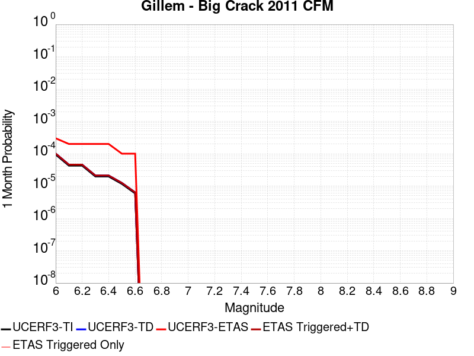 |  | 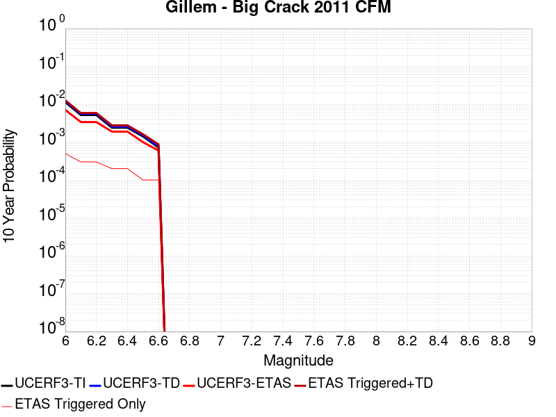 |

| Magnitude | 1 wk TI Prob | 1 wk TD Prob | 1 wk ETAS Prob | 1 wk ETAS/TD Gain | 1 wk ETAS Triggered+TD | 1 wk ETAS Triggered Only | 1 mo TI Prob | 1 mo TD Prob | 1 mo ETAS Prob | 1 mo ETAS/TD Gain | 1 mo ETAS Triggered+TD | 1 mo ETAS Triggered Only | 1 yr TI Prob | 1 yr TD Prob | 1 yr ETAS Prob | 1 yr ETAS/TD Gain | 1 yr ETAS Triggered+TD | 1 yr ETAS Triggered Only | 10 yr TI Prob | 10 yr TD Prob | 10 yr ETAS Prob | 10 yr ETAS/TD Gain | 10 yr ETAS Triggered+TD | 10 yr ETAS Triggered Only |
|-----|-----|-----|-----|-----|-----|-----|-----|-----|-----|-----|-----|-----|-----|-----|-----|-----|-----|-----|-----|-----|-----|-----|-----|-----|
| 6.0 | 2.196852E-5 | 2.3607974E-5 | 1.0E-4 | 4.235857 | 2.3607974E-5 | 0.0 | 9.4147406E-5 | 1.0117361E-4 | 3.0E-4 | 2.9652002 | 1.0117361E-4 | 0.0 | 0.0011456419 | 0.0012311816 | 6.0E-4 | 0.48733675 | 0.0012311816 | 0.0 | 0.011397537 | 0.01225247 | 0.0071 | 0.579475 | 0.012746343 | 5.0E-4 |
| 6.1 | 9.992795E-6 | 1.0713419E-5 | 0.0 | 0.0 | 1.0713419E-5 | 0.0 | 4.2825563E-5 | 4.591395E-5 | 2.0E-4 | 4.3559747 | 4.591395E-5 | 0.0 | 5.2127644E-4 | 5.5887725E-4 | 4.0E-4 | 0.71572065 | 5.5887725E-4 | 0.0 | 0.0052005537 | 0.0055765286 | 0.0034 | 0.6096983 | 0.0058748554 | 3.0E-4 |
| 6.2 | 9.992795E-6 | 1.0713419E-5 | 0.0 | 0.0 | 1.0713419E-5 | 0.0 | 4.2825563E-5 | 4.591395E-5 | 2.0E-4 | 4.3559747 | 4.591395E-5 | 0.0 | 5.2127644E-4 | 5.5887725E-4 | 4.0E-4 | 0.71572065 | 5.5887725E-4 | 0.0 | 0.0052005537 | 0.0055765286 | 0.0034 | 0.6096983 | 0.0058748554 | 3.0E-4 |
| 6.3 | 4.6127884E-6 | 4.943358E-6 | 0.0 | 0.0 | 4.943358E-6 | 0.0 | 1.9768944E-5 | 2.1185673E-5 | 2.0E-4 | 9.440342 | 2.1185673E-5 | 0.0 | 2.406603E-4 | 2.579095E-4 | 3.0E-4 | 1.1631987 | 2.579095E-4 | 0.0 | 0.0024039985 | 0.00257654 | 0.0019 | 0.737423 | 0.0027760249 | 2.0E-4 |
| 6.4 | 4.6127884E-6 | 4.943358E-6 | 0.0 | 0.0 | 4.943358E-6 | 0.0 | 1.9768944E-5 | 2.1185673E-5 | 2.0E-4 | 9.440342 | 2.1185673E-5 | 0.0 | 2.406603E-4 | 2.579095E-4 | 3.0E-4 | 1.1631987 | 2.579095E-4 | 0.0 | 0.0024039985 | 0.00257654 | 0.0019 | 0.737423 | 0.0027760249 | 2.0E-4 |
| 6.5 | 2.716712E-6 | 2.9115245E-6 | 0.0 | 0.0 | 2.9115245E-6 | 0.0 | 1.1643E-5 | 1.2477916E-5 | 1.0E-4 | 8.014158 | 1.2477916E-5 | 0.0 | 1.417443E-4 | 1.5191047E-4 | 2.0E-4 | 1.316565 | 1.5191047E-4 | 0.0 | 0.0014165393 | 0.0015183043 | 0.001 | 0.6586295 | 0.0016181525 | 1.0E-4 |
| 6.6 | 1.3818255E-6 | 1.4822822E-6 | 0.0 | 0.0 | 1.4822822E-6 | 0.0 | 5.922096E-6 | 6.352629E-6 | 1.0E-4 | 15.741513 | 6.352629E-6 | 0.0 | 7.209913E-5 | 7.734175E-5 | 1.0E-4 | 1.2929628 | 7.734175E-5 | 0.0 | 7.2075747E-4 | 7.732693E-4 | 6.0E-4 | 0.77592635 | 8.731919E-4 | 1.0E-4 |

## Los Alamos extension
*[(top)](#table-of-contents)*

| 1 Week | 1 Month | 1 Year | 10 Year |
|-----|-----|-----|-----|
|  | 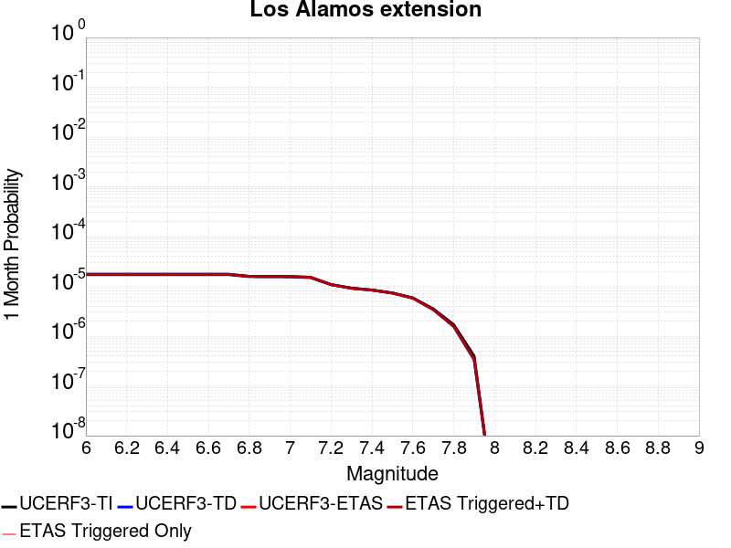 | 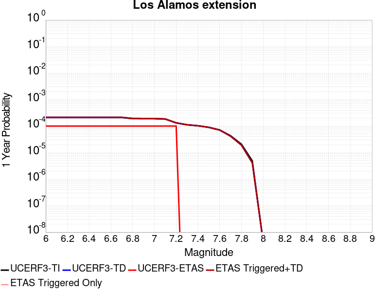 |  |

| Magnitude | 1 wk TI Prob | 1 wk TD Prob | 1 wk ETAS Prob | 1 wk ETAS/TD Gain | 1 wk ETAS Triggered+TD | 1 wk ETAS Triggered Only | 1 mo TI Prob | 1 mo TD Prob | 1 mo ETAS Prob | 1 mo ETAS/TD Gain | 1 mo ETAS Triggered+TD | 1 mo ETAS Triggered Only | 1 yr TI Prob | 1 yr TD Prob | 1 yr ETAS Prob | 1 yr ETAS/TD Gain | 1 yr ETAS Triggered+TD | 1 yr ETAS Triggered Only | 10 yr TI Prob | 10 yr TD Prob | 10 yr ETAS Prob | 10 yr ETAS/TD Gain | 10 yr ETAS Triggered+TD | 10 yr ETAS Triggered Only |
|-----|-----|-----|-----|-----|-----|-----|-----|-----|-----|-----|-----|-----|-----|-----|-----|-----|-----|-----|-----|-----|-----|-----|-----|-----|
| 6.0 | 4.0146506E-6 | 4.0864743E-6 | 0.0 | 0.0 | 4.0864743E-6 | 0.0 | 1.7205533E-5 | 1.751335E-5 | 0.0 | 0.0 | 1.751335E-5 | 0.0 | 2.0945723E-4 | 2.1320528E-4 | 1.0E-4 | 0.46903157 | 2.1320528E-4 | 0.0 | 0.0020925992 | 0.0021301163 | 0.003 | 1.4083737 | 0.0026290515 | 5.0E-4 |
| 6.1 | 4.0146506E-6 | 4.0864743E-6 | 0.0 | 0.0 | 4.0864743E-6 | 0.0 | 1.7205533E-5 | 1.751335E-5 | 0.0 | 0.0 | 1.751335E-5 | 0.0 | 2.0945723E-4 | 2.1320528E-4 | 1.0E-4 | 0.46903157 | 2.1320528E-4 | 0.0 | 0.0020925992 | 0.0021301163 | 0.003 | 1.4083737 | 0.0026290515 | 5.0E-4 |
| 6.2 | 4.0146506E-6 | 4.0864743E-6 | 0.0 | 0.0 | 4.0864743E-6 | 0.0 | 1.7205533E-5 | 1.751335E-5 | 0.0 | 0.0 | 1.751335E-5 | 0.0 | 2.0945723E-4 | 2.1320528E-4 | 1.0E-4 | 0.46903157 | 2.1320528E-4 | 0.0 | 0.0020925992 | 0.0021301163 | 0.003 | 1.4083737 | 0.0026290515 | 5.0E-4 |
| 6.3 | 4.0146506E-6 | 4.0864743E-6 | 0.0 | 0.0 | 4.0864743E-6 | 0.0 | 1.7205533E-5 | 1.751335E-5 | 0.0 | 0.0 | 1.751335E-5 | 0.0 | 2.0945723E-4 | 2.1320528E-4 | 1.0E-4 | 0.46903157 | 2.1320528E-4 | 0.0 | 0.0020925992 | 0.0021301163 | 0.003 | 1.4083737 | 0.0026290515 | 5.0E-4 |
| 6.4 | 4.0146506E-6 | 4.0864743E-6 | 0.0 | 0.0 | 4.0864743E-6 | 0.0 | 1.7205533E-5 | 1.751335E-5 | 0.0 | 0.0 | 1.751335E-5 | 0.0 | 2.0945723E-4 | 2.1320528E-4 | 1.0E-4 | 0.46903157 | 2.1320528E-4 | 0.0 | 0.0020925992 | 0.0021301163 | 0.003 | 1.4083737 | 0.0026290515 | 5.0E-4 |
| 6.5 | 4.0146506E-6 | 4.0864743E-6 | 0.0 | 0.0 | 4.0864743E-6 | 0.0 | 1.7205533E-5 | 1.751335E-5 | 0.0 | 0.0 | 1.751335E-5 | 0.0 | 2.0945723E-4 | 2.1320528E-4 | 1.0E-4 | 0.46903157 | 2.1320528E-4 | 0.0 | 0.0020925992 | 0.0021301163 | 0.003 | 1.4083737 | 0.0026290515 | 5.0E-4 |
| 6.6 | 4.0146506E-6 | 4.0864743E-6 | 0.0 | 0.0 | 4.0864743E-6 | 0.0 | 1.7205533E-5 | 1.751335E-5 | 0.0 | 0.0 | 1.751335E-5 | 0.0 | 2.0945723E-4 | 2.1320528E-4 | 1.0E-4 | 0.46903157 | 2.1320528E-4 | 0.0 | 0.0020925992 | 0.0021301163 | 0.003 | 1.4083737 | 0.0026290515 | 5.0E-4 |
| 6.7 | 4.0146506E-6 | 4.0864743E-6 | 0.0 | 0.0 | 4.0864743E-6 | 0.0 | 1.7205533E-5 | 1.751335E-5 | 0.0 | 0.0 | 1.751335E-5 | 0.0 | 2.0945723E-4 | 2.1320528E-4 | 1.0E-4 | 0.46903157 | 2.1320528E-4 | 0.0 | 0.0020925992 | 0.0021301163 | 0.003 | 1.4083737 | 0.0026290515 | 5.0E-4 |
| 6.8 | 3.6584688E-6 | 3.7191508E-6 | 0.0 | 0.0 | 3.7191508E-6 | 0.0 | 1.5679057E-5 | 1.5939126E-5 | 0.0 | 0.0 | 1.5939126E-5 | 0.0 | 1.9087581E-4 | 1.940425E-4 | 1.0E-4 | 0.515351 | 1.940425E-4 | 0.0 | 0.0019071194 | 0.0019388231 | 0.0026 | 1.3410196 | 0.0023380476 | 4.0E-4 |
| 6.9 | 3.644631E-6 | 3.7048596E-6 | 0.0 | 0.0 | 3.7048596E-6 | 0.0 | 1.5619753E-5 | 1.5877878E-5 | 0.0 | 0.0 | 1.5877878E-5 | 0.0 | 1.901539E-4 | 1.9329696E-4 | 1.0E-4 | 0.5173387 | 1.9329696E-4 | 0.0 | 0.0018999127 | 0.0019313807 | 0.0026 | 1.3461872 | 0.0023306082 | 4.0E-4 |
| 7.0 | 3.6318522E-6 | 3.6916194E-6 | 0.0 | 0.0 | 3.6916194E-6 | 0.0 | 1.5564989E-5 | 1.5821135E-5 | 0.0 | 0.0 | 1.5821135E-5 | 0.0 | 1.8948725E-4 | 1.9260623E-4 | 1.0E-4 | 0.519194 | 1.9260623E-4 | 0.0 | 0.0018932576 | 0.0019244853 | 0.0026 | 1.3510106 | 0.0023237155 | 4.0E-4 |
| 7.1 | 3.5001724E-6 | 3.5556814E-6 | 0.0 | 0.0 | 3.5556814E-6 | 0.0 | 1.5000653E-5 | 1.523855E-5 | 0.0 | 0.0 | 1.523855E-5 | 0.0 | 1.8261763E-4 | 1.8551447E-4 | 1.0E-4 | 0.5390415 | 1.8551447E-4 | 0.0 | 0.0018246764 | 0.0018536868 | 0.0025 | 1.3486637 | 0.0021531307 | 3.0E-4 |
| 7.2 | 2.5204702E-6 | 2.5439099E-6 | 0.0 | 0.0 | 2.5439099E-6 | 0.0 | 1.080197E-5 | 1.0902426E-5 | 0.0 | 0.0 | 1.0902426E-5 | 0.0 | 1.3150605E-4 | 1.3272901E-4 | 1.0E-4 | 0.7534148 | 1.3272901E-4 | 0.0 | 0.0013142825 | 0.0013265029 | 0.0013 | 0.98002046 | 0.0014263702 | 1.0E-4 |
| 7.3 | 2.1399692E-6 | 2.1503204E-6 | 0.0 | 0.0 | 2.1503204E-6 | 0.0 | 9.1712645E-6 | 9.215627E-6 | 0.0 | 0.0 | 9.215627E-6 | 0.0 | 1.1165442E-4 | 1.1219451E-4 | 0.0 | 0.0 | 1.1219451E-4 | 0.0 | 0.0011159834 | 0.001121382 | 0.0012 | 1.0701082 | 0.0012212698 | 1.0E-4 |
| 7.4 | 1.9660122E-6 | 1.970413E-6 | 0.0 | 0.0 | 1.970413E-6 | 0.0 | 8.42574E-6 | 8.4446E-6 | 0.0 | 0.0 | 8.4446E-6 | 0.0 | 1.0257855E-4 | 1.0280818E-4 | 0.0 | 0.0 | 1.0280818E-4 | 0.0 | 0.0010253121 | 0.0010276093 | 0.0011 | 1.0704457 | 0.0011275066 | 1.0E-4 |
| 7.5 | 1.7204633E-6 | 1.7152552E-6 | 0.0 | 0.0 | 1.7152552E-6 | 0.0 | 7.373393E-6 | 7.351073E-6 | 0.0 | 0.0 | 7.351073E-6 | 0.0 | 8.976737E-5 | 8.949567E-5 | 0.0 | 0.0 | 8.949567E-5 | 0.0 | 8.9731114E-4 | 8.9459924E-4 | 0.0011 | 1.2296009 | 9.945098E-4 | 1.0E-4 |
| 7.6 | 1.3717638E-6 | 1.3537098E-6 | 0.0 | 0.0 | 1.3537098E-6 | 0.0 | 5.878974E-6 | 5.8016008E-6 | 0.0 | 0.0 | 5.8016008E-6 | 0.0 | 7.157416E-5 | 7.0632224E-5 | 0.0 | 0.0 | 7.0632224E-5 | 0.0 | 7.1551115E-4 | 7.0610037E-4 | 6.0E-4 | 0.8497375 | 8.0602977E-4 | 1.0E-4 |
| 7.7 | 8.272564E-7 | 7.9584316E-7 | 0.0 | 0.0 | 7.9584316E-7 | 0.0 | 3.5453797E-6 | 3.410752E-6 | 0.0 | 0.0 | 3.410752E-6 | 0.0 | 4.3164142E-5 | 4.1525116E-5 | 0.0 | 0.0 | 4.1525116E-5 | 0.0 | 4.315576E-4 | 4.1517374E-4 | 5.0E-4 | 1.2043151 | 5.151322E-4 | 1.0E-4 |
| 7.8 | 3.9708277E-7 | 3.6723083E-7 | 0.0 | 0.0 | 3.6723083E-7 | 0.0 | 1.7017821E-6 | 1.5738455E-6 | 0.0 | 0.0 | 1.5738455E-6 | 0.0 | 2.0719E-5 | 1.91614E-5 | 0.0 | 0.0 | 1.91614E-5 | 0.0 | 2.071707E-4 | 1.9159754E-4 | 3.0E-4 | 1.5657821 | 2.9157838E-4 | 1.0E-4 |
| 7.9 | 9.292528E-8 | 7.8900555E-8 | 0.0 | 0.0 | 7.8900555E-8 | 0.0 | 3.9825116E-7 | 3.3814518E-7 | 0.0 | 0.0 | 3.3814518E-7 | 0.0 | 4.848697E-6 | 4.11691E-6 | 0.0 | 0.0 | 4.11691E-6 | 0.0 | 4.8485912E-5 | 4.1168347E-5 | 2.0E-4 | 4.8581014 | 4.1168347E-5 | 0.0 |
| 8.0 | 7.880441E-11 | 8.236045E-11 | 0.0 | 0.0 | 8.236045E-11 | 0.0 | 3.3773329E-10 | 3.5297354E-10 | 0.0 | 0.0 | 3.5297354E-10 | 0.0 | 4.1119033E-9 | 4.297453E-9 | 0.0 | 0.0 | 4.297453E-9 | 0.0 | 4.1119034E-8 | 4.2974534E-8 | 0.0 | 0.0 | 4.2974534E-8 | 0.0 |

## Santa Monica alt 1
*[(top)](#table-of-contents)*

| 1 Week | 1 Month | 1 Year | 10 Year |
|-----|-----|-----|-----|
| 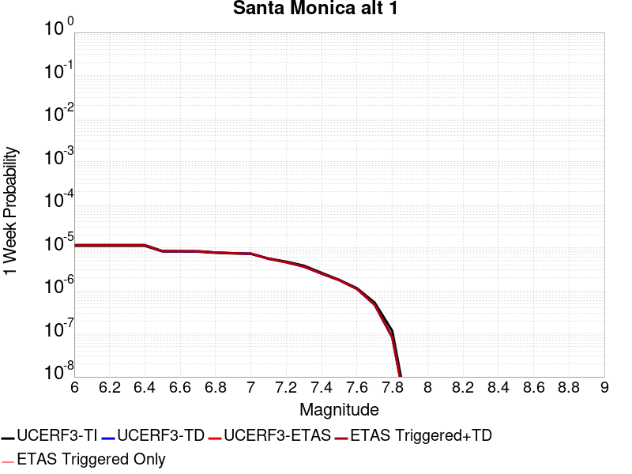 |  |  |  |

| Magnitude | 1 wk TI Prob | 1 wk TD Prob | 1 wk ETAS Prob | 1 wk ETAS/TD Gain | 1 wk ETAS Triggered+TD | 1 wk ETAS Triggered Only | 1 mo TI Prob | 1 mo TD Prob | 1 mo ETAS Prob | 1 mo ETAS/TD Gain | 1 mo ETAS Triggered+TD | 1 mo ETAS Triggered Only | 1 yr TI Prob | 1 yr TD Prob | 1 yr ETAS Prob | 1 yr ETAS/TD Gain | 1 yr ETAS Triggered+TD | 1 yr ETAS Triggered Only | 10 yr TI Prob | 10 yr TD Prob | 10 yr ETAS Prob | 10 yr ETAS/TD Gain | 10 yr ETAS Triggered+TD | 10 yr ETAS Triggered Only |
|-----|-----|-----|-----|-----|-----|-----|-----|-----|-----|-----|-----|-----|-----|-----|-----|-----|-----|-----|-----|-----|-----|-----|-----|-----|
| 6.0 | 1.1066008E-5 | 1.1482301E-5 | 0.0 | 0.0 | 1.1482301E-5 | 0.0 | 4.742488E-5 | 4.9209008E-5 | 0.0 | 0.0 | 4.9209008E-5 | 0.0 | 5.7724497E-4 | 5.9896894E-4 | 5.0E-4 | 0.8347678 | 5.9896894E-4 | 0.0 | 0.005757478 | 0.005974933 | 0.004 | 0.6694636 | 0.0064719454 | 5.0E-4 |
| 6.1 | 1.1066008E-5 | 1.1482301E-5 | 0.0 | 0.0 | 1.1482301E-5 | 0.0 | 4.742488E-5 | 4.9209008E-5 | 0.0 | 0.0 | 4.9209008E-5 | 0.0 | 5.7724497E-4 | 5.9896894E-4 | 5.0E-4 | 0.8347678 | 5.9896894E-4 | 0.0 | 0.005757478 | 0.005974933 | 0.004 | 0.6694636 | 0.0064719454 | 5.0E-4 |
| 6.2 | 1.1066008E-5 | 1.1482301E-5 | 0.0 | 0.0 | 1.1482301E-5 | 0.0 | 4.742488E-5 | 4.9209008E-5 | 0.0 | 0.0 | 4.9209008E-5 | 0.0 | 5.7724497E-4 | 5.9896894E-4 | 5.0E-4 | 0.8347678 | 5.9896894E-4 | 0.0 | 0.005757478 | 0.005974933 | 0.004 | 0.6694636 | 0.0064719454 | 5.0E-4 |
| 6.3 | 1.1066008E-5 | 1.1482301E-5 | 0.0 | 0.0 | 1.1482301E-5 | 0.0 | 4.742488E-5 | 4.9209008E-5 | 0.0 | 0.0 | 4.9209008E-5 | 0.0 | 5.7724497E-4 | 5.9896894E-4 | 5.0E-4 | 0.8347678 | 5.9896894E-4 | 0.0 | 0.005757478 | 0.005974933 | 0.004 | 0.6694636 | 0.0064719454 | 5.0E-4 |
| 6.4 | 1.1066008E-5 | 1.1482301E-5 | 0.0 | 0.0 | 1.1482301E-5 | 0.0 | 4.742488E-5 | 4.9209008E-5 | 0.0 | 0.0 | 4.9209008E-5 | 0.0 | 5.7724497E-4 | 5.9896894E-4 | 5.0E-4 | 0.8347678 | 5.9896894E-4 | 0.0 | 0.005757478 | 0.005974933 | 0.004 | 0.6694636 | 0.0064719454 | 5.0E-4 |
| 6.5 | 8.183544E-6 | 8.336854E-6 | 0.0 | 0.0 | 8.336854E-6 | 0.0 | 3.5071862E-5 | 3.572889E-5 | 0.0 | 0.0 | 3.572889E-5 | 0.0 | 4.2691626E-4 | 4.3491405E-4 | 4.0E-4 | 0.91972196 | 4.3491405E-4 | 0.0 | 0.0042609703 | 0.004340795 | 0.0033 | 0.76022947 | 0.004739058 | 4.0E-4 |
| 6.6 | 8.1543285E-6 | 8.305063E-6 | 0.0 | 0.0 | 8.305063E-6 | 0.0 | 3.4946657E-5 | 3.559265E-5 | 0.0 | 0.0 | 3.559265E-5 | 0.0 | 4.2539247E-4 | 4.3325595E-4 | 4.0E-4 | 0.92324185 | 4.3325595E-4 | 0.0 | 0.0042457907 | 0.0043242783 | 0.0033 | 0.76313317 | 0.0047225486 | 4.0E-4 |
| 6.7 | 8.110878E-6 | 8.258453E-6 | 0.0 | 0.0 | 8.258453E-6 | 0.0 | 3.4760444E-5 | 3.5392895E-5 | 0.0 | 0.0 | 3.5392895E-5 | 0.0 | 4.231262E-4 | 4.308249E-4 | 4.0E-4 | 0.9284514 | 4.308249E-4 | 0.0 | 0.0042232145 | 0.004300062 | 0.0033 | 0.7674308 | 0.004698342 | 4.0E-4 |
| 6.8 | 7.644036E-6 | 7.752386E-6 | 0.0 | 0.0 | 7.752386E-6 | 0.0 | 3.275974E-5 | 3.3224096E-5 | 0.0 | 0.0 | 3.3224096E-5 | 0.0 | 3.9877684E-4 | 4.044297E-4 | 4.0E-4 | 0.989047 | 4.044297E-4 | 0.0 | 0.00398062 | 0.0040370836 | 0.003 | 0.7431107 | 0.0044354685 | 4.0E-4 |
| 6.9 | 7.3698293E-6 | 7.4569994E-6 | 0.0 | 0.0 | 7.4569994E-6 | 0.0 | 3.15846E-5 | 3.1958185E-5 | 0.0 | 0.0 | 3.1958185E-5 | 0.0 | 3.8447464E-4 | 3.8902284E-4 | 4.0E-4 | 1.0282173 | 3.8902284E-4 | 0.0 | 0.0038381014 | 0.003883562 | 0.003 | 0.7724867 | 0.0042820084 | 4.0E-4 |
| 7.0 | 7.209872E-6 | 7.2868843E-6 | 0.0 | 0.0 | 7.2868843E-6 | 0.0 | 3.0899086E-5 | 3.1229138E-5 | 0.0 | 0.0 | 3.1229138E-5 | 0.0 | 3.7613141E-4 | 3.801498E-4 | 4.0E-4 | 1.0522168 | 3.801498E-4 | 0.0 | 0.0037549543 | 0.003795138 | 0.003 | 0.7904851 | 0.00419362 | 4.0E-4 |
| 7.1 | 5.603456E-6 | 5.524813E-6 | 0.0 | 0.0 | 5.524813E-6 | 0.0 | 2.4014591E-5 | 2.3677556E-5 | 0.0 | 0.0 | 2.3677556E-5 | 0.0 | 2.923384E-4 | 2.882365E-4 | 4.0E-4 | 1.3877493 | 2.882365E-4 | 0.0 | 0.0029195412 | 0.0028786683 | 0.0022 | 0.76424223 | 0.0031778049 | 3.0E-4 |
| 7.2 | 4.7483613E-6 | 4.591884E-6 | 0.0 | 0.0 | 4.591884E-6 | 0.0 | 2.0349962E-5 | 1.9679355E-5 | 0.0 | 0.0 | 1.9679355E-5 | 0.0 | 2.4773262E-4 | 2.3956993E-4 | 3.0E-4 | 1.252244 | 2.3956993E-4 | 0.0 | 0.0024745662 | 0.002393131 | 0.0019 | 0.79393905 | 0.0026924128 | 3.0E-4 |
| 7.3 | 3.829015E-6 | 3.6348372E-6 | 0.0 | 0.0 | 3.6348372E-6 | 0.0 | 1.6409962E-5 | 1.5577782E-5 | 0.0 | 0.0 | 1.5577782E-5 | 0.0 | 1.9977297E-4 | 1.8964306E-4 | 3.0E-4 | 1.5819192 | 1.8964306E-4 | 0.0 | 0.0019959346 | 0.0018948212 | 0.0015 | 0.7916314 | 0.0019946317 | 1.0E-4 |
| 7.4 | 2.610755E-6 | 2.5000322E-6 | 0.0 | 0.0 | 2.5000322E-6 | 0.0 | 1.1188902E-5 | 1.0714381E-5 | 0.0 | 0.0 | 1.0714381E-5 | 0.0 | 1.3621636E-4 | 1.3043982E-4 | 3.0E-4 | 2.2999113 | 1.3043982E-4 | 0.0 | 0.001361329 | 0.0013036369 | 0.001 | 0.7670847 | 0.0013036369 | 0.0 |
| 7.5 | 1.792146E-6 | 1.7586898E-6 | 0.0 | 0.0 | 1.7586898E-6 | 0.0 | 7.680603E-6 | 7.5372204E-6 | 0.0 | 0.0 | 7.5372204E-6 | 0.0 | 9.3507326E-5 | 9.176182E-5 | 3.0E-4 | 3.2693334 | 9.176182E-5 | 0.0 | 9.3467993E-4 | 9.1724255E-4 | 8.0E-4 | 0.8721794 | 9.1724255E-4 | 0.0 |
| 7.6 | 1.1473018E-6 | 1.1030645E-6 | 0.0 | 0.0 | 1.1030645E-6 | 0.0 | 4.9169985E-6 | 4.7274107E-6 | 0.0 | 0.0 | 4.7274107E-6 | 0.0 | 5.986281E-5 | 5.7554724E-5 | 1.0E-4 | 1.737477 | 5.7554724E-5 | 0.0 | 5.984669E-4 | 5.7539984E-4 | 4.0E-4 | 0.6951688 | 5.7539984E-4 | 0.0 |
| 7.7 | 5.330919E-7 | 4.745986E-7 | 0.0 | 0.0 | 4.745986E-7 | 0.0 | 2.2846775E-6 | 2.0339924E-6 | 0.0 | 0.0 | 2.0339924E-6 | 0.0 | 2.7815593E-5 | 2.4763589E-5 | 1.0E-4 | 4.038187 | 2.4763589E-5 | 0.0 | 2.7812112E-4 | 2.4760942E-4 | 3.0E-4 | 1.2115855 | 2.4760942E-4 | 0.0 |
| 7.8 | 1.1668574E-7 | 8.2991036E-8 | 0.0 | 0.0 | 8.2991036E-8 | 0.0 | 5.000816E-7 | 3.556758E-7 | 0.0 | 0.0 | 3.556758E-7 | 0.0 | 6.0884768E-6 | 4.330345E-6 | 1.0E-4 | 23.09285 | 4.330345E-6 | 0.0 | 6.08831E-5 | 4.3302636E-5 | 1.0E-4 | 2.3093283 | 4.3302636E-5 | 0.0 |
| 7.9 | 8.007447E-10 | 6.162303E-10 | 0.0 | 0.0 | 6.162303E-10 | 0.0 | 3.4317629E-9 | 2.6409874E-9 | 0.0 | 0.0 | 2.6409874E-9 | 0.0 | 4.1781714E-8 | 3.215402E-8 | 0.0 | 0.0 | 3.215402E-8 | 0.0 | 4.1781706E-7 | 3.2154017E-7 | 0.0 | 0.0 | 3.2154017E-7 | 0.0 |

## Thirty Mile Bank
*[(top)](#table-of-contents)*

| 1 Week | 1 Month | 1 Year | 10 Year |
|-----|-----|-----|-----|
|  | 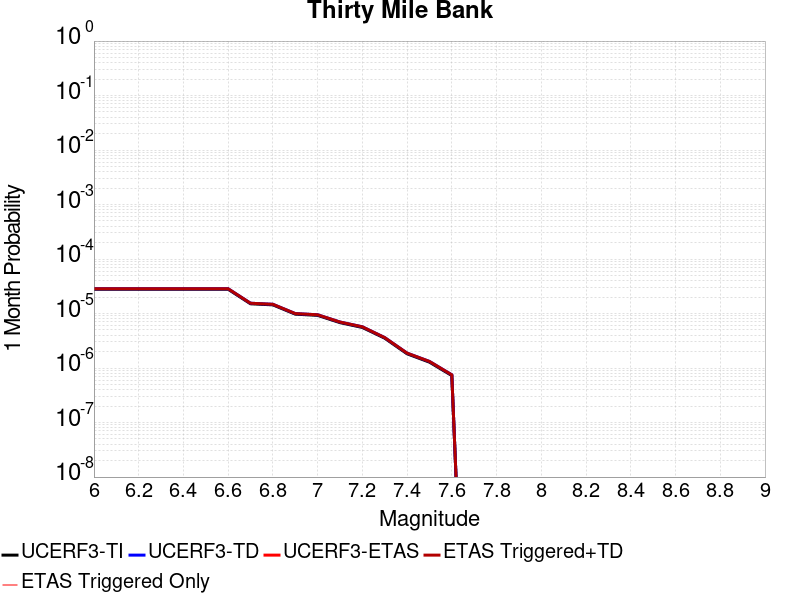 | 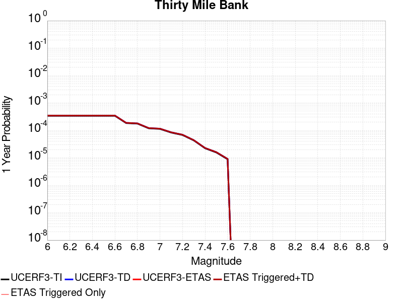 | 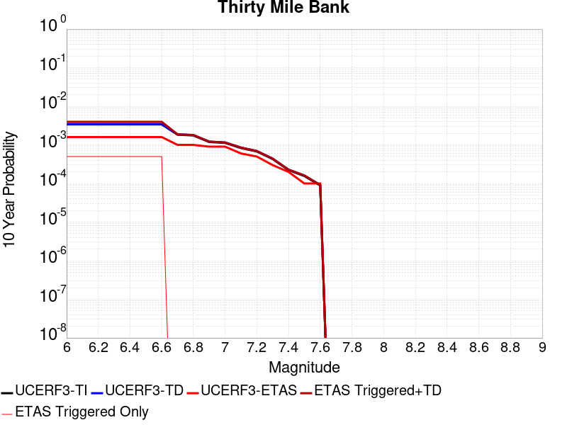 |

| Magnitude | 1 wk TI Prob | 1 wk TD Prob | 1 wk ETAS Prob | 1 wk ETAS/TD Gain | 1 wk ETAS Triggered+TD | 1 wk ETAS Triggered Only | 1 mo TI Prob | 1 mo TD Prob | 1 mo ETAS Prob | 1 mo ETAS/TD Gain | 1 mo ETAS Triggered+TD | 1 mo ETAS Triggered Only | 1 yr TI Prob | 1 yr TD Prob | 1 yr ETAS Prob | 1 yr ETAS/TD Gain | 1 yr ETAS Triggered+TD | 1 yr ETAS Triggered Only | 10 yr TI Prob | 10 yr TD Prob | 10 yr ETAS Prob | 10 yr ETAS/TD Gain | 10 yr ETAS Triggered+TD | 10 yr ETAS Triggered Only |
|-----|-----|-----|-----|-----|-----|-----|-----|-----|-----|-----|-----|-----|-----|-----|-----|-----|-----|-----|-----|-----|-----|-----|-----|-----|
| 6.0 | 6.5124755E-6 | 6.6595626E-6 | 0.0 | 0.0 | 6.6595626E-6 | 0.0 | 2.791031E-5 | 2.8540695E-5 | 0.0 | 0.0 | 2.8540695E-5 | 0.0 | 3.3975503E-4 | 3.4743192E-4 | 0.0 | 0.0 | 3.4743192E-4 | 0.0 | 0.0033923604 | 0.003469319 | 0.0016 | 0.4611856 | 0.0039675846 | 5.0E-4 |
| 6.1 | 6.5124755E-6 | 6.6595626E-6 | 0.0 | 0.0 | 6.6595626E-6 | 0.0 | 2.791031E-5 | 2.8540695E-5 | 0.0 | 0.0 | 2.8540695E-5 | 0.0 | 3.3975503E-4 | 3.4743192E-4 | 0.0 | 0.0 | 3.4743192E-4 | 0.0 | 0.0033923604 | 0.003469319 | 0.0016 | 0.4611856 | 0.0039675846 | 5.0E-4 |
| 6.2 | 6.5124755E-6 | 6.6595626E-6 | 0.0 | 0.0 | 6.6595626E-6 | 0.0 | 2.791031E-5 | 2.8540695E-5 | 0.0 | 0.0 | 2.8540695E-5 | 0.0 | 3.3975503E-4 | 3.4743192E-4 | 0.0 | 0.0 | 3.4743192E-4 | 0.0 | 0.0033923604 | 0.003469319 | 0.0016 | 0.4611856 | 0.0039675846 | 5.0E-4 |
| 6.3 | 6.5124755E-6 | 6.6595626E-6 | 0.0 | 0.0 | 6.6595626E-6 | 0.0 | 2.791031E-5 | 2.8540695E-5 | 0.0 | 0.0 | 2.8540695E-5 | 0.0 | 3.3975503E-4 | 3.4743192E-4 | 0.0 | 0.0 | 3.4743192E-4 | 0.0 | 0.0033923604 | 0.003469319 | 0.0016 | 0.4611856 | 0.0039675846 | 5.0E-4 |
| 6.4 | 6.5124755E-6 | 6.6595626E-6 | 0.0 | 0.0 | 6.6595626E-6 | 0.0 | 2.791031E-5 | 2.8540695E-5 | 0.0 | 0.0 | 2.8540695E-5 | 0.0 | 3.3975503E-4 | 3.4743192E-4 | 0.0 | 0.0 | 3.4743192E-4 | 0.0 | 0.0033923604 | 0.003469319 | 0.0016 | 0.4611856 | 0.0039675846 | 5.0E-4 |
| 6.5 | 6.5124755E-6 | 6.6595626E-6 | 0.0 | 0.0 | 6.6595626E-6 | 0.0 | 2.791031E-5 | 2.8540695E-5 | 0.0 | 0.0 | 2.8540695E-5 | 0.0 | 3.3975503E-4 | 3.4743192E-4 | 0.0 | 0.0 | 3.4743192E-4 | 0.0 | 0.0033923604 | 0.003469319 | 0.0016 | 0.4611856 | 0.0039675846 | 5.0E-4 |
| 6.6 | 6.5124755E-6 | 6.6595626E-6 | 0.0 | 0.0 | 6.6595626E-6 | 0.0 | 2.791031E-5 | 2.8540695E-5 | 0.0 | 0.0 | 2.8540695E-5 | 0.0 | 3.3975503E-4 | 3.4743192E-4 | 0.0 | 0.0 | 3.4743192E-4 | 0.0 | 0.0033923604 | 0.003469319 | 0.0016 | 0.4611856 | 0.0039675846 | 5.0E-4 |
| 6.7 | 3.5261137E-6 | 3.61007E-6 | 0.0 | 0.0 | 3.61007E-6 | 0.0 | 1.5111828E-5 | 1.5471642E-5 | 0.0 | 0.0 | 1.5471642E-5 | 0.0 | 1.8397097E-4 | 1.8835161E-4 | 0.0 | 0.0 | 1.8835161E-4 | 0.0 | 0.0018381875 | 0.0018819846 | 0.001 | 0.53135395 | 0.0018819846 | 0.0 |
| 6.8 | 3.370743E-6 | 3.4510988E-6 | 0.0 | 0.0 | 3.4510988E-6 | 0.0 | 1.4445961E-5 | 1.4790343E-5 | 0.0 | 0.0 | 1.4790343E-5 | 0.0 | 1.7586538E-4 | 1.8005817E-4 | 0.0 | 0.0 | 1.8005817E-4 | 0.0 | 0.0017572626 | 0.0017991846 | 0.001 | 0.55580735 | 0.0017991846 | 0.0 |
| 6.9 | 2.2756835E-6 | 2.3332784E-6 | 0.0 | 0.0 | 2.3332784E-6 | 0.0 | 9.752893E-6 | 9.999727E-6 | 0.0 | 0.0 | 9.999727E-6 | 0.0 | 1.18735006E-4 | 1.2174013E-4 | 0.0 | 0.0 | 1.2174013E-4 | 0.0 | 0.0011867158 | 0.001216759 | 9.0E-4 | 0.7396699 | 0.001216759 | 0.0 |
| 7.0 | 2.1617404E-6 | 2.2160907E-6 | 0.0 | 0.0 | 2.2160907E-6 | 0.0 | 9.264569E-6 | 9.497498E-6 | 0.0 | 0.0 | 9.497498E-6 | 0.0 | 1.1279029E-4 | 1.1562614E-4 | 0.0 | 0.0 | 1.1562614E-4 | 0.0 | 0.0011273306 | 0.0011556839 | 9.0E-4 | 0.77875966 | 0.0011556839 | 0.0 |
| 7.1 | 1.5900777E-6 | 1.6327884E-6 | 0.0 | 0.0 | 1.6327884E-6 | 0.0 | 6.814601E-6 | 6.997647E-6 | 0.0 | 0.0 | 6.997647E-6 | 0.0 | 8.296461E-5 | 8.519315E-5 | 0.0 | 0.0 | 8.519315E-5 | 0.0 | 8.293364E-4 | 8.5161766E-4 | 6.0E-4 | 0.7045415 | 8.5161766E-4 | 0.0 |
| 7.2 | 1.2971728E-6 | 1.3329721E-6 | 0.0 | 0.0 | 1.3329721E-6 | 0.0 | 5.5593005E-6 | 5.712726E-6 | 0.0 | 0.0 | 5.712726E-6 | 0.0 | 6.768238E-5 | 6.9550326E-5 | 0.0 | 0.0 | 6.9550326E-5 | 0.0 | 6.7661767E-4 | 6.952959E-4 | 5.0E-4 | 0.7191183 | 6.952959E-4 | 0.0 |
| 7.3 | 8.2454284E-7 | 8.449305E-7 | 0.0 | 0.0 | 8.449305E-7 | 0.0 | 3.5337503E-6 | 3.621126E-6 | 0.0 | 0.0 | 3.621126E-6 | 0.0 | 4.302256E-5 | 4.408638E-5 | 0.0 | 0.0 | 4.408638E-5 | 0.0 | 4.301423E-4 | 4.4078237E-4 | 3.0E-4 | 0.680608 | 4.4078237E-4 | 0.0 |
| 7.4 | 4.2619024E-7 | 4.386601E-7 | 0.0 | 0.0 | 4.386601E-7 | 0.0 | 1.8265283E-6 | 1.8799705E-6 | 0.0 | 0.0 | 1.8799705E-6 | 0.0 | 2.2237757E-5 | 2.2888404E-5 | 0.0 | 0.0 | 2.2888404E-5 | 0.0 | 2.223553E-4 | 2.2886085E-4 | 2.0E-4 | 0.87389344 | 2.2886085E-4 | 0.0 |
| 7.5 | 2.993922E-7 | 3.0866423E-7 | 0.0 | 0.0 | 3.0866423E-7 | 0.0 | 1.2831089E-6 | 1.3228461E-6 | 0.0 | 0.0 | 1.3228461E-6 | 0.0 | 1.5621737E-5 | 1.6105534E-5 | 0.0 | 0.0 | 1.6105534E-5 | 0.0 | 1.562064E-4 | 1.6104392E-4 | 1.0E-4 | 0.6209486 | 1.6104392E-4 | 0.0 |
| 7.6 | 1.6988751E-7 | 1.753494E-7 | 0.0 | 0.0 | 1.753494E-7 | 0.0 | 7.2808916E-7 | 7.5149717E-7 | 0.0 | 0.0 | 7.5149717E-7 | 0.0 | 8.864449E-6 | 9.149442E-6 | 0.0 | 0.0 | 9.149442E-6 | 0.0 | 8.8640954E-5 | 9.149085E-5 | 1.0E-4 | 1.0930055 | 9.149085E-5 | 0.0 |

## Elsinore (Julian)
*[(top)](#table-of-contents)*

| 1 Week | 1 Month | 1 Year | 10 Year |
|-----|-----|-----|-----|
|  |  |  |  |

| Magnitude | 1 wk TI Prob | 1 wk TD Prob | 1 wk ETAS Prob | 1 wk ETAS/TD Gain | 1 wk ETAS Triggered+TD | 1 wk ETAS Triggered Only | 1 mo TI Prob | 1 mo TD Prob | 1 mo ETAS Prob | 1 mo ETAS/TD Gain | 1 mo ETAS Triggered+TD | 1 mo ETAS Triggered Only | 1 yr TI Prob | 1 yr TD Prob | 1 yr ETAS Prob | 1 yr ETAS/TD Gain | 1 yr ETAS Triggered+TD | 1 yr ETAS Triggered Only | 10 yr TI Prob | 10 yr TD Prob | 10 yr ETAS Prob | 10 yr ETAS/TD Gain | 10 yr ETAS Triggered+TD | 10 yr ETAS Triggered Only |
|-----|-----|-----|-----|-----|-----|-----|-----|-----|-----|-----|-----|-----|-----|-----|-----|-----|-----|-----|-----|-----|-----|-----|-----|-----|
| 6.0 | 1.1710231E-5 | 8.85122E-6 | 0.0 | 0.0 | 8.85122E-6 | 0.0 | 5.0185736E-5 | 3.7933256E-5 | 0.0 | 0.0 | 3.7933256E-5 | 0.0 | 6.1084004E-4 | 4.6174123E-4 | 5.0E-4 | 1.0828576 | 5.616951E-4 | 1.0E-4 | 0.006091637 | 0.0046080067 | 0.0023 | 0.49913123 | 0.0051057027 | 5.0E-4 |
| 6.1 | 1.1710231E-5 | 8.85122E-6 | 0.0 | 0.0 | 8.85122E-6 | 0.0 | 5.0185736E-5 | 3.7933256E-5 | 0.0 | 0.0 | 3.7933256E-5 | 0.0 | 6.1084004E-4 | 4.6174123E-4 | 5.0E-4 | 1.0828576 | 5.616951E-4 | 1.0E-4 | 0.006091637 | 0.0046080067 | 0.0023 | 0.49913123 | 0.0051057027 | 5.0E-4 |
| 6.2 | 1.1710231E-5 | 8.85122E-6 | 0.0 | 0.0 | 8.85122E-6 | 0.0 | 5.0185736E-5 | 3.7933256E-5 | 0.0 | 0.0 | 3.7933256E-5 | 0.0 | 6.1084004E-4 | 4.6174123E-4 | 5.0E-4 | 1.0828576 | 5.616951E-4 | 1.0E-4 | 0.006091637 | 0.0046080067 | 0.0023 | 0.49913123 | 0.0051057027 | 5.0E-4 |
| 6.3 | 1.1710231E-5 | 8.85122E-6 | 0.0 | 0.0 | 8.85122E-6 | 0.0 | 5.0185736E-5 | 3.7933256E-5 | 0.0 | 0.0 | 3.7933256E-5 | 0.0 | 6.1084004E-4 | 4.6174123E-4 | 5.0E-4 | 1.0828576 | 5.616951E-4 | 1.0E-4 | 0.006091637 | 0.0046080067 | 0.0023 | 0.49913123 | 0.0051057027 | 5.0E-4 |
| 6.4 | 1.1710231E-5 | 8.85122E-6 | 0.0 | 0.0 | 8.85122E-6 | 0.0 | 5.0185736E-5 | 3.7933256E-5 | 0.0 | 0.0 | 3.7933256E-5 | 0.0 | 6.1084004E-4 | 4.6174123E-4 | 5.0E-4 | 1.0828576 | 5.616951E-4 | 1.0E-4 | 0.006091637 | 0.0046080067 | 0.0023 | 0.49913123 | 0.0051057027 | 5.0E-4 |
| 6.5 | 1.1710231E-5 | 8.85122E-6 | 0.0 | 0.0 | 8.85122E-6 | 0.0 | 5.0185736E-5 | 3.7933256E-5 | 0.0 | 0.0 | 3.7933256E-5 | 0.0 | 6.1084004E-4 | 4.6174123E-4 | 5.0E-4 | 1.0828576 | 5.616951E-4 | 1.0E-4 | 0.006091637 | 0.0046080067 | 0.0023 | 0.49913123 | 0.0051057027 | 5.0E-4 |
| 6.6 | 1.1650619E-5 | 8.783577E-6 | 0.0 | 0.0 | 8.783577E-6 | 0.0 | 4.993027E-5 | 3.7643367E-5 | 0.0 | 0.0 | 3.7643367E-5 | 0.0 | 6.0773146E-4 | 4.5821333E-4 | 5.0E-4 | 1.0911947 | 5.581675E-4 | 1.0E-4 | 0.0060607214 | 0.004572873 | 0.0022 | 0.48109797 | 0.0050705867 | 5.0E-4 |
| 6.7 | 1.1650619E-5 | 8.783577E-6 | 0.0 | 0.0 | 8.783577E-6 | 0.0 | 4.993027E-5 | 3.7643367E-5 | 0.0 | 0.0 | 3.7643367E-5 | 0.0 | 6.0773146E-4 | 4.5821333E-4 | 5.0E-4 | 1.0911947 | 5.581675E-4 | 1.0E-4 | 0.0060607214 | 0.004572873 | 0.0022 | 0.48109797 | 0.0050705867 | 5.0E-4 |
| 6.8 | 1.1442698E-5 | 8.566687E-6 | 0.0 | 0.0 | 8.566687E-6 | 0.0 | 4.9039216E-5 | 3.6713867E-5 | 0.0 | 0.0 | 3.6713867E-5 | 0.0 | 5.968889E-4 | 4.4690134E-4 | 5.0E-4 | 1.1188152 | 5.4685667E-4 | 1.0E-4 | 0.0059528816 | 0.004460212 | 0.0021 | 0.47082967 | 0.004957982 | 5.0E-4 |
| 6.9 | 1.1300589E-5 | 8.414524E-6 | 0.0 | 0.0 | 8.414524E-6 | 0.0 | 4.8430196E-5 | 3.6061756E-5 | 0.0 | 0.0 | 3.6061756E-5 | 0.0 | 5.894781E-4 | 4.3896507E-4 | 5.0E-4 | 1.1390427 | 5.389212E-4 | 1.0E-4 | 0.005879169 | 0.0043811635 | 0.0021 | 0.4793247 | 0.004878973 | 5.0E-4 |
| 7.0 | 1.1117729E-5 | 8.231632E-6 | 0.0 | 0.0 | 8.231632E-6 | 0.0 | 4.764654E-5 | 3.5277953E-5 | 0.0 | 0.0 | 3.5277953E-5 | 0.0 | 5.799422E-4 | 4.294261E-4 | 5.0E-4 | 1.1643447 | 5.2938313E-4 | 1.0E-4 | 0.0057843104 | 0.0042861453 | 0.0021 | 0.48995072 | 0.0047840024 | 5.0E-4 |
| 7.1 | 1.08053955E-5 | 7.91721E-6 | 0.0 | 0.0 | 7.91721E-6 | 0.0 | 4.6308014E-5 | 3.3930468E-5 | 0.0 | 0.0 | 3.3930468E-5 | 0.0 | 5.6365423E-4 | 4.1302675E-4 | 5.0E-4 | 1.2105753 | 5.1298545E-4 | 1.0E-4 | 0.005622267 | 0.0041227704 | 0.0019 | 0.46085513 | 0.004620709 | 5.0E-4 |
| 7.2 | 1.032804E-5 | 7.438383E-6 | 0.0 | 0.0 | 7.438383E-6 | 0.0 | 4.4262277E-5 | 3.1878404E-5 | 0.0 | 0.0 | 3.1878404E-5 | 0.0 | 5.387599E-4 | 3.8805202E-4 | 5.0E-4 | 1.2884871 | 4.880132E-4 | 1.0E-4 | 0.0053745564 | 0.0038739152 | 0.0018 | 0.46464622 | 0.0043719783 | 5.0E-4 |
| 7.3 | 9.622426E-6 | 6.902808E-6 | 0.0 | 0.0 | 6.902808E-6 | 0.0 | 4.1238312E-5 | 2.9583134E-5 | 0.0 | 0.0 | 2.9583134E-5 | 0.0 | 5.019608E-4 | 3.6011657E-4 | 4.0E-4 | 1.1107515 | 3.6011657E-4 | 0.0 | 0.005008285 | 0.0035954856 | 0.0017 | 0.47281516 | 0.003994047 | 4.0E-4 |
| 7.4 | 9.144434E-6 | 6.5010236E-6 | 0.0 | 0.0 | 6.5010236E-6 | 0.0 | 3.9189843E-5 | 2.786124E-5 | 0.0 | 0.0 | 2.786124E-5 | 0.0 | 4.7703186E-4 | 3.391592E-4 | 4.0E-4 | 1.1793872 | 3.391592E-4 | 0.0 | 0.0047600917 | 0.0033865587 | 0.0015 | 0.44292748 | 0.0037852041 | 4.0E-4 |
| 7.5 | 7.988981E-6 | 5.502274E-6 | 0.0 | 0.0 | 5.502274E-6 | 0.0 | 3.4238044E-5 | 2.3580968E-5 | 0.0 | 0.0 | 2.3580968E-5 | 0.0 | 4.1676845E-4 | 2.8706173E-4 | 3.0E-4 | 1.0450714 | 2.8706173E-4 | 0.0 | 0.0041598766 | 0.0028670367 | 0.001 | 0.3487922 | 0.0030664632 | 2.0E-4 |
| 7.6 | 6.9554876E-6 | 4.666095E-6 | 0.0 | 0.0 | 4.666095E-6 | 0.0 | 2.9808893E-5 | 1.9997402E-5 | 0.0 | 0.0 | 1.9997402E-5 | 0.0 | 3.6286283E-4 | 2.4344234E-4 | 3.0E-4 | 1.2323246 | 2.4344234E-4 | 0.0 | 0.0036227088 | 0.002431873 | 8.0E-4 | 0.32896456 | 0.002431873 | 0.0 |
| 7.7 | 4.1557314E-6 | 2.3265297E-6 | 0.0 | 0.0 | 2.3265297E-6 | 0.0 | 1.7810156E-5 | 9.970809E-6 | 0.0 | 0.0 | 9.970809E-6 | 0.0 | 2.1681708E-4 | 1.2138857E-4 | 2.0E-4 | 1.6476016 | 1.2138857E-4 | 0.0 | 0.0021660565 | 0.0012132959 | 5.0E-4 | 0.41210064 | 0.0012132959 | 0.0 |
| 7.8 | 2.2597293E-7 | 9.3388074E-8 | 0.0 | 0.0 | 9.3388074E-8 | 0.0 | 9.684551E-7 | 4.0023457E-7 | 0.0 | 0.0 | 4.0023457E-7 | 0.0 | 1.1790877E-5 | 4.8728484E-6 | 0.0 | 0.0 | 4.8728484E-6 | 0.0 | 1.17902506E-4 | 4.8727743E-5 | 0.0 | 0.0 | 4.8727743E-5 | 0.0 |
| 7.9 | 6.676829E-9 | 3.4415768E-9 | 0.0 | 0.0 | 3.4415768E-9 | 0.0 | 2.861498E-8 | 1.4749616E-8 | 0.0 | 0.0 | 1.4749616E-8 | 0.0 | 3.4838732E-7 | 1.7957656E-7 | 0.0 | 0.0 | 1.7957656E-7 | 0.0 | 3.4838679E-6 | 1.7957643E-6 | 0.0 | 0.0 | 1.7957643E-6 | 0.0 |

## Redondo Canyon alt 1
*[(top)](#table-of-contents)*

| 1 Week | 1 Month | 1 Year | 10 Year |
|-----|-----|-----|-----|
|  | 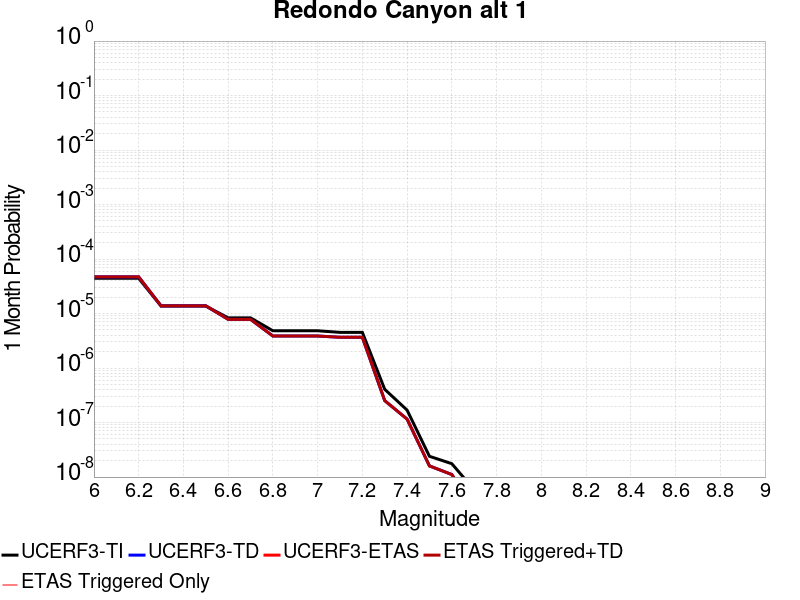 |  | 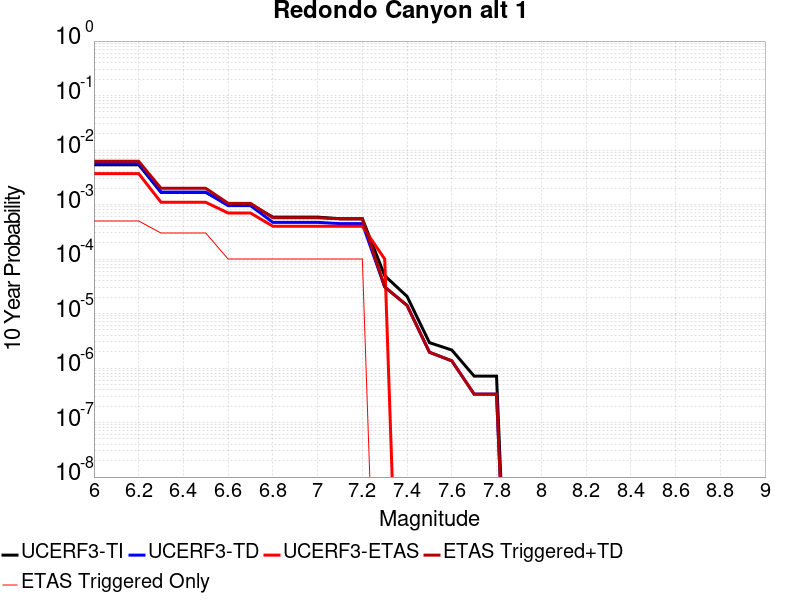 |

| Magnitude | 1 wk TI Prob | 1 wk TD Prob | 1 wk ETAS Prob | 1 wk ETAS/TD Gain | 1 wk ETAS Triggered+TD | 1 wk ETAS Triggered Only | 1 mo TI Prob | 1 mo TD Prob | 1 mo ETAS Prob | 1 mo ETAS/TD Gain | 1 mo ETAS Triggered+TD | 1 mo ETAS Triggered Only | 1 yr TI Prob | 1 yr TD Prob | 1 yr ETAS Prob | 1 yr ETAS/TD Gain | 1 yr ETAS Triggered+TD | 1 yr ETAS Triggered Only | 10 yr TI Prob | 10 yr TD Prob | 10 yr ETAS Prob | 10 yr ETAS/TD Gain | 10 yr ETAS Triggered+TD | 10 yr ETAS Triggered Only |
|-----|-----|-----|-----|-----|-----|-----|-----|-----|-----|-----|-----|-----|-----|-----|-----|-----|-----|-----|-----|-----|-----|-----|-----|-----|
| 6.0 | 1.0346246E-5 | 1.0983519E-5 | 0.0 | 0.0 | 1.0983519E-5 | 0.0 | 4.43403E-5 | 4.7071822E-5 | 0.0 | 0.0 | 4.7071822E-5 | 0.0 | 5.3970946E-4 | 5.7302765E-4 | 2.0E-4 | 0.3490233 | 5.7302765E-4 | 0.0 | 0.0053840056 | 0.005723242 | 0.0037 | 0.6464867 | 0.006220381 | 5.0E-4 |
| 6.1 | 1.0346246E-5 | 1.0983519E-5 | 0.0 | 0.0 | 1.0983519E-5 | 0.0 | 4.43403E-5 | 4.7071822E-5 | 0.0 | 0.0 | 4.7071822E-5 | 0.0 | 5.3970946E-4 | 5.7302765E-4 | 2.0E-4 | 0.3490233 | 5.7302765E-4 | 0.0 | 0.0053840056 | 0.005723242 | 0.0037 | 0.6464867 | 0.006220381 | 5.0E-4 |
| 6.2 | 1.0346246E-5 | 1.0983519E-5 | 0.0 | 0.0 | 1.0983519E-5 | 0.0 | 4.43403E-5 | 4.7071822E-5 | 0.0 | 0.0 | 4.7071822E-5 | 0.0 | 5.3970946E-4 | 5.7302765E-4 | 2.0E-4 | 0.3490233 | 5.7302765E-4 | 0.0 | 0.0053840056 | 0.005723242 | 0.0037 | 0.6464867 | 0.006220381 | 5.0E-4 |
| 6.3 | 3.2052794E-6 | 3.2369921E-6 | 0.0 | 0.0 | 3.2369921E-6 | 0.0 | 1.373684E-5 | 1.3872772E-5 | 0.0 | 0.0 | 1.3872772E-5 | 0.0 | 1.6723319E-4 | 1.6889189E-4 | 1.0E-4 | 0.5920948 | 1.6889189E-4 | 0.0 | 0.001671074 | 0.0016880251 | 0.0011 | 0.65164906 | 0.0019875187 | 3.0E-4 |
| 6.4 | 3.2052794E-6 | 3.2369921E-6 | 0.0 | 0.0 | 3.2369921E-6 | 0.0 | 1.373684E-5 | 1.3872772E-5 | 0.0 | 0.0 | 1.3872772E-5 | 0.0 | 1.6723319E-4 | 1.6889189E-4 | 1.0E-4 | 0.5920948 | 1.6889189E-4 | 0.0 | 0.001671074 | 0.0016880251 | 0.0011 | 0.65164906 | 0.0019875187 | 3.0E-4 |
| 6.5 | 3.2052794E-6 | 3.2369921E-6 | 0.0 | 0.0 | 3.2369921E-6 | 0.0 | 1.373684E-5 | 1.3872772E-5 | 0.0 | 0.0 | 1.3872772E-5 | 0.0 | 1.6723319E-4 | 1.6889189E-4 | 1.0E-4 | 0.5920948 | 1.6889189E-4 | 0.0 | 0.001671074 | 0.0016880251 | 0.0011 | 0.65164906 | 0.0019875187 | 3.0E-4 |
| 6.6 | 1.948328E-6 | 1.829409E-6 | 0.0 | 0.0 | 1.829409E-6 | 0.0 | 8.349951E-6 | 7.840309E-6 | 0.0 | 0.0 | 7.840309E-6 | 0.0 | 1.016559E-4 | 9.5453084E-5 | 1.0E-4 | 1.0476351 | 9.5453084E-5 | 0.0 | 0.0010160941 | 9.5426786E-4 | 7.0E-4 | 0.7335466 | 0.0010541724 | 1.0E-4 |
| 6.7 | 1.948328E-6 | 1.829409E-6 | 0.0 | 0.0 | 1.829409E-6 | 0.0 | 8.349951E-6 | 7.840309E-6 | 0.0 | 0.0 | 7.840309E-6 | 0.0 | 1.016559E-4 | 9.5453084E-5 | 1.0E-4 | 1.0476351 | 9.5453084E-5 | 0.0 | 0.0010160941 | 9.5426786E-4 | 7.0E-4 | 0.7335466 | 0.0010541724 | 1.0E-4 |
| 6.8 | 1.1278219E-6 | 9.036135E-7 | 0.0 | 0.0 | 9.036135E-7 | 0.0 | 4.8335132E-6 | 3.872626E-6 | 0.0 | 0.0 | 3.872626E-6 | 0.0 | 5.8846435E-5 | 4.714863E-5 | 0.0 | 0.0 | 4.714863E-5 | 0.0 | 5.8830855E-4 | 4.714283E-4 | 4.0E-4 | 0.8484853 | 5.713812E-4 | 1.0E-4 |
| 6.9 | 1.1278219E-6 | 9.036135E-7 | 0.0 | 0.0 | 9.036135E-7 | 0.0 | 4.8335132E-6 | 3.872626E-6 | 0.0 | 0.0 | 3.872626E-6 | 0.0 | 5.8846435E-5 | 4.714863E-5 | 0.0 | 0.0 | 4.714863E-5 | 0.0 | 5.8830855E-4 | 4.714283E-4 | 4.0E-4 | 0.8484853 | 5.713812E-4 | 1.0E-4 |
| 7.0 | 1.1278219E-6 | 9.036135E-7 | 0.0 | 0.0 | 9.036135E-7 | 0.0 | 4.8335132E-6 | 3.872626E-6 | 0.0 | 0.0 | 3.872626E-6 | 0.0 | 5.8846435E-5 | 4.714863E-5 | 0.0 | 0.0 | 4.714863E-5 | 0.0 | 5.8830855E-4 | 4.714283E-4 | 4.0E-4 | 0.8484853 | 5.713812E-4 | 1.0E-4 |
| 7.1 | 1.0545139E-6 | 8.572081E-7 | 0.0 | 0.0 | 8.572081E-7 | 0.0 | 4.5193374E-6 | 3.673746E-6 | 0.0 | 0.0 | 3.673746E-6 | 0.0 | 5.5021545E-5 | 4.4727367E-5 | 0.0 | 0.0 | 4.4727367E-5 | 0.0 | 5.500792E-4 | 4.472254E-4 | 4.0E-4 | 0.8944036 | 5.471807E-4 | 1.0E-4 |
| 7.2 | 1.0545139E-6 | 8.572081E-7 | 0.0 | 0.0 | 8.572081E-7 | 0.0 | 4.5193374E-6 | 3.673746E-6 | 0.0 | 0.0 | 3.673746E-6 | 0.0 | 5.5021545E-5 | 4.4727367E-5 | 0.0 | 0.0 | 4.4727367E-5 | 0.0 | 5.500792E-4 | 4.472254E-4 | 4.0E-4 | 0.8944036 | 5.471807E-4 | 1.0E-4 |
| 7.3 | 9.505161E-8 | 5.8979445E-8 | 0.0 | 0.0 | 5.8979445E-8 | 0.0 | 4.0736398E-7 | 2.5276904E-7 | 0.0 | 0.0 | 2.5276904E-7 | 0.0 | 4.959645E-6 | 3.0774597E-6 | 0.0 | 0.0 | 3.0774597E-6 | 0.0 | 4.9595343E-5 | 3.0774292E-5 | 1.0E-4 | 3.2494657 | 3.0774292E-5 | 0.0 |
| 7.4 | 3.9520785E-8 | 2.7002285E-8 | 0.0 | 0.0 | 2.7002285E-8 | 0.0 | 1.6937479E-7 | 1.1572407E-7 | 0.0 | 0.0 | 1.1572407E-7 | 0.0 | 2.062136E-6 | 1.40894E-6 | 0.0 | 0.0 | 1.40894E-6 | 0.0 | 2.062117E-5 | 1.4089337E-5 | 0.0 | 0.0 | 1.4089337E-5 | 0.0 |
| 7.5 | 5.6133214E-9 | 3.738594E-9 | 0.0 | 0.0 | 3.738594E-9 | 0.0 | 2.4057092E-8 | 1.6022545E-8 | 0.0 | 0.0 | 1.6022545E-8 | 0.0 | 2.9289507E-7 | 1.9507448E-7 | 0.0 | 0.0 | 1.9507448E-7 | 0.0 | 2.9289467E-6 | 1.9507434E-6 | 0.0 | 0.0 | 1.9507434E-6 | 0.0 |
| 7.6 | 4.1064334E-9 | 2.5970506E-9 | 0.0 | 0.0 | 2.5970506E-9 | 0.0 | 1.7599E-8 | 1.1130218E-8 | 0.0 | 0.0 | 1.1130218E-8 | 0.0 | 2.142678E-7 | 1.3551039E-7 | 0.0 | 0.0 | 1.3551039E-7 | 0.0 | 2.1426758E-6 | 1.3551032E-6 | 0.0 | 0.0 | 1.3551032E-6 | 0.0 |
| 7.7 | 1.361975E-9 | 6.3644234E-10 | 0.0 | 0.0 | 6.3644234E-10 | 0.0 | 5.8370353E-9 | 2.7276101E-9 | 0.0 | 0.0 | 2.7276101E-9 | 0.0 | 7.1065905E-8 | 3.3208654E-8 | 0.0 | 0.0 | 3.3208654E-8 | 0.0 | 7.106588E-7 | 3.3208653E-7 | 0.0 | 0.0 | 3.3208653E-7 | 0.0 |
| 7.8 | 1.361975E-9 | 6.3644234E-10 | 0.0 | 0.0 | 6.3644234E-10 | 0.0 | 5.8370353E-9 | 2.7276101E-9 | 0.0 | 0.0 | 2.7276101E-9 | 0.0 | 7.1065905E-8 | 3.3208654E-8 | 0.0 | 0.0 | 3.3208654E-8 | 0.0 | 7.106588E-7 | 3.3208653E-7 | 0.0 | 0.0 | 3.3208653E-7 | 0.0 |

## Point Reyes 2011 CFM
*[(top)](#table-of-contents)*

| 1 Week | 1 Month | 1 Year | 10 Year |
|-----|-----|-----|-----|
| 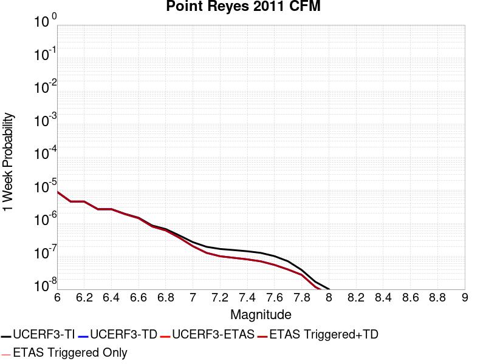 |  |  |  |

| Magnitude | 1 wk TI Prob | 1 wk TD Prob | 1 wk ETAS Prob | 1 wk ETAS/TD Gain | 1 wk ETAS Triggered+TD | 1 wk ETAS Triggered Only | 1 mo TI Prob | 1 mo TD Prob | 1 mo ETAS Prob | 1 mo ETAS/TD Gain | 1 mo ETAS Triggered+TD | 1 mo ETAS Triggered Only | 1 yr TI Prob | 1 yr TD Prob | 1 yr ETAS Prob | 1 yr ETAS/TD Gain | 1 yr ETAS Triggered+TD | 1 yr ETAS Triggered Only | 10 yr TI Prob | 10 yr TD Prob | 10 yr ETAS Prob | 10 yr ETAS/TD Gain | 10 yr ETAS Triggered+TD | 10 yr ETAS Triggered Only |
|-----|-----|-----|-----|-----|-----|-----|-----|-----|-----|-----|-----|-----|-----|-----|-----|-----|-----|-----|-----|-----|-----|-----|-----|-----|
| 6.0 | 8.8644965E-6 | 8.967454E-6 | 0.0 | 0.0 | 8.967454E-6 | 0.0 | 3.7990147E-5 | 3.8431415E-5 | 0.0 | 0.0 | 3.8431415E-5 | 0.0 | 4.624319E-4 | 4.678083E-4 | 1.0E-4 | 0.21376278 | 4.678083E-4 | 0.0 | 0.0046147075 | 0.004668864 | 0.0027 | 0.57829916 | 0.005166529 | 5.0E-4 |
| 6.1 | 4.526405E-6 | 4.539327E-6 | 0.0 | 0.0 | 4.539327E-6 | 0.0 | 1.9398734E-5 | 1.9454119E-5 | 0.0 | 0.0 | 1.9454119E-5 | 0.0 | 2.36154E-4 | 2.368292E-4 | 0.0 | 0.0 | 2.368292E-4 | 0.0 | 0.002359032 | 0.0023658744 | 0.0013 | 0.5494797 | 0.0024656379 | 1.0E-4 |
| 6.2 | 4.526405E-6 | 4.539327E-6 | 0.0 | 0.0 | 4.539327E-6 | 0.0 | 1.9398734E-5 | 1.9454119E-5 | 0.0 | 0.0 | 1.9454119E-5 | 0.0 | 2.36154E-4 | 2.368292E-4 | 0.0 | 0.0 | 2.368292E-4 | 0.0 | 0.002359032 | 0.0023658744 | 0.0013 | 0.5494797 | 0.0024656379 | 1.0E-4 |
| 6.3 | 2.6842322E-6 | 2.660711E-6 | 0.0 | 0.0 | 2.660711E-6 | 0.0 | 1.1503801E-5 | 1.1402998E-5 | 0.0 | 0.0 | 1.1402998E-5 | 0.0 | 1.4004979E-4 | 1.3882286E-4 | 0.0 | 0.0 | 1.3882286E-4 | 0.0 | 0.0013996155 | 0.0013873832 | 6.0E-4 | 0.43246883 | 0.0014872445 | 1.0E-4 |
| 6.4 | 2.6842322E-6 | 2.660711E-6 | 0.0 | 0.0 | 2.660711E-6 | 0.0 | 1.1503801E-5 | 1.1402998E-5 | 0.0 | 0.0 | 1.1402998E-5 | 0.0 | 1.4004979E-4 | 1.3882286E-4 | 0.0 | 0.0 | 1.3882286E-4 | 0.0 | 0.0013996155 | 0.0013873832 | 6.0E-4 | 0.43246883 | 0.0014872445 | 1.0E-4 |
| 6.5 | 1.9281833E-6 | 1.8906329E-6 | 0.0 | 0.0 | 1.8906329E-6 | 0.0 | 8.263617E-6 | 8.102688E-6 | 0.0 | 0.0 | 8.102688E-6 | 0.0 | 1.0060489E-4 | 9.864585E-5 | 0.0 | 0.0 | 9.864585E-5 | 0.0 | 0.0010055936 | 9.860314E-4 | 5.0E-4 | 0.50708324 | 0.0010859328 | 1.0E-4 |
| 6.6 | 1.4726726E-6 | 1.4269478E-6 | 0.0 | 0.0 | 1.4269478E-6 | 0.0 | 6.3114385E-6 | 6.115477E-6 | 0.0 | 0.0 | 6.115477E-6 | 0.0 | 7.683905E-5 | 7.445343E-5 | 0.0 | 0.0 | 7.445343E-5 | 0.0 | 7.6812494E-4 | 7.442921E-4 | 4.0E-4 | 0.53742343 | 8.4421766E-4 | 1.0E-4 |
| 6.7 | 8.572307E-7 | 8.0068963E-7 | 0.0 | 0.0 | 8.0068963E-7 | 0.0 | 3.6738406E-6 | 3.4315224E-6 | 0.0 | 0.0 | 3.4315224E-6 | 0.0 | 4.472809E-5 | 4.1778E-5 | 0.0 | 0.0 | 4.1778E-5 | 0.0 | 4.471909E-4 | 4.177054E-4 | 2.0E-4 | 0.47880635 | 5.176636E-4 | 1.0E-4 |
| 6.8 | 6.6745434E-7 | 6.076919E-7 | 0.0 | 0.0 | 6.076919E-7 | 0.0 | 2.8605155E-6 | 2.6043913E-6 | 0.0 | 0.0 | 2.6043913E-6 | 0.0 | 3.482622E-5 | 3.1708012E-5 | 0.0 | 0.0 | 3.1708012E-5 | 0.0 | 3.4820763E-4 | 3.170382E-4 | 1.0E-4 | 0.3154194 | 3.170382E-4 | 0.0 |
| 6.9 | 4.291521E-7 | 3.653131E-7 | 0.0 | 0.0 | 3.653131E-7 | 0.0 | 1.839222E-6 | 1.5656266E-6 | 0.0 | 0.0 | 1.5656266E-6 | 0.0 | 2.2392298E-5 | 1.9061341E-5 | 0.0 | 0.0 | 1.9061341E-5 | 0.0 | 2.2390042E-4 | 1.9059973E-4 | 1.0E-4 | 0.5246597 | 1.9059973E-4 | 0.0 |
| 7.0 | 2.6812808E-7 | 2.0182264E-7 | 0.0 | 0.0 | 2.0182264E-7 | 0.0 | 1.1491198E-6 | 8.6495396E-7 | 0.0 | 0.0 | 8.6495396E-7 | 0.0 | 1.3990444E-5 | 1.0530764E-5 | 0.0 | 0.0 | 1.0530764E-5 | 0.0 | 1.3989564E-4 | 1.05305015E-4 | 0.0 | 0.0 | 1.05305015E-4 | 0.0 |
| 7.1 | 1.9451231E-7 | 1.2720118E-7 | 0.0 | 0.0 | 1.2720118E-7 | 0.0 | 8.336239E-7 | 5.4514777E-7 | 0.0 | 0.0 | 5.4514777E-7 | 0.0 | 1.0149324E-5 | 6.637154E-6 | 0.0 | 0.0 | 6.637154E-6 | 0.0 | 1.014886E-4 | 6.637185E-5 | 0.0 | 0.0 | 6.637185E-5 | 0.0 |
| 7.2 | 1.6715143E-7 | 1.0037406E-7 | 0.0 | 0.0 | 1.0037406E-7 | 0.0 | 7.1636305E-7 | 4.3017448E-7 | 0.0 | 0.0 | 4.3017448E-7 | 0.0 | 8.721685E-6 | 5.2373616E-6 | 0.0 | 0.0 | 5.2373616E-6 | 0.0 | 8.721343E-5 | 5.237467E-5 | 0.0 | 0.0 | 5.237467E-5 | 0.0 |
| 7.3 | 1.5503173E-7 | 9.0076114E-8 | 0.0 | 0.0 | 9.0076114E-8 | 0.0 | 6.644215E-7 | 3.8604045E-7 | 0.0 | 0.0 | 3.8604045E-7 | 0.0 | 8.089301E-6 | 4.700032E-6 | 0.0 | 0.0 | 4.700032E-6 | 0.0 | 8.089007E-5 | 4.700162E-5 | 0.0 | 0.0 | 4.700162E-5 | 0.0 |
| 7.4 | 1.4251614E-7 | 8.0920685E-8 | 0.0 | 0.0 | 8.0920685E-8 | 0.0 | 6.1078333E-7 | 3.468029E-7 | 0.0 | 0.0 | 3.468029E-7 | 0.0 | 7.4362615E-6 | 4.222317E-6 | 0.0 | 0.0 | 4.222317E-6 | 0.0 | 7.436013E-5 | 4.222466E-5 | 0.0 | 0.0 | 4.222466E-5 | 0.0 |
| 7.5 | 1.2710186E-7 | 7.024126E-8 | 0.0 | 0.0 | 7.024126E-8 | 0.0 | 5.447221E-7 | 3.0103396E-7 | 0.0 | 0.0 | 3.0103396E-7 | 0.0 | 6.6319717E-6 | 3.6650822E-6 | 0.0 | 0.0 | 3.6650822E-6 | 0.0 | 6.6317734E-5 | 3.665251E-5 | 0.0 | 0.0 | 3.665251E-5 | 0.0 |
| 7.6 | 1.0144708E-7 | 5.4902756E-8 | 0.0 | 0.0 | 5.4902756E-8 | 0.0 | 4.347731E-7 | 2.352975E-7 | 0.0 | 0.0 | 2.352975E-7 | 0.0 | 5.2933497E-6 | 2.8647435E-6 | 0.0 | 0.0 | 2.8647435E-6 | 0.0 | 5.293224E-5 | 2.8649356E-5 | 0.0 | 0.0 | 2.8649356E-5 | 0.0 |
| 7.7 | 7.090527E-8 | 3.9804437E-8 | 0.0 | 0.0 | 3.9804437E-8 | 0.0 | 3.038797E-7 | 1.7059044E-7 | 0.0 | 0.0 | 1.7059044E-7 | 0.0 | 3.699729E-6 | 2.0769367E-6 | 0.0 | 0.0 | 2.0769367E-6 | 0.0 | 3.6996673E-5 | 2.0771464E-5 | 0.0 | 0.0 | 2.0771464E-5 | 0.0 |
| 7.8 | 3.8712045E-8 | 2.744395E-8 | 0.0 | 0.0 | 2.744395E-8 | 0.0 | 1.6590876E-7 | 1.1761693E-7 | 0.0 | 0.0 | 1.1761693E-7 | 0.0 | 2.0199373E-6 | 1.4319852E-6 | 0.0 | 0.0 | 1.4319852E-6 | 0.0 | 2.0199188E-5 | 1.432205E-5 | 0.0 | 0.0 | 1.432205E-5 | 0.0 |
| 7.9 | 1.7068782E-8 | 1.1849609E-8 | 0.0 | 0.0 | 1.1849609E-8 | 0.0 | 7.315192E-8 | 5.078404E-8 | 0.0 | 0.0 | 5.078404E-8 | 0.0 | 8.906242E-7 | 6.1829553E-7 | 0.0 | 0.0 | 6.1829553E-7 | 0.0 | 8.906207E-6 | 6.185229E-6 | 0.0 | 0.0 | 6.185229E-6 | 0.0 |
| 8.0 | 1.0172592E-8 | 7.045886E-9 | 0.0 | 0.0 | 7.045886E-9 | 0.0 | 4.359682E-8 | 3.0196652E-8 | 0.0 | 0.0 | 3.0196652E-8 | 0.0 | 5.3079117E-7 | 3.676442E-7 | 0.0 | 0.0 | 3.676442E-7 | 0.0 | 5.307899E-6 | 3.6787267E-6 | 0.0 | 0.0 | 3.6787267E-6 | 0.0 |
| 8.1 | 3.7861243E-9 | 3.557044E-9 | 0.0 | 0.0 | 3.557044E-9 | 0.0 | 1.6226247E-8 | 1.5244476E-8 | 0.0 | 0.0 | 1.5244476E-8 | 0.0 | 1.9755454E-7 | 1.856015E-7 | 0.0 | 0.0 | 1.856015E-7 | 0.0 | 1.9755437E-6 | 1.8582842E-6 | 0.0 | 0.0 | 1.8582842E-6 | 0.0 |

## Channel Islands Western Deep Ramp
*[(top)](#table-of-contents)*

| 1 Week | 1 Month | 1 Year | 10 Year |
|-----|-----|-----|-----|
|  | 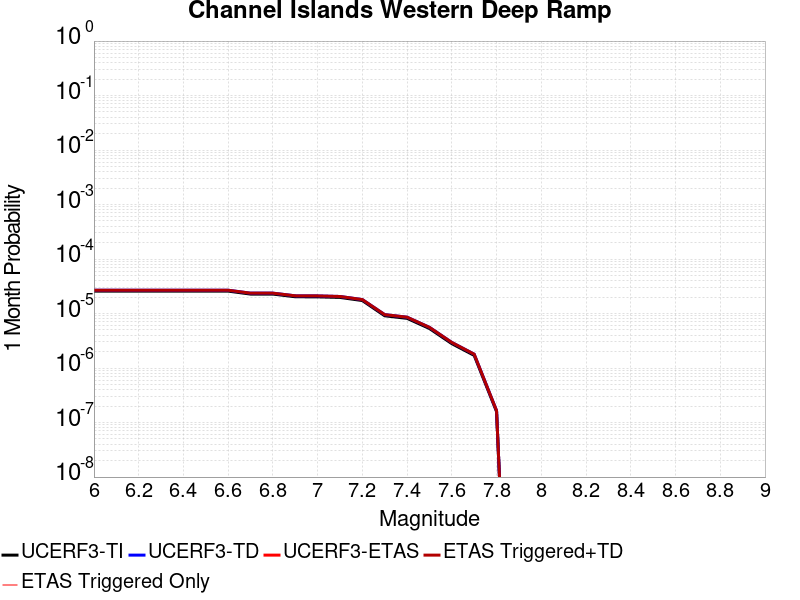 |  |  |

| Magnitude | 1 wk TI Prob | 1 wk TD Prob | 1 wk ETAS Prob | 1 wk ETAS/TD Gain | 1 wk ETAS Triggered+TD | 1 wk ETAS Triggered Only | 1 mo TI Prob | 1 mo TD Prob | 1 mo ETAS Prob | 1 mo ETAS/TD Gain | 1 mo ETAS Triggered+TD | 1 mo ETAS Triggered Only | 1 yr TI Prob | 1 yr TD Prob | 1 yr ETAS Prob | 1 yr ETAS/TD Gain | 1 yr ETAS Triggered+TD | 1 yr ETAS Triggered Only | 10 yr TI Prob | 10 yr TD Prob | 10 yr ETAS Prob | 10 yr ETAS/TD Gain | 10 yr ETAS Triggered+TD | 10 yr ETAS Triggered Only |
|-----|-----|-----|-----|-----|-----|-----|-----|-----|-----|-----|-----|-----|-----|-----|-----|-----|-----|-----|-----|-----|-----|-----|-----|-----|
| 6.0 | 6.0213506E-6 | 6.255351E-6 | 0.0 | 0.0 | 6.255351E-6 | 0.0 | 2.5805533E-5 | 2.6808395E-5 | 0.0 | 0.0 | 2.6808395E-5 | 0.0 | 3.1413708E-4 | 3.263478E-4 | 3.0E-4 | 0.9192647 | 4.2631518E-4 | 1.0E-4 | 0.0031369338 | 0.0032591273 | 0.0037 | 1.1352732 | 0.0037574975 | 5.0E-4 |
| 6.1 | 6.0213506E-6 | 6.255351E-6 | 0.0 | 0.0 | 6.255351E-6 | 0.0 | 2.5805533E-5 | 2.6808395E-5 | 0.0 | 0.0 | 2.6808395E-5 | 0.0 | 3.1413708E-4 | 3.263478E-4 | 3.0E-4 | 0.9192647 | 4.2631518E-4 | 1.0E-4 | 0.0031369338 | 0.0032591273 | 0.0037 | 1.1352732 | 0.0037574975 | 5.0E-4 |
| 6.2 | 6.0213506E-6 | 6.255351E-6 | 0.0 | 0.0 | 6.255351E-6 | 0.0 | 2.5805533E-5 | 2.6808395E-5 | 0.0 | 0.0 | 2.6808395E-5 | 0.0 | 3.1413708E-4 | 3.263478E-4 | 3.0E-4 | 0.9192647 | 4.2631518E-4 | 1.0E-4 | 0.0031369338 | 0.0032591273 | 0.0037 | 1.1352732 | 0.0037574975 | 5.0E-4 |
| 6.3 | 6.0213506E-6 | 6.255351E-6 | 0.0 | 0.0 | 6.255351E-6 | 0.0 | 2.5805533E-5 | 2.6808395E-5 | 0.0 | 0.0 | 2.6808395E-5 | 0.0 | 3.1413708E-4 | 3.263478E-4 | 3.0E-4 | 0.9192647 | 4.2631518E-4 | 1.0E-4 | 0.0031369338 | 0.0032591273 | 0.0037 | 1.1352732 | 0.0037574975 | 5.0E-4 |
| 6.4 | 6.0213506E-6 | 6.255351E-6 | 0.0 | 0.0 | 6.255351E-6 | 0.0 | 2.5805533E-5 | 2.6808395E-5 | 0.0 | 0.0 | 2.6808395E-5 | 0.0 | 3.1413708E-4 | 3.263478E-4 | 3.0E-4 | 0.9192647 | 4.2631518E-4 | 1.0E-4 | 0.0031369338 | 0.0032591273 | 0.0037 | 1.1352732 | 0.0037574975 | 5.0E-4 |
| 6.5 | 6.0213506E-6 | 6.255351E-6 | 0.0 | 0.0 | 6.255351E-6 | 0.0 | 2.5805533E-5 | 2.6808395E-5 | 0.0 | 0.0 | 2.6808395E-5 | 0.0 | 3.1413708E-4 | 3.263478E-4 | 3.0E-4 | 0.9192647 | 4.2631518E-4 | 1.0E-4 | 0.0031369338 | 0.0032591273 | 0.0037 | 1.1352732 | 0.0037574975 | 5.0E-4 |
| 6.6 | 6.0213506E-6 | 6.255351E-6 | 0.0 | 0.0 | 6.255351E-6 | 0.0 | 2.5805533E-5 | 2.6808395E-5 | 0.0 | 0.0 | 2.6808395E-5 | 0.0 | 3.1413708E-4 | 3.263478E-4 | 3.0E-4 | 0.9192647 | 4.2631518E-4 | 1.0E-4 | 0.0031369338 | 0.0032591273 | 0.0037 | 1.1352732 | 0.0037574975 | 5.0E-4 |
| 6.7 | 5.313309E-6 | 5.5256787E-6 | 0.0 | 0.0 | 5.5256787E-6 | 0.0 | 2.2771126E-5 | 2.3681288E-5 | 0.0 | 0.0 | 2.3681288E-5 | 0.0 | 2.772032E-4 | 2.8828564E-4 | 3.0E-4 | 1.0406346 | 3.882568E-4 | 1.0E-4 | 0.0027685766 | 0.0028795197 | 0.0033 | 1.1460245 | 0.003278368 | 4.0E-4 |
| 6.8 | 5.313309E-6 | 5.5256787E-6 | 0.0 | 0.0 | 5.5256787E-6 | 0.0 | 2.2771126E-5 | 2.3681288E-5 | 0.0 | 0.0 | 2.3681288E-5 | 0.0 | 2.772032E-4 | 2.8828564E-4 | 3.0E-4 | 1.0406346 | 3.882568E-4 | 1.0E-4 | 0.0027685766 | 0.0028795197 | 0.0033 | 1.1460245 | 0.003278368 | 4.0E-4 |
| 6.9 | 4.744377E-6 | 4.939834E-6 | 0.0 | 0.0 | 4.939834E-6 | 0.0 | 2.0332885E-5 | 2.1170566E-5 | 0.0 | 0.0 | 2.1170566E-5 | 0.0 | 2.4752476E-4 | 2.577249E-4 | 3.0E-4 | 1.1640319 | 3.5769914E-4 | 1.0E-4 | 0.0024724922 | 0.0025746275 | 0.003 | 1.165217 | 0.0029735977 | 4.0E-4 |
| 7.0 | 4.722209E-6 | 4.9168752E-6 | 0.0 | 0.0 | 4.9168752E-6 | 0.0 | 2.0237881E-5 | 2.1072174E-5 | 0.0 | 0.0 | 2.1072174E-5 | 0.0 | 2.4636835E-4 | 2.5652724E-4 | 3.0E-4 | 1.1694665 | 3.5650158E-4 | 1.0E-4 | 0.002460954 | 0.0025626787 | 0.003 | 1.1706501 | 0.0029616535 | 4.0E-4 |
| 7.1 | 4.611174E-6 | 4.801803E-6 | 0.0 | 0.0 | 4.801803E-6 | 0.0 | 1.9762025E-5 | 2.0579013E-5 | 0.0 | 0.0 | 2.0579013E-5 | 0.0 | 2.4057609E-4 | 2.505244E-4 | 3.0E-4 | 1.1974881 | 3.5049935E-4 | 1.0E-4 | 0.002403158 | 0.002502787 | 0.003 | 1.1986637 | 0.0029017858 | 4.0E-4 |
| 7.2 | 4.043994E-6 | 4.2123747E-6 | 0.0 | 0.0 | 4.2123747E-6 | 0.0 | 1.7331287E-5 | 1.805293E-5 | 0.0 | 0.0 | 1.805293E-5 | 0.0 | 2.10988E-4 | 2.1977581E-4 | 3.0E-4 | 1.3650273 | 3.1975383E-4 | 1.0E-4 | 0.002107878 | 0.0021959355 | 0.0028 | 1.275083 | 0.002595057 | 4.0E-4 |
| 7.3 | 2.1233036E-6 | 2.2300094E-6 | 0.0 | 0.0 | 2.2300094E-6 | 0.0 | 9.099841E-6 | 9.557149E-6 | 0.0 | 0.0 | 9.557149E-6 | 0.0 | 1.1078493E-4 | 1.1635212E-4 | 1.0E-4 | 0.85946 | 2.1634049E-4 | 1.0E-4 | 0.0011072971 | 0.0011629176 | 0.0012 | 1.0318873 | 0.0013626851 | 2.0E-4 |
| 7.4 | 1.9051884E-6 | 2.001698E-6 | 0.0 | 0.0 | 2.001698E-6 | 0.0 | 8.165067E-6 | 8.578679E-6 | 0.0 | 0.0 | 8.578679E-6 | 0.0 | 9.940516E-5 | 1.04440456E-4 | 1.0E-4 | 0.9574834 | 2.0443E-4 | 1.0E-4 | 9.93607E-4 | 0.001043919 | 0.0012 | 1.1495144 | 0.0012437102 | 2.0E-4 |
| 7.5 | 1.2408497E-6 | 1.3040154E-6 | 0.0 | 0.0 | 1.3040154E-6 | 0.0 | 5.317916E-6 | 5.5886258E-6 | 0.0 | 0.0 | 5.5886258E-6 | 0.0 | 6.4743705E-5 | 6.8039415E-5 | 1.0E-4 | 1.4697363 | 1.6803261E-4 | 1.0E-4 | 6.4724847E-4 | 6.80188E-4 | 9.0E-4 | 1.3231635 | 8.80052E-4 | 2.0E-4 |
| 7.6 | 6.5440025E-7 | 6.8874346E-7 | 0.0 | 0.0 | 6.8874346E-7 | 0.0 | 2.8045695E-6 | 2.9517544E-6 | 0.0 | 0.0 | 2.9517544E-6 | 0.0 | 3.4145098E-5 | 3.593703E-5 | 1.0E-4 | 2.782645 | 1.3593344E-4 | 1.0E-4 | 3.4139853E-4 | 3.5931362E-4 | 6.0E-4 | 1.6698505 | 4.5927768E-4 | 1.0E-4 |
| 7.7 | 3.985963E-7 | 4.1935115E-7 | 0.0 | 0.0 | 4.1935115E-7 | 0.0 | 1.7082689E-6 | 1.797218E-6 | 0.0 | 0.0 | 1.797218E-6 | 0.0 | 2.0797976E-5 | 2.1880922E-5 | 0.0 | 0.0 | 2.1880922E-5 | 0.0 | 2.0796029E-4 | 2.1878885E-4 | 5.0E-4 | 2.2853086 | 2.1878885E-4 | 0.0 |
| 7.8 | 3.706329E-8 | 3.859495E-8 | 0.0 | 0.0 | 3.859495E-8 | 0.0 | 1.5884267E-7 | 1.6540693E-7 | 0.0 | 0.0 | 1.6540693E-7 | 0.0 | 1.9339077E-6 | 2.0138275E-6 | 0.0 | 0.0 | 2.0138275E-6 | 0.0 | 1.933891E-5 | 2.0138104E-5 | 0.0 | 0.0 | 2.0138104E-5 | 0.0 |

## Fickle Hill (alt1)
*[(top)](#table-of-contents)*

| 1 Week | 1 Month | 1 Year | 10 Year |
|-----|-----|-----|-----|
|  | 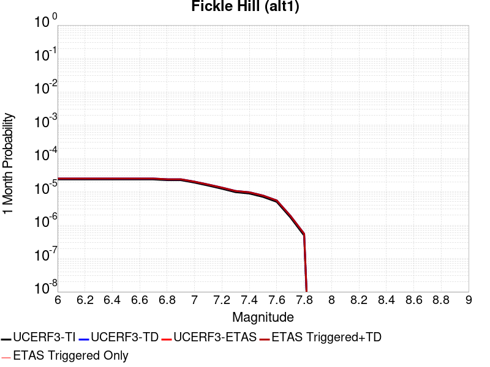 | 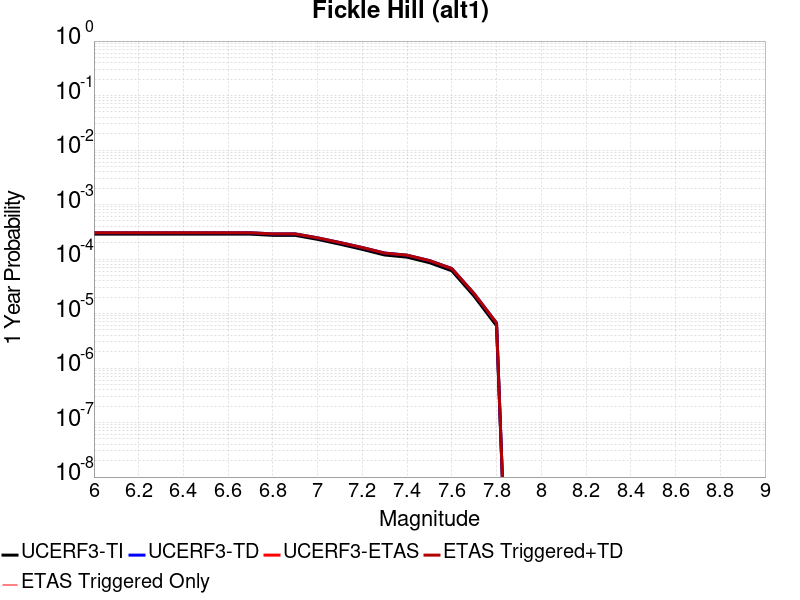 |  |

| Magnitude | 1 wk TI Prob | 1 wk TD Prob | 1 wk ETAS Prob | 1 wk ETAS/TD Gain | 1 wk ETAS Triggered+TD | 1 wk ETAS Triggered Only | 1 mo TI Prob | 1 mo TD Prob | 1 mo ETAS Prob | 1 mo ETAS/TD Gain | 1 mo ETAS Triggered+TD | 1 mo ETAS Triggered Only | 1 yr TI Prob | 1 yr TD Prob | 1 yr ETAS Prob | 1 yr ETAS/TD Gain | 1 yr ETAS Triggered+TD | 1 yr ETAS Triggered Only | 10 yr TI Prob | 10 yr TD Prob | 10 yr ETAS Prob | 10 yr ETAS/TD Gain | 10 yr ETAS Triggered+TD | 10 yr ETAS Triggered Only |
|-----|-----|-----|-----|-----|-----|-----|-----|-----|-----|-----|-----|-----|-----|-----|-----|-----|-----|-----|-----|-----|-----|-----|-----|-----|
| 6.0 | 5.491893E-6 | 5.827709E-6 | 0.0 | 0.0 | 5.827709E-6 | 0.0 | 2.3536471E-5 | 2.497567E-5 | 0.0 | 0.0 | 2.497567E-5 | 0.0 | 2.8651886E-4 | 3.040386E-4 | 0.0 | 0.0 | 3.040386E-4 | 0.0 | 0.0028614972 | 0.0030364508 | 0.0025 | 0.8233297 | 0.0035349326 | 5.0E-4 |
| 6.1 | 5.491893E-6 | 5.827709E-6 | 0.0 | 0.0 | 5.827709E-6 | 0.0 | 2.3536471E-5 | 2.497567E-5 | 0.0 | 0.0 | 2.497567E-5 | 0.0 | 2.8651886E-4 | 3.040386E-4 | 0.0 | 0.0 | 3.040386E-4 | 0.0 | 0.0028614972 | 0.0030364508 | 0.0025 | 0.8233297 | 0.0035349326 | 5.0E-4 |
| 6.2 | 5.491893E-6 | 5.827709E-6 | 0.0 | 0.0 | 5.827709E-6 | 0.0 | 2.3536471E-5 | 2.497567E-5 | 0.0 | 0.0 | 2.497567E-5 | 0.0 | 2.8651886E-4 | 3.040386E-4 | 0.0 | 0.0 | 3.040386E-4 | 0.0 | 0.0028614972 | 0.0030364508 | 0.0025 | 0.8233297 | 0.0035349326 | 5.0E-4 |
| 6.3 | 5.491893E-6 | 5.827709E-6 | 0.0 | 0.0 | 5.827709E-6 | 0.0 | 2.3536471E-5 | 2.497567E-5 | 0.0 | 0.0 | 2.497567E-5 | 0.0 | 2.8651886E-4 | 3.040386E-4 | 0.0 | 0.0 | 3.040386E-4 | 0.0 | 0.0028614972 | 0.0030364508 | 0.0025 | 0.8233297 | 0.0035349326 | 5.0E-4 |
| 6.4 | 5.491893E-6 | 5.827709E-6 | 0.0 | 0.0 | 5.827709E-6 | 0.0 | 2.3536471E-5 | 2.497567E-5 | 0.0 | 0.0 | 2.497567E-5 | 0.0 | 2.8651886E-4 | 3.040386E-4 | 0.0 | 0.0 | 3.040386E-4 | 0.0 | 0.0028614972 | 0.0030364508 | 0.0025 | 0.8233297 | 0.0035349326 | 5.0E-4 |
| 6.5 | 5.491893E-6 | 5.827709E-6 | 0.0 | 0.0 | 5.827709E-6 | 0.0 | 2.3536471E-5 | 2.497567E-5 | 0.0 | 0.0 | 2.497567E-5 | 0.0 | 2.8651886E-4 | 3.040386E-4 | 0.0 | 0.0 | 3.040386E-4 | 0.0 | 0.0028614972 | 0.0030364508 | 0.0025 | 0.8233297 | 0.0035349326 | 5.0E-4 |
| 6.6 | 5.491893E-6 | 5.827709E-6 | 0.0 | 0.0 | 5.827709E-6 | 0.0 | 2.3536471E-5 | 2.497567E-5 | 0.0 | 0.0 | 2.497567E-5 | 0.0 | 2.8651886E-4 | 3.040386E-4 | 0.0 | 0.0 | 3.040386E-4 | 0.0 | 0.0028614972 | 0.0030364508 | 0.0025 | 0.8233297 | 0.0035349326 | 5.0E-4 |
| 6.7 | 5.491893E-6 | 5.827709E-6 | 0.0 | 0.0 | 5.827709E-6 | 0.0 | 2.3536471E-5 | 2.497567E-5 | 0.0 | 0.0 | 2.497567E-5 | 0.0 | 2.8651886E-4 | 3.040386E-4 | 0.0 | 0.0 | 3.040386E-4 | 0.0 | 0.0028614972 | 0.0030364508 | 0.0025 | 0.8233297 | 0.0035349326 | 5.0E-4 |
| 6.8 | 5.2207747E-6 | 5.546417E-6 | 0.0 | 0.0 | 5.546417E-6 | 0.0 | 2.2374557E-5 | 2.3770153E-5 | 0.0 | 0.0 | 2.3770153E-5 | 0.0 | 2.7237617E-4 | 2.893654E-4 | 0.0 | 0.0 | 2.893654E-4 | 0.0 | 0.0027204256 | 0.0028901042 | 0.0025 | 0.8650207 | 0.0033886593 | 5.0E-4 |
| 6.9 | 5.2186956E-6 | 5.544237E-6 | 0.0 | 0.0 | 5.544237E-6 | 0.0 | 2.2365646E-5 | 2.3760811E-5 | 0.0 | 0.0 | 2.3760811E-5 | 0.0 | 2.722677E-4 | 2.8925168E-4 | 0.0 | 0.0 | 2.8925168E-4 | 0.0 | 0.0027193436 | 0.00288897 | 0.0025 | 0.86536026 | 0.0033875257 | 5.0E-4 |
| 7.0 | 4.403045E-6 | 4.69911E-6 | 0.0 | 0.0 | 4.69911E-6 | 0.0 | 1.8870056E-5 | 2.0138896E-5 | 0.0 | 0.0 | 2.0138896E-5 | 0.0 | 2.297187E-4 | 2.451648E-4 | 0.0 | 0.0 | 2.451648E-4 | 0.0 | 0.0022948137 | 0.0024490736 | 0.0021 | 0.8574671 | 0.0028480939 | 4.0E-4 |
| 7.1 | 3.5911396E-6 | 3.8485045E-6 | 0.0 | 0.0 | 3.8485045E-6 | 0.0 | 1.5390508E-5 | 1.649349E-5 | 0.0 | 0.0 | 1.649349E-5 | 0.0 | 1.8736332E-4 | 2.0079048E-4 | 0.0 | 0.0 | 2.0079048E-4 | 0.0 | 0.0018720542 | 0.002006164 | 0.0018 | 0.8972347 | 0.0024053617 | 4.0E-4 |
| 7.2 | 2.888171E-6 | 3.114644E-6 | 0.0 | 0.0 | 3.114644E-6 | 0.0 | 1.2377816E-5 | 1.3348407E-5 | 0.0 | 0.0 | 1.3348407E-5 | 0.0 | 1.5068949E-4 | 1.6250499E-4 | 0.0 | 0.0 | 1.6250499E-4 | 0.0 | 0.0015058735 | 0.0016238863 | 0.0013 | 0.8005487 | 0.0018235615 | 2.0E-4 |
| 7.3 | 2.275019E-6 | 2.4679368E-6 | 0.0 | 0.0 | 2.4679368E-6 | 0.0 | 9.750045E-6 | 1.057683E-5 | 0.0 | 0.0 | 1.057683E-5 | 0.0 | 1.1870033E-4 | 1.2876543E-4 | 0.0 | 0.0 | 1.2876543E-4 | 0.0 | 0.0011863695 | 0.0012869223 | 0.0011 | 0.85475254 | 0.0013867936 | 1.0E-4 |
| 7.4 | 2.076662E-6 | 2.2580032E-6 | 0.0 | 0.0 | 2.2580032E-6 | 0.0 | 8.8999495E-6 | 9.677122E-6 | 0.0 | 0.0 | 9.677122E-6 | 0.0 | 1.08351494E-4 | 1.1781271E-4 | 0.0 | 0.0 | 1.1781271E-4 | 0.0 | 0.0010829868 | 0.0011775156 | 0.001 | 0.8492456 | 0.0011775156 | 0.0 |
| 7.5 | 1.6450799E-6 | 1.7957366E-6 | 0.0 | 0.0 | 1.7957366E-6 | 0.0 | 7.0503233E-6 | 7.695991E-6 | 0.0 | 0.0 | 7.695991E-6 | 0.0 | 8.5834305E-5 | 9.369475E-5 | 0.0 | 0.0 | 9.369475E-5 | 0.0 | 8.580116E-4 | 9.365601E-4 | 0.001 | 1.0677371 | 9.365601E-4 | 0.0 |
| 7.6 | 1.168891E-6 | 1.2832008E-6 | 0.0 | 0.0 | 1.2832008E-6 | 0.0 | 5.009523E-6 | 5.4994207E-6 | 0.0 | 0.0 | 5.4994207E-6 | 0.0 | 6.098924E-5 | 6.695345E-5 | 0.0 | 0.0 | 6.695345E-5 | 0.0 | 6.09725E-4 | 6.693384E-4 | 9.0E-4 | 1.3446113 | 6.693384E-4 | 0.0 |
| 7.7 | 3.9871026E-7 | 4.4281146E-7 | 0.0 | 0.0 | 4.4281146E-7 | 0.0 | 1.708757E-6 | 1.897762E-6 | 0.0 | 0.0 | 1.897762E-6 | 0.0 | 2.0803918E-5 | 2.3105016E-5 | 0.0 | 0.0 | 2.3105016E-5 | 0.0 | 2.0801972E-4 | 2.3102698E-4 | 1.0E-4 | 0.43284988 | 2.3102698E-4 | 0.0 |
| 7.8 | 1.14295965E-7 | 1.2856997E-7 | 0.0 | 0.0 | 1.2856997E-7 | 0.0 | 4.8983975E-7 | 5.51014E-7 | 0.0 | 0.0 | 5.51014E-7 | 0.0 | 5.9637828E-6 | 6.7085766E-6 | 0.0 | 0.0 | 6.7085766E-6 | 0.0 | 5.9636226E-5 | 6.708389E-5 | 0.0 | 0.0 | 6.708389E-5 | 0.0 |

## Owens Valley
*[(top)](#table-of-contents)*

| 1 Week | 1 Month | 1 Year | 10 Year |
|-----|-----|-----|-----|
| 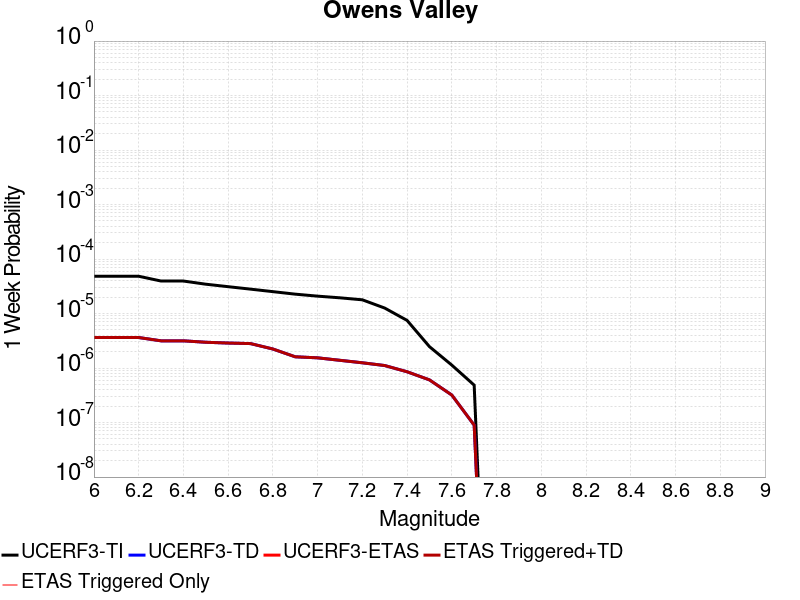 |  |  |  |

| Magnitude | 1 wk TI Prob | 1 wk TD Prob | 1 wk ETAS Prob | 1 wk ETAS/TD Gain | 1 wk ETAS Triggered+TD | 1 wk ETAS Triggered Only | 1 mo TI Prob | 1 mo TD Prob | 1 mo ETAS Prob | 1 mo ETAS/TD Gain | 1 mo ETAS Triggered+TD | 1 mo ETAS Triggered Only | 1 yr TI Prob | 1 yr TD Prob | 1 yr ETAS Prob | 1 yr ETAS/TD Gain | 1 yr ETAS Triggered+TD | 1 yr ETAS Triggered Only | 10 yr TI Prob | 10 yr TD Prob | 10 yr ETAS Prob | 10 yr ETAS/TD Gain | 10 yr ETAS Triggered+TD | 10 yr ETAS Triggered Only |
|-----|-----|-----|-----|-----|-----|-----|-----|-----|-----|-----|-----|-----|-----|-----|-----|-----|-----|-----|-----|-----|-----|-----|-----|-----|
| 6.0 | 4.83821E-5 | 3.6303866E-6 | 0.0 | 0.0 | 3.6303866E-6 | 0.0 | 2.0733538E-4 | 1.5558711E-5 | 1.0E-4 | 6.427267 | 1.1555716E-4 | 1.0E-4 | 0.002521386 | 1.8941185E-4 | 2.0E-4 | 1.0559001 | 2.8939292E-4 | 1.0E-4 | 0.024929691 | 0.0019203456 | 0.0014 | 0.72903544 | 0.0024193854 | 5.0E-4 |
| 6.1 | 4.83821E-5 | 3.6303866E-6 | 0.0 | 0.0 | 3.6303866E-6 | 0.0 | 2.0733538E-4 | 1.5558711E-5 | 1.0E-4 | 6.427267 | 1.1555716E-4 | 1.0E-4 | 0.002521386 | 1.8941185E-4 | 2.0E-4 | 1.0559001 | 2.8939292E-4 | 1.0E-4 | 0.024929691 | 0.0019203456 | 0.0014 | 0.72903544 | 0.0024193854 | 5.0E-4 |
| 6.2 | 4.83821E-5 | 3.6303866E-6 | 0.0 | 0.0 | 3.6303866E-6 | 0.0 | 2.0733538E-4 | 1.5558711E-5 | 1.0E-4 | 6.427267 | 1.1555716E-4 | 1.0E-4 | 0.002521386 | 1.8941185E-4 | 2.0E-4 | 1.0559001 | 2.8939292E-4 | 1.0E-4 | 0.024929691 | 0.0019203456 | 0.0014 | 0.72903544 | 0.0024193854 | 5.0E-4 |
| 6.3 | 3.953008E-5 | 3.156766E-6 | 0.0 | 0.0 | 3.156766E-6 | 0.0 | 1.6940363E-4 | 1.3528931E-5 | 1.0E-4 | 7.3915668 | 1.1352758E-4 | 1.0E-4 | 0.002060538 | 1.6470303E-4 | 2.0E-4 | 1.2143068 | 2.6468656E-4 | 1.0E-4 | 0.020415364 | 0.0016591533 | 0.0012 | 0.7232605 | 0.0021583235 | 5.0E-4 |
| 6.4 | 3.953008E-5 | 3.156766E-6 | 0.0 | 0.0 | 3.156766E-6 | 0.0 | 1.6940363E-4 | 1.3528931E-5 | 1.0E-4 | 7.3915668 | 1.1352758E-4 | 1.0E-4 | 0.002060538 | 1.6470303E-4 | 2.0E-4 | 1.2143068 | 2.6468656E-4 | 1.0E-4 | 0.020415364 | 0.0016591533 | 0.0012 | 0.7232605 | 0.0021583235 | 5.0E-4 |
| 6.5 | 3.457342E-5 | 2.9720454E-6 | 0.0 | 0.0 | 2.9720454E-6 | 0.0 | 1.4816338E-4 | 1.273728E-5 | 1.0E-4 | 7.8509703 | 1.1273601E-4 | 1.0E-4 | 0.0018023965 | 1.5506604E-4 | 2.0E-4 | 1.289773 | 2.5505055E-4 | 1.0E-4 | 0.017878477 | 0.0015557922 | 0.0011 | 0.7070353 | 0.0020550143 | 5.0E-4 |
| 6.6 | 3.1127765E-5 | 2.8749164E-6 | 0.0 | 0.0 | 2.8749164E-6 | 0.0 | 1.3339789E-4 | 1.2321016E-5 | 1.0E-4 | 8.116214 | 1.1231978E-4 | 1.0E-4 | 0.0016229092 | 1.4999873E-4 | 2.0E-4 | 1.3333447 | 2.499837E-4 | 1.0E-4 | 0.016111081 | 0.0015009027 | 0.001 | 0.6662657 | 0.0020001521 | 5.0E-4 |
| 6.7 | 2.806885E-5 | 2.810553E-6 | 0.0 | 0.0 | 2.810553E-6 | 0.0 | 1.2028952E-4 | 1.2045175E-5 | 1.0E-4 | 8.302079 | 1.1204397E-4 | 1.0E-4 | 0.001463541 | 1.4664083E-4 | 2.0E-4 | 1.3638767 | 2.4662615E-4 | 1.0E-4 | 0.014539397 | 0.0014659044 | 0.001 | 0.6821727 | 0.0019651714 | 5.0E-4 |
| 6.8 | 2.524524E-5 | 2.2354827E-6 | 0.0 | 0.0 | 2.2354827E-6 | 0.0 | 1.0818939E-4 | 9.580606E-6 | 1.0E-4 | 10.437753 | 1.0957965E-4 | 1.0E-4 | 0.0013164099 | 1.16637944E-4 | 2.0E-4 | 1.7147079 | 2.1662629E-4 | 1.0E-4 | 0.01308639 | 0.0011660975 | 7.0E-4 | 0.60029286 | 0.001565631 | 4.0E-4 |
| 6.9 | 2.2704568E-5 | 1.6082051E-6 | 0.0 | 0.0 | 1.6082051E-6 | 0.0 | 9.730166E-5 | 6.89229E-6 | 1.0E-4 | 14.508966 | 1.068916E-4 | 1.0E-4 | 0.0011840039 | 8.391042E-5 | 2.0E-4 | 2.3834944 | 1.8390203E-4 | 1.0E-4 | 0.011777153 | 8.3905034E-4 | 5.0E-4 | 0.5959118 | 0.0012387147 | 4.0E-4 |
| 7.0 | 2.0871712E-5 | 1.5395849E-6 | 0.0 | 0.0 | 1.5395849E-6 | 0.0 | 8.944713E-5 | 6.5982044E-6 | 1.0E-4 | 15.155638 | 1.06597545E-4 | 1.0E-4 | 0.0010884746 | 8.0330195E-5 | 2.0E-4 | 2.4897237 | 1.8032217E-4 | 1.0E-4 | 0.010831586 | 8.03231E-4 | 5.0E-4 | 0.62248594 | 0.0012029097 | 4.0E-4 |
| 7.1 | 1.944928E-5 | 1.3864422E-6 | 0.0 | 0.0 | 1.3864422E-6 | 0.0 | 8.335139E-5 | 5.9418817E-6 | 1.0E-4 | 16.829685 | 1.0594129E-4 | 1.0E-4 | 0.0010143308 | 7.2340015E-5 | 2.0E-4 | 2.7647214 | 1.7233279E-4 | 1.0E-4 | 0.010097133 | 7.2337076E-4 | 5.0E-4 | 0.6912084 | 0.0011230814 | 4.0E-4 |
| 7.2 | 1.7876306E-5 | 1.2489284E-6 | 0.0 | 0.0 | 1.2489284E-6 | 0.0 | 7.6610486E-5 | 5.352539E-6 | 1.0E-4 | 18.682722 | 1.05352E-4 | 1.0E-4 | 9.3233347E-4 | 6.516522E-5 | 2.0E-4 | 3.0691216 | 1.6515871E-4 | 1.0E-4 | 0.009284316 | 6.516576E-4 | 5.0E-4 | 0.76727414 | 0.001051397 | 4.0E-4 |
| 7.3 | 1.2618672E-5 | 1.1115313E-6 | 0.0 | 0.0 | 1.1115313E-6 | 0.0 | 5.40789E-5 | 4.7636972E-6 | 1.0E-4 | 20.9921 | 1.0476322E-4 | 1.0E-4 | 6.582117E-4 | 5.7996476E-5 | 1.0E-4 | 1.7242427 | 1.5799068E-4 | 1.0E-4 | 0.0065626553 | 5.8000477E-4 | 4.0E-4 | 0.6896495 | 9.797728E-4 | 4.0E-4 |
| 7.4 | 7.4874442E-6 | 8.5487295E-7 | 0.0 | 0.0 | 8.5487295E-7 | 0.0 | 3.208865E-5 | 3.6637362E-6 | 1.0E-4 | 27.294542 | 1.0366337E-4 | 1.0E-4 | 3.906093E-4 | 4.460508E-5 | 1.0E-4 | 2.241897 | 1.4460062E-4 | 1.0E-4 | 0.003899234 | 4.4610968E-4 | 3.0E-4 | 0.67248034 | 7.459759E-4 | 3.0E-4 |
| 7.5 | 2.4734156E-6 | 6.068904E-7 | 0.0 | 0.0 | 6.068904E-7 | 0.0 | 1.060031E-5 | 2.6009563E-6 | 1.0E-4 | 38.4474 | 1.02600694E-4 | 1.0E-4 | 1.2905113E-4 | 3.1666186E-5 | 1.0E-4 | 3.1579428 | 1.3166302E-4 | 1.0E-4 | 0.0012897621 | 3.1661705E-4 | 2.0E-4 | 0.6316779 | 5.1655376E-4 | 2.0E-4 |
| 7.6 | 1.1328841E-6 | 3.1966627E-7 | 0.0 | 0.0 | 3.1966627E-7 | 0.0 | 4.8552088E-6 | 1.3699976E-6 | 1.0E-4 | 72.99283 | 1.01369864E-4 | 1.0E-4 | 5.9110564E-5 | 1.6679594E-5 | 1.0E-4 | 5.9953494 | 1.16677926E-4 | 1.0E-4 | 5.9094845E-4 | 1.6678362E-4 | 2.0E-4 | 1.1991585 | 3.6675026E-4 | 2.0E-4 |
| 7.7 | 4.8613185E-7 | 8.964424E-8 | 0.0 | 0.0 | 8.964424E-8 | 0.0 | 2.0834207E-6 | 3.8418952E-7 | 0.0 | 0.0 | 3.8418952E-7 | 0.0 | 2.536535E-5 | 4.677498E-6 | 0.0 | 0.0 | 4.677498E-6 | 0.0 | 2.5362454E-4 | 4.6774065E-5 | 0.0 | 0.0 | 4.6774065E-5 | 0.0 |

## Sisar
*[(top)](#table-of-contents)*

| 1 Week | 1 Month | 1 Year | 10 Year |
|-----|-----|-----|-----|
|  | 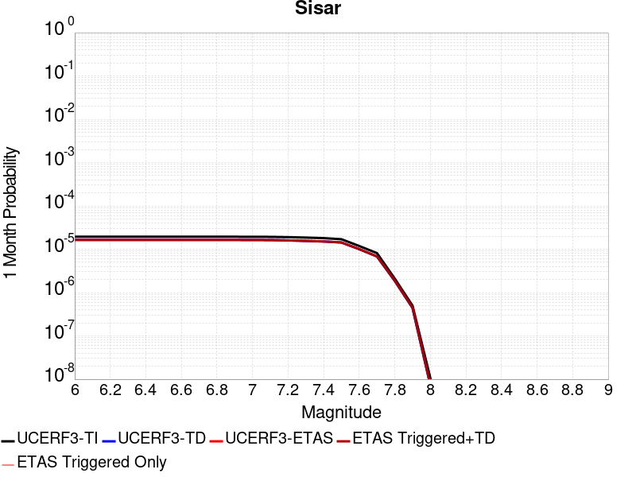 |  | 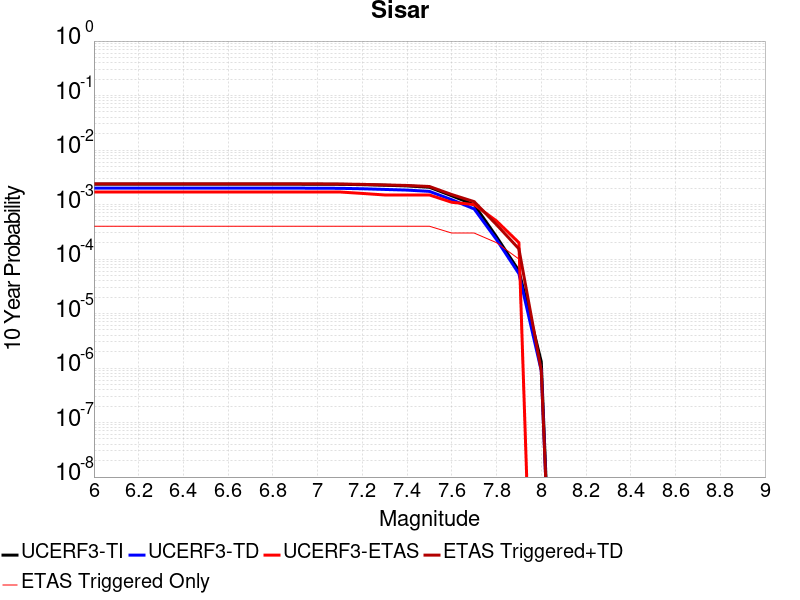 |

| Magnitude | 1 wk TI Prob | 1 wk TD Prob | 1 wk ETAS Prob | 1 wk ETAS/TD Gain | 1 wk ETAS Triggered+TD | 1 wk ETAS Triggered Only | 1 mo TI Prob | 1 mo TD Prob | 1 mo ETAS Prob | 1 mo ETAS/TD Gain | 1 mo ETAS Triggered+TD | 1 mo ETAS Triggered Only | 1 yr TI Prob | 1 yr TD Prob | 1 yr ETAS Prob | 1 yr ETAS/TD Gain | 1 yr ETAS Triggered+TD | 1 yr ETAS Triggered Only | 10 yr TI Prob | 10 yr TD Prob | 10 yr ETAS Prob | 10 yr ETAS/TD Gain | 10 yr ETAS Triggered+TD | 10 yr ETAS Triggered Only |
|-----|-----|-----|-----|-----|-----|-----|-----|-----|-----|-----|-----|-----|-----|-----|-----|-----|-----|-----|-----|-----|-----|-----|-----|-----|
| 6.0 | 4.544193E-6 | 3.840237E-6 | 0.0 | 0.0 | 3.840237E-6 | 0.0 | 1.9474966E-5 | 1.6458056E-5 | 0.0 | 0.0 | 1.6458056E-5 | 0.0 | 2.3708193E-4 | 2.0035874E-4 | 2.0E-4 | 0.99820954 | 2.0035874E-4 | 0.0 | 0.0023682916 | 0.0020018148 | 0.0017 | 0.8492294 | 0.002401014 | 4.0E-4 |
| 6.1 | 4.544193E-6 | 3.840237E-6 | 0.0 | 0.0 | 3.840237E-6 | 0.0 | 1.9474966E-5 | 1.6458056E-5 | 0.0 | 0.0 | 1.6458056E-5 | 0.0 | 2.3708193E-4 | 2.0035874E-4 | 2.0E-4 | 0.99820954 | 2.0035874E-4 | 0.0 | 0.0023682916 | 0.0020018148 | 0.0017 | 0.8492294 | 0.002401014 | 4.0E-4 |
| 6.2 | 4.544193E-6 | 3.840237E-6 | 0.0 | 0.0 | 3.840237E-6 | 0.0 | 1.9474966E-5 | 1.6458056E-5 | 0.0 | 0.0 | 1.6458056E-5 | 0.0 | 2.3708193E-4 | 2.0035874E-4 | 2.0E-4 | 0.99820954 | 2.0035874E-4 | 0.0 | 0.0023682916 | 0.0020018148 | 0.0017 | 0.8492294 | 0.002401014 | 4.0E-4 |
| 6.3 | 4.544193E-6 | 3.840237E-6 | 0.0 | 0.0 | 3.840237E-6 | 0.0 | 1.9474966E-5 | 1.6458056E-5 | 0.0 | 0.0 | 1.6458056E-5 | 0.0 | 2.3708193E-4 | 2.0035874E-4 | 2.0E-4 | 0.99820954 | 2.0035874E-4 | 0.0 | 0.0023682916 | 0.0020018148 | 0.0017 | 0.8492294 | 0.002401014 | 4.0E-4 |
| 6.4 | 4.544193E-6 | 3.840237E-6 | 0.0 | 0.0 | 3.840237E-6 | 0.0 | 1.9474966E-5 | 1.6458056E-5 | 0.0 | 0.0 | 1.6458056E-5 | 0.0 | 2.3708193E-4 | 2.0035874E-4 | 2.0E-4 | 0.99820954 | 2.0035874E-4 | 0.0 | 0.0023682916 | 0.0020018148 | 0.0017 | 0.8492294 | 0.002401014 | 4.0E-4 |
| 6.5 | 4.544193E-6 | 3.840237E-6 | 0.0 | 0.0 | 3.840237E-6 | 0.0 | 1.9474966E-5 | 1.6458056E-5 | 0.0 | 0.0 | 1.6458056E-5 | 0.0 | 2.3708193E-4 | 2.0035874E-4 | 2.0E-4 | 0.99820954 | 2.0035874E-4 | 0.0 | 0.0023682916 | 0.0020018148 | 0.0017 | 0.8492294 | 0.002401014 | 4.0E-4 |
| 6.6 | 4.544193E-6 | 3.840237E-6 | 0.0 | 0.0 | 3.840237E-6 | 0.0 | 1.9474966E-5 | 1.6458056E-5 | 0.0 | 0.0 | 1.6458056E-5 | 0.0 | 2.3708193E-4 | 2.0035874E-4 | 2.0E-4 | 0.99820954 | 2.0035874E-4 | 0.0 | 0.0023682916 | 0.0020018148 | 0.0017 | 0.8492294 | 0.002401014 | 4.0E-4 |
| 6.7 | 4.544193E-6 | 3.840237E-6 | 0.0 | 0.0 | 3.840237E-6 | 0.0 | 1.9474966E-5 | 1.6458056E-5 | 0.0 | 0.0 | 1.6458056E-5 | 0.0 | 2.3708193E-4 | 2.0035874E-4 | 2.0E-4 | 0.99820954 | 2.0035874E-4 | 0.0 | 0.0023682916 | 0.0020018148 | 0.0017 | 0.8492294 | 0.002401014 | 4.0E-4 |
| 6.8 | 4.544193E-6 | 3.840237E-6 | 0.0 | 0.0 | 3.840237E-6 | 0.0 | 1.9474966E-5 | 1.6458056E-5 | 0.0 | 0.0 | 1.6458056E-5 | 0.0 | 2.3708193E-4 | 2.0035874E-4 | 2.0E-4 | 0.99820954 | 2.0035874E-4 | 0.0 | 0.0023682916 | 0.0020018148 | 0.0017 | 0.8492294 | 0.002401014 | 4.0E-4 |
| 6.9 | 4.542225E-6 | 3.8381986E-6 | 0.0 | 0.0 | 3.8381986E-6 | 0.0 | 1.9466532E-5 | 1.6449321E-5 | 0.0 | 0.0 | 1.6449321E-5 | 0.0 | 2.3697925E-4 | 2.0025241E-4 | 2.0E-4 | 0.99873954 | 2.0025241E-4 | 0.0 | 0.002367267 | 0.0020007533 | 0.0017 | 0.84967995 | 0.002399953 | 4.0E-4 |
| 7.0 | 4.5278484E-6 | 3.8232615E-6 | 0.0 | 0.0 | 3.8232615E-6 | 0.0 | 1.940492E-5 | 1.6385306E-5 | 0.0 | 0.0 | 1.6385306E-5 | 0.0 | 2.3622929E-4 | 1.9947317E-4 | 2.0E-4 | 1.0026411 | 1.9947317E-4 | 0.0 | 0.0023597833 | 0.001992975 | 0.0017 | 0.8529962 | 0.0023921777 | 4.0E-4 |
| 7.1 | 4.5132488E-6 | 3.8080477E-6 | 0.0 | 0.0 | 3.8080477E-6 | 0.0 | 1.9342351E-5 | 1.6320104E-5 | 0.0 | 0.0 | 1.6320104E-5 | 0.0 | 2.3546767E-4 | 1.9867948E-4 | 2.0E-4 | 1.0066465 | 1.9867948E-4 | 0.0 | 0.0023521832 | 0.0019850524 | 0.0017 | 0.8564006 | 0.0023842584 | 4.0E-4 |
| 7.2 | 4.448859E-6 | 3.7405016E-6 | 0.0 | 0.0 | 3.7405016E-6 | 0.0 | 1.9066398E-5 | 1.6030624E-5 | 0.0 | 0.0 | 1.6030624E-5 | 0.0 | 2.3210866E-4 | 1.951557E-4 | 2.0E-4 | 1.0248227 | 1.951557E-4 | 0.0 | 0.0023186638 | 0.0019498769 | 0.0016 | 0.8205646 | 0.0023490968 | 4.0E-4 |
| 7.3 | 4.3424366E-6 | 3.6343235E-6 | 0.0 | 0.0 | 3.6343235E-6 | 0.0 | 1.861031E-5 | 1.5575582E-5 | 0.0 | 0.0 | 1.5575582E-5 | 0.0 | 2.2655698E-4 | 1.8961653E-4 | 2.0E-4 | 1.0547603 | 1.8961653E-4 | 0.0 | 0.0022632615 | 0.0018945809 | 0.0015 | 0.79173183 | 0.002293823 | 4.0E-4 |
| 7.4 | 4.218641E-6 | 3.533657E-6 | 0.0 | 0.0 | 3.533657E-6 | 0.0 | 1.8079765E-5 | 1.5144158E-5 | 0.0 | 0.0 | 1.5144158E-5 | 0.0 | 2.2009891E-4 | 1.8436486E-4 | 2.0E-4 | 1.0848054 | 1.8436486E-4 | 0.0 | 0.0021988105 | 0.0018421524 | 0.0015 | 0.81426483 | 0.0022414157 | 4.0E-4 |
| 7.5 | 3.983779E-6 | 3.3483932E-6 | 0.0 | 0.0 | 3.3483932E-6 | 0.0 | 1.7073227E-5 | 1.4350179E-5 | 0.0 | 0.0 | 1.4350179E-5 | 0.0 | 2.0784672E-4 | 1.7469976E-4 | 2.0E-4 | 1.1448213 | 1.7469976E-4 | 0.0 | 0.0020765243 | 0.0017456572 | 0.0015 | 0.8592752 | 0.002144959 | 4.0E-4 |
| 7.6 | 2.777393E-6 | 2.3525838E-6 | 0.0 | 0.0 | 2.3525838E-6 | 0.0 | 1.1903058E-5 | 1.0082464E-5 | 0.0 | 0.0 | 1.0082464E-5 | 0.0 | 1.449101E-4 | 1.2274715E-4 | 1.0E-4 | 0.81468284 | 1.2274715E-4 | 0.0 | 0.0014481564 | 0.0012268013 | 0.0011 | 0.8966407 | 0.0015264333 | 3.0E-4 |
| 7.7 | 1.9028433E-6 | 1.5940828E-6 | 0.0 | 0.0 | 1.5940828E-6 | 0.0 | 8.155017E-6 | 6.831766E-6 | 0.0 | 0.0 | 6.831766E-6 | 0.0 | 9.928281E-5 | 8.3173625E-5 | 1.0E-4 | 1.2023042 | 8.3173625E-5 | 0.0 | 9.923846E-4 | 8.314297E-4 | 0.001 | 1.2027476 | 0.0011311802 | 3.0E-4 |
| 7.8 | 4.9095956E-7 | 4.3588204E-7 | 0.0 | 0.0 | 4.3588204E-7 | 0.0 | 2.1041105E-6 | 1.8680646E-6 | 0.0 | 0.0 | 1.8680646E-6 | 0.0 | 2.5617246E-5 | 2.274345E-5 | 0.0 | 0.0 | 2.274345E-5 | 0.0 | 2.5614293E-4 | 2.2741141E-4 | 5.0E-4 | 2.1986585 | 4.273659E-4 | 2.0E-4 |
| 7.9 | 1.16657894E-7 | 1.03368365E-7 | 0.0 | 0.0 | 1.03368365E-7 | 0.0 | 4.999623E-7 | 4.430072E-7 | 0.0 | 0.0 | 4.430072E-7 | 0.0 | 6.087024E-6 | 5.3935996E-6 | 0.0 | 0.0 | 5.3935996E-6 | 0.0 | 6.0868573E-5 | 5.3934717E-5 | 2.0E-4 | 3.7081869 | 1.5392932E-4 | 1.0E-4 |
| 8.0 | 2.5100346E-9 | 1.7072035E-9 | 0.0 | 0.0 | 1.7072035E-9 | 0.0 | 1.0757291E-8 | 7.3165873E-9 | 0.0 | 0.0 | 7.3165873E-9 | 0.0 | 1.3097001E-7 | 8.907945E-8 | 0.0 | 0.0 | 8.907945E-8 | 0.0 | 1.3096993E-6 | 8.907942E-7 | 0.0 | 0.0 | 8.907942E-7 | 0.0 |

## Ozena
*[(top)](#table-of-contents)*

| 1 Week | 1 Month | 1 Year | 10 Year |
|-----|-----|-----|-----|
| 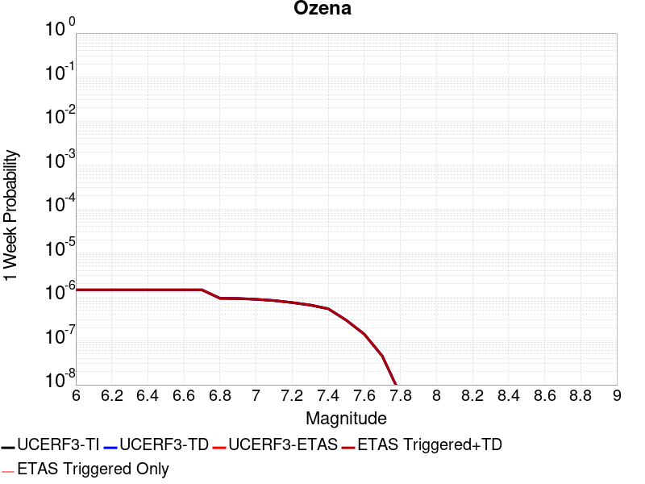 | 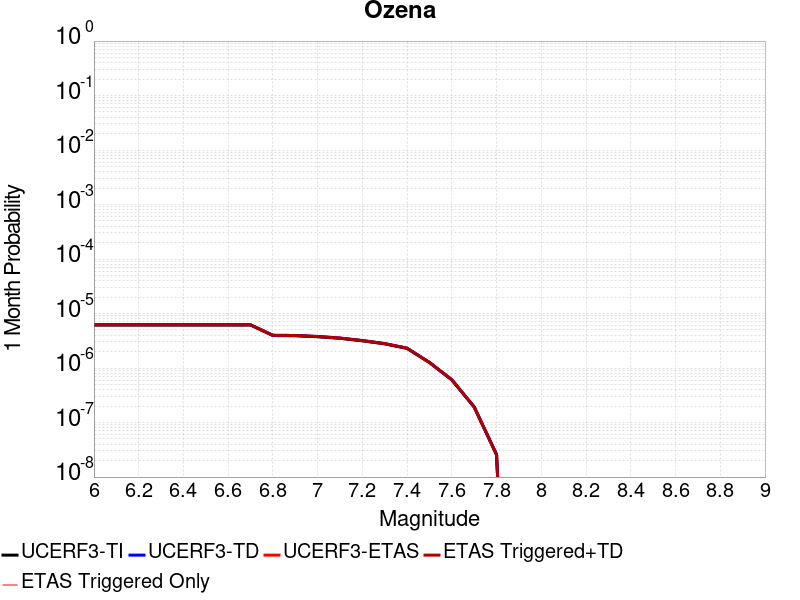 | 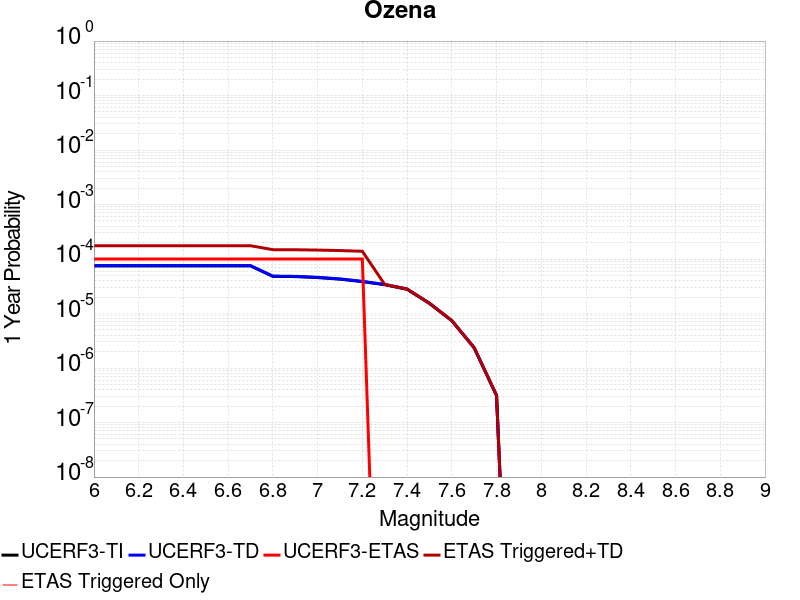 |  |

| Magnitude | 1 wk TI Prob | 1 wk TD Prob | 1 wk ETAS Prob | 1 wk ETAS/TD Gain | 1 wk ETAS Triggered+TD | 1 wk ETAS Triggered Only | 1 mo TI Prob | 1 mo TD Prob | 1 mo ETAS Prob | 1 mo ETAS/TD Gain | 1 mo ETAS Triggered+TD | 1 mo ETAS Triggered Only | 1 yr TI Prob | 1 yr TD Prob | 1 yr ETAS Prob | 1 yr ETAS/TD Gain | 1 yr ETAS Triggered+TD | 1 yr ETAS Triggered Only | 10 yr TI Prob | 10 yr TD Prob | 10 yr ETAS Prob | 10 yr ETAS/TD Gain | 10 yr ETAS Triggered+TD | 10 yr ETAS Triggered Only |
|-----|-----|-----|-----|-----|-----|-----|-----|-----|-----|-----|-----|-----|-----|-----|-----|-----|-----|-----|-----|-----|-----|-----|-----|-----|
| 6.0 | 1.4377547E-6 | 1.4514056E-6 | 0.0 | 0.0 | 1.4514056E-6 | 0.0 | 6.161791E-6 | 6.220296E-6 | 0.0 | 0.0 | 6.220296E-6 | 0.0 | 7.5017226E-5 | 7.5729746E-5 | 1.0E-4 | 1.3204851 | 1.7572218E-4 | 1.0E-4 | 7.4991904E-4 | 7.57066E-4 | 9.0E-4 | 1.1887999 | 0.0011567632 | 4.0E-4 |
| 6.1 | 1.4377547E-6 | 1.4514056E-6 | 0.0 | 0.0 | 1.4514056E-6 | 0.0 | 6.161791E-6 | 6.220296E-6 | 0.0 | 0.0 | 6.220296E-6 | 0.0 | 7.5017226E-5 | 7.5729746E-5 | 1.0E-4 | 1.3204851 | 1.7572218E-4 | 1.0E-4 | 7.4991904E-4 | 7.57066E-4 | 9.0E-4 | 1.1887999 | 0.0011567632 | 4.0E-4 |
| 6.2 | 1.4377547E-6 | 1.4514056E-6 | 0.0 | 0.0 | 1.4514056E-6 | 0.0 | 6.161791E-6 | 6.220296E-6 | 0.0 | 0.0 | 6.220296E-6 | 0.0 | 7.5017226E-5 | 7.5729746E-5 | 1.0E-4 | 1.3204851 | 1.7572218E-4 | 1.0E-4 | 7.4991904E-4 | 7.57066E-4 | 9.0E-4 | 1.1887999 | 0.0011567632 | 4.0E-4 |
| 6.3 | 1.4377547E-6 | 1.4514056E-6 | 0.0 | 0.0 | 1.4514056E-6 | 0.0 | 6.161791E-6 | 6.220296E-6 | 0.0 | 0.0 | 6.220296E-6 | 0.0 | 7.5017226E-5 | 7.5729746E-5 | 1.0E-4 | 1.3204851 | 1.7572218E-4 | 1.0E-4 | 7.4991904E-4 | 7.57066E-4 | 9.0E-4 | 1.1887999 | 0.0011567632 | 4.0E-4 |
| 6.4 | 1.4377547E-6 | 1.4514056E-6 | 0.0 | 0.0 | 1.4514056E-6 | 0.0 | 6.161791E-6 | 6.220296E-6 | 0.0 | 0.0 | 6.220296E-6 | 0.0 | 7.5017226E-5 | 7.5729746E-5 | 1.0E-4 | 1.3204851 | 1.7572218E-4 | 1.0E-4 | 7.4991904E-4 | 7.57066E-4 | 9.0E-4 | 1.1887999 | 0.0011567632 | 4.0E-4 |
| 6.5 | 1.4377547E-6 | 1.4514056E-6 | 0.0 | 0.0 | 1.4514056E-6 | 0.0 | 6.161791E-6 | 6.220296E-6 | 0.0 | 0.0 | 6.220296E-6 | 0.0 | 7.5017226E-5 | 7.5729746E-5 | 1.0E-4 | 1.3204851 | 1.7572218E-4 | 1.0E-4 | 7.4991904E-4 | 7.57066E-4 | 9.0E-4 | 1.1887999 | 0.0011567632 | 4.0E-4 |
| 6.6 | 1.4377547E-6 | 1.4514056E-6 | 0.0 | 0.0 | 1.4514056E-6 | 0.0 | 6.161791E-6 | 6.220296E-6 | 0.0 | 0.0 | 6.220296E-6 | 0.0 | 7.5017226E-5 | 7.5729746E-5 | 1.0E-4 | 1.3204851 | 1.7572218E-4 | 1.0E-4 | 7.4991904E-4 | 7.57066E-4 | 9.0E-4 | 1.1887999 | 0.0011567632 | 4.0E-4 |
| 6.7 | 1.4377547E-6 | 1.4514056E-6 | 0.0 | 0.0 | 1.4514056E-6 | 0.0 | 6.161791E-6 | 6.220296E-6 | 0.0 | 0.0 | 6.220296E-6 | 0.0 | 7.5017226E-5 | 7.5729746E-5 | 1.0E-4 | 1.3204851 | 1.7572218E-4 | 1.0E-4 | 7.4991904E-4 | 7.57066E-4 | 9.0E-4 | 1.1887999 | 0.0011567632 | 4.0E-4 |
| 6.8 | 9.223257E-7 | 9.3178124E-7 | 0.0 | 0.0 | 9.3178124E-7 | 0.0 | 3.9528186E-6 | 3.9933425E-6 | 0.0 | 0.0 | 3.9933425E-6 | 0.0 | 4.81245E-5 | 4.86179E-5 | 1.0E-4 | 2.0568557 | 1.4861303E-4 | 1.0E-4 | 4.811408E-4 | 4.8607666E-4 | 5.0E-4 | 1.0286443 | 8.8588224E-4 | 4.0E-4 |
| 6.9 | 9.141515E-7 | 9.235559E-7 | 0.0 | 0.0 | 9.235559E-7 | 0.0 | 3.917786E-6 | 3.958091E-6 | 0.0 | 0.0 | 3.958091E-6 | 0.0 | 4.7698002E-5 | 4.8188733E-5 | 1.0E-4 | 2.0751739 | 1.4818391E-4 | 1.0E-4 | 4.7687767E-4 | 4.8178685E-4 | 5.0E-4 | 1.0378033 | 8.8159414E-4 | 4.0E-4 |
| 7.0 | 8.767648E-7 | 8.858759E-7 | 0.0 | 0.0 | 8.858759E-7 | 0.0 | 3.757558E-6 | 3.7966058E-6 | 0.0 | 0.0 | 3.7966058E-6 | 0.0 | 4.5747307E-5 | 4.6222736E-5 | 1.0E-4 | 2.1634376 | 1.4621811E-4 | 1.0E-4 | 4.5737892E-4 | 4.6213515E-4 | 4.0E-4 | 0.86554766 | 8.619503E-4 | 4.0E-4 |
| 7.1 | 8.199402E-7 | 8.285571E-7 | 0.0 | 0.0 | 8.285571E-7 | 0.0 | 3.5140247E-6 | 3.5509545E-6 | 0.0 | 0.0 | 3.5509545E-6 | 0.0 | 4.2782412E-5 | 4.323205E-5 | 1.0E-4 | 2.3130987 | 1.4322772E-4 | 1.0E-4 | 4.2774176E-4 | 4.322401E-4 | 4.0E-4 | 0.9254116 | 8.320672E-4 | 4.0E-4 |
| 7.2 | 7.38705E-7 | 7.4644174E-7 | 0.0 | 0.0 | 7.4644174E-7 | 0.0 | 3.1658747E-6 | 3.1990323E-6 | 0.0 | 0.0 | 3.1990323E-6 | 0.0 | 3.8543843E-5 | 3.8947557E-5 | 1.0E-4 | 2.5675552 | 1.3894367E-4 | 1.0E-4 | 3.853716E-4 | 3.8941082E-4 | 4.0E-4 | 1.0271928 | 7.892551E-4 | 4.0E-4 |
| 7.3 | 6.490017E-7 | 6.5579377E-7 | 0.0 | 0.0 | 6.5579377E-7 | 0.0 | 2.7814328E-6 | 2.810542E-6 | 0.0 | 0.0 | 2.810542E-6 | 0.0 | 3.386342E-5 | 3.4217843E-5 | 0.0 | 0.0 | 3.4217843E-5 | 0.0 | 3.3858258E-4 | 3.4212912E-4 | 3.0E-4 | 0.87686193 | 6.420265E-4 | 3.0E-4 |
| 7.4 | 5.346736E-7 | 5.402372E-7 | 0.0 | 0.0 | 5.402372E-7 | 0.0 | 2.291456E-6 | 2.3153004E-6 | 0.0 | 0.0 | 2.3153004E-6 | 0.0 | 2.789812E-5 | 2.818845E-5 | 0.0 | 0.0 | 2.818845E-5 | 0.0 | 2.789462E-4 | 2.8185177E-4 | 3.0E-4 | 1.0643892 | 5.8176724E-4 | 3.0E-4 |
| 7.5 | 2.939325E-7 | 2.9666603E-7 | 0.0 | 0.0 | 2.9666603E-7 | 0.0 | 1.25971E-6 | 1.2714254E-6 | 0.0 | 0.0 | 1.2714254E-6 | 0.0 | 1.5336862E-5 | 1.547951E-5 | 0.0 | 0.0 | 1.547951E-5 | 0.0 | 1.5335804E-4 | 1.5478594E-4 | 2.0E-4 | 1.2921071 | 3.5475497E-4 | 2.0E-4 |
| 7.6 | 1.4151905E-7 | 1.4253467E-7 | 0.0 | 0.0 | 1.4253467E-7 | 0.0 | 6.065101E-7 | 6.1086274E-7 | 0.0 | 0.0 | 6.1086274E-7 | 0.0 | 7.3842357E-6 | 7.4372297E-6 | 0.0 | 0.0 | 7.4372297E-6 | 0.0 | 7.38399E-5 | 7.4369884E-5 | 2.0E-4 | 2.6892607 | 2.74355E-4 | 2.0E-4 |
| 7.7 | 4.4957577E-8 | 4.5252833E-8 | 0.0 | 0.0 | 4.5252833E-8 | 0.0 | 1.9267533E-7 | 1.9394069E-7 | 0.0 | 0.0 | 1.9394069E-7 | 0.0 | 2.3458194E-6 | 2.3612254E-6 | 0.0 | 0.0 | 2.3612254E-6 | 0.0 | 2.3457947E-5 | 2.3612012E-5 | 0.0 | 0.0 | 2.3612012E-5 | 0.0 |
| 7.8 | 5.9993255E-9 | 6.0413807E-9 | 0.0 | 0.0 | 6.0413807E-9 | 0.0 | 2.5711394E-8 | 2.5891634E-8 | 0.0 | 0.0 | 2.5891634E-8 | 0.0 | 3.1303617E-7 | 3.152306E-7 | 0.0 | 0.0 | 3.152306E-7 | 0.0 | 3.1303573E-6 | 3.1523025E-6 | 0.0 | 0.0 | 3.1523025E-6 | 0.0 |

## Skinner Flat 2011 CFM
*[(top)](#table-of-contents)*

| 1 Week | 1 Month | 1 Year | 10 Year |
|-----|-----|-----|-----|
|  |  |  |  |

| Magnitude | 1 wk TI Prob | 1 wk TD Prob | 1 wk ETAS Prob | 1 wk ETAS/TD Gain | 1 wk ETAS Triggered+TD | 1 wk ETAS Triggered Only | 1 mo TI Prob | 1 mo TD Prob | 1 mo ETAS Prob | 1 mo ETAS/TD Gain | 1 mo ETAS Triggered+TD | 1 mo ETAS Triggered Only | 1 yr TI Prob | 1 yr TD Prob | 1 yr ETAS Prob | 1 yr ETAS/TD Gain | 1 yr ETAS Triggered+TD | 1 yr ETAS Triggered Only | 10 yr TI Prob | 10 yr TD Prob | 10 yr ETAS Prob | 10 yr ETAS/TD Gain | 10 yr ETAS Triggered+TD | 10 yr ETAS Triggered Only |
|-----|-----|-----|-----|-----|-----|-----|-----|-----|-----|-----|-----|-----|-----|-----|-----|-----|-----|-----|-----|-----|-----|-----|-----|-----|
| 6.0 | 4.3279074E-6 | 4.485276E-6 | 0.0 | 0.0 | 4.485276E-6 | 0.0 | 1.8548042E-5 | 1.922261E-5 | 0.0 | 0.0 | 1.922261E-5 | 0.0 | 2.2579901E-4 | 2.3403528E-4 | 1.0E-4 | 0.427286 | 3.340119E-4 | 1.0E-4 | 0.002255697 | 0.0023403529 | 0.0024 | 1.0254865 | 0.0027394167 | 4.0E-4 |
| 6.1 | 4.3279074E-6 | 4.485276E-6 | 0.0 | 0.0 | 4.485276E-6 | 0.0 | 1.8548042E-5 | 1.922261E-5 | 0.0 | 0.0 | 1.922261E-5 | 0.0 | 2.2579901E-4 | 2.3403528E-4 | 1.0E-4 | 0.427286 | 3.340119E-4 | 1.0E-4 | 0.002255697 | 0.0023403529 | 0.0018 | 0.7691148 | 0.0026396506 | 3.0E-4 |

## Polaris 2011 CFM
*[(top)](#table-of-contents)*

| 1 Week | 1 Month | 1 Year | 10 Year |
|-----|-----|-----|-----|
| 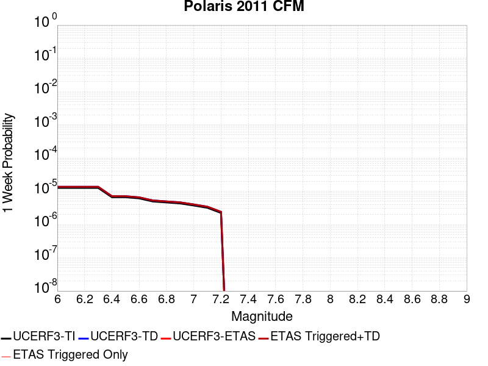 |  |  |  |

| Magnitude | 1 wk TI Prob | 1 wk TD Prob | 1 wk ETAS Prob | 1 wk ETAS/TD Gain | 1 wk ETAS Triggered+TD | 1 wk ETAS Triggered Only | 1 mo TI Prob | 1 mo TD Prob | 1 mo ETAS Prob | 1 mo ETAS/TD Gain | 1 mo ETAS Triggered+TD | 1 mo ETAS Triggered Only | 1 yr TI Prob | 1 yr TD Prob | 1 yr ETAS Prob | 1 yr ETAS/TD Gain | 1 yr ETAS Triggered+TD | 1 yr ETAS Triggered Only | 10 yr TI Prob | 10 yr TD Prob | 10 yr ETAS Prob | 10 yr ETAS/TD Gain | 10 yr ETAS Triggered+TD | 10 yr ETAS Triggered Only |
|-----|-----|-----|-----|-----|-----|-----|-----|-----|-----|-----|-----|-----|-----|-----|-----|-----|-----|-----|-----|-----|-----|-----|-----|-----|
| 6.0 | 1.2630823E-5 | 1.3584949E-5 | 0.0 | 0.0 | 1.3584949E-5 | 0.0 | 5.413098E-5 | 5.82202E-5 | 0.0 | 0.0 | 5.82202E-5 | 0.0 | 6.5884535E-4 | 7.086523E-4 | 3.0E-4 | 0.42333877 | 7.086523E-4 | 0.0 | 0.0065689543 | 0.007069036 | 0.0034 | 0.4809708 | 0.007466208 | 4.0E-4 |
| 6.1 | 1.2630823E-5 | 1.3584949E-5 | 0.0 | 0.0 | 1.3584949E-5 | 0.0 | 5.413098E-5 | 5.82202E-5 | 0.0 | 0.0 | 5.82202E-5 | 0.0 | 6.5884535E-4 | 7.086523E-4 | 3.0E-4 | 0.42333877 | 7.086523E-4 | 0.0 | 0.0065689543 | 0.007069036 | 0.0034 | 0.4809708 | 0.007466208 | 4.0E-4 |
| 6.2 | 1.2630823E-5 | 1.3584949E-5 | 0.0 | 0.0 | 1.3584949E-5 | 0.0 | 5.413098E-5 | 5.82202E-5 | 0.0 | 0.0 | 5.82202E-5 | 0.0 | 6.5884535E-4 | 7.086523E-4 | 3.0E-4 | 0.42333877 | 7.086523E-4 | 0.0 | 0.0065689543 | 0.007069036 | 0.0034 | 0.4809708 | 0.007466208 | 4.0E-4 |
| 6.3 | 1.2630823E-5 | 1.3584949E-5 | 0.0 | 0.0 | 1.3584949E-5 | 0.0 | 5.413098E-5 | 5.82202E-5 | 0.0 | 0.0 | 5.82202E-5 | 0.0 | 6.5884535E-4 | 7.086523E-4 | 3.0E-4 | 0.42333877 | 7.086523E-4 | 0.0 | 0.0065689543 | 0.007069036 | 0.0034 | 0.4809708 | 0.007466208 | 4.0E-4 |
| 6.4 | 6.642994E-6 | 7.108045E-6 | 0.0 | 0.0 | 7.108045E-6 | 0.0 | 2.8469662E-5 | 3.0462723E-5 | 0.0 | 0.0 | 3.0462723E-5 | 0.0 | 3.46563E-4 | 3.708257E-4 | 3.0E-4 | 0.80900544 | 3.708257E-4 | 0.0 | 0.0034602303 | 0.00370258 | 0.0019 | 0.5131557 | 0.0039018395 | 2.0E-4 |
| 6.5 | 6.642994E-6 | 7.108045E-6 | 0.0 | 0.0 | 7.108045E-6 | 0.0 | 2.8469662E-5 | 3.0462723E-5 | 0.0 | 0.0 | 3.0462723E-5 | 0.0 | 3.46563E-4 | 3.708257E-4 | 3.0E-4 | 0.80900544 | 3.708257E-4 | 0.0 | 0.0034602303 | 0.00370258 | 0.0019 | 0.5131557 | 0.0039018395 | 2.0E-4 |
| 6.6 | 6.1286296E-6 | 6.557079E-6 | 0.0 | 0.0 | 6.557079E-6 | 0.0 | 2.626529E-5 | 2.810149E-5 | 0.0 | 0.0 | 2.810149E-5 | 0.0 | 3.19733E-4 | 3.4208674E-4 | 3.0E-4 | 0.8769705 | 3.4208674E-4 | 0.0 | 0.0031927335 | 0.003416077 | 0.0016 | 0.46837354 | 0.0036153938 | 2.0E-4 |
| 6.7 | 4.9474666E-6 | 5.2989944E-6 | 0.0 | 0.0 | 5.2989944E-6 | 0.0 | 2.1203256E-5 | 2.2709793E-5 | 0.0 | 0.0 | 2.2709793E-5 | 0.0 | 2.5811905E-4 | 2.764595E-4 | 2.0E-4 | 0.72343326 | 2.764595E-4 | 0.0 | 0.0025781945 | 0.0027614357 | 0.0013 | 0.4707696 | 0.0029608833 | 2.0E-4 |
| 6.8 | 4.616407E-6 | 4.946965E-6 | 0.0 | 0.0 | 4.946965E-6 | 0.0 | 1.978445E-5 | 2.1201122E-5 | 0.0 | 0.0 | 2.1201122E-5 | 0.0 | 2.4084905E-4 | 2.5809577E-4 | 2.0E-4 | 0.77490616 | 2.5809577E-4 | 0.0 | 0.0024058819 | 0.0025782245 | 0.0013 | 0.5042229 | 0.002777709 | 2.0E-4 |
| 6.9 | 4.320343E-6 | 4.6315463E-6 | 0.0 | 0.0 | 4.6315463E-6 | 0.0 | 1.8515624E-5 | 1.9849347E-5 | 0.0 | 0.0 | 1.9849347E-5 | 0.0 | 2.2540441E-4 | 2.4164161E-4 | 2.0E-4 | 0.827672 | 2.4164161E-4 | 0.0 | 0.0022517592 | 0.0024140454 | 0.0013 | 0.5385151 | 0.0026135626 | 2.0E-4 |
| 7.0 | 3.7382292E-6 | 4.01013E-6 | 0.0 | 0.0 | 4.01013E-6 | 0.0 | 1.6020884E-5 | 1.7186172E-5 | 0.0 | 0.0 | 1.7186172E-5 | 0.0 | 1.950368E-4 | 2.0922394E-4 | 2.0E-4 | 0.95591354 | 2.0922394E-4 | 0.0 | 0.0019486571 | 0.002090505 | 0.001 | 0.4783533 | 0.002090505 | 0.0 |
| 7.1 | 3.193576E-6 | 3.4281975E-6 | 0.0 | 0.0 | 3.4281975E-6 | 0.0 | 1.3686683E-5 | 1.4692205E-5 | 0.0 | 0.0 | 1.4692205E-5 | 0.0 | 1.6662262E-4 | 1.7886514E-4 | 2.0E-4 | 1.1181608 | 1.7886514E-4 | 0.0 | 0.0016649774 | 0.0017874306 | 8.0E-4 | 0.44756982 | 0.0017874306 | 0.0 |
| 7.2 | 2.2356758E-6 | 2.4027236E-6 | 0.0 | 0.0 | 2.4027236E-6 | 0.0 | 9.581432E-6 | 1.0297357E-5 | 0.0 | 0.0 | 1.0297357E-5 | 0.0 | 1.1664769E-4 | 1.25365E-4 | 1.0E-4 | 0.7976708 | 1.25365E-4 | 0.0 | 0.0011658648 | 0.0012531286 | 6.0E-4 | 0.4788016 | 0.0012531286 | 0.0 |

## Holser alt 1
*[(top)](#table-of-contents)*

| 1 Week | 1 Month | 1 Year | 10 Year |
|-----|-----|-----|-----|
|  | 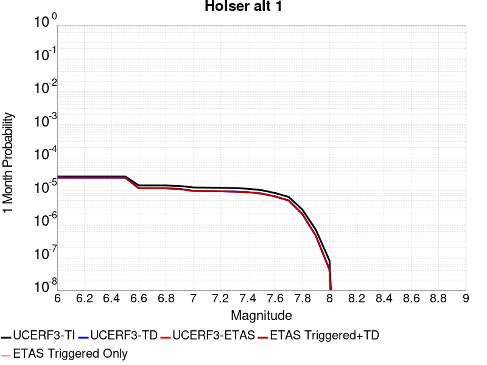 |  |  |

| Magnitude | 1 wk TI Prob | 1 wk TD Prob | 1 wk ETAS Prob | 1 wk ETAS/TD Gain | 1 wk ETAS Triggered+TD | 1 wk ETAS Triggered Only | 1 mo TI Prob | 1 mo TD Prob | 1 mo ETAS Prob | 1 mo ETAS/TD Gain | 1 mo ETAS Triggered+TD | 1 mo ETAS Triggered Only | 1 yr TI Prob | 1 yr TD Prob | 1 yr ETAS Prob | 1 yr ETAS/TD Gain | 1 yr ETAS Triggered+TD | 1 yr ETAS Triggered Only | 10 yr TI Prob | 10 yr TD Prob | 10 yr ETAS Prob | 10 yr ETAS/TD Gain | 10 yr ETAS Triggered+TD | 10 yr ETAS Triggered Only |
|-----|-----|-----|-----|-----|-----|-----|-----|-----|-----|-----|-----|-----|-----|-----|-----|-----|-----|-----|-----|-----|-----|-----|-----|-----|
| 6.0 | 6.2746653E-6 | 5.7909374E-6 | 0.0 | 0.0 | 5.7909374E-6 | 0.0 | 2.6891146E-5 | 2.4818133E-5 | 0.0 | 0.0 | 2.4818133E-5 | 0.0 | 3.273505E-4 | 3.0213041E-4 | 2.0E-4 | 0.6619658 | 3.0213041E-4 | 0.0 | 0.0032686873 | 0.0030183296 | 0.0016 | 0.53009456 | 0.0034171222 | 4.0E-4 |
| 6.1 | 6.2746653E-6 | 5.7909374E-6 | 0.0 | 0.0 | 5.7909374E-6 | 0.0 | 2.6891146E-5 | 2.4818133E-5 | 0.0 | 0.0 | 2.4818133E-5 | 0.0 | 3.273505E-4 | 3.0213041E-4 | 2.0E-4 | 0.6619658 | 3.0213041E-4 | 0.0 | 0.0032686873 | 0.0030183296 | 0.0016 | 0.53009456 | 0.0034171222 | 4.0E-4 |
| 6.2 | 6.2746653E-6 | 5.7909374E-6 | 0.0 | 0.0 | 5.7909374E-6 | 0.0 | 2.6891146E-5 | 2.4818133E-5 | 0.0 | 0.0 | 2.4818133E-5 | 0.0 | 3.273505E-4 | 3.0213041E-4 | 2.0E-4 | 0.6619658 | 3.0213041E-4 | 0.0 | 0.0032686873 | 0.0030183296 | 0.0016 | 0.53009456 | 0.0034171222 | 4.0E-4 |
| 6.3 | 6.2746653E-6 | 5.7909374E-6 | 0.0 | 0.0 | 5.7909374E-6 | 0.0 | 2.6891146E-5 | 2.4818133E-5 | 0.0 | 0.0 | 2.4818133E-5 | 0.0 | 3.273505E-4 | 3.0213041E-4 | 2.0E-4 | 0.6619658 | 3.0213041E-4 | 0.0 | 0.0032686873 | 0.0030183296 | 0.0016 | 0.53009456 | 0.0034171222 | 4.0E-4 |
| 6.4 | 6.2746653E-6 | 5.7909374E-6 | 0.0 | 0.0 | 5.7909374E-6 | 0.0 | 2.6891146E-5 | 2.4818133E-5 | 0.0 | 0.0 | 2.4818133E-5 | 0.0 | 3.273505E-4 | 3.0213041E-4 | 2.0E-4 | 0.6619658 | 3.0213041E-4 | 0.0 | 0.0032686873 | 0.0030183296 | 0.0016 | 0.53009456 | 0.0034171222 | 4.0E-4 |
| 6.5 | 6.2746653E-6 | 5.7909374E-6 | 0.0 | 0.0 | 5.7909374E-6 | 0.0 | 2.6891146E-5 | 2.4818133E-5 | 0.0 | 0.0 | 2.4818133E-5 | 0.0 | 3.273505E-4 | 3.0213041E-4 | 2.0E-4 | 0.6619658 | 3.0213041E-4 | 0.0 | 0.0032686873 | 0.0030183296 | 0.0016 | 0.53009456 | 0.0034171222 | 4.0E-4 |
| 6.6 | 3.375825E-6 | 2.7719145E-6 | 0.0 | 0.0 | 2.7719145E-6 | 0.0 | 1.4467741E-5 | 1.1879581E-5 | 0.0 | 0.0 | 1.1879581E-5 | 0.0 | 1.761305E-4 | 1.4462446E-4 | 1.0E-4 | 0.69144595 | 1.4462446E-4 | 0.0 | 0.0017599097 | 0.0014453203 | 6.0E-4 | 0.41513288 | 0.0016450313 | 2.0E-4 |
| 6.7 | 3.375825E-6 | 2.7719145E-6 | 0.0 | 0.0 | 2.7719145E-6 | 0.0 | 1.4467741E-5 | 1.1879581E-5 | 0.0 | 0.0 | 1.1879581E-5 | 0.0 | 1.761305E-4 | 1.4462446E-4 | 1.0E-4 | 0.69144595 | 1.4462446E-4 | 0.0 | 0.0017599097 | 0.0014453203 | 6.0E-4 | 0.41513288 | 0.0016450313 | 2.0E-4 |
| 6.8 | 3.366533E-6 | 2.7623134E-6 | 0.0 | 0.0 | 2.7623134E-6 | 0.0 | 1.4427919E-5 | 1.1838433E-5 | 0.0 | 0.0 | 1.1838433E-5 | 0.0 | 1.7564575E-4 | 1.4412357E-4 | 1.0E-4 | 0.6938491 | 1.4412357E-4 | 0.0 | 0.0017550698 | 0.0014403178 | 6.0E-4 | 0.41657472 | 0.0016400298 | 2.0E-4 |
| 6.9 | 3.253174E-6 | 2.6445264E-6 | 0.0 | 0.0 | 2.6445264E-6 | 0.0 | 1.39421E-5 | 1.1333636E-5 | 0.0 | 0.0 | 1.1333636E-5 | 0.0 | 1.6973184E-4 | 1.3797844E-4 | 1.0E-4 | 0.7247509 | 1.3797844E-4 | 0.0 | 0.0016960226 | 0.0013789437 | 6.0E-4 | 0.4351157 | 0.0015786678 | 2.0E-4 |
| 7.0 | 2.9336593E-6 | 2.312488E-6 | 0.0 | 0.0 | 2.312488E-6 | 0.0 | 1.2572766E-5 | 9.9106255E-6 | 0.0 | 0.0 | 9.9106255E-6 | 0.0 | 1.5306266E-4 | 1.20655204E-4 | 1.0E-4 | 0.828808 | 1.20655204E-4 | 0.0 | 0.0015295728 | 0.0012058994 | 5.0E-4 | 0.41462827 | 0.0013057789 | 1.0E-4 |
| 7.1 | 2.9087812E-6 | 2.2883369E-6 | 0.0 | 0.0 | 2.2883369E-6 | 0.0 | 1.2466146E-5 | 9.807121E-6 | 0.0 | 0.0 | 9.807121E-6 | 0.0 | 1.5176475E-4 | 1.1939518E-4 | 1.0E-4 | 0.83755475 | 1.1939518E-4 | 0.0 | 0.0015166114 | 0.0011933128 | 5.0E-4 | 0.4190016 | 0.0012931935 | 1.0E-4 |
| 7.2 | 2.8674524E-6 | 2.2482218E-6 | 0.0 | 0.0 | 2.2482218E-6 | 0.0 | 1.2289024E-5 | 9.6352005E-6 | 0.0 | 0.0 | 9.6352005E-6 | 0.0 | 1.4960859E-4 | 1.17302276E-4 | 1.0E-4 | 0.8524984 | 1.17302276E-4 | 0.0 | 0.0014950791 | 0.0011724059 | 5.0E-4 | 0.42647344 | 0.0012722887 | 1.0E-4 |
| 7.3 | 2.8057775E-6 | 2.1960996E-6 | 0.0 | 0.0 | 2.1960996E-6 | 0.0 | 1.2024705E-5 | 9.411821E-6 | 0.0 | 0.0 | 9.411821E-6 | 0.0 | 1.4639096E-4 | 1.1458292E-4 | 1.0E-4 | 0.8727304 | 1.1458292E-4 | 0.0 | 0.0014629456 | 0.0011452407 | 5.0E-4 | 0.43658945 | 0.0012451261 | 1.0E-4 |
| 7.4 | 2.683666E-6 | 2.1098685E-6 | 0.0 | 0.0 | 2.1098685E-6 | 0.0 | 1.1501375E-5 | 9.042263E-6 | 0.0 | 0.0 | 9.042263E-6 | 0.0 | 1.4002025E-4 | 1.1008401E-4 | 1.0E-4 | 0.90839714 | 1.1008401E-4 | 0.0 | 0.0013993206 | 0.001100297 | 5.0E-4 | 0.45442277 | 0.0012001869 | 1.0E-4 |
| 7.5 | 2.434495E-6 | 1.9200968E-6 | 0.0 | 0.0 | 1.9200968E-6 | 0.0 | 1.0433508E-5 | 8.22896E-6 | 0.0 | 0.0 | 8.22896E-6 | 0.0 | 1.2702055E-4 | 1.00183E-4 | 1.0E-4 | 0.9981733 | 1.00183E-4 | 0.0 | 0.0012694797 | 0.0010013804 | 4.0E-4 | 0.3994486 | 0.0011012803 | 1.0E-4 |
| 7.6 | 1.9914562E-6 | 1.5735278E-6 | 0.0 | 0.0 | 1.5735278E-6 | 0.0 | 8.534785E-6 | 6.743673E-6 | 0.0 | 0.0 | 6.743673E-6 | 0.0 | 1.03906044E-4 | 8.210114E-5 | 1.0E-4 | 1.2180098 | 8.210114E-5 | 0.0 | 0.0010385747 | 8.207097E-4 | 3.0E-4 | 0.36553732 | 9.206276E-4 | 1.0E-4 |
| 7.7 | 1.5229501E-6 | 1.1899117E-6 | 0.0 | 0.0 | 1.1899117E-6 | 0.0 | 6.526913E-6 | 5.0996114E-6 | 0.0 | 0.0 | 5.0996114E-6 | 0.0 | 7.946226E-5 | 6.2086016E-5 | 1.0E-4 | 1.6106688 | 6.2086016E-5 | 0.0 | 7.943385E-4 | 6.2068796E-4 | 3.0E-4 | 0.48333466 | 7.2062586E-4 | 1.0E-4 |
| 7.8 | 6.3489426E-7 | 4.6895144E-7 | 0.0 | 0.0 | 4.6895144E-7 | 0.0 | 2.7209726E-6 | 2.0097903E-6 | 0.0 | 0.0 | 2.0097903E-6 | 0.0 | 3.312734E-5 | 2.4468924E-5 | 0.0 | 0.0 | 2.4468924E-5 | 0.0 | 3.31224E-4 | 2.446625E-4 | 0.0 | 0.0 | 2.446625E-4 | 0.0 |
| 7.9 | 1.5459432E-7 | 1.01961966E-7 | 0.0 | 0.0 | 1.01961966E-7 | 0.0 | 6.6254694E-7 | 4.3697978E-7 | 0.0 | 0.0 | 4.3697978E-7 | 0.0 | 8.066479E-6 | 5.320216E-6 | 0.0 | 0.0 | 5.320216E-6 | 0.0 | 8.066186E-5 | 5.3200903E-5 | 0.0 | 0.0 | 5.3200903E-5 | 0.0 |
| 8.0 | 1.8307812E-8 | 9.69429E-9 | 0.0 | 0.0 | 9.69429E-9 | 0.0 | 7.846205E-8 | 4.1546954E-8 | 0.0 | 0.0 | 4.1546954E-8 | 0.0 | 9.55275E-7 | 5.0583407E-7 | 0.0 | 0.0 | 5.0583407E-7 | 0.0 | 9.552709E-6 | 5.0583294E-6 | 0.0 | 0.0 | 5.0583294E-6 | 0.0 |

## Cucamonga
*[(top)](#table-of-contents)*

| 1 Week | 1 Month | 1 Year | 10 Year |
|-----|-----|-----|-----|
| 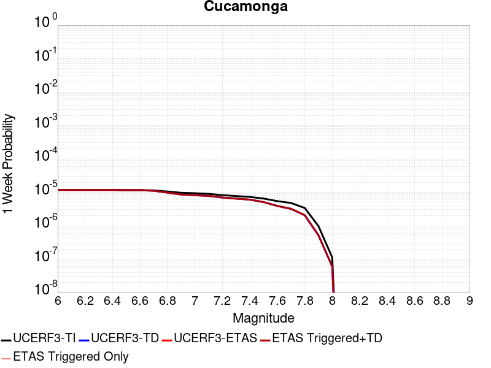 |  |  |  |

| Magnitude | 1 wk TI Prob | 1 wk TD Prob | 1 wk ETAS Prob | 1 wk ETAS/TD Gain | 1 wk ETAS Triggered+TD | 1 wk ETAS Triggered Only | 1 mo TI Prob | 1 mo TD Prob | 1 mo ETAS Prob | 1 mo ETAS/TD Gain | 1 mo ETAS Triggered+TD | 1 mo ETAS Triggered Only | 1 yr TI Prob | 1 yr TD Prob | 1 yr ETAS Prob | 1 yr ETAS/TD Gain | 1 yr ETAS Triggered+TD | 1 yr ETAS Triggered Only | 10 yr TI Prob | 10 yr TD Prob | 10 yr ETAS Prob | 10 yr ETAS/TD Gain | 10 yr ETAS Triggered+TD | 10 yr ETAS Triggered Only |
|-----|-----|-----|-----|-----|-----|-----|-----|-----|-----|-----|-----|-----|-----|-----|-----|-----|-----|-----|-----|-----|-----|-----|-----|-----|
| 6.0 | 1.1848348E-5 | 1.1745618E-5 | 0.0 | 0.0 | 1.1745618E-5 | 0.0 | 5.0777642E-5 | 5.033741E-5 | 0.0 | 0.0 | 5.033741E-5 | 0.0 | 6.180424E-4 | 6.126883E-4 | 5.0E-4 | 0.8160756 | 7.126271E-4 | 1.0E-4 | 0.0061632637 | 0.006111266 | 0.0039 | 0.63816565 | 0.0065088216 | 4.0E-4 |
| 6.1 | 1.1848348E-5 | 1.1745618E-5 | 0.0 | 0.0 | 1.1745618E-5 | 0.0 | 5.0777642E-5 | 5.033741E-5 | 0.0 | 0.0 | 5.033741E-5 | 0.0 | 6.180424E-4 | 6.126883E-4 | 5.0E-4 | 0.8160756 | 7.126271E-4 | 1.0E-4 | 0.0061632637 | 0.006111266 | 0.0039 | 0.63816565 | 0.0065088216 | 4.0E-4 |
| 6.2 | 1.1848348E-5 | 1.1745618E-5 | 0.0 | 0.0 | 1.1745618E-5 | 0.0 | 5.0777642E-5 | 5.033741E-5 | 0.0 | 0.0 | 5.033741E-5 | 0.0 | 6.180424E-4 | 6.126883E-4 | 5.0E-4 | 0.8160756 | 7.126271E-4 | 1.0E-4 | 0.0061632637 | 0.006111266 | 0.0039 | 0.63816565 | 0.0065088216 | 4.0E-4 |
| 6.3 | 1.1848348E-5 | 1.1745618E-5 | 0.0 | 0.0 | 1.1745618E-5 | 0.0 | 5.0777642E-5 | 5.033741E-5 | 0.0 | 0.0 | 5.033741E-5 | 0.0 | 6.180424E-4 | 6.126883E-4 | 5.0E-4 | 0.8160756 | 7.126271E-4 | 1.0E-4 | 0.0061632637 | 0.006111266 | 0.0039 | 0.63816565 | 0.0065088216 | 4.0E-4 |
| 6.4 | 1.1848348E-5 | 1.1745618E-5 | 0.0 | 0.0 | 1.1745618E-5 | 0.0 | 5.0777642E-5 | 5.033741E-5 | 0.0 | 0.0 | 5.033741E-5 | 0.0 | 6.180424E-4 | 6.126883E-4 | 5.0E-4 | 0.8160756 | 7.126271E-4 | 1.0E-4 | 0.0061632637 | 0.006111266 | 0.0039 | 0.63816565 | 0.0065088216 | 4.0E-4 |
| 6.5 | 1.16988695E-5 | 1.1584625E-5 | 0.0 | 0.0 | 1.1584625E-5 | 0.0 | 5.013705E-5 | 4.964746E-5 | 0.0 | 0.0 | 4.964746E-5 | 0.0 | 6.102476E-4 | 6.042929E-4 | 5.0E-4 | 0.8274133 | 7.042325E-4 | 1.0E-4 | 0.006085745 | 0.006027768 | 0.0038 | 0.63041574 | 0.006425357 | 4.0E-4 |
| 6.6 | 1.16988695E-5 | 1.1584625E-5 | 0.0 | 0.0 | 1.1584625E-5 | 0.0 | 5.013705E-5 | 4.964746E-5 | 0.0 | 0.0 | 4.964746E-5 | 0.0 | 6.102476E-4 | 6.042929E-4 | 5.0E-4 | 0.8274133 | 7.042325E-4 | 1.0E-4 | 0.006085745 | 0.006027768 | 0.0038 | 0.63041574 | 0.006425357 | 4.0E-4 |
| 6.7 | 1.1397107E-5 | 1.1123266E-5 | 0.0 | 0.0 | 1.1123266E-5 | 0.0 | 4.884383E-5 | 4.7670284E-5 | 0.0 | 0.0 | 4.7670284E-5 | 0.0 | 5.9451134E-4 | 5.8023364E-4 | 5.0E-4 | 0.8617218 | 6.801756E-4 | 1.0E-4 | 0.005929234 | 0.005788437 | 0.0037 | 0.63920534 | 0.0061861216 | 4.0E-4 |
| 6.8 | 1.058387E-5 | 9.792097E-6 | 0.0 | 0.0 | 9.792097E-6 | 0.0 | 4.5358654E-5 | 4.1965464E-5 | 0.0 | 0.0 | 4.1965464E-5 | 0.0 | 5.521017E-4 | 5.108109E-4 | 5.0E-4 | 0.9788359 | 6.107598E-4 | 1.0E-4 | 0.00550732 | 0.0050974754 | 0.0033 | 0.6473793 | 0.0054954365 | 4.0E-4 |
| 6.9 | 9.690046E-6 | 8.585791E-6 | 0.0 | 0.0 | 8.585791E-6 | 0.0 | 4.1528107E-5 | 3.679573E-5 | 0.0 | 0.0 | 3.679573E-5 | 0.0 | 5.054874E-4 | 4.478963E-4 | 4.0E-4 | 0.89306384 | 4.478963E-4 | 0.0 | 0.005043391 | 0.004470971 | 0.0029 | 0.6486287 | 0.00476963 | 3.0E-4 |
| 7.0 | 9.381461E-6 | 8.193199E-6 | 0.0 | 0.0 | 8.193199E-6 | 0.0 | 4.020564E-5 | 3.511324E-5 | 0.0 | 0.0 | 3.511324E-5 | 0.0 | 4.893937E-4 | 4.274202E-4 | 4.0E-4 | 0.9358472 | 4.274202E-4 | 0.0 | 0.0048831734 | 0.004267017 | 0.0029 | 0.6796317 | 0.0045657367 | 3.0E-4 |
| 7.1 | 8.946492E-6 | 7.787827E-6 | 0.0 | 0.0 | 7.787827E-6 | 0.0 | 3.8341543E-5 | 3.3375978E-5 | 0.0 | 0.0 | 3.3375978E-5 | 0.0 | 4.667083E-4 | 4.0627707E-4 | 4.0E-4 | 0.98454976 | 4.0627707E-4 | 0.0 | 0.0046572937 | 0.0040563806 | 0.0028 | 0.6902705 | 0.004355164 | 3.0E-4 |
| 7.2 | 8.251016E-6 | 6.980704E-6 | 0.0 | 0.0 | 6.980704E-6 | 0.0 | 3.5361016E-5 | 2.991696E-5 | 0.0 | 0.0 | 2.991696E-5 | 0.0 | 4.3043532E-4 | 3.6417836E-4 | 4.0E-4 | 1.0983629 | 3.6417836E-4 | 0.0 | 0.0042960253 | 0.0036368493 | 0.0023 | 0.63241553 | 0.0039357585 | 3.0E-4 |
| 7.3 | 7.717881E-6 | 6.49155E-6 | 0.0 | 0.0 | 6.49155E-6 | 0.0 | 3.3076216E-5 | 2.7820632E-5 | 0.0 | 0.0 | 2.7820632E-5 | 0.0 | 4.026285E-4 | 3.3866375E-4 | 4.0E-4 | 1.1811125 | 3.3866375E-4 | 0.0 | 0.004018998 | 0.0033825105 | 0.0023 | 0.6799683 | 0.0036814958 | 3.0E-4 |
| 7.4 | 7.275623E-6 | 6.0369202E-6 | 0.0 | 0.0 | 6.0369202E-6 | 0.0 | 3.118087E-5 | 2.5872261E-5 | 0.0 | 0.0 | 2.5872261E-5 | 0.0 | 3.7956095E-4 | 3.1494946E-4 | 4.0E-4 | 1.270045 | 3.1494946E-4 | 0.0 | 0.0037891332 | 0.0031460656 | 0.0021 | 0.6675004 | 0.0033454364 | 2.0E-4 |
| 7.5 | 6.5109502E-6 | 5.104779E-6 | 0.0 | 0.0 | 5.104779E-6 | 0.0 | 2.7903774E-5 | 2.1877442E-5 | 0.0 | 0.0 | 2.1877442E-5 | 0.0 | 3.3967546E-4 | 2.6632543E-4 | 3.0E-4 | 1.1264414 | 2.6632543E-4 | 0.0 | 0.0033915674 | 0.0026610882 | 0.0013 | 0.48852193 | 0.0027608222 | 1.0E-4 |
| 7.6 | 5.4495326E-6 | 3.9120964E-6 | 0.0 | 0.0 | 3.9120964E-6 | 0.0 | 2.335493E-5 | 1.676602E-5 | 0.0 | 0.0 | 1.676602E-5 | 0.0 | 2.8430918E-4 | 2.0410723E-4 | 2.0E-4 | 0.97987705 | 2.0410723E-4 | 0.0 | 0.0028394572 | 0.0020402214 | 8.0E-4 | 0.3921143 | 0.0020402214 | 0.0 |
| 7.7 | 4.7997164E-6 | 3.203301E-6 | 0.0 | 0.0 | 3.203301E-6 | 0.0 | 2.057005E-5 | 1.3728361E-5 | 0.0 | 0.0 | 1.3728361E-5 | 0.0 | 2.504116E-4 | 1.6713001E-4 | 2.0E-4 | 1.1966732 | 1.6713001E-4 | 0.0 | 0.002501296 | 0.001671074 | 8.0E-4 | 0.47873405 | 0.001671074 | 0.0 |
| 7.8 | 3.3941733E-6 | 2.0656967E-6 | 0.0 | 0.0 | 2.0656967E-6 | 0.0 | 1.4546376E-5 | 8.852956E-6 | 0.0 | 0.0 | 8.852956E-6 | 0.0 | 1.7708774E-4 | 1.0777942E-4 | 2.0E-4 | 1.8556417 | 1.0777942E-4 | 0.0 | 0.0017694668 | 0.0010775458 | 6.0E-4 | 0.55682087 | 0.0010775458 | 0.0 |
| 7.9 | 9.750552E-7 | 5.160099E-7 | 0.0 | 0.0 | 5.160099E-7 | 0.0 | 4.178801E-6 | 2.211469E-6 | 0.0 | 0.0 | 2.211469E-6 | 0.0 | 5.0875715E-5 | 2.6924308E-5 | 1.0E-4 | 3.7141159 | 2.6924308E-5 | 0.0 | 5.086407E-4 | 2.6921087E-4 | 2.0E-4 | 0.74291205 | 2.6921087E-4 | 0.0 |
| 8.0 | 1.133857E-7 | 6.056156E-8 | 0.0 | 0.0 | 6.056156E-8 | 0.0 | 4.8593864E-7 | 2.5954952E-7 | 0.0 | 0.0 | 2.5954952E-7 | 0.0 | 5.9162867E-6 | 3.1600111E-6 | 0.0 | 0.0 | 3.1600111E-6 | 0.0 | 5.916129E-5 | 3.1599677E-5 | 0.0 | 0.0 | 3.1599677E-5 | 0.0 |

## Camp Rock 2011
*[(top)](#table-of-contents)*

| 1 Week | 1 Month | 1 Year | 10 Year |
|-----|-----|-----|-----|
| 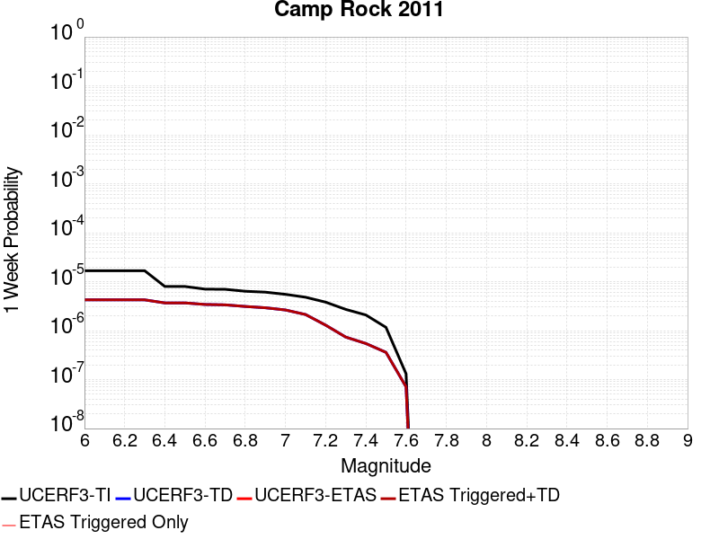 |  | 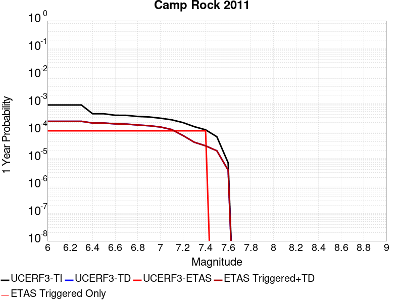 | 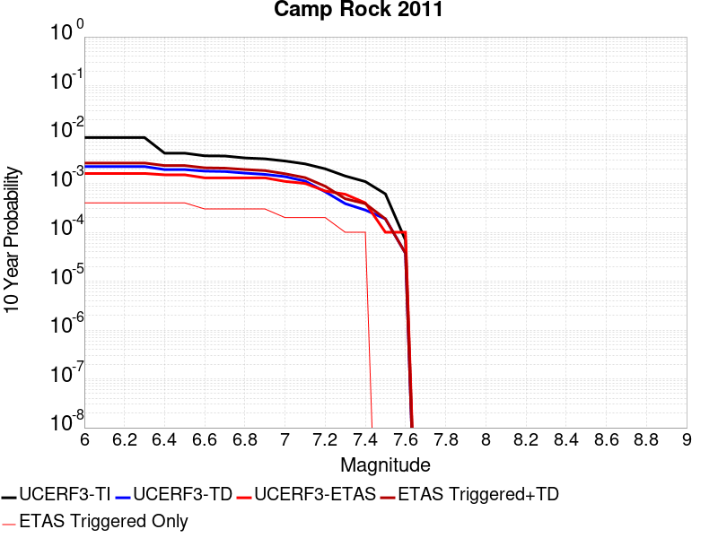 |

| Magnitude | 1 wk TI Prob | 1 wk TD Prob | 1 wk ETAS Prob | 1 wk ETAS/TD Gain | 1 wk ETAS Triggered+TD | 1 wk ETAS Triggered Only | 1 mo TI Prob | 1 mo TD Prob | 1 mo ETAS Prob | 1 mo ETAS/TD Gain | 1 mo ETAS Triggered+TD | 1 mo ETAS Triggered Only | 1 yr TI Prob | 1 yr TD Prob | 1 yr ETAS Prob | 1 yr ETAS/TD Gain | 1 yr ETAS Triggered+TD | 1 yr ETAS Triggered Only | 10 yr TI Prob | 10 yr TD Prob | 10 yr ETAS Prob | 10 yr ETAS/TD Gain | 10 yr ETAS Triggered+TD | 10 yr ETAS Triggered Only |
|-----|-----|-----|-----|-----|-----|-----|-----|-----|-----|-----|-----|-----|-----|-----|-----|-----|-----|-----|-----|-----|-----|-----|-----|-----|
| 6.0 | 1.6710783E-5 | 4.2500797E-6 | 0.0 | 0.0 | 4.2500797E-6 | 0.0 | 7.161568E-5 | 1.8214503E-5 | 0.0 | 0.0 | 1.8214503E-5 | 0.0 | 8.7157206E-4 | 2.2173952E-4 | 1.0E-4 | 0.4509796 | 2.2173952E-4 | 0.0 | 0.008681616 | 0.0022152357 | 0.0016 | 0.7222708 | 0.0026143496 | 4.0E-4 |
| 6.1 | 1.6710783E-5 | 4.2500797E-6 | 0.0 | 0.0 | 4.2500797E-6 | 0.0 | 7.161568E-5 | 1.8214503E-5 | 0.0 | 0.0 | 1.8214503E-5 | 0.0 | 8.7157206E-4 | 2.2173952E-4 | 1.0E-4 | 0.4509796 | 2.2173952E-4 | 0.0 | 0.008681616 | 0.0022152357 | 0.0016 | 0.7222708 | 0.0026143496 | 4.0E-4 |
| 6.2 | 1.6710783E-5 | 4.2500797E-6 | 0.0 | 0.0 | 4.2500797E-6 | 0.0 | 7.161568E-5 | 1.8214503E-5 | 0.0 | 0.0 | 1.8214503E-5 | 0.0 | 8.7157206E-4 | 2.2173952E-4 | 1.0E-4 | 0.4509796 | 2.2173952E-4 | 0.0 | 0.008681616 | 0.0022152357 | 0.0016 | 0.7222708 | 0.0026143496 | 4.0E-4 |
| 6.3 | 1.6710783E-5 | 4.2500797E-6 | 0.0 | 0.0 | 4.2500797E-6 | 0.0 | 7.161568E-5 | 1.8214503E-5 | 0.0 | 0.0 | 1.8214503E-5 | 0.0 | 8.7157206E-4 | 2.2173952E-4 | 1.0E-4 | 0.4509796 | 2.2173952E-4 | 0.0 | 0.008681616 | 0.0022152357 | 0.0016 | 0.7222708 | 0.0026143496 | 4.0E-4 |
| 6.4 | 7.982846E-6 | 3.6820834E-6 | 0.0 | 0.0 | 3.6820834E-6 | 0.0 | 3.421175E-5 | 1.5780264E-5 | 0.0 | 0.0 | 1.5780264E-5 | 0.0 | 4.1644843E-4 | 1.9210811E-4 | 1.0E-4 | 0.52054024 | 1.9210811E-4 | 0.0 | 0.0041566887 | 0.0019194554 | 0.0015 | 0.78147167 | 0.0023186875 | 4.0E-4 |
| 6.5 | 7.982846E-6 | 3.6820834E-6 | 0.0 | 0.0 | 3.6820834E-6 | 0.0 | 3.421175E-5 | 1.5780264E-5 | 0.0 | 0.0 | 1.5780264E-5 | 0.0 | 4.1644843E-4 | 1.9210811E-4 | 1.0E-4 | 0.52054024 | 1.9210811E-4 | 0.0 | 0.0041566887 | 0.0019194554 | 0.0015 | 0.78147167 | 0.0023186875 | 4.0E-4 |
| 6.6 | 7.048869E-6 | 3.4243244E-6 | 0.0 | 0.0 | 3.4243244E-6 | 0.0 | 3.0209088E-5 | 1.4675595E-5 | 0.0 | 0.0 | 1.4675595E-5 | 0.0 | 3.677336E-4 | 1.7866104E-4 | 1.0E-4 | 0.55971915 | 1.7866104E-4 | 0.0 | 0.0036712566 | 0.0017852057 | 0.0013 | 0.7282074 | 0.0020846701 | 3.0E-4 |
| 6.7 | 6.987307E-6 | 3.3622946E-6 | 0.0 | 0.0 | 3.3622946E-6 | 0.0 | 2.9945259E-5 | 1.4409757E-5 | 0.0 | 0.0 | 1.4409757E-5 | 0.0 | 3.6452254E-4 | 1.7542497E-4 | 1.0E-4 | 0.5700443 | 1.7542497E-4 | 0.0 | 0.0036392517 | 0.0017528961 | 0.0013 | 0.74162984 | 0.0020523702 | 3.0E-4 |
| 6.8 | 6.3737602E-6 | 3.1178713E-6 | 0.0 | 0.0 | 3.1178713E-6 | 0.0 | 2.731583E-5 | 1.3362239E-5 | 0.0 | 0.0 | 1.3362239E-5 | 0.0 | 3.3251947E-4 | 1.626734E-4 | 1.0E-4 | 0.6147287 | 1.626734E-4 | 0.0 | 0.0033202237 | 0.0016255717 | 0.0013 | 0.7997186 | 0.0019250842 | 3.0E-4 |
| 6.9 | 6.112211E-6 | 2.933072E-6 | 0.0 | 0.0 | 2.933072E-6 | 0.0 | 2.6194928E-5 | 1.2570249E-5 | 0.0 | 0.0 | 1.2570249E-5 | 0.0 | 3.1887658E-4 | 1.5303232E-4 | 1.0E-4 | 0.65345675 | 1.5303232E-4 | 0.0 | 0.003184194 | 0.0015292971 | 0.0013 | 0.85006374 | 0.0018288384 | 3.0E-4 |
| 7.0 | 5.5140117E-6 | 2.6418902E-6 | 0.0 | 0.0 | 2.6418902E-6 | 0.0 | 2.3631264E-5 | 1.1322339E-5 | 0.0 | 0.0 | 1.1322339E-5 | 0.0 | 2.8767265E-4 | 1.3784101E-4 | 1.0E-4 | 0.7254735 | 1.3784101E-4 | 0.0 | 0.0028730053 | 0.0013775803 | 0.0011 | 0.7985015 | 0.0015773049 | 2.0E-4 |
| 7.1 | 4.8151105E-6 | 2.1342105E-6 | 0.0 | 0.0 | 2.1342105E-6 | 0.0 | 2.0636026E-5 | 9.146585E-6 | 0.0 | 0.0 | 9.146585E-6 | 0.0 | 2.5121463E-4 | 1.1135422E-4 | 1.0E-4 | 0.89803517 | 1.1135422E-4 | 0.0 | 0.0025093083 | 0.001113006 | 0.001 | 0.8984677 | 0.0013127835 | 2.0E-4 |
| 7.2 | 3.818335E-6 | 1.2936202E-6 | 0.0 | 0.0 | 1.2936202E-6 | 0.0 | 1.6364189E-5 | 5.544075E-6 | 0.0 | 0.0 | 5.544075E-6 | 0.0 | 1.9921579E-4 | 6.749711E-5 | 1.0E-4 | 1.481545 | 6.749711E-5 | 0.0 | 0.0019903728 | 6.7477435E-4 | 7.0E-4 | 1.0373839 | 8.746394E-4 | 2.0E-4 |
| 7.3 | 2.7166698E-6 | 7.3821144E-7 | 0.0 | 0.0 | 7.3821144E-7 | 0.0 | 1.1642818E-5 | 3.1637596E-6 | 0.0 | 0.0 | 3.1637596E-6 | 0.0 | 1.4174209E-4 | 3.8518116E-5 | 1.0E-4 | 2.5961812 | 3.8518116E-5 | 0.0 | 0.0014165172 | 3.8511638E-4 | 6.0E-4 | 1.5579706 | 4.8507788E-4 | 1.0E-4 |
| 7.4 | 2.0893426E-6 | 5.4606875E-7 | 0.0 | 0.0 | 5.4606875E-7 | 0.0 | 8.954295E-6 | 2.3402924E-6 | 0.0 | 0.0 | 2.3402924E-6 | 0.0 | 1.0901308E-4 | 2.8492694E-5 | 1.0E-4 | 3.5096717 | 2.8492694E-5 | 0.0 | 0.0010895962 | 2.8489094E-4 | 4.0E-4 | 1.404046 | 3.8486245E-4 | 1.0E-4 |
| 7.5 | 1.1681728E-6 | 3.6024073E-7 | 0.0 | 0.0 | 3.6024073E-7 | 0.0 | 5.0064455E-6 | 1.543888E-6 | 0.0 | 0.0 | 1.543888E-6 | 0.0 | 6.0951766E-5 | 1.8796678E-5 | 0.0 | 0.0 | 1.8796678E-5 | 0.0 | 6.093505E-4 | 1.8795136E-4 | 1.0E-4 | 0.5320526 | 1.8795136E-4 | 0.0 |
| 7.6 | 1.3154387E-7 | 7.119339E-8 | 0.0 | 0.0 | 7.119339E-8 | 0.0 | 5.6375933E-7 | 3.051145E-7 | 0.0 | 0.0 | 3.051145E-7 | 0.0 | 6.863748E-6 | 3.7147643E-6 | 0.0 | 0.0 | 3.7147643E-6 | 0.0 | 6.863536E-5 | 3.714718E-5 | 1.0E-4 | 2.6919944 | 3.714718E-5 | 0.0 |

## Tin Mountain
*[(top)](#table-of-contents)*

| 1 Week | 1 Month | 1 Year | 10 Year |
|-----|-----|-----|-----|
|  |  | 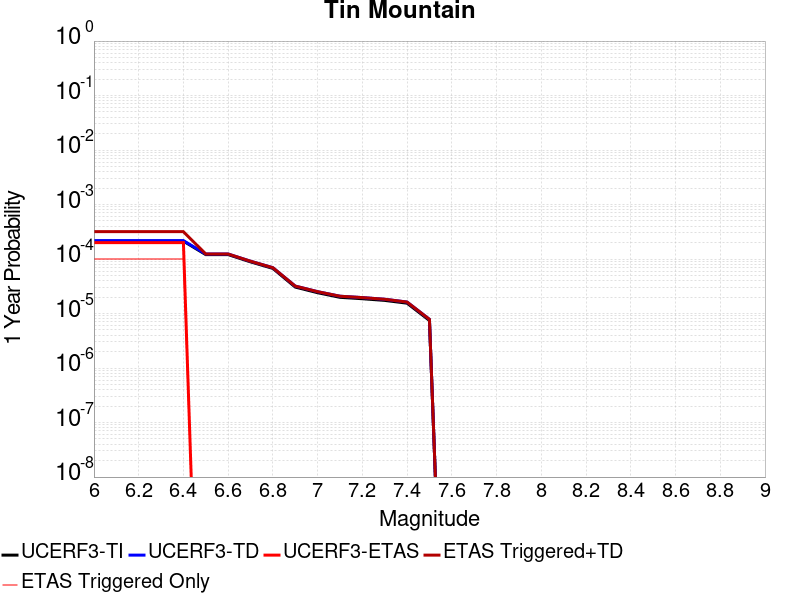 |  |

| Magnitude | 1 wk TI Prob | 1 wk TD Prob | 1 wk ETAS Prob | 1 wk ETAS/TD Gain | 1 wk ETAS Triggered+TD | 1 wk ETAS Triggered Only | 1 mo TI Prob | 1 mo TD Prob | 1 mo ETAS Prob | 1 mo ETAS/TD Gain | 1 mo ETAS Triggered+TD | 1 mo ETAS Triggered Only | 1 yr TI Prob | 1 yr TD Prob | 1 yr ETAS Prob | 1 yr ETAS/TD Gain | 1 yr ETAS Triggered+TD | 1 yr ETAS Triggered Only | 10 yr TI Prob | 10 yr TD Prob | 10 yr ETAS Prob | 10 yr ETAS/TD Gain | 10 yr ETAS Triggered+TD | 10 yr ETAS Triggered Only |
|-----|-----|-----|-----|-----|-----|-----|-----|-----|-----|-----|-----|-----|-----|-----|-----|-----|-----|-----|-----|-----|-----|-----|-----|-----|
| 6.0 | 4.083776E-6 | 4.1817357E-6 | 0.0 | 0.0 | 4.1817357E-6 | 0.0 | 1.750178E-5 | 1.7921622E-5 | 0.0 | 0.0 | 1.7921622E-5 | 0.0 | 2.1306332E-4 | 2.1817764E-4 | 2.0E-4 | 0.91668427 | 3.1815583E-4 | 1.0E-4 | 0.0021285915 | 0.00218 | 0.0016 | 0.73394495 | 0.0025791281 | 4.0E-4 |
| 6.1 | 4.083776E-6 | 4.1817357E-6 | 0.0 | 0.0 | 4.1817357E-6 | 0.0 | 1.750178E-5 | 1.7921622E-5 | 0.0 | 0.0 | 1.7921622E-5 | 0.0 | 2.1306332E-4 | 2.1817764E-4 | 2.0E-4 | 0.91668427 | 3.1815583E-4 | 1.0E-4 | 0.0021285915 | 0.00218 | 0.0016 | 0.73394495 | 0.0025791281 | 4.0E-4 |
| 6.2 | 4.083776E-6 | 4.1817357E-6 | 0.0 | 0.0 | 4.1817357E-6 | 0.0 | 1.750178E-5 | 1.7921622E-5 | 0.0 | 0.0 | 1.7921622E-5 | 0.0 | 2.1306332E-4 | 2.1817764E-4 | 2.0E-4 | 0.91668427 | 3.1815583E-4 | 1.0E-4 | 0.0021285915 | 0.00218 | 0.0016 | 0.73394495 | 0.0025791281 | 4.0E-4 |
| 6.3 | 4.083776E-6 | 4.1817357E-6 | 0.0 | 0.0 | 4.1817357E-6 | 0.0 | 1.750178E-5 | 1.7921622E-5 | 0.0 | 0.0 | 1.7921622E-5 | 0.0 | 2.1306332E-4 | 2.1817764E-4 | 2.0E-4 | 0.91668427 | 3.1815583E-4 | 1.0E-4 | 0.0021285915 | 0.00218 | 0.0016 | 0.73394495 | 0.0025791281 | 4.0E-4 |
| 6.4 | 4.083776E-6 | 4.1817357E-6 | 0.0 | 0.0 | 4.1817357E-6 | 0.0 | 1.750178E-5 | 1.7921622E-5 | 0.0 | 0.0 | 1.7921622E-5 | 0.0 | 2.1306332E-4 | 2.1817764E-4 | 2.0E-4 | 0.91668427 | 3.1815583E-4 | 1.0E-4 | 0.0021285915 | 0.00218 | 0.0016 | 0.73394495 | 0.0025791281 | 4.0E-4 |
| 6.5 | 2.3143427E-6 | 2.3732773E-6 | 0.0 | 0.0 | 2.3732773E-6 | 0.0 | 9.9185745E-6 | 1.0171153E-5 | 0.0 | 0.0 | 1.0171153E-5 | 0.0 | 1.2075195E-4 | 1.2382753E-4 | 0.0 | 0.0 | 1.2382753E-4 | 0.0 | 0.0012068636 | 0.0012376612 | 7.0E-4 | 0.5655829 | 0.0013375375 | 1.0E-4 |
| 6.6 | 2.3143427E-6 | 2.3732773E-6 | 0.0 | 0.0 | 2.3732773E-6 | 0.0 | 9.9185745E-6 | 1.0171153E-5 | 0.0 | 0.0 | 1.0171153E-5 | 0.0 | 1.2075195E-4 | 1.2382753E-4 | 0.0 | 0.0 | 1.2382753E-4 | 0.0 | 0.0012068636 | 0.0012376612 | 7.0E-4 | 0.5655829 | 0.0013375375 | 1.0E-4 |
| 6.7 | 1.7029532E-6 | 1.7498875E-6 | 0.0 | 0.0 | 1.7498875E-6 | 0.0 | 7.2983503E-6 | 7.499499E-6 | 0.0 | 0.0 | 7.499499E-6 | 0.0 | 8.885379E-5 | 9.130311E-5 | 0.0 | 0.0 | 9.130311E-5 | 0.0 | 8.881827E-4 | 9.1270864E-4 | 6.0E-4 | 0.6573839 | 0.0010126174 | 1.0E-4 |
| 6.8 | 1.2914646E-6 | 1.3300169E-6 | 0.0 | 0.0 | 1.3300169E-6 | 0.0 | 5.534837E-6 | 5.7000625E-6 | 0.0 | 0.0 | 5.7000625E-6 | 0.0 | 6.738455E-5 | 6.939649E-5 | 0.0 | 0.0 | 6.939649E-5 | 0.0 | 6.736412E-4 | 6.9379155E-4 | 5.0E-4 | 0.72067755 | 7.9372217E-4 | 1.0E-4 |
| 6.9 | 5.8708974E-7 | 6.1175035E-7 | 0.0 | 0.0 | 6.1175035E-7 | 0.0 | 2.5160964E-6 | 2.6217847E-6 | 0.0 | 0.0 | 2.6217847E-6 | 0.0 | 3.0633044E-5 | 3.1919804E-5 | 0.0 | 0.0 | 3.1919804E-5 | 0.0 | 3.0628822E-4 | 3.191563E-4 | 1.0E-4 | 0.3133261 | 3.191563E-4 | 0.0 |
| 7.0 | 4.6248786E-7 | 4.8324455E-7 | 0.0 | 0.0 | 4.8324455E-7 | 0.0 | 1.9820893E-6 | 2.0710465E-6 | 0.0 | 0.0 | 2.0710465E-6 | 0.0 | 2.413167E-5 | 2.5214737E-5 | 0.0 | 0.0 | 2.5214737E-5 | 0.0 | 2.412905E-4 | 2.5212247E-4 | 1.0E-4 | 0.39663264 | 2.5212247E-4 | 0.0 |
| 7.1 | 3.804606E-7 | 3.9875266E-7 | 0.0 | 0.0 | 3.9875266E-7 | 0.0 | 1.6305444E-6 | 1.7089391E-6 | 0.0 | 0.0 | 1.7089391E-6 | 0.0 | 1.9851697E-5 | 2.0806168E-5 | 0.0 | 0.0 | 2.0806168E-5 | 0.0 | 1.9849923E-4 | 2.0804557E-4 | 0.0 | 0.0 | 2.0804557E-4 | 0.0 |
| 7.2 | 3.5864858E-7 | 3.762051E-7 | 0.0 | 0.0 | 3.762051E-7 | 0.0 | 1.5370645E-6 | 1.6123067E-6 | 0.0 | 0.0 | 1.6123067E-6 | 0.0 | 1.87136E-5 | 1.9629691E-5 | 0.0 | 0.0 | 1.9629691E-5 | 0.0 | 1.8712023E-4 | 1.9628288E-4 | 0.0 | 0.0 | 1.9628288E-4 | 0.0 |
| 7.3 | 3.342063E-7 | 3.5066893E-7 | 0.0 | 0.0 | 3.5066893E-7 | 0.0 | 1.4323119E-6 | 1.5028661E-6 | 0.0 | 0.0 | 1.5028661E-6 | 0.0 | 1.7438259E-5 | 1.8297274E-5 | 0.0 | 0.0 | 1.8297274E-5 | 0.0 | 1.743689E-4 | 1.8296098E-4 | 0.0 | 0.0 | 1.8296098E-4 | 0.0 |
| 7.4 | 2.971242E-7 | 3.1168844E-7 | 0.0 | 0.0 | 3.1168844E-7 | 0.0 | 1.2733886E-6 | 1.335807E-6 | 0.0 | 0.0 | 1.335807E-6 | 0.0 | 1.5503398E-5 | 1.6263362E-5 | 0.0 | 0.0 | 1.6263362E-5 | 0.0 | 1.5502315E-4 | 1.62625E-4 | 0.0 | 0.0 | 1.62625E-4 | 0.0 |
| 7.5 | 1.4326713E-7 | 1.501395E-7 | 0.0 | 0.0 | 1.501395E-7 | 0.0 | 6.140018E-7 | 6.43455E-7 | 0.0 | 0.0 | 6.43455E-7 | 0.0 | 7.4754466E-6 | 7.8340645E-6 | 0.0 | 0.0 | 7.8340645E-6 | 0.0 | 7.475195E-5 | 7.834064E-5 | 0.0 | 0.0 | 7.834064E-5 | 0.0 |

## North Frontal  (West)
*[(top)](#table-of-contents)*

| 1 Week | 1 Month | 1 Year | 10 Year |
|-----|-----|-----|-----|
| 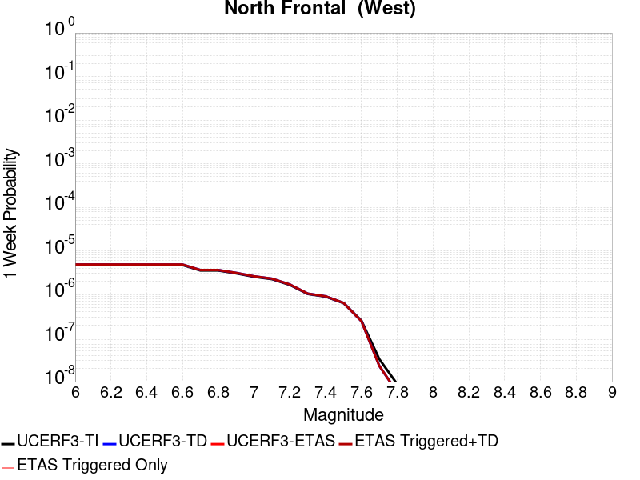 | 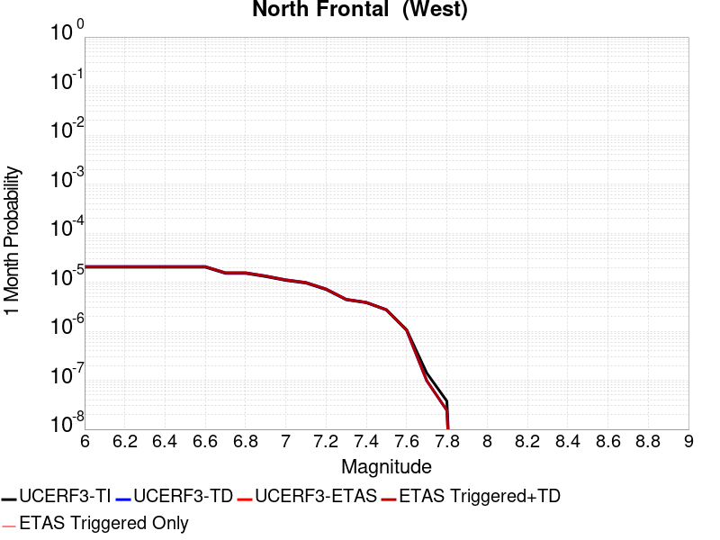 |  | 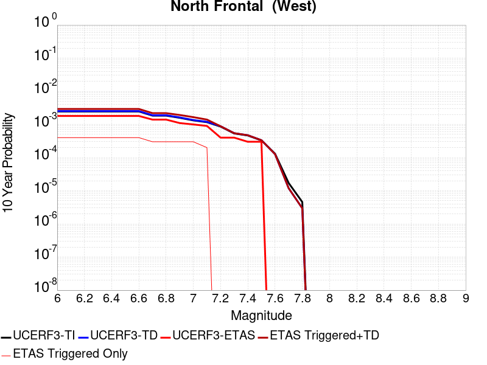 |

| Magnitude | 1 wk TI Prob | 1 wk TD Prob | 1 wk ETAS Prob | 1 wk ETAS/TD Gain | 1 wk ETAS Triggered+TD | 1 wk ETAS Triggered Only | 1 mo TI Prob | 1 mo TD Prob | 1 mo ETAS Prob | 1 mo ETAS/TD Gain | 1 mo ETAS Triggered+TD | 1 mo ETAS Triggered Only | 1 yr TI Prob | 1 yr TD Prob | 1 yr ETAS Prob | 1 yr ETAS/TD Gain | 1 yr ETAS Triggered+TD | 1 yr ETAS Triggered Only | 10 yr TI Prob | 10 yr TD Prob | 10 yr ETAS Prob | 10 yr ETAS/TD Gain | 10 yr ETAS Triggered+TD | 10 yr ETAS Triggered Only |
|-----|-----|-----|-----|-----|-----|-----|-----|-----|-----|-----|-----|-----|-----|-----|-----|-----|-----|-----|-----|-----|-----|-----|-----|-----|
| 6.0 | 4.7316266E-6 | 4.852953E-6 | 0.0 | 0.0 | 4.852953E-6 | 0.0 | 2.0278241E-5 | 2.0798214E-5 | 0.0 | 0.0 | 2.0798214E-5 | 0.0 | 2.4685962E-4 | 2.5319032E-4 | 2.0E-4 | 0.7899197 | 3.5316497E-4 | 1.0E-4 | 0.0024658558 | 0.0025291645 | 0.0018 | 0.71169746 | 0.002928153 | 4.0E-4 |
| 6.1 | 4.7316266E-6 | 4.852953E-6 | 0.0 | 0.0 | 4.852953E-6 | 0.0 | 2.0278241E-5 | 2.0798214E-5 | 0.0 | 0.0 | 2.0798214E-5 | 0.0 | 2.4685962E-4 | 2.5319032E-4 | 2.0E-4 | 0.7899197 | 3.5316497E-4 | 1.0E-4 | 0.0024658558 | 0.0025291645 | 0.0018 | 0.71169746 | 0.002928153 | 4.0E-4 |
| 6.2 | 4.7316266E-6 | 4.852953E-6 | 0.0 | 0.0 | 4.852953E-6 | 0.0 | 2.0278241E-5 | 2.0798214E-5 | 0.0 | 0.0 | 2.0798214E-5 | 0.0 | 2.4685962E-4 | 2.5319032E-4 | 2.0E-4 | 0.7899197 | 3.5316497E-4 | 1.0E-4 | 0.0024658558 | 0.0025291645 | 0.0018 | 0.71169746 | 0.002928153 | 4.0E-4 |
| 6.3 | 4.7316266E-6 | 4.852953E-6 | 0.0 | 0.0 | 4.852953E-6 | 0.0 | 2.0278241E-5 | 2.0798214E-5 | 0.0 | 0.0 | 2.0798214E-5 | 0.0 | 2.4685962E-4 | 2.5319032E-4 | 2.0E-4 | 0.7899197 | 3.5316497E-4 | 1.0E-4 | 0.0024658558 | 0.0025291645 | 0.0018 | 0.71169746 | 0.002928153 | 4.0E-4 |
| 6.4 | 4.7316266E-6 | 4.852953E-6 | 0.0 | 0.0 | 4.852953E-6 | 0.0 | 2.0278241E-5 | 2.0798214E-5 | 0.0 | 0.0 | 2.0798214E-5 | 0.0 | 2.4685962E-4 | 2.5319032E-4 | 2.0E-4 | 0.7899197 | 3.5316497E-4 | 1.0E-4 | 0.0024658558 | 0.0025291645 | 0.0018 | 0.71169746 | 0.002928153 | 4.0E-4 |
| 6.5 | 4.7316266E-6 | 4.852953E-6 | 0.0 | 0.0 | 4.852953E-6 | 0.0 | 2.0278241E-5 | 2.0798214E-5 | 0.0 | 0.0 | 2.0798214E-5 | 0.0 | 2.4685962E-4 | 2.5319032E-4 | 2.0E-4 | 0.7899197 | 3.5316497E-4 | 1.0E-4 | 0.0024658558 | 0.0025291645 | 0.0018 | 0.71169746 | 0.002928153 | 4.0E-4 |
| 6.6 | 4.7316266E-6 | 4.852953E-6 | 0.0 | 0.0 | 4.852953E-6 | 0.0 | 2.0278241E-5 | 2.0798214E-5 | 0.0 | 0.0 | 2.0798214E-5 | 0.0 | 2.4685962E-4 | 2.5319032E-4 | 2.0E-4 | 0.7899197 | 3.5316497E-4 | 1.0E-4 | 0.0024658558 | 0.0025291645 | 0.0018 | 0.71169746 | 0.002928153 | 4.0E-4 |
| 6.7 | 3.5382777E-6 | 3.631109E-6 | 0.0 | 0.0 | 3.631109E-6 | 0.0 | 1.516396E-5 | 1.5561807E-5 | 0.0 | 0.0 | 1.5561807E-5 | 0.0 | 1.8460557E-4 | 1.894493E-4 | 2.0E-4 | 1.0556914 | 2.8943035E-4 | 1.0E-4 | 0.0018445229 | 0.0018929549 | 0.0014 | 0.73958445 | 0.0021923871 | 3.0E-4 |
| 6.8 | 3.5382777E-6 | 3.631109E-6 | 0.0 | 0.0 | 3.631109E-6 | 0.0 | 1.516396E-5 | 1.5561807E-5 | 0.0 | 0.0 | 1.5561807E-5 | 0.0 | 1.8460557E-4 | 1.894493E-4 | 2.0E-4 | 1.0556914 | 2.8943035E-4 | 1.0E-4 | 0.0018445229 | 0.0018929549 | 0.0014 | 0.73958445 | 0.0021923871 | 3.0E-4 |
| 6.9 | 3.0428037E-6 | 3.1229577E-6 | 0.0 | 0.0 | 3.1229577E-6 | 0.0 | 1.30405215E-5 | 1.3384039E-5 | 0.0 | 0.0 | 1.3384039E-5 | 0.0 | 1.5875678E-4 | 1.6293918E-4 | 2.0E-4 | 1.2274519 | 2.629229E-4 | 1.0E-4 | 0.0015864341 | 0.0016282642 | 0.0011 | 0.675566 | 0.0019277758 | 3.0E-4 |
| 7.0 | 2.538778E-6 | 2.606262E-6 | 0.0 | 0.0 | 2.606262E-6 | 0.0 | 1.0880432E-5 | 1.1169648E-5 | 0.0 | 0.0 | 1.1169648E-5 | 0.0 | 1.324612E-4 | 1.3598245E-4 | 2.0E-4 | 1.470778 | 2.3596885E-4 | 1.0E-4 | 0.0013238228 | 0.0013590392 | 0.001 | 0.7358139 | 0.0016586315 | 3.0E-4 |
| 7.1 | 2.2418935E-6 | 2.3013624E-6 | 0.0 | 0.0 | 2.3013624E-6 | 0.0 | 9.60808E-6 | 9.862947E-6 | 0.0 | 0.0 | 9.862947E-6 | 0.0 | 1.1697209E-4 | 1.2007521E-4 | 2.0E-4 | 1.6656227 | 2.200632E-4 | 1.0E-4 | 0.0011691054 | 0.0012001472 | 9.0E-4 | 0.749908 | 0.0013999072 | 2.0E-4 |
| 7.2 | 1.6526745E-6 | 1.6926002E-6 | 0.0 | 0.0 | 1.6926002E-6 | 0.0 | 7.082872E-6 | 7.2539824E-6 | 0.0 | 0.0 | 7.2539824E-6 | 0.0 | 8.623055E-5 | 8.8313915E-5 | 0.0 | 0.0 | 8.8313915E-5 | 0.0 | 8.61971E-4 | 8.828132E-4 | 4.0E-4 | 0.453097 | 8.828132E-4 | 0.0 |
| 7.3 | 1.0246019E-6 | 1.0442999E-6 | 0.0 | 0.0 | 1.0442999E-6 | 0.0 | 4.391144E-6 | 4.475564E-6 | 0.0 | 0.0 | 4.475564E-6 | 0.0 | 5.3460866E-5 | 5.4488744E-5 | 0.0 | 0.0 | 5.4488744E-5 | 0.0 | 5.344801E-4 | 5.447653E-4 | 4.0E-4 | 0.7342611 | 5.447653E-4 | 0.0 |
| 7.4 | 8.9045164E-7 | 9.0572064E-7 | 0.0 | 0.0 | 9.0572064E-7 | 0.0 | 3.8162157E-6 | 3.8816547E-6 | 0.0 | 0.0 | 3.8816547E-6 | 0.0 | 4.646144E-5 | 4.7258232E-5 | 0.0 | 0.0 | 4.7258232E-5 | 0.0 | 4.6451724E-4 | 4.724927E-4 | 3.0E-4 | 0.63493043 | 4.724927E-4 | 0.0 |
| 7.5 | 6.3357E-7 | 6.403174E-7 | 0.0 | 0.0 | 6.403174E-7 | 0.0 | 2.7152971E-6 | 2.744215E-6 | 0.0 | 0.0 | 2.744215E-6 | 0.0 | 3.305824E-5 | 3.341037E-5 | 0.0 | 0.0 | 3.341037E-5 | 0.0 | 3.3053322E-4 | 3.3406005E-4 | 3.0E-4 | 0.89804214 | 3.3406005E-4 | 0.0 |
| 7.6 | 2.5087024E-7 | 2.4362964E-7 | 0.0 | 0.0 | 2.4362964E-7 | 0.0 | 1.0751578E-6 | 1.0441266E-6 | 0.0 | 0.0 | 1.0441266E-6 | 0.0 | 1.3089967E-5 | 1.2712189E-5 | 0.0 | 0.0 | 1.2712189E-5 | 0.0 | 1.3089196E-4 | 1.2711668E-4 | 0.0 | 0.0 | 1.2711668E-4 | 0.0 |
| 7.7 | 3.282987E-8 | 2.287671E-8 | 0.0 | 0.0 | 2.287671E-8 | 0.0 | 1.4069944E-7 | 9.804304E-8 | 0.0 | 0.0 | 9.804304E-8 | 0.0 | 1.7130144E-6 | 1.1936735E-6 | 0.0 | 0.0 | 1.1936735E-6 | 0.0 | 1.7130013E-5 | 1.1936679E-5 | 0.0 | 0.0 | 1.1936679E-5 | 0.0 |
| 7.8 | 8.77499E-9 | 5.6825726E-9 | 0.0 | 0.0 | 5.6825726E-9 | 0.0 | 3.7607098E-8 | 2.4353882E-8 | 0.0 | 0.0 | 2.4353882E-8 | 0.0 | 4.578663E-7 | 2.965085E-7 | 0.0 | 0.0 | 2.965085E-7 | 0.0 | 4.5786537E-6 | 2.9650823E-6 | 0.0 | 0.0 | 2.9650823E-6 | 0.0 |

## Walker Spring 2011 CFM
*[(top)](#table-of-contents)*

| 1 Week | 1 Month | 1 Year | 10 Year |
|-----|-----|-----|-----|
|  |  | 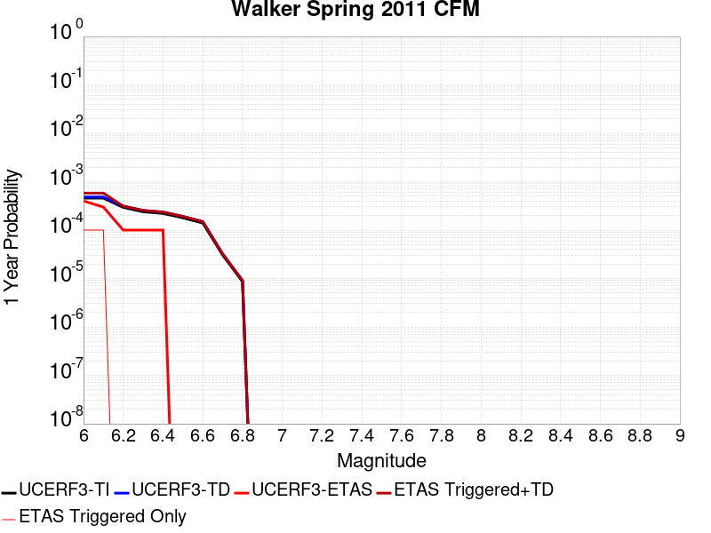 |  |

| Magnitude | 1 wk TI Prob | 1 wk TD Prob | 1 wk ETAS Prob | 1 wk ETAS/TD Gain | 1 wk ETAS Triggered+TD | 1 wk ETAS Triggered Only | 1 mo TI Prob | 1 mo TD Prob | 1 mo ETAS Prob | 1 mo ETAS/TD Gain | 1 mo ETAS Triggered+TD | 1 mo ETAS Triggered Only | 1 yr TI Prob | 1 yr TD Prob | 1 yr ETAS Prob | 1 yr ETAS/TD Gain | 1 yr ETAS Triggered+TD | 1 yr ETAS Triggered Only | 10 yr TI Prob | 10 yr TD Prob | 10 yr ETAS Prob | 10 yr ETAS/TD Gain | 10 yr ETAS Triggered+TD | 10 yr ETAS Triggered Only |
|-----|-----|-----|-----|-----|-----|-----|-----|-----|-----|-----|-----|-----|-----|-----|-----|-----|-----|-----|-----|-----|-----|-----|-----|-----|
| 6.0 | 8.791276E-6 | 9.265083E-6 | 0.0 | 0.0 | 9.265083E-6 | 0.0 | 3.767635E-5 | 3.9706953E-5 | 0.0 | 0.0 | 3.9706953E-5 | 0.0 | 4.58613E-4 | 4.8333575E-4 | 4.0E-4 | 0.82758206 | 5.8328744E-4 | 1.0E-4 | 0.004576677 | 0.0048239194 | 0.0032 | 0.663361 | 0.0052219895 | 4.0E-4 |
| 6.1 | 8.791276E-6 | 9.265083E-6 | 0.0 | 0.0 | 9.265083E-6 | 0.0 | 3.767635E-5 | 3.9706953E-5 | 0.0 | 0.0 | 3.9706953E-5 | 0.0 | 4.58613E-4 | 4.8333575E-4 | 3.0E-4 | 0.62068653 | 5.8328744E-4 | 1.0E-4 | 0.004576677 | 0.0048239194 | 0.0027 | 0.55971086 | 0.0052219895 | 4.0E-4 |
| 6.2 | 5.654515E-6 | 5.9994886E-6 | 0.0 | 0.0 | 5.9994886E-6 | 0.0 | 2.4233412E-5 | 2.571187E-5 | 0.0 | 0.0 | 2.571187E-5 | 0.0 | 2.9500184E-4 | 3.1300206E-4 | 1.0E-4 | 0.3194867 | 3.1300206E-4 | 0.0 | 0.0029461053 | 0.003126107 | 0.0018 | 0.57579607 | 0.003425169 | 3.0E-4 |
| 6.3 | 4.591685E-6 | 4.8953702E-6 | 0.0 | 0.0 | 4.8953702E-6 | 0.0 | 1.96785E-5 | 2.0980015E-5 | 0.0 | 0.0 | 2.0980015E-5 | 0.0 | 2.395594E-4 | 2.554061E-4 | 1.0E-4 | 0.39153332 | 2.554061E-4 | 0.0 | 0.002393013 | 0.0025515559 | 0.0016 | 0.6270684 | 0.0028507903 | 3.0E-4 |
| 6.4 | 4.243283E-6 | 4.5232537E-6 | 0.0 | 0.0 | 4.5232537E-6 | 0.0 | 1.8185372E-5 | 1.9385254E-5 | 0.0 | 0.0 | 1.9385254E-5 | 0.0 | 2.2138441E-4 | 2.3599413E-4 | 1.0E-4 | 0.42373934 | 2.3599413E-4 | 0.0 | 0.00221164 | 0.0023578508 | 0.0015 | 0.63617253 | 0.0026571434 | 3.0E-4 |
| 6.5 | 3.4445666E-6 | 3.6866068E-6 | 0.0 | 0.0 | 3.6866068E-6 | 0.0 | 1.4762345E-5 | 1.5799671E-5 | 0.0 | 0.0 | 1.5799671E-5 | 0.0 | 1.7971672E-4 | 1.9234803E-4 | 0.0 | 0.0 | 1.9234803E-4 | 0.0 | 0.0017957145 | 0.0019222104 | 0.0011 | 0.5722579 | 0.002121826 | 2.0E-4 |
| 6.6 | 2.68766E-6 | 2.8798434E-6 | 0.0 | 0.0 | 2.8798434E-6 | 0.0 | 1.1518492E-5 | 1.2342149E-5 | 0.0 | 0.0 | 1.2342149E-5 | 0.0 | 1.4022861E-4 | 1.5025912E-4 | 0.0 | 0.0 | 1.5025912E-4 | 0.0 | 0.0014014016 | 0.0015019492 | 0.001 | 0.66580147 | 0.0017016488 | 2.0E-4 |
| 6.7 | 5.880964E-7 | 6.200414E-7 | 0.0 | 0.0 | 6.200414E-7 | 0.0 | 2.5204106E-6 | 2.6573182E-6 | 0.0 | 0.0 | 2.6573182E-6 | 0.0 | 3.0685565E-5 | 3.2352465E-5 | 0.0 | 0.0 | 3.2352465E-5 | 0.0 | 3.068133E-4 | 3.2348692E-4 | 2.0E-4 | 0.618263 | 4.2345456E-4 | 1.0E-4 |
| 6.8 | 1.6514163E-7 | 1.7410989E-7 | 0.0 | 0.0 | 1.7410989E-7 | 0.0 | 7.077497E-7 | 7.461852E-7 | 0.0 | 0.0 | 7.461852E-7 | 0.0 | 8.616818E-6 | 9.084805E-6 | 0.0 | 0.0 | 9.084805E-6 | 0.0 | 8.616484E-5 | 9.084805E-5 | 0.0 | 0.0 | 9.084805E-5 | 0.0 |

## Pilarcitos 2011 CFM
*[(top)](#table-of-contents)*

| 1 Week | 1 Month | 1 Year | 10 Year |
|-----|-----|-----|-----|
| 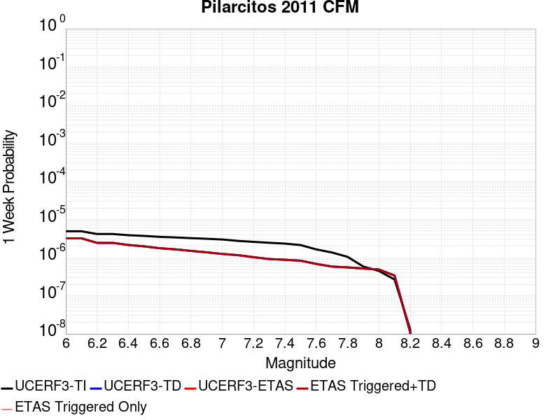 | 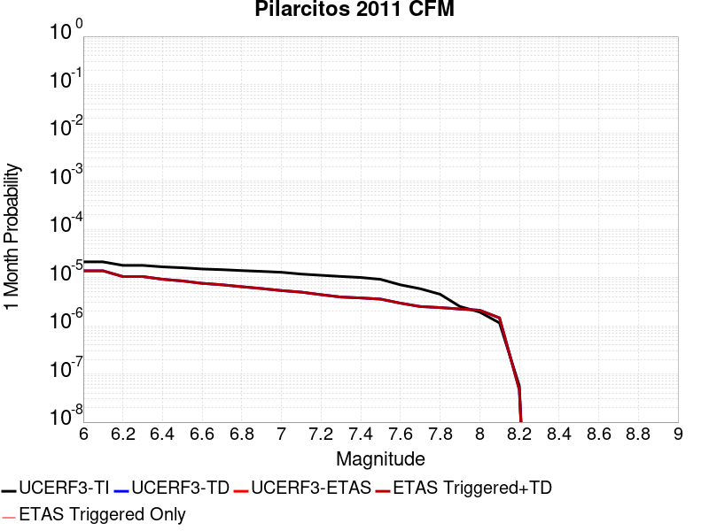 |  |  |

| Magnitude | 1 wk TI Prob | 1 wk TD Prob | 1 wk ETAS Prob | 1 wk ETAS/TD Gain | 1 wk ETAS Triggered+TD | 1 wk ETAS Triggered Only | 1 mo TI Prob | 1 mo TD Prob | 1 mo ETAS Prob | 1 mo ETAS/TD Gain | 1 mo ETAS Triggered+TD | 1 mo ETAS Triggered Only | 1 yr TI Prob | 1 yr TD Prob | 1 yr ETAS Prob | 1 yr ETAS/TD Gain | 1 yr ETAS Triggered+TD | 1 yr ETAS Triggered Only | 10 yr TI Prob | 10 yr TD Prob | 10 yr ETAS Prob | 10 yr ETAS/TD Gain | 10 yr ETAS Triggered+TD | 10 yr ETAS Triggered Only |
|-----|-----|-----|-----|-----|-----|-----|-----|-----|-----|-----|-----|-----|-----|-----|-----|-----|-----|-----|-----|-----|-----|-----|-----|-----|
| 6.0 | 4.9150476E-6 | 3.2009964E-6 | 0.0 | 0.0 | 3.2009964E-6 | 0.0 | 2.1064321E-5 | 1.3718485E-5 | 0.0 | 0.0 | 1.3718485E-5 | 0.0 | 2.564279E-4 | 1.6701006E-4 | 2.0E-4 | 1.1975327 | 1.6701006E-4 | 0.0 | 0.0025613222 | 0.0016813162 | 0.0017 | 1.0111126 | 0.0020806438 | 4.0E-4 |
| 6.1 | 4.9150476E-6 | 3.2009964E-6 | 0.0 | 0.0 | 3.2009964E-6 | 0.0 | 2.1064321E-5 | 1.3718485E-5 | 0.0 | 0.0 | 1.3718485E-5 | 0.0 | 2.564279E-4 | 1.6701006E-4 | 2.0E-4 | 1.1975327 | 1.6701006E-4 | 0.0 | 0.0025613222 | 0.0016813162 | 0.0015 | 0.89215815 | 0.0020806438 | 4.0E-4 |
| 6.2 | 4.162343E-6 | 2.4293481E-6 | 0.0 | 0.0 | 2.4293481E-6 | 0.0 | 1.783849E-5 | 1.0411451E-5 | 0.0 | 0.0 | 1.0411451E-5 | 0.0 | 2.1716199E-4 | 1.2675211E-4 | 2.0E-4 | 1.577883 | 1.2675211E-4 | 0.0 | 0.002169499 | 0.0012792508 | 0.0014 | 1.0943905 | 0.001578867 | 3.0E-4 |
| 6.3 | 4.162343E-6 | 2.4293481E-6 | 0.0 | 0.0 | 2.4293481E-6 | 0.0 | 1.783849E-5 | 1.0411451E-5 | 0.0 | 0.0 | 1.0411451E-5 | 0.0 | 2.1716199E-4 | 1.2675211E-4 | 2.0E-4 | 1.577883 | 1.2675211E-4 | 0.0 | 0.002169499 | 0.0012792508 | 0.0014 | 1.0943905 | 0.001578867 | 3.0E-4 |
| 6.4 | 3.8768926E-6 | 2.136753E-6 | 0.0 | 0.0 | 2.136753E-6 | 0.0 | 1.6615148E-5 | 9.15748E-6 | 0.0 | 0.0 | 9.15748E-6 | 0.0 | 2.0227065E-4 | 1.1148666E-4 | 2.0E-4 | 1.7939365 | 1.1148666E-4 | 0.0 | 0.0020208664 | 0.0011267582 | 0.0012 | 1.0650022 | 0.0013265328 | 2.0E-4 |
| 6.5 | 3.7137002E-6 | 1.970104E-6 | 0.0 | 0.0 | 1.970104E-6 | 0.0 | 1.591576E-5 | 8.443275E-6 | 0.0 | 0.0 | 8.443275E-6 | 0.0 | 1.9375715E-4 | 1.0279206E-4 | 2.0E-4 | 1.9456756 | 1.0279206E-4 | 0.0 | 0.001935883 | 0.0010398959 | 0.0012 | 1.1539617 | 0.001239688 | 2.0E-4 |
| 6.6 | 3.5048733E-6 | 1.7550456E-6 | 0.0 | 0.0 | 1.7550456E-6 | 0.0 | 1.5020799E-5 | 7.521602E-6 | 0.0 | 0.0 | 7.521602E-6 | 0.0 | 1.8286289E-4 | 9.157168E-5 | 1.0E-4 | 1.0920407 | 9.157168E-5 | 0.0 | 0.0018271249 | 9.277908E-4 | 9.0E-4 | 0.9700462 | 0.0011276052 | 2.0E-4 |
| 6.7 | 3.3908584E-6 | 1.638731E-6 | 0.0 | 0.0 | 1.638731E-6 | 0.0 | 1.453217E-5 | 7.023114E-6 | 0.0 | 0.0 | 7.023114E-6 | 0.0 | 1.7691481E-4 | 8.5503074E-5 | 1.0E-4 | 1.1695486 | 8.5503074E-5 | 0.0 | 0.0017677402 | 8.671534E-4 | 9.0E-4 | 1.0378786 | 0.00106698 | 2.0E-4 |
| 6.8 | 3.2451449E-6 | 1.4919447E-6 | 0.0 | 0.0 | 1.4919447E-6 | 0.0 | 1.3907689E-5 | 6.394033E-6 | 0.0 | 0.0 | 6.394033E-6 | 0.0 | 1.6931296E-4 | 7.7844576E-5 | 1.0E-4 | 1.284611 | 7.7844576E-5 | 0.0 | 0.0016918402 | 7.90625E-4 | 8.0E-4 | 1.0118577 | 9.904668E-4 | 2.0E-4 |
| 6.9 | 3.1239128E-6 | 1.3684618E-6 | 0.0 | 0.0 | 1.3684618E-6 | 0.0 | 1.3388129E-5 | 5.8648225E-6 | 0.0 | 0.0 | 5.8648225E-6 | 0.0 | 1.6298829E-4 | 7.140188E-5 | 1.0E-4 | 1.4005233 | 7.140188E-5 | 0.0 | 0.001628688 | 7.262418E-4 | 8.0E-4 | 1.1015614 | 9.260966E-4 | 2.0E-4 |
| 7.0 | 2.9940109E-6 | 1.2397713E-6 | 0.0 | 0.0 | 1.2397713E-6 | 0.0 | 1.2831412E-5 | 5.3132944E-6 | 0.0 | 0.0 | 5.3132944E-6 | 0.0 | 1.5621124E-4 | 6.468744E-5 | 1.0E-4 | 1.5458951 | 6.468744E-5 | 0.0 | 0.0015610148 | 6.591387E-4 | 8.0E-4 | 1.2137051 | 8.590069E-4 | 2.0E-4 |
| 7.1 | 2.7471217E-6 | 1.1517144E-6 | 0.0 | 0.0 | 1.1517144E-6 | 0.0 | 1.1773326E-5 | 4.935909E-6 | 0.0 | 0.0 | 4.935909E-6 | 0.0 | 1.4333082E-4 | 6.009304E-5 | 1.0E-4 | 1.6640862 | 6.009304E-5 | 0.0 | 0.001432384 | 6.131696E-4 | 8.0E-4 | 1.304696 | 8.13047E-4 | 2.0E-4 |
| 7.2 | 2.592675E-6 | 1.0177993E-6 | 0.0 | 0.0 | 1.0177993E-6 | 0.0 | 1.1111417E-5 | 4.3619893E-6 | 0.0 | 0.0 | 4.3619893E-6 | 0.0 | 1.3527309E-4 | 5.310593E-5 | 1.0E-4 | 1.8830289 | 5.310593E-5 | 0.0 | 0.0013519078 | 5.4333487E-4 | 7.0E-4 | 1.2883399 | 6.4328057E-4 | 1.0E-4 |
| 7.3 | 2.4518663E-6 | 9.0877757E-7 | 0.0 | 0.0 | 9.0877757E-7 | 0.0 | 1.0507956E-5 | 3.894755E-6 | 0.0 | 0.0 | 3.894755E-6 | 0.0 | 1.2792686E-4 | 4.7417612E-5 | 1.0E-4 | 2.108921 | 4.7417612E-5 | 0.0 | 0.0012785323 | 4.8647614E-4 | 7.0E-4 | 1.4389194 | 5.864275E-4 | 1.0E-4 |
| 7.4 | 2.3349535E-6 | 8.7102484E-7 | 0.0 | 0.0 | 8.7102484E-7 | 0.0 | 1.0006905E-5 | 3.732958E-6 | 0.0 | 0.0 | 3.732958E-6 | 0.0 | 1.2182725E-4 | 4.5447818E-5 | 1.0E-4 | 2.2003257 | 4.5447818E-5 | 0.0 | 0.0012176048 | 4.6676135E-4 | 6.0E-4 | 1.2854534 | 5.667147E-4 | 1.0E-4 |
| 7.5 | 2.1358665E-6 | 8.233585E-7 | 0.0 | 0.0 | 8.233585E-7 | 0.0 | 9.15368E-6 | 3.5286744E-6 | 0.0 | 0.0 | 3.5286744E-6 | 0.0 | 1.11440364E-4 | 4.2960764E-5 | 1.0E-4 | 2.3277054 | 4.2960764E-5 | 0.0 | 0.0011138449 | 4.41808E-4 | 5.0E-4 | 1.1317134 | 5.417638E-4 | 1.0E-4 |
| 7.6 | 1.6445446E-6 | 6.7840205E-7 | 0.0 | 0.0 | 6.7840205E-7 | 0.0 | 7.048029E-6 | 2.907434E-6 | 0.0 | 0.0 | 2.907434E-6 | 0.0 | 8.580638E-5 | 3.5397432E-5 | 1.0E-4 | 2.8250635 | 3.5397432E-5 | 0.0 | 8.5773255E-4 | 3.6613466E-4 | 4.0E-4 | 1.0924942 | 4.6609802E-4 | 1.0E-4 |
| 7.7 | 1.3650961E-6 | 5.7800776E-7 | 0.0 | 0.0 | 5.7800776E-7 | 0.0 | 5.850399E-6 | 2.4771737E-6 | 0.0 | 0.0 | 2.4771737E-6 | 0.0 | 7.122628E-5 | 3.0159174E-5 | 1.0E-4 | 3.3157408 | 3.0159174E-5 | 0.0 | 7.120345E-4 | 3.136486E-4 | 4.0E-4 | 1.2753125 | 4.1361724E-4 | 1.0E-4 |
| 7.8 | 1.0500993E-6 | 5.4973157E-7 | 0.0 | 0.0 | 5.4973157E-7 | 0.0 | 4.5004176E-6 | 2.35599E-6 | 0.0 | 0.0 | 2.35599E-6 | 0.0 | 5.4791206E-5 | 2.8683804E-5 | 1.0E-4 | 3.486288 | 2.8683804E-5 | 0.0 | 5.47777E-4 | 2.987678E-4 | 4.0E-4 | 1.3388325 | 3.987379E-4 | 1.0E-4 |
| 7.9 | 5.856431E-7 | 5.141016E-7 | 0.0 | 0.0 | 5.141016E-7 | 0.0 | 2.5098966E-6 | 2.2032907E-6 | 0.0 | 0.0 | 2.2032907E-6 | 0.0 | 3.0557563E-5 | 2.6824735E-5 | 1.0E-4 | 3.7279027 | 2.6824735E-5 | 0.0 | 3.055336E-4 | 2.794423E-4 | 4.0E-4 | 1.4314225 | 3.7941436E-4 | 1.0E-4 |
| 8.0 | 4.4768265E-7 | 4.8479757E-7 | 0.0 | 0.0 | 4.8479757E-7 | 0.0 | 1.9186384E-6 | 2.077702E-6 | 0.0 | 0.0 | 2.077702E-6 | 0.0 | 2.3359173E-5 | 2.529573E-5 | 1.0E-4 | 3.9532363 | 2.529573E-5 | 0.0 | 2.3356717E-4 | 2.6362212E-4 | 4.0E-4 | 1.5173234 | 3.6359575E-4 | 1.0E-4 |
| 8.1 | 2.6692538E-7 | 3.3656872E-7 | 0.0 | 0.0 | 3.3656872E-7 | 0.0 | 1.1439654E-6 | 1.4424365E-6 | 0.0 | 0.0 | 1.4424365E-6 | 0.0 | 1.392769E-5 | 1.7561524E-5 | 1.0E-4 | 5.6942663 | 1.7561524E-5 | 0.0 | 1.3926817E-4 | 1.8297473E-4 | 3.0E-4 | 1.6395706 | 1.8297473E-4 | 0.0 |
| 8.2 | 1.3198862E-8 | 1.0849751E-8 | 0.0 | 0.0 | 1.0849751E-8 | 0.0 | 5.656655E-8 | 4.6498933E-8 | 0.0 | 0.0 | 4.6498933E-8 | 0.0 | 6.886975E-7 | 5.661244E-7 | 0.0 | 0.0 | 5.661244E-7 | 0.0 | 6.8869535E-6 | 5.893554E-6 | 0.0 | 0.0 | 5.893554E-6 | 0.0 |

## Baker
*[(top)](#table-of-contents)*

| 1 Week | 1 Month | 1 Year | 10 Year |
|-----|-----|-----|-----|
|  |  |  |  |

| Magnitude | 1 wk TI Prob | 1 wk TD Prob | 1 wk ETAS Prob | 1 wk ETAS/TD Gain | 1 wk ETAS Triggered+TD | 1 wk ETAS Triggered Only | 1 mo TI Prob | 1 mo TD Prob | 1 mo ETAS Prob | 1 mo ETAS/TD Gain | 1 mo ETAS Triggered+TD | 1 mo ETAS Triggered Only | 1 yr TI Prob | 1 yr TD Prob | 1 yr ETAS Prob | 1 yr ETAS/TD Gain | 1 yr ETAS Triggered+TD | 1 yr ETAS Triggered Only | 10 yr TI Prob | 10 yr TD Prob | 10 yr ETAS Prob | 10 yr ETAS/TD Gain | 10 yr ETAS Triggered+TD | 10 yr ETAS Triggered Only |
|-----|-----|-----|-----|-----|-----|-----|-----|-----|-----|-----|-----|-----|-----|-----|-----|-----|-----|-----|-----|-----|-----|-----|-----|-----|
| 6.0 | 5.695525E-6 | 5.835122E-6 | 0.0 | 0.0 | 5.835122E-6 | 0.0 | 2.4409164E-5 | 2.5007448E-5 | 0.0 | 0.0 | 2.5007448E-5 | 0.0 | 2.9714106E-4 | 3.0442714E-4 | 1.0E-4 | 0.32848582 | 3.0442714E-4 | 0.0 | 0.0029674405 | 0.003040497 | 0.0026 | 0.8551234 | 0.0034392807 | 4.0E-4 |
| 6.1 | 5.695525E-6 | 5.835122E-6 | 0.0 | 0.0 | 5.835122E-6 | 0.0 | 2.4409164E-5 | 2.5007448E-5 | 0.0 | 0.0 | 2.5007448E-5 | 0.0 | 2.9714106E-4 | 3.0442714E-4 | 1.0E-4 | 0.32848582 | 3.0442714E-4 | 0.0 | 0.0029674405 | 0.003040497 | 0.0026 | 0.8551234 | 0.0034392807 | 4.0E-4 |
| 6.2 | 5.695525E-6 | 5.835122E-6 | 0.0 | 0.0 | 5.835122E-6 | 0.0 | 2.4409164E-5 | 2.5007448E-5 | 0.0 | 0.0 | 2.5007448E-5 | 0.0 | 2.9714106E-4 | 3.0442714E-4 | 1.0E-4 | 0.32848582 | 3.0442714E-4 | 0.0 | 0.0029674405 | 0.003040497 | 0.0026 | 0.8551234 | 0.0034392807 | 4.0E-4 |
| 6.3 | 3.2995713E-6 | 3.3838396E-6 | 0.0 | 0.0 | 3.3838396E-6 | 0.0 | 1.4140943E-5 | 1.4502092E-5 | 0.0 | 0.0 | 1.4502092E-5 | 0.0 | 1.7215237E-4 | 1.7654913E-4 | 1.0E-4 | 0.56641454 | 1.7654913E-4 | 0.0 | 0.0017201907 | 0.0017641359 | 0.0011 | 0.62353474 | 0.0018639595 | 1.0E-4 |
| 6.4 | 3.2995713E-6 | 3.3838396E-6 | 0.0 | 0.0 | 3.3838396E-6 | 0.0 | 1.4140943E-5 | 1.4502092E-5 | 0.0 | 0.0 | 1.4502092E-5 | 0.0 | 1.7215237E-4 | 1.7654913E-4 | 1.0E-4 | 0.56641454 | 1.7654913E-4 | 0.0 | 0.0017201907 | 0.0017641359 | 0.0011 | 0.62353474 | 0.0018639595 | 1.0E-4 |
| 6.5 | 2.782202E-6 | 2.8559919E-6 | 0.0 | 0.0 | 2.8559919E-6 | 0.0 | 1.1923668E-5 | 1.223991E-5 | 0.0 | 0.0 | 1.223991E-5 | 0.0 | 1.4516099E-4 | 1.4901103E-4 | 1.0E-4 | 0.67109126 | 1.4901103E-4 | 0.0 | 0.001450662 | 0.0014891439 | 9.0E-4 | 0.60437405 | 0.001588995 | 1.0E-4 |
| 6.6 | 2.3163404E-6 | 2.381053E-6 | 0.0 | 0.0 | 2.381053E-6 | 0.0 | 9.927136E-6 | 1.0204474E-5 | 0.0 | 0.0 | 1.0204474E-5 | 0.0 | 1.20856166E-4 | 1.242326E-4 | 1.0E-4 | 0.8049417 | 1.242326E-4 | 0.0 | 0.0012079047 | 0.0012416517 | 9.0E-4 | 0.724841 | 0.0013415274 | 1.0E-4 |
| 6.7 | 2.037056E-6 | 2.0966231E-6 | 0.0 | 0.0 | 2.0966231E-6 | 0.0 | 8.7302105E-6 | 8.9854975E-6 | 0.0 | 0.0 | 8.9854975E-6 | 0.0 | 1.0628513E-4 | 1.09393106E-4 | 1.0E-4 | 0.9141344 | 1.09393106E-4 | 0.0 | 0.0010623431 | 0.0010934087 | 8.0E-4 | 0.7316569 | 0.0011932993 | 1.0E-4 |
| 6.8 | 1.8356744E-6 | 1.8916442E-6 | 0.0 | 0.0 | 1.8916442E-6 | 0.0 | 7.867153E-6 | 8.107022E-6 | 0.0 | 0.0 | 8.107022E-6 | 0.0 | 9.577837E-5 | 9.869866E-5 | 1.0E-4 | 1.013185 | 9.869866E-5 | 0.0 | 9.57371E-4 | 9.865622E-4 | 7.0E-4 | 0.7095346 | 0.0010864636 | 1.0E-4 |
| 6.9 | 1.6310546E-6 | 1.6833152E-6 | 0.0 | 0.0 | 1.6833152E-6 | 0.0 | 6.9902153E-6 | 7.2141884E-6 | 0.0 | 0.0 | 7.2141884E-6 | 0.0 | 8.510255E-5 | 8.782932E-5 | 1.0E-4 | 1.138572 | 8.782932E-5 | 0.0 | 8.5069967E-4 | 8.779573E-4 | 6.0E-4 | 0.6834045 | 9.778695E-4 | 1.0E-4 |
| 7.0 | 1.2058036E-6 | 1.2509602E-6 | 0.0 | 0.0 | 1.2509602E-6 | 0.0 | 5.1677193E-6 | 5.361247E-6 | 0.0 | 0.0 | 5.361247E-6 | 0.0 | 6.291517E-5 | 6.5271255E-5 | 1.0E-4 | 1.532068 | 6.5271255E-5 | 0.0 | 6.289736E-4 | 6.5252313E-4 | 5.0E-4 | 0.76625633 | 7.524579E-4 | 1.0E-4 |
| 7.1 | 1.052382E-6 | 1.0952499E-6 | 0.0 | 0.0 | 1.0952499E-6 | 0.0 | 4.5102006E-6 | 4.69392E-6 | 0.0 | 0.0 | 4.69392E-6 | 0.0 | 5.491031E-5 | 5.7146983E-5 | 0.0 | 0.0 | 5.7146983E-5 | 0.0 | 5.4896745E-4 | 5.713238E-4 | 4.0E-4 | 0.70012844 | 6.7126664E-4 | 1.0E-4 |
| 7.2 | 1.0067454E-6 | 1.0488586E-6 | 0.0 | 0.0 | 1.0488586E-6 | 0.0 | 4.3146156E-6 | 4.4951007E-6 | 0.0 | 0.0 | 4.4951007E-6 | 0.0 | 5.252918E-5 | 5.4726483E-5 | 0.0 | 0.0 | 5.4726483E-5 | 0.0 | 5.251676E-4 | 5.4713094E-4 | 4.0E-4 | 0.73108643 | 6.4707623E-4 | 1.0E-4 |
| 7.3 | 9.3596316E-7 | 9.768575E-7 | 0.0 | 0.0 | 9.768575E-7 | 0.0 | 4.0112645E-6 | 4.186525E-6 | 0.0 | 0.0 | 4.186525E-6 | 0.0 | 4.8836053E-5 | 5.096976E-5 | 0.0 | 0.0 | 5.096976E-5 | 0.0 | 4.8825322E-4 | 5.0958147E-4 | 4.0E-4 | 0.7849579 | 6.095305E-4 | 1.0E-4 |
| 7.4 | 8.8117395E-7 | 9.2084895E-7 | 0.0 | 0.0 | 9.2084895E-7 | 0.0 | 3.7764542E-6 | 3.9464894E-6 | 0.0 | 0.0 | 3.9464894E-6 | 0.0 | 4.5977362E-5 | 4.804746E-5 | 0.0 | 0.0 | 4.804746E-5 | 0.0 | 4.596785E-4 | 4.8037147E-4 | 3.0E-4 | 0.6245167 | 4.8037147E-4 | 0.0 |
| 7.5 | 8.292386E-7 | 8.6753937E-7 | 0.0 | 0.0 | 8.6753937E-7 | 0.0 | 3.5538749E-6 | 3.7180205E-6 | 0.0 | 0.0 | 3.7180205E-6 | 0.0 | 4.326757E-5 | 4.5265966E-5 | 0.0 | 0.0 | 4.5265966E-5 | 0.0 | 4.3259145E-4 | 4.525682E-4 | 3.0E-4 | 0.6628835 | 4.525682E-4 | 0.0 |
| 7.6 | 7.553842E-7 | 7.9152244E-7 | 0.0 | 0.0 | 7.9152244E-7 | 0.0 | 3.2373566E-6 | 3.3922347E-6 | 0.0 | 0.0 | 3.3922347E-6 | 0.0 | 3.9414106E-5 | 4.129968E-5 | 0.0 | 0.0 | 4.129968E-5 | 0.0 | 3.9407116E-4 | 4.1292075E-4 | 2.0E-4 | 0.48435444 | 4.1292075E-4 | 0.0 |
| 7.7 | 6.5285366E-7 | 6.853476E-7 | 0.0 | 0.0 | 6.853476E-7 | 0.0 | 2.797941E-6 | 2.9372006E-6 | 0.0 | 0.0 | 2.9372006E-6 | 0.0 | 3.40644E-5 | 3.5759836E-5 | 0.0 | 0.0 | 3.5759836E-5 | 0.0 | 3.405918E-4 | 3.575415E-4 | 2.0E-4 | 0.55937564 | 3.575415E-4 | 0.0 |
| 7.8 | 3.4586725E-7 | 3.64866E-7 | 0.0 | 0.0 | 3.64866E-7 | 0.0 | 1.4822873E-6 | 1.5637105E-6 | 0.0 | 0.0 | 1.5637105E-6 | 0.0 | 1.80467E-5 | 1.9038014E-5 | 0.0 | 0.0 | 1.9038014E-5 | 0.0 | 1.8045233E-4 | 1.9036427E-4 | 1.0E-4 | 0.52530867 | 1.9036427E-4 | 0.0 |
| 7.9 | 2.5591178E-9 | 2.6699005E-9 | 0.0 | 0.0 | 2.6699005E-9 | 0.0 | 1.0967647E-8 | 1.1442431E-8 | 0.0 | 0.0 | 1.1442431E-8 | 0.0 | 1.335311E-7 | 1.393116E-7 | 0.0 | 0.0 | 1.393116E-7 | 0.0 | 1.3353102E-6 | 1.3931159E-6 | 0.0 | 0.0 | 1.3931159E-6 | 0.0 |

## San Luis Range 2011 CFM
*[(top)](#table-of-contents)*

| 1 Week | 1 Month | 1 Year | 10 Year |
|-----|-----|-----|-----|
|  |  |  |  |

| Magnitude | 1 wk TI Prob | 1 wk TD Prob | 1 wk ETAS Prob | 1 wk ETAS/TD Gain | 1 wk ETAS Triggered+TD | 1 wk ETAS Triggered Only | 1 mo TI Prob | 1 mo TD Prob | 1 mo ETAS Prob | 1 mo ETAS/TD Gain | 1 mo ETAS Triggered+TD | 1 mo ETAS Triggered Only | 1 yr TI Prob | 1 yr TD Prob | 1 yr ETAS Prob | 1 yr ETAS/TD Gain | 1 yr ETAS Triggered+TD | 1 yr ETAS Triggered Only | 10 yr TI Prob | 10 yr TD Prob | 10 yr ETAS Prob | 10 yr ETAS/TD Gain | 10 yr ETAS Triggered+TD | 10 yr ETAS Triggered Only |
|-----|-----|-----|-----|-----|-----|-----|-----|-----|-----|-----|-----|-----|-----|-----|-----|-----|-----|-----|-----|-----|-----|-----|-----|-----|
| 6.0 | 8.8368415E-6 | 8.965778E-6 | 0.0 | 0.0 | 8.965778E-6 | 0.0 | 3.787163E-5 | 3.8424238E-5 | 0.0 | 0.0 | 3.8424238E-5 | 0.0 | 4.609895E-4 | 4.6772257E-4 | 1.0E-4 | 0.21380195 | 4.6772257E-4 | 0.0 | 0.0046003438 | 0.0046681645 | 0.004 | 0.85686785 | 0.004966764 | 3.0E-4 |
| 6.1 | 8.8368415E-6 | 8.965778E-6 | 0.0 | 0.0 | 8.965778E-6 | 0.0 | 3.787163E-5 | 3.8424238E-5 | 0.0 | 0.0 | 3.8424238E-5 | 0.0 | 4.609895E-4 | 4.6772257E-4 | 1.0E-4 | 0.21380195 | 4.6772257E-4 | 0.0 | 0.0046003438 | 0.0046681645 | 0.004 | 0.85686785 | 0.004966764 | 3.0E-4 |
| 6.2 | 8.8368415E-6 | 8.965778E-6 | 0.0 | 0.0 | 8.965778E-6 | 0.0 | 3.787163E-5 | 3.8424238E-5 | 0.0 | 0.0 | 3.8424238E-5 | 0.0 | 4.609895E-4 | 4.6772257E-4 | 1.0E-4 | 0.21380195 | 4.6772257E-4 | 0.0 | 0.0046003438 | 0.0046681645 | 0.004 | 0.85686785 | 0.004966764 | 3.0E-4 |
| 6.3 | 8.8368415E-6 | 8.965778E-6 | 0.0 | 0.0 | 8.965778E-6 | 0.0 | 3.787163E-5 | 3.8424238E-5 | 0.0 | 0.0 | 3.8424238E-5 | 0.0 | 4.609895E-4 | 4.6772257E-4 | 1.0E-4 | 0.21380195 | 4.6772257E-4 | 0.0 | 0.0046003438 | 0.0046681645 | 0.004 | 0.85686785 | 0.004966764 | 3.0E-4 |
| 6.4 | 3.9094193E-6 | 3.9413308E-6 | 0.0 | 0.0 | 3.9413308E-6 | 0.0 | 1.6754546E-5 | 1.6891308E-5 | 0.0 | 0.0 | 1.6891308E-5 | 0.0 | 2.039675E-4 | 2.0563256E-4 | 0.0 | 0.0 | 2.0563256E-4 | 0.0 | 0.0020378039 | 0.0020544517 | 0.0018 | 0.8761462 | 0.0020544517 | 0.0 |
| 6.5 | 3.9094193E-6 | 3.9413308E-6 | 0.0 | 0.0 | 3.9413308E-6 | 0.0 | 1.6754546E-5 | 1.6891308E-5 | 0.0 | 0.0 | 1.6891308E-5 | 0.0 | 2.039675E-4 | 2.0563256E-4 | 0.0 | 0.0 | 2.0563256E-4 | 0.0 | 0.0020378039 | 0.0020544517 | 0.0018 | 0.8761462 | 0.0020544517 | 0.0 |
| 6.6 | 3.0587726E-6 | 3.0754857E-6 | 0.0 | 0.0 | 3.0754857E-6 | 0.0 | 1.3108959E-5 | 1.3180586E-5 | 0.0 | 0.0 | 1.3180586E-5 | 0.0 | 1.595899E-4 | 1.6046195E-4 | 0.0 | 0.0 | 1.6046195E-4 | 0.0 | 0.0015947534 | 0.0016034727 | 0.0011 | 0.686011 | 0.0016034727 | 0.0 |
| 6.7 | 2.6160574E-6 | 2.6252094E-6 | 0.0 | 0.0 | 2.6252094E-6 | 0.0 | 1.1211626E-5 | 1.125085E-5 | 0.0 | 0.0 | 1.125085E-5 | 0.0 | 1.3649299E-4 | 1.3697054E-4 | 0.0 | 0.0 | 1.3697054E-4 | 0.0 | 0.0013640919 | 0.0013688673 | 8.0E-4 | 0.5844248 | 0.0013688673 | 0.0 |
| 6.8 | 2.5110312E-6 | 2.5182183E-6 | 0.0 | 0.0 | 2.5182183E-6 | 0.0 | 1.0761518E-5 | 1.079232E-5 | 0.0 | 0.0 | 1.079232E-5 | 0.0 | 1.310136E-4 | 1.3138863E-4 | 0.0 | 0.0 | 1.3138863E-4 | 0.0 | 0.0013093639 | 0.0013131154 | 7.0E-4 | 0.5330834 | 0.0013131154 | 0.0 |
| 6.9 | 1.8564405E-6 | 1.8525428E-6 | 0.0 | 0.0 | 1.8525428E-6 | 0.0 | 7.95615E-6 | 7.939445E-6 | 0.0 | 0.0 | 7.939445E-6 | 0.0 | 9.686181E-5 | 9.665848E-5 | 0.0 | 0.0 | 9.665848E-5 | 0.0 | 9.68196E-4 | 9.661664E-4 | 5.0E-4 | 0.5175092 | 9.661664E-4 | 0.0 |
| 7.0 | 1.546127E-6 | 1.536999E-6 | 0.0 | 0.0 | 1.536999E-6 | 0.0 | 6.626242E-6 | 6.587122E-6 | 0.0 | 0.0 | 6.587122E-6 | 0.0 | 8.06715E-5 | 8.019526E-5 | 0.0 | 0.0 | 8.019526E-5 | 0.0 | 8.0642226E-4 | 8.0166396E-4 | 4.0E-4 | 0.49896216 | 8.0166396E-4 | 0.0 |
| 7.1 | 1.3368208E-6 | 1.3235696E-6 | 0.0 | 0.0 | 1.3235696E-6 | 0.0 | 5.7292195E-6 | 5.6724284E-6 | 0.0 | 0.0 | 5.6724284E-6 | 0.0 | 6.975101E-5 | 6.9059635E-5 | 0.0 | 0.0 | 6.9059635E-5 | 0.0 | 6.972912E-4 | 6.903822E-4 | 4.0E-4 | 0.5793892 | 6.903822E-4 | 0.0 |
| 7.2 | 1.0623363E-6 | 1.0454638E-6 | 0.0 | 0.0 | 1.0454638E-6 | 0.0 | 4.5528623E-6 | 4.4805515E-6 | 0.0 | 0.0 | 4.4805515E-6 | 0.0 | 5.5429686E-5 | 5.4549353E-5 | 0.0 | 0.0 | 5.4549353E-5 | 0.0 | 5.5415864E-4 | 5.453599E-4 | 2.0E-4 | 0.3667303 | 5.453599E-4 | 0.0 |
| 7.3 | 7.831679E-7 | 7.7276064E-7 | 0.0 | 0.0 | 7.7276064E-7 | 0.0 | 3.3564295E-6 | 3.3118272E-6 | 0.0 | 0.0 | 3.3118272E-6 | 0.0 | 4.086376E-5 | 4.0320752E-5 | 0.0 | 0.0 | 4.0320752E-5 | 0.0 | 4.0856248E-4 | 4.0313447E-4 | 2.0E-4 | 0.49611235 | 4.0313447E-4 | 0.0 |
| 7.4 | 5.9558846E-7 | 5.9108265E-7 | 0.0 | 0.0 | 5.9108265E-7 | 0.0 | 2.5525194E-6 | 2.5332088E-6 | 0.0 | 0.0 | 2.5332088E-6 | 0.0 | 3.107648E-5 | 3.084138E-5 | 0.0 | 0.0 | 3.084138E-5 | 0.0 | 3.1072134E-4 | 3.083711E-4 | 2.0E-4 | 0.6485692 | 3.083711E-4 | 0.0 |
| 7.5 | 4.1616502E-7 | 4.119771E-7 | 0.0 | 0.0 | 4.119771E-7 | 0.0 | 1.7835631E-6 | 1.765615E-6 | 0.0 | 0.0 | 1.765615E-6 | 0.0 | 2.1714664E-5 | 2.1496151E-5 | 0.0 | 0.0 | 2.1496151E-5 | 0.0 | 2.1712543E-4 | 2.1494077E-4 | 2.0E-4 | 0.93048894 | 2.1494077E-4 | 0.0 |
| 7.6 | 2.3816014E-7 | 2.3377477E-7 | 0.0 | 0.0 | 2.3377477E-7 | 0.0 | 1.0206859E-6 | 1.0018915E-6 | 0.0 | 0.0 | 1.0018915E-6 | 0.0 | 1.242678E-5 | 1.219796E-5 | 0.0 | 0.0 | 1.219796E-5 | 0.0 | 1.2426086E-4 | 1.2197293E-4 | 0.0 | 0.0 | 1.2197293E-4 | 0.0 |
| 7.7 | 9.918777E-8 | 9.387224E-8 | 0.0 | 0.0 | 9.387224E-8 | 0.0 | 4.2509038E-7 | 4.0230952E-7 | 0.0 | 0.0 | 4.0230952E-7 | 0.0 | 5.1754632E-6 | 4.8981074E-6 | 0.0 | 0.0 | 4.8981074E-6 | 0.0 | 5.1753424E-5 | 4.8979997E-5 | 0.0 | 0.0 | 4.8979997E-5 | 0.0 |
| 7.8 | 3.4982556E-8 | 2.9688666E-8 | 0.0 | 0.0 | 2.9688666E-8 | 0.0 | 1.4992524E-7 | 1.2723713E-7 | 0.0 | 0.0 | 1.2723713E-7 | 0.0 | 1.8253382E-6 | 1.549111E-6 | 0.0 | 0.0 | 1.549111E-6 | 0.0 | 1.8253233E-5 | 1.5491003E-5 | 0.0 | 0.0 | 1.5491003E-5 | 0.0 |
| 7.9 | 1.6624908E-8 | 1.1477641E-8 | 0.0 | 0.0 | 1.1477641E-8 | 0.0 | 7.12496E-8 | 4.918989E-8 | 0.0 | 0.0 | 4.918989E-8 | 0.0 | 8.6746354E-7 | 5.9888674E-7 | 0.0 | 0.0 | 5.9888674E-7 | 0.0 | 8.674601E-6 | 5.988851E-6 | 0.0 | 0.0 | 5.988851E-6 | 0.0 |
| 8.0 | 6.3352315E-9 | 3.0886094E-9 | 0.0 | 0.0 | 3.0886094E-9 | 0.0 | 2.715099E-8 | 1.3236898E-8 | 0.0 | 0.0 | 1.3236898E-8 | 0.0 | 3.3056327E-7 | 1.6115922E-7 | 0.0 | 0.0 | 1.6115922E-7 | 0.0 | 3.3056278E-6 | 1.611591E-6 | 0.0 | 0.0 | 1.611591E-6 | 0.0 |

## Northridge
*[(top)](#table-of-contents)*

| 1 Week | 1 Month | 1 Year | 10 Year |
|-----|-----|-----|-----|
|  |  |  | 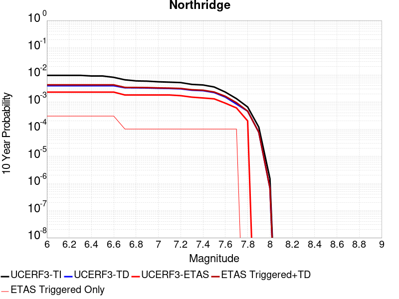 |

| Magnitude | 1 wk TI Prob | 1 wk TD Prob | 1 wk ETAS Prob | 1 wk ETAS/TD Gain | 1 wk ETAS Triggered+TD | 1 wk ETAS Triggered Only | 1 mo TI Prob | 1 mo TD Prob | 1 mo ETAS Prob | 1 mo ETAS/TD Gain | 1 mo ETAS Triggered+TD | 1 mo ETAS Triggered Only | 1 yr TI Prob | 1 yr TD Prob | 1 yr ETAS Prob | 1 yr ETAS/TD Gain | 1 yr ETAS Triggered+TD | 1 yr ETAS Triggered Only | 10 yr TI Prob | 10 yr TD Prob | 10 yr ETAS Prob | 10 yr ETAS/TD Gain | 10 yr ETAS Triggered+TD | 10 yr ETAS Triggered Only |
|-----|-----|-----|-----|-----|-----|-----|-----|-----|-----|-----|-----|-----|-----|-----|-----|-----|-----|-----|-----|-----|-----|-----|-----|-----|
| 6.0 | 1.8340852E-5 | 7.590257E-6 | 0.0 | 0.0 | 7.590257E-6 | 0.0 | 7.860128E-5 | 3.252928E-5 | 1.0E-4 | 3.0741534 | 3.252928E-5 | 0.0 | 9.565505E-4 | 3.959742E-4 | 4.0E-4 | 1.0101668 | 3.959742E-4 | 0.0 | 0.009524435 | 0.0039529316 | 0.0023 | 0.58184665 | 0.004251746 | 3.0E-4 |
| 6.1 | 1.8340852E-5 | 7.590257E-6 | 0.0 | 0.0 | 7.590257E-6 | 0.0 | 7.860128E-5 | 3.252928E-5 | 1.0E-4 | 3.0741534 | 3.252928E-5 | 0.0 | 9.565505E-4 | 3.959742E-4 | 4.0E-4 | 1.0101668 | 3.959742E-4 | 0.0 | 0.009524435 | 0.0039529316 | 0.0023 | 0.58184665 | 0.004251746 | 3.0E-4 |
| 6.2 | 1.8340852E-5 | 7.590257E-6 | 0.0 | 0.0 | 7.590257E-6 | 0.0 | 7.860128E-5 | 3.252928E-5 | 1.0E-4 | 3.0741534 | 3.252928E-5 | 0.0 | 9.565505E-4 | 3.959742E-4 | 4.0E-4 | 1.0101668 | 3.959742E-4 | 0.0 | 0.009524435 | 0.0039529316 | 0.0023 | 0.58184665 | 0.004251746 | 3.0E-4 |
| 6.3 | 1.8340852E-5 | 7.590257E-6 | 0.0 | 0.0 | 7.590257E-6 | 0.0 | 7.860128E-5 | 3.252928E-5 | 1.0E-4 | 3.0741534 | 3.252928E-5 | 0.0 | 9.565505E-4 | 3.959742E-4 | 4.0E-4 | 1.0101668 | 3.959742E-4 | 0.0 | 0.009524435 | 0.0039529316 | 0.0023 | 0.58184665 | 0.004251746 | 3.0E-4 |
| 6.4 | 1.7361892E-5 | 7.590257E-6 | 0.0 | 0.0 | 7.590257E-6 | 0.0 | 7.440598E-5 | 3.252928E-5 | 1.0E-4 | 3.0741534 | 3.252928E-5 | 0.0 | 9.055163E-4 | 3.959742E-4 | 4.0E-4 | 1.0101668 | 3.959742E-4 | 0.0 | 0.009018354 | 0.0039529316 | 0.0023 | 0.58184665 | 0.004251746 | 3.0E-4 |
| 6.5 | 1.7361892E-5 | 7.590257E-6 | 0.0 | 0.0 | 7.590257E-6 | 0.0 | 7.440598E-5 | 3.252928E-5 | 1.0E-4 | 3.0741534 | 3.252928E-5 | 0.0 | 9.055163E-4 | 3.959742E-4 | 4.0E-4 | 1.0101668 | 3.959742E-4 | 0.0 | 0.009018354 | 0.0039529316 | 0.0023 | 0.58184665 | 0.004251746 | 3.0E-4 |
| 6.6 | 1.5458201E-5 | 7.590257E-6 | 0.0 | 0.0 | 7.590257E-6 | 0.0 | 6.624775E-5 | 3.252928E-5 | 1.0E-4 | 3.0741534 | 3.252928E-5 | 0.0 | 8.0626784E-4 | 3.959742E-4 | 4.0E-4 | 1.0101668 | 3.959742E-4 | 0.0 | 0.008033488 | 0.0039529316 | 0.0023 | 0.58184665 | 0.004251746 | 3.0E-4 |
| 6.7 | 1.2538368E-5 | 6.383505E-6 | 0.0 | 0.0 | 6.383505E-6 | 0.0 | 5.3734755E-5 | 2.7357593E-5 | 1.0E-4 | 3.6552923 | 2.7357593E-5 | 0.0 | 6.5402425E-4 | 3.3302823E-4 | 4.0E-4 | 1.2010994 | 3.3302823E-4 | 0.0 | 0.0065210275 | 0.0033253622 | 0.0018 | 0.5412944 | 0.0034250298 | 1.0E-4 |
| 6.8 | 1.1438097E-5 | 6.3521456E-6 | 0.0 | 0.0 | 6.3521456E-6 | 0.0 | 4.9019498E-5 | 2.72232E-5 | 1.0E-4 | 3.6733375 | 2.72232E-5 | 0.0 | 5.9664896E-4 | 3.3139248E-4 | 4.0E-4 | 1.207028 | 3.3139248E-4 | 0.0 | 0.005950495 | 0.0033090536 | 0.0018 | 0.5439622 | 0.0034087228 | 1.0E-4 |
| 6.9 | 1.1204891E-5 | 6.28858E-6 | 0.0 | 0.0 | 6.28858E-6 | 0.0 | 4.8020076E-5 | 2.6950782E-5 | 1.0E-4 | 3.7104676 | 2.6950782E-5 | 0.0 | 5.8448757E-4 | 3.280768E-4 | 4.0E-4 | 1.2192267 | 3.280768E-4 | 0.0 | 0.0058295266 | 0.003275995 | 0.0018 | 0.5494514 | 0.0033756674 | 1.0E-4 |
| 7.0 | 1.061046E-5 | 6.1171936E-6 | 0.0 | 0.0 | 6.1171936E-6 | 0.0 | 4.5472607E-5 | 2.6216283E-5 | 1.0E-4 | 3.8144233 | 2.6216283E-5 | 0.0 | 5.534883E-4 | 3.1913692E-4 | 4.0E-4 | 1.2533805 | 3.1913692E-4 | 0.0 | 0.0055211177 | 0.0031868329 | 0.0018 | 0.5648241 | 0.0032865142 | 1.0E-4 |
| 7.1 | 1.0266979E-5 | 6.006079E-6 | 0.0 | 0.0 | 6.006079E-6 | 0.0 | 4.40006E-5 | 2.5740086E-5 | 1.0E-4 | 3.884991 | 2.5740086E-5 | 0.0 | 5.355756E-4 | 3.133409E-4 | 4.0E-4 | 1.276565 | 3.133409E-4 | 0.0 | 0.0053428668 | 0.003129037 | 0.0018 | 0.5752568 | 0.0032287242 | 1.0E-4 |
| 7.2 | 9.91273E-6 | 5.8217565E-6 | 0.0 | 0.0 | 5.8217565E-6 | 0.0 | 4.248244E-5 | 2.4950148E-5 | 1.0E-4 | 4.0079923 | 2.4950148E-5 | 0.0 | 5.171009E-4 | 3.0372615E-4 | 4.0E-4 | 1.3169758 | 3.0372615E-4 | 0.0 | 0.0051589934 | 0.0030331553 | 0.0017 | 0.5604724 | 0.003132852 | 1.0E-4 |
| 7.3 | 8.4959265E-6 | 5.1947072E-6 | 0.0 | 0.0 | 5.1947072E-6 | 0.0 | 3.6410605E-5 | 2.2262842E-5 | 1.0E-4 | 4.4917893 | 2.2262842E-5 | 0.0 | 4.4320893E-4 | 2.7101664E-4 | 4.0E-4 | 1.4759241 | 2.7101664E-4 | 0.0 | 0.00442326 | 0.0027068877 | 0.0015 | 0.55414194 | 0.002806617 | 1.0E-4 |
| 7.4 | 8.0847185E-6 | 4.983448E-6 | 0.0 | 0.0 | 4.983448E-6 | 0.0 | 3.4648332E-5 | 2.1357462E-5 | 1.0E-4 | 4.6822042 | 2.1357462E-5 | 0.0 | 4.2176177E-4 | 2.599963E-4 | 4.0E-4 | 1.5384834 | 2.599963E-4 | 0.0 | 0.0042096223 | 0.0025969471 | 0.0014 | 0.53909457 | 0.0026966874 | 1.0E-4 |
| 7.5 | 6.8220684E-6 | 4.254404E-6 | 0.0 | 0.0 | 4.254404E-6 | 0.0 | 2.9237108E-5 | 1.8233033E-5 | 0.0 | 0.0 | 1.8233033E-5 | 0.0 | 3.5590364E-4 | 2.2196476E-4 | 3.0E-4 | 1.3515658 | 2.2196476E-4 | 0.0 | 0.0035533418 | 0.0022174516 | 0.0013 | 0.5862586 | 0.0023172298 | 1.0E-4 |
| 7.6 | 4.4224143E-6 | 2.9005291E-6 | 0.0 | 0.0 | 2.9005291E-6 | 0.0 | 1.8953066E-5 | 1.243078E-5 | 0.0 | 0.0 | 1.243078E-5 | 0.0 | 2.3072914E-4 | 1.5133434E-4 | 2.0E-4 | 1.321577 | 1.5133434E-4 | 0.0 | 0.0023048974 | 0.0015123246 | 9.0E-4 | 0.59511036 | 0.0016121733 | 1.0E-4 |
| 7.7 | 2.5297056E-6 | 1.6048946E-6 | 0.0 | 0.0 | 1.6048946E-6 | 0.0 | 1.0841551E-5 | 6.878102E-6 | 0.0 | 0.0 | 6.878102E-6 | 0.0 | 1.319879E-4 | 8.373772E-5 | 1.0E-4 | 1.1942049 | 8.373772E-5 | 0.0 | 0.0013190953 | 8.370664E-4 | 6.0E-4 | 0.716789 | 9.369827E-4 | 1.0E-4 |
| 7.8 | 1.2508156E-6 | 8.78185E-7 | 0.0 | 0.0 | 8.78185E-7 | 0.0 | 5.3606273E-6 | 3.7636448E-6 | 0.0 | 0.0 | 3.7636448E-6 | 0.0 | 6.526368E-5 | 4.5821424E-5 | 1.0E-4 | 2.1823852 | 4.5821424E-5 | 0.0 | 6.524452E-4 | 4.5812107E-4 | 2.0E-4 | 0.43656585 | 4.5812107E-4 | 0.0 |
| 7.9 | 2.262199E-7 | 1.4667485E-7 | 0.0 | 0.0 | 1.4667485E-7 | 0.0 | 9.695135E-7 | 6.2860636E-7 | 0.0 | 0.0 | 6.2860636E-7 | 0.0 | 1.1803763E-5 | 7.653256E-6 | 0.0 | 0.0 | 7.653256E-6 | 0.0 | 1.1803136E-4 | 7.653001E-5 | 0.0 | 0.0 | 7.653001E-5 | 0.0 |
| 8.0 | 2.865362E-9 | 1.2760054E-9 | 0.0 | 0.0 | 1.2760054E-9 | 0.0 | 1.2280123E-8 | 5.4685945E-9 | 0.0 | 0.0 | 5.4685945E-9 | 0.0 | 1.4951048E-7 | 6.658014E-8 | 0.0 | 0.0 | 6.658014E-8 | 0.0 | 1.4951038E-6 | 6.658014E-7 | 0.0 | 0.0 | 6.658014E-7 | 0.0 |

## Great Valley 12
*[(top)](#table-of-contents)*

| 1 Week | 1 Month | 1 Year | 10 Year |
|-----|-----|-----|-----|
| 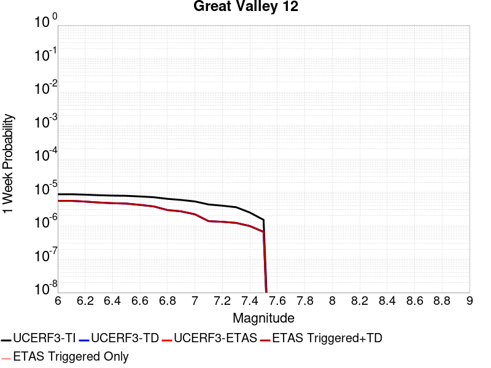 | 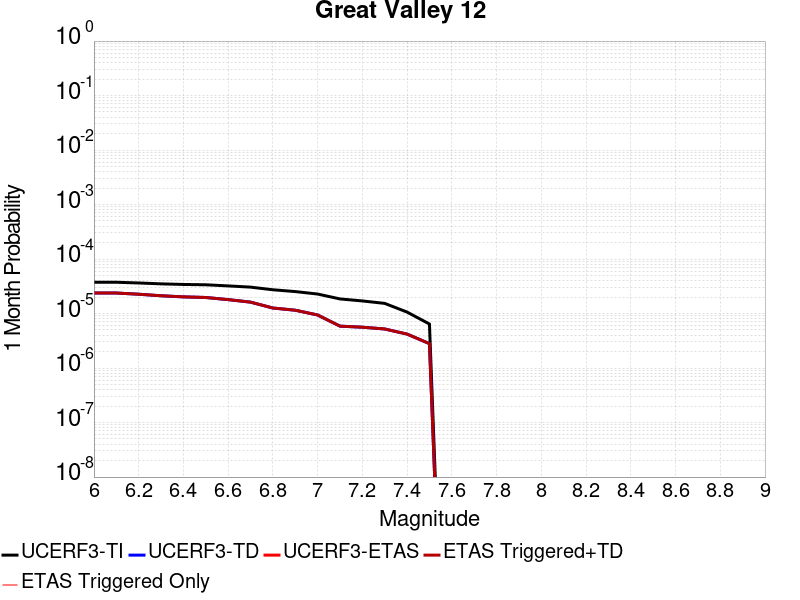 | 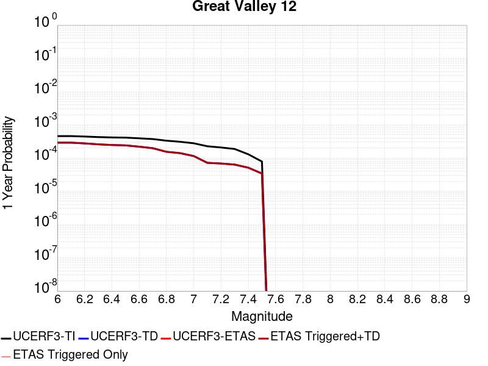 |  |

| Magnitude | 1 wk TI Prob | 1 wk TD Prob | 1 wk ETAS Prob | 1 wk ETAS/TD Gain | 1 wk ETAS Triggered+TD | 1 wk ETAS Triggered Only | 1 mo TI Prob | 1 mo TD Prob | 1 mo ETAS Prob | 1 mo ETAS/TD Gain | 1 mo ETAS Triggered+TD | 1 mo ETAS Triggered Only | 1 yr TI Prob | 1 yr TD Prob | 1 yr ETAS Prob | 1 yr ETAS/TD Gain | 1 yr ETAS Triggered+TD | 1 yr ETAS Triggered Only | 10 yr TI Prob | 10 yr TD Prob | 10 yr ETAS Prob | 10 yr ETAS/TD Gain | 10 yr ETAS Triggered+TD | 10 yr ETAS Triggered Only |
|-----|-----|-----|-----|-----|-----|-----|-----|-----|-----|-----|-----|-----|-----|-----|-----|-----|-----|-----|-----|-----|-----|-----|-----|-----|
| 6.0 | 8.757157E-6 | 5.5558626E-6 | 0.0 | 0.0 | 5.5558626E-6 | 0.0 | 3.7530135E-5 | 2.381063E-5 | 0.0 | 0.0 | 2.381063E-5 | 0.0 | 4.5683357E-4 | 2.8985707E-4 | 0.0 | 0.0 | 2.8985707E-4 | 0.0 | 0.004558956 | 0.002894911 | 0.0014 | 0.48360726 | 0.0031940425 | 3.0E-4 |
| 6.1 | 8.757157E-6 | 5.5558626E-6 | 0.0 | 0.0 | 5.5558626E-6 | 0.0 | 3.7530135E-5 | 2.381063E-5 | 0.0 | 0.0 | 2.381063E-5 | 0.0 | 4.5683357E-4 | 2.8985707E-4 | 0.0 | 0.0 | 2.8985707E-4 | 0.0 | 0.004558956 | 0.002894911 | 0.0013 | 0.4490639 | 0.0031940425 | 3.0E-4 |
| 6.2 | 8.499136E-6 | 5.2814967E-6 | 0.0 | 0.0 | 5.2814967E-6 | 0.0 | 3.642436E-5 | 2.2634797E-5 | 0.0 | 0.0 | 2.2634797E-5 | 0.0 | 4.4337637E-4 | 2.7554494E-4 | 0.0 | 0.0 | 2.7554494E-4 | 0.0 | 0.0044249278 | 0.0027521474 | 0.0013 | 0.4723584 | 0.0030513217 | 3.0E-4 |
| 6.3 | 8.186883E-6 | 4.9496007E-6 | 0.0 | 0.0 | 4.9496007E-6 | 0.0 | 3.508617E-5 | 2.1212407E-5 | 0.0 | 0.0 | 2.1212407E-5 | 0.0 | 4.270904E-4 | 2.5823145E-4 | 0.0 | 0.0 | 2.5823145E-4 | 0.0 | 0.004262705 | 0.0025794145 | 0.0012 | 0.46522182 | 0.0027788987 | 2.0E-4 |
| 6.4 | 7.979878E-6 | 4.721558E-6 | 0.0 | 0.0 | 4.721558E-6 | 0.0 | 3.419903E-5 | 2.0235097E-5 | 0.0 | 0.0 | 2.0235097E-5 | 0.0 | 4.1629362E-4 | 2.463354E-4 | 0.0 | 0.0 | 2.463354E-4 | 0.0 | 0.0041551464 | 0.0024607175 | 0.001 | 0.4063855 | 0.0026602254 | 2.0E-4 |
| 6.5 | 7.871003E-6 | 4.6015084E-6 | 0.0 | 0.0 | 4.6015084E-6 | 0.0 | 3.373243E-5 | 1.9720606E-5 | 0.0 | 0.0 | 1.9720606E-5 | 0.0 | 4.1061494E-4 | 2.4007287E-4 | 0.0 | 0.0 | 2.4007287E-4 | 0.0 | 0.0040985704 | 0.0023982283 | 0.001 | 0.41697448 | 0.0025977488 | 2.0E-4 |
| 6.6 | 7.508221E-6 | 4.2048196E-6 | 0.0 | 0.0 | 4.2048196E-6 | 0.0 | 3.2177693E-5 | 1.8020535E-5 | 0.0 | 0.0 | 1.8020535E-5 | 0.0 | 3.91693E-4 | 2.1937881E-4 | 0.0 | 0.0 | 2.1937881E-4 | 0.0 | 0.003910033 | 0.0021917087 | 8.0E-4 | 0.365012 | 0.0023912704 | 2.0E-4 |
| 6.7 | 7.1297914E-6 | 3.7824445E-6 | 0.0 | 0.0 | 3.7824445E-6 | 0.0 | 3.055589E-5 | 1.621038E-5 | 0.0 | 0.0 | 1.621038E-5 | 0.0 | 3.7195446E-4 | 1.973443E-4 | 0.0 | 0.0 | 1.973443E-4 | 0.0 | 0.0037133251 | 0.0019717694 | 8.0E-4 | 0.40572694 | 0.002171375 | 2.0E-4 |
| 6.8 | 6.376581E-6 | 2.948842E-6 | 0.0 | 0.0 | 2.948842E-6 | 0.0 | 2.7327918E-5 | 1.2637834E-5 | 0.0 | 0.0 | 1.2637834E-5 | 0.0 | 3.326666E-4 | 1.5385493E-4 | 0.0 | 0.0 | 1.5385493E-4 | 0.0 | 0.0033216903 | 0.0015375006 | 7.0E-4 | 0.45528436 | 0.0016373469 | 1.0E-4 |
| 6.9 | 5.9095E-6 | 2.686855E-6 | 0.0 | 0.0 | 2.686855E-6 | 0.0 | 2.5326184E-5 | 1.1515043E-5 | 0.0 | 0.0 | 1.1515043E-5 | 0.0 | 3.0830267E-4 | 1.4018678E-4 | 0.0 | 0.0 | 1.4018678E-4 | 0.0 | 0.003078753 | 0.001400999 | 7.0E-4 | 0.49964347 | 0.0015008589 | 1.0E-4 |
| 7.0 | 5.3239864E-6 | 2.1968694E-6 | 0.0 | 0.0 | 2.1968694E-6 | 0.0 | 2.2816885E-5 | 9.415122E-6 | 0.0 | 0.0 | 9.415122E-6 | 0.0 | 2.7776015E-4 | 1.1462321E-4 | 0.0 | 0.0 | 1.1462321E-4 | 0.0 | 0.0027741324 | 0.0011456544 | 7.0E-4 | 0.61100453 | 0.0012455398 | 1.0E-4 |
| 7.1 | 4.329147E-6 | 1.3707522E-6 | 0.0 | 0.0 | 1.3707522E-6 | 0.0 | 1.8553355E-5 | 5.8746396E-6 | 0.0 | 0.0 | 5.8746396E-6 | 0.0 | 2.2586368E-4 | 7.152148E-5 | 0.0 | 0.0 | 7.152148E-5 | 0.0 | 0.0022563424 | 7.149933E-4 | 4.0E-4 | 0.55944586 | 8.1492175E-4 | 1.0E-4 |
| 7.2 | 3.978488E-6 | 1.310594E-6 | 0.0 | 0.0 | 1.310594E-6 | 0.0 | 1.7050552E-5 | 5.61682E-6 | 0.0 | 0.0 | 5.61682E-6 | 0.0 | 2.075707E-4 | 6.8382724E-5 | 0.0 | 0.0 | 6.8382724E-5 | 0.0 | 0.0020737692 | 6.836254E-4 | 4.0E-4 | 0.58511573 | 7.835571E-4 | 1.0E-4 |
| 7.3 | 3.586542E-6 | 1.2156971E-6 | 0.0 | 0.0 | 1.2156971E-6 | 0.0 | 1.5370804E-5 | 5.210121E-6 | 0.0 | 0.0 | 5.210121E-6 | 0.0 | 1.8712347E-4 | 6.3431464E-5 | 0.0 | 0.0 | 6.3431464E-5 | 0.0 | 0.0018696598 | 6.34142E-4 | 4.0E-4 | 0.6307735 | 7.3407864E-4 | 1.0E-4 |
| 7.4 | 2.4837766E-6 | 9.799826E-7 | 0.0 | 0.0 | 9.799826E-7 | 0.0 | 1.0644713E-5 | 4.1999187E-6 | 0.0 | 0.0 | 4.1999187E-6 | 0.0 | 1.2959167E-4 | 5.113288E-5 | 0.0 | 0.0 | 5.113288E-5 | 0.0 | 0.0012951613 | 5.112177E-4 | 3.0E-4 | 0.58683413 | 6.111666E-4 | 1.0E-4 |
| 7.5 | 1.5002679E-6 | 6.545664E-7 | 0.0 | 0.0 | 6.545664E-7 | 0.0 | 6.4297037E-6 | 2.8052818E-6 | 0.0 | 0.0 | 2.8052818E-6 | 0.0 | 7.827883E-5 | 3.415381E-5 | 0.0 | 0.0 | 3.415381E-5 | 0.0 | 7.825126E-4 | 3.414898E-4 | 1.0E-4 | 0.29283452 | 3.414898E-4 | 0.0 |

## Kern Canyon (North Kern) 2011
*[(top)](#table-of-contents)*

| 1 Week | 1 Month | 1 Year | 10 Year |
|-----|-----|-----|-----|
| 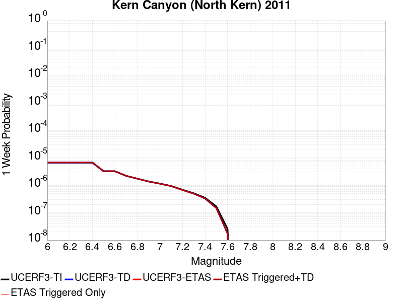 | 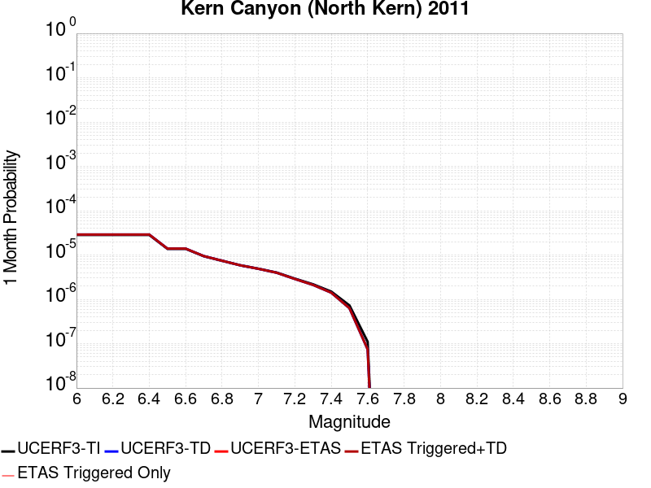 |  | 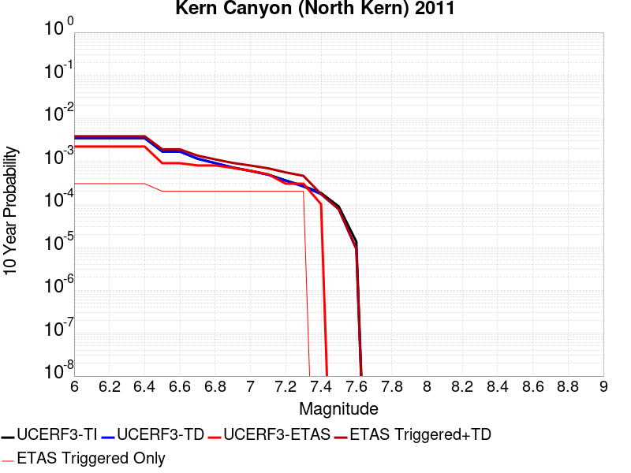 |

| Magnitude | 1 wk TI Prob | 1 wk TD Prob | 1 wk ETAS Prob | 1 wk ETAS/TD Gain | 1 wk ETAS Triggered+TD | 1 wk ETAS Triggered Only | 1 mo TI Prob | 1 mo TD Prob | 1 mo ETAS Prob | 1 mo ETAS/TD Gain | 1 mo ETAS Triggered+TD | 1 mo ETAS Triggered Only | 1 yr TI Prob | 1 yr TD Prob | 1 yr ETAS Prob | 1 yr ETAS/TD Gain | 1 yr ETAS Triggered+TD | 1 yr ETAS Triggered Only | 10 yr TI Prob | 10 yr TD Prob | 10 yr ETAS Prob | 10 yr ETAS/TD Gain | 10 yr ETAS Triggered+TD | 10 yr ETAS Triggered Only |
|-----|-----|-----|-----|-----|-----|-----|-----|-----|-----|-----|-----|-----|-----|-----|-----|-----|-----|-----|-----|-----|-----|-----|-----|-----|
| 6.0 | 6.6264497E-6 | 6.7576434E-6 | 0.0 | 0.0 | 6.7576434E-6 | 0.0 | 2.8398761E-5 | 2.8961053E-5 | 0.0 | 0.0 | 2.8961053E-5 | 0.0 | 3.4570007E-4 | 3.5255178E-4 | 2.0E-4 | 0.5672926 | 4.525165E-4 | 1.0E-4 | 0.0034516277 | 0.0035207132 | 0.0022 | 0.6248734 | 0.003819657 | 3.0E-4 |
| 6.1 | 6.6264497E-6 | 6.7576434E-6 | 0.0 | 0.0 | 6.7576434E-6 | 0.0 | 2.8398761E-5 | 2.8961053E-5 | 0.0 | 0.0 | 2.8961053E-5 | 0.0 | 3.4570007E-4 | 3.5255178E-4 | 2.0E-4 | 0.5672926 | 4.525165E-4 | 1.0E-4 | 0.0034516277 | 0.0035207132 | 0.0022 | 0.6248734 | 0.003819657 | 3.0E-4 |
| 6.2 | 6.6264497E-6 | 6.7576434E-6 | 0.0 | 0.0 | 6.7576434E-6 | 0.0 | 2.8398761E-5 | 2.8961053E-5 | 0.0 | 0.0 | 2.8961053E-5 | 0.0 | 3.4570007E-4 | 3.5255178E-4 | 2.0E-4 | 0.5672926 | 4.525165E-4 | 1.0E-4 | 0.0034516277 | 0.0035207132 | 0.0022 | 0.6248734 | 0.003819657 | 3.0E-4 |
| 6.3 | 6.6264497E-6 | 6.7576434E-6 | 0.0 | 0.0 | 6.7576434E-6 | 0.0 | 2.8398761E-5 | 2.8961053E-5 | 0.0 | 0.0 | 2.8961053E-5 | 0.0 | 3.4570007E-4 | 3.5255178E-4 | 2.0E-4 | 0.5672926 | 4.525165E-4 | 1.0E-4 | 0.0034516277 | 0.0035207132 | 0.0022 | 0.6248734 | 0.003819657 | 3.0E-4 |
| 6.4 | 6.6264497E-6 | 6.7576434E-6 | 0.0 | 0.0 | 6.7576434E-6 | 0.0 | 2.8398761E-5 | 2.8961053E-5 | 0.0 | 0.0 | 2.8961053E-5 | 0.0 | 3.4570007E-4 | 3.5255178E-4 | 2.0E-4 | 0.5672926 | 4.525165E-4 | 1.0E-4 | 0.0034516277 | 0.0035207132 | 0.0022 | 0.6248734 | 0.003819657 | 3.0E-4 |
| 6.5 | 3.2162225E-6 | 3.2572214E-6 | 0.0 | 0.0 | 3.2572214E-6 | 0.0 | 1.3783738E-5 | 1.395945E-5 | 0.0 | 0.0 | 1.395945E-5 | 0.0 | 1.6780409E-4 | 1.6994386E-4 | 1.0E-4 | 0.58842963 | 2.6992685E-4 | 1.0E-4 | 0.0016767744 | 0.0016982188 | 9.0E-4 | 0.52996707 | 0.0018978791 | 2.0E-4 |
| 6.6 | 3.2162225E-6 | 3.2572214E-6 | 0.0 | 0.0 | 3.2572214E-6 | 0.0 | 1.3783738E-5 | 1.395945E-5 | 0.0 | 0.0 | 1.395945E-5 | 0.0 | 1.6780409E-4 | 1.6994386E-4 | 1.0E-4 | 0.58842963 | 2.6992685E-4 | 1.0E-4 | 0.0016767744 | 0.0016982188 | 9.0E-4 | 0.52996707 | 0.0018978791 | 2.0E-4 |
| 6.7 | 2.1908265E-6 | 2.2072022E-6 | 0.0 | 0.0 | 2.2072022E-6 | 0.0 | 9.389223E-6 | 9.459405E-6 | 0.0 | 0.0 | 9.459405E-6 | 0.0 | 1.1430779E-4 | 1.15162366E-4 | 1.0E-4 | 0.86833924 | 2.1515085E-4 | 1.0E-4 | 0.0011424901 | 0.0011510463 | 8.0E-4 | 0.69501984 | 0.001350816 | 2.0E-4 |
| 6.8 | 1.7303895E-6 | 1.7366124E-6 | 0.0 | 0.0 | 1.7366124E-6 | 0.0 | 7.415934E-6 | 7.442604E-6 | 0.0 | 0.0 | 7.442604E-6 | 0.0 | 9.028525E-5 | 9.061003E-5 | 1.0E-4 | 1.1036305 | 1.9060097E-4 | 1.0E-4 | 9.024858E-4 | 9.057406E-4 | 8.0E-4 | 0.88325506 | 0.0011055594 | 2.0E-4 |
| 6.9 | 1.3700314E-6 | 1.3689069E-6 | 0.0 | 0.0 | 1.3689069E-6 | 0.0 | 5.87155E-6 | 5.866731E-6 | 0.0 | 0.0 | 5.866731E-6 | 0.0 | 7.148377E-5 | 7.142515E-5 | 1.0E-4 | 1.400067 | 1.7141801E-4 | 1.0E-4 | 7.146078E-4 | 7.1402657E-4 | 7.0E-4 | 0.98035574 | 9.1388373E-4 | 2.0E-4 |
| 7.0 | 1.1467797E-6 | 1.1414165E-6 | 0.0 | 0.0 | 1.1414165E-6 | 0.0 | 4.9147607E-6 | 4.8917764E-6 | 0.0 | 0.0 | 4.8917764E-6 | 0.0 | 5.983557E-5 | 5.955578E-5 | 1.0E-4 | 1.6790981 | 1.5954982E-4 | 1.0E-4 | 5.981946E-4 | 5.9540133E-4 | 6.0E-4 | 1.0077237 | 7.9528225E-4 | 2.0E-4 |
| 7.1 | 9.3952065E-7 | 9.3029735E-7 | 0.0 | 0.0 | 9.3029735E-7 | 0.0 | 4.026511E-6 | 3.986983E-6 | 0.0 | 0.0 | 3.986983E-6 | 0.0 | 4.9021666E-5 | 4.8540453E-5 | 1.0E-4 | 2.0601375 | 1.485356E-4 | 1.0E-4 | 4.901085E-4 | 4.8530026E-4 | 5.0E-4 | 1.03029 | 6.852032E-4 | 2.0E-4 |
| 7.2 | 6.858055E-7 | 6.71949E-7 | 0.0 | 0.0 | 6.71949E-7 | 0.0 | 2.939163E-6 | 2.8797783E-6 | 0.0 | 0.0 | 2.8797783E-6 | 0.0 | 3.5783723E-5 | 3.5060748E-5 | 1.0E-4 | 2.8521924 | 1.3505724E-4 | 1.0E-4 | 3.5777962E-4 | 3.5055305E-4 | 3.0E-4 | 0.8557906 | 5.5048295E-4 | 2.0E-4 |
| 7.3 | 5.1101983E-7 | 4.939425E-7 | 0.0 | 0.0 | 4.939425E-7 | 0.0 | 2.1900833E-6 | 2.1168946E-6 | 0.0 | 0.0 | 2.1168946E-6 | 0.0 | 2.6663936E-5 | 2.5772892E-5 | 1.0E-4 | 3.8800457 | 1.2577031E-4 | 1.0E-4 | 2.6660739E-4 | 2.5769952E-4 | 3.0E-4 | 1.1641465 | 4.5764796E-4 | 2.0E-4 |
| 7.4 | 3.4999414E-7 | 3.2996562E-7 | 0.0 | 0.0 | 3.2996562E-7 | 0.0 | 1.499974E-6 | 1.4141375E-6 | 0.0 | 0.0 | 1.4141375E-6 | 0.0 | 1.8262032E-5 | 1.7216991E-5 | 0.0 | 0.0 | 1.7216991E-5 | 0.0 | 1.826053E-4 | 1.7215681E-4 | 1.0E-4 | 0.5808658 | 1.7215681E-4 | 0.0 |
| 7.5 | 1.7021522E-7 | 1.4750042E-7 | 0.0 | 0.0 | 1.4750042E-7 | 0.0 | 7.2949354E-7 | 6.321445E-7 | 0.0 | 0.0 | 6.321445E-7 | 0.0 | 8.881548E-6 | 7.696332E-6 | 0.0 | 0.0 | 7.696332E-6 | 0.0 | 8.8811925E-5 | 7.696074E-5 | 0.0 | 0.0 | 7.696074E-5 | 0.0 |
| 7.6 | 2.572245E-8 | 1.7351534E-8 | 0.0 | 0.0 | 1.7351534E-8 | 0.0 | 1.10239064E-7 | 7.436371E-8 | 0.0 | 0.0 | 7.436371E-8 | 0.0 | 1.3421597E-6 | 9.053778E-7 | 0.0 | 0.0 | 9.053778E-7 | 0.0 | 1.3421517E-5 | 9.053747E-6 | 0.0 | 0.0 | 9.053747E-6 | 0.0 |

## South Cuyama
*[(top)](#table-of-contents)*

| 1 Week | 1 Month | 1 Year | 10 Year |
|-----|-----|-----|-----|
| 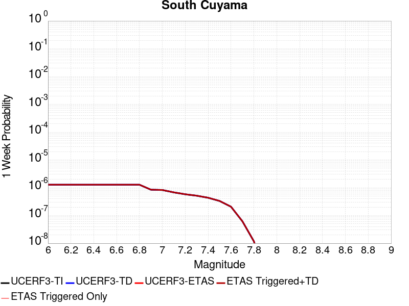 |  |  | 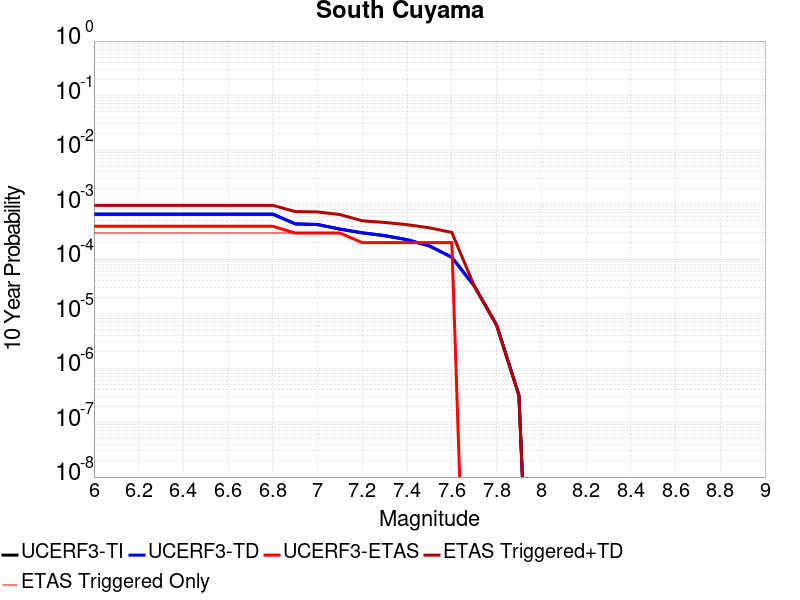 |

| Magnitude | 1 wk TI Prob | 1 wk TD Prob | 1 wk ETAS Prob | 1 wk ETAS/TD Gain | 1 wk ETAS Triggered+TD | 1 wk ETAS Triggered Only | 1 mo TI Prob | 1 mo TD Prob | 1 mo ETAS Prob | 1 mo ETAS/TD Gain | 1 mo ETAS Triggered+TD | 1 mo ETAS Triggered Only | 1 yr TI Prob | 1 yr TD Prob | 1 yr ETAS Prob | 1 yr ETAS/TD Gain | 1 yr ETAS Triggered+TD | 1 yr ETAS Triggered Only | 10 yr TI Prob | 10 yr TD Prob | 10 yr ETAS Prob | 10 yr ETAS/TD Gain | 10 yr ETAS Triggered+TD | 10 yr ETAS Triggered Only |
|-----|-----|-----|-----|-----|-----|-----|-----|-----|-----|-----|-----|-----|-----|-----|-----|-----|-----|-----|-----|-----|-----|-----|-----|-----|
| 6.0 | 1.2747308E-6 | 1.281884E-6 | 0.0 | 0.0 | 1.281884E-6 | 0.0 | 5.4631205E-6 | 5.4937773E-6 | 1.0E-4 | 18.202414 | 5.4937773E-6 | 0.0 | 6.6511464E-5 | 6.688476E-5 | 2.0E-4 | 2.990218 | 1.6687806E-4 | 1.0E-4 | 6.649156E-4 | 6.686532E-4 | 4.0E-4 | 0.5982174 | 9.6845266E-4 | 3.0E-4 |
| 6.1 | 1.2747308E-6 | 1.281884E-6 | 0.0 | 0.0 | 1.281884E-6 | 0.0 | 5.4631205E-6 | 5.4937773E-6 | 1.0E-4 | 18.202414 | 5.4937773E-6 | 0.0 | 6.6511464E-5 | 6.688476E-5 | 2.0E-4 | 2.990218 | 1.6687806E-4 | 1.0E-4 | 6.649156E-4 | 6.686532E-4 | 4.0E-4 | 0.5982174 | 9.6845266E-4 | 3.0E-4 |
| 6.2 | 1.2747308E-6 | 1.281884E-6 | 0.0 | 0.0 | 1.281884E-6 | 0.0 | 5.4631205E-6 | 5.4937773E-6 | 1.0E-4 | 18.202414 | 5.4937773E-6 | 0.0 | 6.6511464E-5 | 6.688476E-5 | 2.0E-4 | 2.990218 | 1.6687806E-4 | 1.0E-4 | 6.649156E-4 | 6.686532E-4 | 4.0E-4 | 0.5982174 | 9.6845266E-4 | 3.0E-4 |
| 6.3 | 1.2747308E-6 | 1.281884E-6 | 0.0 | 0.0 | 1.281884E-6 | 0.0 | 5.4631205E-6 | 5.4937773E-6 | 1.0E-4 | 18.202414 | 5.4937773E-6 | 0.0 | 6.6511464E-5 | 6.688476E-5 | 2.0E-4 | 2.990218 | 1.6687806E-4 | 1.0E-4 | 6.649156E-4 | 6.686532E-4 | 4.0E-4 | 0.5982174 | 9.6845266E-4 | 3.0E-4 |
| 6.4 | 1.2747308E-6 | 1.281884E-6 | 0.0 | 0.0 | 1.281884E-6 | 0.0 | 5.4631205E-6 | 5.4937773E-6 | 1.0E-4 | 18.202414 | 5.4937773E-6 | 0.0 | 6.6511464E-5 | 6.688476E-5 | 2.0E-4 | 2.990218 | 1.6687806E-4 | 1.0E-4 | 6.649156E-4 | 6.686532E-4 | 4.0E-4 | 0.5982174 | 9.6845266E-4 | 3.0E-4 |
| 6.5 | 1.2747308E-6 | 1.281884E-6 | 0.0 | 0.0 | 1.281884E-6 | 0.0 | 5.4631205E-6 | 5.4937773E-6 | 1.0E-4 | 18.202414 | 5.4937773E-6 | 0.0 | 6.6511464E-5 | 6.688476E-5 | 2.0E-4 | 2.990218 | 1.6687806E-4 | 1.0E-4 | 6.649156E-4 | 6.686532E-4 | 4.0E-4 | 0.5982174 | 9.6845266E-4 | 3.0E-4 |
| 6.6 | 1.2747308E-6 | 1.281884E-6 | 0.0 | 0.0 | 1.281884E-6 | 0.0 | 5.4631205E-6 | 5.4937773E-6 | 1.0E-4 | 18.202414 | 5.4937773E-6 | 0.0 | 6.6511464E-5 | 6.688476E-5 | 2.0E-4 | 2.990218 | 1.6687806E-4 | 1.0E-4 | 6.649156E-4 | 6.686532E-4 | 4.0E-4 | 0.5982174 | 9.6845266E-4 | 3.0E-4 |
| 6.7 | 1.2747308E-6 | 1.281884E-6 | 0.0 | 0.0 | 1.281884E-6 | 0.0 | 5.4631205E-6 | 5.4937773E-6 | 1.0E-4 | 18.202414 | 5.4937773E-6 | 0.0 | 6.6511464E-5 | 6.688476E-5 | 2.0E-4 | 2.990218 | 1.6687806E-4 | 1.0E-4 | 6.649156E-4 | 6.686532E-4 | 4.0E-4 | 0.5982174 | 9.6845266E-4 | 3.0E-4 |
| 6.8 | 1.2747308E-6 | 1.281884E-6 | 0.0 | 0.0 | 1.281884E-6 | 0.0 | 5.4631205E-6 | 5.4937773E-6 | 1.0E-4 | 18.202414 | 5.4937773E-6 | 0.0 | 6.6511464E-5 | 6.688476E-5 | 2.0E-4 | 2.990218 | 1.6687806E-4 | 1.0E-4 | 6.649156E-4 | 6.686532E-4 | 4.0E-4 | 0.5982174 | 9.6845266E-4 | 3.0E-4 |
| 6.9 | 8.4566324E-7 | 8.507985E-7 | 0.0 | 0.0 | 8.507985E-7 | 0.0 | 3.624266E-6 | 3.6462743E-6 | 0.0 | 0.0 | 3.6462743E-6 | 0.0 | 4.4124543E-5 | 4.4392495E-5 | 1.0E-4 | 2.252633 | 1.4438806E-4 | 1.0E-4 | 4.4115784E-4 | 4.438373E-4 | 3.0E-4 | 0.67592335 | 7.4370415E-4 | 3.0E-4 |
| 7.0 | 8.2277904E-7 | 8.2779195E-7 | 0.0 | 0.0 | 8.2779195E-7 | 0.0 | 3.526191E-6 | 3.547675E-6 | 0.0 | 0.0 | 3.547675E-6 | 0.0 | 4.293053E-5 | 4.31921E-5 | 1.0E-4 | 2.3152382 | 1.4318778E-4 | 1.0E-4 | 4.292224E-4 | 4.3183804E-4 | 3.0E-4 | 0.6947049 | 7.317085E-4 | 3.0E-4 |
| 7.1 | 6.7661887E-7 | 6.809216E-7 | 0.0 | 0.0 | 6.809216E-7 | 0.0 | 2.899792E-6 | 2.918232E-6 | 0.0 | 0.0 | 2.918232E-6 | 0.0 | 3.5304394E-5 | 3.55289E-5 | 1.0E-4 | 2.81461 | 1.3552535E-4 | 1.0E-4 | 3.5298787E-4 | 3.552326E-4 | 3.0E-4 | 0.8445171 | 6.55126E-4 | 3.0E-4 |
| 7.2 | 5.783336E-7 | 5.8212663E-7 | 0.0 | 0.0 | 5.8212663E-7 | 0.0 | 2.4785702E-6 | 2.494826E-6 | 0.0 | 0.0 | 2.494826E-6 | 0.0 | 3.0176174E-5 | 3.0374087E-5 | 0.0 | 0.0 | 3.0374087E-5 | 0.0 | 3.0172078E-4 | 3.036996E-4 | 2.0E-4 | 0.6585455 | 5.036389E-4 | 2.0E-4 |
| 7.3 | 5.136759E-7 | 5.171006E-7 | 0.0 | 0.0 | 5.171006E-7 | 0.0 | 2.2014663E-6 | 2.2161437E-6 | 0.0 | 0.0 | 2.2161437E-6 | 0.0 | 2.6802521E-5 | 2.6981217E-5 | 0.0 | 0.0 | 2.6981217E-5 | 0.0 | 2.679929E-4 | 2.6977962E-4 | 2.0E-4 | 0.7413459 | 4.6972567E-4 | 2.0E-4 |
| 7.4 | 4.3370295E-7 | 4.3665952E-7 | 0.0 | 0.0 | 4.3665952E-7 | 0.0 | 1.8587256E-6 | 1.8713966E-6 | 0.0 | 0.0 | 1.8713966E-6 | 0.0 | 2.2629749E-5 | 2.2784017E-5 | 0.0 | 0.0 | 2.2784017E-5 | 0.0 | 2.2627445E-4 | 2.2781698E-4 | 2.0E-4 | 0.8778977 | 4.2777142E-4 | 2.0E-4 |
| 7.5 | 3.3242574E-7 | 3.347693E-7 | 0.0 | 0.0 | 3.347693E-7 | 0.0 | 1.4246809E-6 | 1.4347248E-6 | 0.0 | 0.0 | 1.4347248E-6 | 0.0 | 1.7345352E-5 | 1.7467637E-5 | 0.0 | 0.0 | 1.7467637E-5 | 0.0 | 1.7343998E-4 | 1.7466277E-4 | 2.0E-4 | 1.1450638 | 3.7462782E-4 | 2.0E-4 |
| 7.6 | 2.0627535E-7 | 2.0779203E-7 | 0.0 | 0.0 | 2.0779203E-7 | 0.0 | 8.840369E-7 | 8.9053697E-7 | 0.0 | 0.0 | 8.9053697E-7 | 0.0 | 1.0763096E-5 | 1.0842235E-5 | 0.0 | 0.0 | 1.0842235E-5 | 0.0 | 1.0762575E-4 | 1.0841714E-4 | 2.0E-4 | 1.8447268 | 3.0839545E-4 | 2.0E-4 |
| 7.7 | 6.15236E-8 | 6.198397E-8 | 0.0 | 0.0 | 6.198397E-8 | 0.0 | 2.6367252E-7 | 2.6564553E-7 | 0.0 | 0.0 | 2.6564553E-7 | 0.0 | 3.2102084E-6 | 3.2342298E-6 | 0.0 | 0.0 | 3.2342298E-6 | 0.0 | 3.210162E-5 | 3.2341835E-5 | 0.0 | 0.0 | 3.2341835E-5 | 0.0 |
| 7.8 | 1.1765573E-8 | 1.1873629E-8 | 0.0 | 0.0 | 1.1873629E-8 | 0.0 | 5.0423886E-8 | 5.0886985E-8 | 0.0 | 0.0 | 5.0886985E-8 | 0.0 | 6.1391063E-7 | 6.1954887E-7 | 0.0 | 0.0 | 6.1954887E-7 | 0.0 | 6.1390897E-6 | 6.1954725E-6 | 0.0 | 0.0 | 6.1954725E-6 | 0.0 |
| 7.9 | 6.0381755E-10 | 6.1007044E-10 | 0.0 | 0.0 | 6.1007044E-10 | 0.0 | 2.5877895E-9 | 2.6145877E-9 | 0.0 | 0.0 | 2.6145877E-9 | 0.0 | 3.1506335E-8 | 3.1832606E-8 | 0.0 | 0.0 | 3.1832606E-8 | 0.0 | 3.1506332E-7 | 3.1832602E-7 | 0.0 | 0.0 | 3.1832602E-7 | 0.0 |

## San Luis Range - Oceano 2011 CFM
*[(top)](#table-of-contents)*

| 1 Week | 1 Month | 1 Year | 10 Year |
|-----|-----|-----|-----|
| 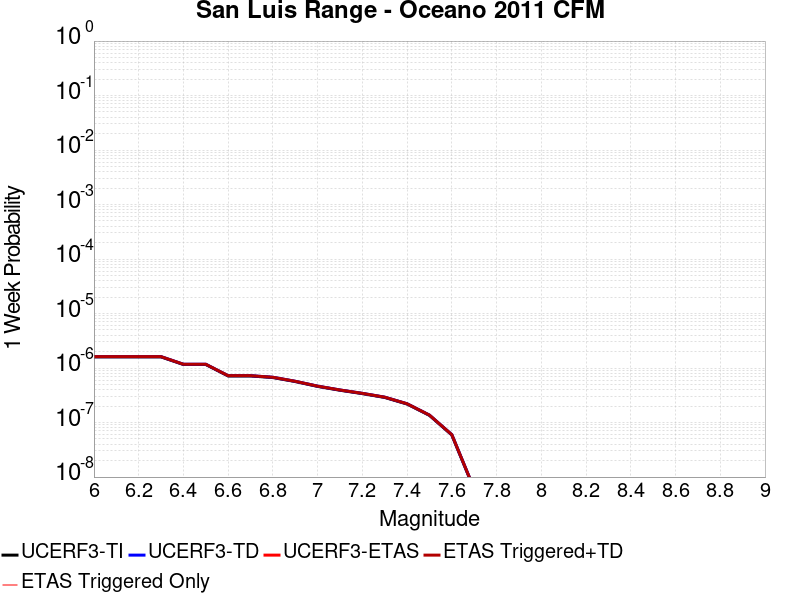 |  | 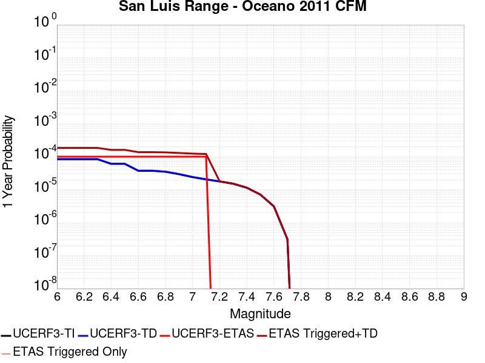 |  |

| Magnitude | 1 wk TI Prob | 1 wk TD Prob | 1 wk ETAS Prob | 1 wk ETAS/TD Gain | 1 wk ETAS Triggered+TD | 1 wk ETAS Triggered Only | 1 mo TI Prob | 1 mo TD Prob | 1 mo ETAS Prob | 1 mo ETAS/TD Gain | 1 mo ETAS Triggered+TD | 1 mo ETAS Triggered Only | 1 yr TI Prob | 1 yr TD Prob | 1 yr ETAS Prob | 1 yr ETAS/TD Gain | 1 yr ETAS Triggered+TD | 1 yr ETAS Triggered Only | 10 yr TI Prob | 10 yr TD Prob | 10 yr ETAS Prob | 10 yr ETAS/TD Gain | 10 yr ETAS Triggered+TD | 10 yr ETAS Triggered Only |
|-----|-----|-----|-----|-----|-----|-----|-----|-----|-----|-----|-----|-----|-----|-----|-----|-----|-----|-----|-----|-----|-----|-----|-----|-----|
| 6.0 | 1.6025788E-6 | 1.6201542E-6 | 0.0 | 0.0 | 1.6201542E-6 | 0.0 | 6.8681766E-6 | 6.943502E-6 | 0.0 | 0.0 | 6.943502E-6 | 0.0 | 8.361684E-5 | 8.453427E-5 | 1.0E-4 | 1.1829522 | 1.8452582E-4 | 1.0E-4 | 8.3585386E-4 | 8.4506196E-4 | 6.0E-4 | 0.71000713 | 0.0011448084 | 3.0E-4 |
| 6.1 | 1.6025788E-6 | 1.6201542E-6 | 0.0 | 0.0 | 1.6201542E-6 | 0.0 | 6.8681766E-6 | 6.943502E-6 | 0.0 | 0.0 | 6.943502E-6 | 0.0 | 8.361684E-5 | 8.453427E-5 | 1.0E-4 | 1.1829522 | 1.8452582E-4 | 1.0E-4 | 8.3585386E-4 | 8.4506196E-4 | 6.0E-4 | 0.71000713 | 0.0011448084 | 3.0E-4 |
| 6.2 | 1.6025788E-6 | 1.6201542E-6 | 0.0 | 0.0 | 1.6201542E-6 | 0.0 | 6.8681766E-6 | 6.943502E-6 | 0.0 | 0.0 | 6.943502E-6 | 0.0 | 8.361684E-5 | 8.453427E-5 | 1.0E-4 | 1.1829522 | 1.8452582E-4 | 1.0E-4 | 8.3585386E-4 | 8.4506196E-4 | 6.0E-4 | 0.71000713 | 0.0011448084 | 3.0E-4 |
| 6.3 | 1.6025788E-6 | 1.6201542E-6 | 0.0 | 0.0 | 1.6201542E-6 | 0.0 | 6.8681766E-6 | 6.943502E-6 | 0.0 | 0.0 | 6.943502E-6 | 0.0 | 8.361684E-5 | 8.453427E-5 | 1.0E-4 | 1.1829522 | 1.8452582E-4 | 1.0E-4 | 8.3585386E-4 | 8.4506196E-4 | 6.0E-4 | 0.71000713 | 0.0011448084 | 3.0E-4 |
| 6.4 | 1.1621186E-6 | 1.1750153E-6 | 0.0 | 0.0 | 1.1750153E-6 | 0.0 | 4.980499E-6 | 5.0357717E-6 | 0.0 | 0.0 | 5.0357717E-6 | 0.0 | 6.0635884E-5 | 6.130907E-5 | 1.0E-4 | 1.6310802 | 1.6130293E-4 | 1.0E-4 | 6.0619344E-4 | 6.129481E-4 | 3.0E-4 | 0.48943785 | 8.128255E-4 | 2.0E-4 |
| 6.5 | 1.1621186E-6 | 1.1750153E-6 | 0.0 | 0.0 | 1.1750153E-6 | 0.0 | 4.980499E-6 | 5.0357717E-6 | 0.0 | 0.0 | 5.0357717E-6 | 0.0 | 6.0635884E-5 | 6.130907E-5 | 1.0E-4 | 1.6310802 | 1.6130293E-4 | 1.0E-4 | 6.0619344E-4 | 6.129481E-4 | 3.0E-4 | 0.48943785 | 8.128255E-4 | 2.0E-4 |
| 6.6 | 7.164729E-7 | 7.2487467E-7 | 0.0 | 0.0 | 7.2487467E-7 | 0.0 | 3.0705946E-6 | 3.1066022E-6 | 0.0 | 0.0 | 3.1066022E-6 | 0.0 | 3.738385E-5 | 3.7822243E-5 | 1.0E-4 | 2.643947 | 1.3781847E-4 | 1.0E-4 | 3.737756E-4 | 3.7815984E-4 | 2.0E-4 | 0.5288769 | 5.780842E-4 | 2.0E-4 |
| 6.7 | 7.164729E-7 | 7.2487467E-7 | 0.0 | 0.0 | 7.2487467E-7 | 0.0 | 3.0705946E-6 | 3.1066022E-6 | 0.0 | 0.0 | 3.1066022E-6 | 0.0 | 3.738385E-5 | 3.7822243E-5 | 1.0E-4 | 2.643947 | 1.3781847E-4 | 1.0E-4 | 3.737756E-4 | 3.7815984E-4 | 2.0E-4 | 0.5288769 | 5.780842E-4 | 2.0E-4 |
| 6.8 | 6.700177E-7 | 6.7775954E-7 | 0.0 | 0.0 | 6.7775954E-7 | 0.0 | 2.8715012E-6 | 2.9046805E-6 | 0.0 | 0.0 | 2.9046805E-6 | 0.0 | 3.495997E-5 | 3.536393E-5 | 1.0E-4 | 2.8277402 | 1.3536039E-4 | 1.0E-4 | 3.495447E-4 | 3.5358465E-4 | 2.0E-4 | 0.56563544 | 5.5351394E-4 | 2.0E-4 |
| 6.9 | 5.657865E-7 | 5.721915E-7 | 0.0 | 0.0 | 5.721915E-7 | 0.0 | 2.424797E-6 | 2.4522471E-6 | 0.0 | 0.0 | 2.4522471E-6 | 0.0 | 2.9521503E-5 | 2.985571E-5 | 1.0E-4 | 3.349443 | 1.2985272E-4 | 1.0E-4 | 2.9517582E-4 | 2.9851805E-4 | 2.0E-4 | 0.66997623 | 4.9845834E-4 | 2.0E-4 |
| 7.0 | 4.608413E-7 | 4.6602733E-7 | 0.0 | 0.0 | 4.6602733E-7 | 0.0 | 1.9750328E-6 | 1.9972586E-6 | 0.0 | 0.0 | 1.9972586E-6 | 0.0 | 2.4045758E-5 | 2.4316354E-5 | 1.0E-4 | 4.1124587 | 1.2431393E-4 | 1.0E-4 | 2.4043156E-4 | 2.4313723E-4 | 2.0E-4 | 0.82258075 | 4.430886E-4 | 2.0E-4 |
| 7.1 | 3.9177846E-7 | 3.9622498E-7 | 0.0 | 0.0 | 3.9622498E-7 | 0.0 | 1.6790494E-6 | 1.698106E-6 | 0.0 | 0.0 | 1.698106E-6 | 0.0 | 2.0442236E-5 | 2.0674244E-5 | 1.0E-4 | 4.836936 | 1.2067218E-4 | 1.0E-4 | 2.0440355E-4 | 2.0672337E-4 | 2.0E-4 | 0.9674765 | 4.0668203E-4 | 2.0E-4 |
| 7.2 | 3.3974752E-7 | 3.436732E-7 | 0.0 | 0.0 | 3.436732E-7 | 0.0 | 1.45606E-6 | 1.4728843E-6 | 0.0 | 0.0 | 1.4728843E-6 | 0.0 | 1.7727387E-5 | 1.793222E-5 | 0.0 | 0.0 | 1.793222E-5 | 0.0 | 1.7725973E-4 | 1.7930784E-4 | 1.0E-4 | 0.5577001 | 2.792899E-4 | 1.0E-4 |
| 7.3 | 2.8900928E-7 | 2.923469E-7 | 0.0 | 0.0 | 2.923469E-7 | 0.0 | 1.2386106E-6 | 1.2529147E-6 | 0.0 | 0.0 | 1.2529147E-6 | 0.0 | 1.5079979E-5 | 1.5254131E-5 | 0.0 | 0.0 | 1.5254131E-5 | 0.0 | 1.5078956E-4 | 1.5253092E-4 | 1.0E-4 | 0.6556048 | 2.5251566E-4 | 1.0E-4 |
| 7.4 | 2.1881527E-7 | 2.2140115E-7 | 0.0 | 0.0 | 2.2140115E-7 | 0.0 | 9.3777936E-7 | 9.488617E-7 | 0.0 | 0.0 | 9.488617E-7 | 0.0 | 1.14174045E-5 | 1.1552331E-5 | 0.0 | 0.0 | 1.1552331E-5 | 0.0 | 1.1416818E-4 | 1.1551736E-4 | 1.0E-4 | 0.86567074 | 2.155058E-4 | 1.0E-4 |
| 7.5 | 1.356398E-7 | 1.3718952E-7 | 0.0 | 0.0 | 1.3718952E-7 | 0.0 | 5.813133E-7 | 5.879549E-7 | 0.0 | 0.0 | 5.879549E-7 | 0.0 | 7.0774663E-6 | 7.158328E-6 | 0.0 | 0.0 | 7.158328E-6 | 0.0 | 7.077241E-5 | 7.158101E-5 | 1.0E-4 | 1.3970187 | 1.7157385E-4 | 1.0E-4 |
| 7.6 | 5.9269272E-8 | 6.0015154E-8 | 0.0 | 0.0 | 6.0015154E-8 | 0.0 | 2.5401116E-7 | 2.5720777E-7 | 0.0 | 0.0 | 2.5720777E-7 | 0.0 | 3.0925814E-6 | 3.1315E-6 | 0.0 | 0.0 | 3.1315E-6 | 0.0 | 3.0925385E-5 | 3.1314572E-5 | 1.0E-4 | 3.1934013 | 1.3131143E-4 | 1.0E-4 |
| 7.7 | 5.946232E-9 | 6.0371126E-9 | 0.0 | 0.0 | 6.0371126E-9 | 0.0 | 2.5483851E-8 | 2.5873339E-8 | 0.0 | 0.0 | 2.5873339E-8 | 0.0 | 3.1026585E-7 | 3.1500787E-7 | 0.0 | 0.0 | 3.1500787E-7 | 0.0 | 3.102654E-6 | 3.1500751E-6 | 0.0 | 0.0 | 3.1500751E-6 | 0.0 |

## Fitzhugh Creek
*[(top)](#table-of-contents)*

| 1 Week | 1 Month | 1 Year | 10 Year |
|-----|-----|-----|-----|
| 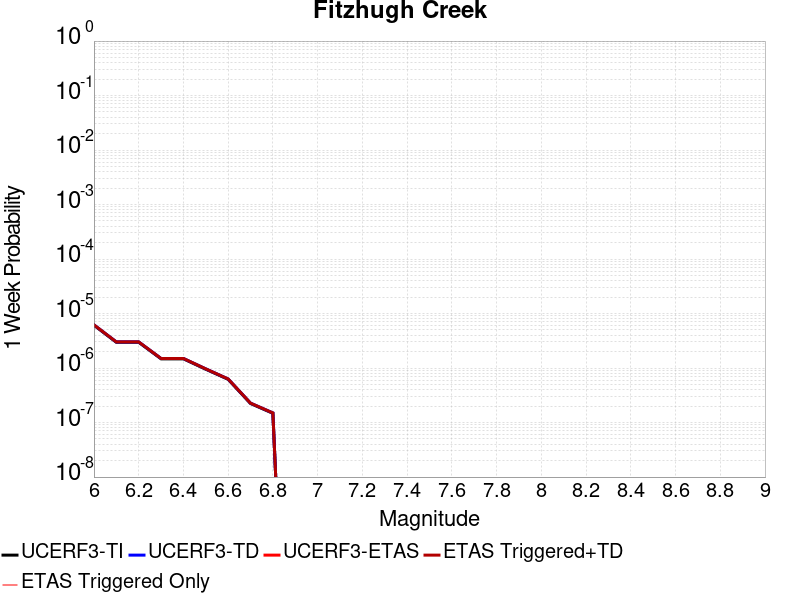 | 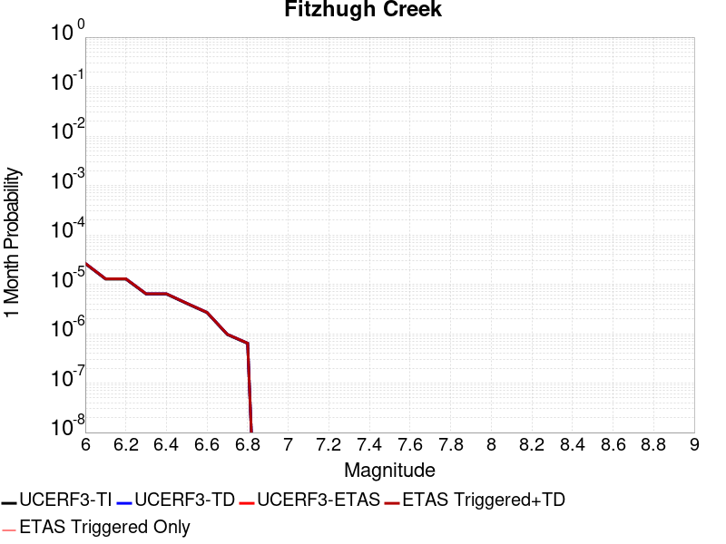 |  |  |

| Magnitude | 1 wk TI Prob | 1 wk TD Prob | 1 wk ETAS Prob | 1 wk ETAS/TD Gain | 1 wk ETAS Triggered+TD | 1 wk ETAS Triggered Only | 1 mo TI Prob | 1 mo TD Prob | 1 mo ETAS Prob | 1 mo ETAS/TD Gain | 1 mo ETAS Triggered+TD | 1 mo ETAS Triggered Only | 1 yr TI Prob | 1 yr TD Prob | 1 yr ETAS Prob | 1 yr ETAS/TD Gain | 1 yr ETAS Triggered+TD | 1 yr ETAS Triggered Only | 10 yr TI Prob | 10 yr TD Prob | 10 yr ETAS Prob | 10 yr ETAS/TD Gain | 10 yr ETAS Triggered+TD | 10 yr ETAS Triggered Only |
|-----|-----|-----|-----|-----|-----|-----|-----|-----|-----|-----|-----|-----|-----|-----|-----|-----|-----|-----|-----|-----|-----|-----|-----|-----|
| 6.0 | 6.1090436E-6 | 6.21036E-6 | 0.0 | 0.0 | 6.21036E-6 | 0.0 | 2.6181353E-5 | 2.6615582E-5 | 0.0 | 0.0 | 2.6615582E-5 | 0.0 | 3.1871133E-4 | 3.2400104E-4 | 3.0E-4 | 0.925923 | 3.2400104E-4 | 0.0 | 0.0031825465 | 0.0032357306 | 0.0023 | 0.71081316 | 0.0035347599 | 3.0E-4 |
| 6.1 | 2.9741811E-6 | 3.0216765E-6 | 0.0 | 0.0 | 3.0216765E-6 | 0.0 | 1.2746428E-5 | 1.2949983E-5 | 0.0 | 0.0 | 1.2949983E-5 | 0.0 | 1.5517672E-4 | 1.5765558E-4 | 1.0E-4 | 0.6342941 | 1.5765558E-4 | 0.0 | 0.001550684 | 0.0015755303 | 9.0E-4 | 0.57123625 | 0.0016753728 | 1.0E-4 |
| 6.2 | 2.9741811E-6 | 3.0216765E-6 | 0.0 | 0.0 | 3.0216765E-6 | 0.0 | 1.2746428E-5 | 1.2949983E-5 | 0.0 | 0.0 | 1.2949983E-5 | 0.0 | 1.5517672E-4 | 1.5765558E-4 | 1.0E-4 | 0.6342941 | 1.5765558E-4 | 0.0 | 0.001550684 | 0.0015755303 | 9.0E-4 | 0.57123625 | 0.0016753728 | 1.0E-4 |
| 6.3 | 1.4781198E-6 | 1.5013175E-6 | 0.0 | 0.0 | 1.5013175E-6 | 0.0 | 6.3347834E-6 | 6.434203E-6 | 0.0 | 0.0 | 6.434203E-6 | 0.0 | 7.712326E-5 | 7.833381E-5 | 1.0E-4 | 1.276588 | 7.833381E-5 | 0.0 | 7.70965E-4 | 7.830819E-4 | 6.0E-4 | 0.7662034 | 8.830036E-4 | 1.0E-4 |
| 6.4 | 1.4781198E-6 | 1.5013175E-6 | 0.0 | 0.0 | 1.5013175E-6 | 0.0 | 6.3347834E-6 | 6.434203E-6 | 0.0 | 0.0 | 6.434203E-6 | 0.0 | 7.712326E-5 | 7.833381E-5 | 1.0E-4 | 1.276588 | 7.833381E-5 | 0.0 | 7.70965E-4 | 7.830819E-4 | 6.0E-4 | 0.7662034 | 8.830036E-4 | 1.0E-4 |
| 6.5 | 9.5176676E-7 | 9.666359E-7 | 0.0 | 0.0 | 9.666359E-7 | 0.0 | 4.078994E-6 | 4.1427193E-6 | 0.0 | 0.0 | 4.1427193E-6 | 0.0 | 4.9660623E-5 | 5.0436545E-5 | 0.0 | 0.0 | 5.0436545E-5 | 0.0 | 4.964952E-4 | 5.042614E-4 | 1.0E-4 | 0.19830985 | 5.042614E-4 | 0.0 |
| 6.6 | 6.21145E-7 | 6.3087816E-7 | 0.0 | 0.0 | 6.3087816E-7 | 0.0 | 2.662047E-6 | 2.703761E-6 | 0.0 | 0.0 | 2.703761E-6 | 0.0 | 3.2409942E-5 | 3.2917862E-5 | 0.0 | 0.0 | 3.2917862E-5 | 0.0 | 3.2405215E-4 | 3.291364E-4 | 1.0E-4 | 0.30382538 | 3.291364E-4 | 0.0 |
| 6.7 | 2.2377962E-7 | 2.2735355E-7 | 0.0 | 0.0 | 2.2735355E-7 | 0.0 | 9.590551E-7 | 9.743721E-7 | 0.0 | 0.0 | 9.743721E-7 | 0.0 | 1.1676434E-5 | 1.1862949E-5 | 0.0 | 0.0 | 1.1862949E-5 | 0.0 | 1.1675821E-4 | 1.1862629E-4 | 0.0 | 0.0 | 1.1862629E-4 | 0.0 |
| 6.8 | 1.4785022E-7 | 1.5021969E-7 | 0.0 | 0.0 | 1.5021969E-7 | 0.0 | 6.3364365E-7 | 6.4379867E-7 | 0.0 | 0.0 | 6.4379867E-7 | 0.0 | 7.714584E-6 | 7.838249E-6 | 0.0 | 0.0 | 7.838249E-6 | 0.0 | 7.714316E-5 | 7.838249E-5 | 0.0 | 0.0 | 7.838249E-5 | 0.0 |

## Anaheim
*[(top)](#table-of-contents)*

| 1 Week | 1 Month | 1 Year | 10 Year |
|-----|-----|-----|-----|
| 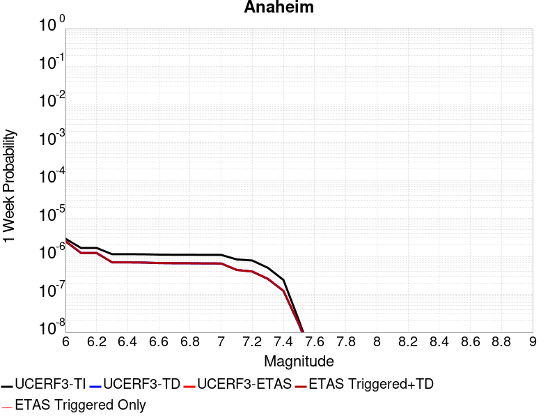 | 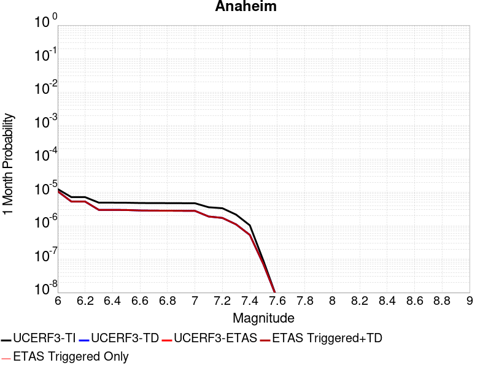 | 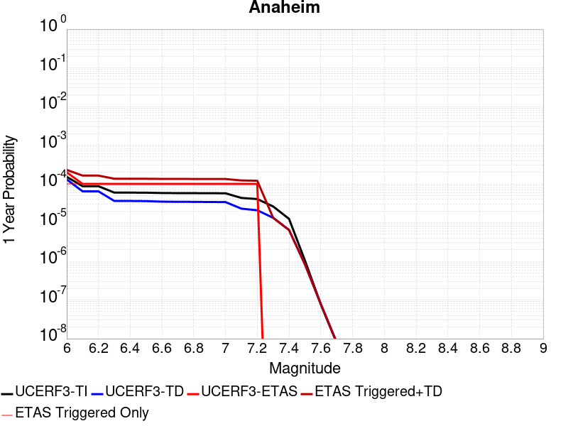 |  |

| Magnitude | 1 wk TI Prob | 1 wk TD Prob | 1 wk ETAS Prob | 1 wk ETAS/TD Gain | 1 wk ETAS Triggered+TD | 1 wk ETAS Triggered Only | 1 mo TI Prob | 1 mo TD Prob | 1 mo ETAS Prob | 1 mo ETAS/TD Gain | 1 mo ETAS Triggered+TD | 1 mo ETAS Triggered Only | 1 yr TI Prob | 1 yr TD Prob | 1 yr ETAS Prob | 1 yr ETAS/TD Gain | 1 yr ETAS Triggered+TD | 1 yr ETAS Triggered Only | 10 yr TI Prob | 10 yr TD Prob | 10 yr ETAS Prob | 10 yr ETAS/TD Gain | 10 yr ETAS Triggered+TD | 10 yr ETAS Triggered Only |
|-----|-----|-----|-----|-----|-----|-----|-----|-----|-----|-----|-----|-----|-----|-----|-----|-----|-----|-----|-----|-----|-----|-----|-----|-----|
| 6.0 | 2.9254998E-6 | 2.5124923E-6 | 0.0 | 0.0 | 2.5124923E-6 | 0.0 | 1.25377965E-5 | 1.0767792E-5 | 0.0 | 0.0 | 1.0767792E-5 | 0.0 | 1.5263697E-4 | 1.3109234E-4 | 2.0E-4 | 1.5256422 | 2.3107923E-4 | 1.0E-4 | 0.0015253217 | 0.0013103803 | 0.0011 | 0.83945096 | 0.0016099871 | 3.0E-4 |
| 6.1 | 1.6729715E-6 | 1.2338882E-6 | 0.0 | 0.0 | 1.2338882E-6 | 0.0 | 7.1698582E-6 | 5.2880837E-6 | 0.0 | 0.0 | 5.2880837E-6 | 0.0 | 8.7289525E-5 | 6.438093E-5 | 1.0E-4 | 1.5532548 | 1.6437449E-4 | 1.0E-4 | 8.7255245E-4 | 6.4366375E-4 | 3.0E-4 | 0.46608186 | 7.435994E-4 | 1.0E-4 |
| 6.2 | 1.6729715E-6 | 1.2338882E-6 | 0.0 | 0.0 | 1.2338882E-6 | 0.0 | 7.1698582E-6 | 5.2880837E-6 | 0.0 | 0.0 | 5.2880837E-6 | 0.0 | 8.7289525E-5 | 6.438093E-5 | 1.0E-4 | 1.5532548 | 1.6437449E-4 | 1.0E-4 | 8.7255245E-4 | 6.4366375E-4 | 3.0E-4 | 0.46608186 | 7.435994E-4 | 1.0E-4 |
| 6.3 | 1.1444064E-6 | 6.961015E-7 | 0.0 | 0.0 | 6.961015E-7 | 0.0 | 4.9045893E-6 | 2.983289E-6 | 0.0 | 0.0 | 2.983289E-6 | 0.0 | 5.971174E-5 | 3.6320995E-5 | 1.0E-4 | 2.7532287 | 1.3631737E-4 | 1.0E-4 | 5.96957E-4 | 3.6315608E-4 | 2.0E-4 | 0.55072737 | 4.6311977E-4 | 1.0E-4 |
| 6.4 | 1.1444064E-6 | 6.961015E-7 | 0.0 | 0.0 | 6.961015E-7 | 0.0 | 4.9045893E-6 | 2.983289E-6 | 0.0 | 0.0 | 2.983289E-6 | 0.0 | 5.971174E-5 | 3.6320995E-5 | 1.0E-4 | 2.7532287 | 1.3631737E-4 | 1.0E-4 | 5.96957E-4 | 3.6315608E-4 | 2.0E-4 | 0.55072737 | 4.6311977E-4 | 1.0E-4 |
| 6.5 | 1.1385318E-6 | 6.901697E-7 | 0.0 | 0.0 | 6.901697E-7 | 0.0 | 4.879413E-6 | 2.9578673E-6 | 0.0 | 0.0 | 2.9578673E-6 | 0.0 | 5.9405233E-5 | 3.6011494E-5 | 1.0E-4 | 2.7768912 | 1.3600789E-4 | 1.0E-4 | 5.938936E-4 | 3.6006208E-4 | 2.0E-4 | 0.55545974 | 4.600261E-4 | 1.0E-4 |
| 6.6 | 1.1165511E-6 | 6.679564E-7 | 0.0 | 0.0 | 6.679564E-7 | 0.0 | 4.78521E-6 | 2.8626673E-6 | 0.0 | 0.0 | 2.8626673E-6 | 0.0 | 5.8258374E-5 | 3.4852474E-5 | 1.0E-4 | 2.8692367 | 1.3484899E-4 | 1.0E-4 | 5.8243104E-4 | 3.4847553E-4 | 2.0E-4 | 0.5739284 | 4.4844067E-4 | 1.0E-4 |
| 6.7 | 1.1098243E-6 | 6.611757E-7 | 0.0 | 0.0 | 6.611757E-7 | 0.0 | 4.7563813E-6 | 2.8336074E-6 | 0.0 | 0.0 | 2.8336074E-6 | 0.0 | 5.7907404E-5 | 3.449868E-5 | 1.0E-4 | 2.8986616 | 1.3449523E-4 | 1.0E-4 | 5.7892315E-4 | 3.449387E-4 | 2.0E-4 | 0.5798132 | 4.449042E-4 | 1.0E-4 |
| 6.8 | 1.1077587E-6 | 6.59096E-7 | 0.0 | 0.0 | 6.59096E-7 | 0.0 | 4.7475287E-6 | 2.8246943E-6 | 0.0 | 0.0 | 2.8246943E-6 | 0.0 | 5.779963E-5 | 3.4390167E-5 | 1.0E-4 | 2.907808 | 1.3438673E-4 | 1.0E-4 | 5.77846E-4 | 3.4385387E-4 | 2.0E-4 | 0.5816424 | 4.438195E-4 | 1.0E-4 |
| 6.9 | 1.1024468E-6 | 6.537536E-7 | 0.0 | 0.0 | 6.537536E-7 | 0.0 | 4.7247636E-6 | 2.8017985E-6 | 0.0 | 0.0 | 2.8017985E-6 | 0.0 | 5.752248E-5 | 3.4111417E-5 | 1.0E-4 | 2.9315696 | 1.34108E-4 | 1.0E-4 | 5.750759E-4 | 3.4106727E-4 | 2.0E-4 | 0.5863946 | 4.4103316E-4 | 1.0E-4 |
| 7.0 | 1.0993066E-6 | 6.511642E-7 | 0.0 | 0.0 | 6.511642E-7 | 0.0 | 4.7113053E-6 | 2.790701E-6 | 0.0 | 0.0 | 2.790701E-6 | 0.0 | 5.7358633E-5 | 3.397631E-5 | 1.0E-4 | 2.943227 | 1.3397292E-4 | 1.0E-4 | 5.734383E-4 | 3.3971661E-4 | 2.0E-4 | 0.588726 | 4.3968263E-4 | 1.0E-4 |
| 7.1 | 8.334877E-7 | 4.4060647E-7 | 0.0 | 0.0 | 4.4060647E-7 | 0.0 | 3.5720855E-6 | 1.8883122E-6 | 0.0 | 0.0 | 1.8883122E-6 | 0.0 | 4.348927E-5 | 2.2989982E-5 | 1.0E-4 | 4.349721 | 1.2298768E-4 | 1.0E-4 | 4.3480762E-4 | 2.2987826E-4 | 2.0E-4 | 0.87002575 | 3.2985528E-4 | 1.0E-4 |
| 7.2 | 7.794411E-7 | 3.9986858E-7 | 0.0 | 0.0 | 3.9986858E-7 | 0.0 | 3.3404576E-6 | 1.7137214E-6 | 0.0 | 0.0 | 1.7137214E-6 | 0.0 | 4.0669314E-5 | 2.086438E-5 | 1.0E-4 | 4.7928576 | 1.2086229E-4 | 1.0E-4 | 4.066187E-4 | 2.0862625E-4 | 2.0E-4 | 0.95865214 | 3.0860538E-4 | 1.0E-4 |
| 7.3 | 5.01704E-7 | 2.55798E-7 | 0.0 | 0.0 | 2.55798E-7 | 0.0 | 2.150158E-6 | 1.0962767E-6 | 0.0 | 0.0 | 1.0962767E-6 | 0.0 | 2.617786E-5 | 1.33471E-5 | 0.0 | 0.0 | 1.33471E-5 | 0.0 | 2.6174777E-4 | 1.3346423E-4 | 1.0E-4 | 0.7492644 | 1.3346423E-4 | 0.0 |
| 7.4 | 2.4008182E-7 | 1.2370622E-7 | 0.0 | 0.0 | 1.2370622E-7 | 0.0 | 1.0289217E-6 | 5.301694E-7 | 0.0 | 0.0 | 5.301694E-7 | 0.0 | 1.252705E-5 | 6.4548017E-6 | 0.0 | 0.0 | 6.4548017E-6 | 0.0 | 1.2526344E-4 | 6.4546904E-5 | 0.0 | 0.0 | 6.4546904E-5 | 0.0 |
| 7.5 | 2.0263876E-8 | 1.6122573E-8 | 0.0 | 0.0 | 1.6122573E-8 | 0.0 | 8.684518E-8 | 6.909674E-8 | 0.0 | 0.0 | 6.909674E-8 | 0.0 | 1.0573395E-6 | 8.4125264E-7 | 0.0 | 0.0 | 8.4125264E-7 | 0.0 | 1.0573345E-5 | 8.412504E-6 | 0.0 | 0.0 | 8.412504E-6 | 0.0 |
| 7.6 | 1.4871431E-9 | 1.5084604E-9 | 0.0 | 0.0 | 1.5084604E-9 | 0.0 | 6.37347E-9 | 6.4648313E-9 | 0.0 | 0.0 | 6.4648313E-9 | 0.0 | 7.7596994E-8 | 7.870932E-8 | 0.0 | 0.0 | 7.870932E-8 | 0.0 | 7.759697E-7 | 7.87093E-7 | 0.0 | 0.0 | 7.87093E-7 | 0.0 |
| 7.7 | 1.5093293E-10 | 1.5334012E-10 | 0.0 | 0.0 | 1.5334012E-10 | 0.0 | 6.4685546E-10 | 6.571719E-10 | 0.0 | 0.0 | 6.571719E-10 | 0.0 | 7.875465E-9 | 8.001066E-9 | 0.0 | 0.0 | 8.001066E-9 | 0.0 | 7.8754645E-8 | 8.001065E-8 | 0.0 | 0.0 | 8.001065E-8 | 0.0 |

## Del Valle
*[(top)](#table-of-contents)*

| 1 Week | 1 Month | 1 Year | 10 Year |
|-----|-----|-----|-----|
| 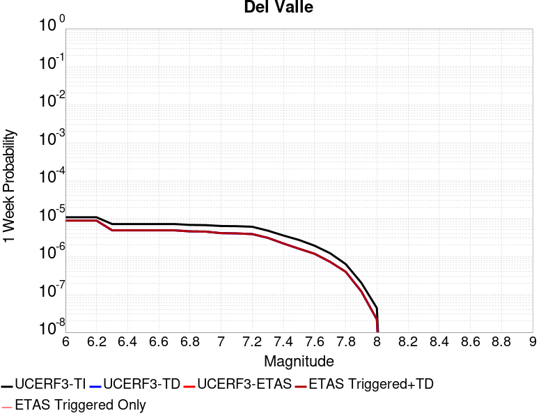 | 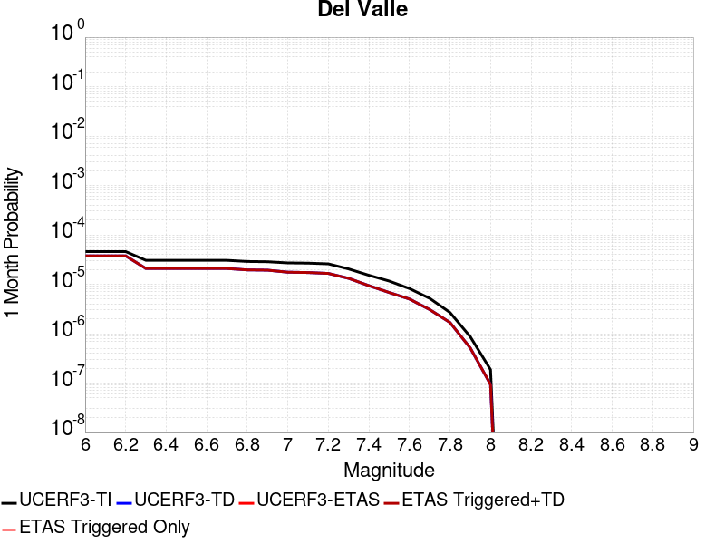 |  |  |

| Magnitude | 1 wk TI Prob | 1 wk TD Prob | 1 wk ETAS Prob | 1 wk ETAS/TD Gain | 1 wk ETAS Triggered+TD | 1 wk ETAS Triggered Only | 1 mo TI Prob | 1 mo TD Prob | 1 mo ETAS Prob | 1 mo ETAS/TD Gain | 1 mo ETAS Triggered+TD | 1 mo ETAS Triggered Only | 1 yr TI Prob | 1 yr TD Prob | 1 yr ETAS Prob | 1 yr ETAS/TD Gain | 1 yr ETAS Triggered+TD | 1 yr ETAS Triggered Only | 10 yr TI Prob | 10 yr TD Prob | 10 yr ETAS Prob | 10 yr ETAS/TD Gain | 10 yr ETAS Triggered+TD | 10 yr ETAS Triggered Only |
|-----|-----|-----|-----|-----|-----|-----|-----|-----|-----|-----|-----|-----|-----|-----|-----|-----|-----|-----|-----|-----|-----|-----|-----|-----|
| 6.0 | 1.0716125E-5 | 8.7704275E-6 | 0.0 | 0.0 | 8.7704275E-6 | 0.0 | 4.592544E-5 | 3.7587117E-5 | 0.0 | 0.0 | 3.7587117E-5 | 0.0 | 5.589988E-4 | 4.5754682E-4 | 3.0E-4 | 0.6556706 | 5.5750104E-4 | 1.0E-4 | 0.0055759475 | 0.0045680096 | 0.0029 | 0.6348498 | 0.004866639 | 3.0E-4 |
| 6.1 | 1.0716125E-5 | 8.7704275E-6 | 0.0 | 0.0 | 8.7704275E-6 | 0.0 | 4.592544E-5 | 3.7587117E-5 | 0.0 | 0.0 | 3.7587117E-5 | 0.0 | 5.589988E-4 | 4.5754682E-4 | 3.0E-4 | 0.6556706 | 5.5750104E-4 | 1.0E-4 | 0.0055759475 | 0.0045680096 | 0.0029 | 0.6348498 | 0.004866639 | 3.0E-4 |
| 6.2 | 1.0716125E-5 | 8.7704275E-6 | 0.0 | 0.0 | 8.7704275E-6 | 0.0 | 4.592544E-5 | 3.7587117E-5 | 0.0 | 0.0 | 3.7587117E-5 | 0.0 | 5.589988E-4 | 4.5754682E-4 | 3.0E-4 | 0.6556706 | 5.5750104E-4 | 1.0E-4 | 0.0055759475 | 0.0045680096 | 0.0029 | 0.6348498 | 0.004866639 | 3.0E-4 |
| 6.3 | 7.1293784E-6 | 4.8676884E-6 | 0.0 | 0.0 | 4.8676884E-6 | 0.0 | 3.055412E-5 | 2.086136E-5 | 0.0 | 0.0 | 2.086136E-5 | 0.0 | 3.7193293E-4 | 2.539582E-4 | 3.0E-4 | 1.1812968 | 3.539328E-4 | 1.0E-4 | 0.0037131102 | 0.002536772 | 0.0015 | 0.59130263 | 0.0027362646 | 2.0E-4 |
| 6.4 | 7.1293784E-6 | 4.8676884E-6 | 0.0 | 0.0 | 4.8676884E-6 | 0.0 | 3.055412E-5 | 2.086136E-5 | 0.0 | 0.0 | 2.086136E-5 | 0.0 | 3.7193293E-4 | 2.539582E-4 | 3.0E-4 | 1.1812968 | 3.539328E-4 | 1.0E-4 | 0.0037131102 | 0.002536772 | 0.0015 | 0.59130263 | 0.0027362646 | 2.0E-4 |
| 6.5 | 7.1293784E-6 | 4.8676884E-6 | 0.0 | 0.0 | 4.8676884E-6 | 0.0 | 3.055412E-5 | 2.086136E-5 | 0.0 | 0.0 | 2.086136E-5 | 0.0 | 3.7193293E-4 | 2.539582E-4 | 3.0E-4 | 1.1812968 | 3.539328E-4 | 1.0E-4 | 0.0037131102 | 0.002536772 | 0.0015 | 0.59130263 | 0.0027362646 | 2.0E-4 |
| 6.6 | 7.1293784E-6 | 4.8676884E-6 | 0.0 | 0.0 | 4.8676884E-6 | 0.0 | 3.055412E-5 | 2.086136E-5 | 0.0 | 0.0 | 2.086136E-5 | 0.0 | 3.7193293E-4 | 2.539582E-4 | 3.0E-4 | 1.1812968 | 3.539328E-4 | 1.0E-4 | 0.0037131102 | 0.002536772 | 0.0015 | 0.59130263 | 0.0027362646 | 2.0E-4 |
| 6.7 | 7.12272E-6 | 4.865063E-6 | 0.0 | 0.0 | 4.865063E-6 | 0.0 | 3.0525585E-5 | 2.085011E-5 | 0.0 | 0.0 | 2.085011E-5 | 0.0 | 3.7158563E-4 | 2.5382123E-4 | 3.0E-4 | 1.1819341 | 3.5379585E-4 | 1.0E-4 | 0.003709649 | 0.0025354056 | 0.0015 | 0.5916213 | 0.0027348986 | 2.0E-4 |
| 6.8 | 6.7558703E-6 | 4.5611782E-6 | 0.0 | 0.0 | 4.5611782E-6 | 0.0 | 2.895341E-5 | 1.9547764E-5 | 0.0 | 0.0 | 1.9547764E-5 | 0.0 | 3.5245073E-4 | 2.3796866E-4 | 2.0E-4 | 0.84044677 | 2.3796866E-4 | 0.0 | 0.0035189227 | 0.00237722 | 0.0014 | 0.58892316 | 0.0024769823 | 1.0E-4 |
| 6.9 | 6.6700386E-6 | 4.504277E-6 | 0.0 | 0.0 | 4.504277E-6 | 0.0 | 2.8585566E-5 | 1.9303905E-5 | 0.0 | 0.0 | 1.9303905E-5 | 0.0 | 3.479737E-4 | 2.3500032E-4 | 2.0E-4 | 0.85106266 | 2.3500032E-4 | 0.0 | 0.003474293 | 0.0023475995 | 0.0014 | 0.5963538 | 0.0024473649 | 1.0E-4 |
| 7.0 | 6.3181424E-6 | 4.1003154E-6 | 0.0 | 0.0 | 4.1003154E-6 | 0.0 | 2.7077473E-5 | 1.7572665E-5 | 0.0 | 0.0 | 1.7572665E-5 | 0.0 | 3.2961834E-4 | 2.1392661E-4 | 2.0E-4 | 0.93490005 | 2.1392661E-4 | 0.0 | 0.0032912986 | 0.002137268 | 0.0013 | 0.6082532 | 0.0022370543 | 1.0E-4 |
| 7.1 | 6.248759E-6 | 4.035481E-6 | 0.0 | 0.0 | 4.035481E-6 | 0.0 | 2.678012E-5 | 1.7294808E-5 | 0.0 | 0.0 | 1.7294808E-5 | 0.0 | 3.2599916E-4 | 2.1054436E-4 | 2.0E-4 | 0.94991857 | 2.1054436E-4 | 0.0 | 0.0032552136 | 0.0021035096 | 0.0013 | 0.61801475 | 0.0022032992 | 1.0E-4 |
| 7.2 | 6.0411944E-6 | 3.871403E-6 | 0.0 | 0.0 | 3.871403E-6 | 0.0 | 2.5890577E-5 | 1.6591623E-5 | 0.0 | 0.0 | 1.6591623E-5 | 0.0 | 3.1517216E-4 | 2.019847E-4 | 2.0E-4 | 0.990174 | 2.019847E-4 | 0.0 | 0.0031472554 | 0.0020180708 | 0.0012 | 0.5946273 | 0.002117869 | 1.0E-4 |
| 7.3 | 4.7691183E-6 | 3.0792535E-6 | 0.0 | 0.0 | 3.0792535E-6 | 0.0 | 2.0438918E-5 | 1.3196735E-5 | 0.0 | 0.0 | 1.3196735E-5 | 0.0 | 2.488154E-4 | 1.6065863E-4 | 2.0E-4 | 1.2448756 | 1.6065863E-4 | 0.0 | 0.00248537 | 0.0016054489 | 0.0011 | 0.68516666 | 0.0017052883 | 1.0E-4 |
| 7.4 | 3.5524722E-6 | 2.1901446E-6 | 0.0 | 0.0 | 2.1901446E-6 | 0.0 | 1.5224792E-5 | 9.386301E-6 | 0.0 | 0.0 | 9.386301E-6 | 0.0 | 1.8534607E-4 | 1.142723E-4 | 2.0E-4 | 1.7502055 | 1.142723E-4 | 0.0 | 0.0018519156 | 0.0011421436 | 0.001 | 0.87554663 | 0.0012420295 | 1.0E-4 |
| 7.5 | 2.7133442E-6 | 1.5922267E-6 | 0.0 | 0.0 | 1.5922267E-6 | 0.0 | 1.1628566E-5 | 6.8238105E-6 | 0.0 | 0.0 | 6.8238105E-6 | 0.0 | 1.415686E-4 | 8.3076746E-5 | 2.0E-4 | 2.4074125 | 8.3076746E-5 | 0.0 | 0.0014147845 | 8.304588E-4 | 6.0E-4 | 0.72249216 | 9.3037577E-4 | 1.0E-4 |
| 7.6 | 1.915338E-6 | 1.174344E-6 | 0.0 | 0.0 | 1.174344E-6 | 0.0 | 8.208566E-6 | 5.032893E-6 | 0.0 | 0.0 | 5.032893E-6 | 0.0 | 9.993471E-5 | 6.127376E-5 | 1.0E-4 | 1.63202 | 6.127376E-5 | 0.0 | 9.988978E-4 | 6.1256957E-4 | 4.0E-4 | 0.65298706 | 7.1250834E-4 | 1.0E-4 |
| 7.7 | 1.2120448E-6 | 7.18326E-7 | 0.0 | 0.0 | 7.18326E-7 | 0.0 | 5.194467E-6 | 3.0785366E-6 | 0.0 | 0.0 | 3.0785366E-6 | 0.0 | 6.3240805E-5 | 3.7480542E-5 | 0.0 | 0.0 | 3.7480542E-5 | 0.0 | 6.322281E-4 | 3.7474258E-4 | 2.0E-4 | 0.5336997 | 4.747051E-4 | 1.0E-4 |
| 7.8 | 6.272381E-7 | 3.9338275E-7 | 0.0 | 0.0 | 3.9338275E-7 | 0.0 | 2.6881603E-6 | 1.685925E-6 | 0.0 | 0.0 | 1.685925E-6 | 0.0 | 3.272786E-5 | 2.0525944E-5 | 0.0 | 0.0 | 2.0525944E-5 | 0.0 | 3.272304E-4 | 2.0524065E-4 | 1.0E-4 | 0.48723292 | 2.0524065E-4 | 0.0 |
| 7.9 | 2.0292627E-7 | 1.2007892E-7 | 0.0 | 0.0 | 1.2007892E-7 | 0.0 | 8.6968373E-7 | 5.146238E-7 | 0.0 | 0.0 | 5.146238E-7 | 0.0 | 1.0588348E-5 | 6.2655276E-6 | 0.0 | 0.0 | 6.2655276E-6 | 0.0 | 1.0587843E-4 | 6.265353E-5 | 1.0E-4 | 1.5960792 | 6.265353E-5 | 0.0 |
| 8.0 | 4.374492E-8 | 2.1908589E-8 | 0.0 | 0.0 | 2.1908589E-8 | 0.0 | 1.8747821E-7 | 9.389395E-8 | 0.0 | 0.0 | 9.389395E-8 | 0.0 | 2.2825448E-6 | 1.1431583E-6 | 0.0 | 0.0 | 1.1431583E-6 | 0.0 | 2.2825214E-5 | 1.1431528E-5 | 0.0 | 0.0 | 1.1431528E-5 | 0.0 |

## Sierra Madre (San Fernando)
*[(top)](#table-of-contents)*

| 1 Week | 1 Month | 1 Year | 10 Year |
|-----|-----|-----|-----|
| 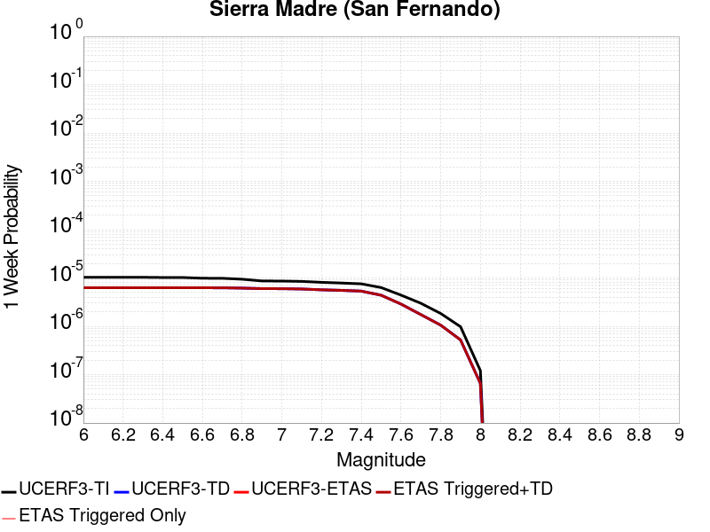 | 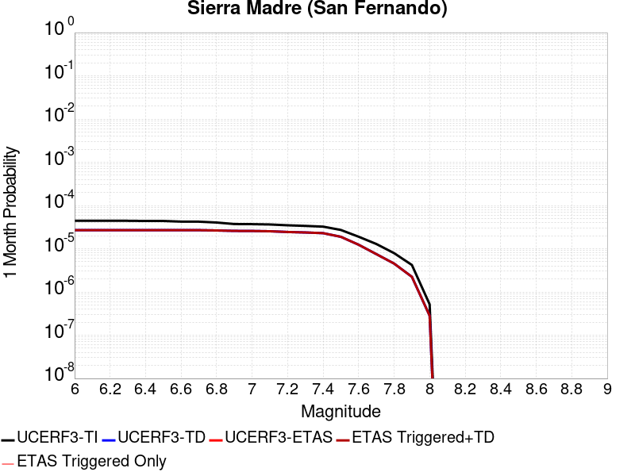 | 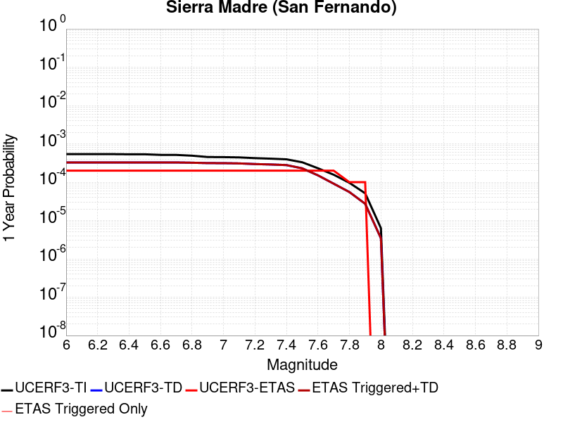 |  |

| Magnitude | 1 wk TI Prob | 1 wk TD Prob | 1 wk ETAS Prob | 1 wk ETAS/TD Gain | 1 wk ETAS Triggered+TD | 1 wk ETAS Triggered Only | 1 mo TI Prob | 1 mo TD Prob | 1 mo ETAS Prob | 1 mo ETAS/TD Gain | 1 mo ETAS Triggered+TD | 1 mo ETAS Triggered Only | 1 yr TI Prob | 1 yr TD Prob | 1 yr ETAS Prob | 1 yr ETAS/TD Gain | 1 yr ETAS Triggered+TD | 1 yr ETAS Triggered Only | 10 yr TI Prob | 10 yr TD Prob | 10 yr ETAS Prob | 10 yr ETAS/TD Gain | 10 yr ETAS Triggered+TD | 10 yr ETAS Triggered Only |
|-----|-----|-----|-----|-----|-----|-----|-----|-----|-----|-----|-----|-----|-----|-----|-----|-----|-----|-----|-----|-----|-----|-----|-----|-----|
| 6.0 | 1.0346413E-5 | 6.289025E-6 | 0.0 | 0.0 | 6.289025E-6 | 0.0 | 4.4341014E-5 | 2.6952692E-5 | 0.0 | 0.0 | 2.6952692E-5 | 0.0 | 5.3971814E-4 | 3.2810072E-4 | 2.0E-4 | 0.6095689 | 3.2810072E-4 | 0.0 | 0.0053840918 | 0.0032762757 | 0.0017 | 0.51888186 | 0.0035752929 | 3.0E-4 |
| 6.1 | 1.0346413E-5 | 6.289025E-6 | 0.0 | 0.0 | 6.289025E-6 | 0.0 | 4.4341014E-5 | 2.6952692E-5 | 0.0 | 0.0 | 2.6952692E-5 | 0.0 | 5.3971814E-4 | 3.2810072E-4 | 2.0E-4 | 0.6095689 | 3.2810072E-4 | 0.0 | 0.0053840918 | 0.0032762757 | 0.0017 | 0.51888186 | 0.0035752929 | 3.0E-4 |
| 6.2 | 1.0346413E-5 | 6.289025E-6 | 0.0 | 0.0 | 6.289025E-6 | 0.0 | 4.4341014E-5 | 2.6952692E-5 | 0.0 | 0.0 | 2.6952692E-5 | 0.0 | 5.3971814E-4 | 3.2810072E-4 | 2.0E-4 | 0.6095689 | 3.2810072E-4 | 0.0 | 0.0053840918 | 0.0032762757 | 0.0017 | 0.51888186 | 0.0035752929 | 3.0E-4 |
| 6.3 | 1.0346413E-5 | 6.289025E-6 | 0.0 | 0.0 | 6.289025E-6 | 0.0 | 4.4341014E-5 | 2.6952692E-5 | 0.0 | 0.0 | 2.6952692E-5 | 0.0 | 5.3971814E-4 | 3.2810072E-4 | 2.0E-4 | 0.6095689 | 3.2810072E-4 | 0.0 | 0.0053840918 | 0.0032762757 | 0.0017 | 0.51888186 | 0.0035752929 | 3.0E-4 |
| 6.4 | 1.0249558E-5 | 6.289025E-6 | 0.0 | 0.0 | 6.289025E-6 | 0.0 | 4.392594E-5 | 2.6952692E-5 | 0.0 | 0.0 | 2.6952692E-5 | 0.0 | 5.3466705E-4 | 3.2810072E-4 | 2.0E-4 | 0.6095689 | 3.2810072E-4 | 0.0 | 0.0053338245 | 0.0032762757 | 0.0017 | 0.51888186 | 0.0035752929 | 3.0E-4 |
| 6.5 | 1.0249558E-5 | 6.289025E-6 | 0.0 | 0.0 | 6.289025E-6 | 0.0 | 4.392594E-5 | 2.6952692E-5 | 0.0 | 0.0 | 2.6952692E-5 | 0.0 | 5.3466705E-4 | 3.2810072E-4 | 2.0E-4 | 0.6095689 | 3.2810072E-4 | 0.0 | 0.0053338245 | 0.0032762757 | 0.0017 | 0.51888186 | 0.0035752929 | 3.0E-4 |
| 6.6 | 9.9035515E-6 | 6.289025E-6 | 0.0 | 0.0 | 6.289025E-6 | 0.0 | 4.2443102E-5 | 2.6952692E-5 | 0.0 | 0.0 | 2.6952692E-5 | 0.0 | 5.166222E-4 | 3.2810072E-4 | 2.0E-4 | 0.6095689 | 3.2810072E-4 | 0.0 | 0.0051542283 | 0.0032762757 | 0.0017 | 0.51888186 | 0.0035752929 | 3.0E-4 |
| 6.7 | 9.87217E-6 | 6.276443E-6 | 0.0 | 0.0 | 6.276443E-6 | 0.0 | 4.2308613E-5 | 2.689877E-5 | 0.0 | 0.0 | 2.689877E-5 | 0.0 | 5.149856E-4 | 3.2744443E-4 | 2.0E-4 | 0.61079067 | 3.2744443E-4 | 0.0 | 0.005137938 | 0.003269732 | 0.0017 | 0.5199203 | 0.003568751 | 3.0E-4 |
| 6.8 | 9.4359175E-6 | 6.1804E-6 | 0.0 | 0.0 | 6.1804E-6 | 0.0 | 4.043902E-5 | 2.6487165E-5 | 0.0 | 0.0 | 2.6487165E-5 | 0.0 | 4.9223384E-4 | 3.2243461E-4 | 2.0E-4 | 0.6202808 | 3.2243461E-4 | 0.0 | 0.0049114493 | 0.0032197796 | 0.0017 | 0.52798647 | 0.0035188135 | 3.0E-4 |
| 6.9 | 8.700447E-6 | 6.0414727E-6 | 0.0 | 0.0 | 6.0414727E-6 | 0.0 | 3.72871E-5 | 2.5891775E-5 | 0.0 | 0.0 | 2.5891775E-5 | 0.0 | 4.5387587E-4 | 3.1518785E-4 | 2.0E-4 | 0.6345422 | 3.1518785E-4 | 0.0 | 0.0045295 | 0.0031475178 | 0.0017 | 0.54010814 | 0.0034465734 | 3.0E-4 |
| 7.0 | 8.648878E-6 | 6.0163525E-6 | 0.0 | 0.0 | 6.0163525E-6 | 0.0 | 3.7066096E-5 | 2.5784118E-5 | 0.0 | 0.0 | 2.5784118E-5 | 0.0 | 4.5118626E-4 | 3.138775E-4 | 2.0E-4 | 0.63719124 | 3.138775E-4 | 0.0 | 0.004502713 | 0.0031344513 | 0.0017 | 0.54235965 | 0.003433511 | 3.0E-4 |
| 7.1 | 8.505786E-6 | 5.925974E-6 | 0.0 | 0.0 | 5.925974E-6 | 0.0 | 3.645286E-5 | 2.539679E-5 | 0.0 | 0.0 | 2.539679E-5 | 0.0 | 4.437232E-4 | 3.0916312E-4 | 2.0E-4 | 0.6469077 | 3.0916312E-4 | 0.0 | 0.0044283825 | 0.0030874393 | 0.0017 | 0.5506181 | 0.003386513 | 3.0E-4 |
| 7.2 | 8.139752E-6 | 5.7002476E-6 | 0.0 | 0.0 | 5.7002476E-6 | 0.0 | 3.4884186E-5 | 2.442941E-5 | 0.0 | 0.0 | 2.442941E-5 | 0.0 | 4.246322E-4 | 2.9738853E-4 | 2.0E-4 | 0.6725209 | 2.9738853E-4 | 0.0 | 0.004238217 | 0.0029700117 | 0.0017 | 0.5723883 | 0.0032691208 | 3.0E-4 |
| 7.3 | 7.8816E-6 | 5.5535506E-6 | 0.0 | 0.0 | 5.5535506E-6 | 0.0 | 3.3777847E-5 | 2.380072E-5 | 0.0 | 0.0 | 2.380072E-5 | 0.0 | 4.111677E-4 | 2.897363E-4 | 2.0E-4 | 0.6902829 | 2.897363E-4 | 0.0 | 0.004104078 | 0.002893691 | 0.0017 | 0.587485 | 0.003192823 | 3.0E-4 |
| 7.4 | 7.5810603E-6 | 5.3577724E-6 | 0.0 | 0.0 | 5.3577724E-6 | 0.0 | 3.2489854E-5 | 2.2961685E-5 | 0.0 | 0.0 | 2.2961685E-5 | 0.0 | 3.9549218E-4 | 2.7952372E-4 | 2.0E-4 | 0.7155028 | 2.7952372E-4 | 0.0 | 0.0039478904 | 0.0027918264 | 0.0015 | 0.5372827 | 0.0030909888 | 3.0E-4 |
| 7.5 | 6.349153E-6 | 4.408973E-6 | 0.0 | 0.0 | 4.408973E-6 | 0.0 | 2.7210372E-5 | 1.8895467E-5 | 0.0 | 0.0 | 1.8895467E-5 | 0.0 | 3.312359E-4 | 2.3002885E-4 | 2.0E-4 | 0.8694562 | 2.3002885E-4 | 0.0 | 0.0033074263 | 0.0022979896 | 0.0011 | 0.4786793 | 0.0025973 | 3.0E-4 |
| 7.6 | 4.430576E-6 | 2.891879E-6 | 0.0 | 0.0 | 2.891879E-6 | 0.0 | 1.8988047E-5 | 1.2393709E-5 | 0.0 | 0.0 | 1.2393709E-5 | 0.0 | 2.3115493E-4 | 1.5088319E-4 | 2.0E-4 | 1.3255287 | 1.5088319E-4 | 0.0 | 0.0023091463 | 0.00150783 | 0.001 | 0.6632047 | 0.0017075285 | 2.0E-4 |
| 7.7 | 3.005066E-6 | 1.7521796E-6 | 0.0 | 0.0 | 1.7521796E-6 | 0.0 | 1.2878791E-5 | 7.50932E-6 | 0.0 | 0.0 | 7.50932E-6 | 0.0 | 1.56788E-4 | 9.142214E-5 | 2.0E-4 | 2.1876538 | 9.142214E-5 | 0.0 | 0.0015667742 | 9.138465E-4 | 5.0E-4 | 0.54713786 | 9.138465E-4 | 0.0 |
| 7.8 | 1.8459098E-6 | 1.0589898E-6 | 0.0 | 0.0 | 1.0589898E-6 | 0.0 | 7.911018E-6 | 4.53852E-6 | 0.0 | 0.0 | 4.53852E-6 | 0.0 | 9.631238E-5 | 5.525508E-5 | 1.0E-4 | 1.8097882 | 5.525508E-5 | 0.0 | 9.627065E-4 | 5.5241387E-4 | 3.0E-4 | 0.5430711 | 5.5241387E-4 | 0.0 |
| 7.9 | 9.839262E-7 | 5.238282E-7 | 0.0 | 0.0 | 5.238282E-7 | 0.0 | 4.2168194E-6 | 2.244976E-6 | 0.0 | 0.0 | 2.244976E-6 | 0.0 | 5.1338568E-5 | 2.7332242E-5 | 1.0E-4 | 3.6586826 | 2.7332242E-5 | 0.0 | 5.132671E-4 | 2.732891E-4 | 3.0E-4 | 1.0977386 | 2.732891E-4 | 0.0 |
| 8.0 | 1.210983E-7 | 6.616357E-8 | 0.0 | 0.0 | 6.616357E-8 | 0.0 | 5.1899264E-7 | 2.8355814E-7 | 0.0 | 0.0 | 2.8355814E-7 | 0.0 | 6.3187167E-6 | 3.452315E-6 | 0.0 | 0.0 | 3.452315E-6 | 0.0 | 6.318537E-5 | 3.4522633E-5 | 0.0 | 0.0 | 3.4522633E-5 | 0.0 |

## Great Valley 02
*[(top)](#table-of-contents)*

| 1 Week | 1 Month | 1 Year | 10 Year |
|-----|-----|-----|-----|
|  |  |  |  |

| Magnitude | 1 wk TI Prob | 1 wk TD Prob | 1 wk ETAS Prob | 1 wk ETAS/TD Gain | 1 wk ETAS Triggered+TD | 1 wk ETAS Triggered Only | 1 mo TI Prob | 1 mo TD Prob | 1 mo ETAS Prob | 1 mo ETAS/TD Gain | 1 mo ETAS Triggered+TD | 1 mo ETAS Triggered Only | 1 yr TI Prob | 1 yr TD Prob | 1 yr ETAS Prob | 1 yr ETAS/TD Gain | 1 yr ETAS Triggered+TD | 1 yr ETAS Triggered Only | 10 yr TI Prob | 10 yr TD Prob | 10 yr ETAS Prob | 10 yr ETAS/TD Gain | 10 yr ETAS Triggered+TD | 10 yr ETAS Triggered Only |
|-----|-----|-----|-----|-----|-----|-----|-----|-----|-----|-----|-----|-----|-----|-----|-----|-----|-----|-----|-----|-----|-----|-----|-----|-----|
| 6.0 | 2.2243487E-6 | 2.2818863E-6 | 0.0 | 0.0 | 2.2818863E-6 | 0.0 | 9.532888E-6 | 9.779479E-6 | 0.0 | 0.0 | 9.779479E-6 | 0.0 | 1.1605673E-4 | 1.1905916E-4 | 1.0E-4 | 0.8399186 | 1.1905916E-4 | 0.0 | 0.0011599615 | 0.0011900036 | 5.0E-4 | 0.4201668 | 0.0014896466 | 3.0E-4 |
| 6.1 | 2.2243487E-6 | 2.2818863E-6 | 0.0 | 0.0 | 2.2818863E-6 | 0.0 | 9.532888E-6 | 9.779479E-6 | 0.0 | 0.0 | 9.779479E-6 | 0.0 | 1.1605673E-4 | 1.1905916E-4 | 1.0E-4 | 0.8399186 | 1.1905916E-4 | 0.0 | 0.0011599615 | 0.0011900036 | 4.0E-4 | 0.33613342 | 0.0013897656 | 2.0E-4 |
| 6.2 | 1.5787732E-6 | 1.6273536E-6 | 0.0 | 0.0 | 1.6273536E-6 | 0.0 | 6.7661535E-6 | 6.9743546E-6 | 0.0 | 0.0 | 6.9743546E-6 | 0.0 | 8.2374805E-5 | 8.49095E-5 | 1.0E-4 | 1.1777245 | 8.49095E-5 | 0.0 | 8.2344277E-4 | 8.487754E-4 | 4.0E-4 | 0.47126722 | 0.0010486057 | 2.0E-4 |
| 6.3 | 1.4850314E-6 | 1.5323933E-6 | 0.0 | 0.0 | 1.5323933E-6 | 0.0 | 6.3644047E-6 | 6.5673835E-6 | 0.0 | 0.0 | 6.5673835E-6 | 0.0 | 7.748387E-5 | 7.9954996E-5 | 1.0E-4 | 1.2507036 | 7.9954996E-5 | 0.0 | 7.745686E-4 | 7.9926616E-4 | 4.0E-4 | 0.5004591 | 9.991063E-4 | 2.0E-4 |
| 6.4 | 1.4266972E-6 | 1.4735317E-6 | 0.0 | 0.0 | 1.4735317E-6 | 0.0 | 6.114402E-6 | 6.315121E-6 | 0.0 | 0.0 | 6.315121E-6 | 0.0 | 7.44403E-5 | 7.6883916E-5 | 1.0E-4 | 1.300662 | 7.6883916E-5 | 0.0 | 7.441537E-4 | 7.6857663E-4 | 4.0E-4 | 0.5204426 | 9.684229E-4 | 2.0E-4 |
| 6.5 | 1.2728015E-6 | 1.3172175E-6 | 0.0 | 0.0 | 1.3172175E-6 | 0.0 | 5.4548523E-6 | 5.645206E-6 | 0.0 | 0.0 | 5.645206E-6 | 0.0 | 6.64108E-5 | 6.8728245E-5 | 1.0E-4 | 1.4550059 | 6.8728245E-5 | 0.0 | 6.639096E-4 | 6.8707246E-4 | 4.0E-4 | 0.5821802 | 8.8693504E-4 | 2.0E-4 |
| 6.6 | 1.1857247E-6 | 1.229029E-6 | 0.0 | 0.0 | 1.229029E-6 | 0.0 | 5.0816675E-6 | 5.2672563E-6 | 0.0 | 0.0 | 5.2672563E-6 | 0.0 | 6.186755E-5 | 6.412698E-5 | 0.0 | 0.0 | 6.412698E-5 | 0.0 | 6.1850325E-4 | 6.4108724E-4 | 3.0E-4 | 0.46795502 | 8.40959E-4 | 2.0E-4 |
| 6.7 | 1.0550715E-6 | 1.0954167E-6 | 0.0 | 0.0 | 1.0954167E-6 | 0.0 | 4.521727E-6 | 4.6946348E-6 | 0.0 | 0.0 | 4.6946348E-6 | 0.0 | 5.5050637E-5 | 5.71557E-5 | 0.0 | 0.0 | 5.71557E-5 | 0.0 | 5.5037E-4 | 5.714121E-4 | 3.0E-4 | 0.5250152 | 7.712978E-4 | 2.0E-4 |
| 6.8 | 8.9881183E-7 | 9.3563165E-7 | 0.0 | 0.0 | 9.3563165E-7 | 0.0 | 3.8520448E-6 | 4.009844E-6 | 0.0 | 0.0 | 4.009844E-6 | 0.0 | 4.689764E-5 | 4.8818772E-5 | 0.0 | 0.0 | 4.8818772E-5 | 0.0 | 4.688774E-4 | 4.8808224E-4 | 3.0E-4 | 0.61465055 | 6.8798463E-4 | 2.0E-4 |
| 6.9 | 7.5417256E-7 | 7.8717636E-7 | 0.0 | 0.0 | 7.8717636E-7 | 0.0 | 3.232164E-6 | 3.3736087E-6 | 0.0 | 0.0 | 3.3736087E-6 | 0.0 | 3.9350885E-5 | 4.1072926E-5 | 0.0 | 0.0 | 4.1072926E-5 | 0.0 | 3.934392E-4 | 4.106548E-4 | 3.0E-4 | 0.73054063 | 6.1057264E-4 | 2.0E-4 |
| 7.0 | 5.909726E-7 | 6.1784976E-7 | 0.0 | 0.0 | 6.1784976E-7 | 0.0 | 2.5327372E-6 | 2.647925E-6 | 0.0 | 0.0 | 2.647925E-6 | 0.0 | 3.083564E-5 | 3.223802E-5 | 0.0 | 0.0 | 3.223802E-5 | 0.0 | 3.083136E-4 | 3.2233444E-4 | 3.0E-4 | 0.9307104 | 5.2227E-4 | 2.0E-4 |
| 7.1 | 4.4054178E-7 | 4.6175253E-7 | 0.0 | 0.0 | 4.6175253E-7 | 0.0 | 1.8880348E-6 | 1.978938E-6 | 0.0 | 0.0 | 1.978938E-6 | 0.0 | 2.2986582E-5 | 2.4093311E-5 | 0.0 | 0.0 | 2.4093311E-5 | 0.0 | 2.2984203E-4 | 2.4090771E-4 | 2.0E-4 | 0.8301934 | 4.4085953E-4 | 2.0E-4 |
| 7.2 | 3.029834E-7 | 3.182514E-7 | 0.0 | 0.0 | 3.182514E-7 | 0.0 | 1.2984997E-6 | 1.363934E-6 | 0.0 | 0.0 | 1.363934E-6 | 0.0 | 1.5809119E-5 | 1.6605773E-5 | 0.0 | 0.0 | 1.6605773E-5 | 0.0 | 1.5807994E-4 | 1.6604578E-4 | 2.0E-4 | 1.2044872 | 3.6601257E-4 | 2.0E-4 |
| 7.3 | 1.8700909E-7 | 1.968221E-7 | 0.0 | 0.0 | 1.968221E-7 | 0.0 | 8.0146725E-7 | 8.435231E-7 | 0.0 | 0.0 | 8.435231E-7 | 0.0 | 9.75782E-6 | 1.0269848E-5 | 0.0 | 0.0 | 1.0269848E-5 | 0.0 | 9.757392E-5 | 1.0269401E-4 | 1.0E-4 | 0.9737667 | 2.0268373E-4 | 1.0E-4 |
| 7.4 | 3.112171E-8 | 3.2070304E-8 | 0.0 | 0.0 | 3.2070304E-8 | 0.0 | 1.3337875E-7 | 1.3744415E-7 | 0.0 | 0.0 | 1.3744415E-7 | 0.0 | 1.6238852E-6 | 1.6733812E-6 | 0.0 | 0.0 | 1.6733812E-6 | 0.0 | 1.6238733E-5 | 1.6733695E-5 | 0.0 | 0.0 | 1.6733695E-5 | 0.0 |

## Jess Valley
*[(top)](#table-of-contents)*

| 1 Week | 1 Month | 1 Year | 10 Year |
|-----|-----|-----|-----|
| 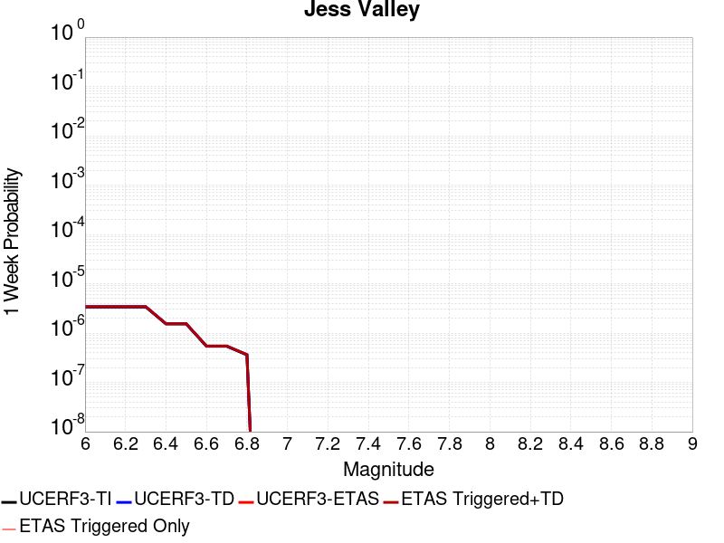 |  |  |  |

| Magnitude | 1 wk TI Prob | 1 wk TD Prob | 1 wk ETAS Prob | 1 wk ETAS/TD Gain | 1 wk ETAS Triggered+TD | 1 wk ETAS Triggered Only | 1 mo TI Prob | 1 mo TD Prob | 1 mo ETAS Prob | 1 mo ETAS/TD Gain | 1 mo ETAS Triggered+TD | 1 mo ETAS Triggered Only | 1 yr TI Prob | 1 yr TD Prob | 1 yr ETAS Prob | 1 yr ETAS/TD Gain | 1 yr ETAS Triggered+TD | 1 yr ETAS Triggered Only | 10 yr TI Prob | 10 yr TD Prob | 10 yr ETAS Prob | 10 yr ETAS/TD Gain | 10 yr ETAS Triggered+TD | 10 yr ETAS Triggered Only |
|-----|-----|-----|-----|-----|-----|-----|-----|-----|-----|-----|-----|-----|-----|-----|-----|-----|-----|-----|-----|-----|-----|-----|-----|-----|
| 6.0 | 3.3861274E-6 | 3.4341556E-6 | 0.0 | 0.0 | 3.4341556E-6 | 0.0 | 1.4511894E-5 | 1.47177425E-5 | 0.0 | 0.0 | 1.47177425E-5 | 0.0 | 1.7666799E-4 | 1.791766E-4 | 1.0E-4 | 0.55810857 | 1.791766E-4 | 0.0 | 0.001765276 | 0.0017905978 | 0.0014 | 0.7818618 | 0.0019902398 | 2.0E-4 |
| 6.1 | 3.3861274E-6 | 3.4341556E-6 | 0.0 | 0.0 | 3.4341556E-6 | 0.0 | 1.4511894E-5 | 1.47177425E-5 | 0.0 | 0.0 | 1.47177425E-5 | 0.0 | 1.7666799E-4 | 1.791766E-4 | 1.0E-4 | 0.55810857 | 1.791766E-4 | 0.0 | 0.001765276 | 0.0017905978 | 0.0014 | 0.7818618 | 0.0019902398 | 2.0E-4 |
| 6.2 | 3.3861274E-6 | 3.4341556E-6 | 0.0 | 0.0 | 3.4341556E-6 | 0.0 | 1.4511894E-5 | 1.47177425E-5 | 0.0 | 0.0 | 1.47177425E-5 | 0.0 | 1.7666799E-4 | 1.791766E-4 | 1.0E-4 | 0.55810857 | 1.791766E-4 | 0.0 | 0.001765276 | 0.0017905978 | 0.0014 | 0.7818618 | 0.0019902398 | 2.0E-4 |
| 6.3 | 3.3861274E-6 | 3.4341556E-6 | 0.0 | 0.0 | 3.4341556E-6 | 0.0 | 1.4511894E-5 | 1.47177425E-5 | 0.0 | 0.0 | 1.47177425E-5 | 0.0 | 1.7666799E-4 | 1.791766E-4 | 1.0E-4 | 0.55810857 | 1.791766E-4 | 0.0 | 0.001765276 | 0.0017905978 | 0.0014 | 0.7818618 | 0.0019902398 | 2.0E-4 |
| 6.4 | 1.5291708E-6 | 1.5503208E-6 | 0.0 | 0.0 | 1.5503208E-6 | 0.0 | 6.553573E-6 | 6.64422E-6 | 0.0 | 0.0 | 6.64422E-6 | 0.0 | 7.978683E-5 | 8.089117E-5 | 1.0E-4 | 1.2362288 | 8.089117E-5 | 0.0 | 7.975819E-4 | 8.086955E-4 | 5.0E-4 | 0.6182797 | 9.086146E-4 | 1.0E-4 |
| 6.5 | 1.5291708E-6 | 1.5503208E-6 | 0.0 | 0.0 | 1.5503208E-6 | 0.0 | 6.553573E-6 | 6.64422E-6 | 0.0 | 0.0 | 6.64422E-6 | 0.0 | 7.978683E-5 | 8.089117E-5 | 1.0E-4 | 1.2362288 | 8.089117E-5 | 0.0 | 7.975819E-4 | 8.086955E-4 | 5.0E-4 | 0.6182797 | 9.086146E-4 | 1.0E-4 |
| 6.6 | 5.396423E-7 | 5.4721477E-7 | 0.0 | 0.0 | 5.4721477E-7 | 0.0 | 2.312751E-6 | 2.345205E-6 | 0.0 | 0.0 | 2.345205E-6 | 0.0 | 2.8157378E-5 | 2.8552684E-5 | 1.0E-4 | 3.5022976 | 2.8552684E-5 | 0.0 | 2.8153812E-4 | 2.8550858E-4 | 1.0E-4 | 0.35025218 | 2.8550858E-4 | 0.0 |
| 6.7 | 5.396423E-7 | 5.4721477E-7 | 0.0 | 0.0 | 5.4721477E-7 | 0.0 | 2.312751E-6 | 2.345205E-6 | 0.0 | 0.0 | 2.345205E-6 | 0.0 | 2.8157378E-5 | 2.8552684E-5 | 1.0E-4 | 3.5022976 | 2.8552684E-5 | 0.0 | 2.8153812E-4 | 2.8550858E-4 | 1.0E-4 | 0.35025218 | 2.8550858E-4 | 0.0 |
| 6.8 | 3.6058395E-7 | 3.6564083E-7 | 0.0 | 0.0 | 3.6564083E-7 | 0.0 | 1.5453588E-6 | 1.5670321E-6 | 0.0 | 0.0 | 1.5670321E-6 | 0.0 | 1.8814582E-5 | 1.9078616E-5 | 1.0E-4 | 5.2414703 | 1.9078616E-5 | 0.0 | 1.8812988E-4 | 1.9078616E-4 | 1.0E-4 | 0.52414703 | 1.9078616E-4 | 0.0 |

## Elysian Park (Lower CFM)
*[(top)](#table-of-contents)*

| 1 Week | 1 Month | 1 Year | 10 Year |
|-----|-----|-----|-----|
| 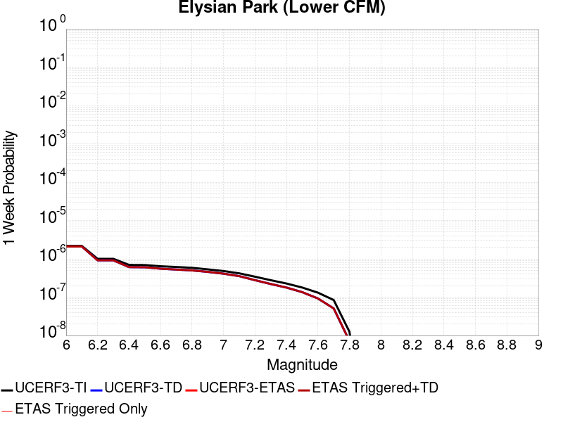 |  | 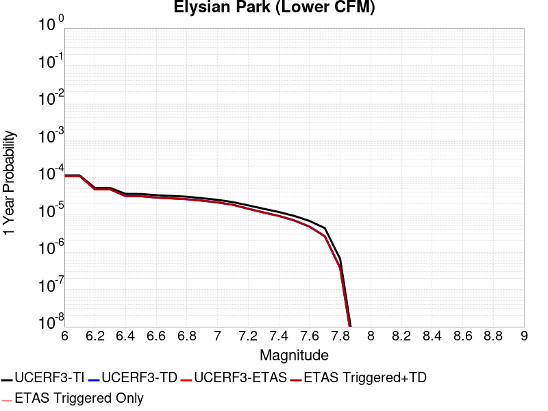 |  |

| Magnitude | 1 wk TI Prob | 1 wk TD Prob | 1 wk ETAS Prob | 1 wk ETAS/TD Gain | 1 wk ETAS Triggered+TD | 1 wk ETAS Triggered Only | 1 mo TI Prob | 1 mo TD Prob | 1 mo ETAS Prob | 1 mo ETAS/TD Gain | 1 mo ETAS Triggered+TD | 1 mo ETAS Triggered Only | 1 yr TI Prob | 1 yr TD Prob | 1 yr ETAS Prob | 1 yr ETAS/TD Gain | 1 yr ETAS Triggered+TD | 1 yr ETAS Triggered Only | 10 yr TI Prob | 10 yr TD Prob | 10 yr ETAS Prob | 10 yr ETAS/TD Gain | 10 yr ETAS Triggered+TD | 10 yr ETAS Triggered Only |
|-----|-----|-----|-----|-----|-----|-----|-----|-----|-----|-----|-----|-----|-----|-----|-----|-----|-----|-----|-----|-----|-----|-----|-----|-----|
| 6.0 | 2.1766498E-6 | 2.1039136E-6 | 0.0 | 0.0 | 2.1039136E-6 | 0.0 | 9.328466E-6 | 9.01675E-6 | 0.0 | 0.0 | 9.01675E-6 | 0.0 | 1.1356815E-4 | 1.0977484E-4 | 0.0 | 0.0 | 1.0977484E-4 | 0.0 | 0.0011351013 | 0.001097348 | 5.0E-4 | 0.45564395 | 0.0012971286 | 2.0E-4 |
| 6.1 | 2.1766498E-6 | 2.1039136E-6 | 0.0 | 0.0 | 2.1039136E-6 | 0.0 | 9.328466E-6 | 9.01675E-6 | 0.0 | 0.0 | 9.01675E-6 | 0.0 | 1.1356815E-4 | 1.0977484E-4 | 0.0 | 0.0 | 1.0977484E-4 | 0.0 | 0.0011351013 | 0.001097348 | 5.0E-4 | 0.45564395 | 0.0012971286 | 2.0E-4 |
| 6.2 | 1.0031182E-6 | 9.1872215E-7 | 0.0 | 0.0 | 9.1872215E-7 | 0.0 | 4.299071E-6 | 3.937375E-6 | 0.0 | 0.0 | 3.937375E-6 | 0.0 | 5.2339932E-5 | 4.7936588E-5 | 0.0 | 0.0 | 4.7936588E-5 | 0.0 | 5.2327604E-4 | 4.7927228E-4 | 2.0E-4 | 0.41729933 | 4.7927228E-4 | 0.0 |
| 6.3 | 1.0031182E-6 | 9.1872215E-7 | 0.0 | 0.0 | 9.1872215E-7 | 0.0 | 4.299071E-6 | 3.937375E-6 | 0.0 | 0.0 | 3.937375E-6 | 0.0 | 5.2339932E-5 | 4.7936588E-5 | 0.0 | 0.0 | 4.7936588E-5 | 0.0 | 5.2327604E-4 | 4.7927228E-4 | 2.0E-4 | 0.41729933 | 4.7927228E-4 | 0.0 |
| 6.4 | 6.9606244E-7 | 6.092903E-7 | 0.0 | 0.0 | 6.092903E-7 | 0.0 | 2.9831212E-6 | 2.6112414E-6 | 0.0 | 0.0 | 2.6112414E-6 | 0.0 | 3.6318896E-5 | 3.1791402E-5 | 0.0 | 0.0 | 3.1791402E-5 | 0.0 | 3.6312963E-4 | 3.1786878E-4 | 1.0E-4 | 0.31459522 | 3.1786878E-4 | 0.0 |
| 6.5 | 6.901879E-7 | 6.033585E-7 | 0.0 | 0.0 | 6.033585E-7 | 0.0 | 2.9579448E-6 | 2.5858194E-6 | 0.0 | 0.0 | 2.5858194E-6 | 0.0 | 3.6012385E-5 | 3.14819E-5 | 0.0 | 0.0 | 3.14819E-5 | 0.0 | 3.600655E-4 | 3.1477463E-4 | 1.0E-4 | 0.3176876 | 3.1477463E-4 | 0.0 |
| 6.6 | 6.4198554E-7 | 5.54756E-7 | 0.0 | 0.0 | 5.54756E-7 | 0.0 | 2.7513638E-6 | 2.3775235E-6 | 0.0 | 0.0 | 2.3775235E-6 | 0.0 | 3.3497337E-5 | 2.8945964E-5 | 0.0 | 0.0 | 2.8945964E-5 | 0.0 | 3.349229E-4 | 2.8942208E-4 | 1.0E-4 | 0.34551615 | 2.8942208E-4 | 0.0 |
| 6.7 | 6.138733E-7 | 5.264363E-7 | 0.0 | 0.0 | 5.264363E-7 | 0.0 | 2.6308828E-6 | 2.2561535E-6 | 0.0 | 0.0 | 2.2561535E-6 | 0.0 | 3.203053E-5 | 2.7468323E-5 | 0.0 | 0.0 | 2.7468323E-5 | 0.0 | 3.2025913E-4 | 2.746494E-4 | 1.0E-4 | 0.36410055 | 2.746494E-4 | 0.0 |
| 6.8 | 5.84778E-7 | 5.003876E-7 | 0.0 | 0.0 | 5.003876E-7 | 0.0 | 2.506189E-6 | 2.1445167E-6 | 0.0 | 0.0 | 2.1445167E-6 | 0.0 | 3.0512423E-5 | 2.6109177E-5 | 0.0 | 0.0 | 2.6109177E-5 | 0.0 | 3.0508233E-4 | 2.610612E-4 | 1.0E-4 | 0.38305193 | 2.610612E-4 | 0.0 |
| 6.9 | 5.322785E-7 | 4.5810017E-7 | 0.0 | 0.0 | 4.5810017E-7 | 0.0 | 2.2811914E-6 | 1.9632848E-6 | 0.0 | 0.0 | 1.9632848E-6 | 0.0 | 2.7773152E-5 | 2.3902732E-5 | 0.0 | 0.0 | 2.3902732E-5 | 0.0 | 2.7769682E-4 | 2.390017E-4 | 1.0E-4 | 0.41840705 | 2.390017E-4 | 0.0 |
| 7.0 | 4.8147206E-7 | 4.1133165E-7 | 0.0 | 0.0 | 4.1133165E-7 | 0.0 | 2.06345E-6 | 1.7628487E-6 | 0.0 | 0.0 | 1.7628487E-6 | 0.0 | 2.5122214E-5 | 2.1462472E-5 | 0.0 | 0.0 | 2.1462472E-5 | 0.0 | 2.5119373E-4 | 2.1460408E-4 | 1.0E-4 | 0.46597436 | 2.1460408E-4 | 0.0 |
| 7.1 | 4.1932955E-7 | 3.546391E-7 | 0.0 | 0.0 | 3.546391E-7 | 0.0 | 1.7971255E-6 | 1.5198809E-6 | 0.0 | 0.0 | 1.5198809E-6 | 0.0 | 2.1879783E-5 | 1.8504394E-5 | 0.0 | 0.0 | 1.8504394E-5 | 0.0 | 2.1877629E-4 | 1.8502859E-4 | 1.0E-4 | 0.540457 | 1.8502859E-4 | 0.0 |
| 7.2 | 3.426051E-7 | 2.78172E-7 | 0.0 | 0.0 | 2.78172E-7 | 0.0 | 1.4683067E-6 | 1.1921651E-6 | 0.0 | 0.0 | 1.1921651E-6 | 0.0 | 1.7876488E-5 | 1.4514513E-5 | 0.0 | 0.0 | 1.4514513E-5 | 0.0 | 1.787505E-4 | 1.4513568E-4 | 1.0E-4 | 0.68901044 | 1.4513568E-4 | 0.0 |
| 7.3 | 2.7771645E-7 | 2.2102394E-7 | 0.0 | 0.0 | 2.2102394E-7 | 0.0 | 1.1902127E-6 | 9.4724504E-7 | 0.0 | 0.0 | 9.4724504E-7 | 0.0 | 1.4490744E-5 | 1.15326475E-5 | 0.0 | 0.0 | 1.15326475E-5 | 0.0 | 1.4489799E-4 | 1.1532051E-4 | 1.0E-4 | 0.8671484 | 1.1532051E-4 | 0.0 |
| 7.4 | 2.2756493E-7 | 1.7844968E-7 | 0.0 | 0.0 | 1.7844968E-7 | 0.0 | 9.752779E-7 | 7.647841E-7 | 0.0 | 0.0 | 7.647841E-7 | 0.0 | 1.1873944E-5 | 9.311207E-6 | 0.0 | 0.0 | 9.311207E-6 | 0.0 | 1.18733085E-4 | 9.310818E-5 | 0.0 | 0.0 | 9.310818E-5 | 0.0 |
| 7.5 | 1.7874558E-7 | 1.3547051E-7 | 0.0 | 0.0 | 1.3547051E-7 | 0.0 | 7.660522E-7 | 5.8058777E-7 | 0.0 | 0.0 | 5.8058777E-7 | 0.0 | 9.326646E-6 | 7.068633E-6 | 0.0 | 0.0 | 7.068633E-6 | 0.0 | 9.326255E-5 | 7.0684095E-5 | 0.0 | 0.0 | 7.0684095E-5 | 0.0 |
| 7.6 | 1.3124549E-7 | 9.2541434E-8 | 0.0 | 0.0 | 9.2541434E-8 | 0.0 | 5.624805E-7 | 3.9660608E-7 | 0.0 | 0.0 | 3.9660608E-7 | 0.0 | 6.8481786E-6 | 4.8286684E-6 | 0.0 | 0.0 | 4.8286684E-6 | 0.0 | 6.8479676E-5 | 4.828565E-5 | 0.0 | 0.0 | 4.828565E-5 | 0.0 |
| 7.7 | 8.439993E-8 | 5.092578E-8 | 0.0 | 0.0 | 5.092578E-8 | 0.0 | 3.6171392E-7 | 2.1825333E-7 | 0.0 | 0.0 | 2.1825333E-7 | 0.0 | 4.403858E-6 | 2.657231E-6 | 0.0 | 0.0 | 2.657231E-6 | 0.0 | 4.4037708E-5 | 2.6572006E-5 | 0.0 | 0.0 | 2.6572006E-5 | 0.0 |
| 7.8 | 1.2591407E-8 | 7.2314106E-9 | 0.0 | 0.0 | 7.2314106E-9 | 0.0 | 5.3963173E-8 | 3.099176E-8 | 0.0 | 0.0 | 3.099176E-8 | 0.0 | 6.570014E-7 | 3.773246E-7 | 0.0 | 0.0 | 3.773246E-7 | 0.0 | 6.5699946E-6 | 3.7732398E-6 | 0.0 | 0.0 | 3.7732398E-6 | 0.0 |
| 7.9 | 2.8324232E-11 | 2.1428304E-11 | 0.0 | 0.0 | 2.1428304E-11 | 0.0 | 1.2138957E-10 | 9.183598E-11 | 0.0 | 0.0 | 9.183598E-11 | 0.0 | 1.4779177E-9 | 1.1181025E-9 | 0.0 | 0.0 | 1.1181025E-9 | 0.0 | 1.4779177E-8 | 1.1181024E-8 | 0.0 | 0.0 | 1.1181024E-8 | 0.0 |

## Point Reyes 2011 connector
*[(top)](#table-of-contents)*

| 1 Week | 1 Month | 1 Year | 10 Year |
|-----|-----|-----|-----|
|  | 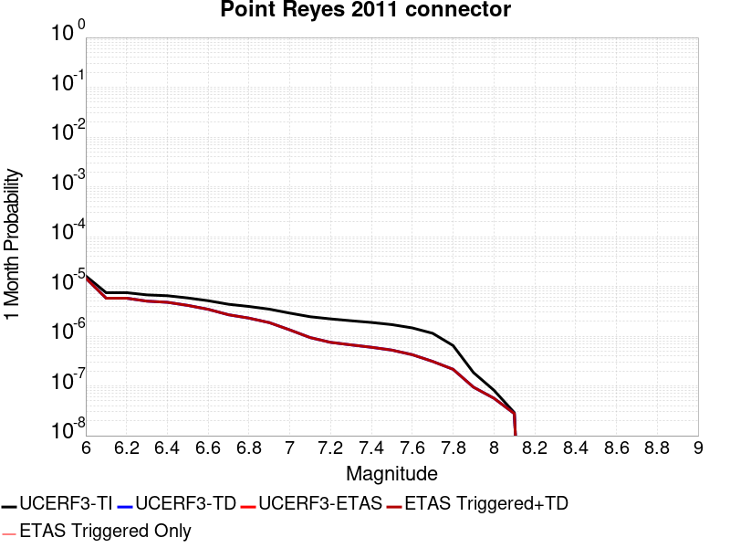 |  | 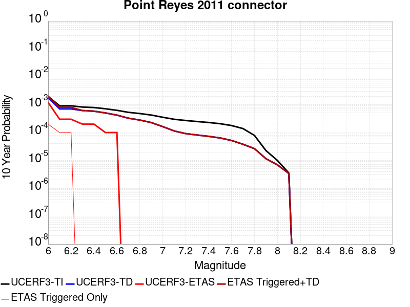 |

| Magnitude | 1 wk TI Prob | 1 wk TD Prob | 1 wk ETAS Prob | 1 wk ETAS/TD Gain | 1 wk ETAS Triggered+TD | 1 wk ETAS Triggered Only | 1 mo TI Prob | 1 mo TD Prob | 1 mo ETAS Prob | 1 mo ETAS/TD Gain | 1 mo ETAS Triggered+TD | 1 mo ETAS Triggered Only | 1 yr TI Prob | 1 yr TD Prob | 1 yr ETAS Prob | 1 yr ETAS/TD Gain | 1 yr ETAS Triggered+TD | 1 yr ETAS Triggered Only | 10 yr TI Prob | 10 yr TD Prob | 10 yr ETAS Prob | 10 yr ETAS/TD Gain | 10 yr ETAS Triggered+TD | 10 yr ETAS Triggered Only |
|-----|-----|-----|-----|-----|-----|-----|-----|-----|-----|-----|-----|-----|-----|-----|-----|-----|-----|-----|-----|-----|-----|-----|-----|-----|
| 6.0 | 3.7893044E-6 | 3.4190057E-6 | 0.0 | 0.0 | 3.4190057E-6 | 0.0 | 1.6239776E-5 | 1.4652811E-5 | 0.0 | 0.0 | 1.4652811E-5 | 0.0 | 1.9770133E-4 | 1.7838551E-4 | 2.0E-4 | 1.1211673 | 3.7834983E-4 | 2.0E-4 | 0.0019752553 | 0.0017828828 | 0.0012 | 0.6730672 | 0.0019825262 | 2.0E-4 |
| 6.1 | 1.7449562E-6 | 1.3500062E-6 | 0.0 | 0.0 | 1.3500062E-6 | 0.0 | 7.478362E-6 | 5.7857283E-6 | 0.0 | 0.0 | 5.7857283E-6 | 0.0 | 9.104525E-5 | 7.043902E-5 | 1.0E-4 | 1.4196677 | 1.7043197E-4 | 1.0E-4 | 9.1007963E-4 | 7.0442253E-4 | 3.0E-4 | 0.42588073 | 8.043521E-4 | 1.0E-4 |
| 6.2 | 1.7449562E-6 | 1.3500062E-6 | 0.0 | 0.0 | 1.3500062E-6 | 0.0 | 7.478362E-6 | 5.7857283E-6 | 0.0 | 0.0 | 5.7857283E-6 | 0.0 | 9.104525E-5 | 7.043902E-5 | 1.0E-4 | 1.4196677 | 1.7043197E-4 | 1.0E-4 | 9.1007963E-4 | 7.0442253E-4 | 3.0E-4 | 0.42588073 | 8.043521E-4 | 1.0E-4 |
| 6.3 | 1.5739171E-6 | 1.1772428E-6 | 0.0 | 0.0 | 1.1772428E-6 | 0.0 | 6.7453416E-6 | 5.045317E-6 | 0.0 | 0.0 | 5.045317E-6 | 0.0 | 8.212144E-5 | 6.1425046E-5 | 0.0 | 0.0 | 6.1425046E-5 | 0.0 | 8.2091097E-4 | 6.143349E-4 | 2.0E-4 | 0.32555532 | 6.143349E-4 | 0.0 |
| 6.4 | 1.5138507E-6 | 1.1165962E-6 | 0.0 | 0.0 | 1.1165962E-6 | 0.0 | 6.4879155E-6 | 4.7854037E-6 | 0.0 | 0.0 | 4.7854037E-6 | 0.0 | 7.898751E-5 | 5.826077E-5 | 0.0 | 0.0 | 5.826077E-5 | 0.0 | 7.8959437E-4 | 5.827091E-4 | 2.0E-4 | 0.34322444 | 5.827091E-4 | 0.0 |
| 6.5 | 1.3662817E-6 | 9.670384E-7 | 0.0 | 0.0 | 9.670384E-7 | 0.0 | 5.8554797E-6 | 4.144444E-6 | 0.0 | 0.0 | 4.144444E-6 | 0.0 | 7.128814E-5 | 5.0457456E-5 | 0.0 | 0.0 | 5.0457456E-5 | 0.0 | 7.126527E-4 | 5.0471193E-4 | 1.0E-4 | 0.19813281 | 5.0471193E-4 | 0.0 |
| 6.6 | 1.2022703E-6 | 8.0692877E-7 | 0.0 | 0.0 | 8.0692877E-7 | 0.0 | 5.1525767E-6 | 3.4582615E-6 | 0.0 | 0.0 | 3.4582615E-6 | 0.0 | 6.273081E-5 | 4.2103533E-5 | 0.0 | 0.0 | 4.2103533E-5 | 0.0 | 6.271311E-4 | 4.212067E-4 | 1.0E-4 | 0.23741312 | 4.212067E-4 | 0.0 |
| 6.7 | 1.0194848E-6 | 6.264931E-7 | 0.0 | 0.0 | 6.264931E-7 | 0.0 | 4.3692135E-6 | 2.6849675E-6 | 0.0 | 0.0 | 2.6849675E-6 | 0.0 | 5.319387E-5 | 3.2688993E-5 | 0.0 | 0.0 | 3.2688993E-5 | 0.0 | 5.3181144E-4 | 3.2709248E-4 | 0.0 | 0.0 | 3.2709248E-4 | 0.0 |
| 6.8 | 9.212307E-7 | 5.3635125E-7 | 0.0 | 0.0 | 5.3635125E-7 | 0.0 | 3.9481256E-6 | 2.2986462E-6 | 0.0 | 0.0 | 2.2986462E-6 | 0.0 | 4.806737E-5 | 2.7985661E-5 | 0.0 | 0.0 | 2.7985661E-5 | 0.0 | 4.8056975E-4 | 2.800718E-4 | 0.0 | 0.0 | 2.800718E-4 | 0.0 |
| 6.9 | 8.1306075E-7 | 4.3489896E-7 | 0.0 | 0.0 | 4.3489896E-7 | 0.0 | 3.4845416E-6 | 1.8638514E-6 | 0.0 | 0.0 | 1.8638514E-6 | 0.0 | 4.2423468E-5 | 2.2692157E-5 | 0.0 | 0.0 | 2.2692157E-5 | 0.0 | 4.241537E-4 | 2.2714872E-4 | 0.0 | 0.0 | 2.2714872E-4 | 0.0 |
| 7.0 | 6.773335E-7 | 3.1063195E-7 | 0.0 | 0.0 | 3.1063195E-7 | 0.0 | 2.9028547E-6 | 1.3312791E-6 | 0.0 | 0.0 | 1.3312791E-6 | 0.0 | 3.5341684E-5 | 1.6208203E-5 | 0.0 | 0.0 | 1.6208203E-5 | 0.0 | 3.5336064E-4 | 1.623204E-4 | 0.0 | 0.0 | 1.623204E-4 | 0.0 |
| 7.1 | 5.7279397E-7 | 2.1732416E-7 | 0.0 | 0.0 | 2.1732416E-7 | 0.0 | 2.454829E-6 | 9.313889E-7 | 0.0 | 0.0 | 9.313889E-7 | 0.0 | 2.9887131E-5 | 1.13396E-5 | 0.0 | 0.0 | 1.13396E-5 | 0.0 | 2.9883112E-4 | 1.13640344E-4 | 0.0 | 0.0 | 1.13640344E-4 | 0.0 |
| 7.2 | 5.185539E-7 | 1.7419046E-7 | 0.0 | 0.0 | 1.7419046E-7 | 0.0 | 2.222372E-6 | 7.4653036E-7 | 0.0 | 0.0 | 7.4653036E-7 | 0.0 | 2.7057044E-5 | 9.088968E-6 | 0.0 | 0.0 | 9.088968E-6 | 0.0 | 2.7053748E-4 | 9.11361E-5 | 0.0 | 0.0 | 9.11361E-5 | 0.0 |
| 7.3 | 4.7599846E-7 | 1.5510732E-7 | 0.0 | 0.0 | 1.5510732E-7 | 0.0 | 2.0399918E-6 | 6.6474547E-7 | 0.0 | 0.0 | 6.6474547E-7 | 0.0 | 2.4836616E-5 | 8.093246E-6 | 0.0 | 0.0 | 8.093246E-6 | 0.0 | 2.4833842E-4 | 8.117964E-5 | 0.0 | 0.0 | 8.117964E-5 | 0.0 |
| 7.4 | 4.3987393E-7 | 1.3883847E-7 | 0.0 | 0.0 | 1.3883847E-7 | 0.0 | 1.8851727E-6 | 5.950219E-7 | 0.0 | 0.0 | 5.950219E-7 | 0.0 | 2.2951735E-5 | 7.244367E-6 | 0.0 | 0.0 | 7.244367E-6 | 0.0 | 2.2949366E-4 | 7.269144E-5 | 0.0 | 0.0 | 7.269144E-5 | 0.0 |
| 7.5 | 3.980054E-7 | 1.2176967E-7 | 0.0 | 0.0 | 1.2176967E-7 | 0.0 | 1.7057363E-6 | 5.2186994E-7 | 0.0 | 0.0 | 5.2186994E-7 | 0.0 | 2.0767142E-5 | 6.3537477E-6 | 0.0 | 0.0 | 6.3537477E-6 | 0.0 | 2.0765202E-4 | 6.378042E-5 | 0.0 | 0.0 | 6.378042E-5 | 0.0 |
| 7.6 | 3.4188398E-7 | 9.8504046E-8 | 0.0 | 0.0 | 9.8504046E-8 | 0.0 | 1.4652163E-6 | 4.2216013E-7 | 0.0 | 0.0 | 4.2216013E-7 | 0.0 | 1.7838862E-5 | 5.139787E-6 | 0.0 | 0.0 | 5.139787E-6 | 0.0 | 1.783743E-4 | 5.1625448E-5 | 0.0 | 0.0 | 5.1625448E-5 | 0.0 |
| 7.7 | 2.6611437E-7 | 7.211296E-8 | 0.0 | 0.0 | 7.211296E-8 | 0.0 | 1.1404896E-6 | 3.0905554E-7 | 0.0 | 0.0 | 3.0905554E-7 | 0.0 | 1.3885373E-5 | 3.7627442E-6 | 0.0 | 0.0 | 3.7627442E-6 | 0.0 | 1.3884505E-4 | 3.781188E-5 | 0.0 | 0.0 | 3.781188E-5 | 0.0 |
| 7.8 | 1.5107078E-7 | 5.0062702E-8 | 0.0 | 0.0 | 5.0062702E-8 | 0.0 | 6.474461E-7 | 2.1455443E-7 | 0.0 | 0.0 | 2.1455443E-7 | 0.0 | 7.882627E-6 | 2.612197E-6 | 0.0 | 0.0 | 2.612197E-6 | 0.0 | 7.8823476E-5 | 2.6285368E-5 | 0.0 | 0.0 | 2.6285368E-5 | 0.0 |
| 7.9 | 4.3228205E-8 | 2.1848845E-8 | 0.0 | 0.0 | 2.1848845E-8 | 0.0 | 1.8526373E-7 | 9.3637915E-8 | 0.0 | 0.0 | 9.3637915E-8 | 0.0 | 2.2555835E-6 | 1.140041E-6 | 0.0 | 0.0 | 1.140041E-6 | 0.0 | 2.2555607E-5 | 1.1477788E-5 | 0.0 | 0.0 | 1.1477788E-5 | 0.0 |
| 8.0 | 1.9149928E-8 | 1.3083979E-8 | 0.0 | 0.0 | 1.3083979E-8 | 0.0 | 8.207112E-8 | 5.60742E-8 | 0.0 | 0.0 | 5.60742E-8 | 0.0 | 9.992154E-7 | 6.8270316E-7 | 0.0 | 0.0 | 6.8270316E-7 | 0.0 | 9.992109E-6 | 6.8754657E-6 | 0.0 | 0.0 | 6.8754657E-6 | 0.0 |
| 8.1 | 6.7792816E-9 | 6.429759E-9 | 0.0 | 0.0 | 6.429759E-9 | 0.0 | 2.9054062E-8 | 2.7556116E-8 | 0.0 | 0.0 | 2.7556116E-8 | 0.0 | 3.5373316E-7 | 3.3549566E-7 | 0.0 | 0.0 | 3.3549566E-7 | 0.0 | 3.537326E-6 | 3.3809101E-6 | 0.0 | 0.0 | 3.3809101E-6 | 0.0 |

## Great Valley 01
*[(top)](#table-of-contents)*

| 1 Week | 1 Month | 1 Year | 10 Year |
|-----|-----|-----|-----|
| 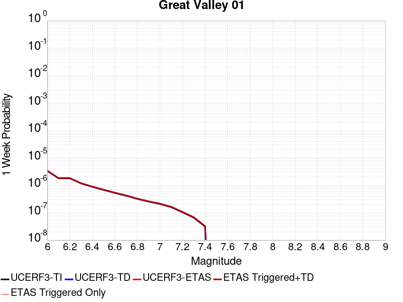 | 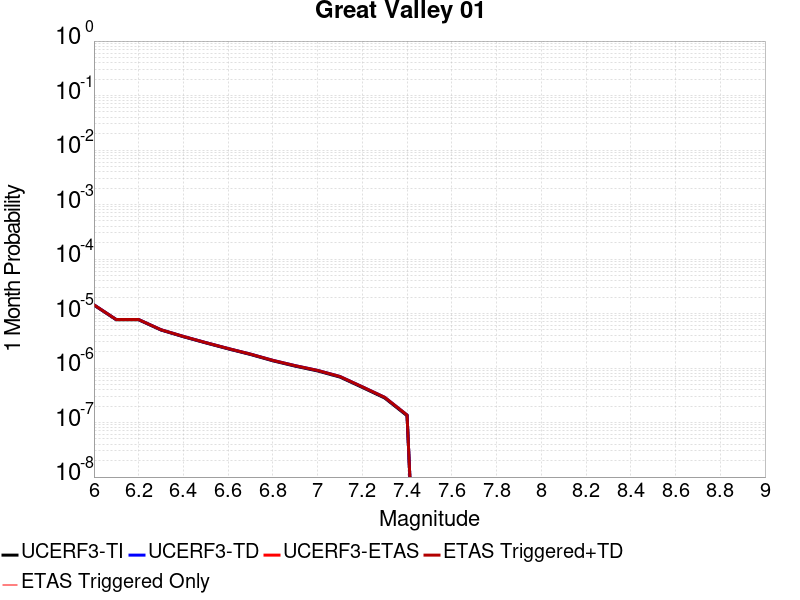 |  |  |

| Magnitude | 1 wk TI Prob | 1 wk TD Prob | 1 wk ETAS Prob | 1 wk ETAS/TD Gain | 1 wk ETAS Triggered+TD | 1 wk ETAS Triggered Only | 1 mo TI Prob | 1 mo TD Prob | 1 mo ETAS Prob | 1 mo ETAS/TD Gain | 1 mo ETAS Triggered+TD | 1 mo ETAS Triggered Only | 1 yr TI Prob | 1 yr TD Prob | 1 yr ETAS Prob | 1 yr ETAS/TD Gain | 1 yr ETAS Triggered+TD | 1 yr ETAS Triggered Only | 10 yr TI Prob | 10 yr TD Prob | 10 yr ETAS Prob | 10 yr ETAS/TD Gain | 10 yr ETAS Triggered+TD | 10 yr ETAS Triggered Only |
|-----|-----|-----|-----|-----|-----|-----|-----|-----|-----|-----|-----|-----|-----|-----|-----|-----|-----|-----|-----|-----|-----|-----|-----|-----|
| 6.0 | 3.3398478E-6 | 3.3763708E-6 | 0.0 | 0.0 | 3.3763708E-6 | 0.0 | 1.4313555E-5 | 1.4470088E-5 | 0.0 | 0.0 | 1.4470088E-5 | 0.0 | 1.742536E-4 | 1.7616029E-4 | 2.0E-4 | 1.1353296 | 1.7616029E-4 | 0.0 | 0.0017411702 | 0.0017603267 | 9.0E-4 | 0.51126873 | 0.0019599746 | 2.0E-4 |
| 6.1 | 1.7919616E-6 | 1.8120654E-6 | 0.0 | 0.0 | 1.8120654E-6 | 0.0 | 7.679812E-6 | 7.765972E-6 | 0.0 | 0.0 | 7.765972E-6 | 0.0 | 9.349771E-5 | 9.454681E-5 | 1.0E-4 | 1.0576771 | 9.454681E-5 | 0.0 | 9.345838E-4 | 9.450853E-4 | 4.0E-4 | 0.42324224 | 0.0010449907 | 1.0E-4 |
| 6.2 | 1.7919616E-6 | 1.8120654E-6 | 0.0 | 0.0 | 1.8120654E-6 | 0.0 | 7.679812E-6 | 7.765972E-6 | 0.0 | 0.0 | 7.765972E-6 | 0.0 | 9.349771E-5 | 9.454681E-5 | 1.0E-4 | 1.0576771 | 9.454681E-5 | 0.0 | 9.345838E-4 | 9.450853E-4 | 4.0E-4 | 0.42324224 | 0.0010449907 | 1.0E-4 |
| 6.3 | 1.1636545E-6 | 1.1774779E-6 | 0.0 | 0.0 | 1.1774779E-6 | 0.0 | 4.9870814E-6 | 5.046324E-6 | 0.0 | 0.0 | 5.046324E-6 | 0.0 | 6.0716022E-5 | 6.1437306E-5 | 1.0E-4 | 1.6276755 | 6.1437306E-5 | 0.0 | 6.069944E-4 | 6.142076E-4 | 3.0E-4 | 0.4884342 | 7.141462E-4 | 1.0E-4 |
| 6.4 | 8.770928E-7 | 8.8820383E-7 | 0.0 | 0.0 | 8.8820383E-7 | 0.0 | 3.7589639E-6 | 3.8065823E-6 | 0.0 | 0.0 | 3.8065823E-6 | 0.0 | 4.5764424E-5 | 4.6344176E-5 | 1.0E-4 | 2.1577685 | 4.6344176E-5 | 0.0 | 4.5755E-4 | 4.6334724E-4 | 3.0E-4 | 0.64746255 | 5.633009E-4 | 1.0E-4 |
| 6.5 | 6.753308E-7 | 6.845446E-7 | 0.0 | 0.0 | 6.845446E-7 | 0.0 | 2.8942718E-6 | 2.9337593E-6 | 0.0 | 0.0 | 2.9337593E-6 | 0.0 | 3.523719E-5 | 3.5717945E-5 | 1.0E-4 | 2.7997131 | 3.5717945E-5 | 0.0 | 3.52316E-4 | 3.5712303E-4 | 2.0E-4 | 0.56003106 | 4.5708733E-4 | 1.0E-4 |
| 6.6 | 5.2531993E-7 | 5.3314335E-7 | 0.0 | 0.0 | 5.3314335E-7 | 0.0 | 2.251369E-6 | 2.284898E-6 | 0.0 | 0.0 | 2.284898E-6 | 0.0 | 2.7410075E-5 | 2.7818285E-5 | 0.0 | 0.0 | 2.7818285E-5 | 0.0 | 2.7406693E-4 | 2.7814857E-4 | 1.0E-4 | 0.35952008 | 3.7812075E-4 | 1.0E-4 |
| 6.7 | 4.1404678E-7 | 4.208747E-7 | 0.0 | 0.0 | 4.208747E-7 | 0.0 | 1.774485E-6 | 1.8037475E-6 | 0.0 | 0.0 | 1.8037475E-6 | 0.0 | 2.160414E-5 | 2.1960408E-5 | 0.0 | 0.0 | 2.1960408E-5 | 0.0 | 2.160204E-4 | 2.195827E-4 | 1.0E-4 | 0.4554093 | 3.1956073E-4 | 1.0E-4 |
| 6.8 | 3.1713054E-7 | 3.230417E-7 | 0.0 | 0.0 | 3.230417E-7 | 0.0 | 1.3591301E-6 | 1.3844636E-6 | 0.0 | 0.0 | 1.3844636E-6 | 0.0 | 1.6547285E-5 | 1.6855716E-5 | 0.0 | 0.0 | 1.6855716E-5 | 0.0 | 1.6546051E-4 | 1.6854456E-4 | 1.0E-4 | 0.5933149 | 2.685277E-4 | 1.0E-4 |
| 6.9 | 2.528054E-7 | 2.5804803E-7 | 0.0 | 0.0 | 2.5804803E-7 | 0.0 | 1.0834511E-6 | 1.1059196E-6 | 0.0 | 0.0 | 1.1059196E-6 | 0.0 | 1.3190938E-5 | 1.346449E-5 | 0.0 | 0.0 | 1.346449E-5 | 0.0 | 1.3190156E-4 | 1.3463685E-4 | 1.0E-4 | 0.74273866 | 2.346234E-4 | 1.0E-4 |
| 7.0 | 2.0667689E-7 | 2.1132175E-7 | 0.0 | 0.0 | 2.1132175E-7 | 0.0 | 8.857578E-7 | 9.056643E-7 | 0.0 | 0.0 | 9.056643E-7 | 0.0 | 1.0784048E-5 | 1.1026408E-5 | 0.0 | 0.0 | 1.1026408E-5 | 0.0 | 1.0783524E-4 | 1.102587E-4 | 1.0E-4 | 0.9069579 | 2.1024767E-4 | 1.0E-4 |
| 7.1 | 1.5951586E-7 | 1.6339268E-7 | 0.0 | 0.0 | 1.6339268E-7 | 0.0 | 6.8363926E-7 | 7.002542E-7 | 0.0 | 0.0 | 7.002542E-7 | 0.0 | 8.323276E-6 | 8.525562E-6 | 0.0 | 0.0 | 8.525562E-6 | 0.0 | 8.322964E-5 | 8.525241E-5 | 1.0E-4 | 1.1729873 | 1.8524389E-4 | 1.0E-4 |
| 7.2 | 1.02912296E-7 | 1.0566698E-7 | 0.0 | 0.0 | 1.0566698E-7 | 0.0 | 4.4105263E-7 | 4.528584E-7 | 0.0 | 0.0 | 4.528584E-7 | 0.0 | 5.3698027E-6 | 5.5135374E-6 | 0.0 | 0.0 | 5.5135374E-6 | 0.0 | 5.3696727E-5 | 5.5134038E-5 | 1.0E-4 | 1.8137616 | 1.5512852E-4 | 1.0E-4 |
| 7.3 | 6.581281E-8 | 6.772459E-8 | 0.0 | 0.0 | 6.772459E-8 | 0.0 | 2.8205488E-7 | 2.9024824E-7 | 0.0 | 0.0 | 2.9024824E-7 | 0.0 | 3.4340128E-6 | 3.5337666E-6 | 0.0 | 0.0 | 3.5337666E-6 | 0.0 | 3.4339595E-5 | 3.5337125E-5 | 0.0 | 0.0 | 3.5337125E-5 | 0.0 |
| 7.4 | 3.112171E-8 | 3.2070304E-8 | 0.0 | 0.0 | 3.2070304E-8 | 0.0 | 1.3337875E-7 | 1.3744415E-7 | 0.0 | 0.0 | 1.3744415E-7 | 0.0 | 1.6238852E-6 | 1.6733812E-6 | 0.0 | 0.0 | 1.6733812E-6 | 0.0 | 1.6238733E-5 | 1.6733695E-5 | 0.0 | 0.0 | 1.6733695E-5 | 0.0 |

## Richfield
*[(top)](#table-of-contents)*

| 1 Week | 1 Month | 1 Year | 10 Year |
|-----|-----|-----|-----|
| 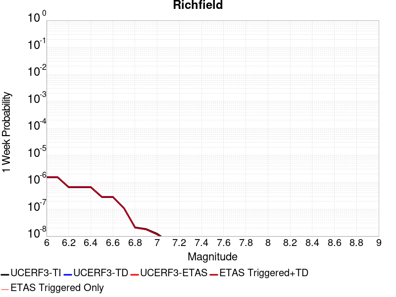 | 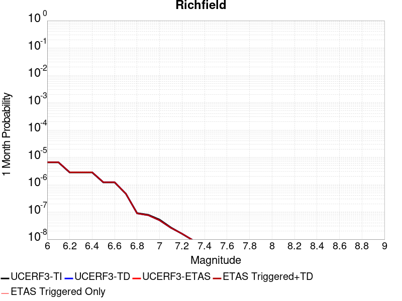 | 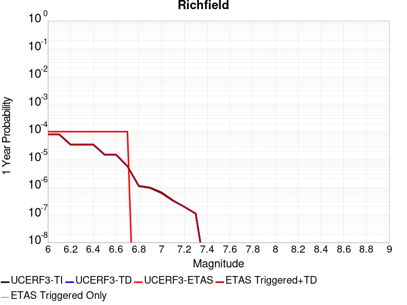 |  |

| Magnitude | 1 wk TI Prob | 1 wk TD Prob | 1 wk ETAS Prob | 1 wk ETAS/TD Gain | 1 wk ETAS Triggered+TD | 1 wk ETAS Triggered Only | 1 mo TI Prob | 1 mo TD Prob | 1 mo ETAS Prob | 1 mo ETAS/TD Gain | 1 mo ETAS Triggered+TD | 1 mo ETAS Triggered Only | 1 yr TI Prob | 1 yr TD Prob | 1 yr ETAS Prob | 1 yr ETAS/TD Gain | 1 yr ETAS Triggered+TD | 1 yr ETAS Triggered Only | 10 yr TI Prob | 10 yr TD Prob | 10 yr ETAS Prob | 10 yr ETAS/TD Gain | 10 yr ETAS Triggered+TD | 10 yr ETAS Triggered Only |
|-----|-----|-----|-----|-----|-----|-----|-----|-----|-----|-----|-----|-----|-----|-----|-----|-----|-----|-----|-----|-----|-----|-----|-----|-----|
| 6.0 | 1.5166896E-6 | 1.5393153E-6 | 0.0 | 0.0 | 1.5393153E-6 | 0.0 | 6.5000822E-6 | 6.5970553E-6 | 0.0 | 0.0 | 6.5970553E-6 | 0.0 | 7.913562E-5 | 8.031729E-5 | 1.0E-4 | 1.245062 | 8.031729E-5 | 0.0 | 7.910745E-4 | 8.029904E-4 | 8.0E-4 | 0.99627596 | 0.0010028298 | 2.0E-4 |
| 6.1 | 1.5166896E-6 | 1.5393153E-6 | 0.0 | 0.0 | 1.5393153E-6 | 0.0 | 6.5000822E-6 | 6.5970553E-6 | 0.0 | 0.0 | 6.5970553E-6 | 0.0 | 7.913562E-5 | 8.031729E-5 | 1.0E-4 | 1.245062 | 8.031729E-5 | 0.0 | 7.910745E-4 | 8.029904E-4 | 8.0E-4 | 0.99627596 | 0.0010028298 | 2.0E-4 |
| 6.2 | 6.473272E-7 | 6.598751E-7 | 0.0 | 0.0 | 6.598751E-7 | 0.0 | 2.7742565E-6 | 2.828034E-6 | 0.0 | 0.0 | 2.828034E-6 | 0.0 | 3.377605E-5 | 3.4430905E-5 | 1.0E-4 | 2.9043677 | 3.4430905E-5 | 0.0 | 3.3770915E-4 | 3.4426872E-4 | 5.0E-4 | 1.4523538 | 4.442343E-4 | 1.0E-4 |
| 6.3 | 6.473272E-7 | 6.598751E-7 | 0.0 | 0.0 | 6.598751E-7 | 0.0 | 2.7742565E-6 | 2.828034E-6 | 0.0 | 0.0 | 2.828034E-6 | 0.0 | 3.377605E-5 | 3.4430905E-5 | 1.0E-4 | 2.9043677 | 3.4430905E-5 | 0.0 | 3.3770915E-4 | 3.4426872E-4 | 5.0E-4 | 1.4523538 | 4.442343E-4 | 1.0E-4 |
| 6.4 | 6.473272E-7 | 6.598751E-7 | 0.0 | 0.0 | 6.598751E-7 | 0.0 | 2.7742565E-6 | 2.828034E-6 | 0.0 | 0.0 | 2.828034E-6 | 0.0 | 3.377605E-5 | 3.4430905E-5 | 1.0E-4 | 2.9043677 | 3.4430905E-5 | 0.0 | 3.3770915E-4 | 3.4426872E-4 | 5.0E-4 | 1.4523538 | 4.442343E-4 | 1.0E-4 |
| 6.5 | 2.7954403E-7 | 2.853296E-7 | 0.0 | 0.0 | 2.853296E-7 | 0.0 | 1.1980452E-6 | 1.2228409E-6 | 0.0 | 0.0 | 1.2228409E-6 | 0.0 | 1.4586103E-5 | 1.4888029E-5 | 1.0E-4 | 6.716806 | 1.4888029E-5 | 0.0 | 1.4585146E-4 | 1.4887456E-4 | 2.0E-4 | 1.3434129 | 1.4887456E-4 | 0.0 |
| 6.6 | 2.7954403E-7 | 2.853296E-7 | 0.0 | 0.0 | 2.853296E-7 | 0.0 | 1.1980452E-6 | 1.2228409E-6 | 0.0 | 0.0 | 1.2228409E-6 | 0.0 | 1.4586103E-5 | 1.4888029E-5 | 1.0E-4 | 6.716806 | 1.4888029E-5 | 0.0 | 1.4585146E-4 | 1.4887456E-4 | 2.0E-4 | 1.3434129 | 1.4887456E-4 | 0.0 |
| 6.7 | 1.0777299E-7 | 1.08792015E-7 | 0.0 | 0.0 | 1.08792015E-7 | 0.0 | 4.6188418E-7 | 4.6625144E-7 | 0.0 | 0.0 | 4.6625144E-7 | 0.0 | 5.6234253E-6 | 5.6766007E-6 | 1.0E-4 | 17.616177 | 5.6766007E-6 | 0.0 | 5.623283E-5 | 5.6764988E-5 | 1.0E-4 | 1.7616494 | 5.6764988E-5 | 0.0 |
| 6.8 | 2.1301874E-8 | 2.0666718E-8 | 0.0 | 0.0 | 2.0666718E-8 | 0.0 | 9.129375E-8 | 8.857164E-8 | 0.0 | 0.0 | 8.857164E-8 | 0.0 | 1.1115008E-6 | 1.0783592E-6 | 0.0 | 0.0 | 1.0783592E-6 | 0.0 | 1.1114952E-5 | 1.0783544E-5 | 0.0 | 0.0 | 1.0783544E-5 | 0.0 |
| 6.9 | 1.8413502E-8 | 1.7751628E-8 | 0.0 | 0.0 | 1.7751628E-8 | 0.0 | 7.891501E-8 | 7.60784E-8 | 0.0 | 0.0 | 7.60784E-8 | 0.0 | 9.607899E-7 | 9.262542E-7 | 0.0 | 0.0 | 9.262542E-7 | 0.0 | 9.607857E-6 | 9.262507E-6 | 0.0 | 0.0 | 9.262507E-6 | 0.0 |
| 7.0 | 1.2290541E-8 | 1.15747385E-8 | 0.0 | 0.0 | 1.15747385E-8 | 0.0 | 5.2673748E-8 | 4.9606022E-8 | 0.0 | 0.0 | 4.9606022E-8 | 0.0 | 6.413027E-7 | 6.0395314E-7 | 0.0 | 0.0 | 6.0395314E-7 | 0.0 | 6.4130086E-6 | 6.0395164E-6 | 0.0 | 0.0 | 6.0395164E-6 | 0.0 |
| 7.1 | 6.373573E-9 | 6.1559566E-9 | 0.0 | 0.0 | 6.1559566E-9 | 0.0 | 2.7315311E-8 | 2.6382672E-8 | 0.0 | 0.0 | 2.6382672E-8 | 0.0 | 3.3256384E-7 | 3.2120897E-7 | 0.0 | 0.0 | 3.2120897E-7 | 0.0 | 3.3256335E-6 | 3.2120856E-6 | 0.0 | 0.0 | 3.2120856E-6 | 0.0 |
| 7.2 | 3.6989944E-9 | 3.7360888E-9 | 0.0 | 0.0 | 3.7360888E-9 | 0.0 | 1.5852834E-8 | 1.6011809E-8 | 0.0 | 0.0 | 1.6011809E-8 | 0.0 | 1.9300822E-7 | 1.9494377E-7 | 0.0 | 0.0 | 1.9494377E-7 | 0.0 | 1.9300805E-6 | 1.9494362E-6 | 0.0 | 0.0 | 1.9494362E-6 | 0.0 |
| 7.3 | 2.097397E-9 | 2.1200957E-9 | 0.0 | 0.0 | 2.1200957E-9 | 0.0 | 8.9888434E-9 | 9.086124E-9 | 0.0 | 0.0 | 9.086124E-9 | 0.0 | 1.0943917E-7 | 1.1062355E-7 | 0.0 | 0.0 | 1.1062355E-7 | 0.0 | 1.0943911E-6 | 1.1062351E-6 | 0.0 | 0.0 | 1.1062351E-6 | 0.0 |
| 7.4 | 5.8314464E-12 | 5.8919536E-12 | 0.0 | 0.0 | 5.8919536E-12 | 0.0 | 2.4991786E-11 | 2.5251468E-11 | 0.0 | 0.0 | 2.5251468E-11 | 0.0 | 3.0427527E-10 | 3.0743608E-10 | 0.0 | 0.0 | 3.0743608E-10 | 0.0 | 3.0427532E-9 | 3.0743608E-9 | 0.0 | 0.0 | 3.0743608E-9 | 0.0 |

## Northridge Hills
*[(top)](#table-of-contents)*

| 1 Week | 1 Month | 1 Year | 10 Year |
|-----|-----|-----|-----|
| 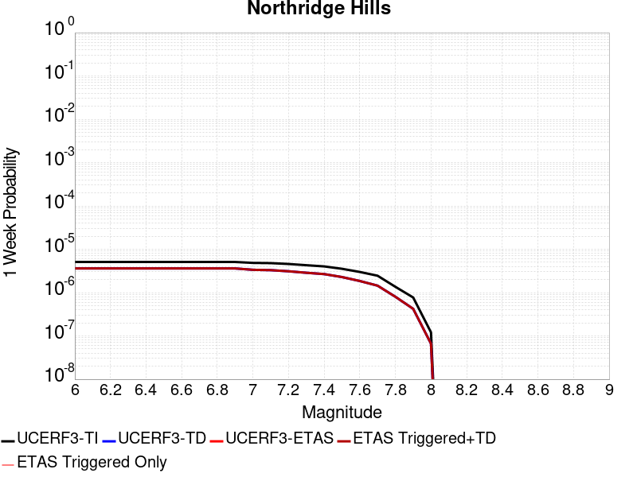 | 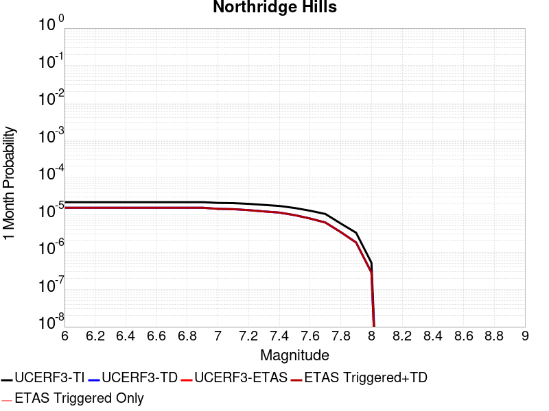 |  | 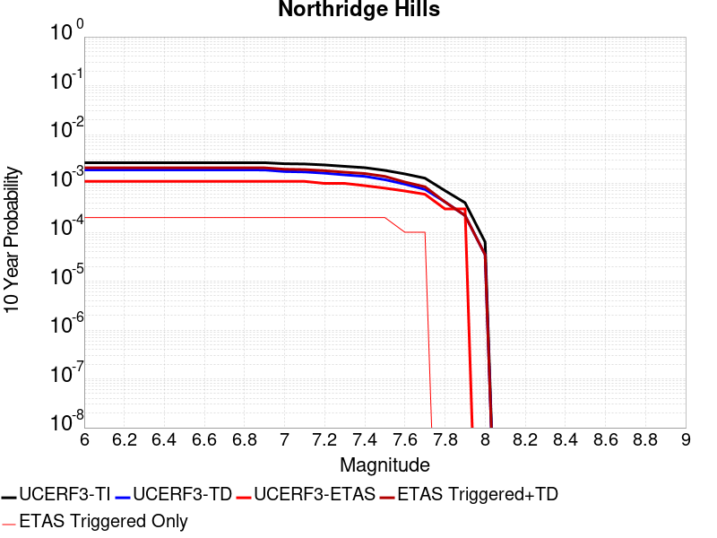 |

| Magnitude | 1 wk TI Prob | 1 wk TD Prob | 1 wk ETAS Prob | 1 wk ETAS/TD Gain | 1 wk ETAS Triggered+TD | 1 wk ETAS Triggered Only | 1 mo TI Prob | 1 mo TD Prob | 1 mo ETAS Prob | 1 mo ETAS/TD Gain | 1 mo ETAS Triggered+TD | 1 mo ETAS Triggered Only | 1 yr TI Prob | 1 yr TD Prob | 1 yr ETAS Prob | 1 yr ETAS/TD Gain | 1 yr ETAS Triggered+TD | 1 yr ETAS Triggered Only | 10 yr TI Prob | 10 yr TD Prob | 10 yr ETAS Prob | 10 yr ETAS/TD Gain | 10 yr ETAS Triggered+TD | 10 yr ETAS Triggered Only |
|-----|-----|-----|-----|-----|-----|-----|-----|-----|-----|-----|-----|-----|-----|-----|-----|-----|-----|-----|-----|-----|-----|-----|-----|-----|
| 6.0 | 5.095982E-6 | 3.616381E-6 | 0.0 | 0.0 | 3.616381E-6 | 0.0 | 2.183974E-5 | 1.5498685E-5 | 0.0 | 0.0 | 1.5498685E-5 | 0.0 | 2.658664E-4 | 1.8868026E-4 | 2.0E-4 | 1.0599942 | 1.8868026E-4 | 0.0 | 0.0026554854 | 0.0018852131 | 0.0011 | 0.5834884 | 0.0020848361 | 2.0E-4 |
| 6.1 | 5.095982E-6 | 3.616381E-6 | 0.0 | 0.0 | 3.616381E-6 | 0.0 | 2.183974E-5 | 1.5498685E-5 | 0.0 | 0.0 | 1.5498685E-5 | 0.0 | 2.658664E-4 | 1.8868026E-4 | 2.0E-4 | 1.0599942 | 1.8868026E-4 | 0.0 | 0.0026554854 | 0.0018852131 | 0.0011 | 0.5834884 | 0.0020848361 | 2.0E-4 |
| 6.2 | 5.095982E-6 | 3.616381E-6 | 0.0 | 0.0 | 3.616381E-6 | 0.0 | 2.183974E-5 | 1.5498685E-5 | 0.0 | 0.0 | 1.5498685E-5 | 0.0 | 2.658664E-4 | 1.8868026E-4 | 2.0E-4 | 1.0599942 | 1.8868026E-4 | 0.0 | 0.0026554854 | 0.0018852131 | 0.0011 | 0.5834884 | 0.0020848361 | 2.0E-4 |
| 6.3 | 5.095982E-6 | 3.616381E-6 | 0.0 | 0.0 | 3.616381E-6 | 0.0 | 2.183974E-5 | 1.5498685E-5 | 0.0 | 0.0 | 1.5498685E-5 | 0.0 | 2.658664E-4 | 1.8868026E-4 | 2.0E-4 | 1.0599942 | 1.8868026E-4 | 0.0 | 0.0026554854 | 0.0018852131 | 0.0011 | 0.5834884 | 0.0020848361 | 2.0E-4 |
| 6.4 | 5.095982E-6 | 3.616381E-6 | 0.0 | 0.0 | 3.616381E-6 | 0.0 | 2.183974E-5 | 1.5498685E-5 | 0.0 | 0.0 | 1.5498685E-5 | 0.0 | 2.658664E-4 | 1.8868026E-4 | 2.0E-4 | 1.0599942 | 1.8868026E-4 | 0.0 | 0.0026554854 | 0.0018852131 | 0.0011 | 0.5834884 | 0.0020848361 | 2.0E-4 |
| 6.5 | 5.095982E-6 | 3.616381E-6 | 0.0 | 0.0 | 3.616381E-6 | 0.0 | 2.183974E-5 | 1.5498685E-5 | 0.0 | 0.0 | 1.5498685E-5 | 0.0 | 2.658664E-4 | 1.8868026E-4 | 2.0E-4 | 1.0599942 | 1.8868026E-4 | 0.0 | 0.0026554854 | 0.0018852131 | 0.0011 | 0.5834884 | 0.0020848361 | 2.0E-4 |
| 6.6 | 5.095982E-6 | 3.616381E-6 | 0.0 | 0.0 | 3.616381E-6 | 0.0 | 2.183974E-5 | 1.5498685E-5 | 0.0 | 0.0 | 1.5498685E-5 | 0.0 | 2.658664E-4 | 1.8868026E-4 | 2.0E-4 | 1.0599942 | 1.8868026E-4 | 0.0 | 0.0026554854 | 0.0018852131 | 0.0011 | 0.5834884 | 0.0020848361 | 2.0E-4 |
| 6.7 | 5.095982E-6 | 3.616381E-6 | 0.0 | 0.0 | 3.616381E-6 | 0.0 | 2.183974E-5 | 1.5498685E-5 | 0.0 | 0.0 | 1.5498685E-5 | 0.0 | 2.658664E-4 | 1.8868026E-4 | 2.0E-4 | 1.0599942 | 1.8868026E-4 | 0.0 | 0.0026554854 | 0.0018852131 | 0.0011 | 0.5834884 | 0.0020848361 | 2.0E-4 |
| 6.8 | 5.095982E-6 | 3.616381E-6 | 0.0 | 0.0 | 3.616381E-6 | 0.0 | 2.183974E-5 | 1.5498685E-5 | 0.0 | 0.0 | 1.5498685E-5 | 0.0 | 2.658664E-4 | 1.8868026E-4 | 2.0E-4 | 1.0599942 | 1.8868026E-4 | 0.0 | 0.0026554854 | 0.0018852131 | 0.0011 | 0.5834884 | 0.0020848361 | 2.0E-4 |
| 6.9 | 5.0942654E-6 | 3.614596E-6 | 0.0 | 0.0 | 3.614596E-6 | 0.0 | 2.1832384E-5 | 1.5491034E-5 | 0.0 | 0.0 | 1.5491034E-5 | 0.0 | 2.6577685E-4 | 1.8858713E-4 | 2.0E-4 | 1.0605178 | 1.8858713E-4 | 0.0 | 0.002654592 | 0.0018842834 | 0.0011 | 0.5837763 | 0.0020839064 | 2.0E-4 |
| 7.0 | 4.851143E-6 | 3.359887E-6 | 0.0 | 0.0 | 3.359887E-6 | 0.0 | 2.0790447E-5 | 1.4399436E-5 | 0.0 | 0.0 | 1.4399436E-5 | 0.0 | 2.5309427E-4 | 1.7529906E-4 | 2.0E-4 | 1.1409074 | 1.7529906E-4 | 0.0 | 0.0025280623 | 0.0017516123 | 0.0011 | 0.62799287 | 0.001951262 | 2.0E-4 |
| 7.1 | 4.7910607E-6 | 3.298162E-6 | 0.0 | 0.0 | 3.298162E-6 | 0.0 | 2.0532956E-5 | 1.4134904E-5 | 0.0 | 0.0 | 1.4134904E-5 | 0.0 | 2.4996005E-4 | 1.720789E-4 | 2.0E-4 | 1.1622576 | 1.720789E-4 | 0.0 | 0.0024967908 | 0.0017194607 | 0.0011 | 0.63973546 | 0.0019191167 | 2.0E-4 |
| 7.2 | 4.580079E-6 | 3.1079214E-6 | 0.0 | 0.0 | 3.1079214E-6 | 0.0 | 1.9628762E-5 | 1.3319595E-5 | 0.0 | 0.0 | 1.3319595E-5 | 0.0 | 2.3895396E-4 | 1.6215403E-4 | 2.0E-4 | 1.2333952 | 1.6215403E-4 | 0.0 | 0.0023869718 | 0.0016203607 | 0.001 | 0.61714655 | 0.0018200366 | 2.0E-4 |
| 7.3 | 4.290062E-6 | 2.8693314E-6 | 0.0 | 0.0 | 2.8693314E-6 | 0.0 | 1.838585E-5 | 1.2297077E-5 | 0.0 | 0.0 | 1.2297077E-5 | 0.0 | 2.2382473E-4 | 1.4970664E-4 | 2.0E-4 | 1.3359461 | 1.4970664E-4 | 0.0 | 0.0022359942 | 0.001496061 | 0.001 | 0.668422 | 0.0016957618 | 2.0E-4 |
| 7.4 | 4.0259683E-6 | 2.6749924E-6 | 0.0 | 0.0 | 2.6749924E-6 | 0.0 | 1.7254037E-5 | 1.14642025E-5 | 0.0 | 0.0 | 1.14642025E-5 | 0.0 | 2.1004764E-4 | 1.3956775E-4 | 2.0E-4 | 1.4329958 | 1.3956775E-4 | 0.0 | 0.002098492 | 0.0013948038 | 9.0E-4 | 0.64525205 | 0.0015945248 | 2.0E-4 |
| 7.5 | 3.5477108E-6 | 2.2862307E-6 | 0.0 | 0.0 | 2.2862307E-6 | 0.0 | 1.5204386E-5 | 9.798095E-6 | 0.0 | 0.0 | 9.798095E-6 | 0.0 | 1.8509767E-4 | 1.1928529E-4 | 2.0E-4 | 1.6766527 | 1.1928529E-4 | 0.0 | 0.0018494357 | 0.0011922142 | 8.0E-4 | 0.6710204 | 0.0013919757 | 2.0E-4 |
| 7.6 | 2.9990608E-6 | 1.8537858E-6 | 0.0 | 0.0 | 1.8537858E-6 | 0.0 | 1.2853055E-5 | 7.944772E-6 | 0.0 | 0.0 | 7.944772E-6 | 0.0 | 1.564747E-4 | 9.672331E-5 | 2.0E-4 | 2.0677538 | 9.672331E-5 | 0.0 | 0.0015636457 | 9.6681295E-4 | 7.0E-4 | 0.72402835 | 0.0010667163 | 1.0E-4 |
| 7.7 | 2.4542855E-6 | 1.4469878E-6 | 0.0 | 0.0 | 1.4469878E-6 | 0.0 | 1.05183235E-5 | 6.2013614E-6 | 0.0 | 0.0 | 6.2013614E-6 | 0.0 | 1.2805307E-4 | 7.549896E-5 | 2.0E-4 | 2.649043 | 7.549896E-5 | 0.0 | 0.001279793 | 7.547337E-4 | 6.0E-4 | 0.7949824 | 8.546582E-4 | 1.0E-4 |
| 7.8 | 1.3623128E-6 | 8.02119E-7 | 0.0 | 0.0 | 8.02119E-7 | 0.0 | 5.8384703E-6 | 3.4376483E-6 | 0.0 | 0.0 | 3.4376483E-6 | 0.0 | 7.108106E-5 | 4.1852567E-5 | 1.0E-4 | 2.3893397 | 4.1852567E-5 | 0.0 | 7.1058323E-4 | 4.1844705E-4 | 3.0E-4 | 0.7169366 | 4.1844705E-4 | 0.0 |
| 7.9 | 7.716622E-7 | 4.2224542E-7 | 0.0 | 0.0 | 4.2224542E-7 | 0.0 | 3.3071194E-6 | 1.809622E-6 | 0.0 | 0.0 | 1.809622E-6 | 0.0 | 4.0263436E-5 | 2.2031925E-5 | 1.0E-4 | 4.538868 | 2.2031925E-5 | 0.0 | 4.0256142E-4 | 2.2029753E-4 | 3.0E-4 | 1.3617947 | 2.2029753E-4 | 0.0 |
| 8.0 | 1.2117711E-7 | 6.624593E-8 | 0.0 | 0.0 | 6.624593E-8 | 0.0 | 5.1933034E-7 | 2.839111E-7 | 0.0 | 0.0 | 2.839111E-7 | 0.0 | 6.3228285E-6 | 3.4566126E-6 | 0.0 | 0.0 | 3.4566126E-6 | 0.0 | 6.3226486E-5 | 3.4565604E-5 | 0.0 | 0.0 | 3.4565604E-5 | 0.0 |

## Anacapa-Dume alt 1
*[(top)](#table-of-contents)*

| 1 Week | 1 Month | 1 Year | 10 Year |
|-----|-----|-----|-----|
|  |  |  |  |

| Magnitude | 1 wk TI Prob | 1 wk TD Prob | 1 wk ETAS Prob | 1 wk ETAS/TD Gain | 1 wk ETAS Triggered+TD | 1 wk ETAS Triggered Only | 1 mo TI Prob | 1 mo TD Prob | 1 mo ETAS Prob | 1 mo ETAS/TD Gain | 1 mo ETAS Triggered+TD | 1 mo ETAS Triggered Only | 1 yr TI Prob | 1 yr TD Prob | 1 yr ETAS Prob | 1 yr ETAS/TD Gain | 1 yr ETAS Triggered+TD | 1 yr ETAS Triggered Only | 10 yr TI Prob | 10 yr TD Prob | 10 yr ETAS Prob | 10 yr ETAS/TD Gain | 10 yr ETAS Triggered+TD | 10 yr ETAS Triggered Only |
|-----|-----|-----|-----|-----|-----|-----|-----|-----|-----|-----|-----|-----|-----|-----|-----|-----|-----|-----|-----|-----|-----|-----|-----|-----|
| 6.0 | 5.1871802E-6 | 5.367811E-6 | 0.0 | 0.0 | 5.367811E-6 | 0.0 | 2.2230583E-5 | 2.3004704E-5 | 0.0 | 0.0 | 2.3004704E-5 | 0.0 | 2.7062374E-4 | 2.8004713E-4 | 1.0E-4 | 0.35708275 | 2.8004713E-4 | 0.0 | 0.002702944 | 0.0027970276 | 0.0015 | 0.53628355 | 0.0029964682 | 2.0E-4 |
| 6.1 | 5.1871802E-6 | 5.367811E-6 | 0.0 | 0.0 | 5.367811E-6 | 0.0 | 2.2230583E-5 | 2.3004704E-5 | 0.0 | 0.0 | 2.3004704E-5 | 0.0 | 2.7062374E-4 | 2.8004713E-4 | 1.0E-4 | 0.35708275 | 2.8004713E-4 | 0.0 | 0.002702944 | 0.0027970276 | 0.0015 | 0.53628355 | 0.0029964682 | 2.0E-4 |
| 6.2 | 5.1871802E-6 | 5.367811E-6 | 0.0 | 0.0 | 5.367811E-6 | 0.0 | 2.2230583E-5 | 2.3004704E-5 | 0.0 | 0.0 | 2.3004704E-5 | 0.0 | 2.7062374E-4 | 2.8004713E-4 | 1.0E-4 | 0.35708275 | 2.8004713E-4 | 0.0 | 0.002702944 | 0.0027970276 | 0.0015 | 0.53628355 | 0.0029964682 | 2.0E-4 |
| 6.3 | 5.1871802E-6 | 5.367811E-6 | 0.0 | 0.0 | 5.367811E-6 | 0.0 | 2.2230583E-5 | 2.3004704E-5 | 0.0 | 0.0 | 2.3004704E-5 | 0.0 | 2.7062374E-4 | 2.8004713E-4 | 1.0E-4 | 0.35708275 | 2.8004713E-4 | 0.0 | 0.002702944 | 0.0027970276 | 0.0015 | 0.53628355 | 0.0029964682 | 2.0E-4 |
| 6.4 | 5.1871802E-6 | 5.367811E-6 | 0.0 | 0.0 | 5.367811E-6 | 0.0 | 2.2230583E-5 | 2.3004704E-5 | 0.0 | 0.0 | 2.3004704E-5 | 0.0 | 2.7062374E-4 | 2.8004713E-4 | 1.0E-4 | 0.35708275 | 2.8004713E-4 | 0.0 | 0.002702944 | 0.0027970276 | 0.0015 | 0.53628355 | 0.0029964682 | 2.0E-4 |
| 6.5 | 5.1871802E-6 | 5.367811E-6 | 0.0 | 0.0 | 5.367811E-6 | 0.0 | 2.2230583E-5 | 2.3004704E-5 | 0.0 | 0.0 | 2.3004704E-5 | 0.0 | 2.7062374E-4 | 2.8004713E-4 | 1.0E-4 | 0.35708275 | 2.8004713E-4 | 0.0 | 0.002702944 | 0.0027970276 | 0.0015 | 0.53628355 | 0.0029964682 | 2.0E-4 |
| 6.6 | 5.1871802E-6 | 5.367811E-6 | 0.0 | 0.0 | 5.367811E-6 | 0.0 | 2.2230583E-5 | 2.3004704E-5 | 0.0 | 0.0 | 2.3004704E-5 | 0.0 | 2.7062374E-4 | 2.8004713E-4 | 1.0E-4 | 0.35708275 | 2.8004713E-4 | 0.0 | 0.002702944 | 0.0027970276 | 0.0015 | 0.53628355 | 0.0029964682 | 2.0E-4 |
| 6.7 | 4.7693475E-6 | 4.937085E-6 | 0.0 | 0.0 | 4.937085E-6 | 0.0 | 2.04399E-5 | 2.115877E-5 | 0.0 | 0.0 | 2.115877E-5 | 0.0 | 2.4882736E-4 | 2.5757833E-4 | 1.0E-4 | 0.38823143 | 2.5757833E-4 | 0.0 | 0.0024854892 | 0.0025728738 | 0.0014 | 0.5441386 | 0.0027723592 | 2.0E-4 |
| 6.8 | 4.753408E-6 | 4.9206324E-6 | 0.0 | 0.0 | 4.9206324E-6 | 0.0 | 2.037159E-5 | 2.1088259E-5 | 0.0 | 0.0 | 2.1088259E-5 | 0.0 | 2.4799586E-4 | 2.5672006E-4 | 1.0E-4 | 0.38952938 | 2.5672006E-4 | 0.0 | 0.002477193 | 0.002564311 | 0.0014 | 0.54595566 | 0.002763798 | 2.0E-4 |
| 6.9 | 3.800069E-6 | 3.9374577E-6 | 0.0 | 0.0 | 3.9374577E-6 | 0.0 | 1.6285909E-5 | 1.687471E-5 | 0.0 | 0.0 | 1.687471E-5 | 0.0 | 1.9826289E-4 | 2.0543046E-4 | 1.0E-4 | 0.4867827 | 2.0543046E-4 | 0.0 | 0.001980861 | 0.0020524294 | 0.0012 | 0.5846729 | 0.002252019 | 2.0E-4 |
| 7.0 | 3.6671938E-6 | 3.800241E-6 | 0.0 | 0.0 | 3.800241E-6 | 0.0 | 1.571645E-5 | 1.6286647E-5 | 0.0 | 0.0 | 1.6286647E-5 | 0.0 | 1.9133097E-4 | 1.9827212E-4 | 1.0E-4 | 0.50435734 | 1.9827212E-4 | 0.0 | 0.0019116632 | 0.0019809755 | 0.0012 | 0.6057622 | 0.0021805794 | 2.0E-4 |
| 7.1 | 3.2394885E-6 | 3.3590886E-6 | 0.0 | 0.0 | 3.3590886E-6 | 0.0 | 1.3883448E-5 | 1.4396015E-5 | 0.0 | 0.0 | 1.4396015E-5 | 0.0 | 1.6901788E-4 | 1.7525749E-4 | 1.0E-4 | 0.570589 | 1.7525749E-4 | 0.0 | 0.0016888938 | 0.001751204 | 0.001 | 0.5710357 | 0.0018510289 | 1.0E-4 |
| 7.2 | 3.0935948E-6 | 3.208211E-6 | 0.0 | 0.0 | 3.208211E-6 | 0.0 | 1.3258196E-5 | 1.3749404E-5 | 0.0 | 0.0 | 1.3749404E-5 | 0.0 | 1.6140658E-4 | 1.6738624E-4 | 1.0E-4 | 0.5974207 | 1.6738624E-4 | 0.0 | 0.001612894 | 0.0016726126 | 0.001 | 0.5978671 | 0.0017724454 | 1.0E-4 |
| 7.3 | 2.5604163E-6 | 2.6473003E-6 | 0.0 | 0.0 | 2.6473003E-6 | 0.0 | 1.0973167E-5 | 1.13455235E-5 | 0.0 | 0.0 | 1.13455235E-5 | 0.0 | 1.3359012E-4 | 1.3812304E-4 | 1.0E-4 | 0.7239922 | 1.3812304E-4 | 0.0 | 0.0013350984 | 0.0013803765 | 0.001 | 0.72444004 | 0.0014802384 | 1.0E-4 |
| 7.4 | 2.1429005E-6 | 2.2107906E-6 | 0.0 | 0.0 | 2.2107906E-6 | 0.0 | 9.1838265E-6 | 9.474782E-6 | 0.0 | 0.0 | 9.474782E-6 | 0.0 | 1.11807356E-4 | 1.15349394E-4 | 1.0E-4 | 0.8669313 | 1.15349394E-4 | 0.0 | 0.0011175112 | 0.0011528978 | 8.0E-4 | 0.6939036 | 0.0012527825 | 1.0E-4 |
| 7.5 | 1.7237151E-6 | 1.7762965E-6 | 0.0 | 0.0 | 1.7762965E-6 | 0.0 | 7.3873293E-6 | 7.612677E-6 | 0.0 | 0.0 | 7.612677E-6 | 0.0 | 8.993702E-5 | 9.268042E-5 | 1.0E-4 | 1.0789765 | 9.268042E-5 | 0.0 | 8.990063E-4 | 9.2642003E-4 | 8.0E-4 | 0.86353916 | 0.0010263274 | 1.0E-4 |
| 7.6 | 9.541696E-7 | 9.824043E-7 | 0.0 | 0.0 | 9.824043E-7 | 0.0 | 4.089292E-6 | 4.2102974E-6 | 0.0 | 0.0 | 4.2102974E-6 | 0.0 | 4.9785995E-5 | 5.125918E-5 | 0.0 | 0.0 | 5.125918E-5 | 0.0 | 4.9774844E-4 | 5.1247486E-4 | 4.0E-4 | 0.78052616 | 5.1247486E-4 | 0.0 |
| 7.7 | 2.7226676E-7 | 2.7174286E-7 | 0.0 | 0.0 | 2.7174286E-7 | 0.0 | 1.166857E-6 | 1.1646117E-6 | 0.0 | 0.0 | 1.1646117E-6 | 0.0 | 1.4206392E-5 | 1.4179057E-5 | 0.0 | 0.0 | 1.4179057E-5 | 0.0 | 1.4205484E-4 | 1.417816E-4 | 1.0E-4 | 0.70531017 | 1.417816E-4 | 0.0 |
| 7.8 | 4.5017995E-8 | 4.216035E-8 | 0.0 | 0.0 | 4.216035E-8 | 0.0 | 1.9293425E-7 | 1.8068721E-7 | 0.0 | 0.0 | 1.8068721E-7 | 0.0 | 2.348972E-6 | 2.1998649E-6 | 0.0 | 0.0 | 2.1998649E-6 | 0.0 | 2.348947E-5 | 2.1998452E-5 | 0.0 | 0.0 | 2.1998452E-5 | 0.0 |
| 7.9 | 8.007447E-10 | 6.162303E-10 | 0.0 | 0.0 | 6.162303E-10 | 0.0 | 3.4317629E-9 | 2.6409874E-9 | 0.0 | 0.0 | 2.6409874E-9 | 0.0 | 4.1781714E-8 | 3.215402E-8 | 0.0 | 0.0 | 3.215402E-8 | 0.0 | 4.1781706E-7 | 3.2154017E-7 | 0.0 | 0.0 | 3.2154017E-7 | 0.0 |

## Casmalia 2011 CFM
*[(top)](#table-of-contents)*

| 1 Week | 1 Month | 1 Year | 10 Year |
|-----|-----|-----|-----|
|  | 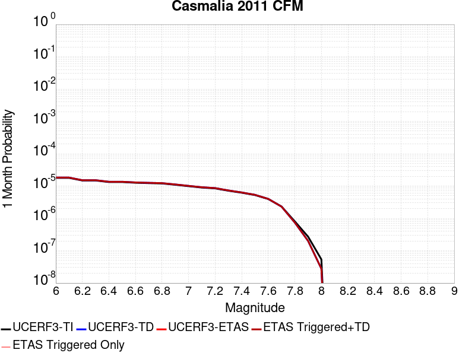 | 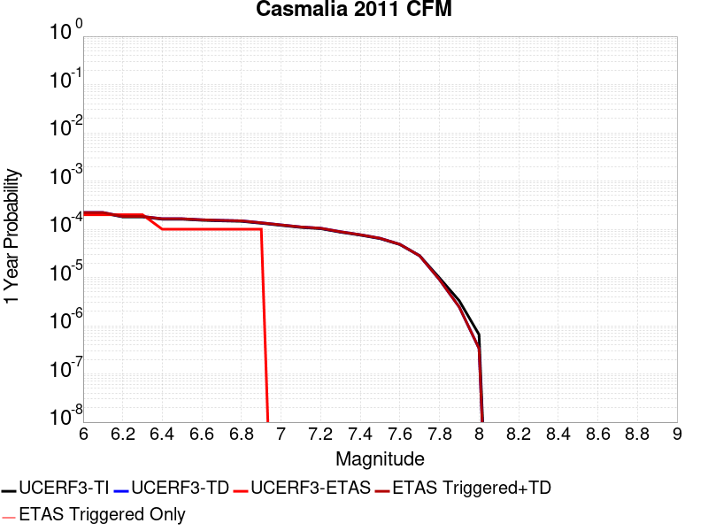 |  |

| Magnitude | 1 wk TI Prob | 1 wk TD Prob | 1 wk ETAS Prob | 1 wk ETAS/TD Gain | 1 wk ETAS Triggered+TD | 1 wk ETAS Triggered Only | 1 mo TI Prob | 1 mo TD Prob | 1 mo ETAS Prob | 1 mo ETAS/TD Gain | 1 mo ETAS Triggered+TD | 1 mo ETAS Triggered Only | 1 yr TI Prob | 1 yr TD Prob | 1 yr ETAS Prob | 1 yr ETAS/TD Gain | 1 yr ETAS Triggered+TD | 1 yr ETAS Triggered Only | 10 yr TI Prob | 10 yr TD Prob | 10 yr ETAS Prob | 10 yr ETAS/TD Gain | 10 yr ETAS Triggered+TD | 10 yr ETAS Triggered Only |
|-----|-----|-----|-----|-----|-----|-----|-----|-----|-----|-----|-----|-----|-----|-----|-----|-----|-----|-----|-----|-----|-----|-----|-----|-----|
| 6.0 | 4.1704893E-6 | 4.2627244E-6 | 0.0 | 0.0 | 4.2627244E-6 | 0.0 | 1.7873403E-5 | 1.8268693E-5 | 0.0 | 0.0 | 1.8268693E-5 | 0.0 | 2.1758694E-4 | 2.2239883E-4 | 2.0E-4 | 0.8992853 | 2.2239883E-4 | 0.0 | 0.0021737402 | 0.0022217836 | 0.0012 | 0.5401066 | 0.0024213393 | 2.0E-4 |
| 6.1 | 4.1704893E-6 | 4.2627244E-6 | 0.0 | 0.0 | 4.2627244E-6 | 0.0 | 1.7873403E-5 | 1.8268693E-5 | 0.0 | 0.0 | 1.8268693E-5 | 0.0 | 2.1758694E-4 | 2.2239883E-4 | 2.0E-4 | 0.8992853 | 2.2239883E-4 | 0.0 | 0.0021737402 | 0.0022217836 | 0.0012 | 0.5401066 | 0.0024213393 | 2.0E-4 |
| 6.2 | 3.457312E-6 | 3.5372386E-6 | 0.0 | 0.0 | 3.5372386E-6 | 0.0 | 1.4816967E-5 | 1.5159507E-5 | 0.0 | 0.0 | 1.5159507E-5 | 0.0 | 1.8038164E-4 | 1.8455145E-4 | 2.0E-4 | 1.0837086 | 1.8455145E-4 | 0.0 | 0.001802353 | 0.0018439913 | 0.001 | 0.5423019 | 0.0020436225 | 2.0E-4 |
| 6.3 | 3.457312E-6 | 3.5372386E-6 | 0.0 | 0.0 | 3.5372386E-6 | 0.0 | 1.4816967E-5 | 1.5159507E-5 | 0.0 | 0.0 | 1.5159507E-5 | 0.0 | 1.8038164E-4 | 1.8455145E-4 | 2.0E-4 | 1.0837086 | 1.8455145E-4 | 0.0 | 0.001802353 | 0.0018439913 | 0.001 | 0.5423019 | 0.0020436225 | 2.0E-4 |
| 6.4 | 3.0957337E-6 | 3.16943E-6 | 0.0 | 0.0 | 3.16943E-6 | 0.0 | 1.3267363E-5 | 1.35832015E-5 | 0.0 | 0.0 | 1.35832015E-5 | 0.0 | 1.6151817E-4 | 1.6536299E-4 | 1.0E-4 | 0.60473025 | 1.6536299E-4 | 0.0 | 0.0016140083 | 0.0016524055 | 8.0E-4 | 0.48414266 | 0.0017522402 | 1.0E-4 |
| 6.5 | 3.0957337E-6 | 3.16943E-6 | 0.0 | 0.0 | 3.16943E-6 | 0.0 | 1.3267363E-5 | 1.35832015E-5 | 0.0 | 0.0 | 1.35832015E-5 | 0.0 | 1.6151817E-4 | 1.6536299E-4 | 1.0E-4 | 0.60473025 | 1.6536299E-4 | 0.0 | 0.0016140083 | 0.0016524055 | 8.0E-4 | 0.48414266 | 0.0017522402 | 1.0E-4 |
| 6.6 | 2.9459152E-6 | 3.0167737E-6 | 0.0 | 0.0 | 3.0167737E-6 | 0.0 | 1.262529E-5 | 1.29289665E-5 | 0.0 | 0.0 | 1.29289665E-5 | 0.0 | 1.5370206E-4 | 1.5739886E-4 | 1.0E-4 | 0.63532865 | 1.5739886E-4 | 0.0 | 0.0015359579 | 0.0015728793 | 7.0E-4 | 0.44504368 | 0.001672722 | 1.0E-4 |
| 6.7 | 2.8634809E-6 | 2.9326677E-6 | 0.0 | 0.0 | 2.9326677E-6 | 0.0 | 1.2272003E-5 | 1.25685165E-5 | 0.0 | 0.0 | 1.25685165E-5 | 0.0 | 1.4940138E-4 | 1.5301099E-4 | 1.0E-4 | 0.6535478 | 1.5301099E-4 | 0.0 | 0.0014930099 | 0.0015290618 | 7.0E-4 | 0.45779705 | 0.0016289089 | 1.0E-4 |
| 6.8 | 2.7999822E-6 | 2.8677891E-6 | 0.0 | 0.0 | 2.8677891E-6 | 0.0 | 1.1999869E-5 | 1.2290468E-5 | 0.0 | 0.0 | 1.2290468E-5 | 0.0 | 1.460886E-4 | 1.4962621E-4 | 1.0E-4 | 0.6683321 | 1.4962621E-4 | 0.0 | 0.001459926 | 0.00149526 | 7.0E-4 | 0.468146 | 0.0015951105 | 1.0E-4 |
| 6.9 | 2.551052E-6 | 2.6121436E-6 | 0.0 | 0.0 | 2.6121436E-6 | 0.0 | 1.0933034E-5 | 1.1194853E-5 | 0.0 | 0.0 | 1.1194853E-5 | 0.0 | 1.3310155E-4 | 1.3628886E-4 | 1.0E-4 | 0.73373574 | 1.3628886E-4 | 0.0 | 0.0013302186 | 0.0013620567 | 7.0E-4 | 0.51392865 | 0.0014619206 | 1.0E-4 |
| 7.0 | 2.3081875E-6 | 2.362574E-6 | 0.0 | 0.0 | 2.362574E-6 | 0.0 | 9.892195E-6 | 1.0125278E-5 | 0.0 | 0.0 | 1.0125278E-5 | 0.0 | 1.20430814E-4 | 1.2326831E-4 | 0.0 | 0.0 | 1.2326831E-4 | 0.0 | 0.0012036557 | 0.0012320022 | 6.0E-4 | 0.48701212 | 0.0013318791 | 1.0E-4 |
| 7.1 | 2.093245E-6 | 2.1418778E-6 | 0.0 | 0.0 | 2.1418778E-6 | 0.0 | 8.971019E-6 | 9.179444E-6 | 0.0 | 0.0 | 9.179444E-6 | 0.0 | 1.09216686E-4 | 1.11754016E-4 | 0.0 | 0.0 | 1.11754016E-4 | 0.0 | 0.0010916302 | 0.0011169802 | 6.0E-4 | 0.5371626 | 0.0012168685 | 1.0E-4 |
| 7.2 | 1.9714576E-6 | 2.0166556E-6 | 0.0 | 0.0 | 2.0166556E-6 | 0.0 | 8.449076E-6 | 8.642781E-6 | 0.0 | 0.0 | 8.642781E-6 | 0.0 | 1.0286264E-4 | 1.05220795E-4 | 0.0 | 0.0 | 1.05220795E-4 | 0.0 | 0.0010281504 | 0.0010517116 | 5.0E-4 | 0.4754155 | 0.0011516064 | 1.0E-4 |
| 7.3 | 1.6689512E-6 | 1.7048404E-6 | 0.0 | 0.0 | 1.7048404E-6 | 0.0 | 7.1526288E-6 | 7.3064384E-6 | 0.0 | 0.0 | 7.3064384E-6 | 0.0 | 8.7079774E-5 | 8.895226E-5 | 0.0 | 0.0 | 8.895226E-5 | 0.0 | 8.7045657E-4 | 8.8916736E-4 | 5.0E-4 | 0.5623238 | 9.890784E-4 | 1.0E-4 |
| 7.4 | 1.4490954E-6 | 1.4780038E-6 | 0.0 | 0.0 | 1.4780038E-6 | 0.0 | 6.210394E-6 | 6.334287E-6 | 0.0 | 0.0 | 6.334287E-6 | 0.0 | 7.560892E-5 | 7.711722E-5 | 0.0 | 0.0 | 7.711722E-5 | 0.0 | 7.55832E-4 | 7.7090523E-4 | 4.0E-4 | 0.51887053 | 8.708281E-4 | 1.0E-4 |
| 7.5 | 1.226873E-6 | 1.2482678E-6 | 0.0 | 0.0 | 1.2482678E-6 | 0.0 | 5.2580162E-6 | 5.349708E-6 | 0.0 | 0.0 | 5.349708E-6 | 0.0 | 6.401447E-5 | 6.513076E-5 | 0.0 | 0.0 | 6.513076E-5 | 0.0 | 6.399603E-4 | 6.511172E-4 | 4.0E-4 | 0.61432874 | 7.5105205E-4 | 1.0E-4 |
| 7.6 | 9.2561345E-7 | 9.362679E-7 | 0.0 | 0.0 | 9.362679E-7 | 0.0 | 3.966909E-6 | 4.0125706E-6 | 0.0 | 0.0 | 4.0125706E-6 | 0.0 | 4.8296046E-5 | 4.8851954E-5 | 0.0 | 0.0 | 4.8851954E-5 | 0.0 | 4.828555E-4 | 4.8841257E-4 | 2.0E-4 | 0.40948987 | 5.8836374E-4 | 1.0E-4 |
| 7.7 | 5.4367933E-7 | 5.3933354E-7 | 0.0 | 0.0 | 5.3933354E-7 | 0.0 | 2.3300522E-6 | 2.3114274E-6 | 0.0 | 0.0 | 2.3114274E-6 | 0.0 | 2.8368017E-5 | 2.8141265E-5 | 0.0 | 0.0 | 2.8141265E-5 | 0.0 | 2.8364395E-4 | 2.8137714E-4 | 1.0E-4 | 0.35539487 | 3.81349E-4 | 1.0E-4 |
| 7.8 | 1.8825742E-7 | 1.7343629E-7 | 0.0 | 0.0 | 1.7343629E-7 | 0.0 | 8.068173E-7 | 7.4329813E-7 | 0.0 | 0.0 | 7.4329813E-7 | 0.0 | 9.822956E-6 | 9.049618E-6 | 0.0 | 0.0 | 9.049618E-6 | 0.0 | 9.822522E-5 | 9.049252E-5 | 1.0E-4 | 1.1050638 | 1.9048346E-4 | 1.0E-4 |
| 7.9 | 6.342771E-8 | 4.679243E-8 | 0.0 | 0.0 | 4.679243E-8 | 0.0 | 2.7183304E-7 | 2.0053896E-7 | 0.0 | 0.0 | 2.0053896E-7 | 0.0 | 3.3095623E-6 | 2.4415592E-6 | 0.0 | 0.0 | 2.4415592E-6 | 0.0 | 3.309513E-5 | 2.4415329E-5 | 0.0 | 0.0 | 2.4415329E-5 | 0.0 |
| 8.0 | 1.2574819E-8 | 6.4726535E-9 | 0.0 | 0.0 | 6.4726535E-9 | 0.0 | 5.3892084E-8 | 2.7739945E-8 | 0.0 | 0.0 | 2.7739945E-8 | 0.0 | 6.561359E-7 | 3.3773378E-7 | 0.0 | 0.0 | 3.3773378E-7 | 0.0 | 6.56134E-6 | 3.3773329E-6 | 0.0 | 0.0 | 3.3773329E-6 | 0.0 |

## Hilton Creek 2011 CFM
*[(top)](#table-of-contents)*

| 1 Week | 1 Month | 1 Year | 10 Year |
|-----|-----|-----|-----|
| 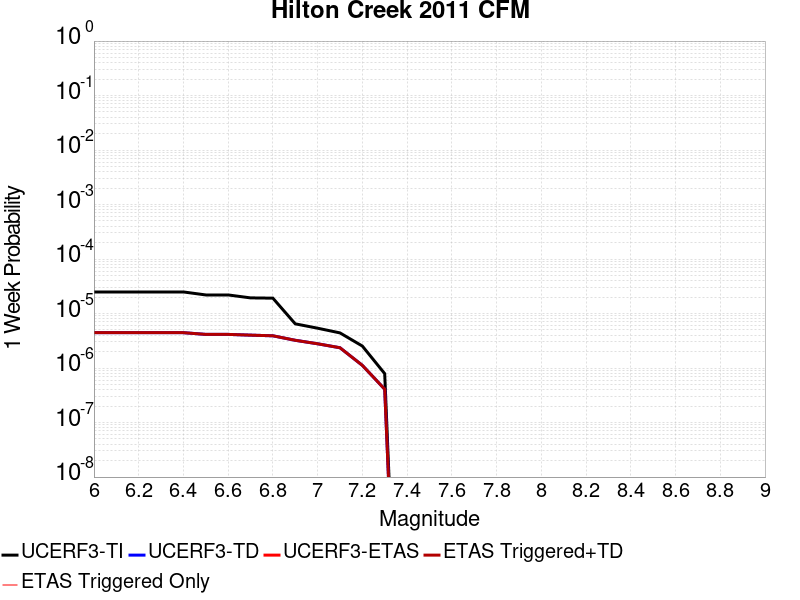 |  |  |  |

| Magnitude | 1 wk TI Prob | 1 wk TD Prob | 1 wk ETAS Prob | 1 wk ETAS/TD Gain | 1 wk ETAS Triggered+TD | 1 wk ETAS Triggered Only | 1 mo TI Prob | 1 mo TD Prob | 1 mo ETAS Prob | 1 mo ETAS/TD Gain | 1 mo ETAS Triggered+TD | 1 mo ETAS Triggered Only | 1 yr TI Prob | 1 yr TD Prob | 1 yr ETAS Prob | 1 yr ETAS/TD Gain | 1 yr ETAS Triggered+TD | 1 yr ETAS Triggered Only | 10 yr TI Prob | 10 yr TD Prob | 10 yr ETAS Prob | 10 yr ETAS/TD Gain | 10 yr ETAS Triggered+TD | 10 yr ETAS Triggered Only |
|-----|-----|-----|-----|-----|-----|-----|-----|-----|-----|-----|-----|-----|-----|-----|-----|-----|-----|-----|-----|-----|-----|-----|-----|-----|
| 6.0 | 2.4923684E-5 | 4.4541457E-6 | 0.0 | 0.0 | 4.4541457E-6 | 0.0 | 1.06811414E-4 | 1.9089066E-5 | 0.0 | 0.0 | 1.9089066E-5 | 0.0 | 0.0012996531 | 2.3238621E-4 | 2.0E-4 | 0.8606363 | 2.3238621E-4 | 0.0 | 0.012920785 | 0.0023244994 | 9.0E-4 | 0.38718015 | 0.0025240346 | 2.0E-4 |
| 6.1 | 2.4923684E-5 | 4.4541457E-6 | 0.0 | 0.0 | 4.4541457E-6 | 0.0 | 1.06811414E-4 | 1.9089066E-5 | 0.0 | 0.0 | 1.9089066E-5 | 0.0 | 0.0012996531 | 2.3238621E-4 | 2.0E-4 | 0.8606363 | 2.3238621E-4 | 0.0 | 0.012920785 | 0.0023244994 | 9.0E-4 | 0.38718015 | 0.0025240346 | 2.0E-4 |
| 6.2 | 2.4923684E-5 | 4.4541457E-6 | 0.0 | 0.0 | 4.4541457E-6 | 0.0 | 1.06811414E-4 | 1.9089066E-5 | 0.0 | 0.0 | 1.9089066E-5 | 0.0 | 0.0012996531 | 2.3238621E-4 | 2.0E-4 | 0.8606363 | 2.3238621E-4 | 0.0 | 0.012920785 | 0.0023244994 | 9.0E-4 | 0.38718015 | 0.0025240346 | 2.0E-4 |
| 6.3 | 2.4923684E-5 | 4.4541457E-6 | 0.0 | 0.0 | 4.4541457E-6 | 0.0 | 1.06811414E-4 | 1.9089066E-5 | 0.0 | 0.0 | 1.9089066E-5 | 0.0 | 0.0012996531 | 2.3238621E-4 | 2.0E-4 | 0.8606363 | 2.3238621E-4 | 0.0 | 0.012920785 | 0.0023244994 | 9.0E-4 | 0.38718015 | 0.0025240346 | 2.0E-4 |
| 6.4 | 2.4923684E-5 | 4.4541457E-6 | 0.0 | 0.0 | 4.4541457E-6 | 0.0 | 1.06811414E-4 | 1.9089066E-5 | 0.0 | 0.0 | 1.9089066E-5 | 0.0 | 0.0012996531 | 2.3238621E-4 | 2.0E-4 | 0.8606363 | 2.3238621E-4 | 0.0 | 0.012920785 | 0.0023244994 | 9.0E-4 | 0.38718015 | 0.0025240346 | 2.0E-4 |
| 6.5 | 2.1963904E-5 | 4.1415906E-6 | 0.0 | 0.0 | 4.1415906E-6 | 0.0 | 9.412762E-5 | 1.774956E-5 | 0.0 | 0.0 | 1.774956E-5 | 0.0 | 0.0011454013 | 2.1608098E-4 | 2.0E-4 | 0.92557895 | 2.1608098E-4 | 0.0 | 0.011395155 | 0.0021636188 | 9.0E-4 | 0.41596976 | 0.002363186 | 2.0E-4 |
| 6.6 | 2.1963904E-5 | 4.1415906E-6 | 0.0 | 0.0 | 4.1415906E-6 | 0.0 | 9.412762E-5 | 1.774956E-5 | 0.0 | 0.0 | 1.774956E-5 | 0.0 | 0.0011454013 | 2.1608098E-4 | 2.0E-4 | 0.92557895 | 2.1608098E-4 | 0.0 | 0.011395155 | 0.0021636188 | 9.0E-4 | 0.41596976 | 0.002363186 | 2.0E-4 |
| 6.7 | 1.9397496E-5 | 4.011778E-6 | 0.0 | 0.0 | 4.011778E-6 | 0.0 | 8.3129475E-5 | 1.719323E-5 | 0.0 | 0.0 | 1.719323E-5 | 0.0 | 0.0010116313 | 2.0930894E-4 | 2.0E-4 | 0.95552534 | 2.0930894E-4 | 0.0 | 0.0100703845 | 0.0020956183 | 9.0E-4 | 0.42946753 | 0.0022951993 | 2.0E-4 |
| 6.8 | 1.917303E-5 | 3.904741E-6 | 0.0 | 0.0 | 3.904741E-6 | 0.0 | 8.216754E-5 | 1.6734506E-5 | 0.0 | 0.0 | 1.6734506E-5 | 0.0 | 9.999307E-4 | 2.0372502E-4 | 2.0E-4 | 0.98171544 | 2.0372502E-4 | 0.0 | 0.009954433 | 0.0020398824 | 9.0E-4 | 0.4412019 | 0.0022394743 | 2.0E-4 |
| 6.9 | 6.480681E-6 | 3.2315015E-6 | 0.0 | 0.0 | 3.2315015E-6 | 0.0 | 2.7774051E-5 | 1.3849225E-5 | 0.0 | 0.0 | 1.3849225E-5 | 0.0 | 3.380966E-4 | 1.686024E-4 | 2.0E-4 | 1.1862228 | 1.686024E-4 | 0.0 | 0.0033758266 | 0.0016848559 | 8.0E-4 | 0.47481805 | 0.0017846874 | 1.0E-4 |
| 7.0 | 5.388316E-6 | 2.7882832E-6 | 0.0 | 0.0 | 2.7882832E-6 | 0.0 | 2.3092578E-5 | 1.1949735E-5 | 0.0 | 0.0 | 1.1949735E-5 | 0.0 | 2.8111585E-4 | 1.4547937E-4 | 1.0E-4 | 0.6873827 | 1.4547937E-4 | 0.0 | 0.002807605 | 0.0014539439 | 6.0E-4 | 0.41267064 | 0.0014539439 | 0.0 |
| 7.1 | 4.41728E-6 | 2.3575355E-6 | 0.0 | 0.0 | 2.3575355E-6 | 0.0 | 1.8931061E-5 | 1.010369E-5 | 0.0 | 0.0 | 1.010369E-5 | 0.0 | 2.304613E-4 | 1.2300647E-4 | 1.0E-4 | 0.8129654 | 1.2300647E-4 | 0.0 | 0.0023022245 | 0.0012294803 | 6.0E-4 | 0.48801106 | 0.0012294803 | 0.0 |
| 7.2 | 2.535495E-6 | 1.1211132E-6 | 0.0 | 0.0 | 1.1211132E-6 | 0.0 | 1.0866362E-5 | 4.804765E-6 | 0.0 | 0.0 | 4.804765E-6 | 0.0 | 1.3228992E-4 | 5.8496968E-5 | 1.0E-4 | 1.7094904 | 5.8496968E-5 | 0.0 | 0.0013221119 | 5.8486685E-4 | 3.0E-4 | 0.51293725 | 5.8486685E-4 | 0.0 |
| 7.3 | 7.900015E-7 | 4.0880732E-7 | 0.0 | 0.0 | 4.0880732E-7 | 0.0 | 3.3857161E-6 | 1.7520314E-6 | 0.0 | 0.0 | 1.7520314E-6 | 0.0 | 4.1220315E-5 | 2.1330983E-5 | 1.0E-4 | 4.6880164 | 2.1330983E-5 | 0.0 | 4.121267E-4 | 2.1330983E-4 | 1.0E-4 | 0.46880165 | 2.1330983E-4 | 0.0 |

## Great Valley 14 (Kettleman Hills)
*[(top)](#table-of-contents)*

| 1 Week | 1 Month | 1 Year | 10 Year |
|-----|-----|-----|-----|
| 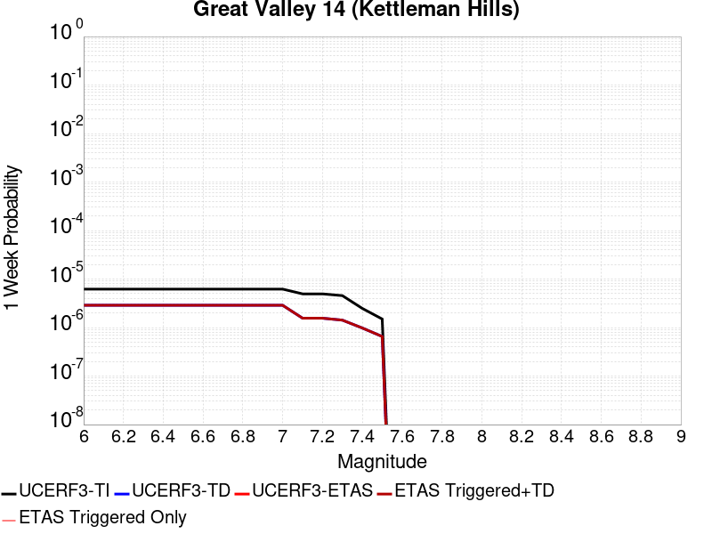 | 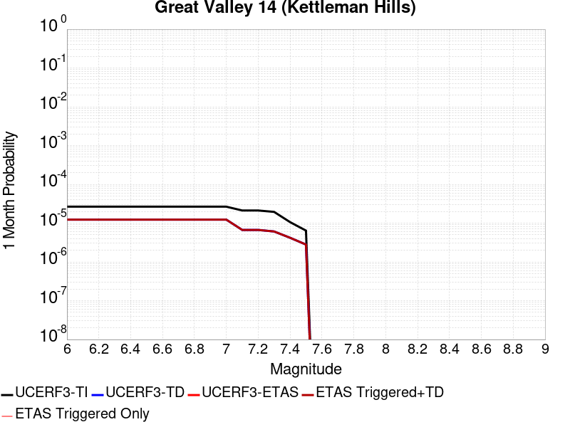 | 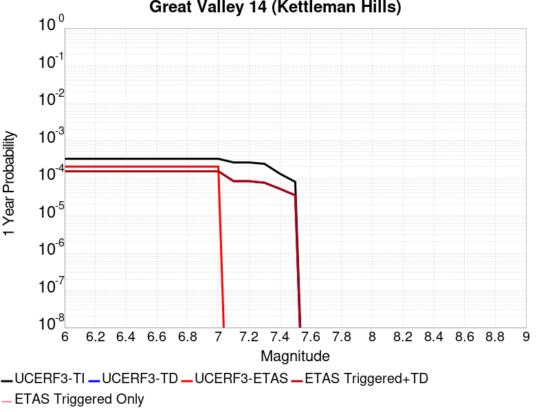 | 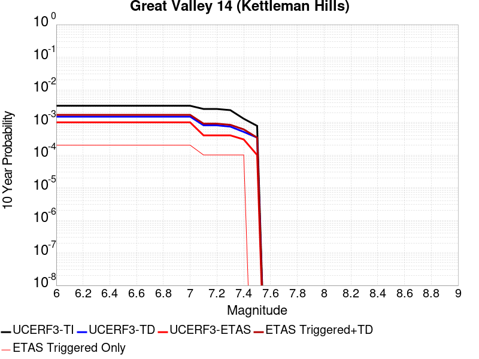 |

| Magnitude | 1 wk TI Prob | 1 wk TD Prob | 1 wk ETAS Prob | 1 wk ETAS/TD Gain | 1 wk ETAS Triggered+TD | 1 wk ETAS Triggered Only | 1 mo TI Prob | 1 mo TD Prob | 1 mo ETAS Prob | 1 mo ETAS/TD Gain | 1 mo ETAS Triggered+TD | 1 mo ETAS Triggered Only | 1 yr TI Prob | 1 yr TD Prob | 1 yr ETAS Prob | 1 yr ETAS/TD Gain | 1 yr ETAS Triggered+TD | 1 yr ETAS Triggered Only | 10 yr TI Prob | 10 yr TD Prob | 10 yr ETAS Prob | 10 yr ETAS/TD Gain | 10 yr ETAS Triggered+TD | 10 yr ETAS Triggered Only |
|-----|-----|-----|-----|-----|-----|-----|-----|-----|-----|-----|-----|-----|-----|-----|-----|-----|-----|-----|-----|-----|-----|-----|-----|-----|
| 6.0 | 6.2057843E-6 | 2.8768995E-6 | 0.0 | 0.0 | 2.8768995E-6 | 0.0 | 2.6595946E-5 | 1.2329524E-5 | 0.0 | 0.0 | 1.2329524E-5 | 0.0 | 3.2375753E-4 | 1.5010397E-4 | 2.0E-4 | 1.3324097 | 1.5010397E-4 | 0.0 | 0.0032328626 | 0.0015002572 | 0.001 | 0.66655236 | 0.0016999572 | 2.0E-4 |
| 6.1 | 6.2057843E-6 | 2.8768995E-6 | 0.0 | 0.0 | 2.8768995E-6 | 0.0 | 2.6595946E-5 | 1.2329524E-5 | 0.0 | 0.0 | 1.2329524E-5 | 0.0 | 3.2375753E-4 | 1.5010397E-4 | 2.0E-4 | 1.3324097 | 1.5010397E-4 | 0.0 | 0.0032328626 | 0.0015002572 | 0.001 | 0.66655236 | 0.0016999572 | 2.0E-4 |
| 6.2 | 6.2057843E-6 | 2.8768995E-6 | 0.0 | 0.0 | 2.8768995E-6 | 0.0 | 2.6595946E-5 | 1.2329524E-5 | 0.0 | 0.0 | 1.2329524E-5 | 0.0 | 3.2375753E-4 | 1.5010397E-4 | 2.0E-4 | 1.3324097 | 1.5010397E-4 | 0.0 | 0.0032328626 | 0.0015002572 | 0.001 | 0.66655236 | 0.0016999572 | 2.0E-4 |
| 6.3 | 6.2057843E-6 | 2.8768995E-6 | 0.0 | 0.0 | 2.8768995E-6 | 0.0 | 2.6595946E-5 | 1.2329524E-5 | 0.0 | 0.0 | 1.2329524E-5 | 0.0 | 3.2375753E-4 | 1.5010397E-4 | 2.0E-4 | 1.3324097 | 1.5010397E-4 | 0.0 | 0.0032328626 | 0.0015002572 | 0.001 | 0.66655236 | 0.0016999572 | 2.0E-4 |
| 6.4 | 6.2057843E-6 | 2.8768995E-6 | 0.0 | 0.0 | 2.8768995E-6 | 0.0 | 2.6595946E-5 | 1.2329524E-5 | 0.0 | 0.0 | 1.2329524E-5 | 0.0 | 3.2375753E-4 | 1.5010397E-4 | 2.0E-4 | 1.3324097 | 1.5010397E-4 | 0.0 | 0.0032328626 | 0.0015002572 | 0.001 | 0.66655236 | 0.0016999572 | 2.0E-4 |
| 6.5 | 6.2057843E-6 | 2.8768995E-6 | 0.0 | 0.0 | 2.8768995E-6 | 0.0 | 2.6595946E-5 | 1.2329524E-5 | 0.0 | 0.0 | 1.2329524E-5 | 0.0 | 3.2375753E-4 | 1.5010397E-4 | 2.0E-4 | 1.3324097 | 1.5010397E-4 | 0.0 | 0.0032328626 | 0.0015002572 | 0.001 | 0.66655236 | 0.0016999572 | 2.0E-4 |
| 6.6 | 6.2057843E-6 | 2.8768995E-6 | 0.0 | 0.0 | 2.8768995E-6 | 0.0 | 2.6595946E-5 | 1.2329524E-5 | 0.0 | 0.0 | 1.2329524E-5 | 0.0 | 3.2375753E-4 | 1.5010397E-4 | 2.0E-4 | 1.3324097 | 1.5010397E-4 | 0.0 | 0.0032328626 | 0.0015002572 | 0.001 | 0.66655236 | 0.0016999572 | 2.0E-4 |
| 6.7 | 6.2057843E-6 | 2.8768995E-6 | 0.0 | 0.0 | 2.8768995E-6 | 0.0 | 2.6595946E-5 | 1.2329524E-5 | 0.0 | 0.0 | 1.2329524E-5 | 0.0 | 3.2375753E-4 | 1.5010397E-4 | 2.0E-4 | 1.3324097 | 1.5010397E-4 | 0.0 | 0.0032328626 | 0.0015002572 | 0.001 | 0.66655236 | 0.0016999572 | 2.0E-4 |
| 6.8 | 6.2057843E-6 | 2.8768995E-6 | 0.0 | 0.0 | 2.8768995E-6 | 0.0 | 2.6595946E-5 | 1.2329524E-5 | 0.0 | 0.0 | 1.2329524E-5 | 0.0 | 3.2375753E-4 | 1.5010397E-4 | 2.0E-4 | 1.3324097 | 1.5010397E-4 | 0.0 | 0.0032328626 | 0.0015002572 | 0.001 | 0.66655236 | 0.0016999572 | 2.0E-4 |
| 6.9 | 6.2057843E-6 | 2.8768995E-6 | 0.0 | 0.0 | 2.8768995E-6 | 0.0 | 2.6595946E-5 | 1.2329524E-5 | 0.0 | 0.0 | 1.2329524E-5 | 0.0 | 3.2375753E-4 | 1.5010397E-4 | 2.0E-4 | 1.3324097 | 1.5010397E-4 | 0.0 | 0.0032328626 | 0.0015002572 | 0.001 | 0.66655236 | 0.0016999572 | 2.0E-4 |
| 7.0 | 6.2057843E-6 | 2.8768995E-6 | 0.0 | 0.0 | 2.8768995E-6 | 0.0 | 2.6595946E-5 | 1.2329524E-5 | 0.0 | 0.0 | 1.2329524E-5 | 0.0 | 3.2375753E-4 | 1.5010397E-4 | 2.0E-4 | 1.3324097 | 1.5010397E-4 | 0.0 | 0.0032328626 | 0.0015002572 | 0.001 | 0.66655236 | 0.0016999572 | 2.0E-4 |
| 7.1 | 4.95113E-6 | 1.5605201E-6 | 0.0 | 0.0 | 1.5605201E-6 | 0.0 | 2.1218955E-5 | 6.687927E-6 | 0.0 | 0.0 | 6.687927E-6 | 0.0 | 2.5831014E-4 | 8.142266E-5 | 0.0 | 0.0 | 8.142266E-5 | 0.0 | 0.0025801011 | 8.1394723E-4 | 4.0E-4 | 0.49143234 | 9.138658E-4 | 1.0E-4 |
| 7.2 | 4.95113E-6 | 1.5605201E-6 | 0.0 | 0.0 | 1.5605201E-6 | 0.0 | 2.1218955E-5 | 6.687927E-6 | 0.0 | 0.0 | 6.687927E-6 | 0.0 | 2.5831014E-4 | 8.142266E-5 | 0.0 | 0.0 | 8.142266E-5 | 0.0 | 0.0025801011 | 8.1394723E-4 | 4.0E-4 | 0.49143234 | 9.138658E-4 | 1.0E-4 |
| 7.3 | 4.5549086E-6 | 1.4225021E-6 | 0.0 | 0.0 | 1.4225021E-6 | 0.0 | 1.9520892E-5 | 6.0964244E-6 | 0.0 | 0.0 | 6.0964244E-6 | 0.0 | 2.3764092E-4 | 7.422161E-5 | 0.0 | 0.0 | 7.422161E-5 | 0.0 | 0.0023738695 | 7.419848E-4 | 4.0E-4 | 0.5390946 | 8.419106E-4 | 1.0E-4 |
| 7.4 | 2.4837766E-6 | 9.799826E-7 | 0.0 | 0.0 | 9.799826E-7 | 0.0 | 1.0644713E-5 | 4.1999187E-6 | 0.0 | 0.0 | 4.1999187E-6 | 0.0 | 1.2959167E-4 | 5.113288E-5 | 0.0 | 0.0 | 5.113288E-5 | 0.0 | 0.0012951613 | 5.112177E-4 | 3.0E-4 | 0.58683413 | 6.111666E-4 | 1.0E-4 |
| 7.5 | 1.5002679E-6 | 6.545664E-7 | 0.0 | 0.0 | 6.545664E-7 | 0.0 | 6.4297037E-6 | 2.8052818E-6 | 0.0 | 0.0 | 2.8052818E-6 | 0.0 | 7.827883E-5 | 3.415381E-5 | 0.0 | 0.0 | 3.415381E-5 | 0.0 | 7.825126E-4 | 3.414898E-4 | 1.0E-4 | 0.29283452 | 3.414898E-4 | 0.0 |

## Kern Canyon (Lake Isabella) 2011
*[(top)](#table-of-contents)*

| 1 Week | 1 Month | 1 Year | 10 Year |
|-----|-----|-----|-----|
|  | 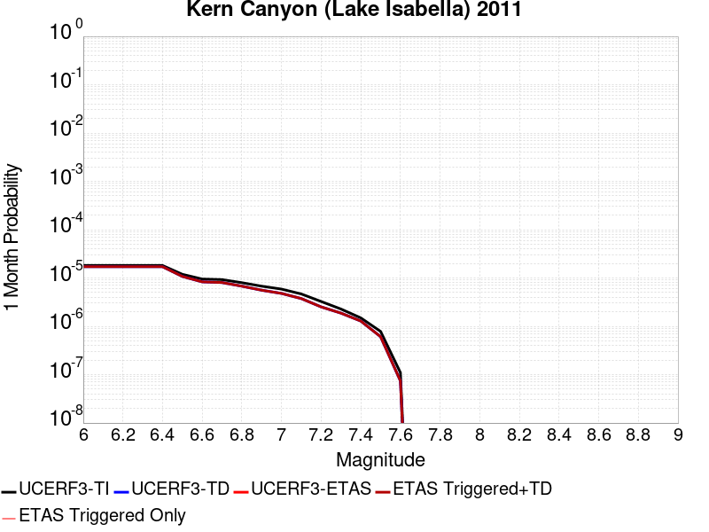 | 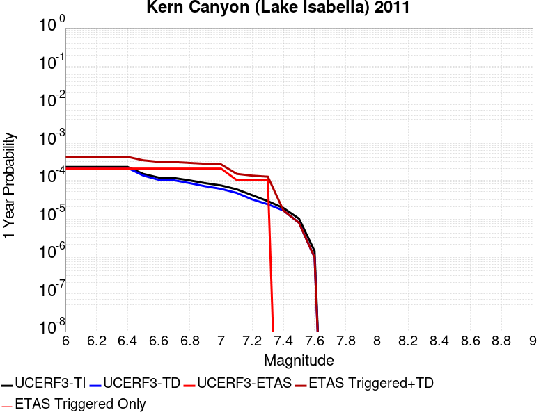 | 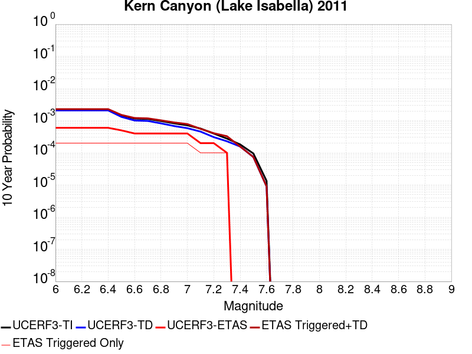 |

| Magnitude | 1 wk TI Prob | 1 wk TD Prob | 1 wk ETAS Prob | 1 wk ETAS/TD Gain | 1 wk ETAS Triggered+TD | 1 wk ETAS Triggered Only | 1 mo TI Prob | 1 mo TD Prob | 1 mo ETAS Prob | 1 mo ETAS/TD Gain | 1 mo ETAS Triggered+TD | 1 mo ETAS Triggered Only | 1 yr TI Prob | 1 yr TD Prob | 1 yr ETAS Prob | 1 yr ETAS/TD Gain | 1 yr ETAS Triggered+TD | 1 yr ETAS Triggered Only | 10 yr TI Prob | 10 yr TD Prob | 10 yr ETAS Prob | 10 yr ETAS/TD Gain | 10 yr ETAS Triggered+TD | 10 yr ETAS Triggered Only |
|-----|-----|-----|-----|-----|-----|-----|-----|-----|-----|-----|-----|-----|-----|-----|-----|-----|-----|-----|-----|-----|-----|-----|-----|-----|
| 6.0 | 4.2387383E-6 | 4.001752E-6 | 0.0 | 0.0 | 4.001752E-6 | 0.0 | 1.8165894E-5 | 1.7150263E-5 | 0.0 | 0.0 | 1.7150263E-5 | 0.0 | 2.2114732E-4 | 2.0878631E-4 | 2.0E-4 | 0.95791715 | 4.0874456E-4 | 2.0E-4 | 0.0022092736 | 0.0020860855 | 6.0E-4 | 0.28762004 | 0.0022856684 | 2.0E-4 |
| 6.1 | 4.2387383E-6 | 4.001752E-6 | 0.0 | 0.0 | 4.001752E-6 | 0.0 | 1.8165894E-5 | 1.7150263E-5 | 0.0 | 0.0 | 1.7150263E-5 | 0.0 | 2.2114732E-4 | 2.0878631E-4 | 2.0E-4 | 0.95791715 | 4.0874456E-4 | 2.0E-4 | 0.0022092736 | 0.0020860855 | 6.0E-4 | 0.28762004 | 0.0022856684 | 2.0E-4 |
| 6.2 | 4.2387383E-6 | 4.001752E-6 | 0.0 | 0.0 | 4.001752E-6 | 0.0 | 1.8165894E-5 | 1.7150263E-5 | 0.0 | 0.0 | 1.7150263E-5 | 0.0 | 2.2114732E-4 | 2.0878631E-4 | 2.0E-4 | 0.95791715 | 4.0874456E-4 | 2.0E-4 | 0.0022092736 | 0.0020860855 | 6.0E-4 | 0.28762004 | 0.0022856684 | 2.0E-4 |
| 6.3 | 4.2387383E-6 | 4.001752E-6 | 0.0 | 0.0 | 4.001752E-6 | 0.0 | 1.8165894E-5 | 1.7150263E-5 | 0.0 | 0.0 | 1.7150263E-5 | 0.0 | 2.2114732E-4 | 2.0878631E-4 | 2.0E-4 | 0.95791715 | 4.0874456E-4 | 2.0E-4 | 0.0022092736 | 0.0020860855 | 6.0E-4 | 0.28762004 | 0.0022856684 | 2.0E-4 |
| 6.4 | 4.2387383E-6 | 4.001752E-6 | 0.0 | 0.0 | 4.001752E-6 | 0.0 | 1.8165894E-5 | 1.7150263E-5 | 0.0 | 0.0 | 1.7150263E-5 | 0.0 | 2.2114732E-4 | 2.0878631E-4 | 2.0E-4 | 0.95791715 | 4.0874456E-4 | 2.0E-4 | 0.0022092736 | 0.0020860855 | 6.0E-4 | 0.28762004 | 0.0022856684 | 2.0E-4 |
| 6.5 | 2.7857532E-6 | 2.517918E-6 | 0.0 | 0.0 | 2.517918E-6 | 0.0 | 1.1938888E-5 | 1.0791034E-5 | 0.0 | 0.0 | 1.0791034E-5 | 0.0 | 1.4534626E-4 | 1.3137325E-4 | 2.0E-4 | 1.52238 | 3.3134696E-4 | 2.0E-4 | 0.0014525123 | 0.0013129886 | 5.0E-4 | 0.38081062 | 0.001512726 | 2.0E-4 |
| 6.6 | 2.2233348E-6 | 1.9441516E-6 | 0.0 | 0.0 | 1.9441516E-6 | 0.0 | 9.528543E-6 | 8.332052E-6 | 0.0 | 0.0 | 8.332052E-6 | 0.0 | 1.1600384E-4 | 1.014381E-4 | 2.0E-4 | 1.9716457 | 3.014178E-4 | 2.0E-4 | 0.001159433 | 0.0010139266 | 4.0E-4 | 0.39450586 | 0.0012137238 | 2.0E-4 |
| 6.7 | 2.1635126E-6 | 1.88353E-6 | 0.0 | 0.0 | 1.88353E-6 | 0.0 | 9.272164E-6 | 8.072247E-6 | 0.0 | 0.0 | 8.072247E-6 | 0.0 | 1.1288274E-4 | 9.827525E-5 | 2.0E-4 | 2.0351002 | 2.982556E-4 | 2.0E-4 | 0.0011282542 | 9.823261E-4 | 4.0E-4 | 0.40719673 | 0.0011821297 | 2.0E-4 |
| 6.8 | 1.8685711E-6 | 1.583158E-6 | 0.0 | 0.0 | 1.583158E-6 | 0.0 | 8.008137E-6 | 6.7849455E-6 | 0.0 | 0.0 | 6.7849455E-6 | 0.0 | 9.74947E-5 | 8.2603634E-5 | 2.0E-4 | 2.421201 | 2.825871E-4 | 2.0E-4 | 9.745194E-4 | 8.2573417E-4 | 4.0E-4 | 0.48441738 | 0.001025569 | 2.0E-4 |
| 6.9 | 1.5815071E-6 | 1.3065018E-6 | 0.0 | 0.0 | 1.3065018E-6 | 0.0 | 6.77787E-6 | 5.5992814E-6 | 0.0 | 0.0 | 5.5992814E-6 | 0.0 | 8.251744E-5 | 6.8169145E-5 | 2.0E-4 | 2.9338787 | 2.681555E-4 | 2.0E-4 | 8.248681E-4 | 6.81485E-4 | 4.0E-4 | 0.5869535 | 8.813487E-4 | 2.0E-4 |
| 7.0 | 1.3772564E-6 | 1.1210786E-6 | 0.0 | 0.0 | 1.1210786E-6 | 0.0 | 5.9025137E-6 | 4.804614E-6 | 0.0 | 0.0 | 4.804614E-6 | 0.0 | 7.186073E-5 | 5.849463E-5 | 2.0E-4 | 3.4191175 | 2.5848293E-4 | 2.0E-4 | 7.18375E-4 | 5.847943E-4 | 4.0E-4 | 0.68400115 | 7.846774E-4 | 2.0E-4 |
| 7.1 | 1.0916998E-6 | 8.763828E-7 | 0.0 | 0.0 | 8.763828E-7 | 0.0 | 4.678705E-6 | 3.755921E-6 | 0.0 | 0.0 | 3.755921E-6 | 0.0 | 5.6961744E-5 | 4.5727393E-5 | 1.0E-4 | 2.186873 | 1.4572282E-4 | 1.0E-4 | 5.6947145E-4 | 4.5718116E-4 | 2.0E-4 | 0.43746334 | 5.5713544E-4 | 1.0E-4 |
| 7.2 | 7.6277024E-7 | 5.9014707E-7 | 0.0 | 0.0 | 5.9014707E-7 | 0.0 | 3.2690114E-6 | 2.5291993E-6 | 0.0 | 0.0 | 2.5291993E-6 | 0.0 | 3.9799485E-5 | 3.0792573E-5 | 1.0E-4 | 3.2475364 | 1.3078949E-4 | 1.0E-4 | 3.9792358E-4 | 3.0788366E-4 | 2.0E-4 | 0.64959604 | 4.0785287E-4 | 1.0E-4 |
| 7.3 | 5.3265916E-7 | 4.382449E-7 | 0.0 | 0.0 | 4.382449E-7 | 0.0 | 2.282823E-6 | 1.8781911E-6 | 0.0 | 0.0 | 1.8781911E-6 | 0.0 | 2.7793016E-5 | 2.2866741E-5 | 1.0E-4 | 4.3731637 | 1.2286445E-4 | 1.0E-4 | 2.778954E-4 | 2.2864426E-4 | 1.0E-4 | 0.43736064 | 3.286214E-4 | 1.0E-4 |
| 7.4 | 3.4946007E-7 | 3.0065726E-7 | 0.0 | 0.0 | 3.0065726E-7 | 0.0 | 1.497685E-6 | 1.2885305E-6 | 0.0 | 0.0 | 1.2885305E-6 | 0.0 | 1.8234163E-5 | 1.5687747E-5 | 0.0 | 0.0 | 1.5687747E-5 | 0.0 | 1.8232666E-4 | 1.5686662E-4 | 0.0 | 0.0 | 1.5686662E-4 | 0.0 |
| 7.5 | 1.8317026E-7 | 1.4244462E-7 | 0.0 | 0.0 | 1.4244462E-7 | 0.0 | 7.850152E-7 | 6.1047683E-7 | 0.0 | 0.0 | 6.1047683E-7 | 0.0 | 9.557518E-6 | 7.4325308E-6 | 0.0 | 0.0 | 7.4325308E-6 | 0.0 | 9.5571064E-5 | 7.4322896E-5 | 0.0 | 0.0 | 7.4322896E-5 | 0.0 |
| 7.6 | 2.572245E-8 | 1.7351534E-8 | 0.0 | 0.0 | 1.7351534E-8 | 0.0 | 1.10239064E-7 | 7.436371E-8 | 0.0 | 0.0 | 7.436371E-8 | 0.0 | 1.3421597E-6 | 9.053778E-7 | 0.0 | 0.0 | 9.053778E-7 | 0.0 | 1.3421517E-5 | 9.053747E-6 | 0.0 | 0.0 | 9.053747E-6 | 0.0 |

## Kern Canyon (South Kern) 2011
*[(top)](#table-of-contents)*

| 1 Week | 1 Month | 1 Year | 10 Year |
|-----|-----|-----|-----|
|  | 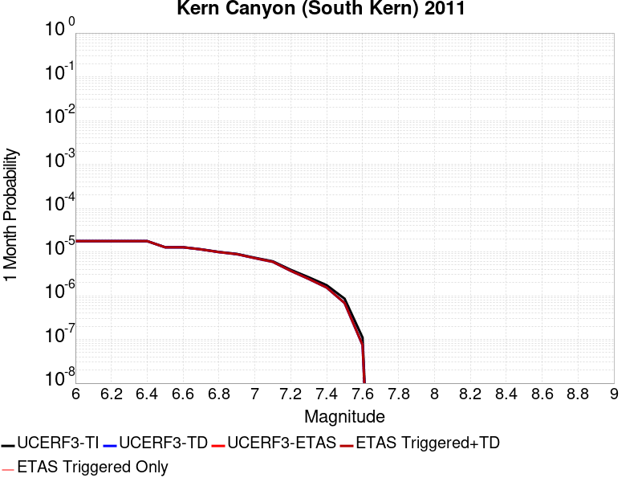 | 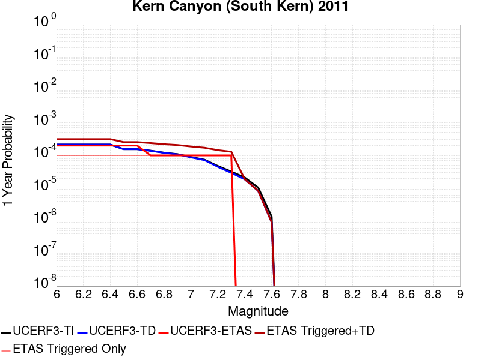 |  |

| Magnitude | 1 wk TI Prob | 1 wk TD Prob | 1 wk ETAS Prob | 1 wk ETAS/TD Gain | 1 wk ETAS Triggered+TD | 1 wk ETAS Triggered Only | 1 mo TI Prob | 1 mo TD Prob | 1 mo ETAS Prob | 1 mo ETAS/TD Gain | 1 mo ETAS Triggered+TD | 1 mo ETAS Triggered Only | 1 yr TI Prob | 1 yr TD Prob | 1 yr ETAS Prob | 1 yr ETAS/TD Gain | 1 yr ETAS Triggered+TD | 1 yr ETAS Triggered Only | 10 yr TI Prob | 10 yr TD Prob | 10 yr ETAS Prob | 10 yr ETAS/TD Gain | 10 yr ETAS Triggered+TD | 10 yr ETAS Triggered Only |
|-----|-----|-----|-----|-----|-----|-----|-----|-----|-----|-----|-----|-----|-----|-----|-----|-----|-----|-----|-----|-----|-----|-----|-----|-----|
| 6.0 | 4.105075E-6 | 4.1138624E-6 | 0.0 | 0.0 | 4.1138624E-6 | 0.0 | 1.7593058E-5 | 1.7630722E-5 | 0.0 | 0.0 | 1.7630722E-5 | 0.0 | 2.1417443E-4 | 2.1463355E-4 | 2.0E-4 | 0.93182075 | 3.146121E-4 | 1.0E-4 | 0.0021396813 | 0.0021443265 | 0.0011 | 0.5129816 | 0.0023438975 | 2.0E-4 |
| 6.1 | 4.105075E-6 | 4.1138624E-6 | 0.0 | 0.0 | 4.1138624E-6 | 0.0 | 1.7593058E-5 | 1.7630722E-5 | 0.0 | 0.0 | 1.7630722E-5 | 0.0 | 2.1417443E-4 | 2.1463355E-4 | 2.0E-4 | 0.93182075 | 3.146121E-4 | 1.0E-4 | 0.0021396813 | 0.0021443265 | 0.0011 | 0.5129816 | 0.0023438975 | 2.0E-4 |
| 6.2 | 4.105075E-6 | 4.1138624E-6 | 0.0 | 0.0 | 4.1138624E-6 | 0.0 | 1.7593058E-5 | 1.7630722E-5 | 0.0 | 0.0 | 1.7630722E-5 | 0.0 | 2.1417443E-4 | 2.1463355E-4 | 2.0E-4 | 0.93182075 | 3.146121E-4 | 1.0E-4 | 0.0021396813 | 0.0021443265 | 0.0011 | 0.5129816 | 0.0023438975 | 2.0E-4 |
| 6.3 | 4.105075E-6 | 4.1138624E-6 | 0.0 | 0.0 | 4.1138624E-6 | 0.0 | 1.7593058E-5 | 1.7630722E-5 | 0.0 | 0.0 | 1.7630722E-5 | 0.0 | 2.1417443E-4 | 2.1463355E-4 | 2.0E-4 | 0.93182075 | 3.146121E-4 | 1.0E-4 | 0.0021396813 | 0.0021443265 | 0.0011 | 0.5129816 | 0.0023438975 | 2.0E-4 |
| 6.4 | 4.105075E-6 | 4.1138624E-6 | 0.0 | 0.0 | 4.1138624E-6 | 0.0 | 1.7593058E-5 | 1.7630722E-5 | 0.0 | 0.0 | 1.7630722E-5 | 0.0 | 2.1417443E-4 | 2.1463355E-4 | 2.0E-4 | 0.93182075 | 3.146121E-4 | 1.0E-4 | 0.0021396813 | 0.0021443265 | 0.0011 | 0.5129816 | 0.0023438975 | 2.0E-4 |
| 6.5 | 2.9849807E-6 | 2.9732491E-6 | 0.0 | 0.0 | 2.9732491E-6 | 0.0 | 1.2792712E-5 | 1.27424355E-5 | 0.0 | 0.0 | 1.27424355E-5 | 0.0 | 1.5574014E-4 | 1.5512826E-4 | 2.0E-4 | 1.2892557 | 2.5511274E-4 | 1.0E-4 | 0.0015563103 | 0.0015502148 | 0.001 | 0.64507186 | 0.0017499048 | 2.0E-4 |
| 6.6 | 2.9849807E-6 | 2.9732491E-6 | 0.0 | 0.0 | 2.9732491E-6 | 0.0 | 1.2792712E-5 | 1.27424355E-5 | 0.0 | 0.0 | 1.27424355E-5 | 0.0 | 1.5574014E-4 | 1.5512826E-4 | 2.0E-4 | 1.2892557 | 2.5511274E-4 | 1.0E-4 | 0.0015563103 | 0.0015502148 | 0.001 | 0.64507186 | 0.0017499048 | 2.0E-4 |
| 6.7 | 2.6756725E-6 | 2.6583039E-6 | 0.0 | 0.0 | 2.6583039E-6 | 0.0 | 1.1467117E-5 | 1.1392682E-5 | 0.0 | 0.0 | 1.1392682E-5 | 0.0 | 1.396032E-4 | 1.3869719E-4 | 1.0E-4 | 0.7209952 | 2.3868331E-4 | 1.0E-4 | 0.0013951553 | 0.0013861171 | 8.0E-4 | 0.57715183 | 0.0015858399 | 2.0E-4 |
| 6.8 | 2.3283721E-6 | 2.3048497E-6 | 0.0 | 0.0 | 2.3048497E-6 | 0.0 | 9.9787E-6 | 9.87789E-6 | 0.0 | 0.0 | 9.87789E-6 | 0.0 | 1.214839E-4 | 1.20256744E-4 | 1.0E-4 | 0.8315542 | 2.2024472E-4 | 1.0E-4 | 0.001214175 | 0.0012019242 | 8.0E-4 | 0.6655994 | 0.0014016838 | 2.0E-4 |
| 6.9 | 2.0972677E-6 | 2.0697037E-6 | 0.0 | 0.0 | 2.0697037E-6 | 0.0 | 8.988259E-6 | 8.870129E-6 | 0.0 | 0.0 | 8.870129E-6 | 0.0 | 1.0942656E-4 | 1.07988526E-4 | 1.0E-4 | 0.9260243 | 2.0797773E-4 | 1.0E-4 | 0.0010937268 | 0.0010793663 | 8.0E-4 | 0.7411756 | 0.0012791505 | 2.0E-4 |
| 7.0 | 1.7132242E-6 | 1.6787523E-6 | 0.0 | 0.0 | 1.6787523E-6 | 0.0 | 7.3423685E-6 | 7.194633E-6 | 0.0 | 0.0 | 7.194633E-6 | 0.0 | 8.938967E-5 | 8.759117E-5 | 1.0E-4 | 1.1416676 | 1.8758241E-4 | 1.0E-4 | 8.935372E-4 | 8.7557035E-4 | 7.0E-4 | 0.7994789 | 0.0010753953 | 2.0E-4 |
| 7.1 | 1.4215541E-6 | 1.3816128E-6 | 0.0 | 0.0 | 1.3816128E-6 | 0.0 | 6.0923603E-6 | 5.9211848E-6 | 0.0 | 0.0 | 5.9211848E-6 | 0.0 | 7.417196E-5 | 7.208806E-5 | 1.0E-4 | 1.3871921 | 1.7208085E-4 | 1.0E-4 | 7.414721E-4 | 7.206495E-4 | 6.0E-4 | 0.83258224 | 9.205054E-4 | 2.0E-4 |
| 7.2 | 9.097853E-7 | 8.603962E-7 | 0.0 | 0.0 | 8.603962E-7 | 0.0 | 3.899074E-6 | 3.6874071E-6 | 0.0 | 0.0 | 3.6874071E-6 | 0.0 | 4.7470192E-5 | 4.4893266E-5 | 1.0E-4 | 2.2275054 | 1.4488878E-4 | 1.0E-4 | 4.7460053E-4 | 4.4884306E-4 | 4.0E-4 | 0.8911801 | 6.487533E-4 | 2.0E-4 |
| 7.3 | 6.144169E-7 | 5.62829E-7 | 0.0 | 0.0 | 5.62829E-7 | 0.0 | 2.6332125E-6 | 2.4121218E-6 | 0.0 | 0.0 | 2.4121218E-6 | 0.0 | 3.205889E-5 | 2.9367193E-5 | 1.0E-4 | 3.4051602 | 1.2936426E-4 | 1.0E-4 | 3.2054266E-4 | 2.9363364E-4 | 3.0E-4 | 1.0216813 | 4.935749E-4 | 2.0E-4 |
| 7.4 | 4.049844E-7 | 3.5728553E-7 | 0.0 | 0.0 | 3.5728553E-7 | 0.0 | 1.7356463E-6 | 1.5312228E-6 | 0.0 | 0.0 | 1.5312228E-6 | 0.0 | 2.1131287E-5 | 1.864248E-5 | 0.0 | 0.0 | 1.864248E-5 | 0.0 | 2.1129279E-4 | 1.8640941E-4 | 1.0E-4 | 0.5364536 | 1.8640941E-4 | 0.0 |
| 7.5 | 1.9871162E-7 | 1.5830153E-7 | 0.0 | 0.0 | 1.5830153E-7 | 0.0 | 8.5162094E-7 | 6.78435E-7 | 0.0 | 0.0 | 6.78435E-7 | 0.0 | 1.0368436E-5 | 8.259915E-6 | 0.0 | 0.0 | 8.259915E-6 | 0.0 | 1.0367952E-4 | 8.259617E-5 | 0.0 | 0.0 | 8.259617E-5 | 0.0 |
| 7.6 | 2.572245E-8 | 1.7351534E-8 | 0.0 | 0.0 | 1.7351534E-8 | 0.0 | 1.10239064E-7 | 7.436371E-8 | 0.0 | 0.0 | 7.436371E-8 | 0.0 | 1.3421597E-6 | 9.053778E-7 | 0.0 | 0.0 | 9.053778E-7 | 0.0 | 1.3421517E-5 | 9.053747E-6 | 0.0 | 0.0 | 9.053747E-6 | 0.0 |

## Fish Slough 2011 CFM
*[(top)](#table-of-contents)*

| 1 Week | 1 Month | 1 Year | 10 Year |
|-----|-----|-----|-----|
| 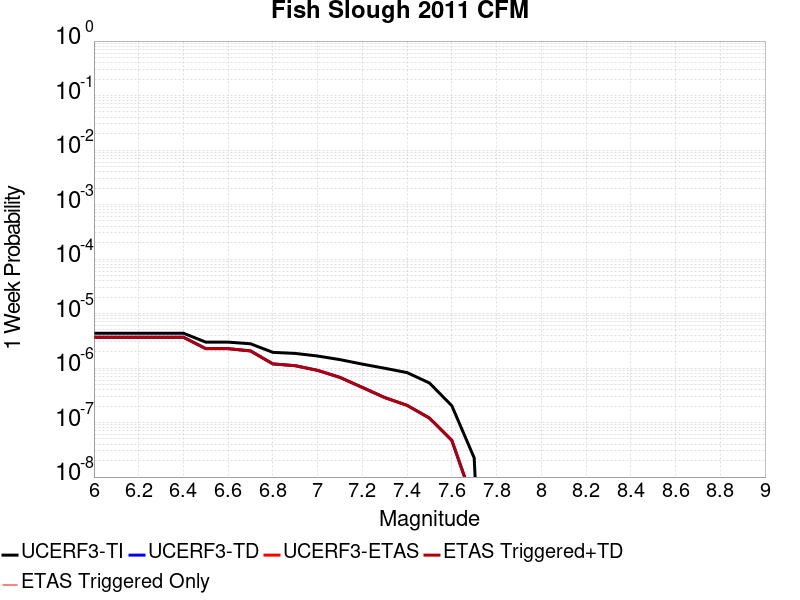 | 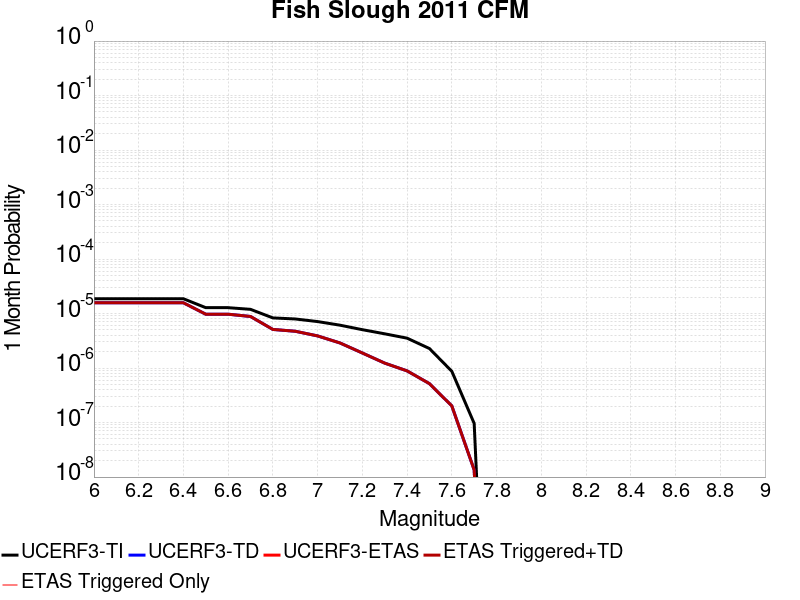 |  | 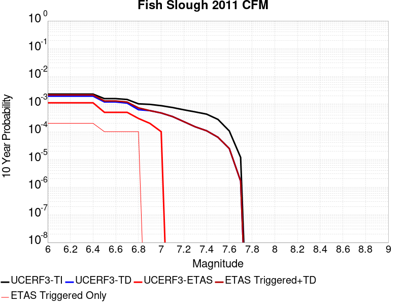 |

| Magnitude | 1 wk TI Prob | 1 wk TD Prob | 1 wk ETAS Prob | 1 wk ETAS/TD Gain | 1 wk ETAS Triggered+TD | 1 wk ETAS Triggered Only | 1 mo TI Prob | 1 mo TD Prob | 1 mo ETAS Prob | 1 mo ETAS/TD Gain | 1 mo ETAS Triggered+TD | 1 mo ETAS Triggered Only | 1 yr TI Prob | 1 yr TD Prob | 1 yr ETAS Prob | 1 yr ETAS/TD Gain | 1 yr ETAS Triggered+TD | 1 yr ETAS Triggered Only | 10 yr TI Prob | 10 yr TD Prob | 10 yr ETAS Prob | 10 yr ETAS/TD Gain | 10 yr ETAS Triggered+TD | 10 yr ETAS Triggered Only |
|-----|-----|-----|-----|-----|-----|-----|-----|-----|-----|-----|-----|-----|-----|-----|-----|-----|-----|-----|-----|-----|-----|-----|-----|-----|
| 6.0 | 4.3629925E-6 | 3.677479E-6 | 0.0 | 0.0 | 3.677479E-6 | 0.0 | 1.8698405E-5 | 1.5760541E-5 | 0.0 | 0.0 | 1.5760541E-5 | 0.0 | 2.276293E-4 | 1.9186983E-4 | 2.0E-4 | 1.0423734 | 1.9186983E-4 | 0.0 | 0.0022739628 | 0.0019172507 | 0.0011 | 0.5737382 | 0.002116867 | 2.0E-4 |
| 6.1 | 4.3629925E-6 | 3.677479E-6 | 0.0 | 0.0 | 3.677479E-6 | 0.0 | 1.8698405E-5 | 1.5760541E-5 | 0.0 | 0.0 | 1.5760541E-5 | 0.0 | 2.276293E-4 | 1.9186983E-4 | 2.0E-4 | 1.0423734 | 1.9186983E-4 | 0.0 | 0.0022739628 | 0.0019172507 | 0.0011 | 0.5737382 | 0.002116867 | 2.0E-4 |
| 6.2 | 4.3629925E-6 | 3.677479E-6 | 0.0 | 0.0 | 3.677479E-6 | 0.0 | 1.8698405E-5 | 1.5760541E-5 | 0.0 | 0.0 | 1.5760541E-5 | 0.0 | 2.276293E-4 | 1.9186983E-4 | 2.0E-4 | 1.0423734 | 1.9186983E-4 | 0.0 | 0.0022739628 | 0.0019172507 | 0.0011 | 0.5737382 | 0.002116867 | 2.0E-4 |
| 6.3 | 4.3629925E-6 | 3.677479E-6 | 0.0 | 0.0 | 3.677479E-6 | 0.0 | 1.8698405E-5 | 1.5760541E-5 | 0.0 | 0.0 | 1.5760541E-5 | 0.0 | 2.276293E-4 | 1.9186983E-4 | 2.0E-4 | 1.0423734 | 1.9186983E-4 | 0.0 | 0.0022739628 | 0.0019172507 | 0.0011 | 0.5737382 | 0.002116867 | 2.0E-4 |
| 6.4 | 4.3629925E-6 | 3.677479E-6 | 0.0 | 0.0 | 3.677479E-6 | 0.0 | 1.8698405E-5 | 1.5760541E-5 | 0.0 | 0.0 | 1.5760541E-5 | 0.0 | 2.276293E-4 | 1.9186983E-4 | 2.0E-4 | 1.0423734 | 1.9186983E-4 | 0.0 | 0.0022739628 | 0.0019172507 | 0.0011 | 0.5737382 | 0.002116867 | 2.0E-4 |
| 6.5 | 2.991715E-6 | 2.2705267E-6 | 0.0 | 0.0 | 2.2705267E-6 | 0.0 | 1.2821573E-5 | 9.7307975E-6 | 0.0 | 0.0 | 9.7307975E-6 | 0.0 | 1.5609147E-4 | 1.1846694E-4 | 0.0 | 0.0 | 1.1846694E-4 | 0.0 | 0.0015598187 | 0.001184128 | 5.0E-4 | 0.42225164 | 0.0012840095 | 1.0E-4 |
| 6.6 | 2.991715E-6 | 2.2705267E-6 | 0.0 | 0.0 | 2.2705267E-6 | 0.0 | 1.2821573E-5 | 9.7307975E-6 | 0.0 | 0.0 | 9.7307975E-6 | 0.0 | 1.5609147E-4 | 1.1846694E-4 | 0.0 | 0.0 | 1.1846694E-4 | 0.0 | 0.0015598187 | 0.001184128 | 5.0E-4 | 0.42225164 | 0.0012840095 | 1.0E-4 |
| 6.7 | 2.7890346E-6 | 2.062311E-6 | 0.0 | 0.0 | 2.062311E-6 | 0.0 | 1.1952951E-5 | 8.83845E-6 | 0.0 | 0.0 | 8.83845E-6 | 0.0 | 1.4551746E-4 | 1.0760372E-4 | 0.0 | 0.0 | 1.0760372E-4 | 0.0 | 0.0014542221 | 0.0010756045 | 5.0E-4 | 0.46485487 | 0.001175497 | 1.0E-4 |
| 6.8 | 1.9416723E-6 | 1.1926354E-6 | 0.0 | 0.0 | 1.1926354E-6 | 0.0 | 8.321425E-6 | 5.111285E-6 | 0.0 | 0.0 | 5.111285E-6 | 0.0 | 1.01308644E-4 | 6.222816E-5 | 0.0 | 0.0 | 6.222816E-5 | 0.0 | 0.0010126247 | 6.2211143E-4 | 3.0E-4 | 0.48222873 | 7.220492E-4 | 1.0E-4 |
| 6.9 | 1.8567416E-6 | 1.104771E-6 | 0.0 | 0.0 | 1.104771E-6 | 0.0 | 7.957439E-6 | 4.7347244E-6 | 0.0 | 0.0 | 4.7347244E-6 | 0.0 | 9.687752E-5 | 5.7643785E-5 | 0.0 | 0.0 | 5.7643785E-5 | 0.0 | 9.6835295E-4 | 5.7629216E-4 | 2.0E-4 | 0.34704617 | 5.7629216E-4 | 0.0 |
| 7.0 | 1.6634067E-6 | 9.074595E-7 | 0.0 | 0.0 | 9.074595E-7 | 0.0 | 7.1288664E-6 | 3.889106E-6 | 0.0 | 0.0 | 3.889106E-6 | 0.0 | 8.679049E-5 | 4.734887E-5 | 0.0 | 0.0 | 4.734887E-5 | 0.0 | 8.6756604E-4 | 4.733907E-4 | 1.0E-4 | 0.211242 | 4.733907E-4 | 0.0 |
| 7.1 | 1.4281054E-6 | 6.7370854E-7 | 0.0 | 0.0 | 6.7370854E-7 | 0.0 | 6.1204373E-6 | 2.8873192E-6 | 0.0 | 0.0 | 2.8873192E-6 | 0.0 | 7.451377E-5 | 3.5152563E-5 | 0.0 | 0.0 | 3.5152563E-5 | 0.0 | 7.44888E-4 | 3.514718E-4 | 0.0 | 0.0 | 3.514718E-4 | 0.0 |
| 7.2 | 1.1810387E-6 | 4.4086582E-7 | 0.0 | 0.0 | 4.4086582E-7 | 0.0 | 5.0615845E-6 | 1.8894236E-6 | 0.0 | 0.0 | 1.8894236E-6 | 0.0 | 6.1623046E-5 | 2.3003498E-5 | 0.0 | 0.0 | 2.3003498E-5 | 0.0 | 6.160596E-4 | 2.3001208E-4 | 0.0 | 0.0 | 2.3001208E-4 | 0.0 |
| 7.3 | 9.918052E-7 | 2.8735434E-7 | 0.0 | 0.0 | 2.8735434E-7 | 0.0 | 4.2505867E-6 | 1.231518E-6 | 0.0 | 0.0 | 1.231518E-6 | 0.0 | 5.1749663E-5 | 1.49936295E-5 | 0.0 | 0.0 | 1.49936295E-5 | 0.0 | 5.173762E-4 | 1.4992629E-4 | 0.0 | 0.0 | 1.4992629E-4 | 0.0 |
| 7.4 | 8.25252E-7 | 2.0696359E-7 | 0.0 | 0.0 | 2.0696359E-7 | 0.0 | 3.5367896E-6 | 8.869865E-7 | 0.0 | 0.0 | 8.869865E-7 | 0.0 | 4.3059565E-5 | 1.0799008E-5 | 0.0 | 0.0 | 1.0799008E-5 | 0.0 | 4.305122E-4 | 1.079849E-4 | 0.0 | 0.0 | 1.079849E-4 | 0.0 |
| 7.5 | 5.3248567E-7 | 1.2073752E-7 | 0.0 | 0.0 | 1.2073752E-7 | 0.0 | 2.2820795E-6 | 5.1744644E-7 | 0.0 | 0.0 | 5.1744644E-7 | 0.0 | 2.7783964E-5 | 6.299893E-6 | 0.0 | 0.0 | 6.299893E-6 | 0.0 | 2.778049E-4 | 6.2997184E-5 | 0.0 | 0.0 | 6.2997184E-5 | 0.0 |
| 7.6 | 2.037542E-7 | 4.7133252E-8 | 0.0 | 0.0 | 4.7133252E-8 | 0.0 | 8.73232E-7 | 2.0199964E-7 | 0.0 | 0.0 | 2.0199964E-7 | 0.0 | 1.0631547E-5 | 2.459343E-6 | 0.0 | 0.0 | 2.459343E-6 | 0.0 | 1.0631039E-4 | 2.4593179E-5 | 0.0 | 0.0 | 2.4593179E-5 | 0.0 |
| 7.7 | 2.2501226E-8 | 3.1514031E-9 | 0.0 | 0.0 | 3.1514031E-9 | 0.0 | 9.6433816E-8 | 1.3506014E-8 | 0.0 | 0.0 | 1.3506014E-8 | 0.0 | 1.1740811E-6 | 1.6443572E-7 | 0.0 | 0.0 | 1.6443572E-7 | 0.0 | 1.1740749E-5 | 1.6443561E-6 | 0.0 | 0.0 | 1.6443561E-6 | 0.0 |

## Great Valley 13 (Coalinga)
*[(top)](#table-of-contents)*

| 1 Week | 1 Month | 1 Year | 10 Year |
|-----|-----|-----|-----|
| 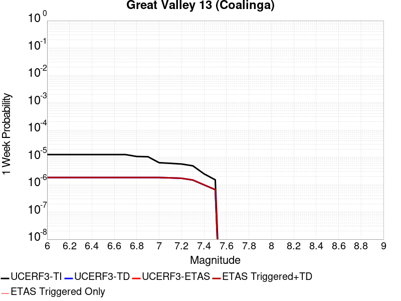 |  |  |  |

| Magnitude | 1 wk TI Prob | 1 wk TD Prob | 1 wk ETAS Prob | 1 wk ETAS/TD Gain | 1 wk ETAS Triggered+TD | 1 wk ETAS Triggered Only | 1 mo TI Prob | 1 mo TD Prob | 1 mo ETAS Prob | 1 mo ETAS/TD Gain | 1 mo ETAS Triggered+TD | 1 mo ETAS Triggered Only | 1 yr TI Prob | 1 yr TD Prob | 1 yr ETAS Prob | 1 yr ETAS/TD Gain | 1 yr ETAS Triggered+TD | 1 yr ETAS Triggered Only | 10 yr TI Prob | 10 yr TD Prob | 10 yr ETAS Prob | 10 yr ETAS/TD Gain | 10 yr ETAS Triggered+TD | 10 yr ETAS Triggered Only |
|-----|-----|-----|-----|-----|-----|-----|-----|-----|-----|-----|-----|-----|-----|-----|-----|-----|-----|-----|-----|-----|-----|-----|-----|-----|
| 6.0 | 1.25701345E-5 | 1.8249972E-6 | 0.0 | 0.0 | 1.8249972E-6 | 0.0 | 5.3870892E-5 | 7.821394E-6 | 0.0 | 0.0 | 7.821394E-6 | 0.0 | 6.556807E-4 | 9.522151E-5 | 0.0 | 0.0 | 9.522151E-5 | 0.0 | 0.006537495 | 9.518264E-4 | 4.0E-4 | 0.4202447 | 0.0010517312 | 1.0E-4 |
| 6.1 | 1.25701345E-5 | 1.8249972E-6 | 0.0 | 0.0 | 1.8249972E-6 | 0.0 | 5.3870892E-5 | 7.821394E-6 | 0.0 | 0.0 | 7.821394E-6 | 0.0 | 6.556807E-4 | 9.522151E-5 | 0.0 | 0.0 | 9.522151E-5 | 0.0 | 0.006537495 | 9.518264E-4 | 4.0E-4 | 0.4202447 | 0.0010517312 | 1.0E-4 |
| 6.2 | 1.25701345E-5 | 1.8249972E-6 | 0.0 | 0.0 | 1.8249972E-6 | 0.0 | 5.3870892E-5 | 7.821394E-6 | 0.0 | 0.0 | 7.821394E-6 | 0.0 | 6.556807E-4 | 9.522151E-5 | 0.0 | 0.0 | 9.522151E-5 | 0.0 | 0.006537495 | 9.518264E-4 | 4.0E-4 | 0.4202447 | 0.0010517312 | 1.0E-4 |
| 6.3 | 1.25701345E-5 | 1.8249972E-6 | 0.0 | 0.0 | 1.8249972E-6 | 0.0 | 5.3870892E-5 | 7.821394E-6 | 0.0 | 0.0 | 7.821394E-6 | 0.0 | 6.556807E-4 | 9.522151E-5 | 0.0 | 0.0 | 9.522151E-5 | 0.0 | 0.006537495 | 9.518264E-4 | 4.0E-4 | 0.4202447 | 0.0010517312 | 1.0E-4 |
| 6.4 | 1.25701345E-5 | 1.8249972E-6 | 0.0 | 0.0 | 1.8249972E-6 | 0.0 | 5.3870892E-5 | 7.821394E-6 | 0.0 | 0.0 | 7.821394E-6 | 0.0 | 6.556807E-4 | 9.522151E-5 | 0.0 | 0.0 | 9.522151E-5 | 0.0 | 0.006537495 | 9.518264E-4 | 4.0E-4 | 0.4202447 | 0.0010517312 | 1.0E-4 |
| 6.5 | 1.25701345E-5 | 1.8249972E-6 | 0.0 | 0.0 | 1.8249972E-6 | 0.0 | 5.3870892E-5 | 7.821394E-6 | 0.0 | 0.0 | 7.821394E-6 | 0.0 | 6.556807E-4 | 9.522151E-5 | 0.0 | 0.0 | 9.522151E-5 | 0.0 | 0.006537495 | 9.518264E-4 | 4.0E-4 | 0.4202447 | 0.0010517312 | 1.0E-4 |
| 6.6 | 1.25701345E-5 | 1.8249972E-6 | 0.0 | 0.0 | 1.8249972E-6 | 0.0 | 5.3870892E-5 | 7.821394E-6 | 0.0 | 0.0 | 7.821394E-6 | 0.0 | 6.556807E-4 | 9.522151E-5 | 0.0 | 0.0 | 9.522151E-5 | 0.0 | 0.006537495 | 9.518264E-4 | 4.0E-4 | 0.4202447 | 0.0010517312 | 1.0E-4 |
| 6.7 | 1.25701345E-5 | 1.8249972E-6 | 0.0 | 0.0 | 1.8249972E-6 | 0.0 | 5.3870892E-5 | 7.821394E-6 | 0.0 | 0.0 | 7.821394E-6 | 0.0 | 6.556807E-4 | 9.522151E-5 | 0.0 | 0.0 | 9.522151E-5 | 0.0 | 0.006537495 | 9.518264E-4 | 4.0E-4 | 0.4202447 | 0.0010517312 | 1.0E-4 |
| 6.8 | 1.0720415E-5 | 1.8249972E-6 | 0.0 | 0.0 | 1.8249972E-6 | 0.0 | 4.5943823E-5 | 7.821394E-6 | 0.0 | 0.0 | 7.821394E-6 | 0.0 | 5.592225E-4 | 9.522151E-5 | 0.0 | 0.0 | 9.522151E-5 | 0.0 | 0.005578173 | 9.518264E-4 | 4.0E-4 | 0.4202447 | 0.0010517312 | 1.0E-4 |
| 6.9 | 1.0485409E-5 | 1.8209123E-6 | 0.0 | 0.0 | 1.8209123E-6 | 0.0 | 4.4936693E-5 | 7.8038875E-6 | 0.0 | 0.0 | 7.8038875E-6 | 0.0 | 5.469669E-4 | 9.5008385E-5 | 0.0 | 0.0 | 9.5008385E-5 | 0.0 | 0.005456226 | 9.49697E-4 | 4.0E-4 | 0.42118698 | 0.001049602 | 1.0E-4 |
| 7.0 | 6.3302773E-6 | 1.815786E-6 | 0.0 | 0.0 | 1.815786E-6 | 0.0 | 2.7129478E-5 | 7.781919E-6 | 0.0 | 0.0 | 7.781919E-6 | 0.0 | 3.3025132E-4 | 9.474093E-5 | 0.0 | 0.0 | 9.474093E-5 | 0.0 | 0.0032976097 | 9.4702473E-4 | 4.0E-4 | 0.42237547 | 0.00104693 | 1.0E-4 |
| 7.1 | 6.022003E-6 | 1.7660996E-6 | 0.0 | 0.0 | 1.7660996E-6 | 0.0 | 2.5808331E-5 | 7.5689773E-6 | 0.0 | 0.0 | 7.5689773E-6 | 0.0 | 3.141711E-4 | 9.214859E-5 | 0.0 | 0.0 | 9.214859E-5 | 0.0 | 0.0031372732 | 9.21123E-4 | 4.0E-4 | 0.43425253 | 0.0010210308 | 1.0E-4 |
| 7.2 | 5.671345E-6 | 1.7059415E-6 | 0.0 | 0.0 | 1.7059415E-6 | 0.0 | 2.4305538E-5 | 7.3111582E-6 | 0.0 | 0.0 | 7.3111582E-6 | 0.0 | 2.9587973E-4 | 8.900991E-5 | 0.0 | 0.0 | 8.900991E-5 | 0.0 | 0.002954861 | 8.8976166E-4 | 4.0E-4 | 0.44955862 | 9.896726E-4 | 1.0E-4 |
| 7.3 | 4.8831785E-6 | 1.4730267E-6 | 0.0 | 0.0 | 1.4730267E-6 | 0.0 | 2.092774E-5 | 6.3129573E-6 | 0.0 | 0.0 | 6.3129573E-6 | 0.0 | 2.5476544E-4 | 7.685771E-5 | 0.0 | 0.0 | 7.685771E-5 | 0.0 | 0.0025447358 | 7.683279E-4 | 4.0E-4 | 0.52061105 | 8.682511E-4 | 1.0E-4 |
| 7.4 | 2.4837766E-6 | 9.799826E-7 | 0.0 | 0.0 | 9.799826E-7 | 0.0 | 1.0644713E-5 | 4.1999187E-6 | 0.0 | 0.0 | 4.1999187E-6 | 0.0 | 1.2959167E-4 | 5.113288E-5 | 0.0 | 0.0 | 5.113288E-5 | 0.0 | 0.0012951613 | 5.112177E-4 | 3.0E-4 | 0.58683413 | 6.111666E-4 | 1.0E-4 |
| 7.5 | 1.5002679E-6 | 6.545664E-7 | 0.0 | 0.0 | 6.545664E-7 | 0.0 | 6.4297037E-6 | 2.8052818E-6 | 0.0 | 0.0 | 2.8052818E-6 | 0.0 | 7.827883E-5 | 3.415381E-5 | 0.0 | 0.0 | 3.415381E-5 | 0.0 | 7.825126E-4 | 3.414898E-4 | 1.0E-4 | 0.29283452 | 3.414898E-4 | 0.0 |

## Battle Creek 2011 CFM
*[(top)](#table-of-contents)*

| 1 Week | 1 Month | 1 Year | 10 Year |
|-----|-----|-----|-----|
| 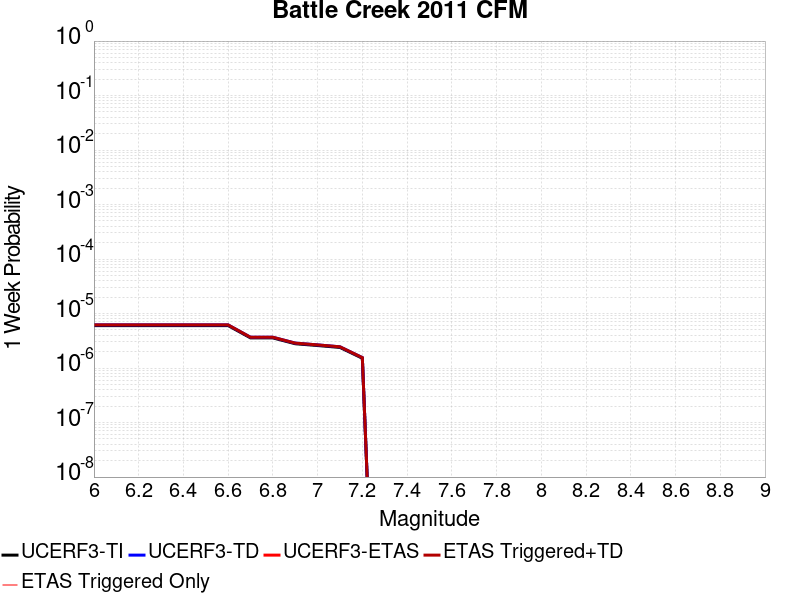 | 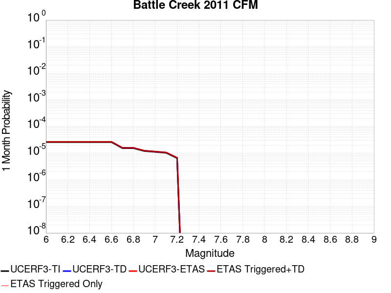 |  |  |

| Magnitude | 1 wk TI Prob | 1 wk TD Prob | 1 wk ETAS Prob | 1 wk ETAS/TD Gain | 1 wk ETAS Triggered+TD | 1 wk ETAS Triggered Only | 1 mo TI Prob | 1 mo TD Prob | 1 mo ETAS Prob | 1 mo ETAS/TD Gain | 1 mo ETAS Triggered+TD | 1 mo ETAS Triggered Only | 1 yr TI Prob | 1 yr TD Prob | 1 yr ETAS Prob | 1 yr ETAS/TD Gain | 1 yr ETAS Triggered+TD | 1 yr ETAS Triggered Only | 10 yr TI Prob | 10 yr TD Prob | 10 yr ETAS Prob | 10 yr ETAS/TD Gain | 10 yr ETAS Triggered+TD | 10 yr ETAS Triggered Only |
|-----|-----|-----|-----|-----|-----|-----|-----|-----|-----|-----|-----|-----|-----|-----|-----|-----|-----|-----|-----|-----|-----|-----|-----|-----|
| 6.0 | 6.0215425E-6 | 6.189448E-6 | 0.0 | 0.0 | 6.189448E-6 | 0.0 | 2.5806356E-5 | 2.6525973E-5 | 0.0 | 0.0 | 2.6525973E-5 | 0.0 | 3.1414707E-4 | 3.2291247E-4 | 1.0E-4 | 0.30968145 | 3.2291247E-4 | 0.0 | 0.0031370334 | 0.003225082 | 0.0017 | 0.5271184 | 0.0033247597 | 1.0E-4 |
| 6.1 | 6.0215425E-6 | 6.189448E-6 | 0.0 | 0.0 | 6.189448E-6 | 0.0 | 2.5806356E-5 | 2.6525973E-5 | 0.0 | 0.0 | 2.6525973E-5 | 0.0 | 3.1414707E-4 | 3.2291247E-4 | 1.0E-4 | 0.30968145 | 3.2291247E-4 | 0.0 | 0.0031370334 | 0.003225082 | 0.0017 | 0.5271184 | 0.0033247597 | 1.0E-4 |
| 6.2 | 6.0215425E-6 | 6.189448E-6 | 0.0 | 0.0 | 6.189448E-6 | 0.0 | 2.5806356E-5 | 2.6525973E-5 | 0.0 | 0.0 | 2.6525973E-5 | 0.0 | 3.1414707E-4 | 3.2291247E-4 | 1.0E-4 | 0.30968145 | 3.2291247E-4 | 0.0 | 0.0031370334 | 0.003225082 | 0.0017 | 0.5271184 | 0.0033247597 | 1.0E-4 |
| 6.3 | 6.0215425E-6 | 6.189448E-6 | 0.0 | 0.0 | 6.189448E-6 | 0.0 | 2.5806356E-5 | 2.6525973E-5 | 0.0 | 0.0 | 2.6525973E-5 | 0.0 | 3.1414707E-4 | 3.2291247E-4 | 1.0E-4 | 0.30968145 | 3.2291247E-4 | 0.0 | 0.0031370334 | 0.003225082 | 0.0017 | 0.5271184 | 0.0033247597 | 1.0E-4 |
| 6.4 | 6.0215425E-6 | 6.189448E-6 | 0.0 | 0.0 | 6.189448E-6 | 0.0 | 2.5806356E-5 | 2.6525973E-5 | 0.0 | 0.0 | 2.6525973E-5 | 0.0 | 3.1414707E-4 | 3.2291247E-4 | 1.0E-4 | 0.30968145 | 3.2291247E-4 | 0.0 | 0.0031370334 | 0.003225082 | 0.0017 | 0.5271184 | 0.0033247597 | 1.0E-4 |
| 6.5 | 6.0215425E-6 | 6.189448E-6 | 0.0 | 0.0 | 6.189448E-6 | 0.0 | 2.5806356E-5 | 2.6525973E-5 | 0.0 | 0.0 | 2.6525973E-5 | 0.0 | 3.1414707E-4 | 3.2291247E-4 | 1.0E-4 | 0.30968145 | 3.2291247E-4 | 0.0 | 0.0031370334 | 0.003225082 | 0.0017 | 0.5271184 | 0.0033247597 | 1.0E-4 |
| 6.6 | 6.0215425E-6 | 6.189448E-6 | 0.0 | 0.0 | 6.189448E-6 | 0.0 | 2.5806356E-5 | 2.6525973E-5 | 0.0 | 0.0 | 2.6525973E-5 | 0.0 | 3.1414707E-4 | 3.2291247E-4 | 1.0E-4 | 0.30968145 | 3.2291247E-4 | 0.0 | 0.0031370334 | 0.003225082 | 0.0017 | 0.5271184 | 0.0033247597 | 1.0E-4 |
| 6.7 | 3.5769701E-6 | 3.6755034E-6 | 0.0 | 0.0 | 3.6755034E-6 | 0.0 | 1.5329782E-5 | 1.5752084E-5 | 0.0 | 0.0 | 1.5752084E-5 | 0.0 | 1.8662411E-4 | 1.9176863E-4 | 0.0 | 0.0 | 1.9176863E-4 | 0.0 | 0.0018646746 | 0.0019164131 | 8.0E-4 | 0.41744652 | 0.0020162214 | 1.0E-4 |
| 6.8 | 3.5769701E-6 | 3.6755034E-6 | 0.0 | 0.0 | 3.6755034E-6 | 0.0 | 1.5329782E-5 | 1.5752084E-5 | 0.0 | 0.0 | 1.5752084E-5 | 0.0 | 1.8662411E-4 | 1.9176863E-4 | 0.0 | 0.0 | 1.9176863E-4 | 0.0 | 0.0018646746 | 0.0019164131 | 8.0E-4 | 0.41744652 | 0.0020162214 | 1.0E-4 |
| 6.9 | 2.7928356E-6 | 2.8694262E-6 | 0.0 | 0.0 | 2.8694262E-6 | 0.0 | 1.1969241E-5 | 1.2297503E-5 | 0.0 | 0.0 | 1.2297503E-5 | 0.0 | 1.4571576E-4 | 1.4971539E-4 | 0.0 | 0.0 | 1.4971539E-4 | 0.0 | 0.0014562025 | 0.0014964952 | 8.0E-4 | 0.5345824 | 0.0015963456 | 1.0E-4 |
| 7.0 | 2.590302E-6 | 2.6613677E-6 | 0.0 | 0.0 | 2.6613677E-6 | 0.0 | 1.1101247E-5 | 1.1405832E-5 | 0.0 | 0.0 | 1.1405832E-5 | 0.0 | 1.351493E-4 | 1.388607E-4 | 0.0 | 0.0 | 1.388607E-4 | 0.0 | 0.0013506714 | 0.0013880876 | 7.0E-4 | 0.50429094 | 0.0014879488 | 1.0E-4 |
| 7.1 | 2.3885443E-6 | 2.4541464E-6 | 0.0 | 0.0 | 2.4541464E-6 | 0.0 | 1.0236578E-5 | 1.0517748E-5 | 0.0 | 0.0 | 1.0517748E-5 | 0.0 | 1.2462321E-4 | 1.2804958E-4 | 0.0 | 0.0 | 1.2804958E-4 | 0.0 | 0.0012455335 | 0.001280104 | 7.0E-4 | 0.54683053 | 0.001379976 | 1.0E-4 |
| 7.2 | 1.5140604E-6 | 1.5555436E-6 | 0.0 | 0.0 | 1.5555436E-6 | 0.0 | 6.4888145E-6 | 6.6666153E-6 | 0.0 | 0.0 | 6.6666153E-6 | 0.0 | 7.899845E-5 | 8.116604E-5 | 0.0 | 0.0 | 8.116604E-5 | 0.0 | 7.8970374E-4 | 8.1166043E-4 | 4.0E-4 | 0.49281693 | 9.1157923E-4 | 1.0E-4 |

## Yorba Linda
*[(top)](#table-of-contents)*

| 1 Week | 1 Month | 1 Year | 10 Year |
|-----|-----|-----|-----|
|  |  | 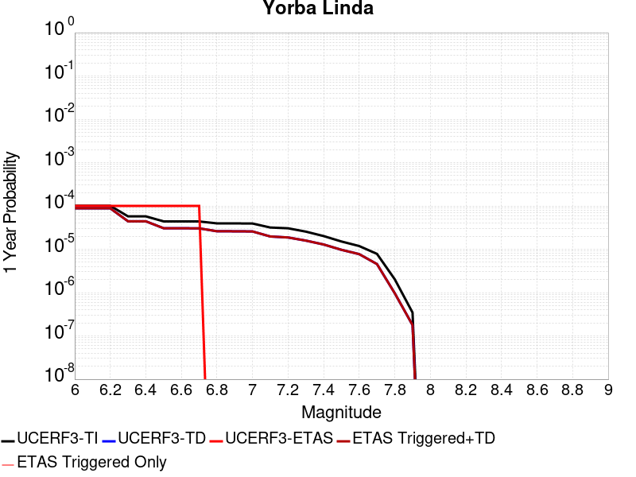 |  |

| Magnitude | 1 wk TI Prob | 1 wk TD Prob | 1 wk ETAS Prob | 1 wk ETAS/TD Gain | 1 wk ETAS Triggered+TD | 1 wk ETAS Triggered Only | 1 mo TI Prob | 1 mo TD Prob | 1 mo ETAS Prob | 1 mo ETAS/TD Gain | 1 mo ETAS Triggered+TD | 1 mo ETAS Triggered Only | 1 yr TI Prob | 1 yr TD Prob | 1 yr ETAS Prob | 1 yr ETAS/TD Gain | 1 yr ETAS Triggered+TD | 1 yr ETAS Triggered Only | 10 yr TI Prob | 10 yr TD Prob | 10 yr ETAS Prob | 10 yr ETAS/TD Gain | 10 yr ETAS Triggered+TD | 10 yr ETAS Triggered Only |
|-----|-----|-----|-----|-----|-----|-----|-----|-----|-----|-----|-----|-----|-----|-----|-----|-----|-----|-----|-----|-----|-----|-----|-----|-----|
| 6.0 | 1.9346849E-6 | 1.6910888E-6 | 0.0 | 0.0 | 1.6910888E-6 | 0.0 | 8.29148E-6 | 7.247508E-6 | 0.0 | 0.0 | 7.247508E-6 | 0.0 | 1.009441E-4 | 8.823579E-5 | 1.0E-4 | 1.133327 | 8.823579E-5 | 0.0 | 0.0010089825 | 8.8210066E-4 | 9.0E-4 | 1.0202917 | 9.820125E-4 | 1.0E-4 |
| 6.1 | 1.9346849E-6 | 1.6910888E-6 | 0.0 | 0.0 | 1.6910888E-6 | 0.0 | 8.29148E-6 | 7.247508E-6 | 0.0 | 0.0 | 7.247508E-6 | 0.0 | 1.009441E-4 | 8.823579E-5 | 1.0E-4 | 1.133327 | 8.823579E-5 | 0.0 | 0.0010089825 | 8.8210066E-4 | 9.0E-4 | 1.0202917 | 9.820125E-4 | 1.0E-4 |
| 6.2 | 1.9346849E-6 | 1.6910888E-6 | 0.0 | 0.0 | 1.6910888E-6 | 0.0 | 8.29148E-6 | 7.247508E-6 | 0.0 | 0.0 | 7.247508E-6 | 0.0 | 1.009441E-4 | 8.823579E-5 | 1.0E-4 | 1.133327 | 8.823579E-5 | 0.0 | 0.0010089825 | 8.8210066E-4 | 9.0E-4 | 1.0202917 | 9.820125E-4 | 1.0E-4 |
| 6.3 | 1.1028608E-6 | 8.48342E-7 | 0.0 | 0.0 | 8.48342E-7 | 0.0 | 4.7265376E-6 | 3.6357465E-6 | 0.0 | 0.0 | 3.6357465E-6 | 0.0 | 5.754407E-5 | 4.4264383E-5 | 1.0E-4 | 2.259153 | 4.4264383E-5 | 0.0 | 5.7529175E-4 | 4.4256216E-4 | 5.0E-4 | 1.1297848 | 5.425179E-4 | 1.0E-4 |
| 6.4 | 1.1028608E-6 | 8.48342E-7 | 0.0 | 0.0 | 8.48342E-7 | 0.0 | 4.7265376E-6 | 3.6357465E-6 | 0.0 | 0.0 | 3.6357465E-6 | 0.0 | 5.754407E-5 | 4.4264383E-5 | 1.0E-4 | 2.259153 | 4.4264383E-5 | 0.0 | 5.7529175E-4 | 4.4256216E-4 | 5.0E-4 | 1.1297848 | 5.425179E-4 | 1.0E-4 |
| 6.5 | 8.4451364E-7 | 5.8706075E-7 | 0.0 | 0.0 | 5.8706075E-7 | 0.0 | 3.619339E-6 | 2.5159723E-6 | 0.0 | 0.0 | 2.5159723E-6 | 0.0 | 4.406456E-5 | 3.0631552E-5 | 1.0E-4 | 3.2646077 | 3.0631552E-5 | 0.0 | 4.4055824E-4 | 3.0627544E-4 | 3.0E-4 | 0.9795104 | 3.0627544E-4 | 0.0 |
| 6.6 | 8.422957E-7 | 5.84614E-7 | 0.0 | 0.0 | 5.84614E-7 | 0.0 | 3.6098338E-6 | 2.5054862E-6 | 0.0 | 0.0 | 2.5054862E-6 | 0.0 | 4.3948843E-5 | 3.050389E-5 | 1.0E-4 | 3.2782705 | 3.050389E-5 | 0.0 | 4.394015E-4 | 3.0499915E-4 | 3.0E-4 | 0.98360926 | 3.0499915E-4 | 0.0 |
| 6.7 | 8.4119705E-7 | 5.833981E-7 | 0.0 | 0.0 | 5.833981E-7 | 0.0 | 3.6051254E-6 | 2.5002753E-6 | 0.0 | 0.0 | 2.5002753E-6 | 0.0 | 4.3891516E-5 | 3.044045E-5 | 1.0E-4 | 3.2851026 | 3.044045E-5 | 0.0 | 4.388285E-4 | 3.0436492E-4 | 3.0E-4 | 0.9856589 | 3.0436492E-4 | 0.0 |
| 6.8 | 7.5919155E-7 | 4.996458E-7 | 0.0 | 0.0 | 4.996458E-7 | 0.0 | 3.253674E-6 | 2.1413375E-6 | 0.0 | 0.0 | 2.1413375E-6 | 0.0 | 3.961276E-5 | 2.607049E-5 | 0.0 | 0.0 | 2.607049E-5 | 0.0 | 3.9605703E-4 | 2.6067602E-4 | 2.0E-4 | 0.7672359 | 2.6067602E-4 | 0.0 |
| 6.9 | 7.5804564E-7 | 4.9826406E-7 | 0.0 | 0.0 | 4.9826406E-7 | 0.0 | 3.248763E-6 | 2.1354158E-6 | 0.0 | 0.0 | 2.1354158E-6 | 0.0 | 3.955297E-5 | 2.5998395E-5 | 0.0 | 0.0 | 2.5998395E-5 | 0.0 | 3.9545933E-4 | 2.5995524E-4 | 2.0E-4 | 0.76936316 | 2.5995524E-4 | 0.0 |
| 7.0 | 7.539293E-7 | 4.944774E-7 | 0.0 | 0.0 | 4.944774E-7 | 0.0 | 3.2311218E-6 | 2.119187E-6 | 0.0 | 0.0 | 2.119187E-6 | 0.0 | 3.9338196E-5 | 2.5800813E-5 | 0.0 | 0.0 | 2.5800813E-5 | 0.0 | 3.9331234E-4 | 2.579799E-4 | 2.0E-4 | 0.7752542 | 2.579799E-4 | 0.0 |
| 7.1 | 6.0900885E-7 | 3.783031E-7 | 0.0 | 0.0 | 3.783031E-7 | 0.0 | 2.6100352E-6 | 1.621298E-6 | 0.0 | 0.0 | 1.621298E-6 | 0.0 | 3.1776715E-5 | 1.9739127E-5 | 0.0 | 0.0 | 1.9739127E-5 | 0.0 | 3.1772171E-4 | 1.973741E-4 | 1.0E-4 | 0.50665206 | 1.973741E-4 | 0.0 |
| 7.2 | 5.849925E-7 | 3.5891793E-7 | 0.0 | 0.0 | 3.5891793E-7 | 0.0 | 2.5071083E-6 | 1.5382188E-6 | 0.0 | 0.0 | 1.5382188E-6 | 0.0 | 3.0523614E-5 | 1.8727656E-5 | 0.0 | 0.0 | 1.8727656E-5 | 0.0 | 3.0519423E-4 | 1.8726112E-4 | 1.0E-4 | 0.5340137 | 1.8726112E-4 | 0.0 |
| 7.3 | 4.89808E-7 | 3.03901E-7 | 0.0 | 0.0 | 3.03901E-7 | 0.0 | 2.0991754E-6 | 1.3024322E-6 | 0.0 | 0.0 | 1.3024322E-6 | 0.0 | 2.5557161E-5 | 1.5856998E-5 | 0.0 | 0.0 | 1.5856998E-5 | 0.0 | 2.5554223E-4 | 1.585589E-4 | 1.0E-4 | 0.63068044 | 1.585589E-4 | 0.0 |
| 7.4 | 3.8700415E-7 | 2.473088E-7 | 0.0 | 0.0 | 2.473088E-7 | 0.0 | 1.6585881E-6 | 1.0598945E-6 | 0.0 | 0.0 | 1.0598945E-6 | 0.0 | 2.0193123E-5 | 1.290414E-5 | 0.0 | 0.0 | 1.290414E-5 | 0.0 | 2.0191289E-4 | 1.2903404E-4 | 0.0 | 0.0 | 1.2903404E-4 | 0.0 |
| 7.5 | 2.900565E-7 | 1.864266E-7 | 0.0 | 0.0 | 1.864266E-7 | 0.0 | 1.2430987E-6 | 7.989709E-7 | 0.0 | 0.0 | 7.989709E-7 | 0.0 | 1.5134622E-5 | 9.727428E-6 | 0.0 | 0.0 | 9.727428E-6 | 0.0 | 1.5133592E-4 | 9.727011E-5 | 0.0 | 0.0 | 9.727011E-5 | 0.0 |
| 7.6 | 2.2770318E-7 | 1.4818097E-7 | 0.0 | 0.0 | 1.4818097E-7 | 0.0 | 9.758704E-7 | 6.3506116E-7 | 0.0 | 0.0 | 6.3506116E-7 | 0.0 | 1.1881158E-5 | 7.731843E-6 | 0.0 | 0.0 | 7.731843E-6 | 0.0 | 1.1880523E-4 | 7.731579E-5 | 0.0 | 0.0 | 7.731579E-5 | 0.0 |
| 7.7 | 1.5017194E-7 | 8.7382766E-8 | 0.0 | 0.0 | 8.7382766E-8 | 0.0 | 6.4359386E-7 | 3.7449752E-7 | 0.0 | 0.0 | 3.7449752E-7 | 0.0 | 7.835727E-6 | 4.559498E-6 | 0.0 | 0.0 | 4.559498E-6 | 0.0 | 7.835451E-5 | 4.559407E-5 | 0.0 | 0.0 | 4.559407E-5 | 0.0 |
| 7.8 | 3.895753E-8 | 1.8543691E-8 | 0.0 | 0.0 | 1.8543691E-8 | 0.0 | 1.6696083E-7 | 7.947296E-8 | 0.0 | 0.0 | 7.947296E-8 | 0.0 | 2.0327461E-6 | 9.675829E-7 | 0.0 | 0.0 | 9.675829E-7 | 0.0 | 2.0327276E-5 | 9.6757885E-6 | 0.0 | 0.0 | 9.6757885E-6 | 0.0 |
| 7.9 | 6.648505E-9 | 3.4201486E-9 | 0.0 | 0.0 | 3.4201486E-9 | 0.0 | 2.8493591E-8 | 1.465778E-8 | 0.0 | 0.0 | 1.465778E-8 | 0.0 | 3.4690942E-7 | 1.7845846E-7 | 0.0 | 0.0 | 1.7845846E-7 | 0.0 | 3.4690888E-6 | 1.7845833E-6 | 0.0 | 0.0 | 1.7845833E-6 | 0.0 |

## Carlsbad
*[(top)](#table-of-contents)*

| 1 Week | 1 Month | 1 Year | 10 Year |
|-----|-----|-----|-----|
|  |  | 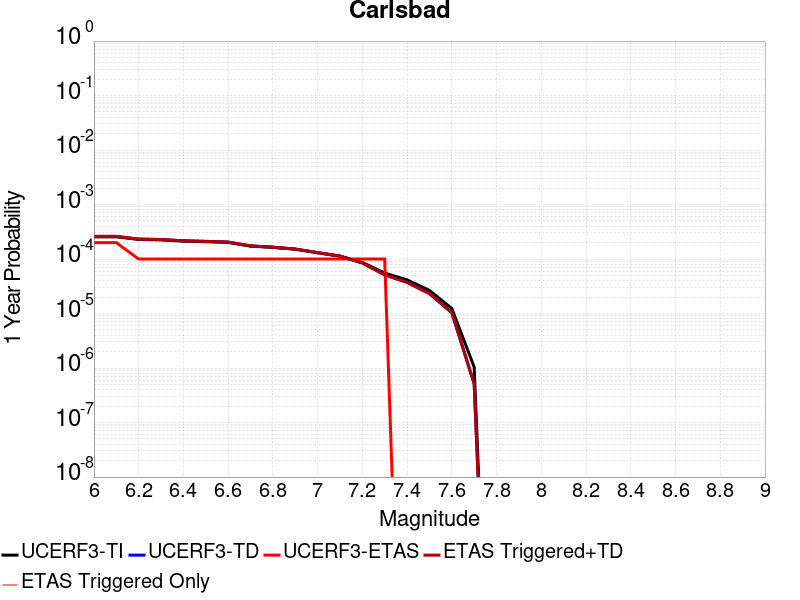 |  |

| Magnitude | 1 wk TI Prob | 1 wk TD Prob | 1 wk ETAS Prob | 1 wk ETAS/TD Gain | 1 wk ETAS Triggered+TD | 1 wk ETAS Triggered Only | 1 mo TI Prob | 1 mo TD Prob | 1 mo ETAS Prob | 1 mo ETAS/TD Gain | 1 mo ETAS Triggered+TD | 1 mo ETAS Triggered Only | 1 yr TI Prob | 1 yr TD Prob | 1 yr ETAS Prob | 1 yr ETAS/TD Gain | 1 yr ETAS Triggered+TD | 1 yr ETAS Triggered Only | 10 yr TI Prob | 10 yr TD Prob | 10 yr ETAS Prob | 10 yr ETAS/TD Gain | 10 yr ETAS Triggered+TD | 10 yr ETAS Triggered Only |
|-----|-----|-----|-----|-----|-----|-----|-----|-----|-----|-----|-----|-----|-----|-----|-----|-----|-----|-----|-----|-----|-----|-----|-----|-----|
| 6.0 | 4.9038536E-6 | 4.9877253E-6 | 0.0 | 0.0 | 4.9877253E-6 | 0.0 | 2.1016345E-5 | 2.1375792E-5 | 0.0 | 0.0 | 2.1375792E-5 | 0.0 | 2.5584397E-4 | 2.6021965E-4 | 2.0E-4 | 0.76858145 | 2.6021965E-4 | 0.0 | 0.002555496 | 0.0025991965 | 0.0022 | 0.8464154 | 0.0026989365 | 1.0E-4 |
| 6.1 | 4.9038536E-6 | 4.9877253E-6 | 0.0 | 0.0 | 4.9877253E-6 | 0.0 | 2.1016345E-5 | 2.1375792E-5 | 0.0 | 0.0 | 2.1375792E-5 | 0.0 | 2.5584397E-4 | 2.6021965E-4 | 2.0E-4 | 0.76858145 | 2.6021965E-4 | 0.0 | 0.002555496 | 0.0025991965 | 0.0021 | 0.807942 | 0.0026989365 | 1.0E-4 |
| 6.2 | 4.3820614E-6 | 4.4552157E-6 | 0.0 | 0.0 | 4.4552157E-6 | 0.0 | 1.8780129E-5 | 1.9093644E-5 | 0.0 | 0.0 | 1.9093644E-5 | 0.0 | 2.2862408E-4 | 2.3244068E-4 | 1.0E-4 | 0.4302173 | 2.3244068E-4 | 0.0 | 0.00228389 | 0.0023220114 | 0.0019 | 0.81825614 | 0.002421779 | 1.0E-4 |
| 6.3 | 4.302872E-6 | 4.373448E-6 | 0.0 | 0.0 | 4.373448E-6 | 0.0 | 1.8440749E-5 | 1.8743216E-5 | 0.0 | 0.0 | 1.8743216E-5 | 0.0 | 2.24493E-4 | 2.2817511E-4 | 1.0E-4 | 0.4382599 | 2.2817511E-4 | 0.0 | 0.0022426634 | 0.0022794437 | 0.0018 | 0.7896664 | 0.0023792156 | 1.0E-4 |
| 6.4 | 4.0835243E-6 | 4.148084E-6 | 0.0 | 0.0 | 4.148084E-6 | 0.0 | 1.75007E-5 | 1.7777384E-5 | 0.0 | 0.0 | 1.7777384E-5 | 0.0 | 2.1305021E-4 | 2.1641848E-4 | 1.0E-4 | 0.46206772 | 2.1641848E-4 | 0.0 | 0.0021284607 | 0.0021621115 | 0.0018 | 0.83251953 | 0.0022618952 | 1.0E-4 |
| 6.5 | 3.987806E-6 | 4.04931E-6 | 0.0 | 0.0 | 4.04931E-6 | 0.0 | 1.7090486E-5 | 1.7354072E-5 | 0.0 | 0.0 | 1.7354072E-5 | 0.0 | 2.080568E-4 | 2.1126568E-4 | 1.0E-4 | 0.47333765 | 2.1126568E-4 | 0.0 | 0.002078621 | 0.0021106822 | 0.0018 | 0.85280484 | 0.002210471 | 1.0E-4 |
| 6.6 | 3.8707576E-6 | 3.927903E-6 | 0.0 | 0.0 | 3.927903E-6 | 0.0 | 1.6588854E-5 | 1.6833763E-5 | 0.0 | 0.0 | 1.6833763E-5 | 0.0 | 2.0195059E-4 | 2.049321E-4 | 1.0E-4 | 0.48796648 | 2.049321E-4 | 0.0 | 0.0020176715 | 0.002047465 | 0.0017 | 0.8302951 | 0.0021472601 | 1.0E-4 |
| 6.7 | 3.3093434E-6 | 3.3427539E-6 | 0.0 | 0.0 | 3.3427539E-6 | 0.0 | 1.4182823E-5 | 1.43260095E-5 | 0.0 | 0.0 | 1.43260095E-5 | 0.0 | 1.7266218E-4 | 1.7440526E-4 | 1.0E-4 | 0.5733772 | 1.7440526E-4 | 0.0 | 0.001725281 | 0.00174269 | 0.0013 | 0.7459732 | 0.0018425157 | 1.0E-4 |
| 6.8 | 3.136983E-6 | 3.1667964E-6 | 0.0 | 0.0 | 3.1667964E-6 | 0.0 | 1.3444143E-5 | 1.3571915E-5 | 0.0 | 0.0 | 1.3571915E-5 | 0.0 | 1.6367015E-4 | 1.6522559E-4 | 1.0E-4 | 0.60523313 | 1.6522559E-4 | 0.0 | 0.0016354966 | 0.0016510331 | 0.0013 | 0.7873858 | 0.0017508679 | 1.0E-4 |
| 6.9 | 2.9056644E-6 | 2.9270745E-6 | 0.0 | 0.0 | 2.9270745E-6 | 0.0 | 1.2452788E-5 | 1.2544545E-5 | 0.0 | 0.0 | 1.2544545E-5 | 0.0 | 1.5160214E-4 | 1.5271918E-4 | 1.0E-4 | 0.6547966 | 1.5271918E-4 | 0.0 | 0.0015149876 | 0.0015261476 | 0.0013 | 0.85181797 | 0.001625995 | 1.0E-4 |
| 7.0 | 2.5071035E-6 | 2.511671E-6 | 0.0 | 0.0 | 2.511671E-6 | 0.0 | 1.0744685E-5 | 1.0764261E-5 | 0.0 | 0.0 | 1.0764261E-5 | 0.0 | 1.308087E-4 | 1.3104703E-4 | 1.0E-4 | 0.7630849 | 1.3104703E-4 | 0.0 | 0.0013073172 | 0.0013097007 | 0.0013 | 0.9925932 | 0.0014095696 | 1.0E-4 |
| 7.1 | 2.1786877E-6 | 2.168119E-6 | 0.0 | 0.0 | 2.168119E-6 | 0.0 | 9.3372E-6 | 9.291905E-6 | 0.0 | 0.0 | 9.291905E-6 | 0.0 | 1.13674476E-4 | 1.131231E-4 | 1.0E-4 | 0.88399273 | 1.131231E-4 | 0.0 | 0.0011361635 | 0.0011306581 | 0.0011 | 0.9728848 | 0.001230545 | 1.0E-4 |
| 7.2 | 1.6628418E-6 | 1.6215521E-6 | 0.0 | 0.0 | 1.6215521E-6 | 0.0 | 7.1264453E-6 | 6.949491E-6 | 0.0 | 0.0 | 6.949491E-6 | 0.0 | 8.676102E-5 | 8.4606785E-5 | 1.0E-4 | 1.1819383 | 8.4606785E-5 | 0.0 | 8.672715E-4 | 8.4574794E-4 | 0.001 | 1.1823853 | 9.4566337E-4 | 1.0E-4 |
| 7.3 | 1.0595926E-6 | 9.817564E-7 | 0.0 | 0.0 | 9.817564E-7 | 0.0 | 4.541103E-6 | 4.207521E-6 | 0.0 | 0.0 | 4.207521E-6 | 0.0 | 5.5286528E-5 | 5.1225376E-5 | 1.0E-4 | 1.9521575 | 5.1225376E-5 | 0.0 | 5.527277E-4 | 5.1213655E-4 | 7.0E-4 | 1.366823 | 5.1213655E-4 | 0.0 |
| 7.4 | 7.956623E-7 | 7.174299E-7 | 0.0 | 0.0 | 7.174299E-7 | 0.0 | 3.4099767E-6 | 3.074696E-6 | 0.0 | 0.0 | 3.074696E-6 | 0.0 | 4.1515676E-5 | 3.7433787E-5 | 0.0 | 0.0 | 3.7433787E-5 | 0.0 | 4.150792E-4 | 3.7427552E-4 | 4.0E-4 | 1.0687314 | 3.7427552E-4 | 0.0 |
| 7.5 | 5.1043804E-7 | 4.4485873E-7 | 0.0 | 0.0 | 4.4485873E-7 | 0.0 | 2.1875896E-6 | 1.906536E-6 | 0.0 | 0.0 | 1.906536E-6 | 0.0 | 2.663358E-5 | 2.3211835E-5 | 0.0 | 0.0 | 2.3211835E-5 | 0.0 | 2.6630386E-4 | 2.3209468E-4 | 4.0E-4 | 1.7234346 | 2.3209468E-4 | 0.0 |
| 7.6 | 2.3723294E-7 | 1.9896838E-7 | 0.0 | 0.0 | 1.9896838E-7 | 0.0 | 1.0167122E-6 | 8.5272137E-7 | 0.0 | 0.0 | 8.5272137E-7 | 0.0 | 1.2378401E-5 | 1.0381836E-5 | 0.0 | 0.0 | 1.0381836E-5 | 0.0 | 1.237771E-4 | 1.03813785E-4 | 3.0E-4 | 2.8897896 | 1.03813785E-4 | 0.0 |
| 7.7 | 1.9992152E-8 | 9.861305E-9 | 0.0 | 0.0 | 9.861305E-9 | 0.0 | 8.568065E-8 | 4.2262737E-8 | 0.0 | 0.0 | 4.2262737E-8 | 0.0 | 1.0431614E-6 | 5.145488E-7 | 0.0 | 0.0 | 5.145488E-7 | 0.0 | 1.0431565E-5 | 5.145488E-6 | 0.0 | 0.0 | 5.145488E-6 | 0.0 |

## Verdugo
*[(top)](#table-of-contents)*

| 1 Week | 1 Month | 1 Year | 10 Year |
|-----|-----|-----|-----|
|  |  | 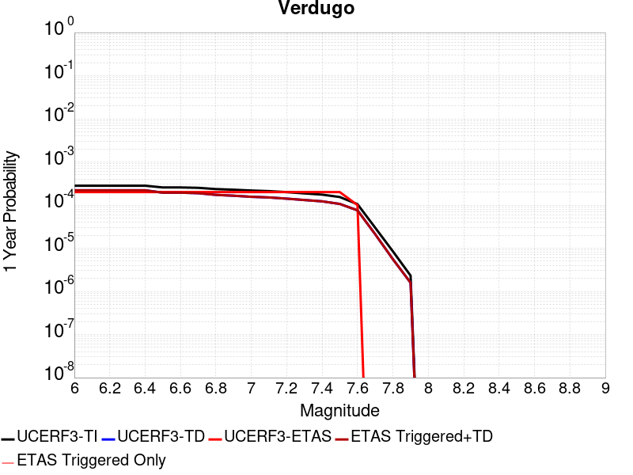 |  |

| Magnitude | 1 wk TI Prob | 1 wk TD Prob | 1 wk ETAS Prob | 1 wk ETAS/TD Gain | 1 wk ETAS Triggered+TD | 1 wk ETAS Triggered Only | 1 mo TI Prob | 1 mo TD Prob | 1 mo ETAS Prob | 1 mo ETAS/TD Gain | 1 mo ETAS Triggered+TD | 1 mo ETAS Triggered Only | 1 yr TI Prob | 1 yr TD Prob | 1 yr ETAS Prob | 1 yr ETAS/TD Gain | 1 yr ETAS Triggered+TD | 1 yr ETAS Triggered Only | 10 yr TI Prob | 10 yr TD Prob | 10 yr ETAS Prob | 10 yr ETAS/TD Gain | 10 yr ETAS Triggered+TD | 10 yr ETAS Triggered Only |
|-----|-----|-----|-----|-----|-----|-----|-----|-----|-----|-----|-----|-----|-----|-----|-----|-----|-----|-----|-----|-----|-----|-----|-----|-----|
| 6.0 | 5.392987E-6 | 4.217289E-6 | 0.0 | 0.0 | 4.217289E-6 | 0.0 | 2.3112598E-5 | 1.8073973E-5 | 0.0 | 0.0 | 1.8073973E-5 | 0.0 | 2.8135953E-4 | 2.2002889E-4 | 2.0E-4 | 0.90897155 | 2.2002889E-4 | 0.0 | 0.0028100356 | 0.002198158 | 0.001 | 0.4549263 | 0.0022979383 | 1.0E-4 |
| 6.1 | 5.392987E-6 | 4.217289E-6 | 0.0 | 0.0 | 4.217289E-6 | 0.0 | 2.3112598E-5 | 1.8073973E-5 | 0.0 | 0.0 | 1.8073973E-5 | 0.0 | 2.8135953E-4 | 2.2002889E-4 | 2.0E-4 | 0.90897155 | 2.2002889E-4 | 0.0 | 0.0028100356 | 0.002198158 | 0.001 | 0.4549263 | 0.0022979383 | 1.0E-4 |
| 6.2 | 5.392987E-6 | 4.217289E-6 | 0.0 | 0.0 | 4.217289E-6 | 0.0 | 2.3112598E-5 | 1.8073973E-5 | 0.0 | 0.0 | 1.8073973E-5 | 0.0 | 2.8135953E-4 | 2.2002889E-4 | 2.0E-4 | 0.90897155 | 2.2002889E-4 | 0.0 | 0.0028100356 | 0.002198158 | 0.001 | 0.4549263 | 0.0022979383 | 1.0E-4 |
| 6.3 | 5.392987E-6 | 4.217289E-6 | 0.0 | 0.0 | 4.217289E-6 | 0.0 | 2.3112598E-5 | 1.8073973E-5 | 0.0 | 0.0 | 1.8073973E-5 | 0.0 | 2.8135953E-4 | 2.2002889E-4 | 2.0E-4 | 0.90897155 | 2.2002889E-4 | 0.0 | 0.0028100356 | 0.002198158 | 0.001 | 0.4549263 | 0.0022979383 | 1.0E-4 |
| 6.4 | 5.392987E-6 | 4.217289E-6 | 0.0 | 0.0 | 4.217289E-6 | 0.0 | 2.3112598E-5 | 1.8073973E-5 | 0.0 | 0.0 | 1.8073973E-5 | 0.0 | 2.8135953E-4 | 2.2002889E-4 | 2.0E-4 | 0.90897155 | 2.2002889E-4 | 0.0 | 0.0028100356 | 0.002198158 | 0.001 | 0.4549263 | 0.0022979383 | 1.0E-4 |
| 6.5 | 4.9154837E-6 | 3.723203E-6 | 0.0 | 0.0 | 3.723203E-6 | 0.0 | 2.1066187E-5 | 1.5956488E-5 | 0.0 | 0.0 | 1.5956488E-5 | 0.0 | 2.5645064E-4 | 1.9425312E-4 | 2.0E-4 | 1.0295844 | 1.9425312E-4 | 0.0 | 0.002561549 | 0.0019408541 | 8.0E-4 | 0.41218963 | 0.0019408541 | 0.0 |
| 6.6 | 4.9154837E-6 | 3.723203E-6 | 0.0 | 0.0 | 3.723203E-6 | 0.0 | 2.1066187E-5 | 1.5956488E-5 | 0.0 | 0.0 | 1.5956488E-5 | 0.0 | 2.5645064E-4 | 1.9425312E-4 | 2.0E-4 | 1.0295844 | 1.9425312E-4 | 0.0 | 0.002561549 | 0.0019408541 | 8.0E-4 | 0.41218963 | 0.0019408541 | 0.0 |
| 6.7 | 4.817006E-6 | 3.621383E-6 | 0.0 | 0.0 | 3.621383E-6 | 0.0 | 2.0644147E-5 | 1.5520121E-5 | 0.0 | 0.0 | 1.5520121E-5 | 0.0 | 2.513135E-4 | 1.8894128E-4 | 2.0E-4 | 1.0585299 | 1.8894128E-4 | 0.0 | 0.0025102948 | 0.0018878261 | 8.0E-4 | 0.42376783 | 0.0018878261 | 0.0 |
| 6.8 | 4.507407E-6 | 3.3078034E-6 | 0.0 | 0.0 | 3.3078034E-6 | 0.0 | 1.9317316E-5 | 1.4176224E-5 | 0.0 | 0.0 | 1.4176224E-5 | 0.0 | 2.3516294E-4 | 1.7258199E-4 | 2.0E-4 | 1.1588694 | 1.7258199E-4 | 0.0 | 0.0023491425 | 0.001724494 | 7.0E-4 | 0.40591615 | 0.001724494 | 0.0 |
| 6.9 | 4.3573054E-6 | 3.1616958E-6 | 0.0 | 0.0 | 3.1616958E-6 | 0.0 | 1.8674033E-5 | 1.3550055E-5 | 0.0 | 0.0 | 1.3550055E-5 | 0.0 | 2.2733262E-4 | 1.6495955E-4 | 2.0E-4 | 1.2124184 | 1.6495955E-4 | 0.0 | 0.0022710022 | 0.0016483834 | 6.0E-4 | 0.363993 | 0.0016483834 | 0.0 |
| 7.0 | 4.171527E-6 | 2.984337E-6 | 0.0 | 0.0 | 2.984337E-6 | 0.0 | 1.787785E-5 | 1.2789953E-5 | 0.0 | 0.0 | 1.2789953E-5 | 0.0 | 2.1764109E-4 | 1.5570666E-4 | 2.0E-4 | 1.2844665 | 1.5570666E-4 | 0.0 | 0.0021742806 | 0.0015559869 | 6.0E-4 | 0.38560733 | 0.0015559869 | 0.0 |
| 7.1 | 4.0405484E-6 | 2.882915E-6 | 0.0 | 0.0 | 2.882915E-6 | 0.0 | 1.731652E-5 | 1.2355292E-5 | 0.0 | 0.0 | 1.2355292E-5 | 0.0 | 2.1080824E-4 | 1.504154E-4 | 2.0E-4 | 1.3296511 | 1.504154E-4 | 0.0 | 0.0021060838 | 0.001503147 | 6.0E-4 | 0.39916256 | 0.001503147 | 0.0 |
| 7.2 | 3.8306007E-6 | 2.7024792E-6 | 0.0 | 0.0 | 2.7024792E-6 | 0.0 | 1.6416758E-5 | 1.1582003E-5 | 0.0 | 0.0 | 1.1582003E-5 | 0.0 | 1.9985568E-4 | 1.4100187E-4 | 2.0E-4 | 1.4184209 | 1.4100187E-4 | 0.0 | 0.0019967605 | 0.0014091348 | 6.0E-4 | 0.4257932 | 0.0014091348 | 0.0 |
| 7.3 | 3.5750938E-6 | 2.512785E-6 | 0.0 | 0.0 | 2.512785E-6 | 0.0 | 1.532174E-5 | 1.0769034E-5 | 0.0 | 0.0 | 1.0769034E-5 | 0.0 | 1.8652623E-4 | 1.311052E-4 | 2.0E-4 | 1.5254924 | 1.311052E-4 | 0.0 | 0.0018636974 | 0.0013102891 | 6.0E-4 | 0.4579142 | 0.0013102891 | 0.0 |
| 7.4 | 3.3510041E-6 | 2.3414464E-6 | 0.0 | 0.0 | 2.3414464E-6 | 0.0 | 1.4361368E-5 | 1.0034732E-5 | 0.0 | 0.0 | 1.0034732E-5 | 0.0 | 1.7483562E-4 | 1.2216612E-4 | 2.0E-4 | 1.6371151 | 1.2216612E-4 | 0.0 | 0.0017469813 | 0.0012210001 | 6.0E-4 | 0.49140048 | 0.0012210001 | 0.0 |
| 7.5 | 2.948287E-6 | 2.0395298E-6 | 0.0 | 0.0 | 2.0395298E-6 | 0.0 | 1.2635454E-5 | 8.740813E-6 | 0.0 | 0.0 | 8.740813E-6 | 0.0 | 1.538258E-4 | 1.0641431E-4 | 2.0E-4 | 1.8794465 | 1.0641431E-4 | 0.0 | 0.0015371935 | 0.0010636437 | 5.0E-4 | 0.47008222 | 0.0010636437 | 0.0 |
| 7.6 | 2.0134323E-6 | 1.4473728E-6 | 0.0 | 0.0 | 1.4473728E-6 | 0.0 | 8.628967E-6 | 6.203012E-6 | 0.0 | 0.0 | 6.203012E-6 | 0.0 | 1.05052604E-4 | 7.551914E-5 | 1.0E-4 | 1.3241675 | 7.551914E-5 | 0.0 | 0.0010500296 | 7.5494364E-4 | 4.0E-4 | 0.5298409 | 7.5494364E-4 | 0.0 |
| 7.7 | 5.726436E-7 | 4.0459838E-7 | 0.0 | 0.0 | 4.0459838E-7 | 0.0 | 2.4541846E-6 | 1.733992E-6 | 0.0 | 0.0 | 1.733992E-6 | 0.0 | 2.9879287E-5 | 2.1111175E-5 | 0.0 | 0.0 | 2.1111175E-5 | 0.0 | 2.987527E-4 | 2.1109423E-4 | 2.0E-4 | 0.94744414 | 2.1109423E-4 | 0.0 |
| 7.8 | 1.6248204E-7 | 1.0691812E-7 | 0.0 | 0.0 | 1.0691812E-7 | 0.0 | 6.963514E-7 | 4.5822043E-7 | 0.0 | 0.0 | 4.5822043E-7 | 0.0 | 8.478045E-6 | 5.5788196E-6 | 0.0 | 0.0 | 5.5788196E-6 | 0.0 | 8.477722E-5 | 5.578683E-5 | 0.0 | 0.0 | 5.578683E-5 | 0.0 |
| 7.9 | 4.4475744E-8 | 3.0381287E-8 | 0.0 | 0.0 | 3.0381287E-8 | 0.0 | 1.9061031E-7 | 1.302055E-7 | 0.0 | 0.0 | 1.302055E-7 | 0.0 | 2.320678E-6 | 1.5852511E-6 | 0.0 | 0.0 | 1.5852511E-6 | 0.0 | 2.3206538E-5 | 1.585241E-5 | 0.0 | 0.0 | 1.585241E-5 | 0.0 |

## Malibu Coast (Extension) alt 1
*[(top)](#table-of-contents)*

| 1 Week | 1 Month | 1 Year | 10 Year |
|-----|-----|-----|-----|
|  |  |  |  |

| Magnitude | 1 wk TI Prob | 1 wk TD Prob | 1 wk ETAS Prob | 1 wk ETAS/TD Gain | 1 wk ETAS Triggered+TD | 1 wk ETAS Triggered Only | 1 mo TI Prob | 1 mo TD Prob | 1 mo ETAS Prob | 1 mo ETAS/TD Gain | 1 mo ETAS Triggered+TD | 1 mo ETAS Triggered Only | 1 yr TI Prob | 1 yr TD Prob | 1 yr ETAS Prob | 1 yr ETAS/TD Gain | 1 yr ETAS Triggered+TD | 1 yr ETAS Triggered Only | 10 yr TI Prob | 10 yr TD Prob | 10 yr ETAS Prob | 10 yr ETAS/TD Gain | 10 yr ETAS Triggered+TD | 10 yr ETAS Triggered Only |
|-----|-----|-----|-----|-----|-----|-----|-----|-----|-----|-----|-----|-----|-----|-----|-----|-----|-----|-----|-----|-----|-----|-----|-----|-----|
| 6.0 | 8.930738E-6 | 9.330452E-6 | 0.0 | 0.0 | 9.330452E-6 | 0.0 | 3.827403E-5 | 3.9987044E-5 | 0.0 | 0.0 | 3.9987044E-5 | 0.0 | 4.6588664E-4 | 4.8673525E-4 | 2.0E-4 | 0.410901 | 4.8673525E-4 | 0.0 | 0.0046491115 | 0.0048568742 | 0.0026 | 0.5353237 | 0.004956389 | 1.0E-4 |
| 6.1 | 7.199952E-6 | 7.5313314E-6 | 0.0 | 0.0 | 7.5313314E-6 | 0.0 | 3.0856572E-5 | 3.2276737E-5 | 0.0 | 0.0 | 3.2276737E-5 | 0.0 | 3.75614E-4 | 3.9289903E-4 | 2.0E-4 | 0.5090366 | 3.9289903E-4 | 0.0 | 0.0037497976 | 0.0039221104 | 0.0023 | 0.586419 | 0.004021718 | 1.0E-4 |
| 6.2 | 6.3721413E-6 | 6.6677526E-6 | 0.0 | 0.0 | 6.6677526E-6 | 0.0 | 2.7308892E-5 | 2.857577E-5 | 0.0 | 0.0 | 2.857577E-5 | 0.0 | 3.3243504E-4 | 3.4785483E-4 | 2.0E-4 | 0.5749525 | 3.4785483E-4 | 0.0 | 0.0033193815 | 0.0034731433 | 0.0023 | 0.6622243 | 0.0035727962 | 1.0E-4 |
| 6.3 | 6.016345E-6 | 6.296086E-6 | 0.0 | 0.0 | 6.296086E-6 | 0.0 | 2.578408E-5 | 2.698295E-5 | 0.0 | 0.0 | 2.698295E-5 | 0.0 | 3.1387596E-4 | 3.2846822E-4 | 2.0E-4 | 0.6088869 | 3.2846822E-4 | 0.0 | 0.00313433 | 0.0032798634 | 0.0023 | 0.7012487 | 0.0033795354 | 1.0E-4 |
| 6.4 | 5.8104883E-6 | 6.0804523E-6 | 0.0 | 0.0 | 6.0804523E-6 | 0.0 | 2.4901856E-5 | 2.6058824E-5 | 0.0 | 0.0 | 2.6058824E-5 | 0.0 | 3.031379E-4 | 3.172203E-4 | 2.0E-4 | 0.63047665 | 3.172203E-4 | 0.0 | 0.0030272473 | 0.0031677096 | 0.0021 | 0.66293955 | 0.0032673927 | 1.0E-4 |
| 6.5 | 5.476925E-6 | 5.7283823E-6 | 0.0 | 0.0 | 5.7283823E-6 | 0.0 | 2.3472323E-5 | 2.454998E-5 | 0.0 | 0.0 | 2.454998E-5 | 0.0 | 2.8573806E-4 | 2.988553E-4 | 2.0E-4 | 0.66922015 | 2.988553E-4 | 0.0 | 0.0028537093 | 0.0029845661 | 0.0021 | 0.7036199 | 0.0030842675 | 1.0E-4 |
| 6.6 | 5.222387E-6 | 5.4594184E-6 | 0.0 | 0.0 | 5.4594184E-6 | 0.0 | 2.2381464E-5 | 2.33973E-5 | 0.0 | 0.0 | 2.33973E-5 | 0.0 | 2.7246025E-4 | 2.848252E-4 | 2.0E-4 | 0.7021851 | 2.848252E-4 | 0.0 | 0.0027212645 | 0.002844632 | 0.002 | 0.7030786 | 0.002844632 | 0.0 |
| 6.7 | 5.0337076E-6 | 5.2599194E-6 | 0.0 | 0.0 | 5.2599194E-6 | 0.0 | 2.1572854E-5 | 2.254232E-5 | 0.0 | 0.0 | 2.254232E-5 | 0.0 | 2.6261783E-4 | 2.7441845E-4 | 2.0E-4 | 0.728814 | 2.7441845E-4 | 0.0 | 0.002623077 | 0.002740826 | 0.0019 | 0.6932217 | 0.002740826 | 0.0 |
| 6.8 | 4.5675624E-6 | 4.7594594E-6 | 0.0 | 0.0 | 4.7594594E-6 | 0.0 | 1.9575122E-5 | 2.0397525E-5 | 0.0 | 0.0 | 2.0397525E-5 | 0.0 | 2.3830103E-4 | 2.4831176E-4 | 2.0E-4 | 0.8054391 | 2.4831176E-4 | 0.0 | 0.0023804565 | 0.0024803628 | 0.0018 | 0.7257003 | 0.0024803628 | 0.0 |
| 6.9 | 4.2802412E-6 | 4.452723E-6 | 0.0 | 0.0 | 4.452723E-6 | 0.0 | 1.8343762E-5 | 1.9082958E-5 | 0.0 | 0.0 | 1.9082958E-5 | 0.0 | 2.2331243E-4 | 2.3231041E-4 | 2.0E-4 | 0.8609171 | 2.3231041E-4 | 0.0 | 0.0022308815 | 0.0023206924 | 0.0018 | 0.7756306 | 0.0023206924 | 0.0 |
| 7.0 | 3.9794063E-6 | 4.130756E-6 | 0.0 | 0.0 | 4.130756E-6 | 0.0 | 1.7054486E-5 | 1.7703122E-5 | 0.0 | 0.0 | 1.7703122E-5 | 0.0 | 2.0761859E-4 | 2.1551432E-4 | 2.0E-4 | 0.92801255 | 2.1551432E-4 | 0.0 | 0.0020742472 | 0.0021530667 | 0.0017 | 0.78957146 | 0.0021530667 | 0.0 |
| 7.1 | 3.7730424E-6 | 3.911848E-6 | 0.0 | 0.0 | 3.911848E-6 | 0.0 | 1.6170083E-5 | 1.6764956E-5 | 0.0 | 0.0 | 1.6764956E-5 | 0.0 | 1.9685295E-4 | 2.0409434E-4 | 2.0E-4 | 0.979939 | 2.0409434E-4 | 0.0 | 0.0019667868 | 0.0020390819 | 0.0015 | 0.7356252 | 0.0020390819 | 0.0 |
| 7.2 | 3.424985E-6 | 3.5419218E-6 | 0.0 | 0.0 | 3.5419218E-6 | 0.0 | 1.4678424E-5 | 1.5179577E-5 | 0.0 | 0.0 | 1.5179577E-5 | 0.0 | 1.7869516E-4 | 1.8479579E-4 | 2.0E-4 | 1.0822757 | 1.8479579E-4 | 0.0 | 0.0017855153 | 0.0018464333 | 0.0015 | 0.81237704 | 0.0018464333 | 0.0 |
| 7.3 | 2.6966375E-6 | 2.7601243E-6 | 0.0 | 0.0 | 2.7601243E-6 | 0.0 | 1.15569665E-5 | 1.182905E-5 | 0.0 | 0.0 | 1.182905E-5 | 0.0 | 1.4069698E-4 | 1.440092E-4 | 2.0E-4 | 1.3888 | 1.440092E-4 | 0.0 | 0.0014060794 | 0.001439163 | 0.0012 | 0.83381796 | 0.001439163 | 0.0 |
| 7.4 | 2.215957E-6 | 2.2497827E-6 | 0.0 | 0.0 | 2.2497827E-6 | 0.0 | 9.496924E-6 | 9.641891E-6 | 0.0 | 0.0 | 9.641891E-6 | 0.0 | 1.1561892E-4 | 1.1738373E-4 | 2.0E-4 | 1.7038136 | 1.1738373E-4 | 0.0 | 0.0011555878 | 0.001173221 | 9.0E-4 | 0.7671189 | 0.001173221 | 0.0 |
| 7.5 | 1.2040218E-6 | 1.2220956E-6 | 0.0 | 0.0 | 1.2220956E-6 | 0.0 | 5.160083E-6 | 5.237542E-6 | 0.0 | 0.0 | 5.237542E-6 | 0.0 | 6.2822204E-5 | 6.3765234E-5 | 2.0E-4 | 3.1365056 | 6.3765234E-5 | 0.0 | 6.280445E-4 | 6.374712E-4 | 5.0E-4 | 0.78434914 | 6.374712E-4 | 0.0 |
| 7.6 | 6.6157446E-7 | 6.6798526E-7 | 0.0 | 0.0 | 6.6798526E-7 | 0.0 | 2.835316E-6 | 2.862791E-6 | 0.0 | 0.0 | 2.862791E-6 | 0.0 | 3.4519428E-5 | 3.4853936E-5 | 0.0 | 0.0 | 3.4853936E-5 | 0.0 | 3.4514067E-4 | 3.4848624E-4 | 2.0E-4 | 0.5739108 | 3.4848624E-4 | 0.0 |
| 7.7 | 2.6012302E-7 | 2.4360637E-7 | 0.0 | 0.0 | 2.4360637E-7 | 0.0 | 1.1148124E-6 | 1.0440269E-6 | 0.0 | 0.0 | 1.0440269E-6 | 0.0 | 1.3572758E-5 | 1.2710964E-5 | 0.0 | 0.0 | 1.2710964E-5 | 0.0 | 1.3571928E-4 | 1.2710344E-4 | 1.0E-4 | 0.78676075 | 1.2710344E-4 | 0.0 |
| 7.8 | 2.8323132E-8 | 2.0269145E-8 | 0.0 | 0.0 | 2.0269145E-8 | 0.0 | 1.2138484E-7 | 8.686776E-8 | 0.0 | 0.0 | 8.686776E-8 | 0.0 | 1.4778595E-6 | 1.0576146E-6 | 0.0 | 0.0 | 1.0576146E-6 | 0.0 | 1.4778497E-5 | 1.0576103E-5 | 0.0 | 0.0 | 1.0576103E-5 | 0.0 |

## East Huasna 2011 CFM
*[(top)](#table-of-contents)*

| 1 Week | 1 Month | 1 Year | 10 Year |
|-----|-----|-----|-----|
|  | 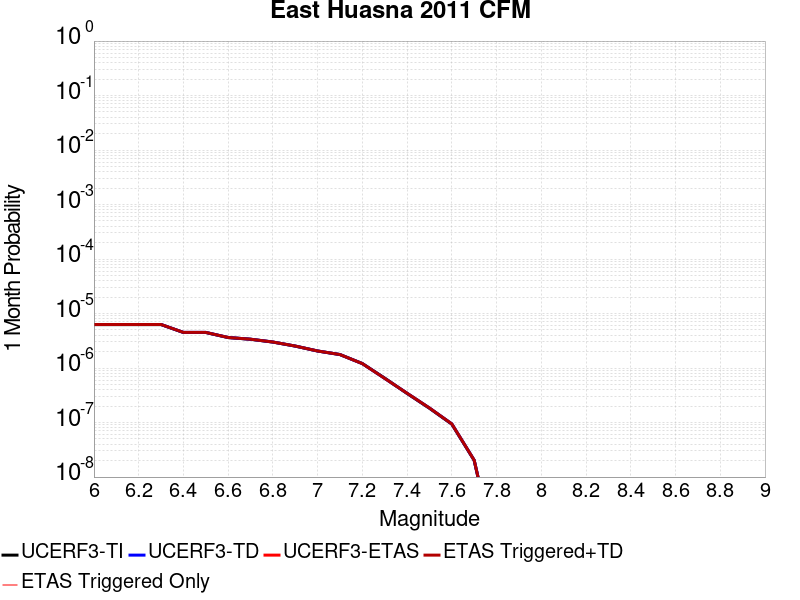 |  |  |

| Magnitude | 1 wk TI Prob | 1 wk TD Prob | 1 wk ETAS Prob | 1 wk ETAS/TD Gain | 1 wk ETAS Triggered+TD | 1 wk ETAS Triggered Only | 1 mo TI Prob | 1 mo TD Prob | 1 mo ETAS Prob | 1 mo ETAS/TD Gain | 1 mo ETAS Triggered+TD | 1 mo ETAS Triggered Only | 1 yr TI Prob | 1 yr TD Prob | 1 yr ETAS Prob | 1 yr ETAS/TD Gain | 1 yr ETAS Triggered+TD | 1 yr ETAS Triggered Only | 10 yr TI Prob | 10 yr TD Prob | 10 yr ETAS Prob | 10 yr ETAS/TD Gain | 10 yr ETAS Triggered+TD | 10 yr ETAS Triggered Only |
|-----|-----|-----|-----|-----|-----|-----|-----|-----|-----|-----|-----|-----|-----|-----|-----|-----|-----|-----|-----|-----|-----|-----|-----|-----|
| 6.0 | 1.4658423E-6 | 1.4715823E-6 | 0.0 | 0.0 | 1.4715823E-6 | 0.0 | 6.282166E-6 | 6.3067664E-6 | 0.0 | 0.0 | 6.3067664E-6 | 0.0 | 7.6482684E-5 | 7.678225E-5 | 1.0E-4 | 1.3023844 | 7.678225E-5 | 0.0 | 7.645637E-4 | 7.675642E-4 | 3.0E-4 | 0.3908468 | 8.6748746E-4 | 1.0E-4 |
| 6.1 | 1.4658423E-6 | 1.4715823E-6 | 0.0 | 0.0 | 1.4715823E-6 | 0.0 | 6.282166E-6 | 6.3067664E-6 | 0.0 | 0.0 | 6.3067664E-6 | 0.0 | 7.6482684E-5 | 7.678225E-5 | 1.0E-4 | 1.3023844 | 7.678225E-5 | 0.0 | 7.645637E-4 | 7.675642E-4 | 3.0E-4 | 0.3908468 | 8.6748746E-4 | 1.0E-4 |
| 6.2 | 1.4658423E-6 | 1.4715823E-6 | 0.0 | 0.0 | 1.4715823E-6 | 0.0 | 6.282166E-6 | 6.3067664E-6 | 0.0 | 0.0 | 6.3067664E-6 | 0.0 | 7.6482684E-5 | 7.678225E-5 | 1.0E-4 | 1.3023844 | 7.678225E-5 | 0.0 | 7.645637E-4 | 7.675642E-4 | 3.0E-4 | 0.3908468 | 8.6748746E-4 | 1.0E-4 |
| 6.3 | 1.4658423E-6 | 1.4715823E-6 | 0.0 | 0.0 | 1.4715823E-6 | 0.0 | 6.282166E-6 | 6.3067664E-6 | 0.0 | 0.0 | 6.3067664E-6 | 0.0 | 7.6482684E-5 | 7.678225E-5 | 1.0E-4 | 1.3023844 | 7.678225E-5 | 0.0 | 7.645637E-4 | 7.675642E-4 | 3.0E-4 | 0.3908468 | 8.6748746E-4 | 1.0E-4 |
| 6.4 | 1.0488257E-6 | 1.0527642E-6 | 0.0 | 0.0 | 1.0527642E-6 | 0.0 | 4.4949593E-6 | 4.511839E-6 | 0.0 | 0.0 | 4.511839E-6 | 0.0 | 5.472476E-5 | 5.4930275E-5 | 1.0E-4 | 1.8204898 | 5.4930275E-5 | 0.0 | 5.4711284E-4 | 5.491689E-4 | 1.0E-4 | 0.18209335 | 5.491689E-4 | 0.0 |
| 6.5 | 1.0488257E-6 | 1.0527642E-6 | 0.0 | 0.0 | 1.0527642E-6 | 0.0 | 4.4949593E-6 | 4.511839E-6 | 0.0 | 0.0 | 4.511839E-6 | 0.0 | 5.472476E-5 | 5.4930275E-5 | 1.0E-4 | 1.8204898 | 5.4930275E-5 | 0.0 | 5.4711284E-4 | 5.491689E-4 | 1.0E-4 | 0.18209335 | 5.491689E-4 | 0.0 |
| 6.6 | 8.463064E-7 | 8.4937426E-7 | 0.0 | 0.0 | 8.4937426E-7 | 0.0 | 3.6270226E-6 | 3.6401705E-6 | 0.0 | 0.0 | 3.6401705E-6 | 0.0 | 4.4158103E-5 | 4.431818E-5 | 1.0E-4 | 2.2564101 | 4.431818E-5 | 0.0 | 4.414933E-4 | 4.4309432E-4 | 1.0E-4 | 0.22568558 | 4.4309432E-4 | 0.0 |
| 6.7 | 7.876149E-7 | 7.902635E-7 | 0.0 | 0.0 | 7.902635E-7 | 0.0 | 3.375488E-6 | 3.3868394E-6 | 0.0 | 0.0 | 3.3868394E-6 | 0.0 | 4.109579E-5 | 4.1233994E-5 | 1.0E-4 | 2.4251835 | 4.1233994E-5 | 0.0 | 4.108819E-4 | 4.1226405E-4 | 1.0E-4 | 0.24256298 | 4.1226405E-4 | 0.0 |
| 6.8 | 6.9940785E-7 | 7.016672E-7 | 0.0 | 0.0 | 7.016672E-7 | 0.0 | 2.9974588E-6 | 3.0071417E-6 | 0.0 | 0.0 | 3.0071417E-6 | 0.0 | 3.649345E-5 | 3.6611338E-5 | 1.0E-4 | 2.7313943 | 3.6611338E-5 | 0.0 | 3.6487455E-4 | 3.6605354E-4 | 1.0E-4 | 0.27318406 | 3.6605354E-4 | 0.0 |
| 6.9 | 5.899658E-7 | 5.9156804E-7 | 0.0 | 0.0 | 5.9156804E-7 | 0.0 | 2.5284223E-6 | 2.5352892E-6 | 0.0 | 0.0 | 2.5352892E-6 | 0.0 | 3.0783107E-5 | 3.086671E-5 | 1.0E-4 | 3.239736 | 3.086671E-5 | 0.0 | 3.0778843E-4 | 3.0862453E-4 | 1.0E-4 | 0.3240183 | 3.0862453E-4 | 0.0 |
| 7.0 | 4.793814E-7 | 4.803341E-7 | 0.0 | 0.0 | 4.803341E-7 | 0.0 | 2.05449E-6 | 2.0585733E-6 | 0.0 | 0.0 | 2.0585733E-6 | 0.0 | 2.501313E-5 | 2.5062842E-5 | 1.0E-4 | 3.9899704 | 2.5062842E-5 | 0.0 | 2.5010316E-4 | 2.5060034E-4 | 1.0E-4 | 0.39904177 | 2.5060034E-4 | 0.0 |
| 7.1 | 4.1256908E-7 | 4.129999E-7 | 0.0 | 0.0 | 4.129999E-7 | 0.0 | 1.768152E-6 | 1.7699983E-6 | 0.0 | 0.0 | 1.7699983E-6 | 0.0 | 2.1527037E-5 | 2.1549518E-5 | 0.0 | 0.0 | 2.1549518E-5 | 0.0 | 2.1524953E-4 | 2.1547443E-4 | 0.0 | 0.0 | 2.1547443E-4 | 0.0 |
| 7.2 | 2.822599E-7 | 2.8161784E-7 | 0.0 | 0.0 | 2.8161784E-7 | 0.0 | 1.2096847E-6 | 1.206933E-6 | 0.0 | 0.0 | 1.206933E-6 | 0.0 | 1.47278115E-5 | 1.4694311E-5 | 0.0 | 0.0 | 1.4694311E-5 | 0.0 | 1.4726835E-4 | 1.4693347E-4 | 0.0 | 0.0 | 1.4693347E-4 | 0.0 |
| 7.3 | 1.5261652E-7 | 1.507514E-7 | 0.0 | 0.0 | 1.507514E-7 | 0.0 | 6.540707E-7 | 6.460773E-7 | 0.0 | 0.0 | 6.460773E-7 | 0.0 | 7.963281E-6 | 7.865963E-6 | 0.0 | 0.0 | 7.865963E-6 | 0.0 | 7.962996E-5 | 7.865686E-5 | 0.0 | 0.0 | 7.865686E-5 | 0.0 |
| 7.4 | 7.976414E-8 | 8.0580286E-8 | 0.0 | 0.0 | 8.0580286E-8 | 0.0 | 3.418463E-7 | 3.4534403E-7 | 0.0 | 0.0 | 3.4534403E-7 | 0.0 | 4.1619705E-6 | 4.2045554E-6 | 0.0 | 0.0 | 4.2045554E-6 | 0.0 | 4.161893E-5 | 4.2044765E-5 | 0.0 | 0.0 | 4.2044765E-5 | 0.0 |
| 7.5 | 4.2715055E-8 | 4.3203492E-8 | 0.0 | 0.0 | 4.3203492E-8 | 0.0 | 1.830645E-7 | 1.851578E-7 | 0.0 | 0.0 | 1.851578E-7 | 0.0 | 2.228808E-6 | 2.2542938E-6 | 0.0 | 0.0 | 2.2542938E-6 | 0.0 | 2.2287857E-5 | 2.2542714E-5 | 0.0 | 0.0 | 2.2542714E-5 | 0.0 |
| 7.6 | 2.1807532E-8 | 2.2057977E-8 | 0.0 | 0.0 | 2.2057977E-8 | 0.0 | 9.346085E-8 | 9.453419E-8 | 0.0 | 0.0 | 9.453419E-8 | 0.0 | 1.1378852E-6 | 1.150953E-6 | 0.0 | 0.0 | 1.150953E-6 | 0.0 | 1.1378794E-5 | 1.1509472E-5 | 0.0 | 0.0 | 1.1509472E-5 | 0.0 |
| 7.7 | 4.7196043E-9 | 4.7673785E-9 | 0.0 | 0.0 | 4.7673785E-9 | 0.0 | 2.0226874E-8 | 2.0431623E-8 | 0.0 | 0.0 | 2.0431623E-8 | 0.0 | 2.4626218E-7 | 2.4875496E-7 | 0.0 | 0.0 | 2.4875496E-7 | 0.0 | 2.462619E-6 | 2.4875471E-6 | 0.0 | 0.0 | 2.4875471E-6 | 0.0 |
| 7.8 | 7.400003E-11 | 7.4655726E-11 | 0.0 | 0.0 | 7.4655726E-11 | 0.0 | 3.171432E-10 | 3.1995329E-10 | 0.0 | 0.0 | 3.1995329E-10 | 0.0 | 3.861218E-9 | 3.8954315E-9 | 0.0 | 0.0 | 3.8954315E-9 | 0.0 | 3.861218E-8 | 3.8954315E-8 | 0.0 | 0.0 | 3.8954315E-8 | 0.0 |

## Fontana (Seismicity)
*[(top)](#table-of-contents)*

| 1 Week | 1 Month | 1 Year | 10 Year |
|-----|-----|-----|-----|
| 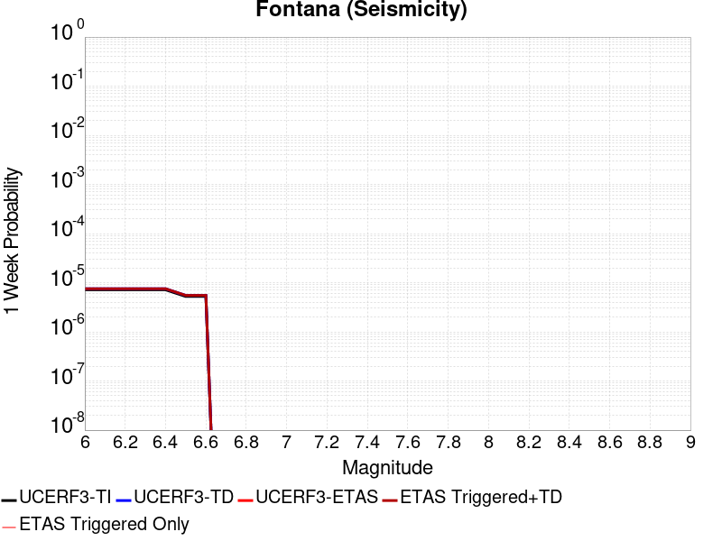 |  |  | 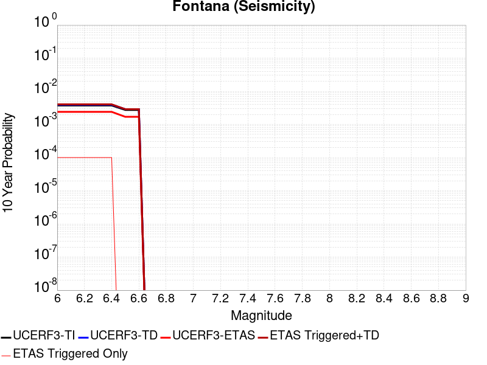 |

| Magnitude | 1 wk TI Prob | 1 wk TD Prob | 1 wk ETAS Prob | 1 wk ETAS/TD Gain | 1 wk ETAS Triggered+TD | 1 wk ETAS Triggered Only | 1 mo TI Prob | 1 mo TD Prob | 1 mo ETAS Prob | 1 mo ETAS/TD Gain | 1 mo ETAS Triggered+TD | 1 mo ETAS Triggered Only | 1 yr TI Prob | 1 yr TD Prob | 1 yr ETAS Prob | 1 yr ETAS/TD Gain | 1 yr ETAS Triggered+TD | 1 yr ETAS Triggered Only | 10 yr TI Prob | 10 yr TD Prob | 10 yr ETAS Prob | 10 yr ETAS/TD Gain | 10 yr ETAS Triggered+TD | 10 yr ETAS Triggered Only |
|-----|-----|-----|-----|-----|-----|-----|-----|-----|-----|-----|-----|-----|-----|-----|-----|-----|-----|-----|-----|-----|-----|-----|-----|-----|
| 6.0 | 7.1789214E-6 | 7.552779E-6 | 0.0 | 0.0 | 7.552779E-6 | 0.0 | 3.076644E-5 | 3.236888E-5 | 0.0 | 0.0 | 3.236888E-5 | 0.0 | 3.7451705E-4 | 3.9406065E-4 | 3.0E-4 | 0.7613041 | 4.940213E-4 | 1.0E-4 | 0.003738865 | 0.0039376197 | 0.0024 | 0.6095053 | 0.0040372256 | 1.0E-4 |
| 6.1 | 7.1789214E-6 | 7.552779E-6 | 0.0 | 0.0 | 7.552779E-6 | 0.0 | 3.076644E-5 | 3.236888E-5 | 0.0 | 0.0 | 3.236888E-5 | 0.0 | 3.7451705E-4 | 3.9406065E-4 | 3.0E-4 | 0.7613041 | 4.940213E-4 | 1.0E-4 | 0.003738865 | 0.0039376197 | 0.0024 | 0.6095053 | 0.0040372256 | 1.0E-4 |
| 6.2 | 7.1789214E-6 | 7.552779E-6 | 0.0 | 0.0 | 7.552779E-6 | 0.0 | 3.076644E-5 | 3.236888E-5 | 0.0 | 0.0 | 3.236888E-5 | 0.0 | 3.7451705E-4 | 3.9406065E-4 | 3.0E-4 | 0.7613041 | 4.940213E-4 | 1.0E-4 | 0.003738865 | 0.0039376197 | 0.0024 | 0.6095053 | 0.0040372256 | 1.0E-4 |
| 6.3 | 7.1789214E-6 | 7.552779E-6 | 0.0 | 0.0 | 7.552779E-6 | 0.0 | 3.076644E-5 | 3.236888E-5 | 0.0 | 0.0 | 3.236888E-5 | 0.0 | 3.7451705E-4 | 3.9406065E-4 | 3.0E-4 | 0.7613041 | 4.940213E-4 | 1.0E-4 | 0.003738865 | 0.0039376197 | 0.0024 | 0.6095053 | 0.0040372256 | 1.0E-4 |
| 6.4 | 7.1789214E-6 | 7.552779E-6 | 0.0 | 0.0 | 7.552779E-6 | 0.0 | 3.076644E-5 | 3.236888E-5 | 0.0 | 0.0 | 3.236888E-5 | 0.0 | 3.7451705E-4 | 3.9406065E-4 | 3.0E-4 | 0.7613041 | 4.940213E-4 | 1.0E-4 | 0.003738865 | 0.0039376197 | 0.0024 | 0.6095053 | 0.0040372256 | 1.0E-4 |
| 6.5 | 5.2611317E-6 | 5.533292E-6 | 0.0 | 0.0 | 5.533292E-6 | 0.0 | 2.2547512E-5 | 2.371411E-5 | 0.0 | 0.0 | 2.371411E-5 | 0.0 | 2.744814E-4 | 2.8871928E-4 | 2.0E-4 | 0.6927144 | 2.8871928E-4 | 0.0 | 0.002741426 | 0.0028871929 | 0.0017 | 0.5888072 | 0.0028871929 | 0.0 |
| 6.6 | 5.2611317E-6 | 5.533292E-6 | 0.0 | 0.0 | 5.533292E-6 | 0.0 | 2.2547512E-5 | 2.371411E-5 | 0.0 | 0.0 | 2.371411E-5 | 0.0 | 2.744814E-4 | 2.8871928E-4 | 2.0E-4 | 0.6927144 | 2.8871928E-4 | 0.0 | 0.002741426 | 0.0028871929 | 0.0017 | 0.5888072 | 0.0028871929 | 0.0 |

## Big Pine (West)
*[(top)](#table-of-contents)*

| 1 Week | 1 Month | 1 Year | 10 Year |
|-----|-----|-----|-----|
|  | 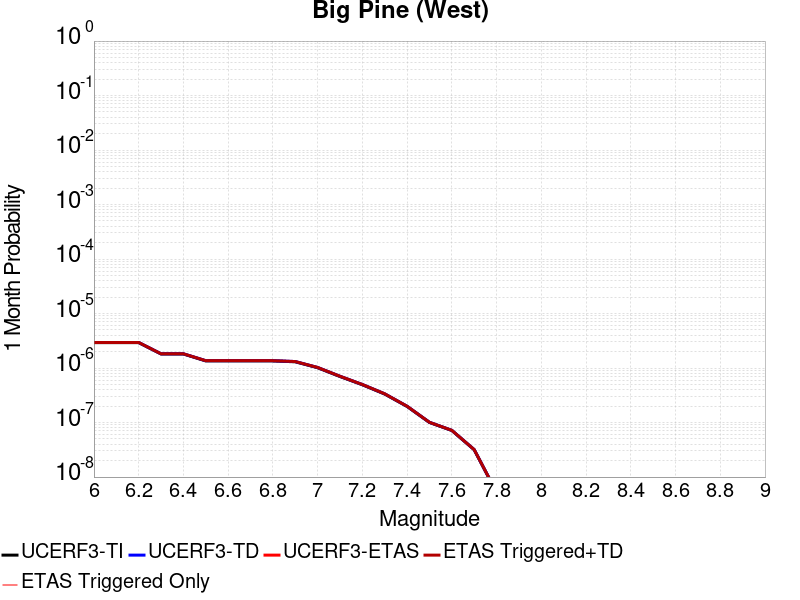 |  | 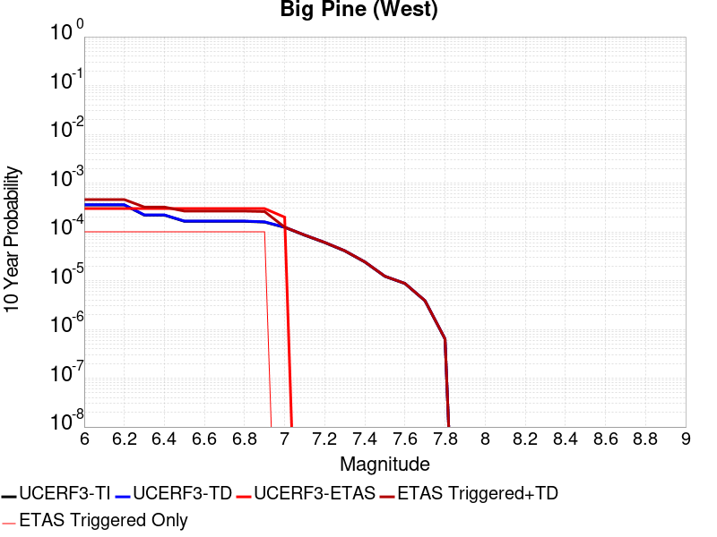 |

| Magnitude | 1 wk TI Prob | 1 wk TD Prob | 1 wk ETAS Prob | 1 wk ETAS/TD Gain | 1 wk ETAS Triggered+TD | 1 wk ETAS Triggered Only | 1 mo TI Prob | 1 mo TD Prob | 1 mo ETAS Prob | 1 mo ETAS/TD Gain | 1 mo ETAS Triggered+TD | 1 mo ETAS Triggered Only | 1 yr TI Prob | 1 yr TD Prob | 1 yr ETAS Prob | 1 yr ETAS/TD Gain | 1 yr ETAS Triggered+TD | 1 yr ETAS Triggered Only | 10 yr TI Prob | 10 yr TD Prob | 10 yr ETAS Prob | 10 yr ETAS/TD Gain | 10 yr ETAS Triggered+TD | 10 yr ETAS Triggered Only |
|-----|-----|-----|-----|-----|-----|-----|-----|-----|-----|-----|-----|-----|-----|-----|-----|-----|-----|-----|-----|-----|-----|-----|-----|-----|
| 6.0 | 6.8306974E-7 | 6.8819327E-7 | 0.0 | 0.0 | 6.8819327E-7 | 0.0 | 2.9274386E-6 | 2.949397E-6 | 0.0 | 0.0 | 2.949397E-6 | 0.0 | 3.564098E-5 | 3.590841E-5 | 0.0 | 0.0 | 3.590841E-5 | 0.0 | 3.5635266E-4 | 3.5903548E-4 | 3.0E-4 | 0.835572 | 4.5899957E-4 | 1.0E-4 |
| 6.1 | 6.8306974E-7 | 6.8819327E-7 | 0.0 | 0.0 | 6.8819327E-7 | 0.0 | 2.9274386E-6 | 2.949397E-6 | 0.0 | 0.0 | 2.949397E-6 | 0.0 | 3.564098E-5 | 3.590841E-5 | 0.0 | 0.0 | 3.590841E-5 | 0.0 | 3.5635266E-4 | 3.5903548E-4 | 3.0E-4 | 0.835572 | 4.5899957E-4 | 1.0E-4 |
| 6.2 | 6.8306974E-7 | 6.8819327E-7 | 0.0 | 0.0 | 6.8819327E-7 | 0.0 | 2.9274386E-6 | 2.949397E-6 | 0.0 | 0.0 | 2.949397E-6 | 0.0 | 3.564098E-5 | 3.590841E-5 | 0.0 | 0.0 | 3.590841E-5 | 0.0 | 3.5635266E-4 | 3.5903548E-4 | 3.0E-4 | 0.835572 | 4.5899957E-4 | 1.0E-4 |
| 6.3 | 4.227652E-7 | 4.2666383E-7 | 0.0 | 0.0 | 4.2666383E-7 | 0.0 | 1.8118495E-6 | 1.8285581E-6 | 0.0 | 0.0 | 1.8285581E-6 | 0.0 | 2.2059045E-5 | 2.2262486E-5 | 0.0 | 0.0 | 2.2262486E-5 | 0.0 | 2.2056856E-4 | 2.2260439E-4 | 3.0E-4 | 1.3476824 | 3.225821E-4 | 1.0E-4 |
| 6.4 | 4.227652E-7 | 4.2666383E-7 | 0.0 | 0.0 | 4.2666383E-7 | 0.0 | 1.8118495E-6 | 1.8285581E-6 | 0.0 | 0.0 | 1.8285581E-6 | 0.0 | 2.2059045E-5 | 2.2262486E-5 | 0.0 | 0.0 | 2.2262486E-5 | 0.0 | 2.2056856E-4 | 2.2260439E-4 | 3.0E-4 | 1.3476824 | 3.225821E-4 | 1.0E-4 |
| 6.5 | 3.1538403E-7 | 3.1885222E-7 | 0.0 | 0.0 | 3.1885222E-7 | 0.0 | 1.3516451E-6 | 1.3665089E-6 | 0.0 | 0.0 | 1.3665089E-6 | 0.0 | 1.6456155E-5 | 1.6637121E-5 | 0.0 | 0.0 | 1.6637121E-5 | 0.0 | 1.6454936E-4 | 1.6635915E-4 | 3.0E-4 | 1.8033272 | 2.663425E-4 | 1.0E-4 |
| 6.6 | 3.1538403E-7 | 3.1885222E-7 | 0.0 | 0.0 | 3.1885222E-7 | 0.0 | 1.3516451E-6 | 1.3665089E-6 | 0.0 | 0.0 | 1.3665089E-6 | 0.0 | 1.6456155E-5 | 1.6637121E-5 | 0.0 | 0.0 | 1.6637121E-5 | 0.0 | 1.6454936E-4 | 1.6635915E-4 | 3.0E-4 | 1.8033272 | 2.663425E-4 | 1.0E-4 |
| 6.7 | 3.1538403E-7 | 3.1885222E-7 | 0.0 | 0.0 | 3.1885222E-7 | 0.0 | 1.3516451E-6 | 1.3665089E-6 | 0.0 | 0.0 | 1.3665089E-6 | 0.0 | 1.6456155E-5 | 1.6637121E-5 | 0.0 | 0.0 | 1.6637121E-5 | 0.0 | 1.6454936E-4 | 1.6635915E-4 | 3.0E-4 | 1.8033272 | 2.663425E-4 | 1.0E-4 |
| 6.8 | 3.1538403E-7 | 3.1885222E-7 | 0.0 | 0.0 | 3.1885222E-7 | 0.0 | 1.3516451E-6 | 1.3665089E-6 | 0.0 | 0.0 | 1.3665089E-6 | 0.0 | 1.6456155E-5 | 1.6637121E-5 | 0.0 | 0.0 | 1.6637121E-5 | 0.0 | 1.6454936E-4 | 1.6635915E-4 | 3.0E-4 | 1.8033272 | 2.663425E-4 | 1.0E-4 |
| 6.9 | 3.0402092E-7 | 3.0740475E-7 | 0.0 | 0.0 | 3.0740475E-7 | 0.0 | 1.3029462E-6 | 1.3174483E-6 | 0.0 | 0.0 | 1.3174483E-6 | 0.0 | 1.5863254E-5 | 1.603982E-5 | 0.0 | 0.0 | 1.603982E-5 | 0.0 | 1.5862122E-4 | 1.60387E-4 | 3.0E-4 | 1.8704758 | 2.6037096E-4 | 1.0E-4 |
| 7.0 | 2.3673063E-7 | 2.3944858E-7 | 0.0 | 0.0 | 2.3944858E-7 | 0.0 | 1.0145594E-6 | 1.0262079E-6 | 0.0 | 0.0 | 1.0262079E-6 | 0.0 | 1.235219E-5 | 1.2494012E-5 | 0.0 | 0.0 | 1.2494012E-5 | 0.0 | 1.2351504E-4 | 1.2493337E-4 | 2.0E-4 | 1.6008533 | 1.2493337E-4 | 0.0 |
| 7.1 | 1.632138E-7 | 1.6514899E-7 | 0.0 | 0.0 | 1.6514899E-7 | 0.0 | 6.9948754E-7 | 7.077812E-7 | 0.0 | 0.0 | 7.077812E-7 | 0.0 | 8.516227E-6 | 8.617204E-6 | 0.0 | 0.0 | 8.617204E-6 | 0.0 | 8.5159016E-5 | 8.6168875E-5 | 0.0 | 0.0 | 8.6168875E-5 | 0.0 |
| 7.2 | 1.1523723E-7 | 1.1657433E-7 | 0.0 | 0.0 | 1.1657433E-7 | 0.0 | 4.9387376E-7 | 4.9960414E-7 | 0.0 | 0.0 | 4.9960414E-7 | 0.0 | 6.0128964E-6 | 6.0826646E-6 | 0.0 | 0.0 | 6.0826646E-6 | 0.0 | 6.0127335E-5 | 6.0825092E-5 | 0.0 | 0.0 | 6.0825092E-5 | 0.0 |
| 7.3 | 7.777805E-8 | 7.862616E-8 | 0.0 | 0.0 | 7.862616E-8 | 0.0 | 3.3333444E-7 | 3.369692E-7 | 0.0 | 0.0 | 3.369692E-7 | 0.0 | 4.0583395E-6 | 4.102593E-6 | 0.0 | 0.0 | 4.102593E-6 | 0.0 | 4.0582654E-5 | 4.102523E-5 | 0.0 | 0.0 | 4.102523E-5 | 0.0 |
| 7.4 | 4.609946E-8 | 4.652298E-8 | 0.0 | 0.0 | 4.652298E-8 | 0.0 | 1.975691E-7 | 1.9938419E-7 | 0.0 | 0.0 | 1.9938419E-7 | 0.0 | 2.4054011E-6 | 2.4275E-6 | 0.0 | 0.0 | 2.4275E-6 | 0.0 | 2.405375E-5 | 2.4274752E-5 | 0.0 | 0.0 | 2.4274752E-5 | 0.0 |
| 7.5 | 2.3439137E-8 | 2.3608623E-8 | 0.0 | 0.0 | 2.3608623E-8 | 0.0 | 1.00453434E-7 | 1.011798E-7 | 0.0 | 0.0 | 1.011798E-7 | 0.0 | 1.2230199E-6 | 1.2318634E-6 | 0.0 | 0.0 | 1.2318634E-6 | 0.0 | 1.2230132E-5 | 1.2318569E-5 | 0.0 | 0.0 | 1.2318569E-5 | 0.0 |
| 7.6 | 1.6699769E-8 | 1.6817307E-8 | 0.0 | 0.0 | 1.6817307E-8 | 0.0 | 7.157044E-8 | 7.2074165E-8 | 0.0 | 0.0 | 7.2074165E-8 | 0.0 | 8.713697E-7 | 8.7750266E-7 | 0.0 | 0.0 | 8.7750266E-7 | 0.0 | 8.713663E-6 | 8.774994E-6 | 0.0 | 0.0 | 8.774994E-6 | 0.0 |
| 7.7 | 7.4061512E-9 | 7.454259E-9 | 0.0 | 0.0 | 7.454259E-9 | 0.0 | 3.1740647E-8 | 3.1946826E-8 | 0.0 | 0.0 | 3.1946826E-8 | 0.0 | 3.864423E-7 | 3.8895254E-7 | 0.0 | 0.0 | 3.8895254E-7 | 0.0 | 3.8644166E-6 | 3.8895196E-6 | 0.0 | 0.0 | 3.8895196E-6 | 0.0 |
| 7.8 | 1.2189427E-9 | 1.2270924E-9 | 0.0 | 0.0 | 1.2270924E-9 | 0.0 | 5.2240403E-9 | 5.258968E-9 | 0.0 | 0.0 | 5.258968E-9 | 0.0 | 6.3602684E-8 | 6.402793E-8 | 0.0 | 0.0 | 6.402793E-8 | 0.0 | 6.360267E-7 | 6.402792E-7 | 0.0 | 0.0 | 6.402792E-7 | 0.0 |

## Shoreline
*[(top)](#table-of-contents)*

| 1 Week | 1 Month | 1 Year | 10 Year |
|-----|-----|-----|-----|
|  | 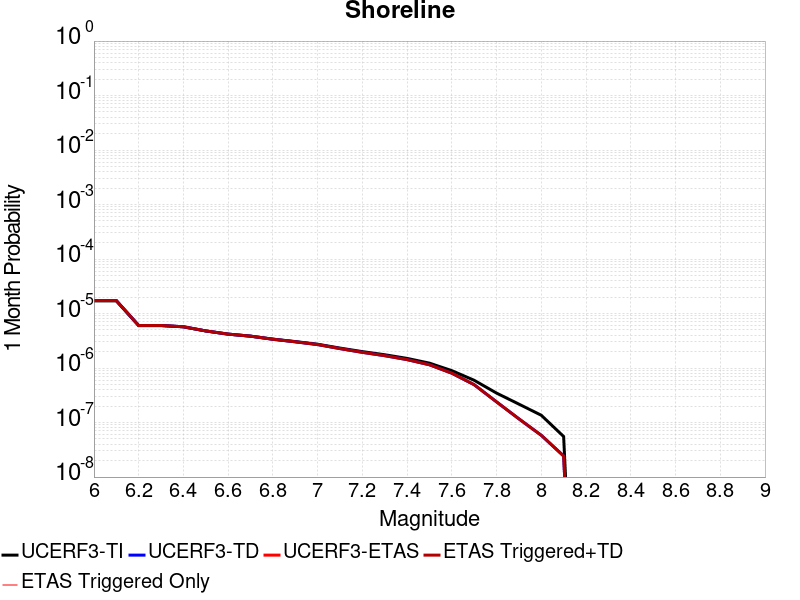 |  |  |

| Magnitude | 1 wk TI Prob | 1 wk TD Prob | 1 wk ETAS Prob | 1 wk ETAS/TD Gain | 1 wk ETAS Triggered+TD | 1 wk ETAS Triggered Only | 1 mo TI Prob | 1 mo TD Prob | 1 mo ETAS Prob | 1 mo ETAS/TD Gain | 1 mo ETAS Triggered+TD | 1 mo ETAS Triggered Only | 1 yr TI Prob | 1 yr TD Prob | 1 yr ETAS Prob | 1 yr ETAS/TD Gain | 1 yr ETAS Triggered+TD | 1 yr ETAS Triggered Only | 10 yr TI Prob | 10 yr TD Prob | 10 yr ETAS Prob | 10 yr ETAS/TD Gain | 10 yr ETAS Triggered+TD | 10 yr ETAS Triggered Only |
|-----|-----|-----|-----|-----|-----|-----|-----|-----|-----|-----|-----|-----|-----|-----|-----|-----|-----|-----|-----|-----|-----|-----|-----|-----|
| 6.0 | 3.9888673E-6 | 4.0481045E-6 | 0.0 | 0.0 | 4.0481045E-6 | 0.0 | 1.7095033E-5 | 1.7348935E-5 | 0.0 | 0.0 | 1.7348935E-5 | 0.0 | 2.0811215E-4 | 2.112084E-4 | 1.0E-4 | 0.47346598 | 3.111873E-4 | 1.0E-4 | 0.0020791737 | 0.0021106256 | 8.0E-4 | 0.37903455 | 0.0022104145 | 1.0E-4 |
| 6.1 | 3.9888673E-6 | 4.0481045E-6 | 0.0 | 0.0 | 4.0481045E-6 | 0.0 | 1.7095033E-5 | 1.7348935E-5 | 0.0 | 0.0 | 1.7348935E-5 | 0.0 | 2.0811215E-4 | 2.112084E-4 | 1.0E-4 | 0.47346598 | 3.111873E-4 | 1.0E-4 | 0.0020791737 | 0.0021106256 | 8.0E-4 | 0.37903455 | 0.0022104145 | 1.0E-4 |
| 6.2 | 1.4039653E-6 | 1.4101574E-6 | 0.0 | 0.0 | 1.4101574E-6 | 0.0 | 6.0169805E-6 | 6.043518E-6 | 0.0 | 0.0 | 6.043518E-6 | 0.0 | 7.325427E-5 | 7.357741E-5 | 0.0 | 0.0 | 7.357741E-5 | 0.0 | 7.3230127E-4 | 7.355365E-4 | 2.0E-4 | 0.27191037 | 7.355365E-4 | 0.0 |
| 6.3 | 1.4039653E-6 | 1.4101574E-6 | 0.0 | 0.0 | 1.4101574E-6 | 0.0 | 6.0169805E-6 | 6.043518E-6 | 0.0 | 0.0 | 6.043518E-6 | 0.0 | 7.325427E-5 | 7.357741E-5 | 0.0 | 0.0 | 7.357741E-5 | 0.0 | 7.3230127E-4 | 7.355365E-4 | 2.0E-4 | 0.27191037 | 7.355365E-4 | 0.0 |
| 6.4 | 1.3314152E-6 | 1.3362261E-6 | 0.0 | 0.0 | 1.3362261E-6 | 0.0 | 5.7060524E-6 | 5.7266707E-6 | 0.0 | 0.0 | 5.7266707E-6 | 0.0 | 6.946897E-5 | 6.972004E-5 | 0.0 | 0.0 | 6.972004E-5 | 0.0 | 6.9447263E-4 | 6.9698703E-4 | 2.0E-4 | 0.28694937 | 6.9698703E-4 | 0.0 |
| 6.5 | 1.1187026E-6 | 1.1204233E-6 | 0.0 | 0.0 | 1.1204233E-6 | 0.0 | 4.794431E-6 | 4.8018055E-6 | 0.0 | 0.0 | 4.8018055E-6 | 0.0 | 5.8370628E-5 | 5.846044E-5 | 0.0 | 0.0 | 5.846044E-5 | 0.0 | 5.83553E-4 | 5.844531E-4 | 1.0E-4 | 0.17110012 | 5.844531E-4 | 0.0 |
| 6.6 | 9.793089E-7 | 9.785463E-7 | 0.0 | 0.0 | 9.785463E-7 | 0.0 | 4.1970316E-6 | 4.1937633E-6 | 0.0 | 0.0 | 4.1937633E-6 | 0.0 | 5.1097657E-5 | 5.1057883E-5 | 0.0 | 0.0 | 5.1057883E-5 | 0.0 | 5.108591E-4 | 5.104628E-4 | 1.0E-4 | 0.19590066 | 5.104628E-4 | 0.0 |
| 6.7 | 8.995986E-7 | 8.973313E-7 | 0.0 | 0.0 | 8.973313E-7 | 0.0 | 3.8554167E-6 | 3.8456997E-6 | 0.0 | 0.0 | 3.8456997E-6 | 0.0 | 4.693869E-5 | 4.6820398E-5 | 0.0 | 0.0 | 4.6820398E-5 | 0.0 | 4.6928777E-4 | 4.681063E-4 | 1.0E-4 | 0.21362668 | 4.681063E-4 | 0.0 |
| 6.8 | 7.931612E-7 | 7.8808586E-7 | 0.0 | 0.0 | 7.8808586E-7 | 0.0 | 3.3992578E-6 | 3.3775063E-6 | 0.0 | 0.0 | 3.3775063E-6 | 0.0 | 4.1385178E-5 | 4.112037E-5 | 0.0 | 0.0 | 4.112037E-5 | 0.0 | 4.1377472E-4 | 4.1112816E-4 | 1.0E-4 | 0.24323316 | 4.1112816E-4 | 0.0 |
| 6.9 | 7.1465956E-7 | 7.078426E-7 | 0.0 | 0.0 | 7.078426E-7 | 0.0 | 3.062823E-6 | 3.0336078E-6 | 0.0 | 0.0 | 3.0336078E-6 | 0.0 | 3.7289232E-5 | 3.6933554E-5 | 0.0 | 0.0 | 3.6933554E-5 | 0.0 | 3.7282976E-4 | 3.6927452E-4 | 1.0E-4 | 0.27080125 | 3.6927452E-4 | 0.0 |
| 7.0 | 6.389046E-7 | 6.2998356E-7 | 0.0 | 0.0 | 6.2998356E-7 | 0.0 | 2.7381598E-6 | 2.6999269E-6 | 0.0 | 0.0 | 2.6999269E-6 | 0.0 | 3.3336586E-5 | 3.2871114E-5 | 0.0 | 0.0 | 3.2871114E-5 | 0.0 | 3.3331584E-4 | 3.2866278E-4 | 0.0 | 0.0 | 3.2866278E-4 | 0.0 |
| 7.1 | 5.4300875E-7 | 5.3114485E-7 | 0.0 | 0.0 | 5.3114485E-7 | 0.0 | 2.3271782E-6 | 2.2763331E-6 | 0.0 | 0.0 | 2.2763331E-6 | 0.0 | 2.8333026E-5 | 2.7714002E-5 | 0.0 | 0.0 | 2.7714002E-5 | 0.0 | 2.8329415E-4 | 2.7710557E-4 | 0.0 | 0.0 | 2.7710557E-4 | 0.0 |
| 7.2 | 4.6768855E-7 | 4.5351655E-7 | 0.0 | 0.0 | 4.5351655E-7 | 0.0 | 2.0043778E-6 | 1.9436409E-6 | 0.0 | 0.0 | 1.9436409E-6 | 0.0 | 2.4403027E-5 | 2.3663571E-5 | 0.0 | 0.0 | 2.3663571E-5 | 0.0 | 2.4400349E-4 | 2.3661056E-4 | 0.0 | 0.0 | 2.3661056E-4 | 0.0 |
| 7.3 | 4.0966103E-7 | 3.9388036E-7 | 0.0 | 0.0 | 3.9388036E-7 | 0.0 | 1.7556889E-6 | 1.6880575E-6 | 0.0 | 0.0 | 1.6880575E-6 | 0.0 | 2.1375303E-5 | 2.0551908E-5 | 0.0 | 0.0 | 2.0551908E-5 | 0.0 | 2.1373246E-4 | 2.0550011E-4 | 0.0 | 0.0 | 2.0550011E-4 | 0.0 |
| 7.4 | 3.5105785E-7 | 3.3366015E-7 | 0.0 | 0.0 | 3.3366015E-7 | 0.0 | 1.5045327E-6 | 1.4299713E-6 | 0.0 | 0.0 | 1.4299713E-6 | 0.0 | 1.8317533E-5 | 1.7409762E-5 | 0.0 | 0.0 | 1.7409762E-5 | 0.0 | 1.8316023E-4 | 1.7408401E-4 | 0.0 | 0.0 | 1.7408401E-4 | 0.0 |
| 7.5 | 2.8737534E-7 | 2.682172E-7 | 0.0 | 0.0 | 2.682172E-7 | 0.0 | 1.2316079E-6 | 1.1495018E-6 | 0.0 | 0.0 | 1.1495018E-6 | 0.0 | 1.4994724E-5 | 1.3995094E-5 | 0.0 | 0.0 | 1.3995094E-5 | 0.0 | 1.4993713E-4 | 1.3994216E-4 | 0.0 | 0.0 | 1.3994216E-4 | 0.0 |
| 7.6 | 2.0924051E-7 | 1.87802E-7 | 0.0 | 0.0 | 1.87802E-7 | 0.0 | 8.967448E-7 | 8.0486546E-7 | 0.0 | 0.0 | 8.0486546E-7 | 0.0 | 1.0917813E-5 | 9.799192E-6 | 0.0 | 0.0 | 9.799192E-6 | 0.0 | 1.0917276E-4 | 9.798762E-5 | 0.0 | 0.0 | 9.798762E-5 | 0.0 |
| 7.7 | 1.392265E-7 | 1.15441175E-7 | 0.0 | 0.0 | 1.15441175E-7 | 0.0 | 5.9668486E-7 | 4.947478E-7 | 0.0 | 0.0 | 4.947478E-7 | 0.0 | 7.2646135E-6 | 6.0235375E-6 | 0.0 | 0.0 | 6.0235375E-6 | 0.0 | 7.2643765E-5 | 6.023375E-5 | 0.0 | 0.0 | 6.023375E-5 | 0.0 |
| 7.8 | 8.1080074E-8 | 5.5869805E-8 | 0.0 | 0.0 | 5.5869805E-8 | 0.0 | 3.4748598E-7 | 2.39442E-7 | 0.0 | 0.0 | 2.39442E-7 | 0.0 | 4.2306337E-6 | 2.9152022E-6 | 0.0 | 0.0 | 2.9152022E-6 | 0.0 | 4.230553E-5 | 2.9151643E-5 | 0.0 | 0.0 | 2.9151643E-5 | 0.0 |
| 7.9 | 5.0859036E-8 | 2.7244413E-8 | 0.0 | 0.0 | 2.7244413E-8 | 0.0 | 2.1796728E-7 | 1.1676177E-7 | 0.0 | 0.0 | 1.1676177E-7 | 0.0 | 2.6537484E-6 | 1.4215735E-6 | 0.0 | 0.0 | 1.4215735E-6 | 0.0 | 2.6537167E-5 | 1.4215645E-5 | 0.0 | 0.0 | 1.4215645E-5 | 0.0 |
| 8.0 | 3.1760536E-8 | 1.35762495E-8 | 0.0 | 0.0 | 1.35762495E-8 | 0.0 | 1.3611657E-7 | 5.818393E-8 | 0.0 | 0.0 | 5.818393E-8 | 0.0 | 1.6572179E-6 | 7.083891E-7 | 0.0 | 0.0 | 7.083891E-7 | 0.0 | 1.6572056E-5 | 7.0838687E-6 | 0.0 | 0.0 | 7.0838687E-6 | 0.0 |
| 8.1 | 1.2947896E-8 | 5.6622333E-9 | 0.0 | 0.0 | 5.6622333E-9 | 0.0 | 5.5490982E-8 | 2.4266715E-8 | 0.0 | 0.0 | 2.4266715E-8 | 0.0 | 6.756025E-7 | 2.9544722E-7 | 0.0 | 0.0 | 2.9544722E-7 | 0.0 | 6.7560045E-6 | 2.9544683E-6 | 0.0 | 0.0 | 2.9544683E-6 | 0.0 |

## Los Medanos - Roe Island
*[(top)](#table-of-contents)*

| 1 Week | 1 Month | 1 Year | 10 Year |
|-----|-----|-----|-----|
|  | 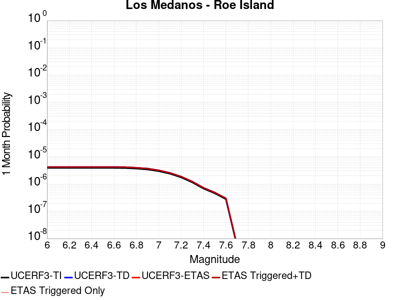 |  | 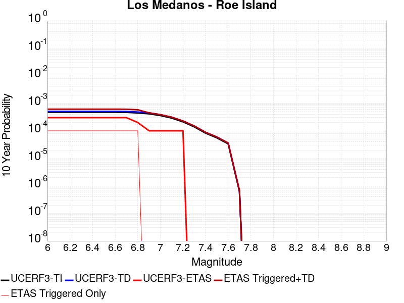 |

| Magnitude | 1 wk TI Prob | 1 wk TD Prob | 1 wk ETAS Prob | 1 wk ETAS/TD Gain | 1 wk ETAS Triggered+TD | 1 wk ETAS Triggered Only | 1 mo TI Prob | 1 mo TD Prob | 1 mo ETAS Prob | 1 mo ETAS/TD Gain | 1 mo ETAS Triggered+TD | 1 mo ETAS Triggered Only | 1 yr TI Prob | 1 yr TD Prob | 1 yr ETAS Prob | 1 yr ETAS/TD Gain | 1 yr ETAS Triggered+TD | 1 yr ETAS Triggered Only | 10 yr TI Prob | 10 yr TD Prob | 10 yr ETAS Prob | 10 yr ETAS/TD Gain | 10 yr ETAS Triggered+TD | 10 yr ETAS Triggered Only |
|-----|-----|-----|-----|-----|-----|-----|-----|-----|-----|-----|-----|-----|-----|-----|-----|-----|-----|-----|-----|-----|-----|-----|-----|-----|
| 6.0 | 9.06745E-7 | 9.797685E-7 | 0.0 | 0.0 | 9.797685E-7 | 0.0 | 3.8860444E-6 | 4.1990015E-6 | 0.0 | 0.0 | 4.1990015E-6 | 0.0 | 4.731156E-5 | 5.112165E-5 | 0.0 | 0.0 | 5.112165E-5 | 0.0 | 4.730149E-4 | 5.110998E-4 | 3.0E-4 | 0.5869695 | 6.110487E-4 | 1.0E-4 |
| 6.1 | 9.06745E-7 | 9.797685E-7 | 0.0 | 0.0 | 9.797685E-7 | 0.0 | 3.8860444E-6 | 4.1990015E-6 | 0.0 | 0.0 | 4.1990015E-6 | 0.0 | 4.731156E-5 | 5.112165E-5 | 0.0 | 0.0 | 5.112165E-5 | 0.0 | 4.730149E-4 | 5.110998E-4 | 3.0E-4 | 0.5869695 | 6.110487E-4 | 1.0E-4 |
| 6.2 | 9.06745E-7 | 9.797685E-7 | 0.0 | 0.0 | 9.797685E-7 | 0.0 | 3.8860444E-6 | 4.1990015E-6 | 0.0 | 0.0 | 4.1990015E-6 | 0.0 | 4.731156E-5 | 5.112165E-5 | 0.0 | 0.0 | 5.112165E-5 | 0.0 | 4.730149E-4 | 5.110998E-4 | 3.0E-4 | 0.5869695 | 6.110487E-4 | 1.0E-4 |
| 6.3 | 9.06745E-7 | 9.797685E-7 | 0.0 | 0.0 | 9.797685E-7 | 0.0 | 3.8860444E-6 | 4.1990015E-6 | 0.0 | 0.0 | 4.1990015E-6 | 0.0 | 4.731156E-5 | 5.112165E-5 | 0.0 | 0.0 | 5.112165E-5 | 0.0 | 4.730149E-4 | 5.110998E-4 | 3.0E-4 | 0.5869695 | 6.110487E-4 | 1.0E-4 |
| 6.4 | 9.06745E-7 | 9.797685E-7 | 0.0 | 0.0 | 9.797685E-7 | 0.0 | 3.8860444E-6 | 4.1990015E-6 | 0.0 | 0.0 | 4.1990015E-6 | 0.0 | 4.731156E-5 | 5.112165E-5 | 0.0 | 0.0 | 5.112165E-5 | 0.0 | 4.730149E-4 | 5.110998E-4 | 3.0E-4 | 0.5869695 | 6.110487E-4 | 1.0E-4 |
| 6.5 | 9.06745E-7 | 9.797685E-7 | 0.0 | 0.0 | 9.797685E-7 | 0.0 | 3.8860444E-6 | 4.1990015E-6 | 0.0 | 0.0 | 4.1990015E-6 | 0.0 | 4.731156E-5 | 5.112165E-5 | 0.0 | 0.0 | 5.112165E-5 | 0.0 | 4.730149E-4 | 5.110998E-4 | 3.0E-4 | 0.5869695 | 6.110487E-4 | 1.0E-4 |
| 6.6 | 9.06745E-7 | 9.797685E-7 | 0.0 | 0.0 | 9.797685E-7 | 0.0 | 3.8860444E-6 | 4.1990015E-6 | 0.0 | 0.0 | 4.1990015E-6 | 0.0 | 4.731156E-5 | 5.112165E-5 | 0.0 | 0.0 | 5.112165E-5 | 0.0 | 4.730149E-4 | 5.110998E-4 | 3.0E-4 | 0.5869695 | 6.110487E-4 | 1.0E-4 |
| 6.7 | 8.984686E-7 | 9.71435E-7 | 0.0 | 0.0 | 9.71435E-7 | 0.0 | 3.850574E-6 | 4.1632866E-6 | 0.0 | 0.0 | 4.1632866E-6 | 0.0 | 4.687973E-5 | 5.0686845E-5 | 0.0 | 0.0 | 5.0686845E-5 | 0.0 | 4.6869842E-4 | 5.0675374E-4 | 3.0E-4 | 0.5920035 | 6.0670305E-4 | 1.0E-4 |
| 6.8 | 8.5634423E-7 | 9.228741E-7 | 0.0 | 0.0 | 9.228741E-7 | 0.0 | 3.6700415E-6 | 3.9551687E-6 | 0.0 | 0.0 | 3.9551687E-6 | 0.0 | 4.4681838E-5 | 4.8153124E-5 | 0.0 | 0.0 | 4.8153124E-5 | 0.0 | 4.4672855E-4 | 4.8142765E-4 | 2.0E-4 | 0.41543108 | 5.813795E-4 | 1.0E-4 |
| 6.9 | 7.9857483E-7 | 8.5956486E-7 | 0.0 | 0.0 | 8.5956486E-7 | 0.0 | 3.422459E-6 | 3.6838442E-6 | 0.0 | 0.0 | 3.6838442E-6 | 0.0 | 4.166764E-5 | 4.4849887E-5 | 0.0 | 0.0 | 4.4849887E-5 | 0.0 | 4.165983E-4 | 4.4840897E-4 | 1.0E-4 | 0.22301069 | 4.4840897E-4 | 0.0 |
| 7.0 | 6.898334E-7 | 7.3982153E-7 | 0.0 | 0.0 | 7.3982153E-7 | 0.0 | 2.9564258E-6 | 3.1706597E-6 | 0.0 | 0.0 | 3.1706597E-6 | 0.0 | 3.599389E-5 | 3.8602102E-5 | 0.0 | 0.0 | 3.8602102E-5 | 0.0 | 3.598806E-4 | 3.859544E-4 | 1.0E-4 | 0.25909796 | 3.859544E-4 | 0.0 |
| 7.1 | 5.5734876E-7 | 5.969224E-7 | 0.0 | 0.0 | 5.969224E-7 | 0.0 | 2.3886353E-6 | 2.5582365E-6 | 0.0 | 0.0 | 2.5582365E-6 | 0.0 | 2.9081246E-5 | 3.1146086E-5 | 0.0 | 0.0 | 3.1146086E-5 | 0.0 | 2.9077442E-4 | 3.1141745E-4 | 1.0E-4 | 0.3211124 | 3.1141745E-4 | 0.0 |
| 7.2 | 4.0792582E-7 | 4.357687E-7 | 0.0 | 0.0 | 4.357687E-7 | 0.0 | 1.7482523E-6 | 1.8675788E-6 | 0.0 | 0.0 | 1.8675788E-6 | 0.0 | 2.1284764E-5 | 2.2737537E-5 | 0.0 | 0.0 | 2.2737537E-5 | 0.0 | 2.1282726E-4 | 2.2735224E-4 | 1.0E-4 | 0.4398461 | 2.2735224E-4 | 0.0 |
| 7.3 | 2.6733358E-7 | 2.8584947E-7 | 0.0 | 0.0 | 2.8584947E-7 | 0.0 | 1.1457148E-6 | 1.2250686E-6 | 0.0 | 0.0 | 1.2250686E-6 | 0.0 | 1.3948988E-5 | 1.4915108E-5 | 0.0 | 0.0 | 1.4915108E-5 | 0.0 | 1.3948113E-4 | 1.4914115E-4 | 0.0 | 0.0 | 1.4914115E-4 | 0.0 |
| 7.4 | 1.5851728E-7 | 1.6913646E-7 | 0.0 | 0.0 | 1.6913646E-7 | 0.0 | 6.7935963E-7 | 7.2487035E-7 | 0.0 | 0.0 | 7.2487035E-7 | 0.0 | 8.271172E-6 | 8.825261E-6 | 0.0 | 0.0 | 8.825261E-6 | 0.0 | 8.270864E-5 | 8.824913E-5 | 0.0 | 0.0 | 8.824913E-5 | 0.0 |
| 7.5 | 1.06756E-7 | 1.138257E-7 | 0.0 | 0.0 | 1.138257E-7 | 0.0 | 4.575256E-7 | 4.8782437E-7 | 0.0 | 0.0 | 4.8782437E-7 | 0.0 | 5.57036E-6 | 5.9392455E-6 | 0.0 | 0.0 | 5.9392455E-6 | 0.0 | 5.5702203E-5 | 5.9390884E-5 | 0.0 | 0.0 | 5.9390884E-5 | 0.0 |
| 7.6 | 6.48122E-8 | 6.9051595E-8 | 0.0 | 0.0 | 6.9051595E-8 | 0.0 | 2.7776653E-7 | 2.9593537E-7 | 0.0 | 0.0 | 2.9593537E-7 | 0.0 | 3.3818023E-6 | 3.6030074E-6 | 0.0 | 0.0 | 3.6030074E-6 | 0.0 | 3.381751E-5 | 3.60295E-5 | 0.0 | 0.0 | 3.60295E-5 | 0.0 |
| 7.7 | 1.198296E-9 | 1.290561E-9 | 0.0 | 0.0 | 1.290561E-9 | 0.0 | 5.135554E-9 | 5.5309757E-9 | 0.0 | 0.0 | 5.5309757E-9 | 0.0 | 6.252537E-8 | 6.733963E-8 | 0.0 | 0.0 | 6.733963E-8 | 0.0 | 6.2525356E-7 | 6.733962E-7 | 0.0 | 0.0 | 6.733962E-7 | 0.0 |

## North Salt Lake
*[(top)](#table-of-contents)*

| 1 Week | 1 Month | 1 Year | 10 Year |
|-----|-----|-----|-----|
|  |  |  | 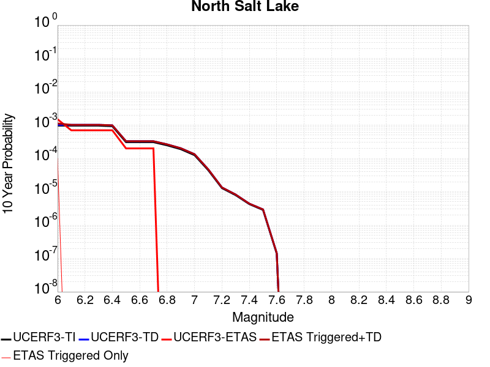 |

| Magnitude | 1 wk TI Prob | 1 wk TD Prob | 1 wk ETAS Prob | 1 wk ETAS/TD Gain | 1 wk ETAS Triggered+TD | 1 wk ETAS Triggered Only | 1 mo TI Prob | 1 mo TD Prob | 1 mo ETAS Prob | 1 mo ETAS/TD Gain | 1 mo ETAS Triggered+TD | 1 mo ETAS Triggered Only | 1 yr TI Prob | 1 yr TD Prob | 1 yr ETAS Prob | 1 yr ETAS/TD Gain | 1 yr ETAS Triggered+TD | 1 yr ETAS Triggered Only | 10 yr TI Prob | 10 yr TD Prob | 10 yr ETAS Prob | 10 yr ETAS/TD Gain | 10 yr ETAS Triggered+TD | 10 yr ETAS Triggered Only |
|-----|-----|-----|-----|-----|-----|-----|-----|-----|-----|-----|-----|-----|-----|-----|-----|-----|-----|-----|-----|-----|-----|-----|-----|-----|
| 6.0 | 1.849599E-6 | 1.955794E-6 | 0.0 | 0.0 | 1.955794E-6 | 0.0 | 7.926829E-6 | 8.381959E-6 | 0.0 | 0.0 | 8.381959E-6 | 0.0 | 9.650487E-5 | 1.0204758E-4 | 2.0E-4 | 1.9598701 | 1.0204758E-4 | 0.0 | 9.646297E-4 | 0.0010202051 | 0.0015 | 1.4702926 | 0.001120103 | 1.0E-4 |
| 6.1 | 1.849599E-6 | 1.955794E-6 | 0.0 | 0.0 | 1.955794E-6 | 0.0 | 7.926829E-6 | 8.381959E-6 | 0.0 | 0.0 | 8.381959E-6 | 0.0 | 9.650487E-5 | 1.0204758E-4 | 2.0E-4 | 1.9598701 | 1.0204758E-4 | 0.0 | 9.646297E-4 | 0.0010202051 | 7.0E-4 | 0.68613654 | 0.0010202051 | 0.0 |
| 6.2 | 1.849599E-6 | 1.955794E-6 | 0.0 | 0.0 | 1.955794E-6 | 0.0 | 7.926829E-6 | 8.381959E-6 | 0.0 | 0.0 | 8.381959E-6 | 0.0 | 9.650487E-5 | 1.0204758E-4 | 2.0E-4 | 1.9598701 | 1.0204758E-4 | 0.0 | 9.646297E-4 | 0.0010202051 | 7.0E-4 | 0.68613654 | 0.0010202051 | 0.0 |
| 6.3 | 1.849599E-6 | 1.955794E-6 | 0.0 | 0.0 | 1.955794E-6 | 0.0 | 7.926829E-6 | 8.381959E-6 | 0.0 | 0.0 | 8.381959E-6 | 0.0 | 9.650487E-5 | 1.0204758E-4 | 2.0E-4 | 1.9598701 | 1.0204758E-4 | 0.0 | 9.646297E-4 | 0.0010202051 | 7.0E-4 | 0.68613654 | 0.0010202051 | 0.0 |
| 6.4 | 1.7803909E-6 | 1.8862931E-6 | 0.0 | 0.0 | 1.8862931E-6 | 0.0 | 7.630225E-6 | 8.0841E-6 | 0.0 | 0.0 | 8.0841E-6 | 0.0 | 9.289402E-5 | 9.842148E-5 | 2.0E-4 | 2.0320766 | 9.842148E-5 | 0.0 | 9.28552E-4 | 9.839762E-4 | 7.0E-4 | 0.7113993 | 9.839762E-4 | 0.0 |
| 6.5 | 5.9157696E-7 | 6.300999E-7 | 0.0 | 0.0 | 6.300999E-7 | 0.0 | 2.5353274E-6 | 2.7004257E-6 | 0.0 | 0.0 | 2.7004257E-6 | 0.0 | 3.0867173E-5 | 3.287723E-5 | 0.0 | 0.0 | 3.287723E-5 | 0.0 | 3.0862886E-4 | 3.2872756E-4 | 2.0E-4 | 0.60840654 | 3.2872756E-4 | 0.0 |
| 6.6 | 5.9157696E-7 | 6.300999E-7 | 0.0 | 0.0 | 6.300999E-7 | 0.0 | 2.5353274E-6 | 2.7004257E-6 | 0.0 | 0.0 | 2.7004257E-6 | 0.0 | 3.0867173E-5 | 3.287723E-5 | 0.0 | 0.0 | 3.287723E-5 | 0.0 | 3.0862886E-4 | 3.2872756E-4 | 2.0E-4 | 0.60840654 | 3.2872756E-4 | 0.0 |
| 6.7 | 5.9157696E-7 | 6.300999E-7 | 0.0 | 0.0 | 6.300999E-7 | 0.0 | 2.5353274E-6 | 2.7004257E-6 | 0.0 | 0.0 | 2.7004257E-6 | 0.0 | 3.0867173E-5 | 3.287723E-5 | 0.0 | 0.0 | 3.287723E-5 | 0.0 | 3.0862886E-4 | 3.2872756E-4 | 2.0E-4 | 0.60840654 | 3.2872756E-4 | 0.0 |
| 6.8 | 4.7536267E-7 | 5.0666824E-7 | 0.0 | 0.0 | 5.0666824E-7 | 0.0 | 2.037267E-6 | 2.1714336E-6 | 0.0 | 0.0 | 2.1714336E-6 | 0.0 | 2.4803443E-5 | 2.6436908E-5 | 0.0 | 0.0 | 2.6436908E-5 | 0.0 | 2.4800675E-4 | 2.6434008E-4 | 0.0 | 0.0 | 2.6434008E-4 | 0.0 |
| 6.9 | 3.6345344E-7 | 3.8755155E-7 | 0.0 | 0.0 | 3.8755155E-7 | 0.0 | 1.5576567E-6 | 1.6609343E-6 | 0.0 | 0.0 | 1.6609343E-6 | 0.0 | 1.8964305E-5 | 2.0221705E-5 | 0.0 | 0.0 | 2.0221705E-5 | 0.0 | 1.8962687E-4 | 2.0220035E-4 | 0.0 | 0.0 | 2.0220035E-4 | 0.0 |
| 7.0 | 2.4087325E-7 | 2.571278E-7 | 0.0 | 0.0 | 2.571278E-7 | 0.0 | 1.0323135E-6 | 1.101976E-6 | 0.0 | 0.0 | 1.101976E-6 | 0.0 | 1.25683455E-5 | 1.34164875E-5 | 0.0 | 0.0 | 1.34164875E-5 | 0.0 | 1.2567634E-4 | 1.3415804E-4 | 0.0 | 0.0 | 1.3415804E-4 | 0.0 |
| 7.1 | 8.551555E-8 | 9.045516E-8 | 0.0 | 0.0 | 9.045516E-8 | 0.0 | 3.6649516E-7 | 3.8766493E-7 | 0.0 | 0.0 | 3.8766493E-7 | 0.0 | 4.4620692E-6 | 4.7198114E-6 | 0.0 | 0.0 | 4.7198114E-6 | 0.0 | 4.46198E-5 | 4.719723E-5 | 0.0 | 0.0 | 4.719723E-5 | 0.0 |
| 7.2 | 2.475279E-8 | 2.5895552E-8 | 0.0 | 0.0 | 2.5895552E-8 | 0.0 | 1.0608338E-7 | 1.10980935E-7 | 0.0 | 0.0 | 1.10980935E-7 | 0.0 | 1.2915643E-6 | 1.351192E-6 | 0.0 | 0.0 | 1.351192E-6 | 0.0 | 1.2915569E-5 | 1.3511845E-5 | 0.0 | 0.0 | 1.3511845E-5 | 0.0 |
| 7.3 | 1.5212393E-8 | 1.584881E-8 | 0.0 | 0.0 | 1.584881E-8 | 0.0 | 6.519597E-8 | 6.792347E-8 | 0.0 | 0.0 | 6.792347E-8 | 0.0 | 7.9376065E-7 | 8.2696795E-7 | 0.0 | 0.0 | 8.2696795E-7 | 0.0 | 7.937579E-6 | 8.2696515E-6 | 0.0 | 0.0 | 8.2696515E-6 | 0.0 |
| 7.4 | 8.182E-9 | 8.447838E-9 | 0.0 | 0.0 | 8.447838E-9 | 0.0 | 3.5065714E-8 | 3.6205023E-8 | 0.0 | 0.0 | 3.6205023E-8 | 0.0 | 4.26925E-7 | 4.4079604E-7 | 0.0 | 0.0 | 4.4079604E-7 | 0.0 | 4.269242E-6 | 4.4079525E-6 | 0.0 | 0.0 | 4.4079525E-6 | 0.0 |
| 7.5 | 5.479913E-9 | 5.6684297E-9 | 0.0 | 0.0 | 5.6684297E-9 | 0.0 | 2.3485342E-8 | 2.4293271E-8 | 0.0 | 0.0 | 2.4293271E-8 | 0.0 | 2.85934E-7 | 2.9577055E-7 | 0.0 | 0.0 | 2.9577055E-7 | 0.0 | 2.8593363E-6 | 2.9577018E-6 | 0.0 | 0.0 | 2.9577018E-6 | 0.0 |
| 7.6 | 2.6813562E-10 | 2.7733826E-10 | 0.0 | 0.0 | 2.7733826E-10 | 0.0 | 1.1491527E-9 | 1.188593E-9 | 0.0 | 0.0 | 1.188593E-9 | 0.0 | 1.3990933E-8 | 1.447112E-8 | 0.0 | 0.0 | 1.447112E-8 | 0.0 | 1.3990932E-7 | 1.447112E-7 | 0.0 | 0.0 | 1.447112E-7 | 0.0 |

## Dog Valley
*[(top)](#table-of-contents)*

| 1 Week | 1 Month | 1 Year | 10 Year |
|-----|-----|-----|-----|
|  | 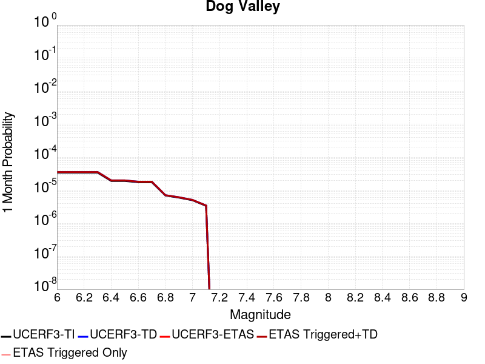 | 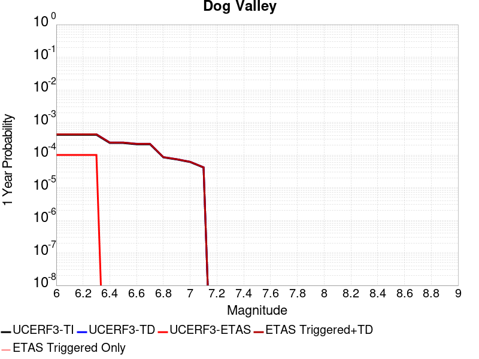 |  |

| Magnitude | 1 wk TI Prob | 1 wk TD Prob | 1 wk ETAS Prob | 1 wk ETAS/TD Gain | 1 wk ETAS Triggered+TD | 1 wk ETAS Triggered Only | 1 mo TI Prob | 1 mo TD Prob | 1 mo ETAS Prob | 1 mo ETAS/TD Gain | 1 mo ETAS Triggered+TD | 1 mo ETAS Triggered Only | 1 yr TI Prob | 1 yr TD Prob | 1 yr ETAS Prob | 1 yr ETAS/TD Gain | 1 yr ETAS Triggered+TD | 1 yr ETAS Triggered Only | 10 yr TI Prob | 10 yr TD Prob | 10 yr ETAS Prob | 10 yr ETAS/TD Gain | 10 yr ETAS Triggered+TD | 10 yr ETAS Triggered Only |
|-----|-----|-----|-----|-----|-----|-----|-----|-----|-----|-----|-----|-----|-----|-----|-----|-----|-----|-----|-----|-----|-----|-----|-----|-----|
| 6.0 | 7.949598E-6 | 8.276401E-6 | 0.0 | 0.0 | 8.276401E-6 | 0.0 | 3.4069257E-5 | 3.546992E-5 | 0.0 | 0.0 | 3.546992E-5 | 0.0 | 4.1471425E-4 | 4.3178033E-4 | 1.0E-4 | 0.23159926 | 4.3178033E-4 | 0.0 | 0.0041394117 | 0.0043113446 | 0.0015 | 0.34791932 | 0.004410913 | 1.0E-4 |
| 6.1 | 7.949598E-6 | 8.276401E-6 | 0.0 | 0.0 | 8.276401E-6 | 0.0 | 3.4069257E-5 | 3.546992E-5 | 0.0 | 0.0 | 3.546992E-5 | 0.0 | 4.1471425E-4 | 4.3178033E-4 | 1.0E-4 | 0.23159926 | 4.3178033E-4 | 0.0 | 0.0041394117 | 0.0043113446 | 0.0015 | 0.34791932 | 0.004410913 | 1.0E-4 |
| 6.2 | 7.949598E-6 | 8.276401E-6 | 0.0 | 0.0 | 8.276401E-6 | 0.0 | 3.4069257E-5 | 3.546992E-5 | 0.0 | 0.0 | 3.546992E-5 | 0.0 | 4.1471425E-4 | 4.3178033E-4 | 1.0E-4 | 0.23159926 | 4.3178033E-4 | 0.0 | 0.0041394117 | 0.0043113446 | 0.0015 | 0.34791932 | 0.004410913 | 1.0E-4 |
| 6.3 | 7.949598E-6 | 8.276401E-6 | 0.0 | 0.0 | 8.276401E-6 | 0.0 | 3.4069257E-5 | 3.546992E-5 | 0.0 | 0.0 | 3.546992E-5 | 0.0 | 4.1471425E-4 | 4.3178033E-4 | 1.0E-4 | 0.23159926 | 4.3178033E-4 | 0.0 | 0.0041394117 | 0.0043113446 | 0.0015 | 0.34791932 | 0.004410913 | 1.0E-4 |
| 6.4 | 4.462132E-6 | 4.6234945E-6 | 0.0 | 0.0 | 4.6234945E-6 | 0.0 | 1.9123283E-5 | 1.9814877E-5 | 0.0 | 0.0 | 1.9814877E-5 | 0.0 | 2.328011E-4 | 2.4122836E-4 | 0.0 | 0.0 | 2.4122836E-4 | 0.0 | 0.0023255737 | 0.0024105425 | 6.0E-4 | 0.24890664 | 0.0024105425 | 0.0 |
| 6.5 | 4.462132E-6 | 4.6234945E-6 | 0.0 | 0.0 | 4.6234945E-6 | 0.0 | 1.9123283E-5 | 1.9814877E-5 | 0.0 | 0.0 | 1.9814877E-5 | 0.0 | 2.328011E-4 | 2.4122836E-4 | 0.0 | 0.0 | 2.4122836E-4 | 0.0 | 0.0023255737 | 0.0024105425 | 6.0E-4 | 0.24890664 | 0.0024105425 | 0.0 |
| 6.6 | 4.074213E-6 | 4.2176703E-6 | 0.0 | 0.0 | 4.2176703E-6 | 0.0 | 1.7460794E-5 | 1.8075654E-5 | 0.0 | 0.0 | 1.8075654E-5 | 0.0 | 2.1256444E-4 | 2.2005766E-4 | 0.0 | 0.0 | 2.2005766E-4 | 0.0 | 0.0021236122 | 0.0021992594 | 5.0E-4 | 0.22734927 | 0.0021992594 | 0.0 |
| 6.7 | 4.074213E-6 | 4.2176703E-6 | 0.0 | 0.0 | 4.2176703E-6 | 0.0 | 1.7460794E-5 | 1.8075654E-5 | 0.0 | 0.0 | 1.8075654E-5 | 0.0 | 2.1256444E-4 | 2.2005766E-4 | 0.0 | 0.0 | 2.2005766E-4 | 0.0 | 0.0021236122 | 0.0021992594 | 5.0E-4 | 0.22734927 | 0.0021992594 | 0.0 |
| 6.8 | 1.6159543E-6 | 1.6504102E-6 | 0.0 | 0.0 | 1.6504102E-6 | 0.0 | 6.9255E-6 | 7.0731708E-6 | 0.0 | 0.0 | 7.0731708E-6 | 0.0 | 8.43147E-5 | 8.6113E-5 | 0.0 | 0.0 | 8.6113E-5 | 0.0 | 8.4282714E-4 | 8.6085056E-4 | 3.0E-4 | 0.34849253 | 8.6085056E-4 | 0.0 |
| 6.9 | 1.3952654E-6 | 1.4253484E-6 | 0.0 | 0.0 | 1.4253484E-6 | 0.0 | 5.9796953E-6 | 6.1086243E-6 | 0.0 | 0.0 | 6.1086243E-6 | 0.0 | 7.280036E-5 | 7.437045E-5 | 0.0 | 0.0 | 7.437045E-5 | 0.0 | 7.2776515E-4 | 7.435036E-4 | 3.0E-4 | 0.40349498 | 7.435036E-4 | 0.0 |
| 7.0 | 1.1619308E-6 | 1.1870034E-6 | 0.0 | 0.0 | 1.1870034E-6 | 0.0 | 4.979694E-6 | 5.08715E-6 | 0.0 | 0.0 | 5.08715E-6 | 0.0 | 6.0626087E-5 | 6.1934734E-5 | 0.0 | 0.0 | 6.1934734E-5 | 0.0 | 6.060955E-4 | 6.1921845E-4 | 2.0E-4 | 0.3229878 | 6.1921845E-4 | 0.0 |
| 7.1 | 7.8723247E-7 | 8.0473507E-7 | 0.0 | 0.0 | 8.0473507E-7 | 0.0 | 3.373849E-6 | 3.448862E-6 | 0.0 | 0.0 | 3.448862E-6 | 0.0 | 4.107584E-5 | 4.1989388E-5 | 0.0 | 0.0 | 4.1989388E-5 | 0.0 | 4.1068246E-4 | 4.1984444E-4 | 2.0E-4 | 0.47636694 | 4.1984444E-4 | 0.0 |

## Joshua Tree (Seismicity)
*[(top)](#table-of-contents)*

| 1 Week | 1 Month | 1 Year | 10 Year |
|-----|-----|-----|-----|
| 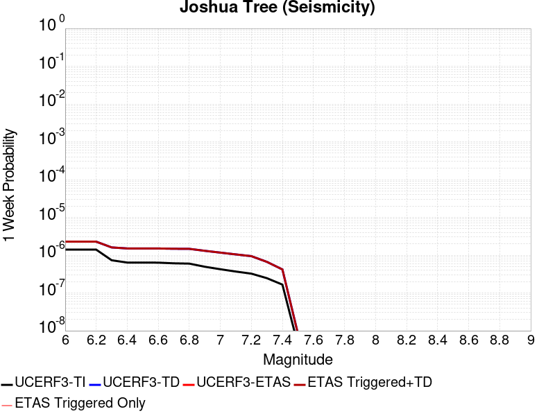 |  | 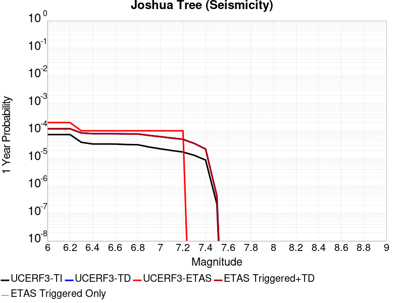 | 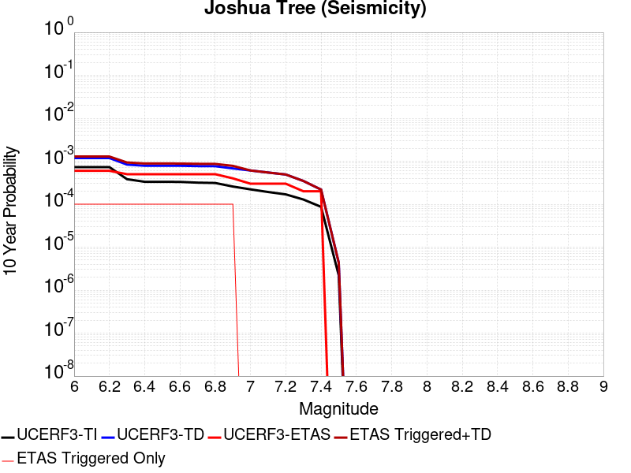 |

| Magnitude | 1 wk TI Prob | 1 wk TD Prob | 1 wk ETAS Prob | 1 wk ETAS/TD Gain | 1 wk ETAS Triggered+TD | 1 wk ETAS Triggered Only | 1 mo TI Prob | 1 mo TD Prob | 1 mo ETAS Prob | 1 mo ETAS/TD Gain | 1 mo ETAS Triggered+TD | 1 mo ETAS Triggered Only | 1 yr TI Prob | 1 yr TD Prob | 1 yr ETAS Prob | 1 yr ETAS/TD Gain | 1 yr ETAS Triggered+TD | 1 yr ETAS Triggered Only | 10 yr TI Prob | 10 yr TD Prob | 10 yr ETAS Prob | 10 yr ETAS/TD Gain | 10 yr ETAS Triggered+TD | 10 yr ETAS Triggered Only |
|-----|-----|-----|-----|-----|-----|-----|-----|-----|-----|-----|-----|-----|-----|-----|-----|-----|-----|-----|-----|-----|-----|-----|-----|-----|
| 6.0 | 1.4025588E-6 | 2.278155E-6 | 0.0 | 0.0 | 2.278155E-6 | 0.0 | 6.0109523E-6 | 9.763489E-6 | 0.0 | 0.0 | 9.763489E-6 | 0.0 | 7.318089E-5 | 1.1886465E-4 | 2.0E-4 | 1.6825861 | 1.1886465E-4 | 0.0 | 7.315679E-4 | 0.0011880749 | 6.0E-4 | 0.50501865 | 0.0012879561 | 1.0E-4 |
| 6.1 | 1.4025588E-6 | 2.278155E-6 | 0.0 | 0.0 | 2.278155E-6 | 0.0 | 6.0109523E-6 | 9.763489E-6 | 0.0 | 0.0 | 9.763489E-6 | 0.0 | 7.318089E-5 | 1.1886465E-4 | 2.0E-4 | 1.6825861 | 1.1886465E-4 | 0.0 | 7.315679E-4 | 0.0011880749 | 6.0E-4 | 0.50501865 | 0.0012879561 | 1.0E-4 |
| 6.2 | 1.4025588E-6 | 2.278155E-6 | 0.0 | 0.0 | 2.278155E-6 | 0.0 | 6.0109523E-6 | 9.763489E-6 | 0.0 | 0.0 | 9.763489E-6 | 0.0 | 7.318089E-5 | 1.1886465E-4 | 2.0E-4 | 1.6825861 | 1.1886465E-4 | 0.0 | 7.315679E-4 | 0.0011880749 | 6.0E-4 | 0.50501865 | 0.0012879561 | 1.0E-4 |
| 6.3 | 7.3325685E-7 | 1.6021727E-6 | 0.0 | 0.0 | 1.6021727E-6 | 0.0 | 3.1425257E-6 | 6.8664367E-6 | 0.0 | 0.0 | 6.8664367E-6 | 0.0 | 3.825958E-5 | 8.359575E-5 | 1.0E-4 | 1.196233 | 8.359575E-5 | 0.0 | 3.8252992E-4 | 8.356516E-4 | 5.0E-4 | 0.5983355 | 9.35568E-4 | 1.0E-4 |
| 6.4 | 6.38256E-7 | 1.5064202E-6 | 0.0 | 0.0 | 1.5064202E-6 | 0.0 | 2.7353801E-6 | 6.456071E-6 | 0.0 | 0.0 | 6.456071E-6 | 0.0 | 3.3302742E-5 | 7.85999E-5 | 1.0E-4 | 1.2722663 | 7.85999E-5 | 0.0 | 3.3297754E-4 | 7.8572845E-4 | 5.0E-4 | 0.6363522 | 8.856499E-4 | 1.0E-4 |
| 6.5 | 6.38256E-7 | 1.5064202E-6 | 0.0 | 0.0 | 1.5064202E-6 | 0.0 | 2.7353801E-6 | 6.456071E-6 | 0.0 | 0.0 | 6.456071E-6 | 0.0 | 3.3302742E-5 | 7.85999E-5 | 1.0E-4 | 1.2722663 | 7.85999E-5 | 0.0 | 3.3297754E-4 | 7.8572845E-4 | 5.0E-4 | 0.6363522 | 8.856499E-4 | 1.0E-4 |
| 6.6 | 6.3436806E-7 | 1.5035084E-6 | 0.0 | 0.0 | 1.5035084E-6 | 0.0 | 2.7187175E-6 | 6.443592E-6 | 0.0 | 0.0 | 6.443592E-6 | 0.0 | 3.3099885E-5 | 7.8447985E-5 | 1.0E-4 | 1.27473 | 7.8447985E-5 | 0.0 | 3.3094952E-4 | 7.8421034E-4 | 5.0E-4 | 0.63758403 | 8.8413194E-4 | 1.0E-4 |
| 6.7 | 6.094856E-7 | 1.4781981E-6 | 0.0 | 0.0 | 1.4781981E-6 | 0.0 | 2.6120786E-6 | 6.33512E-6 | 0.0 | 0.0 | 6.33512E-6 | 0.0 | 3.1801592E-5 | 7.712743E-5 | 1.0E-4 | 1.2965556 | 7.712743E-5 | 0.0 | 3.179704E-4 | 7.7101396E-4 | 5.0E-4 | 0.6484967 | 8.7093684E-4 | 1.0E-4 |
| 6.8 | 5.984801E-7 | 1.4694729E-6 | 0.0 | 0.0 | 1.4694729E-6 | 0.0 | 2.564912E-6 | 6.297726E-6 | 0.0 | 0.0 | 6.297726E-6 | 0.0 | 3.1227355E-5 | 7.667219E-5 | 1.0E-4 | 1.3042538 | 7.667219E-5 | 0.0 | 3.1222968E-4 | 7.664647E-4 | 5.0E-4 | 0.6523458 | 8.66388E-4 | 1.0E-4 |
| 6.9 | 4.94631E-7 | 1.3038219E-6 | 0.0 | 0.0 | 1.3038219E-6 | 0.0 | 2.1198455E-6 | 5.5877967E-6 | 0.0 | 0.0 | 5.5877967E-6 | 0.0 | 2.5808813E-5 | 6.802936E-5 | 1.0E-4 | 1.4699535 | 6.802936E-5 | 0.0 | 2.5805813E-4 | 6.800913E-4 | 4.0E-4 | 0.5881563 | 7.8002334E-4 | 1.0E-4 |
| 7.0 | 4.250375E-7 | 1.1674388E-6 | 0.0 | 0.0 | 1.1674388E-6 | 0.0 | 1.8215881E-6 | 5.0032995E-6 | 0.0 | 0.0 | 5.0032995E-6 | 0.0 | 2.2177608E-5 | 6.091352E-5 | 1.0E-4 | 1.6416717 | 6.091352E-5 | 0.0 | 2.2175396E-4 | 6.0897326E-4 | 3.0E-4 | 0.49263245 | 6.0897326E-4 | 0.0 |
| 7.1 | 3.6888565E-7 | 1.0458247E-6 | 0.0 | 0.0 | 1.0458247E-6 | 0.0 | 1.5809376E-6 | 4.4820986E-6 | 0.0 | 0.0 | 4.4820986E-6 | 0.0 | 1.9247746E-5 | 5.4568227E-5 | 1.0E-4 | 1.8325683 | 5.4568227E-5 | 0.0 | 1.9246078E-4 | 5.455527E-4 | 3.0E-4 | 0.549901 | 5.455527E-4 | 0.0 |
| 7.2 | 3.2473773E-7 | 9.406046E-7 | 0.0 | 0.0 | 9.406046E-7 | 0.0 | 1.3917323E-6 | 4.0311565E-6 | 0.0 | 0.0 | 4.0311565E-6 | 0.0 | 1.694421E-5 | 4.9078266E-5 | 1.0E-4 | 2.0375617 | 4.9078266E-5 | 0.0 | 1.6942917E-4 | 4.906784E-4 | 3.0E-4 | 0.61139846 | 4.906784E-4 | 0.0 |
| 7.3 | 2.465367E-7 | 6.6382773E-7 | 0.0 | 0.0 | 6.6382773E-7 | 0.0 | 1.0565853E-6 | 2.844973E-6 | 0.0 | 0.0 | 2.844973E-6 | 0.0 | 1.2863851E-5 | 3.4637033E-5 | 0.0 | 0.0 | 3.4637033E-5 | 0.0 | 1.2863107E-4 | 3.4631978E-4 | 2.0E-4 | 0.57750094 | 3.4631978E-4 | 0.0 |
| 7.4 | 1.6654941E-7 | 4.180255E-7 | 0.0 | 0.0 | 4.180255E-7 | 0.0 | 7.13783E-7 | 1.7915368E-6 | 0.0 | 0.0 | 1.7915368E-6 | 0.0 | 8.690274E-6 | 2.181177E-5 | 0.0 | 0.0 | 2.181177E-5 | 0.0 | 8.689934E-5 | 2.1809903E-4 | 2.0E-4 | 0.9170146 | 2.1809903E-4 | 0.0 |
| 7.5 | 4.24214E-9 | 8.328333E-9 | 0.0 | 0.0 | 8.328333E-9 | 0.0 | 1.81806E-8 | 3.5692853E-8 | 0.0 | 0.0 | 3.5692853E-8 | 0.0 | 2.213488E-7 | 4.345605E-7 | 0.0 | 0.0 | 4.345605E-7 | 0.0 | 2.2134857E-6 | 4.3456025E-6 | 0.0 | 0.0 | 4.3456025E-6 | 0.0 |

## Last Chance
*[(top)](#table-of-contents)*

| 1 Week | 1 Month | 1 Year | 10 Year |
|-----|-----|-----|-----|
|  |  | 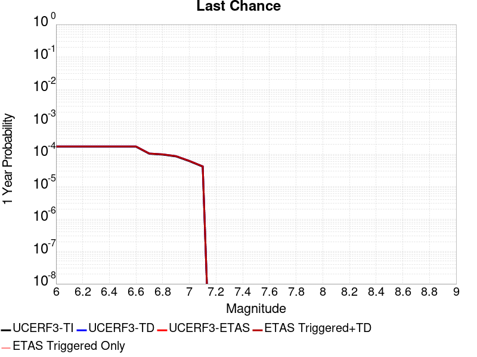 |  |

| Magnitude | 1 wk TI Prob | 1 wk TD Prob | 1 wk ETAS Prob | 1 wk ETAS/TD Gain | 1 wk ETAS Triggered+TD | 1 wk ETAS Triggered Only | 1 mo TI Prob | 1 mo TD Prob | 1 mo ETAS Prob | 1 mo ETAS/TD Gain | 1 mo ETAS Triggered+TD | 1 mo ETAS Triggered Only | 1 yr TI Prob | 1 yr TD Prob | 1 yr ETAS Prob | 1 yr ETAS/TD Gain | 1 yr ETAS Triggered+TD | 1 yr ETAS Triggered Only | 10 yr TI Prob | 10 yr TD Prob | 10 yr ETAS Prob | 10 yr ETAS/TD Gain | 10 yr ETAS Triggered+TD | 10 yr ETAS Triggered Only |
|-----|-----|-----|-----|-----|-----|-----|-----|-----|-----|-----|-----|-----|-----|-----|-----|-----|-----|-----|-----|-----|-----|-----|-----|-----|
| 6.0 | 3.23929E-6 | 3.3052643E-6 | 0.0 | 0.0 | 3.3052643E-6 | 0.0 | 1.3882597E-5 | 1.4165355E-5 | 0.0 | 0.0 | 1.4165355E-5 | 0.0 | 1.6900752E-4 | 1.7245203E-4 | 0.0 | 0.0 | 1.7245203E-4 | 0.0 | 0.0016887904 | 0.0017234258 | 6.0E-4 | 0.3481438 | 0.0018232535 | 1.0E-4 |
| 6.1 | 3.23929E-6 | 3.3052643E-6 | 0.0 | 0.0 | 3.3052643E-6 | 0.0 | 1.3882597E-5 | 1.4165355E-5 | 0.0 | 0.0 | 1.4165355E-5 | 0.0 | 1.6900752E-4 | 1.7245203E-4 | 0.0 | 0.0 | 1.7245203E-4 | 0.0 | 0.0016887904 | 0.0017234258 | 6.0E-4 | 0.3481438 | 0.0018232535 | 1.0E-4 |
| 6.2 | 3.23929E-6 | 3.3052643E-6 | 0.0 | 0.0 | 3.3052643E-6 | 0.0 | 1.3882597E-5 | 1.4165355E-5 | 0.0 | 0.0 | 1.4165355E-5 | 0.0 | 1.6900752E-4 | 1.7245203E-4 | 0.0 | 0.0 | 1.7245203E-4 | 0.0 | 0.0016887904 | 0.0017234258 | 6.0E-4 | 0.3481438 | 0.0018232535 | 1.0E-4 |
| 6.3 | 3.23929E-6 | 3.3052643E-6 | 0.0 | 0.0 | 3.3052643E-6 | 0.0 | 1.3882597E-5 | 1.4165355E-5 | 0.0 | 0.0 | 1.4165355E-5 | 0.0 | 1.6900752E-4 | 1.7245203E-4 | 0.0 | 0.0 | 1.7245203E-4 | 0.0 | 0.0016887904 | 0.0017234258 | 6.0E-4 | 0.3481438 | 0.0018232535 | 1.0E-4 |
| 6.4 | 3.23929E-6 | 3.3052643E-6 | 0.0 | 0.0 | 3.3052643E-6 | 0.0 | 1.3882597E-5 | 1.4165355E-5 | 0.0 | 0.0 | 1.4165355E-5 | 0.0 | 1.6900752E-4 | 1.7245203E-4 | 0.0 | 0.0 | 1.7245203E-4 | 0.0 | 0.0016887904 | 0.0017234258 | 6.0E-4 | 0.3481438 | 0.0018232535 | 1.0E-4 |
| 6.5 | 3.23929E-6 | 3.3052643E-6 | 0.0 | 0.0 | 3.3052643E-6 | 0.0 | 1.3882597E-5 | 1.4165355E-5 | 0.0 | 0.0 | 1.4165355E-5 | 0.0 | 1.6900752E-4 | 1.7245203E-4 | 0.0 | 0.0 | 1.7245203E-4 | 0.0 | 0.0016887904 | 0.0017234258 | 6.0E-4 | 0.3481438 | 0.0018232535 | 1.0E-4 |
| 6.6 | 3.23929E-6 | 3.3052643E-6 | 0.0 | 0.0 | 3.3052643E-6 | 0.0 | 1.3882597E-5 | 1.4165355E-5 | 0.0 | 0.0 | 1.4165355E-5 | 0.0 | 1.6900752E-4 | 1.7245203E-4 | 0.0 | 0.0 | 1.7245203E-4 | 0.0 | 0.0016887904 | 0.0017234258 | 6.0E-4 | 0.3481438 | 0.0018232535 | 1.0E-4 |
| 6.7 | 1.9639244E-6 | 2.004536E-6 | 0.0 | 0.0 | 2.004536E-6 | 0.0 | 8.416792E-6 | 8.590844E-6 | 0.0 | 0.0 | 8.590844E-6 | 0.0 | 1.02469625E-4 | 1.0458914E-4 | 0.0 | 0.0 | 1.0458914E-4 | 0.0 | 0.0010242239 | 0.0010454617 | 3.0E-4 | 0.28695455 | 0.0010454617 | 0.0 |
| 6.8 | 1.8490592E-6 | 1.8875694E-6 | 0.0 | 0.0 | 1.8875694E-6 | 0.0 | 7.924516E-6 | 8.089562E-6 | 0.0 | 0.0 | 8.089562E-6 | 0.0 | 9.64767E-5 | 9.8486584E-5 | 0.0 | 0.0 | 9.8486584E-5 | 0.0 | 9.643483E-4 | 9.844905E-4 | 3.0E-4 | 0.30472615 | 9.844905E-4 | 0.0 |
| 6.9 | 1.6283703E-6 | 1.6625077E-6 | 0.0 | 0.0 | 1.6625077E-6 | 0.0 | 6.9787116E-6 | 7.1250165E-6 | 0.0 | 0.0 | 7.1250165E-6 | 0.0 | 8.49625E-5 | 8.674418E-5 | 0.0 | 0.0 | 8.674418E-5 | 0.0 | 8.4930024E-4 | 8.671581E-4 | 3.0E-4 | 0.34595767 | 8.671581E-4 | 0.0 |
| 7.0 | 1.1619308E-6 | 1.1870034E-6 | 0.0 | 0.0 | 1.1870034E-6 | 0.0 | 4.979694E-6 | 5.08715E-6 | 0.0 | 0.0 | 5.08715E-6 | 0.0 | 6.0626087E-5 | 6.1934734E-5 | 0.0 | 0.0 | 6.1934734E-5 | 0.0 | 6.060955E-4 | 6.1921845E-4 | 2.0E-4 | 0.3229878 | 6.1921845E-4 | 0.0 |
| 7.1 | 7.8723247E-7 | 8.0473507E-7 | 0.0 | 0.0 | 8.0473507E-7 | 0.0 | 3.373849E-6 | 3.448862E-6 | 0.0 | 0.0 | 3.448862E-6 | 0.0 | 4.107584E-5 | 4.1989388E-5 | 0.0 | 0.0 | 4.1989388E-5 | 0.0 | 4.1068246E-4 | 4.1984444E-4 | 2.0E-4 | 0.47636694 | 4.1984444E-4 | 0.0 |

## San Joaquin Hills
*[(top)](#table-of-contents)*

| 1 Week | 1 Month | 1 Year | 10 Year |
|-----|-----|-----|-----|
| 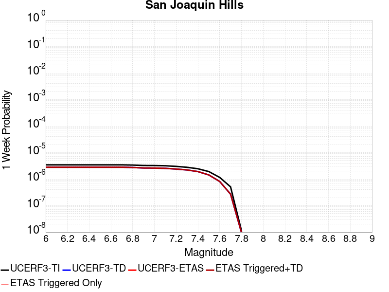 | 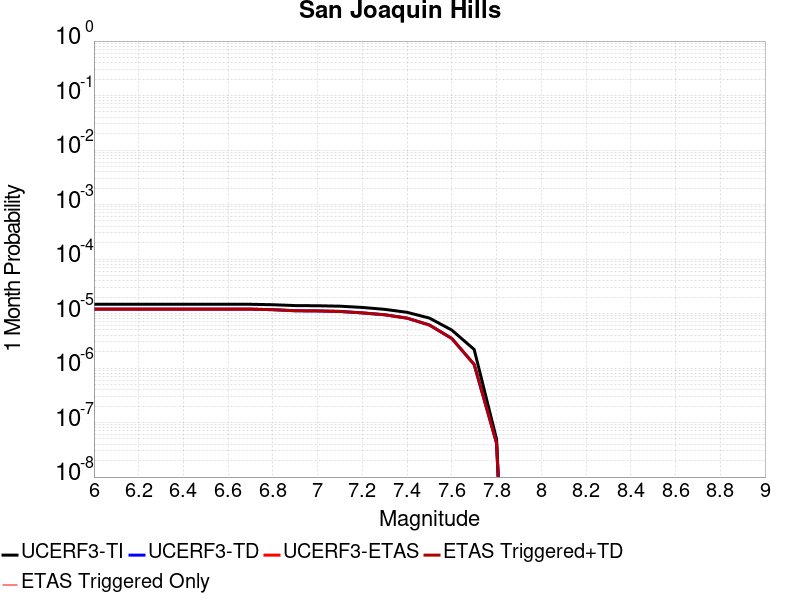 | 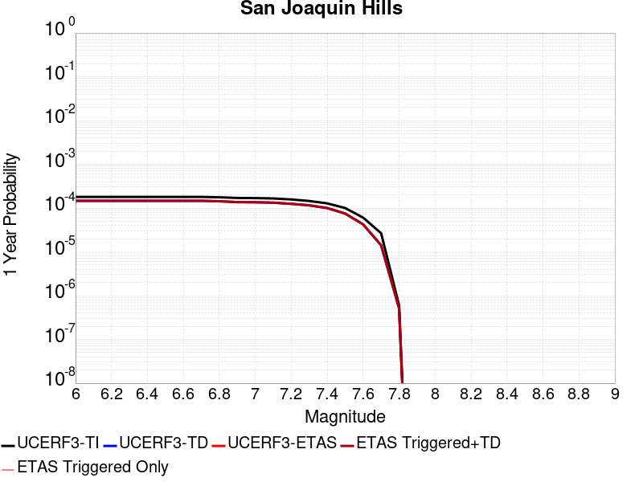 |  |

| Magnitude | 1 wk TI Prob | 1 wk TD Prob | 1 wk ETAS Prob | 1 wk ETAS/TD Gain | 1 wk ETAS Triggered+TD | 1 wk ETAS Triggered Only | 1 mo TI Prob | 1 mo TD Prob | 1 mo ETAS Prob | 1 mo ETAS/TD Gain | 1 mo ETAS Triggered+TD | 1 mo ETAS Triggered Only | 1 yr TI Prob | 1 yr TD Prob | 1 yr ETAS Prob | 1 yr ETAS/TD Gain | 1 yr ETAS Triggered+TD | 1 yr ETAS Triggered Only | 10 yr TI Prob | 10 yr TD Prob | 10 yr ETAS Prob | 10 yr ETAS/TD Gain | 10 yr ETAS Triggered+TD | 10 yr ETAS Triggered Only |
|-----|-----|-----|-----|-----|-----|-----|-----|-----|-----|-----|-----|-----|-----|-----|-----|-----|-----|-----|-----|-----|-----|-----|-----|-----|
| 6.0 | 3.4525704E-6 | 2.8141021E-6 | 0.0 | 0.0 | 2.8141021E-6 | 0.0 | 1.4796647E-5 | 1.2060383E-5 | 0.0 | 0.0 | 1.2060383E-5 | 0.0 | 1.8013427E-4 | 1.468254E-4 | 0.0 | 0.0 | 1.468254E-4 | 0.0 | 0.0017998833 | 0.0014672972 | 0.0011 | 0.7496777 | 0.0015671505 | 1.0E-4 |
| 6.1 | 3.4525704E-6 | 2.8141021E-6 | 0.0 | 0.0 | 2.8141021E-6 | 0.0 | 1.4796647E-5 | 1.2060383E-5 | 0.0 | 0.0 | 1.2060383E-5 | 0.0 | 1.8013427E-4 | 1.468254E-4 | 0.0 | 0.0 | 1.468254E-4 | 0.0 | 0.0017998833 | 0.0014672972 | 0.0011 | 0.7496777 | 0.0015671505 | 1.0E-4 |
| 6.2 | 3.4525704E-6 | 2.8141021E-6 | 0.0 | 0.0 | 2.8141021E-6 | 0.0 | 1.4796647E-5 | 1.2060383E-5 | 0.0 | 0.0 | 1.2060383E-5 | 0.0 | 1.8013427E-4 | 1.468254E-4 | 0.0 | 0.0 | 1.468254E-4 | 0.0 | 0.0017998833 | 0.0014672972 | 0.0011 | 0.7496777 | 0.0015671505 | 1.0E-4 |
| 6.3 | 3.4525704E-6 | 2.8141021E-6 | 0.0 | 0.0 | 2.8141021E-6 | 0.0 | 1.4796647E-5 | 1.2060383E-5 | 0.0 | 0.0 | 1.2060383E-5 | 0.0 | 1.8013427E-4 | 1.468254E-4 | 0.0 | 0.0 | 1.468254E-4 | 0.0 | 0.0017998833 | 0.0014672972 | 0.0011 | 0.7496777 | 0.0015671505 | 1.0E-4 |
| 6.4 | 3.4525704E-6 | 2.8141021E-6 | 0.0 | 0.0 | 2.8141021E-6 | 0.0 | 1.4796647E-5 | 1.2060383E-5 | 0.0 | 0.0 | 1.2060383E-5 | 0.0 | 1.8013427E-4 | 1.468254E-4 | 0.0 | 0.0 | 1.468254E-4 | 0.0 | 0.0017998833 | 0.0014672972 | 0.0011 | 0.7496777 | 0.0015671505 | 1.0E-4 |
| 6.5 | 3.4525704E-6 | 2.8141021E-6 | 0.0 | 0.0 | 2.8141021E-6 | 0.0 | 1.4796647E-5 | 1.2060383E-5 | 0.0 | 0.0 | 1.2060383E-5 | 0.0 | 1.8013427E-4 | 1.468254E-4 | 0.0 | 0.0 | 1.468254E-4 | 0.0 | 0.0017998833 | 0.0014672972 | 0.0011 | 0.7496777 | 0.0015671505 | 1.0E-4 |
| 6.6 | 3.4525704E-6 | 2.8141021E-6 | 0.0 | 0.0 | 2.8141021E-6 | 0.0 | 1.4796647E-5 | 1.2060383E-5 | 0.0 | 0.0 | 1.2060383E-5 | 0.0 | 1.8013427E-4 | 1.468254E-4 | 0.0 | 0.0 | 1.468254E-4 | 0.0 | 0.0017998833 | 0.0014672972 | 0.0011 | 0.7496777 | 0.0015671505 | 1.0E-4 |
| 6.7 | 3.4525704E-6 | 2.8141021E-6 | 0.0 | 0.0 | 2.8141021E-6 | 0.0 | 1.4796647E-5 | 1.2060383E-5 | 0.0 | 0.0 | 1.2060383E-5 | 0.0 | 1.8013427E-4 | 1.468254E-4 | 0.0 | 0.0 | 1.468254E-4 | 0.0 | 0.0017998833 | 0.0014672972 | 0.0011 | 0.7496777 | 0.0015671505 | 1.0E-4 |
| 6.8 | 3.388654E-6 | 2.7485373E-6 | 0.0 | 0.0 | 2.7485373E-6 | 0.0 | 1.4522722E-5 | 1.17793925E-5 | 0.0 | 0.0 | 1.17793925E-5 | 0.0 | 1.767998E-4 | 1.434048E-4 | 0.0 | 0.0 | 1.434048E-4 | 0.0 | 0.001766592 | 0.0014331355 | 0.0011 | 0.76754785 | 0.0015329921 | 1.0E-4 |
| 6.9 | 3.2694352E-6 | 2.6284458E-6 | 0.0 | 0.0 | 2.6284458E-6 | 0.0 | 1.401179E-5 | 1.1264719E-5 | 0.0 | 0.0 | 1.1264719E-5 | 0.0 | 1.7058018E-4 | 1.3713945E-4 | 0.0 | 0.0 | 1.3713945E-4 | 0.0 | 0.0017044931 | 0.0013705594 | 0.0011 | 0.802592 | 0.0014704224 | 1.0E-4 |
| 7.0 | 3.246912E-6 | 2.6071016E-6 | 0.0 | 0.0 | 2.6071016E-6 | 0.0 | 1.39152635E-5 | 1.1173246E-5 | 0.0 | 0.0 | 1.1173246E-5 | 0.0 | 1.6940516E-4 | 1.3602589E-4 | 0.0 | 0.0 | 1.3602589E-4 | 0.0 | 0.0016927607 | 0.0013594375 | 0.0011 | 0.8091582 | 0.0014593016 | 1.0E-4 |
| 7.1 | 3.1864927E-6 | 2.5524278E-6 | 0.0 | 0.0 | 2.5524278E-6 | 0.0 | 1.3656326E-5 | 1.0938931E-5 | 0.0 | 0.0 | 1.0938931E-5 | 0.0 | 1.6625308E-4 | 1.3317345E-4 | 0.0 | 0.0 | 1.3317345E-4 | 0.0 | 0.0016612876 | 0.0013309475 | 0.0011 | 0.82647884 | 0.0014308145 | 1.0E-4 |
| 7.2 | 3.0220644E-6 | 2.3992682E-6 | 0.0 | 0.0 | 2.3992682E-6 | 0.0 | 1.295164E-5 | 1.0282538E-5 | 0.0 | 0.0 | 1.0282538E-5 | 0.0 | 1.576748E-4 | 1.2518282E-4 | 0.0 | 0.0 | 1.2518282E-4 | 0.0 | 0.0015756298 | 0.0012511333 | 0.001 | 0.79927534 | 0.0012511333 | 0.0 |
| 7.3 | 2.787619E-6 | 2.2174809E-6 | 0.0 | 0.0 | 2.2174809E-6 | 0.0 | 1.1946884E-5 | 9.503456E-6 | 0.0 | 0.0 | 9.503456E-6 | 0.0 | 1.454436E-4 | 1.1569853E-4 | 0.0 | 0.0 | 1.1569853E-4 | 0.0 | 0.0014534845 | 0.0011563927 | 0.001 | 0.8647581 | 0.0011563927 | 0.0 |
| 7.4 | 2.4593792E-6 | 1.9227114E-6 | 0.0 | 0.0 | 1.9227114E-6 | 0.0 | 1.0540153E-5 | 8.240166E-6 | 0.0 | 0.0 | 8.240166E-6 | 0.0 | 1.2831882E-4 | 1.00319485E-4 | 0.0 | 0.0 | 1.00319485E-4 | 0.0 | 0.0012824474 | 0.0010027508 | 8.0E-4 | 0.7978054 | 0.0010027508 | 0.0 |
| 7.5 | 1.926764E-6 | 1.4383822E-6 | 0.0 | 0.0 | 1.4383822E-6 | 0.0 | 8.257534E-6 | 6.1644814E-6 | 0.0 | 0.0 | 6.1644814E-6 | 0.0 | 1.00530844E-4 | 7.505004E-5 | 0.0 | 0.0 | 7.505004E-5 | 0.0 | 0.0010048538 | 7.502533E-4 | 8.0E-4 | 1.0663066 | 7.502533E-4 | 0.0 |
| 7.6 | 1.1609359E-6 | 8.1461593E-7 | 0.0 | 0.0 | 8.1461593E-7 | 0.0 | 4.97543E-6 | 3.4912068E-6 | 0.0 | 0.0 | 3.4912068E-6 | 0.0 | 6.0574173E-5 | 4.2504656E-5 | 0.0 | 0.0 | 4.2504656E-5 | 0.0 | 6.055767E-4 | 4.2496962E-4 | 8.0E-4 | 1.8824875 | 4.2496962E-4 | 0.0 |
| 7.7 | 5.1168536E-7 | 2.7158967E-7 | 0.0 | 0.0 | 2.7158967E-7 | 0.0 | 2.1929354E-6 | 1.1639553E-6 | 0.0 | 0.0 | 1.1639553E-6 | 0.0 | 2.669866E-5 | 1.4171077E-5 | 0.0 | 0.0 | 1.4171077E-5 | 0.0 | 2.6695454E-4 | 1.4170309E-4 | 2.0E-4 | 1.4114019 | 1.4170309E-4 | 0.0 |
| 7.8 | 1.16056995E-8 | 9.783043E-9 | 0.0 | 0.0 | 9.783043E-9 | 0.0 | 4.9738713E-8 | 4.1927326E-8 | 0.0 | 0.0 | 4.1927326E-8 | 0.0 | 6.0556863E-7 | 5.104652E-7 | 0.0 | 0.0 | 5.104652E-7 | 0.0 | 6.05567E-6 | 5.1046522E-6 | 0.0 | 0.0 | 5.1046522E-6 | 0.0 |

