# Parent Section Magnitude-Probability Distributions

Only fault sections with at least one triggered aftershock are plotted. Sections are sorted by total supraseismogenic trigger rate (decreasing)

## Table Of Contents

* [San Andreas (Parkfield)](#san-andreas-parkfield)
* [San Andreas (Creeping Section) 2011 CFM](#san-andreas-creeping-section-2011-cfm)
* [Mendocino](#mendocino)
* [San Andreas (Mojave S)](#san-andreas-mojave-s)
* [Cerro Prieto](#cerro-prieto)
* [Garlock (Central)](#garlock-central)
* [Imperial](#imperial)
* [Brawley (Seismic Zone) alt 1](#brawley-seismic-zone-alt-1)
* [Tank Canyon](#tank-canyon)
* [Hayward (So) 2011 CFM](#hayward-so-2011-cfm)
* [Laguna Salada](#laguna-salada)
* [San Andreas (Cholame) rev](#san-andreas-cholame-rev)
* [San Andreas (Offshore) 2011 CFM](#san-andreas-offshore-2011-cfm)
* [San Andreas (San Bernardino N)](#san-andreas-san-bernardino-n)
* [San Andreas (Carrizo) rev](#san-andreas-carrizo-rev)
* [Hayward (So) extension 2011 CFM](#hayward-so-extension-2011-cfm)
* [Hunting Creek - Berryessa 2011 CFM](#hunting-creek---berryessa-2011-cfm)
* [Calaveras (So) - Paicines extension 2011 CFM](#calaveras-so---paicines-extension-2011-cfm)
* [San Andreas (Coachella) rev](#san-andreas-coachella-rev)
* [Elsinore (Glen Ivy) rev](#elsinore-glen-ivy-rev)
* [Calaveras (So) 2011 CFM](#calaveras-so-2011-cfm)
* [Owl Lake](#owl-lake)
* [Calaveras (Central) 2011 CFM](#calaveras-central-2011-cfm)
* [San Andreas (Big Bend)](#san-andreas-big-bend)
* [San Andreas (Mojave N)](#san-andreas-mojave-n)
* [San Andreas (San Bernardino S)](#san-andreas-san-bernardino-s)
* [Little Lake](#little-lake)
* [San Andreas (San Gorgonio Pass-Garnet HIll)](#san-andreas-san-gorgonio-pass-garnet-hill)
* [San Jacinto (Superstition Mtn)](#san-jacinto-superstition-mtn)
* [Airport Lake](#airport-lake)
* [Green Valley 2011 CFM](#green-valley-2011-cfm)
* [Garlock (East)](#garlock-east)
* [Panamint Valley](#panamint-valley)
* [Hayward (No) 2011 CFM](#hayward-no-2011-cfm)
* [San Andreas (Santa Cruz Mts) 2011 CFM](#san-andreas-santa-cruz-mts-2011-cfm)
* [West Napa 2011 CFM](#west-napa-2011-cfm)
* [Calaveras (No) 2011 CFM](#calaveras-no-2011-cfm)
* [King Range 2011 CFM](#king-range-2011-cfm)
* [Cady](#cady)
* [Ortigalita (North)](#ortigalita-north)
* [Maacama 2011 CFM](#maacama-2011-cfm)
* [Santa Ynez (West)](#santa-ynez-west)
* [Elmore Ranch](#elmore-ranch)
* [San Andreas (North Coast) 2011 CFM](#san-andreas-north-coast-2011-cfm)
* [Rodgers Creek - Healdsburg 2011 CFM](#rodgers-creek---healdsburg-2011-cfm)
* [Hunter Mountain-Saline Valley](#hunter-mountain-saline-valley)
* [Mission Ridge-Arroyo Parida-Santa Ana](#mission-ridge-arroyo-parida-santa-ana)
* [Ash Hill](#ash-hill)
* [Calico-Hidalgo](#calico-hidalgo)
* [San Clemente](#san-clemente)
* [Garberville - Briceland 2011 CFM](#garberville---briceland-2011-cfm)
* [Pleito](#pleito)
* [Pinto Mtn](#pinto-mtn)
* [Concord 2011 CFM](#concord-2011-cfm)
* [Monte Vista - Shannon 2011 CFM](#monte-vista---shannon-2011-cfm)
* [Red Mountain](#red-mountain)
* [Coyote Canyon](#coyote-canyon)
* [Hunting Creek - Bartlett Springs connector 2011](#hunting-creek---bartlett-springs-connector-2011)
* [Eaton Roughs 2011 CFM](#eaton-roughs-2011-cfm)
* [Honey Lake 2011 CFM](#honey-lake-2011-cfm)
* [Goldstone Lake](#goldstone-lake)
* [Mount Diablo Thrust South](#mount-diablo-thrust-south)
* [Gravel Hills-Harper Lk](#gravel-hills-harper-lk)
* [Chino alt 1](#chino-alt-1)
* [Blackwater](#blackwater)
* [Garlock (West)](#garlock-west)
* [Bullion Mountains](#bullion-mountains)
* [Sargent 2011 CFM](#sargent-2011-cfm)
* [Pisgah-Bullion Mtn-Mesquite Lk](#pisgah-bullion-mtn-mesquite-lk)
* [San Diego Trough south](#san-diego-trough-south)
* [Mission (connected) 2011 CFM](#mission-connected-2011-cfm)
* [Ortigalita (South)](#ortigalita-south)
* [McLean Lake](#mclean-lake)
* [Great Valley 05 Pittsburg - Kirby Hills alt1](#great-valley-05-pittsburg---kirby-hills-alt1)
* [Coronado Bank alt1](#coronado-bank-alt1)
* [White Mountains](#white-mountains)
* [Keddie Ridge 2011 CFM](#keddie-ridge-2011-cfm)
* [Almanor 2011 CFM](#almanor-2011-cfm)
* [Palos Verdes](#palos-verdes)
* [Whittier alt 1](#whittier-alt-1)
* [Great Valley 09 (Laguna Seca)](#great-valley-09-laguna-seca)
* [San Diego Trough north alt1](#san-diego-trough-north-alt1)
* [Ludlow](#ludlow)
* [Trinidad (alt1)](#trinidad-alt1)
* [Great Valley 07 (Orestimba)](#great-valley-07-orestimba)
* [Rose Canyon](#rose-canyon)
* [Elysian Park (Upper)](#elysian-park-upper)
* [Ventura-Pitas Point](#ventura-pitas-point)
* [Bicycle Lake](#bicycle-lake)
* [Great Valley 04b Gordon Valley](#great-valley-04b-gordon-valley)
* [San Gregorio (North) 2011 CFM](#san-gregorio-north-2011-cfm)
* [Bennett Valley 2011 CFM](#bennett-valley-2011-cfm)
* [Greenville (No) 2011 CFM](#greenville-no-2011-cfm)
* [Lenwood-Lockhart-Old Woman Springs](#lenwood-lockhart-old-woman-springs)
* [Bartlett Springs 2011 CFM](#bartlett-springs-2011-cfm)
* [South Klamath Lake East](#south-klamath-lake-east)
* [South Klamath Lake West](#south-klamath-lake-west)
* [Cleghorn Lake](#cleghorn-lake)
* [Quien Sabe 2011 CFM](#quien-sabe-2011-cfm)
* [Cleghorn Pass](#cleghorn-pass)
* [Manix-Afton Hills](#manix-afton-hills)
* [Great Valley 03 Mysterious Ridge](#great-valley-03-mysterious-ridge)
* [Monterey Bay-Tularcitos](#monterey-bay-tularcitos)
* [Mono Lake 2011 CFM](#mono-lake-2011-cfm)
* [Santa Susana East (connector)](#santa-susana-east-connector)
* [Death Valley (So)](#death-valley-so)
* [Garlic Springs](#garlic-springs)
* [San Andreas (Peninsula) 2011 CFM](#san-andreas-peninsula-2011-cfm)
* [Big Lagoon - Bald Mtn 2011 CFM](#big-lagoon---bald-mtn-2011-cfm)
* [Elsinore (Coyote Mountains)](#elsinore-coyote-mountains)
* [Santa Ynez (East)](#santa-ynez-east)
* [Carson Range (Genoa)](#carson-range-genoa)
* [San Jacinto (Borrego)](#san-jacinto-borrego)
* [Nelson Lake](#nelson-lake)
* [Lost Hills](#lost-hills)
* [Santa Cruz Island](#santa-cruz-island)
* [So Sierra Nevada](#so-sierra-nevada)
* [Santa Rosa Island](#santa-rosa-island)
* [Mission Hills 2011](#mission-hills-2011)
* [Hat Creek-McArthur-Mayfield](#hat-creek-mcarthur-mayfield)
* [Surprise Valley 2011 CFM](#surprise-valley-2011-cfm)
* [Little Salmon (Onshore)](#little-salmon-onshore)
* [San Pedro Basin](#san-pedro-basin)
* [Paradise](#paradise)
* [Robinson Creek](#robinson-creek)
* [Death Valley (Fish Lake Valley)](#death-valley-fish-lake-valley)
* [Blue Cut](#blue-cut)
* [Franklin 2011 CFM](#franklin-2011-cfm)
* [Great Valley 03a Dunnigan Hills](#great-valley-03a-dunnigan-hills)
* [Contra Costa Shear Zone (connector) 2011 CFM](#contra-costa-shear-zone-connector-2011-cfm)
* [Hosgri](#hosgri)
* [San Jacinto (San Bernardino)](#san-jacinto-san-bernardino)
* [Mad River (alt1)](#mad-river-alt1)
* [Reliz 2011 CFM](#reliz-2011-cfm)
* [Greenville (So) 2011 CFM](#greenville-so-2011-cfm)
* [San Jacinto (Stepovers Combined)](#san-jacinto-stepovers-combined)
* [Bear River fault zone](#bear-river-fault-zone)
* [Santa Susana alt 1](#santa-susana-alt-1)
* [Oceanic - West Huasna](#oceanic---west-huasna)
* [San Jacinto (Anza) rev](#san-jacinto-anza-rev)
* [San Jacinto (San Jacinto Valley) rev](#san-jacinto-san-jacinto-valley-rev)
* [McKinleyville (alt1)](#mckinleyville-alt1)
* [Channel Islands Thrust](#channel-islands-thrust)
* [Great Valley 08 (Quinto)](#great-valley-08-quinto)
* [Raymond](#raymond)
* [Towne Pass](#towne-pass)
* [Great Valley 04a Trout Creek](#great-valley-04a-trout-creek)
* [Mission Creek](#mission-creek)
* [San Gabriel](#san-gabriel)
* [Big Pine (East)](#big-pine-east)
* [Superstition Hills](#superstition-hills)
* [Coyote Lake](#coyote-lake)
* [Helendale-So Lockhart](#helendale-so-lockhart)
* [Oak Ridge (Onshore)](#oak-ridge-onshore)
* [Rinconada 2011 CFM](#rinconada-2011-cfm)
* [San Jacinto (Coyote Creek)](#san-jacinto-coyote-creek)
* [Burnt Mtn](#burnt-mtn)
* [Elsinore (Stepovers Combined)](#elsinore-stepovers-combined)
* [Santa Ynez River](#santa-ynez-river)
* [Earthquake Valley (So Extension)](#earthquake-valley-so-extension)
* [San Andreas (North Branch Mill Creek)](#san-andreas-north-branch-mill-creek)
* [Russ 2011 CFM](#russ-2011-cfm)
* [Eureka Peak](#eureka-peak)
* [Homestead Valley 2011](#homestead-valley-2011)
* [Death Valley (Black Mtns Frontal)](#death-valley-black-mtns-frontal)
* [Big Pine (Central)](#big-pine-central)
* [Cedar Mtn-Mahogany Mtn](#cedar-mtn-mahogany-mtn)
* [Elsinore (Temecula) rev](#elsinore-temecula-rev)
* [Puente Hills](#puente-hills)
* [Great Valley 11](#great-valley-11)
* [Las Positas](#las-positas)
* [Pitas Point (Lower West)](#pitas-point-lower-west)
* [Red Pass](#red-pass)
* [Hartley Springs 2011 CFM](#hartley-springs-2011-cfm)
* [Table Bluff](#table-bluff)
* [Malibu Coast alt 1](#malibu-coast-alt-1)
* [Hector Mine](#hector-mine)
* [Lake Isabella (Seismicity)](#lake-isabella-seismicity)
* [Santa Cruz Catalina Ridge alt1](#santa-cruz-catalina-ridge-alt1)
* [Pine Mtn](#pine-mtn)
* [Johnson Valley (No) 2011 rev](#johnson-valley-no-2011-rev)
* [Likely 2011 CFM](#likely-2011-cfm)
* [San Juan](#san-juan)
* [Newport-Inglewood alt 1](#newport-inglewood-alt-1)
* [Earthquake Valley](#earthquake-valley)
* [Owens Valley Keough Hot Springs](#owens-valley-keough-hot-springs)
* [Simi-Santa Rosa](#simi-santa-rosa)
* [North Frontal  (East)](#north-frontal--east)
* [Swain Ravine - Spenceville](#swain-ravine---spenceville)
* [Mohawk Valley 2011 CFM](#mohawk-valley-2011-cfm)
* [Little Salmon (Offshore)](#little-salmon-offshore)
* [Emerson-Copper Mtn 2011](#emerson-copper-mtn-2011)
* [Death Valley (No)](#death-valley-no)
* [San Cayetano](#san-cayetano)
* [Antelope Valley 2011](#antelope-valley-2011)
* [Dry Mountain](#dry-mountain)
* [Clayton](#clayton)
* [Sheephole](#sheephole)
* [West Tahoe](#west-tahoe)
* [Rocky Ledge 2011 CFM](#rocky-ledge-2011-cfm)
* [Great Valley 06 (Midland) 2011 CFM alt1](#great-valley-06-midland-2011-cfm-alt1)
* [Great Valley 10 (Panoche)](#great-valley-10-panoche)
* [Deep Springs](#deep-springs)
* [Butano 2011 CFM](#butano-2011-cfm)
* [Earthquake Valley (No  Extension)](#earthquake-valley-no--extension)
* [Mount Diablo Thrust North CFM](#mount-diablo-thrust-north-cfm)
* [Sierra Nevada  (No Extension)](#sierra-nevada--no-extension)
* [Contra Costa (Lafayette) 2011 CFM](#contra-costa-lafayette-2011-cfm)
* [San Gregorio (South) 2011 CFM](#san-gregorio-south-2011-cfm)
* [Round Valley](#round-valley)
* [Peralta Hills](#peralta-hills)
* [Cleghorn](#cleghorn)
* [San Jacinto (Clark) rev](#san-jacinto-clark-rev)
* [Morales (East)](#morales-east)
* [Collayami 2011 CFM](#collayami-2011-cfm)
* [Hollywood](#hollywood)
* [Oceanside alt1](#oceanside-alt1)
* [Newport-Inglewood (Offshore)](#newport-inglewood-offshore)
* [La Panza 2011](#la-panza-2011)
* [White Wolf (Extension)](#white-wolf-extension)
* [Pitas Point (Lower)-Montalvo](#pitas-point-lower-montalvo)
* [Pittville 2011 CFM](#pittville-2011-cfm)
* [San Gabriel (Extension)](#san-gabriel-extension)
* [Independence rev 2011](#independence-rev-2011)
* [Los Alamos 2011 CFM](#los-alamos-2011-cfm)
* [Goose Lake 2011 CFM](#goose-lake-2011-cfm)
* [Davis Creek](#davis-creek)
* [Los Osos 2011](#los-osos-2011)
* [San Gorgonio Pass](#san-gorgonio-pass)
* [Compton](#compton)
* [North Tahoe 2011 CFM](#north-tahoe-2011-cfm)
* [Scodie Lineament](#scodie-lineament)
* [Hosgri (Extension)](#hosgri-extension)
* [Sierra Madre](#sierra-madre)
* [Redondo Canyon alt 1](#redondo-canyon-alt-1)
* [Channel Islands Western Deep Ramp](#channel-islands-western-deep-ramp)
* [Point Reyes 2011 CFM](#point-reyes-2011-cfm)
* [Gillem - Big Crack 2011 CFM](#gillem---big-crack-2011-cfm)
* [Santa Monica alt 1](#santa-monica-alt-1)
* [Owens Valley](#owens-valley)
* [Los Alamos extension](#los-alamos-extension)
* [Elsinore (Julian)](#elsinore-julian)
* [Fickle Hill (alt1)](#fickle-hill-alt1)
* [San Jacinto (Lytle Creek connector)](#san-jacinto-lytle-creek-connector)
* [Thirty Mile Bank](#thirty-mile-bank)
* [Polaris 2011 CFM](#polaris-2011-cfm)
* [Pilarcitos 2011 CFM](#pilarcitos-2011-cfm)
* [North Frontal  (West)](#north-frontal--west)
* [Ozena](#ozena)
* [Baker](#baker)
* [Camp Rock 2011](#camp-rock-2011)
* [Sisar](#sisar)
* [Tin Mountain](#tin-mountain)
* [Holser alt 1](#holser-alt-1)
* [Walker Spring 2011 CFM](#walker-spring-2011-cfm)
* [Cucamonga](#cucamonga)
* [Skinner Flat 2011 CFM](#skinner-flat-2011-cfm)
* [Northridge](#northridge)
* [Great Valley 12](#great-valley-12)
* [San Luis Range - Oceano 2011 CFM](#san-luis-range---oceano-2011-cfm)
* [South Cuyama](#south-cuyama)
* [Anaheim](#anaheim)
* [Fitzhugh Creek](#fitzhugh-creek)
* [Kern Canyon (North Kern) 2011](#kern-canyon-north-kern-2011)
* [Del Valle](#del-valle)
* [San Luis Range 2011 CFM](#san-luis-range-2011-cfm)
* [Great Valley 02](#great-valley-02)
* [Sierra Madre (San Fernando)](#sierra-madre-san-fernando)
* [Kern Canyon (South Kern) 2011](#kern-canyon-south-kern-2011)
* [Kern Canyon (Lake Isabella) 2011](#kern-canyon-lake-isabella-2011)
* [Anacapa-Dume alt 1](#anacapa-dume-alt-1)
* [Elysian Park (Lower CFM)](#elysian-park-lower-cfm)
* [Great Valley 14 (Kettleman Hills)](#great-valley-14-kettleman-hills)
* [Richfield](#richfield)
* [Great Valley 01](#great-valley-01)
* [Northridge Hills](#northridge-hills)
* [Jess Valley](#jess-valley)
* [Fish Slough 2011 CFM](#fish-slough-2011-cfm)
* [Point Reyes 2011 connector](#point-reyes-2011-connector)
* [Casmalia 2011 CFM](#casmalia-2011-cfm)
* [Hilton Creek 2011 CFM](#hilton-creek-2011-cfm)
* [Dog Valley](#dog-valley)
* [San Joaquin Hills](#san-joaquin-hills)
* [Great Valley 13 (Coalinga)](#great-valley-13-coalinga)
* [Fontana (Seismicity)](#fontana-seismicity)
* [Joshua Tree (Seismicity)](#joshua-tree-seismicity)
* [Malibu Coast (Extension) alt 1](#malibu-coast-extension-alt-1)
* [Shoreline](#shoreline)
* [Los Medanos - Roe Island](#los-medanos---roe-island)
* [Last Chance](#last-chance)
* [Yorba Linda](#yorba-linda)
* [Battle Creek 2011 CFM](#battle-creek-2011-cfm)
* [North Salt Lake](#north-salt-lake)
* [Big Pine (West)](#big-pine-west)
* [Verdugo](#verdugo)
* [East Huasna 2011 CFM](#east-huasna-2011-cfm)
* [Carlsbad](#carlsbad)

## San Andreas (Parkfield)
*[(top)](#table-of-contents)*

| 1 Week | 1 Month | 1 Year | 10 Year |
|-----|-----|-----|-----|
|  |  |  |  |

| Magnitude | 1 wk TI Prob | 1 wk TD Prob | 1 wk ETAS Prob | 1 wk ETAS/TD Gain | 1 wk ETAS Triggered+TD | 1 wk ETAS Triggered Only | 1 mo TI Prob | 1 mo TD Prob | 1 mo ETAS Prob | 1 mo ETAS/TD Gain | 1 mo ETAS Triggered+TD | 1 mo ETAS Triggered Only | 1 yr TI Prob | 1 yr TD Prob | 1 yr ETAS Prob | 1 yr ETAS/TD Gain | 1 yr ETAS Triggered+TD | 1 yr ETAS Triggered Only | 10 yr TI Prob | 10 yr TD Prob | 10 yr ETAS Prob | 10 yr ETAS/TD Gain | 10 yr ETAS Triggered+TD | 10 yr ETAS Triggered Only |
|-----|-----|-----|-----|-----|-----|-----|-----|-----|-----|-----|-----|-----|-----|-----|-----|-----|-----|-----|-----|-----|-----|-----|-----|-----|
| 6.0 | 5.556969E-4 | 7.9314655E-4 | 0.0015 | 1.8912016 | 0.0014925913 | 7.0E-4 | 0.0023793848 | 0.0033953465 | 0.004 | 1.178083 | 0.005388556 | 0.002 | 0.028586963 | 0.04077081 | 0.0486 | 1.1920294 | 0.059763547 | 0.0198 | 0.25176284 | 0.33939293 | 0.4317 | 1.2719771 | 0.4431743 | 0.1571 |
| 6.1 | 1.925858E-4 | 3.069976E-4 | 3.0E-4 | 0.97720635 | 4.069669E-4 | 1.0E-4 | 8.2510663E-4 | 0.0013151392 | 6.0E-4 | 0.45622545 | 0.0016147447 | 3.0E-4 | 0.0099994885 | 0.01598204 | 0.0099 | 0.6194453 | 0.0193277 | 0.0034 | 0.095613256 | 0.150809 | 0.1021 | 0.67701524 | 0.17849264 | 0.0326 |
| 6.2 | 9.4306815E-5 | 1.8362013E-4 | 2.0E-4 | 1.0892053 | 2.8360175E-4 | 1.0E-4 | 4.0410945E-4 | 7.867073E-4 | 4.0E-4 | 0.5084483 | 9.8655E-4 | 2.0E-4 | 0.0049089384 | 0.009536299 | 0.0058 | 0.6082024 | 0.011517227 | 0.002 | 0.048019063 | 0.09238957 | 0.0602 | 0.65158874 | 0.108545035 | 0.0178 |
| 6.3 | 9.283051E-5 | 1.805816E-4 | 2.0E-4 | 1.1075325 | 2.8056354E-4 | 1.0E-4 | 3.9778434E-4 | 7.736928E-4 | 4.0E-4 | 0.51700103 | 9.735381E-4 | 2.0E-4 | 0.0048322747 | 0.009379223 | 0.0058 | 0.6183881 | 0.011360465 | 0.002 | 0.047285385 | 0.09104203 | 0.0595 | 0.6535443 | 0.10703969 | 0.0176 |
| 6.4 | 9.138826E-5 | 1.7819573E-4 | 2.0E-4 | 1.1223614 | 2.781779E-4 | 1.0E-4 | 3.916052E-4 | 7.634736E-4 | 4.0E-4 | 0.5239212 | 9.6332096E-4 | 2.0E-4 | 0.0047573745 | 0.009255865 | 0.0057 | 0.6158258 | 0.011237353 | 0.002 | 0.046568092 | 0.089943774 | 0.0583 | 0.6481827 | 0.10568775 | 0.0173 |
| 6.5 | 9.000255E-5 | 1.757689E-4 | 2.0E-4 | 1.1378578 | 2.757513E-4 | 1.0E-4 | 3.8566816E-4 | 7.5307896E-4 | 4.0E-4 | 0.5311528 | 9.529284E-4 | 2.0E-4 | 0.0046854047 | 0.009130398 | 0.0057 | 0.62428826 | 0.011112137 | 0.002 | 0.045878403 | 0.088830434 | 0.0573 | 0.6450492 | 0.1042292 | 0.0169 |
| 6.6 | 8.8109264E-5 | 1.725657E-4 | 2.0E-4 | 1.1589788 | 2.7254844E-4 | 1.0E-4 | 3.7755648E-4 | 7.3935883E-4 | 3.0E-4 | 0.40575698 | 8.392849E-4 | 1.0E-4 | 0.0045870654 | 0.0089647565 | 0.0055 | 0.6135136 | 0.010847724 | 0.0019 | 0.04493529 | 0.08735626 | 0.0565 | 0.64677674 | 0.102597415 | 0.0167 |
| 6.7 | 8.738073E-5 | 1.7123322E-4 | 2.0E-4 | 1.1679977 | 2.712161E-4 | 1.0E-4 | 3.7443507E-4 | 7.336514E-4 | 3.0E-4 | 0.40891355 | 8.33578E-4 | 1.0E-4 | 0.0045492216 | 0.0088958815 | 0.0055 | 0.6182636 | 0.010778979 | 0.0019 | 0.04457213 | 0.086755075 | 0.0563 | 0.64895344 | 0.101914935 | 0.0166 |
| 6.8 | 8.710195E-5 | 1.7068561E-4 | 2.0E-4 | 1.171745 | 2.7066853E-4 | 1.0E-4 | 3.7324068E-4 | 7.3130586E-4 | 3.0E-4 | 0.41022506 | 8.312327E-4 | 1.0E-4 | 0.0045347405 | 0.008867566 | 0.0055 | 0.6202379 | 0.010750717 | 0.0019 | 0.04443313 | 0.08650194 | 0.0561 | 0.6485404 | 0.10139196 | 0.0163 |
| 6.9 | 8.6801556E-5 | 1.7009281E-4 | 2.0E-4 | 1.1758286 | 2.700758E-4 | 1.0E-4 | 3.7195362E-4 | 7.287667E-4 | 3.0E-4 | 0.41165438 | 8.2869385E-4 | 1.0E-4 | 0.0045191357 | 0.008836903 | 0.0055 | 0.62239003 | 0.010720112 | 0.0019 | 0.044283327 | 0.08622729 | 0.0559 | 0.64828664 | 0.10112179 | 0.0163 |
| 7.0 | 8.5571606E-5 | 1.6761184E-4 | 2.0E-4 | 1.1932331 | 2.6759508E-4 | 1.0E-4 | 3.6668387E-4 | 7.1813987E-4 | 3.0E-4 | 0.41774592 | 8.1806805E-4 | 1.0E-4 | 0.004455241 | 0.008708562 | 0.0055 | 0.6315624 | 0.010592015 | 0.0019 | 0.043669727 | 0.08507222 | 0.0554 | 0.6512114 | 0.09989405 | 0.0162 |
| 7.1 | 7.82589E-5 | 1.523794E-4 | 2.0E-4 | 1.3125134 | 2.5236417E-4 | 1.0E-4 | 3.3535215E-4 | 6.528919E-4 | 3.0E-4 | 0.45949414 | 7.528266E-4 | 1.0E-4 | 0.0040752706 | 0.00792016 | 0.005 | 0.6313004 | 0.009705904 | 0.0018 | 0.040013418 | 0.07794469 | 0.0487 | 0.62480205 | 0.09122228 | 0.0144 |
| 7.2 | 7.690929E-5 | 1.4973937E-4 | 2.0E-4 | 1.3356541 | 2.497244E-4 | 1.0E-4 | 3.2956956E-4 | 6.4158306E-4 | 3.0E-4 | 0.4675934 | 7.4151886E-4 | 1.0E-4 | 0.004005129 | 0.0077834656 | 0.005 | 0.6423874 | 0.009569456 | 0.0018 | 0.0393371 | 0.07671345 | 0.0483 | 0.6296158 | 0.089916445 | 0.0143 |
| 7.3 | 7.5543794E-5 | 1.4668968E-4 | 2.0E-4 | 1.3634225 | 2.4667502E-4 | 1.0E-4 | 3.2371894E-4 | 6.285193E-4 | 3.0E-4 | 0.47731233 | 7.284564E-4 | 1.0E-4 | 0.003934157 | 0.007625538 | 0.0048 | 0.6294638 | 0.009312575 | 0.0017 | 0.038652334 | 0.07526963 | 0.047 | 0.62442183 | 0.08775349 | 0.0135 |
| 7.4 | 7.4214564E-5 | 1.4368497E-4 | 2.0E-4 | 1.391934 | 2.436706E-4 | 1.0E-4 | 3.1802364E-4 | 6.156481E-4 | 3.0E-4 | 0.48729134 | 7.1558653E-4 | 1.0E-4 | 0.003865065 | 0.0074699163 | 0.0047 | 0.62919044 | 0.009057964 | 0.0016 | 0.03798529 | 0.073838376 | 0.0463 | 0.6270452 | 0.086063705 | 0.0132 |
| 7.5 | 6.149578E-5 | 1.1281705E-4 | 2.0E-4 | 1.7727817 | 2.1280577E-4 | 1.0E-4 | 2.6352672E-4 | 4.8341215E-4 | 2.0E-4 | 0.41372564 | 5.833638E-4 | 1.0E-4 | 0.0032037178 | 0.005869692 | 0.0037 | 0.6303567 | 0.007162062 | 0.0013 | 0.03157923 | 0.05897833 | 0.0353 | 0.5985249 | 0.06791803 | 0.0095 |
| 7.6 | 6.0643448E-5 | 1.11094574E-4 | 2.0E-4 | 1.8002679 | 2.1108346E-4 | 1.0E-4 | 2.598746E-4 | 4.7603284E-4 | 2.0E-4 | 0.42013907 | 5.7598524E-4 | 1.0E-4 | 0.0031593828 | 0.00578033 | 0.0036 | 0.62280184 | 0.0069733933 | 0.0012 | 0.031148417 | 0.05813581 | 0.0351 | 0.6037587 | 0.06698933 | 0.0094 |
| 7.7 | 5.1652263E-5 | 9.25566E-5 | 2.0E-4 | 2.16084 | 1.9254735E-4 | 1.0E-4 | 2.2134806E-4 | 3.9661085E-4 | 2.0E-4 | 0.50427264 | 4.965712E-4 | 1.0E-4 | 0.002691582 | 0.0048180562 | 0.0027 | 0.56039196 | 0.005813238 | 0.001 | 0.026592141 | 0.04891614 | 0.0286 | 0.5846741 | 0.056239486 | 0.0077 |
| 7.8 | 4.8090482E-5 | 8.63411E-5 | 2.0E-4 | 2.3163939 | 1.8633246E-4 | 1.0E-4 | 2.060858E-4 | 3.6998081E-4 | 2.0E-4 | 0.54056853 | 4.6994383E-4 | 1.0E-4 | 0.0025062072 | 0.004495221 | 0.0024 | 0.5339003 | 0.0053911754 | 9.0E-4 | 0.024781305 | 0.045653466 | 0.0271 | 0.59360224 | 0.05271563 | 0.0074 |
| 7.9 | 3.970278E-5 | 6.808419E-5 | 2.0E-4 | 2.9375393 | 1.6807739E-4 | 1.0E-4 | 1.7014367E-4 | 2.9175676E-4 | 2.0E-4 | 0.6855025 | 3.917276E-4 | 1.0E-4 | 0.002069531 | 0.003546357 | 0.0019 | 0.53576106 | 0.004144229 | 6.0E-4 | 0.020503636 | 0.03615921 | 0.0207 | 0.5724682 | 0.041460335 | 0.0055 |
| 8.0 | 2.8982335E-5 | 4.1065407E-5 | 2.0E-4 | 4.8702793 | 1.410613E-4 | 1.0E-4 | 1.2420409E-4 | 1.7598273E-4 | 2.0E-4 | 1.1364751 | 2.7596514E-4 | 1.0E-4 | 0.0015111357 | 0.0021404854 | 8.0E-4 | 0.37374696 | 0.0024398435 | 3.0E-4 | 0.015009012 | 0.022194585 | 0.0118 | 0.5316612 | 0.024736878 | 0.0026 |
| 8.1 | 1.8836186E-5 | 1.8887895E-5 | 2.0E-4 | 10.588793 | 1.18886004E-4 | 1.0E-4 | 8.0724014E-5 | 8.094561E-5 | 2.0E-4 | 2.470795 | 1.8093751E-4 | 1.0E-4 | 9.823717E-4 | 9.850678E-4 | 5.0E-4 | 0.50757927 | 0.0011848708 | 2.0E-4 | 0.009780403 | 0.010596832 | 0.0051 | 0.4812759 | 0.011685176 | 0.0011 |
| 8.2 | 8.643924E-6 | 5.5536157E-6 | 2.0E-4 | 36.012573 | 1.0555306E-4 | 1.0E-4 | 3.704486E-5 | 2.3800994E-5 | 2.0E-4 | 8.40301 | 1.2379861E-4 | 1.0E-4 | 4.5092785E-4 | 2.8973864E-4 | 2.0E-4 | 0.6902773 | 3.8970966E-4 | 1.0E-4 | 0.0045001395 | 0.0032917638 | 0.0013 | 0.39492503 | 0.0036904472 | 4.0E-4 |
| 8.3 | 1.983087E-6 | 7.7872784E-7 | 0.0 | 0.0 | 7.7872784E-7 | 0.0 | 8.498917E-6 | 3.3374008E-6 | 0.0 | 0.0 | 3.3374008E-6 | 0.0 | 1.034694E-4 | 4.0632116E-5 | 0.0 | 0.0 | 4.0632116E-5 | 0.0 | 0.0010342124 | 4.792776E-4 | 1.0E-4 | 0.20864734 | 4.792776E-4 | 0.0 |

## San Andreas (Creeping Section) 2011 CFM
*[(top)](#table-of-contents)*

| 1 Week | 1 Month | 1 Year | 10 Year |
|-----|-----|-----|-----|
| 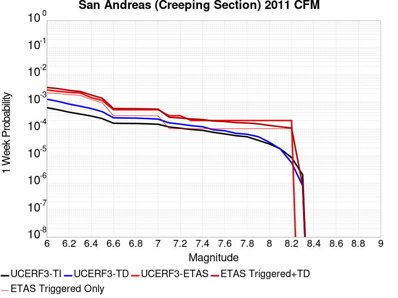 | 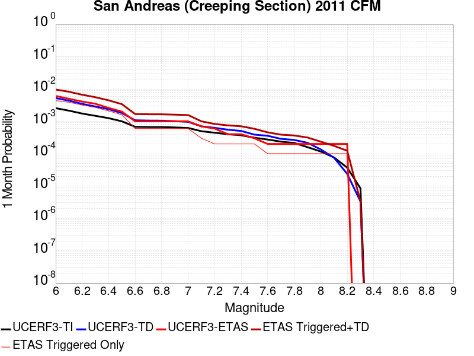 |  |  |

| Magnitude | 1 wk TI Prob | 1 wk TD Prob | 1 wk ETAS Prob | 1 wk ETAS/TD Gain | 1 wk ETAS Triggered+TD | 1 wk ETAS Triggered Only | 1 mo TI Prob | 1 mo TD Prob | 1 mo ETAS Prob | 1 mo ETAS/TD Gain | 1 mo ETAS Triggered+TD | 1 mo ETAS Triggered Only | 1 yr TI Prob | 1 yr TD Prob | 1 yr ETAS Prob | 1 yr ETAS/TD Gain | 1 yr ETAS Triggered+TD | 1 yr ETAS Triggered Only | 10 yr TI Prob | 10 yr TD Prob | 10 yr ETAS Prob | 10 yr ETAS/TD Gain | 10 yr ETAS Triggered+TD | 10 yr ETAS Triggered Only |
|-----|-----|-----|-----|-----|-----|-----|-----|-----|-----|-----|-----|-----|-----|-----|-----|-----|-----|-----|-----|-----|-----|-----|-----|-----|
| 6.0 | 5.986481E-4 | 0.0012293548 | 0.0027 | 2.1962743 | 0.0033267732 | 0.0021 | 0.0025631124 | 0.0052531953 | 0.0061 | 1.161198 | 0.009630081 | 0.0044 | 0.030762846 | 0.06129305 | 0.0433 | 0.70644224 | 0.07527979 | 0.0149 | 0.26835477 | 0.42639592 | 0.3359 | 0.7877655 | 0.4730299 | 0.0813 |
| 6.1 | 5.015945E-4 | 0.001023245 | 0.0024 | 2.3454792 | 0.0030211986 | 0.002 | 0.00214792 | 0.0043741725 | 0.005 | 1.1430733 | 0.008257113 | 0.0039 | 0.025839351 | 0.051321894 | 0.0346 | 0.6741762 | 0.06346498 | 0.0128 | 0.23032776 | 0.37329772 | 0.269 | 0.7206044 | 0.41353202 | 0.0642 |
| 6.2 | 4.073338E-4 | 8.1215537E-4 | 0.0022 | 2.7088413 | 0.0026106935 | 0.0018 | 0.0017445484 | 0.003473358 | 0.0041 | 1.1804138 | 0.0066622435 | 0.0032 | 0.021034058 | 0.04100611 | 0.0281 | 0.68526375 | 0.050979644 | 0.0104 | 0.19150782 | 0.31351072 | 0.2246 | 0.71640295 | 0.35071844 | 0.0542 |
| 6.3 | 3.464099E-4 | 6.753493E-4 | 0.0021 | 3.109502 | 0.0023742013 | 0.0017 | 0.0014837692 | 0.0028891885 | 0.0035 | 1.2114129 | 0.005581388 | 0.0027 | 0.017915873 | 0.0342631 | 0.0231 | 0.6741947 | 0.042665012 | 0.0087 | 0.16538359 | 0.271823 | 0.1941 | 0.71406764 | 0.30510068 | 0.0457 |
| 6.4 | 2.935057E-4 | 5.55868E-4 | 0.0014 | 2.5185833 | 0.001755201 | 0.0012 | 0.0012572751 | 0.0023787874 | 0.0026 | 1.0929939 | 0.004473792 | 0.0021 | 0.015200248 | 0.028338738 | 0.019 | 0.67046034 | 0.035140365 | 0.007 | 0.14201577 | 0.2335198 | 0.1621 | 0.69415957 | 0.26318258 | 0.0387 |
| 6.5 | 2.3409708E-4 | 4.2238348E-4 | 0.0011 | 2.6042686 | 0.0013220033 | 9.0E-4 | 0.0010028875 | 0.0018082355 | 0.002 | 1.1060506 | 0.0034053423 | 0.0016 | 0.012141965 | 0.02166229 | 0.0142 | 0.65551704 | 0.026162643 | 0.0046 | 0.11499573 | 0.18739071 | 0.1239 | 0.6611854 | 0.21103765 | 0.0291 |
| 6.6 | 1.5842178E-4 | 2.5215113E-4 | 5.0E-4 | 1.9829377 | 5.520755E-4 | 3.0E-4 | 6.7877385E-4 | 0.0010801882 | 0.001 | 0.9257646 | 0.0016795401 | 6.0E-4 | 0.0082328 | 0.0130706085 | 0.0081 | 0.61971104 | 0.015735317 | 0.0027 | 0.07934396 | 0.12375488 | 0.0743 | 0.60038036 | 0.13996542 | 0.0185 |
| 6.7 | 1.5616413E-4 | 2.4751283E-4 | 5.0E-4 | 2.0200973 | 5.4743857E-4 | 3.0E-4 | 6.691031E-4 | 0.00106033 | 0.001 | 0.94310266 | 0.0016596938 | 6.0E-4 | 0.0081159435 | 0.012832309 | 0.0079 | 0.61563355 | 0.015497662 | 0.0027 | 0.0782586 | 0.12178206 | 0.0732 | 0.6010738 | 0.13785344 | 0.0183 |
| 6.8 | 1.5538467E-4 | 2.457482E-4 | 5.0E-4 | 2.0346026 | 5.4567447E-4 | 3.0E-4 | 6.6576427E-4 | 0.0010527746 | 0.001 | 0.94987094 | 0.001652143 | 6.0E-4 | 0.008075596 | 0.012741555 | 0.0079 | 0.62001854 | 0.0154071525 | 0.0027 | 0.07788358 | 0.121012345 | 0.0724 | 0.5982861 | 0.13700992 | 0.0182 |
| 6.9 | 1.5153569E-4 | 2.3682811E-4 | 5.0E-4 | 2.1112359 | 5.3675706E-4 | 3.0E-4 | 6.49277E-4 | 0.0010145848 | 0.001 | 0.98562485 | 0.0016139761 | 6.0E-4 | 0.007876333 | 0.012283134 | 0.0079 | 0.6431583 | 0.01494997 | 0.0027 | 0.07602952 | 0.117080405 | 0.0699 | 0.59702563 | 0.13279638 | 0.0178 |
| 7.0 | 1.4588932E-4 | 2.25384E-4 | 5.0E-4 | 2.218436 | 5.253164E-4 | 3.0E-4 | 6.250901E-4 | 9.6557586E-4 | 0.001 | 1.0356514 | 0.0015649965 | 6.0E-4 | 0.0075839474 | 0.011693022 | 0.0078 | 0.6670645 | 0.01436145 | 0.0027 | 0.073302895 | 0.11192394 | 0.0671 | 0.5995143 | 0.12711003 | 0.0171 |
| 7.1 | 1.1565079E-4 | 1.6404269E-4 | 3.0E-4 | 1.8287922 | 2.6402628E-4 | 1.0E-4 | 4.955521E-4 | 7.0285157E-4 | 7.0E-4 | 0.9959429 | 0.0010026407 | 3.0E-4 | 0.006016669 | 0.008523848 | 0.0052 | 0.6100531 | 0.010308505 | 0.0018 | 0.058563538 | 0.08421866 | 0.0485 | 0.5758819 | 0.096123815 | 0.013 |
| 7.2 | 1.0393792E-4 | 1.4731043E-4 | 3.0E-4 | 2.0365157 | 2.472957E-4 | 1.0E-4 | 4.4537216E-4 | 6.3117844E-4 | 6.0E-4 | 0.95060277 | 8.310522E-4 | 2.0E-4 | 0.005408933 | 0.0076576932 | 0.0047 | 0.61376184 | 0.009344675 | 0.0017 | 0.052791595 | 0.076142415 | 0.0444 | 0.58311784 | 0.086951554 | 0.0117 |
| 7.3 | 9.332884E-5 | 1.2881887E-4 | 2.0E-4 | 1.5525676 | 2.2880598E-4 | 1.0E-4 | 3.999194E-4 | 5.519647E-4 | 4.0E-4 | 0.72468406 | 7.5185427E-4 | 2.0E-4 | 0.0048581534 | 0.0066996 | 0.004 | 0.5970506 | 0.00828888 | 0.0016 | 0.047533102 | 0.066950046 | 0.0403 | 0.60194135 | 0.077026986 | 0.0108 |
| 7.4 | 8.670252E-5 | 1.1797538E-4 | 2.0E-4 | 1.695269 | 2.1796358E-4 | 1.0E-4 | 3.715293E-4 | 5.055114E-4 | 4.0E-4 | 0.7912779 | 7.054103E-4 | 2.0E-4 | 0.004513991 | 0.006137355 | 0.0034 | 0.5539845 | 0.0074293767 | 0.0013 | 0.044233937 | 0.061590843 | 0.0363 | 0.58937335 | 0.07088109 | 0.0099 |
| 7.5 | 7.3036405E-5 | 9.0854934E-5 | 2.0E-4 | 2.2013113 | 1.9084585E-4 | 1.0E-4 | 3.129756E-4 | 3.8932028E-4 | 3.0E-4 | 0.7705738 | 5.8924244E-4 | 2.0E-4 | 0.0038038217 | 0.004729694 | 0.0027 | 0.5708614 | 0.005824492 | 0.0011 | 0.03739367 | 0.048257034 | 0.0276 | 0.5719373 | 0.05529993 | 0.0074 |
| 7.6 | 6.3935775E-5 | 8.3519415E-5 | 2.0E-4 | 2.3946528 | 1.8351106E-4 | 1.0E-4 | 2.7398168E-4 | 3.5789132E-4 | 2.0E-4 | 0.55882883 | 4.5785555E-4 | 1.0E-4 | 0.0033306254 | 0.0043486403 | 0.0023 | 0.528901 | 0.0052447263 | 9.0E-4 | 0.032811474 | 0.044332474 | 0.025 | 0.5639207 | 0.050831016 | 0.0068 |
| 7.7 | 5.5050095E-5 | 6.725357E-5 | 2.0E-4 | 2.97382 | 1.6724684E-4 | 1.0E-4 | 2.3590765E-4 | 2.8819774E-4 | 2.0E-4 | 0.693968 | 3.881689E-4 | 1.0E-4 | 0.0028683927 | 0.0035031664 | 0.0018 | 0.5138209 | 0.004200714 | 7.0E-4 | 0.0283165 | 0.036103286 | 0.02 | 0.55396616 | 0.041404717 | 0.0055 |
| 7.8 | 5.027131E-5 | 6.220918E-5 | 2.0E-4 | 3.2149594 | 1.6220297E-4 | 1.0E-4 | 2.1543067E-4 | 2.6658358E-4 | 2.0E-4 | 0.75023377 | 3.665569E-4 | 1.0E-4 | 0.0026197135 | 0.003240828 | 0.0017 | 0.52455735 | 0.0039385594 | 7.0E-4 | 0.025890453 | 0.03340843 | 0.0191 | 0.571712 | 0.038531363 | 0.0053 |
| 7.9 | 3.7271806E-5 | 5.069165E-5 | 2.0E-4 | 3.945423 | 1.5068658E-4 | 1.0E-4 | 1.5972654E-4 | 2.1723185E-4 | 2.0E-4 | 0.92067534 | 3.1721013E-4 | 1.0E-4 | 0.0019429359 | 0.002641592 | 0.0014 | 0.52998346 | 0.0030405354 | 4.0E-4 | 0.019260362 | 0.027296338 | 0.0154 | 0.5641782 | 0.031381693 | 0.0042 |
| 8.0 | 2.7310243E-5 | 3.1736527E-5 | 2.0E-4 | 6.301887 | 1.3173335E-4 | 1.0E-4 | 1.17038646E-4 | 1.360066E-4 | 2.0E-4 | 1.4705169 | 2.35993E-4 | 1.0E-4 | 0.0014240141 | 0.0016546234 | 6.0E-4 | 0.36262026 | 0.0018542925 | 2.0E-4 | 0.014149235 | 0.017370835 | 0.009 | 0.5181098 | 0.019532619 | 0.0022 |
| 8.1 | 1.7940547E-5 | 1.7597373E-5 | 2.0E-4 | 11.365334 | 1.1759561E-4 | 1.0E-4 | 7.688579E-5 | 7.541513E-5 | 2.0E-4 | 2.6519876 | 1.754076E-4 | 1.0E-4 | 9.3568244E-4 | 9.17793E-4 | 5.0E-4 | 0.54478514 | 0.0011176094 | 2.0E-4 | 0.009317525 | 0.009902639 | 0.0047 | 0.47462097 | 0.010991746 | 0.0011 |
| 8.2 | 8.643924E-6 | 5.5536157E-6 | 2.0E-4 | 36.012573 | 1.0555306E-4 | 1.0E-4 | 3.704486E-5 | 2.3800994E-5 | 2.0E-4 | 8.40301 | 1.2379861E-4 | 1.0E-4 | 4.5092785E-4 | 2.8973864E-4 | 2.0E-4 | 0.6902773 | 3.8970966E-4 | 1.0E-4 | 0.0045001395 | 0.0032917638 | 0.0013 | 0.39492503 | 0.0036904472 | 4.0E-4 |
| 8.3 | 1.983087E-6 | 7.7872784E-7 | 0.0 | 0.0 | 7.7872784E-7 | 0.0 | 8.498917E-6 | 3.3374008E-6 | 0.0 | 0.0 | 3.3374008E-6 | 0.0 | 1.034694E-4 | 4.0632116E-5 | 0.0 | 0.0 | 4.0632116E-5 | 0.0 | 0.0010342124 | 4.792776E-4 | 1.0E-4 | 0.20864734 | 4.792776E-4 | 0.0 |

## Mendocino
*[(top)](#table-of-contents)*

| 1 Week | 1 Month | 1 Year | 10 Year |
|-----|-----|-----|-----|
| 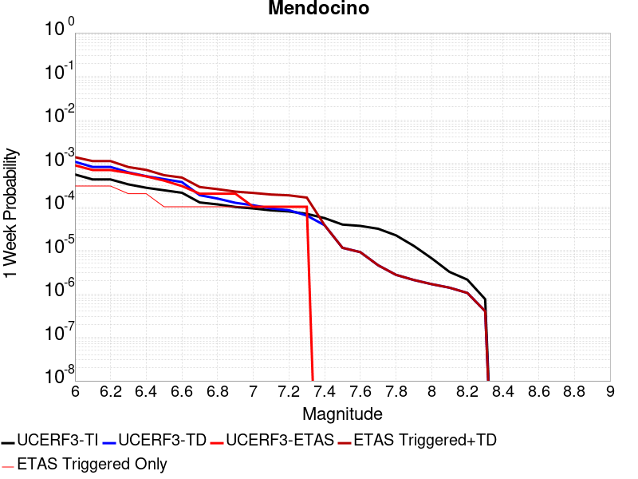 |  |  | 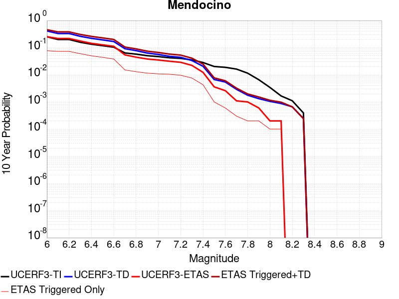 |

| Magnitude | 1 wk TI Prob | 1 wk TD Prob | 1 wk ETAS Prob | 1 wk ETAS/TD Gain | 1 wk ETAS Triggered+TD | 1 wk ETAS Triggered Only | 1 mo TI Prob | 1 mo TD Prob | 1 mo ETAS Prob | 1 mo ETAS/TD Gain | 1 mo ETAS Triggered+TD | 1 mo ETAS Triggered Only | 1 yr TI Prob | 1 yr TD Prob | 1 yr ETAS Prob | 1 yr ETAS/TD Gain | 1 yr ETAS Triggered+TD | 1 yr ETAS Triggered Only | 10 yr TI Prob | 10 yr TD Prob | 10 yr ETAS Prob | 10 yr ETAS/TD Gain | 10 yr ETAS Triggered+TD | 10 yr ETAS Triggered Only |
|-----|-----|-----|-----|-----|-----|-----|-----|-----|-----|-----|-----|-----|-----|-----|-----|-----|-----|-----|-----|-----|-----|-----|-----|-----|
| 6.0 | 5.5409013E-4 | 0.0010849746 | 9.0E-4 | 0.8295125 | 0.0013846491 | 3.0E-4 | 0.0023725112 | 0.0046396083 | 0.0035 | 0.75437397 | 0.0064312574 | 0.0018 | 0.028505474 | 0.05472244 | 0.0303 | 0.55370337 | 0.06483691 | 0.0107 | 0.25113493 | 0.41214156 | 0.2532 | 0.61435205 | 0.4575242 | 0.0772 |
| 6.1 | 4.2515888E-4 | 8.236463E-4 | 7.0E-4 | 0.8498793 | 0.0011233992 | 3.0E-4 | 0.0018208373 | 0.0035235647 | 0.0026 | 0.7378891 | 0.0051179267 | 0.0016 | 0.021944538 | 0.04179114 | 0.025 | 0.5982129 | 0.05108577 | 0.0097 | 0.19899574 | 0.33021384 | 0.2169 | 0.65684706 | 0.37877333 | 0.0725 |
| 6.2 | 4.2515888E-4 | 8.236463E-4 | 7.0E-4 | 0.8498793 | 0.0011233992 | 3.0E-4 | 0.0018208373 | 0.0035235647 | 0.0026 | 0.7378891 | 0.0051179267 | 0.0016 | 0.021944538 | 0.04179114 | 0.025 | 0.5982129 | 0.05108577 | 0.0097 | 0.19899574 | 0.33021384 | 0.2169 | 0.65684706 | 0.37877333 | 0.0725 |
| 6.3 | 3.2773745E-4 | 6.20076E-4 | 6.0E-4 | 0.96762323 | 8.1995205E-4 | 2.0E-4 | 0.0014038329 | 0.002653514 | 0.0024 | 0.904461 | 0.004149534 | 0.0015 | 0.016958237 | 0.03163045 | 0.0211 | 0.66707873 | 0.039764754 | 0.0084 | 0.1572094 | 0.261043 | 0.1748 | 0.66962147 | 0.30523264 | 0.0598 |
| 6.4 | 2.7417165E-4 | 5.054923E-4 | 5.0E-4 | 0.9891347 | 7.053912E-4 | 2.0E-4 | 0.0011744922 | 0.0021635906 | 0.0019 | 0.87816983 | 0.003460778 | 0.0013 | 0.014205975 | 0.025874628 | 0.0171 | 0.6608791 | 0.03288833 | 0.0072 | 0.13331394 | 0.21975073 | 0.1438 | 0.6543778 | 0.25868517 | 0.0499 |
| 6.5 | 2.3984899E-4 | 4.3304637E-4 | 4.0E-4 | 0.9236886 | 5.3300307E-4 | 1.0E-4 | 0.0010275192 | 0.0018537827 | 0.0018 | 0.97098756 | 0.0030515583 | 0.0012 | 0.012438473 | 0.022216516 | 0.0155 | 0.69767916 | 0.028572109 | 0.0065 | 0.11764851 | 0.19230998 | 0.1267 | 0.6588322 | 0.22776756 | 0.0439 |
| 6.6 | 2.1023539E-4 | 3.700294E-4 | 3.0E-4 | 0.8107464 | 4.699924E-4 | 1.0E-4 | 9.0069766E-4 | 0.001584218 | 0.0016 | 1.009962 | 0.0026824754 | 0.0011 | 0.010910975 | 0.019024828 | 0.0135 | 0.709599 | 0.024714485 | 0.0058 | 0.10390546 | 0.16776834 | 0.1116 | 0.6652029 | 0.19939315 | 0.038 |
| 6.7 | 1.2592976E-4 | 1.8489864E-4 | 2.0E-4 | 1.0816737 | 2.8488014E-4 | 1.0E-4 | 5.395873E-4 | 7.9210714E-4 | 6.0E-4 | 0.7574733 | 0.0010918695 | 3.0E-4 | 0.006549705 | 0.00958969 | 0.0064 | 0.66738343 | 0.011669552 | 0.0021 | 0.063599944 | 0.09125746 | 0.054 | 0.59173244 | 0.10497947 | 0.0151 |
| 6.8 | 1.13663555E-4 | 1.5462427E-4 | 2.0E-4 | 1.293458 | 2.546088E-4 | 1.0E-4 | 4.8703855E-4 | 6.624789E-4 | 5.0E-4 | 0.754741 | 8.623464E-4 | 2.0E-4 | 0.0059135845 | 0.008031673 | 0.0053 | 0.6598875 | 0.009718019 | 0.0017 | 0.057586733 | 0.07767376 | 0.0445 | 0.57290906 | 0.089664005 | 0.013 |
| 6.9 | 9.926894E-5 | 1.235785E-4 | 2.0E-4 | 1.6184045 | 2.2356614E-4 | 1.0E-4 | 4.2536893E-4 | 5.295083E-4 | 4.0E-4 | 0.7554178 | 6.294553E-4 | 1.0E-4 | 0.0051665753 | 0.0064267255 | 0.0044 | 0.684641 | 0.007718371 | 0.0013 | 0.050480947 | 0.06313082 | 0.0381 | 0.6035088 | 0.07390481 | 0.0115 |
| 7.0 | 9.168125E-5 | 1.08398955E-4 | 1.0E-4 | 0.92251813 | 2.0838811E-4 | 1.0E-4 | 3.9286047E-4 | 4.6448034E-4 | 3.0E-4 | 0.6458831 | 5.644339E-4 | 1.0E-4 | 0.004772591 | 0.005640021 | 0.0038 | 0.67375636 | 0.006733817 | 0.0011 | 0.04671385 | 0.055886663 | 0.035 | 0.6262675 | 0.06608309 | 0.0108 |
| 7.1 | 8.2854116E-5 | 9.158845E-5 | 1.0E-4 | 1.0918407 | 1.915793E-4 | 1.0E-4 | 3.5504074E-4 | 3.924633E-4 | 2.0E-4 | 0.50960183 | 4.92424E-4 | 1.0E-4 | 0.004314056 | 0.0047678365 | 0.0032 | 0.6711639 | 0.005862592 | 0.0011 | 0.042312626 | 0.04773876 | 0.0315 | 0.6598412 | 0.057737503 | 0.0105 |
| 7.2 | 7.8255274E-5 | 8.352801E-5 | 1.0E-4 | 1.1972033 | 1.8351966E-4 | 1.0E-4 | 3.3533663E-4 | 3.579289E-4 | 2.0E-4 | 0.5587702 | 4.578931E-4 | 1.0E-4 | 0.0040750825 | 0.004349226 | 0.003 | 0.6897779 | 0.005344877 | 0.001 | 0.040011603 | 0.043778207 | 0.0288 | 0.65786153 | 0.052957937 | 0.0096 |
| 7.3 | 6.887904E-5 | 6.300889E-5 | 1.0E-4 | 1.5870776 | 1.630026E-4 | 1.0E-4 | 2.9516246E-4 | 2.700107E-4 | 2.0E-4 | 0.74071133 | 3.6998373E-4 | 1.0E-4 | 0.0035876823 | 0.0032825232 | 0.0023 | 0.7006805 | 0.0040798974 | 8.0E-4 | 0.035303112 | 0.033561993 | 0.0222 | 0.6614625 | 0.04090692 | 0.0076 |
| 7.4 | 5.4898497E-5 | 3.7679853E-5 | 0.0 | 0.0 | 3.7679853E-5 | 0.0 | 2.3525805E-4 | 1.6147541E-4 | 1.0E-4 | 0.61928934 | 1.6147541E-4 | 0.0 | 0.0028605047 | 0.0019642473 | 0.0014 | 0.7127412 | 0.0023634618 | 4.0E-4 | 0.02823963 | 0.020559061 | 0.0123 | 0.5982763 | 0.024770657 | 0.0043 |
| 7.5 | 3.9103943E-5 | 1.1425505E-5 | 0.0 | 0.0 | 1.1425505E-5 | 0.0 | 1.6757756E-4 | 4.896554E-5 | 1.0E-4 | 2.0422525 | 4.896554E-5 | 0.0 | 0.0020383475 | 5.95994E-4 | 4.0E-4 | 0.6711477 | 5.95994E-4 | 0.0 | 0.020197518 | 0.006695274 | 0.0036 | 0.5376927 | 0.0076885787 | 0.001 |
| 7.6 | 3.641042E-5 | 9.088634E-6 | 0.0 | 0.0 | 9.088634E-6 | 0.0 | 1.5603533E-4 | 3.8950715E-5 | 0.0 | 0.0 | 3.8950715E-5 | 0.0 | 0.0018980748 | 4.7412314E-4 | 3.0E-4 | 0.632747 | 4.7412314E-4 | 0.0 | 0.018819444 | 0.0054118335 | 0.0026 | 0.4804287 | 0.0060085864 | 6.0E-4 |
| 7.7 | 3.1318774E-5 | 4.5350466E-6 | 0.0 | 0.0 | 4.5350466E-6 | 0.0 | 1.342164E-4 | 1.943577E-5 | 0.0 | 0.0 | 1.943577E-5 | 0.0 | 0.0016328598 | 2.36605E-4 | 0.0 | 0.0 | 2.36605E-4 | 0.0 | 0.016209139 | 0.0029157822 | 0.0011 | 0.37725726 | 0.0032149074 | 3.0E-4 |
| 7.8 | 2.209241E-5 | 2.7340805E-6 | 0.0 | 0.0 | 2.7340805E-6 | 0.0 | 9.467832E-5 | 1.1717435E-5 | 0.0 | 0.0 | 1.1717435E-5 | 0.0 | 0.001152099 | 1.4265046E-4 | 0.0 | 0.0 | 1.4265046E-4 | 0.0 | 0.011461443 | 0.0017705099 | 0.001 | 0.564809 | 0.0019701559 | 2.0E-4 |
| 7.9 | 1.2640477E-5 | 2.0808989E-6 | 0.0 | 0.0 | 2.0808989E-6 | 0.0 | 5.4172346E-5 | 8.918108E-6 | 0.0 | 0.0 | 8.918108E-6 | 0.0 | 6.593487E-4 | 1.08572574E-4 | 0.0 | 0.0 | 1.08572574E-4 | 0.0 | 0.006573958 | 0.0013214104 | 6.0E-4 | 0.45406032 | 0.001521146 | 2.0E-4 |
| 8.0 | 6.5548907E-6 | 1.6687843E-6 | 0.0 | 0.0 | 1.6687843E-6 | 0.0 | 2.8092087E-5 | 7.151913E-6 | 0.0 | 0.0 | 7.151913E-6 | 0.0 | 3.4196748E-4 | 8.707109E-5 | 0.0 | 0.0 | 8.707109E-5 | 0.0 | 0.0034144172 | 0.0010486946 | 2.0E-4 | 0.19071329 | 0.0011485898 | 1.0E-4 |
| 8.1 | 3.1916707E-6 | 1.3849678E-6 | 0.0 | 0.0 | 1.3849678E-6 | 0.0 | 1.3678517E-5 | 5.935563E-6 | 0.0 | 0.0 | 5.935563E-6 | 0.0 | 1.6652321E-4 | 7.226311E-5 | 0.0 | 0.0 | 7.226311E-5 | 0.0 | 0.0016639848 | 8.7824557E-4 | 2.0E-4 | 0.22772674 | 9.781577E-4 | 1.0E-4 |
| 8.2 | 2.1193785E-6 | 1.0489846E-6 | 0.0 | 0.0 | 1.0489846E-6 | 0.0 | 9.083019E-6 | 4.4956405E-6 | 0.0 | 0.0 | 4.4956405E-6 | 0.0 | 1.1058014E-4 | 5.4733067E-5 | 0.0 | 0.0 | 5.4733067E-5 | 0.0 | 0.0011052513 | 6.6106085E-4 | 0.0 | 0.0 | 6.6106085E-4 | 0.0 |
| 8.3 | 7.536878E-7 | 3.989106E-7 | 0.0 | 0.0 | 3.989106E-7 | 0.0 | 3.2300866E-6 | 1.7096158E-6 | 0.0 | 0.0 | 1.7096158E-6 | 0.0 | 3.9325594E-5 | 2.0814387E-5 | 0.0 | 0.0 | 2.0814387E-5 | 0.0 | 3.9318635E-4 | 2.447874E-4 | 0.0 | 0.0 | 2.447874E-4 | 0.0 |

## San Andreas (Mojave S)
*[(top)](#table-of-contents)*

| 1 Week | 1 Month | 1 Year | 10 Year |
|-----|-----|-----|-----|
| 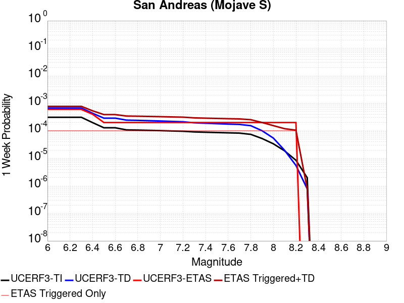 |  |  |  |

| Magnitude | 1 wk TI Prob | 1 wk TD Prob | 1 wk ETAS Prob | 1 wk ETAS/TD Gain | 1 wk ETAS Triggered+TD | 1 wk ETAS Triggered Only | 1 mo TI Prob | 1 mo TD Prob | 1 mo ETAS Prob | 1 mo ETAS/TD Gain | 1 mo ETAS Triggered+TD | 1 mo ETAS Triggered Only | 1 yr TI Prob | 1 yr TD Prob | 1 yr ETAS Prob | 1 yr ETAS/TD Gain | 1 yr ETAS Triggered+TD | 1 yr ETAS Triggered Only | 10 yr TI Prob | 10 yr TD Prob | 10 yr ETAS Prob | 10 yr ETAS/TD Gain | 10 yr ETAS Triggered+TD | 10 yr ETAS Triggered Only |
|-----|-----|-----|-----|-----|-----|-----|-----|-----|-----|-----|-----|-----|-----|-----|-----|-----|-----|-----|-----|-----|-----|-----|-----|-----|
| 6.0 | 3.1064058E-4 | 6.760892E-4 | 6.0E-4 | 0.8874569 | 7.7602157E-4 | 1.0E-4 | 0.0013306376 | 0.002894436 | 0.0016 | 0.55278474 | 0.003093857 | 2.0E-4 | 0.016080605 | 0.034797605 | 0.025 | 0.71844023 | 0.041071422 | 0.0065 | 0.1496549 | 0.28709772 | 0.2089 | 0.72762686 | 0.330157 | 0.0604 |
| 6.1 | 3.1064058E-4 | 6.760892E-4 | 6.0E-4 | 0.8874569 | 7.7602157E-4 | 1.0E-4 | 0.0013306376 | 0.002894436 | 0.0016 | 0.55278474 | 0.003093857 | 2.0E-4 | 0.016080605 | 0.034797605 | 0.025 | 0.71844023 | 0.041071422 | 0.0065 | 0.1496549 | 0.28709772 | 0.2089 | 0.72762686 | 0.330157 | 0.0604 |
| 6.2 | 3.1064058E-4 | 6.760892E-4 | 6.0E-4 | 0.8874569 | 7.7602157E-4 | 1.0E-4 | 0.0013306376 | 0.002894436 | 0.0016 | 0.55278474 | 0.003093857 | 2.0E-4 | 0.016080605 | 0.034797605 | 0.025 | 0.71844023 | 0.041071422 | 0.0065 | 0.1496549 | 0.28709772 | 0.2089 | 0.72762686 | 0.330157 | 0.0604 |
| 6.3 | 3.1064058E-4 | 6.760892E-4 | 6.0E-4 | 0.8874569 | 7.7602157E-4 | 1.0E-4 | 0.0013306376 | 0.002894436 | 0.0016 | 0.55278474 | 0.003093857 | 2.0E-4 | 0.016080605 | 0.034797605 | 0.025 | 0.71844023 | 0.041071422 | 0.0065 | 0.1496549 | 0.28709772 | 0.2089 | 0.72762686 | 0.330157 | 0.0604 |
| 6.4 | 1.9872203E-4 | 4.3320356E-4 | 4.0E-4 | 0.92335343 | 5.3316023E-4 | 1.0E-4 | 8.5138786E-4 | 0.0018552939 | 0.0011 | 0.59289795 | 0.0019551085 | 1.0E-4 | 0.010316478 | 0.022360403 | 0.0166 | 0.7423837 | 0.026270961 | 0.004 | 0.098504856 | 0.19756073 | 0.1432 | 0.7248404 | 0.22821392 | 0.0382 |
| 6.5 | 1.291105E-4 | 2.88864E-4 | 2.0E-4 | 0.6923674 | 3.888351E-4 | 1.0E-4 | 5.5321335E-4 | 0.001237404 | 6.0E-4 | 0.48488614 | 0.0013372801 | 1.0E-4 | 0.006714592 | 0.014962156 | 0.0114 | 0.76192224 | 0.018114278 | 0.0032 | 0.065152965 | 0.13859284 | 0.0978 | 0.70566416 | 0.16012803 | 0.025 |
| 6.6 | 1.291105E-4 | 2.88864E-4 | 2.0E-4 | 0.6923674 | 3.888351E-4 | 1.0E-4 | 5.5321335E-4 | 0.001237404 | 6.0E-4 | 0.48488614 | 0.0013372801 | 1.0E-4 | 0.006714592 | 0.014962156 | 0.0114 | 0.76192224 | 0.018114278 | 0.0032 | 0.065152965 | 0.13859284 | 0.0978 | 0.70566416 | 0.16012803 | 0.025 |
| 6.7 | 1.08001186E-4 | 2.4465597E-4 | 2.0E-4 | 0.8174744 | 3.446315E-4 | 1.0E-4 | 4.6278012E-4 | 0.0010481048 | 4.0E-4 | 0.3816412 | 0.001148 | 1.0E-4 | 0.0056198016 | 0.012686318 | 0.0094 | 0.74095577 | 0.015352064 | 0.0027 | 0.054797906 | 0.11973853 | 0.0815 | 0.68064976 | 0.13840006 | 0.0212 |
| 6.8 | 1.0624356E-4 | 2.3982889E-4 | 2.0E-4 | 0.83392787 | 3.3980492E-4 | 1.0E-4 | 4.5525006E-4 | 0.0010274338 | 4.0E-4 | 0.3893195 | 0.001127331 | 1.0E-4 | 0.0055285925 | 0.012437538 | 0.0091 | 0.7316561 | 0.014906445 | 0.0025 | 0.053930566 | 0.11768725 | 0.079 | 0.67127067 | 0.13586289 | 0.0206 |
| 6.9 | 1.0393785E-4 | 2.3352726E-4 | 2.0E-4 | 0.85643107 | 3.335039E-4 | 1.0E-4 | 4.4537184E-4 | 0.0010004477 | 4.0E-4 | 0.399821 | 0.0011003476 | 1.0E-4 | 0.0054089287 | 0.012112676 | 0.0088 | 0.7265116 | 0.014384817 | 0.0023 | 0.05279156 | 0.11498711 | 0.0768 | 0.6679009 | 0.13259888 | 0.0199 |
| 7.0 | 1.0155622E-4 | 2.2721694E-4 | 2.0E-4 | 0.88021606 | 3.2719423E-4 | 1.0E-4 | 4.3516833E-4 | 9.734239E-4 | 4.0E-4 | 0.41092068 | 0.0010733266 | 1.0E-4 | 0.005285311 | 0.011787263 | 0.0085 | 0.7211174 | 0.014060153 | 0.0023 | 0.05161361 | 0.11224282 | 0.074 | 0.65928495 | 0.1294653 | 0.0194 |
| 7.1 | 9.885595E-5 | 2.2009437E-4 | 2.0E-4 | 0.9087011 | 3.2007234E-4 | 1.0E-4 | 4.2359953E-4 | 9.429209E-4 | 4.0E-4 | 0.42421374 | 0.0010428266 | 1.0E-4 | 0.0051451353 | 0.0114198355 | 0.0082 | 0.7180489 | 0.01369357 | 0.0023 | 0.05027629 | 0.109127656 | 0.0711 | 0.65153056 | 0.12587605 | 0.0188 |
| 7.2 | 9.6411415E-5 | 2.1371811E-4 | 2.0E-4 | 0.9358121 | 3.1369674E-4 | 1.0E-4 | 4.1312634E-4 | 9.156136E-4 | 3.0E-4 | 0.32764912 | 0.001015522 | 1.0E-4 | 0.005018219 | 0.011090801 | 0.0077 | 0.69426906 | 0.013266401 | 0.0022 | 0.049064007 | 0.10631593 | 0.0686 | 0.6452466 | 0.12240225 | 0.018 |
| 7.3 | 9.1180635E-5 | 1.9596702E-4 | 2.0E-4 | 1.0205799 | 2.9594742E-4 | 1.0E-4 | 3.907156E-4 | 8.395884E-4 | 3.0E-4 | 0.35731795 | 9.395045E-4 | 1.0E-4 | 0.004746591 | 0.010174193 | 0.0069 | 0.6781864 | 0.012252828 | 0.0021 | 0.046464786 | 0.09850191 | 0.062 | 0.6294294 | 0.11301603 | 0.0161 |
| 7.4 | 8.887388E-5 | 1.8843838E-4 | 2.0E-4 | 1.0613549 | 2.8841954E-4 | 1.0E-4 | 3.8083247E-4 | 8.0734317E-4 | 3.0E-4 | 0.37158918 | 9.0726244E-4 | 1.0E-4 | 0.0046267817 | 0.009785202 | 0.0064 | 0.65404886 | 0.01166661 | 0.0019 | 0.045316286 | 0.09513697 | 0.0602 | 0.6327719 | 0.10889088 | 0.0152 |
| 7.5 | 8.6750515E-5 | 1.8174096E-4 | 2.0E-4 | 1.1004673 | 2.8172278E-4 | 1.0E-4 | 3.7173493E-4 | 7.7865744E-4 | 3.0E-4 | 0.38527855 | 8.7857957E-4 | 1.0E-4 | 0.004516484 | 0.009439033 | 0.0061 | 0.64625263 | 0.011222043 | 0.0018 | 0.04425787 | 0.092098996 | 0.0584 | 0.63410026 | 0.10571751 | 0.015 |
| 7.6 | 8.453092E-5 | 1.7560195E-4 | 2.0E-4 | 1.1389395 | 2.7558437E-4 | 1.0E-4 | 3.6222505E-4 | 7.523628E-4 | 3.0E-4 | 0.3987438 | 8.522875E-4 | 1.0E-4 | 0.0044011753 | 0.009121621 | 0.0059 | 0.6468148 | 0.0109052025 | 0.0018 | 0.04315024 | 0.08925212 | 0.0559 | 0.62631565 | 0.10218474 | 0.0142 |
| 7.7 | 8.259102E-5 | 1.7080999E-4 | 2.0E-4 | 1.1708916 | 2.7079292E-4 | 1.0E-4 | 3.539135E-4 | 7.318375E-4 | 3.0E-4 | 0.40992707 | 8.317643E-4 | 1.0E-4 | 0.004300386 | 0.0088737905 | 0.0059 | 0.6648794 | 0.010657817 | 0.0018 | 0.042181134 | 0.08699787 | 0.0537 | 0.6172565 | 0.09950599 | 0.0137 |
| 7.8 | 7.444844E-5 | 1.5392757E-4 | 2.0E-4 | 1.2993125 | 2.5391218E-4 | 1.0E-4 | 3.1902574E-4 | 6.5952283E-4 | 3.0E-4 | 0.4548743 | 7.594569E-4 | 1.0E-4 | 0.0038772223 | 0.008000177 | 0.0054 | 0.674985 | 0.0094881775 | 0.0015 | 0.03810269 | 0.078785755 | 0.0485 | 0.6155935 | 0.089748204 | 0.0119 |
| 7.9 | 5.2586525E-5 | 1.00814E-4 | 2.0E-4 | 1.9838514 | 2.0080392E-4 | 1.0E-4 | 2.2535135E-4 | 4.3198848E-4 | 2.0E-4 | 0.4629753 | 5.3194526E-4 | 1.0E-4 | 0.0027402006 | 0.005246788 | 0.0034 | 0.64801556 | 0.006142066 | 9.0E-4 | 0.027066574 | 0.052550577 | 0.032 | 0.6089372 | 0.05975119 | 0.0076 |
| 8.0 | 3.379877E-5 | 5.4508146E-5 | 2.0E-4 | 3.6691763 | 1.5450269E-4 | 1.0E-4 | 1.4484383E-4 | 2.3358542E-4 | 2.0E-4 | 0.8562178 | 3.3356206E-4 | 1.0E-4 | 0.0017620471 | 0.0028401955 | 0.0015 | 0.5281326 | 0.0032390596 | 4.0E-4 | 0.017481409 | 0.029048033 | 0.0161 | 0.5542544 | 0.032446366 | 0.0035 |
| 8.1 | 1.8668277E-5 | 1.9515712E-5 | 2.0E-4 | 10.248153 | 1.1951376E-4 | 1.0E-4 | 8.000444E-5 | 8.3636085E-5 | 2.0E-4 | 2.3913124 | 1.8362772E-4 | 1.0E-4 | 9.736188E-4 | 0.0010177944 | 7.0E-4 | 0.6877617 | 0.0012175908 | 2.0E-4 | 0.009693642 | 0.010907022 | 0.0057 | 0.5225991 | 0.012192843 | 0.0013 |
| 8.2 | 8.541571E-6 | 5.539318E-6 | 2.0E-4 | 36.10553 | 1.0553876E-4 | 1.0E-4 | 3.660622E-5 | 2.3739718E-5 | 2.0E-4 | 8.4247 | 1.2373735E-4 | 1.0E-4 | 4.455896E-4 | 2.8899283E-4 | 2.0E-4 | 0.69205874 | 3.8896393E-4 | 1.0E-4 | 0.0044469717 | 0.0032837226 | 0.0013 | 0.39589214 | 0.003682409 | 4.0E-4 |
| 8.3 | 1.983087E-6 | 7.7872784E-7 | 0.0 | 0.0 | 7.7872784E-7 | 0.0 | 8.498917E-6 | 3.3374008E-6 | 0.0 | 0.0 | 3.3374008E-6 | 0.0 | 1.034694E-4 | 4.0632116E-5 | 0.0 | 0.0 | 4.0632116E-5 | 0.0 | 0.0010342124 | 4.792776E-4 | 1.0E-4 | 0.20864734 | 4.792776E-4 | 0.0 |

## Cerro Prieto
*[(top)](#table-of-contents)*

| 1 Week | 1 Month | 1 Year | 10 Year |
|-----|-----|-----|-----|
|  | 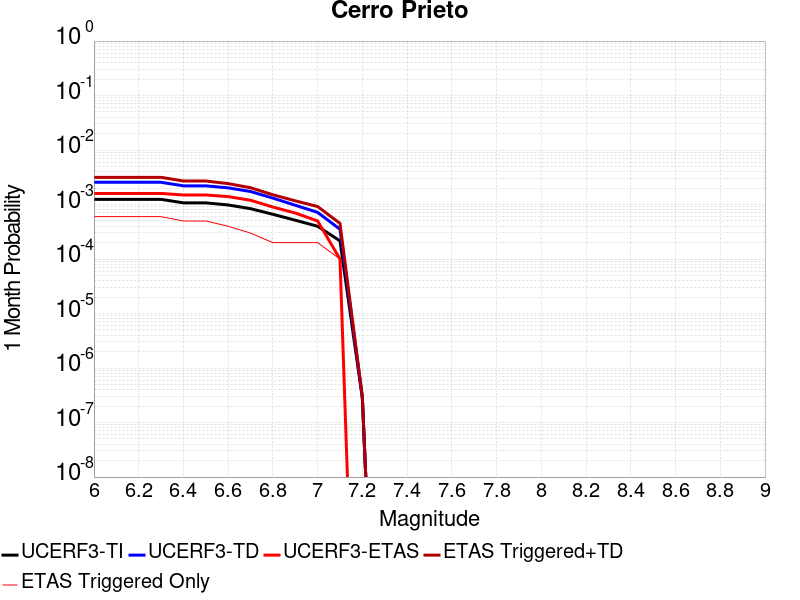 | 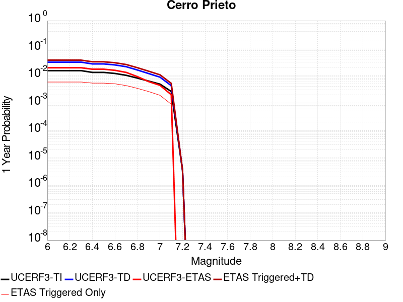 |  |

| Magnitude | 1 wk TI Prob | 1 wk TD Prob | 1 wk ETAS Prob | 1 wk ETAS/TD Gain | 1 wk ETAS Triggered+TD | 1 wk ETAS Triggered Only | 1 mo TI Prob | 1 mo TD Prob | 1 mo ETAS Prob | 1 mo ETAS/TD Gain | 1 mo ETAS Triggered+TD | 1 mo ETAS Triggered Only | 1 yr TI Prob | 1 yr TD Prob | 1 yr ETAS Prob | 1 yr ETAS/TD Gain | 1 yr ETAS Triggered+TD | 1 yr ETAS Triggered Only | 10 yr TI Prob | 10 yr TD Prob | 10 yr ETAS Prob | 10 yr ETAS/TD Gain | 10 yr ETAS Triggered+TD | 10 yr ETAS Triggered Only |
|-----|-----|-----|-----|-----|-----|-----|-----|-----|-----|-----|-----|-----|-----|-----|-----|-----|-----|-----|-----|-----|-----|-----|-----|-----|
| 6.0 | 2.9101528E-4 | 5.9808954E-4 | 3.0E-4 | 0.5015971 | 7.9796993E-4 | 2.0E-4 | 0.0012466122 | 0.0025609662 | 0.0016 | 0.6247642 | 0.0031594296 | 6.0E-4 | 0.015072231 | 0.030695252 | 0.0192 | 0.6255039 | 0.036317218 | 0.0058 | 0.14089979 | 0.25457677 | 0.1775 | 0.69723564 | 0.28938803 | 0.0467 |
| 6.1 | 2.9101528E-4 | 5.9808954E-4 | 3.0E-4 | 0.5015971 | 7.9796993E-4 | 2.0E-4 | 0.0012466122 | 0.0025609662 | 0.0016 | 0.6247642 | 0.0031594296 | 6.0E-4 | 0.015072231 | 0.030695252 | 0.0192 | 0.6255039 | 0.036317218 | 0.0058 | 0.14089979 | 0.25457677 | 0.1775 | 0.69723564 | 0.28938803 | 0.0467 |
| 6.2 | 2.9101528E-4 | 5.9808954E-4 | 3.0E-4 | 0.5015971 | 7.9796993E-4 | 2.0E-4 | 0.0012466122 | 0.0025609662 | 0.0016 | 0.6247642 | 0.0031594296 | 6.0E-4 | 0.015072231 | 0.030695252 | 0.0192 | 0.6255039 | 0.036317218 | 0.0058 | 0.14089979 | 0.25457677 | 0.1775 | 0.69723564 | 0.28938803 | 0.0467 |
| 6.3 | 2.9101528E-4 | 5.9808954E-4 | 3.0E-4 | 0.5015971 | 7.9796993E-4 | 2.0E-4 | 0.0012466122 | 0.0025609662 | 0.0016 | 0.6247642 | 0.0031594296 | 6.0E-4 | 0.015072231 | 0.030695252 | 0.0192 | 0.6255039 | 0.036317218 | 0.0058 | 0.14089979 | 0.25457677 | 0.1775 | 0.69723564 | 0.28938803 | 0.0467 |
| 6.4 | 2.508648E-4 | 5.155046E-4 | 3.0E-4 | 0.58195406 | 7.1540155E-4 | 2.0E-4 | 0.0010746918 | 0.0022076345 | 0.0015 | 0.6794603 | 0.0027065307 | 5.0E-4 | 0.013006088 | 0.0265219 | 0.017 | 0.6409797 | 0.031681333 | 0.0053 | 0.12270685 | 0.22494599 | 0.1559 | 0.6930552 | 0.25734326 | 0.0418 |
| 6.5 | 2.508648E-4 | 5.155046E-4 | 3.0E-4 | 0.58195406 | 7.1540155E-4 | 2.0E-4 | 0.0010746918 | 0.0022076345 | 0.0015 | 0.6794603 | 0.0027065307 | 5.0E-4 | 0.013006088 | 0.0265219 | 0.017 | 0.6409797 | 0.031681333 | 0.0053 | 0.12270685 | 0.22494599 | 0.1559 | 0.6930552 | 0.25734326 | 0.0418 |
| 6.6 | 2.294914E-4 | 4.7264987E-4 | 2.0E-4 | 0.4231462 | 5.726026E-4 | 1.0E-4 | 9.831638E-4 | 0.0020242583 | 0.0014 | 0.69161135 | 0.0024234487 | 4.0E-4 | 0.011904482 | 0.024354722 | 0.0155 | 0.63642687 | 0.029232949 | 0.005 | 0.11286586 | 0.2090983 | 0.1456 | 0.6963232 | 0.24033892 | 0.0395 |
| 6.7 | 1.9621674E-4 | 4.0559118E-4 | 2.0E-4 | 0.49310735 | 5.0555065E-4 | 1.0E-4 | 8.4065786E-4 | 0.0017372493 | 0.0012 | 0.69074714 | 0.0020367282 | 3.0E-4 | 0.010187071 | 0.020967446 | 0.013 | 0.6200087 | 0.025177287 | 0.0043 | 0.09732539 | 0.18345389 | 0.1256 | 0.6846407 | 0.21162473 | 0.0345 |
| 6.8 | 1.5476145E-4 | 3.0681433E-4 | 2.0E-4 | 0.65186006 | 4.0678366E-4 | 1.0E-4 | 6.6309475E-4 | 0.0013143589 | 9.0E-4 | 0.68474454 | 0.0015140959 | 2.0E-4 | 0.008043335 | 0.015882768 | 0.0091 | 0.57294804 | 0.019228766 | 0.0034 | 0.07758363 | 0.14385986 | 0.095 | 0.66036487 | 0.16714688 | 0.0272 |
| 6.9 | 1.20509176E-4 | 2.2677695E-4 | 2.0E-4 | 0.88192385 | 3.2675426E-4 | 1.0E-4 | 5.1636563E-4 | 9.71603E-4 | 7.0E-4 | 0.7204589 | 0.0011714087 | 2.0E-4 | 0.006268645 | 0.0117801335 | 0.006 | 0.50933206 | 0.014349505 | 0.0026 | 0.060947374 | 0.10990398 | 0.0693 | 0.63055044 | 0.1277059 | 0.02 |
| 7.0 | 9.3269155E-5 | 1.6792802E-4 | 2.0E-4 | 1.1909865 | 2.6791124E-4 | 1.0E-4 | 3.9966372E-4 | 7.195365E-4 | 5.0E-4 | 0.6948918 | 9.1939257E-4 | 2.0E-4 | 0.0048550544 | 0.008732889 | 0.0044 | 0.5038424 | 0.010616296 | 0.0019 | 0.04750344 | 0.08351717 | 0.0511 | 0.6118502 | 0.09662288 | 0.0143 |
| 7.1 | 5.029709E-5 | 8.213458E-5 | 1.0E-4 | 1.2175139 | 1.8212637E-4 | 1.0E-4 | 2.1554115E-4 | 3.5197733E-4 | 1.0E-4 | 0.2841092 | 4.5194215E-4 | 1.0E-4 | 0.0026210553 | 0.0042803525 | 0.002 | 0.4672512 | 0.0051765004 | 9.0E-4 | 0.025903556 | 0.042642303 | 0.0277 | 0.6495897 | 0.050492633 | 0.0082 |
| 7.2 | 6.5445185E-8 | 6.905684E-8 | 0.0 | 0.0 | 6.905684E-8 | 0.0 | 2.8047933E-7 | 2.9595788E-7 | 0.0 | 0.0 | 2.9595788E-7 | 0.0 | 3.4148304E-6 | 3.6032873E-6 | 0.0 | 0.0 | 3.6032873E-6 | 0.0 | 3.414778E-5 | 3.6032874E-5 | 1.0E-4 | 2.7752435 | 3.6032874E-5 | 0.0 |

## Garlock (Central)
*[(top)](#table-of-contents)*

| 1 Week | 1 Month | 1 Year | 10 Year |
|-----|-----|-----|-----|
|  |  |  | 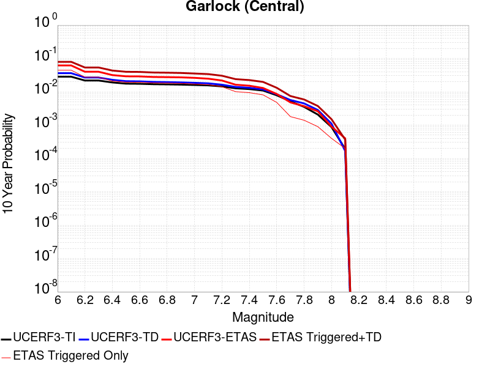 |

| Magnitude | 1 wk TI Prob | 1 wk TD Prob | 1 wk ETAS Prob | 1 wk ETAS/TD Gain | 1 wk ETAS Triggered+TD | 1 wk ETAS Triggered Only | 1 mo TI Prob | 1 mo TD Prob | 1 mo ETAS Prob | 1 mo ETAS/TD Gain | 1 mo ETAS Triggered+TD | 1 mo ETAS Triggered Only | 1 yr TI Prob | 1 yr TD Prob | 1 yr ETAS Prob | 1 yr ETAS/TD Gain | 1 yr ETAS Triggered+TD | 1 yr ETAS Triggered Only | 10 yr TI Prob | 10 yr TD Prob | 10 yr ETAS Prob | 10 yr ETAS/TD Gain | 10 yr ETAS Triggered+TD | 10 yr ETAS Triggered Only |
|-----|-----|-----|-----|-----|-----|-----|-----|-----|-----|-----|-----|-----|-----|-----|-----|-----|-----|-----|-----|-----|-----|-----|-----|-----|
| 6.0 | 5.5131142E-5 | 7.0341346E-5 | 9.0E-4 | 12.794751 | 9.7027805E-4 | 9.0E-4 | 2.3625491E-4 | 3.0142843E-4 | 0.0034 | 11.279626 | 0.0037004035 | 0.0034 | 0.0028726095 | 0.0036637802 | 0.0201 | 5.486137 | 0.0217971 | 0.0182 | 0.028357591 | 0.0361292 | 0.0616 | 1.704992 | 0.079021454 | 0.0445 |
| 6.1 | 5.5131142E-5 | 7.0341346E-5 | 9.0E-4 | 12.794751 | 9.7027805E-4 | 9.0E-4 | 2.3625491E-4 | 3.0142843E-4 | 0.0034 | 11.279626 | 0.0037004035 | 0.0034 | 0.0028726095 | 0.0036637802 | 0.0201 | 5.486137 | 0.0217971 | 0.0182 | 0.028357591 | 0.0361292 | 0.0616 | 1.704992 | 0.079021454 | 0.0445 |
| 6.2 | 4.216245E-5 | 5.1746258E-5 | 4.0E-4 | 7.7300277 | 4.5172556E-4 | 4.0E-4 | 1.806837E-4 | 2.21751E-4 | 0.0016 | 7.2153 | 0.0018213962 | 0.0016 | 0.0021976046 | 0.0026965071 | 0.012 | 4.4502015 | 0.013367655 | 0.0107 | 0.021759989 | 0.02672878 | 0.0399 | 1.4927729 | 0.05349374 | 0.0275 |
| 6.3 | 4.216245E-5 | 5.1746258E-5 | 4.0E-4 | 7.7300277 | 4.5172556E-4 | 4.0E-4 | 1.806837E-4 | 2.21751E-4 | 0.0016 | 7.2153 | 0.0018213962 | 0.0016 | 0.0021976046 | 0.0026965071 | 0.012 | 4.4502015 | 0.013367655 | 0.0107 | 0.021759989 | 0.02672878 | 0.0399 | 1.4927729 | 0.05349374 | 0.0275 |
| 6.4 | 3.6858168E-5 | 4.4192322E-5 | 4.0E-4 | 9.051346 | 4.4417466E-4 | 4.0E-4 | 1.5795401E-4 | 1.8938206E-4 | 0.0014 | 7.3924637 | 0.0015891169 | 0.0014 | 0.0019213937 | 0.0023033135 | 0.0101 | 4.384987 | 0.011083044 | 0.0088 | 0.019048655 | 0.022871464 | 0.0317 | 1.3860066 | 0.043391164 | 0.021 |
| 6.5 | 3.39199E-5 | 4.0098344E-5 | 4.0E-4 | 9.975474 | 4.400823E-4 | 4.0E-4 | 1.453629E-4 | 1.7183885E-4 | 0.0014 | 8.147168 | 0.0015715982 | 0.0014 | 0.0017683565 | 0.0020901524 | 0.0093 | 4.4494367 | 0.010173222 | 0.0081 | 0.017543508 | 0.020798644 | 0.0291 | 1.3991296 | 0.03979515 | 0.0194 |
| 6.6 | 3.3571985E-5 | 3.9551946E-5 | 4.0E-4 | 10.113282 | 4.3953612E-4 | 4.0E-4 | 1.4387199E-4 | 1.6949745E-4 | 0.0014 | 8.259711 | 0.0015692601 | 0.0014 | 0.0017502342 | 0.0020617 | 0.0093 | 4.5108404 | 0.010145 | 0.0081 | 0.017365133 | 0.02051964 | 0.0289 | 1.4084067 | 0.03942361 | 0.0193 |
| 6.7 | 3.2580007E-5 | 3.8167844E-5 | 4.0E-4 | 10.480025 | 4.3815258E-4 | 4.0E-4 | 1.3962112E-4 | 1.6356635E-4 | 0.0013 | 7.9478455 | 0.0014633538 | 0.0013 | 0.0016985617 | 0.0019896228 | 0.0088 | 4.422949 | 0.009674302 | 0.0077 | 0.016856372 | 0.019814886 | 0.0278 | 1.4029856 | 0.037850294 | 0.0184 |
| 6.8 | 3.2185937E-5 | 3.75947E-5 | 4.0E-4 | 10.639797 | 4.3757967E-4 | 4.0E-4 | 1.3793244E-4 | 1.611103E-4 | 0.0013 | 8.069005 | 0.0014609009 | 0.0013 | 0.0016780337 | 0.0019597749 | 0.0087 | 4.4392853 | 0.00954488 | 0.0076 | 0.016654192 | 0.019521544 | 0.0275 | 1.4087001 | 0.037366252 | 0.0182 |
| 6.9 | 3.165394E-5 | 3.679874E-5 | 4.0E-4 | 10.869937 | 4.3678403E-4 | 4.0E-4 | 1.3565269E-4 | 1.5769948E-4 | 0.0012 | 7.60941 | 0.0013575102 | 0.0012 | 0.0016503202 | 0.0019183218 | 0.0084 | 4.378827 | 0.009204318 | 0.0073 | 0.01638118 | 0.019114584 | 0.0271 | 1.4177656 | 0.036672432 | 0.0179 |
| 7.0 | 3.0903822E-5 | 3.5703426E-5 | 4.0E-4 | 11.203406 | 4.3568914E-4 | 4.0E-4 | 1.3243823E-4 | 1.5300584E-4 | 0.0011 | 7.189268 | 0.0012528375 | 0.0011 | 0.0016112428 | 0.0018612756 | 0.0083 | 4.459307 | 0.009047874 | 0.0072 | 0.015996104 | 0.018552903 | 0.0262 | 1.4121779 | 0.03533565 | 0.0171 |
| 7.1 | 3.0069863E-5 | 3.446902E-5 | 3.0E-4 | 8.703467 | 3.344587E-4 | 3.0E-4 | 1.2886449E-4 | 1.4771613E-4 | 0.001 | 6.7697415 | 0.0011475685 | 0.001 | 0.0015677959 | 0.0017969814 | 0.0076 | 4.229315 | 0.008584762 | 0.0068 | 0.01556781 | 0.017920064 | 0.0247 | 1.3783432 | 0.033927966 | 0.0163 |
| 7.2 | 2.7957109E-5 | 3.1356696E-5 | 3.0E-4 | 9.567334 | 3.3134728E-4 | 3.0E-4 | 1.1981068E-4 | 1.3437902E-4 | 8.0E-4 | 5.95331 | 9.3427155E-4 | 8.0E-4 | 0.0014577188 | 0.0016348565 | 0.0066 | 4.0370517 | 0.0074253744 | 0.0058 | 0.014481937 | 0.016322942 | 0.0218 | 1.3355435 | 0.030291157 | 0.0142 |
| 7.3 | 2.4519275E-5 | 2.6785401E-5 | 1.0E-4 | 3.733377 | 1.2678272E-4 | 1.0E-4 | 1.0507837E-4 | 1.14789604E-4 | 5.0E-4 | 4.355795 | 6.147322E-4 | 5.0E-4 | 0.0012785783 | 0.0013966822 | 0.0047 | 3.3651178 | 0.0053910953 | 0.004 | 0.012712469 | 0.013965154 | 0.0163 | 1.1671909 | 0.023924105 | 0.0101 |
| 7.4 | 2.3225532E-5 | 2.5268542E-5 | 1.0E-4 | 3.9574897 | 1.2526601E-4 | 1.0E-4 | 9.95342E-5 | 1.0828934E-4 | 5.0E-4 | 4.6172595 | 6.082352E-4 | 5.0E-4 | 0.0012111551 | 0.0013176398 | 0.0044 | 3.3393042 | 0.0050127646 | 0.0037 | 0.012045753 | 0.013182204 | 0.0152 | 1.1530696 | 0.022458293 | 0.0094 |
| 7.5 | 2.097765E-5 | 2.2549391E-5 | 1.0E-4 | 4.4347095 | 1.2254714E-4 | 1.0E-4 | 8.9901114E-5 | 9.663674E-5 | 4.0E-4 | 4.1392126 | 4.965981E-4 | 4.0E-4 | 0.0010939965 | 0.0011759291 | 0.0036 | 3.0614092 | 0.0042722835 | 0.0031 | 0.010886264 | 0.011774428 | 0.013 | 1.1040876 | 0.019779056 | 0.0081 |
| 7.6 | 1.511254E-5 | 1.6052463E-5 | 0.0 | 0.0 | 1.6052463E-5 | 0.0 | 6.476642E-5 | 6.87945E-5 | 3.0E-4 | 4.3608136 | 3.6877385E-4 | 3.0E-4 | 7.882459E-4 | 8.37259E-4 | 0.0026 | 3.1053712 | 0.0028355846 | 0.002 | 0.007854558 | 0.008415242 | 0.0086 | 1.0219553 | 0.013174849 | 0.0048 |
| 7.7 | 9.934069E-6 | 1.0735516E-5 | 0.0 | 0.0 | 1.0735516E-5 | 0.0 | 4.2573887E-5 | 4.6008547E-5 | 0.0 | 0.0 | 4.6008547E-5 | 0.0 | 5.182138E-4 | 5.6001043E-4 | 0.0012 | 2.142817 | 0.0012596184 | 7.0E-4 | 0.00517007 | 0.005657376 | 0.0048 | 0.84844995 | 0.0074471924 | 0.0018 |
| 7.8 | 6.7562896E-6 | 8.4750955E-6 | 0.0 | 0.0 | 8.4750955E-6 | 0.0 | 2.8955206E-5 | 3.632133E-5 | 0.0 | 0.0 | 3.632133E-5 | 0.0 | 3.5247262E-4 | 4.4212263E-4 | 7.0E-4 | 1.5832711 | 7.4199E-4 | 3.0E-4 | 0.0035191406 | 0.004471134 | 0.0037 | 0.82753056 | 0.0058648745 | 0.0014 |
| 7.9 | 3.975453E-6 | 5.3994363E-6 | 0.0 | 0.0 | 5.3994363E-6 | 0.0 | 1.7037546E-5 | 2.3140237E-5 | 0.0 | 0.0 | 2.3140237E-5 | 0.0 | 2.0741238E-4 | 2.8169606E-4 | 5.0E-4 | 1.7749627 | 4.8163973E-4 | 2.0E-4 | 0.002072189 | 0.0028485248 | 0.0026 | 0.91275316 | 0.0037459612 | 9.0E-4 |
| 8.0 | 1.6729537E-6 | 2.087034E-6 | 0.0 | 0.0 | 2.087034E-6 | 0.0 | 7.169782E-6 | 8.944402E-6 | 0.0 | 0.0 | 8.944402E-6 | 0.0 | 8.7288594E-5 | 1.0889268E-4 | 2.0E-4 | 1.8366706 | 1.0889268E-4 | 0.0 | 8.7254314E-4 | 0.0011021082 | 9.0E-4 | 0.81661683 | 0.0015016673 | 4.0E-4 |
| 8.1 | 3.6733252E-7 | 3.1624552E-7 | 0.0 | 0.0 | 3.1624552E-7 | 0.0 | 1.5742813E-6 | 1.3553373E-6 | 0.0 | 0.0 | 1.3553373E-6 | 0.0 | 1.9166706E-5 | 1.6501122E-5 | 1.0E-4 | 6.0601935 | 1.6501122E-5 | 0.0 | 1.9165053E-4 | 1.6715302E-4 | 4.0E-4 | 2.3930168 | 3.671196E-4 | 2.0E-4 |

## Imperial
*[(top)](#table-of-contents)*

| 1 Week | 1 Month | 1 Year | 10 Year |
|-----|-----|-----|-----|
| 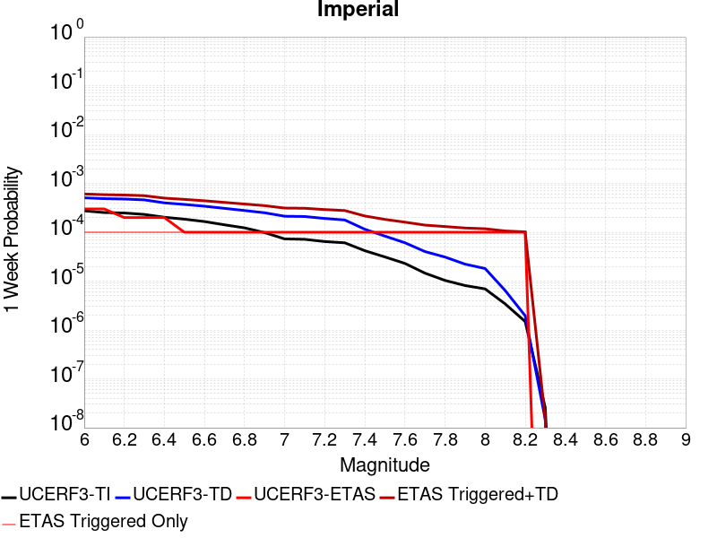 |  | 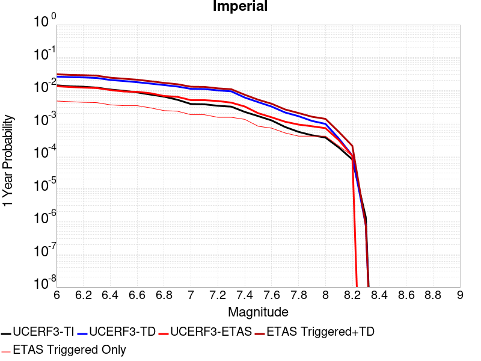 | 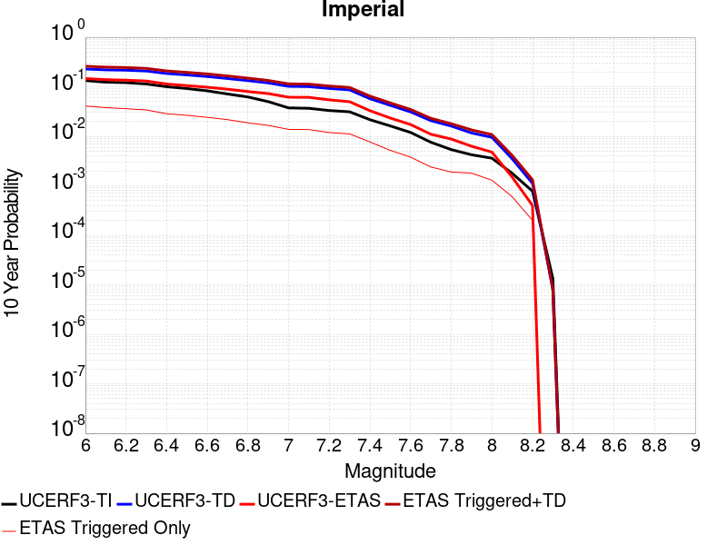 |

| Magnitude | 1 wk TI Prob | 1 wk TD Prob | 1 wk ETAS Prob | 1 wk ETAS/TD Gain | 1 wk ETAS Triggered+TD | 1 wk ETAS Triggered Only | 1 mo TI Prob | 1 mo TD Prob | 1 mo ETAS Prob | 1 mo ETAS/TD Gain | 1 mo ETAS Triggered+TD | 1 mo ETAS Triggered Only | 1 yr TI Prob | 1 yr TD Prob | 1 yr ETAS Prob | 1 yr ETAS/TD Gain | 1 yr ETAS Triggered+TD | 1 yr ETAS Triggered Only | 10 yr TI Prob | 10 yr TD Prob | 10 yr ETAS Prob | 10 yr ETAS/TD Gain | 10 yr ETAS Triggered+TD | 10 yr ETAS Triggered Only |
|-----|-----|-----|-----|-----|-----|-----|-----|-----|-----|-----|-----|-----|-----|-----|-----|-----|-----|-----|-----|-----|-----|-----|-----|-----|
| 6.0 | 2.7496446E-4 | 5.075037E-4 | 3.0E-4 | 0.5911287 | 6.0745294E-4 | 1.0E-4 | 0.0011778869 | 0.0021732424 | 0.0015 | 0.69021297 | 0.0026721556 | 5.0E-4 | 0.0142467655 | 0.026154283 | 0.0133 | 0.5085209 | 0.030731358 | 0.0047 | 0.13367249 | 0.22868972 | 0.1467 | 0.6414805 | 0.26023632 | 0.0409 |
| 6.1 | 2.5356023E-4 | 4.883024E-4 | 3.0E-4 | 0.6143734 | 5.8825355E-4 | 1.0E-4 | 0.001086234 | 0.0020910846 | 0.0014 | 0.66950905 | 0.002590039 | 5.0E-4 | 0.013144928 | 0.025164463 | 0.0126 | 0.5007061 | 0.029551223 | 0.0045 | 0.123940155 | 0.22006333 | 0.1396 | 0.6343629 | 0.24970092 | 0.038 |
| 6.2 | 2.4820742E-4 | 4.7922434E-4 | 2.0E-4 | 0.41734108 | 5.791764E-4 | 1.0E-4 | 0.0010633124 | 0.00205224 | 0.0013 | 0.63345414 | 0.0025512138 | 5.0E-4 | 0.01286919 | 0.024702799 | 0.0121 | 0.48982304 | 0.028896576 | 0.0043 | 0.12148927 | 0.21656275 | 0.1362 | 0.62891704 | 0.24484484 | 0.0361 |
| 6.3 | 2.3205351E-4 | 4.6042612E-4 | 2.0E-4 | 0.43438023 | 5.6038005E-4 | 1.0E-4 | 9.94136E-4 | 0.0019717994 | 0.0013 | 0.6592962 | 0.0024708137 | 5.0E-4 | 0.012036599 | 0.023740618 | 0.0117 | 0.49282628 | 0.027840907 | 0.0042 | 0.11405133 | 0.20846377 | 0.1308 | 0.6274471 | 0.23545517 | 0.0341 |
| 6.4 | 2.0304754E-4 | 4.0024717E-4 | 2.0E-4 | 0.49969122 | 5.002071E-4 | 1.0E-4 | 8.6991355E-4 | 0.001714232 | 0.001 | 0.5833516 | 0.0020137178 | 3.0E-4 | 0.010539869 | 0.020671966 | 0.0102 | 0.49342185 | 0.024197547 | 0.0036 | 0.100537635 | 0.18559903 | 0.1137 | 0.61261094 | 0.2088909 | 0.0286 |
| 6.5 | 1.854992E-4 | 3.7127198E-4 | 1.0E-4 | 0.26934433 | 4.7123485E-4 | 1.0E-4 | 7.9475436E-4 | 0.0015902078 | 7.0E-4 | 0.44019404 | 0.0018897307 | 3.0E-4 | 0.009633281 | 0.019185921 | 0.0092 | 0.4795183 | 0.02252069 | 0.0034 | 0.0922623 | 0.17380771 | 0.1056 | 0.60756797 | 0.19570181 | 0.0265 |
| 6.6 | 1.6586106E-4 | 3.4160705E-4 | 1.0E-4 | 0.29273403 | 4.415729E-4 | 1.0E-4 | 7.106394E-4 | 0.0014632189 | 7.0E-4 | 0.4783973 | 0.00176278 | 3.0E-4 | 0.008617763 | 0.01766407 | 0.009 | 0.50950885 | 0.021004012 | 0.0034 | 0.08291132 | 0.16125175 | 0.0981 | 0.6083655 | 0.18154946 | 0.0242 |
| 6.7 | 1.4224656E-4 | 3.087515E-4 | 1.0E-4 | 0.32388508 | 4.0872063E-4 | 1.0E-4 | 6.094856E-4 | 0.0013225579 | 5.0E-4 | 0.37805527 | 0.0016221611 | 3.0E-4 | 0.0073952693 | 0.015983172 | 0.0081 | 0.506783 | 0.01883682 | 0.0029 | 0.07153955 | 0.1469044 | 0.0894 | 0.608559 | 0.16541657 | 0.0217 |
| 6.8 | 1.2317259E-4 | 2.7882427E-4 | 1.0E-4 | 0.35864887 | 3.7879637E-4 | 1.0E-4 | 5.2777573E-4 | 0.00119442 | 5.0E-4 | 0.4186132 | 0.0014940618 | 3.0E-4 | 0.0064067547 | 0.014446496 | 0.0067 | 0.46378028 | 0.016811825 | 0.0024 | 0.06225166 | 0.13330324 | 0.0803 | 0.60238594 | 0.14951047 | 0.0187 |
| 6.9 | 9.859898E-5 | 2.508232E-4 | 1.0E-4 | 0.3986872 | 3.5079813E-4 | 1.0E-4 | 4.2249862E-4 | 0.001074518 | 5.0E-4 | 0.4653249 | 0.0013741957 | 3.0E-4 | 0.0051317946 | 0.013004753 | 0.0063 | 0.48443827 | 0.015274842 | 0.0023 | 0.05014893 | 0.11968495 | 0.0729 | 0.60909915 | 0.13429818 | 0.0166 |
| 7.0 | 7.3191884E-5 | 2.1317044E-4 | 1.0E-4 | 0.4691082 | 3.1314912E-4 | 1.0E-4 | 3.136418E-4 | 9.132709E-4 | 5.0E-4 | 0.54748267 | 0.0012129969 | 3.0E-4 | 0.003811904 | 0.011063075 | 0.005 | 0.45195395 | 0.012843161 | 0.0018 | 0.037471764 | 0.10227145 | 0.0616 | 0.6023186 | 0.11466011 | 0.0138 |
| 7.1 | 7.1760296E-5 | 2.1017724E-4 | 1.0E-4 | 0.47578892 | 3.1015623E-4 | 1.0E-4 | 3.0750787E-4 | 9.004518E-4 | 5.0E-4 | 0.5552768 | 0.0012001817 | 3.0E-4 | 0.003737482 | 0.010908575 | 0.005 | 0.458355 | 0.012688939 | 0.0018 | 0.03675245 | 0.10090546 | 0.0612 | 0.6065083 | 0.11322305 | 0.0137 |
| 7.2 | 6.46614E-5 | 1.9184423E-4 | 1.0E-4 | 0.5212562 | 2.9182504E-4 | 1.0E-4 | 2.7709085E-4 | 8.219335E-4 | 5.0E-4 | 0.6083217 | 0.0011216869 | 3.0E-4 | 0.0033683628 | 0.009961749 | 0.0047 | 0.4718047 | 0.011446807 | 0.0015 | 0.033177625 | 0.09270755 | 0.0545 | 0.5878701 | 0.10350433 | 0.0119 |
| 7.3 | 6.088115E-5 | 1.7854004E-4 | 1.0E-4 | 0.56009847 | 2.7852217E-4 | 1.0E-4 | 2.6089314E-4 | 7.6495006E-4 | 5.0E-4 | 0.6536374 | 0.0010647206 | 3.0E-4 | 0.0031717476 | 0.009274075 | 0.0042 | 0.45287535 | 0.010760164 | 0.0015 | 0.031268585 | 0.086752206 | 0.05 | 0.5763542 | 0.09698059 | 0.0112 |
| 7.4 | 4.199346E-5 | 1.1545471E-4 | 1.0E-4 | 0.8661405 | 2.1544317E-4 | 1.0E-4 | 1.7995955E-4 | 4.9471296E-4 | 3.0E-4 | 0.60641223 | 6.94614E-4 | 2.0E-4 | 0.0021888057 | 0.0060066665 | 0.0032 | 0.5327414 | 0.007298858 | 0.0013 | 0.02167372 | 0.05759545 | 0.0329 | 0.57122564 | 0.06485197 | 0.0077 |
| 7.5 | 3.130448E-5 | 8.362292E-5 | 1.0E-4 | 1.1958444 | 1.8361455E-4 | 1.0E-4 | 1.3415517E-4 | 3.5833503E-4 | 3.0E-4 | 0.83720535 | 5.582634E-4 | 2.0E-4 | 0.0016321153 | 0.004354062 | 0.002 | 0.4593412 | 0.0051505785 | 8.0E-4 | 0.016201803 | 0.04226402 | 0.0234 | 0.5536624 | 0.047244247 | 0.0052 |
| 7.6 | 2.3074248E-5 | 6.109197E-5 | 1.0E-4 | 1.6368763 | 1.6108586E-4 | 1.0E-4 | 9.888588E-5 | 2.6179658E-4 | 3.0E-4 | 1.1459279 | 4.617442E-4 | 2.0E-4 | 0.0012032706 | 0.003182738 | 0.0015 | 0.47129232 | 0.00388051 | 7.0E-4 | 0.011967761 | 0.03113993 | 0.0173 | 0.5555568 | 0.0348216 | 0.0038 |
| 7.7 | 1.45864815E-5 | 4.032974E-5 | 1.0E-4 | 2.4795597 | 1.403257E-4 | 1.0E-4 | 6.2511994E-5 | 1.7283032E-4 | 3.0E-4 | 1.7358065 | 3.7279577E-4 | 2.0E-4 | 7.608177E-4 | 0.0021021839 | 0.0011 | 0.52326536 | 0.002601133 | 5.0E-4 | 0.007582182 | 0.020722158 | 0.011 | 0.5308327 | 0.023072425 | 0.0024 |
| 7.8 | 1.0352979E-5 | 3.1134772E-5 | 1.0E-4 | 3.211843 | 1.3113166E-4 | 1.0E-4 | 4.4369157E-5 | 1.3342792E-4 | 2.0E-4 | 1.4989365 | 2.3341458E-4 | 1.0E-4 | 5.400606E-4 | 0.001623277 | 9.0E-4 | 0.55443406 | 0.0020226277 | 4.0E-4 | 0.0053875 | 0.016097035 | 0.0088 | 0.54668456 | 0.01796645 | 0.0019 |
| 7.9 | 8.137906E-6 | 2.2288528E-5 | 1.0E-4 | 4.4866133 | 1.2228629E-4 | 1.0E-4 | 3.4876273E-5 | 9.551877E-5 | 1.0E-4 | 1.0469147 | 1.9550922E-4 | 1.0E-4 | 4.2453592E-4 | 0.0011623215 | 8.0E-4 | 0.68827766 | 0.0015618566 | 4.0E-4 | 0.004237258 | 0.011683164 | 0.0063 | 0.5392375 | 0.013462135 | 0.0018 |
| 8.0 | 6.93792E-6 | 1.8128583E-5 | 1.0E-4 | 5.516151 | 1.1812677E-4 | 1.0E-4 | 2.9733603E-5 | 7.769162E-5 | 1.0E-4 | 1.2871401 | 1.7768385E-4 | 1.0E-4 | 3.6194647E-4 | 9.454858E-4 | 7.0E-4 | 0.74036014 | 0.0013451076 | 4.0E-4 | 0.0036135751 | 0.009557875 | 0.0048 | 0.5022037 | 0.01084545 | 0.0013 |
| 8.1 | 3.4286315E-6 | 6.4352657E-6 | 1.0E-4 | 15.539374 | 1.0643462E-4 | 1.0E-4 | 1.4694053E-5 | 2.757942E-5 | 1.0E-4 | 3.6258922 | 1.2757666E-4 | 1.0E-4 | 1.7888541E-4 | 3.3572782E-4 | 3.0E-4 | 0.89358103 | 5.3566066E-4 | 2.0E-4 | 0.0017874148 | 0.0035136545 | 0.0015 | 0.42690593 | 0.0041115466 | 6.0E-4 |
| 8.2 | 1.4906886E-6 | 1.9581485E-6 | 1.0E-4 | 51.068653 | 1.0195795E-4 | 1.0E-4 | 6.3886496E-6 | 8.392038E-6 | 1.0E-4 | 11.916057 | 1.083912E-4 | 1.0E-4 | 7.7779034E-5 | 1.021683E-4 | 1.0E-4 | 0.97877717 | 2.0215809E-4 | 1.0E-4 | 7.775182E-4 | 0.0011185883 | 4.0E-4 | 0.3575936 | 0.0013183645 | 2.0E-4 |
| 8.3 | 2.5758007E-8 | 1.4715068E-8 | 0.0 | 0.0 | 1.4715068E-8 | 0.0 | 1.10391454E-7 | 6.3064576E-8 | 0.0 | 0.0 | 6.3064576E-8 | 0.0 | 1.3440151E-6 | 7.6781123E-7 | 0.0 | 0.0 | 7.6781123E-7 | 0.0 | 1.344007E-5 | 8.001273E-6 | 0.0 | 0.0 | 8.001273E-6 | 0.0 |

## Brawley (Seismic Zone) alt 1
*[(top)](#table-of-contents)*

| 1 Week | 1 Month | 1 Year | 10 Year |
|-----|-----|-----|-----|
| 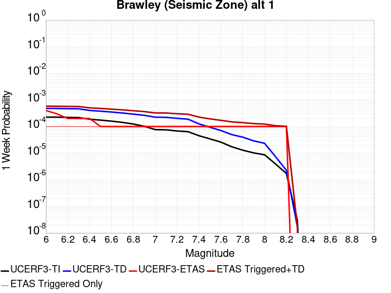 | 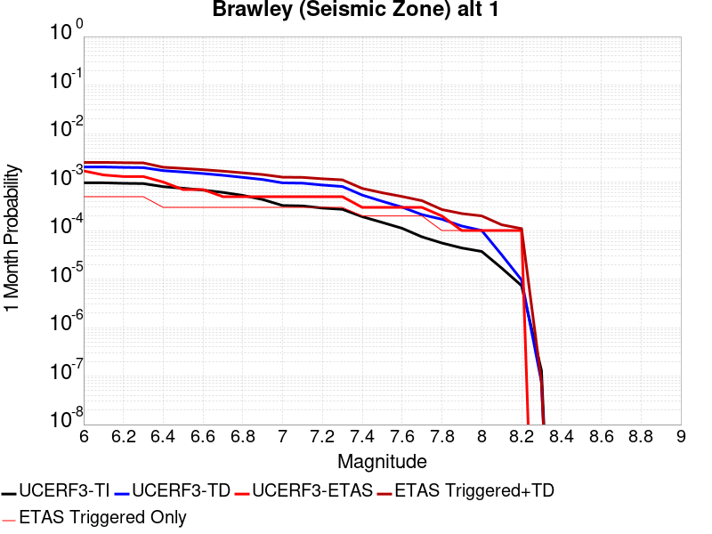 | 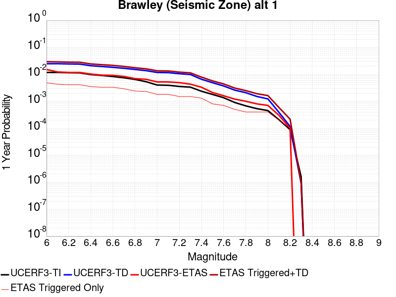 |  |

| Magnitude | 1 wk TI Prob | 1 wk TD Prob | 1 wk ETAS Prob | 1 wk ETAS/TD Gain | 1 wk ETAS Triggered+TD | 1 wk ETAS Triggered Only | 1 mo TI Prob | 1 mo TD Prob | 1 mo ETAS Prob | 1 mo ETAS/TD Gain | 1 mo ETAS Triggered+TD | 1 mo ETAS Triggered Only | 1 yr TI Prob | 1 yr TD Prob | 1 yr ETAS Prob | 1 yr ETAS/TD Gain | 1 yr ETAS Triggered+TD | 1 yr ETAS Triggered Only | 10 yr TI Prob | 10 yr TD Prob | 10 yr ETAS Prob | 10 yr ETAS/TD Gain | 10 yr ETAS Triggered+TD | 10 yr ETAS Triggered Only |
|-----|-----|-----|-----|-----|-----|-----|-----|-----|-----|-----|-----|-----|-----|-----|-----|-----|-----|-----|-----|-----|-----|-----|-----|-----|
| 6.0 | 2.2521618E-4 | 4.7770946E-4 | 4.0E-4 | 0.83732903 | 5.776617E-4 | 1.0E-4 | 9.6485513E-4 | 0.0020457571 | 0.0017 | 0.8309882 | 0.0025447342 | 5.0E-4 | 0.011683988 | 0.024615502 | 0.015 | 0.6093721 | 0.029297348 | 0.0048 | 0.11088423 | 0.21397778 | 0.1548 | 0.7234396 | 0.24534008 | 0.0399 |
| 6.1 | 2.2521618E-4 | 4.7770946E-4 | 3.0E-4 | 0.6279968 | 5.776617E-4 | 1.0E-4 | 9.6485513E-4 | 0.0020457571 | 0.0014 | 0.6843432 | 0.0025447342 | 5.0E-4 | 0.011683988 | 0.024615502 | 0.0122 | 0.49562263 | 0.028809655 | 0.0043 | 0.11088423 | 0.21397778 | 0.1353 | 0.6323086 | 0.24196018 | 0.0356 |
| 6.2 | 2.198148E-4 | 4.685232E-4 | 2.0E-4 | 0.42687318 | 5.684764E-4 | 1.0E-4 | 9.417233E-4 | 0.0020064483 | 0.0013 | 0.6479111 | 0.0025054452 | 5.0E-4 | 0.011405343 | 0.024148071 | 0.0117 | 0.48451075 | 0.028149065 | 0.0041 | 0.10837428 | 0.21040754 | 0.1318 | 0.6264034 | 0.23701681 | 0.0337 |
| 6.3 | 2.1704129E-4 | 4.6287E-4 | 2.0E-4 | 0.43208677 | 5.628237E-4 | 1.0E-4 | 9.298453E-4 | 0.0019822572 | 0.0013 | 0.65581805 | 0.0024812662 | 5.0E-4 | 0.011262234 | 0.023861049 | 0.0117 | 0.49033886 | 0.02786322 | 0.0041 | 0.107082725 | 0.20829713 | 0.1306 | 0.62698895 | 0.23474 | 0.0334 |
| 6.4 | 1.876142E-4 | 4.0175187E-4 | 2.0E-4 | 0.4978197 | 5.017117E-4 | 1.0E-4 | 8.038131E-4 | 0.001720672 | 0.001 | 0.5811683 | 0.0020201558 | 3.0E-4 | 0.00974259 | 0.020744761 | 0.0102 | 0.49169037 | 0.024172155 | 0.0035 | 0.093263686 | 0.1850492 | 0.1135 | 0.6133504 | 0.20778634 | 0.0279 |
| 6.5 | 1.7390939E-4 | 3.7602396E-4 | 1.0E-4 | 0.2659405 | 4.7598637E-4 | 1.0E-4 | 7.45113E-4 | 0.0016105482 | 7.0E-4 | 0.4346346 | 0.0019100651 | 3.0E-4 | 0.009034078 | 0.019430682 | 0.0093 | 0.47862446 | 0.02266656 | 0.0033 | 0.086755216 | 0.1748626 | 0.1064 | 0.6084778 | 0.19623365 | 0.0259 |
| 6.6 | 1.591791E-4 | 3.5010767E-4 | 1.0E-4 | 0.2856264 | 4.5007266E-4 | 1.0E-4 | 6.8201777E-4 | 0.0014996089 | 7.0E-4 | 0.4667884 | 0.0017991589 | 3.0E-4 | 0.008271996 | 0.018105397 | 0.0091 | 0.50261253 | 0.02134565 | 0.0033 | 0.07970774 | 0.16425665 | 0.0997 | 0.606977 | 0.18439806 | 0.0241 |
| 6.7 | 1.4268003E-4 | 3.2168423E-4 | 1.0E-4 | 0.31086385 | 4.2165208E-4 | 1.0E-4 | 6.1134255E-4 | 0.0013779266 | 5.0E-4 | 0.36286402 | 0.0016775132 | 3.0E-4 | 0.007417723 | 0.016647182 | 0.0083 | 0.49858284 | 0.019498907 | 0.0029 | 0.07174956 | 0.15235497 | 0.0925 | 0.60713476 | 0.17108792 | 0.0221 |
| 6.8 | 1.239713E-4 | 2.9147213E-4 | 1.0E-4 | 0.34308597 | 3.91443E-4 | 1.0E-4 | 5.3119735E-4 | 0.0012485745 | 5.0E-4 | 0.40045667 | 0.0015481999 | 3.0E-4 | 0.0064481674 | 0.015096881 | 0.0069 | 0.45704803 | 0.01746065 | 0.0024 | 0.06264243 | 0.1387481 | 0.0833 | 0.60036856 | 0.15519801 | 0.0191 |
| 6.9 | 1.0180238E-4 | 2.6326656E-4 | 1.0E-4 | 0.37984315 | 3.6324022E-4 | 1.0E-4 | 4.3622297E-4 | 0.0011278017 | 5.0E-4 | 0.44334036 | 0.0014274634 | 3.0E-4 | 0.005298089 | 0.013645543 | 0.0065 | 0.47634602 | 0.015914159 | 0.0023 | 0.05173543 | 0.12525491 | 0.0758 | 0.60516584 | 0.14021306 | 0.0171 |
| 7.0 | 7.6619996E-5 | 2.2454008E-4 | 1.0E-4 | 0.4453548 | 3.2451763E-4 | 1.0E-4 | 3.283301E-4 | 9.619629E-4 | 5.0E-4 | 0.51977056 | 0.0012616743 | 3.0E-4 | 0.0039900932 | 0.011649718 | 0.0052 | 0.44636276 | 0.013428749 | 0.0018 | 0.039192066 | 0.10749045 | 0.0645 | 0.6000533 | 0.12025333 | 0.0143 |
| 7.1 | 7.5127435E-5 | 2.2136481E-4 | 1.0E-4 | 0.45174298 | 3.2134267E-4 | 1.0E-4 | 3.2193496E-4 | 9.483646E-4 | 5.0E-4 | 0.5272234 | 0.00124808 | 3.0E-4 | 0.0039125155 | 0.011485915 | 0.0052 | 0.4527284 | 0.01326524 | 0.0018 | 0.038443442 | 0.106051944 | 0.064 | 0.60347784 | 0.118746005 | 0.0142 |
| 7.2 | 6.788582E-5 | 2.0262353E-4 | 1.0E-4 | 0.4935261 | 3.0260326E-4 | 1.0E-4 | 2.9090676E-4 | 8.6810056E-4 | 5.0E-4 | 0.5759701 | 0.0011678402 | 3.0E-4 | 0.0035360386 | 0.010518548 | 0.0049 | 0.46584377 | 0.01200277 | 0.0015 | 0.034803 | 0.09771717 | 0.0571 | 0.58433944 | 0.10890548 | 0.0124 |
| 7.3 | 6.399602E-5 | 1.8891136E-4 | 1.0E-4 | 0.5293488 | 2.8889248E-4 | 1.0E-4 | 2.7423984E-4 | 8.093718E-4 | 5.0E-4 | 0.61776304 | 0.001109129 | 3.0E-4 | 0.0033337586 | 0.009810171 | 0.0043 | 0.43832058 | 0.0112954555 | 0.0015 | 0.03284188 | 0.09160584 | 0.0525 | 0.57310754 | 0.10223406 | 0.0117 |
| 7.4 | 4.506759E-5 | 1.2568699E-4 | 1.0E-4 | 0.79562736 | 2.2567442E-4 | 1.0E-4 | 1.9313251E-4 | 5.3854816E-4 | 3.0E-4 | 0.5570532 | 7.384405E-4 | 2.0E-4 | 0.0023488526 | 0.006537287 | 0.0033 | 0.50479656 | 0.007828789 | 0.0013 | 0.023241805 | 0.06253748 | 0.0353 | 0.5644615 | 0.070224665 | 0.0082 |
| 7.5 | 3.43289E-5 | 9.368794E-5 | 1.0E-4 | 1.0673733 | 1.9367857E-4 | 1.0E-4 | 1.4711556E-4 | 4.0145824E-4 | 3.0E-4 | 0.7472757 | 6.01378E-4 | 2.0E-4 | 0.0017896603 | 0.0048768627 | 0.0021 | 0.4306047 | 0.005672961 | 8.0E-4 | 0.01775316 | 0.047205705 | 0.0258 | 0.5465441 | 0.052636635 | 0.0057 |
| 7.6 | 2.5980507E-5 | 7.0821734E-5 | 1.0E-4 | 1.4119959 | 1.7081466E-4 | 1.0E-4 | 1.1134028E-4 | 3.0348654E-4 | 3.0E-4 | 0.98851174 | 5.0342584E-4 | 2.0E-4 | 0.001354725 | 0.0036887128 | 0.0016 | 0.43375564 | 0.0043861307 | 7.0E-4 | 0.013464959 | 0.035973072 | 0.0198 | 0.5504117 | 0.04011839 | 0.0043 |
| 7.7 | 1.7292105E-5 | 4.9655337E-5 | 1.0E-4 | 2.0138822 | 1.4965037E-4 | 1.0E-4 | 7.4106916E-5 | 2.1279126E-4 | 3.0E-4 | 1.4098324 | 4.1274872E-4 | 2.0E-4 | 9.018782E-4 | 0.0025876614 | 0.0012 | 0.4637392 | 0.0030863676 | 5.0E-4 | 0.008982267 | 0.025403626 | 0.0132 | 0.5196108 | 0.028229957 | 0.0029 |
| 7.8 | 1.2927471E-5 | 3.990871E-5 | 1.0E-4 | 2.5057187 | 1.3990472E-4 | 1.0E-4 | 5.5402274E-5 | 1.7102613E-4 | 2.0E-4 | 1.1694119 | 2.7100902E-4 | 1.0E-4 | 6.743139E-4 | 0.0020802573 | 0.001 | 0.4807098 | 0.0024794252 | 4.0E-4 | 0.0067227143 | 0.020530317 | 0.0106 | 0.5163096 | 0.022685152 | 0.0022 |
| 7.9 | 1.0200774E-5 | 2.8919683E-5 | 1.0E-4 | 3.4578526 | 1.2891678E-4 | 1.0E-4 | 4.371687E-5 | 1.2393562E-4 | 1.0E-4 | 0.8068706 | 2.2392323E-4 | 1.0E-4 | 5.321229E-4 | 0.0015078728 | 8.0E-4 | 0.53054875 | 0.0019072696 | 4.0E-4 | 0.005308505 | 0.015072432 | 0.0073 | 0.4843279 | 0.016943796 | 0.0019 |
| 8.0 | 8.650396E-6 | 2.3426488E-5 | 1.0E-4 | 4.268672 | 1.2342415E-4 | 1.0E-4 | 3.70726E-5 | 1.0039538E-4 | 1.0E-4 | 0.9960618 | 2.0038534E-4 | 1.0E-4 | 4.5126543E-4 | 0.0012216292 | 7.0E-4 | 0.5730053 | 0.0016211405 | 4.0E-4 | 0.0045035016 | 0.01228076 | 0.0056 | 0.45599782 | 0.013564795 | 0.0013 |
| 8.1 | 3.9368224E-6 | 7.3916713E-6 | 1.0E-4 | 13.52874 | 1.0739093E-4 | 1.0E-4 | 1.6871985E-5 | 3.1678206E-5 | 1.0E-4 | 3.1567442 | 1.3167504E-4 | 1.0E-4 | 2.0539707E-4 | 3.8561405E-4 | 3.0E-4 | 0.77797997 | 5.8553694E-4 | 2.0E-4 | 0.0020520731 | 0.004032899 | 0.0016 | 0.39673692 | 0.0046304795 | 6.0E-4 |
| 8.2 | 1.7101195E-6 | 2.2425388E-6 | 1.0E-4 | 44.592316 | 1.0224232E-4 | 1.0E-4 | 7.329063E-6 | 9.610846E-6 | 1.0E-4 | 10.404911 | 1.09609886E-4 | 1.0E-4 | 8.922769E-5 | 1.17005795E-4 | 1.0E-4 | 0.8546585 | 2.169941E-4 | 1.0E-4 | 8.9191867E-4 | 0.0012793662 | 4.0E-4 | 0.3126548 | 0.0014791103 | 2.0E-4 |
| 8.3 | 3.0346666E-8 | 1.7469624E-8 | 0.0 | 0.0 | 1.7469624E-8 | 0.0 | 1.3005713E-7 | 7.486982E-8 | 0.0 | 0.0 | 7.486982E-8 | 0.0 | 1.5834444E-6 | 9.115399E-7 | 0.0 | 0.0 | 9.115399E-7 | 0.0 | 1.5834332E-5 | 9.501729E-6 | 0.0 | 0.0 | 9.501729E-6 | 0.0 |

## Tank Canyon
*[(top)](#table-of-contents)*

| 1 Week | 1 Month | 1 Year | 10 Year |
|-----|-----|-----|-----|
|  |  |  |  |

| Magnitude | 1 wk TI Prob | 1 wk TD Prob | 1 wk ETAS Prob | 1 wk ETAS/TD Gain | 1 wk ETAS Triggered+TD | 1 wk ETAS Triggered Only | 1 mo TI Prob | 1 mo TD Prob | 1 mo ETAS Prob | 1 mo ETAS/TD Gain | 1 mo ETAS Triggered+TD | 1 mo ETAS Triggered Only | 1 yr TI Prob | 1 yr TD Prob | 1 yr ETAS Prob | 1 yr ETAS/TD Gain | 1 yr ETAS Triggered+TD | 1 yr ETAS Triggered Only | 10 yr TI Prob | 10 yr TD Prob | 10 yr ETAS Prob | 10 yr ETAS/TD Gain | 10 yr ETAS Triggered+TD | 10 yr ETAS Triggered Only |
|-----|-----|-----|-----|-----|-----|-----|-----|-----|-----|-----|-----|-----|-----|-----|-----|-----|-----|-----|-----|-----|-----|-----|-----|-----|
| 6.0 | 4.8284557E-5 | 5.7987254E-5 | 3.0E-4 | 5.1735506 | 3.5796987E-4 | 3.0E-4 | 2.0691741E-4 | 2.4849697E-4 | 0.0015 | 6.036291 | 0.0017481243 | 0.0015 | 0.0025163088 | 0.0030219224 | 0.012 | 3.9709823 | 0.013290796 | 0.0103 | 0.02488006 | 0.029875208 | 0.0437 | 1.4627514 | 0.0585909 | 0.0296 |
| 6.1 | 1.7796336E-5 | 2.0880292E-5 | 2.0E-4 | 9.57841 | 2.2087611E-4 | 2.0E-4 | 7.626778E-5 | 8.948412E-5 | 5.0E-4 | 5.5875835 | 5.8943935E-4 | 5.0E-4 | 9.281647E-4 | 0.001088963 | 0.0043 | 3.948711 | 0.0045851516 | 0.0035 | 0.009242975 | 0.010840205 | 0.0164 | 1.5128865 | 0.021424215 | 0.0107 |
| 6.2 | 1.7796336E-5 | 2.0880292E-5 | 2.0E-4 | 9.57841 | 2.2087611E-4 | 2.0E-4 | 7.626778E-5 | 8.948412E-5 | 5.0E-4 | 5.5875835 | 5.8943935E-4 | 5.0E-4 | 9.281647E-4 | 0.001088963 | 0.0043 | 3.948711 | 0.0045851516 | 0.0035 | 0.009242975 | 0.010840205 | 0.0164 | 1.5128865 | 0.021424215 | 0.0107 |
| 6.3 | 1.3515912E-5 | 1.5764594E-5 | 1.0E-4 | 6.343329 | 1.1576302E-4 | 1.0E-4 | 5.792405E-5 | 6.7560926E-5 | 3.0E-4 | 4.4404364 | 3.6754066E-4 | 3.0E-4 | 7.049971E-4 | 8.222676E-4 | 0.0033 | 4.013292 | 0.0034201297 | 0.0026 | 0.007027647 | 0.008194706 | 0.0124 | 1.5131719 | 0.015831606 | 0.0077 |
| 6.4 | 1.0870146E-5 | 1.2621889E-5 | 1.0E-4 | 7.9227443 | 1.12620626E-4 | 1.0E-4 | 4.658551E-5 | 5.4092787E-5 | 2.0E-4 | 3.6973505 | 2.5408197E-4 | 2.0E-4 | 5.67031E-4 | 6.5839844E-4 | 0.0025 | 3.797093 | 0.0025571475 | 0.0019 | 0.005655863 | 0.00656633 | 0.0095 | 1.4467747 | 0.012526932 | 0.006 |
| 6.5 | 7.964826E-6 | 9.1987595E-6 | 1.0E-4 | 10.871031 | 1.0919784E-4 | 1.0E-4 | 3.4134522E-5 | 3.9422717E-5 | 2.0E-4 | 5.073217 | 2.3941483E-4 | 2.0E-4 | 4.1550855E-4 | 4.7987647E-4 | 0.0018 | 3.750965 | 0.0019791566 | 0.0015 | 0.0041473247 | 0.0047895485 | 0.0068 | 1.419758 | 0.009267996 | 0.0045 |
| 6.6 | 6.6317E-6 | 7.6143924E-6 | 1.0E-4 | 13.133024 | 1.0761363E-4 | 1.0E-4 | 2.8421264E-5 | 3.2632754E-5 | 2.0E-4 | 6.1288114 | 2.3262623E-4 | 2.0E-4 | 3.4597394E-4 | 3.9724045E-4 | 0.0015 | 3.7760506 | 0.001696724 | 0.0013 | 0.0034543579 | 0.0039663003 | 0.0054 | 1.3614703 | 0.0075520216 | 0.0036 |
| 6.7 | 4.793663E-6 | 5.4321117E-6 | 0.0 | 0.0 | 5.4321117E-6 | 0.0 | 2.0544108E-5 | 2.3280296E-5 | 1.0E-4 | 4.295478 | 1.2327796E-4 | 1.0E-4 | 2.500958E-4 | 2.8340513E-4 | 5.0E-4 | 1.7642589 | 7.832634E-4 | 5.0E-4 | 0.0024981452 | 0.002830972 | 0.0025 | 0.8830889 | 0.0042270087 | 0.0014 |
| 6.8 | 4.382823E-6 | 4.970436E-6 | 0.0 | 0.0 | 4.970436E-6 | 0.0 | 1.8783392E-5 | 2.1301717E-5 | 1.0E-4 | 4.694457 | 1.21299585E-4 | 1.0E-4 | 2.286638E-4 | 2.5932182E-4 | 4.0E-4 | 1.5424849 | 6.592181E-4 | 4.0E-4 | 0.0022842865 | 0.002590703 | 0.0023 | 0.88778985 | 0.0038873353 | 0.0013 |
| 6.9 | 2.729601E-6 | 3.0742299E-6 | 0.0 | 0.0 | 3.0742299E-6 | 0.0 | 1.1698237E-5 | 1.3175211E-5 | 1.0E-4 | 7.5900106 | 1.131739E-4 | 1.0E-4 | 1.4241673E-4 | 1.6039763E-4 | 3.0E-4 | 1.8703519 | 4.603495E-4 | 3.0E-4 | 0.001423255 | 0.001603092 | 0.0014 | 0.87331235 | 0.0026014887 | 0.001 |
| 7.0 | 1.8987357E-6 | 2.1273077E-6 | 0.0 | 0.0 | 2.1273077E-6 | 0.0 | 8.137413E-6 | 9.117005E-6 | 1.0E-4 | 10.968514 | 1.09116096E-4 | 1.0E-4 | 9.90685E-5 | 1.1099458E-4 | 2.0E-4 | 1.8018898 | 3.109724E-4 | 2.0E-4 | 9.902435E-4 | 0.0011094601 | 7.0E-4 | 0.6309375 | 0.0016089054 | 5.0E-4 |
| 7.1 | 1.4928986E-6 | 1.6644209E-6 | 0.0 | 0.0 | 1.6644209E-6 | 0.0 | 6.398121E-6 | 7.133216E-6 | 1.0E-4 | 14.018922 | 1.071325E-4 | 1.0E-4 | 7.789434E-5 | 8.684403E-5 | 2.0E-4 | 2.3029792 | 2.8682666E-4 | 2.0E-4 | 7.786704E-4 | 8.681589E-4 | 7.0E-4 | 0.80630404 | 0.0013677247 | 5.0E-4 |
| 7.2 | 1.069082E-6 | 1.18309E-6 | 0.0 | 0.0 | 1.18309E-6 | 0.0 | 4.581772E-6 | 5.070379E-6 | 0.0 | 0.0 | 5.070379E-6 | 0.0 | 5.5781646E-5 | 6.173065E-5 | 0.0 | 0.0 | 6.173065E-5 | 0.0 | 5.576765E-4 | 6.171873E-4 | 4.0E-4 | 0.6481015 | 8.1706385E-4 | 2.0E-4 |
| 7.3 | 8.776551E-7 | 9.77203E-7 | 0.0 | 0.0 | 9.77203E-7 | 0.0 | 3.7613736E-6 | 4.188009E-6 | 0.0 | 0.0 | 4.188009E-6 | 0.0 | 4.579376E-5 | 5.0988336E-5 | 0.0 | 0.0 | 5.0988336E-5 | 0.0 | 4.5784327E-4 | 5.098174E-4 | 4.0E-4 | 0.78459466 | 7.097155E-4 | 2.0E-4 |
| 7.4 | 7.55721E-7 | 8.51098E-7 | 0.0 | 0.0 | 8.51098E-7 | 0.0 | 3.2388E-6 | 3.6475606E-6 | 0.0 | 0.0 | 3.6475606E-6 | 0.0 | 3.9431678E-5 | 4.440866E-5 | 0.0 | 0.0 | 4.440866E-5 | 0.0 | 3.942468E-4 | 4.4404875E-4 | 4.0E-4 | 0.900802 | 6.439599E-4 | 2.0E-4 |
| 7.5 | 5.587665E-7 | 6.3061736E-7 | 0.0 | 0.0 | 6.3061736E-7 | 0.0 | 2.3947114E-6 | 2.7026458E-6 | 0.0 | 0.0 | 2.7026458E-6 | 0.0 | 2.915522E-5 | 3.2904714E-5 | 0.0 | 0.0 | 3.2904714E-5 | 0.0 | 2.9151395E-4 | 3.2904715E-4 | 4.0E-4 | 1.2156312 | 5.289813E-4 | 2.0E-4 |

## Hayward (So) 2011 CFM
*[(top)](#table-of-contents)*

| 1 Week | 1 Month | 1 Year | 10 Year |
|-----|-----|-----|-----|
|  | 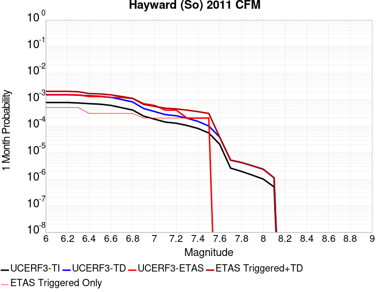 | 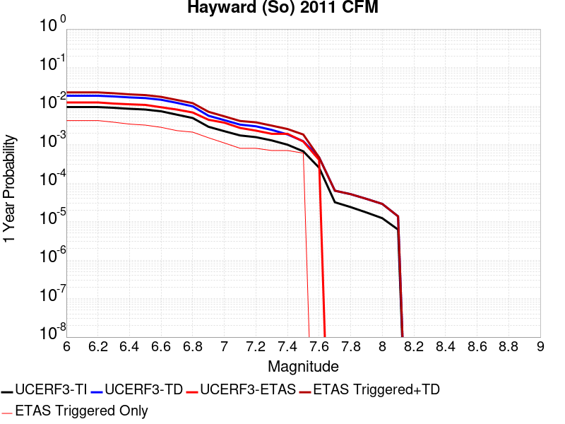 |  |

| Magnitude | 1 wk TI Prob | 1 wk TD Prob | 1 wk ETAS Prob | 1 wk ETAS/TD Gain | 1 wk ETAS Triggered+TD | 1 wk ETAS Triggered Only | 1 mo TI Prob | 1 mo TD Prob | 1 mo ETAS Prob | 1 mo ETAS/TD Gain | 1 mo ETAS Triggered+TD | 1 mo ETAS Triggered Only | 1 yr TI Prob | 1 yr TD Prob | 1 yr ETAS Prob | 1 yr ETAS/TD Gain | 1 yr ETAS Triggered+TD | 1 yr ETAS Triggered Only | 10 yr TI Prob | 10 yr TD Prob | 10 yr ETAS Prob | 10 yr ETAS/TD Gain | 10 yr ETAS Triggered+TD | 10 yr ETAS Triggered Only |
|-----|-----|-----|-----|-----|-----|-----|-----|-----|-----|-----|-----|-----|-----|-----|-----|-----|-----|-----|-----|-----|-----|-----|-----|-----|
| 6.0 | 1.8091932E-4 | 3.5765613E-4 | 4.0E-4 | 1.1183927 | 4.5762036E-4 | 1.0E-4 | 7.751381E-4 | 0.0015319216 | 0.0015 | 0.9791624 | 0.0020311556 | 5.0E-4 | 0.00939654 | 0.018494058 | 0.0124 | 0.6704856 | 0.022616383 | 0.0042 | 0.090090066 | 0.16695498 | 0.1163 | 0.69659495 | 0.19169642 | 0.0297 |
| 6.1 | 1.8091932E-4 | 3.5765613E-4 | 4.0E-4 | 1.1183927 | 4.5762036E-4 | 1.0E-4 | 7.751381E-4 | 0.0015319216 | 0.0015 | 0.9791624 | 0.0020311556 | 5.0E-4 | 0.00939654 | 0.018494058 | 0.0124 | 0.6704856 | 0.022616383 | 0.0042 | 0.090090066 | 0.16695498 | 0.1163 | 0.69659495 | 0.19169642 | 0.0297 |
| 6.2 | 1.8091932E-4 | 3.5765613E-4 | 4.0E-4 | 1.1183927 | 4.5762036E-4 | 1.0E-4 | 7.751381E-4 | 0.0015319216 | 0.0015 | 0.9791624 | 0.0020311556 | 5.0E-4 | 0.00939654 | 0.018494058 | 0.0124 | 0.6704856 | 0.022616383 | 0.0042 | 0.090090066 | 0.16695498 | 0.1163 | 0.69659495 | 0.19169642 | 0.0297 |
| 6.3 | 1.7322872E-4 | 3.4321143E-4 | 4.0E-4 | 1.1654624 | 4.4317712E-4 | 1.0E-4 | 7.4219756E-4 | 0.0014700866 | 0.0015 | 1.0203481 | 0.0019693517 | 5.0E-4 | 0.0089988755 | 0.017753698 | 0.0116 | 0.653385 | 0.021486234 | 0.0038 | 0.08643075 | 0.1608773 | 0.1116 | 0.6936964 | 0.18462448 | 0.0283 |
| 6.4 | 1.6334097E-4 | 3.2401126E-4 | 4.0E-4 | 1.234525 | 4.2397887E-4 | 1.0E-4 | 6.998449E-4 | 0.0013878894 | 0.0013 | 0.93667406 | 0.001687473 | 3.0E-4 | 0.008487372 | 0.016768651 | 0.0111 | 0.6619495 | 0.020111637 | 0.0034 | 0.081704415 | 0.15277977 | 0.1058 | 0.69250005 | 0.1748075 | 0.026 |
| 6.5 | 1.5600289E-4 | 3.1074387E-4 | 4.0E-4 | 1.2872337 | 4.1071282E-4 | 1.0E-4 | 6.684125E-4 | 0.0013310881 | 0.0013 | 0.9766446 | 0.0016306888 | 3.0E-4 | 0.008107598 | 0.016087472 | 0.0107 | 0.6651138 | 0.019235993 | 0.0032 | 0.078181036 | 0.1470464 | 0.1015 | 0.6902583 | 0.16768788 | 0.0242 |
| 6.6 | 1.4046066E-4 | 2.8085662E-4 | 4.0E-4 | 1.4242142 | 3.808285E-4 | 1.0E-4 | 6.018354E-4 | 0.0012031228 | 0.0012 | 0.99740446 | 0.0015027619 | 3.0E-4 | 0.0073027555 | 0.014551144 | 0.0093 | 0.639125 | 0.017310401 | 0.0028 | 0.07067384 | 0.13412571 | 0.0922 | 0.6874148 | 0.15352128 | 0.0224 |
| 6.7 | 1.14696966E-4 | 2.3318871E-4 | 4.0E-4 | 1.715349 | 3.331654E-4 | 1.0E-4 | 4.914658E-4 | 9.990025E-4 | 0.0012 | 1.2011982 | 0.0012987028 | 3.0E-4 | 0.0059671924 | 0.012096093 | 0.0081 | 0.66963774 | 0.014368271 | 0.0023 | 0.058094822 | 0.11294632 | 0.0764 | 0.67642754 | 0.12873587 | 0.0178 |
| 6.8 | 9.3874296E-5 | 1.8900879E-4 | 4.0E-4 | 2.1163037 | 2.889899E-4 | 1.0E-4 | 4.0225635E-4 | 8.0978987E-4 | 0.0011 | 1.3583771 | 0.001109547 | 3.0E-4 | 0.0048864787 | 0.0098153595 | 0.0068 | 0.6927917 | 0.011894748 | 0.0021 | 0.047804173 | 0.0927506 | 0.0615 | 0.6630685 | 0.10563354 | 0.0142 |
| 6.9 | 5.551852E-5 | 1.07537395E-4 | 4.0E-4 | 3.7196364 | 2.0752664E-4 | 1.0E-4 | 2.3791482E-4 | 4.6079376E-4 | 7.0E-4 | 1.5191178 | 6.607016E-4 | 2.0E-4 | 0.0028927654 | 0.0055958517 | 0.0044 | 0.7862967 | 0.007087458 | 0.0015 | 0.028553981 | 0.054349884 | 0.0385 | 0.7083732 | 0.062009647 | 0.0081 |
| 7.0 | 4.2662363E-5 | 8.265846E-5 | 3.0E-4 | 3.6293929 | 1.8265018E-4 | 1.0E-4 | 1.8282588E-4 | 3.542028E-4 | 6.0E-4 | 1.6939447 | 5.54132E-4 | 2.0E-4 | 0.0022236328 | 0.0043039657 | 0.0037 | 0.85967225 | 0.005399232 | 0.0011 | 0.022015138 | 0.0421553 | 0.0288 | 0.68318814 | 0.047615014 | 0.0057 |
| 7.1 | 3.305886E-5 | 6.3179745E-5 | 2.0E-4 | 3.1655717 | 1.6317342E-4 | 1.0E-4 | 1.4167312E-4 | 2.7074234E-4 | 4.0E-4 | 1.4774195 | 4.706882E-4 | 2.0E-4 | 0.0017235056 | 0.0032913245 | 0.0027 | 0.8203385 | 0.0040886914 | 8.0E-4 | 0.017101998 | 0.032528557 | 0.0213 | 0.6548093 | 0.0361082 | 0.0037 |
| 7.2 | 2.9856887E-5 | 5.7165485E-5 | 2.0E-4 | 3.4986145 | 1.5715977E-4 | 1.0E-4 | 1.2795182E-4 | 2.4497203E-4 | 4.0E-4 | 1.6328394 | 4.4492303E-4 | 2.0E-4 | 0.0015567001 | 0.0029784723 | 0.0023 | 0.772208 | 0.0037760893 | 8.0E-4 | 0.015458403 | 0.029525472 | 0.0189 | 0.6401253 | 0.032825086 | 0.0034 |
| 7.3 | 2.4559737E-5 | 4.611859E-5 | 1.0E-4 | 2.168323 | 1.4611398E-4 | 1.0E-4 | 1.0525176E-4 | 1.976362E-4 | 2.0E-4 | 1.0119604 | 3.9759668E-4 | 2.0E-4 | 0.0012806869 | 0.0024035785 | 0.0019 | 0.79048806 | 0.0031018958 | 7.0E-4 | 0.012733313 | 0.023918502 | 0.0158 | 0.66057646 | 0.026944356 | 0.0031 |
| 7.4 | 1.9002231E-5 | 3.5155885E-5 | 1.0E-4 | 2.8444738 | 1.3515237E-4 | 1.0E-4 | 8.143559E-5 | 1.5065944E-4 | 2.0E-4 | 1.3274974 | 3.506293E-4 | 2.0E-4 | 9.910273E-4 | 0.0018327453 | 0.0019 | 1.0366962 | 0.0025314623 | 7.0E-4 | 0.009866194 | 0.018309457 | 0.0117 | 0.63901407 | 0.020763684 | 0.0025 |
| 7.5 | 1.2783333E-5 | 2.3410546E-5 | 1.0E-4 | 4.2715793 | 1.234082E-4 | 1.0E-4 | 5.4784563E-5 | 1.0032709E-4 | 2.0E-4 | 1.9934796 | 3.0030703E-4 | 2.0E-4 | 6.667979E-4 | 0.0012208037 | 0.0012 | 0.98295903 | 0.0018200711 | 6.0E-4 | 0.006648007 | 0.012249034 | 0.0075 | 0.6122932 | 0.01392821 | 0.0017 |
| 7.6 | 4.8149627E-6 | 8.922251E-6 | 0.0 | 0.0 | 8.922251E-6 | 0.0 | 2.063539E-5 | 3.8237664E-5 | 0.0 | 0.0 | 3.8237664E-5 | 0.0 | 2.5120692E-4 | 4.6544537E-4 | 4.0E-4 | 0.859392 | 4.6544537E-4 | 0.0 | 0.0025092314 | 0.0046974504 | 0.0022 | 0.46833915 | 0.0050955717 | 4.0E-4 |
| 7.7 | 6.0838227E-7 | 1.2142598E-6 | 0.0 | 0.0 | 1.2142598E-6 | 0.0 | 2.6073499E-6 | 5.20396E-6 | 0.0 | 0.0 | 5.20396E-6 | 0.0 | 3.174402E-5 | 6.3356376E-5 | 0.0 | 0.0 | 6.3356376E-5 | 0.0 | 3.1739488E-4 | 6.5709534E-4 | 1.0E-4 | 0.15218492 | 6.5709534E-4 | 0.0 |
| 7.8 | 4.5542808E-7 | 9.867612E-7 | 0.0 | 0.0 | 9.867612E-7 | 0.0 | 1.9518332E-6 | 4.22897E-6 | 0.0 | 0.0 | 4.22897E-6 | 0.0 | 2.376331E-5 | 5.148649E-5 | 0.0 | 0.0 | 5.148649E-5 | 0.0 | 2.3760769E-4 | 5.357891E-4 | 1.0E-4 | 0.1866406 | 5.357891E-4 | 0.0 |
| 7.9 | 3.3016747E-7 | 7.442432E-7 | 0.0 | 0.0 | 7.442432E-7 | 0.0 | 1.4150027E-6 | 3.1896097E-6 | 0.0 | 0.0 | 3.1896097E-6 | 0.0 | 1.7227521E-5 | 3.8832808E-5 | 0.0 | 0.0 | 3.8832808E-5 | 0.0 | 1.7226185E-4 | 4.020222E-4 | 1.0E-4 | 0.24874248 | 4.020222E-4 | 0.0 |
| 8.0 | 2.347038E-7 | 5.5114964E-7 | 0.0 | 0.0 | 5.5114964E-7 | 0.0 | 1.0058731E-6 | 2.3620678E-6 | 0.0 | 0.0 | 2.3620678E-6 | 0.0 | 1.2246436E-5 | 2.8757797E-5 | 0.0 | 0.0 | 2.8757797E-5 | 0.0 | 1.2245761E-4 | 2.9548028E-4 | 1.0E-4 | 0.33843207 | 2.9548028E-4 | 0.0 |
| 8.1 | 1.18822804E-7 | 2.6242208E-7 | 0.0 | 0.0 | 2.6242208E-7 | 0.0 | 5.092405E-7 | 1.1246656E-6 | 0.0 | 0.0 | 1.1246656E-6 | 0.0 | 6.1999854E-6 | 1.3692717E-5 | 0.0 | 0.0 | 1.3692717E-5 | 0.0 | 6.199812E-5 | 1.4007684E-4 | 0.0 | 0.0 | 1.4007684E-4 | 0.0 |

## Laguna Salada
*[(top)](#table-of-contents)*

| 1 Week | 1 Month | 1 Year | 10 Year |
|-----|-----|-----|-----|
| 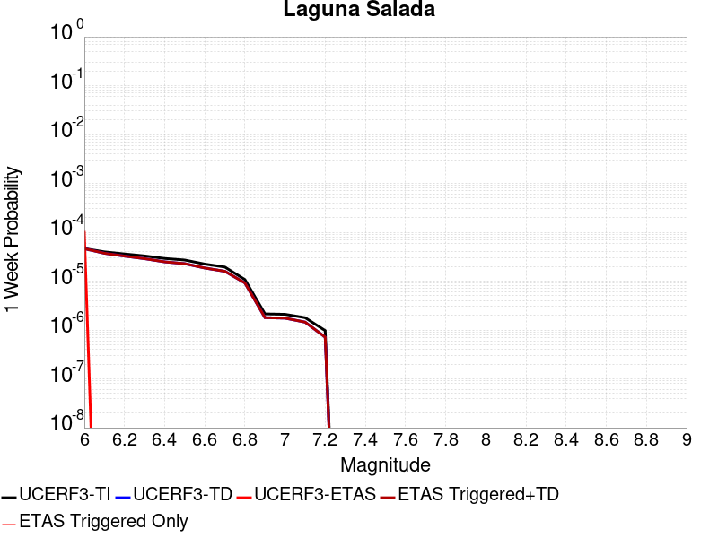 |  |  |  |

| Magnitude | 1 wk TI Prob | 1 wk TD Prob | 1 wk ETAS Prob | 1 wk ETAS/TD Gain | 1 wk ETAS Triggered+TD | 1 wk ETAS Triggered Only | 1 mo TI Prob | 1 mo TD Prob | 1 mo ETAS Prob | 1 mo ETAS/TD Gain | 1 mo ETAS Triggered+TD | 1 mo ETAS Triggered Only | 1 yr TI Prob | 1 yr TD Prob | 1 yr ETAS Prob | 1 yr ETAS/TD Gain | 1 yr ETAS Triggered+TD | 1 yr ETAS Triggered Only | 10 yr TI Prob | 10 yr TD Prob | 10 yr ETAS Prob | 10 yr ETAS/TD Gain | 10 yr ETAS Triggered+TD | 10 yr ETAS Triggered Only |
|-----|-----|-----|-----|-----|-----|-----|-----|-----|-----|-----|-----|-----|-----|-----|-----|-----|-----|-----|-----|-----|-----|-----|-----|-----|
| 6.0 | 4.6465593E-5 | 4.6373963E-5 | 1.0E-4 | 2.1563826 | 4.6373963E-5 | 0.0 | 1.9912305E-4 | 1.9873051E-4 | 5.0E-4 | 2.51597 | 3.9869075E-4 | 2.0E-4 | 0.0024216278 | 0.0024169385 | 0.007 | 2.896226 | 0.006806304 | 0.0044 | 0.02395408 | 0.024003977 | 0.0525 | 2.1871376 | 0.050941467 | 0.0276 |
| 6.1 | 3.982297E-5 | 3.7267266E-5 | 0.0 | 0.0 | 3.7267266E-5 | 0.0 | 1.706587E-4 | 1.5970763E-4 | 1.0E-4 | 0.6261442 | 2.5969165E-4 | 1.0E-4 | 0.0020757897 | 0.0019428025 | 0.0026 | 1.3382729 | 0.003539694 | 0.0016 | 0.020565065 | 0.019357445 | 0.0199 | 1.0280282 | 0.030046448 | 0.0109 |
| 6.2 | 3.6067784E-5 | 3.2620814E-5 | 0.0 | 0.0 | 3.2620814E-5 | 0.0 | 1.5456705E-4 | 1.3979647E-4 | 1.0E-4 | 0.71532565 | 2.3978249E-4 | 1.0E-4 | 0.0018802295 | 0.0017007876 | 0.0021 | 1.2347221 | 0.0029985765 | 0.0013 | 0.018644003 | 0.016968282 | 0.0177 | 1.0431226 | 0.026601993 | 0.0098 |
| 6.3 | 3.2859112E-5 | 2.8864519E-5 | 0.0 | 0.0 | 2.8864519E-5 | 0.0 | 1.4081717E-4 | 1.2369965E-4 | 0.0 | 0.0 | 1.2369965E-4 | 0.0 | 0.0017131006 | 0.0015050957 | 0.0019 | 1.2623782 | 0.00260344 | 0.0011 | 0.016999546 | 0.015035219 | 0.0152 | 1.0109596 | 0.022717943 | 0.0078 |
| 6.4 | 2.9132116E-5 | 2.4865003E-5 | 0.0 | 0.0 | 2.4865003E-5 | 0.0 | 1.2484594E-4 | 1.0656044E-4 | 0.0 | 0.0 | 1.0656044E-4 | 0.0 | 0.0015189396 | 0.00129669 | 0.0016 | 1.233911 | 0.0022953933 | 0.001 | 0.015085992 | 0.012966283 | 0.0127 | 0.97946346 | 0.019382002 | 0.0065 |
| 6.5 | 2.7075037E-5 | 2.2836139E-5 | 0.0 | 0.0 | 2.2836139E-5 | 0.0 | 1.1603071E-4 | 9.786599E-5 | 0.0 | 0.0 | 9.786599E-5 | 0.0 | 0.0014117584 | 0.0011909555 | 0.0014 | 1.1755267 | 0.0021897645 | 0.001 | 0.014028233 | 0.011916563 | 0.0118 | 0.9902184 | 0.01804268 | 0.0062 |
| 6.6 | 2.2367465E-5 | 1.8582496E-5 | 0.0 | 0.0 | 1.8582496E-5 | 0.0 | 9.5857045E-5 | 7.9637306E-5 | 0.0 | 0.0 | 7.9637306E-5 | 0.0 | 0.0011664346 | 9.6923526E-4 | 0.001 | 1.0317413 | 0.0017684599 | 8.0E-4 | 0.011603311 | 0.009705469 | 0.0096 | 0.989133 | 0.014755972 | 0.0051 |
| 6.7 | 1.9458053E-5 | 1.592166E-5 | 0.0 | 0.0 | 1.592166E-5 | 0.0 | 8.338899E-5 | 6.823435E-5 | 0.0 | 0.0 | 6.823435E-5 | 0.0 | 0.001014788 | 8.3051703E-4 | 8.0E-4 | 0.9632554 | 0.0015299356 | 7.0E-4 | 0.010101665 | 0.008322222 | 0.0082 | 0.98531383 | 0.012586436 | 0.0043 |
| 6.8 | 1.0767866E-5 | 9.187752E-6 | 0.0 | 0.0 | 9.187752E-6 | 0.0 | 4.614718E-5 | 3.9375875E-5 | 0.0 | 0.0 | 3.9375875E-5 | 0.0 | 5.6169706E-4 | 4.7936453E-4 | 2.0E-4 | 0.417219 | 6.792687E-4 | 2.0E-4 | 0.0056027942 | 0.0048108255 | 0.0043 | 0.89381754 | 0.0069007226 | 0.0021 |
| 6.9 | 2.1384765E-6 | 1.7916673E-6 | 0.0 | 0.0 | 1.7916673E-6 | 0.0 | 9.164866E-6 | 7.678554E-6 | 0.0 | 0.0 | 7.678554E-6 | 0.0 | 1.1157654E-4 | 9.348277E-5 | 0.0 | 0.0 | 9.348277E-5 | 0.0 | 0.0011152053 | 9.344727E-4 | 1.0E-4 | 0.10701222 | 9.344727E-4 | 0.0 |
| 7.0 | 2.0952946E-6 | 1.7496012E-6 | 0.0 | 0.0 | 1.7496012E-6 | 0.0 | 8.979802E-6 | 7.4982718E-6 | 0.0 | 0.0 | 7.4982718E-6 | 0.0 | 1.0932361E-4 | 9.128802E-5 | 0.0 | 0.0 | 9.128802E-5 | 0.0 | 0.0010926984 | 9.1254344E-4 | 1.0E-4 | 0.109583825 | 9.1254344E-4 | 0.0 |
| 7.1 | 1.7887576E-6 | 1.4502972E-6 | 0.0 | 0.0 | 1.4502972E-6 | 0.0 | 7.666081E-6 | 6.2155464E-6 | 0.0 | 0.0 | 6.2155464E-6 | 0.0 | 9.333054E-5 | 7.567195E-5 | 0.0 | 0.0 | 7.567195E-5 | 0.0 | 9.329135E-4 | 7.5649226E-4 | 1.0E-4 | 0.13218905 | 7.5649226E-4 | 0.0 |
| 7.2 | 9.723109E-7 | 7.1374023E-7 | 0.0 | 0.0 | 7.1374023E-7 | 0.0 | 4.16704E-6 | 3.058884E-6 | 0.0 | 0.0 | 3.058884E-6 | 0.0 | 5.073253E-5 | 3.7241443E-5 | 0.0 | 0.0 | 3.7241443E-5 | 0.0 | 5.072095E-4 | 3.7236826E-4 | 1.0E-4 | 0.26855135 | 3.7236826E-4 | 0.0 |

## San Andreas (Cholame) rev
*[(top)](#table-of-contents)*

| 1 Week | 1 Month | 1 Year | 10 Year |
|-----|-----|-----|-----|
| 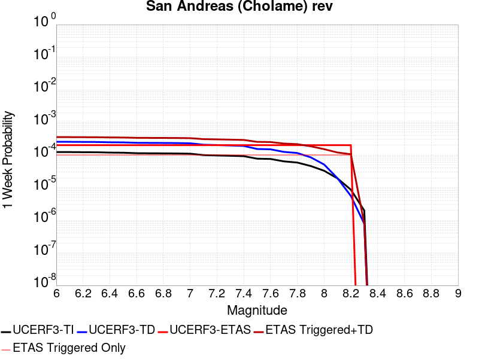 | 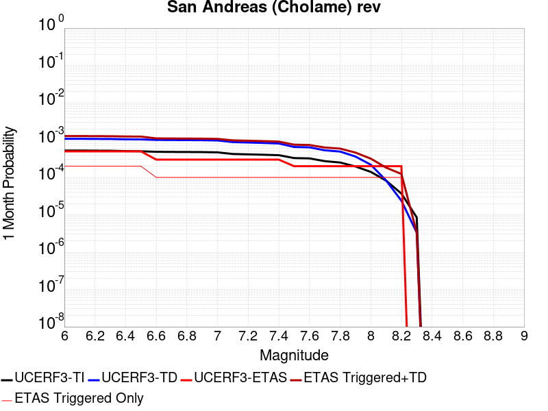 | 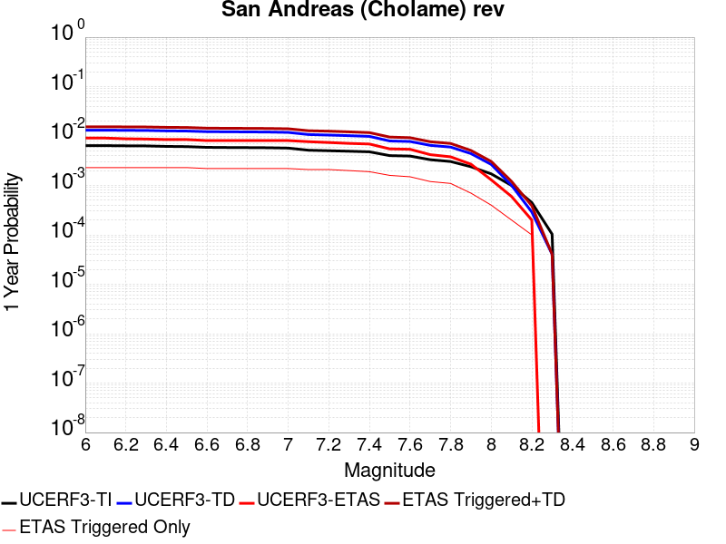 |  |

| Magnitude | 1 wk TI Prob | 1 wk TD Prob | 1 wk ETAS Prob | 1 wk ETAS/TD Gain | 1 wk ETAS Triggered+TD | 1 wk ETAS Triggered Only | 1 mo TI Prob | 1 mo TD Prob | 1 mo ETAS Prob | 1 mo ETAS/TD Gain | 1 mo ETAS Triggered+TD | 1 mo ETAS Triggered Only | 1 yr TI Prob | 1 yr TD Prob | 1 yr ETAS Prob | 1 yr ETAS/TD Gain | 1 yr ETAS Triggered+TD | 1 yr ETAS Triggered Only | 10 yr TI Prob | 10 yr TD Prob | 10 yr ETAS Prob | 10 yr ETAS/TD Gain | 10 yr ETAS Triggered+TD | 10 yr ETAS Triggered Only |
|-----|-----|-----|-----|-----|-----|-----|-----|-----|-----|-----|-----|-----|-----|-----|-----|-----|-----|-----|-----|-----|-----|-----|-----|-----|
| 6.0 | 1.2302514E-4 | 2.5353258E-4 | 2.0E-4 | 0.7888532 | 3.5350723E-4 | 1.0E-4 | 5.27144E-4 | 0.0010861174 | 5.0E-4 | 0.4603554 | 0.0012859001 | 2.0E-4 | 0.0063991086 | 0.013143817 | 0.0091 | 0.69234073 | 0.015413586 | 0.0023 | 0.06217949 | 0.12502015 | 0.0852 | 0.6814902 | 0.14619465 | 0.0242 |
| 6.1 | 1.2302514E-4 | 2.5353258E-4 | 2.0E-4 | 0.7888532 | 3.5350723E-4 | 1.0E-4 | 5.27144E-4 | 0.0010861174 | 5.0E-4 | 0.4603554 | 0.0012859001 | 2.0E-4 | 0.0063991086 | 0.013143817 | 0.0091 | 0.69234073 | 0.015413586 | 0.0023 | 0.06217949 | 0.12502015 | 0.0852 | 0.6814902 | 0.14619465 | 0.0242 |
| 6.2 | 1.2203569E-4 | 2.5169857E-4 | 2.0E-4 | 0.79460126 | 3.516734E-4 | 1.0E-4 | 5.2290526E-4 | 0.0010782639 | 5.0E-4 | 0.4637084 | 0.0012780481 | 2.0E-4 | 0.006347804 | 0.013049348 | 0.0088 | 0.67436314 | 0.015319335 | 0.0023 | 0.061695136 | 0.12420747 | 0.0844 | 0.67950827 | 0.14540164 | 0.0242 |
| 6.3 | 1.2142645E-4 | 2.5055723E-4 | 2.0E-4 | 0.7982208 | 3.5053218E-4 | 1.0E-4 | 5.202953E-4 | 0.0010733764 | 5.0E-4 | 0.4658198 | 0.0012731617 | 2.0E-4 | 0.006316212 | 0.012990556 | 0.0087 | 0.6697173 | 0.015260678 | 0.0023 | 0.06139677 | 0.123700656 | 0.084 | 0.6790586 | 0.14473185 | 0.024 |
| 6.4 | 1.1865206E-4 | 2.4560327E-4 | 2.0E-4 | 0.8143214 | 3.455787E-4 | 1.0E-4 | 5.0840975E-4 | 0.0010521624 | 5.0E-4 | 0.4752118 | 0.001251952 | 2.0E-4 | 0.006172335 | 0.01273532 | 0.0085 | 0.66743517 | 0.015006029 | 0.0023 | 0.060036868 | 0.121496946 | 0.0819 | 0.67409104 | 0.14205392 | 0.0234 |
| 6.5 | 1.17443946E-4 | 2.435299E-4 | 2.0E-4 | 0.8212544 | 3.4350556E-4 | 1.0E-4 | 5.032341E-4 | 0.0010432837 | 5.0E-4 | 0.47925603 | 0.001243075 | 2.0E-4 | 0.006109677 | 0.012628476 | 0.0085 | 0.673082 | 0.014899431 | 0.0023 | 0.059444077 | 0.12057233 | 0.0811 | 0.6726253 | 0.14079916 | 0.023 |
| 6.6 | 1.13579066E-4 | 2.3660231E-4 | 2.0E-4 | 0.84530026 | 3.3657867E-4 | 1.0E-4 | 4.866766E-4 | 0.0010136174 | 3.0E-4 | 0.29596967 | 0.001113516 | 1.0E-4 | 0.0059092017 | 0.012271411 | 0.0081 | 0.6600708 | 0.014444414 | 0.0022 | 0.057545185 | 0.117488034 | 0.0792 | 0.6741112 | 0.1372563 | 0.0224 |
| 6.7 | 1.1271412E-4 | 2.3504205E-4 | 2.0E-4 | 0.85091156 | 3.3501856E-4 | 1.0E-4 | 4.829711E-4 | 0.0010069357 | 3.0E-4 | 0.2979336 | 0.0011068351 | 1.0E-4 | 0.005864331 | 0.012190975 | 0.0081 | 0.6644259 | 0.014364155 | 0.0022 | 0.057119697 | 0.11678986 | 0.0785 | 0.6721474 | 0.13639712 | 0.0222 |
| 6.8 | 1.1217975E-4 | 2.3392268E-4 | 2.0E-4 | 0.8549833 | 3.3389928E-4 | 1.0E-4 | 4.8068175E-4 | 0.0010021421 | 3.0E-4 | 0.29935873 | 0.0011020419 | 1.0E-4 | 0.005836608 | 0.012133265 | 0.0081 | 0.6675862 | 0.014306571 | 0.0022 | 0.056856725 | 0.11628858 | 0.0781 | 0.67160505 | 0.13564186 | 0.0219 |
| 6.9 | 1.1146753E-4 | 2.3240627E-4 | 2.0E-4 | 0.86056197 | 3.3238303E-4 | 1.0E-4 | 4.7763053E-4 | 9.956482E-4 | 3.0E-4 | 0.30131125 | 0.0010955486 | 1.0E-4 | 0.0057996577 | 0.012055079 | 0.0081 | 0.67191595 | 0.014228558 | 0.0022 | 0.056506127 | 0.11560858 | 0.0774 | 0.66950047 | 0.13479987 | 0.0217 |
| 7.0 | 1.0965793E-4 | 2.2862821E-4 | 2.0E-4 | 0.8747827 | 3.2860535E-4 | 1.0E-4 | 4.698779E-4 | 9.794688E-4 | 3.0E-4 | 0.30628848 | 0.0010793708 | 1.0E-4 | 0.005705768 | 0.011860255 | 0.0081 | 0.68295324 | 0.014034163 | 0.0022 | 0.055614736 | 0.113908455 | 0.0765 | 0.67159194 | 0.13287081 | 0.0214 |
| 7.1 | 9.927982E-5 | 2.0676776E-4 | 2.0E-4 | 0.9672688 | 3.0674707E-4 | 1.0E-4 | 4.2541555E-4 | 8.858476E-4 | 3.0E-4 | 0.3386587 | 9.85759E-4 | 1.0E-4 | 0.0051671406 | 0.010732157 | 0.0077 | 0.71746993 | 0.01280962 | 0.0021 | 0.05048634 | 0.10396924 | 0.0681 | 0.6550014 | 0.12072501 | 0.0187 |
| 7.2 | 9.696786E-5 | 2.0180116E-4 | 2.0E-4 | 0.99107456 | 3.0178096E-4 | 1.0E-4 | 4.1551032E-4 | 8.645765E-4 | 3.0E-4 | 0.3469907 | 9.6449E-4 | 1.0E-4 | 0.00504711 | 0.0104757 | 0.0074 | 0.7063967 | 0.012553701 | 0.0021 | 0.04934009 | 0.10170234 | 0.0661 | 0.6499359 | 0.11805136 | 0.0182 |
| 7.3 | 9.4727984E-5 | 1.9607002E-4 | 2.0E-4 | 1.0200437 | 2.9605042E-4 | 1.0E-4 | 4.0591392E-4 | 8.400305E-4 | 3.0E-4 | 0.3571299 | 9.399465E-4 | 1.0E-4 | 0.0049308087 | 0.010179684 | 0.0071 | 0.6974676 | 0.012159324 | 0.002 | 0.048228268 | 0.09906598 | 0.064 | 0.6460341 | 0.114652134 | 0.0173 |
| 7.4 | 9.220358E-5 | 1.8975048E-4 | 2.0E-4 | 1.0540158 | 2.897315E-4 | 1.0E-4 | 3.9509835E-4 | 8.129638E-4 | 3.0E-4 | 0.3690201 | 9.1288256E-4 | 1.0E-4 | 0.004799717 | 0.0098531665 | 0.0069 | 0.7002825 | 0.011734446 | 0.0019 | 0.046973653 | 0.09613071 | 0.0621 | 0.64599544 | 0.11131571 | 0.0168 |
| 7.5 | 7.71631E-5 | 1.5293561E-4 | 2.0E-4 | 1.30774 | 2.5292032E-4 | 1.0E-4 | 3.306571E-4 | 6.5527385E-4 | 2.0E-4 | 0.3052159 | 7.552083E-4 | 1.0E-4 | 0.0040183207 | 0.007948848 | 0.0055 | 0.6919241 | 0.00953613 | 0.0016 | 0.03946433 | 0.07880516 | 0.049 | 0.62178665 | 0.0907807 | 0.013 |
| 7.6 | 7.5634416E-5 | 1.4951441E-4 | 2.0E-4 | 1.3376637 | 2.4949946E-4 | 1.0E-4 | 3.241072E-4 | 6.406189E-4 | 2.0E-4 | 0.3121981 | 7.405548E-4 | 1.0E-4 | 0.0039388672 | 0.007771711 | 0.0054 | 0.6948277 | 0.009260054 | 0.0015 | 0.038697794 | 0.07716541 | 0.0484 | 0.627224 | 0.088977695 | 0.0128 |
| 7.7 | 6.3783E-5 | 1.2460953E-4 | 2.0E-4 | 1.6050137 | 2.2459707E-4 | 1.0E-4 | 2.7332708E-4 | 5.339316E-4 | 2.0E-4 | 0.37457982 | 6.3387817E-4 | 1.0E-4 | 0.0033226798 | 0.0064812684 | 0.0042 | 0.6480213 | 0.007673491 | 0.0012 | 0.032734364 | 0.06501345 | 0.0397 | 0.61064285 | 0.07473731 | 0.0104 |
| 7.8 | 5.863422E-5 | 1.150899E-4 | 2.0E-4 | 1.737772 | 2.1507838E-4 | 1.0E-4 | 2.512653E-4 | 4.931492E-4 | 2.0E-4 | 0.40555677 | 5.930999E-4 | 1.0E-4 | 0.003054864 | 0.005987584 | 0.0038 | 0.6346466 | 0.007080998 | 0.0011 | 0.030132094 | 0.060091686 | 0.037 | 0.61572576 | 0.069020815 | 0.0095 |
| 7.9 | 4.595283E-5 | 8.494302E-5 | 2.0E-4 | 2.3545196 | 1.8493453E-4 | 1.0E-4 | 1.9692584E-4 | 3.6399075E-4 | 2.0E-4 | 0.5494645 | 4.6395435E-4 | 1.0E-4 | 0.0023949358 | 0.004422589 | 0.0027 | 0.6105021 | 0.005119493 | 7.0E-4 | 0.023692891 | 0.044683352 | 0.0262 | 0.5863481 | 0.050606318 | 0.0062 |
| 8.0 | 3.2950178E-5 | 5.119775E-5 | 2.0E-4 | 3.906422 | 1.5119262E-4 | 1.0E-4 | 1.412074E-4 | 2.1940048E-4 | 2.0E-4 | 0.9115751 | 3.1937854E-4 | 1.0E-4 | 0.0017178444 | 0.0026679304 | 0.0013 | 0.4872691 | 0.0030668632 | 4.0E-4 | 0.017046256 | 0.027389893 | 0.0151 | 0.55129826 | 0.030502247 | 0.0032 |
| 8.1 | 1.9177472E-5 | 1.9395513E-5 | 2.0E-4 | 10.311663 | 1.19393575E-4 | 1.0E-4 | 8.218658E-5 | 8.312098E-5 | 2.0E-4 | 2.4061313 | 1.8311267E-4 | 1.0E-4 | 0.0010001622 | 0.0010115288 | 6.0E-4 | 0.5931616 | 0.0012113265 | 2.0E-4 | 0.009956728 | 0.010868762 | 0.0055 | 0.5060374 | 0.012055719 | 0.0012 |
| 8.2 | 8.643924E-6 | 5.5536157E-6 | 2.0E-4 | 36.012573 | 1.0555306E-4 | 1.0E-4 | 3.704486E-5 | 2.3800994E-5 | 2.0E-4 | 8.40301 | 1.2379861E-4 | 1.0E-4 | 4.5092785E-4 | 2.8973864E-4 | 2.0E-4 | 0.6902773 | 3.8970966E-4 | 1.0E-4 | 0.0045001395 | 0.0032917638 | 0.0013 | 0.39492503 | 0.0036904472 | 4.0E-4 |
| 8.3 | 1.983087E-6 | 7.7872784E-7 | 0.0 | 0.0 | 7.7872784E-7 | 0.0 | 8.498917E-6 | 3.3374008E-6 | 0.0 | 0.0 | 3.3374008E-6 | 0.0 | 1.034694E-4 | 4.0632116E-5 | 0.0 | 0.0 | 4.0632116E-5 | 0.0 | 0.0010342124 | 4.792776E-4 | 1.0E-4 | 0.20864734 | 4.792776E-4 | 0.0 |

## San Andreas (Offshore) 2011 CFM
*[(top)](#table-of-contents)*

| 1 Week | 1 Month | 1 Year | 10 Year |
|-----|-----|-----|-----|
|  |  |  | 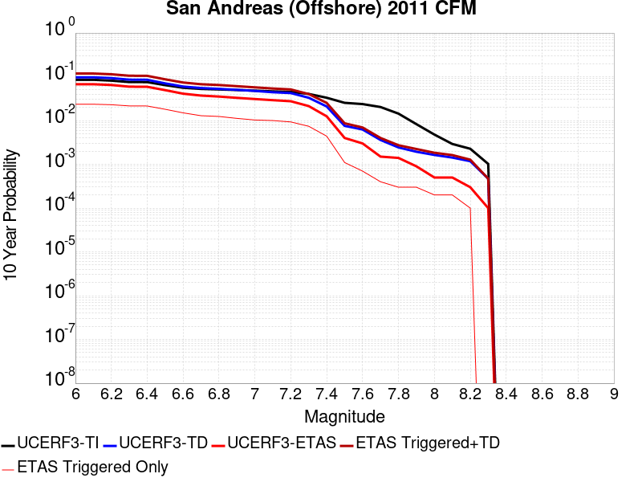 |

| Magnitude | 1 wk TI Prob | 1 wk TD Prob | 1 wk ETAS Prob | 1 wk ETAS/TD Gain | 1 wk ETAS Triggered+TD | 1 wk ETAS Triggered Only | 1 mo TI Prob | 1 mo TD Prob | 1 mo ETAS Prob | 1 mo ETAS/TD Gain | 1 mo ETAS Triggered+TD | 1 mo ETAS Triggered Only | 1 yr TI Prob | 1 yr TD Prob | 1 yr ETAS Prob | 1 yr ETAS/TD Gain | 1 yr ETAS Triggered+TD | 1 yr ETAS Triggered Only | 10 yr TI Prob | 10 yr TD Prob | 10 yr ETAS Prob | 10 yr ETAS/TD Gain | 10 yr ETAS Triggered+TD | 10 yr ETAS Triggered Only |
|-----|-----|-----|-----|-----|-----|-----|-----|-----|-----|-----|-----|-----|-----|-----|-----|-----|-----|-----|-----|-----|-----|-----|-----|-----|
| 6.0 | 1.7072787E-4 | 1.931722E-4 | 1.0E-4 | 0.51767284 | 1.931722E-4 | 0.0 | 7.3148566E-4 | 8.276206E-4 | 8.0E-4 | 0.96662647 | 0.0013272068 | 5.0E-4 | 0.008869528 | 0.010030246 | 0.0079 | 0.78761774 | 0.012802161 | 0.0028 | 0.085237645 | 0.09722937 | 0.0675 | 0.69423467 | 0.11853476 | 0.0236 |
| 6.1 | 1.7072787E-4 | 1.931722E-4 | 1.0E-4 | 0.51767284 | 1.931722E-4 | 0.0 | 7.3148566E-4 | 8.276206E-4 | 8.0E-4 | 0.96662647 | 0.0013272068 | 5.0E-4 | 0.008869528 | 0.010030246 | 0.0079 | 0.78761774 | 0.012802161 | 0.0028 | 0.085237645 | 0.09722937 | 0.0675 | 0.69423467 | 0.11853476 | 0.0236 |
| 6.2 | 1.6312556E-4 | 1.849565E-4 | 1.0E-4 | 0.54066765 | 1.849565E-4 | 0.0 | 6.989222E-4 | 7.9243234E-4 | 8.0E-4 | 1.0095499 | 0.0012920361 | 5.0E-4 | 0.008476226 | 0.009605687 | 0.0077 | 0.80160844 | 0.012279752 | 0.0027 | 0.08160117 | 0.0932325 | 0.0649 | 0.6961092 | 0.114088155 | 0.023 |
| 6.3 | 1.5103363E-4 | 1.6963574E-4 | 1.0E-4 | 0.5894984 | 1.6963574E-4 | 0.0 | 6.471264E-4 | 7.2680996E-4 | 8.0E-4 | 1.1007004 | 0.0012264466 | 5.0E-4 | 0.007850339 | 0.008813457 | 0.0074 | 0.8396252 | 0.0114896605 | 0.0027 | 0.075787395 | 0.08585153 | 0.0594 | 0.6918922 | 0.10559713 | 0.0216 |
| 6.4 | 1.5047993E-4 | 1.6849337E-4 | 1.0E-4 | 0.5934952 | 1.6849337E-4 | 0.0 | 6.4475456E-4 | 7.219168E-4 | 8.0E-4 | 1.108161 | 0.0012215559 | 5.0E-4 | 0.007821669 | 0.0087543605 | 0.0074 | 0.845293 | 0.0114307245 | 0.0027 | 0.0755203 | 0.085331134 | 0.059 | 0.6914241 | 0.10499652 | 0.0215 |
| 6.5 | 1.2760791E-4 | 1.3808094E-4 | 1.0E-4 | 0.7242129 | 1.3808094E-4 | 0.0 | 5.467764E-4 | 5.9164263E-4 | 6.0E-4 | 1.0141257 | 8.9146517E-4 | 3.0E-4 | 0.0066367025 | 0.007179735 | 0.0063 | 0.87746966 | 0.0091653755 | 0.002 | 0.064419635 | 0.07060439 | 0.0495 | 0.7010895 | 0.087426454 | 0.0181 |
| 6.6 | 1.1063525E-4 | 1.16224124E-4 | 0.0 | 0.0 | 1.16224124E-4 | 0.0 | 4.740649E-4 | 4.980094E-4 | 4.0E-4 | 0.80319774 | 6.979098E-4 | 2.0E-4 | 0.0057564764 | 0.006046612 | 0.0048 | 0.79383296 | 0.0076369373 | 0.0016 | 0.05609626 | 0.059807096 | 0.0411 | 0.6872094 | 0.07390999 | 0.015 |
| 6.7 | 1.0391049E-4 | 1.0709033E-4 | 0.0 | 0.0 | 1.0709033E-4 | 0.0 | 4.4525467E-4 | 4.5887884E-4 | 4.0E-4 | 0.8716898 | 6.5878703E-4 | 2.0E-4 | 0.0054075094 | 0.0055727283 | 0.0045 | 0.80750394 | 0.0069649266 | 0.0014 | 0.052778035 | 0.05528944 | 0.0372 | 0.6728229 | 0.067476206 | 0.0129 |
| 6.8 | 1.0096706E-4 | 1.0219972E-4 | 0.0 | 0.0 | 1.0219972E-4 | 0.0 | 4.3264418E-4 | 4.3792624E-4 | 4.0E-4 | 0.9133958 | 6.378387E-4 | 2.0E-4 | 0.0052547283 | 0.005318897 | 0.0043 | 0.8084383 | 0.0067114504 | 0.0014 | 0.051321987 | 0.05298314 | 0.0353 | 0.6662497 | 0.06472615 | 0.0124 |
| 6.9 | 9.800265E-5 | 9.6493844E-5 | 0.0 | 0.0 | 9.6493844E-5 | 0.0 | 4.1994374E-4 | 4.1348045E-4 | 2.0E-4 | 0.48369882 | 4.1348045E-4 | 0.0 | 0.0051008356 | 0.005022675 | 0.0039 | 0.77647865 | 0.00611715 | 0.0011 | 0.049853306 | 0.05030631 | 0.033 | 0.65598136 | 0.060942877 | 0.0112 |
| 7.0 | 9.4642375E-5 | 9.061357E-5 | 0.0 | 0.0 | 9.061357E-5 | 0.0 | 4.0554712E-4 | 3.8828698E-4 | 2.0E-4 | 0.51508296 | 3.8828698E-4 | 0.0 | 0.004926363 | 0.0047173114 | 0.0037 | 0.7843451 | 0.005613066 | 9.0E-4 | 0.048185747 | 0.047482535 | 0.031 | 0.6528716 | 0.057293463 | 0.0103 |
| 7.1 | 9.0996844E-5 | 8.411894E-5 | 0.0 | 0.0 | 8.411894E-5 | 0.0 | 3.8992817E-4 | 3.6046078E-4 | 1.0E-4 | 0.2774227 | 3.6046078E-4 | 0.0 | 0.004737046 | 0.0043799374 | 0.0032 | 0.730604 | 0.0052759955 | 9.0E-4 | 0.04637333 | 0.04432635 | 0.0292 | 0.6587504 | 0.053883087 | 0.01 |
| 7.2 | 8.848287E-5 | 8.038044E-5 | 0.0 | 0.0 | 8.038044E-5 | 0.0 | 3.791572E-4 | 3.44443E-4 | 1.0E-4 | 0.2903238 | 3.44443E-4 | 0.0 | 0.004606472 | 0.004185686 | 0.003 | 0.71672845 | 0.0050819186 | 9.0E-4 | 0.045121472 | 0.04246427 | 0.0276 | 0.64995813 | 0.051369354 | 0.0093 |
| 7.3 | 7.9280784E-5 | 6.173059E-5 | 0.0 | 0.0 | 6.173059E-5 | 0.0 | 3.3973053E-4 | 2.6453342E-4 | 1.0E-4 | 0.37802404 | 2.6453342E-4 | 0.0 | 0.004128377 | 0.003216042 | 0.0021 | 0.6529766 | 0.003913791 | 7.0E-4 | 0.040525194 | 0.033132788 | 0.0214 | 0.6458859 | 0.040287606 | 0.0074 |
| 7.4 | 6.468038E-5 | 3.823813E-5 | 0.0 | 0.0 | 3.823813E-5 | 0.0 | 2.771722E-4 | 1.6386773E-4 | 1.0E-4 | 0.61024827 | 1.6386773E-4 | 0.0 | 0.0033693502 | 0.0019933227 | 0.0014 | 0.7023449 | 0.0023925253 | 4.0E-4 | 0.0331872 | 0.02098371 | 0.0125 | 0.59570014 | 0.025291383 | 0.0044 |
| 7.5 | 4.930574E-5 | 1.2845645E-5 | 0.0 | 0.0 | 1.2845645E-5 | 0.0 | 2.1129321E-4 | 5.505161E-5 | 1.0E-4 | 1.8164773 | 5.505161E-5 | 0.0 | 0.0025694598 | 6.700489E-4 | 4.0E-4 | 0.5969714 | 6.700489E-4 | 0.0 | 0.02539953 | 0.0075664837 | 0.004 | 0.5286472 | 0.00865816 | 0.0011 |
| 7.6 | 4.612566E-5 | 1.0463181E-5 | 0.0 | 0.0 | 1.0463181E-5 | 0.0 | 1.9766642E-4 | 4.484144E-5 | 0.0 | 0.0 | 4.484144E-5 | 0.0 | 0.0024039324 | 5.4580916E-4 | 3.0E-4 | 0.5496427 | 5.4580916E-4 | 0.0 | 0.023780935 | 0.0062489733 | 0.003 | 0.48007885 | 0.006944599 | 7.0E-4 |
| 7.7 | 3.9435414E-5 | 5.6729614E-6 | 0.0 | 0.0 | 5.6729614E-6 | 0.0 | 1.6899795E-4 | 2.4312465E-5 | 0.0 | 0.0 | 2.4312465E-5 | 0.0 | 0.0020556084 | 2.9596424E-4 | 0.0 | 0.0 | 2.9596424E-4 | 0.0 | 0.020366974 | 0.003602467 | 0.0015 | 0.41638133 | 0.004001026 | 4.0E-4 |
| 7.8 | 2.7787428E-5 | 3.8256385E-6 | 0.0 | 0.0 | 3.8256385E-6 | 0.0 | 1.1908354E-4 | 1.639549E-5 | 0.0 | 0.0 | 1.639549E-5 | 0.0 | 0.0014488777 | 1.9959683E-4 | 0.0 | 0.0 | 1.9959683E-4 | 0.0 | 0.014394675 | 0.0024306213 | 0.0014 | 0.5759844 | 0.002729892 | 3.0E-4 |
| 7.9 | 1.590671E-5 | 3.0961621E-6 | 0.0 | 0.0 | 3.0961621E-6 | 0.0 | 6.816983E-5 | 1.32691985E-5 | 0.0 | 0.0 | 1.32691985E-5 | 0.0 | 8.2965166E-4 | 1.6154055E-4 | 0.0 | 0.0 | 1.6154055E-4 | 0.0 | 0.008265611 | 0.0019372021 | 9.0E-4 | 0.46458757 | 0.002236621 | 3.0E-4 |
| 8.0 | 9.193638E-6 | 2.6383473E-6 | 0.0 | 0.0 | 2.6383473E-6 | 0.0 | 3.940071E-5 | 1.1307154E-5 | 0.0 | 0.0 | 1.1307154E-5 | 0.0 | 4.7959806E-4 | 1.3765592E-4 | 0.0 | 0.0 | 1.3765592E-4 | 0.0 | 0.0047856434 | 0.0016384409 | 5.0E-4 | 0.30516815 | 0.0018381132 | 2.0E-4 |
| 8.1 | 5.601576E-6 | 2.276788E-6 | 0.0 | 0.0 | 2.276788E-6 | 0.0 | 2.4006533E-5 | 9.757627E-6 | 0.0 | 0.0 | 9.757627E-6 | 0.0 | 2.9224035E-4 | 1.1879266E-4 | 0.0 | 0.0 | 1.1879266E-4 | 0.0 | 0.0029185633 | 0.0014266082 | 5.0E-4 | 0.35048166 | 0.0016263229 | 2.0E-4 |
| 8.2 | 4.3508785E-6 | 1.8911306E-6 | 0.0 | 0.0 | 1.8911306E-6 | 0.0 | 1.864649E-5 | 8.10482E-6 | 0.0 | 0.0 | 8.10482E-6 | 0.0 | 2.2699735E-4 | 9.867175E-5 | 0.0 | 0.0 | 9.867175E-5 | 0.0 | 0.0022676561 | 0.001178614 | 3.0E-4 | 0.25453627 | 0.0012784961 | 1.0E-4 |
| 8.3 | 1.9573292E-6 | 7.640128E-7 | 0.0 | 0.0 | 7.640128E-7 | 0.0 | 8.388526E-6 | 3.2743364E-6 | 0.0 | 0.0 | 3.2743364E-6 | 0.0 | 1.0212552E-4 | 3.9864335E-5 | 0.0 | 0.0 | 3.9864335E-5 | 0.0 | 0.001020786 | 4.712801E-4 | 1.0E-4 | 0.21218804 | 4.712801E-4 | 0.0 |

## San Andreas (San Bernardino N)
*[(top)](#table-of-contents)*

| 1 Week | 1 Month | 1 Year | 10 Year |
|-----|-----|-----|-----|
|  |  |  |  |

| Magnitude | 1 wk TI Prob | 1 wk TD Prob | 1 wk ETAS Prob | 1 wk ETAS/TD Gain | 1 wk ETAS Triggered+TD | 1 wk ETAS Triggered Only | 1 mo TI Prob | 1 mo TD Prob | 1 mo ETAS Prob | 1 mo ETAS/TD Gain | 1 mo ETAS Triggered+TD | 1 mo ETAS Triggered Only | 1 yr TI Prob | 1 yr TD Prob | 1 yr ETAS Prob | 1 yr ETAS/TD Gain | 1 yr ETAS Triggered+TD | 1 yr ETAS Triggered Only | 10 yr TI Prob | 10 yr TD Prob | 10 yr ETAS Prob | 10 yr ETAS/TD Gain | 10 yr ETAS Triggered+TD | 10 yr ETAS Triggered Only |
|-----|-----|-----|-----|-----|-----|-----|-----|-----|-----|-----|-----|-----|-----|-----|-----|-----|-----|-----|-----|-----|-----|-----|-----|-----|
| 6.0 | 1.4273766E-4 | 3.1718667E-4 | 2.0E-4 | 0.63054353 | 4.1715495E-4 | 1.0E-4 | 6.115894E-4 | 0.0013586691 | 6.0E-4 | 0.4416086 | 0.0014585333 | 1.0E-4 | 0.0074207084 | 0.016417839 | 0.0102 | 0.6212755 | 0.018975152 | 0.0026 | 0.07177748 | 0.15071979 | 0.0928 | 0.6157121 | 0.1688944 | 0.0214 |
| 6.1 | 1.4273766E-4 | 3.1718667E-4 | 2.0E-4 | 0.63054353 | 4.1715495E-4 | 1.0E-4 | 6.115894E-4 | 0.0013586691 | 6.0E-4 | 0.4416086 | 0.0014585333 | 1.0E-4 | 0.0074207084 | 0.016417839 | 0.0102 | 0.6212755 | 0.018975152 | 0.0026 | 0.07177748 | 0.15071979 | 0.0928 | 0.6157121 | 0.1688944 | 0.0214 |
| 6.2 | 1.4273766E-4 | 3.1718667E-4 | 2.0E-4 | 0.63054353 | 4.1715495E-4 | 1.0E-4 | 6.115894E-4 | 0.0013586691 | 6.0E-4 | 0.4416086 | 0.0014585333 | 1.0E-4 | 0.0074207084 | 0.016417839 | 0.0102 | 0.6212755 | 0.018975152 | 0.0026 | 0.07177748 | 0.15071979 | 0.0928 | 0.6157121 | 0.1688944 | 0.0214 |
| 6.3 | 1.3730655E-4 | 3.0623007E-4 | 2.0E-4 | 0.6531037 | 4.0619946E-4 | 1.0E-4 | 5.883239E-4 | 0.0013117602 | 6.0E-4 | 0.45740068 | 0.001411629 | 1.0E-4 | 0.0071393442 | 0.015855137 | 0.0102 | 0.6433246 | 0.018413913 | 0.0026 | 0.06914291 | 0.14600654 | 0.0901 | 0.61709565 | 0.1635134 | 0.0205 |
| 6.4 | 1.3730655E-4 | 3.0623007E-4 | 2.0E-4 | 0.6531037 | 4.0619946E-4 | 1.0E-4 | 5.883239E-4 | 0.0013117602 | 6.0E-4 | 0.45740068 | 0.001411629 | 1.0E-4 | 0.0071393442 | 0.015855137 | 0.0102 | 0.6433246 | 0.018413913 | 0.0026 | 0.06914291 | 0.14600654 | 0.0901 | 0.61709565 | 0.1635134 | 0.0205 |
| 6.5 | 1.2942807E-4 | 2.9036644E-4 | 2.0E-4 | 0.68878484 | 3.903374E-4 | 1.0E-4 | 5.545738E-4 | 0.0012438393 | 6.0E-4 | 0.48237744 | 0.0013437149 | 1.0E-4 | 0.0067310524 | 0.015039843 | 0.0097 | 0.64495355 | 0.017502243 | 0.0025 | 0.06530788 | 0.13913164 | 0.0869 | 0.6245884 | 0.15643509 | 0.0201 |
| 6.6 | 1.1125901E-4 | 2.5473273E-4 | 2.0E-4 | 0.78513664 | 3.5470724E-4 | 1.0E-4 | 4.767372E-4 | 0.0010912572 | 6.0E-4 | 0.54982454 | 0.0011911482 | 1.0E-4 | 0.005788839 | 0.013205757 | 0.0092 | 0.6966658 | 0.015672743 | 0.0025 | 0.056403454 | 0.12344817 | 0.0801 | 0.64885527 | 0.14036563 | 0.0193 |
| 6.7 | 1.02209575E-4 | 2.3607444E-4 | 2.0E-4 | 0.84719044 | 3.3605084E-4 | 1.0E-4 | 4.3796748E-4 | 0.0010113567 | 5.0E-4 | 0.49438542 | 0.0011112556 | 1.0E-4 | 0.0053192247 | 0.012244175 | 0.0086 | 0.7023748 | 0.014417238 | 0.0022 | 0.051936906 | 0.115236945 | 0.0741 | 0.64302295 | 0.13125116 | 0.0181 |
| 6.8 | 9.610582E-5 | 2.2131765E-4 | 2.0E-4 | 0.90367854 | 3.2129552E-4 | 1.0E-4 | 4.1181705E-4 | 9.4816013E-4 | 4.0E-4 | 0.42186967 | 0.0010480653 | 1.0E-4 | 0.0050023515 | 0.0114830155 | 0.0081 | 0.7053896 | 0.013460049 | 0.002 | 0.048912346 | 0.10864592 | 0.0697 | 0.6415335 | 0.124155484 | 0.0174 |
| 6.9 | 9.3877505E-5 | 2.158682E-4 | 2.0E-4 | 0.92649126 | 3.158466E-4 | 1.0E-4 | 4.0227012E-4 | 9.2482206E-4 | 4.0E-4 | 0.43251562 | 0.0010247296 | 1.0E-4 | 0.0048866454 | 0.011201826 | 0.0078 | 0.69631505 | 0.0129816625 | 0.0018 | 0.04780577 | 0.106241345 | 0.0678 | 0.63816965 | 0.12134587 | 0.0169 |
| 7.0 | 9.1019785E-5 | 2.0913074E-4 | 2.0E-4 | 0.95633954 | 3.0910983E-4 | 1.0E-4 | 3.900265E-4 | 8.9596736E-4 | 4.0E-4 | 0.44644484 | 9.958778E-4 | 1.0E-4 | 0.0047382377 | 0.01085407 | 0.0078 | 0.7186245 | 0.0126345325 | 0.0018 | 0.046384744 | 0.103202306 | 0.0661 | 0.6404896 | 0.11773043 | 0.0162 |
| 7.1 | 8.771155E-5 | 2.0086822E-4 | 2.0E-4 | 0.99567765 | 3.0084813E-4 | 1.0E-4 | 3.758525E-4 | 8.605803E-4 | 4.0E-4 | 0.46480265 | 9.604943E-4 | 1.0E-4 | 0.0045664064 | 0.010427429 | 0.0075 | 0.7192569 | 0.01220866 | 0.0018 | 0.044737056 | 0.09951838 | 0.0634 | 0.6370682 | 0.11356589 | 0.0156 |
| 7.2 | 8.0830236E-5 | 1.8490726E-4 | 2.0E-4 | 1.0816233 | 2.8488875E-4 | 1.0E-4 | 3.4636928E-4 | 7.922191E-4 | 3.0E-4 | 0.3786831 | 8.921399E-4 | 1.0E-4 | 0.0042088944 | 0.00960272 | 0.0067 | 0.697719 | 0.011286395 | 0.0017 | 0.041300658 | 0.092239186 | 0.059 | 0.6396414 | 0.10531094 | 0.0144 |
| 7.3 | 7.7668235E-5 | 1.7432451E-4 | 2.0E-4 | 1.1472857 | 2.7430707E-4 | 1.0E-4 | 3.328214E-4 | 7.468912E-4 | 3.0E-4 | 0.40166494 | 8.468165E-4 | 1.0E-4 | 0.0040445733 | 0.009055566 | 0.0062 | 0.68466175 | 0.0106410775 | 0.0016 | 0.03971748 | 0.08750436 | 0.0545 | 0.62282616 | 0.09954929 | 0.0132 |
| 7.4 | 7.520177E-5 | 1.6651141E-4 | 2.0E-4 | 1.201119 | 2.6649475E-4 | 1.0E-4 | 3.2225347E-4 | 7.134252E-4 | 3.0E-4 | 0.4205066 | 8.1335386E-4 | 1.0E-4 | 0.0039163795 | 0.008651427 | 0.0057 | 0.65885085 | 0.010039315 | 0.0014 | 0.038480744 | 0.08396015 | 0.0524 | 0.6241056 | 0.095135845 | 0.0122 |
| 7.5 | 7.274697E-5 | 1.5937503E-4 | 2.0E-4 | 1.2549018 | 2.593591E-4 | 1.0E-4 | 3.1173544E-4 | 6.828571E-4 | 3.0E-4 | 0.43933058 | 7.827888E-4 | 1.0E-4 | 0.003788775 | 0.008282151 | 0.0054 | 0.65200454 | 0.009571385 | 0.0013 | 0.03724827 | 0.08067502 | 0.0501 | 0.62101007 | 0.09161499 | 0.0119 |
| 7.6 | 7.1185845E-5 | 1.5506543E-4 | 2.0E-4 | 1.2897782 | 2.550499E-4 | 1.0E-4 | 3.0504653E-4 | 6.643969E-4 | 3.0E-4 | 0.45153734 | 7.6433044E-4 | 1.0E-4 | 0.0037076178 | 0.0080590835 | 0.0052 | 0.64523464 | 0.009348607 | 0.0013 | 0.036463667 | 0.07866204 | 0.0488 | 0.62037545 | 0.08925743 | 0.0115 |
| 7.7 | 6.709961E-5 | 1.4413072E-4 | 2.0E-4 | 1.3876292 | 2.4411631E-4 | 1.0E-4 | 2.8753807E-4 | 6.175569E-4 | 3.0E-4 | 0.4857852 | 7.1749516E-4 | 1.0E-4 | 0.003495157 | 0.0074928743 | 0.0051 | 0.68064666 | 0.008783134 | 0.0013 | 0.034406938 | 0.073482595 | 0.0457 | 0.621916 | 0.08339633 | 0.0107 |
| 7.8 | 6.300812E-5 | 1.3292296E-4 | 2.0E-4 | 1.504631 | 2.3290966E-4 | 1.0E-4 | 2.7000686E-4 | 5.695455E-4 | 3.0E-4 | 0.52673584 | 6.694885E-4 | 1.0E-4 | 0.0032823787 | 0.0069121984 | 0.0048 | 0.6944245 | 0.008103904 | 0.0012 | 0.032343175 | 0.068121836 | 0.042 | 0.6165424 | 0.07716106 | 0.0097 |
| 7.9 | 4.983037E-5 | 9.794547E-5 | 2.0E-4 | 2.0419526 | 1.9793567E-4 | 1.0E-4 | 2.1354125E-4 | 4.1969877E-4 | 2.0E-4 | 0.47653225 | 5.196568E-4 | 1.0E-4 | 0.0025967648 | 0.005097871 | 0.0034 | 0.6669451 | 0.005993283 | 9.0E-4 | 0.025666296 | 0.05098043 | 0.0319 | 0.62573034 | 0.05819298 | 0.0076 |
| 8.0 | 3.2211527E-5 | 5.3722746E-5 | 2.0E-4 | 3.722818 | 1.5371737E-4 | 1.0E-4 | 1.380421E-4 | 2.3022003E-4 | 2.0E-4 | 0.8687341 | 3.30197E-4 | 1.0E-4 | 0.0016793669 | 0.002799328 | 0.0015 | 0.5358429 | 0.0031982083 | 4.0E-4 | 0.016667323 | 0.02856583 | 0.0161 | 0.56361043 | 0.031965848 | 0.0035 |
| 8.1 | 1.743376E-5 | 1.901976E-5 | 2.0E-4 | 10.51538 | 1.1901786E-4 | 1.0E-4 | 7.471398E-5 | 8.151071E-5 | 2.0E-4 | 2.453665 | 1.8150256E-4 | 1.0E-4 | 9.0926304E-4 | 9.919418E-4 | 7.0E-4 | 0.70568657 | 0.0011917434 | 2.0E-4 | 0.009055517 | 0.010585882 | 0.0057 | 0.53845304 | 0.01187212 | 0.0013 |
| 8.2 | 7.831616E-6 | 5.2270884E-6 | 2.0E-4 | 38.26222 | 1.05226565E-4 | 1.0E-4 | 3.3563636E-5 | 2.2401617E-5 | 2.0E-4 | 8.927927 | 1.2239937E-4 | 1.0E-4 | 4.0856065E-4 | 2.7270563E-4 | 2.0E-4 | 0.7333915 | 3.7267836E-4 | 1.0E-4 | 0.004078103 | 0.0030809694 | 0.0013 | 0.4219451 | 0.003479737 | 4.0E-4 |
| 8.3 | 1.983087E-6 | 7.7872784E-7 | 0.0 | 0.0 | 7.7872784E-7 | 0.0 | 8.498917E-6 | 3.3374008E-6 | 0.0 | 0.0 | 3.3374008E-6 | 0.0 | 1.034694E-4 | 4.0632116E-5 | 0.0 | 0.0 | 4.0632116E-5 | 0.0 | 0.0010342124 | 4.792776E-4 | 1.0E-4 | 0.20864734 | 4.792776E-4 | 0.0 |

## San Andreas (Carrizo) rev
*[(top)](#table-of-contents)*

| 1 Week | 1 Month | 1 Year | 10 Year |
|-----|-----|-----|-----|
|  |  |  |  |

| Magnitude | 1 wk TI Prob | 1 wk TD Prob | 1 wk ETAS Prob | 1 wk ETAS/TD Gain | 1 wk ETAS Triggered+TD | 1 wk ETAS Triggered Only | 1 mo TI Prob | 1 mo TD Prob | 1 mo ETAS Prob | 1 mo ETAS/TD Gain | 1 mo ETAS Triggered+TD | 1 mo ETAS Triggered Only | 1 yr TI Prob | 1 yr TD Prob | 1 yr ETAS Prob | 1 yr ETAS/TD Gain | 1 yr ETAS Triggered+TD | 1 yr ETAS Triggered Only | 10 yr TI Prob | 10 yr TD Prob | 10 yr ETAS Prob | 10 yr ETAS/TD Gain | 10 yr ETAS Triggered+TD | 10 yr ETAS Triggered Only |
|-----|-----|-----|-----|-----|-----|-----|-----|-----|-----|-----|-----|-----|-----|-----|-----|-----|-----|-----|-----|-----|-----|-----|-----|-----|
| 6.0 | 1.1674632E-4 | 2.4470224E-4 | 2.0E-4 | 0.81731987 | 3.4467777E-4 | 1.0E-4 | 5.002454E-4 | 0.001048304 | 3.0E-4 | 0.28617653 | 0.0011481992 | 1.0E-4 | 0.006073493 | 0.012688899 | 0.0082 | 0.6462341 | 0.014860984 | 0.0022 | 0.0591016 | 0.121248126 | 0.0799 | 0.65897924 | 0.14084429 | 0.0223 |
| 6.1 | 1.1674632E-4 | 2.4470224E-4 | 2.0E-4 | 0.81731987 | 3.4467777E-4 | 1.0E-4 | 5.002454E-4 | 0.001048304 | 3.0E-4 | 0.28617653 | 0.0011481992 | 1.0E-4 | 0.006073493 | 0.012688899 | 0.0082 | 0.6462341 | 0.014860984 | 0.0022 | 0.0591016 | 0.121248126 | 0.0799 | 0.65897924 | 0.14084429 | 0.0223 |
| 6.2 | 1.1674632E-4 | 2.4470224E-4 | 2.0E-4 | 0.81731987 | 3.4467777E-4 | 1.0E-4 | 5.002454E-4 | 0.001048304 | 3.0E-4 | 0.28617653 | 0.0011481992 | 1.0E-4 | 0.006073493 | 0.012688899 | 0.0082 | 0.6462341 | 0.014860984 | 0.0022 | 0.0591016 | 0.121248126 | 0.0799 | 0.65897924 | 0.14084429 | 0.0223 |
| 6.3 | 1.1674632E-4 | 2.4470224E-4 | 2.0E-4 | 0.81731987 | 3.4467777E-4 | 1.0E-4 | 5.002454E-4 | 0.001048304 | 3.0E-4 | 0.28617653 | 0.0011481992 | 1.0E-4 | 0.006073493 | 0.012688899 | 0.0082 | 0.6462341 | 0.014860984 | 0.0022 | 0.0591016 | 0.121248126 | 0.0799 | 0.65897924 | 0.14084429 | 0.0223 |
| 6.4 | 1.1674632E-4 | 2.4470224E-4 | 2.0E-4 | 0.81731987 | 3.4467777E-4 | 1.0E-4 | 5.002454E-4 | 0.001048304 | 3.0E-4 | 0.28617653 | 0.0011481992 | 1.0E-4 | 0.006073493 | 0.012688899 | 0.0082 | 0.6462341 | 0.014860984 | 0.0022 | 0.0591016 | 0.121248126 | 0.0799 | 0.65897924 | 0.14084429 | 0.0223 |
| 6.5 | 1.13136164E-4 | 2.378953E-4 | 2.0E-4 | 0.84070593 | 3.3787152E-4 | 1.0E-4 | 4.847792E-4 | 0.0010191546 | 3.0E-4 | 0.29436165 | 0.0011190526 | 1.0E-4 | 0.0058862255 | 0.012338066 | 0.0082 | 0.6646099 | 0.014510921 | 0.0022 | 0.057327334 | 0.11822496 | 0.0778 | 0.65806746 | 0.13744766 | 0.0218 |
| 6.6 | 1.13136164E-4 | 2.378953E-4 | 2.0E-4 | 0.84070593 | 3.3787152E-4 | 1.0E-4 | 4.847792E-4 | 0.0010191546 | 3.0E-4 | 0.29436165 | 0.0011190526 | 1.0E-4 | 0.0058862255 | 0.012338066 | 0.0082 | 0.6646099 | 0.014510921 | 0.0022 | 0.057327334 | 0.11822496 | 0.0778 | 0.65806746 | 0.13744766 | 0.0218 |
| 6.7 | 1.1149675E-4 | 2.348044E-4 | 2.0E-4 | 0.8517728 | 3.3478093E-4 | 1.0E-4 | 4.777557E-4 | 0.001005918 | 3.0E-4 | 0.29823503 | 0.0011058174 | 1.0E-4 | 0.0058011734 | 0.012178721 | 0.0082 | 0.6733055 | 0.014351928 | 0.0022 | 0.05652051 | 0.1168465 | 0.0769 | 0.6581284 | 0.13565767 | 0.0213 |
| 6.8 | 1.1103589E-4 | 2.3382419E-4 | 2.0E-4 | 0.85534346 | 3.3380082E-4 | 1.0E-4 | 4.7578133E-4 | 0.0010017203 | 3.0E-4 | 0.2994848 | 0.0011016201 | 1.0E-4 | 0.005777263 | 0.012128185 | 0.0082 | 0.6761111 | 0.014301502 | 0.0022 | 0.056293584 | 0.11640763 | 0.0767 | 0.6588915 | 0.1351398 | 0.0212 |
| 6.9 | 1.1053259E-4 | 2.327461E-4 | 2.0E-4 | 0.8593055 | 3.3272282E-4 | 1.0E-4 | 4.7362508E-4 | 9.971034E-4 | 3.0E-4 | 0.3008715 | 0.0010970037 | 1.0E-4 | 0.0057511497 | 0.012072598 | 0.0082 | 0.67922413 | 0.014246038 | 0.0022 | 0.05604569 | 0.1159236 | 0.0762 | 0.6573295 | 0.13448921 | 0.021 |
| 7.0 | 1.1005377E-4 | 2.3175264E-4 | 2.0E-4 | 0.86298907 | 3.3172948E-4 | 1.0E-4 | 4.7157376E-4 | 9.92849E-4 | 3.0E-4 | 0.30216074 | 0.0010927498 | 1.0E-4 | 0.0057263062 | 0.012021373 | 0.0082 | 0.6821184 | 0.014194926 | 0.0022 | 0.055809796 | 0.11547625 | 0.0758 | 0.656412 | 0.13387434 | 0.0208 |
| 7.1 | 1.0308142E-4 | 2.1682428E-4 | 2.0E-4 | 0.92240596 | 3.168026E-4 | 1.0E-4 | 4.417027E-4 | 9.28917E-4 | 3.0E-4 | 0.3229567 | 0.0010288241 | 1.0E-4 | 0.0053644776 | 0.011251237 | 0.0079 | 0.702145 | 0.013426485 | 0.0022 | 0.052368138 | 0.10871285 | 0.0715 | 0.6576959 | 0.12582557 | 0.0192 |
| 7.2 | 1.0027479E-4 | 2.1089287E-4 | 2.0E-4 | 0.9483488 | 3.1087178E-4 | 1.0E-4 | 4.296783E-4 | 9.0351456E-4 | 3.0E-4 | 0.3320367 | 0.0010034242 | 1.0E-4 | 0.0052187922 | 0.010945109 | 0.0076 | 0.6943741 | 0.013121029 | 0.0022 | 0.050979212 | 0.10600912 | 0.0692 | 0.65277404 | 0.122637354 | 0.0186 |
| 7.3 | 9.816942E-5 | 2.0562547E-4 | 2.0E-4 | 0.9726422 | 3.0560492E-4 | 1.0E-4 | 4.2065824E-4 | 8.8095537E-4 | 3.0E-4 | 0.3405394 | 9.808673E-4 | 1.0E-4 | 0.005109493 | 0.010673174 | 0.0073 | 0.68395776 | 0.012750761 | 0.0021 | 0.049935985 | 0.10358724 | 0.0673 | 0.64969397 | 0.11954338 | 0.0178 |
| 7.4 | 9.5634205E-5 | 1.9929527E-4 | 2.0E-4 | 1.0035361 | 2.9927533E-4 | 1.0E-4 | 4.0979648E-4 | 8.538439E-4 | 3.0E-4 | 0.35135227 | 9.5375854E-4 | 1.0E-4 | 0.0049778637 | 0.010346266 | 0.0071 | 0.68623793 | 0.012325574 | 0.002 | 0.048678253 | 0.100660495 | 0.0653 | 0.64871526 | 0.116219066 | 0.0173 |
| 7.5 | 8.052417E-5 | 1.6233712E-4 | 2.0E-4 | 1.232004 | 2.623209E-4 | 1.0E-4 | 3.4505792E-4 | 6.9554517E-4 | 2.0E-4 | 0.28754422 | 7.954756E-4 | 1.0E-4 | 0.0041929903 | 0.008435464 | 0.0058 | 0.68757325 | 0.010220281 | 0.0018 | 0.04114753 | 0.08335199 | 0.0522 | 0.6262598 | 0.0958184 | 0.0136 |
| 7.6 | 7.897024E-5 | 1.5885358E-4 | 2.0E-4 | 1.259021 | 2.5883768E-4 | 1.0E-4 | 3.384E-4 | 6.806236E-4 | 2.0E-4 | 0.2938482 | 7.8055554E-4 | 1.0E-4 | 0.0041122385 | 0.008255185 | 0.0057 | 0.6904751 | 0.009941151 | 0.0017 | 0.040369697 | 0.08169014 | 0.0516 | 0.63165516 | 0.0939955 | 0.0134 |
| 7.7 | 6.707427E-5 | 1.3383802E-4 | 2.0E-4 | 1.4943436 | 2.3382464E-4 | 1.0E-4 | 2.8742946E-4 | 5.734655E-4 | 2.0E-4 | 0.34875682 | 6.7340815E-4 | 1.0E-4 | 0.003493839 | 0.0069596246 | 0.0045 | 0.6465866 | 0.008349881 | 0.0014 | 0.034394164 | 0.06954329 | 0.0428 | 0.615444 | 0.07977831 | 0.011 |
| 7.8 | 6.147705E-5 | 1.2294934E-4 | 2.0E-4 | 1.6266863 | 2.2293703E-4 | 1.0E-4 | 2.6344648E-4 | 5.268193E-4 | 2.0E-4 | 0.3796368 | 6.2676665E-4 | 1.0E-4 | 0.0032027436 | 0.0063951877 | 0.004 | 0.6254703 | 0.0075875134 | 0.0012 | 0.031569764 | 0.063965194 | 0.0393 | 0.61439663 | 0.073138334 | 0.0098 |
| 7.9 | 4.7636717E-5 | 8.950161E-5 | 2.0E-4 | 2.2345967 | 1.8949267E-4 | 1.0E-4 | 2.0414138E-4 | 3.8352195E-4 | 2.0E-4 | 0.5214825 | 4.834836E-4 | 1.0E-4 | 0.0024825884 | 0.0046593905 | 0.0027 | 0.5794749 | 0.0053561293 | 7.0E-4 | 0.024550365 | 0.04695969 | 0.0277 | 0.5898676 | 0.05296384 | 0.0063 |
| 8.0 | 3.3554235E-5 | 5.2569692E-5 | 2.0E-4 | 3.8044734 | 1.5256443E-4 | 1.0E-4 | 1.4379594E-4 | 2.2527923E-4 | 2.0E-4 | 0.8877871 | 3.252567E-4 | 1.0E-4 | 0.0017493097 | 0.0027393268 | 0.0013 | 0.47456917 | 0.0031382309 | 4.0E-4 | 0.017356034 | 0.028094308 | 0.0155 | 0.55171317 | 0.031204408 | 0.0032 |
| 8.1 | 1.9175432E-5 | 1.939534E-5 | 2.0E-4 | 10.311755 | 1.193934E-4 | 1.0E-4 | 8.217783E-5 | 8.312024E-5 | 2.0E-4 | 2.4061527 | 1.8311193E-4 | 1.0E-4 | 0.0010000558 | 0.0010115198 | 6.0E-4 | 0.5931669 | 0.0012113175 | 2.0E-4 | 0.009955673 | 0.010868643 | 0.0055 | 0.5060429 | 0.012055601 | 0.0012 |
| 8.2 | 8.643924E-6 | 5.5536157E-6 | 2.0E-4 | 36.012573 | 1.0555306E-4 | 1.0E-4 | 3.704486E-5 | 2.3800994E-5 | 2.0E-4 | 8.40301 | 1.2379861E-4 | 1.0E-4 | 4.5092785E-4 | 2.8973864E-4 | 2.0E-4 | 0.6902773 | 3.8970966E-4 | 1.0E-4 | 0.0045001395 | 0.0032917638 | 0.0013 | 0.39492503 | 0.0036904472 | 4.0E-4 |
| 8.3 | 1.983087E-6 | 7.7872784E-7 | 0.0 | 0.0 | 7.7872784E-7 | 0.0 | 8.498917E-6 | 3.3374008E-6 | 0.0 | 0.0 | 3.3374008E-6 | 0.0 | 1.034694E-4 | 4.0632116E-5 | 0.0 | 0.0 | 4.0632116E-5 | 0.0 | 0.0010342124 | 4.792776E-4 | 1.0E-4 | 0.20864734 | 4.792776E-4 | 0.0 |

## Hayward (So) extension 2011 CFM
*[(top)](#table-of-contents)*

| 1 Week | 1 Month | 1 Year | 10 Year |
|-----|-----|-----|-----|
|  |  | 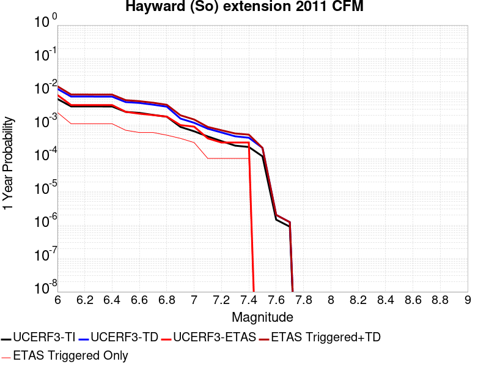 |  |

| Magnitude | 1 wk TI Prob | 1 wk TD Prob | 1 wk ETAS Prob | 1 wk ETAS/TD Gain | 1 wk ETAS Triggered+TD | 1 wk ETAS Triggered Only | 1 mo TI Prob | 1 mo TD Prob | 1 mo ETAS Prob | 1 mo ETAS/TD Gain | 1 mo ETAS Triggered+TD | 1 mo ETAS Triggered Only | 1 yr TI Prob | 1 yr TD Prob | 1 yr ETAS Prob | 1 yr ETAS/TD Gain | 1 yr ETAS Triggered+TD | 1 yr ETAS Triggered Only | 10 yr TI Prob | 10 yr TD Prob | 10 yr ETAS Prob | 10 yr ETAS/TD Gain | 10 yr ETAS Triggered+TD | 10 yr ETAS Triggered Only |
|-----|-----|-----|-----|-----|-----|-----|-----|-----|-----|-----|-----|-----|-----|-----|-----|-----|-----|-----|-----|-----|-----|-----|-----|-----|
| 6.0 | 1.1721256E-4 | 2.3691346E-4 | 1.0E-4 | 0.42209506 | 2.3691346E-4 | 0.0 | 5.022428E-4 | 0.0010147474 | 9.0E-4 | 0.8869202 | 0.0012145445 | 2.0E-4 | 0.0060976758 | 0.012260972 | 0.008 | 0.65247685 | 0.014631545 | 0.0024 | 0.0593305 | 0.11292799 | 0.0866 | 0.76686037 | 0.13004848 | 0.0193 |
| 6.1 | 6.99169E-5 | 1.3823979E-4 | 1.0E-4 | 0.7233807 | 1.3823979E-4 | 0.0 | 2.9960944E-4 | 5.922275E-4 | 3.0E-4 | 0.5065621 | 5.922275E-4 | 0.0 | 0.0036416445 | 0.007180446 | 0.004 | 0.55706847 | 0.008272547 | 0.0011 | 0.035825435 | 0.06787363 | 0.0484 | 0.71308994 | 0.07887272 | 0.0118 |
| 6.2 | 6.99169E-5 | 1.3823979E-4 | 1.0E-4 | 0.7233807 | 1.3823979E-4 | 0.0 | 2.9960944E-4 | 5.922275E-4 | 3.0E-4 | 0.5065621 | 5.922275E-4 | 0.0 | 0.0036416445 | 0.007180446 | 0.004 | 0.55706847 | 0.008272547 | 0.0011 | 0.035825435 | 0.06787363 | 0.0484 | 0.71308994 | 0.07887272 | 0.0118 |
| 6.3 | 6.970908E-5 | 1.3792109E-4 | 1.0E-4 | 0.72505224 | 1.3792109E-4 | 0.0 | 2.9871898E-4 | 5.908625E-4 | 3.0E-4 | 0.50773233 | 5.908625E-4 | 0.0 | 0.0036308395 | 0.007163975 | 0.004 | 0.55834925 | 0.0082560945 | 0.0011 | 0.035720866 | 0.06772254 | 0.0483 | 0.7132042 | 0.078723416 | 0.0118 |
| 6.4 | 6.9517155E-5 | 1.3759012E-4 | 1.0E-4 | 0.7267963 | 1.3759012E-4 | 0.0 | 2.9789665E-4 | 5.8944494E-4 | 3.0E-4 | 0.5089534 | 5.8944494E-4 | 0.0 | 0.0036208609 | 0.0071468796 | 0.004 | 0.5596848 | 0.008239018 | 0.0011 | 0.03562429 | 0.067566514 | 0.0482 | 0.7133711 | 0.07847599 | 0.0117 |
| 6.5 | 4.786248E-5 | 9.428399E-5 | 1.0E-4 | 1.0606254 | 9.428399E-5 | 0.0 | 2.0510878E-4 | 4.040142E-4 | 3.0E-4 | 0.74254817 | 4.040142E-4 | 0.0 | 0.0024943394 | 0.0049082153 | 0.0025 | 0.5093501 | 0.0056047793 | 7.0E-4 | 0.02466527 | 0.04696078 | 0.0351 | 0.74743223 | 0.055728737 | 0.0092 |
| 6.6 | 4.4662214E-5 | 8.894691E-5 | 1.0E-4 | 1.1242661 | 8.894691E-5 | 0.0 | 1.9139545E-4 | 3.8114795E-4 | 3.0E-4 | 0.7870959 | 3.8114795E-4 | 0.0 | 0.0023277493 | 0.0046310676 | 0.0022 | 0.47505245 | 0.005228289 | 6.0E-4 | 0.02303517 | 0.044350334 | 0.0331 | 0.7463304 | 0.05276005 | 0.0088 |
| 6.7 | 3.884542E-5 | 7.877139E-5 | 1.0E-4 | 1.2694964 | 7.877139E-5 | 0.0 | 1.6646975E-4 | 3.375505E-4 | 3.0E-4 | 0.8887559 | 3.375505E-4 | 0.0 | 0.002024885 | 0.0041023786 | 0.002 | 0.48752204 | 0.0046999175 | 6.0E-4 | 0.020065336 | 0.03938758 | 0.0281 | 0.7134229 | 0.046688233 | 0.0076 |
| 6.8 | 3.4221863E-5 | 6.8666755E-5 | 1.0E-4 | 1.4563088 | 6.8666755E-5 | 0.0 | 1.4665688E-4 | 2.9425527E-4 | 3.0E-4 | 1.0195229 | 2.9425527E-4 | 0.0 | 0.0017840851 | 0.0035770948 | 0.0018 | 0.50320166 | 0.0040753065 | 5.0E-4 | 0.017698295 | 0.034469817 | 0.0241 | 0.6991624 | 0.04103542 | 0.0068 |
| 6.9 | 1.6927712E-5 | 3.0118359E-5 | 1.0E-4 | 3.320234 | 3.0118359E-5 | 0.0 | 7.2545314E-5 | 1.2907262E-4 | 2.0E-4 | 1.5495154 | 1.2907262E-4 | 0.0 | 8.828813E-4 | 0.0015703834 | 0.001 | 0.6367872 | 0.0019697554 | 4.0E-4 | 0.008793819 | 0.015490304 | 0.0127 | 0.81986773 | 0.01923144 | 0.0038 |
| 7.0 | 1.2509653E-5 | 2.251353E-5 | 1.0E-4 | 4.4417734 | 2.251353E-5 | 0.0 | 5.3611697E-5 | 9.6483236E-5 | 2.0E-4 | 2.0728989 | 9.6483236E-5 | 0.0 | 6.525269E-4 | 0.0011740946 | 9.0E-4 | 0.7665481 | 0.0014737424 | 3.0E-4 | 0.0065061417 | 0.011607329 | 0.009 | 0.7753722 | 0.01417715 | 0.0026 |
| 7.1 | 8.751583E-6 | 1.4963537E-5 | 0.0 | 0.0 | 1.4963537E-5 | 0.0 | 3.750624E-5 | 6.4127904E-5 | 0.0 | 0.0 | 6.4127904E-5 | 0.0 | 4.5654282E-4 | 7.804834E-4 | 4.0E-4 | 0.5125029 | 8.8040537E-4 | 1.0E-4 | 0.0045560603 | 0.0077824336 | 0.0058 | 0.74526817 | 0.0093699815 | 0.0016 |
| 7.2 | 6.354379E-6 | 1.1533883E-5 | 0.0 | 0.0 | 1.1533883E-5 | 0.0 | 2.7232769E-5 | 4.943002E-5 | 0.0 | 0.0 | 4.943002E-5 | 0.0 | 3.3150852E-4 | 6.0164917E-4 | 3.0E-4 | 0.49862948 | 7.01589E-4 | 1.0E-4 | 0.0033101442 | 0.0060180235 | 0.0043 | 0.71452034 | 0.007210802 | 0.0012 |
| 7.3 | 4.645554E-6 | 8.848987E-6 | 0.0 | 0.0 | 8.848987E-6 | 0.0 | 1.9909365E-5 | 3.79237E-5 | 0.0 | 0.0 | 3.79237E-5 | 0.0 | 2.4236954E-4 | 4.6162718E-4 | 3.0E-4 | 0.64987504 | 5.6158105E-4 | 1.0E-4 | 0.0024210536 | 0.0046261647 | 0.0031 | 0.6701015 | 0.0054224636 | 8.0E-4 |
| 7.4 | 4.23437E-6 | 8.021096E-6 | 0.0 | 0.0 | 8.021096E-6 | 0.0 | 1.8147173E-5 | 3.437569E-5 | 0.0 | 0.0 | 3.437569E-5 | 0.0 | 2.2091944E-4 | 4.1844757E-4 | 3.0E-4 | 0.7169357 | 5.184057E-4 | 1.0E-4 | 0.0022069993 | 0.004196382 | 0.0027 | 0.6434114 | 0.0048934445 | 7.0E-4 |
| 7.5 | 2.2187417E-6 | 3.969897E-6 | 0.0 | 0.0 | 3.969897E-6 | 0.0 | 9.508858E-6 | 1.701375E-5 | 0.0 | 0.0 | 1.701375E-5 | 0.0 | 1.157642E-4 | 2.0712535E-4 | 0.0 | 0.0 | 2.0712535E-4 | 0.0 | 0.0011570391 | 0.0020828075 | 0.0015 | 0.72018176 | 0.0024819744 | 4.0E-4 |
| 7.6 | 2.7952495E-8 | 3.8856825E-8 | 0.0 | 0.0 | 3.8856825E-8 | 0.0 | 1.1979641E-7 | 1.6652923E-7 | 0.0 | 0.0 | 1.6652923E-7 | 0.0 | 1.4585203E-6 | 2.0274915E-6 | 0.0 | 0.0 | 2.0274915E-6 | 0.0 | 1.4585107E-5 | 2.03613E-5 | 0.0 | 0.0 | 2.03613E-5 | 0.0 |
| 7.7 | 1.7192724E-8 | 2.3485004E-8 | 0.0 | 0.0 | 2.3485004E-8 | 0.0 | 7.36831E-8 | 1.0065001E-7 | 0.0 | 0.0 | 1.0065001E-7 | 0.0 | 8.9709135E-7 | 1.2254133E-6 | 0.0 | 0.0 | 1.2254133E-6 | 0.0 | 8.970877E-6 | 1.2317584E-5 | 0.0 | 0.0 | 1.2317584E-5 | 0.0 |

## Hunting Creek - Berryessa 2011 CFM
*[(top)](#table-of-contents)*

| 1 Week | 1 Month | 1 Year | 10 Year |
|-----|-----|-----|-----|
| 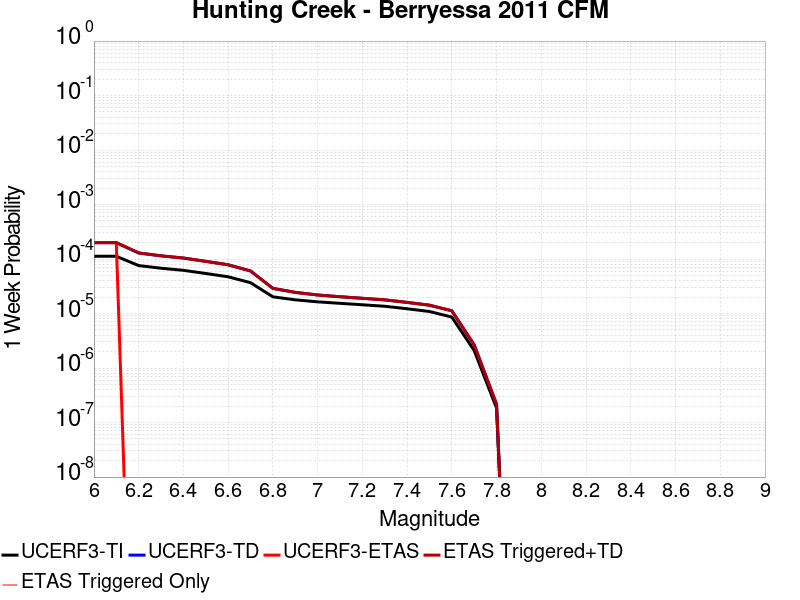 |  |  |  |

| Magnitude | 1 wk TI Prob | 1 wk TD Prob | 1 wk ETAS Prob | 1 wk ETAS/TD Gain | 1 wk ETAS Triggered+TD | 1 wk ETAS Triggered Only | 1 mo TI Prob | 1 mo TD Prob | 1 mo ETAS Prob | 1 mo ETAS/TD Gain | 1 mo ETAS Triggered+TD | 1 mo ETAS Triggered Only | 1 yr TI Prob | 1 yr TD Prob | 1 yr ETAS Prob | 1 yr ETAS/TD Gain | 1 yr ETAS Triggered+TD | 1 yr ETAS Triggered Only | 10 yr TI Prob | 10 yr TD Prob | 10 yr ETAS Prob | 10 yr ETAS/TD Gain | 10 yr ETAS Triggered+TD | 10 yr ETAS Triggered Only |
|-----|-----|-----|-----|-----|-----|-----|-----|-----|-----|-----|-----|-----|-----|-----|-----|-----|-----|-----|-----|-----|-----|-----|-----|-----|
| 6.0 | 1.1270982E-4 | 2.004215E-4 | 2.0E-4 | 0.99789685 | 2.004215E-4 | 0.0 | 4.8295266E-4 | 8.5865654E-4 | 7.0E-4 | 0.81522703 | 9.585707E-4 | 1.0E-4 | 0.0058641075 | 0.01039388 | 0.0086 | 0.8274099 | 0.012373093 | 0.002 | 0.057117578 | 0.09810527 | 0.091 | 0.92757505 | 0.114158995 | 0.0178 |
| 6.1 | 1.1239393E-4 | 1.9990253E-4 | 2.0E-4 | 1.0004876 | 1.9990253E-4 | 0.0 | 4.8159933E-4 | 8.564338E-4 | 4.0E-4 | 0.467053 | 9.563482E-4 | 1.0E-4 | 0.0058477195 | 0.010367103 | 0.0072 | 0.6945045 | 0.011950516 | 0.0016 | 0.056962132 | 0.09786357 | 0.0735 | 0.7510456 | 0.11112497 | 0.0147 |
| 6.2 | 7.596265E-5 | 1.2944541E-4 | 0.0 | 0.0 | 1.2944541E-4 | 0.0 | 3.2551357E-4 | 5.5460486E-4 | 2.0E-4 | 0.3606171 | 6.545494E-4 | 1.0E-4 | 0.0039559277 | 0.006726756 | 0.0039 | 0.5797742 | 0.007819357 | 0.0011 | 0.038862433 | 0.064639345 | 0.0492 | 0.7611463 | 0.07380588 | 0.0098 |
| 6.3 | 6.78794E-5 | 1.14579154E-4 | 0.0 | 0.0 | 1.14579154E-4 | 0.0 | 2.9087928E-4 | 4.9092947E-4 | 0.0 | 0.0 | 4.9092947E-4 | 0.0 | 0.003535705 | 0.0059575005 | 0.0032 | 0.537138 | 0.0067527345 | 8.0E-4 | 0.034799766 | 0.05750884 | 0.0436 | 0.7581443 | 0.06561426 | 0.0086 |
| 6.4 | 6.2165134E-5 | 1.0443812E-4 | 0.0 | 0.0 | 1.0443812E-4 | 0.0 | 2.6639478E-4 | 4.4748944E-4 | 0.0 | 0.0 | 4.4748944E-4 | 0.0 | 0.0032385332 | 0.00543196 | 0.003 | 0.55228686 | 0.0061281575 | 7.0E-4 | 0.03191742 | 0.052591655 | 0.0395 | 0.7510697 | 0.05998144 | 0.0078 |
| 6.5 | 5.4368087E-5 | 9.07844E-5 | 0.0 | 0.0 | 9.07844E-5 | 0.0 | 2.3298527E-4 | 3.8899828E-4 | 0.0 | 0.0 | 3.8899828E-4 | 0.0 | 0.0028329059 | 0.0047238227 | 0.0025 | 0.5292324 | 0.005320988 | 6.0E-4 | 0.027970633 | 0.045917444 | 0.0338 | 0.73610365 | 0.05173735 | 0.0061 |
| 6.6 | 4.729947E-5 | 7.8542726E-5 | 0.0 | 0.0 | 7.8542726E-5 | 0.0 | 2.0269625E-4 | 3.3655725E-4 | 0.0 | 0.0 | 3.3655725E-4 | 0.0 | 0.002465034 | 0.004088469 | 0.0021 | 0.5136397 | 0.0046860157 | 6.0E-4 | 0.02437869 | 0.03988562 | 0.03 | 0.7521508 | 0.04507024 | 0.0054 |
| 6.7 | 3.6875328E-5 | 6.0504968E-5 | 0.0 | 0.0 | 6.0504968E-5 | 0.0 | 1.5802756E-4 | 2.592712E-4 | 0.0 | 0.0 | 2.592712E-4 | 0.0 | 0.0019222875 | 0.0031514375 | 0.0015 | 0.47597325 | 0.003550177 | 4.0E-4 | 0.019057442 | 0.030922001 | 0.022 | 0.7114675 | 0.034313776 | 0.0035 |
| 6.8 | 2.0292036E-5 | 2.8990444E-5 | 0.0 | 0.0 | 2.8990444E-5 | 0.0 | 8.6962966E-5 | 1.2423864E-4 | 0.0 | 0.0 | 1.2423864E-4 | 0.0 | 0.0010582599 | 0.001511543 | 8.0E-4 | 0.52926046 | 0.0017112407 | 2.0E-4 | 0.010532344 | 0.014985861 | 0.0108 | 0.7206793 | 0.016660385 | 0.0017 |
| 6.9 | 1.7871042E-5 | 2.4484749E-5 | 0.0 | 0.0 | 2.4484749E-5 | 0.0 | 7.658793E-5 | 1.04930405E-4 | 0.0 | 0.0 | 1.04930405E-4 | 0.0 | 9.320591E-4 | 0.0012767784 | 6.0E-4 | 0.46993276 | 0.0013766508 | 1.0E-4 | 0.009281595 | 0.01268619 | 0.0085 | 0.6700199 | 0.013870967 | 0.0012 |
| 7.0 | 1.6415532E-5 | 2.1917964E-5 | 0.0 | 0.0 | 2.1917964E-5 | 0.0 | 7.035038E-5 | 9.3930765E-5 | 0.0 | 0.0 | 9.3930765E-5 | 0.0 | 8.561793E-4 | 0.0011430084 | 5.0E-4 | 0.43744215 | 0.001242894 | 1.0E-4 | 0.008528882 | 0.0113706 | 0.0072 | 0.6332119 | 0.012260367 | 9.0E-4 |
| 7.1 | 1.5409885E-5 | 2.0357553E-5 | 0.0 | 0.0 | 2.0357553E-5 | 0.0 | 6.6040695E-5 | 8.724375E-5 | 0.0 | 0.0 | 8.724375E-5 | 0.0 | 8.0374884E-4 | 0.0010616778 | 4.0E-4 | 0.37676212 | 0.0011615717 | 1.0E-4 | 0.00800848 | 0.010566531 | 0.0062 | 0.5867583 | 0.011457021 | 9.0E-4 |
| 7.2 | 1.4497423E-5 | 1.9065661E-5 | 0.0 | 0.0 | 1.9065661E-5 | 0.0 | 6.213033E-5 | 8.170743E-5 | 0.0 | 0.0 | 8.170743E-5 | 0.0 | 7.5617427E-4 | 9.94337E-4 | 4.0E-4 | 0.40227807 | 0.0010942377 | 1.0E-4 | 0.0075360634 | 0.009899622 | 0.0056 | 0.5656781 | 0.010790712 | 9.0E-4 |
| 7.3 | 1.3615175E-5 | 1.783644E-5 | 0.0 | 0.0 | 1.783644E-5 | 0.0 | 5.8349444E-5 | 7.643967E-5 | 0.0 | 0.0 | 7.643967E-5 | 0.0 | 7.101729E-4 | 9.3025854E-4 | 4.0E-4 | 0.42998797 | 0.0010301656 | 1.0E-4 | 0.0070790765 | 0.009264388 | 0.0051 | 0.550495 | 0.01015605 | 9.0E-4 |
| 7.4 | 1.2252825E-5 | 1.6035796E-5 | 0.0 | 0.0 | 1.6035796E-5 | 0.0 | 5.251105E-5 | 6.872304E-5 | 0.0 | 0.0 | 6.872304E-5 | 0.0 | 6.391345E-4 | 8.363847E-4 | 4.0E-4 | 0.47824883 | 9.363011E-4 | 1.0E-4 | 0.0063729943 | 0.008333002 | 0.0046 | 0.5520219 | 0.009126335 | 8.0E-4 |
| 7.5 | 1.0913301E-5 | 1.4249328E-5 | 0.0 | 0.0 | 1.4249328E-5 | 0.0 | 4.6770452E-5 | 6.1067134E-5 | 0.0 | 0.0 | 6.1067134E-5 | 0.0 | 5.6928146E-4 | 7.4324146E-4 | 4.0E-4 | 0.5381831 | 8.4316713E-4 | 1.0E-4 | 0.0056782532 | 0.0074081584 | 0.0041 | 0.55344385 | 0.007904454 | 5.0E-4 |
| 7.6 | 8.623192E-6 | 1.1241596E-5 | 0.0 | 0.0 | 1.1241596E-5 | 0.0 | 3.6956015E-5 | 4.8177397E-5 | 0.0 | 0.0 | 4.8177397E-5 | 0.0 | 4.4984656E-4 | 5.864045E-4 | 3.0E-4 | 0.51159227 | 6.8634585E-4 | 1.0E-4 | 0.00448937 | 0.005849086 | 0.0031 | 0.52999735 | 0.0063461615 | 5.0E-4 |
| 7.7 | 2.0993634E-6 | 2.6637122E-6 | 0.0 | 0.0 | 2.6637122E-6 | 0.0 | 8.997241E-6 | 1.1415859E-5 | 0.0 | 0.0 | 1.1415859E-5 | 0.0 | 1.09535904E-4 | 1.389793E-4 | 2.0E-4 | 1.4390632 | 2.389654E-4 | 1.0E-4 | 0.0010948193 | 0.0013889574 | 4.0E-4 | 0.2879858 | 0.0014888186 | 1.0E-4 |
| 7.8 | 1.8428308E-7 | 2.1680233E-7 | 0.0 | 0.0 | 2.1680233E-7 | 0.0 | 7.897844E-7 | 9.291526E-7 | 0.0 | 0.0 | 9.291526E-7 | 0.0 | 9.615583E-6 | 1.1312378E-5 | 0.0 | 0.0 | 1.1312378E-5 | 0.0 | 9.615166E-5 | 1.1311122E-4 | 0.0 | 0.0 | 1.1311122E-4 | 0.0 |

## Calaveras (So) - Paicines extension 2011 CFM
*[(top)](#table-of-contents)*

| 1 Week | 1 Month | 1 Year | 10 Year |
|-----|-----|-----|-----|
| 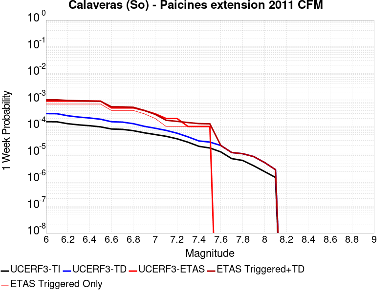 |  |  |  |

| Magnitude | 1 wk TI Prob | 1 wk TD Prob | 1 wk ETAS Prob | 1 wk ETAS/TD Gain | 1 wk ETAS Triggered+TD | 1 wk ETAS Triggered Only | 1 mo TI Prob | 1 mo TD Prob | 1 mo ETAS Prob | 1 mo ETAS/TD Gain | 1 mo ETAS Triggered+TD | 1 mo ETAS Triggered Only | 1 yr TI Prob | 1 yr TD Prob | 1 yr ETAS Prob | 1 yr ETAS/TD Gain | 1 yr ETAS Triggered+TD | 1 yr ETAS Triggered Only | 10 yr TI Prob | 10 yr TD Prob | 10 yr ETAS Prob | 10 yr ETAS/TD Gain | 10 yr ETAS Triggered+TD | 10 yr ETAS Triggered Only |
|-----|-----|-----|-----|-----|-----|-----|-----|-----|-----|-----|-----|-----|-----|-----|-----|-----|-----|-----|-----|-----|-----|-----|-----|-----|
| 6.0 | 1.5183659E-4 | 3.0563123E-4 | 9.0E-4 | 2.9447253 | 0.0010054173 | 7.0E-4 | 6.5056595E-4 | 0.0013086265 | 0.0014 | 1.069824 | 0.002407187 | 0.0011 | 0.007891912 | 0.015717926 | 0.0118 | 0.75073516 | 0.019556627 | 0.0039 | 0.076174594 | 0.13866186 | 0.0901 | 0.6497822 | 0.15451048 | 0.0184 |
| 6.1 | 1.5024997E-4 | 3.0257157E-4 | 9.0E-4 | 2.9745028 | 0.0010023598 | 7.0E-4 | 6.437695E-4 | 0.0012955286 | 0.0014 | 1.08064 | 0.0023941034 | 0.0011 | 0.0078097614 | 0.015561221 | 0.0115 | 0.73901653 | 0.019203644 | 0.0037 | 0.075409345 | 0.13733093 | 0.0891 | 0.64879775 | 0.15294524 | 0.0181 |
| 6.2 | 1.2743923E-4 | 2.5354073E-4 | 9.0E-4 | 3.5497258 | 9.5336325E-4 | 7.0E-4 | 5.460538E-4 | 0.0010857576 | 0.0013 | 1.1973206 | 0.0020846718 | 0.001 | 0.0066279583 | 0.013068075 | 0.01 | 0.7652236 | 0.016423644 | 0.0034 | 0.064337276 | 0.117428556 | 0.0772 | 0.65742105 | 0.13163796 | 0.0161 |
| 6.3 | 1.1525114E-4 | 2.2639988E-4 | 9.0E-4 | 3.9752672 | 9.262414E-4 | 7.0E-4 | 4.9383997E-4 | 9.6962904E-4 | 0.0012 | 1.2375867 | 0.0018687564 | 9.0E-4 | 0.0059959386 | 0.011689216 | 0.0093 | 0.7956051 | 0.014752979 | 0.0031 | 0.058367174 | 0.10654606 | 0.0719 | 0.67482555 | 0.11976918 | 0.0148 |
| 6.4 | 1.07200925E-4 | 2.0880895E-4 | 9.0E-4 | 4.31016 | 9.086628E-4 | 7.0E-4 | 4.5935164E-4 | 8.9435896E-4 | 0.0011 | 1.2299312 | 0.001793554 | 9.0E-4 | 0.0055782744 | 0.010794002 | 0.0088 | 0.8152676 | 0.013662699 | 0.0029 | 0.0544031 | 0.0993692 | 0.0679 | 0.68331033 | 0.112068094 | 0.0141 |
| 6.5 | 9.69631E-5 | 1.8773874E-4 | 9.0E-4 | 4.793896 | 8.8760734E-4 | 7.0E-4 | 4.1548995E-4 | 8.041741E-4 | 0.0011 | 1.3678629 | 0.0017034503 | 9.0E-4 | 0.0050468626 | 0.009715498 | 0.0081 | 0.83371943 | 0.01219121 | 0.0025 | 0.04933773 | 0.090259485 | 0.0608 | 0.6736134 | 0.10181319 | 0.0127 |
| 6.6 | 8.0552316E-5 | 1.5110608E-4 | 5.0E-4 | 3.3089337 | 5.5104564E-4 | 4.0E-4 | 3.4517853E-4 | 6.473959E-4 | 7.0E-4 | 1.0812548 | 0.0012470075 | 6.0E-4 | 0.0041944524 | 0.007847086 | 0.0067 | 0.8538202 | 0.009930607 | 0.0021 | 0.04116161 | 0.07503125 | 0.0499 | 0.6650562 | 0.08446593 | 0.0102 |
| 6.7 | 7.815757E-5 | 1.4650828E-4 | 5.0E-4 | 3.4127765 | 5.464497E-4 | 4.0E-4 | 3.34918E-4 | 6.277063E-4 | 6.0E-4 | 0.9558611 | 0.0011273924 | 5.0E-4 | 0.004070005 | 0.007609736 | 0.0065 | 0.8541689 | 0.009594517 | 0.002 | 0.039962657 | 0.07287987 | 0.0483 | 0.66273445 | 0.08196565 | 0.0098 |
| 6.8 | 6.965264E-5 | 1.2760005E-4 | 5.0E-4 | 3.9184935 | 5.27549E-4 | 4.0E-4 | 2.9847719E-4 | 5.467247E-4 | 6.0E-4 | 1.0974444 | 0.0010464514 | 5.0E-4 | 0.0036279052 | 0.0066328445 | 0.0056 | 0.84428334 | 0.008520242 | 0.0019 | 0.03569247 | 0.06396683 | 0.0411 | 0.6425204 | 0.07248474 | 0.0091 |
| 6.9 | 5.8000453E-5 | 1.01770755E-4 | 4.0E-4 | 3.930402 | 4.0174022E-4 | 3.0E-4 | 2.4854968E-4 | 4.36088E-4 | 5.0E-4 | 1.1465576 | 8.359136E-4 | 4.0E-4 | 0.0030218933 | 0.005296544 | 0.0043 | 0.81185013 | 0.006689129 | 0.0014 | 0.029811295 | 0.051656783 | 0.0329 | 0.6368961 | 0.058390018 | 0.0071 |
| 7.0 | 4.9865852E-5 | 8.5977066E-5 | 3.0E-4 | 3.4893024 | 2.8595986E-4 | 2.0E-4 | 2.1369329E-4 | 3.684216E-4 | 4.0E-4 | 1.0857127 | 6.683111E-4 | 3.0E-4 | 0.0025986114 | 0.004476397 | 0.0037 | 0.82655764 | 0.0056710253 | 0.0012 | 0.025684336 | 0.043922614 | 0.0278 | 0.63293135 | 0.04965908 | 0.006 |
| 7.1 | 4.283875E-5 | 7.1388095E-5 | 2.0E-4 | 2.8015873 | 1.7138096E-4 | 1.0E-4 | 1.8358172E-4 | 3.0591342E-4 | 3.0E-4 | 0.9806696 | 5.058522E-4 | 2.0E-4 | 0.0022328163 | 0.003718192 | 0.003 | 0.80684376 | 0.0047144736 | 0.001 | 0.022105146 | 0.03686305 | 0.0235 | 0.6374947 | 0.04158242 | 0.0049 |
| 7.2 | 3.450115E-5 | 5.6031025E-5 | 2.0E-4 | 3.569451 | 1.5602542E-4 | 1.0E-4 | 1.478537E-4 | 2.4011103E-4 | 3.0E-4 | 1.249422 | 4.40063E-4 | 2.0E-4 | 0.0017986323 | 0.002919462 | 0.0023 | 0.78781635 | 0.0037171266 | 8.0E-4 | 0.017841442 | 0.029202318 | 0.0182 | 0.6232382 | 0.03240595 | 0.0033 |
| 7.3 | 2.5709045E-5 | 4.081237E-5 | 1.0E-4 | 2.4502375 | 1.4080829E-4 | 1.0E-4 | 1.1017697E-4 | 1.7489852E-4 | 2.0E-4 | 1.1435202 | 3.7486354E-4 | 2.0E-4 | 0.0013405791 | 0.002127327 | 0.0018 | 0.8461322 | 0.0029256253 | 8.0E-4 | 0.013325208 | 0.021406483 | 0.014 | 0.6540075 | 0.024244403 | 0.0029 |
| 7.4 | 1.8003093E-5 | 2.86487E-5 | 1.0E-4 | 3.4905598 | 1.2864583E-4 | 1.0E-4 | 7.715383E-5 | 1.2277438E-4 | 2.0E-4 | 1.6290044 | 3.227498E-4 | 2.0E-4 | 9.3894306E-4 | 0.0014937555 | 0.0012 | 0.80334437 | 0.0019930087 | 5.0E-4 | 0.009349857 | 0.015118833 | 0.0084 | 0.55559844 | 0.016990107 | 0.0019 |
| 7.5 | 1.5595824E-5 | 2.5954996E-5 | 1.0E-4 | 3.8528228 | 1.259524E-4 | 1.0E-4 | 6.683753E-5 | 1.1123097E-4 | 2.0E-4 | 1.7980604 | 3.112087E-4 | 2.0E-4 | 8.134431E-4 | 0.001353398 | 0.0011 | 0.81276906 | 0.0018527213 | 5.0E-4 | 0.008104719 | 0.013716114 | 0.0077 | 0.5613835 | 0.015491425 | 0.0018 |
| 7.6 | 1.1110309E-5 | 1.933605E-5 | 0.0 | 0.0 | 1.933605E-5 | 0.0 | 4.761474E-5 | 8.286616E-5 | 0.0 | 0.0 | 8.286616E-5 | 0.0 | 5.795553E-4 | 0.0010084299 | 5.0E-4 | 0.49582028 | 0.0010084299 | 0.0 | 0.0057804612 | 0.010258753 | 0.0057 | 0.55562305 | 0.0112484945 | 0.001 |
| 7.7 | 6.2140443E-6 | 1.0520348E-5 | 0.0 | 0.0 | 1.0520348E-5 | 0.0 | 2.6631347E-5 | 4.5086428E-5 | 0.0 | 0.0 | 4.5086428E-5 | 0.0 | 3.241884E-4 | 5.487891E-4 | 1.0E-4 | 0.18221936 | 5.487891E-4 | 0.0 | 0.0032371588 | 0.005660631 | 0.0032 | 0.565308 | 0.006157801 | 5.0E-4 |
| 7.8 | 5.305533E-6 | 9.507715E-6 | 0.0 | 0.0 | 9.507715E-6 | 0.0 | 2.27378E-5 | 4.0746712E-5 | 0.0 | 0.0 | 4.0746712E-5 | 0.0 | 2.7679754E-4 | 4.959784E-4 | 1.0E-4 | 0.20162168 | 4.959784E-4 | 0.0 | 0.0027645302 | 0.005110789 | 0.0031 | 0.60655993 | 0.0056082336 | 5.0E-4 |
| 7.9 | 3.363505E-6 | 7.440443E-6 | 0.0 | 0.0 | 7.440443E-6 | 0.0 | 1.4414942E-5 | 3.1887223E-5 | 0.0 | 0.0 | 3.1887223E-5 | 0.0 | 1.7548777E-4 | 3.8815787E-4 | 1.0E-4 | 0.25762713 | 3.8815787E-4 | 0.0 | 0.0017534926 | 0.0039754207 | 0.0024 | 0.6037097 | 0.004274228 | 3.0E-4 |
| 8.0 | 2.0271132E-6 | 4.444865E-6 | 0.0 | 0.0 | 4.444865E-6 | 0.0 | 8.687599E-6 | 1.9049283E-5 | 0.0 | 0.0 | 1.9049283E-5 | 0.0 | 1.05766376E-4 | 2.319004E-4 | 0.0 | 0.0 | 2.319004E-4 | 0.0 | 0.0010571606 | 0.0023666255 | 0.0014 | 0.5915596 | 0.0024663887 | 1.0E-4 |
| 8.1 | 1.2206116E-6 | 2.3928044E-6 | 0.0 | 0.0 | 2.3928044E-6 | 0.0 | 5.2311816E-6 | 1.0254836E-5 | 0.0 | 0.0 | 1.0254836E-5 | 0.0 | 6.3687774E-5 | 1.2484551E-4 | 0.0 | 0.0 | 1.2484551E-4 | 0.0 | 6.366953E-4 | 0.0012793794 | 9.0E-4 | 0.7034661 | 0.0013792514 | 1.0E-4 |

## San Andreas (Coachella) rev
*[(top)](#table-of-contents)*

| 1 Week | 1 Month | 1 Year | 10 Year |
|-----|-----|-----|-----|
|  |  |  |  |

| Magnitude | 1 wk TI Prob | 1 wk TD Prob | 1 wk ETAS Prob | 1 wk ETAS/TD Gain | 1 wk ETAS Triggered+TD | 1 wk ETAS Triggered Only | 1 mo TI Prob | 1 mo TD Prob | 1 mo ETAS Prob | 1 mo ETAS/TD Gain | 1 mo ETAS Triggered+TD | 1 mo ETAS Triggered Only | 1 yr TI Prob | 1 yr TD Prob | 1 yr ETAS Prob | 1 yr ETAS/TD Gain | 1 yr ETAS Triggered+TD | 1 yr ETAS Triggered Only | 10 yr TI Prob | 10 yr TD Prob | 10 yr ETAS Prob | 10 yr ETAS/TD Gain | 10 yr ETAS Triggered+TD | 10 yr ETAS Triggered Only |
|-----|-----|-----|-----|-----|-----|-----|-----|-----|-----|-----|-----|-----|-----|-----|-----|-----|-----|-----|-----|-----|-----|-----|-----|-----|
| 6.0 | 1.1925945E-4 | 3.279737E-4 | 2.0E-4 | 0.609805 | 4.2794092E-4 | 1.0E-4 | 5.110118E-4 | 0.0014048491 | 7.0E-4 | 0.49827415 | 0.0017044278 | 3.0E-4 | 0.0062038354 | 0.016971242 | 0.0078 | 0.459601 | 0.019232208 | 0.0023 | 0.060334753 | 0.15290245 | 0.0906 | 0.59253466 | 0.16865847 | 0.0186 |
| 6.1 | 1.1925945E-4 | 3.279737E-4 | 2.0E-4 | 0.609805 | 4.2794092E-4 | 1.0E-4 | 5.110118E-4 | 0.0014048491 | 7.0E-4 | 0.49827415 | 0.0017044278 | 3.0E-4 | 0.0062038354 | 0.016971242 | 0.0078 | 0.459601 | 0.019232208 | 0.0023 | 0.060334753 | 0.15290245 | 0.0906 | 0.59253466 | 0.16865847 | 0.0186 |
| 6.2 | 1.07432395E-4 | 3.0297614E-4 | 2.0E-4 | 0.660118 | 4.0294585E-4 | 1.0E-4 | 4.603433E-4 | 0.0012978271 | 7.0E-4 | 0.5393631 | 0.0015974378 | 3.0E-4 | 0.005590286 | 0.015687669 | 0.0075 | 0.4780825 | 0.017853156 | 0.0022 | 0.05451731 | 0.14206561 | 0.0845 | 0.5947956 | 0.15716526 | 0.0176 |
| 6.3 | 1.0718766E-4 | 3.0242917E-4 | 2.0E-4 | 0.66131186 | 4.0239893E-4 | 1.0E-4 | 4.592948E-4 | 0.0012954852 | 7.0E-4 | 0.5403381 | 0.0015950965 | 3.0E-4 | 0.005577586 | 0.015659567 | 0.0075 | 0.47894043 | 0.017825115 | 0.0022 | 0.054396555 | 0.1418339 | 0.0845 | 0.5957673 | 0.15693763 | 0.0176 |
| 6.4 | 1.0355944E-4 | 2.94509E-4 | 2.0E-4 | 0.6790964 | 3.9447955E-4 | 1.0E-4 | 4.4375064E-4 | 0.0012615749 | 7.0E-4 | 0.554862 | 0.0015611964 | 3.0E-4 | 0.0053892885 | 0.01525256 | 0.0074 | 0.48516446 | 0.017419005 | 0.0022 | 0.052604496 | 0.13842165 | 0.0828 | 0.5981723 | 0.15341312 | 0.0174 |
| 6.5 | 1.0227914E-4 | 2.91703E-4 | 2.0E-4 | 0.68562883 | 3.9167385E-4 | 1.0E-4 | 4.382655E-4 | 0.0012495607 | 7.0E-4 | 0.5601968 | 0.001549186 | 3.0E-4 | 0.0053228354 | 0.015108326 | 0.0074 | 0.48979613 | 0.017275088 | 0.0022 | 0.051971316 | 0.1372045 | 0.082 | 0.597648 | 0.1519583 | 0.0171 |
| 6.6 | 1.0116757E-4 | 2.893602E-4 | 2.0E-4 | 0.69118 | 3.8933128E-4 | 1.0E-4 | 4.3350324E-4 | 0.0012395298 | 7.0E-4 | 0.5647303 | 0.0015391579 | 3.0E-4 | 0.0052651367 | 0.014987885 | 0.0074 | 0.4937321 | 0.017154912 | 0.0022 | 0.051421247 | 0.13618305 | 0.0815 | 0.5984592 | 0.15095432 | 0.0171 |
| 6.7 | 1.0050676E-4 | 2.8794564E-4 | 2.0E-4 | 0.69457555 | 3.8791687E-4 | 1.0E-4 | 4.3067214E-4 | 0.0012334731 | 7.0E-4 | 0.5675033 | 0.0015331031 | 3.0E-4 | 0.005230834 | 0.014915157 | 0.0073 | 0.48943502 | 0.017082343 | 0.0022 | 0.051094085 | 0.13556758 | 0.0809 | 0.5967504 | 0.15026292 | 0.017 |
| 6.8 | 9.976819E-5 | 2.859814E-4 | 2.0E-4 | 0.6993462 | 3.859528E-4 | 1.0E-4 | 4.2750788E-4 | 0.0012250628 | 7.0E-4 | 0.5713993 | 0.0015246953 | 3.0E-4 | 0.0051924936 | 0.014814159 | 0.0073 | 0.49277183 | 0.016981568 | 0.0022 | 0.050728295 | 0.13471949 | 0.0801 | 0.5945688 | 0.14942926 | 0.017 |
| 6.9 | 9.77719E-5 | 2.8094585E-4 | 2.0E-4 | 0.7118809 | 3.8091777E-4 | 1.0E-4 | 4.1895514E-4 | 0.001203502 | 7.0E-4 | 0.58163595 | 0.0015031409 | 3.0E-4 | 0.0050888555 | 0.0145551935 | 0.0073 | 0.50153923 | 0.01672317 | 0.0022 | 0.049738888 | 0.13254745 | 0.0786 | 0.59299517 | 0.1472074 | 0.0169 |
| 7.0 | 8.500761E-5 | 2.4825553E-4 | 2.0E-4 | 0.80562156 | 3.482307E-4 | 1.0E-4 | 3.6426744E-4 | 0.0010635217 | 7.0E-4 | 0.6581906 | 0.0013632026 | 3.0E-4 | 0.0044259406 | 0.012872281 | 0.0061 | 0.47388652 | 0.01464911 | 0.0018 | 0.04338823 | 0.11838864 | 0.0698 | 0.58958364 | 0.13178913 | 0.0152 |
| 7.1 | 8.319876E-5 | 2.442758E-4 | 2.0E-4 | 0.8187466 | 3.442514E-4 | 1.0E-4 | 3.5651738E-4 | 0.0010464796 | 7.0E-4 | 0.6689094 | 0.0013461657 | 3.0E-4 | 0.004331963 | 0.012667225 | 0.006 | 0.47366336 | 0.014444424 | 0.0018 | 0.042484846 | 0.11660665 | 0.0691 | 0.5925906 | 0.12985756 | 0.015 |
| 7.2 | 7.563917E-5 | 2.2474145E-4 | 2.0E-4 | 0.8899115 | 3.2471897E-4 | 1.0E-4 | 3.2412758E-4 | 9.628252E-4 | 7.0E-4 | 0.7270271 | 0.0012625364 | 3.0E-4 | 0.0039391145 | 0.011660083 | 0.0058 | 0.49742356 | 0.013142593 | 0.0015 | 0.03870018 | 0.108008005 | 0.0622 | 0.5758832 | 0.119782306 | 0.0132 |
| 7.3 | 7.082985E-5 | 2.078795E-4 | 2.0E-4 | 0.96209586 | 3.0785872E-4 | 1.0E-4 | 3.0352117E-4 | 8.9061086E-4 | 6.0E-4 | 0.6736949 | 0.0011903436 | 3.0E-4 | 0.0036891096 | 0.010789906 | 0.005 | 0.46339607 | 0.01227372 | 0.0015 | 0.03628465 | 0.10052468 | 0.057 | 0.56702495 | 0.111678176 | 0.0124 |
| 7.4 | 5.146215E-5 | 1.4321263E-4 | 2.0E-4 | 1.3965249 | 2.431983E-4 | 1.0E-4 | 2.2053342E-4 | 6.136249E-4 | 4.0E-4 | 0.651864 | 8.135022E-4 | 2.0E-4 | 0.0026816884 | 0.0074454816 | 0.004 | 0.5372386 | 0.008735803 | 0.0013 | 0.02649557 | 0.07105745 | 0.0397 | 0.5587029 | 0.079325035 | 0.0089 |
| 7.5 | 4.0285166E-5 | 1.0982844E-4 | 2.0E-4 | 1.821022 | 2.0981746E-4 | 1.0E-4 | 1.7263928E-4 | 4.706087E-4 | 4.0E-4 | 0.849963 | 6.705146E-4 | 2.0E-4 | 0.002099857 | 0.005714678 | 0.0028 | 0.48996633 | 0.006510107 | 8.0E-4 | 0.020801254 | 0.055196077 | 0.03 | 0.5435169 | 0.061242823 | 0.0064 |
| 7.6 | 3.1168736E-5 | 8.475612E-5 | 2.0E-4 | 2.3597116 | 1.8474764E-4 | 1.0E-4 | 1.3357346E-4 | 3.6319005E-4 | 4.0E-4 | 1.1013517 | 5.6311744E-4 | 2.0E-4 | 0.0016250437 | 0.0044129 | 0.0023 | 0.52119917 | 0.005109811 | 7.0E-4 | 0.016132116 | 0.04297639 | 0.0236 | 0.5491387 | 0.047665805 | 0.0049 |
| 7.7 | 2.2100989E-5 | 6.2710875E-5 | 2.0E-4 | 3.1892395 | 1.627046E-4 | 1.0E-4 | 9.4715084E-5 | 2.6873325E-4 | 4.0E-4 | 1.488465 | 4.686795E-4 | 2.0E-4 | 0.001152546 | 0.003266925 | 0.0019 | 0.58158666 | 0.0037652915 | 5.0E-4 | 0.011465867 | 0.032047648 | 0.0166 | 0.5179787 | 0.035338685 | 0.0034 |
| 7.8 | 1.7484861E-5 | 5.2084022E-5 | 2.0E-4 | 3.8399491 | 1.5207882E-4 | 1.0E-4 | 7.493296E-5 | 2.2319815E-4 | 3.0E-4 | 1.3440971 | 3.2317583E-4 | 1.0E-4 | 9.1192697E-4 | 0.0027140542 | 0.0017 | 0.62636924 | 0.0031129685 | 4.0E-4 | 0.009081938 | 0.026772073 | 0.0137 | 0.5117273 | 0.029399788 | 0.0027 |
| 7.9 | 1.3967285E-5 | 3.8459413E-5 | 2.0E-4 | 5.2002873 | 1.3845557E-4 | 1.0E-4 | 5.985842E-5 | 1.6481565E-4 | 2.0E-4 | 1.213477 | 2.6479916E-4 | 1.0E-4 | 7.2853256E-4 | 0.002004785 | 0.0014 | 0.69832927 | 0.0024039831 | 4.0E-4 | 0.0072614877 | 0.020019427 | 0.0095 | 0.47453904 | 0.022273382 | 0.0023 |
| 8.0 | 1.1887396E-5 | 3.1269272E-5 | 2.0E-4 | 6.396055 | 1.3126615E-4 | 1.0E-4 | 5.094499E-5 | 1.340043E-4 | 2.0E-4 | 1.4924896 | 2.339909E-4 | 1.0E-4 | 6.200787E-4 | 0.0016302823 | 0.0012 | 0.73606884 | 0.0020296301 | 4.0E-4 | 0.006183513 | 0.016374735 | 0.0071 | 0.43359476 | 0.017850174 | 0.0015 |
| 8.1 | 5.100864E-6 | 9.058064E-6 | 2.0E-4 | 22.079773 | 1.0905716E-4 | 1.0E-4 | 2.1860664E-5 | 3.88197E-5 | 2.0E-4 | 5.1520233 | 1.3881581E-4 | 1.0E-4 | 2.6612106E-4 | 4.725275E-4 | 4.0E-4 | 0.8465116 | 6.72433E-4 | 2.0E-4 | 0.002658026 | 0.0049600964 | 0.0018 | 0.36289617 | 0.0055571203 | 6.0E-4 |
| 8.2 | 2.3004484E-6 | 2.8204922E-6 | 2.0E-4 | 70.90961 | 1.0282021E-4 | 1.0E-4 | 9.859027E-6 | 1.2087768E-5 | 2.0E-4 | 16.545652 | 1.12086556E-4 | 1.0E-4 | 1.2002704E-4 | 1.4715867E-4 | 2.0E-4 | 1.3590773 | 2.4714394E-4 | 1.0E-4 | 0.0011996223 | 0.0016150365 | 5.0E-4 | 0.30959052 | 0.0018147135 | 2.0E-4 |
| 8.3 | 1.0424446E-7 | 5.9034264E-8 | 0.0 | 0.0 | 5.9034264E-8 | 0.0 | 4.4676187E-7 | 2.5300395E-7 | 0.0 | 0.0 | 2.5300395E-7 | 0.0 | 5.439312E-6 | 3.0803192E-6 | 0.0 | 0.0 | 3.0803192E-6 | 0.0 | 5.4391792E-5 | 3.2372034E-5 | 0.0 | 0.0 | 3.2372034E-5 | 0.0 |

## Elsinore (Glen Ivy) rev
*[(top)](#table-of-contents)*

| 1 Week | 1 Month | 1 Year | 10 Year |
|-----|-----|-----|-----|
|  | 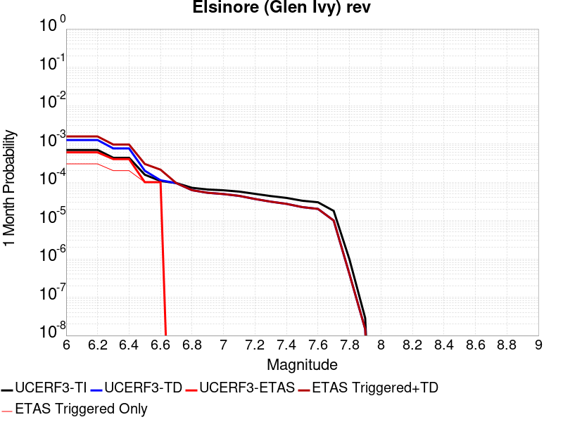 | 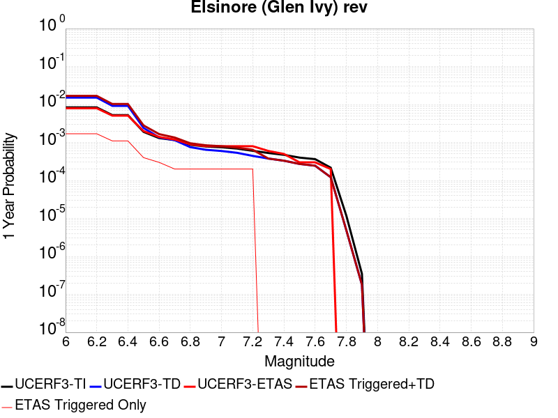 |  |

| Magnitude | 1 wk TI Prob | 1 wk TD Prob | 1 wk ETAS Prob | 1 wk ETAS/TD Gain | 1 wk ETAS Triggered+TD | 1 wk ETAS Triggered Only | 1 mo TI Prob | 1 mo TD Prob | 1 mo ETAS Prob | 1 mo ETAS/TD Gain | 1 mo ETAS Triggered+TD | 1 mo ETAS Triggered Only | 1 yr TI Prob | 1 yr TD Prob | 1 yr ETAS Prob | 1 yr ETAS/TD Gain | 1 yr ETAS Triggered+TD | 1 yr ETAS Triggered Only | 10 yr TI Prob | 10 yr TD Prob | 10 yr ETAS Prob | 10 yr ETAS/TD Gain | 10 yr ETAS Triggered+TD | 10 yr ETAS Triggered Only |
|-----|-----|-----|-----|-----|-----|-----|-----|-----|-----|-----|-----|-----|-----|-----|-----|-----|-----|-----|-----|-----|-----|-----|-----|-----|
| 6.0 | 1.6204086E-4 | 2.941327E-4 | 4.0E-4 | 1.3599303 | 3.9410332E-4 | 1.0E-4 | 6.94276E-4 | 0.0012600938 | 6.0E-4 | 0.47615504 | 0.0015597157 | 3.0E-4 | 0.008420097 | 0.015255029 | 0.008 | 0.5244172 | 0.016929096 | 0.0017 | 0.081081145 | 0.13978311 | 0.0882 | 0.63097745 | 0.15406272 | 0.0166 |
| 6.1 | 1.6204086E-4 | 2.941327E-4 | 4.0E-4 | 1.3599303 | 3.9410332E-4 | 1.0E-4 | 6.94276E-4 | 0.0012600938 | 6.0E-4 | 0.47615504 | 0.0015597157 | 3.0E-4 | 0.008420097 | 0.015255029 | 0.008 | 0.5244172 | 0.016929096 | 0.0017 | 0.081081145 | 0.13978311 | 0.0882 | 0.63097745 | 0.15406272 | 0.0166 |
| 6.2 | 1.6204086E-4 | 2.941327E-4 | 4.0E-4 | 1.3599303 | 3.9410332E-4 | 1.0E-4 | 6.94276E-4 | 0.0012600938 | 6.0E-4 | 0.47615504 | 0.0015597157 | 3.0E-4 | 0.008420097 | 0.015255029 | 0.008 | 0.5244172 | 0.016929096 | 0.0017 | 0.081081145 | 0.13978311 | 0.0882 | 0.63097745 | 0.15406272 | 0.0166 |
| 6.3 | 1.0111737E-4 | 1.7736456E-4 | 2.0E-4 | 1.1276209 | 1.7736456E-4 | 0.0 | 4.332882E-4 | 7.600296E-4 | 4.0E-4 | 0.5262953 | 9.5987757E-4 | 2.0E-4 | 0.005262531 | 0.009234881 | 0.0051 | 0.55225396 | 0.010324723 | 0.0011 | 0.0513964 | 0.0872148 | 0.0595 | 0.6822237 | 0.09643393 | 0.0101 |
| 6.4 | 1.0111737E-4 | 1.7736456E-4 | 2.0E-4 | 1.1276209 | 1.7736456E-4 | 0.0 | 4.332882E-4 | 7.600296E-4 | 4.0E-4 | 0.5262953 | 9.5987757E-4 | 2.0E-4 | 0.005262531 | 0.009234881 | 0.0051 | 0.55225396 | 0.010324723 | 0.0011 | 0.0513964 | 0.0872148 | 0.0595 | 0.6822237 | 0.09643393 | 0.0101 |
| 6.5 | 3.6624708E-5 | 4.642631E-5 | 0.0 | 0.0 | 4.642631E-5 | 0.0 | 1.569536E-4 | 1.9895675E-4 | 1.0E-4 | 0.50262177 | 2.9893685E-4 | 1.0E-4 | 0.001909235 | 0.0024199684 | 0.002 | 0.8264571 | 0.0028190003 | 4.0E-4 | 0.01892915 | 0.023715464 | 0.0163 | 0.6873152 | 0.026058547 | 0.0024 |
| 6.6 | 2.5051324E-5 | 2.6173208E-5 | 0.0 | 0.0 | 2.6173208E-5 | 0.0 | 1.073584E-4 | 1.1216632E-4 | 1.0E-4 | 0.8915332 | 2.1215511E-4 | 1.0E-4 | 0.0013063047 | 0.001364814 | 0.0014 | 1.0257808 | 0.0016644046 | 3.0E-4 | 0.012986525 | 0.0135804955 | 0.0086 | 0.63326114 | 0.014764199 | 0.0012 |
| 6.7 | 2.2189772E-5 | 2.2089307E-5 | 0.0 | 0.0 | 2.2089307E-5 | 0.0 | 9.509556E-5 | 9.466523E-5 | 0.0 | 0.0 | 9.466523E-5 | 0.0 | 0.0011571734 | 0.0011519762 | 0.0012 | 1.0416882 | 0.0013517458 | 2.0E-4 | 0.011511663 | 0.011476635 | 0.0072 | 0.6273616 | 0.012366306 | 9.0E-4 |
| 6.8 | 1.6654378E-5 | 1.444795E-5 | 0.0 | 0.0 | 1.444795E-5 | 0.0 | 7.137396E-5 | 6.191834E-5 | 0.0 | 0.0 | 6.191834E-5 | 0.0 | 8.686314E-4 | 7.5360027E-4 | 9.0E-4 | 1.1942672 | 9.534495E-4 | 2.0E-4 | 0.008652439 | 0.007515814 | 0.0041 | 0.54551643 | 0.008210553 | 7.0E-4 |
| 6.9 | 1.5042909E-5 | 1.2340899E-5 | 0.0 | 0.0 | 1.2340899E-5 | 0.0 | 6.446802E-5 | 5.2888514E-5 | 0.0 | 0.0 | 5.2888514E-5 | 0.0 | 7.8461546E-4 | 6.437306E-4 | 8.0E-4 | 1.242756 | 8.436018E-4 | 2.0E-4 | 0.007818509 | 0.0064228764 | 0.0035 | 0.5449272 | 0.0071183806 | 7.0E-4 |
| 7.0 | 1.4361385E-5 | 1.1459702E-5 | 0.0 | 0.0 | 1.1459702E-5 | 0.0 | 6.154734E-5 | 4.9112103E-5 | 0.0 | 0.0 | 4.9112103E-5 | 0.0 | 7.490812E-4 | 5.9777877E-4 | 8.0E-4 | 1.3382878 | 7.976592E-4 | 2.0E-4 | 0.007465612 | 0.0059654056 | 0.0032 | 0.5364262 | 0.00666123 | 7.0E-4 |
| 7.1 | 1.3265571E-5 | 1.025239E-5 | 0.0 | 0.0 | 1.025239E-5 | 0.0 | 5.6851208E-5 | 4.393809E-5 | 0.0 | 0.0 | 4.393809E-5 | 0.0 | 6.919436E-4 | 5.3481746E-4 | 8.0E-4 | 1.4958375 | 7.3471054E-4 | 2.0E-4 | 0.006897931 | 0.005338533 | 0.003 | 0.5619521 | 0.00593533 | 6.0E-4 |
| 7.2 | 1.1596403E-5 | 8.511288E-6 | 0.0 | 0.0 | 8.511288E-6 | 0.0 | 4.9697923E-5 | 3.6476446E-5 | 0.0 | 0.0 | 3.6476446E-5 | 0.0 | 6.049042E-4 | 4.4401194E-4 | 8.0E-4 | 1.8017534 | 6.439231E-4 | 2.0E-4 | 0.006032603 | 0.004432667 | 0.0028 | 0.63167393 | 0.0049304506 | 5.0E-4 |
| 7.3 | 1.0150827E-5 | 7.2440353E-6 | 0.0 | 0.0 | 7.2440353E-6 | 0.0 | 4.3502816E-5 | 3.1045503E-5 | 0.0 | 0.0 | 3.1045503E-5 | 0.0 | 5.2951806E-4 | 3.779149E-4 | 6.0E-4 | 1.587659 | 3.779149E-4 | 0.0 | 0.005282581 | 0.0037731125 | 0.0021 | 0.55656964 | 0.0040719807 | 3.0E-4 |
| 7.4 | 9.080705E-6 | 6.3571392E-6 | 0.0 | 0.0 | 6.3571392E-6 | 0.0 | 3.8916725E-5 | 2.7244607E-5 | 0.0 | 0.0 | 2.7244607E-5 | 0.0 | 4.7370812E-4 | 3.3165395E-4 | 5.0E-4 | 1.5075954 | 3.3165395E-4 | 0.0 | 0.004726996 | 0.0033117416 | 0.0017 | 0.51332504 | 0.003610748 | 3.0E-4 |
| 7.5 | 7.671649E-6 | 5.229524E-6 | 0.0 | 0.0 | 5.229524E-6 | 0.0 | 3.287808E-5 | 2.2412061E-5 | 0.0 | 0.0 | 2.2412061E-5 | 0.0 | 4.0021708E-4 | 2.7283392E-4 | 3.0E-4 | 1.09957 | 2.7283392E-4 | 0.0 | 0.0039949706 | 0.0027251148 | 0.001 | 0.366957 | 0.0028248425 | 1.0E-4 |
| 7.6 | 6.990086E-6 | 4.691115E-6 | 0.0 | 0.0 | 4.691115E-6 | 0.0 | 2.9957167E-5 | 2.010463E-5 | 0.0 | 0.0 | 2.010463E-5 | 0.0 | 3.6466747E-4 | 2.4474753E-4 | 3.0E-4 | 1.2257528 | 2.4474753E-4 | 0.0 | 0.0036406964 | 0.0024448964 | 8.0E-4 | 0.32721224 | 0.0024448964 | 0.0 |
| 7.7 | 4.163505E-6 | 2.33142E-6 | 0.0 | 0.0 | 2.33142E-6 | 0.0 | 1.7843471E-5 | 9.991766E-6 | 0.0 | 0.0 | 9.991766E-6 | 0.0 | 2.172226E-4 | 1.2164371E-4 | 2.0E-4 | 1.6441458 | 1.2164371E-4 | 0.0 | 0.0021701038 | 0.0012158444 | 5.0E-4 | 0.41123682 | 0.0012158444 | 0.0 |
| 7.8 | 2.2692414E-7 | 9.391389E-8 | 0.0 | 0.0 | 9.391389E-8 | 0.0 | 9.725317E-7 | 4.0248807E-7 | 0.0 | 0.0 | 4.0248807E-7 | 0.0 | 1.1840509E-5 | 4.9002842E-6 | 0.0 | 0.0 | 4.9002842E-6 | 0.0 | 1.1839878E-4 | 4.900209E-5 | 0.0 | 0.0 | 4.900209E-5 | 0.0 |
| 7.9 | 6.676829E-9 | 3.4415768E-9 | 0.0 | 0.0 | 3.4415768E-9 | 0.0 | 2.861498E-8 | 1.4749616E-8 | 0.0 | 0.0 | 1.4749616E-8 | 0.0 | 3.4838732E-7 | 1.7957656E-7 | 0.0 | 0.0 | 1.7957656E-7 | 0.0 | 3.4838679E-6 | 1.7957643E-6 | 0.0 | 0.0 | 1.7957643E-6 | 0.0 |

## Calaveras (So) 2011 CFM
*[(top)](#table-of-contents)*

| 1 Week | 1 Month | 1 Year | 10 Year |
|-----|-----|-----|-----|
|  |  |  | 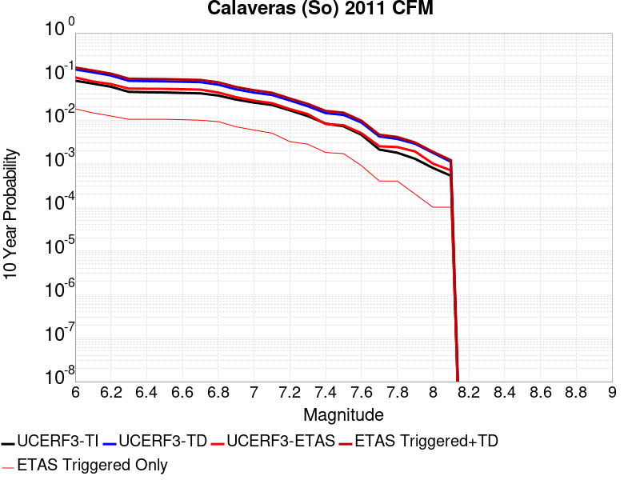 |

| Magnitude | 1 wk TI Prob | 1 wk TD Prob | 1 wk ETAS Prob | 1 wk ETAS/TD Gain | 1 wk ETAS Triggered+TD | 1 wk ETAS Triggered Only | 1 mo TI Prob | 1 mo TD Prob | 1 mo ETAS Prob | 1 mo ETAS/TD Gain | 1 mo ETAS Triggered+TD | 1 mo ETAS Triggered Only | 1 yr TI Prob | 1 yr TD Prob | 1 yr ETAS Prob | 1 yr ETAS/TD Gain | 1 yr ETAS Triggered+TD | 1 yr ETAS Triggered Only | 10 yr TI Prob | 10 yr TD Prob | 10 yr ETAS Prob | 10 yr ETAS/TD Gain | 10 yr ETAS Triggered+TD | 10 yr ETAS Triggered Only |
|-----|-----|-----|-----|-----|-----|-----|-----|-----|-----|-----|-----|-----|-----|-----|-----|-----|-----|-----|-----|-----|-----|-----|-----|-----|
| 6.0 | 1.5950744E-4 | 3.0758316E-4 | 5.0E-4 | 1.6255766 | 7.0746016E-4 | 4.0E-4 | 6.834242E-4 | 0.0013173817 | 0.001 | 0.7590814 | 0.0019165913 | 6.0E-4 | 0.00828899 | 0.015881706 | 0.0094 | 0.5918759 | 0.018538827 | 0.0027 | 0.079865426 | 0.14458649 | 0.0949 | 0.65635455 | 0.16006948 | 0.0181 |
| 6.1 | 1.3584697E-4 | 2.6078877E-4 | 5.0E-4 | 1.9172605 | 6.606844E-4 | 4.0E-4 | 5.8207137E-4 | 0.0011170284 | 7.0E-4 | 0.6266627 | 0.0016164699 | 5.0E-4 | 0.007063716 | 0.013483461 | 0.0075 | 0.55623704 | 0.015653796 | 0.0022 | 0.06843361 | 0.124208316 | 0.0767 | 0.617511 | 0.13699488 | 0.0146 |
| 6.2 | 1.14676266E-4 | 2.1755957E-4 | 5.0E-4 | 2.298221 | 6.174726E-4 | 4.0E-4 | 4.9137714E-4 | 9.319772E-4 | 6.0E-4 | 0.64379257 | 0.0014315111 | 5.0E-4 | 0.0059661185 | 0.011266091 | 0.007 | 0.62133354 | 0.013342432 | 0.0021 | 0.058084648 | 0.10519438 | 0.0668 | 0.6350149 | 0.116289966 | 0.0124 |
| 6.3 | 8.691518E-5 | 1.6026295E-4 | 5.0E-4 | 3.1198726 | 5.6019885E-4 | 4.0E-4 | 3.7244044E-4 | 6.8662164E-4 | 6.0E-4 | 0.87384367 | 0.0011862783 | 5.0E-4 | 0.004525038 | 0.008320916 | 0.0065 | 0.781164 | 0.010403442 | 0.0021 | 0.044339992 | 0.07950515 | 0.0527 | 0.66285014 | 0.0890783 | 0.0104 |
| 6.4 | 8.50982E-5 | 1.5732495E-4 | 5.0E-4 | 3.1781356 | 5.57262E-4 | 4.0E-4 | 3.646556E-4 | 6.7403674E-4 | 6.0E-4 | 0.8901592 | 0.0011736997 | 5.0E-4 | 0.0044306475 | 0.00816885 | 0.0065 | 0.7957056 | 0.010251695 | 0.0021 | 0.04343345 | 0.07811055 | 0.0522 | 0.6682835 | 0.08769821 | 0.0104 |
| 6.5 | 8.4062965E-5 | 1.5556815E-4 | 5.0E-4 | 3.2140255 | 5.555059E-4 | 4.0E-4 | 3.602201E-4 | 6.6651154E-4 | 6.0E-4 | 0.9002095 | 0.0011661783 | 5.0E-4 | 0.004376863 | 0.008078006 | 0.0065 | 0.804654 | 0.010161042 | 0.0021 | 0.042916555 | 0.077281624 | 0.0519 | 0.6715697 | 0.0868779 | 0.0104 |
| 6.6 | 8.194716E-5 | 1.5192376E-4 | 4.0E-4 | 2.6328998 | 4.5187818E-4 | 3.0E-4 | 3.5115483E-4 | 6.509011E-4 | 5.0E-4 | 0.7681658 | 0.0010506407 | 4.0E-4 | 0.0042669317 | 0.007889715 | 0.0063 | 0.798508 | 0.009873935 | 0.002 | 0.04185927 | 0.075566 | 0.051 | 0.67490673 | 0.084995225 | 0.0102 |
| 6.7 | 8.012326E-5 | 1.4860037E-4 | 4.0E-4 | 2.6917834 | 4.485558E-4 | 3.0E-4 | 3.433402E-4 | 6.3666824E-4 | 5.0E-4 | 0.7853384 | 0.0010364136 | 4.0E-4 | 0.004172157 | 0.0077180937 | 0.0063 | 0.81626374 | 0.009702657 | 0.002 | 0.040946912 | 0.07400743 | 0.0499 | 0.6742566 | 0.08317476 | 0.0099 |
| 6.8 | 7.119773E-5 | 1.2917024E-4 | 4.0E-4 | 3.0966885 | 4.291315E-4 | 3.0E-4 | 3.0509746E-4 | 5.5345113E-4 | 5.0E-4 | 0.9034221 | 9.532298E-4 | 4.0E-4 | 0.0037082357 | 0.006714225 | 0.0054 | 0.80426264 | 0.008601468 | 0.0019 | 0.036469642 | 0.064843036 | 0.0428 | 0.66005546 | 0.07344648 | 0.0092 |
| 6.9 | 5.7343088E-5 | 9.950044E-5 | 3.0E-4 | 3.015062 | 2.9948054E-4 | 2.0E-4 | 2.4573295E-4 | 4.2636116E-4 | 4.0E-4 | 0.93817174 | 7.2623324E-4 | 3.0E-4 | 0.0029876942 | 0.005178667 | 0.0039 | 0.75308955 | 0.0064719347 | 0.0013 | 0.02947844 | 0.050653677 | 0.0334 | 0.6593796 | 0.0572991 | 0.007 |
| 7.0 | 4.8746577E-5 | 8.312215E-5 | 2.0E-4 | 2.4060977 | 1.8311384E-4 | 1.0E-4 | 2.0889717E-4 | 3.561895E-4 | 3.0E-4 | 0.8422483 | 5.5611826E-4 | 2.0E-4 | 0.0025403565 | 0.0043280507 | 0.0033 | 0.7624679 | 0.00542329 | 0.0011 | 0.025115121 | 0.042614684 | 0.0279 | 0.6547039 | 0.04826326 | 0.0059 |
| 7.1 | 4.2998014E-5 | 7.28921E-5 | 2.0E-4 | 2.7437816 | 1.7288481E-4 | 1.0E-4 | 1.8426418E-4 | 3.1235765E-4 | 3.0E-4 | 0.9604375 | 5.1229517E-4 | 2.0E-4 | 0.002241108 | 0.0037963835 | 0.0031 | 0.81656665 | 0.004792587 | 0.001 | 0.022186412 | 0.037539266 | 0.0244 | 0.6499861 | 0.04235157 | 0.005 |
| 7.2 | 3.221292E-5 | 5.41334E-5 | 2.0E-4 | 3.6945767 | 1.5412799E-4 | 1.0E-4 | 1.3804805E-4 | 2.3197981E-4 | 3.0E-4 | 1.293216 | 4.319334E-4 | 2.0E-4 | 0.0016794393 | 0.0028207244 | 0.0024 | 0.8508452 | 0.0036184678 | 8.0E-4 | 0.016668037 | 0.028146314 | 0.0179 | 0.6359625 | 0.031256247 | 0.0032 |
| 7.3 | 2.3756531E-5 | 3.9672002E-5 | 1.0E-4 | 2.5206692 | 1.3966803E-4 | 1.0E-4 | 1.0180973E-4 | 1.7001189E-4 | 2.0E-4 | 1.1763883 | 3.6997788E-4 | 2.0E-4 | 0.0012388286 | 0.002067947 | 0.0019 | 0.91878563 | 0.0028662926 | 8.0E-4 | 0.012319452 | 0.020741245 | 0.0137 | 0.66051966 | 0.023483168 | 0.0028 |
| 7.4 | 1.5997684E-5 | 2.745663E-5 | 1.0E-4 | 3.6421077 | 1.2745388E-4 | 1.0E-4 | 6.8559704E-5 | 1.1766597E-4 | 2.0E-4 | 1.6997267 | 3.1764244E-4 | 2.0E-4 | 8.343947E-4 | 0.0014316443 | 0.0013 | 0.9080468 | 0.0019309284 | 5.0E-4 | 0.008312687 | 0.014432074 | 0.0081 | 0.5612499 | 0.016206097 | 0.0018 |
| 7.5 | 1.3814293E-5 | 2.4893852E-5 | 1.0E-4 | 4.017056 | 1.2489136E-4 | 1.0E-4 | 5.9202768E-5 | 1.0668359E-4 | 2.0E-4 | 1.8747026 | 3.0666226E-4 | 2.0E-4 | 7.205553E-4 | 0.0012981013 | 0.0012 | 0.92442715 | 0.0017974522 | 5.0E-4 | 0.007182234 | 0.013109234 | 0.0076 | 0.57974404 | 0.014786948 | 0.0017 |
| 7.6 | 8.817309E-6 | 1.6521872E-5 | 0.0 | 0.0 | 1.6521872E-5 | 0.0 | 3.7787922E-5 | 7.0806105E-5 | 0.0 | 0.0 | 7.0806105E-5 | 0.0 | 4.5997082E-4 | 8.617247E-4 | 5.0E-4 | 0.58023167 | 8.617247E-4 | 0.0 | 0.004590199 | 0.008764109 | 0.005 | 0.57050866 | 0.009656222 | 9.0E-4 |
| 7.7 | 4.0352206E-6 | 7.768831E-6 | 0.0 | 0.0 | 7.768831E-6 | 0.0 | 1.7293689E-5 | 3.3294564E-5 | 0.0 | 0.0 | 3.3294564E-5 | 0.0 | 2.1053031E-4 | 4.05286E-4 | 1.0E-4 | 0.24673934 | 4.05286E-4 | 0.0 | 0.0021033096 | 0.004195467 | 0.0025 | 0.5958812 | 0.0045937886 | 4.0E-4 |
| 7.8 | 3.413169E-6 | 6.841251E-6 | 0.0 | 0.0 | 6.841251E-6 | 0.0 | 1.4627784E-5 | 2.9319317E-5 | 0.0 | 0.0 | 2.9319317E-5 | 0.0 | 1.7807873E-4 | 3.569043E-4 | 1.0E-4 | 0.28018716 | 3.569043E-4 | 0.0 | 0.0017793609 | 0.0036929992 | 0.0024 | 0.64987826 | 0.004091522 | 4.0E-4 |
| 7.9 | 2.4740732E-6 | 5.3191607E-6 | 0.0 | 0.0 | 5.3191607E-6 | 0.0 | 1.06031275E-5 | 2.2796205E-5 | 0.0 | 0.0 | 2.2796205E-5 | 0.0 | 1.2908543E-4 | 2.775085E-4 | 1.0E-4 | 0.36034933 | 2.775085E-4 | 0.0 | 0.0012901047 | 0.0028543144 | 0.0019 | 0.665659 | 0.0030537434 | 2.0E-4 |
| 8.0 | 1.5231818E-6 | 3.3126942E-6 | 0.0 | 0.0 | 3.3126942E-6 | 0.0 | 6.527906E-6 | 1.4197184E-5 | 0.0 | 0.0 | 1.4197184E-5 | 0.0 | 7.9474354E-5 | 1.7283704E-4 | 0.0 | 0.0 | 1.7283704E-4 | 0.0 | 7.944594E-4 | 0.001768134 | 0.001 | 0.56556803 | 0.0018679572 | 1.0E-4 |
| 8.1 | 1.0104524E-6 | 2.0606942E-6 | 0.0 | 0.0 | 2.0606942E-6 | 0.0 | 4.330503E-6 | 8.831517E-6 | 0.0 | 0.0 | 8.831517E-6 | 0.0 | 5.2722597E-5 | 1.0751845E-4 | 0.0 | 0.0 | 1.0751845E-4 | 0.0 | 5.271009E-4 | 0.0011003951 | 7.0E-4 | 0.6361351 | 0.0012002852 | 1.0E-4 |

## Owl Lake
*[(top)](#table-of-contents)*

| 1 Week | 1 Month | 1 Year | 10 Year |
|-----|-----|-----|-----|
| 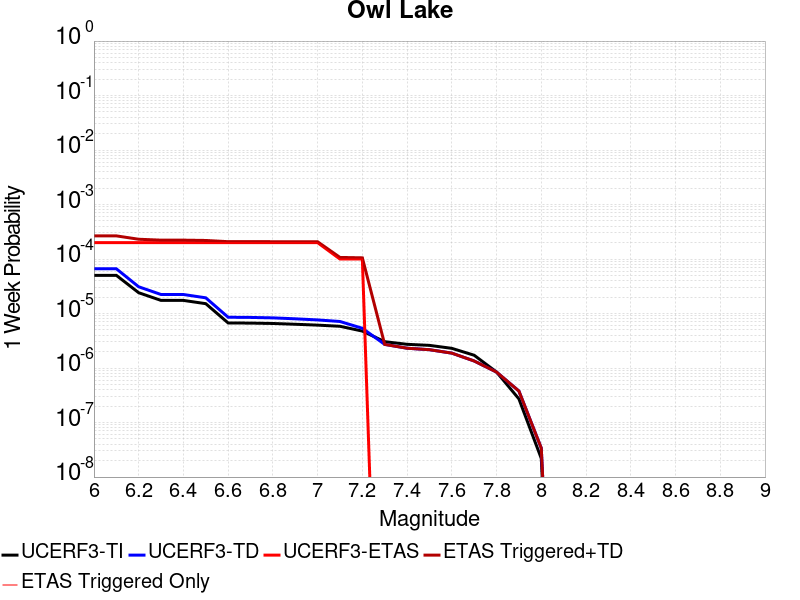 |  |  |  |

| Magnitude | 1 wk TI Prob | 1 wk TD Prob | 1 wk ETAS Prob | 1 wk ETAS/TD Gain | 1 wk ETAS Triggered+TD | 1 wk ETAS Triggered Only | 1 mo TI Prob | 1 mo TD Prob | 1 mo ETAS Prob | 1 mo ETAS/TD Gain | 1 mo ETAS Triggered+TD | 1 mo ETAS Triggered Only | 1 yr TI Prob | 1 yr TD Prob | 1 yr ETAS Prob | 1 yr ETAS/TD Gain | 1 yr ETAS Triggered+TD | 1 yr ETAS Triggered Only | 10 yr TI Prob | 10 yr TD Prob | 10 yr ETAS Prob | 10 yr ETAS/TD Gain | 10 yr ETAS Triggered+TD | 10 yr ETAS Triggered Only |
|-----|-----|-----|-----|-----|-----|-----|-----|-----|-----|-----|-----|-----|-----|-----|-----|-----|-----|-----|-----|-----|-----|-----|-----|-----|
| 6.0 | 5.0320643E-5 | 6.640467E-5 | 2.0E-4 | 3.0118365 | 2.6639138E-4 | 2.0E-4 | 2.1564208E-4 | 2.8456666E-4 | 0.0011 | 3.8655267 | 9.843674E-4 | 7.0E-4 | 0.0026222812 | 0.0034600073 | 0.0072 | 2.0809205 | 0.008044091 | 0.0046 | 0.02591553 | 0.034164894 | 0.0392 | 1.1473765 | 0.049811423 | 0.0162 |
| 6.1 | 5.0320643E-5 | 6.640467E-5 | 2.0E-4 | 3.0118365 | 2.6639138E-4 | 2.0E-4 | 2.1564208E-4 | 2.8456666E-4 | 0.0011 | 3.8655267 | 9.843674E-4 | 7.0E-4 | 0.0026222812 | 0.0034600073 | 0.0072 | 2.0809205 | 0.008044091 | 0.0046 | 0.02591553 | 0.034164894 | 0.0392 | 1.1473765 | 0.049811423 | 0.0162 |
| 6.2 | 2.4125871E-5 | 3.1004914E-5 | 2.0E-4 | 6.4505906 | 2.3099872E-4 | 2.0E-4 | 1.0339249E-4 | 1.3287259E-4 | 7.0E-4 | 5.268204 | 7.327929E-4 | 6.0E-4 | 0.0012580766 | 0.0016166979 | 0.005 | 3.0927238 | 0.0055103926 | 0.0039 | 0.012509781 | 0.016083142 | 0.0229 | 1.4238513 | 0.027791752 | 0.0119 |
| 6.3 | 1.7433485E-5 | 2.2375143E-5 | 2.0E-4 | 8.93849 | 2.2237067E-4 | 2.0E-4 | 7.471279E-5 | 9.589084E-5 | 5.0E-4 | 5.214262 | 5.958429E-4 | 5.0E-4 | 9.0924866E-4 | 0.0011669847 | 0.0045 | 3.856092 | 0.0047627836 | 0.0036 | 0.009055373 | 0.011639125 | 0.0177 | 1.520733 | 0.021423897 | 0.0099 |
| 6.4 | 1.7433485E-5 | 2.2375143E-5 | 2.0E-4 | 8.93849 | 2.2237067E-4 | 2.0E-4 | 7.471279E-5 | 9.589084E-5 | 5.0E-4 | 5.214262 | 5.958429E-4 | 5.0E-4 | 9.0924866E-4 | 0.0011669847 | 0.0045 | 3.856092 | 0.0047627836 | 0.0036 | 0.009055373 | 0.011639125 | 0.0177 | 1.520733 | 0.021423897 | 0.0099 |
| 6.5 | 1.5182742E-5 | 1.9447225E-5 | 2.0E-4 | 10.284244 | 2.1944333E-4 | 2.0E-4 | 6.506727E-5 | 8.3343446E-5 | 5.0E-4 | 5.9992723 | 5.8330176E-4 | 5.0E-4 | 7.919061E-4 | 0.001014371 | 0.0042 | 4.1404967 | 0.0043110237 | 0.0033 | 0.0078909 | 0.010127813 | 0.0159 | 1.5699342 | 0.01913565 | 0.0091 |
| 6.6 | 6.7271576E-6 | 8.559488E-6 | 2.0E-4 | 23.365881 | 2.0855777E-4 | 2.0E-4 | 2.8830356E-5 | 3.668304E-5 | 5.0E-4 | 13.630278 | 5.366647E-4 | 5.0E-4 | 3.5095305E-4 | 4.4653015E-4 | 0.0029 | 6.494522 | 0.0029454138 | 0.0025 | 0.0035039932 | 0.0044740955 | 0.0088 | 1.966878 | 0.010646356 | 0.0062 |
| 6.7 | 6.682835E-6 | 8.491916E-6 | 2.0E-4 | 23.551813 | 2.0849022E-4 | 2.0E-4 | 2.8640408E-5 | 3.639345E-5 | 5.0E-4 | 13.738737 | 5.363753E-4 | 5.0E-4 | 3.4864116E-4 | 4.430058E-4 | 0.0029 | 6.54619 | 0.0029418983 | 0.0025 | 0.003480947 | 0.004438951 | 0.0088 | 1.9824502 | 0.01061143 | 0.0062 |
| 6.8 | 6.5774975E-6 | 8.33833E-6 | 2.0E-4 | 23.985619 | 2.0833666E-4 | 2.0E-4 | 2.8188972E-5 | 3.573524E-5 | 5.0E-4 | 13.99179 | 5.3571735E-4 | 5.0E-4 | 3.4314668E-4 | 4.3499537E-4 | 0.0029 | 6.666738 | 0.0029339078 | 0.0025 | 0.0034261728 | 0.0043591084 | 0.0088 | 2.0187614 | 0.010532082 | 0.0062 |
| 6.9 | 6.363419E-6 | 8.011343E-6 | 2.0E-4 | 24.964602 | 2.0800975E-4 | 2.0E-4 | 2.727151E-5 | 3.433391E-5 | 5.0E-4 | 14.562862 | 5.3431676E-4 | 5.0E-4 | 3.3198006E-4 | 4.1794076E-4 | 0.0028 | 6.699514 | 0.0028169376 | 0.0024 | 0.0033148455 | 0.0041890363 | 0.0087 | 2.07685 | 0.010263483 | 0.0061 |
| 7.0 | 6.1342453E-6 | 7.643341E-6 | 2.0E-4 | 26.166567 | 2.0764182E-4 | 2.0E-4 | 2.6289357E-5 | 3.2756794E-5 | 5.0E-4 | 15.2640085 | 5.3274044E-4 | 5.0E-4 | 3.2002592E-4 | 3.9874652E-4 | 0.0028 | 7.022005 | 0.0027977896 | 0.0024 | 0.0031956544 | 0.0039976123 | 0.0085 | 2.1262693 | 0.009973627 | 0.006 |
| 7.1 | 5.842926E-6 | 7.1535937E-6 | 1.0E-4 | 13.978989 | 1.07152875E-4 | 1.0E-4 | 2.504087E-5 | 3.0657928E-5 | 4.0E-4 | 13.047196 | 4.3064565E-4 | 4.0E-4 | 3.0482994E-4 | 3.7320176E-4 | 0.0023 | 6.162886 | 0.0025723807 | 0.0022 | 0.0030441214 | 0.00374276 | 0.0077 | 2.0573053 | 0.009521052 | 0.0058 |
| 7.2 | 4.77173E-6 | 5.368815E-6 | 1.0E-4 | 18.626085 | 1.0536828E-4 | 1.0E-4 | 2.045011E-5 | 2.3009026E-5 | 2.0E-4 | 8.692241 | 2.2300442E-4 | 2.0E-4 | 2.4895166E-4 | 2.8010295E-4 | 0.0015 | 5.355174 | 0.0016797108 | 0.0014 | 0.0024867293 | 0.0028138845 | 0.0055 | 1.9545933 | 0.006902348 | 0.0041 |
| 7.3 | 3.0494948E-6 | 2.7179788E-6 | 0.0 | 0.0 | 2.7179788E-6 | 0.0 | 1.3069198E-5 | 1.164843E-5 | 1.0E-4 | 8.584848 | 1.1164726E-4 | 1.0E-4 | 1.5910587E-4 | 1.4181057E-4 | 4.0E-4 | 2.8206644 | 5.4175383E-4 | 4.0E-4 | 0.0015899199 | 0.0014272605 | 0.0016 | 1.1210287 | 0.0026255478 | 0.0012 |
| 7.4 | 2.7263884E-6 | 2.312722E-6 | 0.0 | 0.0 | 2.312722E-6 | 0.0 | 1.1684469E-5 | 9.911629E-6 | 1.0E-4 | 10.089159 | 1.0991064E-4 | 1.0E-4 | 1.4224913E-4 | 1.2066751E-4 | 3.0E-4 | 2.4861705 | 4.2063132E-4 | 3.0E-4 | 0.0014215811 | 0.001215011 | 0.0013 | 1.0699493 | 0.0023136744 | 0.0011 |
| 7.5 | 2.6090431E-6 | 2.1725177E-6 | 0.0 | 0.0 | 2.1725177E-6 | 0.0 | 1.1181565E-5 | 9.310757E-6 | 1.0E-4 | 10.740265 | 1.09309825E-4 | 1.0E-4 | 1.3612706E-4 | 1.1335267E-4 | 3.0E-4 | 2.6466074 | 4.1331866E-4 | 3.0E-4 | 0.001360437 | 0.0011416764 | 0.0012 | 1.0510858 | 0.0021405348 | 0.001 |
| 7.6 | 2.3008756E-6 | 1.8793033E-6 | 0.0 | 0.0 | 1.8793033E-6 | 0.0 | 9.860858E-6 | 8.054133E-6 | 1.0E-4 | 12.415986 | 1.08053326E-4 | 1.0E-4 | 1.20049335E-4 | 9.8054734E-5 | 2.0E-4 | 2.0396771 | 2.9803513E-4 | 2.0E-4 | 0.001199845 | 9.885007E-4 | 0.001 | 1.0116332 | 0.0017877098 | 8.0E-4 |
| 7.7 | 1.7184348E-6 | 1.3479334E-6 | 0.0 | 0.0 | 1.3479334E-6 | 0.0 | 7.3646997E-6 | 5.7768452E-6 | 0.0 | 0.0 | 5.7768452E-6 | 0.0 | 8.966153E-5 | 7.033086E-5 | 0.0 | 0.0 | 7.033086E-5 | 0.0 | 8.962536E-4 | 7.1112585E-4 | 3.0E-4 | 0.42186627 | 8.110547E-4 | 1.0E-4 |
| 7.8 | 8.4612907E-7 | 8.448996E-7 | 0.0 | 0.0 | 8.448996E-7 | 0.0 | 3.6262625E-6 | 3.6209933E-6 | 0.0 | 0.0 | 3.6209933E-6 | 0.0 | 4.4148852E-5 | 4.4084725E-5 | 0.0 | 0.0 | 4.4084725E-5 | 0.0 | 4.414008E-4 | 4.464337E-4 | 1.0E-4 | 0.22399743 | 5.46389E-4 | 1.0E-4 |
| 7.9 | 2.716738E-7 | 3.787158E-7 | 0.0 | 0.0 | 3.787158E-7 | 0.0 | 1.1643157E-6 | 1.6230667E-6 | 0.0 | 0.0 | 1.6230667E-6 | 0.0 | 1.4175452E-5 | 1.976067E-5 | 0.0 | 0.0 | 1.976067E-5 | 0.0 | 1.4174548E-4 | 1.9956048E-4 | 1.0E-4 | 0.5011012 | 2.9954052E-4 | 1.0E-4 |
| 8.0 | 2.1995428E-8 | 3.398418E-8 | 0.0 | 0.0 | 3.398418E-8 | 0.0 | 9.426611E-8 | 1.4564648E-7 | 0.0 | 0.0 | 1.4564648E-7 | 0.0 | 1.1476893E-6 | 1.7732452E-6 | 0.0 | 0.0 | 1.7732452E-6 | 0.0 | 1.14768345E-5 | 1.8277846E-5 | 1.0E-4 | 5.471104 | 1.1827602E-4 | 1.0E-4 |

## Calaveras (Central) 2011 CFM
*[(top)](#table-of-contents)*

| 1 Week | 1 Month | 1 Year | 10 Year |
|-----|-----|-----|-----|
|  |  |  |  |

| Magnitude | 1 wk TI Prob | 1 wk TD Prob | 1 wk ETAS Prob | 1 wk ETAS/TD Gain | 1 wk ETAS Triggered+TD | 1 wk ETAS Triggered Only | 1 mo TI Prob | 1 mo TD Prob | 1 mo ETAS Prob | 1 mo ETAS/TD Gain | 1 mo ETAS Triggered+TD | 1 mo ETAS Triggered Only | 1 yr TI Prob | 1 yr TD Prob | 1 yr ETAS Prob | 1 yr ETAS/TD Gain | 1 yr ETAS Triggered+TD | 1 yr ETAS Triggered Only | 10 yr TI Prob | 10 yr TD Prob | 10 yr ETAS Prob | 10 yr ETAS/TD Gain | 10 yr ETAS Triggered+TD | 10 yr ETAS Triggered Only |
|-----|-----|-----|-----|-----|-----|-----|-----|-----|-----|-----|-----|-----|-----|-----|-----|-----|-----|-----|-----|-----|-----|-----|-----|-----|
| 6.0 | 1.5010907E-4 | 2.4854988E-4 | 4.0E-4 | 1.609335 | 4.4850016E-4 | 2.0E-4 | 6.4316596E-4 | 0.0010646776 | 8.0E-4 | 0.7514011 | 0.0014642518 | 4.0E-4 | 0.0078024664 | 0.012876651 | 0.0084 | 0.6523435 | 0.01534446 | 0.0025 | 0.07534136 | 0.120618545 | 0.0746 | 0.6184787 | 0.13416103 | 0.0154 |
| 6.1 | 1.4521465E-4 | 2.4016028E-4 | 4.0E-4 | 1.6655544 | 4.4011226E-4 | 2.0E-4 | 6.222001E-4 | 0.0010287508 | 7.0E-4 | 0.6804369 | 0.0013284421 | 3.0E-4 | 0.0075490056 | 0.012445705 | 0.008 | 0.642792 | 0.014717081 | 0.0023 | 0.07297657 | 0.11688869 | 0.0721 | 0.6168262 | 0.12987041 | 0.0147 |
| 6.2 | 1.429998E-4 | 2.3946541E-4 | 4.0E-4 | 1.6703874 | 4.3941752E-4 | 2.0E-4 | 6.127123E-4 | 0.0010257753 | 7.0E-4 | 0.68241066 | 0.0013254676 | 3.0E-4 | 0.007434286 | 0.0124099385 | 0.008 | 0.6446446 | 0.014681396 | 0.0023 | 0.07190444 | 0.11653886 | 0.072 | 0.61781967 | 0.12952574 | 0.0147 |
| 6.3 | 1.3536277E-4 | 2.3275973E-4 | 4.0E-4 | 1.7185103 | 4.327132E-4 | 2.0E-4 | 5.799972E-4 | 9.970631E-4 | 7.0E-4 | 0.7020619 | 0.001296764 | 3.0E-4 | 0.0070386264 | 0.012065202 | 0.0079 | 0.65477556 | 0.014337452 | 0.0023 | 0.0681982 | 0.11344335 | 0.0705 | 0.62145555 | 0.1261211 | 0.0143 |
| 6.4 | 1.2993296E-4 | 2.269819E-4 | 4.0E-4 | 1.7622552 | 4.269365E-4 | 2.0E-4 | 5.5673666E-4 | 9.723198E-4 | 7.0E-4 | 0.7199277 | 0.0012720281 | 3.0E-4 | 0.006757223 | 0.011767313 | 0.0078 | 0.6628531 | 0.0140402485 | 0.0023 | 0.06555412 | 0.11071556 | 0.0691 | 0.62412184 | 0.12325447 | 0.0141 |
| 6.5 | 1.0498927E-4 | 1.8024998E-4 | 4.0E-4 | 2.2191405 | 3.8021393E-4 | 2.0E-4 | 4.498764E-4 | 7.722703E-4 | 7.0E-4 | 0.9064184 | 0.0010720387 | 3.0E-4 | 0.005463498 | 0.009361765 | 0.0069 | 0.73704046 | 0.011442106 | 0.0021 | 0.053311124 | 0.08938528 | 0.0577 | 0.64552015 | 0.10040372 | 0.0121 |
| 6.6 | 1.0157505E-4 | 1.7511995E-4 | 4.0E-4 | 2.2841487 | 3.7508493E-4 | 2.0E-4 | 4.35249E-4 | 7.502974E-4 | 6.0E-4 | 0.7996829 | 0.0010500724 | 3.0E-4 | 0.0052862884 | 0.009096545 | 0.0065 | 0.714557 | 0.011177443 | 0.0021 | 0.05162293 | 0.086960845 | 0.056 | 0.643968 | 0.09791732 | 0.012 |
| 6.7 | 9.660386E-5 | 1.6770198E-4 | 4.0E-4 | 2.3851836 | 3.6766843E-4 | 2.0E-4 | 4.1395082E-4 | 7.1852433E-4 | 6.0E-4 | 0.8350448 | 0.0010183088 | 3.0E-4 | 0.0050282106 | 0.008712904 | 0.0063 | 0.7230655 | 0.010794606 | 0.0021 | 0.049159497 | 0.08344614 | 0.0536 | 0.64233047 | 0.09398651 | 0.0115 |
| 6.8 | 9.089927E-5 | 1.5682819E-4 | 4.0E-4 | 2.550562 | 3.567968E-4 | 2.0E-4 | 3.8951015E-4 | 6.719476E-4 | 5.0E-4 | 0.74410564 | 9.71746E-4 | 3.0E-4 | 0.0047319788 | 0.0081502395 | 0.0058 | 0.71163553 | 0.010233124 | 0.0021 | 0.046324775 | 0.07833386 | 0.0511 | 0.652336 | 0.08856436 | 0.0111 |
| 6.9 | 7.353187E-5 | 1.2328938E-4 | 4.0E-4 | 3.2443993 | 3.232647E-4 | 2.0E-4 | 3.150985E-4 | 5.2827667E-4 | 5.0E-4 | 0.9464738 | 8.281182E-4 | 3.0E-4 | 0.0038295772 | 0.0064129224 | 0.0046 | 0.71730167 | 0.008201379 | 0.0018 | 0.037642512 | 0.062341366 | 0.0423 | 0.67852217 | 0.07096782 | 0.0092 |
| 7.0 | 5.746064E-5 | 9.416931E-5 | 2.0E-4 | 2.1238344 | 1.9415989E-4 | 1.0E-4 | 2.4623662E-4 | 4.0352068E-4 | 3.0E-4 | 0.7434563 | 6.0344E-4 | 2.0E-4 | 0.0029938098 | 0.0049018688 | 0.0036 | 0.7344138 | 0.0061954963 | 0.0013 | 0.02953797 | 0.04811951 | 0.032 | 0.66501087 | 0.054877862 | 0.0071 |
| 7.1 | 4.9557195E-5 | 8.077031E-5 | 2.0E-4 | 2.4761574 | 1.8076223E-4 | 1.0E-4 | 2.123707E-4 | 3.4611288E-4 | 3.0E-4 | 0.86676925 | 5.460437E-4 | 2.0E-4 | 0.0025825473 | 0.0042058453 | 0.0032 | 0.7608459 | 0.005301219 | 0.0011 | 0.0255274 | 0.041490447 | 0.0274 | 0.66039294 | 0.047049806 | 0.0058 |
| 7.2 | 3.687595E-5 | 5.9754122E-5 | 2.0E-4 | 3.3470495 | 1.5974815E-4 | 1.0E-4 | 1.5803022E-4 | 2.5606412E-4 | 3.0E-4 | 1.1715815 | 4.560129E-4 | 2.0E-4 | 0.0019223199 | 0.0031131532 | 0.0025 | 0.8030443 | 0.0040103514 | 9.0E-4 | 0.01905776 | 0.030995104 | 0.0202 | 0.6517158 | 0.034677323 | 0.0038 |
| 7.3 | 2.5846984E-5 | 4.2672225E-5 | 1.0E-4 | 2.3434446 | 1.4266797E-4 | 1.0E-4 | 1.1076809E-4 | 1.8286826E-4 | 2.0E-4 | 1.0936836 | 3.8283167E-4 | 2.0E-4 | 0.0013477671 | 0.0022241652 | 0.002 | 0.89921373 | 0.0031221635 | 9.0E-4 | 0.013396223 | 0.022273581 | 0.0151 | 0.67793316 | 0.025304534 | 0.0031 |
| 7.4 | 1.7747854E-5 | 3.0051217E-5 | 1.0E-4 | 3.3276525 | 1.3004821E-4 | 1.0E-4 | 7.6060016E-5 | 1.2878458E-4 | 2.0E-4 | 1.5529809 | 3.2875882E-4 | 2.0E-4 | 9.2563726E-4 | 0.0015668275 | 0.0014 | 0.8935253 | 0.0021658875 | 6.0E-4 | 0.009217911 | 0.015764812 | 0.009 | 0.5708917 | 0.01763486 | 0.0019 |
| 7.5 | 1.4883479E-5 | 2.6351172E-5 | 1.0E-4 | 3.7948978 | 1.2634853E-4 | 1.0E-4 | 6.378478E-5 | 1.1292872E-4 | 2.0E-4 | 1.7710286 | 3.1290614E-4 | 2.0E-4 | 7.76303E-4 | 0.0013740428 | 0.0013 | 0.94611317 | 0.0019732183 | 6.0E-4 | 0.0077359667 | 0.013854642 | 0.0082 | 0.5918594 | 0.015629703 | 0.0018 |
| 7.6 | 8.166975E-6 | 1.5043279E-5 | 0.0 | 0.0 | 1.5043279E-5 | 0.0 | 3.5000852E-5 | 6.4469605E-5 | 0.0 | 0.0 | 6.4469605E-5 | 0.0 | 4.2605202E-4 | 7.846361E-4 | 4.0E-4 | 0.5097904 | 7.846361E-4 | 0.0 | 0.004252361 | 0.007978201 | 0.0044 | 0.55150276 | 0.008871021 | 9.0E-4 |
| 7.7 | 3.3858064E-6 | 6.3037724E-6 | 0.0 | 0.0 | 6.3037724E-6 | 0.0 | 1.4510518E-5 | 2.7015887E-5 | 0.0 | 0.0 | 2.7015887E-5 | 0.0 | 1.7665124E-4 | 3.2886886E-4 | 0.0 | 0.0 | 3.2886886E-4 | 0.0 | 0.0017651088 | 0.0034128537 | 0.0019 | 0.5567188 | 0.0038114886 | 4.0E-4 |
| 7.8 | 2.7721615E-6 | 5.409279E-6 | 0.0 | 0.0 | 5.409279E-6 | 0.0 | 1.1880637E-5 | 2.3182418E-5 | 0.0 | 0.0 | 2.3182418E-5 | 0.0 | 1.4463716E-4 | 2.8220942E-4 | 0.0 | 0.0 | 2.8220942E-4 | 0.0 | 0.0014454306 | 0.002928597 | 0.0018 | 0.6146288 | 0.0033274256 | 4.0E-4 |
| 7.9 | 1.9736292E-6 | 4.1600506E-6 | 0.0 | 0.0 | 4.1600506E-6 | 0.0 | 8.4583835E-6 | 1.7828668E-5 | 0.0 | 0.0 | 1.7828668E-5 | 0.0 | 1.0297595E-4 | 2.1704244E-4 | 0.0 | 0.0 | 2.1704244E-4 | 0.0 | 0.0010292825 | 0.0022390748 | 0.0014 | 0.62525827 | 0.002438627 | 2.0E-4 |
| 8.0 | 1.1767289E-6 | 2.5732104E-6 | 0.0 | 0.0 | 2.5732104E-6 | 0.0 | 5.0431145E-6 | 1.1027998E-5 | 0.0 | 0.0 | 1.1027998E-5 | 0.0 | 6.139818E-5 | 1.3425763E-4 | 0.0 | 0.0 | 1.3425763E-4 | 0.0 | 6.1381224E-4 | 0.0013752669 | 8.0E-4 | 0.5817053 | 0.0014751294 | 1.0E-4 |
| 8.1 | 7.5112825E-7 | 1.5523256E-6 | 0.0 | 0.0 | 1.5523256E-6 | 0.0 | 3.2191172E-6 | 6.652807E-6 | 0.0 | 0.0 | 6.652807E-6 | 0.0 | 3.9192048E-5 | 8.099494E-5 | 0.0 | 0.0 | 8.099494E-5 | 0.0 | 3.9185135E-4 | 8.291874E-4 | 5.0E-4 | 0.603 | 9.2910446E-4 | 1.0E-4 |

## San Andreas (Big Bend)
*[(top)](#table-of-contents)*

| 1 Week | 1 Month | 1 Year | 10 Year |
|-----|-----|-----|-----|
| 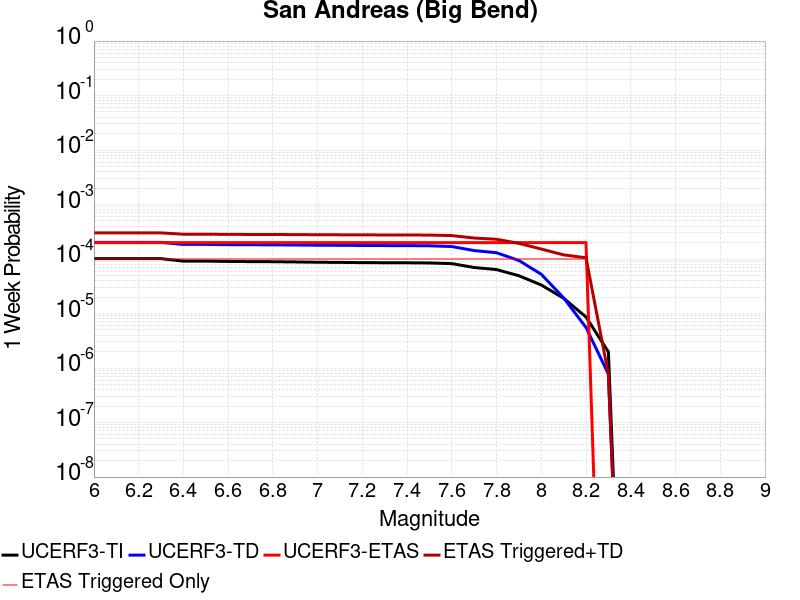 |  | 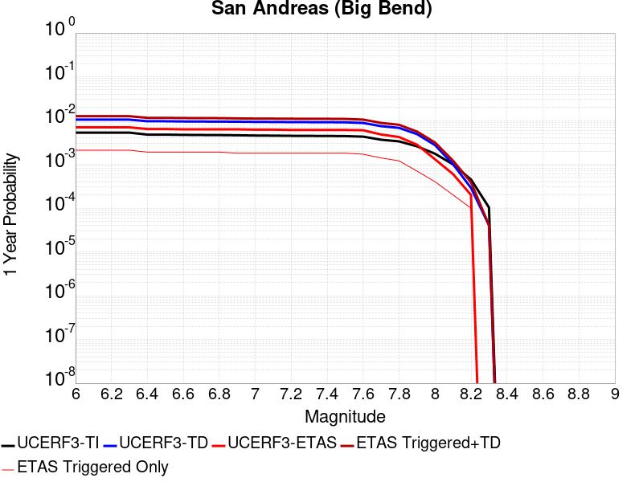 |  |

| Magnitude | 1 wk TI Prob | 1 wk TD Prob | 1 wk ETAS Prob | 1 wk ETAS/TD Gain | 1 wk ETAS Triggered+TD | 1 wk ETAS Triggered Only | 1 mo TI Prob | 1 mo TD Prob | 1 mo ETAS Prob | 1 mo ETAS/TD Gain | 1 mo ETAS Triggered+TD | 1 mo ETAS Triggered Only | 1 yr TI Prob | 1 yr TD Prob | 1 yr ETAS Prob | 1 yr ETAS/TD Gain | 1 yr ETAS Triggered+TD | 1 yr ETAS Triggered Only | 10 yr TI Prob | 10 yr TD Prob | 10 yr ETAS Prob | 10 yr ETAS/TD Gain | 10 yr ETAS Triggered+TD | 10 yr ETAS Triggered Only |
|-----|-----|-----|-----|-----|-----|-----|-----|-----|-----|-----|-----|-----|-----|-----|-----|-----|-----|-----|-----|-----|-----|-----|-----|-----|
| 6.0 | 1.0179969E-4 | 2.0203188E-4 | 2.0E-4 | 0.9899428 | 3.0201167E-4 | 1.0E-4 | 4.362114E-4 | 8.655646E-4 | 2.0E-4 | 0.23106305 | 9.654781E-4 | 1.0E-4 | 0.0052979486 | 0.010487616 | 0.007 | 0.6674539 | 0.012565592 | 0.0021 | 0.051734097 | 0.10204338 | 0.0638 | 0.6252243 | 0.11739844 | 0.0171 |
| 6.1 | 1.0179969E-4 | 2.0203188E-4 | 2.0E-4 | 0.9899428 | 3.0201167E-4 | 1.0E-4 | 4.362114E-4 | 8.655646E-4 | 2.0E-4 | 0.23106305 | 9.654781E-4 | 1.0E-4 | 0.0052979486 | 0.010487616 | 0.007 | 0.6674539 | 0.012565592 | 0.0021 | 0.051734097 | 0.10204338 | 0.0638 | 0.6252243 | 0.11739844 | 0.0171 |
| 6.2 | 1.0179969E-4 | 2.0203188E-4 | 2.0E-4 | 0.9899428 | 3.0201167E-4 | 1.0E-4 | 4.362114E-4 | 8.655646E-4 | 2.0E-4 | 0.23106305 | 9.654781E-4 | 1.0E-4 | 0.0052979486 | 0.010487616 | 0.007 | 0.6674539 | 0.012565592 | 0.0021 | 0.051734097 | 0.10204338 | 0.0638 | 0.6252243 | 0.11739844 | 0.0171 |
| 6.3 | 1.0179969E-4 | 2.0203188E-4 | 2.0E-4 | 0.9899428 | 3.0201167E-4 | 1.0E-4 | 4.362114E-4 | 8.655646E-4 | 2.0E-4 | 0.23106305 | 9.654781E-4 | 1.0E-4 | 0.0052979486 | 0.010487616 | 0.007 | 0.6674539 | 0.012565592 | 0.0021 | 0.051734097 | 0.10204338 | 0.0638 | 0.6252243 | 0.11739844 | 0.0171 |
| 6.4 | 9.1639464E-5 | 1.855804E-4 | 2.0E-4 | 1.0777 | 2.8556184E-4 | 1.0E-4 | 3.9268145E-4 | 7.951024E-4 | 2.0E-4 | 0.25153995 | 8.950229E-4 | 1.0E-4 | 0.0047704205 | 0.009637524 | 0.0064 | 0.66407096 | 0.011519213 | 0.0019 | 0.046693064 | 0.09434208 | 0.0588 | 0.6232637 | 0.10828922 | 0.0154 |
| 6.5 | 9.1639464E-5 | 1.855804E-4 | 2.0E-4 | 1.0777 | 2.8556184E-4 | 1.0E-4 | 3.9268145E-4 | 7.951024E-4 | 2.0E-4 | 0.25153995 | 8.950229E-4 | 1.0E-4 | 0.0047704205 | 0.009637524 | 0.0064 | 0.66407096 | 0.011519213 | 0.0019 | 0.046693064 | 0.09434208 | 0.0588 | 0.6232637 | 0.10828922 | 0.0154 |
| 6.6 | 9.042622E-5 | 1.8364786E-4 | 2.0E-4 | 1.0890408 | 2.836295E-4 | 1.0E-4 | 3.8748336E-4 | 7.868251E-4 | 2.0E-4 | 0.2541861 | 8.867464E-4 | 1.0E-4 | 0.0047074095 | 0.009537633 | 0.0063 | 0.66054124 | 0.011419511 | 0.0019 | 0.046089325 | 0.093438126 | 0.0583 | 0.6239423 | 0.10739918 | 0.0154 |
| 6.7 | 8.9836685E-5 | 1.8279013E-4 | 2.0E-4 | 1.094151 | 2.8277186E-4 | 1.0E-4 | 3.8495753E-4 | 7.8315125E-4 | 2.0E-4 | 0.2553785 | 8.8307296E-4 | 1.0E-4 | 0.00467679 | 0.009493294 | 0.0063 | 0.6636264 | 0.011375257 | 0.0019 | 0.045795817 | 0.09303213 | 0.0577 | 0.62021583 | 0.10681804 | 0.0152 |
| 6.8 | 8.9471854E-5 | 1.8225674E-4 | 2.0E-4 | 1.0973531 | 2.8223853E-4 | 1.0E-4 | 3.8339442E-4 | 7.808667E-4 | 2.0E-4 | 0.25612566 | 8.8078866E-4 | 1.0E-4 | 0.004657841 | 0.009465721 | 0.0063 | 0.6655594 | 0.011347737 | 0.0019 | 0.04561414 | 0.09277857 | 0.0577 | 0.6219108 | 0.10656834 | 0.0152 |
| 6.9 | 8.858234E-5 | 1.810744E-4 | 2.0E-4 | 1.1045184 | 2.8105627E-4 | 1.0E-4 | 3.7958333E-4 | 7.7580253E-4 | 2.0E-4 | 0.25779757 | 8.7572495E-4 | 1.0E-4 | 0.004611638 | 0.009404599 | 0.0063 | 0.66988504 | 0.01118767 | 0.0018 | 0.04517103 | 0.09221845 | 0.0574 | 0.6224351 | 0.105925955 | 0.0151 |
| 7.0 | 8.7433385E-5 | 1.794592E-4 | 2.0E-4 | 1.1144595 | 2.7944124E-4 | 1.0E-4 | 3.746607E-4 | 7.688843E-4 | 2.0E-4 | 0.26011714 | 8.6880743E-4 | 1.0E-4 | 0.004551957 | 0.009321094 | 0.0062 | 0.66515803 | 0.0111043155 | 0.0018 | 0.044598386 | 0.0914515 | 0.0571 | 0.6243746 | 0.105170585 | 0.0151 |
| 7.1 | 8.684964E-5 | 1.7857668E-4 | 2.0E-4 | 1.1199671 | 2.7855881E-4 | 1.0E-4 | 3.7215967E-4 | 7.651043E-4 | 2.0E-4 | 0.26140225 | 8.6502783E-4 | 1.0E-4 | 0.0045216335 | 0.009275464 | 0.0062 | 0.66843015 | 0.011058768 | 0.0018 | 0.04430731 | 0.09103237 | 0.057 | 0.6261509 | 0.10475778 | 0.0151 |
| 7.2 | 8.606521E-5 | 1.7748086E-4 | 2.0E-4 | 1.1268821 | 2.774631E-4 | 1.0E-4 | 3.6879873E-4 | 7.6041074E-4 | 2.0E-4 | 0.26301575 | 8.603347E-4 | 1.0E-4 | 0.0044808835 | 0.009218805 | 0.0061 | 0.66169095 | 0.011002211 | 0.0018 | 0.043916024 | 0.090511784 | 0.0565 | 0.62422806 | 0.10415411 | 0.015 |
| 7.3 | 8.568266E-5 | 1.7689851E-4 | 2.0E-4 | 1.1305918 | 2.7688083E-4 | 1.0E-4 | 3.6715972E-4 | 7.5791636E-4 | 2.0E-4 | 0.26388136 | 8.578406E-4 | 1.0E-4 | 0.0044610105 | 0.009188693 | 0.0061 | 0.66385937 | 0.010972153 | 0.0018 | 0.043725148 | 0.090232216 | 0.0564 | 0.6250539 | 0.10378776 | 0.0149 |
| 7.4 | 8.5432206E-5 | 1.7652287E-4 | 2.0E-4 | 1.1329978 | 2.7650522E-4 | 1.0E-4 | 3.6608664E-4 | 7.563074E-4 | 2.0E-4 | 0.26444274 | 8.562318E-4 | 1.0E-4 | 0.004447999 | 0.009169268 | 0.0061 | 0.6652657 | 0.010952764 | 0.0018 | 0.043600157 | 0.090051875 | 0.0562 | 0.6240847 | 0.103519104 | 0.0148 |
| 7.5 | 8.4791965E-5 | 1.7521094E-4 | 2.0E-4 | 1.1414813 | 2.7519342E-4 | 1.0E-4 | 3.633435E-4 | 7.5068814E-4 | 2.0E-4 | 0.2664222 | 8.5061305E-4 | 1.0E-4 | 0.0044147377 | 0.009101427 | 0.0061 | 0.67022455 | 0.010885045 | 0.0018 | 0.043280575 | 0.0894272 | 0.056 | 0.62620765 | 0.102812625 | 0.0147 |
| 7.6 | 8.241105E-5 | 1.6964413E-4 | 2.0E-4 | 1.1789385 | 2.6962717E-4 | 1.0E-4 | 3.531424E-4 | 7.2684383E-4 | 2.0E-4 | 0.27516225 | 8.267712E-4 | 1.0E-4 | 0.0042910352 | 0.008813508 | 0.006 | 0.6807732 | 0.010498525 | 0.0017 | 0.042091176 | 0.086798504 | 0.0544 | 0.62673897 | 0.09967464 | 0.0141 |
| 7.7 | 7.00432E-5 | 1.4316475E-4 | 2.0E-4 | 1.3969918 | 2.4315044E-4 | 1.0E-4 | 3.001506E-4 | 6.13419E-4 | 2.0E-4 | 0.32604143 | 7.1335764E-4 | 1.0E-4 | 0.0036482112 | 0.0074428427 | 0.0048 | 0.6449149 | 0.008832422 | 0.0014 | 0.035888977 | 0.07402863 | 0.0454 | 0.61327624 | 0.08486249 | 0.0117 |
| 7.8 | 6.415362E-5 | 1.3069893E-4 | 2.0E-4 | 1.5302345 | 2.3068585E-4 | 1.0E-4 | 2.749151E-4 | 5.6001806E-4 | 2.0E-4 | 0.35713133 | 6.5996207E-4 | 1.0E-4 | 0.0033419547 | 0.0067969346 | 0.0042 | 0.6179256 | 0.007988779 | 0.0012 | 0.03292141 | 0.067716375 | 0.0416 | 0.614327 | 0.07741213 | 0.0104 |
| 7.9 | 4.939911E-5 | 9.413718E-5 | 2.0E-4 | 2.124559 | 1.9412777E-4 | 1.0E-4 | 2.116933E-4 | 4.033827E-4 | 2.0E-4 | 0.49580708 | 5.0334237E-4 | 1.0E-4 | 0.0025743195 | 0.004900134 | 0.0028 | 0.5714129 | 0.0055967043 | 7.0E-4 | 0.025447013 | 0.049254965 | 0.0292 | 0.59283364 | 0.05572003 | 0.0068 |
| 8.0 | 3.344983E-5 | 5.2659285E-5 | 2.0E-4 | 3.7980008 | 1.5265401E-4 | 1.0E-4 | 1.4334853E-4 | 2.2566313E-4 | 2.0E-4 | 0.88627684 | 3.2564058E-4 | 1.0E-4 | 0.0017438711 | 0.0027439888 | 0.0013 | 0.47376287 | 0.0031428912 | 4.0E-4 | 0.017302496 | 0.028135225 | 0.0155 | 0.55091083 | 0.031245193 | 0.0032 |
| 8.1 | 1.9104898E-5 | 1.9383097E-5 | 2.0E-4 | 10.318269 | 1.19381155E-4 | 1.0E-4 | 8.1875565E-5 | 8.3067775E-5 | 2.0E-4 | 2.4076726 | 1.8305947E-4 | 1.0E-4 | 9.963791E-4 | 0.0010108815 | 6.0E-4 | 0.5935414 | 0.0012106794 | 2.0E-4 | 0.009919235 | 0.010860208 | 0.0055 | 0.50643593 | 0.012047176 | 0.0012 |
| 8.2 | 8.643924E-6 | 5.5536157E-6 | 2.0E-4 | 36.012573 | 1.0555306E-4 | 1.0E-4 | 3.704486E-5 | 2.3800994E-5 | 2.0E-4 | 8.40301 | 1.2379861E-4 | 1.0E-4 | 4.5092785E-4 | 2.8973864E-4 | 2.0E-4 | 0.6902773 | 3.8970966E-4 | 1.0E-4 | 0.0045001395 | 0.0032917638 | 0.0013 | 0.39492503 | 0.0036904472 | 4.0E-4 |
| 8.3 | 1.983087E-6 | 7.7872784E-7 | 0.0 | 0.0 | 7.7872784E-7 | 0.0 | 8.498917E-6 | 3.3374008E-6 | 0.0 | 0.0 | 3.3374008E-6 | 0.0 | 1.034694E-4 | 4.0632116E-5 | 0.0 | 0.0 | 4.0632116E-5 | 0.0 | 0.0010342124 | 4.792776E-4 | 1.0E-4 | 0.20864734 | 4.792776E-4 | 0.0 |

## San Andreas (Mojave N)
*[(top)](#table-of-contents)*

| 1 Week | 1 Month | 1 Year | 10 Year |
|-----|-----|-----|-----|
|  | 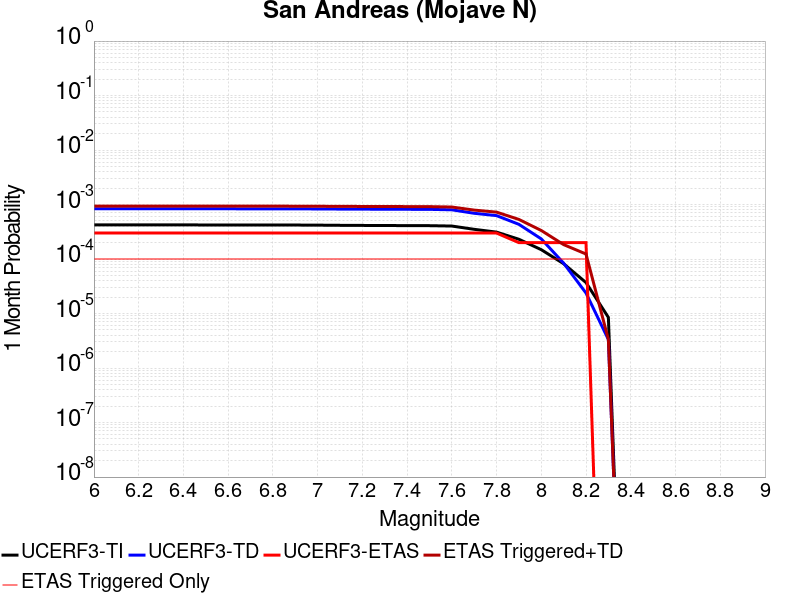 |  |  |

| Magnitude | 1 wk TI Prob | 1 wk TD Prob | 1 wk ETAS Prob | 1 wk ETAS/TD Gain | 1 wk ETAS Triggered+TD | 1 wk ETAS Triggered Only | 1 mo TI Prob | 1 mo TD Prob | 1 mo ETAS Prob | 1 mo ETAS/TD Gain | 1 mo ETAS Triggered+TD | 1 mo ETAS Triggered Only | 1 yr TI Prob | 1 yr TD Prob | 1 yr ETAS Prob | 1 yr ETAS/TD Gain | 1 yr ETAS Triggered+TD | 1 yr ETAS Triggered Only | 10 yr TI Prob | 10 yr TD Prob | 10 yr ETAS Prob | 10 yr ETAS/TD Gain | 10 yr ETAS Triggered+TD | 10 yr ETAS Triggered Only |
|-----|-----|-----|-----|-----|-----|-----|-----|-----|-----|-----|-----|-----|-----|-----|-----|-----|-----|-----|-----|-----|-----|-----|-----|-----|
| 6.0 | 9.877682E-5 | 1.9534229E-4 | 2.0E-4 | 1.0238439 | 2.9532277E-4 | 1.0E-4 | 4.2326056E-4 | 8.3691283E-4 | 3.0E-4 | 0.35846028 | 9.3682914E-4 | 1.0E-4 | 0.0051410277 | 0.010141938 | 0.0079 | 0.77894384 | 0.012418612 | 0.0023 | 0.05023708 | 0.09890564 | 0.0646 | 0.6531478 | 0.11440446 | 0.0172 |
| 6.1 | 9.877682E-5 | 1.9534229E-4 | 2.0E-4 | 1.0238439 | 2.9532277E-4 | 1.0E-4 | 4.2326056E-4 | 8.3691283E-4 | 3.0E-4 | 0.35846028 | 9.3682914E-4 | 1.0E-4 | 0.0051410277 | 0.010141938 | 0.0079 | 0.77894384 | 0.012418612 | 0.0023 | 0.05023708 | 0.09890564 | 0.0646 | 0.6531478 | 0.11440446 | 0.0172 |
| 6.2 | 9.877682E-5 | 1.9534229E-4 | 2.0E-4 | 1.0238439 | 2.9532277E-4 | 1.0E-4 | 4.2326056E-4 | 8.3691283E-4 | 3.0E-4 | 0.35846028 | 9.3682914E-4 | 1.0E-4 | 0.0051410277 | 0.010141938 | 0.0079 | 0.77894384 | 0.012418612 | 0.0023 | 0.05023708 | 0.09890564 | 0.0646 | 0.6531478 | 0.11440446 | 0.0172 |
| 6.3 | 9.877682E-5 | 1.9534229E-4 | 2.0E-4 | 1.0238439 | 2.9532277E-4 | 1.0E-4 | 4.2326056E-4 | 8.3691283E-4 | 3.0E-4 | 0.35846028 | 9.3682914E-4 | 1.0E-4 | 0.0051410277 | 0.010141938 | 0.0079 | 0.77894384 | 0.012418612 | 0.0023 | 0.05023708 | 0.09890564 | 0.0646 | 0.6531478 | 0.11440446 | 0.0172 |
| 6.4 | 9.877682E-5 | 1.9534229E-4 | 2.0E-4 | 1.0238439 | 2.9532277E-4 | 1.0E-4 | 4.2326056E-4 | 8.3691283E-4 | 3.0E-4 | 0.35846028 | 9.3682914E-4 | 1.0E-4 | 0.0051410277 | 0.010141938 | 0.0079 | 0.77894384 | 0.012418612 | 0.0023 | 0.05023708 | 0.09890564 | 0.0646 | 0.6531478 | 0.11440446 | 0.0172 |
| 6.5 | 9.861474E-5 | 1.9507951E-4 | 2.0E-4 | 1.0252229 | 2.9506002E-4 | 1.0E-4 | 4.2256617E-4 | 8.357874E-4 | 3.0E-4 | 0.35894296 | 9.357038E-4 | 1.0E-4 | 0.0051326132 | 0.010128363 | 0.0079 | 0.7799878 | 0.012405069 | 0.0023 | 0.050156746 | 0.09878342 | 0.0645 | 0.65294355 | 0.114284344 | 0.0172 |
| 6.6 | 9.861474E-5 | 1.9507951E-4 | 2.0E-4 | 1.0252229 | 2.9506002E-4 | 1.0E-4 | 4.2256617E-4 | 8.357874E-4 | 3.0E-4 | 0.35894296 | 9.357038E-4 | 1.0E-4 | 0.0051326132 | 0.010128363 | 0.0079 | 0.7799878 | 0.012405069 | 0.0023 | 0.050156746 | 0.09878342 | 0.0645 | 0.65294355 | 0.114284344 | 0.0172 |
| 6.7 | 9.8552715E-5 | 1.9497889E-4 | 2.0E-4 | 1.0257521 | 2.949594E-4 | 1.0E-4 | 4.223004E-4 | 8.353564E-4 | 3.0E-4 | 0.35912815 | 9.3527284E-4 | 1.0E-4 | 0.0051293927 | 0.010123165 | 0.0079 | 0.78038836 | 0.012399882 | 0.0023 | 0.050125998 | 0.09873676 | 0.0644 | 0.6522393 | 0.11423849 | 0.0172 |
| 6.8 | 9.8464974E-5 | 1.9483015E-4 | 2.0E-4 | 1.0265352 | 2.9481068E-4 | 1.0E-4 | 4.219245E-4 | 8.347194E-4 | 3.0E-4 | 0.3594022 | 9.3463593E-4 | 1.0E-4 | 0.0051248376 | 0.010115481 | 0.0079 | 0.7809811 | 0.012392215 | 0.0023 | 0.05008251 | 0.09866643 | 0.0644 | 0.65270424 | 0.11416937 | 0.0172 |
| 6.9 | 9.825824E-5 | 1.945095E-4 | 2.0E-4 | 1.0282274 | 2.9449005E-4 | 1.0E-4 | 4.2103877E-4 | 8.33346E-4 | 3.0E-4 | 0.35999453 | 9.332627E-4 | 1.0E-4 | 0.0051141046 | 0.010098916 | 0.0078 | 0.77236015 | 0.012375688 | 0.0023 | 0.049980022 | 0.09851554 | 0.0641 | 0.6506588 | 0.11402107 | 0.0172 |
| 7.0 | 9.781462E-5 | 1.9382163E-4 | 2.0E-4 | 1.0318766 | 2.9380224E-4 | 1.0E-4 | 4.1913814E-4 | 8.3039986E-4 | 3.0E-4 | 0.36127174 | 9.303168E-4 | 1.0E-4 | 0.005091073 | 0.010063378 | 0.0077 | 0.7651506 | 0.012340233 | 0.0023 | 0.04976007 | 0.09819152 | 0.064 | 0.65178746 | 0.113702625 | 0.0172 |
| 7.1 | 9.7121134E-5 | 1.9283664E-4 | 2.0E-4 | 1.0371473 | 2.9281736E-4 | 1.0E-4 | 4.1616702E-4 | 8.261812E-4 | 3.0E-4 | 0.36311647 | 9.2609855E-4 | 1.0E-4 | 0.005055068 | 0.010012489 | 0.0077 | 0.7690395 | 0.012289461 | 0.0023 | 0.04941613 | 0.09772747 | 0.0638 | 0.6528359 | 0.11324655 | 0.0172 |
| 7.2 | 9.663819E-5 | 1.92143E-4 | 2.0E-4 | 1.0408914 | 2.921238E-4 | 1.0E-4 | 4.1409794E-4 | 8.232103E-4 | 3.0E-4 | 0.36442694 | 9.23128E-4 | 1.0E-4 | 0.0050299936 | 0.009976651 | 0.0076 | 0.7617787 | 0.012253704 | 0.0023 | 0.049176537 | 0.09740033 | 0.0635 | 0.6519485 | 0.11292504 | 0.0172 |
| 7.3 | 9.6277574E-5 | 1.9166627E-4 | 2.0E-4 | 1.0434804 | 2.916471E-4 | 1.0E-4 | 4.125529E-4 | 8.211685E-4 | 3.0E-4 | 0.36533308 | 9.2108635E-4 | 1.0E-4 | 0.0050112694 | 0.009952018 | 0.0076 | 0.7636642 | 0.012229129 | 0.0023 | 0.04899759 | 0.097173125 | 0.0635 | 0.65347284 | 0.11270175 | 0.0172 |
| 7.4 | 9.593308E-5 | 1.91062E-4 | 2.0E-4 | 1.0467806 | 2.910429E-4 | 1.0E-4 | 4.1107697E-4 | 8.185804E-4 | 3.0E-4 | 0.36648813 | 9.1849855E-4 | 1.0E-4 | 0.0049933824 | 0.009920796 | 0.0076 | 0.76606756 | 0.012197979 | 0.0023 | 0.04882661 | 0.096890934 | 0.0634 | 0.65434396 | 0.112334095 | 0.0171 |
| 7.5 | 9.561707E-5 | 1.9052092E-4 | 2.0E-4 | 1.0497534 | 2.9050186E-4 | 1.0E-4 | 4.0972308E-4 | 8.1626297E-4 | 3.0E-4 | 0.36752862 | 9.161813E-4 | 1.0E-4 | 0.0049769743 | 0.009892838 | 0.0076 | 0.7682325 | 0.012170085 | 0.0023 | 0.048669744 | 0.096636474 | 0.0633 | 0.65503216 | 0.112083994 | 0.0171 |
| 7.6 | 9.418194E-5 | 1.870332E-4 | 2.0E-4 | 1.0693289 | 2.870145E-4 | 1.0E-4 | 4.0357444E-4 | 8.013248E-4 | 3.0E-4 | 0.37438002 | 9.0124464E-4 | 1.0E-4 | 0.004902454 | 0.009712601 | 0.0075 | 0.7721928 | 0.011990262 | 0.0023 | 0.047957025 | 0.09501434 | 0.0616 | 0.6483232 | 0.10985611 | 0.0164 |
| 7.7 | 8.202141E-5 | 1.6141271E-4 | 2.0E-4 | 1.2390598 | 2.6139658E-4 | 1.0E-4 | 3.51473E-4 | 6.915854E-4 | 3.0E-4 | 0.4337859 | 7.915163E-4 | 1.0E-4 | 0.00427079 | 0.008387603 | 0.0064 | 0.7630308 | 0.010469989 | 0.0021 | 0.04189639 | 0.082775444 | 0.0527 | 0.63666224 | 0.09552487 | 0.0139 |
| 7.8 | 7.2859846E-5 | 1.4624366E-4 | 2.0E-4 | 1.3675807 | 2.4622903E-4 | 1.0E-4 | 3.1221908E-4 | 6.2660803E-4 | 3.0E-4 | 0.4787682 | 7.2654535E-4 | 1.0E-4 | 0.003794643 | 0.007602309 | 0.0053 | 0.6971566 | 0.009090906 | 0.0015 | 0.037304975 | 0.07521693 | 0.0477 | 0.63416576 | 0.086406805 | 0.0121 |
| 7.9 | 5.3874453E-5 | 1.0121536E-4 | 2.0E-4 | 1.9759847 | 2.0120523E-4 | 1.0E-4 | 2.3087008E-4 | 4.33708E-4 | 2.0E-4 | 0.46113974 | 5.3366466E-4 | 1.0E-4 | 0.0028072202 | 0.005267622 | 0.0034 | 0.64545256 | 0.006162881 | 9.0E-4 | 0.02772022 | 0.052779637 | 0.0324 | 0.6138731 | 0.060073234 | 0.0077 |
| 8.0 | 3.468538E-5 | 5.4698838E-5 | 2.0E-4 | 3.656385 | 1.5469336E-4 | 1.0E-4 | 1.4864317E-4 | 2.3440253E-4 | 2.0E-4 | 0.8532331 | 3.343791E-4 | 1.0E-4 | 0.0018082283 | 0.0028501179 | 0.0015 | 0.52629405 | 0.0032489777 | 4.0E-4 | 0.017935853 | 0.029163266 | 0.0163 | 0.55892235 | 0.032561194 | 0.0035 |
| 8.1 | 1.9152367E-5 | 1.9611292E-5 | 2.0E-4 | 10.198206 | 1.1960933E-4 | 1.0E-4 | 8.207899E-5 | 8.4045685E-5 | 2.0E-4 | 2.379658 | 1.8403729E-4 | 1.0E-4 | 9.988535E-4 | 0.0010227766 | 7.0E-4 | 0.68441147 | 0.001222572 | 2.0E-4 | 0.009943757 | 0.010965731 | 0.0058 | 0.5289205 | 0.012251476 | 0.0013 |
| 8.2 | 8.643924E-6 | 5.5536157E-6 | 2.0E-4 | 36.012573 | 1.0555306E-4 | 1.0E-4 | 3.704486E-5 | 2.3800994E-5 | 2.0E-4 | 8.40301 | 1.2379861E-4 | 1.0E-4 | 4.5092785E-4 | 2.8973864E-4 | 2.0E-4 | 0.6902773 | 3.8970966E-4 | 1.0E-4 | 0.0045001395 | 0.0032917638 | 0.0013 | 0.39492503 | 0.0036904472 | 4.0E-4 |
| 8.3 | 1.983087E-6 | 7.7872784E-7 | 0.0 | 0.0 | 7.7872784E-7 | 0.0 | 8.498917E-6 | 3.3374008E-6 | 0.0 | 0.0 | 3.3374008E-6 | 0.0 | 1.034694E-4 | 4.0632116E-5 | 0.0 | 0.0 | 4.0632116E-5 | 0.0 | 0.0010342124 | 4.792776E-4 | 1.0E-4 | 0.20864734 | 4.792776E-4 | 0.0 |

## San Andreas (San Bernardino S)
*[(top)](#table-of-contents)*

| 1 Week | 1 Month | 1 Year | 10 Year |
|-----|-----|-----|-----|
|  | 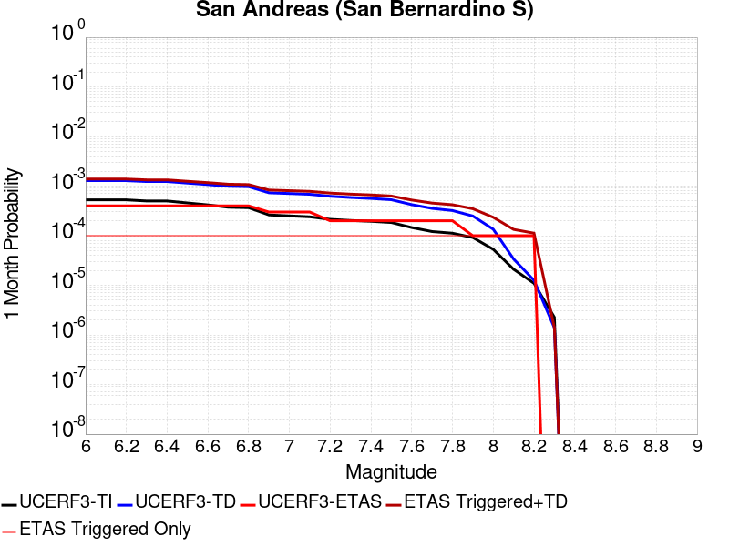 |  | 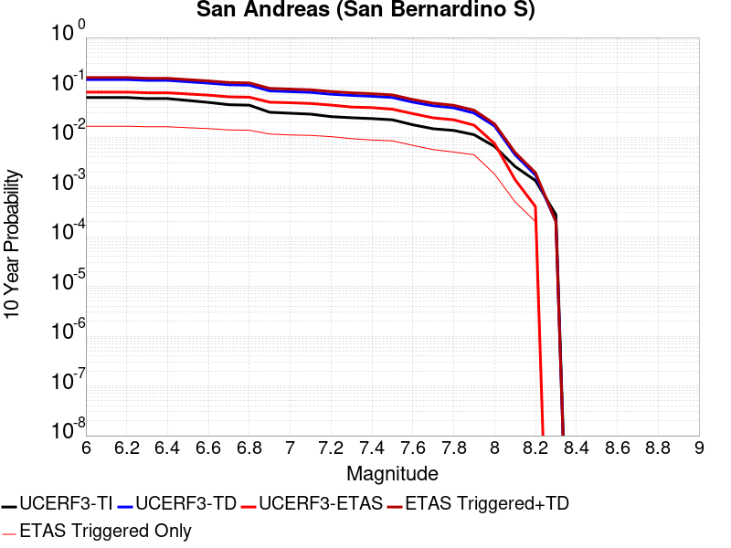 |

| Magnitude | 1 wk TI Prob | 1 wk TD Prob | 1 wk ETAS Prob | 1 wk ETAS/TD Gain | 1 wk ETAS Triggered+TD | 1 wk ETAS Triggered Only | 1 mo TI Prob | 1 mo TD Prob | 1 mo ETAS Prob | 1 mo ETAS/TD Gain | 1 mo ETAS Triggered+TD | 1 mo ETAS Triggered Only | 1 yr TI Prob | 1 yr TD Prob | 1 yr ETAS Prob | 1 yr ETAS/TD Gain | 1 yr ETAS Triggered+TD | 1 yr ETAS Triggered Only | 10 yr TI Prob | 10 yr TD Prob | 10 yr ETAS Prob | 10 yr ETAS/TD Gain | 10 yr ETAS Triggered+TD | 10 yr ETAS Triggered Only |
|-----|-----|-----|-----|-----|-----|-----|-----|-----|-----|-----|-----|-----|-----|-----|-----|-----|-----|-----|-----|-----|-----|-----|-----|-----|
| 6.0 | 1.2336002E-4 | 3.008007E-4 | 1.0E-4 | 0.33244604 | 4.007706E-4 | 1.0E-4 | 5.2857865E-4 | 0.0012885351 | 4.0E-4 | 0.31043005 | 0.0013884061 | 1.0E-4 | 0.006416472 | 0.0155800395 | 0.0089 | 0.5712437 | 0.01754888 | 0.002 | 0.06234337 | 0.14298686 | 0.0801 | 0.56019133 | 0.15712757 | 0.0165 |
| 6.1 | 1.2336002E-4 | 3.008007E-4 | 1.0E-4 | 0.33244604 | 4.007706E-4 | 1.0E-4 | 5.2857865E-4 | 0.0012885351 | 4.0E-4 | 0.31043005 | 0.0013884061 | 1.0E-4 | 0.006416472 | 0.0155800395 | 0.0089 | 0.5712437 | 0.01754888 | 0.002 | 0.06234337 | 0.14298686 | 0.0801 | 0.56019133 | 0.15712757 | 0.0165 |
| 6.2 | 1.2336002E-4 | 3.008007E-4 | 1.0E-4 | 0.33244604 | 4.007706E-4 | 1.0E-4 | 5.2857865E-4 | 0.0012885351 | 4.0E-4 | 0.31043005 | 0.0013884061 | 1.0E-4 | 0.006416472 | 0.0155800395 | 0.0089 | 0.5712437 | 0.01754888 | 0.002 | 0.06234337 | 0.14298686 | 0.0801 | 0.56019133 | 0.15712757 | 0.0165 |
| 6.3 | 1.1712257E-4 | 2.886753E-4 | 1.0E-4 | 0.34640995 | 3.8864644E-4 | 1.0E-4 | 5.018573E-4 | 0.0012366191 | 4.0E-4 | 0.32346258 | 0.0013364954 | 1.0E-4 | 0.006093008 | 0.014956758 | 0.0087 | 0.58167684 | 0.016926844 | 0.002 | 0.059286322 | 0.13768905 | 0.0775 | 0.56286246 | 0.15157226 | 0.0161 |
| 6.4 | 1.1712257E-4 | 2.886753E-4 | 1.0E-4 | 0.34640995 | 3.8864644E-4 | 1.0E-4 | 5.018573E-4 | 0.0012366191 | 4.0E-4 | 0.32346258 | 0.0013364954 | 1.0E-4 | 0.006093008 | 0.014956758 | 0.0087 | 0.58167684 | 0.016926844 | 0.002 | 0.059286322 | 0.13768905 | 0.0775 | 0.56286246 | 0.15157226 | 0.0161 |
| 6.5 | 1.0689076E-4 | 2.6879078E-4 | 1.0E-4 | 0.37203658 | 3.687639E-4 | 1.0E-4 | 4.5802278E-4 | 0.0011514768 | 4.0E-4 | 0.34738 | 0.0012513616 | 1.0E-4 | 0.0055621783 | 0.013933743 | 0.008 | 0.5741458 | 0.01580727 | 0.0019 | 0.05425003 | 0.12892485 | 0.0733 | 0.56854826 | 0.14233941 | 0.0154 |
| 6.6 | 9.7648895E-5 | 2.512251E-4 | 1.0E-4 | 0.3980494 | 3.5119997E-4 | 1.0E-4 | 4.1842813E-4 | 0.0010762584 | 4.0E-4 | 0.37165797 | 0.0011761507 | 1.0E-4 | 0.005082469 | 0.013029097 | 0.0075 | 0.5756347 | 0.014805644 | 0.0018 | 0.049677886 | 0.12109803 | 0.0695 | 0.57391524 | 0.13410577 | 0.0148 |
| 6.7 | 8.757013E-5 | 2.319215E-4 | 1.0E-4 | 0.4311804 | 3.318983E-4 | 1.0E-4 | 3.7524657E-4 | 9.93593E-4 | 4.0E-4 | 0.4025793 | 0.0010934937 | 1.0E-4 | 0.00455906 | 0.012033994 | 0.0072 | 0.5983051 | 0.013812333 | 0.0018 | 0.04466656 | 0.112376615 | 0.0643 | 0.5721831 | 0.12471458 | 0.0139 |
| 6.8 | 8.562978E-5 | 2.275147E-4 | 1.0E-4 | 0.43953204 | 3.2749196E-4 | 1.0E-4 | 3.6693315E-4 | 9.747209E-4 | 4.0E-4 | 0.41037387 | 0.0010746234 | 1.0E-4 | 0.004458263 | 0.011806732 | 0.007 | 0.5928821 | 0.01348666 | 0.0017 | 0.043698758 | 0.11038928 | 0.0632 | 0.5725194 | 0.122576945 | 0.0137 |
| 6.9 | 6.124075E-5 | 1.7128915E-4 | 1.0E-4 | 0.5838081 | 2.7127203E-4 | 1.0E-4 | 2.6243398E-4 | 7.338907E-4 | 3.0E-4 | 0.40878022 | 8.338173E-4 | 1.0E-4 | 0.0031904527 | 0.008898722 | 0.0054 | 0.60682875 | 0.010385374 | 0.0015 | 0.031450346 | 0.08445025 | 0.0501 | 0.59324867 | 0.09497907 | 0.0115 |
| 7.0 | 5.8598747E-5 | 1.6557299E-4 | 1.0E-4 | 0.60396326 | 2.6555642E-4 | 1.0E-4 | 2.5111332E-4 | 7.0940633E-4 | 3.0E-4 | 0.4228888 | 8.093354E-4 | 1.0E-4 | 0.0030530186 | 0.008603015 | 0.0052 | 0.60443926 | 0.009990971 | 0.0014 | 0.03011414 | 0.08176124 | 0.0489 | 0.5980829 | 0.09186187 | 0.011 |
| 7.1 | 5.613814E-5 | 1.59752E-4 | 1.0E-4 | 0.62597024 | 2.5973603E-4 | 1.0E-4 | 2.4056983E-4 | 6.8447256E-4 | 3.0E-4 | 0.43829367 | 7.844041E-4 | 1.0E-4 | 0.0029250039 | 0.008301794 | 0.0051 | 0.61432505 | 0.009690171 | 0.0014 | 0.028868021 | 0.07906632 | 0.0472 | 0.5969672 | 0.0890124 | 0.0108 |
| 7.2 | 4.991222E-5 | 1.4580184E-4 | 1.0E-4 | 0.6858624 | 2.4578726E-4 | 1.0E-4 | 2.1389198E-4 | 6.2471576E-4 | 2.0E-4 | 0.32014558 | 7.246533E-4 | 1.0E-4 | 0.002601025 | 0.0075794933 | 0.0044 | 0.5805137 | 0.0088696405 | 0.0013 | 0.025707912 | 0.07250567 | 0.0439 | 0.6054699 | 0.08196611 | 0.0102 |
| 7.3 | 4.7410045E-5 | 1.3773046E-4 | 1.0E-4 | 0.7260558 | 2.3771668E-4 | 1.0E-4 | 2.0317009E-4 | 5.901402E-4 | 2.0E-4 | 0.33890253 | 6.9008116E-4 | 1.0E-4 | 0.0024707897 | 0.0071613733 | 0.0041 | 0.5725159 | 0.00835278 | 0.0012 | 0.024434982 | 0.06878738 | 0.0401 | 0.5829558 | 0.07744766 | 0.0093 |
| 7.4 | 4.5556746E-5 | 1.3179917E-4 | 1.0E-4 | 0.7587301 | 2.3178599E-4 | 1.0E-4 | 1.952286E-4 | 5.647316E-4 | 2.0E-4 | 0.35415053 | 6.6467514E-4 | 1.0E-4 | 0.002374317 | 0.006854011 | 0.0039 | 0.56900984 | 0.007946472 | 0.0011 | 0.023491086 | 0.06603999 | 0.039 | 0.5905513 | 0.07416544 | 0.0087 |
| 7.5 | 4.3084514E-5 | 1.2414035E-4 | 1.0E-4 | 0.80553985 | 2.2412794E-4 | 1.0E-4 | 1.8463485E-4 | 5.319219E-4 | 2.0E-4 | 0.37599504 | 6.318687E-4 | 1.0E-4 | 0.0022456115 | 0.006456991 | 0.0036 | 0.55753523 | 0.007450534 | 0.001 | 0.022230545 | 0.06243805 | 0.0363 | 0.58137625 | 0.07031357 | 0.0084 |
| 7.6 | 3.408608E-5 | 9.8877055E-5 | 1.0E-4 | 1.011357 | 1.9886717E-4 | 1.0E-4 | 1.4607502E-4 | 4.2369007E-4 | 2.0E-4 | 0.47204316 | 5.236477E-4 | 1.0E-4 | 0.0017770125 | 0.005146252 | 0.003 | 0.58294857 | 0.0060416204 | 9.0E-4 | 0.017628696 | 0.05025189 | 0.0295 | 0.58704257 | 0.056710176 | 0.0068 |
| 7.7 | 2.8315713E-5 | 8.297733E-5 | 1.0E-4 | 1.2051485 | 1.8296903E-4 | 1.0E-4 | 1.2134742E-4 | 3.5556869E-4 | 2.0E-4 | 0.56247926 | 4.5553313E-4 | 1.0E-4 | 0.0014764034 | 0.0043204646 | 0.0029 | 0.67122406 | 0.005216576 | 9.0E-4 | 0.01466633 | 0.042490926 | 0.0243 | 0.5718868 | 0.047852978 | 0.0056 |
| 7.8 | 2.6222975E-5 | 7.508956E-5 | 1.0E-4 | 1.331743 | 1.7508205E-4 | 1.0E-4 | 1.1237934E-4 | 3.2177276E-4 | 2.0E-4 | 0.62155664 | 4.2174058E-4 | 1.0E-4 | 0.0013673597 | 0.0039105522 | 0.0028 | 0.7160114 | 0.0048070326 | 9.0E-4 | 0.013589768 | 0.03864302 | 0.0222 | 0.57448924 | 0.043449808 | 0.005 |
| 7.9 | 2.1469694E-5 | 5.8261867E-5 | 1.0E-4 | 1.7163886 | 1.5825604E-4 | 1.0E-4 | 9.200973E-5 | 2.4966983E-4 | 1.0E-4 | 0.40052897 | 3.4964486E-4 | 1.0E-4 | 0.0011196428 | 0.0030354962 | 0.0023 | 0.75770146 | 0.0038330678 | 8.0E-4 | 0.011140184 | 0.030326871 | 0.0173 | 0.5704512 | 0.034593433 | 0.0044 |
| 8.0 | 1.2420249E-5 | 3.1534346E-5 | 1.0E-4 | 3.1711454 | 1.315312E-4 | 1.0E-4 | 5.322855E-5 | 1.351402E-4 | 1.0E-4 | 0.73997223 | 2.3512669E-4 | 1.0E-4 | 6.478649E-4 | 0.0016440913 | 0.0011 | 0.6690626 | 0.0020434337 | 4.0E-4 | 0.0064597935 | 0.016623398 | 0.0074 | 0.44515568 | 0.018393476 | 0.0018 |
| 8.1 | 4.9197724E-6 | 7.903168E-6 | 1.0E-4 | 12.653153 | 1.0790238E-4 | 1.0E-4 | 2.1084568E-5 | 3.387028E-5 | 1.0E-4 | 2.9524407 | 1.338669E-4 | 1.0E-4 | 2.566744E-4 | 4.1229278E-4 | 4.0E-4 | 0.9701843 | 6.122103E-4 | 2.0E-4 | 0.002563781 | 0.004425192 | 0.0014 | 0.3163705 | 0.004922979 | 5.0E-4 |
| 8.2 | 2.5634774E-6 | 2.9441167E-6 | 1.0E-4 | 33.966045 | 1.0294382E-4 | 1.0E-4 | 1.0986286E-5 | 1.2617582E-5 | 1.0E-4 | 7.925449 | 1.1261632E-4 | 1.0E-4 | 1.3374983E-4 | 1.5360827E-4 | 1.0E-4 | 0.6510066 | 2.535929E-4 | 1.0E-4 | 0.0013366934 | 0.0017246727 | 4.0E-4 | 0.23192805 | 0.0019243278 | 2.0E-4 |
| 8.3 | 5.2850464E-7 | 3.258785E-7 | 0.0 | 0.0 | 3.258785E-7 | 0.0 | 2.2650179E-6 | 1.3966214E-6 | 0.0 | 0.0 | 1.3966214E-6 | 0.0 | 2.7576245E-5 | 1.7003747E-5 | 0.0 | 0.0 | 1.7003747E-5 | 0.0 | 2.7572823E-4 | 2.015122E-4 | 0.0 | 0.0 | 2.015122E-4 | 0.0 |

## Little Lake
*[(top)](#table-of-contents)*

| 1 Week | 1 Month | 1 Year | 10 Year |
|-----|-----|-----|-----|
|  |  |  |  |

| Magnitude | 1 wk TI Prob | 1 wk TD Prob | 1 wk ETAS Prob | 1 wk ETAS/TD Gain | 1 wk ETAS Triggered+TD | 1 wk ETAS Triggered Only | 1 mo TI Prob | 1 mo TD Prob | 1 mo ETAS Prob | 1 mo ETAS/TD Gain | 1 mo ETAS Triggered+TD | 1 mo ETAS Triggered Only | 1 yr TI Prob | 1 yr TD Prob | 1 yr ETAS Prob | 1 yr ETAS/TD Gain | 1 yr ETAS Triggered+TD | 1 yr ETAS Triggered Only | 10 yr TI Prob | 10 yr TD Prob | 10 yr ETAS Prob | 10 yr ETAS/TD Gain | 10 yr ETAS Triggered+TD | 10 yr ETAS Triggered Only |
|-----|-----|-----|-----|-----|-----|-----|-----|-----|-----|-----|-----|-----|-----|-----|-----|-----|-----|-----|-----|-----|-----|-----|-----|-----|
| 6.0 | 2.8424427E-5 | 3.1212283E-5 | 0.0 | 0.0 | 3.1212283E-5 | 0.0 | 1.2181328E-4 | 1.3376081E-4 | 8.0E-4 | 5.980825 | 8.336672E-4 | 7.0E-4 | 0.0014820677 | 0.0016274547 | 0.0058 | 3.5638475 | 0.006918829 | 0.0053 | 0.014722223 | 0.016168775 | 0.0221 | 1.366832 | 0.03230361 | 0.0164 |
| 6.1 | 2.8424427E-5 | 3.1212283E-5 | 0.0 | 0.0 | 3.1212283E-5 | 0.0 | 1.2181328E-4 | 1.3376081E-4 | 8.0E-4 | 5.980825 | 8.336672E-4 | 7.0E-4 | 0.0014820677 | 0.0016274547 | 0.0058 | 3.5638475 | 0.006918829 | 0.0053 | 0.014722223 | 0.016168775 | 0.0221 | 1.366832 | 0.03230361 | 0.0164 |
| 6.2 | 2.8424427E-5 | 3.1212283E-5 | 0.0 | 0.0 | 3.1212283E-5 | 0.0 | 1.2181328E-4 | 1.3376081E-4 | 8.0E-4 | 5.980825 | 8.336672E-4 | 7.0E-4 | 0.0014820677 | 0.0016274547 | 0.0058 | 3.5638475 | 0.006918829 | 0.0053 | 0.014722223 | 0.016168775 | 0.0221 | 1.366832 | 0.03230361 | 0.0164 |
| 6.3 | 1.48860645E-5 | 1.6084436E-5 | 0.0 | 0.0 | 1.6084436E-5 | 0.0 | 6.379586E-5 | 6.893163E-5 | 4.0E-4 | 5.802851 | 3.6891096E-4 | 3.0E-4 | 7.7643775E-4 | 8.3894766E-4 | 0.0028 | 3.3375144 | 0.0034367663 | 0.0026 | 0.007737305 | 0.008360625 | 0.0123 | 1.4711819 | 0.017682035 | 0.0094 |
| 6.4 | 1.48860645E-5 | 1.6084436E-5 | 0.0 | 0.0 | 1.6084436E-5 | 0.0 | 6.379586E-5 | 6.893163E-5 | 4.0E-4 | 5.802851 | 3.6891096E-4 | 3.0E-4 | 7.7643775E-4 | 8.3894766E-4 | 0.0028 | 3.3375144 | 0.0034367663 | 0.0026 | 0.007737305 | 0.008360625 | 0.0123 | 1.4711819 | 0.017682035 | 0.0094 |
| 6.5 | 1.2797581E-5 | 1.376811E-5 | 0.0 | 0.0 | 1.376811E-5 | 0.0 | 5.4845623E-5 | 5.9004997E-5 | 4.0E-4 | 6.779087 | 3.589873E-4 | 3.0E-4 | 6.675408E-4 | 7.1817474E-4 | 0.0027 | 3.7595305 | 0.0032163793 | 0.0025 | 0.006655392 | 0.0071610897 | 0.0114 | 1.5919365 | 0.015997356 | 0.0089 |
| 6.6 | 9.661896E-6 | 1.0290833E-5 | 0.0 | 0.0 | 1.0290833E-5 | 0.0 | 4.1407468E-5 | 4.410292E-5 | 4.0E-4 | 9.0696945 | 3.440897E-4 | 3.0E-4 | 5.040193E-4 | 5.36837E-4 | 0.0021 | 3.911802 | 0.002435817 | 0.0019 | 0.005028777 | 0.005357007 | 0.0087 | 1.6240412 | 0.012418972 | 0.0071 |
| 6.7 | 7.767871E-6 | 8.201055E-6 | 0.0 | 0.0 | 8.201055E-6 | 0.0 | 3.329045E-5 | 3.5146983E-5 | 3.0E-4 | 8.5355835 | 2.3513995E-4 | 2.0E-4 | 4.0523586E-4 | 4.278442E-4 | 0.0018 | 4.207139 | 0.0020271596 | 0.0016 | 0.004044977 | 0.0042715576 | 0.0075 | 1.7557999 | 0.010345501 | 0.0061 |
| 6.8 | 6.4235196E-6 | 6.736853E-6 | 0.0 | 0.0 | 6.736853E-6 | 0.0 | 2.752908E-5 | 2.8871978E-5 | 3.0E-4 | 10.3906975 | 2.288662E-4 | 2.0E-4 | 3.35115E-4 | 3.514725E-4 | 0.0018 | 5.121311 | 0.0019509101 | 0.0016 | 0.003346101 | 0.003510427 | 0.0059 | 1.6807073 | 0.008791822 | 0.0053 |
| 6.9 | 3.1283696E-6 | 3.1125696E-6 | 0.0 | 0.0 | 3.1125696E-6 | 0.0 | 1.3407229E-5 | 1.3339524E-5 | 2.0E-4 | 14.993038 | 1.1333819E-4 | 1.0E-4 | 1.6322079E-4 | 1.6239811E-4 | 0.0011 | 6.7734776 | 0.0011622357 | 0.001 | 0.0016310095 | 0.0016229427 | 0.0033 | 2.0333436 | 0.0047179116 | 0.0031 |
| 7.0 | 2.290603E-6 | 2.228975E-6 | 0.0 | 0.0 | 2.228975E-6 | 0.0 | 9.816834E-6 | 9.552721E-6 | 1.0E-4 | 10.468222 | 9.552721E-6 | 0.0 | 1.19513395E-4 | 1.1629921E-4 | 5.0E-4 | 4.2992554 | 5.162527E-4 | 4.0E-4 | 0.0011944914 | 0.0011624857 | 0.0022 | 1.8924965 | 0.0031601607 | 0.002 |
| 7.1 | 1.293693E-6 | 1.177863E-6 | 0.0 | 0.0 | 1.177863E-6 | 0.0 | 5.5443866E-6 | 5.0479784E-6 | 0.0 | 0.0 | 5.0479784E-6 | 0.0 | 6.750081E-5 | 6.14581E-5 | 2.0E-4 | 3.2542493 | 2.6144582E-4 | 2.0E-4 | 6.7480316E-4 | 6.144796E-4 | 0.0014 | 2.2783508 | 0.0020136193 | 0.0014 |
| 7.2 | 4.715842E-7 | 3.0926154E-7 | 0.0 | 0.0 | 3.0926154E-7 | 0.0 | 2.0210737E-6 | 1.325406E-6 | 0.0 | 0.0 | 1.325406E-6 | 0.0 | 2.4606294E-5 | 1.6136702E-5 | 0.0 | 0.0 | 1.6136702E-5 | 0.0 | 2.460357E-4 | 1.6135586E-4 | 2.0E-4 | 1.2394964 | 3.613236E-4 | 2.0E-4 |
| 7.3 | 3.9430947E-7 | 2.3105072E-7 | 0.0 | 0.0 | 2.3105072E-7 | 0.0 | 1.6898966E-6 | 9.90217E-7 | 0.0 | 0.0 | 9.90217E-7 | 0.0 | 2.0574296E-5 | 1.2055826E-5 | 0.0 | 0.0 | 1.2055826E-5 | 0.0 | 2.0572392E-4 | 1.2055179E-4 | 2.0E-4 | 1.659038 | 3.2052767E-4 | 2.0E-4 |
| 7.4 | 3.547123E-7 | 1.9686148E-7 | 0.0 | 0.0 | 1.9686148E-7 | 0.0 | 1.5201948E-6 | 8.436918E-7 | 0.0 | 0.0 | 8.436918E-7 | 0.0 | 1.8508214E-5 | 1.02719E-5 | 0.0 | 0.0 | 1.02719E-5 | 0.0 | 1.8506673E-4 | 1.0271431E-4 | 2.0E-4 | 1.9471483 | 3.0269378E-4 | 2.0E-4 |
| 7.5 | 2.6354266E-7 | 1.4427935E-7 | 0.0 | 0.0 | 1.4427935E-7 | 0.0 | 1.129468E-6 | 6.183399E-7 | 0.0 | 0.0 | 6.183399E-7 | 0.0 | 1.3751187E-5 | 7.5282633E-6 | 0.0 | 0.0 | 7.5282633E-6 | 0.0 | 1.3750336E-4 | 7.5280135E-5 | 2.0E-4 | 2.6567435 | 2.7526508E-4 | 2.0E-4 |
| 7.6 | 1.269913E-7 | 7.574545E-8 | 0.0 | 0.0 | 7.574545E-8 | 0.0 | 5.4424834E-7 | 3.246233E-7 | 0.0 | 0.0 | 3.246233E-7 | 0.0 | 6.6262032E-6 | 3.952282E-6 | 0.0 | 0.0 | 3.952282E-6 | 0.0 | 6.626006E-5 | 3.9522154E-5 | 1.0E-4 | 2.5302265 | 1.395182E-4 | 1.0E-4 |

## San Andreas (San Gorgonio Pass-Garnet HIll)
*[(top)](#table-of-contents)*

| 1 Week | 1 Month | 1 Year | 10 Year |
|-----|-----|-----|-----|
|  |  |  | 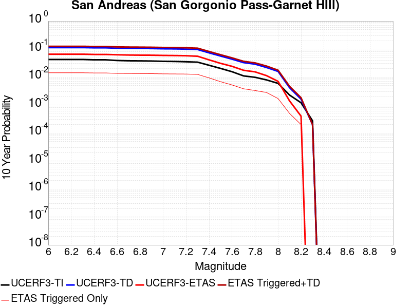 |

| Magnitude | 1 wk TI Prob | 1 wk TD Prob | 1 wk ETAS Prob | 1 wk ETAS/TD Gain | 1 wk ETAS Triggered+TD | 1 wk ETAS Triggered Only | 1 mo TI Prob | 1 mo TD Prob | 1 mo ETAS Prob | 1 mo ETAS/TD Gain | 1 mo ETAS Triggered+TD | 1 mo ETAS Triggered Only | 1 yr TI Prob | 1 yr TD Prob | 1 yr ETAS Prob | 1 yr ETAS/TD Gain | 1 yr ETAS Triggered+TD | 1 yr ETAS Triggered Only | 10 yr TI Prob | 10 yr TD Prob | 10 yr ETAS Prob | 10 yr ETAS/TD Gain | 10 yr ETAS Triggered+TD | 10 yr ETAS Triggered Only |
|-----|-----|-----|-----|-----|-----|-----|-----|-----|-----|-----|-----|-----|-----|-----|-----|-----|-----|-----|-----|-----|-----|-----|-----|-----|
| 6.0 | 8.31567E-5 | 2.344391E-4 | 1.0E-4 | 0.42655003 | 3.3441564E-4 | 1.0E-4 | 3.5633717E-4 | 0.001004349 | 4.0E-4 | 0.39826792 | 0.0012041482 | 2.0E-4 | 0.004329778 | 0.012159292 | 0.0062 | 0.5098981 | 0.013739836 | 0.0016 | 0.042463828 | 0.112831645 | 0.0655 | 0.5805109 | 0.12542944 | 0.0142 |
| 6.1 | 8.31567E-5 | 2.344391E-4 | 1.0E-4 | 0.42655003 | 3.3441564E-4 | 1.0E-4 | 3.5633717E-4 | 0.001004349 | 4.0E-4 | 0.39826792 | 0.0012041482 | 2.0E-4 | 0.004329778 | 0.012159292 | 0.0062 | 0.5098981 | 0.013739836 | 0.0016 | 0.042463828 | 0.112831645 | 0.0655 | 0.5805109 | 0.12542944 | 0.0142 |
| 6.2 | 8.31567E-5 | 2.344391E-4 | 1.0E-4 | 0.42655003 | 3.3441564E-4 | 1.0E-4 | 3.5633717E-4 | 0.001004349 | 4.0E-4 | 0.39826792 | 0.0012041482 | 2.0E-4 | 0.004329778 | 0.012159292 | 0.0062 | 0.5098981 | 0.013739836 | 0.0016 | 0.042463828 | 0.112831645 | 0.0655 | 0.5805109 | 0.12542944 | 0.0142 |
| 6.3 | 8.31567E-5 | 2.344391E-4 | 1.0E-4 | 0.42655003 | 3.3441564E-4 | 1.0E-4 | 3.5633717E-4 | 0.001004349 | 4.0E-4 | 0.39826792 | 0.0012041482 | 2.0E-4 | 0.004329778 | 0.012159292 | 0.0062 | 0.5098981 | 0.013739836 | 0.0016 | 0.042463828 | 0.112831645 | 0.0655 | 0.5805109 | 0.12542944 | 0.0142 |
| 6.4 | 8.059055E-5 | 2.3001047E-4 | 1.0E-4 | 0.4347628 | 3.2998747E-4 | 1.0E-4 | 3.4534236E-4 | 9.853884E-4 | 4.0E-4 | 0.4059313 | 0.0011851913 | 2.0E-4 | 0.0041964394 | 0.011931319 | 0.006 | 0.5028782 | 0.013413422 | 0.0015 | 0.041180745 | 0.11081183 | 0.0641 | 0.5784581 | 0.12326046 | 0.014 |
| 6.5 | 8.059055E-5 | 2.3001047E-4 | 1.0E-4 | 0.4347628 | 3.2998747E-4 | 1.0E-4 | 3.4534236E-4 | 9.853884E-4 | 4.0E-4 | 0.4059313 | 0.0011851913 | 2.0E-4 | 0.0041964394 | 0.011931319 | 0.006 | 0.5028782 | 0.013413422 | 0.0015 | 0.041180745 | 0.11081183 | 0.0641 | 0.5784581 | 0.12326046 | 0.014 |
| 6.6 | 7.619237E-5 | 2.2245095E-4 | 1.0E-4 | 0.4495373 | 3.224287E-4 | 1.0E-4 | 3.2649786E-4 | 9.530152E-4 | 4.0E-4 | 0.4197205 | 0.0011528246 | 2.0E-4 | 0.0039678677 | 0.01154178 | 0.0059 | 0.5111863 | 0.013024467 | 0.0015 | 0.03897764 | 0.10734715 | 0.0624 | 0.5812916 | 0.11939797 | 0.0135 |
| 6.7 | 7.440636E-5 | 2.1920777E-4 | 1.0E-4 | 0.45618823 | 3.1918584E-4 | 1.0E-4 | 3.188454E-4 | 9.391259E-4 | 4.0E-4 | 0.425928 | 0.001138938 | 2.0E-4 | 0.0038750346 | 0.011374451 | 0.0057 | 0.5011231 | 0.01285739 | 0.0015 | 0.038081564 | 0.10585546 | 0.0612 | 0.5781468 | 0.117837 | 0.0134 |
| 6.8 | 7.3735864E-5 | 2.1767865E-4 | 1.0E-4 | 0.4593928 | 3.1765687E-4 | 1.0E-4 | 3.1597257E-4 | 9.3257724E-4 | 4.0E-4 | 0.4289189 | 0.0011323907 | 2.0E-4 | 0.0038401815 | 0.011295553 | 0.0056 | 0.4957703 | 0.01267974 | 0.0014 | 0.03774495 | 0.105156794 | 0.0605 | 0.5753314 | 0.1170582 | 0.0133 |
| 6.9 | 7.27575E-5 | 2.1536741E-4 | 1.0E-4 | 0.4643228 | 3.1534588E-4 | 1.0E-4 | 3.117806E-4 | 9.2267897E-4 | 4.0E-4 | 0.43352023 | 0.0011224945 | 2.0E-4 | 0.003789323 | 0.011176284 | 0.0056 | 0.50106096 | 0.012560638 | 0.0014 | 0.037253562 | 0.10410455 | 0.0602 | 0.57826483 | 0.11593037 | 0.0132 |
| 7.0 | 7.102591E-5 | 2.1120526E-4 | 1.0E-4 | 0.47347304 | 3.1118415E-4 | 1.0E-4 | 3.0436125E-4 | 9.048537E-4 | 4.0E-4 | 0.44206044 | 0.0011046727 | 2.0E-4 | 0.003699303 | 0.010961464 | 0.0055 | 0.5017578 | 0.012346117 | 0.0014 | 0.03638325 | 0.10220576 | 0.0592 | 0.5792237 | 0.11387709 | 0.013 |
| 7.1 | 7.028513E-5 | 2.0956052E-4 | 1.0E-4 | 0.47718912 | 3.0953955E-4 | 1.0E-4 | 3.0118722E-4 | 8.9780963E-4 | 4.0E-4 | 0.44552875 | 0.00109763 | 2.0E-4 | 0.0036607897 | 0.0108765615 | 0.0054 | 0.4964804 | 0.012261335 | 0.0014 | 0.036010686 | 0.10144856 | 0.0586 | 0.57763267 | 0.113039866 | 0.0129 |
| 7.2 | 6.8498244E-5 | 2.056363E-4 | 1.0E-4 | 0.48629546 | 3.0561574E-4 | 1.0E-4 | 2.9353087E-4 | 8.81003E-4 | 4.0E-4 | 0.45402795 | 0.0010808269 | 2.0E-4 | 0.003567883 | 0.010673962 | 0.0052 | 0.48716682 | 0.012059018 | 0.0014 | 0.035111405 | 0.09963993 | 0.0577 | 0.5790851 | 0.11116454 | 0.0128 |
| 7.3 | 6.622592E-5 | 1.979015E-4 | 1.0E-4 | 0.5053019 | 2.9788172E-4 | 1.0E-4 | 2.8379448E-4 | 8.478758E-4 | 3.0E-4 | 0.35382542 | 0.0010477062 | 2.0E-4 | 0.0034497243 | 0.010274511 | 0.0048 | 0.46717554 | 0.011660126 | 0.0014 | 0.033966612 | 0.09613408 | 0.0553 | 0.5752382 | 0.10734202 | 0.0124 |
| 7.4 | 5.1050705E-5 | 1.4739239E-4 | 1.0E-4 | 0.6784611 | 2.4737764E-4 | 1.0E-4 | 2.1877038E-4 | 6.315296E-4 | 2.0E-4 | 0.3166914 | 7.3146645E-4 | 1.0E-4 | 0.002660276 | 0.00766196 | 0.0041 | 0.5351111 | 0.008852766 | 0.0012 | 0.02628654 | 0.07308217 | 0.041 | 0.5610123 | 0.08170251 | 0.0093 |
| 7.5 | 3.9302922E-5 | 1.1173577E-4 | 1.0E-4 | 0.89496857 | 2.1172459E-4 | 1.0E-4 | 1.6843023E-4 | 4.7878E-4 | 2.0E-4 | 0.4177284 | 5.787321E-4 | 1.0E-4 | 0.0020487092 | 0.005813637 | 0.0027 | 0.4644253 | 0.006509567 | 7.0E-4 | 0.020299247 | 0.05620449 | 0.0308 | 0.5479989 | 0.0626223 | 0.0068 |
| 7.6 | 2.9851626E-5 | 8.533946E-5 | 1.0E-4 | 1.1717908 | 1.8533092E-4 | 1.0E-4 | 1.2792926E-4 | 3.656894E-4 | 2.0E-4 | 0.5469122 | 4.6565282E-4 | 1.0E-4 | 0.0015564259 | 0.004443205 | 0.0022 | 0.49513808 | 0.005040539 | 6.0E-4 | 0.0154556995 | 0.04336948 | 0.0241 | 0.5556903 | 0.04834396 | 0.0052 |
| 7.7 | 2.1135214E-5 | 6.387581E-5 | 1.0E-4 | 1.5655379 | 1.6386942E-4 | 1.0E-4 | 9.0576345E-5 | 2.7372476E-4 | 2.0E-4 | 0.730661 | 3.7369737E-4 | 1.0E-4 | 0.0011022091 | 0.0033275117 | 0.0018 | 0.54094476 | 0.0037261806 | 4.0E-4 | 0.010967582 | 0.03273992 | 0.0174 | 0.5314613 | 0.036415506 | 0.0038 |
| 7.8 | 1.883379E-5 | 5.595829E-5 | 1.0E-4 | 1.7870452 | 1.559527E-4 | 1.0E-4 | 8.0713755E-5 | 2.3979922E-4 | 2.0E-4 | 0.83403105 | 3.3977523E-4 | 1.0E-4 | 9.822468E-4 | 0.0029156501 | 0.0018 | 0.617358 | 0.0033144837 | 4.0E-4 | 0.0097791655 | 0.028840289 | 0.0153 | 0.53050786 | 0.032045115 | 0.0033 |
| 7.9 | 1.5156185E-5 | 4.1920215E-5 | 1.0E-4 | 2.385484 | 1.4191603E-4 | 1.0E-4 | 6.495346E-5 | 1.7964569E-4 | 1.0E-4 | 0.55665123 | 2.7962774E-4 | 1.0E-4 | 7.9052144E-4 | 0.0021849938 | 0.0015 | 0.6865008 | 0.0025841198 | 4.0E-4 | 0.007877152 | 0.021880554 | 0.0112 | 0.51187 | 0.024619289 | 0.0028 |
| 8.0 | 1.1405907E-5 | 3.017233E-5 | 1.0E-4 | 3.3142948 | 1.3016931E-4 | 1.0E-4 | 4.8881542E-5 | 1.2930359E-4 | 1.0E-4 | 0.7733738 | 2.2929066E-4 | 1.0E-4 | 5.9497025E-4 | 0.0015731353 | 0.0011 | 0.69924057 | 0.001972506 | 4.0E-4 | 0.005933798 | 0.015865454 | 0.007 | 0.44121018 | 0.017538482 | 0.0017 |
| 8.1 | 4.3511436E-6 | 7.442611E-6 | 1.0E-4 | 13.436145 | 1.0744187E-4 | 1.0E-4 | 1.8647626E-5 | 3.1896518E-5 | 1.0E-4 | 3.1351385 | 1.3189332E-4 | 1.0E-4 | 2.2701119E-4 | 3.8827103E-4 | 4.0E-4 | 1.0302082 | 5.8819336E-4 | 2.0E-4 | 0.0022677942 | 0.004153124 | 0.0014 | 0.33709565 | 0.0046510473 | 5.0E-4 |
| 8.2 | 2.3042528E-6 | 2.7671629E-6 | 1.0E-4 | 36.138096 | 1.02766884E-4 | 1.0E-4 | 9.875332E-6 | 1.1859216E-5 | 1.0E-4 | 8.4322605 | 1.1185803E-4 | 1.0E-4 | 1.2022553E-4 | 1.4437643E-4 | 1.0E-4 | 0.6926338 | 2.44362E-4 | 1.0E-4 | 0.0012016051 | 0.0016159099 | 4.0E-4 | 0.24753857 | 0.0018155867 | 2.0E-4 |
| 8.3 | 5.202968E-7 | 3.208977E-7 | 0.0 | 0.0 | 3.208977E-7 | 0.0 | 2.2298414E-6 | 1.3752752E-6 | 0.0 | 0.0 | 1.3752752E-6 | 0.0 | 2.714798E-5 | 1.6743861E-5 | 0.0 | 0.0 | 1.6743861E-5 | 0.0 | 2.7144665E-4 | 1.9840282E-4 | 0.0 | 0.0 | 1.9840282E-4 | 0.0 |

## San Jacinto (Superstition Mtn)
*[(top)](#table-of-contents)*

| 1 Week | 1 Month | 1 Year | 10 Year |
|-----|-----|-----|-----|
|  |  | 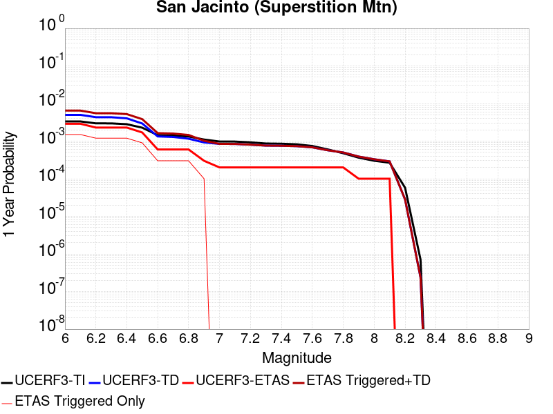 |  |

| Magnitude | 1 wk TI Prob | 1 wk TD Prob | 1 wk ETAS Prob | 1 wk ETAS/TD Gain | 1 wk ETAS Triggered+TD | 1 wk ETAS Triggered Only | 1 mo TI Prob | 1 mo TD Prob | 1 mo ETAS Prob | 1 mo ETAS/TD Gain | 1 mo ETAS Triggered+TD | 1 mo ETAS Triggered Only | 1 yr TI Prob | 1 yr TD Prob | 1 yr ETAS Prob | 1 yr ETAS/TD Gain | 1 yr ETAS Triggered+TD | 1 yr ETAS Triggered Only | 10 yr TI Prob | 10 yr TD Prob | 10 yr ETAS Prob | 10 yr ETAS/TD Gain | 10 yr ETAS Triggered+TD | 10 yr ETAS Triggered Only |
|-----|-----|-----|-----|-----|-----|-----|-----|-----|-----|-----|-----|-----|-----|-----|-----|-----|-----|-----|-----|-----|-----|-----|-----|-----|
| 6.0 | 6.4193904E-5 | 9.610718E-5 | 0.0 | 0.0 | 9.610718E-5 | 0.0 | 2.7508775E-4 | 4.118289E-4 | 0.0 | 0.0 | 4.118289E-4 | 0.0 | 0.0033440501 | 0.0050038868 | 0.0029 | 0.5795495 | 0.006496381 | 0.0015 | 0.03294174 | 0.048879065 | 0.0341 | 0.6976402 | 0.06086319 | 0.0126 |
| 6.1 | 6.4193904E-5 | 9.610718E-5 | 0.0 | 0.0 | 9.610718E-5 | 0.0 | 2.7508775E-4 | 4.118289E-4 | 0.0 | 0.0 | 4.118289E-4 | 0.0 | 0.0033440501 | 0.0050038868 | 0.0029 | 0.5795495 | 0.006496381 | 0.0015 | 0.03294174 | 0.048879065 | 0.0341 | 0.6976402 | 0.06086319 | 0.0126 |
| 6.2 | 5.7023593E-5 | 8.324784E-5 | 0.0 | 0.0 | 8.324784E-5 | 0.0 | 2.4436394E-4 | 3.567371E-4 | 0.0 | 0.0 | 3.567371E-4 | 0.0 | 0.002971072 | 0.0043362663 | 0.0023 | 0.53041023 | 0.005531063 | 0.0012 | 0.029316625 | 0.04255864 | 0.0287 | 0.6743637 | 0.05232454 | 0.0102 |
| 6.3 | 5.6940098E-5 | 8.3093146E-5 | 0.0 | 0.0 | 8.3093146E-5 | 0.0 | 2.4400617E-4 | 3.560743E-4 | 0.0 | 0.0 | 3.560743E-4 | 0.0 | 0.002966728 | 0.004328229 | 0.0023 | 0.53139514 | 0.0055230353 | 0.0012 | 0.029274331 | 0.042481992 | 0.0287 | 0.6755804 | 0.052248675 | 0.0102 |
| 6.4 | 5.4171585E-5 | 7.758344E-5 | 0.0 | 0.0 | 7.758344E-5 | 0.0 | 2.3214328E-4 | 3.324674E-4 | 0.0 | 0.0 | 3.324674E-4 | 0.0 | 0.0028226813 | 0.004041927 | 0.0023 | 0.56903553 | 0.0052370764 | 0.0012 | 0.02787096 | 0.03977029 | 0.0262 | 0.65878326 | 0.04879645 | 0.0094 |
| 6.5 | 4.375144E-5 | 5.6517936E-5 | 0.0 | 0.0 | 5.6517936E-5 | 0.0 | 1.874927E-4 | 2.4220388E-4 | 0.0 | 0.0 | 2.4220388E-4 | 0.0 | 0.0022803338 | 0.0029460208 | 0.0017 | 0.57704955 | 0.0038433692 | 9.0E-4 | 0.022570757 | 0.029288672 | 0.0189 | 0.6453007 | 0.03579244 | 0.0067 |
| 6.6 | 2.772192E-5 | 2.5580053E-5 | 0.0 | 0.0 | 2.5580053E-5 | 0.0 | 1.1880282E-4 | 1.096243E-4 | 0.0 | 0.0 | 1.096243E-4 | 0.0 | 0.0014454646 | 0.0013338781 | 6.0E-4 | 0.4498162 | 0.001633478 | 3.0E-4 | 0.014360986 | 0.0135867875 | 0.0084 | 0.6182477 | 0.015658256 | 0.0021 |
| 6.7 | 2.7124124E-5 | 2.4790574E-5 | 0.0 | 0.0 | 2.4790574E-5 | 0.0 | 1.1624106E-4 | 1.06241096E-4 | 0.0 | 0.0 | 1.06241096E-4 | 0.0 | 0.0014143161 | 0.0012927371 | 6.0E-4 | 0.4641315 | 0.0015923493 | 3.0E-4 | 0.014053487 | 0.013180112 | 0.0083 | 0.62973666 | 0.015153752 | 0.002 |
| 6.8 | 2.5475807E-5 | 2.225328E-5 | 0.0 | 0.0 | 2.225328E-5 | 0.0 | 1.0917746E-4 | 9.536778E-5 | 0.0 | 0.0 | 9.536778E-5 | 0.0 | 0.001328425 | 0.0011604963 | 6.0E-4 | 0.5170202 | 0.0014601481 | 3.0E-4 | 0.0132051185 | 0.011867624 | 0.0074 | 0.6235452 | 0.013448636 | 0.0016 |
| 6.9 | 2.1162023E-5 | 1.7708095E-5 | 0.0 | 0.0 | 1.7708095E-5 | 0.0 | 9.069123E-5 | 7.588965E-5 | 0.0 | 0.0 | 7.588965E-5 | 0.0 | 0.0011036064 | 9.235687E-4 | 3.0E-4 | 0.32482696 | 0.0010234764 | 1.0E-4 | 0.010981417 | 0.009489403 | 0.0061 | 0.6428223 | 0.010578965 | 0.0011 |
| 7.0 | 1.8754288E-5 | 1.62397E-5 | 0.0 | 0.0 | 1.62397E-5 | 0.0 | 8.037304E-5 | 6.959686E-5 | 0.0 | 0.0 | 6.959686E-5 | 0.0 | 9.781026E-4 | 8.470149E-4 | 2.0E-4 | 0.23612335 | 8.470149E-4 | 0.0 | 0.009738087 | 0.008710861 | 0.0047 | 0.5395563 | 0.009305635 | 6.0E-4 |
| 7.1 | 1.8678527E-5 | 1.6164757E-5 | 0.0 | 0.0 | 1.6164757E-5 | 0.0 | 8.0048376E-5 | 6.927571E-5 | 0.0 | 0.0 | 6.927571E-5 | 0.0 | 9.7415317E-4 | 8.431078E-4 | 2.0E-4 | 0.23721758 | 8.431078E-4 | 0.0 | 0.009698939 | 0.008671751 | 0.0047 | 0.5419897 | 0.009266549 | 6.0E-4 |
| 7.2 | 1.7804578E-5 | 1.545851E-5 | 0.0 | 0.0 | 1.545851E-5 | 0.0 | 7.6303106E-5 | 6.624909E-5 | 0.0 | 0.0 | 6.624909E-5 | 0.0 | 9.285943E-4 | 8.062865E-4 | 2.0E-4 | 0.24805078 | 8.062865E-4 | 0.0 | 0.009247236 | 0.00830262 | 0.0046 | 0.554042 | 0.008897638 | 6.0E-4 |
| 7.3 | 1.6583685E-5 | 1.4606742E-5 | 0.0 | 0.0 | 1.4606742E-5 | 0.0 | 7.1070994E-5 | 6.259883E-5 | 0.0 | 0.0 | 6.259883E-5 | 0.0 | 8.649459E-4 | 7.6187635E-4 | 2.0E-4 | 0.2625098 | 7.6187635E-4 | 0.0 | 0.00861587 | 0.007857469 | 0.0045 | 0.57270354 | 0.0084527545 | 6.0E-4 |
| 7.4 | 1.6387552E-5 | 1.447148E-5 | 0.0 | 0.0 | 1.447148E-5 | 0.0 | 7.023047E-5 | 6.201917E-5 | 0.0 | 0.0 | 6.201917E-5 | 0.0 | 8.5472054E-4 | 7.548238E-4 | 2.0E-4 | 0.2649625 | 7.548238E-4 | 0.0 | 0.008514405 | 0.0077868006 | 0.0044 | 0.56505877 | 0.008382129 | 6.0E-4 |
| 7.5 | 1.5790754E-5 | 1.4111401E-5 | 0.0 | 0.0 | 1.4111401E-5 | 0.0 | 6.767291E-5 | 6.047604E-5 | 0.0 | 0.0 | 6.047604E-5 | 0.0 | 8.236062E-4 | 7.36049E-4 | 2.0E-4 | 0.27172104 | 7.36049E-4 | 0.0 | 0.008205604 | 0.0075969812 | 0.0043 | 0.5660143 | 0.008192423 | 6.0E-4 |
| 7.6 | 1.4248672E-5 | 1.3128446E-5 | 0.0 | 0.0 | 1.3128446E-5 | 0.0 | 6.106431E-5 | 5.6263565E-5 | 0.0 | 0.0 | 5.6263565E-5 | 0.0 | 7.432043E-4 | 6.847953E-4 | 2.0E-4 | 0.29205808 | 6.847953E-4 | 0.0 | 0.007407237 | 0.0070786485 | 0.0039 | 0.5509526 | 0.0076744016 | 6.0E-4 |
| 7.7 | 1.15449975E-5 | 1.0974111E-5 | 0.0 | 0.0 | 1.0974111E-5 | 0.0 | 4.947762E-5 | 4.7031062E-5 | 0.0 | 0.0 | 4.7031062E-5 | 0.0 | 6.022235E-4 | 5.724535E-4 | 2.0E-4 | 0.34937334 | 5.724535E-4 | 0.0 | 0.006005941 | 0.005947096 | 0.0031 | 0.5212628 | 0.006245312 | 3.0E-4 |
| 7.8 | 9.1391985E-6 | 9.582113E-6 | 0.0 | 0.0 | 9.582113E-6 | 0.0 | 3.9167408E-5 | 4.1065556E-5 | 0.0 | 0.0 | 4.1065556E-5 | 0.0 | 4.767588E-4 | 4.9985904E-4 | 2.0E-4 | 0.40011278 | 4.9985904E-4 | 0.0 | 0.0047573727 | 0.0052124476 | 0.0028 | 0.53717566 | 0.005510884 | 3.0E-4 |
| 7.9 | 6.973017E-6 | 7.4426357E-6 | 0.0 | 0.0 | 7.4426357E-6 | 0.0 | 2.9884017E-5 | 3.1896623E-5 | 0.0 | 0.0 | 3.1896623E-5 | 0.0 | 3.6377716E-4 | 3.8827272E-4 | 1.0E-4 | 0.25755093 | 3.8827272E-4 | 0.0 | 0.0036318225 | 0.0040837065 | 0.0022 | 0.5387263 | 0.00428289 | 2.0E-4 |
| 8.0 | 5.7638235E-6 | 6.315232E-6 | 0.0 | 0.0 | 6.315232E-6 | 0.0 | 2.4701867E-5 | 2.7065003E-5 | 0.0 | 0.0 | 2.7065003E-5 | 0.0 | 3.0070372E-4 | 3.294671E-4 | 1.0E-4 | 0.30352044 | 3.294671E-4 | 0.0 | 0.0030029714 | 0.0034826207 | 0.002 | 0.57428014 | 0.0036819242 | 2.0E-4 |
| 8.1 | 5.1124434E-6 | 5.546099E-6 | 0.0 | 0.0 | 5.546099E-6 | 0.0 | 2.1910288E-5 | 2.3768784E-5 | 0.0 | 0.0 | 2.3768784E-5 | 0.0 | 2.6672508E-4 | 2.89347E-4 | 1.0E-4 | 0.3456058 | 2.89347E-4 | 0.0 | 0.0026640517 | 0.0030669817 | 0.0019 | 0.6195016 | 0.0032663683 | 2.0E-4 |
| 8.2 | 1.1075938E-6 | 5.406956E-7 | 0.0 | 0.0 | 5.406956E-7 | 0.0 | 4.7468216E-6 | 2.3172652E-6 | 0.0 | 0.0 | 2.3172652E-6 | 0.0 | 5.779102E-5 | 2.821236E-5 | 0.0 | 0.0 | 2.821236E-5 | 0.0 | 5.777599E-4 | 3.173936E-4 | 2.0E-4 | 0.63013244 | 4.1736185E-4 | 1.0E-4 |
| 8.3 | 1.3584393E-8 | 4.540229E-9 | 0.0 | 0.0 | 4.540229E-9 | 0.0 | 5.8218827E-8 | 1.9458126E-8 | 0.0 | 0.0 | 1.9458126E-8 | 0.0 | 7.0881396E-7 | 2.3690268E-7 | 0.0 | 0.0 | 2.3690268E-7 | 0.0 | 7.0881174E-6 | 2.6544185E-6 | 0.0 | 0.0 | 2.6544185E-6 | 0.0 |

## Airport Lake
*[(top)](#table-of-contents)*

| 1 Week | 1 Month | 1 Year | 10 Year |
|-----|-----|-----|-----|
| 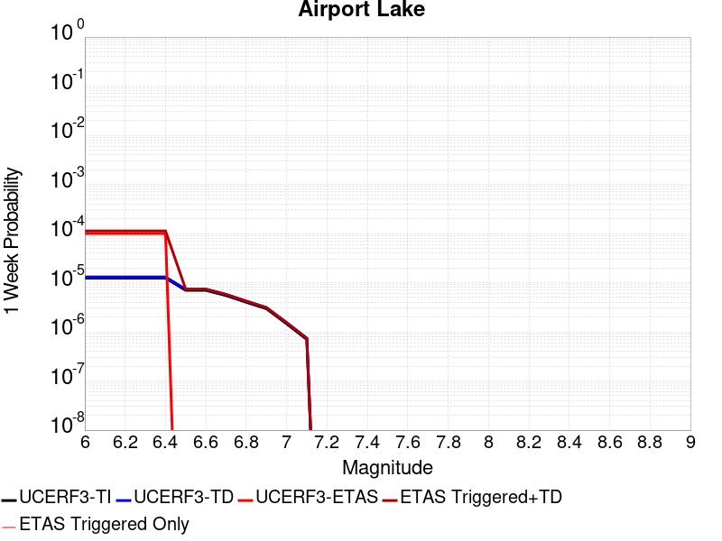 |  |  |  |

| Magnitude | 1 wk TI Prob | 1 wk TD Prob | 1 wk ETAS Prob | 1 wk ETAS/TD Gain | 1 wk ETAS Triggered+TD | 1 wk ETAS Triggered Only | 1 mo TI Prob | 1 mo TD Prob | 1 mo ETAS Prob | 1 mo ETAS/TD Gain | 1 mo ETAS Triggered+TD | 1 mo ETAS Triggered Only | 1 yr TI Prob | 1 yr TD Prob | 1 yr ETAS Prob | 1 yr ETAS/TD Gain | 1 yr ETAS Triggered+TD | 1 yr ETAS Triggered Only | 10 yr TI Prob | 10 yr TD Prob | 10 yr ETAS Prob | 10 yr ETAS/TD Gain | 10 yr ETAS Triggered+TD | 10 yr ETAS Triggered Only |
|-----|-----|-----|-----|-----|-----|-----|-----|-----|-----|-----|-----|-----|-----|-----|-----|-----|-----|-----|-----|-----|-----|-----|-----|-----|
| 6.0 | 1.2387061E-5 | 1.310466E-5 | 1.0E-4 | 7.630873 | 1.1310335E-4 | 1.0E-4 | 5.3086325E-5 | 5.616178E-5 | 7.0E-4 | 12.463992 | 6.561281E-4 | 6.0E-4 | 6.461343E-4 | 6.8358355E-4 | 0.0052 | 7.6069703 | 0.0053803707 | 0.0047 | 0.0064425888 | 0.0068176193 | 0.0148 | 2.1708457 | 0.018537171 | 0.0118 |
| 6.1 | 1.2387061E-5 | 1.310466E-5 | 1.0E-4 | 7.630873 | 1.1310335E-4 | 1.0E-4 | 5.3086325E-5 | 5.616178E-5 | 7.0E-4 | 12.463992 | 6.561281E-4 | 6.0E-4 | 6.461343E-4 | 6.8358355E-4 | 0.0052 | 7.6069703 | 0.0053803707 | 0.0047 | 0.0064425888 | 0.0068176193 | 0.0148 | 2.1708457 | 0.018537171 | 0.0118 |
| 6.2 | 1.2387061E-5 | 1.310466E-5 | 1.0E-4 | 7.630873 | 1.1310335E-4 | 1.0E-4 | 5.3086325E-5 | 5.616178E-5 | 7.0E-4 | 12.463992 | 6.561281E-4 | 6.0E-4 | 6.461343E-4 | 6.8358355E-4 | 0.0052 | 7.6069703 | 0.0053803707 | 0.0047 | 0.0064425888 | 0.0068176193 | 0.0148 | 2.1708457 | 0.018537171 | 0.0118 |
| 6.3 | 1.2387061E-5 | 1.310466E-5 | 1.0E-4 | 7.630873 | 1.1310335E-4 | 1.0E-4 | 5.3086325E-5 | 5.616178E-5 | 7.0E-4 | 12.463992 | 6.561281E-4 | 6.0E-4 | 6.461343E-4 | 6.8358355E-4 | 0.0052 | 7.6069703 | 0.0053803707 | 0.0047 | 0.0064425888 | 0.0068176193 | 0.0148 | 2.1708457 | 0.018537171 | 0.0118 |
| 6.4 | 1.2387061E-5 | 1.310466E-5 | 1.0E-4 | 7.630873 | 1.1310335E-4 | 1.0E-4 | 5.3086325E-5 | 5.616178E-5 | 7.0E-4 | 12.463992 | 6.561281E-4 | 6.0E-4 | 6.461343E-4 | 6.8358355E-4 | 0.0052 | 7.6069703 | 0.0053803707 | 0.0047 | 0.0064425888 | 0.0068176193 | 0.0148 | 2.1708457 | 0.018537171 | 0.0118 |
| 6.5 | 6.9922594E-6 | 7.3857477E-6 | 0.0 | 0.0 | 7.3857477E-6 | 0.0 | 2.996648E-5 | 3.1652853E-5 | 5.0E-4 | 15.796365 | 4.316402E-4 | 4.0E-4 | 3.6478083E-4 | 3.8531076E-4 | 0.0036 | 9.343108 | 0.0036840392 | 0.0033 | 0.003641826 | 0.0038469643 | 0.0097 | 2.5214686 | 0.012015419 | 0.0082 |
| 6.6 | 6.9922594E-6 | 7.3857477E-6 | 0.0 | 0.0 | 7.3857477E-6 | 0.0 | 2.996648E-5 | 3.1652853E-5 | 5.0E-4 | 15.796365 | 4.316402E-4 | 4.0E-4 | 3.6478083E-4 | 3.8531076E-4 | 0.0036 | 9.343108 | 0.0036840392 | 0.0033 | 0.003641826 | 0.0038469643 | 0.0097 | 2.5214686 | 0.012015419 | 0.0082 |
| 6.7 | 5.477277E-6 | 5.7867155E-6 | 0.0 | 0.0 | 5.7867155E-6 | 0.0 | 2.3473833E-5 | 2.4799996E-5 | 4.0E-4 | 16.129036 | 3.2479255E-4 | 3.0E-4 | 2.8575645E-4 | 3.01902E-4 | 0.003 | 9.936999 | 0.0030010869 | 0.0027 | 0.0028538927 | 0.0030153026 | 0.0081 | 2.6862977 | 0.009894497 | 0.0069 |
| 6.8 | 3.9950432E-6 | 4.2195566E-6 | 0.0 | 0.0 | 4.2195566E-6 | 0.0 | 1.7121502E-5 | 1.8083703E-5 | 3.0E-4 | 16.589521 | 2.1808008E-4 | 2.0E-4 | 2.0843433E-4 | 2.201496E-4 | 0.0023 | 10.447441 | 0.0023196873 | 0.0021 | 0.0020823893 | 0.0021995862 | 0.0062 | 2.818712 | 0.0077872686 | 0.0056 |
| 6.9 | 2.95695E-6 | 3.1233722E-6 | 0.0 | 0.0 | 3.1233722E-6 | 0.0 | 1.2672582E-5 | 1.3385825E-5 | 2.0E-4 | 14.941178 | 1.13384485E-4 | 1.0E-4 | 1.5427776E-4 | 1.629625E-4 | 0.0018 | 11.045486 | 0.0017627018 | 0.0016 | 0.001541707 | 0.0016286524 | 0.0041 | 2.5174186 | 0.0053226263 | 0.0037 |
| 7.0 | 1.456072E-6 | 1.5409898E-6 | 0.0 | 0.0 | 1.5409898E-6 | 0.0 | 6.2402937E-6 | 6.604231E-6 | 1.0E-4 | 15.141808 | 6.604231E-6 | 0.0 | 7.597293E-5 | 8.0404556E-5 | 5.0E-4 | 6.218553 | 4.803724E-4 | 4.0E-4 | 7.594696E-4 | 8.0385356E-4 | 0.0018 | 2.2392137 | 0.0024025673 | 0.0016 |
| 7.1 | 6.995192E-7 | 7.409844E-7 | 0.0 | 0.0 | 7.409844E-7 | 0.0 | 2.997936E-6 | 3.1756472E-6 | 0.0 | 0.0 | 3.1756472E-6 | 0.0 | 3.649926E-5 | 3.8663504E-5 | 2.0E-4 | 5.172837 | 2.3865578E-4 | 2.0E-4 | 3.6493264E-4 | 3.8663505E-4 | 0.0011 | 2.84506 | 0.0014862098 | 0.0011 |

## Green Valley 2011 CFM
*[(top)](#table-of-contents)*

| 1 Week | 1 Month | 1 Year | 10 Year |
|-----|-----|-----|-----|
| 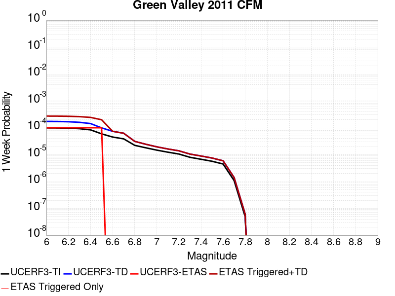 |  | 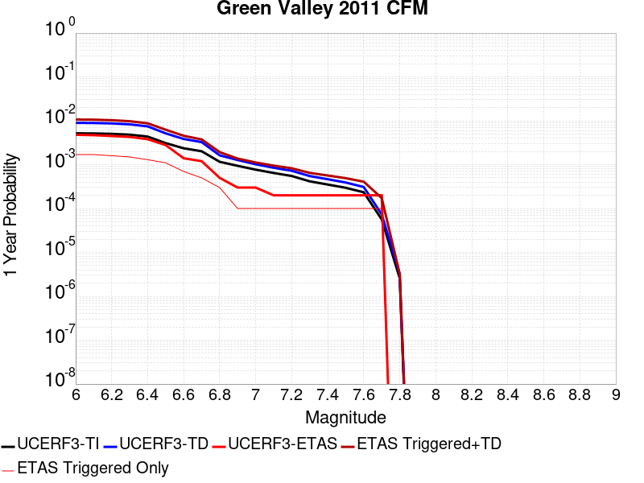 | 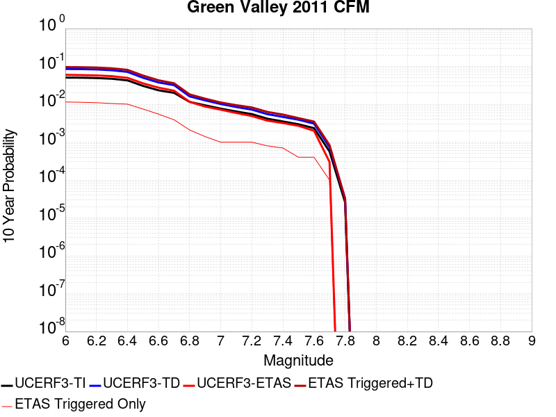 |

| Magnitude | 1 wk TI Prob | 1 wk TD Prob | 1 wk ETAS Prob | 1 wk ETAS/TD Gain | 1 wk ETAS Triggered+TD | 1 wk ETAS Triggered Only | 1 mo TI Prob | 1 mo TD Prob | 1 mo ETAS Prob | 1 mo ETAS/TD Gain | 1 mo ETAS Triggered+TD | 1 mo ETAS Triggered Only | 1 yr TI Prob | 1 yr TD Prob | 1 yr ETAS Prob | 1 yr ETAS/TD Gain | 1 yr ETAS Triggered+TD | 1 yr ETAS Triggered Only | 10 yr TI Prob | 10 yr TD Prob | 10 yr ETAS Prob | 10 yr ETAS/TD Gain | 10 yr ETAS Triggered+TD | 10 yr ETAS Triggered Only |
|-----|-----|-----|-----|-----|-----|-----|-----|-----|-----|-----|-----|-----|-----|-----|-----|-----|-----|-----|-----|-----|-----|-----|-----|-----|
| 6.0 | 9.9629346E-5 | 1.7316075E-4 | 1.0E-4 | 0.5774981 | 2.7314344E-4 | 1.0E-4 | 4.2691303E-4 | 7.4188446E-4 | 2.0E-4 | 0.26958376 | 9.417361E-4 | 2.0E-4 | 0.0051852856 | 0.008993628 | 0.0048 | 0.5337112 | 0.010678339 | 0.0017 | 0.050659515 | 0.08558589 | 0.0601 | 0.70221853 | 0.09610166 | 0.0115 |
| 6.1 | 9.88615E-5 | 1.7163092E-4 | 1.0E-4 | 0.5826456 | 2.7161377E-4 | 1.0E-4 | 4.2362334E-4 | 7.353318E-4 | 2.0E-4 | 0.27198607 | 9.351847E-4 | 2.0E-4 | 0.0051454236 | 0.00891451 | 0.0047 | 0.5272303 | 0.010599355 | 0.0017 | 0.050279044 | 0.084872425 | 0.059 | 0.695161 | 0.09521337 | 0.0113 |
| 6.2 | 9.696895E-5 | 1.6801736E-4 | 1.0E-4 | 0.5951766 | 2.6800056E-4 | 1.0E-4 | 4.15515E-4 | 7.1985484E-4 | 1.0E-4 | 0.1389169 | 8.1978284E-4 | 1.0E-4 | 0.0050471667 | 0.0087276865 | 0.0045 | 0.51560056 | 0.010313722 | 0.0016 | 0.04934063 | 0.08317977 | 0.0578 | 0.6948805 | 0.093264796 | 0.011 |
| 6.3 | 9.275224E-5 | 1.5980966E-4 | 1.0E-4 | 0.6257444 | 2.5979368E-4 | 1.0E-4 | 3.9744904E-4 | 6.846977E-4 | 1.0E-4 | 0.14604986 | 7.846292E-4 | 1.0E-4 | 0.0048282105 | 0.008302957 | 0.0043 | 0.51788783 | 0.0097905025 | 0.0015 | 0.047246475 | 0.07931792 | 0.0552 | 0.6959335 | 0.08898508 | 0.0105 |
| 6.4 | 8.391499E-5 | 1.4374856E-4 | 1.0E-4 | 0.6956591 | 2.4373419E-4 | 1.0E-4 | 3.595861E-4 | 6.1590155E-4 | 1.0E-4 | 0.16236362 | 7.158399E-4 | 1.0E-4 | 0.004369175 | 0.007471708 | 0.0038 | 0.50858516 | 0.0087619955 | 0.0013 | 0.04284265 | 0.071678385 | 0.0499 | 0.6961652 | 0.081054434 | 0.0101 |
| 6.5 | 5.9519385E-5 | 9.940625E-5 | 1.0E-4 | 1.005973 | 1.9939631E-4 | 1.0E-4 | 2.5505814E-4 | 4.2593988E-4 | 1.0E-4 | 0.23477492 | 5.2589725E-4 | 1.0E-4 | 0.0031009112 | 0.0051723677 | 0.0028 | 0.54133815 | 0.006266678 | 0.0011 | 0.030579966 | 0.050180767 | 0.0357 | 0.711428 | 0.05730441 | 0.0075 |
| 6.6 | 4.5361558E-5 | 7.4090676E-5 | 0.0 | 0.0 | 7.4090676E-5 | 0.0 | 1.9439218E-4 | 3.174824E-4 | 0.0 | 0.0 | 3.174824E-4 | 0.0 | 0.0023641558 | 0.00385754 | 0.0014 | 0.36292562 | 0.00455484 | 7.0E-4 | 0.023391623 | 0.03769878 | 0.0275 | 0.7294666 | 0.042991437 | 0.0055 |
| 6.7 | 3.8808106E-5 | 6.270957E-5 | 0.0 | 0.0 | 6.270957E-5 | 0.0 | 1.6630985E-4 | 2.6871765E-4 | 0.0 | 0.0 | 2.6871765E-4 | 0.0 | 0.0020229418 | 0.0032661217 | 0.0012 | 0.36740822 | 0.0037644887 | 5.0E-4 | 0.020046256 | 0.03203665 | 0.0228 | 0.7116848 | 0.03581171 | 0.0039 |
| 6.8 | 2.2284667E-5 | 3.130395E-5 | 0.0 | 0.0 | 3.130395E-5 | 0.0 | 9.550222E-5 | 1.3415272E-4 | 0.0 | 0.0 | 1.3415272E-4 | 0.0 | 0.0011621192 | 0.0016320843 | 5.0E-4 | 0.30635673 | 0.0019315947 | 3.0E-4 | 0.011560607 | 0.016174562 | 0.0116 | 0.7171755 | 0.018240597 | 0.0021 |
| 6.9 | 1.8050168E-5 | 2.4465095E-5 | 0.0 | 0.0 | 2.4465095E-5 | 0.0 | 7.735557E-5 | 1.04846185E-4 | 0.0 | 0.0 | 1.04846185E-4 | 0.0 | 9.4139716E-4 | 0.0012757576 | 3.0E-4 | 0.2351544 | 0.0013756299 | 1.0E-4 | 0.009374191 | 0.0126769645 | 0.0087 | 0.6862842 | 0.014059217 | 0.0014 |
| 7.0 | 1.4763166E-5 | 1.9595645E-5 | 0.0 | 0.0 | 1.9595645E-5 | 0.0 | 6.326917E-5 | 8.3978644E-5 | 0.0 | 0.0 | 8.3978644E-5 | 0.0 | 7.7002996E-4 | 0.0010219617 | 3.0E-4 | 0.29355308 | 0.0011218594 | 1.0E-4 | 0.007673672 | 0.010172426 | 0.0072 | 0.70779574 | 0.011162253 | 0.001 |
| 7.1 | 1.2399713E-5 | 1.6314632E-5 | 0.0 | 0.0 | 1.6314632E-5 | 0.0 | 5.3140546E-5 | 6.9917995E-5 | 0.0 | 0.0 | 6.9917995E-5 | 0.0 | 6.467941E-4 | 8.5092103E-4 | 2.0E-4 | 0.23503943 | 9.50836E-4 | 1.0E-4 | 0.006449148 | 0.008477002 | 0.0059 | 0.69600075 | 0.009468526 | 0.001 |
| 7.2 | 1.0584195E-5 | 1.3932011E-5 | 0.0 | 0.0 | 1.3932011E-5 | 0.0 | 4.5360044E-5 | 5.970726E-5 | 0.0 | 0.0 | 5.970726E-5 | 0.0 | 5.521186E-4 | 7.2669506E-4 | 2.0E-4 | 0.2752186 | 8.266224E-4 | 1.0E-4 | 0.0055074887 | 0.007243837 | 0.0049 | 0.6764371 | 0.008236594 | 0.001 |
| 7.3 | 7.998173E-6 | 1.0549708E-5 | 0.0 | 0.0 | 1.0549708E-5 | 0.0 | 3.4277433E-5 | 4.521226E-5 | 0.0 | 0.0 | 4.521226E-5 | 0.0 | 4.1724785E-4 | 5.503213E-4 | 2.0E-4 | 0.36342406 | 6.5026624E-4 | 1.0E-4 | 0.004164653 | 0.0054902164 | 0.0037 | 0.67392606 | 0.0062858243 | 8.0E-4 |
| 7.4 | 6.7571127E-6 | 8.93814E-6 | 0.0 | 0.0 | 8.93814E-6 | 0.0 | 2.8958733E-5 | 3.830576E-5 | 0.0 | 0.0 | 3.830576E-5 | 0.0 | 3.5251552E-4 | 4.6627375E-4 | 2.0E-4 | 0.42893258 | 5.662271E-4 | 1.0E-4 | 0.0035195686 | 0.004653349 | 0.0032 | 0.6876768 | 0.0053500915 | 7.0E-4 |
| 7.5 | 5.69878E-6 | 7.52065E-6 | 0.0 | 0.0 | 7.52065E-6 | 0.0 | 2.4423114E-5 | 3.2230964E-5 | 0.0 | 0.0 | 3.2230964E-5 | 0.0 | 2.9731085E-4 | 3.923422E-4 | 2.0E-4 | 0.50975907 | 4.9230293E-4 | 1.0E-4 | 0.002969134 | 0.003916874 | 0.0027 | 0.68932515 | 0.0043153074 | 4.0E-4 |
| 7.6 | 4.503664E-6 | 5.9396157E-6 | 0.0 | 0.0 | 5.9396157E-6 | 0.0 | 1.9301275E-5 | 2.545525E-5 | 0.0 | 0.0 | 2.545525E-5 | 0.0 | 2.3496768E-4 | 3.0987445E-4 | 2.0E-4 | 0.6454227 | 4.0984346E-4 | 1.0E-4 | 0.002347194 | 0.003094749 | 0.002 | 0.64625597 | 0.0034935111 | 4.0E-4 |
| 7.7 | 1.0873546E-6 | 1.4112346E-6 | 0.0 | 0.0 | 1.4112346E-6 | 0.0 | 4.6600826E-6 | 6.0481343E-6 | 0.0 | 0.0 | 6.0481343E-6 | 0.0 | 5.6735033E-5 | 7.363358E-5 | 2.0E-4 | 2.7161522 | 1.736262E-4 | 1.0E-4 | 5.672055E-4 | 7.3612086E-4 | 3.0E-4 | 0.40754175 | 8.360473E-4 | 1.0E-4 |
| 7.8 | 4.9373917E-8 | 6.1790004E-8 | 0.0 | 0.0 | 6.1790004E-8 | 0.0 | 2.1160248E-7 | 2.6481428E-7 | 0.0 | 0.0 | 2.6481428E-7 | 0.0 | 2.5762572E-6 | 3.2241103E-6 | 0.0 | 0.0 | 3.2241103E-6 | 0.0 | 2.5762274E-5 | 3.2233616E-5 | 0.0 | 0.0 | 3.2233616E-5 | 0.0 |

## Garlock (East)
*[(top)](#table-of-contents)*

| 1 Week | 1 Month | 1 Year | 10 Year |
|-----|-----|-----|-----|
|  |  |  | 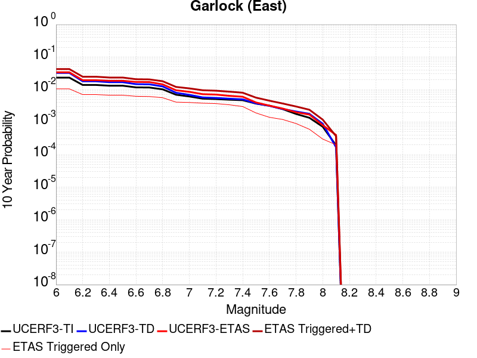 |

| Magnitude | 1 wk TI Prob | 1 wk TD Prob | 1 wk ETAS Prob | 1 wk ETAS/TD Gain | 1 wk ETAS Triggered+TD | 1 wk ETAS Triggered Only | 1 mo TI Prob | 1 mo TD Prob | 1 mo ETAS Prob | 1 mo ETAS/TD Gain | 1 mo ETAS Triggered+TD | 1 mo ETAS Triggered Only | 1 yr TI Prob | 1 yr TD Prob | 1 yr ETAS Prob | 1 yr ETAS/TD Gain | 1 yr ETAS Triggered+TD | 1 yr ETAS Triggered Only | 10 yr TI Prob | 10 yr TD Prob | 10 yr ETAS Prob | 10 yr ETAS/TD Gain | 10 yr ETAS Triggered+TD | 10 yr ETAS Triggered Only |
|-----|-----|-----|-----|-----|-----|-----|-----|-----|-----|-----|-----|-----|-----|-----|-----|-----|-----|-----|-----|-----|-----|-----|-----|-----|
| 6.0 | 4.5092507E-5 | 6.295866E-5 | 0.0 | 0.0 | 6.295866E-5 | 0.0 | 1.9323928E-4 | 2.6979743E-4 | 1.0E-4 | 0.37064844 | 3.6977045E-4 | 1.0E-4 | 0.0023501497 | 0.0032802825 | 0.0045 | 1.3718331 | 0.0054730657 | 0.0022 | 0.023254504 | 0.03240208 | 0.034 | 1.0493153 | 0.04256186 | 0.0105 |
| 6.1 | 4.5092507E-5 | 6.295866E-5 | 0.0 | 0.0 | 6.295866E-5 | 0.0 | 1.9323928E-4 | 2.6979743E-4 | 1.0E-4 | 0.37064844 | 3.6977045E-4 | 1.0E-4 | 0.0023501497 | 0.0032802825 | 0.0045 | 1.3718331 | 0.0054730657 | 0.0022 | 0.023254504 | 0.03240208 | 0.034 | 1.0493153 | 0.04256186 | 0.0105 |
| 6.2 | 2.6674514E-5 | 3.4553505E-5 | 0.0 | 0.0 | 3.4553505E-5 | 0.0 | 1.1431433E-4 | 1.4807824E-4 | 1.0E-4 | 0.6753187 | 2.480634E-4 | 1.0E-4 | 0.0013908884 | 0.0018013947 | 0.0028 | 1.5543511 | 0.0034983323 | 0.0017 | 0.01382215 | 0.017902449 | 0.0194 | 1.0836506 | 0.024777131 | 0.007 |
| 6.3 | 2.6674514E-5 | 3.4553505E-5 | 0.0 | 0.0 | 3.4553505E-5 | 0.0 | 1.1431433E-4 | 1.4807824E-4 | 1.0E-4 | 0.6753187 | 2.480634E-4 | 1.0E-4 | 0.0013908884 | 0.0018013947 | 0.0028 | 1.5543511 | 0.0034983323 | 0.0017 | 0.01382215 | 0.017902449 | 0.0194 | 1.0836506 | 0.024777131 | 0.007 |
| 6.4 | 2.5312667E-5 | 3.238142E-5 | 0.0 | 0.0 | 3.238142E-5 | 0.0 | 1.0847834E-4 | 1.3877031E-4 | 1.0E-4 | 0.72061527 | 2.3875643E-4 | 1.0E-4 | 0.0013199237 | 0.0016882486 | 0.0027 | 1.5992905 | 0.0033853785 | 0.0017 | 0.013121112 | 0.01680208 | 0.0186 | 1.1070058 | 0.023389505 | 0.0067 |
| 6.5 | 2.5312667E-5 | 3.238142E-5 | 0.0 | 0.0 | 3.238142E-5 | 0.0 | 1.0847834E-4 | 1.3877031E-4 | 1.0E-4 | 0.72061527 | 2.3875643E-4 | 1.0E-4 | 0.0013199237 | 0.0016882486 | 0.0027 | 1.5992905 | 0.0033853785 | 0.0017 | 0.013121112 | 0.01680208 | 0.0186 | 1.1070058 | 0.023389505 | 0.0067 |
| 6.6 | 2.246556E-5 | 2.81743E-5 | 0.0 | 0.0 | 2.81743E-5 | 0.0 | 9.627742E-5 | 1.2074154E-4 | 1.0E-4 | 0.82821536 | 2.2072946E-4 | 1.0E-4 | 0.0011715472 | 0.0014690605 | 0.0026 | 1.7698386 | 0.00306671 | 0.0016 | 0.011653901 | 0.014644603 | 0.0171 | 1.1676656 | 0.020753806 | 0.0062 |
| 6.7 | 2.2241198E-5 | 2.7843893E-5 | 0.0 | 0.0 | 2.7843893E-5 | 0.0 | 9.531594E-5 | 1.1932565E-4 | 1.0E-4 | 0.8380428 | 2.1931372E-4 | 1.0E-4 | 0.0011598538 | 0.001451845 | 0.0026 | 1.7908247 | 0.0030495222 | 0.0016 | 0.011538187 | 0.014473881 | 0.017 | 1.1745296 | 0.02048559 | 0.0061 |
| 6.8 | 1.9528685E-5 | 2.3936049E-5 | 0.0 | 0.0 | 2.3936049E-5 | 0.0 | 8.369167E-5 | 1.0257914E-4 | 1.0E-4 | 0.97485703 | 2.0256889E-4 | 1.0E-4 | 0.0010184698 | 0.0012482053 | 0.0023 | 1.8426456 | 0.002746333 | 0.0015 | 0.010138147 | 0.0124552 | 0.0144 | 1.1561437 | 0.01798545 | 0.0056 |
| 6.9 | 1.3318621E-5 | 1.523086E-5 | 0.0 | 0.0 | 1.523086E-5 | 0.0 | 5.7078556E-5 | 6.527351E-5 | 1.0E-4 | 1.532015 | 1.6526699E-4 | 1.0E-4 | 6.9470983E-4 | 7.94421E-4 | 0.0019 | 2.391679 | 0.0020933882 | 0.0013 | 0.0069254204 | 0.007955738 | 0.0095 | 1.1941067 | 0.012023119 | 0.0041 |
| 7.0 | 1.1760853E-5 | 1.3138568E-5 | 0.0 | 0.0 | 1.3138568E-5 | 0.0 | 5.0402683E-5 | 5.630696E-5 | 1.0E-4 | 1.7759794 | 1.5630134E-4 | 1.0E-4 | 6.134799E-4 | 6.8532664E-4 | 0.0018 | 2.6264849 | 0.0019844358 | 0.0013 | 0.0061178906 | 0.0068718344 | 0.0085 | 1.2369332 | 0.010844347 | 0.004 |
| 7.1 | 1.0064758E-5 | 1.0932549E-5 | 0.0 | 0.0 | 1.0932549E-5 | 0.0 | 4.3133965E-5 | 4.685296E-5 | 1.0E-4 | 2.1343367 | 1.4684828E-4 | 1.0E-4 | 5.2502943E-4 | 5.7028903E-4 | 0.0018 | 3.1562943 | 0.0018695476 | 0.0013 | 0.005237907 | 0.005728991 | 0.0072 | 1.2567658 | 0.009507221 | 0.0038 |
| 7.2 | 9.768808E-6 | 1.0528209E-5 | 0.0 | 0.0 | 1.0528209E-5 | 0.0 | 4.186565E-5 | 4.5120134E-5 | 1.0E-4 | 2.2163055 | 1.4511563E-4 | 1.0E-4 | 5.095951E-4 | 5.4920267E-4 | 0.0018 | 3.2774787 | 0.0018484887 | 0.0013 | 0.0050842804 | 0.0055192127 | 0.007 | 1.2682968 | 0.009198791 | 0.0037 |
| 7.3 | 9.344516E-6 | 9.973293E-6 | 0.0 | 0.0 | 9.973293E-6 | 0.0 | 4.004731E-5 | 4.2742005E-5 | 1.0E-4 | 2.3396187 | 1.4273773E-4 | 1.0E-4 | 4.8746695E-4 | 5.2026316E-4 | 0.0017 | 3.2675772 | 0.0017196388 | 0.0012 | 0.0048639905 | 0.005230607 | 0.0064 | 1.2235674 | 0.008612823 | 0.0034 |
| 7.4 | 9.023491E-6 | 9.518881E-6 | 0.0 | 0.0 | 9.518881E-6 | 0.0 | 3.867153E-5 | 4.0794584E-5 | 1.0E-4 | 2.4513059 | 1.4079051E-4 | 1.0E-4 | 4.7072413E-4 | 4.965642E-4 | 0.0016 | 3.222141 | 0.001596018 | 0.0011 | 0.004697283 | 0.0049937647 | 0.006 | 1.2014984 | 0.007978783 | 0.003 |
| 7.5 | 7.081253E-6 | 7.112707E-6 | 0.0 | 0.0 | 7.112707E-6 | 0.0 | 3.0347876E-5 | 3.0482679E-5 | 0.0 | 0.0 | 3.0482679E-5 | 0.0 | 3.6942272E-4 | 3.7106415E-4 | 9.0E-4 | 2.4254565 | 9.708415E-4 | 6.0E-4 | 0.003688092 | 0.0037373551 | 0.004 | 1.0702755 | 0.0056302543 | 0.0019 |
| 7.6 | 6.116396E-6 | 5.9830163E-6 | 0.0 | 0.0 | 5.9830163E-6 | 0.0 | 2.6212863E-5 | 2.5641248E-5 | 0.0 | 0.0 | 2.5641248E-5 | 0.0 | 3.1909486E-4 | 3.1213774E-4 | 8.0E-4 | 2.562971 | 8.119817E-4 | 5.0E-4 | 0.0031863707 | 0.0031480652 | 0.0032 | 1.0164974 | 0.004543658 | 0.0014 |
| 7.7 | 4.797145E-6 | 4.779705E-6 | 0.0 | 0.0 | 4.779705E-6 | 0.0 | 2.055903E-5 | 2.0484289E-5 | 0.0 | 0.0 | 2.0484289E-5 | 0.0 | 2.5027743E-4 | 2.493678E-4 | 8.0E-4 | 3.2081127 | 7.4924313E-4 | 5.0E-4 | 0.0024999576 | 0.002521054 | 0.0026 | 1.0313147 | 0.0037180285 | 0.0012 |
| 7.8 | 3.4028885E-6 | 3.9985553E-6 | 0.0 | 0.0 | 3.9985553E-6 | 0.0 | 1.4583726E-5 | 1.7136554E-5 | 0.0 | 0.0 | 1.7136554E-5 | 0.0 | 1.775424E-4 | 2.0861764E-4 | 4.0E-4 | 1.9173834 | 4.0857593E-4 | 2.0E-4 | 0.0017740062 | 0.0021116734 | 0.002 | 0.9471162 | 0.0030097729 | 9.0E-4 |
| 7.9 | 2.5928412E-6 | 3.389497E-6 | 0.0 | 0.0 | 3.389497E-6 | 0.0 | 1.1112129E-5 | 1.4526335E-5 | 0.0 | 0.0 | 1.4526335E-5 | 0.0 | 1.3528178E-4 | 1.7684384E-4 | 3.0E-4 | 1.696412 | 2.7682615E-4 | 1.0E-4 | 0.0013519945 | 0.0017900281 | 0.0017 | 0.9497058 | 0.002388954 | 6.0E-4 |
| 8.0 | 1.3743648E-6 | 1.6811745E-6 | 0.0 | 0.0 | 1.6811745E-6 | 0.0 | 5.8901214E-6 | 7.2050134E-6 | 0.0 | 0.0 | 7.2050134E-6 | 0.0 | 7.1709874E-5 | 8.771754E-5 | 2.0E-4 | 2.2800457 | 8.771754E-5 | 0.0 | 7.1686733E-4 | 8.876992E-4 | 8.0E-4 | 0.9012062 | 0.0011874329 | 3.0E-4 |
| 8.1 | 3.6733252E-7 | 3.1624552E-7 | 0.0 | 0.0 | 3.1624552E-7 | 0.0 | 1.5742813E-6 | 1.3553373E-6 | 0.0 | 0.0 | 1.3553373E-6 | 0.0 | 1.9166706E-5 | 1.6501122E-5 | 1.0E-4 | 6.0601935 | 1.6501122E-5 | 0.0 | 1.9165053E-4 | 1.6715302E-4 | 4.0E-4 | 2.3930168 | 3.671196E-4 | 2.0E-4 |

## Panamint Valley
*[(top)](#table-of-contents)*

| 1 Week | 1 Month | 1 Year | 10 Year |
|-----|-----|-----|-----|
|  |  |  |  |

| Magnitude | 1 wk TI Prob | 1 wk TD Prob | 1 wk ETAS Prob | 1 wk ETAS/TD Gain | 1 wk ETAS Triggered+TD | 1 wk ETAS Triggered Only | 1 mo TI Prob | 1 mo TD Prob | 1 mo ETAS Prob | 1 mo ETAS/TD Gain | 1 mo ETAS Triggered+TD | 1 mo ETAS Triggered Only | 1 yr TI Prob | 1 yr TD Prob | 1 yr ETAS Prob | 1 yr ETAS/TD Gain | 1 yr ETAS Triggered+TD | 1 yr ETAS Triggered Only | 10 yr TI Prob | 10 yr TD Prob | 10 yr ETAS Prob | 10 yr ETAS/TD Gain | 10 yr ETAS Triggered+TD | 10 yr ETAS Triggered Only |
|-----|-----|-----|-----|-----|-----|-----|-----|-----|-----|-----|-----|-----|-----|-----|-----|-----|-----|-----|-----|-----|-----|-----|-----|-----|
| 6.0 | 3.0211835E-5 | 3.399739E-5 | 2.0E-4 | 5.882805 | 2.3399059E-4 | 2.0E-4 | 1.2947287E-4 | 1.4569511E-4 | 7.0E-4 | 4.8045535 | 8.455931E-4 | 7.0E-4 | 0.0015751923 | 0.0017724243 | 0.005 | 2.8209949 | 0.006064803 | 0.0043 | 0.015640736 | 0.017589863 | 0.0194 | 1.1029079 | 0.028396375 | 0.011 |
| 6.1 | 3.0211835E-5 | 3.399739E-5 | 2.0E-4 | 5.882805 | 2.3399059E-4 | 2.0E-4 | 1.2947287E-4 | 1.4569511E-4 | 7.0E-4 | 4.8045535 | 8.455931E-4 | 7.0E-4 | 0.0015751923 | 0.0017724243 | 0.005 | 2.8209949 | 0.006064803 | 0.0043 | 0.015640736 | 0.017589863 | 0.0194 | 1.1029079 | 0.028396375 | 0.011 |
| 6.2 | 3.0211835E-5 | 3.399739E-5 | 2.0E-4 | 5.882805 | 2.3399059E-4 | 2.0E-4 | 1.2947287E-4 | 1.4569511E-4 | 7.0E-4 | 4.8045535 | 8.455931E-4 | 7.0E-4 | 0.0015751923 | 0.0017724243 | 0.005 | 2.8209949 | 0.006064803 | 0.0043 | 0.015640736 | 0.017589863 | 0.0194 | 1.1029079 | 0.028396375 | 0.011 |
| 6.3 | 2.8573924E-5 | 3.211487E-5 | 2.0E-4 | 6.227645 | 2.3210845E-4 | 2.0E-4 | 1.2245393E-4 | 1.3762806E-4 | 7.0E-4 | 5.0861726 | 8.375317E-4 | 7.0E-4 | 0.001489857 | 0.0016743615 | 0.0047 | 2.8070402 | 0.005767497 | 0.0041 | 0.01479908 | 0.01662406 | 0.0177 | 1.0647218 | 0.027047845 | 0.0106 |
| 6.4 | 2.8573924E-5 | 3.211487E-5 | 2.0E-4 | 6.227645 | 2.3210845E-4 | 2.0E-4 | 1.2245393E-4 | 1.3762806E-4 | 7.0E-4 | 5.0861726 | 8.375317E-4 | 7.0E-4 | 0.001489857 | 0.0016743615 | 0.0047 | 2.8070402 | 0.005767497 | 0.0041 | 0.01479908 | 0.01662406 | 0.0177 | 1.0647218 | 0.027047845 | 0.0106 |
| 6.5 | 2.7468774E-5 | 3.0840125E-5 | 2.0E-4 | 6.485058 | 2.3083396E-4 | 2.0E-4 | 1.1771801E-4 | 1.3216543E-4 | 7.0E-4 | 5.296393 | 8.320729E-4 | 7.0E-4 | 0.0014322745 | 0.0016079537 | 0.0047 | 2.9229698 | 0.005701361 | 0.0041 | 0.014230782 | 0.015969694 | 0.0171 | 1.0707781 | 0.02620361 | 0.0104 |
| 6.6 | 2.6135967E-5 | 2.9263689E-5 | 2.0E-4 | 6.8344083 | 2.2925784E-4 | 2.0E-4 | 1.1200648E-4 | 1.2540993E-4 | 7.0E-4 | 5.581695 | 8.253221E-4 | 7.0E-4 | 0.0013628257 | 0.001525823 | 0.0046 | 3.0147665 | 0.0056195674 | 0.0041 | 0.013544982 | 0.015159937 | 0.016 | 1.0554134 | 0.025008338 | 0.01 |
| 6.7 | 2.4498746E-5 | 2.7352397E-5 | 2.0E-4 | 7.3119736 | 2.2734693E-4 | 2.0E-4 | 1.04990395E-4 | 1.1721943E-4 | 7.0E-4 | 5.9717064 | 8.1713736E-4 | 7.0E-4 | 0.0012775084 | 0.0014262374 | 0.0043 | 3.014926 | 0.005220818 | 0.0038 | 0.012701893 | 0.014177105 | 0.0149 | 1.0509902 | 0.023345258 | 0.0093 |
| 6.8 | 2.2244329E-5 | 2.494569E-5 | 2.0E-4 | 8.017417 | 2.249407E-4 | 2.0E-4 | 9.532935E-5 | 1.0690584E-4 | 7.0E-4 | 6.5478177 | 8.06831E-4 | 7.0E-4 | 0.0011600169 | 0.0013008233 | 0.004 | 3.0749757 | 0.00489614 | 0.0036 | 0.011539802 | 0.012937944 | 0.0135 | 1.0434425 | 0.021426678 | 0.0086 |
| 6.9 | 1.9902658E-5 | 2.2299711E-5 | 2.0E-4 | 8.968726 | 2.2229525E-4 | 2.0E-4 | 8.529431E-5 | 9.556679E-5 | 7.0E-4 | 7.32472 | 7.954999E-4 | 7.0E-4 | 0.0010379635 | 0.0011629232 | 0.0038 | 3.2676277 | 0.0045589693 | 0.0034 | 0.010331288 | 0.011573873 | 0.0122 | 1.0540982 | 0.019580126 | 0.0081 |
| 7.0 | 1.8353881E-5 | 2.0575173E-5 | 2.0E-4 | 9.720453 | 2.2057106E-4 | 2.0E-4 | 7.865712E-5 | 8.8176435E-5 | 7.0E-4 | 7.938629 | 7.8811473E-4 | 7.0E-4 | 9.5722964E-4 | 0.001073037 | 0.0037 | 3.4481568 | 0.004369496 | 0.0033 | 0.009531168 | 0.0106837945 | 0.0114 | 1.0670366 | 0.01830153 | 0.0077 |
| 7.1 | 1.7667631E-5 | 1.9781386E-5 | 2.0E-4 | 10.110515 | 2.1977743E-4 | 2.0E-4 | 7.571623E-5 | 8.4774714E-5 | 7.0E-4 | 8.257179 | 7.8471535E-4 | 7.0E-4 | 9.2145515E-4 | 0.001031661 | 0.0036 | 3.4895184 | 0.0042283596 | 0.0032 | 0.009176437 | 0.010273907 | 0.0112 | 1.0901402 | 0.017795825 | 0.0076 |
| 7.2 | 1.6381597E-5 | 1.8166309E-5 | 2.0E-4 | 11.009391 | 2.1816268E-4 | 2.0E-4 | 7.020495E-5 | 7.785338E-5 | 6.0E-4 | 7.7067943 | 6.778067E-4 | 6.0E-4 | 8.544101E-4 | 9.474701E-4 | 0.0032 | 3.3774154 | 0.003744817 | 0.0028 | 0.008511325 | 0.009439194 | 0.0103 | 1.0911949 | 0.016175007 | 0.0068 |
| 7.3 | 1.4520491E-5 | 1.5972872E-5 | 1.0E-4 | 6.260615 | 1.1597128E-4 | 1.0E-4 | 6.222919E-5 | 6.845346E-5 | 4.0E-4 | 5.843386 | 4.6842606E-4 | 4.0E-4 | 7.57377E-4 | 8.331184E-4 | 0.0025 | 3.000774 | 0.0030312855 | 0.0022 | 0.0075480095 | 0.008303196 | 0.0088 | 1.0598329 | 0.014253377 | 0.006 |
| 7.4 | 1.2852287E-5 | 1.4151001E-5 | 1.0E-4 | 7.066638 | 1.1414959E-4 | 1.0E-4 | 5.5080065E-5 | 6.0645823E-5 | 3.0E-4 | 4.9467545 | 3.6062763E-4 | 3.0E-4 | 6.7039346E-4 | 7.381286E-4 | 0.0024 | 3.251466 | 0.0028365785 | 0.0021 | 0.0066837464 | 0.0073598395 | 0.0082 | 1.1141547 | 0.013017888 | 0.0057 |
| 7.5 | 1.1637851E-5 | 1.2842109E-5 | 1.0E-4 | 7.7868834 | 1.12840826E-4 | 1.0E-4 | 4.987555E-5 | 5.5036537E-5 | 3.0E-4 | 5.4509244 | 3.5502002E-4 | 3.0E-4 | 6.070656E-4 | 6.698795E-4 | 0.0024 | 3.5827339 | 0.0027684728 | 0.0021 | 0.006054099 | 0.0066816593 | 0.0082 | 1.2272401 | 0.012343574 | 0.0057 |
| 7.6 | 3.0068115E-6 | 3.3351353E-6 | 0.0 | 0.0 | 3.3351353E-6 | 0.0 | 1.2886271E-5 | 1.42933995E-5 | 2.0E-4 | 13.992473 | 2.1429054E-4 | 2.0E-4 | 1.5687906E-4 | 1.7401553E-4 | 0.0013 | 7.4705977 | 0.0013738067 | 0.0012 | 0.0015676835 | 0.0017403212 | 0.0026 | 1.4939771 | 0.0040363185 | 0.0023 |

## Hayward (No) 2011 CFM
*[(top)](#table-of-contents)*

| 1 Week | 1 Month | 1 Year | 10 Year |
|-----|-----|-----|-----|
| 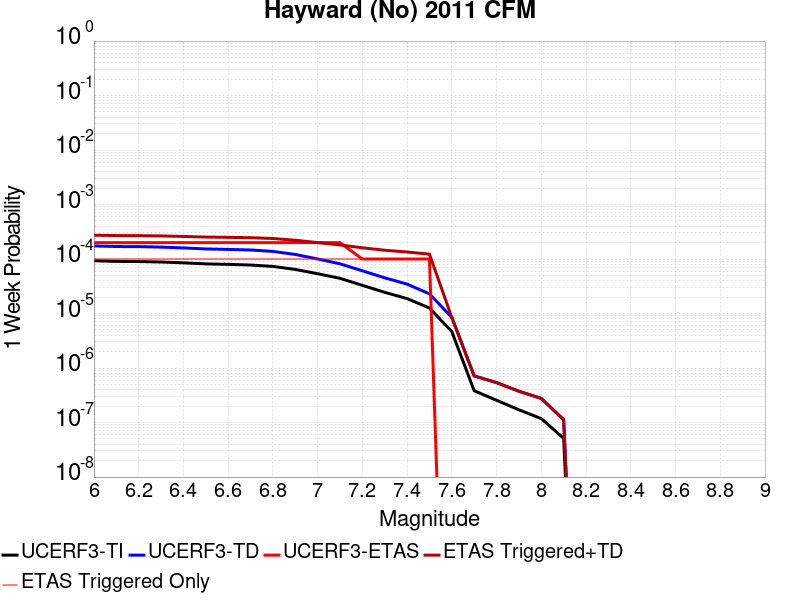 |  |  |  |

| Magnitude | 1 wk TI Prob | 1 wk TD Prob | 1 wk ETAS Prob | 1 wk ETAS/TD Gain | 1 wk ETAS Triggered+TD | 1 wk ETAS Triggered Only | 1 mo TI Prob | 1 mo TD Prob | 1 mo ETAS Prob | 1 mo ETAS/TD Gain | 1 mo ETAS Triggered+TD | 1 mo ETAS Triggered Only | 1 yr TI Prob | 1 yr TD Prob | 1 yr ETAS Prob | 1 yr ETAS/TD Gain | 1 yr ETAS Triggered+TD | 1 yr ETAS Triggered Only | 10 yr TI Prob | 10 yr TD Prob | 10 yr ETAS Prob | 10 yr ETAS/TD Gain | 10 yr ETAS Triggered+TD | 10 yr ETAS Triggered Only |
|-----|-----|-----|-----|-----|-----|-----|-----|-----|-----|-----|-----|-----|-----|-----|-----|-----|-----|-----|-----|-----|-----|-----|-----|-----|
| 6.0 | 9.3068506E-5 | 1.7426522E-4 | 2.0E-4 | 1.147676 | 2.7424778E-4 | 1.0E-4 | 3.9880406E-4 | 7.466372E-4 | 6.0E-4 | 0.8036032 | 9.464879E-4 | 2.0E-4 | 0.0048446343 | 0.009052299 | 0.0061 | 0.6738619 | 0.010439626 | 0.0014 | 0.047403704 | 0.086493865 | 0.0525 | 0.6069795 | 0.096085675 | 0.0105 |
| 6.1 | 9.055486E-5 | 1.6977437E-4 | 2.0E-4 | 1.1780342 | 2.6975738E-4 | 1.0E-4 | 3.880345E-4 | 7.27402E-4 | 5.0E-4 | 0.6873778 | 9.2725654E-4 | 2.0E-4 | 0.0047140904 | 0.008820233 | 0.0059 | 0.6689166 | 0.010207885 | 0.0014 | 0.046153355 | 0.08439077 | 0.0518 | 0.6138112 | 0.0939131 | 0.0104 |
| 6.2 | 9.006742E-5 | 1.6897969E-4 | 2.0E-4 | 1.1835742 | 2.689628E-4 | 1.0E-4 | 3.859461E-4 | 7.239983E-4 | 5.0E-4 | 0.6906094 | 9.238535E-4 | 2.0E-4 | 0.0046887742 | 0.008779165 | 0.0058 | 0.6606551 | 0.010166874 | 0.0014 | 0.0459107 | 0.08401475 | 0.0516 | 0.6141778 | 0.093541 | 0.0104 |
| 6.3 | 8.8336754E-5 | 1.6577414E-4 | 2.0E-4 | 1.2064608 | 2.6575755E-4 | 1.0E-4 | 3.7853114E-4 | 7.102678E-4 | 5.0E-4 | 0.7039598 | 9.1012573E-4 | 2.0E-4 | 0.004598882 | 0.0086133825 | 0.0058 | 0.6733707 | 0.010001324 | 0.0014 | 0.04504866 | 0.08250652 | 0.0508 | 0.61570895 | 0.09186495 | 0.0102 |
| 6.4 | 8.526157E-5 | 1.6003703E-4 | 2.0E-4 | 1.2497107 | 2.6002104E-4 | 1.0E-4 | 3.6535555E-4 | 6.8569335E-4 | 5.0E-4 | 0.7291889 | 8.855562E-4 | 2.0E-4 | 0.0044391346 | 0.008316521 | 0.0056 | 0.6733585 | 0.009704878 | 0.0014 | 0.043514993 | 0.079814784 | 0.0492 | 0.6164272 | 0.088832594 | 0.0098 |
| 6.5 | 8.152396E-5 | 1.533587E-4 | 2.0E-4 | 1.304132 | 2.5334337E-4 | 1.0E-4 | 3.493416E-4 | 6.570868E-4 | 5.0E-4 | 0.76093453 | 8.5695536E-4 | 2.0E-4 | 0.0042449418 | 0.007970838 | 0.0055 | 0.6900153 | 0.009260476 | 0.0013 | 0.04164765 | 0.07664576 | 0.048 | 0.6262577 | 0.08550996 | 0.0096 |
| 6.6 | 7.987405E-5 | 1.5039995E-4 | 2.0E-4 | 1.3297876 | 2.503849E-4 | 1.0E-4 | 3.4227243E-4 | 6.444127E-4 | 5.0E-4 | 0.7759003 | 8.442838E-4 | 2.0E-4 | 0.0041592065 | 0.007817659 | 0.0055 | 0.70353544 | 0.009107496 | 0.0013 | 0.04082218 | 0.07523814 | 0.047 | 0.6246832 | 0.08402337 | 0.0095 |
| 6.7 | 7.777665E-5 | 1.4678622E-4 | 2.0E-4 | 1.3625257 | 2.4677155E-4 | 1.0E-4 | 3.332859E-4 | 6.289328E-4 | 5.0E-4 | 0.79499745 | 8.28807E-4 | 2.0E-4 | 0.004050208 | 0.0076305284 | 0.0055 | 0.7207889 | 0.008920609 | 0.0013 | 0.039771806 | 0.07351168 | 0.0463 | 0.62983185 | 0.08222067 | 0.0094 |
| 6.8 | 7.3284005E-5 | 1.3827685E-4 | 2.0E-4 | 1.4463737 | 2.3826302E-4 | 1.0E-4 | 3.140365E-4 | 5.924811E-4 | 5.0E-4 | 0.8439088 | 7.923626E-4 | 2.0E-4 | 0.0038166929 | 0.0071897367 | 0.0054 | 0.7510706 | 0.0084803905 | 0.0013 | 0.037518036 | 0.069418624 | 0.0436 | 0.6280735 | 0.07788692 | 0.0091 |
| 6.9 | 6.458263E-5 | 1.2154995E-4 | 2.0E-4 | 1.6454141 | 2.2153779E-4 | 1.0E-4 | 2.7675333E-4 | 5.2082486E-4 | 4.0E-4 | 0.7680125 | 7.207207E-4 | 2.0E-4 | 0.0033642664 | 0.0063227075 | 0.0046 | 0.72753644 | 0.007316385 | 0.001 | 0.033137884 | 0.061333496 | 0.039 | 0.6358679 | 0.06884283 | 0.008 |
| 7.0 | 5.3853604E-5 | 1.0045085E-4 | 2.0E-4 | 1.9910235 | 2.004408E-4 | 1.0E-4 | 2.3078074E-4 | 4.3043293E-4 | 4.0E-4 | 0.9292969 | 6.303468E-4 | 2.0E-4 | 0.0028061352 | 0.0052279932 | 0.0041 | 0.7842397 | 0.006123288 | 9.0E-4 | 0.027709642 | 0.051051028 | 0.0324 | 0.6346591 | 0.05693451 | 0.0062 |
| 7.1 | 4.4308683E-5 | 8.188011E-5 | 2.0E-4 | 2.4425955 | 1.8187192E-4 | 1.0E-4 | 1.8988053E-4 | 3.5086778E-4 | 4.0E-4 | 1.1400306 | 5.507976E-4 | 2.0E-4 | 0.0023093442 | 0.0042634895 | 0.0035 | 0.8209238 | 0.0050600786 | 8.0E-4 | 0.022854926 | 0.041905515 | 0.0266 | 0.6347613 | 0.04640856 | 0.0047 |
| 7.2 | 3.295973E-5 | 6.0924012E-5 | 1.0E-4 | 1.6413889 | 1.6091792E-4 | 1.0E-4 | 1.4124835E-4 | 2.610769E-4 | 3.0E-4 | 1.1490867 | 4.610247E-4 | 2.0E-4 | 0.0017183421 | 0.0031740014 | 0.0025 | 0.78764933 | 0.003971462 | 8.0E-4 | 0.017051157 | 0.03144163 | 0.0198 | 0.6297384 | 0.03550957 | 0.0042 |
| 7.3 | 2.452256E-5 | 4.530614E-5 | 1.0E-4 | 2.2072062 | 1.4530162E-4 | 1.0E-4 | 1.05092455E-4 | 1.941548E-4 | 2.0E-4 | 1.0301058 | 3.9411598E-4 | 2.0E-4 | 0.0012787496 | 0.002361286 | 0.0019 | 0.8046463 | 0.003059633 | 7.0E-4 | 0.0127141625 | 0.023501672 | 0.0151 | 0.6425075 | 0.026528817 | 0.0031 |
| 7.4 | 1.8829967E-5 | 3.4704895E-5 | 1.0E-4 | 2.881438 | 1.3470142E-4 | 1.0E-4 | 8.069736E-5 | 1.4872683E-4 | 2.0E-4 | 1.3447472 | 3.486971E-4 | 2.0E-4 | 9.820475E-4 | 0.0018092552 | 0.0019 | 1.0501559 | 0.0025079888 | 7.0E-4 | 0.009777189 | 0.018068705 | 0.0118 | 0.6530629 | 0.020523533 | 0.0025 |
| 7.5 | 1.26374125E-5 | 2.2997488E-5 | 1.0E-4 | 4.348301 | 1.2299519E-4 | 1.0E-4 | 5.4159216E-5 | 9.855697E-5 | 2.0E-4 | 2.029283 | 2.9853726E-4 | 2.0E-4 | 6.5918895E-4 | 0.0011992764 | 0.0012 | 1.0006033 | 0.0017985569 | 6.0E-4 | 0.00657237 | 0.012026367 | 0.0076 | 0.6319448 | 0.013705922 | 0.0017 |
| 7.6 | 4.666429E-6 | 8.509862E-6 | 0.0 | 0.0 | 8.509862E-6 | 0.0 | 1.9998828E-5 | 3.6470334E-5 | 0.0 | 0.0 | 3.6470334E-5 | 0.0 | 2.4345852E-4 | 4.4393708E-4 | 4.0E-4 | 0.9010286 | 4.4393708E-4 | 0.0 | 0.0024319198 | 0.0044734143 | 0.0022 | 0.49179438 | 0.004871625 | 4.0E-4 |
| 7.7 | 3.8399318E-7 | 7.1806693E-7 | 0.0 | 0.0 | 7.1806693E-7 | 0.0 | 1.6456839E-6 | 3.077426E-6 | 0.0 | 0.0 | 3.077426E-6 | 0.0 | 2.003602E-5 | 3.746702E-5 | 0.0 | 0.0 | 3.746702E-5 | 0.0 | 2.0034213E-4 | 3.884248E-4 | 1.0E-4 | 0.25745007 | 3.884248E-4 | 0.0 |
| 7.8 | 2.5637698E-7 | 5.4068045E-7 | 0.0 | 0.0 | 5.4068045E-7 | 0.0 | 1.098758E-6 | 2.3172E-6 | 0.0 | 0.0 | 2.3172E-6 | 0.0 | 1.3377297E-5 | 2.8211545E-5 | 0.0 | 0.0 | 2.8211545E-5 | 0.0 | 1.3376492E-4 | 2.944142E-4 | 1.0E-4 | 0.33965755 | 2.944142E-4 | 0.0 |
| 7.9 | 1.7141245E-7 | 3.7572062E-7 | 0.0 | 0.0 | 3.7572062E-7 | 0.0 | 7.3462456E-7 | 1.6102301E-6 | 0.0 | 0.0 | 1.6102301E-6 | 0.0 | 8.944017E-6 | 1.9604377E-5 | 0.0 | 0.0 | 1.9604377E-5 | 0.0 | 8.943657E-5 | 2.0382134E-4 | 1.0E-4 | 0.49062574 | 2.0382134E-4 | 0.0 |
| 8.0 | 1.1808895E-7 | 2.770807E-7 | 0.0 | 0.0 | 2.770807E-7 | 0.0 | 5.060954E-7 | 1.1874881E-6 | 0.0 | 0.0 | 1.1874881E-6 | 0.0 | 6.161694E-6 | 1.4457572E-5 | 0.0 | 0.0 | 1.4457572E-5 | 0.0 | 6.161523E-5 | 1.4911758E-4 | 1.0E-4 | 0.67061174 | 1.4911758E-4 | 0.0 |
| 8.1 | 5.138535E-8 | 1.13073256E-7 | 0.0 | 0.0 | 1.13073256E-7 | 0.0 | 2.2022292E-7 | 4.845996E-7 | 0.0 | 0.0 | 4.845996E-7 | 0.0 | 2.6812106E-6 | 5.899984E-6 | 0.0 | 0.0 | 5.899984E-6 | 0.0 | 2.6811784E-5 | 6.05383E-5 | 0.0 | 0.0 | 6.05383E-5 | 0.0 |

## San Andreas (Santa Cruz Mts) 2011 CFM
*[(top)](#table-of-contents)*

| 1 Week | 1 Month | 1 Year | 10 Year |
|-----|-----|-----|-----|
|  |  |  | 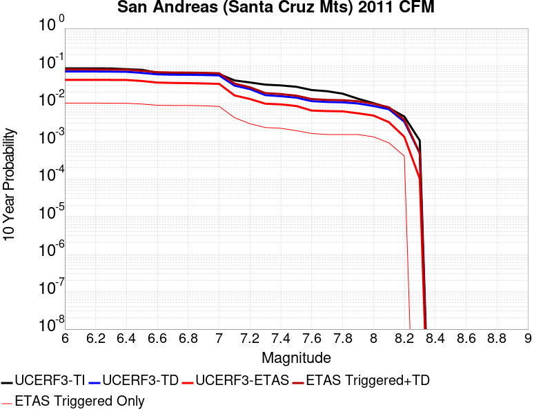 |

| Magnitude | 1 wk TI Prob | 1 wk TD Prob | 1 wk ETAS Prob | 1 wk ETAS/TD Gain | 1 wk ETAS Triggered+TD | 1 wk ETAS Triggered Only | 1 mo TI Prob | 1 mo TD Prob | 1 mo ETAS Prob | 1 mo ETAS/TD Gain | 1 mo ETAS Triggered+TD | 1 mo ETAS Triggered Only | 1 yr TI Prob | 1 yr TD Prob | 1 yr ETAS Prob | 1 yr ETAS/TD Gain | 1 yr ETAS Triggered+TD | 1 yr ETAS Triggered Only | 10 yr TI Prob | 10 yr TD Prob | 10 yr ETAS Prob | 10 yr ETAS/TD Gain | 10 yr ETAS Triggered+TD | 10 yr ETAS Triggered Only |
|-----|-----|-----|-----|-----|-----|-----|-----|-----|-----|-----|-----|-----|-----|-----|-----|-----|-----|-----|-----|-----|-----|-----|-----|-----|
| 6.0 | 1.7221631E-4 | 1.3886303E-4 | 4.0E-4 | 2.8805363 | 4.388214E-4 | 3.0E-4 | 7.378611E-4 | 5.949936E-4 | 7.0E-4 | 1.1764833 | 0.0010946961 | 5.0E-4 | 0.008946515 | 0.007220367 | 0.0047 | 0.6509364 | 0.008709537 | 0.0015 | 0.08594794 | 0.07099041 | 0.0427 | 0.60148966 | 0.08055922 | 0.0103 |
| 6.1 | 1.7221631E-4 | 1.3886303E-4 | 4.0E-4 | 2.8805363 | 4.388214E-4 | 3.0E-4 | 7.378611E-4 | 5.949936E-4 | 7.0E-4 | 1.1764833 | 0.0010946961 | 5.0E-4 | 0.008946515 | 0.007220367 | 0.0047 | 0.6509364 | 0.008709537 | 0.0015 | 0.08594794 | 0.07099041 | 0.0427 | 0.60148966 | 0.08055922 | 0.0103 |
| 6.2 | 1.7221631E-4 | 1.3886303E-4 | 4.0E-4 | 2.8805363 | 4.388214E-4 | 3.0E-4 | 7.378611E-4 | 5.949936E-4 | 7.0E-4 | 1.1764833 | 0.0010946961 | 5.0E-4 | 0.008946515 | 0.007220367 | 0.0047 | 0.6509364 | 0.008709537 | 0.0015 | 0.08594794 | 0.07099041 | 0.0427 | 0.60148966 | 0.08055922 | 0.0103 |
| 6.3 | 1.716926E-4 | 1.3805534E-4 | 4.0E-4 | 2.8973887 | 4.3801393E-4 | 3.0E-4 | 7.3561794E-4 | 5.9153367E-4 | 7.0E-4 | 1.1833645 | 0.0010912379 | 5.0E-4 | 0.008919428 | 0.00717852 | 0.0047 | 0.65473104 | 0.008667752 | 0.0015 | 0.08569809 | 0.07060165 | 0.0425 | 0.60196894 | 0.080081515 | 0.0102 |
| 6.4 | 1.6392978E-4 | 1.3679561E-4 | 4.0E-4 | 2.9240704 | 4.3675458E-4 | 3.0E-4 | 7.02367E-4 | 5.8613723E-4 | 7.0E-4 | 1.1942595 | 0.0010858441 | 5.0E-4 | 0.008517839 | 0.007113248 | 0.0047 | 0.66073895 | 0.008602578 | 0.0015 | 0.08198654 | 0.06982407 | 0.0423 | 0.60580826 | 0.07931186 | 0.0102 |
| 6.5 | 1.5742714E-4 | 1.2736555E-4 | 4.0E-4 | 3.1405666 | 4.2732735E-4 | 3.0E-4 | 6.745133E-4 | 5.4573995E-4 | 7.0E-4 | 1.2826623 | 0.0010454671 | 5.0E-4 | 0.00818132 | 0.006624457 | 0.004 | 0.6038231 | 0.007915845 | 0.0013 | 0.078865945 | 0.06527971 | 0.0397 | 0.6081523 | 0.07434649 | 0.0097 |
| 6.6 | 1.3038084E-4 | 1.1669526E-4 | 4.0E-4 | 3.4277315 | 4.1666024E-4 | 3.0E-4 | 5.5865536E-4 | 5.0002796E-4 | 7.0E-4 | 1.3999218 | 9.997779E-4 | 5.0E-4 | 0.006780438 | 0.006071079 | 0.0038 | 0.6259184 | 0.0073631867 | 0.0013 | 0.0657725 | 0.05970802 | 0.0361 | 0.6046089 | 0.06817065 | 0.009 |
| 6.7 | 1.2867592E-4 | 1.1395497E-4 | 4.0E-4 | 3.5101583 | 4.139208E-4 | 3.0E-4 | 5.5135164E-4 | 4.8828835E-4 | 7.0E-4 | 1.4335792 | 9.880442E-4 | 5.0E-4 | 0.0066920654 | 0.0059289346 | 0.0038 | 0.64092463 | 0.0072212266 | 0.0013 | 0.06494093 | 0.05841705 | 0.0353 | 0.60427564 | 0.06679714 | 0.0089 |
| 6.8 | 1.2801298E-4 | 1.1332945E-4 | 4.0E-4 | 3.5295327 | 4.1329546E-4 | 3.0E-4 | 5.485117E-4 | 4.8560853E-4 | 7.0E-4 | 1.4414903 | 9.853657E-4 | 5.0E-4 | 0.0066577005 | 0.0058964975 | 0.0038 | 0.64445037 | 0.007188832 | 0.0013 | 0.06461738 | 0.05813055 | 0.0349 | 0.60037273 | 0.06651319 | 0.0089 |
| 6.9 | 1.269149E-4 | 1.1174811E-4 | 4.0E-4 | 3.579479 | 4.1171457E-4 | 3.0E-4 | 5.4380763E-4 | 4.7883383E-4 | 7.0E-4 | 1.461885 | 9.785944E-4 | 5.0E-4 | 0.006600777 | 0.0058144582 | 0.0038 | 0.65354323 | 0.0071068997 | 0.0013 | 0.06408122 | 0.057401318 | 0.0342 | 0.59580517 | 0.06560192 | 0.0087 |
| 7.0 | 1.2030331E-4 | 1.090361E-4 | 4.0E-4 | 3.66851 | 4.0900338E-4 | 3.0E-4 | 5.154837E-4 | 4.6721514E-4 | 7.0E-4 | 1.4982392 | 9.669815E-4 | 5.0E-4 | 0.006257969 | 0.0056737456 | 0.0038 | 0.6697516 | 0.0069663697 | 0.0013 | 0.06084648 | 0.056066796 | 0.0334 | 0.595718 | 0.06399583 | 0.0084 |
| 7.1 | 8.049617E-5 | 5.45254E-5 | 2.0E-4 | 3.6680152 | 1.5451995E-4 | 1.0E-4 | 3.4493793E-4 | 2.3365956E-4 | 4.0E-4 | 1.7118922 | 4.3361282E-4 | 2.0E-4 | 0.0041915346 | 0.0028411294 | 0.0014 | 0.4927618 | 0.0033397088 | 5.0E-4 | 0.041133516 | 0.029915657 | 0.0164 | 0.5482079 | 0.03399001 | 0.0042 |
| 7.2 | 7.093979E-5 | 4.346831E-5 | 2.0E-4 | 4.601053 | 1.4346396E-4 | 1.0E-4 | 3.0399222E-4 | 1.8627959E-4 | 3.0E-4 | 1.6104825 | 2.8626097E-4 | 1.0E-4 | 0.0036948253 | 0.0022656182 | 0.0012 | 0.52965677 | 0.002664712 | 4.0E-4 | 0.03633994 | 0.024208244 | 0.0132 | 0.5452688 | 0.027038042 | 0.0029 |
| 7.3 | 6.193693E-5 | 2.9291405E-5 | 2.0E-4 | 6.827942 | 1.2928847E-4 | 1.0E-4 | 2.6541698E-4 | 1.2552856E-4 | 2.0E-4 | 1.5932629 | 2.25516E-4 | 1.0E-4 | 0.0032266637 | 0.0015272405 | 7.0E-4 | 0.458343 | 0.0018267824 | 3.0E-4 | 0.031802133 | 0.016707154 | 0.0099 | 0.5925605 | 0.018968727 | 0.0023 |
| 7.4 | 5.906492E-5 | 2.7397451E-5 | 2.0E-4 | 7.299949 | 1.2739471E-4 | 1.0E-4 | 2.5311083E-4 | 1.1741237E-4 | 2.0E-4 | 1.7033981 | 2.1740062E-4 | 1.0E-4 | 0.0030772698 | 0.0014285597 | 7.0E-4 | 0.49000403 | 0.0017281311 | 3.0E-4 | 0.030350044 | 0.015668107 | 0.0095 | 0.6063272 | 0.017833639 | 0.0022 |
| 7.5 | 5.424296E-5 | 2.5020641E-5 | 2.0E-4 | 7.9934006 | 1.2501814E-4 | 1.0E-4 | 2.324491E-4 | 1.07226915E-4 | 2.0E-4 | 1.8652034 | 2.0721619E-4 | 1.0E-4 | 0.002826395 | 0.0013047071 | 6.0E-4 | 0.45987332 | 0.0015044461 | 2.0E-4 | 0.027907165 | 0.014344936 | 0.0086 | 0.59951466 | 0.01621768 | 0.0019 |
| 7.6 | 4.43084E-5 | 2.0173753E-5 | 2.0E-4 | 9.913872 | 1.2017174E-4 | 1.0E-4 | 1.8987931E-4 | 8.645607E-5 | 2.0E-4 | 2.3133135 | 1.8644743E-4 | 1.0E-4 | 0.0023093296 | 0.0010520947 | 5.0E-4 | 0.4752424 | 0.0012518843 | 2.0E-4 | 0.022854783 | 0.011556238 | 0.0065 | 0.5624668 | 0.0131377475 | 0.0016 |
| 7.7 | 4.118098E-5 | 1.9193818E-5 | 2.0E-4 | 10.420022 | 1.191919E-4 | 1.0E-4 | 1.7647797E-4 | 8.225662E-5 | 2.0E-4 | 2.431415 | 1.822484E-4 | 1.0E-4 | 0.002146502 | 0.0010010145 | 5.0E-4 | 0.49949324 | 0.0012008144 | 2.0E-4 | 0.021258866 | 0.01100773 | 0.0063 | 0.57232505 | 0.012491219 | 0.0015 |
| 7.8 | 3.5408906E-5 | 1.881464E-5 | 2.0E-4 | 10.630019 | 1.1881276E-4 | 1.0E-4 | 1.5174363E-4 | 8.063168E-5 | 2.0E-4 | 2.4804146 | 1.8062363E-4 | 1.0E-4 | 0.0018459131 | 9.812489E-4 | 5.0E-4 | 0.50955474 | 0.0011810526 | 2.0E-4 | 0.018306552 | 0.010785256 | 0.0062 | 0.5748589 | 0.012269078 | 0.0015 |
| 7.9 | 2.5860836E-5 | 1.7541553E-5 | 2.0E-4 | 11.401499 | 1.175398E-4 | 1.0E-4 | 1.10827445E-4 | 7.517592E-5 | 2.0E-4 | 2.6604264 | 1.751684E-4 | 1.0E-4 | 0.001348489 | 9.1488275E-4 | 5.0E-4 | 0.5465181 | 0.0011146998 | 2.0E-4 | 0.013403354 | 0.010026833 | 0.0055 | 0.54852813 | 0.011511792 | 0.0015 |
| 8.0 | 1.9777332E-5 | 1.5029343E-5 | 2.0E-4 | 13.307302 | 1.1502784E-4 | 1.0E-4 | 8.4757245E-5 | 6.4409876E-5 | 2.0E-4 | 3.1051137 | 1.6440343E-4 | 1.0E-4 | 0.0010314309 | 7.839083E-4 | 5.0E-4 | 0.63782966 | 9.837515E-4 | 2.0E-4 | 0.010266567 | 0.008609542 | 0.0048 | 0.557521 | 0.00989835 | 0.0013 |
| 8.1 | 1.468494E-5 | 1.2261045E-5 | 2.0E-4 | 16.311823 | 1.1225982E-4 | 1.0E-4 | 6.293394E-5 | 5.254628E-5 | 2.0E-4 | 3.8061686 | 1.5254102E-4 | 1.0E-4 | 7.6595135E-4 | 6.3956337E-4 | 5.0E-4 | 0.78178334 | 8.3943544E-4 | 2.0E-4 | 0.0076331664 | 0.007051126 | 0.0032 | 0.45382825 | 0.0079447795 | 9.0E-4 |
| 8.2 | 8.63836E-6 | 5.5477717E-6 | 2.0E-4 | 36.05051 | 1.0554722E-4 | 1.0E-4 | 3.7021015E-5 | 2.3775949E-5 | 2.0E-4 | 8.411862 | 1.2377357E-4 | 1.0E-4 | 4.5063766E-4 | 2.894338E-4 | 2.0E-4 | 0.6910043 | 3.8940486E-4 | 1.0E-4 | 0.004497249 | 0.0032887247 | 0.0013 | 0.39529002 | 0.0036874092 | 4.0E-4 |
| 8.3 | 1.983087E-6 | 7.7872784E-7 | 0.0 | 0.0 | 7.7872784E-7 | 0.0 | 8.498917E-6 | 3.3374008E-6 | 0.0 | 0.0 | 3.3374008E-6 | 0.0 | 1.034694E-4 | 4.0632116E-5 | 0.0 | 0.0 | 4.0632116E-5 | 0.0 | 0.0010342124 | 4.792776E-4 | 1.0E-4 | 0.20864734 | 4.792776E-4 | 0.0 |

## West Napa 2011 CFM
*[(top)](#table-of-contents)*

| 1 Week | 1 Month | 1 Year | 10 Year |
|-----|-----|-----|-----|
|  |  |  |  |

| Magnitude | 1 wk TI Prob | 1 wk TD Prob | 1 wk ETAS Prob | 1 wk ETAS/TD Gain | 1 wk ETAS Triggered+TD | 1 wk ETAS Triggered Only | 1 mo TI Prob | 1 mo TD Prob | 1 mo ETAS Prob | 1 mo ETAS/TD Gain | 1 mo ETAS Triggered+TD | 1 mo ETAS Triggered Only | 1 yr TI Prob | 1 yr TD Prob | 1 yr ETAS Prob | 1 yr ETAS/TD Gain | 1 yr ETAS Triggered+TD | 1 yr ETAS Triggered Only | 10 yr TI Prob | 10 yr TD Prob | 10 yr ETAS Prob | 10 yr ETAS/TD Gain | 10 yr ETAS Triggered+TD | 10 yr ETAS Triggered Only |
|-----|-----|-----|-----|-----|-----|-----|-----|-----|-----|-----|-----|-----|-----|-----|-----|-----|-----|-----|-----|-----|-----|-----|-----|-----|
| 6.0 | 3.773104E-5 | 4.4545905E-5 | 0.0 | 0.0 | 4.4545905E-5 | 0.0 | 1.6169442E-4 | 1.9089885E-4 | 2.0E-4 | 1.0476753 | 2.9087975E-4 | 1.0E-4 | 0.001966852 | 0.0023220335 | 0.0018 | 0.7751826 | 0.0033197114 | 0.001 | 0.019495348 | 0.023011351 | 0.0208 | 0.90390176 | 0.032292742 | 0.0095 |
| 6.1 | 3.773104E-5 | 4.4545905E-5 | 0.0 | 0.0 | 4.4545905E-5 | 0.0 | 1.6169442E-4 | 1.9089885E-4 | 2.0E-4 | 1.0476753 | 2.9087975E-4 | 1.0E-4 | 0.001966852 | 0.0023220335 | 0.0018 | 0.7751826 | 0.0033197114 | 0.001 | 0.019495348 | 0.023011351 | 0.0208 | 0.90390176 | 0.032292742 | 0.0095 |
| 6.2 | 3.773104E-5 | 4.4545905E-5 | 0.0 | 0.0 | 4.4545905E-5 | 0.0 | 1.6169442E-4 | 1.9089885E-4 | 2.0E-4 | 1.0476753 | 2.9087975E-4 | 1.0E-4 | 0.001966852 | 0.0023220335 | 0.0018 | 0.7751826 | 0.0033197114 | 0.001 | 0.019495348 | 0.023011351 | 0.0208 | 0.90390176 | 0.032292742 | 0.0095 |
| 6.3 | 2.147964E-5 | 2.4996629E-5 | 0.0 | 0.0 | 2.4996629E-5 | 0.0 | 9.2052345E-5 | 1.0712453E-4 | 2.0E-4 | 1.866986 | 2.0711382E-4 | 1.0E-4 | 0.001120161 | 0.0013035525 | 0.0012 | 0.92056125 | 0.0018029008 | 5.0E-4 | 0.011145315 | 0.01296987 | 0.0118 | 0.90980095 | 0.018595941 | 0.0057 |
| 6.4 | 2.147964E-5 | 2.4996629E-5 | 0.0 | 0.0 | 2.4996629E-5 | 0.0 | 9.2052345E-5 | 1.0712453E-4 | 2.0E-4 | 1.866986 | 2.0711382E-4 | 1.0E-4 | 0.001120161 | 0.0013035525 | 0.0012 | 0.92056125 | 0.0018029008 | 5.0E-4 | 0.011145315 | 0.01296987 | 0.0118 | 0.90980095 | 0.018595941 | 0.0057 |
| 6.5 | 1.688201E-5 | 1.955496E-5 | 0.0 | 0.0 | 1.955496E-5 | 0.0 | 7.234947E-5 | 8.380469E-5 | 1.0E-4 | 1.1932507 | 1.837963E-4 | 1.0E-4 | 8.804988E-4 | 0.0010199173 | 0.001 | 0.9804717 | 0.0015194073 | 5.0E-4 | 0.008770182 | 0.010161222 | 0.0088 | 0.8660376 | 0.014615496 | 0.0045 |
| 6.6 | 1.6846381E-5 | 1.9514642E-5 | 0.0 | 0.0 | 1.9514642E-5 | 0.0 | 7.219678E-5 | 8.363191E-5 | 1.0E-4 | 1.1957159 | 1.8362355E-4 | 1.0E-4 | 8.7864127E-4 | 0.0010178157 | 0.001 | 0.9824962 | 0.0015173068 | 5.0E-4 | 0.008751754 | 0.010140398 | 0.0088 | 0.8678161 | 0.014594765 | 0.0045 |
| 6.7 | 1.3396501E-5 | 1.5473894E-5 | 0.0 | 0.0 | 1.5473894E-5 | 0.0 | 5.7412315E-5 | 6.6315355E-5 | 1.0E-4 | 1.5079464 | 1.6630873E-4 | 1.0E-4 | 6.9877075E-4 | 8.0715393E-4 | 0.001 | 1.238921 | 0.0013067503 | 5.0E-4 | 0.0069657755 | 0.008050136 | 0.0072 | 0.8943948 | 0.011819545 | 0.0038 |
| 6.8 | 1.0139058E-5 | 1.1677143E-5 | 0.0 | 0.0 | 1.1677143E-5 | 0.0 | 4.3452383E-5 | 5.0044255E-5 | 1.0E-4 | 1.9982314 | 1.5003925E-4 | 1.0E-4 | 5.289043E-4 | 6.09174E-4 | 9.0E-4 | 1.4774103 | 0.0010089304 | 4.0E-4 | 0.005276473 | 0.0060821506 | 0.0055 | 0.9042854 | 0.008765729 | 0.0027 |
| 6.9 | 7.761281E-6 | 8.89475E-6 | 0.0 | 0.0 | 8.89475E-6 | 0.0 | 3.326221E-5 | 3.8120088E-5 | 1.0E-4 | 2.6232886 | 1.3811627E-4 | 1.0E-4 | 4.0489217E-4 | 4.6406468E-4 | 7.0E-4 | 1.5084105 | 8.6387905E-4 | 4.0E-4 | 0.0040415525 | 0.0046376577 | 0.0038 | 0.81937915 | 0.0063297735 | 0.0017 |
| 7.0 | 2.2109202E-6 | 2.3683883E-6 | 0.0 | 0.0 | 2.3683883E-6 | 0.0 | 9.475338E-6 | 1.0150196E-5 | 0.0 | 0.0 | 1.0150196E-5 | 0.0 | 1.1535613E-4 | 1.2357172E-4 | 2.0E-4 | 1.6184933 | 1.2357172E-4 | 0.0 | 0.0011529627 | 0.0012367003 | 7.0E-4 | 0.56602234 | 0.0015363294 | 3.0E-4 |
| 7.1 | 1.9008926E-6 | 2.0149791E-6 | 0.0 | 0.0 | 2.0149791E-6 | 0.0 | 8.146657E-6 | 8.635597E-6 | 0.0 | 0.0 | 8.635597E-6 | 0.0 | 9.918104E-5 | 1.0513334E-4 | 2.0E-4 | 1.9023461 | 1.0513334E-4 | 0.0 | 9.913679E-4 | 0.0010525014 | 6.0E-4 | 0.5700705 | 0.0013521856 | 3.0E-4 |
| 7.2 | 1.8495944E-6 | 1.9577728E-6 | 0.0 | 0.0 | 1.9577728E-6 | 0.0 | 7.926808E-6 | 8.390428E-6 | 0.0 | 0.0 | 8.390428E-6 | 0.0 | 9.650462E-5 | 1.021487E-4 | 2.0E-4 | 1.95793 | 1.021487E-4 | 0.0 | 9.6462725E-4 | 0.0010226828 | 6.0E-4 | 0.58669215 | 0.001322376 | 3.0E-4 |
| 7.3 | 1.7883189E-6 | 1.8897184E-6 | 0.0 | 0.0 | 1.8897184E-6 | 0.0 | 7.664201E-6 | 8.098768E-6 | 0.0 | 0.0 | 8.098768E-6 | 0.0 | 9.330765E-5 | 9.8598066E-5 | 1.0E-4 | 1.0142187 | 9.8598066E-5 | 0.0 | 9.3268487E-4 | 9.872087E-4 | 4.0E-4 | 0.40518284 | 0.0011870113 | 2.0E-4 |
| 7.4 | 1.6520572E-6 | 1.7430496E-6 | 0.0 | 0.0 | 1.7430496E-6 | 0.0 | 7.0802257E-6 | 7.470191E-6 | 0.0 | 0.0 | 7.470191E-6 | 0.0 | 8.6198335E-5 | 9.094581E-5 | 1.0E-4 | 1.099556 | 9.094581E-5 | 0.0 | 8.616491E-4 | 9.107507E-4 | 3.0E-4 | 0.3293986 | 0.0010106596 | 1.0E-4 |
| 7.5 | 1.4040345E-6 | 1.4813993E-6 | 0.0 | 0.0 | 1.4813993E-6 | 0.0 | 6.0172765E-6 | 6.3488387E-6 | 0.0 | 0.0 | 6.3488387E-6 | 0.0 | 7.325788E-5 | 7.72944E-5 | 1.0E-4 | 1.2937549 | 7.72944E-5 | 0.0 | 7.3233736E-4 | 7.7429926E-4 | 2.0E-4 | 0.25829807 | 8.742218E-4 | 1.0E-4 |
| 7.6 | 1.3013842E-7 | 1.447959E-7 | 0.0 | 0.0 | 1.447959E-7 | 0.0 | 5.57736E-7 | 6.205537E-7 | 0.0 | 0.0 | 6.205537E-7 | 0.0 | 6.790414E-6 | 7.5552152E-6 | 0.0 | 0.0 | 7.5552152E-6 | 0.0 | 6.790207E-5 | 7.6481294E-5 | 0.0 | 0.0 | 7.6481294E-5 | 0.0 |
| 7.7 | 8.541512E-8 | 9.774433E-8 | 0.0 | 0.0 | 9.774433E-8 | 0.0 | 3.6606474E-7 | 4.1890422E-7 | 0.0 | 0.0 | 4.1890422E-7 | 0.0 | 4.456829E-6 | 5.100147E-6 | 0.0 | 0.0 | 5.100147E-6 | 0.0 | 4.4567398E-5 | 5.1906267E-5 | 0.0 | 0.0 | 5.1906267E-5 | 0.0 |
| 7.8 | 5.6074793E-8 | 6.9435714E-8 | 0.0 | 0.0 | 6.9435714E-8 | 0.0 | 2.403205E-7 | 2.975816E-7 | 0.0 | 0.0 | 2.975816E-7 | 0.0 | 2.9258983E-6 | 3.62305E-6 | 0.0 | 0.0 | 3.62305E-6 | 0.0 | 2.9258597E-5 | 3.7064437E-5 | 0.0 | 0.0 | 3.7064437E-5 | 0.0 |
| 7.9 | 2.9475839E-8 | 3.8852686E-8 | 0.0 | 0.0 | 3.8852686E-8 | 0.0 | 1.2632502E-7 | 1.6651151E-7 | 0.0 | 0.0 | 1.6651151E-7 | 0.0 | 1.538006E-6 | 2.0272757E-6 | 0.0 | 0.0 | 2.0272757E-6 | 0.0 | 1.5379954E-5 | 2.0812508E-5 | 0.0 | 0.0 | 2.0812508E-5 | 0.0 |
| 8.0 | 1.3337122E-8 | 2.1798726E-8 | 0.0 | 0.0 | 2.1798726E-8 | 0.0 | 5.7159088E-8 | 9.3423104E-8 | 0.0 | 0.0 | 9.3423104E-8 | 0.0 | 6.959117E-7 | 1.1374257E-6 | 0.0 | 0.0 | 1.1374257E-6 | 0.0 | 6.959095E-6 | 1.1730147E-5 | 0.0 | 0.0 | 1.1730147E-5 | 0.0 |
| 8.1 | 2.6589986E-10 | 4.896824E-10 | 0.0 | 0.0 | 4.896824E-10 | 0.0 | 1.1395708E-9 | 2.0986395E-9 | 0.0 | 0.0 | 2.0986395E-9 | 0.0 | 1.3874274E-8 | 2.5550936E-8 | 0.0 | 0.0 | 2.5550936E-8 | 0.0 | 1.3874273E-7 | 2.621495E-7 | 0.0 | 0.0 | 2.621495E-7 | 0.0 |

## Calaveras (No) 2011 CFM
*[(top)](#table-of-contents)*

| 1 Week | 1 Month | 1 Year | 10 Year |
|-----|-----|-----|-----|
| 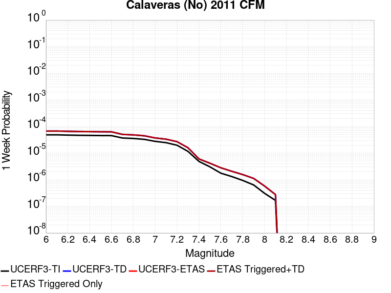 |  |  | 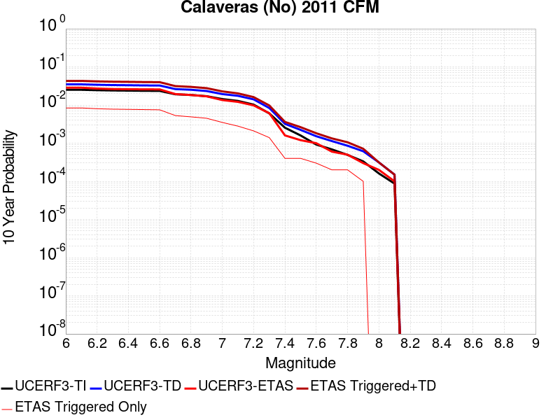 |

| Magnitude | 1 wk TI Prob | 1 wk TD Prob | 1 wk ETAS Prob | 1 wk ETAS/TD Gain | 1 wk ETAS Triggered+TD | 1 wk ETAS Triggered Only | 1 mo TI Prob | 1 mo TD Prob | 1 mo ETAS Prob | 1 mo ETAS/TD Gain | 1 mo ETAS Triggered+TD | 1 mo ETAS Triggered Only | 1 yr TI Prob | 1 yr TD Prob | 1 yr ETAS Prob | 1 yr ETAS/TD Gain | 1 yr ETAS Triggered+TD | 1 yr ETAS Triggered Only | 10 yr TI Prob | 10 yr TD Prob | 10 yr ETAS Prob | 10 yr ETAS/TD Gain | 10 yr ETAS Triggered+TD | 10 yr ETAS Triggered Only |
|-----|-----|-----|-----|-----|-----|-----|-----|-----|-----|-----|-----|-----|-----|-----|-----|-----|-----|-----|-----|-----|-----|-----|-----|-----|
| 6.0 | 4.8694856E-5 | 6.761747E-5 | 0.0 | 0.0 | 6.761747E-5 | 0.0 | 2.0867554E-4 | 2.8975765E-4 | 2.0E-4 | 0.690232 | 2.8975765E-4 | 0.0 | 0.0025376645 | 0.0035220913 | 0.0024 | 0.68141335 | 0.0043192734 | 8.0E-4 | 0.02508881 | 0.034842145 | 0.0286 | 0.820845 | 0.04294947 | 0.0084 |
| 6.1 | 4.8694856E-5 | 6.761747E-5 | 0.0 | 0.0 | 6.761747E-5 | 0.0 | 2.0867554E-4 | 2.8975765E-4 | 2.0E-4 | 0.690232 | 2.8975765E-4 | 0.0 | 0.0025376645 | 0.0035220913 | 0.0024 | 0.68141335 | 0.0043192734 | 8.0E-4 | 0.02508881 | 0.034842145 | 0.0285 | 0.8179749 | 0.04294947 | 0.0084 |
| 6.2 | 4.7541962E-5 | 6.594738E-5 | 0.0 | 0.0 | 6.594738E-5 | 0.0 | 2.0373536E-4 | 2.8260172E-4 | 1.0E-4 | 0.3538549 | 2.8260172E-4 | 0.0 | 0.0024776561 | 0.0034352676 | 0.0022 | 0.6404159 | 0.004132863 | 7.0E-4 | 0.024502134 | 0.034003012 | 0.0271 | 0.7969882 | 0.04173099 | 0.008 |
| 6.3 | 4.6717287E-5 | 6.478014E-5 | 0.0 | 0.0 | 6.478014E-5 | 0.0 | 2.0020158E-4 | 2.7760045E-4 | 1.0E-4 | 0.36022994 | 2.7760045E-4 | 0.0 | 0.0024347296 | 0.003374577 | 0.0021 | 0.6223002 | 0.004072215 | 7.0E-4 | 0.024082264 | 0.033415187 | 0.0263 | 0.7870673 | 0.04095455 | 0.0078 |
| 6.4 | 4.6276386E-5 | 6.414134E-5 | 0.0 | 0.0 | 6.414134E-5 | 0.0 | 1.983123E-4 | 2.7486336E-4 | 1.0E-4 | 0.36381716 | 2.7486336E-4 | 0.0 | 0.0024117786 | 0.0033413628 | 0.0021 | 0.6284861 | 0.0040390235 | 7.0E-4 | 0.02385771 | 0.033093844 | 0.026 | 0.7856446 | 0.040539023 | 0.0077 |
| 6.5 | 4.5720994E-5 | 6.3341475E-5 | 0.0 | 0.0 | 6.3341475E-5 | 0.0 | 1.9593239E-4 | 2.714363E-4 | 1.0E-4 | 0.3684106 | 2.714363E-4 | 0.0 | 0.002382867 | 0.003299774 | 0.0021 | 0.63640726 | 0.003997464 | 7.0E-4 | 0.023574775 | 0.03269119 | 0.0258 | 0.7892035 | 0.040042736 | 0.0076 |
| 6.6 | 4.549134E-5 | 6.299437E-5 | 0.0 | 0.0 | 6.299437E-5 | 0.0 | 1.949483E-4 | 2.6994897E-4 | 1.0E-4 | 0.37044036 | 2.6994897E-4 | 0.0 | 0.0023709119 | 0.0032817204 | 0.0021 | 0.63990825 | 0.0039794235 | 7.0E-4 | 0.023457756 | 0.03251651 | 0.0257 | 0.7903678 | 0.039772633 | 0.0075 |
| 6.7 | 3.701047E-5 | 5.0490173E-5 | 0.0 | 0.0 | 5.0490173E-5 | 0.0 | 1.5860666E-4 | 2.1636875E-4 | 0.0 | 0.0 | 2.1636875E-4 | 0.0 | 0.0019293258 | 0.002631151 | 0.0016 | 0.6080989 | 0.0031298352 | 5.0E-4 | 0.019126613 | 0.02619032 | 0.0194 | 0.7407317 | 0.03135151 | 0.0053 |
| 6.8 | 3.5523568E-5 | 4.8470778E-5 | 0.0 | 0.0 | 4.8470778E-5 | 0.0 | 1.5223498E-4 | 2.0771561E-4 | 0.0 | 0.0 | 2.0771561E-4 | 0.0 | 0.0018518851 | 0.0025260479 | 0.0016 | 0.6334005 | 0.0030247848 | 5.0E-4 | 0.018365284 | 0.025162166 | 0.0183 | 0.72728235 | 0.029938873 | 0.0049 |
| 6.9 | 3.2946147E-5 | 4.478826E-5 | 0.0 | 0.0 | 4.478826E-5 | 0.0 | 1.4119013E-4 | 1.919358E-4 | 0.0 | 0.0 | 1.919358E-4 | 0.0 | 0.0017176344 | 0.0023343563 | 0.0015 | 0.6425754 | 0.0028331892 | 5.0E-4 | 0.017044188 | 0.023282373 | 0.0169 | 0.72587097 | 0.027677603 | 0.0045 |
| 7.0 | 2.7682381E-5 | 3.7144746E-5 | 0.0 | 0.0 | 3.7144746E-5 | 0.0 | 1.1863338E-4 | 1.5918222E-4 | 0.0 | 0.0 | 1.5918222E-4 | 0.0 | 0.0014434044 | 0.0019363513 | 0.0014 | 0.7230093 | 0.0023355768 | 4.0E-4 | 0.01434065 | 0.019372474 | 0.0135 | 0.696865 | 0.022804672 | 0.0035 |
| 7.1 | 2.471967E-5 | 3.340569E-5 | 0.0 | 0.0 | 3.340569E-5 | 0.0 | 1.05937135E-4 | 1.4315956E-4 | 0.0 | 0.0 | 1.4315956E-4 | 0.0 | 0.0012890215 | 0.0017416034 | 0.0012 | 0.6890203 | 0.002041081 | 3.0E-4 | 0.0128157 | 0.017446307 | 0.0121 | 0.6935565 | 0.020197459 | 0.0028 |
| 7.2 | 1.9748062E-5 | 2.689025E-5 | 0.0 | 0.0 | 2.689025E-5 | 0.0 | 8.463181E-5 | 1.15238974E-4 | 0.0 | 0.0 | 1.15238974E-4 | 0.0 | 0.0010299052 | 0.0014021551 | 0.0012 | 0.85582536 | 0.0017017345 | 3.0E-4 | 0.01025145 | 0.014089779 | 0.0098 | 0.69553965 | 0.01616019 | 0.0021 |
| 7.3 | 1.1603734E-5 | 1.5884763E-5 | 0.0 | 0.0 | 1.5884763E-5 | 0.0 | 4.9729337E-5 | 6.807586E-5 | 0.0 | 0.0 | 6.807586E-5 | 0.0 | 6.052865E-4 | 8.285229E-4 | 8.0E-4 | 0.9655738 | 0.0011282744 | 3.0E-4 | 0.0060364045 | 0.008360269 | 0.0061 | 0.7296416 | 0.009748564 | 0.0014 |
| 7.4 | 4.885381E-6 | 6.058302E-6 | 0.0 | 0.0 | 6.058302E-6 | 0.0 | 2.0937177E-5 | 2.5963895E-5 | 0.0 | 0.0 | 2.5963895E-5 | 0.0 | 2.5488032E-4 | 3.1606475E-4 | 2.0E-4 | 0.63278174 | 3.1606475E-4 | 0.0 | 0.0025458818 | 0.003212821 | 0.0016 | 0.49800473 | 0.0036115358 | 4.0E-4 |
| 7.5 | 3.0571264E-6 | 4.17649E-6 | 0.0 | 0.0 | 4.17649E-6 | 0.0 | 1.3101904E-5 | 1.7899121E-5 | 0.0 | 0.0 | 1.7899121E-5 | 0.0 | 1.5950401E-4 | 2.1790012E-4 | 1.0E-4 | 0.45892587 | 2.1790012E-4 | 0.0 | 0.0015938957 | 0.0022319162 | 0.0012 | 0.53765464 | 0.0026310233 | 4.0E-4 |
| 7.6 | 1.764948E-6 | 2.81587E-6 | 0.0 | 0.0 | 2.81587E-6 | 0.0 | 7.564041E-6 | 1.2067958E-5 | 0.0 | 0.0 | 1.2067958E-5 | 0.0 | 9.208831E-5 | 1.4691756E-4 | 0.0 | 0.0 | 1.4691756E-4 | 0.0 | 9.205016E-4 | 0.0015225235 | 0.001 | 0.6568043 | 0.0018220667 | 3.0E-4 |
| 7.7 | 1.3173734E-6 | 2.0763187E-6 | 0.0 | 0.0 | 2.0763187E-6 | 0.0 | 5.645874E-6 | 8.898478E-6 | 0.0 | 0.0 | 8.898478E-6 | 0.0 | 6.873634E-5 | 1.0833361E-4 | 0.0 | 0.0 | 1.0833361E-4 | 0.0 | 6.8715087E-4 | 0.001135133 | 6.0E-4 | 0.52857244 | 0.0013349059 | 2.0E-4 |
| 7.8 | 9.4429885E-7 | 1.5628669E-6 | 0.0 | 0.0 | 1.5628669E-6 | 0.0 | 4.0469886E-6 | 6.697984E-6 | 0.0 | 0.0 | 6.697984E-6 | 0.0 | 4.9270973E-5 | 8.154492E-5 | 0.0 | 0.0 | 8.154492E-5 | 0.0 | 4.926005E-4 | 8.571436E-4 | 5.0E-4 | 0.58333284 | 0.0010569722 | 2.0E-4 |
| 7.9 | 6.388233E-7 | 1.1247364E-6 | 0.0 | 0.0 | 1.1247364E-6 | 0.0 | 2.7378112E-6 | 4.82029E-6 | 0.0 | 0.0 | 4.82029E-6 | 0.0 | 3.3332344E-5 | 5.8685462E-5 | 0.0 | 0.0 | 5.8685462E-5 | 0.0 | 3.3327343E-4 | 6.145594E-4 | 3.0E-4 | 0.48815462 | 7.1449793E-4 | 1.0E-4 |
| 8.0 | 3.087986E-7 | 5.805593E-7 | 0.0 | 0.0 | 5.805593E-7 | 0.0 | 1.323422E-6 | 2.488109E-6 | 0.0 | 0.0 | 2.488109E-6 | 0.0 | 1.6112543E-5 | 3.0292307E-5 | 0.0 | 0.0 | 3.0292307E-5 | 0.0 | 1.6111376E-4 | 3.1360646E-4 | 2.0E-4 | 0.6377419 | 3.1360646E-4 | 0.0 |
| 8.1 | 1.6725647E-7 | 2.7683552E-7 | 0.0 | 0.0 | 2.7683552E-7 | 0.0 | 7.168133E-7 | 1.1864374E-6 | 0.0 | 0.0 | 1.1864374E-6 | 0.0 | 8.7271665E-6 | 1.4444782E-5 | 0.0 | 0.0 | 1.4444782E-5 | 0.0 | 8.726824E-5 | 1.4989411E-4 | 1.0E-4 | 0.66713756 | 1.4989411E-4 | 0.0 |

## King Range 2011 CFM
*[(top)](#table-of-contents)*

| 1 Week | 1 Month | 1 Year | 10 Year |
|-----|-----|-----|-----|
|  |  |  | 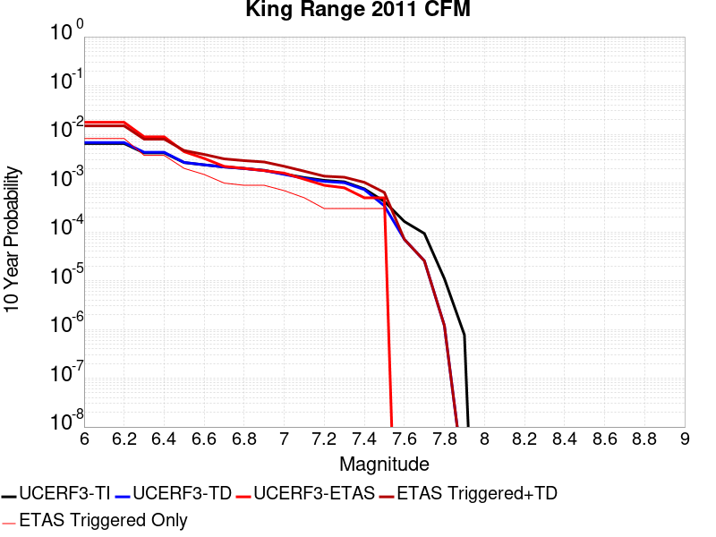 |

| Magnitude | 1 wk TI Prob | 1 wk TD Prob | 1 wk ETAS Prob | 1 wk ETAS/TD Gain | 1 wk ETAS Triggered+TD | 1 wk ETAS Triggered Only | 1 mo TI Prob | 1 mo TD Prob | 1 mo ETAS Prob | 1 mo ETAS/TD Gain | 1 mo ETAS Triggered+TD | 1 mo ETAS Triggered Only | 1 yr TI Prob | 1 yr TD Prob | 1 yr ETAS Prob | 1 yr ETAS/TD Gain | 1 yr ETAS Triggered+TD | 1 yr ETAS Triggered Only | 10 yr TI Prob | 10 yr TD Prob | 10 yr ETAS Prob | 10 yr ETAS/TD Gain | 10 yr ETAS Triggered+TD | 10 yr ETAS Triggered Only |
|-----|-----|-----|-----|-----|-----|-----|-----|-----|-----|-----|-----|-----|-----|-----|-----|-----|-----|-----|-----|-----|-----|-----|-----|-----|
| 6.0 | 1.2462566E-5 | 1.3026107E-5 | 0.0 | 0.0 | 1.3026107E-5 | 0.0 | 5.34099E-5 | 5.5825174E-5 | 1.0E-4 | 1.7913066 | 1.558196E-4 | 1.0E-4 | 6.5007154E-4 | 6.7949446E-4 | 0.0022 | 3.2377012 | 0.0015788829 | 9.0E-4 | 0.0064817313 | 0.006778579 | 0.0176 | 2.5964143 | 0.014922995 | 0.0082 |
| 6.1 | 1.2462566E-5 | 1.3026107E-5 | 0.0 | 0.0 | 1.3026107E-5 | 0.0 | 5.34099E-5 | 5.5825174E-5 | 1.0E-4 | 1.7913066 | 1.558196E-4 | 1.0E-4 | 6.5007154E-4 | 6.7949446E-4 | 0.0022 | 3.2377012 | 0.0015788829 | 9.0E-4 | 0.0064817313 | 0.006778579 | 0.0176 | 2.5964143 | 0.014922995 | 0.0082 |
| 6.2 | 1.2462566E-5 | 1.3026107E-5 | 0.0 | 0.0 | 1.3026107E-5 | 0.0 | 5.34099E-5 | 5.5825174E-5 | 1.0E-4 | 1.7913066 | 1.558196E-4 | 1.0E-4 | 6.5007154E-4 | 6.7949446E-4 | 0.0022 | 3.2377012 | 0.0015788829 | 9.0E-4 | 0.0064817313 | 0.006778579 | 0.0176 | 2.5964143 | 0.014922995 | 0.0082 |
| 6.3 | 7.988484E-6 | 8.216509E-6 | 0.0 | 0.0 | 8.216509E-6 | 0.0 | 3.423591E-5 | 3.5213205E-5 | 0.0 | 0.0 | 3.5213205E-5 | 0.0 | 4.1674246E-4 | 4.286494E-4 | 0.001 | 2.332909 | 8.284779E-4 | 4.0E-4 | 0.004159618 | 0.0042804675 | 0.0089 | 2.0792122 | 0.00796463 | 0.0037 |
| 6.4 | 7.988484E-6 | 8.216509E-6 | 0.0 | 0.0 | 8.216509E-6 | 0.0 | 3.423591E-5 | 3.5213205E-5 | 0.0 | 0.0 | 3.5213205E-5 | 0.0 | 4.1674246E-4 | 4.286494E-4 | 0.001 | 2.332909 | 8.284779E-4 | 4.0E-4 | 0.004159618 | 0.0042804675 | 0.0089 | 2.0792122 | 0.00796463 | 0.0037 |
| 6.5 | 5.0522513E-6 | 5.084562E-6 | 0.0 | 0.0 | 5.084562E-6 | 0.0 | 2.1652326E-5 | 2.1790804E-5 | 0.0 | 0.0 | 2.1790804E-5 | 0.0 | 2.6358519E-4 | 2.6527166E-4 | 6.0E-4 | 2.2618322 | 5.651921E-4 | 3.0E-4 | 0.0026327274 | 0.0026506132 | 0.0044 | 1.6599932 | 0.004645312 | 0.002 |
| 6.6 | 4.53682E-6 | 4.541192E-6 | 0.0 | 0.0 | 4.541192E-6 | 0.0 | 1.944337E-5 | 1.9462112E-5 | 0.0 | 0.0 | 1.9462112E-5 | 0.0 | 2.3669732E-4 | 2.3692605E-4 | 5.0E-4 | 2.1103632 | 5.3685496E-4 | 3.0E-4 | 0.0023644536 | 0.0023677652 | 0.0032 | 1.3514854 | 0.0038642136 | 0.0015 |
| 6.7 | 4.1144335E-6 | 4.0991795E-6 | 0.0 | 0.0 | 4.0991795E-6 | 0.0 | 1.7633167E-5 | 1.7567796E-5 | 0.0 | 0.0 | 1.7567796E-5 | 0.0 | 2.1466266E-4 | 2.1386733E-4 | 3.0E-4 | 1.4027388 | 3.1384593E-4 | 1.0E-4 | 0.0021445542 | 0.002137625 | 0.0022 | 1.0291797 | 0.0031354872 | 0.001 |
| 6.8 | 3.8321214E-6 | 3.8095554E-6 | 0.0 | 0.0 | 3.8095554E-6 | 0.0 | 1.6423275E-5 | 1.6326567E-5 | 0.0 | 0.0 | 1.6326567E-5 | 0.0 | 1.9993502E-4 | 1.9875815E-4 | 3.0E-4 | 1.5093721 | 2.9873828E-4 | 1.0E-4 | 0.0019975523 | 0.0019868072 | 0.002 | 1.0066402 | 0.0028850192 | 9.0E-4 |
| 6.9 | 3.4999944E-6 | 3.4659233E-6 | 0.0 | 0.0 | 3.4659233E-6 | 0.0 | 1.499989E-5 | 1.4853875E-5 | 0.0 | 0.0 | 1.4853875E-5 | 0.0 | 1.8260835E-4 | 1.8083116E-4 | 3.0E-4 | 1.659006 | 2.8081308E-4 | 1.0E-4 | 0.0018245836 | 0.0018078359 | 0.0018 | 0.9956656 | 0.0027062087 | 9.0E-4 |
| 7.0 | 2.9470837E-6 | 2.8888921E-6 | 0.0 | 0.0 | 2.8888921E-6 | 0.0 | 1.26302975E-5 | 1.2380909E-5 | 0.0 | 0.0 | 1.2380909E-5 | 0.0 | 1.5376302E-4 | 1.5072731E-4 | 3.0E-4 | 1.9903493 | 2.5071224E-4 | 1.0E-4 | 0.0015365666 | 0.0015072359 | 0.0016 | 1.0615458 | 0.002206181 | 7.0E-4 |
| 7.1 | 2.4850247E-6 | 2.3999512E-6 | 0.0 | 0.0 | 2.3999512E-6 | 0.0 | 1.0650062E-5 | 1.0285466E-5 | 0.0 | 0.0 | 1.0285466E-5 | 0.0 | 1.296568E-4 | 1.2521849E-4 | 2.0E-4 | 1.5972083 | 2.2520596E-4 | 1.0E-4 | 0.0012958117 | 0.0012524625 | 0.0012 | 0.95811254 | 0.0017518363 | 5.0E-4 |
| 7.2 | 2.1800304E-6 | 2.0781297E-6 | 0.0 | 0.0 | 2.0781297E-6 | 0.0 | 9.342954E-6 | 8.90624E-6 | 0.0 | 0.0 | 8.90624E-6 | 0.0 | 1.1374453E-4 | 1.0842816E-4 | 0.0 | 0.0 | 1.0842816E-4 | 0.0 | 0.0011368633 | 0.0010847212 | 9.0E-4 | 0.8297063 | 0.0013843958 | 3.0E-4 |
| 7.3 | 2.0378504E-6 | 1.9514785E-6 | 0.0 | 0.0 | 1.9514785E-6 | 0.0 | 8.733615E-6 | 8.363452E-6 | 0.0 | 0.0 | 8.363452E-6 | 0.0 | 1.0632657E-4 | 1.0182036E-4 | 0.0 | 0.0 | 1.0182036E-4 | 0.0 | 0.0010627571 | 0.0010186889 | 8.0E-4 | 0.7853232 | 0.0013183833 | 3.0E-4 |
| 7.4 | 1.4577047E-6 | 1.4106648E-6 | 0.0 | 0.0 | 1.4106648E-6 | 0.0 | 6.247291E-6 | 6.045693E-6 | 0.0 | 0.0 | 6.045693E-6 | 0.0 | 7.605811E-5 | 7.36039E-5 | 0.0 | 0.0 | 7.36039E-5 | 0.0 | 7.603208E-4 | 7.366743E-4 | 5.0E-4 | 0.678726 | 0.0010364533 | 3.0E-4 |
| 7.5 | 8.0685743E-7 | 6.5434546E-7 | 0.0 | 0.0 | 6.5434546E-7 | 0.0 | 3.457956E-6 | 2.804335E-6 | 0.0 | 0.0 | 2.804335E-6 | 0.0 | 4.20998E-5 | 3.4142293E-5 | 0.0 | 0.0 | 3.4142293E-5 | 0.0 | 4.2091825E-4 | 3.4208022E-4 | 5.0E-4 | 1.4616455 | 6.419776E-4 | 3.0E-4 |
| 7.6 | 3.1239435E-7 | 1.3328665E-7 | 0.0 | 0.0 | 1.3328665E-7 | 0.0 | 1.3388321E-6 | 5.712284E-7 | 0.0 | 0.0 | 5.712284E-7 | 0.0 | 1.630016E-5 | 6.954684E-6 | 0.0 | 0.0 | 6.954684E-6 | 0.0 | 1.6298964E-4 | 7.0190894E-5 | 0.0 | 0.0 | 7.0190894E-5 | 0.0 |
| 7.7 | 1.7747207E-7 | 4.8011067E-8 | 0.0 | 0.0 | 4.8011067E-8 | 0.0 | 7.605944E-7 | 2.057617E-7 | 0.0 | 0.0 | 2.057617E-7 | 0.0 | 9.260198E-6 | 2.5051459E-6 | 0.0 | 0.0 | 2.5051459E-6 | 0.0 | 9.2598115E-5 | 2.5461713E-5 | 0.0 | 0.0 | 2.5461713E-5 | 0.0 |
| 7.8 | 2.1035538E-8 | 2.2159057E-9 | 0.0 | 0.0 | 2.2159057E-9 | 0.0 | 9.0152305E-8 | 9.496739E-9 | 0.0 | 0.0 | 9.496739E-9 | 0.0 | 1.0976038E-6 | 1.156228E-7 | 0.0 | 0.0 | 1.156228E-7 | 0.0 | 1.0975983E-5 | 1.1935838E-6 | 0.0 | 0.0 | 1.1935838E-6 | 0.0 |
| 7.9 | 1.4782963E-9 | 9.147127E-13 | 0.0 | 0.0 | 9.147127E-13 | 0.0 | 6.335555E-9 | 3.9209747E-12 | 0.0 | 0.0 | 3.9209747E-12 | 0.0 | 7.713538E-8 | 4.773615E-11 | 0.0 | 0.0 | 4.773615E-11 | 0.0 | 7.7135354E-7 | 6.891E-10 | 0.0 | 0.0 | 6.891E-10 | 0.0 |

## Cady
*[(top)](#table-of-contents)*

| 1 Week | 1 Month | 1 Year | 10 Year |
|-----|-----|-----|-----|
|  | 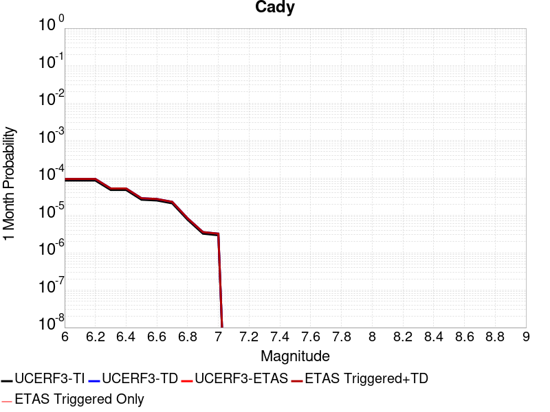 | 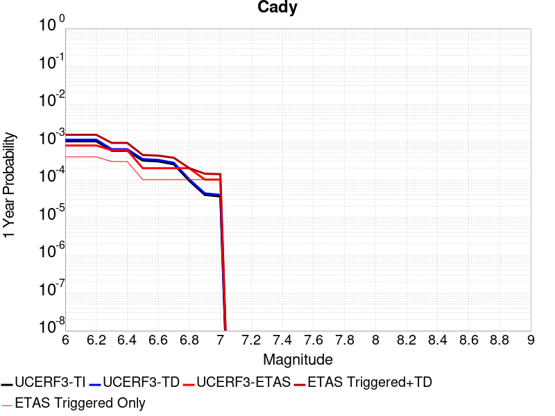 |  |

| Magnitude | 1 wk TI Prob | 1 wk TD Prob | 1 wk ETAS Prob | 1 wk ETAS/TD Gain | 1 wk ETAS Triggered+TD | 1 wk ETAS Triggered Only | 1 mo TI Prob | 1 mo TD Prob | 1 mo ETAS Prob | 1 mo ETAS/TD Gain | 1 mo ETAS Triggered+TD | 1 mo ETAS Triggered Only | 1 yr TI Prob | 1 yr TD Prob | 1 yr ETAS Prob | 1 yr ETAS/TD Gain | 1 yr ETAS Triggered+TD | 1 yr ETAS Triggered Only | 10 yr TI Prob | 10 yr TD Prob | 10 yr ETAS Prob | 10 yr ETAS/TD Gain | 10 yr ETAS Triggered+TD | 10 yr ETAS Triggered Only |
|-----|-----|-----|-----|-----|-----|-----|-----|-----|-----|-----|-----|-----|-----|-----|-----|-----|-----|-----|-----|-----|-----|-----|-----|-----|
| 6.0 | 1.9892565E-5 | 2.1863018E-5 | 0.0 | 0.0 | 2.1863018E-5 | 0.0 | 8.525106E-5 | 9.3695795E-5 | 0.0 | 0.0 | 9.3695795E-5 | 0.0 | 0.0010374374 | 0.0011402402 | 8.0E-4 | 0.7016065 | 0.0015397841 | 4.0E-4 | 0.010326075 | 0.011352916 | 0.0123 | 1.0834221 | 0.019558687 | 0.0083 |
| 6.1 | 1.9892565E-5 | 2.1863018E-5 | 0.0 | 0.0 | 2.1863018E-5 | 0.0 | 8.525106E-5 | 9.3695795E-5 | 0.0 | 0.0 | 9.3695795E-5 | 0.0 | 0.0010374374 | 0.0011402402 | 8.0E-4 | 0.7016065 | 0.0015397841 | 4.0E-4 | 0.010326075 | 0.011352916 | 0.0123 | 1.0834221 | 0.019558687 | 0.0083 |
| 6.2 | 1.9892565E-5 | 2.1863018E-5 | 0.0 | 0.0 | 2.1863018E-5 | 0.0 | 8.525106E-5 | 9.3695795E-5 | 0.0 | 0.0 | 9.3695795E-5 | 0.0 | 0.0010374374 | 0.0011402402 | 8.0E-4 | 0.7016065 | 0.0015397841 | 4.0E-4 | 0.010326075 | 0.011352916 | 0.0123 | 1.0834221 | 0.019558687 | 0.0083 |
| 6.3 | 1.1117327E-5 | 1.2178886E-5 | 0.0 | 0.0 | 1.2178886E-5 | 0.0 | 4.764482E-5 | 5.219436E-5 | 0.0 | 0.0 | 5.219436E-5 | 0.0 | 5.7992124E-4 | 6.353126E-4 | 6.0E-4 | 0.944417 | 9.3512196E-4 | 3.0E-4 | 0.0057841022 | 0.0063380706 | 0.0064 | 1.009771 | 0.0105114505 | 0.0042 |
| 6.4 | 1.1117327E-5 | 1.2178886E-5 | 0.0 | 0.0 | 1.2178886E-5 | 0.0 | 4.764482E-5 | 5.219436E-5 | 0.0 | 0.0 | 5.219436E-5 | 0.0 | 5.7992124E-4 | 6.353126E-4 | 6.0E-4 | 0.944417 | 9.3512196E-4 | 3.0E-4 | 0.0057841022 | 0.0063380706 | 0.0064 | 1.009771 | 0.0105114505 | 0.0042 |
| 6.5 | 6.103093E-6 | 6.6732555E-6 | 0.0 | 0.0 | 6.6732555E-6 | 0.0 | 2.615585E-5 | 2.8599423E-5 | 0.0 | 0.0 | 2.8599423E-5 | 0.0 | 3.1840094E-4 | 3.4815492E-4 | 2.0E-4 | 0.57445693 | 4.481201E-4 | 1.0E-4 | 0.0031794512 | 0.0034773292 | 0.0028 | 0.8052157 | 0.005370722 | 0.0019 |
| 6.6 | 5.817237E-6 | 6.3668494E-6 | 0.0 | 0.0 | 6.3668494E-6 | 0.0 | 2.4930776E-5 | 2.7286284E-5 | 0.0 | 0.0 | 2.7286284E-5 | 0.0 | 3.034899E-4 | 3.3217232E-4 | 2.0E-4 | 0.60209715 | 4.321391E-4 | 1.0E-4 | 0.0030307577 | 0.0033179806 | 0.0028 | 0.8438868 | 0.0052116765 | 0.0019 |
| 6.7 | 4.8846314E-6 | 5.341558E-6 | 0.0 | 0.0 | 5.341558E-6 | 0.0 | 2.0933967E-5 | 2.2892256E-5 | 0.0 | 0.0 | 2.2892256E-5 | 0.0 | 2.5484123E-4 | 2.7868935E-4 | 2.0E-4 | 0.71764493 | 3.7866147E-4 | 1.0E-4 | 0.0025454918 | 0.0027845544 | 0.0024 | 0.8618973 | 0.004380099 | 0.0016 |
| 6.8 | 1.7788773E-6 | 1.9402564E-6 | 0.0 | 0.0 | 1.9402564E-6 | 0.0 | 7.6237375E-6 | 8.315367E-6 | 0.0 | 0.0 | 8.315367E-6 | 0.0 | 9.281505E-5 | 1.01236474E-4 | 2.0E-4 | 1.9755726 | 2.0122634E-4 | 1.0E-4 | 9.2776294E-4 | 0.0010120582 | 7.0E-4 | 0.6916598 | 0.0015115523 | 5.0E-4 |
| 6.9 | 7.5455404E-7 | 8.2987316E-7 | 0.0 | 0.0 | 8.2987316E-7 | 0.0 | 3.233799E-6 | 3.5565963E-6 | 0.0 | 0.0 | 3.5565963E-6 | 0.0 | 3.937079E-5 | 4.3301035E-5 | 1.0E-4 | 2.3094137 | 1.4329671E-4 | 1.0E-4 | 3.9363815E-4 | 4.3295894E-4 | 2.0E-4 | 0.46193758 | 6.3287234E-4 | 2.0E-4 |
| 7.0 | 6.8578805E-7 | 7.543308E-7 | 0.0 | 0.0 | 7.543308E-7 | 0.0 | 2.9390883E-6 | 3.2328442E-6 | 0.0 | 0.0 | 3.2328442E-6 | 0.0 | 3.578281E-5 | 3.9359496E-5 | 1.0E-4 | 2.5406828 | 1.3935556E-4 | 1.0E-4 | 3.577705E-4 | 3.9355774E-4 | 1.0E-4 | 0.2540923 | 4.9351837E-4 | 1.0E-4 |

## Ortigalita (North)
*[(top)](#table-of-contents)*

| 1 Week | 1 Month | 1 Year | 10 Year |
|-----|-----|-----|-----|
|  |  |  |  |

| Magnitude | 1 wk TI Prob | 1 wk TD Prob | 1 wk ETAS Prob | 1 wk ETAS/TD Gain | 1 wk ETAS Triggered+TD | 1 wk ETAS Triggered Only | 1 mo TI Prob | 1 mo TD Prob | 1 mo ETAS Prob | 1 mo ETAS/TD Gain | 1 mo ETAS Triggered+TD | 1 mo ETAS Triggered Only | 1 yr TI Prob | 1 yr TD Prob | 1 yr ETAS Prob | 1 yr ETAS/TD Gain | 1 yr ETAS Triggered+TD | 1 yr ETAS Triggered Only | 10 yr TI Prob | 10 yr TD Prob | 10 yr ETAS Prob | 10 yr ETAS/TD Gain | 10 yr ETAS Triggered+TD | 10 yr ETAS Triggered Only |
|-----|-----|-----|-----|-----|-----|-----|-----|-----|-----|-----|-----|-----|-----|-----|-----|-----|-----|-----|-----|-----|-----|-----|-----|-----|
| 6.0 | 7.711876E-5 | 1.0512432E-4 | 2.0E-4 | 1.9025092 | 2.0511381E-4 | 1.0E-4 | 3.3046713E-4 | 4.5045366E-4 | 5.0E-4 | 1.109992 | 5.504086E-4 | 1.0E-4 | 0.004016016 | 0.005471653 | 0.0046 | 0.84069663 | 0.006565634 | 0.0011 | 0.039442103 | 0.053489465 | 0.0412 | 0.77024513 | 0.06030434 | 0.0072 |
| 6.1 | 4.607858E-5 | 6.027583E-5 | 0.0 | 0.0 | 6.027583E-5 | 0.0 | 1.9746469E-4 | 2.5830086E-4 | 2.0E-4 | 0.77429086 | 2.5830086E-4 | 0.0 | 0.0024014818 | 0.0031405955 | 0.0025 | 0.79602736 | 0.0037387111 | 6.0E-4 | 0.023756953 | 0.03099323 | 0.0246 | 0.7937217 | 0.035450663 | 0.0046 |
| 6.2 | 4.607858E-5 | 6.027583E-5 | 0.0 | 0.0 | 6.027583E-5 | 0.0 | 1.9746469E-4 | 2.5830086E-4 | 2.0E-4 | 0.77429086 | 2.5830086E-4 | 0.0 | 0.0024014818 | 0.0031405955 | 0.0025 | 0.79602736 | 0.0037387111 | 6.0E-4 | 0.023756953 | 0.03099323 | 0.0246 | 0.7937217 | 0.035450663 | 0.0046 |
| 6.3 | 3.327423E-5 | 4.2499472E-5 | 0.0 | 0.0 | 4.2499472E-5 | 0.0 | 1.4259605E-4 | 1.8212963E-4 | 1.0E-4 | 0.5490595 | 1.8212963E-4 | 0.0 | 0.0017347244 | 0.0022154208 | 0.0017 | 0.7673486 | 0.0026145347 | 4.0E-4 | 0.017212452 | 0.0219576 | 0.0166 | 0.7560024 | 0.02518514 | 0.0033 |
| 6.4 | 2.7732503E-5 | 3.501747E-5 | 0.0 | 0.0 | 3.501747E-5 | 0.0 | 1.1884817E-4 | 1.5006775E-4 | 1.0E-4 | 0.6663657 | 1.5006775E-4 | 0.0 | 0.001446016 | 0.0018257776 | 0.0012 | 0.6572542 | 0.0021252297 | 3.0E-4 | 0.014366428 | 0.018130744 | 0.0136 | 0.7501071 | 0.020879978 | 0.0028 |
| 6.5 | 2.7689714E-5 | 3.496727E-5 | 0.0 | 0.0 | 3.496727E-5 | 0.0 | 1.186648E-4 | 1.4985261E-4 | 1.0E-4 | 0.66732234 | 1.4985261E-4 | 0.0 | 0.0014437864 | 0.0018231627 | 0.0012 | 0.65819687 | 0.0021226157 | 3.0E-4 | 0.014344421 | 0.018105023 | 0.0136 | 0.7511728 | 0.020854328 | 0.0028 |
| 6.6 | 2.2976905E-5 | 2.8732931E-5 | 0.0 | 0.0 | 2.8732931E-5 | 0.0 | 9.846873E-5 | 1.2313675E-4 | 1.0E-4 | 0.81210524 | 1.2313675E-4 | 0.0 | 0.0011981975 | 0.0014983977 | 0.0012 | 0.8008555 | 0.0017979481 | 3.0E-4 | 0.011917574 | 0.014906267 | 0.0119 | 0.79832196 | 0.017270492 | 0.0024 |
| 6.7 | 1.9871539E-5 | 2.4917535E-5 | 0.0 | 0.0 | 2.4917535E-5 | 0.0 | 8.516096E-5 | 1.0678647E-4 | 1.0E-4 | 0.9364482 | 1.0678647E-4 | 0.0 | 0.0010363415 | 0.0012995923 | 0.0012 | 0.92336655 | 0.0015992024 | 3.0E-4 | 0.010315218 | 0.0129436 | 0.0107 | 0.8266634 | 0.015213829 | 0.0023 |
| 6.8 | 6.5640475E-6 | 7.6078904E-6 | 0.0 | 0.0 | 7.6078904E-6 | 0.0 | 2.813133E-5 | 3.2604854E-5 | 1.0E-4 | 3.067028 | 3.2604854E-5 | 0.0 | 3.424451E-4 | 3.9689467E-4 | 2.0E-4 | 0.50391203 | 3.9689467E-4 | 0.0 | 0.0034191788 | 0.0039621457 | 0.0029 | 0.7319267 | 0.0044601643 | 5.0E-4 |
| 6.9 | 5.6219683E-6 | 6.503859E-6 | 0.0 | 0.0 | 6.503859E-6 | 0.0 | 2.4093928E-5 | 2.7873399E-5 | 1.0E-4 | 3.58765 | 2.7873399E-5 | 0.0 | 2.933041E-4 | 3.3930838E-4 | 1.0E-4 | 0.29471716 | 3.3930838E-4 | 0.0 | 0.0029291727 | 0.0033881601 | 0.0025 | 0.7378636 | 0.0037868049 | 4.0E-4 |
| 7.0 | 3.875591E-6 | 4.486155E-6 | 0.0 | 0.0 | 4.486155E-6 | 0.0 | 1.6609569E-5 | 1.9226249E-5 | 1.0E-4 | 5.201223 | 1.9226249E-5 | 0.0 | 2.0220275E-4 | 2.3405654E-4 | 1.0E-4 | 0.4272472 | 2.3405654E-4 | 0.0 | 0.0020201886 | 0.0023383086 | 0.0018 | 0.76978713 | 0.0027373733 | 4.0E-4 |
| 7.1 | 1.6017933E-6 | 1.8576296E-6 | 0.0 | 0.0 | 1.8576296E-6 | 0.0 | 6.8648105E-6 | 7.961251E-6 | 0.0 | 0.0 | 7.961251E-6 | 0.0 | 8.357586E-5 | 9.692499E-5 | 0.0 | 0.0 | 9.692499E-5 | 0.0 | 8.3544437E-4 | 9.6893194E-4 | 7.0E-4 | 0.72244495 | 0.0011687381 | 2.0E-4 |

## Maacama 2011 CFM
*[(top)](#table-of-contents)*

| 1 Week | 1 Month | 1 Year | 10 Year |
|-----|-----|-----|-----|
|  |  |  |  |

| Magnitude | 1 wk TI Prob | 1 wk TD Prob | 1 wk ETAS Prob | 1 wk ETAS/TD Gain | 1 wk ETAS Triggered+TD | 1 wk ETAS Triggered Only | 1 mo TI Prob | 1 mo TD Prob | 1 mo ETAS Prob | 1 mo ETAS/TD Gain | 1 mo ETAS Triggered+TD | 1 mo ETAS Triggered Only | 1 yr TI Prob | 1 yr TD Prob | 1 yr ETAS Prob | 1 yr ETAS/TD Gain | 1 yr ETAS Triggered+TD | 1 yr ETAS Triggered Only | 10 yr TI Prob | 10 yr TD Prob | 10 yr ETAS Prob | 10 yr ETAS/TD Gain | 10 yr ETAS Triggered+TD | 10 yr ETAS Triggered Only |
|-----|-----|-----|-----|-----|-----|-----|-----|-----|-----|-----|-----|-----|-----|-----|-----|-----|-----|-----|-----|-----|-----|-----|-----|-----|
| 6.0 | 1.368203E-4 | 2.5820537E-4 | 1.0E-4 | 0.3872886 | 2.5820537E-4 | 0.0 | 5.862409E-4 | 0.0011060374 | 1.0E-4 | 0.09041286 | 0.0011060374 | 0.0 | 0.0071141496 | 0.013365526 | 0.0068 | 0.5087716 | 0.014253496 | 9.0E-4 | 0.06890667 | 0.124318324 | 0.0614 | 0.4938934 | 0.13106108 | 0.0077 |
| 6.1 | 1.368203E-4 | 2.5820537E-4 | 1.0E-4 | 0.3872886 | 2.5820537E-4 | 0.0 | 5.862409E-4 | 0.0011060374 | 1.0E-4 | 0.09041286 | 0.0011060374 | 0.0 | 0.0071141496 | 0.013365526 | 0.0068 | 0.5087716 | 0.014253496 | 9.0E-4 | 0.06890667 | 0.124318324 | 0.0614 | 0.4938934 | 0.13106108 | 0.0077 |
| 6.2 | 1.360743E-4 | 2.569513E-4 | 1.0E-4 | 0.3891788 | 2.569513E-4 | 0.0 | 5.8304524E-4 | 0.0011006679 | 1.0E-4 | 0.09085393 | 0.0011006679 | 0.0 | 0.007075496 | 0.013301026 | 0.0068 | 0.51123875 | 0.014189055 | 9.0E-4 | 0.06854413 | 0.12375237 | 0.0609 | 0.4921118 | 0.13049948 | 0.0077 |
| 6.3 | 1.1917239E-4 | 2.2388119E-4 | 1.0E-4 | 0.4466655 | 2.2388119E-4 | 0.0 | 5.1063887E-4 | 9.590585E-4 | 1.0E-4 | 0.10426892 | 9.590585E-4 | 0.0 | 0.0061993203 | 0.011601479 | 0.0058 | 0.49993625 | 0.012293357 | 7.0E-4 | 0.060292065 | 0.10896647 | 0.0529 | 0.48547044 | 0.1149364 | 0.0067 |
| 6.4 | 1.1859289E-4 | 2.2291631E-4 | 1.0E-4 | 0.44859886 | 2.2291631E-4 | 0.0 | 5.0815626E-4 | 9.549265E-4 | 1.0E-4 | 0.1047201 | 9.549265E-4 | 0.0 | 0.006169266 | 0.011551761 | 0.0058 | 0.50208795 | 0.012243674 | 7.0E-4 | 0.06000784 | 0.10852304 | 0.0527 | 0.48561117 | 0.11440679 | 0.0066 |
| 6.5 | 1.09512424E-4 | 2.0543968E-4 | 1.0E-4 | 0.48676088 | 2.0543968E-4 | 0.0 | 4.6925453E-4 | 8.801129E-4 | 1.0E-4 | 0.11362179 | 8.801129E-4 | 0.0 | 0.005698218 | 0.010652737 | 0.0053 | 0.4975247 | 0.011246345 | 6.0E-4 | 0.055543028 | 0.10061185 | 0.0482 | 0.47906882 | 0.106098115 | 0.0061 |
| 6.6 | 1.0502928E-4 | 1.9700814E-4 | 1.0E-4 | 0.5075933 | 1.9700814E-4 | 0.0 | 4.500478E-4 | 8.4401114E-4 | 1.0E-4 | 0.118481845 | 8.4401114E-4 | 0.0 | 0.0054655746 | 0.010218582 | 0.0052 | 0.50887686 | 0.01081245 | 6.0E-4 | 0.053330887 | 0.09676257 | 0.0469 | 0.48469156 | 0.10200135 | 0.0058 |
| 6.7 | 9.739358E-5 | 1.8284019E-4 | 1.0E-4 | 0.5469257 | 1.8284019E-4 | 0.0 | 4.173343E-4 | 7.833297E-4 | 1.0E-4 | 0.12766016 | 7.833297E-4 | 0.0 | 0.0050692135 | 0.009488146 | 0.0047 | 0.49535498 | 0.00988435 | 4.0E-4 | 0.049551267 | 0.09023203 | 0.0432 | 0.47876567 | 0.09532673 | 0.0056 |
| 6.8 | 8.969524E-5 | 1.668103E-4 | 1.0E-4 | 0.5994833 | 1.668103E-4 | 0.0 | 3.8435153E-4 | 7.1468053E-4 | 1.0E-4 | 0.13992266 | 7.1468053E-4 | 0.0 | 0.0046694432 | 0.008660928 | 0.0043 | 0.49648258 | 0.009057464 | 4.0E-4 | 0.045725387 | 0.08275715 | 0.0398 | 0.48092523 | 0.08743509 | 0.0051 |
| 6.9 | 7.838291E-5 | 1.4439215E-4 | 1.0E-4 | 0.69255847 | 1.4439215E-4 | 0.0 | 3.358835E-4 | 6.1865116E-4 | 1.0E-4 | 0.16164199 | 6.1865116E-4 | 0.0 | 0.0040817154 | 0.0075022043 | 0.0037 | 0.4931884 | 0.007899203 | 4.0E-4 | 0.04007554 | 0.07214711 | 0.0344 | 0.47680357 | 0.076508015 | 0.0047 |
| 7.0 | 6.961957E-5 | 1.2726351E-4 | 1.0E-4 | 0.7857712 | 1.2726351E-4 | 0.0 | 2.9833548E-4 | 5.4529234E-4 | 1.0E-4 | 0.18338788 | 5.4529234E-4 | 0.0 | 0.0036261857 | 0.006616134 | 0.0034 | 0.5138953 | 0.0070134876 | 4.0E-4 | 0.035675827 | 0.0639577 | 0.0306 | 0.47844124 | 0.06807628 | 0.0044 |
| 7.1 | 5.999398E-5 | 1.09215245E-4 | 0.0 | 0.0 | 1.09215245E-4 | 0.0 | 2.570917E-4 | 4.6797498E-4 | 0.0 | 0.0 | 4.6797498E-4 | 0.0 | 0.0031255994 | 0.005681187 | 0.0028 | 0.49285474 | 0.0059794826 | 3.0E-4 | 0.030820016 | 0.055216193 | 0.0262 | 0.47449848 | 0.05880637 | 0.0038 |
| 7.2 | 5.116532E-5 | 9.319736E-5 | 0.0 | 0.0 | 9.319736E-5 | 0.0 | 2.1926152E-4 | 3.9935124E-4 | 0.0 | 0.0 | 3.9935124E-4 | 0.0 | 0.002666241 | 0.0048505315 | 0.0024 | 0.49479115 | 0.005049561 | 2.0E-4 | 0.026344774 | 0.047372494 | 0.0225 | 0.47495914 | 0.050706692 | 0.0035 |
| 7.3 | 4.2087835E-5 | 7.6286524E-5 | 0.0 | 0.0 | 7.6286524E-5 | 0.0 | 1.8036396E-4 | 3.2689763E-4 | 0.0 | 0.0 | 3.2689763E-4 | 0.0 | 0.0021937196 | 0.0039722477 | 0.002 | 0.50349325 | 0.0041714534 | 2.0E-4 | 0.0217219 | 0.038961593 | 0.0191 | 0.49022636 | 0.04184471 | 0.003 |
| 7.4 | 2.8991652E-5 | 5.1238512E-5 | 0.0 | 0.0 | 5.1238512E-5 | 0.0 | 1.2424402E-4 | 2.1957472E-4 | 0.0 | 0.0 | 2.1957472E-4 | 0.0 | 0.0015116213 | 0.0026699943 | 0.0017 | 0.6367055 | 0.0028694603 | 2.0E-4 | 0.015013801 | 0.026369266 | 0.0134 | 0.5081674 | 0.02841389 | 0.0021 |
| 7.5 | 1.1292299E-6 | 1.4962387E-6 | 0.0 | 0.0 | 1.4962387E-6 | 0.0 | 4.8395473E-6 | 6.412443E-6 | 0.0 | 0.0 | 6.412443E-6 | 0.0 | 5.8919897E-5 | 7.806994E-5 | 0.0 | 0.0 | 7.806994E-5 | 0.0 | 5.890428E-4 | 7.81124E-4 | 3.0E-4 | 0.38406196 | 8.810459E-4 | 1.0E-4 |
| 7.6 | 2.6535366E-7 | 3.4764884E-7 | 0.0 | 0.0 | 3.4764884E-7 | 0.0 | 1.1372296E-6 | 1.4899227E-6 | 0.0 | 0.0 | 1.4899227E-6 | 0.0 | 1.3845682E-5 | 1.8139659E-5 | 0.0 | 0.0 | 1.8139659E-5 | 0.0 | 1.3844819E-4 | 1.8191144E-4 | 0.0 | 0.0 | 1.8191144E-4 | 0.0 |
| 7.7 | 9.727789E-8 | 1.2323821E-7 | 0.0 | 0.0 | 1.2323821E-7 | 0.0 | 4.1690518E-7 | 5.2816364E-7 | 0.0 | 0.0 | 5.2816364E-7 | 0.0 | 5.0758085E-6 | 6.430373E-6 | 0.0 | 0.0 | 6.430373E-6 | 0.0 | 5.0756928E-5 | 6.467501E-5 | 0.0 | 0.0 | 6.467501E-5 | 0.0 |
| 7.8 | 6.1939325E-9 | 7.727789E-9 | 0.0 | 0.0 | 7.727789E-9 | 0.0 | 2.6545425E-8 | 3.3119097E-8 | 0.0 | 0.0 | 3.3119097E-8 | 0.0 | 3.231905E-7 | 4.032249E-7 | 0.0 | 0.0 | 4.032249E-7 | 0.0 | 3.2319003E-6 | 4.067872E-6 | 0.0 | 0.0 | 4.067872E-6 | 0.0 |

## Santa Ynez (West)
*[(top)](#table-of-contents)*

| 1 Week | 1 Month | 1 Year | 10 Year |
|-----|-----|-----|-----|
|  | 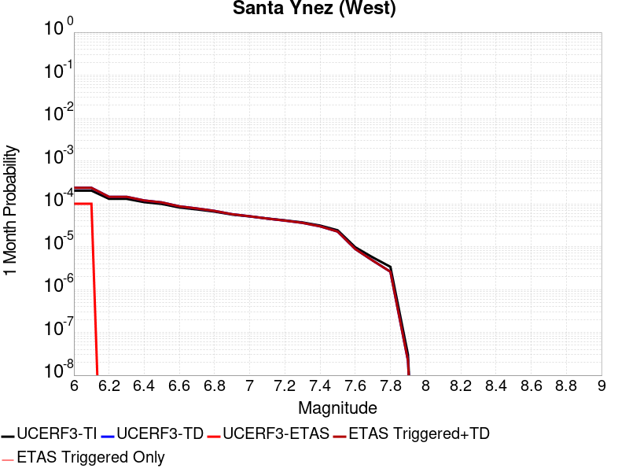 | 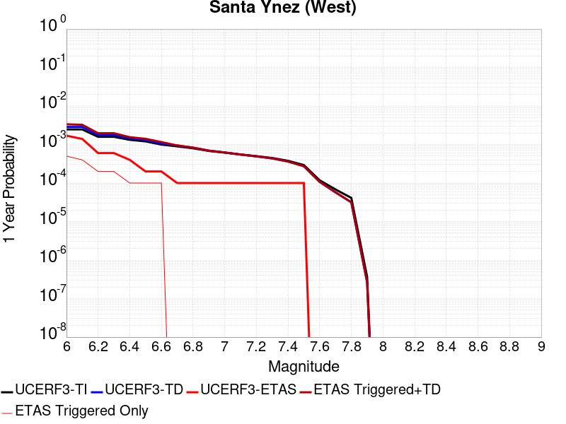 | 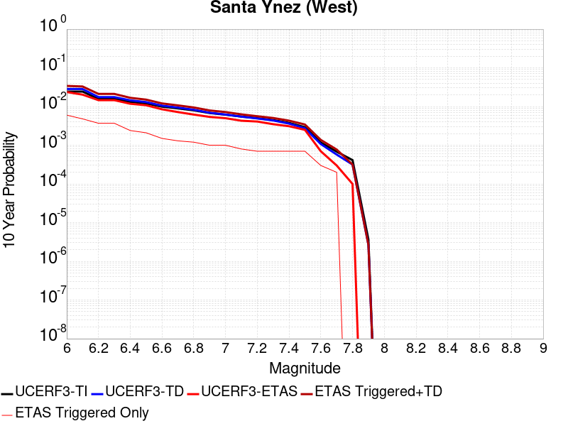 |

| Magnitude | 1 wk TI Prob | 1 wk TD Prob | 1 wk ETAS Prob | 1 wk ETAS/TD Gain | 1 wk ETAS Triggered+TD | 1 wk ETAS Triggered Only | 1 mo TI Prob | 1 mo TD Prob | 1 mo ETAS Prob | 1 mo ETAS/TD Gain | 1 mo ETAS Triggered+TD | 1 mo ETAS Triggered Only | 1 yr TI Prob | 1 yr TD Prob | 1 yr ETAS Prob | 1 yr ETAS/TD Gain | 1 yr ETAS Triggered+TD | 1 yr ETAS Triggered Only | 10 yr TI Prob | 10 yr TD Prob | 10 yr ETAS Prob | 10 yr ETAS/TD Gain | 10 yr ETAS Triggered+TD | 10 yr ETAS Triggered Only |
|-----|-----|-----|-----|-----|-----|-----|-----|-----|-----|-----|-----|-----|-----|-----|-----|-----|-----|-----|-----|-----|-----|-----|-----|-----|
| 6.0 | 4.7352758E-5 | 5.49916E-5 | 0.0 | 0.0 | 5.49916E-5 | 0.0 | 2.0292461E-4 | 2.3565863E-4 | 1.0E-4 | 0.42434263 | 2.3565863E-4 | 0.0 | 0.0024678076 | 0.0028656393 | 0.0017 | 0.59323585 | 0.0033642065 | 5.0E-4 | 0.024405818 | 0.028314985 | 0.0237 | 0.83701265 | 0.034145094 | 0.006 |
| 6.1 | 4.7352758E-5 | 5.49916E-5 | 0.0 | 0.0 | 5.49916E-5 | 0.0 | 2.0292461E-4 | 2.3565863E-4 | 1.0E-4 | 0.42434263 | 2.3565863E-4 | 0.0 | 0.0024678076 | 0.0028656393 | 0.0014 | 0.48854718 | 0.003264493 | 4.0E-4 | 0.024405818 | 0.028314985 | 0.0203 | 0.71693486 | 0.032979075 | 0.0048 |
| 6.2 | 3.0415853E-5 | 3.393571E-5 | 0.0 | 0.0 | 3.393571E-5 | 0.0 | 1.3034715E-4 | 1.4543084E-4 | 0.0 | 0.0 | 1.4543084E-4 | 0.0 | 0.0015858212 | 0.0017692168 | 6.0E-4 | 0.33913308 | 0.001968863 | 2.0E-4 | 0.015745522 | 0.017555265 | 0.0146 | 0.8316594 | 0.02119031 | 0.0037 |
| 6.3 | 3.0415853E-5 | 3.393571E-5 | 0.0 | 0.0 | 3.393571E-5 | 0.0 | 1.3034715E-4 | 1.4543084E-4 | 0.0 | 0.0 | 1.4543084E-4 | 0.0 | 0.0015858212 | 0.0017692168 | 6.0E-4 | 0.33913308 | 0.001968863 | 2.0E-4 | 0.015745522 | 0.017555265 | 0.0146 | 0.8316594 | 0.02119031 | 0.0037 |
| 6.4 | 2.5452082E-5 | 2.7920501E-5 | 0.0 | 0.0 | 2.7920501E-5 | 0.0 | 1.09075794E-4 | 1.1965389E-4 | 0.0 | 0.0 | 1.1965389E-4 | 0.0 | 0.0013271887 | 0.0014558316 | 4.0E-4 | 0.27475706 | 0.001555686 | 1.0E-4 | 0.013192902 | 0.014465114 | 0.0118 | 0.8157558 | 0.016830398 | 0.0024 |
| 6.5 | 2.3143784E-5 | 2.5135165E-5 | 0.0 | 0.0 | 2.5135165E-5 | 0.0 | 9.9183875E-5 | 1.0771777E-4 | 0.0 | 0.0 | 1.0771777E-4 | 0.0 | 0.0012068948 | 0.0013106895 | 2.0E-4 | 0.15259144 | 0.0014105585 | 1.0E-4 | 0.012003611 | 0.013031261 | 0.0108 | 0.8287763 | 0.015103895 | 0.0021 |
| 6.6 | 1.9118515E-5 | 2.035951E-5 | 0.0 | 0.0 | 2.035951E-5 | 0.0 | 8.193392E-5 | 8.725217E-5 | 0.0 | 0.0 | 8.725217E-5 | 0.0 | 9.97089E-4 | 0.0010617854 | 2.0E-4 | 0.18836199 | 0.0011616792 | 1.0E-4 | 0.00992627 | 0.010568035 | 0.0085 | 0.8043122 | 0.012052183 | 0.0015 |
| 6.7 | 1.722807E-5 | 1.8150777E-5 | 0.0 | 0.0 | 1.8150777E-5 | 0.0 | 7.3832496E-5 | 7.778675E-5 | 0.0 | 0.0 | 7.778675E-5 | 0.0 | 8.985399E-4 | 9.4664784E-4 | 1.0E-4 | 0.105635904 | 9.4664784E-4 | 0.0 | 0.008949154 | 0.0094268 | 0.0072 | 0.7637799 | 0.010714545 | 0.0013 |
| 6.8 | 1.5317364E-5 | 1.5930196E-5 | 0.0 | 0.0 | 1.5930196E-5 | 0.0 | 6.56442E-5 | 6.827051E-5 | 0.0 | 0.0 | 6.827051E-5 | 0.0 | 7.98925E-4 | 8.308807E-4 | 1.0E-4 | 0.12035422 | 8.308807E-4 | 0.0 | 0.007960589 | 0.00827823 | 0.0062 | 0.7489524 | 0.009468297 | 0.0012 |
| 6.9 | 1.3071226E-5 | 1.3332525E-5 | 0.0 | 0.0 | 1.3332525E-5 | 0.0 | 5.6018336E-5 | 5.7138153E-5 | 0.0 | 0.0 | 5.7138153E-5 | 0.0 | 6.8180985E-4 | 6.9543725E-4 | 1.0E-4 | 0.14379443 | 6.9543725E-4 | 0.0 | 0.0067972173 | 0.0069328705 | 0.0054 | 0.7788981 | 0.007925938 | 0.001 |
| 7.0 | 1.1836986E-5 | 1.1935314E-5 | 0.0 | 0.0 | 1.1935314E-5 | 0.0 | 5.0728955E-5 | 5.1150353E-5 | 0.0 | 0.0 | 5.1150353E-5 | 0.0 | 6.1745E-4 | 6.225793E-4 | 1.0E-4 | 0.1606221 | 6.225793E-4 | 0.0 | 0.006157372 | 0.0062085446 | 0.005 | 0.8053417 | 0.007202336 | 0.001 |
| 7.1 | 1.0597169E-5 | 1.0544395E-5 | 0.0 | 0.0 | 1.0544395E-5 | 0.0 | 4.541565E-5 | 4.518949E-5 | 0.0 | 0.0 | 4.518949E-5 | 0.0 | 5.5279525E-4 | 5.5004423E-4 | 1.0E-4 | 0.18180355 | 5.5004423E-4 | 0.0 | 0.0055142213 | 0.0054869596 | 0.0043 | 0.78367627 | 0.00628257 | 8.0E-4 |
| 7.2 | 9.59113E-6 | 9.461171E-6 | 0.0 | 0.0 | 9.461171E-6 | 0.0 | 4.11042E-5 | 4.0547253E-5 | 0.0 | 0.0 | 4.0547253E-5 | 0.0 | 5.0032866E-4 | 4.9355207E-4 | 1.0E-4 | 0.20261288 | 4.9355207E-4 | 0.0 | 0.004992037 | 0.0049246782 | 0.0041 | 0.83254176 | 0.0056212307 | 7.0E-4 |
| 7.3 | 8.586084E-6 | 8.381451E-6 | 0.0 | 0.0 | 8.381451E-6 | 0.0 | 3.679698E-5 | 3.5920013E-5 | 0.0 | 0.0 | 3.5920013E-5 | 0.0 | 4.4791115E-4 | 4.3723945E-4 | 1.0E-4 | 0.22870763 | 4.3723945E-4 | 0.0 | 0.004470094 | 0.0043639033 | 0.0035 | 0.8020343 | 0.0050608483 | 7.0E-4 |
| 7.4 | 7.2622997E-6 | 6.95318E-6 | 0.0 | 0.0 | 6.95318E-6 | 0.0 | 3.112377E-5 | 2.9799008E-5 | 0.0 | 0.0 | 2.9799008E-5 | 0.0 | 3.78866E-4 | 3.627435E-4 | 1.0E-4 | 0.2756769 | 3.627435E-4 | 0.0 | 0.0037822074 | 0.0036216143 | 0.0031 | 0.8559719 | 0.004319079 | 7.0E-4 |
| 7.5 | 5.627296E-6 | 5.252651E-6 | 0.0 | 0.0 | 5.252651E-6 | 0.0 | 2.411676E-5 | 2.2511173E-5 | 0.0 | 0.0 | 2.2511173E-5 | 0.0 | 2.9358198E-4 | 2.7403978E-4 | 1.0E-4 | 0.36491054 | 2.7403978E-4 | 0.0 | 0.0029319443 | 0.0027370905 | 0.0025 | 0.91337866 | 0.0034351745 | 7.0E-4 |
| 7.6 | 2.265244E-6 | 2.0611387E-6 | 0.0 | 0.0 | 2.0611387E-6 | 0.0 | 9.708152E-6 | 8.833423E-6 | 0.0 | 0.0 | 8.833423E-6 | 0.0 | 1.18190335E-4 | 1.07541695E-4 | 0.0 | 0.0 | 1.07541695E-4 | 0.0 | 0.001181275 | 0.0010749052 | 7.0E-4 | 0.65122026 | 0.0013745826 | 3.0E-4 |
| 7.7 | 1.3099874E-6 | 1.1017688E-6 | 0.0 | 0.0 | 1.1017688E-6 | 0.0 | 5.61422E-6 | 4.7218577E-6 | 0.0 | 0.0 | 4.7218577E-6 | 0.0 | 6.8350986E-5 | 5.7487126E-5 | 0.0 | 0.0 | 5.7487126E-5 | 0.0 | 6.832996E-4 | 5.74725E-4 | 3.0E-4 | 0.5219888 | 7.7461003E-4 | 2.0E-4 |
| 7.8 | 7.903951E-7 | 6.07186E-7 | 0.0 | 0.0 | 6.07186E-7 | 0.0 | 3.3874032E-6 | 2.6022233E-6 | 0.0 | 0.0 | 2.6022233E-6 | 0.0 | 4.1240855E-5 | 3.1681622E-5 | 0.0 | 0.0 | 3.1681622E-5 | 0.0 | 4.12332E-4 | 3.1677238E-4 | 1.0E-4 | 0.3156841 | 3.1677238E-4 | 0.0 |
| 7.9 | 7.0753297E-9 | 5.090426E-9 | 0.0 | 0.0 | 5.090426E-9 | 0.0 | 3.032284E-8 | 2.1816112E-8 | 0.0 | 0.0 | 2.1816112E-8 | 0.0 | 3.6918053E-7 | 2.6561113E-7 | 0.0 | 0.0 | 2.6561113E-7 | 0.0 | 3.691799E-6 | 2.6561092E-6 | 0.0 | 0.0 | 2.6561092E-6 | 0.0 |

## Elmore Ranch
*[(top)](#table-of-contents)*

| 1 Week | 1 Month | 1 Year | 10 Year |
|-----|-----|-----|-----|
|  | 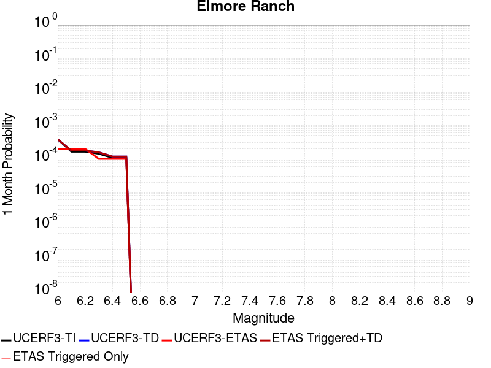 |  | 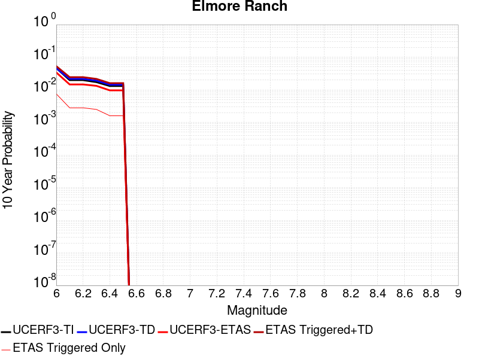 |

| Magnitude | 1 wk TI Prob | 1 wk TD Prob | 1 wk ETAS Prob | 1 wk ETAS/TD Gain | 1 wk ETAS Triggered+TD | 1 wk ETAS Triggered Only | 1 mo TI Prob | 1 mo TD Prob | 1 mo ETAS Prob | 1 mo ETAS/TD Gain | 1 mo ETAS Triggered+TD | 1 mo ETAS Triggered Only | 1 yr TI Prob | 1 yr TD Prob | 1 yr ETAS Prob | 1 yr ETAS/TD Gain | 1 yr ETAS Triggered+TD | 1 yr ETAS Triggered Only | 10 yr TI Prob | 10 yr TD Prob | 10 yr ETAS Prob | 10 yr ETAS/TD Gain | 10 yr ETAS Triggered+TD | 10 yr ETAS Triggered Only |
|-----|-----|-----|-----|-----|-----|-----|-----|-----|-----|-----|-----|-----|-----|-----|-----|-----|-----|-----|-----|-----|-----|-----|-----|-----|
| 6.0 | 9.102099E-5 | 8.962159E-5 | 0.0 | 0.0 | 8.962159E-5 | 0.0 | 3.9003167E-4 | 3.8403473E-4 | 2.0E-4 | 0.5207862 | 3.8403473E-4 | 0.0 | 0.0047383 | 0.0046662055 | 0.0032 | 0.685782 | 0.005263406 | 6.0E-4 | 0.046385348 | 0.04588316 | 0.034 | 0.7410126 | 0.053039037 | 0.0075 |
| 6.1 | 3.8306698E-5 | 4.1530962E-5 | 0.0 | 0.0 | 4.1530962E-5 | 0.0 | 1.6416123E-4 | 1.7798175E-4 | 2.0E-4 | 1.1237108 | 1.7798175E-4 | 0.0 | 0.0019968306 | 0.002165218 | 0.0015 | 0.6927709 | 0.002364785 | 2.0E-4 | 0.019789828 | 0.021621784 | 0.0146 | 0.6752449 | 0.024361243 | 0.0028 |
| 6.2 | 3.8306698E-5 | 4.1530962E-5 | 0.0 | 0.0 | 4.1530962E-5 | 0.0 | 1.6416123E-4 | 1.7798175E-4 | 2.0E-4 | 1.1237108 | 1.7798175E-4 | 0.0 | 0.0019968306 | 0.002165218 | 0.0015 | 0.6927709 | 0.002364785 | 2.0E-4 | 0.019789828 | 0.021621784 | 0.0146 | 0.6752449 | 0.024361243 | 0.0028 |
| 6.3 | 3.3197924E-5 | 3.6583027E-5 | 0.0 | 0.0 | 3.6583027E-5 | 0.0 | 1.4226905E-4 | 1.5677896E-4 | 1.0E-4 | 0.6378407 | 1.5677896E-4 | 0.0 | 0.0017307495 | 0.0019076503 | 0.0011 | 0.57662565 | 0.0020074595 | 1.0E-4 | 0.017173318 | 0.019081328 | 0.0132 | 0.69177574 | 0.021533625 | 0.0025 |
| 6.4 | 2.5148964E-5 | 2.744243E-5 | 0.0 | 0.0 | 2.744243E-5 | 0.0 | 1.0777682E-4 | 1.1760877E-4 | 1.0E-4 | 0.8502767 | 1.1760877E-4 | 0.0 | 0.0013113929 | 0.0014315953 | 0.001 | 0.69852144 | 0.001531452 | 1.0E-4 | 0.01303681 | 0.014382674 | 0.0096 | 0.66746974 | 0.015959661 | 0.0016 |
| 6.5 | 2.5148964E-5 | 2.744243E-5 | 0.0 | 0.0 | 2.744243E-5 | 0.0 | 1.0777682E-4 | 1.1760877E-4 | 1.0E-4 | 0.8502767 | 1.1760877E-4 | 0.0 | 0.0013113929 | 0.0014315953 | 0.001 | 0.69852144 | 0.001531452 | 1.0E-4 | 0.01303681 | 0.014382674 | 0.0096 | 0.66746974 | 0.015959661 | 0.0016 |

## San Andreas (North Coast) 2011 CFM
*[(top)](#table-of-contents)*

| 1 Week | 1 Month | 1 Year | 10 Year |
|-----|-----|-----|-----|
|  |  |  |  |

| Magnitude | 1 wk TI Prob | 1 wk TD Prob | 1 wk ETAS Prob | 1 wk ETAS/TD Gain | 1 wk ETAS Triggered+TD | 1 wk ETAS Triggered Only | 1 mo TI Prob | 1 mo TD Prob | 1 mo ETAS Prob | 1 mo ETAS/TD Gain | 1 mo ETAS Triggered+TD | 1 mo ETAS Triggered Only | 1 yr TI Prob | 1 yr TD Prob | 1 yr ETAS Prob | 1 yr ETAS/TD Gain | 1 yr ETAS Triggered+TD | 1 yr ETAS Triggered Only | 10 yr TI Prob | 10 yr TD Prob | 10 yr ETAS Prob | 10 yr ETAS/TD Gain | 10 yr ETAS Triggered+TD | 10 yr ETAS Triggered Only |
|-----|-----|-----|-----|-----|-----|-----|-----|-----|-----|-----|-----|-----|-----|-----|-----|-----|-----|-----|-----|-----|-----|-----|-----|-----|
| 6.0 | 1.5333705E-4 | 7.167932E-5 | 2.0E-4 | 2.790205 | 1.7167216E-4 | 1.0E-4 | 6.5699324E-4 | 3.071611E-4 | 3.0E-4 | 0.9766862 | 4.071304E-4 | 1.0E-4 | 0.007969595 | 0.003733308 | 0.0025 | 0.6696474 | 0.0042314413 | 5.0E-4 | 0.0768977 | 0.039660268 | 0.0229 | 0.5774041 | 0.04676678 | 0.0074 |
| 6.1 | 1.5333705E-4 | 7.167932E-5 | 2.0E-4 | 2.790205 | 1.7167216E-4 | 1.0E-4 | 6.5699324E-4 | 3.071611E-4 | 3.0E-4 | 0.9766862 | 4.071304E-4 | 1.0E-4 | 0.007969595 | 0.003733308 | 0.0025 | 0.6696474 | 0.0042314413 | 5.0E-4 | 0.0768977 | 0.039660268 | 0.0229 | 0.5774041 | 0.04676678 | 0.0074 |
| 6.2 | 1.3912938E-4 | 6.1015588E-5 | 2.0E-4 | 3.2778509 | 1.6100949E-4 | 1.0E-4 | 5.961325E-4 | 2.6146934E-4 | 3.0E-4 | 1.1473621 | 3.6144318E-4 | 1.0E-4 | 0.007233787 | 0.0031787695 | 0.0024 | 0.7550091 | 0.00367718 | 5.0E-4 | 0.07002798 | 0.033958483 | 0.0199 | 0.5860097 | 0.03994794 | 0.0062 |
| 6.3 | 1.3912938E-4 | 6.1015588E-5 | 2.0E-4 | 3.2778509 | 1.6100949E-4 | 1.0E-4 | 5.961325E-4 | 2.6146934E-4 | 3.0E-4 | 1.1473621 | 3.6144318E-4 | 1.0E-4 | 0.007233787 | 0.0031787695 | 0.0024 | 0.7550091 | 0.00367718 | 5.0E-4 | 0.07002798 | 0.033958483 | 0.0199 | 0.5860097 | 0.03994794 | 0.0062 |
| 6.4 | 1.2623647E-4 | 5.0898136E-5 | 2.0E-4 | 3.929417 | 1.5089304E-4 | 1.0E-4 | 5.4090127E-4 | 2.1811674E-4 | 3.0E-4 | 1.3754102 | 3.1809494E-4 | 1.0E-4 | 0.0065656058 | 0.0026523576 | 0.0017 | 0.64093924 | 0.002951562 | 3.0E-4 | 0.06374981 | 0.028551826 | 0.0157 | 0.5498773 | 0.033311922 | 0.0049 |
| 6.5 | 1.1736096E-4 | 4.394048E-5 | 2.0E-4 | 4.551612 | 1.4393608E-4 | 1.0E-4 | 5.028786E-4 | 1.8830283E-4 | 3.0E-4 | 1.5931784 | 2.88284E-4 | 1.0E-4 | 0.006105373 | 0.002290193 | 0.0017 | 0.7422955 | 0.0025895059 | 3.0E-4 | 0.05940335 | 0.024805196 | 0.0139 | 0.56036645 | 0.028901014 | 0.0042 |
| 6.6 | 1.1586959E-4 | 4.2833766E-5 | 2.0E-4 | 4.669214 | 1.4282948E-4 | 1.0E-4 | 4.964894E-4 | 1.8356045E-4 | 3.0E-4 | 1.634339 | 2.835421E-4 | 1.0E-4 | 0.006028018 | 0.0022325744 | 0.0016 | 0.71666145 | 0.0025319045 | 3.0E-4 | 0.058671024 | 0.024207871 | 0.0136 | 0.5618008 | 0.028306197 | 0.0042 |
| 6.7 | 1.13693764E-4 | 4.1136653E-5 | 2.0E-4 | 4.861844 | 1.4113254E-4 | 1.0E-4 | 4.87168E-4 | 1.7628811E-4 | 3.0E-4 | 1.7017596 | 2.762705E-4 | 1.0E-4 | 0.005915152 | 0.0021442112 | 0.0016 | 0.74619514 | 0.002443568 | 3.0E-4 | 0.057601593 | 0.02329484 | 0.0131 | 0.5623563 | 0.027201662 | 0.004 |
| 6.8 | 1.1204889E-4 | 4.034739E-5 | 2.0E-4 | 4.95695 | 1.4034336E-4 | 1.0E-4 | 4.8012115E-4 | 1.72906E-4 | 3.0E-4 | 1.7350467 | 2.7288872E-4 | 1.0E-4 | 0.005829819 | 0.0021031143 | 0.0016 | 0.7607765 | 0.0024024835 | 3.0E-4 | 0.05679232 | 0.022852013 | 0.013 | 0.5688777 | 0.026760604 | 0.004 |
| 6.9 | 1.1005794E-4 | 3.9394883E-5 | 2.0E-4 | 5.076802 | 1.3939095E-4 | 1.0E-4 | 4.7159163E-4 | 1.6882436E-4 | 3.0E-4 | 1.7769946 | 2.688075E-4 | 1.0E-4 | 0.0057265228 | 0.002053515 | 0.0015 | 0.7304548 | 0.0023528992 | 3.0E-4 | 0.055811852 | 0.022314645 | 0.0126 | 0.5646516 | 0.026127618 | 0.0039 |
| 7.0 | 1.0647948E-4 | 3.753372E-5 | 2.0E-4 | 5.3285418 | 1.3752996E-4 | 1.0E-4 | 4.562608E-4 | 1.6084897E-4 | 3.0E-4 | 1.8651036 | 2.608329E-4 | 1.0E-4 | 0.0055408357 | 0.001956593 | 0.0015 | 0.76663876 | 0.002256006 | 3.0E-4 | 0.054047033 | 0.021268172 | 0.0117 | 0.5501178 | 0.024497988 | 0.0033 |
| 7.1 | 1.04795035E-4 | 3.657561E-5 | 2.0E-4 | 5.468125 | 1.3657195E-4 | 1.0E-4 | 4.4904428E-4 | 1.5674328E-4 | 3.0E-4 | 1.9139576 | 2.567276E-4 | 1.0E-4 | 0.0054534175 | 0.0019066947 | 0.0015 | 0.7867017 | 0.0022061227 | 3.0E-4 | 0.053215165 | 0.020730965 | 0.0112 | 0.54025465 | 0.023766698 | 0.0031 |
| 7.2 | 1.02724036E-4 | 3.5474754E-5 | 2.0E-4 | 5.637812 | 1.3547121E-4 | 1.0E-4 | 4.401716E-4 | 1.520259E-4 | 3.0E-4 | 1.973348 | 2.5201068E-4 | 1.0E-4 | 0.0053459285 | 0.0018493595 | 0.0014 | 0.75701886 | 0.0021488047 | 3.0E-4 | 0.052191395 | 0.020116186 | 0.0109 | 0.54185224 | 0.023153827 | 0.0031 |
| 7.3 | 1.00650694E-4 | 3.4934947E-5 | 2.0E-4 | 5.7249265 | 1.3493146E-4 | 1.0E-4 | 4.312888E-4 | 1.497127E-4 | 3.0E-4 | 2.003838 | 2.4969774E-4 | 1.0E-4 | 0.005238306 | 0.0018212438 | 0.0012 | 0.65889037 | 0.0021206974 | 3.0E-4 | 0.051165357 | 0.019789664 | 0.0107 | 0.5406863 | 0.022828316 | 0.0031 |
| 7.4 | 9.672919E-5 | 3.3706103E-5 | 2.0E-4 | 5.9336433 | 1.3370274E-4 | 1.0E-4 | 4.144878E-4 | 1.4444682E-4 | 3.0E-4 | 2.076889 | 2.4443236E-4 | 1.0E-4 | 0.005034718 | 0.0017572368 | 0.0012 | 0.6828903 | 0.0020567097 | 3.0E-4 | 0.049221683 | 0.019053483 | 0.0103 | 0.5405836 | 0.021898227 | 0.0029 |
| 7.5 | 8.7600405E-5 | 2.2947434E-5 | 2.0E-4 | 8.715571 | 1.2294514E-4 | 1.0E-4 | 3.753763E-4 | 9.834245E-5 | 3.0E-4 | 3.0505648 | 1.9833261E-4 | 1.0E-4 | 0.0045606326 | 0.0011966635 | 8.0E-4 | 0.66852546 | 0.0012965439 | 1.0E-4 | 0.04468165 | 0.013273387 | 0.0068 | 0.5123033 | 0.01485215 | 0.0016 |
| 7.6 | 7.9562284E-5 | 1.9450288E-5 | 2.0E-4 | 10.282624 | 1.1944834E-4 | 1.0E-4 | 3.4093665E-4 | 8.335572E-5 | 2.0E-4 | 2.3993554 | 1.8334738E-4 | 1.0E-4 | 0.0041430052 | 0.0010143849 | 7.0E-4 | 0.6900734 | 0.0011142835 | 1.0E-4 | 0.040666126 | 0.011352753 | 0.0055 | 0.484464 | 0.01253913 | 0.0012 |
| 7.7 | 6.3866544E-5 | 1.2118746E-5 | 2.0E-4 | 16.503357 | 1.1211754E-4 | 1.0E-4 | 2.7368503E-4 | 5.1936448E-5 | 2.0E-4 | 3.85086 | 1.5193125E-4 | 1.0E-4 | 0.0033270244 | 6.321431E-4 | 3.0E-4 | 0.4745761 | 7.3207985E-4 | 1.0E-4 | 0.032776527 | 0.0073147705 | 0.0031 | 0.42380002 | 0.008108919 | 8.0E-4 |
| 7.8 | 4.2543215E-5 | 9.219069E-6 | 2.0E-4 | 21.694162 | 1.0921815E-4 | 1.0E-4 | 1.8231533E-4 | 3.95097E-5 | 2.0E-4 | 5.062048 | 1.3950575E-4 | 1.0E-4 | 0.0022174292 | 4.8092453E-4 | 2.0E-4 | 0.41586566 | 5.808764E-4 | 1.0E-4 | 0.021954332 | 0.0055735633 | 0.0029 | 0.5203135 | 0.0062696617 | 7.0E-4 |
| 7.9 | 2.2636612E-5 | 7.935117E-6 | 2.0E-4 | 25.204418 | 1.0793432E-4 | 1.0E-4 | 9.7010445E-5 | 3.40072E-5 | 2.0E-4 | 5.8811073 | 1.340038E-4 | 1.0E-4 | 0.0011804621 | 4.139591E-4 | 2.0E-4 | 0.48313951 | 5.139177E-4 | 1.0E-4 | 0.011742111 | 0.0047514983 | 0.0023 | 0.4840578 | 0.0054481723 | 7.0E-4 |
| 8.0 | 1.5167874E-5 | 7.1584263E-6 | 2.0E-4 | 27.939102 | 1.0715771E-4 | 1.0E-4 | 6.500356E-5 | 3.067861E-5 | 2.0E-4 | 6.5192003 | 1.3067554E-4 | 1.0E-4 | 7.9113094E-4 | 3.7344813E-4 | 2.0E-4 | 0.5355496 | 4.734108E-4 | 1.0E-4 | 0.007883203 | 0.004276193 | 0.0018 | 0.42093515 | 0.0048736273 | 6.0E-4 |
| 8.1 | 1.0681047E-5 | 6.4855203E-6 | 2.0E-4 | 30.837925 | 1.0648487E-4 | 1.0E-4 | 4.5775112E-5 | 2.7794791E-5 | 2.0E-4 | 7.195593 | 1.2779201E-4 | 1.0E-4 | 5.5716943E-4 | 3.3834914E-4 | 2.0E-4 | 0.5911054 | 4.383153E-4 | 1.0E-4 | 0.0055577457 | 0.0038717387 | 0.0017 | 0.43907923 | 0.0044694156 | 6.0E-4 |
| 8.2 | 8.226114E-6 | 5.189745E-6 | 2.0E-4 | 38.537537 | 1.05189225E-4 | 1.0E-4 | 3.52543E-5 | 2.2241575E-5 | 2.0E-4 | 8.992168 | 1.2223935E-4 | 1.0E-4 | 4.2913653E-4 | 2.7075762E-4 | 2.0E-4 | 0.7386681 | 3.7073053E-4 | 1.0E-4 | 0.004283088 | 0.003086007 | 0.0013 | 0.42125633 | 0.0034847725 | 4.0E-4 |
| 8.3 | 1.983087E-6 | 7.7872784E-7 | 0.0 | 0.0 | 7.7872784E-7 | 0.0 | 8.498917E-6 | 3.3374008E-6 | 0.0 | 0.0 | 3.3374008E-6 | 0.0 | 1.034694E-4 | 4.0632116E-5 | 0.0 | 0.0 | 4.0632116E-5 | 0.0 | 0.0010342124 | 4.792776E-4 | 1.0E-4 | 0.20864734 | 4.792776E-4 | 0.0 |

## Rodgers Creek - Healdsburg 2011 CFM
*[(top)](#table-of-contents)*

| 1 Week | 1 Month | 1 Year | 10 Year |
|-----|-----|-----|-----|
| 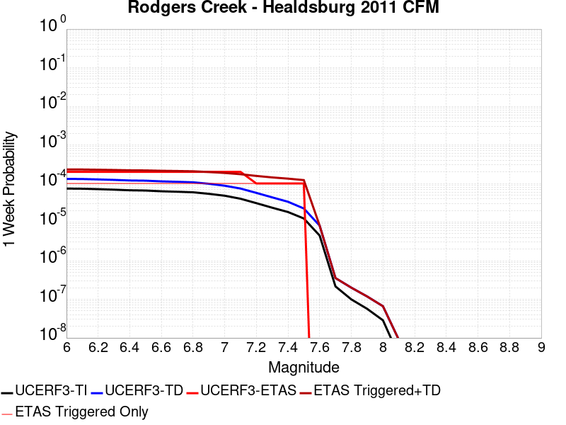 | 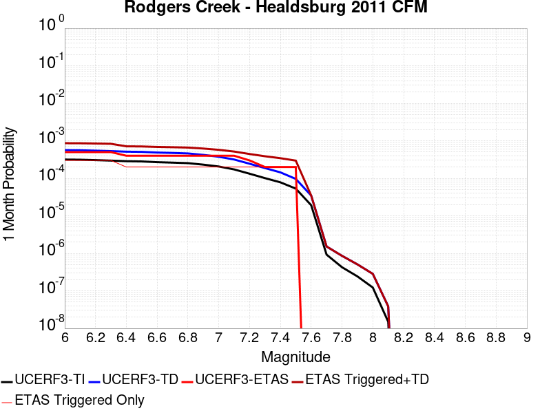 | 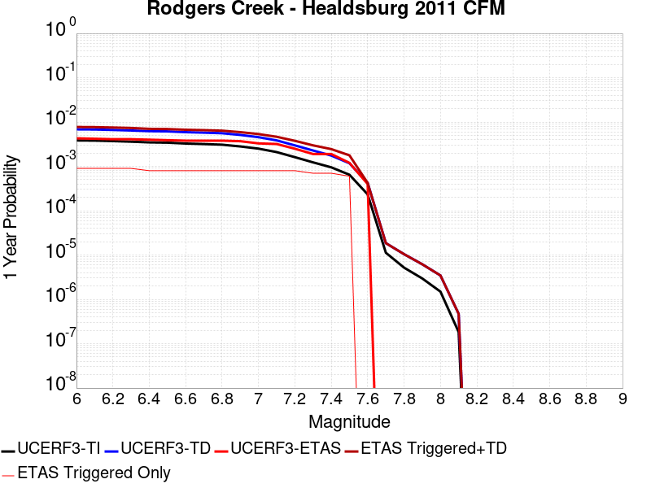 |  |

| Magnitude | 1 wk TI Prob | 1 wk TD Prob | 1 wk ETAS Prob | 1 wk ETAS/TD Gain | 1 wk ETAS Triggered+TD | 1 wk ETAS Triggered Only | 1 mo TI Prob | 1 mo TD Prob | 1 mo ETAS Prob | 1 mo ETAS/TD Gain | 1 mo ETAS Triggered+TD | 1 mo ETAS Triggered Only | 1 yr TI Prob | 1 yr TD Prob | 1 yr ETAS Prob | 1 yr ETAS/TD Gain | 1 yr ETAS Triggered+TD | 1 yr ETAS Triggered Only | 10 yr TI Prob | 10 yr TD Prob | 10 yr ETAS Prob | 10 yr ETAS/TD Gain | 10 yr ETAS Triggered+TD | 10 yr ETAS Triggered Only |
|-----|-----|-----|-----|-----|-----|-----|-----|-----|-----|-----|-----|-----|-----|-----|-----|-----|-----|-----|-----|-----|-----|-----|-----|-----|
| 6.0 | 7.390182E-5 | 1.3157546E-4 | 2.0E-4 | 1.5200403 | 2.315623E-4 | 1.0E-4 | 3.1668364E-4 | 5.6377164E-4 | 5.0E-4 | 0.88688385 | 8.636025E-4 | 3.0E-4 | 0.0038488081 | 0.0068422775 | 0.0043 | 0.6284457 | 0.0077361194 | 9.0E-4 | 0.037828278 | 0.06627545 | 0.0404 | 0.6095772 | 0.072811514 | 0.007 |
| 6.1 | 7.318768E-5 | 1.3055494E-4 | 2.0E-4 | 1.5319221 | 2.3054189E-4 | 1.0E-4 | 3.1362378E-4 | 5.593999E-4 | 5.0E-4 | 0.893815 | 8.5923204E-4 | 3.0E-4 | 0.0038116854 | 0.006789399 | 0.0042 | 0.61861145 | 0.007683289 | 9.0E-4 | 0.037469655 | 0.065779746 | 0.0396 | 0.60200906 | 0.07222586 | 0.0069 |
| 6.2 | 7.1379836E-5 | 1.2748159E-4 | 2.0E-4 | 1.568854 | 2.2746884E-4 | 1.0E-4 | 3.058777E-4 | 5.4623396E-4 | 5.0E-4 | 0.91535866 | 8.460701E-4 | 3.0E-4 | 0.003717703 | 0.0066300887 | 0.0041 | 0.61839294 | 0.0075241216 | 9.0E-4 | 0.0365612 | 0.06430117 | 0.0386 | 0.60030013 | 0.070757486 | 0.0069 |
| 6.3 | 6.9255926E-5 | 1.2402236E-4 | 2.0E-4 | 1.6126125 | 2.2400996E-4 | 1.0E-4 | 2.9677735E-4 | 5.3141586E-4 | 5.0E-4 | 0.94088274 | 8.3125645E-4 | 3.0E-4 | 0.0036072785 | 0.0064508435 | 0.0041 | 0.63557583 | 0.0073450375 | 9.0E-4 | 0.035492823 | 0.06263153 | 0.0379 | 0.6051265 | 0.0689119 | 0.0067 |
| 6.4 | 6.6757144E-5 | 1.1978689E-4 | 2.0E-4 | 1.6696317 | 2.1977491E-4 | 1.0E-4 | 2.8607066E-4 | 5.1327166E-4 | 4.0E-4 | 0.7793144 | 7.13169E-4 | 2.0E-4 | 0.0034773487 | 0.00623125 | 0.004 | 0.6419258 | 0.007026265 | 8.0E-4 | 0.034234364 | 0.060580563 | 0.0371 | 0.6124076 | 0.06678073 | 0.0066 |
| 6.5 | 6.5735134E-5 | 1.1827664E-4 | 2.0E-4 | 1.690951 | 2.1826482E-4 | 1.0E-4 | 2.8169158E-4 | 5.068018E-4 | 4.0E-4 | 0.7892632 | 7.0670043E-4 | 2.0E-4 | 0.003424202 | 0.006152939 | 0.0039 | 0.6338434 | 0.006948017 | 8.0E-4 | 0.03371918 | 0.059844565 | 0.0367 | 0.6132554 | 0.06595557 | 0.0065 |
| 6.6 | 6.289601E-5 | 1.13628324E-4 | 2.0E-4 | 1.7601246 | 2.1361696E-4 | 1.0E-4 | 2.6952647E-4 | 4.8688802E-4 | 4.0E-4 | 0.8215442 | 6.867906E-4 | 2.0E-4 | 0.0032765474 | 0.00591183 | 0.0038 | 0.642779 | 0.0067071007 | 8.0E-4 | 0.032286562 | 0.057581577 | 0.0351 | 0.60956997 | 0.0637073 | 0.0065 |
| 6.7 | 6.115274E-5 | 1.1079681E-4 | 2.0E-4 | 1.8051062 | 2.1078573E-4 | 1.0E-4 | 2.6205686E-4 | 4.7475743E-4 | 4.0E-4 | 0.8425355 | 6.746625E-4 | 2.0E-4 | 0.0031858748 | 0.005764932 | 0.0038 | 0.6591578 | 0.00656032 | 8.0E-4 | 0.031405866 | 0.05619894 | 0.0345 | 0.6138906 | 0.061956126 | 0.0061 |
| 6.8 | 5.9232367E-5 | 1.0746847E-4 | 2.0E-4 | 1.861011 | 2.0745772E-4 | 1.0E-4 | 2.538283E-4 | 4.604982E-4 | 4.0E-4 | 0.86862445 | 6.6040613E-4 | 2.0E-4 | 0.0030859804 | 0.00559223 | 0.0038 | 0.6795143 | 0.006387756 | 8.0E-4 | 0.030434765 | 0.054565135 | 0.0335 | 0.6139452 | 0.060332287 | 0.0061 |
| 6.9 | 5.4030377E-5 | 9.840589E-5 | 2.0E-4 | 2.0323985 | 1.9839605E-4 | 1.0E-4 | 2.315382E-4 | 4.2167172E-4 | 4.0E-4 | 0.94860524 | 6.215874E-4 | 2.0E-4 | 0.0028153337 | 0.0051218346 | 0.0037 | 0.72239745 | 0.005917737 | 8.0E-4 | 0.027799325 | 0.050099872 | 0.0312 | 0.62275606 | 0.05541931 | 0.0056 |
| 7.0 | 4.8260714E-5 | 8.757361E-5 | 2.0E-4 | 2.2837932 | 1.8756484E-4 | 1.0E-4 | 2.0681522E-4 | 3.7526173E-4 | 4.0E-4 | 1.0659226 | 5.751867E-4 | 2.0E-4 | 0.0025150678 | 0.0045592953 | 0.0033 | 0.7237961 | 0.0053556478 | 8.0E-4 | 0.024867928 | 0.044745993 | 0.0278 | 0.62128466 | 0.04933121 | 0.0048 |
| 7.1 | 4.0294493E-5 | 7.404648E-5 | 2.0E-4 | 2.7010062 | 1.7403907E-4 | 1.0E-4 | 1.7267925E-4 | 3.1730367E-4 | 4.0E-4 | 1.260622 | 5.172402E-4 | 2.0E-4 | 0.0021003427 | 0.0038563672 | 0.0032 | 0.8297965 | 0.004653282 | 8.0E-4 | 0.02080602 | 0.03799622 | 0.024 | 0.63164175 | 0.042229038 | 0.0044 |
| 7.2 | 3.096388E-5 | 5.7118054E-5 | 1.0E-4 | 1.75076 | 1.5711234E-4 | 1.0E-4 | 1.326956E-4 | 2.447688E-4 | 3.0E-4 | 1.2256464 | 4.4471986E-4 | 2.0E-4 | 0.0016143717 | 0.00297601 | 0.0025 | 0.84005094 | 0.0037736292 | 8.0E-4 | 0.01602694 | 0.029503003 | 0.0186 | 0.6304443 | 0.03338499 | 0.004 |
| 7.3 | 2.3615226E-5 | 4.3747285E-5 | 1.0E-4 | 2.285856 | 1.4374292E-4 | 1.0E-4 | 1.0120418E-4 | 1.8747497E-4 | 2.0E-4 | 1.066809 | 3.8743747E-4 | 2.0E-4 | 0.0012314644 | 0.0022801321 | 0.0019 | 0.83328503 | 0.002978536 | 7.0E-4 | 0.0122466255 | 0.022694463 | 0.0147 | 0.6477351 | 0.02562638 | 0.003 |
| 7.4 | 1.8251132E-5 | 3.36383E-5 | 1.0E-4 | 2.972802 | 1.3363494E-4 | 1.0E-4 | 7.821679E-5 | 1.4415622E-4 | 2.0E-4 | 1.3873837 | 3.441274E-4 | 2.0E-4 | 9.518733E-4 | 0.001753699 | 0.0019 | 1.0834242 | 0.0024524713 | 7.0E-4 | 0.009478063 | 0.017512318 | 0.0115 | 0.65668064 | 0.019870289 | 0.0024 |
| 7.5 | 1.2411432E-5 | 2.2533064E-5 | 1.0E-4 | 4.4379225 | 1.2253081E-4 | 1.0E-4 | 5.3190768E-5 | 9.6566735E-5 | 2.0E-4 | 2.0711064 | 2.9654743E-4 | 2.0E-4 | 6.4740516E-4 | 0.0011750717 | 0.0012 | 1.0212142 | 0.0017743667 | 6.0E-4 | 0.006455223 | 0.0117792245 | 0.0075 | 0.6367142 | 0.0134592 | 0.0017 |
| 7.6 | 4.4771446E-6 | 8.111678E-6 | 0.0 | 0.0 | 8.111678E-6 | 0.0 | 1.918762E-5 | 3.4763878E-5 | 0.0 | 0.0 | 3.4763878E-5 | 0.0 | 2.3358424E-4 | 4.2316923E-4 | 4.0E-4 | 0.9452483 | 4.2316923E-4 | 0.0 | 0.0023333887 | 0.004258931 | 0.0021 | 0.49308145 | 0.0046572275 | 4.0E-4 |
| 7.7 | 2.157941E-7 | 3.553147E-7 | 0.0 | 0.0 | 3.553147E-7 | 0.0 | 9.248315E-7 | 1.5227764E-6 | 0.0 | 0.0 | 1.5227764E-6 | 0.0 | 1.1259765E-5 | 1.8539646E-5 | 0.0 | 0.0 | 1.8539646E-5 | 0.0 | 1.1259195E-4 | 1.9158375E-4 | 0.0 | 0.0 | 1.9158375E-4 | 0.0 |
| 7.8 | 9.9623286E-8 | 2.0038753E-7 | 0.0 | 0.0 | 2.0038753E-7 | 0.0 | 4.269569E-7 | 8.588034E-7 | 0.0 | 0.0 | 8.588034E-7 | 0.0 | 5.1981874E-6 | 1.0455881E-5 | 0.0 | 0.0 | 1.0455881E-5 | 0.0 | 5.198066E-5 | 1.0969823E-4 | 0.0 | 0.0 | 1.0969823E-4 | 0.0 |
| 7.9 | 5.6745257E-8 | 1.1860751E-7 | 0.0 | 0.0 | 1.1860751E-7 | 0.0 | 2.4319394E-7 | 5.083178E-7 | 0.0 | 0.0 | 5.083178E-7 | 0.0 | 2.960882E-6 | 6.1887513E-6 | 0.0 | 0.0 | 6.1887513E-6 | 0.0 | 2.9608427E-5 | 6.5134234E-5 | 0.0 | 0.0 | 6.5134234E-5 | 0.0 |
| 8.0 | 2.8614323E-8 | 6.625312E-8 | 0.0 | 0.0 | 6.625312E-8 | 0.0 | 1.2263281E-7 | 2.8394192E-7 | 0.0 | 0.0 | 2.8394192E-7 | 0.0 | 1.4930534E-6 | 3.4569875E-6 | 0.0 | 0.0 | 3.4569875E-6 | 0.0 | 1.4930434E-5 | 3.6050915E-5 | 0.0 | 0.0 | 3.6050915E-5 | 0.0 |
| 8.1 | 3.5045191E-9 | 9.025382E-9 | 0.0 | 0.0 | 9.025382E-9 | 0.0 | 1.5019367E-8 | 3.868021E-8 | 0.0 | 0.0 | 3.868021E-8 | 0.0 | 1.8286079E-7 | 4.7093144E-7 | 0.0 | 0.0 | 4.7093144E-7 | 0.0 | 1.8286064E-6 | 4.860295E-6 | 0.0 | 0.0 | 4.860295E-6 | 0.0 |

## Hunter Mountain-Saline Valley
*[(top)](#table-of-contents)*

| 1 Week | 1 Month | 1 Year | 10 Year |
|-----|-----|-----|-----|
| 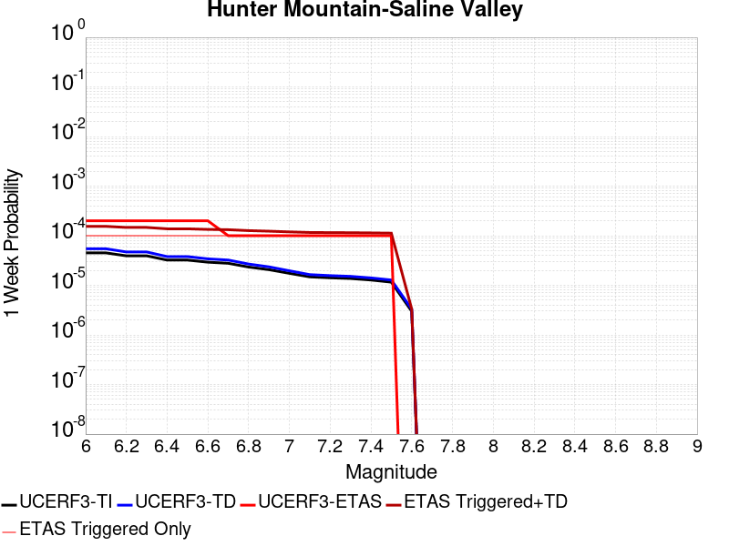 |  |  |  |

| Magnitude | 1 wk TI Prob | 1 wk TD Prob | 1 wk ETAS Prob | 1 wk ETAS/TD Gain | 1 wk ETAS Triggered+TD | 1 wk ETAS Triggered Only | 1 mo TI Prob | 1 mo TD Prob | 1 mo ETAS Prob | 1 mo ETAS/TD Gain | 1 mo ETAS Triggered+TD | 1 mo ETAS Triggered Only | 1 yr TI Prob | 1 yr TD Prob | 1 yr ETAS Prob | 1 yr ETAS/TD Gain | 1 yr ETAS Triggered+TD | 1 yr ETAS Triggered Only | 10 yr TI Prob | 10 yr TD Prob | 10 yr ETAS Prob | 10 yr ETAS/TD Gain | 10 yr ETAS Triggered+TD | 10 yr ETAS Triggered Only |
|-----|-----|-----|-----|-----|-----|-----|-----|-----|-----|-----|-----|-----|-----|-----|-----|-----|-----|-----|-----|-----|-----|-----|-----|-----|
| 6.0 | 4.5103672E-5 | 5.4594766E-5 | 2.0E-4 | 3.6633549 | 1.545893E-4 | 1.0E-4 | 1.9328714E-4 | 2.3395738E-4 | 4.0E-4 | 1.7097131 | 5.338872E-4 | 3.0E-4 | 0.002350731 | 0.0028448845 | 0.0033 | 1.1599767 | 0.0049389102 | 0.0021 | 0.023260195 | 0.028105218 | 0.0183 | 0.65112466 | 0.034519725 | 0.0066 |
| 6.1 | 4.5103672E-5 | 5.4594766E-5 | 2.0E-4 | 3.6633549 | 1.545893E-4 | 1.0E-4 | 1.9328714E-4 | 2.3395738E-4 | 4.0E-4 | 1.7097131 | 5.338872E-4 | 3.0E-4 | 0.002350731 | 0.0028448845 | 0.0033 | 1.1599767 | 0.0049389102 | 0.0021 | 0.023260195 | 0.028105218 | 0.0183 | 0.65112466 | 0.034519725 | 0.0066 |
| 6.2 | 3.9363465E-5 | 4.7084E-5 | 2.0E-4 | 4.2477274 | 1.4707929E-4 | 1.0E-4 | 1.6868966E-4 | 2.0177383E-4 | 4.0E-4 | 1.9824176 | 5.017133E-4 | 3.0E-4 | 0.002051862 | 0.0024539623 | 0.0032 | 1.3040135 | 0.004548809 | 0.0021 | 0.020330196 | 0.0242846 | 0.0167 | 0.68767864 | 0.030626748 | 0.0065 |
| 6.3 | 3.9363465E-5 | 4.7084E-5 | 2.0E-4 | 4.2477274 | 1.4707929E-4 | 1.0E-4 | 1.6868966E-4 | 2.0177383E-4 | 4.0E-4 | 1.9824176 | 5.017133E-4 | 3.0E-4 | 0.002051862 | 0.0024539623 | 0.0032 | 1.3040135 | 0.004548809 | 0.0021 | 0.020330196 | 0.0242846 | 0.0167 | 0.68767864 | 0.030626748 | 0.0065 |
| 6.4 | 3.2311684E-5 | 3.7967282E-5 | 2.0E-4 | 5.2676935 | 1.3796349E-4 | 1.0E-4 | 1.384713E-4 | 1.6270719E-4 | 4.0E-4 | 2.458404 | 4.6265838E-4 | 3.0E-4 | 0.0016845843 | 0.0019792293 | 0.0032 | 1.616791 | 0.0040750727 | 0.0021 | 0.016718714 | 0.019624965 | 0.0148 | 0.75414145 | 0.025899366 | 0.0064 |
| 6.5 | 3.2311684E-5 | 3.7967282E-5 | 2.0E-4 | 5.2676935 | 1.3796349E-4 | 1.0E-4 | 1.384713E-4 | 1.6270719E-4 | 4.0E-4 | 2.458404 | 4.6265838E-4 | 3.0E-4 | 0.0016845843 | 0.0019792293 | 0.0032 | 1.616791 | 0.0040750727 | 0.0021 | 0.016718714 | 0.019624965 | 0.0148 | 0.75414145 | 0.025899366 | 0.0064 |
| 6.6 | 2.9305844E-5 | 3.4196255E-5 | 2.0E-4 | 5.8485937 | 1.3419283E-4 | 1.0E-4 | 1.2559042E-4 | 1.465475E-4 | 4.0E-4 | 2.7294903 | 4.4650355E-4 | 3.0E-4 | 0.0015279909 | 0.0017828173 | 0.0028 | 1.5705479 | 0.0037792516 | 0.002 | 0.015175272 | 0.017693229 | 0.0137 | 0.77430755 | 0.023881761 | 0.0063 |
| 6.7 | 2.7826512E-5 | 3.2357773E-5 | 1.0E-4 | 3.0904474 | 1.3235454E-4 | 1.0E-4 | 1.19251024E-4 | 1.3866914E-4 | 3.0E-4 | 2.163423 | 4.3862752E-4 | 3.0E-4 | 0.0014509142 | 0.0016870496 | 0.0027 | 1.6004272 | 0.0036836755 | 0.002 | 0.014414776 | 0.016750282 | 0.0132 | 0.7880465 | 0.022944754 | 0.0063 |
| 6.8 | 2.3389874E-5 | 2.6877658E-5 | 1.0E-4 | 3.720562 | 1.2687498E-4 | 1.0E-4 | 1.0023846E-4 | 1.1518515E-4 | 3.0E-4 | 2.6045024 | 4.151506E-4 | 3.0E-4 | 0.00121972 | 0.0014015244 | 0.0024 | 1.7124212 | 0.0033987213 | 0.002 | 0.01213047 | 0.013933235 | 0.0113 | 0.81101054 | 0.019849636 | 0.006 |
| 6.9 | 2.069209E-5 | 2.3579525E-5 | 1.0E-4 | 4.2409678 | 1.2357716E-4 | 1.0E-4 | 8.867737E-5 | 1.01051395E-4 | 3.0E-4 | 2.9687862 | 4.0102107E-4 | 3.0E-4 | 0.0010791123 | 0.0012296425 | 0.0023 | 1.8704623 | 0.0032271831 | 0.002 | 0.010738871 | 0.012233584 | 0.0104 | 0.8501188 | 0.018160183 | 0.006 |
| 7.0 | 1.7462342E-5 | 1.964133E-5 | 1.0E-4 | 5.0913053 | 1.19639364E-4 | 1.0E-4 | 7.483646E-5 | 8.4174535E-5 | 3.0E-4 | 3.5640233 | 3.841493E-4 | 3.0E-4 | 9.1075303E-4 | 0.0010243658 | 0.0023 | 2.2452917 | 0.003022317 | 0.002 | 0.009070295 | 0.010200239 | 0.0101 | 0.99017286 | 0.016139038 | 0.006 |
| 7.1 | 1.4807709E-5 | 1.644825E-5 | 1.0E-4 | 6.0796742 | 1.1644661E-4 | 1.0E-4 | 6.3460066E-5 | 7.049069E-5 | 3.0E-4 | 4.2558813 | 3.7046956E-4 | 3.0E-4 | 7.723524E-4 | 8.5790275E-4 | 0.0023 | 2.6809566 | 0.0028561868 | 0.002 | 0.007696735 | 0.008549062 | 0.0092 | 1.0761415 | 0.014398622 | 0.0059 |
| 7.2 | 1.4180048E-5 | 1.5704565E-5 | 1.0E-4 | 6.367575 | 1.15703E-4 | 1.0E-4 | 6.077022E-5 | 6.7303634E-5 | 3.0E-4 | 4.4574113 | 3.6728344E-4 | 3.0E-4 | 7.396263E-4 | 8.191299E-4 | 0.0023 | 2.8078573 | 0.0028174918 | 0.002 | 0.0073716943 | 0.008164224 | 0.0088 | 1.0778733 | 0.0139168715 | 0.0058 |
| 7.3 | 1.3730402E-5 | 1.5178125E-5 | 1.0E-4 | 6.588429 | 1.15176605E-4 | 1.0E-4 | 5.8843252E-5 | 6.504758E-5 | 3.0E-4 | 4.612009 | 3.6502807E-4 | 3.0E-4 | 7.161811E-4 | 7.9168257E-4 | 0.0023 | 2.9052048 | 0.0027900992 | 0.002 | 0.007138774 | 0.007891722 | 0.0084 | 1.0644065 | 0.013546739 | 0.0057 |
| 7.4 | 1.2810095E-5 | 1.4114831E-5 | 1.0E-4 | 7.0847464 | 1.1411342E-4 | 1.0E-4 | 5.489925E-5 | 6.049082E-5 | 3.0E-4 | 4.95943 | 3.6047268E-4 | 3.0E-4 | 6.681934E-4 | 7.362427E-4 | 0.0023 | 3.1239698 | 0.0027347703 | 0.002 | 0.006661878 | 0.007341097 | 0.0081 | 1.1033773 | 0.012899987 | 0.0056 |
| 7.5 | 1.1595659E-5 | 1.2805939E-5 | 1.0E-4 | 7.8088765 | 1.1280466E-4 | 1.0E-4 | 4.9694736E-5 | 5.488153E-5 | 3.0E-4 | 5.46632 | 3.5486507E-4 | 3.0E-4 | 6.0486543E-4 | 6.6799344E-4 | 0.0023 | 3.4431474 | 0.0026666576 | 0.002 | 0.006032217 | 0.0066629043 | 0.0081 | 1.2156861 | 0.012225592 | 0.0056 |
| 7.6 | 2.997694E-6 | 3.3272543E-6 | 0.0 | 0.0 | 3.3272543E-6 | 0.0 | 1.28471975E-5 | 1.4259624E-5 | 2.0E-4 | 14.025616 | 2.1425677E-4 | 2.0E-4 | 1.564034E-4 | 1.7360438E-4 | 0.0012 | 6.912268 | 0.0012734134 | 0.0011 | 0.0015629337 | 0.001736228 | 0.0025 | 1.439903 | 0.0039324085 | 0.0022 |

## Mission Ridge-Arroyo Parida-Santa Ana
*[(top)](#table-of-contents)*

| 1 Week | 1 Month | 1 Year | 10 Year |
|-----|-----|-----|-----|
| 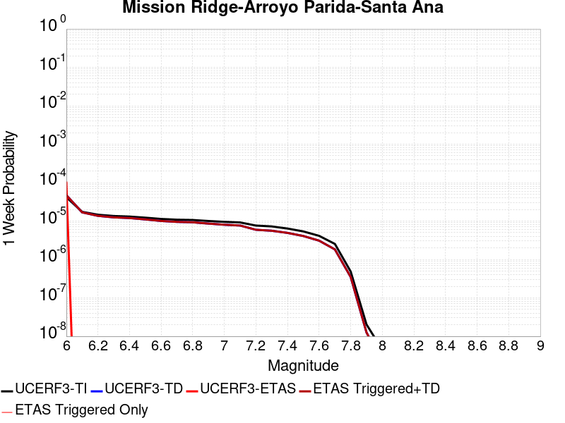 |  |  | 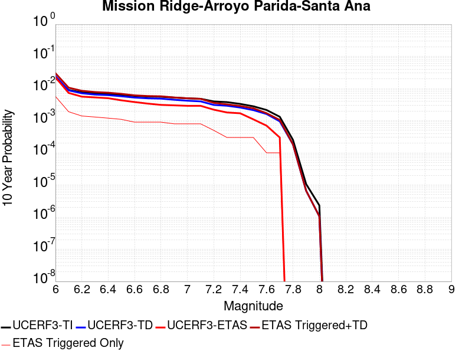 |

| Magnitude | 1 wk TI Prob | 1 wk TD Prob | 1 wk ETAS Prob | 1 wk ETAS/TD Gain | 1 wk ETAS Triggered+TD | 1 wk ETAS Triggered Only | 1 mo TI Prob | 1 mo TD Prob | 1 mo ETAS Prob | 1 mo ETAS/TD Gain | 1 mo ETAS Triggered+TD | 1 mo ETAS Triggered Only | 1 yr TI Prob | 1 yr TD Prob | 1 yr ETAS Prob | 1 yr ETAS/TD Gain | 1 yr ETAS Triggered+TD | 1 yr ETAS Triggered Only | 10 yr TI Prob | 10 yr TD Prob | 10 yr ETAS Prob | 10 yr ETAS/TD Gain | 10 yr ETAS Triggered+TD | 10 yr ETAS Triggered Only |
|-----|-----|-----|-----|-----|-----|-----|-----|-----|-----|-----|-----|-----|-----|-----|-----|-----|-----|-----|-----|-----|-----|-----|-----|-----|
| 6.0 | 4.169034E-5 | 4.7156427E-5 | 1.0E-4 | 2.1206017 | 4.7156427E-5 | 0.0 | 1.7866064E-4 | 2.020882E-4 | 1.0E-4 | 0.49483347 | 2.020882E-4 | 0.0 | 0.0021730233 | 0.0024584779 | 0.0023 | 0.93553823 | 0.0030570028 | 6.0E-4 | 0.021518968 | 0.024394657 | 0.0224 | 0.9182338 | 0.029955609 | 0.0057 |
| 6.1 | 1.73813E-5 | 1.6858885E-5 | 0.0 | 0.0 | 1.6858885E-5 | 0.0 | 7.4489166E-5 | 7.225042E-5 | 0.0 | 0.0 | 7.225042E-5 | 0.0 | 9.065282E-4 | 8.793046E-4 | 5.0E-4 | 0.5686312 | 9.792167E-4 | 1.0E-4 | 0.009028391 | 0.008759435 | 0.0073 | 0.833387 | 0.010642793 | 0.0019 |
| 6.2 | 1.4622182E-5 | 1.3676966E-5 | 0.0 | 0.0 | 1.3676966E-5 | 0.0 | 6.2664985E-5 | 5.8614274E-5 | 0.0 | 0.0 | 5.8614274E-5 | 0.0 | 7.6267915E-4 | 7.13399E-4 | 5.0E-4 | 0.7008701 | 8.133276E-4 | 1.0E-4 | 0.007600669 | 0.0071115703 | 0.0056 | 0.7874491 | 0.008501614 | 0.0014 |
| 6.3 | 1.3552434E-5 | 1.2485606E-5 | 0.0 | 0.0 | 1.2485606E-5 | 0.0 | 5.8080568E-5 | 5.350866E-5 | 0.0 | 0.0 | 5.350866E-5 | 0.0 | 7.069015E-4 | 6.512764E-4 | 5.0E-4 | 0.76772326 | 7.5121125E-4 | 1.0E-4 | 0.00704657 | 0.006494079 | 0.0053 | 0.8161281 | 0.0077856365 | 0.0013 |
| 6.4 | 1.30977305E-5 | 1.1982454E-5 | 0.0 | 0.0 | 1.1982454E-5 | 0.0 | 5.613192E-5 | 5.135238E-5 | 0.0 | 0.0 | 5.135238E-5 | 0.0 | 6.831918E-4 | 6.250389E-4 | 4.0E-4 | 0.63996017 | 7.249764E-4 | 1.0E-4 | 0.006810953 | 0.006233193 | 0.005 | 0.80215704 | 0.0074257134 | 0.0012 |
| 6.5 | 1.225205E-5 | 1.1051916E-5 | 0.0 | 0.0 | 1.1051916E-5 | 0.0 | 5.2507727E-5 | 4.736451E-5 | 0.0 | 0.0 | 4.736451E-5 | 0.0 | 6.3909404E-4 | 5.76513E-4 | 4.0E-4 | 0.6938265 | 6.764554E-4 | 1.0E-4 | 0.006372592 | 0.0057505225 | 0.0043 | 0.74775815 | 0.006844197 | 0.0011 |
| 6.6 | 1.1352241E-5 | 1.0066462E-5 | 0.0 | 0.0 | 1.0066462E-5 | 0.0 | 4.8651553E-5 | 4.3141277E-5 | 0.0 | 0.0 | 4.3141277E-5 | 0.0 | 5.921717E-4 | 5.251206E-4 | 3.0E-4 | 0.57129735 | 5.251206E-4 | 0.0 | 0.0059059616 | 0.005239082 | 0.0038 | 0.7253179 | 0.006134367 | 9.0E-4 |
| 6.7 | 1.0864116E-5 | 9.519822E-6 | 0.0 | 0.0 | 9.519822E-6 | 0.0 | 4.6559664E-5 | 4.079861E-5 | 0.0 | 0.0 | 4.079861E-5 | 0.0 | 5.667165E-4 | 4.966119E-4 | 2.0E-4 | 0.40272897 | 4.966119E-4 | 0.0 | 0.005652734 | 0.0049552936 | 0.0034 | 0.68613493 | 0.005850834 | 9.0E-4 |
| 6.8 | 1.0666365E-5 | 9.302531E-6 | 0.0 | 0.0 | 9.302531E-6 | 0.0 | 4.571219E-5 | 3.986739E-5 | 0.0 | 0.0 | 3.986739E-5 | 0.0 | 5.564038E-4 | 4.852794E-4 | 2.0E-4 | 0.4121337 | 4.852794E-4 | 0.0 | 0.005550127 | 0.0048424676 | 0.0031 | 0.64016944 | 0.00573811 | 9.0E-4 |
| 6.9 | 1.0038665E-5 | 8.5946185E-6 | 0.0 | 0.0 | 8.5946185E-6 | 0.0 | 4.302214E-5 | 3.6833568E-5 | 0.0 | 0.0 | 3.6833568E-5 | 0.0 | 5.236687E-4 | 4.4835822E-4 | 2.0E-4 | 0.4460719 | 4.4835822E-4 | 0.0 | 0.005224364 | 0.0044747856 | 0.003 | 0.67042315 | 0.005271206 | 8.0E-4 |
| 7.0 | 9.5379955E-6 | 8.0274895E-6 | 0.0 | 0.0 | 8.0274895E-6 | 0.0 | 4.0876483E-5 | 3.440308E-5 | 0.0 | 0.0 | 3.440308E-5 | 0.0 | 4.975576E-4 | 4.1877874E-4 | 2.0E-4 | 0.47757918 | 4.1877874E-4 | 0.0 | 0.00496445 | 0.004180134 | 0.0029 | 0.6937577 | 0.0049767895 | 8.0E-4 |
| 7.1 | 9.207389E-6 | 7.654685E-6 | 0.0 | 0.0 | 7.654685E-6 | 0.0 | 3.945964E-5 | 3.2805387E-5 | 0.0 | 0.0 | 3.2805387E-5 | 0.0 | 4.803152E-4 | 3.993341E-4 | 2.0E-4 | 0.5008338 | 3.993341E-4 | 0.0 | 0.004792784 | 0.0039863996 | 0.0029 | 0.72747344 | 0.004783211 | 8.0E-4 |
| 7.2 | 7.638091E-6 | 5.932878E-6 | 0.0 | 0.0 | 5.932878E-6 | 0.0 | 3.2734264E-5 | 2.5426376E-5 | 0.0 | 0.0 | 2.5426376E-5 | 0.0 | 3.984668E-4 | 3.0952247E-4 | 2.0E-4 | 0.64615667 | 3.0952247E-4 | 0.0 | 0.0039775306 | 0.0030910086 | 0.0022 | 0.71174175 | 0.0035894632 | 5.0E-4 |
| 7.3 | 7.2500147E-6 | 5.597794E-6 | 0.0 | 0.0 | 5.597794E-6 | 0.0 | 3.1071122E-5 | 2.3990326E-5 | 0.0 | 0.0 | 2.3990326E-5 | 0.0 | 3.7822526E-4 | 2.9204338E-4 | 2.0E-4 | 0.6848298 | 2.9204338E-4 | 0.0 | 0.0037758215 | 0.0029166897 | 0.0018 | 0.61713797 | 0.0032158147 | 3.0E-4 |
| 7.4 | 6.3899715E-6 | 4.919928E-6 | 0.0 | 0.0 | 4.919928E-6 | 0.0 | 2.7385306E-5 | 2.1085236E-5 | 0.0 | 0.0 | 2.1085236E-5 | 0.0 | 3.3336508E-4 | 2.5668272E-4 | 2.0E-4 | 0.77917206 | 2.5668272E-4 | 0.0 | 0.0033286542 | 0.0025639453 | 0.0017 | 0.6630407 | 0.0028631762 | 3.0E-4 |
| 7.5 | 5.379025E-6 | 4.0850177E-6 | 0.0 | 0.0 | 4.0850177E-6 | 0.0 | 2.305276E-5 | 1.7507102E-5 | 0.0 | 0.0 | 1.7507102E-5 | 0.0 | 2.806312E-4 | 2.1312822E-4 | 2.0E-4 | 0.93840224 | 2.1312822E-4 | 0.0 | 0.0028027708 | 0.0021292495 | 0.0011 | 0.5166139 | 0.0024286108 | 3.0E-4 |
| 7.6 | 4.1270696E-6 | 3.0891235E-6 | 0.0 | 0.0 | 3.0891235E-6 | 0.0 | 1.768732E-5 | 1.3239034E-5 | 0.0 | 0.0 | 1.3239034E-5 | 0.0 | 2.1532185E-4 | 1.6117339E-4 | 1.0E-4 | 0.6204498 | 1.6117339E-4 | 0.0 | 0.0021511333 | 0.0016105731 | 7.0E-4 | 0.4346279 | 0.0017104121 | 1.0E-4 |
| 7.7 | 2.5406805E-6 | 1.8286743E-6 | 0.0 | 0.0 | 1.8286743E-6 | 0.0 | 1.0888585E-5 | 7.837152E-6 | 0.0 | 0.0 | 7.837152E-6 | 0.0 | 1.3256045E-4 | 9.541321E-5 | 1.0E-4 | 1.0480728 | 9.541321E-5 | 0.0 | 0.0013248142 | 9.537287E-4 | 3.0E-4 | 0.31455487 | 0.0010536333 | 1.0E-4 |
| 7.8 | 4.8608285E-7 | 3.5105234E-7 | 0.0 | 0.0 | 3.5105234E-7 | 0.0 | 2.0832106E-6 | 1.5045091E-6 | 0.0 | 0.0 | 1.5045091E-6 | 0.0 | 2.5362791E-5 | 1.8317245E-5 | 0.0 | 0.0 | 1.8317245E-5 | 0.0 | 2.5359896E-4 | 1.8315748E-4 | 0.0 | 0.0 | 1.8315748E-4 | 0.0 |
| 7.9 | 2.0472514E-8 | 1.26930715E-8 | 0.0 | 0.0 | 1.26930715E-8 | 0.0 | 8.7739345E-8 | 5.439888E-8 | 0.0 | 0.0 | 5.439888E-8 | 0.0 | 1.068226E-6 | 6.6230615E-7 | 0.0 | 0.0 | 6.6230615E-7 | 0.0 | 1.0682209E-5 | 6.6230427E-6 | 0.0 | 0.0 | 6.6230427E-6 | 0.0 |
| 8.0 | 4.443582E-9 | 2.0339028E-9 | 0.0 | 0.0 | 2.0339028E-9 | 0.0 | 1.9043922E-8 | 8.716726E-9 | 0.0 | 0.0 | 8.716726E-9 | 0.0 | 2.3185973E-7 | 1.0612614E-7 | 0.0 | 0.0 | 1.0612614E-7 | 0.0 | 2.3185949E-6 | 1.061261E-6 | 0.0 | 0.0 | 1.061261E-6 | 0.0 |

## Ash Hill
*[(top)](#table-of-contents)*

| 1 Week | 1 Month | 1 Year | 10 Year |
|-----|-----|-----|-----|
|  |  | 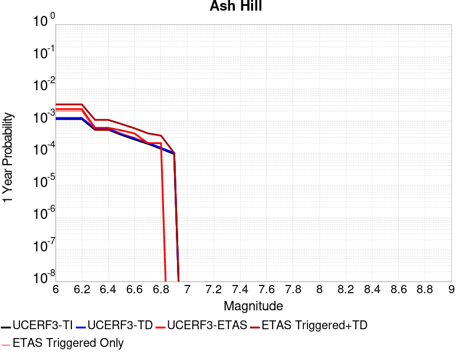 | 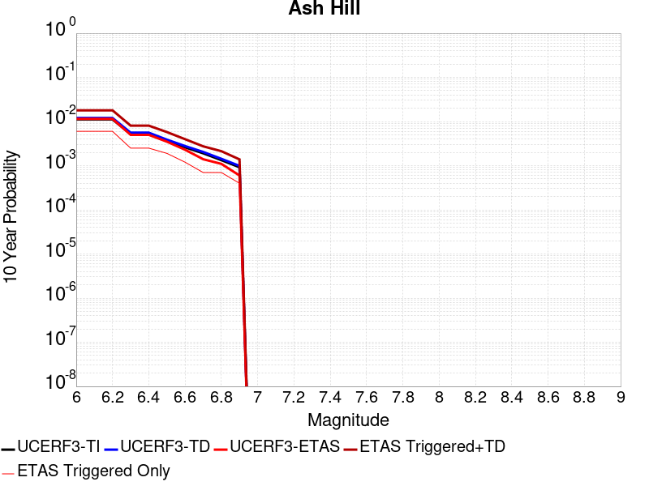 |

| Magnitude | 1 wk TI Prob | 1 wk TD Prob | 1 wk ETAS Prob | 1 wk ETAS/TD Gain | 1 wk ETAS Triggered+TD | 1 wk ETAS Triggered Only | 1 mo TI Prob | 1 mo TD Prob | 1 mo ETAS Prob | 1 mo ETAS/TD Gain | 1 mo ETAS Triggered+TD | 1 mo ETAS Triggered Only | 1 yr TI Prob | 1 yr TD Prob | 1 yr ETAS Prob | 1 yr ETAS/TD Gain | 1 yr ETAS Triggered+TD | 1 yr ETAS Triggered Only | 10 yr TI Prob | 10 yr TD Prob | 10 yr ETAS Prob | 10 yr ETAS/TD Gain | 10 yr ETAS Triggered+TD | 10 yr ETAS Triggered Only |
|-----|-----|-----|-----|-----|-----|-----|-----|-----|-----|-----|-----|-----|-----|-----|-----|-----|-----|-----|-----|-----|-----|-----|-----|-----|
| 6.0 | 2.1545662E-5 | 2.319797E-5 | 0.0 | 0.0 | 2.319797E-5 | 0.0 | 9.2335285E-5 | 9.941653E-5 | 4.0E-4 | 4.0234756 | 4.9937674E-4 | 4.0E-4 | 0.0011236023 | 0.0012098042 | 0.0023 | 1.9011341 | 0.0032073846 | 0.002 | 0.011179381 | 0.012040167 | 0.0115 | 0.95513624 | 0.017967926 | 0.006 |
| 6.1 | 2.1545662E-5 | 2.319797E-5 | 0.0 | 0.0 | 2.319797E-5 | 0.0 | 9.2335285E-5 | 9.941653E-5 | 4.0E-4 | 4.0234756 | 4.9937674E-4 | 4.0E-4 | 0.0011236023 | 0.0012098042 | 0.0023 | 1.9011341 | 0.0032073846 | 0.002 | 0.011179381 | 0.012040167 | 0.0115 | 0.95513624 | 0.017967926 | 0.006 |
| 6.2 | 2.1545662E-5 | 2.319797E-5 | 0.0 | 0.0 | 2.319797E-5 | 0.0 | 9.2335285E-5 | 9.941653E-5 | 4.0E-4 | 4.0234756 | 4.9937674E-4 | 4.0E-4 | 0.0011236023 | 0.0012098042 | 0.0023 | 1.9011341 | 0.0032073846 | 0.002 | 0.011179381 | 0.012040167 | 0.0115 | 0.95513624 | 0.017967926 | 0.006 |
| 6.3 | 1.0025529E-5 | 1.0748468E-5 | 0.0 | 0.0 | 1.0748468E-5 | 0.0 | 4.2965847E-5 | 4.6064124E-5 | 1.0E-4 | 2.1708868 | 1.4605952E-4 | 1.0E-4 | 5.229836E-4 | 5.606996E-4 | 6.0E-4 | 1.0700916 | 0.0010604193 | 5.0E-4 | 0.005217545 | 0.0055941627 | 0.005 | 0.8937888 | 0.008080177 | 0.0025 |
| 6.4 | 1.0025529E-5 | 1.0748468E-5 | 0.0 | 0.0 | 1.0748468E-5 | 0.0 | 4.2965847E-5 | 4.6064124E-5 | 1.0E-4 | 2.1708868 | 1.4605952E-4 | 1.0E-4 | 5.229836E-4 | 5.606996E-4 | 6.0E-4 | 1.0700916 | 0.0010604193 | 5.0E-4 | 0.005217545 | 0.0055941627 | 0.005 | 0.8937888 | 0.008080177 | 0.0025 |
| 6.5 | 6.9617327E-6 | 7.4576856E-6 | 0.0 | 0.0 | 7.4576856E-6 | 0.0 | 2.9835655E-5 | 3.1961168E-5 | 0.0 | 0.0 | 3.1961168E-5 | 0.0 | 3.6318856E-4 | 3.8906638E-4 | 5.0E-4 | 1.2851278 | 7.889108E-4 | 4.0E-4 | 0.0036259557 | 0.003884707 | 0.0035 | 0.90096885 | 0.005777326 | 0.0019 |
| 6.6 | 4.9919777E-6 | 5.347442E-6 | 0.0 | 0.0 | 5.347442E-6 | 0.0 | 2.1394015E-5 | 2.2917444E-5 | 0.0 | 0.0 | 2.2917444E-5 | 0.0 | 2.60441E-4 | 2.7899086E-4 | 4.0E-4 | 1.4337387 | 5.7890714E-4 | 3.0E-4 | 0.0026013597 | 0.002787065 | 0.0023 | 0.8252409 | 0.00398372 | 0.0012 |
| 6.7 | 3.6630722E-6 | 3.9251795E-6 | 0.0 | 0.0 | 3.9251795E-6 | 0.0 | 1.5698786E-5 | 1.6822121E-5 | 0.0 | 0.0 | 1.6822121E-5 | 0.0 | 1.9111596E-4 | 2.0479583E-4 | 2.0E-4 | 0.9765824 | 4.0475486E-4 | 2.0E-4 | 0.0019095168 | 0.0020466342 | 0.0014 | 0.68404996 | 0.0027452016 | 7.0E-4 |
| 6.8 | 2.5599613E-6 | 2.7453184E-6 | 0.0 | 0.0 | 2.7453184E-6 | 0.0 | 1.0971216E-5 | 1.17656255E-5 | 0.0 | 0.0 | 1.17656255E-5 | 0.0 | 1.3356637E-4 | 1.4324202E-4 | 2.0E-4 | 1.3962383 | 3.4321338E-4 | 2.0E-4 | 0.0013348613 | 0.001431982 | 0.0011 | 0.76816607 | 0.0021309797 | 7.0E-4 |
| 6.9 | 1.7684905E-6 | 1.8971439E-6 | 0.0 | 0.0 | 1.8971439E-6 | 0.0 | 7.579223E-6 | 8.130616E-6 | 0.0 | 0.0 | 8.130616E-6 | 0.0 | 9.2273134E-5 | 9.8990255E-5 | 0.0 | 0.0 | 9.8990255E-5 | 0.0 | 9.223483E-4 | 9.899025E-4 | 6.0E-4 | 0.6061203 | 0.0013895066 | 4.0E-4 |

## Calico-Hidalgo
*[(top)](#table-of-contents)*

| 1 Week | 1 Month | 1 Year | 10 Year |
|-----|-----|-----|-----|
| 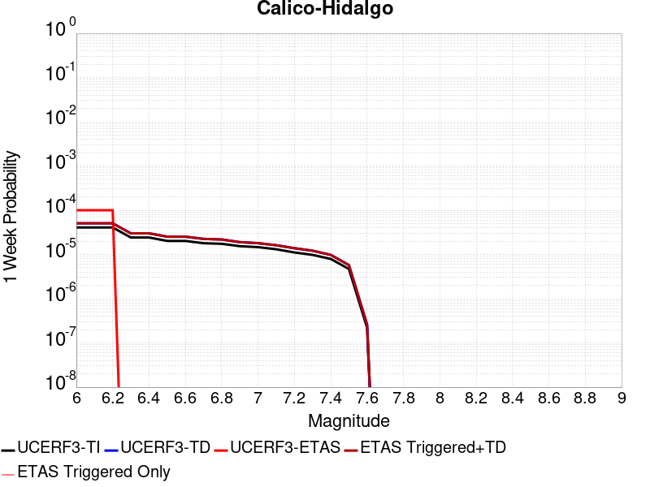 | 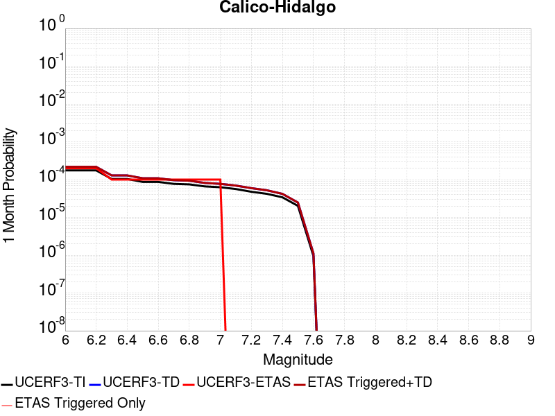 | 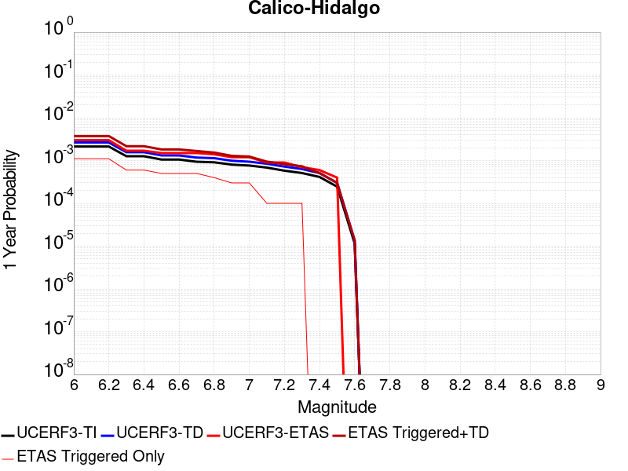 | 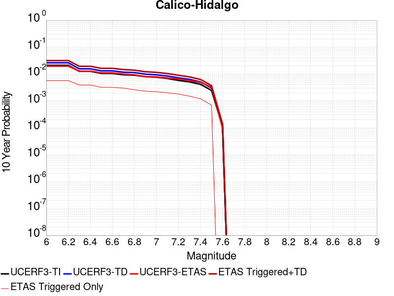 |

| Magnitude | 1 wk TI Prob | 1 wk TD Prob | 1 wk ETAS Prob | 1 wk ETAS/TD Gain | 1 wk ETAS Triggered+TD | 1 wk ETAS Triggered Only | 1 mo TI Prob | 1 mo TD Prob | 1 mo ETAS Prob | 1 mo ETAS/TD Gain | 1 mo ETAS Triggered+TD | 1 mo ETAS Triggered Only | 1 yr TI Prob | 1 yr TD Prob | 1 yr ETAS Prob | 1 yr ETAS/TD Gain | 1 yr ETAS Triggered+TD | 1 yr ETAS Triggered Only | 10 yr TI Prob | 10 yr TD Prob | 10 yr ETAS Prob | 10 yr ETAS/TD Gain | 10 yr ETAS Triggered+TD | 10 yr ETAS Triggered Only |
|-----|-----|-----|-----|-----|-----|-----|-----|-----|-----|-----|-----|-----|-----|-----|-----|-----|-----|-----|-----|-----|-----|-----|-----|-----|
| 6.0 | 4.0906612E-5 | 5.071949E-5 | 1.0E-4 | 1.9716287 | 5.071949E-5 | 0.0 | 1.7530227E-4 | 2.1735334E-4 | 2.0E-4 | 0.92016065 | 2.1735334E-4 | 0.0 | 0.0021322158 | 0.0026434613 | 0.003 | 1.1348757 | 0.0037405535 | 0.0011 | 0.02111873 | 0.026160482 | 0.0196 | 0.7492217 | 0.031711366 | 0.0057 |
| 6.1 | 4.0906612E-5 | 5.071949E-5 | 1.0E-4 | 1.9716287 | 5.071949E-5 | 0.0 | 1.7530227E-4 | 2.1735334E-4 | 2.0E-4 | 0.92016065 | 2.1735334E-4 | 0.0 | 0.0021322158 | 0.0026434613 | 0.003 | 1.1348757 | 0.0037405535 | 0.0011 | 0.02111873 | 0.026160482 | 0.0196 | 0.7492217 | 0.031711366 | 0.0057 |
| 6.2 | 4.0906612E-5 | 5.071949E-5 | 1.0E-4 | 1.9716287 | 5.071949E-5 | 0.0 | 1.7530227E-4 | 2.1735334E-4 | 2.0E-4 | 0.92016065 | 2.1735334E-4 | 0.0 | 0.0021322158 | 0.0026434613 | 0.003 | 1.1348757 | 0.0037405535 | 0.0011 | 0.02111873 | 0.026160482 | 0.0196 | 0.7492217 | 0.031711366 | 0.0057 |
| 6.3 | 2.4242801E-5 | 3.0097084E-5 | 0.0 | 0.0 | 3.0097084E-5 | 0.0 | 1.0389358E-4 | 1.2898132E-4 | 1.0E-4 | 0.7753061 | 1.2898132E-4 | 0.0 | 0.0012641704 | 0.0015692497 | 0.0017 | 1.0833204 | 0.002168308 | 6.0E-4 | 0.01257003 | 0.0155853685 | 0.0128 | 0.8212831 | 0.019424586 | 0.0039 |
| 6.4 | 2.4242801E-5 | 3.0097084E-5 | 0.0 | 0.0 | 3.0097084E-5 | 0.0 | 1.0389358E-4 | 1.2898132E-4 | 1.0E-4 | 0.7753061 | 1.2898132E-4 | 0.0 | 0.0012641704 | 0.0015692497 | 0.0017 | 1.0833204 | 0.002168308 | 6.0E-4 | 0.01257003 | 0.0155853685 | 0.0128 | 0.8212831 | 0.019424586 | 0.0039 |
| 6.5 | 2.0286952E-5 | 2.5320429E-5 | 0.0 | 0.0 | 2.5320429E-5 | 0.0 | 8.694118E-5 | 1.0851171E-4 | 1.0E-4 | 0.9215595 | 1.0851171E-4 | 0.0 | 0.0010579949 | 0.0013203465 | 0.0015 | 1.1360655 | 0.0018196863 | 5.0E-4 | 0.010529719 | 0.0131269535 | 0.011 | 0.8379705 | 0.016284948 | 0.0032 |
| 6.6 | 2.0269223E-5 | 2.5301377E-5 | 0.0 | 0.0 | 2.5301377E-5 | 0.0 | 8.6865206E-5 | 1.0843006E-4 | 1.0E-4 | 0.9222535 | 1.0843006E-4 | 0.0 | 0.0010570707 | 0.0013193536 | 0.0015 | 1.1369203 | 0.0018186939 | 5.0E-4 | 0.010520565 | 0.013117142 | 0.011 | 0.8385973 | 0.016275167 | 0.0032 |
| 6.7 | 1.799852E-5 | 2.254457E-5 | 0.0 | 0.0 | 2.254457E-5 | 0.0 | 7.713423E-5 | 9.661608E-5 | 1.0E-4 | 1.0350244 | 9.661608E-5 | 0.0 | 9.3870464E-4 | 0.0011756807 | 0.0015 | 1.2758567 | 0.0016750928 | 5.0E-4 | 0.009347493 | 0.01169622 | 0.01 | 0.8549771 | 0.014661131 | 0.003 |
| 6.8 | 1.7458793E-5 | 2.1845864E-5 | 0.0 | 0.0 | 2.1845864E-5 | 0.0 | 7.4821255E-5 | 9.362186E-5 | 1.0E-4 | 1.0681267 | 9.362186E-5 | 0.0 | 9.10568E-4 | 0.0011392646 | 0.0014 | 1.228863 | 0.0015388088 | 4.0E-4 | 0.009068459 | 0.011335826 | 0.0093 | 0.8204078 | 0.013906352 | 0.0026 |
| 6.9 | 1.542884E-5 | 1.9029081E-5 | 0.0 | 0.0 | 1.9029081E-5 | 0.0 | 6.612192E-5 | 8.155073E-5 | 1.0E-4 | 1.2262306 | 8.155073E-5 | 0.0 | 8.04737E-4 | 9.92441E-4 | 0.0012 | 1.20914 | 0.0012921432 | 3.0E-4 | 0.008018291 | 0.009881487 | 0.0079 | 0.7994748 | 0.01215876 | 0.0023 |
| 7.0 | 1.468253E-5 | 1.803341E-5 | 0.0 | 0.0 | 1.803341E-5 | 0.0 | 6.292361E-5 | 7.7283825E-5 | 1.0E-4 | 1.2939318 | 7.7283825E-5 | 0.0 | 7.658257E-4 | 9.405374E-4 | 0.0012 | 1.2758664 | 0.0012402552 | 3.0E-4 | 0.0076319184 | 0.009366934 | 0.0078 | 0.8327164 | 0.011546327 | 0.0022 |
| 7.1 | 1.3139281E-5 | 1.620339E-5 | 0.0 | 0.0 | 1.620339E-5 | 0.0 | 5.6309986E-5 | 6.9441325E-5 | 0.0 | 0.0 | 6.9441325E-5 | 0.0 | 6.853584E-4 | 8.451328E-4 | 9.0E-4 | 1.0649214 | 9.450483E-4 | 1.0E-4 | 0.0068324856 | 0.008420485 | 0.0071 | 0.8431818 | 0.010403644 | 0.002 |
| 7.2 | 1.1127404E-5 | 1.3868697E-5 | 0.0 | 0.0 | 1.3868697E-5 | 0.0 | 4.7688E-5 | 5.943598E-5 | 0.0 | 0.0 | 5.943598E-5 | 0.0 | 5.8044674E-4 | 7.234037E-4 | 9.0E-4 | 1.2441186 | 8.2333136E-4 | 1.0E-4 | 0.0057893298 | 0.0072115967 | 0.0065 | 0.90132606 | 0.008998616 | 0.0018 |
| 7.3 | 9.808154E-6 | 1.2177887E-5 | 0.0 | 0.0 | 1.2177887E-5 | 0.0 | 4.2034266E-5 | 5.218996E-5 | 0.0 | 0.0 | 5.218996E-5 | 0.0 | 5.11647E-4 | 6.3523825E-4 | 7.0E-4 | 1.1019487 | 7.351747E-4 | 1.0E-4 | 0.0051047057 | 0.0063353 | 0.0056 | 0.88393605 | 0.007825797 | 0.0015 |
| 7.4 | 7.942452E-6 | 9.793294E-6 | 0.0 | 0.0 | 9.793294E-6 | 0.0 | 3.4038632E-5 | 4.1970638E-5 | 0.0 | 0.0 | 4.1970638E-5 | 0.0 | 4.1434157E-4 | 5.108822E-4 | 6.0E-4 | 1.1744391 | 5.108822E-4 | 0.0 | 0.0041356985 | 0.005098019 | 0.0049 | 0.96115774 | 0.006291901 | 0.0012 |
| 7.5 | 4.7121216E-6 | 5.7734387E-6 | 0.0 | 0.0 | 5.7734387E-6 | 0.0 | 2.019465E-5 | 2.4743118E-5 | 0.0 | 0.0 | 2.4743118E-5 | 0.0 | 2.4584212E-4 | 3.0121347E-4 | 4.0E-4 | 1.3279618 | 3.0121347E-4 | 0.0 | 0.0024557032 | 0.0030088047 | 0.0032 | 1.0635452 | 0.0037066985 | 7.0E-4 |
| 7.6 | 2.21172E-7 | 2.6041212E-7 | 0.0 | 0.0 | 2.6041212E-7 | 0.0 | 9.478797E-7 | 1.1160516E-6 | 0.0 | 0.0 | 1.1160516E-6 | 0.0 | 1.1540374E-5 | 1.3587873E-5 | 0.0 | 0.0 | 1.3587873E-5 | 0.0 | 1.1539775E-4 | 1.3587323E-4 | 1.0E-4 | 0.73598015 | 1.3587323E-4 | 0.0 |

## San Clemente
*[(top)](#table-of-contents)*

| 1 Week | 1 Month | 1 Year | 10 Year |
|-----|-----|-----|-----|
|  |  | 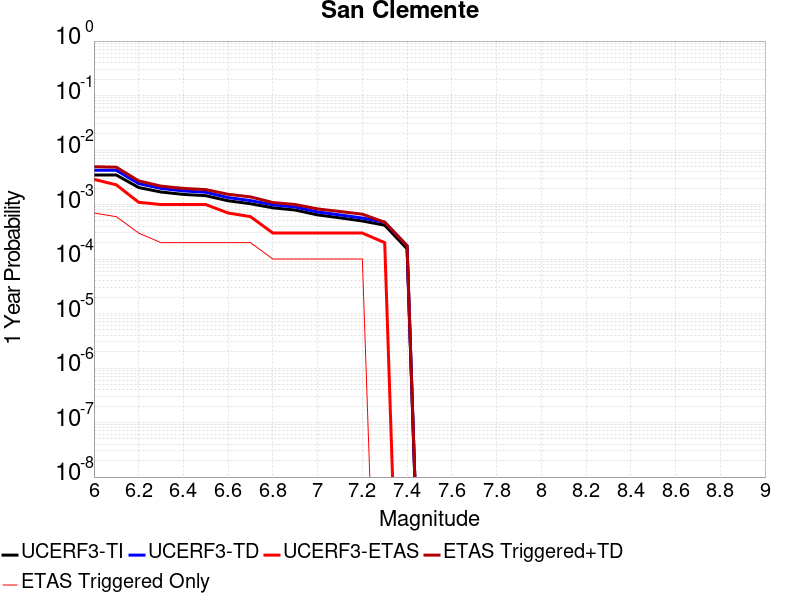 |  |

| Magnitude | 1 wk TI Prob | 1 wk TD Prob | 1 wk ETAS Prob | 1 wk ETAS/TD Gain | 1 wk ETAS Triggered+TD | 1 wk ETAS Triggered Only | 1 mo TI Prob | 1 mo TD Prob | 1 mo ETAS Prob | 1 mo ETAS/TD Gain | 1 mo ETAS Triggered+TD | 1 mo ETAS Triggered Only | 1 yr TI Prob | 1 yr TD Prob | 1 yr ETAS Prob | 1 yr ETAS/TD Gain | 1 yr ETAS Triggered+TD | 1 yr ETAS Triggered Only | 10 yr TI Prob | 10 yr TD Prob | 10 yr ETAS Prob | 10 yr ETAS/TD Gain | 10 yr ETAS Triggered+TD | 10 yr ETAS Triggered Only |
|-----|-----|-----|-----|-----|-----|-----|-----|-----|-----|-----|-----|-----|-----|-----|-----|-----|-----|-----|-----|-----|-----|-----|-----|-----|
| 6.0 | 6.681379E-5 | 8.16743E-5 | 1.0E-4 | 1.2243754 | 8.16743E-5 | 0.0 | 2.8631336E-4 | 3.4998887E-4 | 1.0E-4 | 0.28572336 | 3.4998887E-4 | 0.0 | 0.003480294 | 0.0042532785 | 0.0029 | 0.681827 | 0.0049503013 | 7.0E-4 | 0.03426291 | 0.041773956 | 0.0302 | 0.7229384 | 0.04733167 | 0.0058 |
| 6.1 | 6.681379E-5 | 8.16743E-5 | 1.0E-4 | 1.2243754 | 8.16743E-5 | 0.0 | 2.8631336E-4 | 3.4998887E-4 | 1.0E-4 | 0.28572336 | 3.4998887E-4 | 0.0 | 0.003480294 | 0.0042532785 | 0.0023 | 0.5407593 | 0.0048507266 | 6.0E-4 | 0.03426291 | 0.041773956 | 0.024 | 0.5745206 | 0.04627762 | 0.0047 |
| 6.2 | 3.9400576E-5 | 4.6469024E-5 | 0.0 | 0.0 | 4.6469024E-5 | 0.0 | 1.6884868E-4 | 1.9913798E-4 | 0.0 | 0.0 | 1.9913798E-4 | 0.0 | 0.0020537945 | 0.0024218638 | 0.0011 | 0.45419565 | 0.0027211371 | 3.0E-4 | 0.020349167 | 0.023961358 | 0.0135 | 0.5634072 | 0.025913434 | 0.002 |
| 6.3 | 3.2590255E-5 | 3.794153E-5 | 0.0 | 0.0 | 3.794153E-5 | 0.0 | 1.3966505E-4 | 1.6259658E-4 | 0.0 | 0.0 | 1.6259658E-4 | 0.0 | 0.0016990956 | 0.0019778463 | 0.001 | 0.5056005 | 0.0021774506 | 2.0E-4 | 0.01686163 | 0.019606225 | 0.0111 | 0.56614673 | 0.021174856 | 0.0016 |
| 6.4 | 2.9454652E-5 | 3.410849E-5 | 0.0 | 0.0 | 3.410849E-5 | 0.0 | 1.2622811E-4 | 1.461712E-4 | 0.0 | 0.0 | 1.461712E-4 | 0.0 | 0.0015357438 | 0.0017782076 | 0.001 | 0.56236404 | 0.001977852 | 2.0E-4 | 0.015251739 | 0.017642964 | 0.0104 | 0.58947015 | 0.019116499 | 0.0015 |
| 6.5 | 2.790836E-5 | 3.2257463E-5 | 0.0 | 0.0 | 3.2257463E-5 | 0.0 | 1.1960178E-4 | 1.3823908E-4 | 0.0 | 0.0 | 1.3823908E-4 | 0.0 | 0.001455179 | 0.0016817868 | 0.001 | 0.5946056 | 0.0018814505 | 2.0E-4 | 0.014456868 | 0.016693613 | 0.0097 | 0.5810606 | 0.01797191 | 0.0013 |
| 6.6 | 2.2492153E-5 | 2.5770154E-5 | 0.0 | 0.0 | 2.5770154E-5 | 0.0 | 9.639138E-5 | 1.1043892E-4 | 0.0 | 0.0 | 1.1043892E-4 | 0.0 | 0.0011729331 | 0.0013437793 | 7.0E-4 | 0.5209189 | 0.0015435105 | 2.0E-4 | 0.011667615 | 0.013358254 | 0.0068 | 0.5090486 | 0.01444356 | 0.0011 |
| 6.7 | 1.9862755E-5 | 2.267278E-5 | 0.0 | 0.0 | 2.267278E-5 | 0.0 | 8.512331E-5 | 9.716551E-5 | 0.0 | 0.0 | 9.716551E-5 | 0.0 | 0.0010358836 | 0.0011823593 | 6.0E-4 | 0.50745994 | 0.0013821229 | 2.0E-4 | 0.010310682 | 0.01176198 | 0.0058 | 0.49311423 | 0.012849042 | 0.0011 |
| 6.8 | 1.6697575E-5 | 1.8982853E-5 | 0.0 | 0.0 | 1.8982853E-5 | 0.0 | 7.155907E-5 | 8.1352606E-5 | 0.0 | 0.0 | 8.1352606E-5 | 0.0 | 8.7088346E-4 | 9.900272E-4 | 3.0E-4 | 0.30302197 | 0.0010899282 | 1.0E-4 | 0.008674784 | 0.009857195 | 0.005 | 0.5072437 | 0.0108473385 | 0.001 |
| 6.9 | 1.5218415E-5 | 1.727402E-5 | 0.0 | 0.0 | 1.727402E-5 | 0.0 | 6.522015E-5 | 7.402946E-5 | 0.0 | 0.0 | 7.402946E-5 | 0.0 | 7.93766E-4 | 9.009448E-4 | 3.0E-4 | 0.33298376 | 0.0010008548 | 1.0E-4 | 0.007909367 | 0.0089738695 | 0.0045 | 0.5014559 | 0.009964895 | 0.001 |
| 7.0 | 1.2392958E-5 | 1.40367E-5 | 0.0 | 0.0 | 1.40367E-5 | 0.0 | 5.3111595E-5 | 6.015594E-5 | 0.0 | 0.0 | 6.015594E-5 | 0.0 | 6.4644177E-4 | 7.3216006E-4 | 3.0E-4 | 0.40974647 | 8.3208684E-4 | 1.0E-4 | 0.0064456454 | 0.0072982656 | 0.0036 | 0.4932679 | 0.008191697 | 9.0E-4 |
| 7.1 | 1.0934128E-5 | 1.2378374E-5 | 0.0 | 0.0 | 1.2378374E-5 | 0.0 | 4.6859706E-5 | 5.3049134E-5 | 0.0 | 0.0 | 5.3049134E-5 | 0.0 | 5.7036756E-4 | 6.4568914E-4 | 3.0E-4 | 0.46461987 | 7.456246E-4 | 1.0E-4 | 0.0056890585 | 0.0064388774 | 0.0032 | 0.49698102 | 0.0073330826 | 9.0E-4 |
| 7.2 | 9.5798805E-6 | 1.0847776E-5 | 0.0 | 0.0 | 1.0847776E-5 | 0.0 | 4.1055984E-5 | 4.648968E-5 | 0.0 | 0.0 | 4.648968E-5 | 0.0 | 4.9974193E-4 | 5.6587206E-4 | 3.0E-4 | 0.5301552 | 6.658155E-4 | 1.0E-4 | 0.0049861963 | 0.0056450358 | 0.0026 | 0.46058166 | 0.0061422135 | 5.0E-4 |
| 7.3 | 8.0167365E-6 | 9.086316E-6 | 0.0 | 0.0 | 9.086316E-6 | 0.0 | 3.4356988E-5 | 3.8940812E-5 | 0.0 | 0.0 | 3.8940812E-5 | 0.0 | 4.1821605E-4 | 4.7400832E-4 | 2.0E-4 | 0.4219335 | 4.7400832E-4 | 0.0 | 0.0041742986 | 0.0047306763 | 0.0022 | 0.4650498 | 0.0051287836 | 4.0E-4 |
| 7.4 | 2.9581017E-6 | 3.3632907E-6 | 0.0 | 0.0 | 3.3632907E-6 | 0.0 | 1.2677518E-5 | 1.4414052E-5 | 0.0 | 0.0 | 1.4414052E-5 | 0.0 | 1.5433785E-4 | 1.75482E-4 | 0.0 | 0.0 | 1.75482E-4 | 0.0 | 0.001542307 | 0.0017539297 | 7.0E-4 | 0.39910382 | 0.0018537543 | 1.0E-4 |

## Garberville - Briceland 2011 CFM
*[(top)](#table-of-contents)*

| 1 Week | 1 Month | 1 Year | 10 Year |
|-----|-----|-----|-----|
|  |  | 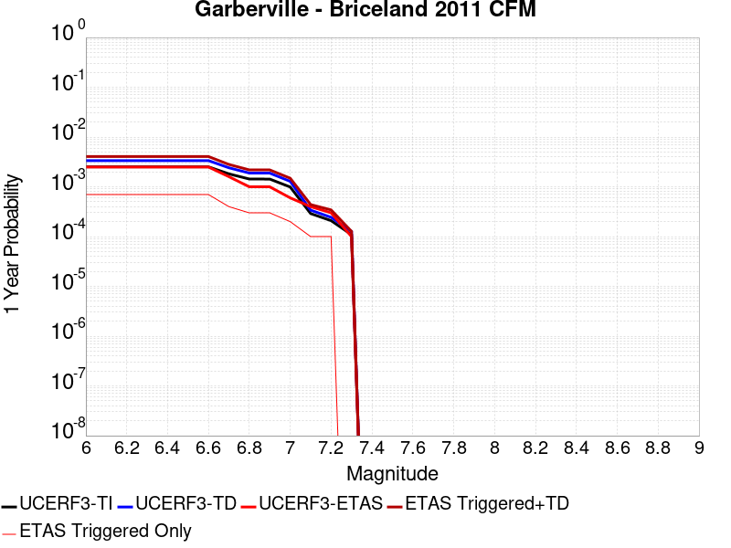 |  |

| Magnitude | 1 wk TI Prob | 1 wk TD Prob | 1 wk ETAS Prob | 1 wk ETAS/TD Gain | 1 wk ETAS Triggered+TD | 1 wk ETAS Triggered Only | 1 mo TI Prob | 1 mo TD Prob | 1 mo ETAS Prob | 1 mo ETAS/TD Gain | 1 mo ETAS Triggered+TD | 1 mo ETAS Triggered Only | 1 yr TI Prob | 1 yr TD Prob | 1 yr ETAS Prob | 1 yr ETAS/TD Gain | 1 yr ETAS Triggered+TD | 1 yr ETAS Triggered Only | 10 yr TI Prob | 10 yr TD Prob | 10 yr ETAS Prob | 10 yr ETAS/TD Gain | 10 yr ETAS Triggered+TD | 10 yr ETAS Triggered Only |
|-----|-----|-----|-----|-----|-----|-----|-----|-----|-----|-----|-----|-----|-----|-----|-----|-----|-----|-----|-----|-----|-----|-----|-----|-----|
| 6.0 | 4.8399295E-5 | 6.456981E-5 | 0.0 | 0.0 | 6.456981E-5 | 0.0 | 2.0740906E-4 | 2.76702E-4 | 4.0E-4 | 1.4455986 | 5.76619E-4 | 3.0E-4 | 0.002522281 | 0.0033642966 | 0.0025 | 0.74309736 | 0.0040619415 | 7.0E-4 | 0.024938442 | 0.033199932 | 0.0209 | 0.62951934 | 0.038904056 | 0.0059 |
| 6.1 | 4.8399295E-5 | 6.456981E-5 | 0.0 | 0.0 | 6.456981E-5 | 0.0 | 2.0740906E-4 | 2.76702E-4 | 4.0E-4 | 1.4455986 | 5.76619E-4 | 3.0E-4 | 0.002522281 | 0.0033642966 | 0.0025 | 0.74309736 | 0.0040619415 | 7.0E-4 | 0.024938442 | 0.033199932 | 0.0209 | 0.62951934 | 0.038904056 | 0.0059 |
| 6.2 | 4.8399295E-5 | 6.456981E-5 | 0.0 | 0.0 | 6.456981E-5 | 0.0 | 2.0740906E-4 | 2.76702E-4 | 4.0E-4 | 1.4455986 | 5.76619E-4 | 3.0E-4 | 0.002522281 | 0.0033642966 | 0.0025 | 0.74309736 | 0.0040619415 | 7.0E-4 | 0.024938442 | 0.033199932 | 0.0209 | 0.62951934 | 0.038904056 | 0.0059 |
| 6.3 | 4.8399295E-5 | 6.456981E-5 | 0.0 | 0.0 | 6.456981E-5 | 0.0 | 2.0740906E-4 | 2.76702E-4 | 4.0E-4 | 1.4455986 | 5.76619E-4 | 3.0E-4 | 0.002522281 | 0.0033642966 | 0.0025 | 0.74309736 | 0.0040619415 | 7.0E-4 | 0.024938442 | 0.033199932 | 0.0209 | 0.62951934 | 0.038904056 | 0.0059 |
| 6.4 | 4.8399295E-5 | 6.456981E-5 | 0.0 | 0.0 | 6.456981E-5 | 0.0 | 2.0740906E-4 | 2.76702E-4 | 4.0E-4 | 1.4455986 | 5.76619E-4 | 3.0E-4 | 0.002522281 | 0.0033642966 | 0.0025 | 0.74309736 | 0.0040619415 | 7.0E-4 | 0.024938442 | 0.033199932 | 0.0209 | 0.62951934 | 0.038904056 | 0.0059 |
| 6.5 | 4.8399295E-5 | 6.456981E-5 | 0.0 | 0.0 | 6.456981E-5 | 0.0 | 2.0740906E-4 | 2.76702E-4 | 4.0E-4 | 1.4455986 | 5.76619E-4 | 3.0E-4 | 0.002522281 | 0.0033642966 | 0.0025 | 0.74309736 | 0.0040619415 | 7.0E-4 | 0.024938442 | 0.033199932 | 0.0209 | 0.62951934 | 0.038904056 | 0.0059 |
| 6.6 | 4.8399295E-5 | 6.456981E-5 | 0.0 | 0.0 | 6.456981E-5 | 0.0 | 2.0740906E-4 | 2.76702E-4 | 4.0E-4 | 1.4455986 | 5.76619E-4 | 3.0E-4 | 0.002522281 | 0.0033642966 | 0.0025 | 0.74309736 | 0.0040619415 | 7.0E-4 | 0.024938442 | 0.033199932 | 0.0209 | 0.62951934 | 0.038904056 | 0.0059 |
| 6.7 | 3.495179E-5 | 4.6339086E-5 | 0.0 | 0.0 | 4.6339086E-5 | 0.0 | 1.4978478E-4 | 1.9858389E-4 | 2.0E-4 | 1.0071311 | 2.9856403E-4 | 1.0E-4 | 0.0018221042 | 0.0024156088 | 0.0016 | 0.6623589 | 0.0028146426 | 4.0E-4 | 0.018072363 | 0.023945963 | 0.0152 | 0.6347625 | 0.0282406 | 0.0044 |
| 6.8 | 2.7517597E-5 | 3.626468E-5 | 0.0 | 0.0 | 3.626468E-5 | 0.0 | 1.1792722E-4 | 1.5541336E-4 | 2.0E-4 | 1.2868906 | 2.553978E-4 | 1.0E-4 | 0.0014348183 | 0.0018909883 | 0.001 | 0.528824 | 0.002190421 | 3.0E-4 | 0.014255894 | 0.018795334 | 0.0118 | 0.6278154 | 0.02213143 | 0.0034 |
| 6.9 | 2.74461E-5 | 3.6182377E-5 | 0.0 | 0.0 | 3.6182377E-5 | 0.0 | 1.1762084E-4 | 1.5506068E-4 | 2.0E-4 | 1.2898176 | 2.550452E-4 | 1.0E-4 | 0.001431093 | 0.001886702 | 0.001 | 0.5300254 | 0.002186136 | 3.0E-4 | 0.014219119 | 0.018753195 | 0.0117 | 0.6238937 | 0.021991309 | 0.0033 |
| 7.0 | 1.9023773E-5 | 2.4722609E-5 | 0.0 | 0.0 | 2.4722609E-5 | 0.0 | 8.152791E-5 | 1.05951854E-4 | 2.0E-4 | 1.8876498 | 2.0594127E-4 | 1.0E-4 | 9.921503E-4 | 0.0012896006 | 6.0E-4 | 0.46526033 | 0.0014893427 | 2.0E-4 | 0.009877323 | 0.012860258 | 0.0077 | 0.5987438 | 0.014834538 | 0.002 |
| 7.1 | 5.566844E-6 | 6.51435E-6 | 0.0 | 0.0 | 6.51435E-6 | 0.0 | 2.3857683E-5 | 2.7918368E-5 | 1.0E-4 | 3.5818713 | 1.2791557E-4 | 1.0E-4 | 2.9042858E-4 | 3.3985736E-4 | 4.0E-4 | 1.1769644 | 4.3982337E-4 | 1.0E-4 | 0.002900493 | 0.003393797 | 0.0024 | 0.7071726 | 0.003991761 | 6.0E-4 |
| 7.2 | 4.011353E-6 | 4.6761556E-6 | 0.0 | 0.0 | 4.6761556E-6 | 0.0 | 1.7191402E-5 | 2.0040534E-5 | 1.0E-4 | 4.989887 | 1.2003853E-4 | 1.0E-4 | 2.0928521E-4 | 2.4396961E-4 | 3.0E-4 | 1.2296613 | 3.439452E-4 | 1.0E-4 | 0.0020908823 | 0.0024373555 | 0.0019 | 0.7795334 | 0.0028363806 | 4.0E-4 |
| 7.3 | 2.0974871E-6 | 2.4403803E-6 | 0.0 | 0.0 | 2.4403803E-6 | 0.0 | 8.989199E-6 | 1.0458745E-5 | 0.0 | 0.0 | 1.0458745E-5 | 0.0 | 1.09438006E-4 | 1.2733028E-4 | 1.0E-4 | 0.78535914 | 1.2733028E-4 | 0.0 | 0.0010938413 | 0.0012728187 | 0.0015 | 1.1784868 | 0.0014725641 | 2.0E-4 |

## Pleito
*[(top)](#table-of-contents)*

| 1 Week | 1 Month | 1 Year | 10 Year |
|-----|-----|-----|-----|
|  |  | 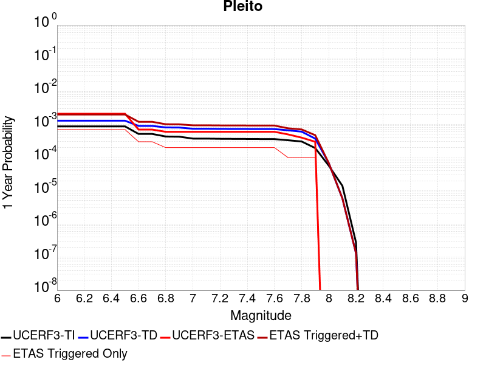 | 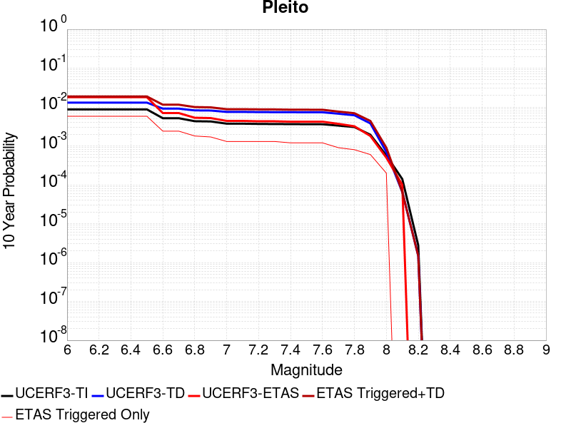 |

| Magnitude | 1 wk TI Prob | 1 wk TD Prob | 1 wk ETAS Prob | 1 wk ETAS/TD Gain | 1 wk ETAS Triggered+TD | 1 wk ETAS Triggered Only | 1 mo TI Prob | 1 mo TD Prob | 1 mo ETAS Prob | 1 mo ETAS/TD Gain | 1 mo ETAS Triggered+TD | 1 mo ETAS Triggered Only | 1 yr TI Prob | 1 yr TD Prob | 1 yr ETAS Prob | 1 yr ETAS/TD Gain | 1 yr ETAS Triggered+TD | 1 yr ETAS Triggered Only | 10 yr TI Prob | 10 yr TD Prob | 10 yr ETAS Prob | 10 yr ETAS/TD Gain | 10 yr ETAS Triggered+TD | 10 yr ETAS Triggered Only |
|-----|-----|-----|-----|-----|-----|-----|-----|-----|-----|-----|-----|-----|-----|-----|-----|-----|-----|-----|-----|-----|-----|-----|-----|-----|
| 6.0 | 1.6763008E-5 | 2.4864676E-5 | 0.0 | 0.0 | 2.4864676E-5 | 0.0 | 7.183948E-5 | 1.06558946E-4 | 0.0 | 0.0 | 1.06558946E-4 | 0.0 | 8.742947E-4 | 0.0012966552 | 0.0021 | 1.6195517 | 0.0019957474 | 7.0E-4 | 0.00870863 | 0.013005144 | 0.0179 | 1.3763785 | 0.018729713 | 0.0058 |
| 6.1 | 1.6763008E-5 | 2.4864676E-5 | 0.0 | 0.0 | 2.4864676E-5 | 0.0 | 7.183948E-5 | 1.06558946E-4 | 0.0 | 0.0 | 1.06558946E-4 | 0.0 | 8.742947E-4 | 0.0012966552 | 0.0021 | 1.6195517 | 0.0019957474 | 7.0E-4 | 0.00870863 | 0.013005144 | 0.0179 | 1.3763785 | 0.018729713 | 0.0058 |
| 6.2 | 1.6763008E-5 | 2.4864676E-5 | 0.0 | 0.0 | 2.4864676E-5 | 0.0 | 7.183948E-5 | 1.06558946E-4 | 0.0 | 0.0 | 1.06558946E-4 | 0.0 | 8.742947E-4 | 0.0012966552 | 0.0021 | 1.6195517 | 0.0019957474 | 7.0E-4 | 0.00870863 | 0.013005144 | 0.0179 | 1.3763785 | 0.018729713 | 0.0058 |
| 6.3 | 1.6763008E-5 | 2.4864676E-5 | 0.0 | 0.0 | 2.4864676E-5 | 0.0 | 7.183948E-5 | 1.06558946E-4 | 0.0 | 0.0 | 1.06558946E-4 | 0.0 | 8.742947E-4 | 0.0012966552 | 0.0021 | 1.6195517 | 0.0019957474 | 7.0E-4 | 0.00870863 | 0.013005144 | 0.0179 | 1.3763785 | 0.018729713 | 0.0058 |
| 6.4 | 1.6763008E-5 | 2.4864676E-5 | 0.0 | 0.0 | 2.4864676E-5 | 0.0 | 7.183948E-5 | 1.06558946E-4 | 0.0 | 0.0 | 1.06558946E-4 | 0.0 | 8.742947E-4 | 0.0012966552 | 0.0021 | 1.6195517 | 0.0019957474 | 7.0E-4 | 0.00870863 | 0.013005144 | 0.0179 | 1.3763785 | 0.018729713 | 0.0058 |
| 6.5 | 1.6763008E-5 | 2.4864676E-5 | 0.0 | 0.0 | 2.4864676E-5 | 0.0 | 7.183948E-5 | 1.06558946E-4 | 0.0 | 0.0 | 1.06558946E-4 | 0.0 | 8.742947E-4 | 0.0012966552 | 0.0021 | 1.6195517 | 0.0019957474 | 7.0E-4 | 0.00870863 | 0.013005144 | 0.0179 | 1.3763785 | 0.018729713 | 0.0058 |
| 6.6 | 9.910213E-6 | 1.731394E-5 | 0.0 | 0.0 | 1.731394E-5 | 0.0 | 4.247165E-5 | 7.420051E-5 | 0.0 | 0.0 | 7.420051E-5 | 0.0 | 5.169696E-4 | 9.0302044E-4 | 7.0E-4 | 0.7751762 | 0.0012027496 | 3.0E-4 | 0.0051576863 | 0.009101368 | 0.007 | 0.76911515 | 0.011479525 | 0.0024 |
| 6.7 | 9.910213E-6 | 1.731394E-5 | 0.0 | 0.0 | 1.731394E-5 | 0.0 | 4.247165E-5 | 7.420051E-5 | 0.0 | 0.0 | 7.420051E-5 | 0.0 | 5.169696E-4 | 9.0302044E-4 | 7.0E-4 | 0.7751762 | 0.0012027496 | 3.0E-4 | 0.0051576863 | 0.009101368 | 0.007 | 0.76911515 | 0.011479525 | 0.0024 |
| 6.8 | 8.300162E-6 | 1.5573269E-5 | 0.0 | 0.0 | 1.5573269E-5 | 0.0 | 3.557164E-5 | 6.6740875E-5 | 0.0 | 0.0 | 6.6740875E-5 | 0.0 | 4.3299864E-4 | 8.122687E-4 | 6.0E-4 | 0.73867184 | 0.0010121062 | 2.0E-4 | 0.004321559 | 0.008200706 | 0.0053 | 0.64628583 | 0.009985945 | 0.0018 |
| 6.9 | 8.183114E-6 | 1.5444439E-5 | 0.0 | 0.0 | 1.5444439E-5 | 0.0 | 3.5070017E-5 | 6.618878E-5 | 0.0 | 0.0 | 6.618878E-5 | 0.0 | 4.2689382E-4 | 8.055519E-4 | 6.0E-4 | 0.74483097 | 0.0010053908 | 2.0E-4 | 0.0042607468 | 0.008134031 | 0.0052 | 0.63928944 | 0.009820203 | 0.0017 |
| 7.0 | 7.1748823E-6 | 1.4230174E-5 | 0.0 | 0.0 | 1.4230174E-5 | 0.0 | 3.0749135E-5 | 6.0985036E-5 | 0.0 | 0.0 | 6.0985036E-5 | 0.0 | 3.743064E-4 | 7.422404E-4 | 6.0E-4 | 0.8083634 | 9.42092E-4 | 2.0E-4 | 0.0037367654 | 0.0075047268 | 0.0044 | 0.58629715 | 0.008794971 | 0.0013 |
| 7.1 | 7.1671807E-6 | 1.4220532E-5 | 0.0 | 0.0 | 1.4220532E-5 | 0.0 | 3.0716128E-5 | 6.0943716E-5 | 0.0 | 0.0 | 6.0943716E-5 | 0.0 | 3.7390468E-4 | 7.4173766E-4 | 6.0E-4 | 0.8089113 | 9.415893E-4 | 2.0E-4 | 0.0037327618 | 0.0074997335 | 0.0044 | 0.5866875 | 0.008789984 | 0.0013 |
| 7.2 | 7.0649667E-6 | 1.4067496E-5 | 0.0 | 0.0 | 1.4067496E-5 | 0.0 | 3.0278077E-5 | 6.0287875E-5 | 0.0 | 0.0 | 6.0287875E-5 | 0.0 | 3.6857324E-4 | 7.337582E-4 | 6.0E-4 | 0.8177081 | 9.336115E-4 | 2.0E-4 | 0.0036796255 | 0.00742033 | 0.0043 | 0.57948905 | 0.008710683 | 0.0013 |
| 7.3 | 7.02082E-6 | 1.4010761E-5 | 0.0 | 0.0 | 1.4010761E-5 | 0.0 | 3.008888E-5 | 6.0044742E-5 | 0.0 | 0.0 | 6.0044742E-5 | 0.0 | 3.6627054E-4 | 7.3080003E-4 | 6.0E-4 | 0.82101804 | 9.306539E-4 | 2.0E-4 | 0.0036566744 | 0.0073907333 | 0.0043 | 0.58180964 | 0.008681125 | 0.0013 |
| 7.4 | 6.987146E-6 | 1.3970217E-5 | 0.0 | 0.0 | 1.3970217E-5 | 0.0 | 2.9944567E-5 | 5.987099E-5 | 0.0 | 0.0 | 5.987099E-5 | 0.0 | 3.6451413E-4 | 7.28686E-4 | 6.0E-4 | 0.8233999 | 9.2854025E-4 | 2.0E-4 | 0.0036391679 | 0.007369615 | 0.0042 | 0.5699076 | 0.008560772 | 0.0012 |
| 7.5 | 6.9494554E-6 | 1.3927042E-5 | 0.0 | 0.0 | 1.3927042E-5 | 0.0 | 2.9783041E-5 | 5.968596E-5 | 0.0 | 0.0 | 5.968596E-5 | 0.0 | 3.625482E-4 | 7.264348E-4 | 6.0E-4 | 0.82595164 | 9.2628953E-4 | 2.0E-4 | 0.0036195726 | 0.007347203 | 0.0042 | 0.5716461 | 0.008538386 | 0.0012 |
| 7.6 | 6.92694E-6 | 1.3886004E-5 | 0.0 | 0.0 | 1.3886004E-5 | 0.0 | 2.9686547E-5 | 5.9510094E-5 | 0.0 | 0.0 | 5.9510094E-5 | 0.0 | 3.6137376E-4 | 7.2429504E-4 | 6.0E-4 | 0.82839173 | 9.2415017E-4 | 2.0E-4 | 0.0036078666 | 0.007325881 | 0.0042 | 0.5733099 | 0.00851709 | 0.0012 |
| 7.7 | 6.395867E-6 | 1.2760947E-5 | 0.0 | 0.0 | 1.2760947E-5 | 0.0 | 2.741057E-5 | 5.468863E-5 | 0.0 | 0.0 | 5.468863E-5 | 0.0 | 3.336726E-4 | 6.6563097E-4 | 5.0E-4 | 0.75116694 | 7.6556444E-4 | 1.0E-4 | 0.0033317201 | 0.0067424737 | 0.0037 | 0.54876 | 0.0076364055 | 9.0E-4 |
| 7.8 | 5.8664327E-6 | 1.16205465E-5 | 0.0 | 0.0 | 1.16205465E-5 | 0.0 | 2.5141611E-5 | 4.9801394E-5 | 0.0 | 0.0 | 4.9801394E-5 | 0.0 | 3.060561E-4 | 6.061635E-4 | 4.0E-4 | 0.65988797 | 7.061029E-4 | 1.0E-4 | 0.0030563495 | 0.006143856 | 0.0032 | 0.5208456 | 0.0069389404 | 8.0E-4 |
| 7.9 | 3.7167474E-6 | 7.1653176E-6 | 0.0 | 0.0 | 7.1653176E-6 | 0.0 | 1.592882E-5 | 3.0708143E-5 | 0.0 | 0.0 | 3.0708143E-5 | 0.0 | 1.9391612E-4 | 3.7380768E-4 | 3.0E-4 | 0.80255175 | 4.7377028E-4 | 1.0E-4 | 0.0019374699 | 0.0037936948 | 0.0018 | 0.4744715 | 0.0043914183 | 6.0E-4 |
| 8.0 | 1.0903841E-6 | 1.2991558E-6 | 0.0 | 0.0 | 1.2991558E-6 | 0.0 | 4.6730665E-6 | 5.5677983E-6 | 0.0 | 0.0 | 5.5677983E-6 | 0.0 | 5.68931E-5 | 6.778585E-5 | 0.0 | 0.0 | 6.778585E-5 | 0.0 | 5.6878536E-4 | 7.0008886E-4 | 5.0E-4 | 0.7141951 | 8.999488E-4 | 2.0E-4 |
| 8.1 | 2.6894583E-7 | 1.1245098E-7 | 0.0 | 0.0 | 1.1245098E-7 | 0.0 | 1.1526245E-6 | 4.8193266E-7 | 0.0 | 0.0 | 4.8193266E-7 | 0.0 | 1.4033113E-5 | 5.8675146E-6 | 0.0 | 0.0 | 5.8675146E-6 | 0.0 | 1.4032227E-4 | 6.560494E-5 | 1.0E-4 | 1.5242755 | 6.560494E-5 | 0.0 |
| 8.2 | 5.2967013E-9 | 2.5019755E-9 | 0.0 | 0.0 | 2.5019755E-9 | 0.0 | 2.2700148E-8 | 1.07227525E-8 | 0.0 | 0.0 | 1.07227525E-8 | 0.0 | 2.7637427E-7 | 1.3054951E-7 | 0.0 | 0.0 | 1.3054951E-7 | 0.0 | 2.7637393E-6 | 1.4841239E-6 | 0.0 | 0.0 | 1.4841239E-6 | 0.0 |

## Pinto Mtn
*[(top)](#table-of-contents)*

| 1 Week | 1 Month | 1 Year | 10 Year |
|-----|-----|-----|-----|
|  | 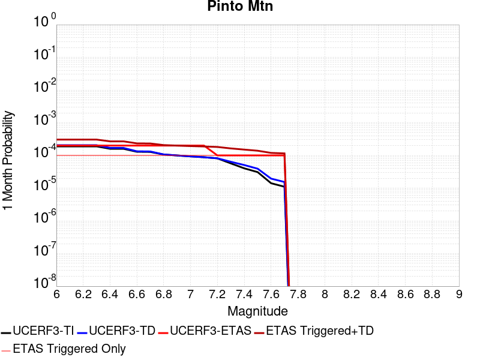 |  |  |

| Magnitude | 1 wk TI Prob | 1 wk TD Prob | 1 wk ETAS Prob | 1 wk ETAS/TD Gain | 1 wk ETAS Triggered+TD | 1 wk ETAS Triggered Only | 1 mo TI Prob | 1 mo TD Prob | 1 mo ETAS Prob | 1 mo ETAS/TD Gain | 1 mo ETAS Triggered+TD | 1 mo ETAS Triggered Only | 1 yr TI Prob | 1 yr TD Prob | 1 yr ETAS Prob | 1 yr ETAS/TD Gain | 1 yr ETAS Triggered+TD | 1 yr ETAS Triggered Only | 10 yr TI Prob | 10 yr TD Prob | 10 yr ETAS Prob | 10 yr ETAS/TD Gain | 10 yr ETAS Triggered+TD | 10 yr ETAS Triggered Only |
|-----|-----|-----|-----|-----|-----|-----|-----|-----|-----|-----|-----|-----|-----|-----|-----|-----|-----|-----|-----|-----|-----|-----|-----|-----|
| 6.0 | 4.4194956E-5 | 4.787792E-5 | 0.0 | 0.0 | 4.787792E-5 | 0.0 | 1.893932E-4 | 2.0517586E-4 | 2.0E-4 | 0.9747735 | 3.0515535E-4 | 1.0E-4 | 0.0023034236 | 0.002495318 | 0.0017 | 0.6812759 | 0.0028943198 | 4.0E-4 | 0.022796938 | 0.02469053 | 0.0181 | 0.7330746 | 0.02985967 | 0.0053 |
| 6.1 | 4.4194956E-5 | 4.787792E-5 | 0.0 | 0.0 | 4.787792E-5 | 0.0 | 1.893932E-4 | 2.0517586E-4 | 2.0E-4 | 0.9747735 | 3.0515535E-4 | 1.0E-4 | 0.0023034236 | 0.002495318 | 0.0017 | 0.6812759 | 0.0028943198 | 4.0E-4 | 0.022796938 | 0.02469053 | 0.0181 | 0.7330746 | 0.02985967 | 0.0053 |
| 6.2 | 4.4194956E-5 | 4.787792E-5 | 0.0 | 0.0 | 4.787792E-5 | 0.0 | 1.893932E-4 | 2.0517586E-4 | 2.0E-4 | 0.9747735 | 3.0515535E-4 | 1.0E-4 | 0.0023034236 | 0.002495318 | 0.0017 | 0.6812759 | 0.0028943198 | 4.0E-4 | 0.022796938 | 0.02469053 | 0.0181 | 0.7330746 | 0.02985967 | 0.0053 |
| 6.3 | 4.4194956E-5 | 4.787792E-5 | 0.0 | 0.0 | 4.787792E-5 | 0.0 | 1.893932E-4 | 2.0517586E-4 | 2.0E-4 | 0.9747735 | 3.0515535E-4 | 1.0E-4 | 0.0023034236 | 0.002495318 | 0.0017 | 0.6812759 | 0.0028943198 | 4.0E-4 | 0.022796938 | 0.02469053 | 0.0181 | 0.7330746 | 0.02985967 | 0.0053 |
| 6.4 | 3.729929E-5 | 3.9624276E-5 | 0.0 | 0.0 | 3.9624276E-5 | 0.0 | 1.5984432E-4 | 1.698078E-4 | 2.0E-4 | 1.1778022 | 2.6979082E-4 | 1.0E-4 | 0.0019443673 | 0.0020655429 | 0.0015 | 0.72620136 | 0.0022651297 | 2.0E-4 | 0.019274427 | 0.02047348 | 0.0158 | 0.77173007 | 0.024881348 | 0.0045 |
| 6.5 | 3.729929E-5 | 3.9624276E-5 | 0.0 | 0.0 | 3.9624276E-5 | 0.0 | 1.5984432E-4 | 1.698078E-4 | 2.0E-4 | 1.1778022 | 2.6979082E-4 | 1.0E-4 | 0.0019443673 | 0.0020655429 | 0.0015 | 0.72620136 | 0.0022651297 | 2.0E-4 | 0.019274427 | 0.02047348 | 0.0158 | 0.77173007 | 0.024881348 | 0.0045 |
| 6.6 | 3.0204548E-5 | 3.1223328E-5 | 0.0 | 0.0 | 3.1223328E-5 | 0.0 | 1.2944164E-4 | 1.3380758E-4 | 2.0E-4 | 1.4946835 | 2.3379421E-4 | 1.0E-4 | 0.0015748127 | 0.0016279246 | 0.0011 | 0.6757069 | 0.0017277619 | 1.0E-4 | 0.015636992 | 0.016163867 | 0.0119 | 0.73621 | 0.019705677 | 0.0036 |
| 6.7 | 2.9857754E-5 | 3.0832613E-5 | 0.0 | 0.0 | 3.0832613E-5 | 0.0 | 1.2795553E-4 | 1.3213327E-4 | 2.0E-4 | 1.5136234 | 2.3212006E-4 | 1.0E-4 | 0.0015567453 | 0.0016075701 | 0.0011 | 0.6842626 | 0.0017074093 | 1.0E-4 | 0.015458848 | 0.015963258 | 0.0119 | 0.7454618 | 0.019505791 | 0.0036 |
| 6.8 | 2.4819734E-5 | 2.502553E-5 | 0.0 | 0.0 | 2.502553E-5 | 0.0 | 1.0636595E-4 | 1.07247986E-4 | 2.0E-4 | 1.8648368 | 2.0723726E-4 | 1.0E-4 | 0.0012942362 | 0.0013049837 | 9.0E-4 | 0.6896637 | 0.0014048533 | 1.0E-4 | 0.012867244 | 0.012975576 | 0.0099 | 0.76297194 | 0.016035352 | 0.0031 |
| 6.9 | 2.331124E-5 | 2.335345E-5 | 0.0 | 0.0 | 2.335345E-5 | 0.0 | 9.990149E-5 | 1.0008249E-4 | 2.0E-4 | 1.9983516 | 2.0007248E-4 | 1.0E-4 | 0.001215622 | 0.0012178435 | 8.0E-4 | 0.65689886 | 0.0013177218 | 1.0E-4 | 0.012089936 | 0.012113892 | 0.0091 | 0.7512037 | 0.014879973 | 0.0028 |
| 7.0 | 2.1818534E-5 | 2.1776275E-5 | 0.0 | 0.0 | 2.1776275E-5 | 0.0 | 9.3504656E-5 | 9.3323666E-5 | 2.0E-4 | 2.143079 | 1.9331434E-4 | 1.0E-4 | 0.0011378246 | 0.0011356432 | 8.0E-4 | 0.70444655 | 0.0012355297 | 1.0E-4 | 0.011320163 | 0.011300503 | 0.0087 | 0.7698772 | 0.013871122 | 0.0026 |
| 7.1 | 2.066081E-5 | 2.0555635E-5 | 0.0 | 0.0 | 2.0555635E-5 | 0.0 | 8.854332E-5 | 8.809271E-5 | 2.0E-4 | 2.2703352 | 1.8808391E-4 | 1.0E-4 | 0.0010774818 | 0.0010720206 | 8.0E-4 | 0.74625427 | 0.0011719135 | 1.0E-4 | 0.010722724 | 0.0106705455 | 0.0082 | 0.7684705 | 0.013044937 | 0.0024 |
| 7.2 | 1.8990233E-5 | 1.9068626E-5 | 0.0 | 0.0 | 1.9068626E-5 | 0.0 | 8.138417E-5 | 8.172024E-5 | 1.0E-4 | 1.2236872 | 1.8171206E-4 | 1.0E-4 | 9.904018E-4 | 9.945091E-4 | 7.0E-4 | 0.7038649 | 0.0010944096 | 1.0E-4 | 0.009859995 | 0.009902586 | 0.0079 | 0.7977714 | 0.012179811 | 0.0023 |
| 7.3 | 1.3335872E-5 | 1.4920173E-5 | 0.0 | 0.0 | 1.4920173E-5 | 0.0 | 5.7152483E-5 | 6.3942105E-5 | 1.0E-4 | 1.5639148 | 1.639357E-4 | 1.0E-4 | 6.956093E-4 | 7.782298E-4 | 5.0E-4 | 0.6424837 | 8.78152E-4 | 1.0E-4 | 0.006934359 | 0.0077563464 | 0.0063 | 0.8122381 | 0.009343936 | 0.0016 |
| 7.4 | 9.414066E-6 | 1.1873779E-5 | 0.0 | 0.0 | 1.1873779E-5 | 0.0 | 4.0345374E-5 | 5.0886687E-5 | 1.0E-4 | 1.9651506 | 1.5088159E-4 | 1.0E-4 | 4.910942E-4 | 6.1937876E-4 | 5.0E-4 | 0.8072605 | 7.1931677E-4 | 1.0E-4 | 0.0049001034 | 0.0061774743 | 0.0044 | 0.7122652 | 0.007270679 | 0.0011 |
| 7.5 | 7.2101157E-6 | 9.170668E-6 | 0.0 | 0.0 | 9.170668E-6 | 0.0 | 3.090013E-5 | 3.9302315E-5 | 1.0E-4 | 2.5443795 | 1.3929838E-4 | 1.0E-4 | 3.7614413E-4 | 4.7840844E-4 | 4.0E-4 | 0.83610564 | 5.783606E-4 | 1.0E-4 | 0.0037550807 | 0.0047745616 | 0.0035 | 0.73305154 | 0.005670265 | 9.0E-4 |
| 7.6 | 3.296375E-6 | 4.5575193E-6 | 0.0 | 0.0 | 4.5575193E-6 | 0.0 | 1.4127245E-5 | 1.9532088E-5 | 1.0E-4 | 5.1197805 | 1.1953014E-4 | 1.0E-4 | 1.7198564E-4 | 2.3777861E-4 | 2.0E-4 | 0.8411186 | 3.3775484E-4 | 1.0E-4 | 0.0017185259 | 0.0023753801 | 0.0012 | 0.5051823 | 0.002574905 | 2.0E-4 |
| 7.7 | 2.5741092E-6 | 3.5957398E-6 | 0.0 | 0.0 | 3.5957398E-6 | 0.0 | 1.103185E-5 | 1.5410229E-5 | 1.0E-4 | 6.489196 | 1.15408686E-4 | 1.0E-4 | 1.3430449E-4 | 1.8760472E-4 | 2.0E-4 | 1.0660713 | 2.8758595E-4 | 1.0E-4 | 0.0013422335 | 0.0018745941 | 8.0E-4 | 0.42675903 | 0.0020742193 | 2.0E-4 |

## Concord 2011 CFM
*[(top)](#table-of-contents)*

| 1 Week | 1 Month | 1 Year | 10 Year |
|-----|-----|-----|-----|
|  |  |  |  |

| Magnitude | 1 wk TI Prob | 1 wk TD Prob | 1 wk ETAS Prob | 1 wk ETAS/TD Gain | 1 wk ETAS Triggered+TD | 1 wk ETAS Triggered Only | 1 mo TI Prob | 1 mo TD Prob | 1 mo ETAS Prob | 1 mo ETAS/TD Gain | 1 mo ETAS Triggered+TD | 1 mo ETAS Triggered Only | 1 yr TI Prob | 1 yr TD Prob | 1 yr ETAS Prob | 1 yr ETAS/TD Gain | 1 yr ETAS Triggered+TD | 1 yr ETAS Triggered Only | 10 yr TI Prob | 10 yr TD Prob | 10 yr ETAS Prob | 10 yr ETAS/TD Gain | 10 yr ETAS Triggered+TD | 10 yr ETAS Triggered Only |
|-----|-----|-----|-----|-----|-----|-----|-----|-----|-----|-----|-----|-----|-----|-----|-----|-----|-----|-----|-----|-----|-----|-----|-----|-----|
| 6.0 | 5.7865112E-5 | 9.7666845E-5 | 1.0E-4 | 1.023889 | 1.9765708E-4 | 1.0E-4 | 2.4796976E-4 | 4.1850324E-4 | 3.0E-4 | 0.7168403 | 7.183777E-4 | 3.0E-4 | 0.0030148525 | 0.0050839093 | 0.0028 | 0.5507573 | 0.0064767916 | 0.0014 | 0.029742775 | 0.049292166 | 0.0316 | 0.64107555 | 0.054521058 | 0.0055 |
| 6.1 | 5.7865112E-5 | 9.7666845E-5 | 1.0E-4 | 1.023889 | 1.9765708E-4 | 1.0E-4 | 2.4796976E-4 | 4.1850324E-4 | 3.0E-4 | 0.7168403 | 7.183777E-4 | 3.0E-4 | 0.0030148525 | 0.0050839093 | 0.0028 | 0.5507573 | 0.0064767916 | 0.0014 | 0.029742775 | 0.049292166 | 0.0316 | 0.64107555 | 0.054521058 | 0.0055 |
| 6.2 | 5.6789337E-5 | 9.586835E-5 | 1.0E-4 | 1.043097 | 1.9585877E-4 | 1.0E-4 | 2.4336016E-4 | 4.1079795E-4 | 3.0E-4 | 0.730286 | 7.106747E-4 | 3.0E-4 | 0.0029588845 | 0.0049905754 | 0.0027 | 0.5410198 | 0.0062840874 | 0.0013 | 0.029197963 | 0.048408285 | 0.0311 | 0.642452 | 0.05335656 | 0.0052 |
| 6.3 | 5.203322E-5 | 8.8105575E-5 | 1.0E-4 | 1.1350019 | 1.8809676E-4 | 1.0E-4 | 2.2298045E-4 | 3.775451E-4 | 1.0E-4 | 0.26486903 | 4.7750733E-4 | 1.0E-4 | 0.0027114071 | 0.0045877076 | 0.0024 | 0.5231371 | 0.00558312 | 0.001 | 0.026785625 | 0.04457668 | 0.0285 | 0.63934773 | 0.048971627 | 0.0046 |
| 6.4 | 4.7120942E-5 | 7.9017955E-5 | 1.0E-4 | 1.2655352 | 1.7901005E-4 | 1.0E-4 | 2.0193127E-4 | 3.386086E-4 | 1.0E-4 | 0.29532623 | 4.3857476E-4 | 1.0E-4 | 0.0024557412 | 0.004115512 | 0.002 | 0.48596624 | 0.00491222 | 8.0E-4 | 0.024287801 | 0.04009287 | 0.0252 | 0.6285407 | 0.04422047 | 0.0043 |
| 6.5 | 2.9598437E-5 | 4.6714948E-5 | 1.0E-4 | 2.1406424 | 1.4671027E-4 | 1.0E-4 | 1.2684427E-4 | 2.0019274E-4 | 1.0E-4 | 0.49951863 | 3.0017272E-4 | 1.0E-4 | 0.001543235 | 0.0024348327 | 0.0015 | 0.61605877 | 0.0031331282 | 7.0E-4 | 0.015325619 | 0.023927266 | 0.0157 | 0.6561552 | 0.026855484 | 0.003 |
| 6.6 | 2.0443718E-5 | 3.0022491E-5 | 0.0 | 0.0 | 3.0022491E-5 | 0.0 | 8.7613E-5 | 1.2866168E-4 | 0.0 | 0.0 | 1.2866168E-4 | 0.0 | 0.0010661662 | 0.0015653666 | 4.0E-4 | 0.2555312 | 0.0018648971 | 3.0E-4 | 0.010610655 | 0.015484323 | 0.0099 | 0.6393563 | 0.017158 | 0.0017 |
| 6.7 | 1.798539E-5 | 2.5595002E-5 | 0.0 | 0.0 | 2.5595002E-5 | 0.0 | 7.7077966E-5 | 1.0968837E-4 | 0.0 | 0.0 | 1.0968837E-4 | 0.0 | 9.380202E-4 | 0.0013346595 | 3.0E-4 | 0.22477643 | 0.0015343926 | 2.0E-4 | 0.009340706 | 0.013234832 | 0.0082 | 0.61957717 | 0.014320274 | 0.0011 |
| 6.8 | 1.613555E-5 | 2.1975631E-5 | 0.0 | 0.0 | 2.1975631E-5 | 0.0 | 6.915052E-5 | 9.417796E-5 | 0.0 | 0.0 | 9.417796E-5 | 0.0 | 8.4158237E-4 | 0.0011460275 | 3.0E-4 | 0.26177382 | 0.0013457983 | 2.0E-4 | 0.008384023 | 0.011385578 | 0.007 | 0.6148129 | 0.012374192 | 0.001 |
| 6.9 | 1.2916435E-5 | 1.7096578E-5 | 0.0 | 0.0 | 1.7096578E-5 | 0.0 | 5.5354973E-5 | 7.326902E-5 | 0.0 | 0.0 | 7.326902E-5 | 0.0 | 6.7373837E-4 | 8.916911E-4 | 2.0E-4 | 0.22429293 | 9.916018E-4 | 1.0E-4 | 0.006716994 | 0.008875473 | 0.0053 | 0.5971513 | 0.00956926 | 7.0E-4 |
| 7.0 | 9.81129E-6 | 1.264222E-5 | 0.0 | 0.0 | 1.264222E-5 | 0.0 | 4.2047708E-5 | 5.4179825E-5 | 0.0 | 0.0 | 5.4179825E-5 | 0.0 | 5.118106E-4 | 6.594414E-4 | 2.0E-4 | 0.303287 | 7.5937546E-4 | 1.0E-4 | 0.005106334 | 0.006575606 | 0.0042 | 0.63872445 | 0.0069729756 | 4.0E-4 |
| 7.1 | 8.0889195E-6 | 1.0427976E-5 | 0.0 | 0.0 | 1.0427976E-5 | 0.0 | 3.4666336E-5 | 4.4690565E-5 | 0.0 | 0.0 | 4.4690565E-5 | 0.0 | 4.219809E-4 | 5.439729E-4 | 2.0E-4 | 0.3676654 | 6.4391847E-4 | 1.0E-4 | 0.004211805 | 0.005426708 | 0.0035 | 0.6449582 | 0.00572508 | 3.0E-4 |
| 7.2 | 6.267438E-6 | 8.124594E-6 | 0.0 | 0.0 | 8.124594E-6 | 0.0 | 2.6860173E-5 | 3.481923E-5 | 0.0 | 0.0 | 3.481923E-5 | 0.0 | 3.2697353E-4 | 4.238424E-4 | 2.0E-4 | 0.4718735 | 5.2380003E-4 | 1.0E-4 | 0.0032649285 | 0.0042307875 | 0.0027 | 0.63817906 | 0.004529518 | 3.0E-4 |
| 7.3 | 3.6761196E-6 | 4.8442653E-6 | 0.0 | 0.0 | 4.8442653E-6 | 0.0 | 1.5754704E-5 | 2.0760972E-5 | 0.0 | 0.0 | 2.0760972E-5 | 0.0 | 1.9179663E-4 | 2.5273574E-4 | 1.0E-4 | 0.3956702 | 3.5271046E-4 | 1.0E-4 | 0.0019163118 | 0.0025248902 | 0.0017 | 0.67329663 | 0.0026246377 | 1.0E-4 |
| 7.4 | 2.8044356E-6 | 3.713519E-6 | 0.0 | 0.0 | 3.713519E-6 | 0.0 | 1.2018954E-5 | 1.5914984E-5 | 0.0 | 0.0 | 1.5914984E-5 | 0.0 | 1.4632095E-4 | 1.9374782E-4 | 1.0E-4 | 0.51613486 | 2.9372846E-4 | 1.0E-4 | 0.0014622464 | 0.001936026 | 0.0014 | 0.72313076 | 0.0020358325 | 1.0E-4 |
| 7.5 | 2.4578699E-6 | 3.2481973E-6 | 0.0 | 0.0 | 3.2481973E-6 | 0.0 | 1.0533685E-5 | 1.3920772E-5 | 0.0 | 0.0 | 1.3920772E-5 | 0.0 | 1.2824008E-4 | 1.6947233E-4 | 1.0E-4 | 0.5900668 | 2.694554E-4 | 1.0E-4 | 0.0012816609 | 0.0016936563 | 0.0012 | 0.70852625 | 0.001793487 | 1.0E-4 |
| 7.6 | 1.7713267E-6 | 2.338302E-6 | 0.0 | 0.0 | 2.338302E-6 | 0.0 | 7.591378E-6 | 1.00212565E-5 | 0.0 | 0.0 | 1.00212565E-5 | 0.0 | 9.2421105E-5 | 1.2200206E-4 | 1.0E-4 | 0.81965834 | 2.2198986E-4 | 1.0E-4 | 9.2382677E-4 | 0.0012195694 | 7.0E-4 | 0.5739731 | 0.0013194474 | 1.0E-4 |
| 7.7 | 5.1912366E-7 | 6.832616E-7 | 0.0 | 0.0 | 6.832616E-7 | 0.0 | 2.2248137E-6 | 2.9282608E-6 | 0.0 | 0.0 | 2.9282608E-6 | 0.0 | 2.708677E-5 | 3.5651003E-5 | 1.0E-4 | 2.8049703 | 1.3564744E-4 | 1.0E-4 | 2.708347E-4 | 3.56472E-4 | 1.0E-4 | 0.28052694 | 4.5643636E-4 | 1.0E-4 |

## Monte Vista - Shannon 2011 CFM
*[(top)](#table-of-contents)*

| 1 Week | 1 Month | 1 Year | 10 Year |
|-----|-----|-----|-----|
| 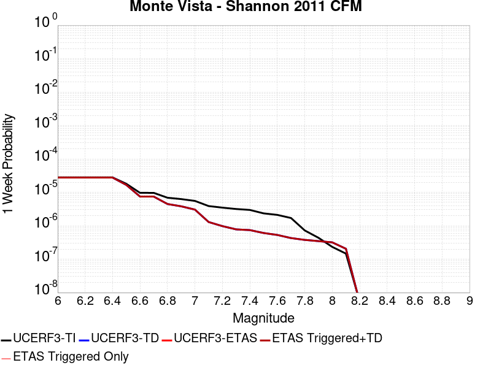 |  |  | 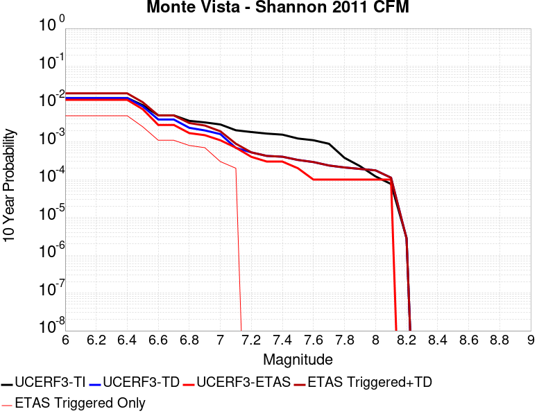 |

| Magnitude | 1 wk TI Prob | 1 wk TD Prob | 1 wk ETAS Prob | 1 wk ETAS/TD Gain | 1 wk ETAS Triggered+TD | 1 wk ETAS Triggered Only | 1 mo TI Prob | 1 mo TD Prob | 1 mo ETAS Prob | 1 mo ETAS/TD Gain | 1 mo ETAS Triggered+TD | 1 mo ETAS Triggered Only | 1 yr TI Prob | 1 yr TD Prob | 1 yr ETAS Prob | 1 yr ETAS/TD Gain | 1 yr ETAS Triggered+TD | 1 yr ETAS Triggered Only | 10 yr TI Prob | 10 yr TD Prob | 10 yr ETAS Prob | 10 yr ETAS/TD Gain | 10 yr ETAS Triggered+TD | 10 yr ETAS Triggered Only |
|-----|-----|-----|-----|-----|-----|-----|-----|-----|-----|-----|-----|-----|-----|-----|-----|-----|-----|-----|-----|-----|-----|-----|-----|-----|
| 6.0 | 2.7907707E-5 | 2.7597327E-5 | 0.0 | 0.0 | 2.7597327E-5 | 0.0 | 1.19598975E-4 | 1.1826959E-4 | 2.0E-4 | 1.6910517 | 2.1825777E-4 | 1.0E-4 | 0.0014551448 | 0.001439105 | 0.0012 | 0.83385164 | 0.0017386732 | 3.0E-4 | 0.014456532 | 0.014327008 | 0.0129 | 0.90039736 | 0.019156806 | 0.0049 |
| 6.1 | 2.7907707E-5 | 2.7597327E-5 | 0.0 | 0.0 | 2.7597327E-5 | 0.0 | 1.19598975E-4 | 1.1826959E-4 | 2.0E-4 | 1.6910517 | 2.1825777E-4 | 1.0E-4 | 0.0014551448 | 0.001439105 | 0.0012 | 0.83385164 | 0.0017386732 | 3.0E-4 | 0.014456532 | 0.014327008 | 0.0129 | 0.90039736 | 0.019156806 | 0.0049 |
| 6.2 | 2.7907707E-5 | 2.7597327E-5 | 0.0 | 0.0 | 2.7597327E-5 | 0.0 | 1.19598975E-4 | 1.1826959E-4 | 2.0E-4 | 1.6910517 | 2.1825777E-4 | 1.0E-4 | 0.0014551448 | 0.001439105 | 0.0012 | 0.83385164 | 0.0017386732 | 3.0E-4 | 0.014456532 | 0.014327008 | 0.0129 | 0.90039736 | 0.019156806 | 0.0049 |
| 6.3 | 2.7907707E-5 | 2.7597327E-5 | 0.0 | 0.0 | 2.7597327E-5 | 0.0 | 1.19598975E-4 | 1.1826959E-4 | 2.0E-4 | 1.6910517 | 2.1825777E-4 | 1.0E-4 | 0.0014551448 | 0.001439105 | 0.0012 | 0.83385164 | 0.0017386732 | 3.0E-4 | 0.014456532 | 0.014327008 | 0.0129 | 0.90039736 | 0.019156806 | 0.0049 |
| 6.4 | 2.7907707E-5 | 2.7597327E-5 | 0.0 | 0.0 | 2.7597327E-5 | 0.0 | 1.19598975E-4 | 1.1826959E-4 | 2.0E-4 | 1.6910517 | 2.1825777E-4 | 1.0E-4 | 0.0014551448 | 0.001439105 | 0.0012 | 0.83385164 | 0.0017386732 | 3.0E-4 | 0.014456532 | 0.014327008 | 0.0129 | 0.90039736 | 0.019156806 | 0.0049 |
| 6.5 | 1.7990213E-5 | 1.6650753E-5 | 0.0 | 0.0 | 1.6650753E-5 | 0.0 | 7.709863E-5 | 7.135879E-5 | 2.0E-4 | 2.8027382 | 1.7135165E-4 | 1.0E-4 | 9.382716E-4 | 8.685133E-4 | 8.0E-4 | 0.92111427 | 0.0011682528 | 3.0E-4 | 0.0093431985 | 0.008674626 | 0.0073 | 0.8415348 | 0.01115294 | 0.0025 |
| 6.6 | 9.650407E-6 | 7.46617E-6 | 0.0 | 0.0 | 7.46617E-6 | 0.0 | 4.135823E-5 | 3.1997522E-5 | 1.0E-4 | 3.125242 | 1.3199433E-4 | 1.0E-4 | 5.0342013E-4 | 3.8950803E-4 | 3.0E-4 | 0.77020234 | 5.8943016E-4 | 2.0E-4 | 0.005022812 | 0.0039059948 | 0.0028 | 0.7168468 | 0.005001698 | 0.0011 |
| 6.7 | 9.62828E-6 | 7.4440745E-6 | 0.0 | 0.0 | 7.4440745E-6 | 0.0 | 4.1263404E-5 | 3.190283E-5 | 1.0E-4 | 3.1345181 | 1.3189964E-4 | 1.0E-4 | 5.022661E-4 | 3.8835558E-4 | 3.0E-4 | 0.77248794 | 5.882779E-4 | 2.0E-4 | 0.0050113243 | 0.0038945104 | 0.0028 | 0.7189607 | 0.0049902266 | 0.0011 |
| 6.8 | 6.887523E-6 | 4.4700632E-6 | 0.0 | 0.0 | 4.4700632E-6 | 0.0 | 2.9517621E-5 | 1.9157285E-5 | 1.0E-4 | 5.2199464 | 1.1915537E-4 | 1.0E-4 | 3.5931775E-4 | 2.3321722E-4 | 2.0E-4 | 0.85756963 | 3.331939E-4 | 1.0E-4 | 0.0035873733 | 0.002346939 | 0.0017 | 0.7243478 | 0.0031450614 | 8.0E-4 |
| 6.9 | 6.2722347E-6 | 3.811814E-6 | 0.0 | 0.0 | 3.811814E-6 | 0.0 | 2.6880729E-5 | 1.6336255E-5 | 1.0E-4 | 6.121354 | 1.16334624E-4 | 1.0E-4 | 3.2722374E-4 | 1.9887778E-4 | 2.0E-4 | 1.0056428 | 2.988579E-4 | 1.0E-4 | 0.003267423 | 0.0020041983 | 0.0015 | 0.74842894 | 0.0027027954 | 7.0E-4 |
| 7.0 | 5.5320347E-6 | 3.0387812E-6 | 0.0 | 0.0 | 3.0387812E-6 | 0.0 | 2.3708504E-5 | 1.3023294E-5 | 0.0 | 0.0 | 1.3023294E-5 | 0.0 | 2.8861282E-4 | 1.585489E-4 | 1.0E-4 | 0.63072026 | 1.585489E-4 | 0.0 | 0.0028823826 | 0.0016015442 | 0.0011 | 0.6868371 | 0.0019010638 | 3.0E-4 |
| 7.1 | 3.8794055E-6 | 1.2914027E-6 | 0.0 | 0.0 | 1.2914027E-6 | 0.0 | 1.6625918E-5 | 5.5345713E-6 | 0.0 | 0.0 | 5.5345713E-6 | 0.0 | 2.0240174E-4 | 6.7381334E-5 | 1.0E-4 | 1.4840904 | 6.7381334E-5 | 0.0 | 0.002022175 | 6.906216E-4 | 7.0E-4 | 1.0135796 | 8.904835E-4 | 2.0E-4 |
| 7.2 | 3.4813652E-6 | 9.743652E-7 | 0.0 | 0.0 | 9.743652E-7 | 0.0 | 1.49200505E-5 | 4.1758444E-6 | 0.0 | 0.0 | 4.1758444E-6 | 0.0 | 1.8163648E-4 | 5.0839728E-5 | 1.0E-4 | 1.9669657 | 5.0839728E-5 | 0.0 | 0.0018148809 | 5.252816E-4 | 4.0E-4 | 0.76149637 | 5.252816E-4 | 0.0 |
| 7.3 | 3.1682148E-6 | 7.7894396E-7 | 0.0 | 0.0 | 7.7894396E-7 | 0.0 | 1.3577992E-5 | 3.338327E-6 | 0.0 | 0.0 | 3.338327E-6 | 0.0 | 1.6529951E-4 | 4.0643376E-5 | 1.0E-4 | 2.4604256 | 4.0643376E-5 | 0.0 | 0.0016517661 | 4.2333477E-4 | 3.0E-4 | 0.708659 | 4.2333477E-4 | 0.0 |
| 7.4 | 2.9707667E-6 | 7.413947E-7 | 0.0 | 0.0 | 7.413947E-7 | 0.0 | 1.2731795E-5 | 3.1774018E-6 | 0.0 | 0.0 | 3.1774018E-6 | 0.0 | 1.5499859E-4 | 3.8684182E-5 | 1.0E-4 | 2.5850358 | 3.8684182E-5 | 0.0 | 0.0015489052 | 4.035375E-4 | 3.0E-4 | 0.7434253 | 4.035375E-4 | 0.0 |
| 7.5 | 2.3462758E-6 | 6.0658414E-7 | 0.0 | 0.0 | 6.0658414E-7 | 0.0 | 1.0055429E-5 | 2.5996437E-6 | 0.0 | 0.0 | 2.5996437E-6 | 0.0 | 1.2241797E-4 | 3.1650205E-5 | 1.0E-4 | 3.159537 | 3.1650205E-5 | 0.0 | 0.0012235056 | 3.314655E-4 | 2.0E-4 | 0.60338104 | 3.314655E-4 | 0.0 |
| 7.6 | 2.112783E-6 | 5.3060506E-7 | 0.0 | 0.0 | 5.3060506E-7 | 0.0 | 9.054753E-6 | 2.2740196E-6 | 0.0 | 0.0 | 2.2740196E-6 | 0.0 | 1.1023604E-4 | 2.7685839E-5 | 1.0E-4 | 3.611955 | 2.7685839E-5 | 0.0 | 0.0011018137 | 2.9140097E-4 | 1.0E-4 | 0.34316978 | 2.9140097E-4 | 0.0 |
| 7.7 | 1.7022471E-6 | 4.2791277E-7 | 0.0 | 0.0 | 4.2791277E-7 | 0.0 | 7.2953244E-6 | 1.8339105E-6 | 0.0 | 0.0 | 1.8339105E-6 | 0.0 | 8.881695E-5 | 2.2327633E-5 | 1.0E-4 | 4.478755 | 2.2327633E-5 | 0.0 | 8.878146E-4 | 2.3649132E-4 | 1.0E-4 | 0.4228485 | 2.3649132E-4 | 0.0 |
| 7.8 | 7.230914E-7 | 3.7716887E-7 | 0.0 | 0.0 | 3.7716887E-7 | 0.0 | 3.0989595E-6 | 1.616437E-6 | 0.0 | 0.0 | 1.616437E-6 | 0.0 | 3.772918E-5 | 1.9679945E-5 | 1.0E-4 | 5.081315 | 1.9679945E-5 | 0.0 | 3.7722773E-4 | 2.0953974E-4 | 1.0E-4 | 0.47723645 | 2.0953974E-4 | 0.0 |
| 7.9 | 4.3588446E-7 | 3.4681136E-7 | 0.0 | 0.0 | 3.4681136E-7 | 0.0 | 1.868075E-6 | 1.4863336E-6 | 0.0 | 0.0 | 1.4863336E-6 | 0.0 | 2.2743576E-5 | 1.8095963E-5 | 1.0E-4 | 5.5260944 | 1.8095963E-5 | 0.0 | 2.2741247E-4 | 1.9191172E-4 | 1.0E-4 | 0.5210729 | 1.9191172E-4 | 0.0 |
| 8.0 | 2.3317523E-7 | 3.1843098E-7 | 0.0 | 0.0 | 3.1843098E-7 | 0.0 | 9.99322E-7 | 1.3647035E-6 | 0.0 | 0.0 | 1.3647035E-6 | 0.0 | 1.2166677E-5 | 1.6615139E-5 | 1.0E-4 | 6.018607 | 1.6615139E-5 | 0.0 | 1.21660116E-4 | 1.7569962E-4 | 1.0E-4 | 0.5691532 | 1.7569962E-4 | 0.0 |
| 8.1 | 1.4662456E-7 | 2.050237E-7 | 0.0 | 0.0 | 2.050237E-7 | 0.0 | 6.283908E-7 | 8.7867267E-7 | 0.0 | 0.0 | 8.7867267E-7 | 0.0 | 7.650631E-6 | 1.0697789E-5 | 1.0E-4 | 9.347727 | 1.0697789E-5 | 0.0 | 7.650368E-5 | 1.1232932E-4 | 1.0E-4 | 0.89023954 | 1.1232932E-4 | 0.0 |
| 8.2 | 5.4931775E-9 | 5.1271325E-9 | 0.0 | 0.0 | 5.1271325E-9 | 0.0 | 2.3542189E-8 | 2.1973424E-8 | 0.0 | 0.0 | 2.1973424E-8 | 0.0 | 2.8662612E-7 | 2.6752642E-7 | 0.0 | 0.0 | 2.6752642E-7 | 0.0 | 2.8662573E-6 | 2.7811748E-6 | 0.0 | 0.0 | 2.7811748E-6 | 0.0 |

## Red Mountain
*[(top)](#table-of-contents)*

| 1 Week | 1 Month | 1 Year | 10 Year |
|-----|-----|-----|-----|
|  |  |  |  |

| Magnitude | 1 wk TI Prob | 1 wk TD Prob | 1 wk ETAS Prob | 1 wk ETAS/TD Gain | 1 wk ETAS Triggered+TD | 1 wk ETAS Triggered Only | 1 mo TI Prob | 1 mo TD Prob | 1 mo ETAS Prob | 1 mo ETAS/TD Gain | 1 mo ETAS Triggered+TD | 1 mo ETAS Triggered Only | 1 yr TI Prob | 1 yr TD Prob | 1 yr ETAS Prob | 1 yr ETAS/TD Gain | 1 yr ETAS Triggered+TD | 1 yr ETAS Triggered Only | 10 yr TI Prob | 10 yr TD Prob | 10 yr ETAS Prob | 10 yr ETAS/TD Gain | 10 yr ETAS Triggered+TD | 10 yr ETAS Triggered Only |
|-----|-----|-----|-----|-----|-----|-----|-----|-----|-----|-----|-----|-----|-----|-----|-----|-----|-----|-----|-----|-----|-----|-----|-----|-----|
| 6.0 | 4.1810763E-5 | 4.7605867E-5 | 1.0E-4 | 2.1005814 | 1.4760111E-4 | 1.0E-4 | 1.7917668E-4 | 2.0401012E-4 | 2.0E-4 | 0.9803435 | 3.039897E-4 | 1.0E-4 | 0.0021792934 | 0.0024811588 | 0.0015 | 0.60455626 | 0.0029799182 | 5.0E-4 | 0.021580452 | 0.02455219 | 0.0168 | 0.6842566 | 0.028649073 | 0.0042 |
| 6.1 | 4.1810763E-5 | 4.7605867E-5 | 1.0E-4 | 2.1005814 | 1.4760111E-4 | 1.0E-4 | 1.7917668E-4 | 2.0401012E-4 | 2.0E-4 | 0.9803435 | 3.039897E-4 | 1.0E-4 | 0.0021792934 | 0.0024811588 | 0.0015 | 0.60455626 | 0.0029799182 | 5.0E-4 | 0.021580452 | 0.02455219 | 0.0168 | 0.6842566 | 0.028649073 | 0.0042 |
| 6.2 | 4.1810763E-5 | 4.7605867E-5 | 1.0E-4 | 2.1005814 | 1.4760111E-4 | 1.0E-4 | 1.7917668E-4 | 2.0401012E-4 | 2.0E-4 | 0.9803435 | 3.039897E-4 | 1.0E-4 | 0.0021792934 | 0.0024811588 | 0.0015 | 0.60455626 | 0.0029799182 | 5.0E-4 | 0.021580452 | 0.02455219 | 0.0168 | 0.6842566 | 0.028649073 | 0.0042 |
| 6.3 | 4.1810763E-5 | 4.7605867E-5 | 1.0E-4 | 2.1005814 | 1.4760111E-4 | 1.0E-4 | 1.7917668E-4 | 2.0401012E-4 | 2.0E-4 | 0.9803435 | 3.039897E-4 | 1.0E-4 | 0.0021792934 | 0.0024811588 | 0.0015 | 0.60455626 | 0.0029799182 | 5.0E-4 | 0.021580452 | 0.02455219 | 0.0168 | 0.6842566 | 0.028649073 | 0.0042 |
| 6.4 | 4.1810763E-5 | 4.7605867E-5 | 1.0E-4 | 2.1005814 | 1.4760111E-4 | 1.0E-4 | 1.7917668E-4 | 2.0401012E-4 | 2.0E-4 | 0.9803435 | 3.039897E-4 | 1.0E-4 | 0.0021792934 | 0.0024811588 | 0.0015 | 0.60455626 | 0.0029799182 | 5.0E-4 | 0.021580452 | 0.02455219 | 0.0168 | 0.6842566 | 0.028649073 | 0.0042 |
| 6.5 | 3.154503E-5 | 3.5370977E-5 | 0.0 | 0.0 | 3.5370977E-5 | 0.0 | 1.3518598E-4 | 1.515816E-4 | 1.0E-4 | 0.65971065 | 1.515816E-4 | 0.0 | 0.0016446467 | 0.001844036 | 0.0012 | 0.6507465 | 0.002143483 | 3.0E-4 | 0.01632528 | 0.018296996 | 0.0133 | 0.7268952 | 0.021536617 | 0.0033 |
| 6.6 | 3.1535834E-5 | 3.5360354E-5 | 0.0 | 0.0 | 3.5360354E-5 | 0.0 | 1.3514658E-4 | 1.515361E-4 | 1.0E-4 | 0.65990883 | 1.515361E-4 | 0.0 | 0.0016441676 | 0.0018434828 | 0.0012 | 0.6509418 | 0.0021429297 | 3.0E-4 | 0.01632056 | 0.018291555 | 0.0133 | 0.72711146 | 0.021531194 | 0.0033 |
| 6.7 | 2.8267326E-5 | 3.147913E-5 | 0.0 | 0.0 | 3.147913E-5 | 0.0 | 1.2114006E-4 | 1.3490407E-4 | 1.0E-4 | 0.7412675 | 1.3490407E-4 | 0.0 | 0.0014738824 | 0.0016413047 | 0.001 | 0.6092714 | 0.0019408123 | 3.0E-4 | 0.014641452 | 0.016300596 | 0.0117 | 0.7177652 | 0.019251693 | 0.003 |
| 6.8 | 2.8212884E-5 | 3.1417E-5 | 0.0 | 0.0 | 3.1417E-5 | 0.0 | 1.20906756E-4 | 1.3463781E-4 | 1.0E-4 | 0.7427334 | 1.3463781E-4 | 0.0 | 0.0014710457 | 0.0016380679 | 0.001 | 0.6104753 | 0.0019375766 | 3.0E-4 | 0.014613459 | 0.016268702 | 0.0117 | 0.71917224 | 0.019219898 | 0.003 |
| 6.9 | 2.4227871E-5 | 2.6715077E-5 | 0.0 | 0.0 | 2.6715077E-5 | 0.0 | 1.03829596E-4 | 1.1448859E-4 | 1.0E-4 | 0.8734495 | 1.1448859E-4 | 0.0 | 0.0012633923 | 0.0013930833 | 0.001 | 0.7178322 | 0.0016926654 | 3.0E-4 | 0.012562336 | 0.013851198 | 0.0101 | 0.7291788 | 0.01631657 | 0.0025 |
| 7.0 | 2.348524E-5 | 2.5843561E-5 | 0.0 | 0.0 | 2.5843561E-5 | 0.0 | 1.0064714E-4 | 1.1075385E-4 | 1.0E-4 | 0.9029032 | 1.1075385E-4 | 0.0 | 0.0012246901 | 0.0013476696 | 9.0E-4 | 0.66781944 | 0.0016472654 | 3.0E-4 | 0.012179627 | 0.01340261 | 0.0099 | 0.73866206 | 0.015869103 | 0.0025 |
| 7.1 | 2.2311642E-5 | 2.4470162E-5 | 0.0 | 0.0 | 2.4470162E-5 | 0.0 | 9.561782E-5 | 1.0486833E-4 | 1.0E-4 | 0.9535767 | 1.0486833E-4 | 0.0 | 0.0011635252 | 0.001276099 | 8.0E-4 | 0.62691057 | 0.0015757162 | 3.0E-4 | 0.01157452 | 0.012695235 | 0.0096 | 0.7561892 | 0.015163497 | 0.0025 |
| 7.2 | 1.6533986E-5 | 1.7675313E-5 | 0.0 | 0.0 | 1.7675313E-5 | 0.0 | 7.085802E-5 | 7.574949E-5 | 0.0 | 0.0 | 7.574949E-5 | 0.0 | 8.623549E-4 | 9.219234E-4 | 6.0E-4 | 0.6508133 | 0.001121739 | 2.0E-4 | 0.008590161 | 0.009187271 | 0.0076 | 0.8272315 | 0.011069815 | 0.0019 |
| 7.3 | 1.4703092E-5 | 1.556384E-5 | 0.0 | 0.0 | 1.556384E-5 | 0.0 | 6.301173E-5 | 6.670081E-5 | 0.0 | 0.0 | 6.670081E-5 | 0.0 | 7.668978E-4 | 8.118415E-4 | 5.0E-4 | 0.61588377 | 0.0010116792 | 2.0E-4 | 0.0076425658 | 0.008094836 | 0.0063 | 0.77827394 | 0.009582694 | 0.0015 |
| 7.4 | 6.1331984E-6 | 5.5297896E-6 | 0.0 | 0.0 | 5.5297896E-6 | 0.0 | 2.6284872E-5 | 2.3698887E-5 | 0.0 | 0.0 | 2.3698887E-5 | 0.0 | 3.199713E-4 | 2.8849626E-4 | 2.0E-4 | 0.6932499 | 4.884386E-4 | 2.0E-4 | 0.0031951098 | 0.002881272 | 0.0025 | 0.8676724 | 0.003579255 | 7.0E-4 |
| 7.5 | 5.954766E-6 | 5.3393874E-6 | 0.0 | 0.0 | 5.3393874E-6 | 0.0 | 2.5520176E-5 | 2.288289E-5 | 0.0 | 0.0 | 2.288289E-5 | 0.0 | 3.1066386E-4 | 2.785641E-4 | 2.0E-4 | 0.7179676 | 4.785084E-4 | 2.0E-4 | 0.003102299 | 0.0027822033 | 0.0024 | 0.8626257 | 0.0034802556 | 7.0E-4 |
| 7.6 | 4.9726646E-6 | 4.3160226E-6 | 0.0 | 0.0 | 4.3160226E-6 | 0.0 | 2.1311245E-5 | 1.849711E-5 | 0.0 | 0.0 | 1.849711E-5 | 0.0 | 2.5943352E-4 | 2.2517939E-4 | 2.0E-4 | 0.88818073 | 4.2513435E-4 | 2.0E-4 | 0.0025913084 | 0.0022495468 | 0.0019 | 0.8446145 | 0.002748422 | 5.0E-4 |
| 7.7 | 3.3613894E-6 | 2.8531529E-6 | 0.0 | 0.0 | 2.8531529E-6 | 0.0 | 1.4405875E-5 | 1.2227742E-5 | 0.0 | 0.0 | 1.2227742E-5 | 0.0 | 1.7537741E-4 | 1.4886286E-4 | 0.0 | 0.0 | 1.4886286E-4 | 0.0 | 0.0017523908 | 0.0014876577 | 0.0013 | 0.87385696 | 0.0017872114 | 3.0E-4 |
| 7.8 | 1.1828961E-6 | 1.0124201E-6 | 0.0 | 0.0 | 1.0124201E-6 | 0.0 | 5.069545E-6 | 4.3389364E-6 | 0.0 | 0.0 | 4.3389364E-6 | 0.0 | 6.171996E-5 | 5.2825297E-5 | 0.0 | 0.0 | 5.2825297E-5 | 0.0 | 6.170282E-4 | 5.2813033E-4 | 4.0E-4 | 0.7573888 | 7.280247E-4 | 2.0E-4 |
| 7.9 | 2.2967266E-7 | 1.8621728E-7 | 0.0 | 0.0 | 1.8621728E-7 | 0.0 | 9.843111E-7 | 7.980738E-7 | 0.0 | 0.0 | 7.980738E-7 | 0.0 | 1.19839215E-5 | 9.716508E-6 | 0.0 | 0.0 | 9.716508E-6 | 0.0 | 1.1983275E-4 | 9.716112E-5 | 2.0E-4 | 2.0584364 | 2.971417E-4 | 2.0E-4 |

## Coyote Canyon
*[(top)](#table-of-contents)*

| 1 Week | 1 Month | 1 Year | 10 Year |
|-----|-----|-----|-----|
|  |  |  |  |

| Magnitude | 1 wk TI Prob | 1 wk TD Prob | 1 wk ETAS Prob | 1 wk ETAS/TD Gain | 1 wk ETAS Triggered+TD | 1 wk ETAS Triggered Only | 1 mo TI Prob | 1 mo TD Prob | 1 mo ETAS Prob | 1 mo ETAS/TD Gain | 1 mo ETAS Triggered+TD | 1 mo ETAS Triggered Only | 1 yr TI Prob | 1 yr TD Prob | 1 yr ETAS Prob | 1 yr ETAS/TD Gain | 1 yr ETAS Triggered+TD | 1 yr ETAS Triggered Only | 10 yr TI Prob | 10 yr TD Prob | 10 yr ETAS Prob | 10 yr ETAS/TD Gain | 10 yr ETAS Triggered+TD | 10 yr ETAS Triggered Only |
|-----|-----|-----|-----|-----|-----|-----|-----|-----|-----|-----|-----|-----|-----|-----|-----|-----|-----|-----|-----|-----|-----|-----|-----|-----|
| 6.0 | 3.5090034E-5 | 4.037636E-5 | 0.0 | 0.0 | 4.037636E-5 | 0.0 | 1.503772E-4 | 1.7303151E-4 | 0.0 | 0.0 | 1.7303151E-4 | 0.0 | 0.0018293047 | 0.0021048808 | 0.0014 | 0.66512084 | 0.0025040389 | 4.0E-4 | 0.018143194 | 0.020875376 | 0.019 | 0.9101633 | 0.0249877 | 0.0042 |
| 6.1 | 3.5090034E-5 | 4.037636E-5 | 0.0 | 0.0 | 4.037636E-5 | 0.0 | 1.503772E-4 | 1.7303151E-4 | 0.0 | 0.0 | 1.7303151E-4 | 0.0 | 0.0018293047 | 0.0021048808 | 0.0014 | 0.66512084 | 0.0025040389 | 4.0E-4 | 0.018143194 | 0.020875376 | 0.019 | 0.9101633 | 0.0249877 | 0.0042 |
| 6.2 | 1.841879E-5 | 2.1065785E-5 | 0.0 | 0.0 | 2.1065785E-5 | 0.0 | 7.8935285E-5 | 9.027939E-5 | 0.0 | 0.0 | 9.027939E-5 | 0.0 | 9.606133E-4 | 0.0010986994 | 9.0E-4 | 0.8191503 | 0.0013983698 | 3.0E-4 | 0.0095647145 | 0.010942766 | 0.011 | 1.0052303 | 0.013613221 | 0.0027 |
| 6.3 | 1.841879E-5 | 2.1065785E-5 | 0.0 | 0.0 | 2.1065785E-5 | 0.0 | 7.8935285E-5 | 9.027939E-5 | 0.0 | 0.0 | 9.027939E-5 | 0.0 | 9.606133E-4 | 0.0010986994 | 9.0E-4 | 0.8191503 | 0.0013983698 | 3.0E-4 | 0.0095647145 | 0.010942766 | 0.011 | 1.0052303 | 0.013613221 | 0.0027 |
| 6.4 | 1.712201E-5 | 1.957075E-5 | 0.0 | 0.0 | 1.957075E-5 | 0.0 | 7.337798E-5 | 8.387252E-5 | 0.0 | 0.0 | 8.387252E-5 | 0.0 | 8.930107E-4 | 0.0010207702 | 8.0E-4 | 0.783722 | 0.001320464 | 3.0E-4 | 0.008894307 | 0.010170738 | 0.0105 | 1.0323734 | 0.012843277 | 0.0027 |
| 6.5 | 1.4744935E-5 | 1.6841712E-5 | 0.0 | 0.0 | 1.6841712E-5 | 0.0 | 6.3191044E-5 | 7.2177296E-5 | 0.0 | 0.0 | 7.2177296E-5 | 0.0 | 7.6907943E-4 | 8.7849784E-4 | 7.0E-4 | 0.7968147 | 0.0011782343 | 3.0E-4 | 0.007664232 | 0.008759452 | 0.0092 | 1.0502939 | 0.01113843 | 0.0024 |
| 6.6 | 1.2017839E-5 | 1.3727956E-5 | 0.0 | 0.0 | 1.3727956E-5 | 0.0 | 5.150401E-5 | 5.883327E-5 | 0.0 | 0.0 | 5.883327E-5 | 0.0 | 6.268809E-4 | 7.161483E-4 | 7.0E-4 | 0.9774512 | 0.0010159335 | 3.0E-4 | 0.0062511545 | 0.0071471026 | 0.0076 | 1.063368 | 0.009132808 | 0.002 |
| 6.7 | 1.00956095E-5 | 1.1536777E-5 | 0.0 | 0.0 | 1.1536777E-5 | 0.0 | 4.326618E-5 | 4.9442882E-5 | 0.0 | 0.0 | 4.9442882E-5 | 0.0 | 5.266384E-4 | 6.018878E-4 | 5.0E-4 | 0.83071953 | 9.017073E-4 | 3.0E-4 | 0.005253921 | 0.006011109 | 0.0063 | 1.0480596 | 0.0076014907 | 0.0016 |

## Hunting Creek - Bartlett Springs connector 2011
*[(top)](#table-of-contents)*

| 1 Week | 1 Month | 1 Year | 10 Year |
|-----|-----|-----|-----|
| 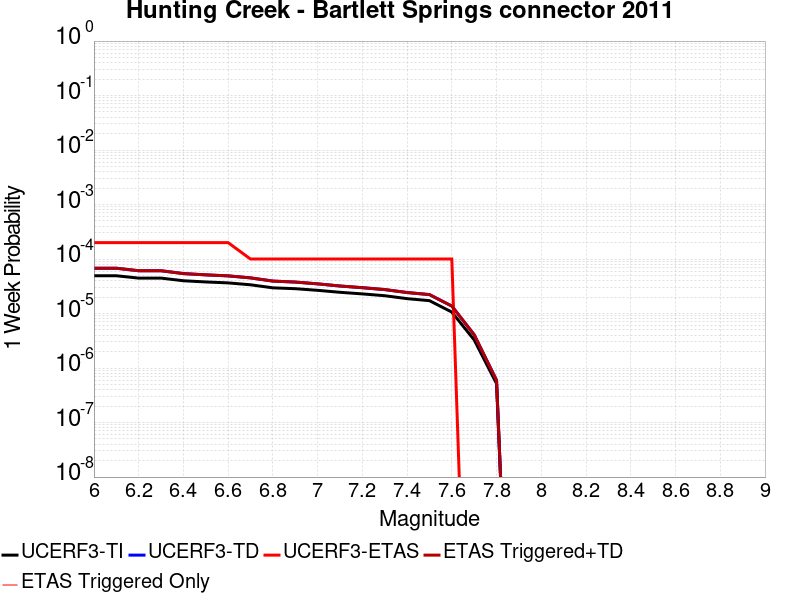 | 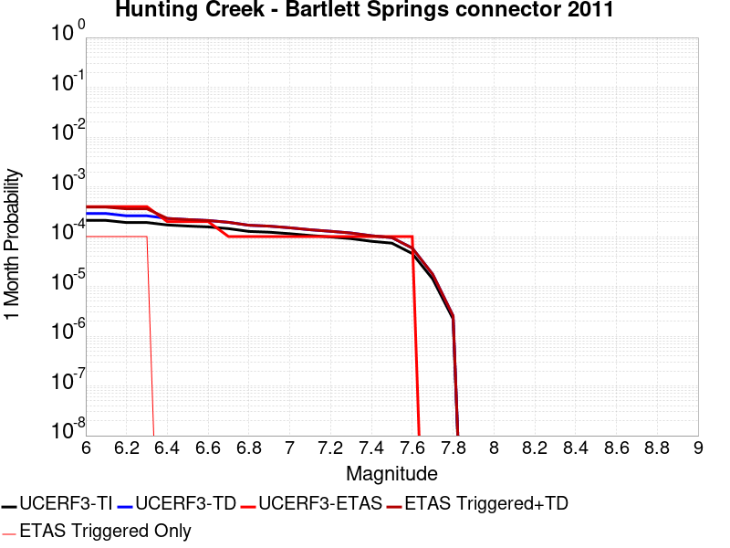 | 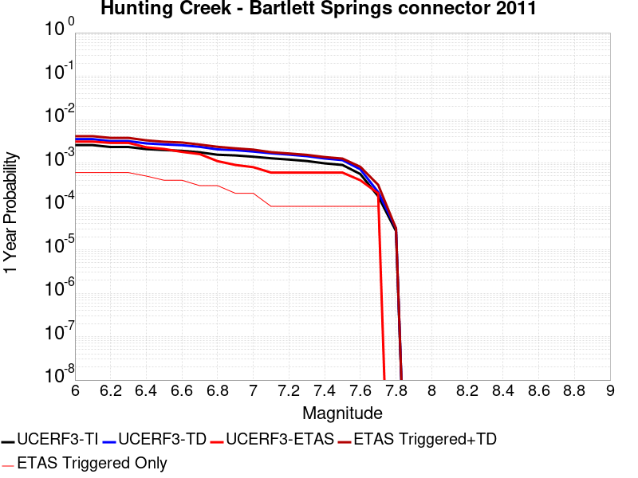 |  |

| Magnitude | 1 wk TI Prob | 1 wk TD Prob | 1 wk ETAS Prob | 1 wk ETAS/TD Gain | 1 wk ETAS Triggered+TD | 1 wk ETAS Triggered Only | 1 mo TI Prob | 1 mo TD Prob | 1 mo ETAS Prob | 1 mo ETAS/TD Gain | 1 mo ETAS Triggered+TD | 1 mo ETAS Triggered Only | 1 yr TI Prob | 1 yr TD Prob | 1 yr ETAS Prob | 1 yr ETAS/TD Gain | 1 yr ETAS Triggered+TD | 1 yr ETAS Triggered Only | 10 yr TI Prob | 10 yr TD Prob | 10 yr ETAS Prob | 10 yr ETAS/TD Gain | 10 yr ETAS Triggered+TD | 10 yr ETAS Triggered Only |
|-----|-----|-----|-----|-----|-----|-----|-----|-----|-----|-----|-----|-----|-----|-----|-----|-----|-----|-----|-----|-----|-----|-----|-----|-----|
| 6.0 | 4.940016E-5 | 6.7914334E-5 | 2.0E-4 | 2.9448862 | 6.7914334E-5 | 0.0 | 2.1169778E-4 | 2.910261E-4 | 4.0E-4 | 1.3744472 | 3.9099698E-4 | 1.0E-4 | 0.002574374 | 0.0035373413 | 0.0031 | 0.8763644 | 0.004135219 | 6.0E-4 | 0.025447546 | 0.034796044 | 0.0306 | 0.87941027 | 0.039815105 | 0.0052 |
| 6.1 | 4.940016E-5 | 6.7914334E-5 | 2.0E-4 | 2.9448862 | 6.7914334E-5 | 0.0 | 2.1169778E-4 | 2.910261E-4 | 4.0E-4 | 1.3744472 | 3.9099698E-4 | 1.0E-4 | 0.002574374 | 0.0035373413 | 0.0031 | 0.8763644 | 0.004135219 | 6.0E-4 | 0.025447546 | 0.034796044 | 0.0306 | 0.87941027 | 0.039815105 | 0.0052 |
| 6.2 | 4.472471E-5 | 6.104415E-5 | 2.0E-4 | 3.2763171 | 6.104415E-5 | 0.0 | 1.9166325E-4 | 2.615899E-4 | 4.0E-4 | 1.5291109 | 3.6156375E-4 | 1.0E-4 | 0.0023310026 | 0.0031801076 | 0.0029 | 0.9119188 | 0.0037781994 | 6.0E-4 | 0.02306703 | 0.031336576 | 0.0253 | 0.8073632 | 0.035114367 | 0.0039 |
| 6.3 | 4.472471E-5 | 6.104415E-5 | 2.0E-4 | 3.2763171 | 6.104415E-5 | 0.0 | 1.9166325E-4 | 2.615899E-4 | 4.0E-4 | 1.5291109 | 3.6156375E-4 | 1.0E-4 | 0.0023310026 | 0.0031801076 | 0.0029 | 0.9119188 | 0.0037781994 | 6.0E-4 | 0.02306703 | 0.031336576 | 0.0253 | 0.8073632 | 0.035114367 | 0.0039 |
| 6.4 | 4.0001003E-5 | 5.4138003E-5 | 2.0E-4 | 3.6942627 | 5.4138003E-5 | 0.0 | 1.714216E-4 | 2.3199919E-4 | 2.0E-4 | 0.86207193 | 2.3199919E-4 | 0.0 | 0.0020850603 | 0.0028208806 | 0.0023 | 0.81534827 | 0.0033194702 | 5.0E-4 | 0.02065605 | 0.027845427 | 0.0202 | 0.7254333 | 0.030859107 | 0.0031 |
| 6.5 | 3.8033053E-5 | 5.1297422E-5 | 2.0E-4 | 3.8988316 | 5.1297422E-5 | 0.0 | 1.6298861E-4 | 2.1982734E-4 | 2.0E-4 | 0.90980494 | 2.1982734E-4 | 0.0 | 0.0019825802 | 0.0026730858 | 0.0021 | 0.7856089 | 0.0030720166 | 4.0E-4 | 0.019649856 | 0.02640647 | 0.0181 | 0.6854381 | 0.028743094 | 0.0024 |
| 6.6 | 3.653754E-5 | 4.915885E-5 | 2.0E-4 | 4.0684433 | 4.915885E-5 | 0.0 | 1.5658008E-4 | 2.1066378E-4 | 2.0E-4 | 0.9493801 | 2.1066378E-4 | 0.0 | 0.0019046954 | 0.0025618074 | 0.0018 | 0.7026289 | 0.0029607827 | 4.0E-4 | 0.018884527 | 0.025321629 | 0.0165 | 0.6516168 | 0.027368454 | 0.0021 |
| 6.7 | 3.372024E-5 | 4.5166544E-5 | 1.0E-4 | 2.2140281 | 4.5166544E-5 | 0.0 | 1.4450731E-4 | 1.9355648E-4 | 1.0E-4 | 0.5166451 | 1.9355648E-4 | 0.0 | 0.0017579567 | 0.0023540214 | 0.0016 | 0.679688 | 0.0026533152 | 3.0E-4 | 0.017441148 | 0.023291877 | 0.0148 | 0.63541466 | 0.02504995 | 0.0018 |
| 6.8 | 2.9650024E-5 | 3.9433417E-5 | 1.0E-4 | 2.5359201 | 3.9433417E-5 | 0.0 | 1.2706534E-4 | 1.6898921E-4 | 1.0E-4 | 0.5917538 | 1.6898921E-4 | 0.0 | 0.0015459227 | 0.0020554923 | 0.0011 | 0.5351516 | 0.0023548757 | 3.0E-4 | 0.015352124 | 0.020362703 | 0.0123 | 0.6040455 | 0.021930123 | 0.0016 |
| 6.9 | 2.860775E-5 | 3.783323E-5 | 1.0E-4 | 2.6431792 | 3.783323E-5 | 0.0 | 1.2259888E-4 | 1.6213233E-4 | 1.0E-4 | 0.6167801 | 1.6213233E-4 | 0.0 | 0.0014916194 | 0.0019721806 | 9.0E-4 | 0.45634767 | 0.002171786 | 2.0E-4 | 0.014816469 | 0.019546606 | 0.0112 | 0.5729895 | 0.020821195 | 0.0013 |
| 7.0 | 2.6696067E-5 | 3.508623E-5 | 1.0E-4 | 2.850121 | 3.508623E-5 | 0.0 | 1.144067E-4 | 1.5036094E-4 | 1.0E-4 | 0.66506636 | 1.5036094E-4 | 0.0 | 0.0013920115 | 0.0018291157 | 8.0E-4 | 0.43736982 | 0.0020287498 | 2.0E-4 | 0.013833242 | 0.018141165 | 0.01 | 0.5512325 | 0.019319396 | 0.0012 |
| 7.1 | 2.456087E-5 | 3.2030614E-5 | 1.0E-4 | 3.122013 | 3.2030614E-5 | 0.0 | 1.0525662E-4 | 1.3726689E-4 | 1.0E-4 | 0.7285078 | 1.3726689E-4 | 0.0 | 0.001280746 | 0.0016699523 | 6.0E-4 | 0.3592917 | 0.0017697853 | 1.0E-4 | 0.012733897 | 0.01657554 | 0.0083 | 0.50073785 | 0.017657306 | 0.0011 |
| 7.2 | 2.295761E-5 | 2.9839379E-5 | 1.0E-4 | 3.3512762 | 2.9839379E-5 | 0.0 | 9.8386045E-5 | 1.2787683E-4 | 1.0E-4 | 0.78200245 | 1.2787683E-4 | 0.0 | 0.0011971919 | 0.0015557979 | 6.0E-4 | 0.3856542 | 0.0016556423 | 1.0E-4 | 0.011907627 | 0.01545073 | 0.0076 | 0.49188614 | 0.016533734 | 0.0011 |
| 7.3 | 2.1256936E-5 | 2.7557317E-5 | 1.0E-4 | 3.6288004 | 2.7557317E-5 | 0.0 | 9.109797E-5 | 1.1809749E-4 | 1.0E-4 | 0.84675807 | 1.1809749E-4 | 0.0 | 0.0011085535 | 0.0014368974 | 6.0E-4 | 0.41756633 | 0.0015367537 | 1.0E-4 | 0.011030397 | 0.014277649 | 0.0068 | 0.4762689 | 0.015361943 | 0.0011 |
| 7.4 | 1.8784336E-5 | 2.4320507E-5 | 1.0E-4 | 4.1117563 | 2.4320507E-5 | 0.0 | 8.050181E-5 | 1.0422662E-4 | 1.0E-4 | 0.95944774 | 1.0422662E-4 | 0.0 | 9.796688E-4 | 0.001268228 | 6.0E-4 | 0.47310102 | 0.0013681012 | 1.0E-4 | 0.009753612 | 0.012611193 | 0.0064 | 0.5074857 | 0.013598582 | 0.001 |
| 7.5 | 1.7248298E-5 | 2.2281372E-5 | 1.0E-4 | 4.488054 | 2.2281372E-5 | 0.0 | 7.391918E-5 | 9.548815E-5 | 1.0E-4 | 1.0472504 | 9.548815E-5 | 0.0 | 8.9959445E-4 | 0.0011619556 | 6.0E-4 | 0.51637083 | 0.0012618394 | 1.0E-4 | 0.008959615 | 0.011560005 | 0.0059 | 0.5103804 | 0.012251913 | 7.0E-4 |
| 7.6 | 1.0653709E-5 | 1.3730191E-5 | 1.0E-4 | 7.28322 | 1.3730191E-5 | 0.0 | 4.5657955E-5 | 5.8842365E-5 | 1.0E-4 | 1.6994559 | 5.8842365E-5 | 0.0 | 5.557438E-4 | 7.1617303E-4 | 4.0E-4 | 0.55852425 | 8.161014E-4 | 1.0E-4 | 0.0055435603 | 0.0071391985 | 0.0039 | 0.5462798 | 0.0077349152 | 6.0E-4 |
| 7.7 | 3.286316E-6 | 4.0920513E-6 | 0.0 | 0.0 | 4.0920513E-6 | 0.0 | 1.4084137E-5 | 1.7537244E-5 | 0.0 | 0.0 | 1.7537244E-5 | 0.0 | 1.7146087E-4 | 2.134952E-4 | 2.0E-4 | 0.9367892 | 3.1347384E-4 | 1.0E-4 | 0.0017132863 | 0.0021329436 | 9.0E-4 | 0.42195207 | 0.002332517 | 2.0E-4 |
| 7.8 | 5.1855085E-7 | 5.9737005E-7 | 0.0 | 0.0 | 5.9737005E-7 | 0.0 | 2.222359E-6 | 2.5601548E-6 | 0.0 | 0.0 | 2.5601548E-6 | 0.0 | 2.7056883E-5 | 3.116945E-5 | 0.0 | 0.0 | 3.116945E-5 | 0.0 | 2.705359E-4 | 3.116446E-4 | 1.0E-4 | 0.32087833 | 3.116446E-4 | 0.0 |

## Eaton Roughs 2011 CFM
*[(top)](#table-of-contents)*

| 1 Week | 1 Month | 1 Year | 10 Year |
|-----|-----|-----|-----|
| 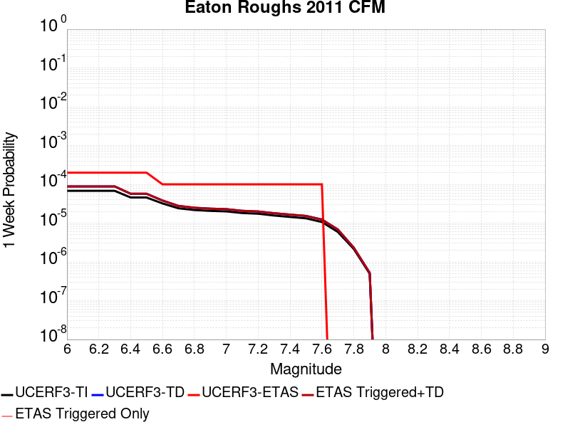 |  |  |  |

| Magnitude | 1 wk TI Prob | 1 wk TD Prob | 1 wk ETAS Prob | 1 wk ETAS/TD Gain | 1 wk ETAS Triggered+TD | 1 wk ETAS Triggered Only | 1 mo TI Prob | 1 mo TD Prob | 1 mo ETAS Prob | 1 mo ETAS/TD Gain | 1 mo ETAS Triggered+TD | 1 mo ETAS Triggered Only | 1 yr TI Prob | 1 yr TD Prob | 1 yr ETAS Prob | 1 yr ETAS/TD Gain | 1 yr ETAS Triggered+TD | 1 yr ETAS Triggered Only | 10 yr TI Prob | 10 yr TD Prob | 10 yr ETAS Prob | 10 yr ETAS/TD Gain | 10 yr ETAS Triggered+TD | 10 yr ETAS Triggered Only |
|-----|-----|-----|-----|-----|-----|-----|-----|-----|-----|-----|-----|-----|-----|-----|-----|-----|-----|-----|-----|-----|-----|-----|-----|-----|
| 6.0 | 6.8044945E-5 | 8.848526E-5 | 2.0E-4 | 2.2602632 | 8.848526E-5 | 0.0 | 2.9158857E-4 | 3.7916636E-4 | 3.0E-4 | 0.7912094 | 3.7916636E-4 | 0.0 | 0.0035443127 | 0.004607257 | 0.0027 | 0.58603203 | 0.0048063355 | 2.0E-4 | 0.03488314 | 0.045188148 | 0.0304 | 0.6727428 | 0.049771246 | 0.0048 |
| 6.1 | 6.8044945E-5 | 8.848526E-5 | 2.0E-4 | 2.2602632 | 8.848526E-5 | 0.0 | 2.9158857E-4 | 3.7916636E-4 | 3.0E-4 | 0.7912094 | 3.7916636E-4 | 0.0 | 0.0035443127 | 0.004607257 | 0.0027 | 0.58603203 | 0.0048063355 | 2.0E-4 | 0.03488314 | 0.045188148 | 0.0304 | 0.6727428 | 0.049771246 | 0.0048 |
| 6.2 | 6.8044945E-5 | 8.848526E-5 | 2.0E-4 | 2.2602632 | 8.848526E-5 | 0.0 | 2.9158857E-4 | 3.7916636E-4 | 3.0E-4 | 0.7912094 | 3.7916636E-4 | 0.0 | 0.0035443127 | 0.004607257 | 0.0027 | 0.58603203 | 0.0048063355 | 2.0E-4 | 0.03488314 | 0.045188148 | 0.0304 | 0.6727428 | 0.049771246 | 0.0048 |
| 6.3 | 6.8044945E-5 | 8.848526E-5 | 2.0E-4 | 2.2602632 | 8.848526E-5 | 0.0 | 2.9158857E-4 | 3.7916636E-4 | 3.0E-4 | 0.7912094 | 3.7916636E-4 | 0.0 | 0.0035443127 | 0.004607257 | 0.0027 | 0.58603203 | 0.0048063355 | 2.0E-4 | 0.03488314 | 0.045188148 | 0.0304 | 0.6727428 | 0.049771246 | 0.0048 |
| 6.4 | 4.5830013E-5 | 5.7182817E-5 | 2.0E-4 | 3.4975543 | 5.7182817E-5 | 0.0 | 1.9639956E-4 | 2.4504925E-4 | 2.0E-4 | 0.8161625 | 2.4504925E-4 | 0.0 | 0.0023885423 | 0.0029797624 | 0.0018 | 0.604075 | 0.0031791665 | 2.0E-4 | 0.023630321 | 0.029435728 | 0.0202 | 0.6862409 | 0.03263859 | 0.0033 |
| 6.5 | 4.5830013E-5 | 5.7182817E-5 | 2.0E-4 | 3.4975543 | 5.7182817E-5 | 0.0 | 1.9639956E-4 | 2.4504925E-4 | 2.0E-4 | 0.8161625 | 2.4504925E-4 | 0.0 | 0.0023885423 | 0.0029797624 | 0.0018 | 0.604075 | 0.0031791665 | 2.0E-4 | 0.023630321 | 0.029435728 | 0.0202 | 0.6862409 | 0.03263859 | 0.0033 |
| 6.6 | 3.222194E-5 | 3.827706E-5 | 1.0E-4 | 2.612531 | 3.827706E-5 | 0.0 | 1.3808672E-4 | 1.6403486E-4 | 1.0E-4 | 0.6096265 | 1.6403486E-4 | 0.0 | 0.0016799092 | 0.0019953828 | 0.001 | 0.501157 | 0.0021949837 | 2.0E-4 | 0.016672665 | 0.019784007 | 0.0136 | 0.68742394 | 0.021646418 | 0.0019 |
| 6.7 | 2.4155654E-5 | 2.7794362E-5 | 1.0E-4 | 3.597852 | 2.7794362E-5 | 0.0 | 1.0352012E-4 | 1.191133E-4 | 1.0E-4 | 0.83953685 | 1.191133E-4 | 0.0 | 0.0012596287 | 0.0014492478 | 4.0E-4 | 0.27600524 | 0.001549103 | 1.0E-4 | 0.012525126 | 0.014399208 | 0.0093 | 0.64586884 | 0.01577905 | 0.0014 |
| 6.8 | 2.1814667E-5 | 2.4947763E-5 | 1.0E-4 | 4.008375 | 2.4947763E-5 | 0.0 | 9.348808E-5 | 1.0691463E-4 | 1.0E-4 | 0.9353257 | 1.0691463E-4 | 0.0 | 0.001137623 | 0.0013009121 | 3.0E-4 | 0.23060744 | 0.001400782 | 1.0E-4 | 0.011318169 | 0.012933678 | 0.008 | 0.6185402 | 0.014118157 | 0.0012 |
| 6.9 | 2.0700467E-5 | 2.3635363E-5 | 1.0E-4 | 4.2309484 | 2.3635363E-5 | 0.0 | 8.871327E-5 | 1.012905E-4 | 1.0E-4 | 0.98725945 | 1.012905E-4 | 0.0 | 0.0010795488 | 0.0012325174 | 3.0E-4 | 0.24340427 | 0.0013323941 | 1.0E-4 | 0.010743194 | 0.012257437 | 0.0077 | 0.62819004 | 0.013442728 | 0.0012 |
| 7.0 | 2.0104066E-5 | 2.2942706E-5 | 1.0E-4 | 4.358684 | 2.2942706E-5 | 0.0 | 8.615744E-5 | 9.832219E-5 | 1.0E-4 | 1.0170643 | 9.832219E-5 | 0.0 | 0.0010484619 | 0.0011964184 | 3.0E-4 | 0.2507484 | 0.0012962987 | 1.0E-4 | 0.010435291 | 0.01190036 | 0.0075 | 0.63023305 | 0.01308608 | 0.0012 |
| 7.1 | 1.8225232E-5 | 2.0778598E-5 | 1.0E-4 | 4.8126445 | 2.0778598E-5 | 0.0 | 7.81058E-5 | 8.90481E-5 | 1.0E-4 | 1.1229886 | 8.90481E-5 | 0.0 | 9.5052324E-4 | 0.0010836229 | 3.0E-4 | 0.27684906 | 0.0011835146 | 1.0E-4 | 0.009464677 | 0.010783778 | 0.0073 | 0.6769427 | 0.011970838 | 0.0012 |
| 7.2 | 1.7526572E-5 | 1.9998855E-5 | 1.0E-4 | 5.0002866 | 1.9998855E-5 | 0.0 | 7.511172E-5 | 8.570657E-5 | 1.0E-4 | 1.1667717 | 8.570657E-5 | 0.0 | 9.141015E-4 | 0.0010429794 | 3.0E-4 | 0.2876375 | 0.0011428752 | 1.0E-4 | 0.009103506 | 0.01038121 | 0.0067 | 0.6453968 | 0.011469791 | 0.0011 |
| 7.3 | 1.5727232E-5 | 1.8026487E-5 | 1.0E-4 | 5.5473924 | 1.8026487E-5 | 0.0 | 6.740067E-5 | 7.7254095E-5 | 1.0E-4 | 1.2944298 | 7.7254095E-5 | 0.0 | 8.2029426E-4 | 9.40164E-4 | 3.0E-4 | 0.31909326 | 0.00104007 | 1.0E-4 | 0.008172729 | 0.009362173 | 0.0062 | 0.6622394 | 0.010253747 | 9.0E-4 |
| 7.4 | 1.4457361E-5 | 1.660299E-5 | 1.0E-4 | 6.0230117 | 1.660299E-5 | 0.0 | 6.195865E-5 | 7.1153736E-5 | 1.0E-4 | 1.4054075 | 7.1153736E-5 | 0.0 | 7.540854E-4 | 8.6595333E-4 | 3.0E-4 | 0.346439 | 9.658667E-4 | 1.0E-4 | 0.007515317 | 0.008626039 | 0.0057 | 0.66078997 | 0.00932 | 7.0E-4 |
| 7.5 | 1.33280955E-5 | 1.5349786E-5 | 1.0E-4 | 6.514749 | 1.5349786E-5 | 0.0 | 5.711916E-5 | 6.578314E-5 | 1.0E-4 | 1.5201464 | 6.578314E-5 | 0.0 | 6.9520384E-4 | 8.006163E-4 | 3.0E-4 | 0.37471133 | 9.005362E-4 | 1.0E-4 | 0.00693033 | 0.007977548 | 0.0053 | 0.6643645 | 0.008671964 | 7.0E-4 |
| 7.6 | 1.0699478E-5 | 1.2391409E-5 | 1.0E-4 | 8.070107 | 1.2391409E-5 | 0.0 | 4.5854096E-5 | 5.310496E-5 | 1.0E-4 | 1.8830632 | 5.310496E-5 | 0.0 | 5.581306E-4 | 6.463616E-4 | 3.0E-4 | 0.46413645 | 7.46297E-4 | 1.0E-4 | 0.005567309 | 0.006444986 | 0.0047 | 0.72924906 | 0.0071404744 | 7.0E-4 |
| 7.7 | 5.9390236E-6 | 6.8547984E-6 | 0.0 | 0.0 | 6.8547984E-6 | 0.0 | 2.545271E-5 | 2.937738E-5 | 0.0 | 0.0 | 2.937738E-5 | 0.0 | 3.0984267E-4 | 3.5761113E-4 | 1.0E-4 | 0.27963334 | 3.5761113E-4 | 0.0 | 0.0030941102 | 0.0035703962 | 0.0023 | 0.6441862 | 0.003968968 | 4.0E-4 |
| 7.8 | 2.1622036E-6 | 2.3300493E-6 | 0.0 | 0.0 | 2.3300493E-6 | 0.0 | 9.266554E-6 | 9.985887E-6 | 0.0 | 0.0 | 9.985887E-6 | 0.0 | 1.1281446E-4 | 1.21571466E-4 | 0.0 | 0.0 | 1.21571466E-4 | 0.0 | 0.001127572 | 0.0012150499 | 0.0012 | 0.98761374 | 0.0014148069 | 2.0E-4 |
| 7.9 | 4.9586197E-7 | 5.2194645E-7 | 0.0 | 0.0 | 5.2194645E-7 | 0.0 | 2.125121E-6 | 2.2369118E-6 | 0.0 | 0.0 | 2.2369118E-6 | 0.0 | 2.5873042E-5 | 2.723408E-5 | 0.0 | 0.0 | 2.723408E-5 | 0.0 | 2.5870028E-4 | 2.7230952E-4 | 3.0E-4 | 1.1016876 | 2.7230952E-4 | 0.0 |

## Honey Lake 2011 CFM
*[(top)](#table-of-contents)*

| 1 Week | 1 Month | 1 Year | 10 Year |
|-----|-----|-----|-----|
|  |  |  |  |

| Magnitude | 1 wk TI Prob | 1 wk TD Prob | 1 wk ETAS Prob | 1 wk ETAS/TD Gain | 1 wk ETAS Triggered+TD | 1 wk ETAS Triggered Only | 1 mo TI Prob | 1 mo TD Prob | 1 mo ETAS Prob | 1 mo ETAS/TD Gain | 1 mo ETAS Triggered+TD | 1 mo ETAS Triggered Only | 1 yr TI Prob | 1 yr TD Prob | 1 yr ETAS Prob | 1 yr ETAS/TD Gain | 1 yr ETAS Triggered+TD | 1 yr ETAS Triggered Only | 10 yr TI Prob | 10 yr TD Prob | 10 yr ETAS Prob | 10 yr ETAS/TD Gain | 10 yr ETAS Triggered+TD | 10 yr ETAS Triggered Only |
|-----|-----|-----|-----|-----|-----|-----|-----|-----|-----|-----|-----|-----|-----|-----|-----|-----|-----|-----|-----|-----|-----|-----|-----|-----|
| 6.0 | 6.155506E-5 | 7.959183E-5 | 0.0 | 0.0 | 7.959183E-5 | 0.0 | 2.6378073E-4 | 3.410655E-4 | 1.0E-4 | 0.29319882 | 3.410655E-4 | 0.0 | 0.0032068014 | 0.00414501 | 0.0028 | 0.67551106 | 0.0047425227 | 6.0E-4 | 0.03160919 | 0.04072542 | 0.0256 | 0.6286 | 0.04532994 | 0.0048 |
| 6.1 | 6.155506E-5 | 7.959183E-5 | 0.0 | 0.0 | 7.959183E-5 | 0.0 | 2.6378073E-4 | 3.410655E-4 | 1.0E-4 | 0.29319882 | 3.410655E-4 | 0.0 | 0.0032068014 | 0.00414501 | 0.0027 | 0.65138566 | 0.0046429373 | 5.0E-4 | 0.03160919 | 0.04072542 | 0.0233 | 0.57212424 | 0.0448503 | 0.0043 |
| 6.2 | 4.1335024E-5 | 5.260448E-5 | 0.0 | 0.0 | 5.260448E-5 | 0.0 | 1.7713808E-4 | 2.2542929E-4 | 0.0 | 0.0 | 2.2542929E-4 | 0.0 | 0.0021545228 | 0.0027412993 | 0.0019 | 0.69310194 | 0.0028410254 | 1.0E-4 | 0.021337535 | 0.02709096 | 0.0153 | 0.564764 | 0.029036777 | 0.002 |
| 6.3 | 4.1335024E-5 | 5.260448E-5 | 0.0 | 0.0 | 5.260448E-5 | 0.0 | 1.7713808E-4 | 2.2542929E-4 | 0.0 | 0.0 | 2.2542929E-4 | 0.0 | 0.0021545228 | 0.0027412993 | 0.0019 | 0.69310194 | 0.0028410254 | 1.0E-4 | 0.021337535 | 0.02709096 | 0.0153 | 0.564764 | 0.029036777 | 0.002 |
| 6.4 | 3.2393702E-5 | 4.090835E-5 | 0.0 | 0.0 | 4.090835E-5 | 0.0 | 1.3882275E-4 | 1.7531037E-4 | 0.0 | 0.0 | 1.7531037E-4 | 0.0 | 0.0016888566 | 0.0021324214 | 0.0015 | 0.7034257 | 0.0021324214 | 0.0 | 0.016760793 | 0.02113062 | 0.0119 | 0.5631638 | 0.022403149 | 0.0013 |
| 6.5 | 2.7205504E-5 | 3.4229153E-5 | 0.0 | 0.0 | 3.4229153E-5 | 0.0 | 1.1658981E-4 | 1.4668866E-4 | 0.0 | 0.0 | 1.4668866E-4 | 0.0 | 0.0014185566 | 0.001784565 | 0.0014 | 0.7845049 | 0.001784565 | 0.0 | 0.014095354 | 0.017711867 | 0.01 | 0.5645932 | 0.018792383 | 0.0011 |
| 6.6 | 2.069265E-5 | 2.5968484E-5 | 0.0 | 0.0 | 2.5968484E-5 | 0.0 | 8.867977E-5 | 1.1128924E-4 | 0.0 | 0.0 | 1.1128924E-4 | 0.0 | 0.0010791414 | 0.0013541887 | 9.0E-4 | 0.6646046 | 0.0013541887 | 0.0 | 0.010739161 | 0.013467745 | 0.0071 | 0.5271855 | 0.014355624 | 9.0E-4 |
| 6.7 | 1.8060919E-5 | 2.2668266E-5 | 0.0 | 0.0 | 2.2668266E-5 | 0.0 | 7.7401644E-5 | 9.714655E-5 | 0.0 | 0.0 | 9.714655E-5 | 0.0 | 9.419576E-4 | 0.0011821985 | 7.0E-4 | 0.59211713 | 0.0011821985 | 0.0 | 0.009379748 | 0.011767146 | 0.0063 | 0.53538895 | 0.012557733 | 8.0E-4 |
| 6.8 | 1.4474663E-5 | 1.8190507E-5 | 0.0 | 0.0 | 1.8190507E-5 | 0.0 | 6.203279E-5 | 7.795742E-5 | 0.0 | 0.0 | 7.795742E-5 | 0.0 | 7.5498753E-4 | 9.487948E-4 | 5.0E-4 | 0.52698433 | 9.487948E-4 | 0.0 | 0.007524277 | 0.009454975 | 0.0048 | 0.5076692 | 0.010049302 | 6.0E-4 |
| 6.9 | 8.564552E-6 | 1.08079075E-5 | 0.0 | 0.0 | 1.08079075E-5 | 0.0 | 3.6704707E-5 | 4.6319157E-5 | 0.0 | 0.0 | 4.6319157E-5 | 0.0 | 4.4678818E-4 | 5.6385633E-4 | 1.0E-4 | 0.17735015 | 5.6385633E-4 | 0.0 | 0.0044589094 | 0.0056307605 | 0.0029 | 0.5150281 | 0.0060285083 | 4.0E-4 |

## Goldstone Lake
*[(top)](#table-of-contents)*

| 1 Week | 1 Month | 1 Year | 10 Year |
|-----|-----|-----|-----|
|  |  |  |  |

| Magnitude | 1 wk TI Prob | 1 wk TD Prob | 1 wk ETAS Prob | 1 wk ETAS/TD Gain | 1 wk ETAS Triggered+TD | 1 wk ETAS Triggered Only | 1 mo TI Prob | 1 mo TD Prob | 1 mo ETAS Prob | 1 mo ETAS/TD Gain | 1 mo ETAS Triggered+TD | 1 mo ETAS Triggered Only | 1 yr TI Prob | 1 yr TD Prob | 1 yr ETAS Prob | 1 yr ETAS/TD Gain | 1 yr ETAS Triggered+TD | 1 yr ETAS Triggered Only | 10 yr TI Prob | 10 yr TD Prob | 10 yr ETAS Prob | 10 yr ETAS/TD Gain | 10 yr ETAS Triggered+TD | 10 yr ETAS Triggered Only |
|-----|-----|-----|-----|-----|-----|-----|-----|-----|-----|-----|-----|-----|-----|-----|-----|-----|-----|-----|-----|-----|-----|-----|-----|-----|
| 6.0 | 2.671352E-5 | 3.0384148E-5 | 0.0 | 0.0 | 3.0384148E-5 | 0.0 | 1.1448149E-4 | 1.3021239E-4 | 1.0E-4 | 0.7679761 | 1.3021239E-4 | 0.0 | 0.001392921 | 0.0015843794 | 0.0014 | 0.88362676 | 0.0024829535 | 9.0E-4 | 0.013842222 | 0.015750345 | 0.0183 | 1.1618793 | 0.020474743 | 0.0048 |
| 6.1 | 2.671352E-5 | 3.0384148E-5 | 0.0 | 0.0 | 3.0384148E-5 | 0.0 | 1.1448149E-4 | 1.3021239E-4 | 1.0E-4 | 0.7679761 | 1.3021239E-4 | 0.0 | 0.001392921 | 0.0015843794 | 0.0014 | 0.88362676 | 0.0024829535 | 9.0E-4 | 0.013842222 | 0.015750345 | 0.0183 | 1.1618793 | 0.020474743 | 0.0048 |
| 6.2 | 1.4197047E-5 | 1.6100306E-5 | 0.0 | 0.0 | 1.6100306E-5 | 0.0 | 6.0843064E-5 | 6.9000045E-5 | 1.0E-4 | 1.4492745 | 6.9000045E-5 | 0.0 | 7.4051257E-4 | 8.398504E-4 | 7.0E-4 | 0.8334818 | 0.0011395984 | 3.0E-4 | 0.007380498 | 0.008376466 | 0.0105 | 1.2535119 | 0.010954687 | 0.0026 |
| 6.3 | 1.4197047E-5 | 1.6100306E-5 | 0.0 | 0.0 | 1.6100306E-5 | 0.0 | 6.0843064E-5 | 6.9000045E-5 | 1.0E-4 | 1.4492745 | 6.9000045E-5 | 0.0 | 7.4051257E-4 | 8.398504E-4 | 7.0E-4 | 0.8334818 | 0.0011395984 | 3.0E-4 | 0.007380498 | 0.008376466 | 0.0105 | 1.2535119 | 0.010954687 | 0.0026 |
| 6.4 | 1.3238931E-5 | 1.5012229E-5 | 0.0 | 0.0 | 1.5012229E-5 | 0.0 | 5.6737044E-5 | 6.433709E-5 | 1.0E-4 | 1.5543134 | 6.433709E-5 | 0.0 | 6.9055456E-4 | 7.831206E-4 | 7.0E-4 | 0.89385974 | 0.0010828857 | 3.0E-4 | 0.006884126 | 0.00781324 | 0.0098 | 1.2542812 | 0.010194489 | 0.0024 |
| 6.5 | 1.3238931E-5 | 1.5012229E-5 | 0.0 | 0.0 | 1.5012229E-5 | 0.0 | 5.6737044E-5 | 6.433709E-5 | 1.0E-4 | 1.5543134 | 6.433709E-5 | 0.0 | 6.9055456E-4 | 7.831206E-4 | 7.0E-4 | 0.89385974 | 0.0010828857 | 3.0E-4 | 0.006884126 | 0.00781324 | 0.0098 | 1.2542812 | 0.010194489 | 0.0024 |
| 6.6 | 1.1328278E-5 | 1.28583915E-5 | 0.0 | 0.0 | 1.28583915E-5 | 0.0 | 4.8548856E-5 | 5.5106768E-5 | 1.0E-4 | 1.8146591 | 5.5106768E-5 | 0.0 | 5.90922E-4 | 6.7081413E-4 | 6.0E-4 | 0.8944355 | 9.7061286E-4 | 3.0E-4 | 0.0058935313 | 0.0066972864 | 0.0087 | 1.2990336 | 0.008981883 | 0.0023 |
| 6.7 | 8.651175E-6 | 9.826997E-6 | 0.0 | 0.0 | 9.826997E-6 | 0.0 | 3.707594E-5 | 4.211553E-5 | 1.0E-4 | 2.374421 | 4.211553E-5 | 0.0 | 4.5130608E-4 | 5.1272655E-4 | 3.0E-4 | 0.5851072 | 7.12624E-4 | 2.0E-4 | 0.0045039062 | 0.005124319 | 0.006 | 1.1708874 | 0.00671612 | 0.0016 |
| 6.8 | 1.0215377E-6 | 1.1756098E-6 | 0.0 | 0.0 | 1.1756098E-6 | 0.0 | 4.378012E-6 | 5.0383187E-6 | 0.0 | 0.0 | 5.0383187E-6 | 0.0 | 5.3300988E-5 | 6.133992E-5 | 1.0E-4 | 1.6302599 | 1.6133378E-4 | 1.0E-4 | 5.3288206E-4 | 6.132411E-4 | 9.0E-4 | 1.467612 | 9.130571E-4 | 3.0E-4 |
| 6.9 | 7.9360774E-7 | 9.284379E-7 | 0.0 | 0.0 | 9.284379E-7 | 0.0 | 3.4011714E-6 | 3.979014E-6 | 0.0 | 0.0 | 3.979014E-6 | 0.0 | 4.1408475E-5 | 4.844349E-5 | 0.0 | 0.0 | 4.844349E-5 | 0.0 | 4.140076E-4 | 4.8433628E-4 | 6.0E-4 | 1.2388088 | 6.8423944E-4 | 2.0E-4 |
| 7.0 | 7.4382757E-7 | 8.7482294E-7 | 0.0 | 0.0 | 8.7482294E-7 | 0.0 | 3.1878285E-6 | 3.7492362E-6 | 0.0 | 0.0 | 3.7492362E-6 | 0.0 | 3.8811122E-5 | 4.5646062E-5 | 0.0 | 0.0 | 4.5646062E-5 | 0.0 | 3.8804344E-4 | 4.563735E-4 | 6.0E-4 | 1.3147126 | 6.5628224E-4 | 2.0E-4 |
| 7.1 | 6.4709513E-7 | 7.7120546E-7 | 0.0 | 0.0 | 7.7120546E-7 | 0.0 | 2.773262E-6 | 3.3051624E-6 | 0.0 | 0.0 | 3.3051624E-6 | 0.0 | 3.376394E-5 | 4.023967E-5 | 0.0 | 0.0 | 4.023967E-5 | 0.0 | 3.375881E-4 | 4.023298E-4 | 6.0E-4 | 1.4913138 | 6.0224935E-4 | 2.0E-4 |
| 7.2 | 6.356704E-7 | 7.589096E-7 | 0.0 | 0.0 | 7.589096E-7 | 0.0 | 2.7242988E-6 | 3.2524658E-6 | 0.0 | 0.0 | 3.2524658E-6 | 0.0 | 3.3167835E-5 | 3.9598115E-5 | 0.0 | 0.0 | 3.9598115E-5 | 0.0 | 3.3162883E-4 | 3.9591652E-4 | 6.0E-4 | 1.515471 | 5.958373E-4 | 2.0E-4 |
| 7.3 | 5.7695723E-7 | 6.897233E-7 | 0.0 | 0.0 | 6.897233E-7 | 0.0 | 2.4726714E-6 | 2.9559542E-6 | 0.0 | 0.0 | 2.9559542E-6 | 0.0 | 3.0104358E-5 | 3.5988207E-5 | 0.0 | 0.0 | 3.5988207E-5 | 0.0 | 3.0100282E-4 | 3.5982952E-4 | 5.0E-4 | 1.389547 | 4.5979352E-4 | 1.0E-4 |
| 7.4 | 5.209647E-7 | 6.1940716E-7 | 0.0 | 0.0 | 6.1940716E-7 | 0.0 | 2.232704E-6 | 2.6545997E-6 | 0.0 | 0.0 | 2.6545997E-6 | 0.0 | 2.718283E-5 | 3.231933E-5 | 0.0 | 0.0 | 3.231933E-5 | 0.0 | 2.7179506E-4 | 3.2315185E-4 | 4.0E-4 | 1.2378082 | 4.2311955E-4 | 1.0E-4 |
| 7.5 | 4.512955E-7 | 5.34934E-7 | 0.0 | 0.0 | 5.34934E-7 | 0.0 | 1.934122E-6 | 2.2925724E-6 | 0.0 | 0.0 | 2.2925724E-6 | 0.0 | 2.3547682E-5 | 2.7911767E-5 | 0.0 | 0.0 | 2.7911767E-5 | 0.0 | 2.3545188E-4 | 2.7908792E-4 | 2.0E-4 | 0.7166201 | 2.7908792E-4 | 0.0 |
| 7.6 | 2.21172E-7 | 2.6041212E-7 | 0.0 | 0.0 | 2.6041212E-7 | 0.0 | 9.478797E-7 | 1.1160516E-6 | 0.0 | 0.0 | 1.1160516E-6 | 0.0 | 1.1540374E-5 | 1.3587873E-5 | 0.0 | 0.0 | 1.3587873E-5 | 0.0 | 1.1539775E-4 | 1.3587323E-4 | 1.0E-4 | 0.73598015 | 1.3587323E-4 | 0.0 |

## Mount Diablo Thrust South
*[(top)](#table-of-contents)*

| 1 Week | 1 Month | 1 Year | 10 Year |
|-----|-----|-----|-----|
|  |  | 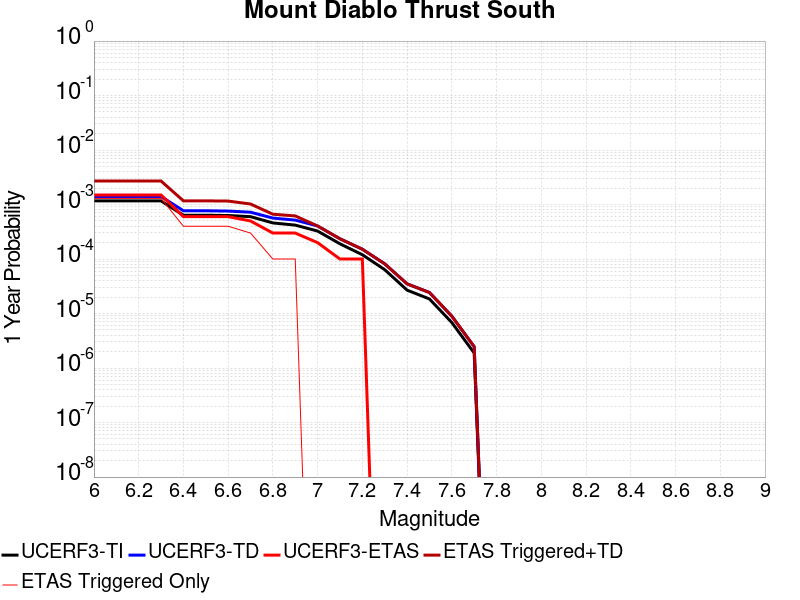 |  |

| Magnitude | 1 wk TI Prob | 1 wk TD Prob | 1 wk ETAS Prob | 1 wk ETAS/TD Gain | 1 wk ETAS Triggered+TD | 1 wk ETAS Triggered Only | 1 mo TI Prob | 1 mo TD Prob | 1 mo ETAS Prob | 1 mo ETAS/TD Gain | 1 mo ETAS Triggered+TD | 1 mo ETAS Triggered Only | 1 yr TI Prob | 1 yr TD Prob | 1 yr ETAS Prob | 1 yr ETAS/TD Gain | 1 yr ETAS Triggered+TD | 1 yr ETAS Triggered Only | 10 yr TI Prob | 10 yr TD Prob | 10 yr ETAS Prob | 10 yr ETAS/TD Gain | 10 yr ETAS Triggered+TD | 10 yr ETAS Triggered Only |
|-----|-----|-----|-----|-----|-----|-----|-----|-----|-----|-----|-----|-----|-----|-----|-----|-----|-----|-----|-----|-----|-----|-----|-----|-----|
| 6.0 | 2.2377444E-5 | 2.6965981E-5 | 0.0 | 0.0 | 2.6965981E-5 | 0.0 | 9.5899806E-5 | 1.1556449E-4 | 0.0 | 0.0 | 1.1556449E-4 | 0.0 | 0.0011669548 | 0.0014062878 | 0.0015 | 1.066638 | 0.0027044595 | 0.0013 | 0.011608457 | 0.013994078 | 0.0138 | 0.98613137 | 0.018825507 | 0.0049 |
| 6.1 | 2.2377444E-5 | 2.6965981E-5 | 0.0 | 0.0 | 2.6965981E-5 | 0.0 | 9.5899806E-5 | 1.1556449E-4 | 0.0 | 0.0 | 1.1556449E-4 | 0.0 | 0.0011669548 | 0.0014062878 | 0.0015 | 1.066638 | 0.0027044595 | 0.0013 | 0.011608457 | 0.013994078 | 0.0138 | 0.98613137 | 0.018825507 | 0.0049 |
| 6.2 | 2.2377444E-5 | 2.6965981E-5 | 0.0 | 0.0 | 2.6965981E-5 | 0.0 | 9.5899806E-5 | 1.1556449E-4 | 0.0 | 0.0 | 1.1556449E-4 | 0.0 | 0.0011669548 | 0.0014062878 | 0.0015 | 1.066638 | 0.0027044595 | 0.0013 | 0.011608457 | 0.013994078 | 0.0138 | 0.98613137 | 0.018825507 | 0.0049 |
| 6.3 | 2.2377444E-5 | 2.6965981E-5 | 0.0 | 0.0 | 2.6965981E-5 | 0.0 | 9.5899806E-5 | 1.1556449E-4 | 0.0 | 0.0 | 1.1556449E-4 | 0.0 | 0.0011669548 | 0.0014062878 | 0.0015 | 1.066638 | 0.0027044595 | 0.0013 | 0.011608457 | 0.013994078 | 0.0138 | 0.98613137 | 0.018825507 | 0.0049 |
| 6.4 | 1.2228463E-5 | 1.4752545E-5 | 0.0 | 0.0 | 1.4752545E-5 | 0.0 | 5.2406645E-5 | 6.3223735E-5 | 0.0 | 0.0 | 6.3223735E-5 | 0.0 | 6.378641E-4 | 7.6948997E-4 | 6.0E-4 | 0.77973723 | 0.0011691822 | 4.0E-4 | 0.0063603627 | 0.007670218 | 0.0052 | 0.67794687 | 0.00876178 | 0.0011 |
| 6.5 | 1.2228463E-5 | 1.4752545E-5 | 0.0 | 0.0 | 1.4752545E-5 | 0.0 | 5.2406645E-5 | 6.3223735E-5 | 0.0 | 0.0 | 6.3223735E-5 | 0.0 | 6.378641E-4 | 7.6948997E-4 | 6.0E-4 | 0.77973723 | 0.0011691822 | 4.0E-4 | 0.0063603627 | 0.007670218 | 0.0052 | 0.67794687 | 0.00876178 | 0.0011 |
| 6.6 | 1.2068118E-5 | 1.455726E-5 | 0.0 | 0.0 | 1.455726E-5 | 0.0 | 5.1719482E-5 | 6.238684E-5 | 0.0 | 0.0 | 6.238684E-5 | 0.0 | 6.2950276E-4 | 7.593079E-4 | 6.0E-4 | 0.7901933 | 0.0011590042 | 4.0E-4 | 0.006277225 | 0.007569095 | 0.0051 | 0.6737926 | 0.008660769 | 0.0011 |
| 6.7 | 1.1499428E-5 | 1.3879664E-5 | 0.0 | 0.0 | 1.3879664E-5 | 0.0 | 4.9282335E-5 | 5.948299E-5 | 0.0 | 0.0 | 5.948299E-5 | 0.0 | 5.9984723E-4 | 7.239775E-4 | 5.0E-4 | 0.6906292 | 0.0010237603 | 3.0E-4 | 0.0059823063 | 0.007218135 | 0.0047 | 0.6511377 | 0.008210917 | 0.001 |
| 6.8 | 8.82118E-6 | 1.0834118E-5 | 0.0 | 0.0 | 1.0834118E-5 | 0.0 | 3.780451E-5 | 4.643114E-5 | 0.0 | 0.0 | 4.643114E-5 | 0.0 | 4.601727E-4 | 5.6515815E-4 | 3.0E-4 | 0.5308249 | 6.6510163E-4 | 1.0E-4 | 0.0045922096 | 0.0056384364 | 0.0033 | 0.5852686 | 0.006036181 | 4.0E-4 |
| 6.9 | 8.047112E-6 | 9.942817E-6 | 0.0 | 0.0 | 9.942817E-6 | 0.0 | 3.4487166E-5 | 4.2611406E-5 | 0.0 | 0.0 | 4.2611406E-5 | 0.0 | 4.1980037E-4 | 5.1867566E-4 | 3.0E-4 | 0.57839614 | 6.186238E-4 | 1.0E-4 | 0.004190082 | 0.005175843 | 0.0029 | 0.5602952 | 0.00547429 | 3.0E-4 |
| 7.0 | 6.2574763E-6 | 7.751359E-6 | 0.0 | 0.0 | 7.751359E-6 | 0.0 | 2.681748E-5 | 3.3219705E-5 | 0.0 | 0.0 | 3.3219705E-5 | 0.0 | 3.264539E-4 | 4.0437854E-4 | 2.0E-4 | 0.49458608 | 4.0437854E-4 | 0.0 | 0.0032597475 | 0.004037377 | 0.0023 | 0.56967676 | 0.0041369735 | 1.0E-4 |
| 7.1 | 3.6485903E-6 | 4.5142924E-6 | 0.0 | 0.0 | 4.5142924E-6 | 0.0 | 1.5636722E-5 | 1.9346828E-5 | 0.0 | 0.0 | 1.9346828E-5 | 0.0 | 1.9036046E-4 | 2.3552257E-4 | 1.0E-4 | 0.42458776 | 2.3552257E-4 | 0.0 | 0.0019019748 | 0.0023528356 | 0.0014 | 0.5950267 | 0.0023528356 | 0.0 |
| 7.2 | 2.3034274E-6 | 2.9060848E-6 | 0.0 | 0.0 | 2.9060848E-6 | 0.0 | 9.871795E-6 | 1.245459E-5 | 0.0 | 0.0 | 1.245459E-5 | 0.0 | 1.2018247E-4 | 1.5162434E-4 | 1.0E-4 | 0.65952474 | 1.5162434E-4 | 0.0 | 0.0012011749 | 0.0015153944 | 7.0E-4 | 0.46192592 | 0.0015153944 | 0.0 |
| 7.3 | 1.224035E-6 | 1.5682622E-6 | 0.0 | 0.0 | 1.5682622E-6 | 0.0 | 5.245854E-6 | 6.721107E-6 | 0.0 | 0.0 | 6.721107E-6 | 0.0 | 6.38664E-5 | 8.182652E-5 | 0.0 | 0.0 | 8.182652E-5 | 0.0 | 6.384805E-4 | 8.1810314E-4 | 5.0E-4 | 0.6111699 | 8.1810314E-4 | 0.0 |
| 7.4 | 5.1601154E-7 | 6.724685E-7 | 0.0 | 0.0 | 6.724685E-7 | 0.0 | 2.2114762E-6 | 2.8820048E-6 | 0.0 | 0.0 | 2.8820048E-6 | 0.0 | 2.6924388E-5 | 3.508786E-5 | 0.0 | 0.0 | 3.508786E-5 | 0.0 | 2.6921128E-4 | 3.5078867E-4 | 3.0E-4 | 0.8552157 | 3.5078867E-4 | 0.0 |
| 7.5 | 3.552894E-7 | 4.665793E-7 | 0.0 | 0.0 | 4.665793E-7 | 0.0 | 1.5226678E-6 | 1.9996241E-6 | 0.0 | 0.0 | 1.9996241E-6 | 0.0 | 1.8538323E-5 | 2.4345167E-5 | 0.0 | 0.0 | 2.4345167E-5 | 0.0 | 1.8536777E-4 | 2.4343736E-4 | 3.0E-4 | 1.2323499 | 2.4343736E-4 | 0.0 |
| 7.6 | 1.3124082E-7 | 1.7192494E-7 | 0.0 | 0.0 | 1.7192494E-7 | 0.0 | 5.6246057E-7 | 7.36821E-7 | 0.0 | 0.0 | 7.36821E-7 | 0.0 | 6.8479358E-6 | 8.970767E-6 | 0.0 | 0.0 | 8.970767E-6 | 0.0 | 6.8477246E-5 | 8.9704095E-5 | 1.0E-4 | 1.1147763 | 8.9704095E-5 | 0.0 |
| 7.7 | 3.6193022E-8 | 4.7337167E-8 | 0.0 | 0.0 | 4.7337167E-8 | 0.0 | 1.5511293E-7 | 2.0287355E-7 | 0.0 | 0.0 | 2.0287355E-7 | 0.0 | 1.8884983E-6 | 2.4699839E-6 | 0.0 | 0.0 | 2.4699839E-6 | 0.0 | 1.8884823E-5 | 2.470406E-5 | 0.0 | 0.0 | 2.470406E-5 | 0.0 |

## Gravel Hills-Harper Lk
*[(top)](#table-of-contents)*

| 1 Week | 1 Month | 1 Year | 10 Year |
|-----|-----|-----|-----|
|  |  |  |  |

| Magnitude | 1 wk TI Prob | 1 wk TD Prob | 1 wk ETAS Prob | 1 wk ETAS/TD Gain | 1 wk ETAS Triggered+TD | 1 wk ETAS Triggered Only | 1 mo TI Prob | 1 mo TD Prob | 1 mo ETAS Prob | 1 mo ETAS/TD Gain | 1 mo ETAS Triggered+TD | 1 mo ETAS Triggered Only | 1 yr TI Prob | 1 yr TD Prob | 1 yr ETAS Prob | 1 yr ETAS/TD Gain | 1 yr ETAS Triggered+TD | 1 yr ETAS Triggered Only | 10 yr TI Prob | 10 yr TD Prob | 10 yr ETAS Prob | 10 yr ETAS/TD Gain | 10 yr ETAS Triggered+TD | 10 yr ETAS Triggered Only |
|-----|-----|-----|-----|-----|-----|-----|-----|-----|-----|-----|-----|-----|-----|-----|-----|-----|-----|-----|-----|-----|-----|-----|-----|-----|
| 6.0 | 3.0679566E-5 | 3.1472664E-5 | 0.0 | 0.0 | 3.1472664E-5 | 0.0 | 1.3147724E-4 | 1.3487709E-4 | 0.0 | 0.0 | 1.3487709E-4 | 0.0 | 0.0015995599 | 0.0016411088 | 0.002 | 1.2186882 | 0.0024397958 | 8.0E-4 | 0.015880952 | 0.016311478 | 0.0138 | 0.84603006 | 0.020934813 | 0.0047 |
| 6.1 | 3.0679566E-5 | 3.1472664E-5 | 0.0 | 0.0 | 3.1472664E-5 | 0.0 | 1.3147724E-4 | 1.3487709E-4 | 0.0 | 0.0 | 1.3487709E-4 | 0.0 | 0.0015995599 | 0.0016411088 | 0.002 | 1.2186882 | 0.0024397958 | 8.0E-4 | 0.015880952 | 0.016311478 | 0.0138 | 0.84603006 | 0.020934813 | 0.0047 |
| 6.2 | 1.514536E-5 | 1.3637958E-5 | 0.0 | 0.0 | 1.3637958E-5 | 0.0 | 6.490707E-5 | 5.844715E-5 | 0.0 | 0.0 | 5.844715E-5 | 0.0 | 7.8995706E-4 | 7.113736E-4 | 9.0E-4 | 1.265158 | 0.001211018 | 5.0E-4 | 0.007871548 | 0.007092166 | 0.0054 | 0.76140344 | 0.008978691 | 0.0019 |
| 6.3 | 1.514536E-5 | 1.3637958E-5 | 0.0 | 0.0 | 1.3637958E-5 | 0.0 | 6.490707E-5 | 5.844715E-5 | 0.0 | 0.0 | 5.844715E-5 | 0.0 | 7.8995706E-4 | 7.113736E-4 | 9.0E-4 | 1.265158 | 0.001211018 | 5.0E-4 | 0.007871548 | 0.007092166 | 0.0054 | 0.76140344 | 0.008978691 | 0.0019 |
| 6.4 | 1.2532521E-5 | 1.0691693E-5 | 0.0 | 0.0 | 1.0691693E-5 | 0.0 | 5.37097E-5 | 4.582077E-5 | 0.0 | 0.0 | 4.582077E-5 | 0.0 | 6.537194E-4 | 5.577309E-4 | 5.0E-4 | 0.8964897 | 8.575636E-4 | 3.0E-4 | 0.0065179965 | 0.0055639017 | 0.0035 | 0.62905496 | 0.0066577815 | 0.0011 |
| 6.5 | 1.1094058E-5 | 9.085293E-6 | 0.0 | 0.0 | 9.085293E-6 | 0.0 | 4.7545094E-5 | 3.893641E-5 | 0.0 | 0.0 | 3.893641E-5 | 0.0 | 5.787078E-4 | 4.7395175E-4 | 3.0E-4 | 0.6329759 | 6.7385694E-4 | 2.0E-4 | 0.0057720304 | 0.0047298167 | 0.0029 | 0.6131316 | 0.005426506 | 7.0E-4 |
| 6.6 | 9.688328E-6 | 7.533003E-6 | 0.0 | 0.0 | 7.533003E-6 | 0.0 | 4.1520743E-5 | 3.2283915E-5 | 0.0 | 0.0 | 3.2283915E-5 | 0.0 | 5.053978E-4 | 3.9298832E-4 | 3.0E-4 | 0.7633815 | 5.929097E-4 | 2.0E-4 | 0.0050424994 | 0.0039231903 | 0.0026 | 0.6627259 | 0.0045208363 | 6.0E-4 |
| 6.7 | 8.974824E-6 | 6.750571E-6 | 0.0 | 0.0 | 6.750571E-6 | 0.0 | 3.8462964E-5 | 2.893071E-5 | 0.0 | 0.0 | 2.893071E-5 | 0.0 | 4.6818596E-4 | 3.5217666E-4 | 3.0E-4 | 0.8518452 | 5.5210624E-4 | 2.0E-4 | 0.004672008 | 0.0035164068 | 0.0025 | 0.71095306 | 0.0041142968 | 6.0E-4 |
| 6.8 | 7.4780046E-6 | 5.1170555E-6 | 0.0 | 0.0 | 5.1170555E-6 | 0.0 | 3.20482E-5 | 2.1930062E-5 | 0.0 | 0.0 | 2.1930062E-5 | 0.0 | 3.9011694E-4 | 2.6696717E-4 | 1.0E-4 | 0.37457788 | 2.6696717E-4 | 0.0 | 0.0038943281 | 0.0026666028 | 0.0018 | 0.67501616 | 0.002965803 | 3.0E-4 |
| 6.9 | 6.3409307E-6 | 3.9081633E-6 | 0.0 | 0.0 | 3.9081633E-6 | 0.0 | 2.7175134E-5 | 1.6749169E-5 | 0.0 | 0.0 | 1.6749169E-5 | 0.0 | 3.3080703E-4 | 2.0390305E-4 | 1.0E-4 | 0.49042916 | 2.0390305E-4 | 0.0 | 0.0033031502 | 0.0020372577 | 0.0015 | 0.73628384 | 0.0023366467 | 3.0E-4 |
| 7.0 | 5.1239335E-6 | 2.6063155E-6 | 0.0 | 0.0 | 2.6063155E-6 | 0.0 | 2.195953E-5 | 1.1169877E-5 | 0.0 | 0.0 | 1.1169877E-5 | 0.0 | 2.6732447E-4 | 1.3598503E-4 | 1.0E-4 | 0.73537505 | 1.3598503E-4 | 0.0 | 0.0026700313 | 0.0013590434 | 0.0011 | 0.8093928 | 0.0015587716 | 2.0E-4 |
| 7.1 | 4.438899E-6 | 2.0988566E-6 | 0.0 | 0.0 | 2.0988566E-6 | 0.0 | 1.9023713E-5 | 8.99507E-6 | 0.0 | 0.0 | 8.99507E-6 | 0.0 | 2.315891E-4 | 1.09509696E-4 | 1.0E-4 | 0.91316116 | 1.09509696E-4 | 0.0 | 0.002313479 | 0.0010945792 | 0.001 | 0.9135931 | 0.0012943603 | 2.0E-4 |
| 7.2 | 3.50367E-6 | 1.2618497E-6 | 0.0 | 0.0 | 1.2618497E-6 | 0.0 | 1.5015643E-5 | 5.4079164E-6 | 0.0 | 0.0 | 5.4079164E-6 | 0.0 | 1.8280011E-4 | 6.583948E-5 | 1.0E-4 | 1.5188456 | 6.583948E-5 | 0.0 | 0.0018264982 | 6.582079E-4 | 7.0E-4 | 1.0634937 | 8.5807627E-4 | 2.0E-4 |
| 7.3 | 2.561638E-6 | 7.120912E-7 | 0.0 | 0.0 | 7.120912E-7 | 0.0 | 1.0978401E-5 | 3.0518158E-6 | 0.0 | 0.0 | 3.0518158E-6 | 0.0 | 1.3365384E-4 | 3.7155245E-5 | 1.0E-4 | 2.69141 | 3.7155245E-5 | 0.0 | 0.0013357349 | 3.7149232E-4 | 6.0E-4 | 1.6151074 | 4.714552E-4 | 1.0E-4 |
| 7.4 | 2.0368864E-6 | 5.306253E-7 | 0.0 | 0.0 | 5.306253E-7 | 0.0 | 8.729483E-6 | 2.2741065E-6 | 0.0 | 0.0 | 2.2741065E-6 | 0.0 | 1.06276275E-4 | 2.76869E-5 | 1.0E-4 | 3.6118164 | 2.76869E-5 | 0.0 | 0.0010622547 | 2.7683505E-4 | 4.0E-4 | 1.4449037 | 3.7680735E-4 | 1.0E-4 |
| 7.5 | 1.1681728E-6 | 3.6039168E-7 | 0.0 | 0.0 | 3.6039168E-7 | 0.0 | 5.0064455E-6 | 1.5445349E-6 | 0.0 | 0.0 | 1.5445349E-6 | 0.0 | 6.0951766E-5 | 1.8804556E-5 | 0.0 | 0.0 | 1.8804556E-5 | 0.0 | 6.093505E-4 | 1.8803011E-4 | 1.0E-4 | 0.5318297 | 1.8803011E-4 | 0.0 |
| 7.6 | 1.3154387E-7 | 7.120964E-8 | 0.0 | 0.0 | 7.120964E-8 | 0.0 | 5.6375933E-7 | 3.0518413E-7 | 0.0 | 0.0 | 3.0518413E-7 | 0.0 | 6.863748E-6 | 3.7156121E-6 | 0.0 | 0.0 | 3.7156121E-6 | 0.0 | 6.863536E-5 | 3.715566E-5 | 1.0E-4 | 2.69138 | 3.715566E-5 | 0.0 |

## Chino alt 1
*[(top)](#table-of-contents)*

| 1 Week | 1 Month | 1 Year | 10 Year |
|-----|-----|-----|-----|
| 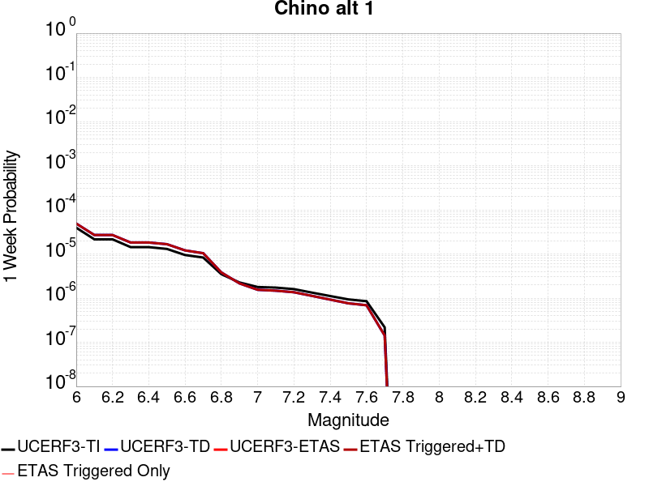 | 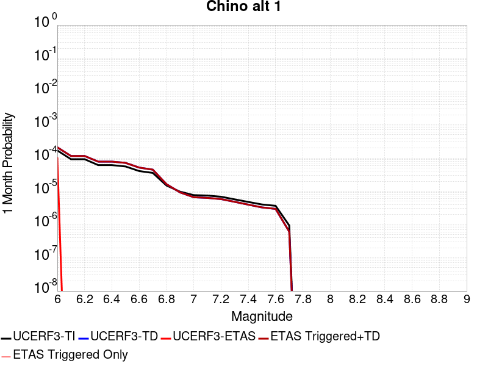 | 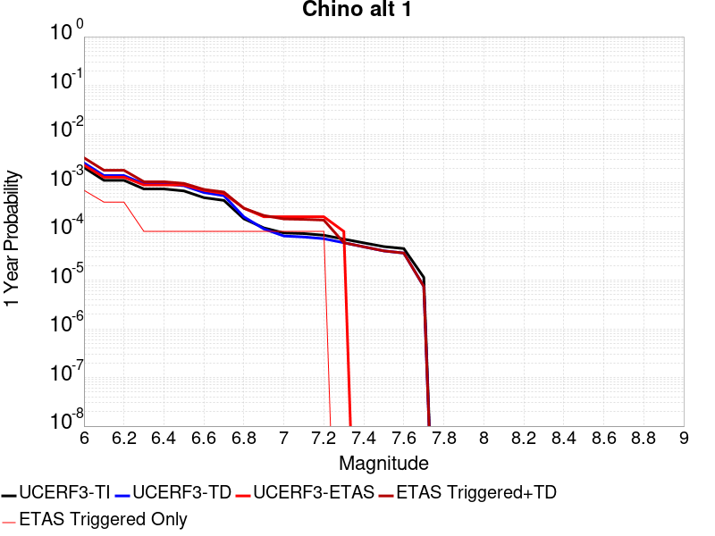 |  |

| Magnitude | 1 wk TI Prob | 1 wk TD Prob | 1 wk ETAS Prob | 1 wk ETAS/TD Gain | 1 wk ETAS Triggered+TD | 1 wk ETAS Triggered Only | 1 mo TI Prob | 1 mo TD Prob | 1 mo ETAS Prob | 1 mo ETAS/TD Gain | 1 mo ETAS Triggered+TD | 1 mo ETAS Triggered Only | 1 yr TI Prob | 1 yr TD Prob | 1 yr ETAS Prob | 1 yr ETAS/TD Gain | 1 yr ETAS Triggered+TD | 1 yr ETAS Triggered Only | 10 yr TI Prob | 10 yr TD Prob | 10 yr ETAS Prob | 10 yr ETAS/TD Gain | 10 yr ETAS Triggered+TD | 10 yr ETAS Triggered Only |
|-----|-----|-----|-----|-----|-----|-----|-----|-----|-----|-----|-----|-----|-----|-----|-----|-----|-----|-----|-----|-----|-----|-----|-----|-----|
| 6.0 | 3.939946E-5 | 4.898163E-5 | 0.0 | 0.0 | 4.898163E-5 | 0.0 | 1.6884391E-4 | 2.0990732E-4 | 1.0E-4 | 0.47640073 | 2.0990732E-4 | 0.0 | 0.0020537362 | 0.0025531386 | 0.0023 | 0.90085196 | 0.0032513514 | 7.0E-4 | 0.020348595 | 0.025298217 | 0.0183 | 0.72337115 | 0.029781844 | 0.0046 |
| 6.1 | 2.1505624E-5 | 2.6902339E-5 | 0.0 | 0.0 | 2.6902339E-5 | 0.0 | 9.2163704E-5 | 1.1529127E-4 | 0.0 | 0.0 | 1.1529127E-4 | 0.0 | 0.0011215154 | 0.0014028774 | 0.0013 | 0.92666686 | 0.0018023163 | 4.0E-4 | 0.011158722 | 0.013960431 | 0.0097 | 0.69482094 | 0.015538095 | 0.0016 |
| 6.2 | 2.1505624E-5 | 2.6902339E-5 | 0.0 | 0.0 | 2.6902339E-5 | 0.0 | 9.2163704E-5 | 1.1529127E-4 | 0.0 | 0.0 | 1.1529127E-4 | 0.0 | 0.0011215154 | 0.0014028774 | 0.0013 | 0.92666686 | 0.0018023163 | 4.0E-4 | 0.011158722 | 0.013960431 | 0.0097 | 0.69482094 | 0.015538095 | 0.0016 |
| 6.3 | 1.4290785E-5 | 1.8184768E-5 | 0.0 | 0.0 | 1.8184768E-5 | 0.0 | 6.1244784E-5 | 7.7932644E-5 | 0.0 | 0.0 | 7.7932644E-5 | 0.0 | 7.454001E-4 | 9.484622E-4 | 9.0E-4 | 0.94890445 | 0.0010483674 | 1.0E-4 | 0.007429048 | 0.009457948 | 0.0061 | 0.64496017 | 0.010052273 | 6.0E-4 |
| 6.4 | 1.4290785E-5 | 1.8184768E-5 | 0.0 | 0.0 | 1.8184768E-5 | 0.0 | 6.1244784E-5 | 7.7932644E-5 | 0.0 | 0.0 | 7.7932644E-5 | 0.0 | 7.454001E-4 | 9.484622E-4 | 9.0E-4 | 0.94890445 | 0.0010483674 | 1.0E-4 | 0.007429048 | 0.009457948 | 0.0061 | 0.64496017 | 0.010052273 | 6.0E-4 |
| 6.5 | 1.3017944E-5 | 1.667116E-5 | 0.0 | 0.0 | 1.667116E-5 | 0.0 | 5.5789995E-5 | 7.144612E-5 | 0.0 | 0.0 | 7.144612E-5 | 0.0 | 6.790315E-4 | 8.695532E-4 | 9.0E-4 | 1.0350143 | 9.6946623E-4 | 1.0E-4 | 0.0067696036 | 0.008675157 | 0.006 | 0.6916301 | 0.009269952 | 6.0E-4 |
| 6.6 | 9.470016E-6 | 1.2055214E-5 | 0.0 | 0.0 | 1.2055214E-5 | 0.0 | 4.058515E-5 | 5.166437E-5 | 0.0 | 0.0 | 5.166437E-5 | 0.0 | 4.940122E-4 | 6.288662E-4 | 7.0E-4 | 1.1131144 | 7.2880334E-4 | 1.0E-4 | 0.004929154 | 0.00628299 | 0.0045 | 0.7162195 | 0.0067798486 | 5.0E-4 |
| 6.7 | 8.314155E-6 | 1.0416118E-5 | 0.0 | 0.0 | 1.0416118E-5 | 0.0 | 3.5631605E-5 | 4.4639924E-5 | 0.0 | 0.0 | 4.4639924E-5 | 0.0 | 4.3372845E-4 | 5.4338784E-4 | 6.0E-4 | 1.1041837 | 6.433335E-4 | 1.0E-4 | 0.004328829 | 0.0054331543 | 0.0041 | 0.7546261 | 0.0058309813 | 4.0E-4 |
| 6.8 | 3.4856364E-6 | 3.8163416E-6 | 0.0 | 0.0 | 3.8163416E-6 | 0.0 | 1.4938357E-5 | 1.635566E-5 | 0.0 | 0.0 | 1.635566E-5 | 0.0 | 1.8185932E-4 | 1.9911403E-4 | 3.0E-4 | 1.5066743 | 2.9909413E-4 | 1.0E-4 | 0.0018171056 | 0.0019913313 | 0.0013 | 0.6528295 | 0.002190933 | 2.0E-4 |
| 6.9 | 2.2645952E-6 | 2.1547792E-6 | 0.0 | 0.0 | 2.1547792E-6 | 0.0 | 9.705372E-6 | 9.234736E-6 | 0.0 | 0.0 | 9.234736E-6 | 0.0 | 1.18156495E-4 | 1.1242733E-4 | 2.0E-4 | 1.7789268 | 2.124161E-4 | 1.0E-4 | 0.0011809369 | 0.0011245658 | 8.0E-4 | 0.71138567 | 0.0013243409 | 2.0E-4 |
| 7.0 | 1.7864003E-6 | 1.5446867E-6 | 0.0 | 0.0 | 1.5446867E-6 | 0.0 | 7.655979E-6 | 6.6200696E-6 | 0.0 | 0.0 | 6.6200696E-6 | 0.0 | 9.3207556E-5 | 8.059642E-5 | 2.0E-4 | 2.4814997 | 1.8058837E-4 | 1.0E-4 | 9.316847E-4 | 8.061203E-4 | 5.0E-4 | 0.6202548 | 9.0603967E-4 | 1.0E-4 |
| 7.1 | 1.7315456E-6 | 1.4749259E-6 | 0.0 | 0.0 | 1.4749259E-6 | 0.0 | 7.420889E-6 | 6.321096E-6 | 0.0 | 0.0 | 6.321096E-6 | 0.0 | 9.034557E-5 | 7.695668E-5 | 2.0E-4 | 2.5988648 | 1.7694899E-4 | 1.0E-4 | 9.0308854E-4 | 7.697338E-4 | 5.0E-4 | 0.64957523 | 8.6965685E-4 | 1.0E-4 |
| 7.2 | 1.6008337E-6 | 1.3589153E-6 | 0.0 | 0.0 | 1.3589153E-6 | 0.0 | 6.860698E-6 | 5.8239098E-6 | 0.0 | 0.0 | 5.8239098E-6 | 0.0 | 8.352579E-5 | 7.090385E-5 | 2.0E-4 | 2.8207214 | 1.7089676E-4 | 1.0E-4 | 8.34944E-4 | 7.092318E-4 | 5.0E-4 | 0.7049881 | 8.0916093E-4 | 1.0E-4 |
| 7.3 | 1.3320939E-6 | 1.1231142E-6 | 0.0 | 0.0 | 1.1231142E-6 | 0.0 | 5.7089615E-6 | 4.813338E-6 | 0.0 | 0.0 | 4.813338E-6 | 0.0 | 6.9504385E-5 | 5.8600865E-5 | 1.0E-4 | 1.7064595 | 5.8600865E-5 | 0.0 | 6.9482654E-4 | 5.8599655E-4 | 3.0E-4 | 0.5119484 | 5.8599655E-4 | 0.0 |
| 7.4 | 1.114294E-6 | 9.249076E-7 | 0.0 | 0.0 | 9.249076E-7 | 0.0 | 4.775537E-6 | 3.963884E-6 | 0.0 | 0.0 | 3.963884E-6 | 0.0 | 5.8140613E-5 | 4.825926E-5 | 0.0 | 0.0 | 4.825926E-5 | 0.0 | 5.81254E-4 | 4.825052E-4 | 1.0E-4 | 0.20725167 | 4.825052E-4 | 0.0 |
| 7.5 | 9.354081E-7 | 7.63435E-7 | 0.0 | 0.0 | 7.63435E-7 | 0.0 | 4.0088858E-6 | 3.2718606E-6 | 0.0 | 0.0 | 3.2718606E-6 | 0.0 | 4.8807087E-5 | 3.983421E-5 | 0.0 | 0.0 | 3.983421E-5 | 0.0 | 4.879637E-4 | 3.982741E-4 | 1.0E-4 | 0.25108337 | 3.982741E-4 | 0.0 |
| 7.6 | 8.521771E-7 | 6.8911964E-7 | 0.0 | 0.0 | 6.8911964E-7 | 0.0 | 3.6521824E-6 | 2.9533667E-6 | 0.0 | 0.0 | 2.9533667E-6 | 0.0 | 4.4464414E-5 | 3.595668E-5 | 0.0 | 0.0 | 3.595668E-5 | 0.0 | 4.4455516E-4 | 3.595118E-4 | 1.0E-4 | 0.278155 | 3.595118E-4 | 0.0 |
| 7.7 | 2.1803626E-7 | 1.4214484E-7 | 0.0 | 0.0 | 1.4214484E-7 | 0.0 | 9.344408E-7 | 6.091921E-7 | 0.0 | 0.0 | 6.091921E-7 | 0.0 | 1.1376757E-5 | 7.4168984E-6 | 0.0 | 0.0 | 7.4168984E-6 | 0.0 | 1.13761744E-4 | 7.4167474E-5 | 0.0 | 0.0 | 7.4167474E-5 | 0.0 |

## Blackwater
*[(top)](#table-of-contents)*

| 1 Week | 1 Month | 1 Year | 10 Year |
|-----|-----|-----|-----|
|  |  |  |  |

| Magnitude | 1 wk TI Prob | 1 wk TD Prob | 1 wk ETAS Prob | 1 wk ETAS/TD Gain | 1 wk ETAS Triggered+TD | 1 wk ETAS Triggered Only | 1 mo TI Prob | 1 mo TD Prob | 1 mo ETAS Prob | 1 mo ETAS/TD Gain | 1 mo ETAS Triggered+TD | 1 mo ETAS Triggered Only | 1 yr TI Prob | 1 yr TD Prob | 1 yr ETAS Prob | 1 yr ETAS/TD Gain | 1 yr ETAS Triggered+TD | 1 yr ETAS Triggered Only | 10 yr TI Prob | 10 yr TD Prob | 10 yr ETAS Prob | 10 yr ETAS/TD Gain | 10 yr ETAS Triggered+TD | 10 yr ETAS Triggered Only |
|-----|-----|-----|-----|-----|-----|-----|-----|-----|-----|-----|-----|-----|-----|-----|-----|-----|-----|-----|-----|-----|-----|-----|-----|-----|
| 6.0 | 3.0708583E-5 | 3.3100958E-5 | 0.0 | 0.0 | 3.3100958E-5 | 0.0 | 1.3160157E-4 | 1.4185431E-4 | 0.0 | 0.0 | 1.4185431E-4 | 0.0 | 0.0016010714 | 0.0017258448 | 0.0017 | 0.98502487 | 0.0029237738 | 0.0012 | 0.015895851 | 0.01713826 | 0.0135 | 0.78771126 | 0.021855995 | 0.0048 |
| 6.1 | 3.0708583E-5 | 3.3100958E-5 | 0.0 | 0.0 | 3.3100958E-5 | 0.0 | 1.3160157E-4 | 1.4185431E-4 | 0.0 | 0.0 | 1.4185431E-4 | 0.0 | 0.0016010714 | 0.0017258448 | 0.0017 | 0.98502487 | 0.0029237738 | 0.0012 | 0.015895851 | 0.01713826 | 0.0135 | 0.78771126 | 0.021855995 | 0.0048 |
| 6.2 | 1.1707779E-5 | 1.2546903E-5 | 0.0 | 0.0 | 1.2546903E-5 | 0.0 | 5.017523E-5 | 5.3771386E-5 | 0.0 | 0.0 | 5.3771386E-5 | 0.0 | 6.107122E-4 | 6.544796E-4 | 8.0E-4 | 1.2223452 | 0.0011541523 | 5.0E-4 | 0.006090366 | 0.006526493 | 0.0053 | 0.8120747 | 0.008215398 | 0.0017 |
| 6.3 | 1.1707779E-5 | 1.2546903E-5 | 0.0 | 0.0 | 1.2546903E-5 | 0.0 | 5.017523E-5 | 5.3771386E-5 | 0.0 | 0.0 | 5.3771386E-5 | 0.0 | 6.107122E-4 | 6.544796E-4 | 8.0E-4 | 1.2223452 | 0.0011541523 | 5.0E-4 | 0.006090366 | 0.006526493 | 0.0053 | 0.8120747 | 0.008215398 | 0.0017 |
| 6.4 | 7.929244E-6 | 8.481266E-6 | 0.0 | 0.0 | 8.481266E-6 | 0.0 | 3.3982033E-5 | 3.6347803E-5 | 0.0 | 0.0 | 3.6347803E-5 | 0.0 | 4.136527E-4 | 4.4244868E-4 | 4.0E-4 | 0.90405965 | 5.424044E-4 | 1.0E-4 | 0.0041288356 | 0.0044160835 | 0.0034 | 0.769913 | 0.0054116673 | 0.001 |
| 6.5 | 5.8832115E-6 | 6.2868444E-6 | 0.0 | 0.0 | 6.2868444E-6 | 0.0 | 2.521352E-5 | 2.6943355E-5 | 0.0 | 0.0 | 2.6943355E-5 | 0.0 | 3.0693135E-4 | 3.2798853E-4 | 4.0E-4 | 1.2195549 | 4.2795573E-4 | 1.0E-4 | 0.0030650778 | 0.0032752978 | 0.0029 | 0.8854157 | 0.00417235 | 9.0E-4 |
| 6.6 | 5.8832115E-6 | 6.2868444E-6 | 0.0 | 0.0 | 6.2868444E-6 | 0.0 | 2.521352E-5 | 2.6943355E-5 | 0.0 | 0.0 | 2.6943355E-5 | 0.0 | 3.0693135E-4 | 3.2798853E-4 | 4.0E-4 | 1.2195549 | 4.2795573E-4 | 1.0E-4 | 0.0030650778 | 0.0032752978 | 0.0029 | 0.8854157 | 0.00417235 | 9.0E-4 |
| 6.7 | 3.0715053E-6 | 3.2819112E-6 | 0.0 | 0.0 | 3.2819112E-6 | 0.0 | 1.3163528E-5 | 1.4065264E-5 | 0.0 | 0.0 | 1.4065264E-5 | 0.0 | 1.6025416E-4 | 1.712323E-4 | 3.0E-4 | 1.7520059 | 1.712323E-4 | 0.0 | 0.0016013865 | 0.0017111182 | 0.002 | 1.1688263 | 0.0022102627 | 5.0E-4 |
| 6.8 | 2.2722281E-6 | 2.4290855E-6 | 0.0 | 0.0 | 2.4290855E-6 | 0.0 | 9.738084E-6 | 1.041033E-5 | 0.0 | 0.0 | 1.041033E-5 | 0.0 | 1.1855473E-4 | 1.2673931E-4 | 3.0E-4 | 2.3670635 | 1.2673931E-4 | 0.0 | 0.001184915 | 0.0012667605 | 0.0016 | 1.2630643 | 0.0015663805 | 3.0E-4 |
| 6.9 | 9.952399E-7 | 1.0654977E-6 | 0.0 | 0.0 | 1.0654977E-6 | 0.0 | 4.265307E-6 | 4.5664137E-6 | 0.0 | 0.0 | 4.5664137E-6 | 0.0 | 5.1928873E-5 | 5.5595185E-5 | 2.0E-4 | 3.5974338 | 5.5595185E-5 | 0.0 | 5.191674E-4 | 5.558634E-4 | 8.0E-4 | 1.4392025 | 7.557522E-4 | 2.0E-4 |
| 7.0 | 4.7385504E-7 | 5.0762753E-7 | 0.0 | 0.0 | 5.0762753E-7 | 0.0 | 2.0308057E-6 | 2.1755466E-6 | 0.0 | 0.0 | 2.1755466E-6 | 0.0 | 2.4724779E-5 | 2.648728E-5 | 1.0E-4 | 3.775397 | 2.648728E-5 | 0.0 | 2.4722028E-4 | 2.648728E-4 | 3.0E-4 | 1.1326191 | 3.6484632E-4 | 1.0E-4 |

## Garlock (West)
*[(top)](#table-of-contents)*

| 1 Week | 1 Month | 1 Year | 10 Year |
|-----|-----|-----|-----|
|  |  |  |  |

| Magnitude | 1 wk TI Prob | 1 wk TD Prob | 1 wk ETAS Prob | 1 wk ETAS/TD Gain | 1 wk ETAS Triggered+TD | 1 wk ETAS Triggered Only | 1 mo TI Prob | 1 mo TD Prob | 1 mo ETAS Prob | 1 mo ETAS/TD Gain | 1 mo ETAS Triggered+TD | 1 mo ETAS Triggered Only | 1 yr TI Prob | 1 yr TD Prob | 1 yr ETAS Prob | 1 yr ETAS/TD Gain | 1 yr ETAS Triggered+TD | 1 yr ETAS Triggered Only | 10 yr TI Prob | 10 yr TD Prob | 10 yr ETAS Prob | 10 yr ETAS/TD Gain | 10 yr ETAS Triggered+TD | 10 yr ETAS Triggered Only |
|-----|-----|-----|-----|-----|-----|-----|-----|-----|-----|-----|-----|-----|-----|-----|-----|-----|-----|-----|-----|-----|-----|-----|-----|-----|
| 6.0 | 2.5181727E-5 | 2.5271314E-5 | 0.0 | 0.0 | 2.5271314E-5 | 0.0 | 1.0791722E-4 | 1.0830116E-4 | 1.0E-4 | 0.92335117 | 2.0829032E-4 | 1.0E-4 | 0.0013131002 | 0.0013177724 | 0.0021 | 1.5935984 | 0.0028157958 | 0.0015 | 0.013053683 | 0.01317984 | 0.0122 | 0.92565614 | 0.017916577 | 0.0048 |
| 6.1 | 2.5077732E-5 | 2.5172343E-5 | 0.0 | 0.0 | 2.5172343E-5 | 0.0 | 1.0747157E-4 | 1.0787703E-4 | 1.0E-4 | 0.92698145 | 2.0786624E-4 | 1.0E-4 | 0.001307681 | 0.0013126149 | 0.0021 | 1.59986 | 0.002810646 | 0.0015 | 0.013000126 | 0.013128875 | 0.0122 | 0.92924947 | 0.017865857 | 0.0048 |
| 6.2 | 2.494612E-5 | 2.505396E-5 | 0.0 | 0.0 | 2.505396E-5 | 0.0 | 1.0690756E-4 | 1.0736971E-4 | 1.0E-4 | 0.9313613 | 2.0735897E-4 | 1.0E-4 | 0.0013008224 | 0.0013064458 | 0.0021 | 1.6074146 | 0.002804486 | 0.0015 | 0.012932341 | 0.01306791 | 0.0122 | 0.9335846 | 0.017805185 | 0.0048 |
| 6.3 | 2.4733758E-5 | 2.487327E-5 | 0.0 | 0.0 | 2.487327E-5 | 0.0 | 1.0599751E-4 | 1.0659539E-4 | 1.0E-4 | 0.93812686 | 2.0658474E-4 | 1.0E-4 | 0.0012897556 | 0.0012970297 | 0.0021 | 1.619084 | 0.0027950841 | 0.0015 | 0.012822957 | 0.012974853 | 0.0121 | 0.9325732 | 0.017613871 | 0.0047 |
| 6.4 | 2.3237335E-5 | 2.3252047E-5 | 0.0 | 0.0 | 2.3252047E-5 | 0.0 | 9.958477E-5 | 9.964784E-5 | 1.0E-4 | 1.0035341 | 1.9963787E-4 | 1.0E-4 | 0.0012117702 | 0.0012125401 | 0.002 | 1.64943 | 0.0027107212 | 0.0015 | 0.012051838 | 0.012139459 | 0.0111 | 0.9143735 | 0.016584832 | 0.0045 |
| 6.5 | 2.2732203E-5 | 2.3066392E-5 | 0.0 | 0.0 | 2.3066392E-5 | 0.0 | 9.742009E-5 | 9.885224E-5 | 1.0E-4 | 1.0116109 | 1.9884235E-4 | 1.0E-4 | 0.0011854442 | 0.0012028643 | 0.002 | 1.6626979 | 0.00270106 | 0.0015 | 0.011791403 | 0.012043755 | 0.0111 | 0.9216395 | 0.016489558 | 0.0045 |
| 6.6 | 2.1319436E-5 | 2.1845752E-5 | 0.0 | 0.0 | 2.1845752E-5 | 0.0 | 9.136581E-5 | 9.3621304E-5 | 1.0E-4 | 1.068133 | 1.9361194E-4 | 1.0E-4 | 0.001111811 | 0.0011392457 | 0.002 | 1.7555476 | 0.0026375367 | 0.0015 | 0.011062649 | 0.0114142485 | 0.0105 | 0.9199029 | 0.015665166 | 0.0043 |
| 6.7 | 1.970802E-5 | 2.0464886E-5 | 0.0 | 0.0 | 2.0464886E-5 | 0.0 | 8.446021E-5 | 8.770372E-5 | 1.0E-4 | 1.1402025 | 1.8769495E-4 | 1.0E-4 | 0.001027818 | 0.0010672715 | 0.002 | 1.8739376 | 0.0025656705 | 0.0015 | 0.010230771 | 0.010701619 | 0.01 | 0.934438 | 0.014955603 | 0.0043 |
| 6.8 | 1.8744462E-5 | 1.9972165E-5 | 0.0 | 0.0 | 1.9972165E-5 | 0.0 | 8.033094E-5 | 8.55922E-5 | 1.0E-4 | 1.1683308 | 1.8558363E-4 | 1.0E-4 | 9.775903E-4 | 0.0010415885 | 0.002 | 1.9201441 | 0.002540026 | 0.0015 | 0.009733009 | 0.010447211 | 0.0096 | 0.91890556 | 0.014603333 | 0.0042 |
| 6.9 | 1.7559682E-5 | 1.902407E-5 | 0.0 | 0.0 | 1.902407E-5 | 0.0 | 7.5253614E-5 | 8.1529186E-5 | 1.0E-4 | 1.2265546 | 1.8152104E-4 | 1.0E-4 | 9.158276E-4 | 9.921673E-4 | 0.002 | 2.015789 | 0.002490679 | 0.0015 | 0.0091206245 | 0.009957534 | 0.0092 | 0.9239235 | 0.014016708 | 0.0041 |
| 7.0 | 1.6794445E-5 | 1.8286382E-5 | 0.0 | 0.0 | 1.8286382E-5 | 0.0 | 7.197421E-5 | 7.836787E-5 | 1.0E-4 | 1.2760332 | 1.7836003E-4 | 1.0E-4 | 8.759337E-4 | 9.537125E-4 | 0.002 | 2.097068 | 0.002452282 | 0.0015 | 0.008724891 | 0.009576178 | 0.0089 | 0.92938954 | 0.013636916 | 0.0041 |
| 7.1 | 1.6337795E-5 | 1.7786813E-5 | 0.0 | 0.0 | 1.7786813E-5 | 0.0 | 7.0017246E-5 | 7.622698E-5 | 1.0E-4 | 1.3118714 | 1.7621936E-4 | 1.0E-4 | 8.521265E-4 | 9.276697E-4 | 0.002 | 2.1559398 | 0.002426278 | 0.0015 | 0.008488664 | 0.009317847 | 0.0086 | 0.92296 | 0.013379644 | 0.0041 |
| 7.2 | 1.5780008E-5 | 1.7235197E-5 | 0.0 | 0.0 | 1.7235197E-5 | 0.0 | 6.762685E-5 | 7.386305E-5 | 1.0E-4 | 1.3538569 | 1.7385566E-4 | 1.0E-4 | 8.2304585E-4 | 8.989129E-4 | 0.002 | 2.2249098 | 0.0023975645 | 0.0015 | 0.008200042 | 0.009032569 | 0.0084 | 0.929968 | 0.013095535 | 0.0041 |
| 7.3 | 1.5058865E-5 | 1.6687756E-5 | 0.0 | 0.0 | 1.6687756E-5 | 0.0 | 6.45364E-5 | 7.1517E-5 | 1.0E-4 | 1.3982688 | 1.7150985E-4 | 1.0E-4 | 7.854473E-4 | 8.7037287E-4 | 0.002 | 2.2978656 | 0.0023690674 | 0.0015 | 0.00782677 | 0.008749014 | 0.0083 | 0.9486784 | 0.012714017 | 0.004 |
| 7.4 | 1.4887923E-5 | 1.6523503E-5 | 0.0 | 0.0 | 1.6523503E-5 | 0.0 | 6.380382E-5 | 7.08131E-5 | 1.0E-4 | 1.4121681 | 1.7080602E-4 | 1.0E-4 | 7.7653467E-4 | 8.6180965E-4 | 0.0019 | 2.2046633 | 0.002260603 | 0.0014 | 0.0077382675 | 0.0086638415 | 0.0081 | 0.9349202 | 0.012530052 | 0.0039 |
| 7.5 | 1.4509299E-5 | 1.6115027E-5 | 0.0 | 0.0 | 1.6115027E-5 | 0.0 | 6.218123E-5 | 6.906258E-5 | 1.0E-4 | 1.447962 | 1.6905568E-4 | 1.0E-4 | 7.567935E-4 | 8.4051373E-4 | 0.0018 | 2.1415474 | 0.0021394212 | 0.0013 | 0.0075422134 | 0.0084519 | 0.0079 | 0.934701 | 0.012120629 | 0.0037 |
| 7.6 | 1.2756717E-5 | 1.41163155E-5 | 0.0 | 0.0 | 1.41163155E-5 | 0.0 | 5.4670498E-5 | 6.0497096E-5 | 1.0E-4 | 1.652972 | 1.6049105E-4 | 1.0E-4 | 6.6541E-4 | 7.3630386E-4 | 0.0015 | 2.0372024 | 0.0017355676 | 0.001 | 0.006634211 | 0.007415429 | 0.0066 | 0.8900361 | 0.010194666 | 0.0028 |
| 7.7 | 1.0328985E-5 | 1.15219445E-5 | 0.0 | 0.0 | 1.15219445E-5 | 0.0 | 4.4266326E-5 | 4.937883E-5 | 0.0 | 0.0 | 4.937883E-5 | 0.0 | 5.388092E-4 | 6.010218E-4 | 0.0012 | 1.9965998 | 0.001300601 | 7.0E-4 | 0.0053750467 | 0.0060705696 | 0.0051 | 0.8401189 | 0.007859643 | 0.0018 |
| 7.8 | 7.0306583E-6 | 8.949078E-6 | 0.0 | 0.0 | 8.949078E-6 | 0.0 | 3.0131043E-5 | 3.8352628E-5 | 0.0 | 0.0 | 3.8352628E-5 | 0.0 | 3.667837E-4 | 4.6684337E-4 | 7.0E-4 | 1.4994322 | 7.6670334E-4 | 3.0E-4 | 0.003661789 | 0.0047211903 | 0.0039 | 0.82606286 | 0.0061145807 | 0.0014 |
| 7.9 | 4.060633E-6 | 5.4943594E-6 | 0.0 | 0.0 | 5.4943594E-6 | 0.0 | 1.7402595E-5 | 2.3547042E-5 | 0.0 | 0.0 | 2.3547042E-5 | 0.0 | 2.11856E-4 | 2.866476E-4 | 5.0E-4 | 1.7443019 | 4.865903E-4 | 2.0E-4 | 0.0021165414 | 0.002899386 | 0.0027 | 0.9312317 | 0.0037967765 | 9.0E-4 |
| 8.0 | 1.6729537E-6 | 2.087034E-6 | 0.0 | 0.0 | 2.087034E-6 | 0.0 | 7.169782E-6 | 8.944402E-6 | 0.0 | 0.0 | 8.944402E-6 | 0.0 | 8.7288594E-5 | 1.0889268E-4 | 2.0E-4 | 1.8366706 | 1.0889268E-4 | 0.0 | 8.7254314E-4 | 0.0011021082 | 9.0E-4 | 0.81661683 | 0.0015016673 | 4.0E-4 |
| 8.1 | 3.6733252E-7 | 3.1624552E-7 | 0.0 | 0.0 | 3.1624552E-7 | 0.0 | 1.5742813E-6 | 1.3553373E-6 | 0.0 | 0.0 | 1.3553373E-6 | 0.0 | 1.9166706E-5 | 1.6501122E-5 | 1.0E-4 | 6.0601935 | 1.6501122E-5 | 0.0 | 1.9165053E-4 | 1.6715302E-4 | 4.0E-4 | 2.3930168 | 3.671196E-4 | 2.0E-4 |

## Bullion Mountains
*[(top)](#table-of-contents)*

| 1 Week | 1 Month | 1 Year | 10 Year |
|-----|-----|-----|-----|
| 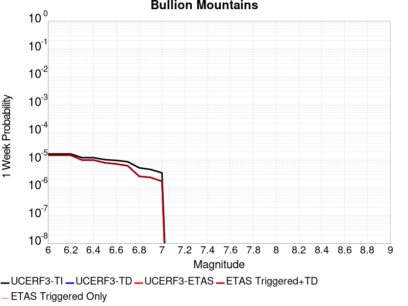 | 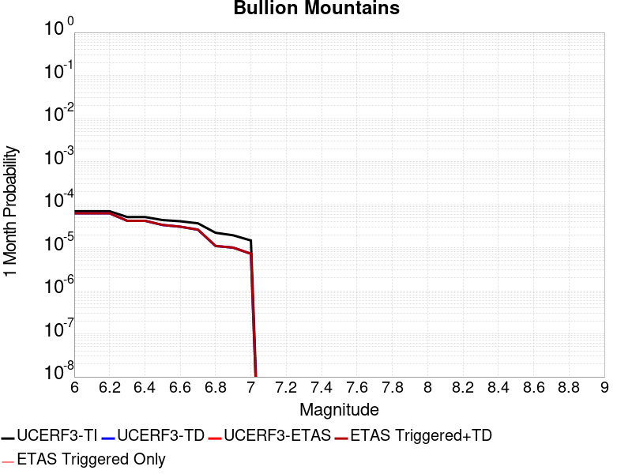 | 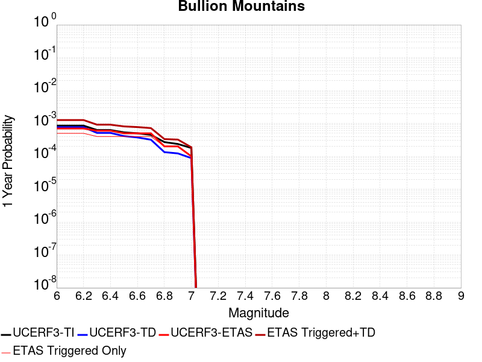 | 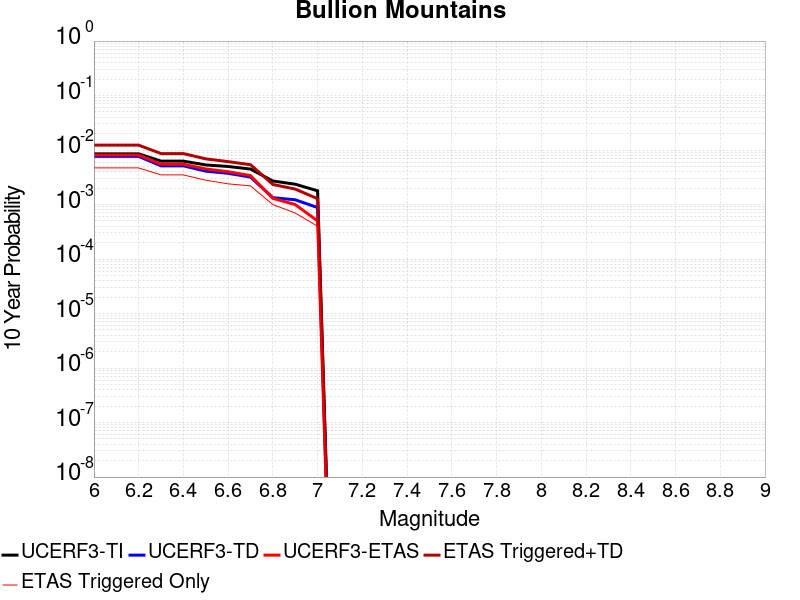 |

| Magnitude | 1 wk TI Prob | 1 wk TD Prob | 1 wk ETAS Prob | 1 wk ETAS/TD Gain | 1 wk ETAS Triggered+TD | 1 wk ETAS Triggered Only | 1 mo TI Prob | 1 mo TD Prob | 1 mo ETAS Prob | 1 mo ETAS/TD Gain | 1 mo ETAS Triggered+TD | 1 mo ETAS Triggered Only | 1 yr TI Prob | 1 yr TD Prob | 1 yr ETAS Prob | 1 yr ETAS/TD Gain | 1 yr ETAS Triggered+TD | 1 yr ETAS Triggered Only | 10 yr TI Prob | 10 yr TD Prob | 10 yr ETAS Prob | 10 yr ETAS/TD Gain | 10 yr ETAS Triggered+TD | 10 yr ETAS Triggered Only |
|-----|-----|-----|-----|-----|-----|-----|-----|-----|-----|-----|-----|-----|-----|-----|-----|-----|-----|-----|-----|-----|-----|-----|-----|-----|
| 6.0 | 1.6420427E-5 | 1.4695344E-5 | 0.0 | 0.0 | 1.4695344E-5 | 0.0 | 7.037136E-5 | 6.297875E-5 | 0.0 | 0.0 | 6.297875E-5 | 0.0 | 8.5643446E-4 | 7.665348E-4 | 7.0E-4 | 0.9132005 | 0.0012661516 | 5.0E-4 | 0.008531413 | 0.007642703 | 0.0081 | 1.0598344 | 0.012306782 | 0.0047 |
| 6.1 | 1.6420427E-5 | 1.4695344E-5 | 0.0 | 0.0 | 1.4695344E-5 | 0.0 | 7.037136E-5 | 6.297875E-5 | 0.0 | 0.0 | 6.297875E-5 | 0.0 | 8.5643446E-4 | 7.665348E-4 | 7.0E-4 | 0.9132005 | 0.0012661516 | 5.0E-4 | 0.008531413 | 0.007642703 | 0.0081 | 1.0598344 | 0.012306782 | 0.0047 |
| 6.2 | 1.6420427E-5 | 1.4695344E-5 | 0.0 | 0.0 | 1.4695344E-5 | 0.0 | 7.037136E-5 | 6.297875E-5 | 0.0 | 0.0 | 6.297875E-5 | 0.0 | 8.5643446E-4 | 7.665348E-4 | 7.0E-4 | 0.9132005 | 0.0012661516 | 5.0E-4 | 0.008531413 | 0.007642703 | 0.0081 | 1.0598344 | 0.012306782 | 0.0047 |
| 6.3 | 1.2046778E-5 | 9.8645905E-6 | 0.0 | 0.0 | 9.8645905E-6 | 0.0 | 5.1628023E-5 | 4.227626E-5 | 0.0 | 0.0 | 4.227626E-5 | 0.0 | 6.283899E-4 | 5.146151E-4 | 6.0E-4 | 1.1659199 | 9.144093E-4 | 4.0E-4 | 0.0062661595 | 0.005136517 | 0.0055 | 1.0707645 | 0.008618539 | 0.0035 |
| 6.4 | 1.2046778E-5 | 9.8645905E-6 | 0.0 | 0.0 | 9.8645905E-6 | 0.0 | 5.1628023E-5 | 4.227626E-5 | 0.0 | 0.0 | 4.227626E-5 | 0.0 | 6.283899E-4 | 5.146151E-4 | 6.0E-4 | 1.1659199 | 9.144093E-4 | 4.0E-4 | 0.0062661595 | 0.005136517 | 0.0055 | 1.0707645 | 0.008618539 | 0.0035 |
| 6.5 | 1.0244343E-5 | 7.88132E-6 | 0.0 | 0.0 | 7.88132E-6 | 0.0 | 4.390359E-5 | 3.3776763E-5 | 0.0 | 0.0 | 3.3776763E-5 | 0.0 | 5.343951E-4 | 4.111752E-4 | 5.0E-4 | 1.2160267 | 8.110107E-4 | 4.0E-4 | 0.005331118 | 0.004106176 | 0.0045 | 1.0959101 | 0.006894679 | 0.0028 |
| 6.6 | 9.605408E-6 | 7.1792206E-6 | 0.0 | 0.0 | 7.1792206E-6 | 0.0 | 4.1165385E-5 | 3.076784E-5 | 0.0 | 0.0 | 3.076784E-5 | 0.0 | 5.010733E-4 | 3.7455442E-4 | 5.0E-4 | 1.3349195 | 7.744046E-4 | 4.0E-4 | 0.00499945 | 0.0037412292 | 0.004 | 1.0691673 | 0.00613225 | 0.0024 |
| 6.7 | 8.60418E-6 | 6.125515E-6 | 0.0 | 0.0 | 6.125515E-6 | 0.0 | 3.687454E-5 | 2.6252053E-5 | 0.0 | 0.0 | 2.6252053E-5 | 0.0 | 4.48855E-4 | 3.1959137E-4 | 5.0E-4 | 1.5644978 | 7.194635E-4 | 4.0E-4 | 0.004479495 | 0.0031932304 | 0.0034 | 1.0647525 | 0.0053862054 | 0.0022 |
| 6.8 | 5.187994E-6 | 2.5639572E-6 | 0.0 | 0.0 | 2.5639572E-6 | 0.0 | 2.223407E-5 | 1.0988365E-5 | 0.0 | 0.0 | 1.0988365E-5 | 0.0 | 2.7066618E-4 | 1.3377912E-4 | 2.0E-4 | 1.4950016 | 3.3375237E-4 | 2.0E-4 | 0.0027033675 | 0.0013373777 | 0.0013 | 0.9720515 | 0.0023360404 | 0.001 |
| 6.9 | 4.5302368E-6 | 2.3450157E-6 | 0.0 | 0.0 | 2.3450157E-6 | 0.0 | 1.9415156E-5 | 1.0050051E-5 | 0.0 | 0.0 | 1.0050051E-5 | 0.0 | 2.3635388E-4 | 1.2235646E-4 | 2.0E-4 | 1.6345682 | 3.22332E-4 | 2.0E-4 | 0.0023610266 | 0.0012232803 | 0.001 | 0.81747407 | 0.0019224241 | 7.0E-4 |
| 7.0 | 3.431668E-6 | 1.6887847E-6 | 0.0 | 0.0 | 1.6887847E-6 | 0.0 | 1.4707065E-5 | 7.2376483E-6 | 0.0 | 0.0 | 7.2376483E-6 | 0.0 | 1.7904381E-4 | 8.811837E-5 | 1.0E-4 | 1.1348372 | 1.8810955E-4 | 1.0E-4 | 0.0017889962 | 8.811837E-4 | 5.0E-4 | 0.5674186 | 0.0012808312 | 4.0E-4 |

## Sargent 2011 CFM
*[(top)](#table-of-contents)*

| 1 Week | 1 Month | 1 Year | 10 Year |
|-----|-----|-----|-----|
| 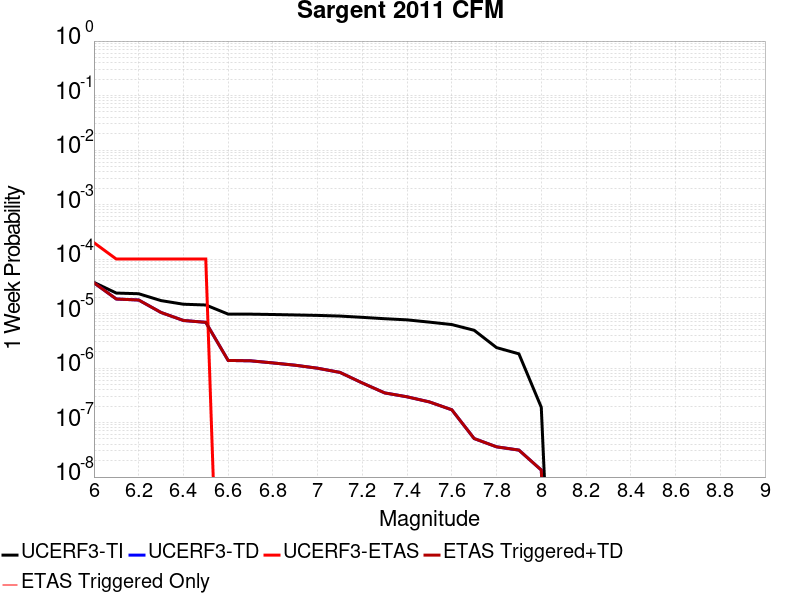 | 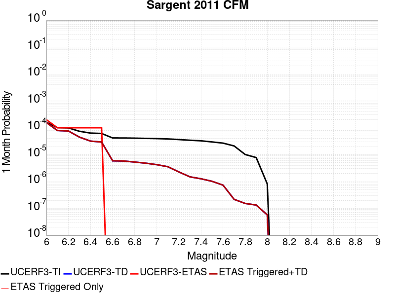 |  |  |

| Magnitude | 1 wk TI Prob | 1 wk TD Prob | 1 wk ETAS Prob | 1 wk ETAS/TD Gain | 1 wk ETAS Triggered+TD | 1 wk ETAS Triggered Only | 1 mo TI Prob | 1 mo TD Prob | 1 mo ETAS Prob | 1 mo ETAS/TD Gain | 1 mo ETAS Triggered+TD | 1 mo ETAS Triggered Only | 1 yr TI Prob | 1 yr TD Prob | 1 yr ETAS Prob | 1 yr ETAS/TD Gain | 1 yr ETAS Triggered+TD | 1 yr ETAS Triggered Only | 10 yr TI Prob | 10 yr TD Prob | 10 yr ETAS Prob | 10 yr ETAS/TD Gain | 10 yr ETAS Triggered+TD | 10 yr ETAS Triggered Only |
|-----|-----|-----|-----|-----|-----|-----|-----|-----|-----|-----|-----|-----|-----|-----|-----|-----|-----|-----|-----|-----|-----|-----|-----|-----|
| 6.0 | 3.7327867E-5 | 3.6676654E-5 | 2.0E-4 | 5.45306 | 3.6676654E-5 | 0.0 | 1.5996677E-4 | 1.5717841E-4 | 2.0E-4 | 1.2724394 | 1.5717841E-4 | 0.0 | 0.0019458556 | 0.0019123807 | 0.0019 | 0.99352604 | 0.002611042 | 7.0E-4 | 0.01928905 | 0.01903168 | 0.0184 | 0.9668091 | 0.023740327 | 0.0048 |
| 6.1 | 2.3771476E-5 | 1.8493098E-5 | 1.0E-4 | 5.4074225 | 1.8493098E-5 | 0.0 | 1.01873775E-4 | 7.925422E-5 | 1.0E-4 | 1.2617624 | 7.925422E-5 | 0.0 | 0.0012396075 | 9.6457405E-4 | 9.0E-4 | 0.9330543 | 0.0010644776 | 1.0E-4 | 0.012327154 | 0.009643748 | 0.0088 | 0.91250825 | 0.011921568 | 0.0023 |
| 6.2 | 2.3112721E-5 | 1.7724202E-5 | 1.0E-4 | 5.642003 | 1.7724202E-5 | 0.0 | 9.9050754E-5 | 7.595915E-5 | 1.0E-4 | 1.3164972 | 7.595915E-5 | 0.0 | 0.0012052758 | 9.244907E-4 | 9.0E-4 | 0.973509 | 0.0010243983 | 1.0E-4 | 0.011987597 | 0.009246272 | 0.0086 | 0.9301046 | 0.01142593 | 0.0022 |
| 6.3 | 1.728509E-5 | 1.0469156E-5 | 1.0E-4 | 9.5518675 | 1.0469156E-5 | 0.0 | 7.407686E-5 | 4.486731E-5 | 1.0E-4 | 2.228794 | 4.486731E-5 | 0.0 | 9.015125E-4 | 5.46169E-4 | 5.0E-4 | 0.91546756 | 5.46169E-4 | 0.0 | 0.008978641 | 0.005484853 | 0.0047 | 0.8569054 | 0.006678271 | 0.0012 |
| 6.4 | 1.48395575E-5 | 7.4648765E-6 | 1.0E-4 | 13.39607 | 7.4648765E-6 | 0.0 | 6.3596555E-5 | 3.199215E-5 | 1.0E-4 | 3.1257668 | 3.199215E-5 | 0.0 | 7.7401294E-4 | 3.8947247E-4 | 4.0E-4 | 1.0270302 | 3.8947247E-4 | 0.0 | 0.0077132257 | 0.0039237007 | 0.0034 | 0.8665289 | 0.0050193844 | 0.0011 |
| 6.5 | 1.4358964E-5 | 6.9034627E-6 | 1.0E-4 | 14.485484 | 6.9034627E-6 | 0.0 | 6.1536964E-5 | 2.9586148E-5 | 1.0E-4 | 3.37996 | 2.9586148E-5 | 0.0 | 7.48955E-4 | 3.6018935E-4 | 4.0E-4 | 1.110527 | 3.6018935E-4 | 0.0 | 0.0074643586 | 0.0036318526 | 0.0032 | 0.881093 | 0.004528584 | 9.0E-4 |
| 6.6 | 9.772591E-6 | 1.3801209E-6 | 0.0 | 0.0 | 1.3801209E-6 | 0.0 | 4.188186E-5 | 5.9147906E-6 | 0.0 | 0.0 | 5.9147906E-6 | 0.0 | 5.097923E-4 | 7.2010225E-5 | 0.0 | 0.0 | 7.2010225E-5 | 0.0 | 0.005086244 | 7.520928E-4 | 0.001 | 1.3296231 | 0.0012517167 | 5.0E-4 |
| 6.7 | 9.752745E-6 | 1.3588092E-6 | 0.0 | 0.0 | 1.3588092E-6 | 0.0 | 4.179681E-5 | 5.823455E-6 | 0.0 | 0.0 | 5.823455E-6 | 0.0 | 5.0875737E-4 | 7.0898284E-5 | 0.0 | 0.0 | 7.0898284E-5 | 0.0 | 0.005075942 | 7.409809E-4 | 0.001 | 1.3495624 | 0.0012406104 | 5.0E-4 |
| 6.8 | 9.608213E-6 | 1.2425566E-6 | 0.0 | 0.0 | 1.2425566E-6 | 0.0 | 4.1177405E-5 | 5.3252315E-6 | 0.0 | 0.0 | 5.3252315E-6 | 0.0 | 5.012196E-4 | 6.4832784E-5 | 0.0 | 0.0 | 6.4832784E-5 | 0.0 | 0.005000906 | 6.800625E-4 | 9.0E-4 | 1.3234076 | 0.0011797225 | 5.0E-4 |
| 6.9 | 9.427164E-6 | 1.127087E-6 | 0.0 | 0.0 | 1.127087E-6 | 0.0 | 4.04015E-5 | 4.830364E-6 | 0.0 | 0.0 | 4.830364E-6 | 0.0 | 4.9177726E-4 | 5.8808113E-5 | 0.0 | 0.0 | 5.8808113E-5 | 0.0 | 0.004906904 | 6.191662E-4 | 7.0E-4 | 1.1305528 | 0.0010189185 | 4.0E-4 |
| 7.0 | 9.247601E-6 | 9.933524E-7 | 0.0 | 0.0 | 9.933524E-7 | 0.0 | 3.9631974E-5 | 4.2572174E-6 | 0.0 | 0.0 | 4.2572174E-6 | 0.0 | 4.8241246E-4 | 5.1830408E-5 | 0.0 | 0.0 | 5.1830408E-5 | 0.0 | 0.0048136655 | 5.4892275E-4 | 7.0E-4 | 1.2752249 | 9.487032E-4 | 4.0E-4 |
| 7.1 | 8.995454E-6 | 8.3249694E-7 | 0.0 | 0.0 | 8.3249694E-7 | 0.0 | 3.8551374E-5 | 3.5678393E-6 | 0.0 | 0.0 | 3.5678393E-6 | 0.0 | 4.6926187E-4 | 4.343759E-5 | 0.0 | 0.0 | 4.343759E-5 | 0.0 | 0.004682722 | 4.641086E-4 | 7.0E-4 | 1.5082676 | 8.6392293E-4 | 4.0E-4 |
| 7.2 | 8.520861E-6 | 5.3238335E-7 | 0.0 | 0.0 | 5.3238335E-7 | 0.0 | 3.6517464E-5 | 2.281641E-6 | 0.0 | 0.0 | 2.281641E-6 | 0.0 | 4.445094E-4 | 2.7778631E-5 | 0.0 | 0.0 | 2.7778631E-5 | 0.0 | 0.004436213 | 3.058189E-4 | 4.0E-4 | 1.3079636 | 4.057883E-4 | 1.0E-4 |
| 7.3 | 8.043592E-6 | 3.4990975E-7 | 0.0 | 0.0 | 3.4990975E-7 | 0.0 | 3.4472083E-5 | 1.4996124E-6 | 0.0 | 0.0 | 1.4996124E-6 | 0.0 | 4.196168E-4 | 1.8257628E-5 | 0.0 | 0.0 | 1.8257628E-5 | 0.0 | 0.004188253 | 2.0929541E-4 | 3.0E-4 | 1.4333807 | 3.0927447E-4 | 1.0E-4 |
| 7.4 | 7.662316E-6 | 2.968094E-7 | 0.0 | 0.0 | 2.968094E-7 | 0.0 | 3.2838085E-5 | 1.2720396E-6 | 0.0 | 0.0 | 1.2720396E-6 | 0.0 | 3.9973034E-4 | 1.5486974E-5 | 0.0 | 0.0 | 1.5486974E-5 | 0.0 | 0.0039901207 | 1.7976371E-4 | 2.0E-4 | 1.1125716 | 2.7974573E-4 | 1.0E-4 |
| 7.5 | 6.961638E-6 | 2.3906216E-7 | 0.0 | 0.0 | 2.3906216E-7 | 0.0 | 2.9835252E-5 | 1.0245517E-6 | 0.0 | 0.0 | 1.0245517E-6 | 0.0 | 3.6318362E-4 | 1.2473846E-5 | 0.0 | 0.0 | 1.2473846E-5 | 0.0 | 0.0036259065 | 1.461523E-4 | 2.0E-4 | 1.3684355 | 2.461377E-4 | 1.0E-4 |
| 7.6 | 6.282332E-6 | 1.7151976E-7 | 0.0 | 0.0 | 1.7151976E-7 | 0.0 | 2.6924003E-5 | 7.350845E-7 | 0.0 | 0.0 | 7.350845E-7 | 0.0 | 3.2775043E-4 | 8.949617E-6 | 0.0 | 0.0 | 8.949617E-6 | 0.0 | 0.0032726745 | 1.06669184E-4 | 2.0E-4 | 1.8749558 | 2.0665851E-4 | 1.0E-4 |
| 7.7 | 4.934408E-6 | 5.088603E-8 | 0.0 | 0.0 | 5.088603E-8 | 0.0 | 2.114729E-5 | 2.1808296E-7 | 0.0 | 0.0 | 2.1808296E-7 | 0.0 | 2.5743784E-4 | 2.6551568E-6 | 0.0 | 0.0 | 2.6551568E-6 | 0.0 | 0.0025713982 | 3.3146618E-5 | 0.0 | 0.0 | 3.3146618E-5 | 0.0 |
| 7.8 | 2.373212E-6 | 3.5880674E-8 | 0.0 | 0.0 | 3.5880674E-8 | 0.0 | 1.0170869E-5 | 1.5377431E-7 | 0.0 | 0.0 | 1.5377431E-7 | 0.0 | 1.238233E-4 | 1.8722006E-6 | 0.0 | 0.0 | 1.8722006E-6 | 0.0 | 0.0012375432 | 2.4616835E-5 | 0.0 | 0.0 | 2.4616835E-5 | 0.0 |
| 7.9 | 1.8227792E-6 | 3.125148E-8 | 0.0 | 0.0 | 3.125148E-8 | 0.0 | 7.811887E-6 | 1.3393492E-7 | 0.0 | 0.0 | 1.3393492E-7 | 0.0 | 9.510558E-5 | 1.6306564E-6 | 0.0 | 0.0 | 1.6306564E-6 | 0.0 | 9.5064886E-4 | 2.1851753E-5 | 0.0 | 0.0 | 2.1851753E-5 | 0.0 |
| 8.0 | 1.9095137E-7 | 1.34596405E-8 | 0.0 | 0.0 | 1.34596405E-8 | 0.0 | 8.1836276E-7 | 5.7684176E-8 | 0.0 | 0.0 | 5.7684176E-8 | 0.0 | 9.963521E-6 | 7.023046E-7 | 0.0 | 0.0 | 7.023046E-7 | 0.0 | 9.963074E-5 | 8.5837855E-6 | 0.0 | 0.0 | 8.5837855E-6 | 0.0 |

## Pisgah-Bullion Mtn-Mesquite Lk
*[(top)](#table-of-contents)*

| 1 Week | 1 Month | 1 Year | 10 Year |
|-----|-----|-----|-----|
| 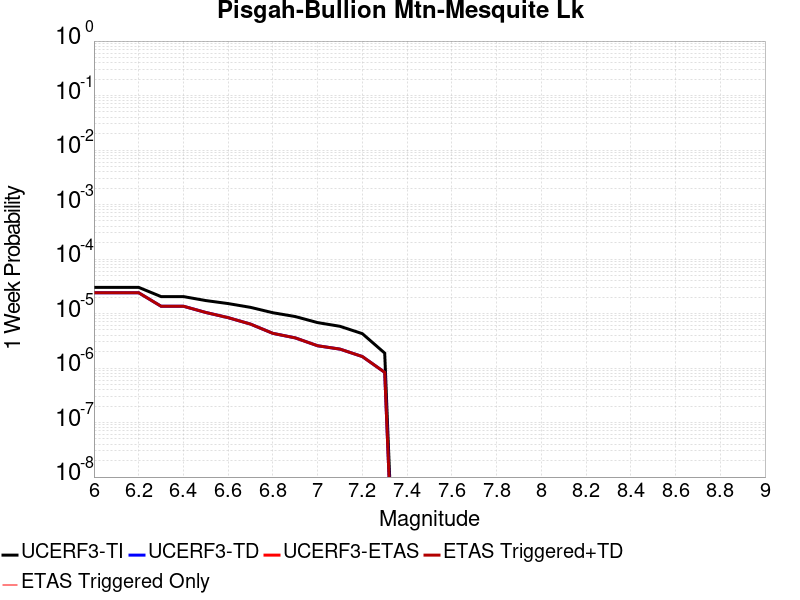 | 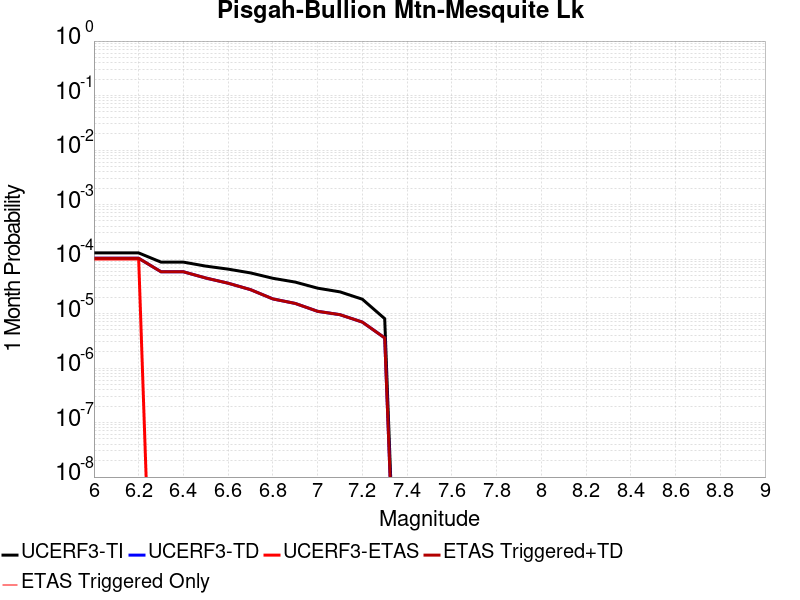 | 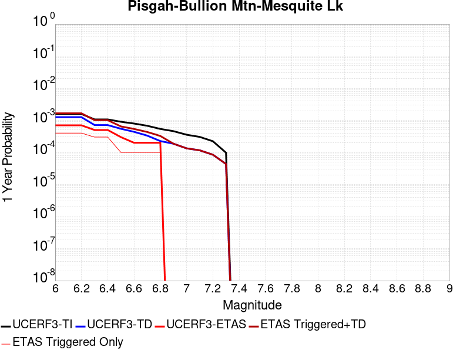 | 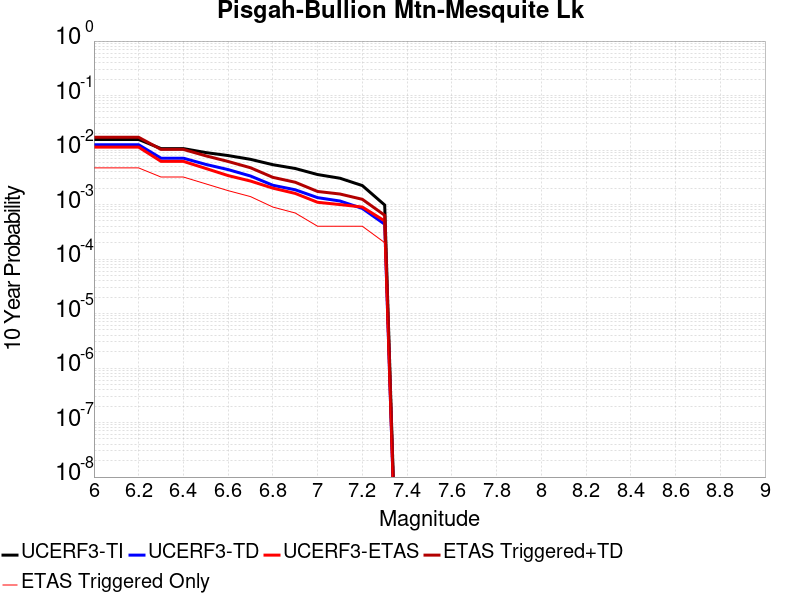 |

| Magnitude | 1 wk TI Prob | 1 wk TD Prob | 1 wk ETAS Prob | 1 wk ETAS/TD Gain | 1 wk ETAS Triggered+TD | 1 wk ETAS Triggered Only | 1 mo TI Prob | 1 mo TD Prob | 1 mo ETAS Prob | 1 mo ETAS/TD Gain | 1 mo ETAS Triggered+TD | 1 mo ETAS Triggered Only | 1 yr TI Prob | 1 yr TD Prob | 1 yr ETAS Prob | 1 yr ETAS/TD Gain | 1 yr ETAS Triggered+TD | 1 yr ETAS Triggered Only | 10 yr TI Prob | 10 yr TD Prob | 10 yr ETAS Prob | 10 yr ETAS/TD Gain | 10 yr ETAS Triggered+TD | 10 yr ETAS Triggered Only |
|-----|-----|-----|-----|-----|-----|-----|-----|-----|-----|-----|-----|-----|-----|-----|-----|-----|-----|-----|-----|-----|-----|-----|-----|-----|
| 6.0 | 3.0240792E-5 | 2.4096253E-5 | 0.0 | 0.0 | 2.4096253E-5 | 0.0 | 1.2959696E-4 | 1.0326614E-4 | 1.0E-4 | 0.9683716 | 1.0326614E-4 | 0.0 | 0.0015767008 | 0.0012566408 | 7.0E-4 | 0.55704063 | 0.0016561382 | 4.0E-4 | 0.015655609 | 0.012505378 | 0.0113 | 0.9036113 | 0.017146602 | 0.0047 |
| 6.1 | 3.0240792E-5 | 2.4096253E-5 | 0.0 | 0.0 | 2.4096253E-5 | 0.0 | 1.2959696E-4 | 1.0326614E-4 | 1.0E-4 | 0.9683716 | 1.0326614E-4 | 0.0 | 0.0015767008 | 0.0012566408 | 7.0E-4 | 0.55704063 | 0.0016561382 | 4.0E-4 | 0.015655609 | 0.012505378 | 0.0113 | 0.9036113 | 0.017146602 | 0.0047 |
| 6.2 | 3.0240792E-5 | 2.4096253E-5 | 0.0 | 0.0 | 2.4096253E-5 | 0.0 | 1.2959696E-4 | 1.0326614E-4 | 1.0E-4 | 0.9683716 | 1.0326614E-4 | 0.0 | 0.0015767008 | 0.0012566408 | 7.0E-4 | 0.55704063 | 0.0016561382 | 4.0E-4 | 0.015655609 | 0.012505378 | 0.0113 | 0.9036113 | 0.017146602 | 0.0047 |
| 6.3 | 2.0498217E-5 | 1.3640496E-5 | 0.0 | 0.0 | 1.3640496E-5 | 0.0 | 8.784654E-5 | 5.845805E-5 | 0.0 | 0.0 | 5.845805E-5 | 0.0 | 0.0010690069 | 7.1151054E-4 | 5.0E-4 | 0.70273024 | 0.0010112971 | 3.0E-4 | 0.01063879 | 0.007093952 | 0.0062 | 0.8739839 | 0.010271251 | 0.0032 |
| 6.4 | 2.0498217E-5 | 1.3640496E-5 | 0.0 | 0.0 | 1.3640496E-5 | 0.0 | 8.784654E-5 | 5.845805E-5 | 0.0 | 0.0 | 5.845805E-5 | 0.0 | 0.0010690069 | 7.1151054E-4 | 5.0E-4 | 0.70273024 | 0.0010112971 | 3.0E-4 | 0.01063879 | 0.007093952 | 0.0062 | 0.8739839 | 0.010271251 | 0.0032 |
| 6.5 | 1.7316182E-5 | 1.0478719E-5 | 0.0 | 0.0 | 1.0478719E-5 | 0.0 | 7.42101E-5 | 4.4908076E-5 | 0.0 | 0.0 | 4.4908076E-5 | 0.0 | 9.0313336E-4 | 5.4662867E-4 | 3.0E-4 | 0.54881865 | 6.46574E-4 | 1.0E-4 | 0.008994718 | 0.005453837 | 0.0046 | 0.84344286 | 0.007840748 | 0.0024 |
| 6.6 | 1.5251077E-5 | 8.415433E-6 | 0.0 | 0.0 | 8.415433E-6 | 0.0 | 6.536012E-5 | 3.606568E-5 | 0.0 | 0.0 | 3.606568E-5 | 0.0 | 7.9546886E-4 | 4.3901842E-4 | 2.0E-4 | 0.45556176 | 5.3897453E-4 | 1.0E-4 | 0.007926274 | 0.004382229 | 0.0034 | 0.7758609 | 0.006174341 | 0.0018 |
| 6.7 | 1.2997425E-5 | 6.412142E-6 | 0.0 | 0.0 | 6.412142E-6 | 0.0 | 5.570206E-5 | 2.7480346E-5 | 0.0 | 0.0 | 2.7480346E-5 | 0.0 | 6.7796157E-4 | 3.345265E-4 | 2.0E-4 | 0.59786 | 4.3449303E-4 | 1.0E-4 | 0.0067589693 | 0.0033406895 | 0.0027 | 0.8082164 | 0.0047360123 | 0.0014 |
| 6.8 | 1.035386E-5 | 4.334024E-6 | 0.0 | 0.0 | 4.334024E-6 | 0.0 | 4.437293E-5 | 1.8574263E-5 | 0.0 | 0.0 | 1.8574263E-5 | 0.0 | 5.401065E-4 | 2.2611905E-4 | 2.0E-4 | 0.88448983 | 3.2609643E-4 | 1.0E-4 | 0.0053879567 | 0.0022589767 | 0.002 | 0.88535666 | 0.0031569435 | 9.0E-4 |
| 6.9 | 8.816252E-6 | 3.5812868E-6 | 0.0 | 0.0 | 3.5812868E-6 | 0.0 | 3.778339E-5 | 1.5348285E-5 | 0.0 | 0.0 | 1.5348285E-5 | 0.0 | 4.5991567E-4 | 1.8684994E-4 | 0.0 | 0.0 | 1.8684994E-4 | 0.0 | 0.00458965 | 0.0018669867 | 0.0016 | 0.8569959 | 0.0025656798 | 7.0E-4 |
| 7.0 | 6.8232207E-6 | 2.5680085E-6 | 0.0 | 0.0 | 2.5680085E-6 | 0.0 | 2.9242048E-5 | 1.1005706E-5 | 0.0 | 0.0 | 1.1005706E-5 | 0.0 | 3.5596377E-4 | 1.3398656E-4 | 0.0 | 0.0 | 1.3398656E-4 | 0.0 | 0.0035539411 | 0.0013390888 | 0.0011 | 0.82145417 | 0.0017385532 | 4.0E-4 |
| 7.1 | 5.837013E-6 | 2.2278264E-6 | 0.0 | 0.0 | 2.2278264E-6 | 0.0 | 2.501553E-5 | 9.547794E-6 | 0.0 | 0.0 | 9.547794E-6 | 0.0 | 3.045215E-4 | 1.1623849E-4 | 0.0 | 0.0 | 1.1623849E-4 | 0.0 | 0.0030410455 | 0.0011618059 | 0.001 | 0.8607289 | 0.0015613412 | 4.0E-4 |
| 7.2 | 4.278052E-6 | 1.6278752E-6 | 0.0 | 0.0 | 1.6278752E-6 | 0.0 | 1.833438E-5 | 6.9765906E-6 | 0.0 | 0.0 | 6.9765906E-6 | 0.0 | 2.231982E-4 | 8.493692E-5 | 0.0 | 0.0 | 8.493692E-5 | 0.0 | 0.0022297418 | 8.4906776E-4 | 9.0E-4 | 1.0599861 | 0.0012487281 | 4.0E-4 |
| 7.3 | 1.8803692E-6 | 8.3462135E-7 | 0.0 | 0.0 | 8.3462135E-7 | 0.0 | 8.0587E-6 | 3.5769444E-6 | 0.0 | 0.0 | 3.5769444E-6 | 0.0 | 9.811026E-5 | 4.3548574E-5 | 0.0 | 0.0 | 4.3548574E-5 | 0.0 | 9.806695E-4 | 4.354149E-4 | 5.0E-4 | 1.1483301 | 6.3532783E-4 | 2.0E-4 |

## San Diego Trough south
*[(top)](#table-of-contents)*

| 1 Week | 1 Month | 1 Year | 10 Year |
|-----|-----|-----|-----|
| 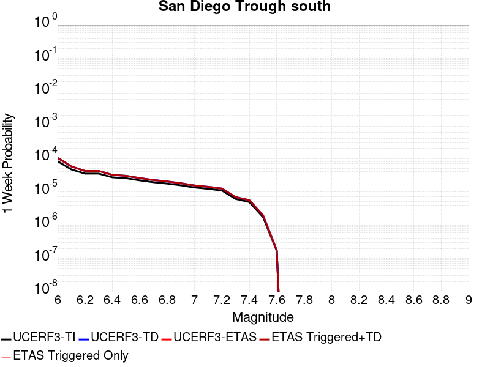 | 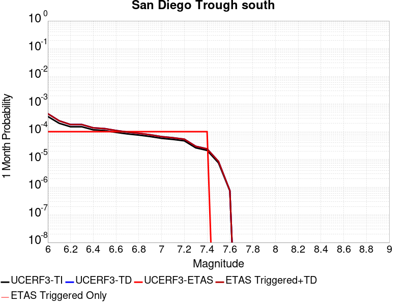 | 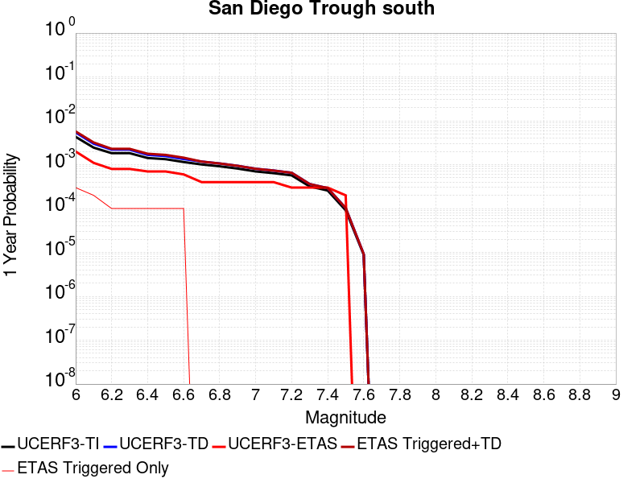 | 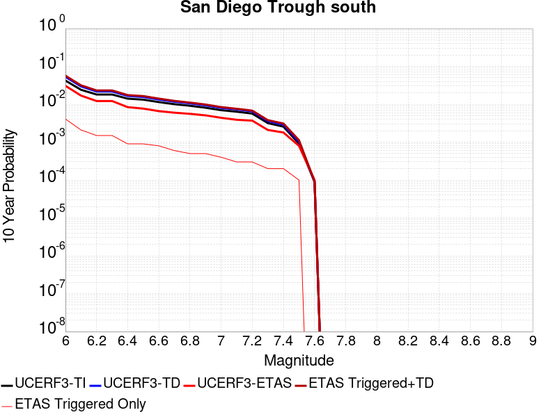 |

| Magnitude | 1 wk TI Prob | 1 wk TD Prob | 1 wk ETAS Prob | 1 wk ETAS/TD Gain | 1 wk ETAS Triggered+TD | 1 wk ETAS Triggered Only | 1 mo TI Prob | 1 mo TD Prob | 1 mo ETAS Prob | 1 mo ETAS/TD Gain | 1 mo ETAS Triggered+TD | 1 mo ETAS Triggered Only | 1 yr TI Prob | 1 yr TD Prob | 1 yr ETAS Prob | 1 yr ETAS/TD Gain | 1 yr ETAS Triggered+TD | 1 yr ETAS Triggered Only | 10 yr TI Prob | 10 yr TD Prob | 10 yr ETAS Prob | 10 yr ETAS/TD Gain | 10 yr ETAS Triggered+TD | 10 yr ETAS Triggered Only |
|-----|-----|-----|-----|-----|-----|-----|-----|-----|-----|-----|-----|-----|-----|-----|-----|-----|-----|-----|-----|-----|-----|-----|-----|-----|
| 6.0 | 8.279495E-5 | 1.04307226E-4 | 0.0 | 0.0 | 1.04307226E-4 | 0.0 | 3.5478722E-4 | 4.469593E-4 | 1.0E-4 | 0.223734 | 4.469593E-4 | 0.0 | 0.004310982 | 0.0054286052 | 0.002 | 0.36841875 | 0.005726977 | 3.0E-4 | 0.042283054 | 0.05301837 | 0.0308 | 0.58093077 | 0.056900993 | 0.0041 |
| 6.1 | 4.6961468E-5 | 5.7755435E-5 | 0.0 | 0.0 | 5.7755435E-5 | 0.0 | 2.0124791E-4 | 2.4750078E-4 | 1.0E-4 | 0.40403914 | 2.4750078E-4 | 0.0 | 0.00244744 | 0.0030092376 | 0.0011 | 0.36554107 | 0.0032086358 | 2.0E-4 | 0.024206603 | 0.029692695 | 0.017 | 0.5725314 | 0.03173034 | 0.0021 |
| 6.2 | 3.5079658E-5 | 4.2159343E-5 | 0.0 | 0.0 | 4.2159343E-5 | 0.0 | 1.5033272E-4 | 1.8067063E-4 | 1.0E-4 | 0.5534934 | 1.8067063E-4 | 0.0 | 0.0018287642 | 0.002197466 | 8.0E-4 | 0.3640557 | 0.0022972464 | 1.0E-4 | 0.018137876 | 0.02175977 | 0.0122 | 0.56066763 | 0.023227131 | 0.0015 |
| 6.3 | 3.5079658E-5 | 4.2159343E-5 | 0.0 | 0.0 | 4.2159343E-5 | 0.0 | 1.5033272E-4 | 1.8067063E-4 | 1.0E-4 | 0.5534934 | 1.8067063E-4 | 0.0 | 0.0018287642 | 0.002197466 | 8.0E-4 | 0.3640557 | 0.0022972464 | 1.0E-4 | 0.018137876 | 0.02175977 | 0.0122 | 0.56066763 | 0.023227131 | 0.0015 |
| 6.4 | 2.7196904E-5 | 3.209867E-5 | 0.0 | 0.0 | 3.209867E-5 | 0.0 | 1.16552954E-4 | 1.3755856E-4 | 1.0E-4 | 0.72696316 | 1.3755856E-4 | 0.0 | 0.0014181085 | 0.0016734999 | 7.0E-4 | 0.41828507 | 0.0017733326 | 1.0E-4 | 0.014090929 | 0.016610572 | 0.0084 | 0.505702 | 0.017495623 | 9.0E-4 |
| 6.5 | 2.5584688E-5 | 3.0112242E-5 | 0.0 | 0.0 | 3.0112242E-5 | 0.0 | 1.0964406E-4 | 1.2904615E-4 | 1.0E-4 | 0.7749166 | 1.2904615E-4 | 0.0 | 0.0013340989 | 0.0015700158 | 7.0E-4 | 0.44585538 | 0.0016698588 | 1.0E-4 | 0.013261181 | 0.015590781 | 0.0077 | 0.4938816 | 0.016476749 | 9.0E-4 |
| 6.6 | 2.2034688E-5 | 2.575136E-5 | 0.0 | 0.0 | 2.575136E-5 | 0.0 | 9.443096E-5 | 1.1035835E-4 | 1.0E-4 | 0.90613896 | 1.1035835E-4 | 0.0 | 0.0011490905 | 0.0013427921 | 6.0E-4 | 0.44683015 | 0.0014426578 | 1.0E-4 | 0.011431668 | 0.013347778 | 0.0066 | 0.49446434 | 0.0141370995 | 8.0E-4 |
| 6.7 | 1.9394853E-5 | 2.2549064E-5 | 0.0 | 0.0 | 2.2549064E-5 | 0.0 | 8.311815E-5 | 9.6635296E-5 | 1.0E-4 | 1.0348186 | 9.6635296E-5 | 0.0 | 0.0010114936 | 0.0011759049 | 4.0E-4 | 0.34016356 | 0.0011759049 | 0.0 | 0.01006902 | 0.011697533 | 0.006 | 0.51292866 | 0.012290514 | 6.0E-4 |
| 6.8 | 1.7615313E-5 | 2.0409623E-5 | 0.0 | 0.0 | 2.0409623E-5 | 0.0 | 7.549201E-5 | 8.7466906E-5 | 1.0E-4 | 1.1432896 | 8.7466906E-5 | 0.0 | 9.1872766E-4 | 0.0010643937 | 4.0E-4 | 0.37580082 | 0.0010643937 | 0.0 | 0.009149387 | 0.010593523 | 0.0056 | 0.52862483 | 0.011088227 | 5.0E-4 |
| 6.9 | 1.5621423E-5 | 1.8031646E-5 | 0.0 | 0.0 | 1.8031646E-5 | 0.0 | 6.6947236E-5 | 7.727621E-5 | 1.0E-4 | 1.2940594 | 7.727621E-5 | 0.0 | 8.147778E-4 | 9.404353E-4 | 4.0E-4 | 0.42533496 | 9.404353E-4 | 0.0 | 0.008117969 | 0.009365001 | 0.0051 | 0.5445809 | 0.009860318 | 5.0E-4 |
| 7.0 | 1.3444376E-5 | 1.5452673E-5 | 0.0 | 0.0 | 1.5452673E-5 | 0.0 | 5.7617483E-5 | 6.622408E-5 | 1.0E-4 | 1.5100248 | 6.622408E-5 | 0.0 | 7.0126704E-4 | 8.059827E-4 | 4.0E-4 | 0.4962886 | 8.059827E-4 | 0.0 | 0.006990582 | 0.008030929 | 0.0044 | 0.54788184 | 0.008427716 | 4.0E-4 |
| 7.1 | 1.2268361E-5 | 1.4077152E-5 | 0.0 | 0.0 | 1.4077152E-5 | 0.0 | 5.2577634E-5 | 6.0329272E-5 | 1.0E-4 | 1.6575701 | 6.0329272E-5 | 0.0 | 6.399447E-4 | 7.34264E-4 | 4.0E-4 | 0.5447632 | 7.34264E-4 | 0.0 | 0.0063810493 | 0.0073186844 | 0.0039 | 0.53288263 | 0.0076164887 | 3.0E-4 |
| 7.2 | 1.0922655E-5 | 1.2517193E-5 | 0.0 | 0.0 | 1.2517193E-5 | 0.0 | 4.681054E-5 | 5.3644024E-5 | 1.0E-4 | 1.8641405 | 5.3644024E-5 | 0.0 | 5.697693E-4 | 6.5292284E-4 | 3.0E-4 | 0.4594724 | 6.5292284E-4 | 0.0 | 0.0056831064 | 0.0065103257 | 0.0037 | 0.56832796 | 0.0068083727 | 3.0E-4 |
| 7.3 | 6.1106753E-6 | 6.9307744E-6 | 0.0 | 0.0 | 6.9307744E-6 | 0.0 | 2.6188345E-5 | 2.9702984E-5 | 1.0E-4 | 3.3666651 | 2.9702984E-5 | 0.0 | 3.1879646E-4 | 3.6157423E-4 | 3.0E-4 | 0.8297052 | 3.6157423E-4 | 0.0 | 0.0031833951 | 0.0036099046 | 0.0021 | 0.5817328 | 0.0038091827 | 2.0E-4 |
| 7.4 | 4.933187E-6 | 5.5910364E-6 | 0.0 | 0.0 | 5.5910364E-6 | 0.0 | 2.114206E-5 | 2.3961367E-5 | 1.0E-4 | 4.1733847 | 2.3961367E-5 | 0.0 | 2.5737417E-4 | 2.91691E-4 | 3.0E-4 | 1.0284857 | 2.91691E-4 | 0.0 | 0.002570763 | 0.0029131223 | 0.0018 | 0.6178937 | 0.0031125399 | 2.0E-4 |
| 7.5 | 1.7489613E-6 | 1.9701774E-6 | 0.0 | 0.0 | 1.9701774E-6 | 0.0 | 7.495527E-6 | 8.4435915E-6 | 0.0 | 0.0 | 8.4435915E-6 | 0.0 | 9.125422E-5 | 1.02796104E-4 | 2.0E-4 | 1.9455991 | 1.02796104E-4 | 0.0 | 9.1216754E-4 | 0.0010275076 | 8.0E-4 | 0.7785831 | 0.0011274049 | 1.0E-4 |
| 7.6 | 1.6988751E-7 | 1.753494E-7 | 0.0 | 0.0 | 1.753494E-7 | 0.0 | 7.2808916E-7 | 7.5149717E-7 | 0.0 | 0.0 | 7.5149717E-7 | 0.0 | 8.864449E-6 | 9.149442E-6 | 0.0 | 0.0 | 9.149442E-6 | 0.0 | 8.8640954E-5 | 9.149085E-5 | 1.0E-4 | 1.0930055 | 9.149085E-5 | 0.0 |

## Mission (connected) 2011 CFM
*[(top)](#table-of-contents)*

| 1 Week | 1 Month | 1 Year | 10 Year |
|-----|-----|-----|-----|
|  |  |  |  |

| Magnitude | 1 wk TI Prob | 1 wk TD Prob | 1 wk ETAS Prob | 1 wk ETAS/TD Gain | 1 wk ETAS Triggered+TD | 1 wk ETAS Triggered Only | 1 mo TI Prob | 1 mo TD Prob | 1 mo ETAS Prob | 1 mo ETAS/TD Gain | 1 mo ETAS Triggered+TD | 1 mo ETAS Triggered Only | 1 yr TI Prob | 1 yr TD Prob | 1 yr ETAS Prob | 1 yr ETAS/TD Gain | 1 yr ETAS Triggered+TD | 1 yr ETAS Triggered Only | 10 yr TI Prob | 10 yr TD Prob | 10 yr ETAS Prob | 10 yr ETAS/TD Gain | 10 yr ETAS Triggered+TD | 10 yr ETAS Triggered Only |
|-----|-----|-----|-----|-----|-----|-----|-----|-----|-----|-----|-----|-----|-----|-----|-----|-----|-----|-----|-----|-----|-----|-----|-----|-----|
| 6.0 | 1.8735573E-5 | 2.692323E-5 | 0.0 | 0.0 | 2.692323E-5 | 0.0 | 8.029284E-5 | 1.1537881E-4 | 2.0E-4 | 1.7334206 | 2.1536727E-4 | 1.0E-4 | 9.771269E-4 | 0.0014037342 | 0.0025 | 1.780964 | 0.0021027515 | 7.0E-4 | 0.009728416 | 0.013957432 | 0.0157 | 1.1248487 | 0.018000206 | 0.0041 |
| 6.1 | 1.7515964E-5 | 2.5564199E-5 | 0.0 | 0.0 | 2.5564199E-5 | 0.0 | 7.506625E-5 | 1.09554894E-4 | 1.0E-4 | 0.91278446 | 1.09554894E-4 | 0.0 | 9.135484E-4 | 0.0013329166 | 0.0015 | 1.1253518 | 0.0019321168 | 6.0E-4 | 0.009098019 | 0.013257892 | 0.011 | 0.8296945 | 0.01602077 | 0.0028 |
| 6.2 | 1.6486343E-5 | 2.4408591E-5 | 0.0 | 0.0 | 2.4408591E-5 | 0.0 | 7.065384E-5 | 1.04602696E-4 | 1.0E-4 | 0.9559983 | 1.04602696E-4 | 0.0 | 8.5987104E-4 | 0.001272696 | 0.0013 | 1.0214537 | 0.0017720596 | 5.0E-4 | 0.008565514 | 0.012662735 | 0.01 | 0.7897188 | 0.015131079 | 0.0025 |
| 6.3 | 1.5229385E-5 | 2.2837155E-5 | 0.0 | 0.0 | 2.2837155E-5 | 0.0 | 6.526716E-5 | 9.78685E-5 | 1.0E-4 | 1.0217792 | 9.78685E-5 | 0.0 | 7.9433795E-4 | 0.0011907999 | 0.001 | 0.8397717 | 0.0014904425 | 3.0E-4 | 0.007915046 | 0.011855493 | 0.0091 | 0.76757663 | 0.013930596 | 0.0021 |
| 6.4 | 1.4435828E-5 | 2.1435902E-5 | 0.0 | 0.0 | 2.1435902E-5 | 0.0 | 6.186637E-5 | 9.186357E-5 | 1.0E-4 | 1.0885708 | 9.186357E-5 | 0.0 | 7.529627E-4 | 0.0011177683 | 9.0E-4 | 0.8051758 | 0.0013175448 | 2.0E-4 | 0.007504165 | 0.011137924 | 0.0081 | 0.727245 | 0.012917876 | 0.0018 |
| 6.5 | 1.30127955E-5 | 1.9070389E-5 | 0.0 | 0.0 | 1.9070389E-5 | 0.0 | 5.576793E-5 | 8.172759E-5 | 1.0E-4 | 1.2235771 | 8.172759E-5 | 0.0 | 6.78763E-4 | 9.945439E-4 | 8.0E-4 | 0.8043888 | 0.001194345 | 2.0E-4 | 0.0067669353 | 0.009928844 | 0.0073 | 0.7352316 | 0.0117109725 | 0.0018 |
| 6.6 | 1.1220718E-5 | 1.642485E-5 | 0.0 | 0.0 | 1.642485E-5 | 0.0 | 4.8087906E-5 | 7.039032E-5 | 0.0 | 0.0 | 7.039032E-5 | 0.0 | 5.8531296E-4 | 8.566647E-4 | 5.0E-4 | 0.58365893 | 0.0010564934 | 2.0E-4 | 0.005837737 | 0.008565849 | 0.0061 | 0.71213025 | 0.010251287 | 0.0017 |
| 6.7 | 8.086152E-6 | 1.17767495E-5 | 0.0 | 0.0 | 1.17767495E-5 | 0.0 | 3.4654473E-5 | 5.047081E-5 | 0.0 | 0.0 | 5.047081E-5 | 0.0 | 4.2183654E-4 | 6.143097E-4 | 4.0E-4 | 0.6511374 | 8.141868E-4 | 2.0E-4 | 0.004210367 | 0.006163477 | 0.0049 | 0.79500586 | 0.0076542315 | 0.0015 |
| 6.8 | 6.8361655E-6 | 1.0219172E-5 | 0.0 | 0.0 | 1.0219172E-5 | 0.0 | 2.9297524E-5 | 4.3795717E-5 | 0.0 | 0.0 | 4.3795717E-5 | 0.0 | 3.5663895E-4 | 5.3308305E-4 | 4.0E-4 | 0.75035214 | 7.329764E-4 | 2.0E-4 | 0.0035606713 | 0.0053510936 | 0.0046 | 0.8596373 | 0.0068430672 | 0.0015 |
| 6.9 | 5.2517353E-6 | 7.889001E-6 | 0.0 | 0.0 | 7.889001E-6 | 0.0 | 2.2507242E-5 | 3.3809567E-5 | 0.0 | 0.0 | 3.3809567E-5 | 0.0 | 2.739912E-4 | 4.1155398E-4 | 3.0E-4 | 0.7289445 | 6.1147165E-4 | 2.0E-4 | 0.0027365363 | 0.004140271 | 0.0038 | 0.9178143 | 0.0055344747 | 0.0014 |
| 7.0 | 4.4602784E-6 | 6.719784E-6 | 0.0 | 0.0 | 6.719784E-6 | 0.0 | 1.911534E-5 | 2.8798757E-5 | 0.0 | 0.0 | 2.8798757E-5 | 0.0 | 2.327044E-4 | 3.5056862E-4 | 2.0E-4 | 0.57050174 | 4.5053355E-4 | 1.0E-4 | 0.0023246086 | 0.003531614 | 0.0031 | 0.87778556 | 0.0045280824 | 0.001 |
| 7.1 | 4.1492594E-6 | 6.2674326E-6 | 0.0 | 0.0 | 6.2674326E-6 | 0.0 | 1.7782419E-5 | 2.6860149E-5 | 0.0 | 0.0 | 2.6860149E-5 | 0.0 | 2.1647944E-4 | 3.269734E-4 | 1.0E-4 | 0.30583528 | 4.269407E-4 | 1.0E-4 | 0.0021626868 | 0.0032958682 | 0.0026 | 0.7888665 | 0.004192902 | 9.0E-4 |
| 7.2 | 2.213247E-6 | 3.373964E-6 | 0.0 | 0.0 | 3.373964E-6 | 0.0 | 9.485309E-6 | 1.4459766E-5 | 0.0 | 0.0 | 1.4459766E-5 | 0.0 | 1.15477524E-4 | 1.7603347E-4 | 1.0E-4 | 0.5680738 | 2.7601587E-4 | 1.0E-4 | 0.0011541754 | 0.0017874757 | 0.0016 | 0.89511704 | 0.002286582 | 5.0E-4 |
| 7.3 | 1.7362703E-6 | 2.7483154E-6 | 0.0 | 0.0 | 2.7483154E-6 | 0.0 | 7.4411373E-6 | 1.1778441E-5 | 0.0 | 0.0 | 1.1778441E-5 | 0.0 | 9.0592075E-5 | 1.433931E-4 | 1.0E-4 | 0.6973836 | 2.4337877E-4 | 1.0E-4 | 9.0555154E-4 | 0.0014582266 | 0.0013 | 0.8914938 | 0.0019574976 | 5.0E-4 |
| 7.4 | 1.1628409E-6 | 1.8573909E-6 | 0.0 | 0.0 | 1.8573909E-6 | 0.0 | 4.9835944E-6 | 7.960222E-6 | 0.0 | 0.0 | 7.960222E-6 | 0.0 | 6.0673574E-5 | 9.691141E-5 | 1.0E-4 | 1.0318702 | 1.9690172E-4 | 1.0E-4 | 6.065701E-4 | 9.893979E-4 | 8.0E-4 | 0.8085726 | 0.0013890021 | 4.0E-4 |
| 7.5 | 5.5610667E-7 | 9.4054224E-7 | 0.0 | 0.0 | 9.4054224E-7 | 0.0 | 2.3833122E-6 | 4.030889E-6 | 0.0 | 0.0 | 4.030889E-6 | 0.0 | 2.9016439E-5 | 4.9074974E-5 | 1.0E-4 | 2.0376985 | 1.4907007E-4 | 1.0E-4 | 2.901265E-4 | 5.0721003E-4 | 4.0E-4 | 0.78862786 | 6.0715934E-4 | 1.0E-4 |
| 7.6 | 4.4307663E-7 | 7.843462E-7 | 0.0 | 0.0 | 7.843462E-7 | 0.0 | 1.8988985E-6 | 3.3614792E-6 | 0.0 | 0.0 | 3.3614792E-6 | 0.0 | 2.3118844E-5 | 4.0925243E-5 | 0.0 | 0.0 | 4.0925243E-5 | 0.0 | 2.3116439E-4 | 4.250631E-4 | 2.0E-4 | 0.47051838 | 4.250631E-4 | 0.0 |
| 7.7 | 3.639119E-7 | 6.4076636E-7 | 0.0 | 0.0 | 6.4076636E-7 | 0.0 | 1.5596215E-6 | 2.7461385E-6 | 0.0 | 0.0 | 2.7461385E-6 | 0.0 | 1.8988227E-5 | 3.3433727E-5 | 0.0 | 0.0 | 3.3433727E-5 | 0.0 | 1.8986604E-4 | 3.4955924E-4 | 2.0E-4 | 0.5721491 | 3.4955924E-4 | 0.0 |
| 7.8 | 3.1152942E-7 | 5.519411E-7 | 0.0 | 0.0 | 5.519411E-7 | 0.0 | 1.3351254E-6 | 2.3654597E-6 | 0.0 | 0.0 | 2.3654597E-6 | 0.0 | 1.6255031E-5 | 2.8799095E-5 | 0.0 | 0.0 | 2.8799095E-5 | 0.0 | 1.6253842E-4 | 2.9995668E-4 | 2.0E-4 | 0.666763 | 2.9995668E-4 | 0.0 |
| 7.9 | 1.8035962E-7 | 3.7461479E-7 | 0.0 | 0.0 | 3.7461479E-7 | 0.0 | 7.729696E-7 | 1.605491E-6 | 0.0 | 0.0 | 1.605491E-6 | 0.0 | 9.410865E-6 | 1.9546678E-5 | 0.0 | 0.0 | 1.9546678E-5 | 0.0 | 9.410465E-5 | 2.0207842E-4 | 2.0E-4 | 0.98971486 | 2.0207842E-4 | 0.0 |
| 8.0 | 9.279334E-8 | 1.9830004E-7 | 0.0 | 0.0 | 1.9830004E-7 | 0.0 | 3.976857E-7 | 8.4985703E-7 | 0.0 | 0.0 | 8.4985703E-7 | 0.0 | 4.841813E-6 | 1.0346961E-5 | 0.0 | 0.0 | 1.0346961E-5 | 0.0 | 4.841707E-5 | 1.0595763E-4 | 1.0E-4 | 0.94377345 | 1.0595763E-4 | 0.0 |
| 8.1 | 5.9253985E-8 | 1.1927906E-7 | 0.0 | 0.0 | 1.1927906E-7 | 0.0 | 2.5394561E-7 | 5.111959E-7 | 0.0 | 0.0 | 5.111959E-7 | 0.0 | 3.0917836E-6 | 6.2237928E-6 | 0.0 | 0.0 | 6.2237928E-6 | 0.0 | 3.0917407E-5 | 6.361017E-5 | 1.0E-4 | 1.5720757 | 6.361017E-5 | 0.0 |

## Ortigalita (South)
*[(top)](#table-of-contents)*

| 1 Week | 1 Month | 1 Year | 10 Year |
|-----|-----|-----|-----|
| 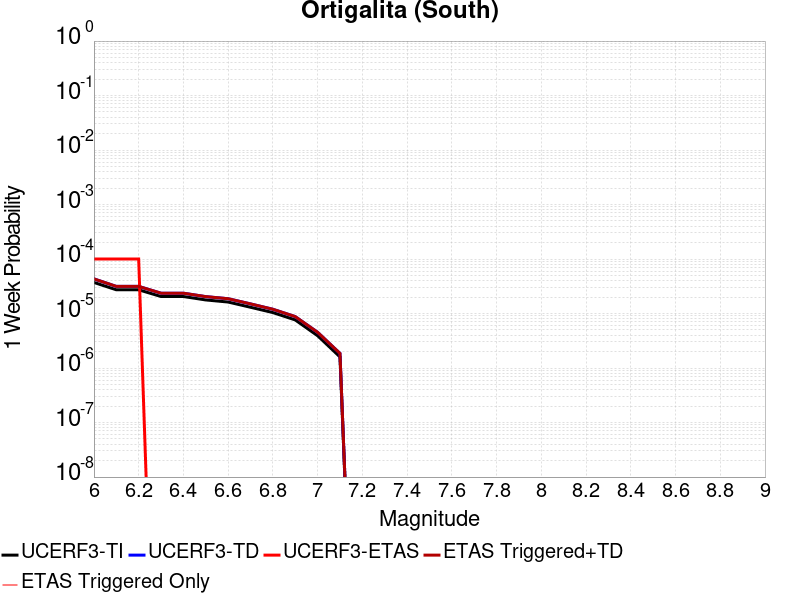 | 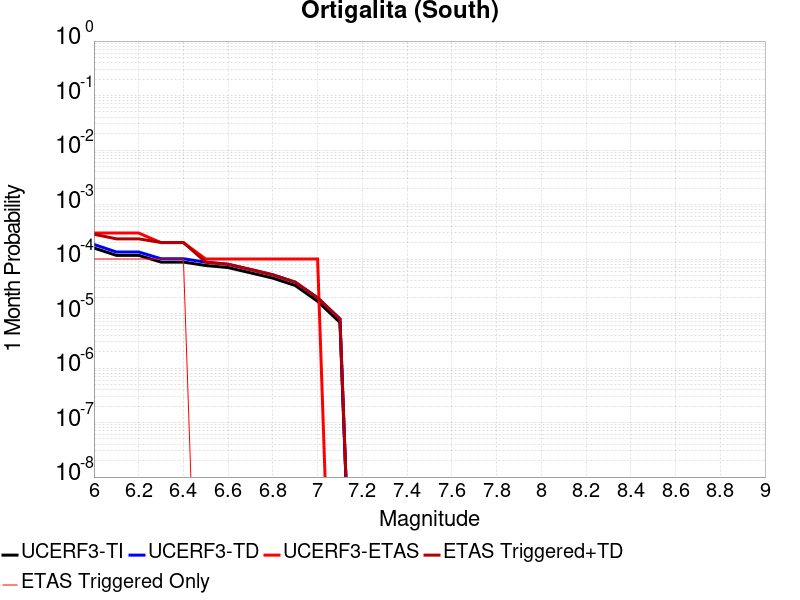 |  |  |

| Magnitude | 1 wk TI Prob | 1 wk TD Prob | 1 wk ETAS Prob | 1 wk ETAS/TD Gain | 1 wk ETAS Triggered+TD | 1 wk ETAS Triggered Only | 1 mo TI Prob | 1 mo TD Prob | 1 mo ETAS Prob | 1 mo ETAS/TD Gain | 1 mo ETAS Triggered+TD | 1 mo ETAS Triggered Only | 1 yr TI Prob | 1 yr TD Prob | 1 yr ETAS Prob | 1 yr ETAS/TD Gain | 1 yr ETAS Triggered+TD | 1 yr ETAS Triggered Only | 10 yr TI Prob | 10 yr TD Prob | 10 yr ETAS Prob | 10 yr ETAS/TD Gain | 10 yr ETAS Triggered+TD | 10 yr ETAS Triggered Only |
|-----|-----|-----|-----|-----|-----|-----|-----|-----|-----|-----|-----|-----|-----|-----|-----|-----|-----|-----|-----|-----|-----|-----|-----|-----|
| 6.0 | 3.72394E-5 | 4.3269527E-5 | 1.0E-4 | 2.3110955 | 4.3269527E-5 | 0.0 | 1.5958765E-4 | 1.8542854E-4 | 3.0E-4 | 1.617874 | 2.8541E-4 | 1.0E-4 | 0.0019412481 | 0.0022554111 | 0.0017 | 0.7537429 | 0.0027542834 | 5.0E-4 | 0.019243775 | 0.02234161 | 0.0183 | 0.81909937 | 0.026447777 | 0.0042 |
| 6.1 | 2.7299884E-5 | 3.150166E-5 | 1.0E-4 | 3.174436 | 3.150166E-5 | 0.0 | 1.16994255E-4 | 1.3500043E-4 | 3.0E-4 | 2.222215 | 2.3498693E-4 | 1.0E-4 | 0.0014234743 | 0.0016424471 | 0.0014 | 0.85238665 | 0.0020417902 | 4.0E-4 | 0.014143906 | 0.016309015 | 0.0134 | 0.82163143 | 0.01916172 | 0.0029 |
| 6.2 | 2.7299884E-5 | 3.150166E-5 | 1.0E-4 | 3.174436 | 3.150166E-5 | 0.0 | 1.16994255E-4 | 1.3500043E-4 | 3.0E-4 | 2.222215 | 2.3498693E-4 | 1.0E-4 | 0.0014234743 | 0.0016424471 | 0.0014 | 0.85238665 | 0.0020417902 | 4.0E-4 | 0.014143906 | 0.016309015 | 0.0134 | 0.82163143 | 0.01916172 | 0.0029 |
| 6.3 | 2.0546433E-5 | 2.3638513E-5 | 0.0 | 0.0 | 2.3638513E-5 | 0.0 | 8.805317E-5 | 1.0130409E-4 | 2.0E-4 | 1.974254 | 2.0129395E-4 | 1.0E-4 | 0.00107152 | 0.0012326984 | 0.001 | 0.81122845 | 0.0015323285 | 3.0E-4 | 0.010663681 | 0.012260672 | 0.0095 | 0.7748352 | 0.01423615 | 0.002 |
| 6.4 | 2.0546433E-5 | 2.3638513E-5 | 0.0 | 0.0 | 2.3638513E-5 | 0.0 | 8.805317E-5 | 1.0130409E-4 | 2.0E-4 | 1.974254 | 2.0129395E-4 | 1.0E-4 | 0.00107152 | 0.0012326984 | 0.001 | 0.81122845 | 0.0015323285 | 3.0E-4 | 0.010663681 | 0.012260672 | 0.0095 | 0.7748352 | 0.01423615 | 0.002 |
| 6.5 | 1.7779594E-5 | 2.045308E-5 | 0.0 | 0.0 | 2.045308E-5 | 0.0 | 7.619603E-5 | 8.765319E-5 | 1.0E-4 | 1.1408597 | 8.765319E-5 | 0.0 | 9.272918E-4 | 0.0010666688 | 9.0E-4 | 0.8437484 | 0.0012664554 | 2.0E-4 | 0.009234319 | 0.010616956 | 0.0081 | 0.7629305 | 0.012298908 | 0.0017 |
| 6.6 | 1.6272212E-5 | 1.872056E-5 | 0.0 | 0.0 | 1.872056E-5 | 0.0 | 6.973618E-5 | 8.022857E-5 | 1.0E-4 | 1.2464387 | 8.022857E-5 | 0.0 | 8.487073E-4 | 9.7635743E-4 | 9.0E-4 | 0.9217936 | 0.0011761622 | 2.0E-4 | 0.008454733 | 0.009721981 | 0.0073 | 0.7508758 | 0.0111083705 | 0.0014 |
| 6.7 | 1.3051484E-5 | 1.5043318E-5 | 0.0 | 0.0 | 1.5043318E-5 | 0.0 | 5.593373E-5 | 6.446982E-5 | 1.0E-4 | 1.5511134 | 6.446982E-5 | 0.0 | 6.807804E-4 | 7.846469E-4 | 6.0E-4 | 0.76467514 | 7.846469E-4 | 0.0 | 0.006786986 | 0.007819749 | 0.0052 | 0.664983 | 0.008811929 | 0.001 |
| 6.8 | 1.04277415E-5 | 1.1990799E-5 | 0.0 | 0.0 | 1.1990799E-5 | 0.0 | 4.4689557E-5 | 5.1388168E-5 | 1.0E-4 | 1.9459732 | 5.1388168E-5 | 0.0 | 5.439595E-4 | 6.254788E-4 | 5.0E-4 | 0.79938763 | 6.254788E-4 | 0.0 | 0.0054262993 | 0.0062379385 | 0.0045 | 0.72139215 | 0.0071323244 | 9.0E-4 |
| 6.9 | 7.639968E-6 | 8.794136E-6 | 0.0 | 0.0 | 8.794136E-6 | 0.0 | 3.274231E-5 | 3.7688646E-5 | 1.0E-4 | 2.6533191 | 3.7688646E-5 | 0.0 | 3.9856473E-4 | 4.587685E-4 | 4.0E-4 | 0.8718994 | 4.587685E-4 | 0.0 | 0.003978506 | 0.004578801 | 0.0036 | 0.786232 | 0.005375138 | 8.0E-4 |
| 7.0 | 3.919831E-6 | 4.5348106E-6 | 0.0 | 0.0 | 4.5348106E-6 | 0.0 | 1.679917E-5 | 1.943477E-5 | 1.0E-4 | 5.145417 | 1.943477E-5 | 0.0 | 2.045107E-4 | 2.3659476E-4 | 1.0E-4 | 0.42266363 | 2.3659476E-4 | 0.0 | 0.0020432258 | 0.0023636373 | 0.0018 | 0.76153815 | 0.0027626918 | 4.0E-4 |
| 7.1 | 1.6017933E-6 | 1.8576296E-6 | 0.0 | 0.0 | 1.8576296E-6 | 0.0 | 6.8648105E-6 | 7.961251E-6 | 0.0 | 0.0 | 7.961251E-6 | 0.0 | 8.357586E-5 | 9.692499E-5 | 0.0 | 0.0 | 9.692499E-5 | 0.0 | 8.3544437E-4 | 9.6893194E-4 | 7.0E-4 | 0.72244495 | 0.0011687381 | 2.0E-4 |

## McLean Lake
*[(top)](#table-of-contents)*

| 1 Week | 1 Month | 1 Year | 10 Year |
|-----|-----|-----|-----|
| 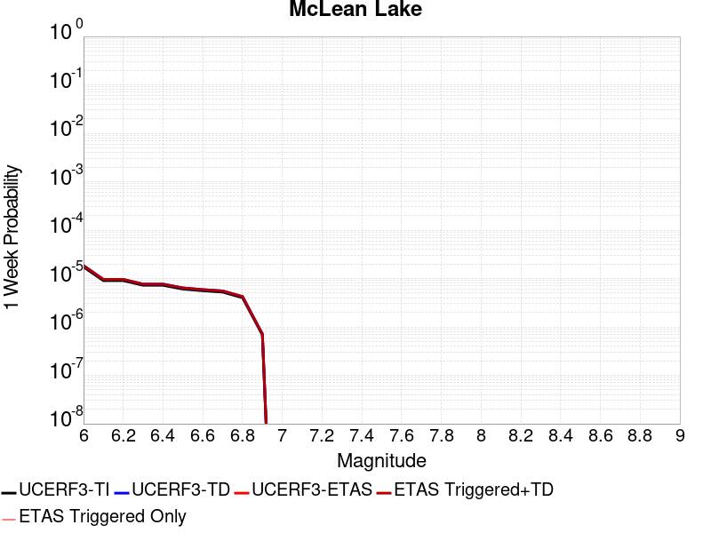 |  |  |  |

| Magnitude | 1 wk TI Prob | 1 wk TD Prob | 1 wk ETAS Prob | 1 wk ETAS/TD Gain | 1 wk ETAS Triggered+TD | 1 wk ETAS Triggered Only | 1 mo TI Prob | 1 mo TD Prob | 1 mo ETAS Prob | 1 mo ETAS/TD Gain | 1 mo ETAS Triggered+TD | 1 mo ETAS Triggered Only | 1 yr TI Prob | 1 yr TD Prob | 1 yr ETAS Prob | 1 yr ETAS/TD Gain | 1 yr ETAS Triggered+TD | 1 yr ETAS Triggered Only | 10 yr TI Prob | 10 yr TD Prob | 10 yr ETAS Prob | 10 yr ETAS/TD Gain | 10 yr ETAS Triggered+TD | 10 yr ETAS Triggered Only |
|-----|-----|-----|-----|-----|-----|-----|-----|-----|-----|-----|-----|-----|-----|-----|-----|-----|-----|-----|-----|-----|-----|-----|-----|-----|
| 6.0 | 1.7360222E-5 | 1.8504044E-5 | 0.0 | 0.0 | 1.8504044E-5 | 0.0 | 7.439883E-5 | 7.930091E-5 | 0.0 | 0.0 | 7.930091E-5 | 0.0 | 9.0542925E-4 | 9.6510956E-4 | 0.0014 | 1.4506124 | 0.0019641444 | 0.001 | 0.009017491 | 0.009614025 | 0.0133 | 1.3833956 | 0.01347653 | 0.0039 |
| 6.1 | 9.062689E-6 | 9.5933065E-6 | 0.0 | 0.0 | 9.5933065E-6 | 0.0 | 3.8839516E-5 | 4.1113573E-5 | 0.0 | 0.0 | 4.1113573E-5 | 0.0 | 4.727685E-4 | 5.0045166E-4 | 6.0E-4 | 1.198917 | 0.0010002014 | 5.0E-4 | 0.0047176396 | 0.0049941298 | 0.0068 | 1.3615986 | 0.007083642 | 0.0021 |
| 6.2 | 9.062689E-6 | 9.5933065E-6 | 0.0 | 0.0 | 9.5933065E-6 | 0.0 | 3.8839516E-5 | 4.1113573E-5 | 0.0 | 0.0 | 4.1113573E-5 | 0.0 | 4.727685E-4 | 5.0045166E-4 | 6.0E-4 | 1.198917 | 0.0010002014 | 5.0E-4 | 0.0047176396 | 0.0049941298 | 0.0068 | 1.3615986 | 0.007083642 | 0.0021 |
| 6.3 | 7.2575485E-6 | 7.668569E-6 | 0.0 | 0.0 | 7.668569E-6 | 0.0 | 3.110341E-5 | 3.2864926E-5 | 0.0 | 0.0 | 3.2864926E-5 | 0.0 | 3.786182E-4 | 4.0006413E-4 | 4.0E-4 | 0.9998397 | 6.999441E-4 | 3.0E-4 | 0.0037797375 | 0.003994144 | 0.0047 | 1.1767228 | 0.0052889516 | 0.0013 |
| 6.4 | 7.2575485E-6 | 7.668569E-6 | 0.0 | 0.0 | 7.668569E-6 | 0.0 | 3.110341E-5 | 3.2864926E-5 | 0.0 | 0.0 | 3.2864926E-5 | 0.0 | 3.786182E-4 | 4.0006413E-4 | 4.0E-4 | 0.9998397 | 6.999441E-4 | 3.0E-4 | 0.0037797375 | 0.003994144 | 0.0047 | 1.1767228 | 0.0052889516 | 0.0013 |
| 6.5 | 6.06582E-6 | 6.4045857E-6 | 0.0 | 0.0 | 6.4045857E-6 | 0.0 | 2.5996113E-5 | 2.7447972E-5 | 0.0 | 0.0 | 2.7447972E-5 | 0.0 | 3.164567E-4 | 3.341343E-4 | 2.0E-4 | 0.5985617 | 4.341009E-4 | 1.0E-4 | 0.0031600643 | 0.003336958 | 0.0039 | 1.1687292 | 0.0042339545 | 9.0E-4 |
| 6.6 | 5.598744E-6 | 5.910915E-6 | 0.0 | 0.0 | 5.910915E-6 | 0.0 | 2.3994397E-5 | 2.5332283E-5 | 0.0 | 0.0 | 2.5332283E-5 | 0.0 | 2.9209262E-4 | 3.0838329E-4 | 2.0E-4 | 0.6485436 | 4.0835244E-4 | 1.0E-4 | 0.0029170897 | 0.0030801827 | 0.0038 | 1.233693 | 0.0038777187 | 8.0E-4 |
| 6.7 | 5.246996E-6 | 5.539774E-6 | 0.0 | 0.0 | 5.539774E-6 | 0.0 | 2.2486933E-5 | 2.374171E-5 | 0.0 | 0.0 | 2.374171E-5 | 0.0 | 2.73744E-4 | 2.8902333E-4 | 2.0E-4 | 0.69198567 | 3.889944E-4 | 1.0E-4 | 0.0027340704 | 0.0028870984 | 0.0036 | 1.2469267 | 0.0036847887 | 8.0E-4 |
| 6.8 | 4.02324E-6 | 4.247373E-6 | 0.0 | 0.0 | 4.247373E-6 | 0.0 | 1.7242342E-5 | 1.8202934E-5 | 0.0 | 0.0 | 1.8202934E-5 | 0.0 | 2.099053E-4 | 2.2160415E-4 | 1.0E-4 | 0.4512551 | 2.2160415E-4 | 0.0 | 0.0020970714 | 0.0022144162 | 0.0024 | 1.0838071 | 0.0024139732 | 2.0E-4 |
| 6.9 | 6.835972E-7 | 7.140558E-7 | 0.0 | 0.0 | 7.140558E-7 | 0.0 | 2.9296991E-6 | 3.0602373E-6 | 0.0 | 0.0 | 3.0602373E-6 | 0.0 | 3.56685E-5 | 3.7258073E-5 | 0.0 | 0.0 | 3.7258073E-5 | 0.0 | 3.5662777E-4 | 3.7254952E-4 | 7.0E-4 | 1.8789449 | 4.7251224E-4 | 1.0E-4 |

## Great Valley 05 Pittsburg - Kirby Hills alt1
*[(top)](#table-of-contents)*

| 1 Week | 1 Month | 1 Year | 10 Year |
|-----|-----|-----|-----|
|  | 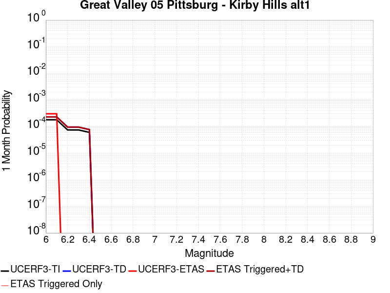 |  |  |

| Magnitude | 1 wk TI Prob | 1 wk TD Prob | 1 wk ETAS Prob | 1 wk ETAS/TD Gain | 1 wk ETAS Triggered+TD | 1 wk ETAS Triggered Only | 1 mo TI Prob | 1 mo TD Prob | 1 mo ETAS Prob | 1 mo ETAS/TD Gain | 1 mo ETAS Triggered+TD | 1 mo ETAS Triggered Only | 1 yr TI Prob | 1 yr TD Prob | 1 yr ETAS Prob | 1 yr ETAS/TD Gain | 1 yr ETAS Triggered+TD | 1 yr ETAS Triggered Only | 10 yr TI Prob | 10 yr TD Prob | 10 yr ETAS Prob | 10 yr ETAS/TD Gain | 10 yr ETAS Triggered+TD | 10 yr ETAS Triggered Only |
|-----|-----|-----|-----|-----|-----|-----|-----|-----|-----|-----|-----|-----|-----|-----|-----|-----|-----|-----|-----|-----|-----|-----|-----|-----|
| 6.0 | 4.187212E-5 | 5.347151E-5 | 0.0 | 0.0 | 5.347151E-5 | 0.0 | 1.794396E-4 | 2.2914926E-4 | 3.0E-4 | 1.3091904 | 2.2914926E-4 | 0.0 | 0.002182488 | 0.0027872948 | 0.0011 | 0.3946479 | 0.0029867373 | 2.0E-4 | 0.021611776 | 0.027617814 | 0.0189 | 0.6843409 | 0.031312868 | 0.0038 |
| 6.1 | 4.187212E-5 | 5.347151E-5 | 0.0 | 0.0 | 5.347151E-5 | 0.0 | 1.794396E-4 | 2.2914926E-4 | 3.0E-4 | 1.3091904 | 2.2914926E-4 | 0.0 | 0.002182488 | 0.0027872948 | 0.0011 | 0.3946479 | 0.0029867373 | 2.0E-4 | 0.021611776 | 0.027617814 | 0.0189 | 0.6843409 | 0.031312868 | 0.0038 |
| 6.2 | 1.7353306E-5 | 2.216655E-5 | 0.0 | 0.0 | 2.216655E-5 | 0.0 | 7.436919E-5 | 9.4998366E-5 | 0.0 | 0.0 | 9.4998366E-5 | 0.0 | 9.050688E-4 | 0.0011563788 | 3.0E-4 | 0.25943056 | 0.0011563788 | 0.0 | 0.009013915 | 0.011541356 | 0.0088 | 0.7624754 | 0.01312289 | 0.0016 |
| 6.3 | 1.7353306E-5 | 2.216655E-5 | 0.0 | 0.0 | 2.216655E-5 | 0.0 | 7.436919E-5 | 9.4998366E-5 | 0.0 | 0.0 | 9.4998366E-5 | 0.0 | 9.050688E-4 | 0.0011563788 | 3.0E-4 | 0.25943056 | 0.0011563788 | 0.0 | 0.009013915 | 0.011541356 | 0.0088 | 0.7624754 | 0.01312289 | 0.0016 |
| 6.4 | 1.4028824E-5 | 1.791064E-5 | 0.0 | 0.0 | 1.791064E-5 | 0.0 | 6.0122147E-5 | 7.675988E-5 | 0.0 | 0.0 | 7.675988E-5 | 0.0 | 7.3174125E-4 | 9.3453156E-4 | 3.0E-4 | 0.32101646 | 9.3453156E-4 | 0.0 | 0.0072933645 | 0.009343195 | 0.007 | 0.74920845 | 0.010631048 | 0.0013 |

## Coronado Bank alt1
*[(top)](#table-of-contents)*

| 1 Week | 1 Month | 1 Year | 10 Year |
|-----|-----|-----|-----|
| 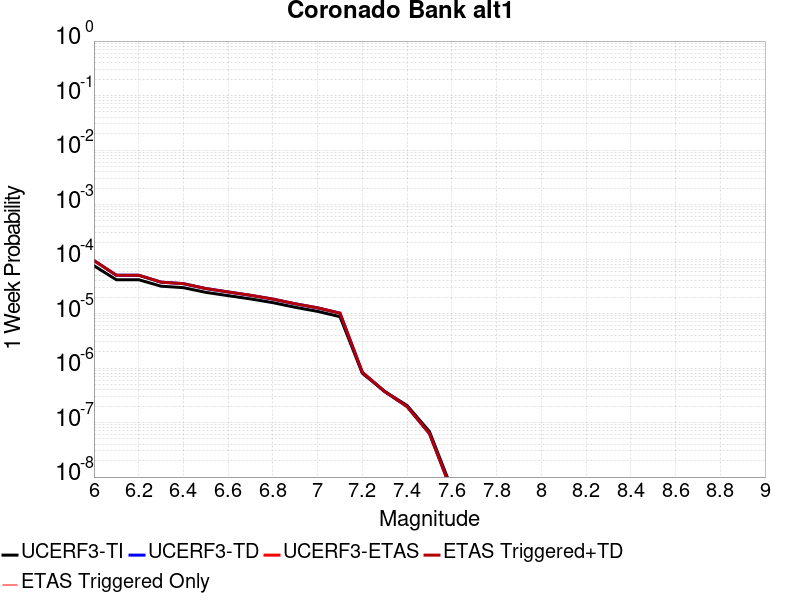 |  |  |  |

| Magnitude | 1 wk TI Prob | 1 wk TD Prob | 1 wk ETAS Prob | 1 wk ETAS/TD Gain | 1 wk ETAS Triggered+TD | 1 wk ETAS Triggered Only | 1 mo TI Prob | 1 mo TD Prob | 1 mo ETAS Prob | 1 mo ETAS/TD Gain | 1 mo ETAS Triggered+TD | 1 mo ETAS Triggered Only | 1 yr TI Prob | 1 yr TD Prob | 1 yr ETAS Prob | 1 yr ETAS/TD Gain | 1 yr ETAS Triggered+TD | 1 yr ETAS Triggered Only | 10 yr TI Prob | 10 yr TD Prob | 10 yr ETAS Prob | 10 yr ETAS/TD Gain | 10 yr ETAS Triggered+TD | 10 yr ETAS Triggered Only |
|-----|-----|-----|-----|-----|-----|-----|-----|-----|-----|-----|-----|-----|-----|-----|-----|-----|-----|-----|-----|-----|-----|-----|-----|-----|
| 6.0 | 7.533492E-5 | 9.399735E-5 | 0.0 | 0.0 | 9.399735E-5 | 0.0 | 3.22824E-4 | 4.0278555E-4 | 0.0 | 0.0 | 4.0278555E-4 | 0.0 | 0.0039233007 | 0.004893489 | 0.0024 | 0.4904476 | 0.0049929996 | 1.0E-4 | 0.03854755 | 0.047926564 | 0.0307 | 0.64056337 | 0.051734857 | 0.004 |
| 6.1 | 4.1807285E-5 | 5.0514016E-5 | 0.0 | 0.0 | 5.0514016E-5 | 0.0 | 1.7916178E-4 | 2.1647113E-4 | 0.0 | 0.0 | 2.1647113E-4 | 0.0 | 0.0021791123 | 0.0026324259 | 0.0014 | 0.5318288 | 0.0026324259 | 0.0 | 0.021578677 | 0.026021734 | 0.013 | 0.4995824 | 0.027677497 | 0.0017 |
| 6.2 | 4.1807285E-5 | 5.0514016E-5 | 0.0 | 0.0 | 5.0514016E-5 | 0.0 | 1.7916178E-4 | 2.1647113E-4 | 0.0 | 0.0 | 2.1647113E-4 | 0.0 | 0.0021791123 | 0.0026324259 | 0.0014 | 0.5318288 | 0.0026324259 | 0.0 | 0.021578677 | 0.026021734 | 0.013 | 0.4995824 | 0.027677497 | 0.0017 |
| 6.3 | 3.1793104E-5 | 3.7725185E-5 | 0.0 | 0.0 | 3.7725185E-5 | 0.0 | 1.3624904E-4 | 1.6166955E-4 | 0.0 | 0.0 | 1.6166955E-4 | 0.0 | 0.0016575698 | 0.0019665817 | 0.001 | 0.5084966 | 0.0019665817 | 0.0 | 0.016452603 | 0.019495685 | 0.0087 | 0.44625258 | 0.020770341 | 0.0013 |
| 6.4 | 2.9878007E-5 | 3.5348734E-5 | 0.0 | 0.0 | 3.5348734E-5 | 0.0 | 1.2804232E-4 | 1.5148598E-4 | 0.0 | 0.0 | 1.5148598E-4 | 0.0 | 0.0015578003 | 0.0018428134 | 0.001 | 0.5426485 | 0.0018428134 | 0.0 | 0.015469253 | 0.018279089 | 0.0081 | 0.4431293 | 0.019555327 | 0.0013 |
| 6.5 | 2.4512565E-5 | 2.877412E-5 | 0.0 | 0.0 | 2.877412E-5 | 0.0 | 1.0504962E-4 | 1.2331198E-4 | 0.0 | 0.0 | 1.2331198E-4 | 0.0 | 0.0012782287 | 0.0015003162 | 9.0E-4 | 0.59987354 | 0.0015003162 | 0.0 | 0.012709012 | 0.014904842 | 0.0065 | 0.4360999 | 0.015889937 | 0.001 |
| 6.6 | 2.1317413E-5 | 2.49151E-5 | 0.0 | 0.0 | 2.49151E-5 | 0.0 | 9.135714E-5 | 1.0677475E-4 | 0.0 | 0.0 | 1.0677475E-4 | 0.0 | 0.0011117056 | 0.0012992296 | 8.0E-4 | 0.61574954 | 0.0012992296 | 0.0 | 0.011061605 | 0.01291875 | 0.0061 | 0.47218192 | 0.013905831 | 0.001 |
| 6.7 | 1.8585655E-5 | 2.1642025E-5 | 0.0 | 0.0 | 2.1642025E-5 | 0.0 | 7.9650374E-5 | 9.274835E-5 | 0.0 | 0.0 | 9.274835E-5 | 0.0 | 9.6931186E-4 | 0.0011286467 | 7.0E-4 | 0.6202118 | 0.0011286467 | 0.0 | 0.0096509475 | 0.01123131 | 0.0053 | 0.4718951 | 0.012220079 | 0.001 |
| 6.8 | 1.5862879E-5 | 1.8425459E-5 | 0.0 | 0.0 | 1.8425459E-5 | 0.0 | 6.798199E-5 | 7.8963974E-5 | 0.0 | 0.0 | 7.8963974E-5 | 0.0 | 8.273665E-4 | 9.6098165E-4 | 6.0E-4 | 0.6243616 | 9.6098165E-4 | 0.0 | 0.008242928 | 0.009570245 | 0.0048 | 0.5015546 | 0.010362588 | 8.0E-4 |
| 6.9 | 1.3021509E-5 | 1.5100124E-5 | 0.0 | 0.0 | 1.5100124E-5 | 0.0 | 5.5805274E-5 | 6.471331E-5 | 0.0 | 0.0 | 6.471331E-5 | 0.0 | 6.792174E-4 | 7.876179E-4 | 5.0E-4 | 0.6348256 | 7.876179E-4 | 0.0 | 0.006771452 | 0.007850089 | 0.0044 | 0.5605032 | 0.008544594 | 7.0E-4 |
| 7.0 | 1.0974371E-5 | 1.2724205E-5 | 0.0 | 0.0 | 1.2724205E-5 | 0.0 | 4.7032172E-5 | 5.4531265E-5 | 0.0 | 0.0 | 5.4531265E-5 | 0.0 | 5.7246623E-4 | 6.6373346E-4 | 4.0E-4 | 0.60265154 | 6.6373346E-4 | 0.0 | 0.0057099373 | 0.0066192616 | 0.0036 | 0.5438673 | 0.007314628 | 7.0E-4 |
| 7.1 | 8.766221E-6 | 1.0167129E-5 | 0.0 | 0.0 | 1.0167129E-5 | 0.0 | 3.7568978E-5 | 4.357278E-5 | 0.0 | 0.0 | 4.357278E-5 | 0.0 | 4.573063E-4 | 5.3038675E-4 | 2.0E-4 | 0.37708333 | 5.3038675E-4 | 0.0 | 0.0045636636 | 0.0052929097 | 0.003 | 0.566796 | 0.0059892046 | 7.0E-4 |
| 7.2 | 8.026024E-7 | 8.332893E-7 | 0.0 | 0.0 | 8.332893E-7 | 0.0 | 3.43972E-6 | 3.571235E-6 | 0.0 | 0.0 | 3.571235E-6 | 0.0 | 4.1877785E-5 | 4.347893E-5 | 1.0E-4 | 2.2999647 | 4.347893E-5 | 0.0 | 4.1869894E-4 | 4.3470532E-4 | 4.0E-4 | 0.9201636 | 4.3470532E-4 | 0.0 |
| 7.3 | 3.7293114E-7 | 3.700495E-7 | 0.0 | 0.0 | 3.700495E-7 | 0.0 | 1.5982754E-6 | 1.5859255E-6 | 0.0 | 0.0 | 1.5859255E-6 | 0.0 | 1.9458828E-5 | 1.930847E-5 | 1.0E-4 | 5.179074 | 1.930847E-5 | 0.0 | 1.9457124E-4 | 1.93068E-4 | 2.0E-4 | 1.0359044 | 1.93068E-4 | 0.0 |
| 7.4 | 2.0557036E-7 | 1.9676327E-7 | 0.0 | 0.0 | 1.9676327E-7 | 0.0 | 8.810155E-7 | 8.4327087E-7 | 0.0 | 0.0 | 8.4327087E-7 | 0.0 | 1.0726311E-5 | 1.0266775E-5 | 0.0 | 0.0 | 1.0266775E-5 | 0.0 | 1.0725793E-4 | 1.02663034E-4 | 1.0E-4 | 0.9740604 | 1.02663034E-4 | 0.0 |
| 7.5 | 6.845446E-8 | 6.2800716E-8 | 0.0 | 0.0 | 6.2800716E-8 | 0.0 | 2.9337625E-7 | 2.691459E-7 | 0.0 | 0.0 | 2.691459E-7 | 0.0 | 3.5718497E-6 | 3.2768464E-6 | 0.0 | 0.0 | 3.2768464E-6 | 0.0 | 3.5717923E-5 | 3.2767988E-5 | 1.0E-4 | 3.0517588 | 3.2767988E-5 | 0.0 |
| 7.6 | 6.0975145E-9 | 5.532084E-9 | 0.0 | 0.0 | 5.532084E-9 | 0.0 | 2.6132206E-8 | 2.3708932E-8 | 0.0 | 0.0 | 2.3708932E-8 | 0.0 | 3.1815955E-7 | 2.886562E-7 | 0.0 | 0.0 | 2.886562E-7 | 0.0 | 3.181591E-6 | 2.8865593E-6 | 0.0 | 0.0 | 2.8865593E-6 | 0.0 |

## White Mountains
*[(top)](#table-of-contents)*

| 1 Week | 1 Month | 1 Year | 10 Year |
|-----|-----|-----|-----|
| 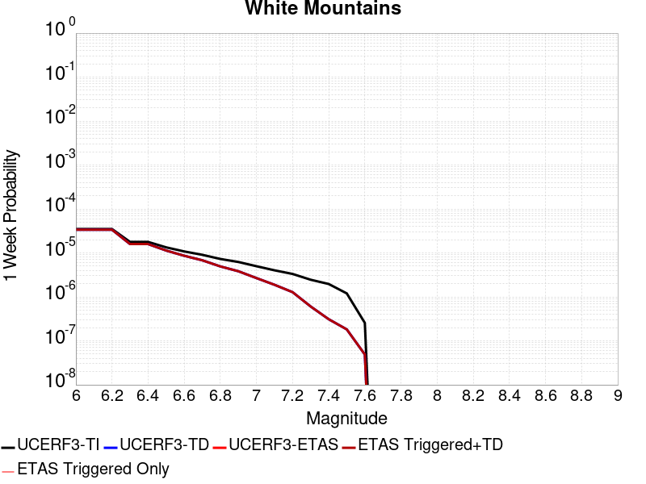 | 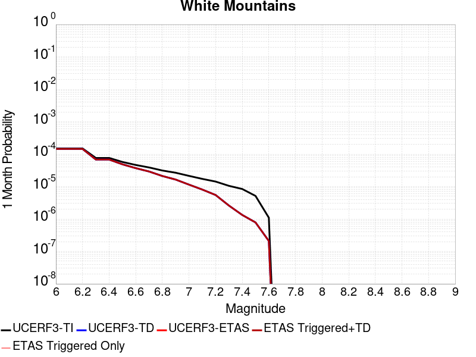 | 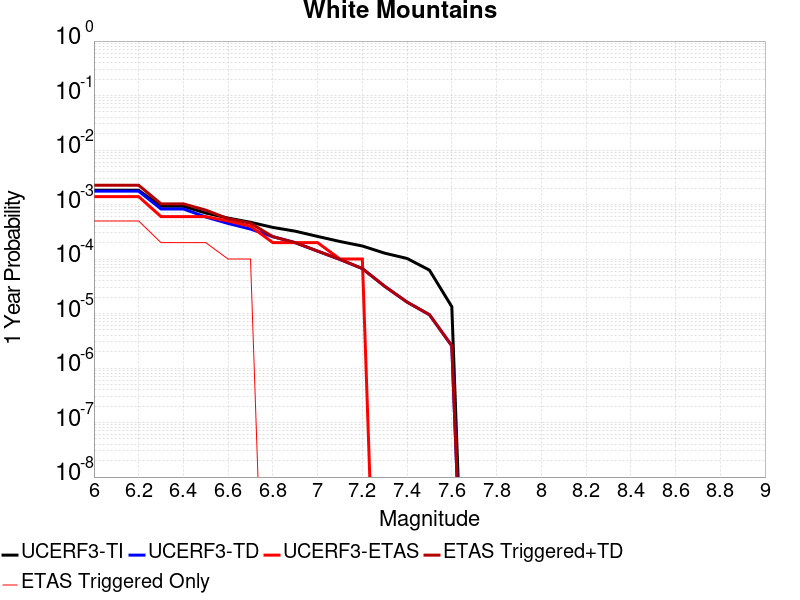 | 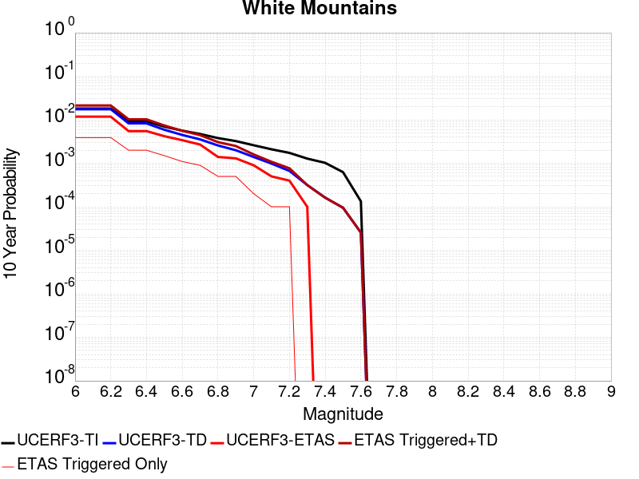 |

| Magnitude | 1 wk TI Prob | 1 wk TD Prob | 1 wk ETAS Prob | 1 wk ETAS/TD Gain | 1 wk ETAS Triggered+TD | 1 wk ETAS Triggered Only | 1 mo TI Prob | 1 mo TD Prob | 1 mo ETAS Prob | 1 mo ETAS/TD Gain | 1 mo ETAS Triggered+TD | 1 mo ETAS Triggered Only | 1 yr TI Prob | 1 yr TD Prob | 1 yr ETAS Prob | 1 yr ETAS/TD Gain | 1 yr ETAS Triggered+TD | 1 yr ETAS Triggered Only | 10 yr TI Prob | 10 yr TD Prob | 10 yr ETAS Prob | 10 yr ETAS/TD Gain | 10 yr ETAS Triggered+TD | 10 yr ETAS Triggered Only |
|-----|-----|-----|-----|-----|-----|-----|-----|-----|-----|-----|-----|-----|-----|-----|-----|-----|-----|-----|-----|-----|-----|-----|-----|-----|
| 6.0 | 3.503579E-5 | 3.3790075E-5 | 0.0 | 0.0 | 3.3790075E-5 | 0.0 | 1.5014476E-4 | 1.4480726E-4 | 0.0 | 0.0 | 1.4480726E-4 | 0.0 | 0.0018264796 | 0.0017617234 | 0.0014 | 0.79467636 | 0.0022608426 | 5.0E-4 | 0.018115403 | 0.017489912 | 0.0118 | 0.67467463 | 0.0213217 | 0.0039 |
| 6.1 | 3.503579E-5 | 3.3790075E-5 | 0.0 | 0.0 | 3.3790075E-5 | 0.0 | 1.5014476E-4 | 1.4480726E-4 | 0.0 | 0.0 | 1.4480726E-4 | 0.0 | 0.0018264796 | 0.0017617234 | 0.0014 | 0.79467636 | 0.0022608426 | 5.0E-4 | 0.018115403 | 0.017489912 | 0.0118 | 0.67467463 | 0.0213217 | 0.0039 |
| 6.2 | 3.503579E-5 | 3.3790075E-5 | 0.0 | 0.0 | 3.3790075E-5 | 0.0 | 1.5014476E-4 | 1.4480726E-4 | 0.0 | 0.0 | 1.4480726E-4 | 0.0 | 0.0018264796 | 0.0017617234 | 0.0014 | 0.79467636 | 0.0022608426 | 5.0E-4 | 0.018115403 | 0.017489912 | 0.0118 | 0.67467463 | 0.0213217 | 0.0039 |
| 6.3 | 1.7818425E-5 | 1.5918904E-5 | 0.0 | 0.0 | 1.5918904E-5 | 0.0 | 7.636245E-5 | 6.8222165E-5 | 0.0 | 0.0 | 6.8222165E-5 | 0.0 | 9.293162E-4 | 8.303026E-4 | 6.0E-4 | 0.7226281 | 0.0010301366 | 2.0E-4 | 0.009254395 | 0.008273463 | 0.0055 | 0.664776 | 0.010256916 | 0.002 |
| 6.4 | 1.7818425E-5 | 1.5918904E-5 | 0.0 | 0.0 | 1.5918904E-5 | 0.0 | 7.636245E-5 | 6.8222165E-5 | 0.0 | 0.0 | 6.8222165E-5 | 0.0 | 9.293162E-4 | 8.303026E-4 | 6.0E-4 | 0.7226281 | 0.0010301366 | 2.0E-4 | 0.009254395 | 0.008273463 | 0.0055 | 0.664776 | 0.010256916 | 0.002 |
| 6.5 | 1.3397557E-5 | 1.1338343E-5 | 0.0 | 0.0 | 1.1338343E-5 | 0.0 | 5.741684E-5 | 4.8592035E-5 | 0.0 | 0.0 | 4.8592035E-5 | 0.0 | 6.988258E-4 | 5.914544E-4 | 6.0E-4 | 1.0144484 | 7.913361E-4 | 2.0E-4 | 0.006966323 | 0.0058995085 | 0.0042 | 0.7119237 | 0.0073906593 | 0.0015 |
| 6.6 | 1.0818695E-5 | 8.626926E-6 | 0.0 | 0.0 | 8.626926E-6 | 0.0 | 4.6365014E-5 | 3.697204E-5 | 0.0 | 0.0 | 3.697204E-5 | 0.0 | 5.6434784E-4 | 4.5004595E-4 | 5.0E-4 | 1.1109977 | 5.500009E-4 | 1.0E-4 | 0.005629168 | 0.0044917823 | 0.0034 | 0.75693786 | 0.005586841 | 0.0011 |
| 6.7 | 9.067908E-6 | 6.8036725E-6 | 0.0 | 0.0 | 6.8036725E-6 | 0.0 | 3.8861883E-5 | 2.9158287E-5 | 0.0 | 0.0 | 2.9158287E-5 | 0.0 | 4.7304068E-4 | 3.5494752E-4 | 4.0E-4 | 1.1269271 | 4.5491202E-4 | 1.0E-4 | 0.00472035 | 0.0035441231 | 0.0027 | 0.76182455 | 0.0044409335 | 9.0E-4 |
| 6.8 | 7.295947E-6 | 4.9373375E-6 | 0.0 | 0.0 | 4.9373375E-6 | 0.0 | 3.126797E-5 | 2.1159853E-5 | 0.0 | 0.0 | 2.1159853E-5 | 0.0 | 3.8062103E-4 | 2.575919E-4 | 2.0E-4 | 0.776422 | 2.575919E-4 | 0.0 | 0.0037996976 | 0.002573046 | 0.0014 | 0.54410225 | 0.0030717594 | 5.0E-4 |
| 6.9 | 6.2243444E-6 | 3.8330186E-6 | 0.0 | 0.0 | 3.8330186E-6 | 0.0 | 2.6675489E-5 | 1.6427122E-5 | 0.0 | 0.0 | 1.6427122E-5 | 0.0 | 3.2472567E-4 | 1.9998239E-4 | 2.0E-4 | 1.0000881 | 1.9998239E-4 | 0.0 | 0.0032425157 | 0.001998077 | 0.0013 | 0.6506256 | 0.002497078 | 5.0E-4 |
| 7.0 | 4.9878413E-6 | 2.6802163E-6 | 0.0 | 0.0 | 2.6802163E-6 | 0.0 | 2.1376287E-5 | 1.14865925E-5 | 0.0 | 0.0 | 1.14865925E-5 | 0.0 | 2.602252E-4 | 1.3984054E-4 | 2.0E-4 | 1.4302003 | 1.3984054E-4 | 0.0 | 0.002599207 | 0.0013975517 | 9.0E-4 | 0.6439833 | 0.0015972722 | 2.0E-4 |
| 7.1 | 4.0252844E-6 | 1.8863122E-6 | 0.0 | 0.0 | 1.8863122E-6 | 0.0 | 1.7251105E-5 | 8.084171E-6 | 0.0 | 0.0 | 8.084171E-6 | 0.0 | 2.1001195E-4 | 9.842047E-5 | 1.0E-4 | 1.0160489 | 9.842047E-5 | 0.0 | 0.0020981359 | 9.837815E-4 | 5.0E-4 | 0.5082429 | 0.0010836832 | 1.0E-4 |
| 7.2 | 3.3284066E-6 | 1.28235E-6 | 0.0 | 0.0 | 1.28235E-6 | 0.0 | 1.4264522E-5 | 5.495775E-6 | 0.0 | 0.0 | 5.495775E-6 | 0.0 | 1.736567E-4 | 6.690911E-5 | 1.0E-4 | 1.4945649 | 6.690911E-5 | 0.0 | 0.0017352107 | 6.688997E-4 | 4.0E-4 | 0.597997 | 7.688328E-4 | 1.0E-4 |
| 7.3 | 2.458226E-6 | 6.06072E-7 | 0.0 | 0.0 | 6.06072E-7 | 0.0 | 1.0535211E-5 | 2.5974489E-6 | 0.0 | 0.0 | 2.5974489E-6 | 0.0 | 1.2825865E-4 | 3.162352E-5 | 0.0 | 0.0 | 3.162352E-5 | 0.0 | 0.0012818464 | 3.1619394E-4 | 1.0E-4 | 0.3162616 | 3.1619394E-4 | 0.0 |
| 7.4 | 1.965953E-6 | 3.111974E-7 | 0.0 | 0.0 | 3.111974E-7 | 0.0 | 8.425486E-6 | 1.3337024E-6 | 0.0 | 0.0 | 1.3337024E-6 | 0.0 | 1.0257547E-4 | 1.6237707E-5 | 0.0 | 0.0 | 1.6237707E-5 | 0.0 | 0.0010252813 | 1.6236534E-4 | 0.0 | 0.0 | 1.6236534E-4 | 0.0 |
| 7.5 | 1.2014192E-6 | 1.8265449E-7 | 0.0 | 0.0 | 1.8265449E-7 | 0.0 | 5.148929E-6 | 7.8280476E-7 | 0.0 | 0.0 | 7.8280476E-7 | 0.0 | 6.2686406E-5 | 9.530607E-6 | 0.0 | 0.0 | 9.530607E-6 | 0.0 | 6.266873E-4 | 9.5302064E-5 | 0.0 | 0.0 | 9.5302064E-5 | 0.0 |
| 7.6 | 2.5612175E-7 | 4.90036E-8 | 0.0 | 0.0 | 4.90036E-8 | 0.0 | 1.0976642E-6 | 2.1001541E-7 | 0.0 | 0.0 | 2.1001541E-7 | 0.0 | 1.3363979E-5 | 2.556935E-6 | 0.0 | 0.0 | 2.556935E-6 | 0.0 | 1.3363175E-4 | 2.5569092E-5 | 0.0 | 0.0 | 2.5569092E-5 | 0.0 |

## Keddie Ridge 2011 CFM
*[(top)](#table-of-contents)*

| 1 Week | 1 Month | 1 Year | 10 Year |
|-----|-----|-----|-----|
| 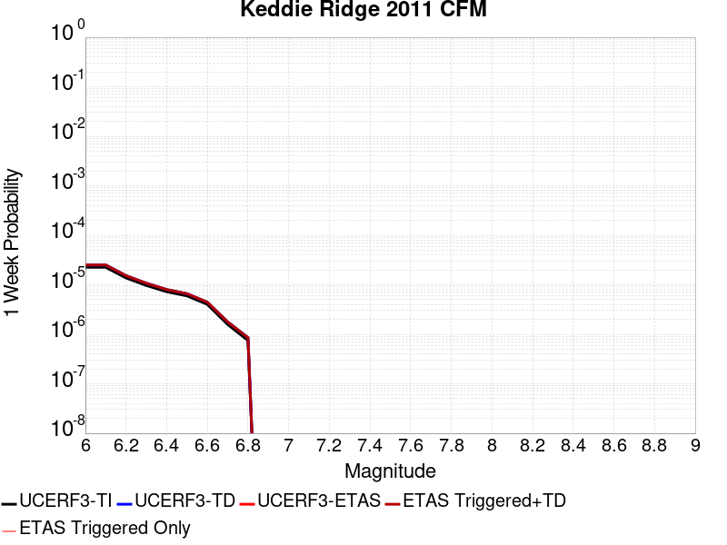 |  |  | 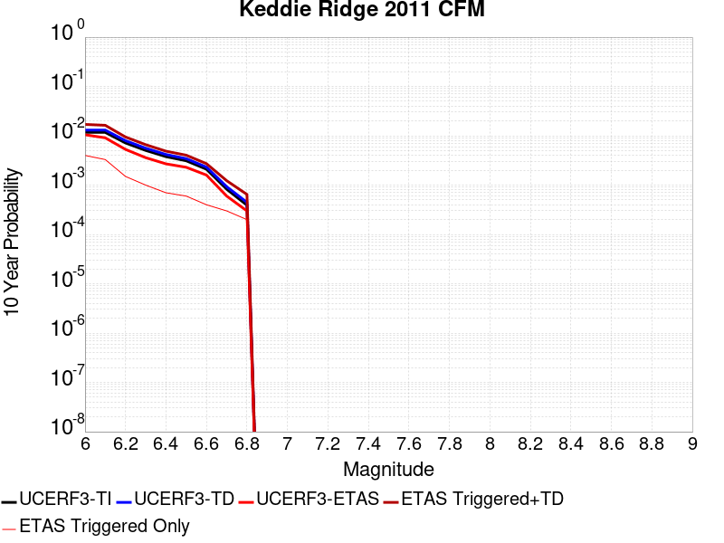 |

| Magnitude | 1 wk TI Prob | 1 wk TD Prob | 1 wk ETAS Prob | 1 wk ETAS/TD Gain | 1 wk ETAS Triggered+TD | 1 wk ETAS Triggered Only | 1 mo TI Prob | 1 mo TD Prob | 1 mo ETAS Prob | 1 mo ETAS/TD Gain | 1 mo ETAS Triggered+TD | 1 mo ETAS Triggered Only | 1 yr TI Prob | 1 yr TD Prob | 1 yr ETAS Prob | 1 yr ETAS/TD Gain | 1 yr ETAS Triggered+TD | 1 yr ETAS Triggered Only | 10 yr TI Prob | 10 yr TD Prob | 10 yr ETAS Prob | 10 yr ETAS/TD Gain | 10 yr ETAS Triggered+TD | 10 yr ETAS Triggered Only |
|-----|-----|-----|-----|-----|-----|-----|-----|-----|-----|-----|-----|-----|-----|-----|-----|-----|-----|-----|-----|-----|-----|-----|-----|-----|
| 6.0 | 2.2591947E-5 | 2.5194968E-5 | 0.0 | 0.0 | 2.5194968E-5 | 0.0 | 9.6819036E-5 | 1.0797441E-4 | 1.0E-4 | 0.9261453 | 1.0797441E-4 | 0.0 | 0.0011781343 | 0.0013138748 | 0.0011 | 0.8372183 | 0.0019130865 | 6.0E-4 | 0.011719079 | 0.013069018 | 0.0105 | 0.80342686 | 0.017016742 | 0.004 |
| 6.1 | 2.2591947E-5 | 2.5194968E-5 | 0.0 | 0.0 | 2.5194968E-5 | 0.0 | 9.6819036E-5 | 1.0797441E-4 | 1.0E-4 | 0.9261453 | 1.0797441E-4 | 0.0 | 0.0011781343 | 0.0013138748 | 9.0E-4 | 0.6849968 | 0.0017133493 | 4.0E-4 | 0.011719079 | 0.013069018 | 0.0091 | 0.6963033 | 0.01632589 | 0.0033 |
| 6.2 | 1.3775145E-5 | 1.5326263E-5 | 0.0 | 0.0 | 1.5326263E-5 | 0.0 | 5.9035E-5 | 6.568246E-5 | 1.0E-4 | 1.5224764 | 6.568246E-5 | 0.0 | 7.185141E-4 | 7.994148E-4 | 5.0E-4 | 0.6254575 | 8.9933485E-4 | 1.0E-4 | 0.0071619535 | 0.007967811 | 0.0053 | 0.6651764 | 0.00945586 | 0.0015 |
| 6.3 | 9.705435E-6 | 1.07707165E-5 | 0.0 | 0.0 | 1.07707165E-5 | 0.0 | 4.1594063E-5 | 4.6159465E-5 | 1.0E-4 | 2.1664028 | 4.6159465E-5 | 0.0 | 5.0629E-4 | 5.61859E-4 | 2.0E-4 | 0.3559612 | 5.61859E-4 | 0.0 | 0.005051381 | 0.0056056157 | 0.0036 | 0.6422131 | 0.00660001 | 0.001 |
| 6.4 | 7.2549733E-6 | 8.0289865E-6 | 0.0 | 0.0 | 8.0289865E-6 | 0.0 | 3.109237E-5 | 3.4409535E-5 | 1.0E-4 | 2.9061713 | 3.4409535E-5 | 0.0 | 3.7848388E-4 | 4.1886352E-4 | 2.0E-4 | 0.4774825 | 4.1886352E-4 | 0.0 | 0.003778399 | 0.004181528 | 0.0027 | 0.645697 | 0.0048786006 | 7.0E-4 |
| 6.5 | 5.983293E-6 | 6.614426E-6 | 0.0 | 0.0 | 6.614426E-6 | 0.0 | 2.5642432E-5 | 2.8347271E-5 | 0.0 | 0.0 | 2.8347271E-5 | 0.0 | 3.1215188E-4 | 3.450801E-4 | 0.0 | 0.0 | 3.450801E-4 | 0.0 | 0.0031171376 | 0.0034461054 | 0.0023 | 0.6674201 | 0.004044038 | 6.0E-4 |
| 6.6 | 4.0336154E-6 | 4.4587537E-6 | 0.0 | 0.0 | 4.4587537E-6 | 0.0 | 1.728681E-5 | 1.9108827E-5 | 0.0 | 0.0 | 1.9108827E-5 | 0.0 | 2.1044657E-4 | 2.3262917E-4 | 0.0 | 0.0 | 2.3262917E-4 | 0.0 | 0.002102474 | 0.0023242526 | 0.0016 | 0.68839335 | 0.002723323 | 4.0E-4 |
| 6.7 | 1.5832104E-6 | 1.7820614E-6 | 0.0 | 0.0 | 1.7820614E-6 | 0.0 | 6.7851697E-6 | 7.637385E-6 | 0.0 | 0.0 | 7.637385E-6 | 0.0 | 8.260631E-5 | 9.298147E-5 | 0.0 | 0.0 | 9.298147E-5 | 0.0 | 8.2575605E-4 | 9.2945236E-4 | 6.0E-4 | 0.6455414 | 0.0012291735 | 3.0E-4 |
| 6.8 | 7.5177275E-7 | 8.59276E-7 | 0.0 | 0.0 | 8.59276E-7 | 0.0 | 3.221879E-6 | 3.682607E-6 | 0.0 | 0.0 | 3.682607E-6 | 0.0 | 3.9225673E-5 | 4.4834986E-5 | 0.0 | 0.0 | 4.4834986E-5 | 0.0 | 3.921875E-4 | 4.4827597E-4 | 3.0E-4 | 0.66923064 | 6.481863E-4 | 2.0E-4 |

## Almanor 2011 CFM
*[(top)](#table-of-contents)*

| 1 Week | 1 Month | 1 Year | 10 Year |
|-----|-----|-----|-----|
| 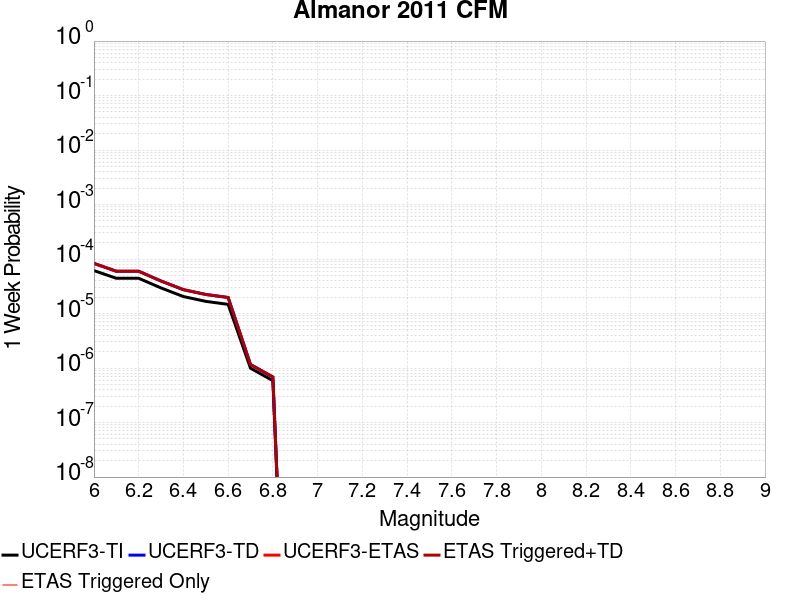 | 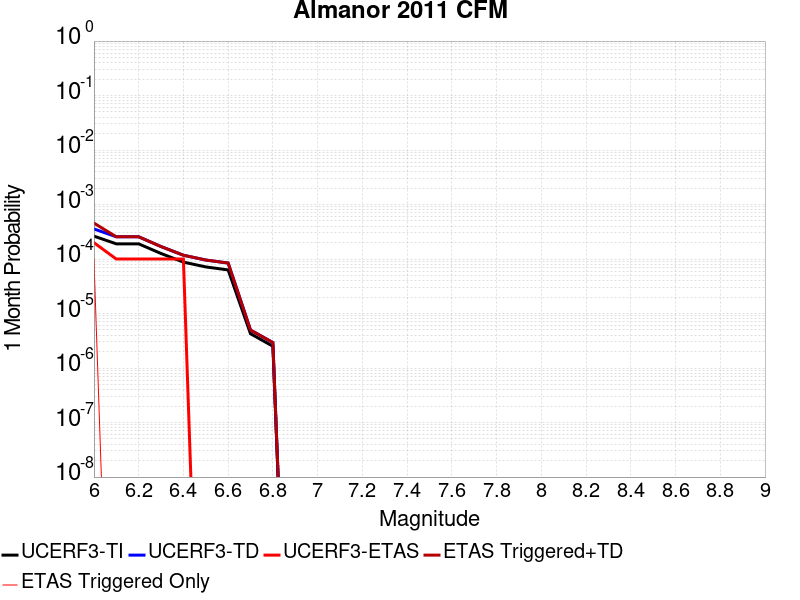 | 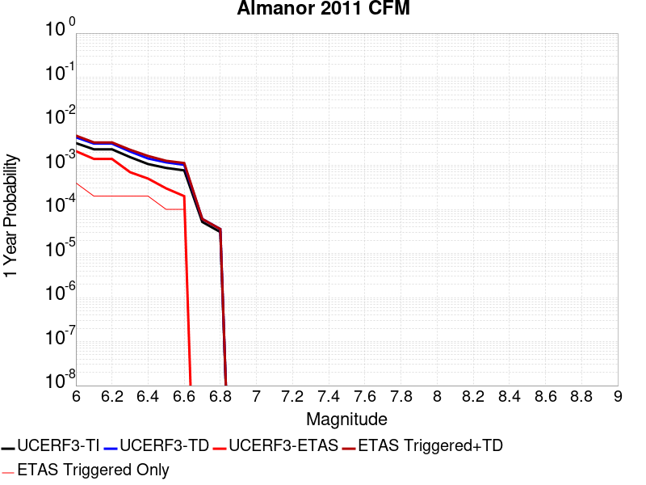 |  |

| Magnitude | 1 wk TI Prob | 1 wk TD Prob | 1 wk ETAS Prob | 1 wk ETAS/TD Gain | 1 wk ETAS Triggered+TD | 1 wk ETAS Triggered Only | 1 mo TI Prob | 1 mo TD Prob | 1 mo ETAS Prob | 1 mo ETAS/TD Gain | 1 mo ETAS Triggered+TD | 1 mo ETAS Triggered Only | 1 yr TI Prob | 1 yr TD Prob | 1 yr ETAS Prob | 1 yr ETAS/TD Gain | 1 yr ETAS Triggered+TD | 1 yr ETAS Triggered Only | 10 yr TI Prob | 10 yr TD Prob | 10 yr ETAS Prob | 10 yr ETAS/TD Gain | 10 yr ETAS Triggered+TD | 10 yr ETAS Triggered Only |
|-----|-----|-----|-----|-----|-----|-----|-----|-----|-----|-----|-----|-----|-----|-----|-----|-----|-----|-----|-----|-----|-----|-----|-----|-----|
| 6.0 | 6.1479834E-5 | 8.332679E-5 | 0.0 | 0.0 | 8.332679E-5 | 0.0 | 2.6345838E-4 | 3.5706963E-4 | 2.0E-4 | 0.56011486 | 4.5703392E-4 | 1.0E-4 | 0.0032028882 | 0.0043393364 | 0.0021 | 0.48394495 | 0.0047376007 | 4.0E-4 | 0.031571172 | 0.042613592 | 0.024 | 0.5632006 | 0.0463474 | 0.0039 |
| 6.1 | 4.4387216E-5 | 5.9806192E-5 | 0.0 | 0.0 | 5.9806192E-5 | 0.0 | 1.9021705E-4 | 2.562891E-4 | 1.0E-4 | 0.39018437 | 2.562891E-4 | 0.0 | 0.0023134327 | 0.0031163595 | 0.0014 | 0.44924214 | 0.0033157363 | 2.0E-4 | 0.022894967 | 0.030774908 | 0.0169 | 0.5491487 | 0.03348874 | 0.0028 |
| 6.2 | 4.4387216E-5 | 5.9806192E-5 | 0.0 | 0.0 | 5.9806192E-5 | 0.0 | 1.9021705E-4 | 2.562891E-4 | 1.0E-4 | 0.39018437 | 2.562891E-4 | 0.0 | 0.0023134327 | 0.0031163595 | 0.0014 | 0.44924214 | 0.0033157363 | 2.0E-4 | 0.022894967 | 0.030774908 | 0.0169 | 0.5491487 | 0.03348874 | 0.0028 |
| 6.3 | 2.9523822E-5 | 3.9572184E-5 | 0.0 | 0.0 | 3.9572184E-5 | 0.0 | 1.2652454E-4 | 1.6958476E-4 | 1.0E-4 | 0.5896756 | 1.6958476E-4 | 0.0 | 0.0015393476 | 0.0020631023 | 7.0E-4 | 0.33929485 | 0.0022626899 | 2.0E-4 | 0.015287281 | 0.020473847 | 0.0102 | 0.49819657 | 0.02213904 | 0.0017 |
| 6.4 | 2.0512744E-5 | 2.7448028E-5 | 0.0 | 0.0 | 2.7448028E-5 | 0.0 | 8.79088E-5 | 1.17629694E-4 | 1.0E-4 | 0.8501255 | 1.17629694E-4 | 0.0 | 0.001069764 | 0.0014315207 | 5.0E-4 | 0.34927893 | 0.0016312344 | 2.0E-4 | 0.010646289 | 0.014253425 | 0.0072 | 0.50514174 | 0.015633471 | 0.0014 |
| 6.5 | 1.6750226E-5 | 2.2404536E-5 | 0.0 | 0.0 | 2.2404536E-5 | 0.0 | 7.178471E-5 | 9.601642E-5 | 0.0 | 0.0 | 9.601642E-5 | 0.0 | 8.7362836E-4 | 0.0011686971 | 3.0E-4 | 0.2566961 | 0.0012685803 | 1.0E-4 | 0.008702018 | 0.0116564315 | 0.0058 | 0.4975794 | 0.012842444 | 0.0012 |
| 6.6 | 1.4745303E-5 | 1.9719348E-5 | 0.0 | 0.0 | 1.9719348E-5 | 0.0 | 6.319262E-5 | 8.4509324E-5 | 0.0 | 0.0 | 8.4509324E-5 | 0.0 | 7.690986E-4 | 0.0010287465 | 2.0E-4 | 0.19441135 | 0.0011286436 | 1.0E-4 | 0.0076644225 | 0.01027151 | 0.0051 | 0.49651903 | 0.011360211 | 0.0011 |
| 6.7 | 9.951145E-7 | 1.1620207E-6 | 0.0 | 0.0 | 1.1620207E-6 | 0.0 | 4.26477E-6 | 4.98008E-6 | 0.0 | 0.0 | 4.98008E-6 | 0.0 | 5.1922336E-5 | 6.0630966E-5 | 0.0 | 0.0 | 6.0630966E-5 | 0.0 | 5.1910203E-4 | 6.061615E-4 | 4.0E-4 | 0.6598902 | 8.0604025E-4 | 2.0E-4 |
| 6.8 | 5.866312E-7 | 6.851662E-7 | 0.0 | 0.0 | 6.851662E-7 | 0.0 | 2.5141312E-6 | 2.936424E-6 | 0.0 | 0.0 | 2.936424E-6 | 0.0 | 3.0609117E-5 | 3.5750505E-5 | 0.0 | 0.0 | 3.5750505E-5 | 0.0 | 3.06049E-4 | 3.5746038E-4 | 3.0E-4 | 0.83925384 | 5.573889E-4 | 2.0E-4 |

## Palos Verdes
*[(top)](#table-of-contents)*

| 1 Week | 1 Month | 1 Year | 10 Year |
|-----|-----|-----|-----|
|  | 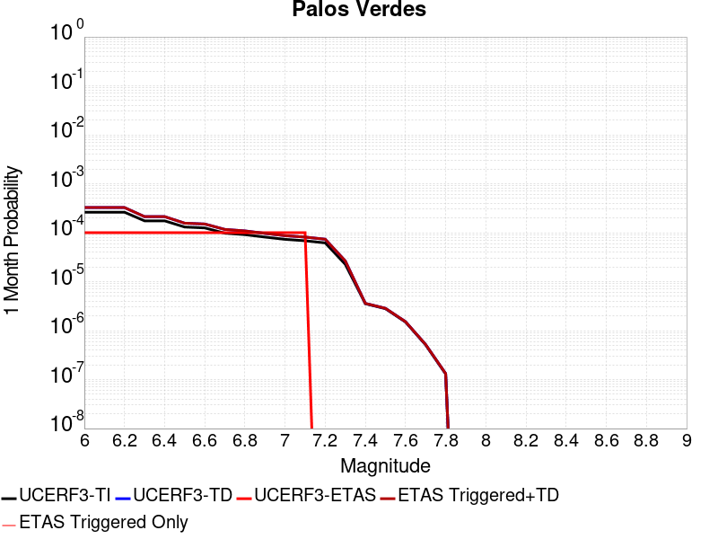 |  |  |

| Magnitude | 1 wk TI Prob | 1 wk TD Prob | 1 wk ETAS Prob | 1 wk ETAS/TD Gain | 1 wk ETAS Triggered+TD | 1 wk ETAS Triggered Only | 1 mo TI Prob | 1 mo TD Prob | 1 mo ETAS Prob | 1 mo ETAS/TD Gain | 1 mo ETAS Triggered+TD | 1 mo ETAS Triggered Only | 1 yr TI Prob | 1 yr TD Prob | 1 yr ETAS Prob | 1 yr ETAS/TD Gain | 1 yr ETAS Triggered+TD | 1 yr ETAS Triggered Only | 10 yr TI Prob | 10 yr TD Prob | 10 yr ETAS Prob | 10 yr ETAS/TD Gain | 10 yr ETAS Triggered+TD | 10 yr ETAS Triggered Only |
|-----|-----|-----|-----|-----|-----|-----|-----|-----|-----|-----|-----|-----|-----|-----|-----|-----|-----|-----|-----|-----|-----|-----|-----|-----|
| 6.0 | 6.126063E-5 | 7.626235E-5 | 0.0 | 0.0 | 7.626235E-5 | 0.0 | 2.6251914E-4 | 3.2680106E-4 | 1.0E-4 | 0.30599657 | 3.2680106E-4 | 0.0 | 0.0031914865 | 0.003972081 | 0.003 | 0.75527155 | 0.004470095 | 5.0E-4 | 0.031460393 | 0.03906746 | 0.0235 | 0.60152364 | 0.042719003 | 0.0038 |
| 6.1 | 6.126063E-5 | 7.626235E-5 | 0.0 | 0.0 | 7.626235E-5 | 0.0 | 2.6251914E-4 | 3.2680106E-4 | 1.0E-4 | 0.30599657 | 3.2680106E-4 | 0.0 | 0.0031914865 | 0.003972081 | 0.003 | 0.75527155 | 0.004470095 | 5.0E-4 | 0.031460393 | 0.03906746 | 0.0235 | 0.60152364 | 0.042719003 | 0.0038 |
| 6.2 | 6.126063E-5 | 7.626235E-5 | 0.0 | 0.0 | 7.626235E-5 | 0.0 | 2.6251914E-4 | 3.2680106E-4 | 1.0E-4 | 0.30599657 | 3.2680106E-4 | 0.0 | 0.0031914865 | 0.003972081 | 0.003 | 0.75527155 | 0.004470095 | 5.0E-4 | 0.031460393 | 0.03906746 | 0.0235 | 0.60152364 | 0.042719003 | 0.0038 |
| 6.3 | 4.0838047E-5 | 4.9770555E-5 | 0.0 | 0.0 | 4.9770555E-5 | 0.0 | 1.7500846E-4 | 2.1328621E-4 | 1.0E-4 | 0.46885356 | 2.1328621E-4 | 0.0 | 0.0021286458 | 0.0025938775 | 0.0015 | 0.5782848 | 0.0028930993 | 3.0E-4 | 0.021083709 | 0.025657712 | 0.0147 | 0.5729272 | 0.028288437 | 0.0027 |
| 6.4 | 4.0838047E-5 | 4.9770555E-5 | 0.0 | 0.0 | 4.9770555E-5 | 0.0 | 1.7500846E-4 | 2.1328621E-4 | 1.0E-4 | 0.46885356 | 2.1328621E-4 | 0.0 | 0.0021286458 | 0.0025938775 | 0.0015 | 0.5782848 | 0.0028930993 | 3.0E-4 | 0.021083709 | 0.025657712 | 0.0147 | 0.5729272 | 0.028288437 | 0.0027 |
| 6.5 | 3.0512005E-5 | 3.657606E-5 | 0.0 | 0.0 | 3.657606E-5 | 0.0 | 1.3075917E-4 | 1.5674581E-4 | 1.0E-4 | 0.6379756 | 1.5674581E-4 | 0.0 | 0.0015908304 | 0.0019068262 | 0.0011 | 0.57687485 | 0.0021064447 | 2.0E-4 | 0.015794903 | 0.018916588 | 0.0107 | 0.5656411 | 0.02058443 | 0.0017 |
| 6.6 | 2.9255087E-5 | 3.5168527E-5 | 0.0 | 0.0 | 3.5168527E-5 | 0.0 | 1.2537291E-4 | 1.507142E-4 | 1.0E-4 | 0.66350746 | 1.507142E-4 | 0.0 | 0.0015253464 | 0.001833515 | 0.0011 | 0.59994054 | 0.0020331482 | 2.0E-4 | 0.015149189 | 0.018195493 | 0.0105 | 0.57706594 | 0.019766381 | 0.0016 |
| 6.7 | 2.287198E-5 | 2.7258708E-5 | 0.0 | 0.0 | 2.7258708E-5 | 0.0 | 9.801909E-5 | 1.1681832E-4 | 1.0E-4 | 0.8560301 | 1.1681832E-4 | 0.0 | 0.001192729 | 0.0014214269 | 9.0E-4 | 0.6331666 | 0.0015212847 | 1.0E-4 | 0.011863477 | 0.01413259 | 0.0075 | 0.5306883 | 0.015315631 | 0.0012 |
| 6.8 | 2.1325764E-5 | 2.544167E-5 | 0.0 | 0.0 | 2.544167E-5 | 0.0 | 9.139293E-5 | 1.0903168E-4 | 1.0E-4 | 0.9171646 | 1.0903168E-4 | 0.0 | 0.001112141 | 0.0013267426 | 6.0E-4 | 0.45223543 | 0.0014266099 | 1.0E-4 | 0.011065915 | 0.013197261 | 0.0069 | 0.5228358 | 0.0143814245 | 0.0012 |
| 6.9 | 1.9009392E-5 | 2.2622127E-5 | 0.0 | 0.0 | 2.2622127E-5 | 0.0 | 8.1466285E-5 | 9.694886E-5 | 1.0E-4 | 1.0314716 | 9.694886E-5 | 0.0 | 9.914007E-4 | 0.0011798007 | 4.0E-4 | 0.3390403 | 0.0012796827 | 1.0E-4 | 0.009869894 | 0.011744064 | 0.0063 | 0.5364412 | 0.012831146 | 0.0011 |
| 7.0 | 1.7098473E-5 | 2.0327021E-5 | 0.0 | 0.0 | 2.0327021E-5 | 0.0 | 7.3277115E-5 | 8.7113374E-5 | 1.0E-4 | 1.1479293 | 8.7113374E-5 | 0.0 | 8.917837E-4 | 0.0010601747 | 4.0E-4 | 0.37729633 | 0.0011600686 | 1.0E-4 | 0.008882134 | 0.010559612 | 0.0054 | 0.51138246 | 0.011549052 | 0.001 |
| 7.1 | 1.5982785E-5 | 1.900193E-5 | 0.0 | 0.0 | 1.900193E-5 | 0.0 | 6.849585E-5 | 8.143478E-5 | 1.0E-4 | 1.2279766 | 8.143478E-5 | 0.0 | 8.336179E-4 | 9.911022E-4 | 3.0E-4 | 0.3026933 | 0.0010910031 | 1.0E-4 | 0.008304977 | 0.009875191 | 0.0051 | 0.5164457 | 0.010865316 | 0.001 |
| 7.2 | 1.4468002E-5 | 1.7203736E-5 | 0.0 | 0.0 | 1.7203736E-5 | 0.0 | 6.200425E-5 | 7.372869E-5 | 0.0 | 0.0 | 7.372869E-5 | 0.0 | 7.546402E-4 | 8.973612E-4 | 2.0E-4 | 0.2228757 | 9.972715E-4 | 1.0E-4 | 0.007520827 | 0.008945653 | 0.0049 | 0.5477521 | 0.009936707 | 0.001 |
| 7.3 | 5.288233E-6 | 6.2058593E-6 | 0.0 | 0.0 | 6.2058593E-6 | 0.0 | 2.2663658E-5 | 2.6596466E-5 | 0.0 | 0.0 | 2.6596466E-5 | 0.0 | 2.7589512E-4 | 3.237988E-4 | 1.0E-4 | 0.30883375 | 4.237664E-4 | 1.0E-4 | 0.0027555283 | 0.0032366957 | 0.0012 | 0.3707485 | 0.0037350773 | 5.0E-4 |
| 7.4 | 8.279556E-7 | 8.408606E-7 | 0.0 | 0.0 | 8.408606E-7 | 0.0 | 3.5483763E-6 | 3.6036838E-6 | 0.0 | 0.0 | 3.6036838E-6 | 0.0 | 4.3200624E-5 | 4.387404E-5 | 0.0 | 0.0 | 4.387404E-5 | 0.0 | 4.3192226E-4 | 4.38661E-4 | 0.0 | 0.0 | 4.38661E-4 | 0.0 |
| 7.5 | 6.559831E-7 | 6.6674454E-7 | 0.0 | 0.0 | 6.6674454E-7 | 0.0 | 2.8113532E-6 | 2.8574739E-6 | 0.0 | 0.0 | 2.8574739E-6 | 0.0 | 3.4227687E-5 | 3.4789256E-5 | 0.0 | 0.0 | 3.4789256E-5 | 0.0 | 3.4222414E-4 | 3.4784473E-4 | 0.0 | 0.0 | 3.4784473E-4 | 0.0 |
| 7.6 | 3.5018968E-7 | 3.562124E-7 | 0.0 | 0.0 | 3.562124E-7 | 0.0 | 1.500812E-6 | 1.526624E-6 | 0.0 | 0.0 | 1.526624E-6 | 0.0 | 1.8272232E-5 | 1.8586536E-5 | 0.0 | 0.0 | 1.8586536E-5 | 0.0 | 1.8270731E-4 | 1.8585441E-4 | 0.0 | 0.0 | 1.8585441E-4 | 0.0 |
| 7.7 | 1.1986104E-7 | 1.2198805E-7 | 0.0 | 0.0 | 1.2198805E-7 | 0.0 | 5.1369005E-7 | 5.228058E-7 | 0.0 | 0.0 | 5.228058E-7 | 0.0 | 6.2541585E-6 | 6.365143E-6 | 0.0 | 0.0 | 6.365143E-6 | 0.0 | 6.2539824E-5 | 6.364965E-5 | 0.0 | 0.0 | 6.364965E-5 | 0.0 |
| 7.8 | 3.0445005E-8 | 3.1028762E-8 | 0.0 | 0.0 | 3.1028762E-8 | 0.0 | 1.3047858E-7 | 1.329804E-7 | 0.0 | 0.0 | 1.329804E-7 | 0.0 | 1.5885756E-6 | 1.6190354E-6 | 0.0 | 0.0 | 1.6190354E-6 | 0.0 | 1.5885644E-5 | 1.6190257E-5 | 0.0 | 0.0 | 1.6190257E-5 | 0.0 |

## Whittier alt 1
*[(top)](#table-of-contents)*

| 1 Week | 1 Month | 1 Year | 10 Year |
|-----|-----|-----|-----|
|  |  | 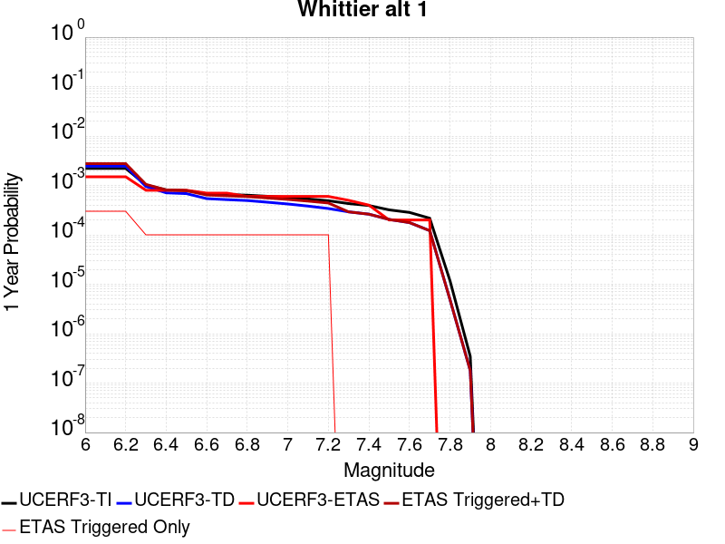 | 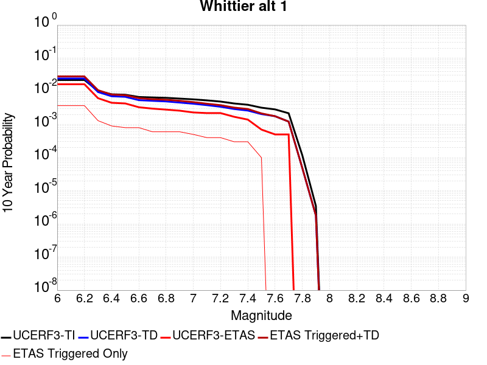 |

| Magnitude | 1 wk TI Prob | 1 wk TD Prob | 1 wk ETAS Prob | 1 wk ETAS/TD Gain | 1 wk ETAS Triggered+TD | 1 wk ETAS Triggered Only | 1 mo TI Prob | 1 mo TD Prob | 1 mo ETAS Prob | 1 mo ETAS/TD Gain | 1 mo ETAS Triggered+TD | 1 mo ETAS Triggered Only | 1 yr TI Prob | 1 yr TD Prob | 1 yr ETAS Prob | 1 yr ETAS/TD Gain | 1 yr ETAS Triggered+TD | 1 yr ETAS Triggered Only | 10 yr TI Prob | 10 yr TD Prob | 10 yr ETAS Prob | 10 yr ETAS/TD Gain | 10 yr ETAS Triggered+TD | 10 yr ETAS Triggered Only |
|-----|-----|-----|-----|-----|-----|-----|-----|-----|-----|-----|-----|-----|-----|-----|-----|-----|-----|-----|-----|-----|-----|-----|-----|-----|
| 6.0 | 4.2554693E-5 | 4.727002E-5 | 0.0 | 0.0 | 4.727002E-5 | 0.0 | 1.8236451E-4 | 2.0257189E-4 | 0.0 | 0.0 | 2.0257189E-4 | 0.0 | 0.002218027 | 0.002463845 | 0.0015 | 0.6088045 | 0.0027631058 | 3.0E-4 | 0.02196019 | 0.02439963 | 0.0163 | 0.6680429 | 0.028009351 | 0.0037 |
| 6.1 | 4.2554693E-5 | 4.727002E-5 | 0.0 | 0.0 | 4.727002E-5 | 0.0 | 1.8236451E-4 | 2.0257189E-4 | 0.0 | 0.0 | 2.0257189E-4 | 0.0 | 0.002218027 | 0.002463845 | 0.0015 | 0.6088045 | 0.0027631058 | 3.0E-4 | 0.02196019 | 0.02439963 | 0.0163 | 0.6680429 | 0.028009351 | 0.0037 |
| 6.2 | 4.2554693E-5 | 4.727002E-5 | 0.0 | 0.0 | 4.727002E-5 | 0.0 | 1.8236451E-4 | 2.0257189E-4 | 0.0 | 0.0 | 2.0257189E-4 | 0.0 | 0.002218027 | 0.002463845 | 0.0015 | 0.6088045 | 0.0027631058 | 3.0E-4 | 0.02196019 | 0.02439963 | 0.0163 | 0.6680429 | 0.028009351 | 0.0037 |
| 6.3 | 1.9617712E-5 | 1.827824E-5 | 0.0 | 0.0 | 1.827824E-5 | 0.0 | 8.40732E-5 | 7.833307E-5 | 0.0 | 0.0 | 7.833307E-5 | 0.0 | 0.0010231105 | 9.5330685E-4 | 8.0E-4 | 0.8391841 | 0.0010532115 | 1.0E-4 | 0.01018413 | 0.009495753 | 0.0062 | 0.65292346 | 0.010783408 | 0.0013 |
| 6.4 | 1.5611336E-5 | 1.3612437E-5 | 0.0 | 0.0 | 1.3612437E-5 | 0.0 | 6.690401E-5 | 5.8337748E-5 | 0.0 | 0.0 | 5.8337748E-5 | 0.0 | 8.142519E-4 | 7.100366E-4 | 8.0E-4 | 1.1267024 | 8.099656E-4 | 1.0E-4 | 0.008112748 | 0.0070799356 | 0.0045 | 0.635599 | 0.007973564 | 9.0E-4 |
| 6.5 | 1.5150166E-5 | 1.3108997E-5 | 0.0 | 0.0 | 1.3108997E-5 | 0.0 | 6.492767E-5 | 5.618024E-5 | 0.0 | 0.0 | 5.618024E-5 | 0.0 | 7.9020765E-4 | 6.8378565E-4 | 8.0E-4 | 1.1699573 | 7.8371726E-4 | 1.0E-4 | 0.007874036 | 0.0068190573 | 0.0043 | 0.6305857 | 0.007613602 | 8.0E-4 |
| 6.6 | 1.295588E-5 | 1.0387315E-5 | 0.0 | 0.0 | 1.0387315E-5 | 0.0 | 5.552402E-5 | 4.4516317E-5 | 0.0 | 0.0 | 4.4516317E-5 | 0.0 | 6.7579525E-4 | 5.418533E-4 | 7.0E-4 | 1.2918626 | 6.417991E-4 | 1.0E-4 | 0.006737438 | 0.0054068724 | 0.0033 | 0.61033434 | 0.006202547 | 8.0E-4 |
| 6.7 | 1.2542085E-5 | 9.905748E-6 | 0.0 | 0.0 | 9.905748E-6 | 0.0 | 5.3750682E-5 | 4.2452524E-5 | 0.0 | 0.0 | 4.2452524E-5 | 0.0 | 6.542181E-4 | 5.167388E-4 | 7.0E-4 | 1.3546495 | 6.166871E-4 | 1.0E-4 | 0.006522954 | 0.005156908 | 0.003 | 0.58174396 | 0.005753814 | 6.0E-4 |
| 6.8 | 1.2195878E-5 | 9.50157E-6 | 0.0 | 0.0 | 9.50157E-6 | 0.0 | 5.2267E-5 | 4.072039E-5 | 0.0 | 0.0 | 4.072039E-5 | 0.0 | 6.36165E-4 | 4.956598E-4 | 6.0E-4 | 1.2105076 | 5.956103E-4 | 1.0E-4 | 0.0063434686 | 0.0049470123 | 0.0028 | 0.5659982 | 0.005544044 | 6.0E-4 |
| 6.9 | 1.1580298E-5 | 8.778675E-6 | 0.0 | 0.0 | 8.778675E-6 | 0.0 | 4.9628903E-5 | 3.762236E-5 | 0.0 | 0.0 | 3.762236E-5 | 0.0 | 6.040644E-4 | 4.5795762E-4 | 6.0E-4 | 1.3101649 | 5.579118E-4 | 1.0E-4 | 0.00602425 | 0.0045715463 | 0.0026 | 0.5687353 | 0.0051688035 | 6.0E-4 |
| 7.0 | 1.0964795E-5 | 8.089428E-6 | 0.0 | 0.0 | 8.089428E-6 | 0.0 | 4.6991136E-5 | 3.4668523E-5 | 0.0 | 0.0 | 3.4668523E-5 | 0.0 | 5.7196687E-4 | 4.2200906E-4 | 6.0E-4 | 1.4217705 | 5.2196684E-4 | 1.0E-4 | 0.0057049696 | 0.004213378 | 0.0023 | 0.5458803 | 0.0047112713 | 5.0E-4 |
| 7.1 | 1.0230601E-5 | 7.331466E-6 | 0.0 | 0.0 | 7.331466E-6 | 0.0 | 4.3844695E-5 | 3.1420197E-5 | 0.0 | 0.0 | 3.1420197E-5 | 0.0 | 5.336784E-4 | 3.8247506E-4 | 6.0E-4 | 1.5687298 | 4.824368E-4 | 1.0E-4 | 0.005323986 | 0.0038193513 | 0.0022 | 0.57601404 | 0.0042178235 | 4.0E-4 |
| 7.2 | 9.40865E-6 | 6.5476665E-6 | 0.0 | 0.0 | 6.5476665E-6 | 0.0 | 4.032216E-5 | 2.8061133E-5 | 0.0 | 0.0 | 2.8061133E-5 | 0.0 | 4.908117E-4 | 3.4159195E-4 | 6.0E-4 | 1.7564816 | 4.4155782E-4 | 1.0E-4 | 0.0048972913 | 0.0034117836 | 0.0022 | 0.644824 | 0.003810419 | 4.0E-4 |
| 7.3 | 8.237384E-6 | 5.601519E-6 | 0.0 | 0.0 | 5.601519E-6 | 0.0 | 3.5302593E-5 | 2.4006295E-5 | 0.0 | 0.0 | 2.4006295E-5 | 0.0 | 4.2972428E-4 | 2.922385E-4 | 5.0E-4 | 1.7109314 | 2.922385E-4 | 0.0 | 0.0042889426 | 0.0029188825 | 0.0017 | 0.5824147 | 0.0032180068 | 3.0E-4 |
| 7.4 | 7.5316966E-6 | 5.0312383E-6 | 0.0 | 0.0 | 5.0312383E-6 | 0.0 | 3.2278298E-5 | 2.1562277E-5 | 0.0 | 0.0 | 2.1562277E-5 | 0.0 | 3.9291743E-4 | 2.6249012E-4 | 4.0E-4 | 1.5238669 | 2.6249012E-4 | 0.0 | 0.0039222343 | 0.0026219133 | 0.0014 | 0.5339612 | 0.0029211268 | 3.0E-4 |
| 7.5 | 6.149649E-6 | 3.93657E-6 | 0.0 | 0.0 | 3.93657E-6 | 0.0 | 2.6355372E-5 | 1.687091E-5 | 0.0 | 0.0 | 1.687091E-5 | 0.0 | 3.208294E-4 | 2.0538487E-4 | 2.0E-4 | 0.9737816 | 2.0538487E-4 | 0.0 | 0.003203666 | 0.0020520398 | 7.0E-4 | 0.34112397 | 0.0021518348 | 1.0E-4 |
| 7.6 | 5.457711E-6 | 3.3977947E-6 | 0.0 | 0.0 | 3.3977947E-6 | 0.0 | 2.338998E-5 | 1.4561901E-5 | 0.0 | 0.0 | 1.4561901E-5 | 0.0 | 2.8473578E-4 | 1.7727753E-4 | 2.0E-4 | 1.1281745 | 1.7727753E-4 | 0.0 | 0.0028437122 | 0.001771442 | 5.0E-4 | 0.28225592 | 0.001771442 | 0.0 |
| 7.7 | 4.1676276E-6 | 2.3350815E-6 | 0.0 | 0.0 | 2.3350815E-6 | 0.0 | 1.7861139E-5 | 1.00074585E-5 | 0.0 | 0.0 | 1.00074585E-5 | 0.0 | 2.1743766E-4 | 1.2183474E-4 | 2.0E-4 | 1.641568 | 1.2183474E-4 | 0.0 | 0.0021722503 | 0.0012177526 | 5.0E-4 | 0.41059244 | 0.0012177526 | 0.0 |
| 7.8 | 2.2692414E-7 | 9.391389E-8 | 0.0 | 0.0 | 9.391389E-8 | 0.0 | 9.725317E-7 | 4.0248807E-7 | 0.0 | 0.0 | 4.0248807E-7 | 0.0 | 1.1840509E-5 | 4.9002842E-6 | 0.0 | 0.0 | 4.9002842E-6 | 0.0 | 1.1839878E-4 | 4.900209E-5 | 0.0 | 0.0 | 4.900209E-5 | 0.0 |
| 7.9 | 6.676829E-9 | 3.4415768E-9 | 0.0 | 0.0 | 3.4415768E-9 | 0.0 | 2.861498E-8 | 1.4749616E-8 | 0.0 | 0.0 | 1.4749616E-8 | 0.0 | 3.4838732E-7 | 1.7957656E-7 | 0.0 | 0.0 | 1.7957656E-7 | 0.0 | 3.4838679E-6 | 1.7957643E-6 | 0.0 | 0.0 | 1.7957643E-6 | 0.0 |

## Great Valley 09 (Laguna Seca)
*[(top)](#table-of-contents)*

| 1 Week | 1 Month | 1 Year | 10 Year |
|-----|-----|-----|-----|
| 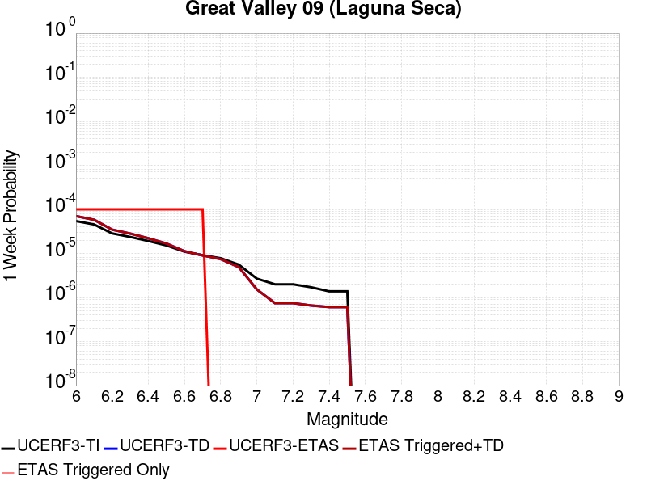 |  |  |  |

| Magnitude | 1 wk TI Prob | 1 wk TD Prob | 1 wk ETAS Prob | 1 wk ETAS/TD Gain | 1 wk ETAS Triggered+TD | 1 wk ETAS Triggered Only | 1 mo TI Prob | 1 mo TD Prob | 1 mo ETAS Prob | 1 mo ETAS/TD Gain | 1 mo ETAS Triggered+TD | 1 mo ETAS Triggered Only | 1 yr TI Prob | 1 yr TD Prob | 1 yr ETAS Prob | 1 yr ETAS/TD Gain | 1 yr ETAS Triggered+TD | 1 yr ETAS Triggered Only | 10 yr TI Prob | 10 yr TD Prob | 10 yr ETAS Prob | 10 yr ETAS/TD Gain | 10 yr ETAS Triggered+TD | 10 yr ETAS Triggered Only |
|-----|-----|-----|-----|-----|-----|-----|-----|-----|-----|-----|-----|-----|-----|-----|-----|-----|-----|-----|-----|-----|-----|-----|-----|-----|
| 6.0 | 5.4353277E-5 | 7.05442E-5 | 1.0E-4 | 1.417551 | 7.05442E-5 | 0.0 | 2.3292181E-4 | 3.0229776E-4 | 2.0E-4 | 0.66159934 | 3.0229776E-4 | 0.0 | 0.0028321352 | 0.0036742606 | 0.0017 | 0.4626781 | 0.0037738932 | 1.0E-4 | 0.02796312 | 0.036137305 | 0.0245 | 0.67796975 | 0.039510828 | 0.0035 |
| 6.1 | 4.5578287E-5 | 5.8255642E-5 | 1.0E-4 | 1.7165719 | 5.8255642E-5 | 0.0 | 1.953209E-4 | 2.4964302E-4 | 2.0E-4 | 0.80114394 | 2.4964302E-4 | 0.0 | 0.0023754383 | 0.0030351593 | 0.0013 | 0.4283136 | 0.0030351593 | 0.0 | 0.023502063 | 0.029937185 | 0.0176 | 0.5878976 | 0.032556355 | 0.0027 |
| 6.2 | 2.8536782E-5 | 3.475515E-5 | 1.0E-4 | 2.8772714 | 3.475515E-5 | 0.0 | 1.2229476E-4 | 1.4894147E-4 | 2.0E-4 | 1.3428093 | 1.4894147E-4 | 0.0 | 0.0014879217 | 0.0018118289 | 8.0E-4 | 0.4415428 | 0.0018118289 | 0.0 | 0.014779986 | 0.01796772 | 0.0112 | 0.6233401 | 0.01953897 | 0.0016 |
| 6.3 | 2.3698774E-5 | 2.8227823E-5 | 1.0E-4 | 3.542604 | 2.8227823E-5 | 0.0 | 1.01562226E-4 | 1.2096998E-4 | 2.0E-4 | 1.6533028 | 1.2096998E-4 | 0.0 | 0.0012358186 | 0.0014718039 | 8.0E-4 | 0.54355067 | 0.0014718039 | 0.0 | 0.012289686 | 0.014618806 | 0.0091 | 0.6224859 | 0.015407111 | 8.0E-4 |
| 6.4 | 1.9191197E-5 | 2.2133412E-5 | 1.0E-4 | 4.5180564 | 2.2133412E-5 | 0.0 | 8.2245395E-5 | 9.48538E-5 | 1.0E-4 | 1.054254 | 9.48538E-5 | 0.0 | 0.0010008777 | 0.0011542377 | 5.0E-4 | 0.43318635 | 0.0011542377 | 0.0 | 0.009963818 | 0.011482391 | 0.0064 | 0.5573752 | 0.0120755015 | 6.0E-4 |
| 6.5 | 1.5203241E-5 | 1.6808468E-5 | 1.0E-4 | 5.949382 | 1.6808468E-5 | 0.0 | 6.5155116E-5 | 7.2034E-5 | 1.0E-4 | 1.3882332 | 7.2034E-5 | 0.0 | 7.9297484E-4 | 8.766742E-4 | 3.0E-4 | 0.34220237 | 8.766742E-4 | 0.0 | 0.007901512 | 0.008733264 | 0.0048 | 0.5496227 | 0.0093280235 | 6.0E-4 |
| 6.6 | 1.0984925E-5 | 1.1246372E-5 | 1.0E-4 | 8.891757 | 1.1246372E-5 | 0.0 | 4.70774E-5 | 4.8197868E-5 | 1.0E-4 | 2.0747807 | 4.8197868E-5 | 0.0 | 5.730166E-4 | 5.866549E-4 | 2.0E-4 | 0.34091595 | 5.866549E-4 | 0.0 | 0.005715413 | 0.0058514527 | 0.0029 | 0.49560344 | 0.006149697 | 3.0E-4 |
| 6.7 | 9.134616E-6 | 9.022793E-6 | 1.0E-4 | 11.083043 | 9.022793E-6 | 0.0 | 3.9147766E-5 | 3.8668553E-5 | 1.0E-4 | 2.5860808 | 3.8668553E-5 | 0.0 | 4.7651984E-4 | 4.706903E-4 | 2.0E-4 | 0.42490783 | 4.706903E-4 | 0.0 | 0.004754993 | 0.004697179 | 0.0021 | 0.44707686 | 0.0047967094 | 1.0E-4 |
| 6.8 | 7.785589E-6 | 7.4543377E-6 | 0.0 | 0.0 | 7.4543377E-6 | 0.0 | 3.3366385E-5 | 3.1946784E-5 | 0.0 | 0.0 | 3.1946784E-5 | 0.0 | 4.0616E-4 | 3.8888468E-4 | 1.0E-4 | 0.25714564 | 3.8888468E-4 | 0.0 | 0.0040541845 | 0.0038822459 | 0.0018 | 0.46364915 | 0.0039818576 | 1.0E-4 |
| 6.9 | 5.579095E-6 | 4.900089E-6 | 0.0 | 0.0 | 4.900089E-6 | 0.0 | 2.3910188E-5 | 2.100022E-5 | 0.0 | 0.0 | 2.100022E-5 | 0.0 | 2.9106764E-4 | 2.5564907E-4 | 1.0E-4 | 0.3911612 | 2.5564907E-4 | 0.0 | 0.002906867 | 0.0025536872 | 0.0013 | 0.50906783 | 0.0026534318 | 1.0E-4 |
| 7.0 | 2.6816688E-6 | 1.5220992E-6 | 0.0 | 0.0 | 1.5220992E-6 | 0.0 | 1.1492816E-5 | 6.523266E-6 | 0.0 | 0.0 | 6.523266E-6 | 0.0 | 1.3991605E-4 | 7.941796E-5 | 0.0 | 0.0 | 7.941796E-5 | 0.0 | 0.0013982799 | 7.9390453E-4 | 4.0E-4 | 0.5038389 | 7.9390453E-4 | 0.0 |
| 7.1 | 1.9951021E-6 | 7.4566793E-7 | 0.0 | 0.0 | 7.4566793E-7 | 0.0 | 8.55041E-6 | 3.195716E-6 | 0.0 | 0.0 | 3.195716E-6 | 0.0 | 1.0409627E-4 | 3.890719E-5 | 0.0 | 0.0 | 3.890719E-5 | 0.0 | 0.0010404752 | 3.8900794E-4 | 1.0E-4 | 0.25706416 | 3.8900794E-4 | 0.0 |
| 7.2 | 1.9951021E-6 | 7.4566793E-7 | 0.0 | 0.0 | 7.4566793E-7 | 0.0 | 8.55041E-6 | 3.195716E-6 | 0.0 | 0.0 | 3.195716E-6 | 0.0 | 1.0409627E-4 | 3.890719E-5 | 0.0 | 0.0 | 3.890719E-5 | 0.0 | 0.0010404752 | 3.8900794E-4 | 1.0E-4 | 0.25706416 | 3.8900794E-4 | 0.0 |
| 7.3 | 1.7087556E-6 | 6.580828E-7 | 0.0 | 0.0 | 6.580828E-7 | 0.0 | 7.3232177E-6 | 2.820352E-6 | 0.0 | 0.0 | 2.820352E-6 | 0.0 | 8.915652E-5 | 3.4337285E-5 | 0.0 | 0.0 | 3.4337285E-5 | 0.0 | 8.9120766E-4 | 3.4332383E-4 | 1.0E-4 | 0.2912702 | 3.4332383E-4 | 0.0 |
| 7.4 | 1.3804846E-6 | 6.0752086E-7 | 0.0 | 0.0 | 6.0752086E-7 | 0.0 | 5.916349E-6 | 2.6036585E-6 | 0.0 | 0.0 | 2.6036585E-6 | 0.0 | 7.2029165E-5 | 3.169912E-5 | 0.0 | 0.0 | 3.169912E-5 | 0.0 | 7.200583E-4 | 3.1695003E-4 | 1.0E-4 | 0.31550714 | 3.1695003E-4 | 0.0 |
| 7.5 | 1.3804846E-6 | 6.0752086E-7 | 0.0 | 0.0 | 6.0752086E-7 | 0.0 | 5.916349E-6 | 2.6036585E-6 | 0.0 | 0.0 | 2.6036585E-6 | 0.0 | 7.2029165E-5 | 3.169912E-5 | 0.0 | 0.0 | 3.169912E-5 | 0.0 | 7.200583E-4 | 3.1695003E-4 | 1.0E-4 | 0.31550714 | 3.1695003E-4 | 0.0 |

## San Diego Trough north alt1
*[(top)](#table-of-contents)*

| 1 Week | 1 Month | 1 Year | 10 Year |
|-----|-----|-----|-----|
| 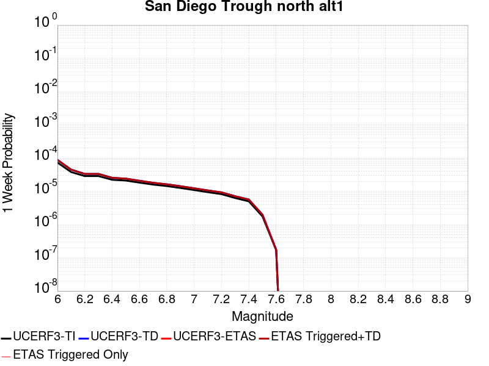 | 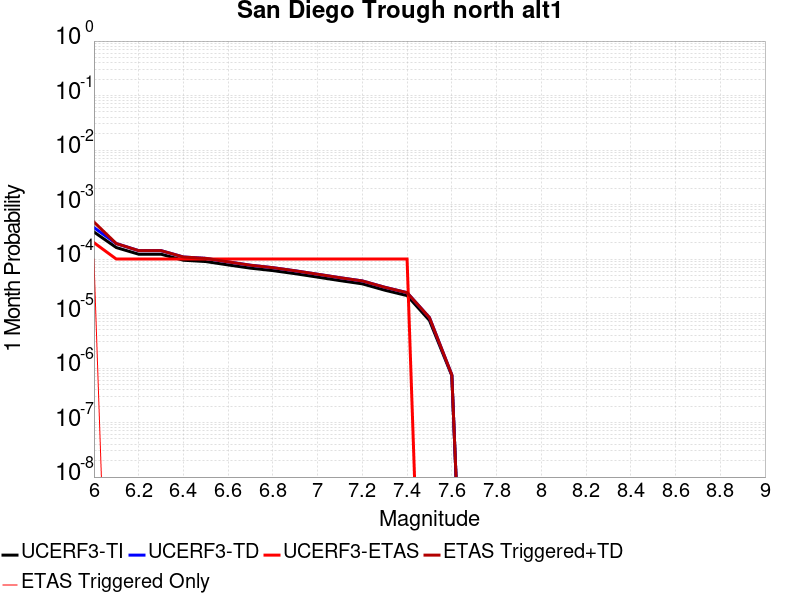 |  |  |

| Magnitude | 1 wk TI Prob | 1 wk TD Prob | 1 wk ETAS Prob | 1 wk ETAS/TD Gain | 1 wk ETAS Triggered+TD | 1 wk ETAS Triggered Only | 1 mo TI Prob | 1 mo TD Prob | 1 mo ETAS Prob | 1 mo ETAS/TD Gain | 1 mo ETAS Triggered+TD | 1 mo ETAS Triggered Only | 1 yr TI Prob | 1 yr TD Prob | 1 yr ETAS Prob | 1 yr ETAS/TD Gain | 1 yr ETAS Triggered+TD | 1 yr ETAS Triggered Only | 10 yr TI Prob | 10 yr TD Prob | 10 yr ETAS Prob | 10 yr ETAS/TD Gain | 10 yr ETAS Triggered+TD | 10 yr ETAS Triggered Only |
|-----|-----|-----|-----|-----|-----|-----|-----|-----|-----|-----|-----|-----|-----|-----|-----|-----|-----|-----|-----|-----|-----|-----|-----|-----|
| 6.0 | 7.329252E-5 | 8.824872E-5 | 0.0 | 0.0 | 8.824872E-5 | 0.0 | 3.14073E-4 | 3.78157E-4 | 2.0E-4 | 0.52888083 | 4.781192E-4 | 1.0E-4 | 0.0038171355 | 0.0045949104 | 0.0028 | 0.6093699 | 0.0049930722 | 4.0E-4 | 0.03752231 | 0.04506296 | 0.0305 | 0.6768308 | 0.048596226 | 0.0037 |
| 6.1 | 3.7940346E-5 | 4.490157E-5 | 0.0 | 0.0 | 4.490157E-5 | 0.0 | 1.6259136E-4 | 1.9242105E-4 | 1.0E-4 | 0.5196937 | 1.9242105E-4 | 0.0 | 0.0019777524 | 0.0023402898 | 0.0013 | 0.55548674 | 0.0024400558 | 1.0E-4 | 0.019602431 | 0.02316512 | 0.0145 | 0.62594104 | 0.02482574 | 0.0017 |
| 6.2 | 2.8645263E-5 | 3.330762E-5 | 0.0 | 0.0 | 3.330762E-5 | 0.0 | 1.2275964E-4 | 1.4273915E-4 | 1.0E-4 | 0.70057863 | 1.4273915E-4 | 0.0 | 0.0014935739 | 0.0017364867 | 9.0E-4 | 0.5182879 | 0.0017364867 | 0.0 | 0.0148357535 | 0.017231833 | 0.0102 | 0.59192777 | 0.018214602 | 0.001 |
| 6.3 | 2.8645263E-5 | 3.330762E-5 | 0.0 | 0.0 | 3.330762E-5 | 0.0 | 1.2275964E-4 | 1.4273915E-4 | 1.0E-4 | 0.70057863 | 1.4273915E-4 | 0.0 | 0.0014935739 | 0.0017364867 | 9.0E-4 | 0.5182879 | 0.0017364867 | 0.0 | 0.0148357535 | 0.017231833 | 0.0102 | 0.59192777 | 0.018214602 | 0.001 |
| 6.4 | 2.2204576E-5 | 2.5455778E-5 | 0.0 | 0.0 | 2.5455778E-5 | 0.0 | 9.5159E-5 | 1.0909168E-4 | 1.0E-4 | 0.9166602 | 1.0909168E-4 | 0.0 | 0.001157945 | 0.0013273912 | 7.0E-4 | 0.5273502 | 0.0013273912 | 0.0 | 0.011519298 | 0.013195796 | 0.0073 | 0.5532065 | 0.013886559 | 7.0E-4 |
| 6.5 | 2.1004838E-5 | 2.403162E-5 | 0.0 | 0.0 | 2.403162E-5 | 0.0 | 9.0017624E-5 | 1.0298863E-4 | 1.0E-4 | 0.97098094 | 1.0298863E-4 | 0.0 | 0.0010954136 | 0.0012531743 | 7.0E-4 | 0.55858153 | 0.0012531743 | 0.0 | 0.010900296 | 0.012462159 | 0.0073 | 0.58577335 | 0.013153435 | 7.0E-4 |
| 6.6 | 1.820557E-5 | 2.0710482E-5 | 0.0 | 0.0 | 2.0710482E-5 | 0.0 | 7.802154E-5 | 8.875621E-5 | 1.0E-4 | 1.1266817 | 8.875621E-5 | 0.0 | 9.4949827E-4 | 0.0010800766 | 6.0E-4 | 0.5555162 | 0.0010800766 | 0.0 | 0.009454516 | 0.010748942 | 0.0059 | 0.5488912 | 0.011342494 | 6.0E-4 |
| 6.7 | 1.5884485E-5 | 1.7988401E-5 | 0.0 | 0.0 | 1.7988401E-5 | 0.0 | 6.807459E-5 | 7.709089E-5 | 1.0E-4 | 1.2971702 | 7.709089E-5 | 0.0 | 8.284929E-4 | 9.3818014E-4 | 4.0E-4 | 0.42635736 | 9.3818014E-4 | 0.0 | 0.008254109 | 0.0093425615 | 0.0046 | 0.4923703 | 0.00983789 | 5.0E-4 |
| 6.8 | 1.4331171E-5 | 1.6205291E-5 | 0.0 | 0.0 | 1.6205291E-5 | 0.0 | 6.141786E-5 | 6.944941E-5 | 1.0E-4 | 1.4398971 | 6.944941E-5 | 0.0 | 7.4750587E-4 | 8.452205E-4 | 4.0E-4 | 0.4732493 | 8.452205E-4 | 0.0 | 0.0074499645 | 0.008420326 | 0.0042 | 0.49879307 | 0.0088169575 | 4.0E-4 |
| 6.9 | 1.2574203E-5 | 1.4209517E-5 | 0.0 | 0.0 | 1.4209517E-5 | 0.0 | 5.3888325E-5 | 6.0896517E-5 | 1.0E-4 | 1.6421301 | 6.0896517E-5 | 0.0 | 6.558929E-4 | 7.4116426E-4 | 4.0E-4 | 0.53969145 | 7.4116426E-4 | 0.0 | 0.0065396037 | 0.0073871105 | 0.0039 | 0.52794665 | 0.0076848944 | 3.0E-4 |
| 7.0 | 1.0883844E-5 | 1.2292431E-5 | 0.0 | 0.0 | 1.2292431E-5 | 0.0 | 4.664421E-5 | 5.268079E-5 | 1.0E-4 | 1.8982252 | 5.268079E-5 | 0.0 | 5.677453E-4 | 6.4120087E-4 | 3.0E-4 | 0.4678721 | 6.4120087E-4 | 0.0 | 0.00566297 | 0.006393636 | 0.0034 | 0.5317788 | 0.006691718 | 3.0E-4 |
| 7.1 | 9.393088E-6 | 1.060976E-5 | 0.0 | 0.0 | 1.060976E-5 | 0.0 | 4.025547E-5 | 4.546961E-5 | 1.0E-4 | 2.1992712 | 4.546961E-5 | 0.0 | 4.900001E-4 | 5.5345264E-4 | 3.0E-4 | 0.5420518 | 5.5345264E-4 | 0.0 | 0.0048892107 | 0.0055208397 | 0.0028 | 0.50716925 | 0.0057197353 | 2.0E-4 |
| 7.2 | 8.190791E-6 | 9.261039E-6 | 0.0 | 0.0 | 9.261039E-6 | 0.0 | 3.510292E-5 | 3.9689567E-5 | 1.0E-4 | 2.519554 | 3.9689567E-5 | 0.0 | 4.2729423E-4 | 4.83114E-4 | 3.0E-4 | 0.62097144 | 4.83114E-4 | 0.0 | 0.0042647356 | 0.004820718 | 0.0026 | 0.53933877 | 0.0050197537 | 2.0E-4 |
| 7.3 | 6.268162E-6 | 7.091572E-6 | 0.0 | 0.0 | 7.091572E-6 | 0.0 | 2.6863276E-5 | 3.0392099E-5 | 1.0E-4 | 3.2903287 | 3.0392099E-5 | 0.0 | 3.2701128E-4 | 3.699614E-4 | 3.0E-4 | 0.81089544 | 3.699614E-4 | 0.0 | 0.003265305 | 0.003693501 | 0.0021 | 0.56856626 | 0.0038927624 | 2.0E-4 |
| 7.4 | 4.985186E-6 | 5.6441677E-6 | 0.0 | 0.0 | 5.6441677E-6 | 0.0 | 2.1364907E-5 | 2.4189068E-5 | 1.0E-4 | 4.134099 | 2.4189068E-5 | 0.0 | 2.600867E-4 | 2.944625E-4 | 3.0E-4 | 1.0188055 | 2.944625E-4 | 0.0 | 0.002597825 | 0.0029407647 | 0.0018 | 0.6120857 | 0.0031401764 | 2.0E-4 |
| 7.5 | 1.7489613E-6 | 1.9701774E-6 | 0.0 | 0.0 | 1.9701774E-6 | 0.0 | 7.495527E-6 | 8.4435915E-6 | 0.0 | 0.0 | 8.4435915E-6 | 0.0 | 9.125422E-5 | 1.02796104E-4 | 2.0E-4 | 1.9455991 | 1.02796104E-4 | 0.0 | 9.1216754E-4 | 0.0010275076 | 8.0E-4 | 0.7785831 | 0.0011274049 | 1.0E-4 |
| 7.6 | 1.6988751E-7 | 1.753494E-7 | 0.0 | 0.0 | 1.753494E-7 | 0.0 | 7.2808916E-7 | 7.5149717E-7 | 0.0 | 0.0 | 7.5149717E-7 | 0.0 | 8.864449E-6 | 9.149442E-6 | 0.0 | 0.0 | 9.149442E-6 | 0.0 | 8.8640954E-5 | 9.149085E-5 | 1.0E-4 | 1.0930055 | 9.149085E-5 | 0.0 |

## Ludlow
*[(top)](#table-of-contents)*

| 1 Week | 1 Month | 1 Year | 10 Year |
|-----|-----|-----|-----|
|  | 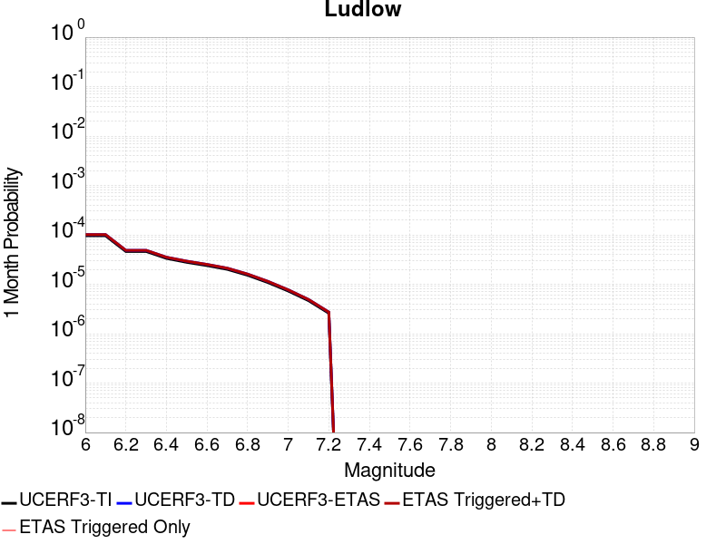 |  |  |

| Magnitude | 1 wk TI Prob | 1 wk TD Prob | 1 wk ETAS Prob | 1 wk ETAS/TD Gain | 1 wk ETAS Triggered+TD | 1 wk ETAS Triggered Only | 1 mo TI Prob | 1 mo TD Prob | 1 mo ETAS Prob | 1 mo ETAS/TD Gain | 1 mo ETAS Triggered+TD | 1 mo ETAS Triggered Only | 1 yr TI Prob | 1 yr TD Prob | 1 yr ETAS Prob | 1 yr ETAS/TD Gain | 1 yr ETAS Triggered+TD | 1 yr ETAS Triggered Only | 10 yr TI Prob | 10 yr TD Prob | 10 yr ETAS Prob | 10 yr ETAS/TD Gain | 10 yr ETAS Triggered+TD | 10 yr ETAS Triggered Only |
|-----|-----|-----|-----|-----|-----|-----|-----|-----|-----|-----|-----|-----|-----|-----|-----|-----|-----|-----|-----|-----|-----|-----|-----|-----|
| 6.0 | 2.2407607E-5 | 2.3659872E-5 | 0.0 | 0.0 | 2.3659872E-5 | 0.0 | 9.602906E-5 | 1.0139576E-4 | 0.0 | 0.0 | 1.0139576E-4 | 0.0 | 0.0011685267 | 0.0012338384 | 7.0E-4 | 0.56733525 | 0.001333715 | 1.0E-4 | 0.011624013 | 0.012274393 | 0.0116 | 0.945057 | 0.015928978 | 0.0037 |
| 6.1 | 2.2407607E-5 | 2.3659872E-5 | 0.0 | 0.0 | 2.3659872E-5 | 0.0 | 9.602906E-5 | 1.0139576E-4 | 0.0 | 0.0 | 1.0139576E-4 | 0.0 | 0.0011685267 | 0.0012338384 | 7.0E-4 | 0.56733525 | 0.001333715 | 1.0E-4 | 0.011624013 | 0.012274393 | 0.0116 | 0.945057 | 0.015928978 | 0.0037 |
| 6.2 | 1.0781252E-5 | 1.1366887E-5 | 0.0 | 0.0 | 1.1366887E-5 | 0.0 | 4.620455E-5 | 4.871434E-5 | 0.0 | 0.0 | 4.871434E-5 | 0.0 | 5.623952E-4 | 5.9293973E-4 | 2.0E-4 | 0.33730242 | 5.9293973E-4 | 0.0 | 0.00560974 | 0.0059139957 | 0.0052 | 0.8792702 | 0.0077033504 | 0.0018 |
| 6.3 | 1.0781252E-5 | 1.1366887E-5 | 0.0 | 0.0 | 1.1366887E-5 | 0.0 | 4.620455E-5 | 4.871434E-5 | 0.0 | 0.0 | 4.871434E-5 | 0.0 | 5.623952E-4 | 5.9293973E-4 | 2.0E-4 | 0.33730242 | 5.9293973E-4 | 0.0 | 0.00560974 | 0.0059139957 | 0.0052 | 0.8792702 | 0.0077033504 | 0.0018 |
| 6.4 | 7.814439E-6 | 8.238614E-6 | 0.0 | 0.0 | 8.238614E-6 | 0.0 | 3.3490025E-5 | 3.5307876E-5 | 0.0 | 0.0 | 3.5307876E-5 | 0.0 | 4.0766477E-4 | 4.2979003E-4 | 2.0E-4 | 0.46534353 | 4.2979003E-4 | 0.0 | 0.0040691774 | 0.0042897346 | 0.004 | 0.9324586 | 0.005683729 | 0.0014 |
| 6.5 | 6.4986366E-6 | 6.8516565E-6 | 0.0 | 0.0 | 6.8516565E-6 | 0.0 | 2.7851002E-5 | 2.9363919E-5 | 0.0 | 0.0 | 2.9363919E-5 | 0.0 | 3.390332E-4 | 3.5744798E-4 | 1.0E-4 | 0.279761 | 3.5744798E-4 | 0.0 | 0.003385164 | 0.0035688265 | 0.003 | 0.8406125 | 0.0045652576 | 0.001 |
| 6.6 | 5.582177E-6 | 5.8866412E-6 | 0.0 | 0.0 | 5.8866412E-6 | 0.0 | 2.3923398E-5 | 2.5228223E-5 | 0.0 | 0.0 | 2.5228223E-5 | 0.0 | 2.9122844E-4 | 3.0711104E-4 | 1.0E-4 | 0.32561514 | 3.0711104E-4 | 0.0 | 0.0029084706 | 0.0030669395 | 0.0027 | 0.88035643 | 0.0040638726 | 0.001 |
| 6.7 | 4.6858763E-6 | 4.94096E-6 | 0.0 | 0.0 | 4.94096E-6 | 0.0 | 2.0082172E-5 | 2.1175374E-5 | 0.0 | 0.0 | 2.1175374E-5 | 0.0 | 2.4447302E-4 | 2.5778022E-4 | 1.0E-4 | 0.38792735 | 2.5778022E-4 | 0.0 | 0.0024420423 | 0.0025748685 | 0.0022 | 0.85441256 | 0.0034725512 | 9.0E-4 |
| 6.8 | 3.5584908E-6 | 3.7524233E-6 | 0.0 | 0.0 | 3.7524233E-6 | 0.0 | 1.5250586E-5 | 1.6081716E-5 | 0.0 | 0.0 | 1.6081716E-5 | 0.0 | 1.8566006E-4 | 1.9577773E-4 | 1.0E-4 | 0.5107834 | 1.9577773E-4 | 0.0 | 0.0018550502 | 0.0019560936 | 0.0016 | 0.8179568 | 0.0025549198 | 6.0E-4 |
| 6.9 | 2.532834E-6 | 2.6712926E-6 | 0.0 | 0.0 | 2.6712926E-6 | 0.0 | 1.0854958E-5 | 1.1448348E-5 | 0.0 | 0.0 | 1.1448348E-5 | 0.0 | 1.3215111E-4 | 1.39375E-4 | 0.0 | 0.0 | 1.39375E-4 | 0.0 | 0.0013207254 | 0.0013929035 | 0.0012 | 0.8615098 | 0.0018922071 | 5.0E-4 |
| 7.0 | 1.7083285E-6 | 1.8021398E-6 | 0.0 | 0.0 | 1.8021398E-6 | 0.0 | 7.3213873E-6 | 7.7234345E-6 | 0.0 | 0.0 | 7.7234345E-6 | 0.0 | 8.913424E-5 | 9.402892E-5 | 0.0 | 0.0 | 9.402892E-5 | 0.0 | 8.9098496E-4 | 9.3990786E-4 | 7.0E-4 | 0.74475384 | 0.0013395319 | 4.0E-4 |
| 7.1 | 1.0905424E-6 | 1.1498859E-6 | 0.0 | 0.0 | 1.1498859E-6 | 0.0 | 4.6737446E-6 | 4.9280734E-6 | 0.0 | 0.0 | 4.9280734E-6 | 0.0 | 5.6901354E-5 | 5.999774E-5 | 0.0 | 0.0 | 5.999774E-5 | 0.0 | 5.6886784E-4 | 5.9982523E-4 | 3.0E-4 | 0.5001457 | 7.997052E-4 | 2.0E-4 |
| 7.2 | 6.06668E-7 | 6.387947E-7 | 0.0 | 0.0 | 6.387947E-7 | 0.0 | 2.600003E-6 | 2.737689E-6 | 0.0 | 0.0 | 2.737689E-6 | 0.0 | 3.1654577E-5 | 3.3330925E-5 | 0.0 | 0.0 | 3.3330925E-5 | 0.0 | 3.1650066E-4 | 3.332661E-4 | 3.0E-4 | 0.9001816 | 5.3319946E-4 | 2.0E-4 |

## Trinidad (alt1)
*[(top)](#table-of-contents)*

| 1 Week | 1 Month | 1 Year | 10 Year |
|-----|-----|-----|-----|
| 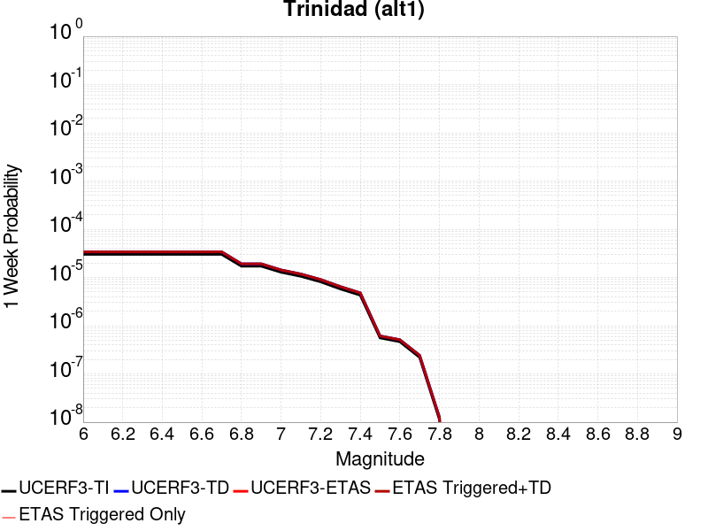 |  |  | 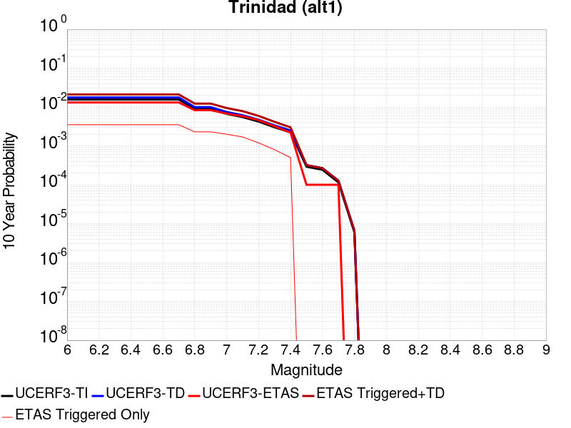 |

| Magnitude | 1 wk TI Prob | 1 wk TD Prob | 1 wk ETAS Prob | 1 wk ETAS/TD Gain | 1 wk ETAS Triggered+TD | 1 wk ETAS Triggered Only | 1 mo TI Prob | 1 mo TD Prob | 1 mo ETAS Prob | 1 mo ETAS/TD Gain | 1 mo ETAS Triggered+TD | 1 mo ETAS Triggered Only | 1 yr TI Prob | 1 yr TD Prob | 1 yr ETAS Prob | 1 yr ETAS/TD Gain | 1 yr ETAS Triggered+TD | 1 yr ETAS Triggered Only | 10 yr TI Prob | 10 yr TD Prob | 10 yr ETAS Prob | 10 yr ETAS/TD Gain | 10 yr ETAS Triggered+TD | 10 yr ETAS Triggered Only |
|-----|-----|-----|-----|-----|-----|-----|-----|-----|-----|-----|-----|-----|-----|-----|-----|-----|-----|-----|-----|-----|-----|-----|-----|-----|
| 6.0 | 3.0167168E-5 | 3.404185E-5 | 0.0 | 0.0 | 3.404185E-5 | 0.0 | 1.2928146E-4 | 1.4588643E-4 | 1.0E-4 | 0.6854647 | 1.4588643E-4 | 0.0 | 0.0015728653 | 0.0017748888 | 8.0E-4 | 0.45073247 | 0.0020743564 | 3.0E-4 | 0.0156177925 | 0.017624097 | 0.0131 | 0.74330044 | 0.021062413 | 0.0035 |
| 6.1 | 3.0167168E-5 | 3.404185E-5 | 0.0 | 0.0 | 3.404185E-5 | 0.0 | 1.2928146E-4 | 1.4588643E-4 | 1.0E-4 | 0.6854647 | 1.4588643E-4 | 0.0 | 0.0015728653 | 0.0017748888 | 8.0E-4 | 0.45073247 | 0.0020743564 | 3.0E-4 | 0.0156177925 | 0.017624097 | 0.0131 | 0.74330044 | 0.021062413 | 0.0035 |
| 6.2 | 3.0167168E-5 | 3.404185E-5 | 0.0 | 0.0 | 3.404185E-5 | 0.0 | 1.2928146E-4 | 1.4588643E-4 | 1.0E-4 | 0.6854647 | 1.4588643E-4 | 0.0 | 0.0015728653 | 0.0017748888 | 8.0E-4 | 0.45073247 | 0.0020743564 | 3.0E-4 | 0.0156177925 | 0.017624097 | 0.0131 | 0.74330044 | 0.021062413 | 0.0035 |
| 6.3 | 3.0167168E-5 | 3.404185E-5 | 0.0 | 0.0 | 3.404185E-5 | 0.0 | 1.2928146E-4 | 1.4588643E-4 | 1.0E-4 | 0.6854647 | 1.4588643E-4 | 0.0 | 0.0015728653 | 0.0017748888 | 8.0E-4 | 0.45073247 | 0.0020743564 | 3.0E-4 | 0.0156177925 | 0.017624097 | 0.0131 | 0.74330044 | 0.021062413 | 0.0035 |
| 6.4 | 3.0167168E-5 | 3.404185E-5 | 0.0 | 0.0 | 3.404185E-5 | 0.0 | 1.2928146E-4 | 1.4588643E-4 | 1.0E-4 | 0.6854647 | 1.4588643E-4 | 0.0 | 0.0015728653 | 0.0017748888 | 8.0E-4 | 0.45073247 | 0.0020743564 | 3.0E-4 | 0.0156177925 | 0.017624097 | 0.0131 | 0.74330044 | 0.021062413 | 0.0035 |
| 6.5 | 3.0167168E-5 | 3.404185E-5 | 0.0 | 0.0 | 3.404185E-5 | 0.0 | 1.2928146E-4 | 1.4588643E-4 | 1.0E-4 | 0.6854647 | 1.4588643E-4 | 0.0 | 0.0015728653 | 0.0017748888 | 8.0E-4 | 0.45073247 | 0.0020743564 | 3.0E-4 | 0.0156177925 | 0.017624097 | 0.0131 | 0.74330044 | 0.021062413 | 0.0035 |
| 6.6 | 3.0167168E-5 | 3.404185E-5 | 0.0 | 0.0 | 3.404185E-5 | 0.0 | 1.2928146E-4 | 1.4588643E-4 | 1.0E-4 | 0.6854647 | 1.4588643E-4 | 0.0 | 0.0015728653 | 0.0017748888 | 8.0E-4 | 0.45073247 | 0.0020743564 | 3.0E-4 | 0.0156177925 | 0.017624097 | 0.0131 | 0.74330044 | 0.021062413 | 0.0035 |
| 6.7 | 3.0167168E-5 | 3.404185E-5 | 0.0 | 0.0 | 3.404185E-5 | 0.0 | 1.2928146E-4 | 1.4588643E-4 | 1.0E-4 | 0.6854647 | 1.4588643E-4 | 0.0 | 0.0015728653 | 0.0017748888 | 8.0E-4 | 0.45073247 | 0.0020743564 | 3.0E-4 | 0.0156177925 | 0.017624097 | 0.0131 | 0.74330044 | 0.021062413 | 0.0035 |
| 6.8 | 1.717077E-5 | 1.9200179E-5 | 0.0 | 0.0 | 1.9200179E-5 | 0.0 | 7.358694E-5 | 8.228413E-5 | 0.0 | 0.0 | 8.228413E-5 | 0.0 | 8.9555274E-4 | 0.0010013934 | 4.0E-4 | 0.39944342 | 0.0012011932 | 2.0E-4 | 0.008919522 | 0.009973263 | 0.0083 | 0.83222514 | 0.012250325 | 0.0023 |
| 6.9 | 1.717077E-5 | 1.9200179E-5 | 0.0 | 0.0 | 1.9200179E-5 | 0.0 | 7.358694E-5 | 8.228413E-5 | 0.0 | 0.0 | 8.228413E-5 | 0.0 | 8.9555274E-4 | 0.0010013934 | 4.0E-4 | 0.39944342 | 0.0012011932 | 2.0E-4 | 0.008919522 | 0.009973263 | 0.0083 | 0.83222514 | 0.012250325 | 0.0023 |
| 7.0 | 1.2858572E-5 | 1.4340644E-5 | 0.0 | 0.0 | 1.4340644E-5 | 0.0 | 5.5107E-5 | 6.145864E-5 | 0.0 | 0.0 | 6.145864E-5 | 0.0 | 6.707212E-4 | 7.480341E-4 | 3.0E-4 | 0.40105122 | 8.479593E-4 | 1.0E-4 | 0.006687004 | 0.0074583427 | 0.0068 | 0.9117307 | 0.0094434265 | 0.002 |
| 7.1 | 1.0588431E-5 | 1.18039525E-5 | 0.0 | 0.0 | 1.18039525E-5 | 0.0 | 4.53782E-5 | 5.058755E-5 | 0.0 | 0.0 | 5.058755E-5 | 0.0 | 5.5233954E-4 | 6.157583E-4 | 3.0E-4 | 0.48720416 | 7.156967E-4 | 1.0E-4 | 0.005509687 | 0.006143372 | 0.0058 | 0.9441069 | 0.007832929 | 0.0017 |
| 7.2 | 8.138061E-6 | 9.069269E-6 | 0.0 | 0.0 | 9.069269E-6 | 0.0 | 3.487694E-5 | 3.8867856E-5 | 0.0 | 0.0 | 3.8867856E-5 | 0.0 | 4.2454398E-4 | 4.7313827E-4 | 1.0E-4 | 0.2113547 | 4.7313827E-4 | 0.0 | 0.0042373384 | 0.0047237515 | 0.0046 | 0.9738023 | 0.005918083 | 0.0012 |
| 7.3 | 5.787542E-6 | 6.4618107E-6 | 0.0 | 0.0 | 6.4618107E-6 | 0.0 | 2.4803514E-5 | 2.7693302E-5 | 0.0 | 0.0 | 2.7693302E-5 | 0.0 | 3.0194095E-4 | 3.3713534E-4 | 0.0 | 0.0 | 3.3713534E-4 | 0.0 | 0.00301531 | 0.0033683507 | 0.0032 | 0.95001984 | 0.004165656 | 8.0E-4 |
| 7.4 | 4.303563E-6 | 4.8019524E-6 | 0.0 | 0.0 | 4.8019524E-6 | 0.0 | 1.844371E-5 | 2.0579746E-5 | 0.0 | 0.0 | 2.0579746E-5 | 0.0 | 2.2452902E-4 | 2.5054938E-4 | 0.0 | 0.0 | 2.5054938E-4 | 0.0 | 0.0022430231 | 0.0025046081 | 0.0022 | 0.87838095 | 0.0030033558 | 5.0E-4 |
| 7.5 | 5.6063425E-7 | 6.144149E-7 | 0.0 | 0.0 | 6.144149E-7 | 0.0 | 2.402716E-6 | 2.633204E-6 | 0.0 | 0.0 | 2.633204E-6 | 0.0 | 2.9252675E-5 | 3.2058804E-5 | 0.0 | 0.0 | 3.2058804E-5 | 0.0 | 2.9248823E-4 | 3.2054336E-4 | 1.0E-4 | 0.3119703 | 3.2054336E-4 | 0.0 |
| 7.6 | 4.6699128E-7 | 5.126792E-7 | 0.0 | 0.0 | 5.126792E-7 | 0.0 | 2.0013897E-6 | 2.197195E-6 | 0.0 | 0.0 | 2.197195E-6 | 0.0 | 2.4366647E-5 | 2.6750535E-5 | 0.0 | 0.0 | 2.6750535E-5 | 0.0 | 2.4363975E-4 | 2.6747456E-4 | 1.0E-4 | 0.37386733 | 2.6747456E-4 | 0.0 |
| 7.7 | 2.2080937E-7 | 2.4351854E-7 | 0.0 | 0.0 | 2.4351854E-7 | 0.0 | 9.4632554E-7 | 1.0436505E-6 | 0.0 | 0.0 | 1.0436505E-6 | 0.0 | 1.15214525E-5 | 1.2706377E-5 | 0.0 | 0.0 | 1.2706377E-5 | 0.0 | 1.1520855E-4 | 1.270571E-4 | 1.0E-4 | 0.7870477 | 1.270571E-4 | 0.0 |
| 7.8 | 1.1438307E-8 | 1.26857005E-8 | 0.0 | 0.0 | 1.26857005E-8 | 0.0 | 4.9021317E-8 | 5.4367288E-8 | 0.0 | 0.0 | 5.4367288E-8 | 0.0 | 5.9683435E-7 | 6.619217E-7 | 0.0 | 0.0 | 6.619217E-7 | 0.0 | 5.9683275E-6 | 6.6192174E-6 | 0.0 | 0.0 | 6.6192174E-6 | 0.0 |

## Great Valley 07 (Orestimba)
*[(top)](#table-of-contents)*

| 1 Week | 1 Month | 1 Year | 10 Year |
|-----|-----|-----|-----|
|  | 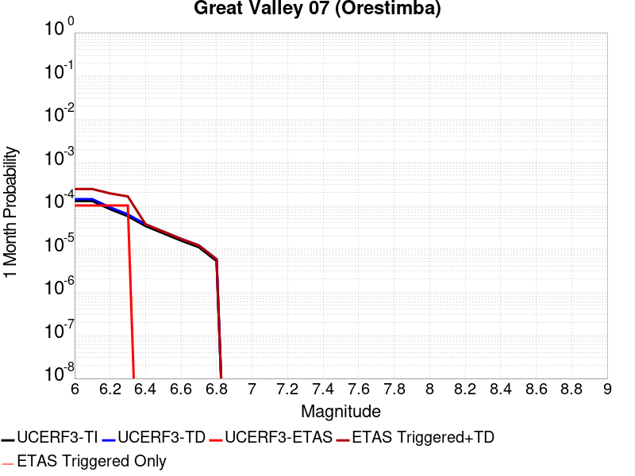 | 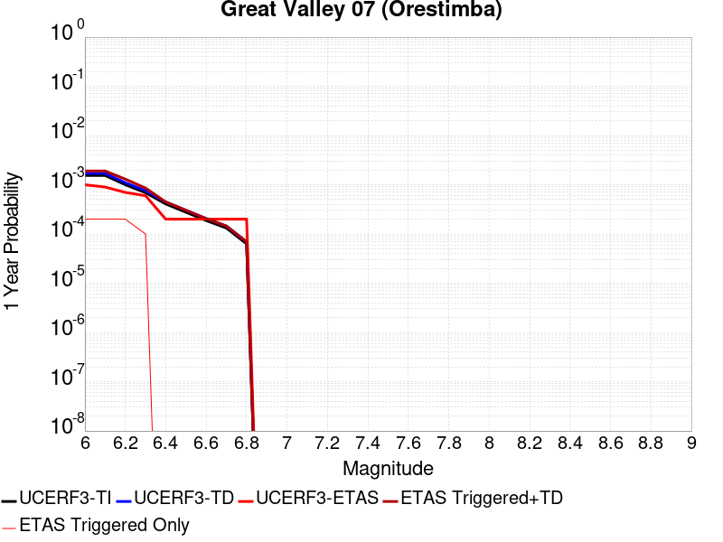 | 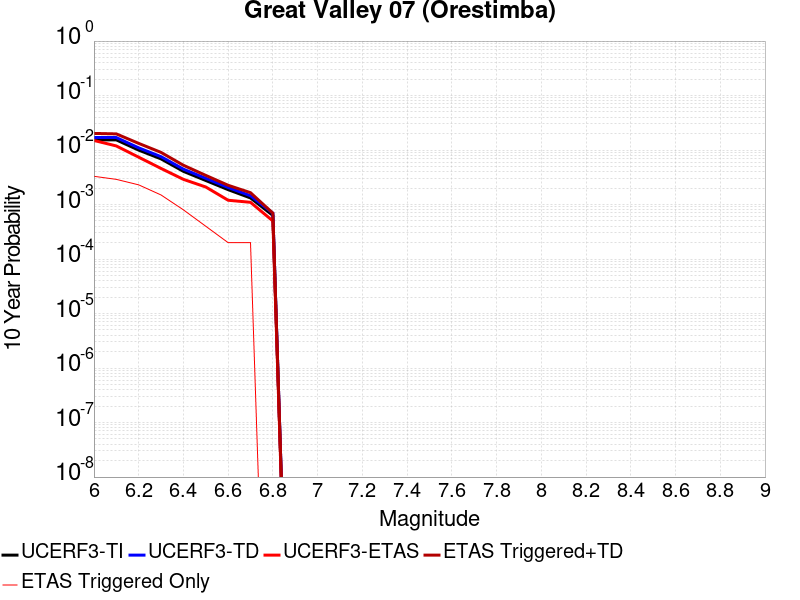 |

| Magnitude | 1 wk TI Prob | 1 wk TD Prob | 1 wk ETAS Prob | 1 wk ETAS/TD Gain | 1 wk ETAS Triggered+TD | 1 wk ETAS Triggered Only | 1 mo TI Prob | 1 mo TD Prob | 1 mo ETAS Prob | 1 mo ETAS/TD Gain | 1 mo ETAS Triggered+TD | 1 mo ETAS Triggered Only | 1 yr TI Prob | 1 yr TD Prob | 1 yr ETAS Prob | 1 yr ETAS/TD Gain | 1 yr ETAS Triggered+TD | 1 yr ETAS Triggered Only | 10 yr TI Prob | 10 yr TD Prob | 10 yr ETAS Prob | 10 yr ETAS/TD Gain | 10 yr ETAS Triggered+TD | 10 yr ETAS Triggered Only |
|-----|-----|-----|-----|-----|-----|-----|-----|-----|-----|-----|-----|-----|-----|-----|-----|-----|-----|-----|-----|-----|-----|-----|-----|-----|
| 6.0 | 2.9687902E-5 | 3.2764223E-5 | 1.0E-4 | 3.0521095 | 1.3276095E-4 | 1.0E-4 | 1.2722766E-4 | 1.4041095E-4 | 1.0E-4 | 0.71219516 | 2.4039691E-4 | 1.0E-4 | 0.0015478961 | 0.0017082348 | 0.001 | 0.5853996 | 0.0019078931 | 2.0E-4 | 0.015371585 | 0.016958589 | 0.015 | 0.8845076 | 0.020202626 | 0.0033 |
| 6.1 | 2.9687902E-5 | 3.2764223E-5 | 1.0E-4 | 3.0521095 | 1.3276095E-4 | 1.0E-4 | 1.2722766E-4 | 1.4041095E-4 | 1.0E-4 | 0.71219516 | 2.4039691E-4 | 1.0E-4 | 0.0015478961 | 0.0017082348 | 9.0E-4 | 0.5268597 | 0.0019078931 | 2.0E-4 | 0.015371585 | 0.016958589 | 0.0119 | 0.70170933 | 0.019809408 | 0.0029 |
| 6.2 | 1.9231524E-5 | 2.1163376E-5 | 1.0E-4 | 4.7251444 | 1.2116126E-4 | 1.0E-4 | 8.2418206E-5 | 9.0697155E-5 | 1.0E-4 | 1.1025704 | 1.906881E-4 | 1.0E-4 | 0.0010029797 | 0.0011037017 | 7.0E-4 | 0.63422936 | 0.0013034809 | 2.0E-4 | 0.00998465 | 0.010984614 | 0.0074 | 0.6736696 | 0.013259349 | 0.0023 |
| 6.3 | 1.324766E-5 | 1.4551368E-5 | 1.0E-4 | 6.872206 | 1.1454991E-4 | 1.0E-4 | 5.6774446E-5 | 6.236156E-5 | 1.0E-4 | 1.6035517 | 1.6235533E-4 | 1.0E-4 | 6.910097E-4 | 7.5899676E-4 | 6.0E-4 | 0.7905172 | 8.5892086E-4 | 1.0E-4 | 0.006888649 | 0.0075649917 | 0.0046 | 0.6080641 | 0.009053645 | 0.0015 |
| 6.4 | 7.818645E-6 | 8.5744805E-6 | 0.0 | 0.0 | 8.5744805E-6 | 0.0 | 3.3508048E-5 | 3.6747275E-5 | 0.0 | 0.0 | 3.6747275E-5 | 0.0 | 4.078841E-4 | 4.473096E-4 | 2.0E-4 | 0.44711763 | 4.473096E-4 | 0.0 | 0.004071363 | 0.0044644326 | 0.0029 | 0.6495786 | 0.0052608615 | 8.0E-4 |
| 6.5 | 5.3076565E-6 | 5.81891E-6 | 0.0 | 0.0 | 5.81891E-6 | 0.0 | 2.27469E-5 | 2.493796E-5 | 0.0 | 0.0 | 2.493796E-5 | 0.0 | 2.7690834E-4 | 3.0357947E-4 | 2.0E-4 | 0.6588061 | 3.0357947E-4 | 0.0 | 0.0027656353 | 0.003031857 | 0.0021 | 0.69264483 | 0.0034306443 | 4.0E-4 |
| 6.6 | 3.6003578E-6 | 3.949253E-6 | 0.0 | 0.0 | 3.949253E-6 | 0.0 | 1.5430012E-5 | 1.6925267E-5 | 0.0 | 0.0 | 1.6925267E-5 | 0.0 | 1.8784421E-4 | 2.0604722E-4 | 2.0E-4 | 0.9706513 | 2.0604722E-4 | 0.0 | 0.0018768552 | 0.0020587158 | 0.0012 | 0.58288765 | 0.002258304 | 2.0E-4 |
| 6.7 | 2.5361826E-6 | 2.7840063E-6 | 0.0 | 0.0 | 2.7840063E-6 | 0.0 | 1.0869308E-5 | 1.1931408E-5 | 0.0 | 0.0 | 1.1931408E-5 | 0.0 | 1.3232579E-4 | 1.4525653E-4 | 2.0E-4 | 1.3768743 | 1.4525653E-4 | 0.0 | 0.0013224703 | 0.0014517459 | 0.0011 | 0.7577084 | 0.0016514555 | 2.0E-4 |
| 6.8 | 1.2115831E-6 | 1.3316409E-6 | 0.0 | 0.0 | 1.3316409E-6 | 0.0 | 5.1924885E-6 | 5.7070256E-6 | 0.0 | 0.0 | 5.7070256E-6 | 0.0 | 6.3216714E-5 | 6.9481786E-5 | 2.0E-4 | 2.878452 | 6.9481786E-5 | 0.0 | 6.3198735E-4 | 6.946958E-4 | 5.0E-4 | 0.7197395 | 6.946958E-4 | 0.0 |

## Rose Canyon
*[(top)](#table-of-contents)*

| 1 Week | 1 Month | 1 Year | 10 Year |
|-----|-----|-----|-----|
| 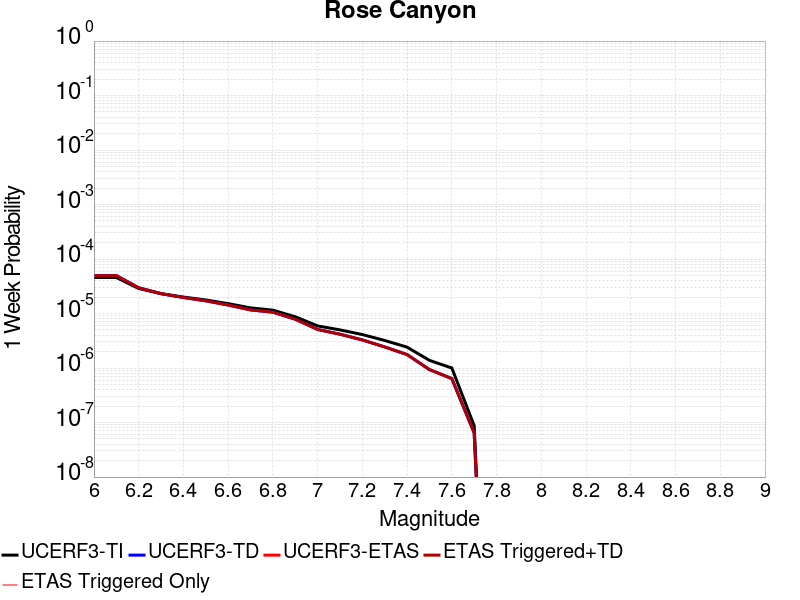 |  | 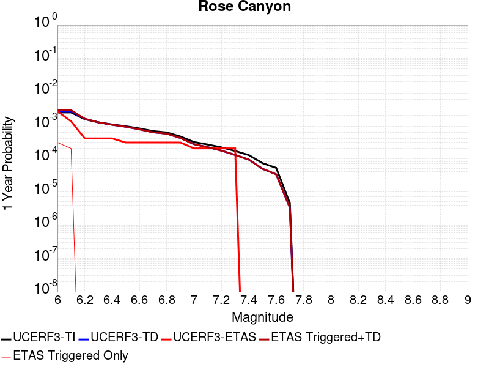 | 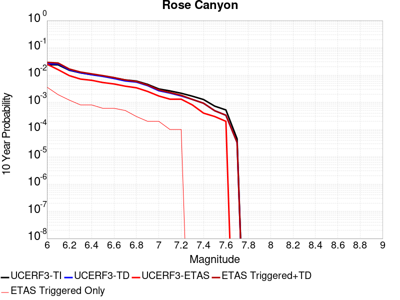 |

| Magnitude | 1 wk TI Prob | 1 wk TD Prob | 1 wk ETAS Prob | 1 wk ETAS/TD Gain | 1 wk ETAS Triggered+TD | 1 wk ETAS Triggered Only | 1 mo TI Prob | 1 mo TD Prob | 1 mo ETAS Prob | 1 mo ETAS/TD Gain | 1 mo ETAS Triggered+TD | 1 mo ETAS Triggered Only | 1 yr TI Prob | 1 yr TD Prob | 1 yr ETAS Prob | 1 yr ETAS/TD Gain | 1 yr ETAS Triggered+TD | 1 yr ETAS Triggered Only | 10 yr TI Prob | 10 yr TD Prob | 10 yr ETAS Prob | 10 yr ETAS/TD Gain | 10 yr ETAS Triggered+TD | 10 yr ETAS Triggered Only |
|-----|-----|-----|-----|-----|-----|-----|-----|-----|-----|-----|-----|-----|-----|-----|-----|-----|-----|-----|-----|-----|-----|-----|-----|-----|
| 6.0 | 4.5923203E-5 | 4.9801987E-5 | 0.0 | 0.0 | 4.9801987E-5 | 0.0 | 1.9679888E-4 | 2.1342098E-4 | 2.0E-4 | 0.937115 | 2.1342098E-4 | 0.0 | 0.0023933933 | 0.0025954961 | 0.0026 | 1.0017352 | 0.0028947175 | 3.0E-4 | 0.023677798 | 0.025698043 | 0.0251 | 0.976728 | 0.02920553 | 0.0036 |
| 6.1 | 4.5923203E-5 | 4.9801987E-5 | 0.0 | 0.0 | 4.9801987E-5 | 0.0 | 1.9679888E-4 | 2.1342098E-4 | 2.0E-4 | 0.937115 | 2.1342098E-4 | 0.0 | 0.0023933933 | 0.0025954961 | 0.0013 | 0.5008676 | 0.002794977 | 2.0E-4 | 0.023677798 | 0.025698043 | 0.0157 | 0.6109414 | 0.027549218 | 0.0019 |
| 6.2 | 2.8844734E-5 | 2.9745968E-5 | 0.0 | 0.0 | 2.9745968E-5 | 0.0 | 1.2361443E-4 | 1.274767E-4 | 2.0E-4 | 1.5689143 | 1.274767E-4 | 0.0 | 0.0015039665 | 0.0015509513 | 4.0E-4 | 0.25790623 | 0.0015509513 | 0.0 | 0.0149382865 | 0.015406392 | 0.0095 | 0.61662716 | 0.016587904 | 0.0012 |
| 6.3 | 2.3171577E-5 | 2.323454E-5 | 0.0 | 0.0 | 2.323454E-5 | 0.0 | 9.9302975E-5 | 9.957287E-5 | 2.0E-4 | 2.0085793 | 9.957287E-5 | 0.0 | 0.0012083431 | 0.001211639 | 4.0E-4 | 0.33013135 | 0.001211639 | 0.0 | 0.012017938 | 0.012060704 | 0.0071 | 0.5886887 | 0.012851056 | 8.0E-4 |
| 6.4 | 2.0066604E-5 | 1.9713169E-5 | 0.0 | 0.0 | 1.9713169E-5 | 0.0 | 8.599689E-5 | 8.448233E-5 | 2.0E-4 | 2.3673592 | 8.448233E-5 | 0.0 | 0.0010465092 | 0.0010280971 | 4.0E-4 | 0.3890683 | 0.0010280971 | 0.0 | 0.010415946 | 0.010241615 | 0.0064 | 0.6249015 | 0.011033421 | 8.0E-4 |
| 6.5 | 1.776989E-5 | 1.7142245E-5 | 0.0 | 0.0 | 1.7142245E-5 | 0.0 | 7.615444E-5 | 7.346474E-5 | 2.0E-4 | 2.7223945 | 7.346474E-5 | 0.0 | 9.267859E-4 | 8.9407316E-4 | 3.0E-4 | 0.335543 | 8.9407316E-4 | 0.0 | 0.009229303 | 0.00891359 | 0.0053 | 0.5945977 | 0.009508241 | 6.0E-4 |
| 6.6 | 1.5227364E-5 | 1.4350491E-5 | 0.0 | 0.0 | 1.4350491E-5 | 0.0 | 6.52585E-5 | 6.150069E-5 | 2.0E-4 | 3.2519963 | 6.150069E-5 | 0.0 | 7.942326E-4 | 7.4851885E-4 | 3.0E-4 | 0.40079153 | 7.4851885E-4 | 0.0 | 0.007914 | 0.007458934 | 0.0047 | 0.6301168 | 0.008054459 | 6.0E-4 |
| 6.7 | 1.2703898E-5 | 1.16766705E-5 | 0.0 | 0.0 | 1.16766705E-5 | 0.0 | 5.4444143E-5 | 5.0041937E-5 | 2.0E-4 | 3.9966476 | 5.0041937E-5 | 0.0 | 6.626558E-4 | 6.090945E-4 | 3.0E-4 | 0.49253437 | 6.090945E-4 | 0.0 | 0.006606833 | 0.006071081 | 0.0039 | 0.6423897 | 0.006568046 | 5.0E-4 |
| 6.8 | 1.1554917E-5 | 1.0612592E-5 | 0.0 | 0.0 | 1.0612592E-5 | 0.0 | 4.9520135E-5 | 4.5481767E-5 | 2.0E-4 | 4.3973665 | 4.5481767E-5 | 0.0 | 6.0274085E-4 | 5.5360387E-4 | 3.0E-4 | 0.54190373 | 5.5360387E-4 | 0.0 | 0.0060110865 | 0.005512376 | 0.0034 | 0.61679393 | 0.005810722 | 3.0E-4 |
| 6.9 | 8.732078E-6 | 7.8834755E-6 | 0.0 | 0.0 | 7.8834755E-6 | 0.0 | 3.7422655E-5 | 3.3785902E-5 | 2.0E-4 | 5.9196286 | 3.3785902E-5 | 0.0 | 4.5552556E-4 | 4.1126867E-4 | 3.0E-4 | 0.72945017 | 4.1126867E-4 | 0.0 | 0.0045459294 | 0.0040901336 | 0.0025 | 0.611227 | 0.0042893155 | 2.0E-4 |
| 7.0 | 5.9337494E-6 | 5.1083503E-6 | 0.0 | 0.0 | 5.1083503E-6 | 0.0 | 2.5430107E-5 | 2.1892747E-5 | 1.0E-4 | 4.567723 | 2.1892747E-5 | 0.0 | 3.0956755E-4 | 2.6651172E-4 | 2.0E-4 | 0.750436 | 2.6651172E-4 | 0.0 | 0.0030913667 | 0.0026619367 | 0.0017 | 0.6386328 | 0.0028614043 | 2.0E-4 |
| 7.1 | 5.013409E-6 | 4.1781122E-6 | 0.0 | 0.0 | 4.1781122E-6 | 0.0 | 2.1485863E-5 | 1.7906072E-5 | 1.0E-4 | 5.5846977 | 1.7906072E-5 | 0.0 | 2.6155898E-4 | 2.1798472E-4 | 2.0E-4 | 0.9174955 | 2.1798472E-4 | 0.0 | 0.0026125133 | 0.0021777207 | 0.0013 | 0.5969544 | 0.002277503 | 1.0E-4 |
| 7.2 | 4.120763E-6 | 3.2827104E-6 | 0.0 | 0.0 | 3.2827104E-6 | 0.0 | 1.7660293E-5 | 1.4068683E-5 | 1.0E-4 | 7.1079855 | 1.4068683E-5 | 0.0 | 2.1499286E-4 | 1.7127286E-4 | 2.0E-4 | 1.1677274 | 1.7127286E-4 | 0.0 | 0.0021478499 | 0.001711418 | 0.0013 | 0.759604 | 0.0018112469 | 1.0E-4 |
| 7.3 | 3.2081239E-6 | 2.4409628E-6 | 0.0 | 0.0 | 2.4409628E-6 | 0.0 | 1.374903E-5 | 1.0461228E-5 | 1.0E-4 | 9.559107 | 1.0461228E-5 | 0.0 | 1.6738157E-4 | 1.2735807E-4 | 2.0E-4 | 1.5703754 | 1.2735807E-4 | 0.0 | 0.0016725556 | 0.0012728579 | 8.0E-4 | 0.62850696 | 0.0012728579 | 0.0 |
| 7.4 | 2.4194755E-6 | 1.7683502E-6 | 0.0 | 0.0 | 1.7683502E-6 | 0.0 | 1.0369139E-5 | 7.578622E-6 | 0.0 | 0.0 | 7.578622E-6 | 0.0 | 1.2623696E-4 | 9.226587E-5 | 0.0 | 0.0 | 9.226587E-5 | 0.0 | 0.0012616527 | 9.2228095E-4 | 4.0E-4 | 0.4337073 | 9.2228095E-4 | 0.0 |
| 7.5 | 1.3842889E-6 | 9.3805556E-7 | 0.0 | 0.0 | 9.3805556E-7 | 0.0 | 5.9326535E-6 | 4.020232E-6 | 0.0 | 0.0 | 4.020232E-6 | 0.0 | 7.222766E-5 | 4.894526E-5 | 0.0 | 0.0 | 4.894526E-5 | 0.0 | 7.220419E-4 | 4.893484E-4 | 3.0E-4 | 0.6130602 | 4.893484E-4 | 0.0 |
| 7.6 | 1.0021575E-6 | 6.412578E-7 | 0.0 | 0.0 | 6.412578E-7 | 0.0 | 4.2949537E-6 | 2.7482452E-6 | 0.0 | 0.0 | 2.7482452E-6 | 0.0 | 5.2289808E-5 | 3.3459393E-5 | 0.0 | 0.0 | 3.3459393E-5 | 0.0 | 5.2277505E-4 | 3.3454568E-4 | 2.0E-4 | 0.59782565 | 3.3454568E-4 | 0.0 |
| 7.7 | 8.7620116E-8 | 6.4499396E-8 | 0.0 | 0.0 | 6.4499396E-8 | 0.0 | 3.7551473E-7 | 2.7642596E-7 | 0.0 | 0.0 | 2.7642596E-7 | 0.0 | 4.5718825E-6 | 3.3654812E-6 | 0.0 | 0.0 | 3.3654812E-6 | 0.0 | 4.5717883E-5 | 3.365433E-5 | 0.0 | 0.0 | 3.365433E-5 | 0.0 |

## Elysian Park (Upper)
*[(top)](#table-of-contents)*

| 1 Week | 1 Month | 1 Year | 10 Year |
|-----|-----|-----|-----|
| 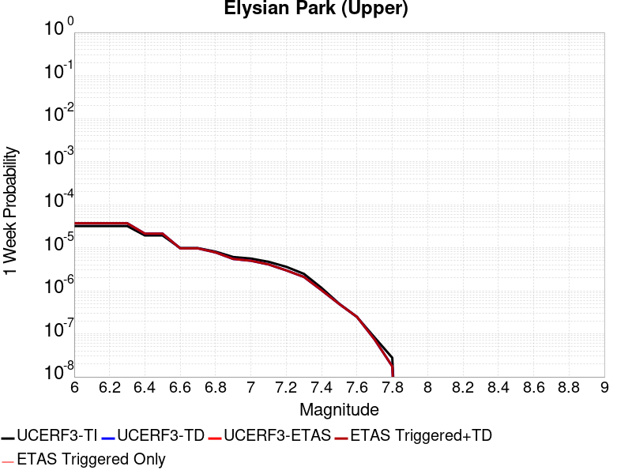 | 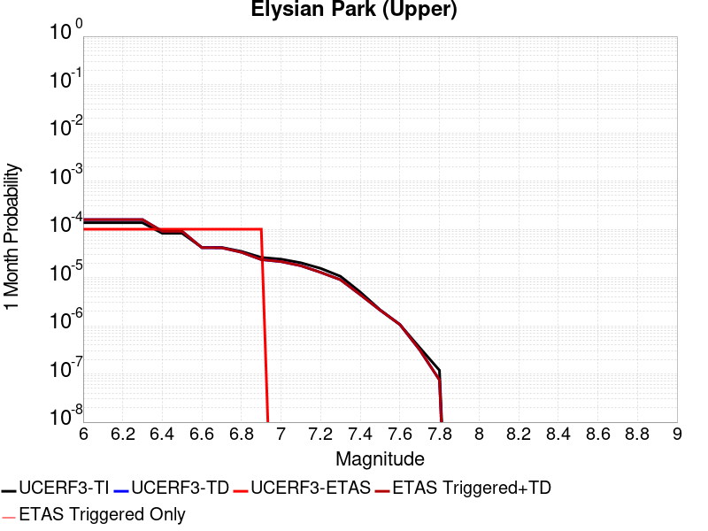 | 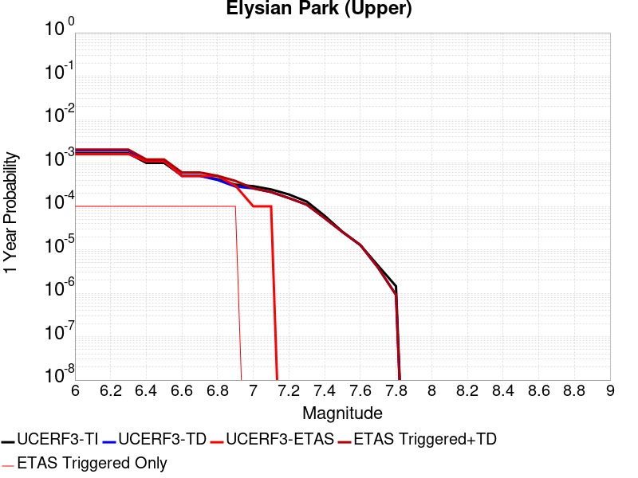 | 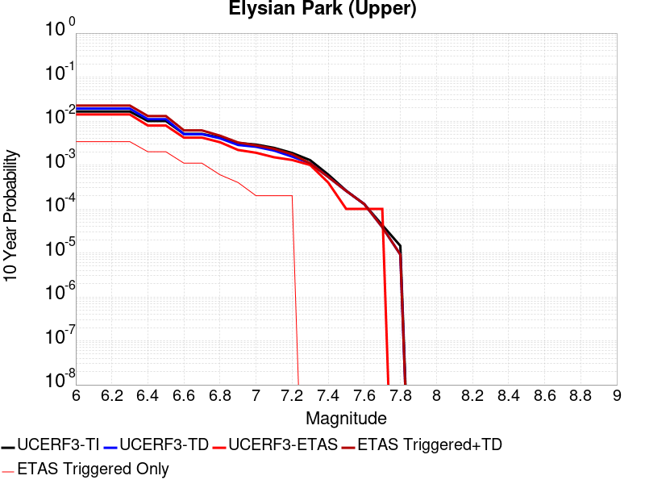 |

| Magnitude | 1 wk TI Prob | 1 wk TD Prob | 1 wk ETAS Prob | 1 wk ETAS/TD Gain | 1 wk ETAS Triggered+TD | 1 wk ETAS Triggered Only | 1 mo TI Prob | 1 mo TD Prob | 1 mo ETAS Prob | 1 mo ETAS/TD Gain | 1 mo ETAS Triggered+TD | 1 mo ETAS Triggered Only | 1 yr TI Prob | 1 yr TD Prob | 1 yr ETAS Prob | 1 yr ETAS/TD Gain | 1 yr ETAS Triggered+TD | 1 yr ETAS Triggered Only | 10 yr TI Prob | 10 yr TD Prob | 10 yr ETAS Prob | 10 yr ETAS/TD Gain | 10 yr ETAS Triggered+TD | 10 yr ETAS Triggered Only |
|-----|-----|-----|-----|-----|-----|-----|-----|-----|-----|-----|-----|-----|-----|-----|-----|-----|-----|-----|-----|-----|-----|-----|-----|-----|
| 6.0 | 3.1876025E-5 | 3.7050297E-5 | 0.0 | 0.0 | 3.7050297E-5 | 0.0 | 1.3660437E-4 | 1.5878E-4 | 1.0E-4 | 0.6298022 | 1.5878E-4 | 0.0 | 0.0016618895 | 0.0019319047 | 0.0016 | 0.8281982 | 0.0020317114 | 1.0E-4 | 0.016495159 | 0.019197576 | 0.0141 | 0.73446774 | 0.022532303 | 0.0034 |
| 6.1 | 3.1876025E-5 | 3.7050297E-5 | 0.0 | 0.0 | 3.7050297E-5 | 0.0 | 1.3660437E-4 | 1.5878E-4 | 1.0E-4 | 0.6298022 | 1.5878E-4 | 0.0 | 0.0016618895 | 0.0019319047 | 0.0016 | 0.8281982 | 0.0020317114 | 1.0E-4 | 0.016495159 | 0.019197576 | 0.0141 | 0.73446774 | 0.022532303 | 0.0034 |
| 6.2 | 3.1876025E-5 | 3.7050297E-5 | 0.0 | 0.0 | 3.7050297E-5 | 0.0 | 1.3660437E-4 | 1.5878E-4 | 1.0E-4 | 0.6298022 | 1.5878E-4 | 0.0 | 0.0016618895 | 0.0019319047 | 0.0016 | 0.8281982 | 0.0020317114 | 1.0E-4 | 0.016495159 | 0.019197576 | 0.0141 | 0.73446774 | 0.022532303 | 0.0034 |
| 6.3 | 3.1876025E-5 | 3.7050297E-5 | 0.0 | 0.0 | 3.7050297E-5 | 0.0 | 1.3660437E-4 | 1.5878E-4 | 1.0E-4 | 0.6298022 | 1.5878E-4 | 0.0 | 0.0016618895 | 0.0019319047 | 0.0016 | 0.8281982 | 0.0020317114 | 1.0E-4 | 0.016495159 | 0.019197576 | 0.0141 | 0.73446774 | 0.022532303 | 0.0034 |
| 6.4 | 1.9273462E-5 | 2.1209538E-5 | 0.0 | 0.0 | 2.1209538E-5 | 0.0 | 8.259794E-5 | 9.089578E-5 | 1.0E-4 | 1.1001611 | 9.089578E-5 | 0.0 | 0.001005166 | 0.0011062655 | 0.0011 | 0.99433637 | 0.0012061548 | 1.0E-4 | 0.010006315 | 0.011024404 | 0.0079 | 0.71659195 | 0.013002356 | 0.002 |
| 6.5 | 1.9273462E-5 | 2.1209538E-5 | 0.0 | 0.0 | 2.1209538E-5 | 0.0 | 8.259794E-5 | 9.089578E-5 | 1.0E-4 | 1.1001611 | 9.089578E-5 | 0.0 | 0.001005166 | 0.0011062655 | 0.0011 | 0.99433637 | 0.0012061548 | 1.0E-4 | 0.010006315 | 0.011024404 | 0.0079 | 0.71659195 | 0.013002356 | 0.002 |
| 6.6 | 9.813258E-6 | 9.6676595E-6 | 0.0 | 0.0 | 9.6676595E-6 | 0.0 | 4.205614E-5 | 4.143221E-5 | 1.0E-4 | 2.4135811 | 4.143221E-5 | 0.0 | 5.119132E-4 | 5.0432765E-4 | 5.0E-4 | 0.99141896 | 6.042772E-4 | 1.0E-4 | 0.005107356 | 0.005032555 | 0.0042 | 0.8345661 | 0.0061270194 | 0.0011 |
| 6.7 | 9.801478E-6 | 9.655228E-6 | 0.0 | 0.0 | 9.655228E-6 | 0.0 | 4.2005657E-5 | 4.137893E-5 | 1.0E-4 | 2.416689 | 4.137893E-5 | 0.0 | 5.112989E-4 | 5.036793E-4 | 5.0E-4 | 0.9926952 | 6.036289E-4 | 1.0E-4 | 0.0051012407 | 0.005026101 | 0.0042 | 0.8356378 | 0.0061205723 | 0.0011 |
| 6.8 | 8.102489E-6 | 7.7746645E-6 | 0.0 | 0.0 | 7.7746645E-6 | 0.0 | 3.4724493E-5 | 3.3319593E-5 | 1.0E-4 | 3.0012374 | 3.3319593E-5 | 0.0 | 4.2268867E-4 | 4.055955E-4 | 5.0E-4 | 1.2327553 | 5.055549E-4 | 1.0E-4 | 0.004218856 | 0.0040490464 | 0.0033 | 0.8150067 | 0.004646617 | 6.0E-4 |
| 6.9 | 6.08275E-6 | 5.482499E-6 | 0.0 | 0.0 | 5.482499E-6 | 0.0 | 2.6068668E-5 | 2.3496219E-5 | 1.0E-4 | 4.256004 | 2.3496219E-5 | 0.0 | 3.173398E-4 | 2.8602968E-4 | 3.0E-4 | 1.0488422 | 3.8600108E-4 | 1.0E-4 | 0.0031688702 | 0.002856693 | 0.0022 | 0.7701213 | 0.0032555503 | 4.0E-4 |
| 7.0 | 5.5995934E-6 | 4.9837386E-6 | 0.0 | 0.0 | 4.9837386E-6 | 0.0 | 2.3998036E-5 | 2.135871E-5 | 0.0 | 0.0 | 2.135871E-5 | 0.0 | 2.9213692E-4 | 2.6001193E-4 | 1.0E-4 | 0.38459775 | 2.6001193E-4 | 0.0 | 0.0029175316 | 0.0025971443 | 0.0019 | 0.73157275 | 0.002796625 | 2.0E-4 |
| 7.1 | 4.709881E-6 | 4.088206E-6 | 0.0 | 0.0 | 4.088206E-6 | 0.0 | 2.0185047E-5 | 1.7520768E-5 | 0.0 | 0.0 | 1.7520768E-5 | 0.0 | 2.4572524E-4 | 2.1329487E-4 | 1.0E-4 | 0.46883452 | 2.1329487E-4 | 0.0 | 0.002454537 | 0.002130943 | 0.0015 | 0.70391375 | 0.0023305167 | 2.0E-4 |
| 7.2 | 3.6063436E-6 | 2.9785592E-6 | 0.0 | 0.0 | 2.9785592E-6 | 0.0 | 1.5455667E-5 | 1.2765192E-5 | 0.0 | 0.0 | 1.2765192E-5 | 0.0 | 1.881565E-4 | 1.5540524E-4 | 0.0 | 0.0 | 1.5540524E-4 | 0.0 | 0.0018799726 | 0.0015529769 | 0.0013 | 0.837102 | 0.0017526663 | 2.0E-4 |
| 7.3 | 2.471135E-6 | 2.0959303E-6 | 0.0 | 0.0 | 2.0959303E-6 | 0.0 | 1.0590536E-5 | 8.982528E-6 | 0.0 | 0.0 | 8.982528E-6 | 0.0 | 1.2893214E-4 | 1.0935686E-4 | 0.0 | 0.0 | 1.0935686E-4 | 0.0 | 0.0012885736 | 0.0010930377 | 0.001 | 0.9148815 | 0.0010930377 | 0.0 |
| 7.4 | 1.163943E-6 | 1.0278206E-6 | 0.0 | 0.0 | 1.0278206E-6 | 0.0 | 4.988318E-6 | 4.4049384E-6 | 0.0 | 0.0 | 4.4049384E-6 | 0.0 | 6.0731076E-5 | 5.3628835E-5 | 0.0 | 0.0 | 5.3628835E-5 | 0.0 | 6.071448E-4 | 5.3616194E-4 | 4.0E-4 | 0.74604326 | 5.3616194E-4 | 0.0 |
| 7.5 | 4.99459E-7 | 4.9187946E-7 | 0.0 | 0.0 | 4.9187946E-7 | 0.0 | 2.140537E-6 | 2.1080534E-6 | 0.0 | 0.0 | 2.1080534E-6 | 0.0 | 2.6060725E-5 | 2.5665264E-5 | 0.0 | 0.0 | 2.5665264E-5 | 0.0 | 2.605767E-4 | 2.5662457E-4 | 1.0E-4 | 0.3896743 | 2.5662457E-4 | 0.0 |
| 7.6 | 2.4667852E-7 | 2.4783398E-7 | 0.0 | 0.0 | 2.4783398E-7 | 0.0 | 1.0571932E-6 | 1.0621452E-6 | 0.0 | 0.0 | 1.0621452E-6 | 0.0 | 1.2871251E-5 | 1.2931545E-5 | 0.0 | 0.0 | 1.2931545E-5 | 0.0 | 1.2870505E-4 | 1.2930829E-4 | 1.0E-4 | 0.7733456 | 1.2930829E-4 | 0.0 |
| 7.7 | 8.2312795E-8 | 7.389191E-8 | 0.0 | 0.0 | 7.389191E-8 | 0.0 | 3.527691E-7 | 3.166796E-7 | 0.0 | 0.0 | 3.166796E-7 | 0.0 | 4.294955E-6 | 3.8555686E-6 | 0.0 | 0.0 | 3.8555686E-6 | 0.0 | 4.2948723E-5 | 3.8555132E-5 | 1.0E-4 | 2.5936885 | 3.8555132E-5 | 0.0 |
| 7.8 | 2.7819295E-8 | 1.7585192E-8 | 0.0 | 0.0 | 1.7585192E-8 | 0.0 | 1.1922555E-7 | 7.53651E-8 | 0.0 | 0.0 | 7.53651E-8 | 0.0 | 1.45157E-6 | 9.1756993E-7 | 0.0 | 0.0 | 9.1756993E-7 | 0.0 | 1.45156055E-5 | 9.1756765E-6 | 0.0 | 0.0 | 9.1756765E-6 | 0.0 |

## Ventura-Pitas Point
*[(top)](#table-of-contents)*

| 1 Week | 1 Month | 1 Year | 10 Year |
|-----|-----|-----|-----|
| 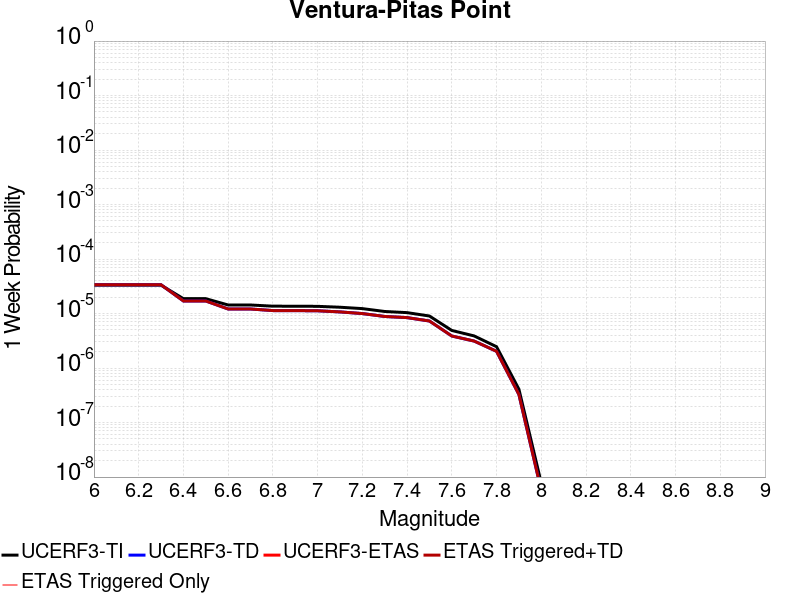 | 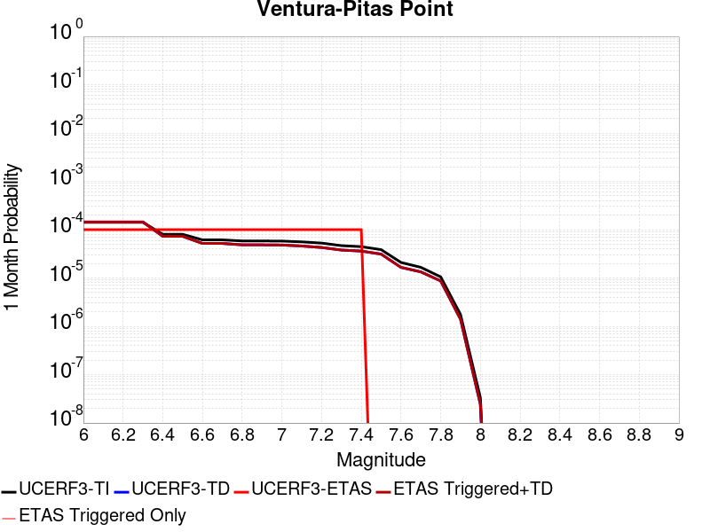 |  |  |

| Magnitude | 1 wk TI Prob | 1 wk TD Prob | 1 wk ETAS Prob | 1 wk ETAS/TD Gain | 1 wk ETAS Triggered+TD | 1 wk ETAS Triggered Only | 1 mo TI Prob | 1 mo TD Prob | 1 mo ETAS Prob | 1 mo ETAS/TD Gain | 1 mo ETAS Triggered+TD | 1 mo ETAS Triggered Only | 1 yr TI Prob | 1 yr TD Prob | 1 yr ETAS Prob | 1 yr ETAS/TD Gain | 1 yr ETAS Triggered+TD | 1 yr ETAS Triggered Only | 10 yr TI Prob | 10 yr TD Prob | 10 yr ETAS Prob | 10 yr ETAS/TD Gain | 10 yr ETAS Triggered+TD | 10 yr ETAS Triggered Only |
|-----|-----|-----|-----|-----|-----|-----|-----|-----|-----|-----|-----|-----|-----|-----|-----|-----|-----|-----|-----|-----|-----|-----|-----|-----|
| 6.0 | 3.3179622E-5 | 3.3745982E-5 | 0.0 | 0.0 | 3.3745982E-5 | 0.0 | 1.4219063E-4 | 1.4461907E-4 | 1.0E-4 | 0.6914717 | 1.4461907E-4 | 0.0 | 0.0017297962 | 0.0017595721 | 9.0E-4 | 0.511488 | 0.002059044 | 3.0E-4 | 0.017163932 | 0.01748186 | 0.0147 | 0.8408716 | 0.020429416 | 0.003 |
| 6.1 | 3.3179622E-5 | 3.3745982E-5 | 0.0 | 0.0 | 3.3745982E-5 | 0.0 | 1.4219063E-4 | 1.4461907E-4 | 1.0E-4 | 0.6914717 | 1.4461907E-4 | 0.0 | 0.0017297962 | 0.0017595721 | 9.0E-4 | 0.511488 | 0.002059044 | 3.0E-4 | 0.017163932 | 0.01748186 | 0.0147 | 0.8408716 | 0.020429416 | 0.003 |
| 6.2 | 3.3179622E-5 | 3.3745982E-5 | 0.0 | 0.0 | 3.3745982E-5 | 0.0 | 1.4219063E-4 | 1.4461907E-4 | 1.0E-4 | 0.6914717 | 1.4461907E-4 | 0.0 | 0.0017297962 | 0.0017595721 | 9.0E-4 | 0.511488 | 0.002059044 | 3.0E-4 | 0.017163932 | 0.01748186 | 0.0147 | 0.8408716 | 0.020429416 | 0.003 |
| 6.3 | 3.3179622E-5 | 3.3745982E-5 | 0.0 | 0.0 | 3.3745982E-5 | 0.0 | 1.4219063E-4 | 1.4461907E-4 | 1.0E-4 | 0.6914717 | 1.4461907E-4 | 0.0 | 0.0017297962 | 0.0017595721 | 9.0E-4 | 0.511488 | 0.002059044 | 3.0E-4 | 0.017163932 | 0.01748186 | 0.0147 | 0.8408716 | 0.020429416 | 0.003 |
| 6.4 | 1.8754668E-5 | 1.7025108E-5 | 0.0 | 0.0 | 1.7025108E-5 | 0.0 | 8.037467E-5 | 7.296284E-5 | 1.0E-4 | 1.3705606 | 7.296284E-5 | 0.0 | 9.781223E-4 | 8.8798365E-4 | 6.0E-4 | 0.6756881 | 8.8798365E-4 | 0.0 | 0.009738282 | 0.008846607 | 0.0069 | 0.7799601 | 0.009936876 | 0.0011 |
| 6.5 | 1.8754668E-5 | 1.7025108E-5 | 0.0 | 0.0 | 1.7025108E-5 | 0.0 | 8.037467E-5 | 7.296284E-5 | 1.0E-4 | 1.3705606 | 7.296284E-5 | 0.0 | 9.781223E-4 | 8.8798365E-4 | 6.0E-4 | 0.6756881 | 8.8798365E-4 | 0.0 | 0.009738282 | 0.008846607 | 0.0069 | 0.7799601 | 0.009936876 | 0.0011 |
| 6.6 | 1.4361558E-5 | 1.2126657E-5 | 0.0 | 0.0 | 1.2126657E-5 | 0.0 | 6.154808E-5 | 5.1970364E-5 | 1.0E-4 | 1.9241735 | 5.1970364E-5 | 0.0 | 7.490902E-4 | 6.325578E-4 | 5.0E-4 | 0.7904416 | 6.325578E-4 | 0.0 | 0.0074657016 | 0.006307744 | 0.0052 | 0.8243835 | 0.0073014363 | 0.001 |
| 6.7 | 1.4361558E-5 | 1.2126657E-5 | 0.0 | 0.0 | 1.2126657E-5 | 0.0 | 6.154808E-5 | 5.1970364E-5 | 1.0E-4 | 1.9241735 | 5.1970364E-5 | 0.0 | 7.490902E-4 | 6.325578E-4 | 5.0E-4 | 0.7904416 | 6.325578E-4 | 0.0 | 0.0074657016 | 0.006307744 | 0.0052 | 0.8243835 | 0.0073014363 | 0.001 |
| 6.8 | 1.3663846E-5 | 1.1348623E-5 | 0.0 | 0.0 | 1.1348623E-5 | 0.0 | 5.8558027E-5 | 4.863606E-5 | 1.0E-4 | 2.0560877 | 4.863606E-5 | 0.0 | 7.127108E-4 | 5.9198507E-4 | 5.0E-4 | 0.8446159 | 5.9198507E-4 | 0.0 | 0.007104293 | 0.0059042117 | 0.0047 | 0.79604197 | 0.006798898 | 9.0E-4 |
| 6.9 | 1.3644157E-5 | 1.1326719E-5 | 0.0 | 0.0 | 1.1326719E-5 | 0.0 | 5.8473648E-5 | 4.8542188E-5 | 1.0E-4 | 2.0600636 | 4.8542188E-5 | 0.0 | 7.116841E-4 | 5.908428E-4 | 5.0E-4 | 0.84624875 | 5.908428E-4 | 0.0 | 0.007094092 | 0.0058928495 | 0.0047 | 0.7975768 | 0.006787546 | 9.0E-4 |
| 7.0 | 1.3568845E-5 | 1.1246264E-5 | 0.0 | 0.0 | 1.1246264E-5 | 0.0 | 5.8150898E-5 | 4.819739E-5 | 1.0E-4 | 2.074801 | 4.819739E-5 | 0.0 | 7.077572E-4 | 5.866472E-4 | 5.0E-4 | 0.852301 | 5.866472E-4 | 0.0 | 0.007055073 | 0.005851115 | 0.0047 | 0.8032657 | 0.006745849 | 9.0E-4 |
| 7.1 | 1.306572E-5 | 1.072458E-5 | 0.0 | 0.0 | 1.072458E-5 | 0.0 | 5.599474E-5 | 4.5961682E-5 | 1.0E-4 | 2.1757255 | 4.5961682E-5 | 0.0 | 6.815227E-4 | 5.594417E-4 | 5.0E-4 | 0.8937482 | 5.594417E-4 | 0.0 | 0.0067943637 | 0.0055804523 | 0.0045 | 0.80638623 | 0.00647543 | 9.0E-4 |
| 7.2 | 1.232604E-5 | 9.998935E-6 | 0.0 | 0.0 | 9.998935E-6 | 0.0 | 5.2824813E-5 | 4.2851883E-5 | 1.0E-4 | 2.3336198 | 4.2851883E-5 | 0.0 | 6.429523E-4 | 5.2159856E-4 | 5.0E-4 | 0.95859164 | 5.2159856E-4 | 0.0 | 0.0064109527 | 0.0052038487 | 0.0043 | 0.82631147 | 0.0060991654 | 9.0E-4 |
| 7.3 | 1.0917261E-5 | 8.845898E-6 | 0.0 | 0.0 | 8.845898E-6 | 0.0 | 4.678742E-5 | 3.791045E-5 | 1.0E-4 | 2.6377952 | 3.791045E-5 | 0.0 | 5.69488E-4 | 4.6146353E-4 | 5.0E-4 | 1.0835092 | 4.6146353E-4 | 0.0 | 0.0056803077 | 0.0046051326 | 0.0041 | 0.89031094 | 0.005500988 | 9.0E-4 |
| 7.4 | 1.039959E-5 | 8.425484E-6 | 0.0 | 0.0 | 8.425484E-6 | 0.0 | 4.456891E-5 | 3.6108726E-5 | 1.0E-4 | 2.7694137 | 3.6108726E-5 | 0.0 | 5.424914E-4 | 4.3953658E-4 | 5.0E-4 | 1.1375617 | 4.3953658E-4 | 0.0 | 0.0054116896 | 0.0043867487 | 0.0038 | 0.86624515 | 0.0051832395 | 8.0E-4 |
| 7.5 | 9.015877E-6 | 7.299042E-6 | 0.0 | 0.0 | 7.299042E-6 | 0.0 | 3.86389E-5 | 3.128124E-5 | 0.0 | 0.0 | 3.128124E-5 | 0.0 | 4.7032707E-4 | 3.8078398E-4 | 4.0E-4 | 1.0504644 | 3.8078398E-4 | 0.0 | 0.004693329 | 0.0038013733 | 0.0031 | 0.8154947 | 0.0044987123 | 7.0E-4 |
| 7.6 | 4.900162E-6 | 3.8747658E-6 | 0.0 | 0.0 | 3.8747658E-6 | 0.0 | 2.1000526E-5 | 1.6606034E-5 | 0.0 | 0.0 | 1.6606034E-5 | 0.0 | 2.556514E-4 | 2.0215983E-4 | 3.0E-4 | 1.4839743 | 2.0215983E-4 | 0.0 | 0.0025535747 | 0.002019773 | 0.0023 | 1.1387419 | 0.002518763 | 5.0E-4 |
| 7.7 | 3.8850626E-6 | 3.1272562E-6 | 0.0 | 0.0 | 3.1272562E-6 | 0.0 | 1.6650163E-5 | 1.3402458E-5 | 0.0 | 0.0 | 1.3402458E-5 | 0.0 | 2.0269687E-4 | 1.631628E-4 | 2.0E-4 | 1.2257696 | 1.631628E-4 | 0.0 | 0.002025121 | 0.0016304393 | 0.0021 | 1.2879964 | 0.0021296241 | 5.0E-4 |
| 7.8 | 2.4654719E-6 | 2.0302323E-6 | 0.0 | 0.0 | 2.0302323E-6 | 0.0 | 1.0566265E-5 | 8.700967E-6 | 0.0 | 0.0 | 8.700967E-6 | 0.0 | 1.2863669E-4 | 1.0592917E-4 | 1.0E-4 | 0.944027 | 1.0592917E-4 | 0.0 | 0.0012856225 | 0.0010587915 | 0.0011 | 1.0389203 | 0.0013584739 | 3.0E-4 |
| 7.9 | 4.095894E-7 | 3.276988E-7 | 0.0 | 0.0 | 3.276988E-7 | 0.0 | 1.7553821E-6 | 1.4044227E-6 | 0.0 | 0.0 | 1.4044227E-6 | 0.0 | 2.1371567E-5 | 1.7098717E-5 | 0.0 | 0.0 | 1.7098717E-5 | 0.0 | 2.1369511E-4 | 1.7097432E-4 | 4.0E-4 | 2.3395326 | 3.7094014E-4 | 2.0E-4 |
| 8.0 | 7.791402E-9 | 5.6844636E-9 | 0.0 | 0.0 | 5.6844636E-9 | 0.0 | 3.3391725E-8 | 2.4361986E-8 | 0.0 | 0.0 | 2.4361986E-8 | 0.0 | 4.0654416E-7 | 2.9660717E-7 | 0.0 | 0.0 | 2.9660717E-7 | 0.0 | 4.065434E-6 | 2.9660696E-6 | 0.0 | 0.0 | 2.9660696E-6 | 0.0 |

## Bicycle Lake
*[(top)](#table-of-contents)*

| 1 Week | 1 Month | 1 Year | 10 Year |
|-----|-----|-----|-----|
|  |  | 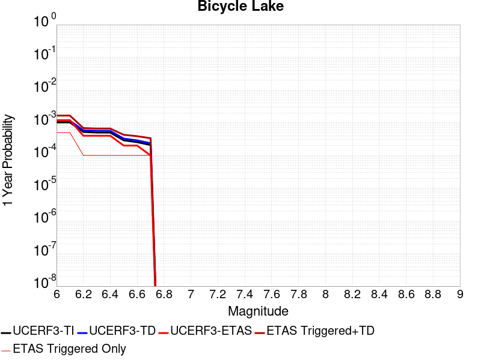 | 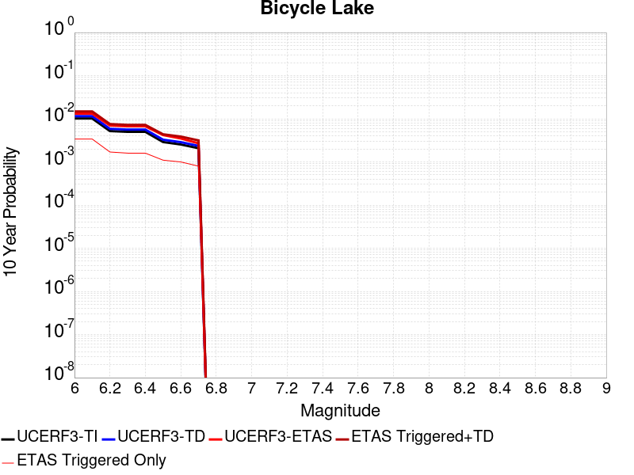 |

| Magnitude | 1 wk TI Prob | 1 wk TD Prob | 1 wk ETAS Prob | 1 wk ETAS/TD Gain | 1 wk ETAS Triggered+TD | 1 wk ETAS Triggered Only | 1 mo TI Prob | 1 mo TD Prob | 1 mo ETAS Prob | 1 mo ETAS/TD Gain | 1 mo ETAS Triggered+TD | 1 mo ETAS Triggered Only | 1 yr TI Prob | 1 yr TD Prob | 1 yr ETAS Prob | 1 yr ETAS/TD Gain | 1 yr ETAS Triggered+TD | 1 yr ETAS Triggered Only | 10 yr TI Prob | 10 yr TD Prob | 10 yr ETAS Prob | 10 yr ETAS/TD Gain | 10 yr ETAS Triggered+TD | 10 yr ETAS Triggered Only |
|-----|-----|-----|-----|-----|-----|-----|-----|-----|-----|-----|-----|-----|-----|-----|-----|-----|-----|-----|-----|-----|-----|-----|-----|-----|
| 6.0 | 1.9621975E-5 | 2.210261E-5 | 0.0 | 0.0 | 2.210261E-5 | 0.0 | 8.4091465E-5 | 9.4722796E-5 | 0.0 | 0.0 | 9.4722796E-5 | 0.0 | 0.0010233327 | 0.0011527749 | 0.0012 | 1.0409664 | 0.0016521986 | 5.0E-4 | 0.01018633 | 0.011481269 | 0.0132 | 1.1496986 | 0.014842233 | 0.0034 |
| 6.1 | 1.9621975E-5 | 2.210261E-5 | 0.0 | 0.0 | 2.210261E-5 | 0.0 | 8.4091465E-5 | 9.4722796E-5 | 0.0 | 0.0 | 9.4722796E-5 | 0.0 | 0.0010233327 | 0.0011527749 | 0.0012 | 1.0409664 | 0.0016521986 | 5.0E-4 | 0.01018633 | 0.011481269 | 0.0132 | 1.1496986 | 0.014842233 | 0.0034 |
| 6.2 | 9.9971285E-6 | 1.1258451E-5 | 0.0 | 0.0 | 1.1258451E-5 | 0.0 | 4.2844134E-5 | 4.8249905E-5 | 0.0 | 0.0 | 4.8249905E-5 | 0.0 | 5.2150246E-4 | 5.873363E-4 | 4.0E-4 | 0.6810408 | 6.872775E-4 | 1.0E-4 | 0.0052028033 | 0.0058629476 | 0.007 | 1.1939386 | 0.007552981 | 0.0017 |
| 6.3 | 9.589428E-6 | 1.0801047E-5 | 0.0 | 0.0 | 1.0801047E-5 | 0.0 | 4.10969E-5 | 4.628967E-5 | 0.0 | 0.0 | 4.628967E-5 | 0.0 | 5.002399E-4 | 5.634829E-4 | 4.0E-4 | 0.7098707 | 6.634266E-4 | 1.0E-4 | 0.0049911533 | 0.005625634 | 0.0067 | 1.1909769 | 0.007216633 | 0.0016 |
| 6.4 | 9.589428E-6 | 1.0801047E-5 | 0.0 | 0.0 | 1.0801047E-5 | 0.0 | 4.10969E-5 | 4.628967E-5 | 0.0 | 0.0 | 4.628967E-5 | 0.0 | 5.002399E-4 | 5.634829E-4 | 4.0E-4 | 0.7098707 | 6.634266E-4 | 1.0E-4 | 0.0049911533 | 0.005625634 | 0.0067 | 1.1909769 | 0.007216633 | 0.0016 |
| 6.5 | 5.557707E-6 | 6.2872346E-6 | 0.0 | 0.0 | 6.2872346E-6 | 0.0 | 2.3818526E-5 | 2.6945163E-5 | 0.0 | 0.0 | 2.6945163E-5 | 0.0 | 2.8995197E-4 | 3.280349E-4 | 2.0E-4 | 0.60969126 | 4.2800207E-4 | 1.0E-4 | 0.0028957394 | 0.0032781442 | 0.0042 | 1.2812127 | 0.004374538 | 0.0011 |
| 6.6 | 4.8742945E-6 | 5.5147234E-6 | 0.0 | 0.0 | 5.5147234E-6 | 0.0 | 2.0889667E-5 | 2.3634462E-5 | 0.0 | 0.0 | 2.3634462E-5 | 0.0 | 2.54302E-4 | 2.8773778E-4 | 2.0E-4 | 0.69507724 | 3.8770903E-4 | 1.0E-4 | 0.002540112 | 0.0028762226 | 0.0035 | 1.2168738 | 0.0038733464 | 0.001 |
| 6.7 | 3.991108E-6 | 4.517088E-6 | 0.0 | 0.0 | 4.517088E-6 | 0.0 | 1.7104636E-5 | 1.935895E-5 | 0.0 | 0.0 | 1.935895E-5 | 0.0 | 2.0822904E-4 | 2.356952E-4 | 1.0E-4 | 0.42427677 | 3.3567165E-4 | 1.0E-4 | 0.0020803404 | 0.002356952 | 0.0027 | 1.1455473 | 0.0031550664 | 8.0E-4 |

## Great Valley 04b Gordon Valley
*[(top)](#table-of-contents)*

| 1 Week | 1 Month | 1 Year | 10 Year |
|-----|-----|-----|-----|
| 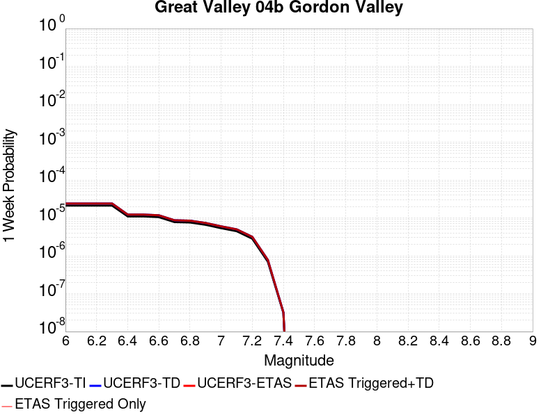 | 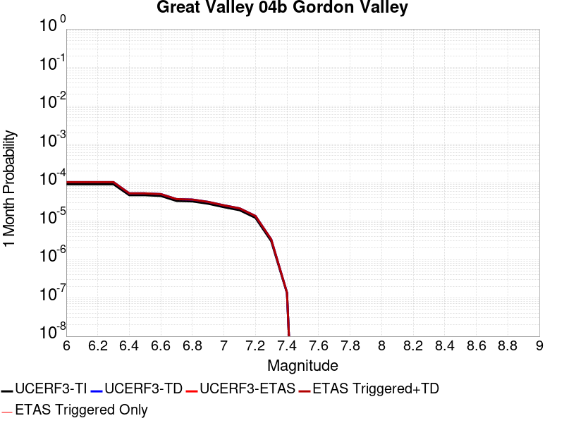 |  | 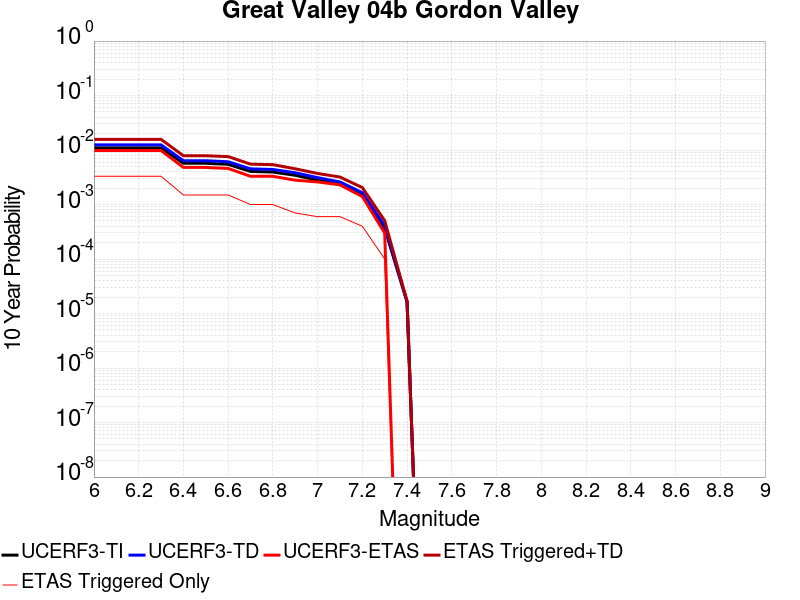 |

| Magnitude | 1 wk TI Prob | 1 wk TD Prob | 1 wk ETAS Prob | 1 wk ETAS/TD Gain | 1 wk ETAS Triggered+TD | 1 wk ETAS Triggered Only | 1 mo TI Prob | 1 mo TD Prob | 1 mo ETAS Prob | 1 mo ETAS/TD Gain | 1 mo ETAS Triggered+TD | 1 mo ETAS Triggered Only | 1 yr TI Prob | 1 yr TD Prob | 1 yr ETAS Prob | 1 yr ETAS/TD Gain | 1 yr ETAS Triggered+TD | 1 yr ETAS Triggered Only | 10 yr TI Prob | 10 yr TD Prob | 10 yr ETAS Prob | 10 yr ETAS/TD Gain | 10 yr ETAS Triggered+TD | 10 yr ETAS Triggered Only |
|-----|-----|-----|-----|-----|-----|-----|-----|-----|-----|-----|-----|-----|-----|-----|-----|-----|-----|-----|-----|-----|-----|-----|-----|-----|
| 6.0 | 2.1181217E-5 | 2.398826E-5 | 0.0 | 0.0 | 2.398826E-5 | 0.0 | 9.077348E-5 | 1.02803715E-4 | 0.0 | 0.0 | 1.02803715E-4 | 0.0 | 0.0011046068 | 0.0012510833 | 3.0E-4 | 0.23979217 | 0.0013509582 | 1.0E-4 | 0.010991322 | 0.012456861 | 0.0098 | 0.78671503 | 0.015715754 | 0.0033 |
| 6.1 | 2.1181217E-5 | 2.398826E-5 | 0.0 | 0.0 | 2.398826E-5 | 0.0 | 9.077348E-5 | 1.02803715E-4 | 0.0 | 0.0 | 1.02803715E-4 | 0.0 | 0.0011046068 | 0.0012510833 | 3.0E-4 | 0.23979217 | 0.0013509582 | 1.0E-4 | 0.010991322 | 0.012456861 | 0.0098 | 0.78671503 | 0.015715754 | 0.0033 |
| 6.2 | 2.1181217E-5 | 2.398826E-5 | 0.0 | 0.0 | 2.398826E-5 | 0.0 | 9.077348E-5 | 1.02803715E-4 | 0.0 | 0.0 | 1.02803715E-4 | 0.0 | 0.0011046068 | 0.0012510833 | 3.0E-4 | 0.23979217 | 0.0013509582 | 1.0E-4 | 0.010991322 | 0.012456861 | 0.0098 | 0.78671503 | 0.015715754 | 0.0033 |
| 6.3 | 2.1181217E-5 | 2.398826E-5 | 0.0 | 0.0 | 2.398826E-5 | 0.0 | 9.077348E-5 | 1.02803715E-4 | 0.0 | 0.0 | 1.02803715E-4 | 0.0 | 0.0011046068 | 0.0012510833 | 3.0E-4 | 0.23979217 | 0.0013509582 | 1.0E-4 | 0.010991322 | 0.012456861 | 0.0098 | 0.78671503 | 0.015715754 | 0.0033 |
| 6.4 | 1.0988268E-5 | 1.2257301E-5 | 0.0 | 0.0 | 1.2257301E-5 | 0.0 | 4.7091726E-5 | 5.2530326E-5 | 0.0 | 0.0 | 5.2530326E-5 | 0.0 | 5.731909E-4 | 6.3938496E-4 | 1.0E-4 | 0.1564003 | 7.3932105E-4 | 1.0E-4 | 0.005717147 | 0.0063770413 | 0.0048 | 0.75270015 | 0.007867476 | 0.0015 |
| 6.5 | 1.0988268E-5 | 1.2257301E-5 | 0.0 | 0.0 | 1.2257301E-5 | 0.0 | 4.7091726E-5 | 5.2530326E-5 | 0.0 | 0.0 | 5.2530326E-5 | 0.0 | 5.731909E-4 | 6.3938496E-4 | 1.0E-4 | 0.1564003 | 7.3932105E-4 | 1.0E-4 | 0.005717147 | 0.0063770413 | 0.0048 | 0.75270015 | 0.007867476 | 0.0015 |
| 6.6 | 1.0517822E-5 | 1.1726731E-5 | 0.0 | 0.0 | 1.1726731E-5 | 0.0 | 4.5075605E-5 | 5.0256538E-5 | 0.0 | 0.0 | 5.0256538E-5 | 0.0 | 5.4865726E-4 | 6.117172E-4 | 1.0E-4 | 0.16347423 | 7.11656E-4 | 1.0E-4 | 0.0054730466 | 0.006101888 | 0.0046 | 0.75386506 | 0.0075927353 | 0.0015 |
| 6.7 | 7.789219E-6 | 8.679609E-6 | 0.0 | 0.0 | 8.679609E-6 | 0.0 | 3.3381937E-5 | 3.7197824E-5 | 0.0 | 0.0 | 3.7197824E-5 | 0.0 | 4.063493E-4 | 4.5279457E-4 | 1.0E-4 | 0.2208507 | 5.527493E-4 | 1.0E-4 | 0.004056071 | 0.0045192377 | 0.0033 | 0.7302117 | 0.005514718 | 0.001 |
| 6.8 | 7.5850853E-6 | 8.454308E-6 | 0.0 | 0.0 | 8.454308E-6 | 0.0 | 3.2507105E-5 | 3.623227E-5 | 0.0 | 0.0 | 3.623227E-5 | 0.0 | 3.957021E-4 | 4.4104378E-4 | 1.0E-4 | 0.22673486 | 5.409997E-4 | 1.0E-4 | 0.0039499826 | 0.0044021974 | 0.0033 | 0.7496257 | 0.0053977952 | 0.001 |
| 6.9 | 6.604105E-6 | 7.360218E-6 | 0.0 | 0.0 | 7.360218E-6 | 0.0 | 2.8303E-5 | 3.1543434E-5 | 0.0 | 0.0 | 3.1543434E-5 | 0.0 | 3.4453452E-4 | 3.8397752E-4 | 0.0 | 0.0 | 3.8397752E-4 | 0.0 | 0.0034400085 | 0.0038335272 | 0.0028 | 0.7303978 | 0.004530844 | 7.0E-4 |
| 7.0 | 5.3701115E-6 | 5.9897875E-6 | 0.0 | 0.0 | 5.9897875E-6 | 0.0 | 2.301456E-5 | 2.5670282E-5 | 0.0 | 0.0 | 2.5670282E-5 | 0.0 | 2.8016625E-4 | 3.1249376E-4 | 0.0 | 0.0 | 3.1249376E-4 | 0.0 | 0.0027981328 | 0.0031208321 | 0.0026 | 0.8331111 | 0.0037189596 | 6.0E-4 |
| 7.1 | 4.4685607E-6 | 4.987626E-6 | 0.0 | 0.0 | 4.987626E-6 | 0.0 | 1.9150835E-5 | 2.137538E-5 | 0.0 | 0.0 | 2.137538E-5 | 0.0 | 2.3313647E-4 | 2.6021665E-4 | 0.0 | 0.0 | 2.6021665E-4 | 0.0 | 0.0023289204 | 0.0025993644 | 0.0023 | 0.8848317 | 0.0031978048 | 6.0E-4 |
| 7.2 | 2.833378E-6 | 3.1651539E-6 | 0.0 | 0.0 | 3.1651539E-6 | 0.0 | 1.2142991E-5 | 1.3564885E-5 | 0.0 | 0.0 | 1.3564885E-5 | 0.0 | 1.4783088E-4 | 1.6514171E-4 | 0.0 | 0.0 | 1.6514171E-4 | 0.0 | 0.0014773258 | 0.0016503618 | 0.0014 | 0.84829885 | 0.0020497018 | 4.0E-4 |
| 7.3 | 7.0087293E-7 | 7.774509E-7 | 0.0 | 0.0 | 7.774509E-7 | 0.0 | 3.0037377E-6 | 3.3319307E-6 | 0.0 | 0.0 | 3.3319307E-6 | 0.0 | 3.656989E-5 | 4.056596E-5 | 0.0 | 0.0 | 4.056596E-5 | 0.0 | 3.6563876E-4 | 4.0563053E-4 | 3.0E-4 | 0.7395893 | 5.0559E-4 | 1.0E-4 |
| 7.4 | 3.112171E-8 | 3.2070304E-8 | 0.0 | 0.0 | 3.2070304E-8 | 0.0 | 1.3337875E-7 | 1.3744415E-7 | 0.0 | 0.0 | 1.3744415E-7 | 0.0 | 1.6238852E-6 | 1.6733812E-6 | 0.0 | 0.0 | 1.6733812E-6 | 0.0 | 1.6238733E-5 | 1.6733695E-5 | 0.0 | 0.0 | 1.6733695E-5 | 0.0 |

## San Gregorio (North) 2011 CFM
*[(top)](#table-of-contents)*

| 1 Week | 1 Month | 1 Year | 10 Year |
|-----|-----|-----|-----|
| 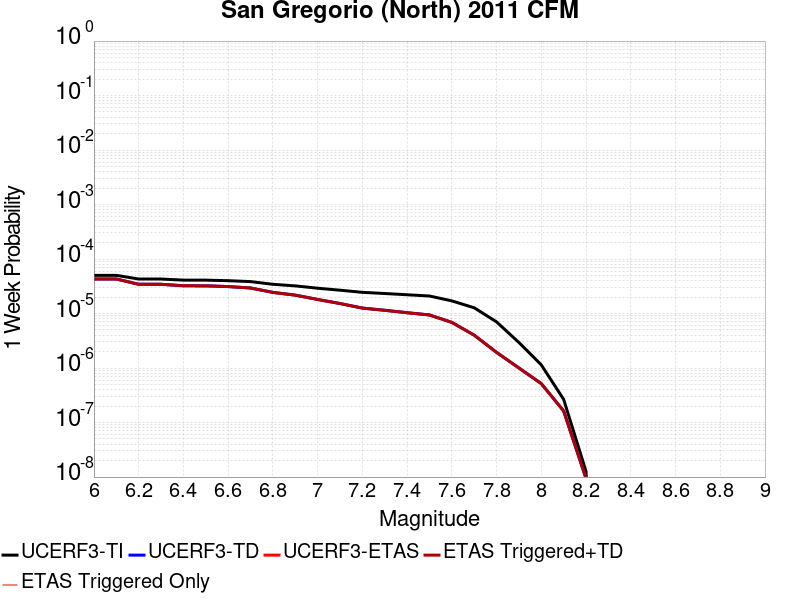 | 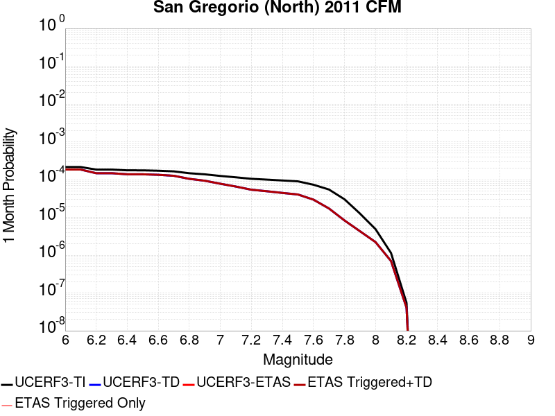 | 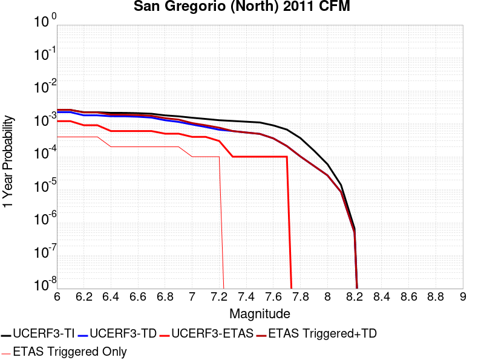 | 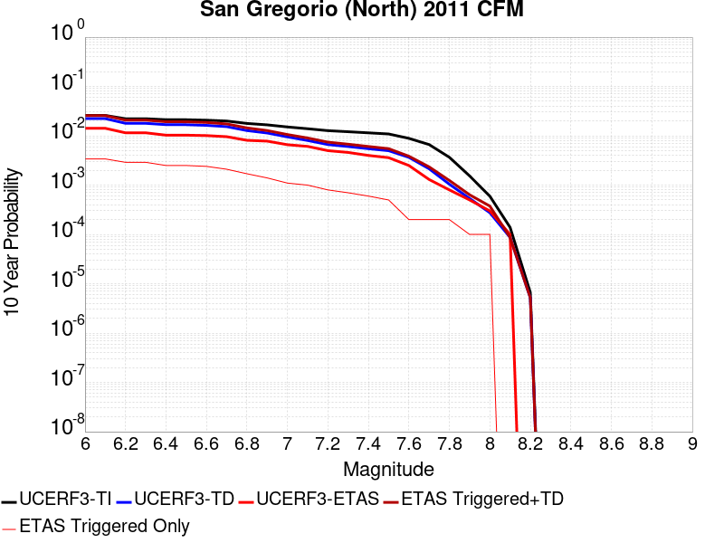 |

| Magnitude | 1 wk TI Prob | 1 wk TD Prob | 1 wk ETAS Prob | 1 wk ETAS/TD Gain | 1 wk ETAS Triggered+TD | 1 wk ETAS Triggered Only | 1 mo TI Prob | 1 mo TD Prob | 1 mo ETAS Prob | 1 mo ETAS/TD Gain | 1 mo ETAS Triggered+TD | 1 mo ETAS Triggered Only | 1 yr TI Prob | 1 yr TD Prob | 1 yr ETAS Prob | 1 yr ETAS/TD Gain | 1 yr ETAS Triggered+TD | 1 yr ETAS Triggered Only | 10 yr TI Prob | 10 yr TD Prob | 10 yr ETAS Prob | 10 yr ETAS/TD Gain | 10 yr ETAS Triggered+TD | 10 yr ETAS Triggered Only |
|-----|-----|-----|-----|-----|-----|-----|-----|-----|-----|-----|-----|-----|-----|-----|-----|-----|-----|-----|-----|-----|-----|-----|-----|-----|
| 6.0 | 5.0283932E-5 | 4.3109347E-5 | 0.0 | 0.0 | 4.3109347E-5 | 0.0 | 2.1548476E-4 | 1.8474138E-4 | 0.0 | 0.0 | 1.8474138E-4 | 0.0 | 0.0026203706 | 0.00224692 | 0.0012 | 0.5340644 | 0.002646021 | 4.0E-4 | 0.02589687 | 0.022319192 | 0.0142 | 0.6362238 | 0.025643306 | 0.0034 |
| 6.1 | 5.0283932E-5 | 4.3109347E-5 | 0.0 | 0.0 | 4.3109347E-5 | 0.0 | 2.1548476E-4 | 1.8474138E-4 | 0.0 | 0.0 | 1.8474138E-4 | 0.0 | 0.0026203706 | 0.00224692 | 0.0012 | 0.5340644 | 0.002646021 | 4.0E-4 | 0.02589687 | 0.022319192 | 0.0142 | 0.6362238 | 0.025643306 | 0.0034 |
| 6.2 | 4.2998647E-5 | 3.4488472E-5 | 0.0 | 0.0 | 3.4488472E-5 | 0.0 | 1.842669E-4 | 1.4779945E-4 | 0.0 | 0.0 | 1.4779945E-4 | 0.0 | 0.0022411412 | 0.0017979855 | 9.0E-4 | 0.5005602 | 0.0021972663 | 4.0E-4 | 0.022186736 | 0.017910182 | 0.0115 | 0.6420928 | 0.020758243 | 0.0029 |
| 6.3 | 4.2998647E-5 | 3.4488472E-5 | 0.0 | 0.0 | 3.4488472E-5 | 0.0 | 1.842669E-4 | 1.4779945E-4 | 0.0 | 0.0 | 1.4779945E-4 | 0.0 | 0.0022411412 | 0.0017979855 | 9.0E-4 | 0.5005602 | 0.0021972663 | 4.0E-4 | 0.022186736 | 0.017910182 | 0.0115 | 0.6420928 | 0.020758243 | 0.0029 |
| 6.4 | 4.1101295E-5 | 3.237238E-5 | 0.0 | 0.0 | 3.237238E-5 | 0.0 | 1.7613651E-4 | 1.3873147E-4 | 0.0 | 0.0 | 1.3873147E-4 | 0.0 | 0.0021423528 | 0.0016877603 | 6.0E-4 | 0.3555007 | 0.0018874228 | 2.0E-4 | 0.02121817 | 0.01682586 | 0.0103 | 0.61215293 | 0.019283796 | 0.0025 |
| 6.5 | 4.1032585E-5 | 3.2290383E-5 | 0.0 | 0.0 | 3.2290383E-5 | 0.0 | 1.7584208E-4 | 1.383801E-4 | 0.0 | 0.0 | 1.383801E-4 | 0.0 | 0.0021387753 | 0.001683489 | 6.0E-4 | 0.3564027 | 0.0018831523 | 2.0E-4 | 0.021183075 | 0.016783798 | 0.0103 | 0.6136871 | 0.019241838 | 0.0025 |
| 6.6 | 4.011629E-5 | 3.1311505E-5 | 0.0 | 0.0 | 3.1311505E-5 | 0.0 | 1.7191563E-4 | 1.3418535E-4 | 0.0 | 0.0 | 1.3418535E-4 | 0.0 | 0.0020910634 | 0.001632496 | 6.0E-4 | 0.36753535 | 0.0018321696 | 2.0E-4 | 0.020714961 | 0.016279789 | 0.0101 | 0.6204012 | 0.018640717 | 0.0024 |
| 6.7 | 3.8583938E-5 | 2.9497498E-5 | 0.0 | 0.0 | 2.9497498E-5 | 0.0 | 1.6534925E-4 | 1.264118E-4 | 0.0 | 0.0 | 1.264118E-4 | 0.0 | 0.0020112682 | 0.0015379915 | 6.0E-4 | 0.3901192 | 0.0017376838 | 2.0E-4 | 0.019931622 | 0.01534918 | 0.0096 | 0.62544054 | 0.017416947 | 0.0021 |
| 6.8 | 3.44341E-5 | 2.44921E-5 | 0.0 | 0.0 | 2.44921E-5 | 0.0 | 1.4756636E-4 | 1.04961975E-4 | 0.0 | 0.0 | 1.04961975E-4 | 0.0 | 0.0017951399 | 0.0012771734 | 5.0E-4 | 0.39148954 | 0.0014769179 | 2.0E-4 | 0.017807078 | 0.012773107 | 0.0081 | 0.63414484 | 0.014451393 | 0.0017 |
| 6.9 | 3.221199E-5 | 2.1814461E-5 | 0.0 | 0.0 | 2.1814461E-5 | 0.0 | 1.3804408E-4 | 9.3487244E-5 | 0.0 | 0.0 | 9.3487244E-5 | 0.0 | 0.0016793909 | 0.0011376211 | 5.0E-4 | 0.43951365 | 0.0013373935 | 2.0E-4 | 0.01666756 | 0.011391758 | 0.0078 | 0.68470556 | 0.0127758095 | 0.0014 |
| 7.0 | 2.9186718E-5 | 1.8179682E-5 | 0.0 | 0.0 | 1.8179682E-5 | 0.0 | 1.2507994E-4 | 7.791062E-5 | 0.0 | 0.0 | 7.791062E-5 | 0.0 | 0.0015217843 | 9.4815344E-4 | 4.0E-4 | 0.42187265 | 0.0010480586 | 1.0E-4 | 0.015114053 | 0.009514139 | 0.0066 | 0.6937044 | 0.010603673 | 0.0011 |
| 7.1 | 2.6840138E-5 | 1.5315509E-5 | 0.0 | 0.0 | 1.5315509E-5 | 0.0 | 1.1502409E-4 | 6.563625E-5 | 0.0 | 0.0 | 6.563625E-5 | 0.0 | 0.0013995186 | 7.988304E-4 | 4.0E-4 | 0.50073206 | 8.9875056E-4 | 1.0E-4 | 0.013907375 | 0.008032066 | 0.0061 | 0.7594559 | 0.009024034 | 0.001 |
| 7.2 | 2.453002E-5 | 1.2636457E-5 | 0.0 | 0.0 | 1.2636457E-5 | 0.0 | 1.05124425E-4 | 5.4155124E-5 | 0.0 | 0.0 | 5.4155124E-5 | 0.0 | 0.0012791384 | 6.591397E-4 | 3.0E-4 | 0.45513868 | 7.590738E-4 | 1.0E-4 | 0.012718005 | 0.0066433153 | 0.005 | 0.75263625 | 0.0074380008 | 8.0E-4 |
| 7.3 | 2.3330727E-5 | 1.151786E-5 | 0.0 | 0.0 | 1.151786E-5 | 0.0 | 9.9985E-5 | 4.9361326E-5 | 0.0 | 0.0 | 4.9361326E-5 | 0.0 | 0.0012166376 | 6.008089E-4 | 1.0E-4 | 0.16644228 | 6.008089E-4 | 0.0 | 0.012099981 | 0.0060620634 | 0.0046 | 0.75881755 | 0.00675782 | 7.0E-4 |
| 7.4 | 2.2136466E-5 | 1.0397319E-5 | 0.0 | 0.0 | 1.0397319E-5 | 0.0 | 9.486712E-5 | 4.4559176E-5 | 0.0 | 0.0 | 4.4559176E-5 | 0.0 | 0.0011543952 | 5.4237316E-4 | 1.0E-4 | 0.1843749 | 5.4237316E-4 | 0.0 | 0.011484168 | 0.0054792026 | 0.004 | 0.7300332 | 0.0060759154 | 6.0E-4 |
| 7.5 | 2.0994974E-5 | 9.454394E-6 | 0.0 | 0.0 | 9.454394E-6 | 0.0 | 8.997535E-5 | 4.0518204E-5 | 0.0 | 0.0 | 4.0518204E-5 | 0.0 | 0.0010948994 | 4.931977E-4 | 1.0E-4 | 0.20275845 | 4.931977E-4 | 0.0 | 0.010895205 | 0.004987942 | 0.0036 | 0.72174054 | 0.005485448 | 5.0E-4 |
| 7.6 | 1.7091823E-5 | 6.915414E-6 | 0.0 | 0.0 | 6.915414E-6 | 0.0 | 7.3248615E-5 | 2.963715E-5 | 0.0 | 0.0 | 2.963715E-5 | 0.0 | 8.9143694E-4 | 3.6077268E-4 | 1.0E-4 | 0.27718285 | 3.6077268E-4 | 0.0 | 0.008878695 | 0.0036600076 | 0.0025 | 0.6830587 | 0.0038592755 | 2.0E-4 |
| 7.7 | 1.2772179E-5 | 4.0363207E-6 | 0.0 | 0.0 | 4.0363207E-6 | 0.0 | 5.473676E-5 | 1.7298402E-5 | 0.0 | 0.0 | 1.7298402E-5 | 0.0 | 6.6621625E-4 | 2.105877E-4 | 1.0E-4 | 0.4748615 | 2.105877E-4 | 0.0 | 0.006642225 | 0.0021452615 | 0.0013 | 0.6059868 | 0.0023448323 | 2.0E-4 |
| 7.8 | 7.041923E-6 | 1.9507527E-6 | 0.0 | 0.0 | 1.9507527E-6 | 0.0 | 3.017932E-5 | 8.360342E-6 | 0.0 | 0.0 | 8.360342E-6 | 0.0 | 3.6737128E-4 | 1.0178241E-4 | 0.0 | 0.0 | 1.0178241E-4 | 0.0 | 0.0036676454 | 0.0010434401 | 8.0E-4 | 0.7666947 | 0.0012432314 | 2.0E-4 |
| 7.9 | 2.946768E-6 | 1.0094176E-6 | 0.0 | 0.0 | 1.0094176E-6 | 0.0 | 1.2628945E-5 | 4.3260684E-6 | 0.0 | 0.0 | 4.3260684E-6 | 0.0 | 1.5374656E-4 | 5.266861E-5 | 0.0 | 0.0 | 5.266861E-5 | 0.0 | 0.0015364023 | 5.372541E-4 | 5.0E-4 | 0.93065834 | 6.3720037E-4 | 1.0E-4 |
| 8.0 | 1.1433375E-6 | 5.2168156E-7 | 0.0 | 0.0 | 5.2168156E-7 | 0.0 | 4.9000087E-6 | 2.2357763E-6 | 0.0 | 0.0 | 2.2357763E-6 | 0.0 | 5.965597E-5 | 2.7220236E-5 | 0.0 | 0.0 | 2.7220236E-5 | 0.0 | 5.963996E-4 | 2.7583833E-4 | 3.0E-4 | 1.0875936 | 3.7581078E-4 | 1.0E-4 |
| 8.1 | 2.6675295E-7 | 1.6422842E-7 | 0.0 | 0.0 | 1.6422842E-7 | 0.0 | 1.1432264E-6 | 7.0383595E-7 | 0.0 | 0.0 | 7.0383595E-7 | 0.0 | 1.3918692E-5 | 8.569169E-6 | 0.0 | 0.0 | 8.569169E-6 | 0.0 | 1.391782E-4 | 8.7082975E-5 | 1.0E-4 | 1.1483301 | 8.7082975E-5 | 0.0 |
| 8.2 | 1.2704569E-8 | 9.55138E-9 | 0.0 | 0.0 | 9.55138E-9 | 0.0 | 5.444815E-8 | 4.093448E-8 | 0.0 | 0.0 | 4.093448E-8 | 0.0 | 6.629061E-7 | 4.983772E-7 | 0.0 | 0.0 | 4.983772E-7 | 0.0 | 6.629041E-6 | 5.1769052E-6 | 0.0 | 0.0 | 5.1769052E-6 | 0.0 |

## Bennett Valley 2011 CFM
*[(top)](#table-of-contents)*

| 1 Week | 1 Month | 1 Year | 10 Year |
|-----|-----|-----|-----|
|  |  |  | 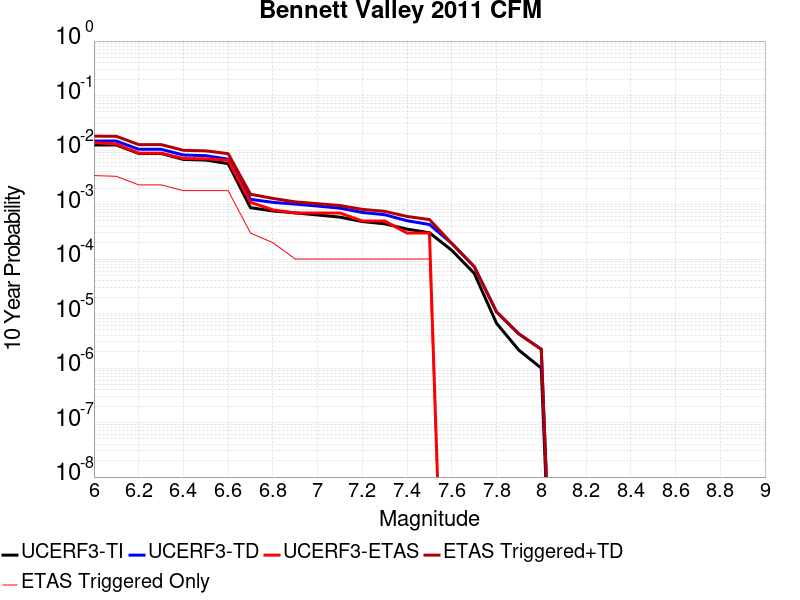 |

| Magnitude | 1 wk TI Prob | 1 wk TD Prob | 1 wk ETAS Prob | 1 wk ETAS/TD Gain | 1 wk ETAS Triggered+TD | 1 wk ETAS Triggered Only | 1 mo TI Prob | 1 mo TD Prob | 1 mo ETAS Prob | 1 mo ETAS/TD Gain | 1 mo ETAS Triggered+TD | 1 mo ETAS Triggered Only | 1 yr TI Prob | 1 yr TD Prob | 1 yr ETAS Prob | 1 yr ETAS/TD Gain | 1 yr ETAS Triggered+TD | 1 yr ETAS Triggered Only | 10 yr TI Prob | 10 yr TD Prob | 10 yr ETAS Prob | 10 yr ETAS/TD Gain | 10 yr ETAS Triggered+TD | 10 yr ETAS Triggered Only |
|-----|-----|-----|-----|-----|-----|-----|-----|-----|-----|-----|-----|-----|-----|-----|-----|-----|-----|-----|-----|-----|-----|-----|-----|-----|
| 6.0 | 2.3893934E-5 | 2.8250002E-5 | 0.0 | 0.0 | 2.8250002E-5 | 0.0 | 1.0239855E-4 | 1.21066856E-4 | 1.0E-4 | 0.8259899 | 2.2105475E-4 | 1.0E-4 | 0.0012459893 | 0.0014731773 | 0.002 | 1.3576097 | 0.0018725881 | 4.0E-4 | 0.012390262 | 0.0146568725 | 0.0137 | 0.9347151 | 0.01800704 | 0.0034 |
| 6.1 | 2.3893934E-5 | 2.8250002E-5 | 0.0 | 0.0 | 2.8250002E-5 | 0.0 | 1.0239855E-4 | 1.21066856E-4 | 1.0E-4 | 0.8259899 | 2.2105475E-4 | 1.0E-4 | 0.0012459893 | 0.0014731773 | 0.0019 | 1.2897292 | 0.0018725881 | 4.0E-4 | 0.012390262 | 0.0146568725 | 0.0129 | 0.8801332 | 0.017908504 | 0.0033 |
| 6.2 | 1.6657146E-5 | 1.9862246E-5 | 0.0 | 0.0 | 1.9862246E-5 | 0.0 | 7.138582E-5 | 8.512193E-5 | 1.0E-4 | 1.1747854 | 1.8511341E-4 | 1.0E-4 | 8.6877577E-4 | 0.0010360084 | 0.001 | 0.9652432 | 0.0012358011 | 2.0E-4 | 0.008653872 | 0.010330158 | 0.0088 | 0.85187465 | 0.012606398 | 0.0023 |
| 6.3 | 1.6657146E-5 | 1.9862246E-5 | 0.0 | 0.0 | 1.9862246E-5 | 0.0 | 7.138582E-5 | 8.512193E-5 | 1.0E-4 | 1.1747854 | 1.8511341E-4 | 1.0E-4 | 8.6877577E-4 | 0.0010360084 | 0.001 | 0.9652432 | 0.0012358011 | 2.0E-4 | 0.008653872 | 0.010330158 | 0.0088 | 0.85187465 | 0.012606398 | 0.0023 |
| 6.4 | 1.29418495E-5 | 1.5574657E-5 | 0.0 | 0.0 | 1.5574657E-5 | 0.0 | 5.546389E-5 | 6.674756E-5 | 1.0E-4 | 1.4981822 | 1.6674088E-4 | 1.0E-4 | 6.7506364E-4 | 8.1247883E-4 | 6.0E-4 | 0.73848075 | 0.0010123163 | 2.0E-4 | 0.0067301663 | 0.00811233 | 0.007 | 0.86288404 | 0.0098977275 | 0.0018 |
| 6.5 | 1.2582504E-5 | 1.5141546E-5 | 0.0 | 0.0 | 1.5141546E-5 | 0.0 | 5.39239E-5 | 6.4891465E-5 | 1.0E-4 | 1.5410348 | 1.6488497E-4 | 1.0E-4 | 6.563257E-4 | 7.898974E-4 | 6.0E-4 | 0.7595923 | 9.897394E-4 | 2.0E-4 | 0.006543907 | 0.007888167 | 0.0069 | 0.87472785 | 0.009673969 | 0.0018 |
| 6.6 | 1.0846706E-5 | 1.304311E-5 | 0.0 | 0.0 | 1.304311E-5 | 0.0 | 4.6485053E-5 | 5.5898567E-5 | 1.0E-4 | 1.7889546 | 1.5589298E-4 | 1.0E-4 | 5.6580856E-4 | 6.8048097E-4 | 5.0E-4 | 0.7347744 | 8.803449E-4 | 2.0E-4 | 0.005643701 | 0.006801081 | 0.0065 | 0.95573044 | 0.008588839 | 0.0018 |
| 6.7 | 1.6803231E-6 | 2.380907E-6 | 0.0 | 0.0 | 2.380907E-6 | 0.0 | 7.2013645E-6 | 1.0203848E-5 | 1.0E-4 | 9.800224 | 1.10202825E-4 | 1.0E-4 | 8.7673085E-5 | 1.242249E-4 | 1.0E-4 | 0.8049916 | 2.2421248E-4 | 1.0E-4 | 8.76385E-4 | 0.0012459469 | 0.0011 | 0.88286275 | 0.001545573 | 3.0E-4 |
| 6.8 | 1.4609833E-6 | 2.0968864E-6 | 0.0 | 0.0 | 2.0968864E-6 | 0.0 | 6.261342E-6 | 8.986625E-6 | 1.0E-4 | 11.127647 | 1.08985725E-4 | 1.0E-4 | 7.6229175E-5 | 1.0940674E-4 | 1.0E-4 | 0.9140205 | 2.093958E-4 | 1.0E-4 | 7.620303E-4 | 0.001097871 | 8.0E-4 | 0.72868305 | 0.0012976514 | 2.0E-4 |
| 6.9 | 1.3492396E-6 | 1.9487888E-6 | 0.0 | 0.0 | 1.9487888E-6 | 0.0 | 5.7824427E-6 | 8.351926E-6 | 1.0E-4 | 11.973286 | 1.08351094E-4 | 1.0E-4 | 7.0398964E-5 | 1.01680016E-4 | 1.0E-4 | 0.9834774 | 2.0166986E-4 | 1.0E-4 | 7.037667E-4 | 0.0010206468 | 7.0E-4 | 0.6858396 | 0.0011205447 | 1.0E-4 |
| 7.0 | 1.2347921E-6 | 1.7917356E-6 | 0.0 | 0.0 | 1.7917356E-6 | 0.0 | 5.291955E-6 | 7.678845E-6 | 1.0E-4 | 13.022793 | 1.07678075E-4 | 1.0E-4 | 6.442765E-5 | 9.348598E-5 | 1.0E-4 | 1.0696791 | 1.9347663E-4 | 1.0E-4 | 6.440897E-4 | 9.3877985E-4 | 7.0E-4 | 0.74564874 | 0.0010386859 | 1.0E-4 |
| 7.1 | 1.1262973E-6 | 1.6384605E-6 | 0.0 | 0.0 | 1.6384605E-6 | 0.0 | 4.8269794E-6 | 7.021955E-6 | 1.0E-4 | 14.241049 | 1.0702125E-4 | 1.0E-4 | 5.876689E-5 | 8.5488995E-5 | 1.0E-4 | 1.1697412 | 1.8548044E-4 | 1.0E-4 | 5.875135E-4 | 8.588588E-4 | 7.0E-4 | 0.815035 | 9.5877296E-4 | 1.0E-4 |
| 7.2 | 9.351744E-7 | 1.363626E-6 | 0.0 | 0.0 | 1.363626E-6 | 0.0 | 4.007884E-6 | 5.8440983E-6 | 1.0E-4 | 17.11128 | 1.05843515E-4 | 1.0E-4 | 4.8794896E-5 | 7.1149596E-5 | 1.0E-4 | 1.4054893 | 1.7114248E-4 | 1.0E-4 | 4.878418E-4 | 7.155271E-4 | 5.0E-4 | 0.6987856 | 8.154555E-4 | 1.0E-4 |
| 7.3 | 8.5039534E-7 | 1.240895E-6 | 0.0 | 0.0 | 1.240895E-6 | 0.0 | 3.6445463E-6 | 5.3181107E-6 | 1.0E-4 | 18.80367 | 1.0531758E-4 | 1.0E-4 | 4.437145E-5 | 6.47461E-5 | 1.0E-4 | 1.5444946 | 1.6473963E-4 | 1.0E-4 | 4.436259E-4 | 6.51245E-4 | 5.0E-4 | 0.7677602 | 7.511799E-4 | 1.0E-4 |
| 7.4 | 6.7875015E-7 | 9.616898E-7 | 0.0 | 0.0 | 9.616898E-7 | 0.0 | 2.908926E-6 | 4.1215217E-6 | 1.0E-4 | 24.262884 | 1.0412111E-4 | 1.0E-4 | 3.54156E-5 | 5.017838E-5 | 1.0E-4 | 1.9928902 | 1.5017336E-4 | 1.0E-4 | 3.5409955E-4 | 5.049457E-4 | 3.0E-4 | 0.5941233 | 6.048952E-4 | 1.0E-4 |
| 7.5 | 5.826867E-7 | 8.2016646E-7 | 0.0 | 0.0 | 8.2016646E-7 | 0.0 | 2.4972264E-6 | 3.5149944E-6 | 1.0E-4 | 28.449547 | 1.0351464E-4 | 1.0E-4 | 3.0403306E-5 | 4.2794225E-5 | 1.0E-4 | 2.3367639 | 1.4278994E-4 | 1.0E-4 | 3.0399146E-4 | 4.3071818E-4 | 3.0E-4 | 0.6965111 | 5.306751E-4 | 1.0E-4 |
| 7.6 | 2.7734902E-7 | 3.6879948E-7 | 0.0 | 0.0 | 3.6879948E-7 | 0.0 | 1.1886381E-6 | 1.5805682E-6 | 0.0 | 0.0 | 1.5805682E-6 | 0.0 | 1.4471572E-5 | 1.9243249E-5 | 0.0 | 0.0 | 1.9243249E-5 | 0.0 | 1.447063E-4 | 1.9342806E-4 | 0.0 | 0.0 | 1.9342806E-4 | 0.0 |
| 7.7 | 1.0530888E-7 | 1.3781809E-7 | 0.0 | 0.0 | 1.3781809E-7 | 0.0 | 4.513237E-7 | 5.9064877E-7 | 0.0 | 0.0 | 5.9064877E-7 | 0.0 | 5.4948523E-6 | 7.1911254E-6 | 0.0 | 0.0 | 7.1911254E-6 | 0.0 | 5.4947162E-5 | 7.272322E-5 | 0.0 | 0.0 | 7.272322E-5 | 0.0 |
| 7.8 | 1.2714258E-8 | 1.9744261E-8 | 0.0 | 0.0 | 1.9744261E-8 | 0.0 | 5.448968E-8 | 8.4618264E-8 | 0.0 | 0.0 | 8.4618264E-8 | 0.0 | 6.6341164E-7 | 1.0302268E-6 | 0.0 | 0.0 | 1.0302268E-6 | 0.0 | 6.6340967E-6 | 1.07139085E-5 | 0.0 | 0.0 | 1.07139085E-5 | 0.0 |
| 7.9 | 4.075888E-9 | 7.62142E-9 | 0.0 | 0.0 | 7.62142E-9 | 0.0 | 1.7468091E-8 | 3.2663227E-8 | 0.0 | 0.0 | 3.2663227E-8 | 0.0 | 2.12674E-7 | 3.976747E-7 | 0.0 | 0.0 | 3.976747E-7 | 0.0 | 2.1267379E-6 | 4.2257807E-6 | 0.0 | 0.0 | 4.2257807E-6 | 0.0 |
| 8.0 | 1.9126138E-9 | 4.026725E-9 | 0.0 | 0.0 | 4.026725E-9 | 0.0 | 8.196917E-9 | 1.7257394E-8 | 0.0 | 0.0 | 1.7257394E-8 | 0.0 | 9.9797454E-8 | 2.1010875E-7 | 0.0 | 0.0 | 2.1010875E-7 | 0.0 | 9.979741E-7 | 2.2133217E-6 | 0.0 | 0.0 | 2.2133217E-6 | 0.0 |

## Greenville (No) 2011 CFM
*[(top)](#table-of-contents)*

| 1 Week | 1 Month | 1 Year | 10 Year |
|-----|-----|-----|-----|
|  |  |  |  |

| Magnitude | 1 wk TI Prob | 1 wk TD Prob | 1 wk ETAS Prob | 1 wk ETAS/TD Gain | 1 wk ETAS Triggered+TD | 1 wk ETAS Triggered Only | 1 mo TI Prob | 1 mo TD Prob | 1 mo ETAS Prob | 1 mo ETAS/TD Gain | 1 mo ETAS Triggered+TD | 1 mo ETAS Triggered Only | 1 yr TI Prob | 1 yr TD Prob | 1 yr ETAS Prob | 1 yr ETAS/TD Gain | 1 yr ETAS Triggered+TD | 1 yr ETAS Triggered Only | 10 yr TI Prob | 10 yr TD Prob | 10 yr ETAS Prob | 10 yr ETAS/TD Gain | 10 yr ETAS Triggered+TD | 10 yr ETAS Triggered Only |
|-----|-----|-----|-----|-----|-----|-----|-----|-----|-----|-----|-----|-----|-----|-----|-----|-----|-----|-----|-----|-----|-----|-----|-----|-----|
| 6.0 | 3.286654E-5 | 4.0390813E-5 | 0.0 | 0.0 | 4.0390813E-5 | 0.0 | 1.4084899E-4 | 1.7309222E-4 | 1.0E-4 | 0.5777267 | 1.7309222E-4 | 0.0 | 0.0017134876 | 0.0021053986 | 0.0013 | 0.6174603 | 0.0026043458 | 5.0E-4 | 0.017003356 | 0.0208594 | 0.0169 | 0.8101863 | 0.023992648 | 0.0032 |
| 6.1 | 3.286654E-5 | 4.0390813E-5 | 0.0 | 0.0 | 4.0390813E-5 | 0.0 | 1.4084899E-4 | 1.7309222E-4 | 0.0 | 0.0 | 1.7309222E-4 | 0.0 | 0.0017134876 | 0.0021053986 | 9.0E-4 | 0.4274725 | 0.0025045564 | 4.0E-4 | 0.017003356 | 0.0208594 | 0.0142 | 0.6807483 | 0.023111423 | 0.0023 |
| 6.2 | 3.1697953E-5 | 3.895307E-5 | 0.0 | 0.0 | 3.895307E-5 | 0.0 | 1.358413E-4 | 1.6693125E-4 | 0.0 | 0.0 | 1.6693125E-4 | 0.0 | 0.0016526132 | 0.0020305302 | 9.0E-4 | 0.44323397 | 0.0024297182 | 4.0E-4 | 0.01640377 | 0.020124469 | 0.0137 | 0.6807633 | 0.022378182 | 0.0023 |
| 6.3 | 3.1363317E-5 | 3.8541755E-5 | 0.0 | 0.0 | 3.8541755E-5 | 0.0 | 1.344073E-4 | 1.651687E-4 | 0.0 | 0.0 | 1.651687E-4 | 0.0 | 0.0016351803 | 0.0020091112 | 9.0E-4 | 0.4479593 | 0.0024083075 | 4.0E-4 | 0.016232004 | 0.019914145 | 0.0135 | 0.67791015 | 0.022070333 | 0.0022 |
| 6.4 | 3.0228604E-5 | 3.7148257E-5 | 0.0 | 0.0 | 3.7148257E-5 | 0.0 | 1.2954473E-4 | 1.591973E-4 | 0.0 | 0.0 | 1.591973E-4 | 0.0 | 0.0015760659 | 0.0019365402 | 9.0E-4 | 0.46474636 | 0.0023357656 | 4.0E-4 | 0.015649348 | 0.019201173 | 0.013 | 0.67704195 | 0.02126085 | 0.0021 |
| 6.5 | 2.9537814E-5 | 3.6303332E-5 | 0.0 | 0.0 | 3.6303332E-5 | 0.0 | 1.2658449E-4 | 1.5557664E-4 | 0.0 | 0.0 | 1.5557664E-4 | 0.0 | 0.0015400766 | 0.0018925361 | 9.0E-4 | 0.47555238 | 0.002291779 | 4.0E-4 | 0.01529447 | 0.01876865 | 0.0126 | 0.6713323 | 0.020829234 | 0.0021 |
| 6.6 | 2.7345395E-5 | 3.3611443E-5 | 0.0 | 0.0 | 3.3611443E-5 | 0.0 | 1.1718928E-4 | 1.4404126E-4 | 0.0 | 0.0 | 1.4404126E-4 | 0.0 | 0.0014258457 | 0.0017523228 | 9.0E-4 | 0.513604 | 0.0021516217 | 4.0E-4 | 0.014167317 | 0.01738887 | 0.0115 | 0.66134256 | 0.01915757 | 0.0018 |
| 6.7 | 2.5615784E-5 | 3.1587653E-5 | 0.0 | 0.0 | 3.1587653E-5 | 0.0 | 1.09777306E-4 | 1.353688E-4 | 0.0 | 0.0 | 1.353688E-4 | 0.0 | 0.0013357193 | 0.0016468999 | 9.0E-4 | 0.5464813 | 0.0020462412 | 4.0E-4 | 0.013277191 | 0.016350621 | 0.0106 | 0.64829344 | 0.018022824 | 0.0017 |
| 6.8 | 2.0059057E-5 | 2.4729448E-5 | 0.0 | 0.0 | 2.4729448E-5 | 0.0 | 8.596455E-5 | 1.0597914E-4 | 0.0 | 0.0 | 1.0597914E-4 | 0.0 | 0.0010461159 | 0.0012895486 | 6.0E-4 | 0.4652791 | 0.0015891617 | 3.0E-4 | 0.0104120495 | 0.012822673 | 0.0085 | 0.66288835 | 0.014106003 | 0.0013 |
| 6.9 | 1.6321746E-5 | 2.020013E-5 | 0.0 | 0.0 | 2.020013E-5 | 0.0 | 6.9948466E-5 | 8.656918E-5 | 0.0 | 0.0 | 8.656918E-5 | 0.0 | 8.5128983E-4 | 0.0010534825 | 5.0E-4 | 0.47461632 | 0.0013531665 | 3.0E-4 | 0.008480361 | 0.010486412 | 0.0064 | 0.61031365 | 0.011475925 | 0.001 |
| 7.0 | 1.22527645E-5 | 1.5145875E-5 | 0.0 | 0.0 | 1.5145875E-5 | 0.0 | 5.2510793E-5 | 6.4909305E-5 | 0.0 | 0.0 | 6.4909305E-5 | 0.0 | 6.3913135E-4 | 7.899885E-4 | 3.0E-4 | 0.37975237 | 8.899095E-4 | 1.0E-4 | 0.0063729626 | 0.0078725815 | 0.005 | 0.6351157 | 0.008467858 | 6.0E-4 |
| 7.1 | 8.996482E-6 | 1.1172974E-5 | 0.0 | 0.0 | 1.1172974E-5 | 0.0 | 3.8555783E-5 | 4.7883303E-5 | 0.0 | 0.0 | 4.7883303E-5 | 0.0 | 4.6931554E-4 | 5.828245E-4 | 2.0E-4 | 0.3431565 | 6.827662E-4 | 1.0E-4 | 0.004683256 | 0.0058134114 | 0.0039 | 0.67086256 | 0.0061116675 | 3.0E-4 |
| 7.2 | 6.0273087E-6 | 7.5762746E-6 | 0.0 | 0.0 | 7.5762746E-6 | 0.0 | 2.5831067E-5 | 3.246935E-5 | 0.0 | 0.0 | 3.246935E-5 | 0.0 | 3.1444785E-4 | 3.9524332E-4 | 2.0E-4 | 0.50601745 | 4.9520377E-4 | 1.0E-4 | 0.0031400328 | 0.0039458917 | 0.0026 | 0.6589132 | 0.004244708 | 3.0E-4 |
| 7.3 | 3.1209995E-6 | 3.9684146E-6 | 0.0 | 0.0 | 3.9684146E-6 | 0.0 | 1.3375643E-5 | 1.7007382E-5 | 0.0 | 0.0 | 1.7007382E-5 | 0.0 | 1.6283628E-4 | 2.0704535E-4 | 1.0E-4 | 0.48298597 | 3.0702466E-4 | 1.0E-4 | 0.0016271701 | 0.0020689745 | 0.0015 | 0.7249968 | 0.0021687676 | 1.0E-4 |
| 7.4 | 2.0254208E-6 | 2.6113983E-6 | 0.0 | 0.0 | 2.6113983E-6 | 0.0 | 8.680347E-6 | 1.1191659E-5 | 0.0 | 0.0 | 1.1191659E-5 | 0.0 | 1.0567809E-4 | 1.3624999E-4 | 1.0E-4 | 0.733945 | 2.3623636E-4 | 1.0E-4 | 0.0010562785 | 0.0013619498 | 0.0012 | 0.8810897 | 0.0014618137 | 1.0E-4 |
| 7.5 | 1.6763418E-6 | 2.1747528E-6 | 0.0 | 0.0 | 2.1747528E-6 | 0.0 | 7.184302E-6 | 9.320336E-6 | 0.0 | 0.0 | 9.320336E-6 | 0.0 | 8.746537E-5 | 1.13469236E-4 | 1.0E-4 | 0.88129616 | 2.1345788E-4 | 1.0E-4 | 8.743095E-4 | 0.0011344026 | 0.001 | 0.8815213 | 0.0012342891 | 1.0E-4 |
| 7.6 | 1.1935462E-6 | 1.54715E-6 | 0.0 | 0.0 | 1.54715E-6 | 0.0 | 5.115188E-6 | 6.630626E-6 | 0.0 | 0.0 | 6.630626E-6 | 0.0 | 6.2275634E-5 | 8.072492E-5 | 1.0E-4 | 1.2387748 | 1.8071686E-4 | 1.0E-4 | 6.2258187E-4 | 8.0723653E-4 | 6.0E-4 | 0.7432766 | 9.071558E-4 | 1.0E-4 |
| 7.7 | 3.0464201E-7 | 3.987992E-7 | 0.0 | 0.0 | 3.987992E-7 | 0.0 | 1.3056081E-6 | 1.7091384E-6 | 0.0 | 0.0 | 1.7091384E-6 | 0.0 | 1.589566E-5 | 2.0808566E-5 | 1.0E-4 | 4.805713 | 1.20806486E-4 | 1.0E-4 | 1.5894524E-4 | 2.0807415E-4 | 1.0E-4 | 0.48059788 | 3.0805334E-4 | 1.0E-4 |

## Lenwood-Lockhart-Old Woman Springs
*[(top)](#table-of-contents)*

| 1 Week | 1 Month | 1 Year | 10 Year |
|-----|-----|-----|-----|
|  |  | 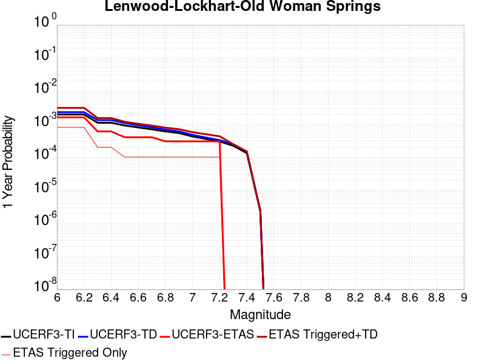 |  |

| Magnitude | 1 wk TI Prob | 1 wk TD Prob | 1 wk ETAS Prob | 1 wk ETAS/TD Gain | 1 wk ETAS Triggered+TD | 1 wk ETAS Triggered Only | 1 mo TI Prob | 1 mo TD Prob | 1 mo ETAS Prob | 1 mo ETAS/TD Gain | 1 mo ETAS Triggered+TD | 1 mo ETAS Triggered Only | 1 yr TI Prob | 1 yr TD Prob | 1 yr ETAS Prob | 1 yr ETAS/TD Gain | 1 yr ETAS Triggered+TD | 1 yr ETAS Triggered Only | 10 yr TI Prob | 10 yr TD Prob | 10 yr ETAS Prob | 10 yr ETAS/TD Gain | 10 yr ETAS Triggered+TD | 10 yr ETAS Triggered Only |
|-----|-----|-----|-----|-----|-----|-----|-----|-----|-----|-----|-----|-----|-----|-----|-----|-----|-----|-----|-----|-----|-----|-----|-----|-----|
| 6.0 | 3.744542E-5 | 4.3969532E-5 | 0.0 | 0.0 | 4.3969532E-5 | 0.0 | 1.604705E-4 | 1.8842822E-4 | 2.0E-4 | 1.0614121 | 2.8840938E-4 | 1.0E-4 | 0.0019519776 | 0.002291872 | 0.0016 | 0.6981193 | 0.0030900384 | 8.0E-4 | 0.019349206 | 0.022700373 | 0.0152 | 0.66959256 | 0.025827732 | 0.0032 |
| 6.1 | 3.744542E-5 | 4.3969532E-5 | 0.0 | 0.0 | 4.3969532E-5 | 0.0 | 1.604705E-4 | 1.8842822E-4 | 2.0E-4 | 1.0614121 | 2.8840938E-4 | 1.0E-4 | 0.0019519776 | 0.002291872 | 0.0016 | 0.6981193 | 0.0030900384 | 8.0E-4 | 0.019349206 | 0.022700373 | 0.0152 | 0.66959256 | 0.025827732 | 0.0032 |
| 6.2 | 3.744542E-5 | 4.3969532E-5 | 0.0 | 0.0 | 4.3969532E-5 | 0.0 | 1.604705E-4 | 1.8842822E-4 | 2.0E-4 | 1.0614121 | 2.8840938E-4 | 1.0E-4 | 0.0019519776 | 0.002291872 | 0.0016 | 0.6981193 | 0.0030900384 | 8.0E-4 | 0.019349206 | 0.022700373 | 0.0152 | 0.66959256 | 0.025827732 | 0.0032 |
| 6.3 | 2.1079984E-5 | 2.5356216E-5 | 0.0 | 0.0 | 2.5356216E-5 | 0.0 | 9.0339665E-5 | 1.0866508E-4 | 2.0E-4 | 1.8405176 | 2.0865421E-4 | 1.0E-4 | 0.0010993304 | 0.0013222144 | 6.0E-4 | 0.4537842 | 0.00152195 | 2.0E-4 | 0.010939079 | 0.01314569 | 0.009 | 0.68463504 | 0.015119399 | 0.002 |
| 6.4 | 2.1079984E-5 | 2.5356216E-5 | 0.0 | 0.0 | 2.5356216E-5 | 0.0 | 9.0339665E-5 | 1.0866508E-4 | 2.0E-4 | 1.8405176 | 2.0865421E-4 | 1.0E-4 | 0.0010993304 | 0.0013222144 | 6.0E-4 | 0.4537842 | 0.00152195 | 2.0E-4 | 0.010939079 | 0.01314569 | 0.009 | 0.68463504 | 0.015119399 | 0.002 |
| 6.5 | 1.7397282E-5 | 2.0664718E-5 | 0.0 | 0.0 | 2.0664718E-5 | 0.0 | 7.455765E-5 | 8.856014E-5 | 1.0E-4 | 1.1291763 | 8.856014E-5 | 0.0 | 9.073613E-4 | 0.0010776981 | 4.0E-4 | 0.37116146 | 0.0011775903 | 1.0E-4 | 0.009036654 | 0.010726013 | 0.0073 | 0.6805884 | 0.012110996 | 0.0014 |
| 6.6 | 1.52050325E-5 | 1.768136E-5 | 0.0 | 0.0 | 1.768136E-5 | 0.0 | 6.51628E-5 | 7.57751E-5 | 1.0E-4 | 1.3196948 | 7.57751E-5 | 0.0 | 7.9306826E-4 | 9.221792E-4 | 4.0E-4 | 0.43375516 | 0.001022087 | 1.0E-4 | 0.007902439 | 0.0091843875 | 0.0061 | 0.66417056 | 0.010373366 | 0.0012 |
| 6.7 | 1.332523E-5 | 1.5265508E-5 | 0.0 | 0.0 | 1.5265508E-5 | 0.0 | 5.7106878E-5 | 6.5422E-5 | 1.0E-4 | 1.5285378 | 6.5422E-5 | 0.0 | 6.950544E-4 | 7.962276E-4 | 4.0E-4 | 0.5023689 | 8.96148E-4 | 1.0E-4 | 0.006928845 | 0.007934378 | 0.0055 | 0.693186 | 0.009124857 | 0.0012 |
| 6.8 | 1.1525329E-5 | 1.303235E-5 | 0.0 | 0.0 | 1.303235E-5 | 0.0 | 4.9393333E-5 | 5.5851757E-5 | 1.0E-4 | 1.790454 | 5.5851757E-5 | 0.0 | 6.011979E-4 | 6.7978725E-4 | 3.0E-4 | 0.44131458 | 7.7971927E-4 | 1.0E-4 | 0.00599574 | 0.0067775296 | 0.005 | 0.73773193 | 0.007969396 | 0.0012 |
| 6.9 | 1.0253909E-5 | 1.1515601E-5 | 0.0 | 0.0 | 1.1515601E-5 | 0.0 | 4.3944583E-5 | 4.935166E-5 | 1.0E-4 | 2.0262742 | 4.935166E-5 | 0.0 | 5.3489394E-4 | 6.0069445E-4 | 3.0E-4 | 0.49942198 | 7.006344E-4 | 1.0E-4 | 0.0053360825 | 0.005991087 | 0.0045 | 0.7511158 | 0.006985096 | 0.001 |
| 7.0 | 8.104563E-6 | 8.991998E-6 | 0.0 | 0.0 | 8.991998E-6 | 0.0 | 3.4733377E-5 | 3.853658E-5 | 1.0E-4 | 2.5949373 | 3.853658E-5 | 0.0 | 4.2279682E-4 | 4.6908422E-4 | 3.0E-4 | 0.639544 | 5.6903734E-4 | 1.0E-4 | 0.0042199334 | 0.004681189 | 0.0033 | 0.70494914 | 0.00527838 | 6.0E-4 |
| 7.1 | 6.7986157E-6 | 7.516428E-6 | 0.0 | 0.0 | 7.516428E-6 | 0.0 | 2.91366E-5 | 3.221288E-5 | 1.0E-4 | 3.1043484 | 3.221288E-5 | 0.0 | 3.5468035E-4 | 3.9212336E-4 | 3.0E-4 | 0.7650654 | 4.9208413E-4 | 1.0E-4 | 0.003541148 | 0.003914531 | 0.0029 | 0.7408295 | 0.0044125738 | 5.0E-4 |
| 7.2 | 5.6893327E-6 | 6.2804797E-6 | 0.0 | 0.0 | 6.2804797E-6 | 0.0 | 2.4382627E-5 | 2.6916076E-5 | 1.0E-4 | 3.715252 | 2.6916076E-5 | 0.0 | 2.9681803E-4 | 3.2765593E-4 | 3.0E-4 | 0.91559464 | 4.2762316E-4 | 1.0E-4 | 0.002964219 | 0.003271927 | 0.0025 | 0.76407576 | 0.0037702909 | 5.0E-4 |
| 7.3 | 4.253348E-6 | 4.707329E-6 | 0.0 | 0.0 | 4.707329E-6 | 0.0 | 1.8228506E-5 | 2.0174122E-5 | 0.0 | 0.0 | 2.0174122E-5 | 0.0 | 2.2190946E-4 | 2.4559407E-4 | 0.0 | 0.0 | 2.4559407E-4 | 0.0 | 0.00221688 | 0.0024534077 | 0.0015 | 0.6113945 | 0.002652917 | 2.0E-4 |
| 7.4 | 2.5448119E-6 | 2.852198E-6 | 0.0 | 0.0 | 2.852198E-6 | 0.0 | 1.0906291E-5 | 1.2223658E-5 | 0.0 | 0.0 | 1.2223658E-5 | 0.0 | 1.3277601E-4 | 1.4881452E-4 | 0.0 | 0.0 | 1.4881452E-4 | 0.0 | 0.001326967 | 0.0014873109 | 0.001 | 0.6723544 | 0.0015871621 | 1.0E-4 |
| 7.5 | 4.3706837E-8 | 4.5633072E-8 | 0.0 | 0.0 | 4.5633072E-8 | 0.0 | 1.8731501E-7 | 1.955703E-7 | 0.0 | 0.0 | 1.955703E-7 | 0.0 | 2.2805577E-6 | 2.3810662E-6 | 0.0 | 0.0 | 2.3810662E-6 | 0.0 | 2.2805343E-5 | 2.3810462E-5 | 0.0 | 0.0 | 2.3810462E-5 | 0.0 |

## Bartlett Springs 2011 CFM
*[(top)](#table-of-contents)*

| 1 Week | 1 Month | 1 Year | 10 Year |
|-----|-----|-----|-----|
|  |  |  | 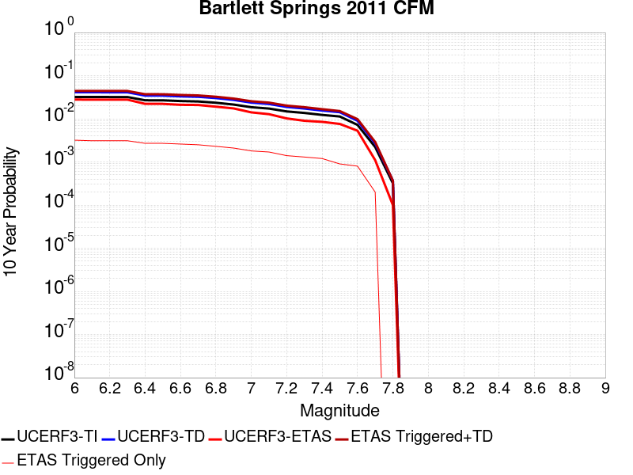 |

| Magnitude | 1 wk TI Prob | 1 wk TD Prob | 1 wk ETAS Prob | 1 wk ETAS/TD Gain | 1 wk ETAS Triggered+TD | 1 wk ETAS Triggered Only | 1 mo TI Prob | 1 mo TD Prob | 1 mo ETAS Prob | 1 mo ETAS/TD Gain | 1 mo ETAS Triggered+TD | 1 mo ETAS Triggered Only | 1 yr TI Prob | 1 yr TD Prob | 1 yr ETAS Prob | 1 yr ETAS/TD Gain | 1 yr ETAS Triggered+TD | 1 yr ETAS Triggered Only | 10 yr TI Prob | 10 yr TD Prob | 10 yr ETAS Prob | 10 yr ETAS/TD Gain | 10 yr ETAS Triggered+TD | 10 yr ETAS Triggered Only |
|-----|-----|-----|-----|-----|-----|-----|-----|-----|-----|-----|-----|-----|-----|-----|-----|-----|-----|-----|-----|-----|-----|-----|-----|-----|
| 6.0 | 6.2326144E-5 | 8.06516E-5 | 1.0E-4 | 1.2399011 | 8.06516E-5 | 0.0 | 2.6708472E-4 | 3.4560452E-4 | 1.0E-4 | 0.28934807 | 3.4560452E-4 | 0.0 | 0.003246908 | 0.0041997083 | 0.0024 | 0.57146823 | 0.0045980285 | 4.0E-4 | 0.031998757 | 0.041220505 | 0.0279 | 0.67684764 | 0.044288598 | 0.0032 |
| 6.1 | 6.227657E-5 | 8.058907E-5 | 1.0E-4 | 1.2408631 | 8.058907E-5 | 0.0 | 2.668723E-4 | 3.4533662E-4 | 1.0E-4 | 0.28957254 | 3.4533662E-4 | 0.0 | 0.0032443295 | 0.004196459 | 0.0023 | 0.54808116 | 0.0044952002 | 3.0E-4 | 0.031973712 | 0.041189224 | 0.0278 | 0.67493385 | 0.044161536 | 0.0031 |
| 6.2 | 6.22452E-5 | 8.054965E-5 | 1.0E-4 | 1.2414703 | 8.054965E-5 | 0.0 | 2.6673786E-4 | 3.4516773E-4 | 1.0E-4 | 0.28971422 | 3.4516773E-4 | 0.0 | 0.0032426978 | 0.004194411 | 0.0023 | 0.5483488 | 0.0044931527 | 3.0E-4 | 0.03195787 | 0.041169506 | 0.0278 | 0.6752571 | 0.04414188 | 0.0031 |
| 6.3 | 6.219006E-5 | 8.0479454E-5 | 1.0E-4 | 1.2425532 | 8.0479454E-5 | 0.0 | 2.6650162E-4 | 3.4486694E-4 | 1.0E-4 | 0.2899669 | 3.4486694E-4 | 0.0 | 0.00323983 | 0.004190763 | 0.0023 | 0.5488261 | 0.0044895057 | 3.0E-4 | 0.031930014 | 0.041134387 | 0.0278 | 0.6758336 | 0.04410687 | 0.0031 |
| 6.4 | 5.2175856E-5 | 6.7290894E-5 | 1.0E-4 | 1.4860852 | 6.7290894E-5 | 0.0 | 2.2359163E-4 | 2.8835796E-4 | 1.0E-4 | 0.3467912 | 2.8835796E-4 | 0.0 | 0.0027188298 | 0.0035051545 | 0.002 | 0.5705883 | 0.0038041028 | 3.0E-4 | 0.026858058 | 0.03450812 | 0.0222 | 0.6433269 | 0.037114948 | 0.0027 |
| 6.5 | 5.205166E-5 | 6.713348E-5 | 1.0E-4 | 1.4895698 | 6.713348E-5 | 0.0 | 2.2305945E-4 | 2.8768345E-4 | 1.0E-4 | 0.34760427 | 2.8768345E-4 | 0.0 | 0.0027123666 | 0.0034969691 | 0.002 | 0.57192385 | 0.00379592 | 3.0E-4 | 0.026794989 | 0.034428824 | 0.0222 | 0.64480853 | 0.037035868 | 0.0027 |
| 6.6 | 5.0085426E-5 | 6.452825E-5 | 1.0E-4 | 1.5497088 | 6.452825E-5 | 0.0 | 2.1463417E-4 | 2.765206E-4 | 1.0E-4 | 0.36163673 | 2.765206E-4 | 0.0 | 0.0026100394 | 0.0033614908 | 0.002 | 0.59497416 | 0.0036604824 | 3.0E-4 | 0.025795965 | 0.033115637 | 0.0211 | 0.63716125 | 0.035629533 | 0.0026 |
| 6.7 | 4.8930866E-5 | 6.305212E-5 | 1.0E-4 | 1.5859896 | 6.305212E-5 | 0.0 | 2.0968684E-4 | 2.7019563E-4 | 1.0E-4 | 0.3701022 | 2.7019563E-4 | 0.0 | 0.0025499484 | 0.0032847193 | 0.002 | 0.60888 | 0.003583734 | 3.0E-4 | 0.025208864 | 0.032370612 | 0.0209 | 0.64564735 | 0.034789685 | 0.0025 |
| 6.8 | 4.5679535E-5 | 5.8773876E-5 | 1.0E-4 | 1.7014362 | 5.8773876E-5 | 0.0 | 1.9575475E-4 | 2.518639E-4 | 1.0E-4 | 0.3970398 | 2.518639E-4 | 0.0 | 0.002380709 | 0.003062169 | 0.0018 | 0.5878186 | 0.0033612505 | 3.0E-4 | 0.023553653 | 0.030206777 | 0.0191 | 0.6323084 | 0.032437302 | 0.0023 |
| 6.9 | 4.1439176E-5 | 5.324878E-5 | 1.0E-4 | 1.8779774 | 5.324878E-5 | 0.0 | 1.7758438E-4 | 2.2818922E-4 | 1.0E-4 | 0.4382328 | 2.2818922E-4 | 0.0 | 0.002159946 | 0.0027746896 | 0.0016 | 0.5766411 | 0.0030738572 | 3.0E-4 | 0.021390721 | 0.027405495 | 0.0174 | 0.63490915 | 0.029447943 | 0.0021 |
| 7.0 | 3.5920104E-5 | 4.6033012E-5 | 1.0E-4 | 2.172354 | 4.6033012E-5 | 0.0 | 1.5393422E-4 | 1.972695E-4 | 1.0E-4 | 0.50692075 | 1.972695E-4 | 0.0 | 0.001872538 | 0.0023991265 | 0.0013 | 0.54186386 | 0.0026984068 | 3.0E-4 | 0.018568378 | 0.023735547 | 0.0141 | 0.5940457 | 0.025492823 | 0.0018 |
| 7.1 | 3.338812E-5 | 4.271182E-5 | 1.0E-4 | 2.341272 | 4.271182E-5 | 0.0 | 1.430841E-4 | 1.830379E-4 | 1.0E-4 | 0.5463349 | 1.830379E-4 | 0.0 | 0.0017406568 | 0.0022262232 | 0.001 | 0.44919124 | 0.002425778 | 2.0E-4 | 0.017270854 | 0.02204206 | 0.0128 | 0.58070797 | 0.023704588 | 0.0017 |
| 7.2 | 2.8619615E-5 | 3.6420344E-5 | 1.0E-4 | 2.7457182 | 3.6420344E-5 | 0.0 | 1.2264973E-4 | 1.560779E-4 | 1.0E-4 | 0.6407057 | 1.560779E-4 | 0.0 | 0.0014922376 | 0.001898602 | 7.0E-4 | 0.36869234 | 0.0020982223 | 2.0E-4 | 0.014822568 | 0.018825885 | 0.0102 | 0.54180723 | 0.020199528 | 0.0014 |
| 7.3 | 2.6376783E-5 | 3.3440003E-5 | 1.0E-4 | 2.9904306 | 3.3440003E-5 | 0.0 | 1.13038455E-4 | 1.4330648E-4 | 1.0E-4 | 0.69780517 | 1.4330648E-4 | 0.0 | 0.0013753743 | 0.0017433693 | 7.0E-4 | 0.40152135 | 0.0019430206 | 2.0E-4 | 0.01366893 | 0.01729881 | 0.009 | 0.520267 | 0.018576322 | 0.0013 |
| 7.4 | 2.3738676E-5 | 2.9994439E-5 | 1.0E-4 | 3.3339515 | 2.9994439E-5 | 0.0 | 1.0173322E-4 | 1.285413E-4 | 1.0E-4 | 0.77796006 | 1.285413E-4 | 0.0 | 0.0012378981 | 0.0015638749 | 7.0E-4 | 0.44760612 | 0.0017635622 | 2.0E-4 | 0.012310251 | 0.01553022 | 0.0085 | 0.54732 | 0.016711583 | 0.0012 |
| 7.5 | 2.1789481E-5 | 2.7453336E-5 | 1.0E-4 | 3.6425445 | 2.7453336E-5 | 0.0 | 9.338015E-5 | 1.1765189E-4 | 1.0E-4 | 0.84996504 | 1.1765189E-4 | 0.0 | 0.0011363103 | 0.0014314785 | 7.0E-4 | 0.4890049 | 0.0016311922 | 2.0E-4 | 0.011305175 | 0.014223979 | 0.0076 | 0.53430897 | 0.015111177 | 9.0E-4 |
| 7.6 | 1.3895281E-5 | 1.7377411E-5 | 1.0E-4 | 5.754597 | 1.7377411E-5 | 0.0 | 5.9549846E-5 | 7.447251E-5 | 1.0E-4 | 1.3427774 | 7.447251E-5 | 0.0 | 7.2477816E-4 | 9.063285E-4 | 5.0E-4 | 0.55167633 | 0.0011061472 | 2.0E-4 | 0.0072241887 | 0.00902693 | 0.0053 | 0.58713204 | 0.009819709 | 8.0E-4 |
| 7.7 | 4.245981E-6 | 5.164425E-6 | 0.0 | 0.0 | 5.164425E-6 | 0.0 | 1.8196934E-5 | 2.2133063E-5 | 0.0 | 0.0 | 2.2133063E-5 | 0.0 | 2.2152514E-4 | 2.6943692E-4 | 2.0E-4 | 0.7422888 | 3.6940997E-4 | 1.0E-4 | 0.0022130446 | 0.002691149 | 0.0011 | 0.40874735 | 0.0028906108 | 2.0E-4 |
| 7.8 | 6.145192E-7 | 7.048893E-7 | 0.0 | 0.0 | 7.048893E-7 | 0.0 | 2.633651E-6 | 3.0209508E-6 | 0.0 | 0.0 | 3.0209508E-6 | 0.0 | 3.206423E-5 | 3.6779467E-5 | 0.0 | 0.0 | 3.6779467E-5 | 0.0 | 3.2059604E-4 | 3.6772783E-4 | 1.0E-4 | 0.27194026 | 3.6772783E-4 | 0.0 |

## South Klamath Lake East
*[(top)](#table-of-contents)*

| 1 Week | 1 Month | 1 Year | 10 Year |
|-----|-----|-----|-----|
| 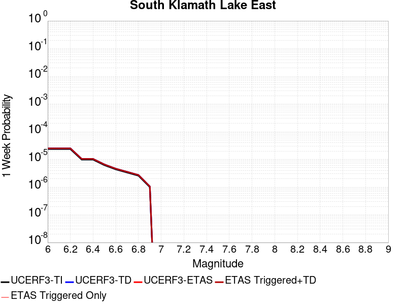 | 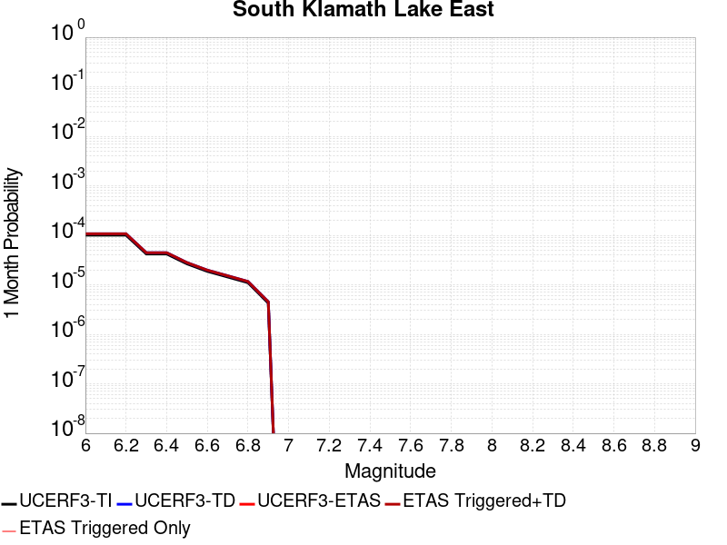 | 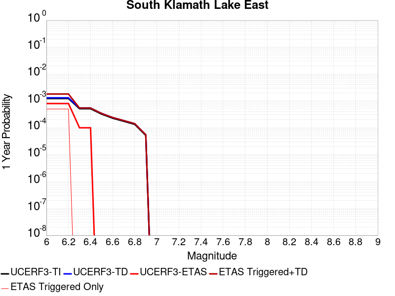 | 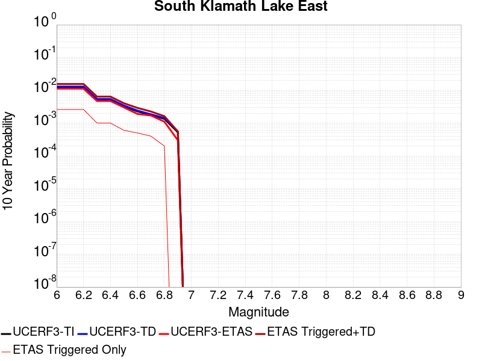 |

| Magnitude | 1 wk TI Prob | 1 wk TD Prob | 1 wk ETAS Prob | 1 wk ETAS/TD Gain | 1 wk ETAS Triggered+TD | 1 wk ETAS Triggered Only | 1 mo TI Prob | 1 mo TD Prob | 1 mo ETAS Prob | 1 mo ETAS/TD Gain | 1 mo ETAS Triggered+TD | 1 mo ETAS Triggered Only | 1 yr TI Prob | 1 yr TD Prob | 1 yr ETAS Prob | 1 yr ETAS/TD Gain | 1 yr ETAS Triggered+TD | 1 yr ETAS Triggered Only | 10 yr TI Prob | 10 yr TD Prob | 10 yr ETAS Prob | 10 yr ETAS/TD Gain | 10 yr ETAS Triggered+TD | 10 yr ETAS Triggered Only |
|-----|-----|-----|-----|-----|-----|-----|-----|-----|-----|-----|-----|-----|-----|-----|-----|-----|-----|-----|-----|-----|-----|-----|-----|-----|
| 6.0 | 2.3539369E-5 | 2.5050493E-5 | 0.0 | 0.0 | 2.5050493E-5 | 0.0 | 1.0087911E-4 | 1.0735531E-4 | 0.0 | 0.0 | 1.0735531E-4 | 0.0 | 0.0012275111 | 0.0013063503 | 8.0E-4 | 0.61239314 | 0.0018056972 | 5.0E-4 | 0.012207527 | 0.01299506 | 0.0112 | 0.861866 | 0.015561272 | 0.0026 |
| 6.1 | 2.3539369E-5 | 2.5050493E-5 | 0.0 | 0.0 | 2.5050493E-5 | 0.0 | 1.0087911E-4 | 1.0735531E-4 | 0.0 | 0.0 | 1.0735531E-4 | 0.0 | 0.0012275111 | 0.0013063503 | 8.0E-4 | 0.61239314 | 0.0018056972 | 5.0E-4 | 0.012207527 | 0.01299506 | 0.0112 | 0.861866 | 0.015561272 | 0.0026 |
| 6.2 | 2.3539369E-5 | 2.5050493E-5 | 0.0 | 0.0 | 2.5050493E-5 | 0.0 | 1.0087911E-4 | 1.0735531E-4 | 0.0 | 0.0 | 1.0735531E-4 | 0.0 | 0.0012275111 | 0.0013063503 | 8.0E-4 | 0.61239314 | 0.0018056972 | 5.0E-4 | 0.012207527 | 0.01299506 | 0.0112 | 0.861866 | 0.015561272 | 0.0026 |
| 6.3 | 9.807823E-6 | 1.0397281E-5 | 0.0 | 0.0 | 1.0397281E-5 | 0.0 | 4.2032847E-5 | 4.455906E-5 | 0.0 | 0.0 | 4.455906E-5 | 0.0 | 5.1162974E-4 | 5.423799E-4 | 1.0E-4 | 0.18437262 | 5.423799E-4 | 0.0 | 0.005104534 | 0.005411398 | 0.0047 | 0.86853707 | 0.006405987 | 0.001 |
| 6.4 | 9.807823E-6 | 1.0397281E-5 | 0.0 | 0.0 | 1.0397281E-5 | 0.0 | 4.2032847E-5 | 4.455906E-5 | 0.0 | 0.0 | 4.455906E-5 | 0.0 | 5.1162974E-4 | 5.423799E-4 | 1.0E-4 | 0.18437262 | 5.423799E-4 | 0.0 | 0.005104534 | 0.005411398 | 0.0047 | 0.86853707 | 0.006405987 | 0.001 |
| 6.5 | 6.191981E-6 | 6.5515933E-6 | 0.0 | 0.0 | 6.5515933E-6 | 0.0 | 2.653679E-5 | 2.807797E-5 | 0.0 | 0.0 | 2.807797E-5 | 0.0 | 3.2303753E-4 | 3.4179844E-4 | 0.0 | 0.0 | 3.4179844E-4 | 0.0 | 0.0032256835 | 0.0034130057 | 0.003 | 0.8789906 | 0.004010958 | 6.0E-4 |
| 6.6 | 4.3693776E-6 | 4.6170753E-6 | 0.0 | 0.0 | 4.6170753E-6 | 0.0 | 1.8725768E-5 | 1.9787323E-5 | 0.0 | 0.0 | 1.9787323E-5 | 0.0 | 2.2796239E-4 | 2.4088516E-4 | 0.0 | 0.0 | 2.4088516E-4 | 0.0 | 0.0022772867 | 0.002406353 | 0.0019 | 0.7895766 | 0.00290515 | 5.0E-4 |
| 6.7 | 3.360834E-6 | 3.5516393E-6 | 0.0 | 0.0 | 3.5516393E-6 | 0.0 | 1.4403494E-5 | 1.5221227E-5 | 0.0 | 0.0 | 1.5221227E-5 | 0.0 | 1.7534842E-4 | 1.8530349E-4 | 0.0 | 0.0 | 1.8530349E-4 | 0.0 | 0.0017521014 | 0.0018515697 | 0.0017 | 0.9181399 | 0.002250829 | 4.0E-4 |
| 6.8 | 2.57873E-6 | 2.7254778E-6 | 0.0 | 0.0 | 2.7254778E-6 | 0.0 | 1.1051653E-5 | 1.168057E-5 | 0.0 | 0.0 | 1.168057E-5 | 0.0 | 1.3454557E-4 | 1.4220228E-4 | 0.0 | 0.0 | 1.4220228E-4 | 0.0 | 0.0013446413 | 0.0014211736 | 0.0011 | 0.7740082 | 0.0016208893 | 2.0E-4 |
| 6.9 | 9.987825E-7 | 1.0567426E-6 | 0.0 | 0.0 | 1.0567426E-6 | 0.0 | 4.2804895E-6 | 4.528891E-6 | 0.0 | 0.0 | 4.528891E-6 | 0.0 | 5.211371E-5 | 5.513818E-5 | 0.0 | 0.0 | 5.513818E-5 | 0.0 | 5.210149E-4 | 5.512772E-4 | 3.0E-4 | 0.5441909 | 5.512772E-4 | 0.0 |

## South Klamath Lake West
*[(top)](#table-of-contents)*

| 1 Week | 1 Month | 1 Year | 10 Year |
|-----|-----|-----|-----|
| 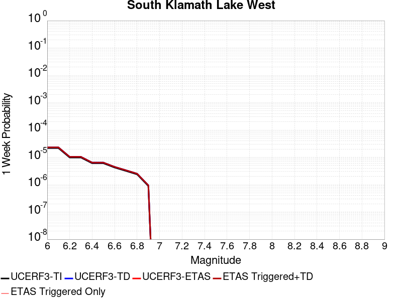 | 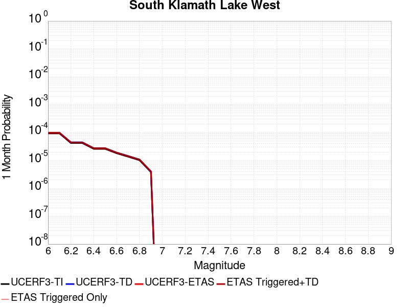 | 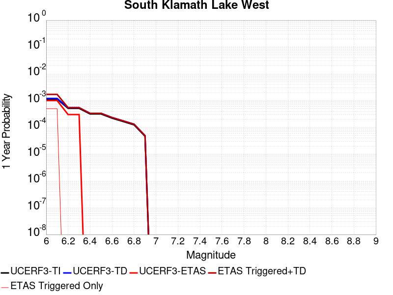 | 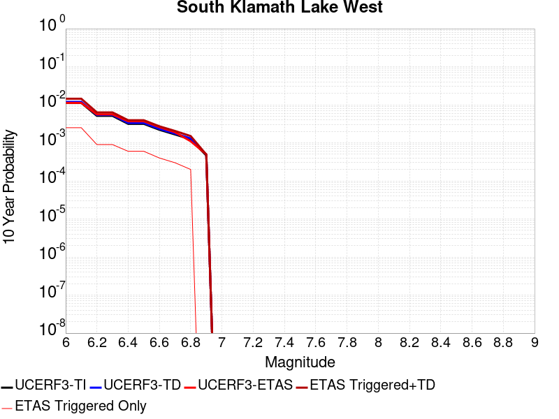 |

| Magnitude | 1 wk TI Prob | 1 wk TD Prob | 1 wk ETAS Prob | 1 wk ETAS/TD Gain | 1 wk ETAS Triggered+TD | 1 wk ETAS Triggered Only | 1 mo TI Prob | 1 mo TD Prob | 1 mo ETAS Prob | 1 mo ETAS/TD Gain | 1 mo ETAS Triggered+TD | 1 mo ETAS Triggered Only | 1 yr TI Prob | 1 yr TD Prob | 1 yr ETAS Prob | 1 yr ETAS/TD Gain | 1 yr ETAS Triggered+TD | 1 yr ETAS Triggered Only | 10 yr TI Prob | 10 yr TD Prob | 10 yr ETAS Prob | 10 yr ETAS/TD Gain | 10 yr ETAS Triggered+TD | 10 yr ETAS Triggered Only |
|-----|-----|-----|-----|-----|-----|-----|-----|-----|-----|-----|-----|-----|-----|-----|-----|-----|-----|-----|-----|-----|-----|-----|-----|-----|
| 6.0 | 2.174025E-5 | 2.3044764E-5 | 0.0 | 0.0 | 2.3044764E-5 | 0.0 | 9.3169176E-5 | 9.8759905E-5 | 0.0 | 0.0 | 9.8759905E-5 | 0.0 | 0.0011337444 | 0.0012018044 | 0.001 | 0.83208215 | 0.0017012035 | 5.0E-4 | 0.011279777 | 0.011959654 | 0.0112 | 0.93648195 | 0.014429755 | 0.0025 |
| 6.1 | 2.174025E-5 | 2.3044764E-5 | 0.0 | 0.0 | 2.3044764E-5 | 0.0 | 9.3169176E-5 | 9.8759905E-5 | 0.0 | 0.0 | 9.8759905E-5 | 0.0 | 0.0011337444 | 0.0012018044 | 0.001 | 0.83208215 | 0.0017012035 | 5.0E-4 | 0.011279777 | 0.011959654 | 0.0112 | 0.93648195 | 0.014429755 | 0.0025 |
| 6.2 | 9.834929E-6 | 1.0395013E-5 | 0.0 | 0.0 | 1.0395013E-5 | 0.0 | 4.2149015E-5 | 4.4549346E-5 | 0.0 | 0.0 | 4.4549346E-5 | 0.0 | 5.1304343E-4 | 5.4226234E-4 | 3.0E-4 | 0.55323774 | 5.4226234E-4 | 0.0 | 0.0051186057 | 0.005410294 | 0.0056 | 1.0350639 | 0.0063054245 | 9.0E-4 |
| 6.3 | 9.834929E-6 | 1.0395013E-5 | 0.0 | 0.0 | 1.0395013E-5 | 0.0 | 4.2149015E-5 | 4.4549346E-5 | 0.0 | 0.0 | 4.4549346E-5 | 0.0 | 5.1304343E-4 | 5.4226234E-4 | 3.0E-4 | 0.55323774 | 5.4226234E-4 | 0.0 | 0.0051186057 | 0.005410294 | 0.0056 | 1.0350639 | 0.0063054245 | 9.0E-4 |
| 6.4 | 6.066321E-6 | 6.401129E-6 | 0.0 | 0.0 | 6.401129E-6 | 0.0 | 2.5998259E-5 | 2.7433138E-5 | 0.0 | 0.0 | 2.7433138E-5 | 0.0 | 3.1648282E-4 | 3.3394998E-4 | 0.0 | 0.0 | 3.3394998E-4 | 0.0 | 0.0031603249 | 0.0033347518 | 0.0037 | 1.1095278 | 0.003932751 | 6.0E-4 |
| 6.5 | 6.066321E-6 | 6.401129E-6 | 0.0 | 0.0 | 6.401129E-6 | 0.0 | 2.5998259E-5 | 2.7433138E-5 | 0.0 | 0.0 | 2.7433138E-5 | 0.0 | 3.1648282E-4 | 3.3394998E-4 | 0.0 | 0.0 | 3.3394998E-4 | 0.0 | 0.0031603249 | 0.0033347518 | 0.0037 | 1.1095278 | 0.003932751 | 6.0E-4 |
| 6.6 | 4.2321803E-6 | 4.4617705E-6 | 0.0 | 0.0 | 4.4617705E-6 | 0.0 | 1.8137789E-5 | 1.9121739E-5 | 0.0 | 0.0 | 1.9121739E-5 | 0.0 | 2.208052E-4 | 2.3278332E-4 | 0.0 | 0.0 | 2.3278332E-4 | 0.0 | 0.0022058594 | 0.0023254966 | 0.0026 | 1.1180407 | 0.0027245665 | 4.0E-4 |
| 6.7 | 3.186646E-6 | 3.3606684E-6 | 0.0 | 0.0 | 3.3606684E-6 | 0.0 | 1.3656982E-5 | 1.4402789E-5 | 0.0 | 0.0 | 1.4402789E-5 | 0.0 | 1.6626107E-4 | 1.7534052E-4 | 0.0 | 0.0 | 1.7534052E-4 | 0.0 | 0.0016613674 | 0.0017520889 | 0.0019 | 1.0844198 | 0.0020515632 | 3.0E-4 |
| 6.8 | 2.380121E-6 | 2.5111806E-6 | 0.0 | 0.0 | 2.5111806E-6 | 0.0 | 1.0200479E-5 | 1.0762161E-5 | 0.0 | 0.0 | 1.0762161E-5 | 0.0 | 1.2418375E-4 | 1.310219E-4 | 0.0 | 0.0 | 1.310219E-4 | 0.0 | 0.0012411437 | 0.0013094923 | 0.0011 | 0.8400202 | 0.0015092305 | 2.0E-4 |
| 6.9 | 8.928287E-7 | 9.431302E-7 | 0.0 | 0.0 | 9.431302E-7 | 0.0 | 3.826403E-6 | 4.0419814E-6 | 0.0 | 0.0 | 4.0419814E-6 | 0.0 | 4.658546E-5 | 4.9210234E-5 | 0.0 | 0.0 | 4.9210234E-5 | 0.0 | 4.6575698E-4 | 4.92015E-4 | 5.0E-4 | 1.0162292 | 4.92015E-4 | 0.0 |

## Cleghorn Lake
*[(top)](#table-of-contents)*

| 1 Week | 1 Month | 1 Year | 10 Year |
|-----|-----|-----|-----|
| 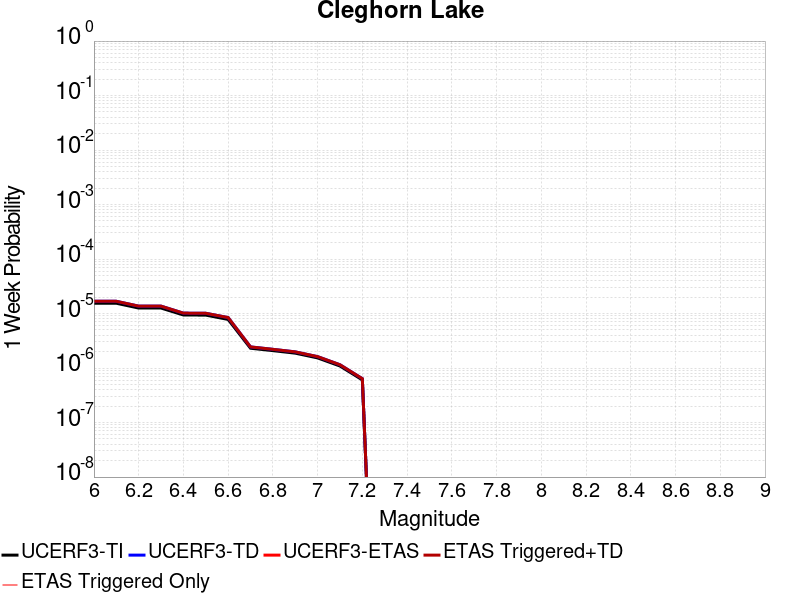 | 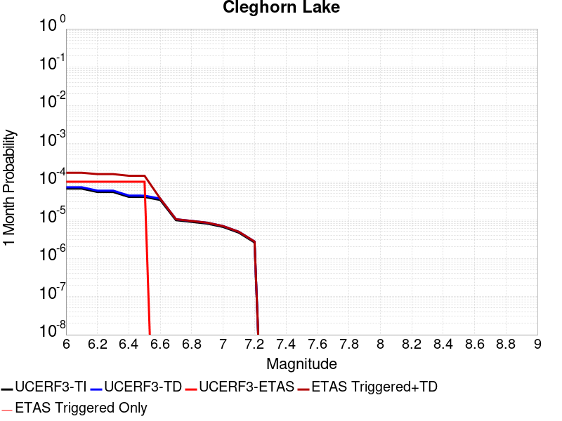 | 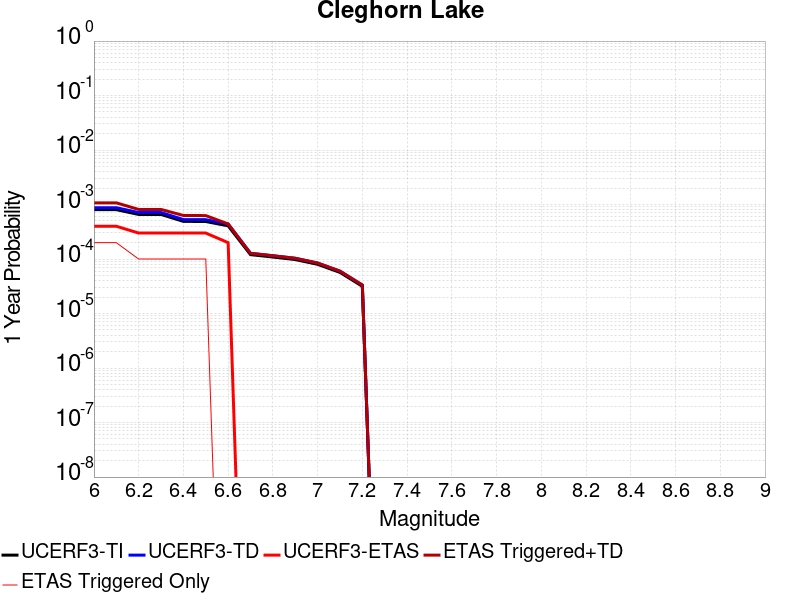 | 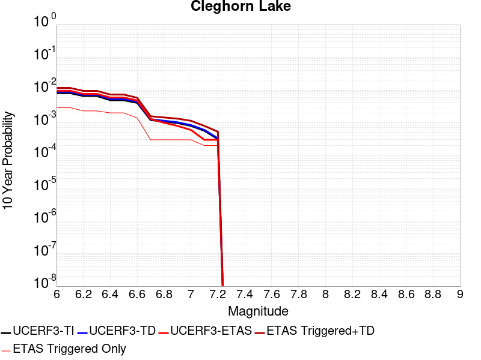 |

| Magnitude | 1 wk TI Prob | 1 wk TD Prob | 1 wk ETAS Prob | 1 wk ETAS/TD Gain | 1 wk ETAS Triggered+TD | 1 wk ETAS Triggered Only | 1 mo TI Prob | 1 mo TD Prob | 1 mo ETAS Prob | 1 mo ETAS/TD Gain | 1 mo ETAS Triggered+TD | 1 mo ETAS Triggered Only | 1 yr TI Prob | 1 yr TD Prob | 1 yr ETAS Prob | 1 yr ETAS/TD Gain | 1 yr ETAS Triggered+TD | 1 yr ETAS Triggered Only | 10 yr TI Prob | 10 yr TD Prob | 10 yr ETAS Prob | 10 yr ETAS/TD Gain | 10 yr ETAS Triggered+TD | 10 yr ETAS Triggered Only |
|-----|-----|-----|-----|-----|-----|-----|-----|-----|-----|-----|-----|-----|-----|-----|-----|-----|-----|-----|-----|-----|-----|-----|-----|-----|
| 6.0 | 1.5467183E-5 | 1.6797072E-5 | 0.0 | 0.0 | 1.6797072E-5 | 0.0 | 6.6286244E-5 | 7.198577E-5 | 1.0E-4 | 1.3891634 | 1.7197857E-4 | 1.0E-4 | 8.067362E-4 | 8.7612926E-4 | 4.0E-4 | 0.45655364 | 0.0010759541 | 2.0E-4 | 0.008038137 | 0.008732181 | 0.0095 | 1.0879298 | 0.011606857 | 0.0029 |
| 6.1 | 1.5467183E-5 | 1.6797072E-5 | 0.0 | 0.0 | 1.6797072E-5 | 0.0 | 6.6286244E-5 | 7.198577E-5 | 1.0E-4 | 1.3891634 | 1.7197857E-4 | 1.0E-4 | 8.067362E-4 | 8.7612926E-4 | 4.0E-4 | 0.45655364 | 0.0010759541 | 2.0E-4 | 0.008038137 | 0.008732181 | 0.0095 | 1.0879298 | 0.011606857 | 0.0029 |
| 6.2 | 1.2624631E-5 | 1.3683825E-5 | 0.0 | 0.0 | 1.3683825E-5 | 0.0 | 5.410444E-5 | 5.864392E-5 | 1.0E-4 | 1.7052066 | 1.5863805E-4 | 1.0E-4 | 6.585225E-4 | 7.1380456E-4 | 3.0E-4 | 0.4202831 | 8.1373315E-4 | 1.0E-4 | 0.0065657445 | 0.0071199154 | 0.0076 | 1.0674285 | 0.00940354 | 0.0023 |
| 6.3 | 1.2624631E-5 | 1.3683825E-5 | 0.0 | 0.0 | 1.3683825E-5 | 0.0 | 5.410444E-5 | 5.864392E-5 | 1.0E-4 | 1.7052066 | 1.5863805E-4 | 1.0E-4 | 6.585225E-4 | 7.1380456E-4 | 3.0E-4 | 0.4202831 | 8.1373315E-4 | 1.0E-4 | 0.0065657445 | 0.0071199154 | 0.0076 | 1.0674285 | 0.00940354 | 0.0023 |
| 6.4 | 9.417684E-6 | 1.0171737E-5 | 0.0 | 0.0 | 1.0171737E-5 | 0.0 | 4.036088E-5 | 4.359266E-5 | 1.0E-4 | 2.2939641 | 1.435883E-4 | 1.0E-4 | 4.912829E-4 | 5.306525E-4 | 3.0E-4 | 0.5653417 | 6.3059945E-4 | 1.0E-4 | 0.004901982 | 0.0052978913 | 0.0059 | 1.1136507 | 0.0072872955 | 0.002 |
| 6.5 | 9.368219E-6 | 1.0119157E-5 | 0.0 | 0.0 | 1.0119157E-5 | 0.0 | 4.014889E-5 | 4.3367327E-5 | 1.0E-4 | 2.3058834 | 1.43363E-4 | 1.0E-4 | 4.8870314E-4 | 5.2791036E-4 | 3.0E-4 | 0.56827825 | 6.278576E-4 | 1.0E-4 | 0.004876298 | 0.0052706003 | 0.0059 | 1.1194171 | 0.007260059 | 0.002 |
| 6.6 | 7.803798E-6 | 8.443205E-6 | 0.0 | 0.0 | 8.443205E-6 | 0.0 | 3.3444423E-5 | 3.6184887E-5 | 0.0 | 0.0 | 3.6184887E-5 | 0.0 | 4.0710976E-4 | 4.405019E-4 | 2.0E-4 | 0.45402756 | 4.405019E-4 | 0.0 | 0.0040636472 | 0.004400206 | 0.0048 | 1.0908581 | 0.0057940455 | 0.0014 |
| 6.7 | 2.3108669E-6 | 2.4441129E-6 | 0.0 | 0.0 | 2.4441129E-6 | 0.0 | 9.903678E-6 | 1.0474728E-5 | 0.0 | 0.0 | 1.0474728E-5 | 0.0 | 1.205706E-4 | 1.2752254E-4 | 0.0 | 0.0 | 1.2752254E-4 | 0.0 | 0.001205052 | 0.0012745123 | 0.0013 | 1.0199981 | 0.0015741299 | 3.0E-4 |
| 6.8 | 2.0882828E-6 | 2.2065296E-6 | 0.0 | 0.0 | 2.2065296E-6 | 0.0 | 8.949753E-6 | 9.456522E-6 | 0.0 | 0.0 | 9.456522E-6 | 0.0 | 1.08957785E-4 | 1.15127244E-4 | 0.0 | 0.0 | 1.15127244E-4 | 0.0 | 0.0010890438 | 0.0011506929 | 0.001 | 0.8690416 | 0.0014503477 | 3.0E-4 |
| 6.9 | 1.876935E-6 | 1.981269E-6 | 0.0 | 0.0 | 1.981269E-6 | 0.0 | 8.043982E-6 | 8.491126E-6 | 0.0 | 0.0 | 8.491126E-6 | 0.0 | 9.7931086E-5 | 1.0337472E-4 | 0.0 | 0.0 | 1.0337472E-4 | 0.0 | 9.788794E-4 | 0.0010332823 | 8.0E-4 | 0.7742318 | 0.0013329723 | 3.0E-4 |
| 7.0 | 1.5357559E-6 | 1.6204576E-6 | 0.0 | 0.0 | 1.6204576E-6 | 0.0 | 6.5817944E-6 | 6.9448006E-6 | 0.0 | 0.0 | 6.9448006E-6 | 0.0 | 8.01304E-5 | 8.454979E-5 | 0.0 | 0.0 | 8.454979E-5 | 0.0 | 8.010151E-4 | 8.451887E-4 | 6.0E-4 | 0.7099006 | 0.0011449351 | 3.0E-4 |
| 7.1 | 1.0905424E-6 | 1.1498859E-6 | 0.0 | 0.0 | 1.1498859E-6 | 0.0 | 4.6737446E-6 | 4.9280734E-6 | 0.0 | 0.0 | 4.9280734E-6 | 0.0 | 5.6901354E-5 | 5.999774E-5 | 0.0 | 0.0 | 5.999774E-5 | 0.0 | 5.6886784E-4 | 5.9982523E-4 | 3.0E-4 | 0.5001457 | 7.997052E-4 | 2.0E-4 |
| 7.2 | 6.06668E-7 | 6.387947E-7 | 0.0 | 0.0 | 6.387947E-7 | 0.0 | 2.600003E-6 | 2.737689E-6 | 0.0 | 0.0 | 2.737689E-6 | 0.0 | 3.1654577E-5 | 3.3330925E-5 | 0.0 | 0.0 | 3.3330925E-5 | 0.0 | 3.1650066E-4 | 3.332661E-4 | 3.0E-4 | 0.9001816 | 5.3319946E-4 | 2.0E-4 |

## Quien Sabe 2011 CFM
*[(top)](#table-of-contents)*

| 1 Week | 1 Month | 1 Year | 10 Year |
|-----|-----|-----|-----|
|  |  |  |  |

| Magnitude | 1 wk TI Prob | 1 wk TD Prob | 1 wk ETAS Prob | 1 wk ETAS/TD Gain | 1 wk ETAS Triggered+TD | 1 wk ETAS Triggered Only | 1 mo TI Prob | 1 mo TD Prob | 1 mo ETAS Prob | 1 mo ETAS/TD Gain | 1 mo ETAS Triggered+TD | 1 mo ETAS Triggered Only | 1 yr TI Prob | 1 yr TD Prob | 1 yr ETAS Prob | 1 yr ETAS/TD Gain | 1 yr ETAS Triggered+TD | 1 yr ETAS Triggered Only | 10 yr TI Prob | 10 yr TD Prob | 10 yr ETAS Prob | 10 yr ETAS/TD Gain | 10 yr ETAS Triggered+TD | 10 yr ETAS Triggered Only |
|-----|-----|-----|-----|-----|-----|-----|-----|-----|-----|-----|-----|-----|-----|-----|-----|-----|-----|-----|-----|-----|-----|-----|-----|-----|
| 6.0 | 3.729899E-5 | 7.0985E-5 | 0.0 | 0.0 | 7.0985E-5 | 0.0 | 1.5984301E-4 | 3.0415558E-4 | 3.0E-4 | 0.9863373 | 4.0412517E-4 | 1.0E-4 | 0.0019443515 | 0.0036874518 | 0.0016 | 0.43390396 | 0.004185608 | 5.0E-4 | 0.019274272 | 0.035370078 | 0.0176 | 0.49759573 | 0.03826397 | 0.003 |
| 6.1 | 1.7825725E-5 | 3.3232085E-5 | 0.0 | 0.0 | 3.3232085E-5 | 0.0 | 7.639373E-5 | 1.4238115E-4 | 0.0 | 0.0 | 1.4238115E-4 | 0.0 | 9.296967E-4 | 0.0017277669 | 2.0E-4 | 0.115756355 | 0.0017277669 | 0.0 | 0.009258169 | 0.016708735 | 0.0071 | 0.42492744 | 0.017888684 | 0.0012 |
| 6.2 | 4.8865336E-6 | 7.813568E-6 | 0.0 | 0.0 | 7.813568E-6 | 0.0 | 2.0942118E-5 | 3.348512E-5 | 0.0 | 0.0 | 3.348512E-5 | 0.0 | 2.5494045E-4 | 4.0725817E-4 | 0.0 | 0.0 | 4.0725817E-4 | 0.0 | 0.0025464818 | 0.004016477 | 0.0018 | 0.4481539 | 0.0041160756 | 1.0E-4 |
| 6.3 | 3.858491E-6 | 5.7949605E-6 | 0.0 | 0.0 | 5.7949605E-6 | 0.0 | 1.6536285E-5 | 2.4835335E-5 | 0.0 | 0.0 | 2.4835335E-5 | 0.0 | 2.0131067E-4 | 3.0233295E-4 | 0.0 | 0.0 | 3.0233295E-4 | 0.0 | 0.002011284 | 0.0030044075 | 0.0013 | 0.43269762 | 0.003104107 | 1.0E-4 |
| 6.4 | 3.0771805E-6 | 4.3898985E-6 | 0.0 | 0.0 | 4.3898985E-6 | 0.0 | 1.318785E-5 | 1.881373E-5 | 0.0 | 0.0 | 1.881373E-5 | 0.0 | 1.6055023E-4 | 2.2903549E-4 | 0.0 | 0.0 | 2.2903549E-4 | 0.0 | 0.001604343 | 0.0022888307 | 9.0E-4 | 0.39321387 | 0.002388602 | 1.0E-4 |
| 6.5 | 2.5081235E-6 | 3.4680918E-6 | 0.0 | 0.0 | 3.4680918E-6 | 0.0 | 1.0749056E-5 | 1.4863174E-5 | 0.0 | 0.0 | 1.4863174E-5 | 0.0 | 1.308619E-4 | 1.8094559E-4 | 0.0 | 0.0 | 1.8094559E-4 | 0.0 | 0.0013078486 | 0.0018145656 | 9.0E-4 | 0.49598646 | 0.0019143842 | 1.0E-4 |
| 6.6 | 1.7505364E-6 | 2.4057533E-6 | 0.0 | 0.0 | 2.4057533E-6 | 0.0 | 7.502277E-6 | 1.0310335E-5 | 0.0 | 0.0 | 1.0310335E-5 | 0.0 | 9.13364E-5 | 1.2552181E-4 | 0.0 | 0.0 | 1.2552181E-4 | 0.0 | 9.129886E-4 | 0.0012599227 | 8.0E-4 | 0.6349595 | 0.0013597969 | 1.0E-4 |
| 6.7 | 1.505737E-6 | 2.0668413E-6 | 0.0 | 0.0 | 2.0668413E-6 | 0.0 | 6.4531428E-6 | 8.8578645E-6 | 0.0 | 0.0 | 8.8578645E-6 | 0.0 | 7.8564175E-5 | 1.0783976E-4 | 0.0 | 0.0 | 1.0783976E-4 | 0.0 | 7.853641E-4 | 0.0010832886 | 8.0E-4 | 0.7384921 | 0.0011831803 | 1.0E-4 |
| 6.8 | 1.2924105E-6 | 1.7511461E-6 | 0.0 | 0.0 | 1.7511461E-6 | 0.0 | 5.5388905E-6 | 7.5048933E-6 | 0.0 | 0.0 | 7.5048933E-6 | 0.0 | 6.74339E-5 | 9.136879E-5 | 0.0 | 0.0 | 9.136879E-5 | 0.0 | 6.741344E-4 | 9.1740646E-4 | 6.0E-4 | 0.6540176 | 0.0010173147 | 1.0E-4 |
| 6.9 | 8.9075286E-7 | 1.1267791E-6 | 0.0 | 0.0 | 1.1267791E-6 | 0.0 | 3.8175067E-6 | 4.829046E-6 | 0.0 | 0.0 | 4.829046E-6 | 0.0 | 4.6477155E-5 | 5.8792266E-5 | 0.0 | 0.0 | 5.8792266E-5 | 0.0 | 4.6467435E-4 | 5.912028E-4 | 4.0E-4 | 0.67658675 | 6.911437E-4 | 1.0E-4 |
| 7.0 | 6.6891175E-7 | 8.531756E-7 | 0.0 | 0.0 | 8.531756E-7 | 0.0 | 2.8667614E-6 | 3.656463E-6 | 0.0 | 0.0 | 3.656463E-6 | 0.0 | 3.4902263E-5 | 4.4516724E-5 | 0.0 | 0.0 | 4.4516724E-5 | 0.0 | 3.4896782E-4 | 4.4746176E-4 | 3.0E-4 | 0.67044836 | 5.4741703E-4 | 1.0E-4 |
| 7.1 | 4.4205015E-7 | 5.3967443E-7 | 0.0 | 0.0 | 5.3967443E-7 | 0.0 | 1.8944993E-6 | 2.3128894E-6 | 0.0 | 0.0 | 2.3128894E-6 | 0.0 | 2.3065284E-5 | 2.8159235E-5 | 0.0 | 0.0 | 2.8159235E-5 | 0.0 | 2.3062891E-4 | 2.8288856E-4 | 1.0E-4 | 0.3534961 | 2.8288856E-4 | 0.0 |
| 7.2 | 1.6620965E-7 | 1.6007769E-7 | 0.0 | 0.0 | 1.6007769E-7 | 0.0 | 7.123269E-7 | 6.860471E-7 | 0.0 | 0.0 | 6.860471E-7 | 0.0 | 8.672545E-6 | 8.352596E-6 | 0.0 | 0.0 | 8.352596E-6 | 0.0 | 8.6722066E-5 | 8.364014E-5 | 0.0 | 0.0 | 8.364014E-5 | 0.0 |
| 7.3 | 1.2142488E-7 | 1.1735274E-7 | 0.0 | 0.0 | 1.1735274E-7 | 0.0 | 5.2039223E-7 | 5.029402E-7 | 0.0 | 0.0 | 5.029402E-7 | 0.0 | 6.335757E-6 | 6.1232836E-6 | 0.0 | 0.0 | 6.1232836E-6 | 0.0 | 6.3355765E-5 | 6.1301296E-5 | 0.0 | 0.0 | 6.1301296E-5 | 0.0 |
| 7.4 | 2.4192937E-8 | 2.4557309E-8 | 0.0 | 0.0 | 2.4557309E-8 | 0.0 | 1.0368401E-7 | 1.05245604E-7 | 0.0 | 0.0 | 1.05245604E-7 | 0.0 | 1.2623522E-6 | 1.2813646E-6 | 0.0 | 0.0 | 1.2813646E-6 | 0.0 | 1.2623449E-5 | 1.2835184E-5 | 0.0 | 0.0 | 1.2835184E-5 | 0.0 |
| 7.5 | 1.4432802E-8 | 1.4511174E-8 | 0.0 | 0.0 | 1.4511174E-8 | 0.0 | 6.185486E-8 | 6.219074E-8 | 0.0 | 0.0 | 6.219074E-8 | 0.0 | 7.530827E-7 | 7.5717213E-7 | 0.0 | 0.0 | 7.5717213E-7 | 0.0 | 7.530801E-6 | 7.5914077E-6 | 0.0 | 0.0 | 7.5914077E-6 | 0.0 |

## Cleghorn Pass
*[(top)](#table-of-contents)*

| 1 Week | 1 Month | 1 Year | 10 Year |
|-----|-----|-----|-----|
| 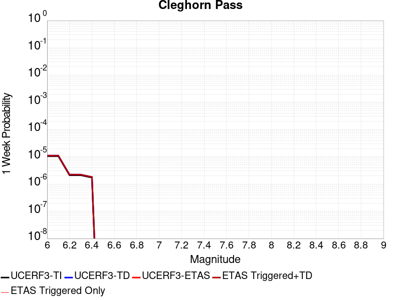 | 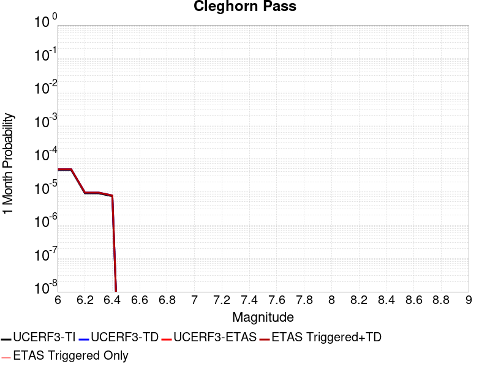 | 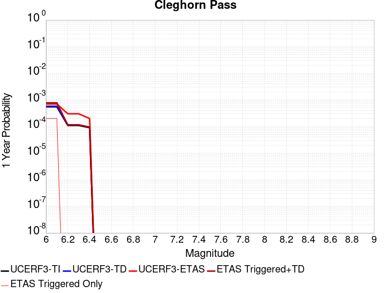 | 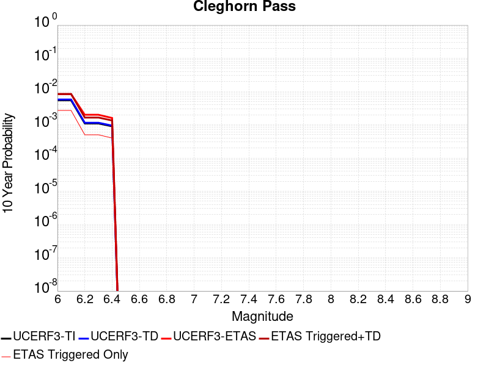 |

| Magnitude | 1 wk TI Prob | 1 wk TD Prob | 1 wk ETAS Prob | 1 wk ETAS/TD Gain | 1 wk ETAS Triggered+TD | 1 wk ETAS Triggered Only | 1 mo TI Prob | 1 mo TD Prob | 1 mo ETAS Prob | 1 mo ETAS/TD Gain | 1 mo ETAS Triggered+TD | 1 mo ETAS Triggered Only | 1 yr TI Prob | 1 yr TD Prob | 1 yr ETAS Prob | 1 yr ETAS/TD Gain | 1 yr ETAS Triggered+TD | 1 yr ETAS Triggered Only | 10 yr TI Prob | 10 yr TD Prob | 10 yr ETAS Prob | 10 yr ETAS/TD Gain | 10 yr ETAS Triggered+TD | 10 yr ETAS Triggered Only |
|-----|-----|-----|-----|-----|-----|-----|-----|-----|-----|-----|-----|-----|-----|-----|-----|-----|-----|-----|-----|-----|-----|-----|-----|-----|
| 6.0 | 1.0522846E-5 | 1.10417195E-5 | 0.0 | 0.0 | 1.10417195E-5 | 0.0 | 4.509713E-5 | 4.7321093E-5 | 0.0 | 0.0 | 4.7321093E-5 | 0.0 | 5.4891926E-4 | 5.7603465E-4 | 7.0E-4 | 1.2152047 | 7.759194E-4 | 2.0E-4 | 0.0054756533 | 0.005750582 | 0.0084 | 1.4607217 | 0.008435056 | 0.0027 |
| 6.1 | 1.0522846E-5 | 1.10417195E-5 | 0.0 | 0.0 | 1.10417195E-5 | 0.0 | 4.509713E-5 | 4.7321093E-5 | 0.0 | 0.0 | 4.7321093E-5 | 0.0 | 5.4891926E-4 | 5.7603465E-4 | 7.0E-4 | 1.2152047 | 7.759194E-4 | 2.0E-4 | 0.0054756533 | 0.005750582 | 0.0084 | 1.4607217 | 0.008435056 | 0.0027 |
| 6.2 | 2.1045846E-6 | 2.208418E-6 | 0.0 | 0.0 | 2.208418E-6 | 0.0 | 9.019617E-6 | 9.464638E-6 | 0.0 | 0.0 | 9.464638E-6 | 0.0 | 1.098083E-4 | 1.15230076E-4 | 3.0E-4 | 2.603487 | 1.15230076E-4 | 0.0 | 0.0010975406 | 0.0011521147 | 0.002 | 1.7359382 | 0.0016515387 | 5.0E-4 |
| 6.3 | 2.1045846E-6 | 2.208418E-6 | 0.0 | 0.0 | 2.208418E-6 | 0.0 | 9.019617E-6 | 9.464638E-6 | 0.0 | 0.0 | 9.464638E-6 | 0.0 | 1.098083E-4 | 1.15230076E-4 | 3.0E-4 | 2.603487 | 1.15230076E-4 | 0.0 | 0.0010975406 | 0.0011521147 | 0.002 | 1.7359382 | 0.0016515387 | 5.0E-4 |
| 6.4 | 1.7259927E-6 | 1.8110537E-6 | 0.0 | 0.0 | 1.8110537E-6 | 0.0 | 7.3970905E-6 | 7.761659E-6 | 0.0 | 0.0 | 7.761659E-6 | 0.0 | 9.005586E-5 | 9.4498195E-5 | 2.0E-4 | 2.1164424 | 9.4498195E-5 | 0.0 | 9.001937E-4 | 9.4498193E-4 | 0.0016 | 1.693154 | 0.001344604 | 4.0E-4 |

## Manix-Afton Hills
*[(top)](#table-of-contents)*

| 1 Week | 1 Month | 1 Year | 10 Year |
|-----|-----|-----|-----|
| 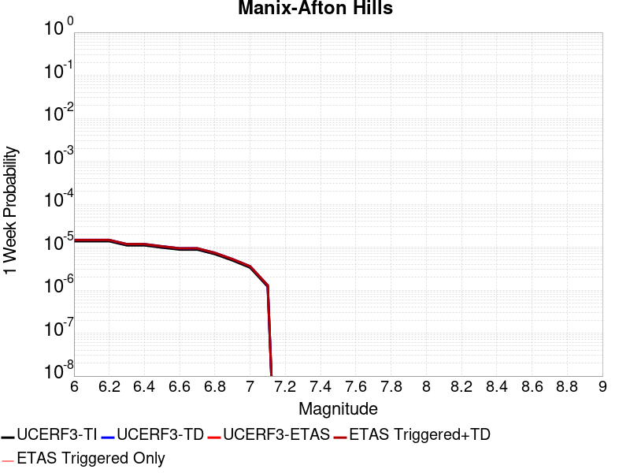 |  | 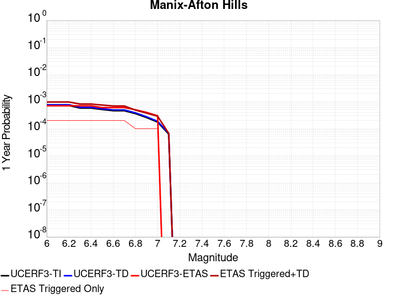 |  |

| Magnitude | 1 wk TI Prob | 1 wk TD Prob | 1 wk ETAS Prob | 1 wk ETAS/TD Gain | 1 wk ETAS Triggered+TD | 1 wk ETAS Triggered Only | 1 mo TI Prob | 1 mo TD Prob | 1 mo ETAS Prob | 1 mo ETAS/TD Gain | 1 mo ETAS Triggered+TD | 1 mo ETAS Triggered Only | 1 yr TI Prob | 1 yr TD Prob | 1 yr ETAS Prob | 1 yr ETAS/TD Gain | 1 yr ETAS Triggered+TD | 1 yr ETAS Triggered Only | 10 yr TI Prob | 10 yr TD Prob | 10 yr ETAS Prob | 10 yr ETAS/TD Gain | 10 yr ETAS Triggered+TD | 10 yr ETAS Triggered Only |
|-----|-----|-----|-----|-----|-----|-----|-----|-----|-----|-----|-----|-----|-----|-----|-----|-----|-----|-----|-----|-----|-----|-----|-----|-----|
| 6.0 | 1.3783202E-5 | 1.4713058E-5 | 0.0 | 0.0 | 1.4713058E-5 | 0.0 | 5.906953E-5 | 6.305454E-5 | 0.0 | 0.0 | 6.305454E-5 | 0.0 | 7.189342E-4 | 7.6743605E-4 | 7.0E-4 | 0.9121281 | 9.6728257E-4 | 2.0E-4 | 0.0071661277 | 0.0076496154 | 0.0058 | 0.75820804 | 0.010229726 | 0.0026 |
| 6.1 | 1.3783202E-5 | 1.4713058E-5 | 0.0 | 0.0 | 1.4713058E-5 | 0.0 | 5.906953E-5 | 6.305454E-5 | 0.0 | 0.0 | 6.305454E-5 | 0.0 | 7.189342E-4 | 7.6743605E-4 | 7.0E-4 | 0.9121281 | 9.6728257E-4 | 2.0E-4 | 0.0071661277 | 0.0076496154 | 0.0058 | 0.75820804 | 0.010229726 | 0.0026 |
| 6.2 | 1.3783202E-5 | 1.4713058E-5 | 0.0 | 0.0 | 1.4713058E-5 | 0.0 | 5.906953E-5 | 6.305454E-5 | 0.0 | 0.0 | 6.305454E-5 | 0.0 | 7.189342E-4 | 7.6743605E-4 | 7.0E-4 | 0.9121281 | 9.6728257E-4 | 2.0E-4 | 0.0071661277 | 0.0076496154 | 0.0058 | 0.75820804 | 0.010229726 | 0.0026 |
| 6.3 | 1.10494875E-5 | 1.1794713E-5 | 0.0 | 0.0 | 1.1794713E-5 | 0.0 | 4.7354086E-5 | 5.054785E-5 | 0.0 | 0.0 | 5.054785E-5 | 0.0 | 5.763835E-4 | 6.1525666E-4 | 7.0E-4 | 1.1377366 | 8.151336E-4 | 2.0E-4 | 0.005748908 | 0.006136574 | 0.0046 | 0.7496039 | 0.0084224595 | 0.0023 |
| 6.4 | 1.10494875E-5 | 1.1794713E-5 | 0.0 | 0.0 | 1.1794713E-5 | 0.0 | 4.7354086E-5 | 5.054785E-5 | 0.0 | 0.0 | 5.054785E-5 | 0.0 | 5.763835E-4 | 6.1525666E-4 | 7.0E-4 | 1.1377366 | 8.151336E-4 | 2.0E-4 | 0.005748908 | 0.006136574 | 0.0046 | 0.7496039 | 0.0084224595 | 0.0023 |
| 6.5 | 9.788949E-6 | 1.0455732E-5 | 0.0 | 0.0 | 1.0455732E-5 | 0.0 | 4.1951964E-5 | 4.4809563E-5 | 0.0 | 0.0 | 4.4809563E-5 | 0.0 | 5.1064545E-4 | 5.454292E-4 | 6.0E-4 | 1.1000512 | 7.453201E-4 | 2.0E-4 | 0.0050947363 | 0.005441832 | 0.004 | 0.73504657 | 0.00762986 | 0.0022 |
| 6.6 | 8.810006E-6 | 9.414911E-6 | 0.0 | 0.0 | 9.414911E-6 | 0.0 | 3.775662E-5 | 4.0349045E-5 | 0.0 | 0.0 | 4.0349045E-5 | 0.0 | 4.5958988E-4 | 4.9114774E-4 | 6.0E-4 | 1.2216283 | 6.9104956E-4 | 2.0E-4 | 0.0045864056 | 0.0049015055 | 0.0037 | 0.7548701 | 0.0067921923 | 0.0019 |
| 6.7 | 8.80128E-6 | 9.4053885E-6 | 0.0 | 0.0 | 9.4053885E-6 | 0.0 | 3.7719226E-5 | 4.0308238E-5 | 0.0 | 0.0 | 4.0308238E-5 | 0.0 | 4.591348E-4 | 4.906512E-4 | 6.0E-4 | 1.2228647 | 6.9055305E-4 | 2.0E-4 | 0.004581874 | 0.004896561 | 0.0037 | 0.75563234 | 0.0067872577 | 0.0019 |
| 6.8 | 6.8994877E-6 | 7.3810984E-6 | 0.0 | 0.0 | 7.3810984E-6 | 0.0 | 2.9568899E-5 | 3.1632942E-5 | 0.0 | 0.0 | 3.1632942E-5 | 0.0 | 3.5994186E-4 | 3.8507115E-4 | 5.0E-4 | 1.2984613 | 4.8503265E-4 | 1.0E-4 | 0.003593594 | 0.0038448444 | 0.0026 | 0.6762302 | 0.004940615 | 0.0011 |
| 6.9 | 4.9328037E-6 | 5.27168E-6 | 0.0 | 0.0 | 5.27168E-6 | 0.0 | 2.1140417E-5 | 2.2592754E-5 | 0.0 | 0.0 | 2.2592754E-5 | 0.0 | 2.5735417E-4 | 2.750382E-4 | 4.0E-4 | 1.4543433 | 3.750107E-4 | 1.0E-4 | 0.0025705635 | 0.0027475837 | 0.0015 | 0.54593426 | 0.0033459351 | 6.0E-4 |
| 7.0 | 3.347973E-6 | 3.5905464E-6 | 0.0 | 0.0 | 3.5905464E-6 | 0.0 | 1.4348378E-5 | 1.5387988E-5 | 0.0 | 0.0 | 1.5387988E-5 | 0.0 | 1.746775E-4 | 1.8733674E-4 | 3.0E-4 | 1.6013943 | 2.8731802E-4 | 1.0E-4 | 0.0017454025 | 0.001872191 | 8.0E-4 | 0.42730683 | 0.0021716293 | 3.0E-4 |
| 7.1 | 1.2073567E-6 | 1.293665E-6 | 0.0 | 0.0 | 1.293665E-6 | 0.0 | 5.1743755E-6 | 5.544276E-6 | 0.0 | 0.0 | 5.544276E-6 | 0.0 | 6.29962E-5 | 6.75011E-5 | 0.0 | 0.0 | 6.75011E-5 | 0.0 | 6.297835E-4 | 6.749662E-4 | 4.0E-4 | 0.5926222 | 8.748312E-4 | 2.0E-4 |

## Great Valley 03 Mysterious Ridge
*[(top)](#table-of-contents)*

| 1 Week | 1 Month | 1 Year | 10 Year |
|-----|-----|-----|-----|
| 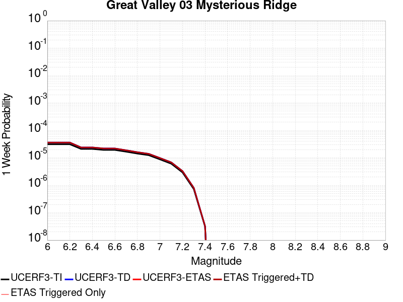 |  | 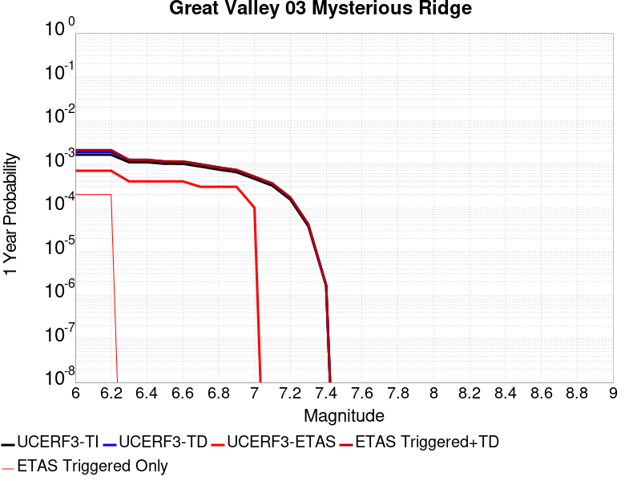 | 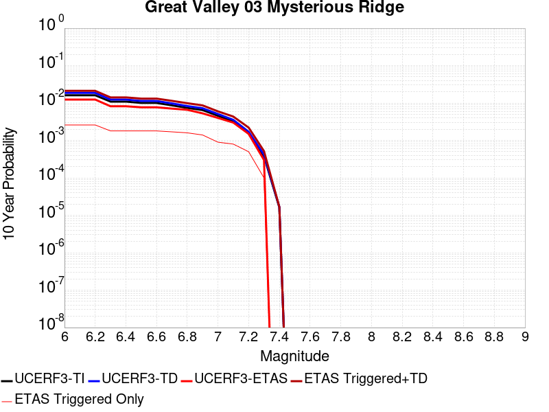 |

| Magnitude | 1 wk TI Prob | 1 wk TD Prob | 1 wk ETAS Prob | 1 wk ETAS/TD Gain | 1 wk ETAS Triggered+TD | 1 wk ETAS Triggered Only | 1 mo TI Prob | 1 mo TD Prob | 1 mo ETAS Prob | 1 mo ETAS/TD Gain | 1 mo ETAS Triggered+TD | 1 mo ETAS Triggered Only | 1 yr TI Prob | 1 yr TD Prob | 1 yr ETAS Prob | 1 yr ETAS/TD Gain | 1 yr ETAS Triggered+TD | 1 yr ETAS Triggered Only | 10 yr TI Prob | 10 yr TD Prob | 10 yr ETAS Prob | 10 yr ETAS/TD Gain | 10 yr ETAS Triggered+TD | 10 yr ETAS Triggered Only |
|-----|-----|-----|-----|-----|-----|-----|-----|-----|-----|-----|-----|-----|-----|-----|-----|-----|-----|-----|-----|-----|-----|-----|-----|-----|
| 6.0 | 3.1182444E-5 | 3.6045352E-5 | 0.0 | 0.0 | 3.6045352E-5 | 0.0 | 1.336322E-4 | 1.5447199E-4 | 0.0 | 0.0 | 1.5447199E-4 | 0.0 | 0.0016257578 | 0.0018792601 | 7.0E-4 | 0.37248704 | 0.0020788843 | 2.0E-4 | 0.016139153 | 0.018652432 | 0.0124 | 0.66479266 | 0.021203937 | 0.0026 |
| 6.1 | 3.1182444E-5 | 3.6045352E-5 | 0.0 | 0.0 | 3.6045352E-5 | 0.0 | 1.336322E-4 | 1.5447199E-4 | 0.0 | 0.0 | 1.5447199E-4 | 0.0 | 0.0016257578 | 0.0018792601 | 7.0E-4 | 0.37248704 | 0.0020788843 | 2.0E-4 | 0.016139153 | 0.018652432 | 0.0124 | 0.66479266 | 0.021203937 | 0.0026 |
| 6.2 | 3.1182444E-5 | 3.6045352E-5 | 0.0 | 0.0 | 3.6045352E-5 | 0.0 | 1.336322E-4 | 1.5447199E-4 | 0.0 | 0.0 | 1.5447199E-4 | 0.0 | 0.0016257578 | 0.0018792601 | 7.0E-4 | 0.37248704 | 0.0020788843 | 2.0E-4 | 0.016139153 | 0.018652432 | 0.0124 | 0.66479266 | 0.021203937 | 0.0026 |
| 6.3 | 2.106934E-5 | 2.3856586E-5 | 0.0 | 0.0 | 2.3856586E-5 | 0.0 | 9.0294045E-5 | 1.02238686E-4 | 0.0 | 0.0 | 1.02238686E-4 | 0.0 | 0.0010987755 | 0.0012440763 | 4.0E-4 | 0.3215237 | 0.0012440763 | 0.0 | 0.010933585 | 0.012374367 | 0.0082 | 0.6626602 | 0.014152093 | 0.0018 |
| 6.4 | 2.106934E-5 | 2.3856586E-5 | 0.0 | 0.0 | 2.3856586E-5 | 0.0 | 9.0294045E-5 | 1.02238686E-4 | 0.0 | 0.0 | 1.02238686E-4 | 0.0 | 0.0010987755 | 0.0012440763 | 4.0E-4 | 0.3215237 | 0.0012440763 | 0.0 | 0.010933585 | 0.012374367 | 0.0082 | 0.6626602 | 0.014152093 | 0.0018 |
| 6.5 | 1.9389783E-5 | 2.1890599E-5 | 0.0 | 0.0 | 2.1890599E-5 | 0.0 | 8.309642E-5 | 9.3813636E-5 | 0.0 | 0.0 | 9.3813636E-5 | 0.0 | 0.0010112294 | 0.0011416103 | 4.0E-4 | 0.35038227 | 0.0011416103 | 0.0 | 0.010066401 | 0.011360333 | 0.0077 | 0.677797 | 0.013139885 | 0.0018 |
| 6.6 | 1.9370193E-5 | 2.1870519E-5 | 0.0 | 0.0 | 2.1870519E-5 | 0.0 | 8.301247E-5 | 9.372758E-5 | 0.0 | 0.0 | 9.372758E-5 | 0.0 | 0.0010102082 | 0.0011405637 | 4.0E-4 | 0.35070378 | 0.0011405637 | 0.0 | 0.010056281 | 0.011349975 | 0.0077 | 0.6784156 | 0.013129545 | 0.0018 |
| 6.7 | 1.6723505E-5 | 1.880393E-5 | 0.0 | 0.0 | 1.880393E-5 | 0.0 | 7.16702E-5 | 8.0585894E-5 | 0.0 | 0.0 | 8.0585894E-5 | 0.0 | 8.722353E-4 | 9.807112E-4 | 3.0E-4 | 0.30590045 | 9.807112E-4 | 0.0 | 0.008688197 | 0.009765843 | 0.0071 | 0.7270238 | 0.011449241 | 0.0017 |
| 6.8 | 1.426937E-5 | 1.6001068E-5 | 0.0 | 0.0 | 1.6001068E-5 | 0.0 | 6.115301E-5 | 6.857428E-5 | 0.0 | 0.0 | 6.857428E-5 | 0.0 | 7.4428355E-4 | 8.345865E-4 | 3.0E-4 | 0.35945943 | 8.345865E-4 | 0.0 | 0.007417957 | 0.008316002 | 0.0066 | 0.7936506 | 0.009902696 | 0.0016 |
| 6.9 | 1.2469891E-5 | 1.3960242E-5 | 0.0 | 0.0 | 1.3960242E-5 | 0.0 | 5.3441294E-5 | 5.98283E-5 | 0.0 | 0.0 | 5.98283E-5 | 0.0 | 6.504535E-4 | 7.2817825E-4 | 3.0E-4 | 0.41198704 | 7.2817825E-4 | 0.0 | 0.006485529 | 0.007259147 | 0.0053 | 0.7301133 | 0.008648984 | 0.0014 |
| 7.0 | 8.7746275E-6 | 9.793992E-6 | 0.0 | 0.0 | 9.793992E-6 | 0.0 | 3.7605005E-5 | 4.197362E-5 | 0.0 | 0.0 | 4.197362E-5 | 0.0 | 4.5774475E-4 | 5.1091635E-4 | 1.0E-4 | 0.19572677 | 5.1091635E-4 | 0.0 | 0.00456803 | 0.00509815 | 0.004 | 0.7845983 | 0.005993562 | 9.0E-4 |
| 7.1 | 6.1067153E-6 | 6.815295E-6 | 0.0 | 0.0 | 6.815295E-6 | 0.0 | 2.6171374E-5 | 2.9208111E-5 | 0.0 | 0.0 | 2.9208111E-5 | 0.0 | 3.1858988E-4 | 3.5555632E-4 | 0.0 | 0.0 | 3.5555632E-4 | 0.0 | 0.0031813353 | 0.0035504254 | 0.003 | 0.84496915 | 0.004347585 | 8.0E-4 |
| 7.2 | 2.939283E-6 | 3.2748485E-6 | 0.0 | 0.0 | 3.2748485E-6 | 0.0 | 1.2596866E-5 | 1.4034999E-5 | 0.0 | 0.0 | 1.4034999E-5 | 0.0 | 1.5335606E-4 | 1.7086447E-4 | 0.0 | 0.0 | 1.7086447E-4 | 0.0 | 0.0015325027 | 0.0017075031 | 0.0015 | 0.8784757 | 0.0022066494 | 5.0E-4 |
| 7.3 | 7.2387763E-7 | 8.01021E-7 | 0.0 | 0.0 | 8.01021E-7 | 0.0 | 3.102329E-6 | 3.4329453E-6 | 0.0 | 0.0 | 3.4329453E-6 | 0.0 | 3.77702E-5 | 4.1795764E-5 | 0.0 | 0.0 | 4.1795764E-5 | 0.0 | 3.7763783E-4 | 4.1792405E-4 | 3.0E-4 | 0.7178338 | 5.1788223E-4 | 1.0E-4 |
| 7.4 | 3.112171E-8 | 3.2070304E-8 | 0.0 | 0.0 | 3.2070304E-8 | 0.0 | 1.3337875E-7 | 1.3744415E-7 | 0.0 | 0.0 | 1.3744415E-7 | 0.0 | 1.6238852E-6 | 1.6733812E-6 | 0.0 | 0.0 | 1.6733812E-6 | 0.0 | 1.6238733E-5 | 1.6733695E-5 | 0.0 | 0.0 | 1.6733695E-5 | 0.0 |

## Monterey Bay-Tularcitos
*[(top)](#table-of-contents)*

| 1 Week | 1 Month | 1 Year | 10 Year |
|-----|-----|-----|-----|
| 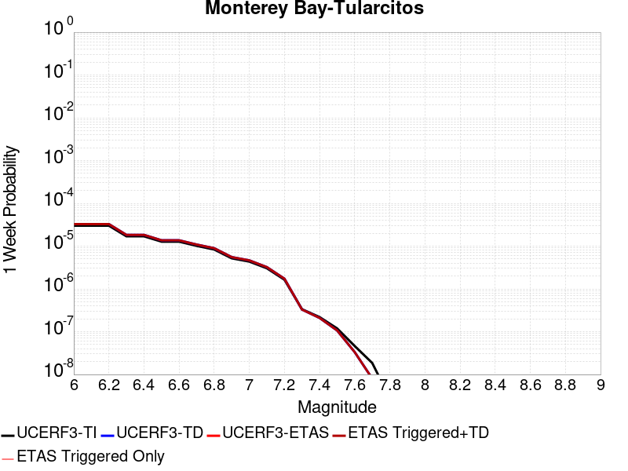 | 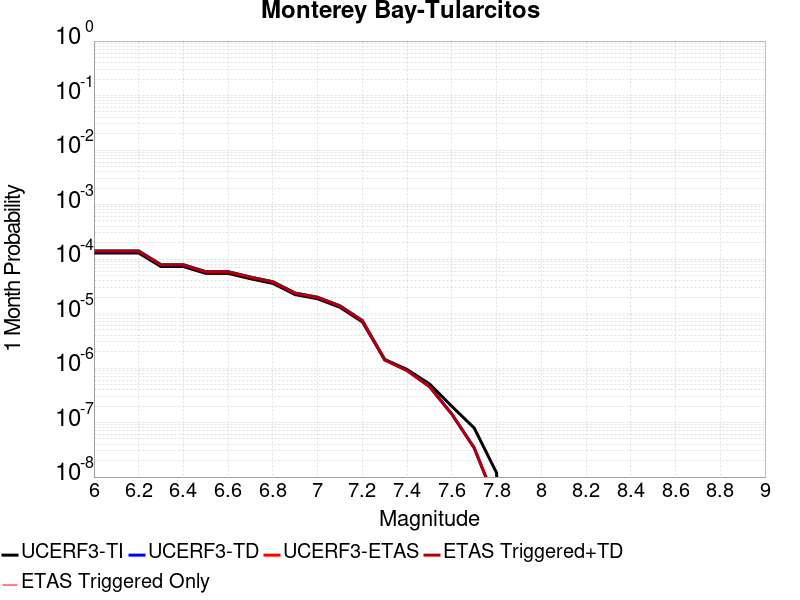 | 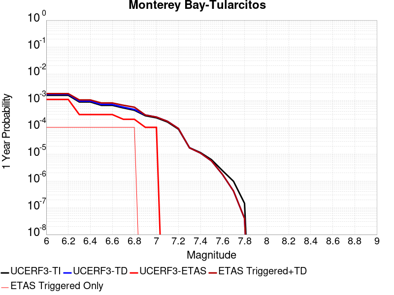 | 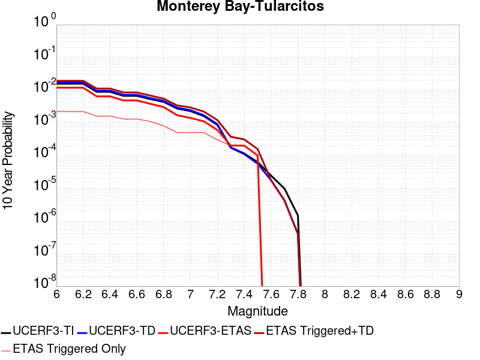 |

| Magnitude | 1 wk TI Prob | 1 wk TD Prob | 1 wk ETAS Prob | 1 wk ETAS/TD Gain | 1 wk ETAS Triggered+TD | 1 wk ETAS Triggered Only | 1 mo TI Prob | 1 mo TD Prob | 1 mo ETAS Prob | 1 mo ETAS/TD Gain | 1 mo ETAS Triggered+TD | 1 mo ETAS Triggered Only | 1 yr TI Prob | 1 yr TD Prob | 1 yr ETAS Prob | 1 yr ETAS/TD Gain | 1 yr ETAS Triggered+TD | 1 yr ETAS Triggered Only | 10 yr TI Prob | 10 yr TD Prob | 10 yr ETAS Prob | 10 yr ETAS/TD Gain | 10 yr ETAS Triggered+TD | 10 yr ETAS Triggered Only |
|-----|-----|-----|-----|-----|-----|-----|-----|-----|-----|-----|-----|-----|-----|-----|-----|-----|-----|-----|-----|-----|-----|-----|-----|-----|
| 6.0 | 3.0131365E-5 | 3.280467E-5 | 0.0 | 0.0 | 3.280467E-5 | 0.0 | 1.2912804E-4 | 1.4058445E-4 | 0.0 | 0.0 | 1.4058445E-4 | 0.0 | 0.001571 | 0.0017103775 | 0.0011 | 0.64313287 | 0.0018102064 | 1.0E-4 | 0.015599402 | 0.016982947 | 0.0118 | 0.6948146 | 0.019145584 | 0.0022 |
| 6.1 | 3.0131365E-5 | 3.280467E-5 | 0.0 | 0.0 | 3.280467E-5 | 0.0 | 1.2912804E-4 | 1.4058445E-4 | 0.0 | 0.0 | 1.4058445E-4 | 0.0 | 0.001571 | 0.0017103775 | 0.0011 | 0.64313287 | 0.0018102064 | 1.0E-4 | 0.015599402 | 0.016982947 | 0.0118 | 0.6948146 | 0.019145584 | 0.0022 |
| 6.2 | 3.0131365E-5 | 3.280467E-5 | 0.0 | 0.0 | 3.280467E-5 | 0.0 | 1.2912804E-4 | 1.4058445E-4 | 0.0 | 0.0 | 1.4058445E-4 | 0.0 | 0.001571 | 0.0017103775 | 0.0011 | 0.64313287 | 0.0018102064 | 1.0E-4 | 0.015599402 | 0.016982947 | 0.0118 | 0.6948146 | 0.019145584 | 0.0022 |
| 6.3 | 1.6998249E-5 | 1.8333772E-5 | 0.0 | 0.0 | 1.8333772E-5 | 0.0 | 7.28476E-5 | 7.857105E-5 | 0.0 | 0.0 | 7.857105E-5 | 0.0 | 8.865586E-4 | 9.5620146E-4 | 3.0E-4 | 0.31374142 | 0.0010561058 | 1.0E-4 | 0.0088303005 | 0.009522797 | 0.0064 | 0.6720715 | 0.01110756 | 0.0016 |
| 6.4 | 1.6998249E-5 | 1.8333772E-5 | 0.0 | 0.0 | 1.8333772E-5 | 0.0 | 7.28476E-5 | 7.857105E-5 | 0.0 | 0.0 | 7.857105E-5 | 0.0 | 8.865586E-4 | 9.5620146E-4 | 3.0E-4 | 0.31374142 | 0.0010561058 | 1.0E-4 | 0.0088303005 | 0.009522797 | 0.0064 | 0.6720715 | 0.01110756 | 0.0016 |
| 6.5 | 1.27470785E-5 | 1.369545E-5 | 0.0 | 0.0 | 1.369545E-5 | 0.0 | 5.4629192E-5 | 5.8693528E-5 | 0.0 | 0.0 | 5.8693528E-5 | 0.0 | 6.649074E-4 | 7.1436976E-4 | 3.0E-4 | 0.4199506 | 8.142983E-4 | 1.0E-4 | 0.0066292146 | 0.0071217865 | 0.0048 | 0.67398816 | 0.008412528 | 0.0013 |
| 6.6 | 1.2739422E-5 | 1.3687537E-5 | 0.0 | 0.0 | 1.3687537E-5 | 0.0 | 5.4596385E-5 | 5.8659614E-5 | 0.0 | 0.0 | 5.8659614E-5 | 0.0 | 6.645082E-4 | 7.139571E-4 | 3.0E-4 | 0.4201933 | 8.138857E-4 | 1.0E-4 | 0.0066252467 | 0.007117687 | 0.0048 | 0.6743764 | 0.008408434 | 0.0013 |
| 6.7 | 1.0160109E-5 | 1.0887417E-5 | 0.0 | 0.0 | 1.0887417E-5 | 0.0 | 4.35426E-5 | 4.6659567E-5 | 0.0 | 0.0 | 4.6659567E-5 | 0.0 | 5.300022E-4 | 5.679392E-4 | 2.0E-4 | 0.35215038 | 6.678824E-4 | 1.0E-4 | 0.005287399 | 0.005665589 | 0.0038 | 0.67071575 | 0.006759357 | 0.0011 |
| 6.8 | 8.349859E-6 | 8.933944E-6 | 0.0 | 0.0 | 8.933944E-6 | 0.0 | 3.578462E-5 | 3.82878E-5 | 0.0 | 0.0 | 3.82878E-5 | 0.0 | 4.3559066E-4 | 4.6605992E-4 | 2.0E-4 | 0.42912936 | 5.6601333E-4 | 1.0E-4 | 0.004347378 | 0.00465139 | 0.003 | 0.6449685 | 0.005447669 | 8.0E-4 |
| 6.9 | 5.193639E-6 | 5.5372743E-6 | 0.0 | 0.0 | 5.5372743E-6 | 0.0 | 2.2258262E-5 | 2.3730978E-5 | 0.0 | 0.0 | 2.3730978E-5 | 0.0 | 2.7096065E-4 | 2.888896E-4 | 1.0E-4 | 0.346153 | 2.888896E-4 | 0.0 | 0.0027063051 | 0.0028854618 | 0.0017 | 0.58916044 | 0.003384019 | 5.0E-4 |
| 7.0 | 4.359381E-6 | 4.644085E-6 | 0.0 | 0.0 | 4.644085E-6 | 0.0 | 1.8682927E-5 | 1.9903087E-5 | 0.0 | 0.0 | 1.9903087E-5 | 0.0 | 2.274409E-4 | 2.4229613E-4 | 1.0E-4 | 0.41271812 | 2.4229613E-4 | 0.0 | 0.0022720827 | 0.0024206124 | 0.0014 | 0.57836604 | 0.0029194022 | 5.0E-4 |
| 7.1 | 3.0398533E-6 | 3.2315647E-6 | 0.0 | 0.0 | 3.2315647E-6 | 0.0 | 1.3027877E-5 | 1.3849504E-5 | 0.0 | 0.0 | 1.3849504E-5 | 0.0 | 1.5860285E-4 | 1.686073E-4 | 0.0 | 0.0 | 1.686073E-4 | 0.0 | 0.001584897 | 0.0016850514 | 0.0011 | 0.65279907 | 0.002184209 | 5.0E-4 |
| 7.2 | 1.642335E-6 | 1.733624E-6 | 0.0 | 0.0 | 1.733624E-6 | 0.0 | 7.0385595E-6 | 7.4298077E-6 | 0.0 | 0.0 | 7.4298077E-6 | 0.0 | 8.569109E-5 | 9.045622E-5 | 0.0 | 0.0 | 9.045622E-5 | 0.0 | 8.5658056E-4 | 9.043968E-4 | 6.0E-4 | 0.6634256 | 0.0012041255 | 3.0E-4 |
| 7.3 | 3.356842E-7 | 3.2962515E-7 | 0.0 | 0.0 | 3.2962515E-7 | 0.0 | 1.4386458E-6 | 1.4126784E-6 | 0.0 | 0.0 | 1.4126784E-6 | 0.0 | 1.7515373E-5 | 1.7199225E-5 | 0.0 | 0.0 | 1.7199225E-5 | 0.0 | 1.7513991E-4 | 1.7197905E-4 | 2.0E-4 | 1.1629324 | 3.7194465E-4 | 2.0E-4 |
| 7.4 | 2.1973483E-7 | 2.1015819E-7 | 0.0 | 0.0 | 2.1015819E-7 | 0.0 | 9.417204E-7 | 9.006776E-7 | 0.0 | 0.0 | 9.006776E-7 | 0.0 | 1.1465385E-5 | 1.0965695E-5 | 0.0 | 0.0 | 1.0965695E-5 | 0.0 | 1.1464794E-4 | 1.0965158E-4 | 2.0E-4 | 1.8239591 | 3.0962966E-4 | 2.0E-4 |
| 7.5 | 1.1944135E-7 | 1.0704781E-7 | 0.0 | 0.0 | 1.0704781E-7 | 0.0 | 5.118914E-7 | 4.5877624E-7 | 0.0 | 0.0 | 4.5877624E-7 | 0.0 | 6.23226E-6 | 5.585586E-6 | 0.0 | 0.0 | 5.585586E-6 | 0.0 | 6.2320854E-5 | 5.5854474E-5 | 1.0E-4 | 1.7903669 | 1.5584889E-4 | 1.0E-4 |
| 7.6 | 4.636058E-8 | 3.3424197E-8 | 0.0 | 0.0 | 3.3424197E-8 | 0.0 | 1.9868818E-7 | 1.4324655E-7 | 0.0 | 0.0 | 1.4324655E-7 | 0.0 | 2.419026E-6 | 1.7440253E-6 | 0.0 | 0.0 | 1.7440253E-6 | 0.0 | 2.4189996E-5 | 1.7440118E-5 | 0.0 | 0.0 | 1.7440118E-5 | 0.0 |
| 7.7 | 1.8588572E-8 | 8.033703E-9 | 0.0 | 0.0 | 8.033703E-9 | 0.0 | 7.9665305E-8 | 3.443015E-8 | 0.0 | 0.0 | 3.443015E-8 | 0.0 | 9.699246E-7 | 4.1918702E-7 | 0.0 | 0.0 | 4.1918702E-7 | 0.0 | 9.699204E-6 | 4.1918624E-6 | 0.0 | 0.0 | 4.1918624E-6 | 0.0 |
| 7.8 | 2.7960154E-9 | 7.656863E-10 | 0.0 | 0.0 | 7.656863E-10 | 0.0 | 1.1982923E-8 | 3.281513E-9 | 0.0 | 0.0 | 3.281513E-9 | 0.0 | 1.4589209E-7 | 3.995242E-8 | 0.0 | 0.0 | 3.995242E-8 | 0.0 | 1.4589199E-6 | 3.9952417E-7 | 0.0 | 0.0 | 3.9952417E-7 | 0.0 |

## Mono Lake 2011 CFM
*[(top)](#table-of-contents)*

| 1 Week | 1 Month | 1 Year | 10 Year |
|-----|-----|-----|-----|
| 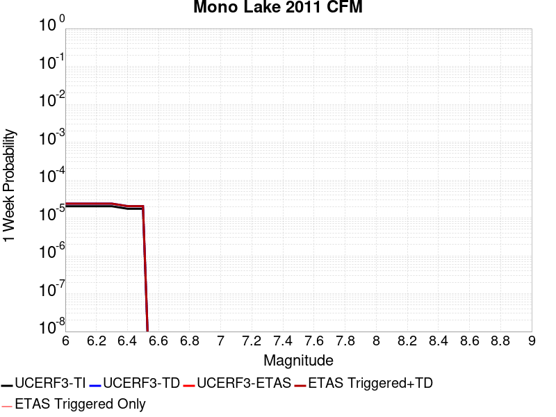 |  | 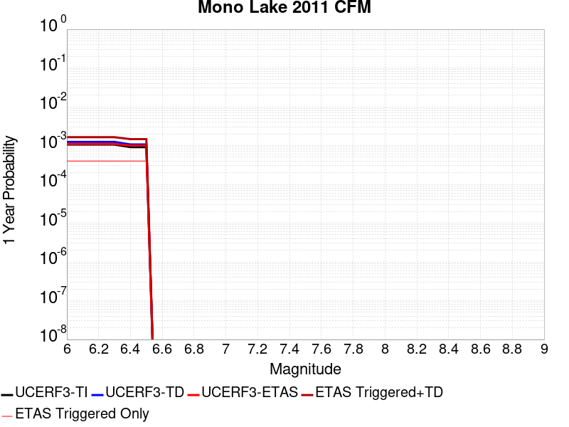 | 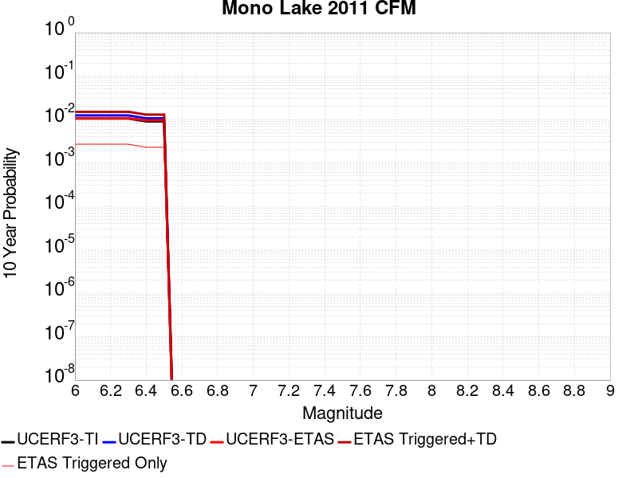 |

| Magnitude | 1 wk TI Prob | 1 wk TD Prob | 1 wk ETAS Prob | 1 wk ETAS/TD Gain | 1 wk ETAS Triggered+TD | 1 wk ETAS Triggered Only | 1 mo TI Prob | 1 mo TD Prob | 1 mo ETAS Prob | 1 mo ETAS/TD Gain | 1 mo ETAS Triggered+TD | 1 mo ETAS Triggered Only | 1 yr TI Prob | 1 yr TD Prob | 1 yr ETAS Prob | 1 yr ETAS/TD Gain | 1 yr ETAS Triggered+TD | 1 yr ETAS Triggered Only | 10 yr TI Prob | 10 yr TD Prob | 10 yr ETAS Prob | 10 yr ETAS/TD Gain | 10 yr ETAS Triggered+TD | 10 yr ETAS Triggered Only |
|-----|-----|-----|-----|-----|-----|-----|-----|-----|-----|-----|-----|-----|-----|-----|-----|-----|-----|-----|-----|-----|-----|-----|-----|-----|
| 6.0 | 2.0341662E-5 | 2.3836292E-5 | 0.0 | 0.0 | 2.3836292E-5 | 0.0 | 8.717564E-5 | 1.0215453E-4 | 0.0 | 0.0 | 1.0215453E-4 | 0.0 | 0.0010608466 | 0.0012435531 | 0.0011 | 0.88456213 | 0.0016430557 | 4.0E-4 | 0.010557966 | 0.012418052 | 0.0107 | 0.86164886 | 0.015084523 | 0.0027 |
| 6.1 | 2.0341662E-5 | 2.3836292E-5 | 0.0 | 0.0 | 2.3836292E-5 | 0.0 | 8.717564E-5 | 1.0215453E-4 | 0.0 | 0.0 | 1.0215453E-4 | 0.0 | 0.0010608466 | 0.0012435531 | 0.0011 | 0.88456213 | 0.0016430557 | 4.0E-4 | 0.010557966 | 0.012418052 | 0.0107 | 0.86164886 | 0.015084523 | 0.0027 |
| 6.2 | 2.0341662E-5 | 2.3836292E-5 | 0.0 | 0.0 | 2.3836292E-5 | 0.0 | 8.717564E-5 | 1.0215453E-4 | 0.0 | 0.0 | 1.0215453E-4 | 0.0 | 0.0010608466 | 0.0012435531 | 0.0011 | 0.88456213 | 0.0016430557 | 4.0E-4 | 0.010557966 | 0.012418052 | 0.0107 | 0.86164886 | 0.015084523 | 0.0027 |
| 6.3 | 2.0341662E-5 | 2.3836292E-5 | 0.0 | 0.0 | 2.3836292E-5 | 0.0 | 8.717564E-5 | 1.0215453E-4 | 0.0 | 0.0 | 1.0215453E-4 | 0.0 | 0.0010608466 | 0.0012435531 | 0.0011 | 0.88456213 | 0.0016430557 | 4.0E-4 | 0.010557966 | 0.012418052 | 0.0107 | 0.86164886 | 0.015084523 | 0.0027 |
| 6.4 | 1.749821E-5 | 2.0497962E-5 | 0.0 | 0.0 | 2.0497962E-5 | 0.0 | 7.499018E-5 | 8.7848406E-5 | 0.0 | 0.0 | 8.7848406E-5 | 0.0 | 9.1262296E-4 | 0.0010695539 | 0.001 | 0.93496925 | 0.0014691261 | 4.0E-4 | 0.009088841 | 0.010695495 | 0.0096 | 0.8975742 | 0.0129708955 | 0.0023 |
| 6.5 | 1.749821E-5 | 2.0497962E-5 | 0.0 | 0.0 | 2.0497962E-5 | 0.0 | 7.499018E-5 | 8.7848406E-5 | 0.0 | 0.0 | 8.7848406E-5 | 0.0 | 9.1262296E-4 | 0.0010695539 | 0.001 | 0.93496925 | 0.0014691261 | 4.0E-4 | 0.009088841 | 0.010695495 | 0.0096 | 0.8975742 | 0.0129708955 | 0.0023 |

## Santa Susana East (connector)
*[(top)](#table-of-contents)*

| 1 Week | 1 Month | 1 Year | 10 Year |
|-----|-----|-----|-----|
| 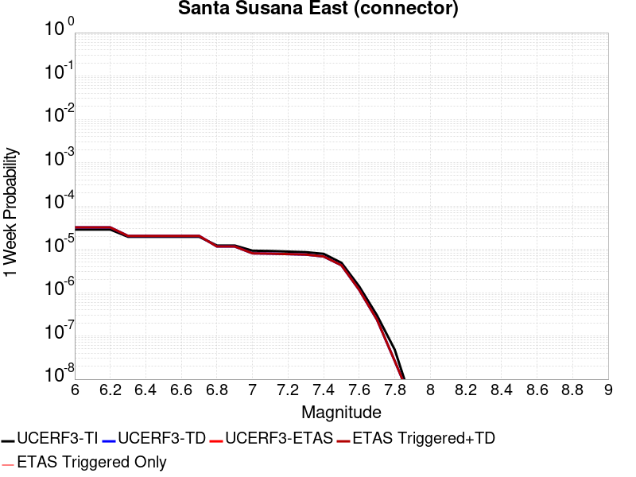 | 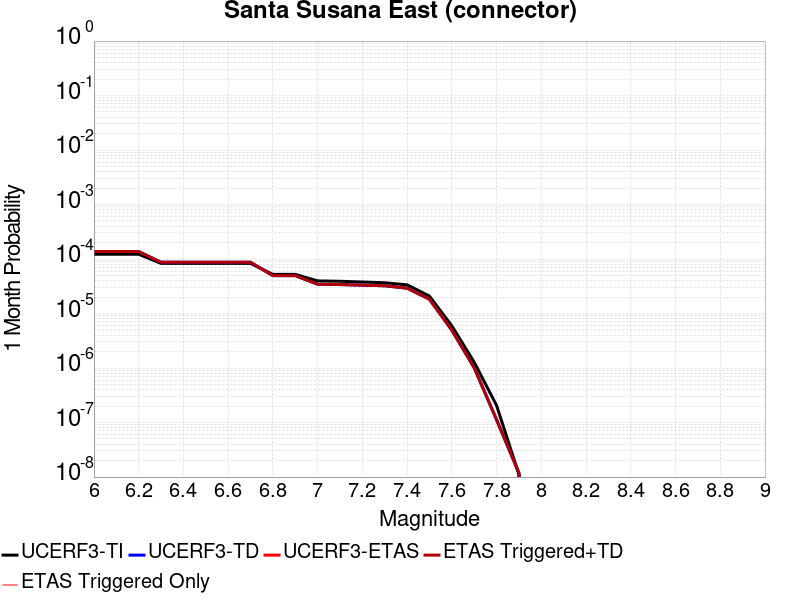 | 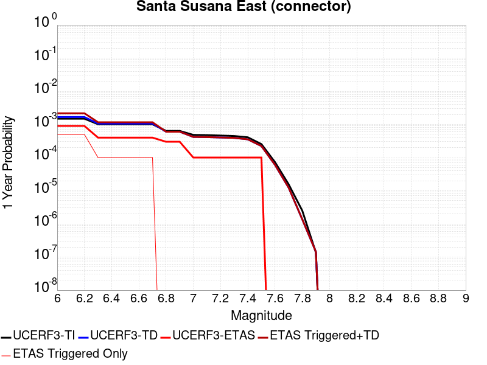 | 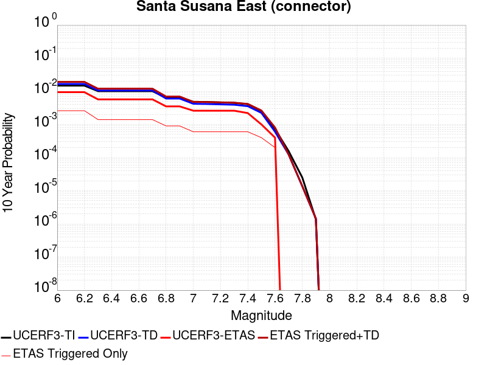 |

| Magnitude | 1 wk TI Prob | 1 wk TD Prob | 1 wk ETAS Prob | 1 wk ETAS/TD Gain | 1 wk ETAS Triggered+TD | 1 wk ETAS Triggered Only | 1 mo TI Prob | 1 mo TD Prob | 1 mo ETAS Prob | 1 mo ETAS/TD Gain | 1 mo ETAS Triggered+TD | 1 mo ETAS Triggered Only | 1 yr TI Prob | 1 yr TD Prob | 1 yr ETAS Prob | 1 yr ETAS/TD Gain | 1 yr ETAS Triggered+TD | 1 yr ETAS Triggered Only | 10 yr TI Prob | 10 yr TD Prob | 10 yr ETAS Prob | 10 yr ETAS/TD Gain | 10 yr ETAS Triggered+TD | 10 yr ETAS Triggered Only |
|-----|-----|-----|-----|-----|-----|-----|-----|-----|-----|-----|-----|-----|-----|-----|-----|-----|-----|-----|-----|-----|-----|-----|-----|-----|
| 6.0 | 2.858397E-5 | 3.2035285E-5 | 0.0 | 0.0 | 3.2035285E-5 | 0.0 | 1.2249697E-4 | 1.3728799E-4 | 0.0 | 0.0 | 1.3728799E-4 | 0.0 | 0.0014903803 | 0.0016704713 | 9.0E-4 | 0.53877014 | 0.002169636 | 5.0E-4 | 0.014804244 | 0.016605916 | 0.0094 | 0.56606334 | 0.01916274 | 0.0026 |
| 6.1 | 2.858397E-5 | 3.2035285E-5 | 0.0 | 0.0 | 3.2035285E-5 | 0.0 | 1.2249697E-4 | 1.3728799E-4 | 0.0 | 0.0 | 1.3728799E-4 | 0.0 | 0.0014903803 | 0.0016704713 | 9.0E-4 | 0.53877014 | 0.002169636 | 5.0E-4 | 0.014804244 | 0.016605916 | 0.0094 | 0.56606334 | 0.01916274 | 0.0026 |
| 6.2 | 2.858397E-5 | 3.2035285E-5 | 0.0 | 0.0 | 3.2035285E-5 | 0.0 | 1.2249697E-4 | 1.3728799E-4 | 0.0 | 0.0 | 1.3728799E-4 | 0.0 | 0.0014903803 | 0.0016704713 | 9.0E-4 | 0.53877014 | 0.002169636 | 5.0E-4 | 0.014804244 | 0.016605916 | 0.0094 | 0.56606334 | 0.01916274 | 0.0026 |
| 6.3 | 1.943582E-5 | 2.0374586E-5 | 0.0 | 0.0 | 2.0374586E-5 | 0.0 | 8.329371E-5 | 8.731737E-5 | 0.0 | 0.0 | 8.731737E-5 | 0.0 | 0.001013629 | 0.0010626826 | 4.0E-4 | 0.3764059 | 0.0011625764 | 1.0E-4 | 0.010090181 | 0.010587283 | 0.0057 | 0.53838176 | 0.011972461 | 0.0014 |
| 6.4 | 1.943582E-5 | 2.0374586E-5 | 0.0 | 0.0 | 2.0374586E-5 | 0.0 | 8.329371E-5 | 8.731737E-5 | 0.0 | 0.0 | 8.731737E-5 | 0.0 | 0.001013629 | 0.0010626826 | 4.0E-4 | 0.3764059 | 0.0011625764 | 1.0E-4 | 0.010090181 | 0.010587283 | 0.0057 | 0.53838176 | 0.011972461 | 0.0014 |
| 6.5 | 1.943582E-5 | 2.0374586E-5 | 0.0 | 0.0 | 2.0374586E-5 | 0.0 | 8.329371E-5 | 8.731737E-5 | 0.0 | 0.0 | 8.731737E-5 | 0.0 | 0.001013629 | 0.0010626826 | 4.0E-4 | 0.3764059 | 0.0011625764 | 1.0E-4 | 0.010090181 | 0.010587283 | 0.0057 | 0.53838176 | 0.011972461 | 0.0014 |
| 6.6 | 1.943582E-5 | 2.0374586E-5 | 0.0 | 0.0 | 2.0374586E-5 | 0.0 | 8.329371E-5 | 8.731737E-5 | 0.0 | 0.0 | 8.731737E-5 | 0.0 | 0.001013629 | 0.0010626826 | 4.0E-4 | 0.3764059 | 0.0011625764 | 1.0E-4 | 0.010090181 | 0.010587283 | 0.0057 | 0.53838176 | 0.011972461 | 0.0014 |
| 6.7 | 1.9404439E-5 | 2.0362002E-5 | 0.0 | 0.0 | 2.0362002E-5 | 0.0 | 8.3159226E-5 | 8.726344E-5 | 0.0 | 0.0 | 8.726344E-5 | 0.0 | 0.0010119933 | 0.0010620267 | 4.0E-4 | 0.37663835 | 0.0011619205 | 1.0E-4 | 0.010073971 | 0.0105807865 | 0.0057 | 0.5387123 | 0.011965973 | 0.0014 |
| 6.8 | 1.2217526E-5 | 1.1596022E-5 | 0.0 | 0.0 | 1.1596022E-5 | 0.0 | 5.2359774E-5 | 4.9696384E-5 | 0.0 | 0.0 | 4.9696384E-5 | 0.0 | 6.372938E-4 | 6.0490234E-4 | 3.0E-4 | 0.4959478 | 6.0490234E-4 | 0.0 | 0.0063546924 | 0.0060344394 | 0.0035 | 0.58000416 | 0.0069290088 | 9.0E-4 |
| 6.9 | 1.2217526E-5 | 1.1596022E-5 | 0.0 | 0.0 | 1.1596022E-5 | 0.0 | 5.2359774E-5 | 4.9696384E-5 | 0.0 | 0.0 | 4.9696384E-5 | 0.0 | 6.372938E-4 | 6.0490234E-4 | 3.0E-4 | 0.4959478 | 6.0490234E-4 | 0.0 | 0.0063546924 | 0.0060344394 | 0.0035 | 0.58000416 | 0.0069290088 | 9.0E-4 |
| 7.0 | 9.276017E-6 | 8.060654E-6 | 0.0 | 0.0 | 8.060654E-6 | 0.0 | 3.9753755E-5 | 3.4545224E-5 | 0.0 | 0.0 | 3.4545224E-5 | 0.0 | 4.8389446E-4 | 4.205104E-4 | 1.0E-4 | 0.23780626 | 4.205104E-4 | 0.0 | 0.0048284214 | 0.0041977055 | 0.0026 | 0.61938596 | 0.004795187 | 6.0E-4 |
| 7.1 | 9.130355E-6 | 7.9438005E-6 | 0.0 | 0.0 | 7.9438005E-6 | 0.0 | 3.9129503E-5 | 3.4044435E-5 | 0.0 | 0.0 | 3.4044435E-5 | 0.0 | 4.7629757E-4 | 4.144156E-4 | 1.0E-4 | 0.24130365 | 4.144156E-4 | 0.0 | 0.00475278 | 0.004136986 | 0.0026 | 0.62847686 | 0.004734504 | 6.0E-4 |
| 7.2 | 8.851015E-6 | 7.742927E-6 | 0.0 | 0.0 | 7.742927E-6 | 0.0 | 3.7932372E-5 | 3.318357E-5 | 0.0 | 0.0 | 3.318357E-5 | 0.0 | 4.6172875E-4 | 4.0393847E-4 | 1.0E-4 | 0.24756245 | 4.0393847E-4 | 0.0 | 0.0046077054 | 0.004032598 | 0.0026 | 0.6447457 | 0.004630178 | 6.0E-4 |
| 7.3 | 8.573006E-6 | 7.5516114E-6 | 0.0 | 0.0 | 7.5516114E-6 | 0.0 | 3.6740938E-5 | 3.2363667E-5 | 0.0 | 0.0 | 3.2363667E-5 | 0.0 | 4.472291E-4 | 3.939598E-4 | 1.0E-4 | 0.253833 | 3.939598E-4 | 0.0 | 0.004463301 | 0.0039331596 | 0.0026 | 0.6610461 | 0.0045308 | 6.0E-4 |
| 7.4 | 7.852282E-6 | 6.8188915E-6 | 0.0 | 0.0 | 6.8188915E-6 | 0.0 | 3.36522E-5 | 2.922351E-5 | 0.0 | 0.0 | 2.922351E-5 | 0.0 | 4.096385E-4 | 3.5574118E-4 | 1.0E-4 | 0.28110325 | 3.5574118E-4 | 0.0 | 0.0040888423 | 0.0035522126 | 0.0022 | 0.6193323 | 0.0041500814 | 6.0E-4 |
| 7.5 | 4.8869324E-6 | 4.27982E-6 | 0.0 | 0.0 | 4.27982E-6 | 0.0 | 2.0943828E-5 | 1.8341967E-5 | 0.0 | 0.0 | 1.8341967E-5 | 0.0 | 2.5496128E-4 | 2.2329221E-4 | 1.0E-4 | 0.44784364 | 2.2329221E-4 | 0.0 | 0.0025466895 | 0.0022307558 | 0.001 | 0.44827855 | 0.0026298636 | 4.0E-4 |
| 7.6 | 1.3894544E-6 | 1.157005E-6 | 0.0 | 0.0 | 1.157005E-6 | 0.0 | 5.954791E-6 | 4.958585E-6 | 0.0 | 0.0 | 4.958585E-6 | 0.0 | 7.249717E-5 | 6.0369322E-5 | 0.0 | 0.0 | 6.0369322E-5 | 0.0 | 7.247352E-4 | 6.0355105E-4 | 4.0E-4 | 0.6627443 | 8.0343033E-4 | 2.0E-4 |
| 7.7 | 2.9924632E-7 | 2.3729595E-7 | 0.0 | 0.0 | 2.3729595E-7 | 0.0 | 1.2824837E-6 | 1.0169823E-6 | 0.0 | 0.0 | 1.0169823E-6 | 0.0 | 1.5614127E-5 | 1.2381696E-5 | 0.0 | 0.0 | 1.2381696E-5 | 0.0 | 1.5613029E-4 | 1.2381078E-4 | 0.0 | 0.0 | 1.2381078E-4 | 0.0 |
| 7.8 | 4.8188564E-8 | 2.639631E-8 | 0.0 | 0.0 | 2.639631E-8 | 0.0 | 2.065224E-7 | 1.1312703E-7 | 0.0 | 0.0 | 1.1312703E-7 | 0.0 | 2.5144072E-6 | 1.3773208E-6 | 0.0 | 0.0 | 1.3773208E-6 | 0.0 | 2.5143789E-5 | 1.3773131E-5 | 0.0 | 0.0 | 1.3773131E-5 | 0.0 |
| 7.9 | 2.6127251E-9 | 2.7684366E-9 | 0.0 | 0.0 | 2.7684366E-9 | 0.0 | 1.1197393E-8 | 1.1864729E-8 | 0.0 | 0.0 | 1.1864729E-8 | 0.0 | 1.3632825E-7 | 1.4445307E-7 | 0.0 | 0.0 | 1.4445307E-7 | 0.0 | 1.3632817E-6 | 1.4445308E-6 | 0.0 | 0.0 | 1.4445308E-6 | 0.0 |

## Death Valley (So)
*[(top)](#table-of-contents)*

| 1 Week | 1 Month | 1 Year | 10 Year |
|-----|-----|-----|-----|
|  |  | 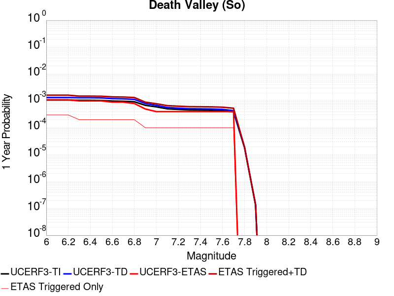 |  |

| Magnitude | 1 wk TI Prob | 1 wk TD Prob | 1 wk ETAS Prob | 1 wk ETAS/TD Gain | 1 wk ETAS Triggered+TD | 1 wk ETAS Triggered Only | 1 mo TI Prob | 1 mo TD Prob | 1 mo ETAS Prob | 1 mo ETAS/TD Gain | 1 mo ETAS Triggered+TD | 1 mo ETAS Triggered Only | 1 yr TI Prob | 1 yr TD Prob | 1 yr ETAS Prob | 1 yr ETAS/TD Gain | 1 yr ETAS Triggered+TD | 1 yr ETAS Triggered Only | 10 yr TI Prob | 10 yr TD Prob | 10 yr ETAS Prob | 10 yr ETAS/TD Gain | 10 yr ETAS Triggered+TD | 10 yr ETAS Triggered Only |
|-----|-----|-----|-----|-----|-----|-----|-----|-----|-----|-----|-----|-----|-----|-----|-----|-----|-----|-----|-----|-----|-----|-----|-----|-----|
| 6.0 | 2.0684236E-5 | 2.5627864E-5 | 0.0 | 0.0 | 2.5627864E-5 | 0.0 | 8.864371E-5 | 1.09829176E-4 | 0.0 | 0.0 | 1.09829176E-4 | 0.0 | 0.0010787029 | 0.0013363669 | 0.0011 | 0.8231272 | 0.001635966 | 3.0E-4 | 0.010734817 | 0.01328546 | 0.0115 | 0.8656079 | 0.015850918 | 0.0026 |
| 6.1 | 2.0684236E-5 | 2.5627864E-5 | 0.0 | 0.0 | 2.5627864E-5 | 0.0 | 8.864371E-5 | 1.09829176E-4 | 0.0 | 0.0 | 1.09829176E-4 | 0.0 | 0.0010787029 | 0.0013363669 | 0.0011 | 0.8231272 | 0.001635966 | 3.0E-4 | 0.010734817 | 0.01328546 | 0.0115 | 0.8656079 | 0.015850918 | 0.0026 |
| 6.2 | 2.0684236E-5 | 2.5627864E-5 | 0.0 | 0.0 | 2.5627864E-5 | 0.0 | 8.864371E-5 | 1.09829176E-4 | 0.0 | 0.0 | 1.09829176E-4 | 0.0 | 0.0010787029 | 0.0013363669 | 0.0011 | 0.8231272 | 0.001635966 | 3.0E-4 | 0.010734817 | 0.01328546 | 0.0115 | 0.8656079 | 0.015850918 | 0.0026 |
| 6.3 | 2.0240292E-5 | 2.5127823E-5 | 0.0 | 0.0 | 2.5127823E-5 | 0.0 | 8.6741224E-5 | 1.0768632E-4 | 0.0 | 0.0 | 1.0768632E-4 | 0.0 | 0.0010555626 | 0.0013103092 | 0.001 | 0.76317865 | 0.0015100471 | 2.0E-4 | 0.010505628 | 0.013027957 | 0.0112 | 0.8596897 | 0.015396689 | 0.0024 |
| 6.4 | 2.0240292E-5 | 2.5127823E-5 | 0.0 | 0.0 | 2.5127823E-5 | 0.0 | 8.6741224E-5 | 1.0768632E-4 | 0.0 | 0.0 | 1.0768632E-4 | 0.0 | 0.0010555626 | 0.0013103092 | 0.001 | 0.76317865 | 0.0015100471 | 2.0E-4 | 0.010505628 | 0.013027957 | 0.0112 | 0.8596897 | 0.015396689 | 0.0024 |
| 6.5 | 1.9962767E-5 | 2.4817004E-5 | 0.0 | 0.0 | 2.4817004E-5 | 0.0 | 8.55519E-5 | 1.0635434E-4 | 0.0 | 0.0 | 1.0635434E-4 | 0.0 | 0.0010410968 | 0.0012941117 | 0.001 | 0.7727308 | 0.0014938528 | 2.0E-4 | 0.010362327 | 0.012867865 | 0.0111 | 0.8626139 | 0.015236982 | 0.0024 |
| 6.6 | 1.8937297E-5 | 2.332037E-5 | 0.0 | 0.0 | 2.332037E-5 | 0.0 | 8.115732E-5 | 9.99407E-5 | 0.0 | 0.0 | 9.99407E-5 | 0.0 | 9.876423E-4 | 0.0012161133 | 9.0E-4 | 0.7400626 | 0.0014158702 | 2.0E-4 | 0.009832645 | 0.012096784 | 0.0105 | 0.8679993 | 0.014368962 | 0.0023 |
| 6.7 | 1.8621096E-5 | 2.2920907E-5 | 0.0 | 0.0 | 2.2920907E-5 | 0.0 | 7.980225E-5 | 9.822885E-5 | 0.0 | 0.0 | 9.822885E-5 | 0.0 | 9.711593E-4 | 0.0011952945 | 9.0E-4 | 0.75295246 | 0.0013950556 | 2.0E-4 | 0.009669261 | 0.011890838 | 0.0103 | 0.8662131 | 0.014064679 | 0.0022 |
| 6.8 | 1.7830353E-5 | 2.1814458E-5 | 0.0 | 0.0 | 2.1814458E-5 | 0.0 | 7.641356E-5 | 9.348726E-5 | 0.0 | 0.0 | 9.348726E-5 | 0.0 | 9.29938E-4 | 0.0011376272 | 8.0E-4 | 0.7032181 | 0.0013373996 | 2.0E-4 | 0.009260561 | 0.0113193495 | 0.0096 | 0.8481053 | 0.013395579 | 0.0021 |
| 6.9 | 1.3135183E-5 | 1.530884E-5 | 0.0 | 0.0 | 1.530884E-5 | 0.0 | 5.6292425E-5 | 6.56077E-5 | 0.0 | 0.0 | 6.56077E-5 | 0.0 | 6.8514474E-4 | 7.984875E-4 | 5.0E-4 | 0.62618387 | 8.9840766E-4 | 1.0E-4 | 0.006830362 | 0.007955789 | 0.0061 | 0.76673734 | 0.0091462415 | 0.0012 |
| 7.0 | 1.1507512E-5 | 1.31579645E-5 | 0.0 | 0.0 | 1.31579645E-5 | 0.0 | 4.9316975E-5 | 5.6390087E-5 | 0.0 | 0.0 | 5.6390087E-5 | 0.0 | 6.002687E-4 | 6.863388E-4 | 4.0E-4 | 0.58280253 | 7.862702E-4 | 1.0E-4 | 0.0059864987 | 0.0068415613 | 0.0053 | 0.774677 | 0.007934036 | 0.0011 |
| 7.1 | 9.715903E-6 | 1.0867917E-5 | 0.0 | 0.0 | 1.0867917E-5 | 0.0 | 4.1638916E-5 | 4.657598E-5 | 0.0 | 0.0 | 4.657598E-5 | 0.0 | 5.068359E-4 | 5.669193E-4 | 4.0E-4 | 0.70556784 | 6.668626E-4 | 1.0E-4 | 0.0050568148 | 0.005655111 | 0.0038 | 0.6719585 | 0.006450587 | 8.0E-4 |
| 7.2 | 9.233269E-6 | 1.0288746E-5 | 0.0 | 0.0 | 1.0288746E-5 | 0.0 | 3.9570554E-5 | 4.4093904E-5 | 0.0 | 0.0 | 4.4093904E-5 | 0.0 | 4.81665E-4 | 5.3671526E-4 | 4.0E-4 | 0.7452741 | 6.366616E-4 | 1.0E-4 | 0.0048062233 | 0.005354622 | 0.0036 | 0.6723164 | 0.0060508735 | 7.0E-4 |
| 7.3 | 8.8041315E-6 | 9.810394E-6 | 0.0 | 0.0 | 9.810394E-6 | 0.0 | 3.7731446E-5 | 4.2043892E-5 | 0.0 | 0.0 | 4.2043892E-5 | 0.0 | 4.592835E-4 | 5.1176833E-4 | 4.0E-4 | 0.78160363 | 6.117172E-4 | 1.0E-4 | 0.0045833546 | 0.005106325 | 0.0033 | 0.64625734 | 0.0058027506 | 7.0E-4 |
| 7.4 | 8.708749E-6 | 9.7093925E-6 | 0.0 | 0.0 | 9.7093925E-6 | 0.0 | 3.7322676E-5 | 4.161104E-5 | 0.0 | 0.0 | 4.161104E-5 | 0.0 | 4.5430884E-4 | 5.065009E-4 | 4.0E-4 | 0.7897321 | 6.0645025E-4 | 1.0E-4 | 0.004533812 | 0.0050538913 | 0.0031 | 0.6133888 | 0.005650859 | 6.0E-4 |
| 7.5 | 8.612678E-6 | 9.607022E-6 | 0.0 | 0.0 | 9.607022E-6 | 0.0 | 3.6910955E-5 | 4.1172323E-5 | 0.0 | 0.0 | 4.1172323E-5 | 0.0 | 4.492982E-4 | 5.011619E-4 | 4.0E-4 | 0.79814523 | 6.011118E-4 | 1.0E-4 | 0.004483909 | 0.005000743 | 0.0031 | 0.61990786 | 0.0055977427 | 6.0E-4 |
| 7.6 | 8.319024E-6 | 9.28606E-6 | 0.0 | 0.0 | 9.28606E-6 | 0.0 | 3.5652476E-5 | 3.9796818E-5 | 0.0 | 0.0 | 3.9796818E-5 | 0.0 | 4.3398244E-4 | 4.8442275E-4 | 4.0E-4 | 0.8257251 | 5.843743E-4 | 1.0E-4 | 0.0043313587 | 0.0048340918 | 0.0028 | 0.57921946 | 0.005331675 | 5.0E-4 |
| 7.7 | 7.4718328E-6 | 8.347111E-6 | 0.0 | 0.0 | 8.347111E-6 | 0.0 | 3.2021748E-5 | 3.5772868E-5 | 0.0 | 0.0 | 3.5772868E-5 | 0.0 | 3.8979502E-4 | 4.3545166E-4 | 4.0E-4 | 0.91858643 | 5.354081E-4 | 1.0E-4 | 0.00389112 | 0.0043463893 | 0.0027 | 0.6212053 | 0.004844216 | 5.0E-4 |
| 7.8 | 3.4586725E-7 | 3.64866E-7 | 0.0 | 0.0 | 3.64866E-7 | 0.0 | 1.4822873E-6 | 1.5637105E-6 | 0.0 | 0.0 | 1.5637105E-6 | 0.0 | 1.80467E-5 | 1.9038014E-5 | 0.0 | 0.0 | 1.9038014E-5 | 0.0 | 1.8045233E-4 | 1.9036427E-4 | 1.0E-4 | 0.52530867 | 1.9036427E-4 | 0.0 |
| 7.9 | 2.5591178E-9 | 2.6699005E-9 | 0.0 | 0.0 | 2.6699005E-9 | 0.0 | 1.0967647E-8 | 1.1442431E-8 | 0.0 | 0.0 | 1.1442431E-8 | 0.0 | 1.335311E-7 | 1.393116E-7 | 0.0 | 0.0 | 1.393116E-7 | 0.0 | 1.3353102E-6 | 1.3931159E-6 | 0.0 | 0.0 | 1.3931159E-6 | 0.0 |

## Garlic Springs
*[(top)](#table-of-contents)*

| 1 Week | 1 Month | 1 Year | 10 Year |
|-----|-----|-----|-----|
|  |  | 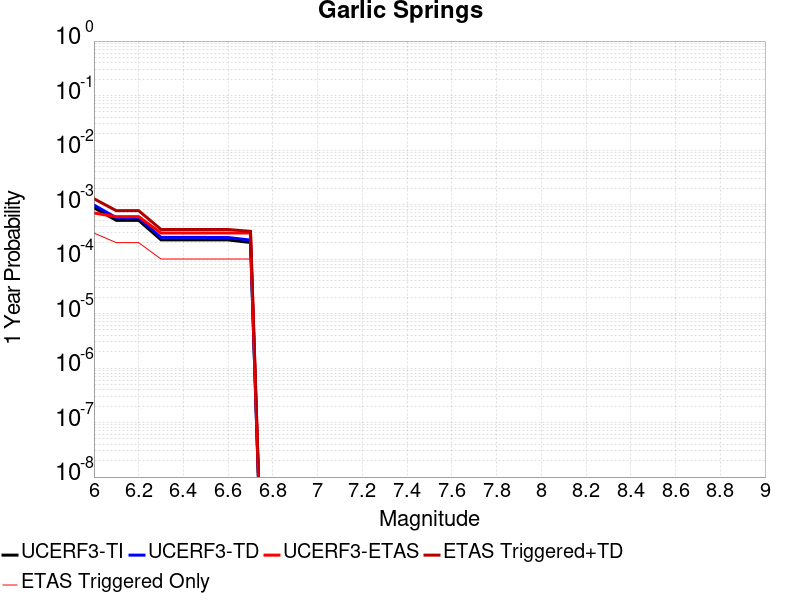 |  |

| Magnitude | 1 wk TI Prob | 1 wk TD Prob | 1 wk ETAS Prob | 1 wk ETAS/TD Gain | 1 wk ETAS Triggered+TD | 1 wk ETAS Triggered Only | 1 mo TI Prob | 1 mo TD Prob | 1 mo ETAS Prob | 1 mo ETAS/TD Gain | 1 mo ETAS Triggered+TD | 1 mo ETAS Triggered Only | 1 yr TI Prob | 1 yr TD Prob | 1 yr ETAS Prob | 1 yr ETAS/TD Gain | 1 yr ETAS Triggered+TD | 1 yr ETAS Triggered Only | 10 yr TI Prob | 10 yr TD Prob | 10 yr ETAS Prob | 10 yr ETAS/TD Gain | 10 yr ETAS Triggered+TD | 10 yr ETAS Triggered Only |
|-----|-----|-----|-----|-----|-----|-----|-----|-----|-----|-----|-----|-----|-----|-----|-----|-----|-----|-----|-----|-----|-----|-----|-----|-----|
| 6.0 | 1.6760017E-5 | 1.8781318E-5 | 0.0 | 0.0 | 1.8781318E-5 | 0.0 | 7.182667E-5 | 8.048954E-5 | 0.0 | 0.0 | 8.048954E-5 | 0.0 | 8.7413884E-4 | 9.79637E-4 | 7.0E-4 | 0.7145504 | 0.0012793432 | 3.0E-4 | 0.008707083 | 0.0097647365 | 0.0116 | 1.1879481 | 0.012141301 | 0.0024 |
| 6.1 | 9.852767E-6 | 1.0976064E-5 | 0.0 | 0.0 | 1.0976064E-5 | 0.0 | 4.222546E-5 | 4.7039826E-5 | 0.0 | 0.0 | 4.7039826E-5 | 0.0 | 5.139737E-4 | 5.726304E-4 | 6.0E-4 | 1.0477964 | 7.7251584E-4 | 2.0E-4 | 0.005127866 | 0.0057185097 | 0.0074 | 1.2940434 | 0.007607645 | 0.0019 |
| 6.2 | 9.852767E-6 | 1.0976064E-5 | 0.0 | 0.0 | 1.0976064E-5 | 0.0 | 4.222546E-5 | 4.7039826E-5 | 0.0 | 0.0 | 4.7039826E-5 | 0.0 | 5.139737E-4 | 5.726304E-4 | 6.0E-4 | 1.0477964 | 7.7251584E-4 | 2.0E-4 | 0.005127866 | 0.0057185097 | 0.0074 | 1.2940434 | 0.007607645 | 0.0019 |
| 6.3 | 4.3167724E-6 | 4.7790413E-6 | 0.0 | 0.0 | 4.7790413E-6 | 0.0 | 1.8500323E-5 | 2.0481575E-5 | 0.0 | 0.0 | 2.0481575E-5 | 0.0 | 2.2521814E-4 | 2.4935766E-4 | 3.0E-4 | 1.2030911 | 3.4933272E-4 | 1.0E-4 | 0.0022499003 | 0.002493038 | 0.0034 | 1.3637979 | 0.0030915423 | 6.0E-4 |
| 6.4 | 4.3167724E-6 | 4.7790413E-6 | 0.0 | 0.0 | 4.7790413E-6 | 0.0 | 1.8500323E-5 | 2.0481575E-5 | 0.0 | 0.0 | 2.0481575E-5 | 0.0 | 2.2521814E-4 | 2.4935766E-4 | 3.0E-4 | 1.2030911 | 3.4933272E-4 | 1.0E-4 | 0.0022499003 | 0.002493038 | 0.0034 | 1.3637979 | 0.0030915423 | 6.0E-4 |
| 6.5 | 4.3167724E-6 | 4.7790413E-6 | 0.0 | 0.0 | 4.7790413E-6 | 0.0 | 1.8500323E-5 | 2.0481575E-5 | 0.0 | 0.0 | 2.0481575E-5 | 0.0 | 2.2521814E-4 | 2.4935766E-4 | 3.0E-4 | 1.2030911 | 3.4933272E-4 | 1.0E-4 | 0.0022499003 | 0.002493038 | 0.0034 | 1.3637979 | 0.0030915423 | 6.0E-4 |
| 6.6 | 4.301311E-6 | 4.761906E-6 | 0.0 | 0.0 | 4.761906E-6 | 0.0 | 1.8434059E-5 | 2.0408139E-5 | 0.0 | 0.0 | 2.0408139E-5 | 0.0 | 2.2441156E-4 | 2.484638E-4 | 3.0E-4 | 1.2074194 | 3.4843895E-4 | 1.0E-4 | 0.0022418506 | 0.0024841193 | 0.0034 | 1.3686943 | 0.0030826288 | 6.0E-4 |
| 6.7 | 3.8599724E-6 | 4.271962E-6 | 0.0 | 0.0 | 4.271962E-6 | 0.0 | 1.6542634E-5 | 1.8308408E-5 | 0.0 | 0.0 | 1.8308408E-5 | 0.0 | 2.0138794E-4 | 2.2290487E-4 | 3.0E-4 | 1.3458656 | 3.2288258E-4 | 1.0E-4 | 0.0020120554 | 0.0022290489 | 0.0033 | 1.4804522 | 0.0028277114 | 6.0E-4 |

## San Andreas (Peninsula) 2011 CFM
*[(top)](#table-of-contents)*

| 1 Week | 1 Month | 1 Year | 10 Year |
|-----|-----|-----|-----|
|  |  |  |  |

| Magnitude | 1 wk TI Prob | 1 wk TD Prob | 1 wk ETAS Prob | 1 wk ETAS/TD Gain | 1 wk ETAS Triggered+TD | 1 wk ETAS Triggered Only | 1 mo TI Prob | 1 mo TD Prob | 1 mo ETAS Prob | 1 mo ETAS/TD Gain | 1 mo ETAS Triggered+TD | 1 mo ETAS Triggered Only | 1 yr TI Prob | 1 yr TD Prob | 1 yr ETAS Prob | 1 yr ETAS/TD Gain | 1 yr ETAS Triggered+TD | 1 yr ETAS Triggered Only | 10 yr TI Prob | 10 yr TD Prob | 10 yr ETAS Prob | 10 yr ETAS/TD Gain | 10 yr ETAS Triggered+TD | 10 yr ETAS Triggered Only |
|-----|-----|-----|-----|-----|-----|-----|-----|-----|-----|-----|-----|-----|-----|-----|-----|-----|-----|-----|-----|-----|-----|-----|-----|-----|
| 6.0 | 8.6200685E-5 | 2.5585367E-5 | 2.0E-4 | 7.8169684 | 1.2558281E-4 | 1.0E-4 | 3.6937918E-4 | 1.0964697E-4 | 2.0E-4 | 1.8240359 | 2.0963601E-4 | 1.0E-4 | 0.0044879215 | 0.001334136 | 7.0E-4 | 0.52468413 | 0.0015338692 | 2.0E-4 | 0.043983612 | 0.014976911 | 0.0096 | 0.6409866 | 0.01743947 | 0.0025 |
| 6.1 | 8.6200685E-5 | 2.5585367E-5 | 2.0E-4 | 7.8169684 | 1.2558281E-4 | 1.0E-4 | 3.6937918E-4 | 1.0964697E-4 | 2.0E-4 | 1.8240359 | 2.0963601E-4 | 1.0E-4 | 0.0044879215 | 0.001334136 | 7.0E-4 | 0.52468413 | 0.0015338692 | 2.0E-4 | 0.043983612 | 0.014976911 | 0.0096 | 0.6409866 | 0.01743947 | 0.0025 |
| 6.2 | 8.6200685E-5 | 2.5585367E-5 | 2.0E-4 | 7.8169684 | 1.2558281E-4 | 1.0E-4 | 3.6937918E-4 | 1.0964697E-4 | 2.0E-4 | 1.8240359 | 2.0963601E-4 | 1.0E-4 | 0.0044879215 | 0.001334136 | 7.0E-4 | 0.52468413 | 0.0015338692 | 2.0E-4 | 0.043983612 | 0.014976911 | 0.0096 | 0.6409866 | 0.01743947 | 0.0025 |
| 6.3 | 8.551163E-5 | 2.527481E-5 | 2.0E-4 | 7.913017 | 1.2527229E-4 | 1.0E-4 | 3.6642692E-4 | 1.08316126E-4 | 2.0E-4 | 1.8464471 | 2.083053E-4 | 1.0E-4 | 0.004452125 | 0.0013179526 | 7.0E-4 | 0.5311268 | 0.0015176891 | 2.0E-4 | 0.043639794 | 0.014802409 | 0.0093 | 0.6282761 | 0.017166883 | 0.0024 |
| 6.4 | 8.551163E-5 | 2.527481E-5 | 2.0E-4 | 7.913017 | 1.2527229E-4 | 1.0E-4 | 3.6642692E-4 | 1.08316126E-4 | 2.0E-4 | 1.8464471 | 2.083053E-4 | 1.0E-4 | 0.004452125 | 0.0013179526 | 7.0E-4 | 0.5311268 | 0.0015176891 | 2.0E-4 | 0.043639794 | 0.014802409 | 0.0093 | 0.6282761 | 0.017166883 | 0.0024 |
| 6.5 | 8.511146E-5 | 2.509482E-5 | 2.0E-4 | 7.9697723 | 1.2509231E-4 | 1.0E-4 | 3.647124E-4 | 1.075448E-4 | 2.0E-4 | 1.8596901 | 2.0753405E-4 | 1.0E-4 | 0.004431336 | 0.0013085732 | 7.0E-4 | 0.53493375 | 0.0015083115 | 2.0E-4 | 0.04344007 | 0.014701557 | 0.0093 | 0.63258606 | 0.017066274 | 0.0024 |
| 6.6 | 8.4985084E-5 | 2.502506E-5 | 2.0E-4 | 7.9919887 | 1.2502256E-4 | 1.0E-4 | 3.6417096E-4 | 1.07245854E-4 | 2.0E-4 | 1.8648739 | 2.0723513E-4 | 1.0E-4 | 0.0044247704 | 0.0013049379 | 7.0E-4 | 0.536424 | 0.0015046769 | 2.0E-4 | 0.043376986 | 0.014663307 | 0.0092 | 0.62741643 | 0.017028116 | 0.0024 |
| 6.7 | 8.462618E-5 | 2.4852341E-5 | 2.0E-4 | 8.047531 | 1.2484986E-4 | 1.0E-4 | 3.6263323E-4 | 1.0650569E-4 | 2.0E-4 | 1.8778338 | 2.0649504E-4 | 1.0E-4 | 0.004406125 | 0.0012959371 | 7.0E-4 | 0.5401496 | 0.001495678 | 2.0E-4 | 0.043197807 | 0.014567543 | 0.0091 | 0.6246764 | 0.01693258 | 0.0024 |
| 6.8 | 8.42337E-5 | 2.4747147E-5 | 2.0E-4 | 8.081739 | 1.2474468E-4 | 1.0E-4 | 3.6095164E-4 | 1.06054904E-4 | 2.0E-4 | 1.8858157 | 2.060443E-4 | 1.0E-4 | 0.004385734 | 0.0012904552 | 7.0E-4 | 0.5424442 | 0.0014901971 | 2.0E-4 | 0.043001823 | 0.014507679 | 0.0091 | 0.627254 | 0.01687286 | 0.0024 |
| 6.9 | 8.365989E-5 | 2.4550456E-5 | 2.0E-4 | 8.146488 | 1.24548E-4 | 1.0E-4 | 3.5849313E-4 | 1.05212006E-4 | 2.0E-4 | 1.9009237 | 2.0520149E-4 | 1.0E-4 | 0.004355922 | 0.0012802051 | 6.0E-4 | 0.4686749 | 0.0014799491 | 2.0E-4 | 0.04271523 | 0.014399567 | 0.0088 | 0.6111295 | 0.016666448 | 0.0023 |
| 7.0 | 8.30936E-5 | 2.431079E-5 | 2.0E-4 | 8.2268 | 1.2430835E-4 | 1.0E-4 | 3.560668E-4 | 1.0418495E-4 | 2.0E-4 | 1.9196631 | 2.0417453E-4 | 1.0E-4 | 0.004326499 | 0.0012677154 | 6.0E-4 | 0.47329238 | 0.0014674618 | 2.0E-4 | 0.042432297 | 0.014269966 | 0.0088 | 0.6166798 | 0.016537145 | 0.0023 |
| 7.1 | 8.041264E-5 | 2.3994393E-5 | 2.0E-4 | 8.33528 | 1.23992E-4 | 1.0E-4 | 3.4458007E-4 | 1.0282907E-4 | 2.0E-4 | 1.9449753 | 2.0281879E-4 | 1.0E-4 | 0.0041871946 | 0.0012512265 | 6.0E-4 | 0.47952947 | 0.0014509764 | 2.0E-4 | 0.041091725 | 0.014091101 | 0.0087 | 0.61741096 | 0.01635869 | 0.0023 |
| 7.2 | 7.8427016E-5 | 2.3414497E-5 | 2.0E-4 | 8.541717 | 1.2341216E-4 | 1.0E-4 | 3.3607247E-4 | 1.0034399E-4 | 2.0E-4 | 1.9931438 | 2.0033396E-4 | 1.0E-4 | 0.004084008 | 0.0012210051 | 6.0E-4 | 0.49139845 | 0.0014207609 | 2.0E-4 | 0.040097635 | 0.013773698 | 0.0081 | 0.5880773 | 0.015647529 | 0.0019 |
| 7.3 | 7.721087E-5 | 2.3198158E-5 | 2.0E-4 | 8.621374 | 1.2319584E-4 | 1.0E-4 | 3.3086175E-4 | 9.9416895E-5 | 2.0E-4 | 2.0117304 | 1.9940696E-4 | 1.0E-4 | 0.004020803 | 0.0012097303 | 6.0E-4 | 0.49597833 | 0.0014094883 | 2.0E-4 | 0.03948827 | 0.013656755 | 0.008 | 0.5857907 | 0.015530807 | 0.0019 |
| 7.4 | 7.3536525E-5 | 2.1292115E-5 | 2.0E-4 | 9.393148 | 1.2128999E-4 | 1.0E-4 | 3.1511846E-4 | 9.124873E-5 | 2.0E-4 | 2.1918113 | 1.9123961E-4 | 1.0E-4 | 0.0038298194 | 0.0011103884 | 6.0E-4 | 0.54035145 | 0.0013101664 | 2.0E-4 | 0.037644852 | 0.012602318 | 0.0075 | 0.59512866 | 0.014379634 | 0.0018 |
| 7.5 | 6.806207E-5 | 1.9066867E-5 | 2.0E-4 | 10.489401 | 1.1906496E-4 | 1.0E-4 | 2.9166197E-4 | 8.171259E-5 | 2.0E-4 | 2.4476032 | 1.8170441E-4 | 1.0E-4 | 0.0035452035 | 9.943978E-4 | 6.0E-4 | 0.60338026 | 0.001194199 | 2.0E-4 | 0.034891766 | 0.011339614 | 0.0068 | 0.59966767 | 0.013020337 | 0.0017 |
| 7.6 | 5.6731416E-5 | 1.4403744E-5 | 2.0E-4 | 13.885279 | 1.14402304E-4 | 1.0E-4 | 2.43112E-4 | 6.172887E-5 | 2.0E-4 | 3.239975 | 1.617227E-4 | 1.0E-4 | 0.0029558712 | 7.5129E-4 | 5.0E-4 | 0.665522 | 9.511397E-4 | 2.0E-4 | 0.02916862 | 0.008613232 | 0.0048 | 0.55728215 | 0.010001173 | 0.0014 |
| 7.7 | 4.946994E-5 | 1.3455742E-5 | 2.0E-4 | 14.863543 | 1.134544E-4 | 1.0E-4 | 2.1199681E-4 | 5.766619E-5 | 2.0E-4 | 3.4682367 | 1.5766043E-4 | 1.0E-4 | 0.002578006 | 7.018599E-4 | 4.0E-4 | 0.56991434 | 9.017195E-4 | 2.0E-4 | 0.02548303 | 0.008025776 | 0.0046 | 0.5731533 | 0.009315342 | 0.0013 |
| 7.8 | 3.9718198E-5 | 1.3183966E-5 | 2.0E-4 | 15.169942 | 1.1318265E-4 | 1.0E-4 | 1.7020974E-4 | 5.650149E-5 | 2.0E-4 | 3.5397298 | 1.5649584E-4 | 1.0E-4 | 0.0020703338 | 6.8768865E-4 | 4.0E-4 | 0.5816586 | 8.875511E-4 | 2.0E-4 | 0.020511515 | 0.007830912 | 0.0046 | 0.5874156 | 0.009120733 | 0.0013 |
| 7.9 | 2.4115114E-5 | 1.2363695E-5 | 2.0E-4 | 16.176395 | 1.1236246E-4 | 1.0E-4 | 1.0334639E-4 | 5.2986186E-5 | 2.0E-4 | 3.7745688 | 1.5298088E-4 | 1.0E-4 | 0.001257516 | 6.4491597E-4 | 4.0E-4 | 0.6202358 | 8.44787E-4 | 2.0E-4 | 0.012504238 | 0.007256123 | 0.0041 | 0.56504005 | 0.0085466895 | 0.0013 |
| 8.0 | 1.7756569E-5 | 1.1569681E-5 | 2.0E-4 | 17.28656 | 1.1156852E-4 | 1.0E-4 | 7.6097356E-5 | 4.9583407E-5 | 2.0E-4 | 4.0336075 | 1.4957845E-4 | 1.0E-4 | 9.260915E-4 | 6.035109E-4 | 4.0E-4 | 0.66278833 | 8.033902E-4 | 2.0E-4 | 0.009222416 | 0.0067455554 | 0.0036 | 0.53368473 | 0.00793746 | 0.0012 |
| 8.1 | 1.3159258E-5 | 9.879972E-6 | 2.0E-4 | 20.242973 | 1.0987899E-4 | 1.0E-4 | 5.6395602E-5 | 4.234205E-5 | 2.0E-4 | 4.723437 | 1.4233781E-4 | 1.0E-4 | 6.864001E-4 | 5.1539263E-4 | 4.0E-4 | 0.7761073 | 7.1528956E-4 | 2.0E-4 | 0.0068428386 | 0.005761693 | 0.0025 | 0.43390024 | 0.0066565075 | 9.0E-4 |
| 8.2 | 8.635426E-6 | 5.5455935E-6 | 2.0E-4 | 36.06467 | 1.0554504E-4 | 1.0E-4 | 3.700844E-5 | 2.3766612E-5 | 2.0E-4 | 8.415167 | 1.2376424E-4 | 1.0E-4 | 4.5048463E-4 | 2.8932016E-4 | 2.0E-4 | 0.6912757 | 3.8929124E-4 | 1.0E-4 | 0.004495725 | 0.00328752 | 0.0013 | 0.39543486 | 0.003686205 | 4.0E-4 |
| 8.3 | 1.983087E-6 | 7.7872784E-7 | 0.0 | 0.0 | 7.7872784E-7 | 0.0 | 8.498917E-6 | 3.3374008E-6 | 0.0 | 0.0 | 3.3374008E-6 | 0.0 | 1.034694E-4 | 4.0632116E-5 | 0.0 | 0.0 | 4.0632116E-5 | 0.0 | 0.0010342124 | 4.792776E-4 | 1.0E-4 | 0.20864734 | 4.792776E-4 | 0.0 |

## Big Lagoon - Bald Mtn 2011 CFM
*[(top)](#table-of-contents)*

| 1 Week | 1 Month | 1 Year | 10 Year |
|-----|-----|-----|-----|
| 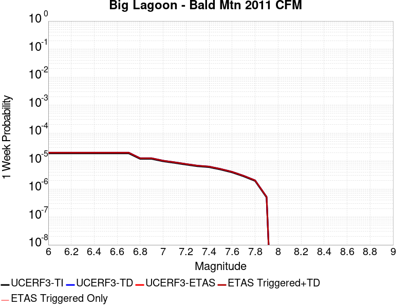 | 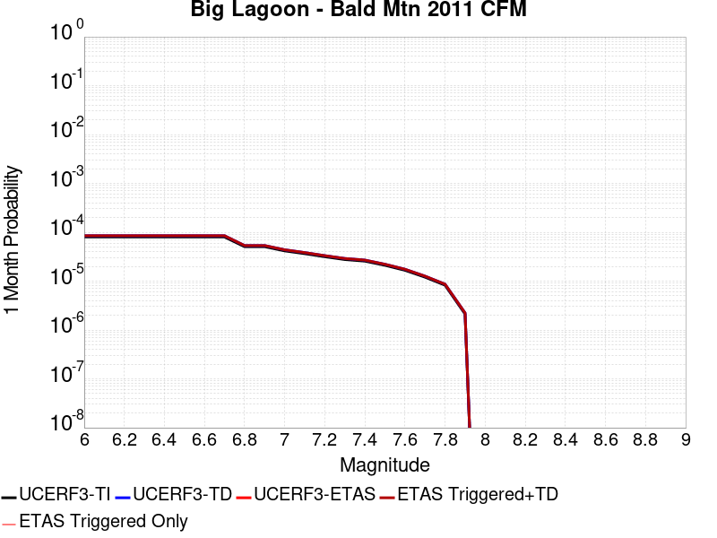 | 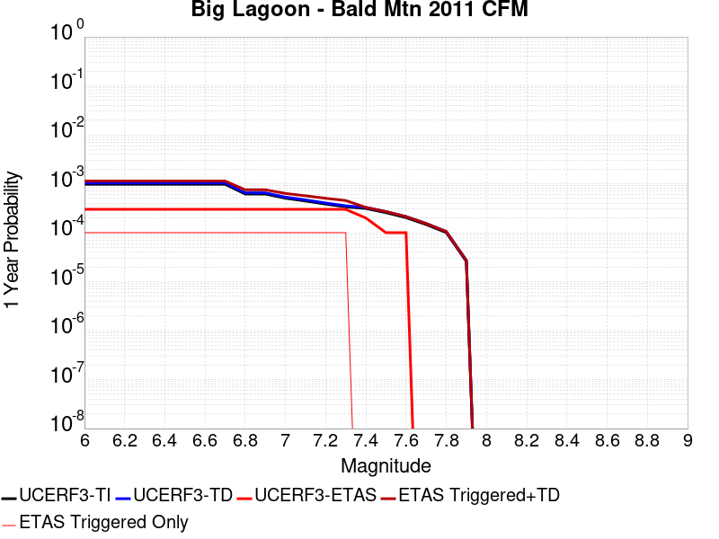 | 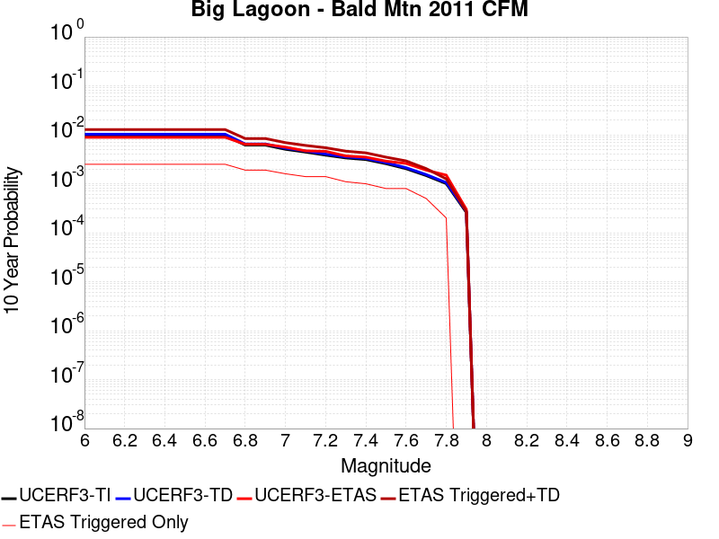 |

| Magnitude | 1 wk TI Prob | 1 wk TD Prob | 1 wk ETAS Prob | 1 wk ETAS/TD Gain | 1 wk ETAS Triggered+TD | 1 wk ETAS Triggered Only | 1 mo TI Prob | 1 mo TD Prob | 1 mo ETAS Prob | 1 mo ETAS/TD Gain | 1 mo ETAS Triggered+TD | 1 mo ETAS Triggered Only | 1 yr TI Prob | 1 yr TD Prob | 1 yr ETAS Prob | 1 yr ETAS/TD Gain | 1 yr ETAS Triggered+TD | 1 yr ETAS Triggered Only | 10 yr TI Prob | 10 yr TD Prob | 10 yr ETAS Prob | 10 yr ETAS/TD Gain | 10 yr ETAS Triggered+TD | 10 yr ETAS Triggered Only |
|-----|-----|-----|-----|-----|-----|-----|-----|-----|-----|-----|-----|-----|-----|-----|-----|-----|-----|-----|-----|-----|-----|-----|-----|-----|
| 6.0 | 1.8699735E-5 | 1.9852614E-5 | 0.0 | 0.0 | 1.9852614E-5 | 0.0 | 8.013926E-5 | 8.508007E-5 | 0.0 | 0.0 | 8.508007E-5 | 0.0 | 9.752587E-4 | 0.0010353954 | 3.0E-4 | 0.28974438 | 0.0011352919 | 1.0E-4 | 0.009709897 | 0.010309531 | 0.0089 | 0.8632788 | 0.012783757 | 0.0025 |
| 6.1 | 1.8699735E-5 | 1.9852614E-5 | 0.0 | 0.0 | 1.9852614E-5 | 0.0 | 8.013926E-5 | 8.508007E-5 | 0.0 | 0.0 | 8.508007E-5 | 0.0 | 9.752587E-4 | 0.0010353954 | 3.0E-4 | 0.28974438 | 0.0011352919 | 1.0E-4 | 0.009709897 | 0.010309531 | 0.0089 | 0.8632788 | 0.012783757 | 0.0025 |
| 6.2 | 1.8699735E-5 | 1.9852614E-5 | 0.0 | 0.0 | 1.9852614E-5 | 0.0 | 8.013926E-5 | 8.508007E-5 | 0.0 | 0.0 | 8.508007E-5 | 0.0 | 9.752587E-4 | 0.0010353954 | 3.0E-4 | 0.28974438 | 0.0011352919 | 1.0E-4 | 0.009709897 | 0.010309531 | 0.0089 | 0.8632788 | 0.012783757 | 0.0025 |
| 6.3 | 1.8699735E-5 | 1.9852614E-5 | 0.0 | 0.0 | 1.9852614E-5 | 0.0 | 8.013926E-5 | 8.508007E-5 | 0.0 | 0.0 | 8.508007E-5 | 0.0 | 9.752587E-4 | 0.0010353954 | 3.0E-4 | 0.28974438 | 0.0011352919 | 1.0E-4 | 0.009709897 | 0.010309531 | 0.0089 | 0.8632788 | 0.012783757 | 0.0025 |
| 6.4 | 1.8699735E-5 | 1.9852614E-5 | 0.0 | 0.0 | 1.9852614E-5 | 0.0 | 8.013926E-5 | 8.508007E-5 | 0.0 | 0.0 | 8.508007E-5 | 0.0 | 9.752587E-4 | 0.0010353954 | 3.0E-4 | 0.28974438 | 0.0011352919 | 1.0E-4 | 0.009709897 | 0.010309531 | 0.0089 | 0.8632788 | 0.012783757 | 0.0025 |
| 6.5 | 1.8699735E-5 | 1.9852614E-5 | 0.0 | 0.0 | 1.9852614E-5 | 0.0 | 8.013926E-5 | 8.508007E-5 | 0.0 | 0.0 | 8.508007E-5 | 0.0 | 9.752587E-4 | 0.0010353954 | 3.0E-4 | 0.28974438 | 0.0011352919 | 1.0E-4 | 0.009709897 | 0.010309531 | 0.0089 | 0.8632788 | 0.012783757 | 0.0025 |
| 6.6 | 1.8699735E-5 | 1.9852614E-5 | 0.0 | 0.0 | 1.9852614E-5 | 0.0 | 8.013926E-5 | 8.508007E-5 | 0.0 | 0.0 | 8.508007E-5 | 0.0 | 9.752587E-4 | 0.0010353954 | 3.0E-4 | 0.28974438 | 0.0011352919 | 1.0E-4 | 0.009709897 | 0.010309531 | 0.0089 | 0.8632788 | 0.012783757 | 0.0025 |
| 6.7 | 1.8699735E-5 | 1.9852614E-5 | 0.0 | 0.0 | 1.9852614E-5 | 0.0 | 8.013926E-5 | 8.508007E-5 | 0.0 | 0.0 | 8.508007E-5 | 0.0 | 9.752587E-4 | 0.0010353954 | 3.0E-4 | 0.28974438 | 0.0011352919 | 1.0E-4 | 0.009709897 | 0.010309531 | 0.0089 | 0.8632788 | 0.012783757 | 0.0025 |
| 6.8 | 1.18505095E-5 | 1.2501166E-5 | 0.0 | 0.0 | 1.2501166E-5 | 0.0 | 5.078691E-5 | 5.3575353E-5 | 0.0 | 0.0 | 5.3575353E-5 | 0.0 | 6.181552E-4 | 6.5208954E-4 | 3.0E-4 | 0.46005952 | 7.520243E-4 | 1.0E-4 | 0.006164385 | 0.006502265 | 0.0064 | 0.9842724 | 0.008389911 | 0.0019 |
| 6.9 | 1.18505095E-5 | 1.2501166E-5 | 0.0 | 0.0 | 1.2501166E-5 | 0.0 | 5.078691E-5 | 5.3575353E-5 | 0.0 | 0.0 | 5.3575353E-5 | 0.0 | 6.181552E-4 | 6.5208954E-4 | 3.0E-4 | 0.46005952 | 7.520243E-4 | 1.0E-4 | 0.006164385 | 0.006502265 | 0.0064 | 0.9842724 | 0.008389911 | 0.0019 |
| 7.0 | 9.719786E-6 | 1.02365675E-5 | 0.0 | 0.0 | 1.02365675E-5 | 0.0 | 4.1655563E-5 | 4.3870277E-5 | 0.0 | 0.0 | 4.3870277E-5 | 0.0 | 5.0703844E-4 | 5.339921E-4 | 3.0E-4 | 0.5618061 | 6.3393865E-4 | 1.0E-4 | 0.005058831 | 0.005327336 | 0.0056 | 1.051182 | 0.006918812 | 0.0016 |
| 7.1 | 8.523418E-6 | 8.970396E-6 | 0.0 | 0.0 | 8.970396E-6 | 0.0 | 3.652842E-5 | 3.8444E-5 | 0.0 | 0.0 | 3.8444E-5 | 0.0 | 4.4464276E-4 | 4.679567E-4 | 3.0E-4 | 0.6410849 | 5.679099E-4 | 1.0E-4 | 0.0044375416 | 0.004669877 | 0.0047 | 1.0064505 | 0.006063339 | 0.0014 |
| 7.2 | 7.378894E-6 | 7.761912E-6 | 0.0 | 0.0 | 7.761912E-6 | 0.0 | 3.162345E-5 | 3.3264918E-5 | 0.0 | 0.0 | 3.3264918E-5 | 0.0 | 3.8494746E-4 | 4.04926E-4 | 3.0E-4 | 0.74087614 | 5.048855E-4 | 1.0E-4 | 0.0038428132 | 0.0040419777 | 0.0046 | 1.1380568 | 0.005436319 | 0.0014 |
| 7.3 | 6.4640294E-6 | 6.7931296E-6 | 0.0 | 0.0 | 6.7931296E-6 | 0.0 | 2.7702688E-5 | 2.9113091E-5 | 0.0 | 0.0 | 2.9113091E-5 | 0.0 | 3.3722803E-4 | 3.543949E-4 | 3.0E-4 | 0.84651333 | 4.5435946E-4 | 1.0E-4 | 0.0033671674 | 0.0035383673 | 0.0037 | 1.04568 | 0.0046344753 | 0.0011 |
| 7.4 | 5.9959093E-6 | 6.2994322E-6 | 0.0 | 0.0 | 6.2994322E-6 | 0.0 | 2.5696501E-5 | 2.6997292E-5 | 0.0 | 0.0 | 2.6997292E-5 | 0.0 | 3.1280998E-4 | 3.2864304E-4 | 2.0E-4 | 0.608563 | 3.2864304E-4 | 0.0 | 0.0031237002 | 0.0032816324 | 0.0035 | 1.0665424 | 0.0042783506 | 0.001 |
| 7.5 | 4.929265E-6 | 5.1769116E-6 | 0.0 | 0.0 | 5.1769116E-6 | 0.0 | 2.112525E-5 | 2.2186578E-5 | 0.0 | 0.0 | 2.2186578E-5 | 0.0 | 2.5716957E-4 | 2.700885E-4 | 1.0E-4 | 0.37024903 | 2.700885E-4 | 0.0 | 0.0025687215 | 0.0026976431 | 0.0029 | 1.0750124 | 0.0034954848 | 8.0E-4 |
| 7.6 | 3.8982403E-6 | 4.0893237E-6 | 0.0 | 0.0 | 4.0893237E-6 | 0.0 | 1.6706637E-5 | 1.7525557E-5 | 0.0 | 0.0 | 1.7525557E-5 | 0.0 | 2.0338432E-4 | 2.1335304E-4 | 1.0E-4 | 0.4687067 | 2.1335304E-4 | 0.0 | 0.0020319829 | 0.0021315098 | 0.0026 | 1.2197926 | 0.0029298046 | 8.0E-4 |
| 7.7 | 2.820968E-6 | 2.957495E-6 | 0.0 | 0.0 | 2.957495E-6 | 0.0 | 1.2089806E-5 | 1.2674918E-5 | 0.0 | 0.0 | 1.2674918E-5 | 0.0 | 1.4718344E-4 | 1.5430637E-4 | 0.0 | 0.0 | 1.5430637E-4 | 0.0 | 0.00147086 | 0.00154201 | 0.0019 | 1.2321581 | 0.002041239 | 5.0E-4 |
| 7.8 | 1.9314455E-6 | 2.0262153E-6 | 0.0 | 0.0 | 2.0262153E-6 | 0.0 | 8.277597E-6 | 8.683752E-6 | 0.0 | 0.0 | 8.683752E-6 | 0.0 | 1.0077508E-4 | 1.0571968E-4 | 0.0 | 0.0 | 1.0571968E-4 | 0.0 | 0.0010072939 | 0.0010567068 | 0.0015 | 1.4195045 | 0.0012564954 | 2.0E-4 |
| 7.9 | 4.9586197E-7 | 5.2194645E-7 | 0.0 | 0.0 | 5.2194645E-7 | 0.0 | 2.125121E-6 | 2.2369118E-6 | 0.0 | 0.0 | 2.2369118E-6 | 0.0 | 2.5873042E-5 | 2.723408E-5 | 0.0 | 0.0 | 2.723408E-5 | 0.0 | 2.5870028E-4 | 2.7230952E-4 | 3.0E-4 | 1.1016876 | 2.7230952E-4 | 0.0 |

## Elsinore (Coyote Mountains)
*[(top)](#table-of-contents)*

| 1 Week | 1 Month | 1 Year | 10 Year |
|-----|-----|-----|-----|
|  | 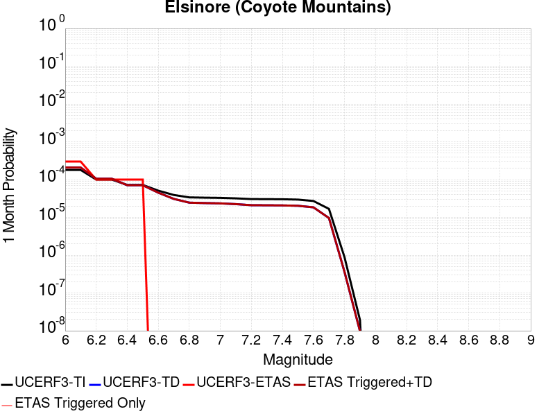 | 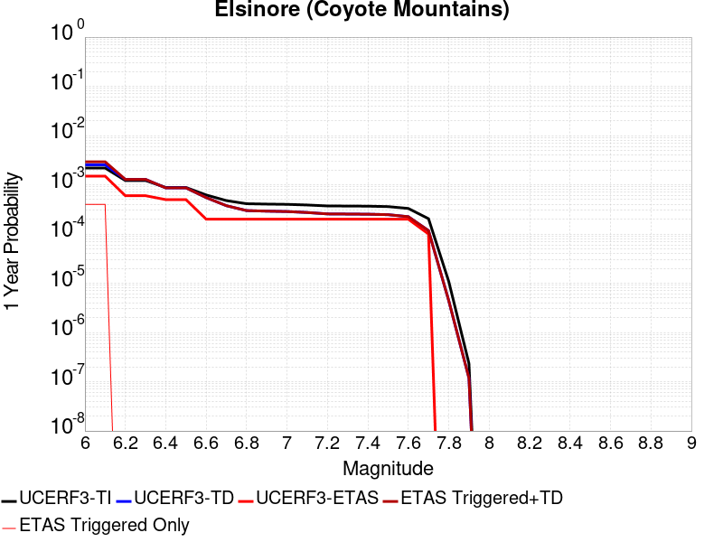 | 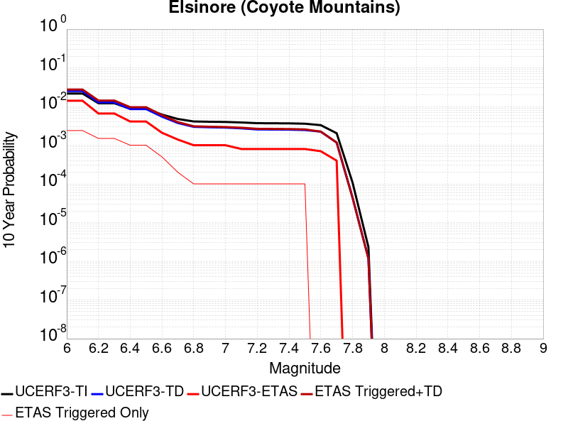 |

| Magnitude | 1 wk TI Prob | 1 wk TD Prob | 1 wk ETAS Prob | 1 wk ETAS/TD Gain | 1 wk ETAS Triggered+TD | 1 wk ETAS Triggered Only | 1 mo TI Prob | 1 mo TD Prob | 1 mo ETAS Prob | 1 mo ETAS/TD Gain | 1 mo ETAS Triggered+TD | 1 mo ETAS Triggered Only | 1 yr TI Prob | 1 yr TD Prob | 1 yr ETAS Prob | 1 yr ETAS/TD Gain | 1 yr ETAS Triggered+TD | 1 yr ETAS Triggered Only | 10 yr TI Prob | 10 yr TD Prob | 10 yr ETAS Prob | 10 yr ETAS/TD Gain | 10 yr ETAS Triggered+TD | 10 yr ETAS Triggered Only |
|-----|-----|-----|-----|-----|-----|-----|-----|-----|-----|-----|-----|-----|-----|-----|-----|-----|-----|-----|-----|-----|-----|-----|-----|-----|
| 6.0 | 4.20513E-5 | 4.8656337E-5 | 1.0E-4 | 2.0552306 | 4.8656337E-5 | 0.0 | 1.8020741E-4 | 2.0851374E-4 | 3.0E-4 | 1.4387541 | 2.0851374E-4 | 0.0 | 0.0021918174 | 0.0025362293 | 0.0015 | 0.5914292 | 0.002935215 | 4.0E-4 | 0.021703249 | 0.025124125 | 0.0141 | 0.56121355 | 0.027463827 | 0.0024 |
| 6.1 | 4.20513E-5 | 4.8656337E-5 | 1.0E-4 | 2.0552306 | 4.8656337E-5 | 0.0 | 1.8020741E-4 | 2.0851374E-4 | 3.0E-4 | 1.4387541 | 2.0851374E-4 | 0.0 | 0.0021918174 | 0.0025362293 | 0.0015 | 0.5914292 | 0.002935215 | 4.0E-4 | 0.021703249 | 0.025124125 | 0.0141 | 0.56121355 | 0.027463827 | 0.0024 |
| 6.2 | 2.3413893E-5 | 2.4707664E-5 | 0.0 | 0.0 | 2.4707664E-5 | 0.0 | 1.0034139E-4 | 1.0588623E-4 | 1.0E-4 | 0.94440985 | 1.0588623E-4 | 0.0 | 0.0012209718 | 0.001288491 | 6.0E-4 | 0.46566102 | 0.001288491 | 0.0 | 0.012142851 | 0.012818878 | 0.0066 | 0.5148657 | 0.014299649 | 0.0015 |
| 6.3 | 2.3413893E-5 | 2.4707664E-5 | 0.0 | 0.0 | 2.4707664E-5 | 0.0 | 1.0034139E-4 | 1.0588623E-4 | 1.0E-4 | 0.94440985 | 1.0588623E-4 | 0.0 | 0.0012209718 | 0.001288491 | 6.0E-4 | 0.46566102 | 0.001288491 | 0.0 | 0.012142851 | 0.012818878 | 0.0066 | 0.5148657 | 0.014299649 | 0.0015 |
| 6.4 | 1.6894814E-5 | 1.6576523E-5 | 0.0 | 0.0 | 1.6576523E-5 | 0.0 | 7.240433E-5 | 7.104052E-5 | 1.0E-4 | 1.4076473 | 7.104052E-5 | 0.0 | 8.811662E-4 | 8.646121E-4 | 5.0E-4 | 0.578294 | 8.646121E-4 | 0.0 | 0.0087768035 | 0.008616141 | 0.0041 | 0.4758511 | 0.009607525 | 0.001 |
| 6.5 | 1.6894814E-5 | 1.6576523E-5 | 0.0 | 0.0 | 1.6576523E-5 | 0.0 | 7.240433E-5 | 7.104052E-5 | 1.0E-4 | 1.4076473 | 7.104052E-5 | 0.0 | 8.811662E-4 | 8.646121E-4 | 5.0E-4 | 0.578294 | 8.646121E-4 | 0.0 | 0.0087768035 | 0.008616141 | 0.0041 | 0.4758511 | 0.009607525 | 0.001 |
| 6.6 | 1.1910969E-5 | 1.05363215E-5 | 0.0 | 0.0 | 1.05363215E-5 | 0.0 | 5.1046012E-5 | 4.515496E-5 | 0.0 | 0.0 | 4.515496E-5 | 0.0 | 6.21308E-4 | 5.496361E-4 | 2.0E-4 | 0.36387715 | 5.496361E-4 | 0.0 | 0.0061957375 | 0.005484068 | 0.0021 | 0.38292742 | 0.005981326 | 5.0E-4 |
| 6.7 | 9.1486E-6 | 7.207078E-6 | 0.0 | 0.0 | 7.207078E-6 | 0.0 | 3.9207694E-5 | 3.088713E-5 | 0.0 | 0.0 | 3.088713E-5 | 0.0 | 4.7724912E-4 | 3.7598977E-4 | 2.0E-4 | 0.5319294 | 3.7598977E-4 | 0.0 | 0.0047622547 | 0.0037539161 | 0.0014 | 0.37294388 | 0.0039531654 | 2.0E-4 |
| 6.8 | 7.90441E-6 | 5.7327056E-6 | 0.0 | 0.0 | 5.7327056E-6 | 0.0 | 3.3875604E-5 | 2.4568513E-5 | 0.0 | 0.0 | 2.4568513E-5 | 0.0 | 4.1235742E-4 | 2.9908188E-4 | 2.0E-4 | 0.6687132 | 2.9908188E-4 | 0.0 | 0.0041159308 | 0.0029869226 | 0.001 | 0.33479276 | 0.0030866237 | 1.0E-4 |
| 6.9 | 7.77015E-6 | 5.5866344E-6 | 0.0 | 0.0 | 5.5866344E-6 | 0.0 | 3.3300217E-5 | 2.3942506E-5 | 0.0 | 0.0 | 2.3942506E-5 | 0.0 | 4.0535472E-4 | 2.914623E-4 | 2.0E-4 | 0.68619514 | 2.914623E-4 | 0.0 | 0.004046161 | 0.0029109276 | 0.001 | 0.34353313 | 0.0030106364 | 1.0E-4 |
| 7.0 | 7.675798E-6 | 5.483474E-6 | 0.0 | 0.0 | 5.483474E-6 | 0.0 | 3.289586E-5 | 2.3500397E-5 | 0.0 | 0.0 | 2.3500397E-5 | 0.0 | 4.004335E-4 | 2.8608105E-4 | 2.0E-4 | 0.6991026 | 2.8608105E-4 | 0.0 | 0.003997127 | 0.0028572544 | 0.001 | 0.34998634 | 0.0029569685 | 1.0E-4 |
| 7.1 | 7.447814E-6 | 5.242317E-6 | 0.0 | 0.0 | 5.242317E-6 | 0.0 | 3.191881E-5 | 2.2466886E-5 | 0.0 | 0.0 | 2.2466886E-5 | 0.0 | 3.8854225E-4 | 2.7350124E-4 | 2.0E-4 | 0.7312581 | 2.7350124E-4 | 0.0 | 0.003878636 | 0.002731771 | 8.0E-4 | 0.29285032 | 0.002831498 | 1.0E-4 |
| 7.2 | 7.128185E-6 | 4.9089517E-6 | 0.0 | 0.0 | 4.9089517E-6 | 0.0 | 3.0549007E-5 | 2.1038202E-5 | 0.0 | 0.0 | 2.1038202E-5 | 0.0 | 3.7187067E-4 | 2.561112E-4 | 2.0E-4 | 0.7809108 | 2.561112E-4 | 0.0 | 0.00371249 | 0.0025582789 | 8.0E-4 | 0.31271023 | 0.002658023 | 1.0E-4 |
| 7.3 | 7.0913875E-6 | 4.877622E-6 | 0.0 | 0.0 | 4.877622E-6 | 0.0 | 3.0391306E-5 | 2.0903932E-5 | 0.0 | 0.0 | 2.0903932E-5 | 0.0 | 3.6995133E-4 | 2.5447685E-4 | 2.0E-4 | 0.7859261 | 2.5447685E-4 | 0.0 | 0.0036933604 | 0.002541973 | 8.0E-4 | 0.3147162 | 0.0026417188 | 1.0E-4 |
| 7.4 | 7.051521E-6 | 4.8414695E-6 | 0.0 | 0.0 | 4.8414695E-6 | 0.0 | 3.0220453E-5 | 2.0748997E-5 | 0.0 | 0.0 | 2.0748997E-5 | 0.0 | 3.6787192E-4 | 2.5259095E-4 | 2.0E-4 | 0.791794 | 2.5259095E-4 | 0.0 | 0.0036726352 | 0.0025231568 | 8.0E-4 | 0.31706312 | 0.0026229045 | 1.0E-4 |
| 7.5 | 6.910666E-6 | 4.736918E-6 | 0.0 | 0.0 | 4.736918E-6 | 0.0 | 2.9616802E-5 | 2.0300926E-5 | 0.0 | 0.0 | 2.0300926E-5 | 0.0 | 3.605249E-4 | 2.4713692E-4 | 2.0E-4 | 0.80926794 | 2.4713692E-4 | 0.0 | 0.0035994058 | 0.0024687392 | 8.0E-4 | 0.32405207 | 0.0025684922 | 1.0E-4 |
| 7.6 | 6.341753E-6 | 4.3098894E-6 | 0.0 | 0.0 | 4.3098894E-6 | 0.0 | 2.7178658E-5 | 1.847083E-5 | 0.0 | 0.0 | 1.847083E-5 | 0.0 | 3.3084993E-4 | 2.2486031E-4 | 2.0E-4 | 0.88944113 | 2.2486031E-4 | 0.0 | 0.0033035777 | 0.0022464432 | 7.0E-4 | 0.3116037 | 0.0022464432 | 0.0 |
| 7.7 | 3.9205916E-6 | 2.2457596E-6 | 0.0 | 0.0 | 2.2457596E-6 | 0.0 | 1.6802427E-5 | 9.624652E-6 | 0.0 | 0.0 | 9.624652E-6 | 0.0 | 2.0455034E-4 | 1.1717459E-4 | 1.0E-4 | 0.85342735 | 1.1717459E-4 | 0.0 | 0.0020436216 | 0.0011712011 | 4.0E-4 | 0.34152973 | 0.0011712011 | 0.0 |
| 7.8 | 2.0846227E-7 | 8.49184E-8 | 0.0 | 0.0 | 8.49184E-8 | 0.0 | 8.9340944E-7 | 3.6393595E-7 | 0.0 | 0.0 | 3.6393595E-7 | 0.0 | 1.0877206E-5 | 4.4309145E-6 | 0.0 | 0.0 | 4.4309145E-6 | 0.0 | 1.0876673E-4 | 4.4308592E-5 | 0.0 | 0.0 | 4.4308592E-5 | 0.0 |
| 7.9 | 4.4969806E-9 | 2.2703426E-9 | 0.0 | 0.0 | 2.2703426E-9 | 0.0 | 1.9272775E-8 | 9.73004E-9 | 0.0 | 0.0 | 9.73004E-9 | 0.0 | 2.3464601E-7 | 1.1846323E-7 | 0.0 | 0.0 | 1.1846323E-7 | 0.0 | 2.3464577E-6 | 1.1846317E-6 | 0.0 | 0.0 | 1.1846317E-6 | 0.0 |

## Santa Ynez (East)
*[(top)](#table-of-contents)*

| 1 Week | 1 Month | 1 Year | 10 Year |
|-----|-----|-----|-----|
|  |  |  |  |

| Magnitude | 1 wk TI Prob | 1 wk TD Prob | 1 wk ETAS Prob | 1 wk ETAS/TD Gain | 1 wk ETAS Triggered+TD | 1 wk ETAS Triggered Only | 1 mo TI Prob | 1 mo TD Prob | 1 mo ETAS Prob | 1 mo ETAS/TD Gain | 1 mo ETAS Triggered+TD | 1 mo ETAS Triggered Only | 1 yr TI Prob | 1 yr TD Prob | 1 yr ETAS Prob | 1 yr ETAS/TD Gain | 1 yr ETAS Triggered+TD | 1 yr ETAS Triggered Only | 10 yr TI Prob | 10 yr TD Prob | 10 yr ETAS Prob | 10 yr ETAS/TD Gain | 10 yr ETAS Triggered+TD | 10 yr ETAS Triggered Only |
|-----|-----|-----|-----|-----|-----|-----|-----|-----|-----|-----|-----|-----|-----|-----|-----|-----|-----|-----|-----|-----|-----|-----|-----|-----|
| 6.0 | 3.2269712E-5 | 3.676393E-5 | 0.0 | 0.0 | 3.676393E-5 | 0.0 | 1.3829143E-4 | 1.5755351E-4 | 1.0E-4 | 0.63470495 | 1.5755351E-4 | 0.0 | 0.0016823979 | 0.0019171119 | 8.0E-4 | 0.41729435 | 0.0020169201 | 1.0E-4 | 0.016697178 | 0.019063229 | 0.0127 | 0.66620404 | 0.021319384 | 0.0023 |
| 6.1 | 3.2269712E-5 | 3.676393E-5 | 0.0 | 0.0 | 3.676393E-5 | 0.0 | 1.3829143E-4 | 1.5755351E-4 | 1.0E-4 | 0.63470495 | 1.5755351E-4 | 0.0 | 0.0016823979 | 0.0019171119 | 8.0E-4 | 0.41729435 | 0.0020169201 | 1.0E-4 | 0.016697178 | 0.019063229 | 0.0127 | 0.66620404 | 0.021319384 | 0.0023 |
| 6.2 | 3.2269712E-5 | 3.676393E-5 | 0.0 | 0.0 | 3.676393E-5 | 0.0 | 1.3829143E-4 | 1.5755351E-4 | 1.0E-4 | 0.63470495 | 1.5755351E-4 | 0.0 | 0.0016823979 | 0.0019171119 | 8.0E-4 | 0.41729435 | 0.0020169201 | 1.0E-4 | 0.016697178 | 0.019063229 | 0.0127 | 0.66620404 | 0.021319384 | 0.0023 |
| 6.3 | 3.2269712E-5 | 3.676393E-5 | 0.0 | 0.0 | 3.676393E-5 | 0.0 | 1.3829143E-4 | 1.5755351E-4 | 1.0E-4 | 0.63470495 | 1.5755351E-4 | 0.0 | 0.0016823979 | 0.0019171119 | 8.0E-4 | 0.41729435 | 0.0020169201 | 1.0E-4 | 0.016697178 | 0.019063229 | 0.0127 | 0.66620404 | 0.021319384 | 0.0023 |
| 6.4 | 1.4404779E-5 | 1.4852704E-5 | 0.0 | 0.0 | 1.4852704E-5 | 0.0 | 6.1733306E-5 | 6.365292E-5 | 0.0 | 0.0 | 6.365292E-5 | 0.0 | 7.513438E-4 | 7.7470386E-4 | 1.0E-4 | 0.12908158 | 7.7470386E-4 | 0.0 | 0.0074880854 | 0.0077205827 | 0.006 | 0.7771434 | 0.008613634 | 9.0E-4 |
| 6.5 | 1.4404779E-5 | 1.4852704E-5 | 0.0 | 0.0 | 1.4852704E-5 | 0.0 | 6.1733306E-5 | 6.365292E-5 | 0.0 | 0.0 | 6.365292E-5 | 0.0 | 7.513438E-4 | 7.7470386E-4 | 1.0E-4 | 0.12908158 | 7.7470386E-4 | 0.0 | 0.0074880854 | 0.0077205827 | 0.006 | 0.7771434 | 0.008613634 | 9.0E-4 |
| 6.6 | 1.280208E-5 | 1.3014734E-5 | 0.0 | 0.0 | 1.3014734E-5 | 0.0 | 5.4864904E-5 | 5.577625E-5 | 0.0 | 0.0 | 5.577625E-5 | 0.0 | 6.6777546E-4 | 6.78866E-4 | 1.0E-4 | 0.14730448 | 6.78866E-4 | 0.0 | 0.006657724 | 0.006768133 | 0.0047 | 0.6944308 | 0.007463395 | 7.0E-4 |
| 6.7 | 1.2457027E-5 | 1.263117E-5 | 0.0 | 0.0 | 1.263117E-5 | 0.0 | 5.3386164E-5 | 5.413247E-5 | 0.0 | 0.0 | 5.413247E-5 | 0.0 | 6.497827E-4 | 6.588652E-4 | 1.0E-4 | 0.15177612 | 6.588652E-4 | 0.0 | 0.00647886 | 0.0065693157 | 0.0045 | 0.68500286 | 0.007264717 | 7.0E-4 |
| 6.8 | 1.2095134E-5 | 1.2233539E-5 | 0.0 | 0.0 | 1.2233539E-5 | 0.0 | 5.1835254E-5 | 5.2428408E-5 | 0.0 | 0.0 | 5.2428408E-5 | 0.0 | 6.309115E-4 | 6.381305E-4 | 1.0E-4 | 0.15670775 | 6.381305E-4 | 0.0 | 0.0062912325 | 0.0063631698 | 0.0045 | 0.70719475 | 0.0070587154 | 7.0E-4 |
| 6.9 | 1.1104036E-5 | 1.1159792E-5 | 0.0 | 0.0 | 1.1159792E-5 | 0.0 | 4.758786E-5 | 4.782681E-5 | 0.0 | 0.0 | 4.782681E-5 | 0.0 | 5.7922816E-4 | 5.821371E-4 | 0.0 | 0.0 | 5.821371E-4 | 0.0 | 0.005777207 | 0.0058062673 | 0.0044 | 0.75780183 | 0.0065022027 | 7.0E-4 |
| 7.0 | 1.0577444E-5 | 1.0584018E-5 | 0.0 | 0.0 | 1.0584018E-5 | 0.0 | 4.5331115E-5 | 4.5359295E-5 | 0.0 | 0.0 | 4.5359295E-5 | 0.0 | 5.5176654E-4 | 5.5211067E-4 | 0.0 | 0.0 | 5.5211067E-4 | 0.0 | 0.0055039856 | 0.005507529 | 0.0042 | 0.7625925 | 0.0062036733 | 7.0E-4 |
| 7.1 | 1.0021775E-5 | 9.983227E-6 | 0.0 | 0.0 | 9.983227E-6 | 0.0 | 4.294976E-5 | 4.2784563E-5 | 0.0 | 0.0 | 4.2784563E-5 | 0.0 | 5.2278786E-4 | 5.2077876E-4 | 0.0 | 0.0 | 5.2077876E-4 | 0.0 | 0.0052155964 | 0.005195716 | 0.0042 | 0.80835825 | 0.0058920793 | 7.0E-4 |
| 7.2 | 8.874109E-6 | 8.750828E-6 | 0.0 | 0.0 | 8.750828E-6 | 0.0 | 3.8031343E-5 | 3.7503014E-5 | 0.0 | 0.0 | 3.7503014E-5 | 0.0 | 4.629332E-4 | 4.5650464E-4 | 0.0 | 0.0 | 4.5650464E-4 | 0.0 | 0.0046197 | 0.004555787 | 0.0039 | 0.85605407 | 0.005252598 | 7.0E-4 |
| 7.3 | 7.5504267E-6 | 7.5068824E-6 | 0.0 | 0.0 | 7.5068824E-6 | 0.0 | 3.235857E-5 | 3.2171964E-5 | 0.0 | 0.0 | 3.2171964E-5 | 0.0 | 3.9389438E-4 | 3.9162426E-4 | 0.0 | 0.0 | 3.9162426E-4 | 0.0 | 0.0039319694 | 0.003909448 | 0.0032 | 0.81852984 | 0.0045071025 | 6.0E-4 |
| 7.4 | 6.309394E-6 | 6.184688E-6 | 0.0 | 0.0 | 6.184688E-6 | 0.0 | 2.703998E-5 | 2.6505542E-5 | 0.0 | 0.0 | 2.6505542E-5 | 0.0 | 3.2916202E-4 | 3.2265813E-4 | 0.0 | 0.0 | 3.2265813E-4 | 0.0 | 0.003286749 | 0.003221994 | 0.0029 | 0.90006375 | 0.0038200608 | 6.0E-4 |
| 7.5 | 4.6103073E-6 | 4.441822E-6 | 0.0 | 0.0 | 4.441822E-6 | 0.0 | 1.975831E-5 | 1.9036246E-5 | 0.0 | 0.0 | 1.9036246E-5 | 0.0 | 2.4053088E-4 | 2.3174234E-4 | 0.0 | 0.0 | 2.3174234E-4 | 0.0 | 0.002402707 | 0.0023150763 | 0.0022 | 0.95029265 | 0.0029136871 | 6.0E-4 |
| 7.6 | 1.2858658E-6 | 1.3009627E-6 | 0.0 | 0.0 | 1.3009627E-6 | 0.0 | 5.5108417E-6 | 5.575543E-6 | 0.0 | 0.0 | 5.575543E-6 | 0.0 | 6.7092435E-5 | 6.788019E-5 | 0.0 | 0.0 | 6.788019E-5 | 0.0 | 6.707218E-4 | 6.7860144E-4 | 5.0E-4 | 0.7368095 | 8.7846577E-4 | 2.0E-4 |
| 7.7 | 5.3302307E-7 | 5.6127305E-7 | 0.0 | 0.0 | 5.6127305E-7 | 0.0 | 2.2843826E-6 | 2.4054539E-6 | 0.0 | 0.0 | 2.4054539E-6 | 0.0 | 2.7812002E-5 | 2.9286044E-5 | 0.0 | 0.0 | 2.9286044E-5 | 0.0 | 2.7808524E-4 | 2.9282543E-4 | 3.0E-4 | 1.0245012 | 3.9279615E-4 | 1.0E-4 |
| 7.8 | 4.613933E-8 | 4.8034003E-8 | 0.0 | 0.0 | 4.8034003E-8 | 0.0 | 1.9773998E-7 | 2.0585999E-7 | 0.0 | 0.0 | 2.0585999E-7 | 0.0 | 2.4074816E-6 | 2.5063428E-6 | 0.0 | 0.0 | 2.5063428E-6 | 0.0 | 2.4074554E-5 | 2.5063155E-5 | 0.0 | 0.0 | 2.5063155E-5 | 0.0 |

## Carson Range (Genoa)
*[(top)](#table-of-contents)*

| 1 Week | 1 Month | 1 Year | 10 Year |
|-----|-----|-----|-----|
|  | 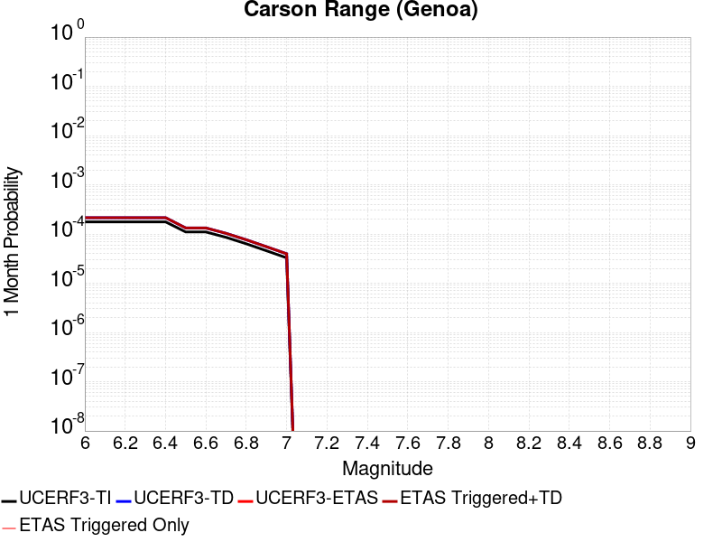 |  |  |

| Magnitude | 1 wk TI Prob | 1 wk TD Prob | 1 wk ETAS Prob | 1 wk ETAS/TD Gain | 1 wk ETAS Triggered+TD | 1 wk ETAS Triggered Only | 1 mo TI Prob | 1 mo TD Prob | 1 mo ETAS Prob | 1 mo ETAS/TD Gain | 1 mo ETAS Triggered+TD | 1 mo ETAS Triggered Only | 1 yr TI Prob | 1 yr TD Prob | 1 yr ETAS Prob | 1 yr ETAS/TD Gain | 1 yr ETAS Triggered+TD | 1 yr ETAS Triggered Only | 10 yr TI Prob | 10 yr TD Prob | 10 yr ETAS Prob | 10 yr ETAS/TD Gain | 10 yr ETAS Triggered+TD | 10 yr ETAS Triggered Only |
|-----|-----|-----|-----|-----|-----|-----|-----|-----|-----|-----|-----|-----|-----|-----|-----|-----|-----|-----|-----|-----|-----|-----|-----|-----|
| 6.0 | 4.1268457E-5 | 5.0168303E-5 | 0.0 | 0.0 | 5.0168303E-5 | 0.0 | 1.7685282E-4 | 2.1499154E-4 | 0.0 | 0.0 | 2.1499154E-4 | 0.0 | 0.0021510567 | 0.0026147708 | 0.0012 | 0.45893127 | 0.0029139863 | 3.0E-4 | 0.02130354 | 0.02587974 | 0.0139 | 0.53709966 | 0.028120216 | 0.0023 |
| 6.1 | 4.1268457E-5 | 5.0168303E-5 | 0.0 | 0.0 | 5.0168303E-5 | 0.0 | 1.7685282E-4 | 2.1499154E-4 | 0.0 | 0.0 | 2.1499154E-4 | 0.0 | 0.0021510567 | 0.0026147708 | 0.0012 | 0.45893127 | 0.0029139863 | 3.0E-4 | 0.02130354 | 0.02587974 | 0.0139 | 0.53709966 | 0.028120216 | 0.0023 |
| 6.2 | 4.1268457E-5 | 5.0168303E-5 | 0.0 | 0.0 | 5.0168303E-5 | 0.0 | 1.7685282E-4 | 2.1499154E-4 | 0.0 | 0.0 | 2.1499154E-4 | 0.0 | 0.0021510567 | 0.0026147708 | 0.0012 | 0.45893127 | 0.0029139863 | 3.0E-4 | 0.02130354 | 0.02587974 | 0.0139 | 0.53709966 | 0.028120216 | 0.0023 |
| 6.3 | 4.1268457E-5 | 5.0168303E-5 | 0.0 | 0.0 | 5.0168303E-5 | 0.0 | 1.7685282E-4 | 2.1499154E-4 | 0.0 | 0.0 | 2.1499154E-4 | 0.0 | 0.0021510567 | 0.0026147708 | 0.0012 | 0.45893127 | 0.0029139863 | 3.0E-4 | 0.02130354 | 0.02587974 | 0.0139 | 0.53709966 | 0.028120216 | 0.0023 |
| 6.4 | 4.1268457E-5 | 5.0168303E-5 | 0.0 | 0.0 | 5.0168303E-5 | 0.0 | 1.7685282E-4 | 2.1499154E-4 | 0.0 | 0.0 | 2.1499154E-4 | 0.0 | 0.0021510567 | 0.0026147708 | 0.0012 | 0.45893127 | 0.0029139863 | 3.0E-4 | 0.02130354 | 0.02587974 | 0.0139 | 0.53709966 | 0.028120216 | 0.0023 |
| 6.5 | 2.5677185E-5 | 3.0990985E-5 | 0.0 | 0.0 | 3.0990985E-5 | 0.0 | 1.1004044E-4 | 1.3281277E-4 | 0.0 | 0.0 | 1.3281277E-4 | 0.0 | 0.0013389189 | 0.0016159759 | 5.0E-4 | 0.30941054 | 0.0018156527 | 2.0E-4 | 0.0133088045 | 0.016060183 | 0.0077 | 0.4794466 | 0.017437698 | 0.0014 |
| 6.6 | 2.5677185E-5 | 3.0990985E-5 | 0.0 | 0.0 | 3.0990985E-5 | 0.0 | 1.1004044E-4 | 1.3281277E-4 | 0.0 | 0.0 | 1.3281277E-4 | 0.0 | 0.0013389189 | 0.0016159759 | 5.0E-4 | 0.30941054 | 0.0018156527 | 2.0E-4 | 0.0133088045 | 0.016060183 | 0.0077 | 0.4794466 | 0.017437698 | 0.0014 |
| 6.7 | 1.9969408E-5 | 2.407326E-5 | 0.0 | 0.0 | 2.407326E-5 | 0.0 | 8.558037E-5 | 1.031679E-4 | 0.0 | 0.0 | 1.031679E-4 | 0.0 | 0.0010414429 | 0.0012554991 | 2.0E-4 | 0.1592992 | 0.0013553735 | 1.0E-4 | 0.010365757 | 0.012499231 | 0.0056 | 0.44802758 | 0.013684232 | 0.0012 |
| 6.8 | 1.4783156E-5 | 1.7824825E-5 | 0.0 | 0.0 | 1.7824825E-5 | 0.0 | 6.335485E-5 | 7.639061E-5 | 0.0 | 0.0 | 7.639061E-5 | 0.0 | 7.710722E-4 | 9.2978904E-4 | 1.0E-4 | 0.107551284 | 0.0010296961 | 1.0E-4 | 0.0076840227 | 0.009271787 | 0.0038 | 0.4098455 | 0.010163442 | 9.0E-4 |
| 6.9 | 1.06660555E-5 | 1.2882322E-5 | 0.0 | 0.0 | 1.2882322E-5 | 0.0 | 4.5710865E-5 | 5.5209435E-5 | 0.0 | 0.0 | 5.5209435E-5 | 0.0 | 5.5638765E-4 | 6.720829E-4 | 0.0 | 0.0 | 6.720829E-4 | 0.0 | 0.005549967 | 0.006711811 | 0.0024 | 0.3575786 | 0.007208455 | 5.0E-4 |
| 7.0 | 7.664838E-6 | 9.262125E-6 | 0.0 | 0.0 | 9.262125E-6 | 0.0 | 3.2848893E-5 | 3.969482E-5 | 0.0 | 0.0 | 3.969482E-5 | 0.0 | 3.998619E-4 | 4.8328444E-4 | 0.0 | 0.0 | 4.8328444E-4 | 0.0 | 0.0039914316 | 0.004832842 | 0.002 | 0.41383517 | 0.005230909 | 4.0E-4 |

## San Jacinto (Borrego)
*[(top)](#table-of-contents)*

| 1 Week | 1 Month | 1 Year | 10 Year |
|-----|-----|-----|-----|
|  |  |  | 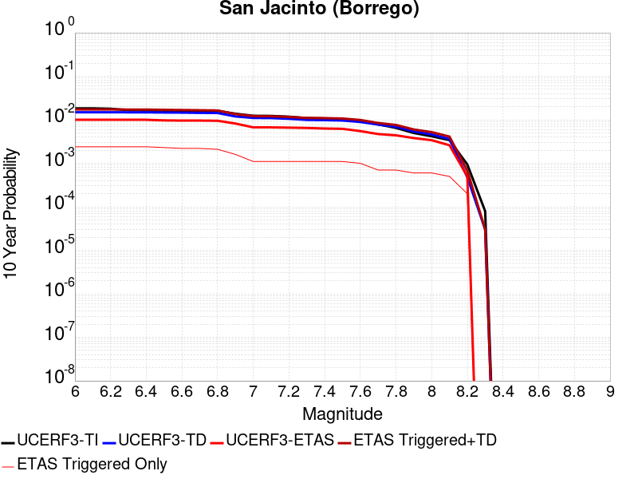 |

| Magnitude | 1 wk TI Prob | 1 wk TD Prob | 1 wk ETAS Prob | 1 wk ETAS/TD Gain | 1 wk ETAS Triggered+TD | 1 wk ETAS Triggered Only | 1 mo TI Prob | 1 mo TD Prob | 1 mo ETAS Prob | 1 mo ETAS/TD Gain | 1 mo ETAS Triggered+TD | 1 mo ETAS Triggered Only | 1 yr TI Prob | 1 yr TD Prob | 1 yr ETAS Prob | 1 yr ETAS/TD Gain | 1 yr ETAS Triggered+TD | 1 yr ETAS Triggered Only | 10 yr TI Prob | 10 yr TD Prob | 10 yr ETAS Prob | 10 yr ETAS/TD Gain | 10 yr ETAS Triggered+TD | 10 yr ETAS Triggered Only |
|-----|-----|-----|-----|-----|-----|-----|-----|-----|-----|-----|-----|-----|-----|-----|-----|-----|-----|-----|-----|-----|-----|-----|-----|-----|
| 6.0 | 3.543992E-5 | 2.8040822E-5 | 0.0 | 0.0 | 2.8040822E-5 | 0.0 | 1.5187653E-4 | 1.2016948E-4 | 0.0 | 0.0 | 1.2016948E-4 | 0.0 | 0.0018475284 | 0.0014620939 | 9.0E-4 | 0.6155555 | 0.001861509 | 4.0E-4 | 0.018322436 | 0.014928567 | 0.01 | 0.6698566 | 0.01729274 | 0.0024 |
| 6.1 | 3.542281E-5 | 2.8040822E-5 | 0.0 | 0.0 | 2.8040822E-5 | 0.0 | 1.5180321E-4 | 1.2016948E-4 | 0.0 | 0.0 | 1.2016948E-4 | 0.0 | 0.0018466372 | 0.0014620939 | 9.0E-4 | 0.6155555 | 0.001861509 | 4.0E-4 | 0.018313672 | 0.014928567 | 0.01 | 0.6698566 | 0.01729274 | 0.0024 |
| 6.2 | 3.4688688E-5 | 2.8040822E-5 | 0.0 | 0.0 | 2.8040822E-5 | 0.0 | 1.4865733E-4 | 1.2016948E-4 | 0.0 | 0.0 | 1.2016948E-4 | 0.0 | 0.0018084005 | 0.0014620939 | 9.0E-4 | 0.6155555 | 0.001861509 | 4.0E-4 | 0.017937548 | 0.014928567 | 0.01 | 0.66985667 | 0.017292738 | 0.0024 |
| 6.3 | 3.2087122E-5 | 2.7886123E-5 | 0.0 | 0.0 | 2.7886123E-5 | 0.0 | 1.3750899E-4 | 1.1950655E-4 | 0.0 | 0.0 | 1.1950655E-4 | 0.0 | 0.0016728862 | 0.0014540334 | 9.0E-4 | 0.6189679 | 0.0018534517 | 4.0E-4 | 0.016603488 | 0.014849705 | 0.01 | 0.67341405 | 0.017214065 | 0.0024 |
| 6.4 | 3.1828724E-5 | 2.785308E-5 | 0.0 | 0.0 | 2.785308E-5 | 0.0 | 1.364017E-4 | 1.1936496E-4 | 0.0 | 0.0 | 1.1936496E-4 | 0.0 | 0.0016594254 | 0.0014523118 | 9.0E-4 | 0.6197016 | 0.0018517309 | 4.0E-4 | 0.016470885 | 0.014832891 | 0.01 | 0.6741774 | 0.017197292 | 0.0024 |
| 6.5 | 3.1563577E-5 | 2.7592372E-5 | 0.0 | 0.0 | 2.7592372E-5 | 0.0 | 1.3526545E-4 | 1.18247735E-4 | 0.0 | 0.0 | 1.18247735E-4 | 0.0 | 0.0016456128 | 0.0014387276 | 9.0E-4 | 0.6255527 | 0.0018381522 | 4.0E-4 | 0.0163348 | 0.01469874 | 0.0097 | 0.6599205 | 0.016964933 | 0.0023 |
| 6.6 | 3.1467625E-5 | 2.743646E-5 | 0.0 | 0.0 | 2.743646E-5 | 0.0 | 1.3485427E-4 | 1.1757959E-4 | 0.0 | 0.0 | 1.1757959E-4 | 0.0 | 0.0016406142 | 0.0014306038 | 8.0E-4 | 0.55920446 | 0.0017301745 | 3.0E-4 | 0.016285548 | 0.014618832 | 0.0096 | 0.6566872 | 0.01678667 | 0.0022 |
| 6.7 | 3.1223695E-5 | 2.7054239E-5 | 0.0 | 0.0 | 2.7054239E-5 | 0.0 | 1.3380898E-4 | 1.1594165E-4 | 0.0 | 0.0 | 1.1594165E-4 | 0.0 | 0.0016279068 | 0.0014106877 | 8.0E-4 | 0.5670993 | 0.0017102645 | 3.0E-4 | 0.01616033 | 0.014423138 | 0.0096 | 0.66559714 | 0.016591407 | 0.0022 |
| 6.8 | 3.1015585E-5 | 2.6874997E-5 | 0.0 | 0.0 | 2.6874997E-5 | 0.0 | 1.3291716E-4 | 1.1517355E-4 | 0.0 | 0.0 | 1.1517355E-4 | 0.0 | 0.001617065 | 0.001401348 | 8.0E-4 | 0.57087886 | 0.0017009277 | 3.0E-4 | 0.016053487 | 0.014330313 | 0.0095 | 0.6629304 | 0.016400218 | 0.0021 |
| 6.9 | 2.6641965E-5 | 2.2290433E-5 | 0.0 | 0.0 | 2.2290433E-5 | 0.0 | 1.1417485E-4 | 9.552695E-5 | 0.0 | 0.0 | 9.552695E-5 | 0.0 | 0.0013891924 | 0.001162424 | 5.0E-4 | 0.43013567 | 0.0012623077 | 1.0E-4 | 0.0138054015 | 0.01193759 | 0.0082 | 0.6869058 | 0.01351849 | 0.0016 |
| 7.0 | 2.3854353E-5 | 2.0581352E-5 | 0.0 | 0.0 | 2.0581352E-5 | 0.0 | 1.02228936E-4 | 8.8202825E-5 | 0.0 | 0.0 | 8.8202825E-5 | 0.0 | 0.0012439266 | 0.001073343 | 4.0E-4 | 0.37266746 | 0.001073343 | 0.0 | 0.012369866 | 0.011036197 | 0.0067 | 0.6070932 | 0.012124057 | 0.0011 |
| 7.1 | 2.3672901E-5 | 2.0417725E-5 | 0.0 | 0.0 | 2.0417725E-5 | 0.0 | 1.0145135E-4 | 8.750161E-5 | 0.0 | 0.0 | 8.750161E-5 | 0.0 | 0.0012344702 | 0.001064814 | 4.0E-4 | 0.37565243 | 0.001064814 | 0.0 | 0.0122763505 | 0.01095129 | 0.0067 | 0.6118001 | 0.012039244 | 0.0011 |
| 7.2 | 2.2717244E-5 | 1.9644254E-5 | 0.0 | 0.0 | 1.9644254E-5 | 0.0 | 9.735599E-5 | 8.418696E-5 | 0.0 | 0.0 | 8.418696E-5 | 0.0 | 0.0011846646 | 0.0010244966 | 4.0E-4 | 0.39043564 | 0.0010244966 | 0.0 | 0.01178369 | 0.010548202 | 0.0066 | 0.62569904 | 0.011636599 | 0.0011 |
| 7.3 | 2.1016205E-5 | 1.8484503E-5 | 0.0 | 0.0 | 1.8484503E-5 | 0.0 | 9.006634E-5 | 7.921691E-5 | 0.0 | 0.0 | 7.921691E-5 | 0.0 | 0.001096006 | 9.640412E-4 | 4.0E-4 | 0.41492003 | 9.640412E-4 | 0.0 | 0.010906163 | 0.0099431565 | 0.0065 | 0.65371597 | 0.011032219 | 0.0011 |
| 7.4 | 2.0683625E-5 | 1.8286735E-5 | 0.0 | 0.0 | 1.8286735E-5 | 0.0 | 8.86411E-5 | 7.8369376E-5 | 0.0 | 0.0 | 7.8369376E-5 | 0.0 | 0.001078671 | 9.537316E-4 | 4.0E-4 | 0.41940522 | 9.537316E-4 | 0.0 | 0.010734501 | 0.009839753 | 0.0063 | 0.64026 | 0.01092893 | 0.0011 |
| 7.5 | 1.9993966E-5 | 1.78809E-5 | 0.0 | 0.0 | 1.78809E-5 | 0.0 | 8.568561E-5 | 7.663019E-5 | 0.0 | 0.0 | 7.663019E-5 | 0.0 | 0.001042723 | 9.3257526E-4 | 4.0E-4 | 0.42891982 | 9.3257526E-4 | 0.0 | 0.010378438 | 0.009626247 | 0.0062 | 0.6440724 | 0.010715658 | 0.0011 |
| 7.6 | 1.788966E-5 | 1.6531652E-5 | 0.0 | 0.0 | 1.6531652E-5 | 0.0 | 7.666772E-5 | 7.084803E-5 | 0.0 | 0.0 | 7.084803E-5 | 0.0 | 9.3302975E-4 | 8.6223515E-4 | 4.0E-4 | 0.46391058 | 8.6223515E-4 | 0.0 | 0.00929122 | 0.008916928 | 0.0055 | 0.6168043 | 0.009908012 | 0.001 |
| 7.7 | 1.5125781E-5 | 1.4330611E-5 | 0.0 | 0.0 | 1.4330611E-5 | 0.0 | 6.4823165E-5 | 6.141546E-5 | 0.0 | 0.0 | 6.141546E-5 | 0.0 | 7.889362E-4 | 7.474775E-4 | 4.0E-4 | 0.5351331 | 7.474775E-4 | 0.0 | 0.007861412 | 0.0077630635 | 0.0047 | 0.6054311 | 0.008457629 | 7.0E-4 |
| 7.8 | 1.250089E-5 | 1.2720423E-5 | 0.0 | 0.0 | 1.2720423E-5 | 0.0 | 5.3574146E-5 | 5.4514963E-5 | 0.0 | 0.0 | 5.4514963E-5 | 0.0 | 6.5207E-4 | 6.635182E-4 | 4.0E-4 | 0.60284704 | 6.635182E-4 | 0.0 | 0.006501599 | 0.0069151125 | 0.0044 | 0.63628757 | 0.0076102717 | 7.0E-4 |
| 7.9 | 9.561E-6 | 9.834471E-6 | 0.0 | 0.0 | 9.834471E-6 | 0.0 | 4.0975072E-5 | 4.2147054E-5 | 0.0 | 0.0 | 4.2147054E-5 | 0.0 | 4.987573E-4 | 5.1302015E-4 | 3.0E-4 | 0.58477235 | 5.1302015E-4 | 0.0 | 0.0049763937 | 0.005394576 | 0.0038 | 0.70441127 | 0.005991339 | 6.0E-4 |
| 8.0 | 8.01699E-6 | 8.366298E-6 | 0.0 | 0.0 | 8.366298E-6 | 0.0 | 3.4358076E-5 | 3.585507E-5 | 0.0 | 0.0 | 3.585507E-5 | 0.0 | 4.1822926E-4 | 4.364486E-4 | 2.0E-4 | 0.45824412 | 4.364486E-4 | 0.0 | 0.0041744304 | 0.004611941 | 0.0034 | 0.7372167 | 0.005209174 | 6.0E-4 |
| 8.1 | 6.541947E-6 | 6.5220615E-6 | 0.0 | 0.0 | 6.5220615E-6 | 0.0 | 2.8036617E-5 | 2.7951395E-5 | 0.0 | 0.0 | 2.7951395E-5 | 0.0 | 3.4129233E-4 | 3.4025562E-4 | 2.0E-4 | 0.5877934 | 3.4025562E-4 | 0.0 | 0.0034076865 | 0.0036124974 | 0.0026 | 0.7197237 | 0.004110691 | 5.0E-4 |
| 8.2 | 1.7968189E-6 | 8.0806E-7 | 0.0 | 0.0 | 8.0806E-7 | 0.0 | 7.70063E-6 | 3.4631098E-6 | 0.0 | 0.0 | 3.4631098E-6 | 0.0 | 9.3751136E-5 | 4.216257E-5 | 0.0 | 0.0 | 4.216257E-5 | 0.0 | 9.371159E-4 | 4.7733402E-4 | 5.0E-4 | 1.0474845 | 6.7723857E-4 | 2.0E-4 |
| 8.3 | 1.5167889E-7 | 4.975429E-8 | 0.0 | 0.0 | 4.975429E-8 | 0.0 | 6.500522E-7 | 2.1323267E-7 | 0.0 | 0.0 | 2.1323267E-7 | 0.0 | 7.9143565E-6 | 2.596105E-6 | 0.0 | 0.0 | 2.596105E-6 | 0.0 | 7.914075E-5 | 3.0140376E-5 | 0.0 | 0.0 | 3.0140376E-5 | 0.0 |

## Nelson Lake
*[(top)](#table-of-contents)*

| 1 Week | 1 Month | 1 Year | 10 Year |
|-----|-----|-----|-----|
|  |  | 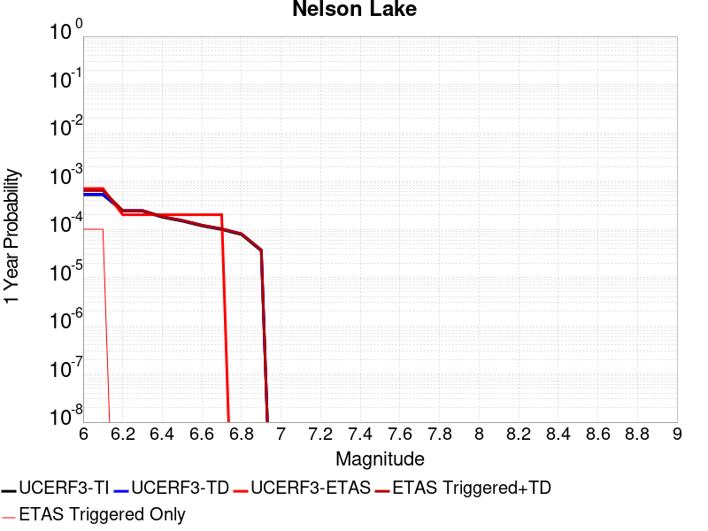 |  |

| Magnitude | 1 wk TI Prob | 1 wk TD Prob | 1 wk ETAS Prob | 1 wk ETAS/TD Gain | 1 wk ETAS Triggered+TD | 1 wk ETAS Triggered Only | 1 mo TI Prob | 1 mo TD Prob | 1 mo ETAS Prob | 1 mo ETAS/TD Gain | 1 mo ETAS Triggered+TD | 1 mo ETAS Triggered Only | 1 yr TI Prob | 1 yr TD Prob | 1 yr ETAS Prob | 1 yr ETAS/TD Gain | 1 yr ETAS Triggered+TD | 1 yr ETAS Triggered Only | 10 yr TI Prob | 10 yr TD Prob | 10 yr ETAS Prob | 10 yr ETAS/TD Gain | 10 yr ETAS Triggered+TD | 10 yr ETAS Triggered Only |
|-----|-----|-----|-----|-----|-----|-----|-----|-----|-----|-----|-----|-----|-----|-----|-----|-----|-----|-----|-----|-----|-----|-----|-----|-----|
| 6.0 | 9.913453E-6 | 1.0192824E-5 | 0.0 | 0.0 | 1.0192824E-5 | 0.0 | 4.2485535E-5 | 4.368286E-5 | 1.0E-4 | 2.2892275 | 4.368286E-5 | 0.0 | 5.1713863E-4 | 5.3171936E-4 | 7.0E-4 | 1.3164839 | 6.316662E-4 | 1.0E-4 | 0.0051593683 | 0.0053054993 | 0.0083 | 1.5644144 | 0.0074938275 | 0.0022 |
| 6.1 | 9.913453E-6 | 1.0192824E-5 | 0.0 | 0.0 | 1.0192824E-5 | 0.0 | 4.2485535E-5 | 4.368286E-5 | 1.0E-4 | 2.2892275 | 4.368286E-5 | 0.0 | 5.1713863E-4 | 5.3171936E-4 | 7.0E-4 | 1.3164839 | 6.316662E-4 | 1.0E-4 | 0.0051593683 | 0.0053054993 | 0.0083 | 1.5644144 | 0.0074938275 | 0.0022 |
| 6.2 | 4.5596407E-6 | 4.696593E-6 | 0.0 | 0.0 | 4.696593E-6 | 0.0 | 1.954117E-5 | 2.0128107E-5 | 0.0 | 0.0 | 2.0128107E-5 | 0.0 | 2.3788778E-4 | 2.450334E-4 | 2.0E-4 | 0.8162152 | 2.450334E-4 | 0.0 | 0.0023763329 | 0.0024477583 | 0.003 | 1.2256111 | 0.0029465347 | 5.0E-4 |
| 6.3 | 4.5596407E-6 | 4.696593E-6 | 0.0 | 0.0 | 4.696593E-6 | 0.0 | 1.954117E-5 | 2.0128107E-5 | 0.0 | 0.0 | 2.0128107E-5 | 0.0 | 2.3788778E-4 | 2.450334E-4 | 2.0E-4 | 0.8162152 | 2.450334E-4 | 0.0 | 0.0023763329 | 0.0024477583 | 0.003 | 1.2256111 | 0.0029465347 | 5.0E-4 |
| 6.4 | 3.4025713E-6 | 3.5101173E-6 | 0.0 | 0.0 | 3.5101173E-6 | 0.0 | 1.4582367E-5 | 1.5043278E-5 | 0.0 | 0.0 | 1.5043278E-5 | 0.0 | 1.7752586E-4 | 1.8313735E-4 | 2.0E-4 | 1.0920765 | 1.8313735E-4 | 0.0 | 0.001773841 | 0.0018299472 | 0.0021 | 1.1475741 | 0.0021293983 | 3.0E-4 |
| 6.5 | 2.8352947E-6 | 2.9280461E-6 | 0.0 | 0.0 | 2.9280461E-6 | 0.0 | 1.2151207E-5 | 1.2548713E-5 | 0.0 | 0.0 | 1.2548713E-5 | 0.0 | 1.479309E-4 | 1.5277062E-4 | 2.0E-4 | 1.3091522 | 1.5277062E-4 | 0.0 | 0.0014783246 | 0.0015267298 | 0.0019 | 1.24449 | 0.0018262718 | 3.0E-4 |
| 6.6 | 2.251518E-6 | 2.329227E-6 | 0.0 | 0.0 | 2.329227E-6 | 0.0 | 9.649328E-6 | 9.9823665E-6 | 0.0 | 0.0 | 9.9823665E-6 | 0.0 | 1.1747423E-4 | 1.2152916E-4 | 2.0E-4 | 1.6456954 | 1.2152916E-4 | 0.0 | 0.0011741214 | 0.0012146888 | 0.0016 | 1.3172098 | 0.0014144459 | 2.0E-4 |
| 6.7 | 1.8911853E-6 | 1.9592796E-6 | 0.0 | 0.0 | 1.9592796E-6 | 0.0 | 8.105055E-6 | 8.396889E-6 | 0.0 | 0.0 | 8.396889E-6 | 0.0 | 9.867457E-5 | 1.0222791E-4 | 2.0E-4 | 1.9564129 | 1.0222791E-4 | 0.0 | 9.863076E-4 | 0.0010218663 | 0.0014 | 1.3700422 | 0.001221662 | 2.0E-4 |
| 6.8 | 1.4874814E-6 | 1.5439467E-6 | 0.0 | 0.0 | 1.5439467E-6 | 0.0 | 6.374905E-6 | 6.6169005E-6 | 0.0 | 0.0 | 6.6169005E-6 | 0.0 | 7.76117E-5 | 8.0558304E-5 | 0.0 | 0.0 | 8.0558304E-5 | 0.0 | 7.75846E-4 | 8.0534216E-4 | 0.001 | 1.2417083 | 0.0010051811 | 2.0E-4 |
| 6.9 | 6.835972E-7 | 7.140558E-7 | 0.0 | 0.0 | 7.140558E-7 | 0.0 | 2.9296991E-6 | 3.0602373E-6 | 0.0 | 0.0 | 3.0602373E-6 | 0.0 | 3.56685E-5 | 3.7258073E-5 | 0.0 | 0.0 | 3.7258073E-5 | 0.0 | 3.5662777E-4 | 3.7254952E-4 | 7.0E-4 | 1.8789449 | 4.7251224E-4 | 1.0E-4 |

## Lost Hills
*[(top)](#table-of-contents)*

| 1 Week | 1 Month | 1 Year | 10 Year |
|-----|-----|-----|-----|
|  |  |  | 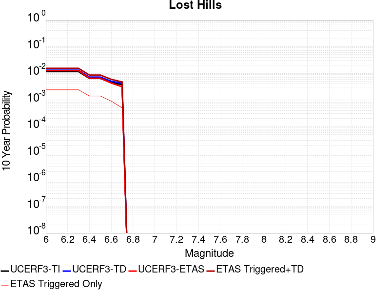 |

| Magnitude | 1 wk TI Prob | 1 wk TD Prob | 1 wk ETAS Prob | 1 wk ETAS/TD Gain | 1 wk ETAS Triggered+TD | 1 wk ETAS Triggered Only | 1 mo TI Prob | 1 mo TD Prob | 1 mo ETAS Prob | 1 mo ETAS/TD Gain | 1 mo ETAS Triggered+TD | 1 mo ETAS Triggered Only | 1 yr TI Prob | 1 yr TD Prob | 1 yr ETAS Prob | 1 yr ETAS/TD Gain | 1 yr ETAS Triggered+TD | 1 yr ETAS Triggered Only | 10 yr TI Prob | 10 yr TD Prob | 10 yr ETAS Prob | 10 yr ETAS/TD Gain | 10 yr ETAS Triggered+TD | 10 yr ETAS Triggered Only |
|-----|-----|-----|-----|-----|-----|-----|-----|-----|-----|-----|-----|-----|-----|-----|-----|-----|-----|-----|-----|-----|-----|-----|-----|-----|
| 6.0 | 2.233523E-5 | 2.5112762E-5 | 0.0 | 0.0 | 2.5112762E-5 | 0.0 | 9.571891E-5 | 1.0762263E-4 | 0.0 | 0.0 | 1.0762263E-4 | 0.0 | 0.0011647546 | 0.0013096861 | 0.0014 | 1.0689584 | 0.0015094242 | 2.0E-4 | 0.011586686 | 0.013036282 | 0.0126 | 0.96653324 | 0.0154049955 | 0.0024 |
| 6.1 | 2.233523E-5 | 2.5112762E-5 | 0.0 | 0.0 | 2.5112762E-5 | 0.0 | 9.571891E-5 | 1.0762263E-4 | 0.0 | 0.0 | 1.0762263E-4 | 0.0 | 0.0011647546 | 0.0013096861 | 0.0014 | 1.0689584 | 0.0015094242 | 2.0E-4 | 0.011586686 | 0.013036282 | 0.0126 | 0.96653324 | 0.0154049955 | 0.0024 |
| 6.2 | 2.233523E-5 | 2.5112762E-5 | 0.0 | 0.0 | 2.5112762E-5 | 0.0 | 9.571891E-5 | 1.0762263E-4 | 0.0 | 0.0 | 1.0762263E-4 | 0.0 | 0.0011647546 | 0.0013096861 | 0.0014 | 1.0689584 | 0.0015094242 | 2.0E-4 | 0.011586686 | 0.013036282 | 0.0126 | 0.96653324 | 0.0154049955 | 0.0024 |
| 6.3 | 2.233523E-5 | 2.5112762E-5 | 0.0 | 0.0 | 2.5112762E-5 | 0.0 | 9.571891E-5 | 1.0762263E-4 | 0.0 | 0.0 | 1.0762263E-4 | 0.0 | 0.0011647546 | 0.0013096861 | 0.0014 | 1.0689584 | 0.0015094242 | 2.0E-4 | 0.011586686 | 0.013036282 | 0.0126 | 0.96653324 | 0.0154049955 | 0.0024 |
| 6.4 | 1.2288092E-5 | 1.3784429E-5 | 0.0 | 0.0 | 1.3784429E-5 | 0.0 | 5.2662188E-5 | 5.9075315E-5 | 0.0 | 0.0 | 5.9075315E-5 | 0.0 | 6.409735E-4 | 7.1909843E-4 | 7.0E-4 | 0.9734411 | 8.1902655E-4 | 1.0E-4 | 0.006391279 | 0.0071769264 | 0.0065 | 0.9056802 | 0.008566879 | 0.0014 |
| 6.5 | 1.2288092E-5 | 1.3784429E-5 | 0.0 | 0.0 | 1.3784429E-5 | 0.0 | 5.2662188E-5 | 5.9075315E-5 | 0.0 | 0.0 | 5.9075315E-5 | 0.0 | 6.409735E-4 | 7.1909843E-4 | 7.0E-4 | 0.9734411 | 8.1902655E-4 | 1.0E-4 | 0.006391279 | 0.0071769264 | 0.0065 | 0.9056802 | 0.008566879 | 0.0014 |
| 6.6 | 8.58281E-6 | 9.63611E-6 | 0.0 | 0.0 | 9.63611E-6 | 0.0 | 3.6782953E-5 | 4.129743E-5 | 0.0 | 0.0 | 4.129743E-5 | 0.0 | 4.4774043E-4 | 5.0276343E-4 | 7.0E-4 | 1.3923049 | 6.0271315E-4 | 1.0E-4 | 0.0044683935 | 0.0050244243 | 0.0043 | 0.85581946 | 0.005919902 | 9.0E-4 |
| 6.7 | 7.205685E-6 | 8.090266E-6 | 0.0 | 0.0 | 8.090266E-6 | 0.0 | 3.088114E-5 | 3.4672572E-5 | 0.0 | 0.0 | 3.4672572E-5 | 0.0 | 3.7591302E-4 | 4.2213858E-4 | 4.0E-4 | 0.9475562 | 4.2213858E-4 | 0.0 | 0.0037527776 | 0.004221386 | 0.0031 | 0.73435605 | 0.004719275 | 5.0E-4 |

## Santa Cruz Island
*[(top)](#table-of-contents)*

| 1 Week | 1 Month | 1 Year | 10 Year |
|-----|-----|-----|-----|
|  |  |  | 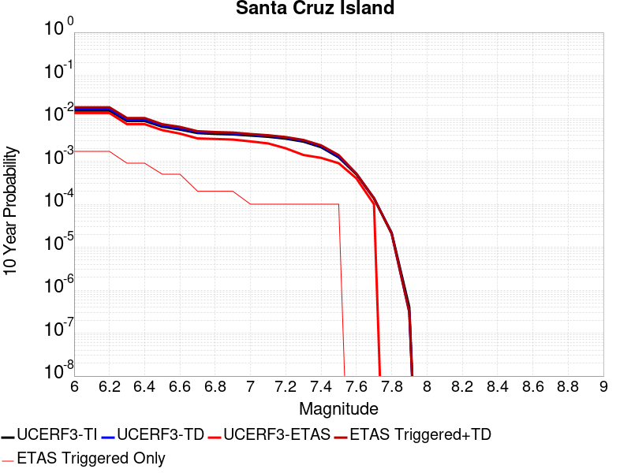 |

| Magnitude | 1 wk TI Prob | 1 wk TD Prob | 1 wk ETAS Prob | 1 wk ETAS/TD Gain | 1 wk ETAS Triggered+TD | 1 wk ETAS Triggered Only | 1 mo TI Prob | 1 mo TD Prob | 1 mo ETAS Prob | 1 mo ETAS/TD Gain | 1 mo ETAS Triggered+TD | 1 mo ETAS Triggered Only | 1 yr TI Prob | 1 yr TD Prob | 1 yr ETAS Prob | 1 yr ETAS/TD Gain | 1 yr ETAS Triggered+TD | 1 yr ETAS Triggered Only | 10 yr TI Prob | 10 yr TD Prob | 10 yr ETAS Prob | 10 yr ETAS/TD Gain | 10 yr ETAS Triggered+TD | 10 yr ETAS Triggered Only |
|-----|-----|-----|-----|-----|-----|-----|-----|-----|-----|-----|-----|-----|-----|-----|-----|-----|-----|-----|-----|-----|-----|-----|-----|-----|
| 6.0 | 2.9164563E-5 | 3.1605017E-5 | 0.0 | 0.0 | 3.1605017E-5 | 0.0 | 1.2498499E-4 | 1.3544381E-4 | 1.0E-4 | 0.73831356 | 1.3544381E-4 | 0.0 | 0.0015206301 | 0.0016479173 | 0.0011 | 0.6675092 | 0.0018475878 | 2.0E-4 | 0.015102667 | 0.016370712 | 0.0133 | 0.81242645 | 0.018042883 | 0.0017 |
| 6.1 | 2.9164563E-5 | 3.1605017E-5 | 0.0 | 0.0 | 3.1605017E-5 | 0.0 | 1.2498499E-4 | 1.3544381E-4 | 1.0E-4 | 0.73831356 | 1.3544381E-4 | 0.0 | 0.0015206301 | 0.0016479173 | 0.0011 | 0.6675092 | 0.0018475878 | 2.0E-4 | 0.015102667 | 0.016370712 | 0.0133 | 0.81242645 | 0.018042883 | 0.0017 |
| 6.2 | 2.9164563E-5 | 3.1605017E-5 | 0.0 | 0.0 | 3.1605017E-5 | 0.0 | 1.2498499E-4 | 1.3544381E-4 | 1.0E-4 | 0.73831356 | 1.3544381E-4 | 0.0 | 0.0015206301 | 0.0016479173 | 0.0011 | 0.6675092 | 0.0018475878 | 2.0E-4 | 0.015102667 | 0.016370712 | 0.0133 | 0.81242645 | 0.018042883 | 0.0017 |
| 6.3 | 1.6635553E-5 | 1.7806862E-5 | 0.0 | 0.0 | 1.7806862E-5 | 0.0 | 7.1293274E-5 | 7.6312994E-5 | 0.0 | 0.0 | 7.6312994E-5 | 0.0 | 8.6765E-4 | 9.287329E-4 | 5.0E-4 | 0.5383679 | 0.0010286401 | 1.0E-4 | 0.008642701 | 0.0092503885 | 0.0073 | 0.789156 | 0.010142063 | 9.0E-4 |
| 6.4 | 1.6635553E-5 | 1.7806862E-5 | 0.0 | 0.0 | 1.7806862E-5 | 0.0 | 7.1293274E-5 | 7.6312994E-5 | 0.0 | 0.0 | 7.6312994E-5 | 0.0 | 8.6765E-4 | 9.287329E-4 | 5.0E-4 | 0.5383679 | 0.0010286401 | 1.0E-4 | 0.008642701 | 0.0092503885 | 0.0073 | 0.789156 | 0.010142063 | 9.0E-4 |
| 6.5 | 1.2238748E-5 | 1.3044715E-5 | 0.0 | 0.0 | 1.3044715E-5 | 0.0 | 5.2450723E-5 | 5.5904748E-5 | 0.0 | 0.0 | 5.5904748E-5 | 0.0 | 6.3840044E-4 | 6.8043143E-4 | 4.0E-4 | 0.5878623 | 6.8043143E-4 | 0.0 | 0.0063656955 | 0.0067838794 | 0.0053 | 0.7812639 | 0.0072804876 | 5.0E-4 |
| 6.6 | 1.0489767E-5 | 1.1158062E-5 | 0.0 | 0.0 | 1.1158062E-5 | 0.0 | 4.495537E-5 | 4.78194E-5 | 0.0 | 0.0 | 4.78194E-5 | 0.0 | 5.4719415E-4 | 5.820479E-4 | 3.0E-4 | 0.5154215 | 5.820479E-4 | 0.0 | 0.005458487 | 0.0058054756 | 0.0044 | 0.7579052 | 0.006302573 | 5.0E-4 |
| 6.7 | 8.699222E-6 | 9.237933E-6 | 0.0 | 0.0 | 9.237933E-6 | 0.0 | 3.7281847E-5 | 3.9590544E-5 | 0.0 | 0.0 | 3.9590544E-5 | 0.0 | 4.5381195E-4 | 4.819088E-4 | 2.0E-4 | 0.4150163 | 4.819088E-4 | 0.0 | 0.0045288634 | 0.0048087053 | 0.0034 | 0.707051 | 0.005007744 | 2.0E-4 |
| 6.8 | 8.307732E-6 | 8.817995E-6 | 0.0 | 0.0 | 8.817995E-6 | 0.0 | 3.560408E-5 | 3.7790862E-5 | 0.0 | 0.0 | 3.7790862E-5 | 0.0 | 4.3339343E-4 | 4.6000702E-4 | 2.0E-4 | 0.43477598 | 4.6000702E-4 | 0.0 | 0.004325492 | 0.0045906017 | 0.0033 | 0.71886003 | 0.0047896835 | 2.0E-4 |
| 6.9 | 8.073121E-6 | 8.565992E-6 | 0.0 | 0.0 | 8.565992E-6 | 0.0 | 3.459863E-5 | 3.671088E-5 | 0.0 | 0.0 | 3.671088E-5 | 0.0 | 4.2115687E-4 | 4.4686373E-4 | 2.0E-4 | 0.44756374 | 4.4686373E-4 | 0.0 | 0.004203596 | 0.0044597033 | 0.0032 | 0.71753657 | 0.0046588113 | 2.0E-4 |
| 7.0 | 7.617019E-6 | 8.075644E-6 | 0.0 | 0.0 | 8.075644E-6 | 0.0 | 3.264396E-5 | 3.4609446E-5 | 0.0 | 0.0 | 3.4609446E-5 | 0.0 | 3.9736772E-4 | 4.2128892E-4 | 2.0E-4 | 0.4747336 | 4.2128892E-4 | 0.0 | 0.003966579 | 0.0042049503 | 0.0029 | 0.68966335 | 0.0043045296 | 1.0E-4 |
| 7.1 | 7.1224836E-6 | 7.546694E-6 | 0.0 | 0.0 | 7.546694E-6 | 0.0 | 3.052457E-5 | 3.2342577E-5 | 0.0 | 0.0 | 3.2342577E-5 | 0.0 | 3.715733E-4 | 3.937001E-4 | 2.0E-4 | 0.5080009 | 3.937001E-4 | 0.0 | 0.003709526 | 0.003930069 | 0.0026 | 0.661566 | 0.004029676 | 1.0E-4 |
| 7.2 | 6.441115E-6 | 6.8282116E-6 | 0.0 | 0.0 | 6.8282116E-6 | 0.0 | 2.7604487E-5 | 2.9263438E-5 | 0.0 | 0.0 | 2.9263438E-5 | 0.0 | 3.360328E-4 | 3.5622434E-4 | 2.0E-4 | 0.5614439 | 3.5622434E-4 | 0.0 | 0.0033552512 | 0.0035565617 | 0.002 | 0.56234086 | 0.003656206 | 1.0E-4 |
| 7.3 | 5.494274E-6 | 5.8206942E-6 | 0.0 | 0.0 | 5.8206942E-6 | 0.0 | 2.3546674E-5 | 2.4945595E-5 | 0.0 | 0.0 | 2.4945595E-5 | 0.0 | 2.8664304E-4 | 3.036705E-4 | 2.0E-4 | 0.65860856 | 3.036705E-4 | 0.0 | 0.002862736 | 0.0030325786 | 0.0014 | 0.46165332 | 0.0031322753 | 1.0E-4 |
| 7.4 | 4.0802624E-6 | 4.3127575E-6 | 0.0 | 0.0 | 4.3127575E-6 | 0.0 | 1.7486722E-5 | 1.8483117E-5 | 0.0 | 0.0 | 1.8483117E-5 | 0.0 | 2.1288003E-4 | 2.2500879E-4 | 2.0E-4 | 0.8888542 | 2.2500879E-4 | 0.0 | 0.0021267622 | 0.0022478185 | 0.0012 | 0.5338509 | 0.002347594 | 1.0E-4 |
| 7.5 | 2.3584746E-6 | 2.4755668E-6 | 0.0 | 0.0 | 2.4755668E-6 | 0.0 | 1.0107709E-5 | 1.0609529E-5 | 0.0 | 0.0 | 1.0609529E-5 | 0.0 | 1.2305441E-4 | 1.2916341E-4 | 1.0E-4 | 0.7742131 | 1.2916341E-4 | 0.0 | 0.0012298629 | 0.0012908884 | 9.0E-4 | 0.6971943 | 0.0013907594 | 1.0E-4 |
| 7.6 | 9.4981914E-7 | 9.861797E-7 | 0.0 | 0.0 | 9.861797E-7 | 0.0 | 4.0706473E-6 | 4.2264774E-6 | 0.0 | 0.0 | 4.2264774E-6 | 0.0 | 4.9559E-5 | 5.145616E-5 | 0.0 | 0.0 | 5.145616E-5 | 0.0 | 4.954795E-4 | 5.144438E-4 | 4.0E-4 | 0.7775388 | 5.144438E-4 | 0.0 |
| 7.7 | 2.6013532E-7 | 2.641836E-7 | 0.0 | 0.0 | 2.641836E-7 | 0.0 | 1.1148652E-6 | 1.132215E-6 | 0.0 | 0.0 | 1.132215E-6 | 0.0 | 1.3573399E-5 | 1.3784631E-5 | 0.0 | 0.0 | 1.3784631E-5 | 0.0 | 1.357257E-4 | 1.3783782E-4 | 1.0E-4 | 0.7254903 | 1.3783782E-4 | 0.0 |
| 7.8 | 4.1522263E-8 | 3.965892E-8 | 0.0 | 0.0 | 3.965892E-8 | 0.0 | 1.7795254E-7 | 1.699668E-7 | 0.0 | 0.0 | 1.699668E-7 | 0.0 | 2.16657E-6 | 2.069344E-6 | 0.0 | 0.0 | 2.069344E-6 | 0.0 | 2.1665488E-5 | 2.069327E-5 | 0.0 | 0.0 | 2.069327E-5 | 0.0 |
| 7.9 | 7.7242046E-10 | 5.94802E-10 | 0.0 | 0.0 | 5.94802E-10 | 0.0 | 3.3103735E-9 | 2.5491516E-9 | 0.0 | 0.0 | 2.5491516E-9 | 0.0 | 4.0303796E-8 | 3.103592E-8 | 0.0 | 0.0 | 3.103592E-8 | 0.0 | 4.030379E-7 | 3.1035916E-7 | 0.0 | 0.0 | 3.1035916E-7 | 0.0 |

## So Sierra Nevada
*[(top)](#table-of-contents)*

| 1 Week | 1 Month | 1 Year | 10 Year |
|-----|-----|-----|-----|
| 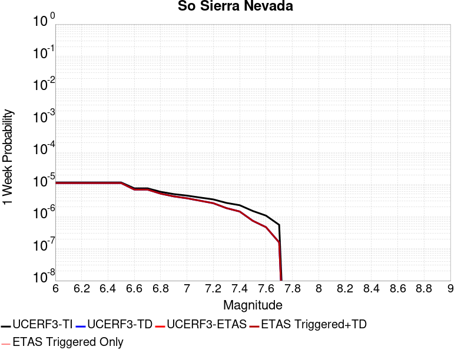 |  |  | 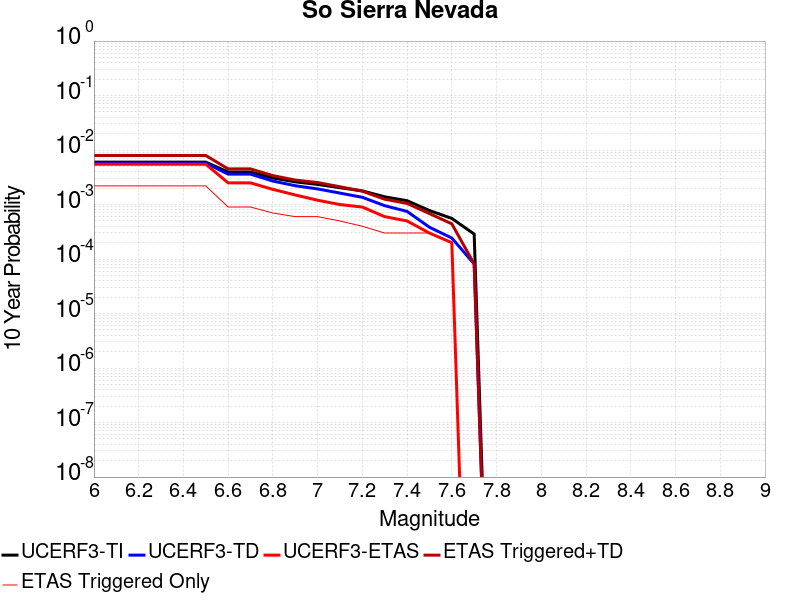 |

| Magnitude | 1 wk TI Prob | 1 wk TD Prob | 1 wk ETAS Prob | 1 wk ETAS/TD Gain | 1 wk ETAS Triggered+TD | 1 wk ETAS Triggered Only | 1 mo TI Prob | 1 mo TD Prob | 1 mo ETAS Prob | 1 mo ETAS/TD Gain | 1 mo ETAS Triggered+TD | 1 mo ETAS Triggered Only | 1 yr TI Prob | 1 yr TD Prob | 1 yr ETAS Prob | 1 yr ETAS/TD Gain | 1 yr ETAS Triggered+TD | 1 yr ETAS Triggered Only | 10 yr TI Prob | 10 yr TD Prob | 10 yr ETAS Prob | 10 yr ETAS/TD Gain | 10 yr ETAS Triggered+TD | 10 yr ETAS Triggered Only |
|-----|-----|-----|-----|-----|-----|-----|-----|-----|-----|-----|-----|-----|-----|-----|-----|-----|-----|-----|-----|-----|-----|-----|-----|-----|
| 6.0 | 1.15488665E-5 | 1.10808005E-5 | 0.0 | 0.0 | 1.10808005E-5 | 0.0 | 4.9494203E-5 | 4.7488353E-5 | 1.0E-4 | 2.1057794 | 1.474836E-4 | 1.0E-4 | 6.024253E-4 | 5.7803007E-4 | 7.0E-4 | 1.2110096 | 0.0012776254 | 7.0E-4 | 0.006007948 | 0.005766535 | 0.0055 | 0.9537789 | 0.007953849 | 0.0022 |
| 6.1 | 1.15488665E-5 | 1.10808005E-5 | 0.0 | 0.0 | 1.10808005E-5 | 0.0 | 4.9494203E-5 | 4.7488353E-5 | 1.0E-4 | 2.1057794 | 1.474836E-4 | 1.0E-4 | 6.024253E-4 | 5.7803007E-4 | 7.0E-4 | 1.2110096 | 0.0012776254 | 7.0E-4 | 0.006007948 | 0.005766535 | 0.0055 | 0.9537789 | 0.007953849 | 0.0022 |
| 6.2 | 1.15488665E-5 | 1.10808005E-5 | 0.0 | 0.0 | 1.10808005E-5 | 0.0 | 4.9494203E-5 | 4.7488353E-5 | 1.0E-4 | 2.1057794 | 1.474836E-4 | 1.0E-4 | 6.024253E-4 | 5.7803007E-4 | 7.0E-4 | 1.2110096 | 0.0012776254 | 7.0E-4 | 0.006007948 | 0.005766535 | 0.0055 | 0.9537789 | 0.007953849 | 0.0022 |
| 6.3 | 1.15488665E-5 | 1.10808005E-5 | 0.0 | 0.0 | 1.10808005E-5 | 0.0 | 4.9494203E-5 | 4.7488353E-5 | 1.0E-4 | 2.1057794 | 1.474836E-4 | 1.0E-4 | 6.024253E-4 | 5.7803007E-4 | 7.0E-4 | 1.2110096 | 0.0012776254 | 7.0E-4 | 0.006007948 | 0.005766535 | 0.0055 | 0.9537789 | 0.007953849 | 0.0022 |
| 6.4 | 1.15488665E-5 | 1.10808005E-5 | 0.0 | 0.0 | 1.10808005E-5 | 0.0 | 4.9494203E-5 | 4.7488353E-5 | 1.0E-4 | 2.1057794 | 1.474836E-4 | 1.0E-4 | 6.024253E-4 | 5.7803007E-4 | 7.0E-4 | 1.2110096 | 0.0012776254 | 7.0E-4 | 0.006007948 | 0.005766535 | 0.0055 | 0.9537789 | 0.007953849 | 0.0022 |
| 6.5 | 1.15488665E-5 | 1.10808005E-5 | 0.0 | 0.0 | 1.10808005E-5 | 0.0 | 4.9494203E-5 | 4.7488353E-5 | 1.0E-4 | 2.1057794 | 1.474836E-4 | 1.0E-4 | 6.024253E-4 | 5.7803007E-4 | 7.0E-4 | 1.2110096 | 0.0012776254 | 7.0E-4 | 0.006007948 | 0.005766535 | 0.0055 | 0.9537789 | 0.007953849 | 0.0022 |
| 6.6 | 7.587044E-6 | 6.9364146E-6 | 0.0 | 0.0 | 6.9364146E-6 | 0.0 | 3.2515498E-5 | 2.9727169E-5 | 1.0E-4 | 3.363926 | 1.297242E-4 | 1.0E-4 | 3.9580427E-4 | 3.6187112E-4 | 3.0E-4 | 0.82902443 | 6.6176255E-4 | 3.0E-4 | 0.003951 | 0.0036131102 | 0.0025 | 0.69192463 | 0.0045098583 | 9.0E-4 |
| 6.7 | 7.587044E-6 | 6.9364146E-6 | 0.0 | 0.0 | 6.9364146E-6 | 0.0 | 3.2515498E-5 | 2.9727169E-5 | 1.0E-4 | 3.363926 | 1.297242E-4 | 1.0E-4 | 3.9580427E-4 | 3.6187112E-4 | 3.0E-4 | 0.82902443 | 6.6176255E-4 | 3.0E-4 | 0.003951 | 0.0036131102 | 0.0025 | 0.69192463 | 0.0045098583 | 9.0E-4 |
| 6.8 | 5.9026956E-6 | 5.1800234E-6 | 0.0 | 0.0 | 5.1800234E-6 | 0.0 | 2.5297022E-5 | 2.2199918E-5 | 1.0E-4 | 4.504521 | 1.221977E-4 | 1.0E-4 | 3.0794772E-4 | 2.7025165E-4 | 2.0E-4 | 0.74005103 | 4.7019758E-4 | 2.0E-4 | 0.0030752132 | 0.0026993463 | 0.0019 | 0.7038742 | 0.0033974566 | 7.0E-4 |
| 6.9 | 5.0118915E-6 | 4.2529814E-6 | 0.0 | 0.0 | 4.2529814E-6 | 0.0 | 2.1479358E-5 | 1.822694E-5 | 1.0E-4 | 5.4863844 | 1.18225114E-4 | 1.0E-4 | 2.614798E-4 | 2.2189112E-4 | 2.0E-4 | 0.901343 | 4.2184675E-4 | 2.0E-4 | 0.0026117235 | 0.0022167682 | 0.0015 | 0.6766607 | 0.0028154382 | 6.0E-4 |
| 7.0 | 4.4924795E-6 | 3.714434E-6 | 0.0 | 0.0 | 3.714434E-6 | 0.0 | 1.925334E-5 | 1.5918908E-5 | 1.0E-4 | 6.281838 | 1.1591732E-4 | 1.0E-4 | 2.3438422E-4 | 1.937961E-4 | 2.0E-4 | 1.0320125 | 3.9375733E-4 | 2.0E-4 | 0.0023413717 | 0.001936334 | 0.0012 | 0.6197278 | 0.0025351723 | 6.0E-4 |
| 7.1 | 3.9118436E-6 | 3.1124462E-6 | 0.0 | 0.0 | 3.1124462E-6 | 0.0 | 1.6764936E-5 | 1.333899E-5 | 1.0E-4 | 7.4968195 | 1.1333766E-4 | 1.0E-4 | 2.0409399E-4 | 1.6239067E-4 | 2.0E-4 | 1.2315978 | 3.623582E-4 | 2.0E-4 | 0.0020390663 | 0.0016227762 | 0.001 | 0.6162279 | 0.0021219647 | 5.0E-4 |
| 7.2 | 3.4200818E-6 | 2.605885E-6 | 0.0 | 0.0 | 2.605885E-6 | 0.0 | 1.4657411E-5 | 1.1168033E-5 | 1.0E-4 | 8.954128 | 1.1116692E-4 | 1.0E-4 | 1.7843937E-4 | 1.3596282E-4 | 2.0E-4 | 1.4709903 | 3.3593562E-4 | 2.0E-4 | 0.0017829615 | 0.0013588461 | 9.0E-4 | 0.66232663 | 0.0017583026 | 4.0E-4 |
| 7.3 | 2.6593618E-6 | 1.8287933E-6 | 0.0 | 0.0 | 1.8287933E-6 | 0.0 | 1.13972155E-5 | 7.837664E-6 | 1.0E-4 | 12.7589035 | 1.0783688E-4 | 1.0E-4 | 1.3875226E-4 | 9.541967E-5 | 1.0E-4 | 1.0480019 | 1.9541013E-4 | 1.0E-4 | 0.0013866565 | 9.5381594E-4 | 6.0E-4 | 0.62905216 | 0.0012535298 | 3.0E-4 |
| 7.4 | 2.2577992E-6 | 1.4367762E-6 | 0.0 | 0.0 | 1.4367762E-6 | 0.0 | 9.676246E-6 | 6.157599E-6 | 1.0E-4 | 16.240095 | 1.06156986E-4 | 1.0E-4 | 1.1780193E-4 | 7.496645E-5 | 1.0E-4 | 1.3339301 | 1.7495894E-4 | 1.0E-4 | 0.001177395 | 7.494366E-4 | 5.0E-4 | 0.66716784 | 0.0010492118 | 3.0E-4 |
| 7.5 | 1.489319E-6 | 7.356553E-7 | 0.0 | 0.0 | 7.356553E-7 | 0.0 | 6.3827797E-6 | 3.1528045E-6 | 1.0E-4 | 31.717793 | 1.0315249E-4 | 1.0E-4 | 7.770758E-5 | 3.8384725E-5 | 1.0E-4 | 2.6052032 | 1.3838088E-4 | 1.0E-4 | 7.7680405E-4 | 3.837814E-4 | 3.0E-4 | 0.78169507 | 6.8366627E-4 | 3.0E-4 |
| 7.6 | 1.0680322E-6 | 4.661555E-7 | 0.0 | 0.0 | 4.661555E-7 | 0.0 | 4.577273E-6 | 1.9978079E-6 | 1.0E-4 | 50.054867 | 1.0199761E-4 | 1.0E-4 | 5.5726876E-5 | 2.432304E-5 | 1.0E-4 | 4.111328 | 1.243206E-4 | 1.0E-4 | 5.5712904E-4 | 2.4320405E-4 | 2.0E-4 | 0.82235473 | 4.431554E-4 | 2.0E-4 |
| 7.7 | 5.509146E-7 | 1.5589612E-7 | 0.0 | 0.0 | 1.5589612E-7 | 0.0 | 2.3610605E-6 | 6.6812606E-7 | 0.0 | 0.0 | 6.6812606E-7 | 0.0 | 2.8745531E-5 | 8.134406E-6 | 0.0 | 0.0 | 8.134406E-6 | 0.0 | 2.8741814E-4 | 8.13412E-5 | 0.0 | 0.0 | 8.13412E-5 | 0.0 |

## Santa Rosa Island
*[(top)](#table-of-contents)*

| 1 Week | 1 Month | 1 Year | 10 Year |
|-----|-----|-----|-----|
|  |  |  |  |

| Magnitude | 1 wk TI Prob | 1 wk TD Prob | 1 wk ETAS Prob | 1 wk ETAS/TD Gain | 1 wk ETAS Triggered+TD | 1 wk ETAS Triggered Only | 1 mo TI Prob | 1 mo TD Prob | 1 mo ETAS Prob | 1 mo ETAS/TD Gain | 1 mo ETAS Triggered+TD | 1 mo ETAS Triggered Only | 1 yr TI Prob | 1 yr TD Prob | 1 yr ETAS Prob | 1 yr ETAS/TD Gain | 1 yr ETAS Triggered+TD | 1 yr ETAS Triggered Only | 10 yr TI Prob | 10 yr TD Prob | 10 yr ETAS Prob | 10 yr ETAS/TD Gain | 10 yr ETAS Triggered+TD | 10 yr ETAS Triggered Only |
|-----|-----|-----|-----|-----|-----|-----|-----|-----|-----|-----|-----|-----|-----|-----|-----|-----|-----|-----|-----|-----|-----|-----|-----|-----|
| 6.0 | 4.1143165E-5 | 4.7104702E-5 | 1.0E-4 | 2.1229303 | 1.4709999E-4 | 1.0E-4 | 1.7631594E-4 | 2.0186279E-4 | 1.0E-4 | 0.49538603 | 3.018426E-4 | 1.0E-4 | 0.002144533 | 0.002455106 | 0.0023 | 0.9368231 | 0.002854124 | 4.0E-4 | 0.021239553 | 0.024300482 | 0.0189 | 0.77776235 | 0.02634945 | 0.0021 |
| 6.1 | 2.1061249E-5 | 2.3871296E-5 | 0.0 | 0.0 | 2.3871296E-5 | 0.0 | 9.0259375E-5 | 1.0230171E-4 | 0.0 | 0.0 | 1.0230171E-4 | 0.0 | 0.0010983539 | 0.0012448406 | 8.0E-4 | 0.6426526 | 0.0013447162 | 1.0E-4 | 0.01092941 | 0.012381718 | 0.0078 | 0.6299611 | 0.012974288 | 6.0E-4 |
| 6.2 | 2.1061249E-5 | 2.3871296E-5 | 0.0 | 0.0 | 2.3871296E-5 | 0.0 | 9.0259375E-5 | 1.0230171E-4 | 0.0 | 0.0 | 1.0230171E-4 | 0.0 | 0.0010983539 | 0.0012448406 | 8.0E-4 | 0.6426526 | 0.0013447162 | 1.0E-4 | 0.01092941 | 0.012381718 | 0.0078 | 0.6299611 | 0.012974288 | 6.0E-4 |
| 6.3 | 1.5158236E-5 | 1.7078726E-5 | 0.0 | 0.0 | 1.7078726E-5 | 0.0 | 6.496225E-5 | 7.3192554E-5 | 0.0 | 0.0 | 7.3192554E-5 | 0.0 | 7.906284E-4 | 8.90767E-4 | 8.0E-4 | 0.8981024 | 9.90678E-4 | 1.0E-4 | 0.007878214 | 0.008873219 | 0.0065 | 0.73254144 | 0.009368782 | 5.0E-4 |
| 6.4 | 1.2341918E-5 | 1.3856303E-5 | 0.0 | 0.0 | 1.3856303E-5 | 0.0 | 5.2892858E-5 | 5.9382848E-5 | 0.0 | 0.0 | 5.9382848E-5 | 0.0 | 6.437803E-4 | 7.227545E-4 | 4.0E-4 | 0.55343825 | 8.226822E-4 | 1.0E-4 | 0.006419184 | 0.0072048763 | 0.0054 | 0.7494924 | 0.007701274 | 5.0E-4 |
| 6.5 | 9.061158E-6 | 1.0119389E-5 | 0.0 | 0.0 | 1.0119389E-5 | 0.0 | 3.883296E-5 | 4.336812E-5 | 0.0 | 0.0 | 4.336812E-5 | 0.0 | 4.726887E-4 | 5.278842E-4 | 4.0E-4 | 0.75774187 | 6.2783144E-4 | 1.0E-4 | 0.004716845 | 0.0052668415 | 0.0046 | 0.8733887 | 0.0055652615 | 3.0E-4 |
| 6.6 | 7.5461685E-6 | 8.402639E-6 | 0.0 | 0.0 | 8.402639E-6 | 0.0 | 3.2340322E-5 | 3.6010835E-5 | 0.0 | 0.0 | 3.6010835E-5 | 0.0 | 3.936723E-4 | 4.38348E-4 | 4.0E-4 | 0.91251695 | 5.3830416E-4 | 1.0E-4 | 0.003929756 | 0.0043752636 | 0.004 | 0.91423064 | 0.004673951 | 3.0E-4 |
| 6.7 | 5.5023775E-6 | 6.0886805E-6 | 0.0 | 0.0 | 6.0886805E-6 | 0.0 | 2.3581404E-5 | 2.6094101E-5 | 0.0 | 0.0 | 2.6094101E-5 | 0.0 | 2.8706578E-4 | 3.1765262E-4 | 2.0E-4 | 0.6296186 | 3.1765262E-4 | 0.0 | 0.0028669522 | 0.0031723077 | 0.0032 | 1.0087295 | 0.0033716732 | 2.0E-4 |
| 6.8 | 3.7351679E-6 | 4.083907E-6 | 0.0 | 0.0 | 4.083907E-6 | 0.0 | 1.6007763E-5 | 1.7502354E-5 | 0.0 | 0.0 | 1.7502354E-5 | 0.0 | 1.948771E-4 | 2.1307282E-4 | 1.0E-4 | 0.46932313 | 2.1307282E-4 | 0.0 | 0.0019470629 | 0.0021289305 | 0.0018 | 0.8454949 | 0.0021289305 | 0.0 |
| 6.9 | 2.456366E-6 | 2.629642E-6 | 0.0 | 0.0 | 2.629642E-6 | 0.0 | 1.0527241E-5 | 1.1269845E-5 | 0.0 | 0.0 | 1.1269845E-5 | 0.0 | 1.2816161E-4 | 1.3720176E-4 | 1.0E-4 | 0.72885364 | 1.3720176E-4 | 0.0 | 0.0012808773 | 0.0013711734 | 0.0014 | 1.0210233 | 0.0013711734 | 0.0 |
| 7.0 | 2.3245157E-6 | 2.4831174E-6 | 0.0 | 0.0 | 2.4831174E-6 | 0.0 | 9.962172E-6 | 1.0641888E-5 | 0.0 | 0.0 | 1.0641888E-5 | 0.0 | 1.2128269E-4 | 1.2955732E-4 | 1.0E-4 | 0.77185917 | 1.2955732E-4 | 0.0 | 0.0012121652 | 0.0012948201 | 0.0014 | 1.0812314 | 0.0012948201 | 0.0 |
| 7.1 | 2.2248344E-6 | 2.3735677E-6 | 0.0 | 0.0 | 2.3735677E-6 | 0.0 | 9.53497E-6 | 1.0172393E-5 | 0.0 | 0.0 | 1.0172393E-5 | 0.0 | 1.1608207E-4 | 1.2384186E-4 | 1.0E-4 | 0.8074814 | 1.2384186E-4 | 0.0 | 0.0011602144 | 0.0012377305 | 0.0013 | 1.0503094 | 0.0012377305 | 0.0 |
| 7.2 | 2.1350402E-6 | 2.276456E-6 | 0.0 | 0.0 | 2.276456E-6 | 0.0 | 9.150141E-6 | 9.756203E-6 | 0.0 | 0.0 | 9.756203E-6 | 0.0 | 1.1139726E-4 | 1.18775315E-4 | 1.0E-4 | 0.8419258 | 1.18775315E-4 | 0.0 | 0.0011134144 | 0.0011871202 | 0.001 | 0.8423746 | 0.0011871202 | 0.0 |
| 7.3 | 1.9793572E-6 | 2.108996E-6 | 0.0 | 0.0 | 2.108996E-6 | 0.0 | 8.482932E-6 | 9.038523E-6 | 0.0 | 0.0 | 9.038523E-6 | 0.0 | 1.032748E-4 | 1.1003847E-4 | 1.0E-4 | 0.90877306 | 1.1003847E-4 | 0.0 | 0.0010322682 | 0.0010998417 | 5.0E-4 | 0.4546109 | 0.0010998417 | 0.0 |
| 7.4 | 1.6951194E-6 | 1.8048078E-6 | 0.0 | 0.0 | 1.8048078E-6 | 0.0 | 7.264777E-6 | 7.734868E-6 | 0.0 | 0.0 | 7.734868E-6 | 0.0 | 8.844508E-5 | 9.416796E-5 | 1.0E-4 | 1.0619323 | 9.416796E-5 | 0.0 | 8.840988E-4 | 9.4128225E-4 | 4.0E-4 | 0.42495224 | 9.4128225E-4 | 0.0 |
| 7.5 | 8.987207E-7 | 9.513347E-7 | 0.0 | 0.0 | 9.513347E-7 | 0.0 | 3.8516546E-6 | 4.0771424E-6 | 0.0 | 0.0 | 4.0771424E-6 | 0.0 | 4.6892885E-5 | 4.963809E-5 | 0.0 | 0.0 | 4.963809E-5 | 0.0 | 4.688299E-4 | 4.962712E-4 | 1.0E-4 | 0.20150274 | 4.962712E-4 | 0.0 |
| 7.6 | 3.8783037E-7 | 4.0533195E-7 | 0.0 | 0.0 | 4.0533195E-7 | 0.0 | 1.6621291E-6 | 1.7371357E-6 | 0.0 | 0.0 | 1.7371357E-6 | 0.0 | 2.0236233E-5 | 2.1149428E-5 | 0.0 | 0.0 | 2.1149428E-5 | 0.0 | 2.023439E-4 | 2.114748E-4 | 1.0E-4 | 0.47286955 | 2.114748E-4 | 0.0 |
| 7.7 | 6.181804E-8 | 6.339514E-8 | 0.0 | 0.0 | 6.339514E-8 | 0.0 | 2.6493444E-7 | 2.7169344E-7 | 0.0 | 0.0 | 2.7169344E-7 | 0.0 | 3.225572E-6 | 3.3078627E-6 | 0.0 | 0.0 | 3.3078627E-6 | 0.0 | 3.225525E-5 | 3.307814E-5 | 0.0 | 0.0 | 3.307814E-5 | 0.0 |
| 7.8 | 1.3704449E-9 | 1.3964679E-9 | 0.0 | 0.0 | 1.3964679E-9 | 0.0 | 5.873335E-9 | 5.984862E-9 | 0.0 | 0.0 | 5.984862E-9 | 0.0 | 7.1507856E-8 | 7.2865696E-8 | 0.0 | 0.0 | 7.2865696E-8 | 0.0 | 7.1507833E-7 | 7.286568E-7 | 0.0 | 0.0 | 7.286568E-7 | 0.0 |

## Mission Hills 2011
*[(top)](#table-of-contents)*

| 1 Week | 1 Month | 1 Year | 10 Year |
|-----|-----|-----|-----|
| 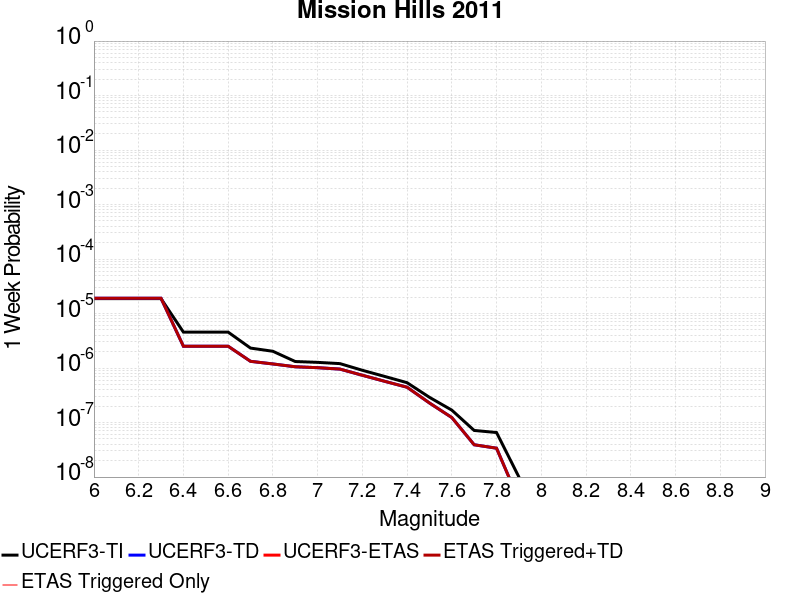 | 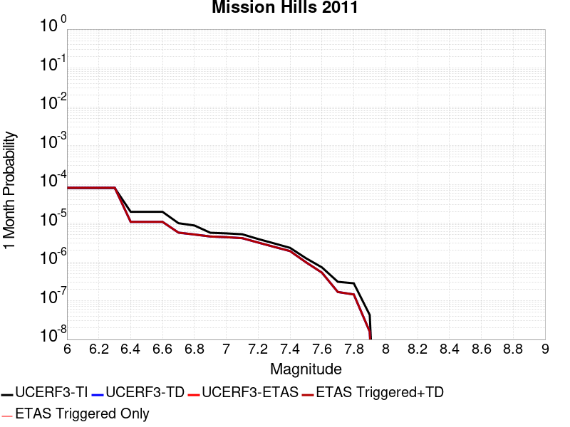 | 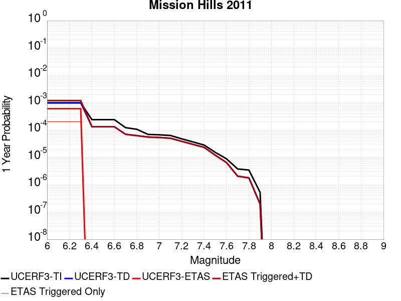 | 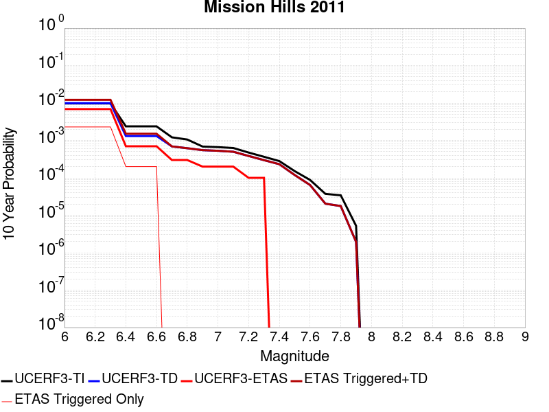 |

| Magnitude | 1 wk TI Prob | 1 wk TD Prob | 1 wk ETAS Prob | 1 wk ETAS/TD Gain | 1 wk ETAS Triggered+TD | 1 wk ETAS Triggered Only | 1 mo TI Prob | 1 mo TD Prob | 1 mo ETAS Prob | 1 mo ETAS/TD Gain | 1 mo ETAS Triggered+TD | 1 mo ETAS Triggered Only | 1 yr TI Prob | 1 yr TD Prob | 1 yr ETAS Prob | 1 yr ETAS/TD Gain | 1 yr ETAS Triggered+TD | 1 yr ETAS Triggered Only | 10 yr TI Prob | 10 yr TD Prob | 10 yr ETAS Prob | 10 yr ETAS/TD Gain | 10 yr ETAS Triggered+TD | 10 yr ETAS Triggered Only |
|-----|-----|-----|-----|-----|-----|-----|-----|-----|-----|-----|-----|-----|-----|-----|-----|-----|-----|-----|-----|-----|-----|-----|-----|-----|
| 6.0 | 1.8765717E-5 | 1.9060735E-5 | 0.0 | 0.0 | 1.9060735E-5 | 0.0 | 8.0422025E-5 | 8.1688246E-5 | 0.0 | 0.0 | 8.1688246E-5 | 0.0 | 9.786983E-4 | 9.94444E-4 | 6.0E-4 | 0.6033522 | 0.0011942452 | 2.0E-4 | 0.009743992 | 0.009933627 | 0.0069 | 0.69461036 | 0.01221078 | 0.0023 |
| 6.1 | 1.8765717E-5 | 1.9060735E-5 | 0.0 | 0.0 | 1.9060735E-5 | 0.0 | 8.0422025E-5 | 8.1688246E-5 | 0.0 | 0.0 | 8.1688246E-5 | 0.0 | 9.786983E-4 | 9.94444E-4 | 6.0E-4 | 0.6033522 | 0.0011942452 | 2.0E-4 | 0.009743992 | 0.009933627 | 0.0069 | 0.69461036 | 0.01221078 | 0.0023 |
| 6.2 | 1.8765717E-5 | 1.9060735E-5 | 0.0 | 0.0 | 1.9060735E-5 | 0.0 | 8.0422025E-5 | 8.1688246E-5 | 0.0 | 0.0 | 8.1688246E-5 | 0.0 | 9.786983E-4 | 9.94444E-4 | 6.0E-4 | 0.6033522 | 0.0011942452 | 2.0E-4 | 0.009743992 | 0.009933627 | 0.0069 | 0.69461036 | 0.01221078 | 0.0023 |
| 6.3 | 1.8765717E-5 | 1.9060735E-5 | 0.0 | 0.0 | 1.9060735E-5 | 0.0 | 8.0422025E-5 | 8.1688246E-5 | 0.0 | 0.0 | 8.1688246E-5 | 0.0 | 9.786983E-4 | 9.94444E-4 | 6.0E-4 | 0.6033522 | 0.0011942452 | 2.0E-4 | 0.009743992 | 0.009933627 | 0.0069 | 0.69461036 | 0.01221078 | 0.0023 |
| 6.4 | 4.566357E-6 | 2.5155202E-6 | 0.0 | 0.0 | 2.5155202E-6 | 0.0 | 1.9569954E-5 | 1.0780767E-5 | 0.0 | 0.0 | 1.0780767E-5 | 0.0 | 2.3823815E-4 | 1.3124975E-4 | 0.0 | 0.0 | 1.3124975E-4 | 0.0 | 0.002379829 | 0.0013119007 | 7.0E-4 | 0.53357697 | 0.0015116383 | 2.0E-4 |
| 6.5 | 4.566357E-6 | 2.5155202E-6 | 0.0 | 0.0 | 2.5155202E-6 | 0.0 | 1.9569954E-5 | 1.0780767E-5 | 0.0 | 0.0 | 1.0780767E-5 | 0.0 | 2.3823815E-4 | 1.3124975E-4 | 0.0 | 0.0 | 1.3124975E-4 | 0.0 | 0.002379829 | 0.0013119007 | 7.0E-4 | 0.53357697 | 0.0015116383 | 2.0E-4 |
| 6.6 | 4.566357E-6 | 2.5155202E-6 | 0.0 | 0.0 | 2.5155202E-6 | 0.0 | 1.9569954E-5 | 1.0780767E-5 | 0.0 | 0.0 | 1.0780767E-5 | 0.0 | 2.3823815E-4 | 1.3124975E-4 | 0.0 | 0.0 | 1.3124975E-4 | 0.0 | 0.002379829 | 0.0013119007 | 7.0E-4 | 0.53357697 | 0.0015116383 | 2.0E-4 |
| 6.7 | 2.3266773E-6 | 1.3298974E-6 | 0.0 | 0.0 | 1.3298974E-6 | 0.0 | 9.971435E-6 | 5.6995477E-6 | 0.0 | 0.0 | 5.6995477E-6 | 0.0 | 1.2139547E-4 | 6.938985E-5 | 0.0 | 0.0 | 6.938985E-5 | 0.0 | 0.0012132917 | 6.936879E-4 | 3.0E-4 | 0.43247116 | 6.936879E-4 | 0.0 |
| 6.8 | 2.032735E-6 | 1.189658E-6 | 0.0 | 0.0 | 1.189658E-6 | 0.0 | 8.711692E-6 | 5.0985245E-6 | 0.0 | 0.0 | 5.0985245E-6 | 0.0 | 1.06059684E-4 | 6.207282E-5 | 0.0 | 0.0 | 6.207282E-5 | 0.0 | 0.0010600908 | 6.205597E-4 | 3.0E-4 | 0.4834346 | 6.205597E-4 | 0.0 |
| 6.9 | 1.3186259E-6 | 1.0563657E-6 | 0.0 | 0.0 | 1.0563657E-6 | 0.0 | 5.6512413E-6 | 4.5272736E-6 | 0.0 | 0.0 | 4.5272736E-6 | 0.0 | 6.8801695E-5 | 5.511819E-5 | 0.0 | 0.0 | 5.511819E-5 | 0.0 | 6.8780396E-4 | 5.510482E-4 | 2.0E-4 | 0.36294466 | 5.510482E-4 | 0.0 |
| 7.0 | 1.2726016E-6 | 1.0160906E-6 | 0.0 | 0.0 | 1.0160906E-6 | 0.0 | 5.4539955E-6 | 4.354667E-6 | 0.0 | 0.0 | 4.354667E-6 | 0.0 | 6.6400375E-5 | 5.3016807E-5 | 0.0 | 0.0 | 5.3016807E-5 | 0.0 | 6.6380535E-4 | 5.3004443E-4 | 2.0E-4 | 0.37732685 | 5.3004443E-4 | 0.0 |
| 7.1 | 1.2063913E-6 | 9.571822E-7 | 0.0 | 0.0 | 9.571822E-7 | 0.0 | 5.170238E-6 | 4.102203E-6 | 0.0 | 0.0 | 4.102203E-6 | 0.0 | 6.294583E-5 | 4.9943206E-5 | 0.0 | 0.0 | 4.9943206E-5 | 0.0 | 6.2928005E-4 | 4.9932237E-4 | 2.0E-4 | 0.40054283 | 4.9932237E-4 | 0.0 |
| 7.2 | 9.105806E-7 | 7.378032E-7 | 0.0 | 0.0 | 7.378032E-7 | 0.0 | 3.9024826E-6 | 3.16201E-6 | 0.0 | 0.0 | 3.16201E-6 | 0.0 | 4.7511687E-5 | 3.8496808E-5 | 0.0 | 0.0 | 3.8496808E-5 | 0.0 | 4.7501532E-4 | 3.8490293E-4 | 1.0E-4 | 0.25980577 | 3.8490293E-4 | 0.0 |
| 7.3 | 7.020432E-7 | 5.711386E-7 | 0.0 | 0.0 | 5.711386E-7 | 0.0 | 3.0087533E-6 | 2.447735E-6 | 0.0 | 0.0 | 2.447735E-6 | 0.0 | 3.6630954E-5 | 2.9800778E-5 | 0.0 | 0.0 | 2.9800778E-5 | 0.0 | 3.6624918E-4 | 2.9796912E-4 | 1.0E-4 | 0.33560523 | 2.9796912E-4 | 0.0 |
| 7.4 | 5.3900635E-7 | 4.4492654E-7 | 0.0 | 0.0 | 4.4492654E-7 | 0.0 | 2.3100251E-6 | 1.9068267E-6 | 0.0 | 0.0 | 1.9068267E-6 | 0.0 | 2.8124194E-5 | 2.321538E-5 | 0.0 | 0.0 | 2.321538E-5 | 0.0 | 2.8120633E-4 | 2.3213075E-4 | 0.0 | 0.0 | 2.3213075E-4 | 0.0 |
| 7.5 | 2.907075E-7 | 2.2881731E-7 | 0.0 | 0.0 | 2.2881731E-7 | 0.0 | 1.2458887E-6 | 9.806453E-7 | 0.0 | 0.0 | 9.806453E-7 | 0.0 | 1.5168589E-5 | 1.1939293E-5 | 0.0 | 0.0 | 1.1939293E-5 | 0.0 | 1.5167553E-4 | 1.19386685E-4 | 0.0 | 0.0 | 1.19386685E-4 | 0.0 |
| 7.6 | 1.6903675E-7 | 1.2358053E-7 | 0.0 | 0.0 | 1.2358053E-7 | 0.0 | 7.2444305E-7 | 5.2963077E-7 | 0.0 | 0.0 | 5.2963077E-7 | 0.0 | 8.820059E-6 | 6.448237E-6 | 0.0 | 0.0 | 6.448237E-6 | 0.0 | 8.8197085E-5 | 6.448062E-5 | 0.0 | 0.0 | 6.448062E-5 | 0.0 |
| 7.7 | 7.168073E-8 | 3.9166835E-8 | 0.0 | 0.0 | 3.9166835E-8 | 0.0 | 3.072031E-7 | 1.6785785E-7 | 0.0 | 0.0 | 1.6785785E-7 | 0.0 | 3.7401915E-6 | 2.0436676E-6 | 0.0 | 0.0 | 2.0436676E-6 | 0.0 | 3.7401285E-5 | 2.0436499E-5 | 0.0 | 0.0 | 2.0436499E-5 | 0.0 |
| 7.8 | 6.564101E-8 | 3.3866044E-8 | 0.0 | 0.0 | 3.3866044E-8 | 0.0 | 2.813186E-7 | 1.4514018E-7 | 0.0 | 0.0 | 1.4514018E-7 | 0.0 | 3.4250486E-6 | 1.7670804E-6 | 0.0 | 0.0 | 1.7670804E-6 | 0.0 | 3.424996E-5 | 1.7670674E-5 | 0.0 | 0.0 | 1.7670674E-5 | 0.0 |
| 7.9 | 1.0029074E-8 | 3.734245E-9 | 0.0 | 0.0 | 3.734245E-9 | 0.0 | 4.2981743E-8 | 1.6003906E-8 | 0.0 | 0.0 | 1.6003906E-8 | 0.0 | 5.2330256E-7 | 1.9484754E-7 | 0.0 | 0.0 | 1.9484754E-7 | 0.0 | 5.2330133E-6 | 1.9484748E-6 | 0.0 | 0.0 | 1.9484748E-6 | 0.0 |

## Hat Creek-McArthur-Mayfield
*[(top)](#table-of-contents)*

| 1 Week | 1 Month | 1 Year | 10 Year |
|-----|-----|-----|-----|
| 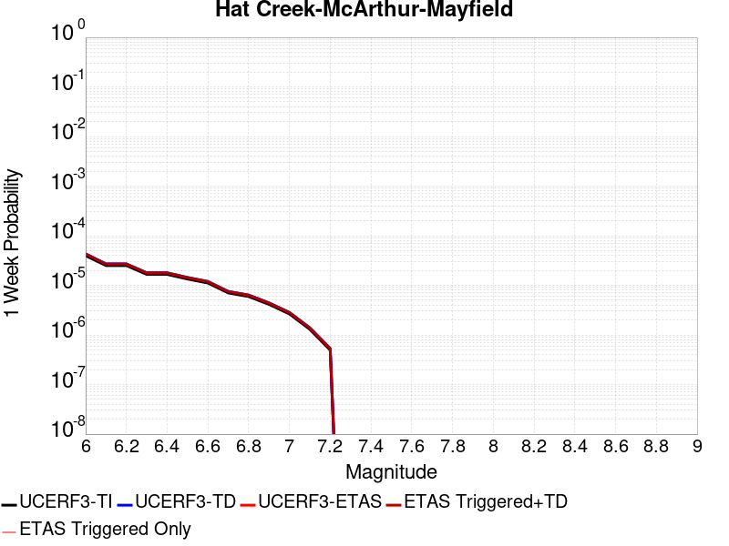 | 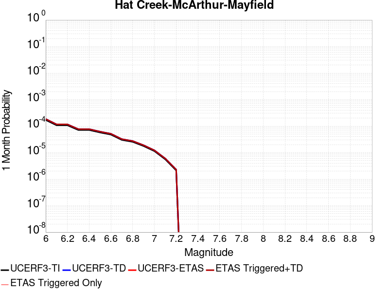 | 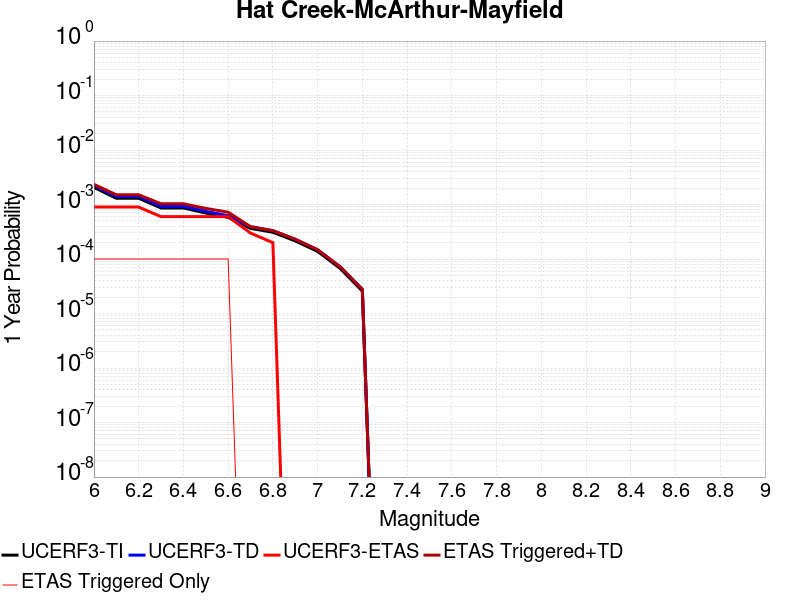 | 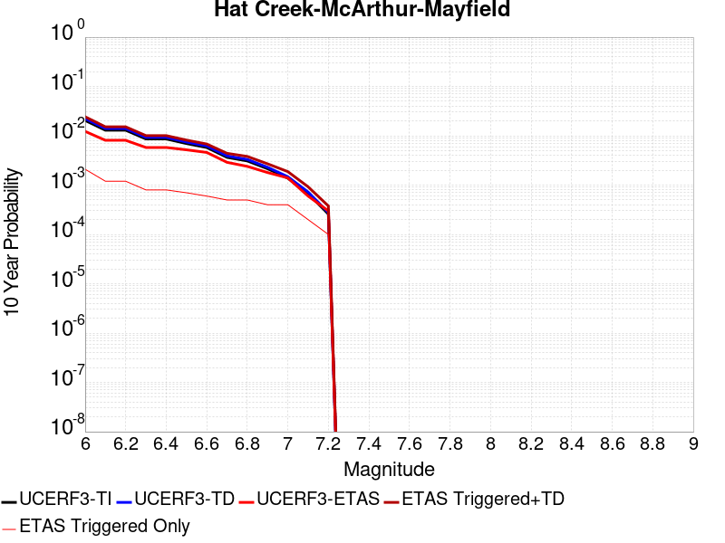 |

| Magnitude | 1 wk TI Prob | 1 wk TD Prob | 1 wk ETAS Prob | 1 wk ETAS/TD Gain | 1 wk ETAS Triggered+TD | 1 wk ETAS Triggered Only | 1 mo TI Prob | 1 mo TD Prob | 1 mo ETAS Prob | 1 mo ETAS/TD Gain | 1 mo ETAS Triggered+TD | 1 mo ETAS Triggered Only | 1 yr TI Prob | 1 yr TD Prob | 1 yr ETAS Prob | 1 yr ETAS/TD Gain | 1 yr ETAS Triggered+TD | 1 yr ETAS Triggered Only | 10 yr TI Prob | 10 yr TD Prob | 10 yr ETAS Prob | 10 yr ETAS/TD Gain | 10 yr ETAS Triggered+TD | 10 yr ETAS Triggered Only |
|-----|-----|-----|-----|-----|-----|-----|-----|-----|-----|-----|-----|-----|-----|-----|-----|-----|-----|-----|-----|-----|-----|-----|-----|-----|
| 6.0 | 3.967457E-5 | 4.3165863E-5 | 0.0 | 0.0 | 4.3165863E-5 | 0.0 | 1.7002279E-4 | 1.8498408E-4 | 0.0 | 0.0 | 1.8498408E-4 | 0.0 | 0.002068062 | 0.0022499692 | 9.0E-4 | 0.4000055 | 0.002349744 | 1.0E-4 | 0.02048922 | 0.022284256 | 0.0123 | 0.5519592 | 0.02433746 | 0.0021 |
| 6.1 | 2.5044013E-5 | 2.7075523E-5 | 0.0 | 0.0 | 2.7075523E-5 | 0.0 | 1.0732707E-4 | 1.1603298E-4 | 0.0 | 0.0 | 1.1603298E-4 | 0.0 | 0.0013059238 | 0.0014118177 | 9.0E-4 | 0.637476 | 0.0015116766 | 1.0E-4 | 0.01298276 | 0.014031905 | 0.0081 | 0.5772559 | 0.015215066 | 0.0012 |
| 6.2 | 2.5044013E-5 | 2.7075523E-5 | 0.0 | 0.0 | 2.7075523E-5 | 0.0 | 1.0732707E-4 | 1.1603298E-4 | 0.0 | 0.0 | 1.1603298E-4 | 0.0 | 0.0013059238 | 0.0014118177 | 9.0E-4 | 0.637476 | 0.0015116766 | 1.0E-4 | 0.01298276 | 0.014031905 | 0.0081 | 0.5772559 | 0.015215066 | 0.0012 |
| 6.3 | 1.6624012E-5 | 1.789378E-5 | 0.0 | 0.0 | 1.789378E-5 | 0.0 | 7.124382E-5 | 7.668543E-5 | 0.0 | 0.0 | 7.668543E-5 | 0.0 | 8.670483E-4 | 9.332538E-4 | 6.0E-4 | 0.642912 | 0.0010331605 | 1.0E-4 | 0.008636732 | 0.00929428 | 0.0058 | 0.6240397 | 0.010086845 | 8.0E-4 |
| 6.4 | 1.6624012E-5 | 1.789378E-5 | 0.0 | 0.0 | 1.789378E-5 | 0.0 | 7.124382E-5 | 7.668543E-5 | 0.0 | 0.0 | 7.668543E-5 | 0.0 | 8.670483E-4 | 9.332538E-4 | 6.0E-4 | 0.642912 | 0.0010331605 | 1.0E-4 | 0.008636732 | 0.00929428 | 0.0058 | 0.6240397 | 0.010086845 | 8.0E-4 |
| 6.5 | 1.3394842E-5 | 1.4394265E-5 | 0.0 | 0.0 | 1.4394265E-5 | 0.0 | 5.7405203E-5 | 6.168828E-5 | 0.0 | 0.0 | 6.168828E-5 | 0.0 | 6.986842E-4 | 7.508016E-4 | 6.0E-4 | 0.79914594 | 8.507265E-4 | 1.0E-4 | 0.006964916 | 0.007483243 | 0.0052 | 0.6948859 | 0.008178005 | 7.0E-4 |
| 6.6 | 1.1137514E-5 | 1.19562865E-5 | 0.0 | 0.0 | 1.19562865E-5 | 0.0 | 4.7731326E-5 | 5.1240248E-5 | 0.0 | 0.0 | 5.1240248E-5 | 0.0 | 5.809739E-4 | 6.2367547E-4 | 6.0E-4 | 0.9620388 | 7.236131E-4 | 1.0E-4 | 0.005794574 | 0.006219673 | 0.0046 | 0.7395887 | 0.0068159415 | 6.0E-4 |
| 6.7 | 7.0200663E-6 | 7.525362E-6 | 0.0 | 0.0 | 7.525362E-6 | 0.0 | 3.008565E-5 | 3.2251162E-5 | 0.0 | 0.0 | 3.2251162E-5 | 0.0 | 3.6623122E-4 | 3.9258876E-4 | 3.0E-4 | 0.7641584 | 3.9258876E-4 | 0.0 | 0.0036562826 | 0.003919115 | 0.0029 | 0.739963 | 0.0044171554 | 5.0E-4 |
| 6.8 | 5.940172E-6 | 6.366381E-6 | 0.0 | 0.0 | 6.366381E-6 | 0.0 | 2.545763E-5 | 2.7284212E-5 | 0.0 | 0.0 | 2.7284212E-5 | 0.0 | 3.0990256E-4 | 3.321359E-4 | 2.0E-4 | 0.60216314 | 3.321359E-4 | 0.0 | 0.0030947074 | 0.0033165237 | 0.0024 | 0.72364926 | 0.0038148656 | 5.0E-4 |
| 6.9 | 4.129831E-6 | 4.4241715E-6 | 0.0 | 0.0 | 4.4241715E-6 | 0.0 | 1.7699154E-5 | 1.8960602E-5 | 0.0 | 0.0 | 1.8960602E-5 | 0.0 | 2.154659E-4 | 2.3082165E-4 | 0.0 | 0.0 | 2.3082165E-4 | 0.0 | 0.002152571 | 0.0023058974 | 0.0018 | 0.78060716 | 0.002704975 | 4.0E-4 |
| 7.0 | 2.6512955E-6 | 2.8377951E-6 | 0.0 | 0.0 | 2.8377951E-6 | 0.0 | 1.1362646E-5 | 1.2161925E-5 | 0.0 | 0.0 | 1.2161925E-5 | 0.0 | 1.3833142E-4 | 1.4806181E-4 | 0.0 | 0.0 | 1.4806181E-4 | 0.0 | 0.0013824535 | 0.0014796741 | 0.0014 | 0.94615424 | 0.0018790823 | 4.0E-4 |
| 7.1 | 1.2992575E-6 | 1.3911265E-6 | 0.0 | 0.0 | 1.3911265E-6 | 0.0 | 5.568235E-6 | 5.9619583E-6 | 0.0 | 0.0 | 5.9619583E-6 | 0.0 | 6.779115E-5 | 7.258464E-5 | 0.0 | 0.0 | 7.258464E-5 | 0.0 | 6.7770475E-4 | 7.2563096E-4 | 6.0E-4 | 0.82686657 | 9.2548586E-4 | 2.0E-4 |
| 7.2 | 4.968191E-7 | 5.327911E-7 | 0.0 | 0.0 | 5.327911E-7 | 0.0 | 2.1292228E-6 | 2.2833892E-6 | 0.0 | 0.0 | 2.2833892E-6 | 0.0 | 2.592298E-5 | 2.7800035E-5 | 0.0 | 0.0 | 2.7800035E-5 | 0.0 | 2.5919956E-4 | 2.7797793E-4 | 3.0E-4 | 1.0792223 | 3.7795014E-4 | 1.0E-4 |

## Surprise Valley 2011 CFM
*[(top)](#table-of-contents)*

| 1 Week | 1 Month | 1 Year | 10 Year |
|-----|-----|-----|-----|
| 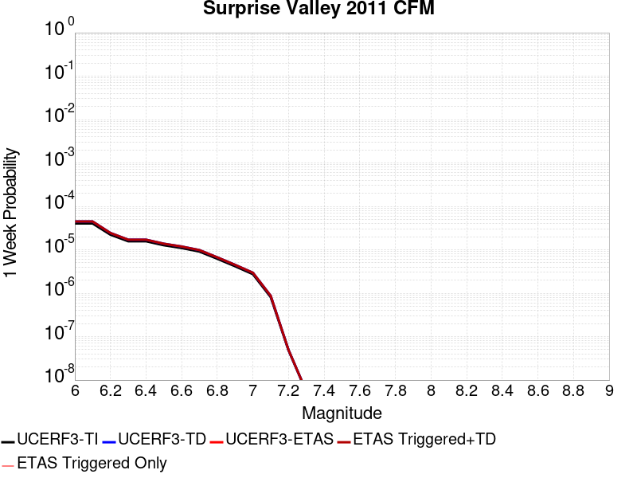 |  | 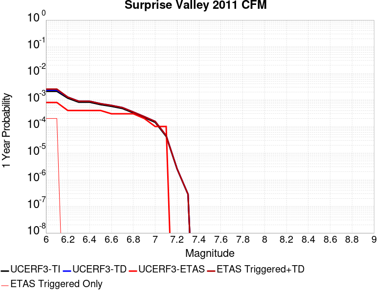 |  |

| Magnitude | 1 wk TI Prob | 1 wk TD Prob | 1 wk ETAS Prob | 1 wk ETAS/TD Gain | 1 wk ETAS Triggered+TD | 1 wk ETAS Triggered Only | 1 mo TI Prob | 1 mo TD Prob | 1 mo ETAS Prob | 1 mo ETAS/TD Gain | 1 mo ETAS Triggered+TD | 1 mo ETAS Triggered Only | 1 yr TI Prob | 1 yr TD Prob | 1 yr ETAS Prob | 1 yr ETAS/TD Gain | 1 yr ETAS Triggered+TD | 1 yr ETAS Triggered Only | 10 yr TI Prob | 10 yr TD Prob | 10 yr ETAS Prob | 10 yr ETAS/TD Gain | 10 yr ETAS Triggered+TD | 10 yr ETAS Triggered Only |
|-----|-----|-----|-----|-----|-----|-----|-----|-----|-----|-----|-----|-----|-----|-----|-----|-----|-----|-----|-----|-----|-----|-----|-----|-----|
| 6.0 | 4.0396248E-5 | 4.4861183E-5 | 0.0 | 0.0 | 4.4861183E-5 | 0.0 | 1.7311527E-4 | 1.9224924E-4 | 1.0E-4 | 0.5201581 | 2.9223002E-4 | 1.0E-4 | 0.002105641 | 0.002338332 | 8.0E-4 | 0.34212425 | 0.002537864 | 2.0E-4 | 0.020858008 | 0.023159012 | 0.0115 | 0.49656695 | 0.024917325 | 0.0018 |
| 6.1 | 4.0396248E-5 | 4.4861183E-5 | 0.0 | 0.0 | 4.4861183E-5 | 0.0 | 1.7311527E-4 | 1.9224924E-4 | 1.0E-4 | 0.5201581 | 2.9223002E-4 | 1.0E-4 | 0.002105641 | 0.002338332 | 8.0E-4 | 0.34212425 | 0.002537864 | 2.0E-4 | 0.020858008 | 0.023159012 | 0.0115 | 0.49656695 | 0.024917325 | 0.0018 |
| 6.2 | 2.2295266E-5 | 2.4405841E-5 | 0.0 | 0.0 | 2.4405841E-5 | 0.0 | 9.554764E-5 | 1.04592444E-4 | 0.0 | 0.0 | 1.04592444E-4 | 0.0 | 0.0011626717 | 0.0012726999 | 4.0E-4 | 0.3142925 | 0.0012726999 | 0.0 | 0.011566074 | 0.012657348 | 0.0055 | 0.4345302 | 0.013545956 | 9.0E-4 |
| 6.3 | 1.572643E-5 | 1.7099772E-5 | 0.0 | 0.0 | 1.7099772E-5 | 0.0 | 6.7397246E-5 | 7.328274E-5 | 0.0 | 0.0 | 7.328274E-5 | 0.0 | 8.202525E-4 | 8.918626E-4 | 4.0E-4 | 0.4484996 | 8.918626E-4 | 0.0 | 0.008172315 | 0.00888394 | 0.0041 | 0.4615069 | 0.009577721 | 7.0E-4 |
| 6.4 | 1.5714395E-5 | 1.7087594E-5 | 0.0 | 0.0 | 1.7087594E-5 | 0.0 | 6.734567E-5 | 7.323055E-5 | 0.0 | 0.0 | 7.323055E-5 | 0.0 | 8.1962504E-4 | 8.912277E-4 | 4.0E-4 | 0.4488191 | 8.912277E-4 | 0.0 | 0.008166086 | 0.008877642 | 0.0041 | 0.46183434 | 0.0095714275 | 7.0E-4 |
| 6.5 | 1.2733495E-5 | 1.3803903E-5 | 0.0 | 0.0 | 1.3803903E-5 | 0.0 | 5.457098E-5 | 5.9158283E-5 | 0.0 | 0.0 | 5.9158283E-5 | 0.0 | 6.641992E-4 | 7.2002073E-4 | 4.0E-4 | 0.55553955 | 7.2002073E-4 | 0.0 | 0.0066221743 | 0.007177573 | 0.0032 | 0.44583315 | 0.0076739844 | 5.0E-4 |
| 6.6 | 1.0983784E-5 | 1.1888497E-5 | 0.0 | 0.0 | 1.1888497E-5 | 0.0 | 4.7072506E-5 | 5.0949737E-5 | 0.0 | 0.0 | 5.0949737E-5 | 0.0 | 5.7295704E-4 | 6.2014186E-4 | 3.0E-4 | 0.4837603 | 6.2014186E-4 | 0.0 | 0.0057148207 | 0.0061846627 | 0.0027 | 0.43656382 | 0.006582189 | 4.0E-4 |
| 6.7 | 9.104806E-6 | 9.841071E-6 | 0.0 | 0.0 | 9.841071E-6 | 0.0 | 3.902001E-5 | 4.2175358E-5 | 0.0 | 0.0 | 4.2175358E-5 | 0.0 | 4.7496508E-4 | 5.133679E-4 | 3.0E-4 | 0.5843762 | 5.133679E-4 | 0.0 | 0.004739512 | 0.005122217 | 0.0022 | 0.4295015 | 0.0054206806 | 3.0E-4 |
| 6.8 | 6.2162403E-6 | 6.7051815E-6 | 0.0 | 0.0 | 6.7051815E-6 | 0.0 | 2.6640759E-5 | 2.8736187E-5 | 0.0 | 0.0 | 2.8736187E-5 | 0.0 | 3.2430296E-4 | 3.4980915E-4 | 3.0E-4 | 0.8576105 | 3.4980915E-4 | 0.0 | 0.003238301 | 0.0034928087 | 0.0015 | 0.42945382 | 0.00369211 | 2.0E-4 |
| 6.9 | 4.1792696E-6 | 4.5039255E-6 | 0.0 | 0.0 | 4.5039255E-6 | 0.0 | 1.7911032E-5 | 1.9302404E-5 | 0.0 | 0.0 | 1.9302404E-5 | 0.0 | 2.1804498E-4 | 2.3498297E-4 | 2.0E-4 | 0.8511255 | 2.3498297E-4 | 0.0 | 0.0021783116 | 0.0023474984 | 0.001 | 0.4259854 | 0.002547029 | 2.0E-4 |
| 7.0 | 2.7478413E-6 | 2.9627033E-6 | 0.0 | 0.0 | 2.9627033E-6 | 0.0 | 1.177641E-5 | 1.2697245E-5 | 0.0 | 0.0 | 1.2697245E-5 | 0.0 | 1.4336836E-4 | 1.5457923E-4 | 1.0E-4 | 0.6469174 | 1.5457923E-4 | 0.0 | 0.001432759 | 0.0015448397 | 6.0E-4 | 0.38838983 | 0.0017445307 | 2.0E-4 |
| 7.1 | 8.128648E-7 | 8.7262043E-7 | 0.0 | 0.0 | 8.7262043E-7 | 0.0 | 3.4837017E-6 | 3.7398E-6 | 0.0 | 0.0 | 3.7398E-6 | 0.0 | 4.2413245E-5 | 4.5531713E-5 | 1.0E-4 | 2.1962714 | 4.5531713E-5 | 0.0 | 4.2405148E-4 | 4.5528266E-4 | 1.0E-4 | 0.21964377 | 4.5528266E-4 | 0.0 |
| 7.2 | 4.8641045E-8 | 4.94036E-8 | 0.0 | 0.0 | 4.94036E-8 | 0.0 | 2.084616E-7 | 2.117297E-7 | 0.0 | 0.0 | 2.117297E-7 | 0.0 | 2.538017E-6 | 2.577806E-6 | 0.0 | 0.0 | 2.577806E-6 | 0.0 | 2.537988E-5 | 2.5777774E-5 | 0.0 | 0.0 | 2.5777774E-5 | 0.0 |
| 7.3 | 5.3911844E-9 | 5.4759846E-9 | 0.0 | 0.0 | 5.4759846E-9 | 0.0 | 2.3105075E-8 | 2.3468505E-8 | 0.0 | 0.0 | 2.3468505E-8 | 0.0 | 2.8130427E-7 | 2.8572904E-7 | 0.0 | 0.0 | 2.8572904E-7 | 0.0 | 2.8130391E-6 | 2.8572883E-6 | 0.0 | 0.0 | 2.8572883E-6 | 0.0 |

## Little Salmon (Onshore)
*[(top)](#table-of-contents)*

| 1 Week | 1 Month | 1 Year | 10 Year |
|-----|-----|-----|-----|
| 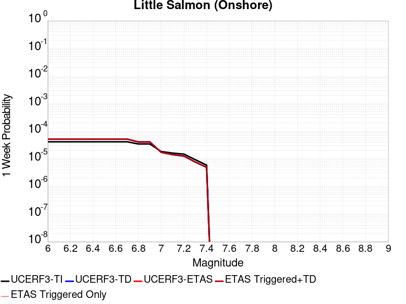 | 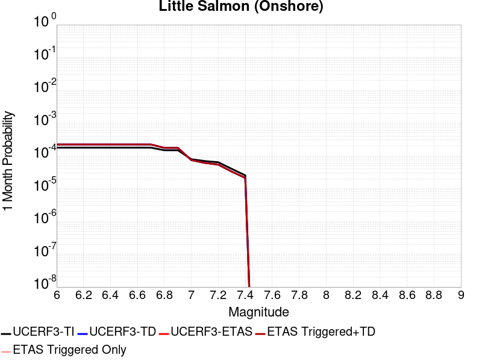 | 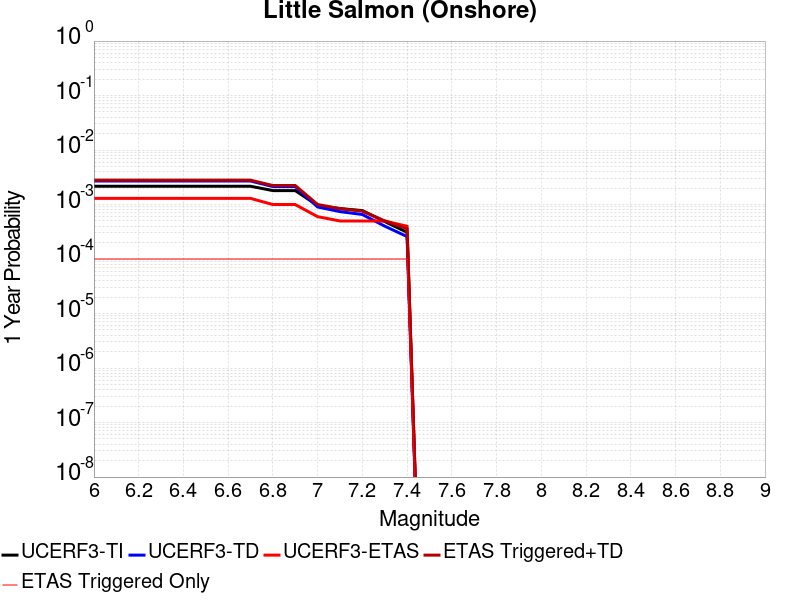 | 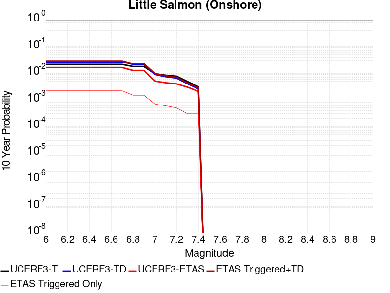 |

| Magnitude | 1 wk TI Prob | 1 wk TD Prob | 1 wk ETAS Prob | 1 wk ETAS/TD Gain | 1 wk ETAS Triggered+TD | 1 wk ETAS Triggered Only | 1 mo TI Prob | 1 mo TD Prob | 1 mo ETAS Prob | 1 mo ETAS/TD Gain | 1 mo ETAS Triggered+TD | 1 mo ETAS Triggered Only | 1 yr TI Prob | 1 yr TD Prob | 1 yr ETAS Prob | 1 yr ETAS/TD Gain | 1 yr ETAS Triggered+TD | 1 yr ETAS Triggered Only | 10 yr TI Prob | 10 yr TD Prob | 10 yr ETAS Prob | 10 yr ETAS/TD Gain | 10 yr ETAS Triggered+TD | 10 yr ETAS Triggered Only |
|-----|-----|-----|-----|-----|-----|-----|-----|-----|-----|-----|-----|-----|-----|-----|-----|-----|-----|-----|-----|-----|-----|-----|-----|-----|
| 6.0 | 4.1582247E-5 | 5.1887124E-5 | 0.0 | 0.0 | 5.1887124E-5 | 0.0 | 1.7819746E-4 | 2.2235911E-4 | 0.0 | 0.0 | 2.2235911E-4 | 0.0 | 0.0021673953 | 0.00270469 | 0.0013 | 0.48064658 | 0.0028044195 | 1.0E-4 | 0.021463778 | 0.027069423 | 0.0164 | 0.6058496 | 0.02920987 | 0.0022 |
| 6.1 | 4.1582247E-5 | 5.1887124E-5 | 0.0 | 0.0 | 5.1887124E-5 | 0.0 | 1.7819746E-4 | 2.2235911E-4 | 0.0 | 0.0 | 2.2235911E-4 | 0.0 | 0.0021673953 | 0.00270469 | 0.0013 | 0.48064658 | 0.0028044195 | 1.0E-4 | 0.021463778 | 0.027069423 | 0.0164 | 0.6058496 | 0.02920987 | 0.0022 |
| 6.2 | 4.1582247E-5 | 5.1887124E-5 | 0.0 | 0.0 | 5.1887124E-5 | 0.0 | 1.7819746E-4 | 2.2235911E-4 | 0.0 | 0.0 | 2.2235911E-4 | 0.0 | 0.0021673953 | 0.00270469 | 0.0013 | 0.48064658 | 0.0028044195 | 1.0E-4 | 0.021463778 | 0.027069423 | 0.0164 | 0.6058496 | 0.02920987 | 0.0022 |
| 6.3 | 4.1582247E-5 | 5.1887124E-5 | 0.0 | 0.0 | 5.1887124E-5 | 0.0 | 1.7819746E-4 | 2.2235911E-4 | 0.0 | 0.0 | 2.2235911E-4 | 0.0 | 0.0021673953 | 0.00270469 | 0.0013 | 0.48064658 | 0.0028044195 | 1.0E-4 | 0.021463778 | 0.027069423 | 0.0164 | 0.6058496 | 0.02920987 | 0.0022 |
| 6.4 | 4.1582247E-5 | 5.1887124E-5 | 0.0 | 0.0 | 5.1887124E-5 | 0.0 | 1.7819746E-4 | 2.2235911E-4 | 0.0 | 0.0 | 2.2235911E-4 | 0.0 | 0.0021673953 | 0.00270469 | 0.0013 | 0.48064658 | 0.0028044195 | 1.0E-4 | 0.021463778 | 0.027069423 | 0.0164 | 0.6058496 | 0.02920987 | 0.0022 |
| 6.5 | 4.1582247E-5 | 5.1887124E-5 | 0.0 | 0.0 | 5.1887124E-5 | 0.0 | 1.7819746E-4 | 2.2235911E-4 | 0.0 | 0.0 | 2.2235911E-4 | 0.0 | 0.0021673953 | 0.00270469 | 0.0013 | 0.48064658 | 0.0028044195 | 1.0E-4 | 0.021463778 | 0.027069423 | 0.0164 | 0.6058496 | 0.02920987 | 0.0022 |
| 6.6 | 4.1582247E-5 | 5.1887124E-5 | 0.0 | 0.0 | 5.1887124E-5 | 0.0 | 1.7819746E-4 | 2.2235911E-4 | 0.0 | 0.0 | 2.2235911E-4 | 0.0 | 0.0021673953 | 0.00270469 | 0.0013 | 0.48064658 | 0.0028044195 | 1.0E-4 | 0.021463778 | 0.027069423 | 0.0164 | 0.6058496 | 0.02920987 | 0.0022 |
| 6.7 | 4.1582247E-5 | 5.1887124E-5 | 0.0 | 0.0 | 5.1887124E-5 | 0.0 | 1.7819746E-4 | 2.2235911E-4 | 0.0 | 0.0 | 2.2235911E-4 | 0.0 | 0.0021673953 | 0.00270469 | 0.0013 | 0.48064658 | 0.0028044195 | 1.0E-4 | 0.021463778 | 0.027069423 | 0.0164 | 0.6058496 | 0.02920987 | 0.0022 |
| 6.8 | 3.4607925E-5 | 4.0998435E-5 | 0.0 | 0.0 | 4.0998435E-5 | 0.0 | 1.4831126E-4 | 1.757E-4 | 0.0 | 0.0 | 1.757E-4 | 0.0 | 0.001804194 | 0.0021378025 | 0.001 | 0.46777004 | 0.0022375889 | 1.0E-4 | 0.01789616 | 0.0214831 | 0.0127 | 0.5911624 | 0.022950875 | 0.0015 |
| 6.9 | 3.4607925E-5 | 4.0998435E-5 | 0.0 | 0.0 | 4.0998435E-5 | 0.0 | 1.4831126E-4 | 1.757E-4 | 0.0 | 0.0 | 1.757E-4 | 0.0 | 0.001804194 | 0.0021378025 | 0.001 | 0.46777004 | 0.0022375889 | 1.0E-4 | 0.01789616 | 0.0214831 | 0.0127 | 0.5911624 | 0.022950875 | 0.0015 |
| 7.0 | 1.8411014E-5 | 1.7308621E-5 | 0.0 | 0.0 | 1.7308621E-5 | 0.0 | 7.8901954E-5 | 7.4177995E-5 | 0.0 | 0.0 | 7.4177995E-5 | 0.0 | 9.6020795E-4 | 9.027965E-4 | 6.0E-4 | 0.66460156 | 0.0010027062 | 1.0E-4 | 0.009560696 | 0.009019101 | 0.0051 | 0.5654666 | 0.009712787 | 7.0E-4 |
| 7.1 | 1.6183103E-5 | 1.4226047E-5 | 0.0 | 0.0 | 1.4226047E-5 | 0.0 | 6.935431E-5 | 6.0967614E-5 | 0.0 | 0.0 | 6.0967614E-5 | 0.0 | 8.440616E-4 | 7.420755E-4 | 5.0E-4 | 0.67378587 | 8.420013E-4 | 1.0E-4 | 0.008408628 | 0.0074232053 | 0.0044 | 0.5927358 | 0.008018752 | 6.0E-4 |
| 7.2 | 1.4868988E-5 | 1.2604527E-5 | 0.0 | 0.0 | 1.2604527E-5 | 0.0 | 6.372268E-5 | 5.401854E-5 | 0.0 | 0.0 | 5.401854E-5 | 0.0 | 7.755474E-4 | 6.5752247E-4 | 5.0E-4 | 0.76043034 | 7.574567E-4 | 1.0E-4 | 0.0077284635 | 0.006582297 | 0.004 | 0.60769063 | 0.0070790057 | 5.0E-4 |
| 7.3 | 9.3599865E-6 | 7.705265E-6 | 0.0 | 0.0 | 7.705265E-6 | 0.0 | 4.011361E-5 | 3.302235E-5 | 0.0 | 0.0 | 3.302235E-5 | 0.0 | 4.8827377E-4 | 4.0200865E-4 | 5.0E-4 | 1.2437543 | 5.0196843E-4 | 1.0E-4 | 0.004872023 | 0.004029657 | 0.003 | 0.7444802 | 0.0043284483 | 3.0E-4 |
| 7.4 | 5.941556E-6 | 4.9578575E-6 | 0.0 | 0.0 | 4.9578575E-6 | 0.0 | 2.5463563E-5 | 2.124796E-5 | 0.0 | 0.0 | 2.124796E-5 | 0.0 | 3.0997477E-4 | 2.586939E-4 | 4.0E-4 | 1.5462289 | 3.5866804E-4 | 1.0E-4 | 0.0030954275 | 0.002595933 | 0.0021 | 0.80895776 | 0.002895154 | 3.0E-4 |

## San Pedro Basin
*[(top)](#table-of-contents)*

| 1 Week | 1 Month | 1 Year | 10 Year |
|-----|-----|-----|-----|
| 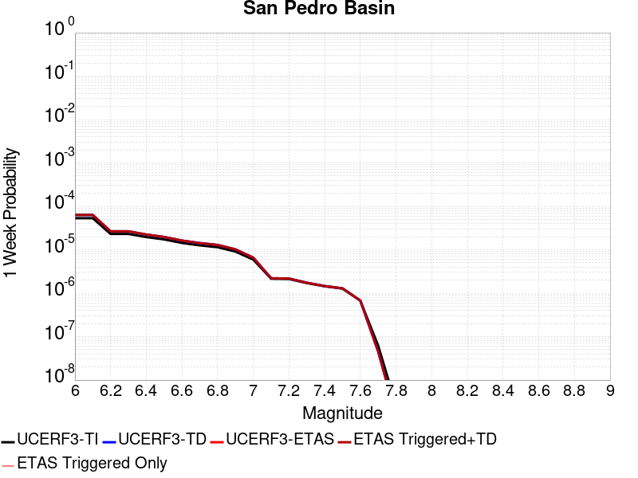 | 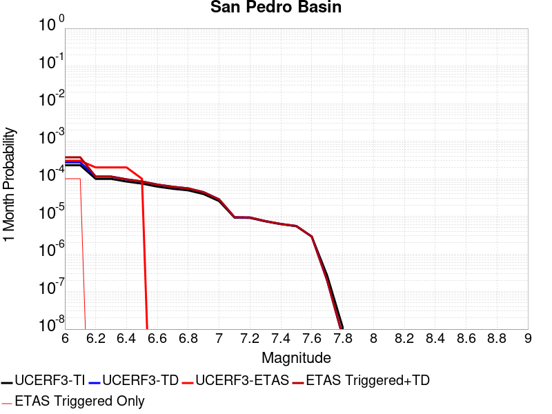 |  | 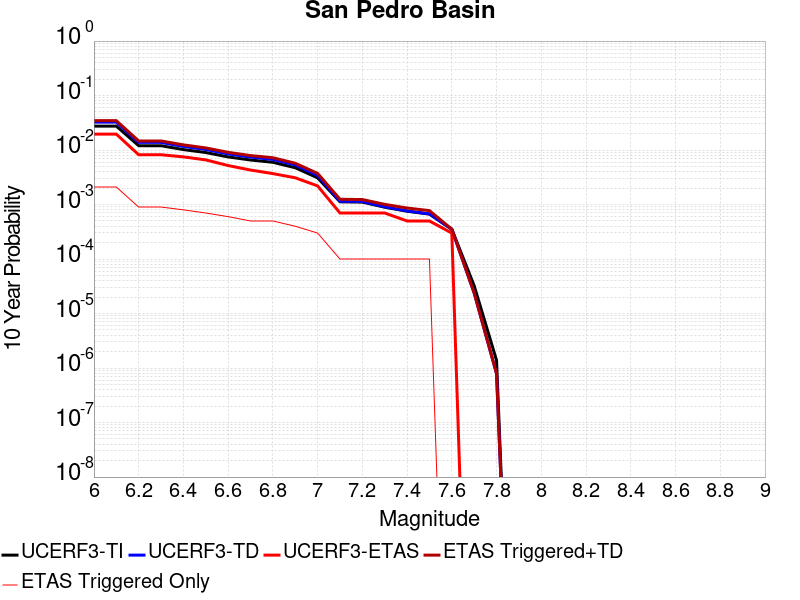 |

| Magnitude | 1 wk TI Prob | 1 wk TD Prob | 1 wk ETAS Prob | 1 wk ETAS/TD Gain | 1 wk ETAS Triggered+TD | 1 wk ETAS Triggered Only | 1 mo TI Prob | 1 mo TD Prob | 1 mo ETAS Prob | 1 mo ETAS/TD Gain | 1 mo ETAS Triggered+TD | 1 mo ETAS Triggered Only | 1 yr TI Prob | 1 yr TD Prob | 1 yr ETAS Prob | 1 yr ETAS/TD Gain | 1 yr ETAS Triggered+TD | 1 yr ETAS Triggered Only | 10 yr TI Prob | 10 yr TD Prob | 10 yr ETAS Prob | 10 yr ETAS/TD Gain | 10 yr ETAS Triggered+TD | 10 yr ETAS Triggered Only |
|-----|-----|-----|-----|-----|-----|-----|-----|-----|-----|-----|-----|-----|-----|-----|-----|-----|-----|-----|-----|-----|-----|-----|-----|-----|
| 6.0 | 5.3449043E-5 | 6.339376E-5 | 0.0 | 0.0 | 6.339376E-5 | 0.0 | 2.2904722E-4 | 2.7166272E-4 | 3.0E-4 | 1.1043105 | 3.7163554E-4 | 1.0E-4 | 0.0027850836 | 0.0033030799 | 0.0021 | 0.63577026 | 0.003602089 | 3.0E-4 | 0.027504366 | 0.032601435 | 0.0196 | 0.6012005 | 0.034632973 | 0.0021 |
| 6.1 | 5.3449043E-5 | 6.339376E-5 | 0.0 | 0.0 | 6.339376E-5 | 0.0 | 2.2904722E-4 | 2.7166272E-4 | 3.0E-4 | 1.1043105 | 3.7163554E-4 | 1.0E-4 | 0.0027850836 | 0.0033030799 | 0.0021 | 0.63577026 | 0.003602089 | 3.0E-4 | 0.027504366 | 0.032601435 | 0.0196 | 0.6012005 | 0.034632973 | 0.0021 |
| 6.2 | 2.3189454E-5 | 2.6650869E-5 | 0.0 | 0.0 | 2.6650869E-5 | 0.0 | 9.9379584E-5 | 1.1421327E-4 | 2.0E-4 | 1.75111 | 1.1421327E-4 | 0.0 | 0.0012092749 | 0.0013897065 | 9.0E-4 | 0.6476188 | 0.0014895676 | 1.0E-4 | 0.012027155 | 0.013815029 | 0.0082 | 0.59355646 | 0.014702596 | 9.0E-4 |
| 6.3 | 2.3189454E-5 | 2.6650869E-5 | 0.0 | 0.0 | 2.6650869E-5 | 0.0 | 9.9379584E-5 | 1.1421327E-4 | 2.0E-4 | 1.75111 | 1.1421327E-4 | 0.0 | 0.0012092749 | 0.0013897065 | 9.0E-4 | 0.6476188 | 0.0014895676 | 1.0E-4 | 0.012027155 | 0.013815029 | 0.0082 | 0.59355646 | 0.014702596 | 9.0E-4 |
| 6.4 | 1.966056E-5 | 2.2469929E-5 | 0.0 | 0.0 | 2.2469929E-5 | 0.0 | 8.425682E-5 | 9.629637E-5 | 2.0E-4 | 2.0769215 | 9.629637E-5 | 0.0 | 0.001025344 | 0.0011718178 | 9.0E-4 | 0.7680375 | 0.0012717006 | 1.0E-4 | 0.010206259 | 0.011660477 | 0.0075 | 0.6431984 | 0.0124511495 | 8.0E-4 |
| 6.5 | 1.7342953E-5 | 1.9750727E-5 | 0.0 | 0.0 | 1.9750727E-5 | 0.0 | 7.4324824E-5 | 8.4643434E-5 | 1.0E-4 | 1.1814265 | 8.4643434E-5 | 0.0 | 9.04529E-4 | 0.0010300835 | 8.0E-4 | 0.77663606 | 0.0011299805 | 1.0E-4 | 0.009008561 | 0.010256814 | 0.0066 | 0.6434747 | 0.010949634 | 7.0E-4 |
| 6.6 | 1.439804E-5 | 1.6327189E-5 | 0.0 | 0.0 | 1.6327189E-5 | 0.0 | 6.170443E-5 | 6.997197E-5 | 0.0 | 0.0 | 6.997197E-5 | 0.0 | 7.509924E-4 | 8.5160794E-4 | 6.0E-4 | 0.7045496 | 9.515227E-4 | 1.0E-4 | 0.0074845953 | 0.008486649 | 0.0052 | 0.6127271 | 0.009081557 | 6.0E-4 |
| 6.7 | 1.2634884E-5 | 1.4289141E-5 | 0.0 | 0.0 | 1.4289141E-5 | 0.0 | 5.414838E-5 | 6.1237915E-5 | 0.0 | 0.0 | 6.1237915E-5 | 0.0 | 6.590571E-4 | 7.45347E-4 | 5.0E-4 | 0.67082846 | 8.452725E-4 | 1.0E-4 | 0.006571059 | 0.0074314945 | 0.0043 | 0.57861847 | 0.007927778 | 5.0E-4 |
| 6.8 | 1.146091E-5 | 1.2936629E-5 | 0.0 | 0.0 | 1.2936629E-5 | 0.0 | 4.911726E-5 | 5.5441684E-5 | 0.0 | 0.0 | 5.5441684E-5 | 0.0 | 5.9783855E-4 | 6.7482324E-4 | 4.0E-4 | 0.5927478 | 7.747557E-4 | 1.0E-4 | 0.0059623276 | 0.0067306827 | 0.0037 | 0.54972136 | 0.0072273174 | 5.0E-4 |
| 6.9 | 9.109035E-6 | 1.023766E-5 | 0.0 | 0.0 | 1.023766E-5 | 0.0 | 3.9038136E-5 | 4.3875105E-5 | 0.0 | 0.0 | 4.3875105E-5 | 0.0 | 4.7518566E-4 | 5.340765E-4 | 3.0E-4 | 0.5617173 | 6.3402305E-4 | 1.0E-4 | 0.0047417083 | 0.005330685 | 0.0031 | 0.58153874 | 0.005728553 | 4.0E-4 |
| 7.0 | 5.9351028E-6 | 6.5855224E-6 | 0.0 | 0.0 | 6.5855224E-6 | 0.0 | 2.5435906E-5 | 2.8223494E-5 | 0.0 | 0.0 | 2.8223494E-5 | 0.0 | 3.0963816E-4 | 3.435905E-4 | 1.0E-4 | 0.29104415 | 3.435905E-4 | 0.0 | 0.0030920706 | 0.0034329111 | 0.0022 | 0.6408555 | 0.0037318813 | 3.0E-4 |
| 7.1 | 2.1557585E-6 | 2.2098393E-6 | 0.0 | 0.0 | 2.2098393E-6 | 0.0 | 9.238933E-6 | 9.470707E-6 | 0.0 | 0.0 | 9.470707E-6 | 0.0 | 1.1247819E-4 | 1.152999E-4 | 0.0 | 0.0 | 1.152999E-4 | 0.0 | 0.0011242128 | 0.0011524162 | 7.0E-4 | 0.60741943 | 0.0012523009 | 1.0E-4 |
| 7.2 | 2.1251979E-6 | 2.1781832E-6 | 0.0 | 0.0 | 2.1781832E-6 | 0.0 | 9.107958E-6 | 9.335039E-6 | 0.0 | 0.0 | 9.335039E-6 | 0.0 | 1.1088375E-4 | 1.1364832E-4 | 0.0 | 0.0 | 1.1364832E-4 | 0.0 | 0.0011082845 | 0.0011359174 | 7.0E-4 | 0.616242 | 0.0012358037 | 1.0E-4 |
| 7.3 | 1.7145798E-6 | 1.7444279E-6 | 0.0 | 0.0 | 1.7444279E-6 | 0.0 | 7.3481783E-6 | 7.4760983E-6 | 0.0 | 0.0 | 7.4760983E-6 | 0.0 | 8.94604E-5 | 9.101779E-5 | 0.0 | 0.0 | 9.101779E-5 | 0.0 | 8.9424395E-4 | 9.098142E-4 | 7.0E-4 | 0.76938784 | 0.0010097233 | 1.0E-4 |
| 7.4 | 1.4467993E-6 | 1.4643015E-6 | 0.0 | 0.0 | 1.4643015E-6 | 0.0 | 6.200554E-6 | 6.275563E-6 | 0.0 | 0.0 | 6.275563E-6 | 0.0 | 7.548913E-5 | 7.640238E-5 | 0.0 | 0.0 | 7.640238E-5 | 0.0 | 7.546349E-4 | 7.637684E-4 | 5.0E-4 | 0.6546487 | 8.63692E-4 | 1.0E-4 |
| 7.5 | 1.2803735E-6 | 1.2932508E-6 | 0.0 | 0.0 | 1.2932508E-6 | 0.0 | 5.487303E-6 | 5.542492E-6 | 0.0 | 0.0 | 5.542492E-6 | 0.0 | 6.680587E-5 | 6.747782E-5 | 0.0 | 0.0 | 6.747782E-5 | 0.0 | 6.678579E-4 | 6.745804E-4 | 5.0E-4 | 0.7412015 | 7.7451294E-4 | 1.0E-4 |
| 7.6 | 6.755009E-7 | 6.770001E-7 | 0.0 | 0.0 | 6.770001E-7 | 0.0 | 2.8950008E-6 | 2.9014261E-6 | 0.0 | 0.0 | 2.9014261E-6 | 0.0 | 3.5246063E-5 | 3.532435E-5 | 0.0 | 0.0 | 3.532435E-5 | 0.0 | 3.5240475E-4 | 3.5319306E-4 | 3.0E-4 | 0.84939384 | 3.5319306E-4 | 0.0 |
| 7.7 | 6.211885E-8 | 4.5704706E-8 | 0.0 | 0.0 | 4.5704706E-8 | 0.0 | 2.6622362E-7 | 1.958773E-7 | 0.0 | 0.0 | 1.958773E-7 | 0.0 | 3.2412677E-6 | 2.3848038E-6 | 0.0 | 0.0 | 2.3848038E-6 | 0.0 | 3.2412205E-5 | 2.3847802E-5 | 0.0 | 0.0 | 2.3847802E-5 | 0.0 |
| 7.8 | 2.6580573E-9 | 1.5145317E-9 | 0.0 | 0.0 | 1.5145317E-9 | 0.0 | 1.1391674E-8 | 6.49085E-9 | 0.0 | 0.0 | 6.49085E-9 | 0.0 | 1.3869362E-7 | 7.90261E-8 | 0.0 | 0.0 | 7.90261E-8 | 0.0 | 1.3869354E-6 | 7.90261E-7 | 0.0 | 0.0 | 7.90261E-7 | 0.0 |

## Paradise
*[(top)](#table-of-contents)*

| 1 Week | 1 Month | 1 Year | 10 Year |
|-----|-----|-----|-----|
|  |  | 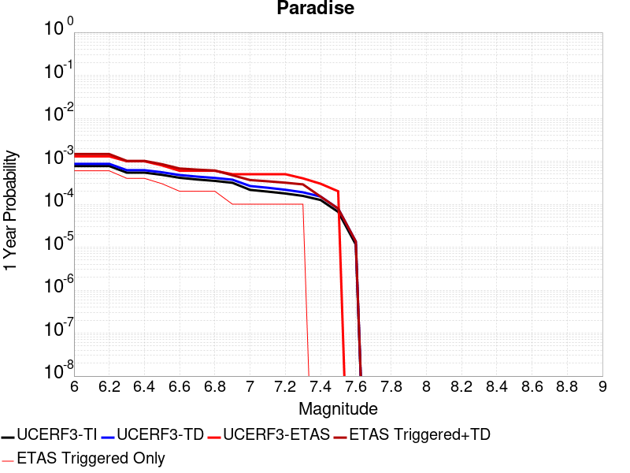 |  |

| Magnitude | 1 wk TI Prob | 1 wk TD Prob | 1 wk ETAS Prob | 1 wk ETAS/TD Gain | 1 wk ETAS Triggered+TD | 1 wk ETAS Triggered Only | 1 mo TI Prob | 1 mo TD Prob | 1 mo ETAS Prob | 1 mo ETAS/TD Gain | 1 mo ETAS Triggered+TD | 1 mo ETAS Triggered Only | 1 yr TI Prob | 1 yr TD Prob | 1 yr ETAS Prob | 1 yr ETAS/TD Gain | 1 yr ETAS Triggered+TD | 1 yr ETAS Triggered Only | 10 yr TI Prob | 10 yr TD Prob | 10 yr ETAS Prob | 10 yr ETAS/TD Gain | 10 yr ETAS Triggered+TD | 10 yr ETAS Triggered Only |
|-----|-----|-----|-----|-----|-----|-----|-----|-----|-----|-----|-----|-----|-----|-----|-----|-----|-----|-----|-----|-----|-----|-----|-----|-----|
| 6.0 | 1.4851273E-5 | 1.6697566E-5 | 1.0E-4 | 5.9888964 | 1.6697566E-5 | 0.0 | 6.364676E-5 | 7.1559174E-5 | 1.0E-4 | 1.397445 | 7.1559174E-5 | 0.0 | 7.7462377E-4 | 8.7090826E-4 | 0.0013 | 1.4926945 | 0.0014703857 | 6.0E-4 | 0.0077192914 | 0.008677333 | 0.0095 | 1.0948064 | 0.010659978 | 0.002 |
| 6.1 | 1.4851273E-5 | 1.6697566E-5 | 1.0E-4 | 5.9888964 | 1.6697566E-5 | 0.0 | 6.364676E-5 | 7.1559174E-5 | 1.0E-4 | 1.397445 | 7.1559174E-5 | 0.0 | 7.7462377E-4 | 8.7090826E-4 | 0.0013 | 1.4926945 | 0.0014703857 | 6.0E-4 | 0.0077192914 | 0.008677333 | 0.0095 | 1.0948064 | 0.010659978 | 0.002 |
| 6.2 | 1.4851273E-5 | 1.6697566E-5 | 1.0E-4 | 5.9888964 | 1.6697566E-5 | 0.0 | 6.364676E-5 | 7.1559174E-5 | 1.0E-4 | 1.397445 | 7.1559174E-5 | 0.0 | 7.7462377E-4 | 8.7090826E-4 | 0.0013 | 1.4926945 | 0.0014703857 | 6.0E-4 | 0.0077192914 | 0.008677333 | 0.0095 | 1.0948064 | 0.010659978 | 0.002 |
| 6.3 | 1.0426831E-5 | 1.1890672E-5 | 0.0 | 0.0 | 1.1890672E-5 | 0.0 | 4.4685654E-5 | 5.095906E-5 | 0.0 | 0.0 | 5.095906E-5 | 0.0 | 5.43912E-4 | 6.202559E-4 | 0.001 | 1.6122378 | 0.0010200078 | 4.0E-4 | 0.0054258266 | 0.0061858557 | 0.0064 | 1.0346184 | 0.007378433 | 0.0012 |
| 6.4 | 1.0426831E-5 | 1.1890672E-5 | 0.0 | 0.0 | 1.1890672E-5 | 0.0 | 4.4685654E-5 | 5.095906E-5 | 0.0 | 0.0 | 5.095906E-5 | 0.0 | 5.43912E-4 | 6.202559E-4 | 0.001 | 1.6122378 | 0.0010200078 | 4.0E-4 | 0.0054258266 | 0.0061858557 | 0.0064 | 1.0346184 | 0.007378433 | 0.0012 |
| 6.5 | 9.25027E-6 | 1.0621814E-5 | 0.0 | 0.0 | 1.0621814E-5 | 0.0 | 3.964341E-5 | 4.5521294E-5 | 0.0 | 0.0 | 4.5521294E-5 | 0.0 | 4.8255164E-4 | 5.540857E-4 | 8.0E-4 | 1.4438199 | 8.539195E-4 | 3.0E-4 | 0.0048150513 | 0.005527542 | 0.0053 | 0.9588349 | 0.006422567 | 9.0E-4 |
| 6.6 | 7.904275E-6 | 9.161133E-6 | 0.0 | 0.0 | 9.161133E-6 | 0.0 | 3.3875025E-5 | 3.9261427E-5 | 0.0 | 0.0 | 3.9261427E-5 | 0.0 | 4.1235037E-4 | 4.77907E-4 | 6.0E-4 | 1.2554744 | 6.778114E-4 | 2.0E-4 | 0.0041158604 | 0.0047691893 | 0.0044 | 0.92258865 | 0.0054658507 | 7.0E-4 |
| 6.7 | 7.2061953E-6 | 8.40874E-6 | 0.0 | 0.0 | 8.40874E-6 | 0.0 | 3.088333E-5 | 3.603698E-5 | 0.0 | 0.0 | 3.603698E-5 | 0.0 | 3.7593965E-4 | 4.3866556E-4 | 6.0E-4 | 1.3677846 | 6.3857785E-4 | 2.0E-4 | 0.003753043 | 0.004378366 | 0.0039 | 0.89074326 | 0.005075301 | 7.0E-4 |
| 6.8 | 6.6948724E-6 | 7.843574E-6 | 0.0 | 0.0 | 7.843574E-6 | 0.0 | 2.8691995E-5 | 3.3614902E-5 | 0.0 | 0.0 | 3.3614902E-5 | 0.0 | 3.4926904E-4 | 4.0918816E-4 | 6.0E-4 | 1.4663181 | 6.091063E-4 | 2.0E-4 | 0.003487206 | 0.004084705 | 0.0035 | 0.85685503 | 0.004682254 | 6.0E-4 |
| 6.9 | 6.0421025E-6 | 7.1319246E-6 | 0.0 | 0.0 | 7.1319246E-6 | 0.0 | 2.5894467E-5 | 3.0565054E-5 | 0.0 | 0.0 | 3.0565054E-5 | 0.0 | 3.1521954E-4 | 3.7206936E-4 | 5.0E-4 | 1.3438355 | 4.7203214E-4 | 1.0E-4 | 0.0031477278 | 0.0037148027 | 0.0032 | 0.8614186 | 0.0042129452 | 5.0E-4 |
| 7.0 | 4.134091E-6 | 5.0813496E-6 | 0.0 | 0.0 | 5.0813496E-6 | 0.0 | 1.7717413E-5 | 2.177704E-5 | 0.0 | 0.0 | 2.177704E-5 | 0.0 | 2.1568815E-4 | 2.6510473E-4 | 5.0E-4 | 1.886047 | 3.6507822E-4 | 1.0E-4 | 0.0021547892 | 0.0026480379 | 0.0025 | 0.94409525 | 0.003146714 | 5.0E-4 |
| 7.1 | 3.7674888E-6 | 4.6328414E-6 | 0.0 | 0.0 | 4.6328414E-6 | 0.0 | 1.6146281E-5 | 1.9854893E-5 | 0.0 | 0.0 | 1.9854893E-5 | 0.0 | 1.9656324E-4 | 2.4170802E-4 | 5.0E-4 | 2.0686114 | 3.4168386E-4 | 1.0E-4 | 0.0019638946 | 0.002414602 | 0.0023 | 0.95253795 | 0.0029133947 | 5.0E-4 |
| 7.2 | 3.4065345E-6 | 4.1576286E-6 | 0.0 | 0.0 | 4.1576286E-6 | 0.0 | 1.4599351E-5 | 1.7818295E-5 | 0.0 | 0.0 | 1.7818295E-5 | 0.0 | 1.777326E-4 | 2.1691764E-4 | 5.0E-4 | 2.3050222 | 3.1689595E-4 | 1.0E-4 | 0.0017759053 | 0.0021672074 | 0.0022 | 1.0151314 | 0.0026661237 | 5.0E-4 |
| 7.3 | 2.9934936E-6 | 3.6299389E-6 | 0.0 | 0.0 | 3.6299389E-6 | 0.0 | 1.2829195E-5 | 1.5556796E-5 | 0.0 | 0.0 | 1.5556796E-5 | 0.0 | 1.5618425E-4 | 1.8938901E-4 | 4.0E-4 | 2.112055 | 2.8937007E-4 | 1.0E-4 | 0.0015607453 | 0.0018924215 | 0.002 | 1.056847 | 0.0022916645 | 4.0E-4 |
| 7.4 | 2.4049796E-6 | 2.8893242E-6 | 0.0 | 0.0 | 2.8893242E-6 | 0.0 | 1.0307015E-5 | 1.2382768E-5 | 0.0 | 0.0 | 1.2382768E-5 | 0.0 | 1.2548068E-4 | 1.507512E-4 | 3.0E-4 | 1.9900339 | 1.507512E-4 | 0.0 | 0.0012540985 | 0.0015066309 | 0.0017 | 1.1283454 | 0.0018061788 | 3.0E-4 |
| 7.5 | 1.2710091E-6 | 1.513636E-6 | 0.0 | 0.0 | 1.513636E-6 | 0.0 | 5.44717E-6 | 6.4870023E-6 | 0.0 | 0.0 | 6.4870023E-6 | 0.0 | 6.631728E-5 | 7.897764E-5 | 2.0E-4 | 2.5323625 | 7.897764E-5 | 0.0 | 6.6297496E-4 | 7.8961835E-4 | 9.0E-4 | 1.1397911 | 7.8961835E-4 | 0.0 |
| 7.6 | 2.21172E-7 | 2.6041212E-7 | 0.0 | 0.0 | 2.6041212E-7 | 0.0 | 9.478797E-7 | 1.1160516E-6 | 0.0 | 0.0 | 1.1160516E-6 | 0.0 | 1.1540374E-5 | 1.3587873E-5 | 0.0 | 0.0 | 1.3587873E-5 | 0.0 | 1.1539775E-4 | 1.3587323E-4 | 1.0E-4 | 0.73598015 | 1.3587323E-4 | 0.0 |

## Robinson Creek
*[(top)](#table-of-contents)*

| 1 Week | 1 Month | 1 Year | 10 Year |
|-----|-----|-----|-----|
|  | 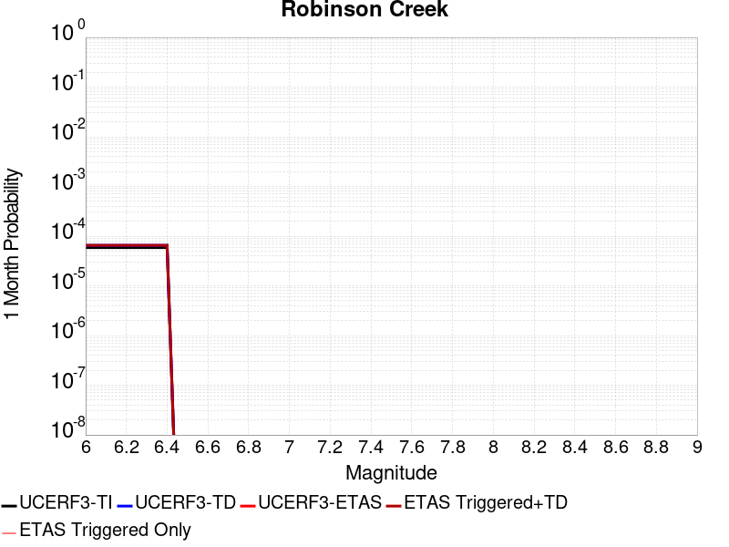 | 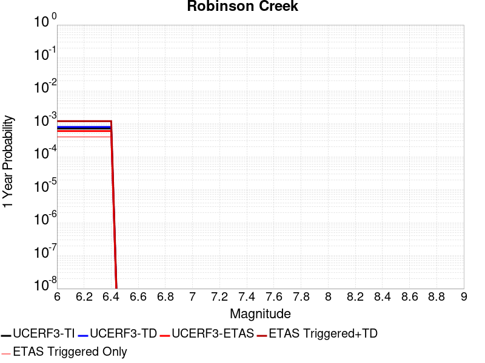 |  |

| Magnitude | 1 wk TI Prob | 1 wk TD Prob | 1 wk ETAS Prob | 1 wk ETAS/TD Gain | 1 wk ETAS Triggered+TD | 1 wk ETAS Triggered Only | 1 mo TI Prob | 1 mo TD Prob | 1 mo ETAS Prob | 1 mo ETAS/TD Gain | 1 mo ETAS Triggered+TD | 1 mo ETAS Triggered Only | 1 yr TI Prob | 1 yr TD Prob | 1 yr ETAS Prob | 1 yr ETAS/TD Gain | 1 yr ETAS Triggered+TD | 1 yr ETAS Triggered Only | 10 yr TI Prob | 10 yr TD Prob | 10 yr ETAS Prob | 10 yr ETAS/TD Gain | 10 yr ETAS Triggered+TD | 10 yr ETAS Triggered Only |
|-----|-----|-----|-----|-----|-----|-----|-----|-----|-----|-----|-----|-----|-----|-----|-----|-----|-----|-----|-----|-----|-----|-----|-----|-----|
| 6.0 | 1.3705327E-5 | 1.5288508E-5 | 0.0 | 0.0 | 1.5288508E-5 | 0.0 | 5.8735794E-5 | 6.5522174E-5 | 0.0 | 0.0 | 6.5522174E-5 | 0.0 | 7.1487366E-4 | 7.977325E-4 | 6.0E-4 | 0.7521318 | 0.0011974134 | 4.0E-4 | 0.0071257832 | 0.007977325 | 0.0055 | 0.6894542 | 0.010060572 | 0.0021 |
| 6.1 | 1.3705327E-5 | 1.5288508E-5 | 0.0 | 0.0 | 1.5288508E-5 | 0.0 | 5.8735794E-5 | 6.5522174E-5 | 0.0 | 0.0 | 6.5522174E-5 | 0.0 | 7.1487366E-4 | 7.977325E-4 | 6.0E-4 | 0.7521318 | 0.0011974134 | 4.0E-4 | 0.0071257832 | 0.007977325 | 0.0055 | 0.6894542 | 0.010060572 | 0.0021 |
| 6.2 | 1.3705327E-5 | 1.5288508E-5 | 0.0 | 0.0 | 1.5288508E-5 | 0.0 | 5.8735794E-5 | 6.5522174E-5 | 0.0 | 0.0 | 6.5522174E-5 | 0.0 | 7.1487366E-4 | 7.977325E-4 | 6.0E-4 | 0.7521318 | 0.0011974134 | 4.0E-4 | 0.0071257832 | 0.007977325 | 0.0055 | 0.6894542 | 0.010060572 | 0.0021 |
| 6.3 | 1.3705327E-5 | 1.5288508E-5 | 0.0 | 0.0 | 1.5288508E-5 | 0.0 | 5.8735794E-5 | 6.5522174E-5 | 0.0 | 0.0 | 6.5522174E-5 | 0.0 | 7.1487366E-4 | 7.977325E-4 | 6.0E-4 | 0.7521318 | 0.0011974134 | 4.0E-4 | 0.0071257832 | 0.007977325 | 0.0055 | 0.6894542 | 0.010060572 | 0.0021 |
| 6.4 | 1.3705327E-5 | 1.5288508E-5 | 0.0 | 0.0 | 1.5288508E-5 | 0.0 | 5.8735794E-5 | 6.5522174E-5 | 0.0 | 0.0 | 6.5522174E-5 | 0.0 | 7.1487366E-4 | 7.977325E-4 | 6.0E-4 | 0.7521318 | 0.0011974134 | 4.0E-4 | 0.0071257832 | 0.007977325 | 0.0055 | 0.6894542 | 0.010060572 | 0.0021 |

## Death Valley (Fish Lake Valley)
*[(top)](#table-of-contents)*

| 1 Week | 1 Month | 1 Year | 10 Year |
|-----|-----|-----|-----|
| 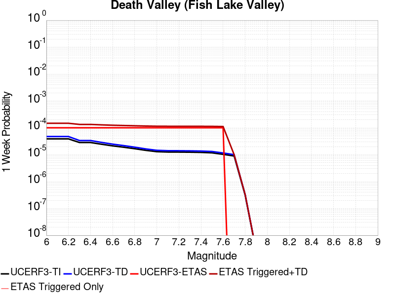 | 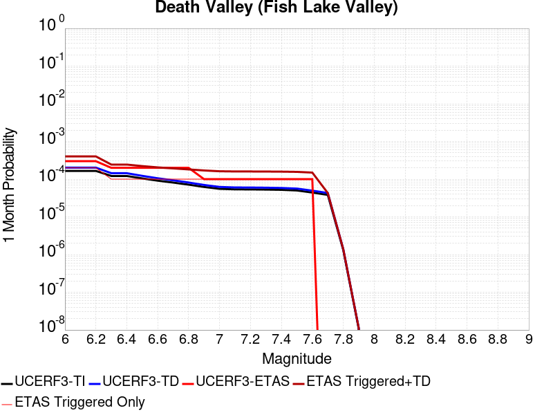 | 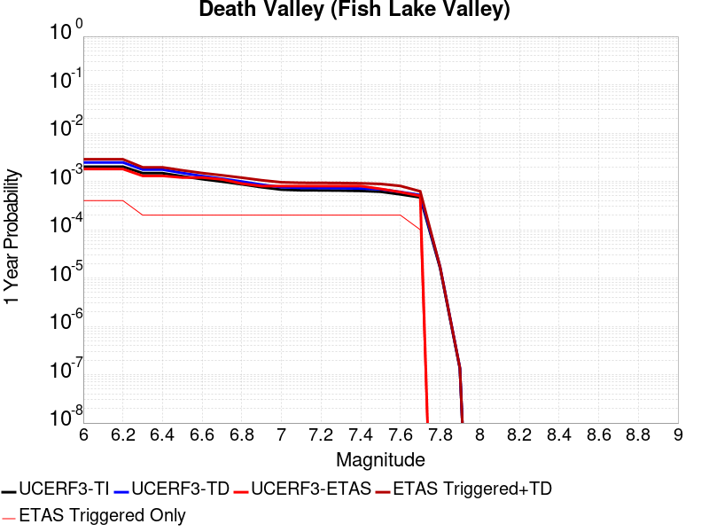 | 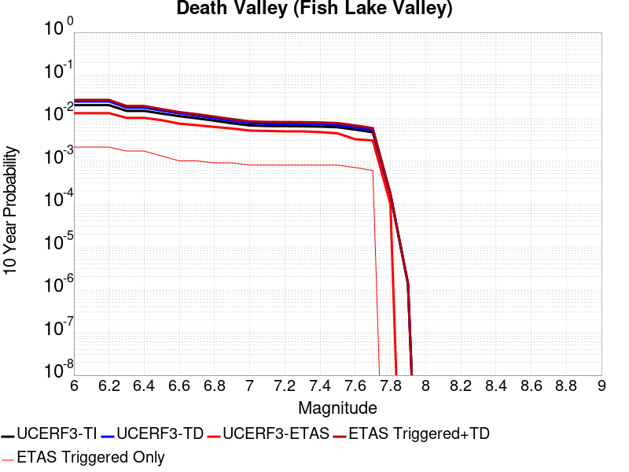 |

| Magnitude | 1 wk TI Prob | 1 wk TD Prob | 1 wk ETAS Prob | 1 wk ETAS/TD Gain | 1 wk ETAS Triggered+TD | 1 wk ETAS Triggered Only | 1 mo TI Prob | 1 mo TD Prob | 1 mo ETAS Prob | 1 mo ETAS/TD Gain | 1 mo ETAS Triggered+TD | 1 mo ETAS Triggered Only | 1 yr TI Prob | 1 yr TD Prob | 1 yr ETAS Prob | 1 yr ETAS/TD Gain | 1 yr ETAS Triggered+TD | 1 yr ETAS Triggered Only | 10 yr TI Prob | 10 yr TD Prob | 10 yr ETAS Prob | 10 yr ETAS/TD Gain | 10 yr ETAS Triggered+TD | 10 yr ETAS Triggered Only |
|-----|-----|-----|-----|-----|-----|-----|-----|-----|-----|-----|-----|-----|-----|-----|-----|-----|-----|-----|-----|-----|-----|-----|-----|-----|
| 6.0 | 3.872328E-5 | 4.7286507E-5 | 1.0E-4 | 2.1147683 | 1.4728178E-4 | 1.0E-4 | 1.6594635E-4 | 2.0264216E-4 | 3.0E-4 | 1.4804422 | 4.0260164E-4 | 2.0E-4 | 0.0020185246 | 0.0024646402 | 0.0018 | 0.73032975 | 0.0028636544 | 4.0E-4 | 0.02000288 | 0.024398867 | 0.013 | 0.53281164 | 0.02644763 | 0.0021 |
| 6.1 | 3.872328E-5 | 4.7286507E-5 | 1.0E-4 | 2.1147683 | 1.4728178E-4 | 1.0E-4 | 1.6594635E-4 | 2.0264216E-4 | 3.0E-4 | 1.4804422 | 4.0260164E-4 | 2.0E-4 | 0.0020185246 | 0.0024646402 | 0.0018 | 0.73032975 | 0.0028636544 | 4.0E-4 | 0.02000288 | 0.024398867 | 0.013 | 0.53281164 | 0.02644763 | 0.0021 |
| 6.2 | 3.872328E-5 | 4.7286507E-5 | 1.0E-4 | 2.1147683 | 1.4728178E-4 | 1.0E-4 | 1.6594635E-4 | 2.0264216E-4 | 3.0E-4 | 1.4804422 | 4.0260164E-4 | 2.0E-4 | 0.0020185246 | 0.0024646402 | 0.0018 | 0.73032975 | 0.0028636544 | 4.0E-4 | 0.02000288 | 0.024398867 | 0.013 | 0.53281164 | 0.02644763 | 0.0021 |
| 6.3 | 2.8356371E-5 | 3.36223E-5 | 1.0E-4 | 2.9742167 | 1.3361893E-4 | 1.0E-4 | 1.2152165E-4 | 1.4408799E-4 | 2.0E-4 | 1.3880408 | 2.4407357E-4 | 1.0E-4 | 0.0014785219 | 0.0017529293 | 0.0013 | 0.7416158 | 0.0019525787 | 2.0E-4 | 0.014687235 | 0.01739821 | 0.0101 | 0.58051944 | 0.019068634 | 0.0017 |
| 6.4 | 2.8356371E-5 | 3.36223E-5 | 1.0E-4 | 2.9742167 | 1.3361893E-4 | 1.0E-4 | 1.2152165E-4 | 1.4408799E-4 | 2.0E-4 | 1.3880408 | 2.4407357E-4 | 1.0E-4 | 0.0014785219 | 0.0017529293 | 0.0013 | 0.7416158 | 0.0019525787 | 2.0E-4 | 0.014687235 | 0.01739821 | 0.0101 | 0.58051944 | 0.019068634 | 0.0017 |
| 6.5 | 2.4448687E-5 | 2.861738E-5 | 1.0E-4 | 3.49438 | 1.2861451E-4 | 1.0E-4 | 1.0477588E-4 | 1.2264037E-4 | 2.0E-4 | 1.6307844 | 2.226281E-4 | 1.0E-4 | 0.0012748998 | 0.0014921706 | 0.0012 | 0.8041976 | 0.0016918721 | 2.0E-4 | 0.012676105 | 0.01482641 | 0.0089 | 0.60028017 | 0.016107136 | 0.0013 |
| 6.6 | 2.1298161E-5 | 2.466789E-5 | 1.0E-4 | 4.053853 | 1.2466543E-4 | 1.0E-4 | 9.127464E-5 | 1.0571543E-4 | 2.0E-4 | 1.8918713 | 2.0570486E-4 | 1.0E-4 | 0.0011107022 | 0.0012863582 | 0.0012 | 0.9328661 | 0.001486101 | 2.0E-4 | 0.011051672 | 0.012792554 | 0.0074 | 0.5784615 | 0.013779761 | 0.001 |
| 6.7 | 1.8959729E-5 | 2.1787522E-5 | 1.0E-4 | 4.589783 | 1.2178534E-4 | 1.0E-4 | 8.125345E-5 | 9.337189E-5 | 2.0E-4 | 2.141972 | 1.9336256E-4 | 1.0E-4 | 9.888117E-4 | 0.0011362355 | 0.0011 | 0.96810913 | 0.0013360083 | 2.0E-4 | 0.009844234 | 0.011306923 | 0.0068 | 0.60140145 | 0.012295616 | 0.001 |
| 6.8 | 1.6691629E-5 | 1.9023651E-5 | 1.0E-4 | 5.2566147 | 1.1902175E-4 | 1.0E-4 | 7.153359E-5 | 8.152748E-5 | 2.0E-4 | 2.4531605 | 1.8151932E-4 | 1.0E-4 | 8.7057345E-4 | 9.921619E-4 | 9.0E-4 | 0.90711 | 0.0011919636 | 2.0E-4 | 0.008671708 | 0.009879082 | 0.0062 | 0.6275886 | 0.010770191 | 9.0E-4 |
| 6.9 | 1.450505E-5 | 1.6393784E-5 | 1.0E-4 | 6.099873 | 1.1639215E-4 | 1.0E-4 | 6.216302E-5 | 7.025723E-5 | 1.0E-4 | 1.423341 | 1.702502E-4 | 1.0E-4 | 7.5657194E-4 | 8.550549E-4 | 8.0E-4 | 0.93561244 | 0.0010548839 | 2.0E-4 | 0.007540013 | 0.008518582 | 0.0057 | 0.66912544 | 0.009410915 | 9.0E-4 |
| 7.0 | 1.2940855E-5 | 1.4541541E-5 | 1.0E-4 | 6.8768506 | 1.1454009E-4 | 1.0E-4 | 5.545963E-5 | 6.2319436E-5 | 1.0E-4 | 1.604636 | 1.623132E-4 | 1.0E-4 | 6.750118E-4 | 7.5848075E-4 | 8.0E-4 | 1.05474 | 9.5832907E-4 | 2.0E-4 | 0.006729651 | 0.0075595384 | 0.0051 | 0.67464435 | 0.00835349 | 8.0E-4 |
| 7.1 | 1.2544658E-5 | 1.408163E-5 | 1.0E-4 | 7.1014504 | 1.1408022E-4 | 1.0E-4 | 5.3761712E-5 | 6.034848E-5 | 1.0E-4 | 1.6570426 | 1.6034245E-4 | 1.0E-4 | 6.5435225E-4 | 7.3450065E-4 | 8.0E-4 | 1.0891753 | 9.3435374E-4 | 2.0E-4 | 0.006524288 | 0.0073213237 | 0.005 | 0.6829366 | 0.008115467 | 8.0E-4 |
| 7.2 | 1.2489416E-5 | 1.40190805E-5 | 1.0E-4 | 7.1331353 | 1.14017676E-4 | 1.0E-4 | 5.3524967E-5 | 6.008042E-5 | 1.0E-4 | 1.6644357 | 1.6007441E-4 | 1.0E-4 | 6.514716E-4 | 7.312392E-4 | 8.0E-4 | 1.0940332 | 9.31093E-4 | 2.0E-4 | 0.006495651 | 0.0072889244 | 0.0049 | 0.67225283 | 0.008083093 | 8.0E-4 |
| 7.3 | 1.2368307E-5 | 1.3883186E-5 | 1.0E-4 | 7.202958 | 1.138818E-4 | 1.0E-4 | 5.3005948E-5 | 5.949804E-5 | 1.0E-4 | 1.6807276 | 1.5949209E-4 | 1.0E-4 | 6.451563E-4 | 7.241535E-4 | 8.0E-4 | 1.1047381 | 9.2400867E-4 | 2.0E-4 | 0.0064328653 | 0.0072185295 | 0.0049 | 0.6788086 | 0.008012755 | 8.0E-4 |
| 7.4 | 1.2161707E-5 | 1.36511835E-5 | 1.0E-4 | 7.325372 | 1.1364982E-4 | 1.0E-4 | 5.212056E-5 | 5.8503792E-5 | 1.0E-4 | 1.7092909 | 1.5849795E-4 | 1.0E-4 | 6.3438306E-4 | 7.1205647E-4 | 8.0E-4 | 1.1235063 | 9.119141E-4 | 2.0E-4 | 0.006325751 | 0.007098339 | 0.0047 | 0.6621268 | 0.00789266 | 8.0E-4 |
| 7.5 | 1.1707948E-5 | 1.3148723E-5 | 1.0E-4 | 7.6053014 | 1.13147406E-4 | 1.0E-4 | 5.0175953E-5 | 5.6350484E-5 | 1.0E-4 | 1.7746077 | 1.5634485E-4 | 1.0E-4 | 6.10721E-4 | 6.8585674E-4 | 7.0E-4 | 1.0206213 | 8.857196E-4 | 2.0E-4 | 0.0060904534 | 0.0068379836 | 0.0044 | 0.6434645 | 0.0076325135 | 8.0E-4 |
| 7.6 | 1.0319538E-5 | 1.15824305E-5 | 1.0E-4 | 8.633766 | 1.1158127E-4 | 1.0E-4 | 4.4225842E-5 | 4.9638074E-5 | 1.0E-4 | 2.0145826 | 1.4963311E-4 | 1.0E-4 | 5.383166E-4 | 6.0418114E-4 | 6.0E-4 | 0.99307966 | 8.040603E-4 | 2.0E-4 | 0.0053701443 | 0.0060259174 | 0.0032 | 0.5310395 | 0.006721699 | 7.0E-4 |
| 7.7 | 8.937764E-6 | 1.0025196E-5 | 0.0 | 0.0 | 1.0025196E-5 | 0.0 | 3.830414E-5 | 4.296445E-5 | 0.0 | 0.0 | 4.296445E-5 | 0.0 | 4.6625308E-4 | 5.229716E-4 | 5.0E-4 | 0.9560748 | 6.2291935E-4 | 1.0E-4 | 0.0046527605 | 0.005217919 | 0.003 | 0.5749418 | 0.0058147884 | 6.0E-4 |
| 7.8 | 3.108007E-7 | 3.285026E-7 | 0.0 | 0.0 | 3.285026E-7 | 0.0 | 1.3320023E-6 | 1.4078676E-6 | 0.0 | 0.0 | 1.4078676E-6 | 0.0 | 1.6217007E-5 | 1.7140657E-5 | 0.0 | 0.0 | 1.7140657E-5 | 0.0 | 1.6215823E-4 | 1.7139372E-4 | 1.0E-4 | 0.5834519 | 1.7139372E-4 | 0.0 |
| 7.9 | 2.5591178E-9 | 2.6699005E-9 | 0.0 | 0.0 | 2.6699005E-9 | 0.0 | 1.0967647E-8 | 1.1442431E-8 | 0.0 | 0.0 | 1.1442431E-8 | 0.0 | 1.335311E-7 | 1.393116E-7 | 0.0 | 0.0 | 1.393116E-7 | 0.0 | 1.3353102E-6 | 1.3931159E-6 | 0.0 | 0.0 | 1.3931159E-6 | 0.0 |

## Blue Cut
*[(top)](#table-of-contents)*

| 1 Week | 1 Month | 1 Year | 10 Year |
|-----|-----|-----|-----|
| 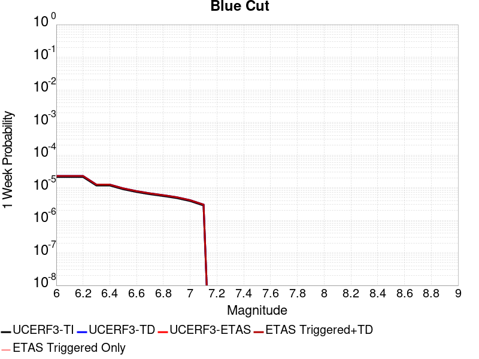 |  |  | 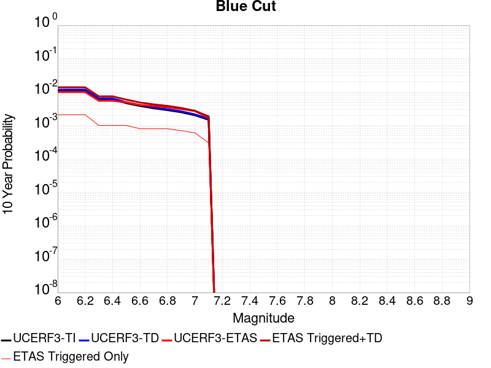 |

| Magnitude | 1 wk TI Prob | 1 wk TD Prob | 1 wk ETAS Prob | 1 wk ETAS/TD Gain | 1 wk ETAS Triggered+TD | 1 wk ETAS Triggered Only | 1 mo TI Prob | 1 mo TD Prob | 1 mo ETAS Prob | 1 mo ETAS/TD Gain | 1 mo ETAS Triggered+TD | 1 mo ETAS Triggered Only | 1 yr TI Prob | 1 yr TD Prob | 1 yr ETAS Prob | 1 yr ETAS/TD Gain | 1 yr ETAS Triggered+TD | 1 yr ETAS Triggered Only | 10 yr TI Prob | 10 yr TD Prob | 10 yr ETAS Prob | 10 yr ETAS/TD Gain | 10 yr ETAS Triggered+TD | 10 yr ETAS Triggered Only |
|-----|-----|-----|-----|-----|-----|-----|-----|-----|-----|-----|-----|-----|-----|-----|-----|-----|-----|-----|-----|-----|-----|-----|-----|-----|
| 6.0 | 2.1227985E-5 | 2.2722747E-5 | 0.0 | 0.0 | 2.2722747E-5 | 0.0 | 9.097391E-5 | 9.737989E-5 | 1.0E-4 | 1.026906 | 1.9737016E-4 | 1.0E-4 | 0.0011070445 | 0.0011850134 | 9.0E-4 | 0.75948507 | 0.0014846579 | 3.0E-4 | 0.011015458 | 0.011792789 | 0.01 | 0.84797585 | 0.013868024 | 0.0021 |
| 6.1 | 2.1227985E-5 | 2.2722747E-5 | 0.0 | 0.0 | 2.2722747E-5 | 0.0 | 9.097391E-5 | 9.737989E-5 | 1.0E-4 | 1.026906 | 1.9737016E-4 | 1.0E-4 | 0.0011070445 | 0.0011850134 | 9.0E-4 | 0.75948507 | 0.0014846579 | 3.0E-4 | 0.011015458 | 0.011792789 | 0.01 | 0.84797585 | 0.013868024 | 0.0021 |
| 6.2 | 2.1227985E-5 | 2.2722747E-5 | 0.0 | 0.0 | 2.2722747E-5 | 0.0 | 9.097391E-5 | 9.737989E-5 | 1.0E-4 | 1.026906 | 1.9737016E-4 | 1.0E-4 | 0.0011070445 | 0.0011850134 | 9.0E-4 | 0.75948507 | 0.0014846579 | 3.0E-4 | 0.011015458 | 0.011792789 | 0.01 | 0.84797585 | 0.013868024 | 0.0021 |
| 6.3 | 1.1613981E-5 | 1.2355103E-5 | 0.0 | 0.0 | 1.2355103E-5 | 0.0 | 4.9773254E-5 | 5.2949435E-5 | 0.0 | 0.0 | 5.2949435E-5 | 0.0 | 6.0582085E-4 | 6.4448116E-4 | 5.0E-4 | 0.7758179 | 7.444167E-4 | 1.0E-4 | 0.0060417196 | 0.006427369 | 0.0055 | 0.85571563 | 0.0074209417 | 0.001 |
| 6.4 | 1.1613981E-5 | 1.2355103E-5 | 0.0 | 0.0 | 1.2355103E-5 | 0.0 | 4.9773254E-5 | 5.2949435E-5 | 0.0 | 0.0 | 5.2949435E-5 | 0.0 | 6.0582085E-4 | 6.4448116E-4 | 5.0E-4 | 0.7758179 | 7.444167E-4 | 1.0E-4 | 0.0060417196 | 0.006427369 | 0.0055 | 0.85571563 | 0.0074209417 | 0.001 |
| 6.5 | 8.931326E-6 | 9.482758E-6 | 0.0 | 0.0 | 9.482758E-6 | 0.0 | 3.8276554E-5 | 4.0639814E-5 | 0.0 | 0.0 | 4.0639814E-5 | 0.0 | 4.6591737E-4 | 4.9468654E-4 | 4.0E-4 | 0.80859286 | 5.9463707E-4 | 1.0E-4 | 0.0046494175 | 0.004936763 | 0.0049 | 0.99255323 | 0.0059318263 | 0.001 |
| 6.6 | 7.345353E-6 | 7.7912155E-6 | 0.0 | 0.0 | 7.7912155E-6 | 0.0 | 3.1479703E-5 | 3.339054E-5 | 0.0 | 0.0 | 3.339054E-5 | 0.0 | 3.83198E-4 | 4.06462E-4 | 3.0E-4 | 0.7380764 | 5.064214E-4 | 1.0E-4 | 0.0038253788 | 0.0040579773 | 0.0041 | 1.0103556 | 0.004854731 | 8.0E-4 |
| 6.7 | 6.2775666E-6 | 6.655943E-6 | 0.0 | 0.0 | 6.655943E-6 | 0.0 | 2.690358E-5 | 2.85252E-5 | 0.0 | 0.0 | 2.85252E-5 | 0.0 | 3.2750185E-4 | 3.472465E-4 | 3.0E-4 | 0.8639396 | 4.4721176E-4 | 1.0E-4 | 0.0032701963 | 0.00346778 | 0.0038 | 1.0958018 | 0.0042650057 | 8.0E-4 |
| 6.8 | 5.5234095E-6 | 5.8558085E-6 | 0.0 | 0.0 | 5.8558085E-6 | 0.0 | 2.367154E-5 | 2.5096122E-5 | 0.0 | 0.0 | 2.5096122E-5 | 0.0 | 2.8816288E-4 | 3.0550972E-4 | 3.0E-4 | 0.9819654 | 4.054792E-4 | 1.0E-4 | 0.002877895 | 0.0030516135 | 0.0035 | 1.1469343 | 0.0038491723 | 8.0E-4 |
| 6.9 | 4.7780054E-6 | 5.0660246E-6 | 0.0 | 0.0 | 5.0660246E-6 | 0.0 | 2.0477004E-5 | 2.1711394E-5 | 0.0 | 0.0 | 2.1711394E-5 | 0.0 | 2.4927902E-4 | 2.643112E-4 | 3.0E-4 | 1.1350256 | 3.642848E-4 | 1.0E-4 | 0.0024899957 | 0.0026406609 | 0.0031 | 1.1739485 | 0.0033388124 | 7.0E-4 |
| 7.0 | 3.883171E-6 | 4.118982E-6 | 0.0 | 0.0 | 4.118982E-6 | 0.0 | 1.6642054E-5 | 1.76527E-5 | 0.0 | 0.0 | 1.76527E-5 | 0.0 | 2.0259817E-4 | 2.1490731E-4 | 2.0E-4 | 0.9306338 | 3.148858E-4 | 1.0E-4 | 0.0020241356 | 0.0021476708 | 0.0027 | 1.2571759 | 0.002746382 | 6.0E-4 |
| 7.1 | 2.8358215E-6 | 3.0100819E-6 | 0.0 | 0.0 | 3.0100819E-6 | 0.0 | 1.2153464E-5 | 1.2900325E-5 | 0.0 | 0.0 | 1.2900325E-5 | 0.0 | 1.4795837E-4 | 1.5705671E-4 | 2.0E-4 | 1.2734253 | 2.57041E-4 | 1.0E-4 | 0.001478599 | 0.0015701025 | 0.0017 | 1.0827318 | 0.0018696315 | 3.0E-4 |

## Franklin 2011 CFM
*[(top)](#table-of-contents)*

| 1 Week | 1 Month | 1 Year | 10 Year |
|-----|-----|-----|-----|
| 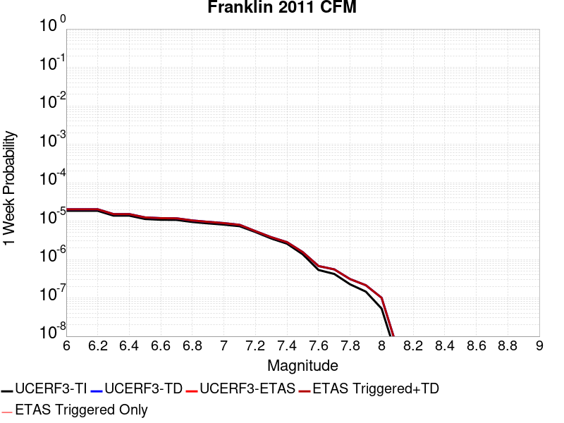 |  |  | 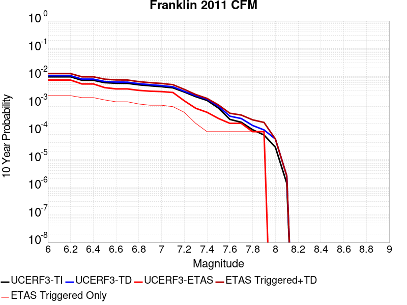 |

| Magnitude | 1 wk TI Prob | 1 wk TD Prob | 1 wk ETAS Prob | 1 wk ETAS/TD Gain | 1 wk ETAS Triggered+TD | 1 wk ETAS Triggered Only | 1 mo TI Prob | 1 mo TD Prob | 1 mo ETAS Prob | 1 mo ETAS/TD Gain | 1 mo ETAS Triggered+TD | 1 mo ETAS Triggered Only | 1 yr TI Prob | 1 yr TD Prob | 1 yr ETAS Prob | 1 yr ETAS/TD Gain | 1 yr ETAS Triggered+TD | 1 yr ETAS Triggered Only | 10 yr TI Prob | 10 yr TD Prob | 10 yr ETAS Prob | 10 yr ETAS/TD Gain | 10 yr ETAS Triggered+TD | 10 yr ETAS Triggered Only |
|-----|-----|-----|-----|-----|-----|-----|-----|-----|-----|-----|-----|-----|-----|-----|-----|-----|-----|-----|-----|-----|-----|-----|-----|-----|
| 6.0 | 1.845602E-5 | 2.0224104E-5 | 0.0 | 0.0 | 2.0224104E-5 | 0.0 | 7.9094825E-5 | 8.6672015E-5 | 2.0E-4 | 2.30755 | 2.866547E-4 | 2.0E-4 | 9.6255407E-4 | 0.0010547499 | 6.0E-4 | 0.56885517 | 0.001254539 | 2.0E-4 | 0.009583955 | 0.010514614 | 0.0073 | 0.6942718 | 0.012493585 | 0.002 |
| 6.1 | 1.845602E-5 | 2.0224104E-5 | 0.0 | 0.0 | 2.0224104E-5 | 0.0 | 7.9094825E-5 | 8.6672015E-5 | 2.0E-4 | 2.30755 | 2.866547E-4 | 2.0E-4 | 9.6255407E-4 | 0.0010547499 | 6.0E-4 | 0.56885517 | 0.001254539 | 2.0E-4 | 0.009583955 | 0.010514614 | 0.0073 | 0.6942718 | 0.012493585 | 0.002 |
| 6.2 | 1.845602E-5 | 2.0224104E-5 | 0.0 | 0.0 | 2.0224104E-5 | 0.0 | 7.9094825E-5 | 8.6672015E-5 | 2.0E-4 | 2.30755 | 2.866547E-4 | 2.0E-4 | 9.6255407E-4 | 0.0010547499 | 6.0E-4 | 0.56885517 | 0.001254539 | 2.0E-4 | 0.009583955 | 0.010514614 | 0.0073 | 0.6942718 | 0.012493585 | 0.002 |
| 6.3 | 1.3813506E-5 | 1.5165414E-5 | 0.0 | 0.0 | 1.5165414E-5 | 0.0 | 5.9199396E-5 | 6.499306E-5 | 2.0E-4 | 3.077252 | 2.6498004E-4 | 2.0E-4 | 7.205143E-4 | 7.9101085E-4 | 5.0E-4 | 0.63210255 | 9.908527E-4 | 2.0E-4 | 0.007181826 | 0.007897011 | 0.0053 | 0.67114 | 0.009583586 | 0.0017 |
| 6.4 | 1.3813506E-5 | 1.5165414E-5 | 0.0 | 0.0 | 1.5165414E-5 | 0.0 | 5.9199396E-5 | 6.499306E-5 | 2.0E-4 | 3.077252 | 2.6498004E-4 | 2.0E-4 | 7.205143E-4 | 7.9101085E-4 | 5.0E-4 | 0.63210255 | 9.908527E-4 | 2.0E-4 | 0.007181826 | 0.007897011 | 0.0053 | 0.67114 | 0.009583586 | 0.0017 |
| 6.5 | 1.1308949E-5 | 1.2427883E-5 | 0.0 | 0.0 | 1.2427883E-5 | 0.0 | 4.8466023E-5 | 5.326128E-5 | 1.0E-4 | 1.8775365 | 1.5325595E-4 | 1.0E-4 | 5.899141E-4 | 6.482652E-4 | 4.0E-4 | 0.61703146 | 7.482004E-4 | 1.0E-4 | 0.0058835056 | 0.006478244 | 0.0039 | 0.602015 | 0.007869175 | 0.0014 |
| 6.6 | 1.0813164E-5 | 1.1886006E-5 | 0.0 | 0.0 | 1.1886006E-5 | 0.0 | 4.6341313E-5 | 5.093904E-5 | 0.0 | 0.0 | 5.093904E-5 | 0.0 | 5.640594E-4 | 6.200083E-4 | 3.0E-4 | 0.48386455 | 6.200083E-4 | 0.0 | 0.005626298 | 0.006197271 | 0.0035 | 0.5647647 | 0.0073898346 | 0.0012 |
| 6.7 | 1.0706348E-5 | 1.1767745E-5 | 0.0 | 0.0 | 1.1767745E-5 | 0.0 | 4.5883542E-5 | 5.0432227E-5 | 0.0 | 0.0 | 5.0432227E-5 | 0.0 | 5.5848894E-4 | 6.138413E-4 | 3.0E-4 | 0.4887257 | 6.138413E-4 | 0.0 | 0.005570874 | 0.0061359433 | 0.0035 | 0.5704094 | 0.00732858 | 0.0012 |
| 6.8 | 9.443655E-6 | 1.0358741E-5 | 0.0 | 0.0 | 1.0358741E-5 | 0.0 | 4.0472176E-5 | 4.4393855E-5 | 0.0 | 0.0 | 4.4393855E-5 | 0.0 | 4.9263734E-4 | 5.403625E-4 | 3.0E-4 | 0.5551829 | 5.403625E-4 | 0.0 | 0.0049154665 | 0.005404922 | 0.0031 | 0.57355124 | 0.0063995174 | 0.001 |
| 6.9 | 8.7001645E-6 | 9.531627E-6 | 0.0 | 0.0 | 9.531627E-6 | 0.0 | 3.728589E-5 | 4.0849198E-5 | 0.0 | 0.0 | 4.0849198E-5 | 0.0 | 4.538611E-4 | 4.972267E-4 | 3.0E-4 | 0.6033465 | 4.972267E-4 | 0.0 | 0.0045293528 | 0.004975561 | 0.0029 | 0.58284885 | 0.005871083 | 9.0E-4 |
| 7.0 | 8.074731E-6 | 8.825053E-6 | 0.0 | 0.0 | 8.825053E-6 | 0.0 | 3.460553E-5 | 3.782111E-5 | 0.0 | 0.0 | 3.782111E-5 | 0.0 | 4.212409E-4 | 4.6037583E-4 | 3.0E-4 | 0.6516415 | 4.6037583E-4 | 0.0 | 0.004204433 | 0.0046086283 | 0.0028 | 0.60755605 | 0.0055044806 | 9.0E-4 |
| 7.1 | 7.3370957E-6 | 7.970703E-6 | 0.0 | 0.0 | 7.970703E-6 | 0.0 | 3.1444317E-5 | 3.4159715E-5 | 0.0 | 0.0 | 3.4159715E-5 | 0.0 | 3.8276732E-4 | 4.1581618E-4 | 3.0E-4 | 0.7214726 | 4.1581618E-4 | 0.0 | 0.0038210868 | 0.004164715 | 0.0026 | 0.62429243 | 0.004961383 | 8.0E-4 |
| 7.2 | 5.1750103E-6 | 5.4655675E-6 | 0.0 | 0.0 | 5.4655675E-6 | 0.0 | 2.2178427E-5 | 2.3423652E-5 | 0.0 | 0.0 | 2.3423652E-5 | 0.0 | 2.699889E-4 | 2.8514597E-4 | 3.0E-4 | 1.0520927 | 2.8514597E-4 | 0.0 | 0.002696611 | 0.0028616635 | 0.0013 | 0.45428124 | 0.0033602326 | 5.0E-4 |
| 7.3 | 3.5221371E-6 | 3.8036092E-6 | 0.0 | 0.0 | 3.8036092E-6 | 0.0 | 1.5094786E-5 | 1.630108E-5 | 0.0 | 0.0 | 1.630108E-5 | 0.0 | 1.8376352E-4 | 1.9844768E-4 | 2.0E-4 | 1.0078223 | 1.9844768E-4 | 0.0 | 0.0018361164 | 0.0019961125 | 7.0E-4 | 0.35068166 | 0.002195713 | 2.0E-4 |
| 7.4 | 2.5749775E-6 | 2.8246752E-6 | 0.0 | 0.0 | 2.8246752E-6 | 0.0 | 1.1035571E-5 | 1.21056955E-5 | 0.0 | 0.0 | 1.21056955E-5 | 0.0 | 1.343498E-4 | 1.4737694E-4 | 2.0E-4 | 1.3570644 | 1.4737694E-4 | 0.0 | 0.001342686 | 0.0014851885 | 5.0E-4 | 0.3366576 | 0.00158504 | 1.0E-4 |
| 7.5 | 1.3642131E-6 | 1.5547439E-6 | 0.0 | 0.0 | 1.5547439E-6 | 0.0 | 5.8466144E-6 | 6.6631715E-6 | 0.0 | 0.0 | 6.6631715E-6 | 0.0 | 7.1180206E-5 | 8.1121114E-5 | 1.0E-4 | 1.2327248 | 8.1121114E-5 | 0.0 | 7.115741E-4 | 8.219609E-4 | 3.0E-4 | 0.36498085 | 9.2187873E-4 | 1.0E-4 |
| 7.6 | 5.329124E-7 | 6.7456654E-7 | 0.0 | 0.0 | 6.7456654E-7 | 0.0 | 2.2839083E-6 | 2.890996E-6 | 0.0 | 0.0 | 2.890996E-6 | 0.0 | 2.7806227E-5 | 3.5197314E-5 | 0.0 | 0.0 | 3.5197314E-5 | 0.0 | 2.780275E-4 | 3.6229656E-4 | 2.0E-4 | 0.55203396 | 4.6226033E-4 | 1.0E-4 |
| 7.7 | 4.199127E-7 | 5.5290445E-7 | 0.0 | 0.0 | 5.5290445E-7 | 0.0 | 1.7996247E-6 | 2.3695884E-6 | 0.0 | 0.0 | 2.3695884E-6 | 0.0 | 2.191021E-5 | 2.884936E-5 | 0.0 | 0.0 | 2.884936E-5 | 0.0 | 2.190805E-4 | 2.9864672E-4 | 2.0E-4 | 0.6696876 | 3.9861683E-4 | 1.0E-4 |
| 7.8 | 2.2586491E-7 | 3.091115E-7 | 0.0 | 0.0 | 3.091115E-7 | 0.0 | 9.67992E-7 | 1.3247629E-6 | 0.0 | 0.0 | 1.3247629E-6 | 0.0 | 1.178524E-5 | 1.612887E-5 | 0.0 | 0.0 | 1.612887E-5 | 0.0 | 1.17846146E-4 | 1.6757658E-4 | 1.0E-4 | 0.5967421 | 2.6755984E-4 | 1.0E-4 |
| 7.9 | 1.4568845E-7 | 2.1376158E-7 | 0.0 | 0.0 | 2.1376158E-7 | 0.0 | 6.243789E-7 | 9.161207E-7 | 0.0 | 0.0 | 9.161207E-7 | 0.0 | 7.601787E-6 | 1.1153713E-5 | 0.0 | 0.0 | 1.1153713E-5 | 0.0 | 7.601527E-5 | 1.15972965E-4 | 1.0E-4 | 0.8622699 | 2.1596137E-4 | 1.0E-4 |
| 8.0 | 5.2868224E-8 | 1.00751855E-7 | 0.0 | 0.0 | 1.00751855E-7 | 0.0 | 2.2657808E-7 | 4.3179358E-7 | 0.0 | 0.0 | 4.3179358E-7 | 0.0 | 2.7585847E-6 | 5.2570745E-6 | 0.0 | 0.0 | 5.2570745E-6 | 0.0 | 2.7585504E-5 | 5.4413245E-5 | 0.0 | 0.0 | 5.4413245E-5 | 0.0 |
| 8.1 | 2.654434E-9 | 4.7550053E-9 | 0.0 | 0.0 | 4.7550053E-9 | 0.0 | 1.1376145E-8 | 2.0378595E-8 | 0.0 | 0.0 | 2.0378595E-8 | 0.0 | 1.3850456E-7 | 2.4810936E-7 | 0.0 | 0.0 | 2.4810936E-7 | 0.0 | 1.3850448E-6 | 2.5499787E-6 | 0.0 | 0.0 | 2.5499787E-6 | 0.0 |

## Great Valley 03a Dunnigan Hills
*[(top)](#table-of-contents)*

| 1 Week | 1 Month | 1 Year | 10 Year |
|-----|-----|-----|-----|
|  |  |  | 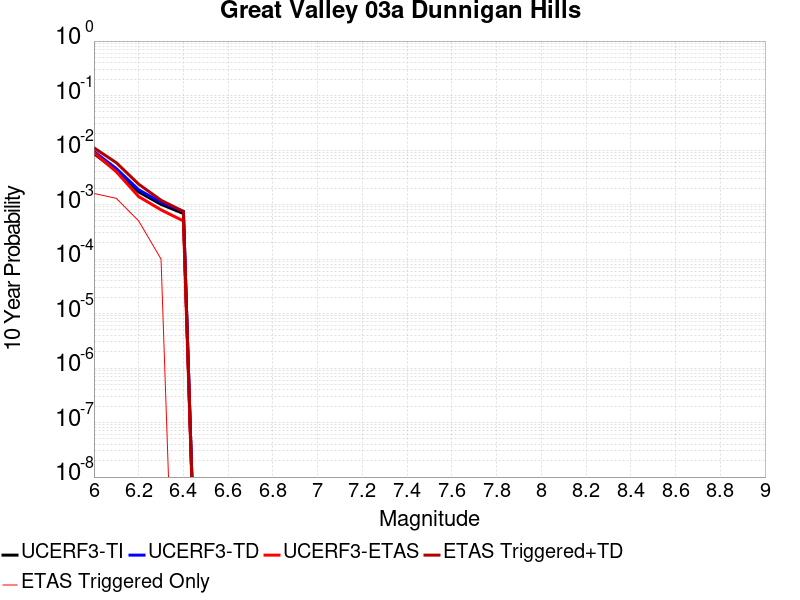 |

| Magnitude | 1 wk TI Prob | 1 wk TD Prob | 1 wk ETAS Prob | 1 wk ETAS/TD Gain | 1 wk ETAS Triggered+TD | 1 wk ETAS Triggered Only | 1 mo TI Prob | 1 mo TD Prob | 1 mo ETAS Prob | 1 mo ETAS/TD Gain | 1 mo ETAS Triggered+TD | 1 mo ETAS Triggered Only | 1 yr TI Prob | 1 yr TD Prob | 1 yr ETAS Prob | 1 yr ETAS/TD Gain | 1 yr ETAS Triggered+TD | 1 yr ETAS Triggered Only | 10 yr TI Prob | 10 yr TD Prob | 10 yr ETAS Prob | 10 yr ETAS/TD Gain | 10 yr ETAS Triggered+TD | 10 yr ETAS Triggered Only |
|-----|-----|-----|-----|-----|-----|-----|-----|-----|-----|-----|-----|-----|-----|-----|-----|-----|-----|-----|-----|-----|-----|-----|-----|-----|
| 6.0 | 1.6591328E-5 | 1.8111237E-5 | 0.0 | 0.0 | 1.8111237E-5 | 0.0 | 7.110376E-5 | 7.761767E-5 | 1.0E-4 | 1.2883664 | 1.7760991E-4 | 1.0E-4 | 8.6534437E-4 | 9.446546E-4 | 4.0E-4 | 0.4234352 | 0.0010445601 | 1.0E-4 | 0.008619824 | 0.009413225 | 0.009 | 0.9561017 | 0.010998163 | 0.0016 |
| 6.1 | 8.041125E-6 | 8.771302E-6 | 0.0 | 0.0 | 8.771302E-6 | 0.0 | 3.4461507E-5 | 3.759087E-5 | 1.0E-4 | 2.6602204 | 1.375871E-4 | 1.0E-4 | 4.194881E-4 | 4.5759307E-4 | 1.0E-4 | 0.21853478 | 5.575473E-4 | 1.0E-4 | 0.004186971 | 0.0045685065 | 0.004 | 0.8755597 | 0.0058625676 | 0.0013 |
| 6.2 | 3.2807004E-6 | 3.5802157E-6 | 0.0 | 0.0 | 3.5802157E-6 | 0.0 | 1.4060069E-5 | 1.5343714E-5 | 0.0 | 0.0 | 1.5343714E-5 | 0.0 | 1.7116789E-4 | 1.8679787E-4 | 0.0 | 0.0 | 1.8679787E-4 | 0.0 | 0.0017103611 | 0.0018668167 | 0.0014 | 0.74993974 | 0.0023658832 | 5.0E-4 |
| 6.3 | 1.9339366E-6 | 2.1107626E-6 | 0.0 | 0.0 | 2.1107626E-6 | 0.0 | 8.288273E-6 | 9.04611E-6 | 0.0 | 0.0 | 9.04611E-6 | 0.0 | 1.00905054E-4 | 1.1013368E-4 | 0.0 | 0.0 | 1.1013368E-4 | 0.0 | 0.0010085925 | 0.001101071 | 8.0E-4 | 0.7265653 | 0.001200961 | 1.0E-4 |
| 6.4 | 1.3142635E-6 | 1.4342457E-6 | 0.0 | 0.0 | 1.4342457E-6 | 0.0 | 5.6325457E-6 | 6.146767E-6 | 0.0 | 0.0 | 6.146767E-6 | 0.0 | 6.857408E-5 | 7.483689E-5 | 0.0 | 0.0 | 7.483689E-5 | 0.0 | 6.8552926E-4 | 7.483689E-4 | 5.0E-4 | 0.66811967 | 7.483689E-4 | 0.0 |

## Contra Costa Shear Zone (connector) 2011 CFM
*[(top)](#table-of-contents)*

| 1 Week | 1 Month | 1 Year | 10 Year |
|-----|-----|-----|-----|
| 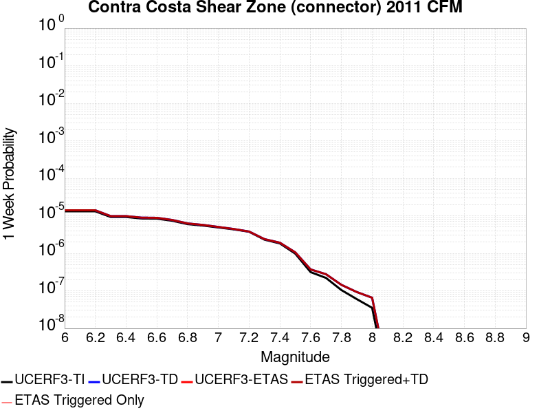 | 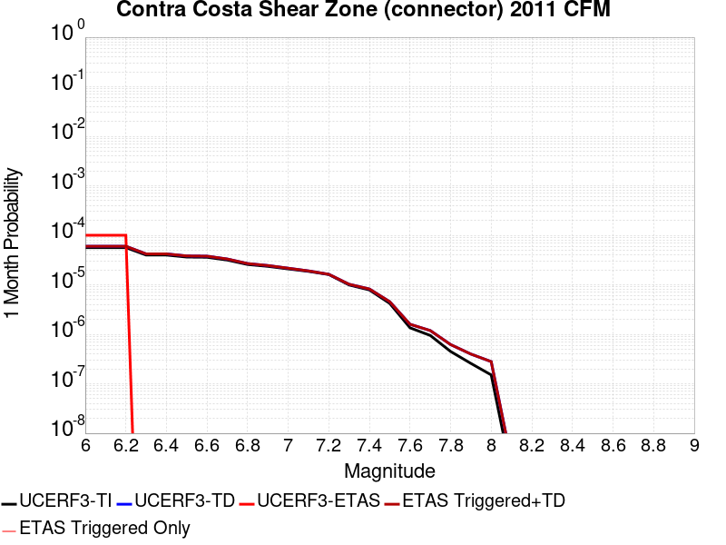 |  |  |

| Magnitude | 1 wk TI Prob | 1 wk TD Prob | 1 wk ETAS Prob | 1 wk ETAS/TD Gain | 1 wk ETAS Triggered+TD | 1 wk ETAS Triggered Only | 1 mo TI Prob | 1 mo TD Prob | 1 mo ETAS Prob | 1 mo ETAS/TD Gain | 1 mo ETAS Triggered+TD | 1 mo ETAS Triggered Only | 1 yr TI Prob | 1 yr TD Prob | 1 yr ETAS Prob | 1 yr ETAS/TD Gain | 1 yr ETAS Triggered+TD | 1 yr ETAS Triggered Only | 10 yr TI Prob | 10 yr TD Prob | 10 yr ETAS Prob | 10 yr ETAS/TD Gain | 10 yr ETAS Triggered+TD | 10 yr ETAS Triggered Only |
|-----|-----|-----|-----|-----|-----|-----|-----|-----|-----|-----|-----|-----|-----|-----|-----|-----|-----|-----|-----|-----|-----|-----|-----|-----|
| 6.0 | 1.3187427E-5 | 1.4048217E-5 | 0.0 | 0.0 | 1.4048217E-5 | 0.0 | 5.6516317E-5 | 6.0205384E-5 | 1.0E-4 | 1.660981 | 6.0205384E-5 | 0.0 | 6.878689E-4 | 7.327769E-4 | 3.0E-4 | 0.40940157 | 9.326303E-4 | 2.0E-4 | 0.006857436 | 0.0073098075 | 0.0058 | 0.7934545 | 0.0090966495 | 0.0018 |
| 6.1 | 1.3187427E-5 | 1.4048217E-5 | 0.0 | 0.0 | 1.4048217E-5 | 0.0 | 5.6516317E-5 | 6.0205384E-5 | 1.0E-4 | 1.660981 | 6.0205384E-5 | 0.0 | 6.878689E-4 | 7.327769E-4 | 3.0E-4 | 0.40940157 | 9.326303E-4 | 2.0E-4 | 0.006857436 | 0.0073098075 | 0.0058 | 0.7934545 | 0.0090966495 | 0.0018 |
| 6.2 | 1.3187427E-5 | 1.4048217E-5 | 0.0 | 0.0 | 1.4048217E-5 | 0.0 | 5.6516317E-5 | 6.0205384E-5 | 1.0E-4 | 1.660981 | 6.0205384E-5 | 0.0 | 6.878689E-4 | 7.327769E-4 | 3.0E-4 | 0.40940157 | 9.326303E-4 | 2.0E-4 | 0.006857436 | 0.0073098075 | 0.0058 | 0.7934545 | 0.0090966495 | 0.0018 |
| 6.3 | 9.315374E-6 | 9.830401E-6 | 0.0 | 0.0 | 9.830401E-6 | 0.0 | 3.992242E-5 | 4.212963E-5 | 0.0 | 0.0 | 4.212963E-5 | 0.0 | 4.8594706E-4 | 5.1281165E-4 | 2.0E-4 | 0.39000672 | 7.127091E-4 | 2.0E-4 | 0.004848858 | 0.0051206388 | 0.0034 | 0.66397965 | 0.006612958 | 0.0015 |
| 6.4 | 9.315374E-6 | 9.830401E-6 | 0.0 | 0.0 | 9.830401E-6 | 0.0 | 3.992242E-5 | 4.212963E-5 | 0.0 | 0.0 | 4.212963E-5 | 0.0 | 4.8594706E-4 | 5.1281165E-4 | 2.0E-4 | 0.39000672 | 7.127091E-4 | 2.0E-4 | 0.004848858 | 0.0051206388 | 0.0034 | 0.66397965 | 0.006612958 | 0.0015 |
| 6.5 | 8.492638E-6 | 8.943947E-6 | 0.0 | 0.0 | 8.943947E-6 | 0.0 | 3.639651E-5 | 3.8330658E-5 | 0.0 | 0.0 | 3.8330658E-5 | 0.0 | 4.430374E-4 | 4.665792E-4 | 2.0E-4 | 0.42865178 | 6.6648587E-4 | 2.0E-4 | 0.0044215517 | 0.0046602758 | 0.0031 | 0.6651967 | 0.006153285 | 0.0015 |
| 6.6 | 8.402072E-6 | 8.844728E-6 | 0.0 | 0.0 | 8.844728E-6 | 0.0 | 3.6008387E-5 | 3.7905444E-5 | 0.0 | 0.0 | 3.7905444E-5 | 0.0 | 4.383139E-4 | 4.6140442E-4 | 2.0E-4 | 0.43345922 | 6.6131214E-4 | 2.0E-4 | 0.0043745036 | 0.004608744 | 0.0031 | 0.6726345 | 0.0061018304 | 0.0015 |
| 6.7 | 7.383587E-6 | 7.752167E-6 | 0.0 | 0.0 | 7.752167E-6 | 0.0 | 3.164356E-5 | 3.322316E-5 | 0.0 | 0.0 | 3.322316E-5 | 0.0 | 3.8519225E-4 | 4.0441903E-4 | 1.0E-4 | 0.24726829 | 5.043786E-4 | 1.0E-4 | 0.0038452526 | 0.0040409844 | 0.0028 | 0.6929005 | 0.005335731 | 0.0013 |
| 6.8 | 6.004921E-6 | 6.269624E-6 | 0.0 | 0.0 | 6.269624E-6 | 0.0 | 2.5735122E-5 | 2.6869544E-5 | 0.0 | 0.0 | 2.6869544E-5 | 0.0 | 3.1328006E-4 | 3.270881E-4 | 1.0E-4 | 0.30572802 | 4.270554E-4 | 1.0E-4 | 0.0031283877 | 0.0032700668 | 0.0019 | 0.58102787 | 0.0041671237 | 9.0E-4 |
| 6.9 | 5.505255E-6 | 5.7219286E-6 | 0.0 | 0.0 | 5.7219286E-6 | 0.0 | 2.3593739E-5 | 2.4522324E-5 | 0.0 | 0.0 | 2.4522324E-5 | 0.0 | 2.872159E-4 | 2.985188E-4 | 1.0E-4 | 0.33498725 | 3.9848898E-4 | 1.0E-4 | 0.0028684495 | 0.0029851692 | 0.0018 | 0.6029809 | 0.0038824824 | 9.0E-4 |
| 7.0 | 4.891922E-6 | 5.0524827E-6 | 0.0 | 0.0 | 5.0524827E-6 | 0.0 | 2.096521E-5 | 2.1653319E-5 | 0.0 | 0.0 | 2.1653319E-5 | 0.0 | 2.5522153E-4 | 2.635976E-4 | 0.0 | 0.0 | 2.635976E-4 | 0.0 | 0.0025492862 | 0.0026368324 | 0.0014 | 0.5309401 | 0.0033349865 | 7.0E-4 |
| 7.1 | 4.3599E-6 | 4.456359E-6 | 0.0 | 0.0 | 4.456359E-6 | 0.0 | 1.868515E-5 | 1.9098543E-5 | 0.0 | 0.0 | 1.9098543E-5 | 0.0 | 2.2746796E-4 | 2.3250023E-4 | 0.0 | 0.0 | 2.3250023E-4 | 0.0 | 0.0022723526 | 0.002326546 | 0.0014 | 0.60175043 | 0.0030249173 | 7.0E-4 |
| 7.2 | 3.7647926E-6 | 3.8072433E-6 | 0.0 | 0.0 | 3.8072433E-6 | 0.0 | 1.6134725E-5 | 1.6316657E-5 | 0.0 | 0.0 | 1.6316657E-5 | 0.0 | 1.9642258E-4 | 1.9863743E-4 | 0.0 | 0.0 | 1.9863743E-4 | 0.0 | 0.0019624906 | 0.0019885637 | 0.0012 | 0.6034506 | 0.0025873706 | 6.0E-4 |
| 7.3 | 2.3179882E-6 | 2.3947196E-6 | 0.0 | 0.0 | 2.3947196E-6 | 0.0 | 9.934198E-6 | 1.0263043E-5 | 0.0 | 0.0 | 1.0263043E-5 | 0.0 | 1.20942146E-4 | 1.2494544E-4 | 0.0 | 0.0 | 1.2494544E-4 | 0.0 | 0.0012087635 | 0.0012527091 | 7.0E-4 | 0.55878896 | 0.0016522079 | 4.0E-4 |
| 7.4 | 1.8378355E-6 | 1.9216675E-6 | 0.0 | 0.0 | 1.9216675E-6 | 0.0 | 7.876414E-6 | 8.235692E-6 | 0.0 | 0.0 | 8.235692E-6 | 0.0 | 9.5891126E-5 | 1.0026497E-4 | 0.0 | 0.0 | 1.0026497E-4 | 0.0 | 9.584976E-4 | 0.0010060926 | 4.0E-4 | 0.39757773 | 0.001105992 | 1.0E-4 |
| 7.5 | 9.840493E-7 | 1.0650637E-6 | 0.0 | 0.0 | 1.0650637E-6 | 0.0 | 4.2173474E-6 | 4.56455E-6 | 0.0 | 0.0 | 4.56455E-6 | 0.0 | 5.1344992E-5 | 5.5571996E-5 | 0.0 | 0.0 | 5.5571996E-5 | 0.0 | 5.133313E-4 | 5.5919884E-4 | 1.0E-4 | 0.17882726 | 6.591429E-4 | 1.0E-4 |
| 7.6 | 3.1602997E-7 | 3.725207E-7 | 0.0 | 0.0 | 3.725207E-7 | 0.0 | 1.3544135E-6 | 1.5965163E-6 | 0.0 | 0.0 | 1.5965163E-6 | 0.0 | 1.648986E-5 | 1.9437415E-5 | 0.0 | 0.0 | 1.9437415E-5 | 0.0 | 1.6488635E-4 | 1.9786794E-4 | 0.0 | 0.0 | 1.9786794E-4 | 0.0 |
| 7.7 | 2.2125788E-7 | 2.7784168E-7 | 0.0 | 0.0 | 2.7784168E-7 | 0.0 | 9.482477E-7 | 1.1907495E-6 | 0.0 | 0.0 | 1.1907495E-6 | 0.0 | 1.1544855E-5 | 1.4497279E-5 | 0.0 | 0.0 | 1.4497279E-5 | 0.0 | 1.1544255E-4 | 1.4843678E-4 | 0.0 | 0.0 | 1.4843678E-4 | 0.0 |
| 7.8 | 1.0509553E-7 | 1.4487678E-7 | 0.0 | 0.0 | 1.4487678E-7 | 0.0 | 4.5040935E-7 | 6.209003E-7 | 0.0 | 0.0 | 6.209003E-7 | 0.0 | 5.48372E-6 | 7.5594357E-6 | 0.0 | 0.0 | 7.5594357E-6 | 0.0 | 5.4835844E-5 | 7.788782E-5 | 0.0 | 0.0 | 7.788782E-5 | 0.0 |
| 7.9 | 6.029319E-8 | 9.312155E-8 | 0.0 | 0.0 | 9.312155E-8 | 0.0 | 2.5839938E-7 | 3.990923E-7 | 0.0 | 0.0 | 3.990923E-7 | 0.0 | 3.1460077E-6 | 4.858938E-6 | 0.0 | 0.0 | 4.858938E-6 | 0.0 | 3.1459633E-5 | 5.0162096E-5 | 0.0 | 0.0 | 5.0162096E-5 | 0.0 |
| 8.0 | 3.531068E-8 | 6.5592715E-8 | 0.0 | 0.0 | 6.5592715E-8 | 0.0 | 1.5133148E-7 | 2.811116E-7 | 0.0 | 0.0 | 2.811116E-7 | 0.0 | 1.8424593E-6 | 3.4225284E-6 | 0.0 | 0.0 | 3.4225284E-6 | 0.0 | 1.842444E-5 | 3.5357723E-5 | 0.0 | 0.0 | 3.5357723E-5 | 0.0 |
| 8.1 | 3.5238246E-10 | 6.30233E-10 | 0.0 | 0.0 | 6.30233E-10 | 0.0 | 1.5102107E-9 | 2.700999E-9 | 0.0 | 0.0 | 2.700999E-9 | 0.0 | 1.8386816E-8 | 3.2884664E-8 | 0.0 | 0.0 | 3.2884664E-8 | 0.0 | 1.8386814E-7 | 3.3673837E-7 | 0.0 | 0.0 | 3.3673837E-7 | 0.0 |

## Hosgri
*[(top)](#table-of-contents)*

| 1 Week | 1 Month | 1 Year | 10 Year |
|-----|-----|-----|-----|
| 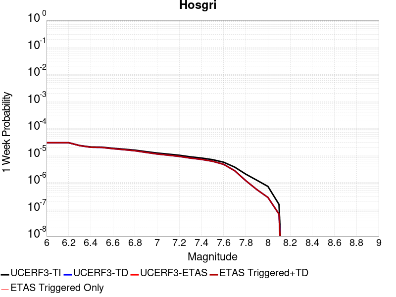 | 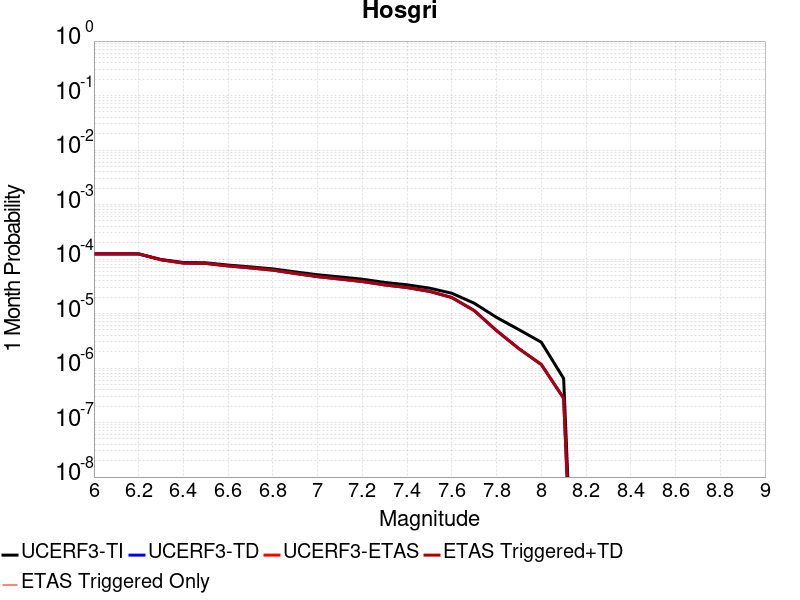 | 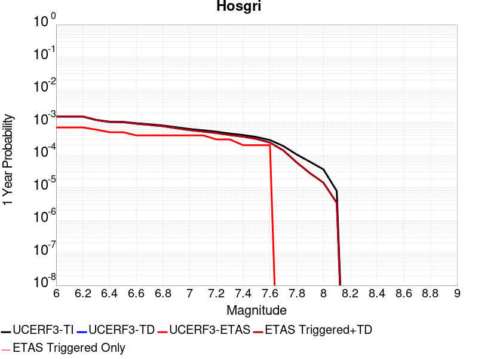 | 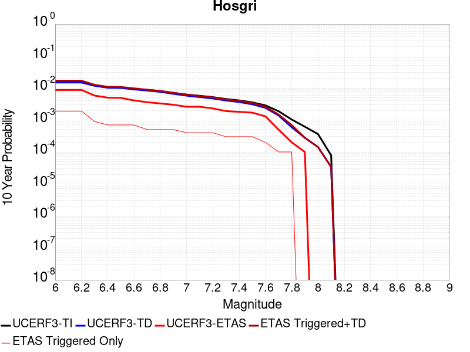 |

| Magnitude | 1 wk TI Prob | 1 wk TD Prob | 1 wk ETAS Prob | 1 wk ETAS/TD Gain | 1 wk ETAS Triggered+TD | 1 wk ETAS Triggered Only | 1 mo TI Prob | 1 mo TD Prob | 1 mo ETAS Prob | 1 mo ETAS/TD Gain | 1 mo ETAS Triggered+TD | 1 mo ETAS Triggered Only | 1 yr TI Prob | 1 yr TD Prob | 1 yr ETAS Prob | 1 yr ETAS/TD Gain | 1 yr ETAS Triggered+TD | 1 yr ETAS Triggered Only | 10 yr TI Prob | 10 yr TD Prob | 10 yr ETAS Prob | 10 yr ETAS/TD Gain | 10 yr ETAS Triggered+TD | 10 yr ETAS Triggered Only |
|-----|-----|-----|-----|-----|-----|-----|-----|-----|-----|-----|-----|-----|-----|-----|-----|-----|-----|-----|-----|-----|-----|-----|-----|-----|
| 6.0 | 2.883978E-5 | 2.913463E-5 | 0.0 | 0.0 | 2.913463E-5 | 0.0 | 1.235932E-4 | 1.2485687E-4 | 0.0 | 0.0 | 1.2485687E-4 | 0.0 | 0.0015037085 | 0.0015190997 | 7.0E-4 | 0.46079925 | 0.0015190997 | 0.0 | 0.01493574 | 0.015090936 | 0.0087 | 0.576505 | 0.016962262 | 0.0019 |
| 6.1 | 2.883978E-5 | 2.913463E-5 | 0.0 | 0.0 | 2.913463E-5 | 0.0 | 1.235932E-4 | 1.2485687E-4 | 0.0 | 0.0 | 1.2485687E-4 | 0.0 | 0.0015037085 | 0.0015190997 | 7.0E-4 | 0.46079925 | 0.0015190997 | 0.0 | 0.01493574 | 0.015090936 | 0.0087 | 0.576505 | 0.016962262 | 0.0019 |
| 6.2 | 2.883978E-5 | 2.913463E-5 | 0.0 | 0.0 | 2.913463E-5 | 0.0 | 1.235932E-4 | 1.2485687E-4 | 0.0 | 0.0 | 1.2485687E-4 | 0.0 | 0.0015037085 | 0.0015190997 | 7.0E-4 | 0.46079925 | 0.0015190997 | 0.0 | 0.01493574 | 0.015090936 | 0.0087 | 0.576505 | 0.016962262 | 0.0019 |
| 6.3 | 2.2914428E-5 | 2.264696E-5 | 0.0 | 0.0 | 2.264696E-5 | 0.0 | 9.8200995E-5 | 9.705481E-5 | 0.0 | 0.0 | 9.705481E-5 | 0.0 | 0.0011949413 | 0.0011810068 | 6.0E-4 | 0.5080411 | 0.0011810068 | 0.0 | 0.011885363 | 0.011748708 | 0.0058 | 0.4936713 | 0.012638134 | 9.0E-4 |
| 6.4 | 2.0195741E-5 | 1.9701063E-5 | 0.0 | 0.0 | 1.9701063E-5 | 0.0 | 8.65503E-5 | 8.44304E-5 | 0.0 | 0.0 | 8.44304E-5 | 0.0 | 0.0010532405 | 0.0010274574 | 5.0E-4 | 0.4866382 | 0.0010274574 | 0.0 | 0.010482626 | 0.01022812 | 0.005 | 0.48884842 | 0.0109209595 | 7.0E-4 |
| 6.5 | 1.9924333E-5 | 1.9413446E-5 | 0.0 | 0.0 | 1.9413446E-5 | 0.0 | 8.53872E-5 | 8.319784E-5 | 0.0 | 0.0 | 8.319784E-5 | 0.0 | 0.0010390934 | 0.001012465 | 5.0E-4 | 0.49384424 | 0.001012465 | 0.0 | 0.010342481 | 0.010079561 | 0.0049 | 0.48613226 | 0.010772506 | 7.0E-4 |
| 6.6 | 1.809694E-5 | 1.7462487E-5 | 0.0 | 0.0 | 1.7462487E-5 | 0.0 | 7.7556004E-5 | 7.4837095E-5 | 0.0 | 0.0 | 7.4837095E-5 | 0.0 | 9.438353E-4 | 9.1076206E-4 | 4.0E-4 | 0.43919265 | 9.1076206E-4 | 0.0 | 0.009398366 | 0.00907124 | 0.0041 | 0.4519779 | 0.00976489 | 7.0E-4 |
| 6.7 | 1.675989E-5 | 1.6046763E-5 | 0.0 | 0.0 | 1.6046763E-5 | 0.0 | 7.182612E-5 | 6.877003E-5 | 0.0 | 0.0 | 6.877003E-5 | 0.0 | 8.7413215E-4 | 8.369547E-4 | 4.0E-4 | 0.47792315 | 8.369547E-4 | 0.0 | 0.008707017 | 0.008338933 | 0.0036 | 0.4317099 | 0.008834763 | 5.0E-4 |
| 6.8 | 1.5401129E-5 | 1.4617893E-5 | 0.0 | 0.0 | 1.4617893E-5 | 0.0 | 6.6003166E-5 | 6.264661E-5 | 0.0 | 0.0 | 6.264661E-5 | 0.0 | 8.032922E-4 | 7.624565E-4 | 4.0E-4 | 0.5246201 | 7.624565E-4 | 0.0 | 0.008003947 | 0.007599271 | 0.0033 | 0.43425217 | 0.008095471 | 5.0E-4 |
| 6.9 | 1.356559E-5 | 1.2693527E-5 | 0.0 | 0.0 | 1.2693527E-5 | 0.0 | 5.8136946E-5 | 5.4399698E-5 | 0.0 | 0.0 | 5.4399698E-5 | 0.0 | 7.0758746E-4 | 6.621155E-4 | 4.0E-4 | 0.6041242 | 6.621155E-4 | 0.0 | 0.007053386 | 0.0066022347 | 0.003 | 0.4543916 | 0.007098933 | 5.0E-4 |
| 7.0 | 1.2030819E-5 | 1.10993215E-5 | 0.0 | 0.0 | 1.10993215E-5 | 0.0 | 5.155963E-5 | 4.7567653E-5 | 0.0 | 0.0 | 4.7567653E-5 | 0.0 | 6.275577E-4 | 5.789824E-4 | 4.0E-4 | 0.6908673 | 5.789824E-4 | 0.0 | 0.006257884 | 0.005775502 | 0.0026 | 0.45017734 | 0.0061731916 | 4.0E-4 |
| 7.1 | 1.0972698E-5 | 1.0025421E-5 | 0.0 | 0.0 | 1.0025421E-5 | 0.0 | 4.7025E-5 | 4.296538E-5 | 0.0 | 0.0 | 4.296538E-5 | 0.0 | 5.72379E-4 | 5.22978E-4 | 4.0E-4 | 0.76485044 | 5.22978E-4 | 0.0 | 0.0057090693 | 0.0052182265 | 0.0026 | 0.49825358 | 0.005616139 | 4.0E-4 |
| 7.2 | 9.961926E-6 | 9.037885E-6 | 0.0 | 0.0 | 9.037885E-6 | 0.0 | 4.2693267E-5 | 3.873322E-5 | 0.0 | 0.0 | 3.873322E-5 | 0.0 | 5.1966653E-4 | 4.7147495E-4 | 3.0E-4 | 0.63630104 | 4.7147495E-4 | 0.0 | 0.00518453 | 0.0047054947 | 0.0023 | 0.48879027 | 0.0051036123 | 4.0E-4 |
| 7.3 | 8.700929E-6 | 7.831123E-6 | 0.0 | 0.0 | 7.831123E-6 | 0.0 | 3.7289166E-5 | 3.3561526E-5 | 0.0 | 0.0 | 3.3561526E-5 | 0.0 | 4.53901E-4 | 4.0853498E-4 | 3.0E-4 | 0.73433125 | 4.0853498E-4 | 0.0 | 0.00452975 | 0.0040785805 | 0.0019 | 0.46584836 | 0.0043773567 | 3.0E-4 |
| 7.4 | 7.866285E-6 | 7.001653E-6 | 0.0 | 0.0 | 7.001653E-6 | 0.0 | 3.3712215E-5 | 3.0006739E-5 | 0.0 | 0.0 | 3.0006739E-5 | 0.0 | 4.103689E-4 | 3.6527083E-4 | 2.0E-4 | 0.54753894 | 3.6527083E-4 | 0.0 | 0.004096119 | 0.0036474431 | 0.0018 | 0.4934964 | 0.003946349 | 3.0E-4 |
| 7.5 | 6.8381305E-6 | 5.962512E-6 | 0.0 | 0.0 | 5.962512E-6 | 0.0 | 2.9305946E-5 | 2.5553374E-5 | 0.0 | 0.0 | 2.5553374E-5 | 0.0 | 3.5674145E-4 | 3.1106794E-4 | 2.0E-4 | 0.64294636 | 3.1106794E-4 | 0.0 | 0.0035616932 | 0.0031070614 | 0.0017 | 0.5471408 | 0.0034061293 | 3.0E-4 |
| 7.6 | 5.503376E-6 | 4.5979305E-6 | 0.0 | 0.0 | 4.5979305E-6 | 0.0 | 2.3585684E-5 | 1.9705267E-5 | 0.0 | 0.0 | 1.9705267E-5 | 0.0 | 2.8711787E-4 | 2.3988524E-4 | 2.0E-4 | 0.833732 | 2.3988524E-4 | 0.0 | 0.002867472 | 0.0023969973 | 0.0013 | 0.5423452 | 0.0025965178 | 2.0E-4 |
| 7.7 | 3.6144982E-6 | 2.6546586E-6 | 0.0 | 0.0 | 2.6546586E-6 | 0.0 | 1.5490614E-5 | 1.1377058E-5 | 0.0 | 0.0 | 1.1377058E-5 | 0.0 | 1.8858191E-4 | 1.3850689E-4 | 0.0 | 0.0 | 1.3850689E-4 | 0.0 | 0.0018842196 | 0.0013849381 | 5.0E-4 | 0.36102697 | 0.0014847997 | 1.0E-4 |
| 7.8 | 1.9853494E-6 | 1.1381401E-6 | 0.0 | 0.0 | 1.1381401E-6 | 0.0 | 8.508612E-6 | 4.8777338E-6 | 0.0 | 0.0 | 4.8777338E-6 | 0.0 | 1.0358743E-4 | 5.9384794E-5 | 0.0 | 0.0 | 5.9384794E-5 | 0.0 | 0.0010353916 | 5.944212E-4 | 2.0E-4 | 0.33646178 | 6.943617E-4 | 1.0E-4 |
| 7.9 | 1.1818757E-6 | 5.31095E-7 | 0.0 | 0.0 | 5.31095E-7 | 0.0 | 5.0651715E-6 | 2.2761192E-6 | 0.0 | 0.0 | 2.2761192E-6 | 0.0 | 6.1666724E-5 | 2.77114E-5 | 0.0 | 0.0 | 2.77114E-5 | 0.0 | 6.1649614E-4 | 2.777715E-4 | 1.0E-4 | 0.36000815 | 2.777715E-4 | 0.0 |
| 8.0 | 6.962958E-7 | 2.7248328E-7 | 0.0 | 0.0 | 2.7248328E-7 | 0.0 | 2.9841215E-6 | 1.167785E-6 | 0.0 | 0.0 | 1.167785E-6 | 0.0 | 3.6331072E-5 | 1.4217689E-5 | 0.0 | 0.0 | 1.4217689E-5 | 0.0 | 3.6325134E-4 | 1.4273224E-4 | 0.0 | 0.0 | 1.4273224E-4 | 0.0 |
| 8.1 | 1.5033264E-7 | 6.550383E-8 | 0.0 | 0.0 | 6.550383E-8 | 0.0 | 6.442826E-7 | 2.8073066E-7 | 0.0 | 0.0 | 2.8073066E-7 | 0.0 | 7.844113E-6 | 3.4178906E-6 | 0.0 | 0.0 | 3.4178906E-6 | 0.0 | 7.843835E-5 | 3.419711E-5 | 0.0 | 0.0 | 3.419711E-5 | 0.0 |

## San Jacinto (San Bernardino)
*[(top)](#table-of-contents)*

| 1 Week | 1 Month | 1 Year | 10 Year |
|-----|-----|-----|-----|
|  |  |  |  |

| Magnitude | 1 wk TI Prob | 1 wk TD Prob | 1 wk ETAS Prob | 1 wk ETAS/TD Gain | 1 wk ETAS Triggered+TD | 1 wk ETAS Triggered Only | 1 mo TI Prob | 1 mo TD Prob | 1 mo ETAS Prob | 1 mo ETAS/TD Gain | 1 mo ETAS Triggered+TD | 1 mo ETAS Triggered Only | 1 yr TI Prob | 1 yr TD Prob | 1 yr ETAS Prob | 1 yr ETAS/TD Gain | 1 yr ETAS Triggered+TD | 1 yr ETAS Triggered Only | 10 yr TI Prob | 10 yr TD Prob | 10 yr ETAS Prob | 10 yr ETAS/TD Gain | 10 yr ETAS Triggered+TD | 10 yr ETAS Triggered Only |
|-----|-----|-----|-----|-----|-----|-----|-----|-----|-----|-----|-----|-----|-----|-----|-----|-----|-----|-----|-----|-----|-----|-----|-----|-----|
| 6.0 | 3.409352E-5 | 3.6223904E-5 | 0.0 | 0.0 | 3.6223904E-5 | 0.0 | 1.461069E-4 | 1.5523608E-4 | 0.0 | 0.0 | 1.5523608E-4 | 0.0 | 0.0017774 | 0.0018883626 | 0.0012 | 0.63547117 | 0.0019881737 | 1.0E-4 | 0.01763251 | 0.019471081 | 0.0115 | 0.5906195 | 0.021334086 | 0.0019 |
| 6.1 | 3.409352E-5 | 3.6223904E-5 | 0.0 | 0.0 | 3.6223904E-5 | 0.0 | 1.461069E-4 | 1.5523608E-4 | 0.0 | 0.0 | 1.5523608E-4 | 0.0 | 0.0017774 | 0.0018883626 | 0.0012 | 0.63547117 | 0.0019881737 | 1.0E-4 | 0.01763251 | 0.019471081 | 0.0115 | 0.5906195 | 0.021334086 | 0.0019 |
| 6.2 | 3.409352E-5 | 3.6223904E-5 | 0.0 | 0.0 | 3.6223904E-5 | 0.0 | 1.461069E-4 | 1.5523608E-4 | 0.0 | 0.0 | 1.5523608E-4 | 0.0 | 0.0017774 | 0.0018883626 | 0.0012 | 0.63547117 | 0.0019881737 | 1.0E-4 | 0.01763251 | 0.019471081 | 0.0115 | 0.5906195 | 0.021334086 | 0.0019 |
| 6.3 | 3.409352E-5 | 3.6223904E-5 | 0.0 | 0.0 | 3.6223904E-5 | 0.0 | 1.461069E-4 | 1.5523608E-4 | 0.0 | 0.0 | 1.5523608E-4 | 0.0 | 0.0017774 | 0.0018883626 | 0.0012 | 0.63547117 | 0.0019881737 | 1.0E-4 | 0.01763251 | 0.019471081 | 0.0115 | 0.5906195 | 0.021334086 | 0.0019 |
| 6.4 | 3.400795E-5 | 3.611652E-5 | 0.0 | 0.0 | 3.611652E-5 | 0.0 | 1.4574021E-4 | 1.547759E-4 | 0.0 | 0.0 | 1.547759E-4 | 0.0 | 0.0017729428 | 0.0018827696 | 0.0012 | 0.6373589 | 0.0019825813 | 1.0E-4 | 0.017588645 | 0.019416142 | 0.0115 | 0.5922907 | 0.021279251 | 0.0019 |
| 6.5 | 3.341482E-5 | 3.537679E-5 | 0.0 | 0.0 | 3.537679E-5 | 0.0 | 1.4319851E-4 | 1.5160601E-4 | 0.0 | 0.0 | 1.5160601E-4 | 0.0 | 0.0017420477 | 0.0018442419 | 0.0012 | 0.65067387 | 0.0019440574 | 1.0E-4 | 0.017284546 | 0.019037548 | 0.0111 | 0.5830583 | 0.02080328 | 0.0018 |
| 6.6 | 3.3364955E-5 | 3.5313977E-5 | 0.0 | 0.0 | 3.5313977E-5 | 0.0 | 1.4298483E-4 | 1.5133683E-4 | 0.0 | 0.0 | 1.5133683E-4 | 0.0 | 0.0017394501 | 0.0018409702 | 0.0012 | 0.6518302 | 0.0019407861 | 1.0E-4 | 0.017258976 | 0.019005401 | 0.0111 | 0.5840445 | 0.02077119 | 0.0018 |
| 6.7 | 3.335922E-5 | 3.5303743E-5 | 0.0 | 0.0 | 3.5303743E-5 | 0.0 | 1.4296026E-4 | 1.5129299E-4 | 0.0 | 0.0 | 1.5129299E-4 | 0.0 | 0.0017391514 | 0.0018404374 | 0.0012 | 0.6520189 | 0.0019402533 | 1.0E-4 | 0.017256035 | 0.01900019 | 0.0111 | 0.5842047 | 0.02076599 | 0.0018 |
| 6.8 | 3.327683E-5 | 3.5197754E-5 | 0.0 | 0.0 | 3.5197754E-5 | 0.0 | 1.4260718E-4 | 1.508388E-4 | 0.0 | 0.0 | 1.508388E-4 | 0.0 | 0.0017348597 | 0.0018349169 | 0.0012 | 0.65398055 | 0.0019347334 | 1.0E-4 | 0.017213784 | 0.01894594 | 0.0109 | 0.57532114 | 0.020711837 | 0.0018 |
| 6.9 | 3.3235785E-5 | 3.513867E-5 | 0.0 | 0.0 | 3.513867E-5 | 0.0 | 1.4243131E-4 | 1.5058562E-4 | 0.0 | 0.0 | 1.5058562E-4 | 0.0 | 0.0017327217 | 0.0018318396 | 0.0012 | 0.6550792 | 0.0019316564 | 1.0E-4 | 0.017192734 | 0.018915793 | 0.0109 | 0.5762381 | 0.020681744 | 0.0018 |
| 7.0 | 3.3197095E-5 | 3.507856E-5 | 0.0 | 0.0 | 3.507856E-5 | 0.0 | 1.422655E-4 | 1.5032802E-4 | 0.0 | 0.0 | 1.5032802E-4 | 0.0 | 0.0017307063 | 0.0018287087 | 0.0012 | 0.65620077 | 0.0019285257 | 1.0E-4 | 0.017172894 | 0.018885154 | 0.0108 | 0.5718778 | 0.02065116 | 0.0018 |
| 7.1 | 3.3129716E-5 | 3.4958673E-5 | 0.0 | 0.0 | 3.4958673E-5 | 0.0 | 1.4197677E-4 | 1.498143E-4 | 0.0 | 0.0 | 1.498143E-4 | 0.0 | 0.0017271966 | 0.0018224644 | 0.0012 | 0.65844905 | 0.0019222822 | 1.0E-4 | 0.017138338 | 0.018824192 | 0.0108 | 0.5737298 | 0.020590307 | 0.0018 |
| 7.2 | 3.3034008E-5 | 3.4826047E-5 | 0.0 | 0.0 | 3.4826047E-5 | 0.0 | 1.4156665E-4 | 1.4924596E-4 | 0.0 | 0.0 | 1.4924596E-4 | 0.0 | 0.0017222111 | 0.0018155565 | 0.0012 | 0.66095436 | 0.0019153749 | 1.0E-4 | 0.017089253 | 0.018756565 | 0.0107 | 0.57046694 | 0.020522803 | 0.0018 |
| 7.3 | 3.2956614E-5 | 3.469366E-5 | 0.0 | 0.0 | 3.469366E-5 | 0.0 | 1.4123498E-4 | 1.4867865E-4 | 0.0 | 0.0 | 1.4867865E-4 | 0.0 | 0.0017181796 | 0.0018086612 | 0.0011 | 0.6081847 | 0.0019084803 | 1.0E-4 | 0.017049557 | 0.018689254 | 0.0106 | 0.56717086 | 0.020455614 | 0.0018 |
| 7.4 | 3.2915937E-5 | 3.4615245E-5 | 0.0 | 0.0 | 3.4615245E-5 | 0.0 | 1.4106068E-4 | 1.4834263E-4 | 0.0 | 0.0 | 1.4834263E-4 | 0.0 | 0.0017160608 | 0.0018045768 | 0.001 | 0.5541465 | 0.0018045768 | 0.0 | 0.017028693 | 0.018649464 | 0.0105 | 0.56301886 | 0.020317761 | 0.0017 |
| 7.5 | 3.281791E-5 | 3.447999E-5 | 0.0 | 0.0 | 3.447999E-5 | 0.0 | 1.406406E-4 | 1.4776301E-4 | 0.0 | 0.0 | 1.4776301E-4 | 0.0 | 0.0017109542 | 0.0017975317 | 9.0E-4 | 0.5006866 | 0.0017975317 | 0.0 | 0.016978411 | 0.018580282 | 0.0104 | 0.55973315 | 0.020248694 | 0.0017 |
| 7.6 | 3.2521442E-5 | 3.4204488E-5 | 0.0 | 0.0 | 3.4204488E-5 | 0.0 | 1.3937015E-4 | 1.4658243E-4 | 0.0 | 0.0 | 1.4658243E-4 | 0.0 | 0.0016955109 | 0.0017831817 | 9.0E-4 | 0.5047158 | 0.0017831817 | 0.0 | 0.016826328 | 0.018437702 | 0.0104 | 0.56406164 | 0.020106358 | 0.0017 |
| 7.7 | 3.0287873E-5 | 3.268582E-5 | 0.0 | 0.0 | 3.268582E-5 | 0.0 | 1.297987E-4 | 1.4007457E-4 | 0.0 | 0.0 | 1.4007457E-4 | 0.0 | 0.0015791537 | 0.001704075 | 9.0E-4 | 0.5281458 | 0.001704075 | 0.0 | 0.01567979 | 0.017647484 | 0.0103 | 0.5836526 | 0.019317484 | 0.0017 |
| 7.8 | 2.6316151E-5 | 2.9888231E-5 | 0.0 | 0.0 | 2.9888231E-5 | 0.0 | 1.1277862E-4 | 1.2808613E-4 | 0.0 | 0.0 | 1.2808613E-4 | 0.0 | 0.0013722149 | 0.0015583342 | 8.0E-4 | 0.5133687 | 0.0015583342 | 0.0 | 0.013637724 | 0.016185079 | 0.0099 | 0.61167455 | 0.017857563 | 0.0017 |
| 7.9 | 2.0761147E-5 | 2.3613964E-5 | 0.0 | 0.0 | 2.3613964E-5 | 0.0 | 8.897331E-5 | 1.01198784E-4 | 0.0 | 0.0 | 1.01198784E-4 | 0.0 | 0.0010827117 | 0.0012313996 | 4.0E-4 | 0.3248336 | 0.0012313996 | 0.0 | 0.010774517 | 0.0128946 | 0.0086 | 0.6669459 | 0.014473968 | 0.0016 |
| 8.0 | 1.5738568E-5 | 1.6180673E-5 | 0.0 | 0.0 | 1.6180673E-5 | 0.0 | 6.744926E-5 | 6.93439E-5 | 0.0 | 0.0 | 6.93439E-5 | 0.0 | 8.2088535E-4 | 8.439357E-4 | 2.0E-4 | 0.23698488 | 8.439357E-4 | 0.0 | 0.008178596 | 0.008943565 | 0.0062 | 0.6932358 | 0.009934622 | 0.001 |
| 8.1 | 1.0105832E-5 | 8.4160265E-6 | 0.0 | 0.0 | 8.4160265E-6 | 0.0 | 4.3309992E-5 | 3.606819E-5 | 0.0 | 0.0 | 3.606819E-5 | 0.0 | 5.2717153E-4 | 4.3904225E-4 | 2.0E-4 | 0.45553702 | 4.3904225E-4 | 0.0 | 0.005259227 | 0.0047233324 | 0.0034 | 0.71983075 | 0.005220971 | 5.0E-4 |
| 8.2 | 4.189207E-6 | 1.6028062E-6 | 0.0 | 0.0 | 1.6028062E-6 | 0.0 | 1.7953622E-5 | 6.869151E-6 | 0.0 | 0.0 | 6.869151E-6 | 0.0 | 2.1856341E-4 | 8.3628736E-5 | 0.0 | 0.0 | 8.3628736E-5 | 0.0 | 0.0021834858 | 9.7051123E-4 | 7.0E-4 | 0.7212693 | 0.0011703172 | 2.0E-4 |
| 8.3 | 1.2758221E-6 | 3.6801615E-7 | 0.0 | 0.0 | 3.6801615E-7 | 0.0 | 5.4677976E-6 | 1.5772112E-6 | 0.0 | 0.0 | 1.5772112E-6 | 0.0 | 6.65684E-5 | 1.9202382E-5 | 0.0 | 0.0 | 1.9202382E-5 | 0.0 | 6.6548464E-4 | 2.313581E-4 | 1.0E-4 | 0.43223038 | 2.313581E-4 | 0.0 |

## Mad River (alt1)
*[(top)](#table-of-contents)*

| 1 Week | 1 Month | 1 Year | 10 Year |
|-----|-----|-----|-----|
|  |  | 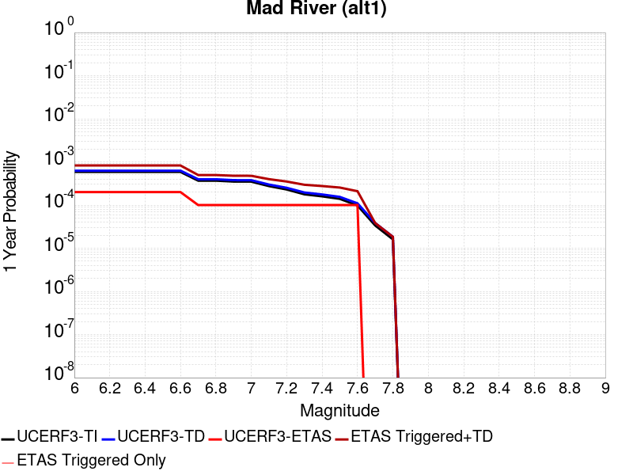 |  |

| Magnitude | 1 wk TI Prob | 1 wk TD Prob | 1 wk ETAS Prob | 1 wk ETAS/TD Gain | 1 wk ETAS Triggered+TD | 1 wk ETAS Triggered Only | 1 mo TI Prob | 1 mo TD Prob | 1 mo ETAS Prob | 1 mo ETAS/TD Gain | 1 mo ETAS Triggered+TD | 1 mo ETAS Triggered Only | 1 yr TI Prob | 1 yr TD Prob | 1 yr ETAS Prob | 1 yr ETAS/TD Gain | 1 yr ETAS Triggered+TD | 1 yr ETAS Triggered Only | 10 yr TI Prob | 10 yr TD Prob | 10 yr ETAS Prob | 10 yr ETAS/TD Gain | 10 yr ETAS Triggered+TD | 10 yr ETAS Triggered Only |
|-----|-----|-----|-----|-----|-----|-----|-----|-----|-----|-----|-----|-----|-----|-----|-----|-----|-----|-----|-----|-----|-----|-----|-----|-----|
| 6.0 | 1.1255216E-5 | 1.204134E-5 | 0.0 | 0.0 | 1.204134E-5 | 0.0 | 4.8235746E-5 | 5.1604802E-5 | 0.0 | 0.0 | 5.1604802E-5 | 0.0 | 5.87112E-4 | 6.281218E-4 | 2.0E-4 | 0.3184096 | 8.279962E-4 | 2.0E-4 | 0.0058556325 | 0.006264903 | 0.0052 | 0.8300208 | 0.008053627 | 0.0018 |
| 6.1 | 1.1255216E-5 | 1.204134E-5 | 0.0 | 0.0 | 1.204134E-5 | 0.0 | 4.8235746E-5 | 5.1604802E-5 | 0.0 | 0.0 | 5.1604802E-5 | 0.0 | 5.87112E-4 | 6.281218E-4 | 2.0E-4 | 0.3184096 | 8.279962E-4 | 2.0E-4 | 0.0058556325 | 0.006264903 | 0.0052 | 0.8300208 | 0.008053627 | 0.0018 |
| 6.2 | 1.1255216E-5 | 1.204134E-5 | 0.0 | 0.0 | 1.204134E-5 | 0.0 | 4.8235746E-5 | 5.1604802E-5 | 0.0 | 0.0 | 5.1604802E-5 | 0.0 | 5.87112E-4 | 6.281218E-4 | 2.0E-4 | 0.3184096 | 8.279962E-4 | 2.0E-4 | 0.0058556325 | 0.006264903 | 0.0052 | 0.8300208 | 0.008053627 | 0.0018 |
| 6.3 | 1.1255216E-5 | 1.204134E-5 | 0.0 | 0.0 | 1.204134E-5 | 0.0 | 4.8235746E-5 | 5.1604802E-5 | 0.0 | 0.0 | 5.1604802E-5 | 0.0 | 5.87112E-4 | 6.281218E-4 | 2.0E-4 | 0.3184096 | 8.279962E-4 | 2.0E-4 | 0.0058556325 | 0.006264903 | 0.0052 | 0.8300208 | 0.008053627 | 0.0018 |
| 6.4 | 1.1255216E-5 | 1.204134E-5 | 0.0 | 0.0 | 1.204134E-5 | 0.0 | 4.8235746E-5 | 5.1604802E-5 | 0.0 | 0.0 | 5.1604802E-5 | 0.0 | 5.87112E-4 | 6.281218E-4 | 2.0E-4 | 0.3184096 | 8.279962E-4 | 2.0E-4 | 0.0058556325 | 0.006264903 | 0.0052 | 0.8300208 | 0.008053627 | 0.0018 |
| 6.5 | 1.1255216E-5 | 1.204134E-5 | 0.0 | 0.0 | 1.204134E-5 | 0.0 | 4.8235746E-5 | 5.1604802E-5 | 0.0 | 0.0 | 5.1604802E-5 | 0.0 | 5.87112E-4 | 6.281218E-4 | 2.0E-4 | 0.3184096 | 8.279962E-4 | 2.0E-4 | 0.0058556325 | 0.006264903 | 0.0052 | 0.8300208 | 0.008053627 | 0.0018 |
| 6.6 | 1.1255216E-5 | 1.204134E-5 | 0.0 | 0.0 | 1.204134E-5 | 0.0 | 4.8235746E-5 | 5.1604802E-5 | 0.0 | 0.0 | 5.1604802E-5 | 0.0 | 5.87112E-4 | 6.281218E-4 | 2.0E-4 | 0.3184096 | 8.279962E-4 | 2.0E-4 | 0.0058556325 | 0.006264903 | 0.0052 | 0.8300208 | 0.008053627 | 0.0018 |
| 6.7 | 7.0564884E-6 | 7.6066203E-6 | 0.0 | 0.0 | 7.6066203E-6 | 0.0 | 3.0241743E-5 | 3.2599408E-5 | 0.0 | 0.0 | 3.2599408E-5 | 0.0 | 3.68131E-4 | 3.9682767E-4 | 1.0E-4 | 0.25199854 | 4.96788E-4 | 1.0E-4 | 0.0036752177 | 0.003961413 | 0.0032 | 0.80779254 | 0.0049574515 | 0.001 |
| 6.8 | 7.0564884E-6 | 7.6066203E-6 | 0.0 | 0.0 | 7.6066203E-6 | 0.0 | 3.0241743E-5 | 3.2599408E-5 | 0.0 | 0.0 | 3.2599408E-5 | 0.0 | 3.68131E-4 | 3.9682767E-4 | 1.0E-4 | 0.25199854 | 4.96788E-4 | 1.0E-4 | 0.0036752177 | 0.003961413 | 0.0032 | 0.80779254 | 0.0049574515 | 0.001 |
| 6.9 | 6.727494E-6 | 7.258432E-6 | 0.0 | 0.0 | 7.258432E-6 | 0.0 | 2.8831799E-5 | 3.1107207E-5 | 0.0 | 0.0 | 3.1107207E-5 | 0.0 | 3.509706E-4 | 3.7866656E-4 | 1.0E-4 | 0.26408458 | 4.786287E-4 | 1.0E-4 | 0.003504168 | 0.003780429 | 0.0027 | 0.71420467 | 0.0047766487 | 0.001 |
| 7.0 | 6.7021124E-6 | 7.2312682E-6 | 0.0 | 0.0 | 7.2312682E-6 | 0.0 | 2.8723021E-5 | 3.0990795E-5 | 0.0 | 0.0 | 3.0990795E-5 | 0.0 | 3.4964667E-4 | 3.7724973E-4 | 1.0E-4 | 0.2650764 | 4.7721202E-4 | 1.0E-4 | 0.0034909705 | 0.0037663085 | 0.0027 | 0.7168823 | 0.0047625424 | 0.001 |
| 7.1 | 5.2784667E-6 | 5.7332286E-6 | 0.0 | 0.0 | 5.7332286E-6 | 0.0 | 2.2621804E-5 | 2.4570752E-5 | 0.0 | 0.0 | 2.4570752E-5 | 0.0 | 2.7538565E-4 | 2.9910877E-4 | 1.0E-4 | 0.33432654 | 3.9907885E-4 | 1.0E-4 | 0.0027504463 | 0.002987154 | 0.0021 | 0.70301026 | 0.0037847643 | 8.0E-4 |
| 7.2 | 4.4085446E-6 | 4.820447E-6 | 0.0 | 0.0 | 4.820447E-6 | 0.0 | 1.8893625E-5 | 2.0658896E-5 | 0.0 | 0.0 | 2.0658896E-5 | 0.0 | 2.3000561E-4 | 2.5149342E-4 | 1.0E-4 | 0.3976247 | 3.5146828E-4 | 1.0E-4 | 0.0022976769 | 0.002512129 | 0.0016 | 0.63690996 | 0.003010873 | 5.0E-4 |
| 7.3 | 3.4060627E-6 | 3.7539396E-6 | 0.0 | 0.0 | 3.7539396E-6 | 0.0 | 1.459733E-5 | 1.6088214E-5 | 0.0 | 0.0 | 1.6088214E-5 | 0.0 | 1.77708E-4 | 1.9585664E-4 | 1.0E-4 | 0.51057756 | 2.9583706E-4 | 1.0E-4 | 0.0017756595 | 0.0019568638 | 0.0014 | 0.7154305 | 0.0022562766 | 3.0E-4 |
| 7.4 | 3.0570902E-6 | 3.3810104E-6 | 0.0 | 0.0 | 3.3810104E-6 | 0.0 | 1.310175E-5 | 1.4489965E-5 | 0.0 | 0.0 | 1.4489965E-5 | 0.0 | 1.5950213E-4 | 1.7640126E-4 | 1.0E-4 | 0.5668894 | 2.7638362E-4 | 1.0E-4 | 0.0015938769 | 0.0017626339 | 0.0013 | 0.7375326 | 0.0019622813 | 2.0E-4 |
| 7.5 | 2.674048E-6 | 2.9699215E-6 | 0.0 | 0.0 | 2.9699215E-6 | 0.0 | 1.1460155E-5 | 1.2728175E-5 | 0.0 | 0.0 | 1.2728175E-5 | 0.0 | 1.3951845E-4 | 1.549547E-4 | 1.0E-4 | 0.6453499 | 2.549392E-4 | 1.0E-4 | 0.0013943089 | 0.0015484862 | 0.0012 | 0.77495044 | 0.0017481765 | 2.0E-4 |
| 7.6 | 1.8806261E-6 | 2.1051053E-6 | 0.0 | 0.0 | 2.1051053E-6 | 0.0 | 8.059801E-6 | 9.02185E-6 | 0.0 | 0.0 | 9.02185E-6 | 0.0 | 9.812366E-5 | 1.0983561E-4 | 1.0E-4 | 0.91045153 | 2.0982462E-4 | 1.0E-4 | 9.808034E-4 | 0.0010978257 | 8.0E-4 | 0.72871315 | 0.001297606 | 2.0E-4 |
| 7.7 | 6.461283E-7 | 7.3427697E-7 | 0.0 | 0.0 | 7.3427697E-7 | 0.0 | 2.7691183E-6 | 3.1468976E-6 | 0.0 | 0.0 | 3.1468976E-6 | 0.0 | 3.371349E-5 | 3.831282E-5 | 0.0 | 0.0 | 3.831282E-5 | 0.0 | 3.370838E-4 | 3.8306369E-4 | 1.0E-4 | 0.2610532 | 3.8306369E-4 | 0.0 |
| 7.8 | 3.0785324E-7 | 3.5300266E-7 | 0.0 | 0.0 | 3.5300266E-7 | 0.0 | 1.3193703E-6 | 1.5128677E-6 | 0.0 | 0.0 | 1.5128677E-6 | 0.0 | 1.6063215E-5 | 1.8419016E-5 | 0.0 | 0.0 | 1.8419016E-5 | 0.0 | 1.6062055E-4 | 1.8417553E-4 | 1.0E-4 | 0.5429603 | 1.8417553E-4 | 0.0 |

## Reliz 2011 CFM
*[(top)](#table-of-contents)*

| 1 Week | 1 Month | 1 Year | 10 Year |
|-----|-----|-----|-----|
|  |  |  | 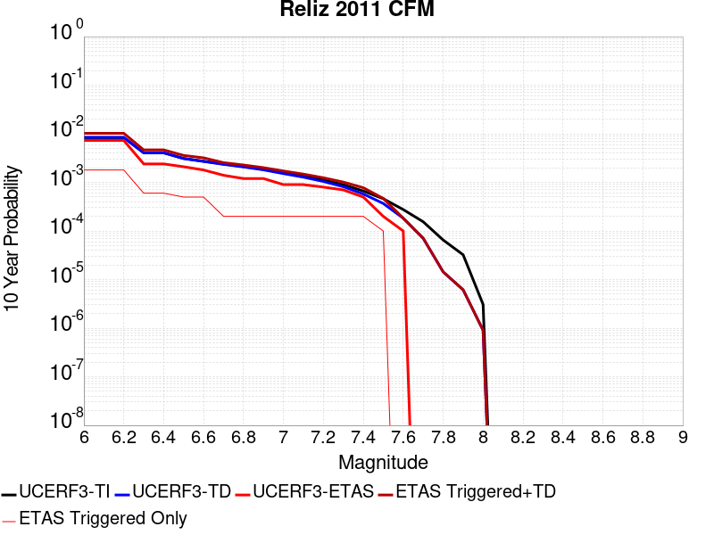 |

| Magnitude | 1 wk TI Prob | 1 wk TD Prob | 1 wk ETAS Prob | 1 wk ETAS/TD Gain | 1 wk ETAS Triggered+TD | 1 wk ETAS Triggered Only | 1 mo TI Prob | 1 mo TD Prob | 1 mo ETAS Prob | 1 mo ETAS/TD Gain | 1 mo ETAS Triggered+TD | 1 mo ETAS Triggered Only | 1 yr TI Prob | 1 yr TD Prob | 1 yr ETAS Prob | 1 yr ETAS/TD Gain | 1 yr ETAS Triggered+TD | 1 yr ETAS Triggered Only | 10 yr TI Prob | 10 yr TD Prob | 10 yr ETAS Prob | 10 yr ETAS/TD Gain | 10 yr ETAS Triggered+TD | 10 yr ETAS Triggered Only |
|-----|-----|-----|-----|-----|-----|-----|-----|-----|-----|-----|-----|-----|-----|-----|-----|-----|-----|-----|-----|-----|-----|-----|-----|-----|
| 6.0 | 1.6002472E-5 | 1.6284224E-5 | 0.0 | 0.0 | 1.6284224E-5 | 0.0 | 6.8580215E-5 | 6.978778E-5 | 0.0 | 0.0 | 6.978778E-5 | 0.0 | 8.3464425E-4 | 8.493548E-4 | 7.0E-4 | 0.82415503 | 0.0011491 | 3.0E-4 | 0.008315164 | 0.008463284 | 0.0073 | 0.86254936 | 0.01024805 | 0.0018 |
| 6.1 | 1.6002472E-5 | 1.6284224E-5 | 0.0 | 0.0 | 1.6284224E-5 | 0.0 | 6.8580215E-5 | 6.978778E-5 | 0.0 | 0.0 | 6.978778E-5 | 0.0 | 8.3464425E-4 | 8.493548E-4 | 7.0E-4 | 0.82415503 | 0.0011491 | 3.0E-4 | 0.008315164 | 0.008463284 | 0.0073 | 0.86254936 | 0.01024805 | 0.0018 |
| 6.2 | 1.6002472E-5 | 1.6284224E-5 | 0.0 | 0.0 | 1.6284224E-5 | 0.0 | 6.8580215E-5 | 6.978778E-5 | 0.0 | 0.0 | 6.978778E-5 | 0.0 | 8.3464425E-4 | 8.493548E-4 | 7.0E-4 | 0.82415503 | 0.0011491 | 3.0E-4 | 0.008315164 | 0.008463284 | 0.0073 | 0.86254936 | 0.01024805 | 0.0018 |
| 6.3 | 7.792404E-6 | 7.80467E-6 | 0.0 | 0.0 | 7.80467E-6 | 0.0 | 3.339559E-5 | 3.344816E-5 | 0.0 | 0.0 | 3.344816E-5 | 0.0 | 4.0651546E-4 | 4.0715604E-4 | 2.0E-4 | 0.4912122 | 5.071153E-4 | 1.0E-4 | 0.0040577264 | 0.004064379 | 0.0024 | 0.5904961 | 0.00466194 | 6.0E-4 |
| 6.4 | 7.792404E-6 | 7.80467E-6 | 0.0 | 0.0 | 7.80467E-6 | 0.0 | 3.339559E-5 | 3.344816E-5 | 0.0 | 0.0 | 3.344816E-5 | 0.0 | 4.0651546E-4 | 4.0715604E-4 | 2.0E-4 | 0.4912122 | 5.071153E-4 | 1.0E-4 | 0.0040577264 | 0.004064379 | 0.0024 | 0.5904961 | 0.00466194 | 6.0E-4 |
| 6.5 | 5.9659374E-6 | 5.929507E-6 | 0.0 | 0.0 | 5.929507E-6 | 0.0 | 2.5568053E-5 | 2.5411926E-5 | 0.0 | 0.0 | 2.5411926E-5 | 0.0 | 3.1124658E-4 | 3.0934648E-4 | 0.0 | 0.0 | 3.0934648E-4 | 0.0 | 0.00310811 | 0.0030893781 | 0.0021 | 0.6797485 | 0.0035878334 | 5.0E-4 |
| 6.6 | 5.2350692E-6 | 5.179716E-6 | 0.0 | 0.0 | 5.179716E-6 | 0.0 | 2.2435817E-5 | 2.2198596E-5 | 0.0 | 0.0 | 2.2198596E-5 | 0.0 | 2.7312184E-4 | 2.7023454E-4 | 0.0 | 0.0 | 2.7023454E-4 | 0.0 | 0.002727864 | 0.0026992708 | 0.0018 | 0.66684675 | 0.0031979212 | 5.0E-4 |
| 6.7 | 4.580206E-6 | 4.506814E-6 | 0.0 | 0.0 | 4.506814E-6 | 0.0 | 1.9629308E-5 | 1.9314773E-5 | 0.0 | 0.0 | 1.9314773E-5 | 0.0 | 2.389606E-4 | 2.3513207E-4 | 0.0 | 0.0 | 2.3513207E-4 | 0.0 | 0.002387038 | 0.0023490363 | 0.0014 | 0.5959891 | 0.0025485663 | 2.0E-4 |
| 6.8 | 4.0765017E-6 | 3.988903E-6 | 0.0 | 0.0 | 3.988903E-6 | 0.0 | 1.7470604E-5 | 1.7095184E-5 | 0.0 | 0.0 | 1.7095184E-5 | 0.0 | 2.1268385E-4 | 2.0811404E-4 | 0.0 | 0.0 | 2.0811404E-4 | 0.0 | 0.002124804 | 0.002079391 | 0.0012 | 0.57709205 | 0.0022789752 | 2.0E-4 |
| 6.9 | 3.5752896E-6 | 3.4731522E-6 | 0.0 | 0.0 | 3.4731522E-6 | 0.0 | 1.532258E-5 | 1.4884854E-5 | 0.0 | 0.0 | 1.4884854E-5 | 0.0 | 1.8653645E-4 | 1.8120804E-4 | 0.0 | 0.0 | 1.8120804E-4 | 0.0 | 0.0018637994 | 0.0018108007 | 0.0012 | 0.6626902 | 0.0020104386 | 2.0E-4 |
| 7.0 | 3.0259848E-6 | 2.9085452E-6 | 0.0 | 0.0 | 2.9085452E-6 | 0.0 | 1.2968442E-5 | 1.2465134E-5 | 0.0 | 0.0 | 1.2465134E-5 | 0.0 | 1.5787935E-4 | 1.5175245E-4 | 0.0 | 0.0 | 1.5175245E-4 | 0.0 | 0.0015776722 | 0.001516685 | 9.0E-4 | 0.59339947 | 0.0017163816 | 2.0E-4 |
| 7.1 | 2.5861116E-6 | 2.4557442E-6 | 0.0 | 0.0 | 2.4557442E-6 | 0.0 | 1.1083288E-5 | 1.0524575E-5 | 0.0 | 0.0 | 1.0524575E-5 | 0.0 | 1.3493067E-4 | 1.2812918E-4 | 0.0 | 0.0 | 1.2812918E-4 | 0.0 | 0.0013484878 | 0.0012807492 | 9.0E-4 | 0.7027137 | 0.001480493 | 2.0E-4 |
| 7.2 | 2.1482588E-6 | 2.0037849E-6 | 0.0 | 0.0 | 2.0037849E-6 | 0.0 | 9.20679E-6 | 8.587621E-6 | 0.0 | 0.0 | 8.587621E-6 | 0.0 | 1.12086906E-4 | 1.04549275E-4 | 0.0 | 0.0 | 1.04549275E-4 | 0.0 | 0.0011203039 | 0.0010451967 | 8.0E-4 | 0.7654062 | 0.0012449876 | 2.0E-4 |
| 7.3 | 1.7194744E-6 | 1.5616446E-6 | 0.0 | 0.0 | 1.5616446E-6 | 0.0 | 7.3691554E-6 | 6.692745E-6 | 0.0 | 0.0 | 6.692745E-6 | 0.0 | 8.971577E-5 | 8.148113E-5 | 0.0 | 0.0 | 8.148113E-5 | 0.0 | 8.967956E-4 | 8.1470795E-4 | 7.0E-4 | 0.8592036 | 0.001014545 | 2.0E-4 |
| 7.4 | 1.2755178E-6 | 1.1061218E-6 | 0.0 | 0.0 | 1.1061218E-6 | 0.0 | 5.4664933E-6 | 4.7405133E-6 | 0.0 | 0.0 | 4.7405133E-6 | 0.0 | 6.655252E-5 | 5.7714224E-5 | 0.0 | 0.0 | 5.7714224E-5 | 0.0 | 6.6532596E-4 | 5.7718763E-4 | 5.0E-4 | 0.8662694 | 7.770722E-4 | 2.0E-4 |
| 7.5 | 8.8463224E-7 | 7.062695E-7 | 0.0 | 0.0 | 7.062695E-7 | 0.0 | 3.7912755E-6 | 3.0268657E-6 | 0.0 | 0.0 | 3.0268657E-6 | 0.0 | 4.6157802E-5 | 3.6851467E-5 | 0.0 | 0.0 | 3.6851467E-5 | 0.0 | 4.6148215E-4 | 3.6864882E-4 | 2.0E-4 | 0.5425218 | 4.6861195E-4 | 1.0E-4 |
| 7.6 | 5.291355E-7 | 3.5048404E-7 | 0.0 | 0.0 | 3.5048404E-7 | 0.0 | 2.2677216E-6 | 1.5020736E-6 | 0.0 | 0.0 | 1.5020736E-6 | 0.0 | 2.760916E-5 | 1.8287592E-5 | 0.0 | 0.0 | 1.8287592E-5 | 0.0 | 2.760573E-4 | 1.8305487E-4 | 1.0E-4 | 0.54628426 | 1.8305487E-4 | 0.0 |
| 7.7 | 2.9663357E-7 | 1.3541465E-7 | 0.0 | 0.0 | 1.3541465E-7 | 0.0 | 1.2712861E-6 | 5.8034834E-7 | 0.0 | 0.0 | 5.8034834E-7 | 0.0 | 1.5477797E-5 | 7.0657184E-6 | 0.0 | 0.0 | 7.0657184E-6 | 0.0 | 1.547672E-4 | 7.08414E-5 | 0.0 | 0.0 | 7.08414E-5 | 0.0 |
| 7.8 | 1.2509386E-7 | 2.732384E-8 | 0.0 | 0.0 | 2.732384E-8 | 0.0 | 5.3611643E-7 | 1.1710216E-7 | 0.0 | 0.0 | 1.1710216E-7 | 0.0 | 6.527198E-6 | 1.4257179E-6 | 0.0 | 0.0 | 1.4257179E-6 | 0.0 | 6.527006E-5 | 1.4415158E-5 | 0.0 | 0.0 | 1.4415158E-5 | 0.0 |
| 7.9 | 6.213493E-8 | 1.1571909E-8 | 0.0 | 0.0 | 1.1571909E-8 | 0.0 | 2.6629255E-7 | 4.959389E-8 | 0.0 | 0.0 | 4.959389E-8 | 0.0 | 3.242107E-6 | 6.0380546E-7 | 0.0 | 0.0 | 6.0380546E-7 | 0.0 | 3.2420594E-5 | 6.1709616E-6 | 0.0 | 0.0 | 6.1709616E-6 | 0.0 |
| 8.0 | 5.92383E-9 | 1.6878869E-9 | 0.0 | 0.0 | 1.6878869E-9 | 0.0 | 2.5387841E-8 | 7.2338002E-9 | 0.0 | 0.0 | 7.2338002E-9 | 0.0 | 3.0909692E-7 | 8.807151E-8 | 0.0 | 0.0 | 8.807151E-8 | 0.0 | 3.090965E-6 | 9.0592755E-7 | 0.0 | 0.0 | 9.0592755E-7 | 0.0 |

## Greenville (So) 2011 CFM
*[(top)](#table-of-contents)*

| 1 Week | 1 Month | 1 Year | 10 Year |
|-----|-----|-----|-----|
|  |  |  |  |

| Magnitude | 1 wk TI Prob | 1 wk TD Prob | 1 wk ETAS Prob | 1 wk ETAS/TD Gain | 1 wk ETAS Triggered+TD | 1 wk ETAS Triggered Only | 1 mo TI Prob | 1 mo TD Prob | 1 mo ETAS Prob | 1 mo ETAS/TD Gain | 1 mo ETAS Triggered+TD | 1 mo ETAS Triggered Only | 1 yr TI Prob | 1 yr TD Prob | 1 yr ETAS Prob | 1 yr ETAS/TD Gain | 1 yr ETAS Triggered+TD | 1 yr ETAS Triggered Only | 10 yr TI Prob | 10 yr TD Prob | 10 yr ETAS Prob | 10 yr ETAS/TD Gain | 10 yr ETAS Triggered+TD | 10 yr ETAS Triggered Only |
|-----|-----|-----|-----|-----|-----|-----|-----|-----|-----|-----|-----|-----|-----|-----|-----|-----|-----|-----|-----|-----|-----|-----|-----|-----|
| 6.0 | 4.279693E-5 | 5.507399E-5 | 0.0 | 0.0 | 5.507399E-5 | 0.0 | 1.8340252E-4 | 2.360119E-4 | 0.0 | 0.0 | 2.360119E-4 | 0.0 | 0.0022306389 | 0.0028699061 | 0.0013 | 0.4529765 | 0.003169045 | 3.0E-4 | 0.022083808 | 0.028355442 | 0.0146 | 0.51489234 | 0.030104402 | 0.0018 |
| 6.1 | 3.4037297E-5 | 4.3218006E-5 | 0.0 | 0.0 | 4.3218006E-5 | 0.0 | 1.4586597E-4 | 1.8520789E-4 | 0.0 | 0.0 | 1.8520789E-4 | 0.0 | 0.0017744715 | 0.0022527333 | 0.001 | 0.44390517 | 0.0025520576 | 3.0E-4 | 0.01760369 | 0.02231602 | 0.0109 | 0.48843834 | 0.023880316 | 0.0016 |
| 6.2 | 3.4037297E-5 | 4.3218006E-5 | 0.0 | 0.0 | 4.3218006E-5 | 0.0 | 1.4586597E-4 | 1.8520789E-4 | 0.0 | 0.0 | 1.8520789E-4 | 0.0 | 0.0017744715 | 0.0022527333 | 0.001 | 0.44390517 | 0.0025520576 | 3.0E-4 | 0.01760369 | 0.02231602 | 0.0109 | 0.48843834 | 0.023880316 | 0.0016 |
| 6.3 | 2.5956324E-5 | 3.2448268E-5 | 0.0 | 0.0 | 3.2448268E-5 | 0.0 | 1.11236644E-4 | 1.3905704E-4 | 0.0 | 0.0 | 1.3905704E-4 | 0.0 | 0.0013534647 | 0.001691769 | 7.0E-4 | 0.41376808 | 0.0019912615 | 3.0E-4 | 0.013452509 | 0.016795935 | 0.0093 | 0.5537054 | 0.018270742 | 0.0015 |
| 6.4 | 2.1145053E-5 | 2.6213136E-5 | 0.0 | 0.0 | 2.6213136E-5 | 0.0 | 9.061851E-5 | 1.12337366E-4 | 0.0 | 0.0 | 1.12337366E-4 | 0.0 | 0.0011027219 | 0.0013668805 | 6.0E-4 | 0.43895572 | 0.0016664704 | 3.0E-4 | 0.01097266 | 0.013588411 | 0.0077 | 0.56665933 | 0.014870746 | 0.0013 |
| 6.5 | 2.0030959E-5 | 2.4810559E-5 | 0.0 | 0.0 | 2.4810559E-5 | 0.0 | 8.584414E-5 | 1.06326814E-4 | 0.0 | 0.0 | 1.06326814E-4 | 0.0 | 0.0010446513 | 0.0012937912 | 6.0E-4 | 0.46375334 | 0.001593403 | 3.0E-4 | 0.010397541 | 0.012866208 | 0.0075 | 0.58292234 | 0.014149482 | 0.0013 |
| 6.6 | 1.8395405E-5 | 2.2768225E-5 | 0.0 | 0.0 | 2.2768225E-5 | 0.0 | 7.8835066E-5 | 9.7574615E-5 | 0.0 | 0.0 | 9.7574615E-5 | 0.0 | 9.5939427E-4 | 0.0011873521 | 5.0E-4 | 0.4211051 | 0.0014869958 | 3.0E-4 | 0.009552629 | 0.011813405 | 0.0068 | 0.5756173 | 0.01290041 | 0.0011 |
| 6.7 | 1.7883482E-5 | 2.2138986E-5 | 0.0 | 0.0 | 2.2138986E-5 | 0.0 | 7.664124E-5 | 9.487807E-5 | 0.0 | 0.0 | 9.487807E-5 | 0.0 | 9.3270757E-4 | 0.001154557 | 5.0E-4 | 0.43306652 | 0.0014542107 | 3.0E-4 | 0.009288026 | 0.011488908 | 0.0065 | 0.56576306 | 0.01257627 | 0.0011 |
| 6.8 | 1.3373564E-5 | 1.6516697E-5 | 0.0 | 0.0 | 1.6516697E-5 | 0.0 | 5.7314013E-5 | 7.078401E-5 | 0.0 | 0.0 | 7.078401E-5 | 0.0 | 6.975747E-4 | 8.6146937E-4 | 5.0E-4 | 0.5804037 | 0.0011612109 | 3.0E-4 | 0.0069538904 | 0.008583177 | 0.0052 | 0.6058363 | 0.009574594 | 0.001 |
| 6.9 | 1.06692905E-5 | 1.3161715E-5 | 0.0 | 0.0 | 1.3161715E-5 | 0.0 | 4.5724726E-5 | 5.6406196E-5 | 0.0 | 0.0 | 5.6406196E-5 | 0.0 | 5.5655633E-4 | 6.865403E-4 | 4.0E-4 | 0.58263147 | 9.863344E-4 | 3.0E-4 | 0.005551645 | 0.006845695 | 0.0037 | 0.5404857 | 0.0076402184 | 8.0E-4 |
| 7.0 | 8.157512E-6 | 1.0070359E-5 | 0.0 | 0.0 | 1.0070359E-5 | 0.0 | 3.4960296E-5 | 4.315799E-5 | 0.0 | 0.0 | 4.315799E-5 | 0.0 | 4.2555845E-4 | 5.2532554E-4 | 2.0E-4 | 0.3807163 | 6.2527304E-4 | 1.0E-4 | 0.004247444 | 0.0052415826 | 0.0032 | 0.61050266 | 0.0057389615 | 5.0E-4 |
| 7.1 | 6.1467113E-6 | 7.6341275E-6 | 0.0 | 0.0 | 7.6341275E-6 | 0.0 | 2.6342783E-5 | 3.2717286E-5 | 0.0 | 0.0 | 3.2717286E-5 | 0.0 | 3.206762E-4 | 3.9826098E-4 | 2.0E-4 | 0.50218326 | 4.9822114E-4 | 1.0E-4 | 0.0032021382 | 0.0039759283 | 0.0026 | 0.6539353 | 0.0042747357 | 3.0E-4 |
| 7.2 | 4.713467E-6 | 5.920383E-6 | 0.0 | 0.0 | 5.920383E-6 | 0.0 | 2.0200418E-5 | 2.5372827E-5 | 0.0 | 0.0 | 2.5372827E-5 | 0.0 | 2.4591232E-4 | 3.0887098E-4 | 2.0E-4 | 0.6475196 | 4.088401E-4 | 1.0E-4 | 0.0024564038 | 0.0030848128 | 0.0022 | 0.71317136 | 0.0033838872 | 3.0E-4 |
| 7.3 | 2.3266216E-6 | 2.9555756E-6 | 0.0 | 0.0 | 2.9555756E-6 | 0.0 | 9.971197E-6 | 1.2666693E-5 | 0.0 | 0.0 | 1.2666693E-5 | 0.0 | 1.2139256E-4 | 1.5420622E-4 | 1.0E-4 | 0.64848226 | 2.541908E-4 | 1.0E-4 | 0.0012132627 | 0.001541427 | 0.0011 | 0.7136245 | 0.0016412728 | 1.0E-4 |
| 7.4 | 1.3314E-6 | 1.719353E-6 | 0.0 | 0.0 | 1.719353E-6 | 0.0 | 5.7059874E-6 | 7.3686356E-6 | 0.0 | 0.0 | 7.3686356E-6 | 0.0 | 6.946818E-5 | 8.9709494E-5 | 1.0E-4 | 1.1147093 | 1.8970053E-4 | 1.0E-4 | 6.9446466E-4 | 8.970044E-4 | 9.0E-4 | 1.0033395 | 9.969147E-4 | 1.0E-4 |
| 7.5 | 1.0362941E-6 | 1.3479129E-6 | 0.0 | 0.0 | 1.3479129E-6 | 0.0 | 4.4412527E-6 | 5.776757E-6 | 0.0 | 0.0 | 5.776757E-6 | 0.0 | 5.407091E-5 | 7.032979E-5 | 1.0E-4 | 1.4218725 | 1.7032276E-4 | 1.0E-4 | 5.405776E-4 | 7.033495E-4 | 7.0E-4 | 0.99523777 | 8.0327917E-4 | 1.0E-4 |
| 7.6 | 7.764784E-7 | 1.0098306E-6 | 0.0 | 0.0 | 1.0098306E-6 | 0.0 | 3.3277602E-6 | 4.3278383E-6 | 0.0 | 0.0 | 4.3278383E-6 | 0.0 | 4.0514726E-5 | 5.2690197E-5 | 1.0E-4 | 1.8978862 | 1.5268492E-4 | 1.0E-4 | 4.050734E-4 | 5.270776E-4 | 5.0E-4 | 0.9486269 | 6.270249E-4 | 1.0E-4 |
| 7.7 | 1.6927763E-7 | 2.2141474E-7 | 0.0 | 0.0 | 2.2141474E-7 | 0.0 | 7.2547533E-7 | 9.4892E-7 | 0.0 | 0.0 | 9.4892E-7 | 0.0 | 8.832627E-6 | 1.1553043E-5 | 1.0E-4 | 8.655728 | 1.1155189E-4 | 1.0E-4 | 8.8322755E-5 | 1.1555114E-4 | 1.0E-4 | 0.8654177 | 2.1553958E-4 | 1.0E-4 |

## San Jacinto (Stepovers Combined)
*[(top)](#table-of-contents)*

| 1 Week | 1 Month | 1 Year | 10 Year |
|-----|-----|-----|-----|
| 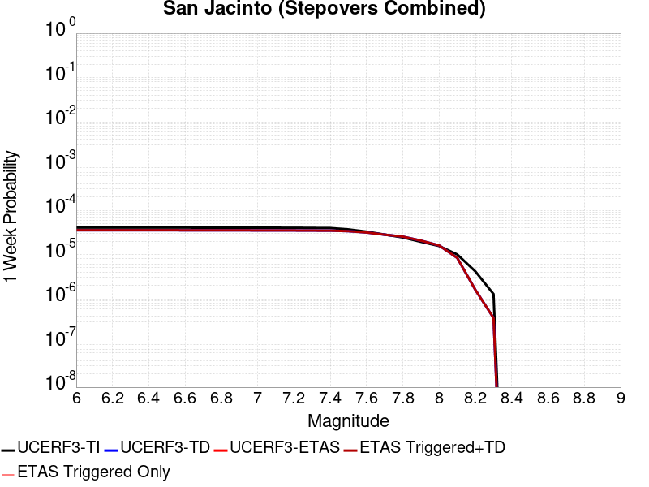 |  |  |  |

| Magnitude | 1 wk TI Prob | 1 wk TD Prob | 1 wk ETAS Prob | 1 wk ETAS/TD Gain | 1 wk ETAS Triggered+TD | 1 wk ETAS Triggered Only | 1 mo TI Prob | 1 mo TD Prob | 1 mo ETAS Prob | 1 mo ETAS/TD Gain | 1 mo ETAS Triggered+TD | 1 mo ETAS Triggered Only | 1 yr TI Prob | 1 yr TD Prob | 1 yr ETAS Prob | 1 yr ETAS/TD Gain | 1 yr ETAS Triggered+TD | 1 yr ETAS Triggered Only | 10 yr TI Prob | 10 yr TD Prob | 10 yr ETAS Prob | 10 yr ETAS/TD Gain | 10 yr ETAS Triggered+TD | 10 yr ETAS Triggered Only |
|-----|-----|-----|-----|-----|-----|-----|-----|-----|-----|-----|-----|-----|-----|-----|-----|-----|-----|-----|-----|-----|-----|-----|-----|-----|
| 6.0 | 4.0667746E-5 | 3.549642E-5 | 0.0 | 0.0 | 3.549642E-5 | 0.0 | 1.742787E-4 | 1.5211865E-4 | 0.0 | 0.0 | 1.5211865E-4 | 0.0 | 0.0021197782 | 0.0018504725 | 9.0E-4 | 0.48636228 | 0.0019502875 | 1.0E-4 | 0.020996714 | 0.019102383 | 0.0108 | 0.5653745 | 0.020868 | 0.0018 |
| 6.1 | 4.0667746E-5 | 3.549642E-5 | 0.0 | 0.0 | 3.549642E-5 | 0.0 | 1.742787E-4 | 1.5211865E-4 | 0.0 | 0.0 | 1.5211865E-4 | 0.0 | 0.0021197782 | 0.0018504725 | 9.0E-4 | 0.48636228 | 0.0019502875 | 1.0E-4 | 0.020996714 | 0.019102383 | 0.0108 | 0.5653745 | 0.020868 | 0.0018 |
| 6.2 | 4.0667746E-5 | 3.549642E-5 | 0.0 | 0.0 | 3.549642E-5 | 0.0 | 1.742787E-4 | 1.5211865E-4 | 0.0 | 0.0 | 1.5211865E-4 | 0.0 | 0.0021197782 | 0.0018504725 | 9.0E-4 | 0.48636228 | 0.0019502875 | 1.0E-4 | 0.020996714 | 0.019102383 | 0.0108 | 0.5653745 | 0.020868 | 0.0018 |
| 6.3 | 4.0667746E-5 | 3.549642E-5 | 0.0 | 0.0 | 3.549642E-5 | 0.0 | 1.742787E-4 | 1.5211865E-4 | 0.0 | 0.0 | 1.5211865E-4 | 0.0 | 0.0021197782 | 0.0018504725 | 9.0E-4 | 0.48636228 | 0.0019502875 | 1.0E-4 | 0.020996714 | 0.019102383 | 0.0108 | 0.5653745 | 0.020868 | 0.0018 |
| 6.4 | 4.0577226E-5 | 3.5368237E-5 | 0.0 | 0.0 | 3.5368237E-5 | 0.0 | 1.738908E-4 | 1.5156936E-4 | 0.0 | 0.0 | 1.5156936E-4 | 0.0 | 0.0021150648 | 0.0018437974 | 9.0E-4 | 0.48812303 | 0.001943613 | 1.0E-4 | 0.020950472 | 0.019036911 | 0.0107 | 0.56206596 | 0.020802645 | 0.0018 |
| 6.5 | 4.0577226E-5 | 3.5368237E-5 | 0.0 | 0.0 | 3.5368237E-5 | 0.0 | 1.738908E-4 | 1.5156936E-4 | 0.0 | 0.0 | 1.5156936E-4 | 0.0 | 0.0021150648 | 0.0018437974 | 9.0E-4 | 0.48812303 | 0.001943613 | 1.0E-4 | 0.020950472 | 0.019036911 | 0.0107 | 0.56206596 | 0.020802645 | 0.0018 |
| 6.6 | 4.053861E-5 | 3.5313537E-5 | 0.0 | 0.0 | 3.5313537E-5 | 0.0 | 1.7372532E-4 | 1.5133497E-4 | 0.0 | 0.0 | 1.5133497E-4 | 0.0 | 0.0021130538 | 0.0018409491 | 9.0E-4 | 0.48887828 | 0.001940765 | 1.0E-4 | 0.020930743 | 0.019008974 | 0.0107 | 0.5628921 | 0.020774757 | 0.0018 |
| 6.7 | 4.0516545E-5 | 3.528259E-5 | 0.0 | 0.0 | 3.528259E-5 | 0.0 | 1.7363077E-4 | 1.5120234E-4 | 0.0 | 0.0 | 1.5120234E-4 | 0.0 | 0.002111905 | 0.0018393374 | 9.0E-4 | 0.48930666 | 0.0019391534 | 1.0E-4 | 0.020919468 | 0.01899316 | 0.0107 | 0.5633607 | 0.020758972 | 0.0018 |
| 6.8 | 4.049434E-5 | 3.525402E-5 | 0.0 | 0.0 | 3.525402E-5 | 0.0 | 1.7353562E-4 | 1.5107992E-4 | 0.0 | 0.0 | 1.5107992E-4 | 0.0 | 0.0021107488 | 0.0018378493 | 9.0E-4 | 0.48970285 | 0.0019376655 | 1.0E-4 | 0.020908125 | 0.018978506 | 0.0107 | 0.5637957 | 0.020744344 | 0.0018 |
| 6.9 | 4.046386E-5 | 3.521647E-5 | 0.0 | 0.0 | 3.521647E-5 | 0.0 | 1.73405E-4 | 1.5091902E-4 | 0.0 | 0.0 | 1.5091902E-4 | 0.0 | 0.0021091616 | 0.0018358937 | 9.0E-4 | 0.49022445 | 0.0019357101 | 1.0E-4 | 0.020892553 | 0.018959226 | 0.0107 | 0.564369 | 0.0207251 | 0.0018 |
| 7.0 | 4.036382E-5 | 3.50967E-5 | 0.0 | 0.0 | 3.50967E-5 | 0.0 | 1.7297632E-4 | 1.5040577E-4 | 0.0 | 0.0 | 1.5040577E-4 | 0.0 | 0.0021039525 | 0.0018296555 | 9.0E-4 | 0.49189585 | 0.0019294725 | 1.0E-4 | 0.02084144 | 0.018897671 | 0.0107 | 0.56620735 | 0.020663656 | 0.0018 |
| 7.1 | 4.0343282E-5 | 3.5075114E-5 | 0.0 | 0.0 | 3.5075114E-5 | 0.0 | 1.7288832E-4 | 1.5031327E-4 | 0.0 | 0.0 | 1.5031327E-4 | 0.0 | 0.002102883 | 0.0018285313 | 9.0E-4 | 0.49219832 | 0.0019283484 | 1.0E-4 | 0.020830948 | 0.018886525 | 0.0107 | 0.5665415 | 0.020652529 | 0.0018 |
| 7.2 | 4.0257353E-5 | 3.4979414E-5 | 0.0 | 0.0 | 3.4979414E-5 | 0.0 | 1.725201E-4 | 1.4990318E-4 | 0.0 | 0.0 | 1.4990318E-4 | 0.0 | 0.0020984085 | 0.0018235467 | 9.0E-4 | 0.4935437 | 0.0019233644 | 1.0E-4 | 0.020787042 | 0.018837167 | 0.0107 | 0.56802595 | 0.02060326 | 0.0018 |
| 7.3 | 3.9940667E-5 | 3.4805442E-5 | 0.0 | 0.0 | 3.4805442E-5 | 0.0 | 1.7116306E-4 | 1.4915767E-4 | 0.0 | 0.0 | 1.4915767E-4 | 0.0 | 0.0020819185 | 0.0018144852 | 9.0E-4 | 0.49600846 | 0.0019143037 | 1.0E-4 | 0.020625217 | 0.018744934 | 0.0106 | 0.5654861 | 0.020511193 | 0.0018 |
| 7.4 | 3.9721202E-5 | 3.4690278E-5 | 0.0 | 0.0 | 3.4690278E-5 | 0.0 | 1.7022261E-4 | 1.4866416E-4 | 0.0 | 0.0 | 1.4866416E-4 | 0.0 | 0.0020704903 | 0.0018084868 | 8.0E-4 | 0.44235876 | 0.0018084868 | 0.0 | 0.020513052 | 0.018683769 | 0.0105 | 0.5619851 | 0.020352008 | 0.0017 |
| 7.5 | 3.7036873E-5 | 3.3752855E-5 | 0.0 | 0.0 | 3.3752855E-5 | 0.0 | 1.5871979E-4 | 1.4464709E-4 | 0.0 | 0.0 | 1.4464709E-4 | 0.0 | 0.0019307006 | 0.0017596587 | 8.0E-4 | 0.4546336 | 0.0017596587 | 0.0 | 0.019140124 | 0.018182952 | 0.0102 | 0.560965 | 0.019753858 | 0.0016 |
| 7.6 | 3.2940967E-5 | 3.1522733E-5 | 0.0 | 0.0 | 3.1522733E-5 | 0.0 | 1.4116794E-4 | 1.3509045E-4 | 0.0 | 0.0 | 1.3509045E-4 | 0.0 | 0.0017173645 | 0.0016434876 | 8.0E-4 | 0.4867697 | 0.0016434876 | 0.0 | 0.01704153 | 0.01701026 | 0.0096 | 0.56436527 | 0.018484745 | 0.0015 |
| 7.7 | 2.8236149E-5 | 2.8083163E-5 | 0.0 | 0.0 | 2.8083163E-5 | 0.0 | 1.2100645E-4 | 1.20350865E-4 | 0.0 | 0.0 | 1.20350865E-4 | 0.0 | 0.0014722579 | 0.001464288 | 8.0E-4 | 0.54634064 | 0.001464288 | 0.0 | 0.014625421 | 0.015218578 | 0.0087 | 0.5716697 | 0.016400317 | 0.0012 |
| 7.8 | 2.4329287E-5 | 2.5399013E-5 | 0.0 | 0.0 | 2.5399013E-5 | 0.0 | 1.042642E-4 | 1.0884838E-4 | 0.0 | 0.0 | 1.0884838E-4 | 0.0 | 0.0012686774 | 0.0013244242 | 7.0E-4 | 0.52853155 | 0.0013244242 | 0.0 | 0.012614589 | 0.013812184 | 0.0083 | 0.6009187 | 0.014995609 | 0.0012 |
| 7.9 | 1.9370926E-5 | 2.0594163E-5 | 0.0 | 0.0 | 2.0594163E-5 | 0.0 | 8.301561E-5 | 8.825772E-5 | 0.0 | 0.0 | 8.825772E-5 | 0.0 | 0.0010102465 | 0.0010740089 | 4.0E-4 | 0.3724364 | 0.0010740089 | 0.0 | 0.0100566605 | 0.011289908 | 0.0073 | 0.64659524 | 0.012377488 | 0.0011 |
| 8.0 | 1.5583017E-5 | 1.603167E-5 | 0.0 | 0.0 | 1.603167E-5 | 0.0 | 6.6782646E-5 | 6.8705354E-5 | 0.0 | 0.0 | 6.8705354E-5 | 0.0 | 8.127754E-4 | 8.3616737E-4 | 2.0E-4 | 0.23918657 | 8.3616737E-4 | 0.0 | 0.008098091 | 0.008858453 | 0.0061 | 0.6886079 | 0.009849594 | 0.001 |
| 8.1 | 1.0024873E-5 | 8.37725E-6 | 0.0 | 0.0 | 8.37725E-6 | 0.0 | 4.2963035E-5 | 3.590201E-5 | 0.0 | 0.0 | 3.590201E-5 | 0.0 | 5.229494E-4 | 4.370198E-4 | 2.0E-4 | 0.45764518 | 4.370198E-4 | 0.0 | 0.0052172043 | 0.0046991226 | 0.0034 | 0.72353935 | 0.005196773 | 5.0E-4 |
| 8.2 | 4.142796E-6 | 1.5850442E-6 | 0.0 | 0.0 | 1.5850442E-6 | 0.0 | 1.775472E-5 | 6.793029E-6 | 0.0 | 0.0 | 6.793029E-6 | 0.0 | 2.1614227E-4 | 8.270202E-5 | 0.0 | 0.0 | 8.270202E-5 | 0.0 | 0.0021593217 | 9.591964E-4 | 7.0E-4 | 0.7297776 | 0.0011590045 | 2.0E-4 |
| 8.3 | 1.2750878E-6 | 3.6772576E-7 | 0.0 | 0.0 | 3.6772576E-7 | 0.0 | 5.4646503E-6 | 1.5759666E-6 | 0.0 | 0.0 | 1.5759666E-6 | 0.0 | 6.653009E-5 | 1.918723E-5 | 0.0 | 0.0 | 1.918723E-5 | 0.0 | 6.6510175E-4 | 2.3118532E-4 | 1.0E-4 | 0.43255344 | 2.3118532E-4 | 0.0 |

## Bear River fault zone
*[(top)](#table-of-contents)*

| 1 Week | 1 Month | 1 Year | 10 Year |
|-----|-----|-----|-----|
| 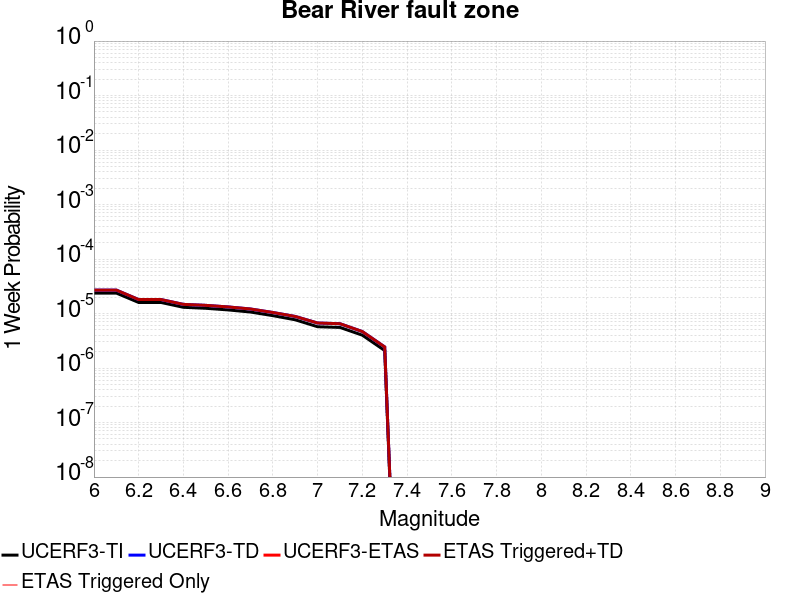 | 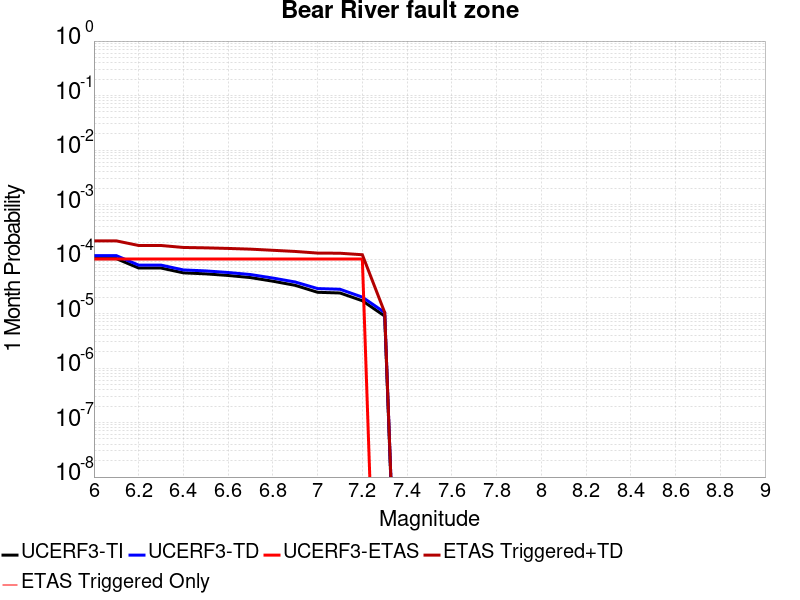 | 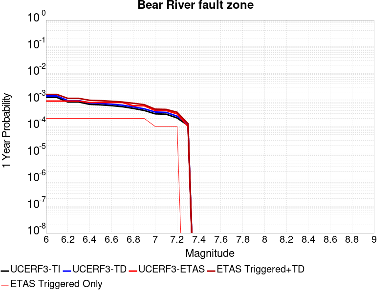 | 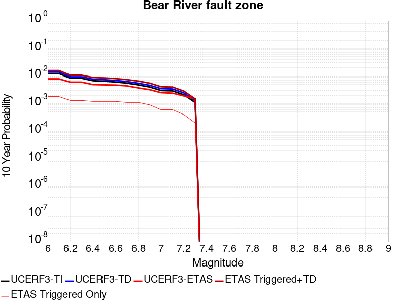 |

| Magnitude | 1 wk TI Prob | 1 wk TD Prob | 1 wk ETAS Prob | 1 wk ETAS/TD Gain | 1 wk ETAS Triggered+TD | 1 wk ETAS Triggered Only | 1 mo TI Prob | 1 mo TD Prob | 1 mo ETAS Prob | 1 mo ETAS/TD Gain | 1 mo ETAS Triggered+TD | 1 mo ETAS Triggered Only | 1 yr TI Prob | 1 yr TD Prob | 1 yr ETAS Prob | 1 yr ETAS/TD Gain | 1 yr ETAS Triggered+TD | 1 yr ETAS Triggered Only | 10 yr TI Prob | 10 yr TD Prob | 10 yr ETAS Prob | 10 yr ETAS/TD Gain | 10 yr ETAS Triggered+TD | 10 yr ETAS Triggered Only |
|-----|-----|-----|-----|-----|-----|-----|-----|-----|-----|-----|-----|-----|-----|-----|-----|-----|-----|-----|-----|-----|-----|-----|-----|-----|
| 6.0 | 2.3773342E-5 | 2.6987918E-5 | 0.0 | 0.0 | 2.6987918E-5 | 0.0 | 1.0188177E-4 | 1.1565791E-4 | 1.0E-4 | 0.8646188 | 2.1564635E-4 | 1.0E-4 | 0.0012397047 | 0.001407319 | 9.0E-4 | 0.63951385 | 0.0016070375 | 2.0E-4 | 0.012328116 | 0.01399348 | 0.0079 | 0.5645486 | 0.015768291 | 0.0018 |
| 6.1 | 2.3773342E-5 | 2.6987918E-5 | 0.0 | 0.0 | 2.6987918E-5 | 0.0 | 1.0188177E-4 | 1.1565791E-4 | 1.0E-4 | 0.8646188 | 2.1564635E-4 | 1.0E-4 | 0.0012397047 | 0.001407319 | 9.0E-4 | 0.63951385 | 0.0016070375 | 2.0E-4 | 0.012328116 | 0.01399348 | 0.0079 | 0.5645486 | 0.015768291 | 0.0018 |
| 6.2 | 1.5973403E-5 | 1.8066825E-5 | 0.0 | 0.0 | 1.8066825E-5 | 0.0 | 6.845564E-5 | 7.742708E-5 | 1.0E-4 | 1.2915378 | 1.7741934E-4 | 1.0E-4 | 8.3312875E-4 | 9.4229064E-4 | 9.0E-4 | 0.9551193 | 0.0011421022 | 2.0E-4 | 0.008300122 | 0.009385347 | 0.006 | 0.6392944 | 0.010673147 | 0.0013 |
| 6.3 | 1.5973403E-5 | 1.8066825E-5 | 0.0 | 0.0 | 1.8066825E-5 | 0.0 | 6.845564E-5 | 7.742708E-5 | 1.0E-4 | 1.2915378 | 1.7741934E-4 | 1.0E-4 | 8.3312875E-4 | 9.4229064E-4 | 9.0E-4 | 0.9551193 | 0.0011421022 | 2.0E-4 | 0.008300122 | 0.009385347 | 0.006 | 0.6392944 | 0.010673147 | 0.0013 |
| 6.4 | 1.3027338E-5 | 1.4744882E-5 | 0.0 | 0.0 | 1.4744882E-5 | 0.0 | 5.5830256E-5 | 6.31909E-5 | 1.0E-4 | 1.5825064 | 1.6318458E-4 | 1.0E-4 | 6.7952136E-4 | 7.690914E-4 | 8.0E-4 | 1.0401884 | 9.689376E-4 | 2.0E-4 | 0.0067744725 | 0.0076656993 | 0.0049 | 0.6392111 | 0.0088565005 | 0.0012 |
| 6.5 | 1.2489152E-5 | 1.4147429E-5 | 0.0 | 0.0 | 1.4147429E-5 | 0.0 | 5.352384E-5 | 6.0630508E-5 | 1.0E-4 | 1.6493347 | 1.6062445E-4 | 1.0E-4 | 6.514579E-4 | 7.3794E-4 | 8.0E-4 | 1.0840989 | 9.377925E-4 | 2.0E-4 | 0.0064955144 | 0.007356272 | 0.0048 | 0.65250444 | 0.008547445 | 0.0012 |
| 6.6 | 1.1662849E-5 | 1.3231681E-5 | 0.0 | 0.0 | 1.3231681E-5 | 0.0 | 4.9982682E-5 | 5.6706045E-5 | 1.0E-4 | 1.7634804 | 1.5670038E-4 | 1.0E-4 | 6.083692E-4 | 6.9019035E-4 | 8.0E-4 | 1.1591005 | 8.900523E-4 | 2.0E-4 | 0.006067064 | 0.006881769 | 0.0047 | 0.68296397 | 0.008073511 | 0.0012 |
| 6.7 | 1.0667623E-5 | 1.2131366E-5 | 0.0 | 0.0 | 1.2131366E-5 | 0.0 | 4.5717585E-5 | 5.19906E-5 | 1.0E-4 | 1.9234246 | 1.519854E-4 | 1.0E-4 | 5.5646943E-4 | 6.3281355E-4 | 8.0E-4 | 1.2641954 | 8.3268696E-4 | 2.0E-4 | 0.0055507803 | 0.006311298 | 0.0044 | 0.69716245 | 0.007404356 | 0.0011 |
| 6.8 | 9.154534E-6 | 1.0462286E-5 | 0.0 | 0.0 | 1.0462286E-5 | 0.0 | 3.923313E-5 | 4.4837656E-5 | 1.0E-4 | 2.2302682 | 1.4483317E-4 | 1.0E-4 | 4.7755867E-4 | 5.4577226E-4 | 6.0E-4 | 1.0993596 | 7.456631E-4 | 2.0E-4 | 0.004765337 | 0.0054453667 | 0.0037 | 0.67947674 | 0.006539377 | 0.0011 |
| 6.9 | 7.68501E-6 | 8.84858E-6 | 0.0 | 0.0 | 8.84858E-6 | 0.0 | 3.2935342E-5 | 3.7921985E-5 | 1.0E-4 | 2.6369927 | 1.3791819E-4 | 1.0E-4 | 4.0091402E-4 | 4.616117E-4 | 6.0E-4 | 1.2997937 | 6.6151936E-4 | 2.0E-4 | 0.004001915 | 0.00460745 | 0.0032 | 0.6945273 | 0.0055033034 | 9.0E-4 |
| 7.0 | 5.7315733E-6 | 6.705946E-6 | 0.0 | 0.0 | 6.705946E-6 | 0.0 | 2.4563653E-5 | 2.8739476E-5 | 1.0E-4 | 3.4795346 | 1.287366E-4 | 1.0E-4 | 2.9902143E-4 | 3.498512E-4 | 4.0E-4 | 1.1433432 | 4.498162E-4 | 1.0E-4 | 0.0029861939 | 0.0034934261 | 0.0025 | 0.7156299 | 0.00409133 | 6.0E-4 |
| 7.1 | 5.566844E-6 | 6.51435E-6 | 0.0 | 0.0 | 6.51435E-6 | 0.0 | 2.3857683E-5 | 2.7918368E-5 | 1.0E-4 | 3.5818713 | 1.2791557E-4 | 1.0E-4 | 2.9042858E-4 | 3.3985736E-4 | 4.0E-4 | 1.1769644 | 4.3982337E-4 | 1.0E-4 | 0.002900493 | 0.003393797 | 0.0024 | 0.7071726 | 0.003991761 | 6.0E-4 |
| 7.2 | 4.011353E-6 | 4.6761556E-6 | 0.0 | 0.0 | 4.6761556E-6 | 0.0 | 1.7191402E-5 | 2.0040534E-5 | 1.0E-4 | 4.989887 | 1.2003853E-4 | 1.0E-4 | 2.0928521E-4 | 2.4396961E-4 | 3.0E-4 | 1.2296613 | 3.439452E-4 | 1.0E-4 | 0.0020908823 | 0.0024373555 | 0.0019 | 0.7795334 | 0.0028363806 | 4.0E-4 |
| 7.3 | 2.0974871E-6 | 2.4403803E-6 | 0.0 | 0.0 | 2.4403803E-6 | 0.0 | 8.989199E-6 | 1.0458745E-5 | 0.0 | 0.0 | 1.0458745E-5 | 0.0 | 1.09438006E-4 | 1.2733028E-4 | 1.0E-4 | 0.78535914 | 1.2733028E-4 | 0.0 | 0.0010938413 | 0.0012728187 | 0.0015 | 1.1784868 | 0.0014725641 | 2.0E-4 |

## Santa Susana alt 1
*[(top)](#table-of-contents)*

| 1 Week | 1 Month | 1 Year | 10 Year |
|-----|-----|-----|-----|
| 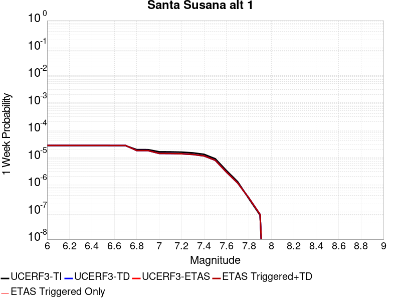 | 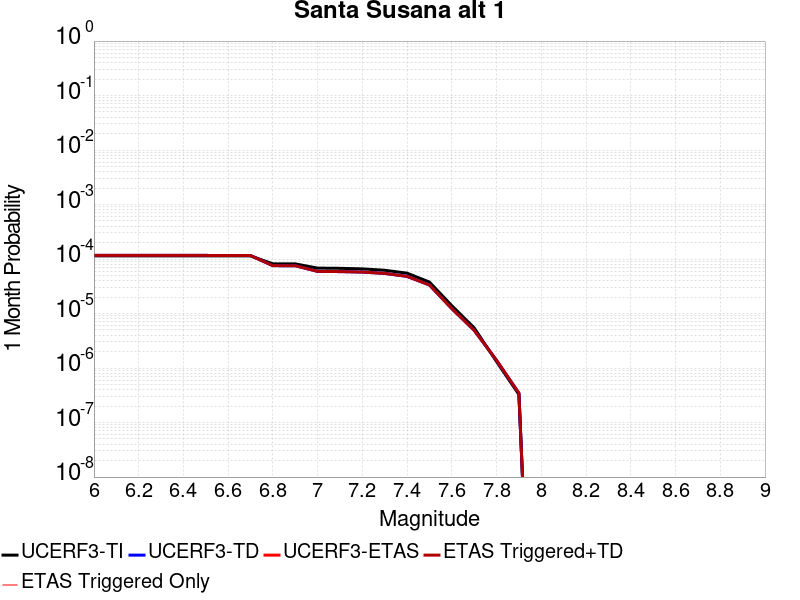 | 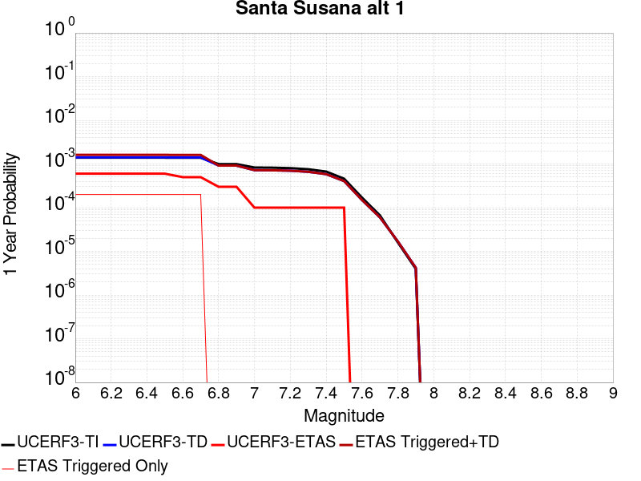 | 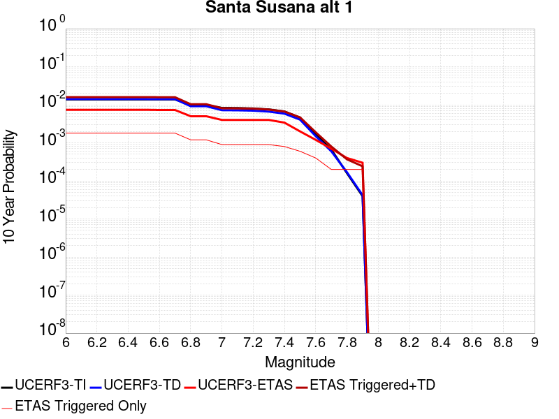 |

| Magnitude | 1 wk TI Prob | 1 wk TD Prob | 1 wk ETAS Prob | 1 wk ETAS/TD Gain | 1 wk ETAS Triggered+TD | 1 wk ETAS Triggered Only | 1 mo TI Prob | 1 mo TD Prob | 1 mo ETAS Prob | 1 mo ETAS/TD Gain | 1 mo ETAS Triggered+TD | 1 mo ETAS Triggered Only | 1 yr TI Prob | 1 yr TD Prob | 1 yr ETAS Prob | 1 yr ETAS/TD Gain | 1 yr ETAS Triggered+TD | 1 yr ETAS Triggered Only | 10 yr TI Prob | 10 yr TD Prob | 10 yr ETAS Prob | 10 yr ETAS/TD Gain | 10 yr ETAS Triggered+TD | 10 yr ETAS Triggered Only |
|-----|-----|-----|-----|-----|-----|-----|-----|-----|-----|-----|-----|-----|-----|-----|-----|-----|-----|-----|-----|-----|-----|-----|-----|-----|
| 6.0 | 2.674877E-5 | 2.7207361E-5 | 0.0 | 0.0 | 2.7207361E-5 | 0.0 | 1.1463255E-4 | 1.1659841E-4 | 0.0 | 0.0 | 1.1659841E-4 | 0.0 | 0.0013947578 | 0.001418775 | 6.0E-4 | 0.42290005 | 0.0016184911 | 2.0E-4 | 0.013860362 | 0.014108764 | 0.0074 | 0.5244967 | 0.01588337 | 0.0018 |
| 6.1 | 2.674877E-5 | 2.7207361E-5 | 0.0 | 0.0 | 2.7207361E-5 | 0.0 | 1.1463255E-4 | 1.1659841E-4 | 0.0 | 0.0 | 1.1659841E-4 | 0.0 | 0.0013947578 | 0.001418775 | 6.0E-4 | 0.42290005 | 0.0016184911 | 2.0E-4 | 0.013860362 | 0.014108764 | 0.0074 | 0.5244967 | 0.01588337 | 0.0018 |
| 6.2 | 2.674877E-5 | 2.7207361E-5 | 0.0 | 0.0 | 2.7207361E-5 | 0.0 | 1.1463255E-4 | 1.1659841E-4 | 0.0 | 0.0 | 1.1659841E-4 | 0.0 | 0.0013947578 | 0.001418775 | 6.0E-4 | 0.42290005 | 0.0016184911 | 2.0E-4 | 0.013860362 | 0.014108764 | 0.0074 | 0.5244967 | 0.01588337 | 0.0018 |
| 6.3 | 2.674877E-5 | 2.7207361E-5 | 0.0 | 0.0 | 2.7207361E-5 | 0.0 | 1.1463255E-4 | 1.1659841E-4 | 0.0 | 0.0 | 1.1659841E-4 | 0.0 | 0.0013947578 | 0.001418775 | 6.0E-4 | 0.42290005 | 0.0016184911 | 2.0E-4 | 0.013860362 | 0.014108764 | 0.0074 | 0.5244967 | 0.01588337 | 0.0018 |
| 6.4 | 2.674877E-5 | 2.7207361E-5 | 0.0 | 0.0 | 2.7207361E-5 | 0.0 | 1.1463255E-4 | 1.1659841E-4 | 0.0 | 0.0 | 1.1659841E-4 | 0.0 | 0.0013947578 | 0.001418775 | 6.0E-4 | 0.42290005 | 0.0016184911 | 2.0E-4 | 0.013860362 | 0.014108764 | 0.0074 | 0.5244967 | 0.01588337 | 0.0018 |
| 6.5 | 2.674877E-5 | 2.7207361E-5 | 0.0 | 0.0 | 2.7207361E-5 | 0.0 | 1.1463255E-4 | 1.1659841E-4 | 0.0 | 0.0 | 1.1659841E-4 | 0.0 | 0.0013947578 | 0.001418775 | 6.0E-4 | 0.42290005 | 0.0016184911 | 2.0E-4 | 0.013860362 | 0.014108764 | 0.0074 | 0.5244967 | 0.01588337 | 0.0018 |
| 6.6 | 2.6647976E-5 | 2.7083644E-5 | 0.0 | 0.0 | 2.7083644E-5 | 0.0 | 1.14200615E-4 | 1.16068244E-4 | 0.0 | 0.0 | 1.16068244E-4 | 0.0 | 0.0013895056 | 0.0014123286 | 5.0E-4 | 0.35402527 | 0.001612046 | 2.0E-4 | 0.013808494 | 0.014045121 | 0.0073 | 0.51975346 | 0.01581984 | 0.0018 |
| 6.7 | 2.6647976E-5 | 2.7083644E-5 | 0.0 | 0.0 | 2.7083644E-5 | 0.0 | 1.14200615E-4 | 1.16068244E-4 | 0.0 | 0.0 | 1.16068244E-4 | 0.0 | 0.0013895056 | 0.0014123286 | 5.0E-4 | 0.35402527 | 0.001612046 | 2.0E-4 | 0.013808494 | 0.014045121 | 0.0073 | 0.51975346 | 0.01581984 | 0.0018 |
| 6.8 | 1.9073179E-5 | 1.764195E-5 | 0.0 | 0.0 | 1.764195E-5 | 0.0 | 8.1739636E-5 | 7.560627E-5 | 0.0 | 0.0 | 7.560627E-5 | 0.0 | 9.947256E-4 | 9.201358E-4 | 3.0E-4 | 0.32603884 | 9.201358E-4 | 0.0 | 0.009902848 | 0.009165339 | 0.005 | 0.54553354 | 0.010354341 | 0.0012 |
| 6.9 | 1.9041876E-5 | 1.7624077E-5 | 0.0 | 0.0 | 1.7624077E-5 | 0.0 | 8.160549E-5 | 7.552968E-5 | 0.0 | 0.0 | 7.552968E-5 | 0.0 | 9.930939E-4 | 9.1920403E-4 | 3.0E-4 | 0.32636932 | 9.1920403E-4 | 0.0 | 0.0098866755 | 0.009156099 | 0.005 | 0.54608417 | 0.010345111 | 0.0012 |
| 7.0 | 1.5917482E-5 | 1.3866927E-5 | 0.0 | 0.0 | 1.3866927E-5 | 0.0 | 6.8215995E-5 | 5.9428356E-5 | 0.0 | 0.0 | 5.9428356E-5 | 0.0 | 8.302132E-4 | 7.233047E-4 | 1.0E-4 | 0.13825431 | 7.233047E-4 | 0.0 | 0.008271185 | 0.007210236 | 0.004 | 0.5547669 | 0.008103747 | 9.0E-4 |
| 7.1 | 1.577788E-5 | 1.3746903E-5 | 0.0 | 0.0 | 1.3746903E-5 | 0.0 | 6.761774E-5 | 5.8913993E-5 | 0.0 | 0.0 | 5.8913993E-5 | 0.0 | 8.2293496E-4 | 7.170465E-4 | 1.0E-4 | 0.13946098 | 7.170465E-4 | 0.0 | 0.008198941 | 0.0071480577 | 0.004 | 0.5595926 | 0.008041624 | 9.0E-4 |
| 7.2 | 1.5416446E-5 | 1.3472902E-5 | 0.0 | 0.0 | 1.3472902E-5 | 0.0 | 6.606882E-5 | 5.7739755E-5 | 0.0 | 0.0 | 5.7739755E-5 | 0.0 | 8.0409093E-4 | 7.0275937E-4 | 1.0E-4 | 0.14229621 | 7.0275937E-4 | 0.0 | 0.008011877 | 0.0070060906 | 0.004 | 0.5709318 | 0.007899785 | 9.0E-4 |
| 7.3 | 1.4534083E-5 | 1.2720612E-5 | 0.0 | 0.0 | 1.2720612E-5 | 0.0 | 6.228744E-5 | 5.4515796E-5 | 0.0 | 0.0 | 5.4515796E-5 | 0.0 | 7.580857E-4 | 6.635322E-4 | 1.0E-4 | 0.1507086 | 6.635322E-4 | 0.0 | 0.007555048 | 0.006616188 | 0.004 | 0.6045777 | 0.0075102337 | 9.0E-4 |
| 7.4 | 1.2858995E-5 | 1.1231877E-5 | 0.0 | 0.0 | 1.1231877E-5 | 0.0 | 5.5108816E-5 | 4.813575E-5 | 0.0 | 0.0 | 4.813575E-5 | 0.0 | 6.7074323E-4 | 5.858991E-4 | 1.0E-4 | 0.17067786 | 5.858991E-4 | 0.0 | 0.0066872234 | 0.0058441497 | 0.0034 | 0.5817784 | 0.006639474 | 8.0E-4 |
| 7.5 | 8.827668E-6 | 7.806839E-6 | 0.0 | 0.0 | 7.806839E-6 | 0.0 | 3.7832317E-5 | 3.3457465E-5 | 0.0 | 0.0 | 3.3457465E-5 | 0.0 | 4.605111E-4 | 4.0727097E-4 | 1.0E-4 | 0.24553677 | 4.0727097E-4 | 0.0 | 0.0045955796 | 0.004065408 | 0.002 | 0.49195558 | 0.0046629687 | 6.0E-4 |
| 7.6 | 3.2533426E-6 | 2.8723202E-6 | 0.0 | 0.0 | 2.8723202E-6 | 0.0 | 1.3942822E-5 | 1.2309888E-5 | 0.0 | 0.0 | 1.2309888E-5 | 0.0 | 1.6974064E-4 | 1.4986296E-4 | 0.0 | 0.0 | 1.4986296E-4 | 0.0 | 0.0016961104 | 0.0014976558 | 0.0012 | 0.80125225 | 0.0018970567 | 4.0E-4 |
| 7.7 | 1.2751709E-6 | 1.1492846E-6 | 0.0 | 0.0 | 1.1492846E-6 | 0.0 | 5.4650063E-6 | 4.9254963E-6 | 0.0 | 0.0 | 4.9254963E-6 | 0.0 | 6.653442E-5 | 5.996636E-5 | 0.0 | 0.0 | 5.996636E-5 | 0.0 | 6.6514505E-4 | 5.9951073E-4 | 7.0E-4 | 1.1676189 | 7.993908E-4 | 2.0E-4 |
| 7.8 | 3.067544E-7 | 3.240476E-7 | 0.0 | 0.0 | 3.240476E-7 | 0.0 | 1.3146611E-6 | 1.3887748E-6 | 0.0 | 0.0 | 1.3887748E-6 | 0.0 | 1.600588E-5 | 1.6908212E-5 | 0.0 | 0.0 | 1.6908212E-5 | 0.0 | 1.6004729E-4 | 1.6907028E-4 | 4.0E-4 | 2.36588 | 3.6903645E-4 | 2.0E-4 |
| 7.9 | 7.622999E-8 | 8.0889976E-8 | 0.0 | 0.0 | 8.0889976E-8 | 0.0 | 3.2669993E-7 | 3.466713E-7 | 0.0 | 0.0 | 3.466713E-7 | 0.0 | 3.977564E-6 | 4.220717E-6 | 0.0 | 0.0 | 4.220717E-6 | 0.0 | 3.977493E-5 | 4.2206575E-5 | 3.0E-4 | 7.1078973 | 2.4219813E-4 | 2.0E-4 |

## Oceanic - West Huasna
*[(top)](#table-of-contents)*

| 1 Week | 1 Month | 1 Year | 10 Year |
|-----|-----|-----|-----|
| 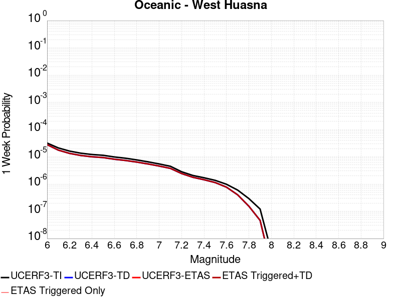 | 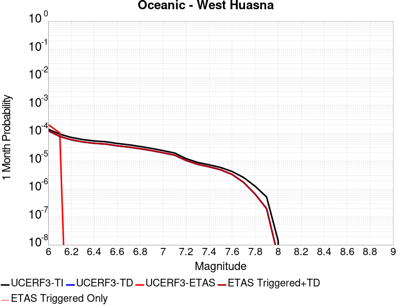 | 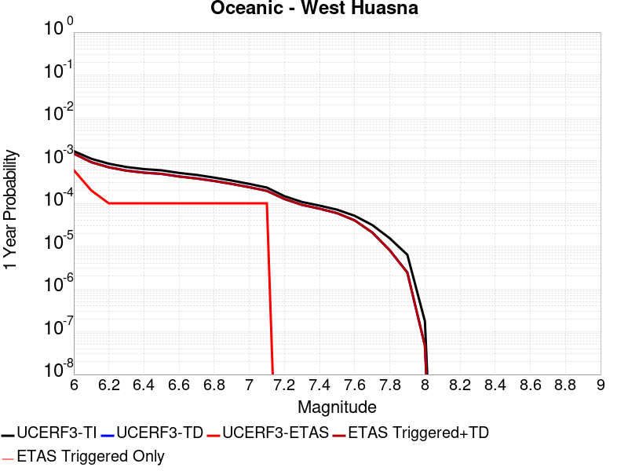 | 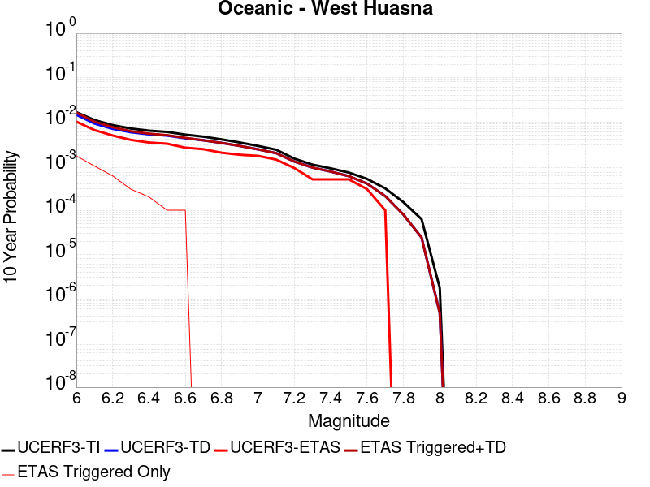 |

| Magnitude | 1 wk TI Prob | 1 wk TD Prob | 1 wk ETAS Prob | 1 wk ETAS/TD Gain | 1 wk ETAS Triggered+TD | 1 wk ETAS Triggered Only | 1 mo TI Prob | 1 mo TD Prob | 1 mo ETAS Prob | 1 mo ETAS/TD Gain | 1 mo ETAS Triggered+TD | 1 mo ETAS Triggered Only | 1 yr TI Prob | 1 yr TD Prob | 1 yr ETAS Prob | 1 yr ETAS/TD Gain | 1 yr ETAS Triggered+TD | 1 yr ETAS Triggered Only | 10 yr TI Prob | 10 yr TD Prob | 10 yr ETAS Prob | 10 yr ETAS/TD Gain | 10 yr ETAS Triggered+TD | 10 yr ETAS Triggered Only |
|-----|-----|-----|-----|-----|-----|-----|-----|-----|-----|-----|-----|-----|-----|-----|-----|-----|-----|-----|-----|-----|-----|-----|-----|-----|
| 6.0 | 3.195567E-5 | 2.7931765E-5 | 0.0 | 0.0 | 2.7931765E-5 | 0.0 | 1.3694567E-4 | 1.19702316E-4 | 2.0E-4 | 1.6708114 | 1.19702316E-4 | 0.0 | 0.0016660384 | 0.0014564445 | 6.0E-4 | 0.41196212 | 0.0014564445 | 0.0 | 0.016536033 | 0.014473548 | 0.0101 | 0.6978248 | 0.016148943 | 0.0017 |
| 6.1 | 2.1156782E-5 | 1.7576536E-5 | 0.0 | 0.0 | 1.7576536E-5 | 0.0 | 9.066878E-5 | 7.5325894E-5 | 1.0E-4 | 1.3275647 | 7.5325894E-5 | 0.0 | 0.0011033333 | 9.1671624E-4 | 2.0E-4 | 0.21817002 | 9.1671624E-4 | 0.0 | 0.010978713 | 0.009130356 | 0.0065 | 0.71191096 | 0.010121225 | 0.001 |
| 6.2 | 1.6195117E-5 | 1.3329039E-5 | 0.0 | 0.0 | 1.3329039E-5 | 0.0 | 6.9405796E-5 | 5.7123216E-5 | 0.0 | 0.0 | 5.7123216E-5 | 0.0 | 8.44688E-4 | 6.952558E-4 | 1.0E-4 | 0.14383195 | 6.952558E-4 | 0.0 | 0.008414844 | 0.0069311005 | 0.0049 | 0.7069584 | 0.007526942 | 6.0E-4 |
| 6.3 | 1.3559345E-5 | 1.1180527E-5 | 0.0 | 0.0 | 1.1180527E-5 | 0.0 | 5.811018E-5 | 4.791567E-5 | 0.0 | 0.0 | 4.791567E-5 | 0.0 | 7.072618E-4 | 5.8321806E-4 | 1.0E-4 | 0.17146245 | 5.8321806E-4 | 0.0 | 0.0070501505 | 0.0058169933 | 0.0039 | 0.67044944 | 0.0061152484 | 3.0E-4 |
| 6.4 | 1.2120619E-5 | 1.0002159E-5 | 0.0 | 0.0 | 1.0002159E-5 | 0.0 | 5.1944477E-5 | 4.2865697E-5 | 0.0 | 0.0 | 4.2865697E-5 | 0.0 | 6.322405E-4 | 5.217654E-4 | 1.0E-4 | 0.19165702 | 5.217654E-4 | 0.0 | 0.006304447 | 0.005205471 | 0.0034 | 0.65315896 | 0.00540443 | 2.0E-4 |
| 6.5 | 1.13511915E-5 | 9.368569E-6 | 0.0 | 0.0 | 9.368569E-6 | 0.0 | 4.8647056E-5 | 4.0150397E-5 | 0.0 | 0.0 | 4.0150397E-5 | 0.0 | 5.9211696E-4 | 4.887219E-4 | 1.0E-4 | 0.20461535 | 4.887219E-4 | 0.0 | 0.0059054173 | 0.00487653 | 0.0032 | 0.6562043 | 0.0049760425 | 1.0E-4 |
| 6.6 | 9.850605E-6 | 8.136352E-6 | 0.0 | 0.0 | 8.136352E-6 | 0.0 | 4.2216197E-5 | 3.4869616E-5 | 0.0 | 0.0 | 3.4869616E-5 | 0.0 | 5.1386096E-4 | 4.244551E-4 | 1.0E-4 | 0.23559618 | 4.244551E-4 | 0.0 | 0.0051267436 | 0.0042364765 | 0.0026 | 0.61371756 | 0.004336053 | 1.0E-4 |
| 6.7 | 8.8558645E-6 | 7.319271E-6 | 0.0 | 0.0 | 7.319271E-6 | 0.0 | 3.7953152E-5 | 3.136793E-5 | 0.0 | 0.0 | 3.136793E-5 | 0.0 | 4.6198163E-4 | 3.8183777E-4 | 1.0E-4 | 0.2618913 | 3.8183777E-4 | 0.0 | 0.004610224 | 0.0038118428 | 0.0024 | 0.62961674 | 0.0038118428 | 0.0 |
| 6.8 | 7.67136E-6 | 6.3925095E-6 | 0.0 | 0.0 | 6.3925095E-6 | 0.0 | 3.2876844E-5 | 2.7396181E-5 | 0.0 | 0.0 | 2.7396181E-5 | 0.0 | 4.0020206E-4 | 3.3349762E-4 | 1.0E-4 | 0.29985222 | 3.3349762E-4 | 0.0 | 0.003994821 | 0.0033299925 | 0.002 | 0.6006019 | 0.0033299925 | 0.0 |
| 6.9 | 6.534529E-6 | 5.458995E-6 | 0.0 | 0.0 | 5.458995E-6 | 0.0 | 2.8004823E-5 | 2.3395483E-5 | 0.0 | 0.0 | 2.3395483E-5 | 0.0 | 3.4090536E-4 | 2.8480293E-4 | 1.0E-4 | 0.35112 | 2.8480293E-4 | 0.0 | 0.0034038287 | 0.002844396 | 0.0018 | 0.6328232 | 0.002844396 | 0.0 |
| 7.0 | 5.460525E-6 | 4.5704846E-6 | 0.0 | 0.0 | 4.5704846E-6 | 0.0 | 2.3402039E-5 | 1.9587646E-5 | 0.0 | 0.0 | 1.9587646E-5 | 0.0 | 2.8488258E-4 | 2.3845359E-4 | 1.0E-4 | 0.4193688 | 2.3845359E-4 | 0.0 | 0.0028451765 | 0.0023819914 | 0.0017 | 0.71368855 | 0.0023819914 | 0.0 |
| 7.1 | 4.4825083E-6 | 3.752941E-6 | 0.0 | 0.0 | 3.752941E-6 | 0.0 | 1.9210609E-5 | 1.6083934E-5 | 0.0 | 0.0 | 1.6083934E-5 | 0.0 | 2.3386406E-4 | 1.958044E-4 | 1.0E-4 | 0.51071376 | 1.958044E-4 | 0.0 | 0.002336181 | 0.0019563308 | 0.0014 | 0.71562535 | 0.0019563308 | 0.0 |
| 7.2 | 2.821708E-6 | 2.4253961E-6 | 0.0 | 0.0 | 2.4253961E-6 | 0.0 | 1.2092979E-5 | 1.0394514E-5 | 0.0 | 0.0 | 1.0394514E-5 | 0.0 | 1.4722206E-4 | 1.2654587E-4 | 0.0 | 0.0 | 1.2654587E-4 | 0.0 | 0.0014712457 | 0.0012647407 | 9.0E-4 | 0.71160835 | 0.0012647407 | 0.0 |
| 7.3 | 2.0644757E-6 | 1.7691628E-6 | 0.0 | 0.0 | 1.7691628E-6 | 0.0 | 8.847723E-6 | 7.5821044E-6 | 0.0 | 0.0 | 7.5821044E-6 | 0.0 | 1.0771569E-4 | 9.230822E-5 | 0.0 | 0.0 | 9.230822E-5 | 0.0 | 0.001076635 | 9.227006E-4 | 5.0E-4 | 0.5418876 | 9.227006E-4 | 0.0 |
| 7.4 | 1.6980367E-6 | 1.4383555E-6 | 0.0 | 0.0 | 1.4383555E-6 | 0.0 | 7.27728E-6 | 6.1643664E-6 | 0.0 | 0.0 | 6.1643664E-6 | 0.0 | 8.8597284E-5 | 7.504858E-5 | 0.0 | 0.0 | 7.504858E-5 | 0.0 | 8.8561967E-4 | 7.5023406E-4 | 5.0E-4 | 0.66645867 | 7.5023406E-4 | 0.0 |
| 7.5 | 1.3637683E-6 | 1.1306116E-6 | 0.0 | 0.0 | 1.1306116E-6 | 0.0 | 5.844708E-6 | 4.8454694E-6 | 0.0 | 0.0 | 4.8454694E-6 | 0.0 | 7.1156996E-5 | 5.8991995E-5 | 0.0 | 0.0 | 5.8991995E-5 | 0.0 | 7.1134215E-4 | 5.8976497E-4 | 5.0E-4 | 0.8477953 | 5.8976497E-4 | 0.0 |
| 7.6 | 9.802994E-7 | 7.680519E-7 | 0.0 | 0.0 | 7.680519E-7 | 0.0 | 4.2012766E-6 | 3.2916469E-6 | 0.0 | 0.0 | 3.2916469E-6 | 0.0 | 5.1149345E-5 | 4.0075065E-5 | 0.0 | 0.0 | 4.0075065E-5 | 0.0 | 5.113757E-4 | 4.0067994E-4 | 3.0E-4 | 0.74872726 | 4.0067994E-4 | 0.0 |
| 7.7 | 5.986191E-7 | 4.0078044E-7 | 0.0 | 0.0 | 4.0078044E-7 | 0.0 | 2.5655079E-6 | 1.7176293E-6 | 0.0 | 0.0 | 1.7176293E-6 | 0.0 | 3.1234613E-5 | 2.0911937E-5 | 0.0 | 0.0 | 2.0911937E-5 | 0.0 | 3.123022E-4 | 2.0910118E-4 | 1.0E-4 | 0.47823736 | 2.0910118E-4 | 0.0 |
| 7.8 | 2.9189815E-7 | 1.5308689E-7 | 0.0 | 0.0 | 1.5308689E-7 | 0.0 | 1.2509914E-6 | 6.5608646E-7 | 0.0 | 0.0 | 6.5608646E-7 | 0.0 | 1.5230714E-5 | 7.987824E-6 | 0.0 | 0.0 | 7.987824E-6 | 0.0 | 1.522967E-4 | 7.987682E-5 | 0.0 | 0.0 | 7.987682E-5 | 0.0 |
| 7.9 | 1.2057845E-7 | 4.6338442E-8 | 0.0 | 0.0 | 4.6338442E-8 | 0.0 | 5.1676466E-7 | 1.9859331E-7 | 0.0 | 0.0 | 1.9859331E-7 | 0.0 | 6.2915915E-6 | 2.4178707E-6 | 0.0 | 0.0 | 2.4178707E-6 | 0.0 | 6.2914136E-5 | 2.4179899E-5 | 0.0 | 0.0 | 2.4179899E-5 | 0.0 |
| 8.0 | 3.3806387E-9 | 9.059449E-10 | 0.0 | 0.0 | 9.059449E-10 | 0.0 | 1.4488451E-8 | 3.8826196E-9 | 0.0 | 0.0 | 3.8826196E-9 | 0.0 | 1.7639688E-7 | 4.727089E-8 | 0.0 | 0.0 | 4.727089E-8 | 0.0 | 1.7639674E-6 | 4.7393638E-7 | 0.0 | 0.0 | 4.7393638E-7 | 0.0 |

## San Jacinto (Anza) rev
*[(top)](#table-of-contents)*

| 1 Week | 1 Month | 1 Year | 10 Year |
|-----|-----|-----|-----|
|  | 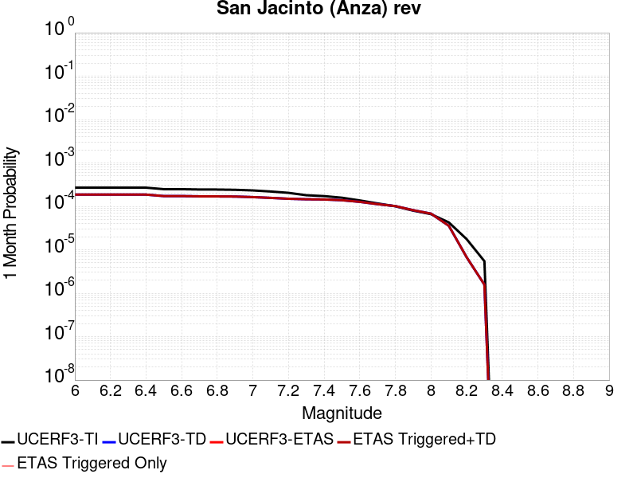 |  | 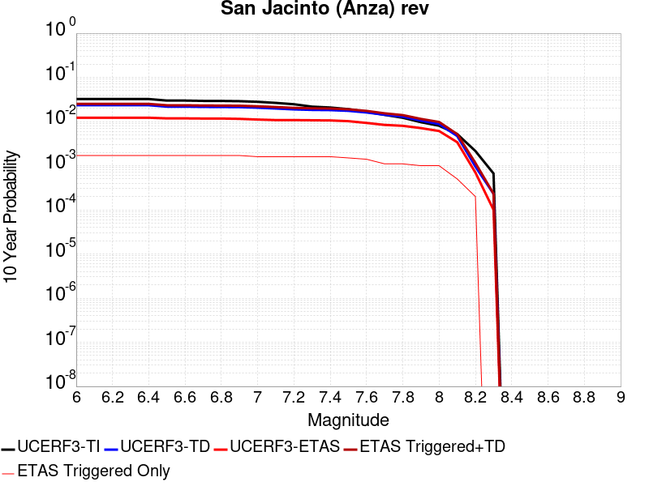 |

| Magnitude | 1 wk TI Prob | 1 wk TD Prob | 1 wk ETAS Prob | 1 wk ETAS/TD Gain | 1 wk ETAS Triggered+TD | 1 wk ETAS Triggered Only | 1 mo TI Prob | 1 mo TD Prob | 1 mo ETAS Prob | 1 mo ETAS/TD Gain | 1 mo ETAS Triggered+TD | 1 mo ETAS Triggered Only | 1 yr TI Prob | 1 yr TD Prob | 1 yr ETAS Prob | 1 yr ETAS/TD Gain | 1 yr ETAS Triggered+TD | 1 yr ETAS Triggered Only | 10 yr TI Prob | 10 yr TD Prob | 10 yr ETAS Prob | 10 yr ETAS/TD Gain | 10 yr ETAS Triggered+TD | 10 yr ETAS Triggered Only |
|-----|-----|-----|-----|-----|-----|-----|-----|-----|-----|-----|-----|-----|-----|-----|-----|-----|-----|-----|-----|-----|-----|-----|-----|-----|
| 6.0 | 6.3015636E-5 | 4.3562803E-5 | 0.0 | 0.0 | 4.3562803E-5 | 0.0 | 2.7003905E-4 | 1.8668442E-4 | 0.0 | 0.0 | 1.8668442E-4 | 0.0 | 0.0032827691 | 0.0022705256 | 8.0E-4 | 0.35234132 | 0.0022705256 | 0.0 | 0.032346968 | 0.023434378 | 0.0122 | 0.5206027 | 0.025094539 | 0.0017 |
| 6.1 | 6.3015636E-5 | 4.3562803E-5 | 0.0 | 0.0 | 4.3562803E-5 | 0.0 | 2.7003905E-4 | 1.8668442E-4 | 0.0 | 0.0 | 1.8668442E-4 | 0.0 | 0.0032827691 | 0.0022705256 | 8.0E-4 | 0.35234132 | 0.0022705256 | 0.0 | 0.032346968 | 0.023434378 | 0.0122 | 0.5206027 | 0.025094539 | 0.0017 |
| 6.2 | 6.3015636E-5 | 4.3562803E-5 | 0.0 | 0.0 | 4.3562803E-5 | 0.0 | 2.7003905E-4 | 1.8668442E-4 | 0.0 | 0.0 | 1.8668442E-4 | 0.0 | 0.0032827691 | 0.0022705256 | 8.0E-4 | 0.35234132 | 0.0022705256 | 0.0 | 0.032346968 | 0.023434378 | 0.0122 | 0.5206027 | 0.025094539 | 0.0017 |
| 6.3 | 6.3015636E-5 | 4.3562803E-5 | 0.0 | 0.0 | 4.3562803E-5 | 0.0 | 2.7003905E-4 | 1.8668442E-4 | 0.0 | 0.0 | 1.8668442E-4 | 0.0 | 0.0032827691 | 0.0022705256 | 8.0E-4 | 0.35234132 | 0.0022705256 | 0.0 | 0.032346968 | 0.023434378 | 0.0122 | 0.5206027 | 0.025094539 | 0.0017 |
| 6.4 | 6.3015636E-5 | 4.3562803E-5 | 0.0 | 0.0 | 4.3562803E-5 | 0.0 | 2.7003905E-4 | 1.8668442E-4 | 0.0 | 0.0 | 1.8668442E-4 | 0.0 | 0.0032827691 | 0.0022705256 | 8.0E-4 | 0.35234132 | 0.0022705256 | 0.0 | 0.032346968 | 0.023434378 | 0.0122 | 0.5206027 | 0.025094539 | 0.0017 |
| 6.5 | 5.811017E-5 | 4.033054E-5 | 0.0 | 0.0 | 4.033054E-5 | 0.0 | 2.4901982E-4 | 1.7283375E-4 | 0.0 | 0.0 | 1.7283375E-4 | 0.0 | 0.0030276014 | 0.0021022258 | 7.0E-4 | 0.3329804 | 0.0021022258 | 0.0 | 0.02986684 | 0.02172669 | 0.0118 | 0.5431108 | 0.023389755 | 0.0017 |
| 6.6 | 5.811017E-5 | 4.033054E-5 | 0.0 | 0.0 | 4.033054E-5 | 0.0 | 2.4901982E-4 | 1.7283375E-4 | 0.0 | 0.0 | 1.7283375E-4 | 0.0 | 0.0030276014 | 0.0021022258 | 7.0E-4 | 0.3329804 | 0.0021022258 | 0.0 | 0.02986684 | 0.02172669 | 0.0118 | 0.5431108 | 0.023389755 | 0.0017 |
| 6.7 | 5.712442E-5 | 3.97508E-5 | 0.0 | 0.0 | 3.97508E-5 | 0.0 | 2.4479596E-4 | 1.7034948E-4 | 0.0 | 0.0 | 1.7034948E-4 | 0.0 | 0.0029763177 | 0.0020720377 | 7.0E-4 | 0.3378317 | 0.0020720377 | 0.0 | 0.029367693 | 0.02141582 | 0.0117 | 0.5463251 | 0.023079414 | 0.0017 |
| 6.8 | 5.6967532E-5 | 3.9606635E-5 | 0.0 | 0.0 | 3.9606635E-5 | 0.0 | 2.4412372E-4 | 1.6973172E-4 | 0.0 | 0.0 | 1.6973172E-4 | 0.0 | 0.0029681553 | 0.0020645307 | 7.0E-4 | 0.33906013 | 0.0020645307 | 0.0 | 0.029288229 | 0.02133976 | 0.0117 | 0.5482723 | 0.023003483 | 0.0017 |
| 6.9 | 5.6211324E-5 | 3.9309914E-5 | 0.0 | 0.0 | 3.9309914E-5 | 0.0 | 2.4088343E-4 | 1.684602E-4 | 0.0 | 0.0 | 1.684602E-4 | 0.0 | 0.0029288116 | 0.0020490792 | 7.0E-4 | 0.34161687 | 0.0020490792 | 0.0 | 0.028905109 | 0.021178367 | 0.0115 | 0.5430069 | 0.022842364 | 0.0017 |
| 7.0 | 5.4383527E-5 | 3.816506E-5 | 0.0 | 0.0 | 3.816506E-5 | 0.0 | 2.3305144E-4 | 1.6355432E-4 | 0.0 | 0.0 | 1.6355432E-4 | 0.0 | 0.0028337094 | 0.00198946 | 7.0E-4 | 0.35185426 | 0.00198946 | 0.0 | 0.027978465 | 0.020563066 | 0.0111 | 0.5398028 | 0.022130165 | 0.0016 |
| 7.1 | 5.1393665E-5 | 3.6618112E-5 | 0.0 | 0.0 | 3.6618112E-5 | 0.0 | 2.2023996E-4 | 1.5692535E-4 | 0.0 | 0.0 | 1.5692535E-4 | 0.0 | 0.0026781242 | 0.0019088961 | 6.0E-4 | 0.3143178 | 0.0019088961 | 0.0 | 0.026460782 | 0.0197337 | 0.0108 | 0.5472871 | 0.021302128 | 0.0016 |
| 7.2 | 4.785222E-5 | 3.4960736E-5 | 0.0 | 0.0 | 3.4960736E-5 | 0.0 | 2.0506482E-4 | 1.4982314E-4 | 0.0 | 0.0 | 1.4982314E-4 | 0.0 | 0.0024938055 | 0.0018225742 | 6.0E-4 | 0.3292047 | 0.0018225742 | 0.0 | 0.024660049 | 0.01884218 | 0.0108 | 0.5731821 | 0.020412032 | 0.0016 |
| 7.3 | 4.2143256E-5 | 3.40485E-5 | 0.0 | 0.0 | 3.40485E-5 | 0.0 | 1.8060145E-4 | 1.45914E-4 | 0.0 | 0.0 | 1.45914E-4 | 0.0 | 0.002196605 | 0.0017750588 | 6.0E-4 | 0.33801696 | 0.0017750588 | 0.0 | 0.02175019 | 0.018347196 | 0.0107 | 0.5831954 | 0.01991784 | 0.0016 |
| 7.4 | 4.0264713E-5 | 3.3684606E-5 | 0.0 | 0.0 | 3.3684606E-5 | 0.0 | 1.7255165E-4 | 1.4435462E-4 | 0.0 | 0.0 | 1.4435462E-4 | 0.0 | 0.002098792 | 0.0017561042 | 6.0E-4 | 0.34166536 | 0.0017561042 | 0.0 | 0.020790804 | 0.018150724 | 0.0106 | 0.58399874 | 0.019721683 | 0.0016 |
| 7.5 | 3.694492E-5 | 3.239299E-5 | 0.0 | 0.0 | 3.239299E-5 | 0.0 | 1.5832575E-4 | 1.3881971E-4 | 0.0 | 0.0 | 1.3881971E-4 | 0.0 | 0.0019259118 | 0.001688823 | 6.0E-4 | 0.35527703 | 0.001688823 | 0.0 | 0.01909306 | 0.017464422 | 0.0102 | 0.5840445 | 0.018938225 | 0.0015 |
| 7.6 | 3.200565E-5 | 2.9696657E-5 | 0.0 | 0.0 | 2.9696657E-5 | 0.0 | 1.3715986E-4 | 1.2726519E-4 | 0.0 | 0.0 | 1.2726519E-4 | 0.0 | 0.001668642 | 0.0015483546 | 6.0E-4 | 0.38750812 | 0.0015483546 | 0.0 | 0.01656168 | 0.016046364 | 0.0093 | 0.57957053 | 0.0174239 | 0.0014 |
| 7.7 | 2.731642E-5 | 2.6279893E-5 | 0.0 | 0.0 | 2.6279893E-5 | 0.0 | 1.1706512E-4 | 1.1262325E-4 | 0.0 | 0.0 | 1.1262325E-4 | 0.0 | 0.001424336 | 0.0013703266 | 6.0E-4 | 0.4378518 | 0.0013703266 | 0.0 | 0.014152412 | 0.014264644 | 0.0084 | 0.5888685 | 0.015348953 | 0.0011 |
| 7.8 | 2.3466424E-5 | 2.3684475E-5 | 0.0 | 0.0 | 2.3684475E-5 | 0.0 | 1.0056651E-4 | 1.0150095E-4 | 0.0 | 0.0 | 1.0150095E-4 | 0.0 | 0.0012237094 | 0.0012350744 | 5.0E-4 | 0.40483394 | 0.0012350744 | 0.0 | 0.012169928 | 0.012902975 | 0.008 | 0.62001204 | 0.013988782 | 0.0011 |
| 7.9 | 1.8611925E-5 | 1.9070128E-5 | 0.0 | 0.0 | 1.9070128E-5 | 0.0 | 7.9762955E-5 | 8.172657E-5 | 0.0 | 0.0 | 8.172657E-5 | 0.0 | 9.7068126E-4 | 9.945675E-4 | 3.0E-4 | 0.30163866 | 9.945675E-4 | 0.0 | 0.0096645225 | 0.010479067 | 0.0071 | 0.6775412 | 0.011468588 | 0.001 |
| 8.0 | 1.5460775E-5 | 1.5884969E-5 | 0.0 | 0.0 | 1.5884969E-5 | 0.0 | 6.6258784E-5 | 6.807666E-5 | 0.0 | 0.0 | 6.807666E-5 | 0.0 | 8.0640207E-4 | 8.285189E-4 | 2.0E-4 | 0.24139462 | 8.285189E-4 | 0.0 | 0.008034821 | 0.0087789055 | 0.0061 | 0.69484746 | 0.009770126 | 0.001 |
| 8.1 | 9.983884E-6 | 8.354456E-6 | 0.0 | 0.0 | 8.354456E-6 | 0.0 | 4.2787375E-5 | 3.5804325E-5 | 0.0 | 0.0 | 3.5804325E-5 | 0.0 | 5.2081177E-4 | 4.35831E-4 | 2.0E-4 | 0.45889348 | 4.35831E-4 | 0.0 | 0.0051959283 | 0.0046855444 | 0.0034 | 0.7256361 | 0.0051832013 | 5.0E-4 |
| 8.2 | 4.1226E-6 | 1.5768787E-6 | 0.0 | 0.0 | 1.5768787E-6 | 0.0 | 1.7668166E-5 | 6.758034E-6 | 0.0 | 0.0 | 6.758034E-6 | 0.0 | 2.1508869E-4 | 8.227599E-5 | 0.0 | 0.0 | 8.227599E-5 | 0.0 | 0.0021488064 | 9.5415296E-4 | 7.0E-4 | 0.73363495 | 0.0011539621 | 2.0E-4 |
| 8.3 | 1.2750878E-6 | 3.6772576E-7 | 0.0 | 0.0 | 3.6772576E-7 | 0.0 | 5.4646503E-6 | 1.5759666E-6 | 0.0 | 0.0 | 1.5759666E-6 | 0.0 | 6.653009E-5 | 1.918723E-5 | 0.0 | 0.0 | 1.918723E-5 | 0.0 | 6.6510175E-4 | 2.3118532E-4 | 1.0E-4 | 0.43255344 | 2.3118532E-4 | 0.0 |

## San Jacinto (San Jacinto Valley) rev
*[(top)](#table-of-contents)*

| 1 Week | 1 Month | 1 Year | 10 Year |
|-----|-----|-----|-----|
| 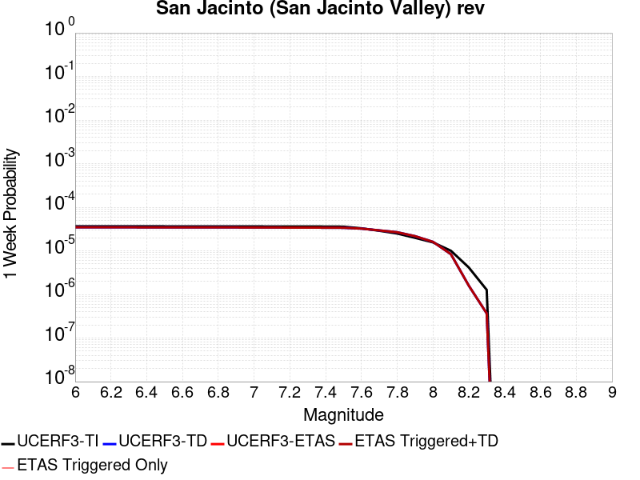 |  |  |  |

| Magnitude | 1 wk TI Prob | 1 wk TD Prob | 1 wk ETAS Prob | 1 wk ETAS/TD Gain | 1 wk ETAS Triggered+TD | 1 wk ETAS Triggered Only | 1 mo TI Prob | 1 mo TD Prob | 1 mo ETAS Prob | 1 mo ETAS/TD Gain | 1 mo ETAS Triggered+TD | 1 mo ETAS Triggered Only | 1 yr TI Prob | 1 yr TD Prob | 1 yr ETAS Prob | 1 yr ETAS/TD Gain | 1 yr ETAS Triggered+TD | 1 yr ETAS Triggered Only | 10 yr TI Prob | 10 yr TD Prob | 10 yr ETAS Prob | 10 yr ETAS/TD Gain | 10 yr ETAS Triggered+TD | 10 yr ETAS Triggered Only |
|-----|-----|-----|-----|-----|-----|-----|-----|-----|-----|-----|-----|-----|-----|-----|-----|-----|-----|-----|-----|-----|-----|-----|-----|-----|
| 6.0 | 3.652694E-5 | 3.462768E-5 | 0.0 | 0.0 | 3.462768E-5 | 0.0 | 1.5653463E-4 | 1.483959E-4 | 0.0 | 0.0 | 1.483959E-4 | 0.0 | 0.0019041431 | 0.0018052248 | 0.0011 | 0.6093424 | 0.0019050442 | 1.0E-4 | 0.018879099 | 0.018642722 | 0.0108 | 0.5793146 | 0.020311028 | 0.0017 |
| 6.1 | 3.652694E-5 | 3.462768E-5 | 0.0 | 0.0 | 3.462768E-5 | 0.0 | 1.5653463E-4 | 1.483959E-4 | 0.0 | 0.0 | 1.483959E-4 | 0.0 | 0.0019041431 | 0.0018052248 | 0.0011 | 0.6093424 | 0.0019050442 | 1.0E-4 | 0.018879099 | 0.018642722 | 0.0108 | 0.5793146 | 0.020311028 | 0.0017 |
| 6.2 | 3.652694E-5 | 3.462768E-5 | 0.0 | 0.0 | 3.462768E-5 | 0.0 | 1.5653463E-4 | 1.483959E-4 | 0.0 | 0.0 | 1.483959E-4 | 0.0 | 0.0019041431 | 0.0018052248 | 0.0011 | 0.6093424 | 0.0019050442 | 1.0E-4 | 0.018879099 | 0.018642722 | 0.0108 | 0.5793146 | 0.020311028 | 0.0017 |
| 6.3 | 3.652694E-5 | 3.462768E-5 | 0.0 | 0.0 | 3.462768E-5 | 0.0 | 1.5653463E-4 | 1.483959E-4 | 0.0 | 0.0 | 1.483959E-4 | 0.0 | 0.0019041431 | 0.0018052248 | 0.0011 | 0.6093424 | 0.0019050442 | 1.0E-4 | 0.018879099 | 0.018642722 | 0.0108 | 0.5793146 | 0.020311028 | 0.0017 |
| 6.4 | 3.646941E-5 | 3.45492E-5 | 0.0 | 0.0 | 3.45492E-5 | 0.0 | 1.5628811E-4 | 1.4805961E-4 | 0.0 | 0.0 | 1.4805961E-4 | 0.0 | 0.0019011468 | 0.0018011376 | 0.0011 | 0.61072516 | 0.0019009574 | 1.0E-4 | 0.018849645 | 0.01860258 | 0.0108 | 0.5805646 | 0.020270955 | 0.0017 |
| 6.5 | 3.646941E-5 | 3.45492E-5 | 0.0 | 0.0 | 3.45492E-5 | 0.0 | 1.5628811E-4 | 1.4805961E-4 | 0.0 | 0.0 | 1.4805961E-4 | 0.0 | 0.0019011468 | 0.0018011376 | 0.0011 | 0.61072516 | 0.0019009574 | 1.0E-4 | 0.018849645 | 0.01860258 | 0.0108 | 0.5805646 | 0.020270955 | 0.0017 |
| 6.6 | 3.6442503E-5 | 3.4512563E-5 | 0.0 | 0.0 | 3.4512563E-5 | 0.0 | 1.561728E-4 | 1.4790261E-4 | 0.0 | 0.0 | 1.4790261E-4 | 0.0 | 0.0018997455 | 0.0017992294 | 0.0011 | 0.6113728 | 0.0018990495 | 1.0E-4 | 0.018835869 | 0.018583838 | 0.0108 | 0.5811501 | 0.020252246 | 0.0017 |
| 6.7 | 3.6432113E-5 | 3.4498127E-5 | 0.0 | 0.0 | 3.4498127E-5 | 0.0 | 1.5612828E-4 | 1.4784075E-4 | 0.0 | 0.0 | 1.4784075E-4 | 0.0 | 0.0018992044 | 0.0017984776 | 0.0011 | 0.6116284 | 0.0018982978 | 1.0E-4 | 0.018830549 | 0.018576458 | 0.0108 | 0.581381 | 0.020244878 | 0.0017 |
| 6.8 | 3.6409598E-5 | 3.446716E-5 | 0.0 | 0.0 | 3.446716E-5 | 0.0 | 1.560318E-4 | 1.4770805E-4 | 0.0 | 0.0 | 1.4770805E-4 | 0.0 | 0.0018980318 | 0.0017968647 | 0.0011 | 0.61217743 | 0.001896685 | 1.0E-4 | 0.018819023 | 0.018560603 | 0.0108 | 0.58187765 | 0.020229049 | 0.0017 |
| 6.9 | 3.638078E-5 | 3.4427554E-5 | 0.0 | 0.0 | 3.4427554E-5 | 0.0 | 1.5590832E-4 | 1.4753833E-4 | 0.0 | 0.0 | 1.4753833E-4 | 0.0 | 0.0018965311 | 0.0017948018 | 0.0011 | 0.61288106 | 0.0018946223 | 1.0E-4 | 0.018804269 | 0.018540325 | 0.0108 | 0.5825141 | 0.020208806 | 0.0017 |
| 7.0 | 3.6294874E-5 | 3.4309487E-5 | 0.0 | 0.0 | 3.4309487E-5 | 0.0 | 1.5554018E-4 | 1.4703239E-4 | 0.0 | 0.0 | 1.4703239E-4 | 0.0 | 0.0018920569 | 0.0017886522 | 0.0011 | 0.6149882 | 0.0018884733 | 1.0E-4 | 0.018760284 | 0.018479869 | 0.0107 | 0.57900846 | 0.020148452 | 0.0017 |
| 7.1 | 3.6260717E-5 | 3.4265748E-5 | 0.0 | 0.0 | 3.4265748E-5 | 0.0 | 1.5539382E-4 | 1.4684495E-4 | 0.0 | 0.0 | 1.4684495E-4 | 0.0 | 0.001890278 | 0.0017863738 | 0.0011 | 0.61577255 | 0.0018861952 | 1.0E-4 | 0.018742796 | 0.018457461 | 0.0107 | 0.5797114 | 0.020126084 | 0.0017 |
| 7.2 | 3.6210204E-5 | 3.4199846E-5 | 0.0 | 0.0 | 3.4199846E-5 | 0.0 | 1.5517735E-4 | 1.4656254E-4 | 0.0 | 0.0 | 1.4656254E-4 | 0.0 | 0.001887647 | 0.0017829412 | 0.0011 | 0.6169581 | 0.0018827629 | 1.0E-4 | 0.01871693 | 0.018423695 | 0.0107 | 0.58077383 | 0.020092376 | 0.0017 |
| 7.3 | 3.6119454E-5 | 3.4087858E-5 | 0.0 | 0.0 | 3.4087858E-5 | 0.0 | 1.5478847E-4 | 1.4608265E-4 | 0.0 | 0.0 | 1.4608265E-4 | 0.0 | 0.0018829206 | 0.0017771081 | 0.001 | 0.56271195 | 0.0018769304 | 1.0E-4 | 0.018670462 | 0.018366115 | 0.0105 | 0.57170504 | 0.020034892 | 0.0017 |
| 7.4 | 3.607848E-5 | 3.4035253E-5 | 0.0 | 0.0 | 3.4035253E-5 | 0.0 | 1.5461289E-4 | 1.4585722E-4 | 0.0 | 0.0 | 1.4585722E-4 | 0.0 | 0.0018807866 | 0.0017743679 | 9.0E-4 | 0.5072229 | 0.0017743679 | 0.0 | 0.018649481 | 0.018339057 | 0.0104 | 0.5670957 | 0.019909715 | 0.0016 |
| 7.5 | 3.5856774E-5 | 3.3843848E-5 | 0.0 | 0.0 | 3.3843848E-5 | 0.0 | 1.5366284E-4 | 1.4503702E-4 | 0.0 | 0.0 | 1.4503702E-4 | 0.0 | 0.0018692396 | 0.0017643982 | 8.0E-4 | 0.4534124 | 0.0017643982 | 0.0 | 0.018535944 | 0.018239554 | 0.0103 | 0.5647068 | 0.019810371 | 0.0016 |
| 7.6 | 3.286655E-5 | 3.235712E-5 | 0.0 | 0.0 | 3.235712E-5 | 0.0 | 1.4084904E-4 | 1.38666E-4 | 0.0 | 0.0 | 1.38666E-4 | 0.0 | 0.001713488 | 0.0016869534 | 8.0E-4 | 0.4742277 | 0.0016869534 | 0.0 | 0.017003361 | 0.017454185 | 0.01 | 0.5729285 | 0.018928003 | 0.0015 |
| 7.7 | 2.8882527E-5 | 2.9445308E-5 | 0.0 | 0.0 | 2.9445308E-5 | 0.0 | 1.237764E-4 | 1.2618807E-4 | 0.0 | 0.0 | 1.2618807E-4 | 0.0 | 0.0015059357 | 0.0015352581 | 8.0E-4 | 0.52108496 | 0.0015352581 | 0.0 | 0.014957713 | 0.01593864 | 0.0092 | 0.57721364 | 0.01721792 | 0.0013 |
| 7.8 | 2.4950225E-5 | 2.6728307E-5 | 0.0 | 0.0 | 2.6728307E-5 | 0.0 | 1.0692515E-4 | 1.1454486E-4 | 0.0 | 0.0 | 1.1454486E-4 | 0.0 | 0.0013010362 | 0.0013936925 | 7.0E-4 | 0.5022629 | 0.0013936925 | 0.0 | 0.012934455 | 0.014516194 | 0.0088 | 0.60621953 | 0.015797323 | 0.0013 |
| 7.9 | 1.9881603E-5 | 2.1688256E-5 | 0.0 | 0.0 | 2.1688256E-5 | 0.0 | 8.520408E-5 | 9.2946364E-5 | 0.0 | 0.0 | 9.2946364E-5 | 0.0 | 0.001036866 | 0.0011310353 | 4.0E-4 | 0.3536583 | 0.0011310353 | 0.0 | 0.010320415 | 0.011871374 | 0.0078 | 0.65704274 | 0.0130571285 | 0.0012 |
| 8.0 | 1.563292E-5 | 1.6083155E-5 | 0.0 | 0.0 | 1.6083155E-5 | 0.0 | 6.6996516E-5 | 6.892599E-5 | 0.0 | 0.0 | 6.892599E-5 | 0.0 | 8.153773E-4 | 8.388515E-4 | 2.0E-4 | 0.23842122 | 8.388515E-4 | 0.0 | 0.00812392 | 0.008887468 | 0.0061 | 0.6863597 | 0.00987858 | 0.001 |
| 8.1 | 1.0045313E-5 | 8.386813E-6 | 0.0 | 0.0 | 8.386813E-6 | 0.0 | 4.305063E-5 | 3.594299E-5 | 0.0 | 0.0 | 3.594299E-5 | 0.0 | 5.2401534E-4 | 4.3751855E-4 | 2.0E-4 | 0.45712346 | 4.3751855E-4 | 0.0 | 0.0052278144 | 0.0047049182 | 0.0034 | 0.7226481 | 0.005202566 | 5.0E-4 |
| 8.2 | 4.1554413E-6 | 1.589684E-6 | 0.0 | 0.0 | 1.589684E-6 | 0.0 | 1.7808914E-5 | 6.8129134E-6 | 0.0 | 0.0 | 6.8129134E-6 | 0.0 | 2.1680194E-4 | 8.294409E-5 | 0.0 | 0.0 | 8.294409E-5 | 0.0 | 0.0021659054 | 9.620702E-4 | 7.0E-4 | 0.72759765 | 0.0011618778 | 2.0E-4 |
| 8.3 | 1.2758221E-6 | 3.6801615E-7 | 0.0 | 0.0 | 3.6801615E-7 | 0.0 | 5.4677976E-6 | 1.5772112E-6 | 0.0 | 0.0 | 1.5772112E-6 | 0.0 | 6.65684E-5 | 1.9202382E-5 | 0.0 | 0.0 | 1.9202382E-5 | 0.0 | 6.6548464E-4 | 2.313581E-4 | 1.0E-4 | 0.43223038 | 2.313581E-4 | 0.0 |

## McKinleyville (alt1)
*[(top)](#table-of-contents)*

| 1 Week | 1 Month | 1 Year | 10 Year |
|-----|-----|-----|-----|
| 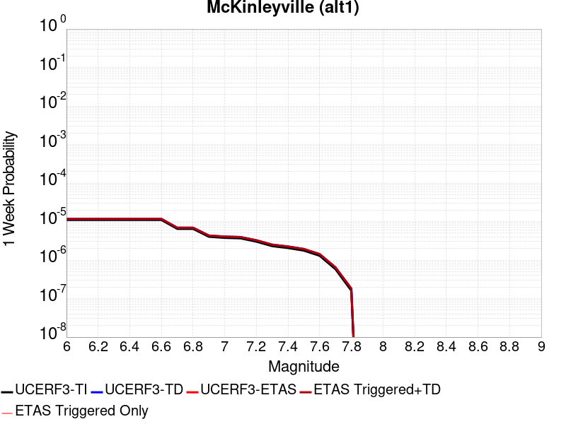 | 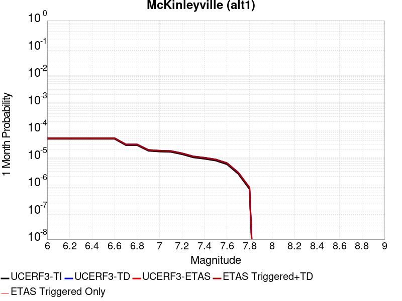 | 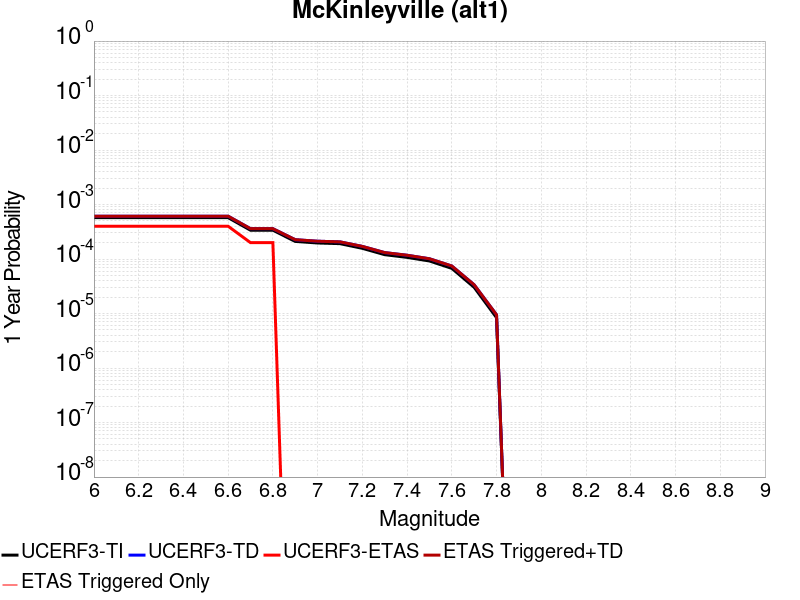 | 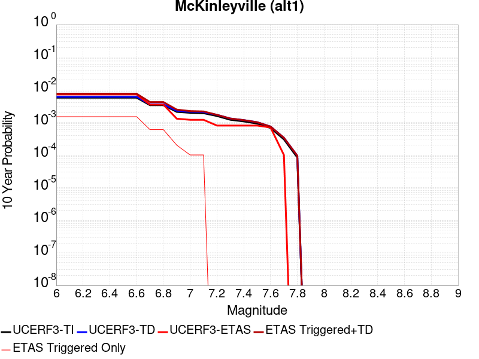 |

| Magnitude | 1 wk TI Prob | 1 wk TD Prob | 1 wk ETAS Prob | 1 wk ETAS/TD Gain | 1 wk ETAS Triggered+TD | 1 wk ETAS Triggered Only | 1 mo TI Prob | 1 mo TD Prob | 1 mo ETAS Prob | 1 mo ETAS/TD Gain | 1 mo ETAS Triggered+TD | 1 mo ETAS Triggered Only | 1 yr TI Prob | 1 yr TD Prob | 1 yr ETAS Prob | 1 yr ETAS/TD Gain | 1 yr ETAS Triggered+TD | 1 yr ETAS Triggered Only | 10 yr TI Prob | 10 yr TD Prob | 10 yr ETAS Prob | 10 yr ETAS/TD Gain | 10 yr ETAS Triggered+TD | 10 yr ETAS Triggered Only |
|-----|-----|-----|-----|-----|-----|-----|-----|-----|-----|-----|-----|-----|-----|-----|-----|-----|-----|-----|-----|-----|-----|-----|-----|-----|
| 6.0 | 1.1028524E-5 | 1.1729238E-5 | 0.0 | 0.0 | 1.1729238E-5 | 0.0 | 4.7264242E-5 | 5.0267343E-5 | 0.0 | 0.0 | 5.0267343E-5 | 0.0 | 5.7529024E-4 | 6.1185844E-4 | 4.0E-4 | 0.653746 | 6.1185844E-4 | 0.0 | 0.005738032 | 0.006104248 | 0.0072 | 1.1795064 | 0.0075950916 | 0.0015 |
| 6.1 | 1.1028524E-5 | 1.1729238E-5 | 0.0 | 0.0 | 1.1729238E-5 | 0.0 | 4.7264242E-5 | 5.0267343E-5 | 0.0 | 0.0 | 5.0267343E-5 | 0.0 | 5.7529024E-4 | 6.1185844E-4 | 4.0E-4 | 0.653746 | 6.1185844E-4 | 0.0 | 0.005738032 | 0.006104248 | 0.0072 | 1.1795064 | 0.0075950916 | 0.0015 |
| 6.2 | 1.1028524E-5 | 1.1729238E-5 | 0.0 | 0.0 | 1.1729238E-5 | 0.0 | 4.7264242E-5 | 5.0267343E-5 | 0.0 | 0.0 | 5.0267343E-5 | 0.0 | 5.7529024E-4 | 6.1185844E-4 | 4.0E-4 | 0.653746 | 6.1185844E-4 | 0.0 | 0.005738032 | 0.006104248 | 0.0072 | 1.1795064 | 0.0075950916 | 0.0015 |
| 6.3 | 1.1028524E-5 | 1.1729238E-5 | 0.0 | 0.0 | 1.1729238E-5 | 0.0 | 4.7264242E-5 | 5.0267343E-5 | 0.0 | 0.0 | 5.0267343E-5 | 0.0 | 5.7529024E-4 | 6.1185844E-4 | 4.0E-4 | 0.653746 | 6.1185844E-4 | 0.0 | 0.005738032 | 0.006104248 | 0.0072 | 1.1795064 | 0.0075950916 | 0.0015 |
| 6.4 | 1.1028524E-5 | 1.1729238E-5 | 0.0 | 0.0 | 1.1729238E-5 | 0.0 | 4.7264242E-5 | 5.0267343E-5 | 0.0 | 0.0 | 5.0267343E-5 | 0.0 | 5.7529024E-4 | 6.1185844E-4 | 4.0E-4 | 0.653746 | 6.1185844E-4 | 0.0 | 0.005738032 | 0.006104248 | 0.0072 | 1.1795064 | 0.0075950916 | 0.0015 |
| 6.5 | 1.1028524E-5 | 1.1729238E-5 | 0.0 | 0.0 | 1.1729238E-5 | 0.0 | 4.7264242E-5 | 5.0267343E-5 | 0.0 | 0.0 | 5.0267343E-5 | 0.0 | 5.7529024E-4 | 6.1185844E-4 | 4.0E-4 | 0.653746 | 6.1185844E-4 | 0.0 | 0.005738032 | 0.006104248 | 0.0072 | 1.1795064 | 0.0075950916 | 0.0015 |
| 6.6 | 1.1028524E-5 | 1.1729238E-5 | 0.0 | 0.0 | 1.1729238E-5 | 0.0 | 4.7264242E-5 | 5.0267343E-5 | 0.0 | 0.0 | 5.0267343E-5 | 0.0 | 5.7529024E-4 | 6.1185844E-4 | 4.0E-4 | 0.653746 | 6.1185844E-4 | 0.0 | 0.005738032 | 0.006104248 | 0.0072 | 1.1795064 | 0.0075950916 | 0.0015 |
| 6.7 | 6.483374E-6 | 6.9180064E-6 | 0.0 | 0.0 | 6.9180064E-6 | 0.0 | 2.7785592E-5 | 2.9648298E-5 | 0.0 | 0.0 | 2.9648298E-5 | 0.0 | 3.3823706E-4 | 3.6091445E-4 | 2.0E-4 | 0.55414796 | 3.6091445E-4 | 0.0 | 0.003377227 | 0.003603896 | 0.0035 | 0.97117126 | 0.0042017335 | 6.0E-4 |
| 6.8 | 6.483374E-6 | 6.9180064E-6 | 0.0 | 0.0 | 6.9180064E-6 | 0.0 | 2.7785592E-5 | 2.9648298E-5 | 0.0 | 0.0 | 2.9648298E-5 | 0.0 | 3.3823706E-4 | 3.6091445E-4 | 2.0E-4 | 0.55414796 | 3.6091445E-4 | 0.0 | 0.003377227 | 0.003603896 | 0.0035 | 0.97117126 | 0.0042017335 | 6.0E-4 |
| 6.9 | 4.0394048E-6 | 4.346E-6 | 0.0 | 0.0 | 4.346E-6 | 0.0 | 1.731162E-5 | 1.8625586E-5 | 0.0 | 0.0 | 1.8625586E-5 | 0.0 | 2.1074859E-4 | 2.2674345E-4 | 0.0 | 0.0 | 2.2674345E-4 | 0.0 | 0.0021054882 | 0.0022651758 | 0.0013 | 0.57390684 | 0.0024647228 | 2.0E-4 |
| 7.0 | 3.7791233E-6 | 4.0728296E-6 | 0.0 | 0.0 | 4.0728296E-6 | 0.0 | 1.6196142E-5 | 1.745487E-5 | 0.0 | 0.0 | 1.745487E-5 | 0.0 | 1.9717019E-4 | 2.1249281E-4 | 0.0 | 0.0 | 2.1249281E-4 | 0.0 | 0.0019699533 | 0.0021229463 | 0.0012 | 0.5652522 | 0.002222734 | 1.0E-4 |
| 7.1 | 3.675443E-6 | 3.9641195E-6 | 0.0 | 0.0 | 3.9641195E-6 | 0.0 | 1.5751802E-5 | 1.6988975E-5 | 0.0 | 0.0 | 1.6988975E-5 | 0.0 | 1.9176133E-4 | 2.0682164E-4 | 0.0 | 0.0 | 2.0682164E-4 | 0.0 | 0.0019159593 | 0.0020663412 | 0.0012 | 0.58073664 | 0.0021661345 | 1.0E-4 |
| 7.2 | 3.0165843E-6 | 3.2726525E-6 | 0.0 | 0.0 | 3.2726525E-6 | 0.0 | 1.2928153E-5 | 1.402558E-5 | 0.0 | 0.0 | 1.402558E-5 | 0.0 | 1.573889E-4 | 1.7074823E-4 | 0.0 | 0.0 | 1.7074823E-4 | 0.0 | 0.0015727748 | 0.0017061892 | 8.0E-4 | 0.46888116 | 0.0017061892 | 0.0 |
| 7.3 | 2.307633E-6 | 2.519374E-6 | 0.0 | 0.0 | 2.519374E-6 | 0.0 | 9.889818E-6 | 1.0797273E-5 | 0.0 | 0.0 | 1.0797273E-5 | 0.0 | 1.2040188E-4 | 1.3144895E-4 | 0.0 | 0.0 | 1.3144895E-4 | 0.0 | 0.0012033667 | 0.0013137204 | 8.0E-4 | 0.6089576 | 0.0013137204 | 0.0 |
| 7.4 | 2.0568484E-6 | 2.252148E-6 | 0.0 | 0.0 | 2.252148E-6 | 0.0 | 8.8150355E-6 | 9.652028E-6 | 0.0 | 0.0 | 9.652028E-6 | 0.0 | 1.0731777E-4 | 1.17507174E-4 | 0.0 | 0.0 | 1.17507174E-4 | 0.0 | 0.0010726595 | 0.0011744581 | 8.0E-4 | 0.6811652 | 0.0011744581 | 0.0 |
| 7.5 | 1.7674889E-6 | 1.9418057E-6 | 0.0 | 0.0 | 1.9418057E-6 | 0.0 | 7.5749304E-6 | 8.321998E-6 | 0.0 | 0.0 | 8.321998E-6 | 0.0 | 9.222087E-5 | 1.0131569E-4 | 0.0 | 0.0 | 1.0131569E-4 | 0.0 | 9.218261E-4 | 0.0010127017 | 8.0E-4 | 0.78996617 | 0.0010127017 | 0.0 |
| 7.6 | 1.2944297E-6 | 1.4299355E-6 | 0.0 | 0.0 | 1.4299355E-6 | 0.0 | 5.547544E-6 | 6.1282813E-6 | 0.0 | 0.0 | 6.1282813E-6 | 0.0 | 6.753925E-5 | 7.4609314E-5 | 0.0 | 0.0 | 7.4609314E-5 | 0.0 | 6.7518733E-4 | 7.4584753E-4 | 7.0E-4 | 0.9385297 | 7.4584753E-4 | 0.0 |
| 7.7 | 5.806243E-7 | 6.462457E-7 | 0.0 | 0.0 | 6.462457E-7 | 0.0 | 2.4883875E-6 | 2.7696217E-6 | 0.0 | 0.0 | 2.7696217E-6 | 0.0 | 3.0295698E-5 | 3.371964E-5 | 0.0 | 0.0 | 3.371964E-5 | 0.0 | 3.0291567E-4 | 3.371469E-4 | 1.0E-4 | 0.2966066 | 3.371469E-4 | 0.0 |
| 7.8 | 1.6121008E-7 | 1.8188115E-7 | 0.0 | 0.0 | 1.8188115E-7 | 0.0 | 6.909002E-7 | 7.7949045E-7 | 0.0 | 0.0 | 7.7949045E-7 | 0.0 | 8.411677E-6 | 9.490257E-6 | 0.0 | 0.0 | 9.490257E-6 | 0.0 | 8.411359E-5 | 9.4898765E-5 | 0.0 | 0.0 | 9.4898765E-5 | 0.0 |

## Channel Islands Thrust
*[(top)](#table-of-contents)*

| 1 Week | 1 Month | 1 Year | 10 Year |
|-----|-----|-----|-----|
| 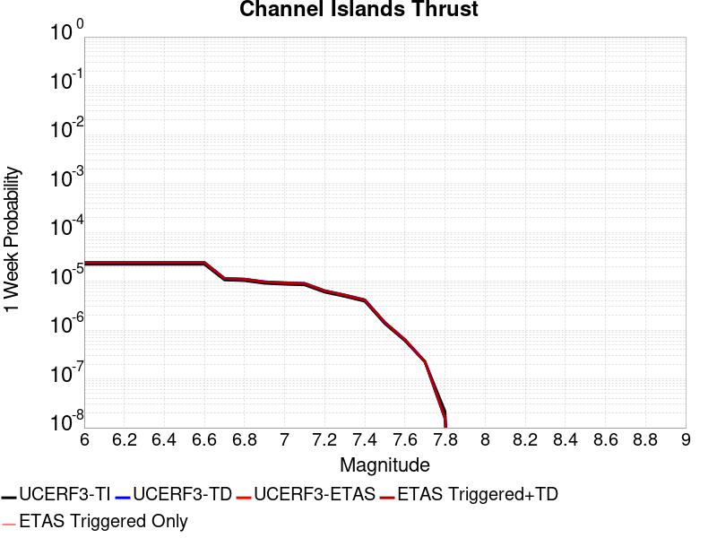 | 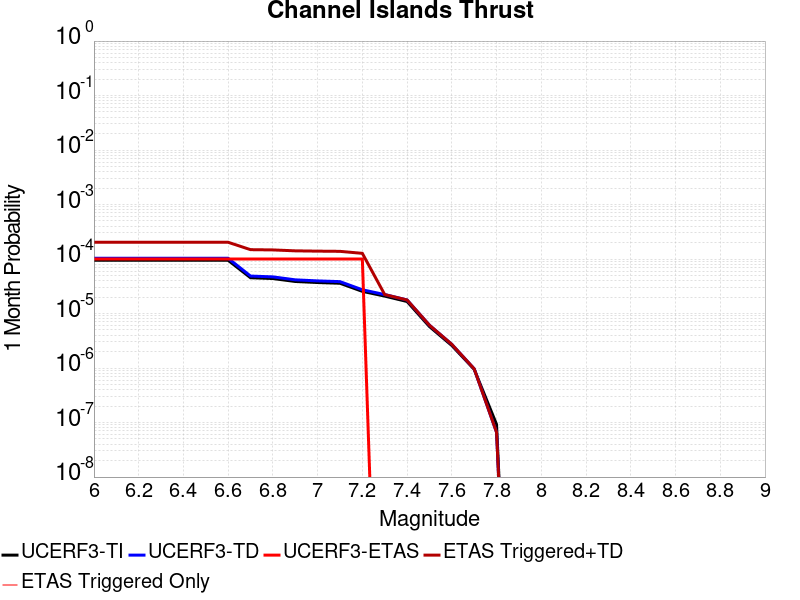 | 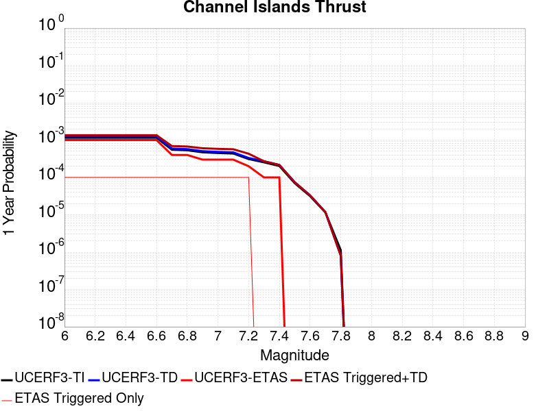 | 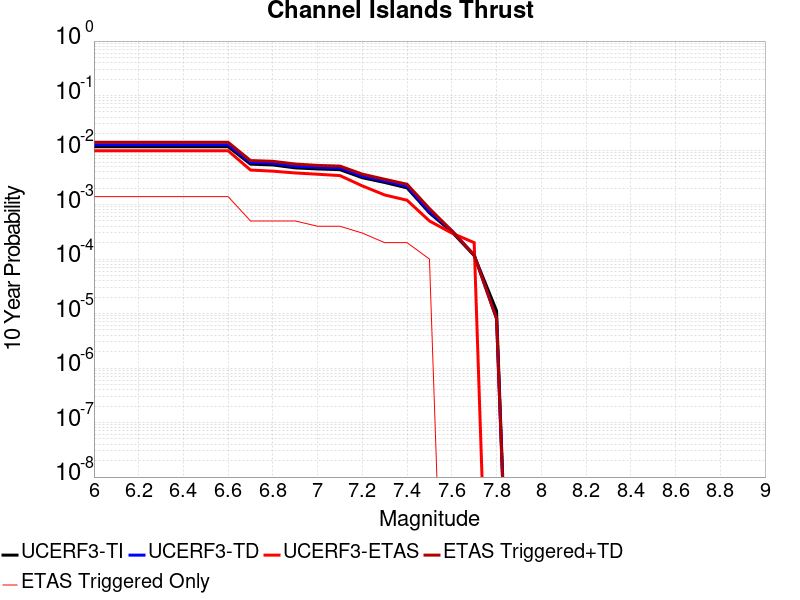 |

| Magnitude | 1 wk TI Prob | 1 wk TD Prob | 1 wk ETAS Prob | 1 wk ETAS/TD Gain | 1 wk ETAS Triggered+TD | 1 wk ETAS Triggered Only | 1 mo TI Prob | 1 mo TD Prob | 1 mo ETAS Prob | 1 mo ETAS/TD Gain | 1 mo ETAS Triggered+TD | 1 mo ETAS Triggered Only | 1 yr TI Prob | 1 yr TD Prob | 1 yr ETAS Prob | 1 yr ETAS/TD Gain | 1 yr ETAS Triggered+TD | 1 yr ETAS Triggered Only | 10 yr TI Prob | 10 yr TD Prob | 10 yr ETAS Prob | 10 yr ETAS/TD Gain | 10 yr ETAS Triggered+TD | 10 yr ETAS Triggered Only |
|-----|-----|-----|-----|-----|-----|-----|-----|-----|-----|-----|-----|-----|-----|-----|-----|-----|-----|-----|-----|-----|-----|-----|-----|-----|
| 6.0 | 2.2156251E-5 | 2.4096227E-5 | 0.0 | 0.0 | 2.4096227E-5 | 0.0 | 9.495191E-5 | 1.0326606E-4 | 1.0E-4 | 0.96837234 | 2.0325574E-4 | 1.0E-4 | 0.0011554264 | 0.0012566458 | 0.001 | 0.7957692 | 0.0013565201 | 1.0E-4 | 0.011494373 | 0.012505992 | 0.0097 | 0.77562815 | 0.013888484 | 0.0014 |
| 6.1 | 2.2156251E-5 | 2.4096227E-5 | 0.0 | 0.0 | 2.4096227E-5 | 0.0 | 9.495191E-5 | 1.0326606E-4 | 1.0E-4 | 0.96837234 | 2.0325574E-4 | 1.0E-4 | 0.0011554264 | 0.0012566458 | 0.001 | 0.7957692 | 0.0013565201 | 1.0E-4 | 0.011494373 | 0.012505992 | 0.0097 | 0.77562815 | 0.013888484 | 0.0014 |
| 6.2 | 2.2156251E-5 | 2.4096227E-5 | 0.0 | 0.0 | 2.4096227E-5 | 0.0 | 9.495191E-5 | 1.0326606E-4 | 1.0E-4 | 0.96837234 | 2.0325574E-4 | 1.0E-4 | 0.0011554264 | 0.0012566458 | 0.001 | 0.7957692 | 0.0013565201 | 1.0E-4 | 0.011494373 | 0.012505992 | 0.0097 | 0.77562815 | 0.013888484 | 0.0014 |
| 6.3 | 2.2156251E-5 | 2.4096227E-5 | 0.0 | 0.0 | 2.4096227E-5 | 0.0 | 9.495191E-5 | 1.0326606E-4 | 1.0E-4 | 0.96837234 | 2.0325574E-4 | 1.0E-4 | 0.0011554264 | 0.0012566458 | 0.001 | 0.7957692 | 0.0013565201 | 1.0E-4 | 0.011494373 | 0.012505992 | 0.0097 | 0.77562815 | 0.013888484 | 0.0014 |
| 6.4 | 2.2156251E-5 | 2.4096227E-5 | 0.0 | 0.0 | 2.4096227E-5 | 0.0 | 9.495191E-5 | 1.0326606E-4 | 1.0E-4 | 0.96837234 | 2.0325574E-4 | 1.0E-4 | 0.0011554264 | 0.0012566458 | 0.001 | 0.7957692 | 0.0013565201 | 1.0E-4 | 0.011494373 | 0.012505992 | 0.0097 | 0.77562815 | 0.013888484 | 0.0014 |
| 6.5 | 2.2156251E-5 | 2.4096227E-5 | 0.0 | 0.0 | 2.4096227E-5 | 0.0 | 9.495191E-5 | 1.0326606E-4 | 1.0E-4 | 0.96837234 | 2.0325574E-4 | 1.0E-4 | 0.0011554264 | 0.0012566458 | 0.001 | 0.7957692 | 0.0013565201 | 1.0E-4 | 0.011494373 | 0.012505992 | 0.0097 | 0.77562815 | 0.013888484 | 0.0014 |
| 6.6 | 2.2156251E-5 | 2.4096227E-5 | 0.0 | 0.0 | 2.4096227E-5 | 0.0 | 9.495191E-5 | 1.0326606E-4 | 1.0E-4 | 0.96837234 | 2.0325574E-4 | 1.0E-4 | 0.0011554264 | 0.0012566458 | 0.001 | 0.7957692 | 0.0013565201 | 1.0E-4 | 0.011494373 | 0.012505992 | 0.0097 | 0.77562815 | 0.013888484 | 0.0014 |
| 6.7 | 1.0601296E-5 | 1.1381223E-5 | 0.0 | 0.0 | 1.1381223E-5 | 0.0 | 4.5433335E-5 | 4.8775786E-5 | 1.0E-4 | 2.0501976 | 1.4877091E-4 | 1.0E-4 | 5.5301044E-4 | 5.936883E-4 | 4.0E-4 | 0.6737542 | 6.936289E-4 | 1.0E-4 | 0.005516363 | 0.0059215245 | 0.0043 | 0.72616434 | 0.006418564 | 5.0E-4 |
| 6.8 | 1.0246747E-5 | 1.09982875E-5 | 0.0 | 0.0 | 1.09982875E-5 | 0.0 | 4.391389E-5 | 4.7134694E-5 | 1.0E-4 | 2.1215794 | 1.4712998E-4 | 1.0E-4 | 5.345204E-4 | 5.737186E-4 | 4.0E-4 | 0.6972059 | 6.7366124E-4 | 1.0E-4 | 0.0053323656 | 0.005722865 | 0.0041 | 0.7164244 | 0.0062200036 | 5.0E-4 |
| 6.9 | 9.049551E-6 | 9.701049E-6 | 0.0 | 0.0 | 9.701049E-6 | 0.0 | 3.878322E-5 | 4.1575284E-5 | 1.0E-4 | 2.4052753 | 1.4157113E-4 | 1.0E-4 | 4.7208337E-4 | 5.060656E-4 | 3.0E-4 | 0.5928085 | 6.0601503E-4 | 1.0E-4 | 0.0047108172 | 0.0050495495 | 0.0038 | 0.7525424 | 0.005547025 | 5.0E-4 |
| 7.0 | 8.6542195E-6 | 9.275944E-6 | 0.0 | 0.0 | 9.275944E-6 | 0.0 | 3.7088983E-5 | 3.9753464E-5 | 1.0E-4 | 2.5155041 | 1.3974949E-4 | 1.0E-4 | 4.5146482E-4 | 4.83895E-4 | 3.0E-4 | 0.6199692 | 5.838466E-4 | 1.0E-4 | 0.004505487 | 0.0048288256 | 0.0036 | 0.7455229 | 0.0052268943 | 4.0E-4 |
| 7.1 | 8.391028E-6 | 8.994227E-6 | 0.0 | 0.0 | 8.994227E-6 | 0.0 | 3.5961057E-5 | 3.854614E-5 | 1.0E-4 | 2.5942936 | 1.3854228E-4 | 1.0E-4 | 4.3773788E-4 | 4.6920226E-4 | 3.0E-4 | 0.63938314 | 5.691553E-4 | 1.0E-4 | 0.004368766 | 0.0046825265 | 0.0034 | 0.7261037 | 0.0050806534 | 4.0E-4 |
| 7.2 | 5.965188E-6 | 6.3725774E-6 | 0.0 | 0.0 | 6.3725774E-6 | 0.0 | 2.556484E-5 | 2.7310763E-5 | 1.0E-4 | 3.66156 | 1.2730803E-4 | 1.0E-4 | 3.1120746E-4 | 3.3245835E-4 | 2.0E-4 | 0.60157907 | 4.3242512E-4 | 1.0E-4 | 0.00310772 | 0.0033196681 | 0.0022 | 0.66271687 | 0.0036186723 | 3.0E-4 |
| 7.3 | 4.877518E-6 | 5.2067226E-6 | 0.0 | 0.0 | 5.2067226E-6 | 0.0 | 2.0903482E-5 | 2.2314338E-5 | 0.0 | 0.0 | 2.2314338E-5 | 0.0 | 2.5447016E-4 | 2.7164363E-4 | 1.0E-4 | 0.36812937 | 2.7164363E-4 | 0.0 | 0.0025417898 | 0.0027131622 | 0.0015 | 0.55286044 | 0.0029126196 | 2.0E-4 |
| 7.4 | 3.8829853E-6 | 4.142431E-6 | 0.0 | 0.0 | 4.142431E-6 | 0.0 | 1.664126E-5 | 1.7753156E-5 | 0.0 | 0.0 | 1.7753156E-5 | 0.0 | 2.0258849E-4 | 2.1612366E-4 | 1.0E-4 | 0.46269804 | 2.1612366E-4 | 0.0 | 0.002024039 | 0.0021591766 | 0.0012 | 0.5557674 | 0.0023587449 | 2.0E-4 |
| 7.5 | 1.3489616E-6 | 1.4279756E-6 | 0.0 | 0.0 | 1.4279756E-6 | 0.0 | 5.7812517E-6 | 6.119881E-6 | 0.0 | 0.0 | 6.119881E-6 | 0.0 | 7.038446E-5 | 7.450704E-5 | 0.0 | 0.0 | 7.450704E-5 | 0.0 | 7.036218E-4 | 7.448246E-4 | 5.0E-4 | 0.671299 | 8.4475015E-4 | 1.0E-4 |
| 7.6 | 6.058192E-7 | 6.354584E-7 | 0.0 | 0.0 | 6.354584E-7 | 0.0 | 2.5963652E-6 | 2.7233903E-6 | 0.0 | 0.0 | 2.7233903E-6 | 0.0 | 3.161029E-5 | 3.315679E-5 | 0.0 | 0.0 | 3.315679E-5 | 0.0 | 3.1605794E-4 | 3.3152004E-4 | 3.0E-4 | 0.90492266 | 3.3152004E-4 | 0.0 |
| 7.7 | 2.2170494E-7 | 2.2610543E-7 | 0.0 | 0.0 | 2.2610543E-7 | 0.0 | 9.5016367E-7 | 9.69023E-7 | 0.0 | 0.0 | 9.69023E-7 | 0.0 | 1.1568181E-5 | 1.17978025E-5 | 0.0 | 0.0 | 1.17978025E-5 | 0.0 | 1.1567579E-4 | 1.1797287E-4 | 2.0E-4 | 1.6953051 | 1.1797287E-4 | 0.0 |
| 7.8 | 2.1613102E-8 | 1.546824E-8 | 0.0 | 0.0 | 1.546824E-8 | 0.0 | 9.262757E-8 | 6.629245E-8 | 0.0 | 0.0 | 6.629245E-8 | 0.0 | 1.1277401E-6 | 8.071104E-7 | 0.0 | 0.0 | 8.071104E-7 | 0.0 | 1.1277344E-5 | 8.071082E-6 | 0.0 | 0.0 | 8.071082E-6 | 0.0 |

## Great Valley 08 (Quinto)
*[(top)](#table-of-contents)*

| 1 Week | 1 Month | 1 Year | 10 Year |
|-----|-----|-----|-----|
|  |  | 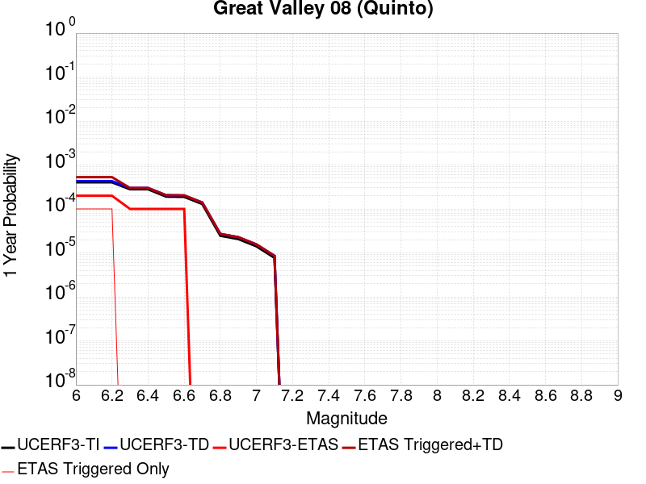 |  |

| Magnitude | 1 wk TI Prob | 1 wk TD Prob | 1 wk ETAS Prob | 1 wk ETAS/TD Gain | 1 wk ETAS Triggered+TD | 1 wk ETAS Triggered Only | 1 mo TI Prob | 1 mo TD Prob | 1 mo ETAS Prob | 1 mo ETAS/TD Gain | 1 mo ETAS Triggered+TD | 1 mo ETAS Triggered Only | 1 yr TI Prob | 1 yr TD Prob | 1 yr ETAS Prob | 1 yr ETAS/TD Gain | 1 yr ETAS Triggered+TD | 1 yr ETAS Triggered Only | 10 yr TI Prob | 10 yr TD Prob | 10 yr ETAS Prob | 10 yr ETAS/TD Gain | 10 yr ETAS Triggered+TD | 10 yr ETAS Triggered Only |
|-----|-----|-----|-----|-----|-----|-----|-----|-----|-----|-----|-----|-----|-----|-----|-----|-----|-----|-----|-----|-----|-----|-----|-----|-----|
| 6.0 | 7.737697E-6 | 8.254131E-6 | 0.0 | 0.0 | 8.254131E-6 | 0.0 | 3.3161137E-5 | 3.5374473E-5 | 1.0E-4 | 2.8268971 | 1.3537094E-4 | 1.0E-4 | 4.0366207E-4 | 4.3061798E-4 | 2.0E-4 | 0.4644488 | 5.305749E-4 | 1.0E-4 | 0.004029296 | 0.004299689 | 0.0069 | 1.6047672 | 0.0057932395 | 0.0015 |
| 6.1 | 7.737697E-6 | 8.254131E-6 | 0.0 | 0.0 | 8.254131E-6 | 0.0 | 3.3161137E-5 | 3.5374473E-5 | 1.0E-4 | 2.8268971 | 1.3537094E-4 | 1.0E-4 | 4.0366207E-4 | 4.3061798E-4 | 2.0E-4 | 0.4644488 | 5.305749E-4 | 1.0E-4 | 0.004029296 | 0.004299689 | 0.0069 | 1.6047672 | 0.0057932395 | 0.0015 |
| 6.2 | 7.737697E-6 | 8.254131E-6 | 0.0 | 0.0 | 8.254131E-6 | 0.0 | 3.3161137E-5 | 3.5374473E-5 | 1.0E-4 | 2.8268971 | 1.3537094E-4 | 1.0E-4 | 4.0366207E-4 | 4.3061798E-4 | 2.0E-4 | 0.4644488 | 5.305749E-4 | 1.0E-4 | 0.004029296 | 0.004299689 | 0.0069 | 1.6047672 | 0.0057932395 | 0.0015 |
| 6.3 | 5.374012E-6 | 5.7513753E-6 | 0.0 | 0.0 | 5.7513753E-6 | 0.0 | 2.3031276E-5 | 2.4648582E-5 | 0.0 | 0.0 | 2.4648582E-5 | 0.0 | 2.803697E-4 | 3.0006628E-4 | 1.0E-4 | 0.3332597 | 3.0006628E-4 | 0.0 | 0.0028001624 | 0.0029977048 | 0.0033 | 1.1008422 | 0.003496206 | 5.0E-4 |
| 6.4 | 5.374012E-6 | 5.7513753E-6 | 0.0 | 0.0 | 5.7513753E-6 | 0.0 | 2.3031276E-5 | 2.4648582E-5 | 0.0 | 0.0 | 2.4648582E-5 | 0.0 | 2.803697E-4 | 3.0006628E-4 | 1.0E-4 | 0.3332597 | 3.0006628E-4 | 0.0 | 0.0028001624 | 0.0029977048 | 0.0033 | 1.1008422 | 0.003496206 | 5.0E-4 |
| 6.5 | 3.65427E-6 | 3.9419388E-6 | 0.0 | 0.0 | 3.9419388E-6 | 0.0 | 1.5661062E-5 | 1.6893953E-5 | 0.0 | 0.0 | 1.6893953E-5 | 0.0 | 1.9065675E-4 | 2.0567152E-4 | 1.0E-4 | 0.4862122 | 2.0567152E-4 | 0.0 | 0.0019049325 | 0.0020555037 | 0.0017 | 0.8270479 | 0.002354887 | 3.0E-4 |
| 6.6 | 3.6143538E-6 | 3.8991193E-6 | 0.0 | 0.0 | 3.8991193E-6 | 0.0 | 1.5489995E-5 | 1.6710444E-5 | 0.0 | 0.0 | 1.6710444E-5 | 0.0 | 1.8857437E-4 | 2.0343771E-4 | 1.0E-4 | 0.49155095 | 2.0343771E-4 | 0.0 | 0.0018841444 | 0.0020332064 | 0.0017 | 0.83611774 | 0.0023325966 | 3.0E-4 |
| 6.7 | 2.4821015E-6 | 2.6861442E-6 | 0.0 | 0.0 | 2.6861442E-6 | 0.0 | 1.0637535E-5 | 1.1512028E-5 | 0.0 | 0.0 | 1.1512028E-5 | 0.0 | 1.2950429E-4 | 1.401556E-4 | 0.0 | 0.0 | 1.401556E-4 | 0.0 | 0.0012942884 | 0.001401227 | 0.0011 | 0.78502625 | 0.0017008067 | 3.0E-4 |
| 6.8 | 4.7110538E-7 | 5.1940754E-7 | 0.0 | 0.0 | 5.1940754E-7 | 0.0 | 2.0190216E-6 | 2.2260303E-6 | 0.0 | 0.0 | 2.2260303E-6 | 0.0 | 2.458131E-5 | 2.7101602E-5 | 0.0 | 0.0 | 2.7101602E-5 | 0.0 | 2.457859E-4 | 2.7098478E-4 | 3.0E-4 | 1.1070733 | 2.7098478E-4 | 0.0 |
| 6.9 | 3.958685E-7 | 4.371247E-7 | 0.0 | 0.0 | 4.371247E-7 | 0.0 | 1.6965782E-6 | 1.8733903E-6 | 0.0 | 0.0 | 1.8733903E-6 | 0.0 | 2.0655643E-5 | 2.2808304E-5 | 0.0 | 0.0 | 2.2808304E-5 | 0.0 | 2.0653724E-4 | 2.2806127E-4 | 3.0E-4 | 1.315436 | 2.2806127E-4 | 0.0 |
| 7.0 | 2.70294E-7 | 2.9926358E-7 | 0.0 | 0.0 | 2.9926358E-7 | 0.0 | 1.1584025E-6 | 1.2825576E-6 | 0.0 | 0.0 | 1.2825576E-6 | 0.0 | 1.4103458E-5 | 1.561504E-5 | 0.0 | 0.0 | 1.561504E-5 | 0.0 | 1.4102564E-4 | 1.561407E-4 | 3.0E-4 | 1.9213439 | 1.561407E-4 | 0.0 |
| 7.1 | 1.4828602E-7 | 1.6472721E-7 | 0.0 | 0.0 | 1.6472721E-7 | 0.0 | 6.3551136E-7 | 7.059736E-7 | 0.0 | 0.0 | 7.059736E-7 | 0.0 | 7.737323E-6 | 8.595203E-6 | 0.0 | 0.0 | 8.595203E-6 | 0.0 | 7.737054E-5 | 8.5949505E-5 | 0.0 | 0.0 | 8.5949505E-5 | 0.0 |

## Raymond
*[(top)](#table-of-contents)*

| 1 Week | 1 Month | 1 Year | 10 Year |
|-----|-----|-----|-----|
| 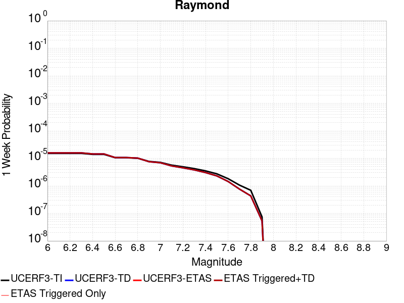 | 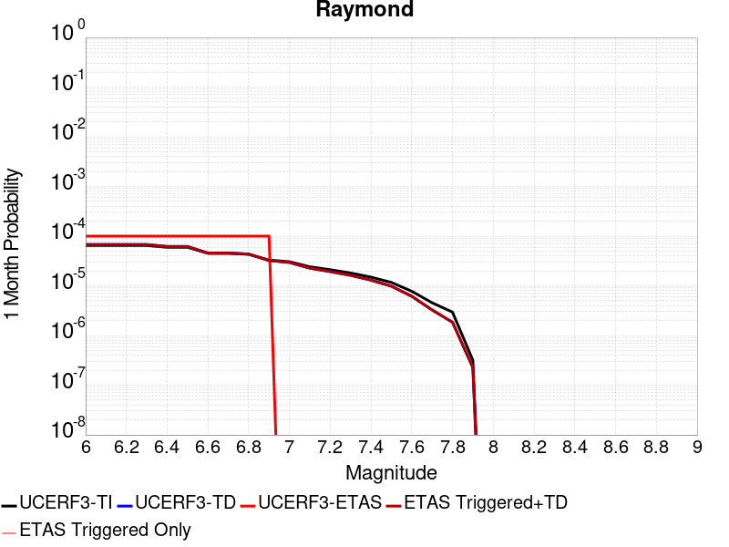 | 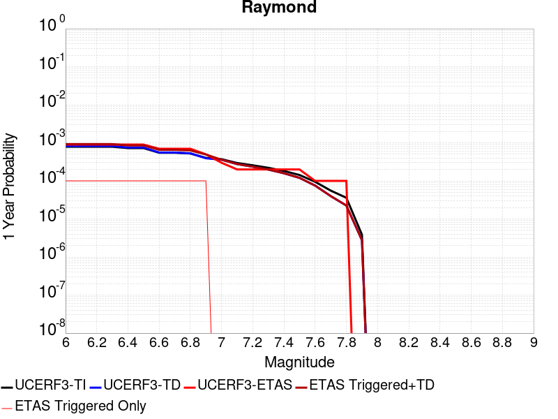 | 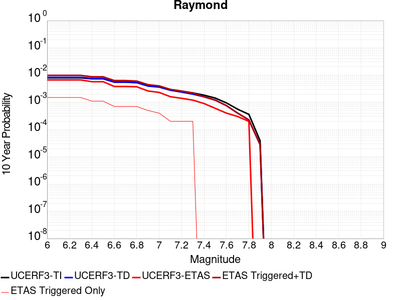 |

| Magnitude | 1 wk TI Prob | 1 wk TD Prob | 1 wk ETAS Prob | 1 wk ETAS/TD Gain | 1 wk ETAS Triggered+TD | 1 wk ETAS Triggered Only | 1 mo TI Prob | 1 mo TD Prob | 1 mo ETAS Prob | 1 mo ETAS/TD Gain | 1 mo ETAS Triggered+TD | 1 mo ETAS Triggered Only | 1 yr TI Prob | 1 yr TD Prob | 1 yr ETAS Prob | 1 yr ETAS/TD Gain | 1 yr ETAS Triggered+TD | 1 yr ETAS Triggered Only | 10 yr TI Prob | 10 yr TD Prob | 10 yr ETAS Prob | 10 yr ETAS/TD Gain | 10 yr ETAS Triggered+TD | 10 yr ETAS Triggered Only |
|-----|-----|-----|-----|-----|-----|-----|-----|-----|-----|-----|-----|-----|-----|-----|-----|-----|-----|-----|-----|-----|-----|-----|-----|-----|
| 6.0 | 1.5157413E-5 | 1.5814016E-5 | 0.0 | 0.0 | 1.5814016E-5 | 0.0 | 6.4958724E-5 | 6.777274E-5 | 1.0E-4 | 1.4755197 | 6.777274E-5 | 0.0 | 7.905855E-4 | 8.2484575E-4 | 9.0E-4 | 1.0911131 | 9.2476327E-4 | 1.0E-4 | 0.007877788 | 0.008220356 | 0.0066 | 0.80288494 | 0.0097080255 | 0.0015 |
| 6.1 | 1.5157413E-5 | 1.5814016E-5 | 0.0 | 0.0 | 1.5814016E-5 | 0.0 | 6.4958724E-5 | 6.777274E-5 | 1.0E-4 | 1.4755197 | 6.777274E-5 | 0.0 | 7.905855E-4 | 8.2484575E-4 | 9.0E-4 | 1.0911131 | 9.2476327E-4 | 1.0E-4 | 0.007877788 | 0.008220356 | 0.0066 | 0.80288494 | 0.0097080255 | 0.0015 |
| 6.2 | 1.5157413E-5 | 1.5814016E-5 | 0.0 | 0.0 | 1.5814016E-5 | 0.0 | 6.4958724E-5 | 6.777274E-5 | 1.0E-4 | 1.4755197 | 6.777274E-5 | 0.0 | 7.905855E-4 | 8.2484575E-4 | 9.0E-4 | 1.0911131 | 9.2476327E-4 | 1.0E-4 | 0.007877788 | 0.008220356 | 0.0066 | 0.80288494 | 0.0097080255 | 0.0015 |
| 6.3 | 1.5157413E-5 | 1.5814016E-5 | 0.0 | 0.0 | 1.5814016E-5 | 0.0 | 6.4958724E-5 | 6.777274E-5 | 1.0E-4 | 1.4755197 | 6.777274E-5 | 0.0 | 7.905855E-4 | 8.2484575E-4 | 9.0E-4 | 1.0911131 | 9.2476327E-4 | 1.0E-4 | 0.007877788 | 0.008220356 | 0.0066 | 0.80288494 | 0.0097080255 | 0.0015 |
| 6.4 | 1.3941944E-5 | 1.4458269E-5 | 0.0 | 0.0 | 1.4458269E-5 | 0.0 | 5.9749822E-5 | 6.196267E-5 | 1.0E-4 | 1.6138749 | 6.196267E-5 | 0.0 | 7.2721124E-4 | 7.541577E-4 | 9.0E-4 | 1.1933843 | 8.540823E-4 | 1.0E-4 | 0.007248361 | 0.007518314 | 0.0057 | 0.7581487 | 0.008610044 | 0.0011 |
| 6.5 | 1.3941944E-5 | 1.4458269E-5 | 0.0 | 0.0 | 1.4458269E-5 | 0.0 | 5.9749822E-5 | 6.196267E-5 | 1.0E-4 | 1.6138749 | 6.196267E-5 | 0.0 | 7.2721124E-4 | 7.541577E-4 | 9.0E-4 | 1.1933843 | 8.540823E-4 | 1.0E-4 | 0.007248361 | 0.007518314 | 0.0057 | 0.7581487 | 0.008610044 | 0.0011 |
| 6.6 | 1.0542609E-5 | 1.0673843E-5 | 0.0 | 0.0 | 1.0673843E-5 | 0.0 | 4.5181827E-5 | 4.574427E-5 | 1.0E-4 | 2.1860662 | 4.574427E-5 | 0.0 | 5.499499E-4 | 5.5679964E-4 | 7.0E-4 | 1.2571847 | 6.5674394E-4 | 1.0E-4 | 0.005485909 | 0.0055546016 | 0.0038 | 0.68411744 | 0.0062507135 | 7.0E-4 |
| 6.7 | 1.0542609E-5 | 1.0673843E-5 | 0.0 | 0.0 | 1.0673843E-5 | 0.0 | 4.5181827E-5 | 4.574427E-5 | 1.0E-4 | 2.1860662 | 4.574427E-5 | 0.0 | 5.499499E-4 | 5.5679964E-4 | 7.0E-4 | 1.2571847 | 6.5674394E-4 | 1.0E-4 | 0.005485909 | 0.0055546016 | 0.0038 | 0.68411744 | 0.0062507135 | 7.0E-4 |
| 6.8 | 1.0079132E-5 | 1.0179309E-5 | 0.0 | 0.0 | 1.0179309E-5 | 0.0 | 4.3195567E-5 | 4.362491E-5 | 1.0E-4 | 2.2922683 | 4.362491E-5 | 0.0 | 5.257791E-4 | 5.310092E-4 | 7.0E-4 | 1.3182446 | 6.3095614E-4 | 1.0E-4 | 0.0052453685 | 0.005297948 | 0.0037 | 0.69838357 | 0.00599424 | 7.0E-4 |
| 6.9 | 7.721598E-6 | 7.5509643E-6 | 0.0 | 0.0 | 7.5509643E-6 | 0.0 | 3.3092143E-5 | 3.236088E-5 | 1.0E-4 | 3.0901508 | 3.236088E-5 | 0.0 | 4.0282236E-4 | 3.939237E-4 | 5.0E-4 | 1.2692814 | 4.938843E-4 | 1.0E-4 | 0.0040209293 | 0.0039323824 | 0.0026 | 0.66117674 | 0.0044304165 | 5.0E-4 |
| 7.0 | 7.137566E-6 | 6.913248E-6 | 0.0 | 0.0 | 6.913248E-6 | 0.0 | 3.058921E-5 | 2.9627876E-5 | 0.0 | 0.0 | 2.9627876E-5 | 0.0 | 3.7236E-4 | 3.6066075E-4 | 3.0E-4 | 0.8318066 | 3.6066075E-4 | 0.0 | 0.0037173668 | 0.0036008672 | 0.0023 | 0.638735 | 0.003999427 | 4.0E-4 |
| 7.1 | 5.654976E-6 | 5.301203E-6 | 0.0 | 0.0 | 5.301203E-6 | 0.0 | 2.4235387E-5 | 2.2719245E-5 | 0.0 | 0.0 | 2.2719245E-5 | 0.0 | 2.9502588E-4 | 2.7657193E-4 | 2.0E-4 | 0.7231392 | 2.7657193E-4 | 0.0 | 0.0029463451 | 0.0027623028 | 0.0016 | 0.57922685 | 0.0029617504 | 2.0E-4 |
| 7.2 | 4.9358455E-6 | 4.528192E-6 | 0.0 | 0.0 | 4.528192E-6 | 0.0 | 2.1153453E-5 | 1.9406394E-5 | 0.0 | 0.0 | 1.9406394E-5 | 0.0 | 2.5751285E-4 | 2.3624738E-4 | 2.0E-4 | 0.84657025 | 2.3624738E-4 | 0.0 | 0.0025721465 | 0.002359979 | 0.0014 | 0.5932256 | 0.002559507 | 2.0E-4 |
| 7.3 | 4.2368597E-6 | 3.8070405E-6 | 0.0 | 0.0 | 3.8070405E-6 | 0.0 | 1.8157843E-5 | 1.6315786E-5 | 0.0 | 0.0 | 1.6315786E-5 | 0.0 | 2.2104931E-4 | 1.986267E-4 | 2.0E-4 | 1.006914 | 1.986267E-4 | 0.0 | 0.0022082955 | 0.001984505 | 0.0012 | 0.60468477 | 0.0021841081 | 2.0E-4 |
| 7.4 | 3.4999923E-6 | 3.0450324E-6 | 0.0 | 0.0 | 3.0450324E-6 | 0.0 | 1.49998805E-5 | 1.3050074E-5 | 0.0 | 0.0 | 1.3050074E-5 | 0.0 | 1.8260824E-4 | 1.5887314E-4 | 2.0E-4 | 1.258866 | 1.5887314E-4 | 0.0 | 0.0018245826 | 0.0015876059 | 9.0E-4 | 0.5668913 | 0.0015876059 | 0.0 |
| 7.5 | 2.738017E-6 | 2.303078E-6 | 0.0 | 0.0 | 2.303078E-6 | 0.0 | 1.1734306E-5 | 9.870298E-6 | 0.0 | 0.0 | 9.870298E-6 | 0.0 | 1.428558E-4 | 1.2016431E-4 | 2.0E-4 | 1.6643877 | 1.2016431E-4 | 0.0 | 0.0014276401 | 0.0012010023 | 6.0E-4 | 0.49958274 | 0.0012010023 | 0.0 |
| 7.6 | 1.8186392E-6 | 1.443055E-6 | 0.0 | 0.0 | 1.443055E-6 | 0.0 | 7.794145E-6 | 6.184507E-6 | 0.0 | 0.0 | 6.184507E-6 | 0.0 | 9.488958E-5 | 7.5293814E-5 | 1.0E-4 | 1.3281304 | 7.5293814E-5 | 0.0 | 9.4849075E-4 | 7.526891E-4 | 4.0E-4 | 0.5314279 | 7.526891E-4 | 0.0 |
| 7.7 | 1.0660348E-6 | 7.6499214E-7 | 0.0 | 0.0 | 7.6499214E-7 | 0.0 | 4.5687125E-6 | 3.2785338E-6 | 0.0 | 0.0 | 3.2785338E-6 | 0.0 | 5.5622655E-5 | 3.9915434E-5 | 1.0E-4 | 2.5052967 | 3.9915434E-5 | 0.0 | 5.5608735E-4 | 3.9908633E-4 | 3.0E-4 | 0.75171703 | 3.9908633E-4 | 0.0 |
| 7.8 | 6.913602E-7 | 4.325647E-7 | 0.0 | 0.0 | 4.325647E-7 | 0.0 | 2.962969E-6 | 1.8538475E-6 | 0.0 | 0.0 | 1.8538475E-6 | 0.0 | 3.607355E-5 | 2.2570364E-5 | 1.0E-4 | 4.4305887 | 2.2570364E-5 | 0.0 | 3.6067693E-4 | 2.2568331E-4 | 2.0E-4 | 0.88619757 | 2.2568331E-4 | 0.0 |
| 7.9 | 7.425201E-8 | 5.3267637E-8 | 0.0 | 0.0 | 5.3267637E-8 | 0.0 | 3.1822285E-7 | 2.2828986E-7 | 0.0 | 0.0 | 2.2828986E-7 | 0.0 | 3.874356E-6 | 2.7794267E-6 | 0.0 | 0.0 | 2.7794267E-6 | 0.0 | 3.8742884E-5 | 2.779405E-5 | 0.0 | 0.0 | 2.779405E-5 | 0.0 |

## Towne Pass
*[(top)](#table-of-contents)*

| 1 Week | 1 Month | 1 Year | 10 Year |
|-----|-----|-----|-----|
| 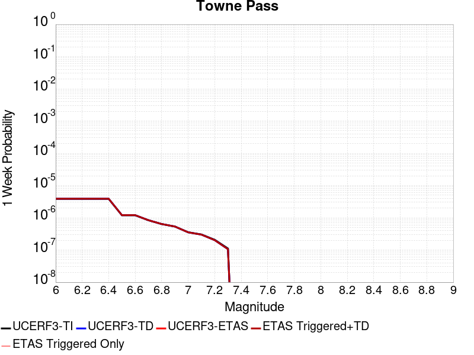 |  |  | 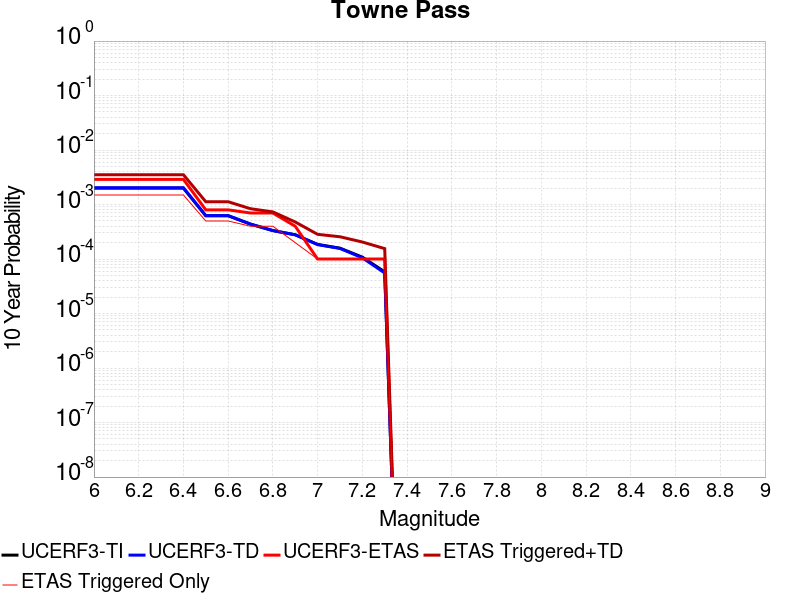 |

| Magnitude | 1 wk TI Prob | 1 wk TD Prob | 1 wk ETAS Prob | 1 wk ETAS/TD Gain | 1 wk ETAS Triggered+TD | 1 wk ETAS Triggered Only | 1 mo TI Prob | 1 mo TD Prob | 1 mo ETAS Prob | 1 mo ETAS/TD Gain | 1 mo ETAS Triggered+TD | 1 mo ETAS Triggered Only | 1 yr TI Prob | 1 yr TD Prob | 1 yr ETAS Prob | 1 yr ETAS/TD Gain | 1 yr ETAS Triggered+TD | 1 yr ETAS Triggered Only | 10 yr TI Prob | 10 yr TD Prob | 10 yr ETAS Prob | 10 yr ETAS/TD Gain | 10 yr ETAS Triggered+TD | 10 yr ETAS Triggered Only |
|-----|-----|-----|-----|-----|-----|-----|-----|-----|-----|-----|-----|-----|-----|-----|-----|-----|-----|-----|-----|-----|-----|-----|-----|-----|
| 6.0 | 3.849728E-6 | 3.894664E-6 | 0.0 | 0.0 | 3.894664E-6 | 0.0 | 1.649873E-5 | 1.6691334E-5 | 2.0E-4 | 11.982265 | 2.16688E-4 | 2.0E-4 | 2.0085352E-4 | 2.0320242E-4 | 4.0E-4 | 1.9684805 | 6.031211E-4 | 4.0E-4 | 0.0020067208 | 0.0020305954 | 0.0029 | 1.4281526 | 0.0035275496 | 0.0015 |
| 6.1 | 3.849728E-6 | 3.894664E-6 | 0.0 | 0.0 | 3.894664E-6 | 0.0 | 1.649873E-5 | 1.6691334E-5 | 2.0E-4 | 11.982265 | 2.16688E-4 | 2.0E-4 | 2.0085352E-4 | 2.0320242E-4 | 4.0E-4 | 1.9684805 | 6.031211E-4 | 4.0E-4 | 0.0020067208 | 0.0020305954 | 0.0029 | 1.4281526 | 0.0035275496 | 0.0015 |
| 6.2 | 3.849728E-6 | 3.894664E-6 | 0.0 | 0.0 | 3.894664E-6 | 0.0 | 1.649873E-5 | 1.6691334E-5 | 2.0E-4 | 11.982265 | 2.16688E-4 | 2.0E-4 | 2.0085352E-4 | 2.0320242E-4 | 4.0E-4 | 1.9684805 | 6.031211E-4 | 4.0E-4 | 0.0020067208 | 0.0020305954 | 0.0029 | 1.4281526 | 0.0035275496 | 0.0015 |
| 6.3 | 3.849728E-6 | 3.894664E-6 | 0.0 | 0.0 | 3.894664E-6 | 0.0 | 1.649873E-5 | 1.6691334E-5 | 2.0E-4 | 11.982265 | 2.16688E-4 | 2.0E-4 | 2.0085352E-4 | 2.0320242E-4 | 4.0E-4 | 1.9684805 | 6.031211E-4 | 4.0E-4 | 0.0020067208 | 0.0020305954 | 0.0029 | 1.4281526 | 0.0035275496 | 0.0015 |
| 6.4 | 3.849728E-6 | 3.894664E-6 | 0.0 | 0.0 | 3.894664E-6 | 0.0 | 1.649873E-5 | 1.6691334E-5 | 2.0E-4 | 11.982265 | 2.16688E-4 | 2.0E-4 | 2.0085352E-4 | 2.0320242E-4 | 4.0E-4 | 1.9684805 | 6.031211E-4 | 4.0E-4 | 0.0020067208 | 0.0020305954 | 0.0029 | 1.4281526 | 0.0035275496 | 0.0015 |
| 6.5 | 1.1953545E-6 | 1.2031E-6 | 0.0 | 0.0 | 1.2031E-6 | 0.0 | 5.1229376E-6 | 5.1561333E-6 | 1.0E-4 | 19.394379 | 1.0515562E-4 | 1.0E-4 | 6.236998E-5 | 6.2774234E-5 | 2.0E-4 | 3.1860206 | 2.627617E-4 | 2.0E-4 | 6.235248E-4 | 6.275767E-4 | 8.0E-4 | 1.2747445 | 0.001127263 | 5.0E-4 |
| 6.6 | 1.1953545E-6 | 1.2031E-6 | 0.0 | 0.0 | 1.2031E-6 | 0.0 | 5.1229376E-6 | 5.1561333E-6 | 1.0E-4 | 19.394379 | 1.0515562E-4 | 1.0E-4 | 6.236998E-5 | 6.2774234E-5 | 2.0E-4 | 3.1860206 | 2.627617E-4 | 2.0E-4 | 6.235248E-4 | 6.275767E-4 | 8.0E-4 | 1.2747445 | 0.001127263 | 5.0E-4 |
| 6.7 | 8.375951E-7 | 8.4110656E-7 | 0.0 | 0.0 | 8.4110656E-7 | 0.0 | 3.5896885E-6 | 3.6047377E-6 | 1.0E-4 | 27.74127 | 1.03604376E-4 | 1.0E-4 | 4.370358E-5 | 4.3886856E-5 | 2.0E-4 | 4.5571733 | 2.4387808E-4 | 2.0E-4 | 4.3694986E-4 | 4.387876E-4 | 7.0E-4 | 1.5953048 | 8.386121E-4 | 4.0E-4 |
| 6.8 | 6.38041E-7 | 6.392505E-7 | 0.0 | 0.0 | 6.392505E-7 | 0.0 | 2.7344586E-6 | 2.7396425E-6 | 1.0E-4 | 36.501114 | 1.0273937E-4 | 1.0E-4 | 3.3291526E-5 | 3.3354678E-5 | 2.0E-4 | 5.996161 | 2.3334801E-4 | 2.0E-4 | 3.3286537E-4 | 3.335005E-4 | 7.0E-4 | 2.0989473 | 7.333671E-4 | 4.0E-4 |
| 6.9 | 5.3460053E-7 | 5.3456574E-7 | 0.0 | 0.0 | 5.3456574E-7 | 0.0 | 2.2911431E-6 | 2.2909942E-6 | 1.0E-4 | 43.649174 | 1.0229077E-4 | 1.0E-4 | 2.789431E-5 | 2.789253E-5 | 2.0E-4 | 7.1703787 | 2.2788695E-4 | 2.0E-4 | 2.789081E-4 | 2.7889363E-4 | 4.0E-4 | 1.4342387 | 4.7883784E-4 | 2.0E-4 |
| 7.0 | 3.557783E-7 | 3.532697E-7 | 0.0 | 0.0 | 3.532697E-7 | 0.0 | 1.5247632E-6 | 1.5140122E-6 | 1.0E-4 | 66.04967 | 1.0151386E-4 | 1.0E-4 | 1.8563835E-5 | 1.8432951E-5 | 1.0E-4 | 5.4250674 | 1.18431104E-4 | 1.0E-4 | 1.8562283E-4 | 1.8431507E-4 | 1.0E-4 | 0.54254925 | 2.8429664E-4 | 1.0E-4 |
| 7.1 | 3.037942E-7 | 3.000471E-7 | 0.0 | 0.0 | 3.000471E-7 | 0.0 | 1.3019744E-6 | 1.2859156E-6 | 1.0E-4 | 77.7656 | 1.0128579E-4 | 1.0E-4 | 1.5851423E-5 | 1.5655918E-5 | 1.0E-4 | 6.387361 | 1.1565435E-4 | 1.0E-4 | 1.5850292E-4 | 1.565489E-4 | 1.0E-4 | 0.6387781 | 2.5653324E-4 | 1.0E-4 |
| 7.2 | 2.0808248E-7 | 2.0219726E-7 | 0.0 | 0.0 | 2.0219726E-7 | 0.0 | 8.917818E-7 | 8.665594E-7 | 1.0E-4 | 115.398895 | 1.0086647E-4 | 1.0E-4 | 1.0857389E-5 | 1.0550314E-5 | 1.0E-4 | 9.478391 | 1.10549256E-4 | 1.0E-4 | 1.0856859E-4 | 1.054986E-4 | 1.0E-4 | 0.9478799 | 2.0548805E-4 | 1.0E-4 |
| 7.3 | 1.1162073E-7 | 1.0638086E-7 | 0.0 | 0.0 | 1.0638086E-7 | 0.0 | 4.7837443E-7 | 4.559179E-7 | 1.0E-4 | 219.33774 | 1.0045587E-4 | 1.0E-4 | 5.8241935E-6 | 5.5507885E-6 | 1.0E-4 | 18.01546 | 1.05550236E-4 | 1.0E-4 | 5.8240406E-5 | 5.5506698E-5 | 1.0E-4 | 1.8015844 | 1.5550115E-4 | 1.0E-4 |

## Great Valley 04a Trout Creek
*[(top)](#table-of-contents)*

| 1 Week | 1 Month | 1 Year | 10 Year |
|-----|-----|-----|-----|
|  | 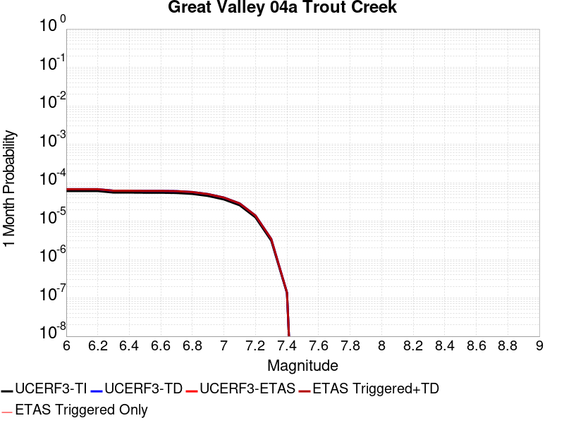 | 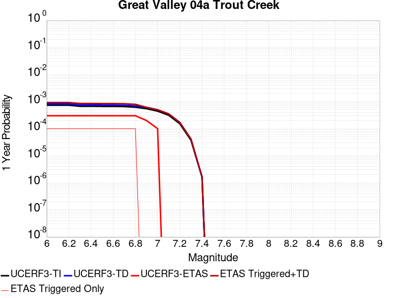 | 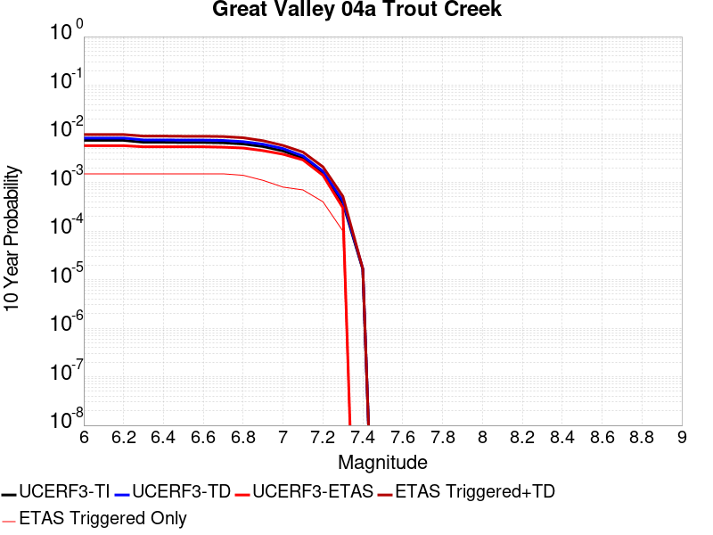 |

| Magnitude | 1 wk TI Prob | 1 wk TD Prob | 1 wk ETAS Prob | 1 wk ETAS/TD Gain | 1 wk ETAS Triggered+TD | 1 wk ETAS Triggered Only | 1 mo TI Prob | 1 mo TD Prob | 1 mo ETAS Prob | 1 mo ETAS/TD Gain | 1 mo ETAS Triggered+TD | 1 mo ETAS Triggered Only | 1 yr TI Prob | 1 yr TD Prob | 1 yr ETAS Prob | 1 yr ETAS/TD Gain | 1 yr ETAS Triggered+TD | 1 yr ETAS Triggered Only | 10 yr TI Prob | 10 yr TD Prob | 10 yr ETAS Prob | 10 yr ETAS/TD Gain | 10 yr ETAS Triggered+TD | 10 yr ETAS Triggered Only |
|-----|-----|-----|-----|-----|-----|-----|-----|-----|-----|-----|-----|-----|-----|-----|-----|-----|-----|-----|-----|-----|-----|-----|-----|-----|
| 6.0 | 1.4088538E-5 | 1.5723168E-5 | 0.0 | 0.0 | 1.5723168E-5 | 0.0 | 6.037805E-5 | 6.7383335E-5 | 0.0 | 0.0 | 6.7383335E-5 | 0.0 | 7.3485484E-4 | 8.200958E-4 | 3.0E-4 | 0.36581093 | 9.200138E-4 | 1.0E-4 | 0.007324295 | 0.008171979 | 0.0057 | 0.6975055 | 0.009659721 | 0.0015 |
| 6.1 | 1.4088538E-5 | 1.5723168E-5 | 0.0 | 0.0 | 1.5723168E-5 | 0.0 | 6.037805E-5 | 6.7383335E-5 | 0.0 | 0.0 | 6.7383335E-5 | 0.0 | 7.3485484E-4 | 8.200958E-4 | 3.0E-4 | 0.36581093 | 9.200138E-4 | 1.0E-4 | 0.007324295 | 0.008171979 | 0.0057 | 0.6975055 | 0.009659721 | 0.0015 |
| 6.2 | 1.4088538E-5 | 1.5723168E-5 | 0.0 | 0.0 | 1.5723168E-5 | 0.0 | 6.037805E-5 | 6.7383335E-5 | 0.0 | 0.0 | 6.7383335E-5 | 0.0 | 7.3485484E-4 | 8.200958E-4 | 3.0E-4 | 0.36581093 | 9.200138E-4 | 1.0E-4 | 0.007324295 | 0.008171979 | 0.0057 | 0.6975055 | 0.009659721 | 0.0015 |
| 6.3 | 1.2882862E-5 | 1.4381918E-5 | 0.0 | 0.0 | 1.4381918E-5 | 0.0 | 5.5211098E-5 | 6.1635394E-5 | 0.0 | 0.0 | 6.1635394E-5 | 0.0 | 6.7198783E-4 | 7.5016293E-4 | 3.0E-4 | 0.3999131 | 8.500879E-4 | 1.0E-4 | 0.0066995937 | 0.0074773706 | 0.0054 | 0.722179 | 0.008966154 | 0.0015 |
| 6.4 | 1.2882862E-5 | 1.4381918E-5 | 0.0 | 0.0 | 1.4381918E-5 | 0.0 | 5.5211098E-5 | 6.1635394E-5 | 0.0 | 0.0 | 6.1635394E-5 | 0.0 | 6.7198783E-4 | 7.5016293E-4 | 3.0E-4 | 0.3999131 | 8.500879E-4 | 1.0E-4 | 0.0066995937 | 0.0074773706 | 0.0054 | 0.722179 | 0.008966154 | 0.0015 |
| 6.5 | 1.2762329E-5 | 1.4248447E-5 | 0.0 | 0.0 | 1.4248447E-5 | 0.0 | 5.469455E-5 | 6.10634E-5 | 0.0 | 0.0 | 6.10634E-5 | 0.0 | 6.657027E-4 | 7.432037E-4 | 3.0E-4 | 0.40365785 | 8.4312935E-4 | 1.0E-4 | 0.00663712 | 0.007408242 | 0.0054 | 0.7289179 | 0.008897129 | 0.0015 |
| 6.6 | 1.2762329E-5 | 1.4248447E-5 | 0.0 | 0.0 | 1.4248447E-5 | 0.0 | 5.469455E-5 | 6.10634E-5 | 0.0 | 0.0 | 6.10634E-5 | 0.0 | 6.657027E-4 | 7.432037E-4 | 3.0E-4 | 0.40365785 | 8.4312935E-4 | 1.0E-4 | 0.00663712 | 0.007408242 | 0.0054 | 0.7289179 | 0.008897129 | 0.0015 |
| 6.7 | 1.2557959E-5 | 1.4022635E-5 | 0.0 | 0.0 | 1.4022635E-5 | 0.0 | 5.3818712E-5 | 6.009568E-5 | 0.0 | 0.0 | 6.009568E-5 | 0.0 | 6.5504585E-4 | 7.3142967E-4 | 3.0E-4 | 0.41015565 | 8.313565E-4 | 1.0E-4 | 0.006531183 | 0.0072912774 | 0.0053 | 0.726896 | 0.008780341 | 0.0015 |
| 6.8 | 1.1871544E-5 | 1.3261901E-5 | 0.0 | 0.0 | 1.3261901E-5 | 0.0 | 5.0877054E-5 | 5.6835535E-5 | 0.0 | 0.0 | 5.6835535E-5 | 0.0 | 6.1925204E-4 | 6.9176295E-4 | 3.0E-4 | 0.43367457 | 7.916938E-4 | 1.0E-4 | 0.0061752927 | 0.0068971138 | 0.0051 | 0.7394397 | 0.008287458 | 0.0014 |
| 6.9 | 1.0500373E-5 | 1.1733992E-5 | 0.0 | 0.0 | 1.1733992E-5 | 0.0 | 4.5000823E-5 | 5.0287617E-5 | 0.0 | 0.0 | 5.0287617E-5 | 0.0 | 5.4774724E-4 | 6.1208836E-4 | 2.0E-4 | 0.32675022 | 6.1208836E-4 | 0.0 | 0.005463991 | 0.006104891 | 0.0045 | 0.7371139 | 0.0071981754 | 0.0011 |
| 7.0 | 8.524332E-6 | 9.535725E-6 | 0.0 | 0.0 | 9.535725E-6 | 0.0 | 3.653234E-5 | 4.08668E-5 | 0.0 | 0.0 | 4.08668E-5 | 0.0 | 4.4469046E-4 | 4.9744704E-4 | 1.0E-4 | 0.20102644 | 4.9744704E-4 | 0.0 | 0.0044380166 | 0.0049640667 | 0.0038 | 0.7655014 | 0.0057600955 | 8.0E-4 |
| 7.1 | 6.006849E-6 | 6.713124E-6 | 0.0 | 0.0 | 6.713124E-6 | 0.0 | 2.5743384E-5 | 2.8770246E-5 | 0.0 | 0.0 | 2.8770246E-5 | 0.0 | 3.1338062E-4 | 3.5022703E-4 | 0.0 | 0.0 | 3.5022703E-4 | 0.0 | 0.0031293905 | 0.0034973016 | 0.0029 | 0.82921076 | 0.0041948534 | 7.0E-4 |
| 7.2 | 2.9122193E-6 | 3.2472722E-6 | 0.0 | 0.0 | 3.2472722E-6 | 0.0 | 1.248088E-5 | 1.3916816E-5 | 0.0 | 0.0 | 1.3916816E-5 | 0.0 | 1.5194413E-4 | 1.6942581E-4 | 0.0 | 0.0 | 1.6942581E-4 | 0.0 | 0.0015184027 | 0.0016931385 | 0.0014 | 0.8268668 | 0.0020924613 | 4.0E-4 |
| 7.3 | 7.2194007E-7 | 7.990465E-7 | 0.0 | 0.0 | 7.990465E-7 | 0.0 | 3.0940253E-6 | 3.4244833E-6 | 0.0 | 0.0 | 3.4244833E-6 | 0.0 | 3.7669106E-5 | 4.1692743E-5 | 0.0 | 0.0 | 4.1692743E-5 | 0.0 | 3.766272E-4 | 4.168942E-4 | 3.0E-4 | 0.719607 | 5.1685254E-4 | 1.0E-4 |
| 7.4 | 3.112171E-8 | 3.2070304E-8 | 0.0 | 0.0 | 3.2070304E-8 | 0.0 | 1.3337875E-7 | 1.3744415E-7 | 0.0 | 0.0 | 1.3744415E-7 | 0.0 | 1.6238852E-6 | 1.6733812E-6 | 0.0 | 0.0 | 1.6733812E-6 | 0.0 | 1.6238733E-5 | 1.6733695E-5 | 0.0 | 0.0 | 1.6733695E-5 | 0.0 |

## Mission Creek
*[(top)](#table-of-contents)*

| 1 Week | 1 Month | 1 Year | 10 Year |
|-----|-----|-----|-----|
| 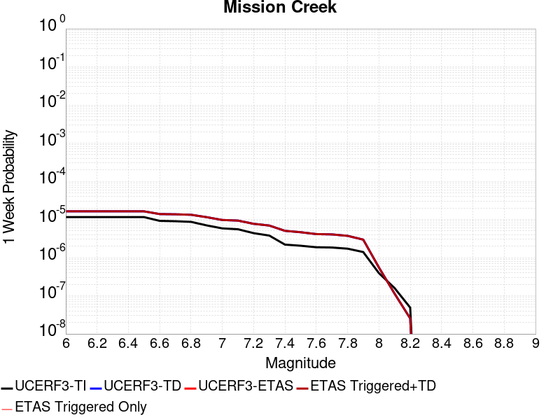 | 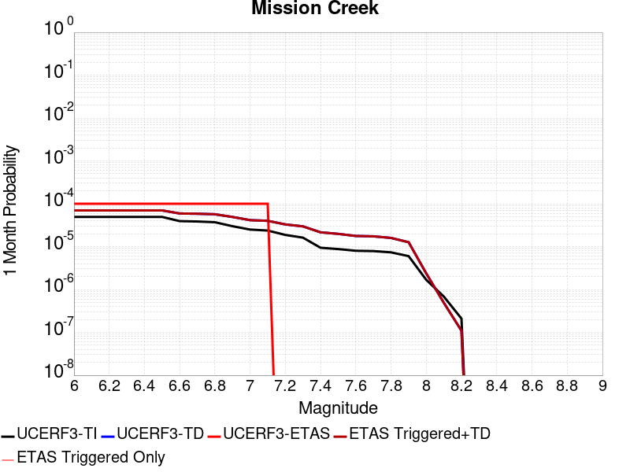 | 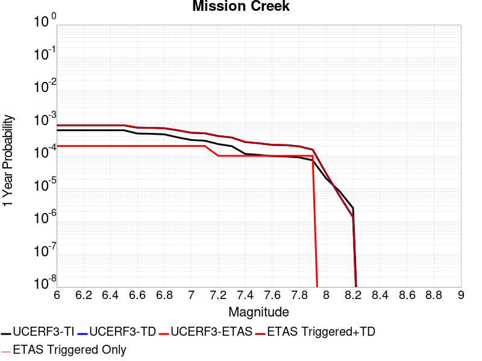 | 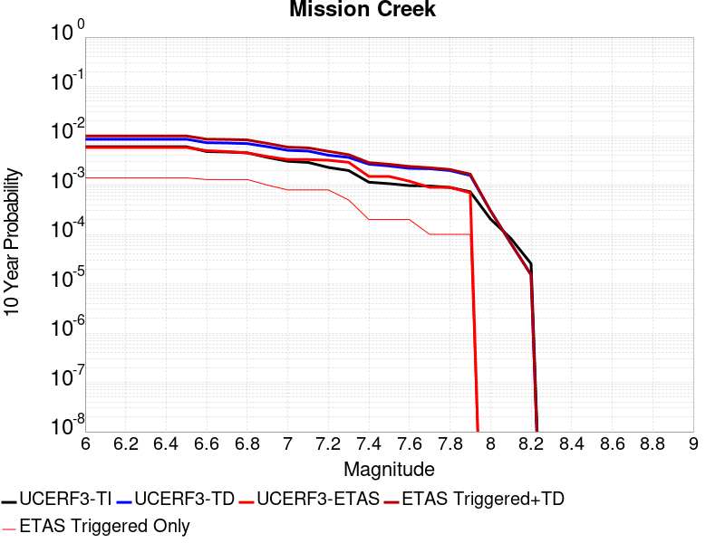 |

| Magnitude | 1 wk TI Prob | 1 wk TD Prob | 1 wk ETAS Prob | 1 wk ETAS/TD Gain | 1 wk ETAS Triggered+TD | 1 wk ETAS Triggered Only | 1 mo TI Prob | 1 mo TD Prob | 1 mo ETAS Prob | 1 mo ETAS/TD Gain | 1 mo ETAS Triggered+TD | 1 mo ETAS Triggered Only | 1 yr TI Prob | 1 yr TD Prob | 1 yr ETAS Prob | 1 yr ETAS/TD Gain | 1 yr ETAS Triggered+TD | 1 yr ETAS Triggered Only | 10 yr TI Prob | 10 yr TD Prob | 10 yr ETAS Prob | 10 yr ETAS/TD Gain | 10 yr ETAS Triggered+TD | 10 yr ETAS Triggered Only |
|-----|-----|-----|-----|-----|-----|-----|-----|-----|-----|-----|-----|-----|-----|-----|-----|-----|-----|-----|-----|-----|-----|-----|-----|-----|
| 6.0 | 1.1549387E-5 | 1.6357875E-5 | 0.0 | 0.0 | 1.6357875E-5 | 0.0 | 4.9496433E-5 | 7.010338E-5 | 1.0E-4 | 1.4264648 | 7.010338E-5 | 0.0 | 6.0245243E-4 | 8.5318944E-4 | 2.0E-4 | 0.23441453 | 8.5318944E-4 | 0.0 | 0.006008218 | 0.0085272305 | 0.0058 | 0.68017393 | 0.009915292 | 0.0014 |
| 6.1 | 1.1549387E-5 | 1.6357875E-5 | 0.0 | 0.0 | 1.6357875E-5 | 0.0 | 4.9496433E-5 | 7.010338E-5 | 1.0E-4 | 1.4264648 | 7.010338E-5 | 0.0 | 6.0245243E-4 | 8.5318944E-4 | 2.0E-4 | 0.23441453 | 8.5318944E-4 | 0.0 | 0.006008218 | 0.0085272305 | 0.0058 | 0.68017393 | 0.009915292 | 0.0014 |
| 6.2 | 1.1549387E-5 | 1.6357875E-5 | 0.0 | 0.0 | 1.6357875E-5 | 0.0 | 4.9496433E-5 | 7.010338E-5 | 1.0E-4 | 1.4264648 | 7.010338E-5 | 0.0 | 6.0245243E-4 | 8.5318944E-4 | 2.0E-4 | 0.23441453 | 8.5318944E-4 | 0.0 | 0.006008218 | 0.0085272305 | 0.0058 | 0.68017393 | 0.009915292 | 0.0014 |
| 6.3 | 1.1549387E-5 | 1.6357875E-5 | 0.0 | 0.0 | 1.6357875E-5 | 0.0 | 4.9496433E-5 | 7.010338E-5 | 1.0E-4 | 1.4264648 | 7.010338E-5 | 0.0 | 6.0245243E-4 | 8.5318944E-4 | 2.0E-4 | 0.23441453 | 8.5318944E-4 | 0.0 | 0.006008218 | 0.0085272305 | 0.0058 | 0.68017393 | 0.009915292 | 0.0014 |
| 6.4 | 1.1549387E-5 | 1.6357875E-5 | 0.0 | 0.0 | 1.6357875E-5 | 0.0 | 4.9496433E-5 | 7.010338E-5 | 1.0E-4 | 1.4264648 | 7.010338E-5 | 0.0 | 6.0245243E-4 | 8.5318944E-4 | 2.0E-4 | 0.23441453 | 8.5318944E-4 | 0.0 | 0.006008218 | 0.0085272305 | 0.0058 | 0.68017393 | 0.009915292 | 0.0014 |
| 6.5 | 1.1549387E-5 | 1.6357875E-5 | 0.0 | 0.0 | 1.6357875E-5 | 0.0 | 4.9496433E-5 | 7.010338E-5 | 1.0E-4 | 1.4264648 | 7.010338E-5 | 0.0 | 6.0245243E-4 | 8.5318944E-4 | 2.0E-4 | 0.23441453 | 8.5318944E-4 | 0.0 | 0.006008218 | 0.0085272305 | 0.0058 | 0.68017393 | 0.009915292 | 0.0014 |
| 6.6 | 9.202681E-6 | 1.3880879E-5 | 0.0 | 0.0 | 1.3880879E-5 | 0.0 | 3.9439463E-5 | 5.9488175E-5 | 1.0E-4 | 1.6810063 | 5.9488175E-5 | 0.0 | 4.800697E-4 | 7.240369E-4 | 2.0E-4 | 0.27622902 | 7.240369E-4 | 0.0 | 0.004790339 | 0.007244295 | 0.005 | 0.6901983 | 0.008534878 | 0.0013 |
| 6.7 | 9.019164E-6 | 1.3686526E-5 | 0.0 | 0.0 | 1.3686526E-5 | 0.0 | 3.8652986E-5 | 5.865527E-5 | 1.0E-4 | 1.7048767 | 5.865527E-5 | 0.0 | 4.7049852E-4 | 7.1390293E-4 | 2.0E-4 | 0.28015012 | 7.1390293E-4 | 0.0 | 0.004695036 | 0.007143609 | 0.0048 | 0.67192924 | 0.008434323 | 0.0013 |
| 6.8 | 8.673558E-6 | 1.3308562E-5 | 0.0 | 0.0 | 1.3308562E-5 | 0.0 | 3.717186E-5 | 5.7035497E-5 | 1.0E-4 | 1.7532941 | 5.7035497E-5 | 0.0 | 4.524734E-4 | 6.941948E-4 | 2.0E-4 | 0.28810358 | 6.941948E-4 | 0.0 | 0.0045155324 | 0.0069477623 | 0.0045 | 0.6476906 | 0.00823873 | 0.0013 |
| 6.9 | 7.002255E-6 | 1.1512523E-5 | 0.0 | 0.0 | 1.1512523E-5 | 0.0 | 3.000932E-5 | 4.933849E-5 | 1.0E-4 | 2.0268152 | 4.933849E-5 | 0.0 | 3.653022E-4 | 6.005374E-4 | 2.0E-4 | 0.33303502 | 6.005374E-4 | 0.0 | 0.0036470229 | 0.006016462 | 0.0038 | 0.63160044 | 0.0070104455 | 0.001 |
| 7.0 | 5.84644E-6 | 9.708057E-6 | 0.0 | 0.0 | 9.708057E-6 | 0.0 | 2.5055931E-5 | 4.1605323E-5 | 1.0E-4 | 2.4035387 | 4.1605323E-5 | 0.0 | 3.0501327E-4 | 5.064316E-4 | 2.0E-4 | 0.39492005 | 5.064316E-4 | 0.0 | 0.0030459496 | 0.0050798836 | 0.0033 | 0.6496212 | 0.0058758194 | 8.0E-4 |
| 7.1 | 5.54703E-6 | 9.362414E-6 | 0.0 | 0.0 | 9.362414E-6 | 0.0 | 2.377277E-5 | 4.012404E-5 | 1.0E-4 | 2.4922717 | 4.012404E-5 | 0.0 | 2.8939504E-4 | 4.884051E-4 | 2.0E-4 | 0.40949613 | 4.884051E-4 | 0.0 | 0.0028901845 | 0.004900418 | 0.0033 | 0.6734119 | 0.005696498 | 8.0E-4 |
| 7.2 | 4.384709E-6 | 7.7130535E-6 | 0.0 | 0.0 | 7.7130535E-6 | 0.0 | 1.8791474E-5 | 3.3055545E-5 | 0.0 | 0.0 | 3.3055545E-5 | 0.0 | 2.2876218E-4 | 4.0238063E-4 | 1.0E-4 | 0.24852091 | 4.0238063E-4 | 0.0 | 0.0022852682 | 0.0040436396 | 0.0032 | 0.7913663 | 0.0048404047 | 8.0E-4 |
| 7.3 | 3.7888456E-6 | 6.9463094E-6 | 0.0 | 0.0 | 6.9463094E-6 | 0.0 | 1.623781E-5 | 2.9769577E-5 | 0.0 | 0.0 | 2.9769577E-5 | 0.0 | 1.9767738E-4 | 3.6238768E-4 | 1.0E-4 | 0.27594757 | 3.6238768E-4 | 0.0 | 0.0019750162 | 0.003645073 | 0.0029 | 0.7955945 | 0.00414325 | 5.0E-4 |
| 7.4 | 2.1982462E-6 | 5.0537187E-6 | 0.0 | 0.0 | 5.0537187E-6 | 0.0 | 9.421021E-6 | 2.1658616E-5 | 0.0 | 0.0 | 2.1658616E-5 | 0.0 | 1.1469489E-4 | 2.6366193E-4 | 1.0E-4 | 0.37927356 | 2.6366193E-4 | 0.0 | 0.0011463572 | 0.0026603788 | 0.0015 | 0.5638295 | 0.0028598467 | 2.0E-4 |
| 7.5 | 2.051923E-6 | 4.6441346E-6 | 0.0 | 0.0 | 4.6441346E-6 | 0.0 | 8.793926E-6 | 1.9903284E-5 | 0.0 | 0.0 | 1.9903284E-5 | 0.0 | 1.0706078E-4 | 2.4229567E-4 | 1.0E-4 | 0.4127189 | 2.4229567E-4 | 0.0 | 0.0010700922 | 0.0024478112 | 0.0015 | 0.6127924 | 0.0026473217 | 2.0E-4 |
| 7.6 | 1.8733427E-6 | 4.1514886E-6 | 0.0 | 0.0 | 4.1514886E-6 | 0.0 | 8.028587E-6 | 1.7791974E-5 | 0.0 | 0.0 | 1.7791974E-5 | 0.0 | 9.774366E-5 | 2.1659583E-4 | 1.0E-4 | 0.4616894 | 2.1659583E-4 | 0.0 | 9.770069E-4 | 0.002191919 | 0.0012 | 0.5474655 | 0.0023914806 | 2.0E-4 |
| 7.7 | 1.8411953E-6 | 4.0709733E-6 | 0.0 | 0.0 | 4.0709733E-6 | 0.0 | 7.890813E-6 | 1.7446913E-5 | 0.0 | 0.0 | 1.7446913E-5 | 0.0 | 9.606641E-5 | 2.1239555E-4 | 1.0E-4 | 0.47081965 | 2.1239555E-4 | 0.0 | 9.6024893E-4 | 0.0021501177 | 9.0E-4 | 0.41858172 | 0.0022499026 | 1.0E-4 |
| 7.8 | 1.7194251E-6 | 3.7364277E-6 | 0.0 | 0.0 | 3.7364277E-6 | 0.0 | 7.368944E-6 | 1.6013164E-5 | 0.0 | 0.0 | 1.6013164E-5 | 0.0 | 8.97132E-5 | 1.9494291E-4 | 1.0E-4 | 0.5129707 | 1.9494291E-4 | 0.0 | 8.967699E-4 | 0.001975133 | 9.0E-4 | 0.45566547 | 0.0020749357 | 1.0E-4 |
| 7.9 | 1.4035052E-6 | 2.9713628E-6 | 0.0 | 0.0 | 2.9713628E-6 | 0.0 | 6.0150082E-6 | 1.273435E-5 | 0.0 | 0.0 | 1.273435E-5 | 0.0 | 7.3230265E-5 | 1.5502975E-4 | 1.0E-4 | 0.64503753 | 1.5502975E-4 | 0.0 | 7.3206134E-4 | 0.0015735739 | 7.0E-4 | 0.44484723 | 0.0016734166 | 1.0E-4 |
| 8.0 | 3.9318823E-7 | 5.579985E-7 | 0.0 | 0.0 | 5.579985E-7 | 0.0 | 1.6850913E-6 | 2.39142E-6 | 0.0 | 0.0 | 2.39142E-6 | 0.0 | 2.0515794E-5 | 2.9115154E-5 | 0.0 | 0.0 | 2.9115154E-5 | 0.0 | 2.0513899E-4 | 3.0157313E-4 | 0.0 | 0.0 | 3.0157313E-4 | 0.0 |
| 8.1 | 1.596793E-7 | 1.155613E-7 | 0.0 | 0.0 | 1.155613E-7 | 0.0 | 6.8433974E-7 | 4.952626E-7 | 0.0 | 0.0 | 4.952626E-7 | 0.0 | 8.331805E-6 | 6.029806E-6 | 0.0 | 0.0 | 6.029806E-6 | 0.0 | 8.331492E-5 | 6.646099E-5 | 0.0 | 0.0 | 6.646099E-5 | 0.0 |
| 8.2 | 4.9003038E-8 | 2.5889225E-8 | 0.0 | 0.0 | 2.5889225E-8 | 0.0 | 2.10013E-7 | 1.1095381E-7 | 0.0 | 0.0 | 1.1095381E-7 | 0.0 | 2.5569052E-6 | 1.3508619E-6 | 0.0 | 0.0 | 1.3508619E-6 | 0.0 | 2.556876E-5 | 1.5202779E-5 | 0.0 | 0.0 | 1.5202779E-5 | 0.0 |

## San Gabriel
*[(top)](#table-of-contents)*

| 1 Week | 1 Month | 1 Year | 10 Year |
|-----|-----|-----|-----|
|  | 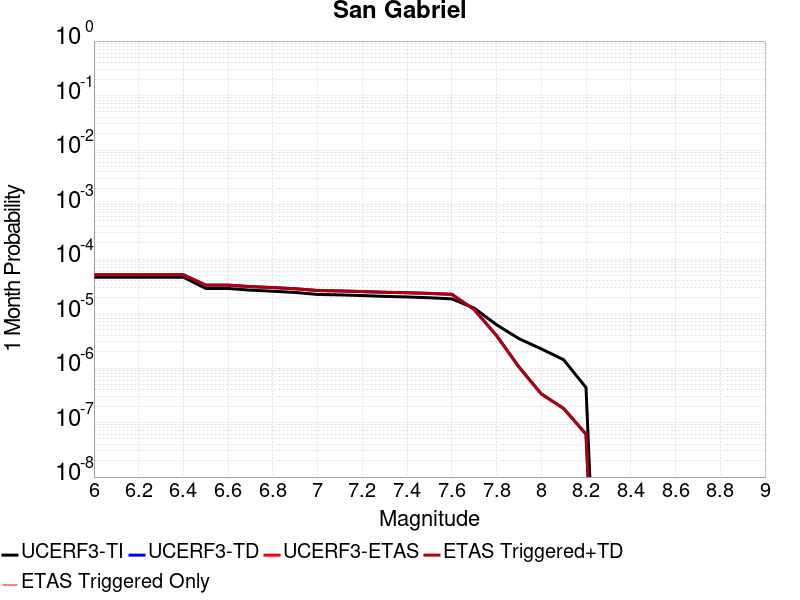 | 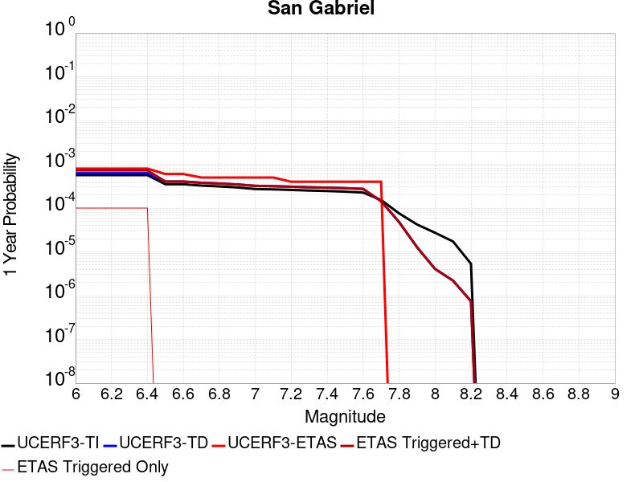 | 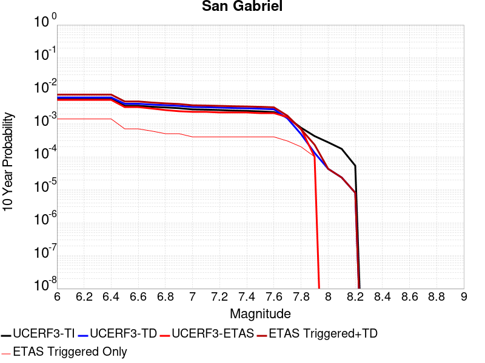 |

| Magnitude | 1 wk TI Prob | 1 wk TD Prob | 1 wk ETAS Prob | 1 wk ETAS/TD Gain | 1 wk ETAS Triggered+TD | 1 wk ETAS Triggered Only | 1 mo TI Prob | 1 mo TD Prob | 1 mo ETAS Prob | 1 mo ETAS/TD Gain | 1 mo ETAS Triggered+TD | 1 mo ETAS Triggered Only | 1 yr TI Prob | 1 yr TD Prob | 1 yr ETAS Prob | 1 yr ETAS/TD Gain | 1 yr ETAS Triggered+TD | 1 yr ETAS Triggered Only | 10 yr TI Prob | 10 yr TD Prob | 10 yr ETAS Prob | 10 yr ETAS/TD Gain | 10 yr ETAS Triggered+TD | 10 yr ETAS Triggered Only |
|-----|-----|-----|-----|-----|-----|-----|-----|-----|-----|-----|-----|-----|-----|-----|-----|-----|-----|-----|-----|-----|-----|-----|-----|-----|
| 6.0 | 1.083775E-5 | 1.2017298E-5 | 0.0 | 0.0 | 1.2017298E-5 | 0.0 | 4.6446676E-5 | 5.1501753E-5 | 0.0 | 0.0 | 5.1501753E-5 | 0.0 | 5.653415E-4 | 6.268648E-4 | 8.0E-4 | 1.2761923 | 7.268021E-4 | 1.0E-4 | 0.0056390543 | 0.0062628007 | 0.0053 | 0.84626675 | 0.0076540327 | 0.0014 |
| 6.1 | 1.083775E-5 | 1.2017298E-5 | 0.0 | 0.0 | 1.2017298E-5 | 0.0 | 4.6446676E-5 | 5.1501753E-5 | 0.0 | 0.0 | 5.1501753E-5 | 0.0 | 5.653415E-4 | 6.268648E-4 | 8.0E-4 | 1.2761923 | 7.268021E-4 | 1.0E-4 | 0.0056390543 | 0.0062628007 | 0.0053 | 0.84626675 | 0.0076540327 | 0.0014 |
| 6.2 | 1.083775E-5 | 1.2017298E-5 | 0.0 | 0.0 | 1.2017298E-5 | 0.0 | 4.6446676E-5 | 5.1501753E-5 | 0.0 | 0.0 | 5.1501753E-5 | 0.0 | 5.653415E-4 | 6.268648E-4 | 8.0E-4 | 1.2761923 | 7.268021E-4 | 1.0E-4 | 0.0056390543 | 0.0062628007 | 0.0053 | 0.84626675 | 0.0076540327 | 0.0014 |
| 6.3 | 1.083775E-5 | 1.2017298E-5 | 0.0 | 0.0 | 1.2017298E-5 | 0.0 | 4.6446676E-5 | 5.1501753E-5 | 0.0 | 0.0 | 5.1501753E-5 | 0.0 | 5.653415E-4 | 6.268648E-4 | 8.0E-4 | 1.2761923 | 7.268021E-4 | 1.0E-4 | 0.0056390543 | 0.0062628007 | 0.0053 | 0.84626675 | 0.0076540327 | 0.0014 |
| 6.4 | 1.083775E-5 | 1.2017298E-5 | 0.0 | 0.0 | 1.2017298E-5 | 0.0 | 4.6446676E-5 | 5.1501753E-5 | 0.0 | 0.0 | 5.1501753E-5 | 0.0 | 5.653415E-4 | 6.268648E-4 | 8.0E-4 | 1.2761923 | 7.268021E-4 | 1.0E-4 | 0.0056390543 | 0.0062628007 | 0.0053 | 0.84626675 | 0.0076540327 | 0.0014 |
| 6.5 | 6.7317824E-6 | 7.74872E-6 | 0.0 | 0.0 | 7.74872E-6 | 0.0 | 2.8850178E-5 | 3.3208387E-5 | 0.0 | 0.0 | 3.3208387E-5 | 0.0 | 3.511943E-4 | 4.0423815E-4 | 6.0E-4 | 1.4842736 | 4.0423815E-4 | 0.0 | 0.003506398 | 0.0040458636 | 0.0032 | 0.7909313 | 0.004743031 | 7.0E-4 |
| 6.6 | 6.7317824E-6 | 7.74872E-6 | 0.0 | 0.0 | 7.74872E-6 | 0.0 | 2.8850178E-5 | 3.3208387E-5 | 0.0 | 0.0 | 3.3208387E-5 | 0.0 | 3.511943E-4 | 4.0423815E-4 | 6.0E-4 | 1.4842736 | 4.0423815E-4 | 0.0 | 0.003506398 | 0.0040458636 | 0.0032 | 0.7909313 | 0.004743031 | 7.0E-4 |
| 6.7 | 6.274881E-6 | 7.277612E-6 | 0.0 | 0.0 | 7.277612E-6 | 0.0 | 2.6892068E-5 | 3.1189396E-5 | 0.0 | 0.0 | 3.1189396E-5 | 0.0 | 3.2736175E-4 | 3.7966573E-4 | 5.0E-4 | 1.3169479 | 3.7966573E-4 | 0.0 | 0.0032687993 | 0.0038009991 | 0.0029 | 0.7629573 | 0.0043987185 | 6.0E-4 |
| 6.8 | 5.996209E-6 | 6.9903144E-6 | 0.0 | 0.0 | 6.9903144E-6 | 0.0 | 2.5697784E-5 | 2.9958152E-5 | 0.0 | 0.0 | 2.9958152E-5 | 0.0 | 3.128256E-4 | 3.646804E-4 | 5.0E-4 | 1.3710636 | 3.646804E-4 | 0.0 | 0.003123856 | 0.0036516453 | 0.0026 | 0.7120078 | 0.0041498193 | 5.0E-4 |
| 6.9 | 5.686331E-6 | 6.6552334E-6 | 0.0 | 0.0 | 6.6552334E-6 | 0.0 | 2.4369761E-5 | 2.8522123E-5 | 0.0 | 0.0 | 2.8522123E-5 | 0.0 | 2.9666146E-4 | 3.4720244E-4 | 5.0E-4 | 1.4400821 | 3.4720244E-4 | 0.0 | 0.0029626573 | 0.003477424 | 0.0024 | 0.69016606 | 0.003975685 | 5.0E-4 |
| 7.0 | 5.2329838E-6 | 6.179035E-6 | 0.0 | 0.0 | 6.179035E-6 | 0.0 | 2.242688E-5 | 2.6481315E-5 | 0.0 | 0.0 | 2.6481315E-5 | 0.0 | 2.7301308E-4 | 3.2236308E-4 | 5.0E-4 | 1.5510461 | 3.2236308E-4 | 0.0 | 0.002726779 | 0.0032297666 | 0.0023 | 0.7121258 | 0.0036284747 | 4.0E-4 |
| 7.1 | 5.135671E-6 | 6.0690772E-6 | 0.0 | 0.0 | 6.0690772E-6 | 0.0 | 2.2009834E-5 | 2.6010075E-5 | 0.0 | 0.0 | 2.6010075E-5 | 0.0 | 2.6793676E-4 | 3.166274E-4 | 5.0E-4 | 1.579143 | 3.166274E-4 | 0.0 | 0.0026761394 | 0.003172575 | 0.0023 | 0.7249631 | 0.0035713061 | 4.0E-4 |
| 7.2 | 4.989062E-6 | 5.9023137E-6 | 0.0 | 0.0 | 5.9023137E-6 | 0.0 | 2.1381518E-5 | 2.5295389E-5 | 0.0 | 0.0 | 2.5295389E-5 | 0.0 | 2.6028889E-4 | 3.079286E-4 | 4.0E-4 | 1.2990024 | 3.079286E-4 | 0.0 | 0.0025998424 | 0.0030858312 | 0.0022 | 0.7129359 | 0.003484597 | 4.0E-4 |
| 7.3 | 4.8219395E-6 | 5.733741E-6 | 0.0 | 0.0 | 5.733741E-6 | 0.0 | 2.0665291E-5 | 2.4572948E-5 | 0.0 | 0.0 | 2.4572948E-5 | 0.0 | 2.5157086E-4 | 2.9913534E-4 | 4.0E-4 | 1.3371874 | 2.9913534E-4 | 0.0 | 0.0025128627 | 0.0029981392 | 0.0022 | 0.7337885 | 0.00339694 | 4.0E-4 |
| 7.4 | 4.7118383E-6 | 5.622184E-6 | 0.0 | 0.0 | 5.622184E-6 | 0.0 | 2.0193436E-5 | 2.4094856E-5 | 0.0 | 0.0 | 2.4094856E-5 | 0.0 | 2.4582737E-4 | 2.9331614E-4 | 4.0E-4 | 1.3637162 | 2.9331614E-4 | 0.0 | 0.002455556 | 0.002940102 | 0.0022 | 0.7482733 | 0.003338926 | 4.0E-4 |
| 7.5 | 4.5506545E-6 | 5.467392E-6 | 0.0 | 0.0 | 5.467392E-6 | 0.0 | 1.9502659E-5 | 2.3431474E-5 | 0.0 | 0.0 | 2.3431474E-5 | 0.0 | 2.37419E-4 | 2.852416E-4 | 4.0E-4 | 1.40232 | 2.852416E-4 | 0.0 | 0.002371655 | 0.0028595661 | 0.0021 | 0.73437715 | 0.0032584222 | 4.0E-4 |
| 7.6 | 4.343636E-6 | 5.260011E-6 | 0.0 | 0.0 | 5.260011E-6 | 0.0 | 1.861545E-5 | 2.2542714E-5 | 0.0 | 0.0 | 2.2542714E-5 | 0.0 | 2.2661954E-4 | 2.7442374E-4 | 4.0E-4 | 1.4575999 | 2.7442374E-4 | 0.0 | 0.0022638857 | 0.0027516517 | 0.0021 | 0.763178 | 0.003150551 | 4.0E-4 |
| 7.7 | 2.936235E-6 | 2.7645672E-6 | 0.0 | 0.0 | 2.7645672E-6 | 0.0 | 1.2583803E-5 | 1.1848092E-5 | 0.0 | 0.0 | 1.1848092E-5 | 0.0 | 1.5319703E-4 | 1.44241E-4 | 4.0E-4 | 2.7731366 | 1.44241E-4 | 0.0 | 0.0015309147 | 0.0014488305 | 0.0016 | 1.104339 | 0.0017483959 | 3.0E-4 |
| 7.8 | 1.4541639E-6 | 9.206169E-7 | 0.0 | 0.0 | 9.206169E-7 | 0.0 | 6.232116E-6 | 3.9454953E-6 | 0.0 | 0.0 | 3.9454953E-6 | 0.0 | 7.587337E-5 | 4.803535E-5 | 0.0 | 0.0 | 4.803535E-5 | 0.0 | 7.584747E-4 | 4.8522346E-4 | 7.0E-4 | 1.4426342 | 6.851264E-4 | 2.0E-4 |
| 7.9 | 8.098958E-7 | 2.4490862E-7 | 0.0 | 0.0 | 2.4490862E-7 | 0.0 | 3.4709774E-6 | 1.0496078E-6 | 0.0 | 0.0 | 1.0496078E-6 | 0.0 | 4.225833E-5 | 1.2778901E-5 | 0.0 | 0.0 | 1.2778901E-5 | 0.0 | 4.2250296E-4 | 1.3091309E-4 | 1.0E-4 | 0.7638656 | 2.309E-4 | 1.0E-4 |
| 8.0 | 5.2473234E-7 | 7.8237264E-8 | 0.0 | 0.0 | 7.8237264E-8 | 0.0 | 2.248851E-6 | 3.353025E-7 | 0.0 | 0.0 | 3.353025E-7 | 0.0 | 2.7379416E-5 | 4.0823E-6 | 0.0 | 0.0 | 4.0823E-6 | 0.0 | 2.7376044E-4 | 4.2982232E-5 | 0.0 | 0.0 | 4.2982232E-5 | 0.0 |
| 8.1 | 3.3162388E-7 | 4.229598E-8 | 0.0 | 0.0 | 4.229598E-8 | 0.0 | 1.4212444E-6 | 1.8126848E-7 | 0.0 | 0.0 | 1.8126848E-7 | 0.0 | 1.7303513E-5 | 2.2069414E-6 | 0.0 | 0.0 | 2.2069414E-6 | 0.0 | 1.7302166E-4 | 2.3403592E-5 | 0.0 | 0.0 | 2.3403592E-5 | 0.0 |
| 8.2 | 1.0235345E-7 | 1.4297937E-8 | 0.0 | 0.0 | 1.4297937E-8 | 0.0 | 4.3865757E-7 | 6.127687E-8 | 0.0 | 0.0 | 6.127687E-8 | 0.0 | 5.340643E-6 | 7.4604566E-7 | 0.0 | 0.0 | 7.4604566E-7 | 0.0 | 5.3405143E-5 | 8.067868E-6 | 0.0 | 0.0 | 8.067868E-6 | 0.0 |

## Big Pine (East)
*[(top)](#table-of-contents)*

| 1 Week | 1 Month | 1 Year | 10 Year |
|-----|-----|-----|-----|
|  | 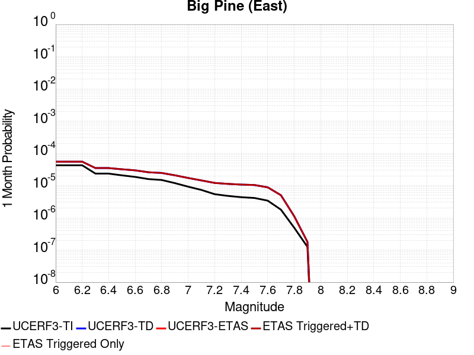 |  |  |

| Magnitude | 1 wk TI Prob | 1 wk TD Prob | 1 wk ETAS Prob | 1 wk ETAS/TD Gain | 1 wk ETAS Triggered+TD | 1 wk ETAS Triggered Only | 1 mo TI Prob | 1 mo TD Prob | 1 mo ETAS Prob | 1 mo ETAS/TD Gain | 1 mo ETAS Triggered+TD | 1 mo ETAS Triggered Only | 1 yr TI Prob | 1 yr TD Prob | 1 yr ETAS Prob | 1 yr ETAS/TD Gain | 1 yr ETAS Triggered+TD | 1 yr ETAS Triggered Only | 10 yr TI Prob | 10 yr TD Prob | 10 yr ETAS Prob | 10 yr ETAS/TD Gain | 10 yr ETAS Triggered+TD | 10 yr ETAS Triggered Only |
|-----|-----|-----|-----|-----|-----|-----|-----|-----|-----|-----|-----|-----|-----|-----|-----|-----|-----|-----|-----|-----|-----|-----|-----|-----|
| 6.0 | 9.916913E-6 | 1.2835962E-5 | 0.0 | 0.0 | 1.2835962E-5 | 0.0 | 4.250036E-5 | 5.501023E-5 | 0.0 | 0.0 | 5.501023E-5 | 0.0 | 5.173191E-4 | 6.6956587E-4 | 6.0E-4 | 0.8961031 | 8.6943194E-4 | 2.0E-4 | 0.0051611643 | 0.0066801417 | 0.0042 | 0.62872916 | 0.008070789 | 0.0014 |
| 6.1 | 9.916913E-6 | 1.2835962E-5 | 0.0 | 0.0 | 1.2835962E-5 | 0.0 | 4.250036E-5 | 5.501023E-5 | 0.0 | 0.0 | 5.501023E-5 | 0.0 | 5.173191E-4 | 6.6956587E-4 | 6.0E-4 | 0.8961031 | 8.6943194E-4 | 2.0E-4 | 0.0051611643 | 0.0066801417 | 0.0042 | 0.62872916 | 0.008070789 | 0.0014 |
| 6.2 | 9.916913E-6 | 1.2835962E-5 | 0.0 | 0.0 | 1.2835962E-5 | 0.0 | 4.250036E-5 | 5.501023E-5 | 0.0 | 0.0 | 5.501023E-5 | 0.0 | 5.173191E-4 | 6.6956587E-4 | 6.0E-4 | 0.8961031 | 8.6943194E-4 | 2.0E-4 | 0.0051611643 | 0.0066801417 | 0.0042 | 0.62872916 | 0.008070789 | 0.0014 |
| 6.3 | 5.479711E-6 | 8.131367E-6 | 0.0 | 0.0 | 8.131367E-6 | 0.0 | 2.3484265E-5 | 3.4848268E-5 | 0.0 | 0.0 | 3.4848268E-5 | 0.0 | 2.858834E-4 | 4.2419828E-4 | 4.0E-4 | 0.94295526 | 6.241134E-4 | 2.0E-4 | 0.0028551589 | 0.004236676 | 0.0031 | 0.7317057 | 0.0053320155 | 0.0011 |
| 6.4 | 5.465009E-6 | 8.115659E-6 | 0.0 | 0.0 | 8.115659E-6 | 0.0 | 2.3421257E-5 | 3.4780947E-5 | 0.0 | 0.0 | 3.4780947E-5 | 0.0 | 2.851165E-4 | 4.2337895E-4 | 4.0E-4 | 0.94478005 | 6.2329427E-4 | 2.0E-4 | 0.0028475097 | 0.0042285137 | 0.0031 | 0.7331181 | 0.0053238627 | 0.0011 |
| 6.5 | 4.826767E-6 | 7.440638E-6 | 0.0 | 0.0 | 7.440638E-6 | 0.0 | 2.068598E-5 | 3.1888074E-5 | 0.0 | 0.0 | 3.1888074E-5 | 0.0 | 2.518227E-4 | 3.881709E-4 | 3.0E-4 | 0.7728554 | 5.880933E-4 | 2.0E-4 | 0.0025153751 | 0.0038776775 | 0.0028 | 0.7220817 | 0.0048737996 | 0.001 |
| 6.6 | 4.3146847E-6 | 6.9005155E-6 | 0.0 | 0.0 | 6.9005155E-6 | 0.0 | 1.8491375E-5 | 2.9573315E-5 | 0.0 | 0.0 | 2.9573315E-5 | 0.0 | 2.2510924E-4 | 3.5999808E-4 | 1.0E-4 | 0.27777925 | 4.599621E-4 | 1.0E-4 | 0.0022488134 | 0.003596865 | 0.0024 | 0.6672477 | 0.004493628 | 9.0E-4 |
| 6.7 | 3.6968106E-6 | 6.012644E-6 | 0.0 | 0.0 | 6.012644E-6 | 0.0 | 1.5843378E-5 | 2.5768228E-5 | 0.0 | 0.0 | 2.5768228E-5 | 0.0 | 1.9287605E-4 | 3.1368455E-4 | 1.0E-4 | 0.3187916 | 4.1365318E-4 | 1.0E-4 | 0.0019270873 | 0.0031350432 | 0.0017 | 0.54225725 | 0.0038328487 | 7.0E-4 |
| 6.8 | 3.4671132E-6 | 5.71888E-6 | 0.0 | 0.0 | 5.71888E-6 | 0.0 | 1.4858972E-5 | 2.4509263E-5 | 0.0 | 0.0 | 2.4509263E-5 | 0.0 | 1.8089297E-4 | 2.983609E-4 | 1.0E-4 | 0.33516458 | 3.9833103E-4 | 1.0E-4 | 0.0018074579 | 0.0029822197 | 0.0017 | 0.5700452 | 0.0036801323 | 7.0E-4 |
| 6.9 | 2.7686972E-6 | 4.8406496E-6 | 0.0 | 0.0 | 4.8406496E-6 | 0.0 | 1.1865792E-5 | 2.074548E-5 | 0.0 | 0.0 | 2.074548E-5 | 0.0 | 1.4445644E-4 | 2.525477E-4 | 0.0 | 0.0 | 2.525477E-4 | 0.0 | 0.0014436257 | 0.0025251557 | 0.0011 | 0.4356167 | 0.003023893 | 5.0E-4 |
| 7.0 | 2.1472624E-6 | 3.9990573E-6 | 0.0 | 0.0 | 3.9990573E-6 | 0.0 | 9.20252E-6 | 1.7138707E-5 | 0.0 | 0.0 | 1.7138707E-5 | 0.0 | 1.12034926E-4 | 2.0864433E-4 | 0.0 | 0.0 | 2.0864433E-4 | 0.0 | 0.0011197845 | 0.0020869882 | 0.0011 | 0.52707535 | 0.0025859447 | 5.0E-4 |
| 7.1 | 1.7018335E-6 | 3.3576248E-6 | 0.0 | 0.0 | 3.3576248E-6 | 0.0 | 7.293552E-6 | 1.4389742E-5 | 0.0 | 0.0 | 1.4389742E-5 | 0.0 | 8.879537E-5 | 1.751814E-4 | 0.0 | 0.0 | 1.751814E-4 | 0.0 | 8.87599E-4 | 0.0017529099 | 0.001 | 0.57048 | 0.0022520334 | 5.0E-4 |
| 7.2 | 1.25603E-6 | 2.8065288E-6 | 0.0 | 0.0 | 2.8065288E-6 | 0.0 | 5.3829745E-6 | 1.20279265E-5 | 0.0 | 0.0 | 1.20279265E-5 | 0.0 | 6.553574E-5 | 1.464304E-4 | 0.0 | 0.0 | 1.464304E-4 | 0.0 | 6.551642E-4 | 0.0014657928 | 8.0E-4 | 0.54577976 | 0.0018652064 | 4.0E-4 |
| 7.3 | 1.112297E-6 | 2.6217099E-6 | 0.0 | 0.0 | 2.6217099E-6 | 0.0 | 4.7669787E-6 | 1.1235853E-5 | 0.0 | 0.0 | 1.1235853E-5 | 0.0 | 5.803642E-5 | 1.3678813E-4 | 0.0 | 0.0 | 1.3678813E-4 | 0.0 | 5.802127E-4 | 0.0013693463 | 8.0E-4 | 0.5842204 | 0.0017687985 | 4.0E-4 |
| 7.4 | 1.0137181E-6 | 2.4943881E-6 | 0.0 | 0.0 | 2.4943881E-6 | 0.0 | 4.3444993E-6 | 1.0690192E-5 | 0.0 | 0.0 | 1.0690192E-5 | 0.0 | 5.2892992E-5 | 1.3014553E-4 | 0.0 | 0.0 | 1.3014553E-4 | 0.0 | 5.288041E-4 | 0.0013027954 | 8.0E-4 | 0.6140642 | 0.0017022743 | 4.0E-4 |
| 7.5 | 9.598608E-7 | 2.4177223E-6 | 0.0 | 0.0 | 2.4177223E-6 | 0.0 | 4.1136827E-6 | 1.0361628E-5 | 0.0 | 0.0 | 1.0361628E-5 | 0.0 | 5.0082934E-5 | 1.2614572E-4 | 0.0 | 0.0 | 1.2614572E-4 | 0.0 | 5.007165E-4 | 0.0012626577 | 8.0E-4 | 0.63358426 | 0.0016621526 | 4.0E-4 |
| 7.6 | 7.929459E-7 | 2.0542016E-6 | 0.0 | 0.0 | 2.0542016E-6 | 0.0 | 3.3983351E-6 | 8.803692E-6 | 0.0 | 0.0 | 8.803692E-6 | 0.0 | 4.1373947E-5 | 1.07179854E-4 | 0.0 | 0.0 | 1.07179854E-4 | 0.0 | 4.1366243E-4 | 0.0010732112 | 4.0E-4 | 0.3727132 | 0.0012729965 | 2.0E-4 |
| 7.7 | 4.155788E-7 | 1.1671843E-6 | 0.0 | 0.0 | 1.1671843E-6 | 0.0 | 1.7810507E-6 | 5.0022095E-6 | 0.0 | 0.0 | 5.0022095E-6 | 0.0 | 2.1684076E-5 | 6.0900238E-5 | 0.0 | 0.0 | 6.0900238E-5 | 0.0 | 2.1681961E-4 | 6.118751E-4 | 1.0E-4 | 0.16343205 | 7.118139E-4 | 1.0E-4 |
| 7.8 | 1.14666925E-7 | 2.6068437E-7 | 0.0 | 0.0 | 2.6068437E-7 | 0.0 | 4.914296E-7 | 1.1172183E-6 | 0.0 | 0.0 | 1.1172183E-6 | 0.0 | 5.9831386E-6 | 1.3602053E-5 | 0.0 | 0.0 | 1.3602053E-5 | 0.0 | 5.9829777E-5 | 1.3708514E-4 | 0.0 | 0.0 | 1.3708514E-4 | 0.0 |
| 7.9 | 2.9231824E-8 | 4.1710358E-8 | 0.0 | 0.0 | 4.1710358E-8 | 0.0 | 1.2527924E-7 | 1.7875867E-7 | 0.0 | 0.0 | 1.7875867E-7 | 0.0 | 1.5252737E-6 | 2.1763847E-6 | 0.0 | 0.0 | 2.1763847E-6 | 0.0 | 1.5252632E-5 | 2.2085047E-5 | 0.0 | 0.0 | 2.2085047E-5 | 0.0 |

## Superstition Hills
*[(top)](#table-of-contents)*

| 1 Week | 1 Month | 1 Year | 10 Year |
|-----|-----|-----|-----|
| 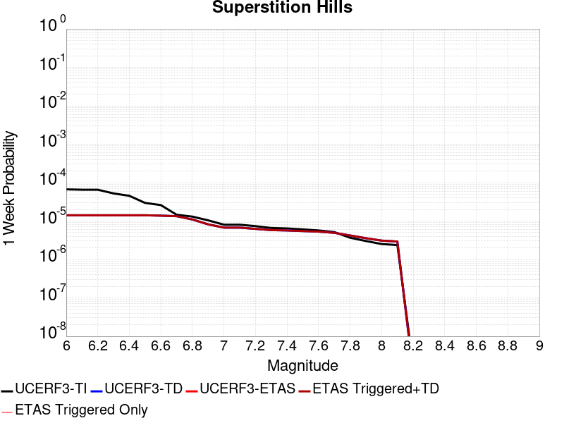 | 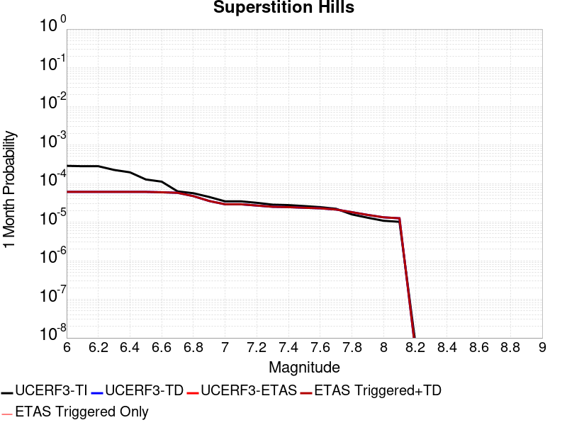 | 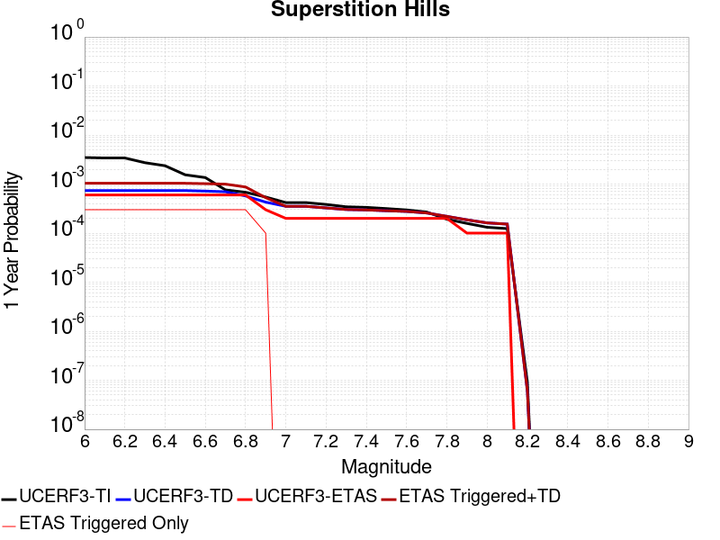 | 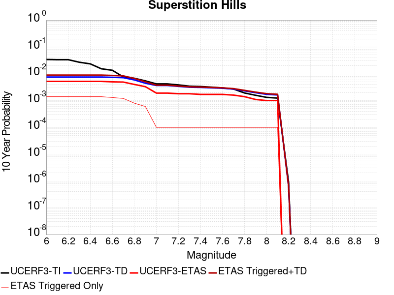 |

| Magnitude | 1 wk TI Prob | 1 wk TD Prob | 1 wk ETAS Prob | 1 wk ETAS/TD Gain | 1 wk ETAS Triggered+TD | 1 wk ETAS Triggered Only | 1 mo TI Prob | 1 mo TD Prob | 1 mo ETAS Prob | 1 mo ETAS/TD Gain | 1 mo ETAS Triggered+TD | 1 mo ETAS Triggered Only | 1 yr TI Prob | 1 yr TD Prob | 1 yr ETAS Prob | 1 yr ETAS/TD Gain | 1 yr ETAS Triggered+TD | 1 yr ETAS Triggered Only | 10 yr TI Prob | 10 yr TD Prob | 10 yr ETAS Prob | 10 yr ETAS/TD Gain | 10 yr ETAS Triggered+TD | 10 yr ETAS Triggered Only |
|-----|-----|-----|-----|-----|-----|-----|-----|-----|-----|-----|-----|-----|-----|-----|-----|-----|-----|-----|-----|-----|-----|-----|-----|-----|
| 6.0 | 6.6865185E-5 | 1.4184159E-5 | 0.0 | 0.0 | 1.4184159E-5 | 0.0 | 2.8653358E-4 | 6.078793E-5 | 0.0 | 0.0 | 6.078793E-5 | 0.0 | 0.0034829667 | 7.3985796E-4 | 6.0E-4 | 0.81096643 | 0.001039636 | 3.0E-4 | 0.03428881 | 0.007543326 | 0.0052 | 0.6893511 | 0.008932766 | 0.0014 |
| 6.1 | 6.544851E-5 | 1.4184159E-5 | 0.0 | 0.0 | 1.4184159E-5 | 0.0 | 2.8046346E-4 | 6.078793E-5 | 0.0 | 0.0 | 6.078793E-5 | 0.0 | 0.0034092965 | 7.3985796E-4 | 6.0E-4 | 0.81096643 | 0.001039636 | 3.0E-4 | 0.033574644 | 0.0075433254 | 0.0052 | 0.68935114 | 0.008932765 | 0.0014 |
| 6.2 | 6.544851E-5 | 1.4184159E-5 | 0.0 | 0.0 | 1.4184159E-5 | 0.0 | 2.8046346E-4 | 6.078793E-5 | 0.0 | 0.0 | 6.078793E-5 | 0.0 | 0.0034092965 | 7.3985796E-4 | 6.0E-4 | 0.81096643 | 0.001039636 | 3.0E-4 | 0.033574644 | 0.0075433254 | 0.0052 | 0.68935114 | 0.008932765 | 0.0014 |
| 6.3 | 5.2402065E-5 | 1.4184158E-5 | 0.0 | 0.0 | 1.4184158E-5 | 0.0 | 2.2456095E-4 | 6.0787923E-5 | 0.0 | 0.0 | 6.0787923E-5 | 0.0 | 0.0027306017 | 7.398579E-4 | 6.0E-4 | 0.8109665 | 0.001039636 | 3.0E-4 | 0.02697292 | 0.0075433203 | 0.0052 | 0.6893516 | 0.008932759 | 0.0014 |
| 6.4 | 4.542238E-5 | 1.4184157E-5 | 0.0 | 0.0 | 1.4184157E-5 | 0.0 | 1.9465282E-4 | 6.0787923E-5 | 0.0 | 0.0 | 6.0787923E-5 | 0.0 | 0.0023673223 | 7.398579E-4 | 6.0E-4 | 0.81096655 | 0.001039636 | 3.0E-4 | 0.023422617 | 0.007543317 | 0.0052 | 0.6893519 | 0.008932756 | 0.0014 |
| 6.5 | 2.9672969E-5 | 1.41841565E-5 | 0.0 | 0.0 | 1.41841565E-5 | 0.0 | 1.2716366E-4 | 6.0787916E-5 | 0.0 | 0.0 | 6.0787916E-5 | 0.0 | 0.0015471181 | 7.3985785E-4 | 6.0E-4 | 0.8109666 | 0.0010396359 | 3.0E-4 | 0.015363912 | 0.0075433115 | 0.0052 | 0.68935245 | 0.008932751 | 0.0014 |
| 6.6 | 2.6056105E-5 | 1.3849591E-5 | 0.0 | 0.0 | 1.3849591E-5 | 0.0 | 1.1166424E-4 | 5.9354126E-5 | 0.0 | 0.0 | 5.9354126E-5 | 0.0 | 0.0013586642 | 7.22413E-4 | 6.0E-4 | 0.83054984 | 0.0010221963 | 3.0E-4 | 0.013503874 | 0.007367613 | 0.005 | 0.67864585 | 0.008658035 | 0.0013 |
| 6.7 | 1.4611248E-5 | 1.3429217E-5 | 0.0 | 0.0 | 1.3429217E-5 | 0.0 | 6.261813E-5 | 5.7552606E-5 | 0.0 | 0.0 | 5.7552606E-5 | 0.0 | 7.6210906E-4 | 7.0049375E-4 | 6.0E-4 | 0.8565387 | 0.0010002835 | 3.0E-4 | 0.0075950073 | 0.0071487343 | 0.0049 | 0.68543607 | 0.008340156 | 0.0012 |
| 6.8 | 1.30607E-5 | 1.1022483E-5 | 0.0 | 0.0 | 1.1022483E-5 | 0.0 | 5.597323E-5 | 4.7238405E-5 | 0.0 | 0.0 | 4.7238405E-5 | 0.0 | 6.8126095E-4 | 5.749846E-4 | 6.0E-4 | 1.0435063 | 8.748121E-4 | 3.0E-4 | 0.006791762 | 0.005896413 | 0.004 | 0.6783786 | 0.006691695 | 8.0E-4 |
| 6.9 | 1.0443096E-5 | 8.234792E-6 | 0.0 | 0.0 | 8.234792E-6 | 0.0 | 4.4755358E-5 | 3.52915E-5 | 0.0 | 0.0 | 3.52915E-5 | 0.0 | 5.447602E-4 | 4.295917E-4 | 3.0E-4 | 0.69833755 | 5.2954874E-4 | 1.0E-4 | 0.005434267 | 0.004429891 | 0.0033 | 0.7449394 | 0.0050272327 | 6.0E-4 |
| 7.0 | 8.045912E-6 | 6.7754354E-6 | 0.0 | 0.0 | 6.7754354E-6 | 0.0 | 3.4482026E-5 | 2.9037263E-5 | 0.0 | 0.0 | 2.9037263E-5 | 0.0 | 4.197378E-4 | 3.5347237E-4 | 2.0E-4 | 0.5658151 | 3.5347237E-4 | 0.0 | 0.0041894587 | 0.0036521233 | 0.0019 | 0.5202453 | 0.003751758 | 1.0E-4 |
| 7.1 | 8.045912E-6 | 6.7754354E-6 | 0.0 | 0.0 | 6.7754354E-6 | 0.0 | 3.4482026E-5 | 2.9037263E-5 | 0.0 | 0.0 | 2.9037263E-5 | 0.0 | 4.197378E-4 | 3.5347237E-4 | 2.0E-4 | 0.5658151 | 3.5347237E-4 | 0.0 | 0.0041894587 | 0.0036521233 | 0.0019 | 0.5202453 | 0.003751758 | 1.0E-4 |
| 7.2 | 7.375506E-6 | 6.281701E-6 | 0.0 | 0.0 | 6.281701E-6 | 0.0 | 3.1608928E-5 | 2.6921305E-5 | 0.0 | 0.0 | 2.6921305E-5 | 0.0 | 3.8477074E-4 | 3.2771844E-4 | 2.0E-4 | 0.61028 | 3.2771844E-4 | 0.0 | 0.003841052 | 0.0033922046 | 0.0018 | 0.5306284 | 0.0034918655 | 1.0E-4 |
| 7.3 | 6.6063913E-6 | 5.83356E-6 | 0.0 | 0.0 | 5.83356E-6 | 0.0 | 2.8312797E-5 | 2.5000736E-5 | 0.0 | 0.0 | 2.5000736E-5 | 0.0 | 3.446538E-4 | 3.0434216E-4 | 2.0E-4 | 0.65715504 | 3.0434216E-4 | 0.0 | 0.0034411973 | 0.0031561803 | 0.0018 | 0.57030964 | 0.0032558646 | 1.0E-4 |
| 7.4 | 6.4313126E-6 | 5.714865E-6 | 0.0 | 0.0 | 5.714865E-6 | 0.0 | 2.7562477E-5 | 2.4492052E-5 | 0.0 | 0.0 | 2.4492052E-5 | 0.0 | 3.355215E-4 | 2.9815064E-4 | 2.0E-4 | 0.6708019 | 2.9815064E-4 | 0.0 | 0.0033501536 | 0.0030939006 | 0.0017 | 0.5494682 | 0.0031935913 | 1.0E-4 |
| 7.5 | 6.0742927E-6 | 5.5102555E-6 | 0.0 | 0.0 | 5.5102555E-6 | 0.0 | 2.6032423E-5 | 2.361517E-5 | 0.0 | 0.0 | 2.361517E-5 | 0.0 | 3.1689866E-4 | 2.8747745E-4 | 2.0E-4 | 0.6957067 | 2.8747745E-4 | 0.0 | 0.0031644711 | 0.0029855222 | 0.0017 | 0.5694146 | 0.0030852235 | 1.0E-4 |
| 7.6 | 5.6987187E-6 | 5.328021E-6 | 0.0 | 0.0 | 5.328021E-6 | 0.0 | 2.4422852E-5 | 2.283418E-5 | 0.0 | 0.0 | 2.283418E-5 | 0.0 | 2.9730765E-4 | 2.7797132E-4 | 2.0E-4 | 0.71949863 | 2.7797132E-4 | 0.0 | 0.002969102 | 0.002888544 | 0.0017 | 0.5885318 | 0.0029882551 | 1.0E-4 |
| 7.7 | 5.1658035E-6 | 4.9584824E-6 | 0.0 | 0.0 | 4.9584824E-6 | 0.0 | 2.2138971E-5 | 2.125047E-5 | 0.0 | 0.0 | 2.125047E-5 | 0.0 | 2.6950863E-4 | 2.5869434E-4 | 2.0E-4 | 0.77311313 | 2.5869434E-4 | 0.0 | 0.00269182 | 0.0026933337 | 0.0016 | 0.59405935 | 0.002793064 | 1.0E-4 |
| 7.8 | 3.6864697E-6 | 4.2281717E-6 | 0.0 | 0.0 | 4.2281717E-6 | 0.0 | 1.579906E-5 | 1.8120612E-5 | 0.0 | 0.0 | 1.8120612E-5 | 0.0 | 1.9233658E-4 | 2.205966E-4 | 2.0E-4 | 0.90663224 | 2.205966E-4 | 0.0 | 0.0019217018 | 0.0023058895 | 0.0014 | 0.60714096 | 0.0024056588 | 1.0E-4 |
| 7.9 | 3.0265903E-6 | 3.5930464E-6 | 0.0 | 0.0 | 3.5930464E-6 | 0.0 | 1.2971037E-5 | 1.5398682E-5 | 0.0 | 0.0 | 1.5398682E-5 | 0.0 | 1.5791094E-4 | 1.8746326E-4 | 1.0E-4 | 0.53343785 | 1.8746326E-4 | 0.0 | 0.0015779877 | 0.0019689188 | 0.0011 | 0.55868226 | 0.002068722 | 1.0E-4 |
| 8.0 | 2.5271493E-6 | 3.113658E-6 | 0.0 | 0.0 | 3.113658E-6 | 0.0 | 1.0830595E-5 | 1.3344184E-5 | 0.0 | 0.0 | 1.3344184E-5 | 0.0 | 1.3185451E-4 | 1.6245374E-4 | 1.0E-4 | 0.6155598 | 1.6245374E-4 | 0.0 | 0.0013177631 | 0.0017115296 | 0.001 | 0.5842727 | 0.0018113584 | 1.0E-4 |
| 8.1 | 2.3749135E-6 | 2.9431255E-6 | 0.0 | 0.0 | 2.9431255E-6 | 0.0 | 1.0178161E-5 | 1.2613336E-5 | 0.0 | 0.0 | 1.2613336E-5 | 0.0 | 1.2391206E-4 | 1.5355698E-4 | 1.0E-4 | 0.6512241 | 1.5355698E-4 | 0.0 | 0.0012384299 | 0.0016185095 | 0.001 | 0.6178524 | 0.0017183477 | 1.0E-4 |
| 8.2 | 1.7186406E-9 | 1.1569421E-9 | 0.0 | 0.0 | 1.1569421E-9 | 0.0 | 7.3656024E-9 | 4.958323E-9 | 0.0 | 0.0 | 4.958323E-9 | 0.0 | 8.9676206E-8 | 6.036758E-8 | 0.0 | 0.0 | 6.036758E-8 | 0.0 | 8.9676166E-7 | 6.4589244E-7 | 0.0 | 0.0 | 6.4589244E-7 | 0.0 |

## Coyote Lake
*[(top)](#table-of-contents)*

| 1 Week | 1 Month | 1 Year | 10 Year |
|-----|-----|-----|-----|
| 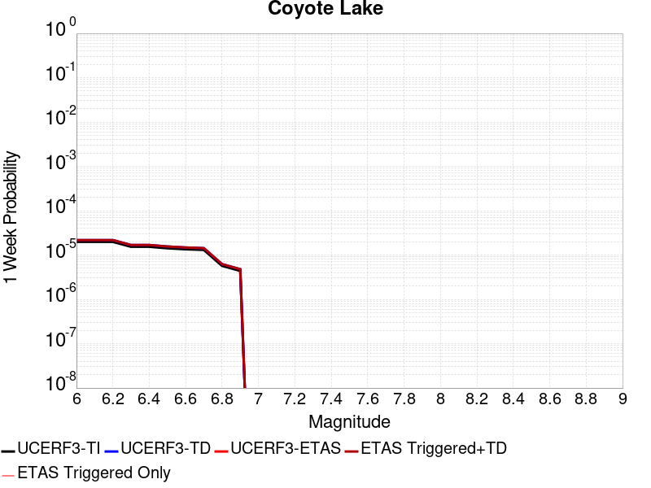 |  |  |  |

| Magnitude | 1 wk TI Prob | 1 wk TD Prob | 1 wk ETAS Prob | 1 wk ETAS/TD Gain | 1 wk ETAS Triggered+TD | 1 wk ETAS Triggered Only | 1 mo TI Prob | 1 mo TD Prob | 1 mo ETAS Prob | 1 mo ETAS/TD Gain | 1 mo ETAS Triggered+TD | 1 mo ETAS Triggered Only | 1 yr TI Prob | 1 yr TD Prob | 1 yr ETAS Prob | 1 yr ETAS/TD Gain | 1 yr ETAS Triggered+TD | 1 yr ETAS Triggered Only | 10 yr TI Prob | 10 yr TD Prob | 10 yr ETAS Prob | 10 yr ETAS/TD Gain | 10 yr ETAS Triggered+TD | 10 yr ETAS Triggered Only |
|-----|-----|-----|-----|-----|-----|-----|-----|-----|-----|-----|-----|-----|-----|-----|-----|-----|-----|-----|-----|-----|-----|-----|-----|-----|
| 6.0 | 1.980352E-5 | 2.1710885E-5 | 0.0 | 0.0 | 2.1710885E-5 | 0.0 | 8.486947E-5 | 9.304373E-5 | 0.0 | 0.0 | 9.304373E-5 | 0.0 | 0.0010327959 | 0.0011322908 | 0.0012 | 1.0597984 | 0.0014319512 | 3.0E-4 | 0.010280091 | 0.011272397 | 0.0089 | 0.7895393 | 0.012656615 | 0.0014 |
| 6.1 | 1.980352E-5 | 2.1710885E-5 | 0.0 | 0.0 | 2.1710885E-5 | 0.0 | 8.486947E-5 | 9.304373E-5 | 0.0 | 0.0 | 9.304373E-5 | 0.0 | 0.0010327959 | 0.0011322908 | 0.0012 | 1.0597984 | 0.0014319512 | 3.0E-4 | 0.010280091 | 0.011272397 | 0.0089 | 0.7895393 | 0.012656615 | 0.0014 |
| 6.2 | 1.980352E-5 | 2.1710885E-5 | 0.0 | 0.0 | 2.1710885E-5 | 0.0 | 8.486947E-5 | 9.304373E-5 | 0.0 | 0.0 | 9.304373E-5 | 0.0 | 0.0010327959 | 0.0011322908 | 0.0012 | 1.0597984 | 0.0014319512 | 3.0E-4 | 0.010280091 | 0.011272397 | 0.0089 | 0.7895393 | 0.012656615 | 0.0014 |
| 6.3 | 1.5344787E-5 | 1.682388E-5 | 0.0 | 0.0 | 1.682388E-5 | 0.0 | 6.576172E-5 | 7.2100695E-5 | 0.0 | 0.0 | 7.2100695E-5 | 0.0 | 8.003548E-4 | 8.7753363E-4 | 0.001 | 1.1395575 | 0.0010773581 | 2.0E-4 | 0.007974784 | 0.008746732 | 0.0077 | 0.8803288 | 0.009737985 | 0.001 |
| 6.4 | 1.5344787E-5 | 1.682388E-5 | 0.0 | 0.0 | 1.682388E-5 | 0.0 | 6.576172E-5 | 7.2100695E-5 | 0.0 | 0.0 | 7.2100695E-5 | 0.0 | 8.003548E-4 | 8.7753363E-4 | 0.001 | 1.1395575 | 0.0010773581 | 2.0E-4 | 0.007974784 | 0.008746732 | 0.0077 | 0.8803288 | 0.009737985 | 0.001 |
| 6.5 | 1.4189697E-5 | 1.5560963E-5 | 0.0 | 0.0 | 1.5560963E-5 | 0.0 | 6.081157E-5 | 6.668848E-5 | 0.0 | 0.0 | 6.668848E-5 | 0.0 | 7.401293E-4 | 8.116901E-4 | 0.001 | 1.2319973 | 0.0010115277 | 2.0E-4 | 0.0073766913 | 0.0080932 | 0.0072 | 0.8896358 | 0.009085106 | 0.001 |
| 6.6 | 1.3469301E-5 | 1.4774411E-5 | 0.0 | 0.0 | 1.4774411E-5 | 0.0 | 5.7724297E-5 | 6.3317704E-5 | 0.0 | 0.0 | 6.3317704E-5 | 0.0 | 7.025667E-4 | 7.7068043E-4 | 0.001 | 1.2975547 | 9.705263E-4 | 2.0E-4 | 0.0070034964 | 0.007685984 | 0.0067 | 0.8717166 | 0.008678298 | 0.001 |
| 6.7 | 1.3027966E-5 | 1.4284472E-5 | 0.0 | 0.0 | 1.4284472E-5 | 0.0 | 5.5832945E-5 | 6.121807E-5 | 0.0 | 0.0 | 6.121807E-5 | 0.0 | 6.7955407E-4 | 7.4513484E-4 | 0.001 | 1.342039 | 9.4498583E-4 | 2.0E-4 | 0.006774798 | 0.007432244 | 0.0066 | 0.88802254 | 0.008424811 | 0.001 |
| 6.8 | 5.695434E-6 | 6.2255644E-6 | 0.0 | 0.0 | 6.2255644E-6 | 0.0 | 2.4408775E-5 | 2.6680886E-5 | 0.0 | 0.0 | 2.6680886E-5 | 0.0 | 2.971363E-4 | 3.2482136E-4 | 6.0E-4 | 1.847169 | 4.247889E-4 | 1.0E-4 | 0.0029673933 | 0.003246408 | 0.0024 | 0.7392786 | 0.003545434 | 3.0E-4 |
| 6.9 | 4.385688E-6 | 4.7939384E-6 | 0.0 | 0.0 | 4.7939384E-6 | 0.0 | 1.879567E-5 | 2.054545E-5 | 0.0 | 0.0 | 2.054545E-5 | 0.0 | 2.2881327E-4 | 2.5014085E-4 | 5.0E-4 | 1.9988738 | 3.5011585E-4 | 1.0E-4 | 0.002285778 | 0.0025014086 | 0.0016 | 0.6396396 | 0.002800658 | 3.0E-4 |

## Helendale-So Lockhart
*[(top)](#table-of-contents)*

| 1 Week | 1 Month | 1 Year | 10 Year |
|-----|-----|-----|-----|
|  |  |  |  |

| Magnitude | 1 wk TI Prob | 1 wk TD Prob | 1 wk ETAS Prob | 1 wk ETAS/TD Gain | 1 wk ETAS Triggered+TD | 1 wk ETAS Triggered Only | 1 mo TI Prob | 1 mo TD Prob | 1 mo ETAS Prob | 1 mo ETAS/TD Gain | 1 mo ETAS Triggered+TD | 1 mo ETAS Triggered Only | 1 yr TI Prob | 1 yr TD Prob | 1 yr ETAS Prob | 1 yr ETAS/TD Gain | 1 yr ETAS Triggered+TD | 1 yr ETAS Triggered Only | 10 yr TI Prob | 10 yr TD Prob | 10 yr ETAS Prob | 10 yr ETAS/TD Gain | 10 yr ETAS Triggered+TD | 10 yr ETAS Triggered Only |
|-----|-----|-----|-----|-----|-----|-----|-----|-----|-----|-----|-----|-----|-----|-----|-----|-----|-----|-----|-----|-----|-----|-----|-----|-----|
| 6.0 | 1.7296055E-5 | 1.810541E-5 | 0.0 | 0.0 | 1.810541E-5 | 0.0 | 7.412385E-5 | 7.759242E-5 | 0.0 | 0.0 | 7.759242E-5 | 0.0 | 9.0208417E-4 | 9.4429904E-4 | 4.0E-4 | 0.42359462 | 0.0010442046 | 1.0E-4 | 0.008984311 | 0.009404985 | 0.0076 | 0.80808204 | 0.010791819 | 0.0014 |
| 6.1 | 1.7296055E-5 | 1.810541E-5 | 0.0 | 0.0 | 1.810541E-5 | 0.0 | 7.412385E-5 | 7.759242E-5 | 0.0 | 0.0 | 7.759242E-5 | 0.0 | 9.0208417E-4 | 9.4429904E-4 | 4.0E-4 | 0.42359462 | 0.0010442046 | 1.0E-4 | 0.008984311 | 0.009404985 | 0.0076 | 0.80808204 | 0.010791819 | 0.0014 |
| 6.2 | 1.7296055E-5 | 1.810541E-5 | 0.0 | 0.0 | 1.810541E-5 | 0.0 | 7.412385E-5 | 7.759242E-5 | 0.0 | 0.0 | 7.759242E-5 | 0.0 | 9.0208417E-4 | 9.4429904E-4 | 4.0E-4 | 0.42359462 | 0.0010442046 | 1.0E-4 | 0.008984311 | 0.009404985 | 0.0076 | 0.80808204 | 0.010791819 | 0.0014 |
| 6.3 | 1.0669118E-5 | 1.1136392E-5 | 0.0 | 0.0 | 1.1136392E-5 | 0.0 | 4.5723988E-5 | 4.7726535E-5 | 0.0 | 0.0 | 4.7726535E-5 | 0.0 | 5.5654737E-4 | 5.809184E-4 | 4.0E-4 | 0.68856484 | 6.808603E-4 | 1.0E-4 | 0.0055515557 | 0.005794295 | 0.0048 | 0.828401 | 0.00668908 | 9.0E-4 |
| 6.4 | 1.0669118E-5 | 1.1136392E-5 | 0.0 | 0.0 | 1.1136392E-5 | 0.0 | 4.5723988E-5 | 4.7726535E-5 | 0.0 | 0.0 | 4.7726535E-5 | 0.0 | 5.5654737E-4 | 5.809184E-4 | 4.0E-4 | 0.68856484 | 6.808603E-4 | 1.0E-4 | 0.0055515557 | 0.005794295 | 0.0048 | 0.828401 | 0.00668908 | 9.0E-4 |
| 6.5 | 8.790038E-6 | 9.170984E-6 | 0.0 | 0.0 | 9.170984E-6 | 0.0 | 3.767105E-5 | 3.9303635E-5 | 0.0 | 0.0 | 3.9303635E-5 | 0.0 | 4.585485E-4 | 4.7841825E-4 | 4.0E-4 | 0.8360885 | 5.783704E-4 | 1.0E-4 | 0.0045760344 | 0.0047740475 | 0.0039 | 0.8169169 | 0.0054707057 | 7.0E-4 |
| 6.6 | 7.396949E-6 | 7.716197E-6 | 0.0 | 0.0 | 7.716197E-6 | 0.0 | 3.1700827E-5 | 3.3069E-5 | 0.0 | 0.0 | 3.3069E-5 | 0.0 | 3.858892E-4 | 4.0254174E-4 | 2.0E-4 | 0.4968429 | 5.025015E-4 | 1.0E-4 | 0.003852198 | 0.0040182327 | 0.0032 | 0.79636997 | 0.004615822 | 6.0E-4 |
| 6.7 | 6.4600285E-6 | 6.7386068E-6 | 0.0 | 0.0 | 6.7386068E-6 | 0.0 | 2.7685543E-5 | 2.8879429E-5 | 0.0 | 0.0 | 2.8879429E-5 | 0.0 | 3.3701936E-4 | 3.515511E-4 | 2.0E-4 | 0.5689073 | 4.5151595E-4 | 1.0E-4 | 0.0033650869 | 0.0035100314 | 0.0028 | 0.79771364 | 0.0041079256 | 6.0E-4 |
| 6.8 | 5.600104E-6 | 5.8364976E-6 | 0.0 | 0.0 | 5.8364976E-6 | 0.0 | 2.4000226E-5 | 2.5013323E-5 | 0.0 | 0.0 | 2.5013323E-5 | 0.0 | 2.9216358E-4 | 3.0449525E-4 | 2.0E-4 | 0.6568247 | 4.044648E-4 | 1.0E-4 | 0.0029177975 | 0.003040842 | 0.0026 | 0.85502636 | 0.0036390175 | 6.0E-4 |
| 6.9 | 4.839122E-6 | 5.0399235E-6 | 0.0 | 0.0 | 5.0399235E-6 | 0.0 | 2.0738931E-5 | 2.1599495E-5 | 0.0 | 0.0 | 2.1599495E-5 | 0.0 | 2.5246723E-4 | 2.629426E-4 | 2.0E-4 | 0.7606223 | 3.629163E-4 | 1.0E-4 | 0.002521806 | 0.0026263623 | 0.0022 | 0.8376605 | 0.0032247866 | 6.0E-4 |
| 7.0 | 3.6937633E-6 | 3.845521E-6 | 0.0 | 0.0 | 3.845521E-6 | 0.0 | 1.5830317E-5 | 1.64807E-5 | 0.0 | 0.0 | 1.64807E-5 | 0.0 | 1.9271708E-4 | 2.0063437E-4 | 2.0E-4 | 0.99683815 | 3.006143E-4 | 1.0E-4 | 0.0019255003 | 0.0020045638 | 0.0019 | 0.9478371 | 0.0025035616 | 5.0E-4 |
| 7.1 | 2.7858857E-6 | 2.8980849E-6 | 0.0 | 0.0 | 2.8980849E-6 | 0.0 | 1.1939455E-5 | 1.2420306E-5 | 0.0 | 0.0 | 1.2420306E-5 | 0.0 | 1.4535317E-4 | 1.5120694E-4 | 0.0 | 0.0 | 1.5120694E-4 | 0.0 | 0.0014525814 | 0.0015110621 | 0.001 | 0.66178614 | 0.0017107599 | 2.0E-4 |
| 7.2 | 2.1672065E-6 | 2.254192E-6 | 0.0 | 0.0 | 2.254192E-6 | 0.0 | 9.2879945E-6 | 9.660787E-6 | 0.0 | 0.0 | 9.660787E-6 | 0.0 | 1.1307546E-4 | 1.1761393E-4 | 0.0 | 0.0 | 1.1761393E-4 | 0.0 | 0.0011301794 | 0.001175535 | 9.0E-4 | 0.76560885 | 0.0013752999 | 2.0E-4 |
| 7.3 | 1.4823496E-6 | 1.5423337E-6 | 0.0 | 0.0 | 1.5423337E-6 | 0.0 | 6.3529114E-6 | 6.609986E-6 | 0.0 | 0.0 | 6.609986E-6 | 0.0 | 7.734395E-5 | 8.047376E-5 | 0.0 | 0.0 | 8.047376E-5 | 0.0 | 7.731704E-4 | 8.044613E-4 | 7.0E-4 | 0.8701475 | 9.043808E-4 | 1.0E-4 |
| 7.4 | 4.2321457E-7 | 4.411246E-7 | 0.0 | 0.0 | 4.411246E-7 | 0.0 | 1.8137755E-6 | 1.8905329E-6 | 0.0 | 0.0 | 1.8905329E-6 | 0.0 | 2.2082493E-5 | 2.301704E-5 | 0.0 | 0.0 | 2.301704E-5 | 0.0 | 2.2080299E-4 | 2.301511E-4 | 1.0E-4 | 0.43449718 | 2.301511E-4 | 0.0 |
| 7.5 | 5.6942316E-8 | 5.9420763E-8 | 0.0 | 0.0 | 5.9420763E-8 | 0.0 | 2.440385E-7 | 2.546604E-7 | 0.0 | 0.0 | 2.546604E-7 | 0.0 | 2.9711643E-6 | 3.1004868E-6 | 0.0 | 0.0 | 3.1004868E-6 | 0.0 | 2.9711247E-5 | 3.1004514E-5 | 0.0 | 0.0 | 3.1004514E-5 | 0.0 |

## Oak Ridge (Onshore)
*[(top)](#table-of-contents)*

| 1 Week | 1 Month | 1 Year | 10 Year |
|-----|-----|-----|-----|
|  |  | 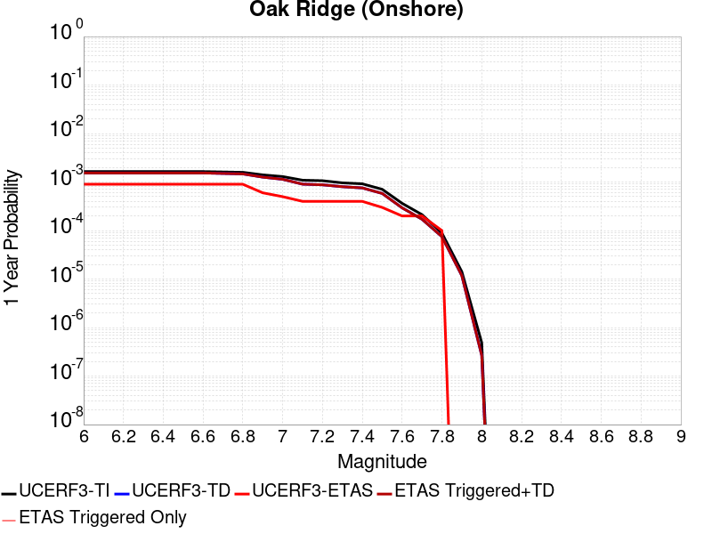 |  |

| Magnitude | 1 wk TI Prob | 1 wk TD Prob | 1 wk ETAS Prob | 1 wk ETAS/TD Gain | 1 wk ETAS Triggered+TD | 1 wk ETAS Triggered Only | 1 mo TI Prob | 1 mo TD Prob | 1 mo ETAS Prob | 1 mo ETAS/TD Gain | 1 mo ETAS Triggered+TD | 1 mo ETAS Triggered Only | 1 yr TI Prob | 1 yr TD Prob | 1 yr ETAS Prob | 1 yr ETAS/TD Gain | 1 yr ETAS Triggered+TD | 1 yr ETAS Triggered Only | 10 yr TI Prob | 10 yr TD Prob | 10 yr ETAS Prob | 10 yr ETAS/TD Gain | 10 yr ETAS Triggered+TD | 10 yr ETAS Triggered Only |
|-----|-----|-----|-----|-----|-----|-----|-----|-----|-----|-----|-----|-----|-----|-----|-----|-----|-----|-----|-----|-----|-----|-----|-----|-----|
| 6.0 | 3.155064E-5 | 2.9534815E-5 | 0.0 | 0.0 | 2.9534815E-5 | 0.0 | 1.3521002E-4 | 1.2657185E-4 | 1.0E-4 | 0.79006505 | 1.2657185E-4 | 0.0 | 0.001644939 | 0.0015399611 | 9.0E-4 | 0.58443034 | 0.0015399611 | 0.0 | 0.01632816 | 0.015297234 | 0.0089 | 0.5818045 | 0.016577348 | 0.0013 |
| 6.1 | 3.155064E-5 | 2.9534815E-5 | 0.0 | 0.0 | 2.9534815E-5 | 0.0 | 1.3521002E-4 | 1.2657185E-4 | 1.0E-4 | 0.79006505 | 1.2657185E-4 | 0.0 | 0.001644939 | 0.0015399611 | 9.0E-4 | 0.58443034 | 0.0015399611 | 0.0 | 0.01632816 | 0.015297234 | 0.0089 | 0.5818045 | 0.016577348 | 0.0013 |
| 6.2 | 3.155064E-5 | 2.9534815E-5 | 0.0 | 0.0 | 2.9534815E-5 | 0.0 | 1.3521002E-4 | 1.2657185E-4 | 1.0E-4 | 0.79006505 | 1.2657185E-4 | 0.0 | 0.001644939 | 0.0015399611 | 9.0E-4 | 0.58443034 | 0.0015399611 | 0.0 | 0.01632816 | 0.015297234 | 0.0089 | 0.5818045 | 0.016577348 | 0.0013 |
| 6.3 | 3.155064E-5 | 2.9534815E-5 | 0.0 | 0.0 | 2.9534815E-5 | 0.0 | 1.3521002E-4 | 1.2657185E-4 | 1.0E-4 | 0.79006505 | 1.2657185E-4 | 0.0 | 0.001644939 | 0.0015399611 | 9.0E-4 | 0.58443034 | 0.0015399611 | 0.0 | 0.01632816 | 0.015297234 | 0.0089 | 0.5818045 | 0.016577348 | 0.0013 |
| 6.4 | 3.155064E-5 | 2.9534815E-5 | 0.0 | 0.0 | 2.9534815E-5 | 0.0 | 1.3521002E-4 | 1.2657185E-4 | 1.0E-4 | 0.79006505 | 1.2657185E-4 | 0.0 | 0.001644939 | 0.0015399611 | 9.0E-4 | 0.58443034 | 0.0015399611 | 0.0 | 0.01632816 | 0.015297234 | 0.0089 | 0.5818045 | 0.016577348 | 0.0013 |
| 6.5 | 3.155064E-5 | 2.9534815E-5 | 0.0 | 0.0 | 2.9534815E-5 | 0.0 | 1.3521002E-4 | 1.2657185E-4 | 1.0E-4 | 0.79006505 | 1.2657185E-4 | 0.0 | 0.001644939 | 0.0015399611 | 9.0E-4 | 0.58443034 | 0.0015399611 | 0.0 | 0.01632816 | 0.015297234 | 0.0089 | 0.5818045 | 0.016577348 | 0.0013 |
| 6.6 | 3.155064E-5 | 2.9534815E-5 | 0.0 | 0.0 | 2.9534815E-5 | 0.0 | 1.3521002E-4 | 1.2657185E-4 | 1.0E-4 | 0.79006505 | 1.2657185E-4 | 0.0 | 0.001644939 | 0.0015399611 | 9.0E-4 | 0.58443034 | 0.0015399611 | 0.0 | 0.01632816 | 0.015297234 | 0.0089 | 0.5818045 | 0.016577348 | 0.0013 |
| 6.7 | 3.098897E-5 | 2.8872782E-5 | 0.0 | 0.0 | 2.8872782E-5 | 0.0 | 1.328031E-4 | 1.2373483E-4 | 1.0E-4 | 0.8081798 | 1.2373483E-4 | 0.0 | 0.0016156785 | 0.0015054684 | 9.0E-4 | 0.5978206 | 0.0015054684 | 0.0 | 0.016039822 | 0.014956971 | 0.0086 | 0.57498276 | 0.016237527 | 0.0013 |
| 6.8 | 3.0449872E-5 | 2.8247783E-5 | 0.0 | 0.0 | 2.8247783E-5 | 0.0 | 1.3049292E-4 | 1.2105652E-4 | 1.0E-4 | 0.8260604 | 1.2105652E-4 | 0.0 | 0.0015875935 | 0.0014729039 | 9.0E-4 | 0.61103785 | 0.0014729039 | 0.0 | 0.015762992 | 0.014635619 | 0.0086 | 0.58760756 | 0.015818056 | 0.0012 |
| 6.9 | 2.697928E-5 | 2.4226918E-5 | 0.0 | 0.0 | 2.4226918E-5 | 0.0 | 1.15620365E-4 | 1.0382564E-4 | 1.0E-4 | 0.96315324 | 1.0382564E-4 | 0.0 | 0.0014067689 | 0.0012633657 | 6.0E-4 | 0.47492185 | 0.0012633657 | 0.0 | 0.0139789665 | 0.0125643825 | 0.0077 | 0.6128435 | 0.013749305 | 0.0012 |
| 7.0 | 2.4893961E-5 | 2.1868496E-5 | 0.0 | 0.0 | 2.1868496E-5 | 0.0 | 1.0668404E-4 | 9.371886E-5 | 1.0E-4 | 1.0670211 | 9.371886E-5 | 0.0 | 0.0012981043 | 0.0011404476 | 5.0E-4 | 0.43842438 | 0.0011404476 | 0.0 | 0.012905477 | 0.011348065 | 0.007 | 0.61684525 | 0.012534447 | 0.0012 |
| 7.1 | 2.0945363E-5 | 1.7359647E-5 | 0.0 | 0.0 | 1.7359647E-5 | 0.0 | 8.976275E-5 | 7.439639E-5 | 1.0E-4 | 1.3441513 | 7.439639E-5 | 0.0 | 0.0010923136 | 9.054044E-4 | 4.0E-4 | 0.44179153 | 9.054044E-4 | 0.0 | 0.0108696 | 0.00901792 | 0.0057 | 0.6320748 | 0.010207099 | 0.0012 |
| 7.2 | 2.0439404E-5 | 1.6814438E-5 | 0.0 | 0.0 | 1.6814438E-5 | 0.0 | 8.7594504E-5 | 7.205991E-5 | 1.0E-4 | 1.3877342 | 7.205991E-5 | 0.0 | 0.0010659413 | 8.76981E-4 | 4.0E-4 | 0.45611024 | 8.76981E-4 | 0.0 | 0.010608427 | 0.008735948 | 0.0056 | 0.6410294 | 0.009925465 | 0.0012 |
| 7.3 | 1.8463334E-5 | 1.5385049E-5 | 0.0 | 0.0 | 1.5385049E-5 | 0.0 | 7.912617E-5 | 6.5934284E-5 | 1.0E-4 | 1.5166618 | 6.5934284E-5 | 0.0 | 9.6293533E-4 | 8.0245855E-4 | 4.0E-4 | 0.4984681 | 8.0245855E-4 | 0.0 | 0.009587734 | 0.007996302 | 0.0053 | 0.6628064 | 0.0091867065 | 0.0012 |
| 7.4 | 1.763139E-5 | 1.4519711E-5 | 0.0 | 0.0 | 1.4519711E-5 | 0.0 | 7.556091E-5 | 6.2225874E-5 | 1.0E-4 | 1.6070486 | 6.2225874E-5 | 0.0 | 9.1956573E-4 | 7.573406E-4 | 4.0E-4 | 0.52816397 | 7.573406E-4 | 0.0 | 0.009157699 | 0.0075482316 | 0.0046 | 0.6094143 | 0.008639929 | 0.0011 |
| 7.5 | 1.3594944E-5 | 1.11654035E-5 | 0.0 | 0.0 | 1.11654035E-5 | 0.0 | 5.8262744E-5 | 4.7850866E-5 | 0.0 | 0.0 | 4.7850866E-5 | 0.0 | 7.0911803E-4 | 5.824311E-4 | 3.0E-4 | 0.5150824 | 5.824311E-4 | 0.0 | 0.007068595 | 0.005809231 | 0.0032 | 0.5508474 | 0.0067040026 | 9.0E-4 |
| 7.6 | 6.9889534E-6 | 5.6374965E-6 | 0.0 | 0.0 | 5.6374965E-6 | 0.0 | 2.9952313E-5 | 2.416048E-5 | 0.0 | 0.0 | 2.416048E-5 | 0.0 | 3.646084E-4 | 2.9411455E-4 | 2.0E-4 | 0.68000716 | 2.9411455E-4 | 0.0 | 0.0036401073 | 0.0029372969 | 0.0022 | 0.748988 | 0.0036352407 | 7.0E-4 |
| 7.7 | 4.0824193E-6 | 3.283722E-6 | 0.0 | 0.0 | 3.283722E-6 | 0.0 | 1.7495966E-5 | 1.4073019E-5 | 0.0 | 0.0 | 1.4073019E-5 | 0.0 | 2.1299256E-4 | 1.7132566E-4 | 2.0E-4 | 1.1673675 | 1.7132566E-4 | 0.0 | 0.0021278851 | 0.0017119492 | 0.0016 | 0.93460715 | 0.0022110932 | 5.0E-4 |
| 7.8 | 1.7023609E-6 | 1.4372237E-6 | 0.0 | 0.0 | 1.4372237E-6 | 0.0 | 7.295812E-6 | 6.1595156E-6 | 0.0 | 0.0 | 6.1595156E-6 | 0.0 | 8.882289E-5 | 7.498955E-5 | 1.0E-4 | 1.3335192 | 7.498955E-5 | 0.0 | 8.8787393E-4 | 7.4964523E-4 | 7.0E-4 | 0.93377507 | 0.0010494203 | 3.0E-4 |
| 7.9 | 2.721225E-7 | 2.2620458E-7 | 0.0 | 0.0 | 2.2620458E-7 | 0.0 | 1.1662388E-6 | 9.694478E-7 | 0.0 | 0.0 | 9.694478E-7 | 0.0 | 1.4198865E-5 | 1.1802967E-5 | 0.0 | 0.0 | 1.1802967E-5 | 0.0 | 1.4197957E-4 | 1.1802368E-4 | 3.0E-4 | 2.541863 | 3.1800006E-4 | 2.0E-4 |
| 8.0 | 9.364255E-9 | 5.1243556E-9 | 0.0 | 0.0 | 5.1243556E-9 | 0.0 | 4.0132523E-8 | 2.1961524E-8 | 0.0 | 0.0 | 2.1961524E-8 | 0.0 | 4.8861335E-7 | 2.6738152E-7 | 0.0 | 0.0 | 2.6738152E-7 | 0.0 | 4.8861225E-6 | 2.6738123E-6 | 0.0 | 0.0 | 2.6738123E-6 | 0.0 |

## Rinconada 2011 CFM
*[(top)](#table-of-contents)*

| 1 Week | 1 Month | 1 Year | 10 Year |
|-----|-----|-----|-----|
| 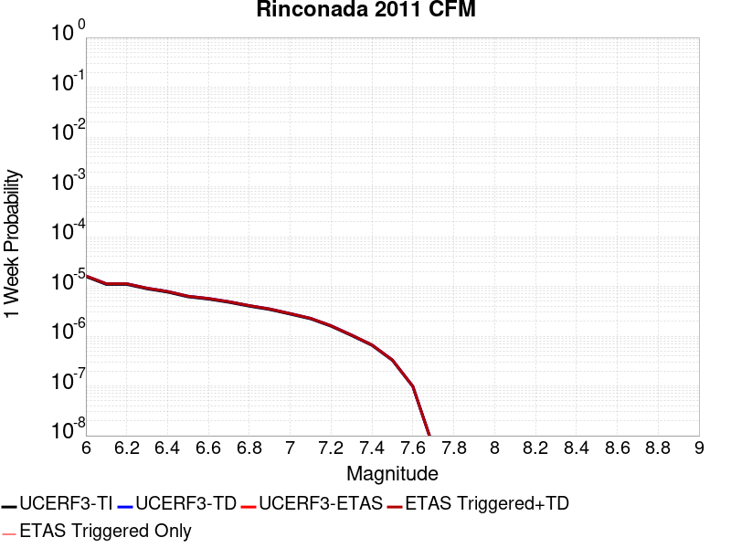 | 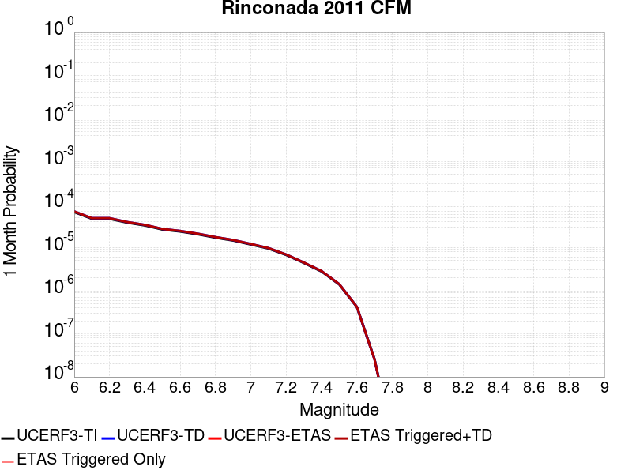 | 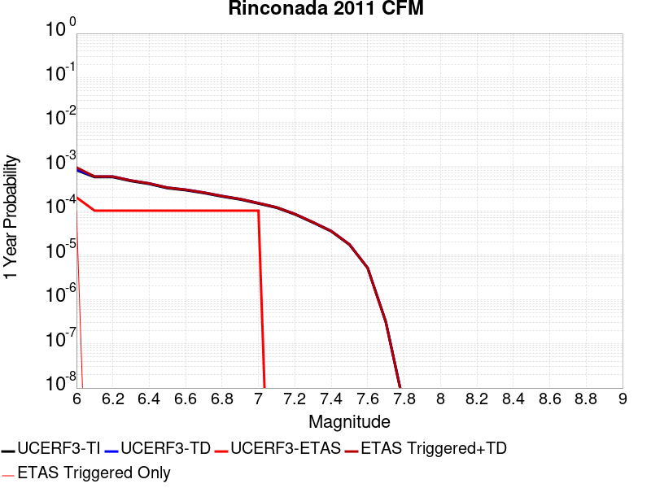 | 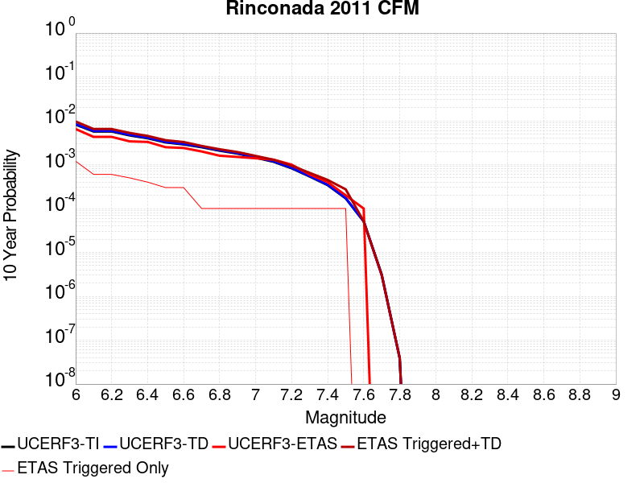 |

| Magnitude | 1 wk TI Prob | 1 wk TD Prob | 1 wk ETAS Prob | 1 wk ETAS/TD Gain | 1 wk ETAS Triggered+TD | 1 wk ETAS Triggered Only | 1 mo TI Prob | 1 mo TD Prob | 1 mo ETAS Prob | 1 mo ETAS/TD Gain | 1 mo ETAS Triggered+TD | 1 mo ETAS Triggered Only | 1 yr TI Prob | 1 yr TD Prob | 1 yr ETAS Prob | 1 yr ETAS/TD Gain | 1 yr ETAS Triggered+TD | 1 yr ETAS Triggered Only | 10 yr TI Prob | 10 yr TD Prob | 10 yr ETAS Prob | 10 yr ETAS/TD Gain | 10 yr ETAS Triggered+TD | 10 yr ETAS Triggered Only |
|-----|-----|-----|-----|-----|-----|-----|-----|-----|-----|-----|-----|-----|-----|-----|-----|-----|-----|-----|-----|-----|-----|-----|-----|-----|
| 6.0 | 1.5752368E-5 | 1.6275791E-5 | 0.0 | 0.0 | 1.6275791E-5 | 0.0 | 6.75084E-5 | 6.975154E-5 | 0.0 | 0.0 | 6.975154E-5 | 0.0 | 8.2160486E-4 | 8.488973E-4 | 2.0E-4 | 0.23559976 | 9.488124E-4 | 1.0E-4 | 0.008185739 | 0.008456927 | 0.0065 | 0.76860076 | 0.009646778 | 0.0012 |
| 6.1 | 1.0966133E-5 | 1.1323765E-5 | 0.0 | 0.0 | 1.1323765E-5 | 0.0 | 4.6996865E-5 | 4.8529524E-5 | 0.0 | 0.0 | 4.8529524E-5 | 0.0 | 5.720366E-4 | 5.906875E-4 | 1.0E-4 | 0.16929425 | 5.906875E-4 | 0.0 | 0.0057056635 | 0.0058912705 | 0.0043 | 0.7298935 | 0.006487736 | 6.0E-4 |
| 6.2 | 1.0966133E-5 | 1.1323765E-5 | 0.0 | 0.0 | 1.1323765E-5 | 0.0 | 4.6996865E-5 | 4.8529524E-5 | 0.0 | 0.0 | 4.8529524E-5 | 0.0 | 5.720366E-4 | 5.906875E-4 | 1.0E-4 | 0.16929425 | 5.906875E-4 | 0.0 | 0.0057056635 | 0.0058912705 | 0.0043 | 0.7298935 | 0.006487736 | 6.0E-4 |
| 6.3 | 8.926149E-6 | 9.213363E-6 | 0.0 | 0.0 | 9.213363E-6 | 0.0 | 3.8254362E-5 | 3.9485247E-5 | 0.0 | 0.0 | 3.9485247E-5 | 0.0 | 4.6564735E-4 | 4.8062718E-4 | 1.0E-4 | 0.20806149 | 4.8062718E-4 | 0.0 | 0.0046467283 | 0.004795922 | 0.0034 | 0.7089357 | 0.005293524 | 5.0E-4 |
| 6.4 | 7.676955E-6 | 7.920694E-6 | 0.0 | 0.0 | 7.920694E-6 | 0.0 | 3.290082E-5 | 3.3945387E-5 | 0.0 | 0.0 | 3.3945387E-5 | 0.0 | 4.0049385E-4 | 4.132069E-4 | 1.0E-4 | 0.2420095 | 4.132069E-4 | 0.0 | 0.0039977287 | 0.0041244123 | 0.0033 | 0.800114 | 0.0045227627 | 4.0E-4 |
| 6.5 | 6.1671026E-6 | 6.359352E-6 | 0.0 | 0.0 | 6.359352E-6 | 0.0 | 2.6430173E-5 | 2.7254082E-5 | 0.0 | 0.0 | 2.7254082E-5 | 0.0 | 3.2173982E-4 | 3.31768E-4 | 1.0E-4 | 0.30141544 | 3.31768E-4 | 0.0 | 0.003212744 | 0.003312739 | 0.0025 | 0.7546625 | 0.0036117453 | 3.0E-4 |
| 6.6 | 5.553456E-6 | 5.7251677E-6 | 0.0 | 0.0 | 5.7251677E-6 | 0.0 | 2.3800309E-5 | 2.4536203E-5 | 0.0 | 0.0 | 2.4536203E-5 | 0.0 | 2.897302E-4 | 2.9868737E-4 | 1.0E-4 | 0.33479822 | 2.9868737E-4 | 0.0 | 0.0028935277 | 0.0029828679 | 0.0024 | 0.8045948 | 0.003281973 | 3.0E-4 |
| 6.7 | 4.787857E-6 | 4.9336113E-6 | 0.0 | 0.0 | 4.9336113E-6 | 0.0 | 2.0519226E-5 | 2.1143878E-5 | 0.0 | 0.0 | 2.1143878E-5 | 0.0 | 2.4979294E-4 | 2.5739634E-4 | 1.0E-4 | 0.3885059 | 2.5739634E-4 | 0.0 | 0.0024951235 | 0.002570988 | 0.002 | 0.77791107 | 0.002670731 | 1.0E-4 |
| 6.8 | 3.9955166E-6 | 4.1137214E-6 | 0.0 | 0.0 | 4.1137214E-6 | 0.0 | 1.7123532E-5 | 1.7630116E-5 | 0.0 | 0.0 | 1.7630116E-5 | 0.0 | 2.0845905E-4 | 2.1462554E-4 | 1.0E-4 | 0.46592775 | 2.1462554E-4 | 0.0 | 0.002082636 | 0.0021441863 | 0.0016 | 0.74620384 | 0.002243972 | 1.0E-4 |
| 6.9 | 3.4250072E-6 | 3.5226494E-6 | 0.0 | 0.0 | 3.5226494E-6 | 0.0 | 1.46785205E-5 | 1.5096982E-5 | 0.0 | 0.0 | 1.5096982E-5 | 0.0 | 1.7869633E-4 | 1.8379027E-4 | 1.0E-4 | 0.54409844 | 1.8379027E-4 | 0.0 | 0.001785527 | 0.0018363852 | 0.0015 | 0.8168221 | 0.0019362016 | 1.0E-4 |
| 7.0 | 2.7712713E-6 | 2.8468578E-6 | 0.0 | 0.0 | 2.8468578E-6 | 0.0 | 1.1876823E-5 | 1.2200762E-5 | 0.0 | 0.0 | 1.2200762E-5 | 0.0 | 1.4459073E-4 | 1.4853416E-4 | 1.0E-4 | 0.6732458 | 1.4853416E-4 | 0.0 | 0.0014449668 | 0.0014843505 | 0.0014 | 0.94317347 | 0.001584202 | 1.0E-4 |
| 7.1 | 2.227358E-6 | 2.2858214E-6 | 0.0 | 0.0 | 2.2858214E-6 | 0.0 | 9.545785E-6 | 9.79634E-6 | 0.0 | 0.0 | 9.79634E-6 | 0.0 | 1.16213734E-4 | 1.19263925E-4 | 0.0 | 0.0 | 1.19263925E-4 | 0.0 | 0.0011615298 | 0.0011920002 | 0.0013 | 1.0906038 | 0.0012918811 | 1.0E-4 |
| 7.2 | 1.581796E-6 | 1.6209847E-6 | 0.0 | 0.0 | 1.6209847E-6 | 0.0 | 6.779108E-6 | 6.9470584E-6 | 0.0 | 0.0 | 6.9470584E-6 | 0.0 | 8.253252E-5 | 8.457716E-5 | 0.0 | 0.0 | 8.457716E-5 | 0.0 | 8.250187E-4 | 8.4545027E-4 | 0.001 | 1.1828017 | 9.453657E-4 | 1.0E-4 |
| 7.3 | 1.0306567E-6 | 1.0547003E-6 | 0.0 | 0.0 | 1.0547003E-6 | 0.0 | 4.4170924E-6 | 4.520136E-6 | 0.0 | 0.0 | 4.520136E-6 | 0.0 | 5.3776774E-5 | 5.503127E-5 | 0.0 | 0.0 | 5.503127E-5 | 0.0 | 5.376376E-4 | 5.5017666E-4 | 6.0E-4 | 1.0905588 | 6.5012166E-4 | 1.0E-4 |
| 7.4 | 6.535541E-7 | 6.6830785E-7 | 0.0 | 0.0 | 6.6830785E-7 | 0.0 | 2.800943E-6 | 2.8641734E-6 | 0.0 | 0.0 | 2.8641734E-6 | 0.0 | 3.4100947E-5 | 3.4870754E-5 | 0.0 | 0.0 | 3.4870754E-5 | 0.0 | 3.4095717E-4 | 3.4865295E-4 | 4.0E-4 | 1.1472727 | 4.4861808E-4 | 1.0E-4 |
| 7.5 | 3.2656962E-7 | 3.3318403E-7 | 0.0 | 0.0 | 3.3318403E-7 | 0.0 | 1.3995833E-6 | 1.4279307E-6 | 0.0 | 0.0 | 1.4279307E-6 | 0.0 | 1.7039794E-5 | 1.7384918E-5 | 0.0 | 0.0 | 1.7384918E-5 | 0.0 | 1.7038487E-4 | 1.7383562E-4 | 2.0E-4 | 1.1505122 | 2.7381824E-4 | 1.0E-4 |
| 7.6 | 9.754343E-8 | 9.821496E-8 | 0.0 | 0.0 | 9.821496E-8 | 0.0 | 4.180432E-7 | 4.2092117E-7 | 0.0 | 0.0 | 4.2092117E-7 | 0.0 | 5.089664E-6 | 5.1247034E-6 | 0.0 | 0.0 | 5.1247034E-6 | 0.0 | 5.0895473E-5 | 5.124586E-5 | 1.0E-4 | 1.9513772 | 5.124586E-5 | 0.0 |
| 7.7 | 6.0001453E-9 | 5.849466E-9 | 0.0 | 0.0 | 5.849466E-9 | 0.0 | 2.5714908E-8 | 2.5069138E-8 | 0.0 | 0.0 | 2.5069138E-8 | 0.0 | 3.1307894E-7 | 3.052167E-7 | 0.0 | 0.0 | 3.052167E-7 | 0.0 | 3.1307852E-6 | 3.052163E-6 | 0.0 | 0.0 | 3.052163E-6 | 0.0 |
| 7.8 | 7.400003E-11 | 7.4655726E-11 | 0.0 | 0.0 | 7.4655726E-11 | 0.0 | 3.171432E-10 | 3.1995329E-10 | 0.0 | 0.0 | 3.1995329E-10 | 0.0 | 3.861218E-9 | 3.8954315E-9 | 0.0 | 0.0 | 3.8954315E-9 | 0.0 | 3.861218E-8 | 3.8954315E-8 | 0.0 | 0.0 | 3.8954315E-8 | 0.0 |

## San Jacinto (Coyote Creek)
*[(top)](#table-of-contents)*

| 1 Week | 1 Month | 1 Year | 10 Year |
|-----|-----|-----|-----|
| 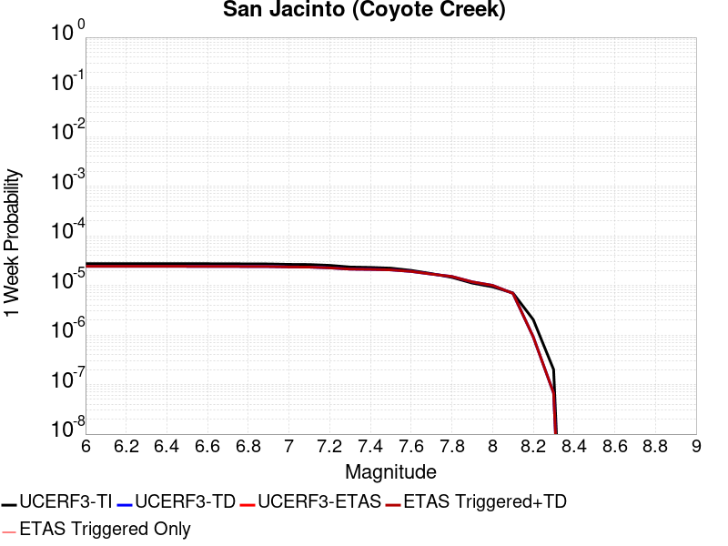 |  |  | 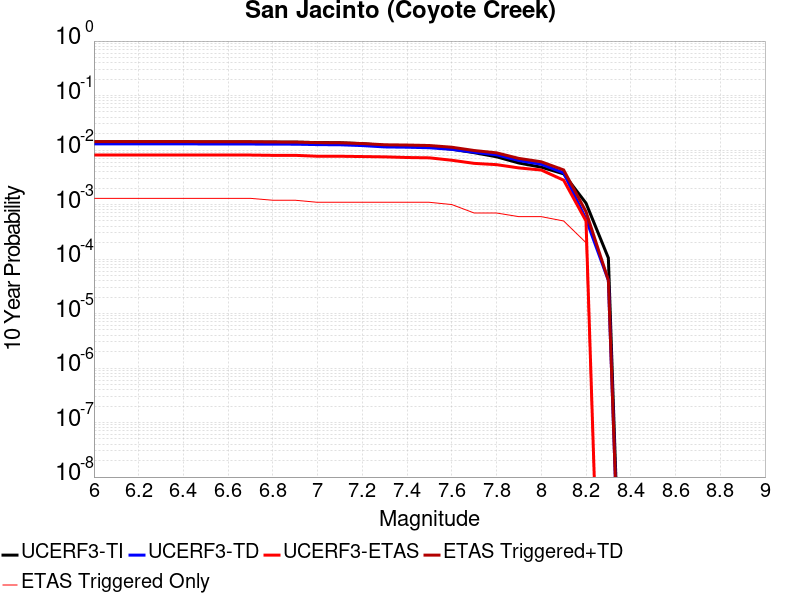 |

| Magnitude | 1 wk TI Prob | 1 wk TD Prob | 1 wk ETAS Prob | 1 wk ETAS/TD Gain | 1 wk ETAS Triggered+TD | 1 wk ETAS Triggered Only | 1 mo TI Prob | 1 mo TD Prob | 1 mo ETAS Prob | 1 mo ETAS/TD Gain | 1 mo ETAS Triggered+TD | 1 mo ETAS Triggered Only | 1 yr TI Prob | 1 yr TD Prob | 1 yr ETAS Prob | 1 yr ETAS/TD Gain | 1 yr ETAS Triggered+TD | 1 yr ETAS Triggered Only | 10 yr TI Prob | 10 yr TD Prob | 10 yr ETAS Prob | 10 yr ETAS/TD Gain | 10 yr ETAS Triggered+TD | 10 yr ETAS Triggered Only |
|-----|-----|-----|-----|-----|-----|-----|-----|-----|-----|-----|-----|-----|-----|-----|-----|-----|-----|-----|-----|-----|-----|-----|-----|-----|
| 6.0 | 2.7374346E-5 | 2.4265499E-5 | 0.0 | 0.0 | 2.4265499E-5 | 0.0 | 1.1731335E-4 | 1.0399086E-4 | 0.0 | 0.0 | 1.0399086E-4 | 0.0 | 0.0014273542 | 0.001265356 | 5.0E-4 | 0.3951457 | 0.001265356 | 0.0 | 0.01418221 | 0.0129908705 | 0.0081 | 0.6235148 | 0.0142739825 | 0.0013 |
| 6.1 | 2.7374346E-5 | 2.4265499E-5 | 0.0 | 0.0 | 2.4265499E-5 | 0.0 | 1.1731335E-4 | 1.0399086E-4 | 0.0 | 0.0 | 1.0399086E-4 | 0.0 | 0.0014273542 | 0.001265356 | 5.0E-4 | 0.3951457 | 0.001265356 | 0.0 | 0.01418221 | 0.0129908705 | 0.0081 | 0.6235148 | 0.0142739825 | 0.0013 |
| 6.2 | 2.7374346E-5 | 2.4265499E-5 | 0.0 | 0.0 | 2.4265499E-5 | 0.0 | 1.1731335E-4 | 1.0399086E-4 | 0.0 | 0.0 | 1.0399086E-4 | 0.0 | 0.0014273542 | 0.001265356 | 5.0E-4 | 0.3951457 | 0.001265356 | 0.0 | 0.01418221 | 0.0129908705 | 0.0081 | 0.6235148 | 0.0142739825 | 0.0013 |
| 6.3 | 2.7374346E-5 | 2.4265499E-5 | 0.0 | 0.0 | 2.4265499E-5 | 0.0 | 1.1731335E-4 | 1.0399086E-4 | 0.0 | 0.0 | 1.0399086E-4 | 0.0 | 0.0014273542 | 0.001265356 | 5.0E-4 | 0.3951457 | 0.001265356 | 0.0 | 0.01418221 | 0.0129908705 | 0.0081 | 0.6235148 | 0.0142739825 | 0.0013 |
| 6.4 | 2.7374346E-5 | 2.4265499E-5 | 0.0 | 0.0 | 2.4265499E-5 | 0.0 | 1.1731335E-4 | 1.0399086E-4 | 0.0 | 0.0 | 1.0399086E-4 | 0.0 | 0.0014273542 | 0.001265356 | 5.0E-4 | 0.3951457 | 0.001265356 | 0.0 | 0.01418221 | 0.0129908705 | 0.0081 | 0.6235148 | 0.0142739825 | 0.0013 |
| 6.5 | 2.7282445E-5 | 2.4151523E-5 | 0.0 | 0.0 | 2.4151523E-5 | 0.0 | 1.16919524E-4 | 1.0350243E-4 | 0.0 | 0.0 | 1.0350243E-4 | 0.0 | 0.0014225657 | 0.0012594163 | 5.0E-4 | 0.3970093 | 0.0012594163 | 0.0 | 0.014134934 | 0.012932174 | 0.0081 | 0.6263448 | 0.014215362 | 0.0013 |
| 6.6 | 2.7282445E-5 | 2.4151523E-5 | 0.0 | 0.0 | 2.4151523E-5 | 0.0 | 1.16919524E-4 | 1.0350243E-4 | 0.0 | 0.0 | 1.0350243E-4 | 0.0 | 0.0014225657 | 0.0012594163 | 5.0E-4 | 0.3970093 | 0.0012594163 | 0.0 | 0.014134934 | 0.012932174 | 0.0081 | 0.6263448 | 0.014215362 | 0.0013 |
| 6.7 | 2.7216198E-5 | 2.4076608E-5 | 0.0 | 0.0 | 2.4076608E-5 | 0.0 | 1.1663563E-4 | 1.03181395E-4 | 0.0 | 0.0 | 1.03181395E-4 | 0.0 | 0.0014191137 | 0.0012555122 | 5.0E-4 | 0.39824384 | 0.0012555122 | 0.0 | 0.014100855 | 0.01289357 | 0.0081 | 0.62822014 | 0.014176808 | 0.0013 |
| 6.8 | 2.7078617E-5 | 2.3993754E-5 | 0.0 | 0.0 | 2.3993754E-5 | 0.0 | 1.1604605E-4 | 1.02826336E-4 | 0.0 | 0.0 | 1.02826336E-4 | 0.0 | 0.001411945 | 0.0012511944 | 5.0E-4 | 0.39961818 | 0.0012511944 | 0.0 | 0.014030075 | 0.012850673 | 0.008 | 0.62253547 | 0.014035252 | 0.0012 |
| 6.9 | 2.6982952E-5 | 2.391319E-5 | 0.0 | 0.0 | 2.391319E-5 | 0.0 | 1.15636096E-4 | 1.0248109E-4 | 0.0 | 0.0 | 1.0248109E-4 | 0.0 | 0.0014069602 | 0.0012469958 | 5.0E-4 | 0.40096366 | 0.0012469958 | 0.0 | 0.013980856 | 0.012808928 | 0.008 | 0.62456435 | 0.013993558 | 0.0012 |
| 7.0 | 2.6449972E-5 | 2.348995E-5 | 0.0 | 0.0 | 2.348995E-5 | 0.0 | 1.1335209E-4 | 1.0066735E-4 | 0.0 | 0.0 | 1.0066735E-4 | 0.0 | 0.001379188 | 0.0012249384 | 4.0E-4 | 0.32654703 | 0.0012249384 | 0.0 | 0.0137065975 | 0.012590173 | 0.0077 | 0.6115881 | 0.013676323 | 0.0011 |
| 7.1 | 2.6257849E-5 | 2.3315855E-5 | 0.0 | 0.0 | 2.3315855E-5 | 0.0 | 1.1252879E-4 | 9.992128E-5 | 0.0 | 0.0 | 9.992128E-5 | 0.0 | 0.0013691769 | 0.0012158653 | 4.0E-4 | 0.3289838 | 0.0012158653 | 0.0 | 0.013607717 | 0.012499949 | 0.0077 | 0.6160025 | 0.013586199 | 0.0011 |
| 7.2 | 2.5270041E-5 | 2.2509725E-5 | 0.0 | 0.0 | 2.2509725E-5 | 0.0 | 1.0829568E-4 | 9.646669E-5 | 0.0 | 0.0 | 9.646669E-5 | 0.0 | 0.0013177024 | 0.0011738515 | 4.0E-4 | 0.3407586 | 0.0011738515 | 0.0 | 0.013099162 | 0.01208051 | 0.0076 | 0.6291125 | 0.013167222 | 0.0011 |
| 7.3 | 2.339701E-5 | 2.123992E-5 | 0.0 | 0.0 | 2.123992E-5 | 0.0 | 1.0026905E-4 | 9.102507E-5 | 0.0 | 0.0 | 9.102507E-5 | 0.0 | 0.001220092 | 0.0011076689 | 4.0E-4 | 0.36111873 | 0.0011076689 | 0.0 | 0.012134149 | 0.011418679 | 0.0075 | 0.6568185 | 0.012506119 | 0.0011 |
| 7.4 | 2.296333E-5 | 2.096985E-5 | 0.0 | 0.0 | 2.096985E-5 | 0.0 | 9.841056E-5 | 8.98677E-5 | 0.0 | 0.0 | 8.98677E-5 | 0.0 | 0.0011974899 | 0.0010935921 | 4.0E-4 | 0.36576706 | 0.0010935921 | 0.0 | 0.011910575 | 0.011277595 | 0.0073 | 0.6473012 | 0.012365188 | 0.0011 |
| 7.5 | 2.2188895E-5 | 2.0491821E-5 | 0.0 | 0.0 | 2.0491821E-5 | 0.0 | 9.50918E-5 | 8.781915E-5 | 0.0 | 0.0 | 8.781915E-5 | 0.0 | 0.0011571277 | 0.0010686757 | 4.0E-4 | 0.37429503 | 0.0010686757 | 0.0 | 0.011511209 | 0.011026737 | 0.0072 | 0.65295833 | 0.012114608 | 0.0011 |
| 7.6 | 2.0013189E-5 | 1.9075556E-5 | 0.0 | 0.0 | 1.9075556E-5 | 0.0 | 8.5767984E-5 | 8.174983E-5 | 0.0 | 0.0 | 8.174983E-5 | 0.0 | 0.001043725 | 9.948516E-4 | 4.0E-4 | 0.40207005 | 9.948516E-4 | 0.0 | 0.010388365 | 0.010283528 | 0.0065 | 0.6320788 | 0.011273244 | 0.001 |
| 7.7 | 1.7230794E-5 | 1.6853746E-5 | 0.0 | 0.0 | 1.6853746E-5 | 0.0 | 7.384417E-5 | 7.2228344E-5 | 0.0 | 0.0 | 7.2228344E-5 | 0.0 | 8.986819E-4 | 8.7902613E-4 | 4.0E-4 | 0.45504904 | 8.7902613E-4 | 0.0 | 0.008950562 | 0.009120465 | 0.0057 | 0.6249682 | 0.009814081 | 7.0E-4 |
| 7.8 | 1.4478809E-5 | 1.5097253E-5 | 0.0 | 0.0 | 1.5097253E-5 | 0.0 | 6.205057E-5 | 6.470091E-5 | 0.0 | 0.0 | 6.470091E-5 | 0.0 | 7.552038E-4 | 7.8744953E-4 | 4.0E-4 | 0.5079691 | 7.8744953E-4 | 0.0 | 0.0075264242 | 0.008197175 | 0.0054 | 0.65876347 | 0.008891437 | 7.0E-4 |
| 7.9 | 1.1114467E-5 | 1.1739543E-5 | 0.0 | 0.0 | 1.1739543E-5 | 0.0 | 4.7632562E-5 | 5.031136E-5 | 0.0 | 0.0 | 5.031136E-5 | 0.0 | 5.797721E-4 | 6.123692E-4 | 3.0E-4 | 0.4899005 | 6.123692E-4 | 0.0 | 0.0057826187 | 0.0064301207 | 0.0047 | 0.730935 | 0.0070262626 | 6.0E-4 |
| 8.0 | 9.327402E-6 | 9.985015E-6 | 0.0 | 0.0 | 9.985015E-6 | 0.0 | 3.9973966E-5 | 4.279222E-5 | 0.0 | 0.0 | 4.279222E-5 | 0.0 | 4.8657437E-4 | 5.208713E-4 | 2.0E-4 | 0.38397202 | 5.208713E-4 | 0.0 | 0.0048551033 | 0.005495302 | 0.0043 | 0.7824866 | 0.0060920045 | 6.0E-4 |
| 8.1 | 7.0235833E-6 | 6.891408E-6 | 0.0 | 0.0 | 6.891408E-6 | 0.0 | 3.0100724E-5 | 2.9534272E-5 | 0.0 | 0.0 | 2.9534272E-5 | 0.0 | 3.664147E-4 | 3.5952096E-4 | 2.0E-4 | 0.5562958 | 3.5952096E-4 | 0.0 | 0.003658111 | 0.003821601 | 0.0028 | 0.7326772 | 0.00431969 | 5.0E-4 |
| 8.2 | 2.0358202E-6 | 9.1188764E-7 | 0.0 | 0.0 | 9.1188764E-7 | 0.0 | 8.724915E-6 | 3.908084E-6 | 0.0 | 0.0 | 3.908084E-6 | 0.0 | 1.06220665E-4 | 4.757991E-5 | 0.0 | 0.0 | 4.757991E-5 | 0.0 | 0.001061699 | 5.3952535E-4 | 5.0E-4 | 0.92674047 | 7.3941745E-4 | 2.0E-4 |
| 8.3 | 2.0051264E-7 | 6.722242E-8 | 0.0 | 0.0 | 6.722242E-8 | 0.0 | 8.5933965E-7 | 2.8809606E-7 | 0.0 | 0.0 | 2.8809606E-7 | 0.0 | 1.046241E-5 | 3.5075643E-6 | 0.0 | 0.0 | 3.5075643E-6 | 0.0 | 1.0461917E-4 | 4.0741677E-5 | 0.0 | 0.0 | 4.0741677E-5 | 0.0 |

## Burnt Mtn
*[(top)](#table-of-contents)*

| 1 Week | 1 Month | 1 Year | 10 Year |
|-----|-----|-----|-----|
| 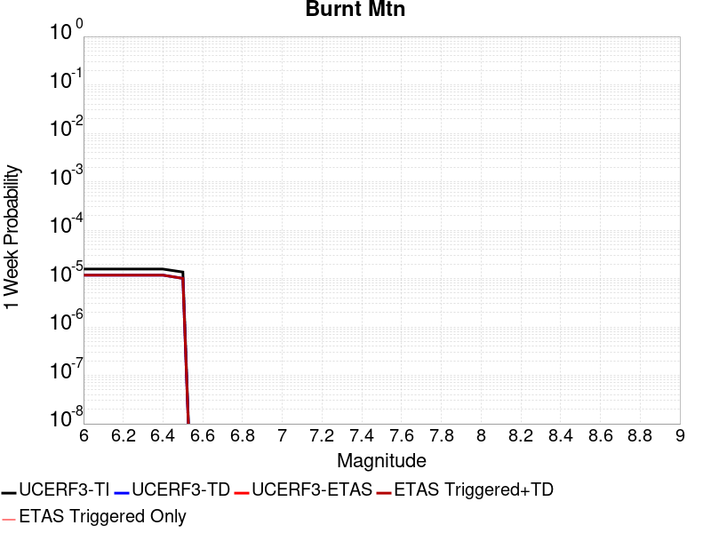 | 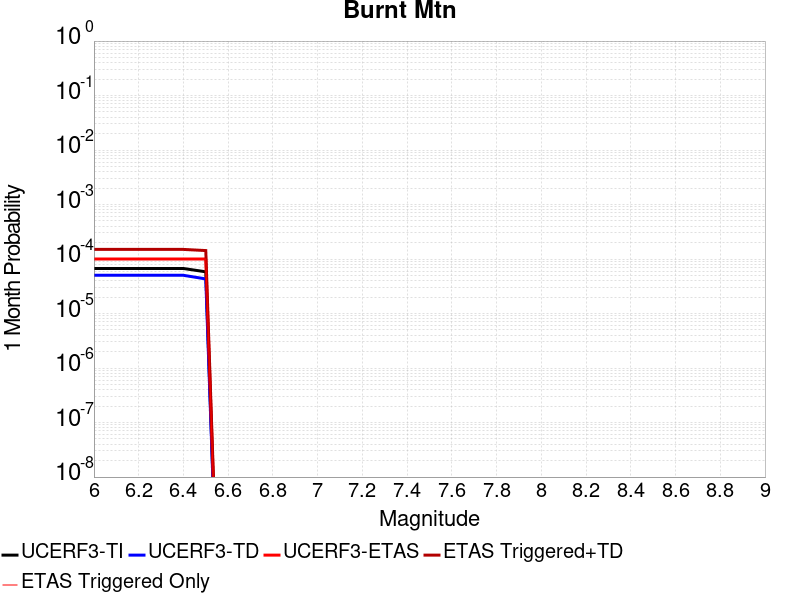 | 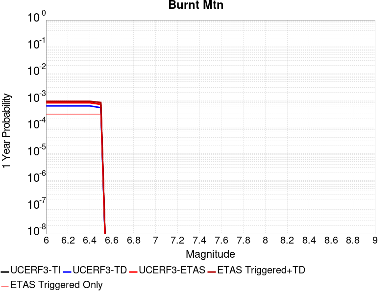 | 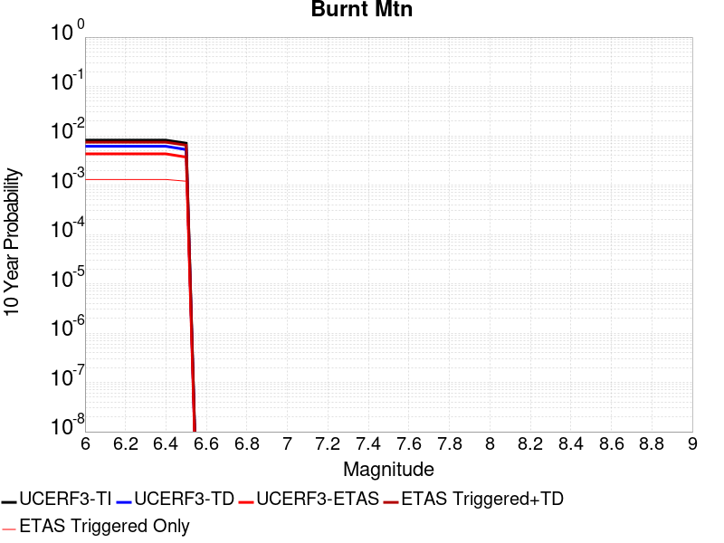 |

| Magnitude | 1 wk TI Prob | 1 wk TD Prob | 1 wk ETAS Prob | 1 wk ETAS/TD Gain | 1 wk ETAS Triggered+TD | 1 wk ETAS Triggered Only | 1 mo TI Prob | 1 mo TD Prob | 1 mo ETAS Prob | 1 mo ETAS/TD Gain | 1 mo ETAS Triggered+TD | 1 mo ETAS Triggered Only | 1 yr TI Prob | 1 yr TD Prob | 1 yr ETAS Prob | 1 yr ETAS/TD Gain | 1 yr ETAS Triggered+TD | 1 yr ETAS Triggered Only | 10 yr TI Prob | 10 yr TD Prob | 10 yr ETAS Prob | 10 yr ETAS/TD Gain | 10 yr ETAS Triggered+TD | 10 yr ETAS Triggered Only |
|-----|-----|-----|-----|-----|-----|-----|-----|-----|-----|-----|-----|-----|-----|-----|-----|-----|-----|-----|-----|-----|-----|-----|-----|-----|
| 6.0 | 1.5673151E-5 | 1.17495465E-5 | 0.0 | 0.0 | 1.17495465E-5 | 0.0 | 6.716892E-5 | 5.0354956E-5 | 1.0E-4 | 1.9859018 | 1.5034992E-4 | 1.0E-4 | 8.1747473E-4 | 6.13028E-4 | 8.0E-4 | 1.3049974 | 9.1284415E-4 | 3.0E-4 | 0.008144741 | 0.0061260103 | 0.0043 | 0.70192504 | 0.0074180462 | 0.0013 |
| 6.1 | 1.5673151E-5 | 1.17495465E-5 | 0.0 | 0.0 | 1.17495465E-5 | 0.0 | 6.716892E-5 | 5.0354956E-5 | 1.0E-4 | 1.9859018 | 1.5034992E-4 | 1.0E-4 | 8.1747473E-4 | 6.13028E-4 | 8.0E-4 | 1.3049974 | 9.1284415E-4 | 3.0E-4 | 0.008144741 | 0.0061260103 | 0.0043 | 0.70192504 | 0.0074180462 | 0.0013 |
| 6.2 | 1.5673151E-5 | 1.17495465E-5 | 0.0 | 0.0 | 1.17495465E-5 | 0.0 | 6.716892E-5 | 5.0354956E-5 | 1.0E-4 | 1.9859018 | 1.5034992E-4 | 1.0E-4 | 8.1747473E-4 | 6.13028E-4 | 8.0E-4 | 1.3049974 | 9.1284415E-4 | 3.0E-4 | 0.008144741 | 0.0061260103 | 0.0043 | 0.70192504 | 0.0074180462 | 0.0013 |
| 6.3 | 1.5673151E-5 | 1.17495465E-5 | 0.0 | 0.0 | 1.17495465E-5 | 0.0 | 6.716892E-5 | 5.0354956E-5 | 1.0E-4 | 1.9859018 | 1.5034992E-4 | 1.0E-4 | 8.1747473E-4 | 6.13028E-4 | 8.0E-4 | 1.3049974 | 9.1284415E-4 | 3.0E-4 | 0.008144741 | 0.0061260103 | 0.0043 | 0.70192504 | 0.0074180462 | 0.0013 |
| 6.4 | 1.5673151E-5 | 1.17495465E-5 | 0.0 | 0.0 | 1.17495465E-5 | 0.0 | 6.716892E-5 | 5.0354956E-5 | 1.0E-4 | 1.9859018 | 1.5034992E-4 | 1.0E-4 | 8.1747473E-4 | 6.13028E-4 | 8.0E-4 | 1.3049974 | 9.1284415E-4 | 3.0E-4 | 0.008144741 | 0.0061260103 | 0.0043 | 0.70192504 | 0.0074180462 | 0.0013 |
| 6.5 | 1.36191375E-5 | 1.007816E-5 | 0.0 | 0.0 | 1.007816E-5 | 0.0 | 5.8366426E-5 | 4.319211E-5 | 1.0E-4 | 2.3152375 | 1.4318779E-4 | 1.0E-4 | 7.103795E-4 | 5.2586396E-4 | 7.0E-4 | 1.3311428 | 8.257062E-4 | 3.0E-4 | 0.0070811296 | 0.00525864 | 0.0037 | 0.70360404 | 0.0064523295 | 0.0012 |

## Elsinore (Stepovers Combined)
*[(top)](#table-of-contents)*

| 1 Week | 1 Month | 1 Year | 10 Year |
|-----|-----|-----|-----|
| 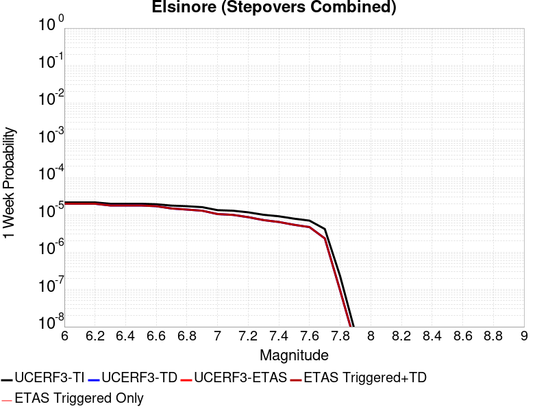 |  |  | 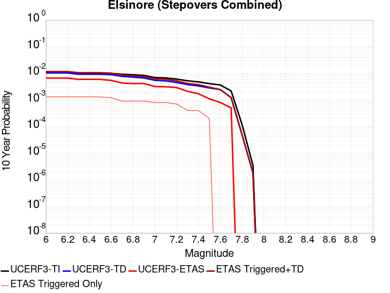 |

| Magnitude | 1 wk TI Prob | 1 wk TD Prob | 1 wk ETAS Prob | 1 wk ETAS/TD Gain | 1 wk ETAS Triggered+TD | 1 wk ETAS Triggered Only | 1 mo TI Prob | 1 mo TD Prob | 1 mo ETAS Prob | 1 mo ETAS/TD Gain | 1 mo ETAS Triggered+TD | 1 mo ETAS Triggered Only | 1 yr TI Prob | 1 yr TD Prob | 1 yr ETAS Prob | 1 yr ETAS/TD Gain | 1 yr ETAS Triggered+TD | 1 yr ETAS Triggered Only | 10 yr TI Prob | 10 yr TD Prob | 10 yr ETAS Prob | 10 yr ETAS/TD Gain | 10 yr ETAS Triggered+TD | 10 yr ETAS Triggered Only |
|-----|-----|-----|-----|-----|-----|-----|-----|-----|-----|-----|-----|-----|-----|-----|-----|-----|-----|-----|-----|-----|-----|-----|-----|-----|
| 6.0 | 2.144392E-5 | 1.9772704E-5 | 0.0 | 0.0 | 1.9772704E-5 | 0.0 | 9.189928E-5 | 8.473751E-5 | 1.0E-4 | 1.180115 | 1.8472904E-4 | 1.0E-4 | 0.0011182994 | 0.0010312101 | 0.0011 | 1.066708 | 0.0014307975 | 4.0E-4 | 0.011126885 | 0.010271182 | 0.0066 | 0.64257455 | 0.01155783 | 0.0013 |
| 6.1 | 2.144392E-5 | 1.9772704E-5 | 0.0 | 0.0 | 1.9772704E-5 | 0.0 | 9.189928E-5 | 8.473751E-5 | 1.0E-4 | 1.180115 | 1.8472904E-4 | 1.0E-4 | 0.0011182994 | 0.0010312101 | 0.0011 | 1.066708 | 0.0014307975 | 4.0E-4 | 0.011126885 | 0.010271182 | 0.0066 | 0.64257455 | 0.01155783 | 0.0013 |
| 6.2 | 2.144392E-5 | 1.9772704E-5 | 0.0 | 0.0 | 1.9772704E-5 | 0.0 | 9.189928E-5 | 8.473751E-5 | 1.0E-4 | 1.180115 | 1.8472904E-4 | 1.0E-4 | 0.0011182994 | 0.0010312101 | 0.0011 | 1.066708 | 0.0014307975 | 4.0E-4 | 0.011126885 | 0.010271182 | 0.0066 | 0.64257455 | 0.01155783 | 0.0013 |
| 6.3 | 1.9751555E-5 | 1.775319E-5 | 0.0 | 0.0 | 1.775319E-5 | 0.0 | 8.4646774E-5 | 7.608295E-5 | 1.0E-4 | 1.314355 | 1.7607534E-4 | 1.0E-4 | 0.0010300872 | 9.259304E-4 | 0.001 | 1.0799948 | 0.00132556 | 4.0E-4 | 0.010253254 | 0.009227147 | 0.0059 | 0.6394175 | 0.0105151525 | 0.0013 |
| 6.4 | 1.9751555E-5 | 1.775319E-5 | 0.0 | 0.0 | 1.775319E-5 | 0.0 | 8.4646774E-5 | 7.608295E-5 | 1.0E-4 | 1.314355 | 1.7607534E-4 | 1.0E-4 | 0.0010300872 | 9.259304E-4 | 0.001 | 1.0799948 | 0.00132556 | 4.0E-4 | 0.010253254 | 0.009227147 | 0.0059 | 0.6394175 | 0.0105151525 | 0.0013 |
| 6.5 | 1.9751555E-5 | 1.775319E-5 | 0.0 | 0.0 | 1.775319E-5 | 0.0 | 8.4646774E-5 | 7.608295E-5 | 1.0E-4 | 1.314355 | 1.7607534E-4 | 1.0E-4 | 0.0010300872 | 9.259304E-4 | 0.001 | 1.0799948 | 0.00132556 | 4.0E-4 | 0.010253254 | 0.009227147 | 0.0059 | 0.6394175 | 0.0105151525 | 0.0013 |
| 6.6 | 1.9188685E-5 | 1.7014672E-5 | 0.0 | 0.0 | 1.7014672E-5 | 0.0 | 8.2234634E-5 | 7.2918076E-5 | 1.0E-4 | 1.371402 | 1.7291079E-4 | 1.0E-4 | 0.0010007467 | 8.874322E-4 | 0.001 | 1.1268467 | 0.0012870772 | 4.0E-4 | 0.00996252 | 0.008845499 | 0.0054 | 0.61048 | 0.010034883 | 0.0012 |
| 6.7 | 1.7608272E-5 | 1.4742411E-5 | 0.0 | 0.0 | 1.4742411E-5 | 0.0 | 7.546184E-5 | 6.318028E-5 | 0.0 | 0.0 | 6.318028E-5 | 0.0 | 9.183606E-4 | 7.689583E-4 | 9.0E-4 | 1.1704146 | 0.0010687276 | 3.0E-4 | 0.009145746 | 0.007669642 | 0.0043 | 0.56065196 | 0.008562739 | 9.0E-4 |
| 6.8 | 1.697165E-5 | 1.3792449E-5 | 0.0 | 0.0 | 1.3792449E-5 | 0.0 | 7.273361E-5 | 5.9109203E-5 | 0.0 | 0.0 | 5.9109203E-5 | 0.0 | 8.8517193E-4 | 7.194256E-4 | 9.0E-4 | 1.250998 | 0.0010192097 | 3.0E-4 | 0.008816543 | 0.0071770395 | 0.0041 | 0.5712662 | 0.008070581 | 9.0E-4 |
| 6.9 | 1.600365E-5 | 1.2855437E-5 | 0.0 | 0.0 | 1.2855437E-5 | 0.0 | 6.858527E-5 | 5.509361E-5 | 0.0 | 0.0 | 5.509361E-5 | 0.0 | 8.347058E-4 | 6.7056605E-4 | 9.0E-4 | 1.3421496 | 9.703649E-4 | 3.0E-4 | 0.008315775 | 0.006691105 | 0.0041 | 0.6127538 | 0.007585083 | 9.0E-4 |
| 7.0 | 1.3314581E-5 | 1.0455193E-5 | 0.0 | 0.0 | 1.0455193E-5 | 0.0 | 5.7061243E-5 | 4.4807217E-5 | 0.0 | 0.0 | 4.4807217E-5 | 0.0 | 6.944992E-4 | 5.45394E-4 | 9.0E-4 | 1.6501832 | 8.4523036E-4 | 3.0E-4 | 0.006923327 | 0.0054441076 | 0.0032 | 0.58779144 | 0.0062397523 | 8.0E-4 |
| 7.1 | 1.2865345E-5 | 9.944716E-6 | 0.0 | 0.0 | 9.944716E-6 | 0.0 | 5.5136024E-5 | 4.261953E-5 | 0.0 | 0.0 | 4.261953E-5 | 0.0 | 6.710743E-4 | 5.1877176E-4 | 9.0E-4 | 1.7348669 | 8.186162E-4 | 3.0E-4 | 0.0066905143 | 0.0051788096 | 0.0031 | 0.5985931 | 0.0059746667 | 8.0E-4 |
| 7.2 | 1.1650051E-5 | 8.64003E-6 | 0.0 | 0.0 | 8.64003E-6 | 0.0 | 4.9927836E-5 | 3.702818E-5 | 0.0 | 0.0 | 3.702818E-5 | 0.0 | 6.0770183E-4 | 4.5072666E-4 | 9.0E-4 | 1.9967756 | 7.5059145E-4 | 3.0E-4 | 0.0060604266 | 0.0044995523 | 0.0029 | 0.6445086 | 0.0051964023 | 7.0E-4 |
| 7.3 | 1.0008533E-5 | 7.2062307E-6 | 0.0 | 0.0 | 7.2062307E-6 | 0.0 | 4.2893007E-5 | 3.088349E-5 | 0.0 | 0.0 | 3.088349E-5 | 0.0 | 5.220972E-4 | 3.7594305E-4 | 6.0E-4 | 1.5959864 | 3.7594305E-4 | 0.0 | 0.005208723 | 0.0037534619 | 0.0021 | 0.5594835 | 0.0041519604 | 4.0E-4 |
| 7.4 | 9.116759E-6 | 6.414671E-6 | 0.0 | 0.0 | 6.414671E-6 | 0.0 | 3.907124E-5 | 2.7491165E-5 | 0.0 | 0.0 | 2.7491165E-5 | 0.0 | 4.7558855E-4 | 3.346549E-4 | 5.0E-4 | 1.4940764 | 3.346549E-4 | 0.0 | 0.00474572 | 0.0033416625 | 0.0017 | 0.50872886 | 0.0037403258 | 4.0E-4 |
| 7.5 | 7.870524E-6 | 5.3864724E-6 | 0.0 | 0.0 | 5.3864724E-6 | 0.0 | 3.3730383E-5 | 2.3084685E-5 | 0.0 | 0.0 | 2.3084685E-5 | 0.0 | 4.1059E-4 | 2.8102106E-4 | 3.0E-4 | 1.0675356 | 2.8102106E-4 | 0.0 | 0.0040983222 | 0.0028067837 | 0.0011 | 0.39190766 | 0.0030062224 | 2.0E-4 |
| 7.6 | 6.9774537E-6 | 4.681174E-6 | 0.0 | 0.0 | 4.681174E-6 | 0.0 | 2.990303E-5 | 2.0062025E-5 | 0.0 | 0.0 | 2.0062025E-5 | 0.0 | 3.640086E-4 | 2.4422896E-4 | 3.0E-4 | 1.2283555 | 2.4422896E-4 | 0.0 | 0.003634129 | 0.002439722 | 8.0E-4 | 0.32790622 | 0.002439722 | 0.0 |
| 7.7 | 4.1616954E-6 | 2.3302257E-6 | 0.0 | 0.0 | 2.3302257E-6 | 0.0 | 1.7835715E-5 | 9.9866475E-6 | 0.0 | 0.0 | 9.9866475E-6 | 0.0 | 2.171282E-4 | 1.2158139E-4 | 2.0E-4 | 1.6449887 | 1.2158139E-4 | 0.0 | 0.0021691616 | 0.0012152218 | 5.0E-4 | 0.4114475 | 0.0012152218 | 0.0 |
| 7.8 | 2.2692414E-7 | 9.391389E-8 | 0.0 | 0.0 | 9.391389E-8 | 0.0 | 9.725317E-7 | 4.0248807E-7 | 0.0 | 0.0 | 4.0248807E-7 | 0.0 | 1.1840509E-5 | 4.9002842E-6 | 0.0 | 0.0 | 4.9002842E-6 | 0.0 | 1.1839878E-4 | 4.900209E-5 | 0.0 | 0.0 | 4.900209E-5 | 0.0 |
| 7.9 | 6.676829E-9 | 3.4415768E-9 | 0.0 | 0.0 | 3.4415768E-9 | 0.0 | 2.861498E-8 | 1.4749616E-8 | 0.0 | 0.0 | 1.4749616E-8 | 0.0 | 3.4838732E-7 | 1.7957656E-7 | 0.0 | 0.0 | 1.7957656E-7 | 0.0 | 3.4838679E-6 | 1.7957643E-6 | 0.0 | 0.0 | 1.7957643E-6 | 0.0 |

## Santa Ynez River
*[(top)](#table-of-contents)*

| 1 Week | 1 Month | 1 Year | 10 Year |
|-----|-----|-----|-----|
| 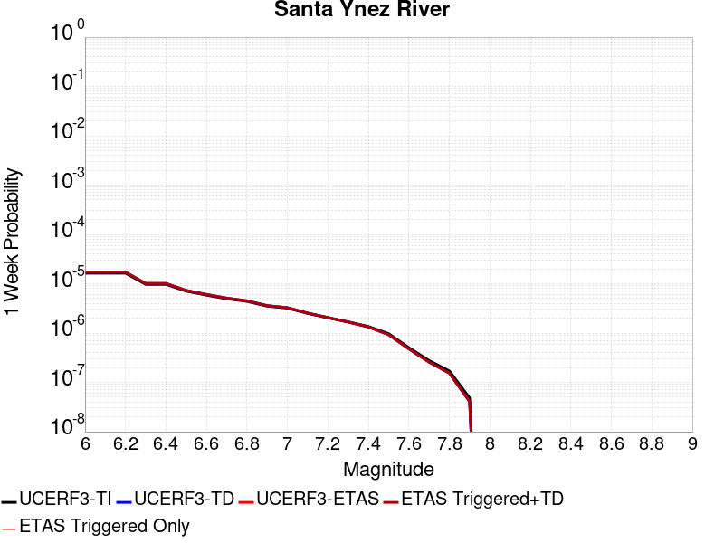 | 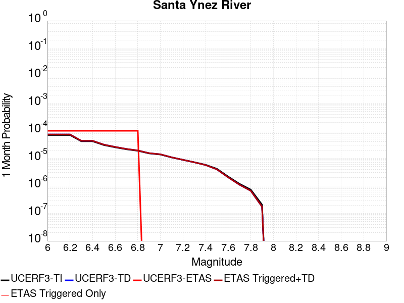 | 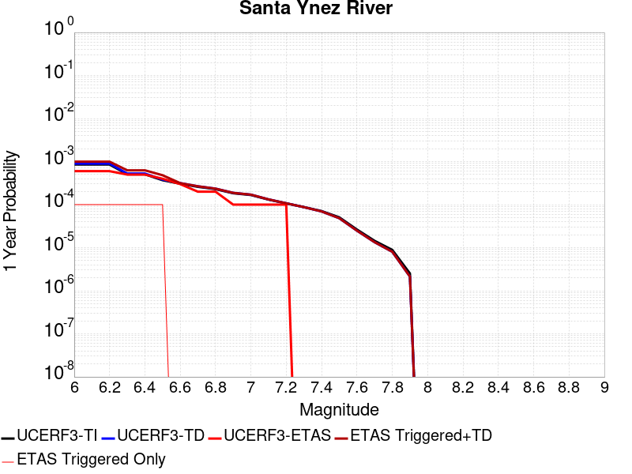 | 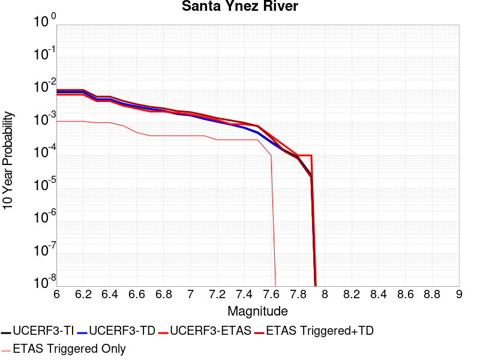 |

| Magnitude | 1 wk TI Prob | 1 wk TD Prob | 1 wk ETAS Prob | 1 wk ETAS/TD Gain | 1 wk ETAS Triggered+TD | 1 wk ETAS Triggered Only | 1 mo TI Prob | 1 mo TD Prob | 1 mo ETAS Prob | 1 mo ETAS/TD Gain | 1 mo ETAS Triggered+TD | 1 mo ETAS Triggered Only | 1 yr TI Prob | 1 yr TD Prob | 1 yr ETAS Prob | 1 yr ETAS/TD Gain | 1 yr ETAS Triggered+TD | 1 yr ETAS Triggered Only | 10 yr TI Prob | 10 yr TD Prob | 10 yr ETAS Prob | 10 yr ETAS/TD Gain | 10 yr ETAS Triggered+TD | 10 yr ETAS Triggered Only |
|-----|-----|-----|-----|-----|-----|-----|-----|-----|-----|-----|-----|-----|-----|-----|-----|-----|-----|-----|-----|-----|-----|-----|-----|-----|
| 6.0 | 1.6396456E-5 | 1.7211414E-5 | 0.0 | 0.0 | 1.7211414E-5 | 0.0 | 7.026863E-5 | 7.3761315E-5 | 1.0E-4 | 1.3557241 | 7.3761315E-5 | 0.0 | 8.551848E-4 | 8.977096E-4 | 6.0E-4 | 0.66836756 | 9.976198E-4 | 1.0E-4 | 0.0085190125 | 0.008944383 | 0.0072 | 0.8049745 | 0.010034543 | 0.0011 |
| 6.1 | 1.6396456E-5 | 1.7211414E-5 | 0.0 | 0.0 | 1.7211414E-5 | 0.0 | 7.026863E-5 | 7.3761315E-5 | 1.0E-4 | 1.3557241 | 7.3761315E-5 | 0.0 | 8.551848E-4 | 8.977096E-4 | 6.0E-4 | 0.66836756 | 9.976198E-4 | 1.0E-4 | 0.0085190125 | 0.008944383 | 0.0072 | 0.8049745 | 0.010034543 | 0.0011 |
| 6.2 | 1.6396456E-5 | 1.7211414E-5 | 0.0 | 0.0 | 1.7211414E-5 | 0.0 | 7.026863E-5 | 7.3761315E-5 | 1.0E-4 | 1.3557241 | 7.3761315E-5 | 0.0 | 8.551848E-4 | 8.977096E-4 | 6.0E-4 | 0.66836756 | 9.976198E-4 | 1.0E-4 | 0.0085190125 | 0.008944383 | 0.0072 | 0.8049745 | 0.010034543 | 0.0011 |
| 6.3 | 9.736976E-6 | 1.0123403E-5 | 0.0 | 0.0 | 1.0123403E-5 | 0.0 | 4.172923E-5 | 4.338532E-5 | 1.0E-4 | 2.304927 | 4.338532E-5 | 0.0 | 5.0793495E-4 | 5.2809325E-4 | 5.0E-4 | 0.9468025 | 6.280404E-4 | 1.0E-4 | 0.005067755 | 0.005268889 | 0.0046 | 0.8730493 | 0.00626362 | 0.001 |
| 6.4 | 9.736976E-6 | 1.0123403E-5 | 0.0 | 0.0 | 1.0123403E-5 | 0.0 | 4.172923E-5 | 4.338532E-5 | 1.0E-4 | 2.304927 | 4.338532E-5 | 0.0 | 5.0793495E-4 | 5.2809325E-4 | 5.0E-4 | 0.9468025 | 6.280404E-4 | 1.0E-4 | 0.005067755 | 0.005268889 | 0.0046 | 0.8730493 | 0.00626362 | 0.001 |
| 6.5 | 7.081964E-6 | 7.330682E-6 | 0.0 | 0.0 | 7.330682E-6 | 0.0 | 3.035092E-5 | 3.141684E-5 | 1.0E-4 | 3.1830065 | 3.141684E-5 | 0.0 | 3.694598E-4 | 3.8243446E-4 | 4.0E-4 | 1.0459309 | 4.8239622E-4 | 1.0E-4 | 0.0036884616 | 0.003817925 | 0.0033 | 0.8643438 | 0.0046148705 | 8.0E-4 |
| 6.6 | 5.873247E-6 | 6.0604E-6 | 0.0 | 0.0 | 6.0604E-6 | 0.0 | 2.5170815E-5 | 2.597289E-5 | 1.0E-4 | 3.8501685 | 2.597289E-5 | 0.0 | 3.064116E-4 | 3.161749E-4 | 3.0E-4 | 0.9488419 | 3.161749E-4 | 0.0 | 0.0030598943 | 0.0031573381 | 0.0027 | 0.8551507 | 0.0036557594 | 5.0E-4 |
| 6.7 | 4.973277E-6 | 5.1164666E-6 | 0.0 | 0.0 | 5.1164666E-6 | 0.0 | 2.1313872E-5 | 2.1927533E-5 | 1.0E-4 | 4.5604763 | 2.1927533E-5 | 0.0 | 2.5946548E-4 | 2.669355E-4 | 2.0E-4 | 0.7492447 | 2.669355E-4 | 0.0 | 0.0025916274 | 0.0026661975 | 0.0022 | 0.8251452 | 0.0030651311 | 4.0E-4 |
| 6.8 | 4.396492E-6 | 4.511485E-6 | 0.0 | 0.0 | 4.511485E-6 | 0.0 | 1.884197E-5 | 1.9334793E-5 | 1.0E-4 | 5.1720233 | 1.9334793E-5 | 0.0 | 2.2937685E-4 | 2.3537604E-4 | 2.0E-4 | 0.8497042 | 2.3537604E-4 | 0.0 | 0.0022914023 | 0.0023513027 | 0.0022 | 0.93565154 | 0.0027503623 | 4.0E-4 |
| 6.9 | 3.5255632E-6 | 3.6017602E-6 | 0.0 | 0.0 | 3.6017602E-6 | 0.0 | 1.5109469E-5 | 1.5436024E-5 | 0.0 | 0.0 | 1.5436024E-5 | 0.0 | 1.8394225E-4 | 1.8791755E-4 | 1.0E-4 | 0.5321483 | 1.8791755E-4 | 0.0 | 0.0018379007 | 0.0018776027 | 0.002 | 1.065188 | 0.0022768516 | 4.0E-4 |
| 7.0 | 3.211603E-6 | 3.2740525E-6 | 0.0 | 0.0 | 3.2740525E-6 | 0.0 | 1.376394E-5 | 1.4031579E-5 | 0.0 | 0.0 | 1.4031579E-5 | 0.0 | 1.6756308E-4 | 1.7082122E-4 | 1.0E-4 | 0.5854074 | 1.7082122E-4 | 0.0 | 0.0016743679 | 0.0017069133 | 0.0018 | 1.0545352 | 0.0021062305 | 4.0E-4 |
| 7.1 | 2.5094619E-6 | 2.5412555E-6 | 0.0 | 0.0 | 2.5412555E-6 | 0.0 | 1.0754793E-5 | 1.089105E-5 | 0.0 | 0.0 | 1.089105E-5 | 0.0 | 1.3093173E-4 | 1.3259052E-4 | 1.0E-4 | 0.7542017 | 1.3259052E-4 | 0.0 | 0.0013085462 | 0.0013251201 | 0.0015 | 1.1319728 | 0.0017245901 | 4.0E-4 |
| 7.2 | 2.0515774E-6 | 2.0622288E-6 | 0.0 | 0.0 | 2.0622288E-6 | 0.0 | 8.792445E-6 | 8.838094E-6 | 0.0 | 0.0 | 8.838094E-6 | 0.0 | 1.0704277E-4 | 1.0759852E-4 | 1.0E-4 | 0.92938083 | 1.0759852E-4 | 0.0 | 0.0010699122 | 0.0010754685 | 0.0012 | 1.1157928 | 0.0013751459 | 3.0E-4 |
| 7.3 | 1.6845745E-6 | 1.6776453E-6 | 0.0 | 0.0 | 1.6776453E-6 | 0.0 | 7.219585E-6 | 7.189889E-6 | 0.0 | 0.0 | 7.189889E-6 | 0.0 | 8.78949E-5 | 8.753341E-5 | 0.0 | 0.0 | 8.753341E-5 | 0.0 | 8.7860145E-4 | 8.7499217E-4 | 9.0E-4 | 1.0285807 | 0.0011747297 | 3.0E-4 |
| 7.4 | 1.3600285E-6 | 1.3335493E-6 | 0.0 | 0.0 | 1.3335493E-6 | 0.0 | 5.82868E-6 | 5.7151988E-6 | 0.0 | 0.0 | 5.7151988E-6 | 0.0 | 7.096187E-5 | 6.958035E-5 | 0.0 | 0.0 | 6.958035E-5 | 0.0 | 7.0939213E-4 | 6.9558783E-4 | 9.0E-4 | 1.2938696 | 9.953792E-4 | 3.0E-4 |
| 7.5 | 9.735342E-7 | 9.2917776E-7 | 0.0 | 0.0 | 9.2917776E-7 | 0.0 | 4.172283E-6 | 3.9821844E-6 | 0.0 | 0.0 | 3.9821844E-6 | 0.0 | 5.079636E-5 | 4.8482034E-5 | 0.0 | 0.0 | 4.8482034E-5 | 0.0 | 5.0784746E-4 | 4.847163E-4 | 8.0E-4 | 1.65045 | 7.845709E-4 | 3.0E-4 |
| 7.6 | 5.067187E-7 | 4.779163E-7 | 0.0 | 0.0 | 4.779163E-7 | 0.0 | 2.1716498E-6 | 2.048211E-6 | 0.0 | 0.0 | 2.048211E-6 | 0.0 | 2.6439517E-5 | 2.4936691E-5 | 0.0 | 0.0 | 2.4936691E-5 | 0.0 | 2.643637E-4 | 2.4933968E-4 | 4.0E-4 | 1.6042373 | 3.4931474E-4 | 1.0E-4 |
| 7.7 | 2.769089E-7 | 2.576214E-7 | 0.0 | 0.0 | 2.576214E-7 | 0.0 | 1.1867519E-6 | 1.1040912E-6 | 0.0 | 0.0 | 1.1040912E-6 | 0.0 | 1.4448608E-5 | 1.3442228E-5 | 0.0 | 0.0 | 1.3442228E-5 | 0.0 | 1.444767E-4 | 1.344142E-4 | 2.0E-4 | 1.4879382 | 1.344142E-4 | 0.0 |
| 7.8 | 1.7044663E-7 | 1.5450911E-7 | 0.0 | 0.0 | 1.5450911E-7 | 0.0 | 7.3048534E-7 | 6.621817E-7 | 0.0 | 0.0 | 6.621817E-7 | 0.0 | 8.893623E-6 | 8.062033E-6 | 0.0 | 0.0 | 8.062033E-6 | 0.0 | 8.893267E-5 | 8.061742E-5 | 1.0E-4 | 1.2404267 | 8.061742E-5 | 0.0 |
| 7.9 | 4.8344287E-8 | 4.091648E-8 | 0.0 | 0.0 | 4.091648E-8 | 0.0 | 2.0718979E-7 | 1.7535632E-7 | 0.0 | 0.0 | 1.7535632E-7 | 0.0 | 2.5225327E-6 | 2.1349613E-6 | 0.0 | 0.0 | 2.1349613E-6 | 0.0 | 2.5225041E-5 | 2.1349411E-5 | 1.0E-4 | 4.68397 | 2.1349411E-5 | 0.0 |

## Earthquake Valley (So Extension)
*[(top)](#table-of-contents)*

| 1 Week | 1 Month | 1 Year | 10 Year |
|-----|-----|-----|-----|
| 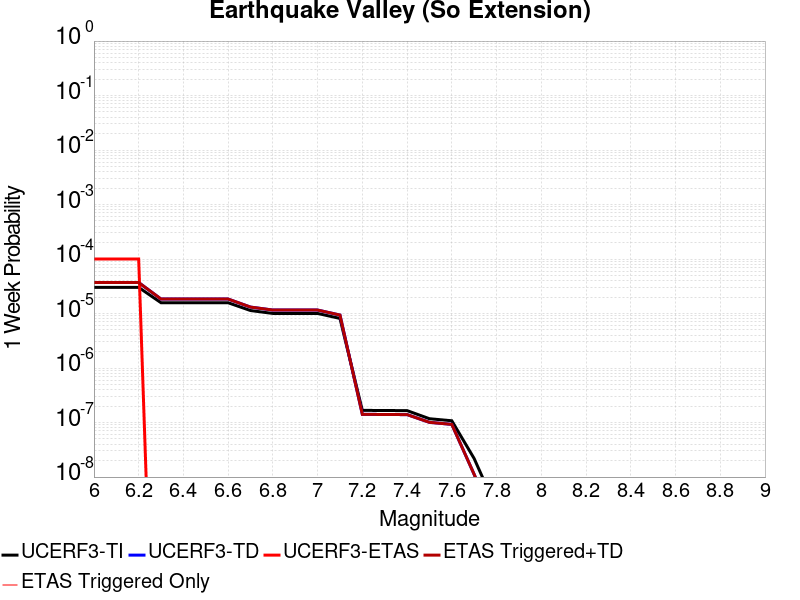 |  |  |  |

| Magnitude | 1 wk TI Prob | 1 wk TD Prob | 1 wk ETAS Prob | 1 wk ETAS/TD Gain | 1 wk ETAS Triggered+TD | 1 wk ETAS Triggered Only | 1 mo TI Prob | 1 mo TD Prob | 1 mo ETAS Prob | 1 mo ETAS/TD Gain | 1 mo ETAS Triggered+TD | 1 mo ETAS Triggered Only | 1 yr TI Prob | 1 yr TD Prob | 1 yr ETAS Prob | 1 yr ETAS/TD Gain | 1 yr ETAS Triggered+TD | 1 yr ETAS Triggered Only | 10 yr TI Prob | 10 yr TD Prob | 10 yr ETAS Prob | 10 yr ETAS/TD Gain | 10 yr ETAS Triggered+TD | 10 yr ETAS Triggered Only |
|-----|-----|-----|-----|-----|-----|-----|-----|-----|-----|-----|-----|-----|-----|-----|-----|-----|-----|-----|-----|-----|-----|-----|-----|-----|
| 6.0 | 3.0194888E-5 | 3.7088896E-5 | 1.0E-4 | 2.6962247 | 3.7088896E-5 | 0.0 | 1.2940024E-4 | 1.5894581E-4 | 1.0E-4 | 0.62914526 | 1.5894581E-4 | 0.0 | 0.0015743093 | 0.0019339652 | 0.0013 | 0.67219406 | 0.0021335785 | 2.0E-4 | 0.01563203 | 0.019221738 | 0.0083 | 0.4318028 | 0.020496748 | 0.0013 |
| 6.1 | 3.0194888E-5 | 3.7088896E-5 | 1.0E-4 | 2.6962247 | 3.7088896E-5 | 0.0 | 1.2940024E-4 | 1.5894581E-4 | 1.0E-4 | 0.62914526 | 1.5894581E-4 | 0.0 | 0.0015743093 | 0.0019339652 | 0.0013 | 0.67219406 | 0.0021335785 | 2.0E-4 | 0.01563203 | 0.019221738 | 0.0083 | 0.4318028 | 0.020496748 | 0.0013 |
| 6.2 | 3.0194888E-5 | 3.7088896E-5 | 1.0E-4 | 2.6962247 | 3.7088896E-5 | 0.0 | 1.2940024E-4 | 1.5894581E-4 | 1.0E-4 | 0.62914526 | 1.5894581E-4 | 0.0 | 0.0015743093 | 0.0019339652 | 0.0013 | 0.67219406 | 0.0021335785 | 2.0E-4 | 0.01563203 | 0.019221738 | 0.0083 | 0.4318028 | 0.020496748 | 0.0013 |
| 6.3 | 1.5795305E-5 | 1.845291E-5 | 0.0 | 0.0 | 1.845291E-5 | 0.0 | 6.769241E-5 | 7.9082136E-5 | 0.0 | 0.0 | 7.9082136E-5 | 0.0 | 8.238434E-4 | 9.6251053E-4 | 8.0E-4 | 0.8311597 | 0.001162318 | 2.0E-4 | 0.008207959 | 0.009594323 | 0.0045 | 0.46902734 | 0.010386648 | 8.0E-4 |
| 6.4 | 1.5795305E-5 | 1.845291E-5 | 0.0 | 0.0 | 1.845291E-5 | 0.0 | 6.769241E-5 | 7.9082136E-5 | 0.0 | 0.0 | 7.9082136E-5 | 0.0 | 8.238434E-4 | 9.6251053E-4 | 8.0E-4 | 0.8311597 | 0.001162318 | 2.0E-4 | 0.008207959 | 0.009594323 | 0.0045 | 0.46902734 | 0.010386648 | 8.0E-4 |
| 6.5 | 1.5795305E-5 | 1.845291E-5 | 0.0 | 0.0 | 1.845291E-5 | 0.0 | 6.769241E-5 | 7.9082136E-5 | 0.0 | 0.0 | 7.9082136E-5 | 0.0 | 8.238434E-4 | 9.6251053E-4 | 8.0E-4 | 0.8311597 | 0.001162318 | 2.0E-4 | 0.008207959 | 0.009594323 | 0.0045 | 0.46902734 | 0.010386648 | 8.0E-4 |
| 6.6 | 1.5795305E-5 | 1.845291E-5 | 0.0 | 0.0 | 1.845291E-5 | 0.0 | 6.769241E-5 | 7.9082136E-5 | 0.0 | 0.0 | 7.9082136E-5 | 0.0 | 8.238434E-4 | 9.6251053E-4 | 8.0E-4 | 0.8311597 | 0.001162318 | 2.0E-4 | 0.008207959 | 0.009594323 | 0.0045 | 0.46902734 | 0.010386648 | 8.0E-4 |
| 6.7 | 1.1363076E-5 | 1.3142505E-5 | 0.0 | 0.0 | 1.3142505E-5 | 0.0 | 4.8697988E-5 | 5.6324236E-5 | 0.0 | 0.0 | 5.6324236E-5 | 0.0 | 5.927367E-4 | 6.8560796E-4 | 5.0E-4 | 0.72927976 | 8.854708E-4 | 2.0E-4 | 0.0059115817 | 0.0068424055 | 0.0032 | 0.46767178 | 0.0074383 | 6.0E-4 |
| 6.8 | 1.0049611E-5 | 1.1598007E-5 | 0.0 | 0.0 | 1.1598007E-5 | 0.0 | 4.306905E-5 | 4.970521E-5 | 0.0 | 0.0 | 4.970521E-5 | 0.0 | 5.242395E-4 | 6.0506613E-4 | 5.0E-4 | 0.826356 | 8.049451E-4 | 2.0E-4 | 0.0052300454 | 0.0060413685 | 0.0028 | 0.46347117 | 0.006637743 | 6.0E-4 |
| 6.9 | 1.0049611E-5 | 1.1598007E-5 | 0.0 | 0.0 | 1.1598007E-5 | 0.0 | 4.306905E-5 | 4.970521E-5 | 0.0 | 0.0 | 4.970521E-5 | 0.0 | 5.242395E-4 | 6.0506613E-4 | 5.0E-4 | 0.826356 | 8.049451E-4 | 2.0E-4 | 0.0052300454 | 0.0060413685 | 0.0028 | 0.46347117 | 0.006637743 | 6.0E-4 |
| 7.0 | 1.0049611E-5 | 1.1598007E-5 | 0.0 | 0.0 | 1.1598007E-5 | 0.0 | 4.306905E-5 | 4.970521E-5 | 0.0 | 0.0 | 4.970521E-5 | 0.0 | 5.242395E-4 | 6.0506613E-4 | 5.0E-4 | 0.826356 | 8.049451E-4 | 2.0E-4 | 0.0052300454 | 0.0060413685 | 0.0028 | 0.46347117 | 0.006637743 | 6.0E-4 |
| 7.1 | 8.140254E-6 | 9.386438E-6 | 0.0 | 0.0 | 9.386438E-6 | 0.0 | 3.4886336E-5 | 4.022735E-5 | 0.0 | 0.0 | 4.022735E-5 | 0.0 | 4.2465836E-4 | 4.8972503E-4 | 3.0E-4 | 0.61258864 | 6.896271E-4 | 2.0E-4 | 0.0042384774 | 0.004893039 | 0.0024 | 0.49049273 | 0.0054901033 | 6.0E-4 |
| 7.2 | 1.673835E-7 | 1.416044E-7 | 0.0 | 0.0 | 1.416044E-7 | 0.0 | 7.173577E-7 | 6.068759E-7 | 0.0 | 0.0 | 6.068759E-7 | 0.0 | 8.733795E-6 | 7.3886927E-6 | 0.0 | 0.0 | 7.3886927E-6 | 0.0 | 8.733451E-5 | 7.3884825E-5 | 0.0 | 0.0 | 7.3884825E-5 | 0.0 |
| 7.3 | 1.6632116E-7 | 1.405865E-7 | 0.0 | 0.0 | 1.405865E-7 | 0.0 | 7.1280476E-7 | 6.025134E-7 | 0.0 | 0.0 | 6.025134E-7 | 0.0 | 8.678364E-6 | 7.3355795E-6 | 0.0 | 0.0 | 7.3355795E-6 | 0.0 | 8.6780245E-5 | 7.335373E-5 | 0.0 | 0.0 | 7.335373E-5 | 0.0 |
| 7.4 | 1.6569169E-7 | 1.4003261E-7 | 0.0 | 0.0 | 1.4003261E-7 | 0.0 | 7.1010703E-7 | 6.001397E-7 | 0.0 | 0.0 | 6.001397E-7 | 0.0 | 8.645519E-6 | 7.3066794E-6 | 0.0 | 0.0 | 7.3066794E-6 | 0.0 | 8.645182E-5 | 7.306475E-5 | 0.0 | 0.0 | 7.306475E-5 | 0.0 |
| 7.5 | 1.1764555E-7 | 1.0100879E-7 | 0.0 | 0.0 | 1.0100879E-7 | 0.0 | 5.041951E-7 | 4.3289472E-7 | 0.0 | 0.0 | 4.3289472E-7 | 0.0 | 6.138558E-6 | 5.2704827E-6 | 0.0 | 0.0 | 5.2704827E-6 | 0.0 | 6.1383886E-5 | 5.2703792E-5 | 0.0 | 0.0 | 5.2703792E-5 | 0.0 |
| 7.6 | 1.07927605E-7 | 9.26543E-8 | 0.0 | 0.0 | 9.26543E-8 | 0.0 | 4.6254678E-7 | 3.970898E-7 | 0.0 | 0.0 | 3.970898E-7 | 0.0 | 5.6314925E-6 | 4.8345596E-6 | 0.0 | 0.0 | 4.8345596E-6 | 0.0 | 5.63135E-5 | 4.8344755E-5 | 0.0 | 0.0 | 4.8344755E-5 | 0.0 |
| 7.7 | 2.1826905E-8 | 1.1188494E-8 | 0.0 | 0.0 | 1.1188494E-8 | 0.0 | 9.3543875E-8 | 4.7950685E-8 | 0.0 | 0.0 | 4.7950685E-8 | 0.0 | 1.1388961E-6 | 5.8379953E-7 | 0.0 | 0.0 | 5.8379953E-7 | 0.0 | 1.1388902E-5 | 5.837985E-6 | 0.0 | 0.0 | 5.837985E-6 | 0.0 |
| 7.8 | 2.6169649E-9 | 1.1977199E-9 | 0.0 | 0.0 | 1.1977199E-9 | 0.0 | 1.1215564E-8 | 5.133085E-9 | 0.0 | 0.0 | 5.133085E-9 | 0.0 | 1.3654947E-7 | 6.249531E-8 | 0.0 | 0.0 | 6.249531E-8 | 0.0 | 1.365494E-6 | 6.249531E-7 | 0.0 | 0.0 | 6.249531E-7 | 0.0 |

## San Andreas (North Branch Mill Creek)
*[(top)](#table-of-contents)*

| 1 Week | 1 Month | 1 Year | 10 Year |
|-----|-----|-----|-----|
|  | 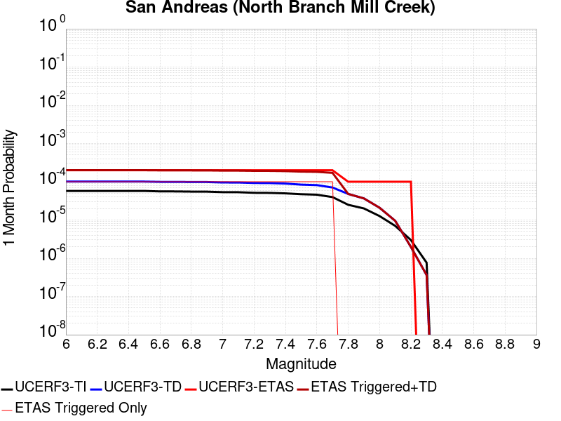 |  |  |

| Magnitude | 1 wk TI Prob | 1 wk TD Prob | 1 wk ETAS Prob | 1 wk ETAS/TD Gain | 1 wk ETAS Triggered+TD | 1 wk ETAS Triggered Only | 1 mo TI Prob | 1 mo TD Prob | 1 mo ETAS Prob | 1 mo ETAS/TD Gain | 1 mo ETAS Triggered+TD | 1 mo ETAS Triggered Only | 1 yr TI Prob | 1 yr TD Prob | 1 yr ETAS Prob | 1 yr ETAS/TD Gain | 1 yr ETAS Triggered+TD | 1 yr ETAS Triggered Only | 10 yr TI Prob | 10 yr TD Prob | 10 yr ETAS Prob | 10 yr ETAS/TD Gain | 10 yr ETAS Triggered+TD | 10 yr ETAS Triggered Only |
|-----|-----|-----|-----|-----|-----|-----|-----|-----|-----|-----|-----|-----|-----|-----|-----|-----|-----|-----|-----|-----|-----|-----|-----|-----|
| 6.0 | 1.3461156E-5 | 2.3604323E-5 | 1.0E-4 | 4.236512 | 2.3604323E-5 | 0.0 | 5.7689394E-5 | 1.01157486E-4 | 2.0E-4 | 1.9771153 | 2.0114737E-4 | 1.0E-4 | 7.02142E-4 | 0.0012308998 | 9.0E-4 | 0.7311724 | 0.0013307767 | 1.0E-4 | 0.0069992766 | 0.012282303 | 0.0082 | 0.6676273 | 0.013566336 | 0.0013 |
| 6.1 | 1.3461156E-5 | 2.3604323E-5 | 1.0E-4 | 4.236512 | 2.3604323E-5 | 0.0 | 5.7689394E-5 | 1.01157486E-4 | 2.0E-4 | 1.9771153 | 2.0114737E-4 | 1.0E-4 | 7.02142E-4 | 0.0012308998 | 9.0E-4 | 0.7311724 | 0.0013307767 | 1.0E-4 | 0.0069992766 | 0.012282303 | 0.0082 | 0.6676273 | 0.013566336 | 0.0013 |
| 6.2 | 1.3461156E-5 | 2.3604323E-5 | 1.0E-4 | 4.236512 | 2.3604323E-5 | 0.0 | 5.7689394E-5 | 1.01157486E-4 | 2.0E-4 | 1.9771153 | 2.0114737E-4 | 1.0E-4 | 7.02142E-4 | 0.0012308998 | 9.0E-4 | 0.7311724 | 0.0013307767 | 1.0E-4 | 0.0069992766 | 0.012282303 | 0.0082 | 0.6676273 | 0.013566336 | 0.0013 |
| 6.3 | 1.3461156E-5 | 2.3604323E-5 | 1.0E-4 | 4.236512 | 2.3604323E-5 | 0.0 | 5.7689394E-5 | 1.01157486E-4 | 2.0E-4 | 1.9771153 | 2.0114737E-4 | 1.0E-4 | 7.02142E-4 | 0.0012308998 | 9.0E-4 | 0.7311724 | 0.0013307767 | 1.0E-4 | 0.0069992766 | 0.012282303 | 0.0082 | 0.6676273 | 0.013566336 | 0.0013 |
| 6.4 | 1.3461156E-5 | 2.3604323E-5 | 1.0E-4 | 4.236512 | 2.3604323E-5 | 0.0 | 5.7689394E-5 | 1.01157486E-4 | 2.0E-4 | 1.9771153 | 2.0114737E-4 | 1.0E-4 | 7.02142E-4 | 0.0012308998 | 9.0E-4 | 0.7311724 | 0.0013307767 | 1.0E-4 | 0.0069992766 | 0.012282303 | 0.0082 | 0.6676273 | 0.013566336 | 0.0013 |
| 6.5 | 1.3450706E-5 | 2.3593282E-5 | 1.0E-4 | 4.2384944 | 2.3593282E-5 | 0.0 | 5.764461E-5 | 1.0111017E-4 | 2.0E-4 | 1.9780405 | 2.0110006E-4 | 1.0E-4 | 7.0159714E-4 | 0.0012303244 | 9.0E-4 | 0.73151433 | 0.0013302014 | 1.0E-4 | 0.006993862 | 0.012276612 | 0.0082 | 0.66793674 | 0.013560653 | 0.0013 |
| 6.6 | 1.3074523E-5 | 2.3207529E-5 | 1.0E-4 | 4.3089466 | 2.3207529E-5 | 0.0 | 5.6032466E-5 | 9.9457066E-5 | 2.0E-4 | 2.010918 | 1.9944712E-4 | 1.0E-4 | 6.8198174E-4 | 0.0012102204 | 9.0E-4 | 0.7436662 | 0.0013100994 | 1.0E-4 | 0.006798926 | 0.012077769 | 0.008 | 0.66237396 | 0.013362068 | 0.0013 |
| 6.7 | 1.3050216E-5 | 2.3182818E-5 | 1.0E-4 | 4.3135395 | 2.3182818E-5 | 0.0 | 5.59283E-5 | 9.935117E-5 | 2.0E-4 | 2.0130613 | 1.9934123E-4 | 1.0E-4 | 6.8071426E-4 | 0.0012089325 | 9.0E-4 | 0.74445844 | 0.0013088116 | 1.0E-4 | 0.0067863287 | 0.012065031 | 0.008 | 0.66307336 | 0.013349346 | 0.0013 |
| 6.8 | 1.29049395E-5 | 2.3031205E-5 | 1.0E-4 | 4.341935 | 2.3031205E-5 | 0.0 | 5.530571E-5 | 9.870145E-5 | 2.0E-4 | 2.0263126 | 1.9869157E-4 | 1.0E-4 | 6.73139E-4 | 0.0012010309 | 9.0E-4 | 0.7493562 | 0.0013009108 | 1.0E-4 | 0.0067110364 | 0.011986868 | 0.008 | 0.667397 | 0.013271285 | 0.0013 |
| 6.9 | 1.2867369E-5 | 2.2990593E-5 | 1.0E-4 | 4.349605 | 2.2990593E-5 | 0.0 | 5.51447E-5 | 9.852741E-5 | 2.0E-4 | 2.029892 | 1.9851755E-4 | 1.0E-4 | 6.711799E-4 | 0.0011989143 | 9.0E-4 | 0.7506792 | 0.0012987944 | 1.0E-4 | 0.006691564 | 0.01196593 | 0.008 | 0.6685648 | 0.013250374 | 0.0013 |
| 7.0 | 1.2495996E-5 | 2.2389933E-5 | 1.0E-4 | 4.466293 | 2.2389933E-5 | 0.0 | 5.3553173E-5 | 9.595334E-5 | 2.0E-4 | 2.0843463 | 1.9594375E-4 | 1.0E-4 | 6.518148E-4 | 0.0011676088 | 9.0E-4 | 0.77080613 | 0.001267492 | 1.0E-4 | 0.0064990623 | 0.01165617 | 0.0079 | 0.6777526 | 0.012941017 | 0.0013 |
| 7.1 | 1.2452067E-5 | 2.2334974E-5 | 1.0E-4 | 4.477283 | 2.2334974E-5 | 0.0 | 5.3364907E-5 | 9.571782E-5 | 2.0E-4 | 2.089475 | 1.9570826E-4 | 1.0E-4 | 6.4952404E-4 | 0.0011647444 | 9.0E-4 | 0.77270174 | 0.0012646279 | 1.0E-4 | 0.0064762887 | 0.011627827 | 0.0079 | 0.67940474 | 0.01291271 | 0.0013 |
| 7.2 | 1.2002777E-5 | 2.1712973E-5 | 1.0E-4 | 4.6055417 | 2.1712973E-5 | 0.0 | 5.143946E-5 | 9.305229E-5 | 2.0E-4 | 2.1493292 | 1.9304299E-4 | 1.0E-4 | 6.2609545E-4 | 0.0011323255 | 9.0E-4 | 0.7948244 | 0.0012322123 | 1.0E-4 | 0.006243344 | 0.011306935 | 0.0079 | 0.69868624 | 0.012592236 | 0.0013 |
| 7.3 | 1.1923425E-5 | 2.1582691E-5 | 1.0E-4 | 4.6333427 | 2.1582691E-5 | 0.0 | 5.109939E-5 | 9.249398E-5 | 2.0E-4 | 2.1623027 | 1.9248473E-4 | 1.0E-4 | 6.219575E-4 | 0.0011255351 | 9.0E-4 | 0.7996196 | 0.0012254226 | 1.0E-4 | 0.0062021962 | 0.011239731 | 0.0079 | 0.7028638 | 0.01252512 | 0.0013 |
| 7.4 | 1.16105175E-5 | 2.095564E-5 | 1.0E-4 | 4.771985 | 2.095564E-5 | 0.0 | 4.975841E-5 | 8.980681E-5 | 2.0E-4 | 2.2270026 | 1.8979782E-4 | 1.0E-4 | 6.0564023E-4 | 0.0010928521 | 9.0E-4 | 0.82353324 | 0.0011927427 | 1.0E-4 | 0.006039923 | 0.010916891 | 0.0078 | 0.71448916 | 0.012202699 | 0.0013 |
| 7.5 | 1.1037265E-5 | 1.965212E-5 | 1.0E-4 | 5.0885096 | 1.965212E-5 | 0.0 | 4.7301706E-5 | 8.4220665E-5 | 2.0E-4 | 2.3747141 | 1.8421224E-4 | 1.0E-4 | 5.757461E-4 | 0.0010249064 | 9.0E-4 | 0.87812895 | 0.0011248039 | 1.0E-4 | 0.005742567 | 0.010245544 | 0.0071 | 0.69298416 | 0.011433249 | 0.0012 |
| 7.6 | 1.0720915E-5 | 1.9092795E-5 | 1.0E-4 | 5.237578 | 1.9092795E-5 | 0.0 | 4.5945973E-5 | 8.182371E-5 | 2.0E-4 | 2.4442792 | 1.8181553E-4 | 1.0E-4 | 5.592486E-4 | 9.957505E-4 | 9.0E-4 | 0.90384084 | 0.001095651 | 1.0E-4 | 0.005578433 | 0.009956644 | 0.007 | 0.7030481 | 0.011144697 | 0.0012 |
| 7.7 | 9.276279E-6 | 1.6533975E-5 | 1.0E-4 | 6.0481524 | 1.6533975E-5 | 0.0 | 3.9754876E-5 | 7.0857976E-5 | 2.0E-4 | 2.8225474 | 1.708509E-4 | 1.0E-4 | 4.839081E-4 | 8.623561E-4 | 8.0E-4 | 0.927691 | 9.622699E-4 | 1.0E-4 | 0.0048285574 | 0.008633676 | 0.0059 | 0.68337053 | 0.009724179 | 0.0011 |
| 7.8 | 5.8346777E-6 | 1.12299E-5 | 1.0E-4 | 8.9047985 | 1.12299E-5 | 0.0 | 2.5005522E-5 | 4.8127255E-5 | 1.0E-4 | 2.0778246 | 4.8127255E-5 | 0.0 | 3.043997E-4 | 5.8579195E-4 | 6.0E-4 | 1.0242544 | 5.8579195E-4 | 0.0 | 0.0030398308 | 0.0058856625 | 0.0047 | 0.7985507 | 0.0067803655 | 9.0E-4 |
| 7.9 | 4.690204E-6 | 8.571419E-6 | 1.0E-4 | 11.66668 | 8.571419E-6 | 0.0 | 2.0100719E-5 | 3.6734134E-5 | 1.0E-4 | 2.7222636 | 3.6734134E-5 | 0.0 | 2.4469878E-4 | 4.471464E-4 | 4.0E-4 | 0.8945616 | 4.471464E-4 | 0.0 | 0.002444295 | 0.004503064 | 0.0037 | 0.8216628 | 0.005399011 | 9.0E-4 |
| 8.0 | 2.9570454E-6 | 4.885017E-6 | 1.0E-4 | 20.470758 | 4.885017E-6 | 0.0 | 1.267299E-5 | 2.0935619E-5 | 1.0E-4 | 4.7765484 | 2.0935619E-5 | 0.0 | 1.5428272E-4 | 2.5486137E-4 | 2.0E-4 | 0.7847403 | 2.5486137E-4 | 0.0 | 0.0015417566 | 0.002569608 | 0.0018 | 0.70049596 | 0.0030683232 | 5.0E-4 |
| 8.1 | 1.6376824E-6 | 2.2168647E-6 | 1.0E-4 | 45.108753 | 2.2168647E-6 | 0.0 | 7.01862E-6 | 9.500814E-6 | 1.0E-4 | 10.525414 | 9.500814E-6 | 0.0 | 8.544835E-5 | 1.15666284E-4 | 1.0E-4 | 0.86455613 | 1.15666284E-4 | 0.0 | 8.54155E-4 | 0.001171101 | 7.0E-4 | 0.59772813 | 0.0013708668 | 2.0E-4 |
| 8.2 | 6.9631557E-7 | 4.5969676E-7 | 1.0E-4 | 217.5347 | 4.5969676E-7 | 0.0 | 2.984206E-6 | 1.9701274E-6 | 1.0E-4 | 50.758137 | 1.9701274E-6 | 0.0 | 3.63321E-5 | 2.398604E-5 | 1.0E-4 | 4.1690917 | 2.398604E-5 | 0.0 | 3.6326164E-4 | 2.483968E-4 | 2.0E-4 | 0.8051633 | 2.483968E-4 | 0.0 |
| 8.3 | 1.7876137E-7 | 8.483337E-8 | 0.0 | 0.0 | 8.483337E-8 | 0.0 | 7.661199E-7 | 3.6357153E-7 | 0.0 | 0.0 | 3.6357153E-7 | 0.0 | 9.32747E-6 | 4.426475E-6 | 0.0 | 0.0 | 4.426475E-6 | 0.0 | 9.3270784E-5 | 4.647404E-5 | 0.0 | 0.0 | 4.647404E-5 | 0.0 |

## Russ 2011 CFM
*[(top)](#table-of-contents)*

| 1 Week | 1 Month | 1 Year | 10 Year |
|-----|-----|-----|-----|
|  |  |  | 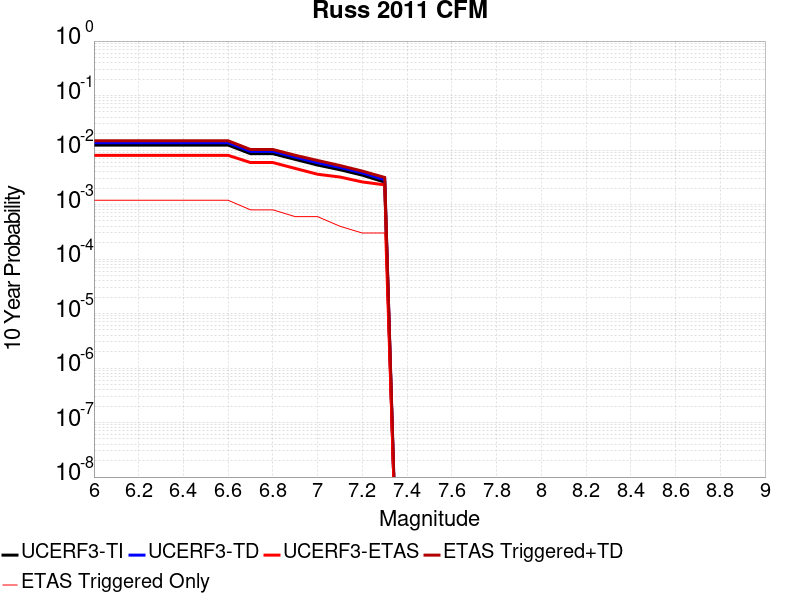 |

| Magnitude | 1 wk TI Prob | 1 wk TD Prob | 1 wk ETAS Prob | 1 wk ETAS/TD Gain | 1 wk ETAS Triggered+TD | 1 wk ETAS Triggered Only | 1 mo TI Prob | 1 mo TD Prob | 1 mo ETAS Prob | 1 mo ETAS/TD Gain | 1 mo ETAS Triggered+TD | 1 mo ETAS Triggered Only | 1 yr TI Prob | 1 yr TD Prob | 1 yr ETAS Prob | 1 yr ETAS/TD Gain | 1 yr ETAS Triggered+TD | 1 yr ETAS Triggered Only | 10 yr TI Prob | 10 yr TD Prob | 10 yr ETAS Prob | 10 yr ETAS/TD Gain | 10 yr ETAS Triggered+TD | 10 yr ETAS Triggered Only |
|-----|-----|-----|-----|-----|-----|-----|-----|-----|-----|-----|-----|-----|-----|-----|-----|-----|-----|-----|-----|-----|-----|-----|-----|-----|
| 6.0 | 2.3806366E-5 | 2.6259511E-5 | 0.0 | 0.0 | 2.6259511E-5 | 0.0 | 1.0202329E-4 | 1.1253626E-4 | 0.0 | 0.0 | 1.1253626E-4 | 0.0 | 0.0012414258 | 0.0013693315 | 4.0E-4 | 0.29211333 | 0.0013693315 | 0.0 | 0.012345135 | 0.013615423 | 0.008 | 0.587569 | 0.0147990845 | 0.0012 |
| 6.1 | 2.3806366E-5 | 2.6259511E-5 | 0.0 | 0.0 | 2.6259511E-5 | 0.0 | 1.0202329E-4 | 1.1253626E-4 | 0.0 | 0.0 | 1.1253626E-4 | 0.0 | 0.0012414258 | 0.0013693315 | 4.0E-4 | 0.29211333 | 0.0013693315 | 0.0 | 0.012345135 | 0.013615423 | 0.008 | 0.587569 | 0.0147990845 | 0.0012 |
| 6.2 | 2.3806366E-5 | 2.6259511E-5 | 0.0 | 0.0 | 2.6259511E-5 | 0.0 | 1.0202329E-4 | 1.1253626E-4 | 0.0 | 0.0 | 1.1253626E-4 | 0.0 | 0.0012414258 | 0.0013693315 | 4.0E-4 | 0.29211333 | 0.0013693315 | 0.0 | 0.012345135 | 0.013615423 | 0.008 | 0.587569 | 0.0147990845 | 0.0012 |
| 6.3 | 2.3806366E-5 | 2.6259511E-5 | 0.0 | 0.0 | 2.6259511E-5 | 0.0 | 1.0202329E-4 | 1.1253626E-4 | 0.0 | 0.0 | 1.1253626E-4 | 0.0 | 0.0012414258 | 0.0013693315 | 4.0E-4 | 0.29211333 | 0.0013693315 | 0.0 | 0.012345135 | 0.013615423 | 0.008 | 0.587569 | 0.0147990845 | 0.0012 |
| 6.4 | 2.3806366E-5 | 2.6259511E-5 | 0.0 | 0.0 | 2.6259511E-5 | 0.0 | 1.0202329E-4 | 1.1253626E-4 | 0.0 | 0.0 | 1.1253626E-4 | 0.0 | 0.0012414258 | 0.0013693315 | 4.0E-4 | 0.29211333 | 0.0013693315 | 0.0 | 0.012345135 | 0.013615423 | 0.008 | 0.587569 | 0.0147990845 | 0.0012 |
| 6.5 | 2.3806366E-5 | 2.6259511E-5 | 0.0 | 0.0 | 2.6259511E-5 | 0.0 | 1.0202329E-4 | 1.1253626E-4 | 0.0 | 0.0 | 1.1253626E-4 | 0.0 | 0.0012414258 | 0.0013693315 | 4.0E-4 | 0.29211333 | 0.0013693315 | 0.0 | 0.012345135 | 0.013615423 | 0.008 | 0.587569 | 0.0147990845 | 0.0012 |
| 6.6 | 2.3806366E-5 | 2.6259511E-5 | 0.0 | 0.0 | 2.6259511E-5 | 0.0 | 1.0202329E-4 | 1.1253626E-4 | 0.0 | 0.0 | 1.1253626E-4 | 0.0 | 0.0012414258 | 0.0013693315 | 4.0E-4 | 0.29211333 | 0.0013693315 | 0.0 | 0.012345135 | 0.013615423 | 0.008 | 0.587569 | 0.0147990845 | 0.0012 |
| 6.7 | 1.6515693E-5 | 1.8191598E-5 | 0.0 | 0.0 | 1.8191598E-5 | 0.0 | 7.077962E-5 | 7.796185E-5 | 0.0 | 0.0 | 7.796185E-5 | 0.0 | 8.6140115E-4 | 9.48806E-4 | 2.0E-4 | 0.21079125 | 9.48806E-4 | 0.0 | 0.008580698 | 0.009450945 | 0.0059 | 0.62427616 | 0.010243384 | 8.0E-4 |
| 6.8 | 1.6515693E-5 | 1.8191598E-5 | 0.0 | 0.0 | 1.8191598E-5 | 0.0 | 7.077962E-5 | 7.796185E-5 | 0.0 | 0.0 | 7.796185E-5 | 0.0 | 8.6140115E-4 | 9.48806E-4 | 2.0E-4 | 0.21079125 | 9.48806E-4 | 0.0 | 0.008580698 | 0.009450945 | 0.0059 | 0.62427616 | 0.010243384 | 8.0E-4 |
| 6.9 | 1.2971182E-5 | 1.4276675E-5 | 0.0 | 0.0 | 1.4276675E-5 | 0.0 | 5.5589593E-5 | 6.118446E-5 | 0.0 | 0.0 | 6.118446E-5 | 0.0 | 6.765931E-4 | 7.446921E-4 | 1.0E-4 | 0.13428369 | 7.446921E-4 | 0.0 | 0.0067453682 | 0.0074245413 | 0.0046 | 0.6195669 | 0.008020086 | 6.0E-4 |
| 7.0 | 1.0201805E-5 | 1.1224137E-5 | 0.0 | 0.0 | 1.1224137E-5 | 0.0 | 4.3721288E-5 | 4.8102676E-5 | 0.0 | 0.0 | 4.8102676E-5 | 0.0 | 5.3217664E-4 | 5.855135E-4 | 1.0E-4 | 0.17079026 | 5.855135E-4 | 0.0 | 0.00530904 | 0.005841761 | 0.0036 | 0.61625254 | 0.006438256 | 6.0E-4 |
| 7.1 | 8.3744935E-6 | 9.2144965E-6 | 0.0 | 0.0 | 9.2144965E-6 | 0.0 | 3.5890193E-5 | 3.9490205E-5 | 0.0 | 0.0 | 3.9490205E-5 | 0.0 | 4.368755E-4 | 4.8070573E-4 | 1.0E-4 | 0.20802748 | 4.8070573E-4 | 0.0 | 0.004360176 | 0.004798485 | 0.0032 | 0.66687715 | 0.0051965658 | 4.0E-4 |
| 7.2 | 6.649391E-6 | 7.3184665E-6 | 0.0 | 0.0 | 7.3184665E-6 | 0.0 | 2.8497077E-5 | 3.1364572E-5 | 0.0 | 0.0 | 3.1364572E-5 | 0.0 | 3.4689668E-4 | 3.8181336E-4 | 0.0 | 0.0 | 3.8181336E-4 | 0.0 | 0.0034635565 | 0.0038132048 | 0.0026 | 0.6818412 | 0.0041120606 | 3.0E-4 |
| 7.3 | 4.9549312E-6 | 5.455684E-6 | 0.0 | 0.0 | 5.455684E-6 | 0.0 | 2.1235246E-5 | 2.3381375E-5 | 0.0 | 0.0 | 2.3381375E-5 | 0.0 | 2.5850846E-4 | 2.846458E-4 | 0.0 | 0.0 | 2.846458E-4 | 0.0 | 0.0025820795 | 0.0028442566 | 0.0023 | 0.80864716 | 0.0031434032 | 3.0E-4 |

## Eureka Peak
*[(top)](#table-of-contents)*

| 1 Week | 1 Month | 1 Year | 10 Year |
|-----|-----|-----|-----|
|  |  |  |  |

| Magnitude | 1 wk TI Prob | 1 wk TD Prob | 1 wk ETAS Prob | 1 wk ETAS/TD Gain | 1 wk ETAS Triggered+TD | 1 wk ETAS Triggered Only | 1 mo TI Prob | 1 mo TD Prob | 1 mo ETAS Prob | 1 mo ETAS/TD Gain | 1 mo ETAS Triggered+TD | 1 mo ETAS Triggered Only | 1 yr TI Prob | 1 yr TD Prob | 1 yr ETAS Prob | 1 yr ETAS/TD Gain | 1 yr ETAS Triggered+TD | 1 yr ETAS Triggered Only | 10 yr TI Prob | 10 yr TD Prob | 10 yr ETAS Prob | 10 yr ETAS/TD Gain | 10 yr ETAS Triggered+TD | 10 yr ETAS Triggered Only |
|-----|-----|-----|-----|-----|-----|-----|-----|-----|-----|-----|-----|-----|-----|-----|-----|-----|-----|-----|-----|-----|-----|-----|-----|-----|
| 6.0 | 3.1949054E-5 | 9.327549E-6 | 0.0 | 0.0 | 9.327549E-6 | 0.0 | 1.3691733E-4 | 3.997504E-5 | 1.0E-4 | 2.501561 | 3.997504E-5 | 0.0 | 0.0016656938 | 4.8666584E-4 | 5.0E-4 | 1.027399 | 4.8666584E-4 | 0.0 | 0.016532637 | 0.00493004 | 0.0035 | 0.7099334 | 0.006124124 | 0.0012 |
| 6.1 | 3.1949054E-5 | 9.327549E-6 | 0.0 | 0.0 | 9.327549E-6 | 0.0 | 1.3691733E-4 | 3.997504E-5 | 1.0E-4 | 2.501561 | 3.997504E-5 | 0.0 | 0.0016656938 | 4.8666584E-4 | 5.0E-4 | 1.027399 | 4.8666584E-4 | 0.0 | 0.016532637 | 0.00493004 | 0.0035 | 0.7099334 | 0.006124124 | 0.0012 |
| 6.2 | 3.1949054E-5 | 9.327549E-6 | 0.0 | 0.0 | 9.327549E-6 | 0.0 | 1.3691733E-4 | 3.997504E-5 | 1.0E-4 | 2.501561 | 3.997504E-5 | 0.0 | 0.0016656938 | 4.8666584E-4 | 5.0E-4 | 1.027399 | 4.8666584E-4 | 0.0 | 0.016532637 | 0.00493004 | 0.0035 | 0.7099334 | 0.006124124 | 0.0012 |
| 6.3 | 2.7339745E-5 | 7.997391E-6 | 0.0 | 0.0 | 7.997391E-6 | 0.0 | 1.1716507E-4 | 3.427451E-5 | 1.0E-4 | 2.9176202 | 3.427451E-5 | 0.0 | 0.0014255513 | 4.1728848E-4 | 5.0E-4 | 1.1982119 | 4.1728848E-4 | 0.0 | 0.0141644105 | 0.0042347484 | 0.003 | 0.7084246 | 0.0051309373 | 9.0E-4 |
| 6.4 | 2.7339745E-5 | 7.997391E-6 | 0.0 | 0.0 | 7.997391E-6 | 0.0 | 1.1716507E-4 | 3.427451E-5 | 1.0E-4 | 2.9176202 | 3.427451E-5 | 0.0 | 0.0014255513 | 4.1728848E-4 | 5.0E-4 | 1.1982119 | 4.1728848E-4 | 0.0 | 0.0141644105 | 0.0042347484 | 0.003 | 0.7084246 | 0.0051309373 | 9.0E-4 |
| 6.5 | 9.738388E-8 | 1.8650658E-7 | 0.0 | 0.0 | 1.8650658E-7 | 0.0 | 4.1735944E-7 | 7.993137E-7 | 0.0 | 0.0 | 7.993137E-7 | 0.0 | 5.081339E-6 | 9.7316015E-6 | 0.0 | 0.0 | 9.7316015E-6 | 0.0 | 5.0812232E-5 | 9.731183E-5 | 0.0 | 0.0 | 9.731183E-5 | 0.0 |
| 6.6 | 9.3495956E-8 | 1.8359404E-7 | 0.0 | 0.0 | 1.8359404E-7 | 0.0 | 4.0069688E-7 | 7.868314E-7 | 0.0 | 0.0 | 7.868314E-7 | 0.0 | 4.8784736E-6 | 9.57963E-6 | 0.0 | 0.0 | 9.57963E-6 | 0.0 | 4.8783666E-5 | 9.579226E-5 | 0.0 | 0.0 | 9.579226E-5 | 0.0 |
| 6.7 | 9.3495956E-8 | 1.8359404E-7 | 0.0 | 0.0 | 1.8359404E-7 | 0.0 | 4.0069688E-7 | 7.868314E-7 | 0.0 | 0.0 | 7.868314E-7 | 0.0 | 4.8784736E-6 | 9.57963E-6 | 0.0 | 0.0 | 9.57963E-6 | 0.0 | 4.8783666E-5 | 9.579226E-5 | 0.0 | 0.0 | 9.579226E-5 | 0.0 |
| 6.8 | 8.591428E-8 | 1.8052116E-7 | 0.0 | 0.0 | 1.8052116E-7 | 0.0 | 3.68204E-7 | 7.7366184E-7 | 0.0 | 0.0 | 7.7366184E-7 | 0.0 | 4.4828744E-6 | 9.419294E-6 | 0.0 | 0.0 | 9.419294E-6 | 0.0 | 4.482784E-5 | 9.418902E-5 | 0.0 | 0.0 | 9.418902E-5 | 0.0 |
| 6.9 | 7.749723E-8 | 1.746993E-7 | 0.0 | 0.0 | 1.746993E-7 | 0.0 | 3.3213098E-7 | 7.4871105E-7 | 0.0 | 0.0 | 7.4871105E-7 | 0.0 | 4.043687E-6 | 9.11552E-6 | 0.0 | 0.0 | 9.11552E-6 | 0.0 | 4.0436134E-5 | 9.115153E-5 | 0.0 | 0.0 | 9.115153E-5 | 0.0 |
| 7.0 | 6.897872E-8 | 1.6445267E-7 | 0.0 | 0.0 | 1.6445267E-7 | 0.0 | 2.9562307E-7 | 7.04797E-7 | 0.0 | 0.0 | 7.04797E-7 | 0.0 | 3.5992048E-6 | 8.580871E-6 | 0.0 | 0.0 | 8.580871E-6 | 0.0 | 3.5991467E-5 | 8.580546E-5 | 0.0 | 0.0 | 8.580546E-5 | 0.0 |
| 7.1 | 5.859318E-8 | 1.481564E-7 | 0.0 | 0.0 | 1.481564E-7 | 0.0 | 2.5111362E-7 | 6.349559E-7 | 0.0 | 0.0 | 6.349559E-7 | 0.0 | 3.057304E-6 | 7.730561E-6 | 0.0 | 0.0 | 7.730561E-6 | 0.0 | 3.0572617E-5 | 7.730299E-5 | 0.0 | 0.0 | 7.730299E-5 | 0.0 |
| 7.2 | 5.1375338E-8 | 1.3448334E-7 | 0.0 | 0.0 | 1.3448334E-7 | 0.0 | 2.2018E-7 | 5.763571E-7 | 0.0 | 0.0 | 5.763571E-7 | 0.0 | 2.680688E-6 | 7.017125E-6 | 0.0 | 0.0 | 7.017125E-6 | 0.0 | 2.6806558E-5 | 7.0169095E-5 | 0.0 | 0.0 | 7.0169095E-5 | 0.0 |
| 7.3 | 4.5441396E-8 | 1.1661669E-7 | 0.0 | 0.0 | 1.1661669E-7 | 0.0 | 1.9474882E-7 | 4.997857E-7 | 0.0 | 0.0 | 4.997857E-7 | 0.0 | 2.3710643E-6 | 6.0848747E-6 | 0.0 | 0.0 | 6.0848747E-6 | 0.0 | 2.371039E-5 | 6.0847135E-5 | 0.0 | 0.0 | 6.0847135E-5 | 0.0 |
| 7.4 | 2.981918E-8 | 6.930887E-8 | 0.0 | 0.0 | 6.930887E-8 | 0.0 | 1.2779647E-7 | 2.9703796E-7 | 0.0 | 0.0 | 2.9703796E-7 | 0.0 | 1.5559209E-6 | 3.6164317E-6 | 0.0 | 0.0 | 3.6164317E-6 | 0.0 | 1.55591E-5 | 3.6163772E-5 | 0.0 | 0.0 | 3.6163772E-5 | 0.0 |
| 7.5 | 4.24214E-9 | 8.371518E-9 | 0.0 | 0.0 | 8.371518E-9 | 0.0 | 1.81806E-8 | 3.587793E-8 | 0.0 | 0.0 | 3.587793E-8 | 0.0 | 2.213488E-7 | 4.368138E-7 | 0.0 | 0.0 | 4.368138E-7 | 0.0 | 2.2134857E-6 | 4.3681357E-6 | 0.0 | 0.0 | 4.3681357E-6 | 0.0 |

## Homestead Valley 2011
*[(top)](#table-of-contents)*

| 1 Week | 1 Month | 1 Year | 10 Year |
|-----|-----|-----|-----|
| 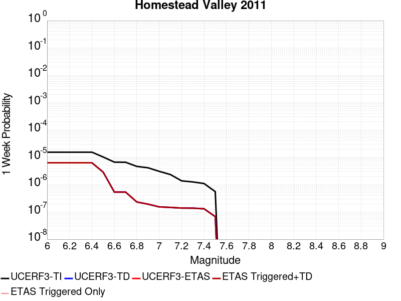 | 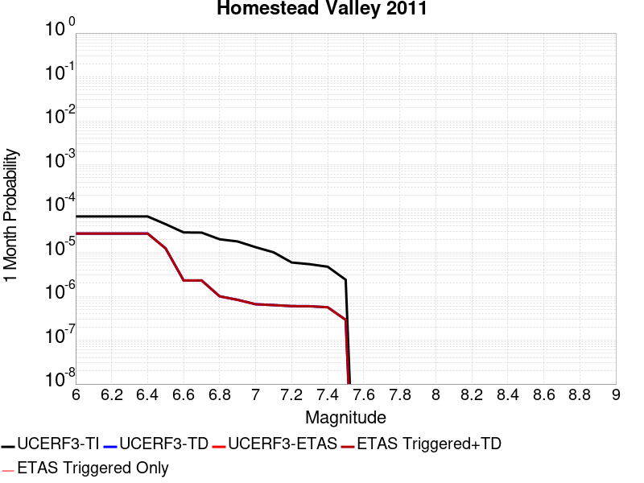 | 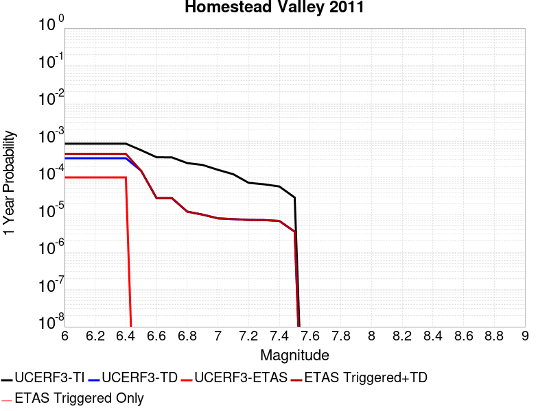 | 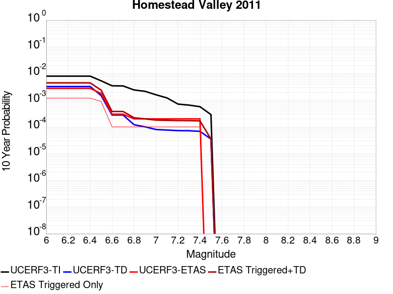 |

| Magnitude | 1 wk TI Prob | 1 wk TD Prob | 1 wk ETAS Prob | 1 wk ETAS/TD Gain | 1 wk ETAS Triggered+TD | 1 wk ETAS Triggered Only | 1 mo TI Prob | 1 mo TD Prob | 1 mo ETAS Prob | 1 mo ETAS/TD Gain | 1 mo ETAS Triggered+TD | 1 mo ETAS Triggered Only | 1 yr TI Prob | 1 yr TD Prob | 1 yr ETAS Prob | 1 yr ETAS/TD Gain | 1 yr ETAS Triggered+TD | 1 yr ETAS Triggered Only | 10 yr TI Prob | 10 yr TD Prob | 10 yr ETAS Prob | 10 yr ETAS/TD Gain | 10 yr ETAS Triggered+TD | 10 yr ETAS Triggered Only |
|-----|-----|-----|-----|-----|-----|-----|-----|-----|-----|-----|-----|-----|-----|-----|-----|-----|-----|-----|-----|-----|-----|-----|-----|-----|
| 6.0 | 1.539795E-5 | 6.287981E-6 | 0.0 | 0.0 | 6.287981E-6 | 0.0 | 6.5989545E-5 | 2.6948326E-5 | 0.0 | 0.0 | 2.6948326E-5 | 0.0 | 8.0312655E-4 | 3.2806708E-4 | 1.0E-4 | 0.3048157 | 4.2803428E-4 | 1.0E-4 | 0.008002302 | 0.0032778492 | 0.0028 | 0.85421866 | 0.004473916 | 0.0012 |
| 6.1 | 1.539795E-5 | 6.287981E-6 | 0.0 | 0.0 | 6.287981E-6 | 0.0 | 6.5989545E-5 | 2.6948326E-5 | 0.0 | 0.0 | 2.6948326E-5 | 0.0 | 8.0312655E-4 | 3.2806708E-4 | 1.0E-4 | 0.3048157 | 4.2803428E-4 | 1.0E-4 | 0.008002302 | 0.0032778492 | 0.0028 | 0.85421866 | 0.004473916 | 0.0012 |
| 6.2 | 1.539795E-5 | 6.287981E-6 | 0.0 | 0.0 | 6.287981E-6 | 0.0 | 6.5989545E-5 | 2.6948326E-5 | 0.0 | 0.0 | 2.6948326E-5 | 0.0 | 8.0312655E-4 | 3.2806708E-4 | 1.0E-4 | 0.3048157 | 4.2803428E-4 | 1.0E-4 | 0.008002302 | 0.0032778492 | 0.0028 | 0.85421866 | 0.004473916 | 0.0012 |
| 6.3 | 1.539795E-5 | 6.287981E-6 | 0.0 | 0.0 | 6.287981E-6 | 0.0 | 6.5989545E-5 | 2.6948326E-5 | 0.0 | 0.0 | 2.6948326E-5 | 0.0 | 8.0312655E-4 | 3.2806708E-4 | 1.0E-4 | 0.3048157 | 4.2803428E-4 | 1.0E-4 | 0.008002302 | 0.0032778492 | 0.0028 | 0.85421866 | 0.004473916 | 0.0012 |
| 6.4 | 1.539795E-5 | 6.287981E-6 | 0.0 | 0.0 | 6.287981E-6 | 0.0 | 6.5989545E-5 | 2.6948326E-5 | 0.0 | 0.0 | 2.6948326E-5 | 0.0 | 8.0312655E-4 | 3.2806708E-4 | 1.0E-4 | 0.3048157 | 4.2803428E-4 | 1.0E-4 | 0.008002302 | 0.0032778492 | 0.0028 | 0.85421866 | 0.004473916 | 0.0012 |
| 6.5 | 1.0265258E-5 | 2.8797078E-6 | 0.0 | 0.0 | 2.8797078E-6 | 0.0 | 4.3993223E-5 | 1.2341586E-5 | 0.0 | 0.0 | 1.2341586E-5 | 0.0 | 5.3548586E-4 | 1.5025541E-4 | 0.0 | 0.0 | 1.5025541E-4 | 0.0 | 0.005341973 | 0.0015022202 | 0.0018 | 1.1982265 | 0.002400868 | 9.0E-4 |
| 6.6 | 6.664671E-6 | 5.3540606E-7 | 0.0 | 0.0 | 5.3540606E-7 | 0.0 | 2.8562565E-5 | 2.294596E-6 | 0.0 | 0.0 | 2.294596E-6 | 0.0 | 3.476937E-4 | 2.7936467E-5 | 0.0 | 0.0 | 2.7936467E-5 | 0.0 | 0.003471502 | 2.793412E-4 | 3.0E-4 | 1.0739553 | 3.7931328E-4 | 1.0E-4 |
| 6.7 | 6.5954046E-6 | 5.3540606E-7 | 0.0 | 0.0 | 5.3540606E-7 | 0.0 | 2.8265715E-5 | 2.294596E-6 | 0.0 | 0.0 | 2.294596E-6 | 0.0 | 3.4408073E-4 | 2.7936467E-5 | 0.0 | 0.0 | 2.7936467E-5 | 0.0 | 0.0034354846 | 2.793412E-4 | 3.0E-4 | 1.0739553 | 3.7931328E-4 | 1.0E-4 |
| 6.8 | 4.648189E-6 | 2.3280649E-7 | 0.0 | 0.0 | 2.3280649E-7 | 0.0 | 1.9920659E-5 | 9.977417E-7 | 0.0 | 0.0 | 9.977417E-7 | 0.0 | 2.4250703E-4 | 1.2147442E-5 | 0.0 | 0.0 | 1.2147442E-5 | 0.0 | 0.0024224254 | 1.2146826E-4 | 2.0E-4 | 1.6465206 | 2.2145611E-4 | 1.0E-4 |
| 6.9 | 4.1428534E-6 | 1.9352903E-7 | 0.0 | 0.0 | 1.9352903E-7 | 0.0 | 1.7754966E-5 | 8.294099E-7 | 0.0 | 0.0 | 8.294099E-7 | 0.0 | 2.1614527E-4 | 1.0098021E-5 | 0.0 | 0.0 | 1.0098021E-5 | 0.0 | 0.0021593515 | 1.0097593E-4 | 2.0E-4 | 1.9806701 | 2.0096583E-4 | 1.0E-4 |
| 7.0 | 3.0673707E-6 | 1.5374452E-7 | 0.0 | 0.0 | 1.5374452E-7 | 0.0 | 1.3145808E-5 | 6.589049E-7 | 0.0 | 0.0 | 6.589049E-7 | 0.0 | 1.6003846E-4 | 8.022139E-6 | 0.0 | 0.0 | 8.022139E-6 | 0.0 | 0.0015992324 | 8.0218604E-5 | 2.0E-4 | 2.4931874 | 1.8021058E-4 | 1.0E-4 |
| 7.1 | 2.340854E-6 | 1.4694085E-7 | 0.0 | 0.0 | 1.4694085E-7 | 0.0 | 1.0032193E-5 | 6.2974635E-7 | 0.0 | 0.0 | 6.2974635E-7 | 0.0 | 1.221351E-4 | 7.667136E-6 | 0.0 | 0.0 | 7.667136E-6 | 0.0 | 0.00122068 | 7.666882E-5 | 2.0E-4 | 2.6086226 | 1.7666115E-4 | 1.0E-4 |
| 7.2 | 1.3754182E-6 | 1.3928518E-7 | 0.0 | 0.0 | 1.3928518E-7 | 0.0 | 5.8946357E-6 | 5.9693633E-7 | 0.0 | 0.0 | 5.9693633E-7 | 0.0 | 7.176483E-5 | 7.2676767E-6 | 0.0 | 0.0 | 7.2676767E-6 | 0.0 | 7.174166E-4 | 7.2674484E-5 | 2.0E-4 | 2.7519975 | 1.7266722E-4 | 1.0E-4 |
| 7.3 | 1.2573237E-6 | 1.383298E-7 | 0.0 | 0.0 | 1.383298E-7 | 0.0 | 5.388519E-6 | 5.928419E-7 | 0.0 | 0.0 | 5.928419E-7 | 0.0 | 6.560324E-5 | 7.217827E-6 | 0.0 | 0.0 | 7.217827E-6 | 0.0 | 6.558388E-4 | 7.2176015E-5 | 2.0E-4 | 2.7710035 | 1.721688E-4 | 1.0E-4 |
| 7.4 | 1.0994207E-6 | 1.311164E-7 | 0.0 | 0.0 | 1.311164E-7 | 0.0 | 4.7117946E-6 | 5.619273E-7 | 0.0 | 0.0 | 5.619273E-7 | 0.0 | 5.736459E-5 | 6.8414442E-6 | 0.0 | 0.0 | 6.8414442E-6 | 0.0 | 5.734978E-4 | 6.841243E-5 | 2.0E-4 | 2.9234455 | 1.6840559E-4 | 1.0E-4 |
| 7.5 | 5.5569126E-7 | 6.775916E-8 | 0.0 | 0.0 | 6.775916E-8 | 0.0 | 2.3815317E-6 | 2.9039637E-7 | 0.0 | 0.0 | 2.9039637E-7 | 0.0 | 2.8994764E-5 | 3.5355706E-6 | 0.0 | 0.0 | 3.5355706E-6 | 0.0 | 2.899098E-4 | 3.5355206E-5 | 0.0 | 0.0 | 3.5355206E-5 | 0.0 |

## Death Valley (Black Mtns Frontal)
*[(top)](#table-of-contents)*

| 1 Week | 1 Month | 1 Year | 10 Year |
|-----|-----|-----|-----|
|  | 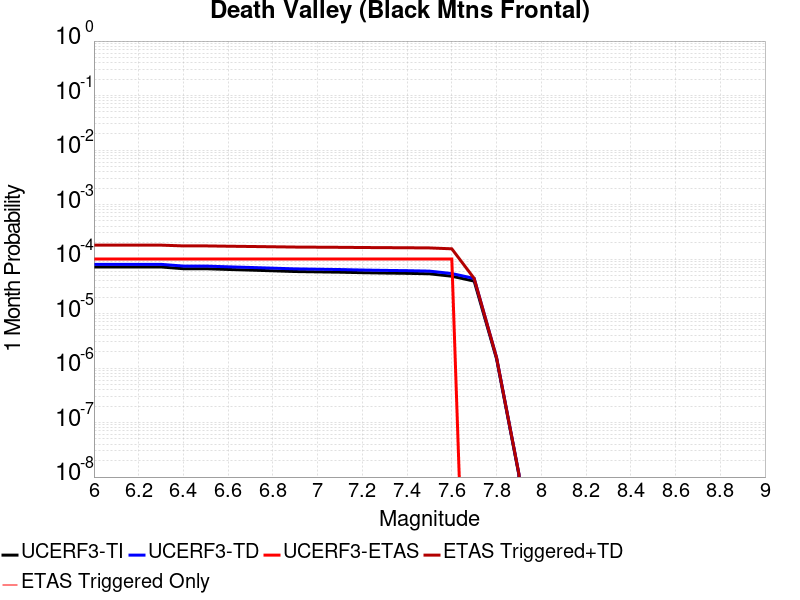 |  |  |

| Magnitude | 1 wk TI Prob | 1 wk TD Prob | 1 wk ETAS Prob | 1 wk ETAS/TD Gain | 1 wk ETAS Triggered+TD | 1 wk ETAS Triggered Only | 1 mo TI Prob | 1 mo TD Prob | 1 mo ETAS Prob | 1 mo ETAS/TD Gain | 1 mo ETAS Triggered+TD | 1 mo ETAS Triggered Only | 1 yr TI Prob | 1 yr TD Prob | 1 yr ETAS Prob | 1 yr ETAS/TD Gain | 1 yr ETAS Triggered+TD | 1 yr ETAS Triggered Only | 10 yr TI Prob | 10 yr TD Prob | 10 yr ETAS Prob | 10 yr ETAS/TD Gain | 10 yr ETAS Triggered+TD | 10 yr ETAS Triggered Only |
|-----|-----|-----|-----|-----|-----|-----|-----|-----|-----|-----|-----|-----|-----|-----|-----|-----|-----|-----|-----|-----|-----|-----|-----|-----|
| 6.0 | 1.6707214E-5 | 1.8674631E-5 | 1.0E-4 | 5.354858 | 1.1867277E-4 | 1.0E-4 | 7.160038E-5 | 8.003172E-5 | 1.0E-4 | 1.2495044 | 1.8002372E-4 | 1.0E-4 | 8.71386E-4 | 9.739583E-4 | 7.0E-4 | 0.7187166 | 0.0012736662 | 3.0E-4 | 0.00867977 | 0.009697752 | 0.0063 | 0.6496351 | 0.010886115 | 0.0012 |
| 6.1 | 1.6707214E-5 | 1.8674631E-5 | 1.0E-4 | 5.354858 | 1.1867277E-4 | 1.0E-4 | 7.160038E-5 | 8.003172E-5 | 1.0E-4 | 1.2495044 | 1.8002372E-4 | 1.0E-4 | 8.71386E-4 | 9.739583E-4 | 7.0E-4 | 0.7187166 | 0.0012736662 | 3.0E-4 | 0.00867977 | 0.009697752 | 0.0063 | 0.6496351 | 0.010886115 | 0.0012 |
| 6.2 | 1.6707214E-5 | 1.8674631E-5 | 1.0E-4 | 5.354858 | 1.1867277E-4 | 1.0E-4 | 7.160038E-5 | 8.003172E-5 | 1.0E-4 | 1.2495044 | 1.8002372E-4 | 1.0E-4 | 8.71386E-4 | 9.739583E-4 | 7.0E-4 | 0.7187166 | 0.0012736662 | 3.0E-4 | 0.00867977 | 0.009697752 | 0.0063 | 0.6496351 | 0.010886115 | 0.0012 |
| 6.3 | 1.6707214E-5 | 1.8674631E-5 | 1.0E-4 | 5.354858 | 1.1867277E-4 | 1.0E-4 | 7.160038E-5 | 8.003172E-5 | 1.0E-4 | 1.2495044 | 1.8002372E-4 | 1.0E-4 | 8.71386E-4 | 9.739583E-4 | 7.0E-4 | 0.7187166 | 0.0012736662 | 3.0E-4 | 0.00867977 | 0.009697752 | 0.0063 | 0.6496351 | 0.010886115 | 0.0012 |
| 6.4 | 1.5515609E-5 | 1.7342265E-5 | 1.0E-4 | 5.7662597 | 1.1734053E-4 | 1.0E-4 | 6.649377E-5 | 7.432191E-5 | 1.0E-4 | 1.3454982 | 1.7431448E-4 | 1.0E-4 | 8.0926094E-4 | 9.044997E-4 | 6.0E-4 | 0.6633501 | 0.0011043189 | 2.0E-4 | 0.008063202 | 0.009008869 | 0.0059 | 0.6549102 | 0.010098958 | 0.0011 |
| 6.5 | 1.5515609E-5 | 1.7342265E-5 | 1.0E-4 | 5.7662597 | 1.1734053E-4 | 1.0E-4 | 6.649377E-5 | 7.432191E-5 | 1.0E-4 | 1.3454982 | 1.7431448E-4 | 1.0E-4 | 8.0926094E-4 | 9.044997E-4 | 6.0E-4 | 0.6633501 | 0.0011043189 | 2.0E-4 | 0.008063202 | 0.009008869 | 0.0059 | 0.6549102 | 0.010098958 | 0.0011 |
| 6.6 | 1.5041828E-5 | 1.6813074E-5 | 1.0E-4 | 5.9477525 | 1.16811396E-4 | 1.0E-4 | 6.4463384E-5 | 7.205408E-5 | 1.0E-4 | 1.3878466 | 1.7204687E-4 | 1.0E-4 | 7.8455906E-4 | 8.7691116E-4 | 6.0E-4 | 0.68421984 | 0.0010767358 | 2.0E-4 | 0.00781795 | 0.008735165 | 0.0058 | 0.66398287 | 0.009825557 | 0.0011 |
| 6.7 | 1.4634985E-5 | 1.6359843E-5 | 1.0E-4 | 6.112528 | 1.16358206E-4 | 1.0E-4 | 6.271985E-5 | 7.011176E-5 | 1.0E-4 | 1.4262942 | 1.7010476E-4 | 1.0E-4 | 7.6334673E-4 | 8.5328217E-4 | 6.0E-4 | 0.70316714 | 0.0010531115 | 2.0E-4 | 0.007607299 | 0.008500696 | 0.0057 | 0.67053336 | 0.009591345 | 0.0011 |
| 6.8 | 1.4209158E-5 | 1.588577E-5 | 1.0E-4 | 6.2949424 | 1.1588418E-4 | 1.0E-4 | 6.089497E-5 | 6.808012E-5 | 1.0E-4 | 1.4688575 | 1.6807331E-4 | 1.0E-4 | 7.4114406E-4 | 8.2856586E-4 | 6.0E-4 | 0.7241428 | 0.0010284001 | 2.0E-4 | 0.007386771 | 0.008255382 | 0.0053 | 0.64200544 | 0.009346301 | 0.0011 |
| 6.9 | 1.3780098E-5 | 1.5408206E-5 | 1.0E-4 | 6.490048 | 1.1540666E-4 | 1.0E-4 | 5.9056227E-5 | 6.603353E-5 | 1.0E-4 | 1.5143821 | 1.6602693E-4 | 1.0E-4 | 7.1877235E-4 | 8.036672E-4 | 6.0E-4 | 0.74657774 | 0.0010035065 | 2.0E-4 | 0.0071645193 | 0.0080082035 | 0.0052 | 0.64933413 | 0.009000195 | 0.001 |
| 7.0 | 1.3585064E-5 | 1.5191722E-5 | 1.0E-4 | 6.5825324 | 1.151902E-4 | 1.0E-4 | 5.8220405E-5 | 6.5105785E-5 | 1.0E-4 | 1.5359617 | 1.6509928E-4 | 1.0E-4 | 7.086029E-4 | 7.9238013E-4 | 6.0E-4 | 0.75721234 | 9.922216E-4 | 2.0E-4 | 0.007063476 | 0.00789614 | 0.0052 | 0.65854955 | 0.008888245 | 0.001 |
| 7.1 | 1.3398601E-5 | 1.4984861E-5 | 1.0E-4 | 6.673402 | 1.1498336E-4 | 1.0E-4 | 5.742131E-5 | 6.421928E-5 | 1.0E-4 | 1.5571647 | 1.6421286E-4 | 1.0E-4 | 6.9888023E-4 | 7.815948E-4 | 6.0E-4 | 0.7676612 | 9.814384E-4 | 2.0E-4 | 0.0069668638 | 0.007789048 | 0.005 | 0.641927 | 0.008682038 | 9.0E-4 |
| 7.2 | 1.3126312E-5 | 1.4683018E-5 | 1.0E-4 | 6.810589 | 1.1468155E-4 | 1.0E-4 | 5.6254412E-5 | 6.2925734E-5 | 1.0E-4 | 1.589175 | 1.6291944E-4 | 1.0E-4 | 6.846822E-4 | 7.6585694E-4 | 6.0E-4 | 0.7834361 | 9.6570374E-4 | 2.0E-4 | 0.006825765 | 0.0076327603 | 0.005 | 0.655071 | 0.008525891 | 9.0E-4 |
| 7.3 | 1.2922429E-5 | 1.4457197E-5 | 1.0E-4 | 6.9169703 | 1.14455754E-4 | 1.0E-4 | 5.5380664E-5 | 6.195797E-5 | 1.0E-4 | 1.6139972 | 1.6195177E-4 | 1.0E-4 | 6.74051E-4 | 7.540827E-4 | 6.0E-4 | 0.7956687 | 9.539319E-4 | 2.0E-4 | 0.006720101 | 0.0075158207 | 0.0048 | 0.6386528 | 0.008409056 | 9.0E-4 |
| 7.4 | 1.2768878E-5 | 1.4287144E-5 | 1.0E-4 | 6.9992995 | 1.14285715E-4 | 1.0E-4 | 5.4722615E-5 | 6.122921E-5 | 1.0E-4 | 1.6332074 | 1.6122308E-4 | 1.0E-4 | 6.660441E-4 | 7.452161E-4 | 6.0E-4 | 0.8051356 | 9.4506703E-4 | 2.0E-4 | 0.0066405144 | 0.0074277506 | 0.0045 | 0.6058362 | 0.008221808 | 8.0E-4 |
| 7.5 | 1.2521929E-5 | 1.4015332E-5 | 1.0E-4 | 7.135043 | 1.1401393E-4 | 1.0E-4 | 5.366431E-5 | 6.0064358E-5 | 1.0E-4 | 1.6648809 | 1.6005835E-4 | 1.0E-4 | 6.531671E-4 | 7.3104363E-4 | 6.0E-4 | 0.82074445 | 9.308974E-4 | 2.0E-4 | 0.006512506 | 0.0072869645 | 0.0045 | 0.6175411 | 0.008081135 | 8.0E-4 |
| 7.6 | 1.1301089E-5 | 1.2651149E-5 | 1.0E-4 | 7.904421 | 1.1264988E-4 | 1.0E-4 | 4.8432343E-5 | 5.4218108E-5 | 1.0E-4 | 1.8444022 | 1.5421268E-4 | 1.0E-4 | 5.895042E-4 | 6.5991085E-4 | 6.0E-4 | 0.9092137 | 8.597789E-4 | 2.0E-4 | 0.0058794282 | 0.0065800655 | 0.0034 | 0.5167122 | 0.0072754594 | 7.0E-4 |
| 7.7 | 9.189108E-6 | 1.0285795E-5 | 0.0 | 0.0 | 1.0285795E-5 | 0.0 | 3.93813E-5 | 4.4081262E-5 | 0.0 | 0.0 | 4.4081262E-5 | 0.0 | 4.7936183E-4 | 5.3656223E-4 | 5.0E-4 | 0.93185836 | 6.365086E-4 | 1.0E-4 | 0.004783291 | 0.0053531784 | 0.0031 | 0.5790952 | 0.0059499666 | 6.0E-4 |
| 7.8 | 3.4586725E-7 | 3.64866E-7 | 0.0 | 0.0 | 3.64866E-7 | 0.0 | 1.4822873E-6 | 1.5637105E-6 | 0.0 | 0.0 | 1.5637105E-6 | 0.0 | 1.80467E-5 | 1.9038014E-5 | 0.0 | 0.0 | 1.9038014E-5 | 0.0 | 1.8045233E-4 | 1.9036427E-4 | 1.0E-4 | 0.52530867 | 1.9036427E-4 | 0.0 |
| 7.9 | 2.5591178E-9 | 2.6699005E-9 | 0.0 | 0.0 | 2.6699005E-9 | 0.0 | 1.0967647E-8 | 1.1442431E-8 | 0.0 | 0.0 | 1.1442431E-8 | 0.0 | 1.335311E-7 | 1.393116E-7 | 0.0 | 0.0 | 1.393116E-7 | 0.0 | 1.3353102E-6 | 1.3931159E-6 | 0.0 | 0.0 | 1.3931159E-6 | 0.0 |

## Big Pine (Central)
*[(top)](#table-of-contents)*

| 1 Week | 1 Month | 1 Year | 10 Year |
|-----|-----|-----|-----|
| 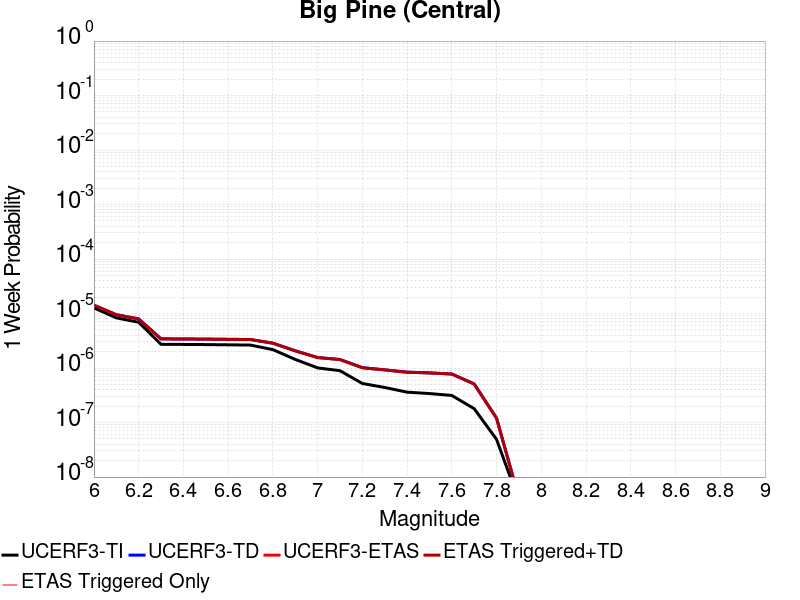 |  |  |  |

| Magnitude | 1 wk TI Prob | 1 wk TD Prob | 1 wk ETAS Prob | 1 wk ETAS/TD Gain | 1 wk ETAS Triggered+TD | 1 wk ETAS Triggered Only | 1 mo TI Prob | 1 mo TD Prob | 1 mo ETAS Prob | 1 mo ETAS/TD Gain | 1 mo ETAS Triggered+TD | 1 mo ETAS Triggered Only | 1 yr TI Prob | 1 yr TD Prob | 1 yr ETAS Prob | 1 yr ETAS/TD Gain | 1 yr ETAS Triggered+TD | 1 yr ETAS Triggered Only | 10 yr TI Prob | 10 yr TD Prob | 10 yr ETAS Prob | 10 yr ETAS/TD Gain | 10 yr ETAS Triggered+TD | 10 yr ETAS Triggered Only |
|-----|-----|-----|-----|-----|-----|-----|-----|-----|-----|-----|-----|-----|-----|-----|-----|-----|-----|-----|-----|-----|-----|-----|-----|-----|
| 6.0 | 1.2706755E-5 | 1.4257853E-5 | 0.0 | 0.0 | 1.4257853E-5 | 0.0 | 5.4456385E-5 | 6.1103856E-5 | 0.0 | 0.0 | 6.1103856E-5 | 0.0 | 6.628048E-4 | 7.4372214E-4 | 4.0E-4 | 0.5378353 | 7.4372214E-4 | 0.0 | 0.006608314 | 0.007417321 | 0.0057 | 0.7684715 | 0.00860842 | 0.0012 |
| 6.1 | 8.342579E-6 | 9.517276E-6 | 0.0 | 0.0 | 9.517276E-6 | 0.0 | 3.5753423E-5 | 4.0787814E-5 | 0.0 | 0.0 | 4.0787814E-5 | 0.0 | 4.3521097E-4 | 4.9650023E-4 | 1.0E-4 | 0.20140979 | 4.9650023E-4 | 0.0 | 0.0043435963 | 0.0049574254 | 0.0033 | 0.6656681 | 0.0056539555 | 7.0E-4 |
| 6.2 | 6.923899E-6 | 7.973393E-6 | 0.0 | 0.0 | 7.973393E-6 | 0.0 | 2.9673516E-5 | 3.4171342E-5 | 0.0 | 0.0 | 3.4171342E-5 | 0.0 | 3.6121515E-4 | 4.1597593E-4 | 1.0E-4 | 0.24039853 | 4.1597593E-4 | 0.0 | 0.003606286 | 0.0041552423 | 0.0027 | 0.6497816 | 0.0048523336 | 7.0E-4 |
| 6.3 | 2.728396E-6 | 3.4297902E-6 | 0.0 | 0.0 | 3.4297902E-6 | 0.0 | 1.1693074E-5 | 1.4699022E-5 | 0.0 | 0.0 | 1.4699022E-5 | 0.0 | 1.4235388E-4 | 1.7894678E-4 | 0.0 | 0.0 | 1.7894678E-4 | 0.0 | 0.0014226272 | 0.0017894944 | 9.0E-4 | 0.50293535 | 0.0020889577 | 3.0E-4 |
| 6.4 | 2.7136944E-6 | 3.4140814E-6 | 0.0 | 0.0 | 3.4140814E-6 | 0.0 | 1.1630066E-5 | 1.4631701E-5 | 0.0 | 0.0 | 1.4631701E-5 | 0.0 | 1.4158686E-4 | 1.7812726E-4 | 0.0 | 0.0 | 1.7812726E-4 | 0.0 | 0.0014149669 | 0.0017813124 | 9.0E-4 | 0.50524545 | 0.0020807781 | 3.0E-4 |
| 6.5 | 2.6971882E-6 | 3.396424E-6 | 0.0 | 0.0 | 3.396424E-6 | 0.0 | 1.1559327E-5 | 1.4556027E-5 | 0.0 | 0.0 | 1.4556027E-5 | 0.0 | 1.4072572E-4 | 1.7720608E-4 | 0.0 | 0.0 | 1.7720608E-4 | 0.0 | 0.0014063664 | 0.0017721154 | 9.0E-4 | 0.50786763 | 0.0020715836 | 3.0E-4 |
| 6.6 | 2.669092E-6 | 3.3664405E-6 | 0.0 | 0.0 | 3.3664405E-6 | 0.0 | 1.1438916E-5 | 1.4427527E-5 | 0.0 | 0.0 | 1.4427527E-5 | 0.0 | 1.3925991E-4 | 1.7564186E-4 | 0.0 | 0.0 | 1.7564186E-4 | 0.0 | 0.0013917267 | 0.0017564979 | 9.0E-4 | 0.5123832 | 0.002055971 | 3.0E-4 |
| 6.7 | 2.6408059E-6 | 3.3364627E-6 | 0.0 | 0.0 | 3.3364627E-6 | 0.0 | 1.1317691E-5 | 1.4299052E-5 | 0.0 | 0.0 | 1.4299052E-5 | 0.0 | 1.3778417E-4 | 1.7407793E-4 | 0.0 | 0.0 | 1.7407793E-4 | 0.0 | 0.0013769877 | 0.0017408831 | 9.0E-4 | 0.516979 | 0.0020403608 | 3.0E-4 |
| 6.8 | 2.1786943E-6 | 2.8598904E-6 | 0.0 | 0.0 | 2.8598904E-6 | 0.0 | 9.337228E-6 | 1.225662E-5 | 0.0 | 0.0 | 1.225662E-5 | 0.0 | 1.1367482E-4 | 1.4921486E-4 | 0.0 | 0.0 | 1.4921486E-4 | 0.0 | 0.0011361669 | 0.0014926007 | 9.0E-4 | 0.6029744 | 0.0017921529 | 3.0E-4 |
| 6.9 | 1.4411696E-6 | 2.0737132E-6 | 0.0 | 0.0 | 2.0737132E-6 | 0.0 | 6.1764263E-6 | 8.887314E-6 | 0.0 | 0.0 | 8.887314E-6 | 0.0 | 7.51954E-5 | 1.0819794E-4 | 0.0 | 0.0 | 1.0819794E-4 | 0.0 | 7.5169955E-4 | 0.001082862 | 6.0E-4 | 0.5540872 | 0.0013825372 | 3.0E-4 |
| 7.0 | 1.0073411E-6 | 1.5589193E-6 | 0.0 | 0.0 | 1.5589193E-6 | 0.0 | 4.317169E-6 | 6.681066E-6 | 0.0 | 0.0 | 6.681066E-6 | 0.0 | 5.2560266E-5 | 8.13391E-5 | 0.0 | 0.0 | 8.13391E-5 | 0.0 | 5.2547833E-4 | 8.1449136E-4 | 5.0E-4 | 0.61388004 | 0.0010143284 | 2.0E-4 |
| 7.1 | 8.947104E-7 | 1.4348408E-6 | 0.0 | 0.0 | 1.4348408E-6 | 0.0 | 3.834468E-6 | 6.1493038E-6 | 0.0 | 0.0 | 6.1493038E-6 | 0.0 | 4.6683643E-5 | 7.4865355E-5 | 0.0 | 0.0 | 7.4865355E-5 | 0.0 | 4.6673836E-4 | 7.497992E-4 | 3.0E-4 | 0.40010715 | 9.496492E-4 | 2.0E-4 |
| 7.2 | 5.215166E-7 | 1.0154546E-6 | 0.0 | 0.0 | 1.0154546E-6 | 0.0 | 2.2350691E-6 | 4.3519412E-6 | 0.0 | 0.0 | 4.3519412E-6 | 0.0 | 2.7211627E-5 | 5.298364E-5 | 0.0 | 0.0 | 5.298364E-5 | 0.0 | 2.7208295E-4 | 5.3109776E-4 | 2.0E-4 | 0.3765785 | 6.310447E-4 | 1.0E-4 |
| 7.3 | 4.4024807E-7 | 9.2611924E-7 | 0.0 | 0.0 | 9.2611924E-7 | 0.0 | 1.8867761E-6 | 3.9690767E-6 | 0.0 | 0.0 | 3.9690767E-6 | 0.0 | 2.2971257E-5 | 4.832248E-5 | 0.0 | 0.0 | 4.832248E-5 | 0.0 | 2.2968883E-4 | 4.845072E-4 | 2.0E-4 | 0.41279057 | 5.8445876E-4 | 1.0E-4 |
| 7.4 | 3.6130905E-7 | 8.3988454E-7 | 0.0 | 0.0 | 8.3988454E-7 | 0.0 | 1.5484665E-6 | 3.5995004E-6 | 0.0 | 0.0 | 3.5995004E-6 | 0.0 | 1.8852415E-5 | 4.3823075E-5 | 0.0 | 0.0 | 4.3823075E-5 | 0.0 | 1.8850817E-4 | 4.3952215E-4 | 2.0E-4 | 0.45503962 | 5.394782E-4 | 1.0E-4 |
| 7.5 | 3.408184E-7 | 8.1475986E-7 | 0.0 | 0.0 | 8.1475986E-7 | 0.0 | 1.4606494E-6 | 3.4918237E-6 | 0.0 | 0.0 | 3.4918237E-6 | 0.0 | 1.7783263E-5 | 4.251216E-5 | 0.0 | 0.0 | 4.251216E-5 | 0.0 | 1.778184E-4 | 4.2639827E-4 | 2.0E-4 | 0.46904504 | 5.2635564E-4 | 1.0E-4 |
| 7.6 | 3.1428627E-7 | 7.7696626E-7 | 0.0 | 0.0 | 7.7696626E-7 | 0.0 | 1.3469405E-6 | 3.3298513E-6 | 0.0 | 0.0 | 3.3298513E-6 | 0.0 | 1.6398877E-5 | 4.0540224E-5 | 0.0 | 0.0 | 4.0540224E-5 | 0.0 | 1.6397667E-4 | 4.0665813E-4 | 1.0E-4 | 0.2459068 | 4.0665813E-4 | 0.0 |
| 7.7 | 1.7972785E-7 | 5.1068565E-7 | 0.0 | 0.0 | 5.1068565E-7 | 0.0 | 7.70262E-7 | 2.188651E-6 | 0.0 | 0.0 | 2.188651E-6 | 0.0 | 9.377899E-6 | 2.664651E-5 | 0.0 | 0.0 | 2.664651E-5 | 0.0 | 9.377503E-5 | 2.6775463E-4 | 0.0 | 0.0 | 2.6775463E-4 | 0.0 |
| 7.8 | 4.9230927E-8 | 1.2049418E-7 | 0.0 | 0.0 | 1.2049418E-7 | 0.0 | 2.1098968E-7 | 5.1640353E-7 | 0.0 | 0.0 | 5.1640353E-7 | 0.0 | 2.5687964E-6 | 6.2871964E-6 | 0.0 | 0.0 | 6.2871964E-6 | 0.0 | 2.5687666E-5 | 6.330356E-5 | 0.0 | 0.0 | 6.330356E-5 | 0.0 |
| 7.9 | 3.6805972E-9 | 4.1329766E-9 | 0.0 | 0.0 | 4.1329766E-9 | 0.0 | 1.5773987E-8 | 1.7712757E-8 | 0.0 | 0.0 | 1.7712757E-8 | 0.0 | 1.9204828E-7 | 2.156528E-7 | 0.0 | 0.0 | 2.156528E-7 | 0.0 | 1.920481E-6 | 2.2045874E-6 | 0.0 | 0.0 | 2.2045874E-6 | 0.0 |

## Cedar Mtn-Mahogany Mtn
*[(top)](#table-of-contents)*

| 1 Week | 1 Month | 1 Year | 10 Year |
|-----|-----|-----|-----|
|  |  |  | 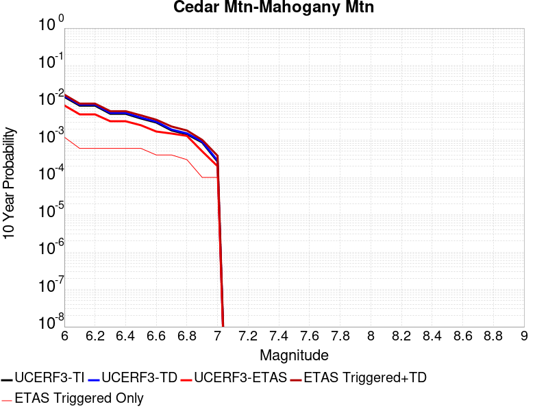 |

| Magnitude | 1 wk TI Prob | 1 wk TD Prob | 1 wk ETAS Prob | 1 wk ETAS/TD Gain | 1 wk ETAS Triggered+TD | 1 wk ETAS Triggered Only | 1 mo TI Prob | 1 mo TD Prob | 1 mo ETAS Prob | 1 mo ETAS/TD Gain | 1 mo ETAS Triggered+TD | 1 mo ETAS Triggered Only | 1 yr TI Prob | 1 yr TD Prob | 1 yr ETAS Prob | 1 yr ETAS/TD Gain | 1 yr ETAS Triggered+TD | 1 yr ETAS Triggered Only | 10 yr TI Prob | 10 yr TD Prob | 10 yr ETAS Prob | 10 yr ETAS/TD Gain | 10 yr ETAS Triggered+TD | 10 yr ETAS Triggered Only |
|-----|-----|-----|-----|-----|-----|-----|-----|-----|-----|-----|-----|-----|-----|-----|-----|-----|-----|-----|-----|-----|-----|-----|-----|-----|
| 6.0 | 2.7763876E-5 | 2.9592731E-5 | 0.0 | 0.0 | 2.9592731E-5 | 0.0 | 1.1898261E-4 | 1.2682022E-4 | 0.0 | 0.0 | 1.2682022E-4 | 0.0 | 0.0014476506 | 0.0015430127 | 3.0E-4 | 0.19442485 | 0.0015430127 | 0.0 | 0.0143825635 | 0.015330214 | 0.0085 | 0.55446064 | 0.016511817 | 0.0012 |
| 6.1 | 1.6162443E-5 | 1.7145032E-5 | 0.0 | 0.0 | 1.7145032E-5 | 0.0 | 6.926578E-5 | 7.347674E-5 | 0.0 | 0.0 | 7.347674E-5 | 0.0 | 8.4298453E-4 | 8.942298E-4 | 2.0E-4 | 0.22365615 | 8.942298E-4 | 0.0 | 0.008397939 | 0.008908127 | 0.0049 | 0.5500595 | 0.0095027825 | 6.0E-4 |
| 6.2 | 1.6162443E-5 | 1.7145032E-5 | 0.0 | 0.0 | 1.7145032E-5 | 0.0 | 6.926578E-5 | 7.347674E-5 | 0.0 | 0.0 | 7.347674E-5 | 0.0 | 8.4298453E-4 | 8.942298E-4 | 2.0E-4 | 0.22365615 | 8.942298E-4 | 0.0 | 0.008397939 | 0.008908127 | 0.0049 | 0.5500595 | 0.0095027825 | 6.0E-4 |
| 6.3 | 9.746053E-6 | 1.030432E-5 | 0.0 | 0.0 | 1.030432E-5 | 0.0 | 4.1768133E-5 | 4.416065E-5 | 0.0 | 0.0 | 4.416065E-5 | 0.0 | 5.0840835E-4 | 5.375274E-4 | 1.0E-4 | 0.18603703 | 5.375274E-4 | 0.0 | 0.0050724675 | 0.005362691 | 0.0032 | 0.59671533 | 0.0059594736 | 6.0E-4 |
| 6.4 | 9.746053E-6 | 1.030432E-5 | 0.0 | 0.0 | 1.030432E-5 | 0.0 | 4.1768133E-5 | 4.416065E-5 | 0.0 | 0.0 | 4.416065E-5 | 0.0 | 5.0840835E-4 | 5.375274E-4 | 1.0E-4 | 0.18603703 | 5.375274E-4 | 0.0 | 0.0050724675 | 0.005362691 | 0.0032 | 0.59671533 | 0.0059594736 | 6.0E-4 |
| 6.5 | 7.290083E-6 | 7.696173E-6 | 0.0 | 0.0 | 7.696173E-6 | 0.0 | 3.124284E-5 | 3.2983193E-5 | 0.0 | 0.0 | 3.2983193E-5 | 0.0 | 3.8031515E-4 | 4.0149858E-4 | 1.0E-4 | 0.24906689 | 4.0149858E-4 | 0.0 | 0.0037966494 | 0.0040079523 | 0.0025 | 0.6237599 | 0.0046055475 | 6.0E-4 |
| 6.6 | 5.67907E-6 | 5.9898016E-6 | 0.0 | 0.0 | 5.9898016E-6 | 0.0 | 2.4338644E-5 | 2.5670333E-5 | 0.0 | 0.0 | 2.5670333E-5 | 0.0 | 2.962827E-4 | 3.1249283E-4 | 1.0E-4 | 0.32000735 | 3.1249283E-4 | 0.0 | 0.0029588798 | 0.0031206703 | 0.0017 | 0.54475474 | 0.0035194221 | 4.0E-4 |
| 6.7 | 3.4853963E-6 | 3.6730223E-6 | 0.0 | 0.0 | 3.6730223E-6 | 0.0 | 1.4937327E-5 | 1.5741432E-5 | 0.0 | 0.0 | 1.5741432E-5 | 0.0 | 1.8184677E-4 | 1.9163571E-4 | 1.0E-4 | 0.5218234 | 1.9163571E-4 | 0.0 | 0.0018169804 | 0.0019147666 | 0.0015 | 0.7833853 | 0.0023140006 | 4.0E-4 |
| 6.8 | 2.7535168E-6 | 2.9018859E-6 | 0.0 | 0.0 | 2.9018859E-6 | 0.0 | 1.1800733E-5 | 1.2436597E-5 | 0.0 | 0.0 | 1.2436597E-5 | 0.0 | 1.4366445E-4 | 1.5140552E-4 | 1.0E-4 | 0.6604779 | 1.5140552E-4 | 0.0 | 0.0014357162 | 0.001513071 | 0.0013 | 0.8591798 | 0.0018126171 | 3.0E-4 |
| 6.9 | 1.6594106E-6 | 1.7498874E-6 | 0.0 | 0.0 | 1.7498874E-6 | 0.0 | 7.1117406E-6 | 7.4994978E-6 | 0.0 | 0.0 | 7.4994978E-6 | 0.0 | 8.6582E-5 | 9.130287E-5 | 1.0E-4 | 1.0952559 | 9.130287E-5 | 0.0 | 8.654827E-4 | 9.12684E-4 | 5.0E-4 | 0.5478347 | 0.0010125928 | 1.0E-4 |
| 7.0 | 5.10215E-7 | 5.3898555E-7 | 0.0 | 0.0 | 5.3898555E-7 | 0.0 | 2.186634E-6 | 2.3099367E-6 | 0.0 | 0.0 | 2.3099367E-6 | 0.0 | 2.6621943E-5 | 2.8123244E-5 | 0.0 | 0.0 | 2.8123244E-5 | 0.0 | 2.6618753E-4 | 2.812094E-4 | 2.0E-4 | 0.71121377 | 3.8118128E-4 | 1.0E-4 |

## Elsinore (Temecula) rev
*[(top)](#table-of-contents)*

| 1 Week | 1 Month | 1 Year | 10 Year |
|-----|-----|-----|-----|
|  | 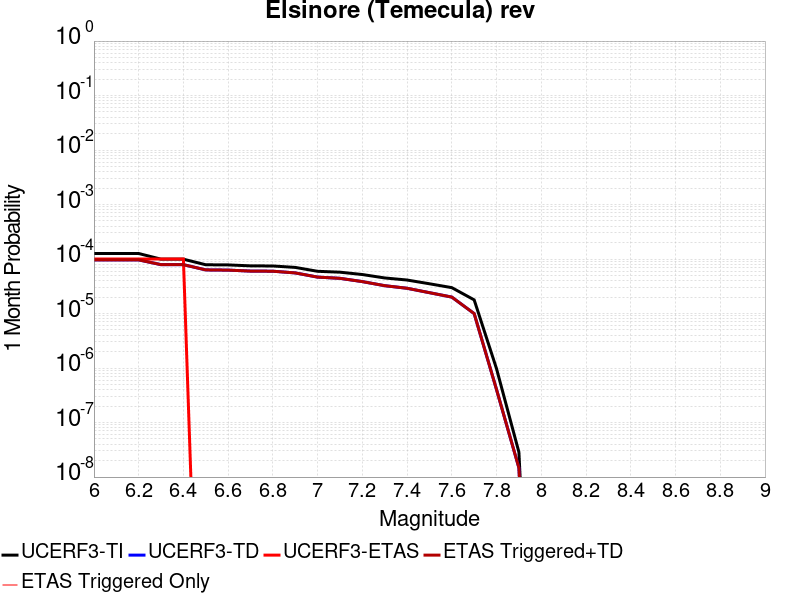 |  |  |

| Magnitude | 1 wk TI Prob | 1 wk TD Prob | 1 wk ETAS Prob | 1 wk ETAS/TD Gain | 1 wk ETAS Triggered+TD | 1 wk ETAS Triggered Only | 1 mo TI Prob | 1 mo TD Prob | 1 mo ETAS Prob | 1 mo ETAS/TD Gain | 1 mo ETAS Triggered+TD | 1 mo ETAS Triggered Only | 1 yr TI Prob | 1 yr TD Prob | 1 yr ETAS Prob | 1 yr ETAS/TD Gain | 1 yr ETAS Triggered+TD | 1 yr ETAS Triggered Only | 10 yr TI Prob | 10 yr TD Prob | 10 yr ETAS Prob | 10 yr ETAS/TD Gain | 10 yr ETAS Triggered+TD | 10 yr ETAS Triggered Only |
|-----|-----|-----|-----|-----|-----|-----|-----|-----|-----|-----|-----|-----|-----|-----|-----|-----|-----|-----|-----|-----|-----|-----|-----|-----|
| 6.0 | 2.9514995E-5 | 2.2532482E-5 | 1.0E-4 | 4.4380374 | 2.2532482E-5 | 0.0 | 1.264867E-4 | 9.656433E-5 | 1.0E-4 | 1.0355791 | 9.656433E-5 | 0.0 | 0.0015388876 | 0.0011750587 | 0.001 | 0.8510214 | 0.0014747061 | 3.0E-4 | 0.015282745 | 0.01172261 | 0.0069 | 0.58860606 | 0.012908543 | 0.0012 |
| 6.1 | 2.9514995E-5 | 2.2532482E-5 | 1.0E-4 | 4.4380374 | 2.2532482E-5 | 0.0 | 1.264867E-4 | 9.656433E-5 | 1.0E-4 | 1.0355791 | 9.656433E-5 | 0.0 | 0.0015388876 | 0.0011750587 | 0.001 | 0.8510214 | 0.0014747061 | 3.0E-4 | 0.015282745 | 0.01172261 | 0.0069 | 0.58860606 | 0.012908543 | 0.0012 |
| 6.2 | 2.9514995E-5 | 2.2532482E-5 | 1.0E-4 | 4.4380374 | 2.2532482E-5 | 0.0 | 1.264867E-4 | 9.656433E-5 | 1.0E-4 | 1.0355791 | 9.656433E-5 | 0.0 | 0.0015388876 | 0.0011750587 | 0.001 | 0.8510214 | 0.0014747061 | 3.0E-4 | 0.015282745 | 0.01172261 | 0.0069 | 0.58860606 | 0.012908543 | 0.0012 |
| 6.3 | 2.3223649E-5 | 1.8418947E-5 | 1.0E-4 | 5.429192 | 1.8418947E-5 | 0.0 | 9.952613E-5 | 7.893605E-5 | 1.0E-4 | 1.2668483 | 7.893605E-5 | 0.0 | 0.001211057 | 9.6063985E-4 | 0.001 | 1.0409728 | 0.0012603516 | 3.0E-4 | 0.012044783 | 0.009579194 | 0.0055 | 0.57416105 | 0.010470573 | 9.0E-4 |
| 6.4 | 2.3223649E-5 | 1.8418947E-5 | 1.0E-4 | 5.429192 | 1.8418947E-5 | 0.0 | 9.952613E-5 | 7.893605E-5 | 1.0E-4 | 1.2668483 | 7.893605E-5 | 0.0 | 0.001211057 | 9.6063985E-4 | 0.001 | 1.0409728 | 0.0012603516 | 3.0E-4 | 0.012044783 | 0.009579194 | 0.0055 | 0.57416105 | 0.010470573 | 9.0E-4 |
| 6.5 | 1.8338875E-5 | 1.475958E-5 | 0.0 | 0.0 | 1.475958E-5 | 0.0 | 7.8592806E-5 | 6.325386E-5 | 0.0 | 0.0 | 6.325386E-5 | 0.0 | 9.5644733E-4 | 7.698524E-4 | 8.0E-4 | 1.0391603 | 0.0010696214 | 3.0E-4 | 0.009523412 | 0.007680793 | 0.0043 | 0.55983806 | 0.00857388 | 9.0E-4 |
| 6.6 | 1.8223333E-5 | 1.4622085E-5 | 0.0 | 0.0 | 1.4622085E-5 | 0.0 | 7.809766E-5 | 6.266462E-5 | 0.0 | 0.0 | 6.266462E-5 | 0.0 | 9.504242E-4 | 7.6268346E-4 | 8.0E-4 | 1.0489279 | 0.0010624547 | 3.0E-4 | 0.009463696 | 0.0076095955 | 0.0042 | 0.5519347 | 0.008502747 | 9.0E-4 |
| 6.7 | 1.7512752E-5 | 1.4036417E-5 | 0.0 | 0.0 | 1.4036417E-5 | 0.0 | 7.505249E-5 | 6.0154736E-5 | 0.0 | 0.0 | 6.0154736E-5 | 0.0 | 9.13381E-4 | 7.3214644E-4 | 8.0E-4 | 1.0926776 | 0.0010319267 | 3.0E-4 | 0.00909636 | 0.0073025743 | 0.0042 | 0.57513964 | 0.008196002 | 9.0E-4 |
| 6.8 | 1.7417142E-5 | 1.396037E-5 | 0.0 | 0.0 | 1.396037E-5 | 0.0 | 7.4642754E-5 | 5.982883E-5 | 0.0 | 0.0 | 5.982883E-5 | 0.0 | 9.083966E-4 | 7.281812E-4 | 8.0E-4 | 1.0986277 | 0.0010279628 | 3.0E-4 | 0.009046922 | 0.0072631217 | 0.0042 | 0.57826376 | 0.0081565855 | 9.0E-4 |
| 6.9 | 1.6402591E-5 | 1.2997419E-5 | 0.0 | 0.0 | 1.2997419E-5 | 0.0 | 7.0294926E-5 | 5.5702076E-5 | 0.0 | 0.0 | 5.5702076E-5 | 0.0 | 8.5550465E-4 | 6.779695E-4 | 8.0E-4 | 1.1799941 | 9.777661E-4 | 3.0E-4 | 0.008522186 | 0.00676429 | 0.004 | 0.5913407 | 0.007658202 | 9.0E-4 |
| 7.0 | 1.3912486E-5 | 1.0886062E-5 | 0.0 | 0.0 | 1.0886062E-5 | 0.0 | 5.9623577E-5 | 4.665373E-5 | 0.0 | 0.0 | 4.665373E-5 | 0.0 | 7.2567526E-4 | 5.6786387E-4 | 8.0E-4 | 1.4087883 | 8.676935E-4 | 3.0E-4 | 0.0072331014 | 0.005667677 | 0.0032 | 0.56460524 | 0.006463143 | 8.0E-4 |
| 7.1 | 1.3405147E-5 | 1.03348375E-5 | 0.0 | 0.0 | 1.03348375E-5 | 0.0 | 5.7449364E-5 | 4.429142E-5 | 0.0 | 0.0 | 4.429142E-5 | 0.0 | 6.9922156E-4 | 5.391172E-4 | 8.0E-4 | 1.4839073 | 8.3895546E-4 | 3.0E-4 | 0.0069702556 | 0.0053812917 | 0.0031 | 0.57606983 | 0.0061769867 | 8.0E-4 |
| 7.2 | 1.21402E-5 | 9.003166E-6 | 0.0 | 0.0 | 9.003166E-6 | 0.0 | 5.202839E-5 | 3.8584436E-5 | 0.0 | 0.0 | 3.8584436E-5 | 0.0 | 6.332616E-4 | 4.6966603E-4 | 8.0E-4 | 1.703338 | 7.695251E-4 | 3.0E-4 | 0.0063146 | 0.0046881624 | 0.0028 | 0.5972489 | 0.0053848806 | 7.0E-4 |
| 7.3 | 1.05047775E-5 | 7.5771713E-6 | 0.0 | 0.0 | 7.5771713E-6 | 0.0 | 4.5019697E-5 | 3.2473195E-5 | 0.0 | 0.0 | 3.2473195E-5 | 0.0 | 5.4797693E-4 | 3.952909E-4 | 5.0E-4 | 1.2648913 | 3.952909E-4 | 0.0 | 0.005466277 | 0.003946271 | 0.002 | 0.50680757 | 0.0043446925 | 4.0E-4 |
| 7.4 | 9.624483E-6 | 6.7916867E-6 | 0.0 | 0.0 | 6.7916867E-6 | 0.0 | 4.124713E-5 | 2.9106912E-5 | 0.0 | 0.0 | 2.9106912E-5 | 0.0 | 5.0206814E-4 | 3.5432042E-4 | 4.0E-4 | 1.1289217 | 3.5432042E-4 | 0.0 | 0.005009353 | 0.0035377096 | 0.0016 | 0.45227003 | 0.0039362945 | 4.0E-4 |
| 7.5 | 8.215151E-6 | 5.639558E-6 | 0.0 | 0.0 | 5.639558E-6 | 0.0 | 3.5207315E-5 | 2.4169316E-5 | 0.0 | 0.0 | 2.4169316E-5 | 0.0 | 4.2856473E-4 | 2.9422296E-4 | 3.0E-4 | 1.0196348 | 2.9422296E-4 | 0.0 | 0.004277392 | 0.0029384624 | 0.0011 | 0.37434545 | 0.0031378746 | 2.0E-4 |
| 7.6 | 6.975058E-6 | 4.6796113E-6 | 0.0 | 0.0 | 4.6796113E-6 | 0.0 | 2.9892764E-5 | 2.005533E-5 | 0.0 | 0.0 | 2.005533E-5 | 0.0 | 3.6388362E-4 | 2.4414744E-4 | 3.0E-4 | 1.2287657 | 2.4414744E-4 | 0.0 | 0.0036328835 | 0.0024389087 | 8.0E-4 | 0.32801557 | 0.0024389087 | 0.0 |
| 7.7 | 4.159604E-6 | 2.3288771E-6 | 0.0 | 0.0 | 2.3288771E-6 | 0.0 | 1.7826753E-5 | 9.9808685E-6 | 0.0 | 0.0 | 9.9808685E-6 | 0.0 | 2.1701909E-4 | 1.2151104E-4 | 2.0E-4 | 1.645941 | 1.2151104E-4 | 0.0 | 0.0021680726 | 0.0012145191 | 5.0E-4 | 0.41168556 | 0.0012145191 | 0.0 |
| 7.8 | 2.2692414E-7 | 9.391389E-8 | 0.0 | 0.0 | 9.391389E-8 | 0.0 | 9.725317E-7 | 4.0248807E-7 | 0.0 | 0.0 | 4.0248807E-7 | 0.0 | 1.1840509E-5 | 4.9002842E-6 | 0.0 | 0.0 | 4.9002842E-6 | 0.0 | 1.1839878E-4 | 4.900209E-5 | 0.0 | 0.0 | 4.900209E-5 | 0.0 |
| 7.9 | 6.676829E-9 | 3.4415768E-9 | 0.0 | 0.0 | 3.4415768E-9 | 0.0 | 2.861498E-8 | 1.4749616E-8 | 0.0 | 0.0 | 1.4749616E-8 | 0.0 | 3.4838732E-7 | 1.7957656E-7 | 0.0 | 0.0 | 1.7957656E-7 | 0.0 | 3.4838679E-6 | 1.7957643E-6 | 0.0 | 0.0 | 1.7957643E-6 | 0.0 |

## Puente Hills
*[(top)](#table-of-contents)*

| 1 Week | 1 Month | 1 Year | 10 Year |
|-----|-----|-----|-----|
| 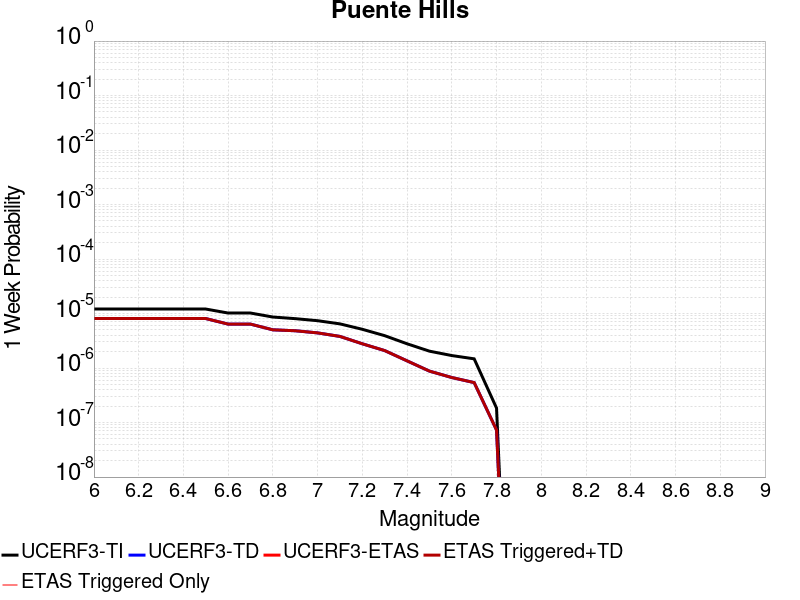 | 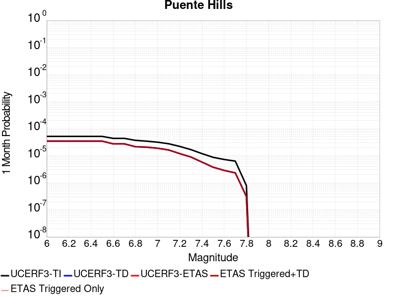 | 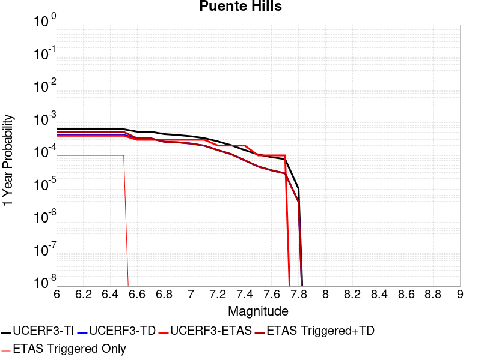 | 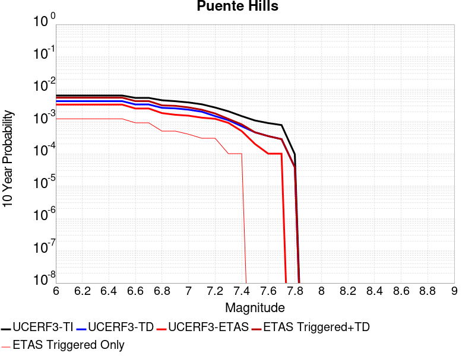 |

| Magnitude | 1 wk TI Prob | 1 wk TD Prob | 1 wk ETAS Prob | 1 wk ETAS/TD Gain | 1 wk ETAS Triggered+TD | 1 wk ETAS Triggered Only | 1 mo TI Prob | 1 mo TD Prob | 1 mo ETAS Prob | 1 mo ETAS/TD Gain | 1 mo ETAS Triggered+TD | 1 mo ETAS Triggered Only | 1 yr TI Prob | 1 yr TD Prob | 1 yr ETAS Prob | 1 yr ETAS/TD Gain | 1 yr ETAS Triggered+TD | 1 yr ETAS Triggered Only | 10 yr TI Prob | 10 yr TD Prob | 10 yr ETAS Prob | 10 yr ETAS/TD Gain | 10 yr ETAS Triggered+TD | 10 yr ETAS Triggered Only |
|-----|-----|-----|-----|-----|-----|-----|-----|-----|-----|-----|-----|-----|-----|-----|-----|-----|-----|-----|-----|-----|-----|-----|-----|-----|
| 6.0 | 1.2101656E-5 | 8.101014E-6 | 0.0 | 0.0 | 8.101014E-6 | 0.0 | 5.1863204E-5 | 3.47182E-5 | 0.0 | 0.0 | 3.47182E-5 | 0.0 | 6.312516E-4 | 4.2261774E-4 | 4.0E-4 | 0.9464818 | 5.2257546E-4 | 1.0E-4 | 0.0062946146 | 0.004218701 | 0.0033 | 0.78223133 | 0.0054136384 | 0.0012 |
| 6.1 | 1.2101656E-5 | 8.101014E-6 | 0.0 | 0.0 | 8.101014E-6 | 0.0 | 5.1863204E-5 | 3.47182E-5 | 0.0 | 0.0 | 3.47182E-5 | 0.0 | 6.312516E-4 | 4.2261774E-4 | 4.0E-4 | 0.9464818 | 5.2257546E-4 | 1.0E-4 | 0.0062946146 | 0.004218701 | 0.0033 | 0.78223133 | 0.0054136384 | 0.0012 |
| 6.2 | 1.2101656E-5 | 8.101014E-6 | 0.0 | 0.0 | 8.101014E-6 | 0.0 | 5.1863204E-5 | 3.47182E-5 | 0.0 | 0.0 | 3.47182E-5 | 0.0 | 6.312516E-4 | 4.2261774E-4 | 4.0E-4 | 0.9464818 | 5.2257546E-4 | 1.0E-4 | 0.0062946146 | 0.004218701 | 0.0033 | 0.78223133 | 0.0054136384 | 0.0012 |
| 6.3 | 1.2101656E-5 | 8.101014E-6 | 0.0 | 0.0 | 8.101014E-6 | 0.0 | 5.1863204E-5 | 3.47182E-5 | 0.0 | 0.0 | 3.47182E-5 | 0.0 | 6.312516E-4 | 4.2261774E-4 | 4.0E-4 | 0.9464818 | 5.2257546E-4 | 1.0E-4 | 0.0062946146 | 0.004218701 | 0.0033 | 0.78223133 | 0.0054136384 | 0.0012 |
| 6.4 | 1.2101656E-5 | 8.101014E-6 | 0.0 | 0.0 | 8.101014E-6 | 0.0 | 5.1863204E-5 | 3.47182E-5 | 0.0 | 0.0 | 3.47182E-5 | 0.0 | 6.312516E-4 | 4.2261774E-4 | 4.0E-4 | 0.9464818 | 5.2257546E-4 | 1.0E-4 | 0.0062946146 | 0.004218701 | 0.0033 | 0.78223133 | 0.0054136384 | 0.0012 |
| 6.5 | 1.2101656E-5 | 8.101014E-6 | 0.0 | 0.0 | 8.101014E-6 | 0.0 | 5.1863204E-5 | 3.47182E-5 | 0.0 | 0.0 | 3.47182E-5 | 0.0 | 6.312516E-4 | 4.2261774E-4 | 4.0E-4 | 0.9464818 | 5.2257546E-4 | 1.0E-4 | 0.0062946146 | 0.004218701 | 0.0033 | 0.78223133 | 0.0054136384 | 0.0012 |
| 6.6 | 1.0222488E-5 | 6.401434E-6 | 0.0 | 0.0 | 6.401434E-6 | 0.0 | 4.3809923E-5 | 2.7434442E-5 | 0.0 | 0.0 | 2.7434442E-5 | 0.0 | 5.332553E-4 | 3.339656E-4 | 3.0E-4 | 0.89829606 | 3.339656E-4 | 0.0 | 0.0053197746 | 0.0033348824 | 0.0025 | 0.7496516 | 0.0042318814 | 9.0E-4 |
| 6.7 | 1.0222488E-5 | 6.401434E-6 | 0.0 | 0.0 | 6.401434E-6 | 0.0 | 4.3809923E-5 | 2.7434442E-5 | 0.0 | 0.0 | 2.7434442E-5 | 0.0 | 5.332553E-4 | 3.339656E-4 | 3.0E-4 | 0.89829606 | 3.339656E-4 | 0.0 | 0.0053197746 | 0.0033348824 | 0.0025 | 0.7496516 | 0.0042318814 | 9.0E-4 |
| 6.8 | 8.6367845E-6 | 5.030248E-6 | 0.0 | 0.0 | 5.030248E-6 | 0.0 | 3.7014266E-5 | 2.1558031E-5 | 0.0 | 0.0 | 2.1558031E-5 | 0.0 | 4.505555E-4 | 2.6243797E-4 | 3.0E-4 | 1.1431273 | 2.6243797E-4 | 0.0 | 0.004496431 | 0.0026213366 | 0.0018 | 0.68667257 | 0.003120026 | 5.0E-4 |
| 6.9 | 8.066481E-6 | 4.838096E-6 | 0.0 | 0.0 | 4.838096E-6 | 0.0 | 3.4570177E-5 | 2.0734537E-5 | 0.0 | 0.0 | 2.0734537E-5 | 0.0 | 4.2081063E-4 | 2.5241426E-4 | 3.0E-4 | 1.1885223 | 2.5241426E-4 | 0.0 | 0.0042001465 | 0.0025213296 | 0.0016 | 0.6345858 | 0.0030200689 | 5.0E-4 |
| 7.0 | 7.393828E-6 | 4.4191543E-6 | 0.0 | 0.0 | 4.4191543E-6 | 0.0 | 3.168745E-5 | 1.8939098E-5 | 0.0 | 0.0 | 1.8939098E-5 | 0.0 | 3.857264E-4 | 2.3055957E-4 | 3.0E-4 | 1.3011822 | 2.3055957E-4 | 0.0 | 0.0038505755 | 0.0023032492 | 0.0015 | 0.6512539 | 0.002702328 | 4.0E-4 |
| 7.1 | 6.4660953E-6 | 3.8059763E-6 | 0.0 | 0.0 | 3.8059763E-6 | 0.0 | 2.7711543E-5 | 1.6311227E-5 | 0.0 | 0.0 | 1.6311227E-5 | 0.0 | 3.373358E-4 | 1.9857145E-4 | 3.0E-4 | 1.5107912 | 1.9857145E-4 | 0.0 | 0.0033682417 | 0.001983976 | 0.0013 | 0.65524983 | 0.0022833808 | 3.0E-4 |
| 7.2 | 5.143232E-6 | 2.7877454E-6 | 0.0 | 0.0 | 2.7877454E-6 | 0.0 | 2.2042237E-5 | 1.1947426E-5 | 0.0 | 0.0 | 1.1947426E-5 | 0.0 | 2.6833118E-4 | 1.454503E-4 | 2.0E-4 | 1.37504 | 1.454503E-4 | 0.0 | 0.002680074 | 0.0014535608 | 0.0012 | 0.82555884 | 0.0017531248 | 3.0E-4 |
| 7.3 | 3.928255E-6 | 2.0924263E-6 | 0.0 | 0.0 | 2.0924263E-6 | 0.0 | 1.683527E-5 | 8.96751E-6 | 0.0 | 0.0 | 8.96751E-6 | 0.0 | 2.0495013E-4 | 1.0917404E-4 | 2.0E-4 | 1.8319373 | 1.0917404E-4 | 0.0 | 0.002047612 | 0.0010912108 | 9.0E-4 | 0.82477194 | 0.0011911016 | 1.0E-4 |
| 7.4 | 2.7894434E-6 | 1.3555801E-6 | 0.0 | 0.0 | 1.3555801E-6 | 0.0 | 1.1954703E-5 | 5.8096166E-6 | 0.0 | 0.0 | 5.8096166E-6 | 0.0 | 1.4553878E-4 | 7.072983E-5 | 2.0E-4 | 2.8276613 | 7.072983E-5 | 0.0 | 0.001454435 | 7.0707756E-4 | 5.0E-4 | 0.707136 | 8.0700684E-4 | 1.0E-4 |
| 7.5 | 2.041735E-6 | 8.793661E-7 | 0.0 | 0.0 | 8.793661E-7 | 0.0 | 8.750263E-6 | 3.7687064E-6 | 0.0 | 0.0 | 3.7687064E-6 | 0.0 | 1.06529245E-4 | 4.588307E-5 | 1.0E-4 | 2.1794531 | 4.588307E-5 | 0.0 | 0.0010647819 | 4.5873932E-4 | 2.0E-4 | 0.43597746 | 4.5873932E-4 | 0.0 |
| 7.6 | 1.6959062E-6 | 6.7036274E-7 | 0.0 | 0.0 | 6.7036274E-7 | 0.0 | 7.268149E-6 | 2.87298E-6 | 0.0 | 0.0 | 2.87298E-6 | 0.0 | 8.848612E-5 | 3.4978002E-5 | 1.0E-4 | 2.85894 | 3.4978002E-5 | 0.0 | 8.84509E-4 | 3.4972784E-4 | 1.0E-4 | 0.28593662 | 3.4972784E-4 | 0.0 |
| 7.7 | 1.4767965E-6 | 5.4117845E-7 | 0.0 | 0.0 | 5.4117845E-7 | 0.0 | 6.3291122E-6 | 2.3193343E-6 | 0.0 | 0.0 | 2.3193343E-6 | 0.0 | 7.705422E-5 | 2.8237555E-5 | 1.0E-4 | 3.541383 | 2.8237555E-5 | 0.0 | 7.702751E-4 | 2.8234225E-4 | 1.0E-4 | 0.3541801 | 2.8234225E-4 | 0.0 |
| 7.8 | 1.8432911E-7 | 7.286716E-8 | 0.0 | 0.0 | 7.286716E-8 | 0.0 | 7.8998164E-7 | 3.1228782E-7 | 0.0 | 0.0 | 3.1228782E-7 | 0.0 | 9.617985E-6 | 3.8021008E-6 | 0.0 | 0.0 | 3.8021008E-6 | 0.0 | 9.617568E-5 | 3.8020684E-5 | 0.0 | 0.0 | 3.8020684E-5 | 0.0 |

## Great Valley 11
*[(top)](#table-of-contents)*

| 1 Week | 1 Month | 1 Year | 10 Year |
|-----|-----|-----|-----|
| 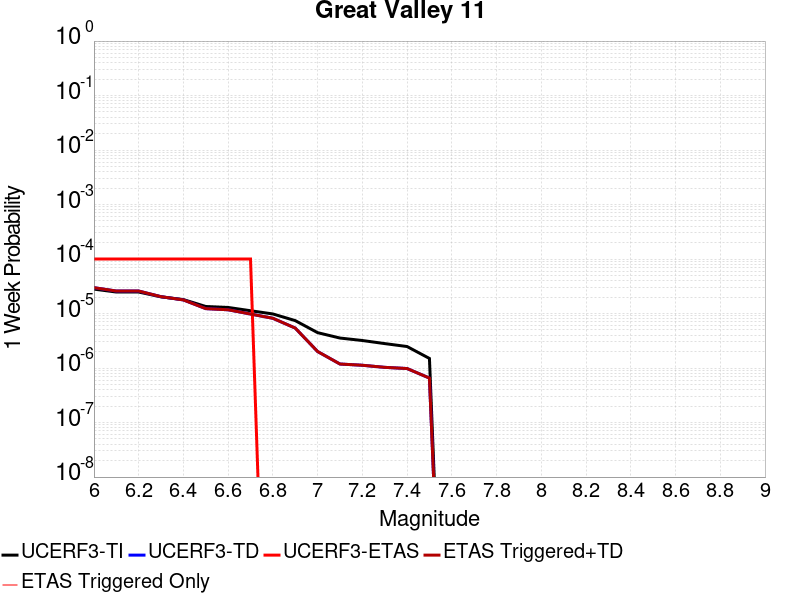 | 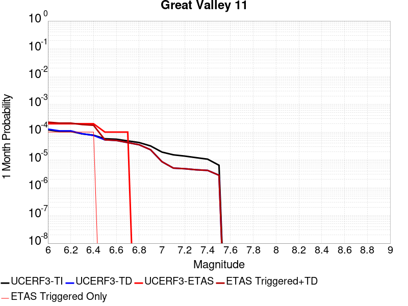 | 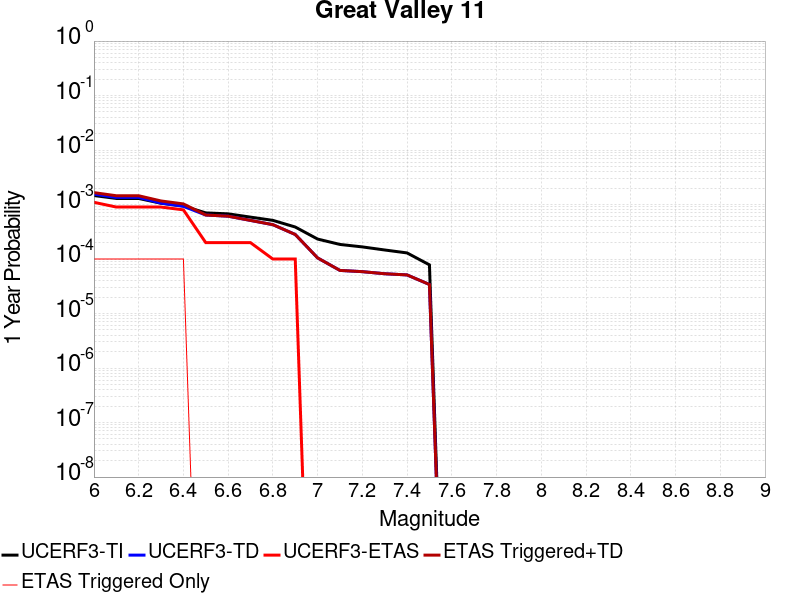 | 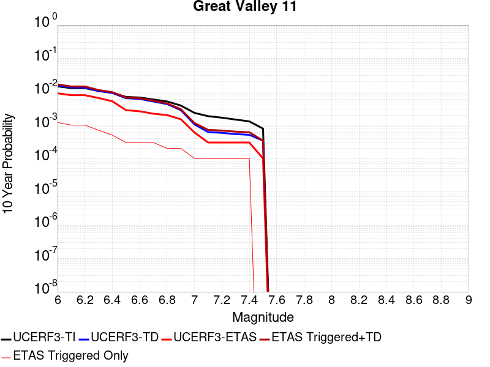 |

| Magnitude | 1 wk TI Prob | 1 wk TD Prob | 1 wk ETAS Prob | 1 wk ETAS/TD Gain | 1 wk ETAS Triggered+TD | 1 wk ETAS Triggered Only | 1 mo TI Prob | 1 mo TD Prob | 1 mo ETAS Prob | 1 mo ETAS/TD Gain | 1 mo ETAS Triggered+TD | 1 mo ETAS Triggered Only | 1 yr TI Prob | 1 yr TD Prob | 1 yr ETAS Prob | 1 yr ETAS/TD Gain | 1 yr ETAS Triggered+TD | 1 yr ETAS Triggered Only | 10 yr TI Prob | 10 yr TD Prob | 10 yr ETAS Prob | 10 yr ETAS/TD Gain | 10 yr ETAS Triggered+TD | 10 yr ETAS Triggered Only |
|-----|-----|-----|-----|-----|-----|-----|-----|-----|-----|-----|-----|-----|-----|-----|-----|-----|-----|-----|-----|-----|-----|-----|-----|-----|
| 6.0 | 2.8099583E-5 | 2.9842755E-5 | 1.0E-4 | 3.350897 | 2.9842755E-5 | 0.0 | 1.20421224E-4 | 1.2789168E-4 | 2.0E-4 | 1.5638235 | 2.2787887E-4 | 1.0E-4 | 0.0014651422 | 0.0015560423 | 0.0011 | 0.70692164 | 0.0016558868 | 1.0E-4 | 0.0145552 | 0.015459 | 0.009 | 0.5821851 | 0.016640449 | 0.0012 |
| 6.1 | 2.483194E-5 | 2.5916192E-5 | 1.0E-4 | 3.8585916 | 2.5916192E-5 | 0.0 | 1.0641825E-4 | 1.11065034E-4 | 2.0E-4 | 1.8007468 | 2.1105392E-4 | 1.0E-4 | 0.0012948721 | 0.0013514413 | 9.0E-4 | 0.66595566 | 0.0014513062 | 1.0E-4 | 0.012873529 | 0.013438639 | 0.0079 | 0.5878571 | 0.0144252 | 0.001 |
| 6.2 | 2.483194E-5 | 2.5916192E-5 | 1.0E-4 | 3.8585916 | 2.5916192E-5 | 0.0 | 1.0641825E-4 | 1.11065034E-4 | 2.0E-4 | 1.8007468 | 2.1105392E-4 | 1.0E-4 | 0.0012948721 | 0.0013514413 | 9.0E-4 | 0.66595566 | 0.0014513062 | 1.0E-4 | 0.012873529 | 0.013438639 | 0.0079 | 0.5878571 | 0.0144252 | 0.001 |
| 6.3 | 2.0257901E-5 | 2.0405738E-5 | 1.0E-4 | 4.9005823 | 2.0405738E-5 | 0.0 | 8.681669E-5 | 8.745047E-5 | 2.0E-4 | 2.2870088 | 1.8744172E-4 | 1.0E-4 | 0.0010564806 | 0.0010642309 | 9.0E-4 | 0.8456811 | 0.0011641246 | 1.0E-4 | 0.01051472 | 0.010595517 | 0.0065 | 0.613467 | 0.011288101 | 7.0E-4 |
| 6.4 | 1.8054898E-5 | 1.7786697E-5 | 1.0E-4 | 5.6221795 | 1.7786697E-5 | 0.0 | 7.737584E-5 | 7.6226686E-5 | 2.0E-4 | 2.623753 | 1.7621907E-4 | 1.0E-4 | 9.416436E-4 | 9.277022E-4 | 8.0E-4 | 0.8623457 | 0.0010276095 | 1.0E-4 | 0.009376635 | 0.009242036 | 0.0052 | 0.56264657 | 0.009737415 | 5.0E-4 |
| 6.5 | 1.34804895E-5 | 1.232475E-5 | 1.0E-4 | 8.113755 | 1.232475E-5 | 0.0 | 5.777225E-5 | 5.2819312E-5 | 1.0E-4 | 1.893247 | 5.2819312E-5 | 0.0 | 7.031501E-4 | 6.428895E-4 | 2.0E-4 | 0.31109545 | 6.428895E-4 | 0.0 | 0.007009294 | 0.0064107343 | 0.0028 | 0.43676743 | 0.006708811 | 3.0E-4 |
| 6.6 | 1.294883E-5 | 1.173588E-5 | 1.0E-4 | 8.520878 | 1.173588E-5 | 0.0 | 5.5493805E-5 | 5.0295683E-5 | 1.0E-4 | 1.9882421 | 5.0295683E-5 | 0.0 | 6.754276E-4 | 6.12182E-4 | 2.0E-4 | 0.32670024 | 6.12182E-4 | 0.0 | 0.006733784 | 0.006105382 | 0.0026 | 0.4258538 | 0.00640355 | 3.0E-4 |
| 6.7 | 1.1272237E-5 | 9.814899E-6 | 1.0E-4 | 10.188591 | 9.814899E-6 | 0.0 | 4.8308695E-5 | 4.206319E-5 | 1.0E-4 | 2.3773754 | 4.206319E-5 | 0.0 | 5.879996E-4 | 5.120018E-4 | 2.0E-4 | 0.39062363 | 5.120018E-4 | 0.0 | 0.005864462 | 0.005108506 | 0.0022 | 0.4306543 | 0.0054069734 | 3.0E-4 |
| 6.8 | 9.8337505E-6 | 8.196382E-6 | 0.0 | 0.0 | 8.196382E-6 | 0.0 | 4.2143965E-5 | 3.512689E-5 | 0.0 | 0.0 | 3.512689E-5 | 0.0 | 5.1298196E-4 | 4.27588E-4 | 1.0E-4 | 0.23386998 | 4.27588E-4 | 0.0 | 0.005117994 | 0.004267863 | 0.002 | 0.4686186 | 0.0044670096 | 2.0E-4 |
| 6.9 | 7.4224813E-6 | 5.4149004E-6 | 0.0 | 0.0 | 5.4149004E-6 | 0.0 | 3.1810247E-5 | 2.3206518E-5 | 0.0 | 0.0 | 2.3206518E-5 | 0.0 | 3.872209E-4 | 2.8250413E-4 | 1.0E-4 | 0.3539771 | 2.8250413E-4 | 0.0 | 0.0038654688 | 0.002821591 | 0.0015 | 0.53161496 | 0.0030210267 | 2.0E-4 |
| 7.0 | 4.4628923E-6 | 2.0117268E-6 | 0.0 | 0.0 | 2.0117268E-6 | 0.0 | 1.912654E-5 | 8.621659E-6 | 0.0 | 0.0 | 8.621659E-6 | 0.0 | 2.3284076E-4 | 1.0496376E-4 | 0.0 | 0.0 | 1.0496376E-4 | 0.0 | 0.0023259693 | 0.0010491534 | 6.0E-4 | 0.5718897 | 0.0011490484 | 1.0E-4 |
| 7.1 | 3.5546527E-6 | 1.1860035E-6 | 0.0 | 0.0 | 1.1860035E-6 | 0.0 | 1.5234136E-5 | 5.0828626E-6 | 0.0 | 0.0 | 5.0828626E-6 | 0.0 | 1.8545982E-4 | 6.1882165E-5 | 0.0 | 0.0 | 6.1882165E-5 | 0.0 | 0.0018530512 | 6.1865617E-4 | 3.0E-4 | 0.48492205 | 7.185943E-4 | 1.0E-4 |
| 7.2 | 3.2039936E-6 | 1.1258023E-6 | 0.0 | 0.0 | 1.1258023E-6 | 0.0 | 1.3731329E-5 | 4.8248585E-6 | 0.0 | 0.0 | 4.8248585E-6 | 0.0 | 1.671661E-4 | 5.8741138E-5 | 0.0 | 0.0 | 5.8741138E-5 | 0.0 | 0.0016704041 | 5.8726285E-4 | 3.0E-4 | 0.5108445 | 6.872041E-4 | 1.0E-4 |
| 7.3 | 2.8120473E-6 | 1.0308554E-6 | 0.0 | 0.0 | 1.0308554E-6 | 0.0 | 1.2051575E-5 | 4.4179446E-6 | 0.0 | 0.0 | 4.4179446E-6 | 0.0 | 1.4671806E-4 | 5.3787215E-5 | 0.0 | 0.0 | 5.3787215E-5 | 0.0 | 0.0014662122 | 5.3774856E-4 | 3.0E-4 | 0.55788153 | 6.376948E-4 | 1.0E-4 |
| 7.4 | 2.4837766E-6 | 9.802935E-7 | 0.0 | 0.0 | 9.802935E-7 | 0.0 | 1.0644713E-5 | 4.201251E-6 | 0.0 | 0.0 | 4.201251E-6 | 0.0 | 1.2959167E-4 | 5.11491E-5 | 0.0 | 0.0 | 5.11491E-5 | 0.0 | 0.0012951613 | 5.1137985E-4 | 3.0E-4 | 0.58664805 | 6.1132875E-4 | 1.0E-4 |
| 7.5 | 1.5002679E-6 | 6.5476183E-7 | 0.0 | 0.0 | 6.5476183E-7 | 0.0 | 6.4297037E-6 | 2.8061193E-6 | 0.0 | 0.0 | 2.8061193E-6 | 0.0 | 7.827883E-5 | 3.4164008E-5 | 0.0 | 0.0 | 3.4164008E-5 | 0.0 | 7.825126E-4 | 3.4159172E-4 | 1.0E-4 | 0.29274714 | 3.4159172E-4 | 0.0 |

## Las Positas
*[(top)](#table-of-contents)*

| 1 Week | 1 Month | 1 Year | 10 Year |
|-----|-----|-----|-----|
|  |  |  | 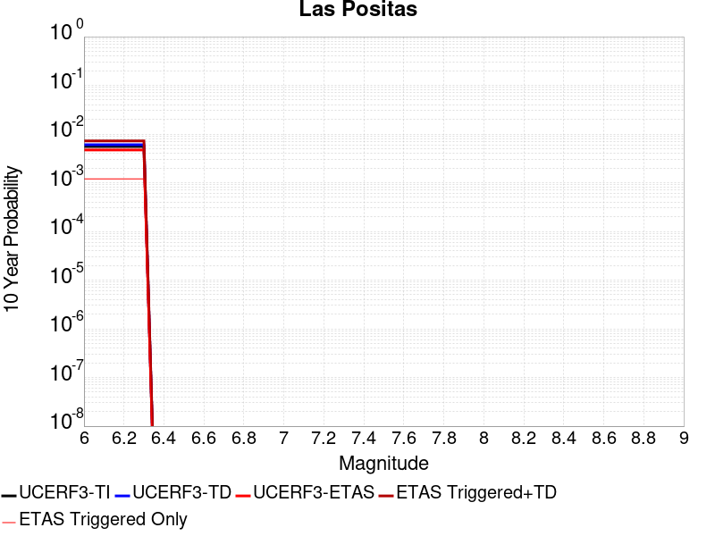 |

| Magnitude | 1 wk TI Prob | 1 wk TD Prob | 1 wk ETAS Prob | 1 wk ETAS/TD Gain | 1 wk ETAS Triggered+TD | 1 wk ETAS Triggered Only | 1 mo TI Prob | 1 mo TD Prob | 1 mo ETAS Prob | 1 mo ETAS/TD Gain | 1 mo ETAS Triggered+TD | 1 mo ETAS Triggered Only | 1 yr TI Prob | 1 yr TD Prob | 1 yr ETAS Prob | 1 yr ETAS/TD Gain | 1 yr ETAS Triggered+TD | 1 yr ETAS Triggered Only | 10 yr TI Prob | 10 yr TD Prob | 10 yr ETAS Prob | 10 yr ETAS/TD Gain | 10 yr ETAS Triggered+TD | 10 yr ETAS Triggered Only |
|-----|-----|-----|-----|-----|-----|-----|-----|-----|-----|-----|-----|-----|-----|-----|-----|-----|-----|-----|-----|-----|-----|-----|-----|-----|
| 6.0 | 1.0659424E-5 | 1.1593132E-5 | 0.0 | 0.0 | 1.1593132E-5 | 0.0 | 4.568245E-5 | 4.968485E-5 | 0.0 | 0.0 | 4.968485E-5 | 0.0 | 5.560419E-4 | 6.0491305E-4 | 1.0E-4 | 0.16531302 | 7.048526E-4 | 1.0E-4 | 0.005546526 | 0.0060491306 | 0.0047 | 0.77697116 | 0.0072418717 | 0.0012 |
| 6.1 | 1.0659424E-5 | 1.1593132E-5 | 0.0 | 0.0 | 1.1593132E-5 | 0.0 | 4.568245E-5 | 4.968485E-5 | 0.0 | 0.0 | 4.968485E-5 | 0.0 | 5.560419E-4 | 6.0491305E-4 | 1.0E-4 | 0.16531302 | 7.048526E-4 | 1.0E-4 | 0.005546526 | 0.0060491306 | 0.0047 | 0.77697116 | 0.0072418717 | 0.0012 |
| 6.2 | 1.0659424E-5 | 1.1593132E-5 | 0.0 | 0.0 | 1.1593132E-5 | 0.0 | 4.568245E-5 | 4.968485E-5 | 0.0 | 0.0 | 4.968485E-5 | 0.0 | 5.560419E-4 | 6.0491305E-4 | 1.0E-4 | 0.16531302 | 7.048526E-4 | 1.0E-4 | 0.005546526 | 0.0060491306 | 0.0047 | 0.77697116 | 0.0072418717 | 0.0012 |
| 6.3 | 1.0659424E-5 | 1.1593132E-5 | 0.0 | 0.0 | 1.1593132E-5 | 0.0 | 4.568245E-5 | 4.968485E-5 | 0.0 | 0.0 | 4.968485E-5 | 0.0 | 5.560419E-4 | 6.0491305E-4 | 1.0E-4 | 0.16531302 | 7.048526E-4 | 1.0E-4 | 0.005546526 | 0.0060491306 | 0.0047 | 0.77697116 | 0.0072418717 | 0.0012 |

## Pitas Point (Lower West)
*[(top)](#table-of-contents)*

| 1 Week | 1 Month | 1 Year | 10 Year |
|-----|-----|-----|-----|
| 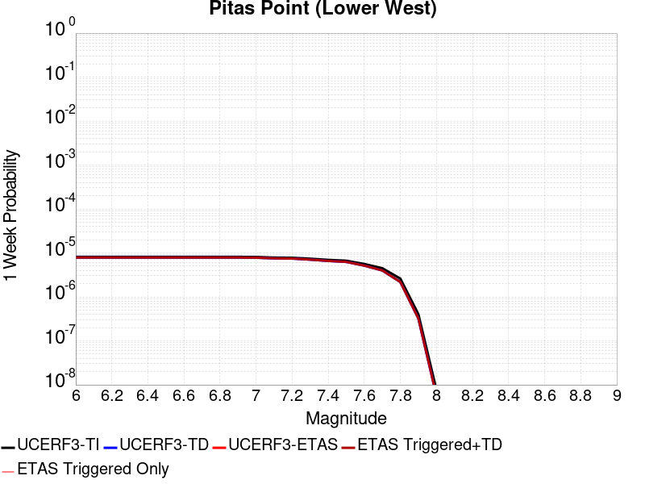 |  |  |  |

| Magnitude | 1 wk TI Prob | 1 wk TD Prob | 1 wk ETAS Prob | 1 wk ETAS/TD Gain | 1 wk ETAS Triggered+TD | 1 wk ETAS Triggered Only | 1 mo TI Prob | 1 mo TD Prob | 1 mo ETAS Prob | 1 mo ETAS/TD Gain | 1 mo ETAS Triggered+TD | 1 mo ETAS Triggered Only | 1 yr TI Prob | 1 yr TD Prob | 1 yr ETAS Prob | 1 yr ETAS/TD Gain | 1 yr ETAS Triggered+TD | 1 yr ETAS Triggered Only | 10 yr TI Prob | 10 yr TD Prob | 10 yr ETAS Prob | 10 yr ETAS/TD Gain | 10 yr ETAS Triggered+TD | 10 yr ETAS Triggered Only |
|-----|-----|-----|-----|-----|-----|-----|-----|-----|-----|-----|-----|-----|-----|-----|-----|-----|-----|-----|-----|-----|-----|-----|-----|-----|
| 6.0 | 8.151497E-6 | 7.856904E-6 | 0.0 | 0.0 | 7.856904E-6 | 0.0 | 3.493452E-5 | 3.367201E-5 | 0.0 | 0.0 | 3.367201E-5 | 0.0 | 4.252448E-4 | 4.0988036E-4 | 5.0E-4 | 1.2198681 | 6.097984E-4 | 2.0E-4 | 0.0042443196 | 0.0040913248 | 0.0043 | 1.0510044 | 0.005186824 | 0.0011 |
| 6.1 | 8.151497E-6 | 7.856904E-6 | 0.0 | 0.0 | 7.856904E-6 | 0.0 | 3.493452E-5 | 3.367201E-5 | 0.0 | 0.0 | 3.367201E-5 | 0.0 | 4.252448E-4 | 4.0988036E-4 | 5.0E-4 | 1.2198681 | 6.097984E-4 | 2.0E-4 | 0.0042443196 | 0.0040913248 | 0.0043 | 1.0510044 | 0.005186824 | 0.0011 |
| 6.2 | 8.151497E-6 | 7.856904E-6 | 0.0 | 0.0 | 7.856904E-6 | 0.0 | 3.493452E-5 | 3.367201E-5 | 0.0 | 0.0 | 3.367201E-5 | 0.0 | 4.252448E-4 | 4.0988036E-4 | 5.0E-4 | 1.2198681 | 6.097984E-4 | 2.0E-4 | 0.0042443196 | 0.0040913248 | 0.0043 | 1.0510044 | 0.005186824 | 0.0011 |
| 6.3 | 8.151497E-6 | 7.856904E-6 | 0.0 | 0.0 | 7.856904E-6 | 0.0 | 3.493452E-5 | 3.367201E-5 | 0.0 | 0.0 | 3.367201E-5 | 0.0 | 4.252448E-4 | 4.0988036E-4 | 5.0E-4 | 1.2198681 | 6.097984E-4 | 2.0E-4 | 0.0042443196 | 0.0040913248 | 0.0043 | 1.0510044 | 0.005186824 | 0.0011 |
| 6.4 | 8.151497E-6 | 7.856904E-6 | 0.0 | 0.0 | 7.856904E-6 | 0.0 | 3.493452E-5 | 3.367201E-5 | 0.0 | 0.0 | 3.367201E-5 | 0.0 | 4.252448E-4 | 4.0988036E-4 | 5.0E-4 | 1.2198681 | 6.097984E-4 | 2.0E-4 | 0.0042443196 | 0.0040913248 | 0.0043 | 1.0510044 | 0.005186824 | 0.0011 |
| 6.5 | 8.151497E-6 | 7.856904E-6 | 0.0 | 0.0 | 7.856904E-6 | 0.0 | 3.493452E-5 | 3.367201E-5 | 0.0 | 0.0 | 3.367201E-5 | 0.0 | 4.252448E-4 | 4.0988036E-4 | 5.0E-4 | 1.2198681 | 6.097984E-4 | 2.0E-4 | 0.0042443196 | 0.0040913248 | 0.0043 | 1.0510044 | 0.005186824 | 0.0011 |
| 6.6 | 8.151497E-6 | 7.856904E-6 | 0.0 | 0.0 | 7.856904E-6 | 0.0 | 3.493452E-5 | 3.367201E-5 | 0.0 | 0.0 | 3.367201E-5 | 0.0 | 4.252448E-4 | 4.0988036E-4 | 5.0E-4 | 1.2198681 | 6.097984E-4 | 2.0E-4 | 0.0042443196 | 0.0040913248 | 0.0043 | 1.0510044 | 0.005186824 | 0.0011 |
| 6.7 | 8.151497E-6 | 7.856904E-6 | 0.0 | 0.0 | 7.856904E-6 | 0.0 | 3.493452E-5 | 3.367201E-5 | 0.0 | 0.0 | 3.367201E-5 | 0.0 | 4.252448E-4 | 4.0988036E-4 | 5.0E-4 | 1.2198681 | 6.097984E-4 | 2.0E-4 | 0.0042443196 | 0.0040913248 | 0.0043 | 1.0510044 | 0.005186824 | 0.0011 |
| 6.8 | 8.151497E-6 | 7.856904E-6 | 0.0 | 0.0 | 7.856904E-6 | 0.0 | 3.493452E-5 | 3.367201E-5 | 0.0 | 0.0 | 3.367201E-5 | 0.0 | 4.252448E-4 | 4.0988036E-4 | 5.0E-4 | 1.2198681 | 6.097984E-4 | 2.0E-4 | 0.0042443196 | 0.0040913248 | 0.0043 | 1.0510044 | 0.005186824 | 0.0011 |
| 6.9 | 8.151497E-6 | 7.856904E-6 | 0.0 | 0.0 | 7.856904E-6 | 0.0 | 3.493452E-5 | 3.367201E-5 | 0.0 | 0.0 | 3.367201E-5 | 0.0 | 4.252448E-4 | 4.0988036E-4 | 5.0E-4 | 1.2198681 | 6.097984E-4 | 2.0E-4 | 0.0042443196 | 0.0040913248 | 0.0043 | 1.0510044 | 0.005186824 | 0.0011 |
| 7.0 | 8.103535E-6 | 7.806328E-6 | 0.0 | 0.0 | 7.806328E-6 | 0.0 | 3.4728975E-5 | 3.3455264E-5 | 0.0 | 0.0 | 3.3455264E-5 | 0.0 | 4.2274324E-4 | 4.0724245E-4 | 5.0E-4 | 1.2277699 | 6.07161E-4 | 2.0E-4 | 0.0042193993 | 0.004065042 | 0.0043 | 1.0577996 | 0.0051605706 | 0.0011 |
| 7.1 | 7.853298E-6 | 7.5419894E-6 | 0.0 | 0.0 | 7.5419894E-6 | 0.0 | 3.3656554E-5 | 3.2322416E-5 | 0.0 | 0.0 | 3.2322416E-5 | 0.0 | 4.096915E-4 | 3.9345503E-4 | 4.0E-4 | 1.0166346 | 5.9337635E-4 | 2.0E-4 | 0.00408937 | 0.0039276606 | 0.0041 | 1.0438784 | 0.00502334 | 0.0011 |
| 7.2 | 7.771102E-6 | 7.4542595E-6 | 0.0 | 0.0 | 7.4542595E-6 | 0.0 | 3.33043E-5 | 3.1946438E-5 | 0.0 | 0.0 | 3.1946438E-5 | 0.0 | 4.0540437E-4 | 3.8887918E-4 | 4.0E-4 | 1.0285971 | 5.888014E-4 | 2.0E-4 | 0.0040466557 | 0.0038820624 | 0.0041 | 1.0561396 | 0.004977792 | 0.0011 |
| 7.3 | 7.3945344E-6 | 7.0503056E-6 | 0.0 | 0.0 | 7.0503056E-6 | 0.0 | 3.1690477E-5 | 3.021525E-5 | 0.0 | 0.0 | 3.021525E-5 | 0.0 | 3.8576324E-4 | 3.678092E-4 | 4.0E-4 | 1.0875204 | 5.6773564E-4 | 2.0E-4 | 0.0038509427 | 0.0036720722 | 0.0038 | 1.0348381 | 0.0046684 | 0.001 |
| 7.4 | 6.964645E-6 | 6.5910926E-6 | 0.0 | 0.0 | 6.5910926E-6 | 0.0 | 2.9848137E-5 | 2.8247237E-5 | 0.0 | 0.0 | 2.8247237E-5 | 0.0 | 3.6334046E-4 | 3.4385634E-4 | 4.0E-4 | 1.1632766 | 5.4378755E-4 | 2.0E-4 | 0.0036274698 | 0.0034332962 | 0.0035 | 1.0194285 | 0.004330206 | 9.0E-4 |
| 7.5 | 6.6525035E-6 | 6.260086E-6 | 0.0 | 0.0 | 6.260086E-6 | 0.0 | 2.851042E-5 | 2.6828668E-5 | 0.0 | 0.0 | 2.6828668E-5 | 0.0 | 3.4705905E-4 | 3.2659055E-4 | 4.0E-4 | 1.2247752 | 5.2652525E-4 | 2.0E-4 | 0.0034651754 | 0.0032611573 | 0.0035 | 1.0732386 | 0.0041582226 | 9.0E-4 |
| 7.6 | 5.613338E-6 | 5.1521533E-6 | 0.0 | 0.0 | 5.1521533E-6 | 0.0 | 2.405694E-5 | 2.2080472E-5 | 0.0 | 0.0 | 2.2080472E-5 | 0.0 | 2.928539E-4 | 2.687969E-4 | 3.0E-4 | 1.1160843 | 4.6874312E-4 | 2.0E-4 | 0.0029246826 | 0.0026847492 | 0.0028 | 1.042928 | 0.00338287 | 7.0E-4 |
| 7.7 | 4.494704E-6 | 3.997523E-6 | 0.0 | 0.0 | 3.997523E-6 | 0.0 | 1.9262876E-5 | 1.713213E-5 | 0.0 | 0.0 | 1.713213E-5 | 0.0 | 2.3450027E-4 | 2.0856396E-4 | 1.0E-4 | 0.4794692 | 2.0856396E-4 | 0.0 | 0.0023425296 | 0.0020837062 | 0.0022 | 1.0558109 | 0.0025826644 | 5.0E-4 |
| 7.8 | 2.6075882E-6 | 2.184009E-6 | 0.0 | 0.0 | 2.184009E-6 | 0.0 | 1.117533E-5 | 9.360006E-6 | 0.0 | 0.0 | 9.360006E-6 | 0.0 | 1.3605114E-4 | 1.13952156E-4 | 1.0E-4 | 0.87756133 | 1.13952156E-4 | 0.0 | 0.0013596788 | 0.001138942 | 0.0011 | 0.9658087 | 0.0014386002 | 3.0E-4 |
| 7.9 | 4.045984E-7 | 3.2428437E-7 | 0.0 | 0.0 | 3.2428437E-7 | 0.0 | 1.733992E-6 | 1.3897894E-6 | 0.0 | 0.0 | 1.3897894E-6 | 0.0 | 2.1111147E-5 | 1.6920558E-5 | 0.0 | 0.0 | 1.6920558E-5 | 0.0 | 2.1109142E-4 | 1.6919301E-4 | 4.0E-4 | 2.3641639 | 3.6915916E-4 | 2.0E-4 |
| 8.0 | 7.791402E-9 | 5.6844636E-9 | 0.0 | 0.0 | 5.6844636E-9 | 0.0 | 3.3391725E-8 | 2.4361986E-8 | 0.0 | 0.0 | 2.4361986E-8 | 0.0 | 4.0654416E-7 | 2.9660717E-7 | 0.0 | 0.0 | 2.9660717E-7 | 0.0 | 4.065434E-6 | 2.9660696E-6 | 0.0 | 0.0 | 2.9660696E-6 | 0.0 |

## Red Pass
*[(top)](#table-of-contents)*

| 1 Week | 1 Month | 1 Year | 10 Year |
|-----|-----|-----|-----|
| 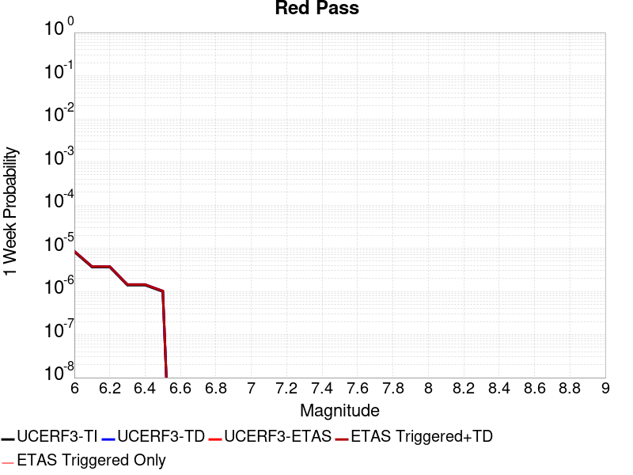 | 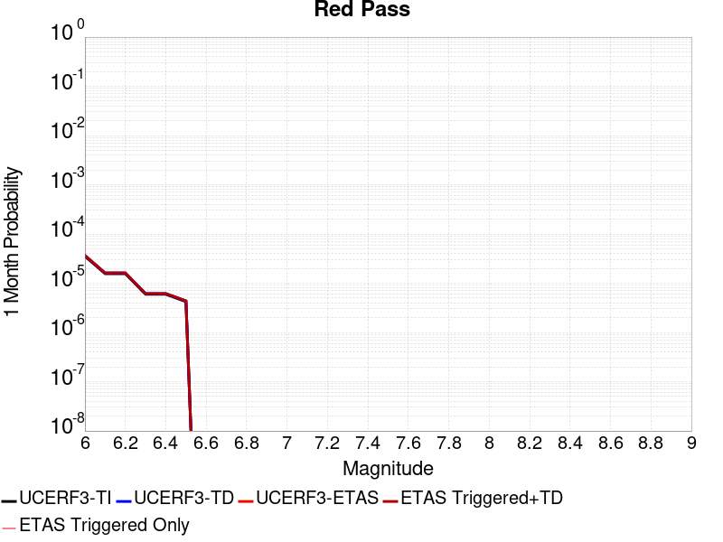 | 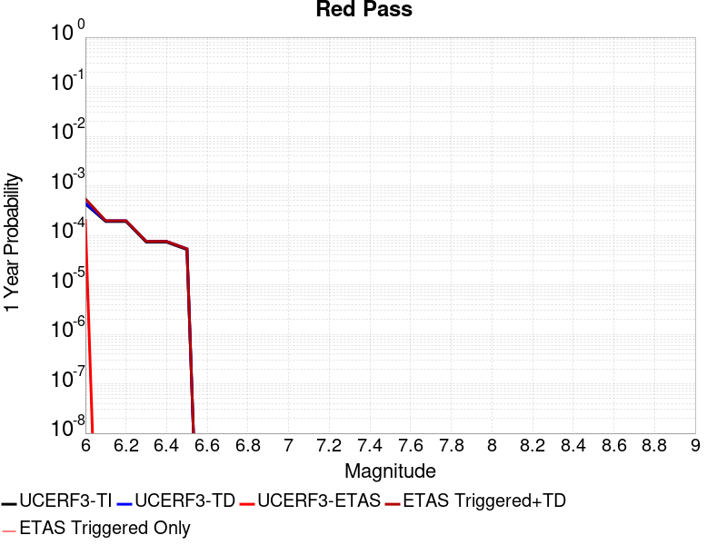 | 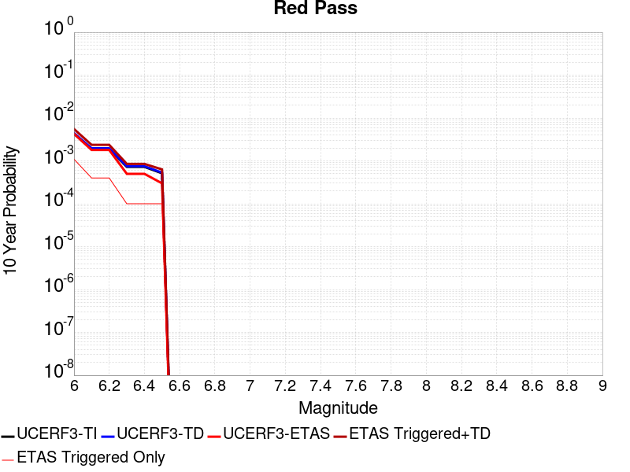 |

| Magnitude | 1 wk TI Prob | 1 wk TD Prob | 1 wk ETAS Prob | 1 wk ETAS/TD Gain | 1 wk ETAS Triggered+TD | 1 wk ETAS Triggered Only | 1 mo TI Prob | 1 mo TD Prob | 1 mo ETAS Prob | 1 mo ETAS/TD Gain | 1 mo ETAS Triggered+TD | 1 mo ETAS Triggered Only | 1 yr TI Prob | 1 yr TD Prob | 1 yr ETAS Prob | 1 yr ETAS/TD Gain | 1 yr ETAS Triggered+TD | 1 yr ETAS Triggered Only | 10 yr TI Prob | 10 yr TD Prob | 10 yr ETAS Prob | 10 yr ETAS/TD Gain | 10 yr ETAS Triggered+TD | 10 yr ETAS Triggered Only |
|-----|-----|-----|-----|-----|-----|-----|-----|-----|-----|-----|-----|-----|-----|-----|-----|-----|-----|-----|-----|-----|-----|-----|-----|-----|
| 6.0 | 8.258278E-6 | 8.551867E-6 | 0.0 | 0.0 | 8.551867E-6 | 0.0 | 3.539214E-5 | 3.6650443E-5 | 0.0 | 0.0 | 3.6650443E-5 | 0.0 | 4.308141E-4 | 4.4614566E-4 | 2.0E-4 | 0.4482841 | 5.46101E-4 | 1.0E-4 | 0.0042997985 | 0.0044542574 | 0.0043 | 0.9653685 | 0.0055493577 | 0.0011 |
| 6.1 | 3.649988E-6 | 3.775573E-6 | 0.0 | 0.0 | 3.775573E-6 | 0.0 | 1.5642712E-5 | 1.6180955E-5 | 0.0 | 0.0 | 1.6180955E-5 | 0.0 | 1.9043336E-4 | 1.9699008E-4 | 0.0 | 0.0 | 1.9699008E-4 | 0.0 | 0.0019027026 | 0.001968622 | 0.0018 | 0.9143452 | 0.0023678346 | 4.0E-4 |
| 6.2 | 3.649988E-6 | 3.775573E-6 | 0.0 | 0.0 | 3.775573E-6 | 0.0 | 1.5642712E-5 | 1.6180955E-5 | 0.0 | 0.0 | 1.6180955E-5 | 0.0 | 1.9043336E-4 | 1.9699008E-4 | 0.0 | 0.0 | 1.9699008E-4 | 0.0 | 0.0019027026 | 0.001968622 | 0.0018 | 0.9143452 | 0.0023678346 | 4.0E-4 |
| 6.3 | 1.3924937E-6 | 1.4412165E-6 | 0.0 | 0.0 | 1.4412165E-6 | 0.0 | 5.9678164E-6 | 6.176635E-6 | 0.0 | 0.0 | 6.176635E-6 | 0.0 | 7.265574E-5 | 7.519935E-5 | 0.0 | 0.0 | 7.519935E-5 | 0.0 | 7.263199E-4 | 7.5187784E-4 | 5.0E-4 | 0.66500163 | 8.5180264E-4 | 1.0E-4 |
| 6.4 | 1.3924937E-6 | 1.4412165E-6 | 0.0 | 0.0 | 1.4412165E-6 | 0.0 | 5.9678164E-6 | 6.176635E-6 | 0.0 | 0.0 | 6.176635E-6 | 0.0 | 7.265574E-5 | 7.519935E-5 | 0.0 | 0.0 | 7.519935E-5 | 0.0 | 7.263199E-4 | 7.5187784E-4 | 5.0E-4 | 0.66500163 | 8.5180264E-4 | 1.0E-4 |
| 6.5 | 9.876812E-7 | 1.022262E-6 | 0.0 | 0.0 | 1.022262E-6 | 0.0 | 4.2329125E-6 | 4.381123E-6 | 0.0 | 0.0 | 4.381123E-6 | 0.0 | 5.153449E-5 | 5.3340173E-5 | 0.0 | 0.0 | 5.3340173E-5 | 0.0 | 5.1522546E-4 | 5.3340173E-4 | 3.0E-4 | 0.5624279 | 6.3334836E-4 | 1.0E-4 |

## Hartley Springs 2011 CFM
*[(top)](#table-of-contents)*

| 1 Week | 1 Month | 1 Year | 10 Year |
|-----|-----|-----|-----|
| 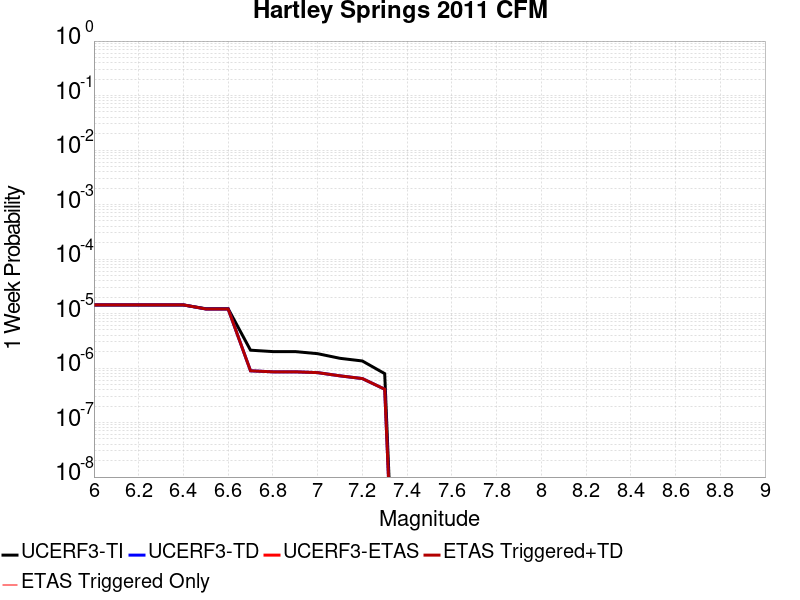 |  |  |  |

| Magnitude | 1 wk TI Prob | 1 wk TD Prob | 1 wk ETAS Prob | 1 wk ETAS/TD Gain | 1 wk ETAS Triggered+TD | 1 wk ETAS Triggered Only | 1 mo TI Prob | 1 mo TD Prob | 1 mo ETAS Prob | 1 mo ETAS/TD Gain | 1 mo ETAS Triggered+TD | 1 mo ETAS Triggered Only | 1 yr TI Prob | 1 yr TD Prob | 1 yr ETAS Prob | 1 yr ETAS/TD Gain | 1 yr ETAS Triggered+TD | 1 yr ETAS Triggered Only | 10 yr TI Prob | 10 yr TD Prob | 10 yr ETAS Prob | 10 yr ETAS/TD Gain | 10 yr ETAS Triggered+TD | 10 yr ETAS Triggered Only |
|-----|-----|-----|-----|-----|-----|-----|-----|-----|-----|-----|-----|-----|-----|-----|-----|-----|-----|-----|-----|-----|-----|-----|-----|-----|
| 6.0 | 1.4352418E-5 | 1.443812E-5 | 0.0 | 0.0 | 1.443812E-5 | 0.0 | 6.1508916E-5 | 6.1877116E-5 | 0.0 | 0.0 | 6.1877116E-5 | 0.0 | 7.486137E-4 | 7.5325795E-4 | 2.0E-4 | 0.2655133 | 7.5325795E-4 | 0.0 | 0.007460968 | 0.0075231753 | 0.0036 | 0.47852135 | 0.0086149 | 0.0011 |
| 6.1 | 1.4352418E-5 | 1.443812E-5 | 0.0 | 0.0 | 1.443812E-5 | 0.0 | 6.1508916E-5 | 6.1877116E-5 | 0.0 | 0.0 | 6.1877116E-5 | 0.0 | 7.486137E-4 | 7.5325795E-4 | 2.0E-4 | 0.2655133 | 7.5325795E-4 | 0.0 | 0.007460968 | 0.0075231753 | 0.0036 | 0.47852135 | 0.0086149 | 0.0011 |
| 6.2 | 1.4352418E-5 | 1.443812E-5 | 0.0 | 0.0 | 1.443812E-5 | 0.0 | 6.1508916E-5 | 6.1877116E-5 | 0.0 | 0.0 | 6.1877116E-5 | 0.0 | 7.486137E-4 | 7.5325795E-4 | 2.0E-4 | 0.2655133 | 7.5325795E-4 | 0.0 | 0.007460968 | 0.0075231753 | 0.0036 | 0.47852135 | 0.0086149 | 0.0011 |
| 6.3 | 1.4352418E-5 | 1.443812E-5 | 0.0 | 0.0 | 1.443812E-5 | 0.0 | 6.1508916E-5 | 6.1877116E-5 | 0.0 | 0.0 | 6.1877116E-5 | 0.0 | 7.486137E-4 | 7.5325795E-4 | 2.0E-4 | 0.2655133 | 7.5325795E-4 | 0.0 | 0.007460968 | 0.0075231753 | 0.0036 | 0.47852135 | 0.0086149 | 0.0011 |
| 6.4 | 1.4352418E-5 | 1.443812E-5 | 0.0 | 0.0 | 1.443812E-5 | 0.0 | 6.1508916E-5 | 6.1877116E-5 | 0.0 | 0.0 | 6.1877116E-5 | 0.0 | 7.486137E-4 | 7.5325795E-4 | 2.0E-4 | 0.2655133 | 7.5325795E-4 | 0.0 | 0.007460968 | 0.0075231753 | 0.0036 | 0.47852135 | 0.0086149 | 0.0011 |
| 6.5 | 1.2279858E-5 | 1.2136541E-5 | 0.0 | 0.0 | 1.2136541E-5 | 0.0 | 5.26269E-5 | 5.20136E-5 | 0.0 | 0.0 | 5.20136E-5 | 0.0 | 6.4054417E-4 | 6.3323986E-4 | 2.0E-4 | 0.3158361 | 6.3323986E-4 | 0.0 | 0.0063870098 | 0.006329873 | 0.0031 | 0.48974127 | 0.007124809 | 8.0E-4 |
| 6.6 | 1.2279858E-5 | 1.2136541E-5 | 0.0 | 0.0 | 1.2136541E-5 | 0.0 | 5.26269E-5 | 5.20136E-5 | 0.0 | 0.0 | 5.20136E-5 | 0.0 | 6.4054417E-4 | 6.3323986E-4 | 2.0E-4 | 0.3158361 | 6.3323986E-4 | 0.0 | 0.0063870098 | 0.006329873 | 0.0031 | 0.48974127 | 0.007124809 | 8.0E-4 |
| 6.7 | 2.1282601E-6 | 8.9051906E-7 | 0.0 | 0.0 | 8.9051906E-7 | 0.0 | 9.121083E-6 | 3.8165063E-6 | 0.0 | 0.0 | 3.8165063E-6 | 0.0 | 1.11043526E-4 | 4.646523E-5 | 1.0E-4 | 2.1521468 | 4.646523E-5 | 0.0 | 0.0011098806 | 4.645805E-4 | 3.0E-4 | 0.64574385 | 5.6453404E-4 | 1.0E-4 |
| 6.8 | 2.00516E-6 | 8.527624E-7 | 0.0 | 0.0 | 8.527624E-7 | 0.0 | 8.593515E-6 | 3.6546924E-6 | 0.0 | 0.0 | 3.6546924E-6 | 0.0 | 1.04621024E-4 | 4.4495227E-5 | 1.0E-4 | 2.247432 | 4.4495227E-5 | 0.0 | 0.0010457177 | 4.4488837E-4 | 3.0E-4 | 0.6743265 | 5.448439E-4 | 1.0E-4 |
| 6.9 | 2.00516E-6 | 8.527624E-7 | 0.0 | 0.0 | 8.527624E-7 | 0.0 | 8.593515E-6 | 3.6546924E-6 | 0.0 | 0.0 | 3.6546924E-6 | 0.0 | 1.04621024E-4 | 4.4495227E-5 | 1.0E-4 | 2.247432 | 4.4495227E-5 | 0.0 | 0.0010457177 | 4.4488837E-4 | 3.0E-4 | 0.6743265 | 5.448439E-4 | 1.0E-4 |
| 7.0 | 1.8366732E-6 | 8.2469694E-7 | 0.0 | 0.0 | 8.2469694E-7 | 0.0 | 7.871433E-6 | 3.5344121E-6 | 0.0 | 0.0 | 3.5344121E-6 | 0.0 | 9.583048E-5 | 4.3030876E-5 | 1.0E-4 | 2.3239129 | 4.3030876E-5 | 0.0 | 9.5789164E-4 | 4.302505E-4 | 2.0E-4 | 0.46484548 | 4.302505E-4 | 0.0 |
| 7.1 | 1.5097997E-6 | 7.1990553E-7 | 0.0 | 0.0 | 7.1990553E-7 | 0.0 | 6.470554E-6 | 3.085307E-6 | 0.0 | 0.0 | 3.085307E-6 | 0.0 | 7.877615E-5 | 3.7563208E-5 | 1.0E-4 | 2.6621795 | 3.7563208E-5 | 0.0 | 7.874823E-4 | 3.7559232E-4 | 2.0E-4 | 0.5324922 | 3.7559232E-4 | 0.0 |
| 7.2 | 1.3490993E-6 | 6.413671E-7 | 0.0 | 0.0 | 6.413671E-7 | 0.0 | 5.7818415E-6 | 2.7487147E-6 | 0.0 | 0.0 | 2.7487147E-6 | 0.0 | 7.0391645E-5 | 3.346532E-5 | 1.0E-4 | 2.988168 | 3.346532E-5 | 0.0 | 7.0369354E-4 | 3.346258E-4 | 2.0E-4 | 0.59768254 | 3.346258E-4 | 0.0 |
| 7.3 | 7.900015E-7 | 4.0906667E-7 | 0.0 | 0.0 | 4.0906667E-7 | 0.0 | 3.3857161E-6 | 1.7531429E-6 | 0.0 | 0.0 | 1.7531429E-6 | 0.0 | 4.1220315E-5 | 2.1344515E-5 | 1.0E-4 | 4.685045 | 2.1344515E-5 | 0.0 | 4.121267E-4 | 2.1344515E-4 | 1.0E-4 | 0.46850446 | 2.1344515E-4 | 0.0 |

## Table Bluff
*[(top)](#table-of-contents)*

| 1 Week | 1 Month | 1 Year | 10 Year |
|-----|-----|-----|-----|
|  |  |  |  |

| Magnitude | 1 wk TI Prob | 1 wk TD Prob | 1 wk ETAS Prob | 1 wk ETAS/TD Gain | 1 wk ETAS Triggered+TD | 1 wk ETAS Triggered Only | 1 mo TI Prob | 1 mo TD Prob | 1 mo ETAS Prob | 1 mo ETAS/TD Gain | 1 mo ETAS Triggered+TD | 1 mo ETAS Triggered Only | 1 yr TI Prob | 1 yr TD Prob | 1 yr ETAS Prob | 1 yr ETAS/TD Gain | 1 yr ETAS Triggered+TD | 1 yr ETAS Triggered Only | 10 yr TI Prob | 10 yr TD Prob | 10 yr ETAS Prob | 10 yr ETAS/TD Gain | 10 yr ETAS Triggered+TD | 10 yr ETAS Triggered Only |
|-----|-----|-----|-----|-----|-----|-----|-----|-----|-----|-----|-----|-----|-----|-----|-----|-----|-----|-----|-----|-----|-----|-----|-----|-----|
| 6.0 | 1.7744695E-5 | 2.0291063E-5 | 0.0 | 0.0 | 2.0291063E-5 | 0.0 | 7.6046475E-5 | 8.695914E-5 | 0.0 | 0.0 | 8.695914E-5 | 0.0 | 9.2547253E-4 | 0.0010582729 | 5.0E-4 | 0.47246793 | 0.0010582729 | 0.0 | 0.009216278 | 0.010538279 | 0.0058 | 0.5503745 | 0.011626687 | 0.0011 |
| 6.1 | 1.7744695E-5 | 2.0291063E-5 | 0.0 | 0.0 | 2.0291063E-5 | 0.0 | 7.6046475E-5 | 8.695914E-5 | 0.0 | 0.0 | 8.695914E-5 | 0.0 | 9.2547253E-4 | 0.0010582729 | 5.0E-4 | 0.47246793 | 0.0010582729 | 0.0 | 0.009216278 | 0.010538279 | 0.0058 | 0.5503745 | 0.011626687 | 0.0011 |
| 6.2 | 1.7744695E-5 | 2.0291063E-5 | 0.0 | 0.0 | 2.0291063E-5 | 0.0 | 7.6046475E-5 | 8.695914E-5 | 0.0 | 0.0 | 8.695914E-5 | 0.0 | 9.2547253E-4 | 0.0010582729 | 5.0E-4 | 0.47246793 | 0.0010582729 | 0.0 | 0.009216278 | 0.010538279 | 0.0058 | 0.5503745 | 0.011626687 | 0.0011 |
| 6.3 | 1.7744695E-5 | 2.0291063E-5 | 0.0 | 0.0 | 2.0291063E-5 | 0.0 | 7.6046475E-5 | 8.695914E-5 | 0.0 | 0.0 | 8.695914E-5 | 0.0 | 9.2547253E-4 | 0.0010582729 | 5.0E-4 | 0.47246793 | 0.0010582729 | 0.0 | 0.009216278 | 0.010538279 | 0.0058 | 0.5503745 | 0.011626687 | 0.0011 |
| 6.4 | 1.7744695E-5 | 2.0291063E-5 | 0.0 | 0.0 | 2.0291063E-5 | 0.0 | 7.6046475E-5 | 8.695914E-5 | 0.0 | 0.0 | 8.695914E-5 | 0.0 | 9.2547253E-4 | 0.0010582729 | 5.0E-4 | 0.47246793 | 0.0010582729 | 0.0 | 0.009216278 | 0.010538279 | 0.0058 | 0.5503745 | 0.011626687 | 0.0011 |
| 6.5 | 1.2822383E-5 | 1.4864271E-5 | 0.0 | 0.0 | 1.4864271E-5 | 0.0 | 5.4951914E-5 | 6.370263E-5 | 0.0 | 0.0 | 6.370263E-5 | 0.0 | 6.6883414E-4 | 7.753333E-4 | 4.0E-4 | 0.51590717 | 7.753333E-4 | 0.0 | 0.0066682473 | 0.007729239 | 0.0045 | 0.5822048 | 0.008622283 | 9.0E-4 |
| 6.6 | 1.2822383E-5 | 1.4864271E-5 | 0.0 | 0.0 | 1.4864271E-5 | 0.0 | 5.4951914E-5 | 6.370263E-5 | 0.0 | 0.0 | 6.370263E-5 | 0.0 | 6.6883414E-4 | 7.753333E-4 | 4.0E-4 | 0.51590717 | 7.753333E-4 | 0.0 | 0.0066682473 | 0.007729239 | 0.0045 | 0.5822048 | 0.008622283 | 9.0E-4 |
| 6.7 | 9.690175E-6 | 1.14402E-5 | 0.0 | 0.0 | 1.14402E-5 | 0.0 | 4.1528663E-5 | 4.9028622E-5 | 0.0 | 0.0 | 4.9028622E-5 | 0.0 | 5.054941E-4 | 5.9678016E-4 | 3.0E-4 | 0.50269765 | 5.9678016E-4 | 0.0 | 0.005043458 | 0.0059537697 | 0.0032 | 0.5374746 | 0.0065501975 | 6.0E-4 |
| 6.8 | 9.690175E-6 | 1.14402E-5 | 0.0 | 0.0 | 1.14402E-5 | 0.0 | 4.1528663E-5 | 4.9028622E-5 | 0.0 | 0.0 | 4.9028622E-5 | 0.0 | 5.054941E-4 | 5.9678016E-4 | 3.0E-4 | 0.50269765 | 5.9678016E-4 | 0.0 | 0.005043458 | 0.0059537697 | 0.0032 | 0.5374746 | 0.0065501975 | 6.0E-4 |
| 6.9 | 8.096043E-6 | 9.704282E-6 | 0.0 | 0.0 | 9.704282E-6 | 0.0 | 3.4696863E-5 | 4.1589217E-5 | 0.0 | 0.0 | 4.1589217E-5 | 0.0 | 4.223524E-4 | 5.0624856E-4 | 2.0E-4 | 0.39506286 | 5.0624856E-4 | 0.0 | 0.004215506 | 0.005052675 | 0.0026 | 0.51457894 | 0.005450654 | 4.0E-4 |
| 7.0 | 7.185906E-6 | 8.715537E-6 | 0.0 | 0.0 | 8.715537E-6 | 0.0 | 3.0796375E-5 | 3.735186E-5 | 0.0 | 0.0 | 3.735186E-5 | 0.0 | 3.7488135E-4 | 4.546806E-4 | 2.0E-4 | 0.43986923 | 4.546806E-4 | 0.0 | 0.0037424958 | 0.0045391344 | 0.0019 | 0.418582 | 0.0049373186 | 4.0E-4 |
| 7.1 | 3.4937343E-6 | 4.0472114E-6 | 0.0 | 0.0 | 4.0472114E-6 | 0.0 | 1.497306E-5 | 1.7345117E-5 | 0.0 | 0.0 | 1.7345117E-5 | 0.0 | 1.8228177E-4 | 2.1116376E-4 | 0.0 | 0.0 | 2.1116376E-4 | 0.0 | 0.0018213232 | 0.0021103588 | 7.0E-4 | 0.33169717 | 0.0023099366 | 2.0E-4 |
| 7.2 | 2.4388776E-6 | 2.686036E-6 | 0.0 | 0.0 | 2.686036E-6 | 0.0 | 1.0452291E-5 | 1.1511561E-5 | 0.0 | 0.0 | 1.1511561E-5 | 0.0 | 1.2724921E-4 | 1.4014934E-4 | 0.0 | 0.0 | 1.4014934E-4 | 0.0 | 0.0012717636 | 0.0014011101 | 3.0E-4 | 0.21411595 | 0.00150097 | 1.0E-4 |

## Malibu Coast alt 1
*[(top)](#table-of-contents)*

| 1 Week | 1 Month | 1 Year | 10 Year |
|-----|-----|-----|-----|
| 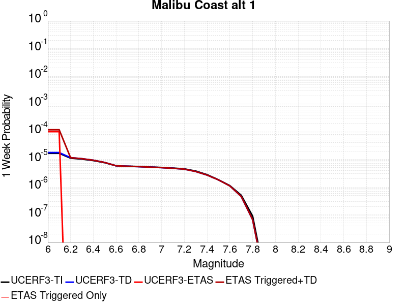 | 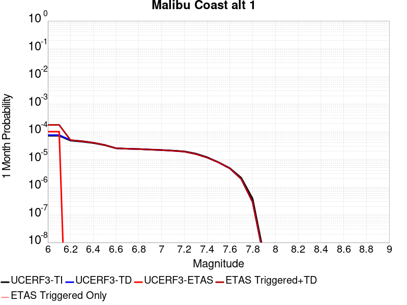 |  |  |

| Magnitude | 1 wk TI Prob | 1 wk TD Prob | 1 wk ETAS Prob | 1 wk ETAS/TD Gain | 1 wk ETAS Triggered+TD | 1 wk ETAS Triggered Only | 1 mo TI Prob | 1 mo TD Prob | 1 mo ETAS Prob | 1 mo ETAS/TD Gain | 1 mo ETAS Triggered+TD | 1 mo ETAS Triggered Only | 1 yr TI Prob | 1 yr TD Prob | 1 yr ETAS Prob | 1 yr ETAS/TD Gain | 1 yr ETAS Triggered+TD | 1 yr ETAS Triggered Only | 10 yr TI Prob | 10 yr TD Prob | 10 yr ETAS Prob | 10 yr ETAS/TD Gain | 10 yr ETAS Triggered+TD | 10 yr ETAS Triggered Only |
|-----|-----|-----|-----|-----|-----|-----|-----|-----|-----|-----|-----|-----|-----|-----|-----|-----|-----|-----|-----|-----|-----|-----|-----|-----|
| 6.0 | 1.6572556E-5 | 1.7601229E-5 | 1.0E-4 | 5.6814213 | 1.1759947E-4 | 1.0E-4 | 7.102331E-5 | 7.5431766E-5 | 1.0E-4 | 1.3257015 | 1.7542423E-4 | 1.0E-4 | 8.6436566E-4 | 9.180137E-4 | 7.0E-4 | 0.76251584 | 0.0010179218 | 1.0E-4 | 0.0086101135 | 0.009144149 | 0.0084 | 0.9186202 | 0.0102340905 | 0.0011 |
| 6.1 | 1.6572556E-5 | 1.7601229E-5 | 1.0E-4 | 5.6814213 | 1.1759947E-4 | 1.0E-4 | 7.102331E-5 | 7.5431766E-5 | 1.0E-4 | 1.3257015 | 1.7542423E-4 | 1.0E-4 | 8.6436566E-4 | 9.180137E-4 | 7.0E-4 | 0.76251584 | 0.0010179218 | 1.0E-4 | 0.0086101135 | 0.009144149 | 0.0064 | 0.6999011 | 0.009936834 | 8.0E-4 |
| 6.2 | 1.1085717E-5 | 1.1559096E-5 | 0.0 | 0.0 | 1.1559096E-5 | 0.0 | 4.750935E-5 | 4.9538063E-5 | 0.0 | 0.0 | 4.9538063E-5 | 0.0 | 5.782728E-4 | 6.029625E-4 | 3.0E-4 | 0.49754336 | 6.029625E-4 | 0.0 | 0.0057677035 | 0.0060136365 | 0.004 | 0.66515493 | 0.00651063 | 5.0E-4 |
| 6.3 | 1.0208568E-5 | 1.0593994E-5 | 0.0 | 0.0 | 1.0593994E-5 | 0.0 | 4.375027E-5 | 4.540206E-5 | 0.0 | 0.0 | 4.540206E-5 | 0.0 | 5.325294E-4 | 5.526328E-4 | 3.0E-4 | 0.5428559 | 5.526328E-4 | 0.0 | 0.0053125503 | 0.005512893 | 0.0034 | 0.61673605 | 0.0060101366 | 5.0E-4 |
| 6.4 | 9.0682315E-6 | 9.344156E-6 | 0.0 | 0.0 | 9.344156E-6 | 0.0 | 3.8863272E-5 | 4.004578E-5 | 0.0 | 0.0 | 4.004578E-5 | 0.0 | 4.730576E-4 | 4.8745034E-4 | 3.0E-4 | 0.61544734 | 4.8745034E-4 | 0.0 | 0.0047205184 | 0.004864025 | 0.0029 | 0.59621406 | 0.005262079 | 4.0E-4 |
| 6.5 | 7.605796E-6 | 7.749821E-6 | 0.0 | 0.0 | 7.749821E-6 | 0.0 | 3.259586E-5 | 3.3213102E-5 | 0.0 | 0.0 | 3.3213102E-5 | 0.0 | 3.9678233E-4 | 4.042958E-4 | 3.0E-4 | 0.7420309 | 4.042958E-4 | 0.0 | 0.0039607463 | 0.0040357406 | 0.0025 | 0.619465 | 0.0044341264 | 4.0E-4 |
| 6.6 | 5.889873E-6 | 5.8804403E-6 | 0.0 | 0.0 | 5.8804403E-6 | 0.0 | 2.5242069E-5 | 2.5201643E-5 | 0.0 | 0.0 | 2.5201643E-5 | 0.0 | 3.0727885E-4 | 3.067869E-4 | 3.0E-4 | 0.97787744 | 3.067869E-4 | 0.0 | 0.003068543 | 0.0030636468 | 0.0017 | 0.55489427 | 0.0032630342 | 2.0E-4 |
| 6.7 | 5.66586E-6 | 5.6425138E-6 | 0.0 | 0.0 | 5.6425138E-6 | 0.0 | 2.428203E-5 | 2.4181978E-5 | 0.0 | 0.0 | 2.4181978E-5 | 0.0 | 2.955936E-4 | 2.943759E-4 | 3.0E-4 | 1.0191052 | 2.943759E-4 | 0.0 | 0.0029520073 | 0.0029398715 | 0.0016 | 0.5442415 | 0.0031392835 | 2.0E-4 |
| 6.8 | 5.521556E-6 | 5.4902825E-6 | 0.0 | 0.0 | 5.4902825E-6 | 0.0 | 2.3663597E-5 | 2.3529572E-5 | 0.0 | 0.0 | 2.3529572E-5 | 0.0 | 2.880662E-4 | 2.8643495E-4 | 3.0E-4 | 1.0473582 | 2.8643495E-4 | 0.0 | 0.0028769306 | 0.0028606693 | 0.0016 | 0.55930966 | 0.0030600973 | 2.0E-4 |
| 6.9 | 5.29752E-6 | 5.2507544E-6 | 0.0 | 0.0 | 5.2507544E-6 | 0.0 | 2.270346E-5 | 2.2503038E-5 | 0.0 | 0.0 | 2.2503038E-5 | 0.0 | 2.7637955E-4 | 2.7394012E-4 | 3.0E-4 | 1.0951297 | 2.7394012E-4 | 0.0 | 0.0027603607 | 0.0027360348 | 0.0016 | 0.58478785 | 0.0029354878 | 2.0E-4 |
| 7.0 | 5.106743E-6 | 5.048477E-6 | 0.0 | 0.0 | 5.048477E-6 | 0.0 | 2.1885859E-5 | 2.1636151E-5 | 0.0 | 0.0 | 2.1636151E-5 | 0.0 | 2.6642776E-4 | 2.6338839E-4 | 3.0E-4 | 1.1390024 | 2.6338839E-4 | 0.0 | 0.0026610855 | 0.0026307716 | 0.0016 | 0.60818654 | 0.0028302455 | 2.0E-4 |
| 7.1 | 4.8469647E-6 | 4.771134E-6 | 0.0 | 0.0 | 4.771134E-6 | 0.0 | 2.0772539E-5 | 2.0447558E-5 | 0.0 | 0.0 | 2.0447558E-5 | 0.0 | 2.528763E-4 | 2.4892064E-4 | 3.0E-4 | 1.2052034 | 2.4892064E-4 | 0.0 | 0.0025258875 | 0.0024864264 | 0.0015 | 0.6032755 | 0.002685929 | 2.0E-4 |
| 7.2 | 4.545514E-6 | 4.44891E-6 | 0.0 | 0.0 | 4.44891E-6 | 0.0 | 1.9480629E-5 | 1.9066618E-5 | 0.0 | 0.0 | 1.9066618E-5 | 0.0 | 2.3715083E-4 | 2.3211142E-4 | 3.0E-4 | 1.2924827 | 2.3211142E-4 | 0.0 | 0.0023689792 | 0.0023186973 | 0.0014 | 0.6037873 | 0.0025182336 | 2.0E-4 |
| 7.3 | 3.794097E-6 | 3.6525291E-6 | 0.0 | 0.0 | 3.6525291E-6 | 0.0 | 1.6260314E-5 | 1.5653603E-5 | 0.0 | 0.0 | 1.5653603E-5 | 0.0 | 1.9795135E-4 | 1.9056599E-4 | 3.0E-4 | 1.5742579 | 1.9056599E-4 | 0.0 | 0.001977751 | 0.0019040304 | 0.0012 | 0.63024205 | 0.0019040304 | 0.0 |
| 7.4 | 2.808217E-6 | 2.7195558E-6 | 0.0 | 0.0 | 2.7195558E-6 | 0.0 | 1.203516E-5 | 1.1655187E-5 | 0.0 | 0.0 | 1.1655187E-5 | 0.0 | 1.4651821E-4 | 1.418927E-4 | 3.0E-4 | 2.1142738 | 1.418927E-4 | 0.0 | 0.0014642165 | 0.0014180236 | 9.0E-4 | 0.6346862 | 0.0014180236 | 0.0 |
| 7.5 | 1.83809E-6 | 1.8193447E-6 | 0.0 | 0.0 | 1.8193447E-6 | 0.0 | 7.877505E-6 | 7.797168E-6 | 0.0 | 0.0 | 7.797168E-6 | 0.0 | 9.59044E-5 | 9.492641E-5 | 3.0E-4 | 3.160343 | 9.492641E-5 | 0.0 | 9.5863023E-4 | 9.488606E-4 | 8.0E-4 | 0.84311646 | 9.488606E-4 | 0.0 |
| 7.6 | 1.1292672E-6 | 1.1003003E-6 | 0.0 | 0.0 | 1.1003003E-6 | 0.0 | 4.839708E-6 | 4.7155645E-6 | 0.0 | 0.0 | 4.7155645E-6 | 0.0 | 5.8921847E-5 | 5.7410503E-5 | 1.0E-4 | 1.7418416 | 5.7410503E-5 | 0.0 | 5.890623E-4 | 5.739583E-4 | 4.0E-4 | 0.6969147 | 5.739583E-4 | 0.0 |
| 7.7 | 5.065272E-7 | 4.6099365E-7 | 0.0 | 0.0 | 4.6099365E-7 | 0.0 | 2.170829E-6 | 1.9756856E-6 | 0.0 | 0.0 | 1.9756856E-6 | 0.0 | 2.6429525E-5 | 2.405372E-5 | 1.0E-4 | 4.1573615 | 2.405372E-5 | 0.0 | 2.642638E-4 | 2.4051228E-4 | 3.0E-4 | 1.2473376 | 2.4051228E-4 | 0.0 |
| 7.8 | 8.952991E-8 | 6.710894E-8 | 0.0 | 0.0 | 6.710894E-8 | 0.0 | 3.8369956E-7 | 2.8760974E-7 | 0.0 | 0.0 | 2.8760974E-7 | 0.0 | 4.671532E-6 | 3.501643E-6 | 1.0E-4 | 28.558023 | 3.501643E-6 | 0.0 | 4.671434E-5 | 3.50159E-5 | 1.0E-4 | 2.8558457 | 3.50159E-5 | 0.0 |
| 7.9 | 8.007447E-10 | 6.162303E-10 | 0.0 | 0.0 | 6.162303E-10 | 0.0 | 3.4317629E-9 | 2.6409874E-9 | 0.0 | 0.0 | 2.6409874E-9 | 0.0 | 4.1781714E-8 | 3.215402E-8 | 0.0 | 0.0 | 3.215402E-8 | 0.0 | 4.1781706E-7 | 3.2154017E-7 | 0.0 | 0.0 | 3.2154017E-7 | 0.0 |

## Hector Mine
*[(top)](#table-of-contents)*

| 1 Week | 1 Month | 1 Year | 10 Year |
|-----|-----|-----|-----|
| 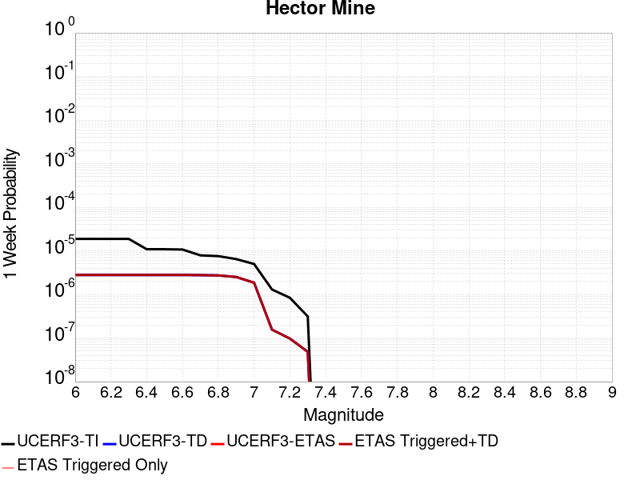 | 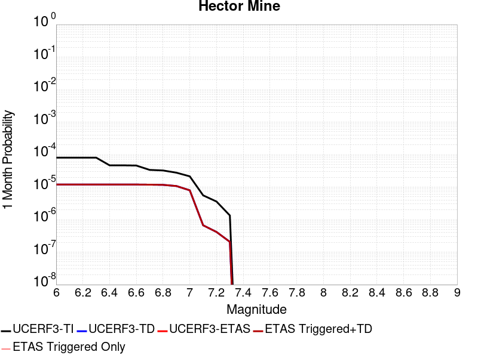 | 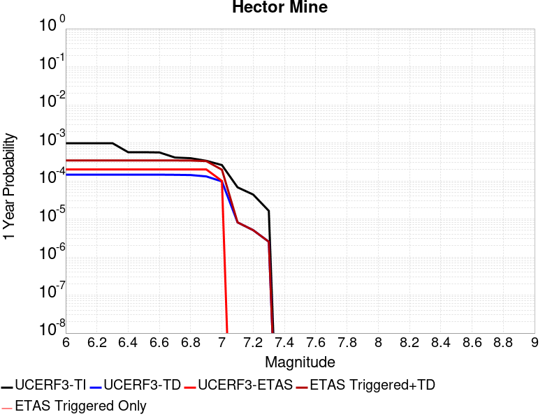 | 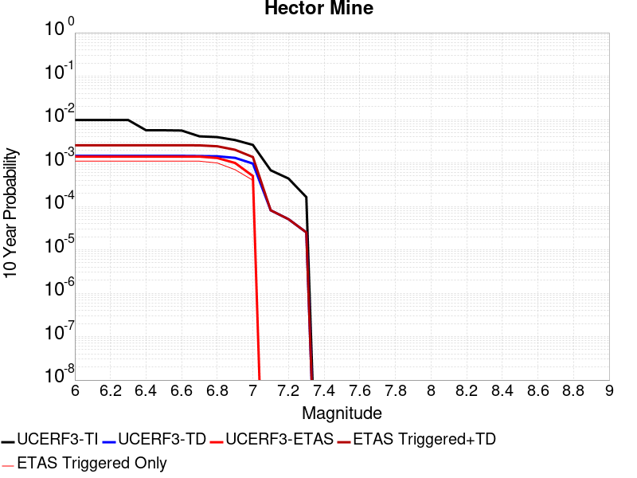 |

| Magnitude | 1 wk TI Prob | 1 wk TD Prob | 1 wk ETAS Prob | 1 wk ETAS/TD Gain | 1 wk ETAS Triggered+TD | 1 wk ETAS Triggered Only | 1 mo TI Prob | 1 mo TD Prob | 1 mo ETAS Prob | 1 mo ETAS/TD Gain | 1 mo ETAS Triggered+TD | 1 mo ETAS Triggered Only | 1 yr TI Prob | 1 yr TD Prob | 1 yr ETAS Prob | 1 yr ETAS/TD Gain | 1 yr ETAS Triggered+TD | 1 yr ETAS Triggered Only | 10 yr TI Prob | 10 yr TD Prob | 10 yr ETAS Prob | 10 yr ETAS/TD Gain | 10 yr ETAS Triggered+TD | 10 yr ETAS Triggered Only |
|-----|-----|-----|-----|-----|-----|-----|-----|-----|-----|-----|-----|-----|-----|-----|-----|-----|-----|-----|-----|-----|-----|-----|-----|-----|
| 6.0 | 1.8760093E-5 | 2.7973192E-6 | 0.0 | 0.0 | 2.7973192E-6 | 0.0 | 8.039792E-5 | 1.1988479E-5 | 0.0 | 0.0 | 1.1988479E-5 | 0.0 | 9.78405E-4 | 1.4595395E-4 | 2.0E-4 | 1.3702952 | 3.4592475E-4 | 2.0E-4 | 0.009741086 | 0.0014589734 | 0.0014 | 0.9595788 | 0.0025573685 | 0.0011 |
| 6.1 | 1.8760093E-5 | 2.7973192E-6 | 0.0 | 0.0 | 2.7973192E-6 | 0.0 | 8.039792E-5 | 1.1988479E-5 | 0.0 | 0.0 | 1.1988479E-5 | 0.0 | 9.78405E-4 | 1.4595395E-4 | 2.0E-4 | 1.3702952 | 3.4592475E-4 | 2.0E-4 | 0.009741086 | 0.0014589734 | 0.0014 | 0.9595788 | 0.0025573685 | 0.0011 |
| 6.2 | 1.8760093E-5 | 2.7973192E-6 | 0.0 | 0.0 | 2.7973192E-6 | 0.0 | 8.039792E-5 | 1.1988479E-5 | 0.0 | 0.0 | 1.1988479E-5 | 0.0 | 9.78405E-4 | 1.4595395E-4 | 2.0E-4 | 1.3702952 | 3.4592475E-4 | 2.0E-4 | 0.009741086 | 0.0014589734 | 0.0014 | 0.9595788 | 0.0025573685 | 0.0011 |
| 6.3 | 1.8760093E-5 | 2.7973192E-6 | 0.0 | 0.0 | 2.7973192E-6 | 0.0 | 8.039792E-5 | 1.1988479E-5 | 0.0 | 0.0 | 1.1988479E-5 | 0.0 | 9.78405E-4 | 1.4595395E-4 | 2.0E-4 | 1.3702952 | 3.4592475E-4 | 2.0E-4 | 0.009741086 | 0.0014589734 | 0.0014 | 0.9595788 | 0.0025573685 | 0.0011 |
| 6.4 | 1.0888055E-5 | 2.7973192E-6 | 0.0 | 0.0 | 2.7973192E-6 | 0.0 | 4.666226E-5 | 1.1988479E-5 | 0.0 | 0.0 | 1.1988479E-5 | 0.0 | 5.679649E-4 | 1.4595395E-4 | 2.0E-4 | 1.3702952 | 3.4592475E-4 | 2.0E-4 | 0.0056651547 | 0.0014589734 | 0.0014 | 0.9595788 | 0.0025573685 | 0.0011 |
| 6.5 | 1.0888055E-5 | 2.7973192E-6 | 0.0 | 0.0 | 2.7973192E-6 | 0.0 | 4.666226E-5 | 1.1988479E-5 | 0.0 | 0.0 | 1.1988479E-5 | 0.0 | 5.679649E-4 | 1.4595395E-4 | 2.0E-4 | 1.3702952 | 3.4592475E-4 | 2.0E-4 | 0.0056651547 | 0.0014589734 | 0.0014 | 0.9595788 | 0.0025573685 | 0.0011 |
| 6.6 | 1.0730738E-5 | 2.7973192E-6 | 0.0 | 0.0 | 2.7973192E-6 | 0.0 | 4.5988065E-5 | 1.1988479E-5 | 0.0 | 0.0 | 1.1988479E-5 | 0.0 | 5.5976084E-4 | 1.4595395E-4 | 2.0E-4 | 1.3702952 | 3.4592475E-4 | 2.0E-4 | 0.0055835294 | 0.0014589734 | 0.0014 | 0.9595788 | 0.0025573685 | 0.0011 |
| 6.7 | 7.881326E-6 | 2.7719875E-6 | 0.0 | 0.0 | 2.7719875E-6 | 0.0 | 3.3776672E-5 | 1.1879914E-5 | 0.0 | 0.0 | 1.1879914E-5 | 0.0 | 4.111534E-4 | 1.4463236E-4 | 2.0E-4 | 1.3828163 | 3.4460344E-4 | 2.0E-4 | 0.0041039353 | 0.0014457747 | 0.0014 | 0.96833897 | 0.0025441844 | 0.0011 |
| 6.8 | 7.5683483E-6 | 2.7336944E-6 | 0.0 | 0.0 | 2.7336944E-6 | 0.0 | 3.2435375E-5 | 1.1715803E-5 | 0.0 | 0.0 | 1.1715803E-5 | 0.0 | 3.9482914E-4 | 1.4263457E-4 | 2.0E-4 | 1.4021846 | 3.4260604E-4 | 2.0E-4 | 0.0039412836 | 0.0014258224 | 0.0013 | 0.9117545 | 0.0024243966 | 0.001 |
| 6.9 | 6.473048E-6 | 2.5146837E-6 | 0.0 | 0.0 | 2.5146837E-6 | 0.0 | 2.7741338E-5 | 1.0777194E-5 | 0.0 | 0.0 | 1.0777194E-5 | 0.0 | 3.3769844E-4 | 1.312084E-4 | 2.0E-4 | 1.5242926 | 3.3118218E-4 | 2.0E-4 | 0.0033718573 | 0.0013116992 | 0.001 | 0.76236993 | 0.0020107809 | 7.0E-4 |
| 7.0 | 4.9959954E-6 | 1.8571457E-6 | 0.0 | 0.0 | 1.8571457E-6 | 0.0 | 2.1411232E-5 | 7.959192E-6 | 0.0 | 0.0 | 7.959192E-6 | 0.0 | 2.6065056E-4 | 9.690241E-5 | 1.0E-4 | 1.031966 | 1.9689272E-4 | 1.0E-4 | 0.0026034506 | 9.6895144E-4 | 5.0E-4 | 0.5160217 | 0.0013685639 | 4.0E-4 |
| 7.1 | 1.2997541E-6 | 1.5610307E-7 | 0.0 | 0.0 | 1.5610307E-7 | 0.0 | 5.5703626E-6 | 6.69013E-7 | 0.0 | 0.0 | 6.69013E-7 | 0.0 | 6.7817055E-5 | 8.145206E-6 | 0.0 | 0.0 | 8.145206E-6 | 0.0 | 6.779636E-4 | 8.144948E-5 | 0.0 | 0.0 | 8.144948E-5 | 0.0 |
| 7.2 | 8.392699E-7 | 9.7324715E-8 | 0.0 | 0.0 | 9.7324715E-8 | 0.0 | 3.596866E-6 | 4.1710587E-7 | 0.0 | 0.0 | 4.1710587E-7 | 0.0 | 4.3790962E-5 | 5.078254E-6 | 0.0 | 0.0 | 5.078254E-6 | 0.0 | 4.3782333E-4 | 5.078157E-5 | 0.0 | 0.0 | 5.078157E-5 | 0.0 |
| 7.3 | 3.13015E-7 | 4.831353E-8 | 0.0 | 0.0 | 4.831353E-8 | 0.0 | 1.3414921E-6 | 2.0705798E-7 | 0.0 | 0.0 | 2.0705798E-7 | 0.0 | 1.6332544E-5 | 2.5209288E-6 | 0.0 | 0.0 | 2.5209288E-6 | 0.0 | 1.6331344E-4 | 2.5209087E-5 | 0.0 | 0.0 | 2.5209087E-5 | 0.0 |

## Lake Isabella (Seismicity)
*[(top)](#table-of-contents)*

| 1 Week | 1 Month | 1 Year | 10 Year |
|-----|-----|-----|-----|
|  |  |  |  |

| Magnitude | 1 wk TI Prob | 1 wk TD Prob | 1 wk ETAS Prob | 1 wk ETAS/TD Gain | 1 wk ETAS Triggered+TD | 1 wk ETAS Triggered Only | 1 mo TI Prob | 1 mo TD Prob | 1 mo ETAS Prob | 1 mo ETAS/TD Gain | 1 mo ETAS Triggered+TD | 1 mo ETAS Triggered Only | 1 yr TI Prob | 1 yr TD Prob | 1 yr ETAS Prob | 1 yr ETAS/TD Gain | 1 yr ETAS Triggered+TD | 1 yr ETAS Triggered Only | 10 yr TI Prob | 10 yr TD Prob | 10 yr ETAS Prob | 10 yr ETAS/TD Gain | 10 yr ETAS Triggered+TD | 10 yr ETAS Triggered Only |
|-----|-----|-----|-----|-----|-----|-----|-----|-----|-----|-----|-----|-----|-----|-----|-----|-----|-----|-----|-----|-----|-----|-----|-----|-----|
| 6.0 | 9.431637E-6 | 9.742287E-6 | 0.0 | 0.0 | 9.742287E-6 | 0.0 | 4.0420677E-5 | 4.1752064E-5 | 0.0 | 0.0 | 4.1752064E-5 | 0.0 | 4.920106E-4 | 5.082259E-4 | 4.0E-4 | 0.7870516 | 8.0807344E-4 | 3.0E-4 | 0.004909227 | 0.0050719287 | 0.0024 | 0.47319275 | 0.0061663496 | 0.0011 |
| 6.1 | 9.431637E-6 | 9.742287E-6 | 0.0 | 0.0 | 9.742287E-6 | 0.0 | 4.0420677E-5 | 4.1752064E-5 | 0.0 | 0.0 | 4.1752064E-5 | 0.0 | 4.920106E-4 | 5.082259E-4 | 4.0E-4 | 0.7870516 | 8.0807344E-4 | 3.0E-4 | 0.004909227 | 0.0050719287 | 0.0024 | 0.47319275 | 0.0061663496 | 0.0011 |
| 6.2 | 9.431637E-6 | 9.742287E-6 | 0.0 | 0.0 | 9.742287E-6 | 0.0 | 4.0420677E-5 | 4.1752064E-5 | 0.0 | 0.0 | 4.1752064E-5 | 0.0 | 4.920106E-4 | 5.082259E-4 | 4.0E-4 | 0.7870516 | 8.0807344E-4 | 3.0E-4 | 0.004909227 | 0.0050719287 | 0.0024 | 0.47319275 | 0.0061663496 | 0.0011 |
| 6.3 | 9.431637E-6 | 9.742287E-6 | 0.0 | 0.0 | 9.742287E-6 | 0.0 | 4.0420677E-5 | 4.1752064E-5 | 0.0 | 0.0 | 4.1752064E-5 | 0.0 | 4.920106E-4 | 5.082259E-4 | 4.0E-4 | 0.7870516 | 8.0807344E-4 | 3.0E-4 | 0.004909227 | 0.0050719287 | 0.0024 | 0.47319275 | 0.0061663496 | 0.0011 |
| 6.4 | 5.144063E-6 | 5.300395E-6 | 0.0 | 0.0 | 5.300395E-6 | 0.0 | 2.2045799E-5 | 2.27158E-5 | 0.0 | 0.0 | 2.27158E-5 | 0.0 | 2.6837454E-4 | 2.7653322E-4 | 3.0E-4 | 1.0848606 | 4.7647793E-4 | 2.0E-4 | 0.0026805066 | 0.0027622317 | 0.0013 | 0.47063395 | 0.0031611267 | 4.0E-4 |
| 6.5 | 5.144063E-6 | 5.300395E-6 | 0.0 | 0.0 | 5.300395E-6 | 0.0 | 2.2045799E-5 | 2.27158E-5 | 0.0 | 0.0 | 2.27158E-5 | 0.0 | 2.6837454E-4 | 2.7653322E-4 | 3.0E-4 | 1.0848606 | 4.7647793E-4 | 2.0E-4 | 0.0026805066 | 0.0027622317 | 0.0013 | 0.47063395 | 0.0031611267 | 4.0E-4 |
| 6.6 | 3.4009804E-6 | 3.4989857E-6 | 0.0 | 0.0 | 3.4989857E-6 | 0.0 | 1.4575549E-5 | 1.4995577E-5 | 0.0 | 0.0 | 1.4995577E-5 | 0.0 | 1.7744285E-4 | 1.8255744E-4 | 2.0E-4 | 1.0955455 | 2.825392E-4 | 1.0E-4 | 0.0017730123 | 0.0018242326 | 9.0E-4 | 0.49335814 | 0.0021236853 | 3.0E-4 |
| 6.7 | 3.3880428E-6 | 3.485852E-6 | 0.0 | 0.0 | 3.485852E-6 | 0.0 | 1.4520103E-5 | 1.4939289E-5 | 0.0 | 0.0 | 1.4939289E-5 | 0.0 | 1.767679E-4 | 1.8187227E-4 | 2.0E-4 | 1.0996729 | 2.818541E-4 | 1.0E-4 | 0.0017662736 | 0.0018173921 | 9.0E-4 | 0.49521512 | 0.0021168469 | 3.0E-4 |
| 6.8 | 2.6582E-6 | 2.7338542E-6 | 0.0 | 0.0 | 2.7338542E-6 | 0.0 | 1.1392236E-5 | 1.1716474E-5 | 0.0 | 0.0 | 1.1716474E-5 | 0.0 | 1.3869164E-4 | 1.4264007E-4 | 1.0E-4 | 0.7010653 | 2.426258E-4 | 1.0E-4 | 0.0013860512 | 0.0014256173 | 7.0E-4 | 0.4910154 | 0.001625332 | 2.0E-4 |
| 6.9 | 2.406011E-6 | 2.4744684E-6 | 0.0 | 0.0 | 2.4744684E-6 | 0.0 | 1.0311434E-5 | 1.0604828E-5 | 0.0 | 0.0 | 1.0604828E-5 | 0.0 | 1.2553448E-4 | 1.2910746E-4 | 1.0E-4 | 0.7745486 | 2.2909454E-4 | 1.0E-4 | 0.0012546359 | 0.0012904541 | 7.0E-4 | 0.5424447 | 0.001490196 | 2.0E-4 |
| 7.0 | 1.6953097E-6 | 1.7430343E-6 | 0.0 | 0.0 | 1.7430343E-6 | 0.0 | 7.265593E-6 | 7.4701315E-6 | 0.0 | 0.0 | 7.4701315E-6 | 0.0 | 8.8455E-5 | 9.094611E-5 | 1.0E-4 | 1.0995523 | 1.90937E-4 | 1.0E-4 | 8.84198E-4 | 9.091916E-4 | 5.0E-4 | 0.5499391 | 0.0011090098 | 2.0E-4 |
| 7.1 | 3.5013824E-7 | 3.571624E-7 | 0.0 | 0.0 | 3.571624E-7 | 0.0 | 1.5005916E-6 | 1.5306952E-6 | 0.0 | 0.0 | 1.5306952E-6 | 0.0 | 1.826955E-5 | 1.8636058E-5 | 0.0 | 0.0 | 1.8636058E-5 | 0.0 | 1.8268047E-4 | 1.8634519E-4 | 2.0E-4 | 1.073277 | 2.8632657E-4 | 1.0E-4 |
| 7.2 | 2.2321095E-7 | 2.2751442E-7 | 0.0 | 0.0 | 2.2751442E-7 | 0.0 | 9.56618E-7 | 9.750614E-7 | 0.0 | 0.0 | 9.750614E-7 | 0.0 | 1.1646762E-5 | 1.187131E-5 | 0.0 | 0.0 | 1.187131E-5 | 0.0 | 1.1646151E-4 | 1.18706856E-4 | 2.0E-4 | 1.6848227 | 2.1869499E-4 | 1.0E-4 |
| 7.3 | 1.5760406E-7 | 1.606153E-7 | 0.0 | 0.0 | 1.606153E-7 | 0.0 | 6.7544585E-7 | 6.8835107E-7 | 0.0 | 0.0 | 6.8835107E-7 | 0.0 | 8.223522E-6 | 8.380643E-6 | 0.0 | 0.0 | 8.380643E-6 | 0.0 | 8.2232174E-5 | 8.380333E-5 | 2.0E-4 | 2.38654 | 1.8379495E-4 | 1.0E-4 |
| 7.4 | 1.1216497E-7 | 1.1432141E-7 | 0.0 | 0.0 | 1.1432141E-7 | 0.0 | 4.8070694E-7 | 4.8994883E-7 | 0.0 | 0.0 | 4.8994883E-7 | 0.0 | 5.852591E-6 | 5.965111E-6 | 0.0 | 0.0 | 5.965111E-6 | 0.0 | 5.8524372E-5 | 5.9649552E-5 | 1.0E-4 | 1.6764585 | 5.9649552E-5 | 0.0 |
| 7.5 | 4.885185E-8 | 4.978963E-8 | 0.0 | 0.0 | 4.978963E-8 | 0.0 | 2.0936506E-7 | 2.1338411E-7 | 0.0 | 0.0 | 2.1338411E-7 | 0.0 | 2.5490165E-6 | 2.5979487E-6 | 0.0 | 0.0 | 2.5979487E-6 | 0.0 | 2.5489873E-5 | 2.5979201E-5 | 0.0 | 0.0 | 2.5979201E-5 | 0.0 |
| 7.6 | 1.504641E-9 | 1.5318451E-9 | 0.0 | 0.0 | 1.5318451E-9 | 0.0 | 6.4484613E-9 | 6.5650503E-9 | 0.0 | 0.0 | 6.5650503E-9 | 0.0 | 7.851001E-8 | 7.992949E-8 | 0.0 | 0.0 | 7.992949E-8 | 0.0 | 7.8509987E-7 | 7.9929487E-7 | 0.0 | 0.0 | 7.9929487E-7 | 0.0 |

## Santa Cruz Catalina Ridge alt1
*[(top)](#table-of-contents)*

| 1 Week | 1 Month | 1 Year | 10 Year |
|-----|-----|-----|-----|
| 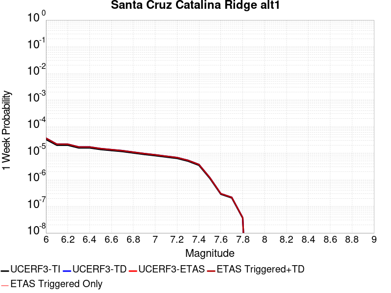 | 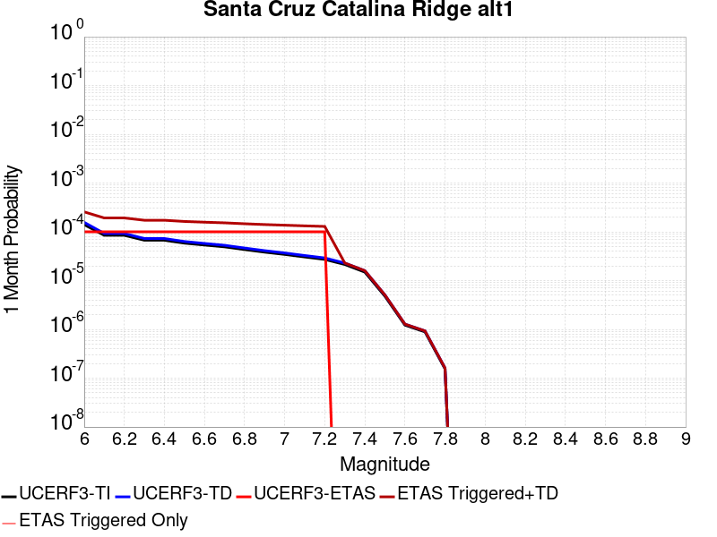 | 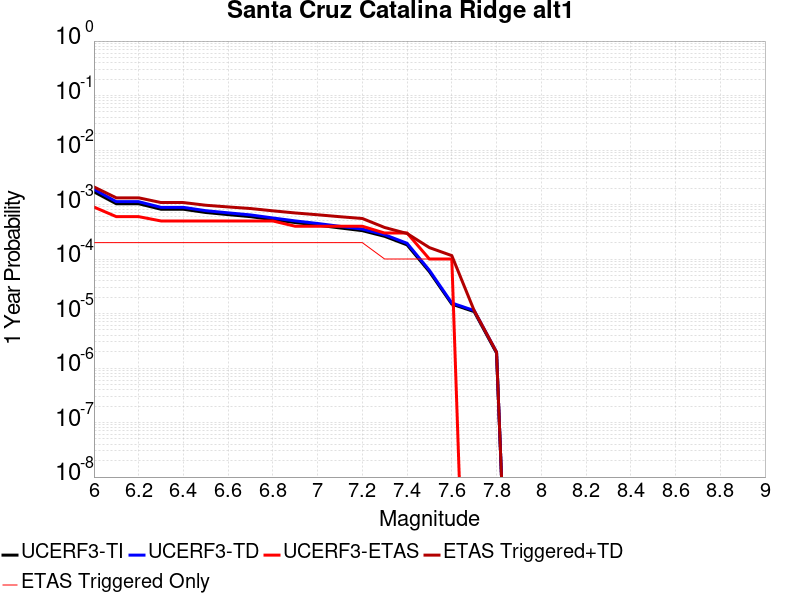 | 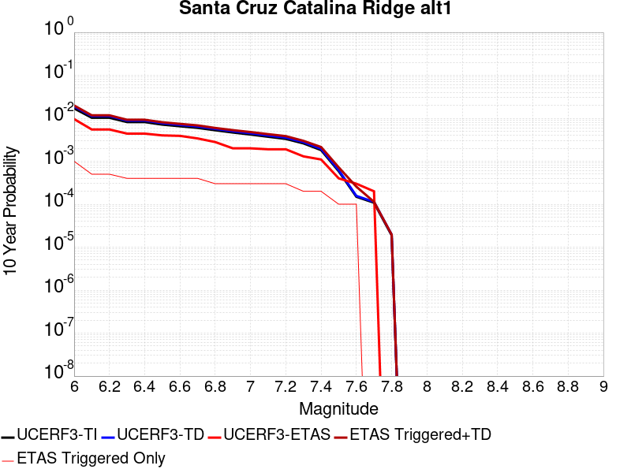 |

| Magnitude | 1 wk TI Prob | 1 wk TD Prob | 1 wk ETAS Prob | 1 wk ETAS/TD Gain | 1 wk ETAS Triggered+TD | 1 wk ETAS Triggered Only | 1 mo TI Prob | 1 mo TD Prob | 1 mo ETAS Prob | 1 mo ETAS/TD Gain | 1 mo ETAS Triggered+TD | 1 mo ETAS Triggered Only | 1 yr TI Prob | 1 yr TD Prob | 1 yr ETAS Prob | 1 yr ETAS/TD Gain | 1 yr ETAS Triggered+TD | 1 yr ETAS Triggered Only | 10 yr TI Prob | 10 yr TD Prob | 10 yr ETAS Prob | 10 yr ETAS/TD Gain | 10 yr ETAS Triggered+TD | 10 yr ETAS Triggered Only |
|-----|-----|-----|-----|-----|-----|-----|-----|-----|-----|-----|-----|-----|-----|-----|-----|-----|-----|-----|-----|-----|-----|-----|-----|-----|
| 6.0 | 3.2833184E-5 | 3.6566747E-5 | 0.0 | 0.0 | 3.6566747E-5 | 0.0 | 1.4070606E-4 | 1.5670617E-4 | 1.0E-4 | 0.638137 | 2.566905E-4 | 1.0E-4 | 0.00171175 | 0.0019063944 | 9.0E-4 | 0.47209537 | 0.0021060132 | 2.0E-4 | 0.016986247 | 0.018917318 | 0.0096 | 0.5074715 | 0.019898402 | 0.001 |
| 6.1 | 1.9835548E-5 | 2.1663489E-5 | 0.0 | 0.0 | 2.1663489E-5 | 0.0 | 8.500672E-5 | 9.284033E-5 | 1.0E-4 | 1.077118 | 1.9283105E-4 | 1.0E-4 | 0.0010344655 | 0.0011297651 | 6.0E-4 | 0.5310839 | 0.0013295391 | 2.0E-4 | 0.010296632 | 0.0112423515 | 0.0055 | 0.48922148 | 0.01173673 | 5.0E-4 |
| 6.2 | 1.9835548E-5 | 2.1663489E-5 | 0.0 | 0.0 | 2.1663489E-5 | 0.0 | 8.500672E-5 | 9.284033E-5 | 1.0E-4 | 1.077118 | 1.9283105E-4 | 1.0E-4 | 0.0010344655 | 0.0011297651 | 6.0E-4 | 0.5310839 | 0.0013295391 | 2.0E-4 | 0.010296632 | 0.0112423515 | 0.0055 | 0.48922148 | 0.01173673 | 5.0E-4 |
| 6.3 | 1.5728183E-5 | 1.7036768E-5 | 0.0 | 0.0 | 1.7036768E-5 | 0.0 | 6.7404755E-5 | 7.301271E-5 | 1.0E-4 | 1.3696246 | 1.730054E-4 | 1.0E-4 | 8.2034385E-4 | 8.885733E-4 | 5.0E-4 | 0.5626998 | 0.0010883956 | 2.0E-4 | 0.008173222 | 0.008850885 | 0.0044 | 0.49712545 | 0.009247344 | 4.0E-4 |
| 6.4 | 1.5728183E-5 | 1.7036768E-5 | 0.0 | 0.0 | 1.7036768E-5 | 0.0 | 6.7404755E-5 | 7.301271E-5 | 1.0E-4 | 1.3696246 | 1.730054E-4 | 1.0E-4 | 8.2034385E-4 | 8.885733E-4 | 5.0E-4 | 0.5626998 | 0.0010883956 | 2.0E-4 | 0.008173222 | 0.008850885 | 0.0044 | 0.49712545 | 0.009247344 | 4.0E-4 |
| 6.5 | 1.3707734E-5 | 1.4796856E-5 | 0.0 | 0.0 | 1.4796856E-5 | 0.0 | 5.8746107E-5 | 6.341357E-5 | 1.0E-4 | 1.5769495 | 1.6340724E-4 | 1.0E-4 | 7.1499916E-4 | 7.7179034E-4 | 5.0E-4 | 0.6478444 | 9.71636E-4 | 2.0E-4 | 0.0071270303 | 0.0076914984 | 0.004 | 0.5200547 | 0.008088422 | 4.0E-4 |
| 6.6 | 1.2539813E-5 | 1.3512298E-5 | 0.0 | 0.0 | 1.3512298E-5 | 0.0 | 5.3740947E-5 | 5.790858E-5 | 1.0E-4 | 1.7268598 | 1.5790279E-4 | 1.0E-4 | 6.540996E-4 | 7.048116E-4 | 5.0E-4 | 0.7094095 | 9.046706E-4 | 2.0E-4 | 0.0065217763 | 0.0070260656 | 0.0039 | 0.55507594 | 0.0074232556 | 4.0E-4 |
| 6.7 | 1.1504083E-5 | 1.2379242E-5 | 0.0 | 0.0 | 1.2379242E-5 | 0.0 | 4.930228E-5 | 5.305283E-5 | 1.0E-4 | 1.8849136 | 1.5304753E-4 | 1.0E-4 | 6.0008996E-4 | 6.457288E-4 | 5.0E-4 | 0.7743189 | 8.455996E-4 | 2.0E-4 | 0.005984721 | 0.0064387545 | 0.0034 | 0.52805245 | 0.0068361787 | 4.0E-4 |
| 6.8 | 1.012739E-5 | 1.0878672E-5 | 0.0 | 0.0 | 1.0878672E-5 | 0.0 | 4.340238E-5 | 4.662205E-5 | 1.0E-4 | 2.1449077 | 1.4661739E-4 | 1.0E-4 | 5.282958E-4 | 5.674772E-4 | 5.0E-4 | 0.8810927 | 7.673637E-4 | 2.0E-4 | 0.0052704164 | 0.00566045 | 0.0028 | 0.49466032 | 0.005958752 | 3.0E-4 |
| 6.9 | 8.9607865E-6 | 9.610499E-6 | 0.0 | 0.0 | 9.610499E-6 | 0.0 | 3.8402806E-5 | 4.1187206E-5 | 1.0E-4 | 2.4279382 | 1.4118309E-4 | 1.0E-4 | 4.6745385E-4 | 5.0133996E-4 | 4.0E-4 | 0.7978618 | 7.012397E-4 | 2.0E-4 | 0.0046647177 | 0.005002209 | 0.002 | 0.39982337 | 0.005300708 | 3.0E-4 |
| 7.0 | 8.046829E-6 | 8.620965E-6 | 0.0 | 0.0 | 8.620965E-6 | 0.0 | 3.4485955E-5 | 3.6946476E-5 | 1.0E-4 | 2.706618 | 1.3694278E-4 | 1.0E-4 | 4.1978562E-4 | 4.497313E-4 | 4.0E-4 | 0.88942 | 6.496414E-4 | 2.0E-4 | 0.004189935 | 0.0044883024 | 0.002 | 0.4456028 | 0.0047869557 | 3.0E-4 |
| 7.1 | 7.136131E-6 | 7.638722E-6 | 0.0 | 0.0 | 7.638722E-6 | 0.0 | 3.0583058E-5 | 3.2736974E-5 | 1.0E-4 | 3.0546498 | 1.3273371E-4 | 1.0E-4 | 3.7228514E-4 | 3.9850047E-4 | 4.0E-4 | 1.0037628 | 5.984208E-4 | 2.0E-4 | 0.0037166206 | 0.0039779353 | 0.0019 | 0.4776347 | 0.004276742 | 3.0E-4 |
| 7.2 | 6.362014E-6 | 6.8059E-6 | 0.0 | 0.0 | 6.8059E-6 | 0.0 | 2.726549E-5 | 2.916782E-5 | 1.0E-4 | 3.4284358 | 1.2916491E-4 | 1.0E-4 | 3.3190678E-4 | 3.55061E-4 | 4.0E-4 | 1.126567 | 5.5498997E-4 | 2.0E-4 | 0.0033141149 | 0.0035450056 | 0.0019 | 0.5359653 | 0.003843942 | 3.0E-4 |
| 7.3 | 5.004101E-6 | 5.3524536E-6 | 0.0 | 0.0 | 5.3524536E-6 | 0.0 | 2.1445969E-5 | 2.2938888E-5 | 0.0 | 0.0 | 2.2938888E-5 | 0.0 | 2.6107338E-4 | 2.7924572E-4 | 3.0E-4 | 1.0743227 | 3.792178E-4 | 1.0E-4 | 0.002607669 | 0.002789003 | 0.0013 | 0.4661164 | 0.002988445 | 2.0E-4 |
| 7.4 | 3.4901443E-6 | 3.7325667E-6 | 0.0 | 0.0 | 3.7325667E-6 | 0.0 | 1.4957676E-5 | 1.5996618E-5 | 0.0 | 0.0 | 1.5996618E-5 | 0.0 | 1.8209449E-4 | 1.947418E-4 | 3.0E-4 | 1.5405012 | 2.9472233E-4 | 1.0E-4 | 0.0018194534 | 0.0019457502 | 0.0011 | 0.5653347 | 0.002145361 | 2.0E-4 |
| 7.5 | 1.1215045E-6 | 1.1895304E-6 | 0.0 | 0.0 | 1.1895304E-6 | 0.0 | 4.806439E-6 | 5.0979775E-6 | 0.0 | 0.0 | 5.0979775E-6 | 0.0 | 5.851682E-5 | 6.206614E-5 | 1.0E-4 | 1.6111845 | 1.6205994E-4 | 1.0E-4 | 5.850142E-4 | 6.204911E-4 | 4.0E-4 | 0.64465064 | 7.2042906E-4 | 1.0E-4 |
| 7.6 | 2.8599047E-7 | 2.9954805E-7 | 0.0 | 0.0 | 2.9954805E-7 | 0.0 | 1.2256729E-6 | 1.2837768E-6 | 0.0 | 0.0 | 1.2837768E-6 | 0.0 | 1.4922465E-5 | 1.562987E-5 | 1.0E-4 | 6.3980055 | 1.1562831E-4 | 1.0E-4 | 1.4921463E-4 | 1.5628786E-4 | 3.0E-4 | 1.9195349 | 2.5627224E-4 | 1.0E-4 |
| 7.7 | 2.0781519E-7 | 2.1746322E-7 | 0.0 | 0.0 | 2.1746322E-7 | 0.0 | 8.906362E-7 | 9.319849E-7 | 0.0 | 0.0 | 9.319849E-7 | 0.0 | 1.08434415E-5 | 1.1346858E-5 | 0.0 | 0.0 | 1.1346858E-5 | 0.0 | 1.0842913E-4 | 1.13462884E-4 | 2.0E-4 | 1.762691 | 1.13462884E-4 | 0.0 |
| 7.8 | 3.614776E-8 | 3.7644103E-8 | 0.0 | 0.0 | 3.7644103E-8 | 0.0 | 1.5491896E-7 | 1.6133185E-7 | 0.0 | 0.0 | 1.6133185E-7 | 0.0 | 1.8861368E-6 | 1.9642137E-6 | 0.0 | 0.0 | 1.9642137E-6 | 0.0 | 1.8861208E-5 | 1.9641975E-5 | 0.0 | 0.0 | 1.9641975E-5 | 0.0 |

## Pine Mtn
*[(top)](#table-of-contents)*

| 1 Week | 1 Month | 1 Year | 10 Year |
|-----|-----|-----|-----|
| 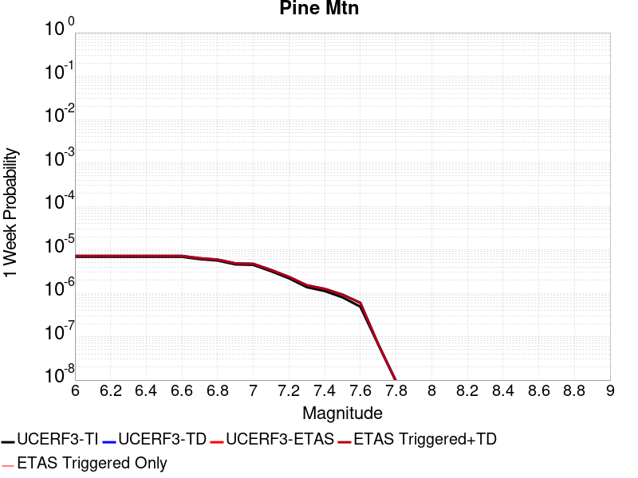 |  | 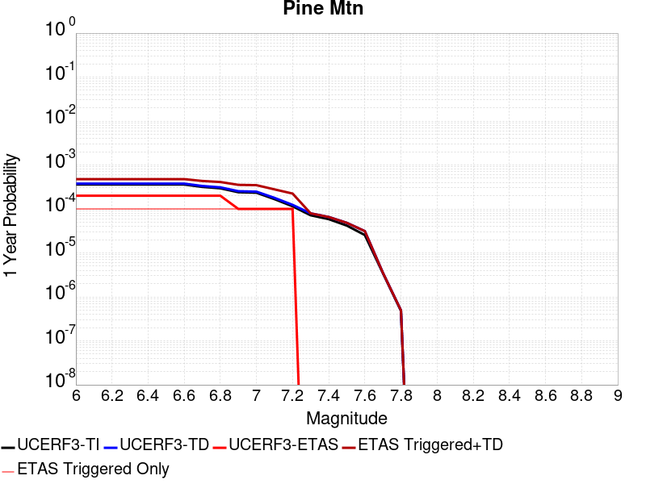 | 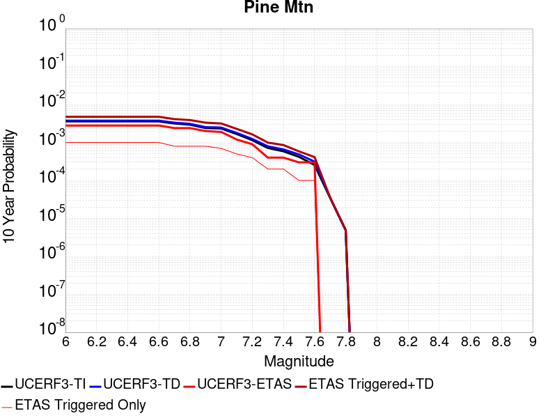 |

| Magnitude | 1 wk TI Prob | 1 wk TD Prob | 1 wk ETAS Prob | 1 wk ETAS/TD Gain | 1 wk ETAS Triggered+TD | 1 wk ETAS Triggered Only | 1 mo TI Prob | 1 mo TD Prob | 1 mo ETAS Prob | 1 mo ETAS/TD Gain | 1 mo ETAS Triggered+TD | 1 mo ETAS Triggered Only | 1 yr TI Prob | 1 yr TD Prob | 1 yr ETAS Prob | 1 yr ETAS/TD Gain | 1 yr ETAS Triggered+TD | 1 yr ETAS Triggered Only | 10 yr TI Prob | 10 yr TD Prob | 10 yr ETAS Prob | 10 yr ETAS/TD Gain | 10 yr ETAS Triggered+TD | 10 yr ETAS Triggered Only |
|-----|-----|-----|-----|-----|-----|-----|-----|-----|-----|-----|-----|-----|-----|-----|-----|-----|-----|-----|-----|-----|-----|-----|-----|-----|
| 6.0 | 6.894797E-6 | 7.2270054E-6 | 0.0 | 0.0 | 7.2270054E-6 | 0.0 | 2.9548795E-5 | 3.097253E-5 | 0.0 | 0.0 | 3.097253E-5 | 0.0 | 3.596972E-4 | 3.7702828E-4 | 2.0E-4 | 0.5304642 | 4.7699056E-4 | 1.0E-4 | 0.0035911554 | 0.0037641837 | 0.0028 | 0.74385315 | 0.0047604195 | 0.001 |
| 6.1 | 6.894797E-6 | 7.2270054E-6 | 0.0 | 0.0 | 7.2270054E-6 | 0.0 | 2.9548795E-5 | 3.097253E-5 | 0.0 | 0.0 | 3.097253E-5 | 0.0 | 3.596972E-4 | 3.7702828E-4 | 2.0E-4 | 0.5304642 | 4.7699056E-4 | 1.0E-4 | 0.0035911554 | 0.0037641837 | 0.0028 | 0.74385315 | 0.0047604195 | 0.001 |
| 6.2 | 6.894797E-6 | 7.2270054E-6 | 0.0 | 0.0 | 7.2270054E-6 | 0.0 | 2.9548795E-5 | 3.097253E-5 | 0.0 | 0.0 | 3.097253E-5 | 0.0 | 3.596972E-4 | 3.7702828E-4 | 2.0E-4 | 0.5304642 | 4.7699056E-4 | 1.0E-4 | 0.0035911554 | 0.0037641837 | 0.0028 | 0.74385315 | 0.0047604195 | 0.001 |
| 6.3 | 6.894797E-6 | 7.2270054E-6 | 0.0 | 0.0 | 7.2270054E-6 | 0.0 | 2.9548795E-5 | 3.097253E-5 | 0.0 | 0.0 | 3.097253E-5 | 0.0 | 3.596972E-4 | 3.7702828E-4 | 2.0E-4 | 0.5304642 | 4.7699056E-4 | 1.0E-4 | 0.0035911554 | 0.0037641837 | 0.0028 | 0.74385315 | 0.0047604195 | 0.001 |
| 6.4 | 6.894797E-6 | 7.2270054E-6 | 0.0 | 0.0 | 7.2270054E-6 | 0.0 | 2.9548795E-5 | 3.097253E-5 | 0.0 | 0.0 | 3.097253E-5 | 0.0 | 3.596972E-4 | 3.7702828E-4 | 2.0E-4 | 0.5304642 | 4.7699056E-4 | 1.0E-4 | 0.0035911554 | 0.0037641837 | 0.0028 | 0.74385315 | 0.0047604195 | 0.001 |
| 6.5 | 6.894797E-6 | 7.2270054E-6 | 0.0 | 0.0 | 7.2270054E-6 | 0.0 | 2.9548795E-5 | 3.097253E-5 | 0.0 | 0.0 | 3.097253E-5 | 0.0 | 3.596972E-4 | 3.7702828E-4 | 2.0E-4 | 0.5304642 | 4.7699056E-4 | 1.0E-4 | 0.0035911554 | 0.0037641837 | 0.0028 | 0.74385315 | 0.0047604195 | 0.001 |
| 6.6 | 6.894797E-6 | 7.2270054E-6 | 0.0 | 0.0 | 7.2270054E-6 | 0.0 | 2.9548795E-5 | 3.097253E-5 | 0.0 | 0.0 | 3.097253E-5 | 0.0 | 3.596972E-4 | 3.7702828E-4 | 2.0E-4 | 0.5304642 | 4.7699056E-4 | 1.0E-4 | 0.0035911554 | 0.0037641837 | 0.0028 | 0.74385315 | 0.0047604195 | 0.001 |
| 6.7 | 6.0867933E-6 | 6.398616E-6 | 0.0 | 0.0 | 6.398616E-6 | 0.0 | 2.6085996E-5 | 2.7422364E-5 | 0.0 | 0.0 | 2.7422364E-5 | 0.0 | 3.1755073E-4 | 3.3381832E-4 | 2.0E-4 | 0.5991283 | 4.3378494E-4 | 1.0E-4 | 0.0031709734 | 0.003333388 | 0.0024 | 0.71998817 | 0.004130721 | 8.0E-4 |
| 6.8 | 5.6530425E-6 | 5.952072E-6 | 0.0 | 0.0 | 5.952072E-6 | 0.0 | 2.42271E-5 | 2.5508643E-5 | 0.0 | 0.0 | 2.5508643E-5 | 0.0 | 2.94925E-4 | 3.1052553E-4 | 2.0E-4 | 0.64406943 | 4.1049448E-4 | 1.0E-4 | 0.002945339 | 0.003101121 | 0.0024 | 0.7739137 | 0.0038986402 | 8.0E-4 |
| 6.9 | 4.6015225E-6 | 4.8652387E-6 | 0.0 | 0.0 | 4.8652387E-6 | 0.0 | 1.9720663E-5 | 2.0850863E-5 | 0.0 | 0.0 | 2.0850863E-5 | 0.0 | 2.4007261E-4 | 2.5383115E-4 | 1.0E-4 | 0.39396268 | 3.5380575E-4 | 1.0E-4 | 0.0023981342 | 0.0025355564 | 0.002 | 0.7887815 | 0.003333528 | 8.0E-4 |
| 7.0 | 4.4875965E-6 | 4.7488725E-6 | 0.0 | 0.0 | 4.7488725E-6 | 0.0 | 1.9232413E-5 | 2.035216E-5 | 0.0 | 0.0 | 2.035216E-5 | 0.0 | 2.3412947E-4 | 2.4776082E-4 | 1.0E-4 | 0.40361506 | 3.4773606E-4 | 1.0E-4 | 0.0023388295 | 0.00247499 | 0.0019 | 0.7676799 | 0.0031732575 | 7.0E-4 |
| 7.1 | 3.203907E-6 | 3.4307388E-6 | 0.0 | 0.0 | 3.4307388E-6 | 0.0 | 1.3730958E-5 | 1.4703088E-5 | 0.0 | 0.0 | 1.4703088E-5 | 0.0 | 1.6716159E-4 | 1.7899605E-4 | 1.0E-4 | 0.55867153 | 2.7897814E-4 | 1.0E-4 | 0.0016703589 | 0.001788585 | 0.0012 | 0.67092144 | 0.0022876908 | 5.0E-4 |
| 7.2 | 2.2060601E-6 | 2.37957E-6 | 0.0 | 0.0 | 2.37957E-6 | 0.0 | 9.4545085E-6 | 1.019812E-5 | 0.0 | 0.0 | 1.019812E-5 | 0.0 | 1.15102564E-4 | 1.241555E-4 | 1.0E-4 | 0.80544156 | 2.2414308E-4 | 1.0E-4 | 0.0011504296 | 0.0012409062 | 9.0E-4 | 0.7252764 | 0.0016404098 | 4.0E-4 |
| 7.3 | 1.3765207E-6 | 1.5226282E-6 | 0.0 | 0.0 | 1.5226282E-6 | 0.0 | 5.899361E-6 | 6.5255335E-6 | 0.0 | 0.0 | 6.5255335E-6 | 0.0 | 7.182235E-5 | 7.944556E-5 | 0.0 | 0.0 | 7.944556E-5 | 0.0 | 7.1799144E-4 | 7.941807E-4 | 4.0E-4 | 0.50366366 | 9.940219E-4 | 2.0E-4 |
| 7.4 | 1.1245983E-6 | 1.2595904E-6 | 0.0 | 0.0 | 1.2595904E-6 | 0.0 | 4.819698E-6 | 5.3982335E-6 | 0.0 | 0.0 | 5.3982335E-6 | 0.0 | 5.8678244E-5 | 6.572159E-5 | 0.0 | 0.0 | 6.572159E-5 | 0.0 | 5.866275E-4 | 6.570299E-4 | 4.0E-4 | 0.6088003 | 8.5689855E-4 | 2.0E-4 |
| 7.5 | 8.031682E-7 | 9.285205E-7 | 0.0 | 0.0 | 9.285205E-7 | 0.0 | 3.4421448E-6 | 3.9793676E-6 | 0.0 | 0.0 | 3.9793676E-6 | 0.0 | 4.1907308E-5 | 4.8447793E-5 | 0.0 | 0.0 | 4.8447793E-5 | 0.0 | 4.1899405E-4 | 4.843791E-4 | 3.0E-4 | 0.6193496 | 5.8433064E-4 | 1.0E-4 |
| 7.6 | 4.8953444E-7 | 6.0103423E-7 | 0.0 | 0.0 | 6.0103423E-7 | 0.0 | 2.098003E-6 | 2.5758588E-6 | 0.0 | 0.0 | 2.5758588E-6 | 0.0 | 2.5542888E-5 | 3.136068E-5 | 0.0 | 0.0 | 3.136068E-5 | 0.0 | 2.5539953E-4 | 3.1356743E-4 | 3.0E-4 | 0.95673203 | 4.1353607E-4 | 1.0E-4 |
| 7.7 | 6.634529E-8 | 6.789142E-8 | 0.0 | 0.0 | 6.789142E-8 | 0.0 | 2.843369E-7 | 2.9096321E-7 | 0.0 | 0.0 | 2.9096321E-7 | 0.0 | 3.4617963E-6 | 3.5424719E-6 | 0.0 | 0.0 | 3.5424719E-6 | 0.0 | 3.4617424E-5 | 3.54242E-5 | 0.0 | 0.0 | 3.54242E-5 | 0.0 |
| 7.8 | 9.235578E-9 | 9.48909E-9 | 0.0 | 0.0 | 9.48909E-9 | 0.0 | 3.9581046E-8 | 4.066753E-8 | 0.0 | 0.0 | 4.066753E-8 | 0.0 | 4.818991E-7 | 4.951271E-7 | 0.0 | 0.0 | 4.951271E-7 | 0.0 | 4.8189804E-6 | 4.9512614E-6 | 0.0 | 0.0 | 4.9512614E-6 | 0.0 |

## Johnson Valley (No) 2011 rev
*[(top)](#table-of-contents)*

| 1 Week | 1 Month | 1 Year | 10 Year |
|-----|-----|-----|-----|
| 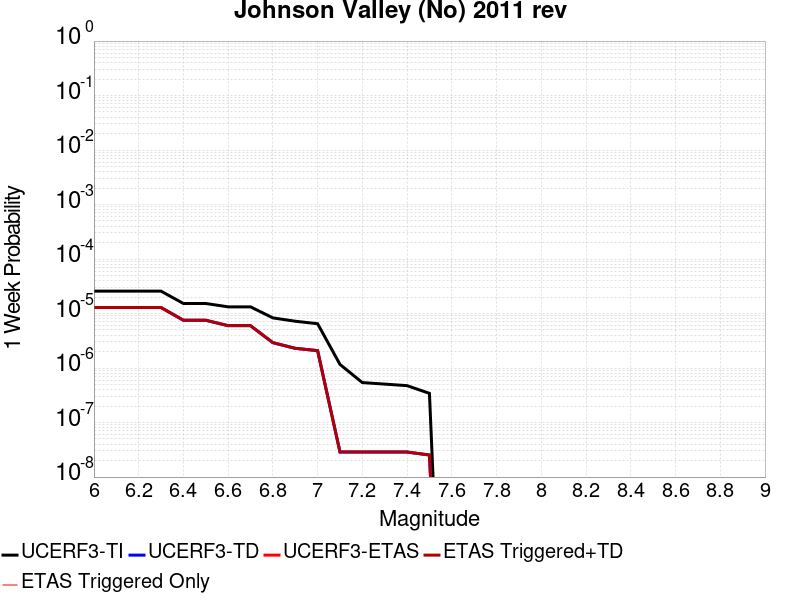 | 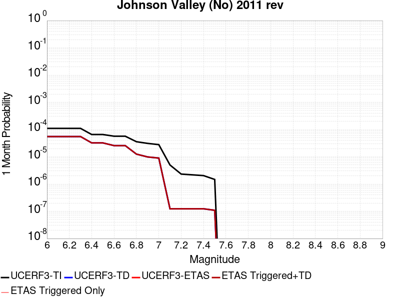 | 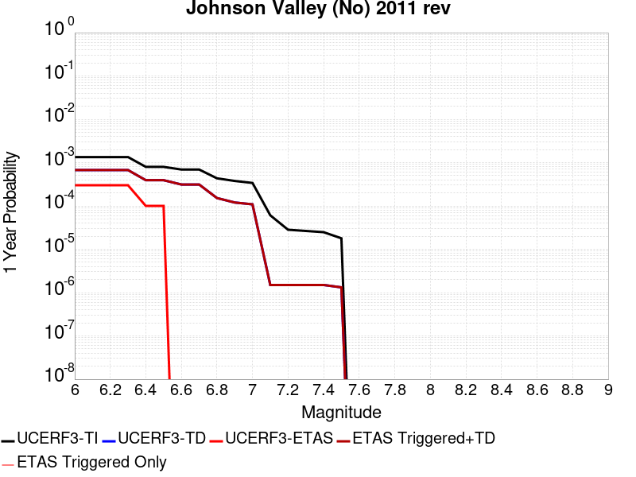 | 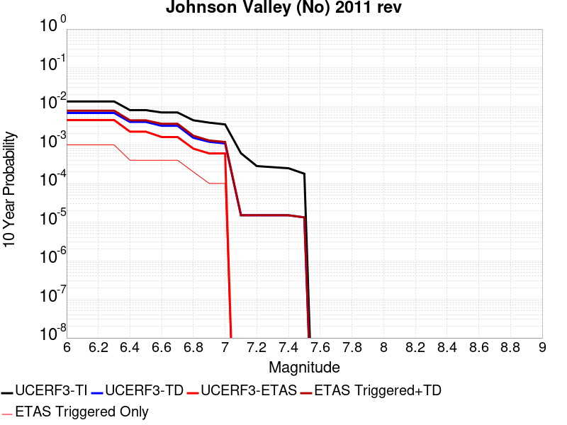 |

| Magnitude | 1 wk TI Prob | 1 wk TD Prob | 1 wk ETAS Prob | 1 wk ETAS/TD Gain | 1 wk ETAS Triggered+TD | 1 wk ETAS Triggered Only | 1 mo TI Prob | 1 mo TD Prob | 1 mo ETAS Prob | 1 mo ETAS/TD Gain | 1 mo ETAS Triggered+TD | 1 mo ETAS Triggered Only | 1 yr TI Prob | 1 yr TD Prob | 1 yr ETAS Prob | 1 yr ETAS/TD Gain | 1 yr ETAS Triggered+TD | 1 yr ETAS Triggered Only | 10 yr TI Prob | 10 yr TD Prob | 10 yr ETAS Prob | 10 yr ETAS/TD Gain | 10 yr ETAS Triggered+TD | 10 yr ETAS Triggered Only |
|-----|-----|-----|-----|-----|-----|-----|-----|-----|-----|-----|-----|-----|-----|-----|-----|-----|-----|-----|-----|-----|-----|-----|-----|-----|
| 6.0 | 2.577707E-5 | 1.2904266E-5 | 0.0 | 0.0 | 1.2904266E-5 | 0.0 | 1.1046848E-4 | 5.530305E-5 | 0.0 | 0.0 | 5.530305E-5 | 0.0 | 0.0013441239 | 6.7314634E-4 | 3.0E-4 | 0.4456683 | 6.7314634E-4 | 0.0 | 0.013360229 | 0.0067149843 | 0.0044 | 0.65525097 | 0.0077082696 | 0.001 |
| 6.1 | 2.577707E-5 | 1.2904266E-5 | 0.0 | 0.0 | 1.2904266E-5 | 0.0 | 1.1046848E-4 | 5.530305E-5 | 0.0 | 0.0 | 5.530305E-5 | 0.0 | 0.0013441239 | 6.7314634E-4 | 3.0E-4 | 0.4456683 | 6.7314634E-4 | 0.0 | 0.013360229 | 0.0067149843 | 0.0044 | 0.65525097 | 0.0077082696 | 0.001 |
| 6.2 | 2.577707E-5 | 1.2904266E-5 | 0.0 | 0.0 | 1.2904266E-5 | 0.0 | 1.1046848E-4 | 5.530305E-5 | 0.0 | 0.0 | 5.530305E-5 | 0.0 | 0.0013441239 | 6.7314634E-4 | 3.0E-4 | 0.4456683 | 6.7314634E-4 | 0.0 | 0.013360229 | 0.0067149843 | 0.0044 | 0.65525097 | 0.0077082696 | 0.001 |
| 6.3 | 2.577707E-5 | 1.2904266E-5 | 0.0 | 0.0 | 1.2904266E-5 | 0.0 | 1.1046848E-4 | 5.530305E-5 | 0.0 | 0.0 | 5.530305E-5 | 0.0 | 0.0013441239 | 6.7314634E-4 | 3.0E-4 | 0.4456683 | 6.7314634E-4 | 0.0 | 0.013360229 | 0.0067149843 | 0.0044 | 0.65525097 | 0.0077082696 | 0.001 |
| 6.4 | 1.5296591E-5 | 7.538919E-6 | 0.0 | 0.0 | 7.538919E-6 | 0.0 | 6.555518E-5 | 3.230936E-5 | 0.0 | 0.0 | 3.230936E-5 | 0.0 | 7.97842E-4 | 3.933142E-4 | 1.0E-4 | 0.25424966 | 3.933142E-4 | 0.0 | 0.007949836 | 0.003928023 | 0.0022 | 0.56007814 | 0.004326452 | 4.0E-4 |
| 6.5 | 1.5296591E-5 | 7.538919E-6 | 0.0 | 0.0 | 7.538919E-6 | 0.0 | 6.555518E-5 | 3.230936E-5 | 0.0 | 0.0 | 3.230936E-5 | 0.0 | 7.97842E-4 | 3.933142E-4 | 1.0E-4 | 0.25424966 | 3.933142E-4 | 0.0 | 0.007949836 | 0.003928023 | 0.0022 | 0.56007814 | 0.004326452 | 4.0E-4 |
| 6.6 | 1.3289383E-5 | 5.993596E-6 | 0.0 | 0.0 | 5.993596E-6 | 0.0 | 5.6953253E-5 | 2.5686684E-5 | 0.0 | 0.0 | 2.5686684E-5 | 0.0 | 6.9318525E-4 | 3.1270747E-4 | 0.0 | 0.0 | 3.1270747E-4 | 0.0 | 0.0069102696 | 0.0031243397 | 0.0016 | 0.5121082 | 0.00352309 | 4.0E-4 |
| 6.7 | 1.3289383E-5 | 5.993596E-6 | 0.0 | 0.0 | 5.993596E-6 | 0.0 | 5.6953253E-5 | 2.5686684E-5 | 0.0 | 0.0 | 2.5686684E-5 | 0.0 | 6.9318525E-4 | 3.1270747E-4 | 0.0 | 0.0 | 3.1270747E-4 | 0.0 | 0.0069102696 | 0.0031243397 | 0.0016 | 0.5121082 | 0.00352309 | 4.0E-4 |
| 6.8 | 8.330789E-6 | 2.9223409E-6 | 0.0 | 0.0 | 2.9223409E-6 | 0.0 | 3.570289E-5 | 1.252429E-5 | 0.0 | 0.0 | 1.252429E-5 | 0.0 | 4.34596E-4 | 1.5247827E-4 | 0.0 | 0.0 | 1.5247827E-4 | 0.0 | 0.0043374705 | 0.0015242968 | 8.0E-4 | 0.5248322 | 0.0017239919 | 2.0E-4 |
| 6.9 | 7.2359003E-6 | 2.3021403E-6 | 0.0 | 0.0 | 2.3021403E-6 | 0.0 | 3.1010633E-5 | 9.866309E-6 | 0.0 | 0.0 | 9.866309E-6 | 0.0 | 3.7748902E-4 | 1.2012102E-4 | 0.0 | 0.0 | 1.2012102E-4 | 0.0 | 0.0037684843 | 0.0012010841 | 6.0E-4 | 0.49954867 | 0.001300964 | 1.0E-4 |
| 7.0 | 6.5149957E-6 | 2.08931E-6 | 0.0 | 0.0 | 2.08931E-6 | 0.0 | 2.792111E-5 | 8.954185E-6 | 0.0 | 0.0 | 8.954185E-6 | 0.0 | 3.398865E-4 | 1.09017055E-4 | 0.0 | 0.0 | 1.09017055E-4 | 0.0 | 0.003393671 | 0.0010901559 | 6.0E-4 | 0.55038 | 0.0011900469 | 1.0E-4 |
| 7.1 | 1.1662233E-6 | 2.8821528E-8 | 0.0 | 0.0 | 2.8821528E-8 | 0.0 | 4.9980904E-6 | 1.2352083E-7 | 0.0 | 0.0 | 1.2352083E-7 | 0.0 | 6.0850052E-5 | 1.5038653E-6 | 0.0 | 0.0 | 1.5038653E-6 | 0.0 | 6.083339E-4 | 1.5038568E-5 | 0.0 | 0.0 | 1.5038568E-5 | 0.0 |
| 7.2 | 5.413881E-7 | 2.8821528E-8 | 0.0 | 0.0 | 2.8821528E-8 | 0.0 | 2.3202326E-6 | 1.2352083E-7 | 0.0 | 0.0 | 1.2352083E-7 | 0.0 | 2.8248465E-5 | 1.5038653E-6 | 0.0 | 0.0 | 1.5038653E-6 | 0.0 | 2.8244875E-4 | 1.5038568E-5 | 0.0 | 0.0 | 1.5038568E-5 | 0.0 |
| 7.3 | 5.076821E-7 | 2.8821528E-8 | 0.0 | 0.0 | 2.8821528E-8 | 0.0 | 2.1757785E-6 | 1.2352083E-7 | 0.0 | 0.0 | 1.2352083E-7 | 0.0 | 2.648978E-5 | 1.5038653E-6 | 0.0 | 0.0 | 1.5038653E-6 | 0.0 | 2.6486625E-4 | 1.5038568E-5 | 0.0 | 0.0 | 1.5038568E-5 | 0.0 |
| 7.4 | 4.7568687E-7 | 2.8803434E-8 | 0.0 | 0.0 | 2.8803434E-8 | 0.0 | 2.0386565E-6 | 1.2344329E-7 | 0.0 | 0.0 | 1.2344329E-7 | 0.0 | 2.482036E-5 | 1.5029211E-6 | 0.0 | 0.0 | 1.5029211E-6 | 0.0 | 2.4817587E-4 | 1.5029126E-5 | 0.0 | 0.0 | 1.5029126E-5 | 0.0 |
| 7.5 | 3.435626E-7 | 2.5374419E-8 | 0.0 | 0.0 | 2.5374419E-8 | 0.0 | 1.4724103E-6 | 1.0874751E-7 | 0.0 | 0.0 | 1.0874751E-7 | 0.0 | 1.7926448E-5 | 1.3240003E-6 | 0.0 | 0.0 | 1.3240003E-6 | 0.0 | 1.7925001E-4 | 1.323994E-5 | 0.0 | 0.0 | 1.323994E-5 | 0.0 |

## Likely 2011 CFM
*[(top)](#table-of-contents)*

| 1 Week | 1 Month | 1 Year | 10 Year |
|-----|-----|-----|-----|
| 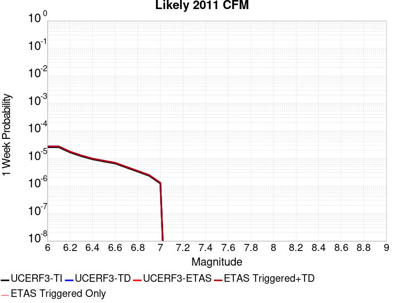 | 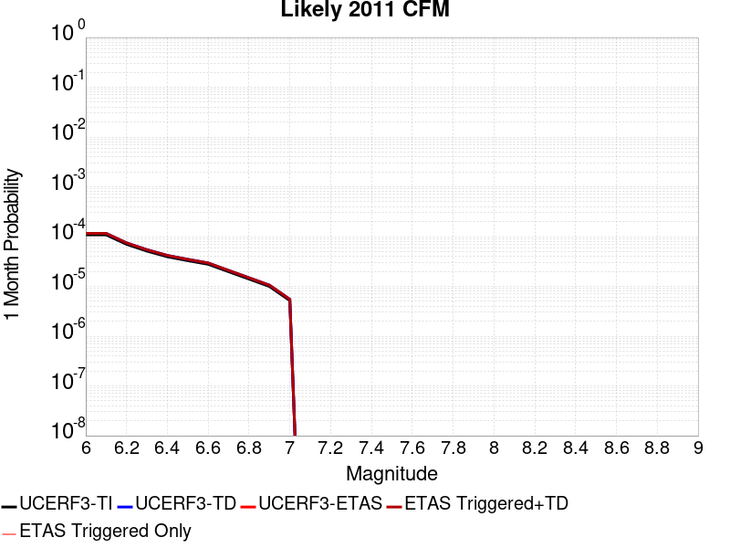 | 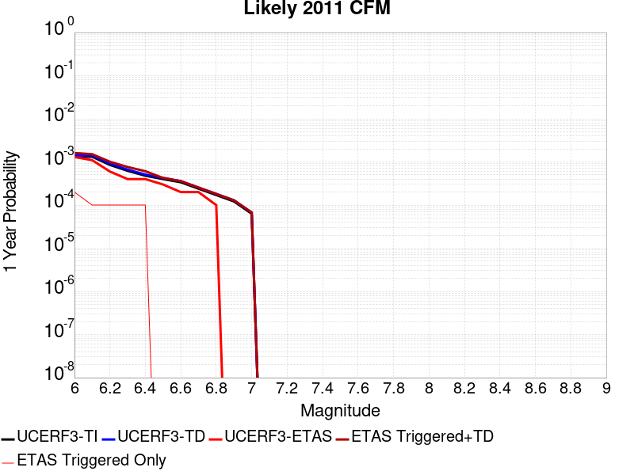 | 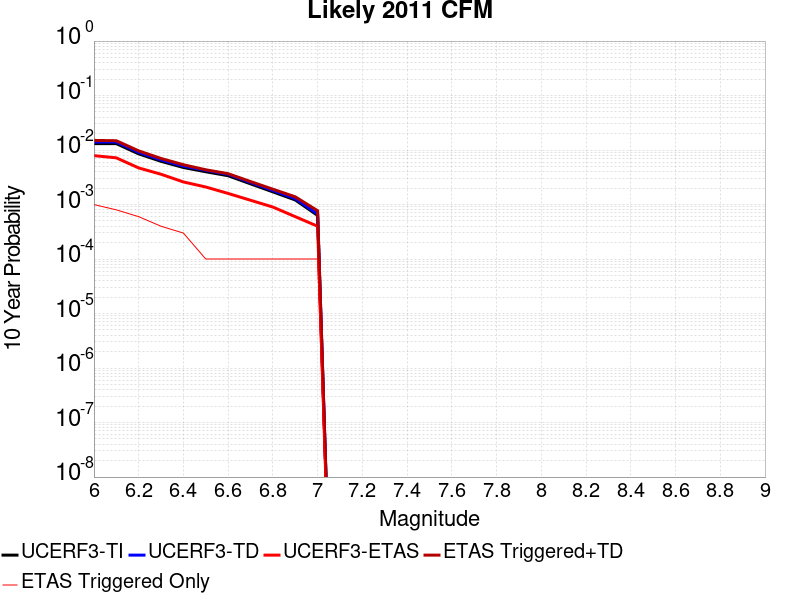 |

| Magnitude | 1 wk TI Prob | 1 wk TD Prob | 1 wk ETAS Prob | 1 wk ETAS/TD Gain | 1 wk ETAS Triggered+TD | 1 wk ETAS Triggered Only | 1 mo TI Prob | 1 mo TD Prob | 1 mo ETAS Prob | 1 mo ETAS/TD Gain | 1 mo ETAS Triggered+TD | 1 mo ETAS Triggered Only | 1 yr TI Prob | 1 yr TD Prob | 1 yr ETAS Prob | 1 yr ETAS/TD Gain | 1 yr ETAS Triggered+TD | 1 yr ETAS Triggered Only | 10 yr TI Prob | 10 yr TD Prob | 10 yr ETAS Prob | 10 yr ETAS/TD Gain | 10 yr ETAS Triggered+TD | 10 yr ETAS Triggered Only |
|-----|-----|-----|-----|-----|-----|-----|-----|-----|-----|-----|-----|-----|-----|-----|-----|-----|-----|-----|-----|-----|-----|-----|-----|-----|
| 6.0 | 2.5315949E-5 | 2.7108554E-5 | 0.0 | 0.0 | 2.7108554E-5 | 0.0 | 1.0849241E-4 | 1.1617459E-4 | 0.0 | 0.0 | 1.1617459E-4 | 0.0 | 0.0013200947 | 0.0014135524 | 0.0013 | 0.91966873 | 0.0016132698 | 2.0E-4 | 0.013122803 | 0.0140502695 | 0.0079 | 0.56226677 | 0.01503622 | 0.001 |
| 6.1 | 2.5315949E-5 | 2.7108554E-5 | 0.0 | 0.0 | 2.7108554E-5 | 0.0 | 1.0849241E-4 | 1.1617459E-4 | 0.0 | 0.0 | 1.1617459E-4 | 0.0 | 0.0013200947 | 0.0014135524 | 0.0011 | 0.7781812 | 0.0015134112 | 1.0E-4 | 0.013122803 | 0.0140502695 | 0.0072 | 0.5124457 | 0.01483903 | 8.0E-4 |
| 6.2 | 1.6375941E-5 | 1.746815E-5 | 0.0 | 0.0 | 1.746815E-5 | 0.0 | 7.0180715E-5 | 7.486142E-5 | 0.0 | 0.0 | 7.486142E-5 | 0.0 | 8.5411523E-4 | 9.11069E-4 | 6.0E-4 | 0.6585671 | 0.0010109779 | 1.0E-4 | 0.008508399 | 0.0090746265 | 0.0047 | 0.51792765 | 0.009669182 | 6.0E-4 |
| 6.3 | 1.1945543E-5 | 1.2714207E-5 | 0.0 | 0.0 | 1.2714207E-5 | 0.0 | 5.119418E-5 | 5.448835E-5 | 0.0 | 0.0 | 5.448835E-5 | 0.0 | 6.2311086E-4 | 6.6319905E-4 | 4.0E-4 | 0.60313714 | 7.6313276E-4 | 1.0E-4 | 0.0062136655 | 0.0066127544 | 0.0036 | 0.5444025 | 0.0070101093 | 4.0E-4 |
| 6.4 | 9.192729E-6 | 9.769702E-6 | 0.0 | 0.0 | 9.769702E-6 | 0.0 | 3.939681E-5 | 4.1869494E-5 | 0.0 | 0.0 | 4.1869494E-5 | 0.0 | 4.7955062E-4 | 5.0964457E-4 | 4.0E-4 | 0.78486073 | 6.095936E-4 | 1.0E-4 | 0.004785171 | 0.0050850394 | 0.0026 | 0.5113038 | 0.005383514 | 3.0E-4 |
| 6.5 | 7.67906E-6 | 8.15362E-6 | 0.0 | 0.0 | 8.15362E-6 | 0.0 | 3.2909844E-5 | 3.4943627E-5 | 0.0 | 0.0 | 3.4943627E-5 | 0.0 | 4.006037E-4 | 4.253575E-4 | 3.0E-4 | 0.7052891 | 4.253575E-4 | 0.0 | 0.0039988225 | 0.0042456263 | 0.0021 | 0.49462667 | 0.004345202 | 1.0E-4 |
| 6.6 | 6.4884057E-6 | 6.8855848E-6 | 0.0 | 0.0 | 6.8855848E-6 | 0.0 | 2.7807157E-5 | 2.9509323E-5 | 0.0 | 0.0 | 2.9509323E-5 | 0.0 | 3.3849955E-4 | 3.5921822E-4 | 2.0E-4 | 0.55676466 | 3.5921822E-4 | 0.0 | 0.003379844 | 0.0035865204 | 0.0016 | 0.44611484 | 0.003686162 | 1.0E-4 |
| 6.7 | 4.6060636E-6 | 4.884626E-6 | 0.0 | 0.0 | 4.884626E-6 | 0.0 | 1.9740122E-5 | 2.0933947E-5 | 0.0 | 0.0 | 2.0933947E-5 | 0.0 | 2.403095E-4 | 2.5484184E-4 | 2.0E-4 | 0.7848005 | 2.5484184E-4 | 0.0 | 0.002400498 | 0.0025455789 | 0.0012 | 0.47140554 | 0.0026453244 | 1.0E-4 |
| 6.8 | 3.2795615E-6 | 3.477789E-6 | 0.0 | 0.0 | 3.477789E-6 | 0.0 | 1.4055187E-5 | 1.4904728E-5 | 0.0 | 0.0 | 1.4904728E-5 | 0.0 | 1.7110848E-4 | 1.8145051E-4 | 1.0E-4 | 0.55111444 | 1.8145051E-4 | 0.0 | 0.0017097679 | 0.0018130789 | 9.0E-4 | 0.49639317 | 0.0019128976 | 1.0E-4 |
| 6.9 | 2.3289967E-6 | 2.4708547E-6 | 0.0 | 0.0 | 2.4708547E-6 | 0.0 | 9.981376E-6 | 1.0589337E-5 | 0.0 | 0.0 | 1.0589337E-5 | 0.0 | 1.2151648E-4 | 1.2891798E-4 | 0.0 | 0.0 | 1.2891798E-4 | 0.0 | 0.0012145005 | 0.0012884749 | 6.0E-4 | 0.4656668 | 0.0013883461 | 1.0E-4 |
| 7.0 | 1.211292E-6 | 1.2865539E-6 | 0.0 | 0.0 | 1.2865539E-6 | 0.0 | 5.1912407E-6 | 5.5137925E-6 | 0.0 | 0.0 | 5.5137925E-6 | 0.0 | 6.320152E-5 | 6.712866E-5 | 0.0 | 0.0 | 6.712866E-5 | 0.0 | 6.3183554E-4 | 6.7111367E-4 | 4.0E-4 | 0.5960242 | 7.7104656E-4 | 1.0E-4 |

## San Juan
*[(top)](#table-of-contents)*

| 1 Week | 1 Month | 1 Year | 10 Year |
|-----|-----|-----|-----|
| 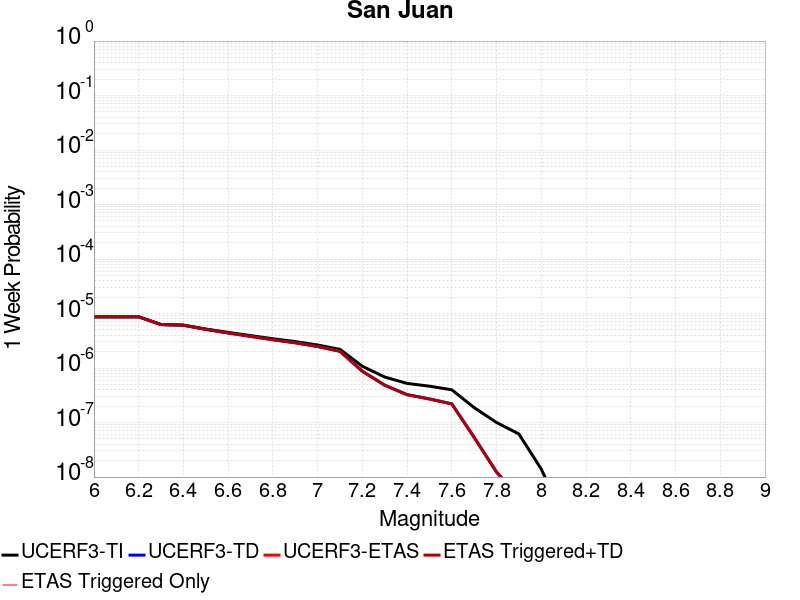 | 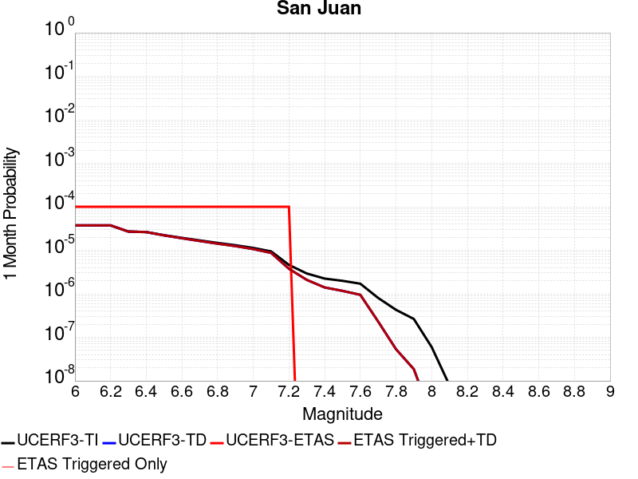 | 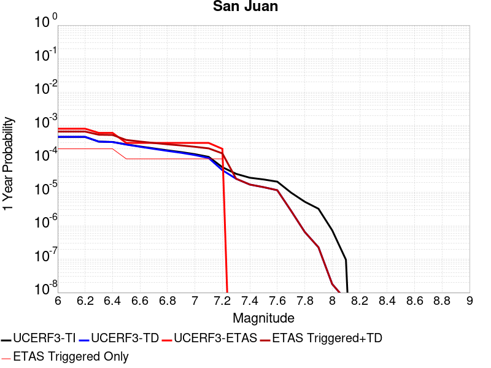 | 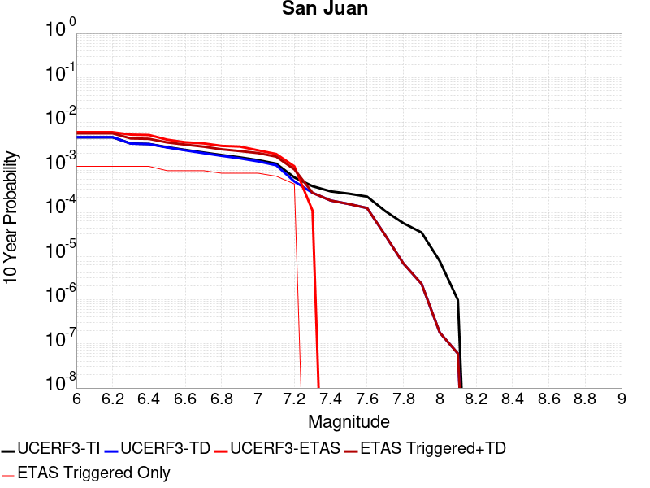 |

| Magnitude | 1 wk TI Prob | 1 wk TD Prob | 1 wk ETAS Prob | 1 wk ETAS/TD Gain | 1 wk ETAS Triggered+TD | 1 wk ETAS Triggered Only | 1 mo TI Prob | 1 mo TD Prob | 1 mo ETAS Prob | 1 mo ETAS/TD Gain | 1 mo ETAS Triggered+TD | 1 mo ETAS Triggered Only | 1 yr TI Prob | 1 yr TD Prob | 1 yr ETAS Prob | 1 yr ETAS/TD Gain | 1 yr ETAS Triggered+TD | 1 yr ETAS Triggered Only | 10 yr TI Prob | 10 yr TD Prob | 10 yr ETAS Prob | 10 yr ETAS/TD Gain | 10 yr ETAS Triggered+TD | 10 yr ETAS Triggered Only |
|-----|-----|-----|-----|-----|-----|-----|-----|-----|-----|-----|-----|-----|-----|-----|-----|-----|-----|-----|-----|-----|-----|-----|-----|-----|
| 6.0 | 8.682808E-6 | 8.755393E-6 | 0.0 | 0.0 | 8.755393E-6 | 0.0 | 3.72115E-5 | 3.7522597E-5 | 1.0E-4 | 2.6650605 | 3.7522597E-5 | 0.0 | 4.5295584E-4 | 4.567467E-4 | 8.0E-4 | 1.7515179 | 6.5665535E-4 | 2.0E-4 | 0.004520337 | 0.0045586214 | 0.0059 | 1.2942508 | 0.005554063 | 0.001 |
| 6.1 | 8.682808E-6 | 8.755393E-6 | 0.0 | 0.0 | 8.755393E-6 | 0.0 | 3.72115E-5 | 3.7522597E-5 | 1.0E-4 | 2.6650605 | 3.7522597E-5 | 0.0 | 4.5295584E-4 | 4.567467E-4 | 8.0E-4 | 1.7515179 | 6.5665535E-4 | 2.0E-4 | 0.004520337 | 0.0045586214 | 0.0059 | 1.2942508 | 0.005554063 | 0.001 |
| 6.2 | 8.682808E-6 | 8.755393E-6 | 0.0 | 0.0 | 8.755393E-6 | 0.0 | 3.72115E-5 | 3.7522597E-5 | 1.0E-4 | 2.6650605 | 3.7522597E-5 | 0.0 | 4.5295584E-4 | 4.567467E-4 | 8.0E-4 | 1.7515179 | 6.5665535E-4 | 2.0E-4 | 0.004520337 | 0.0045586214 | 0.0059 | 1.2942508 | 0.005554063 | 0.001 |
| 6.3 | 6.3054235E-6 | 6.2886306E-6 | 0.0 | 0.0 | 6.2886306E-6 | 0.0 | 2.7022963E-5 | 2.6951004E-5 | 1.0E-4 | 3.710437 | 2.6951004E-5 | 0.0 | 3.2895492E-4 | 3.2808047E-4 | 6.0E-4 | 1.8288196 | 5.2801485E-4 | 2.0E-4 | 0.003284684 | 0.003276162 | 0.0052 | 1.587223 | 0.004272886 | 0.001 |
| 6.4 | 6.1490473E-6 | 6.1197193E-6 | 0.0 | 0.0 | 6.1197193E-6 | 0.0 | 2.6352795E-5 | 2.6227111E-5 | 1.0E-4 | 3.8128483 | 2.6227111E-5 | 0.0 | 3.2079802E-4 | 3.192697E-4 | 6.0E-4 | 1.879289 | 5.192058E-4 | 2.0E-4 | 0.0032033534 | 0.0031883072 | 0.0051 | 1.5995948 | 0.004185119 | 0.001 |
| 6.5 | 5.204848E-6 | 5.142327E-6 | 0.0 | 0.0 | 5.142327E-6 | 0.0 | 2.23063E-5 | 2.2038364E-5 | 1.0E-4 | 4.537542 | 2.2038364E-5 | 0.0 | 2.7154534E-4 | 2.6828502E-4 | 3.0E-4 | 1.1182138 | 3.682582E-4 | 1.0E-4 | 0.0027121378 | 0.0026797664 | 0.004 | 1.4926674 | 0.0034776225 | 8.0E-4 |
| 6.6 | 4.5179986E-6 | 4.418915E-6 | 0.0 | 0.0 | 4.418915E-6 | 0.0 | 1.9362706E-5 | 1.8938075E-5 | 1.0E-4 | 5.280368 | 1.8938075E-5 | 0.0 | 2.3571544E-4 | 2.3054745E-4 | 3.0E-4 | 1.3012506 | 3.305244E-4 | 1.0E-4 | 0.0023546559 | 0.0023032208 | 0.0035 | 1.5196112 | 0.0031013782 | 8.0E-4 |
| 6.7 | 3.9442616E-6 | 3.8233297E-6 | 0.0 | 0.0 | 3.8233297E-6 | 0.0 | 1.6903869E-5 | 1.6385598E-5 | 1.0E-4 | 6.10292 | 1.6385598E-5 | 0.0 | 2.0578515E-4 | 1.9947707E-4 | 3.0E-4 | 1.5039322 | 2.9945714E-4 | 1.0E-4 | 0.002055947 | 0.001993106 | 0.0033 | 1.6557071 | 0.0027915116 | 8.0E-4 |
| 6.8 | 3.4536245E-6 | 3.3197027E-6 | 0.0 | 0.0 | 3.3197027E-6 | 0.0 | 1.4801163E-5 | 1.4227224E-5 | 1.0E-4 | 7.0287786 | 1.4227224E-5 | 0.0 | 1.8018926E-4 | 1.7320328E-4 | 3.0E-4 | 1.7320688 | 2.7318596E-4 | 1.0E-4 | 0.0018004322 | 0.0017308028 | 0.0029 | 1.675523 | 0.0024295913 | 7.0E-4 |
| 6.9 | 3.059865E-6 | 2.91526E-6 | 0.0 | 0.0 | 2.91526E-6 | 0.0 | 1.3113641E-5 | 1.2493915E-5 | 1.0E-4 | 8.003897 | 1.2493915E-5 | 0.0 | 1.596469E-4 | 1.5210337E-4 | 3.0E-4 | 1.972343 | 2.5208815E-4 | 1.0E-4 | 0.0015953224 | 0.0015201082 | 0.0028 | 1.8419741 | 0.0022190441 | 7.0E-4 |
| 7.0 | 2.6504351E-6 | 2.4950646E-6 | 0.0 | 0.0 | 2.4950646E-6 | 0.0 | 1.1358958E-5 | 1.0693093E-5 | 1.0E-4 | 9.351831 | 1.0693093E-5 | 0.0 | 1.3828653E-4 | 1.3018117E-4 | 3.0E-4 | 2.3044806 | 2.3016815E-4 | 1.0E-4 | 0.0013820052 | 0.001301162 | 0.0023 | 1.7676507 | 0.002000251 | 7.0E-4 |
| 7.1 | 2.2039317E-6 | 2.0363918E-6 | 0.0 | 0.0 | 2.0363918E-6 | 0.0 | 9.445387E-6 | 8.7273675E-6 | 1.0E-4 | 11.458209 | 8.7273675E-6 | 0.0 | 1.1499152E-4 | 1.0625104E-4 | 3.0E-4 | 2.8235016 | 2.0624042E-4 | 1.0E-4 | 0.0011493203 | 0.0010621134 | 0.0019 | 1.7888862 | 0.0016614762 | 6.0E-4 |
| 7.2 | 1.0786707E-6 | 8.7925275E-7 | 0.0 | 0.0 | 8.7925275E-7 | 0.0 | 4.622866E-6 | 3.7682207E-6 | 1.0E-4 | 26.537724 | 3.7682207E-6 | 0.0 | 5.628194E-5 | 4.5877132E-5 | 2.0E-4 | 4.3594704 | 1.4587255E-4 | 1.0E-4 | 5.6267687E-4 | 4.587366E-4 | 0.001 | 2.1799002 | 8.585531E-4 | 4.0E-4 |
| 7.3 | 6.846433E-7 | 4.8812893E-7 | 0.0 | 0.0 | 4.8812893E-7 | 0.0 | 2.9341822E-6 | 2.0919795E-6 | 0.0 | 0.0 | 2.0919795E-6 | 0.0 | 3.5723086E-5 | 2.5469553E-5 | 0.0 | 0.0 | 2.5469553E-5 | 0.0 | 3.571734E-4 | 2.5469938E-4 | 1.0E-4 | 0.39261973 | 2.5469938E-4 | 0.0 |
| 7.4 | 5.23043E-7 | 3.272083E-7 | 0.0 | 0.0 | 3.272083E-7 | 0.0 | 2.2416111E-6 | 1.4023205E-6 | 0.0 | 0.0 | 1.4023205E-6 | 0.0 | 2.7291273E-5 | 1.707312E-5 | 0.0 | 0.0 | 1.707312E-5 | 0.0 | 2.7287923E-4 | 1.7074973E-4 | 0.0 | 0.0 | 1.7074973E-4 | 0.0 |
| 7.5 | 4.648444E-7 | 2.7314812E-7 | 0.0 | 0.0 | 2.7314812E-7 | 0.0 | 1.9921886E-6 | 1.1706343E-6 | 0.0 | 0.0 | 1.1706343E-6 | 0.0 | 2.4254627E-5 | 1.42523795E-5 | 0.0 | 0.0 | 1.42523795E-5 | 0.0 | 2.425198E-4 | 1.4254396E-4 | 0.0 | 0.0 | 1.4254396E-4 | 0.0 |
| 7.6 | 3.9906567E-7 | 2.2145973E-7 | 0.0 | 0.0 | 2.2145973E-7 | 0.0 | 1.7102802E-6 | 9.4911275E-7 | 0.0 | 0.0 | 9.4911275E-7 | 0.0 | 2.0822463E-5 | 1.1555388E-5 | 0.0 | 0.0 | 1.1555388E-5 | 0.0 | 2.0820512E-4 | 1.1557255E-4 | 0.0 | 0.0 | 1.1557255E-4 | 0.0 |
| 7.7 | 1.8784601E-7 | 5.390264E-8 | 0.0 | 0.0 | 5.390264E-8 | 0.0 | 8.0505407E-7 | 2.3101128E-7 | 0.0 | 0.0 | 2.3101128E-7 | 0.0 | 9.80149E-6 | 2.8125587E-6 | 0.0 | 0.0 | 2.8125587E-6 | 0.0 | 9.801057E-5 | 2.8134178E-5 | 0.0 | 0.0 | 2.8134178E-5 | 0.0 |
| 7.8 | 1.00154914E-7 | 1.2487742E-8 | 0.0 | 0.0 | 1.2487742E-8 | 0.0 | 4.2923529E-7 | 5.3518903E-8 | 0.0 | 0.0 | 5.3518903E-8 | 0.0 | 5.225927E-6 | 6.515925E-7 | 0.0 | 0.0 | 6.515925E-7 | 0.0 | 5.225804E-5 | 6.5219515E-6 | 0.0 | 0.0 | 6.5219515E-6 | 0.0 |
| 7.9 | 6.171429E-8 | 4.333618E-9 | 0.0 | 0.0 | 4.333618E-9 | 0.0 | 2.6448978E-7 | 1.857266E-8 | 0.0 | 0.0 | 1.857266E-8 | 0.0 | 3.2201583E-6 | 2.261221E-7 | 0.0 | 0.0 | 2.261221E-7 | 0.0 | 3.2201115E-5 | 2.266651E-6 | 0.0 | 0.0 | 2.266651E-6 | 0.0 |
| 8.0 | 1.3974572E-8 | 3.4454528E-10 | 0.0 | 0.0 | 3.4454528E-10 | 0.0 | 5.989102E-8 | 1.4766244E-9 | 0.0 | 0.0 | 1.4766244E-9 | 0.0 | 7.2917294E-7 | 1.7977897E-8 | 0.0 | 0.0 | 1.7977897E-8 | 0.0 | 7.2917055E-6 | 1.8419556E-7 | 0.0 | 0.0 | 1.8419556E-7 | 0.0 |
| 8.1 | 1.8403477E-9 | 1.1469492E-10 | 0.0 | 0.0 | 1.1469492E-10 | 0.0 | 7.887204E-9 | 4.9155136E-10 | 0.0 | 0.0 | 4.9155136E-10 | 0.0 | 9.602671E-8 | 5.984634E-9 | 0.0 | 0.0 | 5.984634E-9 | 0.0 | 9.602667E-7 | 6.1131445E-8 | 0.0 | 0.0 | 6.1131445E-8 | 0.0 |

## Newport-Inglewood alt 1
*[(top)](#table-of-contents)*

| 1 Week | 1 Month | 1 Year | 10 Year |
|-----|-----|-----|-----|
|  |  | 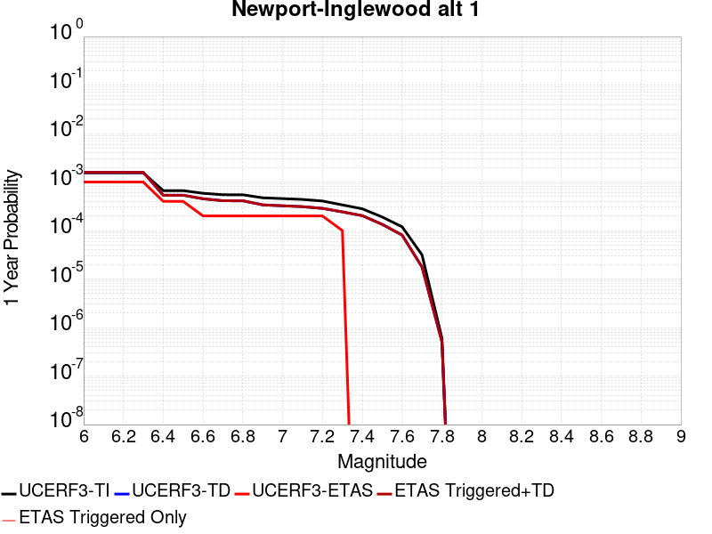 |  |

| Magnitude | 1 wk TI Prob | 1 wk TD Prob | 1 wk ETAS Prob | 1 wk ETAS/TD Gain | 1 wk ETAS Triggered+TD | 1 wk ETAS Triggered Only | 1 mo TI Prob | 1 mo TD Prob | 1 mo ETAS Prob | 1 mo ETAS/TD Gain | 1 mo ETAS Triggered+TD | 1 mo ETAS Triggered Only | 1 yr TI Prob | 1 yr TD Prob | 1 yr ETAS Prob | 1 yr ETAS/TD Gain | 1 yr ETAS Triggered+TD | 1 yr ETAS Triggered Only | 10 yr TI Prob | 10 yr TD Prob | 10 yr ETAS Prob | 10 yr ETAS/TD Gain | 10 yr ETAS Triggered+TD | 10 yr ETAS Triggered Only |
|-----|-----|-----|-----|-----|-----|-----|-----|-----|-----|-----|-----|-----|-----|-----|-----|-----|-----|-----|-----|-----|-----|-----|-----|-----|
| 6.0 | 2.9668912E-5 | 3.0414714E-5 | 0.0 | 0.0 | 3.0414714E-5 | 0.0 | 1.2714628E-4 | 1.30345E-4 | 2.0E-4 | 1.5343895 | 1.30345E-4 | 0.0 | 0.0015469068 | 0.0015862797 | 0.001 | 0.63040584 | 0.0015862797 | 0.0 | 0.015361829 | 0.015797213 | 0.0079 | 0.5000882 | 0.016682995 | 9.0E-4 |
| 6.1 | 2.9668912E-5 | 3.0414714E-5 | 0.0 | 0.0 | 3.0414714E-5 | 0.0 | 1.2714628E-4 | 1.30345E-4 | 2.0E-4 | 1.5343895 | 1.30345E-4 | 0.0 | 0.0015469068 | 0.0015862797 | 0.001 | 0.63040584 | 0.0015862797 | 0.0 | 0.015361829 | 0.015797213 | 0.0079 | 0.5000882 | 0.016682995 | 9.0E-4 |
| 6.2 | 2.9668912E-5 | 3.0414714E-5 | 0.0 | 0.0 | 3.0414714E-5 | 0.0 | 1.2714628E-4 | 1.30345E-4 | 2.0E-4 | 1.5343895 | 1.30345E-4 | 0.0 | 0.0015469068 | 0.0015862797 | 0.001 | 0.63040584 | 0.0015862797 | 0.0 | 0.015361829 | 0.015797213 | 0.0079 | 0.5000882 | 0.016682995 | 9.0E-4 |
| 6.3 | 2.9668912E-5 | 3.0414714E-5 | 0.0 | 0.0 | 3.0414714E-5 | 0.0 | 1.2714628E-4 | 1.30345E-4 | 2.0E-4 | 1.5343895 | 1.30345E-4 | 0.0 | 0.0015469068 | 0.0015862797 | 0.001 | 0.63040584 | 0.0015862797 | 0.0 | 0.015361829 | 0.015797213 | 0.0079 | 0.5000882 | 0.016682995 | 9.0E-4 |
| 6.4 | 1.275942E-5 | 1.0274426E-5 | 0.0 | 0.0 | 1.0274426E-5 | 0.0 | 5.4682085E-5 | 4.403254E-5 | 1.0E-4 | 2.2710478 | 4.403254E-5 | 0.0 | 6.65551E-4 | 5.359684E-4 | 4.0E-4 | 0.7463126 | 5.359684E-4 | 0.0 | 0.0066356123 | 0.005347183 | 0.0031 | 0.5797445 | 0.005844509 | 5.0E-4 |
| 6.5 | 1.275942E-5 | 1.0274426E-5 | 0.0 | 0.0 | 1.0274426E-5 | 0.0 | 5.4682085E-5 | 4.403254E-5 | 1.0E-4 | 2.2710478 | 4.403254E-5 | 0.0 | 6.65551E-4 | 5.359684E-4 | 4.0E-4 | 0.7463126 | 5.359684E-4 | 0.0 | 0.0066356123 | 0.005347183 | 0.0031 | 0.5797445 | 0.005844509 | 5.0E-4 |
| 6.6 | 1.1255358E-5 | 8.663389E-6 | 0.0 | 0.0 | 8.663389E-6 | 0.0 | 4.8236358E-5 | 3.712829E-5 | 1.0E-4 | 2.6933641 | 3.712829E-5 | 0.0 | 5.871194E-4 | 4.5194486E-4 | 2.0E-4 | 0.44253185 | 4.5194486E-4 | 0.0 | 0.005855706 | 0.004510435 | 0.0024 | 0.5320995 | 0.0050081797 | 5.0E-4 |
| 6.7 | 1.0504745E-5 | 7.90116E-6 | 0.0 | 0.0 | 7.90116E-6 | 0.0 | 4.5019555E-5 | 3.386168E-5 | 1.0E-4 | 2.9531908 | 3.386168E-5 | 0.0 | 5.4797524E-4 | 4.121892E-4 | 2.0E-4 | 0.48521405 | 4.121892E-4 | 0.0 | 0.0054662596 | 0.004114377 | 0.0024 | 0.58332044 | 0.0046123196 | 5.0E-4 |
| 6.8 | 1.0476007E-5 | 7.882539E-6 | 0.0 | 0.0 | 7.882539E-6 | 0.0 | 4.4896402E-5 | 3.378188E-5 | 1.0E-4 | 2.960167 | 3.378188E-5 | 0.0 | 5.464766E-4 | 4.1121797E-4 | 2.0E-4 | 0.48636004 | 4.1121797E-4 | 0.0 | 0.005451347 | 0.0041047004 | 0.0023 | 0.5603332 | 0.0045030587 | 4.0E-4 |
| 6.9 | 9.076797E-6 | 6.4906994E-6 | 0.0 | 0.0 | 6.4906994E-6 | 0.0 | 3.889998E-5 | 2.7816988E-5 | 1.0E-4 | 3.5949254 | 2.7816988E-5 | 0.0 | 4.7350433E-4 | 3.3861955E-4 | 2.0E-4 | 0.5906334 | 3.3861955E-4 | 0.0 | 0.004724967 | 0.0033810732 | 0.002 | 0.5915282 | 0.003580397 | 2.0E-4 |
| 7.0 | 8.73795E-6 | 6.2130493E-6 | 0.0 | 0.0 | 6.2130493E-6 | 0.0 | 3.7447822E-5 | 2.6627084E-5 | 1.0E-4 | 3.7555747 | 2.6627084E-5 | 0.0 | 4.5583185E-4 | 3.2413678E-4 | 2.0E-4 | 0.61702347 | 3.2413678E-4 | 0.0 | 0.0045489795 | 0.003236672 | 0.0019 | 0.5870228 | 0.003336348 | 1.0E-4 |
| 7.1 | 8.391299E-6 | 5.9567383E-6 | 0.0 | 0.0 | 5.9567383E-6 | 0.0 | 3.5962214E-5 | 2.5528629E-5 | 1.0E-4 | 3.9171708 | 2.5528629E-5 | 0.0 | 4.37752E-4 | 3.10767E-4 | 2.0E-4 | 0.643569 | 3.10767E-4 | 0.0 | 0.004368907 | 0.0031033538 | 0.0018 | 0.5800177 | 0.0032030435 | 1.0E-4 |
| 7.2 | 7.796882E-6 | 5.497387E-6 | 0.0 | 0.0 | 5.497387E-6 | 0.0 | 3.341478E-5 | 2.3560018E-5 | 1.0E-4 | 4.2444787 | 2.3560018E-5 | 0.0 | 4.06749E-4 | 2.868057E-4 | 2.0E-4 | 0.69733626 | 2.868057E-4 | 0.0 | 0.0040600533 | 0.0028643794 | 0.0018 | 0.6284084 | 0.0029640931 | 1.0E-4 |
| 7.3 | 6.4738833E-6 | 4.648451E-6 | 0.0 | 0.0 | 4.648451E-6 | 0.0 | 2.774492E-5 | 1.9921783E-5 | 1.0E-4 | 5.0196314 | 1.9921783E-5 | 0.0 | 3.3774204E-4 | 2.4252085E-4 | 1.0E-4 | 0.41233566 | 2.4252085E-4 | 0.0 | 0.0033722918 | 0.0024225786 | 0.0016 | 0.66045326 | 0.0024225786 | 0.0 |
| 7.4 | 5.382145E-6 | 3.886238E-6 | 0.0 | 0.0 | 3.886238E-6 | 0.0 | 2.3066134E-5 | 1.66552E-5 | 0.0 | 0.0 | 1.66552E-5 | 0.0 | 2.8079396E-4 | 2.0275834E-4 | 0.0 | 0.0 | 2.0275834E-4 | 0.0 | 0.0028043943 | 0.002025748 | 0.0012 | 0.5923738 | 0.002025748 | 0.0 |
| 7.5 | 3.648244E-6 | 2.574145E-6 | 0.0 | 0.0 | 2.574145E-6 | 0.0 | 1.5635238E-5 | 1.1032004E-5 | 0.0 | 0.0 | 1.1032004E-5 | 0.0 | 1.9034238E-4 | 1.3430648E-4 | 0.0 | 0.0 | 1.3430648E-4 | 0.0 | 0.0019017943 | 0.0013422634 | 0.0011 | 0.81951123 | 0.0013422634 | 0.0 |
| 7.6 | 2.2906888E-6 | 1.5481912E-6 | 0.0 | 0.0 | 1.5481912E-6 | 0.0 | 9.817201E-6 | 6.6350885E-6 | 0.0 | 0.0 | 6.6350885E-6 | 0.0 | 1.1951787E-4 | 8.0779275E-5 | 0.0 | 0.0 | 8.0779275E-5 | 0.0 | 0.0011945361 | 8.0750586E-4 | 0.001 | 1.2383811 | 8.0750586E-4 | 0.0 |
| 7.7 | 6.0479874E-7 | 3.3980027E-7 | 0.0 | 0.0 | 3.3980027E-7 | 0.0 | 2.5919921E-6 | 1.4562861E-6 | 0.0 | 0.0 | 1.4562861E-6 | 0.0 | 3.1557047E-5 | 1.7730154E-5 | 0.0 | 0.0 | 1.7730154E-5 | 0.0 | 3.1552566E-4 | 1.7728876E-4 | 2.0E-4 | 1.1281031 | 1.7728876E-4 | 0.0 |
| 7.8 | 1.16056995E-8 | 9.783043E-9 | 0.0 | 0.0 | 9.783043E-9 | 0.0 | 4.9738713E-8 | 4.192733E-8 | 0.0 | 0.0 | 4.192733E-8 | 0.0 | 6.0556863E-7 | 5.104652E-7 | 0.0 | 0.0 | 5.104652E-7 | 0.0 | 6.05567E-6 | 5.1046522E-6 | 0.0 | 0.0 | 5.1046522E-6 | 0.0 |

## Earthquake Valley
*[(top)](#table-of-contents)*

| 1 Week | 1 Month | 1 Year | 10 Year |
|-----|-----|-----|-----|
|  | 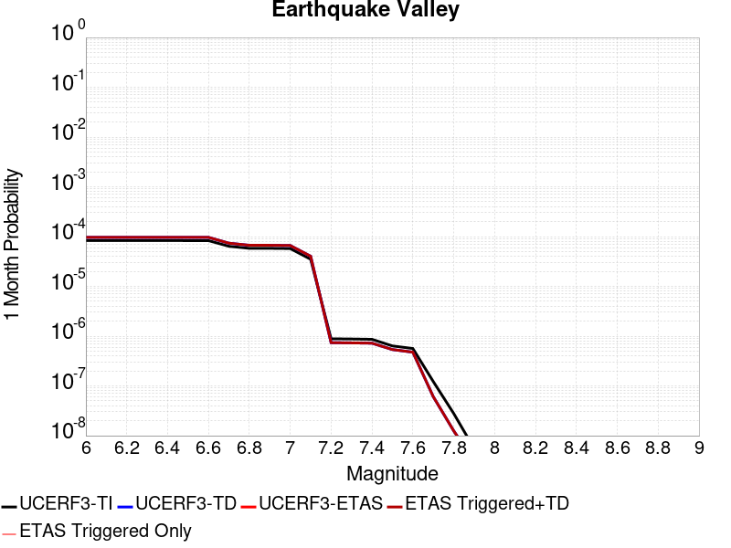 |  |  |

| Magnitude | 1 wk TI Prob | 1 wk TD Prob | 1 wk ETAS Prob | 1 wk ETAS/TD Gain | 1 wk ETAS Triggered+TD | 1 wk ETAS Triggered Only | 1 mo TI Prob | 1 mo TD Prob | 1 mo ETAS Prob | 1 mo ETAS/TD Gain | 1 mo ETAS Triggered+TD | 1 mo ETAS Triggered Only | 1 yr TI Prob | 1 yr TD Prob | 1 yr ETAS Prob | 1 yr ETAS/TD Gain | 1 yr ETAS Triggered+TD | 1 yr ETAS Triggered Only | 10 yr TI Prob | 10 yr TD Prob | 10 yr ETAS Prob | 10 yr ETAS/TD Gain | 10 yr ETAS Triggered+TD | 10 yr ETAS Triggered Only |
|-----|-----|-----|-----|-----|-----|-----|-----|-----|-----|-----|-----|-----|-----|-----|-----|-----|-----|-----|-----|-----|-----|-----|-----|-----|
| 6.0 | 1.9416384E-5 | 2.2591621E-5 | 0.0 | 0.0 | 2.2591621E-5 | 0.0 | 8.321042E-5 | 9.6818316E-5 | 0.0 | 0.0 | 9.6818316E-5 | 0.0 | 0.001012616 | 0.0011782453 | 9.0E-4 | 0.7638477 | 0.0013780097 | 2.0E-4 | 0.010080142 | 0.011731823 | 0.0055 | 0.46881035 | 0.012621265 | 9.0E-4 |
| 6.1 | 1.9416384E-5 | 2.2591621E-5 | 0.0 | 0.0 | 2.2591621E-5 | 0.0 | 8.321042E-5 | 9.6818316E-5 | 0.0 | 0.0 | 9.6818316E-5 | 0.0 | 0.001012616 | 0.0011782453 | 9.0E-4 | 0.7638477 | 0.0013780097 | 2.0E-4 | 0.010080142 | 0.011731823 | 0.0055 | 0.46881035 | 0.012621265 | 9.0E-4 |
| 6.2 | 1.9416384E-5 | 2.2591621E-5 | 0.0 | 0.0 | 2.2591621E-5 | 0.0 | 8.321042E-5 | 9.6818316E-5 | 0.0 | 0.0 | 9.6818316E-5 | 0.0 | 0.001012616 | 0.0011782453 | 9.0E-4 | 0.7638477 | 0.0013780097 | 2.0E-4 | 0.010080142 | 0.011731823 | 0.0055 | 0.46881035 | 0.012621265 | 9.0E-4 |
| 6.3 | 1.9416384E-5 | 2.2591621E-5 | 0.0 | 0.0 | 2.2591621E-5 | 0.0 | 8.321042E-5 | 9.6818316E-5 | 0.0 | 0.0 | 9.6818316E-5 | 0.0 | 0.001012616 | 0.0011782453 | 9.0E-4 | 0.7638477 | 0.0013780097 | 2.0E-4 | 0.010080142 | 0.011731823 | 0.0055 | 0.46881035 | 0.012621265 | 9.0E-4 |
| 6.4 | 1.9416384E-5 | 2.2591621E-5 | 0.0 | 0.0 | 2.2591621E-5 | 0.0 | 8.321042E-5 | 9.6818316E-5 | 0.0 | 0.0 | 9.6818316E-5 | 0.0 | 0.001012616 | 0.0011782453 | 9.0E-4 | 0.7638477 | 0.0013780097 | 2.0E-4 | 0.010080142 | 0.011731823 | 0.0055 | 0.46881035 | 0.012621265 | 9.0E-4 |
| 6.5 | 1.9389157E-5 | 2.25602E-5 | 0.0 | 0.0 | 2.25602E-5 | 0.0 | 8.309374E-5 | 9.668367E-5 | 0.0 | 0.0 | 9.668367E-5 | 0.0 | 0.0010111968 | 0.0011766077 | 9.0E-4 | 0.7649108 | 0.0013763724 | 2.0E-4 | 0.010066078 | 0.011715621 | 0.0055 | 0.4694587 | 0.012605077 | 9.0E-4 |
| 6.6 | 1.9389157E-5 | 2.25602E-5 | 0.0 | 0.0 | 2.25602E-5 | 0.0 | 8.309374E-5 | 9.668367E-5 | 0.0 | 0.0 | 9.668367E-5 | 0.0 | 0.0010111968 | 0.0011766077 | 9.0E-4 | 0.7649108 | 0.0013763724 | 2.0E-4 | 0.010066078 | 0.011715621 | 0.0055 | 0.4694587 | 0.012605077 | 9.0E-4 |
| 6.7 | 1.4925434E-5 | 1.7213628E-5 | 0.0 | 0.0 | 1.7213628E-5 | 0.0 | 6.396457E-5 | 7.377109E-5 | 0.0 | 0.0 | 7.377109E-5 | 0.0 | 7.7849044E-4 | 8.9787797E-4 | 6.0E-4 | 0.6682422 | 0.0010976985 | 2.0E-4 | 0.007757689 | 0.0089508835 | 0.0042 | 0.4692274 | 0.009644618 | 7.0E-4 |
| 6.8 | 1.3570335E-5 | 1.5621694E-5 | 0.0 | 0.0 | 1.5621694E-5 | 0.0 | 5.8157282E-5 | 6.694886E-5 | 0.0 | 0.0 | 6.694886E-5 | 0.0 | 7.0783484E-4 | 8.148797E-4 | 6.0E-4 | 0.736305 | 0.0010147167 | 2.0E-4 | 0.0070558446 | 0.008126993 | 0.0038 | 0.46757764 | 0.008821304 | 7.0E-4 |
| 6.9 | 1.3570335E-5 | 1.5621694E-5 | 0.0 | 0.0 | 1.5621694E-5 | 0.0 | 5.8157282E-5 | 6.694886E-5 | 0.0 | 0.0 | 6.694886E-5 | 0.0 | 7.0783484E-4 | 8.148797E-4 | 6.0E-4 | 0.736305 | 0.0010147167 | 2.0E-4 | 0.0070558446 | 0.008126993 | 0.0038 | 0.46757764 | 0.008821304 | 7.0E-4 |
| 7.0 | 1.3433392E-5 | 1.5465193E-5 | 0.0 | 0.0 | 1.5465193E-5 | 0.0 | 5.757041E-5 | 6.627818E-5 | 0.0 | 0.0 | 6.627818E-5 | 0.0 | 7.0069433E-4 | 8.0672017E-4 | 6.0E-4 | 0.7437523 | 0.0010065589 | 2.0E-4 | 0.006984891 | 0.00804599 | 0.0037 | 0.4598564 | 0.008740358 | 7.0E-4 |
| 7.1 | 8.181609E-6 | 9.419849E-6 | 0.0 | 0.0 | 9.419849E-6 | 0.0 | 3.5063567E-5 | 4.0370538E-5 | 0.0 | 0.0 | 4.0370538E-5 | 0.0 | 4.268153E-4 | 4.9146754E-4 | 3.0E-4 | 0.6104167 | 6.9136923E-4 | 2.0E-4 | 0.0042599645 | 0.004910387 | 0.0025 | 0.5091248 | 0.00560695 | 7.0E-4 |
| 7.2 | 2.0663983E-7 | 1.7271012E-7 | 0.0 | 0.0 | 1.7271012E-7 | 0.0 | 8.855989E-7 | 7.40186E-7 | 0.0 | 0.0 | 7.40186E-7 | 0.0 | 1.0782113E-5 | 9.011731E-6 | 0.0 | 0.0 | 9.011731E-6 | 0.0 | 1.07815904E-4 | 9.0114016E-5 | 1.0E-4 | 1.1097052 | 1.9010501E-4 | 1.0E-4 |
| 7.3 | 2.0462376E-7 | 1.7086461E-7 | 0.0 | 0.0 | 1.7086461E-7 | 0.0 | 8.7695867E-7 | 7.322767E-7 | 0.0 | 0.0 | 7.322767E-7 | 0.0 | 1.0676919E-5 | 8.915436E-6 | 0.0 | 0.0 | 8.915436E-6 | 0.0 | 1.0676406E-4 | 8.9151144E-5 | 1.0E-4 | 1.1216906 | 1.8914223E-4 | 1.0E-4 |
| 7.4 | 2.0171088E-7 | 1.6868849E-7 | 0.0 | 0.0 | 1.6868849E-7 | 0.0 | 8.644749E-7 | 7.229505E-7 | 0.0 | 0.0 | 7.229505E-7 | 0.0 | 1.0524931E-5 | 8.8018905E-6 | 0.0 | 0.0 | 8.8018905E-6 | 0.0 | 1.05244326E-4 | 8.8015775E-5 | 1.0E-4 | 1.1361599 | 1.8800698E-4 | 1.0E-4 |
| 7.5 | 1.4847944E-7 | 1.2565754E-7 | 0.0 | 0.0 | 1.2565754E-7 | 0.0 | 6.363403E-7 | 5.385322E-7 | 0.0 | 0.0 | 5.385322E-7 | 0.0 | 7.747416E-6 | 6.5566123E-6 | 0.0 | 0.0 | 6.5566123E-6 | 0.0 | 7.747146E-5 | 6.55644E-5 | 0.0 | 0.0 | 6.55644E-5 | 0.0 |
| 7.6 | 1.3185847E-7 | 1.1129099E-7 | 0.0 | 0.0 | 1.1129099E-7 | 0.0 | 5.6510765E-7 | 4.769613E-7 | 0.0 | 0.0 | 4.769613E-7 | 0.0 | 6.8801637E-6 | 5.8069904E-6 | 0.0 | 0.0 | 5.8069904E-6 | 0.0 | 6.8799505E-5 | 5.80686E-5 | 0.0 | 0.0 | 5.80686E-5 | 0.0 |
| 7.7 | 2.8609954E-8 | 1.4180792E-8 | 0.0 | 0.0 | 1.4180792E-8 | 0.0 | 1.2261408E-7 | 6.0774816E-8 | 0.0 | 0.0 | 6.0774816E-8 | 0.0 | 1.4928254E-6 | 7.399332E-7 | 0.0 | 0.0 | 7.399332E-7 | 0.0 | 1.4928154E-5 | 7.399313E-6 | 0.0 | 0.0 | 7.399313E-6 | 0.0 |
| 7.8 | 6.527266E-9 | 2.925105E-9 | 0.0 | 0.0 | 2.925105E-9 | 0.0 | 2.7973995E-8 | 1.2536165E-8 | 0.0 | 0.0 | 1.2536165E-8 | 0.0 | 3.4058334E-7 | 1.526278E-7 | 0.0 | 0.0 | 1.526278E-7 | 0.0 | 3.4058282E-6 | 1.5262772E-6 | 0.0 | 0.0 | 1.5262772E-6 | 0.0 |
| 7.9 | 1.2898267E-9 | 7.131178E-10 | 0.0 | 0.0 | 7.131178E-10 | 0.0 | 5.527829E-9 | 3.0562193E-9 | 0.0 | 0.0 | 3.0562193E-9 | 0.0 | 6.7301315E-8 | 3.7209468E-8 | 0.0 | 0.0 | 3.7209468E-8 | 0.0 | 6.7301295E-7 | 3.720947E-7 | 0.0 | 0.0 | 3.720947E-7 | 0.0 |

## Owens Valley Keough Hot Springs
*[(top)](#table-of-contents)*

| 1 Week | 1 Month | 1 Year | 10 Year |
|-----|-----|-----|-----|
| 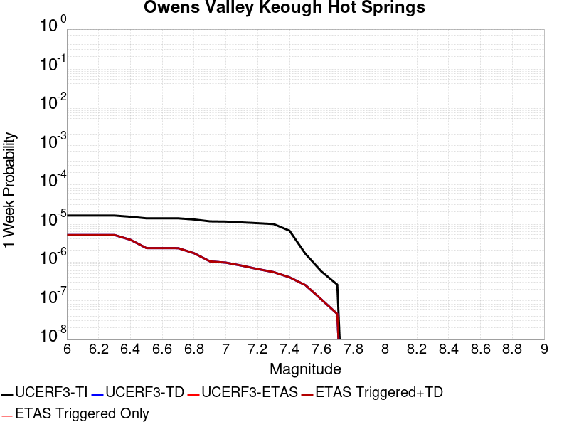 | 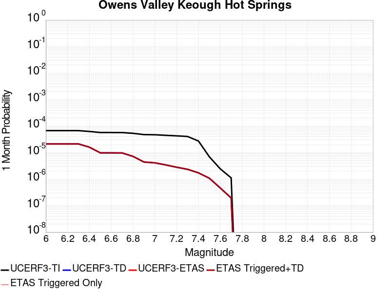 | 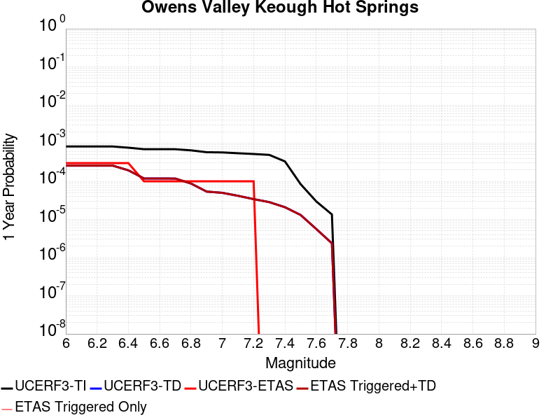 | 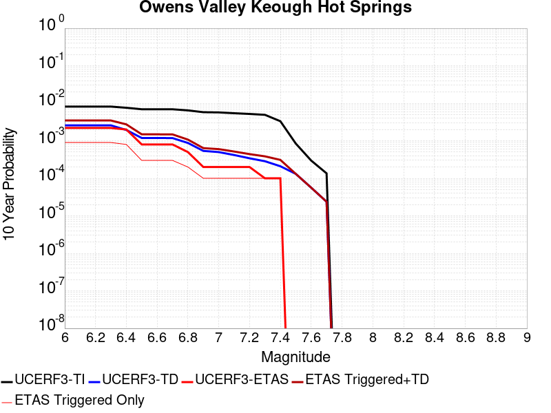 |

| Magnitude | 1 wk TI Prob | 1 wk TD Prob | 1 wk ETAS Prob | 1 wk ETAS/TD Gain | 1 wk ETAS Triggered+TD | 1 wk ETAS Triggered Only | 1 mo TI Prob | 1 mo TD Prob | 1 mo ETAS Prob | 1 mo ETAS/TD Gain | 1 mo ETAS Triggered+TD | 1 mo ETAS Triggered Only | 1 yr TI Prob | 1 yr TD Prob | 1 yr ETAS Prob | 1 yr ETAS/TD Gain | 1 yr ETAS Triggered+TD | 1 yr ETAS Triggered Only | 10 yr TI Prob | 10 yr TD Prob | 10 yr ETAS Prob | 10 yr ETAS/TD Gain | 10 yr ETAS Triggered+TD | 10 yr ETAS Triggered Only |
|-----|-----|-----|-----|-----|-----|-----|-----|-----|-----|-----|-----|-----|-----|-----|-----|-----|-----|-----|-----|-----|-----|-----|-----|-----|
| 6.0 | 1.5708529E-5 | 4.953019E-6 | 0.0 | 0.0 | 4.953019E-6 | 0.0 | 6.7320536E-5 | 2.122708E-5 | 0.0 | 0.0 | 2.122708E-5 | 0.0 | 8.193192E-4 | 2.584142E-4 | 3.0E-4 | 1.1609269 | 2.584142E-4 | 0.0 | 0.008163051 | 0.0025817433 | 0.0022 | 0.8521374 | 0.0034794197 | 9.0E-4 |
| 6.1 | 1.5708529E-5 | 4.953019E-6 | 0.0 | 0.0 | 4.953019E-6 | 0.0 | 6.7320536E-5 | 2.122708E-5 | 0.0 | 0.0 | 2.122708E-5 | 0.0 | 8.193192E-4 | 2.584142E-4 | 3.0E-4 | 1.1609269 | 2.584142E-4 | 0.0 | 0.008163051 | 0.0025817433 | 0.0022 | 0.8521374 | 0.0034794197 | 9.0E-4 |
| 6.2 | 1.5708529E-5 | 4.953019E-6 | 0.0 | 0.0 | 4.953019E-6 | 0.0 | 6.7320536E-5 | 2.122708E-5 | 0.0 | 0.0 | 2.122708E-5 | 0.0 | 8.193192E-4 | 2.584142E-4 | 3.0E-4 | 1.1609269 | 2.584142E-4 | 0.0 | 0.008163051 | 0.0025817433 | 0.0022 | 0.8521374 | 0.0034794197 | 9.0E-4 |
| 6.3 | 1.5708529E-5 | 4.953019E-6 | 0.0 | 0.0 | 4.953019E-6 | 0.0 | 6.7320536E-5 | 2.122708E-5 | 0.0 | 0.0 | 2.122708E-5 | 0.0 | 8.193192E-4 | 2.584142E-4 | 3.0E-4 | 1.1609269 | 2.584142E-4 | 0.0 | 0.008163051 | 0.0025817433 | 0.0022 | 0.8521374 | 0.0034794197 | 9.0E-4 |
| 6.4 | 1.4622509E-5 | 3.728575E-6 | 0.0 | 0.0 | 3.728575E-6 | 0.0 | 6.266639E-5 | 1.5979527E-5 | 0.0 | 0.0 | 1.5979527E-5 | 0.0 | 7.626962E-4 | 1.9453668E-4 | 3.0E-4 | 1.5421256 | 1.9453668E-4 | 0.0 | 0.007600839 | 0.001944091 | 0.002 | 1.0287584 | 0.002742536 | 8.0E-4 |
| 6.5 | 1.3335527E-5 | 2.2794102E-6 | 0.0 | 0.0 | 2.2794102E-6 | 0.0 | 5.7151006E-5 | 9.768868E-6 | 0.0 | 0.0 | 9.768868E-6 | 0.0 | 6.955913E-4 | 1.1893016E-4 | 1.0E-4 | 0.8408296 | 1.1893016E-4 | 0.0 | 0.0069341804 | 0.0011888349 | 8.0E-4 | 0.67292774 | 0.0014884783 | 3.0E-4 |
| 6.6 | 1.3332855E-5 | 2.276559E-6 | 0.0 | 0.0 | 2.276559E-6 | 0.0 | 5.7139558E-5 | 9.756649E-6 | 0.0 | 0.0 | 9.756649E-6 | 0.0 | 6.9545204E-4 | 1.18781405E-4 | 1.0E-4 | 0.8418826 | 1.18781405E-4 | 0.0 | 0.0069327964 | 0.001187349 | 8.0E-4 | 0.6737699 | 0.0014869928 | 3.0E-4 |
| 6.7 | 1.3318214E-5 | 2.2657844E-6 | 0.0 | 0.0 | 2.2657844E-6 | 0.0 | 5.707681E-5 | 9.710472E-6 | 0.0 | 0.0 | 9.710472E-6 | 0.0 | 6.946886E-4 | 1.18219265E-4 | 1.0E-4 | 0.8458858 | 1.18219265E-4 | 0.0 | 0.0069252094 | 0.0011817336 | 8.0E-4 | 0.67697155 | 0.001481379 | 3.0E-4 |
| 6.8 | 1.2441338E-5 | 1.6792052E-6 | 0.0 | 0.0 | 1.6792052E-6 | 0.0 | 5.331893E-5 | 7.1965756E-6 | 0.0 | 0.0 | 7.1965756E-6 | 0.0 | 6.489646E-4 | 8.761508E-5 | 1.0E-4 | 1.141356 | 8.761508E-5 | 0.0 | 0.0064707273 | 8.759375E-4 | 5.0E-4 | 0.57081693 | 0.0010757623 | 2.0E-4 |
| 6.9 | 1.1130476E-5 | 1.031316E-6 | 0.0 | 0.0 | 1.031316E-6 | 0.0 | 4.7701167E-5 | 4.4199182E-6 | 0.0 | 0.0 | 4.4199182E-6 | 0.0 | 5.806069E-4 | 5.381119E-5 | 1.0E-4 | 1.8583496 | 5.381119E-5 | 0.0 | 0.0057909233 | 5.380838E-4 | 2.0E-4 | 0.37168932 | 6.3803E-4 | 1.0E-4 |
| 7.0 | 1.0986073E-5 | 9.588294E-7 | 0.0 | 0.0 | 9.588294E-7 | 0.0 | 4.7082318E-5 | 4.1092626E-6 | 0.0 | 0.0 | 4.1092626E-6 | 0.0 | 5.730765E-4 | 5.0029135E-5 | 1.0E-4 | 1.9988352 | 5.0029135E-5 | 0.0 | 0.0057160086 | 5.0027936E-4 | 2.0E-4 | 0.39977664 | 6.002293E-4 | 1.0E-4 |
| 7.1 | 1.0451338E-5 | 8.0075097E-7 | 0.0 | 0.0 | 8.0075097E-7 | 0.0 | 4.4790682E-5 | 3.4317854E-6 | 0.0 | 0.0 | 3.4317854E-6 | 0.0 | 5.451901E-4 | 4.178119E-5 | 1.0E-4 | 2.3934214 | 4.178119E-5 | 0.0 | 0.005438545 | 4.1783025E-4 | 2.0E-4 | 0.47866327 | 5.1778846E-4 | 1.0E-4 |
| 7.2 | 9.989061E-6 | 6.5511E-7 | 0.0 | 0.0 | 6.5511E-7 | 0.0 | 4.280956E-5 | 2.8076113E-6 | 0.0 | 0.0 | 2.8076113E-6 | 0.0 | 5.2108173E-4 | 3.4182136E-5 | 1.0E-4 | 2.9255047 | 3.4182136E-5 | 0.0 | 0.0051986156 | 3.418613E-4 | 2.0E-4 | 0.5850326 | 4.418271E-4 | 1.0E-4 |
| 7.3 | 9.465365E-6 | 5.465764E-7 | 0.0 | 0.0 | 5.465764E-7 | 0.0 | 4.056522E-5 | 2.3424682E-6 | 0.0 | 0.0 | 2.3424682E-6 | 0.0 | 4.937696E-4 | 2.851918E-5 | 0.0 | 0.0 | 2.851918E-5 | 0.0 | 0.0049267393 | 2.8524286E-4 | 1.0E-4 | 0.35057846 | 3.8521434E-4 | 1.0E-4 |
| 7.4 | 6.3824805E-6 | 4.0210801E-7 | 0.0 | 0.0 | 4.0210801E-7 | 0.0 | 2.73532E-5 | 1.7233189E-6 | 0.0 | 0.0 | 1.7233189E-6 | 0.0 | 3.3297433E-4 | 2.0981208E-5 | 0.0 | 0.0 | 2.0981208E-5 | 0.0 | 0.0033247585 | 2.0983724E-4 | 1.0E-4 | 0.47655985 | 3.0981624E-4 | 1.0E-4 |
| 7.5 | 1.6192645E-6 | 2.5190448E-7 | 0.0 | 0.0 | 2.5190448E-7 | 0.0 | 6.9396865E-6 | 1.0795901E-6 | 0.0 | 0.0 | 1.0795901E-6 | 0.0 | 8.448741E-5 | 1.3143932E-5 | 0.0 | 0.0 | 1.3143932E-5 | 0.0 | 8.4455294E-4 | 1.3143168E-4 | 0.0 | 0.0 | 1.3143168E-4 | 0.0 |
| 7.6 | 5.7062545E-7 | 1.08042585E-7 | 0.0 | 0.0 | 1.08042585E-7 | 0.0 | 2.4455355E-6 | 4.6303958E-7 | 0.0 | 0.0 | 4.6303958E-7 | 0.0 | 2.9773988E-5 | 5.637493E-6 | 0.0 | 0.0 | 5.637493E-6 | 0.0 | 2.977E-4 | 5.637358E-5 | 0.0 | 0.0 | 5.637358E-5 | 0.0 |
| 7.7 | 2.5988817E-7 | 4.5505182E-8 | 0.0 | 0.0 | 4.5505182E-8 | 0.0 | 1.113806E-6 | 1.9502221E-7 | 0.0 | 0.0 | 1.9502221E-7 | 0.0 | 1.3560503E-5 | 2.3743933E-6 | 0.0 | 0.0 | 2.3743933E-6 | 0.0 | 1.3559677E-4 | 2.3743722E-5 | 0.0 | 0.0 | 2.3743722E-5 | 0.0 |

## Simi-Santa Rosa
*[(top)](#table-of-contents)*

| 1 Week | 1 Month | 1 Year | 10 Year |
|-----|-----|-----|-----|
|  |  |  |  |

| Magnitude | 1 wk TI Prob | 1 wk TD Prob | 1 wk ETAS Prob | 1 wk ETAS/TD Gain | 1 wk ETAS Triggered+TD | 1 wk ETAS Triggered Only | 1 mo TI Prob | 1 mo TD Prob | 1 mo ETAS Prob | 1 mo ETAS/TD Gain | 1 mo ETAS Triggered+TD | 1 mo ETAS Triggered Only | 1 yr TI Prob | 1 yr TD Prob | 1 yr ETAS Prob | 1 yr ETAS/TD Gain | 1 yr ETAS Triggered+TD | 1 yr ETAS Triggered Only | 10 yr TI Prob | 10 yr TD Prob | 10 yr ETAS Prob | 10 yr ETAS/TD Gain | 10 yr ETAS Triggered+TD | 10 yr ETAS Triggered Only |
|-----|-----|-----|-----|-----|-----|-----|-----|-----|-----|-----|-----|-----|-----|-----|-----|-----|-----|-----|-----|-----|-----|-----|-----|-----|
| 6.0 | 2.198912E-5 | 2.2281341E-5 | 0.0 | 0.0 | 2.2281341E-5 | 0.0 | 9.4235686E-5 | 9.548821E-5 | 0.0 | 0.0 | 9.548821E-5 | 0.0 | 0.0011467156 | 0.0011619929 | 0.001 | 0.8605905 | 0.0011619929 | 0.0 | 0.011408163 | 0.0115636205 | 0.007 | 0.60534674 | 0.012453213 | 9.0E-4 |
| 6.1 | 2.198912E-5 | 2.2281341E-5 | 0.0 | 0.0 | 2.2281341E-5 | 0.0 | 9.4235686E-5 | 9.548821E-5 | 0.0 | 0.0 | 9.548821E-5 | 0.0 | 0.0011467156 | 0.0011619929 | 0.001 | 0.8605905 | 0.0011619929 | 0.0 | 0.011408163 | 0.0115636205 | 0.007 | 0.60534674 | 0.012453213 | 9.0E-4 |
| 6.2 | 1.69983E-5 | 1.6673086E-5 | 0.0 | 0.0 | 1.6673086E-5 | 0.0 | 7.284782E-5 | 7.1454284E-5 | 0.0 | 0.0 | 7.1454284E-5 | 0.0 | 8.865613E-4 | 8.6963794E-4 | 7.0E-4 | 0.8049327 | 8.6963794E-4 | 0.0 | 0.008830327 | 0.00866527 | 0.0051 | 0.58855635 | 0.009260071 | 6.0E-4 |
| 6.3 | 1.69983E-5 | 1.6673086E-5 | 0.0 | 0.0 | 1.6673086E-5 | 0.0 | 7.284782E-5 | 7.1454284E-5 | 0.0 | 0.0 | 7.1454284E-5 | 0.0 | 8.865613E-4 | 8.6963794E-4 | 7.0E-4 | 0.8049327 | 8.6963794E-4 | 0.0 | 0.008830327 | 0.00866527 | 0.0051 | 0.58855635 | 0.009260071 | 6.0E-4 |
| 6.4 | 1.4666188E-5 | 1.4056437E-5 | 0.0 | 0.0 | 1.4056437E-5 | 0.0 | 6.285358E-5 | 6.024062E-5 | 0.0 | 0.0 | 6.024062E-5 | 0.0 | 7.6497364E-4 | 7.332077E-4 | 7.0E-4 | 0.95470905 | 7.332077E-4 | 0.0 | 0.0076234564 | 0.0073103625 | 0.0041 | 0.5608477 | 0.0077074384 | 4.0E-4 |
| 6.5 | 1.4666188E-5 | 1.4056437E-5 | 0.0 | 0.0 | 1.4056437E-5 | 0.0 | 6.285358E-5 | 6.024062E-5 | 0.0 | 0.0 | 6.024062E-5 | 0.0 | 7.6497364E-4 | 7.332077E-4 | 7.0E-4 | 0.95470905 | 7.332077E-4 | 0.0 | 0.0076234564 | 0.0073103625 | 0.0041 | 0.5608477 | 0.0077074384 | 4.0E-4 |
| 6.6 | 1.4377586E-5 | 1.3733401E-5 | 0.0 | 0.0 | 1.3733401E-5 | 0.0 | 6.1616774E-5 | 5.8856243E-5 | 0.0 | 0.0 | 5.8856243E-5 | 0.0 | 7.4992597E-4 | 7.16364E-4 | 7.0E-4 | 0.9771568 | 7.16364E-4 | 0.0 | 0.007474003 | 0.007143018 | 0.0041 | 0.57398707 | 0.007540161 | 4.0E-4 |
| 6.7 | 1.3881404E-5 | 1.3211244E-5 | 0.0 | 0.0 | 1.3211244E-5 | 0.0 | 5.9490372E-5 | 5.6618526E-5 | 0.0 | 0.0 | 5.6618526E-5 | 0.0 | 7.240546E-4 | 6.8913726E-4 | 7.0E-4 | 1.0157628 | 6.8913726E-4 | 0.0 | 0.007217 | 0.0068724533 | 0.004 | 0.5820338 | 0.0072697042 | 4.0E-4 |
| 6.8 | 1.0176516E-5 | 9.156828E-6 | 0.0 | 0.0 | 9.156828E-6 | 0.0 | 4.3612912E-5 | 3.9243052E-5 | 0.0 | 0.0 | 3.9243052E-5 | 0.0 | 5.308578E-4 | 4.7769598E-4 | 5.0E-4 | 1.0466908 | 4.7769598E-4 | 0.0 | 0.0052959146 | 0.004768326 | 0.0032 | 0.6710951 | 0.004967372 | 2.0E-4 |
| 6.9 | 9.699797E-6 | 8.7772805E-6 | 0.0 | 0.0 | 8.7772805E-6 | 0.0 | 4.15699E-5 | 3.7616464E-5 | 0.0 | 0.0 | 3.7616464E-5 | 0.0 | 5.05996E-4 | 4.5790066E-4 | 4.0E-4 | 0.8735519 | 4.5790066E-4 | 0.0 | 0.005048454 | 0.0045711906 | 0.003 | 0.65628415 | 0.004770276 | 2.0E-4 |
| 7.0 | 7.4049476E-6 | 6.5612494E-6 | 0.0 | 0.0 | 6.5612494E-6 | 0.0 | 3.1735104E-5 | 2.8119408E-5 | 0.0 | 0.0 | 2.8119408E-5 | 0.0 | 3.8630638E-4 | 3.4231268E-4 | 3.0E-4 | 0.87639177 | 3.4231268E-4 | 0.0 | 0.0038563553 | 0.0034190968 | 0.0023 | 0.67269224 | 0.0036184131 | 2.0E-4 |
| 7.1 | 3.873439E-6 | 2.7603612E-6 | 0.0 | 0.0 | 2.7603612E-6 | 0.0 | 1.6600346E-5 | 1.1830068E-5 | 0.0 | 0.0 | 1.1830068E-5 | 0.0 | 2.0209046E-4 | 1.4402179E-4 | 2.0E-4 | 1.3886788 | 1.4402179E-4 | 0.0 | 0.0020190678 | 0.001439308 | 0.0011 | 0.7642561 | 0.0016390202 | 2.0E-4 |
| 7.2 | 3.417706E-6 | 2.3684147E-6 | 0.0 | 0.0 | 2.3684147E-6 | 0.0 | 1.4647229E-5 | 1.0150311E-5 | 0.0 | 0.0 | 1.0150311E-5 | 0.0 | 1.7831543E-4 | 1.2357325E-4 | 2.0E-4 | 1.6184732 | 1.2357325E-4 | 0.0 | 0.0017817242 | 0.0012350677 | 0.001 | 0.80967224 | 0.0014348207 | 2.0E-4 |
| 7.3 | 1.90225E-6 | 1.4079416E-6 | 0.0 | 0.0 | 1.4079416E-6 | 0.0 | 8.152474E-6 | 6.034021E-6 | 0.0 | 0.0 | 6.034021E-6 | 0.0 | 9.9251854E-5 | 7.346176E-5 | 2.0E-4 | 2.722505 | 7.346176E-5 | 0.0 | 9.920754E-4 | 7.3437695E-4 | 8.0E-4 | 1.0893588 | 9.342301E-4 | 2.0E-4 |
| 7.4 | 1.5170556E-6 | 1.1029978E-6 | 0.0 | 0.0 | 1.1029978E-6 | 0.0 | 6.5016507E-6 | 4.727125E-6 | 0.0 | 0.0 | 4.727125E-6 | 0.0 | 7.915472E-5 | 5.755124E-5 | 2.0E-4 | 3.4751642 | 5.755124E-5 | 0.0 | 7.9126534E-4 | 5.7536445E-4 | 5.0E-4 | 0.8690144 | 6.7530695E-4 | 1.0E-4 |
| 7.5 | 1.178732E-6 | 8.5399984E-7 | 0.0 | 0.0 | 8.5399984E-7 | 0.0 | 5.0516987E-6 | 3.659994E-6 | 0.0 | 0.0 | 3.659994E-6 | 0.0 | 6.1502695E-5 | 4.4559525E-5 | 2.0E-4 | 4.488378 | 4.4559525E-5 | 0.0 | 6.148568E-4 | 4.4550688E-4 | 4.0E-4 | 0.89785373 | 5.454623E-4 | 1.0E-4 |
| 7.6 | 6.8722386E-7 | 4.79764E-7 | 0.0 | 0.0 | 4.79764E-7 | 0.0 | 2.9452417E-6 | 2.0561301E-6 | 0.0 | 0.0 | 2.0561301E-6 | 0.0 | 3.5857727E-5 | 2.5033098E-5 | 2.0E-4 | 7.989423 | 2.5033098E-5 | 0.0 | 3.5851944E-4 | 2.503029E-4 | 3.0E-4 | 1.1985478 | 2.503029E-4 | 0.0 |
| 7.7 | 5.5126515E-7 | 3.677368E-7 | 0.0 | 0.0 | 3.677368E-7 | 0.0 | 2.3625628E-6 | 1.5760139E-6 | 0.0 | 0.0 | 1.5760139E-6 | 0.0 | 2.8763823E-5 | 1.91878E-5 | 2.0E-4 | 10.423289 | 1.91878E-5 | 0.0 | 2.87601E-4 | 1.9186156E-4 | 3.0E-4 | 1.5636275 | 1.9186156E-4 | 0.0 |
| 7.8 | 3.3860243E-7 | 2.0104187E-7 | 0.0 | 0.0 | 2.0104187E-7 | 0.0 | 1.4511525E-6 | 8.6160776E-7 | 0.0 | 0.0 | 8.6160776E-7 | 0.0 | 1.7667637E-5 | 1.0490025E-5 | 1.0E-4 | 9.5328665 | 1.0490025E-5 | 0.0 | 1.7666233E-4 | 1.0489535E-4 | 2.0E-4 | 1.9066622 | 1.0489535E-4 | 0.0 |
| 7.9 | 2.7955386E-7 | 1.4675061E-7 | 0.0 | 0.0 | 1.4675061E-7 | 0.0 | 1.1980875E-6 | 6.28931E-7 | 0.0 | 0.0 | 6.28931E-7 | 0.0 | 1.4586617E-5 | 7.657209E-6 | 1.0E-4 | 13.059589 | 7.657209E-6 | 0.0 | 1.458566E-4 | 7.6569486E-5 | 2.0E-4 | 2.6120064 | 7.6569486E-5 | 0.0 |
| 8.0 | 5.6259015E-8 | 3.338263E-8 | 0.0 | 0.0 | 3.338263E-8 | 0.0 | 2.4111003E-7 | 1.430684E-7 | 0.0 | 0.0 | 1.430684E-7 | 0.0 | 2.9355108E-6 | 1.7418565E-6 | 0.0 | 0.0 | 1.7418565E-6 | 0.0 | 2.935472E-5 | 1.7418442E-5 | 0.0 | 0.0 | 1.7418442E-5 | 0.0 |

## North Frontal  (East)
*[(top)](#table-of-contents)*

| 1 Week | 1 Month | 1 Year | 10 Year |
|-----|-----|-----|-----|
|  |  | 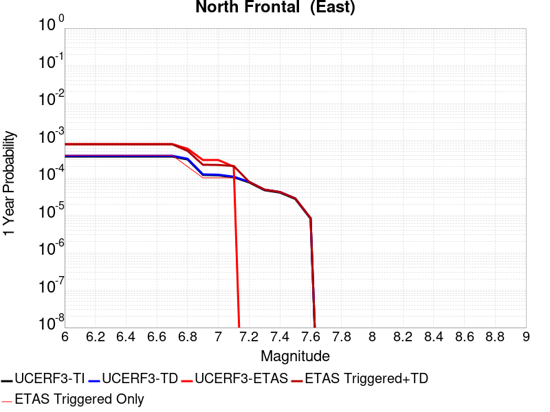 |  |

| Magnitude | 1 wk TI Prob | 1 wk TD Prob | 1 wk ETAS Prob | 1 wk ETAS/TD Gain | 1 wk ETAS Triggered+TD | 1 wk ETAS Triggered Only | 1 mo TI Prob | 1 mo TD Prob | 1 mo ETAS Prob | 1 mo ETAS/TD Gain | 1 mo ETAS Triggered+TD | 1 mo ETAS Triggered Only | 1 yr TI Prob | 1 yr TD Prob | 1 yr ETAS Prob | 1 yr ETAS/TD Gain | 1 yr ETAS Triggered+TD | 1 yr ETAS Triggered Only | 10 yr TI Prob | 10 yr TD Prob | 10 yr ETAS Prob | 10 yr ETAS/TD Gain | 10 yr ETAS Triggered+TD | 10 yr ETAS Triggered Only |
|-----|-----|-----|-----|-----|-----|-----|-----|-----|-----|-----|-----|-----|-----|-----|-----|-----|-----|-----|-----|-----|-----|-----|-----|-----|
| 6.0 | 7.135738E-6 | 7.477887E-6 | 0.0 | 0.0 | 7.477887E-6 | 0.0 | 3.0581377E-5 | 3.2047807E-5 | 1.0E-4 | 3.1203384 | 1.320446E-4 | 1.0E-4 | 3.7226462E-4 | 3.9013213E-4 | 8.0E-4 | 2.0505874 | 7.8997604E-4 | 4.0E-4 | 0.0037164164 | 0.0038964304 | 0.0032 | 0.8212645 | 0.0047929236 | 9.0E-4 |
| 6.1 | 7.135738E-6 | 7.477887E-6 | 0.0 | 0.0 | 7.477887E-6 | 0.0 | 3.0581377E-5 | 3.2047807E-5 | 1.0E-4 | 3.1203384 | 1.320446E-4 | 1.0E-4 | 3.7226462E-4 | 3.9013213E-4 | 8.0E-4 | 2.0505874 | 7.8997604E-4 | 4.0E-4 | 0.0037164164 | 0.0038964304 | 0.0032 | 0.8212645 | 0.0047929236 | 9.0E-4 |
| 6.2 | 7.135738E-6 | 7.477887E-6 | 0.0 | 0.0 | 7.477887E-6 | 0.0 | 3.0581377E-5 | 3.2047807E-5 | 1.0E-4 | 3.1203384 | 1.320446E-4 | 1.0E-4 | 3.7226462E-4 | 3.9013213E-4 | 8.0E-4 | 2.0505874 | 7.8997604E-4 | 4.0E-4 | 0.0037164164 | 0.0038964304 | 0.0032 | 0.8212645 | 0.0047929236 | 9.0E-4 |
| 6.3 | 7.135738E-6 | 7.477887E-6 | 0.0 | 0.0 | 7.477887E-6 | 0.0 | 3.0581377E-5 | 3.2047807E-5 | 1.0E-4 | 3.1203384 | 1.320446E-4 | 1.0E-4 | 3.7226462E-4 | 3.9013213E-4 | 8.0E-4 | 2.0505874 | 7.8997604E-4 | 4.0E-4 | 0.0037164164 | 0.0038964304 | 0.0032 | 0.8212645 | 0.0047929236 | 9.0E-4 |
| 6.4 | 7.135738E-6 | 7.477887E-6 | 0.0 | 0.0 | 7.477887E-6 | 0.0 | 3.0581377E-5 | 3.2047807E-5 | 1.0E-4 | 3.1203384 | 1.320446E-4 | 1.0E-4 | 3.7226462E-4 | 3.9013213E-4 | 8.0E-4 | 2.0505874 | 7.8997604E-4 | 4.0E-4 | 0.0037164164 | 0.0038964304 | 0.0032 | 0.8212645 | 0.0047929236 | 9.0E-4 |
| 6.5 | 7.135738E-6 | 7.477887E-6 | 0.0 | 0.0 | 7.477887E-6 | 0.0 | 3.0581377E-5 | 3.2047807E-5 | 1.0E-4 | 3.1203384 | 1.320446E-4 | 1.0E-4 | 3.7226462E-4 | 3.9013213E-4 | 8.0E-4 | 2.0505874 | 7.8997604E-4 | 4.0E-4 | 0.0037164164 | 0.0038964304 | 0.0032 | 0.8212645 | 0.0047929236 | 9.0E-4 |
| 6.6 | 7.135738E-6 | 7.477887E-6 | 0.0 | 0.0 | 7.477887E-6 | 0.0 | 3.0581377E-5 | 3.2047807E-5 | 1.0E-4 | 3.1203384 | 1.320446E-4 | 1.0E-4 | 3.7226462E-4 | 3.9013213E-4 | 8.0E-4 | 2.0505874 | 7.8997604E-4 | 4.0E-4 | 0.0037164164 | 0.0038964304 | 0.0032 | 0.8212645 | 0.0047929236 | 9.0E-4 |
| 6.7 | 7.135738E-6 | 7.477887E-6 | 0.0 | 0.0 | 7.477887E-6 | 0.0 | 3.0581377E-5 | 3.2047807E-5 | 1.0E-4 | 3.1203384 | 1.320446E-4 | 1.0E-4 | 3.7226462E-4 | 3.9013213E-4 | 8.0E-4 | 2.0505874 | 7.8997604E-4 | 4.0E-4 | 0.0037164164 | 0.0038964304 | 0.0032 | 0.8212645 | 0.0047929236 | 9.0E-4 |
| 6.8 | 5.959142E-6 | 6.2372596E-6 | 0.0 | 0.0 | 6.2372596E-6 | 0.0 | 2.553893E-5 | 2.673094E-5 | 0.0 | 0.0 | 2.673094E-5 | 0.0 | 3.108921E-4 | 3.254187E-4 | 6.0E-4 | 1.8437786 | 5.253536E-4 | 2.0E-4 | 0.0031045752 | 0.0032511952 | 0.0026 | 0.7997059 | 0.0036498946 | 4.0E-4 |
| 6.9 | 2.2946929E-6 | 2.3826415E-6 | 0.0 | 0.0 | 2.3826415E-6 | 0.0 | 9.834361E-6 | 1.0211284E-5 | 0.0 | 0.0 | 1.0211284E-5 | 0.0 | 1.1972676E-4 | 1.2431575E-4 | 3.0E-4 | 2.41321 | 2.2430332E-4 | 1.0E-4 | 0.0011966228 | 0.0012425085 | 0.001 | 0.8048234 | 0.0014422601 | 2.0E-4 |
| 7.0 | 2.2468673E-6 | 2.3323296E-6 | 0.0 | 0.0 | 2.3323296E-6 | 0.0 | 9.629396E-6 | 9.995662E-6 | 0.0 | 0.0 | 9.995662E-6 | 0.0 | 1.1723159E-4 | 1.21690864E-4 | 3.0E-4 | 2.4652631 | 2.216787E-4 | 1.0E-4 | 0.0011716976 | 0.0012162885 | 0.001 | 0.8221733 | 0.0014160454 | 2.0E-4 |
| 7.1 | 1.9921076E-6 | 2.0647524E-6 | 0.0 | 0.0 | 2.0647524E-6 | 0.0 | 8.537577E-6 | 8.8489105E-6 | 0.0 | 0.0 | 8.8489105E-6 | 0.0 | 1.0394004E-4 | 1.077306E-4 | 2.0E-4 | 1.8564827 | 2.0771983E-4 | 1.0E-4 | 0.0010389143 | 0.0010768265 | 8.0E-4 | 0.7429238 | 0.0012766111 | 2.0E-4 |
| 7.2 | 1.4524545E-6 | 1.5046218E-6 | 0.0 | 0.0 | 1.5046218E-6 | 0.0 | 6.2247905E-6 | 6.4483647E-6 | 0.0 | 0.0 | 6.4483647E-6 | 0.0 | 7.5784184E-5 | 7.850626E-5 | 0.0 | 0.0 | 7.850626E-5 | 0.0 | 7.575835E-4 | 7.848097E-4 | 3.0E-4 | 0.38225827 | 7.848097E-4 | 0.0 |
| 7.3 | 8.9802575E-7 | 9.3094036E-7 | 0.0 | 0.0 | 9.3094036E-7 | 0.0 | 3.848676E-6 | 3.989739E-6 | 0.0 | 0.0 | 3.989739E-6 | 0.0 | 4.685662E-5 | 4.8574104E-5 | 0.0 | 0.0 | 4.8574104E-5 | 0.0 | 4.6846745E-4 | 4.8564616E-4 | 3.0E-4 | 0.6177337 | 4.8564616E-4 | 0.0 |
| 7.4 | 7.776139E-7 | 8.0610596E-7 | 0.0 | 0.0 | 8.0610596E-7 | 0.0 | 3.3326266E-6 | 3.4547359E-6 | 0.0 | 0.0 | 3.4547359E-6 | 0.0 | 4.0573974E-5 | 4.2060707E-5 | 0.0 | 0.0 | 4.2060707E-5 | 0.0 | 4.0566566E-4 | 4.205382E-4 | 2.0E-4 | 0.47558102 | 4.205382E-4 | 0.0 |
| 7.5 | 5.244417E-7 | 5.4416245E-7 | 0.0 | 0.0 | 5.4416245E-7 | 0.0 | 2.2476054E-6 | 2.332123E-6 | 0.0 | 0.0 | 2.332123E-6 | 0.0 | 2.7364253E-5 | 2.8393293E-5 | 0.0 | 0.0 | 2.8393293E-5 | 0.0 | 2.7360884E-4 | 2.8390318E-4 | 2.0E-4 | 0.7044655 | 2.8390318E-4 | 0.0 |
| 7.6 | 1.5489647E-7 | 1.609074E-7 | 0.0 | 0.0 | 1.609074E-7 | 0.0 | 6.6384183E-7 | 6.896031E-7 | 0.0 | 0.0 | 6.896031E-7 | 0.0 | 8.082245E-6 | 8.395906E-6 | 0.0 | 0.0 | 8.395906E-6 | 0.0 | 8.08195E-5 | 8.395788E-5 | 0.0 | 0.0 | 8.395788E-5 | 0.0 |

## Swain Ravine - Spenceville
*[(top)](#table-of-contents)*

| 1 Week | 1 Month | 1 Year | 10 Year |
|-----|-----|-----|-----|
|  |  | 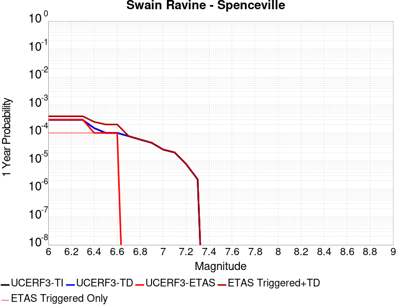 |  |

| Magnitude | 1 wk TI Prob | 1 wk TD Prob | 1 wk ETAS Prob | 1 wk ETAS/TD Gain | 1 wk ETAS Triggered+TD | 1 wk ETAS Triggered Only | 1 mo TI Prob | 1 mo TD Prob | 1 mo ETAS Prob | 1 mo ETAS/TD Gain | 1 mo ETAS Triggered+TD | 1 mo ETAS Triggered Only | 1 yr TI Prob | 1 yr TD Prob | 1 yr ETAS Prob | 1 yr ETAS/TD Gain | 1 yr ETAS Triggered+TD | 1 yr ETAS Triggered Only | 10 yr TI Prob | 10 yr TD Prob | 10 yr ETAS Prob | 10 yr ETAS/TD Gain | 10 yr ETAS Triggered+TD | 10 yr ETAS Triggered Only |
|-----|-----|-----|-----|-----|-----|-----|-----|-----|-----|-----|-----|-----|-----|-----|-----|-----|-----|-----|-----|-----|-----|-----|-----|-----|
| 6.0 | 5.596169E-6 | 5.66393E-6 | 0.0 | 0.0 | 5.66393E-6 | 0.0 | 2.398336E-5 | 2.4273775E-5 | 0.0 | 0.0 | 2.4273775E-5 | 0.0 | 2.9195828E-4 | 2.9549585E-4 | 3.0E-4 | 1.0152427 | 3.954663E-4 | 1.0E-4 | 0.00291575 | 0.0029512986 | 0.0028 | 0.9487349 | 0.0038486426 | 9.0E-4 |
| 6.1 | 5.596169E-6 | 5.66393E-6 | 0.0 | 0.0 | 5.66393E-6 | 0.0 | 2.398336E-5 | 2.4273775E-5 | 0.0 | 0.0 | 2.4273775E-5 | 0.0 | 2.9195828E-4 | 2.9549585E-4 | 3.0E-4 | 1.0152427 | 3.954663E-4 | 1.0E-4 | 0.00291575 | 0.0029512986 | 0.0028 | 0.9487349 | 0.0038486426 | 9.0E-4 |
| 6.2 | 5.596169E-6 | 5.66393E-6 | 0.0 | 0.0 | 5.66393E-6 | 0.0 | 2.398336E-5 | 2.4273775E-5 | 0.0 | 0.0 | 2.4273775E-5 | 0.0 | 2.9195828E-4 | 2.9549585E-4 | 3.0E-4 | 1.0152427 | 3.954663E-4 | 1.0E-4 | 0.00291575 | 0.0029512986 | 0.0028 | 0.9487349 | 0.0038486426 | 9.0E-4 |
| 6.3 | 5.596169E-6 | 5.66393E-6 | 0.0 | 0.0 | 5.66393E-6 | 0.0 | 2.398336E-5 | 2.4273775E-5 | 0.0 | 0.0 | 2.4273775E-5 | 0.0 | 2.9195828E-4 | 2.9549585E-4 | 3.0E-4 | 1.0152427 | 3.954663E-4 | 1.0E-4 | 0.00291575 | 0.0029512986 | 0.0028 | 0.9487349 | 0.0038486426 | 9.0E-4 |
| 6.4 | 2.8426775E-6 | 2.874207E-6 | 0.0 | 0.0 | 2.874207E-6 | 0.0 | 1.2182847E-5 | 1.2317974E-5 | 0.0 | 0.0 | 1.2317974E-5 | 0.0 | 1.4831607E-4 | 1.499614E-4 | 1.0E-4 | 0.6668382 | 2.499464E-4 | 1.0E-4 | 0.0014821711 | 0.0014986405 | 8.0E-4 | 0.5338171 | 0.0015984906 | 1.0E-4 |
| 6.5 | 1.9210793E-6 | 1.9414554E-6 | 0.0 | 0.0 | 1.9414554E-6 | 0.0 | 8.233172E-6 | 8.320498E-6 | 0.0 | 0.0 | 8.320498E-6 | 0.0 | 1.0023425E-4 | 1.0129748E-4 | 1.0E-4 | 0.9871913 | 2.0128736E-4 | 1.0E-4 | 0.0010018905 | 0.0010125266 | 6.0E-4 | 0.59257704 | 0.0011124252 | 1.0E-4 |
| 6.6 | 1.9210793E-6 | 1.9414554E-6 | 0.0 | 0.0 | 1.9414554E-6 | 0.0 | 8.233172E-6 | 8.320498E-6 | 0.0 | 0.0 | 8.320498E-6 | 0.0 | 1.0023425E-4 | 1.0129748E-4 | 1.0E-4 | 0.9871913 | 2.0128736E-4 | 1.0E-4 | 0.0010018905 | 0.0010125266 | 6.0E-4 | 0.59257704 | 0.0011124252 | 1.0E-4 |
| 6.7 | 1.4667394E-6 | 1.4819237E-6 | 0.0 | 0.0 | 1.4819237E-6 | 0.0 | 6.286011E-6 | 6.3510865E-6 | 0.0 | 0.0 | 6.3510865E-6 | 0.0 | 7.65295E-5 | 7.732181E-5 | 0.0 | 0.0 | 7.732181E-5 | 0.0 | 7.6503144E-4 | 7.729568E-4 | 3.0E-4 | 0.38812 | 7.729568E-4 | 0.0 |
| 6.8 | 1.1076943E-6 | 1.118976E-6 | 0.0 | 0.0 | 1.118976E-6 | 0.0 | 4.747252E-6 | 4.7956028E-6 | 0.0 | 0.0 | 4.7956028E-6 | 0.0 | 5.7796264E-5 | 5.8384947E-5 | 0.0 | 0.0 | 5.8384947E-5 | 0.0 | 5.778124E-4 | 5.837005E-4 | 2.0E-4 | 0.34264147 | 5.837005E-4 | 0.0 |
| 6.9 | 8.514296E-7 | 8.6002666E-7 | 0.0 | 0.0 | 8.6002666E-7 | 0.0 | 3.648979E-6 | 3.6858235E-6 | 0.0 | 0.0 | 3.6858235E-6 | 0.0 | 4.442541E-5 | 4.4874007E-5 | 0.0 | 0.0 | 4.4874007E-5 | 0.0 | 4.441653E-4 | 4.486523E-4 | 2.0E-4 | 0.4457795 | 4.486523E-4 | 0.0 |
| 7.0 | 4.8544706E-7 | 4.903398E-7 | 0.0 | 0.0 | 4.903398E-7 | 0.0 | 2.0804857E-6 | 2.1014546E-6 | 0.0 | 0.0 | 2.1014546E-6 | 0.0 | 2.532962E-5 | 2.5584925E-5 | 0.0 | 0.0 | 2.5584925E-5 | 0.0 | 2.5326732E-4 | 2.5582107E-4 | 1.0E-4 | 0.3908982 | 2.5582107E-4 | 0.0 |
| 7.1 | 3.829186E-7 | 3.867956E-7 | 0.0 | 0.0 | 3.867956E-7 | 0.0 | 1.6410787E-6 | 1.6576944E-6 | 0.0 | 0.0 | 1.6576944E-6 | 0.0 | 1.997995E-5 | 2.0182253E-5 | 0.0 | 0.0 | 2.0182253E-5 | 0.0 | 1.9978154E-4 | 2.0180526E-4 | 1.0E-4 | 0.49552724 | 2.0180526E-4 | 0.0 |
| 7.2 | 1.4726595E-7 | 1.4879744E-7 | 0.0 | 0.0 | 1.4879744E-7 | 0.0 | 6.3113964E-7 | 6.377032E-7 | 0.0 | 0.0 | 6.377032E-7 | 0.0 | 7.684098E-6 | 7.764014E-6 | 0.0 | 0.0 | 7.764014E-6 | 0.0 | 7.6838325E-5 | 7.763796E-5 | 0.0 | 0.0 | 7.763796E-5 | 0.0 |
| 7.3 | 4.1880604E-8 | 4.2325194E-8 | 0.0 | 0.0 | 4.2325194E-8 | 0.0 | 1.7948828E-7 | 1.8139369E-7 | 0.0 | 0.0 | 1.8139369E-7 | 0.0 | 2.1852677E-6 | 2.2084682E-6 | 0.0 | 0.0 | 2.2084682E-6 | 0.0 | 2.1852462E-5 | 2.2084681E-5 | 0.0 | 0.0 | 2.2084681E-5 | 0.0 |

## Mohawk Valley 2011 CFM
*[(top)](#table-of-contents)*

| 1 Week | 1 Month | 1 Year | 10 Year |
|-----|-----|-----|-----|
| 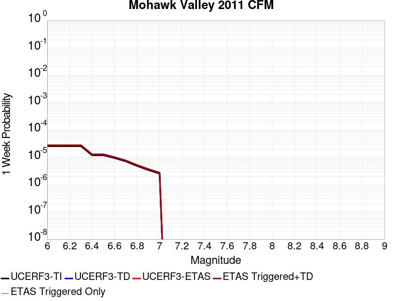 |  |  |  |

| Magnitude | 1 wk TI Prob | 1 wk TD Prob | 1 wk ETAS Prob | 1 wk ETAS/TD Gain | 1 wk ETAS Triggered+TD | 1 wk ETAS Triggered Only | 1 mo TI Prob | 1 mo TD Prob | 1 mo ETAS Prob | 1 mo ETAS/TD Gain | 1 mo ETAS Triggered+TD | 1 mo ETAS Triggered Only | 1 yr TI Prob | 1 yr TD Prob | 1 yr ETAS Prob | 1 yr ETAS/TD Gain | 1 yr ETAS Triggered+TD | 1 yr ETAS Triggered Only | 10 yr TI Prob | 10 yr TD Prob | 10 yr ETAS Prob | 10 yr ETAS/TD Gain | 10 yr ETAS Triggered+TD | 10 yr ETAS Triggered Only |
|-----|-----|-----|-----|-----|-----|-----|-----|-----|-----|-----|-----|-----|-----|-----|-----|-----|-----|-----|-----|-----|-----|-----|-----|-----|
| 6.0 | 2.5425423E-5 | 2.7649568E-5 | 0.0 | 0.0 | 2.7649568E-5 | 0.0 | 1.0896155E-4 | 1.1849338E-4 | 1.0E-4 | 0.843929 | 1.1849338E-4 | 0.0 | 0.0013257994 | 0.0014418107 | 7.0E-4 | 0.4855006 | 0.0014418107 | 0.0 | 0.013179175 | 0.014335448 | 0.0061 | 0.4255186 | 0.015222547 | 9.0E-4 |
| 6.1 | 2.5425423E-5 | 2.7649568E-5 | 0.0 | 0.0 | 2.7649568E-5 | 0.0 | 1.0896155E-4 | 1.1849338E-4 | 1.0E-4 | 0.843929 | 1.1849338E-4 | 0.0 | 0.0013257994 | 0.0014418107 | 7.0E-4 | 0.4855006 | 0.0014418107 | 0.0 | 0.013179175 | 0.014335448 | 0.0061 | 0.4255186 | 0.015222547 | 9.0E-4 |
| 6.2 | 2.5425423E-5 | 2.7649568E-5 | 0.0 | 0.0 | 2.7649568E-5 | 0.0 | 1.0896155E-4 | 1.1849338E-4 | 1.0E-4 | 0.843929 | 1.1849338E-4 | 0.0 | 0.0013257994 | 0.0014418107 | 7.0E-4 | 0.4855006 | 0.0014418107 | 0.0 | 0.013179175 | 0.014335448 | 0.0061 | 0.4255186 | 0.015222547 | 9.0E-4 |
| 6.3 | 2.5425423E-5 | 2.7649568E-5 | 0.0 | 0.0 | 2.7649568E-5 | 0.0 | 1.0896155E-4 | 1.1849338E-4 | 1.0E-4 | 0.843929 | 1.1849338E-4 | 0.0 | 0.0013257994 | 0.0014418107 | 7.0E-4 | 0.4855006 | 0.0014418107 | 0.0 | 0.013179175 | 0.014335448 | 0.0061 | 0.4255186 | 0.015222547 | 9.0E-4 |
| 6.4 | 1.1812642E-5 | 1.2765624E-5 | 0.0 | 0.0 | 1.2765624E-5 | 0.0 | 5.0624625E-5 | 5.4708755E-5 | 0.0 | 0.0 | 5.4708755E-5 | 0.0 | 6.161805E-4 | 6.658903E-4 | 4.0E-4 | 0.6006996 | 6.658903E-4 | 0.0 | 0.0061447476 | 0.0066404236 | 0.0035 | 0.5270748 | 0.0069384314 | 3.0E-4 |
| 6.5 | 1.1812642E-5 | 1.2765624E-5 | 0.0 | 0.0 | 1.2765624E-5 | 0.0 | 5.0624625E-5 | 5.4708755E-5 | 0.0 | 0.0 | 5.4708755E-5 | 0.0 | 6.161805E-4 | 6.658903E-4 | 4.0E-4 | 0.6006996 | 6.658903E-4 | 0.0 | 0.0061447476 | 0.0066404236 | 0.0035 | 0.5270748 | 0.0069384314 | 3.0E-4 |
| 6.6 | 9.34204E-6 | 1.0086781E-5 | 0.0 | 0.0 | 1.0086781E-5 | 0.0 | 4.0036703E-5 | 4.322841E-5 | 0.0 | 0.0 | 4.322841E-5 | 0.0 | 4.873378E-4 | 5.261906E-4 | 2.0E-4 | 0.38009042 | 5.261906E-4 | 0.0 | 0.0048627043 | 0.0052506155 | 0.0028 | 0.5332708 | 0.0055490406 | 3.0E-4 |
| 6.7 | 7.0661854E-6 | 7.6253946E-6 | 0.0 | 0.0 | 7.6253946E-6 | 0.0 | 3.02833E-5 | 3.2679905E-5 | 0.0 | 0.0 | 3.2679905E-5 | 0.0 | 3.686368E-4 | 3.978143E-4 | 1.0E-4 | 0.2513736 | 3.978143E-4 | 0.0 | 0.0036802588 | 0.003971917 | 0.002 | 0.50353515 | 0.00407152 | 1.0E-4 |
| 6.8 | 4.806676E-6 | 5.1880306E-6 | 0.0 | 0.0 | 5.1880306E-6 | 0.0 | 2.0599877E-5 | 2.2234264E-5 | 0.0 | 0.0 | 2.2234264E-5 | 0.0 | 2.507746E-4 | 2.706749E-4 | 1.0E-4 | 0.36944687 | 2.706749E-4 | 0.0 | 0.0025049183 | 0.002704079 | 0.0015 | 0.55471754 | 0.002704079 | 0.0 |
| 6.9 | 3.4163209E-6 | 3.6894814E-6 | 0.0 | 0.0 | 3.6894814E-6 | 0.0 | 1.4641293E-5 | 1.5811998E-5 | 0.0 | 0.0 | 1.5811998E-5 | 0.0 | 1.7824316E-4 | 1.9249949E-4 | 1.0E-4 | 0.5194819 | 1.9249949E-4 | 0.0 | 0.0017810026 | 0.0019238596 | 0.0013 | 0.675725 | 0.0019238596 | 0.0 |
| 7.0 | 2.5271734E-6 | 2.7314495E-6 | 0.0 | 0.0 | 2.7314495E-6 | 0.0 | 1.0830699E-5 | 1.1706188E-5 | 0.0 | 0.0 | 1.1706188E-5 | 0.0 | 1.3185578E-4 | 1.4251845E-4 | 1.0E-4 | 0.70166355 | 1.4251845E-4 | 0.0 | 0.0013177756 | 0.0014247543 | 0.001 | 0.70187545 | 0.0014247543 | 0.0 |

## Little Salmon (Offshore)
*[(top)](#table-of-contents)*

| 1 Week | 1 Month | 1 Year | 10 Year |
|-----|-----|-----|-----|
| 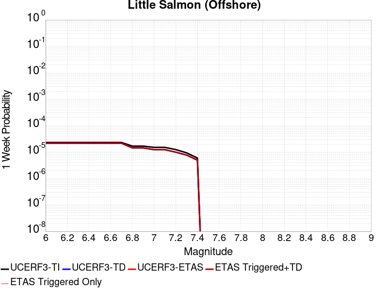 | 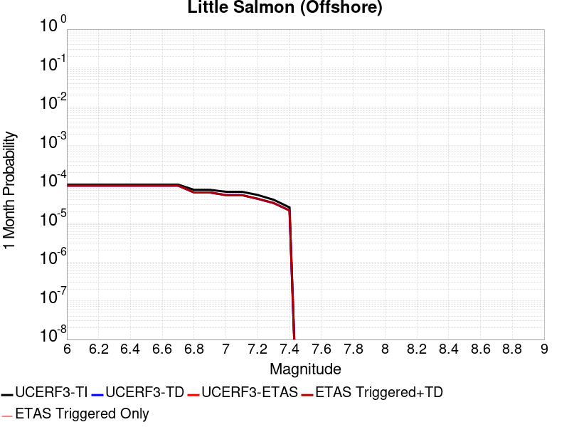 | 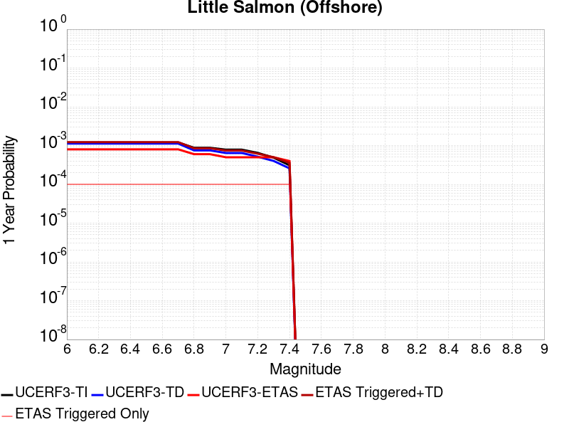 | 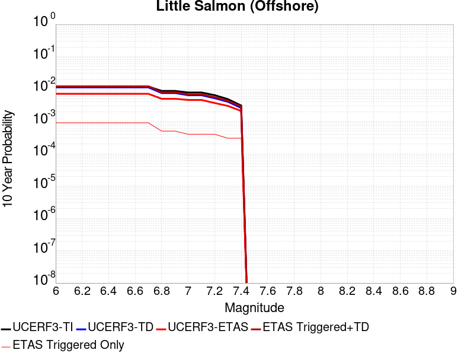 |

| Magnitude | 1 wk TI Prob | 1 wk TD Prob | 1 wk ETAS Prob | 1 wk ETAS/TD Gain | 1 wk ETAS Triggered+TD | 1 wk ETAS Triggered Only | 1 mo TI Prob | 1 mo TD Prob | 1 mo ETAS Prob | 1 mo ETAS/TD Gain | 1 mo ETAS Triggered+TD | 1 mo ETAS Triggered Only | 1 yr TI Prob | 1 yr TD Prob | 1 yr ETAS Prob | 1 yr ETAS/TD Gain | 1 yr ETAS Triggered+TD | 1 yr ETAS Triggered Only | 10 yr TI Prob | 10 yr TD Prob | 10 yr ETAS Prob | 10 yr ETAS/TD Gain | 10 yr ETAS Triggered+TD | 10 yr ETAS Triggered Only |
|-----|-----|-----|-----|-----|-----|-----|-----|-----|-----|-----|-----|-----|-----|-----|-----|-----|-----|-----|-----|-----|-----|-----|-----|-----|
| 6.0 | 2.3052053E-5 | 2.162446E-5 | 0.0 | 0.0 | 2.162446E-5 | 0.0 | 9.879077E-5 | 9.267362E-5 | 0.0 | 0.0 | 9.267362E-5 | 0.0 | 0.0012021139 | 0.0011278323 | 8.0E-4 | 0.7093253 | 0.0012277195 | 1.0E-4 | 0.011956319 | 0.011254897 | 0.0071 | 0.6308365 | 0.012144768 | 9.0E-4 |
| 6.1 | 2.3052053E-5 | 2.162446E-5 | 0.0 | 0.0 | 2.162446E-5 | 0.0 | 9.879077E-5 | 9.267362E-5 | 0.0 | 0.0 | 9.267362E-5 | 0.0 | 0.0012021139 | 0.0011278323 | 8.0E-4 | 0.7093253 | 0.0012277195 | 1.0E-4 | 0.011956319 | 0.011254897 | 0.0071 | 0.6308365 | 0.012144768 | 9.0E-4 |
| 6.2 | 2.3052053E-5 | 2.162446E-5 | 0.0 | 0.0 | 2.162446E-5 | 0.0 | 9.879077E-5 | 9.267362E-5 | 0.0 | 0.0 | 9.267362E-5 | 0.0 | 0.0012021139 | 0.0011278323 | 8.0E-4 | 0.7093253 | 0.0012277195 | 1.0E-4 | 0.011956319 | 0.011254897 | 0.0071 | 0.6308365 | 0.012144768 | 9.0E-4 |
| 6.3 | 2.3052053E-5 | 2.162446E-5 | 0.0 | 0.0 | 2.162446E-5 | 0.0 | 9.879077E-5 | 9.267362E-5 | 0.0 | 0.0 | 9.267362E-5 | 0.0 | 0.0012021139 | 0.0011278323 | 8.0E-4 | 0.7093253 | 0.0012277195 | 1.0E-4 | 0.011956319 | 0.011254897 | 0.0071 | 0.6308365 | 0.012144768 | 9.0E-4 |
| 6.4 | 2.3052053E-5 | 2.162446E-5 | 0.0 | 0.0 | 2.162446E-5 | 0.0 | 9.879077E-5 | 9.267362E-5 | 0.0 | 0.0 | 9.267362E-5 | 0.0 | 0.0012021139 | 0.0011278323 | 8.0E-4 | 0.7093253 | 0.0012277195 | 1.0E-4 | 0.011956319 | 0.011254897 | 0.0071 | 0.6308365 | 0.012144768 | 9.0E-4 |
| 6.5 | 2.3052053E-5 | 2.162446E-5 | 0.0 | 0.0 | 2.162446E-5 | 0.0 | 9.879077E-5 | 9.267362E-5 | 0.0 | 0.0 | 9.267362E-5 | 0.0 | 0.0012021139 | 0.0011278323 | 8.0E-4 | 0.7093253 | 0.0012277195 | 1.0E-4 | 0.011956319 | 0.011254897 | 0.0071 | 0.6308365 | 0.012144768 | 9.0E-4 |
| 6.6 | 2.3052053E-5 | 2.162446E-5 | 0.0 | 0.0 | 2.162446E-5 | 0.0 | 9.879077E-5 | 9.267362E-5 | 0.0 | 0.0 | 9.267362E-5 | 0.0 | 0.0012021139 | 0.0011278323 | 8.0E-4 | 0.7093253 | 0.0012277195 | 1.0E-4 | 0.011956319 | 0.011254897 | 0.0071 | 0.6308365 | 0.012144768 | 9.0E-4 |
| 6.7 | 2.3052053E-5 | 2.162446E-5 | 0.0 | 0.0 | 2.162446E-5 | 0.0 | 9.879077E-5 | 9.267362E-5 | 0.0 | 0.0 | 9.267362E-5 | 0.0 | 0.0012021139 | 0.0011278323 | 8.0E-4 | 0.7093253 | 0.0012277195 | 1.0E-4 | 0.011956319 | 0.011254897 | 0.0071 | 0.6308365 | 0.012144768 | 9.0E-4 |
| 6.8 | 1.683878E-5 | 1.4401346E-5 | 0.0 | 0.0 | 1.4401346E-5 | 0.0 | 7.21642E-5 | 6.171888E-5 | 0.0 | 0.0 | 6.171888E-5 | 0.0 | 8.78245E-4 | 7.5121934E-4 | 6.0E-4 | 0.79870147 | 8.5114426E-4 | 1.0E-4 | 0.008747822 | 0.0075143646 | 0.005 | 0.6653923 | 0.008010607 | 5.0E-4 |
| 6.9 | 1.683878E-5 | 1.4401346E-5 | 0.0 | 0.0 | 1.4401346E-5 | 0.0 | 7.21642E-5 | 6.171888E-5 | 0.0 | 0.0 | 6.171888E-5 | 0.0 | 8.78245E-4 | 7.5121934E-4 | 6.0E-4 | 0.79870147 | 8.5114426E-4 | 1.0E-4 | 0.008747822 | 0.0075143646 | 0.005 | 0.6653923 | 0.008010607 | 5.0E-4 |
| 7.0 | 1.5051273E-5 | 1.2348738E-5 | 0.0 | 0.0 | 1.2348738E-5 | 0.0 | 6.450386E-5 | 5.292235E-5 | 0.0 | 0.0 | 5.292235E-5 | 0.0 | 7.8505155E-4 | 6.4418523E-4 | 5.0E-4 | 0.7761743 | 7.441208E-4 | 1.0E-4 | 0.00782284 | 0.006450269 | 0.0046 | 0.7131486 | 0.006847689 | 4.0E-4 |
| 7.1 | 1.5051273E-5 | 1.2348738E-5 | 0.0 | 0.0 | 1.2348738E-5 | 0.0 | 6.450386E-5 | 5.292235E-5 | 0.0 | 0.0 | 5.292235E-5 | 0.0 | 7.8505155E-4 | 6.4418523E-4 | 5.0E-4 | 0.7761743 | 7.441208E-4 | 1.0E-4 | 0.00782284 | 0.006450269 | 0.0046 | 0.7131486 | 0.006847689 | 4.0E-4 |
| 7.2 | 1.24301405E-5 | 9.918518E-6 | 0.0 | 0.0 | 9.918518E-6 | 0.0 | 5.3270942E-5 | 4.2507465E-5 | 0.0 | 0.0 | 4.2507465E-5 | 0.0 | 6.483807E-4 | 5.174456E-4 | 5.0E-4 | 0.9662851 | 6.173939E-4 | 1.0E-4 | 0.006464922 | 0.0051884563 | 0.0037 | 0.71312153 | 0.005586381 | 4.0E-4 |
| 7.3 | 9.3599865E-6 | 7.705265E-6 | 0.0 | 0.0 | 7.705265E-6 | 0.0 | 4.011361E-5 | 3.302235E-5 | 0.0 | 0.0 | 3.302235E-5 | 0.0 | 4.8827377E-4 | 4.0200865E-4 | 5.0E-4 | 1.2437543 | 5.0196843E-4 | 1.0E-4 | 0.004872023 | 0.004029657 | 0.003 | 0.7444802 | 0.0043284483 | 3.0E-4 |
| 7.4 | 5.941556E-6 | 4.9578575E-6 | 0.0 | 0.0 | 4.9578575E-6 | 0.0 | 2.5463563E-5 | 2.124796E-5 | 0.0 | 0.0 | 2.124796E-5 | 0.0 | 3.0997477E-4 | 2.586939E-4 | 4.0E-4 | 1.5462289 | 3.5866804E-4 | 1.0E-4 | 0.0030954275 | 0.002595933 | 0.0021 | 0.80895776 | 0.002895154 | 3.0E-4 |

## Emerson-Copper Mtn 2011
*[(top)](#table-of-contents)*

| 1 Week | 1 Month | 1 Year | 10 Year |
|-----|-----|-----|-----|
| 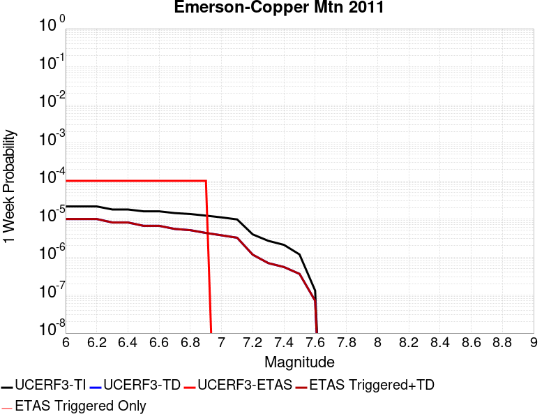 | 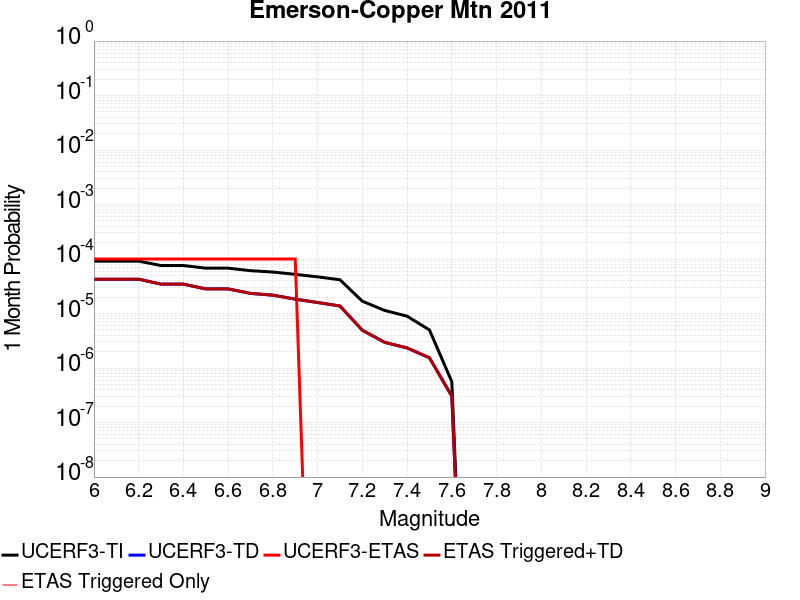 | 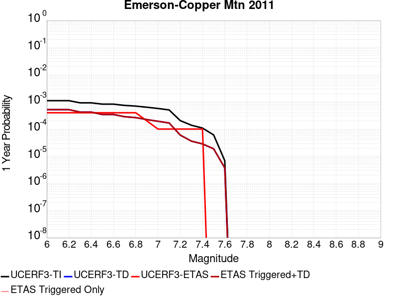 | 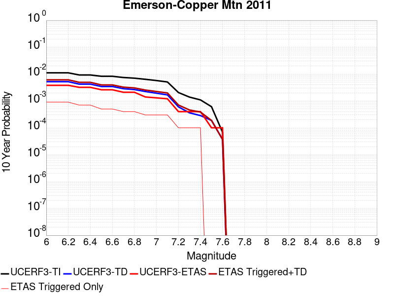 |

| Magnitude | 1 wk TI Prob | 1 wk TD Prob | 1 wk ETAS Prob | 1 wk ETAS/TD Gain | 1 wk ETAS Triggered+TD | 1 wk ETAS Triggered Only | 1 mo TI Prob | 1 mo TD Prob | 1 mo ETAS Prob | 1 mo ETAS/TD Gain | 1 mo ETAS Triggered+TD | 1 mo ETAS Triggered Only | 1 yr TI Prob | 1 yr TD Prob | 1 yr ETAS Prob | 1 yr ETAS/TD Gain | 1 yr ETAS Triggered+TD | 1 yr ETAS Triggered Only | 10 yr TI Prob | 10 yr TD Prob | 10 yr ETAS Prob | 10 yr ETAS/TD Gain | 10 yr ETAS Triggered+TD | 10 yr ETAS Triggered Only |
|-----|-----|-----|-----|-----|-----|-----|-----|-----|-----|-----|-----|-----|-----|-----|-----|-----|-----|-----|-----|-----|-----|-----|-----|-----|
| 6.0 | 2.1364202E-5 | 9.970367E-6 | 1.0E-4 | 10.029721 | 9.970367E-6 | 0.0 | 9.1557646E-5 | 4.2729494E-5 | 1.0E-4 | 2.340304 | 4.2729494E-5 | 0.0 | 0.0011141442 | 5.201161E-4 | 4.0E-4 | 0.769059 | 5.201161E-4 | 0.0 | 0.011085749 | 0.0051898584 | 0.0038 | 0.7321972 | 0.0060851877 | 9.0E-4 |
| 6.1 | 2.1364202E-5 | 9.970367E-6 | 1.0E-4 | 10.029721 | 9.970367E-6 | 0.0 | 9.1557646E-5 | 4.2729494E-5 | 1.0E-4 | 2.340304 | 4.2729494E-5 | 0.0 | 0.0011141442 | 5.201161E-4 | 4.0E-4 | 0.769059 | 5.201161E-4 | 0.0 | 0.011085749 | 0.0051898584 | 0.0038 | 0.7321972 | 0.0060851877 | 9.0E-4 |
| 6.2 | 2.1364202E-5 | 9.970367E-6 | 1.0E-4 | 10.029721 | 9.970367E-6 | 0.0 | 9.1557646E-5 | 4.2729494E-5 | 1.0E-4 | 2.340304 | 4.2729494E-5 | 0.0 | 0.0011141442 | 5.201161E-4 | 4.0E-4 | 0.769059 | 5.201161E-4 | 0.0 | 0.011085749 | 0.0051898584 | 0.0038 | 0.7321972 | 0.0060851877 | 9.0E-4 |
| 6.3 | 1.7751237E-5 | 8.091108E-6 | 1.0E-4 | 12.359247 | 8.091108E-6 | 0.0 | 7.607452E-5 | 3.467575E-5 | 1.0E-4 | 2.8838596 | 3.467575E-5 | 0.0 | 9.258136E-4 | 4.2210176E-4 | 4.0E-4 | 0.9476388 | 4.2210176E-4 | 0.0 | 0.00921966 | 0.0042136232 | 0.0032 | 0.75944144 | 0.0049106735 | 7.0E-4 |
| 6.4 | 1.7751237E-5 | 8.091108E-6 | 1.0E-4 | 12.359247 | 8.091108E-6 | 0.0 | 7.607452E-5 | 3.467575E-5 | 1.0E-4 | 2.8838596 | 3.467575E-5 | 0.0 | 9.258136E-4 | 4.2210176E-4 | 4.0E-4 | 0.9476388 | 4.2210176E-4 | 0.0 | 0.00921966 | 0.0042136232 | 0.0032 | 0.75944144 | 0.0049106735 | 7.0E-4 |
| 6.5 | 1.5886664E-5 | 6.6053894E-6 | 1.0E-4 | 15.139153 | 6.6053894E-6 | 0.0 | 6.808392E-5 | 2.8308532E-5 | 1.0E-4 | 3.5325038 | 2.8308532E-5 | 0.0 | 8.286065E-4 | 3.4460655E-4 | 4.0E-4 | 1.160744 | 3.4460655E-4 | 0.0 | 0.008255237 | 0.0034411864 | 0.0026 | 0.75555336 | 0.003939466 | 5.0E-4 |
| 6.6 | 1.5886664E-5 | 6.6053894E-6 | 1.0E-4 | 15.139153 | 6.6053894E-6 | 0.0 | 6.808392E-5 | 2.8308532E-5 | 1.0E-4 | 3.5325038 | 2.8308532E-5 | 0.0 | 8.286065E-4 | 3.4460655E-4 | 4.0E-4 | 1.160744 | 3.4460655E-4 | 0.0 | 0.008255237 | 0.0034411864 | 0.0026 | 0.75555336 | 0.003939466 | 5.0E-4 |
| 6.7 | 1.428471E-5 | 5.471741E-6 | 1.0E-4 | 18.275719 | 5.471741E-6 | 0.0 | 6.121875E-5 | 2.3450131E-5 | 1.0E-4 | 4.2643685 | 2.3450131E-5 | 0.0 | 7.450834E-4 | 2.8547188E-4 | 4.0E-4 | 1.4011889 | 2.8547188E-4 | 0.0 | 0.007425902 | 0.0028514399 | 0.0021 | 0.73647004 | 0.0032502993 | 4.0E-4 |
| 6.8 | 1.3490684E-5 | 5.074946E-6 | 1.0E-4 | 19.704643 | 5.074946E-6 | 0.0 | 5.7815934E-5 | 2.1749609E-5 | 1.0E-4 | 4.597784 | 2.1749609E-5 | 0.0 | 7.0368167E-4 | 2.6477317E-4 | 4.0E-4 | 1.510727 | 2.6477317E-4 | 0.0 | 0.007014576 | 0.0026449582 | 0.0021 | 0.7939634 | 0.0030439002 | 4.0E-4 |
| 6.9 | 1.2235421E-5 | 4.290804E-6 | 1.0E-4 | 23.305656 | 4.290804E-6 | 0.0 | 5.2436466E-5 | 1.838905E-5 | 1.0E-4 | 5.438019 | 1.838905E-5 | 0.0 | 6.38227E-4 | 2.2386729E-4 | 2.0E-4 | 0.8933864 | 2.2386729E-4 | 0.0 | 0.0063639707 | 0.0022367723 | 0.0014 | 0.6259019 | 0.0025361013 | 3.0E-4 |
| 7.0 | 1.1009851E-5 | 3.7199948E-6 | 0.0 | 0.0 | 3.7199948E-6 | 0.0 | 4.7184225E-5 | 1.5942756E-5 | 0.0 | 0.0 | 1.5942756E-5 | 0.0 | 5.743165E-4 | 1.9408921E-4 | 1.0E-4 | 0.51522696 | 1.9408921E-4 | 0.0 | 0.005728345 | 0.001939535 | 0.0013 | 0.6702637 | 0.0022389533 | 3.0E-4 |
| 7.1 | 9.726373E-6 | 3.2126845E-6 | 0.0 | 0.0 | 3.2126845E-6 | 0.0 | 4.168379E-5 | 1.3768595E-5 | 0.0 | 0.0 | 1.3768595E-5 | 0.0 | 5.07382E-4 | 1.6762312E-4 | 1.0E-4 | 0.5965764 | 1.6762312E-4 | 0.0 | 0.0050622504 | 0.0016752983 | 0.0012 | 0.71629035 | 0.0019747957 | 3.0E-4 |
| 7.2 | 3.9335127E-6 | 1.1527736E-6 | 0.0 | 0.0 | 1.1527736E-6 | 0.0 | 1.6857803E-5 | 4.9404493E-6 | 0.0 | 0.0 | 4.9404493E-6 | 0.0 | 2.0522442E-4 | 6.0148373E-5 | 1.0E-4 | 1.6625553 | 6.0148373E-5 | 0.0 | 0.00205035 | 6.013269E-4 | 4.0E-4 | 0.6651956 | 7.0126675E-4 | 1.0E-4 |
| 7.3 | 2.661632E-6 | 6.9133523E-7 | 0.0 | 0.0 | 6.9133523E-7 | 0.0 | 1.14069435E-5 | 2.9628618E-6 | 0.0 | 0.0 | 2.9628618E-6 | 0.0 | 1.3887069E-4 | 3.607226E-5 | 1.0E-4 | 2.7722135 | 3.607226E-5 | 0.0 | 0.0013878393 | 3.6066506E-4 | 4.0E-4 | 1.1090622 | 4.60629E-4 | 1.0E-4 |
| 7.4 | 2.0893426E-6 | 5.463303E-7 | 0.0 | 0.0 | 5.463303E-7 | 0.0 | 8.954295E-6 | 2.3414134E-6 | 0.0 | 0.0 | 2.3414134E-6 | 0.0 | 1.0901308E-4 | 2.850634E-5 | 1.0E-4 | 3.5079916 | 2.850634E-5 | 0.0 | 0.0010895962 | 2.8502737E-4 | 4.0E-4 | 1.403374 | 3.849989E-4 | 1.0E-4 |
| 7.5 | 1.1681728E-6 | 3.6039168E-7 | 0.0 | 0.0 | 3.6039168E-7 | 0.0 | 5.0064455E-6 | 1.5445349E-6 | 0.0 | 0.0 | 1.5445349E-6 | 0.0 | 6.0951766E-5 | 1.8804556E-5 | 0.0 | 0.0 | 1.8804556E-5 | 0.0 | 6.093505E-4 | 1.8803011E-4 | 1.0E-4 | 0.5318297 | 1.8803011E-4 | 0.0 |
| 7.6 | 1.3154387E-7 | 7.120964E-8 | 0.0 | 0.0 | 7.120964E-8 | 0.0 | 5.6375933E-7 | 3.0518413E-7 | 0.0 | 0.0 | 3.0518413E-7 | 0.0 | 6.863748E-6 | 3.7156121E-6 | 0.0 | 0.0 | 3.7156121E-6 | 0.0 | 6.863536E-5 | 3.715566E-5 | 1.0E-4 | 2.69138 | 3.715566E-5 | 0.0 |

## Death Valley (No)
*[(top)](#table-of-contents)*

| 1 Week | 1 Month | 1 Year | 10 Year |
|-----|-----|-----|-----|
|  |  | 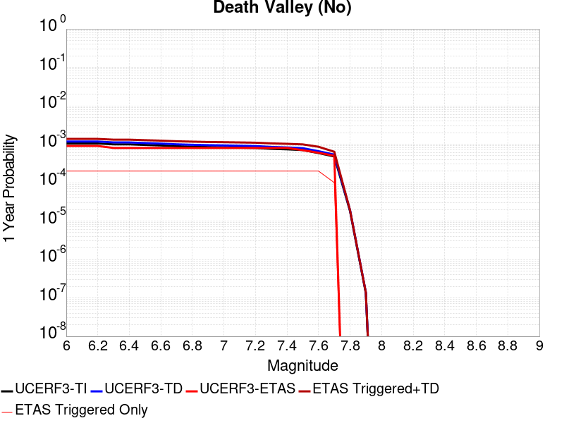 | 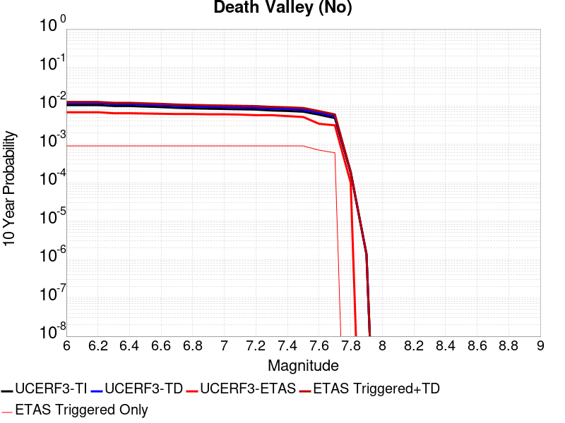 |

| Magnitude | 1 wk TI Prob | 1 wk TD Prob | 1 wk ETAS Prob | 1 wk ETAS/TD Gain | 1 wk ETAS Triggered+TD | 1 wk ETAS Triggered Only | 1 mo TI Prob | 1 mo TD Prob | 1 mo ETAS Prob | 1 mo ETAS/TD Gain | 1 mo ETAS Triggered+TD | 1 mo ETAS Triggered Only | 1 yr TI Prob | 1 yr TD Prob | 1 yr ETAS Prob | 1 yr ETAS/TD Gain | 1 yr ETAS Triggered+TD | 1 yr ETAS Triggered Only | 10 yr TI Prob | 10 yr TD Prob | 10 yr ETAS Prob | 10 yr ETAS/TD Gain | 10 yr ETAS Triggered+TD | 10 yr ETAS Triggered Only |
|-----|-----|-----|-----|-----|-----|-----|-----|-----|-----|-----|-----|-----|-----|-----|-----|-----|-----|-----|-----|-----|-----|-----|-----|-----|
| 6.0 | 2.0074807E-5 | 2.2505501E-5 | 1.0E-4 | 4.443358 | 1.2250325E-4 | 1.0E-4 | 8.603206E-5 | 9.6448624E-5 | 1.0E-4 | 1.0368215 | 1.9643898E-4 | 1.0E-4 | 0.001046937 | 0.0011736369 | 9.0E-4 | 0.76684713 | 0.0013734021 | 2.0E-4 | 0.010420183 | 0.011675301 | 0.0068 | 0.58242613 | 0.012564793 | 9.0E-4 |
| 6.1 | 2.0074807E-5 | 2.2505501E-5 | 1.0E-4 | 4.443358 | 1.2250325E-4 | 1.0E-4 | 8.603206E-5 | 9.6448624E-5 | 1.0E-4 | 1.0368215 | 1.9643898E-4 | 1.0E-4 | 0.001046937 | 0.0011736369 | 9.0E-4 | 0.76684713 | 0.0013734021 | 2.0E-4 | 0.010420183 | 0.011675301 | 0.0068 | 0.58242613 | 0.012564793 | 9.0E-4 |
| 6.2 | 2.0074807E-5 | 2.2505501E-5 | 1.0E-4 | 4.443358 | 1.2250325E-4 | 1.0E-4 | 8.603206E-5 | 9.6448624E-5 | 1.0E-4 | 1.0368215 | 1.9643898E-4 | 1.0E-4 | 0.001046937 | 0.0011736369 | 9.0E-4 | 0.76684713 | 0.0013734021 | 2.0E-4 | 0.010420183 | 0.011675301 | 0.0068 | 0.58242613 | 0.012564793 | 9.0E-4 |
| 6.3 | 1.9050609E-5 | 2.1342052E-5 | 1.0E-4 | 4.685585 | 1.21339915E-4 | 1.0E-4 | 8.164292E-5 | 9.146277E-5 | 1.0E-4 | 1.0933411 | 1.9145363E-4 | 1.0E-4 | 9.935491E-4 | 0.0011129971 | 8.0E-4 | 0.71878 | 0.0013127745 | 2.0E-4 | 0.009891188 | 0.011075053 | 0.0064 | 0.5778753 | 0.011965086 | 9.0E-4 |
| 6.4 | 1.9050609E-5 | 2.1342052E-5 | 1.0E-4 | 4.685585 | 1.21339915E-4 | 1.0E-4 | 8.164292E-5 | 9.146277E-5 | 1.0E-4 | 1.0933411 | 1.9145363E-4 | 1.0E-4 | 9.935491E-4 | 0.0011129971 | 8.0E-4 | 0.71878 | 0.0013127745 | 2.0E-4 | 0.009891188 | 0.011075053 | 0.0064 | 0.5778753 | 0.011965086 | 9.0E-4 |
| 6.5 | 1.8367004E-5 | 2.0565905E-5 | 1.0E-4 | 4.8624167 | 1.2056385E-4 | 1.0E-4 | 7.8713354E-5 | 8.813665E-5 | 1.0E-4 | 1.1346017 | 1.8812784E-4 | 1.0E-4 | 9.5791375E-4 | 0.001072542 | 8.0E-4 | 0.7458915 | 0.0012723275 | 2.0E-4 | 0.009537951 | 0.010674443 | 0.0063 | 0.5901947 | 0.011564837 | 9.0E-4 |
| 6.6 | 1.779439E-5 | 1.991565E-5 | 1.0E-4 | 5.021177 | 1.1991366E-4 | 1.0E-4 | 7.625944E-5 | 8.535003E-5 | 1.0E-4 | 1.1716458 | 1.8534149E-4 | 1.0E-4 | 9.280632E-4 | 0.0010386476 | 8.0E-4 | 0.7702323 | 0.0012384399 | 2.0E-4 | 0.009241969 | 0.010338691 | 0.0062 | 0.59968907 | 0.011229387 | 9.0E-4 |
| 6.7 | 1.7025437E-5 | 1.9047926E-5 | 1.0E-4 | 5.2499156 | 1.19046024E-4 | 1.0E-4 | 7.296412E-5 | 8.163145E-5 | 1.0E-4 | 1.2250181 | 1.8162328E-4 | 1.0E-4 | 8.87976E-4 | 9.93416E-4 | 8.0E-4 | 0.8053022 | 0.0011932172 | 2.0E-4 | 0.008844362 | 0.009890471 | 0.0061 | 0.6167553 | 0.010781569 | 9.0E-4 |
| 6.8 | 1.6545107E-5 | 1.8516932E-5 | 1.0E-4 | 5.4004626 | 1.1851508E-4 | 1.0E-4 | 7.090568E-5 | 7.93559E-5 | 1.0E-4 | 1.2601457 | 1.7934796E-4 | 1.0E-4 | 8.629347E-4 | 9.65736E-4 | 8.0E-4 | 0.82838374 | 0.0011655429 | 2.0E-4 | 0.008595915 | 0.0096160965 | 0.0061 | 0.63435304 | 0.010507442 | 9.0E-4 |
| 6.9 | 1.615478E-5 | 1.8091903E-5 | 1.0E-4 | 5.527334 | 1.18090094E-4 | 1.0E-4 | 6.9232934E-5 | 7.753446E-5 | 1.0E-4 | 1.289749 | 1.7752672E-4 | 1.0E-4 | 8.4258494E-4 | 9.4357936E-4 | 8.0E-4 | 0.8478354 | 0.0011433907 | 2.0E-4 | 0.008393973 | 0.009396424 | 0.006 | 0.6385408 | 0.010287967 | 9.0E-4 |
| 7.0 | 1.5894311E-5 | 1.7809813E-5 | 1.0E-4 | 5.6148825 | 1.17808035E-4 | 1.0E-4 | 6.81167E-5 | 7.632557E-5 | 1.0E-4 | 1.310177 | 1.7631793E-4 | 1.0E-4 | 8.2900526E-4 | 9.288737E-4 | 8.0E-4 | 0.8612581 | 0.001128688 | 2.0E-4 | 0.008259195 | 0.009250602 | 0.006 | 0.6486065 | 0.010142276 | 9.0E-4 |
| 7.1 | 1.5602263E-5 | 1.7487699E-5 | 1.0E-4 | 5.718305 | 1.1748595E-4 | 1.0E-4 | 6.6865134E-5 | 7.4945165E-5 | 1.0E-4 | 1.334309 | 1.7493767E-4 | 1.0E-4 | 8.137789E-4 | 9.1208145E-4 | 8.0E-4 | 0.87711465 | 0.001111899 | 2.0E-4 | 0.008108052 | 0.009084064 | 0.0059 | 0.64948905 | 0.009975888 | 9.0E-4 |
| 7.2 | 1.5323829E-5 | 1.7174749E-5 | 1.0E-4 | 5.8225017 | 1.1717303E-4 | 1.0E-4 | 6.56719E-5 | 7.3604024E-5 | 1.0E-4 | 1.3586214 | 1.7359667E-4 | 1.0E-4 | 7.99262E-4 | 8.957666E-4 | 8.0E-4 | 0.8930898 | 0.0010955875 | 2.0E-4 | 0.007963934 | 0.008922237 | 0.0057 | 0.63885325 | 0.0098142065 | 9.0E-4 |
| 7.3 | 1.4556212E-5 | 1.6306349E-5 | 1.0E-4 | 6.132581 | 1.1630472E-4 | 1.0E-4 | 6.238227E-5 | 6.988251E-5 | 1.0E-4 | 1.4309733 | 1.6987552E-4 | 1.0E-4 | 7.592395E-4 | 8.5049326E-4 | 8.0E-4 | 0.9406306 | 0.0010503231 | 2.0E-4 | 0.0075665074 | 0.008473028 | 0.0057 | 0.6727229 | 0.009365403 | 9.0E-4 |
| 7.4 | 1.411725E-5 | 1.5811727E-5 | 1.0E-4 | 6.3244195 | 1.15810144E-4 | 1.0E-4 | 6.0501097E-5 | 6.776282E-5 | 1.0E-4 | 1.4757355 | 1.6775605E-4 | 1.0E-4 | 7.363519E-4 | 8.247059E-4 | 8.0E-4 | 0.97004277 | 0.001024541 | 2.0E-4 | 0.0073391674 | 0.008217089 | 0.0054 | 0.6571671 | 0.009109693 | 9.0E-4 |
| 7.5 | 1.3503312E-5 | 1.5129906E-5 | 1.0E-4 | 6.6094265 | 1.15128394E-4 | 1.0E-4 | 5.7870053E-5 | 6.4840875E-5 | 1.0E-4 | 1.542237 | 1.6483439E-4 | 1.0E-4 | 7.043401E-4 | 7.891575E-4 | 7.0E-4 | 0.88702184 | 9.889997E-4 | 2.0E-4 | 0.007021119 | 0.007864177 | 0.0051 | 0.64851034 | 0.0087570995 | 9.0E-4 |
| 7.6 | 1.1279839E-5 | 1.2629325E-5 | 1.0E-4 | 7.9180794 | 1.1262806E-4 | 1.0E-4 | 4.834127E-5 | 5.4124586E-5 | 1.0E-4 | 1.8475893 | 1.5411917E-4 | 1.0E-4 | 5.88396E-4 | 6.587729E-4 | 6.0E-4 | 0.91078424 | 8.586412E-4 | 2.0E-4 | 0.005868405 | 0.006568753 | 0.0034 | 0.517602 | 0.007264155 | 7.0E-4 |
| 7.7 | 9.189108E-6 | 1.0285795E-5 | 0.0 | 0.0 | 1.0285795E-5 | 0.0 | 3.93813E-5 | 4.4081262E-5 | 0.0 | 0.0 | 4.4081262E-5 | 0.0 | 4.7936183E-4 | 5.3656223E-4 | 5.0E-4 | 0.93185836 | 6.365086E-4 | 1.0E-4 | 0.004783291 | 0.0053531784 | 0.0031 | 0.5790952 | 0.0059499666 | 6.0E-4 |
| 7.8 | 3.4586725E-7 | 3.64866E-7 | 0.0 | 0.0 | 3.64866E-7 | 0.0 | 1.4822873E-6 | 1.5637105E-6 | 0.0 | 0.0 | 1.5637105E-6 | 0.0 | 1.80467E-5 | 1.9038014E-5 | 0.0 | 0.0 | 1.9038014E-5 | 0.0 | 1.8045233E-4 | 1.9036427E-4 | 1.0E-4 | 0.52530867 | 1.9036427E-4 | 0.0 |
| 7.9 | 2.5591178E-9 | 2.6699005E-9 | 0.0 | 0.0 | 2.6699005E-9 | 0.0 | 1.0967647E-8 | 1.1442431E-8 | 0.0 | 0.0 | 1.1442431E-8 | 0.0 | 1.335311E-7 | 1.393116E-7 | 0.0 | 0.0 | 1.393116E-7 | 0.0 | 1.3353102E-6 | 1.3931159E-6 | 0.0 | 0.0 | 1.3931159E-6 | 0.0 |

## San Cayetano
*[(top)](#table-of-contents)*

| 1 Week | 1 Month | 1 Year | 10 Year |
|-----|-----|-----|-----|
| 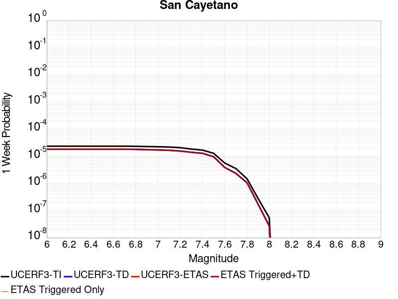 | 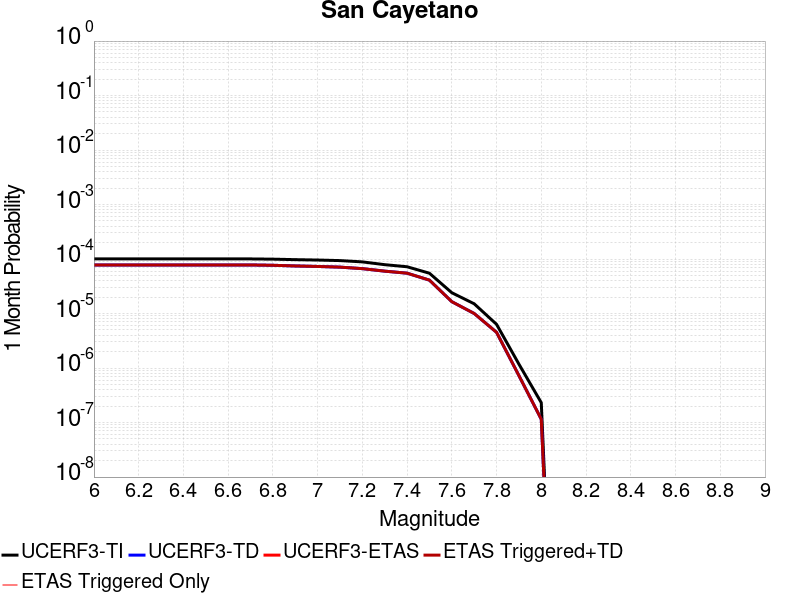 | 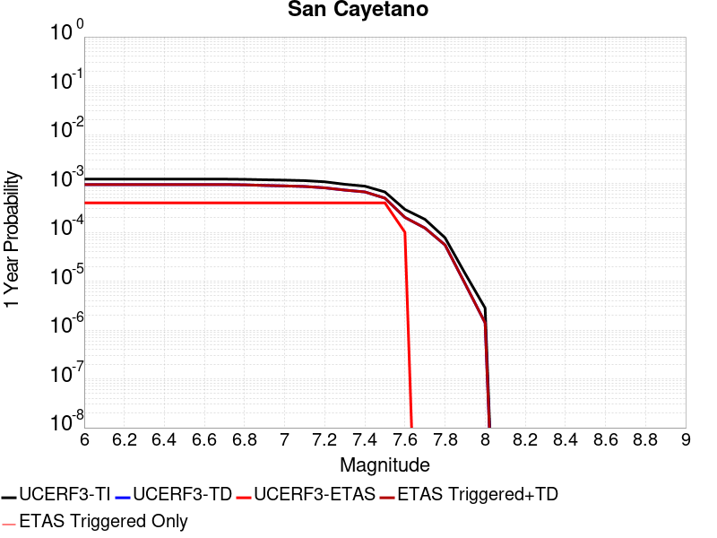 | 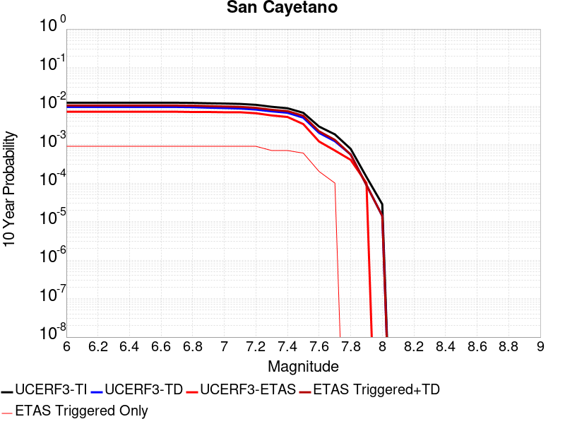 |

| Magnitude | 1 wk TI Prob | 1 wk TD Prob | 1 wk ETAS Prob | 1 wk ETAS/TD Gain | 1 wk ETAS Triggered+TD | 1 wk ETAS Triggered Only | 1 mo TI Prob | 1 mo TD Prob | 1 mo ETAS Prob | 1 mo ETAS/TD Gain | 1 mo ETAS Triggered+TD | 1 mo ETAS Triggered Only | 1 yr TI Prob | 1 yr TD Prob | 1 yr ETAS Prob | 1 yr ETAS/TD Gain | 1 yr ETAS Triggered+TD | 1 yr ETAS Triggered Only | 10 yr TI Prob | 10 yr TD Prob | 10 yr ETAS Prob | 10 yr ETAS/TD Gain | 10 yr ETAS Triggered+TD | 10 yr ETAS Triggered Only |
|-----|-----|-----|-----|-----|-----|-----|-----|-----|-----|-----|-----|-----|-----|-----|-----|-----|-----|-----|-----|-----|-----|-----|-----|-----|
| 6.0 | 2.3476267E-5 | 1.8176639E-5 | 0.0 | 0.0 | 1.8176639E-5 | 0.0 | 1.0060869E-4 | 7.789758E-5 | 0.0 | 0.0 | 7.789758E-5 | 0.0 | 0.0012242225 | 9.4799406E-4 | 4.0E-4 | 0.42194358 | 9.4799406E-4 | 0.0 | 0.012175002 | 0.009440266 | 0.0071 | 0.7520975 | 0.010331769 | 9.0E-4 |
| 6.1 | 2.3476267E-5 | 1.8176639E-5 | 0.0 | 0.0 | 1.8176639E-5 | 0.0 | 1.0060869E-4 | 7.789758E-5 | 0.0 | 0.0 | 7.789758E-5 | 0.0 | 0.0012242225 | 9.4799406E-4 | 4.0E-4 | 0.42194358 | 9.4799406E-4 | 0.0 | 0.012175002 | 0.009440266 | 0.0071 | 0.7520975 | 0.010331769 | 9.0E-4 |
| 6.2 | 2.3476267E-5 | 1.8176639E-5 | 0.0 | 0.0 | 1.8176639E-5 | 0.0 | 1.0060869E-4 | 7.789758E-5 | 0.0 | 0.0 | 7.789758E-5 | 0.0 | 0.0012242225 | 9.4799406E-4 | 4.0E-4 | 0.42194358 | 9.4799406E-4 | 0.0 | 0.012175002 | 0.009440266 | 0.0071 | 0.7520975 | 0.010331769 | 9.0E-4 |
| 6.3 | 2.3476267E-5 | 1.8176639E-5 | 0.0 | 0.0 | 1.8176639E-5 | 0.0 | 1.0060869E-4 | 7.789758E-5 | 0.0 | 0.0 | 7.789758E-5 | 0.0 | 0.0012242225 | 9.4799406E-4 | 4.0E-4 | 0.42194358 | 9.4799406E-4 | 0.0 | 0.012175002 | 0.009440266 | 0.0071 | 0.7520975 | 0.010331769 | 9.0E-4 |
| 6.4 | 2.3476267E-5 | 1.8176639E-5 | 0.0 | 0.0 | 1.8176639E-5 | 0.0 | 1.0060869E-4 | 7.789758E-5 | 0.0 | 0.0 | 7.789758E-5 | 0.0 | 0.0012242225 | 9.4799406E-4 | 4.0E-4 | 0.42194358 | 9.4799406E-4 | 0.0 | 0.012175002 | 0.009440266 | 0.0071 | 0.7520975 | 0.010331769 | 9.0E-4 |
| 6.5 | 2.3476267E-5 | 1.8176639E-5 | 0.0 | 0.0 | 1.8176639E-5 | 0.0 | 1.0060869E-4 | 7.789758E-5 | 0.0 | 0.0 | 7.789758E-5 | 0.0 | 0.0012242225 | 9.4799406E-4 | 4.0E-4 | 0.42194358 | 9.4799406E-4 | 0.0 | 0.012175002 | 0.009440266 | 0.0071 | 0.7520975 | 0.010331769 | 9.0E-4 |
| 6.6 | 2.3476267E-5 | 1.8176639E-5 | 0.0 | 0.0 | 1.8176639E-5 | 0.0 | 1.0060869E-4 | 7.789758E-5 | 0.0 | 0.0 | 7.789758E-5 | 0.0 | 0.0012242225 | 9.4799406E-4 | 4.0E-4 | 0.42194358 | 9.4799406E-4 | 0.0 | 0.012175002 | 0.009440266 | 0.0071 | 0.7520975 | 0.010331769 | 9.0E-4 |
| 6.7 | 2.3476267E-5 | 1.8176639E-5 | 0.0 | 0.0 | 1.8176639E-5 | 0.0 | 1.0060869E-4 | 7.789758E-5 | 0.0 | 0.0 | 7.789758E-5 | 0.0 | 0.0012242225 | 9.4799406E-4 | 4.0E-4 | 0.42194358 | 9.4799406E-4 | 0.0 | 0.012175002 | 0.009440266 | 0.0071 | 0.7520975 | 0.010331769 | 9.0E-4 |
| 6.8 | 2.3241924E-5 | 1.7944254E-5 | 0.0 | 0.0 | 1.7944254E-5 | 0.0 | 9.960445E-5 | 7.69017E-5 | 0.0 | 0.0 | 7.69017E-5 | 0.0 | 0.0012120095 | 9.3587965E-4 | 4.0E-4 | 0.4274054 | 9.3587965E-4 | 0.0 | 0.012054204 | 0.009320076 | 0.007 | 0.75106686 | 0.010211688 | 9.0E-4 |
| 6.9 | 2.2761007E-5 | 1.743954E-5 | 0.0 | 0.0 | 1.743954E-5 | 0.0 | 9.7543525E-5 | 7.473877E-5 | 0.0 | 0.0 | 7.473877E-5 | 0.0 | 0.0011869454 | 9.0956804E-4 | 4.0E-4 | 0.4397692 | 9.0956804E-4 | 0.0 | 0.011806256 | 0.009059119 | 0.007 | 0.77270204 | 0.009950967 | 9.0E-4 |
| 7.0 | 2.240283E-5 | 1.7073178E-5 | 0.0 | 0.0 | 1.7073178E-5 | 0.0 | 9.600859E-5 | 7.316873E-5 | 0.0 | 0.0 | 7.316873E-5 | 0.0 | 0.0011682777 | 8.9046865E-4 | 4.0E-4 | 0.44920167 | 8.9046865E-4 | 0.0 | 0.011621549 | 0.008869655 | 0.0069 | 0.77793324 | 0.009761673 | 9.0E-4 |
| 7.1 | 2.1871154E-5 | 1.6592958E-5 | 0.0 | 0.0 | 1.6592958E-5 | 0.0 | 9.373015E-5 | 7.111076E-5 | 0.0 | 0.0 | 7.111076E-5 | 0.0 | 0.0011405671 | 8.6543296E-4 | 4.0E-4 | 0.46219638 | 8.6543296E-4 | 0.0 | 0.011347309 | 0.008621264 | 0.0069 | 0.8003467 | 0.009513505 | 9.0E-4 |
| 7.2 | 2.0714133E-5 | 1.5571155E-5 | 0.0 | 0.0 | 1.5571155E-5 | 0.0 | 8.8771834E-5 | 6.673183E-5 | 0.0 | 0.0 | 6.673183E-5 | 0.0 | 0.0010802611 | 8.121605E-4 | 4.0E-4 | 0.4925135 | 8.121605E-4 | 0.0 | 0.010750249 | 0.008092534 | 0.0065 | 0.80320954 | 0.00898525 | 9.0E-4 |
| 7.3 | 1.8408395E-5 | 1.40014445E-5 | 0.0 | 0.0 | 1.40014445E-5 | 0.0 | 7.8890735E-5 | 6.0004826E-5 | 0.0 | 0.0 | 6.0004826E-5 | 0.0 | 9.600714E-4 | 7.3031685E-4 | 4.0E-4 | 0.54770744 | 7.3031685E-4 | 0.0 | 0.009559342 | 0.0072797146 | 0.0057 | 0.7829977 | 0.007974619 | 7.0E-4 |
| 7.4 | 1.6856795E-5 | 1.2854166E-5 | 0.0 | 0.0 | 1.2854166E-5 | 0.0 | 7.2241404E-5 | 5.5088138E-5 | 0.0 | 0.0 | 5.5088138E-5 | 0.0 | 8.7918417E-4 | 6.704945E-4 | 4.0E-4 | 0.5965746 | 6.704945E-4 | 0.0 | 0.00875714 | 0.0066852267 | 0.0052 | 0.77783453 | 0.007380547 | 7.0E-4 |
| 7.5 | 1.2822778E-5 | 9.580397E-6 | 0.0 | 0.0 | 9.580397E-6 | 0.0 | 5.495361E-5 | 4.1058207E-5 | 0.0 | 0.0 | 4.1058207E-5 | 0.0 | 6.688548E-4 | 4.997706E-4 | 4.0E-4 | 0.8003672 | 4.997706E-4 | 0.0 | 0.006668452 | 0.004986551 | 0.0034 | 0.681834 | 0.005583559 | 6.0E-4 |
| 7.6 | 5.6272684E-6 | 3.8560843E-6 | 0.0 | 0.0 | 3.8560843E-6 | 0.0 | 2.4116642E-5 | 1.6525972E-5 | 0.0 | 0.0 | 1.6525972E-5 | 0.0 | 2.9358055E-4 | 2.0118523E-4 | 1.0E-4 | 0.49705437 | 2.0118523E-4 | 0.0 | 0.0029319301 | 0.0020100418 | 0.0012 | 0.5970025 | 0.0022096399 | 2.0E-4 |
| 7.7 | 3.5261346E-6 | 2.3414873E-6 | 0.0 | 0.0 | 2.3414873E-6 | 0.0 | 1.5111918E-5 | 1.0034908E-5 | 0.0 | 0.0 | 1.0034908E-5 | 0.0 | 1.8397206E-4 | 1.2216822E-4 | 0.0 | 0.0 | 1.2216822E-4 | 0.0 | 0.0018381984 | 0.001221018 | 7.0E-4 | 0.57329214 | 0.001320896 | 1.0E-4 |
| 7.8 | 1.4826929E-6 | 1.0567815E-6 | 0.0 | 0.0 | 1.0567815E-6 | 0.0 | 6.354383E-6 | 4.5290553E-6 | 0.0 | 0.0 | 4.5290553E-6 | 0.0 | 7.736187E-5 | 5.5139873E-5 | 0.0 | 0.0 | 5.5139873E-5 | 0.0 | 7.733494E-4 | 5.51264E-4 | 4.0E-4 | 0.7256052 | 5.51264E-4 | 0.0 |
| 7.9 | 2.7568166E-7 | 1.6984433E-7 | 0.0 | 0.0 | 1.6984433E-7 | 0.0 | 1.1814923E-6 | 7.279041E-7 | 0.0 | 0.0 | 7.279041E-7 | 0.0 | 1.4384574E-5 | 8.862196E-6 | 0.0 | 0.0 | 8.862196E-6 | 0.0 | 1.4383643E-4 | 8.8618464E-5 | 1.0E-4 | 1.128433 | 8.8618464E-5 | 0.0 |
| 8.0 | 5.407832E-8 | 2.6908213E-8 | 0.0 | 0.0 | 2.6908213E-8 | 0.0 | 2.3176422E-7 | 1.153209E-7 | 0.0 | 0.0 | 1.153209E-7 | 0.0 | 2.8217257E-6 | 1.4040312E-6 | 0.0 | 0.0 | 1.4040312E-6 | 0.0 | 2.8216898E-5 | 1.4040227E-5 | 0.0 | 0.0 | 1.4040227E-5 | 0.0 |

## Antelope Valley 2011
*[(top)](#table-of-contents)*

| 1 Week | 1 Month | 1 Year | 10 Year |
|-----|-----|-----|-----|
| 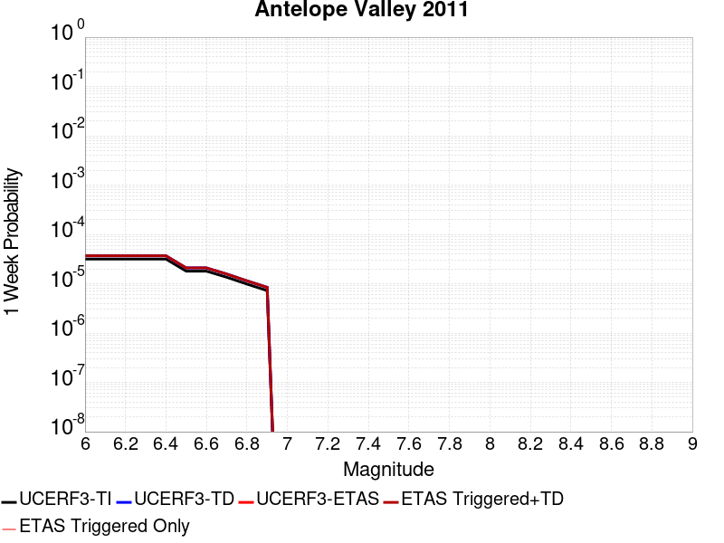 | 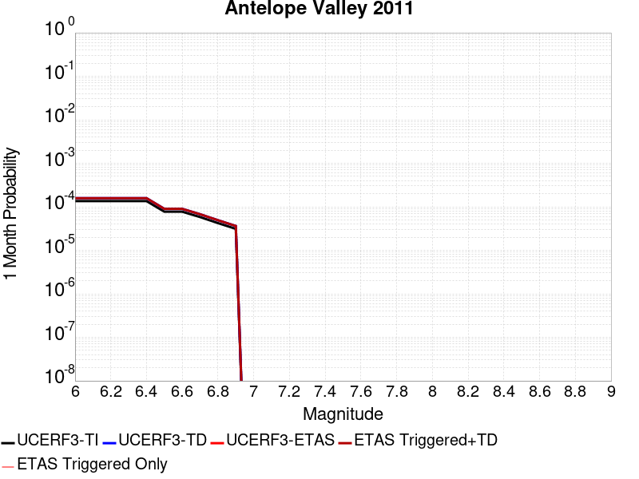 | 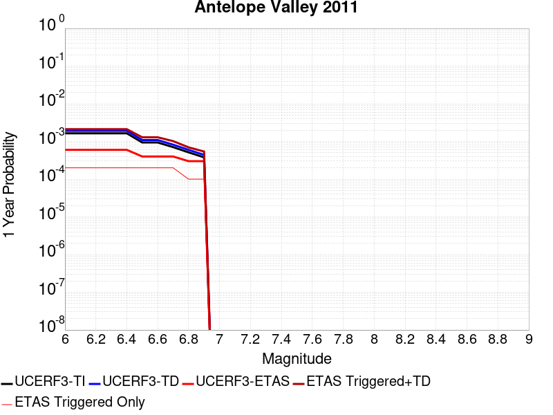 | 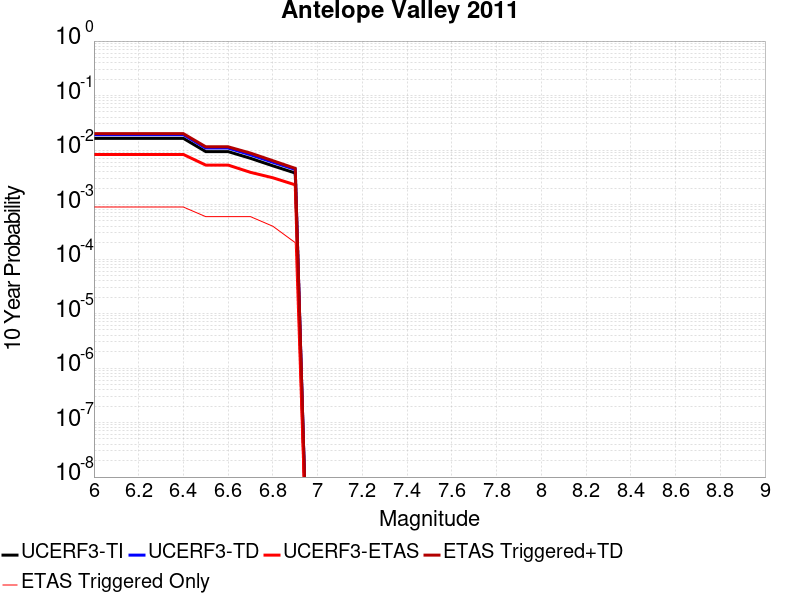 |

| Magnitude | 1 wk TI Prob | 1 wk TD Prob | 1 wk ETAS Prob | 1 wk ETAS/TD Gain | 1 wk ETAS Triggered+TD | 1 wk ETAS Triggered Only | 1 mo TI Prob | 1 mo TD Prob | 1 mo ETAS Prob | 1 mo ETAS/TD Gain | 1 mo ETAS Triggered+TD | 1 mo ETAS Triggered Only | 1 yr TI Prob | 1 yr TD Prob | 1 yr ETAS Prob | 1 yr ETAS/TD Gain | 1 yr ETAS Triggered+TD | 1 yr ETAS Triggered Only | 10 yr TI Prob | 10 yr TD Prob | 10 yr ETAS Prob | 10 yr ETAS/TD Gain | 10 yr ETAS Triggered+TD | 10 yr ETAS Triggered Only |
|-----|-----|-----|-----|-----|-----|-----|-----|-----|-----|-----|-----|-----|-----|-----|-----|-----|-----|-----|-----|-----|-----|-----|-----|-----|
| 6.0 | 3.1646934E-5 | 3.691655E-5 | 0.0 | 0.0 | 3.691655E-5 | 0.0 | 1.3562266E-4 | 1.5820569E-4 | 0.0 | 0.0 | 1.5820569E-4 | 0.0 | 0.0016499552 | 0.0019247174 | 6.0E-4 | 0.31173405 | 0.0021243326 | 2.0E-4 | 0.016377583 | 0.019106898 | 0.0083 | 0.43439808 | 0.019989703 | 9.0E-4 |
| 6.1 | 3.1646934E-5 | 3.691655E-5 | 0.0 | 0.0 | 3.691655E-5 | 0.0 | 1.3562266E-4 | 1.5820569E-4 | 0.0 | 0.0 | 1.5820569E-4 | 0.0 | 0.0016499552 | 0.0019247174 | 6.0E-4 | 0.31173405 | 0.0021243326 | 2.0E-4 | 0.016377583 | 0.019106898 | 0.0083 | 0.43439808 | 0.019989703 | 9.0E-4 |
| 6.2 | 3.1646934E-5 | 3.691655E-5 | 0.0 | 0.0 | 3.691655E-5 | 0.0 | 1.3562266E-4 | 1.5820569E-4 | 0.0 | 0.0 | 1.5820569E-4 | 0.0 | 0.0016499552 | 0.0019247174 | 6.0E-4 | 0.31173405 | 0.0021243326 | 2.0E-4 | 0.016377583 | 0.019106898 | 0.0083 | 0.43439808 | 0.019989703 | 9.0E-4 |
| 6.3 | 3.1646934E-5 | 3.691655E-5 | 0.0 | 0.0 | 3.691655E-5 | 0.0 | 1.3562266E-4 | 1.5820569E-4 | 0.0 | 0.0 | 1.5820569E-4 | 0.0 | 0.0016499552 | 0.0019247174 | 6.0E-4 | 0.31173405 | 0.0021243326 | 2.0E-4 | 0.016377583 | 0.019106898 | 0.0083 | 0.43439808 | 0.019989703 | 9.0E-4 |
| 6.4 | 3.1646934E-5 | 3.691655E-5 | 0.0 | 0.0 | 3.691655E-5 | 0.0 | 1.3562266E-4 | 1.5820569E-4 | 0.0 | 0.0 | 1.5820569E-4 | 0.0 | 0.0016499552 | 0.0019247174 | 6.0E-4 | 0.31173405 | 0.0021243326 | 2.0E-4 | 0.016377583 | 0.019106898 | 0.0083 | 0.43439808 | 0.019989703 | 9.0E-4 |
| 6.5 | 1.8034107E-5 | 2.0947651E-5 | 0.0 | 0.0 | 2.0947651E-5 | 0.0 | 7.7286735E-5 | 8.9773246E-5 | 0.0 | 0.0 | 8.9773246E-5 | 0.0 | 9.405598E-4 | 0.0010925638 | 4.0E-4 | 0.36611134 | 0.0012923452 | 2.0E-4 | 0.009365888 | 0.0108840065 | 0.0053 | 0.48695305 | 0.011477476 | 6.0E-4 |
| 6.6 | 1.8034107E-5 | 2.0947651E-5 | 0.0 | 0.0 | 2.0947651E-5 | 0.0 | 7.7286735E-5 | 8.9773246E-5 | 0.0 | 0.0 | 8.9773246E-5 | 0.0 | 9.405598E-4 | 0.0010925638 | 4.0E-4 | 0.36611134 | 0.0012923452 | 2.0E-4 | 0.009365888 | 0.0108840065 | 0.0053 | 0.48695305 | 0.011477476 | 6.0E-4 |
| 6.7 | 1.3567667E-5 | 1.5754533E-5 | 0.0 | 0.0 | 1.5754533E-5 | 0.0 | 5.814585E-5 | 6.751828E-5 | 0.0 | 0.0 | 6.751828E-5 | 0.0 | 7.076958E-4 | 8.2183135E-4 | 4.0E-4 | 0.48671788 | 0.001021667 | 2.0E-4 | 0.007054463 | 0.008198362 | 0.0039 | 0.4757048 | 0.0087934425 | 6.0E-4 |
| 6.8 | 9.867387E-6 | 1.1471625E-5 | 0.0 | 0.0 | 1.1471625E-5 | 0.0 | 4.2288117E-5 | 4.9163715E-5 | 0.0 | 0.0 | 4.9163715E-5 | 0.0 | 5.1473617E-4 | 5.9849885E-4 | 3.0E-4 | 0.5012541 | 6.98439E-4 | 1.0E-4 | 0.005135455 | 0.0059781885 | 0.0031 | 0.5185517 | 0.006375797 | 4.0E-4 |
| 6.9 | 7.273233E-6 | 8.457589E-6 | 0.0 | 0.0 | 8.457589E-6 | 0.0 | 3.1170628E-5 | 3.6246805E-5 | 0.0 | 0.0 | 3.6246805E-5 | 0.0 | 3.794363E-4 | 4.4130487E-4 | 3.0E-4 | 0.6798021 | 5.4126076E-4 | 1.0E-4 | 0.0037878908 | 0.0044130487 | 0.0023 | 0.52118164 | 0.004612166 | 2.0E-4 |

## Dry Mountain
*[(top)](#table-of-contents)*

| 1 Week | 1 Month | 1 Year | 10 Year |
|-----|-----|-----|-----|
|  |  |  | 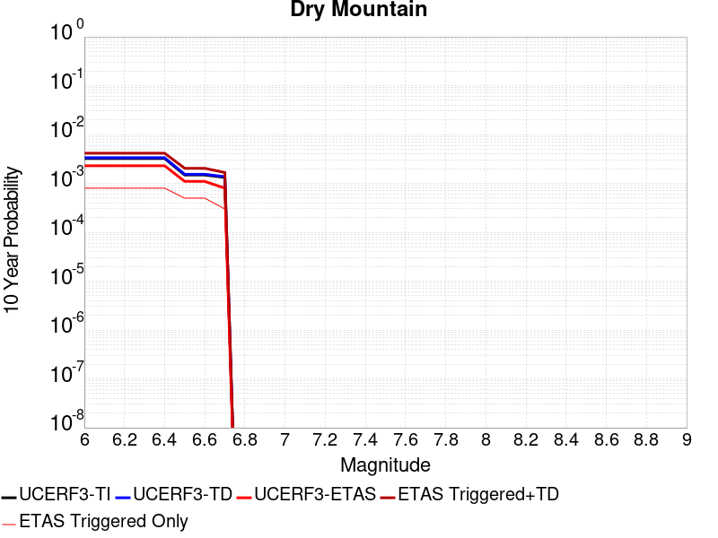 |

| Magnitude | 1 wk TI Prob | 1 wk TD Prob | 1 wk ETAS Prob | 1 wk ETAS/TD Gain | 1 wk ETAS Triggered+TD | 1 wk ETAS Triggered Only | 1 mo TI Prob | 1 mo TD Prob | 1 mo ETAS Prob | 1 mo ETAS/TD Gain | 1 mo ETAS Triggered+TD | 1 mo ETAS Triggered Only | 1 yr TI Prob | 1 yr TD Prob | 1 yr ETAS Prob | 1 yr ETAS/TD Gain | 1 yr ETAS Triggered+TD | 1 yr ETAS Triggered Only | 10 yr TI Prob | 10 yr TD Prob | 10 yr ETAS Prob | 10 yr ETAS/TD Gain | 10 yr ETAS Triggered+TD | 10 yr ETAS Triggered Only |
|-----|-----|-----|-----|-----|-----|-----|-----|-----|-----|-----|-----|-----|-----|-----|-----|-----|-----|-----|-----|-----|-----|-----|-----|-----|
| 6.0 | 6.222801E-6 | 6.439826E-6 | 0.0 | 0.0 | 6.439826E-6 | 0.0 | 2.6668875E-5 | 2.7599051E-5 | 1.0E-4 | 3.623313 | 2.7599051E-5 | 0.0 | 3.2464517E-4 | 3.3598256E-4 | 6.0E-4 | 1.785807 | 5.359154E-4 | 2.0E-4 | 0.0032417132 | 0.0033563082 | 0.0023 | 0.68527675 | 0.0041536232 | 8.0E-4 |
| 6.1 | 6.222801E-6 | 6.439826E-6 | 0.0 | 0.0 | 6.439826E-6 | 0.0 | 2.6668875E-5 | 2.7599051E-5 | 1.0E-4 | 3.623313 | 2.7599051E-5 | 0.0 | 3.2464517E-4 | 3.3598256E-4 | 6.0E-4 | 1.785807 | 5.359154E-4 | 2.0E-4 | 0.0032417132 | 0.0033563082 | 0.0023 | 0.68527675 | 0.0041536232 | 8.0E-4 |
| 6.2 | 6.222801E-6 | 6.439826E-6 | 0.0 | 0.0 | 6.439826E-6 | 0.0 | 2.6668875E-5 | 2.7599051E-5 | 1.0E-4 | 3.623313 | 2.7599051E-5 | 0.0 | 3.2464517E-4 | 3.3598256E-4 | 6.0E-4 | 1.785807 | 5.359154E-4 | 2.0E-4 | 0.0032417132 | 0.0033563082 | 0.0023 | 0.68527675 | 0.0041536232 | 8.0E-4 |
| 6.3 | 6.222801E-6 | 6.439826E-6 | 0.0 | 0.0 | 6.439826E-6 | 0.0 | 2.6668875E-5 | 2.7599051E-5 | 1.0E-4 | 3.623313 | 2.7599051E-5 | 0.0 | 3.2464517E-4 | 3.3598256E-4 | 6.0E-4 | 1.785807 | 5.359154E-4 | 2.0E-4 | 0.0032417132 | 0.0033563082 | 0.0023 | 0.68527675 | 0.0041536232 | 8.0E-4 |
| 6.4 | 6.222801E-6 | 6.439826E-6 | 0.0 | 0.0 | 6.439826E-6 | 0.0 | 2.6668875E-5 | 2.7599051E-5 | 1.0E-4 | 3.623313 | 2.7599051E-5 | 0.0 | 3.2464517E-4 | 3.3598256E-4 | 6.0E-4 | 1.785807 | 5.359154E-4 | 2.0E-4 | 0.0032417132 | 0.0033563082 | 0.0023 | 0.68527675 | 0.0041536232 | 8.0E-4 |
| 6.5 | 2.8528623E-6 | 2.9523721E-6 | 0.0 | 0.0 | 2.9523721E-6 | 0.0 | 1.22264955E-5 | 1.2653011E-5 | 0.0 | 0.0 | 1.2653011E-5 | 0.0 | 1.4884741E-4 | 1.5404823E-4 | 2.0E-4 | 1.2982948 | 2.540328E-4 | 1.0E-4 | 0.0014874774 | 0.001540268 | 0.0011 | 0.71416146 | 0.0020394977 | 5.0E-4 |
| 6.6 | 2.8528623E-6 | 2.9523721E-6 | 0.0 | 0.0 | 2.9523721E-6 | 0.0 | 1.22264955E-5 | 1.2653011E-5 | 0.0 | 0.0 | 1.2653011E-5 | 0.0 | 1.4884741E-4 | 1.5404823E-4 | 2.0E-4 | 1.2982948 | 2.540328E-4 | 1.0E-4 | 0.0014874774 | 0.001540268 | 0.0011 | 0.71416146 | 0.0020394977 | 5.0E-4 |
| 6.7 | 2.541E-6 | 2.6295393E-6 | 0.0 | 0.0 | 2.6295393E-6 | 0.0 | 1.0889954E-5 | 1.1269453E-5 | 0.0 | 0.0 | 1.1269453E-5 | 0.0 | 1.3257713E-4 | 1.372056E-4 | 1.0E-4 | 0.72883326 | 1.372056E-4 | 0.0 | 0.0013249806 | 0.001372056 | 8.0E-4 | 0.5830666 | 0.0016716444 | 3.0E-4 |

## Clayton
*[(top)](#table-of-contents)*

| 1 Week | 1 Month | 1 Year | 10 Year |
|-----|-----|-----|-----|
|  |  | 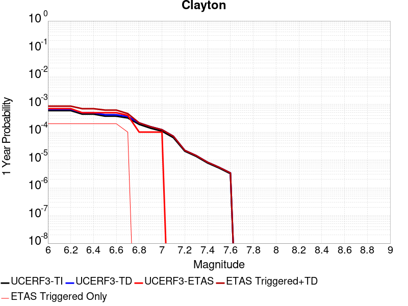 |  |

| Magnitude | 1 wk TI Prob | 1 wk TD Prob | 1 wk ETAS Prob | 1 wk ETAS/TD Gain | 1 wk ETAS Triggered+TD | 1 wk ETAS Triggered Only | 1 mo TI Prob | 1 mo TD Prob | 1 mo ETAS Prob | 1 mo ETAS/TD Gain | 1 mo ETAS Triggered+TD | 1 mo ETAS Triggered Only | 1 yr TI Prob | 1 yr TD Prob | 1 yr ETAS Prob | 1 yr ETAS/TD Gain | 1 yr ETAS Triggered+TD | 1 yr ETAS Triggered Only | 10 yr TI Prob | 10 yr TD Prob | 10 yr ETAS Prob | 10 yr ETAS/TD Gain | 10 yr ETAS Triggered+TD | 10 yr ETAS Triggered Only |
|-----|-----|-----|-----|-----|-----|-----|-----|-----|-----|-----|-----|-----|-----|-----|-----|-----|-----|-----|-----|-----|-----|-----|-----|-----|
| 6.0 | 1.1413061E-5 | 1.2669826E-5 | 0.0 | 0.0 | 1.2669826E-5 | 0.0 | 4.89122E-5 | 5.429825E-5 | 0.0 | 0.0 | 5.429825E-5 | 0.0 | 5.953433E-4 | 6.609029E-4 | 7.0E-4 | 1.0591571 | 8.607707E-4 | 2.0E-4 | 0.005937509 | 0.0065915775 | 0.0051 | 0.77371466 | 0.007386304 | 8.0E-4 |
| 6.1 | 1.1413061E-5 | 1.2669826E-5 | 0.0 | 0.0 | 1.2669826E-5 | 0.0 | 4.89122E-5 | 5.429825E-5 | 0.0 | 0.0 | 5.429825E-5 | 0.0 | 5.953433E-4 | 6.609029E-4 | 7.0E-4 | 1.0591571 | 8.607707E-4 | 2.0E-4 | 0.005937509 | 0.0065915775 | 0.0051 | 0.77371466 | 0.007386304 | 8.0E-4 |
| 6.2 | 1.1413061E-5 | 1.2669826E-5 | 0.0 | 0.0 | 1.2669826E-5 | 0.0 | 4.89122E-5 | 5.429825E-5 | 0.0 | 0.0 | 5.429825E-5 | 0.0 | 5.953433E-4 | 6.609029E-4 | 7.0E-4 | 1.0591571 | 8.607707E-4 | 2.0E-4 | 0.005937509 | 0.0065915775 | 0.0051 | 0.77371466 | 0.007386304 | 8.0E-4 |
| 6.3 | 8.538689E-6 | 9.534958E-6 | 0.0 | 0.0 | 9.534958E-6 | 0.0 | 3.659387E-5 | 4.0863524E-5 | 0.0 | 0.0 | 4.0863524E-5 | 0.0 | 4.4543925E-4 | 4.974106E-4 | 5.0E-4 | 1.0052058 | 6.9731113E-4 | 2.0E-4 | 0.0044454746 | 0.0049640387 | 0.0038 | 0.76550573 | 0.0056605637 | 7.0E-4 |
| 6.4 | 8.538689E-6 | 9.534958E-6 | 0.0 | 0.0 | 9.534958E-6 | 0.0 | 3.659387E-5 | 4.0863524E-5 | 0.0 | 0.0 | 4.0863524E-5 | 0.0 | 4.4543925E-4 | 4.974106E-4 | 5.0E-4 | 1.0052058 | 6.9731113E-4 | 2.0E-4 | 0.0044454746 | 0.0049640387 | 0.0038 | 0.76550573 | 0.0056605637 | 7.0E-4 |
| 6.5 | 7.197462E-6 | 8.082919E-6 | 0.0 | 0.0 | 8.082919E-6 | 0.0 | 3.08459E-5 | 3.4640667E-5 | 0.0 | 0.0 | 3.4640667E-5 | 0.0 | 3.7548412E-4 | 4.2167673E-4 | 5.0E-4 | 1.1857425 | 6.215924E-4 | 2.0E-4 | 0.003748503 | 0.004209578 | 0.0032 | 0.7601712 | 0.0049066315 | 7.0E-4 |
| 6.6 | 7.1760483E-6 | 8.058929E-6 | 0.0 | 0.0 | 8.058929E-6 | 0.0 | 3.075413E-5 | 3.4537858E-5 | 0.0 | 0.0 | 3.4537858E-5 | 0.0 | 3.743672E-4 | 4.204255E-4 | 5.0E-4 | 1.1892713 | 6.203414E-4 | 2.0E-4 | 0.0037373714 | 0.004197113 | 0.0032 | 0.7624288 | 0.004894175 | 7.0E-4 |
| 6.7 | 6.202582E-6 | 6.9784196E-6 | 0.0 | 0.0 | 6.9784196E-6 | 0.0 | 2.6582224E-5 | 2.9907213E-5 | 0.0 | 0.0 | 2.9907213E-5 | 0.0 | 3.235905E-4 | 3.6406715E-4 | 4.0E-4 | 1.0986984 | 4.6403075E-4 | 1.0E-4 | 0.0032311971 | 0.0036354633 | 0.0027 | 0.7426839 | 0.0041336454 | 5.0E-4 |
| 6.8 | 3.6417277E-6 | 4.12237E-6 | 0.0 | 0.0 | 4.12237E-6 | 0.0 | 1.5607311E-5 | 1.7667184E-5 | 0.0 | 0.0 | 1.7667184E-5 | 0.0 | 1.9000245E-4 | 2.1507751E-4 | 1.0E-4 | 0.46494865 | 2.1507751E-4 | 0.0 | 0.0018984007 | 0.00214877 | 0.0015 | 0.6980738 | 0.0023483401 | 2.0E-4 |
| 6.9 | 2.6498485E-6 | 3.0003034E-6 | 0.0 | 0.0 | 3.0003034E-6 | 0.0 | 1.1356444E-5 | 1.28583815E-5 | 0.0 | 0.0 | 1.28583815E-5 | 0.0 | 1.3825593E-4 | 1.5653994E-4 | 1.0E-4 | 0.63881457 | 1.5653994E-4 | 0.0 | 0.0013816995 | 0.0015643364 | 8.0E-4 | 0.511399 | 0.0015643364 | 0.0 |
| 7.0 | 2.070442E-6 | 2.341335E-6 | 0.0 | 0.0 | 2.341335E-6 | 0.0 | 8.873292E-6 | 1.0034256E-5 | 0.0 | 0.0 | 1.0034256E-5 | 0.0 | 1.0802698E-4 | 1.2216052E-4 | 1.0E-4 | 0.8185951 | 1.2216052E-4 | 0.0 | 0.0010797448 | 0.0012209634 | 5.0E-4 | 0.40951267 | 0.0012209634 | 0.0 |
| 7.1 | 1.2111691E-6 | 1.3592114E-6 | 0.0 | 0.0 | 1.3592114E-6 | 0.0 | 5.190714E-6 | 5.82518E-6 | 0.0 | 0.0 | 5.82518E-6 | 0.0 | 6.319511E-5 | 7.091942E-5 | 0.0 | 0.0 | 7.091942E-5 | 0.0 | 6.3177146E-4 | 7.0898427E-4 | 2.0E-4 | 0.2820937 | 7.0898427E-4 | 0.0 |
| 7.2 | 3.9541607E-7 | 4.223487E-7 | 0.0 | 0.0 | 4.223487E-7 | 0.0 | 1.6946392E-6 | 1.8100646E-6 | 0.0 | 0.0 | 1.8100646E-6 | 0.0 | 2.0632036E-5 | 2.2037315E-5 | 0.0 | 0.0 | 2.2037315E-5 | 0.0 | 2.063012E-4 | 2.2035145E-4 | 1.0E-4 | 0.45382047 | 2.2035145E-4 | 0.0 |
| 7.3 | 2.5685637E-7 | 2.7462383E-7 | 0.0 | 0.0 | 2.7462383E-7 | 0.0 | 1.1008126E-6 | 1.1769587E-6 | 0.0 | 0.0 | 1.1769587E-6 | 0.0 | 1.3402311E-5 | 1.4329379E-5 | 0.0 | 0.0 | 1.4329379E-5 | 0.0 | 1.3401502E-4 | 1.4328462E-4 | 0.0 | 0.0 | 1.4328462E-4 | 0.0 |
| 7.4 | 1.482299E-7 | 1.5811528E-7 | 0.0 | 0.0 | 1.5811528E-7 | 0.0 | 6.3527085E-7 | 6.7763676E-7 | 0.0 | 0.0 | 6.7763676E-7 | 0.0 | 7.734395E-6 | 8.2501965E-6 | 0.0 | 0.0 | 8.2501965E-6 | 0.0 | 7.734126E-5 | 8.2498926E-5 | 0.0 | 0.0 | 8.2498926E-5 | 0.0 |
| 7.5 | 9.7969505E-8 | 1.0441266E-7 | 0.0 | 0.0 | 1.0441266E-7 | 0.0 | 4.1986925E-7 | 4.4748276E-7 | 0.0 | 0.0 | 4.4748276E-7 | 0.0 | 5.111896E-6 | 5.4480893E-6 | 0.0 | 0.0 | 5.4480893E-6 | 0.0 | 5.1117782E-5 | 5.4479573E-5 | 0.0 | 0.0 | 5.4479573E-5 | 0.0 |
| 7.6 | 6.125415E-8 | 6.5235675E-8 | 0.0 | 0.0 | 6.5235675E-8 | 0.0 | 2.6251774E-7 | 2.7958143E-7 | 0.0 | 0.0 | 2.7958143E-7 | 0.0 | 3.196149E-6 | 3.4038987E-6 | 0.0 | 0.0 | 3.4038987E-6 | 0.0 | 3.196103E-5 | 3.403848E-5 | 0.0 | 0.0 | 3.403848E-5 | 0.0 |

## Sheephole
*[(top)](#table-of-contents)*

| 1 Week | 1 Month | 1 Year | 10 Year |
|-----|-----|-----|-----|
|  |  | 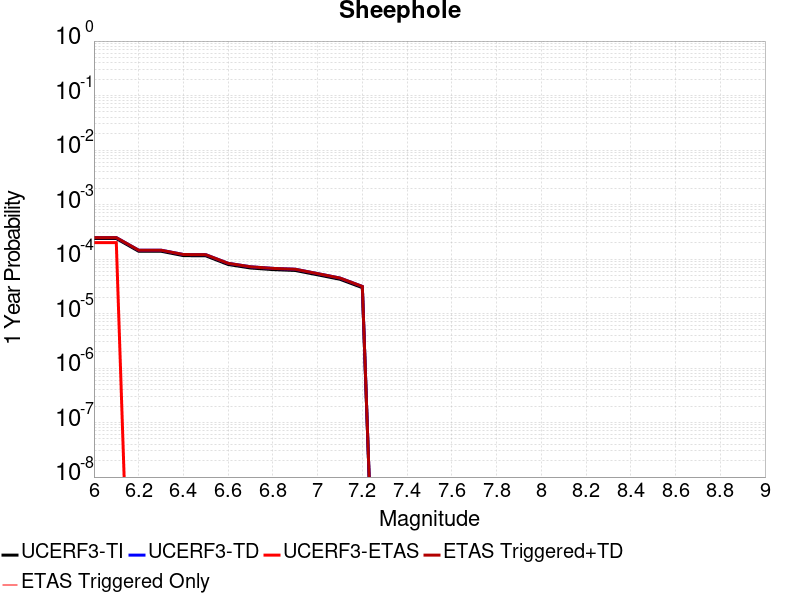 | 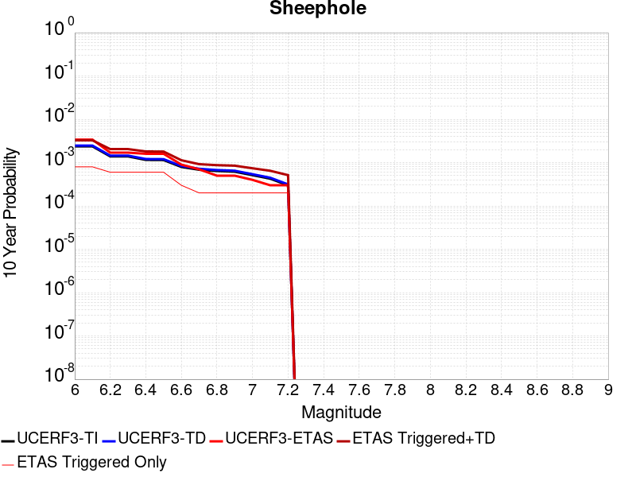 |

| Magnitude | 1 wk TI Prob | 1 wk TD Prob | 1 wk ETAS Prob | 1 wk ETAS/TD Gain | 1 wk ETAS Triggered+TD | 1 wk ETAS Triggered Only | 1 mo TI Prob | 1 mo TD Prob | 1 mo ETAS Prob | 1 mo ETAS/TD Gain | 1 mo ETAS Triggered+TD | 1 mo ETAS Triggered Only | 1 yr TI Prob | 1 yr TD Prob | 1 yr ETAS Prob | 1 yr ETAS/TD Gain | 1 yr ETAS Triggered+TD | 1 yr ETAS Triggered Only | 10 yr TI Prob | 10 yr TD Prob | 10 yr ETAS Prob | 10 yr ETAS/TD Gain | 10 yr ETAS Triggered+TD | 10 yr ETAS Triggered Only |
|-----|-----|-----|-----|-----|-----|-----|-----|-----|-----|-----|-----|-----|-----|-----|-----|-----|-----|-----|-----|-----|-----|-----|-----|-----|
| 6.0 | 4.5579695E-6 | 4.7416415E-6 | 0.0 | 0.0 | 4.7416415E-6 | 0.0 | 1.9534009E-5 | 2.0321193E-5 | 0.0 | 0.0 | 2.0321193E-5 | 0.0 | 2.3780059E-4 | 2.4738797E-4 | 2.0E-4 | 0.8084467 | 2.4738797E-4 | 0.0 | 0.0023754628 | 0.0024716705 | 0.0034 | 1.3755879 | 0.003269693 | 8.0E-4 |
| 6.1 | 4.5579695E-6 | 4.7416415E-6 | 0.0 | 0.0 | 4.7416415E-6 | 0.0 | 1.9534009E-5 | 2.0321193E-5 | 0.0 | 0.0 | 2.0321193E-5 | 0.0 | 2.3780059E-4 | 2.4738797E-4 | 2.0E-4 | 0.8084467 | 2.4738797E-4 | 0.0 | 0.0023754628 | 0.0024716705 | 0.0034 | 1.3755879 | 0.003269693 | 8.0E-4 |
| 6.2 | 2.6677674E-6 | 2.7876426E-6 | 0.0 | 0.0 | 2.7876426E-6 | 0.0 | 1.1433239E-5 | 1.19469905E-5 | 0.0 | 0.0 | 1.19469905E-5 | 0.0 | 1.3919079E-4 | 1.4544599E-4 | 0.0 | 0.0 | 1.4544599E-4 | 0.0 | 0.0013910364 | 0.0014536137 | 0.0017 | 1.169499 | 0.0020527416 | 6.0E-4 |
| 6.3 | 2.6677674E-6 | 2.7876426E-6 | 0.0 | 0.0 | 2.7876426E-6 | 0.0 | 1.1433239E-5 | 1.19469905E-5 | 0.0 | 0.0 | 1.19469905E-5 | 0.0 | 1.3919079E-4 | 1.4544599E-4 | 0.0 | 0.0 | 1.4544599E-4 | 0.0 | 0.0013910364 | 0.0014536137 | 0.0017 | 1.169499 | 0.0020527416 | 6.0E-4 |
| 6.4 | 2.2159759E-6 | 2.3231012E-6 | 0.0 | 0.0 | 2.3231012E-6 | 0.0 | 9.497005E-6 | 9.956114E-6 | 0.0 | 0.0 | 9.956114E-6 | 0.0 | 1.156199E-4 | 1.21209756E-4 | 0.0 | 0.0 | 1.21209756E-4 | 0.0 | 0.0011555976 | 0.0012115159 | 0.0016 | 1.3206596 | 0.0018107889 | 6.0E-4 |
| 6.5 | 2.1986082E-6 | 2.30498E-6 | 0.0 | 0.0 | 2.30498E-6 | 0.0 | 9.4225725E-6 | 9.878452E-6 | 0.0 | 0.0 | 9.878452E-6 | 0.0 | 1.1471378E-4 | 1.20264325E-4 | 0.0 | 0.0 | 1.20264325E-4 | 0.0 | 0.0011465458 | 0.0012020718 | 0.0016 | 1.3310354 | 0.0018013505 | 6.0E-4 |
| 6.6 | 1.5232331E-6 | 1.6020559E-6 | 0.0 | 0.0 | 1.6020559E-6 | 0.0 | 6.5281256E-6 | 6.865937E-6 | 0.0 | 0.0 | 6.865937E-6 | 0.0 | 7.947703E-5 | 8.3589766E-5 | 0.0 | 0.0 | 8.3589766E-5 | 0.0 | 7.9448614E-4 | 8.3560194E-4 | 9.0E-4 | 1.0770679 | 0.0011353513 | 3.0E-4 |
| 6.7 | 1.3137362E-6 | 1.3829632E-6 | 0.0 | 0.0 | 1.3829632E-6 | 0.0 | 5.6302856E-6 | 5.926973E-6 | 0.0 | 0.0 | 5.926973E-6 | 0.0 | 6.854657E-5 | 7.215865E-5 | 0.0 | 0.0 | 7.215865E-5 | 0.0 | 6.8525434E-4 | 7.21366E-4 | 7.0E-4 | 0.97038114 | 9.212218E-4 | 2.0E-4 |
| 6.8 | 1.2275751E-6 | 1.2924197E-6 | 0.0 | 0.0 | 1.2924197E-6 | 0.0 | 5.2610258E-6 | 5.538931E-6 | 0.0 | 0.0 | 5.538931E-6 | 0.0 | 6.4051106E-5 | 6.743453E-5 | 0.0 | 0.0 | 6.743453E-5 | 0.0 | 6.4032647E-4 | 6.74154E-4 | 5.0E-4 | 0.74167025 | 8.740192E-4 | 2.0E-4 |
| 6.9 | 1.1837088E-6 | 1.2462323E-6 | 0.0 | 0.0 | 1.2462323E-6 | 0.0 | 5.0730278E-6 | 5.3409854E-6 | 0.0 | 0.0 | 5.3409854E-6 | 0.0 | 6.176237E-5 | 6.502469E-5 | 0.0 | 0.0 | 6.502469E-5 | 0.0 | 6.17452E-4 | 6.500698E-4 | 5.0E-4 | 0.7691482 | 8.4993977E-4 | 2.0E-4 |
| 7.0 | 9.849371E-7 | 1.0367366E-6 | 0.0 | 0.0 | 1.0367366E-6 | 0.0 | 4.2211523E-6 | 4.4431504E-6 | 0.0 | 0.0 | 4.4431504E-6 | 0.0 | 5.1391315E-5 | 5.4094115E-5 | 0.0 | 0.0 | 5.4094115E-5 | 0.0 | 5.137943E-4 | 5.4081954E-4 | 4.0E-4 | 0.7396182 | 7.407114E-4 | 2.0E-4 |
| 7.1 | 8.1643645E-7 | 8.592561E-7 | 0.0 | 0.0 | 8.592561E-7 | 0.0 | 3.4990085E-6 | 3.6825213E-6 | 0.0 | 0.0 | 3.6825213E-6 | 0.0 | 4.2599597E-5 | 4.483386E-5 | 0.0 | 0.0 | 4.483386E-5 | 0.0 | 4.259143E-4 | 4.4825682E-4 | 3.0E-4 | 0.6692592 | 6.4816716E-4 | 2.0E-4 |
| 7.2 | 5.7295756E-7 | 6.030128E-7 | 0.0 | 0.0 | 6.030128E-7 | 0.0 | 2.45553E-6 | 2.5843383E-6 | 0.0 | 0.0 | 2.5843383E-6 | 0.0 | 2.9895667E-5 | 3.1463933E-5 | 0.0 | 0.0 | 3.1463933E-5 | 0.0 | 2.9891645E-4 | 3.1460146E-4 | 3.0E-4 | 0.9535874 | 5.1453855E-4 | 2.0E-4 |

## West Tahoe
*[(top)](#table-of-contents)*

| 1 Week | 1 Month | 1 Year | 10 Year |
|-----|-----|-----|-----|
| 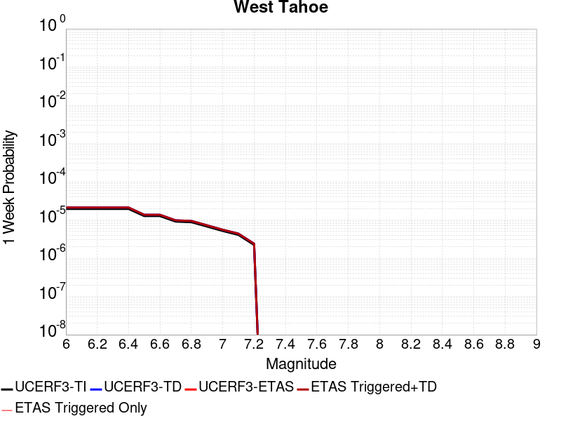 | 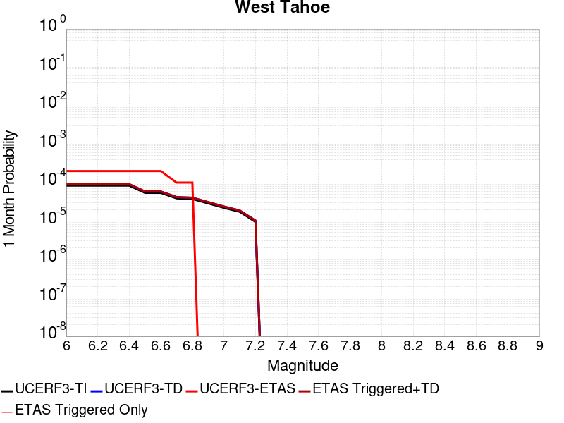 | 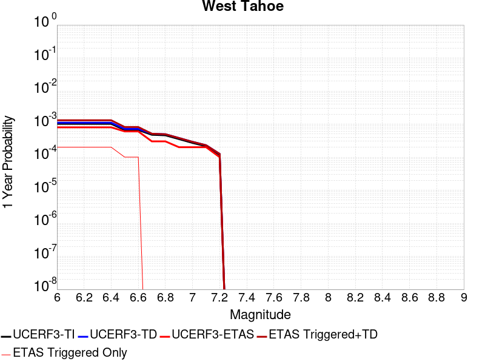 | 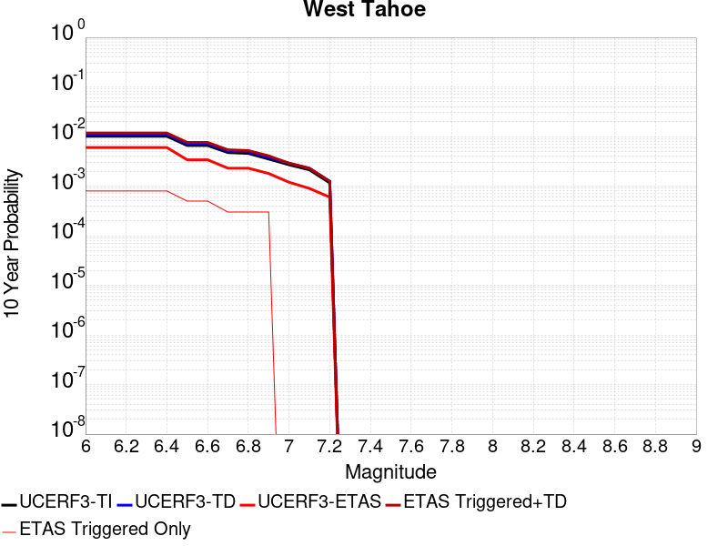 |

| Magnitude | 1 wk TI Prob | 1 wk TD Prob | 1 wk ETAS Prob | 1 wk ETAS/TD Gain | 1 wk ETAS Triggered+TD | 1 wk ETAS Triggered Only | 1 mo TI Prob | 1 mo TD Prob | 1 mo ETAS Prob | 1 mo ETAS/TD Gain | 1 mo ETAS Triggered+TD | 1 mo ETAS Triggered Only | 1 yr TI Prob | 1 yr TD Prob | 1 yr ETAS Prob | 1 yr ETAS/TD Gain | 1 yr ETAS Triggered+TD | 1 yr ETAS Triggered Only | 10 yr TI Prob | 10 yr TD Prob | 10 yr ETAS Prob | 10 yr ETAS/TD Gain | 10 yr ETAS Triggered+TD | 10 yr ETAS Triggered Only |
|-----|-----|-----|-----|-----|-----|-----|-----|-----|-----|-----|-----|-----|-----|-----|-----|-----|-----|-----|-----|-----|-----|-----|-----|-----|
| 6.0 | 1.952444E-5 | 2.1186746E-5 | 0.0 | 0.0 | 2.1186746E-5 | 0.0 | 8.367348E-5 | 9.079749E-5 | 2.0E-4 | 2.202704 | 9.079749E-5 | 0.0 | 0.0010182485 | 0.0011049536 | 8.0E-4 | 0.7240123 | 0.0013047326 | 2.0E-4 | 0.010135954 | 0.011000084 | 0.006 | 0.5454504 | 0.011791283 | 8.0E-4 |
| 6.1 | 1.952444E-5 | 2.1186746E-5 | 0.0 | 0.0 | 2.1186746E-5 | 0.0 | 8.367348E-5 | 9.079749E-5 | 2.0E-4 | 2.202704 | 9.079749E-5 | 0.0 | 0.0010182485 | 0.0011049536 | 8.0E-4 | 0.7240123 | 0.0013047326 | 2.0E-4 | 0.010135954 | 0.011000084 | 0.006 | 0.5454504 | 0.011791283 | 8.0E-4 |
| 6.2 | 1.952444E-5 | 2.1186746E-5 | 0.0 | 0.0 | 2.1186746E-5 | 0.0 | 8.367348E-5 | 9.079749E-5 | 2.0E-4 | 2.202704 | 9.079749E-5 | 0.0 | 0.0010182485 | 0.0011049536 | 8.0E-4 | 0.7240123 | 0.0013047326 | 2.0E-4 | 0.010135954 | 0.011000084 | 0.006 | 0.5454504 | 0.011791283 | 8.0E-4 |
| 6.3 | 1.952444E-5 | 2.1186746E-5 | 0.0 | 0.0 | 2.1186746E-5 | 0.0 | 8.367348E-5 | 9.079749E-5 | 2.0E-4 | 2.202704 | 9.079749E-5 | 0.0 | 0.0010182485 | 0.0011049536 | 8.0E-4 | 0.7240123 | 0.0013047326 | 2.0E-4 | 0.010135954 | 0.011000084 | 0.006 | 0.5454504 | 0.011791283 | 8.0E-4 |
| 6.4 | 1.952444E-5 | 2.1186746E-5 | 0.0 | 0.0 | 2.1186746E-5 | 0.0 | 8.367348E-5 | 9.079749E-5 | 2.0E-4 | 2.202704 | 9.079749E-5 | 0.0 | 0.0010182485 | 0.0011049536 | 8.0E-4 | 0.7240123 | 0.0013047326 | 2.0E-4 | 0.010135954 | 0.011000084 | 0.006 | 0.5454504 | 0.011791283 | 8.0E-4 |
| 6.5 | 1.2685271E-5 | 1.3692782E-5 | 0.0 | 0.0 | 1.3692782E-5 | 0.0 | 5.4364315E-5 | 5.8682126E-5 | 2.0E-4 | 3.4081929 | 5.8682126E-5 | 0.0 | 6.616845E-4 | 7.1423716E-4 | 6.0E-4 | 0.84005713 | 8.1416575E-4 | 1.0E-4 | 0.0065971776 | 0.0071210666 | 0.0034 | 0.47745657 | 0.007617506 | 5.0E-4 |
| 6.6 | 1.2685271E-5 | 1.3692782E-5 | 0.0 | 0.0 | 1.3692782E-5 | 0.0 | 5.4364315E-5 | 5.8682126E-5 | 2.0E-4 | 3.4081929 | 5.8682126E-5 | 0.0 | 6.616845E-4 | 7.1423716E-4 | 6.0E-4 | 0.84005713 | 8.1416575E-4 | 1.0E-4 | 0.0065971776 | 0.0071210666 | 0.0034 | 0.47745657 | 0.007617506 | 5.0E-4 |
| 6.7 | 9.117886E-6 | 9.811324E-6 | 0.0 | 0.0 | 9.811324E-6 | 0.0 | 3.9076072E-5 | 4.2047894E-5 | 1.0E-4 | 2.3782403 | 4.2047894E-5 | 0.0 | 4.756473E-4 | 5.1182E-4 | 3.0E-4 | 0.5861435 | 5.1182E-4 | 0.0 | 0.0047463053 | 0.005107131 | 0.0023 | 0.4503507 | 0.005405599 | 3.0E-4 |
| 6.8 | 8.786828E-6 | 9.459296E-6 | 0.0 | 0.0 | 9.459296E-6 | 0.0 | 3.7657293E-5 | 4.0539253E-5 | 1.0E-4 | 2.4667451 | 4.0539253E-5 | 0.0 | 4.5838108E-4 | 4.934606E-4 | 3.0E-4 | 0.6079512 | 4.934606E-4 | 0.0 | 0.0045743673 | 0.0049243504 | 0.0023 | 0.46706668 | 0.0052228733 | 3.0E-4 |
| 6.9 | 6.7562123E-6 | 7.2648913E-6 | 0.0 | 0.0 | 7.2648913E-6 | 0.0 | 2.8954875E-5 | 3.1134903E-5 | 0.0 | 0.0 | 3.1134903E-5 | 0.0 | 3.5246857E-4 | 3.790063E-4 | 2.0E-4 | 0.5276957 | 3.790063E-4 | 0.0 | 0.0035191004 | 0.0037840712 | 0.0018 | 0.47567818 | 0.004082936 | 3.0E-4 |
| 7.0 | 5.1792854E-6 | 5.5681658E-6 | 0.0 | 0.0 | 5.5681658E-6 | 0.0 | 2.2196748E-5 | 2.3863371E-5 | 0.0 | 0.0 | 2.3863371E-5 | 0.0 | 2.702119E-4 | 2.905016E-4 | 2.0E-4 | 0.68846434 | 2.905016E-4 | 0.0 | 0.0026988357 | 0.002901594 | 0.0012 | 0.41356578 | 0.002901594 | 0.0 |
| 7.1 | 4.090765E-6 | 4.3980763E-6 | 0.0 | 0.0 | 4.3980763E-6 | 0.0 | 1.7531731E-5 | 1.8848783E-5 | 0.0 | 0.0 | 1.8848783E-5 | 0.0 | 2.134279E-4 | 2.2946316E-4 | 2.0E-4 | 0.8715996 | 2.2946316E-4 | 0.0 | 0.0021322304 | 0.0022925967 | 9.0E-4 | 0.39256793 | 0.0022925967 | 0.0 |
| 7.2 | 2.2356758E-6 | 2.4027236E-6 | 0.0 | 0.0 | 2.4027236E-6 | 0.0 | 9.581432E-6 | 1.0297357E-5 | 0.0 | 0.0 | 1.0297357E-5 | 0.0 | 1.1664769E-4 | 1.25365E-4 | 1.0E-4 | 0.7976708 | 1.25365E-4 | 0.0 | 0.0011658648 | 0.0012531286 | 6.0E-4 | 0.4788016 | 0.0012531286 | 0.0 |

## Rocky Ledge 2011 CFM
*[(top)](#table-of-contents)*

| 1 Week | 1 Month | 1 Year | 10 Year |
|-----|-----|-----|-----|
| 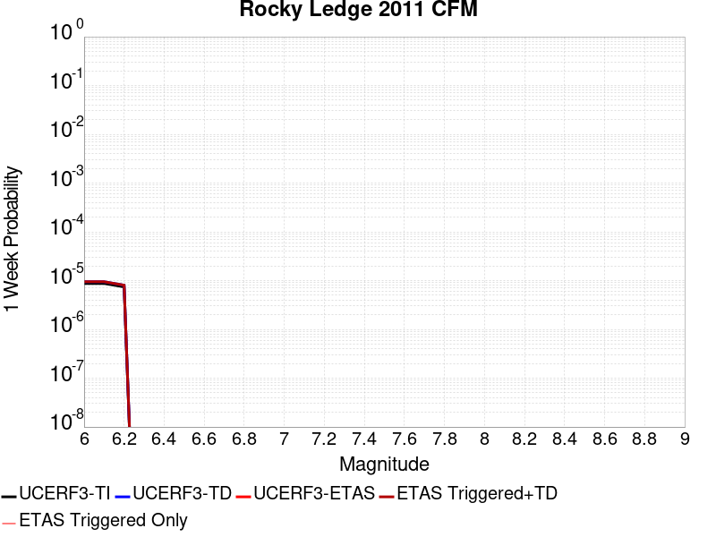 | 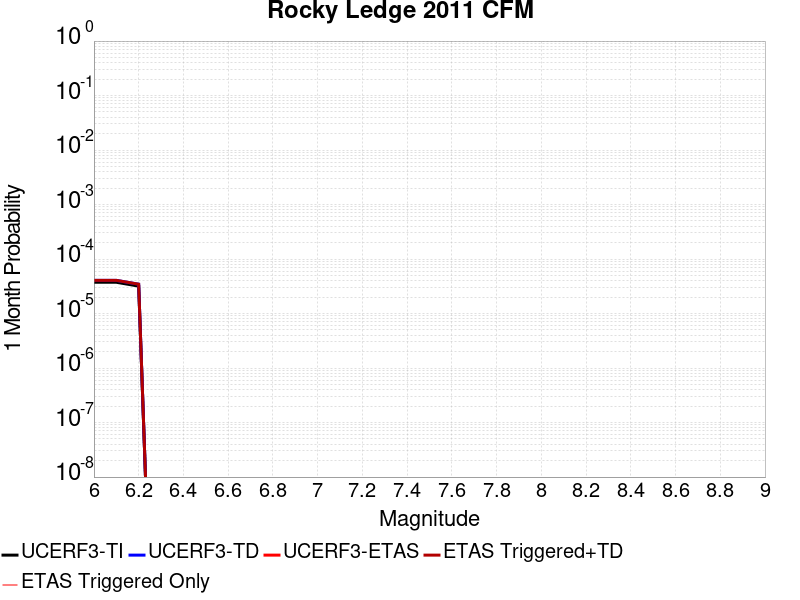 | 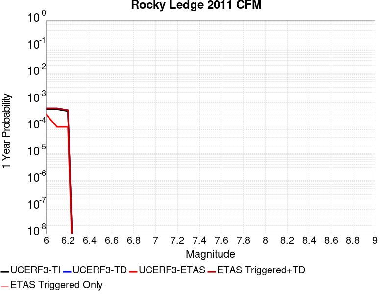 | 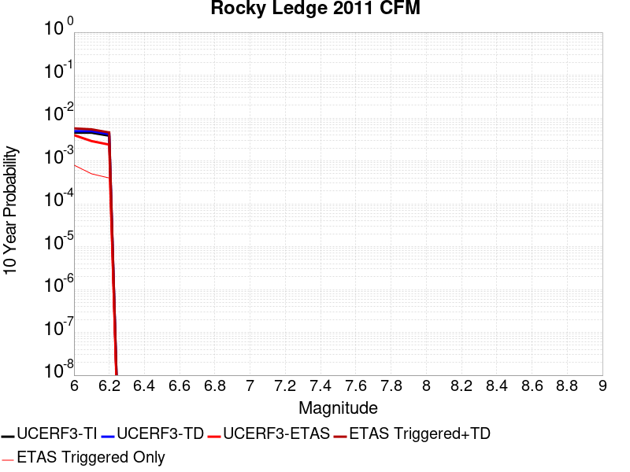 |

| Magnitude | 1 wk TI Prob | 1 wk TD Prob | 1 wk ETAS Prob | 1 wk ETAS/TD Gain | 1 wk ETAS Triggered+TD | 1 wk ETAS Triggered Only | 1 mo TI Prob | 1 mo TD Prob | 1 mo ETAS Prob | 1 mo ETAS/TD Gain | 1 mo ETAS Triggered+TD | 1 mo ETAS Triggered Only | 1 yr TI Prob | 1 yr TD Prob | 1 yr ETAS Prob | 1 yr ETAS/TD Gain | 1 yr ETAS Triggered+TD | 1 yr ETAS Triggered Only | 10 yr TI Prob | 10 yr TD Prob | 10 yr ETAS Prob | 10 yr ETAS/TD Gain | 10 yr ETAS Triggered+TD | 10 yr ETAS Triggered Only |
|-----|-----|-----|-----|-----|-----|-----|-----|-----|-----|-----|-----|-----|-----|-----|-----|-----|-----|-----|-----|-----|-----|-----|-----|-----|
| 6.0 | 8.7550525E-6 | 9.488178E-6 | 0.0 | 0.0 | 9.488178E-6 | 0.0 | 3.7521113E-5 | 4.066345E-5 | 0.0 | 0.0 | 4.066345E-5 | 0.0 | 4.567238E-4 | 4.9504754E-4 | 3.0E-4 | 0.6060024 | 4.9504754E-4 | 0.0 | 0.0045578624 | 0.0049475385 | 0.004 | 0.8084829 | 0.0057435804 | 8.0E-4 |
| 6.1 | 8.7550525E-6 | 9.488178E-6 | 0.0 | 0.0 | 9.488178E-6 | 0.0 | 3.7521113E-5 | 4.066345E-5 | 0.0 | 0.0 | 4.066345E-5 | 0.0 | 4.567238E-4 | 4.9504754E-4 | 1.0E-4 | 0.2020008 | 4.9504754E-4 | 0.0 | 0.0045578624 | 0.0049475385 | 0.0029 | 0.58615005 | 0.0054450645 | 5.0E-4 |
| 6.2 | 7.442295E-6 | 8.064374E-6 | 0.0 | 0.0 | 8.064374E-6 | 0.0 | 3.189516E-5 | 3.4561603E-5 | 0.0 | 0.0 | 3.4561603E-5 | 0.0 | 3.8825438E-4 | 4.2078752E-4 | 1.0E-4 | 0.23764963 | 4.2078752E-4 | 0.0 | 0.0038757676 | 0.004207875 | 0.0024 | 0.5703591 | 0.004606192 | 4.0E-4 |

## Great Valley 06 (Midland) 2011 CFM alt1
*[(top)](#table-of-contents)*

| 1 Week | 1 Month | 1 Year | 10 Year |
|-----|-----|-----|-----|
| 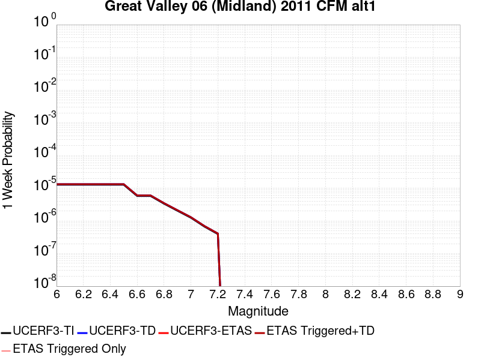 |  |  |  |

| Magnitude | 1 wk TI Prob | 1 wk TD Prob | 1 wk ETAS Prob | 1 wk ETAS/TD Gain | 1 wk ETAS Triggered+TD | 1 wk ETAS Triggered Only | 1 mo TI Prob | 1 mo TD Prob | 1 mo ETAS Prob | 1 mo ETAS/TD Gain | 1 mo ETAS Triggered+TD | 1 mo ETAS Triggered Only | 1 yr TI Prob | 1 yr TD Prob | 1 yr ETAS Prob | 1 yr ETAS/TD Gain | 1 yr ETAS Triggered+TD | 1 yr ETAS Triggered Only | 10 yr TI Prob | 10 yr TD Prob | 10 yr ETAS Prob | 10 yr ETAS/TD Gain | 10 yr ETAS Triggered+TD | 10 yr ETAS Triggered Only |
|-----|-----|-----|-----|-----|-----|-----|-----|-----|-----|-----|-----|-----|-----|-----|-----|-----|-----|-----|-----|-----|-----|-----|-----|-----|
| 6.0 | 1.2712525E-5 | 1.3211603E-5 | 0.0 | 0.0 | 1.3211603E-5 | 0.0 | 5.4481112E-5 | 5.662007E-5 | 0.0 | 0.0 | 5.662007E-5 | 0.0 | 6.6310563E-4 | 6.891567E-4 | 2.0E-4 | 0.29020977 | 7.890878E-4 | 1.0E-4 | 0.0066113044 | 0.0068727112 | 0.0053 | 0.7711658 | 0.007667213 | 8.0E-4 |
| 6.1 | 1.2712525E-5 | 1.3211603E-5 | 0.0 | 0.0 | 1.3211603E-5 | 0.0 | 5.4481112E-5 | 5.662007E-5 | 0.0 | 0.0 | 5.662007E-5 | 0.0 | 6.6310563E-4 | 6.891567E-4 | 2.0E-4 | 0.29020977 | 7.890878E-4 | 1.0E-4 | 0.0066113044 | 0.0068727112 | 0.0053 | 0.7711658 | 0.007667213 | 8.0E-4 |
| 6.2 | 1.2712525E-5 | 1.3211603E-5 | 0.0 | 0.0 | 1.3211603E-5 | 0.0 | 5.4481112E-5 | 5.662007E-5 | 0.0 | 0.0 | 5.662007E-5 | 0.0 | 6.6310563E-4 | 6.891567E-4 | 2.0E-4 | 0.29020977 | 7.890878E-4 | 1.0E-4 | 0.0066113044 | 0.0068727112 | 0.0053 | 0.7711658 | 0.007667213 | 8.0E-4 |
| 6.3 | 1.2712525E-5 | 1.3211603E-5 | 0.0 | 0.0 | 1.3211603E-5 | 0.0 | 5.4481112E-5 | 5.662007E-5 | 0.0 | 0.0 | 5.662007E-5 | 0.0 | 6.6310563E-4 | 6.891567E-4 | 2.0E-4 | 0.29020977 | 7.890878E-4 | 1.0E-4 | 0.0066113044 | 0.0068727112 | 0.0053 | 0.7711658 | 0.007667213 | 8.0E-4 |
| 6.4 | 1.2712525E-5 | 1.3211603E-5 | 0.0 | 0.0 | 1.3211603E-5 | 0.0 | 5.4481112E-5 | 5.662007E-5 | 0.0 | 0.0 | 5.662007E-5 | 0.0 | 6.6310563E-4 | 6.891567E-4 | 2.0E-4 | 0.29020977 | 7.890878E-4 | 1.0E-4 | 0.0066113044 | 0.0068727112 | 0.0053 | 0.7711658 | 0.007667213 | 8.0E-4 |
| 6.5 | 1.2712525E-5 | 1.3211603E-5 | 0.0 | 0.0 | 1.3211603E-5 | 0.0 | 5.4481112E-5 | 5.662007E-5 | 0.0 | 0.0 | 5.662007E-5 | 0.0 | 6.6310563E-4 | 6.891567E-4 | 2.0E-4 | 0.29020977 | 7.890878E-4 | 1.0E-4 | 0.0066113044 | 0.0068727112 | 0.0053 | 0.7711658 | 0.007667213 | 8.0E-4 |
| 6.6 | 5.7574384E-6 | 5.9710846E-6 | 0.0 | 0.0 | 5.9710846E-6 | 0.0 | 2.4674504E-5 | 2.5590134E-5 | 0.0 | 0.0 | 2.5590134E-5 | 0.0 | 3.0037065E-4 | 3.1151925E-4 | 1.0E-4 | 0.32100743 | 4.1148812E-4 | 1.0E-4 | 0.0029996498 | 0.0031112125 | 0.0027 | 0.86782885 | 0.0037093458 | 6.0E-4 |
| 6.7 | 5.7574384E-6 | 5.9710846E-6 | 0.0 | 0.0 | 5.9710846E-6 | 0.0 | 2.4674504E-5 | 2.5590134E-5 | 0.0 | 0.0 | 2.5590134E-5 | 0.0 | 3.0037065E-4 | 3.1151925E-4 | 1.0E-4 | 0.32100743 | 4.1148812E-4 | 1.0E-4 | 0.0029996498 | 0.0031112125 | 0.0027 | 0.86782885 | 0.0037093458 | 6.0E-4 |
| 6.8 | 3.3474828E-6 | 3.4696354E-6 | 0.0 | 0.0 | 3.4696354E-6 | 0.0 | 1.4346277E-5 | 1.4869789E-5 | 0.0 | 0.0 | 1.4869789E-5 | 0.0 | 1.7465191E-4 | 1.8102615E-4 | 0.0 | 0.0 | 1.8102615E-4 | 0.0 | 0.0017451472 | 0.0018089338 | 0.0014 | 0.77393657 | 0.0021083911 | 3.0E-4 |
| 6.9 | 2.035106E-6 | 2.1091876E-6 | 0.0 | 0.0 | 2.1091876E-6 | 0.0 | 8.721853E-6 | 9.039348E-6 | 0.0 | 0.0 | 9.039348E-6 | 0.0 | 1.0618339E-4 | 1.1004924E-4 | 0.0 | 0.0 | 1.1004924E-4 | 0.0 | 0.0010613267 | 0.0011000197 | 0.0013 | 1.181797 | 0.0013996897 | 3.0E-4 |
| 7.0 | 1.2424716E-6 | 1.2879696E-6 | 0.0 | 0.0 | 1.2879696E-6 | 0.0 | 5.3248673E-6 | 5.51986E-6 | 0.0 | 0.0 | 5.51986E-6 | 0.0 | 6.482833E-5 | 6.720268E-5 | 0.0 | 0.0 | 6.720268E-5 | 0.0 | 6.480942E-4 | 6.7186786E-4 | 4.0E-4 | 0.59535515 | 6.7186786E-4 | 0.0 |
| 7.1 | 6.6904556E-7 | 6.939546E-7 | 0.0 | 0.0 | 6.939546E-7 | 0.0 | 2.867335E-6 | 2.974089E-6 | 0.0 | 0.0 | 2.974089E-6 | 0.0 | 3.4909244E-5 | 3.6209192E-5 | 0.0 | 0.0 | 3.6209192E-5 | 0.0 | 3.490376E-4 | 3.6205846E-4 | 1.0E-4 | 0.2761985 | 3.6205846E-4 | 0.0 |
| 7.2 | 3.948168E-7 | 4.0960086E-7 | 0.0 | 0.0 | 4.0960086E-7 | 0.0 | 1.6920709E-6 | 1.7554322E-6 | 0.0 | 0.0 | 1.7554322E-6 | 0.0 | 2.0600768E-5 | 2.1372387E-5 | 0.0 | 0.0 | 2.1372387E-5 | 0.0 | 2.0598859E-4 | 2.1372388E-4 | 0.0 | 0.0 | 2.1372388E-4 | 0.0 |

## Great Valley 10 (Panoche)
*[(top)](#table-of-contents)*

| 1 Week | 1 Month | 1 Year | 10 Year |
|-----|-----|-----|-----|
| 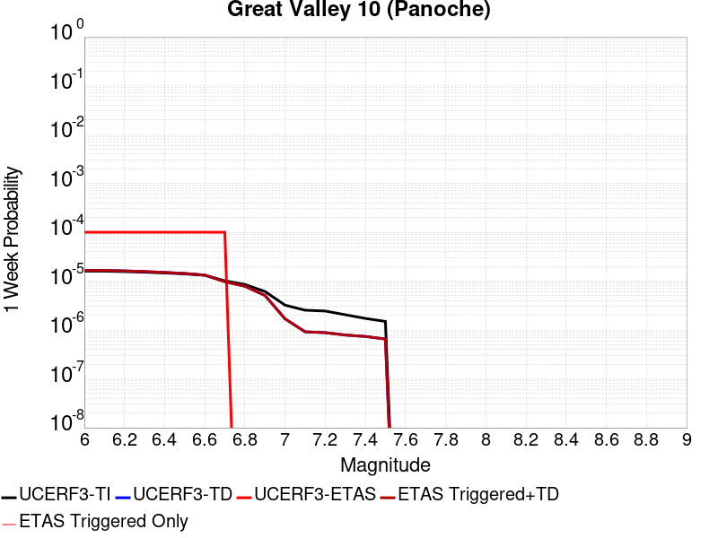 | 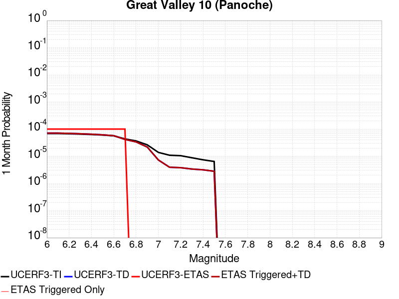 | 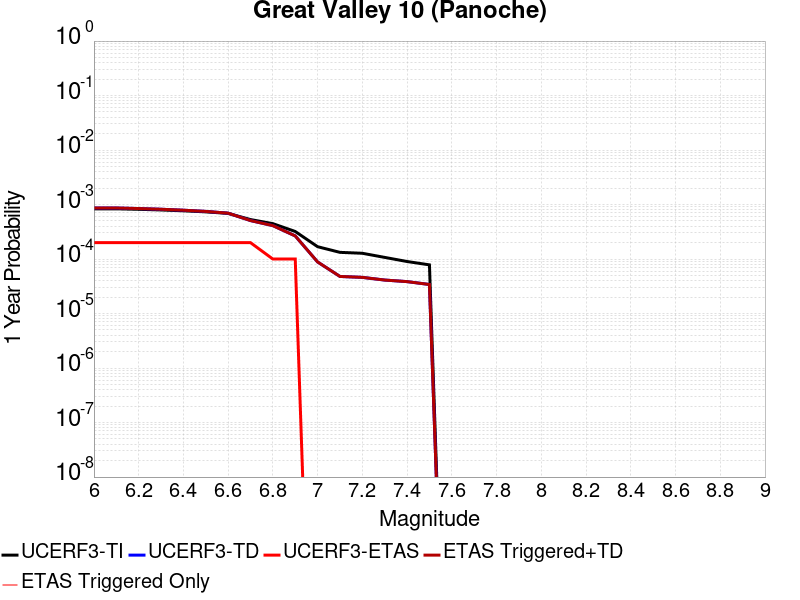 | 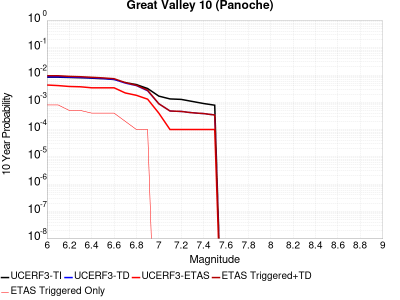 |

| Magnitude | 1 wk TI Prob | 1 wk TD Prob | 1 wk ETAS Prob | 1 wk ETAS/TD Gain | 1 wk ETAS Triggered+TD | 1 wk ETAS Triggered Only | 1 mo TI Prob | 1 mo TD Prob | 1 mo ETAS Prob | 1 mo ETAS/TD Gain | 1 mo ETAS Triggered+TD | 1 mo ETAS Triggered Only | 1 yr TI Prob | 1 yr TD Prob | 1 yr ETAS Prob | 1 yr ETAS/TD Gain | 1 yr ETAS Triggered+TD | 1 yr ETAS Triggered Only | 10 yr TI Prob | 10 yr TD Prob | 10 yr ETAS Prob | 10 yr ETAS/TD Gain | 10 yr ETAS Triggered+TD | 10 yr ETAS Triggered Only |
|-----|-----|-----|-----|-----|-----|-----|-----|-----|-----|-----|-----|-----|-----|-----|-----|-----|-----|-----|-----|-----|-----|-----|-----|-----|
| 6.0 | 1.6014626E-5 | 1.6580787E-5 | 1.0E-4 | 6.0310764 | 1.6580787E-5 | 0.0 | 6.863231E-5 | 7.105861E-5 | 1.0E-4 | 1.4072889 | 7.105861E-5 | 0.0 | 8.35278E-4 | 8.648008E-4 | 2.0E-4 | 0.23126712 | 8.648008E-4 | 0.0 | 0.008321454 | 0.008614968 | 0.0043 | 0.49913132 | 0.009408075 | 8.0E-4 |
| 6.1 | 1.6014626E-5 | 1.6580787E-5 | 1.0E-4 | 6.0310764 | 1.6580787E-5 | 0.0 | 6.863231E-5 | 7.105861E-5 | 1.0E-4 | 1.4072889 | 7.105861E-5 | 0.0 | 8.35278E-4 | 8.648008E-4 | 2.0E-4 | 0.23126712 | 8.648008E-4 | 0.0 | 0.008321454 | 0.008614968 | 0.0041 | 0.4759159 | 0.009408075 | 8.0E-4 |
| 6.2 | 1.56782E-5 | 1.6203745E-5 | 1.0E-4 | 6.171413 | 1.6203745E-5 | 0.0 | 6.719056E-5 | 6.94428E-5 | 1.0E-4 | 1.4400342 | 6.94428E-5 | 0.0 | 8.17738E-4 | 8.4514363E-4 | 2.0E-4 | 0.23664616 | 8.4514363E-4 | 0.0 | 0.008147354 | 0.0084198965 | 0.0038 | 0.45131198 | 0.008915686 | 5.0E-4 |
| 6.3 | 1.5263338E-5 | 1.5728676E-5 | 1.0E-4 | 6.3578143 | 1.5728676E-5 | 0.0 | 6.541267E-5 | 6.74069E-5 | 1.0E-4 | 1.4835277 | 6.74069E-5 | 0.0 | 7.961082E-4 | 8.203754E-4 | 2.0E-4 | 0.24379082 | 8.203754E-4 | 0.0 | 0.007932622 | 0.008174056 | 0.0037 | 0.45265165 | 0.008669969 | 5.0E-4 |
| 6.4 | 1.4720723E-5 | 1.5104351E-5 | 1.0E-4 | 6.620609 | 1.5104351E-5 | 0.0 | 6.308728E-5 | 6.473136E-5 | 1.0E-4 | 1.5448463 | 6.473136E-5 | 0.0 | 7.67817E-4 | 7.878246E-4 | 2.0E-4 | 0.2538636 | 7.878246E-4 | 0.0 | 0.007651695 | 0.007850886 | 0.0034 | 0.43307212 | 0.008247746 | 4.0E-4 |
| 6.5 | 1.408264E-5 | 1.4360701E-5 | 1.0E-4 | 6.963448 | 1.4360701E-5 | 0.0 | 6.0352773E-5 | 6.1544444E-5 | 1.0E-4 | 1.6248422 | 6.1544444E-5 | 0.0 | 7.3454727E-4 | 7.4905116E-4 | 2.0E-4 | 0.26700446 | 7.4905116E-4 | 0.0 | 0.0073212404 | 0.007465814 | 0.0034 | 0.45540917 | 0.007862828 | 4.0E-4 |
| 6.6 | 1.3197086E-5 | 1.3326274E-5 | 1.0E-4 | 7.503973 | 1.3326274E-5 | 0.0 | 5.6557717E-5 | 5.711138E-5 | 1.0E-4 | 1.7509645 | 5.711138E-5 | 0.0 | 6.8837265E-4 | 6.951144E-4 | 2.0E-4 | 0.28772244 | 6.951144E-4 | 0.0 | 0.006862442 | 0.006929934 | 0.0034 | 0.49062517 | 0.0073271617 | 4.0E-4 |
| 6.7 | 1.017583E-5 | 9.74847E-6 | 1.0E-4 | 10.25802 | 9.74847E-6 | 0.0 | 4.360997E-5 | 4.17785E-5 | 1.0E-4 | 2.3935757 | 4.17785E-5 | 0.0 | 5.30822E-4 | 5.0853693E-4 | 2.0E-4 | 0.3932851 | 5.0853693E-4 | 0.0 | 0.0052955584 | 0.005073985 | 0.0022 | 0.43358424 | 0.00527297 | 2.0E-4 |
| 6.8 | 8.557912E-6 | 7.875209E-6 | 0.0 | 0.0 | 7.875209E-6 | 0.0 | 3.667625E-5 | 3.375047E-5 | 0.0 | 0.0 | 3.375047E-5 | 0.0 | 4.4644187E-4 | 4.1083654E-4 | 1.0E-4 | 0.24340582 | 4.1083654E-4 | 0.0 | 0.0044554602 | 0.004100977 | 0.0018 | 0.43891978 | 0.004200567 | 1.0E-4 |
| 6.9 | 6.14664E-6 | 5.093727E-6 | 0.0 | 0.0 | 5.093727E-6 | 0.0 | 2.6342475E-5 | 2.1830083E-5 | 0.0 | 0.0 | 2.1830083E-5 | 0.0 | 3.2067244E-4 | 2.6575025E-4 | 1.0E-4 | 0.37629318 | 2.6575025E-4 | 0.0 | 0.003202101 | 0.0026544628 | 0.0013 | 0.48974127 | 0.0027541975 | 1.0E-4 |
| 7.0 | 3.2310581E-6 | 1.6956628E-6 | 0.0 | 0.0 | 1.6956628E-6 | 0.0 | 1.3847319E-5 | 7.267107E-6 | 0.0 | 0.0 | 7.267107E-6 | 0.0 | 1.6857806E-4 | 8.847353E-5 | 0.0 | 0.0 | 8.847353E-5 | 0.0 | 0.0016845023 | 8.843924E-4 | 4.0E-4 | 0.4522879 | 8.843924E-4 | 0.0 |
| 7.1 | 2.544492E-6 | 9.1923175E-7 | 0.0 | 0.0 | 9.1923175E-7 | 0.0 | 1.090492E-5 | 3.939559E-6 | 0.0 | 0.0 | 3.939559E-6 | 0.0 | 1.327593E-4 | 4.7963124E-5 | 0.0 | 0.0 | 4.7963124E-5 | 0.0 | 0.0013268003 | 4.795325E-4 | 1.0E-4 | 0.20853645 | 4.795325E-4 | 0.0 |
| 7.2 | 2.4479045E-6 | 8.844555E-7 | 0.0 | 0.0 | 8.844555E-7 | 0.0 | 1.0490977E-5 | 3.7905183E-6 | 0.0 | 0.0 | 3.7905183E-6 | 0.0 | 1.2772017E-4 | 4.6148634E-5 | 0.0 | 0.0 | 4.6148634E-5 | 0.0 | 0.0012764678 | 4.6139522E-4 | 1.0E-4 | 0.21673393 | 4.6139522E-4 | 0.0 |
| 7.3 | 2.0559578E-6 | 7.8950853E-7 | 0.0 | 0.0 | 7.8950853E-7 | 0.0 | 8.811218E-6 | 3.3836038E-6 | 0.0 | 0.0 | 3.3836038E-6 | 0.0 | 1.072713E-4 | 4.1194646E-5 | 0.0 | 0.0 | 4.1194646E-5 | 0.0 | 0.0010721954 | 4.1187473E-4 | 1.0E-4 | 0.24279226 | 4.1187473E-4 | 0.0 |
| 7.4 | 1.727687E-6 | 7.3894665E-7 | 0.0 | 0.0 | 7.3894665E-7 | 0.0 | 7.404352E-6 | 3.1669106E-6 | 0.0 | 0.0 | 3.1669106E-6 | 0.0 | 9.0144255E-5 | 3.85565E-5 | 0.0 | 0.0 | 3.85565E-5 | 0.0 | 9.0107694E-4 | 3.8550273E-4 | 1.0E-4 | 0.25940153 | 3.8550273E-4 | 0.0 |
| 7.5 | 1.5002679E-6 | 6.5476183E-7 | 0.0 | 0.0 | 6.5476183E-7 | 0.0 | 6.4297037E-6 | 2.8061193E-6 | 0.0 | 0.0 | 2.8061193E-6 | 0.0 | 7.827883E-5 | 3.4164008E-5 | 0.0 | 0.0 | 3.4164008E-5 | 0.0 | 7.825126E-4 | 3.4159172E-4 | 1.0E-4 | 0.29274714 | 3.4159172E-4 | 0.0 |

## Deep Springs
*[(top)](#table-of-contents)*

| 1 Week | 1 Month | 1 Year | 10 Year |
|-----|-----|-----|-----|
| 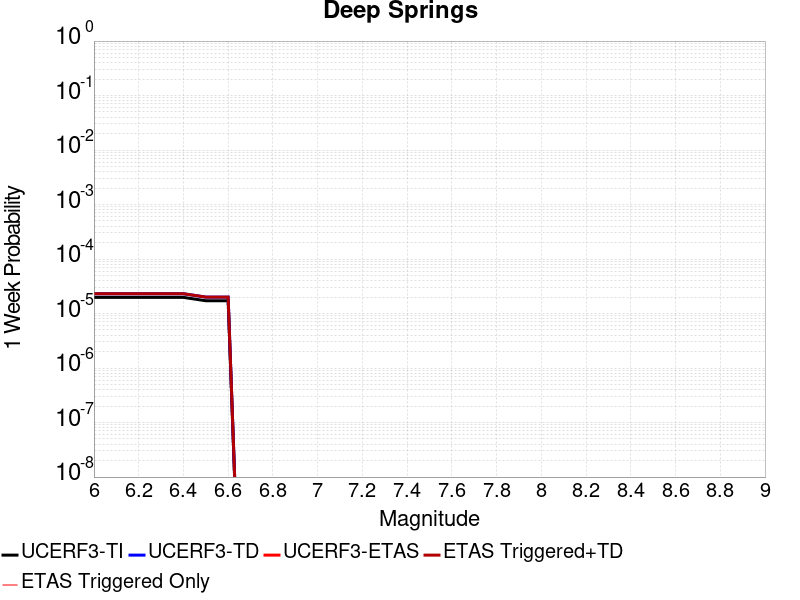 | 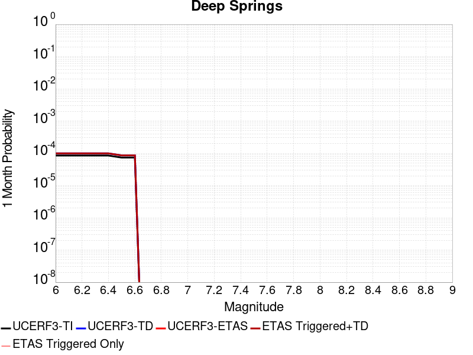 | 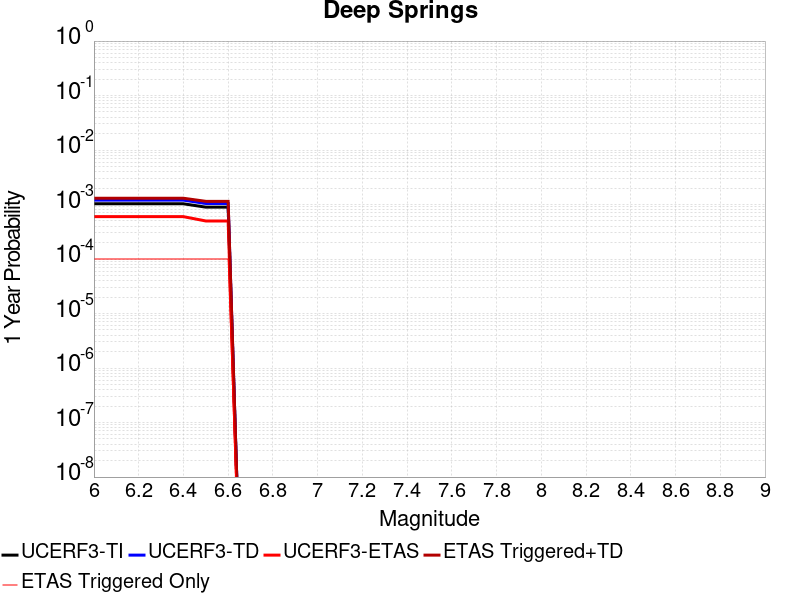 | 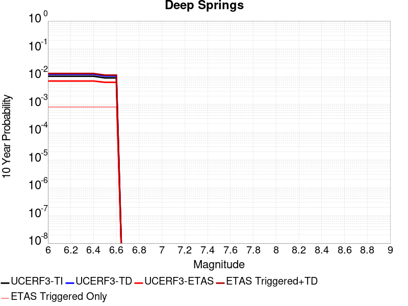 |

| Magnitude | 1 wk TI Prob | 1 wk TD Prob | 1 wk ETAS Prob | 1 wk ETAS/TD Gain | 1 wk ETAS Triggered+TD | 1 wk ETAS Triggered Only | 1 mo TI Prob | 1 mo TD Prob | 1 mo ETAS Prob | 1 mo ETAS/TD Gain | 1 mo ETAS Triggered+TD | 1 mo ETAS Triggered Only | 1 yr TI Prob | 1 yr TD Prob | 1 yr ETAS Prob | 1 yr ETAS/TD Gain | 1 yr ETAS Triggered+TD | 1 yr ETAS Triggered Only | 10 yr TI Prob | 10 yr TD Prob | 10 yr ETAS Prob | 10 yr ETAS/TD Gain | 10 yr ETAS Triggered+TD | 10 yr ETAS Triggered Only |
|-----|-----|-----|-----|-----|-----|-----|-----|-----|-----|-----|-----|-----|-----|-----|-----|-----|-----|-----|-----|-----|-----|-----|-----|-----|
| 6.0 | 1.9810619E-5 | 2.3120161E-5 | 0.0 | 0.0 | 2.3120161E-5 | 0.0 | 8.489989E-5 | 9.9085504E-5 | 0.0 | 0.0 | 9.9085504E-5 | 0.0 | 0.001033166 | 0.0012062063 | 6.0E-4 | 0.49742737 | 0.0013060856 | 1.0E-4 | 0.010283757 | 0.012046403 | 0.0069 | 0.5727851 | 0.012836766 | 8.0E-4 |
| 6.1 | 1.9810619E-5 | 2.3120161E-5 | 0.0 | 0.0 | 2.3120161E-5 | 0.0 | 8.489989E-5 | 9.9085504E-5 | 0.0 | 0.0 | 9.9085504E-5 | 0.0 | 0.001033166 | 0.0012062063 | 6.0E-4 | 0.49742737 | 0.0013060856 | 1.0E-4 | 0.010283757 | 0.012046403 | 0.0069 | 0.5727851 | 0.012836766 | 8.0E-4 |
| 6.2 | 1.9810619E-5 | 2.3120161E-5 | 0.0 | 0.0 | 2.3120161E-5 | 0.0 | 8.489989E-5 | 9.9085504E-5 | 0.0 | 0.0 | 9.9085504E-5 | 0.0 | 0.001033166 | 0.0012062063 | 6.0E-4 | 0.49742737 | 0.0013060856 | 1.0E-4 | 0.010283757 | 0.012046403 | 0.0069 | 0.5727851 | 0.012836766 | 8.0E-4 |
| 6.3 | 1.9810619E-5 | 2.3120161E-5 | 0.0 | 0.0 | 2.3120161E-5 | 0.0 | 8.489989E-5 | 9.9085504E-5 | 0.0 | 0.0 | 9.9085504E-5 | 0.0 | 0.001033166 | 0.0012062063 | 6.0E-4 | 0.49742737 | 0.0013060856 | 1.0E-4 | 0.010283757 | 0.012046403 | 0.0069 | 0.5727851 | 0.012836766 | 8.0E-4 |
| 6.4 | 1.9810619E-5 | 2.3120161E-5 | 0.0 | 0.0 | 2.3120161E-5 | 0.0 | 8.489989E-5 | 9.9085504E-5 | 0.0 | 0.0 | 9.9085504E-5 | 0.0 | 0.001033166 | 0.0012062063 | 6.0E-4 | 0.49742737 | 0.0013060856 | 1.0E-4 | 0.010283757 | 0.012046403 | 0.0069 | 0.5727851 | 0.012836766 | 8.0E-4 |
| 6.5 | 1.7190405E-5 | 2.0057176E-5 | 0.0 | 0.0 | 2.0057176E-5 | 0.0 | 7.367108E-5 | 8.595932E-5 | 0.0 | 0.0 | 8.595932E-5 | 0.0 | 8.9657627E-4 | 0.0010465544 | 5.0E-4 | 0.47775826 | 0.0011464497 | 1.0E-4 | 0.008929676 | 0.010465511 | 0.0062 | 0.59242207 | 0.011257139 | 8.0E-4 |
| 6.6 | 1.7190405E-5 | 2.0057176E-5 | 0.0 | 0.0 | 2.0057176E-5 | 0.0 | 7.367108E-5 | 8.595932E-5 | 0.0 | 0.0 | 8.595932E-5 | 0.0 | 8.9657627E-4 | 0.0010465544 | 5.0E-4 | 0.47775826 | 0.0011464497 | 1.0E-4 | 0.008929676 | 0.010465511 | 0.0062 | 0.59242207 | 0.011257139 | 8.0E-4 |

## Butano 2011 CFM
*[(top)](#table-of-contents)*

| 1 Week | 1 Month | 1 Year | 10 Year |
|-----|-----|-----|-----|
| 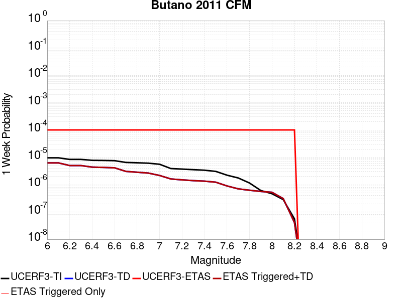 | 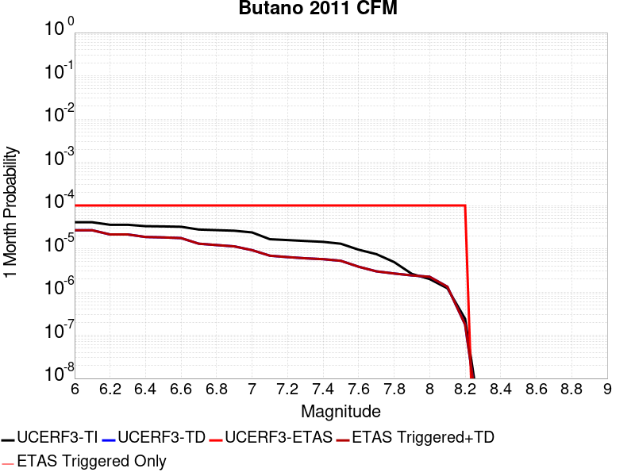 |  |  |

| Magnitude | 1 wk TI Prob | 1 wk TD Prob | 1 wk ETAS Prob | 1 wk ETAS/TD Gain | 1 wk ETAS Triggered+TD | 1 wk ETAS Triggered Only | 1 mo TI Prob | 1 mo TD Prob | 1 mo ETAS Prob | 1 mo ETAS/TD Gain | 1 mo ETAS Triggered+TD | 1 mo ETAS Triggered Only | 1 yr TI Prob | 1 yr TD Prob | 1 yr ETAS Prob | 1 yr ETAS/TD Gain | 1 yr ETAS Triggered+TD | 1 yr ETAS Triggered Only | 10 yr TI Prob | 10 yr TD Prob | 10 yr ETAS Prob | 10 yr ETAS/TD Gain | 10 yr ETAS Triggered+TD | 10 yr ETAS Triggered Only |
|-----|-----|-----|-----|-----|-----|-----|-----|-----|-----|-----|-----|-----|-----|-----|-----|-----|-----|-----|-----|-----|-----|-----|-----|-----|
| 6.0 | 9.561135E-6 | 6.239187E-6 | 1.0E-4 | 16.027729 | 6.239187E-6 | 0.0 | 4.097565E-5 | 2.6739111E-5 | 1.0E-4 | 3.7398403 | 2.6739111E-5 | 0.0 | 4.9876433E-4 | 3.2550225E-4 | 4.0E-4 | 1.2288702 | 4.2546968E-4 | 1.0E-4 | 0.004976464 | 0.0032679653 | 0.0035 | 1.0710028 | 0.004065351 | 8.0E-4 |
| 6.1 | 9.561135E-6 | 6.239187E-6 | 1.0E-4 | 16.027729 | 6.239187E-6 | 0.0 | 4.097565E-5 | 2.6739111E-5 | 1.0E-4 | 3.7398403 | 2.6739111E-5 | 0.0 | 4.9876433E-4 | 3.2550225E-4 | 4.0E-4 | 1.2288702 | 4.2546968E-4 | 1.0E-4 | 0.004976464 | 0.0032679653 | 0.0035 | 1.0710028 | 0.004065351 | 8.0E-4 |
| 6.2 | 8.364741E-6 | 4.9921678E-6 | 1.0E-4 | 20.031378 | 4.9921678E-6 | 0.0 | 3.5848396E-5 | 2.1394837E-5 | 1.0E-4 | 4.6740246 | 2.1394837E-5 | 0.0 | 4.3636683E-4 | 2.604526E-4 | 2.0E-4 | 0.7678941 | 2.604526E-4 | 0.0 | 0.0043551093 | 0.002619132 | 0.0025 | 0.9545147 | 0.0033172986 | 7.0E-4 |
| 6.3 | 8.364741E-6 | 4.9921678E-6 | 1.0E-4 | 20.031378 | 4.9921678E-6 | 0.0 | 3.5848396E-5 | 2.1394837E-5 | 1.0E-4 | 4.6740246 | 2.1394837E-5 | 0.0 | 4.3636683E-4 | 2.604526E-4 | 2.0E-4 | 0.7678941 | 2.604526E-4 | 0.0 | 0.0043551093 | 0.002619132 | 0.0025 | 0.9545147 | 0.0033172986 | 7.0E-4 |
| 6.4 | 7.768282E-6 | 4.3700625E-6 | 1.0E-4 | 22.882967 | 4.3700625E-6 | 0.0 | 3.329221E-5 | 1.8728711E-5 | 1.0E-4 | 5.3393955 | 1.8728711E-5 | 0.0 | 4.0525728E-4 | 2.2799958E-4 | 1.0E-4 | 0.4385973 | 2.2799958E-4 | 0.0 | 0.0040451903 | 0.0022953 | 0.0023 | 1.0020477 | 0.0029936933 | 7.0E-4 |
| 6.5 | 7.673437E-6 | 4.269614E-6 | 1.0E-4 | 23.421322 | 4.269614E-6 | 0.0 | 3.2885746E-5 | 1.8298224E-5 | 1.0E-4 | 5.465011 | 1.8298224E-5 | 0.0 | 4.0031038E-4 | 2.2275945E-4 | 1.0E-4 | 0.4489147 | 2.2275945E-4 | 0.0 | 0.0039959005 | 0.0022430047 | 0.0023 | 1.0254103 | 0.0029414345 | 7.0E-4 |
| 6.6 | 7.5244197E-6 | 4.1145586E-6 | 1.0E-4 | 24.303944 | 4.1145586E-6 | 0.0 | 3.2247113E-5 | 1.763371E-5 | 1.0E-4 | 5.6709566 | 1.763371E-5 | 0.0 | 3.9253788E-4 | 2.1467061E-4 | 1.0E-4 | 0.46582997 | 2.1467061E-4 | 0.0 | 0.003918452 | 0.0021622754 | 0.0022 | 1.0174466 | 0.0027609782 | 6.0E-4 |
| 6.7 | 6.4921405E-6 | 3.0544782E-6 | 1.0E-4 | 32.73882 | 3.0544782E-6 | 0.0 | 2.7823162E-5 | 1.3090555E-5 | 1.0E-4 | 7.639096 | 1.3090555E-5 | 0.0 | 3.3869434E-4 | 1.5936594E-4 | 1.0E-4 | 0.6274867 | 1.5936594E-4 | 0.0 | 0.003381786 | 0.0016100458 | 0.0021 | 1.3043107 | 0.0021092407 | 5.0E-4 |
| 6.8 | 6.2890294E-6 | 2.8412114E-6 | 1.0E-4 | 35.196255 | 2.8412114E-6 | 0.0 | 2.6952705E-5 | 1.2176564E-5 | 1.0E-4 | 8.212498 | 1.2176564E-5 | 0.0 | 3.2809976E-4 | 1.4823966E-4 | 1.0E-4 | 0.6745833 | 1.4823966E-4 | 0.0 | 0.0032761577 | 0.0014989382 | 0.0019 | 1.2675639 | 0.0019981887 | 5.0E-4 |
| 6.9 | 6.0965517E-6 | 2.6476864E-6 | 1.0E-4 | 37.768826 | 2.6476864E-6 | 0.0 | 2.6127816E-5 | 1.1347178E-5 | 1.0E-4 | 8.812764 | 1.1347178E-5 | 0.0 | 3.1805973E-4 | 1.381432E-4 | 1.0E-4 | 0.72388655 | 1.381432E-4 | 0.0 | 0.0031760489 | 0.0013981041 | 0.0019 | 1.3589833 | 0.001897405 | 5.0E-4 |
| 7.0 | 5.566252E-6 | 2.164954E-6 | 1.0E-4 | 46.19036 | 2.164954E-6 | 0.0 | 2.3855147E-5 | 9.27834E-6 | 1.0E-4 | 10.777789 | 9.27834E-6 | 0.0 | 2.9039773E-4 | 1.1295798E-4 | 1.0E-4 | 0.88528496 | 1.1295798E-4 | 0.0 | 0.0029001853 | 0.0011465343 | 0.0018 | 1.5699486 | 0.0015460757 | 4.0E-4 |
| 7.1 | 3.878588E-6 | 1.6143371E-6 | 1.0E-4 | 61.94493 | 1.6143371E-6 | 0.0 | 1.6622414E-5 | 6.918569E-6 | 1.0E-4 | 14.453856 | 6.918569E-6 | 0.0 | 2.023591E-4 | 8.423032E-5 | 1.0E-4 | 1.1872209 | 8.423032E-5 | 0.0 | 0.0020217493 | 8.5910835E-4 | 0.0014 | 1.6295966 | 9.5902244E-4 | 1.0E-4 |
| 7.2 | 3.7038085E-6 | 1.4952473E-6 | 1.0E-4 | 66.87857 | 1.4952473E-6 | 0.0 | 1.587337E-5 | 6.4081864E-6 | 1.0E-4 | 15.60504 | 6.4081864E-6 | 0.0 | 1.9324113E-4 | 7.801688E-5 | 1.0E-4 | 1.2817739 | 7.801688E-5 | 0.0 | 0.0019307317 | 7.969872E-4 | 0.0014 | 1.7566154 | 8.9690747E-4 | 1.0E-4 |
| 7.3 | 3.5277278E-6 | 1.4032161E-6 | 1.0E-4 | 71.26486 | 1.4032161E-6 | 0.0 | 1.5118746E-5 | 6.013769E-6 | 1.0E-4 | 16.628506 | 6.013769E-6 | 0.0 | 1.8405518E-4 | 7.321518E-5 | 1.0E-4 | 1.365837 | 7.321518E-5 | 0.0 | 0.0018390282 | 7.489157E-4 | 0.0014 | 1.8693693 | 8.488408E-4 | 1.0E-4 |
| 7.4 | 3.3711294E-6 | 1.3402845E-6 | 1.0E-4 | 74.61102 | 1.3402845E-6 | 0.0 | 1.4447617E-5 | 5.7440634E-6 | 1.0E-4 | 17.409279 | 5.7440634E-6 | 0.0 | 1.7588554E-4 | 6.993173E-5 | 1.0E-4 | 1.429966 | 6.993173E-5 | 0.0 | 0.0017574639 | 7.1604986E-4 | 0.0013 | 1.815516 | 8.159783E-4 | 1.0E-4 |
| 7.5 | 3.0496426E-6 | 1.2288015E-6 | 1.0E-4 | 81.38011 | 1.2288015E-6 | 0.0 | 1.3069831E-5 | 5.2662813E-6 | 1.0E-4 | 18.988731 | 5.2662813E-6 | 0.0 | 1.5911358E-4 | 6.411509E-5 | 1.0E-4 | 1.5596952 | 6.411509E-5 | 0.0 | 0.001589997 | 6.578515E-4 | 0.0011 | 1.6721098 | 7.5778575E-4 | 1.0E-4 |
| 7.6 | 2.2179781E-6 | 8.9568135E-7 | 1.0E-4 | 111.64685 | 8.9568135E-7 | 0.0 | 9.505586E-6 | 3.838629E-6 | 1.0E-4 | 26.05097 | 3.838629E-6 | 0.0 | 1.1572436E-4 | 4.67343E-5 | 1.0E-4 | 2.139756 | 4.67343E-5 | 0.0 | 0.0011566412 | 4.8402586E-4 | 7.0E-4 | 1.4462037 | 5.839775E-4 | 1.0E-4 |
| 7.7 | 1.7519328E-6 | 7.00781E-7 | 1.0E-4 | 142.69794 | 7.00781E-7 | 0.0 | 7.508262E-6 | 3.0033436E-6 | 1.0E-4 | 33.296223 | 3.0033436E-6 | 0.0 | 9.140925E-5 | 3.6565096E-5 | 1.0E-4 | 2.7348485 | 3.6565096E-5 | 0.0 | 9.137166E-4 | 3.816302E-4 | 6.0E-4 | 1.5722026 | 4.8159205E-4 | 1.0E-4 |
| 7.8 | 1.1478974E-6 | 6.244409E-7 | 1.0E-4 | 160.14326 | 6.244409E-7 | 0.0 | 4.9195505E-6 | 2.6761725E-6 | 1.0E-4 | 37.3668 | 2.6761725E-6 | 0.0 | 5.9893882E-5 | 3.2581913E-5 | 1.0E-4 | 3.0691876 | 3.2581913E-5 | 0.0 | 5.9877743E-4 | 3.4147367E-4 | 6.0E-4 | 1.7570901 | 4.4143954E-4 | 1.0E-4 |
| 7.9 | 6.1154634E-7 | 5.6432793E-7 | 1.0E-4 | 177.20192 | 5.6432793E-7 | 0.0 | 2.6209104E-6 | 2.4185463E-6 | 1.0E-4 | 41.347153 | 2.4185463E-6 | 0.0 | 3.1909116E-5 | 2.9445402E-5 | 1.0E-4 | 3.396116 | 2.9445402E-5 | 0.0 | 3.1904536E-4 | 3.0886644E-4 | 5.0E-4 | 1.6188227 | 4.0883556E-4 | 1.0E-4 |
| 8.0 | 4.6520046E-7 | 5.245455E-7 | 1.0E-4 | 190.64124 | 5.245455E-7 | 0.0 | 1.9937147E-6 | 2.2480501E-6 | 1.0E-4 | 44.48299 | 2.2480501E-6 | 0.0 | 2.4273206E-5 | 2.7369668E-5 | 1.0E-4 | 3.6536798 | 2.7369668E-5 | 0.0 | 2.4270554E-4 | 2.871312E-4 | 5.0E-4 | 1.7413641 | 3.8710248E-4 | 1.0E-4 |
| 8.1 | 2.8425194E-7 | 3.088902E-7 | 1.0E-4 | 323.73962 | 3.088902E-7 | 0.0 | 1.218222E-6 | 1.3238146E-6 | 1.0E-4 | 75.53928 | 1.3238146E-6 | 0.0 | 1.4831752E-5 | 1.6117323E-5 | 1.0E-4 | 6.2045045 | 1.6117323E-5 | 0.0 | 1.4830762E-4 | 1.6908509E-4 | 3.0E-4 | 1.7742547 | 2.6906817E-4 | 1.0E-4 |
| 8.2 | 5.585778E-8 | 4.1056555E-8 | 1.0E-4 | 2435.6646 | 4.1056555E-8 | 0.0 | 2.3939046E-7 | 1.7595667E-7 | 1.0E-4 | 568.3217 | 1.7595667E-7 | 0.0 | 2.914575E-6 | 2.1422702E-6 | 1.0E-4 | 46.67945 | 2.1422702E-6 | 0.0 | 2.9145367E-5 | 2.326632E-5 | 1.0E-4 | 4.298058 | 2.326632E-5 | 0.0 |
| 8.3 | 1.0371215E-10 | 5.4365512E-11 | 0.0 | 0.0 | 5.4365512E-11 | 0.0 | 4.4448079E-10 | 2.3299518E-10 | 0.0 | 0.0 | 2.3299518E-10 | 0.0 | 5.4115543E-9 | 2.8367144E-9 | 0.0 | 0.0 | 2.8367144E-9 | 0.0 | 5.4115542E-8 | 3.2609154E-8 | 0.0 | 0.0 | 3.2609154E-8 | 0.0 |

## Earthquake Valley (No  Extension)
*[(top)](#table-of-contents)*

| 1 Week | 1 Month | 1 Year | 10 Year |
|-----|-----|-----|-----|
|  |  |  |  |

| Magnitude | 1 wk TI Prob | 1 wk TD Prob | 1 wk ETAS Prob | 1 wk ETAS/TD Gain | 1 wk ETAS Triggered+TD | 1 wk ETAS Triggered Only | 1 mo TI Prob | 1 mo TD Prob | 1 mo ETAS Prob | 1 mo ETAS/TD Gain | 1 mo ETAS Triggered+TD | 1 mo ETAS Triggered Only | 1 yr TI Prob | 1 yr TD Prob | 1 yr ETAS Prob | 1 yr ETAS/TD Gain | 1 yr ETAS Triggered+TD | 1 yr ETAS Triggered Only | 10 yr TI Prob | 10 yr TD Prob | 10 yr ETAS Prob | 10 yr ETAS/TD Gain | 10 yr ETAS Triggered+TD | 10 yr ETAS Triggered Only |
|-----|-----|-----|-----|-----|-----|-----|-----|-----|-----|-----|-----|-----|-----|-----|-----|-----|-----|-----|-----|-----|-----|-----|-----|-----|
| 6.0 | 2.1859703E-5 | 2.5206198E-5 | 0.0 | 0.0 | 2.5206198E-5 | 0.0 | 9.3681076E-5 | 1.0802291E-4 | 0.0 | 0.0 | 1.0802291E-4 | 0.0 | 0.0011399703 | 0.0013145307 | 0.001 | 0.76072776 | 0.0016141363 | 3.0E-4 | 0.011341401 | 0.013081919 | 0.0066 | 0.5045131 | 0.013871455 | 8.0E-4 |
| 6.1 | 2.1859703E-5 | 2.5206198E-5 | 0.0 | 0.0 | 2.5206198E-5 | 0.0 | 9.3681076E-5 | 1.0802291E-4 | 0.0 | 0.0 | 1.0802291E-4 | 0.0 | 0.0011399703 | 0.0013145307 | 0.001 | 0.76072776 | 0.0016141363 | 3.0E-4 | 0.011341401 | 0.013081919 | 0.0066 | 0.5045131 | 0.013871455 | 8.0E-4 |
| 6.2 | 2.1859703E-5 | 2.5206198E-5 | 0.0 | 0.0 | 2.5206198E-5 | 0.0 | 9.3681076E-5 | 1.0802291E-4 | 0.0 | 0.0 | 1.0802291E-4 | 0.0 | 0.0011399703 | 0.0013145307 | 0.001 | 0.76072776 | 0.0016141363 | 3.0E-4 | 0.011341401 | 0.013081919 | 0.0066 | 0.5045131 | 0.013871455 | 8.0E-4 |
| 6.3 | 2.1859703E-5 | 2.5206198E-5 | 0.0 | 0.0 | 2.5206198E-5 | 0.0 | 9.3681076E-5 | 1.0802291E-4 | 0.0 | 0.0 | 1.0802291E-4 | 0.0 | 0.0011399703 | 0.0013145307 | 0.001 | 0.76072776 | 0.0016141363 | 3.0E-4 | 0.011341401 | 0.013081919 | 0.0066 | 0.5045131 | 0.013871455 | 8.0E-4 |
| 6.4 | 2.1859703E-5 | 2.5206198E-5 | 0.0 | 0.0 | 2.5206198E-5 | 0.0 | 9.3681076E-5 | 1.0802291E-4 | 0.0 | 0.0 | 1.0802291E-4 | 0.0 | 0.0011399703 | 0.0013145307 | 0.001 | 0.76072776 | 0.0016141363 | 3.0E-4 | 0.011341401 | 0.013081919 | 0.0066 | 0.5045131 | 0.013871455 | 8.0E-4 |
| 6.5 | 2.1859703E-5 | 2.5206198E-5 | 0.0 | 0.0 | 2.5206198E-5 | 0.0 | 9.3681076E-5 | 1.0802291E-4 | 0.0 | 0.0 | 1.0802291E-4 | 0.0 | 0.0011399703 | 0.0013145307 | 0.001 | 0.76072776 | 0.0016141363 | 3.0E-4 | 0.011341401 | 0.013081919 | 0.0066 | 0.5045131 | 0.013871455 | 8.0E-4 |
| 6.6 | 1.597E-5 | 1.8361923E-5 | 0.0 | 0.0 | 1.8361923E-5 | 0.0 | 6.8441055E-5 | 7.869207E-5 | 0.0 | 0.0 | 7.869207E-5 | 0.0 | 8.329513E-4 | 9.577422E-4 | 7.0E-4 | 0.7308856 | 0.0011575506 | 2.0E-4 | 0.008298361 | 0.00954476 | 0.0046 | 0.48193982 | 0.010238078 | 7.0E-4 |
| 6.7 | 1.597E-5 | 1.8361923E-5 | 0.0 | 0.0 | 1.8361923E-5 | 0.0 | 6.8441055E-5 | 7.869207E-5 | 0.0 | 0.0 | 7.869207E-5 | 0.0 | 8.329513E-4 | 9.577422E-4 | 7.0E-4 | 0.7308856 | 0.0011575506 | 2.0E-4 | 0.008298361 | 0.00954476 | 0.0046 | 0.48193982 | 0.010238078 | 7.0E-4 |
| 6.8 | 1.5315149E-5 | 1.7607512E-5 | 0.0 | 0.0 | 1.7607512E-5 | 0.0 | 6.5634704E-5 | 7.545907E-5 | 0.0 | 0.0 | 7.545907E-5 | 0.0 | 7.988095E-4 | 9.184137E-4 | 7.0E-4 | 0.7621837 | 0.00111823 | 2.0E-4 | 0.007959441 | 0.009154727 | 0.0043 | 0.46970272 | 0.009848319 | 7.0E-4 |
| 6.9 | 1.3634728E-5 | 1.5680682E-5 | 0.0 | 0.0 | 1.5680682E-5 | 0.0 | 5.8433237E-5 | 6.7201654E-5 | 0.0 | 0.0 | 6.7201654E-5 | 0.0 | 7.1119244E-4 | 8.179551E-4 | 6.0E-4 | 0.73353654 | 0.0010177916 | 2.0E-4 | 0.007089207 | 0.0081575215 | 0.0038 | 0.46582776 | 0.008851811 | 7.0E-4 |
| 7.0 | 1.3496271E-5 | 1.552267E-5 | 0.0 | 0.0 | 1.552267E-5 | 0.0 | 5.783988E-5 | 6.6524495E-5 | 0.0 | 0.0 | 6.6524495E-5 | 0.0 | 7.03973E-4 | 8.097168E-4 | 6.0E-4 | 0.74099976 | 0.0010095548 | 2.0E-4 | 0.007017471 | 0.008075739 | 0.0037 | 0.45816243 | 0.008770086 | 7.0E-4 |
| 7.1 | 8.242798E-6 | 9.475608E-6 | 0.0 | 0.0 | 9.475608E-6 | 0.0 | 3.53258E-5 | 4.0609495E-5 | 0.0 | 0.0 | 4.0609495E-5 | 0.0 | 4.300067E-4 | 4.9437553E-4 | 3.0E-4 | 0.6068261 | 6.9427665E-4 | 2.0E-4 | 0.004291756 | 0.004939338 | 0.0025 | 0.5061407 | 0.0056358804 | 7.0E-4 |
| 7.2 | 2.6506527E-7 | 2.2569199E-7 | 0.0 | 0.0 | 2.2569199E-7 | 0.0 | 1.1359936E-6 | 9.67251E-7 | 0.0 | 0.0 | 9.67251E-7 | 0.0 | 1.3830633E-5 | 1.1776222E-5 | 0.0 | 0.0 | 1.1776222E-5 | 0.0 | 1.3829772E-4 | 1.1775639E-4 | 1.0E-4 | 0.8492108 | 2.1774461E-4 | 1.0E-4 |
| 7.3 | 2.5810488E-7 | 2.1964209E-7 | 0.0 | 0.0 | 2.1964209E-7 | 0.0 | 1.1061633E-6 | 9.413229E-7 | 0.0 | 0.0 | 9.413229E-7 | 0.0 | 1.3467455E-5 | 1.1460551E-5 | 0.0 | 0.0 | 1.1460551E-5 | 0.0 | 1.3466639E-4 | 1.1460001E-4 | 1.0E-4 | 0.8726003 | 2.1458855E-4 | 1.0E-4 |
| 7.4 | 2.2676066E-7 | 1.9119065E-7 | 0.0 | 0.0 | 1.9119065E-7 | 0.0 | 9.71831E-7 | 8.193883E-7 | 0.0 | 0.0 | 8.193883E-7 | 0.0 | 1.1831979E-5 | 9.97601E-6 | 0.0 | 0.0 | 9.97601E-6 | 0.0 | 1.1831349E-4 | 9.975601E-5 | 1.0E-4 | 1.0024458 | 1.9974603E-4 | 1.0E-4 |
| 7.5 | 1.5553917E-7 | 1.3118898E-7 | 0.0 | 0.0 | 1.3118898E-7 | 0.0 | 6.6659624E-7 | 5.622384E-7 | 0.0 | 0.0 | 5.622384E-7 | 0.0 | 8.115779E-6 | 6.845233E-6 | 0.0 | 0.0 | 6.845233E-6 | 0.0 | 8.115482E-5 | 6.845044E-5 | 0.0 | 0.0 | 6.845044E-5 | 0.0 |
| 7.6 | 1.3448629E-7 | 1.12943916E-7 | 0.0 | 0.0 | 1.12943916E-7 | 0.0 | 5.7636964E-7 | 4.840453E-7 | 0.0 | 0.0 | 4.840453E-7 | 0.0 | 7.017278E-6 | 5.8932374E-6 | 0.0 | 0.0 | 5.8932374E-6 | 0.0 | 7.0170565E-5 | 5.8931026E-5 | 0.0 | 0.0 | 5.8931026E-5 | 0.0 |
| 7.7 | 2.9719402E-8 | 1.459214E-8 | 0.0 | 0.0 | 1.459214E-8 | 0.0 | 1.2736886E-7 | 6.2537744E-8 | 0.0 | 0.0 | 6.2537744E-8 | 0.0 | 1.5507147E-6 | 7.613968E-7 | 0.0 | 0.0 | 7.613968E-7 | 0.0 | 1.550704E-5 | 7.613947E-6 | 0.0 | 0.0 | 7.613947E-6 | 0.0 |
| 7.8 | 7.4390196E-9 | 3.2520835E-9 | 0.0 | 0.0 | 3.2520835E-9 | 0.0 | 3.1881513E-8 | 1.3937501E-8 | 0.0 | 0.0 | 1.3937501E-8 | 0.0 | 3.8815733E-7 | 1.6968906E-7 | 0.0 | 0.0 | 1.6968906E-7 | 0.0 | 3.8815665E-6 | 1.6968895E-6 | 0.0 | 0.0 | 1.6968895E-6 | 0.0 |
| 7.9 | 1.5373532E-9 | 8.444304E-10 | 0.0 | 0.0 | 8.444304E-10 | 0.0 | 6.5886567E-9 | 3.6189873E-9 | 0.0 | 0.0 | 3.6189873E-9 | 0.0 | 8.021689E-8 | 4.406117E-8 | 0.0 | 0.0 | 4.406117E-8 | 0.0 | 8.0216864E-7 | 4.406117E-7 | 0.0 | 0.0 | 4.406117E-7 | 0.0 |

## Mount Diablo Thrust North CFM
*[(top)](#table-of-contents)*

| 1 Week | 1 Month | 1 Year | 10 Year |
|-----|-----|-----|-----|
| 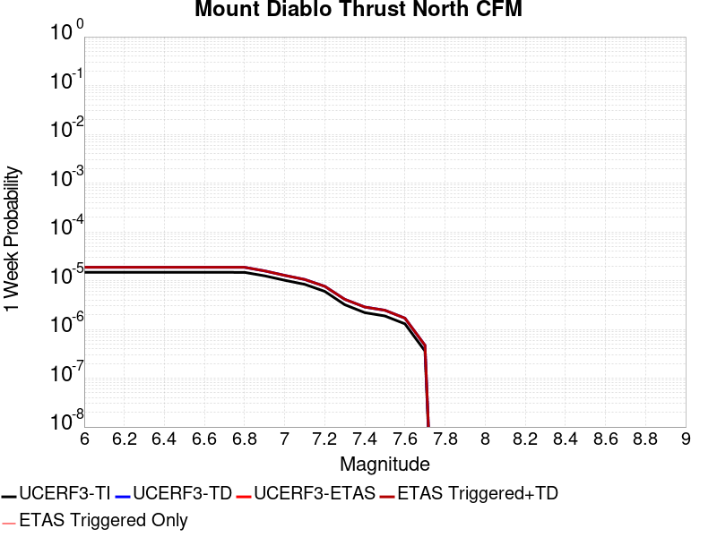 |  |  | 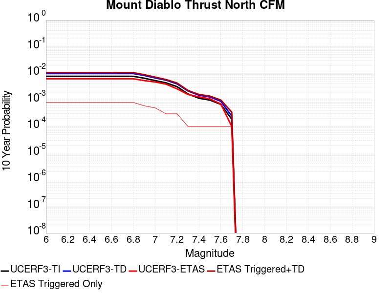 |

| Magnitude | 1 wk TI Prob | 1 wk TD Prob | 1 wk ETAS Prob | 1 wk ETAS/TD Gain | 1 wk ETAS Triggered+TD | 1 wk ETAS Triggered Only | 1 mo TI Prob | 1 mo TD Prob | 1 mo ETAS Prob | 1 mo ETAS/TD Gain | 1 mo ETAS Triggered+TD | 1 mo ETAS Triggered Only | 1 yr TI Prob | 1 yr TD Prob | 1 yr ETAS Prob | 1 yr ETAS/TD Gain | 1 yr ETAS Triggered+TD | 1 yr ETAS Triggered Only | 10 yr TI Prob | 10 yr TD Prob | 10 yr ETAS Prob | 10 yr ETAS/TD Gain | 10 yr ETAS Triggered+TD | 10 yr ETAS Triggered Only |
|-----|-----|-----|-----|-----|-----|-----|-----|-----|-----|-----|-----|-----|-----|-----|-----|-----|-----|-----|-----|-----|-----|-----|-----|-----|
| 6.0 | 1.479628E-5 | 1.8783709E-5 | 0.0 | 0.0 | 1.8783709E-5 | 0.0 | 6.341109E-5 | 8.049918E-5 | 0.0 | 0.0 | 8.049918E-5 | 0.0 | 7.717565E-4 | 9.796465E-4 | 3.0E-4 | 0.30623293 | 0.0011794505 | 2.0E-4 | 0.007690818 | 0.009753635 | 0.0062 | 0.63566047 | 0.010545832 | 8.0E-4 |
| 6.1 | 1.479628E-5 | 1.8783709E-5 | 0.0 | 0.0 | 1.8783709E-5 | 0.0 | 6.341109E-5 | 8.049918E-5 | 0.0 | 0.0 | 8.049918E-5 | 0.0 | 7.717565E-4 | 9.796465E-4 | 3.0E-4 | 0.30623293 | 0.0011794505 | 2.0E-4 | 0.007690818 | 0.009753635 | 0.0062 | 0.63566047 | 0.010545832 | 8.0E-4 |
| 6.2 | 1.479628E-5 | 1.8783709E-5 | 0.0 | 0.0 | 1.8783709E-5 | 0.0 | 6.341109E-5 | 8.049918E-5 | 0.0 | 0.0 | 8.049918E-5 | 0.0 | 7.717565E-4 | 9.796465E-4 | 3.0E-4 | 0.30623293 | 0.0011794505 | 2.0E-4 | 0.007690818 | 0.009753635 | 0.0062 | 0.63566047 | 0.010545832 | 8.0E-4 |
| 6.3 | 1.479628E-5 | 1.8783709E-5 | 0.0 | 0.0 | 1.8783709E-5 | 0.0 | 6.341109E-5 | 8.049918E-5 | 0.0 | 0.0 | 8.049918E-5 | 0.0 | 7.717565E-4 | 9.796465E-4 | 3.0E-4 | 0.30623293 | 0.0011794505 | 2.0E-4 | 0.007690818 | 0.009753635 | 0.0062 | 0.63566047 | 0.010545832 | 8.0E-4 |
| 6.4 | 1.479628E-5 | 1.8783709E-5 | 0.0 | 0.0 | 1.8783709E-5 | 0.0 | 6.341109E-5 | 8.049918E-5 | 0.0 | 0.0 | 8.049918E-5 | 0.0 | 7.717565E-4 | 9.796465E-4 | 3.0E-4 | 0.30623293 | 0.0011794505 | 2.0E-4 | 0.007690818 | 0.009753635 | 0.0062 | 0.63566047 | 0.010545832 | 8.0E-4 |
| 6.5 | 1.479628E-5 | 1.8783709E-5 | 0.0 | 0.0 | 1.8783709E-5 | 0.0 | 6.341109E-5 | 8.049918E-5 | 0.0 | 0.0 | 8.049918E-5 | 0.0 | 7.717565E-4 | 9.796465E-4 | 3.0E-4 | 0.30623293 | 0.0011794505 | 2.0E-4 | 0.007690818 | 0.009753635 | 0.0062 | 0.63566047 | 0.010545832 | 8.0E-4 |
| 6.6 | 1.479016E-5 | 1.877682E-5 | 0.0 | 0.0 | 1.877682E-5 | 0.0 | 6.338486E-5 | 8.0469654E-5 | 0.0 | 0.0 | 8.0469654E-5 | 0.0 | 7.714374E-4 | 9.792872E-4 | 3.0E-4 | 0.30634525 | 0.0011790914 | 2.0E-4 | 0.007687649 | 0.009750075 | 0.0062 | 0.63589257 | 0.010542274 | 8.0E-4 |
| 6.7 | 1.479016E-5 | 1.877682E-5 | 0.0 | 0.0 | 1.877682E-5 | 0.0 | 6.338486E-5 | 8.0469654E-5 | 0.0 | 0.0 | 8.0469654E-5 | 0.0 | 7.714374E-4 | 9.792872E-4 | 3.0E-4 | 0.30634525 | 0.0011790914 | 2.0E-4 | 0.007687649 | 0.009750075 | 0.0062 | 0.63589257 | 0.010542274 | 8.0E-4 |
| 6.8 | 1.4771667E-5 | 1.8755583E-5 | 0.0 | 0.0 | 1.8755583E-5 | 0.0 | 6.330561E-5 | 8.0378646E-5 | 0.0 | 0.0 | 8.0378646E-5 | 0.0 | 7.704732E-4 | 9.781802E-4 | 3.0E-4 | 0.30669194 | 0.0011779846 | 2.0E-4 | 0.007678074 | 0.009739102 | 0.0062 | 0.636609 | 0.01053131 | 8.0E-4 |
| 6.9 | 1.2548234E-5 | 1.583542E-5 | 0.0 | 0.0 | 1.583542E-5 | 0.0 | 5.3777036E-5 | 6.786434E-5 | 0.0 | 0.0 | 6.786434E-5 | 0.0 | 6.545387E-4 | 8.259387E-4 | 2.0E-4 | 0.24214871 | 9.258561E-4 | 1.0E-4 | 0.006526142 | 0.008229908 | 0.0053 | 0.64399266 | 0.00882497 | 6.0E-4 |
| 7.0 | 1.01754185E-5 | 1.281844E-5 | 0.0 | 0.0 | 1.281844E-5 | 0.0 | 4.360821E-5 | 5.4935022E-5 | 0.0 | 0.0 | 5.4935022E-5 | 0.0 | 5.308006E-4 | 6.6863035E-4 | 2.0E-4 | 0.29911894 | 7.685635E-4 | 1.0E-4 | 0.005295345 | 0.0066672186 | 0.0047 | 0.70494163 | 0.007163885 | 5.0E-4 |
| 7.1 | 8.398341E-6 | 1.0562474E-5 | 0.0 | 0.0 | 1.0562474E-5 | 0.0 | 3.5992394E-5 | 4.5266966E-5 | 0.0 | 0.0 | 4.5266966E-5 | 0.0 | 4.3811928E-4 | 5.50987E-4 | 2.0E-4 | 0.36298496 | 6.5093196E-4 | 1.0E-4 | 0.0043725655 | 0.0054966635 | 0.0039 | 0.70952135 | 0.0057950146 | 3.0E-4 |
| 7.2 | 6.024759E-6 | 7.655152E-6 | 0.0 | 0.0 | 7.655152E-6 | 0.0 | 2.582014E-5 | 3.2807387E-5 | 0.0 | 0.0 | 3.2807387E-5 | 0.0 | 3.1431485E-4 | 3.9935744E-4 | 2.0E-4 | 0.5008045 | 4.993175E-4 | 1.0E-4 | 0.0031387066 | 0.003986906 | 0.0026 | 0.6521348 | 0.00428571 | 3.0E-4 |
| 7.3 | 3.2099704E-6 | 4.137605E-6 | 0.0 | 0.0 | 4.137605E-6 | 0.0 | 1.3756943E-5 | 1.7732475E-5 | 0.0 | 0.0 | 1.7732475E-5 | 0.0 | 1.674779E-4 | 2.1587167E-4 | 1.0E-4 | 0.4632382 | 3.1585008E-4 | 1.0E-4 | 0.0016735174 | 0.00215709 | 0.0016 | 0.74174005 | 0.0022568742 | 1.0E-4 |
| 7.4 | 2.2041513E-6 | 2.8752138E-6 | 0.0 | 0.0 | 2.8752138E-6 | 0.0 | 9.4463285E-6 | 1.2322287E-5 | 0.0 | 0.0 | 1.2322287E-5 | 0.0 | 1.1500298E-4 | 1.500136E-4 | 1.0E-4 | 0.66660625 | 2.499986E-4 | 1.0E-4 | 0.0011494348 | 0.0014994297 | 0.0013 | 0.8669963 | 0.0015992798 | 1.0E-4 |
| 7.5 | 1.8869501E-6 | 2.4710512E-6 | 0.0 | 0.0 | 2.4710512E-6 | 0.0 | 8.086904E-6 | 1.0590176E-5 | 0.0 | 0.0 | 1.0590176E-5 | 0.0 | 9.845361E-5 | 1.2892784E-4 | 1.0E-4 | 0.7756277 | 2.2891494E-4 | 1.0E-4 | 9.841E-4 | 0.001288839 | 0.0011 | 0.8534813 | 0.0013887101 | 1.0E-4 |
| 7.6 | 1.3012458E-6 | 1.7018156E-6 | 0.0 | 0.0 | 1.7018156E-6 | 0.0 | 5.576756E-6 | 7.293475E-6 | 0.0 | 0.0 | 7.293475E-6 | 0.0 | 6.7894885E-5 | 8.879449E-5 | 1.0E-4 | 1.1261959 | 1.8878562E-4 | 1.0E-4 | 6.787415E-4 | 8.8787655E-4 | 7.0E-4 | 0.78839785 | 9.877877E-4 | 1.0E-4 |
| 7.7 | 3.603383E-7 | 4.7198472E-7 | 0.0 | 0.0 | 4.7198472E-7 | 0.0 | 1.5443061E-6 | 2.02279E-6 | 0.0 | 0.0 | 2.02279E-6 | 0.0 | 1.8801764E-5 | 2.4627197E-5 | 1.0E-4 | 4.060551 | 1.2462474E-4 | 1.0E-4 | 1.8800174E-4 | 2.4626206E-4 | 1.0E-4 | 0.40607148 | 3.4623744E-4 | 1.0E-4 |

## Sierra Nevada  (No Extension)
*[(top)](#table-of-contents)*

| 1 Week | 1 Month | 1 Year | 10 Year |
|-----|-----|-----|-----|
|  |  | 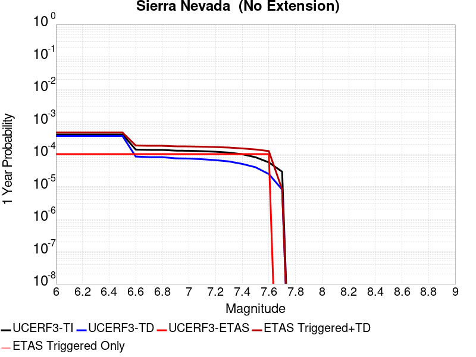 |  |

| Magnitude | 1 wk TI Prob | 1 wk TD Prob | 1 wk ETAS Prob | 1 wk ETAS/TD Gain | 1 wk ETAS Triggered+TD | 1 wk ETAS Triggered Only | 1 mo TI Prob | 1 mo TD Prob | 1 mo ETAS Prob | 1 mo ETAS/TD Gain | 1 mo ETAS Triggered+TD | 1 mo ETAS Triggered Only | 1 yr TI Prob | 1 yr TD Prob | 1 yr ETAS Prob | 1 yr ETAS/TD Gain | 1 yr ETAS Triggered+TD | 1 yr ETAS Triggered Only | 10 yr TI Prob | 10 yr TD Prob | 10 yr ETAS Prob | 10 yr ETAS/TD Gain | 10 yr ETAS Triggered+TD | 10 yr ETAS Triggered Only |
|-----|-----|-----|-----|-----|-----|-----|-----|-----|-----|-----|-----|-----|-----|-----|-----|-----|-----|-----|-----|-----|-----|-----|-----|-----|
| 6.0 | 7.7690465E-6 | 6.977213E-6 | 0.0 | 0.0 | 6.977213E-6 | 0.0 | 3.329549E-5 | 2.9902201E-5 | 1.0E-4 | 3.3442354 | 1.2989921E-4 | 1.0E-4 | 4.0529718E-4 | 3.6403435E-4 | 1.0E-4 | 0.27469936 | 4.6399795E-4 | 1.0E-4 | 0.004045588 | 0.0036378969 | 0.0023 | 0.63223344 | 0.0044349865 | 8.0E-4 |
| 6.1 | 7.7690465E-6 | 6.977213E-6 | 0.0 | 0.0 | 6.977213E-6 | 0.0 | 3.329549E-5 | 2.9902201E-5 | 1.0E-4 | 3.3442354 | 1.2989921E-4 | 1.0E-4 | 4.0529718E-4 | 3.6403435E-4 | 1.0E-4 | 0.27469936 | 4.6399795E-4 | 1.0E-4 | 0.004045588 | 0.0036378969 | 0.0023 | 0.63223344 | 0.0044349865 | 8.0E-4 |
| 6.2 | 7.7690465E-6 | 6.977213E-6 | 0.0 | 0.0 | 6.977213E-6 | 0.0 | 3.329549E-5 | 2.9902201E-5 | 1.0E-4 | 3.3442354 | 1.2989921E-4 | 1.0E-4 | 4.0529718E-4 | 3.6403435E-4 | 1.0E-4 | 0.27469936 | 4.6399795E-4 | 1.0E-4 | 0.004045588 | 0.0036378969 | 0.0023 | 0.63223344 | 0.0044349865 | 8.0E-4 |
| 6.3 | 7.7690465E-6 | 6.977213E-6 | 0.0 | 0.0 | 6.977213E-6 | 0.0 | 3.329549E-5 | 2.9902201E-5 | 1.0E-4 | 3.3442354 | 1.2989921E-4 | 1.0E-4 | 4.0529718E-4 | 3.6403435E-4 | 1.0E-4 | 0.27469936 | 4.6399795E-4 | 1.0E-4 | 0.004045588 | 0.0036378969 | 0.0023 | 0.63223344 | 0.0044349865 | 8.0E-4 |
| 6.4 | 7.7690465E-6 | 6.977213E-6 | 0.0 | 0.0 | 6.977213E-6 | 0.0 | 3.329549E-5 | 2.9902201E-5 | 1.0E-4 | 3.3442354 | 1.2989921E-4 | 1.0E-4 | 4.0529718E-4 | 3.6403435E-4 | 1.0E-4 | 0.27469936 | 4.6399795E-4 | 1.0E-4 | 0.004045588 | 0.0036378969 | 0.0023 | 0.63223344 | 0.0044349865 | 8.0E-4 |
| 6.5 | 7.7690465E-6 | 6.977213E-6 | 0.0 | 0.0 | 6.977213E-6 | 0.0 | 3.329549E-5 | 2.9902201E-5 | 1.0E-4 | 3.3442354 | 1.2989921E-4 | 1.0E-4 | 4.0529718E-4 | 3.6403435E-4 | 1.0E-4 | 0.27469936 | 4.6399795E-4 | 1.0E-4 | 0.004045588 | 0.0036378969 | 0.0023 | 0.63223344 | 0.0044349865 | 8.0E-4 |
| 6.6 | 2.653E-6 | 1.6152354E-6 | 0.0 | 0.0 | 1.6152354E-6 | 0.0 | 1.136995E-5 | 6.9224193E-6 | 1.0E-4 | 14.445817 | 1.06921725E-4 | 1.0E-4 | 1.3842035E-4 | 8.427723E-5 | 1.0E-4 | 1.1865602 | 1.842688E-4 | 1.0E-4 | 0.0013833415 | 8.424561E-4 | 5.0E-4 | 0.5935027 | 0.0011422033 | 3.0E-4 |
| 6.7 | 2.5902466E-6 | 1.550565E-6 | 0.0 | 0.0 | 1.550565E-6 | 0.0 | 1.11010095E-5 | 6.6452617E-6 | 1.0E-4 | 15.048316 | 1.066446E-4 | 1.0E-4 | 1.351464E-4 | 8.090309E-5 | 1.0E-4 | 1.2360468 | 1.80895E-4 | 1.0E-4 | 0.0013506424 | 8.0873934E-4 | 5.0E-4 | 0.61824614 | 0.0011084967 | 3.0E-4 |
| 6.8 | 2.5853892E-6 | 1.5473634E-6 | 0.0 | 0.0 | 1.5473634E-6 | 0.0 | 1.1080193E-5 | 6.6315406E-6 | 1.0E-4 | 15.079452 | 1.06630876E-4 | 1.0E-4 | 1.34893E-4 | 8.073605E-5 | 1.0E-4 | 1.2386041 | 1.8072798E-4 | 1.0E-4 | 0.0013481114 | 8.070701E-4 | 5.0E-4 | 0.61952484 | 0.001106828 | 3.0E-4 |
| 6.9 | 2.458257E-6 | 1.422429E-6 | 0.0 | 0.0 | 1.422429E-6 | 0.0 | 1.0535345E-5 | 6.09611E-6 | 1.0E-4 | 16.403904 | 1.06095504E-4 | 1.0E-4 | 1.2826028E-4 | 7.4217634E-5 | 1.0E-4 | 1.3473887 | 1.7421022E-4 | 1.0E-4 | 0.0012818627 | 7.4193045E-4 | 4.0E-4 | 0.5391341 | 0.0010417078 | 3.0E-4 |
| 7.0 | 2.4341468E-6 | 1.3993911E-6 | 0.0 | 0.0 | 1.3993911E-6 | 0.0 | 1.0432016E-5 | 5.9973763E-6 | 1.0E-4 | 16.673958 | 1.05996776E-4 | 1.0E-4 | 1.270024E-4 | 7.301563E-5 | 1.0E-4 | 1.3695698 | 1.7300833E-4 | 1.0E-4 | 0.0012692984 | 7.299183E-4 | 4.0E-4 | 0.54800653 | 0.0010296993 | 3.0E-4 |
| 7.1 | 2.3652476E-6 | 1.3343353E-6 | 0.0 | 0.0 | 1.3343353E-6 | 0.0 | 1.0136736E-5 | 5.718567E-6 | 1.0E-4 | 17.486898 | 1.05718E-4 | 1.0E-4 | 1.2340778E-4 | 6.962135E-5 | 1.0E-4 | 1.436341 | 1.6961439E-4 | 1.0E-4 | 0.0012333926 | 6.9599703E-4 | 4.0E-4 | 0.5747151 | 9.957883E-4 | 3.0E-4 |
| 7.2 | 2.272158E-6 | 1.2506333E-6 | 0.0 | 0.0 | 1.2506333E-6 | 0.0 | 9.737784E-6 | 5.3598465E-6 | 1.0E-4 | 18.657251 | 1.0535931E-4 | 1.0E-4 | 1.1855107E-4 | 6.5254186E-5 | 1.0E-4 | 1.5324687 | 1.6524766E-4 | 1.0E-4 | 0.0011848784 | 6.5235177E-4 | 4.0E-4 | 0.6131661 | 9.521561E-4 | 3.0E-4 |
| 7.3 | 2.1382127E-6 | 1.1423101E-6 | 0.0 | 0.0 | 1.1423101E-6 | 0.0 | 9.163737E-6 | 4.895606E-6 | 1.0E-4 | 20.426481 | 1.04895116E-4 | 1.0E-4 | 1.1156279E-4 | 5.9602382E-5 | 1.0E-4 | 1.6777853 | 1.5959643E-4 | 1.0E-4 | 0.001115068 | 5.9586513E-4 | 3.0E-4 | 0.50346965 | 8.956864E-4 | 3.0E-4 |
| 7.4 | 1.9048055E-6 | 9.578449E-7 | 0.0 | 0.0 | 9.578449E-7 | 0.0 | 8.163426E-6 | 4.1050434E-6 | 1.0E-4 | 24.36028 | 1.04104634E-4 | 1.0E-4 | 9.9385186E-5 | 4.9977763E-5 | 1.0E-4 | 2.0008898 | 1.4997277E-4 | 1.0E-4 | 9.934074E-4 | 4.996659E-4 | 3.0E-4 | 0.60040116 | 7.9951604E-4 | 3.0E-4 |
| 7.5 | 1.5373403E-6 | 7.562761E-7 | 0.0 | 0.0 | 7.562761E-7 | 0.0 | 6.5885843E-6 | 3.2411792E-6 | 1.0E-4 | 30.852968 | 1.03240855E-4 | 1.0E-4 | 8.021306E-5 | 3.9460647E-5 | 1.0E-4 | 2.5341702 | 1.3945671E-4 | 1.0E-4 | 8.0184115E-4 | 3.9453688E-4 | 3.0E-4 | 0.76038516 | 6.944185E-4 | 3.0E-4 |
| 7.6 | 1.0680322E-6 | 4.661555E-7 | 0.0 | 0.0 | 4.661555E-7 | 0.0 | 4.577273E-6 | 1.9978079E-6 | 1.0E-4 | 50.054867 | 1.0199761E-4 | 1.0E-4 | 5.5726876E-5 | 2.432304E-5 | 1.0E-4 | 4.111328 | 1.243206E-4 | 1.0E-4 | 5.5712904E-4 | 2.4320405E-4 | 2.0E-4 | 0.82235473 | 4.431554E-4 | 2.0E-4 |
| 7.7 | 5.509146E-7 | 1.5589612E-7 | 0.0 | 0.0 | 1.5589612E-7 | 0.0 | 2.3610605E-6 | 6.6812606E-7 | 0.0 | 0.0 | 6.6812606E-7 | 0.0 | 2.8745531E-5 | 8.134406E-6 | 0.0 | 0.0 | 8.134406E-6 | 0.0 | 2.8741814E-4 | 8.13412E-5 | 0.0 | 0.0 | 8.13412E-5 | 0.0 |

## Contra Costa (Lafayette) 2011 CFM
*[(top)](#table-of-contents)*

| 1 Week | 1 Month | 1 Year | 10 Year |
|-----|-----|-----|-----|
|  | 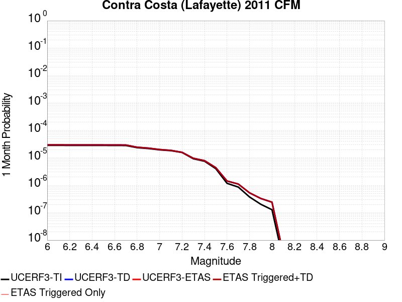 |  |  |

| Magnitude | 1 wk TI Prob | 1 wk TD Prob | 1 wk ETAS Prob | 1 wk ETAS/TD Gain | 1 wk ETAS Triggered+TD | 1 wk ETAS Triggered Only | 1 mo TI Prob | 1 mo TD Prob | 1 mo ETAS Prob | 1 mo ETAS/TD Gain | 1 mo ETAS Triggered+TD | 1 mo ETAS Triggered Only | 1 yr TI Prob | 1 yr TD Prob | 1 yr ETAS Prob | 1 yr ETAS/TD Gain | 1 yr ETAS Triggered+TD | 1 yr ETAS Triggered Only | 10 yr TI Prob | 10 yr TD Prob | 10 yr ETAS Prob | 10 yr ETAS/TD Gain | 10 yr ETAS Triggered+TD | 10 yr ETAS Triggered Only |
|-----|-----|-----|-----|-----|-----|-----|-----|-----|-----|-----|-----|-----|-----|-----|-----|-----|-----|-----|-----|-----|-----|-----|-----|-----|
| 6.0 | 6.655419E-6 | 6.94102E-6 | 0.0 | 0.0 | 6.94102E-6 | 0.0 | 2.8522913E-5 | 2.97469E-5 | 0.0 | 0.0 | 2.97469E-5 | 0.0 | 3.472111E-4 | 3.621103E-4 | 1.0E-4 | 0.27615896 | 3.621103E-4 | 0.0 | 0.0034666911 | 0.0036197877 | 0.0021 | 0.5801445 | 0.004416892 | 8.0E-4 |
| 6.1 | 6.655419E-6 | 6.94102E-6 | 0.0 | 0.0 | 6.94102E-6 | 0.0 | 2.8522913E-5 | 2.97469E-5 | 0.0 | 0.0 | 2.97469E-5 | 0.0 | 3.472111E-4 | 3.621103E-4 | 1.0E-4 | 0.27615896 | 3.621103E-4 | 0.0 | 0.0034666911 | 0.0036197877 | 0.0021 | 0.5801445 | 0.004416892 | 8.0E-4 |
| 6.2 | 6.6254133E-6 | 6.9094253E-6 | 0.0 | 0.0 | 6.9094253E-6 | 0.0 | 2.839432E-5 | 2.96115E-5 | 0.0 | 0.0 | 2.96115E-5 | 0.0 | 3.45646E-4 | 3.6046232E-4 | 1.0E-4 | 0.2774215 | 3.6046232E-4 | 0.0 | 0.003451089 | 0.0036033618 | 0.0021 | 0.5827891 | 0.004400479 | 8.0E-4 |
| 6.3 | 6.6254133E-6 | 6.9094253E-6 | 0.0 | 0.0 | 6.9094253E-6 | 0.0 | 2.839432E-5 | 2.96115E-5 | 0.0 | 0.0 | 2.96115E-5 | 0.0 | 3.45646E-4 | 3.6046232E-4 | 1.0E-4 | 0.2774215 | 3.6046232E-4 | 0.0 | 0.003451089 | 0.0036033618 | 0.0021 | 0.5827891 | 0.004400479 | 8.0E-4 |
| 6.4 | 6.6254133E-6 | 6.9094253E-6 | 0.0 | 0.0 | 6.9094253E-6 | 0.0 | 2.839432E-5 | 2.96115E-5 | 0.0 | 0.0 | 2.96115E-5 | 0.0 | 3.45646E-4 | 3.6046232E-4 | 1.0E-4 | 0.2774215 | 3.6046232E-4 | 0.0 | 0.003451089 | 0.0036033618 | 0.0021 | 0.5827891 | 0.004400479 | 8.0E-4 |
| 6.5 | 6.606445E-6 | 6.888971E-6 | 0.0 | 0.0 | 6.888971E-6 | 0.0 | 2.8313027E-5 | 2.9523837E-5 | 0.0 | 0.0 | 2.9523837E-5 | 0.0 | 3.4465658E-4 | 3.593954E-4 | 1.0E-4 | 0.27824506 | 3.593954E-4 | 0.0 | 0.0034412253 | 0.003592727 | 0.0021 | 0.5845142 | 0.0043898528 | 8.0E-4 |
| 6.6 | 6.59966E-6 | 6.881507E-6 | 0.0 | 0.0 | 6.881507E-6 | 0.0 | 2.828395E-5 | 2.9491852E-5 | 0.0 | 0.0 | 2.9491852E-5 | 0.0 | 3.4430268E-4 | 3.590061E-4 | 1.0E-4 | 0.27854678 | 3.590061E-4 | 0.0 | 0.0034376972 | 0.0035888467 | 0.0021 | 0.5851462 | 0.0043859757 | 8.0E-4 |
| 6.7 | 6.5570975E-6 | 6.8354907E-6 | 0.0 | 0.0 | 6.8354907E-6 | 0.0 | 2.8101544E-5 | 2.9294642E-5 | 0.0 | 0.0 | 2.9294642E-5 | 0.0 | 3.4208258E-4 | 3.566059E-4 | 1.0E-4 | 0.2804216 | 3.566059E-4 | 0.0 | 0.0034155648 | 0.0035649214 | 0.0021 | 0.5890733 | 0.0043620695 | 8.0E-4 |
| 6.8 | 5.472255E-6 | 5.678338E-6 | 0.0 | 0.0 | 5.678338E-6 | 0.0 | 2.345231E-5 | 2.4335508E-5 | 0.0 | 0.0 | 2.4335508E-5 | 0.0 | 2.8549446E-4 | 2.96245E-4 | 1.0E-4 | 0.33755845 | 2.96245E-4 | 0.0 | 0.0028512797 | 0.002962938 | 0.0016 | 0.54000455 | 0.0037605676 | 8.0E-4 |
| 6.9 | 5.092346E-6 | 5.2686364E-6 | 0.0 | 0.0 | 5.2686364E-6 | 0.0 | 2.1824157E-5 | 2.2579678E-5 | 0.0 | 0.0 | 2.2579678E-5 | 0.0 | 2.656767E-4 | 2.7487325E-4 | 1.0E-4 | 0.36380404 | 2.7487325E-4 | 0.0 | 0.002653593 | 0.0027497618 | 0.0016 | 0.5818686 | 0.003547562 | 8.0E-4 |
| 7.0 | 4.5525762E-6 | 4.6818413E-6 | 0.0 | 0.0 | 4.6818413E-6 | 0.0 | 1.9510895E-5 | 2.0064883E-5 | 0.0 | 0.0 | 2.0064883E-5 | 0.0 | 2.3751926E-4 | 2.4426286E-4 | 1.0E-4 | 0.40939504 | 2.4426286E-4 | 0.0 | 0.0023726553 | 0.0024443637 | 0.0014 | 0.5727462 | 0.0031426526 | 7.0E-4 |
| 7.1 | 4.261504E-6 | 4.3609457E-6 | 0.0 | 0.0 | 4.3609457E-6 | 0.0 | 1.826346E-5 | 1.8689634E-5 | 0.0 | 0.0 | 1.8689634E-5 | 0.0 | 2.2233493E-4 | 2.275228E-4 | 1.0E-4 | 0.43951637 | 2.275228E-4 | 0.0 | 0.002221126 | 0.0022773105 | 0.0014 | 0.6147603 | 0.0029757165 | 7.0E-4 |
| 7.2 | 3.654114E-6 | 3.701511E-6 | 0.0 | 0.0 | 3.701511E-6 | 0.0 | 1.5660395E-5 | 1.5863525E-5 | 0.0 | 0.0 | 1.5863525E-5 | 0.0 | 1.9064861E-4 | 1.9312154E-4 | 1.0E-4 | 0.5178086 | 1.9312154E-4 | 0.0 | 0.0019048514 | 0.0019339004 | 0.0012 | 0.62050766 | 0.0025327401 | 6.0E-4 |
| 7.3 | 2.1595129E-6 | 2.2477159E-6 | 0.0 | 0.0 | 2.2477159E-6 | 0.0 | 9.255023E-6 | 9.633032E-6 | 0.0 | 0.0 | 9.633032E-6 | 0.0 | 1.1267407E-4 | 1.172759E-4 | 1.0E-4 | 0.8526901 | 1.172759E-4 | 0.0 | 0.0011261696 | 0.0011765183 | 7.0E-4 | 0.5949759 | 0.0015760476 | 4.0E-4 |
| 7.4 | 1.7532738E-6 | 1.8366856E-6 | 0.0 | 0.0 | 1.8366856E-6 | 0.0 | 7.5140088E-6 | 7.871486E-6 | 0.0 | 0.0 | 7.871486E-6 | 0.0 | 9.147922E-5 | 9.5831165E-5 | 1.0E-4 | 1.0435019 | 9.5831165E-5 | 0.0 | 9.144157E-4 | 9.621467E-4 | 4.0E-4 | 0.41573703 | 0.0010620505 | 1.0E-4 |
| 7.5 | 9.387875E-7 | 1.0217974E-6 | 0.0 | 0.0 | 1.0217974E-6 | 0.0 | 4.0233685E-6 | 4.379124E-6 | 0.0 | 0.0 | 4.379124E-6 | 0.0 | 4.8983413E-5 | 5.3314547E-5 | 1.0E-4 | 1.8756607 | 5.3314547E-5 | 0.0 | 4.897262E-4 | 5.369749E-4 | 2.0E-4 | 0.37245688 | 6.369212E-4 | 1.0E-4 |
| 7.6 | 2.7471893E-7 | 3.331391E-7 | 0.0 | 0.0 | 3.331391E-7 | 0.0 | 1.1773664E-6 | 1.4277382E-6 | 0.0 | 0.0 | 1.4277382E-6 | 0.0 | 1.433434E-5 | 1.7382576E-5 | 0.0 | 0.0 | 1.7382576E-5 | 0.0 | 1.4333417E-4 | 1.7766246E-4 | 0.0 | 0.0 | 1.7766246E-4 | 0.0 |
| 7.7 | 2.0057985E-7 | 2.5835664E-7 | 0.0 | 0.0 | 2.5835664E-7 | 0.0 | 8.596276E-7 | 1.1072422E-6 | 0.0 | 0.0 | 1.1072422E-6 | 0.0 | 1.0465916E-5 | 1.3480591E-5 | 0.0 | 0.0 | 1.3480591E-5 | 0.0 | 1.0465423E-4 | 1.3860337E-4 | 0.0 | 0.0 | 1.3860337E-4 | 0.0 |
| 7.8 | 8.7403905E-8 | 1.236005E-7 | 0.0 | 0.0 | 1.236005E-7 | 0.0 | 3.745881E-7 | 5.297163E-7 | 0.0 | 0.0 | 5.297163E-7 | 0.0 | 4.5606007E-6 | 6.4492774E-6 | 0.0 | 0.0 | 6.4492774E-6 | 0.0 | 4.560507E-5 | 6.675282E-5 | 0.0 | 0.0 | 6.675282E-5 | 0.0 |
| 7.9 | 4.740233E-8 | 7.711829E-8 | 0.0 | 0.0 | 7.711829E-8 | 0.0 | 2.0315284E-7 | 3.305069E-7 | 0.0 | 0.0 | 3.305069E-7 | 0.0 | 2.473383E-6 | 4.0239142E-6 | 0.0 | 0.0 | 4.0239142E-6 | 0.0 | 2.4733554E-5 | 4.1770476E-5 | 0.0 | 0.0 | 4.1770476E-5 | 0.0 |
| 8.0 | 2.99164E-8 | 5.63705E-8 | 0.0 | 0.0 | 5.63705E-8 | 0.0 | 1.2821314E-7 | 2.4158783E-7 | 0.0 | 0.0 | 2.4158783E-7 | 0.0 | 1.5609938E-6 | 2.941328E-6 | 0.0 | 0.0 | 2.941328E-6 | 0.0 | 1.5609829E-5 | 3.0431114E-5 | 0.0 | 0.0 | 3.0431114E-5 | 0.0 |
| 8.1 | 4.431212E-10 | 7.477944E-10 | 0.0 | 0.0 | 7.477944E-10 | 0.0 | 1.899091E-9 | 3.2048333E-9 | 0.0 | 0.0 | 3.2048333E-9 | 0.0 | 2.3121432E-8 | 3.9018847E-8 | 0.0 | 0.0 | 3.9018847E-8 | 0.0 | 2.312143E-7 | 3.990132E-7 | 0.0 | 0.0 | 3.990132E-7 | 0.0 |

## San Gregorio (South) 2011 CFM
*[(top)](#table-of-contents)*

| 1 Week | 1 Month | 1 Year | 10 Year |
|-----|-----|-----|-----|
| 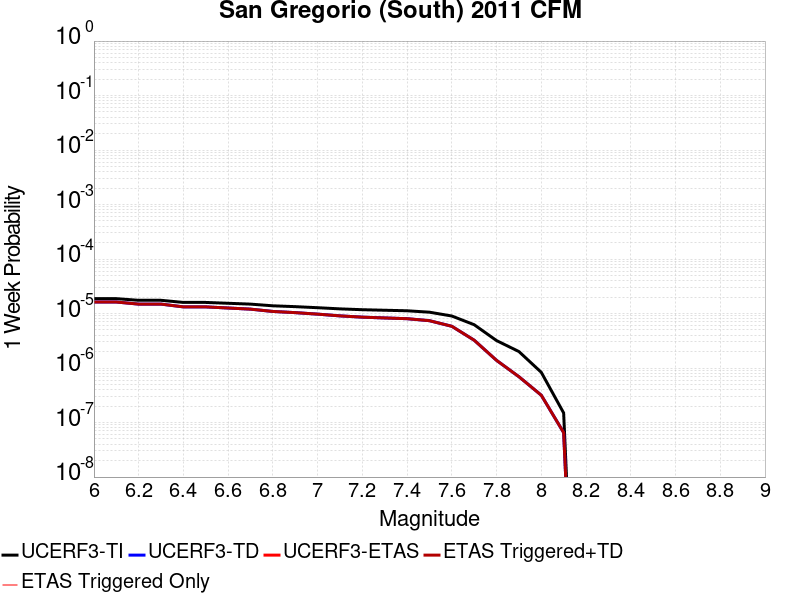 | 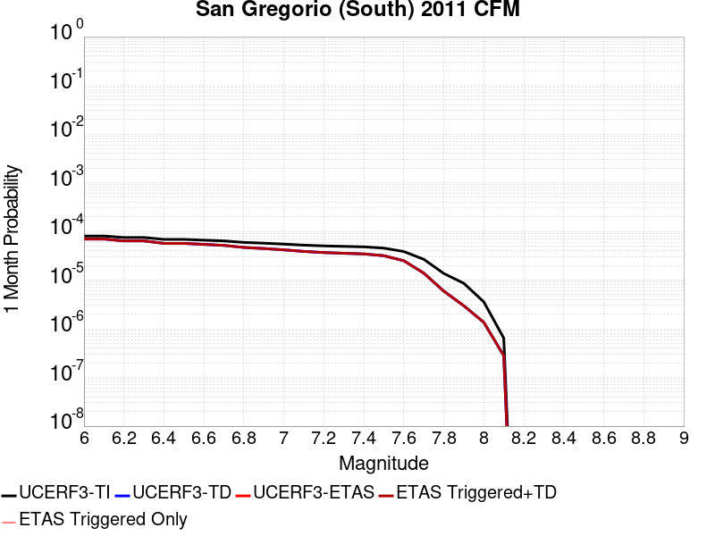 | 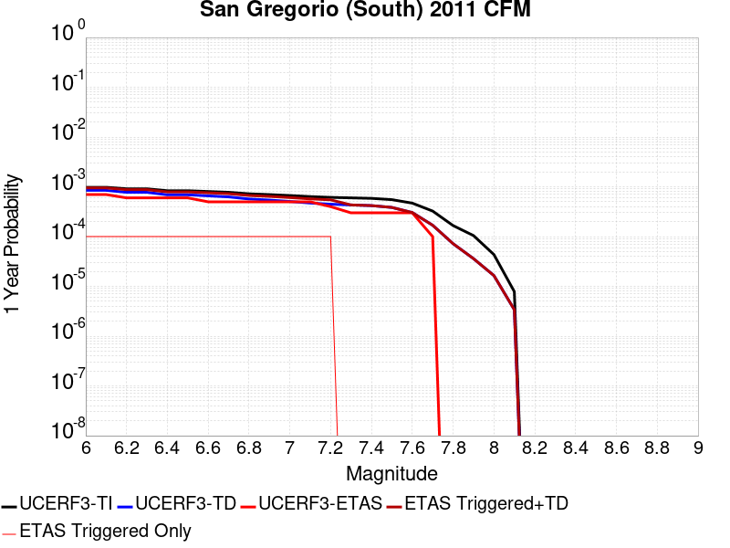 | 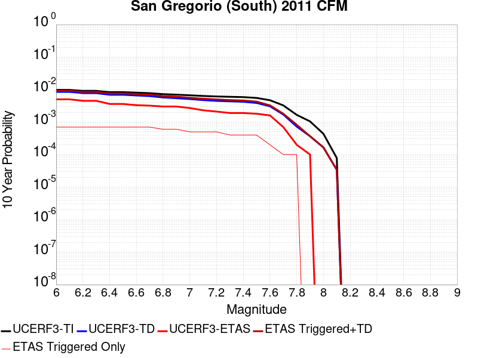 |

| Magnitude | 1 wk TI Prob | 1 wk TD Prob | 1 wk ETAS Prob | 1 wk ETAS/TD Gain | 1 wk ETAS Triggered+TD | 1 wk ETAS Triggered Only | 1 mo TI Prob | 1 mo TD Prob | 1 mo ETAS Prob | 1 mo ETAS/TD Gain | 1 mo ETAS Triggered+TD | 1 mo ETAS Triggered Only | 1 yr TI Prob | 1 yr TD Prob | 1 yr ETAS Prob | 1 yr ETAS/TD Gain | 1 yr ETAS Triggered+TD | 1 yr ETAS Triggered Only | 10 yr TI Prob | 10 yr TD Prob | 10 yr ETAS Prob | 10 yr ETAS/TD Gain | 10 yr ETAS Triggered+TD | 10 yr ETAS Triggered Only |
|-----|-----|-----|-----|-----|-----|-----|-----|-----|-----|-----|-----|-----|-----|-----|-----|-----|-----|-----|-----|-----|-----|-----|-----|-----|
| 6.0 | 1.8770423E-5 | 1.6289836E-5 | 0.0 | 0.0 | 1.6289836E-5 | 0.0 | 8.044219E-5 | 6.981173E-5 | 0.0 | 0.0 | 6.981173E-5 | 0.0 | 9.789435E-4 | 8.4963016E-4 | 7.0E-4 | 0.8238879 | 9.4954524E-4 | 1.0E-4 | 0.009746423 | 0.0084766215 | 0.005 | 0.58985764 | 0.009170688 | 7.0E-4 |
| 6.1 | 1.8770423E-5 | 1.6289836E-5 | 0.0 | 0.0 | 1.6289836E-5 | 0.0 | 8.044219E-5 | 6.981173E-5 | 0.0 | 0.0 | 6.981173E-5 | 0.0 | 9.789435E-4 | 8.4963016E-4 | 7.0E-4 | 0.8238879 | 9.4954524E-4 | 1.0E-4 | 0.009746423 | 0.0084766215 | 0.005 | 0.58985764 | 0.009170688 | 7.0E-4 |
| 6.2 | 1.7508692E-5 | 1.4909083E-5 | 0.0 | 0.0 | 1.4909083E-5 | 0.0 | 7.5035096E-5 | 6.389452E-5 | 0.0 | 0.0 | 6.389452E-5 | 0.0 | 9.1316935E-4 | 7.776412E-4 | 6.0E-4 | 0.77156407 | 8.7756343E-4 | 1.0E-4 | 0.00909426 | 0.00776192 | 0.0045 | 0.57975346 | 0.008456486 | 7.0E-4 |
| 6.3 | 1.7508692E-5 | 1.4909083E-5 | 0.0 | 0.0 | 1.4909083E-5 | 0.0 | 7.5035096E-5 | 6.389452E-5 | 0.0 | 0.0 | 6.389452E-5 | 0.0 | 9.1316935E-4 | 7.776412E-4 | 6.0E-4 | 0.77156407 | 8.7756343E-4 | 1.0E-4 | 0.00909426 | 0.00776192 | 0.0045 | 0.57975346 | 0.008456486 | 7.0E-4 |
| 6.4 | 1.6004591E-5 | 1.3258602E-5 | 0.0 | 0.0 | 1.3258602E-5 | 0.0 | 6.85893E-5 | 5.6821347E-5 | 0.0 | 0.0 | 5.6821347E-5 | 0.0 | 8.347548E-4 | 6.9158134E-4 | 6.0E-4 | 0.8675769 | 7.915122E-4 | 1.0E-4 | 0.008316261 | 0.0069068107 | 0.0036 | 0.5212247 | 0.007601976 | 7.0E-4 |
| 6.5 | 1.6004591E-5 | 1.3258602E-5 | 0.0 | 0.0 | 1.3258602E-5 | 0.0 | 6.85893E-5 | 5.6821347E-5 | 0.0 | 0.0 | 5.6821347E-5 | 0.0 | 8.347548E-4 | 6.9158134E-4 | 6.0E-4 | 0.8675769 | 7.915122E-4 | 1.0E-4 | 0.008316261 | 0.0069068107 | 0.0036 | 0.5212247 | 0.007601976 | 7.0E-4 |
| 6.6 | 1.5442201E-5 | 1.2643118E-5 | 0.0 | 0.0 | 1.2643118E-5 | 0.0 | 6.617918E-5 | 5.418367E-5 | 0.0 | 0.0 | 5.418367E-5 | 0.0 | 8.0543366E-4 | 6.594874E-4 | 5.0E-4 | 0.75816464 | 7.5942144E-4 | 1.0E-4 | 0.008025207 | 0.0065878043 | 0.0033 | 0.50092566 | 0.0072831926 | 7.0E-4 |
| 6.7 | 1.489921E-5 | 1.2051522E-5 | 0.0 | 0.0 | 1.2051522E-5 | 0.0 | 6.3852196E-5 | 5.1648363E-5 | 0.0 | 0.0 | 5.1648363E-5 | 0.0 | 7.7712315E-4 | 6.286381E-4 | 5.0E-4 | 0.79537016 | 7.285752E-4 | 1.0E-4 | 0.0077441116 | 0.0062810844 | 0.0032 | 0.5094662 | 0.006976688 | 7.0E-4 |
| 6.8 | 1.3876024E-5 | 1.0930259E-5 | 0.0 | 0.0 | 1.0930259E-5 | 0.0 | 5.9467322E-5 | 4.6843128E-5 | 0.0 | 0.0 | 4.6843128E-5 | 0.0 | 7.237741E-4 | 5.701662E-4 | 5.0E-4 | 0.87693727 | 6.701092E-4 | 1.0E-4 | 0.0072142133 | 0.0056994855 | 0.003 | 0.5263633 | 0.0062960656 | 6.0E-4 |
| 6.9 | 1.33922495E-5 | 1.04016635E-5 | 0.0 | 0.0 | 1.04016635E-5 | 0.0 | 5.7394092E-5 | 4.4577795E-5 | 0.0 | 0.0 | 4.4577795E-5 | 0.0 | 6.9854903E-4 | 5.4259977E-4 | 5.0E-4 | 0.9214895 | 6.425455E-4 | 1.0E-4 | 0.0069635725 | 0.0054251933 | 0.003 | 0.55297565 | 0.0060219383 | 6.0E-4 |
| 7.0 | 1.2807324E-5 | 9.761504E-6 | 0.0 | 0.0 | 9.761504E-6 | 0.0 | 5.4887376E-5 | 4.1834348E-5 | 0.0 | 0.0 | 4.1834348E-5 | 0.0 | 6.680489E-4 | 5.0921435E-4 | 5.0E-4 | 0.9819048 | 6.091634E-4 | 1.0E-4 | 0.006660442 | 0.0050929105 | 0.0027 | 0.5301487 | 0.0055903643 | 5.0E-4 |
| 7.1 | 1.2191438E-5 | 9.070221E-6 | 0.0 | 0.0 | 9.070221E-6 | 0.0 | 5.224797E-5 | 3.8871796E-5 | 0.0 | 0.0 | 3.8871796E-5 | 0.0 | 6.3593336E-4 | 4.7316143E-4 | 5.0E-4 | 1.0567218 | 5.731141E-4 | 1.0E-4 | 0.0063411663 | 0.004733967 | 0.0023 | 0.48585042 | 0.0052316003 | 5.0E-4 |
| 7.2 | 1.1769438E-5 | 8.590282E-6 | 0.0 | 0.0 | 8.590282E-6 | 0.0 | 5.0439474E-5 | 3.6814974E-5 | 0.0 | 0.0 | 3.6814974E-5 | 0.0 | 6.1392755E-4 | 4.4813022E-4 | 4.0E-4 | 0.89259773 | 5.480854E-4 | 1.0E-4 | 0.0061223423 | 0.0044846917 | 0.0021 | 0.4682596 | 0.0049824496 | 5.0E-4 |
| 7.3 | 1.150374E-5 | 8.305665E-6 | 0.0 | 0.0 | 8.305665E-6 | 0.0 | 4.9300812E-5 | 3.5595218E-5 | 0.0 | 0.0 | 3.5595218E-5 | 0.0 | 6.0007203E-4 | 4.3328566E-4 | 3.0E-4 | 0.6923838 | 4.3328566E-4 | 0.0 | 0.0059845424 | 0.004336813 | 0.0019 | 0.43810976 | 0.004735078 | 4.0E-4 |
| 7.4 | 1.12514E-5 | 8.051333E-6 | 0.0 | 0.0 | 8.051333E-6 | 0.0 | 4.8219394E-5 | 3.4505258E-5 | 0.0 | 0.0 | 3.4505258E-5 | 0.0 | 5.8691297E-4 | 4.2002057E-4 | 3.0E-4 | 0.71425074 | 4.2002057E-4 | 0.0 | 0.005853653 | 0.004204662 | 0.0019 | 0.45187935 | 0.0046029803 | 4.0E-4 |
| 7.5 | 1.059696E-5 | 7.4012823E-6 | 0.0 | 0.0 | 7.4012823E-6 | 0.0 | 4.5414752E-5 | 3.1719395E-5 | 0.0 | 0.0 | 3.1719395E-5 | 0.0 | 5.5278436E-4 | 3.8611528E-4 | 3.0E-4 | 0.77697 | 3.8611528E-4 | 0.0 | 0.0055141128 | 0.0038667761 | 0.0018 | 0.46550405 | 0.004265229 | 4.0E-4 |
| 7.6 | 9.018592E-6 | 5.8445057E-6 | 0.0 | 0.0 | 5.8445057E-6 | 0.0 | 3.8650534E-5 | 2.504764E-5 | 0.0 | 0.0 | 2.504764E-5 | 0.0 | 4.7046866E-4 | 3.049124E-4 | 3.0E-4 | 0.98388916 | 3.049124E-4 | 0.0 | 0.004694739 | 0.0030568838 | 0.0016 | 0.52340883 | 0.0032562725 | 2.0E-4 |
| 7.7 | 6.243489E-6 | 3.245688E-6 | 0.0 | 0.0 | 3.245688E-6 | 0.0 | 2.6757538E-5 | 1.39100175E-5 | 0.0 | 0.0 | 1.39100175E-5 | 0.0 | 3.257243E-4 | 1.693413E-4 | 1.0E-4 | 0.59052336 | 1.693413E-4 | 0.0 | 0.003252473 | 0.0017023397 | 7.0E-4 | 0.41119877 | 0.0018021696 | 1.0E-4 |
| 7.8 | 3.1941963E-6 | 1.3848004E-6 | 0.0 | 0.0 | 1.3848004E-6 | 0.0 | 1.368934E-5 | 5.9348454E-6 | 0.0 | 0.0 | 5.9348454E-6 | 0.0 | 1.6665498E-4 | 7.225435E-5 | 0.0 | 0.0 | 7.225435E-5 | 0.0 | 0.0016653005 | 7.283394E-4 | 2.0E-4 | 0.27459723 | 8.282666E-4 | 1.0E-4 |
| 7.9 | 2.0098398E-6 | 6.94457E-7 | 0.0 | 0.0 | 6.94457E-7 | 0.0 | 8.6135715E-6 | 2.976241E-6 | 0.0 | 0.0 | 2.976241E-6 | 0.0 | 1.0486518E-4 | 3.623513E-5 | 0.0 | 0.0 | 3.623513E-5 | 0.0 | 0.0010481571 | 3.672445E-4 | 1.0E-4 | 0.27229816 | 3.672445E-4 | 0.0 |
| 8.0 | 8.353119E-7 | 3.175769E-7 | 0.0 | 0.0 | 3.175769E-7 | 0.0 | 3.579903E-6 | 1.3610431E-6 | 0.0 | 0.0 | 1.3610431E-6 | 0.0 | 4.358445E-5 | 1.6570573E-5 | 0.0 | 0.0 | 1.6570573E-5 | 0.0 | 4.3575902E-4 | 1.6688838E-4 | 0.0 | 0.0 | 1.6688838E-4 | 0.0 |
| 8.1 | 1.5033264E-7 | 6.550383E-8 | 0.0 | 0.0 | 6.550383E-8 | 0.0 | 6.442826E-7 | 2.8073066E-7 | 0.0 | 0.0 | 2.8073066E-7 | 0.0 | 7.844113E-6 | 3.4178906E-6 | 0.0 | 0.0 | 3.4178906E-6 | 0.0 | 7.843835E-5 | 3.419711E-5 | 0.0 | 0.0 | 3.419711E-5 | 0.0 |

## Round Valley
*[(top)](#table-of-contents)*

| 1 Week | 1 Month | 1 Year | 10 Year |
|-----|-----|-----|-----|
| 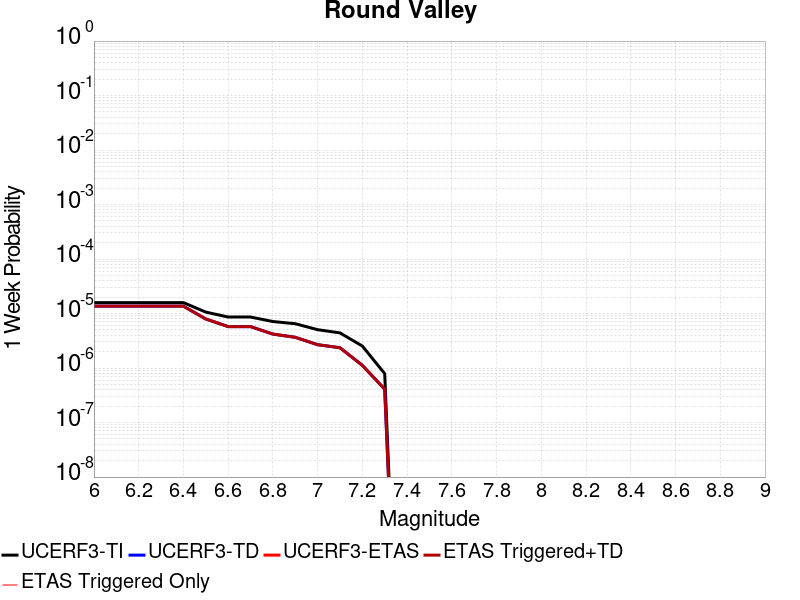 | 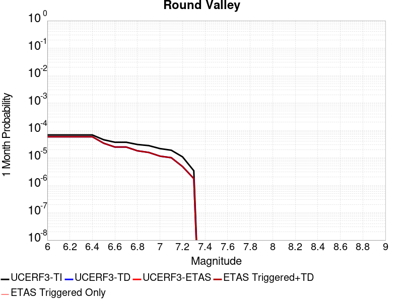 | 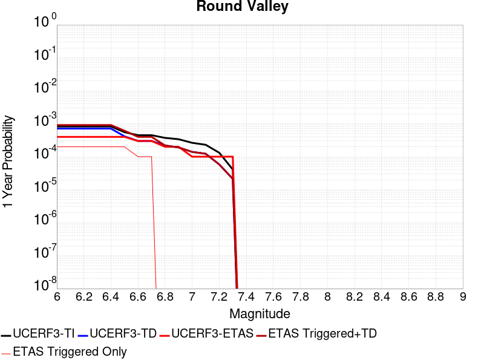 |  |

| Magnitude | 1 wk TI Prob | 1 wk TD Prob | 1 wk ETAS Prob | 1 wk ETAS/TD Gain | 1 wk ETAS Triggered+TD | 1 wk ETAS Triggered Only | 1 mo TI Prob | 1 mo TD Prob | 1 mo ETAS Prob | 1 mo ETAS/TD Gain | 1 mo ETAS Triggered+TD | 1 mo ETAS Triggered Only | 1 yr TI Prob | 1 yr TD Prob | 1 yr ETAS Prob | 1 yr ETAS/TD Gain | 1 yr ETAS Triggered+TD | 1 yr ETAS Triggered Only | 10 yr TI Prob | 10 yr TD Prob | 10 yr ETAS Prob | 10 yr ETAS/TD Gain | 10 yr ETAS Triggered+TD | 10 yr ETAS Triggered Only |
|-----|-----|-----|-----|-----|-----|-----|-----|-----|-----|-----|-----|-----|-----|-----|-----|-----|-----|-----|-----|-----|-----|-----|-----|-----|
| 6.0 | 1.588152E-5 | 1.367435E-5 | 0.0 | 0.0 | 1.367435E-5 | 0.0 | 6.806188E-5 | 5.8603266E-5 | 0.0 | 0.0 | 5.8603266E-5 | 0.0 | 8.283384E-4 | 7.133006E-4 | 4.0E-4 | 0.56077343 | 9.1315794E-4 | 2.0E-4 | 0.008252576 | 0.0071139997 | 0.003 | 0.4217037 | 0.00780902 | 7.0E-4 |
| 6.1 | 1.588152E-5 | 1.367435E-5 | 0.0 | 0.0 | 1.367435E-5 | 0.0 | 6.806188E-5 | 5.8603266E-5 | 0.0 | 0.0 | 5.8603266E-5 | 0.0 | 8.283384E-4 | 7.133006E-4 | 4.0E-4 | 0.56077343 | 9.1315794E-4 | 2.0E-4 | 0.008252576 | 0.0071139997 | 0.003 | 0.4217037 | 0.00780902 | 7.0E-4 |
| 6.2 | 1.588152E-5 | 1.367435E-5 | 0.0 | 0.0 | 1.367435E-5 | 0.0 | 6.806188E-5 | 5.8603266E-5 | 0.0 | 0.0 | 5.8603266E-5 | 0.0 | 8.283384E-4 | 7.133006E-4 | 4.0E-4 | 0.56077343 | 9.1315794E-4 | 2.0E-4 | 0.008252576 | 0.0071139997 | 0.003 | 0.4217037 | 0.00780902 | 7.0E-4 |
| 6.3 | 1.588152E-5 | 1.367435E-5 | 0.0 | 0.0 | 1.367435E-5 | 0.0 | 6.806188E-5 | 5.8603266E-5 | 0.0 | 0.0 | 5.8603266E-5 | 0.0 | 8.283384E-4 | 7.133006E-4 | 4.0E-4 | 0.56077343 | 9.1315794E-4 | 2.0E-4 | 0.008252576 | 0.0071139997 | 0.003 | 0.4217037 | 0.00780902 | 7.0E-4 |
| 6.4 | 1.588152E-5 | 1.367435E-5 | 0.0 | 0.0 | 1.367435E-5 | 0.0 | 6.806188E-5 | 5.8603266E-5 | 0.0 | 0.0 | 5.8603266E-5 | 0.0 | 8.283384E-4 | 7.133006E-4 | 4.0E-4 | 0.56077343 | 9.1315794E-4 | 2.0E-4 | 0.008252576 | 0.0071139997 | 0.003 | 0.4217037 | 0.00780902 | 7.0E-4 |
| 6.5 | 1.0646776E-5 | 7.955626E-6 | 0.0 | 0.0 | 7.955626E-6 | 0.0 | 4.5628243E-5 | 3.4095137E-5 | 0.0 | 0.0 | 3.4095137E-5 | 0.0 | 5.553823E-4 | 4.1503765E-4 | 4.0E-4 | 0.963768 | 6.149546E-4 | 2.0E-4 | 0.005539963 | 0.004143454 | 0.0017 | 0.41028568 | 0.0046413825 | 5.0E-4 |
| 6.6 | 8.632956E-6 | 5.770963E-6 | 0.0 | 0.0 | 5.770963E-6 | 0.0 | 3.6997862E-5 | 2.4732486E-5 | 0.0 | 0.0 | 2.4732486E-5 | 0.0 | 4.5035584E-4 | 3.0108023E-4 | 3.0E-4 | 0.9964121 | 4.0105014E-4 | 1.0E-4 | 0.0044944426 | 0.0030071016 | 0.0012 | 0.39905536 | 0.0032065 | 2.0E-4 |
| 6.7 | 8.632956E-6 | 5.770963E-6 | 0.0 | 0.0 | 5.770963E-6 | 0.0 | 3.6997862E-5 | 2.4732486E-5 | 0.0 | 0.0 | 2.4732486E-5 | 0.0 | 4.5035584E-4 | 3.0108023E-4 | 3.0E-4 | 0.9964121 | 4.0105014E-4 | 1.0E-4 | 0.0044944426 | 0.0030071016 | 0.0012 | 0.39905536 | 0.0032065 | 2.0E-4 |
| 6.8 | 7.143895E-6 | 4.203801E-6 | 0.0 | 0.0 | 4.203801E-6 | 0.0 | 3.0616335E-5 | 1.8016173E-5 | 0.0 | 0.0 | 1.8016173E-5 | 0.0 | 3.726901E-4 | 2.1932651E-4 | 2.0E-4 | 0.91188246 | 2.1932651E-4 | 0.0 | 0.0037206567 | 0.0021912653 | 9.0E-4 | 0.4107216 | 0.0022910463 | 1.0E-4 |
| 6.9 | 6.5120694E-6 | 3.6663123E-6 | 0.0 | 0.0 | 3.6663123E-6 | 0.0 | 2.790857E-5 | 1.5712681E-5 | 0.0 | 0.0 | 1.5712681E-5 | 0.0 | 3.3973387E-4 | 1.9128661E-4 | 2.0E-4 | 1.0455515 | 1.9128661E-4 | 0.0 | 0.0033921495 | 0.0019113687 | 8.0E-4 | 0.41854823 | 0.0019113687 | 0.0 |
| 7.0 | 5.0614435E-6 | 2.6852222E-6 | 0.0 | 0.0 | 2.6852222E-6 | 0.0 | 2.169172E-5 | 1.1508049E-5 | 0.0 | 0.0 | 1.1508049E-5 | 0.0 | 2.6406467E-4 | 1.4010252E-4 | 1.0E-4 | 0.713763 | 1.4010252E-4 | 0.0 | 0.0026375111 | 0.0014002435 | 6.0E-4 | 0.42849693 | 0.0014002435 | 0.0 |
| 7.1 | 4.41728E-6 | 2.3589153E-6 | 0.0 | 0.0 | 2.3589153E-6 | 0.0 | 1.8931061E-5 | 1.0109604E-5 | 0.0 | 0.0 | 1.0109604E-5 | 0.0 | 2.304613E-4 | 1.2307845E-4 | 1.0E-4 | 0.81248987 | 1.2307845E-4 | 0.0 | 0.0023022245 | 0.0012301995 | 6.0E-4 | 0.48772576 | 0.0012301995 | 0.0 |
| 7.2 | 2.535495E-6 | 1.1219407E-6 | 0.0 | 0.0 | 1.1219407E-6 | 0.0 | 1.0866362E-5 | 4.808311E-6 | 0.0 | 0.0 | 4.808311E-6 | 0.0 | 1.3228992E-4 | 5.854014E-5 | 1.0E-4 | 1.7082295 | 5.854014E-5 | 0.0 | 0.0013221119 | 5.8529846E-4 | 3.0E-4 | 0.512559 | 5.8529846E-4 | 0.0 |
| 7.3 | 7.900015E-7 | 4.0906667E-7 | 0.0 | 0.0 | 4.0906667E-7 | 0.0 | 3.3857161E-6 | 1.7531429E-6 | 0.0 | 0.0 | 1.7531429E-6 | 0.0 | 4.1220315E-5 | 2.1344515E-5 | 1.0E-4 | 4.685045 | 2.1344515E-5 | 0.0 | 4.121267E-4 | 2.1344515E-4 | 1.0E-4 | 0.46850446 | 2.1344515E-4 | 0.0 |

## Peralta Hills
*[(top)](#table-of-contents)*

| 1 Week | 1 Month | 1 Year | 10 Year |
|-----|-----|-----|-----|
|  |  |  |  |

| Magnitude | 1 wk TI Prob | 1 wk TD Prob | 1 wk ETAS Prob | 1 wk ETAS/TD Gain | 1 wk ETAS Triggered+TD | 1 wk ETAS Triggered Only | 1 mo TI Prob | 1 mo TD Prob | 1 mo ETAS Prob | 1 mo ETAS/TD Gain | 1 mo ETAS Triggered+TD | 1 mo ETAS Triggered Only | 1 yr TI Prob | 1 yr TD Prob | 1 yr ETAS Prob | 1 yr ETAS/TD Gain | 1 yr ETAS Triggered+TD | 1 yr ETAS Triggered Only | 10 yr TI Prob | 10 yr TD Prob | 10 yr ETAS Prob | 10 yr ETAS/TD Gain | 10 yr ETAS Triggered+TD | 10 yr ETAS Triggered Only |
|-----|-----|-----|-----|-----|-----|-----|-----|-----|-----|-----|-----|-----|-----|-----|-----|-----|-----|-----|-----|-----|-----|-----|-----|-----|
| 6.0 | 3.8850067E-6 | 3.8404196E-6 | 0.0 | 0.0 | 3.8404196E-6 | 0.0 | 1.6649923E-5 | 1.645888E-5 | 0.0 | 0.0 | 1.645888E-5 | 0.0 | 2.0269395E-4 | 2.0037586E-4 | 1.0E-4 | 0.49906212 | 3.003558E-4 | 1.0E-4 | 0.0020250916 | 0.0020026795 | 0.0019 | 0.9487289 | 0.0027012776 | 7.0E-4 |
| 6.1 | 3.8850067E-6 | 3.8404196E-6 | 0.0 | 0.0 | 3.8404196E-6 | 0.0 | 1.6649923E-5 | 1.645888E-5 | 0.0 | 0.0 | 1.645888E-5 | 0.0 | 2.0269395E-4 | 2.0037586E-4 | 1.0E-4 | 0.49906212 | 3.003558E-4 | 1.0E-4 | 0.0020250916 | 0.0020026795 | 0.0019 | 0.9487289 | 0.0027012776 | 7.0E-4 |
| 6.2 | 3.8850067E-6 | 3.8404196E-6 | 0.0 | 0.0 | 3.8404196E-6 | 0.0 | 1.6649923E-5 | 1.645888E-5 | 0.0 | 0.0 | 1.645888E-5 | 0.0 | 2.0269395E-4 | 2.0037586E-4 | 1.0E-4 | 0.49906212 | 3.003558E-4 | 1.0E-4 | 0.0020250916 | 0.0020026795 | 0.0019 | 0.9487289 | 0.0027012776 | 7.0E-4 |
| 6.3 | 3.8850067E-6 | 3.8404196E-6 | 0.0 | 0.0 | 3.8404196E-6 | 0.0 | 1.6649923E-5 | 1.645888E-5 | 0.0 | 0.0 | 1.645888E-5 | 0.0 | 2.0269395E-4 | 2.0037586E-4 | 1.0E-4 | 0.49906212 | 3.003558E-4 | 1.0E-4 | 0.0020250916 | 0.0020026795 | 0.0019 | 0.9487289 | 0.0027012776 | 7.0E-4 |
| 6.4 | 3.8850067E-6 | 3.8404196E-6 | 0.0 | 0.0 | 3.8404196E-6 | 0.0 | 1.6649923E-5 | 1.645888E-5 | 0.0 | 0.0 | 1.645888E-5 | 0.0 | 2.0269395E-4 | 2.0037586E-4 | 1.0E-4 | 0.49906212 | 3.003558E-4 | 1.0E-4 | 0.0020250916 | 0.0020026795 | 0.0019 | 0.9487289 | 0.0027012776 | 7.0E-4 |
| 6.5 | 1.5587785E-6 | 1.4438441E-6 | 0.0 | 0.0 | 1.4438441E-6 | 0.0 | 6.6804623E-6 | 6.18789E-6 | 0.0 | 0.0 | 6.18789E-6 | 0.0 | 8.133159E-5 | 7.53352E-5 | 0.0 | 0.0 | 7.53352E-5 | 0.0 | 8.1301836E-4 | 7.531206E-4 | 7.0E-4 | 0.929466 | 9.5297E-4 | 2.0E-4 |
| 6.6 | 1.5587785E-6 | 1.4438441E-6 | 0.0 | 0.0 | 1.4438441E-6 | 0.0 | 6.6804623E-6 | 6.18789E-6 | 0.0 | 0.0 | 6.18789E-6 | 0.0 | 8.133159E-5 | 7.53352E-5 | 0.0 | 0.0 | 7.53352E-5 | 0.0 | 8.1301836E-4 | 7.531206E-4 | 7.0E-4 | 0.929466 | 9.5297E-4 | 2.0E-4 |
| 6.7 | 1.5018579E-6 | 1.3844616E-6 | 0.0 | 0.0 | 1.3844616E-6 | 0.0 | 6.436518E-6 | 5.9333947E-6 | 0.0 | 0.0 | 5.9333947E-6 | 0.0 | 7.836179E-5 | 7.223692E-5 | 0.0 | 0.0 | 7.223692E-5 | 0.0 | 7.833416E-4 | 7.22158E-4 | 6.0E-4 | 0.8308431 | 8.2208577E-4 | 1.0E-4 |
| 6.8 | 1.4584314E-6 | 1.3388892E-6 | 0.0 | 0.0 | 1.3388892E-6 | 0.0 | 6.250405E-6 | 5.7380853E-6 | 0.0 | 0.0 | 5.7380853E-6 | 0.0 | 7.6096025E-5 | 6.985919E-5 | 0.0 | 0.0 | 6.985919E-5 | 0.0 | 7.6069974E-4 | 6.983957E-4 | 6.0E-4 | 0.8591118 | 7.9832587E-4 | 1.0E-4 |
| 6.9 | 1.1382393E-6 | 9.867734E-7 | 0.0 | 0.0 | 9.867734E-7 | 0.0 | 4.8781594E-6 | 4.2290226E-6 | 0.0 | 0.0 | 4.2290226E-6 | 0.0 | 5.9389975E-5 | 5.148722E-5 | 0.0 | 0.0 | 5.148722E-5 | 0.0 | 5.93741E-4 | 5.1476114E-4 | 5.0E-4 | 0.9713243 | 6.147096E-4 | 1.0E-4 |
| 7.0 | 9.970413E-7 | 8.3142413E-7 | 0.0 | 0.0 | 8.3142413E-7 | 0.0 | 4.273027E-6 | 3.5632418E-6 | 0.0 | 0.0 | 3.5632418E-6 | 0.0 | 5.2022864E-5 | 4.3381675E-5 | 0.0 | 0.0 | 4.3381675E-5 | 0.0 | 5.2010687E-4 | 4.3373887E-4 | 4.0E-4 | 0.9222139 | 5.336955E-4 | 1.0E-4 |
| 7.1 | 9.684443E-7 | 7.9985284E-7 | 0.0 | 0.0 | 7.9985284E-7 | 0.0 | 4.150469E-6 | 3.4279365E-6 | 0.0 | 0.0 | 3.4279365E-6 | 0.0 | 5.053079E-5 | 4.1734398E-5 | 0.0 | 0.0 | 4.1734398E-5 | 0.0 | 5.05193E-4 | 4.1727233E-4 | 4.0E-4 | 0.9586066 | 5.172306E-4 | 1.0E-4 |
| 7.2 | 9.240811E-7 | 7.507402E-7 | 0.0 | 0.0 | 7.507402E-7 | 0.0 | 3.960342E-6 | 3.2174544E-6 | 0.0 | 0.0 | 3.2174544E-6 | 0.0 | 4.8216094E-5 | 3.9171868E-5 | 0.0 | 0.0 | 3.9171868E-5 | 0.0 | 4.8205635E-4 | 3.9165618E-4 | 4.0E-4 | 1.0213039 | 4.91617E-4 | 1.0E-4 |
| 7.3 | 8.158643E-7 | 6.3537783E-7 | 0.0 | 0.0 | 6.3537783E-7 | 0.0 | 3.4965567E-6 | 2.7230453E-6 | 0.0 | 0.0 | 2.7230453E-6 | 0.0 | 4.2569747E-5 | 3.3152635E-5 | 0.0 | 0.0 | 3.3152635E-5 | 0.0 | 4.2561593E-4 | 3.3148305E-4 | 4.0E-4 | 1.2066982 | 4.314499E-4 | 1.0E-4 |
| 7.4 | 6.3822824E-7 | 4.798556E-7 | 0.0 | 0.0 | 4.798556E-7 | 0.0 | 2.7352612E-6 | 2.0565228E-6 | 0.0 | 0.0 | 2.0565228E-6 | 0.0 | 3.3301294E-5 | 2.5037929E-5 | 0.0 | 0.0 | 2.5037929E-5 | 0.0 | 3.3296304E-4 | 2.503562E-4 | 3.0E-4 | 1.1982925 | 3.503312E-4 | 1.0E-4 |
| 7.5 | 4.0292628E-7 | 2.7862683E-7 | 0.0 | 0.0 | 2.7862683E-7 | 0.0 | 1.7268258E-6 | 1.1941146E-6 | 0.0 | 0.0 | 1.1941146E-6 | 0.0 | 2.1023901E-5 | 1.4538277E-5 | 0.0 | 0.0 | 1.4538277E-5 | 0.0 | 2.1021912E-4 | 1.4537605E-4 | 1.0E-4 | 0.68787116 | 1.4537605E-4 | 0.0 |
| 7.6 | 3.672993E-7 | 2.4869726E-7 | 0.0 | 0.0 | 2.4869726E-7 | 0.0 | 1.5741389E-6 | 1.0658451E-6 | 0.0 | 0.0 | 1.0658451E-6 | 0.0 | 1.9164972E-5 | 1.2976614E-5 | 0.0 | 0.0 | 1.2976614E-5 | 0.0 | 1.916332E-4 | 1.2976129E-4 | 1.0E-4 | 0.77064586 | 1.2976129E-4 | 0.0 |
| 7.7 | 2.8466823E-7 | 1.7871182E-7 | 0.0 | 0.0 | 1.7871182E-7 | 0.0 | 1.2200061E-6 | 7.659077E-7 | 0.0 | 0.0 | 7.659077E-7 | 0.0 | 1.4853474E-5 | 9.324914E-6 | 0.0 | 0.0 | 9.324914E-6 | 0.0 | 1.485248E-4 | 9.324782E-5 | 1.0E-4 | 1.0724111 | 9.324782E-5 | 0.0 |

## Cleghorn
*[(top)](#table-of-contents)*

| 1 Week | 1 Month | 1 Year | 10 Year |
|-----|-----|-----|-----|
|  |  | 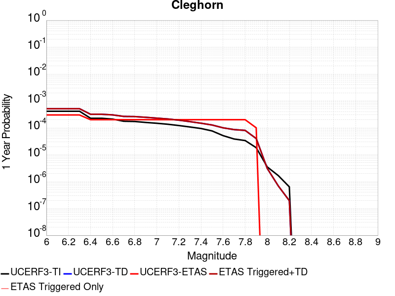 | 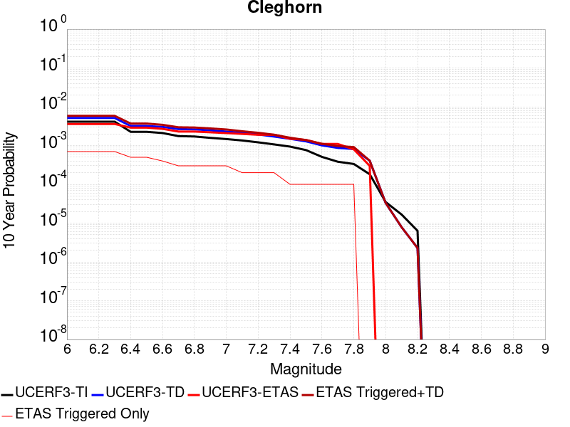 |

| Magnitude | 1 wk TI Prob | 1 wk TD Prob | 1 wk ETAS Prob | 1 wk ETAS/TD Gain | 1 wk ETAS Triggered+TD | 1 wk ETAS Triggered Only | 1 mo TI Prob | 1 mo TD Prob | 1 mo ETAS Prob | 1 mo ETAS/TD Gain | 1 mo ETAS Triggered+TD | 1 mo ETAS Triggered Only | 1 yr TI Prob | 1 yr TD Prob | 1 yr ETAS Prob | 1 yr ETAS/TD Gain | 1 yr ETAS Triggered+TD | 1 yr ETAS Triggered Only | 10 yr TI Prob | 10 yr TD Prob | 10 yr ETAS Prob | 10 yr ETAS/TD Gain | 10 yr ETAS Triggered+TD | 10 yr ETAS Triggered Only |
|-----|-----|-----|-----|-----|-----|-----|-----|-----|-----|-----|-----|-----|-----|-----|-----|-----|-----|-----|-----|-----|-----|-----|-----|-----|
| 6.0 | 7.9267165E-6 | 9.849445E-6 | 0.0 | 0.0 | 9.849445E-6 | 0.0 | 3.39712E-5 | 4.2211283E-5 | 0.0 | 0.0 | 4.2211283E-5 | 0.0 | 4.1352084E-4 | 5.138118E-4 | 3.0E-4 | 0.58387136 | 5.138118E-4 | 0.0 | 0.004127522 | 0.005141071 | 0.0036 | 0.7002432 | 0.005837472 | 7.0E-4 |
| 6.1 | 7.9267165E-6 | 9.849445E-6 | 0.0 | 0.0 | 9.849445E-6 | 0.0 | 3.39712E-5 | 4.2211283E-5 | 0.0 | 0.0 | 4.2211283E-5 | 0.0 | 4.1352084E-4 | 5.138118E-4 | 3.0E-4 | 0.58387136 | 5.138118E-4 | 0.0 | 0.004127522 | 0.005141071 | 0.0036 | 0.7002432 | 0.005837472 | 7.0E-4 |
| 6.2 | 7.9267165E-6 | 9.849445E-6 | 0.0 | 0.0 | 9.849445E-6 | 0.0 | 3.39712E-5 | 4.2211283E-5 | 0.0 | 0.0 | 4.2211283E-5 | 0.0 | 4.1352084E-4 | 5.138118E-4 | 3.0E-4 | 0.58387136 | 5.138118E-4 | 0.0 | 0.004127522 | 0.005141071 | 0.0036 | 0.7002432 | 0.005837472 | 7.0E-4 |
| 6.3 | 7.9267165E-6 | 9.849445E-6 | 0.0 | 0.0 | 9.849445E-6 | 0.0 | 3.39712E-5 | 4.2211283E-5 | 0.0 | 0.0 | 4.2211283E-5 | 0.0 | 4.1352084E-4 | 5.138118E-4 | 3.0E-4 | 0.58387136 | 5.138118E-4 | 0.0 | 0.004127522 | 0.005141071 | 0.0036 | 0.7002432 | 0.005837472 | 7.0E-4 |
| 6.4 | 4.3445207E-6 | 6.1089786E-6 | 0.0 | 0.0 | 6.1089786E-6 | 0.0 | 1.8619241E-5 | 2.618108E-5 | 0.0 | 0.0 | 2.618108E-5 | 0.0 | 2.2666567E-4 | 3.1870903E-4 | 2.0E-4 | 0.62753165 | 3.1870903E-4 | 0.0 | 0.0022643462 | 0.0031964283 | 0.0029 | 0.9072626 | 0.00369483 | 5.0E-4 |
| 6.5 | 4.3445207E-6 | 6.1089786E-6 | 0.0 | 0.0 | 6.1089786E-6 | 0.0 | 1.8619241E-5 | 2.618108E-5 | 0.0 | 0.0 | 2.618108E-5 | 0.0 | 2.2666567E-4 | 3.1870903E-4 | 2.0E-4 | 0.62753165 | 3.1870903E-4 | 0.0 | 0.0022643462 | 0.0031964283 | 0.0029 | 0.9072626 | 0.00369483 | 5.0E-4 |
| 6.6 | 4.040109E-6 | 5.791359E-6 | 0.0 | 0.0 | 5.791359E-6 | 0.0 | 1.7314638E-5 | 2.481988E-5 | 0.0 | 0.0 | 2.481988E-5 | 0.0 | 2.1078532E-4 | 3.0214107E-4 | 2.0E-4 | 0.6619425 | 3.0214107E-4 | 0.0 | 0.002105855 | 0.0030312054 | 0.0027 | 0.8907348 | 0.0034299928 | 4.0E-4 |
| 6.7 | 3.3632055E-6 | 5.0847957E-6 | 0.0 | 0.0 | 5.0847957E-6 | 0.0 | 1.4413658E-5 | 2.17918E-5 | 0.0 | 0.0 | 2.17918E-5 | 0.0 | 1.7547216E-4 | 2.652832E-4 | 2.0E-4 | 0.7539113 | 2.652832E-4 | 0.0 | 0.0017533366 | 0.0026635113 | 0.0023 | 0.86352175 | 0.0029627122 | 3.0E-4 |
| 6.8 | 3.2902772E-6 | 5.0066915E-6 | 0.0 | 0.0 | 5.0066915E-6 | 0.0 | 1.4101111E-5 | 2.1457075E-5 | 0.0 | 0.0 | 2.1457075E-5 | 0.0 | 1.716675E-4 | 2.612089E-4 | 2.0E-4 | 0.7656707 | 2.612089E-4 | 0.0 | 0.0017153495 | 0.0026228647 | 0.0023 | 0.87690383 | 0.0029220777 | 3.0E-4 |
| 6.9 | 3.031547E-6 | 4.708172E-6 | 0.0 | 0.0 | 4.708172E-6 | 0.0 | 1.299228E-5 | 2.0177726E-5 | 0.0 | 0.0 | 2.0177726E-5 | 0.0 | 1.5816953E-4 | 2.456364E-4 | 2.0E-4 | 0.8142116 | 2.456364E-4 | 0.0 | 0.00158057 | 0.0024674926 | 0.0022 | 0.89159334 | 0.0027667524 | 3.0E-4 |
| 7.0 | 2.8259715E-6 | 4.3870077E-6 | 0.0 | 0.0 | 4.3870077E-6 | 0.0 | 1.211125E-5 | 1.8801327E-5 | 0.0 | 0.0 | 1.8801327E-5 | 0.0 | 1.4744449E-4 | 2.2888236E-4 | 2.0E-4 | 0.87381136 | 2.2888236E-4 | 0.0 | 0.001473467 | 0.0023003086 | 0.0021 | 0.91292095 | 0.0025996186 | 3.0E-4 |
| 7.1 | 2.5962665E-6 | 4.081899E-6 | 0.0 | 0.0 | 4.081899E-6 | 0.0 | 1.1126809E-5 | 1.7493736E-5 | 0.0 | 0.0 | 1.7493736E-5 | 0.0 | 1.3546048E-4 | 2.1296564E-4 | 2.0E-4 | 0.9391186 | 2.1296564E-4 | 0.0 | 0.0013537793 | 0.0021414596 | 0.002 | 0.93394244 | 0.0023410313 | 2.0E-4 |
| 7.2 | 2.3247253E-6 | 3.6920392E-6 | 0.0 | 0.0 | 3.6920392E-6 | 0.0 | 9.96307E-6 | 1.582293E-5 | 0.0 | 0.0 | 1.582293E-5 | 0.0 | 1.21293626E-4 | 1.9262734E-4 | 2.0E-4 | 1.0382742 | 1.9262734E-4 | 0.0 | 0.0012122744 | 0.0019384675 | 0.0019 | 0.98015577 | 0.0021380798 | 2.0E-4 |
| 7.3 | 2.056928E-6 | 3.2498967E-6 | 0.0 | 0.0 | 3.2498967E-6 | 0.0 | 8.815376E-6 | 1.39280555E-5 | 0.0 | 0.0 | 1.39280555E-5 | 0.0 | 1.0732192E-4 | 1.6956104E-4 | 2.0E-4 | 1.1795162 | 1.6956104E-4 | 0.0 | 0.001072701 | 0.0017082454 | 0.0019 | 1.1122524 | 0.0019079038 | 2.0E-4 |
| 7.4 | 1.8055999E-6 | 2.8394848E-6 | 0.0 | 0.0 | 2.8394848E-6 | 0.0 | 7.738263E-6 | 1.2169164E-5 | 0.0 | 0.0 | 1.2169164E-5 | 0.0 | 9.4209274E-5 | 1.4814964E-4 | 2.0E-4 | 1.3499864 | 1.4814964E-4 | 0.0 | 9.4169343E-4 | 0.0014945711 | 0.0015 | 1.0036324 | 0.0015944217 | 1.0E-4 |
| 7.5 | 1.4683443E-6 | 2.438362E-6 | 0.0 | 0.0 | 2.438362E-6 | 0.0 | 6.292889E-6 | 1.0450081E-5 | 0.0 | 0.0 | 1.0450081E-5 | 0.0 | 7.661323E-5 | 1.272224E-4 | 2.0E-4 | 1.5720501 | 1.272224E-4 | 0.0 | 7.658682E-4 | 0.0012856085 | 0.0014 | 1.0889785 | 0.0013854799 | 1.0E-4 |
| 7.6 | 9.804088E-7 | 1.9136794E-6 | 0.0 | 0.0 | 1.9136794E-6 | 0.0 | 4.201745E-6 | 8.201458E-6 | 0.0 | 0.0 | 8.201458E-6 | 0.0 | 5.1155046E-5 | 9.9848214E-5 | 2.0E-4 | 2.0030403 | 9.9848214E-5 | 0.0 | 5.114327E-4 | 0.0010121858 | 0.0011 | 1.086757 | 0.0011120846 | 1.0E-4 |
| 7.7 | 7.3434086E-7 | 1.6416365E-6 | 0.0 | 0.0 | 1.6416365E-6 | 0.0 | 3.1471714E-6 | 7.0355663E-6 | 0.0 | 0.0 | 7.0355663E-6 | 0.0 | 3.831614E-5 | 8.5654676E-5 | 2.0E-4 | 2.3349571 | 8.5654676E-5 | 0.0 | 3.8309532E-4 | 8.704026E-4 | 0.0011 | 1.263783 | 9.7031554E-4 | 1.0E-4 |
| 7.8 | 6.434184E-7 | 1.5346717E-6 | 0.0 | 0.0 | 1.5346717E-6 | 0.0 | 2.7575045E-6 | 6.5771483E-6 | 0.0 | 0.0 | 6.5771483E-6 | 0.0 | 3.35721E-5 | 8.007386E-5 | 2.0E-4 | 2.497694 | 8.007386E-5 | 0.0 | 3.3567028E-4 | 8.1434054E-4 | 8.0E-4 | 0.98239 | 9.142591E-4 | 1.0E-4 |
| 7.9 | 3.4943926E-7 | 7.642757E-7 | 0.0 | 0.0 | 7.642757E-7 | 0.0 | 1.497596E-6 | 3.275463E-6 | 0.0 | 0.0 | 3.275463E-6 | 0.0 | 1.8233079E-5 | 3.9878043E-5 | 1.0E-4 | 2.5076456 | 3.9878043E-5 | 0.0 | 1.8231584E-4 | 4.0747388E-4 | 3.0E-4 | 0.73624355 | 4.0747388E-4 | 0.0 |
| 8.0 | 6.717524E-8 | 5.917771E-8 | 0.0 | 0.0 | 5.917771E-8 | 0.0 | 2.8789387E-7 | 2.5361874E-7 | 0.0 | 0.0 | 2.5361874E-7 | 0.0 | 3.505102E-6 | 3.0878039E-6 | 0.0 | 0.0 | 3.0878039E-6 | 0.0 | 3.5050467E-5 | 3.3155222E-5 | 0.0 | 0.0 | 3.3155222E-5 | 0.0 |
| 8.1 | 3.1984914E-8 | 1.3207269E-8 | 0.0 | 0.0 | 1.3207269E-8 | 0.0 | 1.370782E-7 | 5.660258E-8 | 0.0 | 0.0 | 5.660258E-8 | 0.0 | 1.6689258E-6 | 6.891362E-7 | 0.0 | 0.0 | 6.891362E-7 | 0.0 | 1.6689133E-5 | 7.88701E-6 | 0.0 | 0.0 | 7.88701E-6 | 0.0 |
| 8.2 | 1.21887656E-8 | 3.7265524E-9 | 0.0 | 0.0 | 3.7265524E-9 | 0.0 | 5.2237567E-8 | 1.5970937E-8 | 0.0 | 0.0 | 1.5970937E-8 | 0.0 | 6.359922E-7 | 1.9444614E-7 | 0.0 | 0.0 | 1.9444614E-7 | 0.0 | 6.3599036E-6 | 2.2915428E-6 | 0.0 | 0.0 | 2.2915428E-6 | 0.0 |

## San Jacinto (Clark) rev
*[(top)](#table-of-contents)*

| 1 Week | 1 Month | 1 Year | 10 Year |
|-----|-----|-----|-----|
| 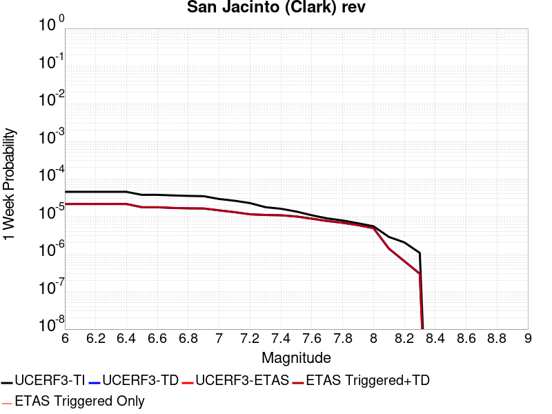 | 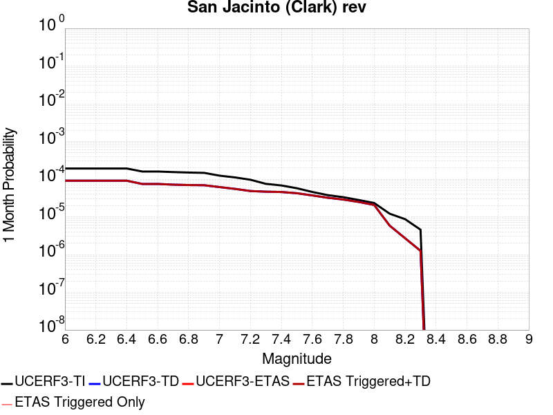 | 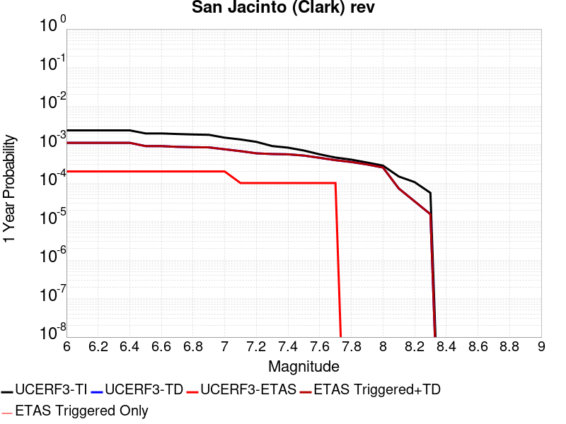 | 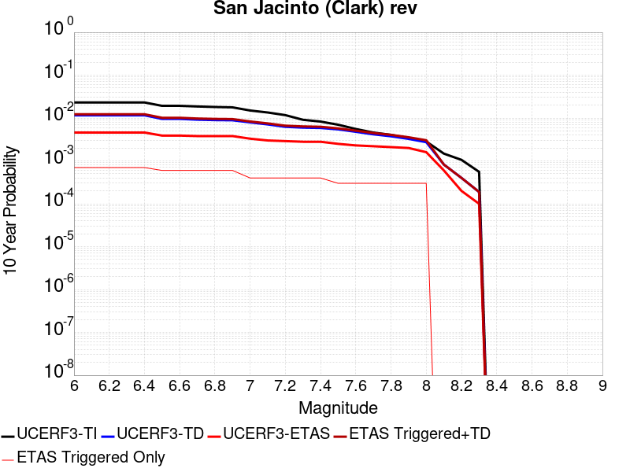 |

| Magnitude | 1 wk TI Prob | 1 wk TD Prob | 1 wk ETAS Prob | 1 wk ETAS/TD Gain | 1 wk ETAS Triggered+TD | 1 wk ETAS Triggered Only | 1 mo TI Prob | 1 mo TD Prob | 1 mo ETAS Prob | 1 mo ETAS/TD Gain | 1 mo ETAS Triggered+TD | 1 mo ETAS Triggered Only | 1 yr TI Prob | 1 yr TD Prob | 1 yr ETAS Prob | 1 yr ETAS/TD Gain | 1 yr ETAS Triggered+TD | 1 yr ETAS Triggered Only | 10 yr TI Prob | 10 yr TD Prob | 10 yr ETAS Prob | 10 yr ETAS/TD Gain | 10 yr ETAS Triggered+TD | 10 yr ETAS Triggered Only |
|-----|-----|-----|-----|-----|-----|-----|-----|-----|-----|-----|-----|-----|-----|-----|-----|-----|-----|-----|-----|-----|-----|-----|-----|-----|
| 6.0 | 4.482615E-5 | 2.1289612E-5 | 0.0 | 0.0 | 2.1289612E-5 | 0.0 | 1.9209793E-4 | 9.123806E-5 | 0.0 | 0.0 | 9.123806E-5 | 0.0 | 0.0023362834 | 0.0011102667 | 2.0E-4 | 0.1801369 | 0.0011102667 | 0.0 | 0.02311874 | 0.01158371 | 0.0046 | 0.3971094 | 0.012275602 | 7.0E-4 |
| 6.1 | 4.482615E-5 | 2.1289612E-5 | 0.0 | 0.0 | 2.1289612E-5 | 0.0 | 1.9209793E-4 | 9.123806E-5 | 0.0 | 0.0 | 9.123806E-5 | 0.0 | 0.0023362834 | 0.0011102667 | 2.0E-4 | 0.1801369 | 0.0011102667 | 0.0 | 0.02311874 | 0.01158371 | 0.0046 | 0.3971094 | 0.012275602 | 7.0E-4 |
| 6.2 | 4.482615E-5 | 2.1289612E-5 | 0.0 | 0.0 | 2.1289612E-5 | 0.0 | 1.9209793E-4 | 9.123806E-5 | 0.0 | 0.0 | 9.123806E-5 | 0.0 | 0.0023362834 | 0.0011102667 | 2.0E-4 | 0.1801369 | 0.0011102667 | 0.0 | 0.02311874 | 0.01158371 | 0.0046 | 0.3971094 | 0.012275602 | 7.0E-4 |
| 6.3 | 4.482615E-5 | 2.1289612E-5 | 0.0 | 0.0 | 2.1289612E-5 | 0.0 | 1.9209793E-4 | 9.123806E-5 | 0.0 | 0.0 | 9.123806E-5 | 0.0 | 0.0023362834 | 0.0011102667 | 2.0E-4 | 0.1801369 | 0.0011102667 | 0.0 | 0.02311874 | 0.01158371 | 0.0046 | 0.3971094 | 0.012275602 | 7.0E-4 |
| 6.4 | 4.482615E-5 | 2.1289612E-5 | 0.0 | 0.0 | 2.1289612E-5 | 0.0 | 1.9209793E-4 | 9.123806E-5 | 0.0 | 0.0 | 9.123806E-5 | 0.0 | 0.0023362834 | 0.0011102667 | 2.0E-4 | 0.1801369 | 0.0011102667 | 0.0 | 0.02311874 | 0.01158371 | 0.0046 | 0.3971094 | 0.012275602 | 7.0E-4 |
| 6.5 | 3.7294863E-5 | 1.7477574E-5 | 0.0 | 0.0 | 1.7477574E-5 | 0.0 | 1.5982533E-4 | 7.490176E-5 | 0.0 | 0.0 | 7.490176E-5 | 0.0 | 0.0019441366 | 9.11552E-4 | 2.0E-4 | 0.21940602 | 9.11552E-4 | 0.0 | 0.01927216 | 0.0095572425 | 0.0039 | 0.4080675 | 0.010151508 | 6.0E-4 |
| 6.6 | 3.7294863E-5 | 1.7477574E-5 | 0.0 | 0.0 | 1.7477574E-5 | 0.0 | 1.5982533E-4 | 7.490176E-5 | 0.0 | 0.0 | 7.490176E-5 | 0.0 | 0.0019441366 | 9.11552E-4 | 2.0E-4 | 0.21940602 | 9.11552E-4 | 0.0 | 0.01927216 | 0.0095572425 | 0.0039 | 0.4080675 | 0.010151508 | 6.0E-4 |
| 6.7 | 3.6039248E-5 | 1.6723194E-5 | 0.0 | 0.0 | 1.6723194E-5 | 0.0 | 1.5444479E-4 | 7.166889E-5 | 0.0 | 0.0 | 7.166889E-5 | 0.0 | 0.0018787434 | 8.722236E-4 | 2.0E-4 | 0.22929901 | 8.722236E-4 | 0.0 | 0.01862939 | 0.009156954 | 0.0038 | 0.41498518 | 0.00975146 | 6.0E-4 |
| 6.8 | 3.5031844E-5 | 1.6349884E-5 | 0.0 | 0.0 | 1.6349884E-5 | 0.0 | 1.5012783E-4 | 7.006908E-5 | 0.0 | 0.0 | 7.006908E-5 | 0.0 | 0.0018262739 | 8.5276127E-4 | 2.0E-4 | 0.23453222 | 8.5276127E-4 | 0.0 | 0.01811338 | 0.008955185 | 0.0038 | 0.42433518 | 0.0095498115 | 6.0E-4 |
| 6.9 | 3.435112E-5 | 1.6179305E-5 | 0.0 | 0.0 | 1.6179305E-5 | 0.0 | 1.4721078E-4 | 6.933806E-5 | 0.0 | 0.0 | 6.933806E-5 | 0.0 | 0.0017908178 | 8.43868E-4 | 2.0E-4 | 0.23700388 | 8.43868E-4 | 0.0 | 0.017764548 | 0.008862766 | 0.0038 | 0.42876002 | 0.009457449 | 6.0E-4 |
| 7.0 | 2.8959772E-5 | 1.4442946E-5 | 0.0 | 0.0 | 1.4442946E-5 | 0.0 | 1.241074E-4 | 6.1896884E-5 | 0.0 | 0.0 | 6.1896884E-5 | 0.0 | 0.0015099603 | 7.533369E-4 | 2.0E-4 | 0.2654855 | 7.533369E-4 | 0.0 | 0.014997416 | 0.007923327 | 0.0033 | 0.41649172 | 0.008320157 | 4.0E-4 |
| 7.1 | 2.6002877E-5 | 1.2925392E-5 | 0.0 | 0.0 | 1.2925392E-5 | 0.0 | 1.11436144E-4 | 5.5393375E-5 | 0.0 | 0.0 | 5.5393375E-5 | 0.0 | 0.0013558907 | 6.742078E-4 | 1.0E-4 | 0.14832222 | 6.742078E-4 | 0.0 | 0.013476475 | 0.0070987656 | 0.003 | 0.4226087 | 0.0074959258 | 4.0E-4 |
| 7.2 | 2.2544838E-5 | 1.1349891E-5 | 0.0 | 0.0 | 1.1349891E-5 | 0.0 | 9.661716E-5 | 4.864149E-5 | 0.0 | 0.0 | 4.864149E-5 | 0.0 | 0.001175679 | 5.9205067E-4 | 1.0E-4 | 0.16890445 | 5.9205067E-4 | 0.0 | 0.011694785 | 0.0062387455 | 0.0029 | 0.46483704 | 0.00663625 | 4.0E-4 |
| 7.3 | 1.75334E-5 | 1.0893323E-5 | 0.0 | 0.0 | 1.0893323E-5 | 0.0 | 7.514098E-5 | 4.668484E-5 | 0.0 | 0.0 | 4.668484E-5 | 0.0 | 9.144575E-4 | 5.682411E-4 | 1.0E-4 | 0.17598164 | 5.682411E-4 | 0.0 | 0.009107036 | 0.005976873 | 0.0028 | 0.4684724 | 0.0063744825 | 4.0E-4 |
| 7.4 | 1.5924552E-5 | 1.0691388E-5 | 0.0 | 0.0 | 1.0691388E-5 | 0.0 | 6.82463E-5 | 4.5819434E-5 | 0.0 | 0.0 | 4.5819434E-5 | 0.0 | 8.305819E-4 | 5.577102E-4 | 1.0E-4 | 0.17930458 | 5.577102E-4 | 0.0 | 0.008274844 | 0.0058632363 | 0.0028 | 0.47755194 | 0.006260891 | 4.0E-4 |
| 7.5 | 1.3428931E-5 | 9.927141E-6 | 0.0 | 0.0 | 9.927141E-6 | 0.0 | 5.7551293E-5 | 4.2544205E-5 | 0.0 | 0.0 | 4.2544205E-5 | 0.0 | 7.004617E-4 | 5.1785365E-4 | 1.0E-4 | 0.19310474 | 5.1785365E-4 | 0.0 | 0.006982579 | 0.005446472 | 0.0025 | 0.45901272 | 0.005744838 | 3.0E-4 |
| 7.6 | 1.0688787E-5 | 8.6807E-6 | 0.0 | 0.0 | 8.6807E-6 | 0.0 | 4.5808283E-5 | 3.7202473E-5 | 0.0 | 0.0 | 3.7202473E-5 | 0.0 | 5.5757316E-4 | 4.5284646E-4 | 1.0E-4 | 0.22082539 | 4.5284646E-4 | 0.0 | 0.005561762 | 0.00477653 | 0.0023 | 0.4815211 | 0.005075097 | 3.0E-4 |
| 7.7 | 8.81236E-6 | 7.531689E-6 | 0.0 | 0.0 | 7.531689E-6 | 0.0 | 3.776671E-5 | 3.227827E-5 | 0.0 | 0.0 | 3.227827E-5 | 0.0 | 4.597127E-4 | 3.9291725E-4 | 1.0E-4 | 0.2545065 | 3.9291725E-4 | 0.0 | 0.0045876284 | 0.004168626 | 0.0022 | 0.5277518 | 0.0044673756 | 3.0E-4 |
| 7.8 | 7.780431E-6 | 6.7567134E-6 | 0.0 | 0.0 | 6.7567134E-6 | 0.0 | 3.3344273E-5 | 2.8957022E-5 | 0.0 | 0.0 | 2.8957022E-5 | 0.0 | 4.0589093E-4 | 3.5249488E-4 | 0.0 | 0.0 | 3.5249488E-4 | 0.0 | 0.0040515037 | 0.0037549231 | 0.0021 | 0.5592658 | 0.0040537966 | 3.0E-4 |
| 7.9 | 6.5437994E-6 | 5.836512E-6 | 0.0 | 0.0 | 5.836512E-6 | 0.0 | 2.8044553E-5 | 2.5013383E-5 | 0.0 | 0.0 | 2.5013383E-5 | 0.0 | 3.4138895E-4 | 3.0449557E-4 | 0.0 | 0.0 | 3.0449557E-4 | 0.0 | 0.0034086495 | 0.0032644933 | 0.002 | 0.6126525 | 0.003563514 | 3.0E-4 |
| 8.0 | 5.4488164E-6 | 4.863121E-6 | 0.0 | 0.0 | 4.863121E-6 | 0.0 | 2.3351862E-5 | 2.084178E-5 | 0.0 | 0.0 | 2.084178E-5 | 0.0 | 2.8427184E-4 | 2.5371928E-4 | 0.0 | 0.0 | 2.5371928E-4 | 0.0 | 0.0028390845 | 0.0027375093 | 0.0016 | 0.5844729 | 0.003036688 | 3.0E-4 |
| 8.1 | 2.8397242E-6 | 1.3866124E-6 | 0.0 | 0.0 | 1.3866124E-6 | 0.0 | 1.217019E-5 | 5.942611E-6 | 0.0 | 0.0 | 5.942611E-6 | 0.0 | 1.4816198E-4 | 7.23489E-5 | 0.0 | 0.0 | 7.23489E-5 | 0.0 | 0.0014806325 | 8.2257093E-4 | 6.0E-4 | 0.72942036 | 8.2257093E-4 | 0.0 |
| 8.2 | 2.030244E-6 | 6.4299826E-7 | 0.0 | 0.0 | 6.4299826E-7 | 0.0 | 8.701017E-6 | 2.755704E-6 | 0.0 | 0.0 | 2.755704E-6 | 0.0 | 1.05929736E-4 | 3.3550186E-5 | 0.0 | 0.0 | 3.3550186E-5 | 0.0 | 0.0010587925 | 4.0133088E-4 | 2.0E-4 | 0.49834192 | 4.0133088E-4 | 0.0 |
| 8.3 | 1.0659804E-6 | 2.979177E-7 | 0.0 | 0.0 | 2.979177E-7 | 0.0 | 4.568479E-6 | 1.2767895E-6 | 0.0 | 0.0 | 1.2767895E-6 | 0.0 | 5.5619817E-5 | 1.5544805E-5 | 0.0 | 0.0 | 1.5544805E-5 | 0.0 | 5.5605895E-4 | 1.8887587E-4 | 1.0E-4 | 0.5294483 | 1.8887587E-4 | 0.0 |

## Morales (East)
*[(top)](#table-of-contents)*

| 1 Week | 1 Month | 1 Year | 10 Year |
|-----|-----|-----|-----|
| 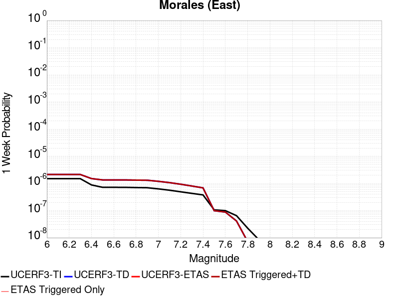 | 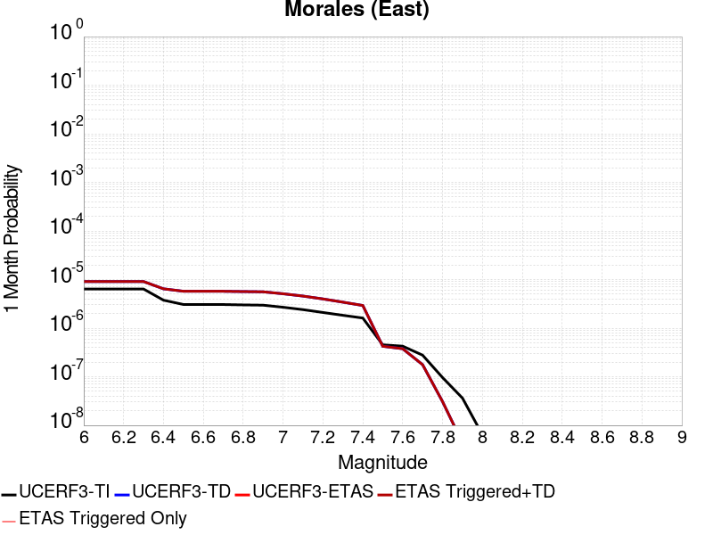 | 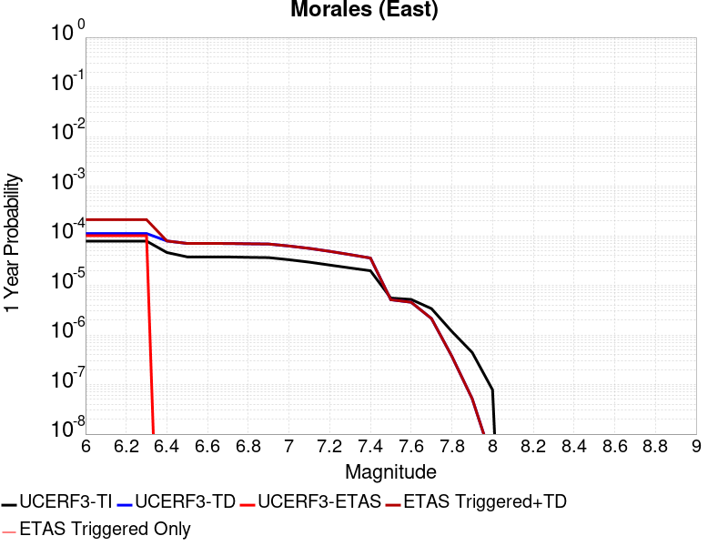 | 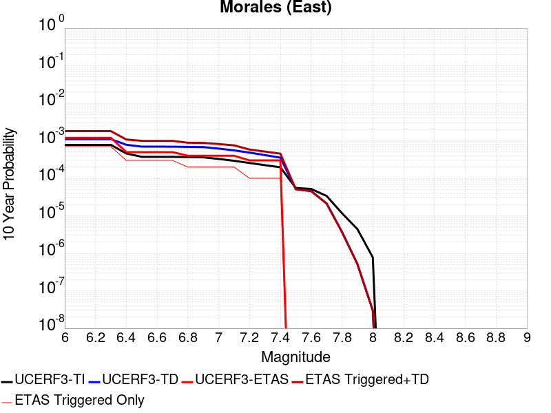 |

| Magnitude | 1 wk TI Prob | 1 wk TD Prob | 1 wk ETAS Prob | 1 wk ETAS/TD Gain | 1 wk ETAS Triggered+TD | 1 wk ETAS Triggered Only | 1 mo TI Prob | 1 mo TD Prob | 1 mo ETAS Prob | 1 mo ETAS/TD Gain | 1 mo ETAS Triggered+TD | 1 mo ETAS Triggered Only | 1 yr TI Prob | 1 yr TD Prob | 1 yr ETAS Prob | 1 yr ETAS/TD Gain | 1 yr ETAS Triggered+TD | 1 yr ETAS Triggered Only | 10 yr TI Prob | 10 yr TD Prob | 10 yr ETAS Prob | 10 yr ETAS/TD Gain | 10 yr ETAS Triggered+TD | 10 yr ETAS Triggered Only |
|-----|-----|-----|-----|-----|-----|-----|-----|-----|-----|-----|-----|-----|-----|-----|-----|-----|-----|-----|-----|-----|-----|-----|-----|-----|
| 6.0 | 1.4942771E-6 | 2.1286758E-6 | 0.0 | 0.0 | 2.1286758E-6 | 0.0 | 6.404029E-6 | 9.122868E-6 | 0.0 | 0.0 | 9.122868E-6 | 0.0 | 7.7966266E-5 | 1.11065834E-4 | 1.0E-4 | 0.9003669 | 2.1105472E-4 | 1.0E-4 | 7.793892E-4 | 0.001110163 | 0.0012 | 1.0809222 | 0.001809386 | 7.0E-4 |
| 6.1 | 1.4942771E-6 | 2.1286758E-6 | 0.0 | 0.0 | 2.1286758E-6 | 0.0 | 6.404029E-6 | 9.122868E-6 | 0.0 | 0.0 | 9.122868E-6 | 0.0 | 7.7966266E-5 | 1.11065834E-4 | 1.0E-4 | 0.9003669 | 2.1105472E-4 | 1.0E-4 | 7.793892E-4 | 0.001110163 | 0.0012 | 1.0809222 | 0.001809386 | 7.0E-4 |
| 6.2 | 1.4942771E-6 | 2.1286758E-6 | 0.0 | 0.0 | 2.1286758E-6 | 0.0 | 6.404029E-6 | 9.122868E-6 | 0.0 | 0.0 | 9.122868E-6 | 0.0 | 7.7966266E-5 | 1.11065834E-4 | 1.0E-4 | 0.9003669 | 2.1105472E-4 | 1.0E-4 | 7.793892E-4 | 0.001110163 | 0.0012 | 1.0809222 | 0.001809386 | 7.0E-4 |
| 6.3 | 1.4942771E-6 | 2.1286758E-6 | 0.0 | 0.0 | 2.1286758E-6 | 0.0 | 6.404029E-6 | 9.122868E-6 | 0.0 | 0.0 | 9.122868E-6 | 0.0 | 7.7966266E-5 | 1.11065834E-4 | 1.0E-4 | 0.9003669 | 2.1105472E-4 | 1.0E-4 | 7.793892E-4 | 0.001110163 | 0.0012 | 1.0809222 | 0.001809386 | 7.0E-4 |
| 6.4 | 8.798845E-7 | 1.5074562E-6 | 0.0 | 0.0 | 1.5074562E-6 | 0.0 | 3.7709283E-6 | 6.460511E-6 | 0.0 | 0.0 | 6.460511E-6 | 0.0 | 4.5910085E-5 | 7.8654E-5 | 0.0 | 0.0 | 7.8654E-5 | 0.0 | 4.59006E-4 | 7.862751E-4 | 5.0E-4 | 0.63590974 | 0.0010860392 | 3.0E-4 |
| 6.5 | 7.1751725E-7 | 1.343603E-6 | 0.0 | 0.0 | 1.343603E-6 | 0.0 | 3.0750705E-6 | 5.758286E-6 | 0.0 | 0.0 | 5.758286E-6 | 0.0 | 3.7438338E-5 | 7.010496E-5 | 0.0 | 0.0 | 7.010496E-5 | 0.0 | 3.743203E-4 | 7.0083863E-4 | 5.0E-4 | 0.71343094 | 0.0010006285 | 3.0E-4 |
| 6.6 | 7.1751725E-7 | 1.343603E-6 | 0.0 | 0.0 | 1.343603E-6 | 0.0 | 3.0750705E-6 | 5.758286E-6 | 0.0 | 0.0 | 5.758286E-6 | 0.0 | 3.7438338E-5 | 7.010496E-5 | 0.0 | 0.0 | 7.010496E-5 | 0.0 | 3.743203E-4 | 7.0083863E-4 | 5.0E-4 | 0.71343094 | 0.0010006285 | 3.0E-4 |
| 6.7 | 7.159057E-7 | 1.3410661E-6 | 0.0 | 0.0 | 1.3410661E-6 | 0.0 | 3.0681638E-6 | 5.747414E-6 | 0.0 | 0.0 | 5.747414E-6 | 0.0 | 3.7354253E-5 | 6.997259E-5 | 0.0 | 0.0 | 6.997259E-5 | 0.0 | 3.7347974E-4 | 6.9951586E-4 | 5.0E-4 | 0.71478003 | 9.99306E-4 | 3.0E-4 |
| 6.8 | 7.032203E-7 | 1.3225892E-6 | 0.0 | 0.0 | 1.3225892E-6 | 0.0 | 3.0137978E-6 | 5.668228E-6 | 0.0 | 0.0 | 5.668228E-6 | 0.0 | 3.669237E-5 | 6.9008565E-5 | 0.0 | 0.0 | 6.9008565E-5 | 0.0 | 3.6686313E-4 | 6.8988156E-4 | 4.0E-4 | 0.57980967 | 8.8974356E-4 | 2.0E-4 |
| 6.9 | 6.941549E-7 | 1.3076225E-6 | 0.0 | 0.0 | 1.3076225E-6 | 0.0 | 2.974946E-6 | 5.604085E-6 | 0.0 | 0.0 | 5.604085E-6 | 0.0 | 3.6219368E-5 | 6.822767E-5 | 0.0 | 0.0 | 6.822767E-5 | 0.0 | 3.6213463E-4 | 6.820774E-4 | 4.0E-4 | 0.58644366 | 8.8194106E-4 | 2.0E-4 |
| 7.0 | 6.2932247E-7 | 1.1926379E-6 | 0.0 | 0.0 | 1.1926379E-6 | 0.0 | 2.6970936E-6 | 5.1112956E-6 | 0.0 | 0.0 | 5.1112956E-6 | 0.0 | 3.283662E-5 | 6.222831E-5 | 0.0 | 0.0 | 6.222831E-5 | 0.0 | 3.283177E-4 | 6.2211783E-4 | 4.0E-4 | 0.642965 | 8.219934E-4 | 2.0E-4 |
| 7.1 | 5.6200963E-7 | 1.0687002E-6 | 0.0 | 0.0 | 1.0687002E-6 | 0.0 | 2.4086105E-6 | 4.5801357E-6 | 0.0 | 0.0 | 4.5801357E-6 | 0.0 | 2.9324437E-5 | 5.576177E-5 | 0.0 | 0.0 | 5.576177E-5 | 0.0 | 2.9320567E-4 | 5.574851E-4 | 4.0E-4 | 0.71750796 | 7.5737364E-4 | 2.0E-4 |
| 7.2 | 4.91044E-7 | 9.3297905E-7 | 0.0 | 0.0 | 9.3297905E-7 | 0.0 | 2.1044725E-6 | 3.9984757E-6 | 0.0 | 0.0 | 3.9984757E-6 | 0.0 | 2.5621652E-5 | 4.868039E-5 | 0.0 | 0.0 | 4.868039E-5 | 0.0 | 2.56187E-4 | 4.8670365E-4 | 3.0E-4 | 0.61639154 | 5.86655E-4 | 1.0E-4 |
| 7.3 | 4.2978448E-7 | 8.013609E-7 | 0.0 | 0.0 | 8.013609E-7 | 0.0 | 1.8419321E-6 | 3.4343993E-6 | 0.0 | 0.0 | 3.4343993E-6 | 0.0 | 2.2425293E-5 | 4.181304E-5 | 0.0 | 0.0 | 4.181304E-5 | 0.0 | 2.242303E-4 | 4.1805743E-4 | 3.0E-4 | 0.71760476 | 5.1801564E-4 | 1.0E-4 |
| 7.4 | 3.774317E-7 | 6.842376E-7 | 0.0 | 0.0 | 6.842376E-7 | 0.0 | 1.6175634E-6 | 2.9324435E-6 | 0.0 | 0.0 | 2.9324435E-6 | 0.0 | 1.9693656E-5 | 3.5701945E-5 | 0.0 | 0.0 | 3.5701945E-5 | 0.0 | 1.969191E-4 | 3.5696742E-4 | 3.0E-4 | 0.8404128 | 4.5693174E-4 | 1.0E-4 |
| 7.5 | 1.0603232E-7 | 9.9119376E-8 | 0.0 | 0.0 | 9.9119376E-8 | 0.0 | 4.5442414E-7 | 4.2479726E-7 | 0.0 | 0.0 | 4.2479726E-7 | 0.0 | 5.5326E-6 | 5.1718944E-6 | 0.0 | 0.0 | 5.1718944E-6 | 0.0 | 5.532462E-5 | 5.1720333E-5 | 0.0 | 0.0 | 5.1720333E-5 | 0.0 |
| 7.6 | 9.960384E-8 | 8.820406E-8 | 0.0 | 0.0 | 8.820406E-8 | 0.0 | 4.2687353E-7 | 3.7801735E-7 | 0.0 | 0.0 | 3.7801735E-7 | 0.0 | 5.197173E-6 | 4.6023515E-6 | 0.0 | 0.0 | 4.6023515E-6 | 0.0 | 5.1970514E-5 | 4.6025154E-5 | 0.0 | 0.0 | 4.6025154E-5 | 0.0 |
| 7.7 | 6.499468E-8 | 4.140427E-8 | 0.0 | 0.0 | 4.140427E-8 | 0.0 | 2.785486E-7 | 1.7744686E-7 | 0.0 | 0.0 | 1.7744686E-7 | 0.0 | 3.3913238E-6 | 2.1604135E-6 | 0.0 | 0.0 | 2.1604135E-6 | 0.0 | 3.3912722E-5 | 2.160651E-5 | 0.0 | 0.0 | 2.160651E-5 | 0.0 |
| 7.8 | 2.2517119E-8 | 7.2034965E-9 | 0.0 | 0.0 | 7.2034965E-9 | 0.0 | 9.6501935E-8 | 3.0872126E-8 | 0.0 | 0.0 | 3.0872126E-8 | 0.0 | 1.1749105E-6 | 3.7586807E-7 | 0.0 | 0.0 | 3.7586807E-7 | 0.0 | 1.1749043E-5 | 3.7612358E-6 | 0.0 | 0.0 | 3.7612358E-6 | 0.0 |
| 7.9 | 8.493023E-9 | 1.0131086E-9 | 0.0 | 0.0 | 1.0131086E-9 | 0.0 | 3.639867E-8 | 4.3418913E-9 | 0.0 | 0.0 | 4.3418913E-9 | 0.0 | 4.4315374E-7 | 5.2862532E-8 | 0.0 | 0.0 | 5.2862532E-8 | 0.0 | 4.4315284E-6 | 5.3075394E-7 | 0.0 | 0.0 | 5.3075394E-7 | 0.0 |
| 8.0 | 1.4971842E-9 | 5.7158944E-11 | 0.0 | 0.0 | 5.7158944E-11 | 0.0 | 6.4165038E-9 | 2.449666E-10 | 0.0 | 0.0 | 2.449666E-10 | 0.0 | 7.812093E-8 | 2.9824656E-9 | 0.0 | 0.0 | 2.9824656E-9 | 0.0 | 7.81209E-7 | 3.1104456E-8 | 0.0 | 0.0 | 3.1104456E-8 | 0.0 |

## Collayami 2011 CFM
*[(top)](#table-of-contents)*

| 1 Week | 1 Month | 1 Year | 10 Year |
|-----|-----|-----|-----|
|  | 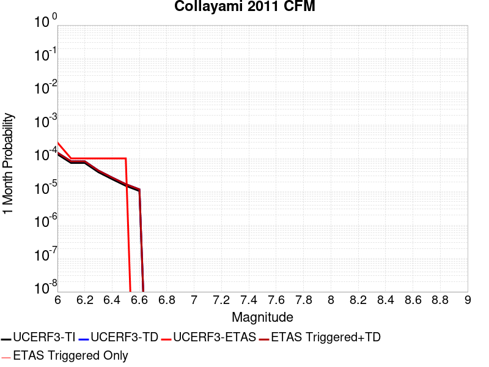 |  | 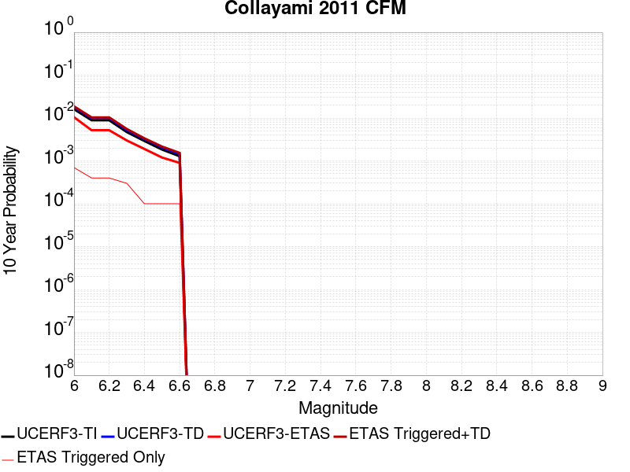 |

| Magnitude | 1 wk TI Prob | 1 wk TD Prob | 1 wk ETAS Prob | 1 wk ETAS/TD Gain | 1 wk ETAS Triggered+TD | 1 wk ETAS Triggered Only | 1 mo TI Prob | 1 mo TD Prob | 1 mo ETAS Prob | 1 mo ETAS/TD Gain | 1 mo ETAS Triggered+TD | 1 mo ETAS Triggered Only | 1 yr TI Prob | 1 yr TD Prob | 1 yr ETAS Prob | 1 yr ETAS/TD Gain | 1 yr ETAS Triggered+TD | 1 yr ETAS Triggered Only | 10 yr TI Prob | 10 yr TD Prob | 10 yr ETAS Prob | 10 yr ETAS/TD Gain | 10 yr ETAS Triggered+TD | 10 yr ETAS Triggered Only |
|-----|-----|-----|-----|-----|-----|-----|-----|-----|-----|-----|-----|-----|-----|-----|-----|-----|-----|-----|-----|-----|-----|-----|-----|-----|
| 6.0 | 3.112429E-5 | 3.494707E-5 | 2.0E-4 | 5.722941 | 3.494707E-5 | 0.0 | 1.33383E-4 | 1.4976553E-4 | 3.0E-4 | 2.0031312 | 1.4976553E-4 | 0.0 | 0.0016227282 | 0.0018220444 | 0.0014 | 0.7683677 | 0.00202168 | 2.0E-4 | 0.016109297 | 0.018088594 | 0.0105 | 0.5804763 | 0.018775932 | 7.0E-4 |
| 6.1 | 1.7119446E-5 | 1.916114E-5 | 0.0 | 0.0 | 1.916114E-5 | 0.0 | 7.336699E-5 | 8.2116916E-5 | 1.0E-4 | 1.2177758 | 8.2116916E-5 | 0.0 | 8.92877E-4 | 9.993741E-4 | 9.0E-4 | 0.90056366 | 0.0010992741 | 1.0E-4 | 0.00889298 | 0.009954681 | 0.0052 | 0.52236736 | 0.010350699 | 4.0E-4 |
| 6.2 | 1.7119446E-5 | 1.916114E-5 | 0.0 | 0.0 | 1.916114E-5 | 0.0 | 7.336699E-5 | 8.2116916E-5 | 1.0E-4 | 1.2177758 | 8.2116916E-5 | 0.0 | 8.92877E-4 | 9.993741E-4 | 9.0E-4 | 0.90056366 | 0.0010992741 | 1.0E-4 | 0.00889298 | 0.009954681 | 0.0052 | 0.52236736 | 0.010350699 | 4.0E-4 |
| 6.3 | 9.041288E-6 | 1.0108457E-5 | 0.0 | 0.0 | 1.0108457E-5 | 0.0 | 3.87478E-5 | 4.332136E-5 | 1.0E-4 | 2.30833 | 4.332136E-5 | 0.0 | 4.7165234E-4 | 5.2733184E-4 | 5.0E-4 | 0.9481695 | 6.272791E-4 | 1.0E-4 | 0.0047065257 | 0.0052629644 | 0.003 | 0.570021 | 0.0055613853 | 3.0E-4 |
| 6.4 | 5.5972064E-6 | 6.2595122E-6 | 0.0 | 0.0 | 6.2595122E-6 | 0.0 | 2.3987806E-5 | 2.6826283E-5 | 1.0E-4 | 3.7276876 | 2.6826283E-5 | 0.0 | 2.920124E-4 | 3.2657463E-4 | 4.0E-4 | 1.2248348 | 3.2657463E-4 | 0.0 | 0.0029162897 | 0.003262282 | 0.0019 | 0.5824144 | 0.003361956 | 1.0E-4 |
| 6.5 | 3.530659E-6 | 3.952984E-6 | 0.0 | 0.0 | 3.952984E-6 | 0.0 | 1.5131307E-5 | 1.694131E-5 | 1.0E-4 | 5.9027314 | 1.694131E-5 | 0.0 | 1.842081E-4 | 2.0625132E-4 | 3.0E-4 | 1.4545362 | 2.0625132E-4 | 0.0 | 0.0018405546 | 0.0020616183 | 0.0012 | 0.5820671 | 0.002161412 | 1.0E-4 |
| 6.6 | 2.4625563E-6 | 2.7579204E-6 | 0.0 | 0.0 | 2.7579204E-6 | 0.0 | 1.0553769E-5 | 1.18196585E-5 | 0.0 | 0.0 | 1.18196585E-5 | 0.0 | 1.2848456E-4 | 1.4390434E-4 | 1.0E-4 | 0.69490606 | 1.4390434E-4 | 0.0 | 0.001284103 | 0.0014390433 | 9.0E-4 | 0.6254155 | 0.0015388995 | 1.0E-4 |

## Hollywood
*[(top)](#table-of-contents)*

| 1 Week | 1 Month | 1 Year | 10 Year |
|-----|-----|-----|-----|
| 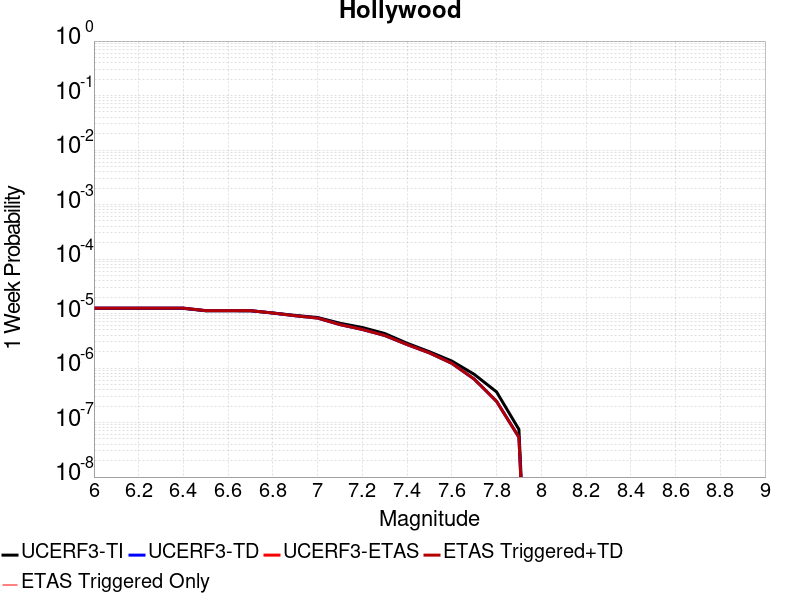 | 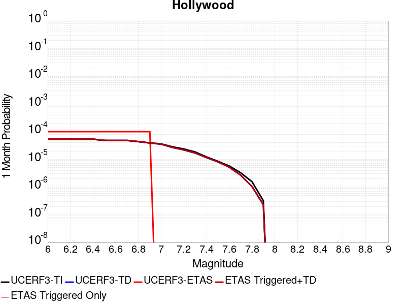 | 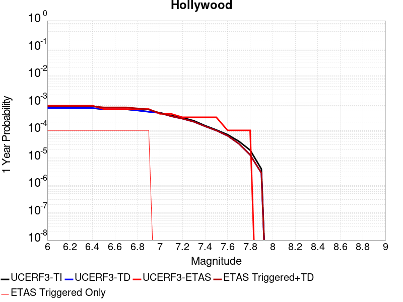 | 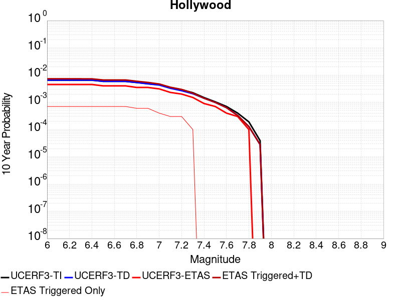 |

| Magnitude | 1 wk TI Prob | 1 wk TD Prob | 1 wk ETAS Prob | 1 wk ETAS/TD Gain | 1 wk ETAS Triggered+TD | 1 wk ETAS Triggered Only | 1 mo TI Prob | 1 mo TD Prob | 1 mo ETAS Prob | 1 mo ETAS/TD Gain | 1 mo ETAS Triggered+TD | 1 mo ETAS Triggered Only | 1 yr TI Prob | 1 yr TD Prob | 1 yr ETAS Prob | 1 yr ETAS/TD Gain | 1 yr ETAS Triggered+TD | 1 yr ETAS Triggered Only | 10 yr TI Prob | 10 yr TD Prob | 10 yr ETAS Prob | 10 yr ETAS/TD Gain | 10 yr ETAS Triggered+TD | 10 yr ETAS Triggered Only |
|-----|-----|-----|-----|-----|-----|-----|-----|-----|-----|-----|-----|-----|-----|-----|-----|-----|-----|-----|-----|-----|-----|-----|-----|-----|
| 6.0 | 1.24487615E-5 | 1.259569E-5 | 0.0 | 0.0 | 1.259569E-5 | 0.0 | 5.3350745E-5 | 5.398044E-5 | 1.0E-4 | 1.852523 | 5.398044E-5 | 0.0 | 6.4935174E-4 | 6.5701833E-4 | 8.0E-4 | 1.217622 | 7.569526E-4 | 1.0E-4 | 0.0064745755 | 0.0065512466 | 0.0045 | 0.6868922 | 0.0072466605 | 7.0E-4 |
| 6.1 | 1.24487615E-5 | 1.259569E-5 | 0.0 | 0.0 | 1.259569E-5 | 0.0 | 5.3350745E-5 | 5.398044E-5 | 1.0E-4 | 1.852523 | 5.398044E-5 | 0.0 | 6.4935174E-4 | 6.5701833E-4 | 8.0E-4 | 1.217622 | 7.569526E-4 | 1.0E-4 | 0.0064745755 | 0.0065512466 | 0.0045 | 0.6868922 | 0.0072466605 | 7.0E-4 |
| 6.2 | 1.24487615E-5 | 1.259569E-5 | 0.0 | 0.0 | 1.259569E-5 | 0.0 | 5.3350745E-5 | 5.398044E-5 | 1.0E-4 | 1.852523 | 5.398044E-5 | 0.0 | 6.4935174E-4 | 6.5701833E-4 | 8.0E-4 | 1.217622 | 7.569526E-4 | 1.0E-4 | 0.0064745755 | 0.0065512466 | 0.0045 | 0.6868922 | 0.0072466605 | 7.0E-4 |
| 6.3 | 1.24487615E-5 | 1.259569E-5 | 0.0 | 0.0 | 1.259569E-5 | 0.0 | 5.3350745E-5 | 5.398044E-5 | 1.0E-4 | 1.852523 | 5.398044E-5 | 0.0 | 6.4935174E-4 | 6.5701833E-4 | 8.0E-4 | 1.217622 | 7.569526E-4 | 1.0E-4 | 0.0064745755 | 0.0065512466 | 0.0045 | 0.6868922 | 0.0072466605 | 7.0E-4 |
| 6.4 | 1.2431024E-5 | 1.25763E-5 | 0.0 | 0.0 | 1.25763E-5 | 0.0 | 5.327473E-5 | 5.389734E-5 | 1.0E-4 | 1.8553791 | 5.389734E-5 | 0.0 | 6.4842677E-4 | 6.560072E-4 | 8.0E-4 | 1.2194988 | 7.559416E-4 | 1.0E-4 | 0.0064653796 | 0.006541195 | 0.0045 | 0.6879477 | 0.007236616 | 7.0E-4 |
| 6.5 | 1.1242222E-5 | 1.132012E-5 | 0.0 | 0.0 | 1.132012E-5 | 0.0 | 4.8180063E-5 | 4.8513913E-5 | 1.0E-4 | 2.0612643 | 4.8513913E-5 | 0.0 | 5.864344E-4 | 5.904995E-4 | 6.0E-4 | 1.016089 | 6.904405E-4 | 1.0E-4 | 0.0058488925 | 0.0058895913 | 0.004 | 0.6791643 | 0.0065854685 | 7.0E-4 |
| 6.6 | 1.1234066E-5 | 1.1311232E-5 | 0.0 | 0.0 | 1.1311232E-5 | 0.0 | 4.8145106E-5 | 4.8475824E-5 | 1.0E-4 | 2.0628839 | 4.8475824E-5 | 0.0 | 5.86009E-4 | 5.9003604E-4 | 6.0E-4 | 1.0168871 | 6.89977E-4 | 1.0E-4 | 0.005844661 | 0.0058849812 | 0.004 | 0.6796963 | 0.0065808618 | 7.0E-4 |
| 6.7 | 1.12294E-5 | 1.1305974E-5 | 0.0 | 0.0 | 1.1305974E-5 | 0.0 | 4.812511E-5 | 4.845329E-5 | 1.0E-4 | 2.0638433 | 4.845329E-5 | 0.0 | 5.857657E-4 | 5.897618E-4 | 6.0E-4 | 1.0173599 | 6.8970287E-4 | 1.0E-4 | 0.0058422405 | 0.005882254 | 0.004 | 0.68001145 | 0.0065781362 | 7.0E-4 |
| 6.8 | 1.0252819E-5 | 1.022052E-5 | 0.0 | 0.0 | 1.022052E-5 | 0.0 | 4.3939912E-5 | 4.380151E-5 | 1.0E-4 | 2.2830265 | 4.380151E-5 | 0.0 | 5.3483713E-4 | 5.33155E-4 | 6.0E-4 | 1.1253763 | 6.331017E-4 | 1.0E-4 | 0.005335517 | 0.005318985 | 0.0035 | 0.65802026 | 0.0059157936 | 6.0E-4 |
| 6.9 | 9.252289E-6 | 9.112145E-6 | 0.0 | 0.0 | 9.112145E-6 | 0.0 | 3.9652066E-5 | 3.9051472E-5 | 1.0E-4 | 2.5607228 | 3.9051472E-5 | 0.0 | 4.8265693E-4 | 4.753496E-4 | 6.0E-4 | 1.2622288 | 5.7530205E-4 | 1.0E-4 | 0.0048161 | 0.004743502 | 0.0035 | 0.7378515 | 0.005340656 | 6.0E-4 |
| 7.0 | 8.474604E-6 | 8.259934E-6 | 0.0 | 0.0 | 8.259934E-6 | 0.0 | 3.6319227E-5 | 3.5399244E-5 | 0.0 | 0.0 | 3.5399244E-5 | 0.0 | 4.4209688E-4 | 4.30902E-4 | 4.0E-4 | 0.92828536 | 4.30902E-4 | 0.0 | 0.004412184 | 0.004300815 | 0.0031 | 0.7207936 | 0.0046990947 | 4.0E-4 |
| 7.1 | 6.643643E-6 | 6.2696727E-6 | 0.0 | 0.0 | 6.2696727E-6 | 0.0 | 2.8472443E-5 | 2.6869751E-5 | 0.0 | 0.0 | 2.6869751E-5 | 0.0 | 3.4659685E-4 | 3.2709056E-4 | 4.0E-4 | 1.222903 | 3.2709056E-4 | 0.0 | 0.0034605677 | 0.003266137 | 0.0023 | 0.7041958 | 0.0035651573 | 3.0E-4 |
| 7.2 | 5.549002E-6 | 5.1098164E-6 | 0.0 | 0.0 | 5.1098164E-6 | 0.0 | 2.378122E-5 | 2.1899028E-5 | 0.0 | 0.0 | 2.1899028E-5 | 0.0 | 2.8949787E-4 | 2.665882E-4 | 3.0E-4 | 1.1253312 | 2.665882E-4 | 0.0 | 0.0028912104 | 0.0026627006 | 0.002 | 0.75111717 | 0.0029619017 | 3.0E-4 |
| 7.3 | 4.3059727E-6 | 3.9608267E-6 | 0.0 | 0.0 | 3.9608267E-6 | 0.0 | 1.8454039E-5 | 1.6974862E-5 | 0.0 | 0.0 | 1.6974862E-5 | 0.0 | 2.2465475E-4 | 2.0664943E-4 | 3.0E-4 | 1.451734 | 2.0664943E-4 | 0.0 | 0.0022442779 | 0.002064583 | 0.0015 | 0.726539 | 0.0021643764 | 1.0E-4 |
| 7.4 | 2.8550733E-6 | 2.7020656E-6 | 0.0 | 0.0 | 2.7020656E-6 | 0.0 | 1.2235971E-5 | 1.15802295E-5 | 0.0 | 0.0 | 1.15802295E-5 | 0.0 | 1.4896276E-4 | 1.4098022E-4 | 3.0E-4 | 2.127958 | 1.4098022E-4 | 0.0 | 0.0014886294 | 0.0014089129 | 9.0E-4 | 0.63879037 | 0.0014089129 | 0.0 |
| 7.5 | 1.9927045E-6 | 1.8981746E-6 | 0.0 | 0.0 | 1.8981746E-6 | 0.0 | 8.540134E-6 | 8.135008E-6 | 0.0 | 0.0 | 8.135008E-6 | 0.0 | 1.0397117E-4 | 9.903926E-5 | 3.0E-4 | 3.0291018 | 9.903926E-5 | 0.0 | 0.0010392254 | 9.899548E-4 | 7.0E-4 | 0.70710295 | 9.899548E-4 | 0.0 |
| 7.6 | 1.345084E-6 | 1.22195E-6 | 0.0 | 0.0 | 1.22195E-6 | 0.0 | 5.764633E-6 | 5.2369182E-6 | 0.0 | 0.0 | 5.2369182E-6 | 0.0 | 7.018215E-5 | 6.375763E-5 | 1.0E-4 | 1.5684397 | 6.375763E-5 | 0.0 | 7.0159987E-4 | 6.3739537E-4 | 4.0E-4 | 0.62755394 | 6.3739537E-4 | 0.0 |
| 7.7 | 7.6835164E-7 | 6.2803105E-7 | 0.0 | 0.0 | 6.2803105E-7 | 0.0 | 3.2929315E-6 | 2.6915588E-6 | 0.0 | 0.0 | 2.6915588E-6 | 0.0 | 4.00907E-5 | 3.276925E-5 | 1.0E-4 | 3.0516412 | 3.276925E-5 | 0.0 | 4.0083472E-4 | 3.2764566E-4 | 3.0E-4 | 0.9156233 | 3.2764566E-4 | 0.0 |
| 7.8 | 3.6562128E-7 | 2.45562E-7 | 0.0 | 0.0 | 2.45562E-7 | 0.0 | 1.5669474E-6 | 1.0524082E-6 | 0.0 | 0.0 | 1.0524082E-6 | 0.0 | 1.9077417E-5 | 1.2812998E-5 | 1.0E-4 | 7.804575 | 1.2812998E-5 | 0.0 | 1.907578E-4 | 1.2812296E-4 | 1.0E-4 | 0.78050023 | 1.2812296E-4 | 0.0 |
| 7.9 | 7.5024424E-8 | 5.386244E-8 | 0.0 | 0.0 | 5.386244E-8 | 0.0 | 3.215332E-7 | 2.30839E-7 | 0.0 | 0.0 | 2.30839E-7 | 0.0 | 3.91466E-6 | 2.8104625E-6 | 0.0 | 0.0 | 2.8104625E-6 | 0.0 | 3.9145907E-5 | 2.8104401E-5 | 0.0 | 0.0 | 2.8104401E-5 | 0.0 |

## Oceanside alt1
*[(top)](#table-of-contents)*

| 1 Week | 1 Month | 1 Year | 10 Year |
|-----|-----|-----|-----|
| 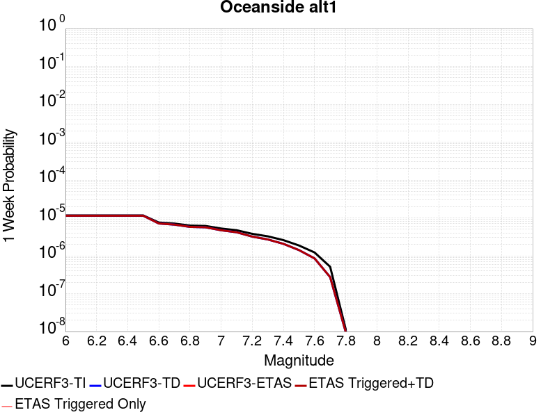 | 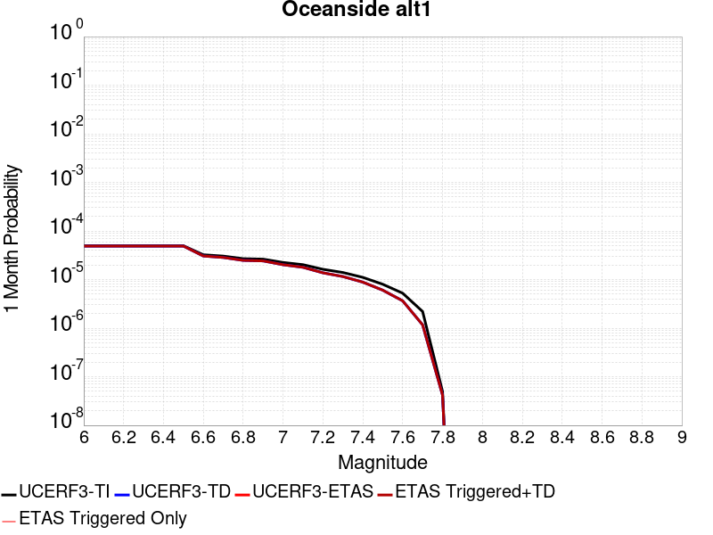 | 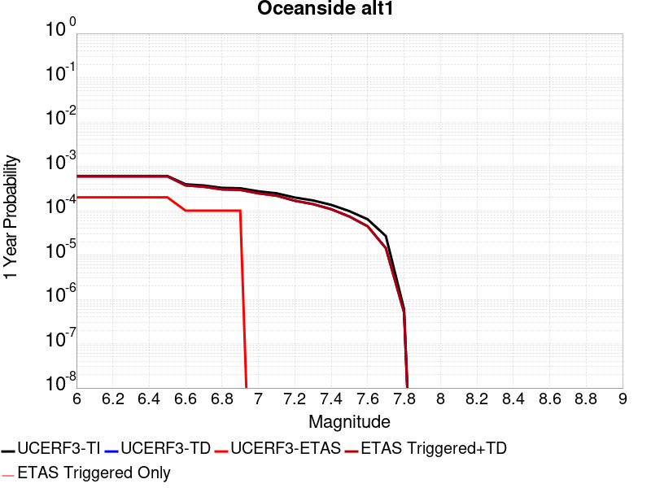 | 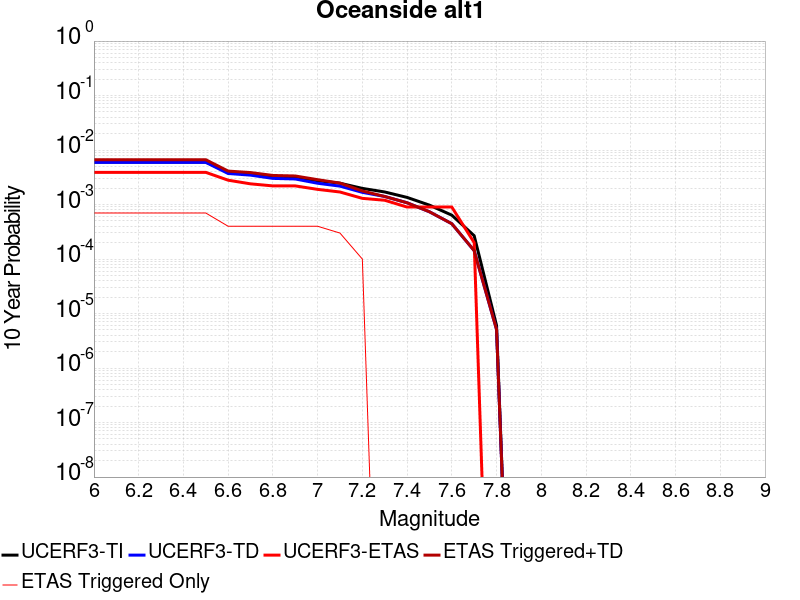 |

| Magnitude | 1 wk TI Prob | 1 wk TD Prob | 1 wk ETAS Prob | 1 wk ETAS/TD Gain | 1 wk ETAS Triggered+TD | 1 wk ETAS Triggered Only | 1 mo TI Prob | 1 mo TD Prob | 1 mo ETAS Prob | 1 mo ETAS/TD Gain | 1 mo ETAS Triggered+TD | 1 mo ETAS Triggered Only | 1 yr TI Prob | 1 yr TD Prob | 1 yr ETAS Prob | 1 yr ETAS/TD Gain | 1 yr ETAS Triggered+TD | 1 yr ETAS Triggered Only | 10 yr TI Prob | 10 yr TD Prob | 10 yr ETAS Prob | 10 yr ETAS/TD Gain | 10 yr ETAS Triggered+TD | 10 yr ETAS Triggered Only |
|-----|-----|-----|-----|-----|-----|-----|-----|-----|-----|-----|-----|-----|-----|-----|-----|-----|-----|-----|-----|-----|-----|-----|-----|-----|
| 6.0 | 1.1617542E-5 | 1.1424583E-5 | 0.0 | 0.0 | 1.1424583E-5 | 0.0 | 4.9788516E-5 | 4.8961672E-5 | 0.0 | 0.0 | 4.8961672E-5 | 0.0 | 6.060066E-4 | 5.959614E-4 | 2.0E-4 | 0.33559218 | 5.959614E-4 | 0.0 | 0.0060435664 | 0.005945231 | 0.0039 | 0.65598804 | 0.006641069 | 7.0E-4 |
| 6.1 | 1.1617542E-5 | 1.1424583E-5 | 0.0 | 0.0 | 1.1424583E-5 | 0.0 | 4.9788516E-5 | 4.8961672E-5 | 0.0 | 0.0 | 4.8961672E-5 | 0.0 | 6.060066E-4 | 5.959614E-4 | 2.0E-4 | 0.33559218 | 5.959614E-4 | 0.0 | 0.0060435664 | 0.005945231 | 0.0039 | 0.65598804 | 0.006641069 | 7.0E-4 |
| 6.2 | 1.1617542E-5 | 1.1424583E-5 | 0.0 | 0.0 | 1.1424583E-5 | 0.0 | 4.9788516E-5 | 4.8961672E-5 | 0.0 | 0.0 | 4.8961672E-5 | 0.0 | 6.060066E-4 | 5.959614E-4 | 2.0E-4 | 0.33559218 | 5.959614E-4 | 0.0 | 0.0060435664 | 0.005945231 | 0.0039 | 0.65598804 | 0.006641069 | 7.0E-4 |
| 6.3 | 1.1617542E-5 | 1.1424583E-5 | 0.0 | 0.0 | 1.1424583E-5 | 0.0 | 4.9788516E-5 | 4.8961672E-5 | 0.0 | 0.0 | 4.8961672E-5 | 0.0 | 6.060066E-4 | 5.959614E-4 | 2.0E-4 | 0.33559218 | 5.959614E-4 | 0.0 | 0.0060435664 | 0.005945231 | 0.0039 | 0.65598804 | 0.006641069 | 7.0E-4 |
| 6.4 | 1.1617542E-5 | 1.1424583E-5 | 0.0 | 0.0 | 1.1424583E-5 | 0.0 | 4.9788516E-5 | 4.8961672E-5 | 0.0 | 0.0 | 4.8961672E-5 | 0.0 | 6.060066E-4 | 5.959614E-4 | 2.0E-4 | 0.33559218 | 5.959614E-4 | 0.0 | 0.0060435664 | 0.005945231 | 0.0039 | 0.65598804 | 0.006641069 | 7.0E-4 |
| 6.5 | 1.1617542E-5 | 1.1424583E-5 | 0.0 | 0.0 | 1.1424583E-5 | 0.0 | 4.9788516E-5 | 4.8961672E-5 | 0.0 | 0.0 | 4.8961672E-5 | 0.0 | 6.060066E-4 | 5.959614E-4 | 2.0E-4 | 0.33559218 | 5.959614E-4 | 0.0 | 0.0060435664 | 0.005945231 | 0.0039 | 0.65598804 | 0.006641069 | 7.0E-4 |
| 6.6 | 7.561768E-6 | 7.1342147E-6 | 0.0 | 0.0 | 7.1342147E-6 | 0.0 | 3.2407173E-5 | 3.0574854E-5 | 0.0 | 0.0 | 3.0574854E-5 | 0.0 | 3.9448592E-4 | 3.7218633E-4 | 1.0E-4 | 0.26868263 | 3.7218633E-4 | 0.0 | 0.0039378637 | 0.0037157417 | 0.0028 | 0.75355077 | 0.0041142553 | 4.0E-4 |
| 6.7 | 7.1042605E-6 | 6.656243E-6 | 0.0 | 0.0 | 6.656243E-6 | 0.0 | 3.0446476E-5 | 2.8526447E-5 | 0.0 | 0.0 | 2.8526447E-5 | 0.0 | 3.706228E-4 | 3.4725494E-4 | 1.0E-4 | 0.28797287 | 3.4725494E-4 | 0.0 | 0.0037000529 | 0.0034672066 | 0.0024 | 0.6921999 | 0.00386582 | 4.0E-4 |
| 6.8 | 6.285554E-6 | 5.8001856E-6 | 0.0 | 0.0 | 5.8001856E-6 | 0.0 | 2.693781E-5 | 2.4857705E-5 | 0.0 | 0.0 | 2.4857705E-5 | 0.0 | 3.2791847E-4 | 3.0260108E-4 | 1.0E-4 | 0.3304681 | 3.0260108E-4 | 0.0 | 0.0032743502 | 0.0030219478 | 0.0022 | 0.72800726 | 0.003420739 | 4.0E-4 |
| 6.9 | 6.148883E-6 | 5.6570107E-6 | 0.0 | 0.0 | 5.6570107E-6 | 0.0 | 2.635209E-5 | 2.424411E-5 | 0.0 | 0.0 | 2.424411E-5 | 0.0 | 3.2078946E-4 | 2.951326E-4 | 1.0E-4 | 0.33883074 | 2.951326E-4 | 0.0 | 0.003203268 | 0.0029474634 | 0.0022 | 0.7464045 | 0.0033462844 | 4.0E-4 |
| 7.0 | 5.253857E-6 | 4.722788E-6 | 0.0 | 0.0 | 4.722788E-6 | 0.0 | 2.2516335E-5 | 2.0240366E-5 | 0.0 | 0.0 | 2.0240366E-5 | 0.0 | 2.7410188E-4 | 2.4639888E-4 | 0.0 | 0.0 | 2.4639888E-4 | 0.0 | 0.0027376404 | 0.0024612886 | 0.0019 | 0.7719534 | 0.002860304 | 4.0E-4 |
| 7.1 | 4.730754E-6 | 4.1788444E-6 | 0.0 | 0.0 | 4.1788444E-6 | 0.0 | 2.0274503E-5 | 1.7909213E-5 | 0.0 | 0.0 | 1.7909213E-5 | 0.0 | 2.468141E-4 | 2.1802311E-4 | 0.0 | 0.0 | 2.1802311E-4 | 0.0 | 0.0024654015 | 0.0021781186 | 0.0017 | 0.7804901 | 0.0024774652 | 3.0E-4 |
| 7.2 | 3.7998386E-6 | 3.2142723E-6 | 0.0 | 0.0 | 3.2142723E-6 | 0.0 | 1.6284921E-5 | 1.37753805E-5 | 0.0 | 0.0 | 1.37753805E-5 | 0.0 | 1.9825088E-4 | 1.6770247E-4 | 0.0 | 0.0 | 1.6770247E-4 | 0.0 | 0.001980741 | 0.0016757714 | 0.0013 | 0.77576214 | 0.0017756039 | 1.0E-4 |
| 7.3 | 3.2656465E-6 | 2.6985808E-6 | 0.0 | 0.0 | 2.6985808E-6 | 0.0 | 1.3995553E-5 | 1.1565296E-5 | 0.0 | 0.0 | 1.1565296E-5 | 0.0 | 1.7038253E-4 | 1.4079848E-4 | 0.0 | 0.0 | 1.4079848E-4 | 0.0 | 0.0017025196 | 0.001407104 | 0.0012 | 0.85281545 | 0.001407104 | 0.0 |
| 7.4 | 2.593703E-6 | 2.0681746E-6 | 0.0 | 0.0 | 2.0681746E-6 | 0.0 | 1.1115822E-5 | 8.863575E-6 | 0.0 | 0.0 | 8.863575E-6 | 0.0 | 1.3532673E-4 | 1.07908774E-4 | 0.0 | 0.0 | 1.07908774E-4 | 0.0 | 0.0013524436 | 0.0010785727 | 9.0E-4 | 0.8344361 | 0.0010785727 | 0.0 |
| 7.5 | 1.8715585E-6 | 1.4138433E-6 | 0.0 | 0.0 | 1.4138433E-6 | 0.0 | 8.020941E-6 | 6.0593147E-6 | 0.0 | 0.0 | 6.0593147E-6 | 0.0 | 9.7650576E-5 | 7.376972E-5 | 0.0 | 0.0 | 7.376972E-5 | 0.0 | 9.7607676E-4 | 7.374584E-4 | 9.0E-4 | 1.2204078 | 7.374584E-4 | 0.0 |
| 7.6 | 1.2246786E-6 | 8.527737E-7 | 0.0 | 0.0 | 8.527737E-7 | 0.0 | 5.248612E-6 | 3.6547397E-6 | 0.0 | 0.0 | 3.6547397E-6 | 0.0 | 6.389998E-5 | 4.449559E-5 | 0.0 | 0.0 | 4.449559E-5 | 0.0 | 6.3881604E-4 | 4.4487132E-4 | 9.0E-4 | 2.023057 | 4.4487132E-4 | 0.0 |
| 7.7 | 5.140719E-7 | 2.7351163E-7 | 0.0 | 0.0 | 2.7351163E-7 | 0.0 | 2.2031636E-6 | 1.1721922E-6 | 0.0 | 0.0 | 1.1721922E-6 | 0.0 | 2.6823185E-5 | 1.4271362E-5 | 0.0 | 0.0 | 1.4271362E-5 | 0.0 | 2.6819948E-4 | 1.427058E-4 | 2.0E-4 | 1.4014847 | 1.427058E-4 | 0.0 |
| 7.8 | 1.16056995E-8 | 9.783043E-9 | 0.0 | 0.0 | 9.783043E-9 | 0.0 | 4.9738713E-8 | 4.192733E-8 | 0.0 | 0.0 | 4.192733E-8 | 0.0 | 6.0556863E-7 | 5.104652E-7 | 0.0 | 0.0 | 5.104652E-7 | 0.0 | 6.05567E-6 | 5.1046522E-6 | 0.0 | 0.0 | 5.1046522E-6 | 0.0 |

## Newport-Inglewood (Offshore)
*[(top)](#table-of-contents)*

| 1 Week | 1 Month | 1 Year | 10 Year |
|-----|-----|-----|-----|
| 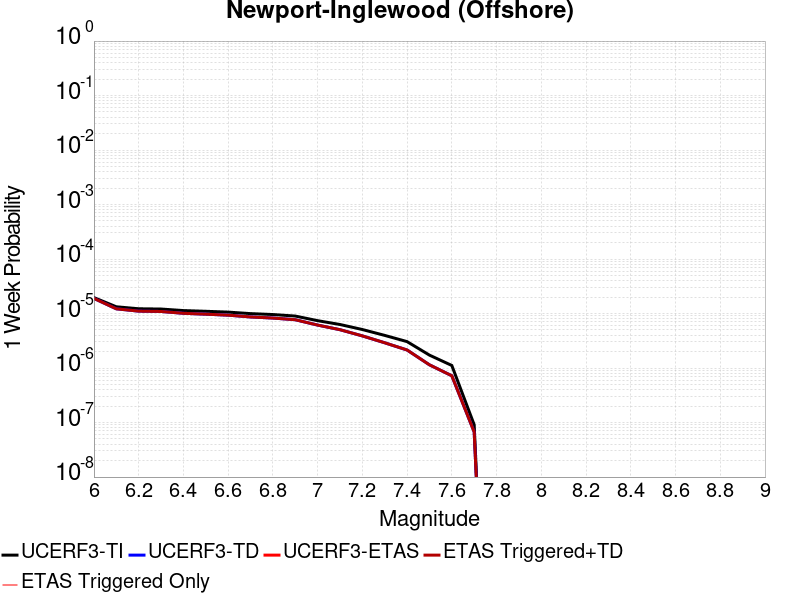 | 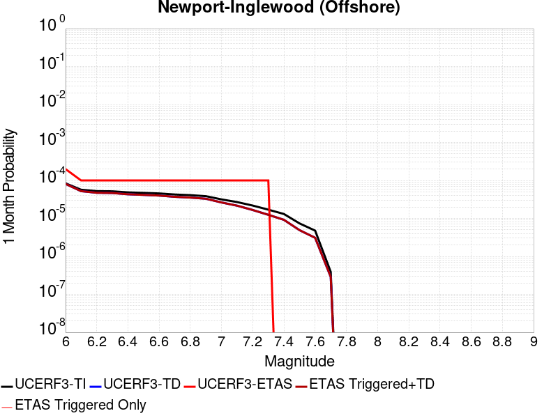 | 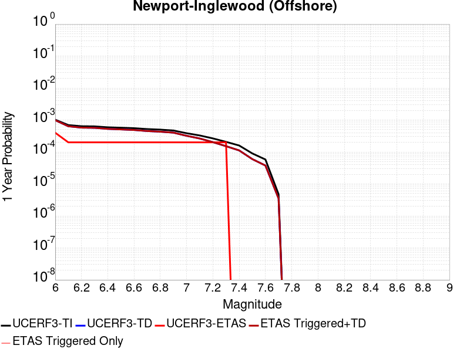 | 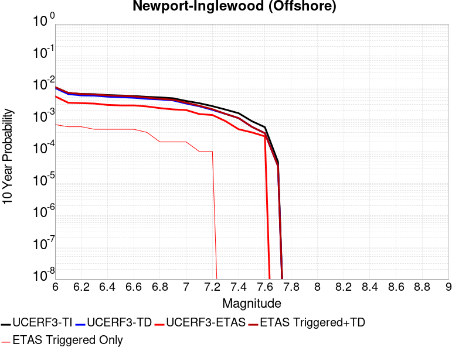 |

| Magnitude | 1 wk TI Prob | 1 wk TD Prob | 1 wk ETAS Prob | 1 wk ETAS/TD Gain | 1 wk ETAS Triggered+TD | 1 wk ETAS Triggered Only | 1 mo TI Prob | 1 mo TD Prob | 1 mo ETAS Prob | 1 mo ETAS/TD Gain | 1 mo ETAS Triggered+TD | 1 mo ETAS Triggered Only | 1 yr TI Prob | 1 yr TD Prob | 1 yr ETAS Prob | 1 yr ETAS/TD Gain | 1 yr ETAS Triggered+TD | 1 yr ETAS Triggered Only | 10 yr TI Prob | 10 yr TD Prob | 10 yr ETAS Prob | 10 yr ETAS/TD Gain | 10 yr ETAS Triggered+TD | 10 yr ETAS Triggered Only |
|-----|-----|-----|-----|-----|-----|-----|-----|-----|-----|-----|-----|-----|-----|-----|-----|-----|-----|-----|-----|-----|-----|-----|-----|-----|
| 6.0 | 1.9626508E-5 | 1.8968307E-5 | 0.0 | 0.0 | 1.8968307E-5 | 0.0 | 8.411089E-5 | 8.129028E-5 | 2.0E-4 | 2.4603188 | 8.129028E-5 | 0.0 | 0.001023569 | 9.892724E-4 | 4.0E-4 | 0.40433758 | 9.892724E-4 | 0.0 | 0.010188672 | 0.009850029 | 0.0054 | 0.54822177 | 0.010543133 | 7.0E-4 |
| 6.1 | 1.331886E-5 | 1.222011E-5 | 0.0 | 0.0 | 1.222011E-5 | 0.0 | 5.707958E-5 | 5.2370855E-5 | 1.0E-4 | 1.909459 | 5.2370855E-5 | 0.0 | 6.947222E-4 | 6.374301E-4 | 2.0E-4 | 0.31375986 | 6.374301E-4 | 0.0 | 0.006925544 | 0.006356195 | 0.0034 | 0.5349112 | 0.0069523817 | 6.0E-4 |
| 6.2 | 1.2250852E-5 | 1.107789E-5 | 0.0 | 0.0 | 1.107789E-5 | 0.0 | 5.2502597E-5 | 4.7475813E-5 | 1.0E-4 | 2.1063356 | 4.7475813E-5 | 0.0 | 6.3903164E-4 | 5.778657E-4 | 2.0E-4 | 0.34610116 | 5.778657E-4 | 0.0 | 0.006371971 | 0.005763752 | 0.0033 | 0.57254374 | 0.006360294 | 6.0E-4 |
| 6.3 | 1.2106258E-5 | 1.0920725E-5 | 0.0 | 0.0 | 1.0920725E-5 | 0.0 | 5.1882926E-5 | 4.680227E-5 | 1.0E-4 | 2.1366484 | 4.680227E-5 | 0.0 | 6.3149154E-4 | 5.6966965E-4 | 2.0E-4 | 0.3510807 | 5.6966965E-4 | 0.0 | 0.0062970007 | 0.0056822104 | 0.0032 | 0.56316113 | 0.0061793695 | 5.0E-4 |
| 6.4 | 1.1348758E-5 | 1.0111085E-5 | 0.0 | 0.0 | 1.0111085E-5 | 0.0 | 4.8636626E-5 | 4.3332508E-5 | 1.0E-4 | 2.3077364 | 4.3332508E-5 | 0.0 | 5.919901E-4 | 5.2744633E-4 | 2.0E-4 | 0.37918547 | 5.2744633E-4 | 0.0 | 0.005904155 | 0.005262041 | 0.0029 | 0.55111694 | 0.00575941 | 5.0E-4 |
| 6.5 | 1.100837E-5 | 9.7450575E-6 | 0.0 | 0.0 | 9.7450575E-6 | 0.0 | 4.7177873E-5 | 4.176387E-5 | 1.0E-4 | 2.3944142 | 4.176387E-5 | 0.0 | 5.7423924E-4 | 5.0835725E-4 | 2.0E-4 | 0.39342412 | 5.0835725E-4 | 0.0 | 0.005727576 | 0.005072035 | 0.0028 | 0.55204666 | 0.005569499 | 5.0E-4 |
| 6.6 | 1.0634696E-5 | 9.347152E-6 | 0.0 | 0.0 | 9.347152E-6 | 0.0 | 4.557647E-5 | 4.005861E-5 | 1.0E-4 | 2.4963422 | 4.005861E-5 | 0.0 | 5.5475225E-4 | 4.8760517E-4 | 2.0E-4 | 0.41016793 | 4.8760517E-4 | 0.0 | 0.0055336943 | 0.0048654396 | 0.0028 | 0.57548755 | 0.005363007 | 5.0E-4 |
| 6.7 | 9.9780855E-6 | 8.669408E-6 | 0.0 | 0.0 | 8.669408E-6 | 0.0 | 4.276252E-5 | 3.715408E-5 | 1.0E-4 | 2.6914945 | 3.715408E-5 | 0.0 | 5.205093E-4 | 4.5225772E-4 | 2.0E-4 | 0.44222572 | 4.5225772E-4 | 0.0 | 0.0051929182 | 0.0045134528 | 0.0026 | 0.57605565 | 0.004911647 | 4.0E-4 |
| 6.8 | 9.59546E-6 | 8.274393E-6 | 0.0 | 0.0 | 8.274393E-6 | 0.0 | 4.1122752E-5 | 3.5461206E-5 | 1.0E-4 | 2.819983 | 3.5461206E-5 | 0.0 | 5.0055445E-4 | 4.3165532E-4 | 2.0E-4 | 0.46333262 | 4.3165532E-4 | 0.0 | 0.004994285 | 0.0043082447 | 0.0023 | 0.5338601 | 0.004507383 | 2.0E-4 |
| 6.9 | 9.000614E-6 | 7.708188E-6 | 0.0 | 0.0 | 7.708188E-6 | 0.0 | 3.857349E-5 | 3.3034674E-5 | 1.0E-4 | 3.0271223 | 3.3034674E-5 | 0.0 | 4.6953102E-4 | 4.0212358E-4 | 2.0E-4 | 0.49735954 | 4.0212358E-4 | 0.0 | 0.004685402 | 0.004014031 | 0.0021 | 0.52316487 | 0.0042132284 | 2.0E-4 |
| 7.0 | 7.4070194E-6 | 6.149937E-6 | 0.0 | 0.0 | 6.149937E-6 | 0.0 | 3.1743984E-5 | 2.6356605E-5 | 1.0E-4 | 3.7941153 | 2.6356605E-5 | 0.0 | 3.8641447E-4 | 3.2084459E-4 | 2.0E-4 | 0.62335473 | 3.2084459E-4 | 0.0 | 0.0038574322 | 0.0032038335 | 0.002 | 0.6242522 | 0.0034031926 | 2.0E-4 |
| 7.1 | 6.299615E-6 | 5.0574754E-6 | 0.0 | 0.0 | 5.0574754E-6 | 0.0 | 2.699807E-5 | 2.1674716E-5 | 1.0E-4 | 4.613671 | 2.1674716E-5 | 0.0 | 3.2865192E-4 | 2.6385783E-4 | 2.0E-4 | 0.7579839 | 2.6385783E-4 | 0.0 | 0.003281663 | 0.0026354603 | 0.0015 | 0.5691605 | 0.0027351968 | 1.0E-4 |
| 7.2 | 5.096653E-6 | 3.8934713E-6 | 0.0 | 0.0 | 3.8934713E-6 | 0.0 | 2.1842614E-5 | 1.66862E-5 | 1.0E-4 | 5.992976 | 1.66862E-5 | 0.0 | 2.6590136E-4 | 2.0313564E-4 | 2.0E-4 | 0.98456377 | 2.0313564E-4 | 0.0 | 0.0026558342 | 0.002029511 | 0.0014 | 0.6898214 | 0.002129308 | 1.0E-4 |
| 7.3 | 3.9753018E-6 | 2.9104135E-6 | 0.0 | 0.0 | 2.9104135E-6 | 0.0 | 1.7036897E-5 | 1.2473142E-5 | 1.0E-4 | 8.017226 | 1.2473142E-5 | 0.0 | 2.0740448E-4 | 1.5184999E-4 | 2.0E-4 | 1.3170892 | 1.5184999E-4 | 0.0 | 0.00207211 | 0.0015174705 | 9.0E-4 | 0.59309226 | 0.0015174705 | 0.0 |
| 7.4 | 3.0568392E-6 | 2.1453545E-6 | 0.0 | 0.0 | 2.1453545E-6 | 0.0 | 1.3100675E-5 | 9.194345E-6 | 0.0 | 0.0 | 9.194345E-6 | 0.0 | 1.5948903E-4 | 1.1193546E-4 | 0.0 | 0.0 | 1.1193546E-4 | 0.0 | 0.0015937461 | 0.0011187971 | 5.0E-4 | 0.44690856 | 0.0011187971 | 0.0 |
| 7.5 | 1.7279019E-6 | 1.1472235E-6 | 0.0 | 0.0 | 1.1472235E-6 | 0.0 | 7.405273E-6 | 4.9166633E-6 | 0.0 | 0.0 | 4.9166633E-6 | 0.0 | 9.015547E-5 | 5.9858772E-5 | 0.0 | 0.0 | 5.9858772E-5 | 0.0 | 9.01189E-4 | 5.9843034E-4 | 4.0E-4 | 0.6684153 | 5.9843034E-4 | 0.0 |
| 7.6 | 1.1156416E-6 | 7.2242864E-7 | 0.0 | 0.0 | 7.2242864E-7 | 0.0 | 4.7813123E-6 | 3.0961191E-6 | 0.0 | 0.0 | 3.0961191E-6 | 0.0 | 5.821092E-5 | 3.7694623E-5 | 0.0 | 0.0 | 3.7694623E-5 | 0.0 | 5.8195676E-4 | 3.7688462E-4 | 3.0E-4 | 0.7959996 | 3.7688462E-4 | 0.0 |
| 7.7 | 9.117973E-8 | 6.7348694E-8 | 0.0 | 0.0 | 6.7348694E-8 | 0.0 | 3.907702E-7 | 2.8863724E-7 | 0.0 | 0.0 | 2.8863724E-7 | 0.0 | 4.757617E-6 | 3.514153E-6 | 0.0 | 0.0 | 3.514153E-6 | 0.0 | 4.7575148E-5 | 3.5141E-5 | 0.0 | 0.0 | 3.5141E-5 | 0.0 |

## La Panza 2011
*[(top)](#table-of-contents)*

| 1 Week | 1 Month | 1 Year | 10 Year |
|-----|-----|-----|-----|
| 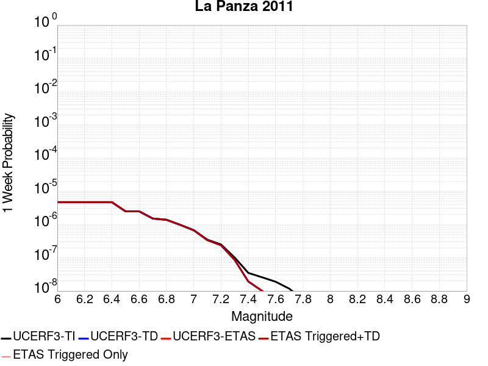 | 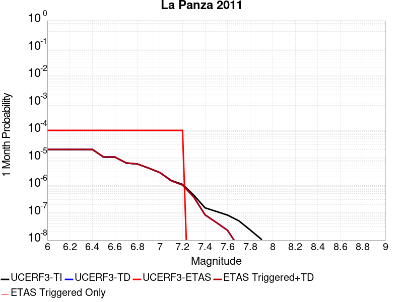 | 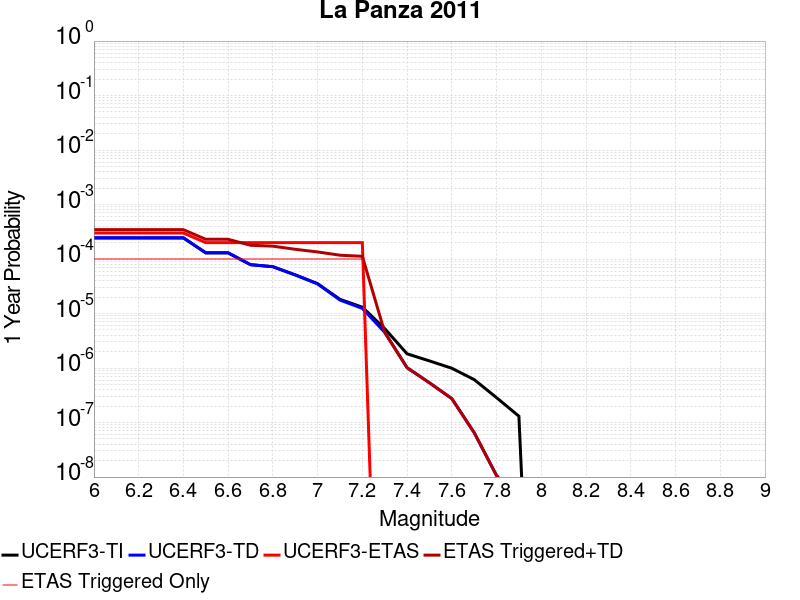 | 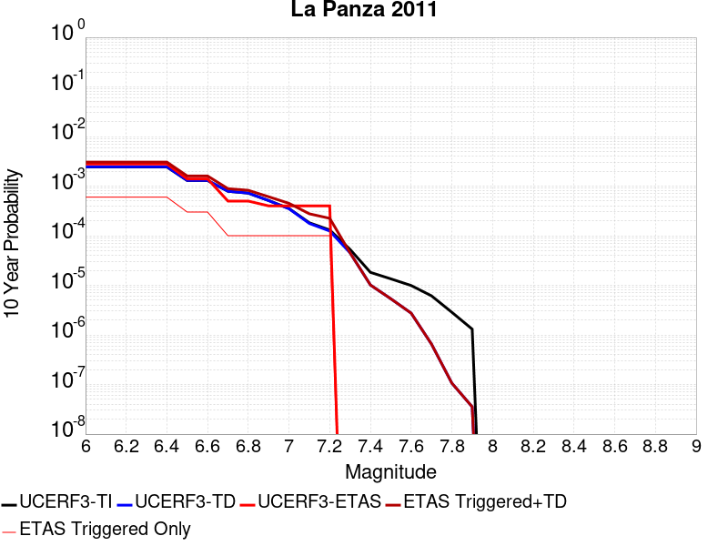 |

| Magnitude | 1 wk TI Prob | 1 wk TD Prob | 1 wk ETAS Prob | 1 wk ETAS/TD Gain | 1 wk ETAS Triggered+TD | 1 wk ETAS Triggered Only | 1 mo TI Prob | 1 mo TD Prob | 1 mo ETAS Prob | 1 mo ETAS/TD Gain | 1 mo ETAS Triggered+TD | 1 mo ETAS Triggered Only | 1 yr TI Prob | 1 yr TD Prob | 1 yr ETAS Prob | 1 yr ETAS/TD Gain | 1 yr ETAS Triggered+TD | 1 yr ETAS Triggered Only | 10 yr TI Prob | 10 yr TD Prob | 10 yr ETAS Prob | 10 yr ETAS/TD Gain | 10 yr ETAS Triggered+TD | 10 yr ETAS Triggered Only |
|-----|-----|-----|-----|-----|-----|-----|-----|-----|-----|-----|-----|-----|-----|-----|-----|-----|-----|-----|-----|-----|-----|-----|-----|-----|
| 6.0 | 4.6754544E-6 | 4.7179037E-6 | 0.0 | 0.0 | 4.7179037E-6 | 0.0 | 2.0037509E-5 | 2.0219442E-5 | 1.0E-4 | 4.9457345 | 2.0219442E-5 | 0.0 | 2.4392935E-4 | 2.4614588E-4 | 3.0E-4 | 1.2187895 | 3.4612126E-4 | 1.0E-4 | 0.0024366176 | 0.002458927 | 0.0028 | 1.1387081 | 0.0030574515 | 6.0E-4 |
| 6.1 | 4.6754544E-6 | 4.7179037E-6 | 0.0 | 0.0 | 4.7179037E-6 | 0.0 | 2.0037509E-5 | 2.0219442E-5 | 1.0E-4 | 4.9457345 | 2.0219442E-5 | 0.0 | 2.4392935E-4 | 2.4614588E-4 | 3.0E-4 | 1.2187895 | 3.4612126E-4 | 1.0E-4 | 0.0024366176 | 0.002458927 | 0.0028 | 1.1387081 | 0.0030574515 | 6.0E-4 |
| 6.2 | 4.6754544E-6 | 4.7179037E-6 | 0.0 | 0.0 | 4.7179037E-6 | 0.0 | 2.0037509E-5 | 2.0219442E-5 | 1.0E-4 | 4.9457345 | 2.0219442E-5 | 0.0 | 2.4392935E-4 | 2.4614588E-4 | 3.0E-4 | 1.2187895 | 3.4612126E-4 | 1.0E-4 | 0.0024366176 | 0.002458927 | 0.0028 | 1.1387081 | 0.0030574515 | 6.0E-4 |
| 6.3 | 4.6754544E-6 | 4.7179037E-6 | 0.0 | 0.0 | 4.7179037E-6 | 0.0 | 2.0037509E-5 | 2.0219442E-5 | 1.0E-4 | 4.9457345 | 2.0219442E-5 | 0.0 | 2.4392935E-4 | 2.4614588E-4 | 3.0E-4 | 1.2187895 | 3.4612126E-4 | 1.0E-4 | 0.0024366176 | 0.002458927 | 0.0028 | 1.1387081 | 0.0030574515 | 6.0E-4 |
| 6.4 | 4.6754544E-6 | 4.7179037E-6 | 0.0 | 0.0 | 4.7179037E-6 | 0.0 | 2.0037509E-5 | 2.0219442E-5 | 1.0E-4 | 4.9457345 | 2.0219442E-5 | 0.0 | 2.4392935E-4 | 2.4614588E-4 | 3.0E-4 | 1.2187895 | 3.4612126E-4 | 1.0E-4 | 0.0024366176 | 0.002458927 | 0.0028 | 1.1387081 | 0.0030574515 | 6.0E-4 |
| 6.5 | 2.485343E-6 | 2.500862E-6 | 0.0 | 0.0 | 2.500862E-6 | 0.0 | 1.0651426E-5 | 1.0717938E-5 | 1.0E-4 | 9.330153 | 1.0717938E-5 | 0.0 | 1.296734E-4 | 1.3048347E-4 | 2.0E-4 | 1.5327612 | 2.3047042E-4 | 1.0E-4 | 0.0012959775 | 0.0013041069 | 0.0014 | 1.0735316 | 0.0016037157 | 3.0E-4 |
| 6.6 | 2.485343E-6 | 2.500862E-6 | 0.0 | 0.0 | 2.500862E-6 | 0.0 | 1.0651426E-5 | 1.0717938E-5 | 1.0E-4 | 9.330153 | 1.0717938E-5 | 0.0 | 1.296734E-4 | 1.3048347E-4 | 2.0E-4 | 1.5327612 | 2.3047042E-4 | 1.0E-4 | 0.0012959775 | 0.0013041069 | 0.0014 | 1.0735316 | 0.0016037157 | 3.0E-4 |
| 6.7 | 1.5108508E-6 | 1.5148775E-6 | 0.0 | 0.0 | 1.5148775E-6 | 0.0 | 6.4750584E-6 | 6.492316E-6 | 1.0E-4 | 15.402823 | 6.492316E-6 | 0.0 | 7.8830984E-5 | 7.9041194E-5 | 2.0E-4 | 2.5303261 | 1.7903329E-4 | 1.0E-4 | 7.880303E-4 | 7.9014164E-4 | 5.0E-4 | 0.63279796 | 8.900626E-4 | 1.0E-4 |
| 6.8 | 1.3865837E-6 | 1.3887463E-6 | 0.0 | 0.0 | 1.3887463E-6 | 0.0 | 5.942488E-6 | 5.9517574E-6 | 1.0E-4 | 16.80176 | 5.9517574E-6 | 0.0 | 7.234739E-5 | 7.246033E-5 | 2.0E-4 | 2.760131 | 1.7245309E-4 | 1.0E-4 | 7.232384E-4 | 7.243769E-4 | 5.0E-4 | 0.6902484 | 8.243045E-4 | 1.0E-4 |
| 6.9 | 9.826583E-7 | 9.798549E-7 | 0.0 | 0.0 | 9.798549E-7 | 0.0 | 4.2113857E-6 | 4.1993717E-6 | 1.0E-4 | 23.813086 | 4.1993717E-6 | 0.0 | 5.1272415E-5 | 5.1126204E-5 | 2.0E-4 | 3.9118881 | 1.5112109E-4 | 1.0E-4 | 5.126059E-4 | 5.111498E-4 | 4.0E-4 | 0.78254944 | 6.1109866E-4 | 1.0E-4 |
| 7.0 | 6.7797646E-7 | 6.7123983E-7 | 0.0 | 0.0 | 6.7123983E-7 | 0.0 | 2.9056102E-6 | 2.8767392E-6 | 1.0E-4 | 34.76158 | 2.8767392E-6 | 0.0 | 3.537523E-5 | 3.5023768E-5 | 2.0E-4 | 5.7104077 | 1.3502027E-4 | 1.0E-4 | 3.5369597E-4 | 3.5018558E-4 | 4.0E-4 | 1.1422515 | 4.5015058E-4 | 1.0E-4 |
| 7.1 | 3.4979826E-7 | 3.3894895E-7 | 0.0 | 0.0 | 3.3894895E-7 | 0.0 | 1.4991346E-6 | 1.4526375E-6 | 1.0E-4 | 68.840294 | 1.4526375E-6 | 0.0 | 1.825181E-5 | 1.768573E-5 | 2.0E-4 | 11.308552 | 1.17683965E-4 | 1.0E-4 | 1.825031E-4 | 1.768444E-4 | 4.0E-4 | 2.2618754 | 2.7682673E-4 | 1.0E-4 |
| 7.2 | 2.5088332E-7 | 2.385261E-7 | 0.0 | 0.0 | 2.385261E-7 | 0.0 | 1.0752137E-6 | 1.0222543E-6 | 1.0E-4 | 97.82301 | 1.0222543E-6 | 0.0 | 1.3090649E-5 | 1.2445884E-5 | 2.0E-4 | 16.069569 | 1.1244464E-4 | 1.0E-4 | 1.3089878E-4 | 1.2445272E-4 | 4.0E-4 | 3.214072 | 2.2444029E-4 | 1.0E-4 |
| 7.3 | 1.0159086E-7 | 8.664809E-8 | 0.0 | 0.0 | 8.664809E-8 | 0.0 | 4.3538932E-7 | 3.7134893E-7 | 0.0 | 0.0 | 3.7134893E-7 | 0.0 | 5.300852E-6 | 4.521164E-6 | 0.0 | 0.0 | 4.521164E-6 | 0.0 | 5.3007258E-5 | 4.5210763E-5 | 0.0 | 0.0 | 4.5210763E-5 | 0.0 |
| 7.4 | 3.5006252E-8 | 1.9468006E-8 | 0.0 | 0.0 | 1.9468006E-8 | 0.0 | 1.5002678E-7 | 8.343431E-8 | 0.0 | 0.0 | 8.343431E-8 | 0.0 | 1.8265745E-6 | 1.0158122E-6 | 0.0 | 0.0 | 1.0158122E-6 | 0.0 | 1.8265595E-5 | 1.0158078E-5 | 0.0 | 0.0 | 1.0158078E-5 | 0.0 |
| 7.5 | 2.592274E-8 | 1.0286398E-8 | 0.0 | 0.0 | 1.0286398E-8 | 0.0 | 1.1109746E-7 | 4.4084565E-8 | 0.0 | 0.0 | 4.4084565E-8 | 0.0 | 1.3526106E-6 | 5.367295E-7 | 0.0 | 0.0 | 5.367295E-7 | 0.0 | 1.3526024E-5 | 5.3672825E-6 | 0.0 | 0.0 | 5.3672825E-6 | 0.0 |
| 7.6 | 1.9016717E-8 | 5.274921E-9 | 0.0 | 0.0 | 5.274921E-9 | 0.0 | 8.150022E-8 | 2.2606805E-8 | 0.0 | 0.0 | 2.2606805E-8 | 0.0 | 9.922647E-7 | 2.7523782E-7 | 0.0 | 0.0 | 2.7523782E-7 | 0.0 | 9.922603E-6 | 2.752375E-6 | 0.0 | 0.0 | 2.752375E-6 | 0.0 |
| 7.7 | 1.17738495E-8 | 1.2525512E-9 | 0.0 | 0.0 | 1.2525512E-9 | 0.0 | 5.0459356E-8 | 5.3680766E-9 | 0.0 | 0.0 | 5.3680766E-9 | 0.0 | 6.1434247E-7 | 6.535633E-8 | 0.0 | 0.0 | 6.535633E-8 | 0.0 | 6.143408E-6 | 6.535632E-7 | 0.0 | 0.0 | 6.535632E-7 | 0.0 |
| 7.8 | 5.489079E-9 | 2.0443769E-10 | 0.0 | 0.0 | 2.0443769E-10 | 0.0 | 2.3524624E-8 | 8.7616137E-10 | 0.0 | 0.0 | 8.7616137E-10 | 0.0 | 2.8641225E-7 | 1.0667265E-8 | 0.0 | 0.0 | 1.0667265E-8 | 0.0 | 2.8641189E-6 | 1.0667265E-7 | 0.0 | 0.0 | 1.0667265E-7 | 0.0 |
| 7.9 | 2.5081048E-9 | 6.808998E-11 | 0.0 | 0.0 | 6.808998E-11 | 0.0 | 1.0749021E-8 | 2.918139E-10 | 0.0 | 0.0 | 2.918139E-10 | 0.0 | 1.3086932E-7 | 3.5528365E-9 | 0.0 | 0.0 | 3.5528365E-9 | 0.0 | 1.3086925E-6 | 3.5528366E-8 | 0.0 | 0.0 | 3.5528366E-8 | 0.0 |

## White Wolf (Extension)
*[(top)](#table-of-contents)*

| 1 Week | 1 Month | 1 Year | 10 Year |
|-----|-----|-----|-----|
|  |  |  |  |

| Magnitude | 1 wk TI Prob | 1 wk TD Prob | 1 wk ETAS Prob | 1 wk ETAS/TD Gain | 1 wk ETAS Triggered+TD | 1 wk ETAS Triggered Only | 1 mo TI Prob | 1 mo TD Prob | 1 mo ETAS Prob | 1 mo ETAS/TD Gain | 1 mo ETAS Triggered+TD | 1 mo ETAS Triggered Only | 1 yr TI Prob | 1 yr TD Prob | 1 yr ETAS Prob | 1 yr ETAS/TD Gain | 1 yr ETAS Triggered+TD | 1 yr ETAS Triggered Only | 10 yr TI Prob | 10 yr TD Prob | 10 yr ETAS Prob | 10 yr ETAS/TD Gain | 10 yr ETAS Triggered+TD | 10 yr ETAS Triggered Only |
|-----|-----|-----|-----|-----|-----|-----|-----|-----|-----|-----|-----|-----|-----|-----|-----|-----|-----|-----|-----|-----|-----|-----|-----|-----|
| 6.0 | 8.222555E-6 | 6.0672182E-6 | 0.0 | 0.0 | 6.0672182E-6 | 0.0 | 3.5239045E-5 | 2.600214E-5 | 0.0 | 0.0 | 2.600214E-5 | 0.0 | 4.289509E-4 | 3.1653672E-4 | 2.0E-4 | 0.63183826 | 3.1653672E-4 | 0.0 | 0.0042812387 | 0.0031615105 | 0.0021 | 0.66423947 | 0.0037596135 | 6.0E-4 |
| 6.1 | 8.222555E-6 | 6.0672182E-6 | 0.0 | 0.0 | 6.0672182E-6 | 0.0 | 3.5239045E-5 | 2.600214E-5 | 0.0 | 0.0 | 2.600214E-5 | 0.0 | 4.289509E-4 | 3.1653672E-4 | 2.0E-4 | 0.63183826 | 3.1653672E-4 | 0.0 | 0.0042812387 | 0.0031615105 | 0.0021 | 0.66423947 | 0.0037596135 | 6.0E-4 |
| 6.2 | 8.222555E-6 | 6.0672182E-6 | 0.0 | 0.0 | 6.0672182E-6 | 0.0 | 3.5239045E-5 | 2.600214E-5 | 0.0 | 0.0 | 2.600214E-5 | 0.0 | 4.289509E-4 | 3.1653672E-4 | 2.0E-4 | 0.63183826 | 3.1653672E-4 | 0.0 | 0.0042812387 | 0.0031615105 | 0.0021 | 0.66423947 | 0.0037596135 | 6.0E-4 |
| 6.3 | 8.222555E-6 | 6.0672182E-6 | 0.0 | 0.0 | 6.0672182E-6 | 0.0 | 3.5239045E-5 | 2.600214E-5 | 0.0 | 0.0 | 2.600214E-5 | 0.0 | 4.289509E-4 | 3.1653672E-4 | 2.0E-4 | 0.63183826 | 3.1653672E-4 | 0.0 | 0.0042812387 | 0.0031615105 | 0.0021 | 0.66423947 | 0.0037596135 | 6.0E-4 |
| 6.4 | 5.821773E-6 | 3.5575035E-6 | 0.0 | 0.0 | 3.5575035E-6 | 0.0 | 2.4950215E-5 | 1.524636E-5 | 0.0 | 0.0 | 1.524636E-5 | 0.0 | 3.0372653E-4 | 1.8560972E-4 | 2.0E-4 | 1.0775298 | 1.8560972E-4 | 0.0 | 0.0030331176 | 0.0018546553 | 0.0012 | 0.64702046 | 0.0022539136 | 4.0E-4 |
| 6.5 | 5.766023E-6 | 3.4994328E-6 | 0.0 | 0.0 | 3.4994328E-6 | 0.0 | 2.4711293E-5 | 1.4997489E-5 | 0.0 | 0.0 | 1.4997489E-5 | 0.0 | 3.0081844E-4 | 1.8258023E-4 | 2.0E-4 | 1.0954089 | 1.8258023E-4 | 0.0 | 0.0030041158 | 0.0018244104 | 0.0012 | 0.65774673 | 0.0022236807 | 4.0E-4 |
| 6.6 | 4.643576E-6 | 2.3328555E-6 | 0.0 | 0.0 | 2.3328555E-6 | 0.0 | 1.9900888E-5 | 9.997916E-6 | 0.0 | 0.0 | 9.997916E-6 | 0.0 | 2.4226638E-4 | 1.2171826E-4 | 2.0E-4 | 1.6431389 | 1.2171826E-4 | 0.0 | 0.0024200242 | 0.0012165584 | 6.0E-4 | 0.49319458 | 0.0013164367 | 1.0E-4 |
| 6.7 | 3.9529173E-6 | 1.6485245E-6 | 0.0 | 0.0 | 1.6485245E-6 | 0.0 | 1.6940963E-5 | 7.065087E-6 | 0.0 | 0.0 | 7.065087E-6 | 0.0 | 2.0623671E-4 | 8.601423E-5 | 2.0E-4 | 2.3251967 | 8.601423E-5 | 0.0 | 0.002060454 | 8.598279E-4 | 5.0E-4 | 0.58151174 | 9.597419E-4 | 1.0E-4 |
| 6.8 | 3.4377522E-6 | 1.2246646E-6 | 0.0 | 0.0 | 1.2246646E-6 | 0.0 | 1.473314E-5 | 5.2485525E-6 | 0.0 | 0.0 | 5.2485525E-6 | 0.0 | 1.7936122E-4 | 6.3899344E-5 | 1.0E-4 | 1.5649613 | 6.3899344E-5 | 0.0 | 0.0017921652 | 6.3881883E-4 | 2.0E-4 | 0.3130778 | 6.3881883E-4 | 0.0 |
| 6.9 | 3.1367306E-6 | 1.0034972E-6 | 0.0 | 0.0 | 1.0034972E-6 | 0.0 | 1.3443062E-5 | 4.3006958E-6 | 0.0 | 0.0 | 4.3006958E-6 | 0.0 | 1.63657E-4 | 5.2359792E-5 | 1.0E-4 | 1.9098624 | 5.2359792E-5 | 0.0 | 0.0016353652 | 5.234822E-4 | 2.0E-4 | 0.38205692 | 5.234822E-4 | 0.0 |
| 7.0 | 2.8298145E-6 | 7.429655E-7 | 0.0 | 0.0 | 7.429655E-7 | 0.0 | 1.2127721E-5 | 3.1841344E-6 | 0.0 | 0.0 | 3.1841344E-6 | 0.0 | 1.47645E-4 | 3.8766197E-5 | 1.0E-4 | 2.579567 | 3.8766197E-5 | 0.0 | 0.0014754693 | 3.875993E-4 | 2.0E-4 | 0.51599675 | 3.875993E-4 | 0.0 |
| 7.1 | 2.4091064E-6 | 5.4235124E-7 | 0.0 | 0.0 | 5.4235124E-7 | 0.0 | 1.03247E-5 | 2.3243606E-6 | 0.0 | 0.0 | 2.3243606E-6 | 0.0 | 1.2569598E-4 | 2.8298764E-5 | 1.0E-4 | 3.533723 | 2.8298764E-5 | 0.0 | 0.001256249 | 2.8295565E-4 | 1.0E-4 | 0.35341227 | 2.8295565E-4 | 0.0 |
| 7.2 | 1.3875518E-6 | 1.0745794E-7 | 0.0 | 0.0 | 1.0745794E-7 | 0.0 | 5.9466374E-6 | 4.6053395E-7 | 0.0 | 0.0 | 4.6053395E-7 | 0.0 | 7.23979E-5 | 5.6069875E-6 | 0.0 | 0.0 | 5.6069875E-6 | 0.0 | 7.2374323E-4 | 5.6068577E-5 | 0.0 | 0.0 | 5.6068577E-5 | 0.0 |
| 7.3 | 7.056077E-7 | 5.00341E-8 | 0.0 | 0.0 | 5.00341E-8 | 0.0 | 3.0240296E-6 | 2.1443184E-7 | 0.0 | 0.0 | 2.1443184E-7 | 0.0 | 3.681694E-5 | 2.610705E-6 | 0.0 | 0.0 | 2.610705E-6 | 0.0 | 3.681084E-4 | 2.610679E-5 | 0.0 | 0.0 | 2.610679E-5 | 0.0 |
| 7.4 | 5.9334678E-8 | 4.8653486E-9 | 0.0 | 0.0 | 4.8653486E-9 | 0.0 | 2.5429145E-7 | 2.0851493E-8 | 0.0 | 0.0 | 2.0851493E-8 | 0.0 | 3.095994E-6 | 2.5386692E-7 | 0.0 | 0.0 | 2.5386692E-7 | 0.0 | 3.095951E-5 | 2.5386673E-6 | 0.0 | 0.0 | 2.5386673E-6 | 0.0 |

## Pitas Point (Lower)-Montalvo
*[(top)](#table-of-contents)*

| 1 Week | 1 Month | 1 Year | 10 Year |
|-----|-----|-----|-----|
| 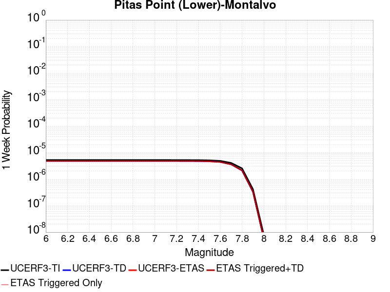 |  | 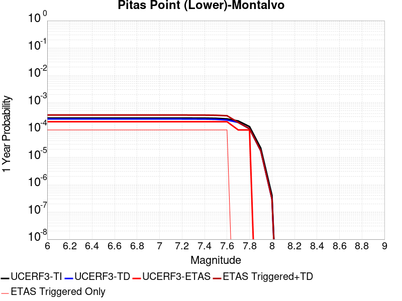 |  |

| Magnitude | 1 wk TI Prob | 1 wk TD Prob | 1 wk ETAS Prob | 1 wk ETAS/TD Gain | 1 wk ETAS Triggered+TD | 1 wk ETAS Triggered Only | 1 mo TI Prob | 1 mo TD Prob | 1 mo ETAS Prob | 1 mo ETAS/TD Gain | 1 mo ETAS Triggered+TD | 1 mo ETAS Triggered Only | 1 yr TI Prob | 1 yr TD Prob | 1 yr ETAS Prob | 1 yr ETAS/TD Gain | 1 yr ETAS Triggered+TD | 1 yr ETAS Triggered Only | 10 yr TI Prob | 10 yr TD Prob | 10 yr ETAS Prob | 10 yr ETAS/TD Gain | 10 yr ETAS Triggered+TD | 10 yr ETAS Triggered Only |
|-----|-----|-----|-----|-----|-----|-----|-----|-----|-----|-----|-----|-----|-----|-----|-----|-----|-----|-----|-----|-----|-----|-----|-----|-----|
| 6.0 | 5.2543637E-6 | 4.838563E-6 | 0.0 | 0.0 | 4.838563E-6 | 0.0 | 2.2518509E-5 | 2.0736537E-5 | 0.0 | 0.0 | 2.0736537E-5 | 0.0 | 2.7412834E-4 | 2.524384E-4 | 2.0E-4 | 0.7922725 | 3.5241316E-4 | 1.0E-4 | 0.0027379042 | 0.002521549 | 0.0024 | 0.95179594 | 0.003120036 | 6.0E-4 |
| 6.1 | 5.2543637E-6 | 4.838563E-6 | 0.0 | 0.0 | 4.838563E-6 | 0.0 | 2.2518509E-5 | 2.0736537E-5 | 0.0 | 0.0 | 2.0736537E-5 | 0.0 | 2.7412834E-4 | 2.524384E-4 | 2.0E-4 | 0.7922725 | 3.5241316E-4 | 1.0E-4 | 0.0027379042 | 0.002521549 | 0.0024 | 0.95179594 | 0.003120036 | 6.0E-4 |
| 6.2 | 5.2543637E-6 | 4.838563E-6 | 0.0 | 0.0 | 4.838563E-6 | 0.0 | 2.2518509E-5 | 2.0736537E-5 | 0.0 | 0.0 | 2.0736537E-5 | 0.0 | 2.7412834E-4 | 2.524384E-4 | 2.0E-4 | 0.7922725 | 3.5241316E-4 | 1.0E-4 | 0.0027379042 | 0.002521549 | 0.0024 | 0.95179594 | 0.003120036 | 6.0E-4 |
| 6.3 | 5.2543637E-6 | 4.838563E-6 | 0.0 | 0.0 | 4.838563E-6 | 0.0 | 2.2518509E-5 | 2.0736537E-5 | 0.0 | 0.0 | 2.0736537E-5 | 0.0 | 2.7412834E-4 | 2.524384E-4 | 2.0E-4 | 0.7922725 | 3.5241316E-4 | 1.0E-4 | 0.0027379042 | 0.002521549 | 0.0024 | 0.95179594 | 0.003120036 | 6.0E-4 |
| 6.4 | 5.2543637E-6 | 4.838563E-6 | 0.0 | 0.0 | 4.838563E-6 | 0.0 | 2.2518509E-5 | 2.0736537E-5 | 0.0 | 0.0 | 2.0736537E-5 | 0.0 | 2.7412834E-4 | 2.524384E-4 | 2.0E-4 | 0.7922725 | 3.5241316E-4 | 1.0E-4 | 0.0027379042 | 0.002521549 | 0.0024 | 0.95179594 | 0.003120036 | 6.0E-4 |
| 6.5 | 5.2543637E-6 | 4.838563E-6 | 0.0 | 0.0 | 4.838563E-6 | 0.0 | 2.2518509E-5 | 2.0736537E-5 | 0.0 | 0.0 | 2.0736537E-5 | 0.0 | 2.7412834E-4 | 2.524384E-4 | 2.0E-4 | 0.7922725 | 3.5241316E-4 | 1.0E-4 | 0.0027379042 | 0.002521549 | 0.0024 | 0.95179594 | 0.003120036 | 6.0E-4 |
| 6.6 | 5.2543637E-6 | 4.838563E-6 | 0.0 | 0.0 | 4.838563E-6 | 0.0 | 2.2518509E-5 | 2.0736537E-5 | 0.0 | 0.0 | 2.0736537E-5 | 0.0 | 2.7412834E-4 | 2.524384E-4 | 2.0E-4 | 0.7922725 | 3.5241316E-4 | 1.0E-4 | 0.0027379042 | 0.002521549 | 0.0024 | 0.95179594 | 0.003120036 | 6.0E-4 |
| 6.7 | 5.2543637E-6 | 4.838563E-6 | 0.0 | 0.0 | 4.838563E-6 | 0.0 | 2.2518509E-5 | 2.0736537E-5 | 0.0 | 0.0 | 2.0736537E-5 | 0.0 | 2.7412834E-4 | 2.524384E-4 | 2.0E-4 | 0.7922725 | 3.5241316E-4 | 1.0E-4 | 0.0027379042 | 0.002521549 | 0.0024 | 0.95179594 | 0.003120036 | 6.0E-4 |
| 6.8 | 5.2543637E-6 | 4.838563E-6 | 0.0 | 0.0 | 4.838563E-6 | 0.0 | 2.2518509E-5 | 2.0736537E-5 | 0.0 | 0.0 | 2.0736537E-5 | 0.0 | 2.7412834E-4 | 2.524384E-4 | 2.0E-4 | 0.7922725 | 3.5241316E-4 | 1.0E-4 | 0.0027379042 | 0.002521549 | 0.0024 | 0.95179594 | 0.003120036 | 6.0E-4 |
| 6.9 | 5.2543637E-6 | 4.838563E-6 | 0.0 | 0.0 | 4.838563E-6 | 0.0 | 2.2518509E-5 | 2.0736537E-5 | 0.0 | 0.0 | 2.0736537E-5 | 0.0 | 2.7412834E-4 | 2.524384E-4 | 2.0E-4 | 0.7922725 | 3.5241316E-4 | 1.0E-4 | 0.0027379042 | 0.002521549 | 0.0024 | 0.95179594 | 0.003120036 | 6.0E-4 |
| 7.0 | 5.2543637E-6 | 4.838563E-6 | 0.0 | 0.0 | 4.838563E-6 | 0.0 | 2.2518509E-5 | 2.0736537E-5 | 0.0 | 0.0 | 2.0736537E-5 | 0.0 | 2.7412834E-4 | 2.524384E-4 | 2.0E-4 | 0.7922725 | 3.5241316E-4 | 1.0E-4 | 0.0027379042 | 0.002521549 | 0.0024 | 0.95179594 | 0.003120036 | 6.0E-4 |
| 7.1 | 5.2543637E-6 | 4.838563E-6 | 0.0 | 0.0 | 4.838563E-6 | 0.0 | 2.2518509E-5 | 2.0736537E-5 | 0.0 | 0.0 | 2.0736537E-5 | 0.0 | 2.7412834E-4 | 2.524384E-4 | 2.0E-4 | 0.7922725 | 3.5241316E-4 | 1.0E-4 | 0.0027379042 | 0.002521549 | 0.0024 | 0.95179594 | 0.003120036 | 6.0E-4 |
| 7.2 | 5.2458695E-6 | 4.8297165E-6 | 0.0 | 0.0 | 4.8297165E-6 | 0.0 | 2.2482105E-5 | 2.0698622E-5 | 0.0 | 0.0 | 2.0698622E-5 | 0.0 | 2.7368523E-4 | 2.519769E-4 | 2.0E-4 | 0.7937236 | 3.519517E-4 | 1.0E-4 | 0.0027334841 | 0.0025169444 | 0.0024 | 0.95353717 | 0.0031154342 | 6.0E-4 |
| 7.3 | 5.22665E-6 | 4.8096317E-6 | 0.0 | 0.0 | 4.8096317E-6 | 0.0 | 2.2399736E-5 | 2.0612546E-5 | 0.0 | 0.0 | 2.0612546E-5 | 0.0 | 2.7268266E-4 | 2.5092918E-4 | 2.0E-4 | 0.79703766 | 3.5090407E-4 | 1.0E-4 | 0.002723483 | 0.0025064908 | 0.0024 | 0.957514 | 0.0031049869 | 6.0E-4 |
| 7.4 | 5.210642E-6 | 4.7928424E-6 | 0.0 | 0.0 | 4.7928424E-6 | 0.0 | 2.233113E-5 | 2.0540594E-5 | 0.0 | 0.0 | 2.0540594E-5 | 0.0 | 2.718476E-4 | 2.5005333E-4 | 2.0E-4 | 0.7998293 | 3.5002833E-4 | 1.0E-4 | 0.002715153 | 0.0024977522 | 0.0024 | 0.9608639 | 0.0030962536 | 6.0E-4 |
| 7.5 | 5.1226016E-6 | 4.7007206E-6 | 0.0 | 0.0 | 4.7007206E-6 | 0.0 | 2.1953823E-5 | 2.0145791E-5 | 0.0 | 0.0 | 2.0145791E-5 | 0.0 | 2.67255E-4 | 2.4524773E-4 | 2.0E-4 | 0.815502 | 3.452232E-4 | 1.0E-4 | 0.0026693381 | 0.0024498024 | 0.0024 | 0.9796708 | 0.0030483326 | 6.0E-4 |
| 7.6 | 4.8796987E-6 | 4.4455946E-6 | 0.0 | 0.0 | 4.4455946E-6 | 0.0 | 2.0912828E-5 | 1.905241E-5 | 0.0 | 0.0 | 1.905241E-5 | 0.0 | 2.5458392E-4 | 2.319387E-4 | 2.0E-4 | 0.8622968 | 3.319155E-4 | 1.0E-4 | 0.0025429246 | 0.002316997 | 0.0023 | 0.9926643 | 0.0029156066 | 6.0E-4 |
| 7.7 | 4.0834398E-6 | 3.609673E-6 | 0.0 | 0.0 | 3.609673E-6 | 0.0 | 1.7500339E-5 | 1.5469937E-5 | 0.0 | 0.0 | 1.5469937E-5 | 0.0 | 2.1304579E-4 | 1.8833044E-4 | 1.0E-4 | 0.5309816 | 1.8833044E-4 | 0.0 | 0.0021284167 | 0.001881732 | 0.0019 | 1.009708 | 0.0023807911 | 5.0E-4 |
| 7.8 | 2.5445438E-6 | 2.1215942E-6 | 0.0 | 0.0 | 2.1215942E-6 | 0.0 | 1.0905142E-5 | 9.092515E-6 | 0.0 | 0.0 | 9.092515E-6 | 0.0 | 1.3276201E-4 | 1.1069579E-4 | 1.0E-4 | 0.9033767 | 1.1069579E-4 | 0.0 | 0.0013268272 | 0.0011064112 | 0.0011 | 0.9942054 | 0.0014060793 | 3.0E-4 |
| 7.9 | 4.1677114E-7 | 3.3298883E-7 | 0.0 | 0.0 | 3.3298883E-7 | 0.0 | 1.7861609E-6 | 1.4270943E-6 | 0.0 | 0.0 | 1.4270943E-6 | 0.0 | 2.1746291E-5 | 1.7374738E-5 | 0.0 | 0.0 | 1.7374738E-5 | 0.0 | 2.1744163E-4 | 1.737341E-4 | 4.0E-4 | 2.3023689 | 3.7369935E-4 | 2.0E-4 |
| 8.0 | 7.791402E-9 | 5.6844636E-9 | 0.0 | 0.0 | 5.6844636E-9 | 0.0 | 3.3391725E-8 | 2.4361986E-8 | 0.0 | 0.0 | 2.4361986E-8 | 0.0 | 4.0654416E-7 | 2.9660717E-7 | 0.0 | 0.0 | 2.9660717E-7 | 0.0 | 4.065434E-6 | 2.9660696E-6 | 0.0 | 0.0 | 2.9660696E-6 | 0.0 |

## Pittville 2011 CFM
*[(top)](#table-of-contents)*

| 1 Week | 1 Month | 1 Year | 10 Year |
|-----|-----|-----|-----|
| 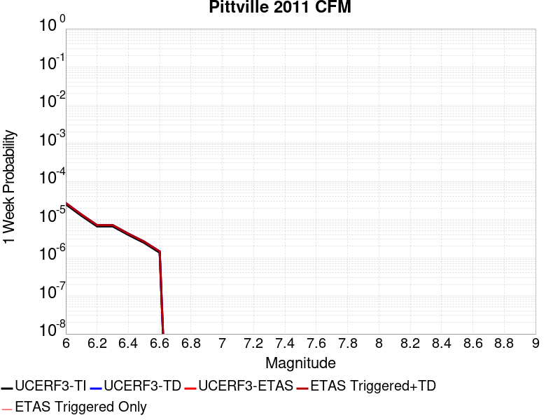 | 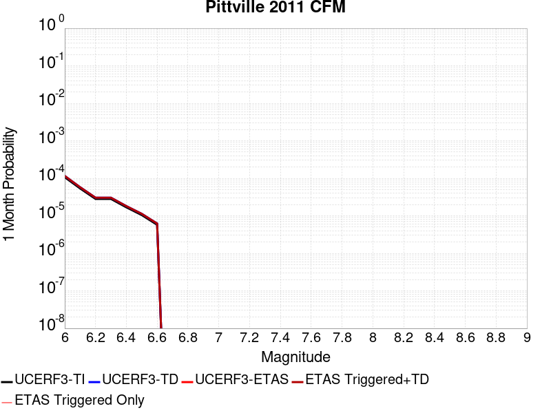 |  |  |

| Magnitude | 1 wk TI Prob | 1 wk TD Prob | 1 wk ETAS Prob | 1 wk ETAS/TD Gain | 1 wk ETAS Triggered+TD | 1 wk ETAS Triggered Only | 1 mo TI Prob | 1 mo TD Prob | 1 mo ETAS Prob | 1 mo ETAS/TD Gain | 1 mo ETAS Triggered+TD | 1 mo ETAS Triggered Only | 1 yr TI Prob | 1 yr TD Prob | 1 yr ETAS Prob | 1 yr ETAS/TD Gain | 1 yr ETAS Triggered+TD | 1 yr ETAS Triggered Only | 10 yr TI Prob | 10 yr TD Prob | 10 yr ETAS Prob | 10 yr ETAS/TD Gain | 10 yr ETAS Triggered+TD | 10 yr ETAS Triggered Only |
|-----|-----|-----|-----|-----|-----|-----|-----|-----|-----|-----|-----|-----|-----|-----|-----|-----|-----|-----|-----|-----|-----|-----|-----|-----|
| 6.0 | 2.5031832E-5 | 2.7061313E-5 | 0.0 | 0.0 | 2.7061313E-5 | 0.0 | 1.0727487E-4 | 1.1597245E-4 | 0.0 | 0.0 | 1.1597245E-4 | 0.0 | 0.001305289 | 0.0014111474 | 9.0E-4 | 0.6377788 | 0.0014111474 | 0.0 | 0.012976485 | 0.014031654 | 0.0086 | 0.61289996 | 0.014623235 | 6.0E-4 |
| 6.1 | 1.2540113E-5 | 1.3515146E-5 | 0.0 | 0.0 | 1.3515146E-5 | 0.0 | 5.3742235E-5 | 5.7920897E-5 | 0.0 | 0.0 | 5.7920897E-5 | 0.0 | 6.541153E-4 | 7.049812E-4 | 4.0E-4 | 0.567391 | 7.049812E-4 | 0.0 | 0.0065219323 | 0.0070296824 | 0.0048 | 0.6828189 | 0.0075261677 | 5.0E-4 |
| 6.2 | 6.603218E-6 | 7.108265E-6 | 0.0 | 0.0 | 7.108265E-6 | 0.0 | 2.8299199E-5 | 3.0463674E-5 | 0.0 | 0.0 | 3.0463674E-5 | 0.0 | 3.4448825E-4 | 3.708386E-4 | 2.0E-4 | 0.5393182 | 3.708386E-4 | 0.0 | 0.0034395473 | 0.0037028387 | 0.0026 | 0.702164 | 0.004001728 | 3.0E-4 |
| 6.3 | 6.603218E-6 | 7.108265E-6 | 0.0 | 0.0 | 7.108265E-6 | 0.0 | 2.8299199E-5 | 3.0463674E-5 | 0.0 | 0.0 | 3.0463674E-5 | 0.0 | 3.4448825E-4 | 3.708386E-4 | 2.0E-4 | 0.5393182 | 3.708386E-4 | 0.0 | 0.0034395473 | 0.0037028387 | 0.0026 | 0.702164 | 0.004001728 | 3.0E-4 |
| 6.4 | 3.9389015E-6 | 4.239816E-6 | 0.0 | 0.0 | 4.239816E-6 | 0.0 | 1.6880897E-5 | 1.817053E-5 | 0.0 | 0.0 | 1.817053E-5 | 0.0 | 2.0550552E-4 | 2.2120686E-4 | 2.0E-4 | 0.9041311 | 2.2120686E-4 | 0.0 | 0.0020531558 | 0.0022101717 | 0.0017 | 0.769171 | 0.0023099508 | 1.0E-4 |
| 6.5 | 2.4533072E-6 | 2.6416699E-6 | 0.0 | 0.0 | 2.6416699E-6 | 0.0 | 1.0514132E-5 | 1.1321405E-5 | 0.0 | 0.0 | 1.1321405E-5 | 0.0 | 1.2800204E-4 | 1.3783132E-4 | 1.0E-4 | 0.7255245 | 1.3783132E-4 | 0.0 | 0.0012792832 | 0.0013776486 | 7.0E-4 | 0.5081122 | 0.0013776486 | 0.0 |
| 6.6 | 1.3482367E-6 | 1.453217E-6 | 0.0 | 0.0 | 1.453217E-6 | 0.0 | 5.778144E-6 | 6.228064E-6 | 0.0 | 0.0 | 6.228064E-6 | 0.0 | 7.0346636E-5 | 7.582518E-5 | 1.0E-4 | 1.3188231 | 7.582518E-5 | 0.0 | 7.032437E-4 | 7.581042E-4 | 4.0E-4 | 0.52763194 | 7.581042E-4 | 0.0 |

## San Gabriel (Extension)
*[(top)](#table-of-contents)*

| 1 Week | 1 Month | 1 Year | 10 Year |
|-----|-----|-----|-----|
| 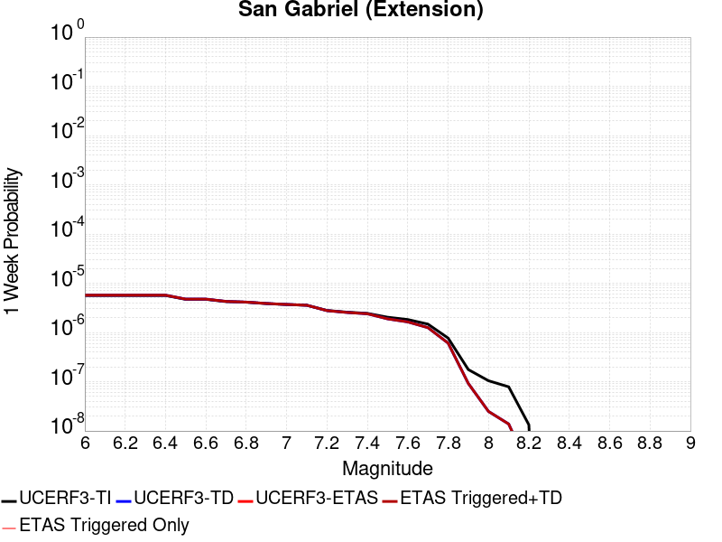 | 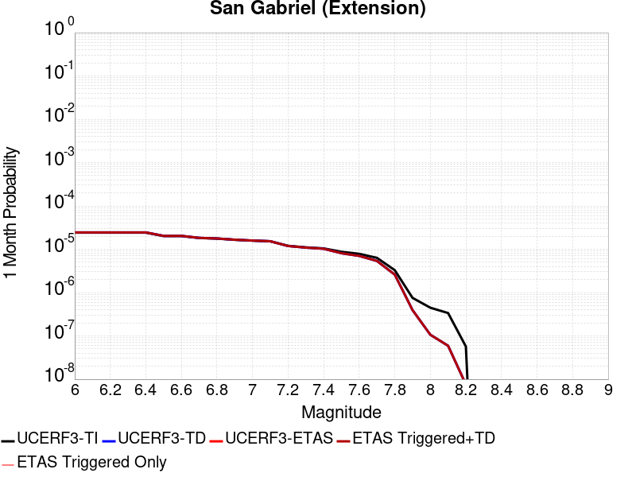 | 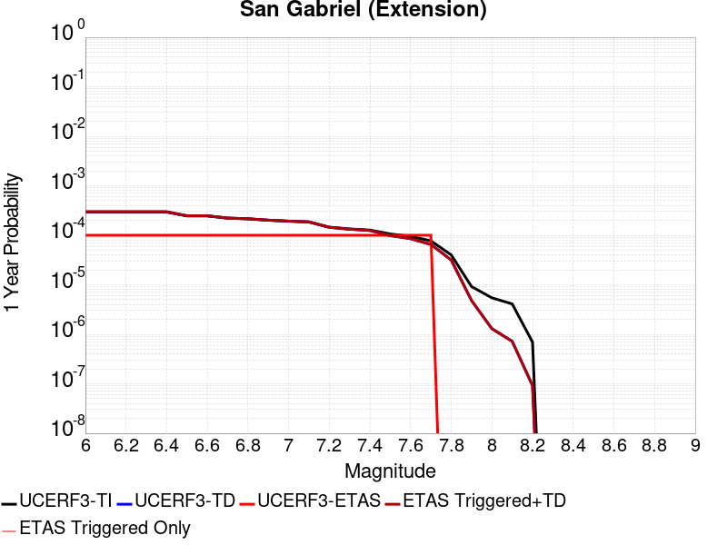 | 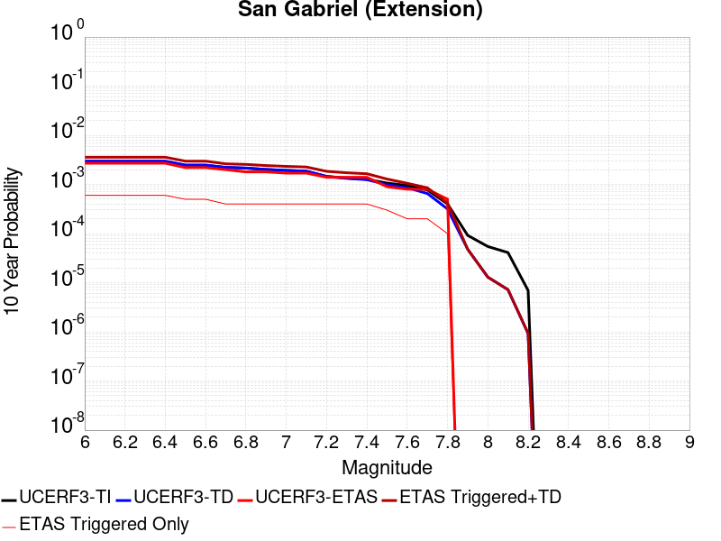 |

| Magnitude | 1 wk TI Prob | 1 wk TD Prob | 1 wk ETAS Prob | 1 wk ETAS/TD Gain | 1 wk ETAS Triggered+TD | 1 wk ETAS Triggered Only | 1 mo TI Prob | 1 mo TD Prob | 1 mo ETAS Prob | 1 mo ETAS/TD Gain | 1 mo ETAS Triggered+TD | 1 mo ETAS Triggered Only | 1 yr TI Prob | 1 yr TD Prob | 1 yr ETAS Prob | 1 yr ETAS/TD Gain | 1 yr ETAS Triggered+TD | 1 yr ETAS Triggered Only | 10 yr TI Prob | 10 yr TD Prob | 10 yr ETAS Prob | 10 yr ETAS/TD Gain | 10 yr ETAS Triggered+TD | 10 yr ETAS Triggered Only |
|-----|-----|-----|-----|-----|-----|-----|-----|-----|-----|-----|-----|-----|-----|-----|-----|-----|-----|-----|-----|-----|-----|-----|-----|-----|
| 6.0 | 5.6486106E-6 | 5.7215943E-6 | 0.0 | 0.0 | 5.7215943E-6 | 0.0 | 2.4208108E-5 | 2.4520894E-5 | 0.0 | 0.0 | 2.4520894E-5 | 0.0 | 2.9469383E-4 | 2.9850227E-4 | 1.0E-4 | 0.33500585 | 2.9850227E-4 | 0.0 | 0.0029430336 | 0.002981146 | 0.0027 | 0.9056919 | 0.0035793574 | 6.0E-4 |
| 6.1 | 5.6486106E-6 | 5.7215943E-6 | 0.0 | 0.0 | 5.7215943E-6 | 0.0 | 2.4208108E-5 | 2.4520894E-5 | 0.0 | 0.0 | 2.4520894E-5 | 0.0 | 2.9469383E-4 | 2.9850227E-4 | 1.0E-4 | 0.33500585 | 2.9850227E-4 | 0.0 | 0.0029430336 | 0.002981146 | 0.0027 | 0.9056919 | 0.0035793574 | 6.0E-4 |
| 6.2 | 5.6486106E-6 | 5.7215943E-6 | 0.0 | 0.0 | 5.7215943E-6 | 0.0 | 2.4208108E-5 | 2.4520894E-5 | 0.0 | 0.0 | 2.4520894E-5 | 0.0 | 2.9469383E-4 | 2.9850227E-4 | 1.0E-4 | 0.33500585 | 2.9850227E-4 | 0.0 | 0.0029430336 | 0.002981146 | 0.0027 | 0.9056919 | 0.0035793574 | 6.0E-4 |
| 6.3 | 5.6486106E-6 | 5.7215943E-6 | 0.0 | 0.0 | 5.7215943E-6 | 0.0 | 2.4208108E-5 | 2.4520894E-5 | 0.0 | 0.0 | 2.4520894E-5 | 0.0 | 2.9469383E-4 | 2.9850227E-4 | 1.0E-4 | 0.33500585 | 2.9850227E-4 | 0.0 | 0.0029430336 | 0.002981146 | 0.0027 | 0.9056919 | 0.0035793574 | 6.0E-4 |
| 6.4 | 5.6486106E-6 | 5.7215943E-6 | 0.0 | 0.0 | 5.7215943E-6 | 0.0 | 2.4208108E-5 | 2.4520894E-5 | 0.0 | 0.0 | 2.4520894E-5 | 0.0 | 2.9469383E-4 | 2.9850227E-4 | 1.0E-4 | 0.33500585 | 2.9850227E-4 | 0.0 | 0.0029430336 | 0.002981146 | 0.0027 | 0.9056919 | 0.0035793574 | 6.0E-4 |
| 6.5 | 4.7134554E-6 | 4.7589624E-6 | 0.0 | 0.0 | 4.7589624E-6 | 0.0 | 2.0200367E-5 | 2.0395399E-5 | 0.0 | 0.0 | 2.0395399E-5 | 0.0 | 2.459117E-4 | 2.4828652E-4 | 1.0E-4 | 0.40276048 | 2.4828652E-4 | 0.0 | 0.0024563975 | 0.002480182 | 0.0022 | 0.8870316 | 0.002978942 | 5.0E-4 |
| 6.6 | 4.7134554E-6 | 4.7589624E-6 | 0.0 | 0.0 | 4.7589624E-6 | 0.0 | 2.0200367E-5 | 2.0395399E-5 | 0.0 | 0.0 | 2.0395399E-5 | 0.0 | 2.459117E-4 | 2.4828652E-4 | 1.0E-4 | 0.40276048 | 2.4828652E-4 | 0.0 | 0.0024563975 | 0.002480182 | 0.0022 | 0.8870316 | 0.002978942 | 5.0E-4 |
| 6.7 | 4.2468837E-6 | 4.278752E-6 | 0.0 | 0.0 | 4.278752E-6 | 0.0 | 1.8200803E-5 | 1.8337383E-5 | 0.0 | 0.0 | 1.8337383E-5 | 0.0 | 2.2157225E-4 | 2.2323549E-4 | 1.0E-4 | 0.44795746 | 2.2323549E-4 | 0.0 | 0.0022135144 | 0.002230191 | 0.002 | 0.8967842 | 0.002629299 | 4.0E-4 |
| 6.8 | 4.1180615E-6 | 4.1461335E-6 | 0.0 | 0.0 | 4.1461335E-6 | 0.0 | 1.7648716E-5 | 1.7769027E-5 | 0.0 | 0.0 | 1.7769027E-5 | 0.0 | 2.1485193E-4 | 2.1631714E-4 | 1.0E-4 | 0.4622842 | 2.1631714E-4 | 0.0 | 0.0021464431 | 0.0021611436 | 0.0018 | 0.83289236 | 0.002560279 | 4.0E-4 |
| 6.9 | 3.863861E-6 | 3.8844337E-6 | 0.0 | 0.0 | 3.8844337E-6 | 0.0 | 1.65593E-5 | 1.6647471E-5 | 0.0 | 0.0 | 1.6647471E-5 | 0.0 | 2.0159081E-4 | 2.0266479E-4 | 1.0E-4 | 0.49342564 | 2.0266479E-4 | 0.0 | 0.0020140803 | 0.0020248736 | 0.0018 | 0.8889443 | 0.0024240639 | 4.0E-4 |
| 7.0 | 3.6947372E-6 | 3.7103227E-6 | 0.0 | 0.0 | 3.7103227E-6 | 0.0 | 1.5834492E-5 | 1.590129E-5 | 0.0 | 0.0 | 1.590129E-5 | 0.0 | 1.9276788E-4 | 1.9358168E-4 | 1.0E-4 | 0.5165778 | 1.9358168E-4 | 0.0 | 0.0019260074 | 0.0019342034 | 0.0017 | 0.87891483 | 0.0023334296 | 4.0E-4 |
| 7.1 | 3.5686835E-6 | 3.5775272E-6 | 0.0 | 0.0 | 3.5775272E-6 | 0.0 | 1.5294268E-5 | 1.5332173E-5 | 0.0 | 0.0 | 1.5332173E-5 | 0.0 | 1.861918E-4 | 1.8665388E-4 | 1.0E-4 | 0.535751 | 1.8665388E-4 | 0.0 | 0.0018603588 | 0.0018650434 | 0.0017 | 0.91150695 | 0.0022642973 | 4.0E-4 |
| 7.2 | 2.8023446E-6 | 2.7813514E-6 | 0.0 | 0.0 | 2.7813514E-6 | 0.0 | 1.2009994E-5 | 1.1920023E-5 | 0.0 | 0.0 | 1.1920023E-5 | 0.0 | 1.4621185E-4 | 1.4511673E-4 | 1.0E-4 | 0.68910044 | 1.4511673E-4 | 0.0 | 0.001461157 | 0.0014502369 | 0.0014 | 0.9653595 | 0.0018496568 | 4.0E-4 |
| 7.3 | 2.5843012E-6 | 2.5504814E-6 | 0.0 | 0.0 | 2.5504814E-6 | 0.0 | 1.1075529E-5 | 1.093059E-5 | 0.0 | 0.0 | 1.093059E-5 | 0.0 | 1.3483623E-4 | 1.3307191E-4 | 1.0E-4 | 0.7514734 | 1.3307191E-4 | 0.0 | 0.0013475444 | 0.0013299383 | 0.0014 | 1.0526804 | 0.0017294063 | 4.0E-4 |
| 7.4 | 2.4464468E-6 | 2.401117E-6 | 0.0 | 0.0 | 2.401117E-6 | 0.0 | 1.04847295E-5 | 1.0290461E-5 | 0.0 | 0.0 | 1.0290461E-5 | 0.0 | 1.276441E-4 | 1.2527926E-4 | 1.0E-4 | 0.7982167 | 1.2527926E-4 | 0.0 | 0.0012757082 | 0.0012521023 | 0.0014 | 1.1181195 | 0.0016516015 | 4.0E-4 |
| 7.5 | 2.0420266E-6 | 1.8949705E-6 | 0.0 | 0.0 | 1.8949705E-6 | 0.0 | 8.751514E-6 | 8.121277E-6 | 0.0 | 0.0 | 8.121277E-6 | 0.0 | 1.0654447E-4 | 9.88721E-5 | 1.0E-4 | 1.0114077 | 9.88721E-5 | 0.0 | 0.001064934 | 9.882909E-4 | 9.0E-4 | 0.91066307 | 0.0012879943 | 3.0E-4 |
| 7.6 | 1.8326596E-6 | 1.6435049E-6 | 0.0 | 0.0 | 1.6435049E-6 | 0.0 | 7.854232E-6 | 7.0435735E-6 | 0.0 | 0.0 | 7.0435735E-6 | 0.0 | 9.562107E-5 | 8.575216E-5 | 1.0E-4 | 1.1661514 | 8.575216E-5 | 0.0 | 9.5579936E-4 | 8.571991E-4 | 8.0E-4 | 0.9332721 | 0.0010570276 | 2.0E-4 |
| 7.7 | 1.4786998E-6 | 1.2557472E-6 | 0.0 | 0.0 | 1.2557472E-6 | 0.0 | 6.3372695E-6 | 5.3817625E-6 | 0.0 | 0.0 | 5.3817625E-6 | 0.0 | 7.715353E-5 | 6.5521E-5 | 1.0E-4 | 1.5262282 | 6.5521E-5 | 0.0 | 7.7126746E-4 | 6.5502484E-4 | 8.0E-4 | 1.2213278 | 8.548938E-4 | 2.0E-4 |
| 7.8 | 7.6975533E-7 | 6.0975736E-7 | 0.0 | 0.0 | 6.0975736E-7 | 0.0 | 3.2989474E-6 | 2.6132434E-6 | 0.0 | 0.0 | 2.6132434E-6 | 0.0 | 4.0163945E-5 | 3.1815776E-5 | 0.0 | 0.0 | 3.1815776E-5 | 0.0 | 4.0156685E-4 | 3.1811904E-4 | 5.0E-4 | 1.5717386 | 4.1808723E-4 | 1.0E-4 |
| 7.9 | 1.7645915E-7 | 9.2914355E-8 | 0.0 | 0.0 | 9.2914355E-8 | 0.0 | 7.562533E-7 | 3.9820432E-7 | 0.0 | 0.0 | 3.9820432E-7 | 0.0 | 9.207345E-6 | 4.848127E-6 | 0.0 | 0.0 | 4.848127E-6 | 0.0 | 9.206964E-5 | 4.8485286E-5 | 0.0 | 0.0 | 4.8485286E-5 | 0.0 |
| 8.0 | 1.0463461E-7 | 2.5274634E-8 | 0.0 | 0.0 | 2.5274634E-8 | 0.0 | 4.4843398E-7 | 1.0831986E-7 | 0.0 | 0.0 | 1.0831986E-7 | 0.0 | 5.45967E-6 | 1.3187935E-6 | 0.0 | 0.0 | 1.3187935E-6 | 0.0 | 5.459536E-5 | 1.3192926E-5 | 0.0 | 0.0 | 1.3192926E-5 | 0.0 |
| 8.1 | 7.875717E-8 | 1.4077403E-8 | 0.0 | 0.0 | 1.4077403E-8 | 0.0 | 3.3753068E-7 | 6.033173E-8 | 0.0 | 0.0 | 6.033173E-8 | 0.0 | 4.109428E-6 | 7.3453856E-7 | 0.0 | 0.0 | 7.3453856E-7 | 0.0 | 4.109352E-5 | 7.3504307E-6 | 0.0 | 0.0 | 7.3504307E-6 | 0.0 |
| 8.2 | 1.33163E-8 | 1.8043499E-9 | 0.0 | 0.0 | 1.8043499E-9 | 0.0 | 5.7069855E-8 | 7.732927E-9 | 0.0 | 0.0 | 7.732927E-9 | 0.0 | 6.9482525E-7 | 9.414839E-8 | 0.0 | 0.0 | 9.414839E-8 | 0.0 | 6.9482307E-6 | 9.4352805E-7 | 0.0 | 0.0 | 9.4352805E-7 | 0.0 |

## Independence rev 2011
*[(top)](#table-of-contents)*

| 1 Week | 1 Month | 1 Year | 10 Year |
|-----|-----|-----|-----|
|  | 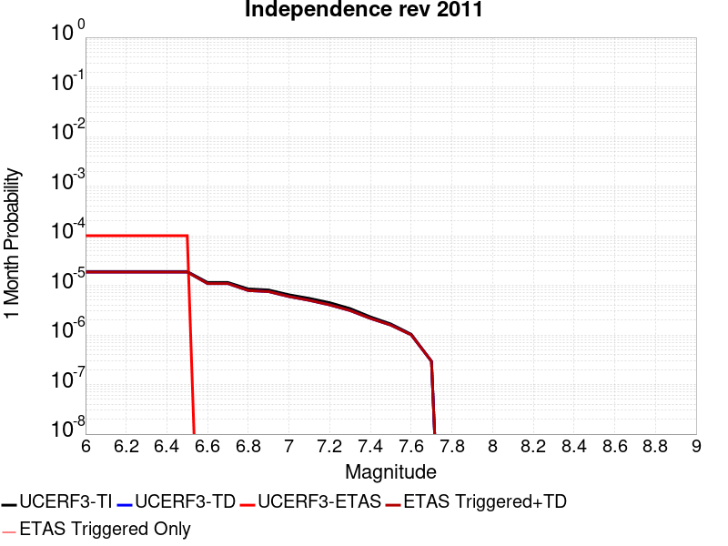 | 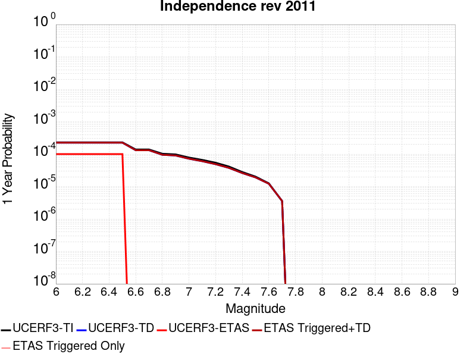 |  |

| Magnitude | 1 wk TI Prob | 1 wk TD Prob | 1 wk ETAS Prob | 1 wk ETAS/TD Gain | 1 wk ETAS Triggered+TD | 1 wk ETAS Triggered Only | 1 mo TI Prob | 1 mo TD Prob | 1 mo ETAS Prob | 1 mo ETAS/TD Gain | 1 mo ETAS Triggered+TD | 1 mo ETAS Triggered Only | 1 yr TI Prob | 1 yr TD Prob | 1 yr ETAS Prob | 1 yr ETAS/TD Gain | 1 yr ETAS Triggered+TD | 1 yr ETAS Triggered Only | 10 yr TI Prob | 10 yr TD Prob | 10 yr ETAS Prob | 10 yr ETAS/TD Gain | 10 yr ETAS Triggered+TD | 10 yr ETAS Triggered Only |
|-----|-----|-----|-----|-----|-----|-----|-----|-----|-----|-----|-----|-----|-----|-----|-----|-----|-----|-----|-----|-----|-----|-----|-----|-----|
| 6.0 | 4.422171E-6 | 4.3265013E-6 | 0.0 | 0.0 | 4.3265013E-6 | 0.0 | 1.8952025E-5 | 1.8542034E-5 | 1.0E-4 | 5.3931518 | 1.8542034E-5 | 0.0 | 2.3071647E-4 | 2.2572886E-4 | 1.0E-4 | 0.44300938 | 2.2572886E-4 | 0.0 | 0.0023047708 | 0.0022552893 | 0.0018 | 0.7981237 | 0.0028539363 | 6.0E-4 |
| 6.1 | 4.422171E-6 | 4.3265013E-6 | 0.0 | 0.0 | 4.3265013E-6 | 0.0 | 1.8952025E-5 | 1.8542034E-5 | 1.0E-4 | 5.3931518 | 1.8542034E-5 | 0.0 | 2.3071647E-4 | 2.2572886E-4 | 1.0E-4 | 0.44300938 | 2.2572886E-4 | 0.0 | 0.0023047708 | 0.0022552893 | 0.0018 | 0.7981237 | 0.0028539363 | 6.0E-4 |
| 6.2 | 4.422171E-6 | 4.3265013E-6 | 0.0 | 0.0 | 4.3265013E-6 | 0.0 | 1.8952025E-5 | 1.8542034E-5 | 1.0E-4 | 5.3931518 | 1.8542034E-5 | 0.0 | 2.3071647E-4 | 2.2572886E-4 | 1.0E-4 | 0.44300938 | 2.2572886E-4 | 0.0 | 0.0023047708 | 0.0022552893 | 0.0018 | 0.7981237 | 0.0028539363 | 6.0E-4 |
| 6.3 | 4.422171E-6 | 4.3265013E-6 | 0.0 | 0.0 | 4.3265013E-6 | 0.0 | 1.8952025E-5 | 1.8542034E-5 | 1.0E-4 | 5.3931518 | 1.8542034E-5 | 0.0 | 2.3071647E-4 | 2.2572886E-4 | 1.0E-4 | 0.44300938 | 2.2572886E-4 | 0.0 | 0.0023047708 | 0.0022552893 | 0.0018 | 0.7981237 | 0.0028539363 | 6.0E-4 |
| 6.4 | 4.422171E-6 | 4.3265013E-6 | 0.0 | 0.0 | 4.3265013E-6 | 0.0 | 1.8952025E-5 | 1.8542034E-5 | 1.0E-4 | 5.3931518 | 1.8542034E-5 | 0.0 | 2.3071647E-4 | 2.2572886E-4 | 1.0E-4 | 0.44300938 | 2.2572886E-4 | 0.0 | 0.0023047708 | 0.0022552893 | 0.0018 | 0.7981237 | 0.0028539363 | 6.0E-4 |
| 6.5 | 4.422171E-6 | 4.3265013E-6 | 0.0 | 0.0 | 4.3265013E-6 | 0.0 | 1.8952025E-5 | 1.8542034E-5 | 1.0E-4 | 5.3931518 | 1.8542034E-5 | 0.0 | 2.3071647E-4 | 2.2572886E-4 | 1.0E-4 | 0.44300938 | 2.2572886E-4 | 0.0 | 0.0023047708 | 0.0022552893 | 0.0018 | 0.7981237 | 0.0028539363 | 6.0E-4 |
| 6.6 | 2.663744E-6 | 2.532188E-6 | 0.0 | 0.0 | 2.532188E-6 | 0.0 | 1.1415996E-5 | 1.0852192E-5 | 0.0 | 0.0 | 1.0852192E-5 | 0.0 | 1.3898089E-4 | 1.3211792E-4 | 0.0 | 0.0 | 1.3211792E-4 | 0.0 | 0.0013889399 | 0.001320442 | 6.0E-4 | 0.45439333 | 0.0016200457 | 3.0E-4 |
| 6.7 | 2.663744E-6 | 2.532188E-6 | 0.0 | 0.0 | 2.532188E-6 | 0.0 | 1.1415996E-5 | 1.0852192E-5 | 0.0 | 0.0 | 1.0852192E-5 | 0.0 | 1.3898089E-4 | 1.3211792E-4 | 0.0 | 0.0 | 1.3211792E-4 | 0.0 | 0.0013889399 | 0.001320442 | 6.0E-4 | 0.45439333 | 0.0016200457 | 3.0E-4 |
| 6.8 | 1.9716529E-6 | 1.8324316E-6 | 0.0 | 0.0 | 1.8324316E-6 | 0.0 | 8.449913E-6 | 7.853256E-6 | 0.0 | 0.0 | 7.853256E-6 | 0.0 | 1.0287284E-4 | 9.560932E-5 | 0.0 | 0.0 | 9.560932E-5 | 0.0 | 0.0010282523 | 9.5569476E-4 | 6.0E-4 | 0.6278155 | 0.001255408 | 3.0E-4 |
| 6.9 | 1.8788617E-6 | 1.743166E-6 | 0.0 | 0.0 | 1.743166E-6 | 0.0 | 8.0522395E-6 | 7.4706904E-6 | 0.0 | 0.0 | 7.4706904E-6 | 0.0 | 9.80316E-5 | 9.095199E-5 | 0.0 | 0.0 | 9.095199E-5 | 0.0 | 9.798837E-4 | 9.0915966E-4 | 5.0E-4 | 0.5499584 | 0.0012088869 | 3.0E-4 |
| 7.0 | 1.5045488E-6 | 1.3850893E-6 | 0.0 | 0.0 | 1.3850893E-6 | 0.0 | 6.44805E-6 | 5.9360837E-6 | 0.0 | 0.0 | 5.9360837E-6 | 0.0 | 7.8502184E-5 | 7.2269475E-5 | 0.0 | 0.0 | 7.2269475E-5 | 0.0 | 7.8474457E-4 | 7.224649E-4 | 4.0E-4 | 0.55366015 | 0.0010222481 | 3.0E-4 |
| 7.1 | 1.272341E-6 | 1.1626312E-6 | 0.0 | 0.0 | 1.1626312E-6 | 0.0 | 5.4528787E-6 | 4.982696E-6 | 0.0 | 0.0 | 4.982696E-6 | 0.0 | 6.6386776E-5 | 6.0662664E-5 | 0.0 | 0.0 | 6.0662664E-5 | 0.0 | 6.636695E-4 | 6.064642E-4 | 3.0E-4 | 0.49467054 | 8.063429E-4 | 2.0E-4 |
| 7.2 | 1.0416892E-6 | 9.4109345E-7 | 0.0 | 0.0 | 9.4109345E-7 | 0.0 | 4.464375E-6 | 4.0332516E-6 | 0.0 | 0.0 | 4.0332516E-6 | 0.0 | 5.4352407E-5 | 4.910375E-5 | 0.0 | 0.0 | 4.910375E-5 | 0.0 | 5.4339116E-4 | 4.9093086E-4 | 3.0E-4 | 0.611084 | 6.908327E-4 | 2.0E-4 |
| 7.3 | 7.9450155E-7 | 7.2357983E-7 | 0.0 | 0.0 | 7.2357983E-7 | 0.0 | 3.4050022E-6 | 3.101053E-6 | 0.0 | 0.0 | 3.101053E-6 | 0.0 | 4.1455114E-5 | 3.7754675E-5 | 0.0 | 0.0 | 3.7754675E-5 | 0.0 | 4.144738E-4 | 3.7748372E-4 | 2.0E-4 | 0.52982414 | 5.7740824E-4 | 2.0E-4 |
| 7.4 | 5.3893444E-7 | 5.0200003E-7 | 0.0 | 0.0 | 5.0200003E-7 | 0.0 | 2.309717E-6 | 2.151427E-6 | 0.0 | 0.0 | 2.151427E-6 | 0.0 | 2.8120441E-5 | 2.6193313E-5 | 0.0 | 0.0 | 2.6193313E-5 | 0.0 | 2.8116882E-4 | 2.619027E-4 | 1.0E-4 | 0.3818212 | 3.618765E-4 | 1.0E-4 |
| 7.5 | 3.8852085E-7 | 3.6828771E-7 | 0.0 | 0.0 | 3.6828771E-7 | 0.0 | 1.6650882E-6 | 1.578375E-6 | 0.0 | 0.0 | 1.578375E-6 | 0.0 | 2.027226E-5 | 1.9216548E-5 | 0.0 | 0.0 | 1.9216548E-5 | 0.0 | 2.0270412E-4 | 1.9214908E-4 | 1.0E-4 | 0.52042925 | 2.9212984E-4 | 1.0E-4 |
| 7.6 | 2.414929E-7 | 2.3459256E-7 | 0.0 | 0.0 | 2.3459256E-7 | 0.0 | 1.0349692E-6 | 1.0053964E-6 | 0.0 | 0.0 | 1.0053964E-6 | 0.0 | 1.2600677E-5 | 1.2240633E-5 | 0.0 | 0.0 | 1.2240633E-5 | 0.0 | 1.2599962E-4 | 1.2239971E-4 | 0.0 | 0.0 | 1.2239971E-4 | 0.0 |
| 7.7 | 6.8298014E-8 | 6.859315E-8 | 0.0 | 0.0 | 6.859315E-8 | 0.0 | 2.9270575E-7 | 2.9397063E-7 | 0.0 | 0.0 | 2.9397063E-7 | 0.0 | 3.5636867E-6 | 3.579087E-6 | 0.0 | 0.0 | 3.579087E-6 | 0.0 | 3.5636294E-5 | 3.579034E-5 | 0.0 | 0.0 | 3.579034E-5 | 0.0 |

## Los Alamos 2011 CFM
*[(top)](#table-of-contents)*

| 1 Week | 1 Month | 1 Year | 10 Year |
|-----|-----|-----|-----|
| 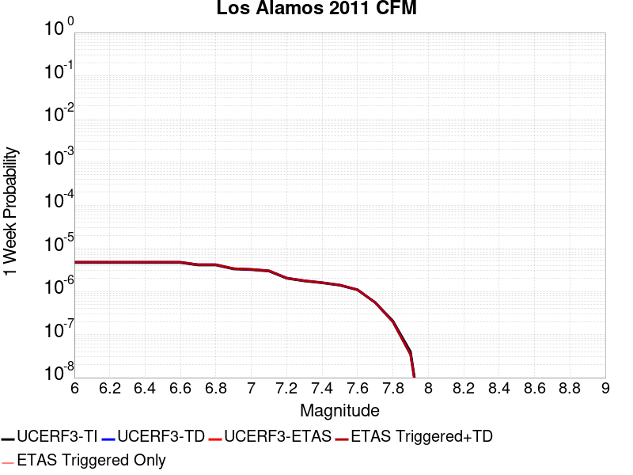 | 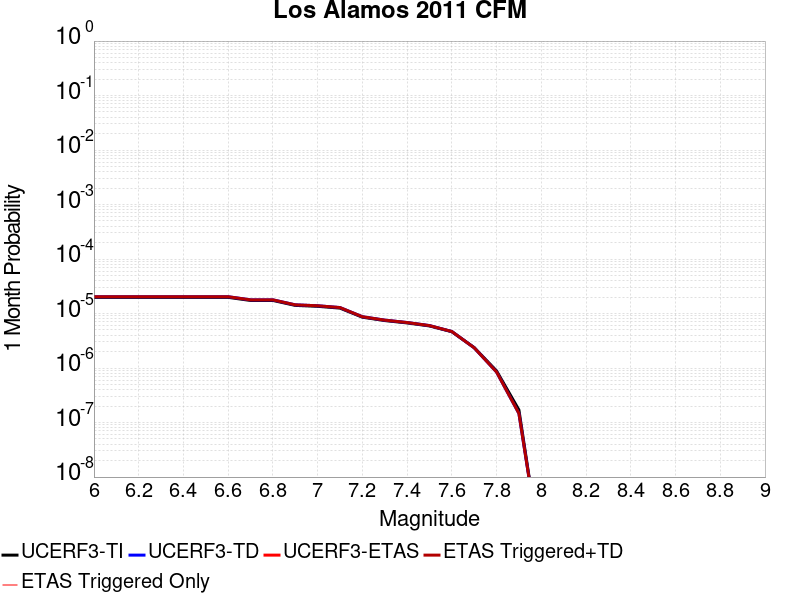 | 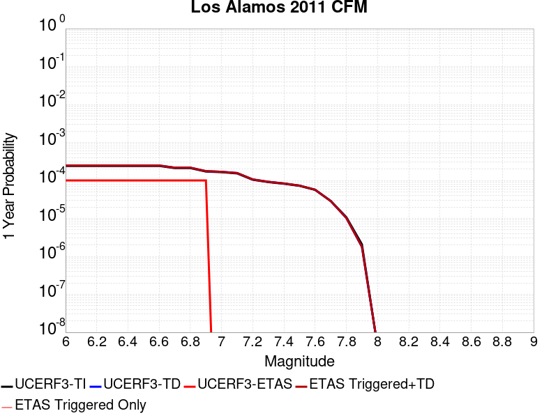 | 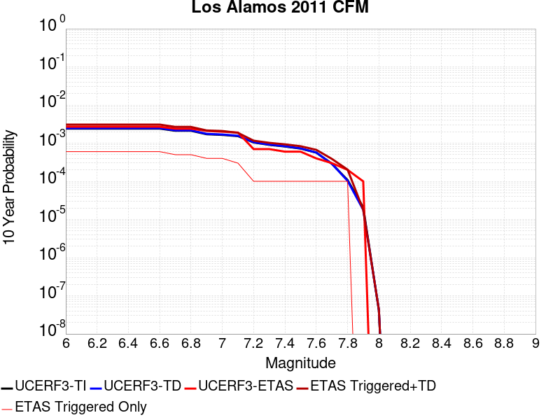 |

| Magnitude | 1 wk TI Prob | 1 wk TD Prob | 1 wk ETAS Prob | 1 wk ETAS/TD Gain | 1 wk ETAS Triggered+TD | 1 wk ETAS Triggered Only | 1 mo TI Prob | 1 mo TD Prob | 1 mo ETAS Prob | 1 mo ETAS/TD Gain | 1 mo ETAS Triggered+TD | 1 mo ETAS Triggered Only | 1 yr TI Prob | 1 yr TD Prob | 1 yr ETAS Prob | 1 yr ETAS/TD Gain | 1 yr ETAS Triggered+TD | 1 yr ETAS Triggered Only | 10 yr TI Prob | 10 yr TD Prob | 10 yr ETAS Prob | 10 yr ETAS/TD Gain | 10 yr ETAS Triggered+TD | 10 yr ETAS Triggered Only |
|-----|-----|-----|-----|-----|-----|-----|-----|-----|-----|-----|-----|-----|-----|-----|-----|-----|-----|-----|-----|-----|-----|-----|-----|-----|
| 6.0 | 4.6284417E-6 | 4.7520607E-6 | 0.0 | 0.0 | 4.7520607E-6 | 0.0 | 1.9836029E-5 | 2.0365824E-5 | 0.0 | 0.0 | 2.0365824E-5 | 0.0 | 2.4147688E-4 | 2.4792747E-4 | 1.0E-4 | 0.4033438 | 2.4792747E-4 | 0.0 | 0.0024121467 | 0.002476683 | 0.0027 | 1.0901679 | 0.0030751969 | 6.0E-4 |
| 6.1 | 4.6284417E-6 | 4.7520607E-6 | 0.0 | 0.0 | 4.7520607E-6 | 0.0 | 1.9836029E-5 | 2.0365824E-5 | 0.0 | 0.0 | 2.0365824E-5 | 0.0 | 2.4147688E-4 | 2.4792747E-4 | 1.0E-4 | 0.4033438 | 2.4792747E-4 | 0.0 | 0.0024121467 | 0.002476683 | 0.0027 | 1.0901679 | 0.0030751969 | 6.0E-4 |
| 6.2 | 4.6284417E-6 | 4.7520607E-6 | 0.0 | 0.0 | 4.7520607E-6 | 0.0 | 1.9836029E-5 | 2.0365824E-5 | 0.0 | 0.0 | 2.0365824E-5 | 0.0 | 2.4147688E-4 | 2.4792747E-4 | 1.0E-4 | 0.4033438 | 2.4792747E-4 | 0.0 | 0.0024121467 | 0.002476683 | 0.0027 | 1.0901679 | 0.0030751969 | 6.0E-4 |
| 6.3 | 4.6284417E-6 | 4.7520607E-6 | 0.0 | 0.0 | 4.7520607E-6 | 0.0 | 1.9836029E-5 | 2.0365824E-5 | 0.0 | 0.0 | 2.0365824E-5 | 0.0 | 2.4147688E-4 | 2.4792747E-4 | 1.0E-4 | 0.4033438 | 2.4792747E-4 | 0.0 | 0.0024121467 | 0.002476683 | 0.0027 | 1.0901679 | 0.0030751969 | 6.0E-4 |
| 6.4 | 4.6284417E-6 | 4.7520607E-6 | 0.0 | 0.0 | 4.7520607E-6 | 0.0 | 1.9836029E-5 | 2.0365824E-5 | 0.0 | 0.0 | 2.0365824E-5 | 0.0 | 2.4147688E-4 | 2.4792747E-4 | 1.0E-4 | 0.4033438 | 2.4792747E-4 | 0.0 | 0.0024121467 | 0.002476683 | 0.0027 | 1.0901679 | 0.0030751969 | 6.0E-4 |
| 6.5 | 4.6284417E-6 | 4.7520607E-6 | 0.0 | 0.0 | 4.7520607E-6 | 0.0 | 1.9836029E-5 | 2.0365824E-5 | 0.0 | 0.0 | 2.0365824E-5 | 0.0 | 2.4147688E-4 | 2.4792747E-4 | 1.0E-4 | 0.4033438 | 2.4792747E-4 | 0.0 | 0.0024121467 | 0.002476683 | 0.0027 | 1.0901679 | 0.0030751969 | 6.0E-4 |
| 6.6 | 4.6284417E-6 | 4.7520607E-6 | 0.0 | 0.0 | 4.7520607E-6 | 0.0 | 1.9836029E-5 | 2.0365824E-5 | 0.0 | 0.0 | 2.0365824E-5 | 0.0 | 2.4147688E-4 | 2.4792747E-4 | 1.0E-4 | 0.4033438 | 2.4792747E-4 | 0.0 | 0.0024121467 | 0.002476683 | 0.0027 | 1.0901679 | 0.0030751969 | 6.0E-4 |
| 6.7 | 4.062321E-6 | 4.1666385E-6 | 0.0 | 0.0 | 4.1666385E-6 | 0.0 | 1.7409831E-5 | 1.7856908E-5 | 0.0 | 0.0 | 1.7856908E-5 | 0.0 | 2.1194408E-4 | 2.1738769E-4 | 1.0E-4 | 0.46000764 | 2.1738769E-4 | 0.0 | 0.0021174205 | 0.0021719001 | 0.0024 | 1.1050233 | 0.002670814 | 5.0E-4 |
| 6.8 | 4.062321E-6 | 4.1666385E-6 | 0.0 | 0.0 | 4.1666385E-6 | 0.0 | 1.7409831E-5 | 1.7856908E-5 | 0.0 | 0.0 | 1.7856908E-5 | 0.0 | 2.1194408E-4 | 2.1738769E-4 | 1.0E-4 | 0.46000764 | 2.1738769E-4 | 0.0 | 0.0021174205 | 0.0021719001 | 0.0024 | 1.1050233 | 0.002670814 | 5.0E-4 |
| 6.9 | 3.2936077E-6 | 3.3731972E-6 | 0.0 | 0.0 | 3.3731972E-6 | 0.0 | 1.4115385E-5 | 1.4456485E-5 | 0.0 | 0.0 | 1.4456485E-5 | 0.0 | 1.7184127E-4 | 1.7599443E-4 | 1.0E-4 | 0.5681998 | 1.7599443E-4 | 0.0 | 0.0017170844 | 0.0017586431 | 0.0021 | 1.1941024 | 0.0021579396 | 4.0E-4 |
| 7.0 | 3.1687898E-6 | 3.245048E-6 | 0.0 | 0.0 | 3.245048E-6 | 0.0 | 1.3580457E-5 | 1.390728E-5 | 0.0 | 0.0 | 1.390728E-5 | 0.0 | 1.6532952E-4 | 1.693089E-4 | 0.0 | 0.0 | 1.693089E-4 | 0.0 | 0.0016520657 | 0.0016918908 | 0.002 | 1.1821095 | 0.002091214 | 4.0E-4 |
| 7.1 | 2.9379228E-6 | 3.0075448E-6 | 0.0 | 0.0 | 3.0075448E-6 | 0.0 | 1.25910365E-5 | 1.2889419E-5 | 0.0 | 0.0 | 1.2889419E-5 | 0.0 | 1.5328509E-4 | 1.5691828E-4 | 0.0 | 0.0 | 1.5691828E-4 | 0.0 | 0.001531794 | 0.001568164 | 0.0019 | 1.2116079 | 0.0018676935 | 3.0E-4 |
| 7.2 | 2.0020686E-6 | 2.0417876E-6 | 0.0 | 0.0 | 2.0417876E-6 | 0.0 | 8.580266E-6 | 8.7504895E-6 | 0.0 | 0.0 | 8.7504895E-6 | 0.0 | 1.0445973E-4 | 1.0653205E-4 | 0.0 | 0.0 | 1.0653205E-4 | 0.0 | 0.0010441064 | 0.0010648143 | 7.0E-4 | 0.65739167 | 0.0011647077 | 1.0E-4 |
| 7.3 | 1.7364243E-6 | 1.7680215E-6 | 0.0 | 0.0 | 1.7680215E-6 | 0.0 | 7.441797E-6 | 7.5772136E-6 | 0.0 | 0.0 | 7.5772136E-6 | 0.0 | 9.0600115E-5 | 9.22487E-5 | 0.0 | 0.0 | 9.22487E-5 | 0.0 | 9.0563187E-4 | 9.221072E-4 | 7.0E-4 | 0.75913084 | 0.001022015 | 1.0E-4 |
| 7.4 | 1.5718434E-6 | 1.5984488E-6 | 0.0 | 0.0 | 1.5984488E-6 | 0.0 | 6.7364545E-6 | 6.850477E-6 | 0.0 | 0.0 | 6.850477E-6 | 0.0 | 8.201325E-5 | 8.340139E-5 | 0.0 | 0.0 | 8.340139E-5 | 0.0 | 8.198299E-4 | 8.3370396E-4 | 6.0E-4 | 0.71967995 | 9.336206E-4 | 1.0E-4 |
| 7.5 | 1.3841119E-6 | 1.4043974E-6 | 0.0 | 0.0 | 1.4043974E-6 | 0.0 | 5.9318945E-6 | 6.018832E-6 | 0.0 | 0.0 | 6.018832E-6 | 0.0 | 7.221842E-5 | 7.3276846E-5 | 0.0 | 0.0 | 7.3276846E-5 | 0.0 | 7.2194956E-4 | 7.3252973E-4 | 6.0E-4 | 0.81907934 | 8.324565E-4 | 1.0E-4 |
| 7.6 | 1.0843726E-6 | 1.0935374E-6 | 0.0 | 0.0 | 1.0935374E-6 | 0.0 | 4.647303E-6 | 4.6865807E-6 | 0.0 | 0.0 | 4.6865807E-6 | 0.0 | 5.6579443E-5 | 5.7057652E-5 | 0.0 | 0.0 | 5.7057652E-5 | 0.0 | 5.656504E-4 | 5.7043263E-4 | 4.0E-4 | 0.7012222 | 6.703756E-4 | 1.0E-4 |
| 7.7 | 5.544814E-7 | 5.502368E-7 | 0.0 | 0.0 | 5.502368E-7 | 0.0 | 2.3763469E-6 | 2.3581556E-6 | 0.0 | 0.0 | 2.3581556E-6 | 0.0 | 2.8931638E-5 | 2.8710168E-5 | 0.0 | 0.0 | 2.8710168E-5 | 0.0 | 2.8927872E-4 | 2.8706476E-4 | 3.0E-4 | 1.0450604 | 3.8703604E-4 | 1.0E-4 |
| 7.8 | 2.0707465E-7 | 1.978047E-7 | 0.0 | 0.0 | 1.978047E-7 | 0.0 | 8.874625E-7 | 8.4773416E-7 | 0.0 | 0.0 | 8.4773416E-7 | 0.0 | 1.08048025E-5 | 1.0321115E-5 | 0.0 | 0.0 | 1.0321115E-5 | 0.0 | 1.0804277E-4 | 1.03206396E-4 | 2.0E-4 | 1.9378643 | 2.0319608E-4 | 1.0E-4 |
| 7.9 | 3.9821284E-8 | 3.4335038E-8 | 0.0 | 0.0 | 3.4335038E-8 | 0.0 | 1.7066264E-7 | 1.4715015E-7 | 0.0 | 0.0 | 1.4715015E-7 | 0.0 | 2.0778157E-6 | 1.7915517E-6 | 0.0 | 0.0 | 1.7915517E-6 | 0.0 | 2.0777963E-5 | 1.7915378E-5 | 1.0E-4 | 5.5817966 | 1.7915378E-5 | 0.0 |
| 8.0 | 7.880441E-11 | 8.236045E-11 | 0.0 | 0.0 | 8.236045E-11 | 0.0 | 3.3773329E-10 | 3.5297354E-10 | 0.0 | 0.0 | 3.5297354E-10 | 0.0 | 4.1119033E-9 | 4.297453E-9 | 0.0 | 0.0 | 4.297453E-9 | 0.0 | 4.1119034E-8 | 4.2974534E-8 | 0.0 | 0.0 | 4.2974534E-8 | 0.0 |

## Goose Lake 2011 CFM
*[(top)](#table-of-contents)*

| 1 Week | 1 Month | 1 Year | 10 Year |
|-----|-----|-----|-----|
|  |  | 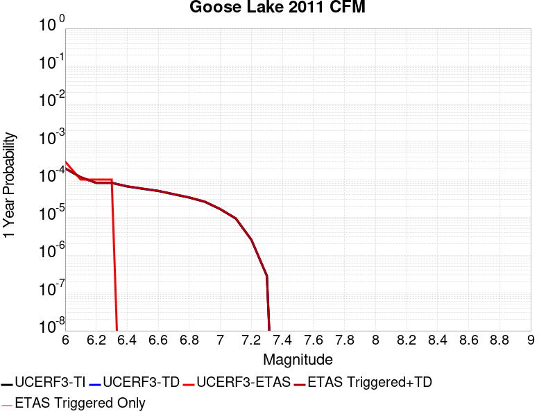 |  |

| Magnitude | 1 wk TI Prob | 1 wk TD Prob | 1 wk ETAS Prob | 1 wk ETAS/TD Gain | 1 wk ETAS Triggered+TD | 1 wk ETAS Triggered Only | 1 mo TI Prob | 1 mo TD Prob | 1 mo ETAS Prob | 1 mo ETAS/TD Gain | 1 mo ETAS Triggered+TD | 1 mo ETAS Triggered Only | 1 yr TI Prob | 1 yr TD Prob | 1 yr ETAS Prob | 1 yr ETAS/TD Gain | 1 yr ETAS Triggered+TD | 1 yr ETAS Triggered Only | 10 yr TI Prob | 10 yr TD Prob | 10 yr ETAS Prob | 10 yr ETAS/TD Gain | 10 yr ETAS Triggered+TD | 10 yr ETAS Triggered Only |
|-----|-----|-----|-----|-----|-----|-----|-----|-----|-----|-----|-----|-----|-----|-----|-----|-----|-----|-----|-----|-----|-----|-----|-----|-----|
| 6.0 | 3.780968E-6 | 3.823107E-6 | 1.0E-4 | 26.156738 | 3.823107E-6 | 0.0 | 1.6204049E-5 | 1.6384647E-5 | 1.0E-4 | 6.103275 | 1.6384647E-5 | 0.0 | 1.9726643E-4 | 1.9946591E-4 | 3.0E-4 | 1.5040164 | 1.9946591E-4 | 0.0 | 0.001970914 | 0.001992977 | 0.0015 | 0.7526429 | 0.0025917813 | 6.0E-4 |
| 6.1 | 2.2035124E-6 | 2.229854E-6 | 0.0 | 0.0 | 2.229854E-6 | 0.0 | 9.443591E-6 | 9.556484E-6 | 0.0 | 0.0 | 9.556484E-6 | 0.0 | 1.1496965E-4 | 1.1634416E-4 | 1.0E-4 | 0.8595189 | 1.1634416E-4 | 0.0 | 0.0011491019 | 0.0011628508 | 8.0E-4 | 0.68796444 | 0.0014625019 | 3.0E-4 |
| 6.2 | 1.5624689E-6 | 1.582733E-6 | 0.0 | 0.0 | 1.582733E-6 | 0.0 | 6.6962784E-6 | 6.7831243E-6 | 0.0 | 0.0 | 6.7831243E-6 | 0.0 | 8.152414E-5 | 8.258145E-5 | 1.0E-4 | 1.2109257 | 8.258145E-5 | 0.0 | 8.1494235E-4 | 8.255121E-4 | 4.0E-4 | 0.4845477 | 9.254296E-4 | 1.0E-4 |
| 6.3 | 1.5624689E-6 | 1.582733E-6 | 0.0 | 0.0 | 1.582733E-6 | 0.0 | 6.6962784E-6 | 6.7831243E-6 | 0.0 | 0.0 | 6.7831243E-6 | 0.0 | 8.152414E-5 | 8.258145E-5 | 1.0E-4 | 1.2109257 | 8.258145E-5 | 0.0 | 8.1494235E-4 | 8.255121E-4 | 4.0E-4 | 0.4845477 | 9.254296E-4 | 1.0E-4 |
| 6.4 | 1.256464E-6 | 1.2739047E-6 | 0.0 | 0.0 | 1.2739047E-6 | 0.0 | 5.3848344E-6 | 5.45958E-6 | 0.0 | 0.0 | 5.45958E-6 | 0.0 | 6.5558386E-5 | 6.6468376E-5 | 0.0 | 0.0 | 6.6468376E-5 | 0.0 | 6.553905E-4 | 6.6448696E-4 | 2.0E-4 | 0.30098408 | 6.6448696E-4 | 0.0 |
| 6.5 | 1.0910911E-6 | 1.1069724E-6 | 0.0 | 0.0 | 1.1069724E-6 | 0.0 | 4.6760965E-6 | 4.744159E-6 | 0.0 | 0.0 | 4.744159E-6 | 0.0 | 5.692999E-5 | 5.7758614E-5 | 0.0 | 0.0 | 5.7758614E-5 | 0.0 | 5.6915404E-4 | 5.774373E-4 | 2.0E-4 | 0.34635794 | 5.774373E-4 | 0.0 |
| 6.6 | 9.546601E-7 | 9.691538E-7 | 0.0 | 0.0 | 9.691538E-7 | 0.0 | 4.091394E-6 | 4.1535095E-6 | 0.0 | 0.0 | 4.1535095E-6 | 0.0 | 4.9811584E-5 | 5.0567814E-5 | 0.0 | 0.0 | 5.0567814E-5 | 0.0 | 4.980042E-4 | 5.05564E-4 | 2.0E-4 | 0.39559782 | 5.05564E-4 | 0.0 |
| 6.7 | 7.790316E-7 | 7.9162174E-7 | 0.0 | 0.0 | 7.9162174E-7 | 0.0 | 3.3387028E-6 | 3.3926601E-6 | 0.0 | 0.0 | 3.3926601E-6 | 0.0 | 4.0647945E-5 | 4.1304862E-5 | 0.0 | 0.0 | 4.1304862E-5 | 0.0 | 4.0640513E-4 | 4.1297244E-4 | 2.0E-4 | 0.48429382 | 4.1297244E-4 | 0.0 |
| 6.8 | 6.3714384E-7 | 6.4789566E-7 | 0.0 | 0.0 | 6.4789566E-7 | 0.0 | 2.7306137E-6 | 2.7766928E-6 | 0.0 | 0.0 | 2.7766928E-6 | 0.0 | 3.3244716E-5 | 3.3805714E-5 | 0.0 | 0.0 | 3.3805714E-5 | 0.0 | 3.323974E-4 | 3.380062E-4 | 2.0E-4 | 0.59170514 | 3.380062E-4 | 0.0 |
| 6.9 | 4.92586E-7 | 5.014093E-7 | 0.0 | 0.0 | 5.014093E-7 | 0.0 | 2.1110811E-6 | 2.1488952E-6 | 0.0 | 0.0 | 2.1488952E-6 | 0.0 | 2.5702111E-5 | 2.616249E-5 | 0.0 | 0.0 | 2.616249E-5 | 0.0 | 2.569914E-4 | 2.6159448E-4 | 1.0E-4 | 0.38227108 | 2.6159448E-4 | 0.0 |
| 7.0 | 3.130245E-7 | 3.190476E-7 | 0.0 | 0.0 | 3.190476E-7 | 0.0 | 1.3415328E-6 | 1.367346E-6 | 0.0 | 0.0 | 1.367346E-6 | 0.0 | 1.6333039E-5 | 1.6647313E-5 | 0.0 | 0.0 | 1.6647313E-5 | 0.0 | 1.6331839E-4 | 1.6646087E-4 | 1.0E-4 | 0.6007418 | 1.6646087E-4 | 0.0 |
| 7.1 | 1.7680084E-7 | 1.8024619E-7 | 0.0 | 0.0 | 1.8024619E-7 | 0.0 | 7.5771766E-7 | 7.724834E-7 | 0.0 | 0.0 | 7.724834E-7 | 0.0 | 9.225173E-6 | 9.4049465E-6 | 0.0 | 0.0 | 9.4049465E-6 | 0.0 | 9.22479E-5 | 9.4045594E-5 | 0.0 | 0.0 | 9.4045594E-5 | 0.0 |
| 7.2 | 4.8641045E-8 | 4.94036E-8 | 0.0 | 0.0 | 4.94036E-8 | 0.0 | 2.084616E-7 | 2.117297E-7 | 0.0 | 0.0 | 2.117297E-7 | 0.0 | 2.538017E-6 | 2.577806E-6 | 0.0 | 0.0 | 2.577806E-6 | 0.0 | 2.537988E-5 | 2.5777774E-5 | 0.0 | 0.0 | 2.5777774E-5 | 0.0 |
| 7.3 | 5.3911844E-9 | 5.4759846E-9 | 0.0 | 0.0 | 5.4759846E-9 | 0.0 | 2.3105075E-8 | 2.3468505E-8 | 0.0 | 0.0 | 2.3468505E-8 | 0.0 | 2.8130427E-7 | 2.8572904E-7 | 0.0 | 0.0 | 2.8572904E-7 | 0.0 | 2.8130391E-6 | 2.8572883E-6 | 0.0 | 0.0 | 2.8572883E-6 | 0.0 |

## Davis Creek
*[(top)](#table-of-contents)*

| 1 Week | 1 Month | 1 Year | 10 Year |
|-----|-----|-----|-----|
| 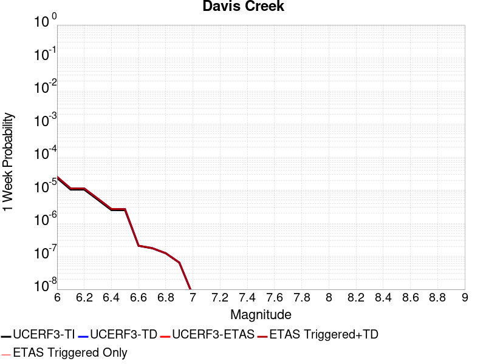 | 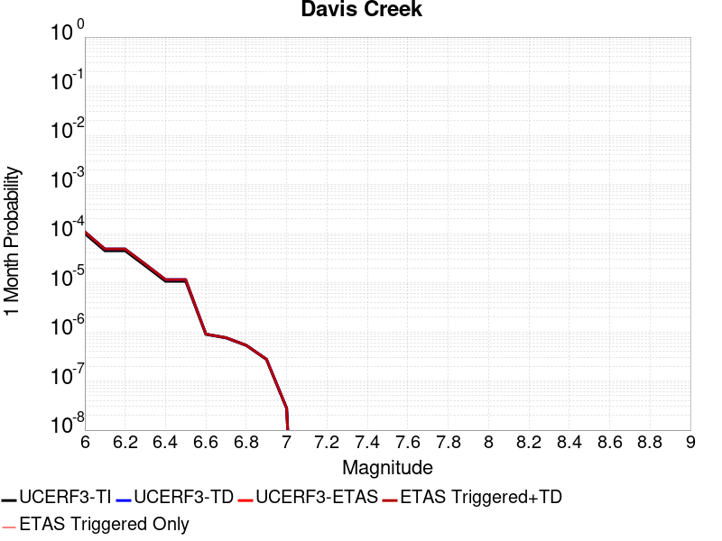 | 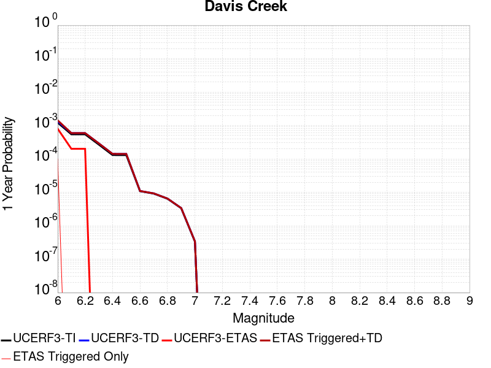 | 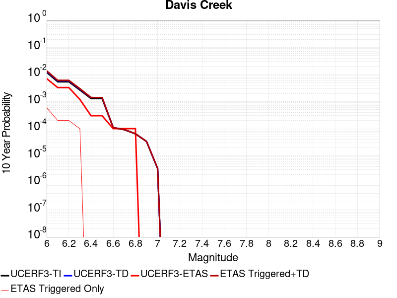 |

| Magnitude | 1 wk TI Prob | 1 wk TD Prob | 1 wk ETAS Prob | 1 wk ETAS/TD Gain | 1 wk ETAS Triggered+TD | 1 wk ETAS Triggered Only | 1 mo TI Prob | 1 mo TD Prob | 1 mo ETAS Prob | 1 mo ETAS/TD Gain | 1 mo ETAS Triggered+TD | 1 mo ETAS Triggered Only | 1 yr TI Prob | 1 yr TD Prob | 1 yr ETAS Prob | 1 yr ETAS/TD Gain | 1 yr ETAS Triggered+TD | 1 yr ETAS Triggered Only | 10 yr TI Prob | 10 yr TD Prob | 10 yr ETAS Prob | 10 yr ETAS/TD Gain | 10 yr ETAS Triggered+TD | 10 yr ETAS Triggered Only |
|-----|-----|-----|-----|-----|-----|-----|-----|-----|-----|-----|-----|-----|-----|-----|-----|-----|-----|-----|-----|-----|-----|-----|-----|-----|
| 6.0 | 2.331472E-5 | 2.5421763E-5 | 0.0 | 0.0 | 2.5421763E-5 | 0.0 | 9.99164E-5 | 1.0894653E-4 | 0.0 | 0.0 | 1.0894653E-4 | 0.0 | 0.0012158032 | 0.0013257355 | 8.0E-4 | 0.6034386 | 0.0014256029 | 1.0E-4 | 0.01209173 | 0.013190052 | 0.0071 | 0.5382845 | 0.013782137 | 6.0E-4 |
| 6.1 | 1.0407654E-5 | 1.1318951E-5 | 0.0 | 0.0 | 1.1318951E-5 | 0.0 | 4.4603472E-5 | 4.850904E-5 | 0.0 | 0.0 | 4.850904E-5 | 0.0 | 5.4291193E-4 | 5.904646E-4 | 2.0E-4 | 0.3387163 | 5.904646E-4 | 0.0 | 0.0054158745 | 0.005891631 | 0.0033 | 0.5601166 | 0.0060904524 | 2.0E-4 |
| 6.2 | 1.0407654E-5 | 1.1318951E-5 | 0.0 | 0.0 | 1.1318951E-5 | 0.0 | 4.4603472E-5 | 4.850904E-5 | 0.0 | 0.0 | 4.850904E-5 | 0.0 | 5.4291193E-4 | 5.904646E-4 | 2.0E-4 | 0.3387163 | 5.904646E-4 | 0.0 | 0.0054158745 | 0.005891631 | 0.0033 | 0.5601166 | 0.0060904524 | 2.0E-4 |
| 6.3 | 5.1323277E-6 | 5.5694973E-6 | 0.0 | 0.0 | 5.5694973E-6 | 0.0 | 2.1995505E-5 | 2.3869105E-5 | 0.0 | 0.0 | 2.3869105E-5 | 0.0 | 2.6776237E-4 | 2.9057622E-4 | 0.0 | 0.0 | 2.9057622E-4 | 0.0 | 0.0026743996 | 0.0029028093 | 0.0012 | 0.41339266 | 0.003002519 | 1.0E-4 |
| 6.4 | 2.4985154E-6 | 2.704983E-6 | 0.0 | 0.0 | 2.704983E-6 | 0.0 | 1.07078795E-5 | 1.1592752E-5 | 0.0 | 0.0 | 1.1592752E-5 | 0.0 | 1.3036063E-4 | 1.4113625E-4 | 0.0 | 0.0 | 1.4113625E-4 | 0.0 | 0.0013028418 | 0.0014108209 | 3.0E-4 | 0.21264216 | 0.0014108209 | 0.0 |
| 6.5 | 2.4846438E-6 | 2.6909167E-6 | 0.0 | 0.0 | 2.6909167E-6 | 0.0 | 1.064843E-5 | 1.1532469E-5 | 0.0 | 0.0 | 1.1532469E-5 | 0.0 | 1.2963692E-4 | 1.404024E-4 | 0.0 | 0.0 | 1.404024E-4 | 0.0 | 0.0012956132 | 0.0014034916 | 3.0E-4 | 0.21375261 | 0.0014034916 | 0.0 |
| 6.6 | 2.072566E-7 | 2.1018676E-7 | 0.0 | 0.0 | 2.1018676E-7 | 0.0 | 8.882423E-7 | 9.008001E-7 | 0.0 | 0.0 | 9.008001E-7 | 0.0 | 1.0814296E-5 | 1.0967187E-5 | 0.0 | 0.0 | 1.0967187E-5 | 0.0 | 1.081377E-4 | 1.09666646E-4 | 1.0E-4 | 0.91185427 | 1.09666646E-4 | 0.0 |
| 6.7 | 1.7544528E-7 | 1.7791321E-7 | 0.0 | 0.0 | 1.7791321E-7 | 0.0 | 7.5190815E-7 | 7.62485E-7 | 0.0 | 0.0 | 7.62485E-7 | 0.0 | 9.154443E-6 | 9.283217E-6 | 0.0 | 0.0 | 9.283217E-6 | 0.0 | 9.1540656E-5 | 9.282845E-5 | 1.0E-4 | 1.077256 | 9.282845E-5 | 0.0 |
| 6.8 | 1.2320395E-7 | 1.248146E-7 | 0.0 | 0.0 | 1.248146E-7 | 0.0 | 5.280168E-7 | 5.3491965E-7 | 0.0 | 0.0 | 5.3491965E-7 | 0.0 | 6.428586E-6 | 6.5126283E-6 | 0.0 | 0.0 | 6.5126283E-6 | 0.0 | 6.4284E-5 | 6.5124485E-5 | 1.0E-4 | 1.5355208 | 6.5124485E-5 | 0.0 |
| 6.9 | 6.399997E-8 | 6.4862306E-8 | 0.0 | 0.0 | 6.4862306E-8 | 0.0 | 2.7428555E-7 | 2.779813E-7 | 0.0 | 0.0 | 2.779813E-7 | 0.0 | 3.3394215E-6 | 3.3844176E-6 | 0.0 | 0.0 | 3.3844176E-6 | 0.0 | 3.3393713E-5 | 3.3843724E-5 | 0.0 | 0.0 | 3.3843724E-5 | 0.0 |
| 7.0 | 6.4455685E-9 | 6.535444E-9 | 0.0 | 0.0 | 6.535444E-9 | 0.0 | 2.7623864E-8 | 2.8009048E-8 | 0.0 | 0.0 | 2.8009048E-8 | 0.0 | 3.3632048E-7 | 3.4101015E-7 | 0.0 | 0.0 | 3.4101015E-7 | 0.0 | 3.3631998E-6 | 3.4101015E-6 | 0.0 | 0.0 | 3.4101015E-6 | 0.0 |

## Los Osos 2011
*[(top)](#table-of-contents)*

| 1 Week | 1 Month | 1 Year | 10 Year |
|-----|-----|-----|-----|
| 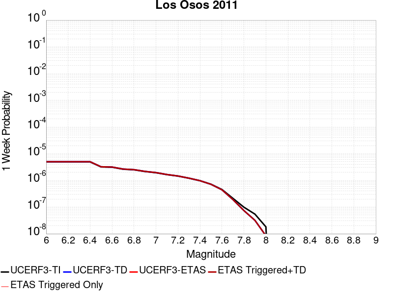 | 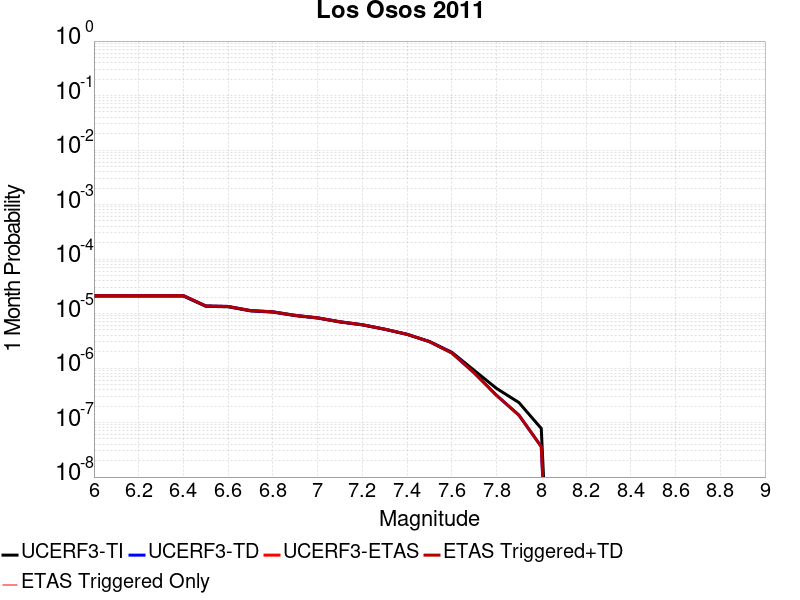 | 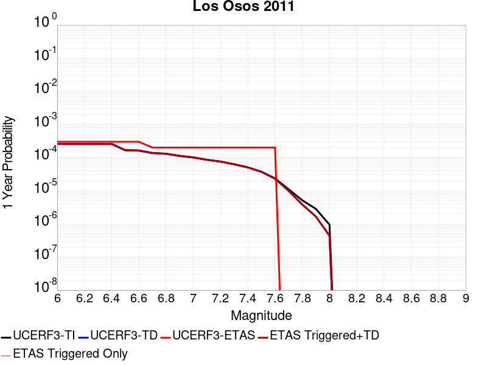 | 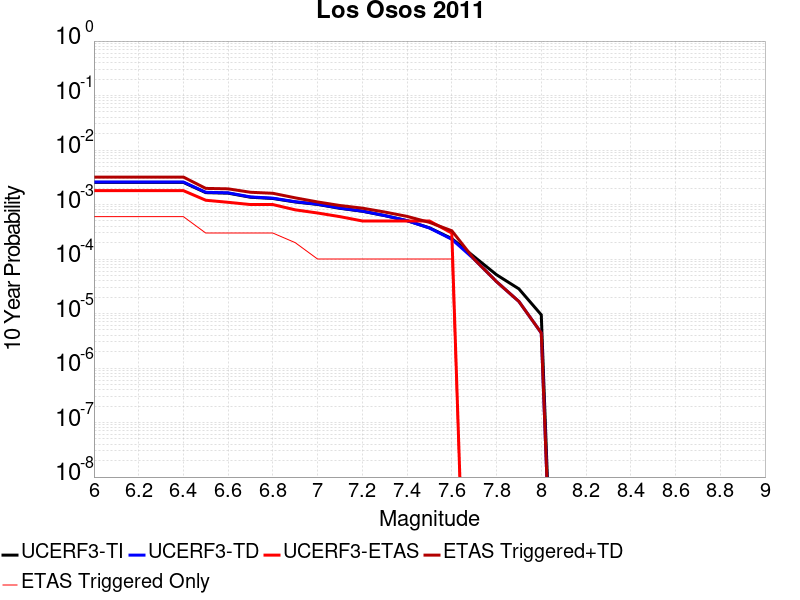 |

| Magnitude | 1 wk TI Prob | 1 wk TD Prob | 1 wk ETAS Prob | 1 wk ETAS/TD Gain | 1 wk ETAS Triggered+TD | 1 wk ETAS Triggered Only | 1 mo TI Prob | 1 mo TD Prob | 1 mo ETAS Prob | 1 mo ETAS/TD Gain | 1 mo ETAS Triggered+TD | 1 mo ETAS Triggered Only | 1 yr TI Prob | 1 yr TD Prob | 1 yr ETAS Prob | 1 yr ETAS/TD Gain | 1 yr ETAS Triggered+TD | 1 yr ETAS Triggered Only | 10 yr TI Prob | 10 yr TD Prob | 10 yr ETAS Prob | 10 yr ETAS/TD Gain | 10 yr ETAS Triggered+TD | 10 yr ETAS Triggered Only |
|-----|-----|-----|-----|-----|-----|-----|-----|-----|-----|-----|-----|-----|-----|-----|-----|-----|-----|-----|-----|-----|-----|-----|-----|-----|
| 6.0 | 4.8871775E-6 | 4.981787E-6 | 0.0 | 0.0 | 4.981787E-6 | 0.0 | 2.0944879E-5 | 2.1350355E-5 | 0.0 | 0.0 | 2.1350355E-5 | 0.0 | 2.5497406E-4 | 2.5991237E-4 | 3.0E-4 | 1.1542352 | 2.5991237E-4 | 0.0 | 0.002546817 | 0.0025963583 | 0.0018 | 0.69327873 | 0.0031948003 | 6.0E-4 |
| 6.1 | 4.8871775E-6 | 4.981787E-6 | 0.0 | 0.0 | 4.981787E-6 | 0.0 | 2.0944879E-5 | 2.1350355E-5 | 0.0 | 0.0 | 2.1350355E-5 | 0.0 | 2.5497406E-4 | 2.5991237E-4 | 3.0E-4 | 1.1542352 | 2.5991237E-4 | 0.0 | 0.002546817 | 0.0025963583 | 0.0018 | 0.69327873 | 0.0031948003 | 6.0E-4 |
| 6.2 | 4.8871775E-6 | 4.981787E-6 | 0.0 | 0.0 | 4.981787E-6 | 0.0 | 2.0944879E-5 | 2.1350355E-5 | 0.0 | 0.0 | 2.1350355E-5 | 0.0 | 2.5497406E-4 | 2.5991237E-4 | 3.0E-4 | 1.1542352 | 2.5991237E-4 | 0.0 | 0.002546817 | 0.0025963583 | 0.0018 | 0.69327873 | 0.0031948003 | 6.0E-4 |
| 6.3 | 4.8871775E-6 | 4.981787E-6 | 0.0 | 0.0 | 4.981787E-6 | 0.0 | 2.0944879E-5 | 2.1350355E-5 | 0.0 | 0.0 | 2.1350355E-5 | 0.0 | 2.5497406E-4 | 2.5991237E-4 | 3.0E-4 | 1.1542352 | 2.5991237E-4 | 0.0 | 0.002546817 | 0.0025963583 | 0.0018 | 0.69327873 | 0.0031948003 | 6.0E-4 |
| 6.4 | 4.8871775E-6 | 4.981787E-6 | 0.0 | 0.0 | 4.981787E-6 | 0.0 | 2.0944879E-5 | 2.1350355E-5 | 0.0 | 0.0 | 2.1350355E-5 | 0.0 | 2.5497406E-4 | 2.5991237E-4 | 3.0E-4 | 1.1542352 | 2.5991237E-4 | 0.0 | 0.002546817 | 0.0025963583 | 0.0018 | 0.69327873 | 0.0031948003 | 6.0E-4 |
| 6.5 | 3.1724062E-6 | 3.2236103E-6 | 0.0 | 0.0 | 3.2236103E-6 | 0.0 | 1.3595956E-5 | 1.38154E-5 | 0.0 | 0.0 | 1.38154E-5 | 0.0 | 1.6551818E-4 | 1.6818964E-4 | 3.0E-4 | 1.7837008 | 1.6818964E-4 | 0.0 | 0.0016539496 | 0.001680637 | 0.0012 | 0.71401495 | 0.001980133 | 3.0E-4 |
| 6.6 | 3.1022591E-6 | 3.1513152E-6 | 0.0 | 0.0 | 3.1513152E-6 | 0.0 | 1.3295328E-5 | 1.3505568E-5 | 0.0 | 0.0 | 1.3505568E-5 | 0.0 | 1.618586E-4 | 1.64418E-4 | 3.0E-4 | 1.8246176 | 1.64418E-4 | 0.0 | 0.0016174077 | 0.0016429764 | 0.0011 | 0.6695166 | 0.0019424836 | 3.0E-4 |
| 6.7 | 2.611518E-6 | 2.6493715E-6 | 0.0 | 0.0 | 2.6493715E-6 | 0.0 | 1.1192172E-5 | 1.13544E-5 | 0.0 | 0.0 | 1.13544E-5 | 0.0 | 1.3625617E-4 | 1.3823109E-4 | 2.0E-4 | 1.4468524 | 1.3823109E-4 | 0.0 | 0.0013617266 | 0.0013814556 | 0.001 | 0.72387415 | 0.0016810412 | 3.0E-4 |
| 6.8 | 2.4780884E-6 | 2.5123402E-6 | 0.0 | 0.0 | 2.5123402E-6 | 0.0 | 1.0620336E-5 | 1.0767128E-5 | 0.0 | 0.0 | 1.0767128E-5 | 0.0 | 1.2929492E-4 | 1.3108194E-4 | 2.0E-4 | 1.5257633 | 1.3108194E-4 | 0.0 | 0.0012921972 | 0.0013100503 | 0.001 | 0.7633295 | 0.0016096572 | 3.0E-4 |
| 6.9 | 2.1376322E-6 | 2.1636697E-6 | 0.0 | 0.0 | 2.1636697E-6 | 0.0 | 9.161248E-6 | 9.272838E-6 | 0.0 | 0.0 | 9.272838E-6 | 0.0 | 1.1153249E-4 | 1.12890964E-4 | 2.0E-4 | 1.7716209 | 1.12890964E-4 | 0.0 | 0.0011147653 | 0.001128338 | 8.0E-4 | 0.7090073 | 0.0013281124 | 2.0E-4 |
| 7.0 | 1.9282882E-6 | 1.949613E-6 | 0.0 | 0.0 | 1.949613E-6 | 0.0 | 8.264066E-6 | 8.355459E-6 | 0.0 | 0.0 | 8.355459E-6 | 0.0 | 1.0061036E-4 | 1.01722966E-4 | 2.0E-4 | 1.9661243 | 1.01722966E-4 | 0.0 | 0.0010056482 | 0.0010167655 | 7.0E-4 | 0.6884577 | 0.0011166638 | 1.0E-4 |
| 7.1 | 1.6353226E-6 | 1.6502535E-6 | 0.0 | 0.0 | 1.6502535E-6 | 0.0 | 7.0085066E-6 | 7.072496E-6 | 0.0 | 0.0 | 7.072496E-6 | 0.0 | 8.532523E-5 | 8.610424E-5 | 2.0E-4 | 2.322766 | 8.610424E-5 | 0.0 | 8.529247E-4 | 8.607096E-4 | 6.0E-4 | 0.69709927 | 9.606235E-4 | 1.0E-4 |
| 7.2 | 1.4446276E-6 | 1.4554676E-6 | 0.0 | 0.0 | 1.4554676E-6 | 0.0 | 6.191247E-6 | 6.237703E-6 | 0.0 | 0.0 | 6.237703E-6 | 0.0 | 7.537582E-5 | 7.5941396E-5 | 2.0E-4 | 2.6336098 | 7.5941396E-5 | 0.0 | 7.535026E-4 | 7.59155E-4 | 5.0E-4 | 0.65862703 | 8.5907907E-4 | 1.0E-4 |
| 7.3 | 1.2014582E-6 | 1.20703E-6 | 0.0 | 0.0 | 1.20703E-6 | 0.0 | 5.149096E-6 | 5.1729758E-6 | 0.0 | 0.0 | 5.1729758E-6 | 0.0 | 6.268844E-5 | 6.297916E-5 | 2.0E-4 | 3.1756537 | 6.297916E-5 | 0.0 | 6.267076E-4 | 6.296135E-4 | 5.0E-4 | 0.79413795 | 7.2955055E-4 | 1.0E-4 |
| 7.4 | 9.707733E-7 | 9.710894E-7 | 0.0 | 0.0 | 9.710894E-7 | 0.0 | 4.16045E-6 | 4.161805E-6 | 0.0 | 0.0 | 4.161805E-6 | 0.0 | 5.0652303E-5 | 5.06688E-5 | 2.0E-4 | 3.9472022 | 5.06688E-5 | 0.0 | 5.064076E-4 | 5.065728E-4 | 5.0E-4 | 0.9870251 | 6.065221E-4 | 1.0E-4 |
| 7.5 | 7.174908E-7 | 7.115908E-7 | 0.0 | 0.0 | 7.115908E-7 | 0.0 | 3.074957E-6 | 3.0496715E-6 | 0.0 | 0.0 | 3.0496715E-6 | 0.0 | 3.743696E-5 | 3.7129117E-5 | 2.0E-4 | 5.3866076 | 3.7129117E-5 | 0.0 | 3.7430652E-4 | 3.712293E-4 | 5.0E-4 | 1.3468764 | 4.711922E-4 | 1.0E-4 |
| 7.6 | 4.5535776E-7 | 4.421638E-7 | 0.0 | 0.0 | 4.421638E-7 | 0.0 | 1.9515319E-6 | 1.8949863E-6 | 0.0 | 0.0 | 1.8949863E-6 | 0.0 | 2.3759641E-5 | 2.3071216E-5 | 2.0E-4 | 8.668811 | 2.3071216E-5 | 0.0 | 2.37571E-4 | 2.306883E-4 | 3.0E-4 | 1.3004562 | 3.3066524E-4 | 1.0E-4 |
| 7.7 | 2.1173553E-7 | 1.9067643E-7 | 0.0 | 0.0 | 1.9067643E-7 | 0.0 | 9.0743765E-7 | 8.1718446E-7 | 0.0 | 0.0 | 8.1718446E-7 | 0.0 | 1.1047998E-5 | 9.949175E-6 | 0.0 | 0.0 | 9.949175E-6 | 0.0 | 1.1047449E-4 | 9.9487326E-5 | 0.0 | 0.0 | 9.9487326E-5 | 0.0 |
| 7.8 | 9.873608E-8 | 7.373476E-8 | 0.0 | 0.0 | 7.373476E-8 | 0.0 | 4.2315455E-7 | 3.1600607E-7 | 0.0 | 0.0 | 3.1600607E-7 | 0.0 | 5.1518946E-6 | 3.847367E-6 | 0.0 | 0.0 | 3.847367E-6 | 0.0 | 5.1517753E-5 | 3.8473012E-5 | 0.0 | 0.0 | 3.8473012E-5 | 0.0 |
| 7.9 | 5.4399106E-8 | 3.193292E-8 | 0.0 | 0.0 | 3.193292E-8 | 0.0 | 2.33139E-7 | 1.3685536E-7 | 0.0 | 0.0 | 1.3685536E-7 | 0.0 | 2.8384638E-6 | 1.6662128E-6 | 0.0 | 0.0 | 1.6662128E-6 | 0.0 | 2.8384275E-5 | 1.6662005E-5 | 0.0 | 0.0 | 1.6662005E-5 | 0.0 |
| 8.0 | 1.817203E-8 | 8.442957E-9 | 0.0 | 0.0 | 8.442957E-9 | 0.0 | 7.7880124E-8 | 3.61841E-8 | 0.0 | 0.0 | 3.61841E-8 | 0.0 | 9.481901E-7 | 4.4054133E-7 | 0.0 | 0.0 | 4.4054133E-7 | 0.0 | 9.481861E-6 | 4.405405E-6 | 0.0 | 0.0 | 4.405405E-6 | 0.0 |

## San Gorgonio Pass
*[(top)](#table-of-contents)*

| 1 Week | 1 Month | 1 Year | 10 Year |
|-----|-----|-----|-----|
|  |  | 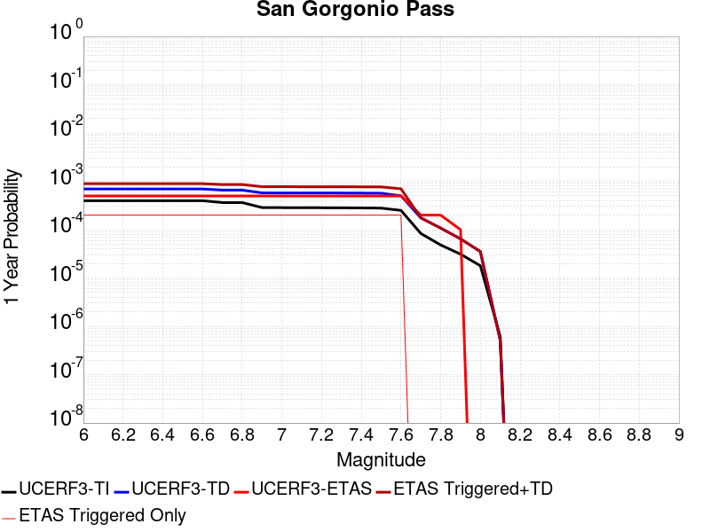 |  |

| Magnitude | 1 wk TI Prob | 1 wk TD Prob | 1 wk ETAS Prob | 1 wk ETAS/TD Gain | 1 wk ETAS Triggered+TD | 1 wk ETAS Triggered Only | 1 mo TI Prob | 1 mo TD Prob | 1 mo ETAS Prob | 1 mo ETAS/TD Gain | 1 mo ETAS Triggered+TD | 1 mo ETAS Triggered Only | 1 yr TI Prob | 1 yr TD Prob | 1 yr ETAS Prob | 1 yr ETAS/TD Gain | 1 yr ETAS Triggered+TD | 1 yr ETAS Triggered Only | 10 yr TI Prob | 10 yr TD Prob | 10 yr ETAS Prob | 10 yr ETAS/TD Gain | 10 yr ETAS Triggered+TD | 10 yr ETAS Triggered Only |
|-----|-----|-----|-----|-----|-----|-----|-----|-----|-----|-----|-----|-----|-----|-----|-----|-----|-----|-----|-----|-----|-----|-----|-----|-----|
| 6.0 | 7.644328E-6 | 1.3345727E-5 | 0.0 | 0.0 | 1.3345727E-5 | 0.0 | 3.2760996E-5 | 5.7194764E-5 | 0.0 | 0.0 | 5.7194764E-5 | 0.0 | 3.987921E-4 | 6.9613237E-4 | 5.0E-4 | 0.7182542 | 8.9599314E-4 | 2.0E-4 | 0.003980772 | 0.0069464915 | 0.0045 | 0.647809 | 0.007542324 | 6.0E-4 |
| 6.1 | 7.644328E-6 | 1.3345727E-5 | 0.0 | 0.0 | 1.3345727E-5 | 0.0 | 3.2760996E-5 | 5.7194764E-5 | 0.0 | 0.0 | 5.7194764E-5 | 0.0 | 3.987921E-4 | 6.9613237E-4 | 5.0E-4 | 0.7182542 | 8.9599314E-4 | 2.0E-4 | 0.003980772 | 0.0069464915 | 0.0045 | 0.647809 | 0.007542324 | 6.0E-4 |
| 6.2 | 7.644328E-6 | 1.3345727E-5 | 0.0 | 0.0 | 1.3345727E-5 | 0.0 | 3.2760996E-5 | 5.7194764E-5 | 0.0 | 0.0 | 5.7194764E-5 | 0.0 | 3.987921E-4 | 6.9613237E-4 | 5.0E-4 | 0.7182542 | 8.9599314E-4 | 2.0E-4 | 0.003980772 | 0.0069464915 | 0.0045 | 0.647809 | 0.007542324 | 6.0E-4 |
| 6.3 | 7.644328E-6 | 1.3345727E-5 | 0.0 | 0.0 | 1.3345727E-5 | 0.0 | 3.2760996E-5 | 5.7194764E-5 | 0.0 | 0.0 | 5.7194764E-5 | 0.0 | 3.987921E-4 | 6.9613237E-4 | 5.0E-4 | 0.7182542 | 8.9599314E-4 | 2.0E-4 | 0.003980772 | 0.0069464915 | 0.0045 | 0.647809 | 0.007542324 | 6.0E-4 |
| 6.4 | 7.644328E-6 | 1.3345727E-5 | 0.0 | 0.0 | 1.3345727E-5 | 0.0 | 3.2760996E-5 | 5.7194764E-5 | 0.0 | 0.0 | 5.7194764E-5 | 0.0 | 3.987921E-4 | 6.9613237E-4 | 5.0E-4 | 0.7182542 | 8.9599314E-4 | 2.0E-4 | 0.003980772 | 0.0069464915 | 0.0045 | 0.647809 | 0.007542324 | 6.0E-4 |
| 6.5 | 7.644328E-6 | 1.3345727E-5 | 0.0 | 0.0 | 1.3345727E-5 | 0.0 | 3.2760996E-5 | 5.7194764E-5 | 0.0 | 0.0 | 5.7194764E-5 | 0.0 | 3.987921E-4 | 6.9613237E-4 | 5.0E-4 | 0.7182542 | 8.9599314E-4 | 2.0E-4 | 0.003980772 | 0.0069464915 | 0.0045 | 0.647809 | 0.007542324 | 6.0E-4 |
| 6.6 | 7.644328E-6 | 1.3345727E-5 | 0.0 | 0.0 | 1.3345727E-5 | 0.0 | 3.2760996E-5 | 5.7194764E-5 | 0.0 | 0.0 | 5.7194764E-5 | 0.0 | 3.987921E-4 | 6.9613237E-4 | 5.0E-4 | 0.7182542 | 8.9599314E-4 | 2.0E-4 | 0.003980772 | 0.0069464915 | 0.0045 | 0.647809 | 0.007542324 | 6.0E-4 |
| 6.7 | 6.987586E-6 | 1.2649919E-5 | 0.0 | 0.0 | 1.2649919E-5 | 0.0 | 2.9946454E-5 | 5.421286E-5 | 0.0 | 0.0 | 5.421286E-5 | 0.0 | 3.645371E-4 | 6.598498E-4 | 5.0E-4 | 0.75774825 | 8.5971784E-4 | 2.0E-4 | 0.0036393967 | 0.0065858313 | 0.0043 | 0.65291685 | 0.007082538 | 5.0E-4 |
| 6.8 | 6.987586E-6 | 1.2649919E-5 | 0.0 | 0.0 | 1.2649919E-5 | 0.0 | 2.9946454E-5 | 5.421286E-5 | 0.0 | 0.0 | 5.421286E-5 | 0.0 | 3.645371E-4 | 6.598498E-4 | 5.0E-4 | 0.75774825 | 8.5971784E-4 | 2.0E-4 | 0.0036393967 | 0.0065858313 | 0.0043 | 0.65291685 | 0.007082538 | 5.0E-4 |
| 6.9 | 5.504702E-6 | 1.1080601E-5 | 0.0 | 0.0 | 1.1080601E-5 | 0.0 | 2.3591367E-5 | 4.7487454E-5 | 0.0 | 0.0 | 4.7487454E-5 | 0.0 | 2.8718702E-4 | 5.780115E-4 | 5.0E-4 | 0.86503476 | 7.7789585E-4 | 2.0E-4 | 0.0028681618 | 0.005771703 | 0.0037 | 0.6410586 | 0.0061693946 | 4.0E-4 |
| 7.0 | 5.4825764E-6 | 1.1056939E-5 | 0.0 | 0.0 | 1.1056939E-5 | 0.0 | 2.3496545E-5 | 4.738605E-5 | 0.0 | 0.0 | 4.738605E-5 | 0.0 | 2.8603288E-4 | 5.767775E-4 | 5.0E-4 | 0.8668854 | 7.7666214E-4 | 2.0E-4 | 0.00285665 | 0.0057594273 | 0.0037 | 0.64242494 | 0.0061571235 | 4.0E-4 |
| 7.1 | 5.4692787E-6 | 1.1042646E-5 | 0.0 | 0.0 | 1.1042646E-5 | 0.0 | 2.3439556E-5 | 4.73248E-5 | 0.0 | 0.0 | 4.73248E-5 | 0.0 | 2.8533922E-4 | 5.760322E-4 | 5.0E-4 | 0.86800706 | 7.7591697E-4 | 2.0E-4 | 0.0028497311 | 0.005752013 | 0.0037 | 0.6432531 | 0.006149712 | 4.0E-4 |
| 7.2 | 5.453661E-6 | 1.1025671E-5 | 0.0 | 0.0 | 1.1025671E-5 | 0.0 | 2.3372622E-5 | 4.7252044E-5 | 0.0 | 0.0 | 4.7252044E-5 | 0.0 | 2.8452452E-4 | 5.7514687E-4 | 5.0E-4 | 0.86934316 | 7.7503186E-4 | 2.0E-4 | 0.002841605 | 0.0057432055 | 0.0037 | 0.6442395 | 0.006140908 | 4.0E-4 |
| 7.3 | 5.4422303E-6 | 1.1012588E-5 | 0.0 | 0.0 | 1.1012588E-5 | 0.0 | 2.3323635E-5 | 4.7195983E-5 | 0.0 | 0.0 | 4.7195983E-5 | 0.0 | 2.8392827E-4 | 5.744647E-4 | 5.0E-4 | 0.8703756 | 7.743498E-4 | 2.0E-4 | 0.0028356577 | 0.005736419 | 0.0037 | 0.6450017 | 0.0061341245 | 4.0E-4 |
| 7.4 | 5.398595E-6 | 1.0959934E-5 | 0.0 | 0.0 | 1.0959934E-5 | 0.0 | 2.313663E-5 | 4.697033E-5 | 0.0 | 0.0 | 4.697033E-5 | 0.0 | 2.8165206E-4 | 5.717188E-4 | 5.0E-4 | 0.8745558 | 7.716045E-4 | 2.0E-4 | 0.0028129534 | 0.0057091014 | 0.0037 | 0.648088 | 0.006106818 | 4.0E-4 |
| 7.5 | 5.3578788E-6 | 1.0886417E-5 | 0.0 | 0.0 | 1.0886417E-5 | 0.0 | 2.2962136E-5 | 4.6655266E-5 | 0.0 | 0.0 | 4.6655266E-5 | 0.0 | 2.7952815E-4 | 5.6788494E-4 | 5.0E-4 | 0.8804601 | 7.6777133E-4 | 2.0E-4 | 0.002791768 | 0.0056709927 | 0.0037 | 0.6524431 | 0.006068724 | 4.0E-4 |
| 7.6 | 4.8091474E-6 | 9.63306E-6 | 0.0 | 0.0 | 9.63306E-6 | 0.0 | 2.0610469E-5 | 4.1283914E-5 | 0.0 | 0.0 | 4.1283914E-5 | 0.0 | 2.5090357E-4 | 5.025206E-4 | 5.0E-4 | 0.99498415 | 7.024201E-4 | 2.0E-4 | 0.0025062046 | 0.005020697 | 0.0033 | 0.65727925 | 0.0053191907 | 3.0E-4 |
| 7.7 | 1.5991155E-6 | 3.3687331E-6 | 0.0 | 0.0 | 3.3687331E-6 | 0.0 | 6.853334E-6 | 1.443735E-5 | 0.0 | 0.0 | 1.443735E-5 | 0.0 | 8.343615E-5 | 1.7576081E-4 | 2.0E-4 | 1.1379101 | 1.7576081E-4 | 0.0 | 8.340483E-4 | 0.0017617943 | 0.0013 | 0.7378841 | 0.0017617943 | 0.0 |
| 7.8 | 9.258398E-7 | 2.0698183E-6 | 0.0 | 0.0 | 2.0698183E-6 | 0.0 | 3.967879E-6 | 8.87062E-6 | 0.0 | 0.0 | 8.87062E-6 | 0.0 | 4.8307855E-5 | 1.0799446E-4 | 2.0E-4 | 1.8519468 | 1.0799446E-4 | 0.0 | 4.8297356E-4 | 0.0010849708 | 0.001 | 0.9216838 | 0.0010849708 | 0.0 |
| 7.9 | 5.975575E-7 | 1.2376694E-6 | 0.0 | 0.0 | 1.2376694E-6 | 0.0 | 2.5609581E-6 | 5.3042863E-6 | 0.0 | 0.0 | 5.3042863E-6 | 0.0 | 3.117922E-5 | 6.457778E-5 | 1.0E-4 | 1.5485202 | 6.457778E-5 | 0.0 | 3.1174847E-4 | 6.5086654E-4 | 7.0E-4 | 1.0754893 | 6.5086654E-4 | 0.0 |
| 8.0 | 3.4413725E-7 | 6.765487E-7 | 0.0 | 0.0 | 6.765487E-7 | 0.0 | 1.4748731E-6 | 2.8994912E-6 | 0.0 | 0.0 | 2.8994912E-6 | 0.0 | 1.7956432E-5 | 3.5300738E-5 | 0.0 | 0.0 | 3.5300738E-5 | 0.0 | 1.7954981E-4 | 3.5648528E-4 | 1.0E-4 | 0.2805165 | 3.5648528E-4 | 0.0 |
| 8.1 | 1.1787731E-8 | 9.762217E-9 | 0.0 | 0.0 | 9.762217E-9 | 0.0 | 5.0518846E-8 | 4.1838074E-8 | 0.0 | 0.0 | 4.1838074E-8 | 0.0 | 6.1506677E-7 | 5.093784E-7 | 0.0 | 0.0 | 5.093784E-7 | 0.0 | 6.1506507E-6 | 5.310493E-6 | 0.0 | 0.0 | 5.310493E-6 | 0.0 |

## Compton
*[(top)](#table-of-contents)*

| 1 Week | 1 Month | 1 Year | 10 Year |
|-----|-----|-----|-----|
| 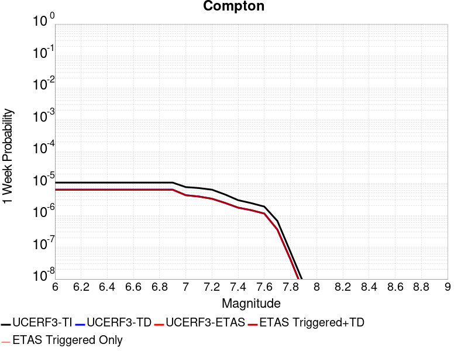 | 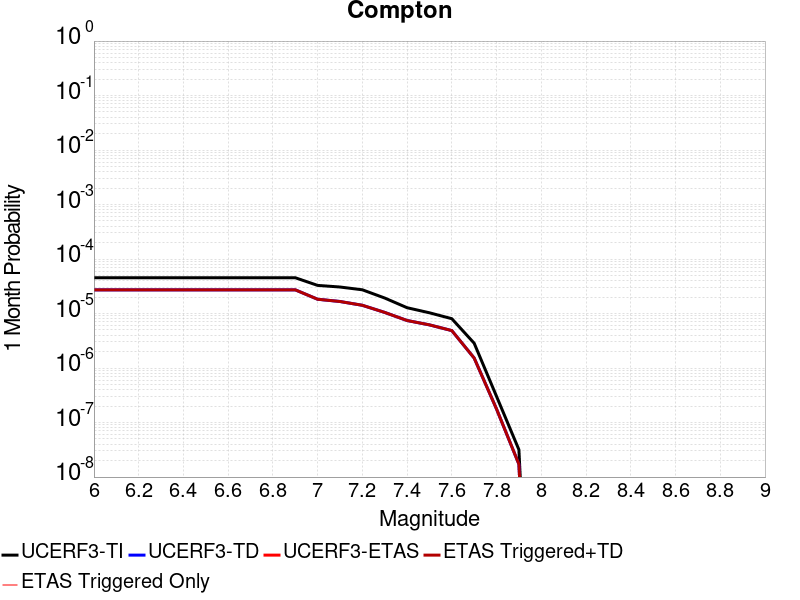 | 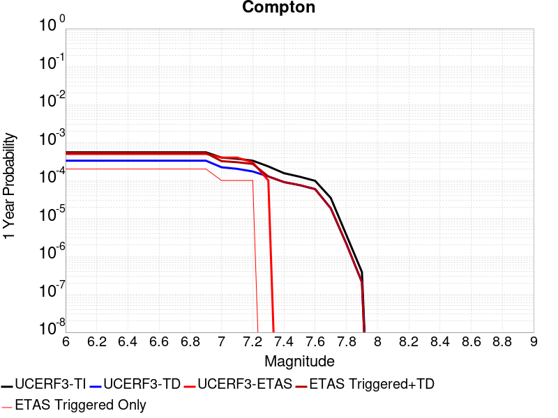 | 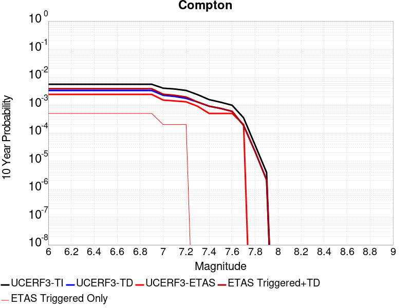 |

| Magnitude | 1 wk TI Prob | 1 wk TD Prob | 1 wk ETAS Prob | 1 wk ETAS/TD Gain | 1 wk ETAS Triggered+TD | 1 wk ETAS Triggered Only | 1 mo TI Prob | 1 mo TD Prob | 1 mo ETAS Prob | 1 mo ETAS/TD Gain | 1 mo ETAS Triggered+TD | 1 mo ETAS Triggered Only | 1 yr TI Prob | 1 yr TD Prob | 1 yr ETAS Prob | 1 yr ETAS/TD Gain | 1 yr ETAS Triggered+TD | 1 yr ETAS Triggered Only | 10 yr TI Prob | 10 yr TD Prob | 10 yr ETAS Prob | 10 yr ETAS/TD Gain | 10 yr ETAS Triggered+TD | 10 yr ETAS Triggered Only |
|-----|-----|-----|-----|-----|-----|-----|-----|-----|-----|-----|-----|-----|-----|-----|-----|-----|-----|-----|-----|-----|-----|-----|-----|-----|
| 6.0 | 1.06050875E-5 | 6.360152E-6 | 0.0 | 0.0 | 6.360152E-6 | 0.0 | 4.5449582E-5 | 2.7257525E-5 | 0.0 | 0.0 | 2.7257525E-5 | 0.0 | 5.5320817E-4 | 3.318127E-4 | 5.0E-4 | 1.5068742 | 5.3174637E-4 | 2.0E-4 | 0.0055183303 | 0.0033134567 | 0.0024 | 0.7243191 | 0.0038118 | 5.0E-4 |
| 6.1 | 1.06050875E-5 | 6.360152E-6 | 0.0 | 0.0 | 6.360152E-6 | 0.0 | 4.5449582E-5 | 2.7257525E-5 | 0.0 | 0.0 | 2.7257525E-5 | 0.0 | 5.5320817E-4 | 3.318127E-4 | 5.0E-4 | 1.5068742 | 5.3174637E-4 | 2.0E-4 | 0.0055183303 | 0.0033134567 | 0.0024 | 0.7243191 | 0.0038118 | 5.0E-4 |
| 6.2 | 1.06050875E-5 | 6.360152E-6 | 0.0 | 0.0 | 6.360152E-6 | 0.0 | 4.5449582E-5 | 2.7257525E-5 | 0.0 | 0.0 | 2.7257525E-5 | 0.0 | 5.5320817E-4 | 3.318127E-4 | 5.0E-4 | 1.5068742 | 5.3174637E-4 | 2.0E-4 | 0.0055183303 | 0.0033134567 | 0.0024 | 0.7243191 | 0.0038118 | 5.0E-4 |
| 6.3 | 1.06050875E-5 | 6.360152E-6 | 0.0 | 0.0 | 6.360152E-6 | 0.0 | 4.5449582E-5 | 2.7257525E-5 | 0.0 | 0.0 | 2.7257525E-5 | 0.0 | 5.5320817E-4 | 3.318127E-4 | 5.0E-4 | 1.5068742 | 5.3174637E-4 | 2.0E-4 | 0.0055183303 | 0.0033134567 | 0.0024 | 0.7243191 | 0.0038118 | 5.0E-4 |
| 6.4 | 1.06050875E-5 | 6.360152E-6 | 0.0 | 0.0 | 6.360152E-6 | 0.0 | 4.5449582E-5 | 2.7257525E-5 | 0.0 | 0.0 | 2.7257525E-5 | 0.0 | 5.5320817E-4 | 3.318127E-4 | 5.0E-4 | 1.5068742 | 5.3174637E-4 | 2.0E-4 | 0.0055183303 | 0.0033134567 | 0.0024 | 0.7243191 | 0.0038118 | 5.0E-4 |
| 6.5 | 1.06050875E-5 | 6.360152E-6 | 0.0 | 0.0 | 6.360152E-6 | 0.0 | 4.5449582E-5 | 2.7257525E-5 | 0.0 | 0.0 | 2.7257525E-5 | 0.0 | 5.5320817E-4 | 3.318127E-4 | 5.0E-4 | 1.5068742 | 5.3174637E-4 | 2.0E-4 | 0.0055183303 | 0.0033134567 | 0.0024 | 0.7243191 | 0.0038118 | 5.0E-4 |
| 6.6 | 1.06050875E-5 | 6.360152E-6 | 0.0 | 0.0 | 6.360152E-6 | 0.0 | 4.5449582E-5 | 2.7257525E-5 | 0.0 | 0.0 | 2.7257525E-5 | 0.0 | 5.5320817E-4 | 3.318127E-4 | 5.0E-4 | 1.5068742 | 5.3174637E-4 | 2.0E-4 | 0.0055183303 | 0.0033134567 | 0.0024 | 0.7243191 | 0.0038118 | 5.0E-4 |
| 6.7 | 1.06050875E-5 | 6.360152E-6 | 0.0 | 0.0 | 6.360152E-6 | 0.0 | 4.5449582E-5 | 2.7257525E-5 | 0.0 | 0.0 | 2.7257525E-5 | 0.0 | 5.5320817E-4 | 3.318127E-4 | 5.0E-4 | 1.5068742 | 5.3174637E-4 | 2.0E-4 | 0.0055183303 | 0.0033134567 | 0.0024 | 0.7243191 | 0.0038118 | 5.0E-4 |
| 6.8 | 1.06050875E-5 | 6.360152E-6 | 0.0 | 0.0 | 6.360152E-6 | 0.0 | 4.5449582E-5 | 2.7257525E-5 | 0.0 | 0.0 | 2.7257525E-5 | 0.0 | 5.5320817E-4 | 3.318127E-4 | 5.0E-4 | 1.5068742 | 5.3174637E-4 | 2.0E-4 | 0.0055183303 | 0.0033134567 | 0.0024 | 0.7243191 | 0.0038118 | 5.0E-4 |
| 6.9 | 1.06050875E-5 | 6.360152E-6 | 0.0 | 0.0 | 6.360152E-6 | 0.0 | 4.5449582E-5 | 2.7257525E-5 | 0.0 | 0.0 | 2.7257525E-5 | 0.0 | 5.5320817E-4 | 3.318127E-4 | 5.0E-4 | 1.5068742 | 5.3174637E-4 | 2.0E-4 | 0.0055183303 | 0.0033134567 | 0.0024 | 0.7243191 | 0.0038118 | 5.0E-4 |
| 7.0 | 7.672486E-6 | 4.2729234E-6 | 0.0 | 0.0 | 4.2729234E-6 | 0.0 | 3.288167E-5 | 1.8312403E-5 | 0.0 | 0.0 | 1.8312403E-5 | 0.0 | 4.0026082E-4 | 2.2293132E-4 | 4.0E-4 | 1.7942746 | 3.2290904E-4 | 1.0E-4 | 0.0039954064 | 0.002227139 | 0.0015 | 0.67350984 | 0.0024266937 | 2.0E-4 |
| 7.1 | 7.163992E-6 | 3.88457E-6 | 0.0 | 0.0 | 3.88457E-6 | 0.0 | 3.0702464E-5 | 1.6648055E-5 | 0.0 | 0.0 | 1.6648055E-5 | 0.0 | 3.7373835E-4 | 2.0267177E-4 | 4.0E-4 | 1.9736345 | 3.0265152E-4 | 1.0E-4 | 0.0037311043 | 0.0020249265 | 0.0014 | 0.6913831 | 0.0022245215 | 2.0E-4 |
| 7.2 | 6.3689185E-6 | 3.3108656E-6 | 0.0 | 0.0 | 3.3108656E-6 | 0.0 | 2.729508E-5 | 1.4189349E-5 | 0.0 | 0.0 | 1.4189349E-5 | 0.0 | 3.322669E-4 | 1.7274205E-4 | 3.0E-4 | 1.7366935 | 2.7272478E-4 | 1.0E-4 | 0.0033177056 | 0.0017261195 | 0.0013 | 0.7531344 | 0.0019257743 | 2.0E-4 |
| 7.3 | 4.4987873E-6 | 2.4485153E-6 | 0.0 | 0.0 | 2.4485153E-6 | 0.0 | 1.9280375E-5 | 1.0493596E-5 | 0.0 | 0.0 | 1.0493596E-5 | 0.0 | 2.3471327E-4 | 1.2775234E-4 | 1.0E-4 | 0.7827645 | 1.2775234E-4 | 0.0 | 0.002344655 | 0.0012768193 | 9.0E-4 | 0.7048766 | 0.0012768193 | 0.0 |
| 7.4 | 2.987296E-6 | 1.7398086E-6 | 0.0 | 0.0 | 1.7398086E-6 | 0.0 | 1.2802635E-5 | 7.456302E-6 | 0.0 | 0.0 | 7.456302E-6 | 0.0 | 1.5586092E-4 | 9.0776746E-5 | 0.0 | 0.0 | 9.0776746E-5 | 0.0 | 0.0015575165 | 9.074024E-4 | 5.0E-4 | 0.5510234 | 9.074024E-4 | 0.0 |
| 7.5 | 2.4111696E-6 | 1.4475065E-6 | 0.0 | 0.0 | 1.4475065E-6 | 0.0 | 1.0333543E-5 | 6.2035847E-6 | 0.0 | 0.0 | 6.2035847E-6 | 0.0 | 1.2580362E-4 | 7.552608E-5 | 0.0 | 0.0 | 7.552608E-5 | 0.0 | 0.0012573242 | 7.550088E-4 | 5.0E-4 | 0.66224396 | 7.550088E-4 | 0.0 |
| 7.6 | 1.8783096E-6 | 1.1362577E-6 | 0.0 | 0.0 | 1.1362577E-6 | 0.0 | 8.049874E-6 | 4.8696666E-6 | 0.0 | 0.0 | 4.8696666E-6 | 0.0 | 9.8002805E-5 | 5.928662E-5 | 0.0 | 0.0 | 5.928662E-5 | 0.0 | 9.795959E-4 | 5.92712E-4 | 5.0E-4 | 0.84358 | 5.92712E-4 | 0.0 |
| 7.7 | 6.6646817E-7 | 3.5609148E-7 | 0.0 | 0.0 | 3.5609148E-7 | 0.0 | 2.856289E-6 | 1.5261055E-6 | 0.0 | 0.0 | 1.5261055E-6 | 0.0 | 3.4774763E-5 | 1.8580191E-5 | 0.0 | 0.0 | 1.8580191E-5 | 0.0 | 3.4769322E-4 | 1.857877E-4 | 2.0E-4 | 1.0764974 | 1.857877E-4 | 0.0 |
| 7.8 | 7.054689E-8 | 4.1355726E-8 | 0.0 | 0.0 | 4.1355726E-8 | 0.0 | 3.0234378E-7 | 1.772388E-7 | 0.0 | 0.0 | 1.772388E-7 | 0.0 | 3.6810293E-6 | 2.1578805E-6 | 0.0 | 0.0 | 2.1578805E-6 | 0.0 | 3.6809684E-5 | 2.1578606E-5 | 0.0 | 0.0 | 2.1578606E-5 | 0.0 |
| 7.9 | 7.420925E-9 | 4.0149506E-9 | 0.0 | 0.0 | 4.0149506E-9 | 0.0 | 3.1803964E-8 | 1.7206931E-8 | 0.0 | 0.0 | 1.7206931E-8 | 0.0 | 3.872132E-7 | 2.0949437E-7 | 0.0 | 0.0 | 2.0949437E-7 | 0.0 | 3.872125E-6 | 2.094942E-6 | 0.0 | 0.0 | 2.094942E-6 | 0.0 |

## North Tahoe 2011 CFM
*[(top)](#table-of-contents)*

| 1 Week | 1 Month | 1 Year | 10 Year |
|-----|-----|-----|-----|
| 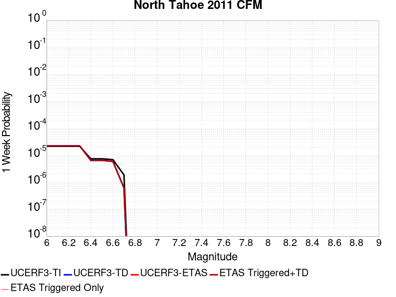 | 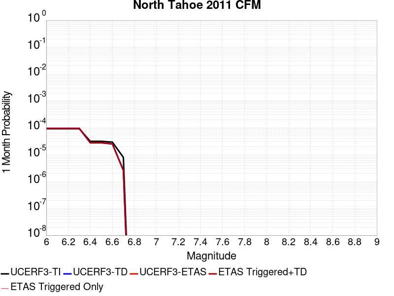 | 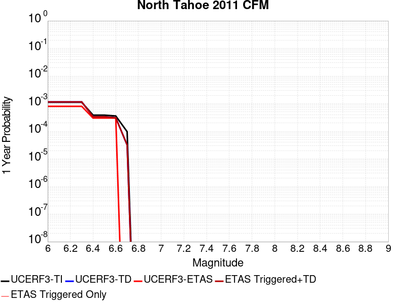 | 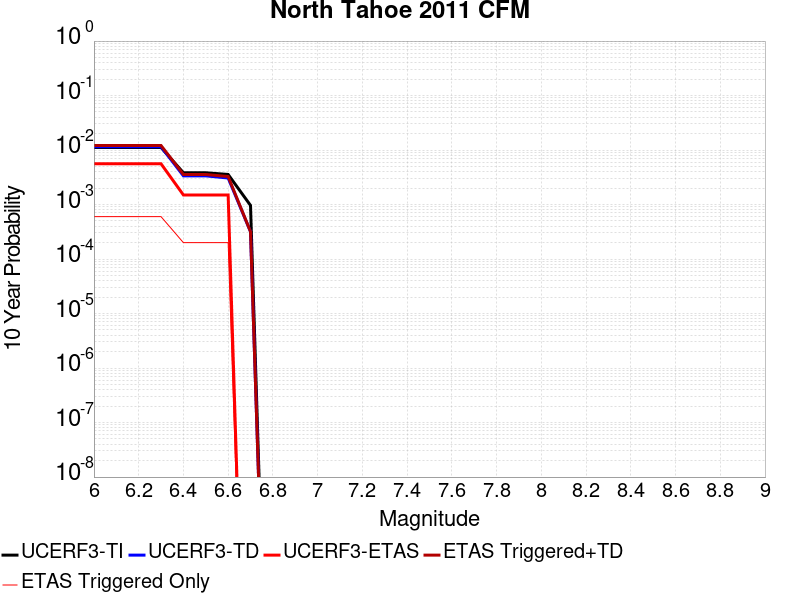 |

| Magnitude | 1 wk TI Prob | 1 wk TD Prob | 1 wk ETAS Prob | 1 wk ETAS/TD Gain | 1 wk ETAS Triggered+TD | 1 wk ETAS Triggered Only | 1 mo TI Prob | 1 mo TD Prob | 1 mo ETAS Prob | 1 mo ETAS/TD Gain | 1 mo ETAS Triggered+TD | 1 mo ETAS Triggered Only | 1 yr TI Prob | 1 yr TD Prob | 1 yr ETAS Prob | 1 yr ETAS/TD Gain | 1 yr ETAS Triggered+TD | 1 yr ETAS Triggered Only | 10 yr TI Prob | 10 yr TD Prob | 10 yr ETAS Prob | 10 yr ETAS/TD Gain | 10 yr ETAS Triggered+TD | 10 yr ETAS Triggered Only |
|-----|-----|-----|-----|-----|-----|-----|-----|-----|-----|-----|-----|-----|-----|-----|-----|-----|-----|-----|-----|-----|-----|-----|-----|-----|
| 6.0 | 2.150391E-5 | 2.2170048E-5 | 0.0 | 0.0 | 2.2170048E-5 | 0.0 | 9.215636E-5 | 9.501214E-5 | 0.0 | 0.0 | 9.501214E-5 | 0.0 | 0.0011214261 | 0.0011563549 | 8.0E-4 | 0.6918291 | 0.0011563549 | 0.0 | 0.011157839 | 0.011522643 | 0.0056 | 0.4859996 | 0.01211573 | 6.0E-4 |
| 6.1 | 2.150391E-5 | 2.2170048E-5 | 0.0 | 0.0 | 2.2170048E-5 | 0.0 | 9.215636E-5 | 9.501214E-5 | 0.0 | 0.0 | 9.501214E-5 | 0.0 | 0.0011214261 | 0.0011563549 | 8.0E-4 | 0.6918291 | 0.0011563549 | 0.0 | 0.011157839 | 0.011522643 | 0.0056 | 0.4859996 | 0.01211573 | 6.0E-4 |
| 6.2 | 2.150391E-5 | 2.2170048E-5 | 0.0 | 0.0 | 2.2170048E-5 | 0.0 | 9.215636E-5 | 9.501214E-5 | 0.0 | 0.0 | 9.501214E-5 | 0.0 | 0.0011214261 | 0.0011563549 | 8.0E-4 | 0.6918291 | 0.0011563549 | 0.0 | 0.011157839 | 0.011522643 | 0.0056 | 0.4859996 | 0.01211573 | 6.0E-4 |
| 6.3 | 2.150391E-5 | 2.2170048E-5 | 0.0 | 0.0 | 2.2170048E-5 | 0.0 | 9.215636E-5 | 9.501214E-5 | 0.0 | 0.0 | 9.501214E-5 | 0.0 | 0.0011214261 | 0.0011563549 | 8.0E-4 | 0.6918291 | 0.0011563549 | 0.0 | 0.011157839 | 0.011522643 | 0.0056 | 0.4859996 | 0.01211573 | 6.0E-4 |
| 6.4 | 7.3563056E-6 | 6.4464457E-6 | 0.0 | 0.0 | 6.4464457E-6 | 0.0 | 3.1526644E-5 | 2.7627504E-5 | 0.0 | 0.0 | 2.7627504E-5 | 0.0 | 3.8376928E-4 | 3.363435E-4 | 3.0E-4 | 0.8919453 | 3.363435E-4 | 0.0 | 0.003831072 | 0.0033613425 | 0.0015 | 0.4462503 | 0.0035606702 | 2.0E-4 |
| 6.5 | 7.3563056E-6 | 6.4464457E-6 | 0.0 | 0.0 | 6.4464457E-6 | 0.0 | 3.1526644E-5 | 2.7627504E-5 | 0.0 | 0.0 | 2.7627504E-5 | 0.0 | 3.8376928E-4 | 3.363435E-4 | 3.0E-4 | 0.8919453 | 3.363435E-4 | 0.0 | 0.003831072 | 0.0033613425 | 0.0015 | 0.4462503 | 0.0035606702 | 2.0E-4 |
| 6.6 | 6.8508816E-6 | 5.8854944E-6 | 0.0 | 0.0 | 5.8854944E-6 | 0.0 | 2.936059E-5 | 2.5223475E-5 | 0.0 | 0.0 | 2.5223475E-5 | 0.0 | 3.5740656E-4 | 3.070829E-4 | 3.0E-4 | 0.9769349 | 3.070829E-4 | 0.0 | 0.0035683226 | 0.003069564 | 0.0015 | 0.48866874 | 0.0032689502 | 2.0E-4 |
| 6.7 | 1.8511148E-6 | 6.102821E-7 | 0.0 | 0.0 | 6.102821E-7 | 0.0 | 7.933325E-6 | 2.6154946E-6 | 0.0 | 0.0 | 2.6154946E-6 | 0.0 | 9.658395E-5 | 3.1843647E-5 | 0.0 | 0.0 | 3.1843647E-5 | 0.0 | 9.6541987E-4 | 3.1843648E-4 | 0.0 | 0.0 | 3.1843648E-4 | 0.0 |

## Scodie Lineament
*[(top)](#table-of-contents)*

| 1 Week | 1 Month | 1 Year | 10 Year |
|-----|-----|-----|-----|
|  |  |  |  |

| Magnitude | 1 wk TI Prob | 1 wk TD Prob | 1 wk ETAS Prob | 1 wk ETAS/TD Gain | 1 wk ETAS Triggered+TD | 1 wk ETAS Triggered Only | 1 mo TI Prob | 1 mo TD Prob | 1 mo ETAS Prob | 1 mo ETAS/TD Gain | 1 mo ETAS Triggered+TD | 1 mo ETAS Triggered Only | 1 yr TI Prob | 1 yr TD Prob | 1 yr ETAS Prob | 1 yr ETAS/TD Gain | 1 yr ETAS Triggered+TD | 1 yr ETAS Triggered Only | 10 yr TI Prob | 10 yr TD Prob | 10 yr ETAS Prob | 10 yr ETAS/TD Gain | 10 yr ETAS Triggered+TD | 10 yr ETAS Triggered Only |
|-----|-----|-----|-----|-----|-----|-----|-----|-----|-----|-----|-----|-----|-----|-----|-----|-----|-----|-----|-----|-----|-----|-----|-----|-----|
| 6.0 | 3.2919327E-6 | 3.0135436E-6 | 0.0 | 0.0 | 3.0135436E-6 | 0.0 | 1.4108206E-5 | 1.291514E-5 | 0.0 | 0.0 | 1.291514E-5 | 0.0 | 1.7175387E-4 | 1.5723366E-4 | 1.0E-4 | 0.6359961 | 2.5721794E-4 | 1.0E-4 | 0.0017162118 | 0.0015715358 | 0.0013 | 0.82721627 | 0.002170593 | 6.0E-4 |
| 6.1 | 1.8663811E-6 | 1.5491723E-6 | 0.0 | 0.0 | 1.5491723E-6 | 0.0 | 7.998751E-6 | 6.639296E-6 | 0.0 | 0.0 | 6.639296E-6 | 0.0 | 9.738045E-5 | 8.083093E-5 | 0.0 | 0.0 | 8.083093E-5 | 0.0 | 9.7337784E-4 | 8.0806407E-4 | 3.0E-4 | 0.3712577 | 0.0010079024 | 2.0E-4 |
| 6.2 | 1.8663811E-6 | 1.5491723E-6 | 0.0 | 0.0 | 1.5491723E-6 | 0.0 | 7.998751E-6 | 6.639296E-6 | 0.0 | 0.0 | 6.639296E-6 | 0.0 | 9.738045E-5 | 8.083093E-5 | 0.0 | 0.0 | 8.083093E-5 | 0.0 | 9.7337784E-4 | 8.0806407E-4 | 3.0E-4 | 0.3712577 | 0.0010079024 | 2.0E-4 |
| 6.3 | 1.8663811E-6 | 1.5491723E-6 | 0.0 | 0.0 | 1.5491723E-6 | 0.0 | 7.998751E-6 | 6.639296E-6 | 0.0 | 0.0 | 6.639296E-6 | 0.0 | 9.738045E-5 | 8.083093E-5 | 0.0 | 0.0 | 8.083093E-5 | 0.0 | 9.7337784E-4 | 8.0806407E-4 | 3.0E-4 | 0.3712577 | 0.0010079024 | 2.0E-4 |
| 6.4 | 1.8663811E-6 | 1.5491723E-6 | 0.0 | 0.0 | 1.5491723E-6 | 0.0 | 7.998751E-6 | 6.639296E-6 | 0.0 | 0.0 | 6.639296E-6 | 0.0 | 9.738045E-5 | 8.083093E-5 | 0.0 | 0.0 | 8.083093E-5 | 0.0 | 9.7337784E-4 | 8.0806407E-4 | 3.0E-4 | 0.3712577 | 0.0010079024 | 2.0E-4 |
| 6.5 | 1.8106311E-6 | 1.4911016E-6 | 0.0 | 0.0 | 1.4911016E-6 | 0.0 | 7.759824E-6 | 6.3904226E-6 | 0.0 | 0.0 | 6.3904226E-6 | 0.0 | 9.447177E-5 | 7.780111E-5 | 0.0 | 0.0 | 7.780111E-5 | 0.0 | 9.4431615E-4 | 7.777874E-4 | 3.0E-4 | 0.3857095 | 9.776319E-4 | 2.0E-4 |
| 6.6 | 1.2414679E-6 | 8.998279E-7 | 0.0 | 0.0 | 8.998279E-7 | 0.0 | 5.320566E-6 | 3.8564003E-6 | 0.0 | 0.0 | 3.8564003E-6 | 0.0 | 6.477596E-5 | 4.695075E-5 | 0.0 | 0.0 | 4.695075E-5 | 0.0 | 6.475708E-4 | 4.6941696E-4 | 0.0 | 0.0 | 4.6941696E-4 | 0.0 |
| 6.7 | 1.1062215E-6 | 7.594928E-7 | 0.0 | 0.0 | 7.594928E-7 | 0.0 | 4.7409408E-6 | 3.2549656E-6 | 0.0 | 0.0 | 3.2549656E-6 | 0.0 | 5.7719422E-5 | 3.9628558E-5 | 0.0 | 0.0 | 3.9628558E-5 | 0.0 | 5.770443E-4 | 3.9622188E-4 | 0.0 | 0.0 | 3.9622188E-4 | 0.0 |
| 6.8 | 1.0006736E-6 | 6.500935E-7 | 0.0 | 0.0 | 6.500935E-7 | 0.0 | 4.288594E-6 | 2.7861124E-6 | 0.0 | 0.0 | 2.7861124E-6 | 0.0 | 5.221238E-5 | 3.3920453E-5 | 0.0 | 0.0 | 3.3920453E-5 | 0.0 | 5.220012E-4 | 3.391588E-4 | 0.0 | 0.0 | 3.391588E-4 | 0.0 |
| 6.9 | 9.167364E-7 | 5.632103E-7 | 0.0 | 0.0 | 5.632103E-7 | 0.0 | 3.9288643E-6 | 2.4137564E-6 | 0.0 | 0.0 | 2.4137564E-6 | 0.0 | 4.7832873E-5 | 2.9387145E-5 | 0.0 | 0.0 | 2.9387145E-5 | 0.0 | 4.782258E-4 | 2.9383827E-4 | 0.0 | 0.0 | 2.9383827E-4 | 0.0 |
| 7.0 | 7.6987664E-7 | 4.113759E-7 | 0.0 | 0.0 | 4.113759E-7 | 0.0 | 3.2994672E-6 | 1.7630387E-6 | 0.0 | 0.0 | 1.7630387E-6 | 0.0 | 4.0170275E-5 | 2.1464823E-5 | 0.0 | 0.0 | 2.1464823E-5 | 0.0 | 4.0163012E-4 | 2.1463135E-4 | 0.0 | 0.0 | 2.1463135E-4 | 0.0 |
| 7.1 | 7.1038727E-7 | 3.521487E-7 | 0.0 | 0.0 | 3.521487E-7 | 0.0 | 3.0445133E-6 | 1.509208E-6 | 0.0 | 0.0 | 1.509208E-6 | 0.0 | 3.706632E-5 | 1.8374489E-5 | 0.0 | 0.0 | 1.8374489E-5 | 0.0 | 3.7060137E-4 | 1.8373318E-4 | 0.0 | 0.0 | 1.8373318E-4 | 0.0 |
| 7.2 | 2.0799602E-7 | 3.119112E-8 | 0.0 | 0.0 | 3.119112E-8 | 0.0 | 8.914113E-7 | 1.3367622E-7 | 0.0 | 0.0 | 1.3367622E-7 | 0.0 | 1.0852878E-5 | 1.6275069E-6 | 0.0 | 0.0 | 1.6275069E-6 | 0.0 | 1.08523476E-4 | 1.6274957E-5 | 0.0 | 0.0 | 1.6274957E-5 | 0.0 |
| 7.3 | 1.5048182E-7 | 1.5946306E-8 | 0.0 | 0.0 | 1.5946306E-8 | 0.0 | 6.449219E-7 | 6.834131E-8 | 0.0 | 0.0 | 6.834131E-8 | 0.0 | 7.851896E-6 | 8.320551E-7 | 0.0 | 0.0 | 8.320551E-7 | 0.0 | 7.851618E-5 | 8.320523E-6 | 0.0 | 0.0 | 8.320523E-6 | 0.0 |
| 7.4 | 5.9334678E-8 | 4.8653486E-9 | 0.0 | 0.0 | 4.8653486E-9 | 0.0 | 2.5429145E-7 | 2.0851493E-8 | 0.0 | 0.0 | 2.0851493E-8 | 0.0 | 3.095994E-6 | 2.5386692E-7 | 0.0 | 0.0 | 2.5386692E-7 | 0.0 | 3.095951E-5 | 2.5386673E-6 | 0.0 | 0.0 | 2.5386673E-6 | 0.0 |

## Hosgri (Extension)
*[(top)](#table-of-contents)*

| 1 Week | 1 Month | 1 Year | 10 Year |
|-----|-----|-----|-----|
|  | 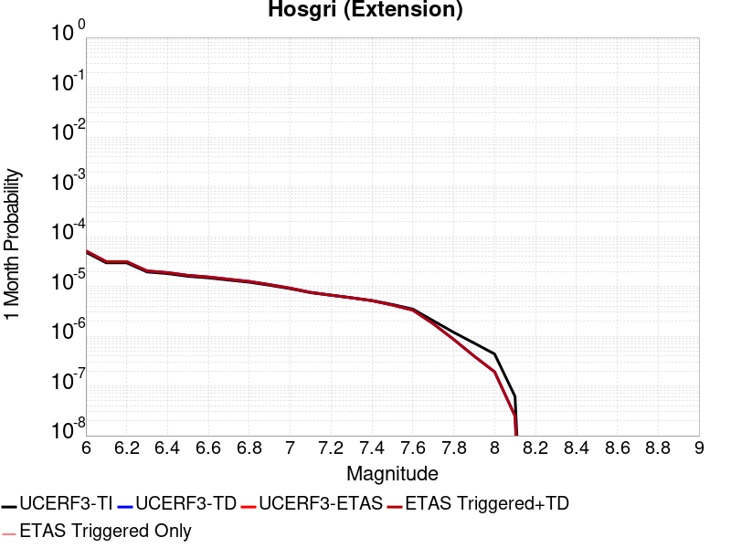 |  | 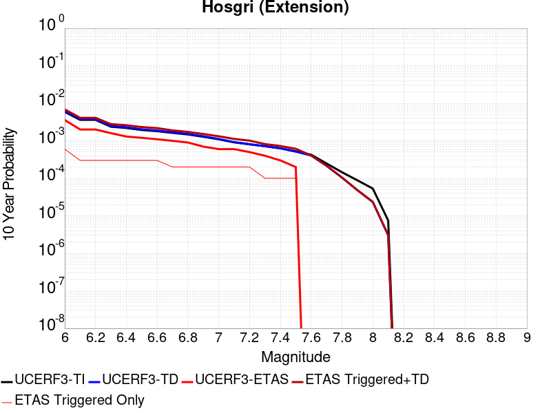 |

| Magnitude | 1 wk TI Prob | 1 wk TD Prob | 1 wk ETAS Prob | 1 wk ETAS/TD Gain | 1 wk ETAS Triggered+TD | 1 wk ETAS Triggered Only | 1 mo TI Prob | 1 mo TD Prob | 1 mo ETAS Prob | 1 mo ETAS/TD Gain | 1 mo ETAS Triggered+TD | 1 mo ETAS Triggered Only | 1 yr TI Prob | 1 yr TD Prob | 1 yr ETAS Prob | 1 yr ETAS/TD Gain | 1 yr ETAS Triggered+TD | 1 yr ETAS Triggered Only | 10 yr TI Prob | 10 yr TD Prob | 10 yr ETAS Prob | 10 yr ETAS/TD Gain | 10 yr ETAS Triggered+TD | 10 yr ETAS Triggered Only |
|-----|-----|-----|-----|-----|-----|-----|-----|-----|-----|-----|-----|-----|-----|-----|-----|-----|-----|-----|-----|-----|-----|-----|-----|-----|
| 6.0 | 1.1369135E-5 | 1.2084971E-5 | 0.0 | 0.0 | 1.2084971E-5 | 0.0 | 4.8723956E-5 | 5.1791834E-5 | 0.0 | 0.0 | 5.1791834E-5 | 0.0 | 5.9305265E-4 | 6.304059E-4 | 6.0E-4 | 0.95176774 | 7.303428E-4 | 1.0E-4 | 0.005914725 | 0.0062884255 | 0.0036 | 0.5724804 | 0.006884652 | 6.0E-4 |
| 6.1 | 6.934979E-6 | 7.3257634E-6 | 0.0 | 0.0 | 7.3257634E-6 | 0.0 | 2.9721E-5 | 3.1395775E-5 | 0.0 | 0.0 | 3.1395775E-5 | 0.0 | 3.617931E-4 | 3.8218065E-4 | 4.0E-4 | 1.0466255 | 3.8218065E-4 | 0.0 | 0.0036120464 | 0.0038156467 | 0.002 | 0.5241575 | 0.004114502 | 3.0E-4 |
| 6.2 | 6.934979E-6 | 7.3257634E-6 | 0.0 | 0.0 | 7.3257634E-6 | 0.0 | 2.9721E-5 | 3.1395775E-5 | 0.0 | 0.0 | 3.1395775E-5 | 0.0 | 3.617931E-4 | 3.8218065E-4 | 4.0E-4 | 1.0466255 | 3.8218065E-4 | 0.0 | 0.0036120464 | 0.0038156467 | 0.002 | 0.5241575 | 0.004114502 | 3.0E-4 |
| 6.3 | 4.5484676E-6 | 4.77018E-6 | 0.0 | 0.0 | 4.77018E-6 | 0.0 | 1.9493287E-5 | 2.0443471E-5 | 0.0 | 0.0 | 2.0443471E-5 | 0.0 | 2.3730492E-4 | 2.4887125E-4 | 2.0E-4 | 0.8036284 | 2.4887125E-4 | 0.0 | 0.0023705168 | 0.0024859682 | 0.0016 | 0.64361244 | 0.0027852224 | 3.0E-4 |
| 6.4 | 4.218095E-6 | 4.417665E-6 | 0.0 | 0.0 | 4.417665E-6 | 0.0 | 1.8077424E-5 | 1.8932713E-5 | 0.0 | 0.0 | 1.8932713E-5 | 0.0 | 2.2007042E-4 | 2.3048173E-4 | 2.0E-4 | 0.8677477 | 2.3048173E-4 | 0.0 | 0.002198526 | 0.0023024604 | 0.0013 | 0.5646134 | 0.0026017698 | 3.0E-4 |
| 6.5 | 3.717374E-6 | 3.884613E-6 | 0.0 | 0.0 | 3.884613E-6 | 0.0 | 1.5931506E-5 | 1.6648235E-5 | 0.0 | 0.0 | 1.6648235E-5 | 0.0 | 1.9394881E-4 | 2.0267359E-4 | 2.0E-4 | 0.9868084 | 2.0267359E-4 | 0.0 | 0.0019377962 | 0.0020249065 | 0.0012 | 0.59262 | 0.002324299 | 3.0E-4 |
| 6.6 | 3.4605036E-6 | 3.6090014E-6 | 0.0 | 0.0 | 3.6090014E-6 | 0.0 | 1.4830645E-5 | 1.5467058E-5 | 0.0 | 0.0 | 1.5467058E-5 | 0.0 | 1.8054814E-4 | 1.882953E-4 | 1.0E-4 | 0.5310807 | 1.882953E-4 | 0.0 | 0.0018040152 | 0.0018813723 | 0.0011 | 0.5846796 | 0.0021808078 | 3.0E-4 |
| 6.7 | 3.123439E-6 | 3.2472115E-6 | 0.0 | 0.0 | 3.2472115E-6 | 0.0 | 1.33860985E-5 | 1.3916547E-5 | 0.0 | 0.0 | 1.3916547E-5 | 0.0 | 1.6296357E-4 | 1.6942089E-4 | 1.0E-4 | 0.59024596 | 1.6942089E-4 | 0.0 | 0.001628441 | 0.0016929283 | 0.001 | 0.59069246 | 0.0018925896 | 2.0E-4 |
| 6.8 | 2.8290783E-6 | 2.931137E-6 | 0.0 | 0.0 | 2.931137E-6 | 0.0 | 1.2124565E-5 | 1.2561955E-5 | 0.0 | 0.0 | 1.2561955E-5 | 0.0 | 1.4760658E-4 | 1.5293116E-4 | 1.0E-4 | 0.653889 | 1.5293116E-4 | 0.0 | 0.0014750857 | 0.0015282679 | 9.0E-4 | 0.588902 | 0.0017279622 | 2.0E-4 |
| 6.9 | 2.454112E-6 | 2.5288582E-6 | 0.0 | 0.0 | 2.5288582E-6 | 0.0 | 1.0517581E-5 | 1.0837919E-5 | 0.0 | 0.0 | 1.0837919E-5 | 0.0 | 1.2804402E-4 | 1.3194373E-4 | 1.0E-4 | 0.7578988 | 1.3194373E-4 | 0.0 | 0.0012797028 | 0.0013186601 | 7.0E-4 | 0.5308419 | 0.0015183963 | 2.0E-4 |
| 7.0 | 2.1008145E-6 | 2.1503556E-6 | 0.0 | 0.0 | 2.1503556E-6 | 0.0 | 9.003459E-6 | 9.215777E-6 | 0.0 | 0.0 | 9.215777E-6 | 0.0 | 1.096116E-4 | 1.1219634E-4 | 1.0E-4 | 0.8912946 | 1.1219634E-4 | 0.0 | 0.0010955755 | 0.0011214007 | 6.0E-4 | 0.53504515 | 0.0013211765 | 2.0E-4 |
| 7.1 | 1.744384E-6 | 1.7690678E-6 | 0.0 | 0.0 | 1.7690678E-6 | 0.0 | 7.47591E-6 | 7.5816974E-6 | 0.0 | 0.0 | 7.5816974E-6 | 0.0 | 9.1015405E-5 | 9.230327E-5 | 1.0E-4 | 1.0833852 | 9.230327E-5 | 0.0 | 9.097813E-4 | 9.226511E-4 | 6.0E-4 | 0.6503 | 0.0011224665 | 2.0E-4 |
| 7.2 | 1.5456587E-6 | 1.556692E-6 | 0.0 | 0.0 | 1.556692E-6 | 0.0 | 6.6242346E-6 | 6.67152E-6 | 0.0 | 0.0 | 6.67152E-6 | 0.0 | 8.064707E-5 | 8.1222744E-5 | 1.0E-4 | 1.2311822 | 8.1222744E-5 | 0.0 | 8.0617814E-4 | 8.119318E-4 | 5.0E-4 | 0.6158153 | 0.0010117694 | 2.0E-4 |
| 7.3 | 1.3775123E-6 | 1.3769875E-6 | 0.0 | 0.0 | 1.3769875E-6 | 0.0 | 5.9036106E-6 | 5.901362E-6 | 0.0 | 0.0 | 5.901362E-6 | 0.0 | 7.187409E-5 | 7.184672E-5 | 1.0E-4 | 1.391852 | 7.184672E-5 | 0.0 | 7.185085E-4 | 7.182359E-4 | 4.0E-4 | 0.55692005 | 8.181641E-4 | 1.0E-4 |
| 7.4 | 1.214491E-6 | 1.2027015E-6 | 0.0 | 0.0 | 1.2027015E-6 | 0.0 | 5.2049513E-6 | 5.154425E-6 | 0.0 | 0.0 | 5.154425E-6 | 0.0 | 6.336844E-5 | 6.275332E-5 | 0.0 | 0.0 | 6.275332E-5 | 0.0 | 6.335037E-4 | 6.273569E-4 | 3.0E-4 | 0.47819674 | 7.2729413E-4 | 1.0E-4 |
| 7.5 | 1.0101123E-6 | 9.84551E-7 | 0.0 | 0.0 | 9.84551E-7 | 0.0 | 4.3290456E-6 | 4.219497E-6 | 0.0 | 0.0 | 4.219497E-6 | 0.0 | 5.2704854E-5 | 5.1371175E-5 | 0.0 | 0.0 | 5.1371175E-5 | 0.0 | 5.2692357E-4 | 5.1359355E-4 | 2.0E-4 | 0.38941297 | 6.135422E-4 | 1.0E-4 |
| 7.6 | 8.1558215E-7 | 7.7689526E-7 | 0.0 | 0.0 | 7.7689526E-7 | 0.0 | 3.4953473E-6 | 3.3295469E-6 | 0.0 | 0.0 | 3.3295469E-6 | 0.0 | 4.255502E-5 | 4.0536484E-5 | 0.0 | 0.0 | 4.0536484E-5 | 0.0 | 4.2546875E-4 | 4.0529133E-4 | 0.0 | 0.0 | 4.0529133E-4 | 0.0 |
| 7.7 | 4.757816E-7 | 4.1333723E-7 | 0.0 | 0.0 | 4.1333723E-7 | 0.0 | 2.0390623E-6 | 1.7714441E-6 | 0.0 | 0.0 | 1.7714441E-6 | 0.0 | 2.4825302E-5 | 2.1567119E-5 | 0.0 | 0.0 | 2.1567119E-5 | 0.0 | 2.482253E-4 | 2.1565039E-4 | 0.0 | 0.0 | 2.1565039E-4 | 0.0 |
| 7.8 | 2.782787E-7 | 2.006933E-7 | 0.0 | 0.0 | 2.006933E-7 | 0.0 | 1.1926223E-6 | 8.601138E-7 | 0.0 | 0.0 | 8.601138E-7 | 0.0 | 1.452008E-5 | 1.0471836E-5 | 0.0 | 0.0 | 1.0471836E-5 | 0.0 | 1.4519131E-4 | 1.0471345E-4 | 0.0 | 0.0 | 1.0471345E-4 | 0.0 |
| 7.9 | 1.6948086E-7 | 9.263781E-8 | 0.0 | 0.0 | 9.263781E-8 | 0.0 | 7.2634634E-7 | 3.970191E-7 | 0.0 | 0.0 | 3.970191E-7 | 0.0 | 8.843231E-6 | 4.833697E-6 | 0.0 | 0.0 | 4.833697E-6 | 0.0 | 8.842879E-5 | 4.8335925E-5 | 0.0 | 0.0 | 4.8335925E-5 | 0.0 |
| 8.0 | 1.0225492E-7 | 4.488004E-8 | 0.0 | 0.0 | 4.488004E-8 | 0.0 | 4.382353E-7 | 1.92343E-7 | 0.0 | 0.0 | 1.92343E-7 | 0.0 | 5.335502E-6 | 2.3417736E-6 | 0.0 | 0.0 | 2.3417736E-6 | 0.0 | 5.335374E-5 | 2.3417491E-5 | 0.0 | 0.0 | 2.3417491E-5 | 0.0 |
| 8.1 | 1.43711345E-8 | 5.8097065E-9 | 0.0 | 0.0 | 5.8097065E-9 | 0.0 | 6.1590576E-8 | 2.4898743E-8 | 0.0 | 0.0 | 2.4898743E-8 | 0.0 | 7.4986497E-7 | 3.0314214E-7 | 0.0 | 0.0 | 3.0314214E-7 | 0.0 | 7.4986247E-6 | 3.031418E-6 | 0.0 | 0.0 | 3.031418E-6 | 0.0 |

## Sierra Madre
*[(top)](#table-of-contents)*

| 1 Week | 1 Month | 1 Year | 10 Year |
|-----|-----|-----|-----|
| 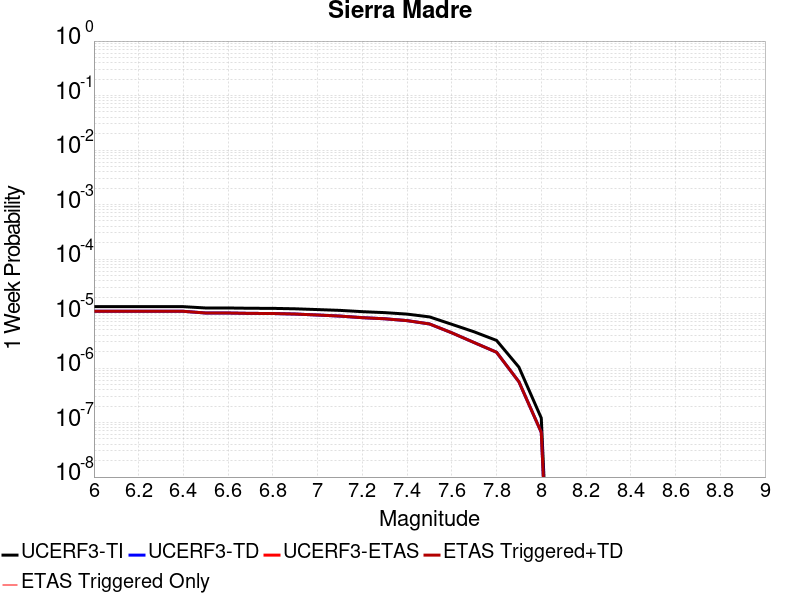 | 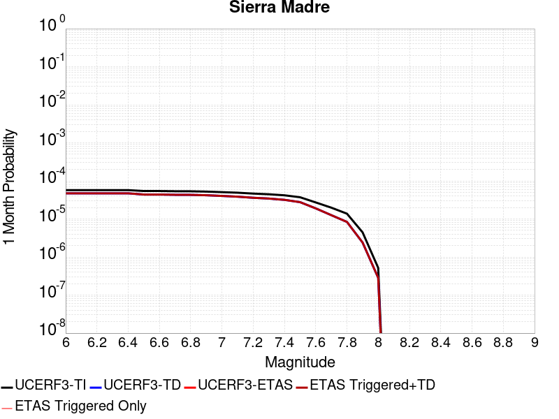 | 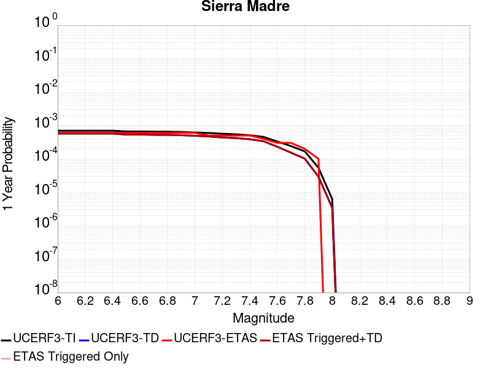 | 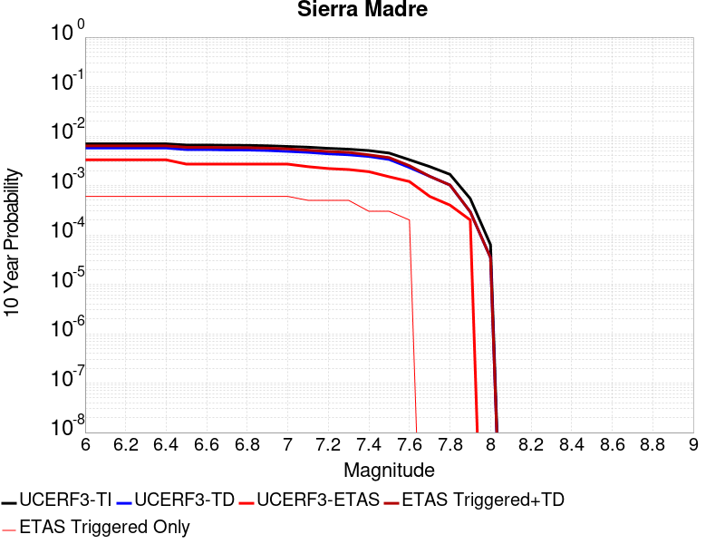 |

| Magnitude | 1 wk TI Prob | 1 wk TD Prob | 1 wk ETAS Prob | 1 wk ETAS/TD Gain | 1 wk ETAS Triggered+TD | 1 wk ETAS Triggered Only | 1 mo TI Prob | 1 mo TD Prob | 1 mo ETAS Prob | 1 mo ETAS/TD Gain | 1 mo ETAS Triggered+TD | 1 mo ETAS Triggered Only | 1 yr TI Prob | 1 yr TD Prob | 1 yr ETAS Prob | 1 yr ETAS/TD Gain | 1 yr ETAS Triggered+TD | 1 yr ETAS Triggered Only | 10 yr TI Prob | 10 yr TD Prob | 10 yr ETAS Prob | 10 yr ETAS/TD Gain | 10 yr ETAS Triggered+TD | 10 yr ETAS Triggered Only |
|-----|-----|-----|-----|-----|-----|-----|-----|-----|-----|-----|-----|-----|-----|-----|-----|-----|-----|-----|-----|-----|-----|-----|-----|-----|
| 6.0 | 1.3379373E-5 | 1.1005781E-5 | 0.0 | 0.0 | 1.1005781E-5 | 0.0 | 5.7338908E-5 | 4.7166788E-5 | 0.0 | 0.0 | 4.7166788E-5 | 0.0 | 6.978776E-4 | 5.741058E-4 | 6.0E-4 | 1.0451035 | 5.741058E-4 | 0.0 | 0.0069569005 | 0.005726695 | 0.0033 | 0.5762486 | 0.0063232593 | 6.0E-4 |
| 6.1 | 1.3379373E-5 | 1.1005781E-5 | 0.0 | 0.0 | 1.1005781E-5 | 0.0 | 5.7338908E-5 | 4.7166788E-5 | 0.0 | 0.0 | 4.7166788E-5 | 0.0 | 6.978776E-4 | 5.741058E-4 | 6.0E-4 | 1.0451035 | 5.741058E-4 | 0.0 | 0.0069569005 | 0.005726695 | 0.0033 | 0.5762486 | 0.0063232593 | 6.0E-4 |
| 6.2 | 1.3379373E-5 | 1.1005781E-5 | 0.0 | 0.0 | 1.1005781E-5 | 0.0 | 5.7338908E-5 | 4.7166788E-5 | 0.0 | 0.0 | 4.7166788E-5 | 0.0 | 6.978776E-4 | 5.741058E-4 | 6.0E-4 | 1.0451035 | 5.741058E-4 | 0.0 | 0.0069569005 | 0.005726695 | 0.0033 | 0.5762486 | 0.0063232593 | 6.0E-4 |
| 6.3 | 1.3379373E-5 | 1.1005781E-5 | 0.0 | 0.0 | 1.1005781E-5 | 0.0 | 5.7338908E-5 | 4.7166788E-5 | 0.0 | 0.0 | 4.7166788E-5 | 0.0 | 6.978776E-4 | 5.741058E-4 | 6.0E-4 | 1.0451035 | 5.741058E-4 | 0.0 | 0.0069569005 | 0.005726695 | 0.0033 | 0.5762486 | 0.0063232593 | 6.0E-4 |
| 6.4 | 1.3379373E-5 | 1.1005781E-5 | 0.0 | 0.0 | 1.1005781E-5 | 0.0 | 5.7338908E-5 | 4.7166788E-5 | 0.0 | 0.0 | 4.7166788E-5 | 0.0 | 6.978776E-4 | 5.741058E-4 | 6.0E-4 | 1.0451035 | 5.741058E-4 | 0.0 | 0.0069569005 | 0.005726695 | 0.0033 | 0.5762486 | 0.0063232593 | 6.0E-4 |
| 6.5 | 1.26563245E-5 | 1.0235137E-5 | 0.0 | 0.0 | 1.0235137E-5 | 0.0 | 5.4240263E-5 | 4.386414E-5 | 0.0 | 0.0 | 4.386414E-5 | 0.0 | 6.601751E-4 | 5.339161E-4 | 6.0E-4 | 1.123772 | 5.339161E-4 | 0.0 | 0.006582173 | 0.0053267595 | 0.0027 | 0.50687474 | 0.0059235636 | 6.0E-4 |
| 6.6 | 1.26563245E-5 | 1.0235137E-5 | 0.0 | 0.0 | 1.0235137E-5 | 0.0 | 5.4240263E-5 | 4.386414E-5 | 0.0 | 0.0 | 4.386414E-5 | 0.0 | 6.601751E-4 | 5.339161E-4 | 6.0E-4 | 1.123772 | 5.339161E-4 | 0.0 | 0.006582173 | 0.0053267595 | 0.0027 | 0.50687474 | 0.0059235636 | 6.0E-4 |
| 6.7 | 1.2502474E-5 | 1.007126E-5 | 0.0 | 0.0 | 1.007126E-5 | 0.0 | 5.3580934E-5 | 4.3161832E-5 | 0.0 | 0.0 | 4.3161832E-5 | 0.0 | 6.521526E-4 | 5.2536966E-4 | 6.0E-4 | 1.142053 | 5.2536966E-4 | 0.0 | 0.0065024206 | 0.0052417 | 0.0027 | 0.51510006 | 0.0058385553 | 6.0E-4 |
| 6.8 | 1.2454966E-5 | 1.0023538E-5 | 0.0 | 0.0 | 1.0023538E-5 | 0.0 | 5.3377335E-5 | 4.295732E-5 | 0.0 | 0.0 | 4.295732E-5 | 0.0 | 6.4967526E-4 | 5.2288093E-4 | 6.0E-4 | 1.1474888 | 5.2288093E-4 | 0.0 | 0.006477792 | 0.0052169296 | 0.0027 | 0.5175458 | 0.0058137993 | 6.0E-4 |
| 6.9 | 1.2225574E-5 | 9.7973325E-6 | 0.0 | 0.0 | 9.7973325E-6 | 0.0 | 5.2394265E-5 | 4.1987896E-5 | 0.0 | 0.0 | 4.1987896E-5 | 0.0 | 6.3771347E-4 | 5.110838E-4 | 6.0E-4 | 1.1739758 | 5.110838E-4 | 0.0 | 0.006358865 | 0.0050995043 | 0.0027 | 0.52946323 | 0.005696445 | 6.0E-4 |
| 7.0 | 1.182946E-5 | 9.403791E-6 | 0.0 | 0.0 | 9.403791E-6 | 0.0 | 5.06967E-5 | 4.0301347E-5 | 0.0 | 0.0 | 4.0301347E-5 | 0.0 | 6.1705755E-4 | 4.9055944E-4 | 6.0E-4 | 1.2230934 | 4.9055944E-4 | 0.0 | 0.006153469 | 0.004895182 | 0.0027 | 0.5515628 | 0.0054922444 | 6.0E-4 |
| 7.1 | 1.14369095E-5 | 8.990681E-6 | 0.0 | 0.0 | 8.990681E-6 | 0.0 | 4.9014405E-5 | 3.853093E-5 | 0.0 | 0.0 | 3.853093E-5 | 0.0 | 5.9658696E-4 | 4.6901405E-4 | 5.0E-4 | 1.0660661 | 4.6901405E-4 | 0.0 | 0.005949879 | 0.004680652 | 0.0024 | 0.5127491 | 0.005178312 | 5.0E-4 |
| 7.2 | 1.0836419E-5 | 8.403943E-6 | 0.0 | 0.0 | 8.403943E-6 | 0.0 | 4.644097E-5 | 3.601641E-5 | 0.0 | 0.0 | 3.601641E-5 | 0.0 | 5.652721E-4 | 4.3841245E-4 | 5.0E-4 | 1.1404786 | 4.3841245E-4 | 0.0 | 0.0056383642 | 0.0043758773 | 0.0022 | 0.50275636 | 0.0048736893 | 5.0E-4 |
| 7.3 | 1.0403439E-5 | 8.025128E-6 | 0.0 | 0.0 | 8.025128E-6 | 0.0 | 4.4585406E-5 | 3.439296E-5 | 0.0 | 0.0 | 3.439296E-5 | 0.0 | 5.426921E-4 | 4.1865473E-4 | 5.0E-4 | 1.1943016 | 4.1865473E-4 | 0.0 | 0.005413687 | 0.00417906 | 0.0021 | 0.5025053 | 0.0046769707 | 5.0E-4 |
| 7.4 | 9.768864E-6 | 7.418619E-6 | 0.0 | 0.0 | 7.418619E-6 | 0.0 | 4.186589E-5 | 3.17937E-5 | 0.0 | 0.0 | 3.17937E-5 | 0.0 | 5.09598E-4 | 3.8702044E-4 | 5.0E-4 | 1.2919215 | 3.8702044E-4 | 0.0 | 0.0050843097 | 0.0038638606 | 0.0019 | 0.49173617 | 0.0041627013 | 3.0E-4 |
| 7.5 | 8.687089E-6 | 6.4540272E-6 | 0.0 | 0.0 | 6.4540272E-6 | 0.0 | 3.722985E-5 | 2.765983E-5 | 0.0 | 0.0 | 2.765983E-5 | 0.0 | 4.5317915E-4 | 3.3670725E-4 | 4.0E-4 | 1.1879756 | 3.3670725E-4 | 0.0 | 0.004522561 | 0.0033623627 | 0.0015 | 0.44611487 | 0.003661354 | 3.0E-4 |
| 7.6 | 6.3506063E-6 | 4.4337717E-6 | 0.0 | 0.0 | 4.4337717E-6 | 0.0 | 2.72166E-5 | 1.9001742E-5 | 0.0 | 0.0 | 1.9001742E-5 | 0.0 | 3.3131172E-4 | 2.313219E-4 | 3.0E-4 | 1.2968941 | 2.313219E-4 | 0.0 | 0.003308182 | 0.002311141 | 0.0012 | 0.51922405 | 0.0025106787 | 2.0E-4 |
| 7.7 | 4.62223E-6 | 2.93617E-6 | 0.0 | 0.0 | 2.93617E-6 | 0.0 | 1.9809406E-5 | 1.2583525E-5 | 0.0 | 0.0 | 1.2583525E-5 | 0.0 | 2.4115283E-4 | 1.5319367E-4 | 3.0E-4 | 1.9583055 | 1.5319367E-4 | 0.0 | 0.0024089129 | 0.0015311871 | 6.0E-4 | 0.39185283 | 0.0015311871 | 0.0 |
| 7.8 | 3.2145008E-6 | 1.951722E-6 | 0.0 | 0.0 | 1.951722E-6 | 0.0 | 1.3776359E-5 | 8.364496E-6 | 0.0 | 0.0 | 8.364496E-6 | 0.0 | 1.6771426E-4 | 1.0183299E-4 | 2.0E-4 | 1.964 | 1.0183299E-4 | 0.0 | 0.0016758774 | 0.0010181253 | 4.0E-4 | 0.39287892 | 0.0010181253 | 0.0 |
| 7.9 | 1.0391769E-6 | 5.6095155E-7 | 0.0 | 0.0 | 5.6095155E-7 | 0.0 | 4.4536077E-6 | 2.4040758E-6 | 0.0 | 0.0 | 2.4040758E-6 | 0.0 | 5.4221324E-5 | 2.9269235E-5 | 1.0E-4 | 3.4165568 | 2.9269235E-5 | 0.0 | 5.4208096E-4 | 2.926542E-4 | 2.0E-4 | 0.6834004 | 2.926542E-4 | 0.0 |
| 8.0 | 1.210983E-7 | 6.619046E-8 | 0.0 | 0.0 | 6.619046E-8 | 0.0 | 5.1899264E-7 | 2.8367336E-7 | 0.0 | 0.0 | 2.8367336E-7 | 0.0 | 6.3187167E-6 | 3.453718E-6 | 0.0 | 0.0 | 3.453718E-6 | 0.0 | 6.318537E-5 | 3.453666E-5 | 0.0 | 0.0 | 3.453666E-5 | 0.0 |

## Redondo Canyon alt 1
*[(top)](#table-of-contents)*

| 1 Week | 1 Month | 1 Year | 10 Year |
|-----|-----|-----|-----|
| 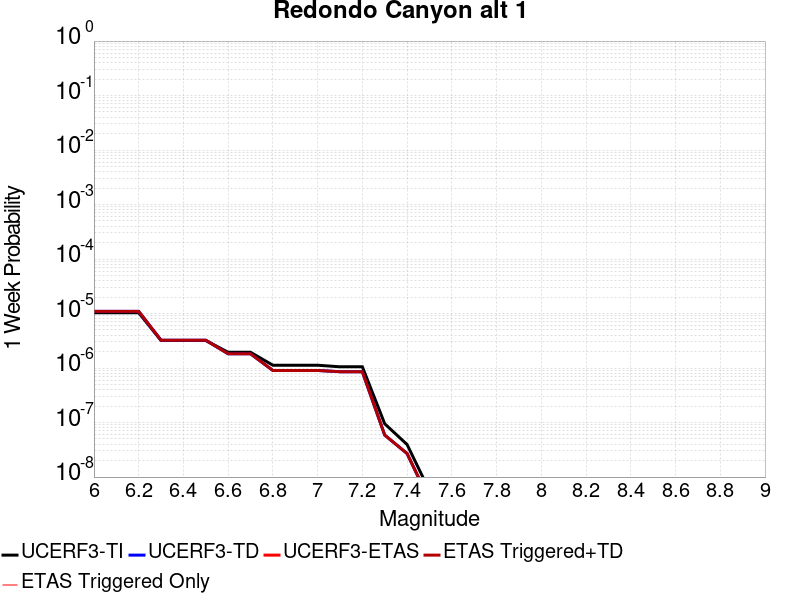 | 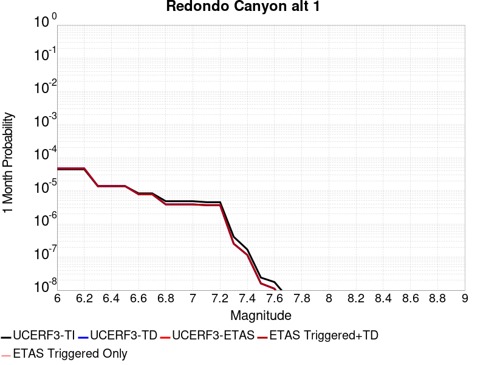 | 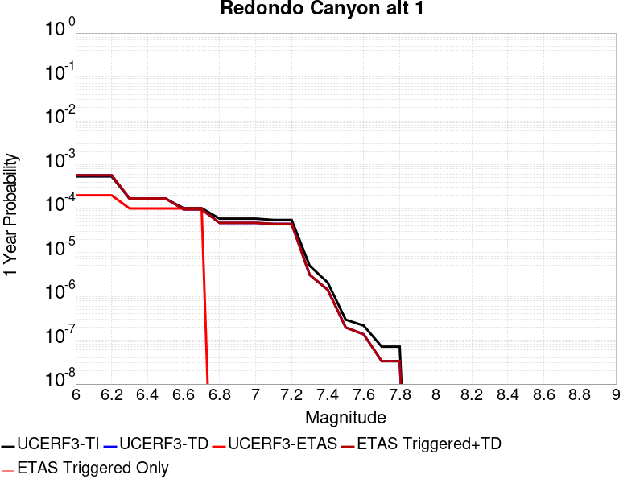 | 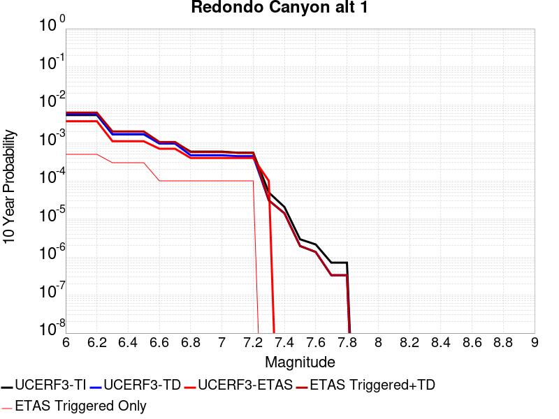 |

| Magnitude | 1 wk TI Prob | 1 wk TD Prob | 1 wk ETAS Prob | 1 wk ETAS/TD Gain | 1 wk ETAS Triggered+TD | 1 wk ETAS Triggered Only | 1 mo TI Prob | 1 mo TD Prob | 1 mo ETAS Prob | 1 mo ETAS/TD Gain | 1 mo ETAS Triggered+TD | 1 mo ETAS Triggered Only | 1 yr TI Prob | 1 yr TD Prob | 1 yr ETAS Prob | 1 yr ETAS/TD Gain | 1 yr ETAS Triggered+TD | 1 yr ETAS Triggered Only | 10 yr TI Prob | 10 yr TD Prob | 10 yr ETAS Prob | 10 yr ETAS/TD Gain | 10 yr ETAS Triggered+TD | 10 yr ETAS Triggered Only |
|-----|-----|-----|-----|-----|-----|-----|-----|-----|-----|-----|-----|-----|-----|-----|-----|-----|-----|-----|-----|-----|-----|-----|-----|-----|
| 6.0 | 1.0346246E-5 | 1.0983519E-5 | 0.0 | 0.0 | 1.0983519E-5 | 0.0 | 4.43403E-5 | 4.7071822E-5 | 0.0 | 0.0 | 4.7071822E-5 | 0.0 | 5.3970946E-4 | 5.7302765E-4 | 2.0E-4 | 0.3490233 | 5.7302765E-4 | 0.0 | 0.0053840056 | 0.005723242 | 0.0037 | 0.6464867 | 0.006220381 | 5.0E-4 |
| 6.1 | 1.0346246E-5 | 1.0983519E-5 | 0.0 | 0.0 | 1.0983519E-5 | 0.0 | 4.43403E-5 | 4.7071822E-5 | 0.0 | 0.0 | 4.7071822E-5 | 0.0 | 5.3970946E-4 | 5.7302765E-4 | 2.0E-4 | 0.3490233 | 5.7302765E-4 | 0.0 | 0.0053840056 | 0.005723242 | 0.0037 | 0.6464867 | 0.006220381 | 5.0E-4 |
| 6.2 | 1.0346246E-5 | 1.0983519E-5 | 0.0 | 0.0 | 1.0983519E-5 | 0.0 | 4.43403E-5 | 4.7071822E-5 | 0.0 | 0.0 | 4.7071822E-5 | 0.0 | 5.3970946E-4 | 5.7302765E-4 | 2.0E-4 | 0.3490233 | 5.7302765E-4 | 0.0 | 0.0053840056 | 0.005723242 | 0.0037 | 0.6464867 | 0.006220381 | 5.0E-4 |
| 6.3 | 3.2052794E-6 | 3.2369921E-6 | 0.0 | 0.0 | 3.2369921E-6 | 0.0 | 1.373684E-5 | 1.3872772E-5 | 0.0 | 0.0 | 1.3872772E-5 | 0.0 | 1.6723319E-4 | 1.6889189E-4 | 1.0E-4 | 0.5920948 | 1.6889189E-4 | 0.0 | 0.001671074 | 0.0016880251 | 0.0011 | 0.65164906 | 0.0019875187 | 3.0E-4 |
| 6.4 | 3.2052794E-6 | 3.2369921E-6 | 0.0 | 0.0 | 3.2369921E-6 | 0.0 | 1.373684E-5 | 1.3872772E-5 | 0.0 | 0.0 | 1.3872772E-5 | 0.0 | 1.6723319E-4 | 1.6889189E-4 | 1.0E-4 | 0.5920948 | 1.6889189E-4 | 0.0 | 0.001671074 | 0.0016880251 | 0.0011 | 0.65164906 | 0.0019875187 | 3.0E-4 |
| 6.5 | 3.2052794E-6 | 3.2369921E-6 | 0.0 | 0.0 | 3.2369921E-6 | 0.0 | 1.373684E-5 | 1.3872772E-5 | 0.0 | 0.0 | 1.3872772E-5 | 0.0 | 1.6723319E-4 | 1.6889189E-4 | 1.0E-4 | 0.5920948 | 1.6889189E-4 | 0.0 | 0.001671074 | 0.0016880251 | 0.0011 | 0.65164906 | 0.0019875187 | 3.0E-4 |
| 6.6 | 1.948328E-6 | 1.829409E-6 | 0.0 | 0.0 | 1.829409E-6 | 0.0 | 8.349951E-6 | 7.840309E-6 | 0.0 | 0.0 | 7.840309E-6 | 0.0 | 1.016559E-4 | 9.5453084E-5 | 1.0E-4 | 1.0476351 | 9.5453084E-5 | 0.0 | 0.0010160941 | 9.5426786E-4 | 7.0E-4 | 0.7335466 | 0.0010541724 | 1.0E-4 |
| 6.7 | 1.948328E-6 | 1.829409E-6 | 0.0 | 0.0 | 1.829409E-6 | 0.0 | 8.349951E-6 | 7.840309E-6 | 0.0 | 0.0 | 7.840309E-6 | 0.0 | 1.016559E-4 | 9.5453084E-5 | 1.0E-4 | 1.0476351 | 9.5453084E-5 | 0.0 | 0.0010160941 | 9.5426786E-4 | 7.0E-4 | 0.7335466 | 0.0010541724 | 1.0E-4 |
| 6.8 | 1.1278219E-6 | 9.036135E-7 | 0.0 | 0.0 | 9.036135E-7 | 0.0 | 4.8335132E-6 | 3.872626E-6 | 0.0 | 0.0 | 3.872626E-6 | 0.0 | 5.8846435E-5 | 4.714863E-5 | 0.0 | 0.0 | 4.714863E-5 | 0.0 | 5.8830855E-4 | 4.714283E-4 | 4.0E-4 | 0.8484853 | 5.713812E-4 | 1.0E-4 |
| 6.9 | 1.1278219E-6 | 9.036135E-7 | 0.0 | 0.0 | 9.036135E-7 | 0.0 | 4.8335132E-6 | 3.872626E-6 | 0.0 | 0.0 | 3.872626E-6 | 0.0 | 5.8846435E-5 | 4.714863E-5 | 0.0 | 0.0 | 4.714863E-5 | 0.0 | 5.8830855E-4 | 4.714283E-4 | 4.0E-4 | 0.8484853 | 5.713812E-4 | 1.0E-4 |
| 7.0 | 1.1278219E-6 | 9.036135E-7 | 0.0 | 0.0 | 9.036135E-7 | 0.0 | 4.8335132E-6 | 3.872626E-6 | 0.0 | 0.0 | 3.872626E-6 | 0.0 | 5.8846435E-5 | 4.714863E-5 | 0.0 | 0.0 | 4.714863E-5 | 0.0 | 5.8830855E-4 | 4.714283E-4 | 4.0E-4 | 0.8484853 | 5.713812E-4 | 1.0E-4 |
| 7.1 | 1.0545139E-6 | 8.572081E-7 | 0.0 | 0.0 | 8.572081E-7 | 0.0 | 4.5193374E-6 | 3.673746E-6 | 0.0 | 0.0 | 3.673746E-6 | 0.0 | 5.5021545E-5 | 4.4727367E-5 | 0.0 | 0.0 | 4.4727367E-5 | 0.0 | 5.500792E-4 | 4.472254E-4 | 4.0E-4 | 0.8944036 | 5.471807E-4 | 1.0E-4 |
| 7.2 | 1.0545139E-6 | 8.572081E-7 | 0.0 | 0.0 | 8.572081E-7 | 0.0 | 4.5193374E-6 | 3.673746E-6 | 0.0 | 0.0 | 3.673746E-6 | 0.0 | 5.5021545E-5 | 4.4727367E-5 | 0.0 | 0.0 | 4.4727367E-5 | 0.0 | 5.500792E-4 | 4.472254E-4 | 4.0E-4 | 0.8944036 | 5.471807E-4 | 1.0E-4 |
| 7.3 | 9.505161E-8 | 5.8979445E-8 | 0.0 | 0.0 | 5.8979445E-8 | 0.0 | 4.0736398E-7 | 2.5276904E-7 | 0.0 | 0.0 | 2.5276904E-7 | 0.0 | 4.959645E-6 | 3.0774597E-6 | 0.0 | 0.0 | 3.0774597E-6 | 0.0 | 4.9595343E-5 | 3.0774292E-5 | 1.0E-4 | 3.2494657 | 3.0774292E-5 | 0.0 |
| 7.4 | 3.9520785E-8 | 2.7002285E-8 | 0.0 | 0.0 | 2.7002285E-8 | 0.0 | 1.6937479E-7 | 1.1572407E-7 | 0.0 | 0.0 | 1.1572407E-7 | 0.0 | 2.062136E-6 | 1.40894E-6 | 0.0 | 0.0 | 1.40894E-6 | 0.0 | 2.062117E-5 | 1.4089337E-5 | 0.0 | 0.0 | 1.4089337E-5 | 0.0 |
| 7.5 | 5.6133214E-9 | 3.738594E-9 | 0.0 | 0.0 | 3.738594E-9 | 0.0 | 2.4057092E-8 | 1.6022545E-8 | 0.0 | 0.0 | 1.6022545E-8 | 0.0 | 2.9289507E-7 | 1.9507448E-7 | 0.0 | 0.0 | 1.9507448E-7 | 0.0 | 2.9289467E-6 | 1.9507434E-6 | 0.0 | 0.0 | 1.9507434E-6 | 0.0 |
| 7.6 | 4.1064334E-9 | 2.5970506E-9 | 0.0 | 0.0 | 2.5970506E-9 | 0.0 | 1.7599E-8 | 1.1130218E-8 | 0.0 | 0.0 | 1.1130218E-8 | 0.0 | 2.142678E-7 | 1.3551039E-7 | 0.0 | 0.0 | 1.3551039E-7 | 0.0 | 2.1426758E-6 | 1.3551032E-6 | 0.0 | 0.0 | 1.3551032E-6 | 0.0 |
| 7.7 | 1.361975E-9 | 6.3644234E-10 | 0.0 | 0.0 | 6.3644234E-10 | 0.0 | 5.8370353E-9 | 2.7276101E-9 | 0.0 | 0.0 | 2.7276101E-9 | 0.0 | 7.1065905E-8 | 3.3208654E-8 | 0.0 | 0.0 | 3.3208654E-8 | 0.0 | 7.106588E-7 | 3.3208653E-7 | 0.0 | 0.0 | 3.3208653E-7 | 0.0 |
| 7.8 | 1.361975E-9 | 6.3644234E-10 | 0.0 | 0.0 | 6.3644234E-10 | 0.0 | 5.8370353E-9 | 2.7276101E-9 | 0.0 | 0.0 | 2.7276101E-9 | 0.0 | 7.1065905E-8 | 3.3208654E-8 | 0.0 | 0.0 | 3.3208654E-8 | 0.0 | 7.106588E-7 | 3.3208653E-7 | 0.0 | 0.0 | 3.3208653E-7 | 0.0 |

## Channel Islands Western Deep Ramp
*[(top)](#table-of-contents)*

| 1 Week | 1 Month | 1 Year | 10 Year |
|-----|-----|-----|-----|
| 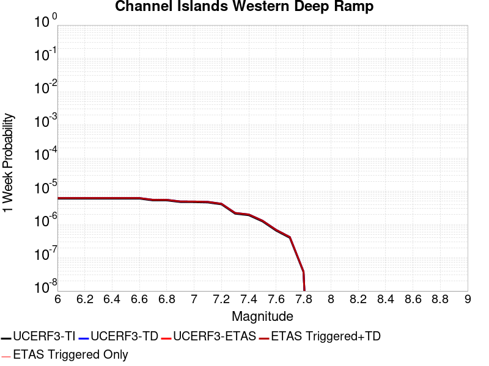 | 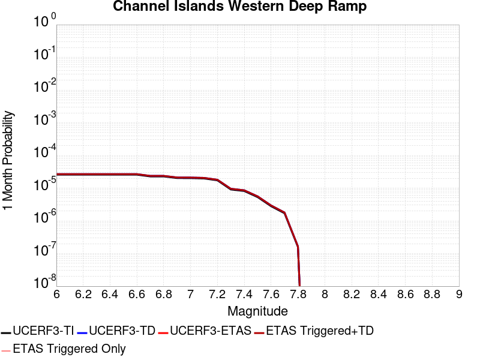 | 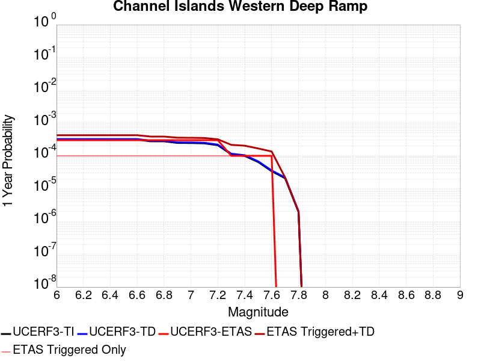 | 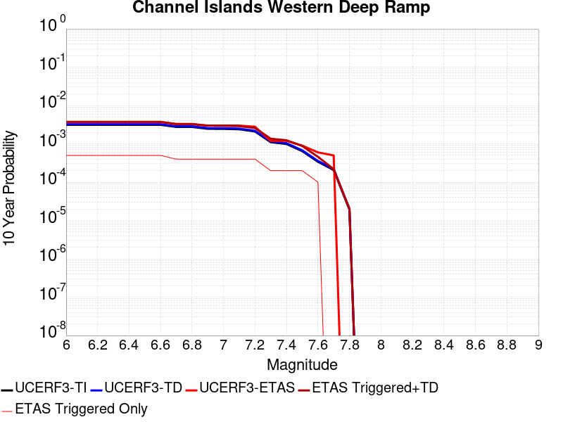 |

| Magnitude | 1 wk TI Prob | 1 wk TD Prob | 1 wk ETAS Prob | 1 wk ETAS/TD Gain | 1 wk ETAS Triggered+TD | 1 wk ETAS Triggered Only | 1 mo TI Prob | 1 mo TD Prob | 1 mo ETAS Prob | 1 mo ETAS/TD Gain | 1 mo ETAS Triggered+TD | 1 mo ETAS Triggered Only | 1 yr TI Prob | 1 yr TD Prob | 1 yr ETAS Prob | 1 yr ETAS/TD Gain | 1 yr ETAS Triggered+TD | 1 yr ETAS Triggered Only | 10 yr TI Prob | 10 yr TD Prob | 10 yr ETAS Prob | 10 yr ETAS/TD Gain | 10 yr ETAS Triggered+TD | 10 yr ETAS Triggered Only |
|-----|-----|-----|-----|-----|-----|-----|-----|-----|-----|-----|-----|-----|-----|-----|-----|-----|-----|-----|-----|-----|-----|-----|-----|-----|
| 6.0 | 6.0213506E-6 | 6.255351E-6 | 0.0 | 0.0 | 6.255351E-6 | 0.0 | 2.5805533E-5 | 2.6808395E-5 | 0.0 | 0.0 | 2.6808395E-5 | 0.0 | 3.1413708E-4 | 3.263478E-4 | 3.0E-4 | 0.9192647 | 4.2631518E-4 | 1.0E-4 | 0.0031369338 | 0.0032591273 | 0.0037 | 1.1352732 | 0.0037574975 | 5.0E-4 |
| 6.1 | 6.0213506E-6 | 6.255351E-6 | 0.0 | 0.0 | 6.255351E-6 | 0.0 | 2.5805533E-5 | 2.6808395E-5 | 0.0 | 0.0 | 2.6808395E-5 | 0.0 | 3.1413708E-4 | 3.263478E-4 | 3.0E-4 | 0.9192647 | 4.2631518E-4 | 1.0E-4 | 0.0031369338 | 0.0032591273 | 0.0037 | 1.1352732 | 0.0037574975 | 5.0E-4 |
| 6.2 | 6.0213506E-6 | 6.255351E-6 | 0.0 | 0.0 | 6.255351E-6 | 0.0 | 2.5805533E-5 | 2.6808395E-5 | 0.0 | 0.0 | 2.6808395E-5 | 0.0 | 3.1413708E-4 | 3.263478E-4 | 3.0E-4 | 0.9192647 | 4.2631518E-4 | 1.0E-4 | 0.0031369338 | 0.0032591273 | 0.0037 | 1.1352732 | 0.0037574975 | 5.0E-4 |
| 6.3 | 6.0213506E-6 | 6.255351E-6 | 0.0 | 0.0 | 6.255351E-6 | 0.0 | 2.5805533E-5 | 2.6808395E-5 | 0.0 | 0.0 | 2.6808395E-5 | 0.0 | 3.1413708E-4 | 3.263478E-4 | 3.0E-4 | 0.9192647 | 4.2631518E-4 | 1.0E-4 | 0.0031369338 | 0.0032591273 | 0.0037 | 1.1352732 | 0.0037574975 | 5.0E-4 |
| 6.4 | 6.0213506E-6 | 6.255351E-6 | 0.0 | 0.0 | 6.255351E-6 | 0.0 | 2.5805533E-5 | 2.6808395E-5 | 0.0 | 0.0 | 2.6808395E-5 | 0.0 | 3.1413708E-4 | 3.263478E-4 | 3.0E-4 | 0.9192647 | 4.2631518E-4 | 1.0E-4 | 0.0031369338 | 0.0032591273 | 0.0037 | 1.1352732 | 0.0037574975 | 5.0E-4 |
| 6.5 | 6.0213506E-6 | 6.255351E-6 | 0.0 | 0.0 | 6.255351E-6 | 0.0 | 2.5805533E-5 | 2.6808395E-5 | 0.0 | 0.0 | 2.6808395E-5 | 0.0 | 3.1413708E-4 | 3.263478E-4 | 3.0E-4 | 0.9192647 | 4.2631518E-4 | 1.0E-4 | 0.0031369338 | 0.0032591273 | 0.0037 | 1.1352732 | 0.0037574975 | 5.0E-4 |
| 6.6 | 6.0213506E-6 | 6.255351E-6 | 0.0 | 0.0 | 6.255351E-6 | 0.0 | 2.5805533E-5 | 2.6808395E-5 | 0.0 | 0.0 | 2.6808395E-5 | 0.0 | 3.1413708E-4 | 3.263478E-4 | 3.0E-4 | 0.9192647 | 4.2631518E-4 | 1.0E-4 | 0.0031369338 | 0.0032591273 | 0.0037 | 1.1352732 | 0.0037574975 | 5.0E-4 |
| 6.7 | 5.313309E-6 | 5.5256787E-6 | 0.0 | 0.0 | 5.5256787E-6 | 0.0 | 2.2771126E-5 | 2.3681288E-5 | 0.0 | 0.0 | 2.3681288E-5 | 0.0 | 2.772032E-4 | 2.8828564E-4 | 3.0E-4 | 1.0406346 | 3.882568E-4 | 1.0E-4 | 0.0027685766 | 0.0028795197 | 0.0033 | 1.1460245 | 0.003278368 | 4.0E-4 |
| 6.8 | 5.313309E-6 | 5.5256787E-6 | 0.0 | 0.0 | 5.5256787E-6 | 0.0 | 2.2771126E-5 | 2.3681288E-5 | 0.0 | 0.0 | 2.3681288E-5 | 0.0 | 2.772032E-4 | 2.8828564E-4 | 3.0E-4 | 1.0406346 | 3.882568E-4 | 1.0E-4 | 0.0027685766 | 0.0028795197 | 0.0033 | 1.1460245 | 0.003278368 | 4.0E-4 |
| 6.9 | 4.744377E-6 | 4.939834E-6 | 0.0 | 0.0 | 4.939834E-6 | 0.0 | 2.0332885E-5 | 2.1170566E-5 | 0.0 | 0.0 | 2.1170566E-5 | 0.0 | 2.4752476E-4 | 2.577249E-4 | 3.0E-4 | 1.1640319 | 3.5769914E-4 | 1.0E-4 | 0.0024724922 | 0.0025746275 | 0.003 | 1.165217 | 0.0029735977 | 4.0E-4 |
| 7.0 | 4.722209E-6 | 4.9168752E-6 | 0.0 | 0.0 | 4.9168752E-6 | 0.0 | 2.0237881E-5 | 2.1072174E-5 | 0.0 | 0.0 | 2.1072174E-5 | 0.0 | 2.4636835E-4 | 2.5652724E-4 | 3.0E-4 | 1.1694665 | 3.5650158E-4 | 1.0E-4 | 0.002460954 | 0.0025626787 | 0.003 | 1.1706501 | 0.0029616535 | 4.0E-4 |
| 7.1 | 4.611174E-6 | 4.801803E-6 | 0.0 | 0.0 | 4.801803E-6 | 0.0 | 1.9762025E-5 | 2.0579013E-5 | 0.0 | 0.0 | 2.0579013E-5 | 0.0 | 2.4057609E-4 | 2.505244E-4 | 3.0E-4 | 1.1974881 | 3.5049935E-4 | 1.0E-4 | 0.002403158 | 0.002502787 | 0.003 | 1.1986637 | 0.0029017858 | 4.0E-4 |
| 7.2 | 4.043994E-6 | 4.2123747E-6 | 0.0 | 0.0 | 4.2123747E-6 | 0.0 | 1.7331287E-5 | 1.805293E-5 | 0.0 | 0.0 | 1.805293E-5 | 0.0 | 2.10988E-4 | 2.1977581E-4 | 3.0E-4 | 1.3650273 | 3.1975383E-4 | 1.0E-4 | 0.002107878 | 0.0021959355 | 0.0028 | 1.275083 | 0.002595057 | 4.0E-4 |
| 7.3 | 2.1233036E-6 | 2.2300094E-6 | 0.0 | 0.0 | 2.2300094E-6 | 0.0 | 9.099841E-6 | 9.557149E-6 | 0.0 | 0.0 | 9.557149E-6 | 0.0 | 1.1078493E-4 | 1.1635212E-4 | 1.0E-4 | 0.85946 | 2.1634049E-4 | 1.0E-4 | 0.0011072971 | 0.0011629176 | 0.0012 | 1.0318873 | 0.0013626851 | 2.0E-4 |
| 7.4 | 1.9051884E-6 | 2.001698E-6 | 0.0 | 0.0 | 2.001698E-6 | 0.0 | 8.165067E-6 | 8.578679E-6 | 0.0 | 0.0 | 8.578679E-6 | 0.0 | 9.940516E-5 | 1.04440456E-4 | 1.0E-4 | 0.9574834 | 2.0443E-4 | 1.0E-4 | 9.93607E-4 | 0.001043919 | 0.0012 | 1.1495144 | 0.0012437102 | 2.0E-4 |
| 7.5 | 1.2408497E-6 | 1.3040154E-6 | 0.0 | 0.0 | 1.3040154E-6 | 0.0 | 5.317916E-6 | 5.5886258E-6 | 0.0 | 0.0 | 5.5886258E-6 | 0.0 | 6.4743705E-5 | 6.8039415E-5 | 1.0E-4 | 1.4697363 | 1.6803261E-4 | 1.0E-4 | 6.4724847E-4 | 6.80188E-4 | 9.0E-4 | 1.3231635 | 8.80052E-4 | 2.0E-4 |
| 7.6 | 6.5440025E-7 | 6.8874346E-7 | 0.0 | 0.0 | 6.8874346E-7 | 0.0 | 2.8045695E-6 | 2.9517544E-6 | 0.0 | 0.0 | 2.9517544E-6 | 0.0 | 3.4145098E-5 | 3.593703E-5 | 1.0E-4 | 2.782645 | 1.3593344E-4 | 1.0E-4 | 3.4139853E-4 | 3.5931362E-4 | 6.0E-4 | 1.6698505 | 4.5927768E-4 | 1.0E-4 |
| 7.7 | 3.985963E-7 | 4.1935115E-7 | 0.0 | 0.0 | 4.1935115E-7 | 0.0 | 1.7082689E-6 | 1.797218E-6 | 0.0 | 0.0 | 1.797218E-6 | 0.0 | 2.0797976E-5 | 2.1880922E-5 | 0.0 | 0.0 | 2.1880922E-5 | 0.0 | 2.0796029E-4 | 2.1878885E-4 | 5.0E-4 | 2.2853086 | 2.1878885E-4 | 0.0 |
| 7.8 | 3.706329E-8 | 3.859495E-8 | 0.0 | 0.0 | 3.859495E-8 | 0.0 | 1.5884267E-7 | 1.6540693E-7 | 0.0 | 0.0 | 1.6540693E-7 | 0.0 | 1.9339077E-6 | 2.0138275E-6 | 0.0 | 0.0 | 2.0138275E-6 | 0.0 | 1.933891E-5 | 2.0138104E-5 | 0.0 | 0.0 | 2.0138104E-5 | 0.0 |

## Point Reyes 2011 CFM
*[(top)](#table-of-contents)*

| 1 Week | 1 Month | 1 Year | 10 Year |
|-----|-----|-----|-----|
|  | 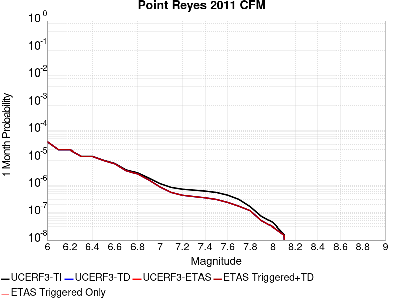 | 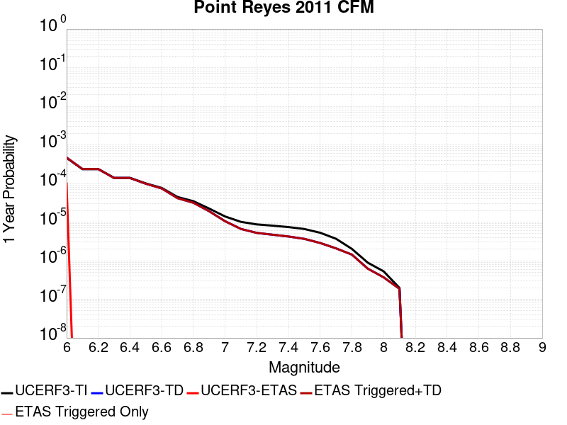 | 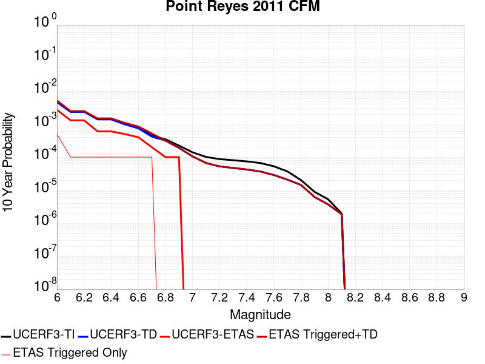 |

| Magnitude | 1 wk TI Prob | 1 wk TD Prob | 1 wk ETAS Prob | 1 wk ETAS/TD Gain | 1 wk ETAS Triggered+TD | 1 wk ETAS Triggered Only | 1 mo TI Prob | 1 mo TD Prob | 1 mo ETAS Prob | 1 mo ETAS/TD Gain | 1 mo ETAS Triggered+TD | 1 mo ETAS Triggered Only | 1 yr TI Prob | 1 yr TD Prob | 1 yr ETAS Prob | 1 yr ETAS/TD Gain | 1 yr ETAS Triggered+TD | 1 yr ETAS Triggered Only | 10 yr TI Prob | 10 yr TD Prob | 10 yr ETAS Prob | 10 yr ETAS/TD Gain | 10 yr ETAS Triggered+TD | 10 yr ETAS Triggered Only |
|-----|-----|-----|-----|-----|-----|-----|-----|-----|-----|-----|-----|-----|-----|-----|-----|-----|-----|-----|-----|-----|-----|-----|-----|-----|
| 6.0 | 8.8644965E-6 | 8.967732E-6 | 0.0 | 0.0 | 8.967732E-6 | 0.0 | 3.7990147E-5 | 3.843261E-5 | 0.0 | 0.0 | 3.843261E-5 | 0.0 | 4.624319E-4 | 4.6782283E-4 | 1.0E-4 | 0.21375613 | 4.6782283E-4 | 0.0 | 0.0046147075 | 0.0046690092 | 0.0027 | 0.57828116 | 0.0051666745 | 5.0E-4 |
| 6.1 | 4.526405E-6 | 4.539606E-6 | 0.0 | 0.0 | 4.539606E-6 | 0.0 | 1.9398734E-5 | 1.9455314E-5 | 0.0 | 0.0 | 1.9455314E-5 | 0.0 | 2.36154E-4 | 2.3684374E-4 | 0.0 | 0.0 | 2.3684374E-4 | 0.0 | 0.002359032 | 0.0023660199 | 0.0013 | 0.5494459 | 0.0024657834 | 1.0E-4 |
| 6.2 | 4.526405E-6 | 4.539606E-6 | 0.0 | 0.0 | 4.539606E-6 | 0.0 | 1.9398734E-5 | 1.9455314E-5 | 0.0 | 0.0 | 1.9455314E-5 | 0.0 | 2.36154E-4 | 2.3684374E-4 | 0.0 | 0.0 | 2.3684374E-4 | 0.0 | 0.002359032 | 0.0023660199 | 0.0013 | 0.5494459 | 0.0024657834 | 1.0E-4 |
| 6.3 | 2.6842322E-6 | 2.6609898E-6 | 0.0 | 0.0 | 2.6609898E-6 | 0.0 | 1.1503801E-5 | 1.1404193E-5 | 0.0 | 0.0 | 1.1404193E-5 | 0.0 | 1.4004979E-4 | 1.3883741E-4 | 0.0 | 0.0 | 1.3883741E-4 | 0.0 | 0.0013996155 | 0.001387529 | 6.0E-4 | 0.4324234 | 0.0014873901 | 1.0E-4 |
| 6.4 | 2.6842322E-6 | 2.6609898E-6 | 0.0 | 0.0 | 2.6609898E-6 | 0.0 | 1.1503801E-5 | 1.1404193E-5 | 0.0 | 0.0 | 1.1404193E-5 | 0.0 | 1.4004979E-4 | 1.3883741E-4 | 0.0 | 0.0 | 1.3883741E-4 | 0.0 | 0.0013996155 | 0.001387529 | 6.0E-4 | 0.4324234 | 0.0014873901 | 1.0E-4 |
| 6.5 | 1.9281833E-6 | 1.8909118E-6 | 0.0 | 0.0 | 1.8909118E-6 | 0.0 | 8.263617E-6 | 8.1038825E-6 | 0.0 | 0.0 | 8.1038825E-6 | 0.0 | 1.0060489E-4 | 9.866039E-5 | 0.0 | 0.0 | 9.866039E-5 | 0.0 | 0.0010055936 | 9.861772E-4 | 5.0E-4 | 0.50700825 | 0.0010860786 | 1.0E-4 |
| 6.6 | 1.4726726E-6 | 1.4272267E-6 | 0.0 | 0.0 | 1.4272267E-6 | 0.0 | 6.3114385E-6 | 6.116672E-6 | 0.0 | 0.0 | 6.116672E-6 | 0.0 | 7.683905E-5 | 7.4467986E-5 | 0.0 | 0.0 | 7.4467986E-5 | 0.0 | 7.6812494E-4 | 7.444379E-4 | 4.0E-4 | 0.53731817 | 8.443635E-4 | 1.0E-4 |
| 6.7 | 8.572307E-7 | 8.0096845E-7 | 0.0 | 0.0 | 8.0096845E-7 | 0.0 | 3.6738406E-6 | 3.4327174E-6 | 0.0 | 0.0 | 3.4327174E-6 | 0.0 | 4.472809E-5 | 4.1792548E-5 | 0.0 | 0.0 | 4.1792548E-5 | 0.0 | 4.471909E-4 | 4.1785126E-4 | 2.0E-4 | 0.47863922 | 5.178095E-4 | 1.0E-4 |
| 6.8 | 6.6745434E-7 | 6.079707E-7 | 0.0 | 0.0 | 6.079707E-7 | 0.0 | 2.8605155E-6 | 2.6055861E-6 | 0.0 | 0.0 | 2.6055861E-6 | 0.0 | 3.482622E-5 | 3.172256E-5 | 0.0 | 0.0 | 3.172256E-5 | 0.0 | 3.4820763E-4 | 3.1718408E-4 | 1.0E-4 | 0.31527433 | 3.1718408E-4 | 0.0 |
| 6.9 | 4.291521E-7 | 3.6559192E-7 | 0.0 | 0.0 | 3.6559192E-7 | 0.0 | 1.839222E-6 | 1.5668215E-6 | 0.0 | 0.0 | 1.5668215E-6 | 0.0 | 2.2392298E-5 | 1.907589E-5 | 0.0 | 0.0 | 1.907589E-5 | 0.0 | 2.2390042E-4 | 1.9074562E-4 | 1.0E-4 | 0.52425843 | 1.9074562E-4 | 0.0 |
| 7.0 | 2.6812808E-7 | 2.0210099E-7 | 0.0 | 0.0 | 2.0210099E-7 | 0.0 | 1.1491198E-6 | 8.661468E-7 | 0.0 | 0.0 | 8.661468E-7 | 0.0 | 1.3990444E-5 | 1.0545287E-5 | 0.0 | 0.0 | 1.0545287E-5 | 0.0 | 1.3989564E-4 | 1.0545067E-4 | 0.0 | 0.0 | 1.0545067E-4 | 0.0 |
| 7.1 | 1.9451231E-7 | 1.2747913E-7 | 0.0 | 0.0 | 1.2747913E-7 | 0.0 | 8.336239E-7 | 5.4633904E-7 | 0.0 | 0.0 | 5.4633904E-7 | 0.0 | 1.0149324E-5 | 6.6516573E-6 | 0.0 | 0.0 | 6.6516573E-6 | 0.0 | 1.014886E-4 | 6.651731E-5 | 0.0 | 0.0 | 6.651731E-5 | 0.0 |
| 7.2 | 1.6715143E-7 | 1.0064923E-7 | 0.0 | 0.0 | 1.0064923E-7 | 0.0 | 7.1636305E-7 | 4.3135378E-7 | 0.0 | 0.0 | 4.3135378E-7 | 0.0 | 8.721685E-6 | 5.2517194E-6 | 0.0 | 0.0 | 5.2517194E-6 | 0.0 | 8.721343E-5 | 5.2518677E-5 | 0.0 | 0.0 | 5.2518677E-5 | 0.0 |
| 7.3 | 1.5503173E-7 | 9.034857E-8 | 0.0 | 0.0 | 9.034857E-8 | 0.0 | 6.644215E-7 | 3.8720813E-7 | 0.0 | 0.0 | 3.8720813E-7 | 0.0 | 8.089301E-6 | 4.7142485E-6 | 0.0 | 0.0 | 4.7142485E-6 | 0.0 | 8.089007E-5 | 4.7144207E-5 | 0.0 | 0.0 | 4.7144207E-5 | 0.0 |
| 7.4 | 1.4251614E-7 | 8.118783E-8 | 0.0 | 0.0 | 8.118783E-8 | 0.0 | 6.1078333E-7 | 3.479478E-7 | 0.0 | 0.0 | 3.479478E-7 | 0.0 | 7.4362615E-6 | 4.2362562E-6 | 0.0 | 0.0 | 4.2362562E-6 | 0.0 | 7.436013E-5 | 4.2364478E-5 | 0.0 | 0.0 | 4.2364478E-5 | 0.0 |
| 7.5 | 1.2710186E-7 | 7.049968E-8 | 0.0 | 0.0 | 7.049968E-8 | 0.0 | 5.447221E-7 | 3.0214144E-7 | 0.0 | 0.0 | 3.0214144E-7 | 0.0 | 6.6319717E-6 | 3.6785657E-6 | 0.0 | 0.0 | 3.6785657E-6 | 0.0 | 6.6317734E-5 | 3.6787773E-5 | 0.0 | 0.0 | 3.6787773E-5 | 0.0 |
| 7.6 | 1.0144708E-7 | 5.513834E-8 | 0.0 | 0.0 | 5.513834E-8 | 0.0 | 4.347731E-7 | 2.3630714E-7 | 0.0 | 0.0 | 2.3630714E-7 | 0.0 | 5.2933497E-6 | 2.8770355E-6 | 0.0 | 0.0 | 2.8770355E-6 | 0.0 | 5.293224E-5 | 2.8772707E-5 | 0.0 | 0.0 | 2.8772707E-5 | 0.0 |
| 7.7 | 7.090527E-8 | 3.9978882E-8 | 0.0 | 0.0 | 3.9978882E-8 | 0.0 | 3.038797E-7 | 1.7133804E-7 | 0.0 | 0.0 | 1.7133804E-7 | 0.0 | 3.699729E-6 | 2.0860386E-6 | 0.0 | 0.0 | 2.0860386E-6 | 0.0 | 3.6996673E-5 | 2.0862915E-5 | 0.0 | 0.0 | 2.0862915E-5 | 0.0 |
| 7.8 | 3.8712045E-8 | 2.7573236E-8 | 0.0 | 0.0 | 2.7573236E-8 | 0.0 | 1.6590876E-7 | 1.1817101E-7 | 0.0 | 0.0 | 1.1817101E-7 | 0.0 | 2.0199373E-6 | 1.438731E-6 | 0.0 | 0.0 | 1.438731E-6 | 0.0 | 2.0199188E-5 | 1.4389941E-5 | 0.0 | 0.0 | 1.4389941E-5 | 0.0 |
| 7.9 | 1.7068782E-8 | 1.1942205E-8 | 0.0 | 0.0 | 1.1942205E-8 | 0.0 | 7.315192E-8 | 5.118087E-8 | 0.0 | 0.0 | 5.118087E-8 | 0.0 | 8.906242E-7 | 6.2312694E-7 | 0.0 | 0.0 | 6.2312694E-7 | 0.0 | 8.906207E-6 | 6.2339745E-6 | 0.0 | 0.0 | 6.2339745E-6 | 0.0 |
| 8.0 | 1.0172592E-8 | 7.119514E-9 | 0.0 | 0.0 | 7.119514E-9 | 0.0 | 4.359682E-8 | 3.05122E-8 | 0.0 | 0.0 | 3.05122E-8 | 0.0 | 5.3079117E-7 | 3.7148598E-7 | 0.0 | 0.0 | 3.7148598E-7 | 0.0 | 5.307899E-6 | 3.7175764E-6 | 0.0 | 0.0 | 3.7175764E-6 | 0.0 |
| 8.1 | 3.7861243E-9 | 3.5895376E-9 | 0.0 | 0.0 | 3.5895376E-9 | 0.0 | 1.6226247E-8 | 1.5383735E-8 | 0.0 | 0.0 | 1.5383735E-8 | 0.0 | 1.9755454E-7 | 1.8729696E-7 | 0.0 | 0.0 | 1.8729696E-7 | 0.0 | 1.9755437E-6 | 1.875223E-6 | 0.0 | 0.0 | 1.875223E-6 | 0.0 |

## Gillem - Big Crack 2011 CFM
*[(top)](#table-of-contents)*

| 1 Week | 1 Month | 1 Year | 10 Year |
|-----|-----|-----|-----|
| 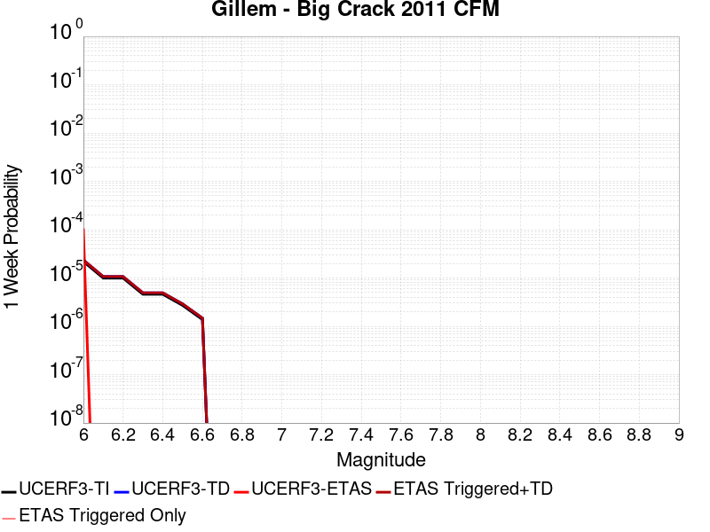 | 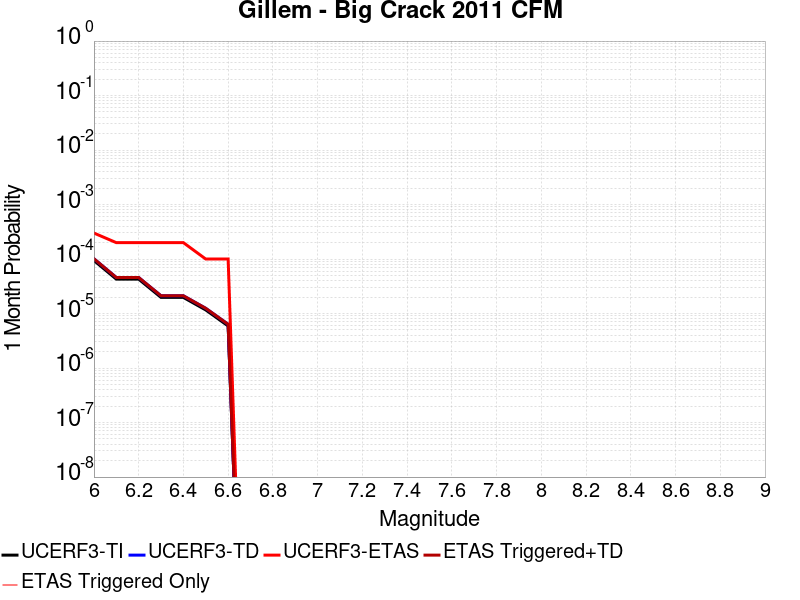 | 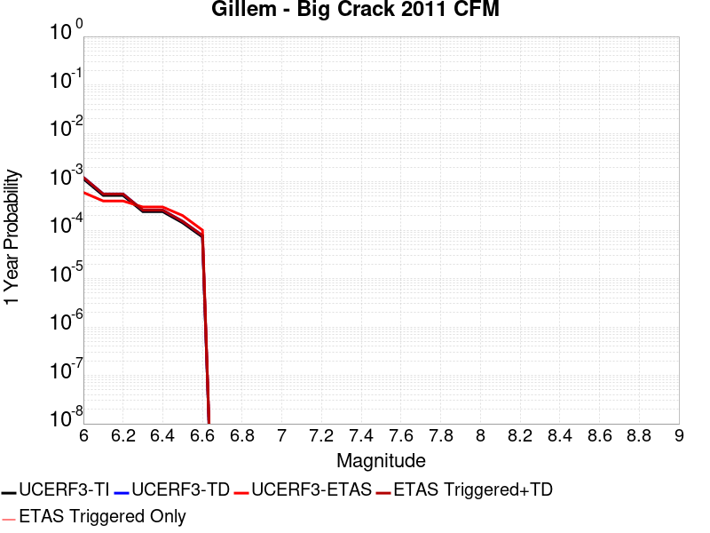 | 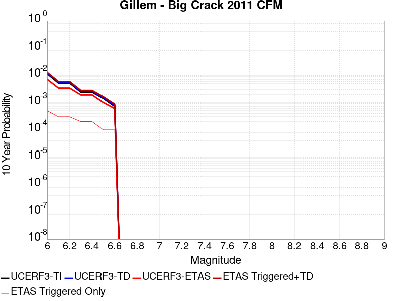 |

| Magnitude | 1 wk TI Prob | 1 wk TD Prob | 1 wk ETAS Prob | 1 wk ETAS/TD Gain | 1 wk ETAS Triggered+TD | 1 wk ETAS Triggered Only | 1 mo TI Prob | 1 mo TD Prob | 1 mo ETAS Prob | 1 mo ETAS/TD Gain | 1 mo ETAS Triggered+TD | 1 mo ETAS Triggered Only | 1 yr TI Prob | 1 yr TD Prob | 1 yr ETAS Prob | 1 yr ETAS/TD Gain | 1 yr ETAS Triggered+TD | 1 yr ETAS Triggered Only | 10 yr TI Prob | 10 yr TD Prob | 10 yr ETAS Prob | 10 yr ETAS/TD Gain | 10 yr ETAS Triggered+TD | 10 yr ETAS Triggered Only |
|-----|-----|-----|-----|-----|-----|-----|-----|-----|-----|-----|-----|-----|-----|-----|-----|-----|-----|-----|-----|-----|-----|-----|-----|-----|
| 6.0 | 2.196852E-5 | 2.3607974E-5 | 1.0E-4 | 4.235857 | 2.3607974E-5 | 0.0 | 9.4147406E-5 | 1.0117361E-4 | 3.0E-4 | 2.9652002 | 1.0117361E-4 | 0.0 | 0.0011456419 | 0.0012311816 | 6.0E-4 | 0.48733675 | 0.0012311816 | 0.0 | 0.011397537 | 0.01225247 | 0.0071 | 0.579475 | 0.012746343 | 5.0E-4 |
| 6.1 | 9.992795E-6 | 1.0713419E-5 | 0.0 | 0.0 | 1.0713419E-5 | 0.0 | 4.2825563E-5 | 4.591395E-5 | 2.0E-4 | 4.3559747 | 4.591395E-5 | 0.0 | 5.2127644E-4 | 5.5887725E-4 | 4.0E-4 | 0.71572065 | 5.5887725E-4 | 0.0 | 0.0052005537 | 0.0055765286 | 0.0034 | 0.6096983 | 0.0058748554 | 3.0E-4 |
| 6.2 | 9.992795E-6 | 1.0713419E-5 | 0.0 | 0.0 | 1.0713419E-5 | 0.0 | 4.2825563E-5 | 4.591395E-5 | 2.0E-4 | 4.3559747 | 4.591395E-5 | 0.0 | 5.2127644E-4 | 5.5887725E-4 | 4.0E-4 | 0.71572065 | 5.5887725E-4 | 0.0 | 0.0052005537 | 0.0055765286 | 0.0034 | 0.6096983 | 0.0058748554 | 3.0E-4 |
| 6.3 | 4.6127884E-6 | 4.943358E-6 | 0.0 | 0.0 | 4.943358E-6 | 0.0 | 1.9768944E-5 | 2.1185673E-5 | 2.0E-4 | 9.440342 | 2.1185673E-5 | 0.0 | 2.406603E-4 | 2.579095E-4 | 3.0E-4 | 1.1631987 | 2.579095E-4 | 0.0 | 0.0024039985 | 0.00257654 | 0.0019 | 0.737423 | 0.0027760249 | 2.0E-4 |
| 6.4 | 4.6127884E-6 | 4.943358E-6 | 0.0 | 0.0 | 4.943358E-6 | 0.0 | 1.9768944E-5 | 2.1185673E-5 | 2.0E-4 | 9.440342 | 2.1185673E-5 | 0.0 | 2.406603E-4 | 2.579095E-4 | 3.0E-4 | 1.1631987 | 2.579095E-4 | 0.0 | 0.0024039985 | 0.00257654 | 0.0019 | 0.737423 | 0.0027760249 | 2.0E-4 |
| 6.5 | 2.716712E-6 | 2.9115245E-6 | 0.0 | 0.0 | 2.9115245E-6 | 0.0 | 1.1643E-5 | 1.2477916E-5 | 1.0E-4 | 8.014158 | 1.2477916E-5 | 0.0 | 1.417443E-4 | 1.5191047E-4 | 2.0E-4 | 1.316565 | 1.5191047E-4 | 0.0 | 0.0014165393 | 0.0015183043 | 0.001 | 0.6586295 | 0.0016181525 | 1.0E-4 |
| 6.6 | 1.3818255E-6 | 1.4822822E-6 | 0.0 | 0.0 | 1.4822822E-6 | 0.0 | 5.922096E-6 | 6.352629E-6 | 1.0E-4 | 15.741513 | 6.352629E-6 | 0.0 | 7.209913E-5 | 7.734175E-5 | 1.0E-4 | 1.2929628 | 7.734175E-5 | 0.0 | 7.2075747E-4 | 7.732693E-4 | 6.0E-4 | 0.77592635 | 8.731919E-4 | 1.0E-4 |

## Santa Monica alt 1
*[(top)](#table-of-contents)*

| 1 Week | 1 Month | 1 Year | 10 Year |
|-----|-----|-----|-----|
| 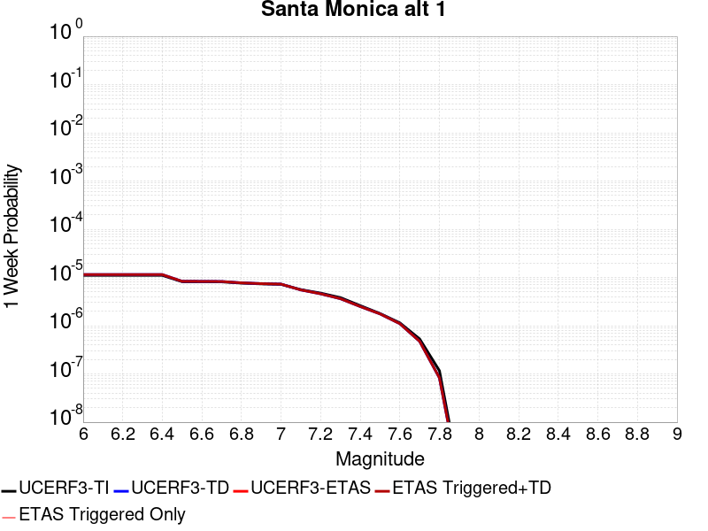 | 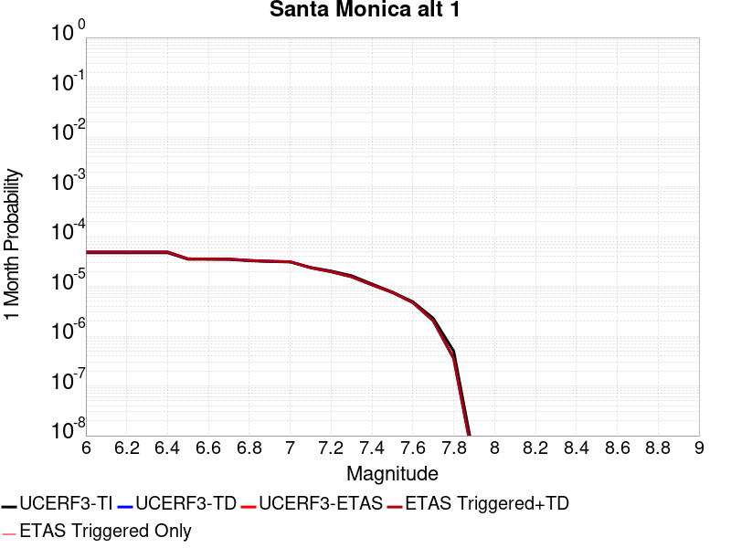 | 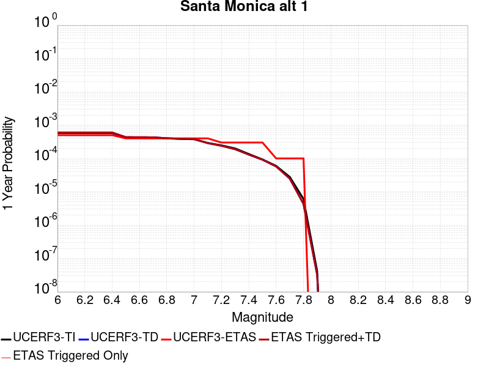 | 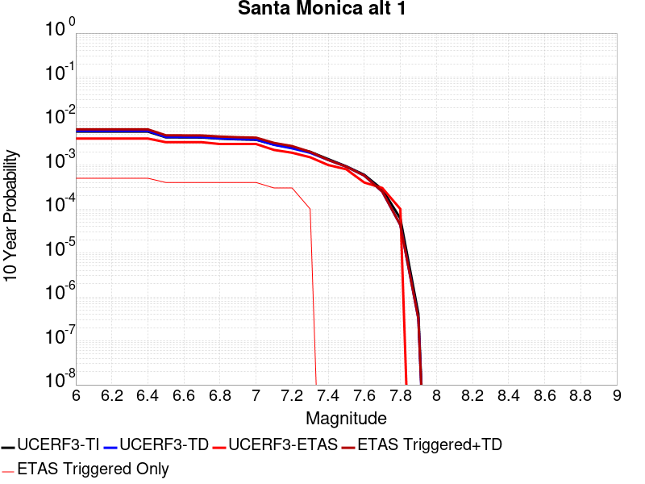 |

| Magnitude | 1 wk TI Prob | 1 wk TD Prob | 1 wk ETAS Prob | 1 wk ETAS/TD Gain | 1 wk ETAS Triggered+TD | 1 wk ETAS Triggered Only | 1 mo TI Prob | 1 mo TD Prob | 1 mo ETAS Prob | 1 mo ETAS/TD Gain | 1 mo ETAS Triggered+TD | 1 mo ETAS Triggered Only | 1 yr TI Prob | 1 yr TD Prob | 1 yr ETAS Prob | 1 yr ETAS/TD Gain | 1 yr ETAS Triggered+TD | 1 yr ETAS Triggered Only | 10 yr TI Prob | 10 yr TD Prob | 10 yr ETAS Prob | 10 yr ETAS/TD Gain | 10 yr ETAS Triggered+TD | 10 yr ETAS Triggered Only |
|-----|-----|-----|-----|-----|-----|-----|-----|-----|-----|-----|-----|-----|-----|-----|-----|-----|-----|-----|-----|-----|-----|-----|-----|-----|
| 6.0 | 1.1066008E-5 | 1.1482325E-5 | 0.0 | 0.0 | 1.1482325E-5 | 0.0 | 4.742488E-5 | 4.9209113E-5 | 0.0 | 0.0 | 4.9209113E-5 | 0.0 | 5.7724497E-4 | 5.989702E-4 | 5.0E-4 | 0.83476603 | 5.989702E-4 | 0.0 | 0.005757478 | 0.0059749456 | 0.004 | 0.66946214 | 0.0064719585 | 5.0E-4 |
| 6.1 | 1.1066008E-5 | 1.1482325E-5 | 0.0 | 0.0 | 1.1482325E-5 | 0.0 | 4.742488E-5 | 4.9209113E-5 | 0.0 | 0.0 | 4.9209113E-5 | 0.0 | 5.7724497E-4 | 5.989702E-4 | 5.0E-4 | 0.83476603 | 5.989702E-4 | 0.0 | 0.005757478 | 0.0059749456 | 0.004 | 0.66946214 | 0.0064719585 | 5.0E-4 |
| 6.2 | 1.1066008E-5 | 1.1482325E-5 | 0.0 | 0.0 | 1.1482325E-5 | 0.0 | 4.742488E-5 | 4.9209113E-5 | 0.0 | 0.0 | 4.9209113E-5 | 0.0 | 5.7724497E-4 | 5.989702E-4 | 5.0E-4 | 0.83476603 | 5.989702E-4 | 0.0 | 0.005757478 | 0.0059749456 | 0.004 | 0.66946214 | 0.0064719585 | 5.0E-4 |
| 6.3 | 1.1066008E-5 | 1.1482325E-5 | 0.0 | 0.0 | 1.1482325E-5 | 0.0 | 4.742488E-5 | 4.9209113E-5 | 0.0 | 0.0 | 4.9209113E-5 | 0.0 | 5.7724497E-4 | 5.989702E-4 | 5.0E-4 | 0.83476603 | 5.989702E-4 | 0.0 | 0.005757478 | 0.0059749456 | 0.004 | 0.66946214 | 0.0064719585 | 5.0E-4 |
| 6.4 | 1.1066008E-5 | 1.1482325E-5 | 0.0 | 0.0 | 1.1482325E-5 | 0.0 | 4.742488E-5 | 4.9209113E-5 | 0.0 | 0.0 | 4.9209113E-5 | 0.0 | 5.7724497E-4 | 5.989702E-4 | 5.0E-4 | 0.83476603 | 5.989702E-4 | 0.0 | 0.005757478 | 0.0059749456 | 0.004 | 0.66946214 | 0.0064719585 | 5.0E-4 |
| 6.5 | 8.183544E-6 | 8.336879E-6 | 0.0 | 0.0 | 8.336879E-6 | 0.0 | 3.5071862E-5 | 3.5728997E-5 | 0.0 | 0.0 | 3.5728997E-5 | 0.0 | 4.2691626E-4 | 4.3491533E-4 | 4.0E-4 | 0.9197193 | 4.3491533E-4 | 0.0 | 0.0042609703 | 0.0043408074 | 0.0033 | 0.7602272 | 0.0047390712 | 4.0E-4 |
| 6.6 | 8.1543285E-6 | 8.305087E-6 | 0.0 | 0.0 | 8.305087E-6 | 0.0 | 3.4946657E-5 | 3.5592755E-5 | 0.0 | 0.0 | 3.5592755E-5 | 0.0 | 4.2539247E-4 | 4.332572E-4 | 4.0E-4 | 0.9232391 | 4.332572E-4 | 0.0 | 0.0042457907 | 0.004324291 | 0.0033 | 0.7631309 | 0.004722561 | 4.0E-4 |
| 6.7 | 8.110878E-6 | 8.258477E-6 | 0.0 | 0.0 | 8.258477E-6 | 0.0 | 3.4760444E-5 | 3.5393E-5 | 0.0 | 0.0 | 3.5393E-5 | 0.0 | 4.231262E-4 | 4.3082619E-4 | 4.0E-4 | 0.9284487 | 4.3082619E-4 | 0.0 | 0.0042232145 | 0.004300075 | 0.0033 | 0.7674285 | 0.0046983548 | 4.0E-4 |
| 6.8 | 7.644036E-6 | 7.752411E-6 | 0.0 | 0.0 | 7.752411E-6 | 0.0 | 3.275974E-5 | 3.32242E-5 | 0.0 | 0.0 | 3.32242E-5 | 0.0 | 3.9877684E-4 | 4.04431E-4 | 4.0E-4 | 0.9890439 | 4.04431E-4 | 0.0 | 0.00398062 | 0.004037096 | 0.003 | 0.7431084 | 0.0044354815 | 4.0E-4 |
| 6.9 | 7.3698293E-6 | 7.457024E-6 | 0.0 | 0.0 | 7.457024E-6 | 0.0 | 3.15846E-5 | 3.195829E-5 | 0.0 | 0.0 | 3.195829E-5 | 0.0 | 3.8447464E-4 | 3.8902412E-4 | 4.0E-4 | 1.0282139 | 3.8902412E-4 | 0.0 | 0.0038381014 | 0.0038835746 | 0.003 | 0.7724842 | 0.0042820214 | 4.0E-4 |
| 7.0 | 7.209872E-6 | 7.286909E-6 | 0.0 | 0.0 | 7.286909E-6 | 0.0 | 3.0899086E-5 | 3.1229243E-5 | 0.0 | 0.0 | 3.1229243E-5 | 0.0 | 3.7613141E-4 | 3.801511E-4 | 4.0E-4 | 1.0522132 | 3.801511E-4 | 0.0 | 0.0037549543 | 0.0037951507 | 0.003 | 0.7904824 | 0.004193633 | 4.0E-4 |
| 7.1 | 5.603456E-6 | 5.524837E-6 | 0.0 | 0.0 | 5.524837E-6 | 0.0 | 2.4014591E-5 | 2.3677661E-5 | 0.0 | 0.0 | 2.3677661E-5 | 0.0 | 2.923384E-4 | 2.882378E-4 | 4.0E-4 | 1.3877431 | 2.882378E-4 | 0.0 | 0.0029195412 | 0.002878681 | 0.0022 | 0.7642389 | 0.0031778174 | 3.0E-4 |
| 7.2 | 4.7483613E-6 | 4.5919082E-6 | 0.0 | 0.0 | 4.5919082E-6 | 0.0 | 2.0349962E-5 | 1.9679459E-5 | 0.0 | 0.0 | 1.9679459E-5 | 0.0 | 2.4773262E-4 | 2.395712E-4 | 3.0E-4 | 1.2522373 | 2.395712E-4 | 0.0 | 0.0024745662 | 0.0023931435 | 0.0019 | 0.7939348 | 0.0026924256 | 3.0E-4 |
| 7.3 | 3.829015E-6 | 3.6348617E-6 | 0.0 | 0.0 | 3.6348617E-6 | 0.0 | 1.6409962E-5 | 1.5577887E-5 | 0.0 | 0.0 | 1.5577887E-5 | 0.0 | 1.9977297E-4 | 1.8964434E-4 | 3.0E-4 | 1.5819086 | 1.8964434E-4 | 0.0 | 0.0019959346 | 0.0018948339 | 0.0015 | 0.7916261 | 0.0019946445 | 1.0E-4 |
| 7.4 | 2.610755E-6 | 2.5000568E-6 | 0.0 | 0.0 | 2.5000568E-6 | 0.0 | 1.1188902E-5 | 1.0714485E-5 | 0.0 | 0.0 | 1.0714485E-5 | 0.0 | 1.3621636E-4 | 1.3044108E-4 | 3.0E-4 | 2.2998888 | 1.3044108E-4 | 0.0 | 0.001361329 | 0.0013036497 | 0.001 | 0.7670772 | 0.0013036497 | 0.0 |
| 7.5 | 1.792146E-6 | 1.7587142E-6 | 0.0 | 0.0 | 1.7587142E-6 | 0.0 | 7.680603E-6 | 7.537325E-6 | 0.0 | 0.0 | 7.537325E-6 | 0.0 | 9.3507326E-5 | 9.1763104E-5 | 3.0E-4 | 3.2692878 | 9.1763104E-5 | 0.0 | 9.3467993E-4 | 9.172553E-4 | 8.0E-4 | 0.8721672 | 9.172553E-4 | 0.0 |
| 7.6 | 1.1473018E-6 | 1.1030888E-6 | 0.0 | 0.0 | 1.1030888E-6 | 0.0 | 4.9169985E-6 | 4.7275153E-6 | 0.0 | 0.0 | 4.7275153E-6 | 0.0 | 5.986281E-5 | 5.7555993E-5 | 1.0E-4 | 1.7374386 | 5.7555993E-5 | 0.0 | 5.984669E-4 | 5.7541253E-4 | 4.0E-4 | 0.6951534 | 5.7541253E-4 | 0.0 |
| 7.7 | 5.330919E-7 | 4.7462296E-7 | 0.0 | 0.0 | 4.7462296E-7 | 0.0 | 2.2846775E-6 | 2.034097E-6 | 0.0 | 0.0 | 2.034097E-6 | 0.0 | 2.7815593E-5 | 2.476486E-5 | 1.0E-4 | 4.0379796 | 2.476486E-5 | 0.0 | 2.7812112E-4 | 2.4762214E-4 | 3.0E-4 | 1.2115233 | 2.4762214E-4 | 0.0 |
| 7.8 | 1.1668574E-7 | 8.3014726E-8 | 0.0 | 0.0 | 8.3014726E-8 | 0.0 | 5.000816E-7 | 3.5577733E-7 | 0.0 | 0.0 | 3.5577733E-7 | 0.0 | 6.0884768E-6 | 4.331581E-6 | 1.0E-4 | 23.08626 | 4.331581E-6 | 0.0 | 6.08831E-5 | 4.3314994E-5 | 1.0E-4 | 2.3086693 | 4.3314994E-5 | 0.0 |
| 7.9 | 8.007447E-10 | 6.162303E-10 | 0.0 | 0.0 | 6.162303E-10 | 0.0 | 3.4317629E-9 | 2.6409874E-9 | 0.0 | 0.0 | 2.6409874E-9 | 0.0 | 4.1781714E-8 | 3.215402E-8 | 0.0 | 0.0 | 3.215402E-8 | 0.0 | 4.1781706E-7 | 3.2154017E-7 | 0.0 | 0.0 | 3.2154017E-7 | 0.0 |

## Owens Valley
*[(top)](#table-of-contents)*

| 1 Week | 1 Month | 1 Year | 10 Year |
|-----|-----|-----|-----|
|  | 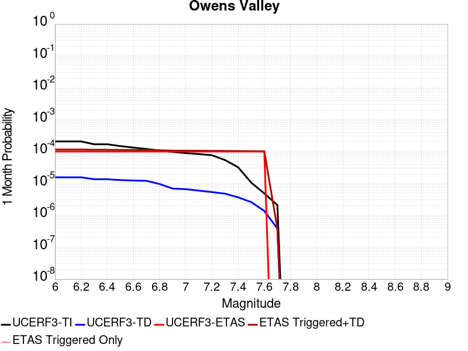 | 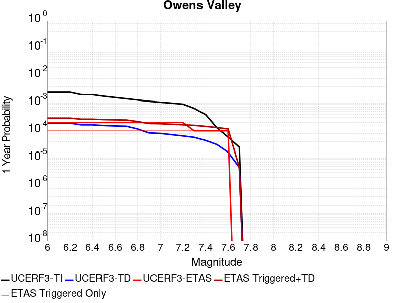 | 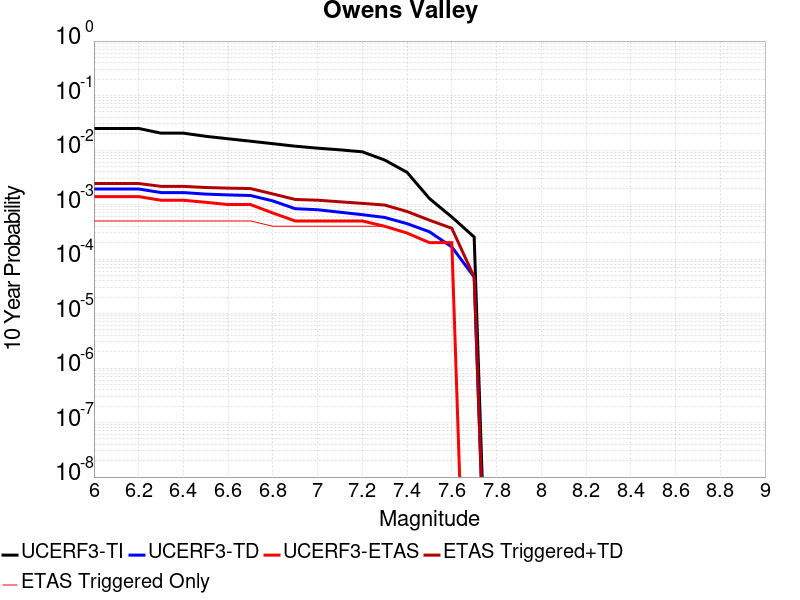 |

| Magnitude | 1 wk TI Prob | 1 wk TD Prob | 1 wk ETAS Prob | 1 wk ETAS/TD Gain | 1 wk ETAS Triggered+TD | 1 wk ETAS Triggered Only | 1 mo TI Prob | 1 mo TD Prob | 1 mo ETAS Prob | 1 mo ETAS/TD Gain | 1 mo ETAS Triggered+TD | 1 mo ETAS Triggered Only | 1 yr TI Prob | 1 yr TD Prob | 1 yr ETAS Prob | 1 yr ETAS/TD Gain | 1 yr ETAS Triggered+TD | 1 yr ETAS Triggered Only | 10 yr TI Prob | 10 yr TD Prob | 10 yr ETAS Prob | 10 yr ETAS/TD Gain | 10 yr ETAS Triggered+TD | 10 yr ETAS Triggered Only |
|-----|-----|-----|-----|-----|-----|-----|-----|-----|-----|-----|-----|-----|-----|-----|-----|-----|-----|-----|-----|-----|-----|-----|-----|-----|
| 6.0 | 4.83821E-5 | 3.6344697E-6 | 0.0 | 0.0 | 3.6344697E-6 | 0.0 | 2.0733538E-4 | 1.5576212E-5 | 1.0E-4 | 6.4200463 | 1.1557465E-4 | 1.0E-4 | 0.002521386 | 1.8962487E-4 | 2.0E-4 | 1.054714 | 2.896059E-4 | 1.0E-4 | 0.024929691 | 0.0019308022 | 0.0014 | 0.7250872 | 0.002429837 | 5.0E-4 |
| 6.1 | 4.83821E-5 | 3.6344697E-6 | 0.0 | 0.0 | 3.6344697E-6 | 0.0 | 2.0733538E-4 | 1.5576212E-5 | 1.0E-4 | 6.4200463 | 1.1557465E-4 | 1.0E-4 | 0.002521386 | 1.8962487E-4 | 2.0E-4 | 1.054714 | 2.896059E-4 | 1.0E-4 | 0.024929691 | 0.0019308022 | 0.0014 | 0.7250872 | 0.002429837 | 5.0E-4 |
| 6.2 | 4.83821E-5 | 3.6344697E-6 | 0.0 | 0.0 | 3.6344697E-6 | 0.0 | 2.0733538E-4 | 1.5576212E-5 | 1.0E-4 | 6.4200463 | 1.1557465E-4 | 1.0E-4 | 0.002521386 | 1.8962487E-4 | 2.0E-4 | 1.054714 | 2.896059E-4 | 1.0E-4 | 0.024929691 | 0.0019308022 | 0.0014 | 0.7250872 | 0.002429837 | 5.0E-4 |
| 6.3 | 3.953008E-5 | 3.1605018E-6 | 0.0 | 0.0 | 3.1605018E-6 | 0.0 | 1.6940363E-4 | 1.3544942E-5 | 1.0E-4 | 7.3828297 | 1.1354359E-4 | 1.0E-4 | 0.002060538 | 1.6489792E-4 | 2.0E-4 | 1.2128716 | 2.6488144E-4 | 1.0E-4 | 0.020415364 | 0.0016599405 | 0.0012 | 0.7229175 | 0.0021591105 | 5.0E-4 |
| 6.4 | 3.953008E-5 | 3.1605018E-6 | 0.0 | 0.0 | 3.1605018E-6 | 0.0 | 1.6940363E-4 | 1.3544942E-5 | 1.0E-4 | 7.3828297 | 1.1354359E-4 | 1.0E-4 | 0.002060538 | 1.6489792E-4 | 2.0E-4 | 1.2128716 | 2.6488144E-4 | 1.0E-4 | 0.020415364 | 0.0016599405 | 0.0012 | 0.7229175 | 0.0021591105 | 5.0E-4 |
| 6.5 | 3.457342E-5 | 2.9755336E-6 | 0.0 | 0.0 | 2.9755336E-6 | 0.0 | 1.4816338E-4 | 1.2752229E-5 | 1.0E-4 | 7.8417664 | 1.1275095E-4 | 1.0E-4 | 0.0018023965 | 1.5524802E-4 | 2.0E-4 | 1.2882612 | 2.552325E-4 | 1.0E-4 | 0.017878477 | 0.0015564476 | 0.0011 | 0.7067376 | 0.0020556694 | 5.0E-4 |
| 6.6 | 3.1127765E-5 | 2.8770262E-6 | 0.0 | 0.0 | 2.8770262E-6 | 0.0 | 1.3339789E-4 | 1.2330058E-5 | 1.0E-4 | 8.110262 | 1.12328824E-4 | 1.0E-4 | 0.0016229092 | 1.501088E-4 | 2.0E-4 | 1.332367 | 2.5009378E-4 | 1.0E-4 | 0.016111081 | 0.0015028726 | 0.001 | 0.66539246 | 0.0020021212 | 5.0E-4 |
| 6.7 | 2.806885E-5 | 2.812492E-6 | 0.0 | 0.0 | 2.812492E-6 | 0.0 | 1.2028952E-4 | 1.2053485E-5 | 1.0E-4 | 8.296355 | 1.1205228E-4 | 1.0E-4 | 0.001463541 | 1.46742E-4 | 2.0E-4 | 1.3629364 | 2.4672732E-4 | 1.0E-4 | 0.014539397 | 0.0014667719 | 0.001 | 0.68176925 | 0.0019660385 | 5.0E-4 |
| 6.8 | 2.524524E-5 | 2.237163E-6 | 0.0 | 0.0 | 2.237163E-6 | 0.0 | 1.0818939E-4 | 9.587808E-6 | 1.0E-4 | 10.429913 | 1.0958685E-4 | 1.0E-4 | 0.0013164099 | 1.1672561E-4 | 2.0E-4 | 1.71342 | 2.1671395E-4 | 1.0E-4 | 0.01308639 | 0.0011668626 | 7.0E-4 | 0.5998993 | 0.0015663957 | 4.0E-4 |
| 6.9 | 2.2704568E-5 | 1.6094557E-6 | 0.0 | 0.0 | 1.6094557E-6 | 0.0 | 9.730166E-5 | 6.897649E-6 | 1.0E-4 | 14.497693 | 1.0689696E-4 | 1.0E-4 | 0.0011840039 | 8.397566E-5 | 2.0E-4 | 2.3816426 | 1.8396726E-4 | 1.0E-4 | 0.011777153 | 8.3960657E-4 | 5.0E-4 | 0.59551704 | 0.0012392707 | 4.0E-4 |
| 7.0 | 2.0871712E-5 | 1.5407611E-6 | 0.0 | 0.0 | 1.5407611E-6 | 0.0 | 8.944713E-5 | 6.6032453E-6 | 1.0E-4 | 15.144069 | 1.0660259E-4 | 1.0E-4 | 0.0010884746 | 8.039156E-5 | 2.0E-4 | 2.4878232 | 1.8038352E-4 | 1.0E-4 | 0.010831586 | 8.037467E-4 | 5.0E-4 | 0.6220866 | 0.0012034251 | 4.0E-4 |
| 7.1 | 1.944928E-5 | 1.3874537E-6 | 0.0 | 0.0 | 1.3874537E-6 | 0.0 | 8.335139E-5 | 5.946217E-6 | 1.0E-4 | 16.817417 | 1.0594562E-4 | 1.0E-4 | 0.0010143308 | 7.2392795E-5 | 2.0E-4 | 2.762706 | 1.7238555E-4 | 1.0E-4 | 0.010097133 | 7.2380016E-4 | 5.0E-4 | 0.6907984 | 0.0011235107 | 4.0E-4 |
| 7.2 | 1.7876306E-5 | 1.2498278E-6 | 0.0 | 0.0 | 1.2498278E-6 | 0.0 | 7.6610486E-5 | 5.356394E-6 | 1.0E-4 | 18.669275 | 1.0535586E-4 | 1.0E-4 | 9.3233347E-4 | 6.521215E-5 | 2.0E-4 | 3.066913 | 1.6520564E-4 | 1.0E-4 | 0.009284316 | 6.520232E-4 | 5.0E-4 | 0.76684386 | 0.0010517624 | 4.0E-4 |
| 7.3 | 1.2618672E-5 | 1.1123674E-6 | 0.0 | 0.0 | 1.1123674E-6 | 0.0 | 5.40789E-5 | 4.7672797E-6 | 1.0E-4 | 20.976322 | 1.04766805E-4 | 1.0E-4 | 6.582117E-4 | 5.8040096E-5 | 1.0E-4 | 1.7229469 | 1.580343E-4 | 1.0E-4 | 0.0065626553 | 5.803375E-4 | 4.0E-4 | 0.6892541 | 9.801054E-4 | 4.0E-4 |
| 7.4 | 7.4874442E-6 | 8.555762E-7 | 0.0 | 0.0 | 8.555762E-7 | 0.0 | 3.208865E-5 | 3.6667502E-6 | 1.0E-4 | 27.272106 | 1.0366638E-4 | 1.0E-4 | 3.906093E-4 | 4.4641773E-5 | 1.0E-4 | 2.2400544 | 1.446373E-4 | 1.0E-4 | 0.003899234 | 4.4637328E-4 | 3.0E-4 | 0.67208326 | 7.462394E-4 | 3.0E-4 |
| 7.5 | 2.4734156E-6 | 6.073417E-7 | 0.0 | 0.0 | 6.073417E-7 | 0.0 | 1.060031E-5 | 2.6028904E-6 | 1.0E-4 | 38.41883 | 1.0260263E-4 | 1.0E-4 | 1.2905113E-4 | 3.168973E-5 | 1.0E-4 | 3.1555963 | 1.3168657E-4 | 1.0E-4 | 0.0012897621 | 3.1685247E-4 | 2.0E-4 | 0.6312086 | 5.167891E-4 | 2.0E-4 |
| 7.6 | 1.1328841E-6 | 3.198921E-7 | 0.0 | 0.0 | 3.198921E-7 | 0.0 | 4.8552088E-6 | 1.3709655E-6 | 1.0E-4 | 72.94129 | 1.0137083E-4 | 1.0E-4 | 5.9110564E-5 | 1.669138E-5 | 1.0E-4 | 5.9911165 | 1.1668971E-4 | 1.0E-4 | 5.9094845E-4 | 1.6690145E-4 | 2.0E-4 | 1.198312 | 3.6686807E-4 | 2.0E-4 |
| 7.7 | 4.8613185E-7 | 8.9735366E-8 | 0.0 | 0.0 | 8.9735366E-8 | 0.0 | 2.0834207E-6 | 3.845801E-7 | 0.0 | 0.0 | 3.845801E-7 | 0.0 | 2.536535E-5 | 4.6822533E-6 | 0.0 | 0.0 | 4.6822533E-6 | 0.0 | 2.5362454E-4 | 4.6821613E-5 | 0.0 | 0.0 | 4.6821613E-5 | 0.0 |

## Los Alamos extension
*[(top)](#table-of-contents)*

| 1 Week | 1 Month | 1 Year | 10 Year |
|-----|-----|-----|-----|
| 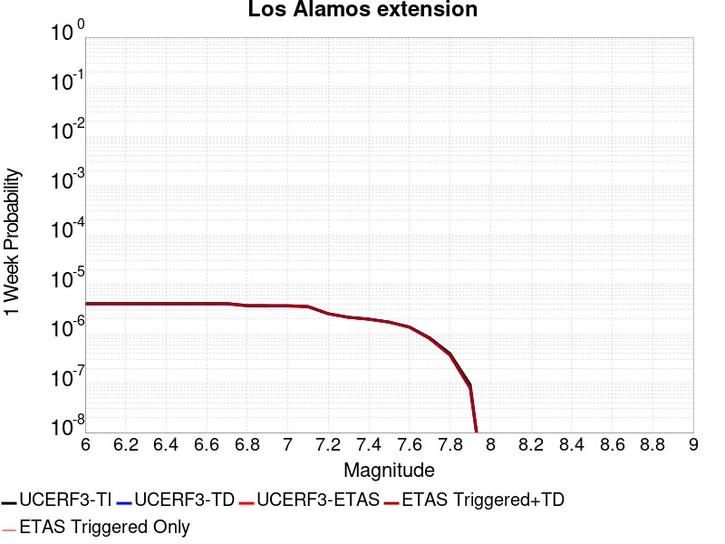 | 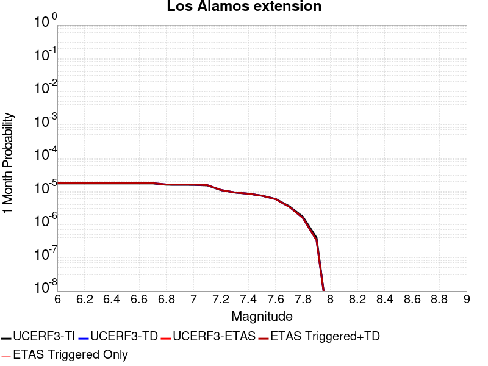 |  | 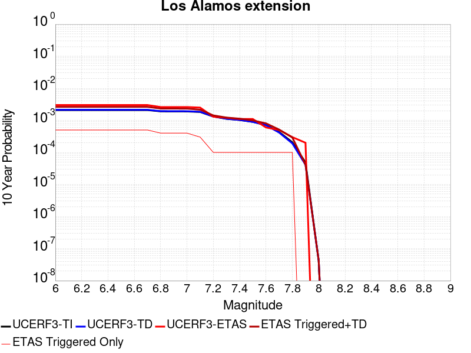 |

| Magnitude | 1 wk TI Prob | 1 wk TD Prob | 1 wk ETAS Prob | 1 wk ETAS/TD Gain | 1 wk ETAS Triggered+TD | 1 wk ETAS Triggered Only | 1 mo TI Prob | 1 mo TD Prob | 1 mo ETAS Prob | 1 mo ETAS/TD Gain | 1 mo ETAS Triggered+TD | 1 mo ETAS Triggered Only | 1 yr TI Prob | 1 yr TD Prob | 1 yr ETAS Prob | 1 yr ETAS/TD Gain | 1 yr ETAS Triggered+TD | 1 yr ETAS Triggered Only | 10 yr TI Prob | 10 yr TD Prob | 10 yr ETAS Prob | 10 yr ETAS/TD Gain | 10 yr ETAS Triggered+TD | 10 yr ETAS Triggered Only |
|-----|-----|-----|-----|-----|-----|-----|-----|-----|-----|-----|-----|-----|-----|-----|-----|-----|-----|-----|-----|-----|-----|-----|-----|-----|
| 6.0 | 4.0146506E-6 | 4.086475E-6 | 0.0 | 0.0 | 4.086475E-6 | 0.0 | 1.7205533E-5 | 1.7513354E-5 | 0.0 | 0.0 | 1.7513354E-5 | 0.0 | 2.0945723E-4 | 2.1320532E-4 | 1.0E-4 | 0.46903145 | 2.1320532E-4 | 0.0 | 0.0020925992 | 0.0021301168 | 0.003 | 1.4083734 | 0.002629052 | 5.0E-4 |
| 6.1 | 4.0146506E-6 | 4.086475E-6 | 0.0 | 0.0 | 4.086475E-6 | 0.0 | 1.7205533E-5 | 1.7513354E-5 | 0.0 | 0.0 | 1.7513354E-5 | 0.0 | 2.0945723E-4 | 2.1320532E-4 | 1.0E-4 | 0.46903145 | 2.1320532E-4 | 0.0 | 0.0020925992 | 0.0021301168 | 0.003 | 1.4083734 | 0.002629052 | 5.0E-4 |
| 6.2 | 4.0146506E-6 | 4.086475E-6 | 0.0 | 0.0 | 4.086475E-6 | 0.0 | 1.7205533E-5 | 1.7513354E-5 | 0.0 | 0.0 | 1.7513354E-5 | 0.0 | 2.0945723E-4 | 2.1320532E-4 | 1.0E-4 | 0.46903145 | 2.1320532E-4 | 0.0 | 0.0020925992 | 0.0021301168 | 0.003 | 1.4083734 | 0.002629052 | 5.0E-4 |
| 6.3 | 4.0146506E-6 | 4.086475E-6 | 0.0 | 0.0 | 4.086475E-6 | 0.0 | 1.7205533E-5 | 1.7513354E-5 | 0.0 | 0.0 | 1.7513354E-5 | 0.0 | 2.0945723E-4 | 2.1320532E-4 | 1.0E-4 | 0.46903145 | 2.1320532E-4 | 0.0 | 0.0020925992 | 0.0021301168 | 0.003 | 1.4083734 | 0.002629052 | 5.0E-4 |
| 6.4 | 4.0146506E-6 | 4.086475E-6 | 0.0 | 0.0 | 4.086475E-6 | 0.0 | 1.7205533E-5 | 1.7513354E-5 | 0.0 | 0.0 | 1.7513354E-5 | 0.0 | 2.0945723E-4 | 2.1320532E-4 | 1.0E-4 | 0.46903145 | 2.1320532E-4 | 0.0 | 0.0020925992 | 0.0021301168 | 0.003 | 1.4083734 | 0.002629052 | 5.0E-4 |
| 6.5 | 4.0146506E-6 | 4.086475E-6 | 0.0 | 0.0 | 4.086475E-6 | 0.0 | 1.7205533E-5 | 1.7513354E-5 | 0.0 | 0.0 | 1.7513354E-5 | 0.0 | 2.0945723E-4 | 2.1320532E-4 | 1.0E-4 | 0.46903145 | 2.1320532E-4 | 0.0 | 0.0020925992 | 0.0021301168 | 0.003 | 1.4083734 | 0.002629052 | 5.0E-4 |
| 6.6 | 4.0146506E-6 | 4.086475E-6 | 0.0 | 0.0 | 4.086475E-6 | 0.0 | 1.7205533E-5 | 1.7513354E-5 | 0.0 | 0.0 | 1.7513354E-5 | 0.0 | 2.0945723E-4 | 2.1320532E-4 | 1.0E-4 | 0.46903145 | 2.1320532E-4 | 0.0 | 0.0020925992 | 0.0021301168 | 0.003 | 1.4083734 | 0.002629052 | 5.0E-4 |
| 6.7 | 4.0146506E-6 | 4.086475E-6 | 0.0 | 0.0 | 4.086475E-6 | 0.0 | 1.7205533E-5 | 1.7513354E-5 | 0.0 | 0.0 | 1.7513354E-5 | 0.0 | 2.0945723E-4 | 2.1320532E-4 | 1.0E-4 | 0.46903145 | 2.1320532E-4 | 0.0 | 0.0020925992 | 0.0021301168 | 0.003 | 1.4083734 | 0.002629052 | 5.0E-4 |
| 6.8 | 3.6584688E-6 | 3.7191517E-6 | 0.0 | 0.0 | 3.7191517E-6 | 0.0 | 1.5679057E-5 | 1.593913E-5 | 0.0 | 0.0 | 1.593913E-5 | 0.0 | 1.9087581E-4 | 1.9404254E-4 | 1.0E-4 | 0.5153509 | 1.9404254E-4 | 0.0 | 0.0019071194 | 0.0019388236 | 0.0026 | 1.3410194 | 0.002338048 | 4.0E-4 |
| 6.9 | 3.644631E-6 | 3.7048605E-6 | 0.0 | 0.0 | 3.7048605E-6 | 0.0 | 1.5619753E-5 | 1.5877882E-5 | 0.0 | 0.0 | 1.5877882E-5 | 0.0 | 1.901539E-4 | 1.93297E-4 | 1.0E-4 | 0.5173386 | 1.93297E-4 | 0.0 | 0.0018999127 | 0.0019313812 | 0.0026 | 1.3461869 | 0.0023306087 | 4.0E-4 |
| 7.0 | 3.6318522E-6 | 3.6916203E-6 | 0.0 | 0.0 | 3.6916203E-6 | 0.0 | 1.5564989E-5 | 1.5821139E-5 | 0.0 | 0.0 | 1.5821139E-5 | 0.0 | 1.8948725E-4 | 1.9260627E-4 | 1.0E-4 | 0.5191939 | 1.9260627E-4 | 0.0 | 0.0018932576 | 0.0019244858 | 0.0026 | 1.3510102 | 0.002323716 | 4.0E-4 |
| 7.1 | 3.5001724E-6 | 3.555682E-6 | 0.0 | 0.0 | 3.555682E-6 | 0.0 | 1.5000653E-5 | 1.5238554E-5 | 0.0 | 0.0 | 1.5238554E-5 | 0.0 | 1.8261763E-4 | 1.8551452E-4 | 1.0E-4 | 0.5390414 | 1.8551452E-4 | 0.0 | 0.0018246764 | 0.0018536872 | 0.0025 | 1.3486633 | 0.0021531312 | 3.0E-4 |
| 7.2 | 2.5204702E-6 | 2.5439108E-6 | 0.0 | 0.0 | 2.5439108E-6 | 0.0 | 1.080197E-5 | 1.09024295E-5 | 0.0 | 0.0 | 1.09024295E-5 | 0.0 | 1.3150605E-4 | 1.3272905E-4 | 1.0E-4 | 0.7534146 | 1.3272905E-4 | 0.0 | 0.0013142825 | 0.0013265033 | 0.0013 | 0.9800201 | 0.0014263707 | 1.0E-4 |
| 7.3 | 2.1399692E-6 | 2.1503213E-6 | 0.0 | 0.0 | 2.1503213E-6 | 0.0 | 9.1712645E-6 | 9.215631E-6 | 0.0 | 0.0 | 9.215631E-6 | 0.0 | 1.1165442E-4 | 1.1219455E-4 | 0.0 | 0.0 | 1.1219455E-4 | 0.0 | 0.0011159834 | 0.0011213825 | 0.0012 | 1.0701077 | 0.0012212703 | 1.0E-4 |
| 7.4 | 1.9660122E-6 | 1.970414E-6 | 0.0 | 0.0 | 1.970414E-6 | 0.0 | 8.42574E-6 | 8.444604E-6 | 0.0 | 0.0 | 8.444604E-6 | 0.0 | 1.0257855E-4 | 1.0280823E-4 | 0.0 | 0.0 | 1.0280823E-4 | 0.0 | 0.0010253121 | 0.0010276098 | 0.0011 | 1.0704452 | 0.0011275071 | 1.0E-4 |
| 7.5 | 1.7204633E-6 | 1.7152561E-6 | 0.0 | 0.0 | 1.7152561E-6 | 0.0 | 7.373393E-6 | 7.351077E-6 | 0.0 | 0.0 | 7.351077E-6 | 0.0 | 8.976737E-5 | 8.949571E-5 | 0.0 | 0.0 | 8.949571E-5 | 0.0 | 8.9731114E-4 | 8.945997E-4 | 0.0011 | 1.2296002 | 9.945103E-4 | 1.0E-4 |
| 7.6 | 1.3717638E-6 | 1.3537107E-6 | 0.0 | 0.0 | 1.3537107E-6 | 0.0 | 5.878974E-6 | 5.8016044E-6 | 0.0 | 0.0 | 5.8016044E-6 | 0.0 | 7.157416E-5 | 7.0632275E-5 | 0.0 | 0.0 | 7.0632275E-5 | 0.0 | 7.1551115E-4 | 7.0610084E-4 | 6.0E-4 | 0.849737 | 8.0603024E-4 | 1.0E-4 |
| 7.7 | 8.272564E-7 | 7.958441E-7 | 0.0 | 0.0 | 7.958441E-7 | 0.0 | 3.5453797E-6 | 3.4107559E-6 | 0.0 | 0.0 | 3.4107559E-6 | 0.0 | 4.3164142E-5 | 4.1525163E-5 | 0.0 | 0.0 | 4.1525163E-5 | 0.0 | 4.315576E-4 | 4.1517423E-4 | 5.0E-4 | 1.2043138 | 5.151327E-4 | 1.0E-4 |
| 7.8 | 3.9708277E-7 | 3.6723162E-7 | 0.0 | 0.0 | 3.6723162E-7 | 0.0 | 1.7017821E-6 | 1.5738489E-6 | 0.0 | 0.0 | 1.5738489E-6 | 0.0 | 2.0719E-5 | 1.9161442E-5 | 0.0 | 0.0 | 1.9161442E-5 | 0.0 | 2.071707E-4 | 1.9159797E-4 | 3.0E-4 | 1.5657786 | 2.915788E-4 | 1.0E-4 |
| 7.9 | 9.292528E-8 | 7.890088E-8 | 0.0 | 0.0 | 7.890088E-8 | 0.0 | 3.9825116E-7 | 3.381466E-7 | 0.0 | 0.0 | 3.381466E-7 | 0.0 | 4.848697E-6 | 4.1169274E-6 | 0.0 | 0.0 | 4.1169274E-6 | 0.0 | 4.8485912E-5 | 4.116852E-5 | 2.0E-4 | 4.858081 | 4.116852E-5 | 0.0 |
| 8.0 | 7.880441E-11 | 8.236045E-11 | 0.0 | 0.0 | 8.236045E-11 | 0.0 | 3.3773329E-10 | 3.5297354E-10 | 0.0 | 0.0 | 3.5297354E-10 | 0.0 | 4.1119033E-9 | 4.297453E-9 | 0.0 | 0.0 | 4.297453E-9 | 0.0 | 4.1119034E-8 | 4.2974534E-8 | 0.0 | 0.0 | 4.2974534E-8 | 0.0 |

## Elsinore (Julian)
*[(top)](#table-of-contents)*

| 1 Week | 1 Month | 1 Year | 10 Year |
|-----|-----|-----|-----|
| 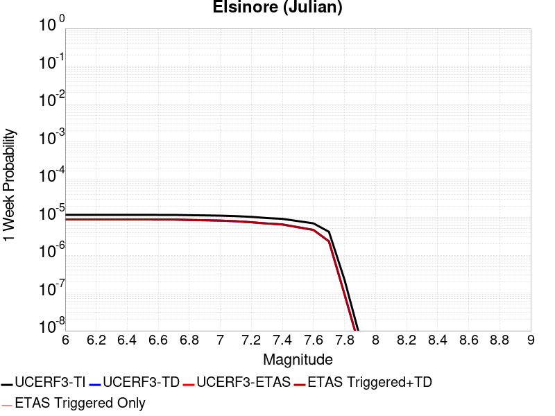 |  | 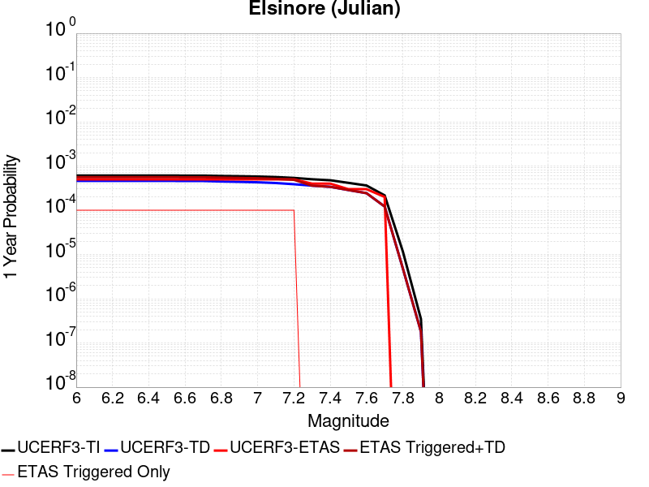 | 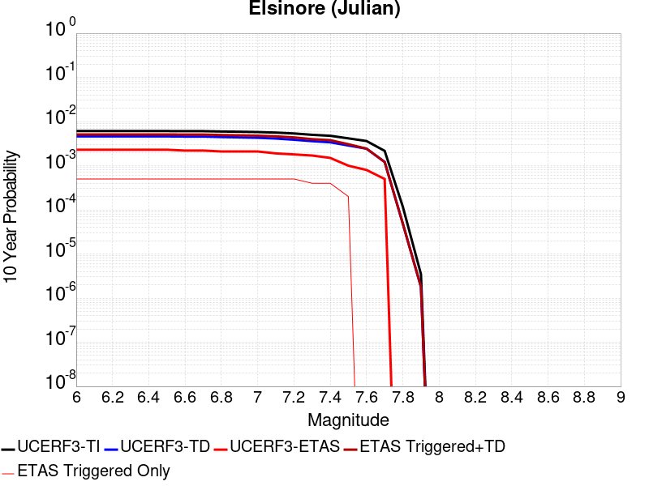 |

| Magnitude | 1 wk TI Prob | 1 wk TD Prob | 1 wk ETAS Prob | 1 wk ETAS/TD Gain | 1 wk ETAS Triggered+TD | 1 wk ETAS Triggered Only | 1 mo TI Prob | 1 mo TD Prob | 1 mo ETAS Prob | 1 mo ETAS/TD Gain | 1 mo ETAS Triggered+TD | 1 mo ETAS Triggered Only | 1 yr TI Prob | 1 yr TD Prob | 1 yr ETAS Prob | 1 yr ETAS/TD Gain | 1 yr ETAS Triggered+TD | 1 yr ETAS Triggered Only | 10 yr TI Prob | 10 yr TD Prob | 10 yr ETAS Prob | 10 yr ETAS/TD Gain | 10 yr ETAS Triggered+TD | 10 yr ETAS Triggered Only |
|-----|-----|-----|-----|-----|-----|-----|-----|-----|-----|-----|-----|-----|-----|-----|-----|-----|-----|-----|-----|-----|-----|-----|-----|-----|
| 6.0 | 1.1710231E-5 | 8.85122E-6 | 0.0 | 0.0 | 8.85122E-6 | 0.0 | 5.0185736E-5 | 3.7933256E-5 | 0.0 | 0.0 | 3.7933256E-5 | 0.0 | 6.1084004E-4 | 4.6174123E-4 | 5.0E-4 | 1.0828576 | 5.616951E-4 | 1.0E-4 | 0.006091637 | 0.0046080067 | 0.0023 | 0.49913123 | 0.0051057027 | 5.0E-4 |
| 6.1 | 1.1710231E-5 | 8.85122E-6 | 0.0 | 0.0 | 8.85122E-6 | 0.0 | 5.0185736E-5 | 3.7933256E-5 | 0.0 | 0.0 | 3.7933256E-5 | 0.0 | 6.1084004E-4 | 4.6174123E-4 | 5.0E-4 | 1.0828576 | 5.616951E-4 | 1.0E-4 | 0.006091637 | 0.0046080067 | 0.0023 | 0.49913123 | 0.0051057027 | 5.0E-4 |
| 6.2 | 1.1710231E-5 | 8.85122E-6 | 0.0 | 0.0 | 8.85122E-6 | 0.0 | 5.0185736E-5 | 3.7933256E-5 | 0.0 | 0.0 | 3.7933256E-5 | 0.0 | 6.1084004E-4 | 4.6174123E-4 | 5.0E-4 | 1.0828576 | 5.616951E-4 | 1.0E-4 | 0.006091637 | 0.0046080067 | 0.0023 | 0.49913123 | 0.0051057027 | 5.0E-4 |
| 6.3 | 1.1710231E-5 | 8.85122E-6 | 0.0 | 0.0 | 8.85122E-6 | 0.0 | 5.0185736E-5 | 3.7933256E-5 | 0.0 | 0.0 | 3.7933256E-5 | 0.0 | 6.1084004E-4 | 4.6174123E-4 | 5.0E-4 | 1.0828576 | 5.616951E-4 | 1.0E-4 | 0.006091637 | 0.0046080067 | 0.0023 | 0.49913123 | 0.0051057027 | 5.0E-4 |
| 6.4 | 1.1710231E-5 | 8.85122E-6 | 0.0 | 0.0 | 8.85122E-6 | 0.0 | 5.0185736E-5 | 3.7933256E-5 | 0.0 | 0.0 | 3.7933256E-5 | 0.0 | 6.1084004E-4 | 4.6174123E-4 | 5.0E-4 | 1.0828576 | 5.616951E-4 | 1.0E-4 | 0.006091637 | 0.0046080067 | 0.0023 | 0.49913123 | 0.0051057027 | 5.0E-4 |
| 6.5 | 1.1710231E-5 | 8.85122E-6 | 0.0 | 0.0 | 8.85122E-6 | 0.0 | 5.0185736E-5 | 3.7933256E-5 | 0.0 | 0.0 | 3.7933256E-5 | 0.0 | 6.1084004E-4 | 4.6174123E-4 | 5.0E-4 | 1.0828576 | 5.616951E-4 | 1.0E-4 | 0.006091637 | 0.0046080067 | 0.0023 | 0.49913123 | 0.0051057027 | 5.0E-4 |
| 6.6 | 1.1650619E-5 | 8.783577E-6 | 0.0 | 0.0 | 8.783577E-6 | 0.0 | 4.993027E-5 | 3.7643367E-5 | 0.0 | 0.0 | 3.7643367E-5 | 0.0 | 6.0773146E-4 | 4.5821333E-4 | 5.0E-4 | 1.0911947 | 5.581675E-4 | 1.0E-4 | 0.0060607214 | 0.004572873 | 0.0022 | 0.48109797 | 0.0050705867 | 5.0E-4 |
| 6.7 | 1.1650619E-5 | 8.783577E-6 | 0.0 | 0.0 | 8.783577E-6 | 0.0 | 4.993027E-5 | 3.7643367E-5 | 0.0 | 0.0 | 3.7643367E-5 | 0.0 | 6.0773146E-4 | 4.5821333E-4 | 5.0E-4 | 1.0911947 | 5.581675E-4 | 1.0E-4 | 0.0060607214 | 0.004572873 | 0.0022 | 0.48109797 | 0.0050705867 | 5.0E-4 |
| 6.8 | 1.1442698E-5 | 8.566687E-6 | 0.0 | 0.0 | 8.566687E-6 | 0.0 | 4.9039216E-5 | 3.6713867E-5 | 0.0 | 0.0 | 3.6713867E-5 | 0.0 | 5.968889E-4 | 4.4690134E-4 | 5.0E-4 | 1.1188152 | 5.4685667E-4 | 1.0E-4 | 0.0059528816 | 0.004460212 | 0.0021 | 0.47082967 | 0.004957982 | 5.0E-4 |
| 6.9 | 1.1300589E-5 | 8.414524E-6 | 0.0 | 0.0 | 8.414524E-6 | 0.0 | 4.8430196E-5 | 3.6061756E-5 | 0.0 | 0.0 | 3.6061756E-5 | 0.0 | 5.894781E-4 | 4.3896507E-4 | 5.0E-4 | 1.1390427 | 5.389212E-4 | 1.0E-4 | 0.005879169 | 0.0043811635 | 0.0021 | 0.4793247 | 0.004878973 | 5.0E-4 |
| 7.0 | 1.1117729E-5 | 8.231632E-6 | 0.0 | 0.0 | 8.231632E-6 | 0.0 | 4.764654E-5 | 3.5277953E-5 | 0.0 | 0.0 | 3.5277953E-5 | 0.0 | 5.799422E-4 | 4.294261E-4 | 5.0E-4 | 1.1643447 | 5.2938313E-4 | 1.0E-4 | 0.0057843104 | 0.0042861453 | 0.0021 | 0.48995072 | 0.0047840024 | 5.0E-4 |
| 7.1 | 1.08053955E-5 | 7.91721E-6 | 0.0 | 0.0 | 7.91721E-6 | 0.0 | 4.6308014E-5 | 3.3930468E-5 | 0.0 | 0.0 | 3.3930468E-5 | 0.0 | 5.6365423E-4 | 4.1302675E-4 | 5.0E-4 | 1.2105753 | 5.1298545E-4 | 1.0E-4 | 0.005622267 | 0.0041227704 | 0.0019 | 0.46085513 | 0.004620709 | 5.0E-4 |
| 7.2 | 1.032804E-5 | 7.438383E-6 | 0.0 | 0.0 | 7.438383E-6 | 0.0 | 4.4262277E-5 | 3.1878404E-5 | 0.0 | 0.0 | 3.1878404E-5 | 0.0 | 5.387599E-4 | 3.8805202E-4 | 5.0E-4 | 1.2884871 | 4.880132E-4 | 1.0E-4 | 0.0053745564 | 0.0038739152 | 0.0018 | 0.46464622 | 0.0043719783 | 5.0E-4 |
| 7.3 | 9.622426E-6 | 6.902808E-6 | 0.0 | 0.0 | 6.902808E-6 | 0.0 | 4.1238312E-5 | 2.9583134E-5 | 0.0 | 0.0 | 2.9583134E-5 | 0.0 | 5.019608E-4 | 3.6011657E-4 | 4.0E-4 | 1.1107515 | 3.6011657E-4 | 0.0 | 0.005008285 | 0.0035954856 | 0.0017 | 0.47281516 | 0.003994047 | 4.0E-4 |
| 7.4 | 9.144434E-6 | 6.5010236E-6 | 0.0 | 0.0 | 6.5010236E-6 | 0.0 | 3.9189843E-5 | 2.786124E-5 | 0.0 | 0.0 | 2.786124E-5 | 0.0 | 4.7703186E-4 | 3.391592E-4 | 4.0E-4 | 1.1793872 | 3.391592E-4 | 0.0 | 0.0047600917 | 0.0033865587 | 0.0015 | 0.44292748 | 0.0037852041 | 4.0E-4 |
| 7.5 | 7.988981E-6 | 5.502274E-6 | 0.0 | 0.0 | 5.502274E-6 | 0.0 | 3.4238044E-5 | 2.3580968E-5 | 0.0 | 0.0 | 2.3580968E-5 | 0.0 | 4.1676845E-4 | 2.8706173E-4 | 3.0E-4 | 1.0450714 | 2.8706173E-4 | 0.0 | 0.0041598766 | 0.0028670367 | 0.001 | 0.3487922 | 0.0030664632 | 2.0E-4 |
| 7.6 | 6.9554876E-6 | 4.666095E-6 | 0.0 | 0.0 | 4.666095E-6 | 0.0 | 2.9808893E-5 | 1.9997402E-5 | 0.0 | 0.0 | 1.9997402E-5 | 0.0 | 3.6286283E-4 | 2.4344234E-4 | 3.0E-4 | 1.2323246 | 2.4344234E-4 | 0.0 | 0.0036227088 | 0.002431873 | 8.0E-4 | 0.32896456 | 0.002431873 | 0.0 |
| 7.7 | 4.1557314E-6 | 2.3265297E-6 | 0.0 | 0.0 | 2.3265297E-6 | 0.0 | 1.7810156E-5 | 9.970809E-6 | 0.0 | 0.0 | 9.970809E-6 | 0.0 | 2.1681708E-4 | 1.2138857E-4 | 2.0E-4 | 1.6476016 | 1.2138857E-4 | 0.0 | 0.0021660565 | 0.0012132959 | 5.0E-4 | 0.41210064 | 0.0012132959 | 0.0 |
| 7.8 | 2.2597293E-7 | 9.3388074E-8 | 0.0 | 0.0 | 9.3388074E-8 | 0.0 | 9.684551E-7 | 4.0023457E-7 | 0.0 | 0.0 | 4.0023457E-7 | 0.0 | 1.1790877E-5 | 4.8728484E-6 | 0.0 | 0.0 | 4.8728484E-6 | 0.0 | 1.17902506E-4 | 4.8727743E-5 | 0.0 | 0.0 | 4.8727743E-5 | 0.0 |
| 7.9 | 6.676829E-9 | 3.4415768E-9 | 0.0 | 0.0 | 3.4415768E-9 | 0.0 | 2.861498E-8 | 1.4749616E-8 | 0.0 | 0.0 | 1.4749616E-8 | 0.0 | 3.4838732E-7 | 1.7957656E-7 | 0.0 | 0.0 | 1.7957656E-7 | 0.0 | 3.4838679E-6 | 1.7957643E-6 | 0.0 | 0.0 | 1.7957643E-6 | 0.0 |

## Fickle Hill (alt1)
*[(top)](#table-of-contents)*

| 1 Week | 1 Month | 1 Year | 10 Year |
|-----|-----|-----|-----|
| 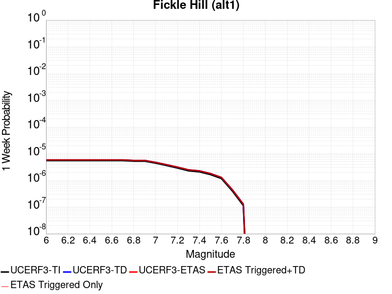 | 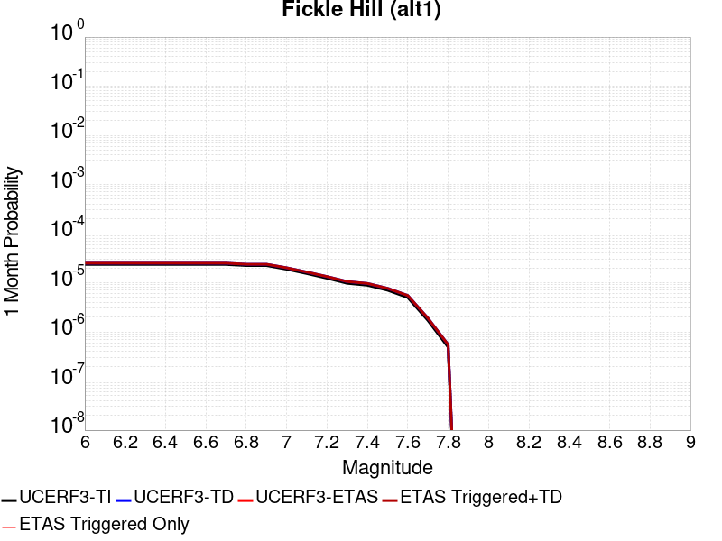 | 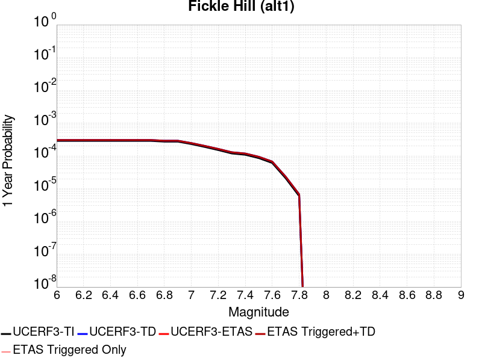 | 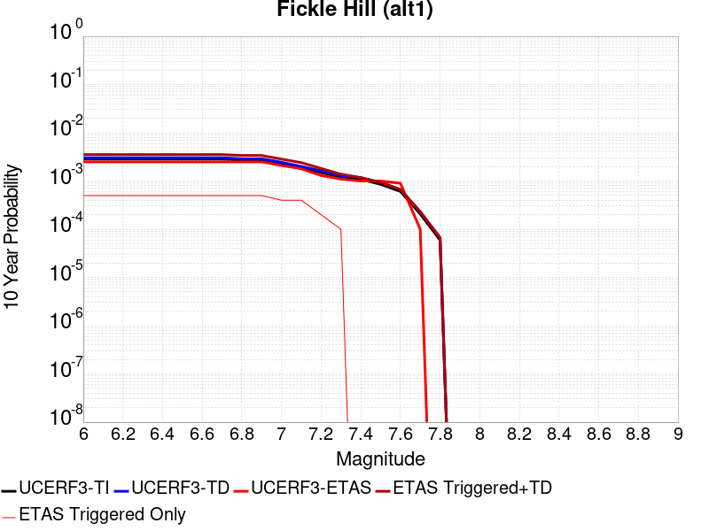 |

| Magnitude | 1 wk TI Prob | 1 wk TD Prob | 1 wk ETAS Prob | 1 wk ETAS/TD Gain | 1 wk ETAS Triggered+TD | 1 wk ETAS Triggered Only | 1 mo TI Prob | 1 mo TD Prob | 1 mo ETAS Prob | 1 mo ETAS/TD Gain | 1 mo ETAS Triggered+TD | 1 mo ETAS Triggered Only | 1 yr TI Prob | 1 yr TD Prob | 1 yr ETAS Prob | 1 yr ETAS/TD Gain | 1 yr ETAS Triggered+TD | 1 yr ETAS Triggered Only | 10 yr TI Prob | 10 yr TD Prob | 10 yr ETAS Prob | 10 yr ETAS/TD Gain | 10 yr ETAS Triggered+TD | 10 yr ETAS Triggered Only |
|-----|-----|-----|-----|-----|-----|-----|-----|-----|-----|-----|-----|-----|-----|-----|-----|-----|-----|-----|-----|-----|-----|-----|-----|-----|
| 6.0 | 5.491893E-6 | 5.827709E-6 | 0.0 | 0.0 | 5.827709E-6 | 0.0 | 2.3536471E-5 | 2.497567E-5 | 0.0 | 0.0 | 2.497567E-5 | 0.0 | 2.8651886E-4 | 3.040386E-4 | 0.0 | 0.0 | 3.040386E-4 | 0.0 | 0.0028614972 | 0.0030364508 | 0.0025 | 0.8233297 | 0.0035349326 | 5.0E-4 |
| 6.1 | 5.491893E-6 | 5.827709E-6 | 0.0 | 0.0 | 5.827709E-6 | 0.0 | 2.3536471E-5 | 2.497567E-5 | 0.0 | 0.0 | 2.497567E-5 | 0.0 | 2.8651886E-4 | 3.040386E-4 | 0.0 | 0.0 | 3.040386E-4 | 0.0 | 0.0028614972 | 0.0030364508 | 0.0025 | 0.8233297 | 0.0035349326 | 5.0E-4 |
| 6.2 | 5.491893E-6 | 5.827709E-6 | 0.0 | 0.0 | 5.827709E-6 | 0.0 | 2.3536471E-5 | 2.497567E-5 | 0.0 | 0.0 | 2.497567E-5 | 0.0 | 2.8651886E-4 | 3.040386E-4 | 0.0 | 0.0 | 3.040386E-4 | 0.0 | 0.0028614972 | 0.0030364508 | 0.0025 | 0.8233297 | 0.0035349326 | 5.0E-4 |
| 6.3 | 5.491893E-6 | 5.827709E-6 | 0.0 | 0.0 | 5.827709E-6 | 0.0 | 2.3536471E-5 | 2.497567E-5 | 0.0 | 0.0 | 2.497567E-5 | 0.0 | 2.8651886E-4 | 3.040386E-4 | 0.0 | 0.0 | 3.040386E-4 | 0.0 | 0.0028614972 | 0.0030364508 | 0.0025 | 0.8233297 | 0.0035349326 | 5.0E-4 |
| 6.4 | 5.491893E-6 | 5.827709E-6 | 0.0 | 0.0 | 5.827709E-6 | 0.0 | 2.3536471E-5 | 2.497567E-5 | 0.0 | 0.0 | 2.497567E-5 | 0.0 | 2.8651886E-4 | 3.040386E-4 | 0.0 | 0.0 | 3.040386E-4 | 0.0 | 0.0028614972 | 0.0030364508 | 0.0025 | 0.8233297 | 0.0035349326 | 5.0E-4 |
| 6.5 | 5.491893E-6 | 5.827709E-6 | 0.0 | 0.0 | 5.827709E-6 | 0.0 | 2.3536471E-5 | 2.497567E-5 | 0.0 | 0.0 | 2.497567E-5 | 0.0 | 2.8651886E-4 | 3.040386E-4 | 0.0 | 0.0 | 3.040386E-4 | 0.0 | 0.0028614972 | 0.0030364508 | 0.0025 | 0.8233297 | 0.0035349326 | 5.0E-4 |
| 6.6 | 5.491893E-6 | 5.827709E-6 | 0.0 | 0.0 | 5.827709E-6 | 0.0 | 2.3536471E-5 | 2.497567E-5 | 0.0 | 0.0 | 2.497567E-5 | 0.0 | 2.8651886E-4 | 3.040386E-4 | 0.0 | 0.0 | 3.040386E-4 | 0.0 | 0.0028614972 | 0.0030364508 | 0.0025 | 0.8233297 | 0.0035349326 | 5.0E-4 |
| 6.7 | 5.491893E-6 | 5.827709E-6 | 0.0 | 0.0 | 5.827709E-6 | 0.0 | 2.3536471E-5 | 2.497567E-5 | 0.0 | 0.0 | 2.497567E-5 | 0.0 | 2.8651886E-4 | 3.040386E-4 | 0.0 | 0.0 | 3.040386E-4 | 0.0 | 0.0028614972 | 0.0030364508 | 0.0025 | 0.8233297 | 0.0035349326 | 5.0E-4 |
| 6.8 | 5.2207747E-6 | 5.546417E-6 | 0.0 | 0.0 | 5.546417E-6 | 0.0 | 2.2374557E-5 | 2.3770153E-5 | 0.0 | 0.0 | 2.3770153E-5 | 0.0 | 2.7237617E-4 | 2.893654E-4 | 0.0 | 0.0 | 2.893654E-4 | 0.0 | 0.0027204256 | 0.0028901042 | 0.0025 | 0.8650207 | 0.0033886593 | 5.0E-4 |
| 6.9 | 5.2186956E-6 | 5.544237E-6 | 0.0 | 0.0 | 5.544237E-6 | 0.0 | 2.2365646E-5 | 2.3760811E-5 | 0.0 | 0.0 | 2.3760811E-5 | 0.0 | 2.722677E-4 | 2.8925168E-4 | 0.0 | 0.0 | 2.8925168E-4 | 0.0 | 0.0027193436 | 0.00288897 | 0.0025 | 0.86536026 | 0.0033875257 | 5.0E-4 |
| 7.0 | 4.403045E-6 | 4.69911E-6 | 0.0 | 0.0 | 4.69911E-6 | 0.0 | 1.8870056E-5 | 2.0138896E-5 | 0.0 | 0.0 | 2.0138896E-5 | 0.0 | 2.297187E-4 | 2.451648E-4 | 0.0 | 0.0 | 2.451648E-4 | 0.0 | 0.0022948137 | 0.0024490736 | 0.0021 | 0.8574671 | 0.0028480939 | 4.0E-4 |
| 7.1 | 3.5911396E-6 | 3.8485045E-6 | 0.0 | 0.0 | 3.8485045E-6 | 0.0 | 1.5390508E-5 | 1.649349E-5 | 0.0 | 0.0 | 1.649349E-5 | 0.0 | 1.8736332E-4 | 2.0079048E-4 | 0.0 | 0.0 | 2.0079048E-4 | 0.0 | 0.0018720542 | 0.002006164 | 0.0018 | 0.8972347 | 0.0024053617 | 4.0E-4 |
| 7.2 | 2.888171E-6 | 3.114644E-6 | 0.0 | 0.0 | 3.114644E-6 | 0.0 | 1.2377816E-5 | 1.3348407E-5 | 0.0 | 0.0 | 1.3348407E-5 | 0.0 | 1.5068949E-4 | 1.6250499E-4 | 0.0 | 0.0 | 1.6250499E-4 | 0.0 | 0.0015058735 | 0.0016238863 | 0.0013 | 0.8005487 | 0.0018235615 | 2.0E-4 |
| 7.3 | 2.275019E-6 | 2.4679368E-6 | 0.0 | 0.0 | 2.4679368E-6 | 0.0 | 9.750045E-6 | 1.057683E-5 | 0.0 | 0.0 | 1.057683E-5 | 0.0 | 1.1870033E-4 | 1.2876543E-4 | 0.0 | 0.0 | 1.2876543E-4 | 0.0 | 0.0011863695 | 0.0012869223 | 0.0011 | 0.85475254 | 0.0013867936 | 1.0E-4 |
| 7.4 | 2.076662E-6 | 2.2580032E-6 | 0.0 | 0.0 | 2.2580032E-6 | 0.0 | 8.8999495E-6 | 9.677122E-6 | 0.0 | 0.0 | 9.677122E-6 | 0.0 | 1.08351494E-4 | 1.1781271E-4 | 0.0 | 0.0 | 1.1781271E-4 | 0.0 | 0.0010829868 | 0.0011775156 | 0.001 | 0.8492456 | 0.0011775156 | 0.0 |
| 7.5 | 1.6450799E-6 | 1.7957366E-6 | 0.0 | 0.0 | 1.7957366E-6 | 0.0 | 7.0503233E-6 | 7.695991E-6 | 0.0 | 0.0 | 7.695991E-6 | 0.0 | 8.5834305E-5 | 9.369475E-5 | 0.0 | 0.0 | 9.369475E-5 | 0.0 | 8.580116E-4 | 9.365601E-4 | 0.001 | 1.0677371 | 9.365601E-4 | 0.0 |
| 7.6 | 1.168891E-6 | 1.2832008E-6 | 0.0 | 0.0 | 1.2832008E-6 | 0.0 | 5.009523E-6 | 5.4994207E-6 | 0.0 | 0.0 | 5.4994207E-6 | 0.0 | 6.098924E-5 | 6.695345E-5 | 0.0 | 0.0 | 6.695345E-5 | 0.0 | 6.09725E-4 | 6.693384E-4 | 9.0E-4 | 1.3446113 | 6.693384E-4 | 0.0 |
| 7.7 | 3.9871026E-7 | 4.4281146E-7 | 0.0 | 0.0 | 4.4281146E-7 | 0.0 | 1.708757E-6 | 1.897762E-6 | 0.0 | 0.0 | 1.897762E-6 | 0.0 | 2.0803918E-5 | 2.3105016E-5 | 0.0 | 0.0 | 2.3105016E-5 | 0.0 | 2.0801972E-4 | 2.3102698E-4 | 1.0E-4 | 0.43284988 | 2.3102698E-4 | 0.0 |
| 7.8 | 1.14295965E-7 | 1.2856997E-7 | 0.0 | 0.0 | 1.2856997E-7 | 0.0 | 4.8983975E-7 | 5.51014E-7 | 0.0 | 0.0 | 5.51014E-7 | 0.0 | 5.9637828E-6 | 6.7085766E-6 | 0.0 | 0.0 | 6.7085766E-6 | 0.0 | 5.9636226E-5 | 6.708389E-5 | 0.0 | 0.0 | 6.708389E-5 | 0.0 |

## San Jacinto (Lytle Creek connector)
*[(top)](#table-of-contents)*

| 1 Week | 1 Month | 1 Year | 10 Year |
|-----|-----|-----|-----|
|  |  | 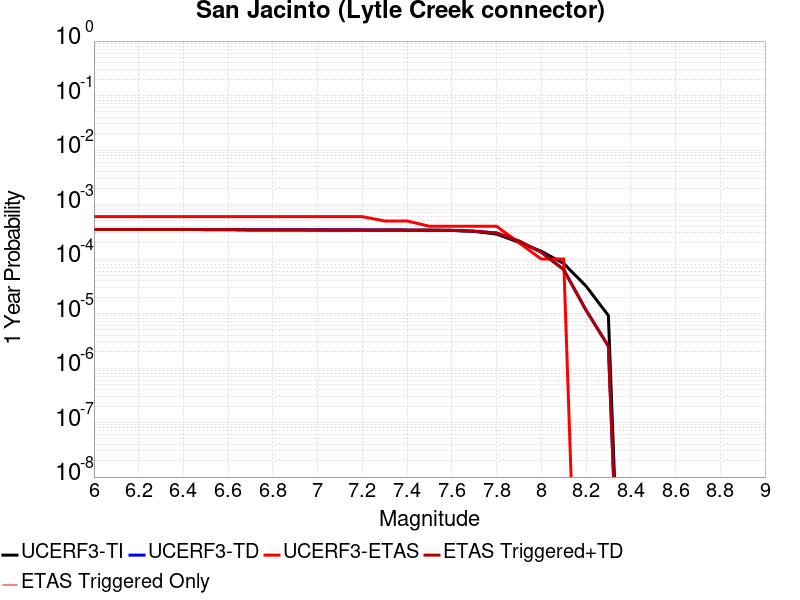 |  |

| Magnitude | 1 wk TI Prob | 1 wk TD Prob | 1 wk ETAS Prob | 1 wk ETAS/TD Gain | 1 wk ETAS Triggered+TD | 1 wk ETAS Triggered Only | 1 mo TI Prob | 1 mo TD Prob | 1 mo ETAS Prob | 1 mo ETAS/TD Gain | 1 mo ETAS Triggered+TD | 1 mo ETAS Triggered Only | 1 yr TI Prob | 1 yr TD Prob | 1 yr ETAS Prob | 1 yr ETAS/TD Gain | 1 yr ETAS Triggered+TD | 1 yr ETAS Triggered Only | 10 yr TI Prob | 10 yr TD Prob | 10 yr ETAS Prob | 10 yr ETAS/TD Gain | 10 yr ETAS Triggered+TD | 10 yr ETAS Triggered Only |
|-----|-----|-----|-----|-----|-----|-----|-----|-----|-----|-----|-----|-----|-----|-----|-----|-----|-----|-----|-----|-----|-----|-----|-----|-----|
| 6.0 | 6.693995E-6 | 6.700602E-6 | 0.0 | 0.0 | 6.700602E-6 | 0.0 | 2.8688235E-5 | 2.871655E-5 | 0.0 | 0.0 | 2.871655E-5 | 0.0 | 3.492233E-4 | 3.49568E-4 | 6.0E-4 | 1.7164043 | 3.49568E-4 | 0.0 | 0.00348675 | 0.003570309 | 0.0024 | 0.67221075 | 0.0040685236 | 5.0E-4 |
| 6.1 | 6.693995E-6 | 6.700602E-6 | 0.0 | 0.0 | 6.700602E-6 | 0.0 | 2.8688235E-5 | 2.871655E-5 | 0.0 | 0.0 | 2.871655E-5 | 0.0 | 3.492233E-4 | 3.49568E-4 | 6.0E-4 | 1.7164043 | 3.49568E-4 | 0.0 | 0.00348675 | 0.003570309 | 0.0024 | 0.67221075 | 0.0040685236 | 5.0E-4 |
| 6.2 | 6.693995E-6 | 6.700602E-6 | 0.0 | 0.0 | 6.700602E-6 | 0.0 | 2.8688235E-5 | 2.871655E-5 | 0.0 | 0.0 | 2.871655E-5 | 0.0 | 3.492233E-4 | 3.49568E-4 | 6.0E-4 | 1.7164043 | 3.49568E-4 | 0.0 | 0.00348675 | 0.003570309 | 0.0024 | 0.67221075 | 0.0040685236 | 5.0E-4 |
| 6.3 | 6.693995E-6 | 6.700602E-6 | 0.0 | 0.0 | 6.700602E-6 | 0.0 | 2.8688235E-5 | 2.871655E-5 | 0.0 | 0.0 | 2.871655E-5 | 0.0 | 3.492233E-4 | 3.49568E-4 | 6.0E-4 | 1.7164043 | 3.49568E-4 | 0.0 | 0.00348675 | 0.003570309 | 0.0024 | 0.67221075 | 0.0040685236 | 5.0E-4 |
| 6.4 | 6.693995E-6 | 6.700602E-6 | 0.0 | 0.0 | 6.700602E-6 | 0.0 | 2.8688235E-5 | 2.871655E-5 | 0.0 | 0.0 | 2.871655E-5 | 0.0 | 3.492233E-4 | 3.49568E-4 | 6.0E-4 | 1.7164043 | 3.49568E-4 | 0.0 | 0.00348675 | 0.003570309 | 0.0024 | 0.67221075 | 0.0040685236 | 5.0E-4 |
| 6.5 | 6.6561875E-6 | 6.660816E-6 | 0.0 | 0.0 | 6.660816E-6 | 0.0 | 2.8526205E-5 | 2.8546043E-5 | 0.0 | 0.0 | 2.8546043E-5 | 0.0 | 3.472512E-4 | 3.4749272E-4 | 6.0E-4 | 1.7266549 | 3.4749272E-4 | 0.0 | 0.0034670907 | 0.0035496226 | 0.0024 | 0.6761282 | 0.004047848 | 5.0E-4 |
| 6.6 | 6.6561875E-6 | 6.660816E-6 | 0.0 | 0.0 | 6.660816E-6 | 0.0 | 2.8526205E-5 | 2.8546043E-5 | 0.0 | 0.0 | 2.8546043E-5 | 0.0 | 3.472512E-4 | 3.4749272E-4 | 6.0E-4 | 1.7266549 | 3.4749272E-4 | 0.0 | 0.0034670907 | 0.0035496226 | 0.0024 | 0.6761282 | 0.004047848 | 5.0E-4 |
| 6.7 | 6.5802237E-6 | 6.579983E-6 | 0.0 | 0.0 | 6.579983E-6 | 0.0 | 2.8200653E-5 | 2.8199624E-5 | 0.0 | 0.0 | 2.8199624E-5 | 0.0 | 3.4328885E-4 | 3.432764E-4 | 6.0E-4 | 1.7478627 | 3.432764E-4 | 0.0 | 0.0034275902 | 0.003507593 | 0.0024 | 0.6842299 | 0.004005839 | 5.0E-4 |
| 6.8 | 6.575632E-6 | 6.5744703E-6 | 0.0 | 0.0 | 6.5744703E-6 | 0.0 | 2.8180975E-5 | 2.8175999E-5 | 0.0 | 0.0 | 2.8175999E-5 | 0.0 | 3.4304935E-4 | 3.4298885E-4 | 6.0E-4 | 1.749328 | 3.4298885E-4 | 0.0 | 0.0034252026 | 0.0035047266 | 0.0024 | 0.68478954 | 0.004002974 | 5.0E-4 |
| 6.9 | 6.570433E-6 | 6.5658587E-6 | 0.0 | 0.0 | 6.5658587E-6 | 0.0 | 2.8158694E-5 | 2.8139091E-5 | 0.0 | 0.0 | 2.8139091E-5 | 0.0 | 3.4277816E-4 | 3.4253966E-4 | 6.0E-4 | 1.7516221 | 3.4253966E-4 | 0.0 | 0.0034224992 | 0.0035002485 | 0.0024 | 0.68566555 | 0.0039984984 | 5.0E-4 |
| 7.0 | 6.5643826E-6 | 6.5559725E-6 | 0.0 | 0.0 | 6.5559725E-6 | 0.0 | 2.8132765E-5 | 2.8096723E-5 | 0.0 | 0.0 | 2.8096723E-5 | 0.0 | 3.424626E-4 | 3.42024E-4 | 6.0E-4 | 1.7542629 | 3.42024E-4 | 0.0 | 0.0034193532 | 0.0034951083 | 0.0024 | 0.686674 | 0.003993361 | 5.0E-4 |
| 7.1 | 6.557402E-6 | 6.5446775E-6 | 0.0 | 0.0 | 6.5446775E-6 | 0.0 | 2.8102848E-5 | 2.8048316E-5 | 0.0 | 0.0 | 2.8048316E-5 | 0.0 | 3.4209844E-4 | 3.4143482E-4 | 6.0E-4 | 1.75729 | 3.4143482E-4 | 0.0 | 0.0034157229 | 0.0034892359 | 0.0024 | 0.6878297 | 0.003987491 | 5.0E-4 |
| 7.2 | 6.546394E-6 | 6.5266304E-6 | 0.0 | 0.0 | 6.5266304E-6 | 0.0 | 2.8055672E-5 | 2.7970973E-5 | 0.0 | 0.0 | 2.7970973E-5 | 0.0 | 3.4152428E-4 | 3.4049345E-4 | 6.0E-4 | 1.7621484 | 3.4049345E-4 | 0.0 | 0.0034099987 | 0.0034798558 | 0.0024 | 0.68968374 | 0.003978116 | 5.0E-4 |
| 7.3 | 6.5364216E-6 | 6.50739E-6 | 0.0 | 0.0 | 6.50739E-6 | 0.0 | 2.8012933E-5 | 2.7888516E-5 | 0.0 | 0.0 | 2.7888516E-5 | 0.0 | 3.4100408E-4 | 3.3948984E-4 | 5.0E-4 | 1.4727981 | 3.3948984E-4 | 0.0 | 0.003404813 | 0.0034698625 | 0.0023 | 0.6628505 | 0.0039681275 | 5.0E-4 |
| 7.4 | 6.5269523E-6 | 6.488447E-6 | 0.0 | 0.0 | 6.488447E-6 | 0.0 | 2.7972354E-5 | 2.7807333E-5 | 0.0 | 0.0 | 2.7807333E-5 | 0.0 | 3.4051016E-4 | 3.3850176E-4 | 5.0E-4 | 1.4770972 | 3.3850176E-4 | 0.0 | 0.0033998888 | 0.0034600312 | 0.0023 | 0.6647339 | 0.003958301 | 5.0E-4 |
| 7.5 | 6.5111835E-6 | 6.4646892E-6 | 0.0 | 0.0 | 6.4646892E-6 | 0.0 | 2.7904773E-5 | 2.7705517E-5 | 0.0 | 0.0 | 2.7705517E-5 | 0.0 | 3.3968766E-4 | 3.3726252E-4 | 4.0E-4 | 1.1860197 | 3.3726252E-4 | 0.0 | 0.0033916887 | 0.0034476905 | 0.0022 | 0.6381083 | 0.0039459667 | 5.0E-4 |
| 7.6 | 6.4768806E-6 | 6.4237493E-6 | 0.0 | 0.0 | 6.4237493E-6 | 0.0 | 2.7757764E-5 | 2.7530063E-5 | 0.0 | 0.0 | 2.7530063E-5 | 0.0 | 3.3789838E-4 | 3.3512706E-4 | 4.0E-4 | 1.1935772 | 3.3512706E-4 | 0.0 | 0.0033738504 | 0.003426398 | 0.0022 | 0.6420737 | 0.0039246846 | 5.0E-4 |
| 7.7 | 6.1655364E-6 | 6.215916E-6 | 0.0 | 0.0 | 6.215916E-6 | 0.0 | 2.642346E-5 | 2.6639369E-5 | 0.0 | 0.0 | 2.6639369E-5 | 0.0 | 3.2165812E-4 | 3.242861E-4 | 4.0E-4 | 1.2334787 | 3.242861E-4 | 0.0 | 0.0032119295 | 0.0033178616 | 0.0022 | 0.6630777 | 0.0038162027 | 5.0E-4 |
| 7.8 | 5.5043524E-6 | 5.775869E-6 | 0.0 | 0.0 | 5.775869E-6 | 0.0 | 2.3589868E-5 | 2.4753488E-5 | 0.0 | 0.0 | 2.4753488E-5 | 0.0 | 2.871688E-4 | 3.013321E-4 | 4.0E-4 | 1.3274391 | 3.013321E-4 | 0.0 | 0.0028679797 | 0.003087384 | 0.002 | 0.64779764 | 0.0035858403 | 5.0E-4 |
| 7.9 | 3.889249E-6 | 4.108174E-6 | 0.0 | 0.0 | 4.108174E-6 | 0.0 | 1.6668104E-5 | 1.760634E-5 | 0.0 | 0.0 | 1.760634E-5 | 0.0 | 2.0291525E-4 | 2.1433616E-4 | 2.0E-4 | 0.9331137 | 2.1433616E-4 | 0.0 | 0.0020273007 | 0.0022107759 | 0.0014 | 0.63326186 | 0.0025101127 | 3.0E-4 |
| 8.0 | 2.668535E-6 | 2.5531897E-6 | 0.0 | 0.0 | 2.5531897E-6 | 0.0 | 1.1436528E-5 | 1.0942196E-5 | 0.0 | 0.0 | 1.0942196E-5 | 0.0 | 1.3923083E-4 | 1.3321312E-4 | 1.0E-4 | 0.7506768 | 1.3321312E-4 | 0.0 | 0.0013914363 | 0.0013873274 | 0.001 | 0.72081035 | 0.0016869113 | 3.0E-4 |
| 8.1 | 1.5911459E-6 | 1.2302389E-6 | 0.0 | 0.0 | 1.2302389E-6 | 0.0 | 6.8191785E-6 | 5.2724417E-6 | 0.0 | 0.0 | 5.2724417E-6 | 0.0 | 8.3020335E-5 | 6.419011E-5 | 1.0E-4 | 1.5578724 | 6.419011E-5 | 0.0 | 8.298933E-4 | 6.755697E-4 | 5.0E-4 | 0.74011606 | 9.7536703E-4 | 3.0E-4 |
| 8.2 | 6.1294963E-7 | 2.2149469E-7 | 0.0 | 0.0 | 2.2149469E-7 | 0.0 | 2.6269242E-6 | 9.492626E-7 | 0.0 | 0.0 | 9.492626E-7 | 0.0 | 3.1982334E-5 | 1.1557211E-5 | 0.0 | 0.0 | 1.1557211E-5 | 0.0 | 3.1977732E-4 | 1.2974274E-4 | 1.0E-4 | 0.77075607 | 2.2972976E-4 | 1.0E-4 |
| 8.3 | 1.762871E-7 | 4.8393023E-8 | 0.0 | 0.0 | 4.8393023E-8 | 0.0 | 7.5551594E-7 | 2.0739866E-7 | 0.0 | 0.0 | 2.0739866E-7 | 0.0 | 9.1983675E-6 | 2.5250758E-6 | 0.0 | 0.0 | 2.5250758E-6 | 0.0 | 9.197987E-5 | 2.9175899E-5 | 0.0 | 0.0 | 2.9175899E-5 | 0.0 |

## Thirty Mile Bank
*[(top)](#table-of-contents)*

| 1 Week | 1 Month | 1 Year | 10 Year |
|-----|-----|-----|-----|
| 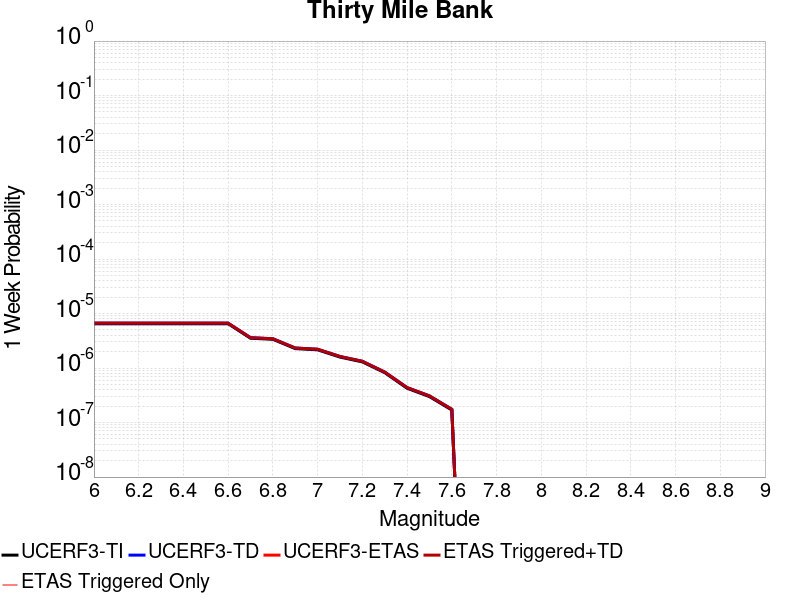 | 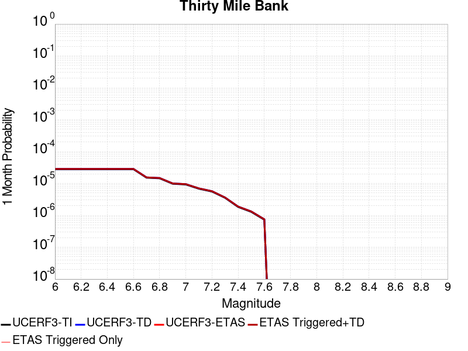 | 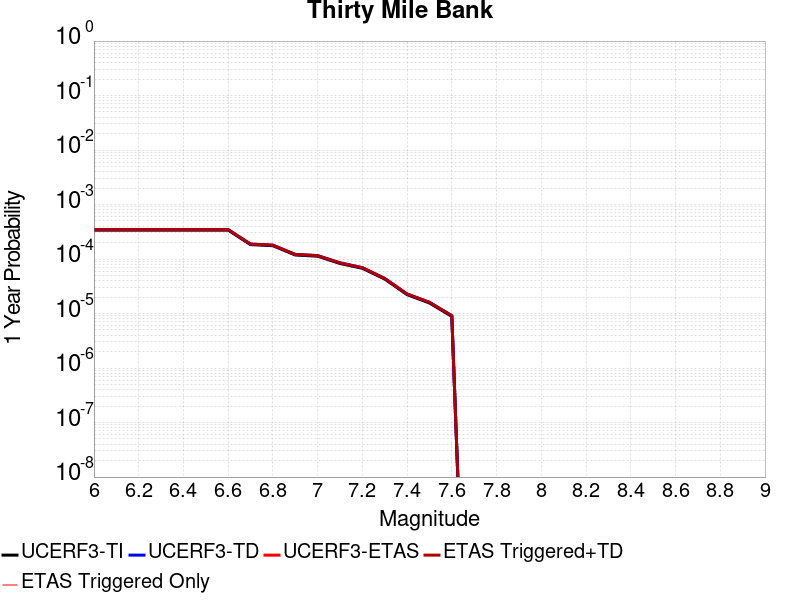 | 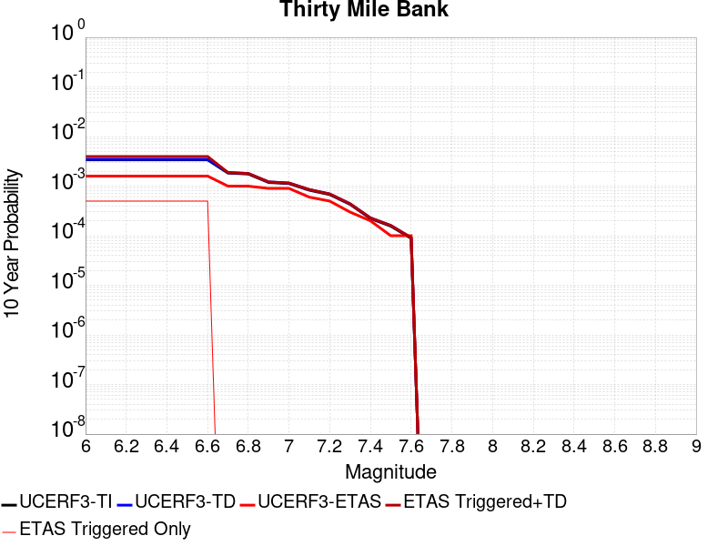 |

| Magnitude | 1 wk TI Prob | 1 wk TD Prob | 1 wk ETAS Prob | 1 wk ETAS/TD Gain | 1 wk ETAS Triggered+TD | 1 wk ETAS Triggered Only | 1 mo TI Prob | 1 mo TD Prob | 1 mo ETAS Prob | 1 mo ETAS/TD Gain | 1 mo ETAS Triggered+TD | 1 mo ETAS Triggered Only | 1 yr TI Prob | 1 yr TD Prob | 1 yr ETAS Prob | 1 yr ETAS/TD Gain | 1 yr ETAS Triggered+TD | 1 yr ETAS Triggered Only | 10 yr TI Prob | 10 yr TD Prob | 10 yr ETAS Prob | 10 yr ETAS/TD Gain | 10 yr ETAS Triggered+TD | 10 yr ETAS Triggered Only |
|-----|-----|-----|-----|-----|-----|-----|-----|-----|-----|-----|-----|-----|-----|-----|-----|-----|-----|-----|-----|-----|-----|-----|-----|-----|
| 6.0 | 6.5124755E-6 | 6.6595626E-6 | 0.0 | 0.0 | 6.6595626E-6 | 0.0 | 2.791031E-5 | 2.8540695E-5 | 0.0 | 0.0 | 2.8540695E-5 | 0.0 | 3.3975503E-4 | 3.4743192E-4 | 0.0 | 0.0 | 3.4743192E-4 | 0.0 | 0.0033923604 | 0.003469319 | 0.0016 | 0.4611856 | 0.0039675846 | 5.0E-4 |
| 6.1 | 6.5124755E-6 | 6.6595626E-6 | 0.0 | 0.0 | 6.6595626E-6 | 0.0 | 2.791031E-5 | 2.8540695E-5 | 0.0 | 0.0 | 2.8540695E-5 | 0.0 | 3.3975503E-4 | 3.4743192E-4 | 0.0 | 0.0 | 3.4743192E-4 | 0.0 | 0.0033923604 | 0.003469319 | 0.0016 | 0.4611856 | 0.0039675846 | 5.0E-4 |
| 6.2 | 6.5124755E-6 | 6.6595626E-6 | 0.0 | 0.0 | 6.6595626E-6 | 0.0 | 2.791031E-5 | 2.8540695E-5 | 0.0 | 0.0 | 2.8540695E-5 | 0.0 | 3.3975503E-4 | 3.4743192E-4 | 0.0 | 0.0 | 3.4743192E-4 | 0.0 | 0.0033923604 | 0.003469319 | 0.0016 | 0.4611856 | 0.0039675846 | 5.0E-4 |
| 6.3 | 6.5124755E-6 | 6.6595626E-6 | 0.0 | 0.0 | 6.6595626E-6 | 0.0 | 2.791031E-5 | 2.8540695E-5 | 0.0 | 0.0 | 2.8540695E-5 | 0.0 | 3.3975503E-4 | 3.4743192E-4 | 0.0 | 0.0 | 3.4743192E-4 | 0.0 | 0.0033923604 | 0.003469319 | 0.0016 | 0.4611856 | 0.0039675846 | 5.0E-4 |
| 6.4 | 6.5124755E-6 | 6.6595626E-6 | 0.0 | 0.0 | 6.6595626E-6 | 0.0 | 2.791031E-5 | 2.8540695E-5 | 0.0 | 0.0 | 2.8540695E-5 | 0.0 | 3.3975503E-4 | 3.4743192E-4 | 0.0 | 0.0 | 3.4743192E-4 | 0.0 | 0.0033923604 | 0.003469319 | 0.0016 | 0.4611856 | 0.0039675846 | 5.0E-4 |
| 6.5 | 6.5124755E-6 | 6.6595626E-6 | 0.0 | 0.0 | 6.6595626E-6 | 0.0 | 2.791031E-5 | 2.8540695E-5 | 0.0 | 0.0 | 2.8540695E-5 | 0.0 | 3.3975503E-4 | 3.4743192E-4 | 0.0 | 0.0 | 3.4743192E-4 | 0.0 | 0.0033923604 | 0.003469319 | 0.0016 | 0.4611856 | 0.0039675846 | 5.0E-4 |
| 6.6 | 6.5124755E-6 | 6.6595626E-6 | 0.0 | 0.0 | 6.6595626E-6 | 0.0 | 2.791031E-5 | 2.8540695E-5 | 0.0 | 0.0 | 2.8540695E-5 | 0.0 | 3.3975503E-4 | 3.4743192E-4 | 0.0 | 0.0 | 3.4743192E-4 | 0.0 | 0.0033923604 | 0.003469319 | 0.0016 | 0.4611856 | 0.0039675846 | 5.0E-4 |
| 6.7 | 3.5261137E-6 | 3.61007E-6 | 0.0 | 0.0 | 3.61007E-6 | 0.0 | 1.5111828E-5 | 1.5471642E-5 | 0.0 | 0.0 | 1.5471642E-5 | 0.0 | 1.8397097E-4 | 1.8835161E-4 | 0.0 | 0.0 | 1.8835161E-4 | 0.0 | 0.0018381875 | 0.0018819846 | 0.001 | 0.53135395 | 0.0018819846 | 0.0 |
| 6.8 | 3.370743E-6 | 3.4510988E-6 | 0.0 | 0.0 | 3.4510988E-6 | 0.0 | 1.4445961E-5 | 1.4790343E-5 | 0.0 | 0.0 | 1.4790343E-5 | 0.0 | 1.7586538E-4 | 1.8005817E-4 | 0.0 | 0.0 | 1.8005817E-4 | 0.0 | 0.0017572626 | 0.0017991846 | 0.001 | 0.55580735 | 0.0017991846 | 0.0 |
| 6.9 | 2.2756835E-6 | 2.3332784E-6 | 0.0 | 0.0 | 2.3332784E-6 | 0.0 | 9.752893E-6 | 9.999727E-6 | 0.0 | 0.0 | 9.999727E-6 | 0.0 | 1.18735006E-4 | 1.2174013E-4 | 0.0 | 0.0 | 1.2174013E-4 | 0.0 | 0.0011867158 | 0.001216759 | 9.0E-4 | 0.7396699 | 0.001216759 | 0.0 |
| 7.0 | 2.1617404E-6 | 2.2160907E-6 | 0.0 | 0.0 | 2.2160907E-6 | 0.0 | 9.264569E-6 | 9.497498E-6 | 0.0 | 0.0 | 9.497498E-6 | 0.0 | 1.1279029E-4 | 1.1562614E-4 | 0.0 | 0.0 | 1.1562614E-4 | 0.0 | 0.0011273306 | 0.0011556839 | 9.0E-4 | 0.77875966 | 0.0011556839 | 0.0 |
| 7.1 | 1.5900777E-6 | 1.6327884E-6 | 0.0 | 0.0 | 1.6327884E-6 | 0.0 | 6.814601E-6 | 6.997647E-6 | 0.0 | 0.0 | 6.997647E-6 | 0.0 | 8.296461E-5 | 8.519315E-5 | 0.0 | 0.0 | 8.519315E-5 | 0.0 | 8.293364E-4 | 8.5161766E-4 | 6.0E-4 | 0.7045415 | 8.5161766E-4 | 0.0 |
| 7.2 | 1.2971728E-6 | 1.3329721E-6 | 0.0 | 0.0 | 1.3329721E-6 | 0.0 | 5.5593005E-6 | 5.712726E-6 | 0.0 | 0.0 | 5.712726E-6 | 0.0 | 6.768238E-5 | 6.9550326E-5 | 0.0 | 0.0 | 6.9550326E-5 | 0.0 | 6.7661767E-4 | 6.952959E-4 | 5.0E-4 | 0.7191183 | 6.952959E-4 | 0.0 |
| 7.3 | 8.2454284E-7 | 8.449305E-7 | 0.0 | 0.0 | 8.449305E-7 | 0.0 | 3.5337503E-6 | 3.621126E-6 | 0.0 | 0.0 | 3.621126E-6 | 0.0 | 4.302256E-5 | 4.408638E-5 | 0.0 | 0.0 | 4.408638E-5 | 0.0 | 4.301423E-4 | 4.4078237E-4 | 3.0E-4 | 0.680608 | 4.4078237E-4 | 0.0 |
| 7.4 | 4.2619024E-7 | 4.386601E-7 | 0.0 | 0.0 | 4.386601E-7 | 0.0 | 1.8265283E-6 | 1.8799705E-6 | 0.0 | 0.0 | 1.8799705E-6 | 0.0 | 2.2237757E-5 | 2.2888404E-5 | 0.0 | 0.0 | 2.2888404E-5 | 0.0 | 2.223553E-4 | 2.2886085E-4 | 2.0E-4 | 0.87389344 | 2.2886085E-4 | 0.0 |
| 7.5 | 2.993922E-7 | 3.0866423E-7 | 0.0 | 0.0 | 3.0866423E-7 | 0.0 | 1.2831089E-6 | 1.3228461E-6 | 0.0 | 0.0 | 1.3228461E-6 | 0.0 | 1.5621737E-5 | 1.6105534E-5 | 0.0 | 0.0 | 1.6105534E-5 | 0.0 | 1.562064E-4 | 1.6104392E-4 | 1.0E-4 | 0.6209486 | 1.6104392E-4 | 0.0 |
| 7.6 | 1.6988751E-7 | 1.753494E-7 | 0.0 | 0.0 | 1.753494E-7 | 0.0 | 7.2808916E-7 | 7.5149717E-7 | 0.0 | 0.0 | 7.5149717E-7 | 0.0 | 8.864449E-6 | 9.149442E-6 | 0.0 | 0.0 | 9.149442E-6 | 0.0 | 8.8640954E-5 | 9.149085E-5 | 1.0E-4 | 1.0930055 | 9.149085E-5 | 0.0 |

## Polaris 2011 CFM
*[(top)](#table-of-contents)*

| 1 Week | 1 Month | 1 Year | 10 Year |
|-----|-----|-----|-----|
| 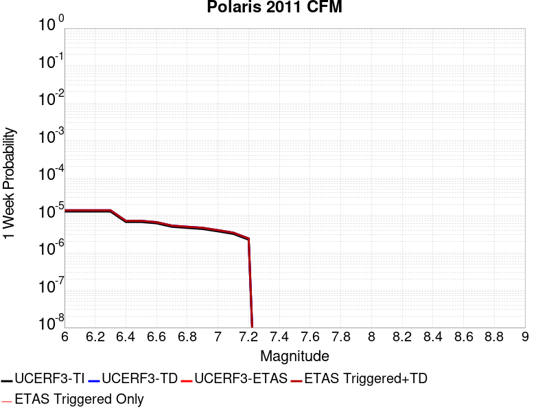 | 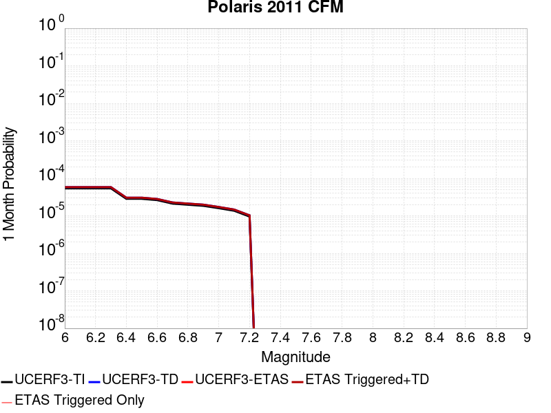 | 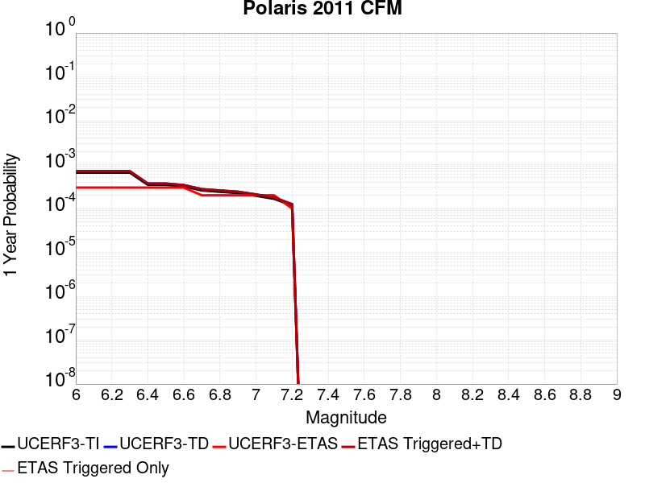 | 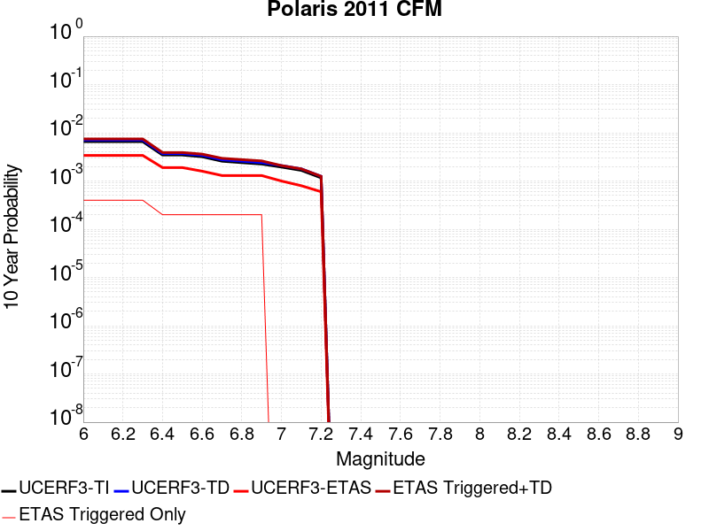 |

| Magnitude | 1 wk TI Prob | 1 wk TD Prob | 1 wk ETAS Prob | 1 wk ETAS/TD Gain | 1 wk ETAS Triggered+TD | 1 wk ETAS Triggered Only | 1 mo TI Prob | 1 mo TD Prob | 1 mo ETAS Prob | 1 mo ETAS/TD Gain | 1 mo ETAS Triggered+TD | 1 mo ETAS Triggered Only | 1 yr TI Prob | 1 yr TD Prob | 1 yr ETAS Prob | 1 yr ETAS/TD Gain | 1 yr ETAS Triggered+TD | 1 yr ETAS Triggered Only | 10 yr TI Prob | 10 yr TD Prob | 10 yr ETAS Prob | 10 yr ETAS/TD Gain | 10 yr ETAS Triggered+TD | 10 yr ETAS Triggered Only |
|-----|-----|-----|-----|-----|-----|-----|-----|-----|-----|-----|-----|-----|-----|-----|-----|-----|-----|-----|-----|-----|-----|-----|-----|-----|
| 6.0 | 1.2630823E-5 | 1.3584949E-5 | 0.0 | 0.0 | 1.3584949E-5 | 0.0 | 5.413098E-5 | 5.82202E-5 | 0.0 | 0.0 | 5.82202E-5 | 0.0 | 6.5884535E-4 | 7.086523E-4 | 3.0E-4 | 0.42333877 | 7.086523E-4 | 0.0 | 0.0065689543 | 0.007069036 | 0.0034 | 0.4809708 | 0.007466208 | 4.0E-4 |
| 6.1 | 1.2630823E-5 | 1.3584949E-5 | 0.0 | 0.0 | 1.3584949E-5 | 0.0 | 5.413098E-5 | 5.82202E-5 | 0.0 | 0.0 | 5.82202E-5 | 0.0 | 6.5884535E-4 | 7.086523E-4 | 3.0E-4 | 0.42333877 | 7.086523E-4 | 0.0 | 0.0065689543 | 0.007069036 | 0.0034 | 0.4809708 | 0.007466208 | 4.0E-4 |
| 6.2 | 1.2630823E-5 | 1.3584949E-5 | 0.0 | 0.0 | 1.3584949E-5 | 0.0 | 5.413098E-5 | 5.82202E-5 | 0.0 | 0.0 | 5.82202E-5 | 0.0 | 6.5884535E-4 | 7.086523E-4 | 3.0E-4 | 0.42333877 | 7.086523E-4 | 0.0 | 0.0065689543 | 0.007069036 | 0.0034 | 0.4809708 | 0.007466208 | 4.0E-4 |
| 6.3 | 1.2630823E-5 | 1.3584949E-5 | 0.0 | 0.0 | 1.3584949E-5 | 0.0 | 5.413098E-5 | 5.82202E-5 | 0.0 | 0.0 | 5.82202E-5 | 0.0 | 6.5884535E-4 | 7.086523E-4 | 3.0E-4 | 0.42333877 | 7.086523E-4 | 0.0 | 0.0065689543 | 0.007069036 | 0.0034 | 0.4809708 | 0.007466208 | 4.0E-4 |
| 6.4 | 6.642994E-6 | 7.108045E-6 | 0.0 | 0.0 | 7.108045E-6 | 0.0 | 2.8469662E-5 | 3.0462723E-5 | 0.0 | 0.0 | 3.0462723E-5 | 0.0 | 3.46563E-4 | 3.708257E-4 | 3.0E-4 | 0.80900544 | 3.708257E-4 | 0.0 | 0.0034602303 | 0.00370258 | 0.0019 | 0.5131557 | 0.0039018395 | 2.0E-4 |
| 6.5 | 6.642994E-6 | 7.108045E-6 | 0.0 | 0.0 | 7.108045E-6 | 0.0 | 2.8469662E-5 | 3.0462723E-5 | 0.0 | 0.0 | 3.0462723E-5 | 0.0 | 3.46563E-4 | 3.708257E-4 | 3.0E-4 | 0.80900544 | 3.708257E-4 | 0.0 | 0.0034602303 | 0.00370258 | 0.0019 | 0.5131557 | 0.0039018395 | 2.0E-4 |
| 6.6 | 6.1286296E-6 | 6.557079E-6 | 0.0 | 0.0 | 6.557079E-6 | 0.0 | 2.626529E-5 | 2.810149E-5 | 0.0 | 0.0 | 2.810149E-5 | 0.0 | 3.19733E-4 | 3.4208674E-4 | 3.0E-4 | 0.8769705 | 3.4208674E-4 | 0.0 | 0.0031927335 | 0.003416077 | 0.0016 | 0.46837354 | 0.0036153938 | 2.0E-4 |
| 6.7 | 4.9474666E-6 | 5.2989944E-6 | 0.0 | 0.0 | 5.2989944E-6 | 0.0 | 2.1203256E-5 | 2.2709793E-5 | 0.0 | 0.0 | 2.2709793E-5 | 0.0 | 2.5811905E-4 | 2.764595E-4 | 2.0E-4 | 0.72343326 | 2.764595E-4 | 0.0 | 0.0025781945 | 0.0027614357 | 0.0013 | 0.4707696 | 0.0029608833 | 2.0E-4 |
| 6.8 | 4.616407E-6 | 4.946965E-6 | 0.0 | 0.0 | 4.946965E-6 | 0.0 | 1.978445E-5 | 2.1201122E-5 | 0.0 | 0.0 | 2.1201122E-5 | 0.0 | 2.4084905E-4 | 2.5809577E-4 | 2.0E-4 | 0.77490616 | 2.5809577E-4 | 0.0 | 0.0024058819 | 0.0025782245 | 0.0013 | 0.5042229 | 0.002777709 | 2.0E-4 |
| 6.9 | 4.320343E-6 | 4.6315463E-6 | 0.0 | 0.0 | 4.6315463E-6 | 0.0 | 1.8515624E-5 | 1.9849347E-5 | 0.0 | 0.0 | 1.9849347E-5 | 0.0 | 2.2540441E-4 | 2.4164161E-4 | 2.0E-4 | 0.827672 | 2.4164161E-4 | 0.0 | 0.0022517592 | 0.0024140454 | 0.0013 | 0.5385151 | 0.0026135626 | 2.0E-4 |
| 7.0 | 3.7382292E-6 | 4.01013E-6 | 0.0 | 0.0 | 4.01013E-6 | 0.0 | 1.6020884E-5 | 1.7186172E-5 | 0.0 | 0.0 | 1.7186172E-5 | 0.0 | 1.950368E-4 | 2.0922394E-4 | 2.0E-4 | 0.95591354 | 2.0922394E-4 | 0.0 | 0.0019486571 | 0.002090505 | 0.001 | 0.4783533 | 0.002090505 | 0.0 |
| 7.1 | 3.193576E-6 | 3.4281975E-6 | 0.0 | 0.0 | 3.4281975E-6 | 0.0 | 1.3686683E-5 | 1.4692205E-5 | 0.0 | 0.0 | 1.4692205E-5 | 0.0 | 1.6662262E-4 | 1.7886514E-4 | 2.0E-4 | 1.1181608 | 1.7886514E-4 | 0.0 | 0.0016649774 | 0.0017874306 | 8.0E-4 | 0.44756982 | 0.0017874306 | 0.0 |
| 7.2 | 2.2356758E-6 | 2.4027236E-6 | 0.0 | 0.0 | 2.4027236E-6 | 0.0 | 9.581432E-6 | 1.0297357E-5 | 0.0 | 0.0 | 1.0297357E-5 | 0.0 | 1.1664769E-4 | 1.25365E-4 | 1.0E-4 | 0.7976708 | 1.25365E-4 | 0.0 | 0.0011658648 | 0.0012531286 | 6.0E-4 | 0.4788016 | 0.0012531286 | 0.0 |

## Pilarcitos 2011 CFM
*[(top)](#table-of-contents)*

| 1 Week | 1 Month | 1 Year | 10 Year |
|-----|-----|-----|-----|
| 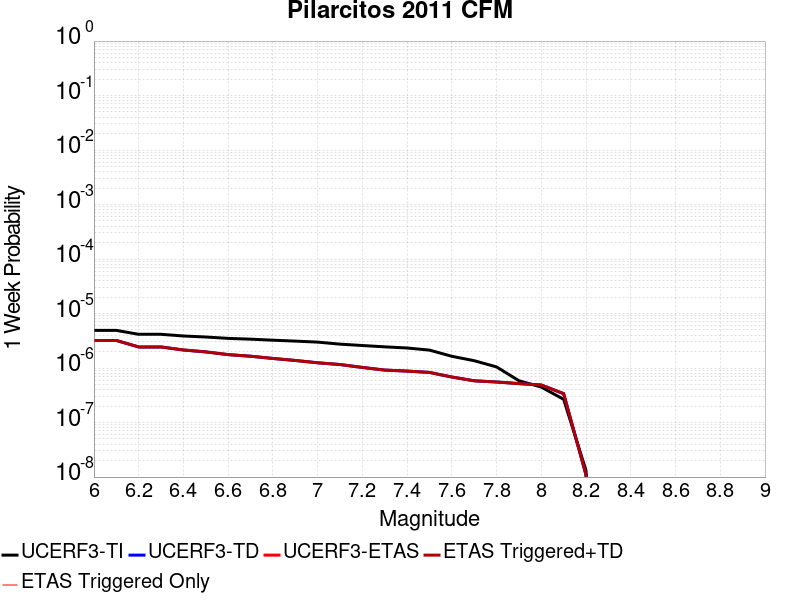 | 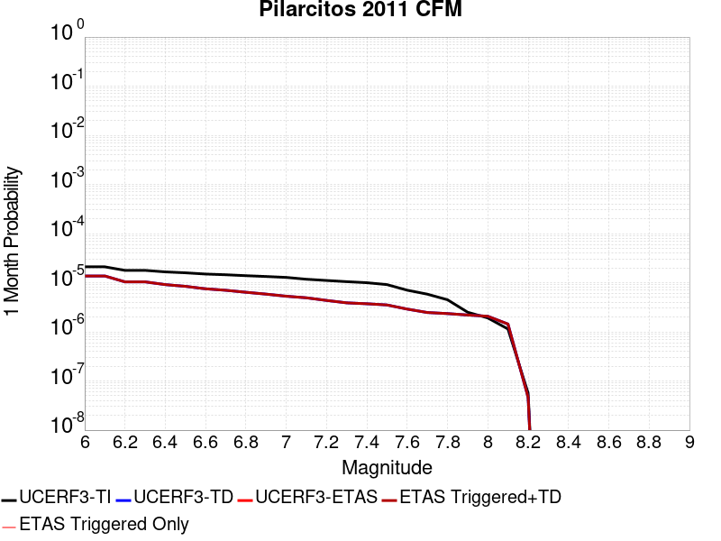 | 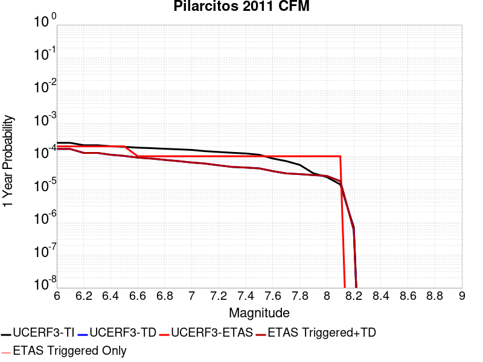 | 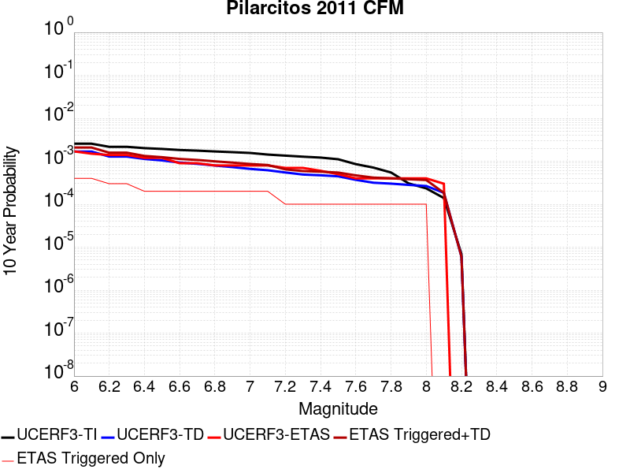 |

| Magnitude | 1 wk TI Prob | 1 wk TD Prob | 1 wk ETAS Prob | 1 wk ETAS/TD Gain | 1 wk ETAS Triggered+TD | 1 wk ETAS Triggered Only | 1 mo TI Prob | 1 mo TD Prob | 1 mo ETAS Prob | 1 mo ETAS/TD Gain | 1 mo ETAS Triggered+TD | 1 mo ETAS Triggered Only | 1 yr TI Prob | 1 yr TD Prob | 1 yr ETAS Prob | 1 yr ETAS/TD Gain | 1 yr ETAS Triggered+TD | 1 yr ETAS Triggered Only | 10 yr TI Prob | 10 yr TD Prob | 10 yr ETAS Prob | 10 yr ETAS/TD Gain | 10 yr ETAS Triggered+TD | 10 yr ETAS Triggered Only |
|-----|-----|-----|-----|-----|-----|-----|-----|-----|-----|-----|-----|-----|-----|-----|-----|-----|-----|-----|-----|-----|-----|-----|-----|-----|
| 6.0 | 4.9150476E-6 | 3.2108605E-6 | 0.0 | 0.0 | 3.2108605E-6 | 0.0 | 2.1064321E-5 | 1.3760759E-5 | 0.0 | 0.0 | 1.3760759E-5 | 0.0 | 2.564279E-4 | 1.6752467E-4 | 2.0E-4 | 1.193854 | 1.6752467E-4 | 0.0 | 0.0025613222 | 0.0016864827 | 0.0017 | 1.008015 | 0.0020858082 | 4.0E-4 |
| 6.1 | 4.9150476E-6 | 3.2108605E-6 | 0.0 | 0.0 | 3.2108605E-6 | 0.0 | 2.1064321E-5 | 1.3760759E-5 | 0.0 | 0.0 | 1.3760759E-5 | 0.0 | 2.564279E-4 | 1.6752467E-4 | 2.0E-4 | 1.193854 | 1.6752467E-4 | 0.0 | 0.0025613222 | 0.0016864827 | 0.0015 | 0.8894251 | 0.0020858082 | 4.0E-4 |
| 6.2 | 4.162343E-6 | 2.4392123E-6 | 0.0 | 0.0 | 2.4392123E-6 | 0.0 | 1.783849E-5 | 1.0453725E-5 | 0.0 | 0.0 | 1.0453725E-5 | 0.0 | 2.1716199E-4 | 1.2726674E-4 | 2.0E-4 | 1.5715023 | 1.2726674E-4 | 0.0 | 0.002169499 | 0.0012844193 | 0.0014 | 1.0899867 | 0.0015840341 | 3.0E-4 |
| 6.3 | 4.162343E-6 | 2.4392123E-6 | 0.0 | 0.0 | 2.4392123E-6 | 0.0 | 1.783849E-5 | 1.0453725E-5 | 0.0 | 0.0 | 1.0453725E-5 | 0.0 | 2.1716199E-4 | 1.2726674E-4 | 2.0E-4 | 1.5715023 | 1.2726674E-4 | 0.0 | 0.002169499 | 0.0012844193 | 0.0014 | 1.0899867 | 0.0015840341 | 3.0E-4 |
| 6.4 | 3.8768926E-6 | 2.1466171E-6 | 0.0 | 0.0 | 2.1466171E-6 | 0.0 | 1.6615148E-5 | 9.199755E-6 | 0.0 | 0.0 | 9.199755E-6 | 0.0 | 2.0227065E-4 | 1.1200131E-4 | 2.0E-4 | 1.7856934 | 1.1200131E-4 | 0.0 | 0.0020208664 | 0.0011319275 | 0.0012 | 1.0601386 | 0.0013317012 | 2.0E-4 |
| 6.5 | 3.7137002E-6 | 1.979962E-6 | 0.0 | 0.0 | 1.979962E-6 | 0.0 | 1.591576E-5 | 8.485524E-6 | 0.0 | 0.0 | 8.485524E-6 | 0.0 | 1.9375715E-4 | 1.0330639E-4 | 2.0E-4 | 1.9359887 | 1.0330639E-4 | 0.0 | 0.001935883 | 0.0010450626 | 0.0012 | 1.1482567 | 0.0012448535 | 2.0E-4 |
| 6.6 | 3.5048733E-6 | 1.764902E-6 | 0.0 | 0.0 | 1.764902E-6 | 0.0 | 1.5020799E-5 | 7.5638436E-6 | 0.0 | 0.0 | 7.5638436E-6 | 0.0 | 1.8286289E-4 | 9.2085924E-5 | 1.0E-4 | 1.0859423 | 9.2085924E-5 | 0.0 | 0.0018271249 | 9.329571E-4 | 9.0E-4 | 0.9646746 | 0.0011327706 | 2.0E-4 |
| 6.7 | 3.3908584E-6 | 1.6485786E-6 | 0.0 | 0.0 | 1.6485786E-6 | 0.0 | 1.453217E-5 | 7.0653177E-6 | 0.0 | 0.0 | 7.0653177E-6 | 0.0 | 1.7691481E-4 | 8.6016866E-5 | 1.0E-4 | 1.1625627 | 8.6016866E-5 | 0.0 | 0.0017677402 | 8.7231543E-4 | 9.0E-4 | 1.0317369 | 0.001072141 | 2.0E-4 |
| 6.8 | 3.2451449E-6 | 1.5017795E-6 | 0.0 | 0.0 | 1.5017795E-6 | 0.0 | 1.3907689E-5 | 6.436182E-6 | 0.0 | 0.0 | 6.436182E-6 | 0.0 | 1.6931296E-4 | 7.8357705E-5 | 1.0E-4 | 1.2761986 | 7.8357705E-5 | 0.0 | 0.0016918402 | 7.957807E-4 | 8.0E-4 | 1.0053021 | 9.956216E-4 | 2.0E-4 |
| 6.9 | 3.1239128E-6 | 1.3782873E-6 | 0.0 | 0.0 | 1.3782873E-6 | 0.0 | 1.3388129E-5 | 5.906932E-6 | 0.0 | 0.0 | 5.906932E-6 | 0.0 | 1.6298829E-4 | 7.191453E-5 | 1.0E-4 | 1.3905395 | 7.191453E-5 | 0.0 | 0.001628688 | 7.3139305E-4 | 8.0E-4 | 1.0938032 | 9.3124673E-4 | 2.0E-4 |
| 7.0 | 2.9940109E-6 | 1.2495725E-6 | 0.0 | 0.0 | 1.2495725E-6 | 0.0 | 1.2831412E-5 | 5.3552994E-6 | 0.0 | 0.0 | 5.3552994E-6 | 0.0 | 1.5621124E-4 | 6.519882E-5 | 1.0E-4 | 1.53377 | 6.519882E-5 | 0.0 | 0.0015610148 | 6.6427764E-4 | 8.0E-4 | 1.2043157 | 8.6414476E-4 | 2.0E-4 |
| 7.1 | 2.7471217E-6 | 1.1610931E-6 | 0.0 | 0.0 | 1.1610931E-6 | 0.0 | 1.1773326E-5 | 4.976104E-6 | 0.0 | 0.0 | 4.976104E-6 | 0.0 | 1.4333082E-4 | 6.058238E-5 | 1.0E-4 | 1.6506449 | 6.058238E-5 | 0.0 | 0.001432384 | 6.180863E-4 | 8.0E-4 | 1.2943176 | 8.179627E-4 | 2.0E-4 |
| 7.2 | 2.592675E-6 | 1.0270458E-6 | 0.0 | 0.0 | 1.0270458E-6 | 0.0 | 1.1111417E-5 | 4.401617E-6 | 0.0 | 0.0 | 4.401617E-6 | 0.0 | 1.3527309E-4 | 5.358837E-5 | 1.0E-4 | 1.8660765 | 5.358837E-5 | 0.0 | 0.0013519078 | 5.481828E-4 | 7.0E-4 | 1.2769462 | 6.4812804E-4 | 1.0E-4 |
| 7.3 | 2.4518663E-6 | 9.179233E-7 | 0.0 | 0.0 | 9.179233E-7 | 0.0 | 1.0507956E-5 | 3.9339507E-6 | 0.0 | 0.0 | 3.9339507E-6 | 0.0 | 1.2792686E-4 | 4.78948E-5 | 1.0E-4 | 2.0879095 | 4.78948E-5 | 0.0 | 0.0012785323 | 4.912702E-4 | 7.0E-4 | 1.4248778 | 5.912211E-4 | 1.0E-4 |
| 7.4 | 2.3349535E-6 | 8.7998666E-7 | 0.0 | 0.0 | 8.7998666E-7 | 0.0 | 1.0006905E-5 | 3.771366E-6 | 0.0 | 0.0 | 3.771366E-6 | 0.0 | 1.2182725E-4 | 4.5915414E-5 | 1.0E-4 | 2.177918 | 4.5915414E-5 | 0.0 | 0.0012176048 | 4.7146116E-4 | 6.0E-4 | 1.2726393 | 5.71414E-4 | 1.0E-4 |
| 7.5 | 2.1358665E-6 | 8.3175377E-7 | 0.0 | 0.0 | 8.3175377E-7 | 0.0 | 9.15368E-6 | 3.564654E-6 | 0.0 | 0.0 | 3.564654E-6 | 0.0 | 1.11440364E-4 | 4.33988E-5 | 1.0E-4 | 2.3042111 | 4.33988E-5 | 0.0 | 0.0011138449 | 4.4621038E-4 | 5.0E-4 | 1.1205477 | 5.461658E-4 | 1.0E-4 |
| 7.6 | 1.6445446E-6 | 6.8510855E-7 | 0.0 | 0.0 | 6.8510855E-7 | 0.0 | 7.048029E-6 | 2.936176E-6 | 0.0 | 0.0 | 2.936176E-6 | 0.0 | 8.580638E-5 | 3.574736E-5 | 1.0E-4 | 2.7974095 | 3.574736E-5 | 0.0 | 8.5773255E-4 | 3.696557E-4 | 4.0E-4 | 1.0820881 | 4.696187E-4 | 1.0E-4 |
| 7.7 | 1.3650961E-6 | 5.8383597E-7 | 0.0 | 0.0 | 5.8383597E-7 | 0.0 | 5.850399E-6 | 2.5021518E-6 | 0.0 | 0.0 | 2.5021518E-6 | 0.0 | 7.122628E-5 | 3.0463272E-5 | 1.0E-4 | 3.2826414 | 3.0463272E-5 | 0.0 | 7.120345E-4 | 3.1671269E-4 | 4.0E-4 | 1.2629744 | 4.1668102E-4 | 1.0E-4 |
| 7.8 | 1.0500993E-6 | 5.5506183E-7 | 0.0 | 0.0 | 5.5506183E-7 | 0.0 | 4.5004176E-6 | 2.378834E-6 | 0.0 | 0.0 | 2.378834E-6 | 0.0 | 5.4791206E-5 | 2.896192E-5 | 1.0E-4 | 3.4528096 | 2.896192E-5 | 0.0 | 5.47777E-4 | 3.0157084E-4 | 4.0E-4 | 1.3263882 | 4.015407E-4 | 1.0E-4 |
| 7.9 | 5.856431E-7 | 5.1864316E-7 | 0.0 | 0.0 | 5.1864316E-7 | 0.0 | 2.5098966E-6 | 2.2227543E-6 | 0.0 | 0.0 | 2.2227543E-6 | 0.0 | 3.0557563E-5 | 2.70617E-5 | 1.0E-4 | 3.6952593 | 2.70617E-5 | 0.0 | 3.055336E-4 | 2.8182045E-4 | 4.0E-4 | 1.4193435 | 3.8179226E-4 | 1.0E-4 |
| 8.0 | 4.4768265E-7 | 4.8887375E-7 | 0.0 | 0.0 | 4.8887375E-7 | 0.0 | 1.9186384E-6 | 2.0951716E-6 | 0.0 | 0.0 | 2.0951716E-6 | 0.0 | 2.3359173E-5 | 2.5508416E-5 | 1.0E-4 | 3.920275 | 2.5508416E-5 | 0.0 | 2.3356717E-4 | 2.6575138E-4 | 4.0E-4 | 1.5051662 | 3.6572482E-4 | 1.0E-4 |
| 8.1 | 2.6692538E-7 | 3.3920696E-7 | 0.0 | 0.0 | 3.3920696E-7 | 0.0 | 1.1439654E-6 | 1.4537433E-6 | 0.0 | 0.0 | 1.4537433E-6 | 0.0 | 1.392769E-5 | 1.7699182E-5 | 1.0E-4 | 5.6499786 | 1.7699182E-5 | 0.0 | 1.3926817E-4 | 1.8435194E-4 | 3.0E-4 | 1.6273222 | 1.8435194E-4 | 0.0 |
| 8.2 | 1.3198862E-8 | 1.0957072E-8 | 0.0 | 0.0 | 1.0957072E-8 | 0.0 | 5.656655E-8 | 4.6958878E-8 | 0.0 | 0.0 | 4.6958878E-8 | 0.0 | 6.886975E-7 | 5.717242E-7 | 0.0 | 0.0 | 5.717242E-7 | 0.0 | 6.8869535E-6 | 5.9512163E-6 | 0.0 | 0.0 | 5.9512163E-6 | 0.0 |

## North Frontal  (West)
*[(top)](#table-of-contents)*

| 1 Week | 1 Month | 1 Year | 10 Year |
|-----|-----|-----|-----|
| 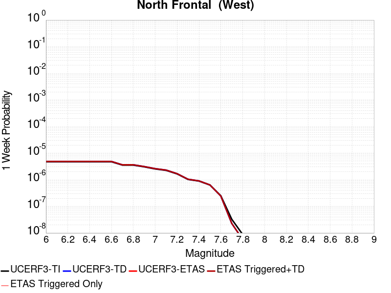 | 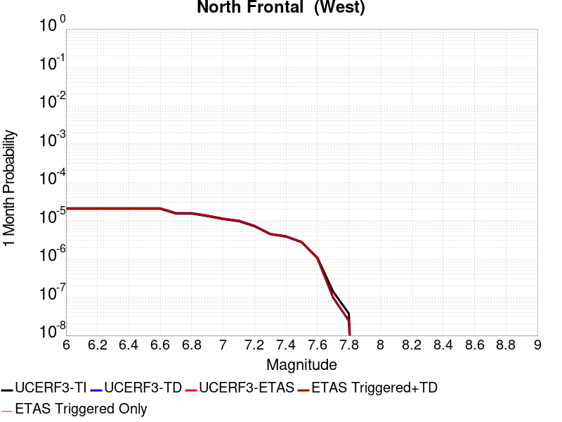 | 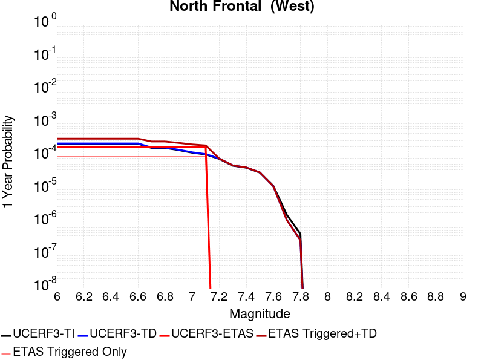 |  |

| Magnitude | 1 wk TI Prob | 1 wk TD Prob | 1 wk ETAS Prob | 1 wk ETAS/TD Gain | 1 wk ETAS Triggered+TD | 1 wk ETAS Triggered Only | 1 mo TI Prob | 1 mo TD Prob | 1 mo ETAS Prob | 1 mo ETAS/TD Gain | 1 mo ETAS Triggered+TD | 1 mo ETAS Triggered Only | 1 yr TI Prob | 1 yr TD Prob | 1 yr ETAS Prob | 1 yr ETAS/TD Gain | 1 yr ETAS Triggered+TD | 1 yr ETAS Triggered Only | 10 yr TI Prob | 10 yr TD Prob | 10 yr ETAS Prob | 10 yr ETAS/TD Gain | 10 yr ETAS Triggered+TD | 10 yr ETAS Triggered Only |
|-----|-----|-----|-----|-----|-----|-----|-----|-----|-----|-----|-----|-----|-----|-----|-----|-----|-----|-----|-----|-----|-----|-----|-----|-----|
| 6.0 | 4.7316266E-6 | 4.852954E-6 | 0.0 | 0.0 | 4.852954E-6 | 0.0 | 2.0278241E-5 | 2.0798218E-5 | 0.0 | 0.0 | 2.0798218E-5 | 0.0 | 2.4685962E-4 | 2.5319034E-4 | 2.0E-4 | 0.78991956 | 3.5316503E-4 | 1.0E-4 | 0.0024658558 | 0.002529165 | 0.0018 | 0.71169734 | 0.0029281534 | 4.0E-4 |
| 6.1 | 4.7316266E-6 | 4.852954E-6 | 0.0 | 0.0 | 4.852954E-6 | 0.0 | 2.0278241E-5 | 2.0798218E-5 | 0.0 | 0.0 | 2.0798218E-5 | 0.0 | 2.4685962E-4 | 2.5319034E-4 | 2.0E-4 | 0.78991956 | 3.5316503E-4 | 1.0E-4 | 0.0024658558 | 0.002529165 | 0.0018 | 0.71169734 | 0.0029281534 | 4.0E-4 |
| 6.2 | 4.7316266E-6 | 4.852954E-6 | 0.0 | 0.0 | 4.852954E-6 | 0.0 | 2.0278241E-5 | 2.0798218E-5 | 0.0 | 0.0 | 2.0798218E-5 | 0.0 | 2.4685962E-4 | 2.5319034E-4 | 2.0E-4 | 0.78991956 | 3.5316503E-4 | 1.0E-4 | 0.0024658558 | 0.002529165 | 0.0018 | 0.71169734 | 0.0029281534 | 4.0E-4 |
| 6.3 | 4.7316266E-6 | 4.852954E-6 | 0.0 | 0.0 | 4.852954E-6 | 0.0 | 2.0278241E-5 | 2.0798218E-5 | 0.0 | 0.0 | 2.0798218E-5 | 0.0 | 2.4685962E-4 | 2.5319034E-4 | 2.0E-4 | 0.78991956 | 3.5316503E-4 | 1.0E-4 | 0.0024658558 | 0.002529165 | 0.0018 | 0.71169734 | 0.0029281534 | 4.0E-4 |
| 6.4 | 4.7316266E-6 | 4.852954E-6 | 0.0 | 0.0 | 4.852954E-6 | 0.0 | 2.0278241E-5 | 2.0798218E-5 | 0.0 | 0.0 | 2.0798218E-5 | 0.0 | 2.4685962E-4 | 2.5319034E-4 | 2.0E-4 | 0.78991956 | 3.5316503E-4 | 1.0E-4 | 0.0024658558 | 0.002529165 | 0.0018 | 0.71169734 | 0.0029281534 | 4.0E-4 |
| 6.5 | 4.7316266E-6 | 4.852954E-6 | 0.0 | 0.0 | 4.852954E-6 | 0.0 | 2.0278241E-5 | 2.0798218E-5 | 0.0 | 0.0 | 2.0798218E-5 | 0.0 | 2.4685962E-4 | 2.5319034E-4 | 2.0E-4 | 0.78991956 | 3.5316503E-4 | 1.0E-4 | 0.0024658558 | 0.002529165 | 0.0018 | 0.71169734 | 0.0029281534 | 4.0E-4 |
| 6.6 | 4.7316266E-6 | 4.852954E-6 | 0.0 | 0.0 | 4.852954E-6 | 0.0 | 2.0278241E-5 | 2.0798218E-5 | 0.0 | 0.0 | 2.0798218E-5 | 0.0 | 2.4685962E-4 | 2.5319034E-4 | 2.0E-4 | 0.78991956 | 3.5316503E-4 | 1.0E-4 | 0.0024658558 | 0.002529165 | 0.0018 | 0.71169734 | 0.0029281534 | 4.0E-4 |
| 6.7 | 3.5382777E-6 | 3.6311096E-6 | 0.0 | 0.0 | 3.6311096E-6 | 0.0 | 1.516396E-5 | 1.556181E-5 | 0.0 | 0.0 | 1.556181E-5 | 0.0 | 1.8460557E-4 | 1.8944935E-4 | 2.0E-4 | 1.0556911 | 2.894304E-4 | 1.0E-4 | 0.0018445229 | 0.0018929554 | 0.0014 | 0.73958427 | 0.0021923876 | 3.0E-4 |
| 6.8 | 3.5382777E-6 | 3.6311096E-6 | 0.0 | 0.0 | 3.6311096E-6 | 0.0 | 1.516396E-5 | 1.556181E-5 | 0.0 | 0.0 | 1.556181E-5 | 0.0 | 1.8460557E-4 | 1.8944935E-4 | 2.0E-4 | 1.0556911 | 2.894304E-4 | 1.0E-4 | 0.0018445229 | 0.0018929554 | 0.0014 | 0.73958427 | 0.0021923876 | 3.0E-4 |
| 6.9 | 3.0428037E-6 | 3.1229586E-6 | 0.0 | 0.0 | 3.1229586E-6 | 0.0 | 1.30405215E-5 | 1.3384043E-5 | 0.0 | 0.0 | 1.3384043E-5 | 0.0 | 1.5875678E-4 | 1.6293922E-4 | 2.0E-4 | 1.2274516 | 2.6292293E-4 | 1.0E-4 | 0.0015864341 | 0.0016282647 | 0.0011 | 0.67556584 | 0.0019277763 | 3.0E-4 |
| 7.0 | 2.538778E-6 | 2.6062626E-6 | 0.0 | 0.0 | 2.6062626E-6 | 0.0 | 1.0880432E-5 | 1.1169652E-5 | 0.0 | 0.0 | 1.1169652E-5 | 0.0 | 1.324612E-4 | 1.359825E-4 | 2.0E-4 | 1.4707775 | 2.359689E-4 | 1.0E-4 | 0.0013238228 | 0.0013590397 | 0.001 | 0.7358137 | 0.001658632 | 3.0E-4 |
| 7.1 | 2.2418935E-6 | 2.3013633E-6 | 0.0 | 0.0 | 2.3013633E-6 | 0.0 | 9.60808E-6 | 9.862951E-6 | 0.0 | 0.0 | 9.862951E-6 | 0.0 | 1.1697209E-4 | 1.2007525E-4 | 2.0E-4 | 1.6656221 | 2.2006324E-4 | 1.0E-4 | 0.0011691054 | 0.0012001477 | 9.0E-4 | 0.7499077 | 0.0013999076 | 2.0E-4 |
| 7.2 | 1.6526745E-6 | 1.6926011E-6 | 0.0 | 0.0 | 1.6926011E-6 | 0.0 | 7.082872E-6 | 7.253986E-6 | 0.0 | 0.0 | 7.253986E-6 | 0.0 | 8.623055E-5 | 8.831396E-5 | 0.0 | 0.0 | 8.831396E-5 | 0.0 | 8.61971E-4 | 8.8281365E-4 | 4.0E-4 | 0.45309675 | 8.8281365E-4 | 0.0 |
| 7.3 | 1.0246019E-6 | 1.0443008E-6 | 0.0 | 0.0 | 1.0443008E-6 | 0.0 | 4.391144E-6 | 4.4755675E-6 | 0.0 | 0.0 | 4.4755675E-6 | 0.0 | 5.3460866E-5 | 5.448879E-5 | 0.0 | 0.0 | 5.448879E-5 | 0.0 | 5.344801E-4 | 5.447658E-4 | 4.0E-4 | 0.7342605 | 5.447658E-4 | 0.0 |
| 7.4 | 8.9045164E-7 | 9.057215E-7 | 0.0 | 0.0 | 9.057215E-7 | 0.0 | 3.8162157E-6 | 3.8816584E-6 | 0.0 | 0.0 | 3.8816584E-6 | 0.0 | 4.646144E-5 | 4.7258276E-5 | 0.0 | 0.0 | 4.7258276E-5 | 0.0 | 4.6451724E-4 | 4.7249315E-4 | 3.0E-4 | 0.63492984 | 4.7249315E-4 | 0.0 |
| 7.5 | 6.3357E-7 | 6.4031826E-7 | 0.0 | 0.0 | 6.4031826E-7 | 0.0 | 2.7152971E-6 | 2.7442186E-6 | 0.0 | 0.0 | 2.7442186E-6 | 0.0 | 3.305824E-5 | 3.3410415E-5 | 0.0 | 0.0 | 3.3410415E-5 | 0.0 | 3.3053322E-4 | 3.3406052E-4 | 3.0E-4 | 0.8980409 | 3.3406052E-4 | 0.0 |
| 7.6 | 2.5087024E-7 | 2.436305E-7 | 0.0 | 0.0 | 2.436305E-7 | 0.0 | 1.0751578E-6 | 1.0441304E-6 | 0.0 | 0.0 | 1.0441304E-6 | 0.0 | 1.3089967E-5 | 1.2712235E-5 | 0.0 | 0.0 | 1.2712235E-5 | 0.0 | 1.3089196E-4 | 1.2711713E-4 | 0.0 | 0.0 | 1.2711713E-4 | 0.0 |
| 7.7 | 3.282987E-8 | 2.2877046E-8 | 0.0 | 0.0 | 2.2877046E-8 | 0.0 | 1.4069944E-7 | 9.804448E-8 | 0.0 | 0.0 | 9.804448E-8 | 0.0 | 1.7130144E-6 | 1.193691E-6 | 0.0 | 0.0 | 1.193691E-6 | 0.0 | 1.7130013E-5 | 1.1936854E-5 | 0.0 | 0.0 | 1.1936854E-5 | 0.0 |
| 7.8 | 8.77499E-9 | 5.6826157E-9 | 0.0 | 0.0 | 5.6826157E-9 | 0.0 | 3.7607098E-8 | 2.4354067E-8 | 0.0 | 0.0 | 2.4354067E-8 | 0.0 | 4.578663E-7 | 2.9651073E-7 | 0.0 | 0.0 | 2.9651073E-7 | 0.0 | 4.5786537E-6 | 2.9651048E-6 | 0.0 | 0.0 | 2.9651048E-6 | 0.0 |

## Ozena
*[(top)](#table-of-contents)*

| 1 Week | 1 Month | 1 Year | 10 Year |
|-----|-----|-----|-----|
| 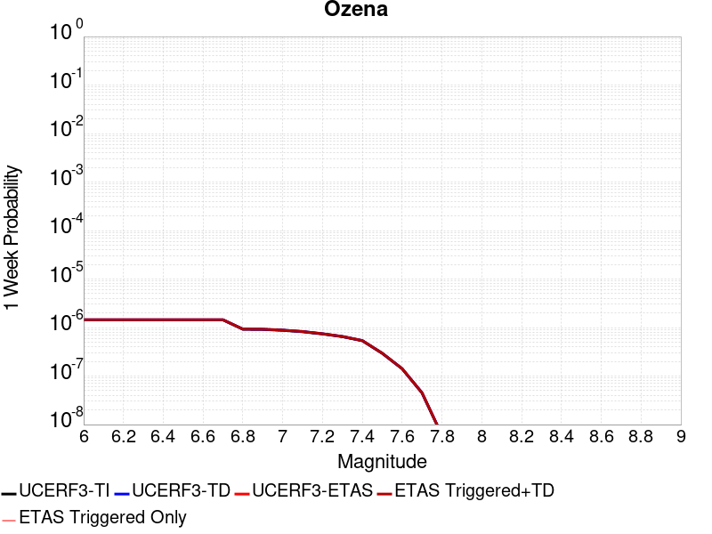 | 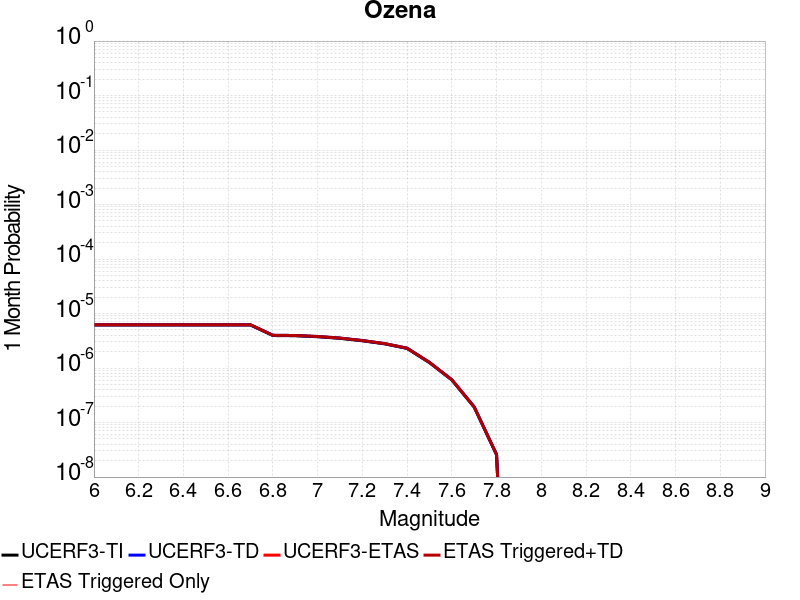 | 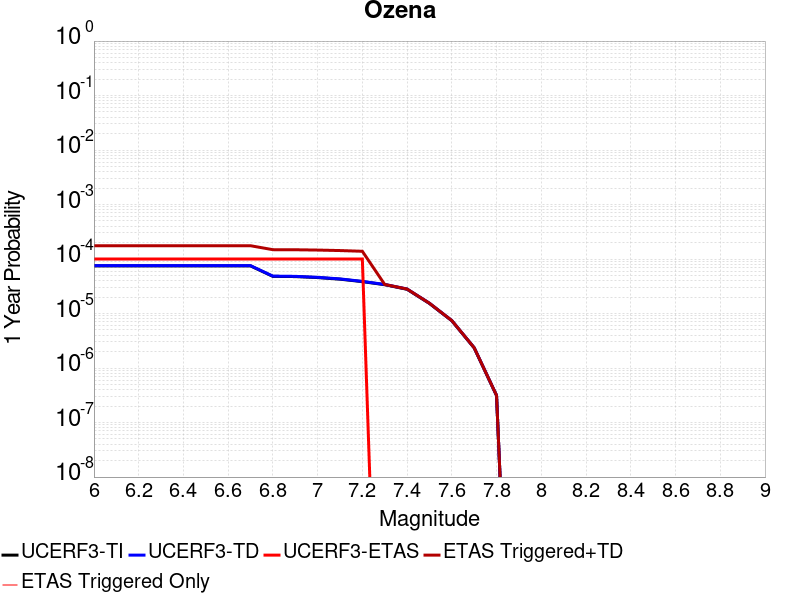 | 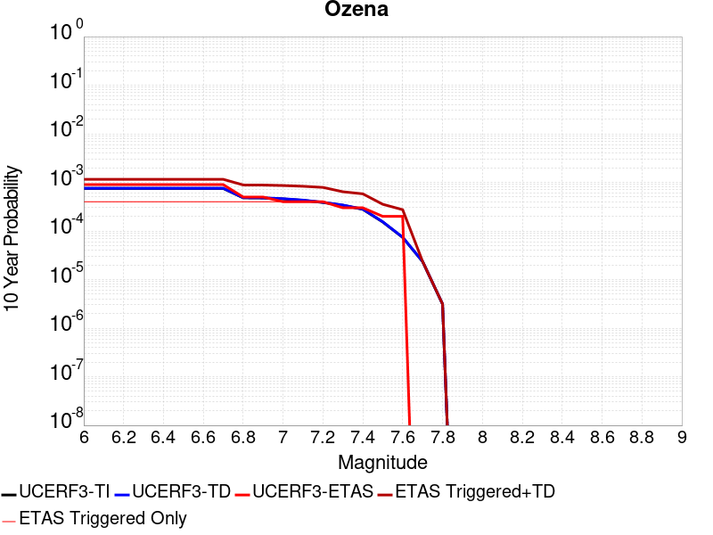 |

| Magnitude | 1 wk TI Prob | 1 wk TD Prob | 1 wk ETAS Prob | 1 wk ETAS/TD Gain | 1 wk ETAS Triggered+TD | 1 wk ETAS Triggered Only | 1 mo TI Prob | 1 mo TD Prob | 1 mo ETAS Prob | 1 mo ETAS/TD Gain | 1 mo ETAS Triggered+TD | 1 mo ETAS Triggered Only | 1 yr TI Prob | 1 yr TD Prob | 1 yr ETAS Prob | 1 yr ETAS/TD Gain | 1 yr ETAS Triggered+TD | 1 yr ETAS Triggered Only | 10 yr TI Prob | 10 yr TD Prob | 10 yr ETAS Prob | 10 yr ETAS/TD Gain | 10 yr ETAS Triggered+TD | 10 yr ETAS Triggered Only |
|-----|-----|-----|-----|-----|-----|-----|-----|-----|-----|-----|-----|-----|-----|-----|-----|-----|-----|-----|-----|-----|-----|-----|-----|-----|
| 6.0 | 1.4377547E-6 | 1.4514056E-6 | 0.0 | 0.0 | 1.4514056E-6 | 0.0 | 6.161791E-6 | 6.220296E-6 | 0.0 | 0.0 | 6.220296E-6 | 0.0 | 7.5017226E-5 | 7.5729746E-5 | 1.0E-4 | 1.3204851 | 1.7572218E-4 | 1.0E-4 | 7.4991904E-4 | 7.57066E-4 | 9.0E-4 | 1.1887999 | 0.0011567632 | 4.0E-4 |
| 6.1 | 1.4377547E-6 | 1.4514056E-6 | 0.0 | 0.0 | 1.4514056E-6 | 0.0 | 6.161791E-6 | 6.220296E-6 | 0.0 | 0.0 | 6.220296E-6 | 0.0 | 7.5017226E-5 | 7.5729746E-5 | 1.0E-4 | 1.3204851 | 1.7572218E-4 | 1.0E-4 | 7.4991904E-4 | 7.57066E-4 | 9.0E-4 | 1.1887999 | 0.0011567632 | 4.0E-4 |
| 6.2 | 1.4377547E-6 | 1.4514056E-6 | 0.0 | 0.0 | 1.4514056E-6 | 0.0 | 6.161791E-6 | 6.220296E-6 | 0.0 | 0.0 | 6.220296E-6 | 0.0 | 7.5017226E-5 | 7.5729746E-5 | 1.0E-4 | 1.3204851 | 1.7572218E-4 | 1.0E-4 | 7.4991904E-4 | 7.57066E-4 | 9.0E-4 | 1.1887999 | 0.0011567632 | 4.0E-4 |
| 6.3 | 1.4377547E-6 | 1.4514056E-6 | 0.0 | 0.0 | 1.4514056E-6 | 0.0 | 6.161791E-6 | 6.220296E-6 | 0.0 | 0.0 | 6.220296E-6 | 0.0 | 7.5017226E-5 | 7.5729746E-5 | 1.0E-4 | 1.3204851 | 1.7572218E-4 | 1.0E-4 | 7.4991904E-4 | 7.57066E-4 | 9.0E-4 | 1.1887999 | 0.0011567632 | 4.0E-4 |
| 6.4 | 1.4377547E-6 | 1.4514056E-6 | 0.0 | 0.0 | 1.4514056E-6 | 0.0 | 6.161791E-6 | 6.220296E-6 | 0.0 | 0.0 | 6.220296E-6 | 0.0 | 7.5017226E-5 | 7.5729746E-5 | 1.0E-4 | 1.3204851 | 1.7572218E-4 | 1.0E-4 | 7.4991904E-4 | 7.57066E-4 | 9.0E-4 | 1.1887999 | 0.0011567632 | 4.0E-4 |
| 6.5 | 1.4377547E-6 | 1.4514056E-6 | 0.0 | 0.0 | 1.4514056E-6 | 0.0 | 6.161791E-6 | 6.220296E-6 | 0.0 | 0.0 | 6.220296E-6 | 0.0 | 7.5017226E-5 | 7.5729746E-5 | 1.0E-4 | 1.3204851 | 1.7572218E-4 | 1.0E-4 | 7.4991904E-4 | 7.57066E-4 | 9.0E-4 | 1.1887999 | 0.0011567632 | 4.0E-4 |
| 6.6 | 1.4377547E-6 | 1.4514056E-6 | 0.0 | 0.0 | 1.4514056E-6 | 0.0 | 6.161791E-6 | 6.220296E-6 | 0.0 | 0.0 | 6.220296E-6 | 0.0 | 7.5017226E-5 | 7.5729746E-5 | 1.0E-4 | 1.3204851 | 1.7572218E-4 | 1.0E-4 | 7.4991904E-4 | 7.57066E-4 | 9.0E-4 | 1.1887999 | 0.0011567632 | 4.0E-4 |
| 6.7 | 1.4377547E-6 | 1.4514056E-6 | 0.0 | 0.0 | 1.4514056E-6 | 0.0 | 6.161791E-6 | 6.220296E-6 | 0.0 | 0.0 | 6.220296E-6 | 0.0 | 7.5017226E-5 | 7.5729746E-5 | 1.0E-4 | 1.3204851 | 1.7572218E-4 | 1.0E-4 | 7.4991904E-4 | 7.57066E-4 | 9.0E-4 | 1.1887999 | 0.0011567632 | 4.0E-4 |
| 6.8 | 9.223257E-7 | 9.3178124E-7 | 0.0 | 0.0 | 9.3178124E-7 | 0.0 | 3.9528186E-6 | 3.9933425E-6 | 0.0 | 0.0 | 3.9933425E-6 | 0.0 | 4.81245E-5 | 4.86179E-5 | 1.0E-4 | 2.0568557 | 1.4861303E-4 | 1.0E-4 | 4.811408E-4 | 4.8607666E-4 | 5.0E-4 | 1.0286443 | 8.8588224E-4 | 4.0E-4 |
| 6.9 | 9.141515E-7 | 9.235559E-7 | 0.0 | 0.0 | 9.235559E-7 | 0.0 | 3.917786E-6 | 3.958091E-6 | 0.0 | 0.0 | 3.958091E-6 | 0.0 | 4.7698002E-5 | 4.8188733E-5 | 1.0E-4 | 2.0751739 | 1.4818391E-4 | 1.0E-4 | 4.7687767E-4 | 4.8178685E-4 | 5.0E-4 | 1.0378033 | 8.8159414E-4 | 4.0E-4 |
| 7.0 | 8.767648E-7 | 8.858759E-7 | 0.0 | 0.0 | 8.858759E-7 | 0.0 | 3.757558E-6 | 3.7966058E-6 | 0.0 | 0.0 | 3.7966058E-6 | 0.0 | 4.5747307E-5 | 4.6222736E-5 | 1.0E-4 | 2.1634376 | 1.4621811E-4 | 1.0E-4 | 4.5737892E-4 | 4.6213515E-4 | 4.0E-4 | 0.86554766 | 8.619503E-4 | 4.0E-4 |
| 7.1 | 8.199402E-7 | 8.285571E-7 | 0.0 | 0.0 | 8.285571E-7 | 0.0 | 3.5140247E-6 | 3.5509545E-6 | 0.0 | 0.0 | 3.5509545E-6 | 0.0 | 4.2782412E-5 | 4.323205E-5 | 1.0E-4 | 2.3130987 | 1.4322772E-4 | 1.0E-4 | 4.2774176E-4 | 4.322401E-4 | 4.0E-4 | 0.9254116 | 8.320672E-4 | 4.0E-4 |
| 7.2 | 7.38705E-7 | 7.4644174E-7 | 0.0 | 0.0 | 7.4644174E-7 | 0.0 | 3.1658747E-6 | 3.1990323E-6 | 0.0 | 0.0 | 3.1990323E-6 | 0.0 | 3.8543843E-5 | 3.8947557E-5 | 1.0E-4 | 2.5675552 | 1.3894367E-4 | 1.0E-4 | 3.853716E-4 | 3.8941082E-4 | 4.0E-4 | 1.0271928 | 7.892551E-4 | 4.0E-4 |
| 7.3 | 6.490017E-7 | 6.5579377E-7 | 0.0 | 0.0 | 6.5579377E-7 | 0.0 | 2.7814328E-6 | 2.810542E-6 | 0.0 | 0.0 | 2.810542E-6 | 0.0 | 3.386342E-5 | 3.4217843E-5 | 0.0 | 0.0 | 3.4217843E-5 | 0.0 | 3.3858258E-4 | 3.4212912E-4 | 3.0E-4 | 0.87686193 | 6.420265E-4 | 3.0E-4 |
| 7.4 | 5.346736E-7 | 5.402372E-7 | 0.0 | 0.0 | 5.402372E-7 | 0.0 | 2.291456E-6 | 2.3153004E-6 | 0.0 | 0.0 | 2.3153004E-6 | 0.0 | 2.789812E-5 | 2.818845E-5 | 0.0 | 0.0 | 2.818845E-5 | 0.0 | 2.789462E-4 | 2.8185177E-4 | 3.0E-4 | 1.0643892 | 5.8176724E-4 | 3.0E-4 |
| 7.5 | 2.939325E-7 | 2.9666603E-7 | 0.0 | 0.0 | 2.9666603E-7 | 0.0 | 1.25971E-6 | 1.2714254E-6 | 0.0 | 0.0 | 1.2714254E-6 | 0.0 | 1.5336862E-5 | 1.547951E-5 | 0.0 | 0.0 | 1.547951E-5 | 0.0 | 1.5335804E-4 | 1.5478594E-4 | 2.0E-4 | 1.2921071 | 3.5475497E-4 | 2.0E-4 |
| 7.6 | 1.4151905E-7 | 1.4253467E-7 | 0.0 | 0.0 | 1.4253467E-7 | 0.0 | 6.065101E-7 | 6.1086274E-7 | 0.0 | 0.0 | 6.1086274E-7 | 0.0 | 7.3842357E-6 | 7.4372297E-6 | 0.0 | 0.0 | 7.4372297E-6 | 0.0 | 7.38399E-5 | 7.4369884E-5 | 2.0E-4 | 2.6892607 | 2.74355E-4 | 2.0E-4 |
| 7.7 | 4.4957577E-8 | 4.5252833E-8 | 0.0 | 0.0 | 4.5252833E-8 | 0.0 | 1.9267533E-7 | 1.9394069E-7 | 0.0 | 0.0 | 1.9394069E-7 | 0.0 | 2.3458194E-6 | 2.3612254E-6 | 0.0 | 0.0 | 2.3612254E-6 | 0.0 | 2.3457947E-5 | 2.3612012E-5 | 0.0 | 0.0 | 2.3612012E-5 | 0.0 |
| 7.8 | 5.9993255E-9 | 6.0413807E-9 | 0.0 | 0.0 | 6.0413807E-9 | 0.0 | 2.5711394E-8 | 2.5891634E-8 | 0.0 | 0.0 | 2.5891634E-8 | 0.0 | 3.1303617E-7 | 3.152306E-7 | 0.0 | 0.0 | 3.152306E-7 | 0.0 | 3.1303573E-6 | 3.1523025E-6 | 0.0 | 0.0 | 3.1523025E-6 | 0.0 |

## Baker
*[(top)](#table-of-contents)*

| 1 Week | 1 Month | 1 Year | 10 Year |
|-----|-----|-----|-----|
| 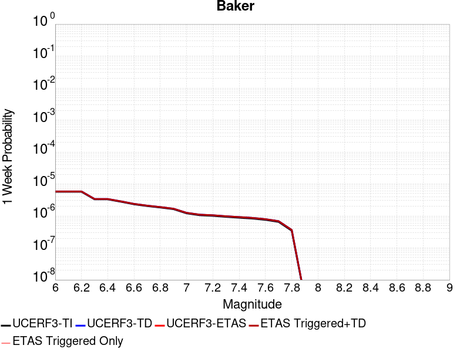 |  | 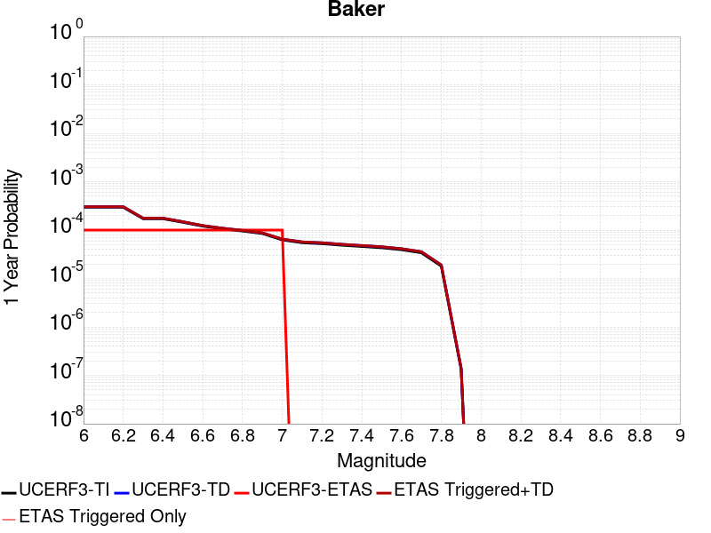 | 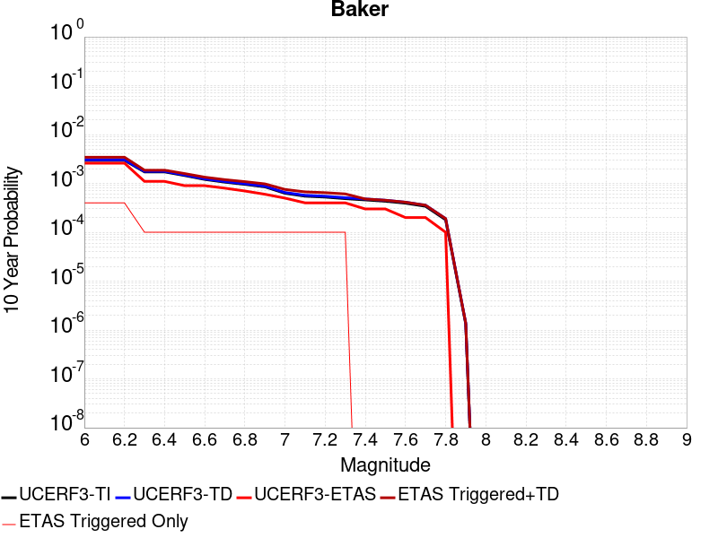 |

| Magnitude | 1 wk TI Prob | 1 wk TD Prob | 1 wk ETAS Prob | 1 wk ETAS/TD Gain | 1 wk ETAS Triggered+TD | 1 wk ETAS Triggered Only | 1 mo TI Prob | 1 mo TD Prob | 1 mo ETAS Prob | 1 mo ETAS/TD Gain | 1 mo ETAS Triggered+TD | 1 mo ETAS Triggered Only | 1 yr TI Prob | 1 yr TD Prob | 1 yr ETAS Prob | 1 yr ETAS/TD Gain | 1 yr ETAS Triggered+TD | 1 yr ETAS Triggered Only | 10 yr TI Prob | 10 yr TD Prob | 10 yr ETAS Prob | 10 yr ETAS/TD Gain | 10 yr ETAS Triggered+TD | 10 yr ETAS Triggered Only |
|-----|-----|-----|-----|-----|-----|-----|-----|-----|-----|-----|-----|-----|-----|-----|-----|-----|-----|-----|-----|-----|-----|-----|-----|-----|
| 6.0 | 5.695525E-6 | 5.835122E-6 | 0.0 | 0.0 | 5.835122E-6 | 0.0 | 2.4409164E-5 | 2.5007448E-5 | 0.0 | 0.0 | 2.5007448E-5 | 0.0 | 2.9714106E-4 | 3.0442714E-4 | 1.0E-4 | 0.32848582 | 3.0442714E-4 | 0.0 | 0.0029674405 | 0.003040497 | 0.0026 | 0.8551234 | 0.0034392807 | 4.0E-4 |
| 6.1 | 5.695525E-6 | 5.835122E-6 | 0.0 | 0.0 | 5.835122E-6 | 0.0 | 2.4409164E-5 | 2.5007448E-5 | 0.0 | 0.0 | 2.5007448E-5 | 0.0 | 2.9714106E-4 | 3.0442714E-4 | 1.0E-4 | 0.32848582 | 3.0442714E-4 | 0.0 | 0.0029674405 | 0.003040497 | 0.0026 | 0.8551234 | 0.0034392807 | 4.0E-4 |
| 6.2 | 5.695525E-6 | 5.835122E-6 | 0.0 | 0.0 | 5.835122E-6 | 0.0 | 2.4409164E-5 | 2.5007448E-5 | 0.0 | 0.0 | 2.5007448E-5 | 0.0 | 2.9714106E-4 | 3.0442714E-4 | 1.0E-4 | 0.32848582 | 3.0442714E-4 | 0.0 | 0.0029674405 | 0.003040497 | 0.0026 | 0.8551234 | 0.0034392807 | 4.0E-4 |
| 6.3 | 3.2995713E-6 | 3.3838396E-6 | 0.0 | 0.0 | 3.3838396E-6 | 0.0 | 1.4140943E-5 | 1.4502092E-5 | 0.0 | 0.0 | 1.4502092E-5 | 0.0 | 1.7215237E-4 | 1.7654913E-4 | 1.0E-4 | 0.56641454 | 1.7654913E-4 | 0.0 | 0.0017201907 | 0.0017641359 | 0.0011 | 0.62353474 | 0.0018639595 | 1.0E-4 |
| 6.4 | 3.2995713E-6 | 3.3838396E-6 | 0.0 | 0.0 | 3.3838396E-6 | 0.0 | 1.4140943E-5 | 1.4502092E-5 | 0.0 | 0.0 | 1.4502092E-5 | 0.0 | 1.7215237E-4 | 1.7654913E-4 | 1.0E-4 | 0.56641454 | 1.7654913E-4 | 0.0 | 0.0017201907 | 0.0017641359 | 0.0011 | 0.62353474 | 0.0018639595 | 1.0E-4 |
| 6.5 | 2.782202E-6 | 2.8559919E-6 | 0.0 | 0.0 | 2.8559919E-6 | 0.0 | 1.1923668E-5 | 1.223991E-5 | 0.0 | 0.0 | 1.223991E-5 | 0.0 | 1.4516099E-4 | 1.4901103E-4 | 1.0E-4 | 0.67109126 | 1.4901103E-4 | 0.0 | 0.001450662 | 0.0014891439 | 9.0E-4 | 0.60437405 | 0.001588995 | 1.0E-4 |
| 6.6 | 2.3163404E-6 | 2.381053E-6 | 0.0 | 0.0 | 2.381053E-6 | 0.0 | 9.927136E-6 | 1.0204474E-5 | 0.0 | 0.0 | 1.0204474E-5 | 0.0 | 1.20856166E-4 | 1.242326E-4 | 1.0E-4 | 0.8049417 | 1.242326E-4 | 0.0 | 0.0012079047 | 0.0012416517 | 9.0E-4 | 0.724841 | 0.0013415274 | 1.0E-4 |
| 6.7 | 2.037056E-6 | 2.0966231E-6 | 0.0 | 0.0 | 2.0966231E-6 | 0.0 | 8.7302105E-6 | 8.9854975E-6 | 0.0 | 0.0 | 8.9854975E-6 | 0.0 | 1.0628513E-4 | 1.09393106E-4 | 1.0E-4 | 0.9141344 | 1.09393106E-4 | 0.0 | 0.0010623431 | 0.0010934087 | 8.0E-4 | 0.7316569 | 0.0011932993 | 1.0E-4 |
| 6.8 | 1.8356744E-6 | 1.8916442E-6 | 0.0 | 0.0 | 1.8916442E-6 | 0.0 | 7.867153E-6 | 8.107022E-6 | 0.0 | 0.0 | 8.107022E-6 | 0.0 | 9.577837E-5 | 9.869866E-5 | 1.0E-4 | 1.013185 | 9.869866E-5 | 0.0 | 9.57371E-4 | 9.865622E-4 | 7.0E-4 | 0.7095346 | 0.0010864636 | 1.0E-4 |
| 6.9 | 1.6310546E-6 | 1.6833152E-6 | 0.0 | 0.0 | 1.6833152E-6 | 0.0 | 6.9902153E-6 | 7.2141884E-6 | 0.0 | 0.0 | 7.2141884E-6 | 0.0 | 8.510255E-5 | 8.782932E-5 | 1.0E-4 | 1.138572 | 8.782932E-5 | 0.0 | 8.5069967E-4 | 8.779573E-4 | 6.0E-4 | 0.6834045 | 9.778695E-4 | 1.0E-4 |
| 7.0 | 1.2058036E-6 | 1.2509602E-6 | 0.0 | 0.0 | 1.2509602E-6 | 0.0 | 5.1677193E-6 | 5.361247E-6 | 0.0 | 0.0 | 5.361247E-6 | 0.0 | 6.291517E-5 | 6.5271255E-5 | 1.0E-4 | 1.532068 | 6.5271255E-5 | 0.0 | 6.289736E-4 | 6.5252313E-4 | 5.0E-4 | 0.76625633 | 7.524579E-4 | 1.0E-4 |
| 7.1 | 1.052382E-6 | 1.0952499E-6 | 0.0 | 0.0 | 1.0952499E-6 | 0.0 | 4.5102006E-6 | 4.69392E-6 | 0.0 | 0.0 | 4.69392E-6 | 0.0 | 5.491031E-5 | 5.7146983E-5 | 0.0 | 0.0 | 5.7146983E-5 | 0.0 | 5.4896745E-4 | 5.713238E-4 | 4.0E-4 | 0.70012844 | 6.7126664E-4 | 1.0E-4 |
| 7.2 | 1.0067454E-6 | 1.0488586E-6 | 0.0 | 0.0 | 1.0488586E-6 | 0.0 | 4.3146156E-6 | 4.4951007E-6 | 0.0 | 0.0 | 4.4951007E-6 | 0.0 | 5.252918E-5 | 5.4726483E-5 | 0.0 | 0.0 | 5.4726483E-5 | 0.0 | 5.251676E-4 | 5.4713094E-4 | 4.0E-4 | 0.73108643 | 6.4707623E-4 | 1.0E-4 |
| 7.3 | 9.3596316E-7 | 9.768575E-7 | 0.0 | 0.0 | 9.768575E-7 | 0.0 | 4.0112645E-6 | 4.186525E-6 | 0.0 | 0.0 | 4.186525E-6 | 0.0 | 4.8836053E-5 | 5.096976E-5 | 0.0 | 0.0 | 5.096976E-5 | 0.0 | 4.8825322E-4 | 5.0958147E-4 | 4.0E-4 | 0.7849579 | 6.095305E-4 | 1.0E-4 |
| 7.4 | 8.8117395E-7 | 9.2084895E-7 | 0.0 | 0.0 | 9.2084895E-7 | 0.0 | 3.7764542E-6 | 3.9464894E-6 | 0.0 | 0.0 | 3.9464894E-6 | 0.0 | 4.5977362E-5 | 4.804746E-5 | 0.0 | 0.0 | 4.804746E-5 | 0.0 | 4.596785E-4 | 4.8037147E-4 | 3.0E-4 | 0.6245167 | 4.8037147E-4 | 0.0 |
| 7.5 | 8.292386E-7 | 8.6753937E-7 | 0.0 | 0.0 | 8.6753937E-7 | 0.0 | 3.5538749E-6 | 3.7180205E-6 | 0.0 | 0.0 | 3.7180205E-6 | 0.0 | 4.326757E-5 | 4.5265966E-5 | 0.0 | 0.0 | 4.5265966E-5 | 0.0 | 4.3259145E-4 | 4.525682E-4 | 3.0E-4 | 0.6628835 | 4.525682E-4 | 0.0 |
| 7.6 | 7.553842E-7 | 7.9152244E-7 | 0.0 | 0.0 | 7.9152244E-7 | 0.0 | 3.2373566E-6 | 3.3922347E-6 | 0.0 | 0.0 | 3.3922347E-6 | 0.0 | 3.9414106E-5 | 4.129968E-5 | 0.0 | 0.0 | 4.129968E-5 | 0.0 | 3.9407116E-4 | 4.1292075E-4 | 2.0E-4 | 0.48435444 | 4.1292075E-4 | 0.0 |
| 7.7 | 6.5285366E-7 | 6.853476E-7 | 0.0 | 0.0 | 6.853476E-7 | 0.0 | 2.797941E-6 | 2.9372006E-6 | 0.0 | 0.0 | 2.9372006E-6 | 0.0 | 3.40644E-5 | 3.5759836E-5 | 0.0 | 0.0 | 3.5759836E-5 | 0.0 | 3.405918E-4 | 3.575415E-4 | 2.0E-4 | 0.55937564 | 3.575415E-4 | 0.0 |
| 7.8 | 3.4586725E-7 | 3.64866E-7 | 0.0 | 0.0 | 3.64866E-7 | 0.0 | 1.4822873E-6 | 1.5637105E-6 | 0.0 | 0.0 | 1.5637105E-6 | 0.0 | 1.80467E-5 | 1.9038014E-5 | 0.0 | 0.0 | 1.9038014E-5 | 0.0 | 1.8045233E-4 | 1.9036427E-4 | 1.0E-4 | 0.52530867 | 1.9036427E-4 | 0.0 |
| 7.9 | 2.5591178E-9 | 2.6699005E-9 | 0.0 | 0.0 | 2.6699005E-9 | 0.0 | 1.0967647E-8 | 1.1442431E-8 | 0.0 | 0.0 | 1.1442431E-8 | 0.0 | 1.335311E-7 | 1.393116E-7 | 0.0 | 0.0 | 1.393116E-7 | 0.0 | 1.3353102E-6 | 1.3931159E-6 | 0.0 | 0.0 | 1.3931159E-6 | 0.0 |

## Camp Rock 2011
*[(top)](#table-of-contents)*

| 1 Week | 1 Month | 1 Year | 10 Year |
|-----|-----|-----|-----|
| 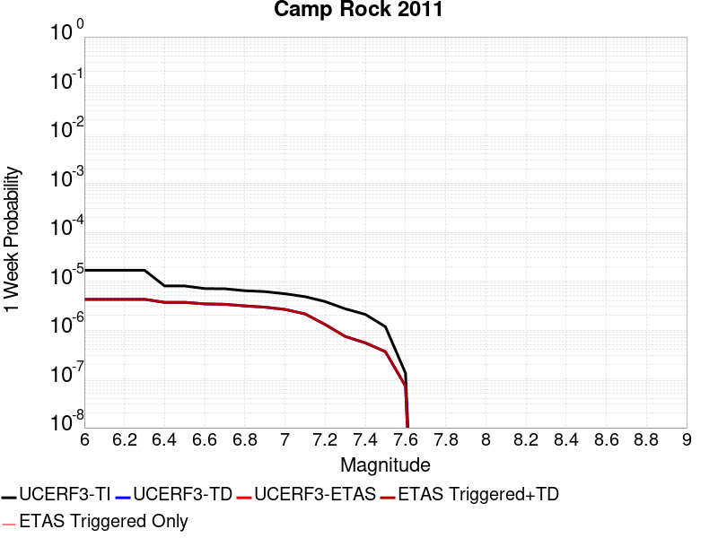 | 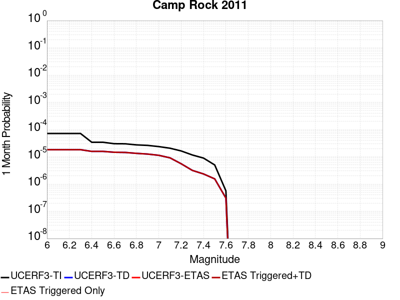 | 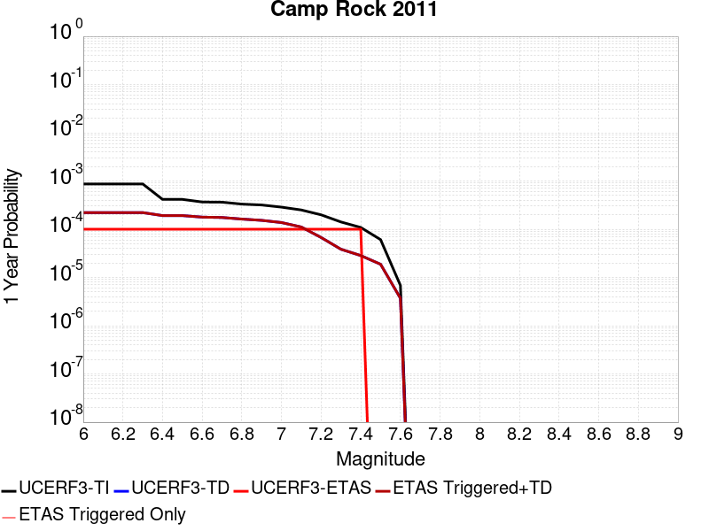 | 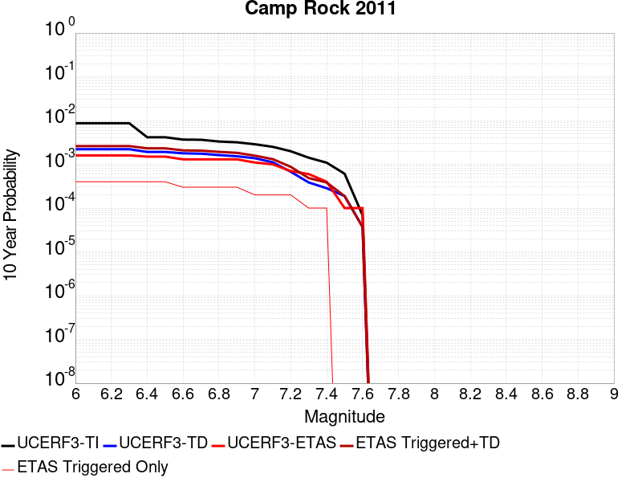 |

| Magnitude | 1 wk TI Prob | 1 wk TD Prob | 1 wk ETAS Prob | 1 wk ETAS/TD Gain | 1 wk ETAS Triggered+TD | 1 wk ETAS Triggered Only | 1 mo TI Prob | 1 mo TD Prob | 1 mo ETAS Prob | 1 mo ETAS/TD Gain | 1 mo ETAS Triggered+TD | 1 mo ETAS Triggered Only | 1 yr TI Prob | 1 yr TD Prob | 1 yr ETAS Prob | 1 yr ETAS/TD Gain | 1 yr ETAS Triggered+TD | 1 yr ETAS Triggered Only | 10 yr TI Prob | 10 yr TD Prob | 10 yr ETAS Prob | 10 yr ETAS/TD Gain | 10 yr ETAS Triggered+TD | 10 yr ETAS Triggered Only |
|-----|-----|-----|-----|-----|-----|-----|-----|-----|-----|-----|-----|-----|-----|-----|-----|-----|-----|-----|-----|-----|-----|-----|-----|-----|
| 6.0 | 1.6710783E-5 | 4.2506013E-6 | 0.0 | 0.0 | 4.2506013E-6 | 0.0 | 7.161568E-5 | 1.8216737E-5 | 0.0 | 0.0 | 1.8216737E-5 | 0.0 | 8.7157206E-4 | 2.2176674E-4 | 1.0E-4 | 0.45092428 | 2.2176674E-4 | 0.0 | 0.008681616 | 0.0022155072 | 0.0016 | 0.7221823 | 0.0026146208 | 4.0E-4 |
| 6.1 | 1.6710783E-5 | 4.2506013E-6 | 0.0 | 0.0 | 4.2506013E-6 | 0.0 | 7.161568E-5 | 1.8216737E-5 | 0.0 | 0.0 | 1.8216737E-5 | 0.0 | 8.7157206E-4 | 2.2176674E-4 | 1.0E-4 | 0.45092428 | 2.2176674E-4 | 0.0 | 0.008681616 | 0.0022155072 | 0.0016 | 0.7221823 | 0.0026146208 | 4.0E-4 |
| 6.2 | 1.6710783E-5 | 4.2506013E-6 | 0.0 | 0.0 | 4.2506013E-6 | 0.0 | 7.161568E-5 | 1.8216737E-5 | 0.0 | 0.0 | 1.8216737E-5 | 0.0 | 8.7157206E-4 | 2.2176674E-4 | 1.0E-4 | 0.45092428 | 2.2176674E-4 | 0.0 | 0.008681616 | 0.0022155072 | 0.0016 | 0.7221823 | 0.0026146208 | 4.0E-4 |
| 6.3 | 1.6710783E-5 | 4.2506013E-6 | 0.0 | 0.0 | 4.2506013E-6 | 0.0 | 7.161568E-5 | 1.8216737E-5 | 0.0 | 0.0 | 1.8216737E-5 | 0.0 | 8.7157206E-4 | 2.2176674E-4 | 1.0E-4 | 0.45092428 | 2.2176674E-4 | 0.0 | 0.008681616 | 0.0022155072 | 0.0016 | 0.7221823 | 0.0026146208 | 4.0E-4 |
| 6.4 | 7.982846E-6 | 3.6826048E-6 | 0.0 | 0.0 | 3.6826048E-6 | 0.0 | 3.421175E-5 | 1.5782498E-5 | 0.0 | 0.0 | 1.5782498E-5 | 0.0 | 4.1644843E-4 | 1.9213533E-4 | 1.0E-4 | 0.5204665 | 1.9213533E-4 | 0.0 | 0.0041566887 | 0.0019197268 | 0.0015 | 0.78136116 | 0.002318959 | 4.0E-4 |
| 6.5 | 7.982846E-6 | 3.6826048E-6 | 0.0 | 0.0 | 3.6826048E-6 | 0.0 | 3.421175E-5 | 1.5782498E-5 | 0.0 | 0.0 | 1.5782498E-5 | 0.0 | 4.1644843E-4 | 1.9213533E-4 | 1.0E-4 | 0.5204665 | 1.9213533E-4 | 0.0 | 0.0041566887 | 0.0019197268 | 0.0015 | 0.78136116 | 0.002318959 | 4.0E-4 |
| 6.6 | 7.048869E-6 | 3.4248444E-6 | 0.0 | 0.0 | 3.4248444E-6 | 0.0 | 3.0209088E-5 | 1.4677824E-5 | 0.0 | 0.0 | 1.4677824E-5 | 0.0 | 3.677336E-4 | 1.7868816E-4 | 1.0E-4 | 0.55963415 | 1.7868816E-4 | 0.0 | 0.0036712566 | 0.0017854766 | 0.0013 | 0.7280969 | 0.002084941 | 3.0E-4 |
| 6.7 | 6.987307E-6 | 3.3628148E-6 | 0.0 | 0.0 | 3.3628148E-6 | 0.0 | 2.9945259E-5 | 1.4411986E-5 | 0.0 | 0.0 | 1.4411986E-5 | 0.0 | 3.6452254E-4 | 1.754521E-4 | 1.0E-4 | 0.5699561 | 1.754521E-4 | 0.0 | 0.0036392517 | 0.001753167 | 0.0013 | 0.7415152 | 0.002052641 | 3.0E-4 |
| 6.8 | 6.3737602E-6 | 3.1183913E-6 | 0.0 | 0.0 | 3.1183913E-6 | 0.0 | 2.731583E-5 | 1.3364467E-5 | 0.0 | 0.0 | 1.3364467E-5 | 0.0 | 3.3251947E-4 | 1.6270053E-4 | 1.0E-4 | 0.61462617 | 1.6270053E-4 | 0.0 | 0.0033202237 | 0.0016258426 | 0.0013 | 0.79958534 | 0.0019253549 | 3.0E-4 |
| 6.9 | 6.112211E-6 | 2.9335852E-6 | 0.0 | 0.0 | 2.9335852E-6 | 0.0 | 2.6194928E-5 | 1.2572449E-5 | 0.0 | 0.0 | 1.2572449E-5 | 0.0 | 3.1887658E-4 | 1.530591E-4 | 1.0E-4 | 0.6533424 | 1.530591E-4 | 0.0 | 0.003184194 | 0.0015295645 | 0.0013 | 0.8499151 | 0.0018291057 | 3.0E-4 |
| 7.0 | 5.5140117E-6 | 2.6423984E-6 | 0.0 | 0.0 | 2.6423984E-6 | 0.0 | 2.3631264E-5 | 1.1324517E-5 | 0.0 | 0.0 | 1.1324517E-5 | 0.0 | 2.8767265E-4 | 1.3786752E-4 | 1.0E-4 | 0.725334 | 1.3786752E-4 | 0.0 | 0.0028730053 | 0.0013778452 | 0.0011 | 0.798348 | 0.0015775696 | 2.0E-4 |
| 7.1 | 4.8151105E-6 | 2.1346702E-6 | 0.0 | 0.0 | 2.1346702E-6 | 0.0 | 2.0636026E-5 | 9.148556E-6 | 0.0 | 0.0 | 9.148556E-6 | 0.0 | 2.5121463E-4 | 1.113782E-4 | 1.0E-4 | 0.89784175 | 1.113782E-4 | 0.0 | 0.0025093083 | 0.0011132457 | 0.001 | 0.8982743 | 0.001313023 | 2.0E-4 |
| 7.2 | 3.818335E-6 | 1.2940342E-6 | 0.0 | 0.0 | 1.2940342E-6 | 0.0 | 1.6364189E-5 | 5.545849E-6 | 0.0 | 0.0 | 5.545849E-6 | 0.0 | 1.9921579E-4 | 6.7518704E-5 | 1.0E-4 | 1.481071 | 6.7518704E-5 | 0.0 | 0.0019903728 | 6.749902E-4 | 7.0E-4 | 1.0370522 | 8.7485515E-4 | 2.0E-4 |
| 7.3 | 2.7166698E-6 | 7.3854227E-7 | 0.0 | 0.0 | 7.3854227E-7 | 0.0 | 1.1642818E-5 | 3.1651773E-6 | 0.0 | 0.0 | 3.1651773E-6 | 0.0 | 1.4174209E-4 | 3.8535374E-5 | 1.0E-4 | 2.5950184 | 3.8535374E-5 | 0.0 | 0.0014165172 | 3.852889E-4 | 6.0E-4 | 1.5572729 | 4.8525038E-4 | 1.0E-4 |
| 7.4 | 2.0893426E-6 | 5.463303E-7 | 0.0 | 0.0 | 5.463303E-7 | 0.0 | 8.954295E-6 | 2.3414134E-6 | 0.0 | 0.0 | 2.3414134E-6 | 0.0 | 1.0901308E-4 | 2.850634E-5 | 1.0E-4 | 3.5079916 | 2.850634E-5 | 0.0 | 0.0010895962 | 2.8502737E-4 | 4.0E-4 | 1.403374 | 3.849989E-4 | 1.0E-4 |
| 7.5 | 1.1681728E-6 | 3.6039168E-7 | 0.0 | 0.0 | 3.6039168E-7 | 0.0 | 5.0064455E-6 | 1.5445349E-6 | 0.0 | 0.0 | 1.5445349E-6 | 0.0 | 6.0951766E-5 | 1.8804556E-5 | 0.0 | 0.0 | 1.8804556E-5 | 0.0 | 6.093505E-4 | 1.8803011E-4 | 1.0E-4 | 0.5318297 | 1.8803011E-4 | 0.0 |
| 7.6 | 1.3154387E-7 | 7.120964E-8 | 0.0 | 0.0 | 7.120964E-8 | 0.0 | 5.6375933E-7 | 3.0518413E-7 | 0.0 | 0.0 | 3.0518413E-7 | 0.0 | 6.863748E-6 | 3.7156121E-6 | 0.0 | 0.0 | 3.7156121E-6 | 0.0 | 6.863536E-5 | 3.715566E-5 | 1.0E-4 | 2.69138 | 3.715566E-5 | 0.0 |

## Sisar
*[(top)](#table-of-contents)*

| 1 Week | 1 Month | 1 Year | 10 Year |
|-----|-----|-----|-----|
| 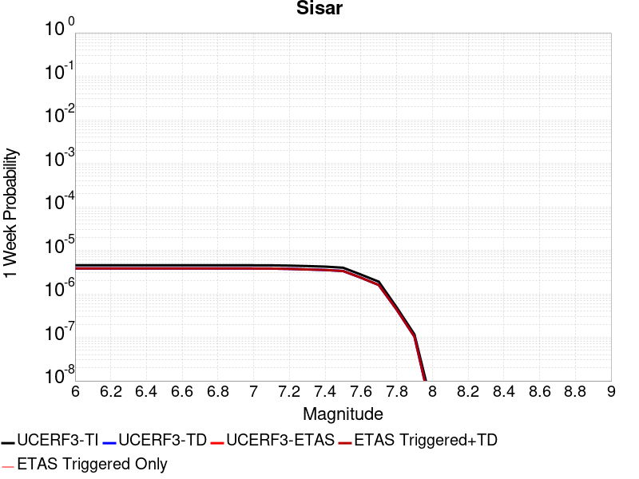 | 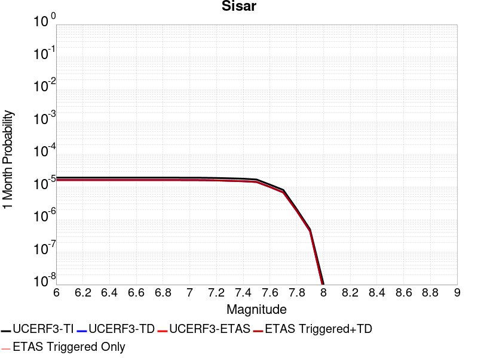 | 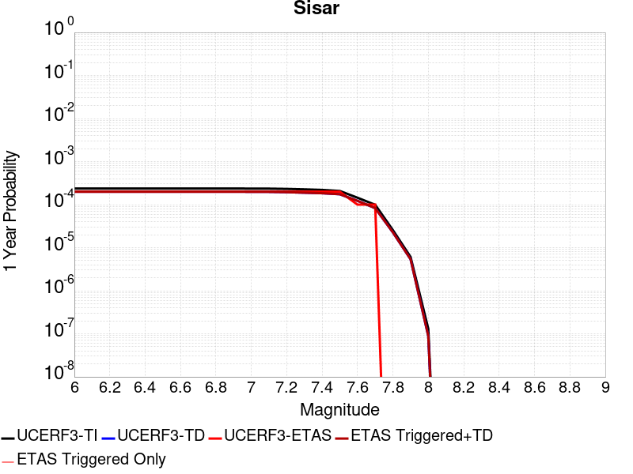 | 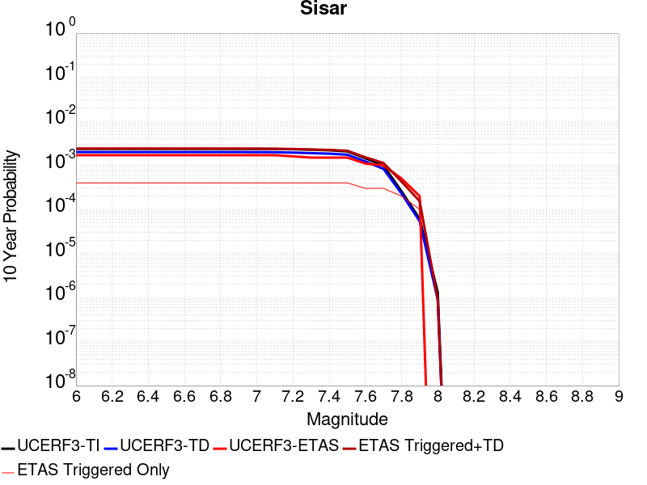 |

| Magnitude | 1 wk TI Prob | 1 wk TD Prob | 1 wk ETAS Prob | 1 wk ETAS/TD Gain | 1 wk ETAS Triggered+TD | 1 wk ETAS Triggered Only | 1 mo TI Prob | 1 mo TD Prob | 1 mo ETAS Prob | 1 mo ETAS/TD Gain | 1 mo ETAS Triggered+TD | 1 mo ETAS Triggered Only | 1 yr TI Prob | 1 yr TD Prob | 1 yr ETAS Prob | 1 yr ETAS/TD Gain | 1 yr ETAS Triggered+TD | 1 yr ETAS Triggered Only | 10 yr TI Prob | 10 yr TD Prob | 10 yr ETAS Prob | 10 yr ETAS/TD Gain | 10 yr ETAS Triggered+TD | 10 yr ETAS Triggered Only |
|-----|-----|-----|-----|-----|-----|-----|-----|-----|-----|-----|-----|-----|-----|-----|-----|-----|-----|-----|-----|-----|-----|-----|-----|-----|
| 6.0 | 4.544193E-6 | 3.840268E-6 | 0.0 | 0.0 | 3.840268E-6 | 0.0 | 1.9474966E-5 | 1.645819E-5 | 0.0 | 0.0 | 1.645819E-5 | 0.0 | 2.3708193E-4 | 2.0036037E-4 | 2.0E-4 | 0.9982014 | 2.0036037E-4 | 0.0 | 0.0023682916 | 0.002001831 | 0.0017 | 0.8492225 | 0.0024010304 | 4.0E-4 |
| 6.1 | 4.544193E-6 | 3.840268E-6 | 0.0 | 0.0 | 3.840268E-6 | 0.0 | 1.9474966E-5 | 1.645819E-5 | 0.0 | 0.0 | 1.645819E-5 | 0.0 | 2.3708193E-4 | 2.0036037E-4 | 2.0E-4 | 0.9982014 | 2.0036037E-4 | 0.0 | 0.0023682916 | 0.002001831 | 0.0017 | 0.8492225 | 0.0024010304 | 4.0E-4 |
| 6.2 | 4.544193E-6 | 3.840268E-6 | 0.0 | 0.0 | 3.840268E-6 | 0.0 | 1.9474966E-5 | 1.645819E-5 | 0.0 | 0.0 | 1.645819E-5 | 0.0 | 2.3708193E-4 | 2.0036037E-4 | 2.0E-4 | 0.9982014 | 2.0036037E-4 | 0.0 | 0.0023682916 | 0.002001831 | 0.0017 | 0.8492225 | 0.0024010304 | 4.0E-4 |
| 6.3 | 4.544193E-6 | 3.840268E-6 | 0.0 | 0.0 | 3.840268E-6 | 0.0 | 1.9474966E-5 | 1.645819E-5 | 0.0 | 0.0 | 1.645819E-5 | 0.0 | 2.3708193E-4 | 2.0036037E-4 | 2.0E-4 | 0.9982014 | 2.0036037E-4 | 0.0 | 0.0023682916 | 0.002001831 | 0.0017 | 0.8492225 | 0.0024010304 | 4.0E-4 |
| 6.4 | 4.544193E-6 | 3.840268E-6 | 0.0 | 0.0 | 3.840268E-6 | 0.0 | 1.9474966E-5 | 1.645819E-5 | 0.0 | 0.0 | 1.645819E-5 | 0.0 | 2.3708193E-4 | 2.0036037E-4 | 2.0E-4 | 0.9982014 | 2.0036037E-4 | 0.0 | 0.0023682916 | 0.002001831 | 0.0017 | 0.8492225 | 0.0024010304 | 4.0E-4 |
| 6.5 | 4.544193E-6 | 3.840268E-6 | 0.0 | 0.0 | 3.840268E-6 | 0.0 | 1.9474966E-5 | 1.645819E-5 | 0.0 | 0.0 | 1.645819E-5 | 0.0 | 2.3708193E-4 | 2.0036037E-4 | 2.0E-4 | 0.9982014 | 2.0036037E-4 | 0.0 | 0.0023682916 | 0.002001831 | 0.0017 | 0.8492225 | 0.0024010304 | 4.0E-4 |
| 6.6 | 4.544193E-6 | 3.840268E-6 | 0.0 | 0.0 | 3.840268E-6 | 0.0 | 1.9474966E-5 | 1.645819E-5 | 0.0 | 0.0 | 1.645819E-5 | 0.0 | 2.3708193E-4 | 2.0036037E-4 | 2.0E-4 | 0.9982014 | 2.0036037E-4 | 0.0 | 0.0023682916 | 0.002001831 | 0.0017 | 0.8492225 | 0.0024010304 | 4.0E-4 |
| 6.7 | 4.544193E-6 | 3.840268E-6 | 0.0 | 0.0 | 3.840268E-6 | 0.0 | 1.9474966E-5 | 1.645819E-5 | 0.0 | 0.0 | 1.645819E-5 | 0.0 | 2.3708193E-4 | 2.0036037E-4 | 2.0E-4 | 0.9982014 | 2.0036037E-4 | 0.0 | 0.0023682916 | 0.002001831 | 0.0017 | 0.8492225 | 0.0024010304 | 4.0E-4 |
| 6.8 | 4.544193E-6 | 3.840268E-6 | 0.0 | 0.0 | 3.840268E-6 | 0.0 | 1.9474966E-5 | 1.645819E-5 | 0.0 | 0.0 | 1.645819E-5 | 0.0 | 2.3708193E-4 | 2.0036037E-4 | 2.0E-4 | 0.9982014 | 2.0036037E-4 | 0.0 | 0.0023682916 | 0.002001831 | 0.0017 | 0.8492225 | 0.0024010304 | 4.0E-4 |
| 6.9 | 4.542225E-6 | 3.83823E-6 | 0.0 | 0.0 | 3.83823E-6 | 0.0 | 1.9466532E-5 | 1.6449454E-5 | 0.0 | 0.0 | 1.6449454E-5 | 0.0 | 2.3697925E-4 | 2.0025404E-4 | 2.0E-4 | 0.9987314 | 2.0025404E-4 | 0.0 | 0.002367267 | 0.0020007696 | 0.0017 | 0.84967303 | 0.0023999694 | 4.0E-4 |
| 7.0 | 4.5278484E-6 | 3.823293E-6 | 0.0 | 0.0 | 3.823293E-6 | 0.0 | 1.940492E-5 | 1.638544E-5 | 0.0 | 0.0 | 1.638544E-5 | 0.0 | 2.3622929E-4 | 1.994748E-4 | 2.0E-4 | 1.0026329 | 1.994748E-4 | 0.0 | 0.0023597833 | 0.0019929912 | 0.0017 | 0.8529892 | 0.002392194 | 4.0E-4 |
| 7.1 | 4.5132488E-6 | 3.808079E-6 | 0.0 | 0.0 | 3.808079E-6 | 0.0 | 1.9342351E-5 | 1.6320239E-5 | 0.0 | 0.0 | 1.6320239E-5 | 0.0 | 2.3546767E-4 | 1.9868113E-4 | 2.0E-4 | 1.0066382 | 1.9868113E-4 | 0.0 | 0.0023521832 | 0.0019850687 | 0.0017 | 0.8563936 | 0.0023842747 | 4.0E-4 |
| 7.2 | 4.448859E-6 | 3.740533E-6 | 0.0 | 0.0 | 3.740533E-6 | 0.0 | 1.9066398E-5 | 1.6030759E-5 | 0.0 | 0.0 | 1.6030759E-5 | 0.0 | 2.3210866E-4 | 1.9515734E-4 | 2.0E-4 | 1.0248141 | 1.9515734E-4 | 0.0 | 0.0023186638 | 0.0019498932 | 0.0016 | 0.8205578 | 0.0023491133 | 4.0E-4 |
| 7.3 | 4.3424366E-6 | 3.634355E-6 | 0.0 | 0.0 | 3.634355E-6 | 0.0 | 1.861031E-5 | 1.5575715E-5 | 0.0 | 0.0 | 1.5575715E-5 | 0.0 | 2.2655698E-4 | 1.8961816E-4 | 2.0E-4 | 1.0547513 | 1.8961816E-4 | 0.0 | 0.0022632615 | 0.0018945972 | 0.0015 | 0.791725 | 0.0022938394 | 4.0E-4 |
| 7.4 | 4.218641E-6 | 3.5336882E-6 | 0.0 | 0.0 | 3.5336882E-6 | 0.0 | 1.8079765E-5 | 1.5144292E-5 | 0.0 | 0.0 | 1.5144292E-5 | 0.0 | 2.2009891E-4 | 1.8436648E-4 | 2.0E-4 | 1.0847958 | 1.8436648E-4 | 0.0 | 0.0021988105 | 0.0018421686 | 0.0015 | 0.8142577 | 0.0022414317 | 4.0E-4 |
| 7.5 | 3.983779E-6 | 3.3484228E-6 | 0.0 | 0.0 | 3.3484228E-6 | 0.0 | 1.7073227E-5 | 1.4350307E-5 | 0.0 | 0.0 | 1.4350307E-5 | 0.0 | 2.0784672E-4 | 1.747013E-4 | 2.0E-4 | 1.1448112 | 1.747013E-4 | 0.0 | 0.0020765243 | 0.0017456727 | 0.0015 | 0.8592676 | 0.0021449744 | 4.0E-4 |
| 7.6 | 2.777393E-6 | 2.3526097E-6 | 0.0 | 0.0 | 2.3526097E-6 | 0.0 | 1.1903058E-5 | 1.0082575E-5 | 0.0 | 0.0 | 1.0082575E-5 | 0.0 | 1.449101E-4 | 1.227485E-4 | 1.0E-4 | 0.81467384 | 1.227485E-4 | 0.0 | 0.0014481564 | 0.0012268148 | 0.0011 | 0.8966308 | 0.0015264468 | 3.0E-4 |
| 7.7 | 1.9028433E-6 | 1.5941025E-6 | 0.0 | 0.0 | 1.5941025E-6 | 0.0 | 8.155017E-6 | 6.83185E-6 | 0.0 | 0.0 | 6.83185E-6 | 0.0 | 9.928281E-5 | 8.317465E-5 | 1.0E-4 | 1.2022895 | 8.317465E-5 | 0.0 | 9.923846E-4 | 8.314399E-4 | 0.001 | 1.2027327 | 0.0011311905 | 3.0E-4 |
| 7.8 | 4.9095956E-7 | 4.3588582E-7 | 0.0 | 0.0 | 4.3588582E-7 | 0.0 | 2.1041105E-6 | 1.8680807E-6 | 0.0 | 0.0 | 1.8680807E-6 | 0.0 | 2.5617246E-5 | 2.2743647E-5 | 0.0 | 0.0 | 2.2743647E-5 | 0.0 | 2.5614293E-4 | 2.2741337E-4 | 5.0E-4 | 2.1986394 | 4.273679E-4 | 2.0E-4 |
| 7.9 | 1.16657894E-7 | 1.0336934E-7 | 0.0 | 0.0 | 1.0336934E-7 | 0.0 | 4.999623E-7 | 4.4301137E-7 | 0.0 | 0.0 | 4.4301137E-7 | 0.0 | 6.087024E-6 | 5.3936506E-6 | 0.0 | 0.0 | 5.3936506E-6 | 0.0 | 6.0868573E-5 | 5.3935226E-5 | 2.0E-4 | 3.7081518 | 1.5392982E-4 | 1.0E-4 |
| 8.0 | 2.5100346E-9 | 1.707498E-9 | 0.0 | 0.0 | 1.707498E-9 | 0.0 | 1.0757291E-8 | 7.317849E-9 | 0.0 | 0.0 | 7.317849E-9 | 0.0 | 1.3097001E-7 | 8.9094804E-8 | 0.0 | 0.0 | 8.9094804E-8 | 0.0 | 1.3096993E-6 | 8.909478E-7 | 0.0 | 0.0 | 8.909478E-7 | 0.0 |

## Tin Mountain
*[(top)](#table-of-contents)*

| 1 Week | 1 Month | 1 Year | 10 Year |
|-----|-----|-----|-----|
|  |  |  |  |

| Magnitude | 1 wk TI Prob | 1 wk TD Prob | 1 wk ETAS Prob | 1 wk ETAS/TD Gain | 1 wk ETAS Triggered+TD | 1 wk ETAS Triggered Only | 1 mo TI Prob | 1 mo TD Prob | 1 mo ETAS Prob | 1 mo ETAS/TD Gain | 1 mo ETAS Triggered+TD | 1 mo ETAS Triggered Only | 1 yr TI Prob | 1 yr TD Prob | 1 yr ETAS Prob | 1 yr ETAS/TD Gain | 1 yr ETAS Triggered+TD | 1 yr ETAS Triggered Only | 10 yr TI Prob | 10 yr TD Prob | 10 yr ETAS Prob | 10 yr ETAS/TD Gain | 10 yr ETAS Triggered+TD | 10 yr ETAS Triggered Only |
|-----|-----|-----|-----|-----|-----|-----|-----|-----|-----|-----|-----|-----|-----|-----|-----|-----|-----|-----|-----|-----|-----|-----|-----|-----|
| 6.0 | 4.083776E-6 | 4.1817357E-6 | 0.0 | 0.0 | 4.1817357E-6 | 0.0 | 1.750178E-5 | 1.7921622E-5 | 0.0 | 0.0 | 1.7921622E-5 | 0.0 | 2.1306332E-4 | 2.1817764E-4 | 2.0E-4 | 0.91668427 | 3.1815583E-4 | 1.0E-4 | 0.0021285915 | 0.00218 | 0.0016 | 0.73394495 | 0.0025791281 | 4.0E-4 |
| 6.1 | 4.083776E-6 | 4.1817357E-6 | 0.0 | 0.0 | 4.1817357E-6 | 0.0 | 1.750178E-5 | 1.7921622E-5 | 0.0 | 0.0 | 1.7921622E-5 | 0.0 | 2.1306332E-4 | 2.1817764E-4 | 2.0E-4 | 0.91668427 | 3.1815583E-4 | 1.0E-4 | 0.0021285915 | 0.00218 | 0.0016 | 0.73394495 | 0.0025791281 | 4.0E-4 |
| 6.2 | 4.083776E-6 | 4.1817357E-6 | 0.0 | 0.0 | 4.1817357E-6 | 0.0 | 1.750178E-5 | 1.7921622E-5 | 0.0 | 0.0 | 1.7921622E-5 | 0.0 | 2.1306332E-4 | 2.1817764E-4 | 2.0E-4 | 0.91668427 | 3.1815583E-4 | 1.0E-4 | 0.0021285915 | 0.00218 | 0.0016 | 0.73394495 | 0.0025791281 | 4.0E-4 |
| 6.3 | 4.083776E-6 | 4.1817357E-6 | 0.0 | 0.0 | 4.1817357E-6 | 0.0 | 1.750178E-5 | 1.7921622E-5 | 0.0 | 0.0 | 1.7921622E-5 | 0.0 | 2.1306332E-4 | 2.1817764E-4 | 2.0E-4 | 0.91668427 | 3.1815583E-4 | 1.0E-4 | 0.0021285915 | 0.00218 | 0.0016 | 0.73394495 | 0.0025791281 | 4.0E-4 |
| 6.4 | 4.083776E-6 | 4.1817357E-6 | 0.0 | 0.0 | 4.1817357E-6 | 0.0 | 1.750178E-5 | 1.7921622E-5 | 0.0 | 0.0 | 1.7921622E-5 | 0.0 | 2.1306332E-4 | 2.1817764E-4 | 2.0E-4 | 0.91668427 | 3.1815583E-4 | 1.0E-4 | 0.0021285915 | 0.00218 | 0.0016 | 0.73394495 | 0.0025791281 | 4.0E-4 |
| 6.5 | 2.3143427E-6 | 2.3732773E-6 | 0.0 | 0.0 | 2.3732773E-6 | 0.0 | 9.9185745E-6 | 1.0171153E-5 | 0.0 | 0.0 | 1.0171153E-5 | 0.0 | 1.2075195E-4 | 1.2382753E-4 | 0.0 | 0.0 | 1.2382753E-4 | 0.0 | 0.0012068636 | 0.0012376612 | 7.0E-4 | 0.5655829 | 0.0013375375 | 1.0E-4 |
| 6.6 | 2.3143427E-6 | 2.3732773E-6 | 0.0 | 0.0 | 2.3732773E-6 | 0.0 | 9.9185745E-6 | 1.0171153E-5 | 0.0 | 0.0 | 1.0171153E-5 | 0.0 | 1.2075195E-4 | 1.2382753E-4 | 0.0 | 0.0 | 1.2382753E-4 | 0.0 | 0.0012068636 | 0.0012376612 | 7.0E-4 | 0.5655829 | 0.0013375375 | 1.0E-4 |
| 6.7 | 1.7029532E-6 | 1.7498875E-6 | 0.0 | 0.0 | 1.7498875E-6 | 0.0 | 7.2983503E-6 | 7.499499E-6 | 0.0 | 0.0 | 7.499499E-6 | 0.0 | 8.885379E-5 | 9.130311E-5 | 0.0 | 0.0 | 9.130311E-5 | 0.0 | 8.881827E-4 | 9.1270864E-4 | 6.0E-4 | 0.6573839 | 0.0010126174 | 1.0E-4 |
| 6.8 | 1.2914646E-6 | 1.3300169E-6 | 0.0 | 0.0 | 1.3300169E-6 | 0.0 | 5.534837E-6 | 5.7000625E-6 | 0.0 | 0.0 | 5.7000625E-6 | 0.0 | 6.738455E-5 | 6.939649E-5 | 0.0 | 0.0 | 6.939649E-5 | 0.0 | 6.736412E-4 | 6.9379155E-4 | 5.0E-4 | 0.72067755 | 7.9372217E-4 | 1.0E-4 |
| 6.9 | 5.8708974E-7 | 6.1175035E-7 | 0.0 | 0.0 | 6.1175035E-7 | 0.0 | 2.5160964E-6 | 2.6217847E-6 | 0.0 | 0.0 | 2.6217847E-6 | 0.0 | 3.0633044E-5 | 3.1919804E-5 | 0.0 | 0.0 | 3.1919804E-5 | 0.0 | 3.0628822E-4 | 3.191563E-4 | 1.0E-4 | 0.3133261 | 3.191563E-4 | 0.0 |
| 7.0 | 4.6248786E-7 | 4.8324455E-7 | 0.0 | 0.0 | 4.8324455E-7 | 0.0 | 1.9820893E-6 | 2.0710465E-6 | 0.0 | 0.0 | 2.0710465E-6 | 0.0 | 2.413167E-5 | 2.5214737E-5 | 0.0 | 0.0 | 2.5214737E-5 | 0.0 | 2.412905E-4 | 2.5212247E-4 | 1.0E-4 | 0.39663264 | 2.5212247E-4 | 0.0 |
| 7.1 | 3.804606E-7 | 3.9875266E-7 | 0.0 | 0.0 | 3.9875266E-7 | 0.0 | 1.6305444E-6 | 1.7089391E-6 | 0.0 | 0.0 | 1.7089391E-6 | 0.0 | 1.9851697E-5 | 2.0806168E-5 | 0.0 | 0.0 | 2.0806168E-5 | 0.0 | 1.9849923E-4 | 2.0804557E-4 | 0.0 | 0.0 | 2.0804557E-4 | 0.0 |
| 7.2 | 3.5864858E-7 | 3.762051E-7 | 0.0 | 0.0 | 3.762051E-7 | 0.0 | 1.5370645E-6 | 1.6123067E-6 | 0.0 | 0.0 | 1.6123067E-6 | 0.0 | 1.87136E-5 | 1.9629691E-5 | 0.0 | 0.0 | 1.9629691E-5 | 0.0 | 1.8712023E-4 | 1.9628288E-4 | 0.0 | 0.0 | 1.9628288E-4 | 0.0 |
| 7.3 | 3.342063E-7 | 3.5066893E-7 | 0.0 | 0.0 | 3.5066893E-7 | 0.0 | 1.4323119E-6 | 1.5028661E-6 | 0.0 | 0.0 | 1.5028661E-6 | 0.0 | 1.7438259E-5 | 1.8297274E-5 | 0.0 | 0.0 | 1.8297274E-5 | 0.0 | 1.743689E-4 | 1.8296098E-4 | 0.0 | 0.0 | 1.8296098E-4 | 0.0 |
| 7.4 | 2.971242E-7 | 3.1168844E-7 | 0.0 | 0.0 | 3.1168844E-7 | 0.0 | 1.2733886E-6 | 1.335807E-6 | 0.0 | 0.0 | 1.335807E-6 | 0.0 | 1.5503398E-5 | 1.6263362E-5 | 0.0 | 0.0 | 1.6263362E-5 | 0.0 | 1.5502315E-4 | 1.62625E-4 | 0.0 | 0.0 | 1.62625E-4 | 0.0 |
| 7.5 | 1.4326713E-7 | 1.501395E-7 | 0.0 | 0.0 | 1.501395E-7 | 0.0 | 6.140018E-7 | 6.43455E-7 | 0.0 | 0.0 | 6.43455E-7 | 0.0 | 7.4754466E-6 | 7.8340645E-6 | 0.0 | 0.0 | 7.8340645E-6 | 0.0 | 7.475195E-5 | 7.834064E-5 | 0.0 | 0.0 | 7.834064E-5 | 0.0 |

## Holser alt 1
*[(top)](#table-of-contents)*

| 1 Week | 1 Month | 1 Year | 10 Year |
|-----|-----|-----|-----|
| 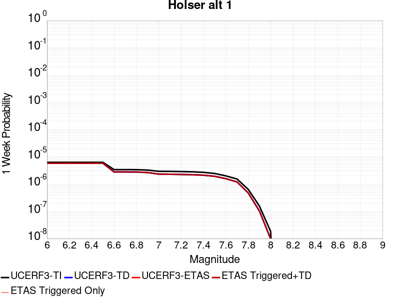 |  | 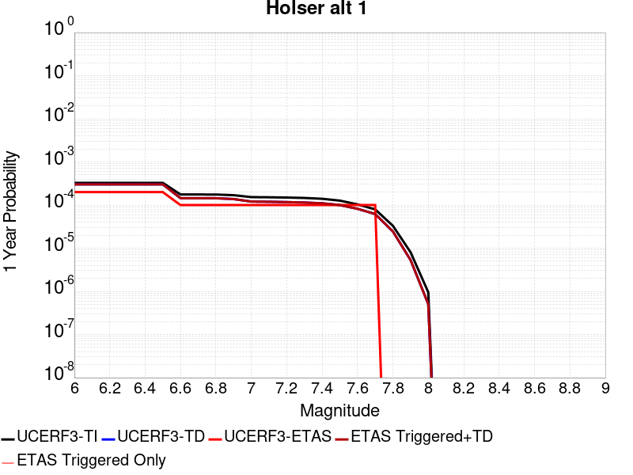 | 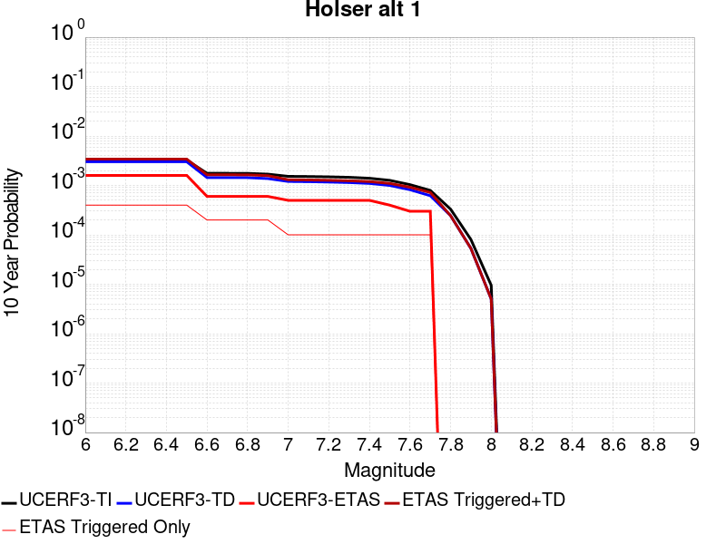 |

| Magnitude | 1 wk TI Prob | 1 wk TD Prob | 1 wk ETAS Prob | 1 wk ETAS/TD Gain | 1 wk ETAS Triggered+TD | 1 wk ETAS Triggered Only | 1 mo TI Prob | 1 mo TD Prob | 1 mo ETAS Prob | 1 mo ETAS/TD Gain | 1 mo ETAS Triggered+TD | 1 mo ETAS Triggered Only | 1 yr TI Prob | 1 yr TD Prob | 1 yr ETAS Prob | 1 yr ETAS/TD Gain | 1 yr ETAS Triggered+TD | 1 yr ETAS Triggered Only | 10 yr TI Prob | 10 yr TD Prob | 10 yr ETAS Prob | 10 yr ETAS/TD Gain | 10 yr ETAS Triggered+TD | 10 yr ETAS Triggered Only |
|-----|-----|-----|-----|-----|-----|-----|-----|-----|-----|-----|-----|-----|-----|-----|-----|-----|-----|-----|-----|-----|-----|-----|-----|-----|
| 6.0 | 6.2746653E-6 | 5.79096E-6 | 0.0 | 0.0 | 5.79096E-6 | 0.0 | 2.6891146E-5 | 2.4818228E-5 | 0.0 | 0.0 | 2.4818228E-5 | 0.0 | 3.273505E-4 | 3.0213158E-4 | 2.0E-4 | 0.6619632 | 3.0213158E-4 | 0.0 | 0.0032686873 | 0.0030183413 | 0.0016 | 0.5300925 | 0.0034171338 | 4.0E-4 |
| 6.1 | 6.2746653E-6 | 5.79096E-6 | 0.0 | 0.0 | 5.79096E-6 | 0.0 | 2.6891146E-5 | 2.4818228E-5 | 0.0 | 0.0 | 2.4818228E-5 | 0.0 | 3.273505E-4 | 3.0213158E-4 | 2.0E-4 | 0.6619632 | 3.0213158E-4 | 0.0 | 0.0032686873 | 0.0030183413 | 0.0016 | 0.5300925 | 0.0034171338 | 4.0E-4 |
| 6.2 | 6.2746653E-6 | 5.79096E-6 | 0.0 | 0.0 | 5.79096E-6 | 0.0 | 2.6891146E-5 | 2.4818228E-5 | 0.0 | 0.0 | 2.4818228E-5 | 0.0 | 3.273505E-4 | 3.0213158E-4 | 2.0E-4 | 0.6619632 | 3.0213158E-4 | 0.0 | 0.0032686873 | 0.0030183413 | 0.0016 | 0.5300925 | 0.0034171338 | 4.0E-4 |
| 6.3 | 6.2746653E-6 | 5.79096E-6 | 0.0 | 0.0 | 5.79096E-6 | 0.0 | 2.6891146E-5 | 2.4818228E-5 | 0.0 | 0.0 | 2.4818228E-5 | 0.0 | 3.273505E-4 | 3.0213158E-4 | 2.0E-4 | 0.6619632 | 3.0213158E-4 | 0.0 | 0.0032686873 | 0.0030183413 | 0.0016 | 0.5300925 | 0.0034171338 | 4.0E-4 |
| 6.4 | 6.2746653E-6 | 5.79096E-6 | 0.0 | 0.0 | 5.79096E-6 | 0.0 | 2.6891146E-5 | 2.4818228E-5 | 0.0 | 0.0 | 2.4818228E-5 | 0.0 | 3.273505E-4 | 3.0213158E-4 | 2.0E-4 | 0.6619632 | 3.0213158E-4 | 0.0 | 0.0032686873 | 0.0030183413 | 0.0016 | 0.5300925 | 0.0034171338 | 4.0E-4 |
| 6.5 | 6.2746653E-6 | 5.79096E-6 | 0.0 | 0.0 | 5.79096E-6 | 0.0 | 2.6891146E-5 | 2.4818228E-5 | 0.0 | 0.0 | 2.4818228E-5 | 0.0 | 3.273505E-4 | 3.0213158E-4 | 2.0E-4 | 0.6619632 | 3.0213158E-4 | 0.0 | 0.0032686873 | 0.0030183413 | 0.0016 | 0.5300925 | 0.0034171338 | 4.0E-4 |
| 6.6 | 3.375825E-6 | 2.771937E-6 | 0.0 | 0.0 | 2.771937E-6 | 0.0 | 1.4467741E-5 | 1.1879677E-5 | 0.0 | 0.0 | 1.1879677E-5 | 0.0 | 1.761305E-4 | 1.4462564E-4 | 1.0E-4 | 0.69144034 | 1.4462564E-4 | 0.0 | 0.0017599097 | 0.0014453321 | 6.0E-4 | 0.4151295 | 0.001645043 | 2.0E-4 |
| 6.7 | 3.375825E-6 | 2.771937E-6 | 0.0 | 0.0 | 2.771937E-6 | 0.0 | 1.4467741E-5 | 1.1879677E-5 | 0.0 | 0.0 | 1.1879677E-5 | 0.0 | 1.761305E-4 | 1.4462564E-4 | 1.0E-4 | 0.69144034 | 1.4462564E-4 | 0.0 | 0.0017599097 | 0.0014453321 | 6.0E-4 | 0.4151295 | 0.001645043 | 2.0E-4 |
| 6.8 | 3.366533E-6 | 2.762336E-6 | 0.0 | 0.0 | 2.762336E-6 | 0.0 | 1.4427919E-5 | 1.183853E-5 | 0.0 | 0.0 | 1.183853E-5 | 0.0 | 1.7564575E-4 | 1.4412473E-4 | 1.0E-4 | 0.6938434 | 1.4412473E-4 | 0.0 | 0.0017550698 | 0.0014403296 | 6.0E-4 | 0.41657132 | 0.0016400415 | 2.0E-4 |
| 6.9 | 3.253174E-6 | 2.6445489E-6 | 0.0 | 0.0 | 2.6445489E-6 | 0.0 | 1.39421E-5 | 1.1333733E-5 | 0.0 | 0.0 | 1.1333733E-5 | 0.0 | 1.6973184E-4 | 1.3797962E-4 | 1.0E-4 | 0.72474474 | 1.3797962E-4 | 0.0 | 0.0016960226 | 0.0013789553 | 6.0E-4 | 0.435112 | 0.0015786795 | 2.0E-4 |
| 7.0 | 2.9336593E-6 | 2.3125103E-6 | 0.0 | 0.0 | 2.3125103E-6 | 0.0 | 1.2572766E-5 | 9.910721E-6 | 0.0 | 0.0 | 9.910721E-6 | 0.0 | 1.5306266E-4 | 1.20656376E-4 | 1.0E-4 | 0.82879996 | 1.20656376E-4 | 0.0 | 0.0015295728 | 0.0012059112 | 5.0E-4 | 0.41462424 | 0.0013057906 | 1.0E-4 |
| 7.1 | 2.9087812E-6 | 2.2883594E-6 | 0.0 | 0.0 | 2.2883594E-6 | 0.0 | 1.2466146E-5 | 9.807218E-6 | 0.0 | 0.0 | 9.807218E-6 | 0.0 | 1.5176475E-4 | 1.19396354E-4 | 1.0E-4 | 0.8375465 | 1.19396354E-4 | 0.0 | 0.0015166114 | 0.0011933246 | 5.0E-4 | 0.4189975 | 0.0012932052 | 1.0E-4 |
| 7.2 | 2.8674524E-6 | 2.2482443E-6 | 0.0 | 0.0 | 2.2482443E-6 | 0.0 | 1.2289024E-5 | 9.635297E-6 | 0.0 | 0.0 | 9.635297E-6 | 0.0 | 1.4960859E-4 | 1.1730345E-4 | 1.0E-4 | 0.8524899 | 1.1730345E-4 | 0.0 | 0.0014950791 | 0.0011724177 | 5.0E-4 | 0.42646918 | 0.0012723004 | 1.0E-4 |
| 7.3 | 2.8057775E-6 | 2.196122E-6 | 0.0 | 0.0 | 2.196122E-6 | 0.0 | 1.2024705E-5 | 9.411918E-6 | 0.0 | 0.0 | 9.411918E-6 | 0.0 | 1.4639096E-4 | 1.14584094E-4 | 1.0E-4 | 0.8727215 | 1.14584094E-4 | 0.0 | 0.0014629456 | 0.0011452524 | 5.0E-4 | 0.43658498 | 0.0012451379 | 1.0E-4 |
| 7.4 | 2.683666E-6 | 2.1098908E-6 | 0.0 | 0.0 | 2.1098908E-6 | 0.0 | 1.1501375E-5 | 9.042358E-6 | 0.0 | 0.0 | 9.042358E-6 | 0.0 | 1.4002025E-4 | 1.1008517E-4 | 1.0E-4 | 0.90838754 | 1.1008517E-4 | 0.0 | 0.0013993206 | 0.0011003086 | 5.0E-4 | 0.45441797 | 0.0012001985 | 1.0E-4 |
| 7.5 | 2.434495E-6 | 1.9201184E-6 | 0.0 | 0.0 | 1.9201184E-6 | 0.0 | 1.0433508E-5 | 8.229053E-6 | 0.0 | 0.0 | 8.229053E-6 | 0.0 | 1.2702055E-4 | 1.0018413E-4 | 1.0E-4 | 0.99816203 | 1.0018413E-4 | 0.0 | 0.0012694797 | 0.0010013917 | 4.0E-4 | 0.39944407 | 0.0011012916 | 1.0E-4 |
| 7.6 | 1.9914562E-6 | 1.5735484E-6 | 0.0 | 0.0 | 1.5735484E-6 | 0.0 | 8.534785E-6 | 6.743762E-6 | 0.0 | 0.0 | 6.743762E-6 | 0.0 | 1.03906044E-4 | 8.210222E-5 | 1.0E-4 | 1.2179939 | 8.210222E-5 | 0.0 | 0.0010385747 | 8.207204E-4 | 3.0E-4 | 0.36553252 | 9.206383E-4 | 1.0E-4 |
| 7.7 | 1.5229501E-6 | 1.1899305E-6 | 0.0 | 0.0 | 1.1899305E-6 | 0.0 | 6.526913E-6 | 5.099692E-6 | 0.0 | 0.0 | 5.099692E-6 | 0.0 | 7.946226E-5 | 6.208699E-5 | 1.0E-4 | 1.6106434 | 6.208699E-5 | 0.0 | 7.943385E-4 | 6.2069774E-4 | 3.0E-4 | 0.48332703 | 7.2063564E-4 | 1.0E-4 |
| 7.8 | 6.3489426E-7 | 4.6896713E-7 | 0.0 | 0.0 | 4.6896713E-7 | 0.0 | 2.7209726E-6 | 2.0098576E-6 | 0.0 | 0.0 | 2.0098576E-6 | 0.0 | 3.312734E-5 | 2.4469742E-5 | 0.0 | 0.0 | 2.4469742E-5 | 0.0 | 3.31224E-4 | 2.4467066E-4 | 0.0 | 0.0 | 2.4467066E-4 | 0.0 |
| 7.9 | 1.5459432E-7 | 1.0197436E-7 | 0.0 | 0.0 | 1.0197436E-7 | 0.0 | 6.6254694E-7 | 4.370329E-7 | 0.0 | 0.0 | 4.370329E-7 | 0.0 | 8.066479E-6 | 5.320863E-6 | 0.0 | 0.0 | 5.320863E-6 | 0.0 | 8.066186E-5 | 5.3207372E-5 | 0.0 | 0.0 | 5.3207372E-5 | 0.0 |
| 8.0 | 1.8307812E-8 | 9.697498E-9 | 0.0 | 0.0 | 9.697498E-9 | 0.0 | 7.846205E-8 | 4.1560707E-8 | 0.0 | 0.0 | 4.1560707E-8 | 0.0 | 9.55275E-7 | 5.0600147E-7 | 0.0 | 0.0 | 5.0600147E-7 | 0.0 | 9.552709E-6 | 5.0600033E-6 | 0.0 | 0.0 | 5.0600033E-6 | 0.0 |

## Walker Spring 2011 CFM
*[(top)](#table-of-contents)*

| 1 Week | 1 Month | 1 Year | 10 Year |
|-----|-----|-----|-----|
| 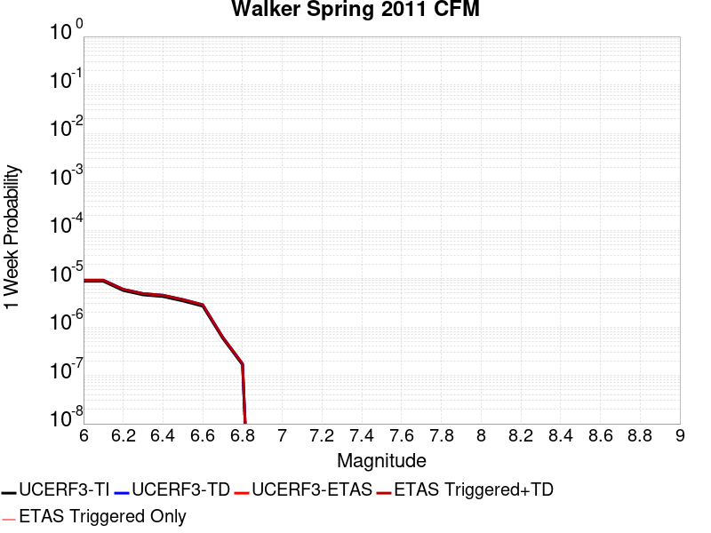 | 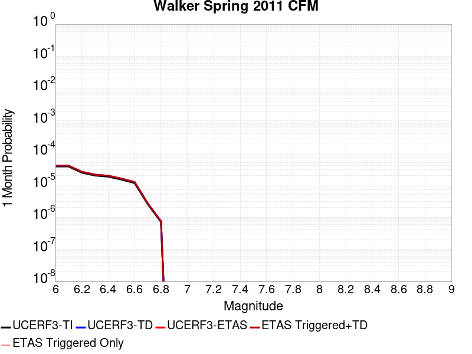 |  |  |

| Magnitude | 1 wk TI Prob | 1 wk TD Prob | 1 wk ETAS Prob | 1 wk ETAS/TD Gain | 1 wk ETAS Triggered+TD | 1 wk ETAS Triggered Only | 1 mo TI Prob | 1 mo TD Prob | 1 mo ETAS Prob | 1 mo ETAS/TD Gain | 1 mo ETAS Triggered+TD | 1 mo ETAS Triggered Only | 1 yr TI Prob | 1 yr TD Prob | 1 yr ETAS Prob | 1 yr ETAS/TD Gain | 1 yr ETAS Triggered+TD | 1 yr ETAS Triggered Only | 10 yr TI Prob | 10 yr TD Prob | 10 yr ETAS Prob | 10 yr ETAS/TD Gain | 10 yr ETAS Triggered+TD | 10 yr ETAS Triggered Only |
|-----|-----|-----|-----|-----|-----|-----|-----|-----|-----|-----|-----|-----|-----|-----|-----|-----|-----|-----|-----|-----|-----|-----|-----|-----|
| 6.0 | 8.791276E-6 | 9.265083E-6 | 0.0 | 0.0 | 9.265083E-6 | 0.0 | 3.767635E-5 | 3.9706953E-5 | 0.0 | 0.0 | 3.9706953E-5 | 0.0 | 4.58613E-4 | 4.8333575E-4 | 4.0E-4 | 0.82758206 | 5.8328744E-4 | 1.0E-4 | 0.004576677 | 0.0048239194 | 0.0032 | 0.663361 | 0.0052219895 | 4.0E-4 |
| 6.1 | 8.791276E-6 | 9.265083E-6 | 0.0 | 0.0 | 9.265083E-6 | 0.0 | 3.767635E-5 | 3.9706953E-5 | 0.0 | 0.0 | 3.9706953E-5 | 0.0 | 4.58613E-4 | 4.8333575E-4 | 3.0E-4 | 0.62068653 | 5.8328744E-4 | 1.0E-4 | 0.004576677 | 0.0048239194 | 0.0027 | 0.55971086 | 0.0052219895 | 4.0E-4 |
| 6.2 | 5.654515E-6 | 5.9994886E-6 | 0.0 | 0.0 | 5.9994886E-6 | 0.0 | 2.4233412E-5 | 2.571187E-5 | 0.0 | 0.0 | 2.571187E-5 | 0.0 | 2.9500184E-4 | 3.1300206E-4 | 1.0E-4 | 0.3194867 | 3.1300206E-4 | 0.0 | 0.0029461053 | 0.003126107 | 0.0018 | 0.57579607 | 0.003425169 | 3.0E-4 |
| 6.3 | 4.591685E-6 | 4.8953702E-6 | 0.0 | 0.0 | 4.8953702E-6 | 0.0 | 1.96785E-5 | 2.0980015E-5 | 0.0 | 0.0 | 2.0980015E-5 | 0.0 | 2.395594E-4 | 2.554061E-4 | 1.0E-4 | 0.39153332 | 2.554061E-4 | 0.0 | 0.002393013 | 0.0025515559 | 0.0016 | 0.6270684 | 0.0028507903 | 3.0E-4 |
| 6.4 | 4.243283E-6 | 4.5232537E-6 | 0.0 | 0.0 | 4.5232537E-6 | 0.0 | 1.8185372E-5 | 1.9385254E-5 | 0.0 | 0.0 | 1.9385254E-5 | 0.0 | 2.2138441E-4 | 2.3599413E-4 | 1.0E-4 | 0.42373934 | 2.3599413E-4 | 0.0 | 0.00221164 | 0.0023578508 | 0.0015 | 0.63617253 | 0.0026571434 | 3.0E-4 |
| 6.5 | 3.4445666E-6 | 3.6866068E-6 | 0.0 | 0.0 | 3.6866068E-6 | 0.0 | 1.4762345E-5 | 1.5799671E-5 | 0.0 | 0.0 | 1.5799671E-5 | 0.0 | 1.7971672E-4 | 1.9234803E-4 | 0.0 | 0.0 | 1.9234803E-4 | 0.0 | 0.0017957145 | 0.0019222104 | 0.0011 | 0.5722579 | 0.002121826 | 2.0E-4 |
| 6.6 | 2.68766E-6 | 2.8798434E-6 | 0.0 | 0.0 | 2.8798434E-6 | 0.0 | 1.1518492E-5 | 1.2342149E-5 | 0.0 | 0.0 | 1.2342149E-5 | 0.0 | 1.4022861E-4 | 1.5025912E-4 | 0.0 | 0.0 | 1.5025912E-4 | 0.0 | 0.0014014016 | 0.0015019492 | 0.001 | 0.66580147 | 0.0017016488 | 2.0E-4 |
| 6.7 | 5.880964E-7 | 6.200414E-7 | 0.0 | 0.0 | 6.200414E-7 | 0.0 | 2.5204106E-6 | 2.6573182E-6 | 0.0 | 0.0 | 2.6573182E-6 | 0.0 | 3.0685565E-5 | 3.2352465E-5 | 0.0 | 0.0 | 3.2352465E-5 | 0.0 | 3.068133E-4 | 3.2348692E-4 | 2.0E-4 | 0.618263 | 4.2345456E-4 | 1.0E-4 |
| 6.8 | 1.6514163E-7 | 1.7410989E-7 | 0.0 | 0.0 | 1.7410989E-7 | 0.0 | 7.077497E-7 | 7.461852E-7 | 0.0 | 0.0 | 7.461852E-7 | 0.0 | 8.616818E-6 | 9.084805E-6 | 0.0 | 0.0 | 9.084805E-6 | 0.0 | 8.616484E-5 | 9.084805E-5 | 0.0 | 0.0 | 9.084805E-5 | 0.0 |

## Cucamonga
*[(top)](#table-of-contents)*

| 1 Week | 1 Month | 1 Year | 10 Year |
|-----|-----|-----|-----|
|  | 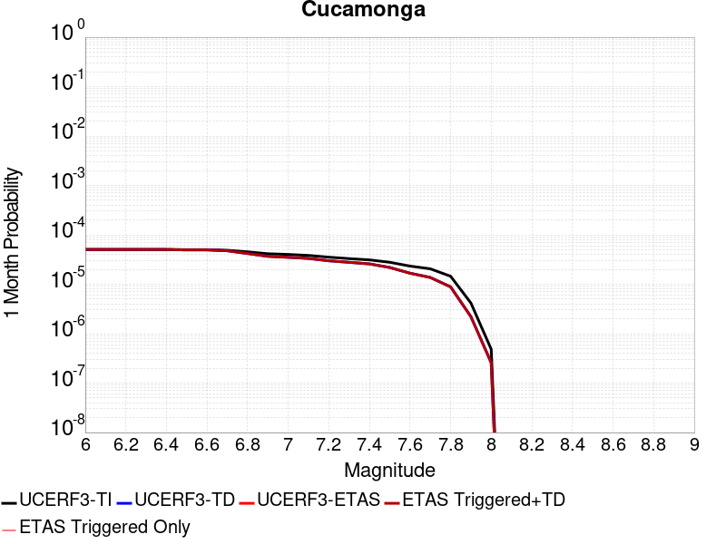 |  |  |

| Magnitude | 1 wk TI Prob | 1 wk TD Prob | 1 wk ETAS Prob | 1 wk ETAS/TD Gain | 1 wk ETAS Triggered+TD | 1 wk ETAS Triggered Only | 1 mo TI Prob | 1 mo TD Prob | 1 mo ETAS Prob | 1 mo ETAS/TD Gain | 1 mo ETAS Triggered+TD | 1 mo ETAS Triggered Only | 1 yr TI Prob | 1 yr TD Prob | 1 yr ETAS Prob | 1 yr ETAS/TD Gain | 1 yr ETAS Triggered+TD | 1 yr ETAS Triggered Only | 10 yr TI Prob | 10 yr TD Prob | 10 yr ETAS Prob | 10 yr ETAS/TD Gain | 10 yr ETAS Triggered+TD | 10 yr ETAS Triggered Only |
|-----|-----|-----|-----|-----|-----|-----|-----|-----|-----|-----|-----|-----|-----|-----|-----|-----|-----|-----|-----|-----|-----|-----|-----|-----|
| 6.0 | 1.1848348E-5 | 1.1747719E-5 | 0.0 | 0.0 | 1.1747719E-5 | 0.0 | 5.0777642E-5 | 5.0346414E-5 | 0.0 | 0.0 | 5.0346414E-5 | 0.0 | 6.180424E-4 | 6.127979E-4 | 5.0E-4 | 0.8159297 | 7.127366E-4 | 1.0E-4 | 0.0061632637 | 0.006112229 | 0.0039 | 0.6380651 | 0.006509784 | 4.0E-4 |
| 6.1 | 1.1848348E-5 | 1.1747719E-5 | 0.0 | 0.0 | 1.1747719E-5 | 0.0 | 5.0777642E-5 | 5.0346414E-5 | 0.0 | 0.0 | 5.0346414E-5 | 0.0 | 6.180424E-4 | 6.127979E-4 | 5.0E-4 | 0.8159297 | 7.127366E-4 | 1.0E-4 | 0.0061632637 | 0.006112229 | 0.0039 | 0.6380651 | 0.006509784 | 4.0E-4 |
| 6.2 | 1.1848348E-5 | 1.1747719E-5 | 0.0 | 0.0 | 1.1747719E-5 | 0.0 | 5.0777642E-5 | 5.0346414E-5 | 0.0 | 0.0 | 5.0346414E-5 | 0.0 | 6.180424E-4 | 6.127979E-4 | 5.0E-4 | 0.8159297 | 7.127366E-4 | 1.0E-4 | 0.0061632637 | 0.006112229 | 0.0039 | 0.6380651 | 0.006509784 | 4.0E-4 |
| 6.3 | 1.1848348E-5 | 1.1747719E-5 | 0.0 | 0.0 | 1.1747719E-5 | 0.0 | 5.0777642E-5 | 5.0346414E-5 | 0.0 | 0.0 | 5.0346414E-5 | 0.0 | 6.180424E-4 | 6.127979E-4 | 5.0E-4 | 0.8159297 | 7.127366E-4 | 1.0E-4 | 0.0061632637 | 0.006112229 | 0.0039 | 0.6380651 | 0.006509784 | 4.0E-4 |
| 6.4 | 1.1848348E-5 | 1.1747719E-5 | 0.0 | 0.0 | 1.1747719E-5 | 0.0 | 5.0777642E-5 | 5.0346414E-5 | 0.0 | 0.0 | 5.0346414E-5 | 0.0 | 6.180424E-4 | 6.127979E-4 | 5.0E-4 | 0.8159297 | 7.127366E-4 | 1.0E-4 | 0.0061632637 | 0.006112229 | 0.0039 | 0.6380651 | 0.006509784 | 4.0E-4 |
| 6.5 | 1.16988695E-5 | 1.1586726E-5 | 0.0 | 0.0 | 1.1586726E-5 | 0.0 | 5.013705E-5 | 4.9656464E-5 | 0.0 | 0.0 | 4.9656464E-5 | 0.0 | 6.102476E-4 | 6.0440245E-4 | 5.0E-4 | 0.82726336 | 7.0434203E-4 | 1.0E-4 | 0.006085745 | 0.0060287314 | 0.0038 | 0.63031507 | 0.0064263195 | 4.0E-4 |
| 6.6 | 1.16988695E-5 | 1.1586726E-5 | 0.0 | 0.0 | 1.1586726E-5 | 0.0 | 5.013705E-5 | 4.9656464E-5 | 0.0 | 0.0 | 4.9656464E-5 | 0.0 | 6.102476E-4 | 6.0440245E-4 | 5.0E-4 | 0.82726336 | 7.0434203E-4 | 1.0E-4 | 0.006085745 | 0.0060287314 | 0.0038 | 0.63031507 | 0.0064263195 | 4.0E-4 |
| 6.7 | 1.1397107E-5 | 1.1125367E-5 | 0.0 | 0.0 | 1.1125367E-5 | 0.0 | 4.884383E-5 | 4.767929E-5 | 0.0 | 0.0 | 4.767929E-5 | 0.0 | 5.9451134E-4 | 5.803432E-4 | 5.0E-4 | 0.86155915 | 6.8028516E-4 | 1.0E-4 | 0.005929234 | 0.0057894005 | 0.0037 | 0.639099 | 0.0061870846 | 4.0E-4 |
| 6.8 | 1.058387E-5 | 9.794198E-6 | 0.0 | 0.0 | 9.794198E-6 | 0.0 | 4.5358654E-5 | 4.197447E-5 | 0.0 | 0.0 | 4.197447E-5 | 0.0 | 5.521017E-4 | 5.109204E-4 | 5.0E-4 | 0.97862595 | 6.108693E-4 | 1.0E-4 | 0.00550732 | 0.0050984393 | 0.0033 | 0.6472569 | 0.0054964 | 4.0E-4 |
| 6.9 | 9.690046E-6 | 8.587892E-6 | 0.0 | 0.0 | 8.587892E-6 | 0.0 | 4.1528107E-5 | 3.6804733E-5 | 0.0 | 0.0 | 3.6804733E-5 | 0.0 | 5.054874E-4 | 4.4800589E-4 | 4.0E-4 | 0.8928454 | 4.4800589E-4 | 0.0 | 0.005043391 | 0.0044719353 | 0.0029 | 0.64848876 | 0.0047705937 | 3.0E-4 |
| 7.0 | 9.381461E-6 | 8.1953E-6 | 0.0 | 0.0 | 8.1953E-6 | 0.0 | 4.020564E-5 | 3.5122244E-5 | 0.0 | 0.0 | 3.5122244E-5 | 0.0 | 4.893937E-4 | 4.2752977E-4 | 4.0E-4 | 0.9356073 | 4.2752977E-4 | 0.0 | 0.0048831734 | 0.0042679817 | 0.0029 | 0.67947805 | 0.0045667016 | 3.0E-4 |
| 7.1 | 8.946492E-6 | 7.7899285E-6 | 0.0 | 0.0 | 7.7899285E-6 | 0.0 | 3.8341543E-5 | 3.3384982E-5 | 0.0 | 0.0 | 3.3384982E-5 | 0.0 | 4.667083E-4 | 4.0638665E-4 | 4.0E-4 | 0.9842843 | 4.0638665E-4 | 0.0 | 0.0046572937 | 0.004057346 | 0.0028 | 0.69010633 | 0.0043561286 | 3.0E-4 |
| 7.2 | 8.251016E-6 | 6.9828047E-6 | 0.0 | 0.0 | 6.9828047E-6 | 0.0 | 3.5361016E-5 | 2.9925965E-5 | 0.0 | 0.0 | 2.9925965E-5 | 0.0 | 4.3043532E-4 | 3.6428793E-4 | 4.0E-4 | 1.0980325 | 3.6428793E-4 | 0.0 | 0.0042960253 | 0.0036378147 | 0.0023 | 0.6322477 | 0.0039367233 | 3.0E-4 |
| 7.3 | 7.717881E-6 | 6.4936507E-6 | 0.0 | 0.0 | 6.4936507E-6 | 0.0 | 3.3076216E-5 | 2.7829636E-5 | 0.0 | 0.0 | 2.7829636E-5 | 0.0 | 4.026285E-4 | 3.3877336E-4 | 4.0E-4 | 1.1807303 | 3.3877336E-4 | 0.0 | 0.004018998 | 0.0033834763 | 0.0023 | 0.6797742 | 0.003682461 | 3.0E-4 |
| 7.4 | 7.275623E-6 | 6.039021E-6 | 0.0 | 0.0 | 6.039021E-6 | 0.0 | 3.118087E-5 | 2.5881265E-5 | 0.0 | 0.0 | 2.5881265E-5 | 0.0 | 3.7956095E-4 | 3.1505903E-4 | 4.0E-4 | 1.2696033 | 3.1505903E-4 | 0.0 | 0.0037891332 | 0.0031470314 | 0.0021 | 0.6672955 | 0.0033464022 | 2.0E-4 |
| 7.5 | 6.5109502E-6 | 5.106879E-6 | 0.0 | 0.0 | 5.106879E-6 | 0.0 | 2.7903774E-5 | 2.1886442E-5 | 0.0 | 0.0 | 2.1886442E-5 | 0.0 | 3.3967546E-4 | 2.66435E-4 | 3.0E-4 | 1.1259782 | 2.66435E-4 | 0.0 | 0.0033915674 | 0.0026620543 | 0.0013 | 0.48834467 | 0.002761788 | 1.0E-4 |
| 7.6 | 5.4495326E-6 | 3.9141923E-6 | 0.0 | 0.0 | 3.9141923E-6 | 0.0 | 2.335493E-5 | 1.6775002E-5 | 0.0 | 0.0 | 1.6775002E-5 | 0.0 | 2.8430918E-4 | 2.0421657E-4 | 2.0E-4 | 0.9793524 | 2.0421657E-4 | 0.0 | 0.0028394572 | 0.0020411855 | 8.0E-4 | 0.3919291 | 0.0020411855 | 0.0 |
| 7.7 | 4.7997164E-6 | 3.2053397E-6 | 0.0 | 0.0 | 3.2053397E-6 | 0.0 | 2.057005E-5 | 1.3737097E-5 | 0.0 | 0.0 | 1.3737097E-5 | 0.0 | 2.504116E-4 | 1.6723636E-4 | 2.0E-4 | 1.1959122 | 1.6723636E-4 | 0.0 | 0.002501296 | 0.0016720127 | 8.0E-4 | 0.47846526 | 0.0016720127 | 0.0 |
| 7.8 | 3.3941733E-6 | 2.0667628E-6 | 0.0 | 0.0 | 2.0667628E-6 | 0.0 | 1.4546376E-5 | 8.857525E-6 | 0.0 | 0.0 | 8.857525E-6 | 0.0 | 1.7708774E-4 | 1.0783505E-4 | 2.0E-4 | 1.8546846 | 1.0783505E-4 | 0.0 | 0.0017694668 | 0.0010782063 | 6.0E-4 | 0.55647975 | 0.0010782063 | 0.0 |
| 7.9 | 9.750552E-7 | 5.1627114E-7 | 0.0 | 0.0 | 5.1627114E-7 | 0.0 | 4.178801E-6 | 2.212589E-6 | 0.0 | 0.0 | 2.212589E-6 | 0.0 | 5.0875715E-5 | 2.693794E-5 | 1.0E-4 | 3.7122364 | 2.693794E-5 | 0.0 | 5.086407E-4 | 2.6934716E-4 | 2.0E-4 | 0.7425361 | 2.6934716E-4 | 0.0 |
| 8.0 | 1.133857E-7 | 6.0588356E-8 | 0.0 | 0.0 | 6.0588356E-8 | 0.0 | 4.8593864E-7 | 2.5966435E-7 | 0.0 | 0.0 | 2.5966435E-7 | 0.0 | 5.9162867E-6 | 3.161409E-6 | 0.0 | 0.0 | 3.161409E-6 | 0.0 | 5.916129E-5 | 3.1613657E-5 | 0.0 | 0.0 | 3.1613657E-5 | 0.0 |

## Skinner Flat 2011 CFM
*[(top)](#table-of-contents)*

| 1 Week | 1 Month | 1 Year | 10 Year |
|-----|-----|-----|-----|
| 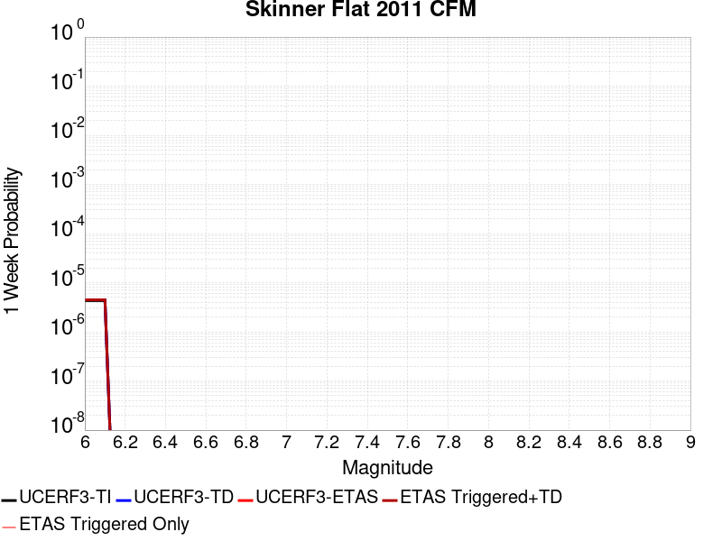 |  |  |  |

| Magnitude | 1 wk TI Prob | 1 wk TD Prob | 1 wk ETAS Prob | 1 wk ETAS/TD Gain | 1 wk ETAS Triggered+TD | 1 wk ETAS Triggered Only | 1 mo TI Prob | 1 mo TD Prob | 1 mo ETAS Prob | 1 mo ETAS/TD Gain | 1 mo ETAS Triggered+TD | 1 mo ETAS Triggered Only | 1 yr TI Prob | 1 yr TD Prob | 1 yr ETAS Prob | 1 yr ETAS/TD Gain | 1 yr ETAS Triggered+TD | 1 yr ETAS Triggered Only | 10 yr TI Prob | 10 yr TD Prob | 10 yr ETAS Prob | 10 yr ETAS/TD Gain | 10 yr ETAS Triggered+TD | 10 yr ETAS Triggered Only |
|-----|-----|-----|-----|-----|-----|-----|-----|-----|-----|-----|-----|-----|-----|-----|-----|-----|-----|-----|-----|-----|-----|-----|-----|-----|
| 6.0 | 4.3279074E-6 | 4.485276E-6 | 0.0 | 0.0 | 4.485276E-6 | 0.0 | 1.8548042E-5 | 1.922261E-5 | 0.0 | 0.0 | 1.922261E-5 | 0.0 | 2.2579901E-4 | 2.3403528E-4 | 1.0E-4 | 0.427286 | 3.340119E-4 | 1.0E-4 | 0.002255697 | 0.0023403529 | 0.0024 | 1.0254865 | 0.0027394167 | 4.0E-4 |
| 6.1 | 4.3279074E-6 | 4.485276E-6 | 0.0 | 0.0 | 4.485276E-6 | 0.0 | 1.8548042E-5 | 1.922261E-5 | 0.0 | 0.0 | 1.922261E-5 | 0.0 | 2.2579901E-4 | 2.3403528E-4 | 1.0E-4 | 0.427286 | 3.340119E-4 | 1.0E-4 | 0.002255697 | 0.0023403529 | 0.0018 | 0.7691148 | 0.0026396506 | 3.0E-4 |

## Northridge
*[(top)](#table-of-contents)*

| 1 Week | 1 Month | 1 Year | 10 Year |
|-----|-----|-----|-----|
| 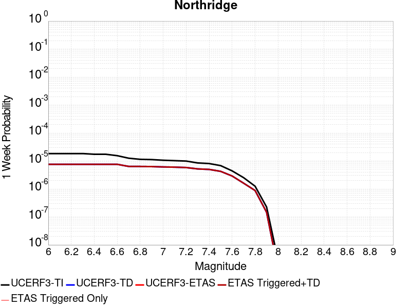 | 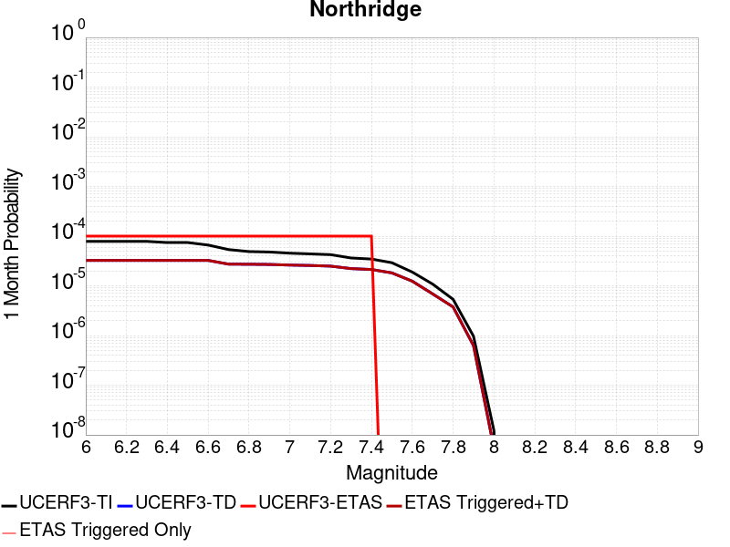 | 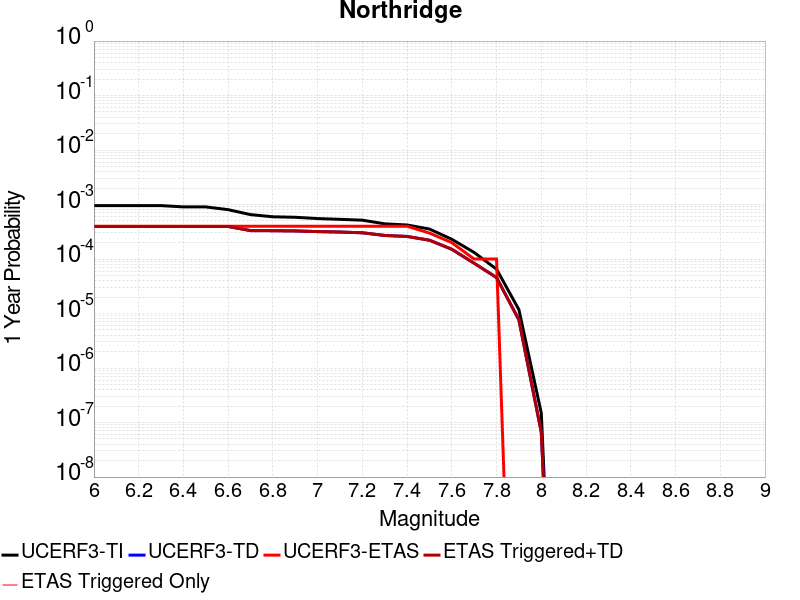 | 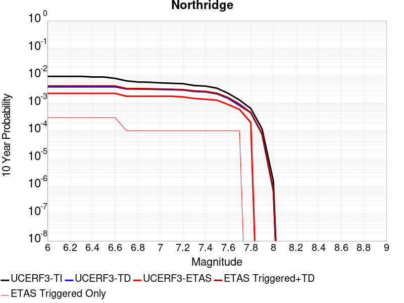 |

| Magnitude | 1 wk TI Prob | 1 wk TD Prob | 1 wk ETAS Prob | 1 wk ETAS/TD Gain | 1 wk ETAS Triggered+TD | 1 wk ETAS Triggered Only | 1 mo TI Prob | 1 mo TD Prob | 1 mo ETAS Prob | 1 mo ETAS/TD Gain | 1 mo ETAS Triggered+TD | 1 mo ETAS Triggered Only | 1 yr TI Prob | 1 yr TD Prob | 1 yr ETAS Prob | 1 yr ETAS/TD Gain | 1 yr ETAS Triggered+TD | 1 yr ETAS Triggered Only | 10 yr TI Prob | 10 yr TD Prob | 10 yr ETAS Prob | 10 yr ETAS/TD Gain | 10 yr ETAS Triggered+TD | 10 yr ETAS Triggered Only |
|-----|-----|-----|-----|-----|-----|-----|-----|-----|-----|-----|-----|-----|-----|-----|-----|-----|-----|-----|-----|-----|-----|-----|-----|-----|
| 6.0 | 1.8340852E-5 | 7.5904954E-6 | 0.0 | 0.0 | 7.5904954E-6 | 0.0 | 7.860128E-5 | 3.25303E-5 | 1.0E-4 | 3.074057 | 3.25303E-5 | 0.0 | 9.565505E-4 | 3.9598663E-4 | 4.0E-4 | 1.010135 | 3.9598663E-4 | 0.0 | 0.009524435 | 0.00395302 | 0.0023 | 0.5818336 | 0.004251834 | 3.0E-4 |
| 6.1 | 1.8340852E-5 | 7.5904954E-6 | 0.0 | 0.0 | 7.5904954E-6 | 0.0 | 7.860128E-5 | 3.25303E-5 | 1.0E-4 | 3.074057 | 3.25303E-5 | 0.0 | 9.565505E-4 | 3.9598663E-4 | 4.0E-4 | 1.010135 | 3.9598663E-4 | 0.0 | 0.009524435 | 0.00395302 | 0.0023 | 0.5818336 | 0.004251834 | 3.0E-4 |
| 6.2 | 1.8340852E-5 | 7.5904954E-6 | 0.0 | 0.0 | 7.5904954E-6 | 0.0 | 7.860128E-5 | 3.25303E-5 | 1.0E-4 | 3.074057 | 3.25303E-5 | 0.0 | 9.565505E-4 | 3.9598663E-4 | 4.0E-4 | 1.010135 | 3.9598663E-4 | 0.0 | 0.009524435 | 0.00395302 | 0.0023 | 0.5818336 | 0.004251834 | 3.0E-4 |
| 6.3 | 1.8340852E-5 | 7.5904954E-6 | 0.0 | 0.0 | 7.5904954E-6 | 0.0 | 7.860128E-5 | 3.25303E-5 | 1.0E-4 | 3.074057 | 3.25303E-5 | 0.0 | 9.565505E-4 | 3.9598663E-4 | 4.0E-4 | 1.010135 | 3.9598663E-4 | 0.0 | 0.009524435 | 0.00395302 | 0.0023 | 0.5818336 | 0.004251834 | 3.0E-4 |
| 6.4 | 1.7361892E-5 | 7.5904954E-6 | 0.0 | 0.0 | 7.5904954E-6 | 0.0 | 7.440598E-5 | 3.25303E-5 | 1.0E-4 | 3.074057 | 3.25303E-5 | 0.0 | 9.055163E-4 | 3.9598663E-4 | 4.0E-4 | 1.010135 | 3.9598663E-4 | 0.0 | 0.009018354 | 0.00395302 | 0.0023 | 0.5818336 | 0.004251834 | 3.0E-4 |
| 6.5 | 1.7361892E-5 | 7.5904954E-6 | 0.0 | 0.0 | 7.5904954E-6 | 0.0 | 7.440598E-5 | 3.25303E-5 | 1.0E-4 | 3.074057 | 3.25303E-5 | 0.0 | 9.055163E-4 | 3.9598663E-4 | 4.0E-4 | 1.010135 | 3.9598663E-4 | 0.0 | 0.009018354 | 0.00395302 | 0.0023 | 0.5818336 | 0.004251834 | 3.0E-4 |
| 6.6 | 1.5458201E-5 | 7.5904954E-6 | 0.0 | 0.0 | 7.5904954E-6 | 0.0 | 6.624775E-5 | 3.25303E-5 | 1.0E-4 | 3.074057 | 3.25303E-5 | 0.0 | 8.0626784E-4 | 3.9598663E-4 | 4.0E-4 | 1.010135 | 3.9598663E-4 | 0.0 | 0.008033488 | 0.00395302 | 0.0023 | 0.5818336 | 0.004251834 | 3.0E-4 |
| 6.7 | 1.2538368E-5 | 6.3836783E-6 | 0.0 | 0.0 | 6.3836783E-6 | 0.0 | 5.3734755E-5 | 2.7358337E-5 | 1.0E-4 | 3.6551929 | 2.7358337E-5 | 0.0 | 6.5402425E-4 | 3.330373E-4 | 4.0E-4 | 1.2010667 | 3.330373E-4 | 0.0 | 0.0065210275 | 0.0033254172 | 0.0018 | 0.54128546 | 0.0034250845 | 1.0E-4 |
| 6.8 | 1.1438097E-5 | 6.3523153E-6 | 0.0 | 0.0 | 6.3523153E-6 | 0.0 | 4.9019498E-5 | 2.7223927E-5 | 1.0E-4 | 3.6732395 | 2.7223927E-5 | 0.0 | 5.9664896E-4 | 3.3140133E-4 | 4.0E-4 | 1.2069957 | 3.3140133E-4 | 0.0 | 0.005950495 | 0.0033091065 | 0.0018 | 0.5439535 | 0.0034087754 | 1.0E-4 |
| 6.9 | 1.1204891E-5 | 6.2887457E-6 | 0.0 | 0.0 | 6.2887457E-6 | 0.0 | 4.8020076E-5 | 2.6951491E-5 | 1.0E-4 | 3.7103698 | 2.6951491E-5 | 0.0 | 5.8448757E-4 | 3.2808544E-4 | 4.0E-4 | 1.2191947 | 3.2808544E-4 | 0.0 | 0.0058295266 | 0.0032760457 | 0.0018 | 0.5494429 | 0.0033757181 | 1.0E-4 |
| 7.0 | 1.061046E-5 | 6.11735E-6 | 0.0 | 0.0 | 6.11735E-6 | 0.0 | 4.5472607E-5 | 2.6216954E-5 | 1.0E-4 | 3.8143256 | 2.6216954E-5 | 0.0 | 5.534883E-4 | 3.191451E-4 | 4.0E-4 | 1.2533485 | 3.191451E-4 | 0.0 | 0.0055211177 | 0.0031869141 | 0.0018 | 0.5648097 | 0.0032865955 | 1.0E-4 |
| 7.1 | 1.0266979E-5 | 6.0062284E-6 | 0.0 | 0.0 | 6.0062284E-6 | 0.0 | 4.40006E-5 | 2.5740728E-5 | 1.0E-4 | 3.884894 | 2.5740728E-5 | 0.0 | 5.355756E-4 | 3.1334872E-4 | 4.0E-4 | 1.276533 | 3.1334872E-4 | 0.0 | 0.0053428668 | 0.0031291149 | 0.0018 | 0.5752426 | 0.0032288018 | 1.0E-4 |
| 7.2 | 9.91273E-6 | 5.8218993E-6 | 0.0 | 0.0 | 5.8218993E-6 | 0.0 | 4.248244E-5 | 2.4950761E-5 | 1.0E-4 | 4.0078936 | 2.4950761E-5 | 0.0 | 5.171009E-4 | 3.037336E-4 | 4.0E-4 | 1.3169435 | 3.037336E-4 | 0.0 | 0.0051589934 | 0.0030332296 | 0.0017 | 0.5604587 | 0.0031329263 | 1.0E-4 |
| 7.3 | 8.4959265E-6 | 5.1948227E-6 | 0.0 | 0.0 | 5.1948227E-6 | 0.0 | 3.6410605E-5 | 2.2263337E-5 | 1.0E-4 | 4.4916897 | 2.2263337E-5 | 0.0 | 4.4320893E-4 | 2.7102264E-4 | 4.0E-4 | 1.4758915 | 2.7102264E-4 | 0.0 | 0.00442326 | 0.0027069475 | 0.0015 | 0.5541297 | 0.0028066768 | 1.0E-4 |
| 7.4 | 8.0847185E-6 | 4.983557E-6 | 0.0 | 0.0 | 4.983557E-6 | 0.0 | 3.4648332E-5 | 2.135793E-5 | 1.0E-4 | 4.6821017 | 2.135793E-5 | 0.0 | 4.2176177E-4 | 2.60002E-4 | 4.0E-4 | 1.5384498 | 2.60002E-4 | 0.0 | 0.0042096223 | 0.002597004 | 0.0014 | 0.53908277 | 0.0026967442 | 1.0E-4 |
| 7.5 | 6.8220684E-6 | 4.254499E-6 | 0.0 | 0.0 | 4.254499E-6 | 0.0 | 2.9237108E-5 | 1.8233439E-5 | 0.0 | 0.0 | 1.8233439E-5 | 0.0 | 3.5590364E-4 | 2.2196972E-4 | 3.0E-4 | 1.3515358 | 2.2196972E-4 | 0.0 | 0.0035533418 | 0.002217501 | 0.0013 | 0.5862455 | 0.0023172793 | 1.0E-4 |
| 7.6 | 4.4224143E-6 | 2.9005907E-6 | 0.0 | 0.0 | 2.9005907E-6 | 0.0 | 1.8953066E-5 | 1.24310445E-5 | 0.0 | 0.0 | 1.24310445E-5 | 0.0 | 2.3072914E-4 | 1.5133758E-4 | 2.0E-4 | 1.3215489 | 1.5133758E-4 | 0.0 | 0.0023048974 | 0.0015123567 | 9.0E-4 | 0.5950977 | 0.0016122055 | 1.0E-4 |
| 7.7 | 2.5297056E-6 | 1.6049348E-6 | 0.0 | 0.0 | 1.6049348E-6 | 0.0 | 1.0841551E-5 | 6.8782742E-6 | 0.0 | 0.0 | 6.8782742E-6 | 0.0 | 1.319879E-4 | 8.373982E-5 | 1.0E-4 | 1.194175 | 8.373982E-5 | 0.0 | 0.0013190953 | 8.3708734E-4 | 6.0E-4 | 0.7167711 | 9.3700364E-4 | 1.0E-4 |
| 7.8 | 1.2508156E-6 | 8.7820564E-7 | 0.0 | 0.0 | 8.7820564E-7 | 0.0 | 5.3606273E-6 | 3.763733E-6 | 0.0 | 0.0 | 3.763733E-6 | 0.0 | 6.526368E-5 | 4.58225E-5 | 1.0E-4 | 2.182334 | 4.58225E-5 | 0.0 | 6.524452E-4 | 4.581318E-4 | 2.0E-4 | 0.4365556 | 4.581318E-4 | 0.0 |
| 7.9 | 2.262199E-7 | 1.4668562E-7 | 0.0 | 0.0 | 1.4668562E-7 | 0.0 | 9.695135E-7 | 6.286525E-7 | 0.0 | 0.0 | 6.286525E-7 | 0.0 | 1.1803763E-5 | 7.653818E-6 | 0.0 | 0.0 | 7.653818E-6 | 0.0 | 1.1803136E-4 | 7.653562E-5 | 0.0 | 0.0 | 7.653562E-5 | 0.0 |
| 8.0 | 2.865362E-9 | 1.2765237E-9 | 0.0 | 0.0 | 1.2765237E-9 | 0.0 | 1.2280123E-8 | 5.470816E-9 | 0.0 | 0.0 | 5.470816E-9 | 0.0 | 1.4951048E-7 | 6.660718E-8 | 0.0 | 0.0 | 6.660718E-8 | 0.0 | 1.4951038E-6 | 6.660718E-7 | 0.0 | 0.0 | 6.660718E-7 | 0.0 |

## Great Valley 12
*[(top)](#table-of-contents)*

| 1 Week | 1 Month | 1 Year | 10 Year |
|-----|-----|-----|-----|
| 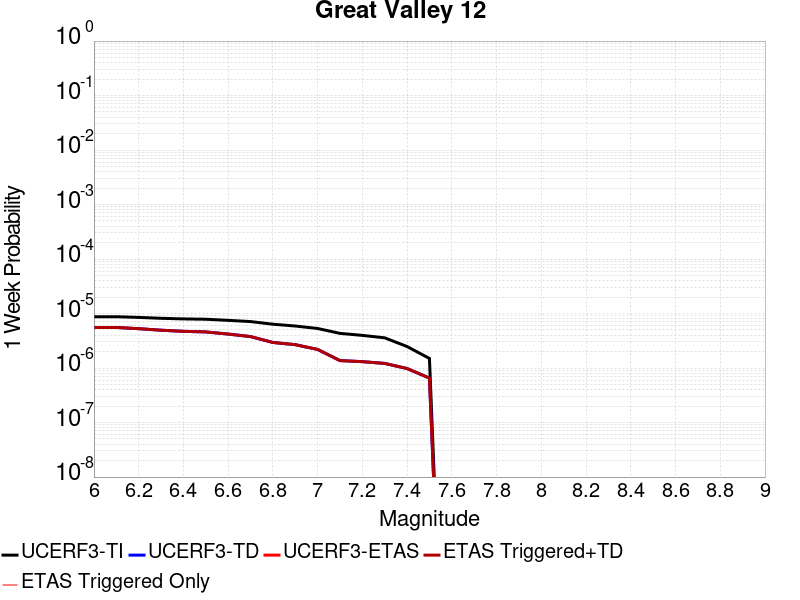 | 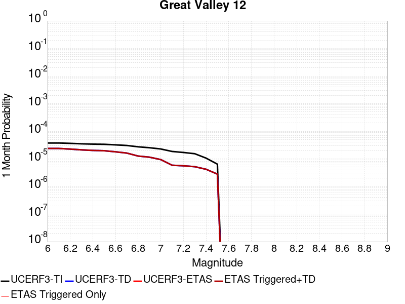 | 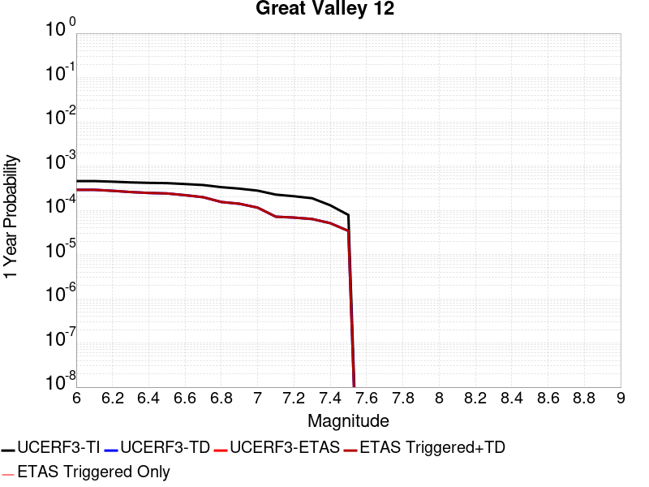 | 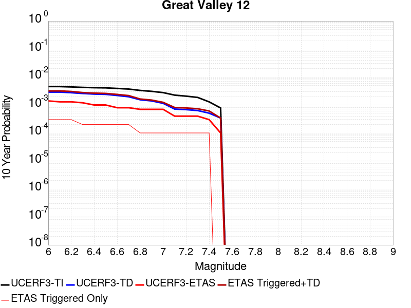 |

| Magnitude | 1 wk TI Prob | 1 wk TD Prob | 1 wk ETAS Prob | 1 wk ETAS/TD Gain | 1 wk ETAS Triggered+TD | 1 wk ETAS Triggered Only | 1 mo TI Prob | 1 mo TD Prob | 1 mo ETAS Prob | 1 mo ETAS/TD Gain | 1 mo ETAS Triggered+TD | 1 mo ETAS Triggered Only | 1 yr TI Prob | 1 yr TD Prob | 1 yr ETAS Prob | 1 yr ETAS/TD Gain | 1 yr ETAS Triggered+TD | 1 yr ETAS Triggered Only | 10 yr TI Prob | 10 yr TD Prob | 10 yr ETAS Prob | 10 yr ETAS/TD Gain | 10 yr ETAS Triggered+TD | 10 yr ETAS Triggered Only |
|-----|-----|-----|-----|-----|-----|-----|-----|-----|-----|-----|-----|-----|-----|-----|-----|-----|-----|-----|-----|-----|-----|-----|-----|-----|
| 6.0 | 8.757157E-6 | 5.556448E-6 | 0.0 | 0.0 | 5.556448E-6 | 0.0 | 3.7530135E-5 | 2.3813138E-5 | 0.0 | 0.0 | 2.3813138E-5 | 0.0 | 4.5683357E-4 | 2.898876E-4 | 0.0 | 0.0 | 2.898876E-4 | 0.0 | 0.004558956 | 0.0028952155 | 0.0014 | 0.4835564 | 0.003194347 | 3.0E-4 |
| 6.1 | 8.757157E-6 | 5.556448E-6 | 0.0 | 0.0 | 5.556448E-6 | 0.0 | 3.7530135E-5 | 2.3813138E-5 | 0.0 | 0.0 | 2.3813138E-5 | 0.0 | 4.5683357E-4 | 2.898876E-4 | 0.0 | 0.0 | 2.898876E-4 | 0.0 | 0.004558956 | 0.0028952155 | 0.0013 | 0.44901666 | 0.003194347 | 3.0E-4 |
| 6.2 | 8.499136E-6 | 5.282082E-6 | 0.0 | 0.0 | 5.282082E-6 | 0.0 | 3.642436E-5 | 2.2637305E-5 | 0.0 | 0.0 | 2.2637305E-5 | 0.0 | 4.4337637E-4 | 2.7557547E-4 | 0.0 | 0.0 | 2.7557547E-4 | 0.0 | 0.0044249278 | 0.002752452 | 0.0013 | 0.47230613 | 0.0030516263 | 3.0E-4 |
| 6.3 | 8.186883E-6 | 4.950186E-6 | 0.0 | 0.0 | 4.950186E-6 | 0.0 | 3.508617E-5 | 2.1214915E-5 | 0.0 | 0.0 | 2.1214915E-5 | 0.0 | 4.270904E-4 | 2.5826198E-4 | 0.0 | 0.0 | 2.5826198E-4 | 0.0 | 0.004262705 | 0.0025797193 | 0.0012 | 0.4651669 | 0.0027792032 | 2.0E-4 |
| 6.4 | 7.979878E-6 | 4.7221433E-6 | 0.0 | 0.0 | 4.7221433E-6 | 0.0 | 3.419903E-5 | 2.0237607E-5 | 0.0 | 0.0 | 2.0237607E-5 | 0.0 | 4.1629362E-4 | 2.4636593E-4 | 0.0 | 0.0 | 2.4636593E-4 | 0.0 | 0.0041551464 | 0.0024610222 | 0.001 | 0.4063352 | 0.0026605302 | 2.0E-4 |
| 6.5 | 7.871003E-6 | 4.6020937E-6 | 0.0 | 0.0 | 4.6020937E-6 | 0.0 | 3.373243E-5 | 1.9723115E-5 | 0.0 | 0.0 | 1.9723115E-5 | 0.0 | 4.1061494E-4 | 2.401034E-4 | 0.0 | 0.0 | 2.401034E-4 | 0.0 | 0.0040985704 | 0.002398533 | 0.001 | 0.4169215 | 0.0025980533 | 2.0E-4 |
| 6.6 | 7.508221E-6 | 4.205405E-6 | 0.0 | 0.0 | 4.205405E-6 | 0.0 | 3.2177693E-5 | 1.8023045E-5 | 0.0 | 0.0 | 1.8023045E-5 | 0.0 | 3.91693E-4 | 2.1940934E-4 | 0.0 | 0.0 | 2.1940934E-4 | 0.0 | 0.003910033 | 0.0021920134 | 8.0E-4 | 0.36496124 | 0.0023915751 | 2.0E-4 |
| 6.7 | 7.1297914E-6 | 3.7830298E-6 | 0.0 | 0.0 | 3.7830298E-6 | 0.0 | 3.055589E-5 | 1.6212889E-5 | 0.0 | 0.0 | 1.6212889E-5 | 0.0 | 3.7195446E-4 | 1.9737484E-4 | 0.0 | 0.0 | 1.9737484E-4 | 0.0 | 0.0037133251 | 0.0019720744 | 8.0E-4 | 0.40566424 | 0.0021716799 | 2.0E-4 |
| 6.8 | 6.376581E-6 | 2.9494272E-6 | 0.0 | 0.0 | 2.9494272E-6 | 0.0 | 2.7327918E-5 | 1.2640342E-5 | 0.0 | 0.0 | 1.2640342E-5 | 0.0 | 3.326666E-4 | 1.5388547E-4 | 0.0 | 0.0 | 1.5388547E-4 | 0.0 | 0.0033216903 | 0.0015378057 | 7.0E-4 | 0.45519406 | 0.0016376519 | 1.0E-4 |
| 6.9 | 5.9095E-6 | 2.6874322E-6 | 0.0 | 0.0 | 2.6874322E-6 | 0.0 | 2.5326184E-5 | 1.1517516E-5 | 0.0 | 0.0 | 1.1517516E-5 | 0.0 | 3.0830267E-4 | 1.402169E-4 | 0.0 | 0.0 | 1.402169E-4 | 0.0 | 0.003078753 | 0.0014012997 | 7.0E-4 | 0.49953625 | 0.0015011596 | 1.0E-4 |
| 7.0 | 5.3239864E-6 | 2.1974406E-6 | 0.0 | 0.0 | 2.1974406E-6 | 0.0 | 2.2816885E-5 | 9.417569E-6 | 0.0 | 0.0 | 9.417569E-6 | 0.0 | 2.7776015E-4 | 1.1465301E-4 | 0.0 | 0.0 | 1.1465301E-4 | 0.0 | 0.0027741324 | 0.001145952 | 7.0E-4 | 0.6108458 | 0.0012458374 | 1.0E-4 |
| 7.1 | 4.329147E-6 | 1.3712867E-6 | 0.0 | 0.0 | 1.3712867E-6 | 0.0 | 1.8553355E-5 | 5.8769297E-6 | 0.0 | 0.0 | 5.8769297E-6 | 0.0 | 2.2586368E-4 | 7.154936E-5 | 0.0 | 0.0 | 7.154936E-5 | 0.0 | 0.0022563424 | 7.152719E-4 | 4.0E-4 | 0.5592279 | 8.152004E-4 | 1.0E-4 |
| 7.2 | 3.978488E-6 | 1.3110854E-6 | 0.0 | 0.0 | 1.3110854E-6 | 0.0 | 1.7050552E-5 | 5.618926E-6 | 0.0 | 0.0 | 5.618926E-6 | 0.0 | 2.075707E-4 | 6.8408364E-5 | 0.0 | 0.0 | 6.8408364E-5 | 0.0 | 0.0020737692 | 6.8388163E-4 | 4.0E-4 | 0.5848965 | 7.8381324E-4 | 1.0E-4 |
| 7.3 | 3.586542E-6 | 1.2161385E-6 | 0.0 | 0.0 | 1.2161385E-6 | 0.0 | 1.5370804E-5 | 5.212012E-6 | 0.0 | 0.0 | 5.212012E-6 | 0.0 | 1.8712347E-4 | 6.3454485E-5 | 0.0 | 0.0 | 6.3454485E-5 | 0.0 | 0.0018696598 | 6.343722E-4 | 4.0E-4 | 0.63054466 | 7.3430873E-4 | 1.0E-4 |
| 7.4 | 2.4837766E-6 | 9.802935E-7 | 0.0 | 0.0 | 9.802935E-7 | 0.0 | 1.0644713E-5 | 4.201251E-6 | 0.0 | 0.0 | 4.201251E-6 | 0.0 | 1.2959167E-4 | 5.11491E-5 | 0.0 | 0.0 | 5.11491E-5 | 0.0 | 0.0012951613 | 5.1137985E-4 | 3.0E-4 | 0.58664805 | 6.1132875E-4 | 1.0E-4 |
| 7.5 | 1.5002679E-6 | 6.5476183E-7 | 0.0 | 0.0 | 6.5476183E-7 | 0.0 | 6.4297037E-6 | 2.8061193E-6 | 0.0 | 0.0 | 2.8061193E-6 | 0.0 | 7.827883E-5 | 3.4164008E-5 | 0.0 | 0.0 | 3.4164008E-5 | 0.0 | 7.825126E-4 | 3.4159172E-4 | 1.0E-4 | 0.29274714 | 3.4159172E-4 | 0.0 |

## San Luis Range - Oceano 2011 CFM
*[(top)](#table-of-contents)*

| 1 Week | 1 Month | 1 Year | 10 Year |
|-----|-----|-----|-----|
| 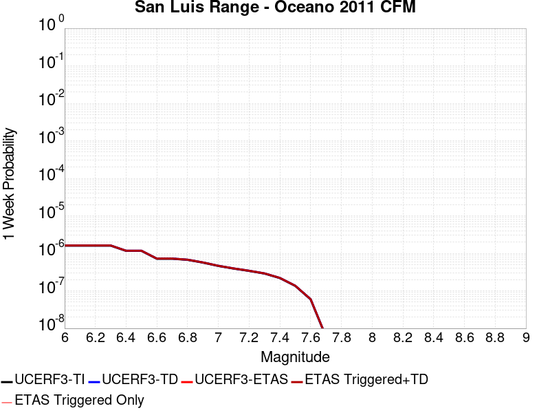 | 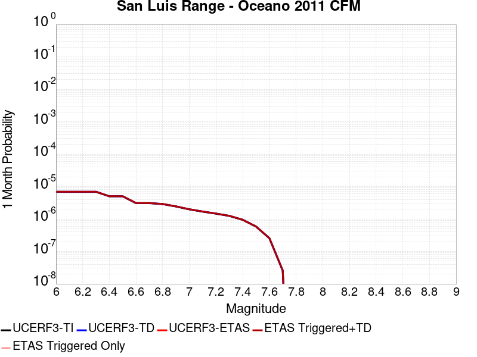 | 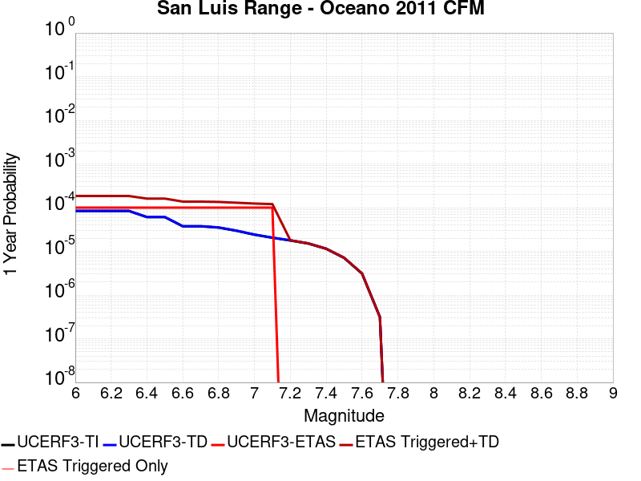 | 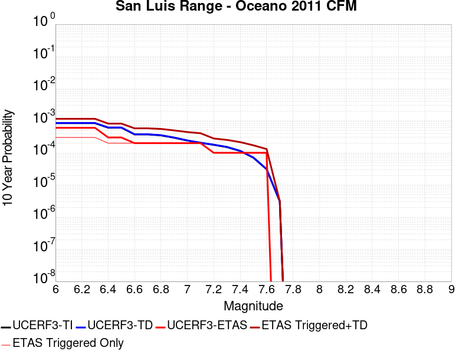 |

| Magnitude | 1 wk TI Prob | 1 wk TD Prob | 1 wk ETAS Prob | 1 wk ETAS/TD Gain | 1 wk ETAS Triggered+TD | 1 wk ETAS Triggered Only | 1 mo TI Prob | 1 mo TD Prob | 1 mo ETAS Prob | 1 mo ETAS/TD Gain | 1 mo ETAS Triggered+TD | 1 mo ETAS Triggered Only | 1 yr TI Prob | 1 yr TD Prob | 1 yr ETAS Prob | 1 yr ETAS/TD Gain | 1 yr ETAS Triggered+TD | 1 yr ETAS Triggered Only | 10 yr TI Prob | 10 yr TD Prob | 10 yr ETAS Prob | 10 yr ETAS/TD Gain | 10 yr ETAS Triggered+TD | 10 yr ETAS Triggered Only |
|-----|-----|-----|-----|-----|-----|-----|-----|-----|-----|-----|-----|-----|-----|-----|-----|-----|-----|-----|-----|-----|-----|-----|-----|-----|
| 6.0 | 1.6025788E-6 | 1.6201542E-6 | 0.0 | 0.0 | 1.6201542E-6 | 0.0 | 6.8681766E-6 | 6.943502E-6 | 0.0 | 0.0 | 6.943502E-6 | 0.0 | 8.361684E-5 | 8.453427E-5 | 1.0E-4 | 1.1829522 | 1.8452582E-4 | 1.0E-4 | 8.3585386E-4 | 8.4506196E-4 | 6.0E-4 | 0.71000713 | 0.0011448084 | 3.0E-4 |
| 6.1 | 1.6025788E-6 | 1.6201542E-6 | 0.0 | 0.0 | 1.6201542E-6 | 0.0 | 6.8681766E-6 | 6.943502E-6 | 0.0 | 0.0 | 6.943502E-6 | 0.0 | 8.361684E-5 | 8.453427E-5 | 1.0E-4 | 1.1829522 | 1.8452582E-4 | 1.0E-4 | 8.3585386E-4 | 8.4506196E-4 | 6.0E-4 | 0.71000713 | 0.0011448084 | 3.0E-4 |
| 6.2 | 1.6025788E-6 | 1.6201542E-6 | 0.0 | 0.0 | 1.6201542E-6 | 0.0 | 6.8681766E-6 | 6.943502E-6 | 0.0 | 0.0 | 6.943502E-6 | 0.0 | 8.361684E-5 | 8.453427E-5 | 1.0E-4 | 1.1829522 | 1.8452582E-4 | 1.0E-4 | 8.3585386E-4 | 8.4506196E-4 | 6.0E-4 | 0.71000713 | 0.0011448084 | 3.0E-4 |
| 6.3 | 1.6025788E-6 | 1.6201542E-6 | 0.0 | 0.0 | 1.6201542E-6 | 0.0 | 6.8681766E-6 | 6.943502E-6 | 0.0 | 0.0 | 6.943502E-6 | 0.0 | 8.361684E-5 | 8.453427E-5 | 1.0E-4 | 1.1829522 | 1.8452582E-4 | 1.0E-4 | 8.3585386E-4 | 8.4506196E-4 | 6.0E-4 | 0.71000713 | 0.0011448084 | 3.0E-4 |
| 6.4 | 1.1621186E-6 | 1.1750153E-6 | 0.0 | 0.0 | 1.1750153E-6 | 0.0 | 4.980499E-6 | 5.0357717E-6 | 0.0 | 0.0 | 5.0357717E-6 | 0.0 | 6.0635884E-5 | 6.130907E-5 | 1.0E-4 | 1.6310802 | 1.6130293E-4 | 1.0E-4 | 6.0619344E-4 | 6.129481E-4 | 3.0E-4 | 0.48943785 | 8.128255E-4 | 2.0E-4 |
| 6.5 | 1.1621186E-6 | 1.1750153E-6 | 0.0 | 0.0 | 1.1750153E-6 | 0.0 | 4.980499E-6 | 5.0357717E-6 | 0.0 | 0.0 | 5.0357717E-6 | 0.0 | 6.0635884E-5 | 6.130907E-5 | 1.0E-4 | 1.6310802 | 1.6130293E-4 | 1.0E-4 | 6.0619344E-4 | 6.129481E-4 | 3.0E-4 | 0.48943785 | 8.128255E-4 | 2.0E-4 |
| 6.6 | 7.164729E-7 | 7.2487467E-7 | 0.0 | 0.0 | 7.2487467E-7 | 0.0 | 3.0705946E-6 | 3.1066022E-6 | 0.0 | 0.0 | 3.1066022E-6 | 0.0 | 3.738385E-5 | 3.7822243E-5 | 1.0E-4 | 2.643947 | 1.3781847E-4 | 1.0E-4 | 3.737756E-4 | 3.7815984E-4 | 2.0E-4 | 0.5288769 | 5.780842E-4 | 2.0E-4 |
| 6.7 | 7.164729E-7 | 7.2487467E-7 | 0.0 | 0.0 | 7.2487467E-7 | 0.0 | 3.0705946E-6 | 3.1066022E-6 | 0.0 | 0.0 | 3.1066022E-6 | 0.0 | 3.738385E-5 | 3.7822243E-5 | 1.0E-4 | 2.643947 | 1.3781847E-4 | 1.0E-4 | 3.737756E-4 | 3.7815984E-4 | 2.0E-4 | 0.5288769 | 5.780842E-4 | 2.0E-4 |
| 6.8 | 6.700177E-7 | 6.7775954E-7 | 0.0 | 0.0 | 6.7775954E-7 | 0.0 | 2.8715012E-6 | 2.9046805E-6 | 0.0 | 0.0 | 2.9046805E-6 | 0.0 | 3.495997E-5 | 3.536393E-5 | 1.0E-4 | 2.8277402 | 1.3536039E-4 | 1.0E-4 | 3.495447E-4 | 3.5358465E-4 | 2.0E-4 | 0.56563544 | 5.5351394E-4 | 2.0E-4 |
| 6.9 | 5.657865E-7 | 5.721915E-7 | 0.0 | 0.0 | 5.721915E-7 | 0.0 | 2.424797E-6 | 2.4522471E-6 | 0.0 | 0.0 | 2.4522471E-6 | 0.0 | 2.9521503E-5 | 2.985571E-5 | 1.0E-4 | 3.349443 | 1.2985272E-4 | 1.0E-4 | 2.9517582E-4 | 2.9851805E-4 | 2.0E-4 | 0.66997623 | 4.9845834E-4 | 2.0E-4 |
| 7.0 | 4.608413E-7 | 4.6602733E-7 | 0.0 | 0.0 | 4.6602733E-7 | 0.0 | 1.9750328E-6 | 1.9972586E-6 | 0.0 | 0.0 | 1.9972586E-6 | 0.0 | 2.4045758E-5 | 2.4316354E-5 | 1.0E-4 | 4.1124587 | 1.2431393E-4 | 1.0E-4 | 2.4043156E-4 | 2.4313723E-4 | 2.0E-4 | 0.82258075 | 4.430886E-4 | 2.0E-4 |
| 7.1 | 3.9177846E-7 | 3.9622498E-7 | 0.0 | 0.0 | 3.9622498E-7 | 0.0 | 1.6790494E-6 | 1.698106E-6 | 0.0 | 0.0 | 1.698106E-6 | 0.0 | 2.0442236E-5 | 2.0674244E-5 | 1.0E-4 | 4.836936 | 1.2067218E-4 | 1.0E-4 | 2.0440355E-4 | 2.0672337E-4 | 2.0E-4 | 0.9674765 | 4.0668203E-4 | 2.0E-4 |
| 7.2 | 3.3974752E-7 | 3.436732E-7 | 0.0 | 0.0 | 3.436732E-7 | 0.0 | 1.45606E-6 | 1.4728843E-6 | 0.0 | 0.0 | 1.4728843E-6 | 0.0 | 1.7727387E-5 | 1.793222E-5 | 0.0 | 0.0 | 1.793222E-5 | 0.0 | 1.7725973E-4 | 1.7930784E-4 | 1.0E-4 | 0.5577001 | 2.792899E-4 | 1.0E-4 |
| 7.3 | 2.8900928E-7 | 2.923469E-7 | 0.0 | 0.0 | 2.923469E-7 | 0.0 | 1.2386106E-6 | 1.2529147E-6 | 0.0 | 0.0 | 1.2529147E-6 | 0.0 | 1.5079979E-5 | 1.5254131E-5 | 0.0 | 0.0 | 1.5254131E-5 | 0.0 | 1.5078956E-4 | 1.5253092E-4 | 1.0E-4 | 0.6556048 | 2.5251566E-4 | 1.0E-4 |
| 7.4 | 2.1881527E-7 | 2.2140115E-7 | 0.0 | 0.0 | 2.2140115E-7 | 0.0 | 9.3777936E-7 | 9.488617E-7 | 0.0 | 0.0 | 9.488617E-7 | 0.0 | 1.14174045E-5 | 1.1552331E-5 | 0.0 | 0.0 | 1.1552331E-5 | 0.0 | 1.1416818E-4 | 1.1551736E-4 | 1.0E-4 | 0.86567074 | 2.155058E-4 | 1.0E-4 |
| 7.5 | 1.356398E-7 | 1.3718952E-7 | 0.0 | 0.0 | 1.3718952E-7 | 0.0 | 5.813133E-7 | 5.879549E-7 | 0.0 | 0.0 | 5.879549E-7 | 0.0 | 7.0774663E-6 | 7.158328E-6 | 0.0 | 0.0 | 7.158328E-6 | 0.0 | 7.077241E-5 | 7.158101E-5 | 1.0E-4 | 1.3970187 | 1.7157385E-4 | 1.0E-4 |
| 7.6 | 5.9269272E-8 | 6.0015154E-8 | 0.0 | 0.0 | 6.0015154E-8 | 0.0 | 2.5401116E-7 | 2.5720777E-7 | 0.0 | 0.0 | 2.5720777E-7 | 0.0 | 3.0925814E-6 | 3.1315E-6 | 0.0 | 0.0 | 3.1315E-6 | 0.0 | 3.0925385E-5 | 3.1314572E-5 | 1.0E-4 | 3.1934013 | 1.3131143E-4 | 1.0E-4 |
| 7.7 | 5.946232E-9 | 6.0371126E-9 | 0.0 | 0.0 | 6.0371126E-9 | 0.0 | 2.5483851E-8 | 2.5873339E-8 | 0.0 | 0.0 | 2.5873339E-8 | 0.0 | 3.1026585E-7 | 3.1500787E-7 | 0.0 | 0.0 | 3.1500787E-7 | 0.0 | 3.102654E-6 | 3.1500751E-6 | 0.0 | 0.0 | 3.1500751E-6 | 0.0 |

## South Cuyama
*[(top)](#table-of-contents)*

| 1 Week | 1 Month | 1 Year | 10 Year |
|-----|-----|-----|-----|
| 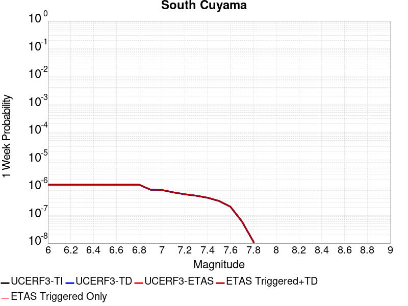 | 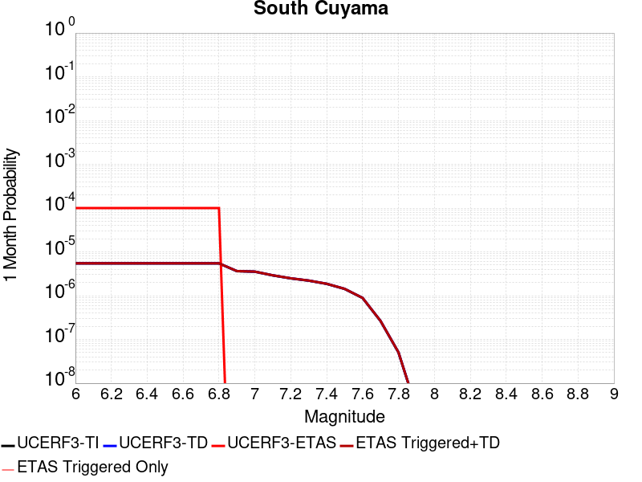 | 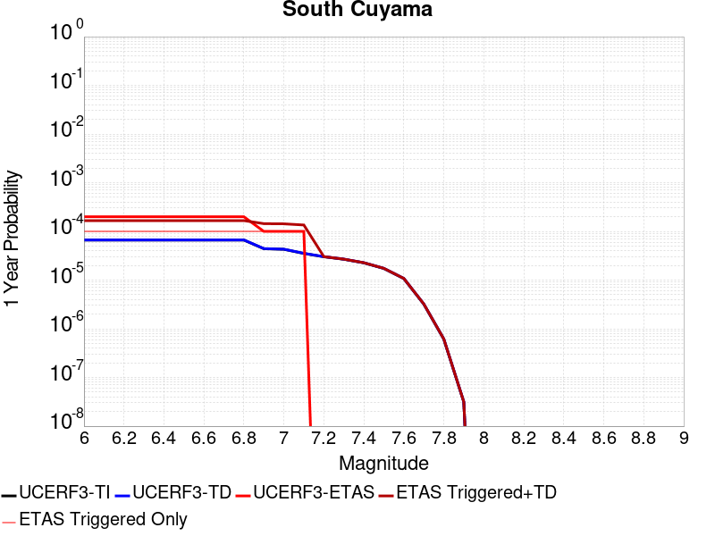 | 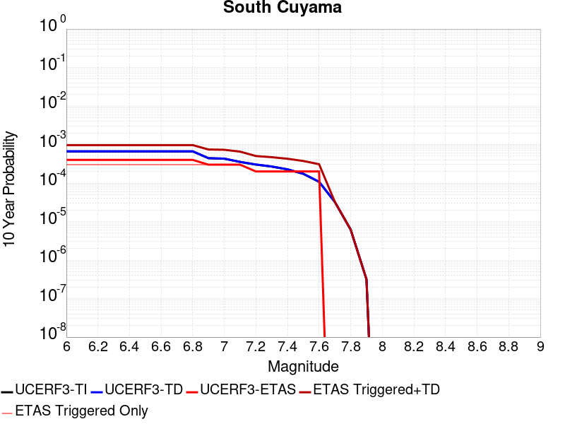 |

| Magnitude | 1 wk TI Prob | 1 wk TD Prob | 1 wk ETAS Prob | 1 wk ETAS/TD Gain | 1 wk ETAS Triggered+TD | 1 wk ETAS Triggered Only | 1 mo TI Prob | 1 mo TD Prob | 1 mo ETAS Prob | 1 mo ETAS/TD Gain | 1 mo ETAS Triggered+TD | 1 mo ETAS Triggered Only | 1 yr TI Prob | 1 yr TD Prob | 1 yr ETAS Prob | 1 yr ETAS/TD Gain | 1 yr ETAS Triggered+TD | 1 yr ETAS Triggered Only | 10 yr TI Prob | 10 yr TD Prob | 10 yr ETAS Prob | 10 yr ETAS/TD Gain | 10 yr ETAS Triggered+TD | 10 yr ETAS Triggered Only |
|-----|-----|-----|-----|-----|-----|-----|-----|-----|-----|-----|-----|-----|-----|-----|-----|-----|-----|-----|-----|-----|-----|-----|-----|-----|
| 6.0 | 1.2747308E-6 | 1.281884E-6 | 0.0 | 0.0 | 1.281884E-6 | 0.0 | 5.4631205E-6 | 5.4937773E-6 | 1.0E-4 | 18.202414 | 5.4937773E-6 | 0.0 | 6.6511464E-5 | 6.688476E-5 | 2.0E-4 | 2.990218 | 1.6687806E-4 | 1.0E-4 | 6.649156E-4 | 6.686532E-4 | 4.0E-4 | 0.5982174 | 9.6845266E-4 | 3.0E-4 |
| 6.1 | 1.2747308E-6 | 1.281884E-6 | 0.0 | 0.0 | 1.281884E-6 | 0.0 | 5.4631205E-6 | 5.4937773E-6 | 1.0E-4 | 18.202414 | 5.4937773E-6 | 0.0 | 6.6511464E-5 | 6.688476E-5 | 2.0E-4 | 2.990218 | 1.6687806E-4 | 1.0E-4 | 6.649156E-4 | 6.686532E-4 | 4.0E-4 | 0.5982174 | 9.6845266E-4 | 3.0E-4 |
| 6.2 | 1.2747308E-6 | 1.281884E-6 | 0.0 | 0.0 | 1.281884E-6 | 0.0 | 5.4631205E-6 | 5.4937773E-6 | 1.0E-4 | 18.202414 | 5.4937773E-6 | 0.0 | 6.6511464E-5 | 6.688476E-5 | 2.0E-4 | 2.990218 | 1.6687806E-4 | 1.0E-4 | 6.649156E-4 | 6.686532E-4 | 4.0E-4 | 0.5982174 | 9.6845266E-4 | 3.0E-4 |
| 6.3 | 1.2747308E-6 | 1.281884E-6 | 0.0 | 0.0 | 1.281884E-6 | 0.0 | 5.4631205E-6 | 5.4937773E-6 | 1.0E-4 | 18.202414 | 5.4937773E-6 | 0.0 | 6.6511464E-5 | 6.688476E-5 | 2.0E-4 | 2.990218 | 1.6687806E-4 | 1.0E-4 | 6.649156E-4 | 6.686532E-4 | 4.0E-4 | 0.5982174 | 9.6845266E-4 | 3.0E-4 |
| 6.4 | 1.2747308E-6 | 1.281884E-6 | 0.0 | 0.0 | 1.281884E-6 | 0.0 | 5.4631205E-6 | 5.4937773E-6 | 1.0E-4 | 18.202414 | 5.4937773E-6 | 0.0 | 6.6511464E-5 | 6.688476E-5 | 2.0E-4 | 2.990218 | 1.6687806E-4 | 1.0E-4 | 6.649156E-4 | 6.686532E-4 | 4.0E-4 | 0.5982174 | 9.6845266E-4 | 3.0E-4 |
| 6.5 | 1.2747308E-6 | 1.281884E-6 | 0.0 | 0.0 | 1.281884E-6 | 0.0 | 5.4631205E-6 | 5.4937773E-6 | 1.0E-4 | 18.202414 | 5.4937773E-6 | 0.0 | 6.6511464E-5 | 6.688476E-5 | 2.0E-4 | 2.990218 | 1.6687806E-4 | 1.0E-4 | 6.649156E-4 | 6.686532E-4 | 4.0E-4 | 0.5982174 | 9.6845266E-4 | 3.0E-4 |
| 6.6 | 1.2747308E-6 | 1.281884E-6 | 0.0 | 0.0 | 1.281884E-6 | 0.0 | 5.4631205E-6 | 5.4937773E-6 | 1.0E-4 | 18.202414 | 5.4937773E-6 | 0.0 | 6.6511464E-5 | 6.688476E-5 | 2.0E-4 | 2.990218 | 1.6687806E-4 | 1.0E-4 | 6.649156E-4 | 6.686532E-4 | 4.0E-4 | 0.5982174 | 9.6845266E-4 | 3.0E-4 |
| 6.7 | 1.2747308E-6 | 1.281884E-6 | 0.0 | 0.0 | 1.281884E-6 | 0.0 | 5.4631205E-6 | 5.4937773E-6 | 1.0E-4 | 18.202414 | 5.4937773E-6 | 0.0 | 6.6511464E-5 | 6.688476E-5 | 2.0E-4 | 2.990218 | 1.6687806E-4 | 1.0E-4 | 6.649156E-4 | 6.686532E-4 | 4.0E-4 | 0.5982174 | 9.6845266E-4 | 3.0E-4 |
| 6.8 | 1.2747308E-6 | 1.281884E-6 | 0.0 | 0.0 | 1.281884E-6 | 0.0 | 5.4631205E-6 | 5.4937773E-6 | 1.0E-4 | 18.202414 | 5.4937773E-6 | 0.0 | 6.6511464E-5 | 6.688476E-5 | 2.0E-4 | 2.990218 | 1.6687806E-4 | 1.0E-4 | 6.649156E-4 | 6.686532E-4 | 4.0E-4 | 0.5982174 | 9.6845266E-4 | 3.0E-4 |
| 6.9 | 8.4566324E-7 | 8.507985E-7 | 0.0 | 0.0 | 8.507985E-7 | 0.0 | 3.624266E-6 | 3.6462743E-6 | 0.0 | 0.0 | 3.6462743E-6 | 0.0 | 4.4124543E-5 | 4.4392495E-5 | 1.0E-4 | 2.252633 | 1.4438806E-4 | 1.0E-4 | 4.4115784E-4 | 4.438373E-4 | 3.0E-4 | 0.67592335 | 7.4370415E-4 | 3.0E-4 |
| 7.0 | 8.2277904E-7 | 8.2779195E-7 | 0.0 | 0.0 | 8.2779195E-7 | 0.0 | 3.526191E-6 | 3.547675E-6 | 0.0 | 0.0 | 3.547675E-6 | 0.0 | 4.293053E-5 | 4.31921E-5 | 1.0E-4 | 2.3152382 | 1.4318778E-4 | 1.0E-4 | 4.292224E-4 | 4.3183804E-4 | 3.0E-4 | 0.6947049 | 7.317085E-4 | 3.0E-4 |
| 7.1 | 6.7661887E-7 | 6.809216E-7 | 0.0 | 0.0 | 6.809216E-7 | 0.0 | 2.899792E-6 | 2.918232E-6 | 0.0 | 0.0 | 2.918232E-6 | 0.0 | 3.5304394E-5 | 3.55289E-5 | 1.0E-4 | 2.81461 | 1.3552535E-4 | 1.0E-4 | 3.5298787E-4 | 3.552326E-4 | 3.0E-4 | 0.8445171 | 6.55126E-4 | 3.0E-4 |
| 7.2 | 5.783336E-7 | 5.8212663E-7 | 0.0 | 0.0 | 5.8212663E-7 | 0.0 | 2.4785702E-6 | 2.494826E-6 | 0.0 | 0.0 | 2.494826E-6 | 0.0 | 3.0176174E-5 | 3.0374087E-5 | 0.0 | 0.0 | 3.0374087E-5 | 0.0 | 3.0172078E-4 | 3.036996E-4 | 2.0E-4 | 0.6585455 | 5.036389E-4 | 2.0E-4 |
| 7.3 | 5.136759E-7 | 5.171006E-7 | 0.0 | 0.0 | 5.171006E-7 | 0.0 | 2.2014663E-6 | 2.2161437E-6 | 0.0 | 0.0 | 2.2161437E-6 | 0.0 | 2.6802521E-5 | 2.6981217E-5 | 0.0 | 0.0 | 2.6981217E-5 | 0.0 | 2.679929E-4 | 2.6977962E-4 | 2.0E-4 | 0.7413459 | 4.6972567E-4 | 2.0E-4 |
| 7.4 | 4.3370295E-7 | 4.3665952E-7 | 0.0 | 0.0 | 4.3665952E-7 | 0.0 | 1.8587256E-6 | 1.8713966E-6 | 0.0 | 0.0 | 1.8713966E-6 | 0.0 | 2.2629749E-5 | 2.2784017E-5 | 0.0 | 0.0 | 2.2784017E-5 | 0.0 | 2.2627445E-4 | 2.2781698E-4 | 2.0E-4 | 0.8778977 | 4.2777142E-4 | 2.0E-4 |
| 7.5 | 3.3242574E-7 | 3.347693E-7 | 0.0 | 0.0 | 3.347693E-7 | 0.0 | 1.4246809E-6 | 1.4347248E-6 | 0.0 | 0.0 | 1.4347248E-6 | 0.0 | 1.7345352E-5 | 1.7467637E-5 | 0.0 | 0.0 | 1.7467637E-5 | 0.0 | 1.7343998E-4 | 1.7466277E-4 | 2.0E-4 | 1.1450638 | 3.7462782E-4 | 2.0E-4 |
| 7.6 | 2.0627535E-7 | 2.0779203E-7 | 0.0 | 0.0 | 2.0779203E-7 | 0.0 | 8.840369E-7 | 8.9053697E-7 | 0.0 | 0.0 | 8.9053697E-7 | 0.0 | 1.0763096E-5 | 1.0842235E-5 | 0.0 | 0.0 | 1.0842235E-5 | 0.0 | 1.0762575E-4 | 1.0841714E-4 | 2.0E-4 | 1.8447268 | 3.0839545E-4 | 2.0E-4 |
| 7.7 | 6.15236E-8 | 6.198397E-8 | 0.0 | 0.0 | 6.198397E-8 | 0.0 | 2.6367252E-7 | 2.6564553E-7 | 0.0 | 0.0 | 2.6564553E-7 | 0.0 | 3.2102084E-6 | 3.2342298E-6 | 0.0 | 0.0 | 3.2342298E-6 | 0.0 | 3.210162E-5 | 3.2341835E-5 | 0.0 | 0.0 | 3.2341835E-5 | 0.0 |
| 7.8 | 1.1765573E-8 | 1.1873629E-8 | 0.0 | 0.0 | 1.1873629E-8 | 0.0 | 5.0423886E-8 | 5.0886985E-8 | 0.0 | 0.0 | 5.0886985E-8 | 0.0 | 6.1391063E-7 | 6.1954887E-7 | 0.0 | 0.0 | 6.1954887E-7 | 0.0 | 6.1390897E-6 | 6.1954725E-6 | 0.0 | 0.0 | 6.1954725E-6 | 0.0 |
| 7.9 | 6.0381755E-10 | 6.1007044E-10 | 0.0 | 0.0 | 6.1007044E-10 | 0.0 | 2.5877895E-9 | 2.6145877E-9 | 0.0 | 0.0 | 2.6145877E-9 | 0.0 | 3.1506335E-8 | 3.1832606E-8 | 0.0 | 0.0 | 3.1832606E-8 | 0.0 | 3.1506332E-7 | 3.1832602E-7 | 0.0 | 0.0 | 3.1832602E-7 | 0.0 |

## Anaheim
*[(top)](#table-of-contents)*

| 1 Week | 1 Month | 1 Year | 10 Year |
|-----|-----|-----|-----|
| 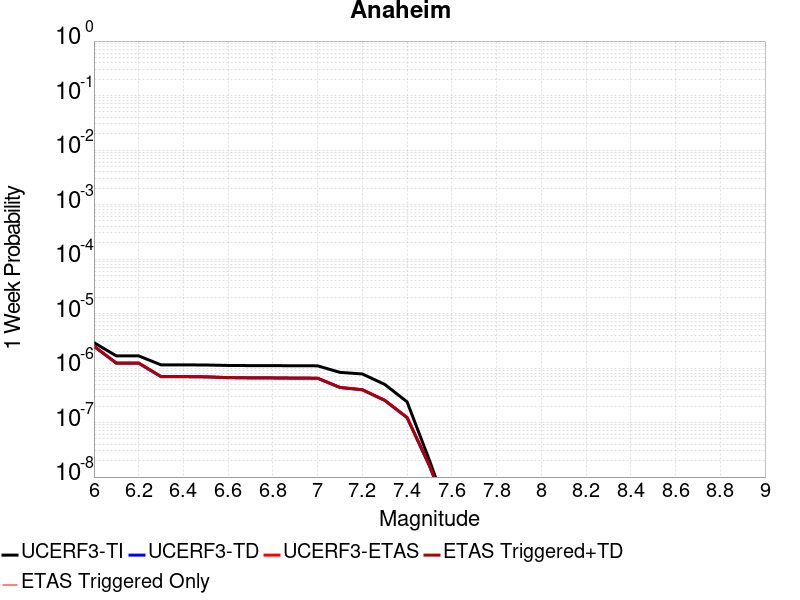 | 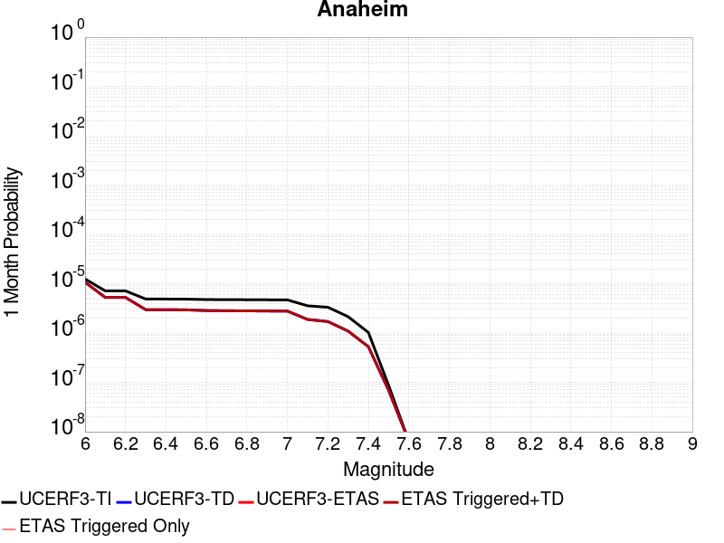 | 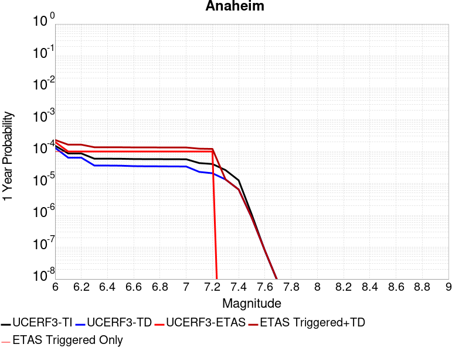 | 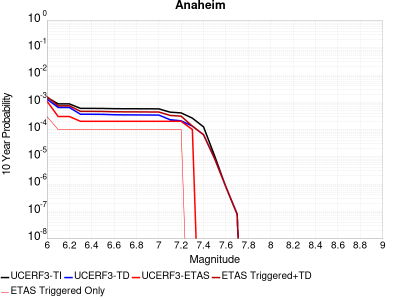 |

| Magnitude | 1 wk TI Prob | 1 wk TD Prob | 1 wk ETAS Prob | 1 wk ETAS/TD Gain | 1 wk ETAS Triggered+TD | 1 wk ETAS Triggered Only | 1 mo TI Prob | 1 mo TD Prob | 1 mo ETAS Prob | 1 mo ETAS/TD Gain | 1 mo ETAS Triggered+TD | 1 mo ETAS Triggered Only | 1 yr TI Prob | 1 yr TD Prob | 1 yr ETAS Prob | 1 yr ETAS/TD Gain | 1 yr ETAS Triggered+TD | 1 yr ETAS Triggered Only | 10 yr TI Prob | 10 yr TD Prob | 10 yr ETAS Prob | 10 yr ETAS/TD Gain | 10 yr ETAS Triggered+TD | 10 yr ETAS Triggered Only |
|-----|-----|-----|-----|-----|-----|-----|-----|-----|-----|-----|-----|-----|-----|-----|-----|-----|-----|-----|-----|-----|-----|-----|-----|-----|
| 6.0 | 2.9254998E-6 | 2.5124923E-6 | 0.0 | 0.0 | 2.5124923E-6 | 0.0 | 1.25377965E-5 | 1.0767792E-5 | 0.0 | 0.0 | 1.0767792E-5 | 0.0 | 1.5263697E-4 | 1.3109234E-4 | 2.0E-4 | 1.5256422 | 2.3107923E-4 | 1.0E-4 | 0.0015253217 | 0.0013103803 | 0.0011 | 0.83945096 | 0.0016099871 | 3.0E-4 |
| 6.1 | 1.6729715E-6 | 1.2338882E-6 | 0.0 | 0.0 | 1.2338882E-6 | 0.0 | 7.1698582E-6 | 5.2880837E-6 | 0.0 | 0.0 | 5.2880837E-6 | 0.0 | 8.7289525E-5 | 6.438093E-5 | 1.0E-4 | 1.5532548 | 1.6437449E-4 | 1.0E-4 | 8.7255245E-4 | 6.4366375E-4 | 3.0E-4 | 0.46608186 | 7.435994E-4 | 1.0E-4 |
| 6.2 | 1.6729715E-6 | 1.2338882E-6 | 0.0 | 0.0 | 1.2338882E-6 | 0.0 | 7.1698582E-6 | 5.2880837E-6 | 0.0 | 0.0 | 5.2880837E-6 | 0.0 | 8.7289525E-5 | 6.438093E-5 | 1.0E-4 | 1.5532548 | 1.6437449E-4 | 1.0E-4 | 8.7255245E-4 | 6.4366375E-4 | 3.0E-4 | 0.46608186 | 7.435994E-4 | 1.0E-4 |
| 6.3 | 1.1444064E-6 | 6.961015E-7 | 0.0 | 0.0 | 6.961015E-7 | 0.0 | 4.9045893E-6 | 2.983289E-6 | 0.0 | 0.0 | 2.983289E-6 | 0.0 | 5.971174E-5 | 3.6320995E-5 | 1.0E-4 | 2.7532287 | 1.3631737E-4 | 1.0E-4 | 5.96957E-4 | 3.6315608E-4 | 2.0E-4 | 0.55072737 | 4.6311977E-4 | 1.0E-4 |
| 6.4 | 1.1444064E-6 | 6.961015E-7 | 0.0 | 0.0 | 6.961015E-7 | 0.0 | 4.9045893E-6 | 2.983289E-6 | 0.0 | 0.0 | 2.983289E-6 | 0.0 | 5.971174E-5 | 3.6320995E-5 | 1.0E-4 | 2.7532287 | 1.3631737E-4 | 1.0E-4 | 5.96957E-4 | 3.6315608E-4 | 2.0E-4 | 0.55072737 | 4.6311977E-4 | 1.0E-4 |
| 6.5 | 1.1385318E-6 | 6.901697E-7 | 0.0 | 0.0 | 6.901697E-7 | 0.0 | 4.879413E-6 | 2.9578673E-6 | 0.0 | 0.0 | 2.9578673E-6 | 0.0 | 5.9405233E-5 | 3.6011494E-5 | 1.0E-4 | 2.7768912 | 1.3600789E-4 | 1.0E-4 | 5.938936E-4 | 3.6006208E-4 | 2.0E-4 | 0.55545974 | 4.600261E-4 | 1.0E-4 |
| 6.6 | 1.1165511E-6 | 6.679564E-7 | 0.0 | 0.0 | 6.679564E-7 | 0.0 | 4.78521E-6 | 2.8626673E-6 | 0.0 | 0.0 | 2.8626673E-6 | 0.0 | 5.8258374E-5 | 3.4852474E-5 | 1.0E-4 | 2.8692367 | 1.3484899E-4 | 1.0E-4 | 5.8243104E-4 | 3.4847553E-4 | 2.0E-4 | 0.5739284 | 4.4844067E-4 | 1.0E-4 |
| 6.7 | 1.1098243E-6 | 6.611757E-7 | 0.0 | 0.0 | 6.611757E-7 | 0.0 | 4.7563813E-6 | 2.8336074E-6 | 0.0 | 0.0 | 2.8336074E-6 | 0.0 | 5.7907404E-5 | 3.449868E-5 | 1.0E-4 | 2.8986616 | 1.3449523E-4 | 1.0E-4 | 5.7892315E-4 | 3.449387E-4 | 2.0E-4 | 0.5798132 | 4.449042E-4 | 1.0E-4 |
| 6.8 | 1.1077587E-6 | 6.59096E-7 | 0.0 | 0.0 | 6.59096E-7 | 0.0 | 4.7475287E-6 | 2.8246943E-6 | 0.0 | 0.0 | 2.8246943E-6 | 0.0 | 5.779963E-5 | 3.4390167E-5 | 1.0E-4 | 2.907808 | 1.3438673E-4 | 1.0E-4 | 5.77846E-4 | 3.4385387E-4 | 2.0E-4 | 0.5816424 | 4.438195E-4 | 1.0E-4 |
| 6.9 | 1.1024468E-6 | 6.537536E-7 | 0.0 | 0.0 | 6.537536E-7 | 0.0 | 4.7247636E-6 | 2.8017985E-6 | 0.0 | 0.0 | 2.8017985E-6 | 0.0 | 5.752248E-5 | 3.4111417E-5 | 1.0E-4 | 2.9315696 | 1.34108E-4 | 1.0E-4 | 5.750759E-4 | 3.4106727E-4 | 2.0E-4 | 0.5863946 | 4.4103316E-4 | 1.0E-4 |
| 7.0 | 1.0993066E-6 | 6.511642E-7 | 0.0 | 0.0 | 6.511642E-7 | 0.0 | 4.7113053E-6 | 2.790701E-6 | 0.0 | 0.0 | 2.790701E-6 | 0.0 | 5.7358633E-5 | 3.397631E-5 | 1.0E-4 | 2.943227 | 1.3397292E-4 | 1.0E-4 | 5.734383E-4 | 3.3971661E-4 | 2.0E-4 | 0.588726 | 4.3968263E-4 | 1.0E-4 |
| 7.1 | 8.334877E-7 | 4.4060647E-7 | 0.0 | 0.0 | 4.4060647E-7 | 0.0 | 3.5720855E-6 | 1.8883122E-6 | 0.0 | 0.0 | 1.8883122E-6 | 0.0 | 4.348927E-5 | 2.2989982E-5 | 1.0E-4 | 4.349721 | 1.2298768E-4 | 1.0E-4 | 4.3480762E-4 | 2.2987826E-4 | 2.0E-4 | 0.87002575 | 3.2985528E-4 | 1.0E-4 |
| 7.2 | 7.794411E-7 | 3.9986858E-7 | 0.0 | 0.0 | 3.9986858E-7 | 0.0 | 3.3404576E-6 | 1.7137214E-6 | 0.0 | 0.0 | 1.7137214E-6 | 0.0 | 4.0669314E-5 | 2.086438E-5 | 1.0E-4 | 4.7928576 | 1.2086229E-4 | 1.0E-4 | 4.066187E-4 | 2.0862625E-4 | 2.0E-4 | 0.95865214 | 3.0860538E-4 | 1.0E-4 |
| 7.3 | 5.01704E-7 | 2.55798E-7 | 0.0 | 0.0 | 2.55798E-7 | 0.0 | 2.150158E-6 | 1.0962767E-6 | 0.0 | 0.0 | 1.0962767E-6 | 0.0 | 2.617786E-5 | 1.33471E-5 | 0.0 | 0.0 | 1.33471E-5 | 0.0 | 2.6174777E-4 | 1.3346423E-4 | 1.0E-4 | 0.7492644 | 1.3346423E-4 | 0.0 |
| 7.4 | 2.4008182E-7 | 1.2370622E-7 | 0.0 | 0.0 | 1.2370622E-7 | 0.0 | 1.0289217E-6 | 5.301694E-7 | 0.0 | 0.0 | 5.301694E-7 | 0.0 | 1.252705E-5 | 6.4548017E-6 | 0.0 | 0.0 | 6.4548017E-6 | 0.0 | 1.2526344E-4 | 6.4546904E-5 | 0.0 | 0.0 | 6.4546904E-5 | 0.0 |
| 7.5 | 2.0263876E-8 | 1.6122573E-8 | 0.0 | 0.0 | 1.6122573E-8 | 0.0 | 8.684518E-8 | 6.909674E-8 | 0.0 | 0.0 | 6.909674E-8 | 0.0 | 1.0573395E-6 | 8.4125264E-7 | 0.0 | 0.0 | 8.4125264E-7 | 0.0 | 1.0573345E-5 | 8.412504E-6 | 0.0 | 0.0 | 8.412504E-6 | 0.0 |
| 7.6 | 1.4871431E-9 | 1.5084604E-9 | 0.0 | 0.0 | 1.5084604E-9 | 0.0 | 6.37347E-9 | 6.4648313E-9 | 0.0 | 0.0 | 6.4648313E-9 | 0.0 | 7.7596994E-8 | 7.870932E-8 | 0.0 | 0.0 | 7.870932E-8 | 0.0 | 7.759697E-7 | 7.87093E-7 | 0.0 | 0.0 | 7.87093E-7 | 0.0 |
| 7.7 | 1.5093293E-10 | 1.5334012E-10 | 0.0 | 0.0 | 1.5334012E-10 | 0.0 | 6.4685546E-10 | 6.571719E-10 | 0.0 | 0.0 | 6.571719E-10 | 0.0 | 7.875465E-9 | 8.001066E-9 | 0.0 | 0.0 | 8.001066E-9 | 0.0 | 7.8754645E-8 | 8.001065E-8 | 0.0 | 0.0 | 8.001065E-8 | 0.0 |

## Fitzhugh Creek
*[(top)](#table-of-contents)*

| 1 Week | 1 Month | 1 Year | 10 Year |
|-----|-----|-----|-----|
| 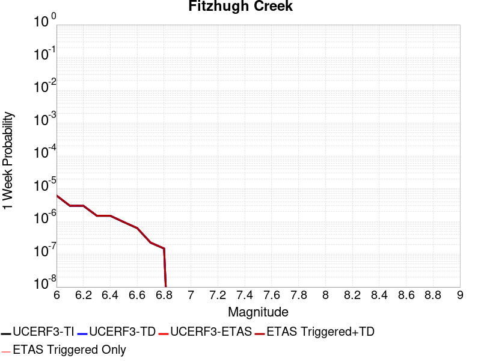 |  | 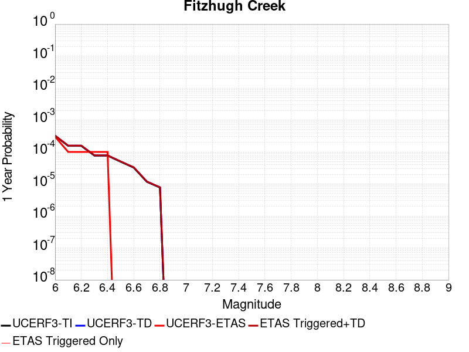 | 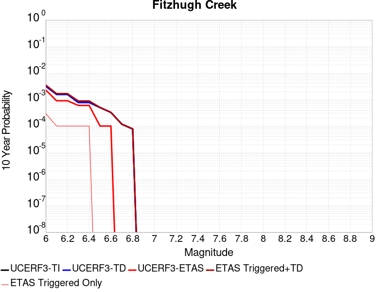 |

| Magnitude | 1 wk TI Prob | 1 wk TD Prob | 1 wk ETAS Prob | 1 wk ETAS/TD Gain | 1 wk ETAS Triggered+TD | 1 wk ETAS Triggered Only | 1 mo TI Prob | 1 mo TD Prob | 1 mo ETAS Prob | 1 mo ETAS/TD Gain | 1 mo ETAS Triggered+TD | 1 mo ETAS Triggered Only | 1 yr TI Prob | 1 yr TD Prob | 1 yr ETAS Prob | 1 yr ETAS/TD Gain | 1 yr ETAS Triggered+TD | 1 yr ETAS Triggered Only | 10 yr TI Prob | 10 yr TD Prob | 10 yr ETAS Prob | 10 yr ETAS/TD Gain | 10 yr ETAS Triggered+TD | 10 yr ETAS Triggered Only |
|-----|-----|-----|-----|-----|-----|-----|-----|-----|-----|-----|-----|-----|-----|-----|-----|-----|-----|-----|-----|-----|-----|-----|-----|-----|
| 6.0 | 6.1090436E-6 | 6.21036E-6 | 0.0 | 0.0 | 6.21036E-6 | 0.0 | 2.6181353E-5 | 2.6615582E-5 | 0.0 | 0.0 | 2.6615582E-5 | 0.0 | 3.1871133E-4 | 3.2400104E-4 | 3.0E-4 | 0.925923 | 3.2400104E-4 | 0.0 | 0.0031825465 | 0.0032357306 | 0.0023 | 0.71081316 | 0.0035347599 | 3.0E-4 |
| 6.1 | 2.9741811E-6 | 3.0216765E-6 | 0.0 | 0.0 | 3.0216765E-6 | 0.0 | 1.2746428E-5 | 1.2949983E-5 | 0.0 | 0.0 | 1.2949983E-5 | 0.0 | 1.5517672E-4 | 1.5765558E-4 | 1.0E-4 | 0.6342941 | 1.5765558E-4 | 0.0 | 0.001550684 | 0.0015755303 | 9.0E-4 | 0.57123625 | 0.0016753728 | 1.0E-4 |
| 6.2 | 2.9741811E-6 | 3.0216765E-6 | 0.0 | 0.0 | 3.0216765E-6 | 0.0 | 1.2746428E-5 | 1.2949983E-5 | 0.0 | 0.0 | 1.2949983E-5 | 0.0 | 1.5517672E-4 | 1.5765558E-4 | 1.0E-4 | 0.6342941 | 1.5765558E-4 | 0.0 | 0.001550684 | 0.0015755303 | 9.0E-4 | 0.57123625 | 0.0016753728 | 1.0E-4 |
| 6.3 | 1.4781198E-6 | 1.5013175E-6 | 0.0 | 0.0 | 1.5013175E-6 | 0.0 | 6.3347834E-6 | 6.434203E-6 | 0.0 | 0.0 | 6.434203E-6 | 0.0 | 7.712326E-5 | 7.833381E-5 | 1.0E-4 | 1.276588 | 7.833381E-5 | 0.0 | 7.70965E-4 | 7.830819E-4 | 6.0E-4 | 0.7662034 | 8.830036E-4 | 1.0E-4 |
| 6.4 | 1.4781198E-6 | 1.5013175E-6 | 0.0 | 0.0 | 1.5013175E-6 | 0.0 | 6.3347834E-6 | 6.434203E-6 | 0.0 | 0.0 | 6.434203E-6 | 0.0 | 7.712326E-5 | 7.833381E-5 | 1.0E-4 | 1.276588 | 7.833381E-5 | 0.0 | 7.70965E-4 | 7.830819E-4 | 6.0E-4 | 0.7662034 | 8.830036E-4 | 1.0E-4 |
| 6.5 | 9.5176676E-7 | 9.666359E-7 | 0.0 | 0.0 | 9.666359E-7 | 0.0 | 4.078994E-6 | 4.1427193E-6 | 0.0 | 0.0 | 4.1427193E-6 | 0.0 | 4.9660623E-5 | 5.0436545E-5 | 0.0 | 0.0 | 5.0436545E-5 | 0.0 | 4.964952E-4 | 5.042614E-4 | 1.0E-4 | 0.19830985 | 5.042614E-4 | 0.0 |
| 6.6 | 6.21145E-7 | 6.3087816E-7 | 0.0 | 0.0 | 6.3087816E-7 | 0.0 | 2.662047E-6 | 2.703761E-6 | 0.0 | 0.0 | 2.703761E-6 | 0.0 | 3.2409942E-5 | 3.2917862E-5 | 0.0 | 0.0 | 3.2917862E-5 | 0.0 | 3.2405215E-4 | 3.291364E-4 | 1.0E-4 | 0.30382538 | 3.291364E-4 | 0.0 |
| 6.7 | 2.2377962E-7 | 2.2735355E-7 | 0.0 | 0.0 | 2.2735355E-7 | 0.0 | 9.590551E-7 | 9.743721E-7 | 0.0 | 0.0 | 9.743721E-7 | 0.0 | 1.1676434E-5 | 1.1862949E-5 | 0.0 | 0.0 | 1.1862949E-5 | 0.0 | 1.1675821E-4 | 1.1862629E-4 | 0.0 | 0.0 | 1.1862629E-4 | 0.0 |
| 6.8 | 1.4785022E-7 | 1.5021969E-7 | 0.0 | 0.0 | 1.5021969E-7 | 0.0 | 6.3364365E-7 | 6.4379867E-7 | 0.0 | 0.0 | 6.4379867E-7 | 0.0 | 7.714584E-6 | 7.838249E-6 | 0.0 | 0.0 | 7.838249E-6 | 0.0 | 7.714316E-5 | 7.838249E-5 | 0.0 | 0.0 | 7.838249E-5 | 0.0 |

## Kern Canyon (North Kern) 2011
*[(top)](#table-of-contents)*

| 1 Week | 1 Month | 1 Year | 10 Year |
|-----|-----|-----|-----|
| 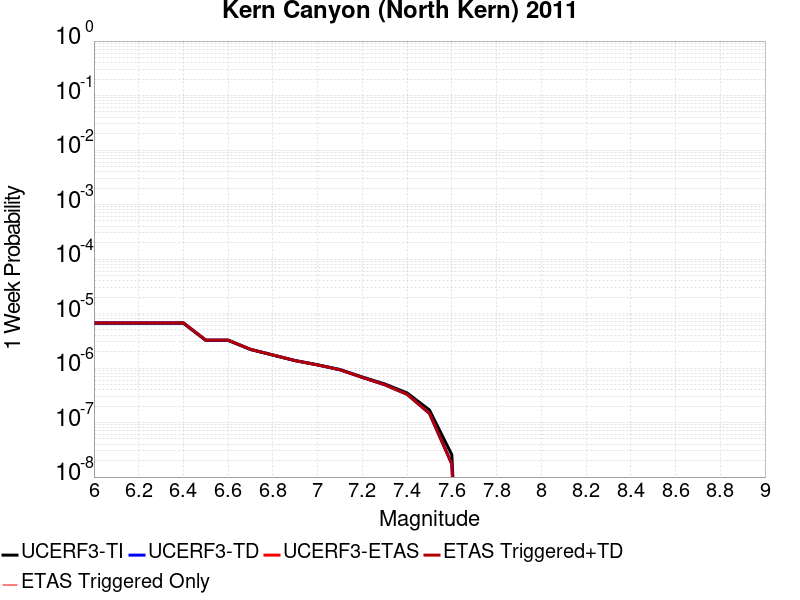 | 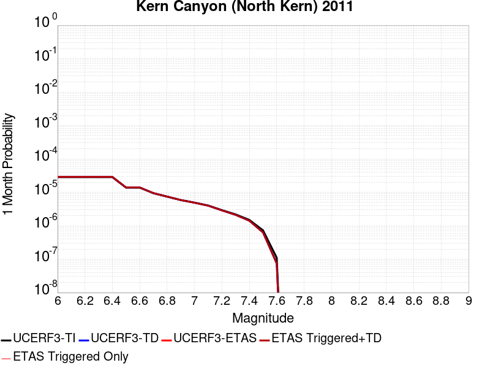 | 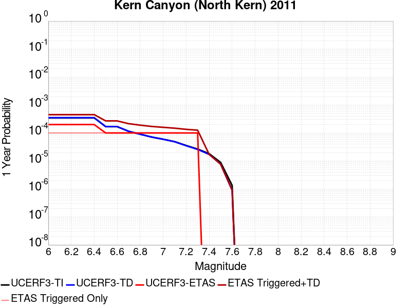 | 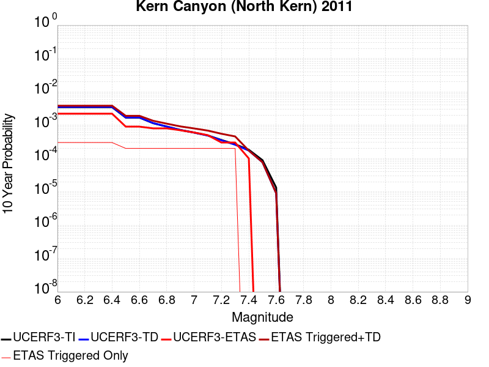 |

| Magnitude | 1 wk TI Prob | 1 wk TD Prob | 1 wk ETAS Prob | 1 wk ETAS/TD Gain | 1 wk ETAS Triggered+TD | 1 wk ETAS Triggered Only | 1 mo TI Prob | 1 mo TD Prob | 1 mo ETAS Prob | 1 mo ETAS/TD Gain | 1 mo ETAS Triggered+TD | 1 mo ETAS Triggered Only | 1 yr TI Prob | 1 yr TD Prob | 1 yr ETAS Prob | 1 yr ETAS/TD Gain | 1 yr ETAS Triggered+TD | 1 yr ETAS Triggered Only | 10 yr TI Prob | 10 yr TD Prob | 10 yr ETAS Prob | 10 yr ETAS/TD Gain | 10 yr ETAS Triggered+TD | 10 yr ETAS Triggered Only |
|-----|-----|-----|-----|-----|-----|-----|-----|-----|-----|-----|-----|-----|-----|-----|-----|-----|-----|-----|-----|-----|-----|-----|-----|-----|
| 6.0 | 6.6264497E-6 | 6.7576507E-6 | 0.0 | 0.0 | 6.7576507E-6 | 0.0 | 2.8398761E-5 | 2.8961083E-5 | 0.0 | 0.0 | 2.8961083E-5 | 0.0 | 3.4570007E-4 | 3.5255213E-4 | 2.0E-4 | 0.567292 | 4.525169E-4 | 1.0E-4 | 0.0034516277 | 0.003520717 | 0.0022 | 0.62487274 | 0.0038196607 | 3.0E-4 |
| 6.1 | 6.6264497E-6 | 6.7576507E-6 | 0.0 | 0.0 | 6.7576507E-6 | 0.0 | 2.8398761E-5 | 2.8961083E-5 | 0.0 | 0.0 | 2.8961083E-5 | 0.0 | 3.4570007E-4 | 3.5255213E-4 | 2.0E-4 | 0.567292 | 4.525169E-4 | 1.0E-4 | 0.0034516277 | 0.003520717 | 0.0022 | 0.62487274 | 0.0038196607 | 3.0E-4 |
| 6.2 | 6.6264497E-6 | 6.7576507E-6 | 0.0 | 0.0 | 6.7576507E-6 | 0.0 | 2.8398761E-5 | 2.8961083E-5 | 0.0 | 0.0 | 2.8961083E-5 | 0.0 | 3.4570007E-4 | 3.5255213E-4 | 2.0E-4 | 0.567292 | 4.525169E-4 | 1.0E-4 | 0.0034516277 | 0.003520717 | 0.0022 | 0.62487274 | 0.0038196607 | 3.0E-4 |
| 6.3 | 6.6264497E-6 | 6.7576507E-6 | 0.0 | 0.0 | 6.7576507E-6 | 0.0 | 2.8398761E-5 | 2.8961083E-5 | 0.0 | 0.0 | 2.8961083E-5 | 0.0 | 3.4570007E-4 | 3.5255213E-4 | 2.0E-4 | 0.567292 | 4.525169E-4 | 1.0E-4 | 0.0034516277 | 0.003520717 | 0.0022 | 0.62487274 | 0.0038196607 | 3.0E-4 |
| 6.4 | 6.6264497E-6 | 6.7576507E-6 | 0.0 | 0.0 | 6.7576507E-6 | 0.0 | 2.8398761E-5 | 2.8961083E-5 | 0.0 | 0.0 | 2.8961083E-5 | 0.0 | 3.4570007E-4 | 3.5255213E-4 | 2.0E-4 | 0.567292 | 4.525169E-4 | 1.0E-4 | 0.0034516277 | 0.003520717 | 0.0022 | 0.62487274 | 0.0038196607 | 3.0E-4 |
| 6.5 | 3.2162225E-6 | 3.2572286E-6 | 0.0 | 0.0 | 3.2572286E-6 | 0.0 | 1.3783738E-5 | 1.3959481E-5 | 0.0 | 0.0 | 1.3959481E-5 | 0.0 | 1.6780409E-4 | 1.6994424E-4 | 1.0E-4 | 0.5884283 | 2.6992723E-4 | 1.0E-4 | 0.0016767744 | 0.0016982225 | 9.0E-4 | 0.52996594 | 0.0018978828 | 2.0E-4 |
| 6.6 | 3.2162225E-6 | 3.2572286E-6 | 0.0 | 0.0 | 3.2572286E-6 | 0.0 | 1.3783738E-5 | 1.3959481E-5 | 0.0 | 0.0 | 1.3959481E-5 | 0.0 | 1.6780409E-4 | 1.6994424E-4 | 1.0E-4 | 0.5884283 | 2.6992723E-4 | 1.0E-4 | 0.0016767744 | 0.0016982225 | 9.0E-4 | 0.52996594 | 0.0018978828 | 2.0E-4 |
| 6.7 | 2.1908265E-6 | 2.2072095E-6 | 0.0 | 0.0 | 2.2072095E-6 | 0.0 | 9.389223E-6 | 9.459435E-6 | 0.0 | 0.0 | 9.459435E-6 | 0.0 | 1.1430779E-4 | 1.1516274E-4 | 1.0E-4 | 0.86833644 | 2.1515122E-4 | 1.0E-4 | 0.0011424901 | 0.00115105 | 8.0E-4 | 0.6950176 | 0.0013508198 | 2.0E-4 |
| 6.8 | 1.7303895E-6 | 1.7366195E-6 | 0.0 | 0.0 | 1.7366195E-6 | 0.0 | 7.415934E-6 | 7.442635E-6 | 0.0 | 0.0 | 7.442635E-6 | 0.0 | 9.028525E-5 | 9.061041E-5 | 1.0E-4 | 1.103626 | 1.9060135E-4 | 1.0E-4 | 9.024858E-4 | 9.057443E-4 | 8.0E-4 | 0.8832514 | 0.0011055632 | 2.0E-4 |
| 6.9 | 1.3700314E-6 | 1.368914E-6 | 0.0 | 0.0 | 1.368914E-6 | 0.0 | 5.87155E-6 | 5.8667615E-6 | 0.0 | 0.0 | 5.8667615E-6 | 0.0 | 7.148377E-5 | 7.142553E-5 | 1.0E-4 | 1.4000597 | 1.7141839E-4 | 1.0E-4 | 7.146078E-4 | 7.140303E-4 | 7.0E-4 | 0.98035055 | 9.1388746E-4 | 2.0E-4 |
| 7.0 | 1.1467797E-6 | 1.1414237E-6 | 0.0 | 0.0 | 1.1414237E-6 | 0.0 | 4.9147607E-6 | 4.891807E-6 | 0.0 | 0.0 | 4.891807E-6 | 0.0 | 5.983557E-5 | 5.9556154E-5 | 1.0E-4 | 1.6790876 | 1.595502E-4 | 1.0E-4 | 5.981946E-4 | 5.9540506E-4 | 6.0E-4 | 1.0077173 | 7.95286E-4 | 2.0E-4 |
| 7.1 | 9.3952065E-7 | 9.3030457E-7 | 0.0 | 0.0 | 9.3030457E-7 | 0.0 | 4.026511E-6 | 3.9870133E-6 | 0.0 | 0.0 | 3.9870133E-6 | 0.0 | 4.9021666E-5 | 4.8540827E-5 | 1.0E-4 | 2.0601215 | 1.4853597E-4 | 1.0E-4 | 4.901085E-4 | 4.8530402E-4 | 5.0E-4 | 1.030282 | 6.8520696E-4 | 2.0E-4 |
| 7.2 | 6.858055E-7 | 6.7195623E-7 | 0.0 | 0.0 | 6.7195623E-7 | 0.0 | 2.939163E-6 | 2.8798092E-6 | 0.0 | 0.0 | 2.8798092E-6 | 0.0 | 3.5783723E-5 | 3.5061123E-5 | 1.0E-4 | 2.8521621 | 1.3505762E-4 | 1.0E-4 | 3.5777962E-4 | 3.5055677E-4 | 3.0E-4 | 0.8557815 | 5.504867E-4 | 2.0E-4 |
| 7.3 | 5.1101983E-7 | 4.9394964E-7 | 0.0 | 0.0 | 4.9394964E-7 | 0.0 | 2.1900833E-6 | 2.1169253E-6 | 0.0 | 0.0 | 2.1169253E-6 | 0.0 | 2.6663936E-5 | 2.5773266E-5 | 1.0E-4 | 3.8799894 | 1.2577069E-4 | 1.0E-4 | 2.6660739E-4 | 2.5770324E-4 | 3.0E-4 | 1.1641296 | 4.576517E-4 | 2.0E-4 |
| 7.4 | 3.4999414E-7 | 3.2997278E-7 | 0.0 | 0.0 | 3.2997278E-7 | 0.0 | 1.499974E-6 | 1.4141683E-6 | 0.0 | 0.0 | 1.4141683E-6 | 0.0 | 1.8262032E-5 | 1.7217366E-5 | 0.0 | 0.0 | 1.7217366E-5 | 0.0 | 1.826053E-4 | 1.7216055E-4 | 1.0E-4 | 0.58085316 | 1.7216055E-4 | 0.0 |
| 7.5 | 1.7021522E-7 | 1.4750746E-7 | 0.0 | 0.0 | 1.4750746E-7 | 0.0 | 7.2949354E-7 | 6.321747E-7 | 0.0 | 0.0 | 6.321747E-7 | 0.0 | 8.881548E-6 | 7.696701E-6 | 0.0 | 0.0 | 7.696701E-6 | 0.0 | 8.8811925E-5 | 7.6964425E-5 | 0.0 | 0.0 | 7.6964425E-5 | 0.0 |
| 7.6 | 2.572245E-8 | 1.7353855E-8 | 0.0 | 0.0 | 1.7353855E-8 | 0.0 | 1.10239064E-7 | 7.4373666E-8 | 0.0 | 0.0 | 7.4373666E-8 | 0.0 | 1.3421597E-6 | 9.05499E-7 | 0.0 | 0.0 | 9.05499E-7 | 0.0 | 1.3421517E-5 | 9.054958E-6 | 0.0 | 0.0 | 9.054958E-6 | 0.0 |

## Del Valle
*[(top)](#table-of-contents)*

| 1 Week | 1 Month | 1 Year | 10 Year |
|-----|-----|-----|-----|
| 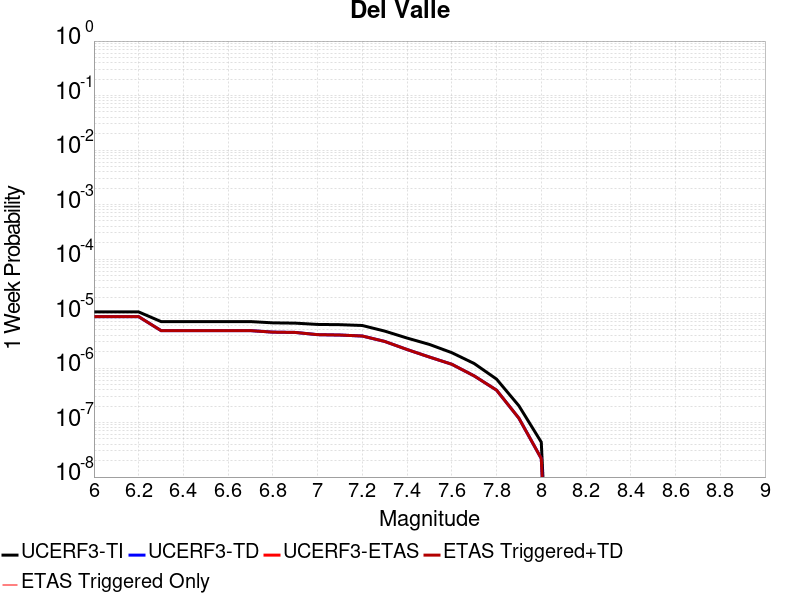 | 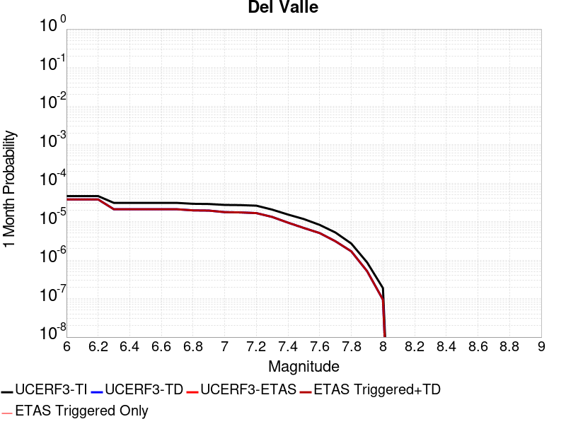 | 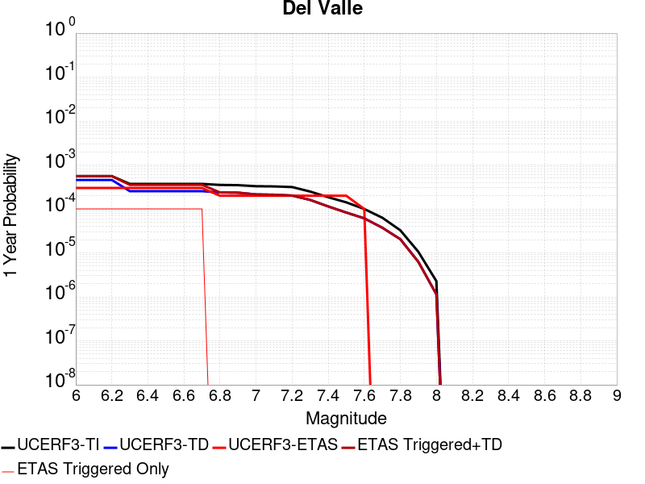 | 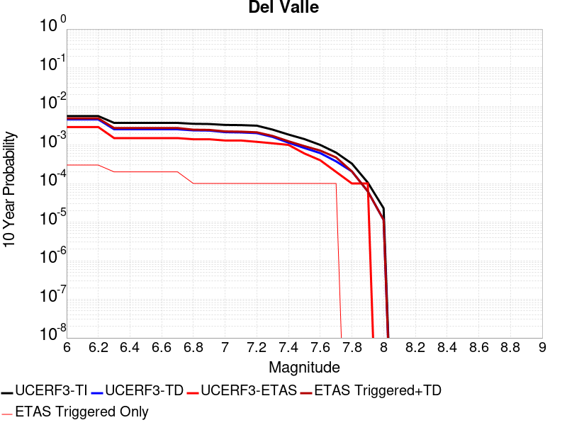 |

| Magnitude | 1 wk TI Prob | 1 wk TD Prob | 1 wk ETAS Prob | 1 wk ETAS/TD Gain | 1 wk ETAS Triggered+TD | 1 wk ETAS Triggered Only | 1 mo TI Prob | 1 mo TD Prob | 1 mo ETAS Prob | 1 mo ETAS/TD Gain | 1 mo ETAS Triggered+TD | 1 mo ETAS Triggered Only | 1 yr TI Prob | 1 yr TD Prob | 1 yr ETAS Prob | 1 yr ETAS/TD Gain | 1 yr ETAS Triggered+TD | 1 yr ETAS Triggered Only | 10 yr TI Prob | 10 yr TD Prob | 10 yr ETAS Prob | 10 yr ETAS/TD Gain | 10 yr ETAS Triggered+TD | 10 yr ETAS Triggered Only |
|-----|-----|-----|-----|-----|-----|-----|-----|-----|-----|-----|-----|-----|-----|-----|-----|-----|-----|-----|-----|-----|-----|-----|-----|-----|
| 6.0 | 1.0716125E-5 | 8.770489E-6 | 0.0 | 0.0 | 8.770489E-6 | 0.0 | 4.592544E-5 | 3.7587382E-5 | 0.0 | 0.0 | 3.7587382E-5 | 0.0 | 5.589988E-4 | 4.5755005E-4 | 3.0E-4 | 0.655666 | 5.575043E-4 | 1.0E-4 | 0.0055759475 | 0.004568042 | 0.0029 | 0.6348454 | 0.0048666713 | 3.0E-4 |
| 6.1 | 1.0716125E-5 | 8.770489E-6 | 0.0 | 0.0 | 8.770489E-6 | 0.0 | 4.592544E-5 | 3.7587382E-5 | 0.0 | 0.0 | 3.7587382E-5 | 0.0 | 5.589988E-4 | 4.5755005E-4 | 3.0E-4 | 0.655666 | 5.575043E-4 | 1.0E-4 | 0.0055759475 | 0.004568042 | 0.0029 | 0.6348454 | 0.0048666713 | 3.0E-4 |
| 6.2 | 1.0716125E-5 | 8.770489E-6 | 0.0 | 0.0 | 8.770489E-6 | 0.0 | 4.592544E-5 | 3.7587382E-5 | 0.0 | 0.0 | 3.7587382E-5 | 0.0 | 5.589988E-4 | 4.5755005E-4 | 3.0E-4 | 0.655666 | 5.575043E-4 | 1.0E-4 | 0.0055759475 | 0.004568042 | 0.0029 | 0.6348454 | 0.0048666713 | 3.0E-4 |
| 6.3 | 7.1293784E-6 | 4.8677502E-6 | 0.0 | 0.0 | 4.8677502E-6 | 0.0 | 3.055412E-5 | 2.0861624E-5 | 0.0 | 0.0 | 2.0861624E-5 | 0.0 | 3.7193293E-4 | 2.539614E-4 | 3.0E-4 | 1.1812819 | 3.53936E-4 | 1.0E-4 | 0.0037131102 | 0.002536804 | 0.0015 | 0.5912952 | 0.0027362967 | 2.0E-4 |
| 6.4 | 7.1293784E-6 | 4.8677502E-6 | 0.0 | 0.0 | 4.8677502E-6 | 0.0 | 3.055412E-5 | 2.0861624E-5 | 0.0 | 0.0 | 2.0861624E-5 | 0.0 | 3.7193293E-4 | 2.539614E-4 | 3.0E-4 | 1.1812819 | 3.53936E-4 | 1.0E-4 | 0.0037131102 | 0.002536804 | 0.0015 | 0.5912952 | 0.0027362967 | 2.0E-4 |
| 6.5 | 7.1293784E-6 | 4.8677502E-6 | 0.0 | 0.0 | 4.8677502E-6 | 0.0 | 3.055412E-5 | 2.0861624E-5 | 0.0 | 0.0 | 2.0861624E-5 | 0.0 | 3.7193293E-4 | 2.539614E-4 | 3.0E-4 | 1.1812819 | 3.53936E-4 | 1.0E-4 | 0.0037131102 | 0.002536804 | 0.0015 | 0.5912952 | 0.0027362967 | 2.0E-4 |
| 6.6 | 7.1293784E-6 | 4.8677502E-6 | 0.0 | 0.0 | 4.8677502E-6 | 0.0 | 3.055412E-5 | 2.0861624E-5 | 0.0 | 0.0 | 2.0861624E-5 | 0.0 | 3.7193293E-4 | 2.539614E-4 | 3.0E-4 | 1.1812819 | 3.53936E-4 | 1.0E-4 | 0.0037131102 | 0.002536804 | 0.0015 | 0.5912952 | 0.0027362967 | 2.0E-4 |
| 6.7 | 7.12272E-6 | 4.8651245E-6 | 0.0 | 0.0 | 4.8651245E-6 | 0.0 | 3.0525585E-5 | 2.0850372E-5 | 0.0 | 0.0 | 2.0850372E-5 | 0.0 | 3.7158563E-4 | 2.5382443E-4 | 3.0E-4 | 1.1819192 | 3.5379906E-4 | 1.0E-4 | 0.003709649 | 0.0025354377 | 0.0015 | 0.5916138 | 0.0027349305 | 2.0E-4 |
| 6.8 | 6.7558703E-6 | 4.561238E-6 | 0.0 | 0.0 | 4.561238E-6 | 0.0 | 2.895341E-5 | 1.9548019E-5 | 0.0 | 0.0 | 1.9548019E-5 | 0.0 | 3.5245073E-4 | 2.3797176E-4 | 2.0E-4 | 0.84043586 | 2.3797176E-4 | 0.0 | 0.0035189227 | 0.002377251 | 0.0014 | 0.5889155 | 0.0024770133 | 1.0E-4 |
| 6.9 | 6.6700386E-6 | 4.504336E-6 | 0.0 | 0.0 | 4.504336E-6 | 0.0 | 2.8585566E-5 | 1.930416E-5 | 0.0 | 0.0 | 1.930416E-5 | 0.0 | 3.479737E-4 | 2.3500342E-4 | 2.0E-4 | 0.85105145 | 2.3500342E-4 | 0.0 | 0.003474293 | 0.0023476304 | 0.0014 | 0.596346 | 0.0024473956 | 1.0E-4 |
| 7.0 | 6.3181424E-6 | 4.100375E-6 | 0.0 | 0.0 | 4.100375E-6 | 0.0 | 2.7077473E-5 | 1.7572918E-5 | 0.0 | 0.0 | 1.7572918E-5 | 0.0 | 3.2961834E-4 | 2.1392971E-4 | 2.0E-4 | 0.9348865 | 2.1392971E-4 | 0.0 | 0.0032912986 | 0.0021372987 | 0.0013 | 0.6082444 | 0.002237085 | 1.0E-4 |
| 7.1 | 6.248759E-6 | 4.0355403E-6 | 0.0 | 0.0 | 4.0355403E-6 | 0.0 | 2.678012E-5 | 1.729506E-5 | 0.0 | 0.0 | 1.729506E-5 | 0.0 | 3.2599916E-4 | 2.1054744E-4 | 2.0E-4 | 0.9499047 | 2.1054744E-4 | 0.0 | 0.0032552136 | 0.0021035403 | 0.0013 | 0.6180057 | 0.0022033302 | 1.0E-4 |
| 7.2 | 6.0411944E-6 | 3.8714616E-6 | 0.0 | 0.0 | 3.8714616E-6 | 0.0 | 2.5890577E-5 | 1.6591875E-5 | 0.0 | 0.0 | 1.6591875E-5 | 0.0 | 3.1517216E-4 | 2.0198777E-4 | 2.0E-4 | 0.990159 | 2.0198777E-4 | 0.0 | 0.0031472554 | 0.0020181015 | 0.0012 | 0.59461826 | 0.0021178997 | 1.0E-4 |
| 7.3 | 4.7691183E-6 | 3.0793108E-6 | 0.0 | 0.0 | 3.0793108E-6 | 0.0 | 2.0438918E-5 | 1.3196981E-5 | 0.0 | 0.0 | 1.3196981E-5 | 0.0 | 2.488154E-4 | 1.6066161E-4 | 2.0E-4 | 1.2448524 | 1.6066161E-4 | 0.0 | 0.00248537 | 0.0016054787 | 0.0011 | 0.6851539 | 0.0017053181 | 1.0E-4 |
| 7.4 | 3.5524722E-6 | 2.1902008E-6 | 0.0 | 0.0 | 2.1902008E-6 | 0.0 | 1.5224792E-5 | 9.386542E-6 | 0.0 | 0.0 | 9.386542E-6 | 0.0 | 1.8534607E-4 | 1.1427524E-4 | 2.0E-4 | 1.7501605 | 1.1427524E-4 | 0.0 | 0.0018519156 | 0.001142173 | 0.001 | 0.8755241 | 0.0012420588 | 1.0E-4 |
| 7.5 | 2.7133442E-6 | 1.5922809E-6 | 0.0 | 0.0 | 1.5922809E-6 | 0.0 | 1.1628566E-5 | 6.824043E-6 | 0.0 | 0.0 | 6.824043E-6 | 0.0 | 1.415686E-4 | 8.3079576E-5 | 2.0E-4 | 2.4073305 | 8.3079576E-5 | 0.0 | 0.0014147845 | 8.304871E-4 | 6.0E-4 | 0.7224676 | 9.3040406E-4 | 1.0E-4 |
| 7.6 | 1.915338E-6 | 1.174391E-6 | 0.0 | 0.0 | 1.174391E-6 | 0.0 | 8.208566E-6 | 5.033094E-6 | 0.0 | 0.0 | 5.033094E-6 | 0.0 | 9.993471E-5 | 6.127621E-5 | 1.0E-4 | 1.6319548 | 6.127621E-5 | 0.0 | 9.988978E-4 | 6.1259407E-4 | 4.0E-4 | 0.65296096 | 7.125328E-4 | 1.0E-4 |
| 7.7 | 1.2120448E-6 | 7.1836627E-7 | 0.0 | 0.0 | 7.1836627E-7 | 0.0 | 5.194467E-6 | 3.078709E-6 | 0.0 | 0.0 | 3.078709E-6 | 0.0 | 6.3240805E-5 | 3.748264E-5 | 0.0 | 0.0 | 3.748264E-5 | 0.0 | 6.322281E-4 | 3.7476356E-4 | 2.0E-4 | 0.53366977 | 4.747261E-4 | 1.0E-4 |
| 7.8 | 6.272381E-7 | 3.934137E-7 | 0.0 | 0.0 | 3.934137E-7 | 0.0 | 2.6881603E-6 | 1.6860575E-6 | 0.0 | 0.0 | 1.6860575E-6 | 0.0 | 3.272786E-5 | 2.052756E-5 | 0.0 | 0.0 | 2.052756E-5 | 0.0 | 3.272304E-4 | 2.0525679E-4 | 1.0E-4 | 0.4871946 | 2.0525679E-4 | 0.0 |
| 7.9 | 2.0292627E-7 | 1.2010238E-7 | 0.0 | 0.0 | 1.2010238E-7 | 0.0 | 8.6968373E-7 | 5.147244E-7 | 0.0 | 0.0 | 5.147244E-7 | 0.0 | 1.0588348E-5 | 6.2667514E-6 | 0.0 | 0.0 | 6.2667514E-6 | 0.0 | 1.0587843E-4 | 6.266577E-5 | 1.0E-4 | 1.5957675 | 6.266577E-5 | 0.0 |
| 8.0 | 4.374492E-8 | 2.191617E-8 | 0.0 | 0.0 | 2.191617E-8 | 0.0 | 1.8747821E-7 | 9.392644E-8 | 0.0 | 0.0 | 9.392644E-8 | 0.0 | 2.2825448E-6 | 1.1435538E-6 | 0.0 | 0.0 | 1.1435538E-6 | 0.0 | 2.2825214E-5 | 1.1435483E-5 | 0.0 | 0.0 | 1.1435483E-5 | 0.0 |

## San Luis Range 2011 CFM
*[(top)](#table-of-contents)*

| 1 Week | 1 Month | 1 Year | 10 Year |
|-----|-----|-----|-----|
| 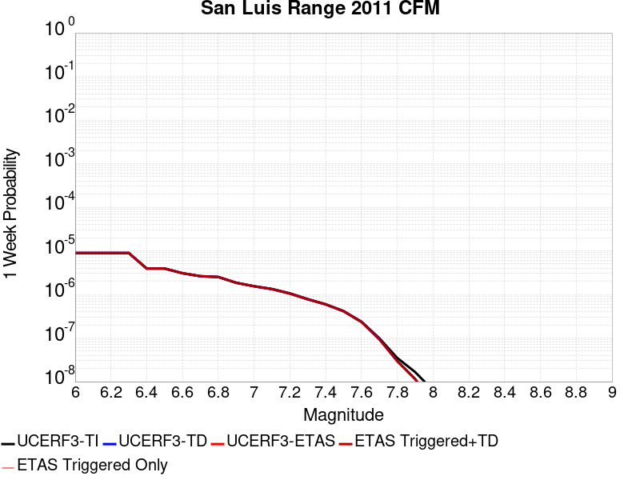 | 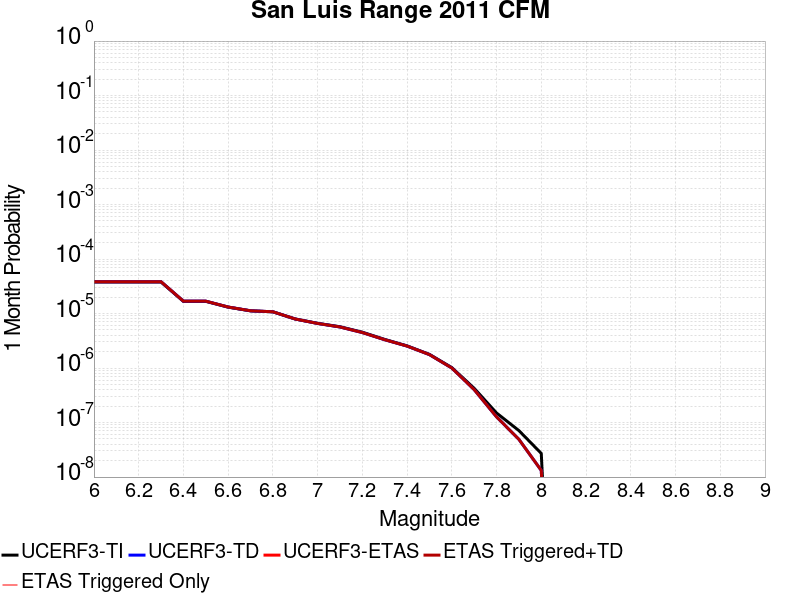 | 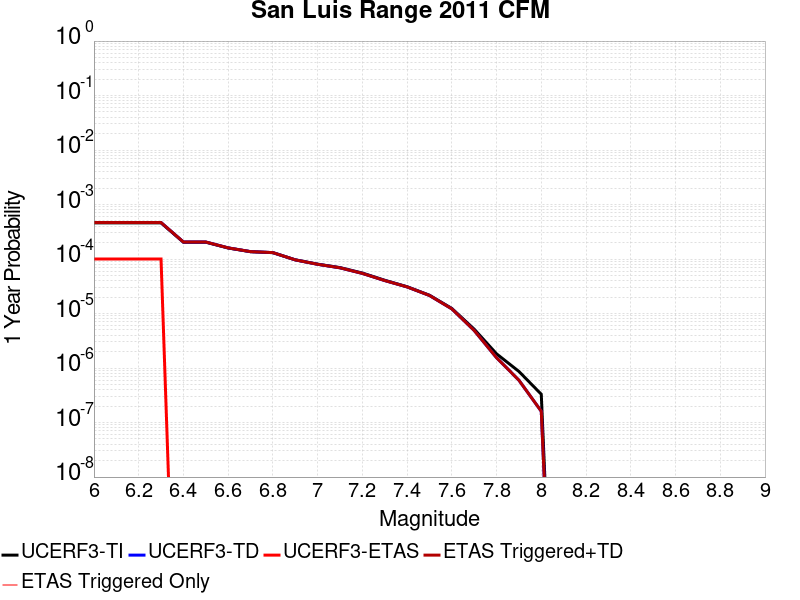 | 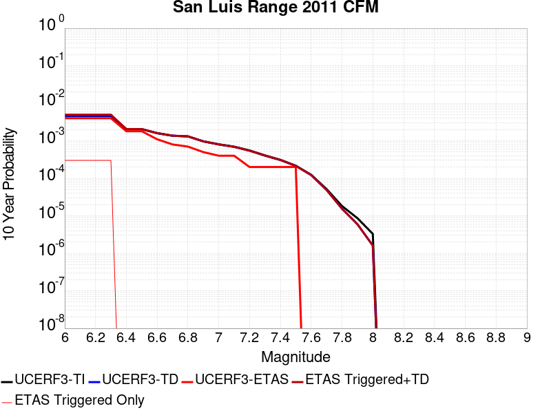 |

| Magnitude | 1 wk TI Prob | 1 wk TD Prob | 1 wk ETAS Prob | 1 wk ETAS/TD Gain | 1 wk ETAS Triggered+TD | 1 wk ETAS Triggered Only | 1 mo TI Prob | 1 mo TD Prob | 1 mo ETAS Prob | 1 mo ETAS/TD Gain | 1 mo ETAS Triggered+TD | 1 mo ETAS Triggered Only | 1 yr TI Prob | 1 yr TD Prob | 1 yr ETAS Prob | 1 yr ETAS/TD Gain | 1 yr ETAS Triggered+TD | 1 yr ETAS Triggered Only | 10 yr TI Prob | 10 yr TD Prob | 10 yr ETAS Prob | 10 yr ETAS/TD Gain | 10 yr ETAS Triggered+TD | 10 yr ETAS Triggered Only |
|-----|-----|-----|-----|-----|-----|-----|-----|-----|-----|-----|-----|-----|-----|-----|-----|-----|-----|-----|-----|-----|-----|-----|-----|-----|
| 6.0 | 8.8368415E-6 | 8.965807E-6 | 0.0 | 0.0 | 8.965807E-6 | 0.0 | 3.787163E-5 | 3.842437E-5 | 0.0 | 0.0 | 3.842437E-5 | 0.0 | 4.609895E-4 | 4.6772414E-4 | 1.0E-4 | 0.21380123 | 4.6772414E-4 | 0.0 | 0.0046003438 | 0.00466818 | 0.004 | 0.856865 | 0.0049667796 | 3.0E-4 |
| 6.1 | 8.8368415E-6 | 8.965807E-6 | 0.0 | 0.0 | 8.965807E-6 | 0.0 | 3.787163E-5 | 3.842437E-5 | 0.0 | 0.0 | 3.842437E-5 | 0.0 | 4.609895E-4 | 4.6772414E-4 | 1.0E-4 | 0.21380123 | 4.6772414E-4 | 0.0 | 0.0046003438 | 0.00466818 | 0.004 | 0.856865 | 0.0049667796 | 3.0E-4 |
| 6.2 | 8.8368415E-6 | 8.965807E-6 | 0.0 | 0.0 | 8.965807E-6 | 0.0 | 3.787163E-5 | 3.842437E-5 | 0.0 | 0.0 | 3.842437E-5 | 0.0 | 4.609895E-4 | 4.6772414E-4 | 1.0E-4 | 0.21380123 | 4.6772414E-4 | 0.0 | 0.0046003438 | 0.00466818 | 0.004 | 0.856865 | 0.0049667796 | 3.0E-4 |
| 6.3 | 8.8368415E-6 | 8.965807E-6 | 0.0 | 0.0 | 8.965807E-6 | 0.0 | 3.787163E-5 | 3.842437E-5 | 0.0 | 0.0 | 3.842437E-5 | 0.0 | 4.609895E-4 | 4.6772414E-4 | 1.0E-4 | 0.21380123 | 4.6772414E-4 | 0.0 | 0.0046003438 | 0.00466818 | 0.004 | 0.856865 | 0.0049667796 | 3.0E-4 |
| 6.4 | 3.9094193E-6 | 3.9413603E-6 | 0.0 | 0.0 | 3.9413603E-6 | 0.0 | 1.6754546E-5 | 1.6891438E-5 | 0.0 | 0.0 | 1.6891438E-5 | 0.0 | 2.039675E-4 | 2.0563412E-4 | 0.0 | 0.0 | 2.0563412E-4 | 0.0 | 0.0020378039 | 0.0020544673 | 0.0018 | 0.8761396 | 0.0020544673 | 0.0 |
| 6.5 | 3.9094193E-6 | 3.9413603E-6 | 0.0 | 0.0 | 3.9413603E-6 | 0.0 | 1.6754546E-5 | 1.6891438E-5 | 0.0 | 0.0 | 1.6891438E-5 | 0.0 | 2.039675E-4 | 2.0563412E-4 | 0.0 | 0.0 | 2.0563412E-4 | 0.0 | 0.0020378039 | 0.0020544673 | 0.0018 | 0.8761396 | 0.0020544673 | 0.0 |
| 6.6 | 3.0587726E-6 | 3.0755155E-6 | 0.0 | 0.0 | 3.0755155E-6 | 0.0 | 1.3108959E-5 | 1.3180715E-5 | 0.0 | 0.0 | 1.3180715E-5 | 0.0 | 1.595899E-4 | 1.604635E-4 | 0.0 | 0.0 | 1.604635E-4 | 0.0 | 0.0015947534 | 0.0016034883 | 0.0011 | 0.6860044 | 0.0016034883 | 0.0 |
| 6.7 | 2.6160574E-6 | 2.6252392E-6 | 0.0 | 0.0 | 2.6252392E-6 | 0.0 | 1.1211626E-5 | 1.1250977E-5 | 0.0 | 0.0 | 1.1250977E-5 | 0.0 | 1.3649299E-4 | 1.369721E-4 | 0.0 | 0.0 | 1.369721E-4 | 0.0 | 0.0013640919 | 0.001368883 | 8.0E-4 | 0.5844181 | 0.001368883 | 0.0 |
| 6.8 | 2.5110312E-6 | 2.518248E-6 | 0.0 | 0.0 | 2.518248E-6 | 0.0 | 1.0761518E-5 | 1.0792448E-5 | 0.0 | 0.0 | 1.0792448E-5 | 0.0 | 1.310136E-4 | 1.3139019E-4 | 0.0 | 0.0 | 1.3139019E-4 | 0.0 | 0.0013093639 | 0.0013131308 | 7.0E-4 | 0.5330771 | 0.0013131308 | 0.0 |
| 6.9 | 1.8564405E-6 | 1.8525726E-6 | 0.0 | 0.0 | 1.8525726E-6 | 0.0 | 7.95615E-6 | 7.939573E-6 | 0.0 | 0.0 | 7.939573E-6 | 0.0 | 9.686181E-5 | 9.6660035E-5 | 0.0 | 0.0 | 9.6660035E-5 | 0.0 | 9.68196E-4 | 9.661819E-4 | 5.0E-4 | 0.5175009 | 9.661819E-4 | 0.0 |
| 7.0 | 1.546127E-6 | 1.5370289E-6 | 0.0 | 0.0 | 1.5370289E-6 | 0.0 | 6.626242E-6 | 6.58725E-6 | 0.0 | 0.0 | 6.58725E-6 | 0.0 | 8.06715E-5 | 8.019682E-5 | 0.0 | 0.0 | 8.019682E-5 | 0.0 | 8.0642226E-4 | 8.016795E-4 | 4.0E-4 | 0.4989525 | 8.016795E-4 | 0.0 |
| 7.1 | 1.3368208E-6 | 1.3235993E-6 | 0.0 | 0.0 | 1.3235993E-6 | 0.0 | 5.7292195E-6 | 5.672556E-6 | 0.0 | 0.0 | 5.672556E-6 | 0.0 | 6.975101E-5 | 6.9061185E-5 | 0.0 | 0.0 | 6.9061185E-5 | 0.0 | 6.972912E-4 | 6.9039775E-4 | 4.0E-4 | 0.57937616 | 6.9039775E-4 | 0.0 |
| 7.2 | 1.0623363E-6 | 1.0454925E-6 | 0.0 | 0.0 | 1.0454925E-6 | 0.0 | 4.5528623E-6 | 4.4806743E-6 | 0.0 | 0.0 | 4.4806743E-6 | 0.0 | 5.5429686E-5 | 5.455085E-5 | 0.0 | 0.0 | 5.455085E-5 | 0.0 | 5.5415864E-4 | 5.453749E-4 | 2.0E-4 | 0.36672026 | 5.453749E-4 | 0.0 |
| 7.3 | 7.831679E-7 | 7.727842E-7 | 0.0 | 0.0 | 7.727842E-7 | 0.0 | 3.3564295E-6 | 3.311928E-6 | 0.0 | 0.0 | 3.311928E-6 | 0.0 | 4.086376E-5 | 4.032198E-5 | 0.0 | 0.0 | 4.032198E-5 | 0.0 | 4.0856248E-4 | 4.0314675E-4 | 2.0E-4 | 0.49609727 | 4.0314675E-4 | 0.0 |
| 7.4 | 5.9558846E-7 | 5.9110175E-7 | 0.0 | 0.0 | 5.9110175E-7 | 0.0 | 2.5525194E-6 | 2.5332906E-6 | 0.0 | 0.0 | 2.5332906E-6 | 0.0 | 3.107648E-5 | 3.0842377E-5 | 0.0 | 0.0 | 3.0842377E-5 | 0.0 | 3.1072134E-4 | 3.0838104E-4 | 2.0E-4 | 0.64854825 | 3.0838104E-4 | 0.0 |
| 7.5 | 4.1616502E-7 | 4.1199445E-7 | 0.0 | 0.0 | 4.1199445E-7 | 0.0 | 1.7835631E-6 | 1.7656893E-6 | 0.0 | 0.0 | 1.7656893E-6 | 0.0 | 2.1714664E-5 | 2.1497055E-5 | 0.0 | 0.0 | 2.1497055E-5 | 0.0 | 2.1712543E-4 | 2.149498E-4 | 2.0E-4 | 0.9304498 | 2.149498E-4 | 0.0 |
| 7.6 | 2.3816014E-7 | 2.337893E-7 | 0.0 | 0.0 | 2.337893E-7 | 0.0 | 1.0206859E-6 | 1.0019537E-6 | 0.0 | 0.0 | 1.0019537E-6 | 0.0 | 1.242678E-5 | 1.2198718E-5 | 0.0 | 0.0 | 1.2198718E-5 | 0.0 | 1.2426086E-4 | 1.21980505E-4 | 0.0 | 0.0 | 1.21980505E-4 | 0.0 |
| 7.7 | 9.918777E-8 | 9.3885625E-8 | 0.0 | 0.0 | 9.3885625E-8 | 0.0 | 4.2509038E-7 | 4.0236688E-7 | 0.0 | 0.0 | 4.0236688E-7 | 0.0 | 5.1754632E-6 | 4.898806E-6 | 0.0 | 0.0 | 4.898806E-6 | 0.0 | 5.1753424E-5 | 4.898698E-5 | 0.0 | 0.0 | 4.898698E-5 | 0.0 |
| 7.8 | 3.4982556E-8 | 2.9701118E-8 | 0.0 | 0.0 | 2.9701118E-8 | 0.0 | 1.4992524E-7 | 1.272905E-7 | 0.0 | 0.0 | 1.272905E-7 | 0.0 | 1.8253382E-6 | 1.5497608E-6 | 0.0 | 0.0 | 1.5497608E-6 | 0.0 | 1.8253233E-5 | 1.54975E-5 | 0.0 | 0.0 | 1.54975E-5 | 0.0 |
| 7.9 | 1.6624908E-8 | 1.1489782E-8 | 0.0 | 0.0 | 1.1489782E-8 | 0.0 | 7.12496E-8 | 4.924192E-8 | 0.0 | 0.0 | 4.924192E-8 | 0.0 | 8.6746354E-7 | 5.995202E-7 | 0.0 | 0.0 | 5.995202E-7 | 0.0 | 8.674601E-6 | 5.9951863E-6 | 0.0 | 0.0 | 5.9951863E-6 | 0.0 |
| 8.0 | 6.3352315E-9 | 3.0962666E-9 | 0.0 | 0.0 | 3.0962666E-9 | 0.0 | 2.715099E-8 | 1.3269714E-8 | 0.0 | 0.0 | 1.3269714E-8 | 0.0 | 3.3056327E-7 | 1.6155876E-7 | 0.0 | 0.0 | 1.6155876E-7 | 0.0 | 3.3056278E-6 | 1.6155865E-6 | 0.0 | 0.0 | 1.6155865E-6 | 0.0 |

## Great Valley 02
*[(top)](#table-of-contents)*

| 1 Week | 1 Month | 1 Year | 10 Year |
|-----|-----|-----|-----|
| 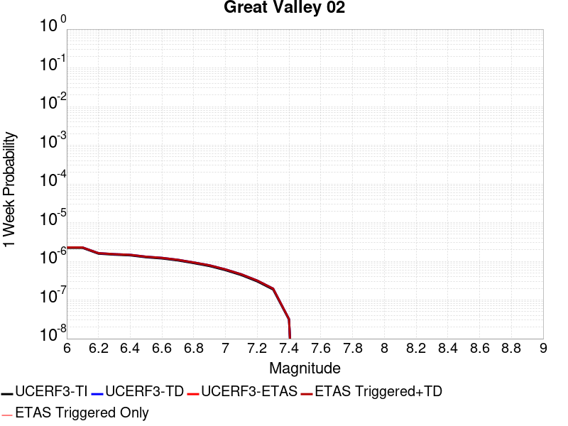 | 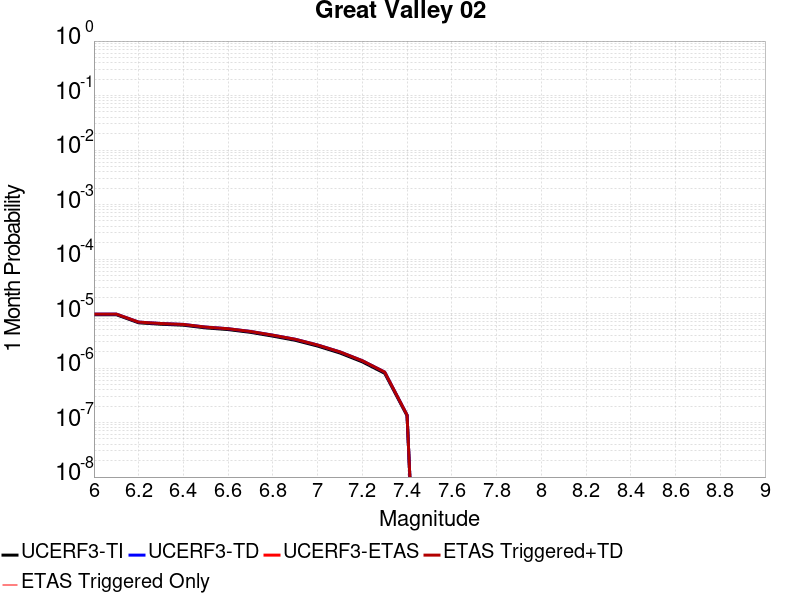 | 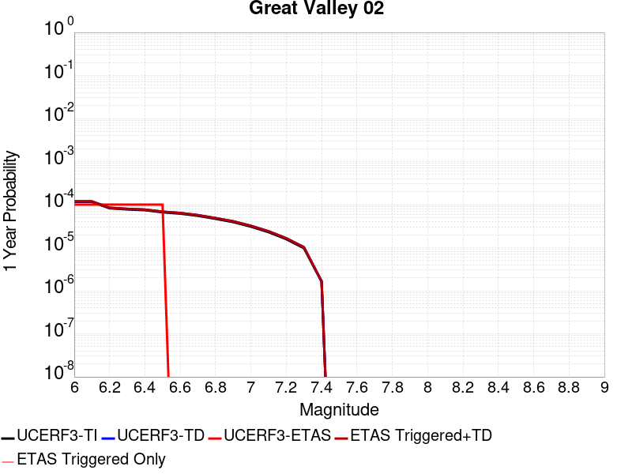 | 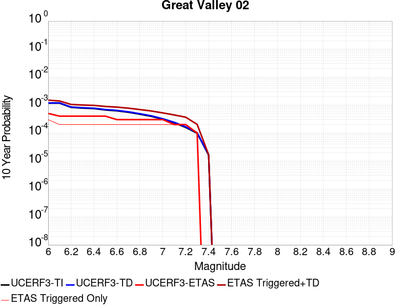 |

| Magnitude | 1 wk TI Prob | 1 wk TD Prob | 1 wk ETAS Prob | 1 wk ETAS/TD Gain | 1 wk ETAS Triggered+TD | 1 wk ETAS Triggered Only | 1 mo TI Prob | 1 mo TD Prob | 1 mo ETAS Prob | 1 mo ETAS/TD Gain | 1 mo ETAS Triggered+TD | 1 mo ETAS Triggered Only | 1 yr TI Prob | 1 yr TD Prob | 1 yr ETAS Prob | 1 yr ETAS/TD Gain | 1 yr ETAS Triggered+TD | 1 yr ETAS Triggered Only | 10 yr TI Prob | 10 yr TD Prob | 10 yr ETAS Prob | 10 yr ETAS/TD Gain | 10 yr ETAS Triggered+TD | 10 yr ETAS Triggered Only |
|-----|-----|-----|-----|-----|-----|-----|-----|-----|-----|-----|-----|-----|-----|-----|-----|-----|-----|-----|-----|-----|-----|-----|-----|-----|
| 6.0 | 2.2243487E-6 | 2.2818863E-6 | 0.0 | 0.0 | 2.2818863E-6 | 0.0 | 9.532888E-6 | 9.779479E-6 | 0.0 | 0.0 | 9.779479E-6 | 0.0 | 1.1605673E-4 | 1.1905916E-4 | 1.0E-4 | 0.8399186 | 1.1905916E-4 | 0.0 | 0.0011599615 | 0.0011900036 | 5.0E-4 | 0.4201668 | 0.0014896466 | 3.0E-4 |
| 6.1 | 2.2243487E-6 | 2.2818863E-6 | 0.0 | 0.0 | 2.2818863E-6 | 0.0 | 9.532888E-6 | 9.779479E-6 | 0.0 | 0.0 | 9.779479E-6 | 0.0 | 1.1605673E-4 | 1.1905916E-4 | 1.0E-4 | 0.8399186 | 1.1905916E-4 | 0.0 | 0.0011599615 | 0.0011900036 | 4.0E-4 | 0.33613342 | 0.0013897656 | 2.0E-4 |
| 6.2 | 1.5787732E-6 | 1.6273536E-6 | 0.0 | 0.0 | 1.6273536E-6 | 0.0 | 6.7661535E-6 | 6.9743546E-6 | 0.0 | 0.0 | 6.9743546E-6 | 0.0 | 8.2374805E-5 | 8.49095E-5 | 1.0E-4 | 1.1777245 | 8.49095E-5 | 0.0 | 8.2344277E-4 | 8.487754E-4 | 4.0E-4 | 0.47126722 | 0.0010486057 | 2.0E-4 |
| 6.3 | 1.4850314E-6 | 1.5323933E-6 | 0.0 | 0.0 | 1.5323933E-6 | 0.0 | 6.3644047E-6 | 6.5673835E-6 | 0.0 | 0.0 | 6.5673835E-6 | 0.0 | 7.748387E-5 | 7.9954996E-5 | 1.0E-4 | 1.2507036 | 7.9954996E-5 | 0.0 | 7.745686E-4 | 7.9926616E-4 | 4.0E-4 | 0.5004591 | 9.991063E-4 | 2.0E-4 |
| 6.4 | 1.4266972E-6 | 1.4735317E-6 | 0.0 | 0.0 | 1.4735317E-6 | 0.0 | 6.114402E-6 | 6.315121E-6 | 0.0 | 0.0 | 6.315121E-6 | 0.0 | 7.44403E-5 | 7.6883916E-5 | 1.0E-4 | 1.300662 | 7.6883916E-5 | 0.0 | 7.441537E-4 | 7.6857663E-4 | 4.0E-4 | 0.5204426 | 9.684229E-4 | 2.0E-4 |
| 6.5 | 1.2728015E-6 | 1.3172175E-6 | 0.0 | 0.0 | 1.3172175E-6 | 0.0 | 5.4548523E-6 | 5.645206E-6 | 0.0 | 0.0 | 5.645206E-6 | 0.0 | 6.64108E-5 | 6.8728245E-5 | 1.0E-4 | 1.4550059 | 6.8728245E-5 | 0.0 | 6.639096E-4 | 6.8707246E-4 | 4.0E-4 | 0.5821802 | 8.8693504E-4 | 2.0E-4 |
| 6.6 | 1.1857247E-6 | 1.229029E-6 | 0.0 | 0.0 | 1.229029E-6 | 0.0 | 5.0816675E-6 | 5.2672563E-6 | 0.0 | 0.0 | 5.2672563E-6 | 0.0 | 6.186755E-5 | 6.412698E-5 | 0.0 | 0.0 | 6.412698E-5 | 0.0 | 6.1850325E-4 | 6.4108724E-4 | 3.0E-4 | 0.46795502 | 8.40959E-4 | 2.0E-4 |
| 6.7 | 1.0550715E-6 | 1.0954167E-6 | 0.0 | 0.0 | 1.0954167E-6 | 0.0 | 4.521727E-6 | 4.6946348E-6 | 0.0 | 0.0 | 4.6946348E-6 | 0.0 | 5.5050637E-5 | 5.71557E-5 | 0.0 | 0.0 | 5.71557E-5 | 0.0 | 5.5037E-4 | 5.714121E-4 | 3.0E-4 | 0.5250152 | 7.712978E-4 | 2.0E-4 |
| 6.8 | 8.9881183E-7 | 9.3563165E-7 | 0.0 | 0.0 | 9.3563165E-7 | 0.0 | 3.8520448E-6 | 4.009844E-6 | 0.0 | 0.0 | 4.009844E-6 | 0.0 | 4.689764E-5 | 4.8818772E-5 | 0.0 | 0.0 | 4.8818772E-5 | 0.0 | 4.688774E-4 | 4.8808224E-4 | 3.0E-4 | 0.61465055 | 6.8798463E-4 | 2.0E-4 |
| 6.9 | 7.5417256E-7 | 7.8717636E-7 | 0.0 | 0.0 | 7.8717636E-7 | 0.0 | 3.232164E-6 | 3.3736087E-6 | 0.0 | 0.0 | 3.3736087E-6 | 0.0 | 3.9350885E-5 | 4.1072926E-5 | 0.0 | 0.0 | 4.1072926E-5 | 0.0 | 3.934392E-4 | 4.106548E-4 | 3.0E-4 | 0.73054063 | 6.1057264E-4 | 2.0E-4 |
| 7.0 | 5.909726E-7 | 6.1784976E-7 | 0.0 | 0.0 | 6.1784976E-7 | 0.0 | 2.5327372E-6 | 2.647925E-6 | 0.0 | 0.0 | 2.647925E-6 | 0.0 | 3.083564E-5 | 3.223802E-5 | 0.0 | 0.0 | 3.223802E-5 | 0.0 | 3.083136E-4 | 3.2233444E-4 | 3.0E-4 | 0.9307104 | 5.2227E-4 | 2.0E-4 |
| 7.1 | 4.4054178E-7 | 4.6175253E-7 | 0.0 | 0.0 | 4.6175253E-7 | 0.0 | 1.8880348E-6 | 1.978938E-6 | 0.0 | 0.0 | 1.978938E-6 | 0.0 | 2.2986582E-5 | 2.4093311E-5 | 0.0 | 0.0 | 2.4093311E-5 | 0.0 | 2.2984203E-4 | 2.4090771E-4 | 2.0E-4 | 0.8301934 | 4.4085953E-4 | 2.0E-4 |
| 7.2 | 3.029834E-7 | 3.182514E-7 | 0.0 | 0.0 | 3.182514E-7 | 0.0 | 1.2984997E-6 | 1.363934E-6 | 0.0 | 0.0 | 1.363934E-6 | 0.0 | 1.5809119E-5 | 1.6605773E-5 | 0.0 | 0.0 | 1.6605773E-5 | 0.0 | 1.5807994E-4 | 1.6604578E-4 | 2.0E-4 | 1.2044872 | 3.6601257E-4 | 2.0E-4 |
| 7.3 | 1.8700909E-7 | 1.968221E-7 | 0.0 | 0.0 | 1.968221E-7 | 0.0 | 8.0146725E-7 | 8.435231E-7 | 0.0 | 0.0 | 8.435231E-7 | 0.0 | 9.75782E-6 | 1.0269848E-5 | 0.0 | 0.0 | 1.0269848E-5 | 0.0 | 9.757392E-5 | 1.0269401E-4 | 1.0E-4 | 0.9737667 | 2.0268373E-4 | 1.0E-4 |
| 7.4 | 3.112171E-8 | 3.2070304E-8 | 0.0 | 0.0 | 3.2070304E-8 | 0.0 | 1.3337875E-7 | 1.3744415E-7 | 0.0 | 0.0 | 1.3744415E-7 | 0.0 | 1.6238852E-6 | 1.6733812E-6 | 0.0 | 0.0 | 1.6733812E-6 | 0.0 | 1.6238733E-5 | 1.6733695E-5 | 0.0 | 0.0 | 1.6733695E-5 | 0.0 |

## Sierra Madre (San Fernando)
*[(top)](#table-of-contents)*

| 1 Week | 1 Month | 1 Year | 10 Year |
|-----|-----|-----|-----|
| 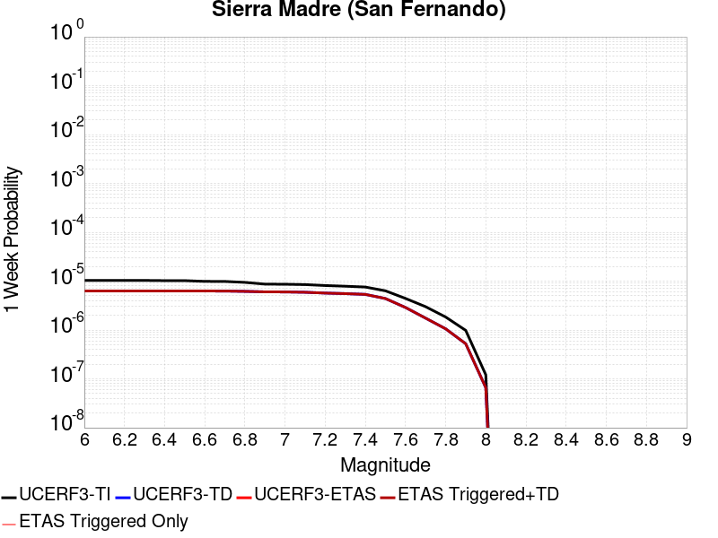 | 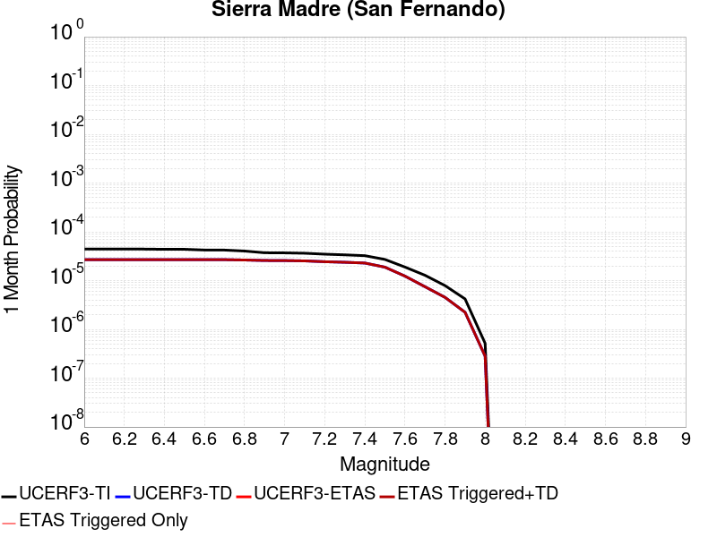 | 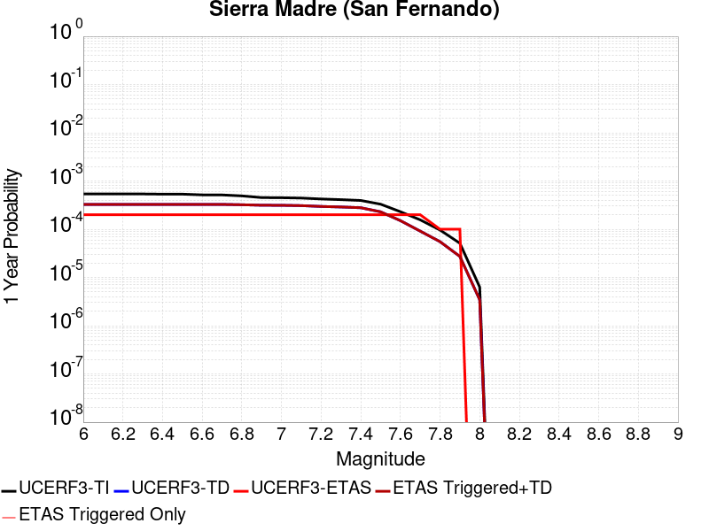 | 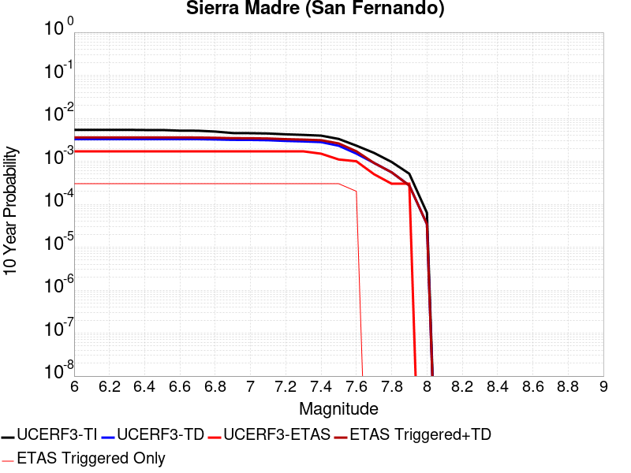 |

| Magnitude | 1 wk TI Prob | 1 wk TD Prob | 1 wk ETAS Prob | 1 wk ETAS/TD Gain | 1 wk ETAS Triggered+TD | 1 wk ETAS Triggered Only | 1 mo TI Prob | 1 mo TD Prob | 1 mo ETAS Prob | 1 mo ETAS/TD Gain | 1 mo ETAS Triggered+TD | 1 mo ETAS Triggered Only | 1 yr TI Prob | 1 yr TD Prob | 1 yr ETAS Prob | 1 yr ETAS/TD Gain | 1 yr ETAS Triggered+TD | 1 yr ETAS Triggered Only | 10 yr TI Prob | 10 yr TD Prob | 10 yr ETAS Prob | 10 yr ETAS/TD Gain | 10 yr ETAS Triggered+TD | 10 yr ETAS Triggered Only |
|-----|-----|-----|-----|-----|-----|-----|-----|-----|-----|-----|-----|-----|-----|-----|-----|-----|-----|-----|-----|-----|-----|-----|-----|-----|
| 6.0 | 1.0346413E-5 | 6.289559E-6 | 0.0 | 0.0 | 6.289559E-6 | 0.0 | 4.4341014E-5 | 2.6954982E-5 | 0.0 | 0.0 | 2.6954982E-5 | 0.0 | 5.3971814E-4 | 3.281286E-4 | 2.0E-4 | 0.60951716 | 3.281286E-4 | 0.0 | 0.0053840918 | 0.0032765537 | 0.0017 | 0.5188378 | 0.0035755706 | 3.0E-4 |
| 6.1 | 1.0346413E-5 | 6.289559E-6 | 0.0 | 0.0 | 6.289559E-6 | 0.0 | 4.4341014E-5 | 2.6954982E-5 | 0.0 | 0.0 | 2.6954982E-5 | 0.0 | 5.3971814E-4 | 3.281286E-4 | 2.0E-4 | 0.60951716 | 3.281286E-4 | 0.0 | 0.0053840918 | 0.0032765537 | 0.0017 | 0.5188378 | 0.0035755706 | 3.0E-4 |
| 6.2 | 1.0346413E-5 | 6.289559E-6 | 0.0 | 0.0 | 6.289559E-6 | 0.0 | 4.4341014E-5 | 2.6954982E-5 | 0.0 | 0.0 | 2.6954982E-5 | 0.0 | 5.3971814E-4 | 3.281286E-4 | 2.0E-4 | 0.60951716 | 3.281286E-4 | 0.0 | 0.0053840918 | 0.0032765537 | 0.0017 | 0.5188378 | 0.0035755706 | 3.0E-4 |
| 6.3 | 1.0346413E-5 | 6.289559E-6 | 0.0 | 0.0 | 6.289559E-6 | 0.0 | 4.4341014E-5 | 2.6954982E-5 | 0.0 | 0.0 | 2.6954982E-5 | 0.0 | 5.3971814E-4 | 3.281286E-4 | 2.0E-4 | 0.60951716 | 3.281286E-4 | 0.0 | 0.0053840918 | 0.0032765537 | 0.0017 | 0.5188378 | 0.0035755706 | 3.0E-4 |
| 6.4 | 1.0249558E-5 | 6.289559E-6 | 0.0 | 0.0 | 6.289559E-6 | 0.0 | 4.392594E-5 | 2.6954982E-5 | 0.0 | 0.0 | 2.6954982E-5 | 0.0 | 5.3466705E-4 | 3.281286E-4 | 2.0E-4 | 0.60951716 | 3.281286E-4 | 0.0 | 0.0053338245 | 0.0032765537 | 0.0017 | 0.5188378 | 0.0035755706 | 3.0E-4 |
| 6.5 | 1.0249558E-5 | 6.289559E-6 | 0.0 | 0.0 | 6.289559E-6 | 0.0 | 4.392594E-5 | 2.6954982E-5 | 0.0 | 0.0 | 2.6954982E-5 | 0.0 | 5.3466705E-4 | 3.281286E-4 | 2.0E-4 | 0.60951716 | 3.281286E-4 | 0.0 | 0.0053338245 | 0.0032765537 | 0.0017 | 0.5188378 | 0.0035755706 | 3.0E-4 |
| 6.6 | 9.9035515E-6 | 6.289559E-6 | 0.0 | 0.0 | 6.289559E-6 | 0.0 | 4.2443102E-5 | 2.6954982E-5 | 0.0 | 0.0 | 2.6954982E-5 | 0.0 | 5.166222E-4 | 3.281286E-4 | 2.0E-4 | 0.60951716 | 3.281286E-4 | 0.0 | 0.0051542283 | 0.0032765537 | 0.0017 | 0.5188378 | 0.0035755706 | 3.0E-4 |
| 6.7 | 9.87217E-6 | 6.2769755E-6 | 0.0 | 0.0 | 6.2769755E-6 | 0.0 | 4.2308613E-5 | 2.6901052E-5 | 0.0 | 0.0 | 2.6901052E-5 | 0.0 | 5.149856E-4 | 3.274722E-4 | 2.0E-4 | 0.6107389 | 3.274722E-4 | 0.0 | 0.005137938 | 0.003270009 | 0.0017 | 0.51987624 | 0.0035690279 | 3.0E-4 |
| 6.8 | 9.4359175E-6 | 6.180914E-6 | 0.0 | 0.0 | 6.180914E-6 | 0.0 | 4.043902E-5 | 2.6489368E-5 | 0.0 | 0.0 | 2.6489368E-5 | 0.0 | 4.9223384E-4 | 3.2246145E-4 | 2.0E-4 | 0.6202292 | 3.2246145E-4 | 0.0 | 0.0049114493 | 0.0032200469 | 0.0017 | 0.5279426 | 0.003519081 | 3.0E-4 |
| 6.9 | 8.700447E-6 | 6.041963E-6 | 0.0 | 0.0 | 6.041963E-6 | 0.0 | 3.72871E-5 | 2.5893874E-5 | 0.0 | 0.0 | 2.5893874E-5 | 0.0 | 4.5387587E-4 | 3.152134E-4 | 2.0E-4 | 0.6344908 | 3.152134E-4 | 0.0 | 0.0045295 | 0.0031477725 | 0.0017 | 0.54006445 | 0.003446828 | 3.0E-4 |
| 7.0 | 8.648878E-6 | 6.016841E-6 | 0.0 | 0.0 | 6.016841E-6 | 0.0 | 3.7066096E-5 | 2.5786212E-5 | 0.0 | 0.0 | 2.5786212E-5 | 0.0 | 4.5118626E-4 | 3.1390297E-4 | 2.0E-4 | 0.63713956 | 3.1390297E-4 | 0.0 | 0.004502713 | 0.0031347054 | 0.0017 | 0.5423157 | 0.003433765 | 3.0E-4 |
| 7.1 | 8.505786E-6 | 5.9264567E-6 | 0.0 | 0.0 | 5.9264567E-6 | 0.0 | 3.645286E-5 | 2.5398858E-5 | 0.0 | 0.0 | 2.5398858E-5 | 0.0 | 4.437232E-4 | 3.091883E-4 | 2.0E-4 | 0.646855 | 3.091883E-4 | 0.0 | 0.0044283825 | 0.0030876903 | 0.0017 | 0.55057335 | 0.003386764 | 3.0E-4 |
| 7.2 | 8.139752E-6 | 5.7007146E-6 | 0.0 | 0.0 | 5.7007146E-6 | 0.0 | 3.4884186E-5 | 2.443141E-5 | 0.0 | 0.0 | 2.443141E-5 | 0.0 | 4.246322E-4 | 2.974129E-4 | 2.0E-4 | 0.6724658 | 2.974129E-4 | 0.0 | 0.004238217 | 0.0029702545 | 0.0017 | 0.5723415 | 0.0032693634 | 3.0E-4 |
| 7.3 | 7.8816E-6 | 5.554007E-6 | 0.0 | 0.0 | 5.554007E-6 | 0.0 | 3.3777847E-5 | 2.3802677E-5 | 0.0 | 0.0 | 2.3802677E-5 | 0.0 | 4.111677E-4 | 2.897601E-4 | 2.0E-4 | 0.69022614 | 2.897601E-4 | 0.0 | 0.004104078 | 0.0028939284 | 0.0017 | 0.5874368 | 0.0031930604 | 3.0E-4 |
| 7.4 | 7.5810603E-6 | 5.3582175E-6 | 0.0 | 0.0 | 5.3582175E-6 | 0.0 | 3.2489854E-5 | 2.2963593E-5 | 0.0 | 0.0 | 2.2963593E-5 | 0.0 | 3.9549218E-4 | 2.7954692E-4 | 2.0E-4 | 0.7154434 | 2.7954692E-4 | 0.0 | 0.0039478904 | 0.002792058 | 0.0015 | 0.5372381 | 0.0030912203 | 3.0E-4 |
| 7.5 | 6.349153E-6 | 4.4093895E-6 | 0.0 | 0.0 | 4.4093895E-6 | 0.0 | 2.7210372E-5 | 1.8897252E-5 | 0.0 | 0.0 | 1.8897252E-5 | 0.0 | 3.312359E-4 | 2.3005057E-4 | 2.0E-4 | 0.86937404 | 2.3005057E-4 | 0.0 | 0.0033074263 | 0.0022982063 | 0.0011 | 0.47863415 | 0.0025975169 | 3.0E-4 |
| 7.6 | 4.430576E-6 | 2.8922461E-6 | 0.0 | 0.0 | 2.8922461E-6 | 0.0 | 1.8988047E-5 | 1.2395282E-5 | 0.0 | 0.0 | 1.2395282E-5 | 0.0 | 2.3115493E-4 | 1.5090234E-4 | 2.0E-4 | 1.3253604 | 1.5090234E-4 | 0.0 | 0.0023091463 | 0.0015080213 | 0.001 | 0.6631206 | 0.0017077198 | 2.0E-4 |
| 7.7 | 3.005066E-6 | 1.7525206E-6 | 0.0 | 0.0 | 1.7525206E-6 | 0.0 | 1.2878791E-5 | 7.5107805E-6 | 0.0 | 0.0 | 7.5107805E-6 | 0.0 | 1.56788E-4 | 9.143993E-5 | 2.0E-4 | 2.1872282 | 9.143993E-5 | 0.0 | 0.0015667742 | 9.140242E-4 | 5.0E-4 | 0.54703146 | 9.140242E-4 | 0.0 |
| 7.8 | 1.8459098E-6 | 1.0593043E-6 | 0.0 | 0.0 | 1.0593043E-6 | 0.0 | 7.911018E-6 | 4.539868E-6 | 0.0 | 0.0 | 4.539868E-6 | 0.0 | 9.631238E-5 | 5.5271492E-5 | 1.0E-4 | 1.809251 | 5.5271492E-5 | 0.0 | 9.627065E-4 | 5.525779E-4 | 3.0E-4 | 0.54290986 | 5.525779E-4 | 0.0 |
| 7.9 | 9.839262E-7 | 5.240525E-7 | 0.0 | 0.0 | 5.240525E-7 | 0.0 | 4.2168194E-6 | 2.2459374E-6 | 0.0 | 0.0 | 2.2459374E-6 | 0.0 | 5.1338568E-5 | 2.7343947E-5 | 1.0E-4 | 3.6571164 | 2.7343947E-5 | 0.0 | 5.132671E-4 | 2.734061E-4 | 3.0E-4 | 1.0972688 | 2.734061E-4 | 0.0 |
| 8.0 | 1.210983E-7 | 6.619046E-8 | 0.0 | 0.0 | 6.619046E-8 | 0.0 | 5.1899264E-7 | 2.8367336E-7 | 0.0 | 0.0 | 2.8367336E-7 | 0.0 | 6.3187167E-6 | 3.453718E-6 | 0.0 | 0.0 | 3.453718E-6 | 0.0 | 6.318537E-5 | 3.453666E-5 | 0.0 | 0.0 | 3.453666E-5 | 0.0 |

## Kern Canyon (South Kern) 2011
*[(top)](#table-of-contents)*

| 1 Week | 1 Month | 1 Year | 10 Year |
|-----|-----|-----|-----|
|  | 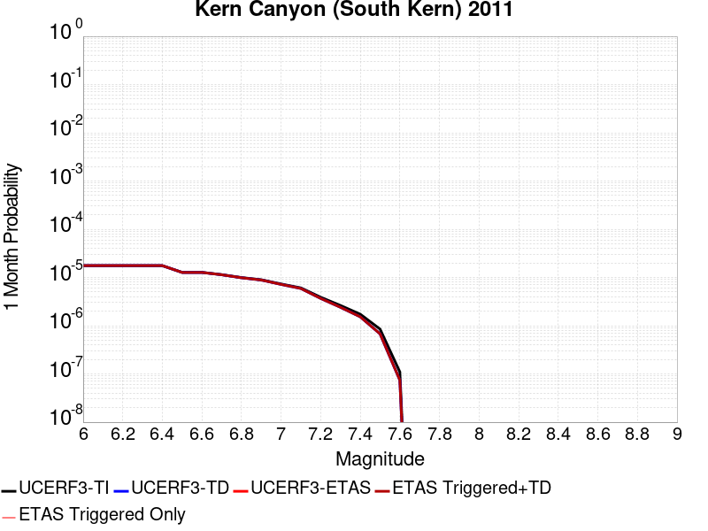 | 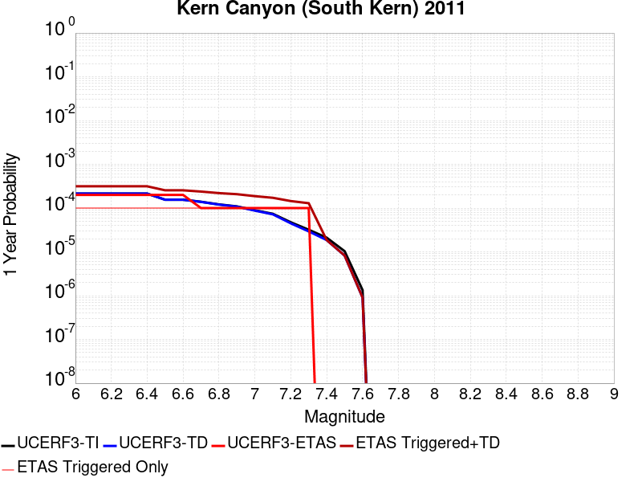 | 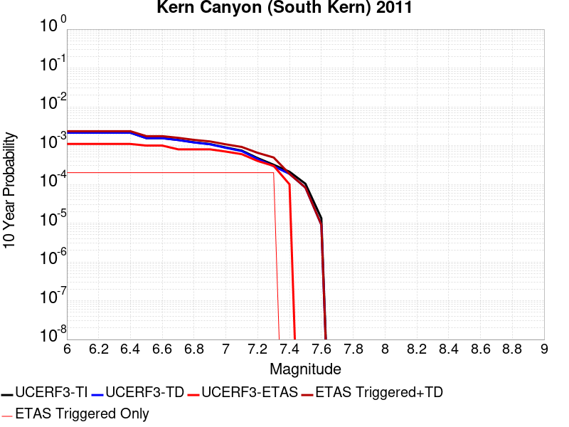 |

| Magnitude | 1 wk TI Prob | 1 wk TD Prob | 1 wk ETAS Prob | 1 wk ETAS/TD Gain | 1 wk ETAS Triggered+TD | 1 wk ETAS Triggered Only | 1 mo TI Prob | 1 mo TD Prob | 1 mo ETAS Prob | 1 mo ETAS/TD Gain | 1 mo ETAS Triggered+TD | 1 mo ETAS Triggered Only | 1 yr TI Prob | 1 yr TD Prob | 1 yr ETAS Prob | 1 yr ETAS/TD Gain | 1 yr ETAS Triggered+TD | 1 yr ETAS Triggered Only | 10 yr TI Prob | 10 yr TD Prob | 10 yr ETAS Prob | 10 yr ETAS/TD Gain | 10 yr ETAS Triggered+TD | 10 yr ETAS Triggered Only |
|-----|-----|-----|-----|-----|-----|-----|-----|-----|-----|-----|-----|-----|-----|-----|-----|-----|-----|-----|-----|-----|-----|-----|-----|-----|
| 6.0 | 4.105075E-6 | 4.1138796E-6 | 0.0 | 0.0 | 4.1138796E-6 | 0.0 | 1.7593058E-5 | 1.7630797E-5 | 0.0 | 0.0 | 1.7630797E-5 | 0.0 | 2.1417443E-4 | 2.1463445E-4 | 2.0E-4 | 0.9318169 | 3.14613E-4 | 1.0E-4 | 0.0021396813 | 0.0021443355 | 0.0011 | 0.51297945 | 0.0023439066 | 2.0E-4 |
| 6.1 | 4.105075E-6 | 4.1138796E-6 | 0.0 | 0.0 | 4.1138796E-6 | 0.0 | 1.7593058E-5 | 1.7630797E-5 | 0.0 | 0.0 | 1.7630797E-5 | 0.0 | 2.1417443E-4 | 2.1463445E-4 | 2.0E-4 | 0.9318169 | 3.14613E-4 | 1.0E-4 | 0.0021396813 | 0.0021443355 | 0.0011 | 0.51297945 | 0.0023439066 | 2.0E-4 |
| 6.2 | 4.105075E-6 | 4.1138796E-6 | 0.0 | 0.0 | 4.1138796E-6 | 0.0 | 1.7593058E-5 | 1.7630797E-5 | 0.0 | 0.0 | 1.7630797E-5 | 0.0 | 2.1417443E-4 | 2.1463445E-4 | 2.0E-4 | 0.9318169 | 3.14613E-4 | 1.0E-4 | 0.0021396813 | 0.0021443355 | 0.0011 | 0.51297945 | 0.0023439066 | 2.0E-4 |
| 6.3 | 4.105075E-6 | 4.1138796E-6 | 0.0 | 0.0 | 4.1138796E-6 | 0.0 | 1.7593058E-5 | 1.7630797E-5 | 0.0 | 0.0 | 1.7630797E-5 | 0.0 | 2.1417443E-4 | 2.1463445E-4 | 2.0E-4 | 0.9318169 | 3.14613E-4 | 1.0E-4 | 0.0021396813 | 0.0021443355 | 0.0011 | 0.51297945 | 0.0023439066 | 2.0E-4 |
| 6.4 | 4.105075E-6 | 4.1138796E-6 | 0.0 | 0.0 | 4.1138796E-6 | 0.0 | 1.7593058E-5 | 1.7630797E-5 | 0.0 | 0.0 | 1.7630797E-5 | 0.0 | 2.1417443E-4 | 2.1463445E-4 | 2.0E-4 | 0.9318169 | 3.14613E-4 | 1.0E-4 | 0.0021396813 | 0.0021443355 | 0.0011 | 0.51297945 | 0.0023439066 | 2.0E-4 |
| 6.5 | 2.9849807E-6 | 2.9732666E-6 | 0.0 | 0.0 | 2.9732666E-6 | 0.0 | 1.2792712E-5 | 1.2742509E-5 | 0.0 | 0.0 | 1.2742509E-5 | 0.0 | 1.5574014E-4 | 1.5512916E-4 | 2.0E-4 | 1.2892482 | 2.5511364E-4 | 1.0E-4 | 0.0015563103 | 0.0015502239 | 0.001 | 0.6450681 | 0.0017499138 | 2.0E-4 |
| 6.6 | 2.9849807E-6 | 2.9732666E-6 | 0.0 | 0.0 | 2.9732666E-6 | 0.0 | 1.2792712E-5 | 1.2742509E-5 | 0.0 | 0.0 | 1.2742509E-5 | 0.0 | 1.5574014E-4 | 1.5512916E-4 | 2.0E-4 | 1.2892482 | 2.5511364E-4 | 1.0E-4 | 0.0015563103 | 0.0015502239 | 0.001 | 0.6450681 | 0.0017499138 | 2.0E-4 |
| 6.7 | 2.6756725E-6 | 2.6583211E-6 | 0.0 | 0.0 | 2.6583211E-6 | 0.0 | 1.1467117E-5 | 1.1392756E-5 | 0.0 | 0.0 | 1.1392756E-5 | 0.0 | 1.396032E-4 | 1.3869809E-4 | 1.0E-4 | 0.7209905 | 2.3868421E-4 | 1.0E-4 | 0.0013951553 | 0.0013861262 | 8.0E-4 | 0.5771481 | 0.0015858489 | 2.0E-4 |
| 6.8 | 2.3283721E-6 | 2.304867E-6 | 0.0 | 0.0 | 2.304867E-6 | 0.0 | 9.9787E-6 | 9.877964E-6 | 0.0 | 0.0 | 9.877964E-6 | 0.0 | 1.214839E-4 | 1.20257646E-4 | 1.0E-4 | 0.8315479 | 2.2024562E-4 | 1.0E-4 | 0.001214175 | 0.0012019331 | 8.0E-4 | 0.6655944 | 0.0014016929 | 2.0E-4 |
| 6.9 | 2.0972677E-6 | 2.069721E-6 | 0.0 | 0.0 | 2.069721E-6 | 0.0 | 8.988259E-6 | 8.870204E-6 | 0.0 | 0.0 | 8.870204E-6 | 0.0 | 1.0942656E-4 | 1.0798943E-4 | 1.0E-4 | 0.92601657 | 2.0797864E-4 | 1.0E-4 | 0.0010937268 | 0.0010793754 | 8.0E-4 | 0.7411694 | 0.0012791594 | 2.0E-4 |
| 7.0 | 1.7132242E-6 | 1.6787695E-6 | 0.0 | 0.0 | 1.6787695E-6 | 0.0 | 7.3423685E-6 | 7.194707E-6 | 0.0 | 0.0 | 7.194707E-6 | 0.0 | 8.938967E-5 | 8.7592074E-5 | 1.0E-4 | 1.1416558 | 1.8758331E-4 | 1.0E-4 | 8.935372E-4 | 8.7557937E-4 | 7.0E-4 | 0.79947066 | 0.0010754042 | 2.0E-4 |
| 7.1 | 1.4215541E-6 | 1.3816302E-6 | 0.0 | 0.0 | 1.3816302E-6 | 0.0 | 6.0923603E-6 | 5.921259E-6 | 0.0 | 0.0 | 5.921259E-6 | 0.0 | 7.417196E-5 | 7.208897E-5 | 1.0E-4 | 1.3871747 | 1.7208177E-4 | 1.0E-4 | 7.414721E-4 | 7.206586E-4 | 6.0E-4 | 0.8325718 | 9.205144E-4 | 2.0E-4 |
| 7.2 | 9.097853E-7 | 8.604135E-7 | 0.0 | 0.0 | 8.604135E-7 | 0.0 | 3.899074E-6 | 3.6874812E-6 | 0.0 | 0.0 | 3.6874812E-6 | 0.0 | 4.7470192E-5 | 4.4894172E-5 | 1.0E-4 | 2.2274606 | 1.4488968E-4 | 1.0E-4 | 4.7460053E-4 | 4.488521E-4 | 4.0E-4 | 0.89116216 | 6.4876233E-4 | 2.0E-4 |
| 7.3 | 6.144169E-7 | 5.6284534E-7 | 0.0 | 0.0 | 5.6284534E-7 | 0.0 | 2.6332125E-6 | 2.412192E-6 | 0.0 | 0.0 | 2.412192E-6 | 0.0 | 3.205889E-5 | 2.936805E-5 | 1.0E-4 | 3.405061 | 1.2936511E-4 | 1.0E-4 | 3.2054266E-4 | 2.936422E-4 | 3.0E-4 | 1.0216516 | 4.9358344E-4 | 2.0E-4 |
| 7.4 | 4.049844E-7 | 3.5729988E-7 | 0.0 | 0.0 | 3.5729988E-7 | 0.0 | 1.7356463E-6 | 1.5312843E-6 | 0.0 | 0.0 | 1.5312843E-6 | 0.0 | 2.1131287E-5 | 1.864323E-5 | 0.0 | 0.0 | 1.864323E-5 | 0.0 | 2.1129279E-4 | 1.864169E-4 | 1.0E-4 | 0.536432 | 1.864169E-4 | 0.0 |
| 7.5 | 1.9871162E-7 | 1.5831306E-7 | 0.0 | 0.0 | 1.5831306E-7 | 0.0 | 8.5162094E-7 | 6.7848435E-7 | 0.0 | 0.0 | 6.7848435E-7 | 0.0 | 1.0368436E-5 | 8.260517E-6 | 0.0 | 0.0 | 8.260517E-6 | 0.0 | 1.0367952E-4 | 8.260218E-5 | 0.0 | 0.0 | 8.260218E-5 | 0.0 |
| 7.6 | 2.572245E-8 | 1.7353855E-8 | 0.0 | 0.0 | 1.7353855E-8 | 0.0 | 1.10239064E-7 | 7.4373666E-8 | 0.0 | 0.0 | 7.4373666E-8 | 0.0 | 1.3421597E-6 | 9.05499E-7 | 0.0 | 0.0 | 9.05499E-7 | 0.0 | 1.3421517E-5 | 9.054958E-6 | 0.0 | 0.0 | 9.054958E-6 | 0.0 |

## Kern Canyon (Lake Isabella) 2011
*[(top)](#table-of-contents)*

| 1 Week | 1 Month | 1 Year | 10 Year |
|-----|-----|-----|-----|
| 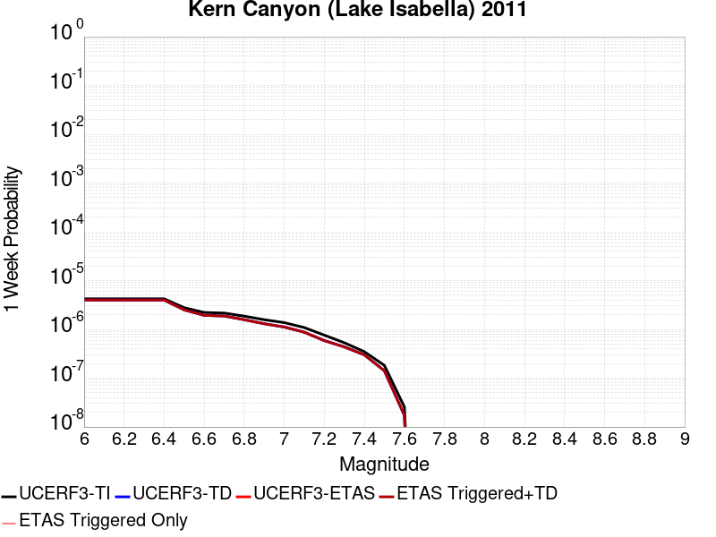 | 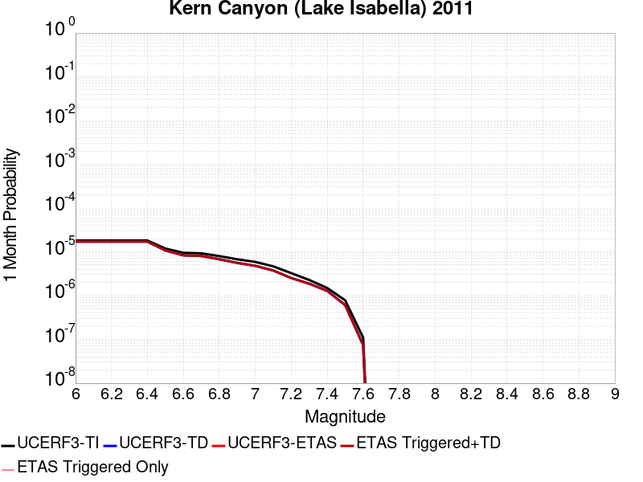 | 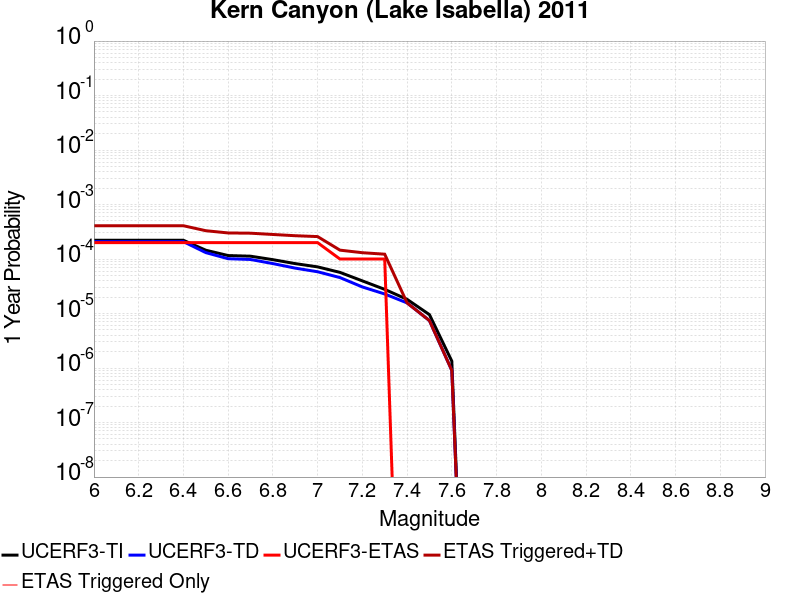 | 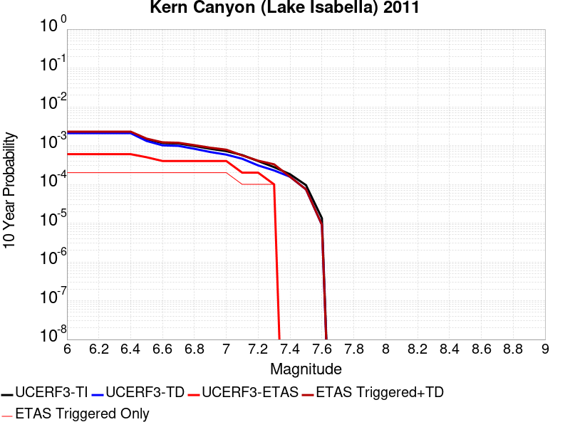 |

| Magnitude | 1 wk TI Prob | 1 wk TD Prob | 1 wk ETAS Prob | 1 wk ETAS/TD Gain | 1 wk ETAS Triggered+TD | 1 wk ETAS Triggered Only | 1 mo TI Prob | 1 mo TD Prob | 1 mo ETAS Prob | 1 mo ETAS/TD Gain | 1 mo ETAS Triggered+TD | 1 mo ETAS Triggered Only | 1 yr TI Prob | 1 yr TD Prob | 1 yr ETAS Prob | 1 yr ETAS/TD Gain | 1 yr ETAS Triggered+TD | 1 yr ETAS Triggered Only | 10 yr TI Prob | 10 yr TD Prob | 10 yr ETAS Prob | 10 yr ETAS/TD Gain | 10 yr ETAS Triggered+TD | 10 yr ETAS Triggered Only |
|-----|-----|-----|-----|-----|-----|-----|-----|-----|-----|-----|-----|-----|-----|-----|-----|-----|-----|-----|-----|-----|-----|-----|-----|-----|
| 6.0 | 4.2387383E-6 | 4.001814E-6 | 0.0 | 0.0 | 4.001814E-6 | 0.0 | 1.8165894E-5 | 1.7150529E-5 | 0.0 | 0.0 | 1.7150529E-5 | 0.0 | 2.2114732E-4 | 2.0878956E-4 | 2.0E-4 | 0.9579023 | 4.087478E-4 | 2.0E-4 | 0.0022092736 | 0.0020861179 | 6.0E-4 | 0.2876156 | 0.0022857005 | 2.0E-4 |
| 6.1 | 4.2387383E-6 | 4.001814E-6 | 0.0 | 0.0 | 4.001814E-6 | 0.0 | 1.8165894E-5 | 1.7150529E-5 | 0.0 | 0.0 | 1.7150529E-5 | 0.0 | 2.2114732E-4 | 2.0878956E-4 | 2.0E-4 | 0.9579023 | 4.087478E-4 | 2.0E-4 | 0.0022092736 | 0.0020861179 | 6.0E-4 | 0.2876156 | 0.0022857005 | 2.0E-4 |
| 6.2 | 4.2387383E-6 | 4.001814E-6 | 0.0 | 0.0 | 4.001814E-6 | 0.0 | 1.8165894E-5 | 1.7150529E-5 | 0.0 | 0.0 | 1.7150529E-5 | 0.0 | 2.2114732E-4 | 2.0878956E-4 | 2.0E-4 | 0.9579023 | 4.087478E-4 | 2.0E-4 | 0.0022092736 | 0.0020861179 | 6.0E-4 | 0.2876156 | 0.0022857005 | 2.0E-4 |
| 6.3 | 4.2387383E-6 | 4.001814E-6 | 0.0 | 0.0 | 4.001814E-6 | 0.0 | 1.8165894E-5 | 1.7150529E-5 | 0.0 | 0.0 | 1.7150529E-5 | 0.0 | 2.2114732E-4 | 2.0878956E-4 | 2.0E-4 | 0.9579023 | 4.087478E-4 | 2.0E-4 | 0.0022092736 | 0.0020861179 | 6.0E-4 | 0.2876156 | 0.0022857005 | 2.0E-4 |
| 6.4 | 4.2387383E-6 | 4.001814E-6 | 0.0 | 0.0 | 4.001814E-6 | 0.0 | 1.8165894E-5 | 1.7150529E-5 | 0.0 | 0.0 | 1.7150529E-5 | 0.0 | 2.2114732E-4 | 2.0878956E-4 | 2.0E-4 | 0.9579023 | 4.087478E-4 | 2.0E-4 | 0.0022092736 | 0.0020861179 | 6.0E-4 | 0.2876156 | 0.0022857005 | 2.0E-4 |
| 6.5 | 2.7857532E-6 | 2.51798E-6 | 0.0 | 0.0 | 2.51798E-6 | 0.0 | 1.1938888E-5 | 1.0791299E-5 | 0.0 | 0.0 | 1.0791299E-5 | 0.0 | 1.4534626E-4 | 1.3137648E-4 | 2.0E-4 | 1.5223424 | 3.313502E-4 | 2.0E-4 | 0.0014525123 | 0.0013130208 | 5.0E-4 | 0.38080126 | 0.0015127583 | 2.0E-4 |
| 6.6 | 2.2233348E-6 | 1.9442136E-6 | 0.0 | 0.0 | 1.9442136E-6 | 0.0 | 9.528543E-6 | 8.332318E-6 | 0.0 | 0.0 | 8.332318E-6 | 0.0 | 1.1600384E-4 | 1.01441336E-4 | 2.0E-4 | 1.9715829 | 3.0142104E-4 | 2.0E-4 | 0.001159433 | 0.001013959 | 4.0E-4 | 0.39449328 | 0.0012137562 | 2.0E-4 |
| 6.7 | 2.1635126E-6 | 1.8835921E-6 | 0.0 | 0.0 | 1.8835921E-6 | 0.0 | 9.272164E-6 | 8.072513E-6 | 0.0 | 0.0 | 8.072513E-6 | 0.0 | 1.1288274E-4 | 9.827849E-5 | 2.0E-4 | 2.0350332 | 2.9825885E-4 | 2.0E-4 | 0.0011282542 | 9.823585E-4 | 4.0E-4 | 0.40718335 | 0.001182162 | 2.0E-4 |
| 6.8 | 1.8685711E-6 | 1.5832201E-6 | 0.0 | 0.0 | 1.5832201E-6 | 0.0 | 8.008137E-6 | 6.785211E-6 | 0.0 | 0.0 | 6.785211E-6 | 0.0 | 9.74947E-5 | 8.2606864E-5 | 2.0E-4 | 2.4211063 | 2.8259034E-4 | 2.0E-4 | 9.745194E-4 | 8.2576653E-4 | 4.0E-4 | 0.48439842 | 0.0010256014 | 2.0E-4 |
| 6.9 | 1.5815071E-6 | 1.3065587E-6 | 0.0 | 0.0 | 1.3065587E-6 | 0.0 | 6.77787E-6 | 5.5995256E-6 | 0.0 | 0.0 | 5.5995256E-6 | 0.0 | 8.251744E-5 | 6.8172114E-5 | 2.0E-4 | 2.9337509 | 2.6815847E-4 | 2.0E-4 | 8.248681E-4 | 6.8151474E-4 | 4.0E-4 | 0.5869279 | 8.813784E-4 | 2.0E-4 |
| 7.0 | 1.3772564E-6 | 1.1211287E-6 | 0.0 | 0.0 | 1.1211287E-6 | 0.0 | 5.9025137E-6 | 4.8048287E-6 | 0.0 | 0.0 | 4.8048287E-6 | 0.0 | 7.186073E-5 | 5.8497237E-5 | 2.0E-4 | 3.4189649 | 2.5848552E-4 | 2.0E-4 | 7.18375E-4 | 5.8482046E-4 | 4.0E-4 | 0.68397063 | 7.847035E-4 | 2.0E-4 |
| 7.1 | 1.0916998E-6 | 8.764212E-7 | 0.0 | 0.0 | 8.764212E-7 | 0.0 | 4.678705E-6 | 3.7560858E-6 | 0.0 | 0.0 | 3.7560858E-6 | 0.0 | 5.6961744E-5 | 4.5729397E-5 | 1.0E-4 | 2.186777 | 1.4572483E-4 | 1.0E-4 | 5.6947145E-4 | 4.572012E-4 | 2.0E-4 | 0.43744415 | 5.571555E-4 | 1.0E-4 |
| 7.2 | 7.6277024E-7 | 5.901751E-7 | 0.0 | 0.0 | 5.901751E-7 | 0.0 | 3.2690114E-6 | 2.5293195E-6 | 0.0 | 0.0 | 2.5293195E-6 | 0.0 | 3.9799485E-5 | 3.0794035E-5 | 1.0E-4 | 3.2473822 | 1.3079096E-4 | 1.0E-4 | 3.9792358E-4 | 3.078983E-4 | 2.0E-4 | 0.64956516 | 4.078675E-4 | 1.0E-4 |
| 7.3 | 5.3265916E-7 | 4.3826515E-7 | 0.0 | 0.0 | 4.3826515E-7 | 0.0 | 2.282823E-6 | 1.8782779E-6 | 0.0 | 0.0 | 1.8782779E-6 | 0.0 | 2.7793016E-5 | 2.2867798E-5 | 1.0E-4 | 4.3729615 | 1.2286552E-4 | 1.0E-4 | 2.778954E-4 | 2.2865483E-4 | 1.0E-4 | 0.43734044 | 3.2863196E-4 | 1.0E-4 |
| 7.4 | 3.4946007E-7 | 3.006716E-7 | 0.0 | 0.0 | 3.006716E-7 | 0.0 | 1.497685E-6 | 1.2885919E-6 | 0.0 | 0.0 | 1.2885919E-6 | 0.0 | 1.8234163E-5 | 1.5688496E-5 | 0.0 | 0.0 | 1.5688496E-5 | 0.0 | 1.8232666E-4 | 1.5687411E-4 | 0.0 | 0.0 | 1.5687411E-4 | 0.0 |
| 7.5 | 1.8317026E-7 | 1.4245614E-7 | 0.0 | 0.0 | 1.4245614E-7 | 0.0 | 7.850152E-7 | 6.105262E-7 | 0.0 | 0.0 | 6.105262E-7 | 0.0 | 9.557518E-6 | 7.4331315E-6 | 0.0 | 0.0 | 7.4331315E-6 | 0.0 | 9.5571064E-5 | 7.4328906E-5 | 0.0 | 0.0 | 7.4328906E-5 | 0.0 |
| 7.6 | 2.572245E-8 | 1.7353855E-8 | 0.0 | 0.0 | 1.7353855E-8 | 0.0 | 1.10239064E-7 | 7.4373666E-8 | 0.0 | 0.0 | 7.4373666E-8 | 0.0 | 1.3421597E-6 | 9.05499E-7 | 0.0 | 0.0 | 9.05499E-7 | 0.0 | 1.3421517E-5 | 9.054958E-6 | 0.0 | 0.0 | 9.054958E-6 | 0.0 |

## Anacapa-Dume alt 1
*[(top)](#table-of-contents)*

| 1 Week | 1 Month | 1 Year | 10 Year |
|-----|-----|-----|-----|
| 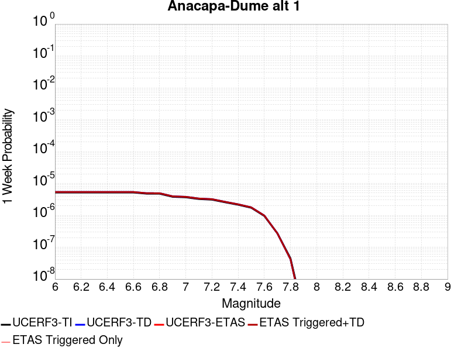 | 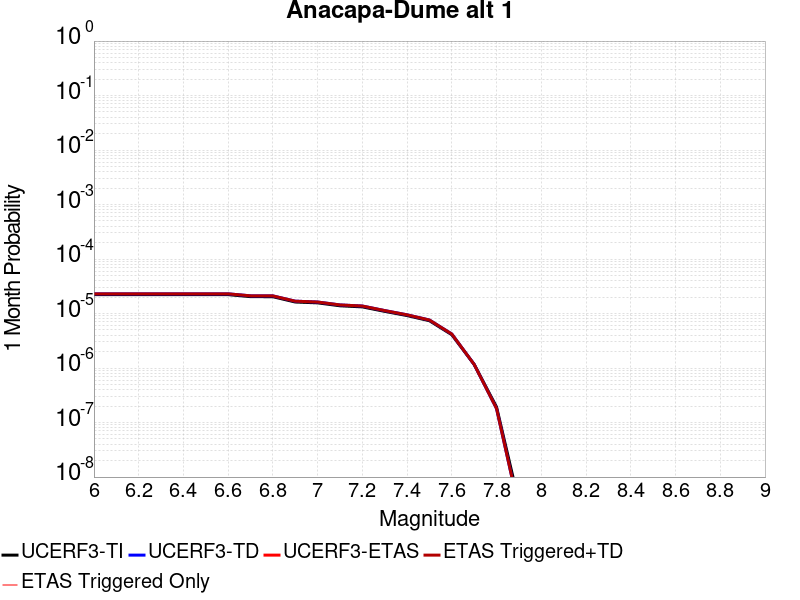 | 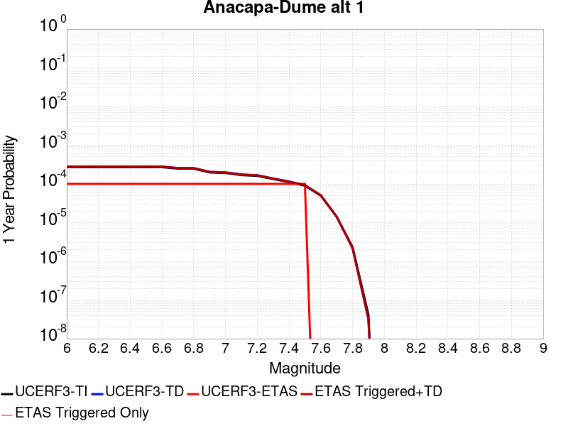 | 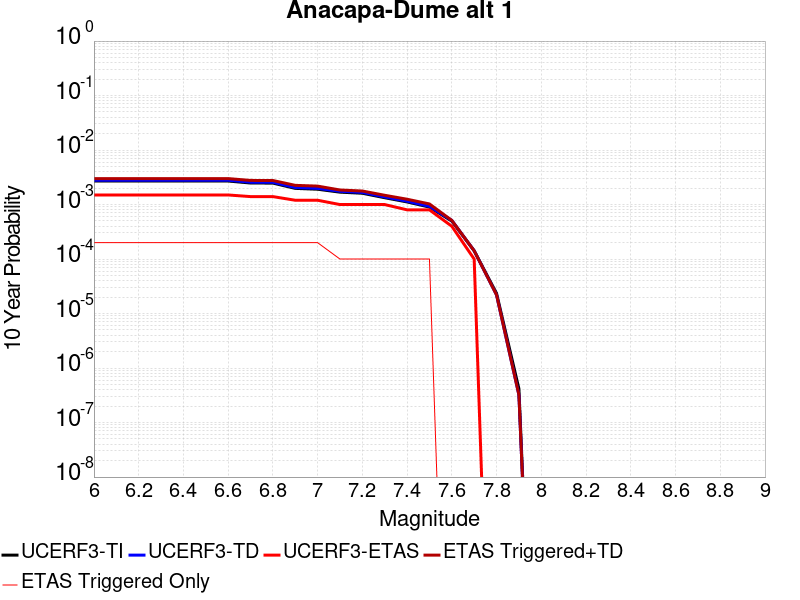 |

| Magnitude | 1 wk TI Prob | 1 wk TD Prob | 1 wk ETAS Prob | 1 wk ETAS/TD Gain | 1 wk ETAS Triggered+TD | 1 wk ETAS Triggered Only | 1 mo TI Prob | 1 mo TD Prob | 1 mo ETAS Prob | 1 mo ETAS/TD Gain | 1 mo ETAS Triggered+TD | 1 mo ETAS Triggered Only | 1 yr TI Prob | 1 yr TD Prob | 1 yr ETAS Prob | 1 yr ETAS/TD Gain | 1 yr ETAS Triggered+TD | 1 yr ETAS Triggered Only | 10 yr TI Prob | 10 yr TD Prob | 10 yr ETAS Prob | 10 yr ETAS/TD Gain | 10 yr ETAS Triggered+TD | 10 yr ETAS Triggered Only |
|-----|-----|-----|-----|-----|-----|-----|-----|-----|-----|-----|-----|-----|-----|-----|-----|-----|-----|-----|-----|-----|-----|-----|-----|-----|
| 6.0 | 5.1871802E-6 | 5.367811E-6 | 0.0 | 0.0 | 5.367811E-6 | 0.0 | 2.2230583E-5 | 2.3004704E-5 | 0.0 | 0.0 | 2.3004704E-5 | 0.0 | 2.7062374E-4 | 2.8004713E-4 | 1.0E-4 | 0.35708275 | 2.8004713E-4 | 0.0 | 0.002702944 | 0.0027970276 | 0.0015 | 0.53628355 | 0.0029964682 | 2.0E-4 |
| 6.1 | 5.1871802E-6 | 5.367811E-6 | 0.0 | 0.0 | 5.367811E-6 | 0.0 | 2.2230583E-5 | 2.3004704E-5 | 0.0 | 0.0 | 2.3004704E-5 | 0.0 | 2.7062374E-4 | 2.8004713E-4 | 1.0E-4 | 0.35708275 | 2.8004713E-4 | 0.0 | 0.002702944 | 0.0027970276 | 0.0015 | 0.53628355 | 0.0029964682 | 2.0E-4 |
| 6.2 | 5.1871802E-6 | 5.367811E-6 | 0.0 | 0.0 | 5.367811E-6 | 0.0 | 2.2230583E-5 | 2.3004704E-5 | 0.0 | 0.0 | 2.3004704E-5 | 0.0 | 2.7062374E-4 | 2.8004713E-4 | 1.0E-4 | 0.35708275 | 2.8004713E-4 | 0.0 | 0.002702944 | 0.0027970276 | 0.0015 | 0.53628355 | 0.0029964682 | 2.0E-4 |
| 6.3 | 5.1871802E-6 | 5.367811E-6 | 0.0 | 0.0 | 5.367811E-6 | 0.0 | 2.2230583E-5 | 2.3004704E-5 | 0.0 | 0.0 | 2.3004704E-5 | 0.0 | 2.7062374E-4 | 2.8004713E-4 | 1.0E-4 | 0.35708275 | 2.8004713E-4 | 0.0 | 0.002702944 | 0.0027970276 | 0.0015 | 0.53628355 | 0.0029964682 | 2.0E-4 |
| 6.4 | 5.1871802E-6 | 5.367811E-6 | 0.0 | 0.0 | 5.367811E-6 | 0.0 | 2.2230583E-5 | 2.3004704E-5 | 0.0 | 0.0 | 2.3004704E-5 | 0.0 | 2.7062374E-4 | 2.8004713E-4 | 1.0E-4 | 0.35708275 | 2.8004713E-4 | 0.0 | 0.002702944 | 0.0027970276 | 0.0015 | 0.53628355 | 0.0029964682 | 2.0E-4 |
| 6.5 | 5.1871802E-6 | 5.367811E-6 | 0.0 | 0.0 | 5.367811E-6 | 0.0 | 2.2230583E-5 | 2.3004704E-5 | 0.0 | 0.0 | 2.3004704E-5 | 0.0 | 2.7062374E-4 | 2.8004713E-4 | 1.0E-4 | 0.35708275 | 2.8004713E-4 | 0.0 | 0.002702944 | 0.0027970276 | 0.0015 | 0.53628355 | 0.0029964682 | 2.0E-4 |
| 6.6 | 5.1871802E-6 | 5.367811E-6 | 0.0 | 0.0 | 5.367811E-6 | 0.0 | 2.2230583E-5 | 2.3004704E-5 | 0.0 | 0.0 | 2.3004704E-5 | 0.0 | 2.7062374E-4 | 2.8004713E-4 | 1.0E-4 | 0.35708275 | 2.8004713E-4 | 0.0 | 0.002702944 | 0.0027970276 | 0.0015 | 0.53628355 | 0.0029964682 | 2.0E-4 |
| 6.7 | 4.7693475E-6 | 4.937085E-6 | 0.0 | 0.0 | 4.937085E-6 | 0.0 | 2.04399E-5 | 2.115877E-5 | 0.0 | 0.0 | 2.115877E-5 | 0.0 | 2.4882736E-4 | 2.5757833E-4 | 1.0E-4 | 0.38823143 | 2.5757833E-4 | 0.0 | 0.0024854892 | 0.0025728738 | 0.0014 | 0.5441386 | 0.0027723592 | 2.0E-4 |
| 6.8 | 4.753408E-6 | 4.9206324E-6 | 0.0 | 0.0 | 4.9206324E-6 | 0.0 | 2.037159E-5 | 2.1088259E-5 | 0.0 | 0.0 | 2.1088259E-5 | 0.0 | 2.4799586E-4 | 2.5672006E-4 | 1.0E-4 | 0.38952938 | 2.5672006E-4 | 0.0 | 0.002477193 | 0.002564311 | 0.0014 | 0.54595566 | 0.002763798 | 2.0E-4 |
| 6.9 | 3.800069E-6 | 3.9374577E-6 | 0.0 | 0.0 | 3.9374577E-6 | 0.0 | 1.6285909E-5 | 1.687471E-5 | 0.0 | 0.0 | 1.687471E-5 | 0.0 | 1.9826289E-4 | 2.0543046E-4 | 1.0E-4 | 0.4867827 | 2.0543046E-4 | 0.0 | 0.001980861 | 0.0020524294 | 0.0012 | 0.5846729 | 0.002252019 | 2.0E-4 |
| 7.0 | 3.6671938E-6 | 3.800241E-6 | 0.0 | 0.0 | 3.800241E-6 | 0.0 | 1.571645E-5 | 1.6286647E-5 | 0.0 | 0.0 | 1.6286647E-5 | 0.0 | 1.9133097E-4 | 1.9827212E-4 | 1.0E-4 | 0.50435734 | 1.9827212E-4 | 0.0 | 0.0019116632 | 0.0019809755 | 0.0012 | 0.6057622 | 0.0021805794 | 2.0E-4 |
| 7.1 | 3.2394885E-6 | 3.3590886E-6 | 0.0 | 0.0 | 3.3590886E-6 | 0.0 | 1.3883448E-5 | 1.4396015E-5 | 0.0 | 0.0 | 1.4396015E-5 | 0.0 | 1.6901788E-4 | 1.7525749E-4 | 1.0E-4 | 0.570589 | 1.7525749E-4 | 0.0 | 0.0016888938 | 0.001751204 | 0.001 | 0.5710357 | 0.0018510289 | 1.0E-4 |
| 7.2 | 3.0935948E-6 | 3.208211E-6 | 0.0 | 0.0 | 3.208211E-6 | 0.0 | 1.3258196E-5 | 1.3749404E-5 | 0.0 | 0.0 | 1.3749404E-5 | 0.0 | 1.6140658E-4 | 1.6738624E-4 | 1.0E-4 | 0.5974207 | 1.6738624E-4 | 0.0 | 0.001612894 | 0.0016726126 | 0.001 | 0.5978671 | 0.0017724454 | 1.0E-4 |
| 7.3 | 2.5604163E-6 | 2.6473003E-6 | 0.0 | 0.0 | 2.6473003E-6 | 0.0 | 1.0973167E-5 | 1.13455235E-5 | 0.0 | 0.0 | 1.13455235E-5 | 0.0 | 1.3359012E-4 | 1.3812304E-4 | 1.0E-4 | 0.7239922 | 1.3812304E-4 | 0.0 | 0.0013350984 | 0.0013803765 | 0.001 | 0.72444004 | 0.0014802384 | 1.0E-4 |
| 7.4 | 2.1429005E-6 | 2.2107906E-6 | 0.0 | 0.0 | 2.2107906E-6 | 0.0 | 9.1838265E-6 | 9.474782E-6 | 0.0 | 0.0 | 9.474782E-6 | 0.0 | 1.11807356E-4 | 1.15349394E-4 | 1.0E-4 | 0.8669313 | 1.15349394E-4 | 0.0 | 0.0011175112 | 0.0011528978 | 8.0E-4 | 0.6939036 | 0.0012527825 | 1.0E-4 |
| 7.5 | 1.7237151E-6 | 1.7762965E-6 | 0.0 | 0.0 | 1.7762965E-6 | 0.0 | 7.3873293E-6 | 7.612677E-6 | 0.0 | 0.0 | 7.612677E-6 | 0.0 | 8.993702E-5 | 9.268042E-5 | 1.0E-4 | 1.0789765 | 9.268042E-5 | 0.0 | 8.990063E-4 | 9.2642003E-4 | 8.0E-4 | 0.86353916 | 0.0010263274 | 1.0E-4 |
| 7.6 | 9.541696E-7 | 9.824043E-7 | 0.0 | 0.0 | 9.824043E-7 | 0.0 | 4.089292E-6 | 4.2102974E-6 | 0.0 | 0.0 | 4.2102974E-6 | 0.0 | 4.9785995E-5 | 5.125918E-5 | 0.0 | 0.0 | 5.125918E-5 | 0.0 | 4.9774844E-4 | 5.1247486E-4 | 4.0E-4 | 0.78052616 | 5.1247486E-4 | 0.0 |
| 7.7 | 2.7226676E-7 | 2.7174286E-7 | 0.0 | 0.0 | 2.7174286E-7 | 0.0 | 1.166857E-6 | 1.1646117E-6 | 0.0 | 0.0 | 1.1646117E-6 | 0.0 | 1.4206392E-5 | 1.4179057E-5 | 0.0 | 0.0 | 1.4179057E-5 | 0.0 | 1.4205484E-4 | 1.417816E-4 | 1.0E-4 | 0.70531017 | 1.417816E-4 | 0.0 |
| 7.8 | 4.5017995E-8 | 4.216035E-8 | 0.0 | 0.0 | 4.216035E-8 | 0.0 | 1.9293425E-7 | 1.8068721E-7 | 0.0 | 0.0 | 1.8068721E-7 | 0.0 | 2.348972E-6 | 2.1998649E-6 | 0.0 | 0.0 | 2.1998649E-6 | 0.0 | 2.348947E-5 | 2.1998452E-5 | 0.0 | 0.0 | 2.1998452E-5 | 0.0 |
| 7.9 | 8.007447E-10 | 6.162303E-10 | 0.0 | 0.0 | 6.162303E-10 | 0.0 | 3.4317629E-9 | 2.6409874E-9 | 0.0 | 0.0 | 2.6409874E-9 | 0.0 | 4.1781714E-8 | 3.215402E-8 | 0.0 | 0.0 | 3.215402E-8 | 0.0 | 4.1781706E-7 | 3.2154017E-7 | 0.0 | 0.0 | 3.2154017E-7 | 0.0 |

## Elysian Park (Lower CFM)
*[(top)](#table-of-contents)*

| 1 Week | 1 Month | 1 Year | 10 Year |
|-----|-----|-----|-----|
| 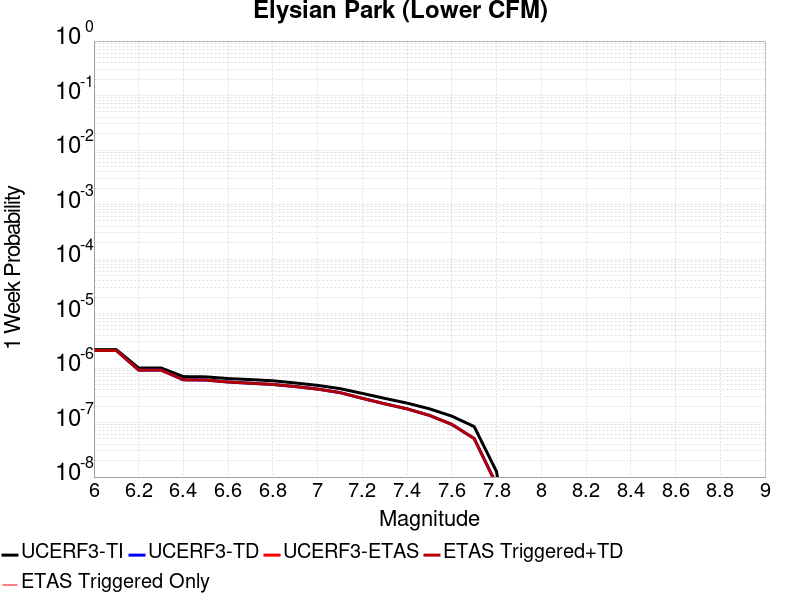 | 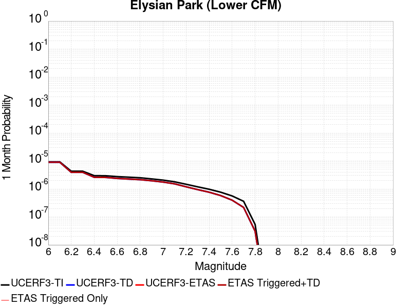 | 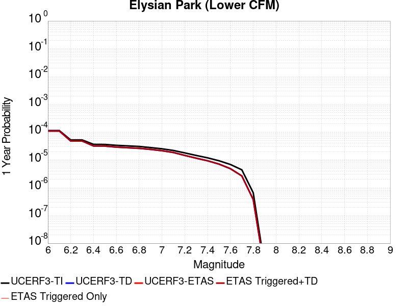 | 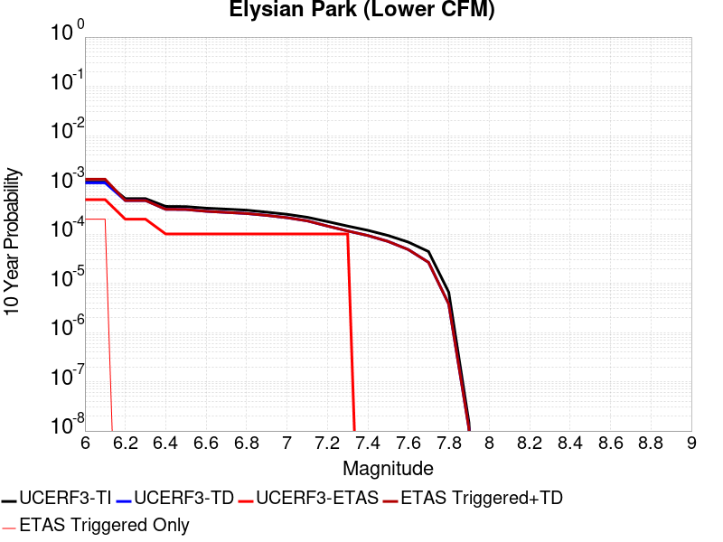 |

| Magnitude | 1 wk TI Prob | 1 wk TD Prob | 1 wk ETAS Prob | 1 wk ETAS/TD Gain | 1 wk ETAS Triggered+TD | 1 wk ETAS Triggered Only | 1 mo TI Prob | 1 mo TD Prob | 1 mo ETAS Prob | 1 mo ETAS/TD Gain | 1 mo ETAS Triggered+TD | 1 mo ETAS Triggered Only | 1 yr TI Prob | 1 yr TD Prob | 1 yr ETAS Prob | 1 yr ETAS/TD Gain | 1 yr ETAS Triggered+TD | 1 yr ETAS Triggered Only | 10 yr TI Prob | 10 yr TD Prob | 10 yr ETAS Prob | 10 yr ETAS/TD Gain | 10 yr ETAS Triggered+TD | 10 yr ETAS Triggered Only |
|-----|-----|-----|-----|-----|-----|-----|-----|-----|-----|-----|-----|-----|-----|-----|-----|-----|-----|-----|-----|-----|-----|-----|-----|-----|
| 6.0 | 2.1766498E-6 | 2.1039148E-6 | 0.0 | 0.0 | 2.1039148E-6 | 0.0 | 9.328466E-6 | 9.016754E-6 | 0.0 | 0.0 | 9.016754E-6 | 0.0 | 1.1356815E-4 | 1.09774905E-4 | 0.0 | 0.0 | 1.09774905E-4 | 0.0 | 0.0011351013 | 0.0010973486 | 5.0E-4 | 0.45564368 | 0.0012971292 | 2.0E-4 |
| 6.1 | 2.1766498E-6 | 2.1039148E-6 | 0.0 | 0.0 | 2.1039148E-6 | 0.0 | 9.328466E-6 | 9.016754E-6 | 0.0 | 0.0 | 9.016754E-6 | 0.0 | 1.1356815E-4 | 1.09774905E-4 | 0.0 | 0.0 | 1.09774905E-4 | 0.0 | 0.0011351013 | 0.0010973486 | 5.0E-4 | 0.45564368 | 0.0012971292 | 2.0E-4 |
| 6.2 | 1.0031182E-6 | 9.1872334E-7 | 0.0 | 0.0 | 9.1872334E-7 | 0.0 | 4.299071E-6 | 3.9373804E-6 | 0.0 | 0.0 | 3.9373804E-6 | 0.0 | 5.2339932E-5 | 4.793665E-5 | 0.0 | 0.0 | 4.793665E-5 | 0.0 | 5.2327604E-4 | 4.7927292E-4 | 2.0E-4 | 0.4172988 | 4.7927292E-4 | 0.0 |
| 6.3 | 1.0031182E-6 | 9.1872334E-7 | 0.0 | 0.0 | 9.1872334E-7 | 0.0 | 4.299071E-6 | 3.9373804E-6 | 0.0 | 0.0 | 3.9373804E-6 | 0.0 | 5.2339932E-5 | 4.793665E-5 | 0.0 | 0.0 | 4.793665E-5 | 0.0 | 5.2327604E-4 | 4.7927292E-4 | 2.0E-4 | 0.4172988 | 4.7927292E-4 | 0.0 |
| 6.4 | 6.9606244E-7 | 6.092915E-7 | 0.0 | 0.0 | 6.092915E-7 | 0.0 | 2.9831212E-6 | 2.6112466E-6 | 0.0 | 0.0 | 2.6112466E-6 | 0.0 | 3.6318896E-5 | 3.1791467E-5 | 0.0 | 0.0 | 3.1791467E-5 | 0.0 | 3.6312963E-4 | 3.1786942E-4 | 1.0E-4 | 0.3145946 | 3.1786942E-4 | 0.0 |
| 6.5 | 6.901879E-7 | 6.0335975E-7 | 0.0 | 0.0 | 6.0335975E-7 | 0.0 | 2.9579448E-6 | 2.5858249E-6 | 0.0 | 0.0 | 2.5858249E-6 | 0.0 | 3.6012385E-5 | 3.1481966E-5 | 0.0 | 0.0 | 3.1481966E-5 | 0.0 | 3.600655E-4 | 3.1477527E-4 | 1.0E-4 | 0.31768695 | 3.1477527E-4 | 0.0 |
| 6.6 | 6.4198554E-7 | 5.547572E-7 | 0.0 | 0.0 | 5.547572E-7 | 0.0 | 2.7513638E-6 | 2.3775287E-6 | 0.0 | 0.0 | 2.3775287E-6 | 0.0 | 3.3497337E-5 | 2.894603E-5 | 0.0 | 0.0 | 2.894603E-5 | 0.0 | 3.349229E-4 | 2.8942272E-4 | 1.0E-4 | 0.34551537 | 2.8942272E-4 | 0.0 |
| 6.7 | 6.138733E-7 | 5.2643753E-7 | 0.0 | 0.0 | 5.2643753E-7 | 0.0 | 2.6308828E-6 | 2.2561587E-6 | 0.0 | 0.0 | 2.2561587E-6 | 0.0 | 3.203053E-5 | 2.7468388E-5 | 0.0 | 0.0 | 2.7468388E-5 | 0.0 | 3.2025913E-4 | 2.7465005E-4 | 1.0E-4 | 0.36409968 | 2.7465005E-4 | 0.0 |
| 6.8 | 5.84778E-7 | 5.0038886E-7 | 0.0 | 0.0 | 5.0038886E-7 | 0.0 | 2.506189E-6 | 2.1445219E-6 | 0.0 | 0.0 | 2.1445219E-6 | 0.0 | 3.0512423E-5 | 2.6109243E-5 | 0.0 | 0.0 | 2.6109243E-5 | 0.0 | 3.0508233E-4 | 2.6106185E-4 | 1.0E-4 | 0.38305098 | 2.6106185E-4 | 0.0 |
| 6.9 | 5.322785E-7 | 4.581014E-7 | 0.0 | 0.0 | 4.581014E-7 | 0.0 | 2.2811914E-6 | 1.96329E-6 | 0.0 | 0.0 | 1.96329E-6 | 0.0 | 2.7773152E-5 | 2.3902796E-5 | 0.0 | 0.0 | 2.3902796E-5 | 0.0 | 2.7769682E-4 | 2.3900236E-4 | 1.0E-4 | 0.41840592 | 2.3900236E-4 | 0.0 |
| 7.0 | 4.8147206E-7 | 4.113329E-7 | 0.0 | 0.0 | 4.113329E-7 | 0.0 | 2.06345E-6 | 1.762854E-6 | 0.0 | 0.0 | 1.762854E-6 | 0.0 | 2.5122214E-5 | 2.1462538E-5 | 0.0 | 0.0 | 2.1462538E-5 | 0.0 | 2.5119373E-4 | 2.1460473E-4 | 1.0E-4 | 0.46597296 | 2.1460473E-4 | 0.0 |
| 7.1 | 4.1932955E-7 | 3.5464035E-7 | 0.0 | 0.0 | 3.5464035E-7 | 0.0 | 1.7971255E-6 | 1.5198863E-6 | 0.0 | 0.0 | 1.5198863E-6 | 0.0 | 2.1879783E-5 | 1.850446E-5 | 0.0 | 0.0 | 1.850446E-5 | 0.0 | 2.1877629E-4 | 1.8502923E-4 | 1.0E-4 | 0.54045516 | 1.8502923E-4 | 0.0 |
| 7.2 | 3.426051E-7 | 2.7817325E-7 | 0.0 | 0.0 | 2.7817325E-7 | 0.0 | 1.4683067E-6 | 1.1921704E-6 | 0.0 | 0.0 | 1.1921704E-6 | 0.0 | 1.7876488E-5 | 1.4514578E-5 | 0.0 | 0.0 | 1.4514578E-5 | 0.0 | 1.787505E-4 | 1.4513632E-4 | 1.0E-4 | 0.6890074 | 1.4513632E-4 | 0.0 |
| 7.3 | 2.7771645E-7 | 2.2102518E-7 | 0.0 | 0.0 | 2.2102518E-7 | 0.0 | 1.1902127E-6 | 9.472504E-7 | 0.0 | 0.0 | 9.472504E-7 | 0.0 | 1.4490744E-5 | 1.1532712E-5 | 0.0 | 0.0 | 1.1532712E-5 | 0.0 | 1.4489799E-4 | 1.15321156E-4 | 1.0E-4 | 0.8671436 | 1.15321156E-4 | 0.0 |
| 7.4 | 2.2756493E-7 | 1.7845092E-7 | 0.0 | 0.0 | 1.7845092E-7 | 0.0 | 9.752779E-7 | 7.647894E-7 | 0.0 | 0.0 | 7.647894E-7 | 0.0 | 1.1873944E-5 | 9.311271E-6 | 0.0 | 0.0 | 9.311271E-6 | 0.0 | 1.18733085E-4 | 9.310883E-5 | 0.0 | 0.0 | 9.310883E-5 | 0.0 |
| 7.5 | 1.7874558E-7 | 1.3547175E-7 | 0.0 | 0.0 | 1.3547175E-7 | 0.0 | 7.660522E-7 | 5.8059305E-7 | 0.0 | 0.0 | 5.8059305E-7 | 0.0 | 9.326646E-6 | 7.0686974E-6 | 0.0 | 0.0 | 7.0686974E-6 | 0.0 | 9.326255E-5 | 7.068474E-5 | 0.0 | 0.0 | 7.068474E-5 | 0.0 |
| 7.6 | 1.3124549E-7 | 9.254267E-8 | 0.0 | 0.0 | 9.254267E-8 | 0.0 | 5.624805E-7 | 3.9661137E-7 | 0.0 | 0.0 | 3.9661137E-7 | 0.0 | 6.8481786E-6 | 4.828733E-6 | 0.0 | 0.0 | 4.828733E-6 | 0.0 | 6.8479676E-5 | 4.8286296E-5 | 0.0 | 0.0 | 4.8286296E-5 | 0.0 |
| 7.7 | 8.439993E-8 | 5.0927017E-8 | 0.0 | 0.0 | 5.0927017E-8 | 0.0 | 3.6171392E-7 | 2.1825863E-7 | 0.0 | 0.0 | 2.1825863E-7 | 0.0 | 4.403858E-6 | 2.6572957E-6 | 0.0 | 0.0 | 2.6572957E-6 | 0.0 | 4.4037708E-5 | 2.6572652E-5 | 0.0 | 0.0 | 2.6572652E-5 | 0.0 |
| 7.8 | 1.2591407E-8 | 7.232495E-9 | 0.0 | 0.0 | 7.232495E-9 | 0.0 | 5.3963173E-8 | 3.0996407E-8 | 0.0 | 0.0 | 3.0996407E-8 | 0.0 | 6.570014E-7 | 3.773812E-7 | 0.0 | 0.0 | 3.773812E-7 | 0.0 | 6.5699946E-6 | 3.7738057E-6 | 0.0 | 0.0 | 3.7738057E-6 | 0.0 |
| 7.9 | 2.8324232E-11 | 2.1428304E-11 | 0.0 | 0.0 | 2.1428304E-11 | 0.0 | 1.2138957E-10 | 9.183598E-11 | 0.0 | 0.0 | 9.183598E-11 | 0.0 | 1.4779177E-9 | 1.1181025E-9 | 0.0 | 0.0 | 1.1181025E-9 | 0.0 | 1.4779177E-8 | 1.1181024E-8 | 0.0 | 0.0 | 1.1181024E-8 | 0.0 |

## Great Valley 14 (Kettleman Hills)
*[(top)](#table-of-contents)*

| 1 Week | 1 Month | 1 Year | 10 Year |
|-----|-----|-----|-----|
| 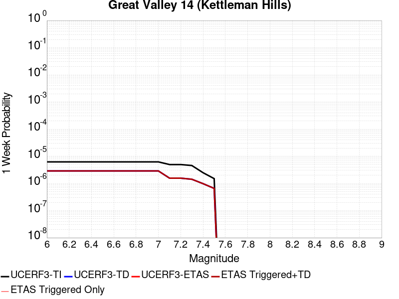 | 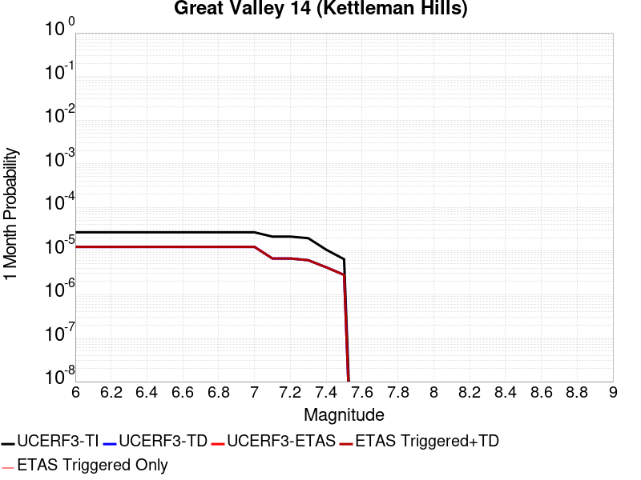 | 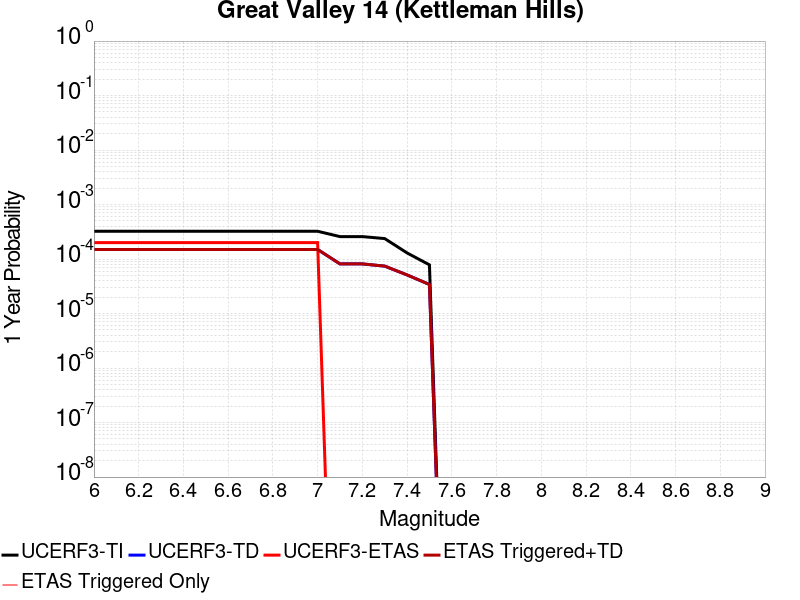 | 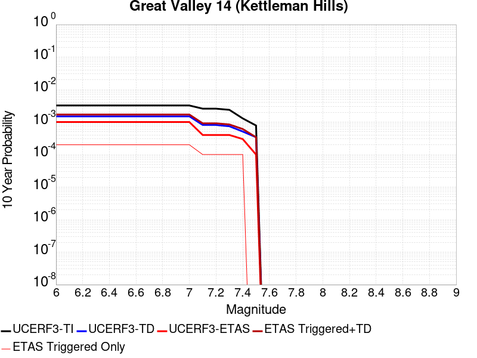 |

| Magnitude | 1 wk TI Prob | 1 wk TD Prob | 1 wk ETAS Prob | 1 wk ETAS/TD Gain | 1 wk ETAS Triggered+TD | 1 wk ETAS Triggered Only | 1 mo TI Prob | 1 mo TD Prob | 1 mo ETAS Prob | 1 mo ETAS/TD Gain | 1 mo ETAS Triggered+TD | 1 mo ETAS Triggered Only | 1 yr TI Prob | 1 yr TD Prob | 1 yr ETAS Prob | 1 yr ETAS/TD Gain | 1 yr ETAS Triggered+TD | 1 yr ETAS Triggered Only | 10 yr TI Prob | 10 yr TD Prob | 10 yr ETAS Prob | 10 yr ETAS/TD Gain | 10 yr ETAS Triggered+TD | 10 yr ETAS Triggered Only |
|-----|-----|-----|-----|-----|-----|-----|-----|-----|-----|-----|-----|-----|-----|-----|-----|-----|-----|-----|-----|-----|-----|-----|-----|-----|
| 6.0 | 6.2057843E-6 | 2.877515E-6 | 0.0 | 0.0 | 2.877515E-6 | 0.0 | 2.6595946E-5 | 1.2332162E-5 | 0.0 | 0.0 | 1.2332162E-5 | 0.0 | 3.2375753E-4 | 1.5013608E-4 | 2.0E-4 | 1.3321248 | 1.5013608E-4 | 0.0 | 0.0032328626 | 0.0015005779 | 0.001 | 0.6664099 | 0.0017002778 | 2.0E-4 |
| 6.1 | 6.2057843E-6 | 2.877515E-6 | 0.0 | 0.0 | 2.877515E-6 | 0.0 | 2.6595946E-5 | 1.2332162E-5 | 0.0 | 0.0 | 1.2332162E-5 | 0.0 | 3.2375753E-4 | 1.5013608E-4 | 2.0E-4 | 1.3321248 | 1.5013608E-4 | 0.0 | 0.0032328626 | 0.0015005779 | 0.001 | 0.6664099 | 0.0017002778 | 2.0E-4 |
| 6.2 | 6.2057843E-6 | 2.877515E-6 | 0.0 | 0.0 | 2.877515E-6 | 0.0 | 2.6595946E-5 | 1.2332162E-5 | 0.0 | 0.0 | 1.2332162E-5 | 0.0 | 3.2375753E-4 | 1.5013608E-4 | 2.0E-4 | 1.3321248 | 1.5013608E-4 | 0.0 | 0.0032328626 | 0.0015005779 | 0.001 | 0.6664099 | 0.0017002778 | 2.0E-4 |
| 6.3 | 6.2057843E-6 | 2.877515E-6 | 0.0 | 0.0 | 2.877515E-6 | 0.0 | 2.6595946E-5 | 1.2332162E-5 | 0.0 | 0.0 | 1.2332162E-5 | 0.0 | 3.2375753E-4 | 1.5013608E-4 | 2.0E-4 | 1.3321248 | 1.5013608E-4 | 0.0 | 0.0032328626 | 0.0015005779 | 0.001 | 0.6664099 | 0.0017002778 | 2.0E-4 |
| 6.4 | 6.2057843E-6 | 2.877515E-6 | 0.0 | 0.0 | 2.877515E-6 | 0.0 | 2.6595946E-5 | 1.2332162E-5 | 0.0 | 0.0 | 1.2332162E-5 | 0.0 | 3.2375753E-4 | 1.5013608E-4 | 2.0E-4 | 1.3321248 | 1.5013608E-4 | 0.0 | 0.0032328626 | 0.0015005779 | 0.001 | 0.6664099 | 0.0017002778 | 2.0E-4 |
| 6.5 | 6.2057843E-6 | 2.877515E-6 | 0.0 | 0.0 | 2.877515E-6 | 0.0 | 2.6595946E-5 | 1.2332162E-5 | 0.0 | 0.0 | 1.2332162E-5 | 0.0 | 3.2375753E-4 | 1.5013608E-4 | 2.0E-4 | 1.3321248 | 1.5013608E-4 | 0.0 | 0.0032328626 | 0.0015005779 | 0.001 | 0.6664099 | 0.0017002778 | 2.0E-4 |
| 6.6 | 6.2057843E-6 | 2.877515E-6 | 0.0 | 0.0 | 2.877515E-6 | 0.0 | 2.6595946E-5 | 1.2332162E-5 | 0.0 | 0.0 | 1.2332162E-5 | 0.0 | 3.2375753E-4 | 1.5013608E-4 | 2.0E-4 | 1.3321248 | 1.5013608E-4 | 0.0 | 0.0032328626 | 0.0015005779 | 0.001 | 0.6664099 | 0.0017002778 | 2.0E-4 |
| 6.7 | 6.2057843E-6 | 2.877515E-6 | 0.0 | 0.0 | 2.877515E-6 | 0.0 | 2.6595946E-5 | 1.2332162E-5 | 0.0 | 0.0 | 1.2332162E-5 | 0.0 | 3.2375753E-4 | 1.5013608E-4 | 2.0E-4 | 1.3321248 | 1.5013608E-4 | 0.0 | 0.0032328626 | 0.0015005779 | 0.001 | 0.6664099 | 0.0017002778 | 2.0E-4 |
| 6.8 | 6.2057843E-6 | 2.877515E-6 | 0.0 | 0.0 | 2.877515E-6 | 0.0 | 2.6595946E-5 | 1.2332162E-5 | 0.0 | 0.0 | 1.2332162E-5 | 0.0 | 3.2375753E-4 | 1.5013608E-4 | 2.0E-4 | 1.3321248 | 1.5013608E-4 | 0.0 | 0.0032328626 | 0.0015005779 | 0.001 | 0.6664099 | 0.0017002778 | 2.0E-4 |
| 6.9 | 6.2057843E-6 | 2.877515E-6 | 0.0 | 0.0 | 2.877515E-6 | 0.0 | 2.6595946E-5 | 1.2332162E-5 | 0.0 | 0.0 | 1.2332162E-5 | 0.0 | 3.2375753E-4 | 1.5013608E-4 | 2.0E-4 | 1.3321248 | 1.5013608E-4 | 0.0 | 0.0032328626 | 0.0015005779 | 0.001 | 0.6664099 | 0.0017002778 | 2.0E-4 |
| 7.0 | 6.2057843E-6 | 2.877515E-6 | 0.0 | 0.0 | 2.877515E-6 | 0.0 | 2.6595946E-5 | 1.2332162E-5 | 0.0 | 0.0 | 1.2332162E-5 | 0.0 | 3.2375753E-4 | 1.5013608E-4 | 2.0E-4 | 1.3321248 | 1.5013608E-4 | 0.0 | 0.0032328626 | 0.0015005779 | 0.001 | 0.6664099 | 0.0017002778 | 2.0E-4 |
| 7.1 | 4.95113E-6 | 1.5611356E-6 | 0.0 | 0.0 | 1.5611356E-6 | 0.0 | 2.1218955E-5 | 6.690565E-6 | 0.0 | 0.0 | 6.690565E-6 | 0.0 | 2.5831014E-4 | 8.145478E-5 | 0.0 | 0.0 | 8.145478E-5 | 0.0 | 0.0025801011 | 8.142682E-4 | 4.0E-4 | 0.49123865 | 9.1418676E-4 | 1.0E-4 |
| 7.2 | 4.95113E-6 | 1.5611356E-6 | 0.0 | 0.0 | 1.5611356E-6 | 0.0 | 2.1218955E-5 | 6.690565E-6 | 0.0 | 0.0 | 6.690565E-6 | 0.0 | 2.5831014E-4 | 8.145478E-5 | 0.0 | 0.0 | 8.145478E-5 | 0.0 | 0.0025801011 | 8.142682E-4 | 4.0E-4 | 0.49123865 | 9.1418676E-4 | 1.0E-4 |
| 7.3 | 4.5549086E-6 | 1.423029E-6 | 0.0 | 0.0 | 1.423029E-6 | 0.0 | 1.9520892E-5 | 6.098682E-6 | 0.0 | 0.0 | 6.098682E-6 | 0.0 | 2.3764092E-4 | 7.4249096E-5 | 0.0 | 0.0 | 7.4249096E-5 | 0.0 | 0.0023738695 | 7.422595E-4 | 4.0E-4 | 0.5388951 | 8.421853E-4 | 1.0E-4 |
| 7.4 | 2.4837766E-6 | 9.802935E-7 | 0.0 | 0.0 | 9.802935E-7 | 0.0 | 1.0644713E-5 | 4.201251E-6 | 0.0 | 0.0 | 4.201251E-6 | 0.0 | 1.2959167E-4 | 5.11491E-5 | 0.0 | 0.0 | 5.11491E-5 | 0.0 | 0.0012951613 | 5.1137985E-4 | 3.0E-4 | 0.58664805 | 6.1132875E-4 | 1.0E-4 |
| 7.5 | 1.5002679E-6 | 6.5476183E-7 | 0.0 | 0.0 | 6.5476183E-7 | 0.0 | 6.4297037E-6 | 2.8061193E-6 | 0.0 | 0.0 | 2.8061193E-6 | 0.0 | 7.827883E-5 | 3.4164008E-5 | 0.0 | 0.0 | 3.4164008E-5 | 0.0 | 7.825126E-4 | 3.4159172E-4 | 1.0E-4 | 0.29274714 | 3.4159172E-4 | 0.0 |

## Richfield
*[(top)](#table-of-contents)*

| 1 Week | 1 Month | 1 Year | 10 Year |
|-----|-----|-----|-----|
|  |  |  | 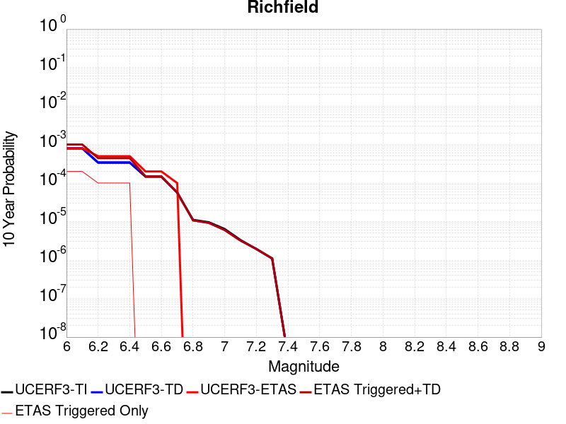 |

| Magnitude | 1 wk TI Prob | 1 wk TD Prob | 1 wk ETAS Prob | 1 wk ETAS/TD Gain | 1 wk ETAS Triggered+TD | 1 wk ETAS Triggered Only | 1 mo TI Prob | 1 mo TD Prob | 1 mo ETAS Prob | 1 mo ETAS/TD Gain | 1 mo ETAS Triggered+TD | 1 mo ETAS Triggered Only | 1 yr TI Prob | 1 yr TD Prob | 1 yr ETAS Prob | 1 yr ETAS/TD Gain | 1 yr ETAS Triggered+TD | 1 yr ETAS Triggered Only | 10 yr TI Prob | 10 yr TD Prob | 10 yr ETAS Prob | 10 yr ETAS/TD Gain | 10 yr ETAS Triggered+TD | 10 yr ETAS Triggered Only |
|-----|-----|-----|-----|-----|-----|-----|-----|-----|-----|-----|-----|-----|-----|-----|-----|-----|-----|-----|-----|-----|-----|-----|-----|-----|
| 6.0 | 1.5166896E-6 | 1.5393153E-6 | 0.0 | 0.0 | 1.5393153E-6 | 0.0 | 6.5000822E-6 | 6.5970553E-6 | 0.0 | 0.0 | 6.5970553E-6 | 0.0 | 7.913562E-5 | 8.031729E-5 | 1.0E-4 | 1.245062 | 8.031729E-5 | 0.0 | 7.910745E-4 | 8.029904E-4 | 8.0E-4 | 0.99627596 | 0.0010028298 | 2.0E-4 |
| 6.1 | 1.5166896E-6 | 1.5393153E-6 | 0.0 | 0.0 | 1.5393153E-6 | 0.0 | 6.5000822E-6 | 6.5970553E-6 | 0.0 | 0.0 | 6.5970553E-6 | 0.0 | 7.913562E-5 | 8.031729E-5 | 1.0E-4 | 1.245062 | 8.031729E-5 | 0.0 | 7.910745E-4 | 8.029904E-4 | 8.0E-4 | 0.99627596 | 0.0010028298 | 2.0E-4 |
| 6.2 | 6.473272E-7 | 6.598751E-7 | 0.0 | 0.0 | 6.598751E-7 | 0.0 | 2.7742565E-6 | 2.828034E-6 | 0.0 | 0.0 | 2.828034E-6 | 0.0 | 3.377605E-5 | 3.4430905E-5 | 1.0E-4 | 2.9043677 | 3.4430905E-5 | 0.0 | 3.3770915E-4 | 3.4426872E-4 | 5.0E-4 | 1.4523538 | 4.442343E-4 | 1.0E-4 |
| 6.3 | 6.473272E-7 | 6.598751E-7 | 0.0 | 0.0 | 6.598751E-7 | 0.0 | 2.7742565E-6 | 2.828034E-6 | 0.0 | 0.0 | 2.828034E-6 | 0.0 | 3.377605E-5 | 3.4430905E-5 | 1.0E-4 | 2.9043677 | 3.4430905E-5 | 0.0 | 3.3770915E-4 | 3.4426872E-4 | 5.0E-4 | 1.4523538 | 4.442343E-4 | 1.0E-4 |
| 6.4 | 6.473272E-7 | 6.598751E-7 | 0.0 | 0.0 | 6.598751E-7 | 0.0 | 2.7742565E-6 | 2.828034E-6 | 0.0 | 0.0 | 2.828034E-6 | 0.0 | 3.377605E-5 | 3.4430905E-5 | 1.0E-4 | 2.9043677 | 3.4430905E-5 | 0.0 | 3.3770915E-4 | 3.4426872E-4 | 5.0E-4 | 1.4523538 | 4.442343E-4 | 1.0E-4 |
| 6.5 | 2.7954403E-7 | 2.853296E-7 | 0.0 | 0.0 | 2.853296E-7 | 0.0 | 1.1980452E-6 | 1.2228409E-6 | 0.0 | 0.0 | 1.2228409E-6 | 0.0 | 1.4586103E-5 | 1.4888029E-5 | 1.0E-4 | 6.716806 | 1.4888029E-5 | 0.0 | 1.4585146E-4 | 1.4887456E-4 | 2.0E-4 | 1.3434129 | 1.4887456E-4 | 0.0 |
| 6.6 | 2.7954403E-7 | 2.853296E-7 | 0.0 | 0.0 | 2.853296E-7 | 0.0 | 1.1980452E-6 | 1.2228409E-6 | 0.0 | 0.0 | 1.2228409E-6 | 0.0 | 1.4586103E-5 | 1.4888029E-5 | 1.0E-4 | 6.716806 | 1.4888029E-5 | 0.0 | 1.4585146E-4 | 1.4887456E-4 | 2.0E-4 | 1.3434129 | 1.4887456E-4 | 0.0 |
| 6.7 | 1.0777299E-7 | 1.08792015E-7 | 0.0 | 0.0 | 1.08792015E-7 | 0.0 | 4.6188418E-7 | 4.6625144E-7 | 0.0 | 0.0 | 4.6625144E-7 | 0.0 | 5.6234253E-6 | 5.6766007E-6 | 1.0E-4 | 17.616177 | 5.6766007E-6 | 0.0 | 5.623283E-5 | 5.6764988E-5 | 1.0E-4 | 1.7616494 | 5.6764988E-5 | 0.0 |
| 6.8 | 2.1301874E-8 | 2.0666718E-8 | 0.0 | 0.0 | 2.0666718E-8 | 0.0 | 9.129375E-8 | 8.857164E-8 | 0.0 | 0.0 | 8.857164E-8 | 0.0 | 1.1115008E-6 | 1.0783592E-6 | 0.0 | 0.0 | 1.0783592E-6 | 0.0 | 1.1114952E-5 | 1.0783544E-5 | 0.0 | 0.0 | 1.0783544E-5 | 0.0 |
| 6.9 | 1.8413502E-8 | 1.7751628E-8 | 0.0 | 0.0 | 1.7751628E-8 | 0.0 | 7.891501E-8 | 7.60784E-8 | 0.0 | 0.0 | 7.60784E-8 | 0.0 | 9.607899E-7 | 9.262542E-7 | 0.0 | 0.0 | 9.262542E-7 | 0.0 | 9.607857E-6 | 9.262507E-6 | 0.0 | 0.0 | 9.262507E-6 | 0.0 |
| 7.0 | 1.2290541E-8 | 1.15747385E-8 | 0.0 | 0.0 | 1.15747385E-8 | 0.0 | 5.2673748E-8 | 4.9606022E-8 | 0.0 | 0.0 | 4.9606022E-8 | 0.0 | 6.413027E-7 | 6.0395314E-7 | 0.0 | 0.0 | 6.0395314E-7 | 0.0 | 6.4130086E-6 | 6.0395164E-6 | 0.0 | 0.0 | 6.0395164E-6 | 0.0 |
| 7.1 | 6.373573E-9 | 6.1559566E-9 | 0.0 | 0.0 | 6.1559566E-9 | 0.0 | 2.7315311E-8 | 2.6382672E-8 | 0.0 | 0.0 | 2.6382672E-8 | 0.0 | 3.3256384E-7 | 3.2120897E-7 | 0.0 | 0.0 | 3.2120897E-7 | 0.0 | 3.3256335E-6 | 3.2120856E-6 | 0.0 | 0.0 | 3.2120856E-6 | 0.0 |
| 7.2 | 3.6989944E-9 | 3.7360888E-9 | 0.0 | 0.0 | 3.7360888E-9 | 0.0 | 1.5852834E-8 | 1.6011809E-8 | 0.0 | 0.0 | 1.6011809E-8 | 0.0 | 1.9300822E-7 | 1.9494377E-7 | 0.0 | 0.0 | 1.9494377E-7 | 0.0 | 1.9300805E-6 | 1.9494362E-6 | 0.0 | 0.0 | 1.9494362E-6 | 0.0 |
| 7.3 | 2.097397E-9 | 2.1200957E-9 | 0.0 | 0.0 | 2.1200957E-9 | 0.0 | 8.9888434E-9 | 9.086124E-9 | 0.0 | 0.0 | 9.086124E-9 | 0.0 | 1.0943917E-7 | 1.1062355E-7 | 0.0 | 0.0 | 1.1062355E-7 | 0.0 | 1.0943911E-6 | 1.1062351E-6 | 0.0 | 0.0 | 1.1062351E-6 | 0.0 |
| 7.4 | 5.8314464E-12 | 5.8919536E-12 | 0.0 | 0.0 | 5.8919536E-12 | 0.0 | 2.4991786E-11 | 2.5251468E-11 | 0.0 | 0.0 | 2.5251468E-11 | 0.0 | 3.0427527E-10 | 3.0743608E-10 | 0.0 | 0.0 | 3.0743608E-10 | 0.0 | 3.0427532E-9 | 3.0743608E-9 | 0.0 | 0.0 | 3.0743608E-9 | 0.0 |

## Great Valley 01
*[(top)](#table-of-contents)*

| 1 Week | 1 Month | 1 Year | 10 Year |
|-----|-----|-----|-----|
| 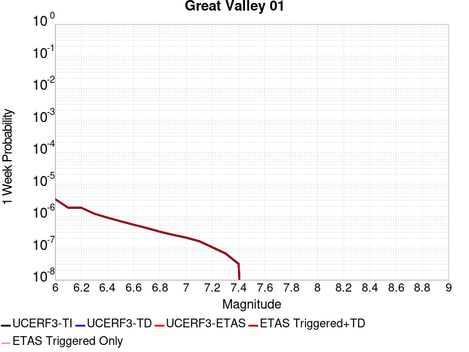 | 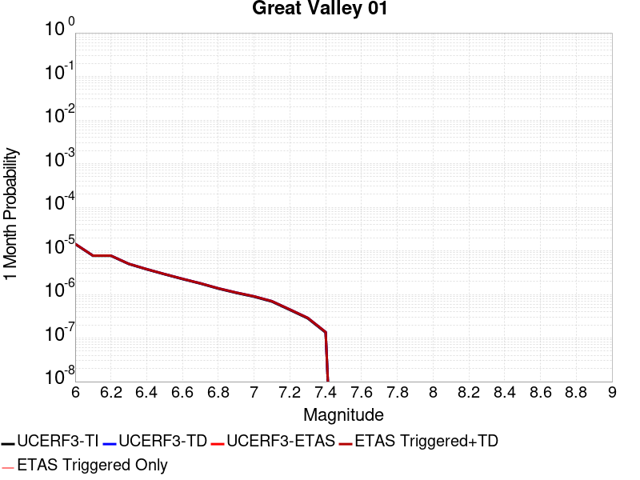 | 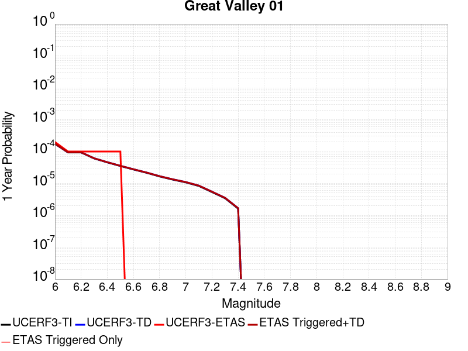 | 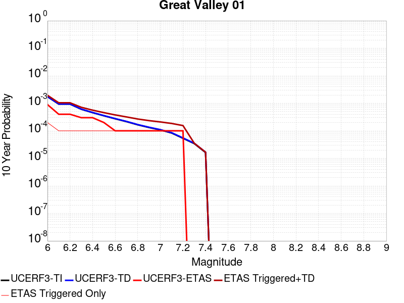 |

| Magnitude | 1 wk TI Prob | 1 wk TD Prob | 1 wk ETAS Prob | 1 wk ETAS/TD Gain | 1 wk ETAS Triggered+TD | 1 wk ETAS Triggered Only | 1 mo TI Prob | 1 mo TD Prob | 1 mo ETAS Prob | 1 mo ETAS/TD Gain | 1 mo ETAS Triggered+TD | 1 mo ETAS Triggered Only | 1 yr TI Prob | 1 yr TD Prob | 1 yr ETAS Prob | 1 yr ETAS/TD Gain | 1 yr ETAS Triggered+TD | 1 yr ETAS Triggered Only | 10 yr TI Prob | 10 yr TD Prob | 10 yr ETAS Prob | 10 yr ETAS/TD Gain | 10 yr ETAS Triggered+TD | 10 yr ETAS Triggered Only |
|-----|-----|-----|-----|-----|-----|-----|-----|-----|-----|-----|-----|-----|-----|-----|-----|-----|-----|-----|-----|-----|-----|-----|-----|-----|
| 6.0 | 3.3398478E-6 | 3.3763708E-6 | 0.0 | 0.0 | 3.3763708E-6 | 0.0 | 1.4313555E-5 | 1.4470088E-5 | 0.0 | 0.0 | 1.4470088E-5 | 0.0 | 1.742536E-4 | 1.7616029E-4 | 2.0E-4 | 1.1353296 | 1.7616029E-4 | 0.0 | 0.0017411702 | 0.0017603267 | 9.0E-4 | 0.51126873 | 0.0019599746 | 2.0E-4 |
| 6.1 | 1.7919616E-6 | 1.8120654E-6 | 0.0 | 0.0 | 1.8120654E-6 | 0.0 | 7.679812E-6 | 7.765972E-6 | 0.0 | 0.0 | 7.765972E-6 | 0.0 | 9.349771E-5 | 9.454681E-5 | 1.0E-4 | 1.0576771 | 9.454681E-5 | 0.0 | 9.345838E-4 | 9.450853E-4 | 4.0E-4 | 0.42324224 | 0.0010449907 | 1.0E-4 |
| 6.2 | 1.7919616E-6 | 1.8120654E-6 | 0.0 | 0.0 | 1.8120654E-6 | 0.0 | 7.679812E-6 | 7.765972E-6 | 0.0 | 0.0 | 7.765972E-6 | 0.0 | 9.349771E-5 | 9.454681E-5 | 1.0E-4 | 1.0576771 | 9.454681E-5 | 0.0 | 9.345838E-4 | 9.450853E-4 | 4.0E-4 | 0.42324224 | 0.0010449907 | 1.0E-4 |
| 6.3 | 1.1636545E-6 | 1.1774779E-6 | 0.0 | 0.0 | 1.1774779E-6 | 0.0 | 4.9870814E-6 | 5.046324E-6 | 0.0 | 0.0 | 5.046324E-6 | 0.0 | 6.0716022E-5 | 6.1437306E-5 | 1.0E-4 | 1.6276755 | 6.1437306E-5 | 0.0 | 6.069944E-4 | 6.142076E-4 | 3.0E-4 | 0.4884342 | 7.141462E-4 | 1.0E-4 |
| 6.4 | 8.770928E-7 | 8.8820383E-7 | 0.0 | 0.0 | 8.8820383E-7 | 0.0 | 3.7589639E-6 | 3.8065823E-6 | 0.0 | 0.0 | 3.8065823E-6 | 0.0 | 4.5764424E-5 | 4.6344176E-5 | 1.0E-4 | 2.1577685 | 4.6344176E-5 | 0.0 | 4.5755E-4 | 4.6334724E-4 | 3.0E-4 | 0.64746255 | 5.633009E-4 | 1.0E-4 |
| 6.5 | 6.753308E-7 | 6.845446E-7 | 0.0 | 0.0 | 6.845446E-7 | 0.0 | 2.8942718E-6 | 2.9337593E-6 | 0.0 | 0.0 | 2.9337593E-6 | 0.0 | 3.523719E-5 | 3.5717945E-5 | 1.0E-4 | 2.7997131 | 3.5717945E-5 | 0.0 | 3.52316E-4 | 3.5712303E-4 | 2.0E-4 | 0.56003106 | 4.5708733E-4 | 1.0E-4 |
| 6.6 | 5.2531993E-7 | 5.3314335E-7 | 0.0 | 0.0 | 5.3314335E-7 | 0.0 | 2.251369E-6 | 2.284898E-6 | 0.0 | 0.0 | 2.284898E-6 | 0.0 | 2.7410075E-5 | 2.7818285E-5 | 0.0 | 0.0 | 2.7818285E-5 | 0.0 | 2.7406693E-4 | 2.7814857E-4 | 1.0E-4 | 0.35952008 | 3.7812075E-4 | 1.0E-4 |
| 6.7 | 4.1404678E-7 | 4.208747E-7 | 0.0 | 0.0 | 4.208747E-7 | 0.0 | 1.774485E-6 | 1.8037475E-6 | 0.0 | 0.0 | 1.8037475E-6 | 0.0 | 2.160414E-5 | 2.1960408E-5 | 0.0 | 0.0 | 2.1960408E-5 | 0.0 | 2.160204E-4 | 2.195827E-4 | 1.0E-4 | 0.4554093 | 3.1956073E-4 | 1.0E-4 |
| 6.8 | 3.1713054E-7 | 3.230417E-7 | 0.0 | 0.0 | 3.230417E-7 | 0.0 | 1.3591301E-6 | 1.3844636E-6 | 0.0 | 0.0 | 1.3844636E-6 | 0.0 | 1.6547285E-5 | 1.6855716E-5 | 0.0 | 0.0 | 1.6855716E-5 | 0.0 | 1.6546051E-4 | 1.6854456E-4 | 1.0E-4 | 0.5933149 | 2.685277E-4 | 1.0E-4 |
| 6.9 | 2.528054E-7 | 2.5804803E-7 | 0.0 | 0.0 | 2.5804803E-7 | 0.0 | 1.0834511E-6 | 1.1059196E-6 | 0.0 | 0.0 | 1.1059196E-6 | 0.0 | 1.3190938E-5 | 1.346449E-5 | 0.0 | 0.0 | 1.346449E-5 | 0.0 | 1.3190156E-4 | 1.3463685E-4 | 1.0E-4 | 0.74273866 | 2.346234E-4 | 1.0E-4 |
| 7.0 | 2.0667689E-7 | 2.1132175E-7 | 0.0 | 0.0 | 2.1132175E-7 | 0.0 | 8.857578E-7 | 9.056643E-7 | 0.0 | 0.0 | 9.056643E-7 | 0.0 | 1.0784048E-5 | 1.1026408E-5 | 0.0 | 0.0 | 1.1026408E-5 | 0.0 | 1.0783524E-4 | 1.102587E-4 | 1.0E-4 | 0.9069579 | 2.1024767E-4 | 1.0E-4 |
| 7.1 | 1.5951586E-7 | 1.6339268E-7 | 0.0 | 0.0 | 1.6339268E-7 | 0.0 | 6.8363926E-7 | 7.002542E-7 | 0.0 | 0.0 | 7.002542E-7 | 0.0 | 8.323276E-6 | 8.525562E-6 | 0.0 | 0.0 | 8.525562E-6 | 0.0 | 8.322964E-5 | 8.525241E-5 | 1.0E-4 | 1.1729873 | 1.8524389E-4 | 1.0E-4 |
| 7.2 | 1.02912296E-7 | 1.0566698E-7 | 0.0 | 0.0 | 1.0566698E-7 | 0.0 | 4.4105263E-7 | 4.528584E-7 | 0.0 | 0.0 | 4.528584E-7 | 0.0 | 5.3698027E-6 | 5.5135374E-6 | 0.0 | 0.0 | 5.5135374E-6 | 0.0 | 5.3696727E-5 | 5.5134038E-5 | 1.0E-4 | 1.8137616 | 1.5512852E-4 | 1.0E-4 |
| 7.3 | 6.581281E-8 | 6.772459E-8 | 0.0 | 0.0 | 6.772459E-8 | 0.0 | 2.8205488E-7 | 2.9024824E-7 | 0.0 | 0.0 | 2.9024824E-7 | 0.0 | 3.4340128E-6 | 3.5337666E-6 | 0.0 | 0.0 | 3.5337666E-6 | 0.0 | 3.4339595E-5 | 3.5337125E-5 | 0.0 | 0.0 | 3.5337125E-5 | 0.0 |
| 7.4 | 3.112171E-8 | 3.2070304E-8 | 0.0 | 0.0 | 3.2070304E-8 | 0.0 | 1.3337875E-7 | 1.3744415E-7 | 0.0 | 0.0 | 1.3744415E-7 | 0.0 | 1.6238852E-6 | 1.6733812E-6 | 0.0 | 0.0 | 1.6733812E-6 | 0.0 | 1.6238733E-5 | 1.6733695E-5 | 0.0 | 0.0 | 1.6733695E-5 | 0.0 |

## Northridge Hills
*[(top)](#table-of-contents)*

| 1 Week | 1 Month | 1 Year | 10 Year |
|-----|-----|-----|-----|
| 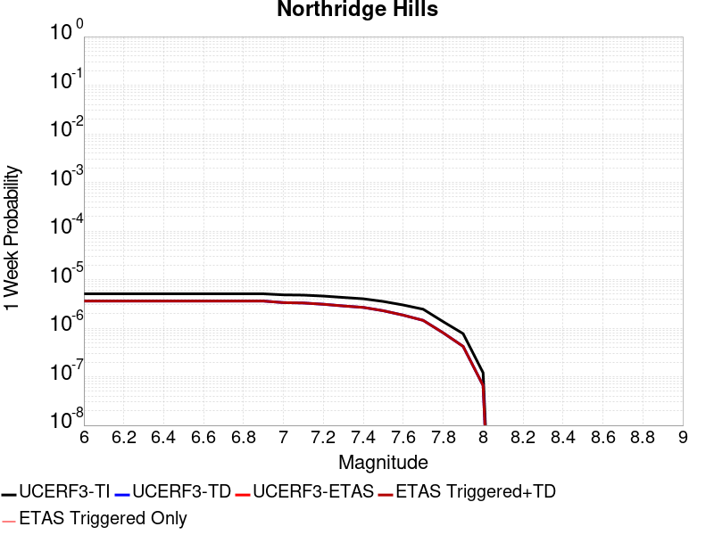 | 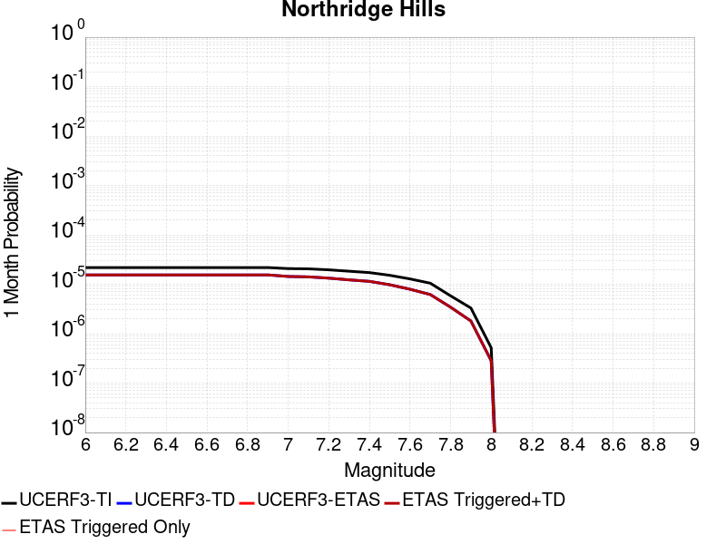 | 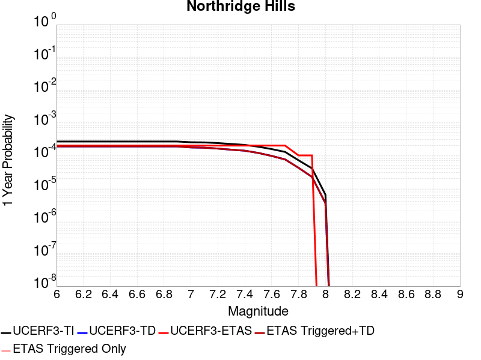 | 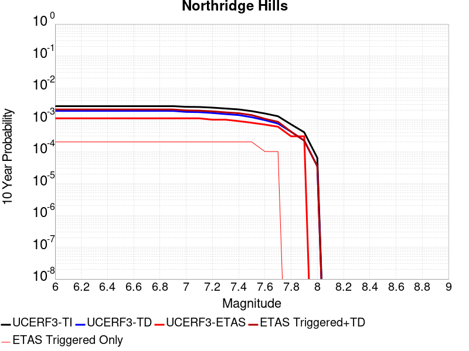 |

| Magnitude | 1 wk TI Prob | 1 wk TD Prob | 1 wk ETAS Prob | 1 wk ETAS/TD Gain | 1 wk ETAS Triggered+TD | 1 wk ETAS Triggered Only | 1 mo TI Prob | 1 mo TD Prob | 1 mo ETAS Prob | 1 mo ETAS/TD Gain | 1 mo ETAS Triggered+TD | 1 mo ETAS Triggered Only | 1 yr TI Prob | 1 yr TD Prob | 1 yr ETAS Prob | 1 yr ETAS/TD Gain | 1 yr ETAS Triggered+TD | 1 yr ETAS Triggered Only | 10 yr TI Prob | 10 yr TD Prob | 10 yr ETAS Prob | 10 yr ETAS/TD Gain | 10 yr ETAS Triggered+TD | 10 yr ETAS Triggered Only |
|-----|-----|-----|-----|-----|-----|-----|-----|-----|-----|-----|-----|-----|-----|-----|-----|-----|-----|-----|-----|-----|-----|-----|-----|-----|
| 6.0 | 5.095982E-6 | 3.616591E-6 | 0.0 | 0.0 | 3.616591E-6 | 0.0 | 2.183974E-5 | 1.5499583E-5 | 0.0 | 0.0 | 1.5499583E-5 | 0.0 | 2.658664E-4 | 1.886912E-4 | 2.0E-4 | 1.0599328 | 1.886912E-4 | 0.0 | 0.0026554854 | 0.0018853224 | 0.0011 | 0.5834546 | 0.0020849453 | 2.0E-4 |
| 6.1 | 5.095982E-6 | 3.616591E-6 | 0.0 | 0.0 | 3.616591E-6 | 0.0 | 2.183974E-5 | 1.5499583E-5 | 0.0 | 0.0 | 1.5499583E-5 | 0.0 | 2.658664E-4 | 1.886912E-4 | 2.0E-4 | 1.0599328 | 1.886912E-4 | 0.0 | 0.0026554854 | 0.0018853224 | 0.0011 | 0.5834546 | 0.0020849453 | 2.0E-4 |
| 6.2 | 5.095982E-6 | 3.616591E-6 | 0.0 | 0.0 | 3.616591E-6 | 0.0 | 2.183974E-5 | 1.5499583E-5 | 0.0 | 0.0 | 1.5499583E-5 | 0.0 | 2.658664E-4 | 1.886912E-4 | 2.0E-4 | 1.0599328 | 1.886912E-4 | 0.0 | 0.0026554854 | 0.0018853224 | 0.0011 | 0.5834546 | 0.0020849453 | 2.0E-4 |
| 6.3 | 5.095982E-6 | 3.616591E-6 | 0.0 | 0.0 | 3.616591E-6 | 0.0 | 2.183974E-5 | 1.5499583E-5 | 0.0 | 0.0 | 1.5499583E-5 | 0.0 | 2.658664E-4 | 1.886912E-4 | 2.0E-4 | 1.0599328 | 1.886912E-4 | 0.0 | 0.0026554854 | 0.0018853224 | 0.0011 | 0.5834546 | 0.0020849453 | 2.0E-4 |
| 6.4 | 5.095982E-6 | 3.616591E-6 | 0.0 | 0.0 | 3.616591E-6 | 0.0 | 2.183974E-5 | 1.5499583E-5 | 0.0 | 0.0 | 1.5499583E-5 | 0.0 | 2.658664E-4 | 1.886912E-4 | 2.0E-4 | 1.0599328 | 1.886912E-4 | 0.0 | 0.0026554854 | 0.0018853224 | 0.0011 | 0.5834546 | 0.0020849453 | 2.0E-4 |
| 6.5 | 5.095982E-6 | 3.616591E-6 | 0.0 | 0.0 | 3.616591E-6 | 0.0 | 2.183974E-5 | 1.5499583E-5 | 0.0 | 0.0 | 1.5499583E-5 | 0.0 | 2.658664E-4 | 1.886912E-4 | 2.0E-4 | 1.0599328 | 1.886912E-4 | 0.0 | 0.0026554854 | 0.0018853224 | 0.0011 | 0.5834546 | 0.0020849453 | 2.0E-4 |
| 6.6 | 5.095982E-6 | 3.616591E-6 | 0.0 | 0.0 | 3.616591E-6 | 0.0 | 2.183974E-5 | 1.5499583E-5 | 0.0 | 0.0 | 1.5499583E-5 | 0.0 | 2.658664E-4 | 1.886912E-4 | 2.0E-4 | 1.0599328 | 1.886912E-4 | 0.0 | 0.0026554854 | 0.0018853224 | 0.0011 | 0.5834546 | 0.0020849453 | 2.0E-4 |
| 6.7 | 5.095982E-6 | 3.616591E-6 | 0.0 | 0.0 | 3.616591E-6 | 0.0 | 2.183974E-5 | 1.5499583E-5 | 0.0 | 0.0 | 1.5499583E-5 | 0.0 | 2.658664E-4 | 1.886912E-4 | 2.0E-4 | 1.0599328 | 1.886912E-4 | 0.0 | 0.0026554854 | 0.0018853224 | 0.0011 | 0.5834546 | 0.0020849453 | 2.0E-4 |
| 6.8 | 5.095982E-6 | 3.616591E-6 | 0.0 | 0.0 | 3.616591E-6 | 0.0 | 2.183974E-5 | 1.5499583E-5 | 0.0 | 0.0 | 1.5499583E-5 | 0.0 | 2.658664E-4 | 1.886912E-4 | 2.0E-4 | 1.0599328 | 1.886912E-4 | 0.0 | 0.0026554854 | 0.0018853224 | 0.0011 | 0.5834546 | 0.0020849453 | 2.0E-4 |
| 6.9 | 5.0942654E-6 | 3.6148056E-6 | 0.0 | 0.0 | 3.6148056E-6 | 0.0 | 2.1832384E-5 | 1.5491933E-5 | 0.0 | 0.0 | 1.5491933E-5 | 0.0 | 2.6577685E-4 | 1.8859807E-4 | 2.0E-4 | 1.0604562 | 1.8859807E-4 | 0.0 | 0.002654592 | 0.0018843926 | 0.0011 | 0.5837425 | 0.0020840156 | 2.0E-4 |
| 7.0 | 4.851143E-6 | 3.3600966E-6 | 0.0 | 0.0 | 3.3600966E-6 | 0.0 | 2.0790447E-5 | 1.4400334E-5 | 0.0 | 0.0 | 1.4400334E-5 | 0.0 | 2.5309427E-4 | 1.7531001E-4 | 2.0E-4 | 1.1408362 | 1.7531001E-4 | 0.0 | 0.0025280623 | 0.0017517215 | 0.0011 | 0.6279537 | 0.0019513712 | 2.0E-4 |
| 7.1 | 4.7910607E-6 | 3.298372E-6 | 0.0 | 0.0 | 3.298372E-6 | 0.0 | 2.0532956E-5 | 1.4135802E-5 | 0.0 | 0.0 | 1.4135802E-5 | 0.0 | 2.4996005E-4 | 1.7208984E-4 | 2.0E-4 | 1.1621836 | 1.7208984E-4 | 0.0 | 0.0024967908 | 0.0017195699 | 0.0011 | 0.63969487 | 0.001919226 | 2.0E-4 |
| 7.2 | 4.580079E-6 | 3.108129E-6 | 0.0 | 0.0 | 3.108129E-6 | 0.0 | 1.9628762E-5 | 1.3320485E-5 | 0.0 | 0.0 | 1.3320485E-5 | 0.0 | 2.3895396E-4 | 1.6216487E-4 | 2.0E-4 | 1.2333127 | 1.6216487E-4 | 0.0 | 0.0023869718 | 0.0016204688 | 0.001 | 0.61710536 | 0.0018201447 | 2.0E-4 |
| 7.3 | 4.290062E-6 | 2.8695347E-6 | 0.0 | 0.0 | 2.8695347E-6 | 0.0 | 1.838585E-5 | 1.2297948E-5 | 0.0 | 0.0 | 1.2297948E-5 | 0.0 | 2.2382473E-4 | 1.4971725E-4 | 2.0E-4 | 1.3358513 | 1.4971725E-4 | 0.0 | 0.0022359942 | 0.0014961669 | 0.001 | 0.6683746 | 0.0016958677 | 2.0E-4 |
| 7.4 | 4.0259683E-6 | 2.6751914E-6 | 0.0 | 0.0 | 2.6751914E-6 | 0.0 | 1.7254037E-5 | 1.1465056E-5 | 0.0 | 0.0 | 1.1465056E-5 | 0.0 | 2.1004764E-4 | 1.3957814E-4 | 2.0E-4 | 1.4328891 | 1.3957814E-4 | 0.0 | 0.002098492 | 0.0013949076 | 9.0E-4 | 0.64520407 | 0.0015946286 | 2.0E-4 |
| 7.5 | 3.5477108E-6 | 2.2864235E-6 | 0.0 | 0.0 | 2.2864235E-6 | 0.0 | 1.5204386E-5 | 9.798921E-6 | 0.0 | 0.0 | 9.798921E-6 | 0.0 | 1.8509767E-4 | 1.1929535E-4 | 2.0E-4 | 1.6765113 | 1.1929535E-4 | 0.0 | 0.0018494357 | 0.0011923147 | 8.0E-4 | 0.6709638 | 0.0013920761 | 2.0E-4 |
| 7.6 | 2.9990608E-6 | 1.8539719E-6 | 0.0 | 0.0 | 1.8539719E-6 | 0.0 | 1.2853055E-5 | 7.945569E-6 | 0.0 | 0.0 | 7.945569E-6 | 0.0 | 1.564747E-4 | 9.673302E-5 | 2.0E-4 | 2.0675464 | 9.673302E-5 | 0.0 | 0.0015636457 | 9.6691E-4 | 7.0E-4 | 0.7239557 | 0.0010668132 | 1.0E-4 |
| 7.7 | 2.4542855E-6 | 1.4471683E-6 | 0.0 | 0.0 | 1.4471683E-6 | 0.0 | 1.05183235E-5 | 6.202135E-6 | 0.0 | 0.0 | 6.202135E-6 | 0.0 | 1.2805307E-4 | 7.550838E-5 | 2.0E-4 | 2.6487126 | 7.550838E-5 | 0.0 | 0.001279793 | 7.548278E-4 | 6.0E-4 | 0.79488325 | 8.547524E-4 | 1.0E-4 |
| 7.8 | 1.3623128E-6 | 8.022805E-7 | 0.0 | 0.0 | 8.022805E-7 | 0.0 | 5.8384703E-6 | 3.4383404E-6 | 0.0 | 0.0 | 3.4383404E-6 | 0.0 | 7.108106E-5 | 4.1860992E-5 | 1.0E-4 | 2.3888588 | 4.1860992E-5 | 0.0 | 7.1058323E-4 | 4.1853127E-4 | 3.0E-4 | 0.7167923 | 4.1853127E-4 | 0.0 |
| 7.9 | 7.716622E-7 | 4.223895E-7 | 0.0 | 0.0 | 4.223895E-7 | 0.0 | 3.3071194E-6 | 1.8102394E-6 | 0.0 | 0.0 | 1.8102394E-6 | 0.0 | 4.0263436E-5 | 2.2039443E-5 | 1.0E-4 | 4.5373197 | 2.2039443E-5 | 0.0 | 4.0256142E-4 | 2.2037269E-4 | 3.0E-4 | 1.3613303 | 2.2037269E-4 | 0.0 |
| 8.0 | 1.2117711E-7 | 6.627282E-8 | 0.0 | 0.0 | 6.627282E-8 | 0.0 | 5.1933034E-7 | 2.8402633E-7 | 0.0 | 0.0 | 2.8402633E-7 | 0.0 | 6.3228285E-6 | 3.4580153E-6 | 0.0 | 0.0 | 3.4580153E-6 | 0.0 | 6.3226486E-5 | 3.4579632E-5 | 0.0 | 0.0 | 3.4579632E-5 | 0.0 |

## Jess Valley
*[(top)](#table-of-contents)*

| 1 Week | 1 Month | 1 Year | 10 Year |
|-----|-----|-----|-----|
|  | 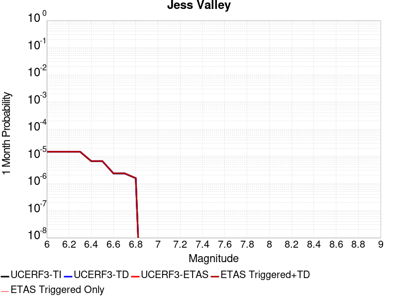 | 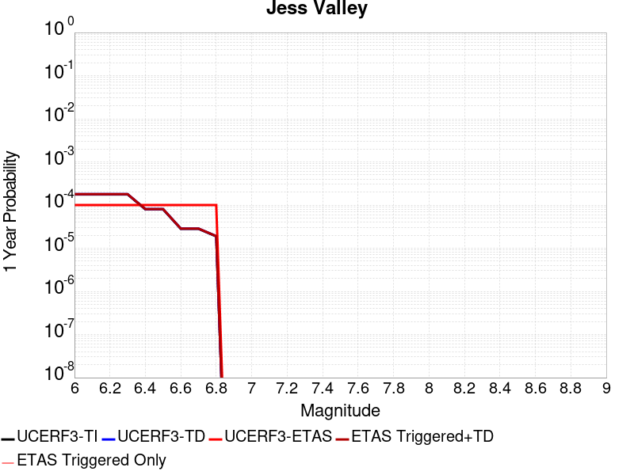 | 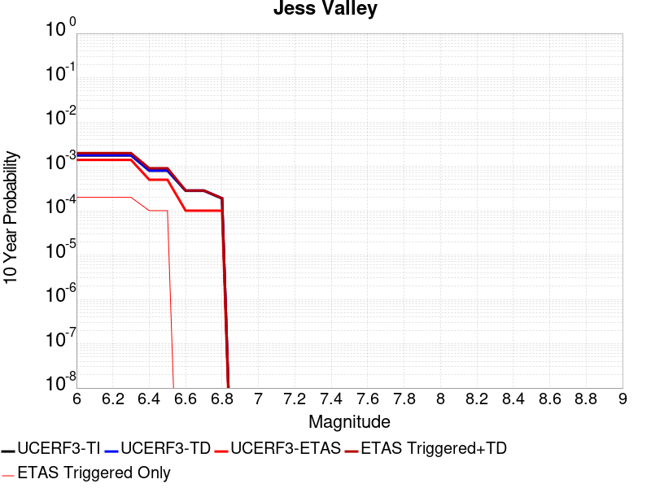 |

| Magnitude | 1 wk TI Prob | 1 wk TD Prob | 1 wk ETAS Prob | 1 wk ETAS/TD Gain | 1 wk ETAS Triggered+TD | 1 wk ETAS Triggered Only | 1 mo TI Prob | 1 mo TD Prob | 1 mo ETAS Prob | 1 mo ETAS/TD Gain | 1 mo ETAS Triggered+TD | 1 mo ETAS Triggered Only | 1 yr TI Prob | 1 yr TD Prob | 1 yr ETAS Prob | 1 yr ETAS/TD Gain | 1 yr ETAS Triggered+TD | 1 yr ETAS Triggered Only | 10 yr TI Prob | 10 yr TD Prob | 10 yr ETAS Prob | 10 yr ETAS/TD Gain | 10 yr ETAS Triggered+TD | 10 yr ETAS Triggered Only |
|-----|-----|-----|-----|-----|-----|-----|-----|-----|-----|-----|-----|-----|-----|-----|-----|-----|-----|-----|-----|-----|-----|-----|-----|-----|
| 6.0 | 3.3861274E-6 | 3.4341556E-6 | 0.0 | 0.0 | 3.4341556E-6 | 0.0 | 1.4511894E-5 | 1.47177425E-5 | 0.0 | 0.0 | 1.47177425E-5 | 0.0 | 1.7666799E-4 | 1.791766E-4 | 1.0E-4 | 0.55810857 | 1.791766E-4 | 0.0 | 0.001765276 | 0.0017905978 | 0.0014 | 0.7818618 | 0.0019902398 | 2.0E-4 |
| 6.1 | 3.3861274E-6 | 3.4341556E-6 | 0.0 | 0.0 | 3.4341556E-6 | 0.0 | 1.4511894E-5 | 1.47177425E-5 | 0.0 | 0.0 | 1.47177425E-5 | 0.0 | 1.7666799E-4 | 1.791766E-4 | 1.0E-4 | 0.55810857 | 1.791766E-4 | 0.0 | 0.001765276 | 0.0017905978 | 0.0014 | 0.7818618 | 0.0019902398 | 2.0E-4 |
| 6.2 | 3.3861274E-6 | 3.4341556E-6 | 0.0 | 0.0 | 3.4341556E-6 | 0.0 | 1.4511894E-5 | 1.47177425E-5 | 0.0 | 0.0 | 1.47177425E-5 | 0.0 | 1.7666799E-4 | 1.791766E-4 | 1.0E-4 | 0.55810857 | 1.791766E-4 | 0.0 | 0.001765276 | 0.0017905978 | 0.0014 | 0.7818618 | 0.0019902398 | 2.0E-4 |
| 6.3 | 3.3861274E-6 | 3.4341556E-6 | 0.0 | 0.0 | 3.4341556E-6 | 0.0 | 1.4511894E-5 | 1.47177425E-5 | 0.0 | 0.0 | 1.47177425E-5 | 0.0 | 1.7666799E-4 | 1.791766E-4 | 1.0E-4 | 0.55810857 | 1.791766E-4 | 0.0 | 0.001765276 | 0.0017905978 | 0.0014 | 0.7818618 | 0.0019902398 | 2.0E-4 |
| 6.4 | 1.5291708E-6 | 1.5503208E-6 | 0.0 | 0.0 | 1.5503208E-6 | 0.0 | 6.553573E-6 | 6.64422E-6 | 0.0 | 0.0 | 6.64422E-6 | 0.0 | 7.978683E-5 | 8.089117E-5 | 1.0E-4 | 1.2362288 | 8.089117E-5 | 0.0 | 7.975819E-4 | 8.086955E-4 | 5.0E-4 | 0.6182797 | 9.086146E-4 | 1.0E-4 |
| 6.5 | 1.5291708E-6 | 1.5503208E-6 | 0.0 | 0.0 | 1.5503208E-6 | 0.0 | 6.553573E-6 | 6.64422E-6 | 0.0 | 0.0 | 6.64422E-6 | 0.0 | 7.978683E-5 | 8.089117E-5 | 1.0E-4 | 1.2362288 | 8.089117E-5 | 0.0 | 7.975819E-4 | 8.086955E-4 | 5.0E-4 | 0.6182797 | 9.086146E-4 | 1.0E-4 |
| 6.6 | 5.396423E-7 | 5.4721477E-7 | 0.0 | 0.0 | 5.4721477E-7 | 0.0 | 2.312751E-6 | 2.345205E-6 | 0.0 | 0.0 | 2.345205E-6 | 0.0 | 2.8157378E-5 | 2.8552684E-5 | 1.0E-4 | 3.5022976 | 2.8552684E-5 | 0.0 | 2.8153812E-4 | 2.8550858E-4 | 1.0E-4 | 0.35025218 | 2.8550858E-4 | 0.0 |
| 6.7 | 5.396423E-7 | 5.4721477E-7 | 0.0 | 0.0 | 5.4721477E-7 | 0.0 | 2.312751E-6 | 2.345205E-6 | 0.0 | 0.0 | 2.345205E-6 | 0.0 | 2.8157378E-5 | 2.8552684E-5 | 1.0E-4 | 3.5022976 | 2.8552684E-5 | 0.0 | 2.8153812E-4 | 2.8550858E-4 | 1.0E-4 | 0.35025218 | 2.8550858E-4 | 0.0 |
| 6.8 | 3.6058395E-7 | 3.6564083E-7 | 0.0 | 0.0 | 3.6564083E-7 | 0.0 | 1.5453588E-6 | 1.5670321E-6 | 0.0 | 0.0 | 1.5670321E-6 | 0.0 | 1.8814582E-5 | 1.9078616E-5 | 1.0E-4 | 5.2414703 | 1.9078616E-5 | 0.0 | 1.8812988E-4 | 1.9078616E-4 | 1.0E-4 | 0.52414703 | 1.9078616E-4 | 0.0 |

## Fish Slough 2011 CFM
*[(top)](#table-of-contents)*

| 1 Week | 1 Month | 1 Year | 10 Year |
|-----|-----|-----|-----|
| 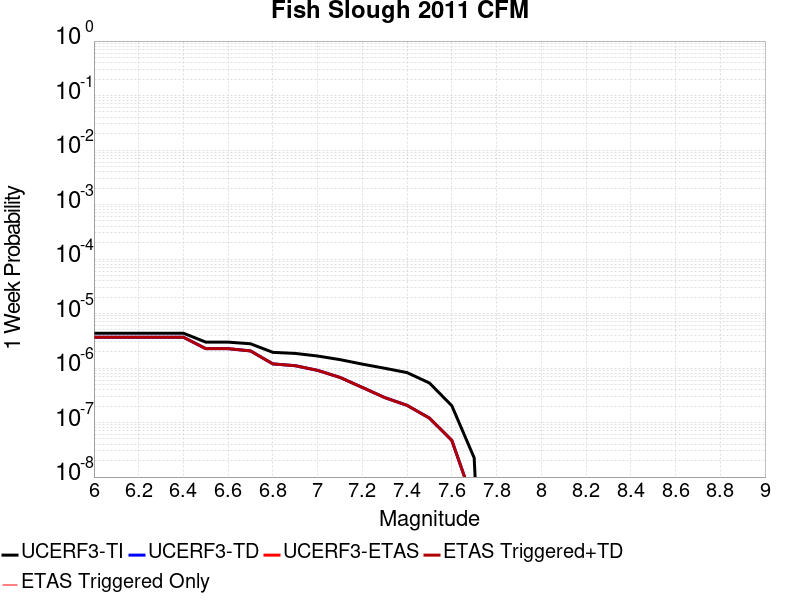 | 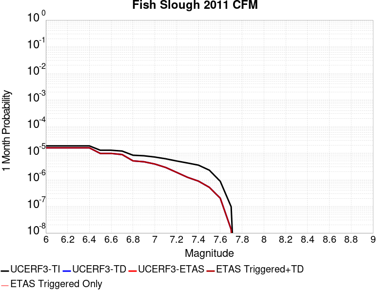 | 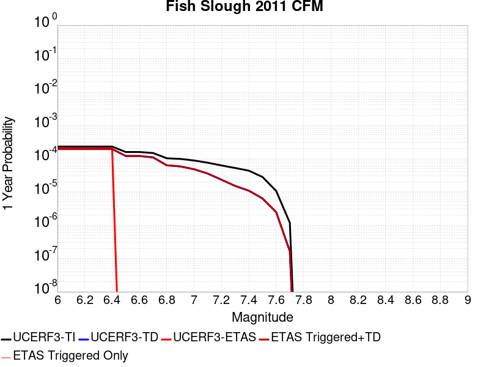 | 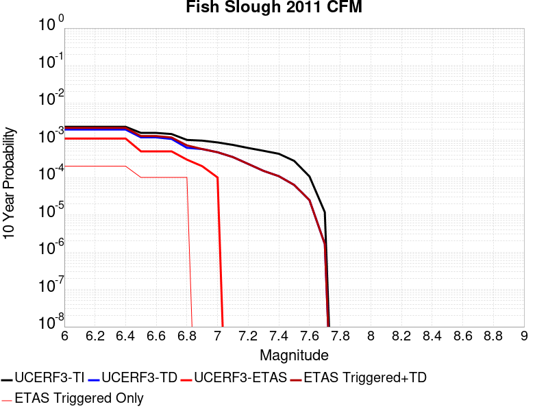 |

| Magnitude | 1 wk TI Prob | 1 wk TD Prob | 1 wk ETAS Prob | 1 wk ETAS/TD Gain | 1 wk ETAS Triggered+TD | 1 wk ETAS Triggered Only | 1 mo TI Prob | 1 mo TD Prob | 1 mo ETAS Prob | 1 mo ETAS/TD Gain | 1 mo ETAS Triggered+TD | 1 mo ETAS Triggered Only | 1 yr TI Prob | 1 yr TD Prob | 1 yr ETAS Prob | 1 yr ETAS/TD Gain | 1 yr ETAS Triggered+TD | 1 yr ETAS Triggered Only | 10 yr TI Prob | 10 yr TD Prob | 10 yr ETAS Prob | 10 yr ETAS/TD Gain | 10 yr ETAS Triggered+TD | 10 yr ETAS Triggered Only |
|-----|-----|-----|-----|-----|-----|-----|-----|-----|-----|-----|-----|-----|-----|-----|-----|-----|-----|-----|-----|-----|-----|-----|-----|-----|
| 6.0 | 4.3629925E-6 | 3.6777026E-6 | 0.0 | 0.0 | 3.6777026E-6 | 0.0 | 1.8698405E-5 | 1.57615E-5 | 0.0 | 0.0 | 1.57615E-5 | 0.0 | 2.276293E-4 | 1.9188148E-4 | 2.0E-4 | 1.0423101 | 1.9188148E-4 | 0.0 | 0.0022739628 | 0.001917367 | 0.0011 | 0.5737034 | 0.0021169835 | 2.0E-4 |
| 6.1 | 4.3629925E-6 | 3.6777026E-6 | 0.0 | 0.0 | 3.6777026E-6 | 0.0 | 1.8698405E-5 | 1.57615E-5 | 0.0 | 0.0 | 1.57615E-5 | 0.0 | 2.276293E-4 | 1.9188148E-4 | 2.0E-4 | 1.0423101 | 1.9188148E-4 | 0.0 | 0.0022739628 | 0.001917367 | 0.0011 | 0.5737034 | 0.0021169835 | 2.0E-4 |
| 6.2 | 4.3629925E-6 | 3.6777026E-6 | 0.0 | 0.0 | 3.6777026E-6 | 0.0 | 1.8698405E-5 | 1.57615E-5 | 0.0 | 0.0 | 1.57615E-5 | 0.0 | 2.276293E-4 | 1.9188148E-4 | 2.0E-4 | 1.0423101 | 1.9188148E-4 | 0.0 | 0.0022739628 | 0.001917367 | 0.0011 | 0.5737034 | 0.0021169835 | 2.0E-4 |
| 6.3 | 4.3629925E-6 | 3.6777026E-6 | 0.0 | 0.0 | 3.6777026E-6 | 0.0 | 1.8698405E-5 | 1.57615E-5 | 0.0 | 0.0 | 1.57615E-5 | 0.0 | 2.276293E-4 | 1.9188148E-4 | 2.0E-4 | 1.0423101 | 1.9188148E-4 | 0.0 | 0.0022739628 | 0.001917367 | 0.0011 | 0.5737034 | 0.0021169835 | 2.0E-4 |
| 6.4 | 4.3629925E-6 | 3.6777026E-6 | 0.0 | 0.0 | 3.6777026E-6 | 0.0 | 1.8698405E-5 | 1.57615E-5 | 0.0 | 0.0 | 1.57615E-5 | 0.0 | 2.276293E-4 | 1.9188148E-4 | 2.0E-4 | 1.0423101 | 1.9188148E-4 | 0.0 | 0.0022739628 | 0.001917367 | 0.0011 | 0.5737034 | 0.0021169835 | 2.0E-4 |
| 6.5 | 2.991715E-6 | 2.27075E-6 | 0.0 | 0.0 | 2.27075E-6 | 0.0 | 1.2821573E-5 | 9.731755E-6 | 0.0 | 0.0 | 9.731755E-6 | 0.0 | 1.5609147E-4 | 1.18478594E-4 | 0.0 | 0.0 | 1.18478594E-4 | 0.0 | 0.0015598187 | 0.0011842444 | 5.0E-4 | 0.42221013 | 0.001284126 | 1.0E-4 |
| 6.6 | 2.991715E-6 | 2.27075E-6 | 0.0 | 0.0 | 2.27075E-6 | 0.0 | 1.2821573E-5 | 9.731755E-6 | 0.0 | 0.0 | 9.731755E-6 | 0.0 | 1.5609147E-4 | 1.18478594E-4 | 0.0 | 0.0 | 1.18478594E-4 | 0.0 | 0.0015598187 | 0.0011842444 | 5.0E-4 | 0.42221013 | 0.001284126 | 1.0E-4 |
| 6.7 | 2.7890346E-6 | 2.0625343E-6 | 0.0 | 0.0 | 2.0625343E-6 | 0.0 | 1.1952951E-5 | 8.839408E-6 | 0.0 | 0.0 | 8.839408E-6 | 0.0 | 1.4551746E-4 | 1.0761538E-4 | 0.0 | 0.0 | 1.0761538E-4 | 0.0 | 0.0014542221 | 0.0010757209 | 5.0E-4 | 0.46480456 | 0.0011756134 | 1.0E-4 |
| 6.8 | 1.9416723E-6 | 1.1928588E-6 | 0.0 | 0.0 | 1.1928588E-6 | 0.0 | 8.321425E-6 | 5.1122424E-6 | 0.0 | 0.0 | 5.1122424E-6 | 0.0 | 1.01308644E-4 | 6.2239815E-5 | 0.0 | 0.0 | 6.2239815E-5 | 0.0 | 0.0010126247 | 6.222279E-4 | 3.0E-4 | 0.48213845 | 7.221657E-4 | 1.0E-4 |
| 6.9 | 1.8567416E-6 | 1.1049943E-6 | 0.0 | 0.0 | 1.1049943E-6 | 0.0 | 7.957439E-6 | 4.7356816E-6 | 0.0 | 0.0 | 4.7356816E-6 | 0.0 | 9.687752E-5 | 5.7655438E-5 | 0.0 | 0.0 | 5.7655438E-5 | 0.0 | 9.6835295E-4 | 5.7640864E-4 | 2.0E-4 | 0.34697604 | 5.7640864E-4 | 0.0 |
| 7.0 | 1.6634067E-6 | 9.076802E-7 | 0.0 | 0.0 | 9.076802E-7 | 0.0 | 7.1288664E-6 | 3.8900525E-6 | 0.0 | 0.0 | 3.8900525E-6 | 0.0 | 8.679049E-5 | 4.7360387E-5 | 0.0 | 0.0 | 4.7360387E-5 | 0.0 | 8.6756604E-4 | 4.7350582E-4 | 1.0E-4 | 0.21119064 | 4.7350582E-4 | 0.0 |
| 7.1 | 1.4281054E-6 | 6.7392364E-7 | 0.0 | 0.0 | 6.7392364E-7 | 0.0 | 6.1204373E-6 | 2.8882412E-6 | 0.0 | 0.0 | 2.8882412E-6 | 0.0 | 7.451377E-5 | 3.5163786E-5 | 0.0 | 0.0 | 3.5163786E-5 | 0.0 | 7.44888E-4 | 3.51584E-4 | 0.0 | 0.0 | 3.51584E-4 | 0.0 |
| 7.2 | 1.1810387E-6 | 4.4106852E-7 | 0.0 | 0.0 | 4.4106852E-7 | 0.0 | 5.0615845E-6 | 1.8902923E-6 | 0.0 | 0.0 | 1.8902923E-6 | 0.0 | 6.1623046E-5 | 2.3014076E-5 | 0.0 | 0.0 | 2.3014076E-5 | 0.0 | 6.160596E-4 | 2.3011782E-4 | 0.0 | 0.0 | 2.3011782E-4 | 0.0 |
| 7.3 | 9.918052E-7 | 2.875422E-7 | 0.0 | 0.0 | 2.875422E-7 | 0.0 | 4.2505867E-6 | 1.2323233E-6 | 0.0 | 0.0 | 1.2323233E-6 | 0.0 | 5.1749663E-5 | 1.5003433E-5 | 0.0 | 0.0 | 1.5003433E-5 | 0.0 | 5.173762E-4 | 1.5002431E-4 | 0.0 | 0.0 | 1.5002431E-4 | 0.0 |
| 7.4 | 8.25252E-7 | 2.0712396E-7 | 0.0 | 0.0 | 2.0712396E-7 | 0.0 | 3.5367896E-6 | 8.876738E-7 | 0.0 | 0.0 | 8.876738E-7 | 0.0 | 4.3059565E-5 | 1.08073755E-5 | 0.0 | 0.0 | 1.08073755E-5 | 0.0 | 4.305122E-4 | 1.0806857E-4 | 0.0 | 0.0 | 1.0806857E-4 | 0.0 |
| 7.5 | 5.3248567E-7 | 1.2084904E-7 | 0.0 | 0.0 | 1.2084904E-7 | 0.0 | 2.2820795E-6 | 5.179243E-7 | 0.0 | 0.0 | 5.179243E-7 | 0.0 | 2.7783964E-5 | 6.305711E-6 | 0.0 | 0.0 | 6.305711E-6 | 0.0 | 2.778049E-4 | 6.3055355E-5 | 0.0 | 0.0 | 6.3055355E-5 | 0.0 |
| 7.6 | 2.037542E-7 | 4.7178986E-8 | 0.0 | 0.0 | 4.7178986E-8 | 0.0 | 8.73232E-7 | 2.0219564E-7 | 0.0 | 0.0 | 2.0219564E-7 | 0.0 | 1.0631547E-5 | 2.4617293E-6 | 0.0 | 0.0 | 2.4617293E-6 | 0.0 | 1.0631039E-4 | 2.4617042E-5 | 0.0 | 0.0 | 2.4617042E-5 | 0.0 |
| 7.7 | 2.2501226E-8 | 3.1548915E-9 | 0.0 | 0.0 | 3.1548915E-9 | 0.0 | 9.6433816E-8 | 1.3520964E-8 | 0.0 | 0.0 | 1.3520964E-8 | 0.0 | 1.1740811E-6 | 1.6461773E-7 | 0.0 | 0.0 | 1.6461773E-7 | 0.0 | 1.1740749E-5 | 1.6461762E-6 | 0.0 | 0.0 | 1.6461762E-6 | 0.0 |

## Point Reyes 2011 connector
*[(top)](#table-of-contents)*

| 1 Week | 1 Month | 1 Year | 10 Year |
|-----|-----|-----|-----|
| 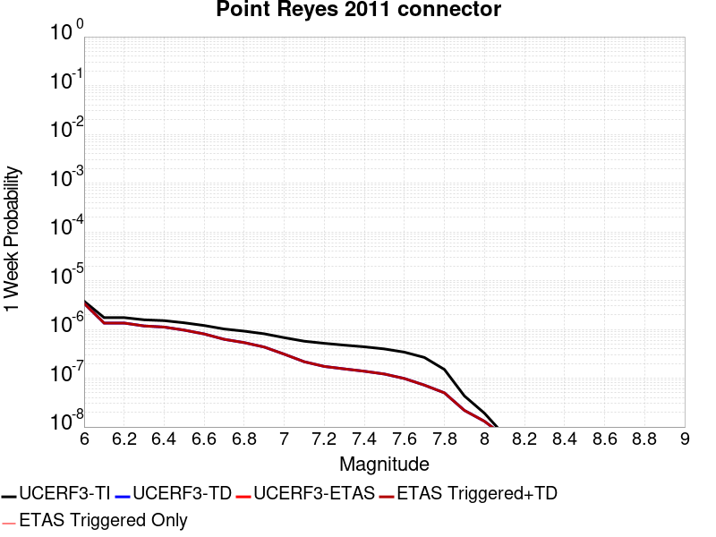 | 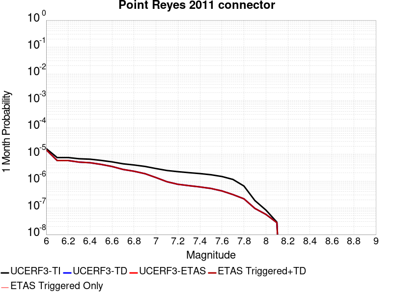 | 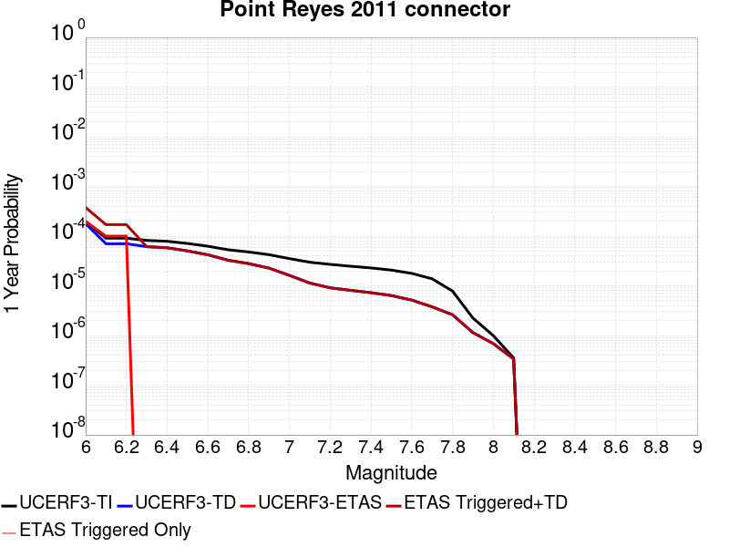 | 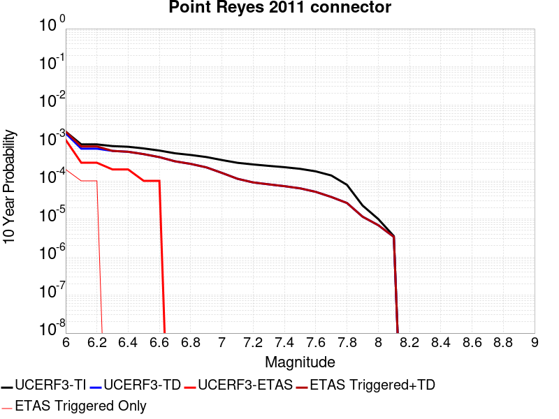 |

| Magnitude | 1 wk TI Prob | 1 wk TD Prob | 1 wk ETAS Prob | 1 wk ETAS/TD Gain | 1 wk ETAS Triggered+TD | 1 wk ETAS Triggered Only | 1 mo TI Prob | 1 mo TD Prob | 1 mo ETAS Prob | 1 mo ETAS/TD Gain | 1 mo ETAS Triggered+TD | 1 mo ETAS Triggered Only | 1 yr TI Prob | 1 yr TD Prob | 1 yr ETAS Prob | 1 yr ETAS/TD Gain | 1 yr ETAS Triggered+TD | 1 yr ETAS Triggered Only | 10 yr TI Prob | 10 yr TD Prob | 10 yr ETAS Prob | 10 yr ETAS/TD Gain | 10 yr ETAS Triggered+TD | 10 yr ETAS Triggered Only |
|-----|-----|-----|-----|-----|-----|-----|-----|-----|-----|-----|-----|-----|-----|-----|-----|-----|-----|-----|-----|-----|-----|-----|-----|-----|
| 6.0 | 3.7893044E-6 | 3.4203385E-6 | 0.0 | 0.0 | 3.4203385E-6 | 0.0 | 1.6239776E-5 | 1.46585235E-5 | 0.0 | 0.0 | 1.46585235E-5 | 0.0 | 1.9770133E-4 | 1.7845504E-4 | 2.0E-4 | 1.1207305 | 3.7841935E-4 | 2.0E-4 | 0.0019752553 | 0.001783578 | 0.0012 | 0.6728049 | 0.0019832212 | 2.0E-4 |
| 6.1 | 1.7449562E-6 | 1.3513389E-6 | 0.0 | 0.0 | 1.3513389E-6 | 0.0 | 7.478362E-6 | 5.79144E-6 | 0.0 | 0.0 | 5.79144E-6 | 0.0 | 9.104525E-5 | 7.0508555E-5 | 1.0E-4 | 1.4182676 | 1.705015E-4 | 1.0E-4 | 9.1007963E-4 | 7.0511847E-4 | 3.0E-4 | 0.4254604 | 8.05048E-4 | 1.0E-4 |
| 6.2 | 1.7449562E-6 | 1.3513389E-6 | 0.0 | 0.0 | 1.3513389E-6 | 0.0 | 7.478362E-6 | 5.79144E-6 | 0.0 | 0.0 | 5.79144E-6 | 0.0 | 9.104525E-5 | 7.0508555E-5 | 1.0E-4 | 1.4182676 | 1.705015E-4 | 1.0E-4 | 9.1007963E-4 | 7.0511847E-4 | 3.0E-4 | 0.4254604 | 8.05048E-4 | 1.0E-4 |
| 6.3 | 1.5739171E-6 | 1.1785756E-6 | 0.0 | 0.0 | 1.1785756E-6 | 0.0 | 6.7453416E-6 | 5.0510284E-6 | 0.0 | 0.0 | 5.0510284E-6 | 0.0 | 8.212144E-5 | 6.149458E-5 | 0.0 | 0.0 | 6.149458E-5 | 0.0 | 8.2091097E-4 | 6.150309E-4 | 2.0E-4 | 0.3251869 | 6.150309E-4 | 0.0 |
| 6.4 | 1.5138507E-6 | 1.117929E-6 | 0.0 | 0.0 | 1.117929E-6 | 0.0 | 6.4879155E-6 | 4.7911158E-6 | 0.0 | 0.0 | 4.7911158E-6 | 0.0 | 7.898751E-5 | 5.833031E-5 | 0.0 | 0.0 | 5.833031E-5 | 0.0 | 7.8959437E-4 | 5.834051E-4 | 2.0E-4 | 0.34281498 | 5.834051E-4 | 0.0 |
| 6.5 | 1.3662817E-6 | 9.683664E-7 | 0.0 | 0.0 | 9.683664E-7 | 0.0 | 5.8554797E-6 | 4.1501353E-6 | 0.0 | 0.0 | 4.1501353E-6 | 0.0 | 7.128814E-5 | 5.052674E-5 | 0.0 | 0.0 | 5.052674E-5 | 0.0 | 7.126527E-4 | 5.0540554E-4 | 1.0E-4 | 0.19786093 | 5.0540554E-4 | 0.0 |
| 6.6 | 1.2022703E-6 | 8.082086E-7 | 0.0 | 0.0 | 8.082086E-7 | 0.0 | 5.1525767E-6 | 3.4637467E-6 | 0.0 | 0.0 | 3.4637467E-6 | 0.0 | 6.273081E-5 | 4.2170308E-5 | 0.0 | 0.0 | 4.2170308E-5 | 0.0 | 6.271311E-4 | 4.2187521E-4 | 1.0E-4 | 0.23703691 | 4.2187521E-4 | 0.0 |
| 6.7 | 1.0194848E-6 | 6.277263E-7 | 0.0 | 0.0 | 6.277263E-7 | 0.0 | 4.3692135E-6 | 2.6902528E-6 | 0.0 | 0.0 | 2.6902528E-6 | 0.0 | 5.319387E-5 | 3.2753338E-5 | 0.0 | 0.0 | 3.2753338E-5 | 0.0 | 5.3181144E-4 | 3.2773672E-4 | 0.0 | 0.0 | 3.2773672E-4 | 0.0 |
| 6.8 | 9.212307E-7 | 5.375287E-7 | 0.0 | 0.0 | 5.375287E-7 | 0.0 | 3.9481256E-6 | 2.3036923E-6 | 0.0 | 0.0 | 2.3036923E-6 | 0.0 | 4.806737E-5 | 2.8047096E-5 | 0.0 | 0.0 | 2.8047096E-5 | 0.0 | 4.8056975E-4 | 2.80687E-4 | 0.0 | 0.0 | 2.80687E-4 | 0.0 |
| 6.9 | 8.1306075E-7 | 4.3602762E-7 | 0.0 | 0.0 | 4.3602762E-7 | 0.0 | 3.4845416E-6 | 1.8686885E-6 | 0.0 | 0.0 | 1.8686885E-6 | 0.0 | 4.2423468E-5 | 2.2751046E-5 | 0.0 | 0.0 | 2.2751046E-5 | 0.0 | 4.241537E-4 | 2.2773849E-4 | 0.0 | 0.0 | 2.2773849E-4 | 0.0 |
| 7.0 | 6.773335E-7 | 3.1167073E-7 | 0.0 | 0.0 | 3.1167073E-7 | 0.0 | 2.9028547E-6 | 1.335731E-6 | 0.0 | 0.0 | 1.335731E-6 | 0.0 | 3.5341684E-5 | 1.6262404E-5 | 0.0 | 0.0 | 1.6262404E-5 | 0.0 | 3.5336064E-4 | 1.6286332E-4 | 0.0 | 0.0 | 1.6286332E-4 | 0.0 |
| 7.1 | 5.7279397E-7 | 2.1826965E-7 | 0.0 | 0.0 | 2.1826965E-7 | 0.0 | 2.454829E-6 | 9.35441E-7 | 0.0 | 0.0 | 9.35441E-7 | 0.0 | 2.9887131E-5 | 1.1388934E-5 | 0.0 | 0.0 | 1.1388934E-5 | 0.0 | 2.9883112E-4 | 1.1413463E-4 | 0.0 | 0.0 | 1.1413463E-4 | 0.0 |
| 7.2 | 5.185539E-7 | 1.7504645E-7 | 0.0 | 0.0 | 1.7504645E-7 | 0.0 | 2.222372E-6 | 7.5019886E-7 | 0.0 | 0.0 | 7.5019886E-7 | 0.0 | 2.7057044E-5 | 9.133632E-6 | 0.0 | 0.0 | 9.133632E-6 | 0.0 | 2.7053748E-4 | 9.158369E-5 | 0.0 | 0.0 | 9.158369E-5 | 0.0 |
| 7.3 | 4.7599846E-7 | 1.5589036E-7 | 0.0 | 0.0 | 1.5589036E-7 | 0.0 | 2.0399918E-6 | 6.681014E-7 | 0.0 | 0.0 | 6.681014E-7 | 0.0 | 2.4836616E-5 | 8.134103E-6 | 0.0 | 0.0 | 8.134103E-6 | 0.0 | 2.4833842E-4 | 8.158918E-5 | 0.0 | 0.0 | 8.158918E-5 | 0.0 |
| 7.4 | 4.3987393E-7 | 1.3956534E-7 | 0.0 | 0.0 | 1.3956534E-7 | 0.0 | 1.8851727E-6 | 5.9813704E-7 | 0.0 | 0.0 | 5.9813704E-7 | 0.0 | 2.2951735E-5 | 7.2822936E-6 | 0.0 | 0.0 | 7.2822936E-6 | 0.0 | 2.2949366E-4 | 7.307161E-5 | 0.0 | 0.0 | 7.307161E-5 | 0.0 |
| 7.5 | 3.980054E-7 | 1.2243E-7 | 0.0 | 0.0 | 1.2243E-7 | 0.0 | 1.7057363E-6 | 5.246999E-7 | 0.0 | 0.0 | 5.246999E-7 | 0.0 | 2.0767142E-5 | 6.3882017E-6 | 0.0 | 0.0 | 6.3882017E-6 | 0.0 | 2.0765202E-4 | 6.412588E-5 | 0.0 | 0.0 | 6.412588E-5 | 0.0 |
| 7.6 | 3.4188398E-7 | 9.907658E-8 | 0.0 | 0.0 | 9.907658E-8 | 0.0 | 1.4652163E-6 | 4.2461386E-7 | 0.0 | 0.0 | 4.2461386E-7 | 0.0 | 1.7838862E-5 | 5.169661E-6 | 0.0 | 0.0 | 5.169661E-6 | 0.0 | 1.783743E-4 | 5.192712E-5 | 0.0 | 0.0 | 5.192712E-5 | 0.0 |
| 7.7 | 2.6611437E-7 | 7.250373E-8 | 0.0 | 0.0 | 7.250373E-8 | 0.0 | 1.1404896E-6 | 3.1073023E-7 | 0.0 | 0.0 | 3.1073023E-7 | 0.0 | 1.3885373E-5 | 3.783134E-6 | 0.0 | 0.0 | 3.783134E-6 | 0.0 | 1.3884505E-4 | 3.8018665E-5 | 0.0 | 0.0 | 3.8018665E-5 | 0.0 |
| 7.8 | 1.5107078E-7 | 5.036106E-8 | 0.0 | 0.0 | 5.036106E-8 | 0.0 | 6.474461E-7 | 2.158331E-7 | 0.0 | 0.0 | 2.158331E-7 | 0.0 | 7.882627E-6 | 2.6277648E-6 | 0.0 | 0.0 | 2.6277648E-6 | 0.0 | 7.8823476E-5 | 2.6443244E-5 | 0.0 | 0.0 | 2.6443244E-5 | 0.0 |
| 7.9 | 4.3228205E-8 | 2.2026262E-8 | 0.0 | 0.0 | 2.2026262E-8 | 0.0 | 1.8526373E-7 | 9.439824E-8 | 0.0 | 0.0 | 9.439824E-8 | 0.0 | 2.2555835E-6 | 1.149298E-6 | 0.0 | 0.0 | 1.149298E-6 | 0.0 | 2.2555607E-5 | 1.1571055E-5 | 0.0 | 0.0 | 1.1571055E-5 | 0.0 |
| 8.0 | 1.9149928E-8 | 1.3209651E-8 | 0.0 | 0.0 | 1.3209651E-8 | 0.0 | 8.207112E-8 | 5.6612777E-8 | 0.0 | 0.0 | 5.6612777E-8 | 0.0 | 9.992154E-7 | 6.892604E-7 | 0.0 | 0.0 | 6.892604E-7 | 0.0 | 9.992109E-6 | 6.9415296E-6 | 0.0 | 0.0 | 6.9415296E-6 | 0.0 |
| 8.1 | 6.7792816E-9 | 6.4845804E-9 | 0.0 | 0.0 | 6.4845804E-9 | 0.0 | 2.9054062E-8 | 2.7791062E-8 | 0.0 | 0.0 | 2.7791062E-8 | 0.0 | 3.5373316E-7 | 3.3835613E-7 | 0.0 | 0.0 | 3.3835613E-7 | 0.0 | 3.537326E-6 | 3.4094357E-6 | 0.0 | 0.0 | 3.4094357E-6 | 0.0 |

## Casmalia 2011 CFM
*[(top)](#table-of-contents)*

| 1 Week | 1 Month | 1 Year | 10 Year |
|-----|-----|-----|-----|
| 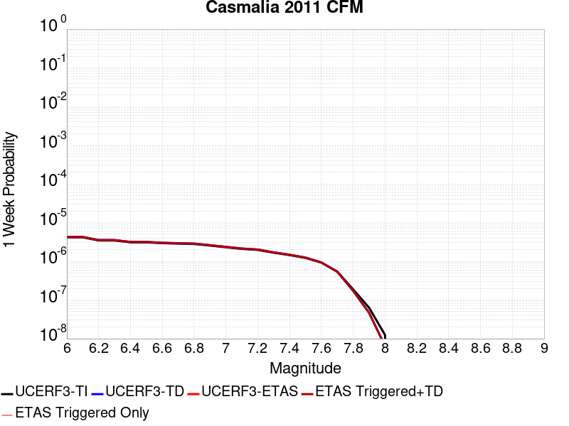 | 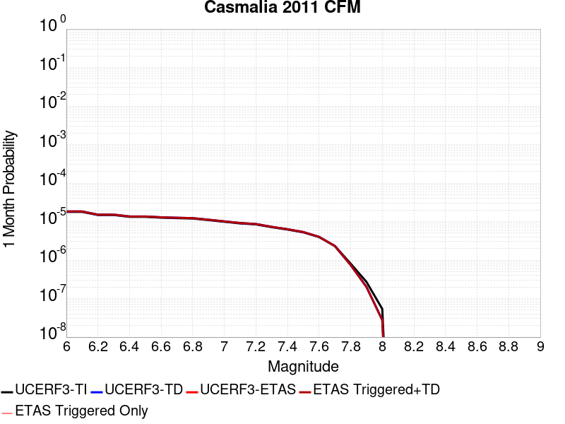 | 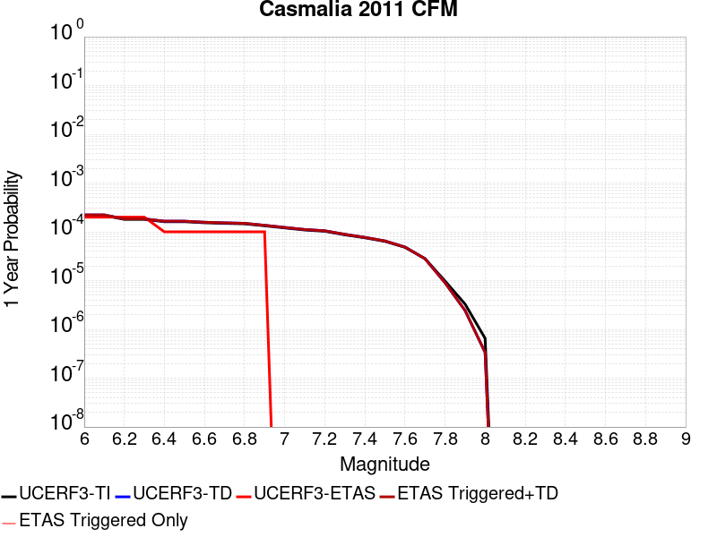 | 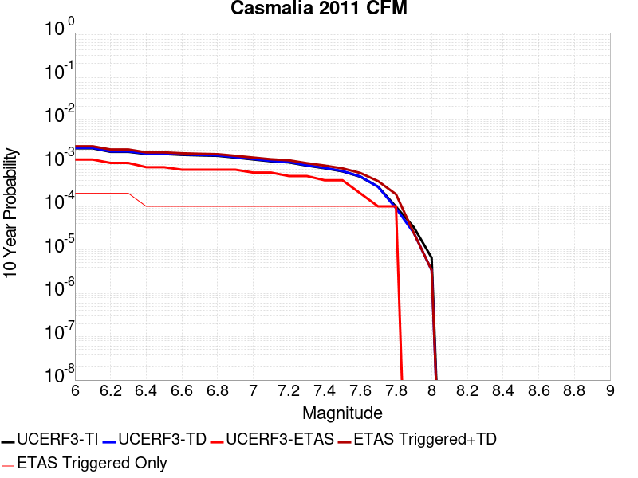 |

| Magnitude | 1 wk TI Prob | 1 wk TD Prob | 1 wk ETAS Prob | 1 wk ETAS/TD Gain | 1 wk ETAS Triggered+TD | 1 wk ETAS Triggered Only | 1 mo TI Prob | 1 mo TD Prob | 1 mo ETAS Prob | 1 mo ETAS/TD Gain | 1 mo ETAS Triggered+TD | 1 mo ETAS Triggered Only | 1 yr TI Prob | 1 yr TD Prob | 1 yr ETAS Prob | 1 yr ETAS/TD Gain | 1 yr ETAS Triggered+TD | 1 yr ETAS Triggered Only | 10 yr TI Prob | 10 yr TD Prob | 10 yr ETAS Prob | 10 yr ETAS/TD Gain | 10 yr ETAS Triggered+TD | 10 yr ETAS Triggered Only |
|-----|-----|-----|-----|-----|-----|-----|-----|-----|-----|-----|-----|-----|-----|-----|-----|-----|-----|-----|-----|-----|-----|-----|-----|-----|
| 6.0 | 4.1704893E-6 | 4.2627667E-6 | 0.0 | 0.0 | 4.2627667E-6 | 0.0 | 1.7873403E-5 | 1.8268873E-5 | 0.0 | 0.0 | 1.8268873E-5 | 0.0 | 2.1758694E-4 | 2.2240102E-4 | 2.0E-4 | 0.89927644 | 2.2240102E-4 | 0.0 | 0.0021737402 | 0.0022218055 | 0.0012 | 0.5401013 | 0.0024213612 | 2.0E-4 |
| 6.1 | 4.1704893E-6 | 4.2627667E-6 | 0.0 | 0.0 | 4.2627667E-6 | 0.0 | 1.7873403E-5 | 1.8268873E-5 | 0.0 | 0.0 | 1.8268873E-5 | 0.0 | 2.1758694E-4 | 2.2240102E-4 | 2.0E-4 | 0.89927644 | 2.2240102E-4 | 0.0 | 0.0021737402 | 0.0022218055 | 0.0012 | 0.5401013 | 0.0024213612 | 2.0E-4 |
| 6.2 | 3.457312E-6 | 3.5372807E-6 | 0.0 | 0.0 | 3.5372807E-6 | 0.0 | 1.4816967E-5 | 1.5159686E-5 | 0.0 | 0.0 | 1.5159686E-5 | 0.0 | 1.8038164E-4 | 1.8455363E-4 | 2.0E-4 | 1.0836958 | 1.8455363E-4 | 0.0 | 0.001802353 | 0.0018440132 | 0.001 | 0.54229546 | 0.0020436444 | 2.0E-4 |
| 6.3 | 3.457312E-6 | 3.5372807E-6 | 0.0 | 0.0 | 3.5372807E-6 | 0.0 | 1.4816967E-5 | 1.5159686E-5 | 0.0 | 0.0 | 1.5159686E-5 | 0.0 | 1.8038164E-4 | 1.8455363E-4 | 2.0E-4 | 1.0836958 | 1.8455363E-4 | 0.0 | 0.001802353 | 0.0018440132 | 0.001 | 0.54229546 | 0.0020436444 | 2.0E-4 |
| 6.4 | 3.0957337E-6 | 3.169472E-6 | 0.0 | 0.0 | 3.169472E-6 | 0.0 | 1.3267363E-5 | 1.3583381E-5 | 0.0 | 0.0 | 1.3583381E-5 | 0.0 | 1.6151817E-4 | 1.6536517E-4 | 1.0E-4 | 0.60472226 | 1.6536517E-4 | 0.0 | 0.0016140083 | 0.0016524274 | 8.0E-4 | 0.48413625 | 0.0017522621 | 1.0E-4 |
| 6.5 | 3.0957337E-6 | 3.169472E-6 | 0.0 | 0.0 | 3.169472E-6 | 0.0 | 1.3267363E-5 | 1.3583381E-5 | 0.0 | 0.0 | 1.3583381E-5 | 0.0 | 1.6151817E-4 | 1.6536517E-4 | 1.0E-4 | 0.60472226 | 1.6536517E-4 | 0.0 | 0.0016140083 | 0.0016524274 | 8.0E-4 | 0.48413625 | 0.0017522621 | 1.0E-4 |
| 6.6 | 2.9459152E-6 | 3.0168158E-6 | 0.0 | 0.0 | 3.0168158E-6 | 0.0 | 1.262529E-5 | 1.2929147E-5 | 0.0 | 0.0 | 1.2929147E-5 | 0.0 | 1.5370206E-4 | 1.5740104E-4 | 1.0E-4 | 0.6353198 | 1.5740104E-4 | 0.0 | 0.0015359579 | 0.0015729012 | 7.0E-4 | 0.4450375 | 0.0016727438 | 1.0E-4 |
| 6.7 | 2.8634809E-6 | 2.9327098E-6 | 0.0 | 0.0 | 2.9327098E-6 | 0.0 | 1.2272003E-5 | 1.2568696E-5 | 0.0 | 0.0 | 1.2568696E-5 | 0.0 | 1.4940138E-4 | 1.5301317E-4 | 1.0E-4 | 0.65353847 | 1.5301317E-4 | 0.0 | 0.0014930099 | 0.0015290836 | 7.0E-4 | 0.45779052 | 0.0016289307 | 1.0E-4 |
| 6.8 | 2.7999822E-6 | 2.867831E-6 | 0.0 | 0.0 | 2.867831E-6 | 0.0 | 1.1999869E-5 | 1.2290647E-5 | 0.0 | 0.0 | 1.2290647E-5 | 0.0 | 1.460886E-4 | 1.496284E-4 | 1.0E-4 | 0.6683223 | 1.496284E-4 | 0.0 | 0.001459926 | 0.0014952818 | 7.0E-4 | 0.46813917 | 0.0015951323 | 1.0E-4 |
| 6.9 | 2.551052E-6 | 2.6121854E-6 | 0.0 | 0.0 | 2.6121854E-6 | 0.0 | 1.0933034E-5 | 1.1195033E-5 | 0.0 | 0.0 | 1.1195033E-5 | 0.0 | 1.3310155E-4 | 1.3629104E-4 | 1.0E-4 | 0.73372394 | 1.3629104E-4 | 0.0 | 0.0013302186 | 0.0013620786 | 7.0E-4 | 0.5139204 | 0.0014619423 | 1.0E-4 |
| 7.0 | 2.3081875E-6 | 2.362616E-6 | 0.0 | 0.0 | 2.362616E-6 | 0.0 | 9.892195E-6 | 1.0125457E-5 | 0.0 | 0.0 | 1.0125457E-5 | 0.0 | 1.20430814E-4 | 1.232705E-4 | 0.0 | 0.0 | 1.232705E-4 | 0.0 | 0.0012036557 | 0.001232024 | 6.0E-4 | 0.48700348 | 0.0013319008 | 1.0E-4 |
| 7.1 | 2.093245E-6 | 2.1419196E-6 | 0.0 | 0.0 | 2.1419196E-6 | 0.0 | 8.971019E-6 | 9.179624E-6 | 0.0 | 0.0 | 9.179624E-6 | 0.0 | 1.09216686E-4 | 1.117562E-4 | 0.0 | 0.0 | 1.117562E-4 | 0.0 | 0.0010916302 | 0.0011170021 | 6.0E-4 | 0.5371521 | 0.0012168904 | 1.0E-4 |
| 7.2 | 1.9714576E-6 | 2.0166974E-6 | 0.0 | 0.0 | 2.0166974E-6 | 0.0 | 8.449076E-6 | 8.642961E-6 | 0.0 | 0.0 | 8.642961E-6 | 0.0 | 1.0286264E-4 | 1.0522298E-4 | 0.0 | 0.0 | 1.0522298E-4 | 0.0 | 0.0010281504 | 0.0010517335 | 5.0E-4 | 0.47540563 | 0.0011516283 | 1.0E-4 |
| 7.3 | 1.6689512E-6 | 1.7048824E-6 | 0.0 | 0.0 | 1.7048824E-6 | 0.0 | 7.1526288E-6 | 7.3066185E-6 | 0.0 | 0.0 | 7.3066185E-6 | 0.0 | 8.7079774E-5 | 8.895445E-5 | 0.0 | 0.0 | 8.895445E-5 | 0.0 | 8.7045657E-4 | 8.8918925E-4 | 5.0E-4 | 0.56231 | 9.891003E-4 | 1.0E-4 |
| 7.4 | 1.4490954E-6 | 1.4780458E-6 | 0.0 | 0.0 | 1.4780458E-6 | 0.0 | 6.210394E-6 | 6.3344664E-6 | 0.0 | 0.0 | 6.3344664E-6 | 0.0 | 7.560892E-5 | 7.711941E-5 | 0.0 | 0.0 | 7.711941E-5 | 0.0 | 7.55832E-4 | 7.7092706E-4 | 4.0E-4 | 0.5188558 | 8.7085E-4 | 1.0E-4 |
| 7.5 | 1.226873E-6 | 1.2483097E-6 | 0.0 | 0.0 | 1.2483097E-6 | 0.0 | 5.2580162E-6 | 5.349888E-6 | 0.0 | 0.0 | 5.349888E-6 | 0.0 | 6.401447E-5 | 6.513294E-5 | 0.0 | 0.0 | 6.513294E-5 | 0.0 | 6.399603E-4 | 6.5113907E-4 | 4.0E-4 | 0.6143081 | 7.5107394E-4 | 1.0E-4 |
| 7.6 | 9.2561345E-7 | 9.3630985E-7 | 0.0 | 0.0 | 9.3630985E-7 | 0.0 | 3.966909E-6 | 4.01275E-6 | 0.0 | 0.0 | 4.01275E-6 | 0.0 | 4.8296046E-5 | 4.8854145E-5 | 0.0 | 0.0 | 4.8854145E-5 | 0.0 | 4.828555E-4 | 4.8843445E-4 | 2.0E-4 | 0.40947154 | 5.883856E-4 | 1.0E-4 |
| 7.7 | 5.4367933E-7 | 5.3937543E-7 | 0.0 | 0.0 | 5.3937543E-7 | 0.0 | 2.3300522E-6 | 2.311607E-6 | 0.0 | 0.0 | 2.311607E-6 | 0.0 | 2.8368017E-5 | 2.8143453E-5 | 0.0 | 0.0 | 2.8143453E-5 | 0.0 | 2.8364395E-4 | 2.8139903E-4 | 1.0E-4 | 0.35536724 | 3.813709E-4 | 1.0E-4 |
| 7.8 | 1.8825742E-7 | 1.7347821E-7 | 0.0 | 0.0 | 1.7347821E-7 | 0.0 | 8.068173E-7 | 7.4347787E-7 | 0.0 | 0.0 | 7.4347787E-7 | 0.0 | 9.822956E-6 | 9.051805E-6 | 0.0 | 0.0 | 9.051805E-6 | 0.0 | 9.822522E-5 | 9.051439E-5 | 1.0E-4 | 1.1047966 | 1.9050534E-4 | 1.0E-4 |
| 7.9 | 6.342771E-8 | 4.6833105E-8 | 0.0 | 0.0 | 4.6833105E-8 | 0.0 | 2.7183304E-7 | 2.0071329E-7 | 0.0 | 0.0 | 2.0071329E-7 | 0.0 | 3.3095623E-6 | 2.4436815E-6 | 0.0 | 0.0 | 2.4436815E-6 | 0.0 | 3.309513E-5 | 2.4436551E-5 | 0.0 | 0.0 | 2.4436551E-5 | 0.0 |
| 8.0 | 1.2574819E-8 | 6.487518E-9 | 0.0 | 0.0 | 6.487518E-9 | 0.0 | 5.3892084E-8 | 2.780365E-8 | 0.0 | 0.0 | 2.780365E-8 | 0.0 | 6.561359E-7 | 3.3850935E-7 | 0.0 | 0.0 | 3.3850935E-7 | 0.0 | 6.56134E-6 | 3.3850888E-6 | 0.0 | 0.0 | 3.3850888E-6 | 0.0 |

## Hilton Creek 2011 CFM
*[(top)](#table-of-contents)*

| 1 Week | 1 Month | 1 Year | 10 Year |
|-----|-----|-----|-----|
|  | 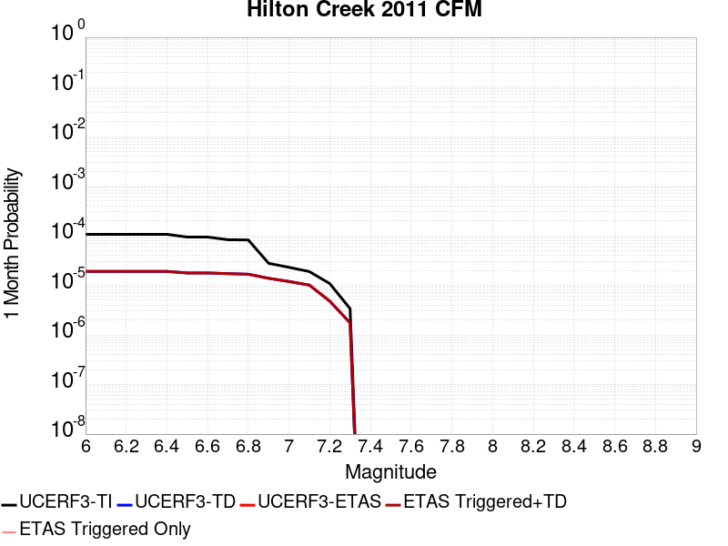 | 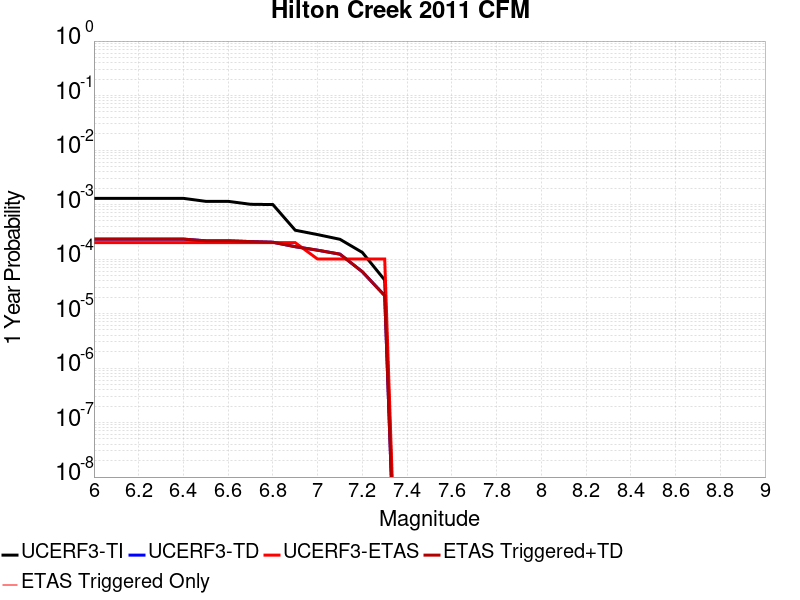 | 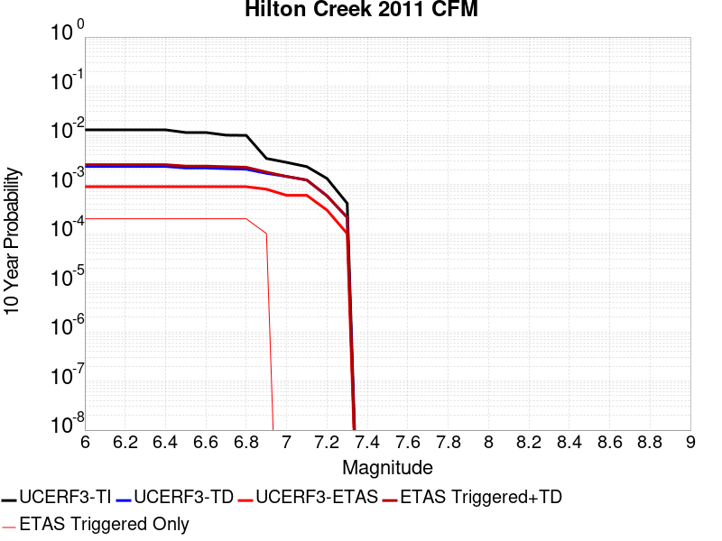 |

| Magnitude | 1 wk TI Prob | 1 wk TD Prob | 1 wk ETAS Prob | 1 wk ETAS/TD Gain | 1 wk ETAS Triggered+TD | 1 wk ETAS Triggered Only | 1 mo TI Prob | 1 mo TD Prob | 1 mo ETAS Prob | 1 mo ETAS/TD Gain | 1 mo ETAS Triggered+TD | 1 mo ETAS Triggered Only | 1 yr TI Prob | 1 yr TD Prob | 1 yr ETAS Prob | 1 yr ETAS/TD Gain | 1 yr ETAS Triggered+TD | 1 yr ETAS Triggered Only | 10 yr TI Prob | 10 yr TD Prob | 10 yr ETAS Prob | 10 yr ETAS/TD Gain | 10 yr ETAS Triggered+TD | 10 yr ETAS Triggered Only |
|-----|-----|-----|-----|-----|-----|-----|-----|-----|-----|-----|-----|-----|-----|-----|-----|-----|-----|-----|-----|-----|-----|-----|-----|-----|
| 6.0 | 2.4923684E-5 | 4.4597214E-6 | 0.0 | 0.0 | 4.4597214E-6 | 0.0 | 1.06811414E-4 | 1.911296E-5 | 0.0 | 0.0 | 1.911296E-5 | 0.0 | 0.0012996531 | 2.3267706E-4 | 2.0E-4 | 0.85956043 | 2.3267706E-4 | 0.0 | 0.012920785 | 0.002327428 | 9.0E-4 | 0.38669297 | 0.0025269624 | 2.0E-4 |
| 6.1 | 2.4923684E-5 | 4.4597214E-6 | 0.0 | 0.0 | 4.4597214E-6 | 0.0 | 1.06811414E-4 | 1.911296E-5 | 0.0 | 0.0 | 1.911296E-5 | 0.0 | 0.0012996531 | 2.3267706E-4 | 2.0E-4 | 0.85956043 | 2.3267706E-4 | 0.0 | 0.012920785 | 0.002327428 | 9.0E-4 | 0.38669297 | 0.0025269624 | 2.0E-4 |
| 6.2 | 2.4923684E-5 | 4.4597214E-6 | 0.0 | 0.0 | 4.4597214E-6 | 0.0 | 1.06811414E-4 | 1.911296E-5 | 0.0 | 0.0 | 1.911296E-5 | 0.0 | 0.0012996531 | 2.3267706E-4 | 2.0E-4 | 0.85956043 | 2.3267706E-4 | 0.0 | 0.012920785 | 0.002327428 | 9.0E-4 | 0.38669297 | 0.0025269624 | 2.0E-4 |
| 6.3 | 2.4923684E-5 | 4.4597214E-6 | 0.0 | 0.0 | 4.4597214E-6 | 0.0 | 1.06811414E-4 | 1.911296E-5 | 0.0 | 0.0 | 1.911296E-5 | 0.0 | 0.0012996531 | 2.3267706E-4 | 2.0E-4 | 0.85956043 | 2.3267706E-4 | 0.0 | 0.012920785 | 0.002327428 | 9.0E-4 | 0.38669297 | 0.0025269624 | 2.0E-4 |
| 6.4 | 2.4923684E-5 | 4.4597214E-6 | 0.0 | 0.0 | 4.4597214E-6 | 0.0 | 1.06811414E-4 | 1.911296E-5 | 0.0 | 0.0 | 1.911296E-5 | 0.0 | 0.0012996531 | 2.3267706E-4 | 2.0E-4 | 0.85956043 | 2.3267706E-4 | 0.0 | 0.012920785 | 0.002327428 | 9.0E-4 | 0.38669297 | 0.0025269624 | 2.0E-4 |
| 6.5 | 2.1963904E-5 | 4.147166E-6 | 0.0 | 0.0 | 4.147166E-6 | 0.0 | 9.412762E-5 | 1.7773456E-5 | 0.0 | 0.0 | 1.7773456E-5 | 0.0 | 0.0011454013 | 2.1637185E-4 | 2.0E-4 | 0.9243347 | 2.1637185E-4 | 0.0 | 0.011395155 | 0.0021665478 | 9.0E-4 | 0.41540742 | 0.0023661144 | 2.0E-4 |
| 6.6 | 2.1963904E-5 | 4.147166E-6 | 0.0 | 0.0 | 4.147166E-6 | 0.0 | 9.412762E-5 | 1.7773456E-5 | 0.0 | 0.0 | 1.7773456E-5 | 0.0 | 0.0011454013 | 2.1637185E-4 | 2.0E-4 | 0.9243347 | 2.1637185E-4 | 0.0 | 0.011395155 | 0.0021665478 | 9.0E-4 | 0.41540742 | 0.0023661144 | 2.0E-4 |
| 6.7 | 1.9397496E-5 | 4.017083E-6 | 0.0 | 0.0 | 4.017083E-6 | 0.0 | 8.3129475E-5 | 1.7215965E-5 | 0.0 | 0.0 | 1.7215965E-5 | 0.0 | 0.0010116313 | 2.095857E-4 | 2.0E-4 | 0.95426357 | 2.095857E-4 | 0.0 | 0.0100703845 | 0.002098406 | 9.0E-4 | 0.428897 | 0.0022979863 | 2.0E-4 |
| 6.8 | 1.917303E-5 | 3.909969E-6 | 0.0 | 0.0 | 3.909969E-6 | 0.0 | 8.216754E-5 | 1.6756912E-5 | 0.0 | 0.0 | 1.6756912E-5 | 0.0 | 9.999307E-4 | 2.0399778E-4 | 2.0E-4 | 0.9804028 | 2.0399778E-4 | 0.0 | 0.009954433 | 0.0020426302 | 9.0E-4 | 0.4406084 | 0.0022422215 | 2.0E-4 |
| 6.9 | 6.480681E-6 | 3.2335997E-6 | 0.0 | 0.0 | 3.2335997E-6 | 0.0 | 2.7774051E-5 | 1.3858217E-5 | 0.0 | 0.0 | 1.3858217E-5 | 0.0 | 3.380966E-4 | 1.6871186E-4 | 2.0E-4 | 1.185453 | 1.6871186E-4 | 0.0 | 0.0033758266 | 0.001685949 | 8.0E-4 | 0.4745102 | 0.0017857804 | 1.0E-4 |
| 7.0 | 5.388316E-6 | 2.7900132E-6 | 0.0 | 0.0 | 2.7900132E-6 | 0.0 | 2.3092578E-5 | 1.19571505E-5 | 0.0 | 0.0 | 1.19571505E-5 | 0.0 | 2.8111585E-4 | 1.4556963E-4 | 1.0E-4 | 0.68695647 | 1.4556963E-4 | 0.0 | 0.002807605 | 0.0014548455 | 6.0E-4 | 0.4124149 | 0.0014548455 | 0.0 |
| 7.1 | 4.41728E-6 | 2.3589153E-6 | 0.0 | 0.0 | 2.3589153E-6 | 0.0 | 1.8931061E-5 | 1.0109604E-5 | 0.0 | 0.0 | 1.0109604E-5 | 0.0 | 2.304613E-4 | 1.2307845E-4 | 1.0E-4 | 0.81248987 | 1.2307845E-4 | 0.0 | 0.0023022245 | 0.0012301995 | 6.0E-4 | 0.48772576 | 0.0012301995 | 0.0 |
| 7.2 | 2.535495E-6 | 1.1219407E-6 | 0.0 | 0.0 | 1.1219407E-6 | 0.0 | 1.0866362E-5 | 4.808311E-6 | 0.0 | 0.0 | 4.808311E-6 | 0.0 | 1.3228992E-4 | 5.854014E-5 | 1.0E-4 | 1.7082295 | 5.854014E-5 | 0.0 | 0.0013221119 | 5.8529846E-4 | 3.0E-4 | 0.512559 | 5.8529846E-4 | 0.0 |
| 7.3 | 7.900015E-7 | 4.0906667E-7 | 0.0 | 0.0 | 4.0906667E-7 | 0.0 | 3.3857161E-6 | 1.7531429E-6 | 0.0 | 0.0 | 1.7531429E-6 | 0.0 | 4.1220315E-5 | 2.1344515E-5 | 1.0E-4 | 4.685045 | 2.1344515E-5 | 0.0 | 4.121267E-4 | 2.1344515E-4 | 1.0E-4 | 0.46850446 | 2.1344515E-4 | 0.0 |

## Dog Valley
*[(top)](#table-of-contents)*

| 1 Week | 1 Month | 1 Year | 10 Year |
|-----|-----|-----|-----|
| 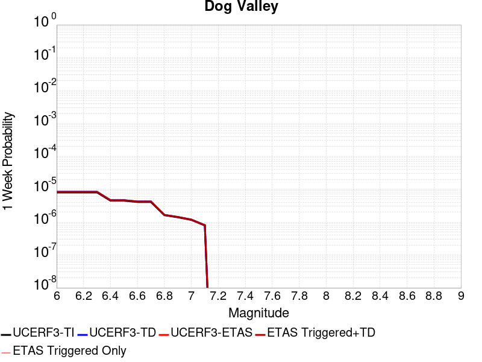 | 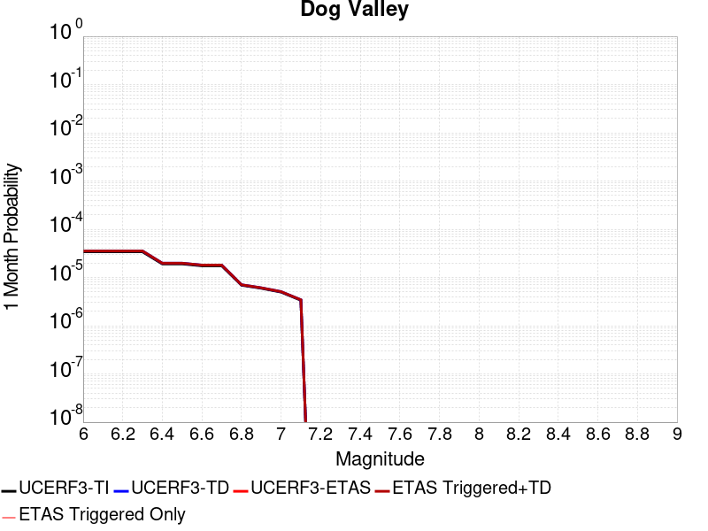 | 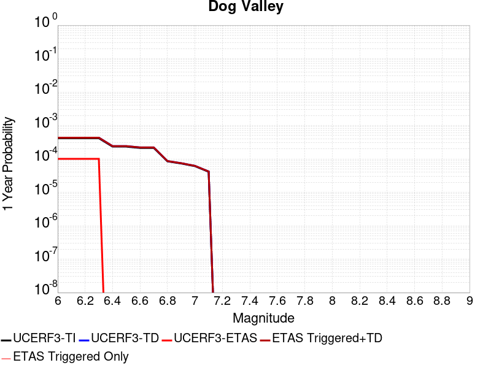 | 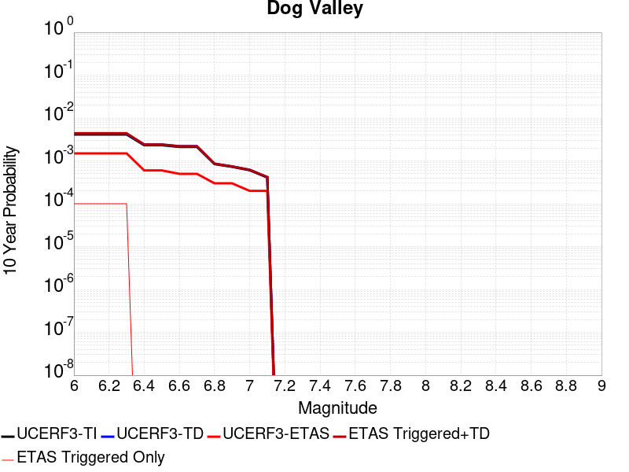 |

| Magnitude | 1 wk TI Prob | 1 wk TD Prob | 1 wk ETAS Prob | 1 wk ETAS/TD Gain | 1 wk ETAS Triggered+TD | 1 wk ETAS Triggered Only | 1 mo TI Prob | 1 mo TD Prob | 1 mo ETAS Prob | 1 mo ETAS/TD Gain | 1 mo ETAS Triggered+TD | 1 mo ETAS Triggered Only | 1 yr TI Prob | 1 yr TD Prob | 1 yr ETAS Prob | 1 yr ETAS/TD Gain | 1 yr ETAS Triggered+TD | 1 yr ETAS Triggered Only | 10 yr TI Prob | 10 yr TD Prob | 10 yr ETAS Prob | 10 yr ETAS/TD Gain | 10 yr ETAS Triggered+TD | 10 yr ETAS Triggered Only |
|-----|-----|-----|-----|-----|-----|-----|-----|-----|-----|-----|-----|-----|-----|-----|-----|-----|-----|-----|-----|-----|-----|-----|-----|-----|
| 6.0 | 7.949598E-6 | 8.276401E-6 | 0.0 | 0.0 | 8.276401E-6 | 0.0 | 3.4069257E-5 | 3.546992E-5 | 0.0 | 0.0 | 3.546992E-5 | 0.0 | 4.1471425E-4 | 4.3178033E-4 | 1.0E-4 | 0.23159926 | 4.3178033E-4 | 0.0 | 0.0041394117 | 0.0043113446 | 0.0015 | 0.34791932 | 0.004410913 | 1.0E-4 |
| 6.1 | 7.949598E-6 | 8.276401E-6 | 0.0 | 0.0 | 8.276401E-6 | 0.0 | 3.4069257E-5 | 3.546992E-5 | 0.0 | 0.0 | 3.546992E-5 | 0.0 | 4.1471425E-4 | 4.3178033E-4 | 1.0E-4 | 0.23159926 | 4.3178033E-4 | 0.0 | 0.0041394117 | 0.0043113446 | 0.0015 | 0.34791932 | 0.004410913 | 1.0E-4 |
| 6.2 | 7.949598E-6 | 8.276401E-6 | 0.0 | 0.0 | 8.276401E-6 | 0.0 | 3.4069257E-5 | 3.546992E-5 | 0.0 | 0.0 | 3.546992E-5 | 0.0 | 4.1471425E-4 | 4.3178033E-4 | 1.0E-4 | 0.23159926 | 4.3178033E-4 | 0.0 | 0.0041394117 | 0.0043113446 | 0.0015 | 0.34791932 | 0.004410913 | 1.0E-4 |
| 6.3 | 7.949598E-6 | 8.276401E-6 | 0.0 | 0.0 | 8.276401E-6 | 0.0 | 3.4069257E-5 | 3.546992E-5 | 0.0 | 0.0 | 3.546992E-5 | 0.0 | 4.1471425E-4 | 4.3178033E-4 | 1.0E-4 | 0.23159926 | 4.3178033E-4 | 0.0 | 0.0041394117 | 0.0043113446 | 0.0015 | 0.34791932 | 0.004410913 | 1.0E-4 |
| 6.4 | 4.462132E-6 | 4.6234945E-6 | 0.0 | 0.0 | 4.6234945E-6 | 0.0 | 1.9123283E-5 | 1.9814877E-5 | 0.0 | 0.0 | 1.9814877E-5 | 0.0 | 2.328011E-4 | 2.4122836E-4 | 0.0 | 0.0 | 2.4122836E-4 | 0.0 | 0.0023255737 | 0.0024105425 | 6.0E-4 | 0.24890664 | 0.0024105425 | 0.0 |
| 6.5 | 4.462132E-6 | 4.6234945E-6 | 0.0 | 0.0 | 4.6234945E-6 | 0.0 | 1.9123283E-5 | 1.9814877E-5 | 0.0 | 0.0 | 1.9814877E-5 | 0.0 | 2.328011E-4 | 2.4122836E-4 | 0.0 | 0.0 | 2.4122836E-4 | 0.0 | 0.0023255737 | 0.0024105425 | 6.0E-4 | 0.24890664 | 0.0024105425 | 0.0 |
| 6.6 | 4.074213E-6 | 4.2176703E-6 | 0.0 | 0.0 | 4.2176703E-6 | 0.0 | 1.7460794E-5 | 1.8075654E-5 | 0.0 | 0.0 | 1.8075654E-5 | 0.0 | 2.1256444E-4 | 2.2005766E-4 | 0.0 | 0.0 | 2.2005766E-4 | 0.0 | 0.0021236122 | 0.0021992594 | 5.0E-4 | 0.22734927 | 0.0021992594 | 0.0 |
| 6.7 | 4.074213E-6 | 4.2176703E-6 | 0.0 | 0.0 | 4.2176703E-6 | 0.0 | 1.7460794E-5 | 1.8075654E-5 | 0.0 | 0.0 | 1.8075654E-5 | 0.0 | 2.1256444E-4 | 2.2005766E-4 | 0.0 | 0.0 | 2.2005766E-4 | 0.0 | 0.0021236122 | 0.0021992594 | 5.0E-4 | 0.22734927 | 0.0021992594 | 0.0 |
| 6.8 | 1.6159543E-6 | 1.6504102E-6 | 0.0 | 0.0 | 1.6504102E-6 | 0.0 | 6.9255E-6 | 7.0731708E-6 | 0.0 | 0.0 | 7.0731708E-6 | 0.0 | 8.43147E-5 | 8.6113E-5 | 0.0 | 0.0 | 8.6113E-5 | 0.0 | 8.4282714E-4 | 8.6085056E-4 | 3.0E-4 | 0.34849253 | 8.6085056E-4 | 0.0 |
| 6.9 | 1.3952654E-6 | 1.4253484E-6 | 0.0 | 0.0 | 1.4253484E-6 | 0.0 | 5.9796953E-6 | 6.1086243E-6 | 0.0 | 0.0 | 6.1086243E-6 | 0.0 | 7.280036E-5 | 7.437045E-5 | 0.0 | 0.0 | 7.437045E-5 | 0.0 | 7.2776515E-4 | 7.435036E-4 | 3.0E-4 | 0.40349498 | 7.435036E-4 | 0.0 |
| 7.0 | 1.1619308E-6 | 1.1870034E-6 | 0.0 | 0.0 | 1.1870034E-6 | 0.0 | 4.979694E-6 | 5.08715E-6 | 0.0 | 0.0 | 5.08715E-6 | 0.0 | 6.0626087E-5 | 6.1934734E-5 | 0.0 | 0.0 | 6.1934734E-5 | 0.0 | 6.060955E-4 | 6.1921845E-4 | 2.0E-4 | 0.3229878 | 6.1921845E-4 | 0.0 |
| 7.1 | 7.8723247E-7 | 8.0473507E-7 | 0.0 | 0.0 | 8.0473507E-7 | 0.0 | 3.373849E-6 | 3.448862E-6 | 0.0 | 0.0 | 3.448862E-6 | 0.0 | 4.107584E-5 | 4.1989388E-5 | 0.0 | 0.0 | 4.1989388E-5 | 0.0 | 4.1068246E-4 | 4.1984444E-4 | 2.0E-4 | 0.47636694 | 4.1984444E-4 | 0.0 |

## San Joaquin Hills
*[(top)](#table-of-contents)*

| 1 Week | 1 Month | 1 Year | 10 Year |
|-----|-----|-----|-----|
| 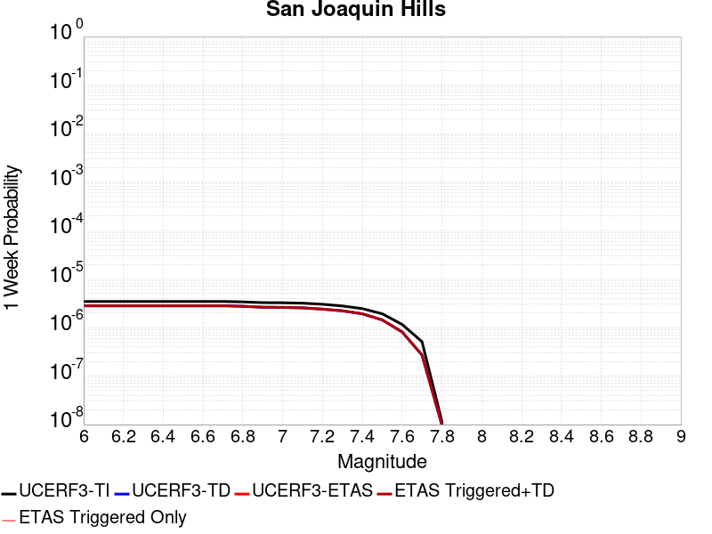 | 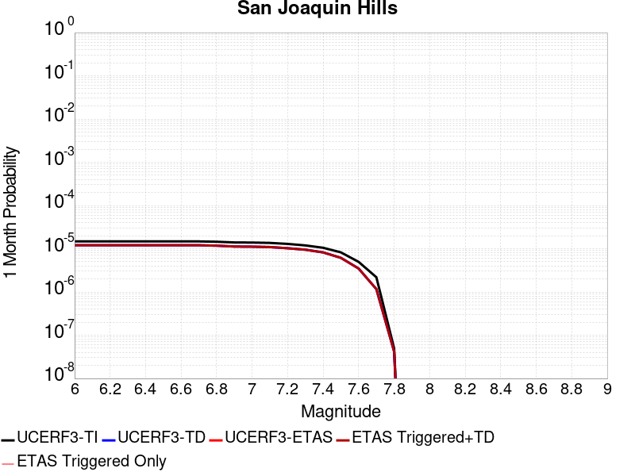 | 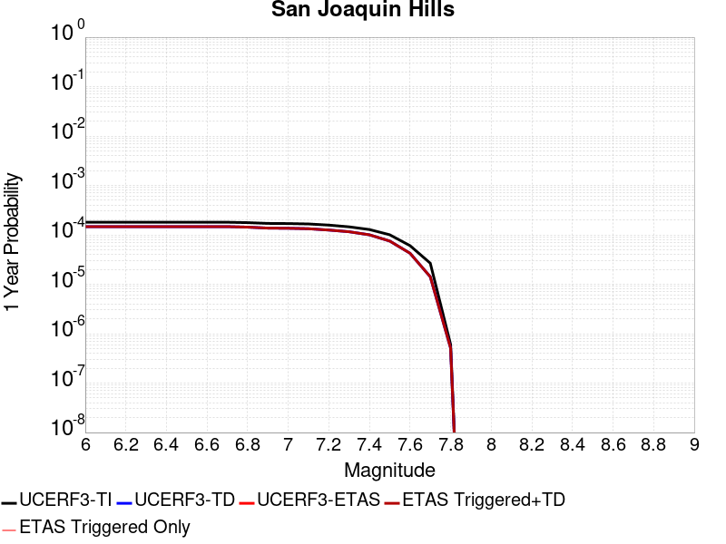 | 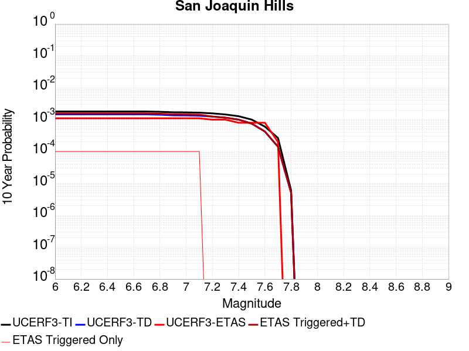 |

| Magnitude | 1 wk TI Prob | 1 wk TD Prob | 1 wk ETAS Prob | 1 wk ETAS/TD Gain | 1 wk ETAS Triggered+TD | 1 wk ETAS Triggered Only | 1 mo TI Prob | 1 mo TD Prob | 1 mo ETAS Prob | 1 mo ETAS/TD Gain | 1 mo ETAS Triggered+TD | 1 mo ETAS Triggered Only | 1 yr TI Prob | 1 yr TD Prob | 1 yr ETAS Prob | 1 yr ETAS/TD Gain | 1 yr ETAS Triggered+TD | 1 yr ETAS Triggered Only | 10 yr TI Prob | 10 yr TD Prob | 10 yr ETAS Prob | 10 yr ETAS/TD Gain | 10 yr ETAS Triggered+TD | 10 yr ETAS Triggered Only |
|-----|-----|-----|-----|-----|-----|-----|-----|-----|-----|-----|-----|-----|-----|-----|-----|-----|-----|-----|-----|-----|-----|-----|-----|-----|
| 6.0 | 3.4525704E-6 | 2.8141653E-6 | 0.0 | 0.0 | 2.8141653E-6 | 0.0 | 1.4796647E-5 | 1.2060654E-5 | 0.0 | 0.0 | 1.2060654E-5 | 0.0 | 1.8013427E-4 | 1.468287E-4 | 0.0 | 0.0 | 1.468287E-4 | 0.0 | 0.0017998833 | 0.0014673301 | 0.0011 | 0.7496609 | 0.0015671834 | 1.0E-4 |
| 6.1 | 3.4525704E-6 | 2.8141653E-6 | 0.0 | 0.0 | 2.8141653E-6 | 0.0 | 1.4796647E-5 | 1.2060654E-5 | 0.0 | 0.0 | 1.2060654E-5 | 0.0 | 1.8013427E-4 | 1.468287E-4 | 0.0 | 0.0 | 1.468287E-4 | 0.0 | 0.0017998833 | 0.0014673301 | 0.0011 | 0.7496609 | 0.0015671834 | 1.0E-4 |
| 6.2 | 3.4525704E-6 | 2.8141653E-6 | 0.0 | 0.0 | 2.8141653E-6 | 0.0 | 1.4796647E-5 | 1.2060654E-5 | 0.0 | 0.0 | 1.2060654E-5 | 0.0 | 1.8013427E-4 | 1.468287E-4 | 0.0 | 0.0 | 1.468287E-4 | 0.0 | 0.0017998833 | 0.0014673301 | 0.0011 | 0.7496609 | 0.0015671834 | 1.0E-4 |
| 6.3 | 3.4525704E-6 | 2.8141653E-6 | 0.0 | 0.0 | 2.8141653E-6 | 0.0 | 1.4796647E-5 | 1.2060654E-5 | 0.0 | 0.0 | 1.2060654E-5 | 0.0 | 1.8013427E-4 | 1.468287E-4 | 0.0 | 0.0 | 1.468287E-4 | 0.0 | 0.0017998833 | 0.0014673301 | 0.0011 | 0.7496609 | 0.0015671834 | 1.0E-4 |
| 6.4 | 3.4525704E-6 | 2.8141653E-6 | 0.0 | 0.0 | 2.8141653E-6 | 0.0 | 1.4796647E-5 | 1.2060654E-5 | 0.0 | 0.0 | 1.2060654E-5 | 0.0 | 1.8013427E-4 | 1.468287E-4 | 0.0 | 0.0 | 1.468287E-4 | 0.0 | 0.0017998833 | 0.0014673301 | 0.0011 | 0.7496609 | 0.0015671834 | 1.0E-4 |
| 6.5 | 3.4525704E-6 | 2.8141653E-6 | 0.0 | 0.0 | 2.8141653E-6 | 0.0 | 1.4796647E-5 | 1.2060654E-5 | 0.0 | 0.0 | 1.2060654E-5 | 0.0 | 1.8013427E-4 | 1.468287E-4 | 0.0 | 0.0 | 1.468287E-4 | 0.0 | 0.0017998833 | 0.0014673301 | 0.0011 | 0.7496609 | 0.0015671834 | 1.0E-4 |
| 6.6 | 3.4525704E-6 | 2.8141653E-6 | 0.0 | 0.0 | 2.8141653E-6 | 0.0 | 1.4796647E-5 | 1.2060654E-5 | 0.0 | 0.0 | 1.2060654E-5 | 0.0 | 1.8013427E-4 | 1.468287E-4 | 0.0 | 0.0 | 1.468287E-4 | 0.0 | 0.0017998833 | 0.0014673301 | 0.0011 | 0.7496609 | 0.0015671834 | 1.0E-4 |
| 6.7 | 3.4525704E-6 | 2.8141653E-6 | 0.0 | 0.0 | 2.8141653E-6 | 0.0 | 1.4796647E-5 | 1.2060654E-5 | 0.0 | 0.0 | 1.2060654E-5 | 0.0 | 1.8013427E-4 | 1.468287E-4 | 0.0 | 0.0 | 1.468287E-4 | 0.0 | 0.0017998833 | 0.0014673301 | 0.0011 | 0.7496609 | 0.0015671834 | 1.0E-4 |
| 6.8 | 3.388654E-6 | 2.7486003E-6 | 0.0 | 0.0 | 2.7486003E-6 | 0.0 | 1.4522722E-5 | 1.17796635E-5 | 0.0 | 0.0 | 1.17796635E-5 | 0.0 | 1.767998E-4 | 1.4340809E-4 | 0.0 | 0.0 | 1.4340809E-4 | 0.0 | 0.001766592 | 0.0014331683 | 0.0011 | 0.7675302 | 0.0015330251 | 1.0E-4 |
| 6.9 | 3.2694352E-6 | 2.6285088E-6 | 0.0 | 0.0 | 2.6285088E-6 | 0.0 | 1.401179E-5 | 1.126499E-5 | 0.0 | 0.0 | 1.126499E-5 | 0.0 | 1.7058018E-4 | 1.3714274E-4 | 0.0 | 0.0 | 1.3714274E-4 | 0.0 | 0.0017044931 | 0.0013705923 | 0.0011 | 0.8025727 | 0.0014704552 | 1.0E-4 |
| 7.0 | 3.246912E-6 | 2.6071646E-6 | 0.0 | 0.0 | 2.6071646E-6 | 0.0 | 1.39152635E-5 | 1.1173514E-5 | 0.0 | 0.0 | 1.1173514E-5 | 0.0 | 1.6940516E-4 | 1.3602916E-4 | 0.0 | 0.0 | 1.3602916E-4 | 0.0 | 0.0016927607 | 0.0013594702 | 0.0011 | 0.8091387 | 0.0014593343 | 1.0E-4 |
| 7.1 | 3.1864927E-6 | 2.55249E-6 | 0.0 | 0.0 | 2.55249E-6 | 0.0 | 1.3656326E-5 | 1.0939198E-5 | 0.0 | 0.0 | 1.0939198E-5 | 0.0 | 1.6625308E-4 | 1.331767E-4 | 0.0 | 0.0 | 1.331767E-4 | 0.0 | 0.0016612876 | 0.00133098 | 0.0011 | 0.8264587 | 0.0014308469 | 1.0E-4 |
| 7.2 | 3.0220644E-6 | 2.3993289E-6 | 0.0 | 0.0 | 2.3993289E-6 | 0.0 | 1.295164E-5 | 1.0282798E-5 | 0.0 | 0.0 | 1.0282798E-5 | 0.0 | 1.576748E-4 | 1.2518598E-4 | 0.0 | 0.0 | 1.2518598E-4 | 0.0 | 0.0015756298 | 0.0012511649 | 0.001 | 0.79925513 | 0.0012511649 | 0.0 |
| 7.3 | 2.787619E-6 | 2.2175357E-6 | 0.0 | 0.0 | 2.2175357E-6 | 0.0 | 1.1946884E-5 | 9.50369E-6 | 0.0 | 0.0 | 9.50369E-6 | 0.0 | 1.454436E-4 | 1.1570138E-4 | 0.0 | 0.0 | 1.1570138E-4 | 0.0 | 0.0014534845 | 0.0011564213 | 0.001 | 0.86473674 | 0.0011564213 | 0.0 |
| 7.4 | 2.4593792E-6 | 1.9227605E-6 | 0.0 | 0.0 | 1.9227605E-6 | 0.0 | 1.0540153E-5 | 8.240376E-6 | 0.0 | 0.0 | 8.240376E-6 | 0.0 | 1.2831882E-4 | 1.00322046E-4 | 0.0 | 0.0 | 1.00322046E-4 | 0.0 | 0.0012824474 | 0.0010027764 | 8.0E-4 | 0.79778504 | 0.0010027764 | 0.0 |
| 7.5 | 1.926764E-6 | 1.4384276E-6 | 0.0 | 0.0 | 1.4384276E-6 | 0.0 | 8.257534E-6 | 6.1646756E-6 | 0.0 | 0.0 | 6.1646756E-6 | 0.0 | 1.00530844E-4 | 7.5052405E-5 | 0.0 | 0.0 | 7.5052405E-5 | 0.0 | 0.0010048538 | 7.502769E-4 | 8.0E-4 | 1.066273 | 7.502769E-4 | 0.0 |
| 7.6 | 1.1609359E-6 | 8.1463605E-7 | 0.0 | 0.0 | 8.1463605E-7 | 0.0 | 4.97543E-6 | 3.491293E-6 | 0.0 | 0.0 | 3.491293E-6 | 0.0 | 6.0574173E-5 | 4.2505708E-5 | 0.0 | 0.0 | 4.2505708E-5 | 0.0 | 6.055767E-4 | 4.2498013E-4 | 8.0E-4 | 1.882441 | 4.2498013E-4 | 0.0 |
| 7.7 | 5.1168536E-7 | 2.7160027E-7 | 0.0 | 0.0 | 2.7160027E-7 | 0.0 | 2.1929354E-6 | 1.1640008E-6 | 0.0 | 0.0 | 1.1640008E-6 | 0.0 | 2.669866E-5 | 1.4171631E-5 | 0.0 | 0.0 | 1.4171631E-5 | 0.0 | 2.6695454E-4 | 1.4170862E-4 | 2.0E-4 | 1.4113468 | 1.4170862E-4 | 0.0 |
| 7.8 | 1.16056995E-8 | 9.783043E-9 | 0.0 | 0.0 | 9.783043E-9 | 0.0 | 4.9738713E-8 | 4.192733E-8 | 0.0 | 0.0 | 4.192733E-8 | 0.0 | 6.0556863E-7 | 5.104652E-7 | 0.0 | 0.0 | 5.104652E-7 | 0.0 | 6.05567E-6 | 5.1046522E-6 | 0.0 | 0.0 | 5.1046522E-6 | 0.0 |

## Great Valley 13 (Coalinga)
*[(top)](#table-of-contents)*

| 1 Week | 1 Month | 1 Year | 10 Year |
|-----|-----|-----|-----|
| 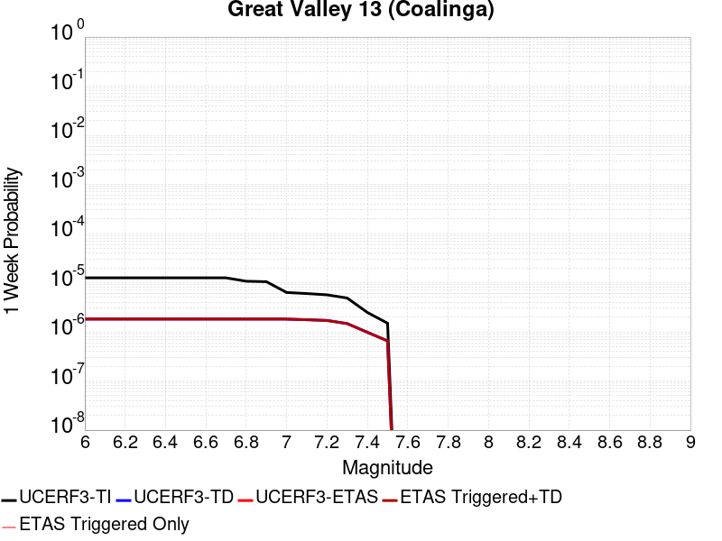 | 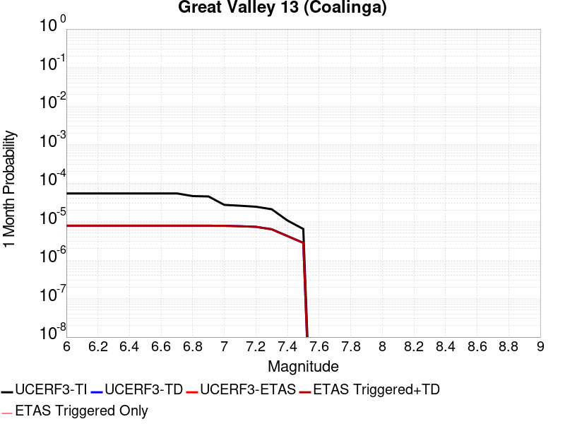 | 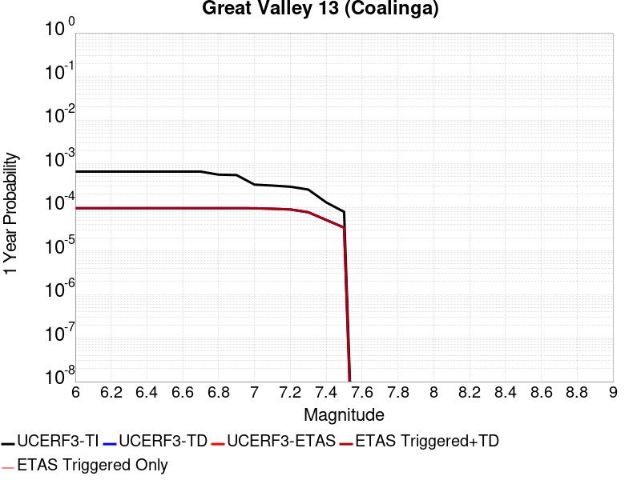 | 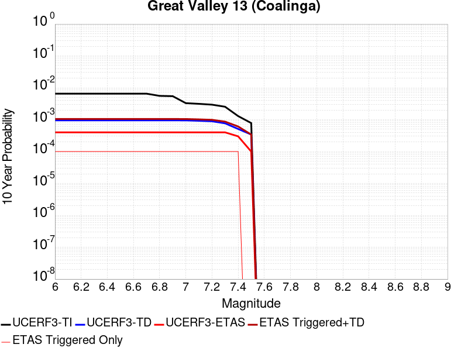 |

| Magnitude | 1 wk TI Prob | 1 wk TD Prob | 1 wk ETAS Prob | 1 wk ETAS/TD Gain | 1 wk ETAS Triggered+TD | 1 wk ETAS Triggered Only | 1 mo TI Prob | 1 mo TD Prob | 1 mo ETAS Prob | 1 mo ETAS/TD Gain | 1 mo ETAS Triggered+TD | 1 mo ETAS Triggered Only | 1 yr TI Prob | 1 yr TD Prob | 1 yr ETAS Prob | 1 yr ETAS/TD Gain | 1 yr ETAS Triggered+TD | 1 yr ETAS Triggered Only | 10 yr TI Prob | 10 yr TD Prob | 10 yr ETAS Prob | 10 yr ETAS/TD Gain | 10 yr ETAS Triggered+TD | 10 yr ETAS Triggered Only |
|-----|-----|-----|-----|-----|-----|-----|-----|-----|-----|-----|-----|-----|-----|-----|-----|-----|-----|-----|-----|-----|-----|-----|-----|-----|
| 6.0 | 1.25701345E-5 | 1.8257942E-6 | 0.0 | 0.0 | 1.8257942E-6 | 0.0 | 5.3870892E-5 | 7.82481E-6 | 0.0 | 0.0 | 7.82481E-6 | 0.0 | 6.556807E-4 | 9.5263094E-5 | 0.0 | 0.0 | 9.5263094E-5 | 0.0 | 0.006537495 | 9.522419E-4 | 4.0E-4 | 0.42006135 | 0.0010521467 | 1.0E-4 |
| 6.1 | 1.25701345E-5 | 1.8257942E-6 | 0.0 | 0.0 | 1.8257942E-6 | 0.0 | 5.3870892E-5 | 7.82481E-6 | 0.0 | 0.0 | 7.82481E-6 | 0.0 | 6.556807E-4 | 9.5263094E-5 | 0.0 | 0.0 | 9.5263094E-5 | 0.0 | 0.006537495 | 9.522419E-4 | 4.0E-4 | 0.42006135 | 0.0010521467 | 1.0E-4 |
| 6.2 | 1.25701345E-5 | 1.8257942E-6 | 0.0 | 0.0 | 1.8257942E-6 | 0.0 | 5.3870892E-5 | 7.82481E-6 | 0.0 | 0.0 | 7.82481E-6 | 0.0 | 6.556807E-4 | 9.5263094E-5 | 0.0 | 0.0 | 9.5263094E-5 | 0.0 | 0.006537495 | 9.522419E-4 | 4.0E-4 | 0.42006135 | 0.0010521467 | 1.0E-4 |
| 6.3 | 1.25701345E-5 | 1.8257942E-6 | 0.0 | 0.0 | 1.8257942E-6 | 0.0 | 5.3870892E-5 | 7.82481E-6 | 0.0 | 0.0 | 7.82481E-6 | 0.0 | 6.556807E-4 | 9.5263094E-5 | 0.0 | 0.0 | 9.5263094E-5 | 0.0 | 0.006537495 | 9.522419E-4 | 4.0E-4 | 0.42006135 | 0.0010521467 | 1.0E-4 |
| 6.4 | 1.25701345E-5 | 1.8257942E-6 | 0.0 | 0.0 | 1.8257942E-6 | 0.0 | 5.3870892E-5 | 7.82481E-6 | 0.0 | 0.0 | 7.82481E-6 | 0.0 | 6.556807E-4 | 9.5263094E-5 | 0.0 | 0.0 | 9.5263094E-5 | 0.0 | 0.006537495 | 9.522419E-4 | 4.0E-4 | 0.42006135 | 0.0010521467 | 1.0E-4 |
| 6.5 | 1.25701345E-5 | 1.8257942E-6 | 0.0 | 0.0 | 1.8257942E-6 | 0.0 | 5.3870892E-5 | 7.82481E-6 | 0.0 | 0.0 | 7.82481E-6 | 0.0 | 6.556807E-4 | 9.5263094E-5 | 0.0 | 0.0 | 9.5263094E-5 | 0.0 | 0.006537495 | 9.522419E-4 | 4.0E-4 | 0.42006135 | 0.0010521467 | 1.0E-4 |
| 6.6 | 1.25701345E-5 | 1.8257942E-6 | 0.0 | 0.0 | 1.8257942E-6 | 0.0 | 5.3870892E-5 | 7.82481E-6 | 0.0 | 0.0 | 7.82481E-6 | 0.0 | 6.556807E-4 | 9.5263094E-5 | 0.0 | 0.0 | 9.5263094E-5 | 0.0 | 0.006537495 | 9.522419E-4 | 4.0E-4 | 0.42006135 | 0.0010521467 | 1.0E-4 |
| 6.7 | 1.25701345E-5 | 1.8257942E-6 | 0.0 | 0.0 | 1.8257942E-6 | 0.0 | 5.3870892E-5 | 7.82481E-6 | 0.0 | 0.0 | 7.82481E-6 | 0.0 | 6.556807E-4 | 9.5263094E-5 | 0.0 | 0.0 | 9.5263094E-5 | 0.0 | 0.006537495 | 9.522419E-4 | 4.0E-4 | 0.42006135 | 0.0010521467 | 1.0E-4 |
| 6.8 | 1.0720415E-5 | 1.8257942E-6 | 0.0 | 0.0 | 1.8257942E-6 | 0.0 | 4.5943823E-5 | 7.82481E-6 | 0.0 | 0.0 | 7.82481E-6 | 0.0 | 5.592225E-4 | 9.5263094E-5 | 0.0 | 0.0 | 9.5263094E-5 | 0.0 | 0.005578173 | 9.522419E-4 | 4.0E-4 | 0.42006135 | 0.0010521467 | 1.0E-4 |
| 6.9 | 1.0485409E-5 | 1.8217012E-6 | 0.0 | 0.0 | 1.8217012E-6 | 0.0 | 4.4936693E-5 | 7.807268E-6 | 0.0 | 0.0 | 7.807268E-6 | 0.0 | 5.469669E-4 | 9.5049545E-5 | 0.0 | 0.0 | 9.5049545E-5 | 0.0 | 0.005456226 | 9.501082E-4 | 4.0E-4 | 0.42100468 | 0.0010500132 | 1.0E-4 |
| 7.0 | 6.3302773E-6 | 1.8165689E-6 | 0.0 | 0.0 | 1.8165689E-6 | 0.0 | 2.7129478E-5 | 7.785273E-6 | 0.0 | 0.0 | 7.785273E-6 | 0.0 | 3.3025132E-4 | 9.4781775E-5 | 0.0 | 0.0 | 9.4781775E-5 | 0.0 | 0.0032976097 | 9.474328E-4 | 4.0E-4 | 0.42219353 | 0.001047338 | 1.0E-4 |
| 7.1 | 6.022003E-6 | 1.7668456E-6 | 0.0 | 0.0 | 1.7668456E-6 | 0.0 | 2.5808331E-5 | 7.5721746E-6 | 0.0 | 0.0 | 7.5721746E-6 | 0.0 | 3.141711E-4 | 9.218752E-5 | 0.0 | 0.0 | 9.218752E-5 | 0.0 | 0.0031372732 | 9.215119E-4 | 4.0E-4 | 0.43406925 | 0.0010214198 | 1.0E-4 |
| 7.2 | 5.671345E-6 | 1.7066444E-6 | 0.0 | 0.0 | 1.7066444E-6 | 0.0 | 2.4305538E-5 | 7.314171E-6 | 0.0 | 0.0 | 7.314171E-6 | 0.0 | 2.9587973E-4 | 8.904659E-5 | 0.0 | 0.0 | 8.904659E-5 | 0.0 | 0.002954861 | 8.9012814E-4 | 4.0E-4 | 0.4493735 | 9.900391E-4 | 1.0E-4 |
| 7.3 | 4.8831785E-6 | 1.4735908E-6 | 0.0 | 0.0 | 1.4735908E-6 | 0.0 | 2.092774E-5 | 6.3153752E-6 | 0.0 | 0.0 | 6.3153752E-6 | 0.0 | 2.5476544E-4 | 7.688715E-5 | 0.0 | 0.0 | 7.688715E-5 | 0.0 | 0.0025447358 | 7.686221E-4 | 4.0E-4 | 0.5204118 | 8.685452E-4 | 1.0E-4 |
| 7.4 | 2.4837766E-6 | 9.802935E-7 | 0.0 | 0.0 | 9.802935E-7 | 0.0 | 1.0644713E-5 | 4.201251E-6 | 0.0 | 0.0 | 4.201251E-6 | 0.0 | 1.2959167E-4 | 5.11491E-5 | 0.0 | 0.0 | 5.11491E-5 | 0.0 | 0.0012951613 | 5.1137985E-4 | 3.0E-4 | 0.58664805 | 6.1132875E-4 | 1.0E-4 |
| 7.5 | 1.5002679E-6 | 6.5476183E-7 | 0.0 | 0.0 | 6.5476183E-7 | 0.0 | 6.4297037E-6 | 2.8061193E-6 | 0.0 | 0.0 | 2.8061193E-6 | 0.0 | 7.827883E-5 | 3.4164008E-5 | 0.0 | 0.0 | 3.4164008E-5 | 0.0 | 7.825126E-4 | 3.4159172E-4 | 1.0E-4 | 0.29274714 | 3.4159172E-4 | 0.0 |

## Fontana (Seismicity)
*[(top)](#table-of-contents)*

| 1 Week | 1 Month | 1 Year | 10 Year |
|-----|-----|-----|-----|
| 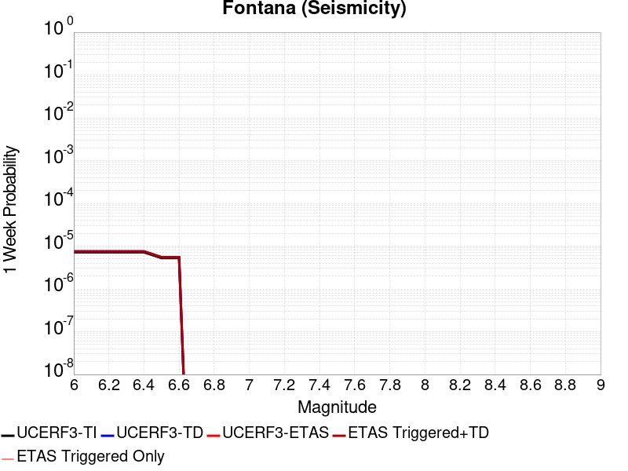 | 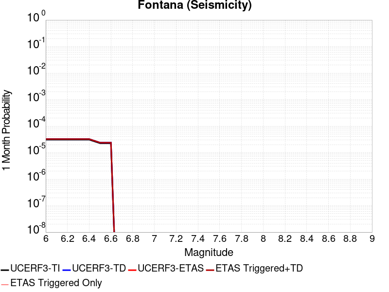 | 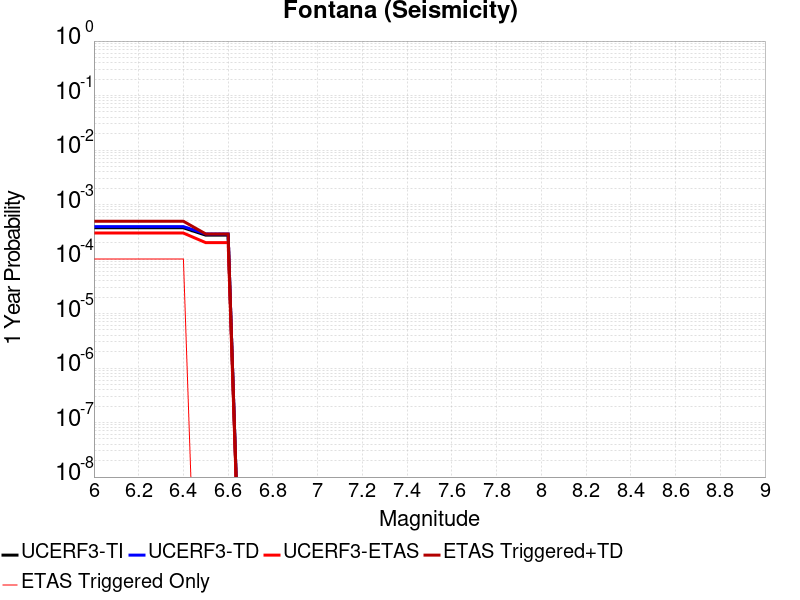 | 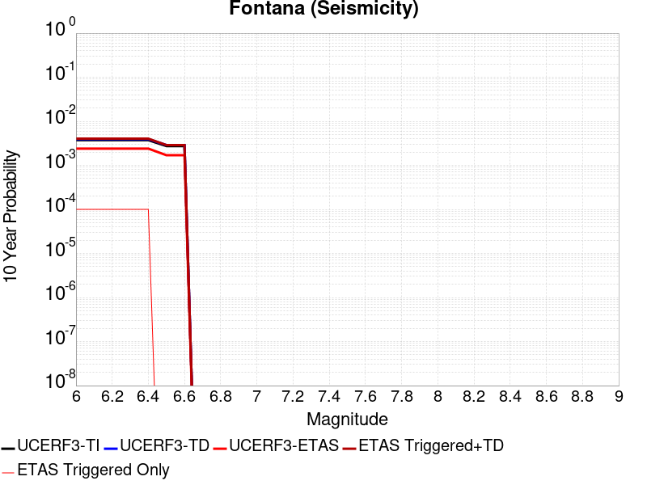 |

| Magnitude | 1 wk TI Prob | 1 wk TD Prob | 1 wk ETAS Prob | 1 wk ETAS/TD Gain | 1 wk ETAS Triggered+TD | 1 wk ETAS Triggered Only | 1 mo TI Prob | 1 mo TD Prob | 1 mo ETAS Prob | 1 mo ETAS/TD Gain | 1 mo ETAS Triggered+TD | 1 mo ETAS Triggered Only | 1 yr TI Prob | 1 yr TD Prob | 1 yr ETAS Prob | 1 yr ETAS/TD Gain | 1 yr ETAS Triggered+TD | 1 yr ETAS Triggered Only | 10 yr TI Prob | 10 yr TD Prob | 10 yr ETAS Prob | 10 yr ETAS/TD Gain | 10 yr ETAS Triggered+TD | 10 yr ETAS Triggered Only |
|-----|-----|-----|-----|-----|-----|-----|-----|-----|-----|-----|-----|-----|-----|-----|-----|-----|-----|-----|-----|-----|-----|-----|-----|-----|
| 6.0 | 7.1789214E-6 | 7.552779E-6 | 0.0 | 0.0 | 7.552779E-6 | 0.0 | 3.076644E-5 | 3.236888E-5 | 0.0 | 0.0 | 3.236888E-5 | 0.0 | 3.7451705E-4 | 3.9406065E-4 | 3.0E-4 | 0.7613041 | 4.940213E-4 | 1.0E-4 | 0.003738865 | 0.0039376197 | 0.0024 | 0.6095053 | 0.0040372256 | 1.0E-4 |
| 6.1 | 7.1789214E-6 | 7.552779E-6 | 0.0 | 0.0 | 7.552779E-6 | 0.0 | 3.076644E-5 | 3.236888E-5 | 0.0 | 0.0 | 3.236888E-5 | 0.0 | 3.7451705E-4 | 3.9406065E-4 | 3.0E-4 | 0.7613041 | 4.940213E-4 | 1.0E-4 | 0.003738865 | 0.0039376197 | 0.0024 | 0.6095053 | 0.0040372256 | 1.0E-4 |
| 6.2 | 7.1789214E-6 | 7.552779E-6 | 0.0 | 0.0 | 7.552779E-6 | 0.0 | 3.076644E-5 | 3.236888E-5 | 0.0 | 0.0 | 3.236888E-5 | 0.0 | 3.7451705E-4 | 3.9406065E-4 | 3.0E-4 | 0.7613041 | 4.940213E-4 | 1.0E-4 | 0.003738865 | 0.0039376197 | 0.0024 | 0.6095053 | 0.0040372256 | 1.0E-4 |
| 6.3 | 7.1789214E-6 | 7.552779E-6 | 0.0 | 0.0 | 7.552779E-6 | 0.0 | 3.076644E-5 | 3.236888E-5 | 0.0 | 0.0 | 3.236888E-5 | 0.0 | 3.7451705E-4 | 3.9406065E-4 | 3.0E-4 | 0.7613041 | 4.940213E-4 | 1.0E-4 | 0.003738865 | 0.0039376197 | 0.0024 | 0.6095053 | 0.0040372256 | 1.0E-4 |
| 6.4 | 7.1789214E-6 | 7.552779E-6 | 0.0 | 0.0 | 7.552779E-6 | 0.0 | 3.076644E-5 | 3.236888E-5 | 0.0 | 0.0 | 3.236888E-5 | 0.0 | 3.7451705E-4 | 3.9406065E-4 | 3.0E-4 | 0.7613041 | 4.940213E-4 | 1.0E-4 | 0.003738865 | 0.0039376197 | 0.0024 | 0.6095053 | 0.0040372256 | 1.0E-4 |
| 6.5 | 5.2611317E-6 | 5.533292E-6 | 0.0 | 0.0 | 5.533292E-6 | 0.0 | 2.2547512E-5 | 2.371411E-5 | 0.0 | 0.0 | 2.371411E-5 | 0.0 | 2.744814E-4 | 2.8871928E-4 | 2.0E-4 | 0.6927144 | 2.8871928E-4 | 0.0 | 0.002741426 | 0.0028871929 | 0.0017 | 0.5888072 | 0.0028871929 | 0.0 |
| 6.6 | 5.2611317E-6 | 5.533292E-6 | 0.0 | 0.0 | 5.533292E-6 | 0.0 | 2.2547512E-5 | 2.371411E-5 | 0.0 | 0.0 | 2.371411E-5 | 0.0 | 2.744814E-4 | 2.8871928E-4 | 2.0E-4 | 0.6927144 | 2.8871928E-4 | 0.0 | 0.002741426 | 0.0028871929 | 0.0017 | 0.5888072 | 0.0028871929 | 0.0 |

## Joshua Tree (Seismicity)
*[(top)](#table-of-contents)*

| 1 Week | 1 Month | 1 Year | 10 Year |
|-----|-----|-----|-----|
| 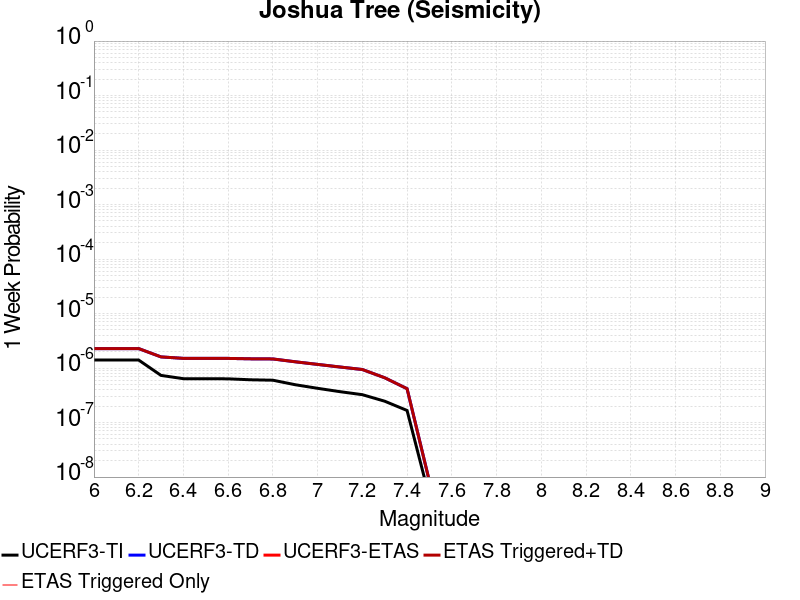 | 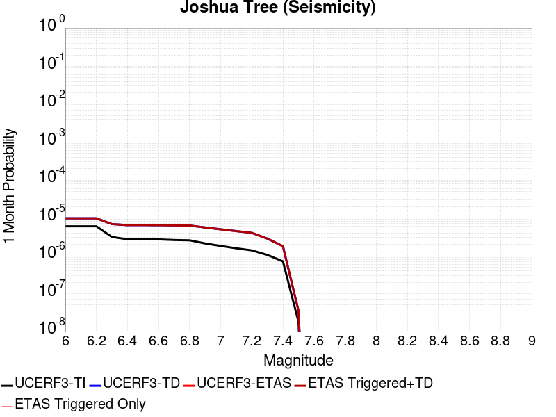 | 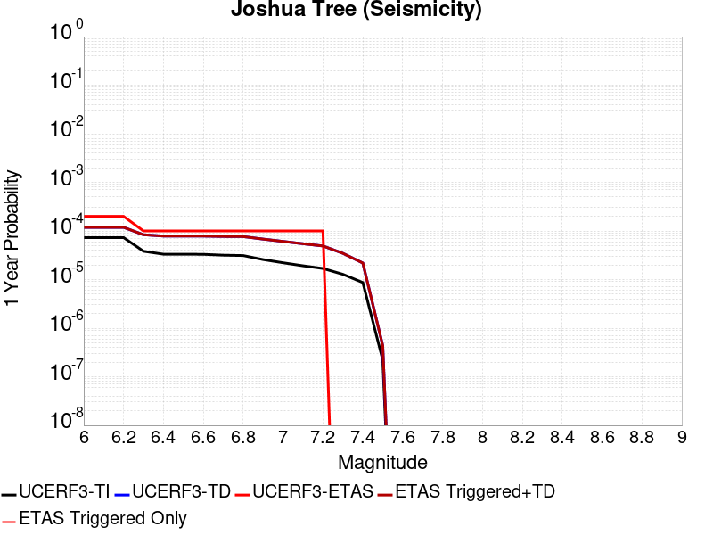 | 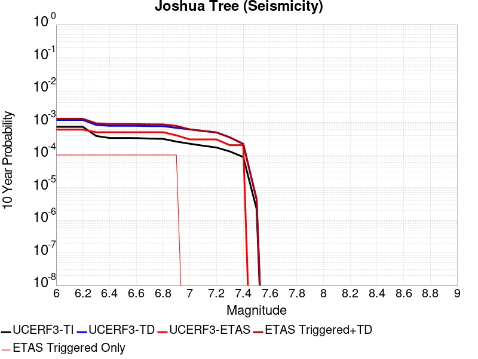 |

| Magnitude | 1 wk TI Prob | 1 wk TD Prob | 1 wk ETAS Prob | 1 wk ETAS/TD Gain | 1 wk ETAS Triggered+TD | 1 wk ETAS Triggered Only | 1 mo TI Prob | 1 mo TD Prob | 1 mo ETAS Prob | 1 mo ETAS/TD Gain | 1 mo ETAS Triggered+TD | 1 mo ETAS Triggered Only | 1 yr TI Prob | 1 yr TD Prob | 1 yr ETAS Prob | 1 yr ETAS/TD Gain | 1 yr ETAS Triggered+TD | 1 yr ETAS Triggered Only | 10 yr TI Prob | 10 yr TD Prob | 10 yr ETAS Prob | 10 yr ETAS/TD Gain | 10 yr ETAS Triggered+TD | 10 yr ETAS Triggered Only |
|-----|-----|-----|-----|-----|-----|-----|-----|-----|-----|-----|-----|-----|-----|-----|-----|-----|-----|-----|-----|-----|-----|-----|-----|-----|
| 6.0 | 1.4025588E-6 | 2.2802494E-6 | 0.0 | 0.0 | 2.2802494E-6 | 0.0 | 6.0109523E-6 | 9.772465E-6 | 0.0 | 0.0 | 9.772465E-6 | 0.0 | 7.318089E-5 | 1.1897391E-4 | 2.0E-4 | 1.6810408 | 1.1897391E-4 | 0.0 | 7.315679E-4 | 0.0011891664 | 6.0E-4 | 0.5045551 | 0.0012890475 | 1.0E-4 |
| 6.1 | 1.4025588E-6 | 2.2802494E-6 | 0.0 | 0.0 | 2.2802494E-6 | 0.0 | 6.0109523E-6 | 9.772465E-6 | 0.0 | 0.0 | 9.772465E-6 | 0.0 | 7.318089E-5 | 1.1897391E-4 | 2.0E-4 | 1.6810408 | 1.1897391E-4 | 0.0 | 7.315679E-4 | 0.0011891664 | 6.0E-4 | 0.5045551 | 0.0012890475 | 1.0E-4 |
| 6.2 | 1.4025588E-6 | 2.2802494E-6 | 0.0 | 0.0 | 2.2802494E-6 | 0.0 | 6.0109523E-6 | 9.772465E-6 | 0.0 | 0.0 | 9.772465E-6 | 0.0 | 7.318089E-5 | 1.1897391E-4 | 2.0E-4 | 1.6810408 | 1.1897391E-4 | 0.0 | 7.315679E-4 | 0.0011891664 | 6.0E-4 | 0.5045551 | 0.0012890475 | 1.0E-4 |
| 6.3 | 7.3325685E-7 | 1.604267E-6 | 0.0 | 0.0 | 1.604267E-6 | 0.0 | 3.1425257E-6 | 6.8754125E-6 | 0.0 | 0.0 | 6.8754125E-6 | 0.0 | 3.825958E-5 | 8.370502E-5 | 1.0E-4 | 1.1946715 | 8.370502E-5 | 0.0 | 3.8252992E-4 | 8.3674345E-4 | 5.0E-4 | 0.59755474 | 9.366598E-4 | 1.0E-4 |
| 6.4 | 6.38256E-7 | 1.5085144E-6 | 0.0 | 0.0 | 1.5085144E-6 | 0.0 | 2.7353801E-6 | 6.465046E-6 | 0.0 | 0.0 | 6.465046E-6 | 0.0 | 3.3302742E-5 | 7.870917E-5 | 1.0E-4 | 1.2705 | 7.870917E-5 | 0.0 | 3.3297754E-4 | 7.8682037E-4 | 5.0E-4 | 0.6354691 | 8.867417E-4 | 1.0E-4 |
| 6.5 | 6.38256E-7 | 1.5085144E-6 | 0.0 | 0.0 | 1.5085144E-6 | 0.0 | 2.7353801E-6 | 6.465046E-6 | 0.0 | 0.0 | 6.465046E-6 | 0.0 | 3.3302742E-5 | 7.870917E-5 | 1.0E-4 | 1.2705 | 7.870917E-5 | 0.0 | 3.3297754E-4 | 7.8682037E-4 | 5.0E-4 | 0.6354691 | 8.867417E-4 | 1.0E-4 |
| 6.6 | 6.3436806E-7 | 1.5056019E-6 | 0.0 | 0.0 | 1.5056019E-6 | 0.0 | 2.7187175E-6 | 6.452564E-6 | 0.0 | 0.0 | 6.452564E-6 | 0.0 | 3.3099885E-5 | 7.855721E-5 | 1.0E-4 | 1.2729577 | 7.855721E-5 | 0.0 | 3.3094952E-4 | 7.8530185E-4 | 5.0E-4 | 0.6366978 | 8.8522333E-4 | 1.0E-4 |
| 6.7 | 6.094856E-7 | 1.4802915E-6 | 0.0 | 0.0 | 1.4802915E-6 | 0.0 | 2.6120786E-6 | 6.3440916E-6 | 0.0 | 0.0 | 6.3440916E-6 | 0.0 | 3.1801592E-5 | 7.7236655E-5 | 1.0E-4 | 1.2947221 | 7.7236655E-5 | 0.0 | 3.179704E-4 | 7.721055E-4 | 5.0E-4 | 0.6475799 | 8.7202823E-4 | 1.0E-4 |
| 6.8 | 5.984801E-7 | 1.4715635E-6 | 0.0 | 0.0 | 1.4715635E-6 | 0.0 | 2.564912E-6 | 6.3066855E-6 | 0.0 | 0.0 | 6.3066855E-6 | 0.0 | 3.1227355E-5 | 7.678127E-5 | 1.0E-4 | 1.3024011 | 7.678127E-5 | 0.0 | 3.1222968E-4 | 7.675547E-4 | 5.0E-4 | 0.65141934 | 8.6747797E-4 | 1.0E-4 |
| 6.9 | 4.94631E-7 | 1.3059104E-6 | 0.0 | 0.0 | 1.3059104E-6 | 0.0 | 2.1198455E-6 | 5.596747E-6 | 0.0 | 0.0 | 5.596747E-6 | 0.0 | 2.5808813E-5 | 6.8138324E-5 | 1.0E-4 | 1.4676028 | 6.8138324E-5 | 0.0 | 2.5805813E-4 | 6.8118033E-4 | 4.0E-4 | 0.587216 | 7.811122E-4 | 1.0E-4 |
| 7.0 | 4.250375E-7 | 1.1695242E-6 | 0.0 | 0.0 | 1.1695242E-6 | 0.0 | 1.8215881E-6 | 5.0122376E-6 | 0.0 | 0.0 | 5.0122376E-6 | 0.0 | 2.2177608E-5 | 6.1022332E-5 | 1.0E-4 | 1.6387442 | 6.1022332E-5 | 0.0 | 2.2175396E-4 | 6.100609E-4 | 3.0E-4 | 0.49175423 | 6.100609E-4 | 0.0 |
| 7.1 | 3.6888565E-7 | 1.0479073E-6 | 0.0 | 0.0 | 1.0479073E-6 | 0.0 | 1.5809376E-6 | 4.491024E-6 | 0.0 | 0.0 | 4.491024E-6 | 0.0 | 1.9247746E-5 | 5.4676886E-5 | 1.0E-4 | 1.8289263 | 5.4676886E-5 | 0.0 | 1.9246078E-4 | 5.466388E-4 | 3.0E-4 | 0.54880846 | 5.466388E-4 | 0.0 |
| 7.2 | 3.2473773E-7 | 9.4268586E-7 | 0.0 | 0.0 | 9.4268586E-7 | 0.0 | 1.3917323E-6 | 4.0400764E-6 | 0.0 | 0.0 | 4.0400764E-6 | 0.0 | 1.694421E-5 | 4.918686E-5 | 1.0E-4 | 2.0330632 | 4.918686E-5 | 0.0 | 1.6942917E-4 | 4.917639E-4 | 3.0E-4 | 0.6100489 | 4.917639E-4 | 0.0 |
| 7.3 | 2.465367E-7 | 6.65906E-7 | 0.0 | 0.0 | 6.65906E-7 | 0.0 | 1.0565853E-6 | 2.8538798E-6 | 0.0 | 0.0 | 2.8538798E-6 | 0.0 | 1.2863851E-5 | 3.4745466E-5 | 0.0 | 0.0 | 3.4745466E-5 | 0.0 | 1.2863107E-4 | 3.474038E-4 | 2.0E-4 | 0.5756989 | 3.474038E-4 | 0.0 |
| 7.4 | 1.6654941E-7 | 4.1965103E-7 | 0.0 | 0.0 | 4.1965103E-7 | 0.0 | 7.13783E-7 | 1.7985034E-6 | 0.0 | 0.0 | 1.7985034E-6 | 0.0 | 8.690274E-6 | 2.1896587E-5 | 0.0 | 0.0 | 2.1896587E-5 | 0.0 | 8.689934E-5 | 2.1894705E-4 | 2.0E-4 | 0.9134628 | 2.1894705E-4 | 0.0 |
| 7.5 | 4.24214E-9 | 8.371518E-9 | 0.0 | 0.0 | 8.371518E-9 | 0.0 | 1.81806E-8 | 3.587793E-8 | 0.0 | 0.0 | 3.587793E-8 | 0.0 | 2.213488E-7 | 4.368138E-7 | 0.0 | 0.0 | 4.368138E-7 | 0.0 | 2.2134857E-6 | 4.3681357E-6 | 0.0 | 0.0 | 4.3681357E-6 | 0.0 |

## Malibu Coast (Extension) alt 1
*[(top)](#table-of-contents)*

| 1 Week | 1 Month | 1 Year | 10 Year |
|-----|-----|-----|-----|
|  |  | 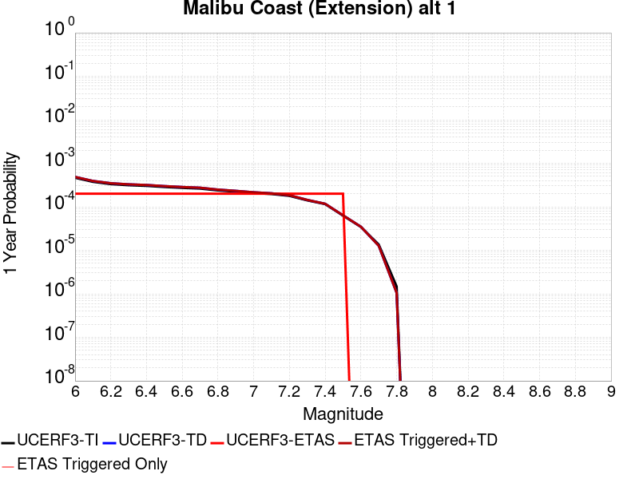 | 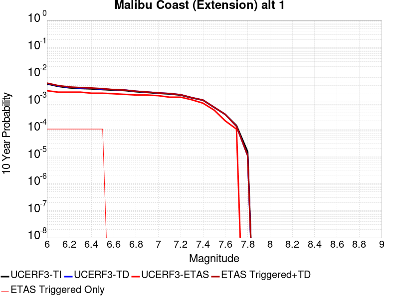 |

| Magnitude | 1 wk TI Prob | 1 wk TD Prob | 1 wk ETAS Prob | 1 wk ETAS/TD Gain | 1 wk ETAS Triggered+TD | 1 wk ETAS Triggered Only | 1 mo TI Prob | 1 mo TD Prob | 1 mo ETAS Prob | 1 mo ETAS/TD Gain | 1 mo ETAS Triggered+TD | 1 mo ETAS Triggered Only | 1 yr TI Prob | 1 yr TD Prob | 1 yr ETAS Prob | 1 yr ETAS/TD Gain | 1 yr ETAS Triggered+TD | 1 yr ETAS Triggered Only | 10 yr TI Prob | 10 yr TD Prob | 10 yr ETAS Prob | 10 yr ETAS/TD Gain | 10 yr ETAS Triggered+TD | 10 yr ETAS Triggered Only |
|-----|-----|-----|-----|-----|-----|-----|-----|-----|-----|-----|-----|-----|-----|-----|-----|-----|-----|-----|-----|-----|-----|-----|-----|-----|
| 6.0 | 8.930738E-6 | 9.330452E-6 | 0.0 | 0.0 | 9.330452E-6 | 0.0 | 3.827403E-5 | 3.9987044E-5 | 0.0 | 0.0 | 3.9987044E-5 | 0.0 | 4.6588664E-4 | 4.8673525E-4 | 2.0E-4 | 0.410901 | 4.8673525E-4 | 0.0 | 0.0046491115 | 0.0048568742 | 0.0026 | 0.5353237 | 0.004956389 | 1.0E-4 |
| 6.1 | 7.199952E-6 | 7.5313314E-6 | 0.0 | 0.0 | 7.5313314E-6 | 0.0 | 3.0856572E-5 | 3.2276737E-5 | 0.0 | 0.0 | 3.2276737E-5 | 0.0 | 3.75614E-4 | 3.9289903E-4 | 2.0E-4 | 0.5090366 | 3.9289903E-4 | 0.0 | 0.0037497976 | 0.0039221104 | 0.0023 | 0.586419 | 0.004021718 | 1.0E-4 |
| 6.2 | 6.3721413E-6 | 6.6677526E-6 | 0.0 | 0.0 | 6.6677526E-6 | 0.0 | 2.7308892E-5 | 2.857577E-5 | 0.0 | 0.0 | 2.857577E-5 | 0.0 | 3.3243504E-4 | 3.4785483E-4 | 2.0E-4 | 0.5749525 | 3.4785483E-4 | 0.0 | 0.0033193815 | 0.0034731433 | 0.0023 | 0.6622243 | 0.0035727962 | 1.0E-4 |
| 6.3 | 6.016345E-6 | 6.296086E-6 | 0.0 | 0.0 | 6.296086E-6 | 0.0 | 2.578408E-5 | 2.698295E-5 | 0.0 | 0.0 | 2.698295E-5 | 0.0 | 3.1387596E-4 | 3.2846822E-4 | 2.0E-4 | 0.6088869 | 3.2846822E-4 | 0.0 | 0.00313433 | 0.0032798634 | 0.0023 | 0.7012487 | 0.0033795354 | 1.0E-4 |
| 6.4 | 5.8104883E-6 | 6.0804523E-6 | 0.0 | 0.0 | 6.0804523E-6 | 0.0 | 2.4901856E-5 | 2.6058824E-5 | 0.0 | 0.0 | 2.6058824E-5 | 0.0 | 3.031379E-4 | 3.172203E-4 | 2.0E-4 | 0.63047665 | 3.172203E-4 | 0.0 | 0.0030272473 | 0.0031677096 | 0.0021 | 0.66293955 | 0.0032673927 | 1.0E-4 |
| 6.5 | 5.476925E-6 | 5.7283823E-6 | 0.0 | 0.0 | 5.7283823E-6 | 0.0 | 2.3472323E-5 | 2.454998E-5 | 0.0 | 0.0 | 2.454998E-5 | 0.0 | 2.8573806E-4 | 2.988553E-4 | 2.0E-4 | 0.66922015 | 2.988553E-4 | 0.0 | 0.0028537093 | 0.0029845661 | 0.0021 | 0.7036199 | 0.0030842675 | 1.0E-4 |
| 6.6 | 5.222387E-6 | 5.4594184E-6 | 0.0 | 0.0 | 5.4594184E-6 | 0.0 | 2.2381464E-5 | 2.33973E-5 | 0.0 | 0.0 | 2.33973E-5 | 0.0 | 2.7246025E-4 | 2.848252E-4 | 2.0E-4 | 0.7021851 | 2.848252E-4 | 0.0 | 0.0027212645 | 0.002844632 | 0.002 | 0.7030786 | 0.002844632 | 0.0 |
| 6.7 | 5.0337076E-6 | 5.2599194E-6 | 0.0 | 0.0 | 5.2599194E-6 | 0.0 | 2.1572854E-5 | 2.254232E-5 | 0.0 | 0.0 | 2.254232E-5 | 0.0 | 2.6261783E-4 | 2.7441845E-4 | 2.0E-4 | 0.728814 | 2.7441845E-4 | 0.0 | 0.002623077 | 0.002740826 | 0.0019 | 0.6932217 | 0.002740826 | 0.0 |
| 6.8 | 4.5675624E-6 | 4.7594594E-6 | 0.0 | 0.0 | 4.7594594E-6 | 0.0 | 1.9575122E-5 | 2.0397525E-5 | 0.0 | 0.0 | 2.0397525E-5 | 0.0 | 2.3830103E-4 | 2.4831176E-4 | 2.0E-4 | 0.8054391 | 2.4831176E-4 | 0.0 | 0.0023804565 | 0.0024803628 | 0.0018 | 0.7257003 | 0.0024803628 | 0.0 |
| 6.9 | 4.2802412E-6 | 4.452723E-6 | 0.0 | 0.0 | 4.452723E-6 | 0.0 | 1.8343762E-5 | 1.9082958E-5 | 0.0 | 0.0 | 1.9082958E-5 | 0.0 | 2.2331243E-4 | 2.3231041E-4 | 2.0E-4 | 0.8609171 | 2.3231041E-4 | 0.0 | 0.0022308815 | 0.0023206924 | 0.0018 | 0.7756306 | 0.0023206924 | 0.0 |
| 7.0 | 3.9794063E-6 | 4.130756E-6 | 0.0 | 0.0 | 4.130756E-6 | 0.0 | 1.7054486E-5 | 1.7703122E-5 | 0.0 | 0.0 | 1.7703122E-5 | 0.0 | 2.0761859E-4 | 2.1551432E-4 | 2.0E-4 | 0.92801255 | 2.1551432E-4 | 0.0 | 0.0020742472 | 0.0021530667 | 0.0017 | 0.78957146 | 0.0021530667 | 0.0 |
| 7.1 | 3.7730424E-6 | 3.911848E-6 | 0.0 | 0.0 | 3.911848E-6 | 0.0 | 1.6170083E-5 | 1.6764956E-5 | 0.0 | 0.0 | 1.6764956E-5 | 0.0 | 1.9685295E-4 | 2.0409434E-4 | 2.0E-4 | 0.979939 | 2.0409434E-4 | 0.0 | 0.0019667868 | 0.0020390819 | 0.0015 | 0.7356252 | 0.0020390819 | 0.0 |
| 7.2 | 3.424985E-6 | 3.5419218E-6 | 0.0 | 0.0 | 3.5419218E-6 | 0.0 | 1.4678424E-5 | 1.5179577E-5 | 0.0 | 0.0 | 1.5179577E-5 | 0.0 | 1.7869516E-4 | 1.8479579E-4 | 2.0E-4 | 1.0822757 | 1.8479579E-4 | 0.0 | 0.0017855153 | 0.0018464333 | 0.0015 | 0.81237704 | 0.0018464333 | 0.0 |
| 7.3 | 2.6966375E-6 | 2.7601243E-6 | 0.0 | 0.0 | 2.7601243E-6 | 0.0 | 1.15569665E-5 | 1.182905E-5 | 0.0 | 0.0 | 1.182905E-5 | 0.0 | 1.4069698E-4 | 1.440092E-4 | 2.0E-4 | 1.3888 | 1.440092E-4 | 0.0 | 0.0014060794 | 0.001439163 | 0.0012 | 0.83381796 | 0.001439163 | 0.0 |
| 7.4 | 2.215957E-6 | 2.2497827E-6 | 0.0 | 0.0 | 2.2497827E-6 | 0.0 | 9.496924E-6 | 9.641891E-6 | 0.0 | 0.0 | 9.641891E-6 | 0.0 | 1.1561892E-4 | 1.1738373E-4 | 2.0E-4 | 1.7038136 | 1.1738373E-4 | 0.0 | 0.0011555878 | 0.001173221 | 9.0E-4 | 0.7671189 | 0.001173221 | 0.0 |
| 7.5 | 1.2040218E-6 | 1.2220956E-6 | 0.0 | 0.0 | 1.2220956E-6 | 0.0 | 5.160083E-6 | 5.237542E-6 | 0.0 | 0.0 | 5.237542E-6 | 0.0 | 6.2822204E-5 | 6.3765234E-5 | 2.0E-4 | 3.1365056 | 6.3765234E-5 | 0.0 | 6.280445E-4 | 6.374712E-4 | 5.0E-4 | 0.78434914 | 6.374712E-4 | 0.0 |
| 7.6 | 6.6157446E-7 | 6.6798526E-7 | 0.0 | 0.0 | 6.6798526E-7 | 0.0 | 2.835316E-6 | 2.862791E-6 | 0.0 | 0.0 | 2.862791E-6 | 0.0 | 3.4519428E-5 | 3.4853936E-5 | 0.0 | 0.0 | 3.4853936E-5 | 0.0 | 3.4514067E-4 | 3.4848624E-4 | 2.0E-4 | 0.5739108 | 3.4848624E-4 | 0.0 |
| 7.7 | 2.6012302E-7 | 2.4360637E-7 | 0.0 | 0.0 | 2.4360637E-7 | 0.0 | 1.1148124E-6 | 1.0440269E-6 | 0.0 | 0.0 | 1.0440269E-6 | 0.0 | 1.3572758E-5 | 1.2710964E-5 | 0.0 | 0.0 | 1.2710964E-5 | 0.0 | 1.3571928E-4 | 1.2710344E-4 | 1.0E-4 | 0.78676075 | 1.2710344E-4 | 0.0 |
| 7.8 | 2.8323132E-8 | 2.0269145E-8 | 0.0 | 0.0 | 2.0269145E-8 | 0.0 | 1.2138484E-7 | 8.686776E-8 | 0.0 | 0.0 | 8.686776E-8 | 0.0 | 1.4778595E-6 | 1.0576146E-6 | 0.0 | 0.0 | 1.0576146E-6 | 0.0 | 1.4778497E-5 | 1.0576103E-5 | 0.0 | 0.0 | 1.0576103E-5 | 0.0 |

## Shoreline
*[(top)](#table-of-contents)*

| 1 Week | 1 Month | 1 Year | 10 Year |
|-----|-----|-----|-----|
| 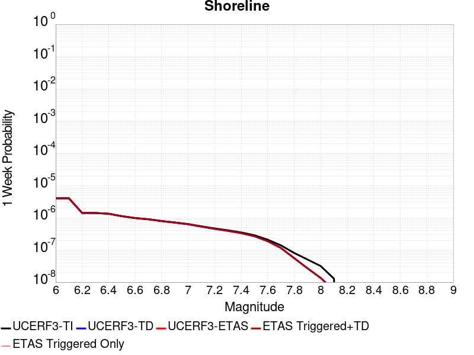 | 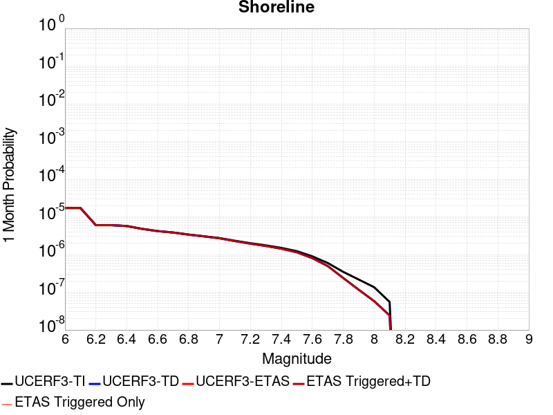 | 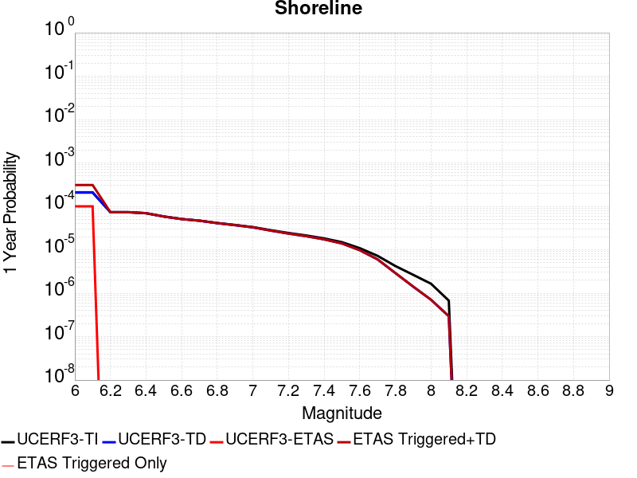 | 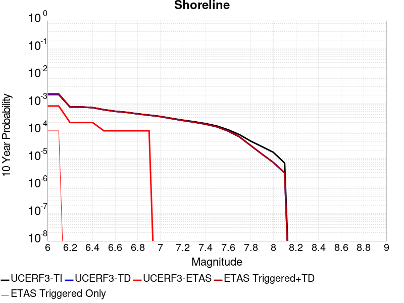 |

| Magnitude | 1 wk TI Prob | 1 wk TD Prob | 1 wk ETAS Prob | 1 wk ETAS/TD Gain | 1 wk ETAS Triggered+TD | 1 wk ETAS Triggered Only | 1 mo TI Prob | 1 mo TD Prob | 1 mo ETAS Prob | 1 mo ETAS/TD Gain | 1 mo ETAS Triggered+TD | 1 mo ETAS Triggered Only | 1 yr TI Prob | 1 yr TD Prob | 1 yr ETAS Prob | 1 yr ETAS/TD Gain | 1 yr ETAS Triggered+TD | 1 yr ETAS Triggered Only | 10 yr TI Prob | 10 yr TD Prob | 10 yr ETAS Prob | 10 yr ETAS/TD Gain | 10 yr ETAS Triggered+TD | 10 yr ETAS Triggered Only |
|-----|-----|-----|-----|-----|-----|-----|-----|-----|-----|-----|-----|-----|-----|-----|-----|-----|-----|-----|-----|-----|-----|-----|-----|-----|
| 6.0 | 3.9888673E-6 | 4.048167E-6 | 0.0 | 0.0 | 4.048167E-6 | 0.0 | 1.7095033E-5 | 1.7349203E-5 | 0.0 | 0.0 | 1.7349203E-5 | 0.0 | 2.0811215E-4 | 2.1121166E-4 | 1.0E-4 | 0.4734587 | 3.1119055E-4 | 1.0E-4 | 0.0020791737 | 0.002110658 | 8.0E-4 | 0.3790287 | 0.0022104469 | 1.0E-4 |
| 6.1 | 3.9888673E-6 | 4.048167E-6 | 0.0 | 0.0 | 4.048167E-6 | 0.0 | 1.7095033E-5 | 1.7349203E-5 | 0.0 | 0.0 | 1.7349203E-5 | 0.0 | 2.0811215E-4 | 2.1121166E-4 | 1.0E-4 | 0.4734587 | 3.1119055E-4 | 1.0E-4 | 0.0020791737 | 0.002110658 | 8.0E-4 | 0.3790287 | 0.0022104469 | 1.0E-4 |
| 6.2 | 1.4039653E-6 | 1.4102197E-6 | 0.0 | 0.0 | 1.4102197E-6 | 0.0 | 6.0169805E-6 | 6.0437856E-6 | 0.0 | 0.0 | 6.0437856E-6 | 0.0 | 7.325427E-5 | 7.358066E-5 | 0.0 | 0.0 | 7.358066E-5 | 0.0 | 7.3230127E-4 | 7.35569E-4 | 2.0E-4 | 0.27189836 | 7.35569E-4 | 0.0 |
| 6.3 | 1.4039653E-6 | 1.4102197E-6 | 0.0 | 0.0 | 1.4102197E-6 | 0.0 | 6.0169805E-6 | 6.0437856E-6 | 0.0 | 0.0 | 6.0437856E-6 | 0.0 | 7.325427E-5 | 7.358066E-5 | 0.0 | 0.0 | 7.358066E-5 | 0.0 | 7.3230127E-4 | 7.35569E-4 | 2.0E-4 | 0.27189836 | 7.35569E-4 | 0.0 |
| 6.4 | 1.3314152E-6 | 1.3362884E-6 | 0.0 | 0.0 | 1.3362884E-6 | 0.0 | 5.7060524E-6 | 5.726938E-6 | 0.0 | 0.0 | 5.726938E-6 | 0.0 | 6.946897E-5 | 6.97233E-5 | 0.0 | 0.0 | 6.97233E-5 | 0.0 | 6.9447263E-4 | 6.9701957E-4 | 2.0E-4 | 0.28693599 | 6.9701957E-4 | 0.0 |
| 6.5 | 1.1187026E-6 | 1.1204856E-6 | 0.0 | 0.0 | 1.1204856E-6 | 0.0 | 4.794431E-6 | 4.802073E-6 | 0.0 | 0.0 | 4.802073E-6 | 0.0 | 5.8370628E-5 | 5.846369E-5 | 0.0 | 0.0 | 5.846369E-5 | 0.0 | 5.83553E-4 | 5.8448565E-4 | 1.0E-4 | 0.1710906 | 5.8448565E-4 | 0.0 |
| 6.6 | 9.793089E-7 | 9.786087E-7 | 0.0 | 0.0 | 9.786087E-7 | 0.0 | 4.1970316E-6 | 4.19403E-6 | 0.0 | 0.0 | 4.19403E-6 | 0.0 | 5.1097657E-5 | 5.1061135E-5 | 0.0 | 0.0 | 5.1061135E-5 | 0.0 | 5.108591E-4 | 5.1049533E-4 | 1.0E-4 | 0.19588818 | 5.1049533E-4 | 0.0 |
| 6.7 | 8.995986E-7 | 8.9739365E-7 | 0.0 | 0.0 | 8.9739365E-7 | 0.0 | 3.8554167E-6 | 3.845967E-6 | 0.0 | 0.0 | 3.845967E-6 | 0.0 | 4.693869E-5 | 4.6823654E-5 | 0.0 | 0.0 | 4.6823654E-5 | 0.0 | 4.6928777E-4 | 4.6813884E-4 | 1.0E-4 | 0.21361184 | 4.6813884E-4 | 0.0 |
| 6.8 | 7.931612E-7 | 7.881482E-7 | 0.0 | 0.0 | 7.881482E-7 | 0.0 | 3.3992578E-6 | 3.3777737E-6 | 0.0 | 0.0 | 3.3777737E-6 | 0.0 | 4.1385178E-5 | 4.1123625E-5 | 0.0 | 0.0 | 4.1123625E-5 | 0.0 | 4.1377472E-4 | 4.111607E-4 | 1.0E-4 | 0.2432139 | 4.111607E-4 | 0.0 |
| 6.9 | 7.1465956E-7 | 7.07905E-7 | 0.0 | 0.0 | 7.07905E-7 | 0.0 | 3.062823E-6 | 3.0338751E-6 | 0.0 | 0.0 | 3.0338751E-6 | 0.0 | 3.7289232E-5 | 3.6936806E-5 | 0.0 | 0.0 | 3.6936806E-5 | 0.0 | 3.7282976E-4 | 3.6930703E-4 | 1.0E-4 | 0.2707774 | 3.6930703E-4 | 0.0 |
| 7.0 | 6.389046E-7 | 6.300459E-7 | 0.0 | 0.0 | 6.300459E-7 | 0.0 | 2.7381598E-6 | 2.700194E-6 | 0.0 | 0.0 | 2.700194E-6 | 0.0 | 3.3336586E-5 | 3.287437E-5 | 0.0 | 0.0 | 3.287437E-5 | 0.0 | 3.3331584E-4 | 3.286953E-4 | 0.0 | 0.0 | 3.286953E-4 | 0.0 |
| 7.1 | 5.4300875E-7 | 5.312072E-7 | 0.0 | 0.0 | 5.312072E-7 | 0.0 | 2.3271782E-6 | 2.2766003E-6 | 0.0 | 0.0 | 2.2766003E-6 | 0.0 | 2.8333026E-5 | 2.7717257E-5 | 0.0 | 0.0 | 2.7717257E-5 | 0.0 | 2.8329415E-4 | 2.771381E-4 | 0.0 | 0.0 | 2.771381E-4 | 0.0 |
| 7.2 | 4.6768855E-7 | 4.535789E-7 | 0.0 | 0.0 | 4.535789E-7 | 0.0 | 2.0043778E-6 | 1.943908E-6 | 0.0 | 0.0 | 1.943908E-6 | 0.0 | 2.4403027E-5 | 2.3666826E-5 | 0.0 | 0.0 | 2.3666826E-5 | 0.0 | 2.4400349E-4 | 2.366431E-4 | 0.0 | 0.0 | 2.366431E-4 | 0.0 |
| 7.3 | 4.0966103E-7 | 3.939427E-7 | 0.0 | 0.0 | 3.939427E-7 | 0.0 | 1.7556889E-6 | 1.6883248E-6 | 0.0 | 0.0 | 1.6883248E-6 | 0.0 | 2.1375303E-5 | 2.055516E-5 | 0.0 | 0.0 | 2.055516E-5 | 0.0 | 2.1373246E-4 | 2.0553263E-4 | 0.0 | 0.0 | 2.0553263E-4 | 0.0 |
| 7.4 | 3.5105785E-7 | 3.337225E-7 | 0.0 | 0.0 | 3.337225E-7 | 0.0 | 1.5045327E-6 | 1.4302385E-6 | 0.0 | 0.0 | 1.4302385E-6 | 0.0 | 1.8317533E-5 | 1.7413016E-5 | 0.0 | 0.0 | 1.7413016E-5 | 0.0 | 1.8316023E-4 | 1.7411655E-4 | 0.0 | 0.0 | 1.7411655E-4 | 0.0 |
| 7.5 | 2.8737534E-7 | 2.6827956E-7 | 0.0 | 0.0 | 2.6827956E-7 | 0.0 | 1.2316079E-6 | 1.1497691E-6 | 0.0 | 0.0 | 1.1497691E-6 | 0.0 | 1.4994724E-5 | 1.3998349E-5 | 0.0 | 0.0 | 1.3998349E-5 | 0.0 | 1.4993713E-4 | 1.3997468E-4 | 0.0 | 0.0 | 1.3997468E-4 | 0.0 |
| 7.6 | 2.0924051E-7 | 1.8786436E-7 | 0.0 | 0.0 | 1.8786436E-7 | 0.0 | 8.967448E-7 | 8.0513274E-7 | 0.0 | 0.0 | 8.0513274E-7 | 0.0 | 1.0917813E-5 | 9.802447E-6 | 0.0 | 0.0 | 9.802447E-6 | 0.0 | 1.0917276E-4 | 9.802016E-5 | 0.0 | 0.0 | 9.802016E-5 | 0.0 |
| 7.7 | 1.392265E-7 | 1.1550354E-7 | 0.0 | 0.0 | 1.1550354E-7 | 0.0 | 5.9668486E-7 | 4.9501506E-7 | 0.0 | 0.0 | 4.9501506E-7 | 0.0 | 7.2646135E-6 | 6.0267917E-6 | 0.0 | 0.0 | 6.0267917E-6 | 0.0 | 7.2643765E-5 | 6.0266284E-5 | 0.0 | 0.0 | 6.0266284E-5 | 0.0 |
| 7.8 | 8.1080074E-8 | 5.5932166E-8 | 0.0 | 0.0 | 5.5932166E-8 | 0.0 | 3.4748598E-7 | 2.3970927E-7 | 0.0 | 0.0 | 2.3970927E-7 | 0.0 | 4.2306337E-6 | 2.9184562E-6 | 0.0 | 0.0 | 2.9184562E-6 | 0.0 | 4.230553E-5 | 2.918418E-5 | 0.0 | 0.0 | 2.918418E-5 | 0.0 |
| 7.9 | 5.0859036E-8 | 2.7303749E-8 | 0.0 | 0.0 | 2.7303749E-8 | 0.0 | 2.1796728E-7 | 1.17016064E-7 | 0.0 | 0.0 | 1.17016064E-7 | 0.0 | 2.6537484E-6 | 1.4246696E-6 | 0.0 | 0.0 | 1.4246696E-6 | 0.0 | 2.6537167E-5 | 1.4246605E-5 | 0.0 | 0.0 | 1.4246605E-5 | 0.0 |
| 8.0 | 3.1760536E-8 | 1.3622714E-8 | 0.0 | 0.0 | 1.3622714E-8 | 0.0 | 1.3611657E-7 | 5.8383062E-8 | 0.0 | 0.0 | 5.8383062E-8 | 0.0 | 1.6572179E-6 | 7.1081354E-7 | 0.0 | 0.0 | 7.1081354E-7 | 0.0 | 1.6572056E-5 | 7.108113E-6 | 0.0 | 0.0 | 7.108113E-6 | 0.0 |
| 8.1 | 1.2947896E-8 | 5.6821845E-9 | 0.0 | 0.0 | 5.6821845E-9 | 0.0 | 5.5490982E-8 | 2.4352222E-8 | 0.0 | 0.0 | 2.4352222E-8 | 0.0 | 6.756025E-7 | 2.9648825E-7 | 0.0 | 0.0 | 2.9648825E-7 | 0.0 | 6.7560045E-6 | 2.9648788E-6 | 0.0 | 0.0 | 2.9648788E-6 | 0.0 |

## Los Medanos - Roe Island
*[(top)](#table-of-contents)*

| 1 Week | 1 Month | 1 Year | 10 Year |
|-----|-----|-----|-----|
| 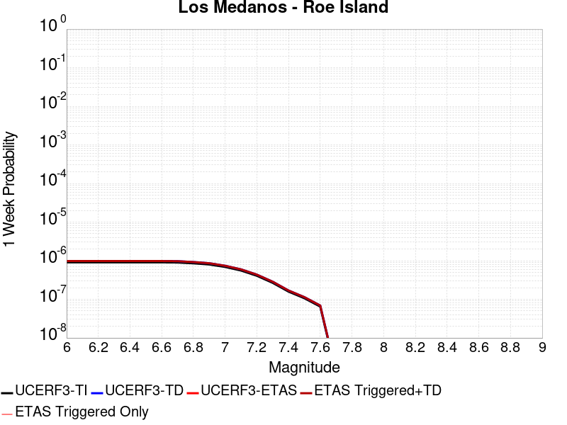 | 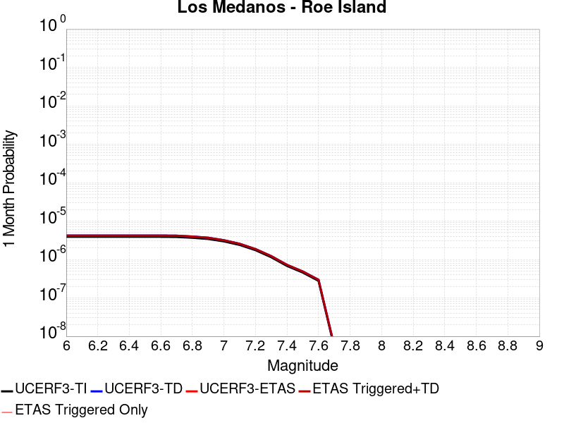 | 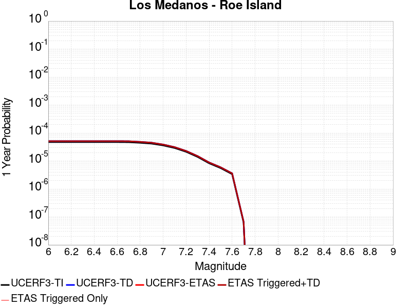 |  |

| Magnitude | 1 wk TI Prob | 1 wk TD Prob | 1 wk ETAS Prob | 1 wk ETAS/TD Gain | 1 wk ETAS Triggered+TD | 1 wk ETAS Triggered Only | 1 mo TI Prob | 1 mo TD Prob | 1 mo ETAS Prob | 1 mo ETAS/TD Gain | 1 mo ETAS Triggered+TD | 1 mo ETAS Triggered Only | 1 yr TI Prob | 1 yr TD Prob | 1 yr ETAS Prob | 1 yr ETAS/TD Gain | 1 yr ETAS Triggered+TD | 1 yr ETAS Triggered Only | 10 yr TI Prob | 10 yr TD Prob | 10 yr ETAS Prob | 10 yr ETAS/TD Gain | 10 yr ETAS Triggered+TD | 10 yr ETAS Triggered Only |
|-----|-----|-----|-----|-----|-----|-----|-----|-----|-----|-----|-----|-----|-----|-----|-----|-----|-----|-----|-----|-----|-----|-----|-----|-----|
| 6.0 | 9.06745E-7 | 9.797685E-7 | 0.0 | 0.0 | 9.797685E-7 | 0.0 | 3.8860444E-6 | 4.1990015E-6 | 0.0 | 0.0 | 4.1990015E-6 | 0.0 | 4.731156E-5 | 5.112165E-5 | 0.0 | 0.0 | 5.112165E-5 | 0.0 | 4.730149E-4 | 5.110998E-4 | 3.0E-4 | 0.5869695 | 6.110487E-4 | 1.0E-4 |
| 6.1 | 9.06745E-7 | 9.797685E-7 | 0.0 | 0.0 | 9.797685E-7 | 0.0 | 3.8860444E-6 | 4.1990015E-6 | 0.0 | 0.0 | 4.1990015E-6 | 0.0 | 4.731156E-5 | 5.112165E-5 | 0.0 | 0.0 | 5.112165E-5 | 0.0 | 4.730149E-4 | 5.110998E-4 | 3.0E-4 | 0.5869695 | 6.110487E-4 | 1.0E-4 |
| 6.2 | 9.06745E-7 | 9.797685E-7 | 0.0 | 0.0 | 9.797685E-7 | 0.0 | 3.8860444E-6 | 4.1990015E-6 | 0.0 | 0.0 | 4.1990015E-6 | 0.0 | 4.731156E-5 | 5.112165E-5 | 0.0 | 0.0 | 5.112165E-5 | 0.0 | 4.730149E-4 | 5.110998E-4 | 3.0E-4 | 0.5869695 | 6.110487E-4 | 1.0E-4 |
| 6.3 | 9.06745E-7 | 9.797685E-7 | 0.0 | 0.0 | 9.797685E-7 | 0.0 | 3.8860444E-6 | 4.1990015E-6 | 0.0 | 0.0 | 4.1990015E-6 | 0.0 | 4.731156E-5 | 5.112165E-5 | 0.0 | 0.0 | 5.112165E-5 | 0.0 | 4.730149E-4 | 5.110998E-4 | 3.0E-4 | 0.5869695 | 6.110487E-4 | 1.0E-4 |
| 6.4 | 9.06745E-7 | 9.797685E-7 | 0.0 | 0.0 | 9.797685E-7 | 0.0 | 3.8860444E-6 | 4.1990015E-6 | 0.0 | 0.0 | 4.1990015E-6 | 0.0 | 4.731156E-5 | 5.112165E-5 | 0.0 | 0.0 | 5.112165E-5 | 0.0 | 4.730149E-4 | 5.110998E-4 | 3.0E-4 | 0.5869695 | 6.110487E-4 | 1.0E-4 |
| 6.5 | 9.06745E-7 | 9.797685E-7 | 0.0 | 0.0 | 9.797685E-7 | 0.0 | 3.8860444E-6 | 4.1990015E-6 | 0.0 | 0.0 | 4.1990015E-6 | 0.0 | 4.731156E-5 | 5.112165E-5 | 0.0 | 0.0 | 5.112165E-5 | 0.0 | 4.730149E-4 | 5.110998E-4 | 3.0E-4 | 0.5869695 | 6.110487E-4 | 1.0E-4 |
| 6.6 | 9.06745E-7 | 9.797685E-7 | 0.0 | 0.0 | 9.797685E-7 | 0.0 | 3.8860444E-6 | 4.1990015E-6 | 0.0 | 0.0 | 4.1990015E-6 | 0.0 | 4.731156E-5 | 5.112165E-5 | 0.0 | 0.0 | 5.112165E-5 | 0.0 | 4.730149E-4 | 5.110998E-4 | 3.0E-4 | 0.5869695 | 6.110487E-4 | 1.0E-4 |
| 6.7 | 8.984686E-7 | 9.71435E-7 | 0.0 | 0.0 | 9.71435E-7 | 0.0 | 3.850574E-6 | 4.1632866E-6 | 0.0 | 0.0 | 4.1632866E-6 | 0.0 | 4.687973E-5 | 5.0686845E-5 | 0.0 | 0.0 | 5.0686845E-5 | 0.0 | 4.6869842E-4 | 5.0675374E-4 | 3.0E-4 | 0.5920035 | 6.0670305E-4 | 1.0E-4 |
| 6.8 | 8.5634423E-7 | 9.228741E-7 | 0.0 | 0.0 | 9.228741E-7 | 0.0 | 3.6700415E-6 | 3.9551687E-6 | 0.0 | 0.0 | 3.9551687E-6 | 0.0 | 4.4681838E-5 | 4.8153124E-5 | 0.0 | 0.0 | 4.8153124E-5 | 0.0 | 4.4672855E-4 | 4.8142765E-4 | 2.0E-4 | 0.41543108 | 5.813795E-4 | 1.0E-4 |
| 6.9 | 7.9857483E-7 | 8.5956486E-7 | 0.0 | 0.0 | 8.5956486E-7 | 0.0 | 3.422459E-6 | 3.6838442E-6 | 0.0 | 0.0 | 3.6838442E-6 | 0.0 | 4.166764E-5 | 4.4849887E-5 | 0.0 | 0.0 | 4.4849887E-5 | 0.0 | 4.165983E-4 | 4.4840897E-4 | 1.0E-4 | 0.22301069 | 4.4840897E-4 | 0.0 |
| 7.0 | 6.898334E-7 | 7.3982153E-7 | 0.0 | 0.0 | 7.3982153E-7 | 0.0 | 2.9564258E-6 | 3.1706597E-6 | 0.0 | 0.0 | 3.1706597E-6 | 0.0 | 3.599389E-5 | 3.8602102E-5 | 0.0 | 0.0 | 3.8602102E-5 | 0.0 | 3.598806E-4 | 3.859544E-4 | 1.0E-4 | 0.25909796 | 3.859544E-4 | 0.0 |
| 7.1 | 5.5734876E-7 | 5.969224E-7 | 0.0 | 0.0 | 5.969224E-7 | 0.0 | 2.3886353E-6 | 2.5582365E-6 | 0.0 | 0.0 | 2.5582365E-6 | 0.0 | 2.9081246E-5 | 3.1146086E-5 | 0.0 | 0.0 | 3.1146086E-5 | 0.0 | 2.9077442E-4 | 3.1141745E-4 | 1.0E-4 | 0.3211124 | 3.1141745E-4 | 0.0 |
| 7.2 | 4.0792582E-7 | 4.357687E-7 | 0.0 | 0.0 | 4.357687E-7 | 0.0 | 1.7482523E-6 | 1.8675788E-6 | 0.0 | 0.0 | 1.8675788E-6 | 0.0 | 2.1284764E-5 | 2.2737537E-5 | 0.0 | 0.0 | 2.2737537E-5 | 0.0 | 2.1282726E-4 | 2.2735224E-4 | 1.0E-4 | 0.4398461 | 2.2735224E-4 | 0.0 |
| 7.3 | 2.6733358E-7 | 2.8584947E-7 | 0.0 | 0.0 | 2.8584947E-7 | 0.0 | 1.1457148E-6 | 1.2250686E-6 | 0.0 | 0.0 | 1.2250686E-6 | 0.0 | 1.3948988E-5 | 1.4915108E-5 | 0.0 | 0.0 | 1.4915108E-5 | 0.0 | 1.3948113E-4 | 1.4914115E-4 | 0.0 | 0.0 | 1.4914115E-4 | 0.0 |
| 7.4 | 1.5851728E-7 | 1.6913646E-7 | 0.0 | 0.0 | 1.6913646E-7 | 0.0 | 6.7935963E-7 | 7.2487035E-7 | 0.0 | 0.0 | 7.2487035E-7 | 0.0 | 8.271172E-6 | 8.825261E-6 | 0.0 | 0.0 | 8.825261E-6 | 0.0 | 8.270864E-5 | 8.824913E-5 | 0.0 | 0.0 | 8.824913E-5 | 0.0 |
| 7.5 | 1.06756E-7 | 1.138257E-7 | 0.0 | 0.0 | 1.138257E-7 | 0.0 | 4.575256E-7 | 4.8782437E-7 | 0.0 | 0.0 | 4.8782437E-7 | 0.0 | 5.57036E-6 | 5.9392455E-6 | 0.0 | 0.0 | 5.9392455E-6 | 0.0 | 5.5702203E-5 | 5.9390884E-5 | 0.0 | 0.0 | 5.9390884E-5 | 0.0 |
| 7.6 | 6.48122E-8 | 6.9051595E-8 | 0.0 | 0.0 | 6.9051595E-8 | 0.0 | 2.7776653E-7 | 2.9593537E-7 | 0.0 | 0.0 | 2.9593537E-7 | 0.0 | 3.3818023E-6 | 3.6030074E-6 | 0.0 | 0.0 | 3.6030074E-6 | 0.0 | 3.381751E-5 | 3.60295E-5 | 0.0 | 0.0 | 3.60295E-5 | 0.0 |
| 7.7 | 1.198296E-9 | 1.290561E-9 | 0.0 | 0.0 | 1.290561E-9 | 0.0 | 5.135554E-9 | 5.5309757E-9 | 0.0 | 0.0 | 5.5309757E-9 | 0.0 | 6.252537E-8 | 6.733963E-8 | 0.0 | 0.0 | 6.733963E-8 | 0.0 | 6.2525356E-7 | 6.733962E-7 | 0.0 | 0.0 | 6.733962E-7 | 0.0 |

## Last Chance
*[(top)](#table-of-contents)*

| 1 Week | 1 Month | 1 Year | 10 Year |
|-----|-----|-----|-----|
| 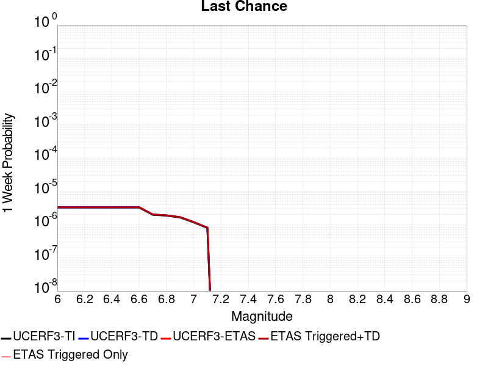 | 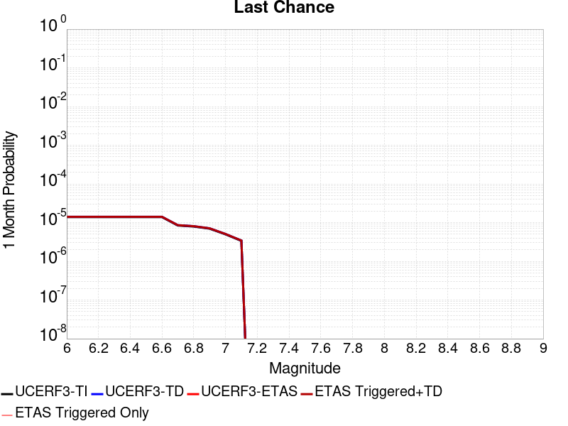 | 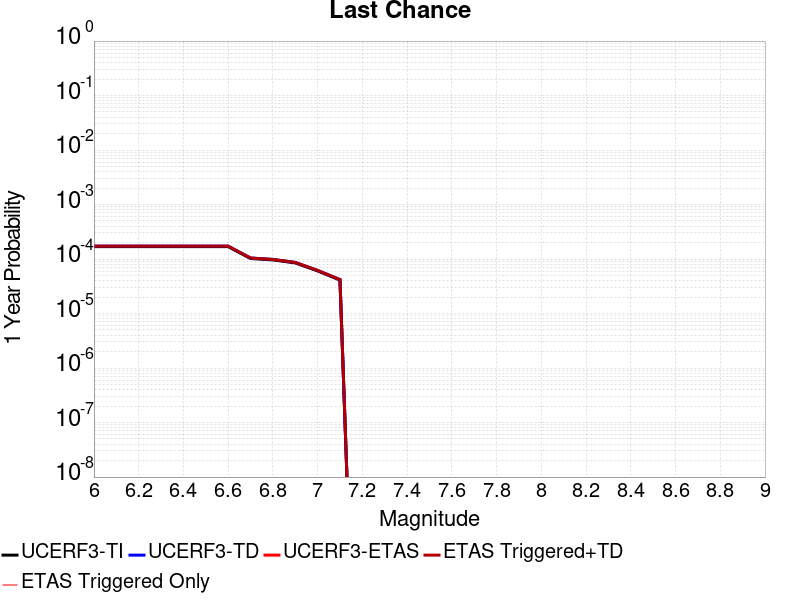 | 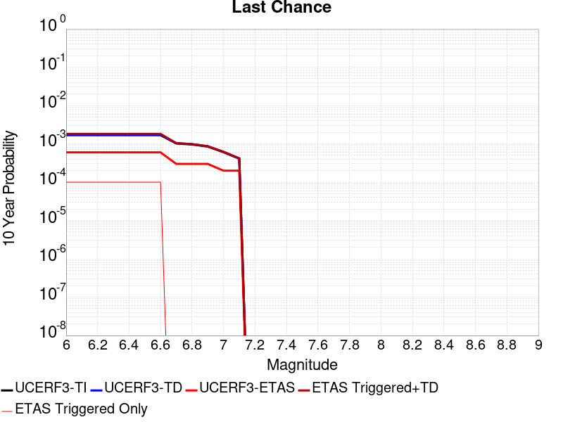 |

| Magnitude | 1 wk TI Prob | 1 wk TD Prob | 1 wk ETAS Prob | 1 wk ETAS/TD Gain | 1 wk ETAS Triggered+TD | 1 wk ETAS Triggered Only | 1 mo TI Prob | 1 mo TD Prob | 1 mo ETAS Prob | 1 mo ETAS/TD Gain | 1 mo ETAS Triggered+TD | 1 mo ETAS Triggered Only | 1 yr TI Prob | 1 yr TD Prob | 1 yr ETAS Prob | 1 yr ETAS/TD Gain | 1 yr ETAS Triggered+TD | 1 yr ETAS Triggered Only | 10 yr TI Prob | 10 yr TD Prob | 10 yr ETAS Prob | 10 yr ETAS/TD Gain | 10 yr ETAS Triggered+TD | 10 yr ETAS Triggered Only |
|-----|-----|-----|-----|-----|-----|-----|-----|-----|-----|-----|-----|-----|-----|-----|-----|-----|-----|-----|-----|-----|-----|-----|-----|-----|
| 6.0 | 3.23929E-6 | 3.3052643E-6 | 0.0 | 0.0 | 3.3052643E-6 | 0.0 | 1.3882597E-5 | 1.4165355E-5 | 0.0 | 0.0 | 1.4165355E-5 | 0.0 | 1.6900752E-4 | 1.7245203E-4 | 0.0 | 0.0 | 1.7245203E-4 | 0.0 | 0.0016887904 | 0.0017234258 | 6.0E-4 | 0.3481438 | 0.0018232535 | 1.0E-4 |
| 6.1 | 3.23929E-6 | 3.3052643E-6 | 0.0 | 0.0 | 3.3052643E-6 | 0.0 | 1.3882597E-5 | 1.4165355E-5 | 0.0 | 0.0 | 1.4165355E-5 | 0.0 | 1.6900752E-4 | 1.7245203E-4 | 0.0 | 0.0 | 1.7245203E-4 | 0.0 | 0.0016887904 | 0.0017234258 | 6.0E-4 | 0.3481438 | 0.0018232535 | 1.0E-4 |
| 6.2 | 3.23929E-6 | 3.3052643E-6 | 0.0 | 0.0 | 3.3052643E-6 | 0.0 | 1.3882597E-5 | 1.4165355E-5 | 0.0 | 0.0 | 1.4165355E-5 | 0.0 | 1.6900752E-4 | 1.7245203E-4 | 0.0 | 0.0 | 1.7245203E-4 | 0.0 | 0.0016887904 | 0.0017234258 | 6.0E-4 | 0.3481438 | 0.0018232535 | 1.0E-4 |
| 6.3 | 3.23929E-6 | 3.3052643E-6 | 0.0 | 0.0 | 3.3052643E-6 | 0.0 | 1.3882597E-5 | 1.4165355E-5 | 0.0 | 0.0 | 1.4165355E-5 | 0.0 | 1.6900752E-4 | 1.7245203E-4 | 0.0 | 0.0 | 1.7245203E-4 | 0.0 | 0.0016887904 | 0.0017234258 | 6.0E-4 | 0.3481438 | 0.0018232535 | 1.0E-4 |
| 6.4 | 3.23929E-6 | 3.3052643E-6 | 0.0 | 0.0 | 3.3052643E-6 | 0.0 | 1.3882597E-5 | 1.4165355E-5 | 0.0 | 0.0 | 1.4165355E-5 | 0.0 | 1.6900752E-4 | 1.7245203E-4 | 0.0 | 0.0 | 1.7245203E-4 | 0.0 | 0.0016887904 | 0.0017234258 | 6.0E-4 | 0.3481438 | 0.0018232535 | 1.0E-4 |
| 6.5 | 3.23929E-6 | 3.3052643E-6 | 0.0 | 0.0 | 3.3052643E-6 | 0.0 | 1.3882597E-5 | 1.4165355E-5 | 0.0 | 0.0 | 1.4165355E-5 | 0.0 | 1.6900752E-4 | 1.7245203E-4 | 0.0 | 0.0 | 1.7245203E-4 | 0.0 | 0.0016887904 | 0.0017234258 | 6.0E-4 | 0.3481438 | 0.0018232535 | 1.0E-4 |
| 6.6 | 3.23929E-6 | 3.3052643E-6 | 0.0 | 0.0 | 3.3052643E-6 | 0.0 | 1.3882597E-5 | 1.4165355E-5 | 0.0 | 0.0 | 1.4165355E-5 | 0.0 | 1.6900752E-4 | 1.7245203E-4 | 0.0 | 0.0 | 1.7245203E-4 | 0.0 | 0.0016887904 | 0.0017234258 | 6.0E-4 | 0.3481438 | 0.0018232535 | 1.0E-4 |
| 6.7 | 1.9639244E-6 | 2.004536E-6 | 0.0 | 0.0 | 2.004536E-6 | 0.0 | 8.416792E-6 | 8.590844E-6 | 0.0 | 0.0 | 8.590844E-6 | 0.0 | 1.02469625E-4 | 1.0458914E-4 | 0.0 | 0.0 | 1.0458914E-4 | 0.0 | 0.0010242239 | 0.0010454617 | 3.0E-4 | 0.28695455 | 0.0010454617 | 0.0 |
| 6.8 | 1.8490592E-6 | 1.8875694E-6 | 0.0 | 0.0 | 1.8875694E-6 | 0.0 | 7.924516E-6 | 8.089562E-6 | 0.0 | 0.0 | 8.089562E-6 | 0.0 | 9.64767E-5 | 9.8486584E-5 | 0.0 | 0.0 | 9.8486584E-5 | 0.0 | 9.643483E-4 | 9.844905E-4 | 3.0E-4 | 0.30472615 | 9.844905E-4 | 0.0 |
| 6.9 | 1.6283703E-6 | 1.6625077E-6 | 0.0 | 0.0 | 1.6625077E-6 | 0.0 | 6.9787116E-6 | 7.1250165E-6 | 0.0 | 0.0 | 7.1250165E-6 | 0.0 | 8.49625E-5 | 8.674418E-5 | 0.0 | 0.0 | 8.674418E-5 | 0.0 | 8.4930024E-4 | 8.671581E-4 | 3.0E-4 | 0.34595767 | 8.671581E-4 | 0.0 |
| 7.0 | 1.1619308E-6 | 1.1870034E-6 | 0.0 | 0.0 | 1.1870034E-6 | 0.0 | 4.979694E-6 | 5.08715E-6 | 0.0 | 0.0 | 5.08715E-6 | 0.0 | 6.0626087E-5 | 6.1934734E-5 | 0.0 | 0.0 | 6.1934734E-5 | 0.0 | 6.060955E-4 | 6.1921845E-4 | 2.0E-4 | 0.3229878 | 6.1921845E-4 | 0.0 |
| 7.1 | 7.8723247E-7 | 8.0473507E-7 | 0.0 | 0.0 | 8.0473507E-7 | 0.0 | 3.373849E-6 | 3.448862E-6 | 0.0 | 0.0 | 3.448862E-6 | 0.0 | 4.107584E-5 | 4.1989388E-5 | 0.0 | 0.0 | 4.1989388E-5 | 0.0 | 4.1068246E-4 | 4.1984444E-4 | 2.0E-4 | 0.47636694 | 4.1984444E-4 | 0.0 |

## Yorba Linda
*[(top)](#table-of-contents)*

| 1 Week | 1 Month | 1 Year | 10 Year |
|-----|-----|-----|-----|
|  | 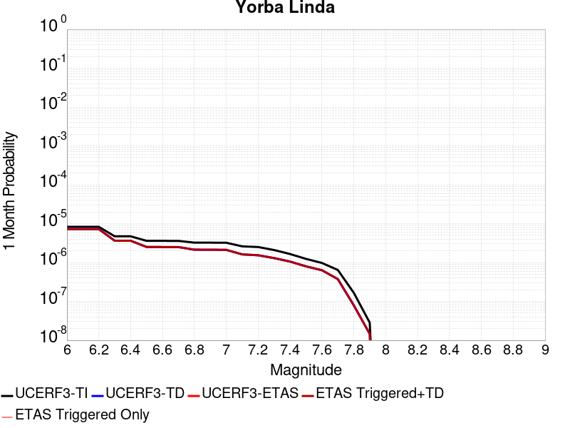 |  | 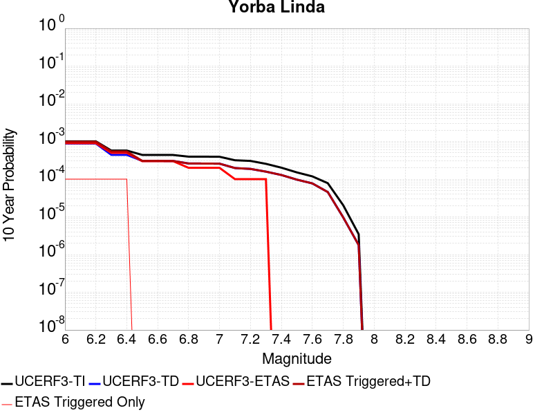 |

| Magnitude | 1 wk TI Prob | 1 wk TD Prob | 1 wk ETAS Prob | 1 wk ETAS/TD Gain | 1 wk ETAS Triggered+TD | 1 wk ETAS Triggered Only | 1 mo TI Prob | 1 mo TD Prob | 1 mo ETAS Prob | 1 mo ETAS/TD Gain | 1 mo ETAS Triggered+TD | 1 mo ETAS Triggered Only | 1 yr TI Prob | 1 yr TD Prob | 1 yr ETAS Prob | 1 yr ETAS/TD Gain | 1 yr ETAS Triggered+TD | 1 yr ETAS Triggered Only | 10 yr TI Prob | 10 yr TD Prob | 10 yr ETAS Prob | 10 yr ETAS/TD Gain | 10 yr ETAS Triggered+TD | 10 yr ETAS Triggered Only |
|-----|-----|-----|-----|-----|-----|-----|-----|-----|-----|-----|-----|-----|-----|-----|-----|-----|-----|-----|-----|-----|-----|-----|-----|-----|
| 6.0 | 1.9346849E-6 | 1.6910888E-6 | 0.0 | 0.0 | 1.6910888E-6 | 0.0 | 8.29148E-6 | 7.247508E-6 | 0.0 | 0.0 | 7.247508E-6 | 0.0 | 1.009441E-4 | 8.823579E-5 | 1.0E-4 | 1.133327 | 8.823579E-5 | 0.0 | 0.0010089825 | 8.8210066E-4 | 9.0E-4 | 1.0202917 | 9.820125E-4 | 1.0E-4 |
| 6.1 | 1.9346849E-6 | 1.6910888E-6 | 0.0 | 0.0 | 1.6910888E-6 | 0.0 | 8.29148E-6 | 7.247508E-6 | 0.0 | 0.0 | 7.247508E-6 | 0.0 | 1.009441E-4 | 8.823579E-5 | 1.0E-4 | 1.133327 | 8.823579E-5 | 0.0 | 0.0010089825 | 8.8210066E-4 | 9.0E-4 | 1.0202917 | 9.820125E-4 | 1.0E-4 |
| 6.2 | 1.9346849E-6 | 1.6910888E-6 | 0.0 | 0.0 | 1.6910888E-6 | 0.0 | 8.29148E-6 | 7.247508E-6 | 0.0 | 0.0 | 7.247508E-6 | 0.0 | 1.009441E-4 | 8.823579E-5 | 1.0E-4 | 1.133327 | 8.823579E-5 | 0.0 | 0.0010089825 | 8.8210066E-4 | 9.0E-4 | 1.0202917 | 9.820125E-4 | 1.0E-4 |
| 6.3 | 1.1028608E-6 | 8.48342E-7 | 0.0 | 0.0 | 8.48342E-7 | 0.0 | 4.7265376E-6 | 3.6357465E-6 | 0.0 | 0.0 | 3.6357465E-6 | 0.0 | 5.754407E-5 | 4.4264383E-5 | 1.0E-4 | 2.259153 | 4.4264383E-5 | 0.0 | 5.7529175E-4 | 4.4256216E-4 | 5.0E-4 | 1.1297848 | 5.425179E-4 | 1.0E-4 |
| 6.4 | 1.1028608E-6 | 8.48342E-7 | 0.0 | 0.0 | 8.48342E-7 | 0.0 | 4.7265376E-6 | 3.6357465E-6 | 0.0 | 0.0 | 3.6357465E-6 | 0.0 | 5.754407E-5 | 4.4264383E-5 | 1.0E-4 | 2.259153 | 4.4264383E-5 | 0.0 | 5.7529175E-4 | 4.4256216E-4 | 5.0E-4 | 1.1297848 | 5.425179E-4 | 1.0E-4 |
| 6.5 | 8.4451364E-7 | 5.8706075E-7 | 0.0 | 0.0 | 5.8706075E-7 | 0.0 | 3.619339E-6 | 2.5159723E-6 | 0.0 | 0.0 | 2.5159723E-6 | 0.0 | 4.406456E-5 | 3.0631552E-5 | 1.0E-4 | 3.2646077 | 3.0631552E-5 | 0.0 | 4.4055824E-4 | 3.0627544E-4 | 3.0E-4 | 0.9795104 | 3.0627544E-4 | 0.0 |
| 6.6 | 8.422957E-7 | 5.84614E-7 | 0.0 | 0.0 | 5.84614E-7 | 0.0 | 3.6098338E-6 | 2.5054862E-6 | 0.0 | 0.0 | 2.5054862E-6 | 0.0 | 4.3948843E-5 | 3.050389E-5 | 1.0E-4 | 3.2782705 | 3.050389E-5 | 0.0 | 4.394015E-4 | 3.0499915E-4 | 3.0E-4 | 0.98360926 | 3.0499915E-4 | 0.0 |
| 6.7 | 8.4119705E-7 | 5.833981E-7 | 0.0 | 0.0 | 5.833981E-7 | 0.0 | 3.6051254E-6 | 2.5002753E-6 | 0.0 | 0.0 | 2.5002753E-6 | 0.0 | 4.3891516E-5 | 3.044045E-5 | 1.0E-4 | 3.2851026 | 3.044045E-5 | 0.0 | 4.388285E-4 | 3.0436492E-4 | 3.0E-4 | 0.9856589 | 3.0436492E-4 | 0.0 |
| 6.8 | 7.5919155E-7 | 4.996458E-7 | 0.0 | 0.0 | 4.996458E-7 | 0.0 | 3.253674E-6 | 2.1413375E-6 | 0.0 | 0.0 | 2.1413375E-6 | 0.0 | 3.961276E-5 | 2.607049E-5 | 0.0 | 0.0 | 2.607049E-5 | 0.0 | 3.9605703E-4 | 2.6067602E-4 | 2.0E-4 | 0.7672359 | 2.6067602E-4 | 0.0 |
| 6.9 | 7.5804564E-7 | 4.9826406E-7 | 0.0 | 0.0 | 4.9826406E-7 | 0.0 | 3.248763E-6 | 2.1354158E-6 | 0.0 | 0.0 | 2.1354158E-6 | 0.0 | 3.955297E-5 | 2.5998395E-5 | 0.0 | 0.0 | 2.5998395E-5 | 0.0 | 3.9545933E-4 | 2.5995524E-4 | 2.0E-4 | 0.76936316 | 2.5995524E-4 | 0.0 |
| 7.0 | 7.539293E-7 | 4.944774E-7 | 0.0 | 0.0 | 4.944774E-7 | 0.0 | 3.2311218E-6 | 2.119187E-6 | 0.0 | 0.0 | 2.119187E-6 | 0.0 | 3.9338196E-5 | 2.5800813E-5 | 0.0 | 0.0 | 2.5800813E-5 | 0.0 | 3.9331234E-4 | 2.579799E-4 | 2.0E-4 | 0.7752542 | 2.579799E-4 | 0.0 |
| 7.1 | 6.0900885E-7 | 3.783031E-7 | 0.0 | 0.0 | 3.783031E-7 | 0.0 | 2.6100352E-6 | 1.621298E-6 | 0.0 | 0.0 | 1.621298E-6 | 0.0 | 3.1776715E-5 | 1.9739127E-5 | 0.0 | 0.0 | 1.9739127E-5 | 0.0 | 3.1772171E-4 | 1.973741E-4 | 1.0E-4 | 0.50665206 | 1.973741E-4 | 0.0 |
| 7.2 | 5.849925E-7 | 3.5891793E-7 | 0.0 | 0.0 | 3.5891793E-7 | 0.0 | 2.5071083E-6 | 1.5382188E-6 | 0.0 | 0.0 | 1.5382188E-6 | 0.0 | 3.0523614E-5 | 1.8727656E-5 | 0.0 | 0.0 | 1.8727656E-5 | 0.0 | 3.0519423E-4 | 1.8726112E-4 | 1.0E-4 | 0.5340137 | 1.8726112E-4 | 0.0 |
| 7.3 | 4.89808E-7 | 3.03901E-7 | 0.0 | 0.0 | 3.03901E-7 | 0.0 | 2.0991754E-6 | 1.3024322E-6 | 0.0 | 0.0 | 1.3024322E-6 | 0.0 | 2.5557161E-5 | 1.5856998E-5 | 0.0 | 0.0 | 1.5856998E-5 | 0.0 | 2.5554223E-4 | 1.585589E-4 | 1.0E-4 | 0.63068044 | 1.585589E-4 | 0.0 |
| 7.4 | 3.8700415E-7 | 2.473088E-7 | 0.0 | 0.0 | 2.473088E-7 | 0.0 | 1.6585881E-6 | 1.0598945E-6 | 0.0 | 0.0 | 1.0598945E-6 | 0.0 | 2.0193123E-5 | 1.290414E-5 | 0.0 | 0.0 | 1.290414E-5 | 0.0 | 2.0191289E-4 | 1.2903404E-4 | 0.0 | 0.0 | 1.2903404E-4 | 0.0 |
| 7.5 | 2.900565E-7 | 1.864266E-7 | 0.0 | 0.0 | 1.864266E-7 | 0.0 | 1.2430987E-6 | 7.989709E-7 | 0.0 | 0.0 | 7.989709E-7 | 0.0 | 1.5134622E-5 | 9.727428E-6 | 0.0 | 0.0 | 9.727428E-6 | 0.0 | 1.5133592E-4 | 9.727011E-5 | 0.0 | 0.0 | 9.727011E-5 | 0.0 |
| 7.6 | 2.2770318E-7 | 1.4818097E-7 | 0.0 | 0.0 | 1.4818097E-7 | 0.0 | 9.758704E-7 | 6.3506116E-7 | 0.0 | 0.0 | 6.3506116E-7 | 0.0 | 1.1881158E-5 | 7.731843E-6 | 0.0 | 0.0 | 7.731843E-6 | 0.0 | 1.1880523E-4 | 7.731579E-5 | 0.0 | 0.0 | 7.731579E-5 | 0.0 |
| 7.7 | 1.5017194E-7 | 8.7382766E-8 | 0.0 | 0.0 | 8.7382766E-8 | 0.0 | 6.4359386E-7 | 3.7449752E-7 | 0.0 | 0.0 | 3.7449752E-7 | 0.0 | 7.835727E-6 | 4.559498E-6 | 0.0 | 0.0 | 4.559498E-6 | 0.0 | 7.835451E-5 | 4.559407E-5 | 0.0 | 0.0 | 4.559407E-5 | 0.0 |
| 7.8 | 3.895753E-8 | 1.8543691E-8 | 0.0 | 0.0 | 1.8543691E-8 | 0.0 | 1.6696083E-7 | 7.947296E-8 | 0.0 | 0.0 | 7.947296E-8 | 0.0 | 2.0327461E-6 | 9.675829E-7 | 0.0 | 0.0 | 9.675829E-7 | 0.0 | 2.0327276E-5 | 9.6757885E-6 | 0.0 | 0.0 | 9.6757885E-6 | 0.0 |
| 7.9 | 6.648505E-9 | 3.4201486E-9 | 0.0 | 0.0 | 3.4201486E-9 | 0.0 | 2.8493591E-8 | 1.465778E-8 | 0.0 | 0.0 | 1.465778E-8 | 0.0 | 3.4690942E-7 | 1.7845846E-7 | 0.0 | 0.0 | 1.7845846E-7 | 0.0 | 3.4690888E-6 | 1.7845833E-6 | 0.0 | 0.0 | 1.7845833E-6 | 0.0 |

## Battle Creek 2011 CFM
*[(top)](#table-of-contents)*

| 1 Week | 1 Month | 1 Year | 10 Year |
|-----|-----|-----|-----|
| 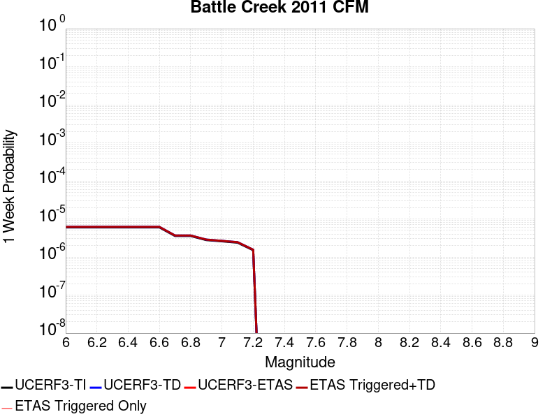 | 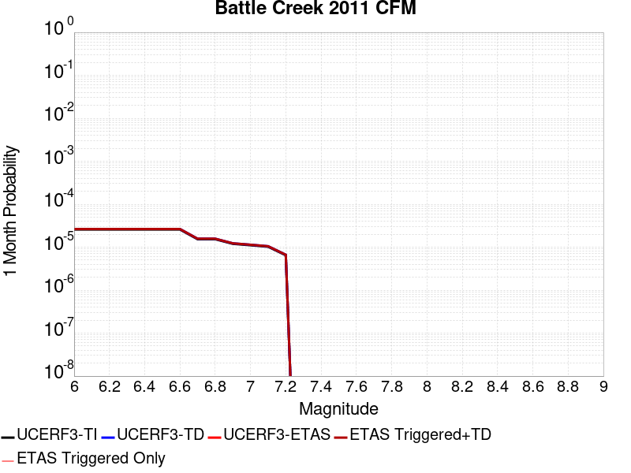 | 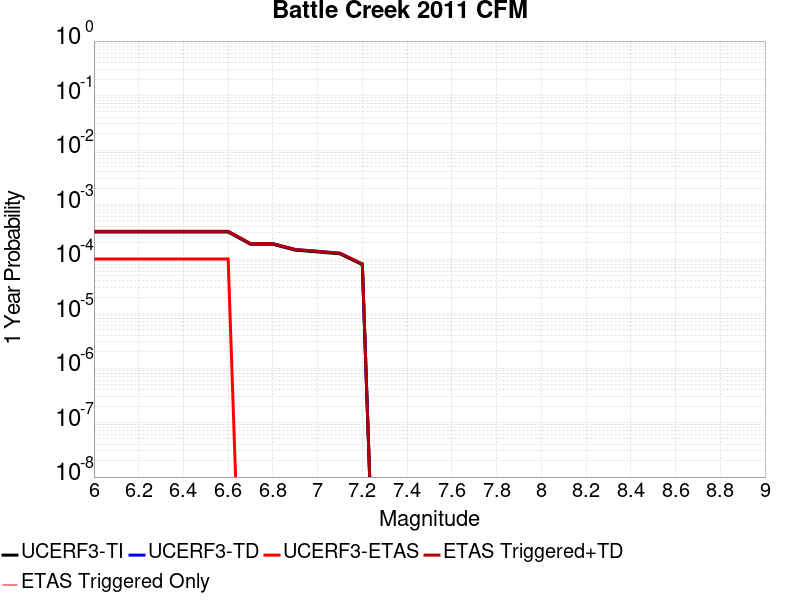 | 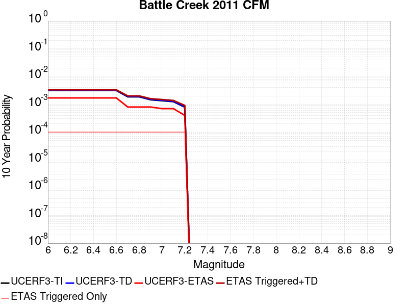 |

| Magnitude | 1 wk TI Prob | 1 wk TD Prob | 1 wk ETAS Prob | 1 wk ETAS/TD Gain | 1 wk ETAS Triggered+TD | 1 wk ETAS Triggered Only | 1 mo TI Prob | 1 mo TD Prob | 1 mo ETAS Prob | 1 mo ETAS/TD Gain | 1 mo ETAS Triggered+TD | 1 mo ETAS Triggered Only | 1 yr TI Prob | 1 yr TD Prob | 1 yr ETAS Prob | 1 yr ETAS/TD Gain | 1 yr ETAS Triggered+TD | 1 yr ETAS Triggered Only | 10 yr TI Prob | 10 yr TD Prob | 10 yr ETAS Prob | 10 yr ETAS/TD Gain | 10 yr ETAS Triggered+TD | 10 yr ETAS Triggered Only |
|-----|-----|-----|-----|-----|-----|-----|-----|-----|-----|-----|-----|-----|-----|-----|-----|-----|-----|-----|-----|-----|-----|-----|-----|-----|
| 6.0 | 6.0215425E-6 | 6.189448E-6 | 0.0 | 0.0 | 6.189448E-6 | 0.0 | 2.5806356E-5 | 2.6525973E-5 | 0.0 | 0.0 | 2.6525973E-5 | 0.0 | 3.1414707E-4 | 3.2291247E-4 | 1.0E-4 | 0.30968145 | 3.2291247E-4 | 0.0 | 0.0031370334 | 0.003225082 | 0.0017 | 0.5271184 | 0.0033247597 | 1.0E-4 |
| 6.1 | 6.0215425E-6 | 6.189448E-6 | 0.0 | 0.0 | 6.189448E-6 | 0.0 | 2.5806356E-5 | 2.6525973E-5 | 0.0 | 0.0 | 2.6525973E-5 | 0.0 | 3.1414707E-4 | 3.2291247E-4 | 1.0E-4 | 0.30968145 | 3.2291247E-4 | 0.0 | 0.0031370334 | 0.003225082 | 0.0017 | 0.5271184 | 0.0033247597 | 1.0E-4 |
| 6.2 | 6.0215425E-6 | 6.189448E-6 | 0.0 | 0.0 | 6.189448E-6 | 0.0 | 2.5806356E-5 | 2.6525973E-5 | 0.0 | 0.0 | 2.6525973E-5 | 0.0 | 3.1414707E-4 | 3.2291247E-4 | 1.0E-4 | 0.30968145 | 3.2291247E-4 | 0.0 | 0.0031370334 | 0.003225082 | 0.0017 | 0.5271184 | 0.0033247597 | 1.0E-4 |
| 6.3 | 6.0215425E-6 | 6.189448E-6 | 0.0 | 0.0 | 6.189448E-6 | 0.0 | 2.5806356E-5 | 2.6525973E-5 | 0.0 | 0.0 | 2.6525973E-5 | 0.0 | 3.1414707E-4 | 3.2291247E-4 | 1.0E-4 | 0.30968145 | 3.2291247E-4 | 0.0 | 0.0031370334 | 0.003225082 | 0.0017 | 0.5271184 | 0.0033247597 | 1.0E-4 |
| 6.4 | 6.0215425E-6 | 6.189448E-6 | 0.0 | 0.0 | 6.189448E-6 | 0.0 | 2.5806356E-5 | 2.6525973E-5 | 0.0 | 0.0 | 2.6525973E-5 | 0.0 | 3.1414707E-4 | 3.2291247E-4 | 1.0E-4 | 0.30968145 | 3.2291247E-4 | 0.0 | 0.0031370334 | 0.003225082 | 0.0017 | 0.5271184 | 0.0033247597 | 1.0E-4 |
| 6.5 | 6.0215425E-6 | 6.189448E-6 | 0.0 | 0.0 | 6.189448E-6 | 0.0 | 2.5806356E-5 | 2.6525973E-5 | 0.0 | 0.0 | 2.6525973E-5 | 0.0 | 3.1414707E-4 | 3.2291247E-4 | 1.0E-4 | 0.30968145 | 3.2291247E-4 | 0.0 | 0.0031370334 | 0.003225082 | 0.0017 | 0.5271184 | 0.0033247597 | 1.0E-4 |
| 6.6 | 6.0215425E-6 | 6.189448E-6 | 0.0 | 0.0 | 6.189448E-6 | 0.0 | 2.5806356E-5 | 2.6525973E-5 | 0.0 | 0.0 | 2.6525973E-5 | 0.0 | 3.1414707E-4 | 3.2291247E-4 | 1.0E-4 | 0.30968145 | 3.2291247E-4 | 0.0 | 0.0031370334 | 0.003225082 | 0.0017 | 0.5271184 | 0.0033247597 | 1.0E-4 |
| 6.7 | 3.5769701E-6 | 3.6755034E-6 | 0.0 | 0.0 | 3.6755034E-6 | 0.0 | 1.5329782E-5 | 1.5752084E-5 | 0.0 | 0.0 | 1.5752084E-5 | 0.0 | 1.8662411E-4 | 1.9176863E-4 | 0.0 | 0.0 | 1.9176863E-4 | 0.0 | 0.0018646746 | 0.0019164131 | 8.0E-4 | 0.41744652 | 0.0020162214 | 1.0E-4 |
| 6.8 | 3.5769701E-6 | 3.6755034E-6 | 0.0 | 0.0 | 3.6755034E-6 | 0.0 | 1.5329782E-5 | 1.5752084E-5 | 0.0 | 0.0 | 1.5752084E-5 | 0.0 | 1.8662411E-4 | 1.9176863E-4 | 0.0 | 0.0 | 1.9176863E-4 | 0.0 | 0.0018646746 | 0.0019164131 | 8.0E-4 | 0.41744652 | 0.0020162214 | 1.0E-4 |
| 6.9 | 2.7928356E-6 | 2.8694262E-6 | 0.0 | 0.0 | 2.8694262E-6 | 0.0 | 1.1969241E-5 | 1.2297503E-5 | 0.0 | 0.0 | 1.2297503E-5 | 0.0 | 1.4571576E-4 | 1.4971539E-4 | 0.0 | 0.0 | 1.4971539E-4 | 0.0 | 0.0014562025 | 0.0014964952 | 8.0E-4 | 0.5345824 | 0.0015963456 | 1.0E-4 |
| 7.0 | 2.590302E-6 | 2.6613677E-6 | 0.0 | 0.0 | 2.6613677E-6 | 0.0 | 1.1101247E-5 | 1.1405832E-5 | 0.0 | 0.0 | 1.1405832E-5 | 0.0 | 1.351493E-4 | 1.388607E-4 | 0.0 | 0.0 | 1.388607E-4 | 0.0 | 0.0013506714 | 0.0013880876 | 7.0E-4 | 0.50429094 | 0.0014879488 | 1.0E-4 |
| 7.1 | 2.3885443E-6 | 2.4541464E-6 | 0.0 | 0.0 | 2.4541464E-6 | 0.0 | 1.0236578E-5 | 1.0517748E-5 | 0.0 | 0.0 | 1.0517748E-5 | 0.0 | 1.2462321E-4 | 1.2804958E-4 | 0.0 | 0.0 | 1.2804958E-4 | 0.0 | 0.0012455335 | 0.001280104 | 7.0E-4 | 0.54683053 | 0.001379976 | 1.0E-4 |
| 7.2 | 1.5140604E-6 | 1.5555436E-6 | 0.0 | 0.0 | 1.5555436E-6 | 0.0 | 6.4888145E-6 | 6.6666153E-6 | 0.0 | 0.0 | 6.6666153E-6 | 0.0 | 7.899845E-5 | 8.116604E-5 | 0.0 | 0.0 | 8.116604E-5 | 0.0 | 7.8970374E-4 | 8.1166043E-4 | 4.0E-4 | 0.49281693 | 9.1157923E-4 | 1.0E-4 |

## North Salt Lake
*[(top)](#table-of-contents)*

| 1 Week | 1 Month | 1 Year | 10 Year |
|-----|-----|-----|-----|
| 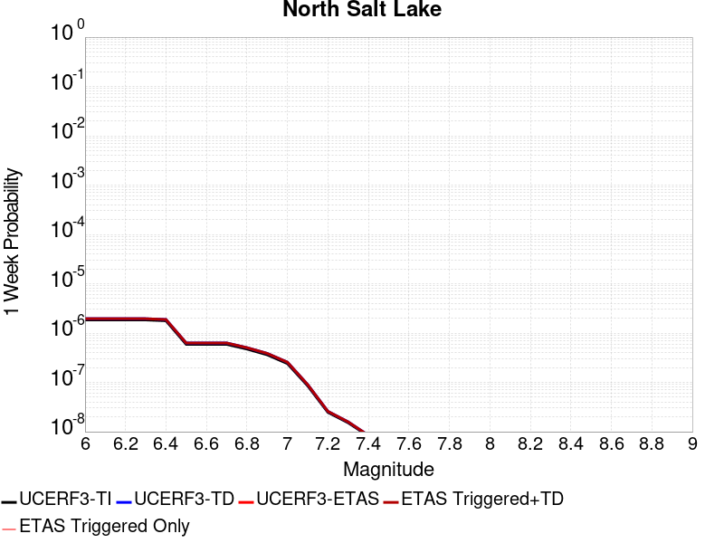 | 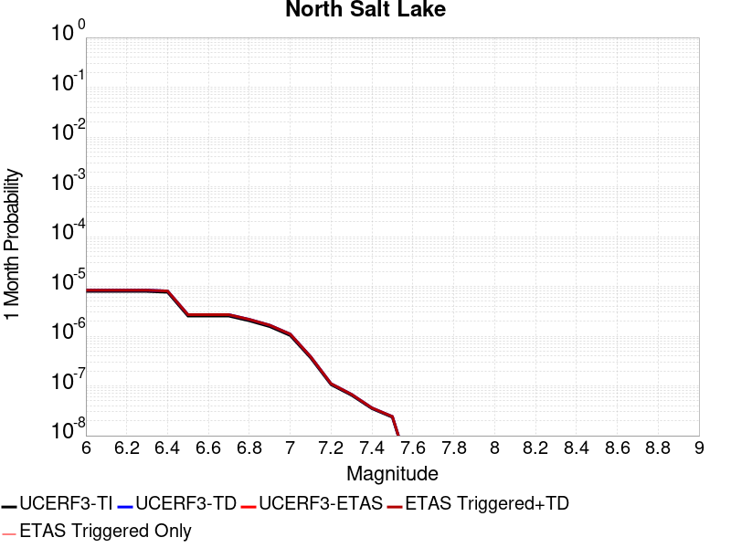 | 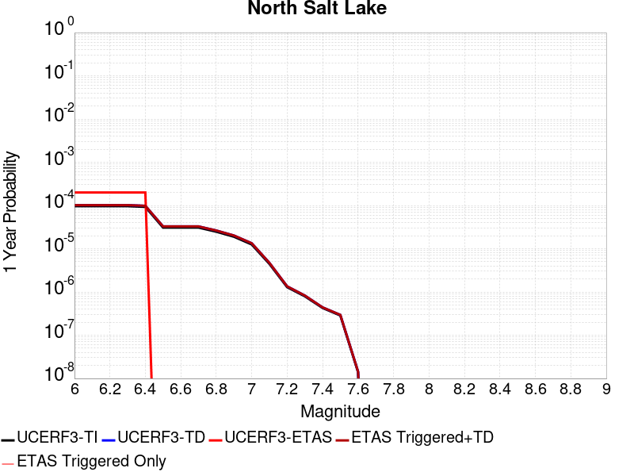 |  |

| Magnitude | 1 wk TI Prob | 1 wk TD Prob | 1 wk ETAS Prob | 1 wk ETAS/TD Gain | 1 wk ETAS Triggered+TD | 1 wk ETAS Triggered Only | 1 mo TI Prob | 1 mo TD Prob | 1 mo ETAS Prob | 1 mo ETAS/TD Gain | 1 mo ETAS Triggered+TD | 1 mo ETAS Triggered Only | 1 yr TI Prob | 1 yr TD Prob | 1 yr ETAS Prob | 1 yr ETAS/TD Gain | 1 yr ETAS Triggered+TD | 1 yr ETAS Triggered Only | 10 yr TI Prob | 10 yr TD Prob | 10 yr ETAS Prob | 10 yr ETAS/TD Gain | 10 yr ETAS Triggered+TD | 10 yr ETAS Triggered Only |
|-----|-----|-----|-----|-----|-----|-----|-----|-----|-----|-----|-----|-----|-----|-----|-----|-----|-----|-----|-----|-----|-----|-----|-----|-----|
| 6.0 | 1.849599E-6 | 1.955794E-6 | 0.0 | 0.0 | 1.955794E-6 | 0.0 | 7.926829E-6 | 8.381959E-6 | 0.0 | 0.0 | 8.381959E-6 | 0.0 | 9.650487E-5 | 1.0204758E-4 | 2.0E-4 | 1.9598701 | 1.0204758E-4 | 0.0 | 9.646297E-4 | 0.0010202051 | 0.0015 | 1.4702926 | 0.001120103 | 1.0E-4 |
| 6.1 | 1.849599E-6 | 1.955794E-6 | 0.0 | 0.0 | 1.955794E-6 | 0.0 | 7.926829E-6 | 8.381959E-6 | 0.0 | 0.0 | 8.381959E-6 | 0.0 | 9.650487E-5 | 1.0204758E-4 | 2.0E-4 | 1.9598701 | 1.0204758E-4 | 0.0 | 9.646297E-4 | 0.0010202051 | 7.0E-4 | 0.68613654 | 0.0010202051 | 0.0 |
| 6.2 | 1.849599E-6 | 1.955794E-6 | 0.0 | 0.0 | 1.955794E-6 | 0.0 | 7.926829E-6 | 8.381959E-6 | 0.0 | 0.0 | 8.381959E-6 | 0.0 | 9.650487E-5 | 1.0204758E-4 | 2.0E-4 | 1.9598701 | 1.0204758E-4 | 0.0 | 9.646297E-4 | 0.0010202051 | 7.0E-4 | 0.68613654 | 0.0010202051 | 0.0 |
| 6.3 | 1.849599E-6 | 1.955794E-6 | 0.0 | 0.0 | 1.955794E-6 | 0.0 | 7.926829E-6 | 8.381959E-6 | 0.0 | 0.0 | 8.381959E-6 | 0.0 | 9.650487E-5 | 1.0204758E-4 | 2.0E-4 | 1.9598701 | 1.0204758E-4 | 0.0 | 9.646297E-4 | 0.0010202051 | 7.0E-4 | 0.68613654 | 0.0010202051 | 0.0 |
| 6.4 | 1.7803909E-6 | 1.8862931E-6 | 0.0 | 0.0 | 1.8862931E-6 | 0.0 | 7.630225E-6 | 8.0841E-6 | 0.0 | 0.0 | 8.0841E-6 | 0.0 | 9.289402E-5 | 9.842148E-5 | 2.0E-4 | 2.0320766 | 9.842148E-5 | 0.0 | 9.28552E-4 | 9.839762E-4 | 7.0E-4 | 0.7113993 | 9.839762E-4 | 0.0 |
| 6.5 | 5.9157696E-7 | 6.300999E-7 | 0.0 | 0.0 | 6.300999E-7 | 0.0 | 2.5353274E-6 | 2.7004257E-6 | 0.0 | 0.0 | 2.7004257E-6 | 0.0 | 3.0867173E-5 | 3.287723E-5 | 0.0 | 0.0 | 3.287723E-5 | 0.0 | 3.0862886E-4 | 3.2872756E-4 | 2.0E-4 | 0.60840654 | 3.2872756E-4 | 0.0 |
| 6.6 | 5.9157696E-7 | 6.300999E-7 | 0.0 | 0.0 | 6.300999E-7 | 0.0 | 2.5353274E-6 | 2.7004257E-6 | 0.0 | 0.0 | 2.7004257E-6 | 0.0 | 3.0867173E-5 | 3.287723E-5 | 0.0 | 0.0 | 3.287723E-5 | 0.0 | 3.0862886E-4 | 3.2872756E-4 | 2.0E-4 | 0.60840654 | 3.2872756E-4 | 0.0 |
| 6.7 | 5.9157696E-7 | 6.300999E-7 | 0.0 | 0.0 | 6.300999E-7 | 0.0 | 2.5353274E-6 | 2.7004257E-6 | 0.0 | 0.0 | 2.7004257E-6 | 0.0 | 3.0867173E-5 | 3.287723E-5 | 0.0 | 0.0 | 3.287723E-5 | 0.0 | 3.0862886E-4 | 3.2872756E-4 | 2.0E-4 | 0.60840654 | 3.2872756E-4 | 0.0 |
| 6.8 | 4.7536267E-7 | 5.0666824E-7 | 0.0 | 0.0 | 5.0666824E-7 | 0.0 | 2.037267E-6 | 2.1714336E-6 | 0.0 | 0.0 | 2.1714336E-6 | 0.0 | 2.4803443E-5 | 2.6436908E-5 | 0.0 | 0.0 | 2.6436908E-5 | 0.0 | 2.4800675E-4 | 2.6434008E-4 | 0.0 | 0.0 | 2.6434008E-4 | 0.0 |
| 6.9 | 3.6345344E-7 | 3.8755155E-7 | 0.0 | 0.0 | 3.8755155E-7 | 0.0 | 1.5576567E-6 | 1.6609343E-6 | 0.0 | 0.0 | 1.6609343E-6 | 0.0 | 1.8964305E-5 | 2.0221705E-5 | 0.0 | 0.0 | 2.0221705E-5 | 0.0 | 1.8962687E-4 | 2.0220035E-4 | 0.0 | 0.0 | 2.0220035E-4 | 0.0 |
| 7.0 | 2.4087325E-7 | 2.571278E-7 | 0.0 | 0.0 | 2.571278E-7 | 0.0 | 1.0323135E-6 | 1.101976E-6 | 0.0 | 0.0 | 1.101976E-6 | 0.0 | 1.25683455E-5 | 1.34164875E-5 | 0.0 | 0.0 | 1.34164875E-5 | 0.0 | 1.2567634E-4 | 1.3415804E-4 | 0.0 | 0.0 | 1.3415804E-4 | 0.0 |
| 7.1 | 8.551555E-8 | 9.045516E-8 | 0.0 | 0.0 | 9.045516E-8 | 0.0 | 3.6649516E-7 | 3.8766493E-7 | 0.0 | 0.0 | 3.8766493E-7 | 0.0 | 4.4620692E-6 | 4.7198114E-6 | 0.0 | 0.0 | 4.7198114E-6 | 0.0 | 4.46198E-5 | 4.719723E-5 | 0.0 | 0.0 | 4.719723E-5 | 0.0 |
| 7.2 | 2.475279E-8 | 2.5895552E-8 | 0.0 | 0.0 | 2.5895552E-8 | 0.0 | 1.0608338E-7 | 1.10980935E-7 | 0.0 | 0.0 | 1.10980935E-7 | 0.0 | 1.2915643E-6 | 1.351192E-6 | 0.0 | 0.0 | 1.351192E-6 | 0.0 | 1.2915569E-5 | 1.3511845E-5 | 0.0 | 0.0 | 1.3511845E-5 | 0.0 |
| 7.3 | 1.5212393E-8 | 1.584881E-8 | 0.0 | 0.0 | 1.584881E-8 | 0.0 | 6.519597E-8 | 6.792347E-8 | 0.0 | 0.0 | 6.792347E-8 | 0.0 | 7.9376065E-7 | 8.2696795E-7 | 0.0 | 0.0 | 8.2696795E-7 | 0.0 | 7.937579E-6 | 8.2696515E-6 | 0.0 | 0.0 | 8.2696515E-6 | 0.0 |
| 7.4 | 8.182E-9 | 8.447838E-9 | 0.0 | 0.0 | 8.447838E-9 | 0.0 | 3.5065714E-8 | 3.6205023E-8 | 0.0 | 0.0 | 3.6205023E-8 | 0.0 | 4.26925E-7 | 4.4079604E-7 | 0.0 | 0.0 | 4.4079604E-7 | 0.0 | 4.269242E-6 | 4.4079525E-6 | 0.0 | 0.0 | 4.4079525E-6 | 0.0 |
| 7.5 | 5.479913E-9 | 5.6684297E-9 | 0.0 | 0.0 | 5.6684297E-9 | 0.0 | 2.3485342E-8 | 2.4293271E-8 | 0.0 | 0.0 | 2.4293271E-8 | 0.0 | 2.85934E-7 | 2.9577055E-7 | 0.0 | 0.0 | 2.9577055E-7 | 0.0 | 2.8593363E-6 | 2.9577018E-6 | 0.0 | 0.0 | 2.9577018E-6 | 0.0 |
| 7.6 | 2.6813562E-10 | 2.7733826E-10 | 0.0 | 0.0 | 2.7733826E-10 | 0.0 | 1.1491527E-9 | 1.188593E-9 | 0.0 | 0.0 | 1.188593E-9 | 0.0 | 1.3990933E-8 | 1.447112E-8 | 0.0 | 0.0 | 1.447112E-8 | 0.0 | 1.3990932E-7 | 1.447112E-7 | 0.0 | 0.0 | 1.447112E-7 | 0.0 |

## Big Pine (West)
*[(top)](#table-of-contents)*

| 1 Week | 1 Month | 1 Year | 10 Year |
|-----|-----|-----|-----|
| 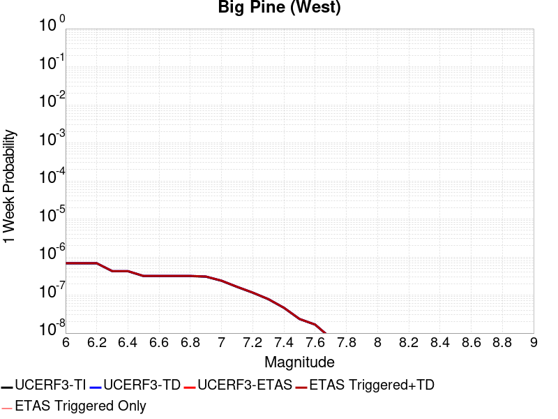 | 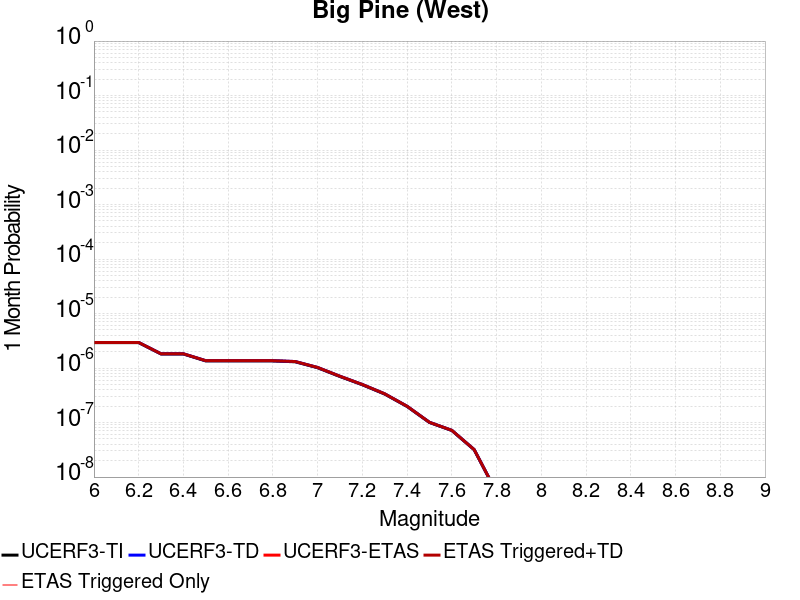 | 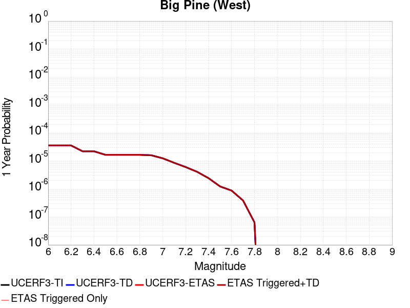 | 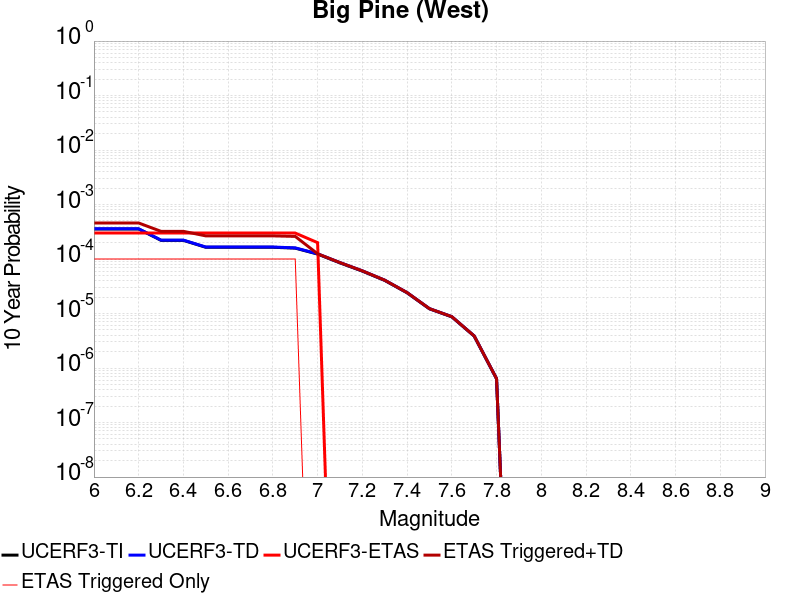 |

| Magnitude | 1 wk TI Prob | 1 wk TD Prob | 1 wk ETAS Prob | 1 wk ETAS/TD Gain | 1 wk ETAS Triggered+TD | 1 wk ETAS Triggered Only | 1 mo TI Prob | 1 mo TD Prob | 1 mo ETAS Prob | 1 mo ETAS/TD Gain | 1 mo ETAS Triggered+TD | 1 mo ETAS Triggered Only | 1 yr TI Prob | 1 yr TD Prob | 1 yr ETAS Prob | 1 yr ETAS/TD Gain | 1 yr ETAS Triggered+TD | 1 yr ETAS Triggered Only | 10 yr TI Prob | 10 yr TD Prob | 10 yr ETAS Prob | 10 yr ETAS/TD Gain | 10 yr ETAS Triggered+TD | 10 yr ETAS Triggered Only |
|-----|-----|-----|-----|-----|-----|-----|-----|-----|-----|-----|-----|-----|-----|-----|-----|-----|-----|-----|-----|-----|-----|-----|-----|-----|
| 6.0 | 6.8306974E-7 | 6.8819327E-7 | 0.0 | 0.0 | 6.8819327E-7 | 0.0 | 2.9274386E-6 | 2.949397E-6 | 0.0 | 0.0 | 2.949397E-6 | 0.0 | 3.564098E-5 | 3.590841E-5 | 0.0 | 0.0 | 3.590841E-5 | 0.0 | 3.5635266E-4 | 3.5903548E-4 | 3.0E-4 | 0.835572 | 4.5899957E-4 | 1.0E-4 |
| 6.1 | 6.8306974E-7 | 6.8819327E-7 | 0.0 | 0.0 | 6.8819327E-7 | 0.0 | 2.9274386E-6 | 2.949397E-6 | 0.0 | 0.0 | 2.949397E-6 | 0.0 | 3.564098E-5 | 3.590841E-5 | 0.0 | 0.0 | 3.590841E-5 | 0.0 | 3.5635266E-4 | 3.5903548E-4 | 3.0E-4 | 0.835572 | 4.5899957E-4 | 1.0E-4 |
| 6.2 | 6.8306974E-7 | 6.8819327E-7 | 0.0 | 0.0 | 6.8819327E-7 | 0.0 | 2.9274386E-6 | 2.949397E-6 | 0.0 | 0.0 | 2.949397E-6 | 0.0 | 3.564098E-5 | 3.590841E-5 | 0.0 | 0.0 | 3.590841E-5 | 0.0 | 3.5635266E-4 | 3.5903548E-4 | 3.0E-4 | 0.835572 | 4.5899957E-4 | 1.0E-4 |
| 6.3 | 4.227652E-7 | 4.2666383E-7 | 0.0 | 0.0 | 4.2666383E-7 | 0.0 | 1.8118495E-6 | 1.8285581E-6 | 0.0 | 0.0 | 1.8285581E-6 | 0.0 | 2.2059045E-5 | 2.2262486E-5 | 0.0 | 0.0 | 2.2262486E-5 | 0.0 | 2.2056856E-4 | 2.2260439E-4 | 3.0E-4 | 1.3476824 | 3.225821E-4 | 1.0E-4 |
| 6.4 | 4.227652E-7 | 4.2666383E-7 | 0.0 | 0.0 | 4.2666383E-7 | 0.0 | 1.8118495E-6 | 1.8285581E-6 | 0.0 | 0.0 | 1.8285581E-6 | 0.0 | 2.2059045E-5 | 2.2262486E-5 | 0.0 | 0.0 | 2.2262486E-5 | 0.0 | 2.2056856E-4 | 2.2260439E-4 | 3.0E-4 | 1.3476824 | 3.225821E-4 | 1.0E-4 |
| 6.5 | 3.1538403E-7 | 3.1885222E-7 | 0.0 | 0.0 | 3.1885222E-7 | 0.0 | 1.3516451E-6 | 1.3665089E-6 | 0.0 | 0.0 | 1.3665089E-6 | 0.0 | 1.6456155E-5 | 1.6637121E-5 | 0.0 | 0.0 | 1.6637121E-5 | 0.0 | 1.6454936E-4 | 1.6635915E-4 | 3.0E-4 | 1.8033272 | 2.663425E-4 | 1.0E-4 |
| 6.6 | 3.1538403E-7 | 3.1885222E-7 | 0.0 | 0.0 | 3.1885222E-7 | 0.0 | 1.3516451E-6 | 1.3665089E-6 | 0.0 | 0.0 | 1.3665089E-6 | 0.0 | 1.6456155E-5 | 1.6637121E-5 | 0.0 | 0.0 | 1.6637121E-5 | 0.0 | 1.6454936E-4 | 1.6635915E-4 | 3.0E-4 | 1.8033272 | 2.663425E-4 | 1.0E-4 |
| 6.7 | 3.1538403E-7 | 3.1885222E-7 | 0.0 | 0.0 | 3.1885222E-7 | 0.0 | 1.3516451E-6 | 1.3665089E-6 | 0.0 | 0.0 | 1.3665089E-6 | 0.0 | 1.6456155E-5 | 1.6637121E-5 | 0.0 | 0.0 | 1.6637121E-5 | 0.0 | 1.6454936E-4 | 1.6635915E-4 | 3.0E-4 | 1.8033272 | 2.663425E-4 | 1.0E-4 |
| 6.8 | 3.1538403E-7 | 3.1885222E-7 | 0.0 | 0.0 | 3.1885222E-7 | 0.0 | 1.3516451E-6 | 1.3665089E-6 | 0.0 | 0.0 | 1.3665089E-6 | 0.0 | 1.6456155E-5 | 1.6637121E-5 | 0.0 | 0.0 | 1.6637121E-5 | 0.0 | 1.6454936E-4 | 1.6635915E-4 | 3.0E-4 | 1.8033272 | 2.663425E-4 | 1.0E-4 |
| 6.9 | 3.0402092E-7 | 3.0740475E-7 | 0.0 | 0.0 | 3.0740475E-7 | 0.0 | 1.3029462E-6 | 1.3174483E-6 | 0.0 | 0.0 | 1.3174483E-6 | 0.0 | 1.5863254E-5 | 1.603982E-5 | 0.0 | 0.0 | 1.603982E-5 | 0.0 | 1.5862122E-4 | 1.60387E-4 | 3.0E-4 | 1.8704758 | 2.6037096E-4 | 1.0E-4 |
| 7.0 | 2.3673063E-7 | 2.3944858E-7 | 0.0 | 0.0 | 2.3944858E-7 | 0.0 | 1.0145594E-6 | 1.0262079E-6 | 0.0 | 0.0 | 1.0262079E-6 | 0.0 | 1.235219E-5 | 1.2494012E-5 | 0.0 | 0.0 | 1.2494012E-5 | 0.0 | 1.2351504E-4 | 1.2493337E-4 | 2.0E-4 | 1.6008533 | 1.2493337E-4 | 0.0 |
| 7.1 | 1.632138E-7 | 1.6514899E-7 | 0.0 | 0.0 | 1.6514899E-7 | 0.0 | 6.9948754E-7 | 7.077812E-7 | 0.0 | 0.0 | 7.077812E-7 | 0.0 | 8.516227E-6 | 8.617204E-6 | 0.0 | 0.0 | 8.617204E-6 | 0.0 | 8.5159016E-5 | 8.6168875E-5 | 0.0 | 0.0 | 8.6168875E-5 | 0.0 |
| 7.2 | 1.1523723E-7 | 1.1657433E-7 | 0.0 | 0.0 | 1.1657433E-7 | 0.0 | 4.9387376E-7 | 4.9960414E-7 | 0.0 | 0.0 | 4.9960414E-7 | 0.0 | 6.0128964E-6 | 6.0826646E-6 | 0.0 | 0.0 | 6.0826646E-6 | 0.0 | 6.0127335E-5 | 6.0825092E-5 | 0.0 | 0.0 | 6.0825092E-5 | 0.0 |
| 7.3 | 7.777805E-8 | 7.862616E-8 | 0.0 | 0.0 | 7.862616E-8 | 0.0 | 3.3333444E-7 | 3.369692E-7 | 0.0 | 0.0 | 3.369692E-7 | 0.0 | 4.0583395E-6 | 4.102593E-6 | 0.0 | 0.0 | 4.102593E-6 | 0.0 | 4.0582654E-5 | 4.102523E-5 | 0.0 | 0.0 | 4.102523E-5 | 0.0 |
| 7.4 | 4.609946E-8 | 4.652298E-8 | 0.0 | 0.0 | 4.652298E-8 | 0.0 | 1.975691E-7 | 1.9938419E-7 | 0.0 | 0.0 | 1.9938419E-7 | 0.0 | 2.4054011E-6 | 2.4275E-6 | 0.0 | 0.0 | 2.4275E-6 | 0.0 | 2.405375E-5 | 2.4274752E-5 | 0.0 | 0.0 | 2.4274752E-5 | 0.0 |
| 7.5 | 2.3439137E-8 | 2.3608623E-8 | 0.0 | 0.0 | 2.3608623E-8 | 0.0 | 1.00453434E-7 | 1.011798E-7 | 0.0 | 0.0 | 1.011798E-7 | 0.0 | 1.2230199E-6 | 1.2318634E-6 | 0.0 | 0.0 | 1.2318634E-6 | 0.0 | 1.2230132E-5 | 1.2318569E-5 | 0.0 | 0.0 | 1.2318569E-5 | 0.0 |
| 7.6 | 1.6699769E-8 | 1.6817307E-8 | 0.0 | 0.0 | 1.6817307E-8 | 0.0 | 7.157044E-8 | 7.2074165E-8 | 0.0 | 0.0 | 7.2074165E-8 | 0.0 | 8.713697E-7 | 8.7750266E-7 | 0.0 | 0.0 | 8.7750266E-7 | 0.0 | 8.713663E-6 | 8.774994E-6 | 0.0 | 0.0 | 8.774994E-6 | 0.0 |
| 7.7 | 7.4061512E-9 | 7.454259E-9 | 0.0 | 0.0 | 7.454259E-9 | 0.0 | 3.1740647E-8 | 3.1946826E-8 | 0.0 | 0.0 | 3.1946826E-8 | 0.0 | 3.864423E-7 | 3.8895254E-7 | 0.0 | 0.0 | 3.8895254E-7 | 0.0 | 3.8644166E-6 | 3.8895196E-6 | 0.0 | 0.0 | 3.8895196E-6 | 0.0 |
| 7.8 | 1.2189427E-9 | 1.2270924E-9 | 0.0 | 0.0 | 1.2270924E-9 | 0.0 | 5.2240403E-9 | 5.258968E-9 | 0.0 | 0.0 | 5.258968E-9 | 0.0 | 6.3602684E-8 | 6.402793E-8 | 0.0 | 0.0 | 6.402793E-8 | 0.0 | 6.360267E-7 | 6.402792E-7 | 0.0 | 0.0 | 6.402792E-7 | 0.0 |

## Verdugo
*[(top)](#table-of-contents)*

| 1 Week | 1 Month | 1 Year | 10 Year |
|-----|-----|-----|-----|
| 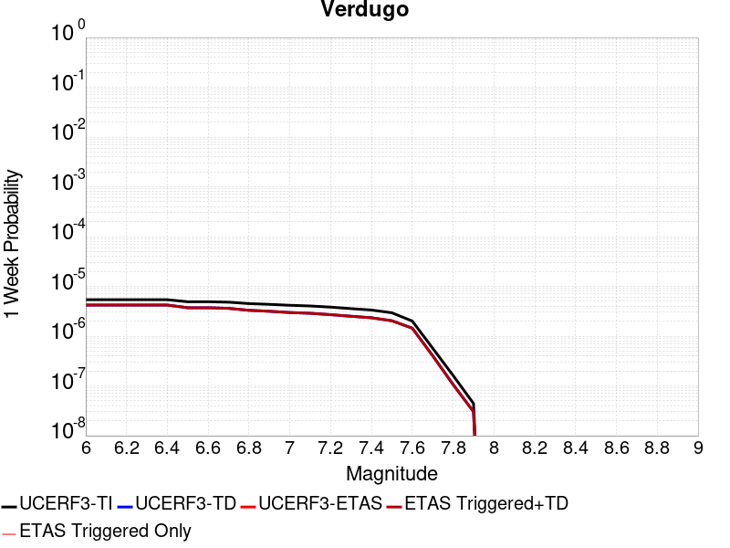 | 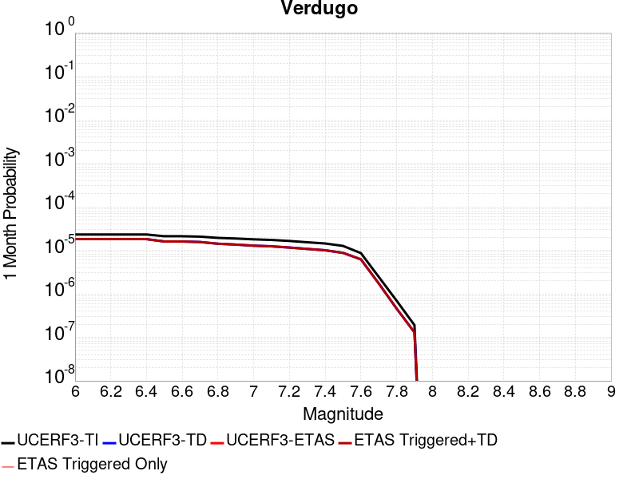 | 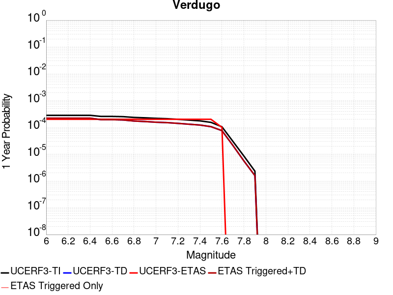 | 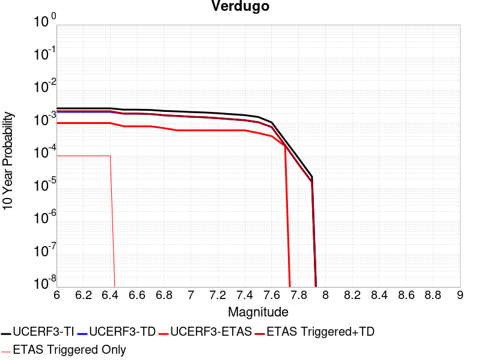 |

| Magnitude | 1 wk TI Prob | 1 wk TD Prob | 1 wk ETAS Prob | 1 wk ETAS/TD Gain | 1 wk ETAS Triggered+TD | 1 wk ETAS Triggered Only | 1 mo TI Prob | 1 mo TD Prob | 1 mo ETAS Prob | 1 mo ETAS/TD Gain | 1 mo ETAS Triggered+TD | 1 mo ETAS Triggered Only | 1 yr TI Prob | 1 yr TD Prob | 1 yr ETAS Prob | 1 yr ETAS/TD Gain | 1 yr ETAS Triggered+TD | 1 yr ETAS Triggered Only | 10 yr TI Prob | 10 yr TD Prob | 10 yr ETAS Prob | 10 yr ETAS/TD Gain | 10 yr ETAS Triggered+TD | 10 yr ETAS Triggered Only |
|-----|-----|-----|-----|-----|-----|-----|-----|-----|-----|-----|-----|-----|-----|-----|-----|-----|-----|-----|-----|-----|-----|-----|-----|-----|
| 6.0 | 5.392987E-6 | 4.2173583E-6 | 0.0 | 0.0 | 4.2173583E-6 | 0.0 | 2.3112598E-5 | 1.807427E-5 | 0.0 | 0.0 | 1.807427E-5 | 0.0 | 2.8135953E-4 | 2.200325E-4 | 2.0E-4 | 0.90895665 | 2.200325E-4 | 0.0 | 0.0028100356 | 0.0021981942 | 0.001 | 0.45491886 | 0.0022979744 | 1.0E-4 |
| 6.1 | 5.392987E-6 | 4.2173583E-6 | 0.0 | 0.0 | 4.2173583E-6 | 0.0 | 2.3112598E-5 | 1.807427E-5 | 0.0 | 0.0 | 1.807427E-5 | 0.0 | 2.8135953E-4 | 2.200325E-4 | 2.0E-4 | 0.90895665 | 2.200325E-4 | 0.0 | 0.0028100356 | 0.0021981942 | 0.001 | 0.45491886 | 0.0022979744 | 1.0E-4 |
| 6.2 | 5.392987E-6 | 4.2173583E-6 | 0.0 | 0.0 | 4.2173583E-6 | 0.0 | 2.3112598E-5 | 1.807427E-5 | 0.0 | 0.0 | 1.807427E-5 | 0.0 | 2.8135953E-4 | 2.200325E-4 | 2.0E-4 | 0.90895665 | 2.200325E-4 | 0.0 | 0.0028100356 | 0.0021981942 | 0.001 | 0.45491886 | 0.0022979744 | 1.0E-4 |
| 6.3 | 5.392987E-6 | 4.2173583E-6 | 0.0 | 0.0 | 4.2173583E-6 | 0.0 | 2.3112598E-5 | 1.807427E-5 | 0.0 | 0.0 | 1.807427E-5 | 0.0 | 2.8135953E-4 | 2.200325E-4 | 2.0E-4 | 0.90895665 | 2.200325E-4 | 0.0 | 0.0028100356 | 0.0021981942 | 0.001 | 0.45491886 | 0.0022979744 | 1.0E-4 |
| 6.4 | 5.392987E-6 | 4.2173583E-6 | 0.0 | 0.0 | 4.2173583E-6 | 0.0 | 2.3112598E-5 | 1.807427E-5 | 0.0 | 0.0 | 1.807427E-5 | 0.0 | 2.8135953E-4 | 2.200325E-4 | 2.0E-4 | 0.90895665 | 2.200325E-4 | 0.0 | 0.0028100356 | 0.0021981942 | 0.001 | 0.45491886 | 0.0022979744 | 1.0E-4 |
| 6.5 | 4.9154837E-6 | 3.7232724E-6 | 0.0 | 0.0 | 3.7232724E-6 | 0.0 | 2.1066187E-5 | 1.5956784E-5 | 0.0 | 0.0 | 1.5956784E-5 | 0.0 | 2.5645064E-4 | 1.9425675E-4 | 2.0E-4 | 1.0295653 | 1.9425675E-4 | 0.0 | 0.002561549 | 0.0019408902 | 8.0E-4 | 0.412182 | 0.0019408902 | 0.0 |
| 6.6 | 4.9154837E-6 | 3.7232724E-6 | 0.0 | 0.0 | 3.7232724E-6 | 0.0 | 2.1066187E-5 | 1.5956784E-5 | 0.0 | 0.0 | 1.5956784E-5 | 0.0 | 2.5645064E-4 | 1.9425675E-4 | 2.0E-4 | 1.0295653 | 1.9425675E-4 | 0.0 | 0.002561549 | 0.0019408902 | 8.0E-4 | 0.412182 | 0.0019408902 | 0.0 |
| 6.7 | 4.817006E-6 | 3.6214522E-6 | 0.0 | 0.0 | 3.6214522E-6 | 0.0 | 2.0644147E-5 | 1.5520418E-5 | 0.0 | 0.0 | 1.5520418E-5 | 0.0 | 2.513135E-4 | 1.889449E-4 | 2.0E-4 | 1.0585097 | 1.889449E-4 | 0.0 | 0.0025102948 | 0.0018878622 | 8.0E-4 | 0.42375976 | 0.0018878622 | 0.0 |
| 6.8 | 4.507407E-6 | 3.307872E-6 | 0.0 | 0.0 | 3.307872E-6 | 0.0 | 1.9317316E-5 | 1.4176519E-5 | 0.0 | 0.0 | 1.4176519E-5 | 0.0 | 2.3516294E-4 | 1.7258558E-4 | 2.0E-4 | 1.1588453 | 1.7258558E-4 | 0.0 | 0.0023491425 | 0.0017245298 | 7.0E-4 | 0.40590775 | 0.0017245298 | 0.0 |
| 6.9 | 4.3573054E-6 | 3.1617642E-6 | 0.0 | 0.0 | 3.1617642E-6 | 0.0 | 1.8674033E-5 | 1.3550348E-5 | 0.0 | 0.0 | 1.3550348E-5 | 0.0 | 2.2733262E-4 | 1.6496312E-4 | 2.0E-4 | 1.2123922 | 1.6496312E-4 | 0.0 | 0.0022710022 | 0.0016484191 | 6.0E-4 | 0.36398512 | 0.0016484191 | 0.0 |
| 7.0 | 4.171527E-6 | 2.9844045E-6 | 0.0 | 0.0 | 2.9844045E-6 | 0.0 | 1.787785E-5 | 1.2790243E-5 | 0.0 | 0.0 | 1.2790243E-5 | 0.0 | 2.1764109E-4 | 1.557102E-4 | 2.0E-4 | 1.2844374 | 1.557102E-4 | 0.0 | 0.0021742806 | 0.0015560222 | 6.0E-4 | 0.3855986 | 0.0015560222 | 0.0 |
| 7.1 | 4.0405484E-6 | 2.8829818E-6 | 0.0 | 0.0 | 2.8829818E-6 | 0.0 | 1.731652E-5 | 1.2355578E-5 | 0.0 | 0.0 | 1.2355578E-5 | 0.0 | 2.1080824E-4 | 1.5041888E-4 | 2.0E-4 | 1.3296202 | 1.5041888E-4 | 0.0 | 0.0021060838 | 0.0015031819 | 6.0E-4 | 0.39915332 | 0.0015031819 | 0.0 |
| 7.2 | 3.8306007E-6 | 2.7025444E-6 | 0.0 | 0.0 | 2.7025444E-6 | 0.0 | 1.6416758E-5 | 1.1582282E-5 | 0.0 | 0.0 | 1.1582282E-5 | 0.0 | 1.9985568E-4 | 1.4100528E-4 | 2.0E-4 | 1.4183867 | 1.4100528E-4 | 0.0 | 0.0019967605 | 0.0014091688 | 6.0E-4 | 0.42578292 | 0.0014091688 | 0.0 |
| 7.3 | 3.5750938E-6 | 2.512848E-6 | 0.0 | 0.0 | 2.512848E-6 | 0.0 | 1.532174E-5 | 1.0769304E-5 | 0.0 | 0.0 | 1.0769304E-5 | 0.0 | 1.8652623E-4 | 1.3110849E-4 | 2.0E-4 | 1.5254542 | 1.3110849E-4 | 0.0 | 0.0018636974 | 0.001310322 | 6.0E-4 | 0.4579027 | 0.001310322 | 0.0 |
| 7.4 | 3.3510041E-6 | 2.341507E-6 | 0.0 | 0.0 | 2.341507E-6 | 0.0 | 1.4361368E-5 | 1.0034993E-5 | 0.0 | 0.0 | 1.0034993E-5 | 0.0 | 1.7483562E-4 | 1.221693E-4 | 2.0E-4 | 1.6370727 | 1.221693E-4 | 0.0 | 0.0017469813 | 0.0012210316 | 6.0E-4 | 0.49138772 | 0.0012210316 | 0.0 |
| 7.5 | 2.948287E-6 | 2.0395873E-6 | 0.0 | 0.0 | 2.0395873E-6 | 0.0 | 1.2635454E-5 | 8.74106E-6 | 0.0 | 0.0 | 8.74106E-6 | 0.0 | 1.538258E-4 | 1.06417305E-4 | 2.0E-4 | 1.8793936 | 1.06417305E-4 | 0.0 | 0.0015371935 | 0.0010636736 | 5.0E-4 | 0.47006896 | 0.0010636736 | 0.0 |
| 7.6 | 2.0134323E-6 | 1.4474205E-6 | 0.0 | 0.0 | 1.4474205E-6 | 0.0 | 8.628967E-6 | 6.2032163E-6 | 0.0 | 0.0 | 6.2032163E-6 | 0.0 | 1.05052604E-4 | 7.552163E-5 | 1.0E-4 | 1.3241239 | 7.552163E-5 | 0.0 | 0.0010500296 | 7.549685E-4 | 4.0E-4 | 0.5298234 | 7.549685E-4 | 0.0 |
| 7.7 | 5.726436E-7 | 4.0463183E-7 | 0.0 | 0.0 | 4.0463183E-7 | 0.0 | 2.4541846E-6 | 1.7341355E-6 | 0.0 | 0.0 | 1.7341355E-6 | 0.0 | 2.9879287E-5 | 2.111292E-5 | 0.0 | 0.0 | 2.111292E-5 | 0.0 | 2.987527E-4 | 2.1111169E-4 | 2.0E-4 | 0.9473658 | 2.1111169E-4 | 0.0 |
| 7.8 | 1.6248204E-7 | 1.0694458E-7 | 0.0 | 0.0 | 1.0694458E-7 | 0.0 | 6.963514E-7 | 4.5833383E-7 | 0.0 | 0.0 | 4.5833383E-7 | 0.0 | 8.478045E-6 | 5.5802007E-6 | 0.0 | 0.0 | 5.5802007E-6 | 0.0 | 8.477722E-5 | 5.580064E-5 | 0.0 | 0.0 | 5.580064E-5 | 0.0 |
| 7.9 | 4.4475744E-8 | 3.0381674E-8 | 0.0 | 0.0 | 3.0381674E-8 | 0.0 | 1.9061031E-7 | 1.3020716E-7 | 0.0 | 0.0 | 1.3020716E-7 | 0.0 | 2.320678E-6 | 1.5852712E-6 | 0.0 | 0.0 | 1.5852712E-6 | 0.0 | 2.3206538E-5 | 1.5852613E-5 | 0.0 | 0.0 | 1.5852613E-5 | 0.0 |

## East Huasna 2011 CFM
*[(top)](#table-of-contents)*

| 1 Week | 1 Month | 1 Year | 10 Year |
|-----|-----|-----|-----|
| 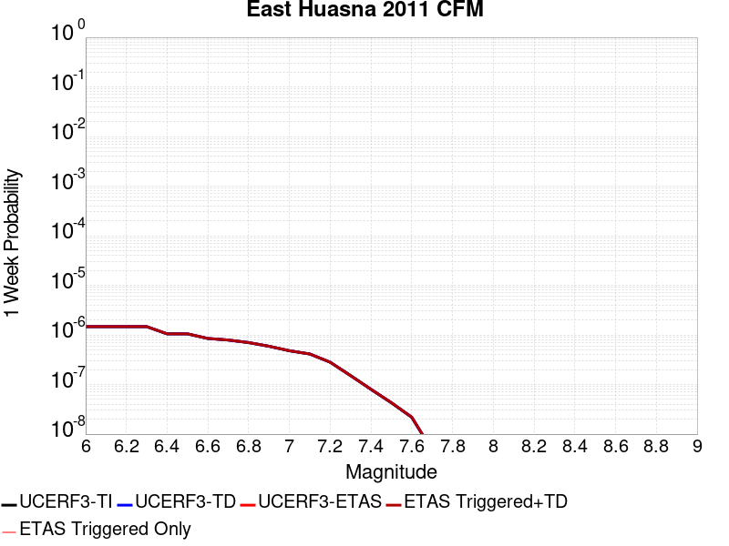 | 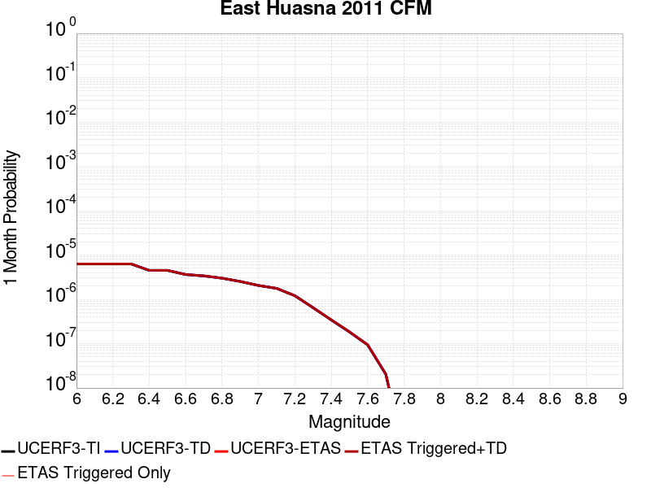 | 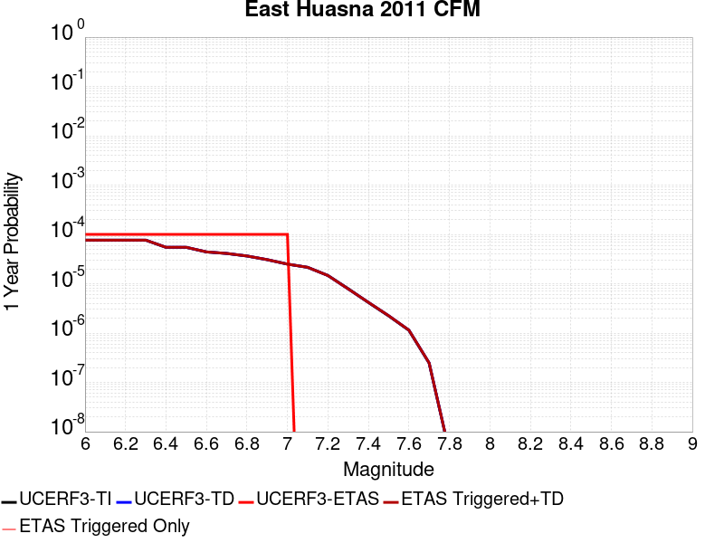 | 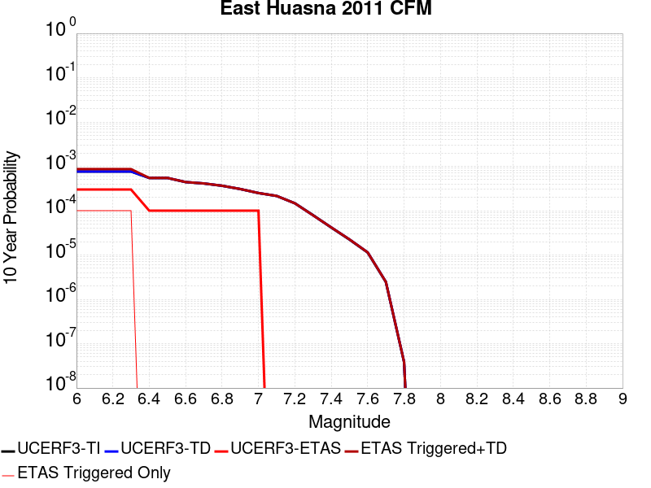 |

| Magnitude | 1 wk TI Prob | 1 wk TD Prob | 1 wk ETAS Prob | 1 wk ETAS/TD Gain | 1 wk ETAS Triggered+TD | 1 wk ETAS Triggered Only | 1 mo TI Prob | 1 mo TD Prob | 1 mo ETAS Prob | 1 mo ETAS/TD Gain | 1 mo ETAS Triggered+TD | 1 mo ETAS Triggered Only | 1 yr TI Prob | 1 yr TD Prob | 1 yr ETAS Prob | 1 yr ETAS/TD Gain | 1 yr ETAS Triggered+TD | 1 yr ETAS Triggered Only | 10 yr TI Prob | 10 yr TD Prob | 10 yr ETAS Prob | 10 yr ETAS/TD Gain | 10 yr ETAS Triggered+TD | 10 yr ETAS Triggered Only |
|-----|-----|-----|-----|-----|-----|-----|-----|-----|-----|-----|-----|-----|-----|-----|-----|-----|-----|-----|-----|-----|-----|-----|-----|-----|
| 6.0 | 1.4658423E-6 | 1.4715839E-6 | 0.0 | 0.0 | 1.4715839E-6 | 0.0 | 6.282166E-6 | 6.3067732E-6 | 0.0 | 0.0 | 6.3067732E-6 | 0.0 | 7.6482684E-5 | 7.678233E-5 | 1.0E-4 | 1.302383 | 7.678233E-5 | 0.0 | 7.645637E-4 | 7.67565E-4 | 3.0E-4 | 0.39084637 | 8.6748827E-4 | 1.0E-4 |
| 6.1 | 1.4658423E-6 | 1.4715839E-6 | 0.0 | 0.0 | 1.4715839E-6 | 0.0 | 6.282166E-6 | 6.3067732E-6 | 0.0 | 0.0 | 6.3067732E-6 | 0.0 | 7.6482684E-5 | 7.678233E-5 | 1.0E-4 | 1.302383 | 7.678233E-5 | 0.0 | 7.645637E-4 | 7.67565E-4 | 3.0E-4 | 0.39084637 | 8.6748827E-4 | 1.0E-4 |
| 6.2 | 1.4658423E-6 | 1.4715839E-6 | 0.0 | 0.0 | 1.4715839E-6 | 0.0 | 6.282166E-6 | 6.3067732E-6 | 0.0 | 0.0 | 6.3067732E-6 | 0.0 | 7.6482684E-5 | 7.678233E-5 | 1.0E-4 | 1.302383 | 7.678233E-5 | 0.0 | 7.645637E-4 | 7.67565E-4 | 3.0E-4 | 0.39084637 | 8.6748827E-4 | 1.0E-4 |
| 6.3 | 1.4658423E-6 | 1.4715839E-6 | 0.0 | 0.0 | 1.4715839E-6 | 0.0 | 6.282166E-6 | 6.3067732E-6 | 0.0 | 0.0 | 6.3067732E-6 | 0.0 | 7.6482684E-5 | 7.678233E-5 | 1.0E-4 | 1.302383 | 7.678233E-5 | 0.0 | 7.645637E-4 | 7.67565E-4 | 3.0E-4 | 0.39084637 | 8.6748827E-4 | 1.0E-4 |
| 6.4 | 1.0488257E-6 | 1.0527658E-6 | 0.0 | 0.0 | 1.0527658E-6 | 0.0 | 4.4949593E-6 | 4.5118454E-6 | 0.0 | 0.0 | 4.5118454E-6 | 0.0 | 5.472476E-5 | 5.4930355E-5 | 1.0E-4 | 1.820487 | 5.4930355E-5 | 0.0 | 5.4711284E-4 | 5.4916966E-4 | 1.0E-4 | 0.18209308 | 5.4916966E-4 | 0.0 |
| 6.5 | 1.0488257E-6 | 1.0527658E-6 | 0.0 | 0.0 | 1.0527658E-6 | 0.0 | 4.4949593E-6 | 4.5118454E-6 | 0.0 | 0.0 | 4.5118454E-6 | 0.0 | 5.472476E-5 | 5.4930355E-5 | 1.0E-4 | 1.820487 | 5.4930355E-5 | 0.0 | 5.4711284E-4 | 5.4916966E-4 | 1.0E-4 | 0.18209308 | 5.4916966E-4 | 0.0 |
| 6.6 | 8.463064E-7 | 8.493758E-7 | 0.0 | 0.0 | 8.493758E-7 | 0.0 | 3.6270226E-6 | 3.640177E-6 | 0.0 | 0.0 | 3.640177E-6 | 0.0 | 4.4158103E-5 | 4.431826E-5 | 1.0E-4 | 2.256406 | 4.431826E-5 | 0.0 | 4.414933E-4 | 4.4309514E-4 | 1.0E-4 | 0.22568518 | 4.4309514E-4 | 0.0 |
| 6.7 | 7.876149E-7 | 7.9026506E-7 | 0.0 | 0.0 | 7.9026506E-7 | 0.0 | 3.375488E-6 | 3.386846E-6 | 0.0 | 0.0 | 3.386846E-6 | 0.0 | 4.109579E-5 | 4.1234074E-5 | 1.0E-4 | 2.4251788 | 4.1234074E-5 | 0.0 | 4.108819E-4 | 4.1226487E-4 | 1.0E-4 | 0.2425625 | 4.1226487E-4 | 0.0 |
| 6.8 | 6.9940785E-7 | 7.0166874E-7 | 0.0 | 0.0 | 7.0166874E-7 | 0.0 | 2.9974588E-6 | 3.0071483E-6 | 0.0 | 0.0 | 3.0071483E-6 | 0.0 | 3.649345E-5 | 3.6611422E-5 | 1.0E-4 | 2.731388 | 3.6611422E-5 | 0.0 | 3.6487455E-4 | 3.6605436E-4 | 1.0E-4 | 0.27318347 | 3.6605436E-4 | 0.0 |
| 6.9 | 5.899658E-7 | 5.9156963E-7 | 0.0 | 0.0 | 5.9156963E-7 | 0.0 | 2.5284223E-6 | 2.5352958E-6 | 0.0 | 0.0 | 2.5352958E-6 | 0.0 | 3.0783107E-5 | 3.086679E-5 | 1.0E-4 | 3.2397275 | 3.086679E-5 | 0.0 | 3.0778843E-4 | 3.0862534E-4 | 1.0E-4 | 0.32401747 | 3.0862534E-4 | 0.0 |
| 7.0 | 4.793814E-7 | 4.8033564E-7 | 0.0 | 0.0 | 4.8033564E-7 | 0.0 | 2.05449E-6 | 2.0585799E-6 | 0.0 | 0.0 | 2.0585799E-6 | 0.0 | 2.501313E-5 | 2.5062924E-5 | 1.0E-4 | 3.9899576 | 2.5062924E-5 | 0.0 | 2.5010316E-4 | 2.5060115E-4 | 1.0E-4 | 0.3990405 | 2.5060115E-4 | 0.0 |
| 7.1 | 4.1256908E-7 | 4.1300143E-7 | 0.0 | 0.0 | 4.1300143E-7 | 0.0 | 1.768152E-6 | 1.7700049E-6 | 0.0 | 0.0 | 1.7700049E-6 | 0.0 | 2.1527037E-5 | 2.1549598E-5 | 0.0 | 0.0 | 2.1549598E-5 | 0.0 | 2.1524953E-4 | 2.1547524E-4 | 0.0 | 0.0 | 2.1547524E-4 | 0.0 |
| 7.2 | 2.822599E-7 | 2.8161938E-7 | 0.0 | 0.0 | 2.8161938E-7 | 0.0 | 1.2096847E-6 | 1.2069396E-6 | 0.0 | 0.0 | 1.2069396E-6 | 0.0 | 1.47278115E-5 | 1.4694391E-5 | 0.0 | 0.0 | 1.4694391E-5 | 0.0 | 1.4726835E-4 | 1.4693428E-4 | 0.0 | 0.0 | 1.4693428E-4 | 0.0 |
| 7.3 | 1.5261652E-7 | 1.5075295E-7 | 0.0 | 0.0 | 1.5075295E-7 | 0.0 | 6.540707E-7 | 6.460839E-7 | 0.0 | 0.0 | 6.460839E-7 | 0.0 | 7.963281E-6 | 7.866043E-6 | 0.0 | 0.0 | 7.866043E-6 | 0.0 | 7.962996E-5 | 7.865767E-5 | 0.0 | 0.0 | 7.865767E-5 | 0.0 |
| 7.4 | 7.976414E-8 | 8.0580286E-8 | 0.0 | 0.0 | 8.0580286E-8 | 0.0 | 3.418463E-7 | 3.4534403E-7 | 0.0 | 0.0 | 3.4534403E-7 | 0.0 | 4.1619705E-6 | 4.2045554E-6 | 0.0 | 0.0 | 4.2045554E-6 | 0.0 | 4.161893E-5 | 4.2044765E-5 | 0.0 | 0.0 | 4.2044765E-5 | 0.0 |
| 7.5 | 4.2715055E-8 | 4.3203492E-8 | 0.0 | 0.0 | 4.3203492E-8 | 0.0 | 1.830645E-7 | 1.851578E-7 | 0.0 | 0.0 | 1.851578E-7 | 0.0 | 2.228808E-6 | 2.2542938E-6 | 0.0 | 0.0 | 2.2542938E-6 | 0.0 | 2.2287857E-5 | 2.2542714E-5 | 0.0 | 0.0 | 2.2542714E-5 | 0.0 |
| 7.6 | 2.1807532E-8 | 2.2057977E-8 | 0.0 | 0.0 | 2.2057977E-8 | 0.0 | 9.346085E-8 | 9.453419E-8 | 0.0 | 0.0 | 9.453419E-8 | 0.0 | 1.1378852E-6 | 1.150953E-6 | 0.0 | 0.0 | 1.150953E-6 | 0.0 | 1.1378794E-5 | 1.1509472E-5 | 0.0 | 0.0 | 1.1509472E-5 | 0.0 |
| 7.7 | 4.7196043E-9 | 4.7673785E-9 | 0.0 | 0.0 | 4.7673785E-9 | 0.0 | 2.0226874E-8 | 2.0431623E-8 | 0.0 | 0.0 | 2.0431623E-8 | 0.0 | 2.4626218E-7 | 2.4875496E-7 | 0.0 | 0.0 | 2.4875496E-7 | 0.0 | 2.462619E-6 | 2.4875471E-6 | 0.0 | 0.0 | 2.4875471E-6 | 0.0 |
| 7.8 | 7.400003E-11 | 7.4655726E-11 | 0.0 | 0.0 | 7.4655726E-11 | 0.0 | 3.171432E-10 | 3.1995329E-10 | 0.0 | 0.0 | 3.1995329E-10 | 0.0 | 3.861218E-9 | 3.8954315E-9 | 0.0 | 0.0 | 3.8954315E-9 | 0.0 | 3.861218E-8 | 3.8954315E-8 | 0.0 | 0.0 | 3.8954315E-8 | 0.0 |

## Carlsbad
*[(top)](#table-of-contents)*

| 1 Week | 1 Month | 1 Year | 10 Year |
|-----|-----|-----|-----|
| 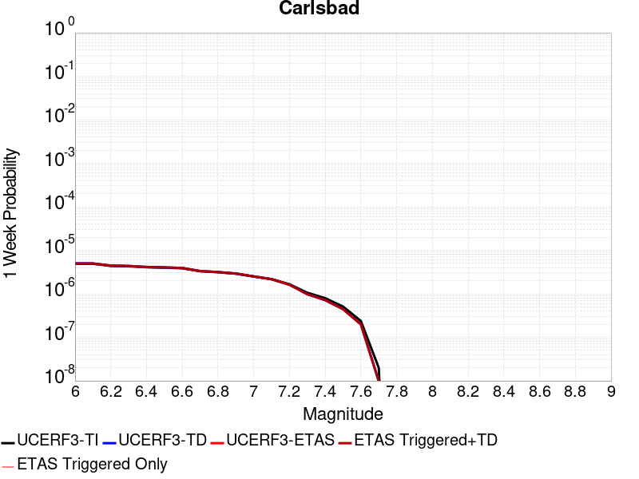 | 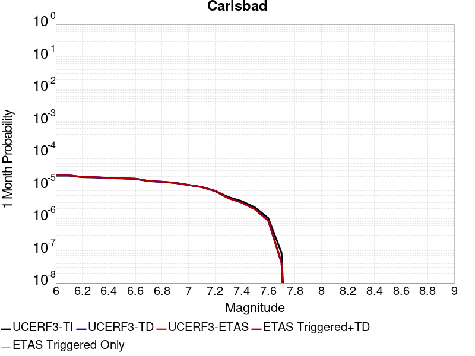 | 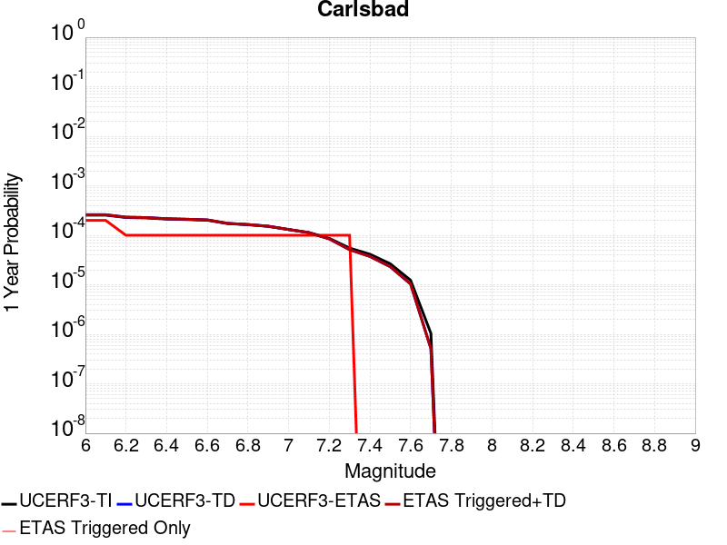 | 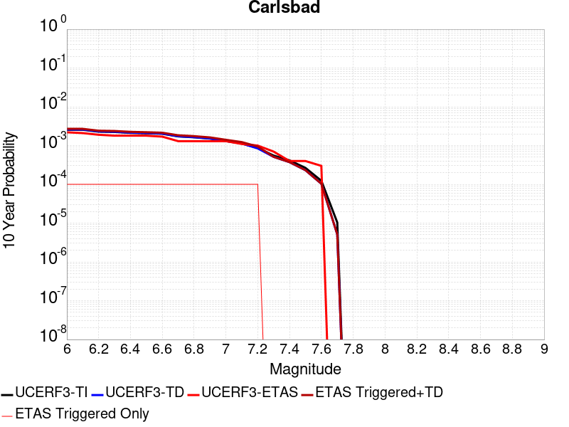 |

| Magnitude | 1 wk TI Prob | 1 wk TD Prob | 1 wk ETAS Prob | 1 wk ETAS/TD Gain | 1 wk ETAS Triggered+TD | 1 wk ETAS Triggered Only | 1 mo TI Prob | 1 mo TD Prob | 1 mo ETAS Prob | 1 mo ETAS/TD Gain | 1 mo ETAS Triggered+TD | 1 mo ETAS Triggered Only | 1 yr TI Prob | 1 yr TD Prob | 1 yr ETAS Prob | 1 yr ETAS/TD Gain | 1 yr ETAS Triggered+TD | 1 yr ETAS Triggered Only | 10 yr TI Prob | 10 yr TD Prob | 10 yr ETAS Prob | 10 yr ETAS/TD Gain | 10 yr ETAS Triggered+TD | 10 yr ETAS Triggered Only |
|-----|-----|-----|-----|-----|-----|-----|-----|-----|-----|-----|-----|-----|-----|-----|-----|-----|-----|-----|-----|-----|-----|-----|-----|-----|
| 6.0 | 4.9038536E-6 | 4.987737E-6 | 0.0 | 0.0 | 4.987737E-6 | 0.0 | 2.1016345E-5 | 2.1375845E-5 | 0.0 | 0.0 | 2.1375845E-5 | 0.0 | 2.5584397E-4 | 2.602203E-4 | 2.0E-4 | 0.7685796 | 2.602203E-4 | 0.0 | 0.002555496 | 0.0025992028 | 0.0022 | 0.8464134 | 0.0026989428 | 1.0E-4 |
| 6.1 | 4.9038536E-6 | 4.987737E-6 | 0.0 | 0.0 | 4.987737E-6 | 0.0 | 2.1016345E-5 | 2.1375845E-5 | 0.0 | 0.0 | 2.1375845E-5 | 0.0 | 2.5584397E-4 | 2.602203E-4 | 2.0E-4 | 0.7685796 | 2.602203E-4 | 0.0 | 0.002555496 | 0.0025992028 | 0.0021 | 0.80794007 | 0.0026989428 | 1.0E-4 |
| 6.2 | 4.3820614E-6 | 4.455228E-6 | 0.0 | 0.0 | 4.455228E-6 | 0.0 | 1.8780129E-5 | 1.9093697E-5 | 0.0 | 0.0 | 1.9093697E-5 | 0.0 | 2.2862408E-4 | 2.324413E-4 | 1.0E-4 | 0.43021613 | 2.324413E-4 | 0.0 | 0.00228389 | 0.0023220177 | 0.0019 | 0.81825393 | 0.0024217854 | 1.0E-4 |
| 6.3 | 4.302872E-6 | 4.3734603E-6 | 0.0 | 0.0 | 4.3734603E-6 | 0.0 | 1.8440749E-5 | 1.8743269E-5 | 0.0 | 0.0 | 1.8743269E-5 | 0.0 | 2.24493E-4 | 2.2817573E-4 | 1.0E-4 | 0.43825868 | 2.2817573E-4 | 0.0 | 0.0022426634 | 0.00227945 | 0.0018 | 0.7896642 | 0.0023792218 | 1.0E-4 |
| 6.4 | 4.0835243E-6 | 4.148096E-6 | 0.0 | 0.0 | 4.148096E-6 | 0.0 | 1.75007E-5 | 1.7777436E-5 | 0.0 | 0.0 | 1.7777436E-5 | 0.0 | 2.1305021E-4 | 2.1641912E-4 | 1.0E-4 | 0.46206638 | 2.1641912E-4 | 0.0 | 0.0021284607 | 0.0021621177 | 0.0018 | 0.83251715 | 0.0022619015 | 1.0E-4 |
| 6.5 | 3.987806E-6 | 4.049322E-6 | 0.0 | 0.0 | 4.049322E-6 | 0.0 | 1.7090486E-5 | 1.7354123E-5 | 0.0 | 0.0 | 1.7354123E-5 | 0.0 | 2.080568E-4 | 2.112663E-4 | 1.0E-4 | 0.47333625 | 2.112663E-4 | 0.0 | 0.002078621 | 0.0021106885 | 0.0018 | 0.85280234 | 0.0022104774 | 1.0E-4 |
| 6.6 | 3.8707576E-6 | 3.927915E-6 | 0.0 | 0.0 | 3.927915E-6 | 0.0 | 1.6588854E-5 | 1.6833814E-5 | 0.0 | 0.0 | 1.6833814E-5 | 0.0 | 2.0195059E-4 | 2.0493274E-4 | 1.0E-4 | 0.487965 | 2.0493274E-4 | 0.0 | 0.0020176715 | 0.0020474712 | 0.0017 | 0.8302925 | 0.0021472664 | 1.0E-4 |
| 6.7 | 3.3093434E-6 | 3.342766E-6 | 0.0 | 0.0 | 3.342766E-6 | 0.0 | 1.4182823E-5 | 1.4326061E-5 | 0.0 | 0.0 | 1.4326061E-5 | 0.0 | 1.7266218E-4 | 1.7440588E-4 | 1.0E-4 | 0.57337517 | 1.7440588E-4 | 0.0 | 0.001725281 | 0.0017426963 | 0.0013 | 0.7459705 | 0.001842522 | 1.0E-4 |
| 6.8 | 3.136983E-6 | 3.1668085E-6 | 0.0 | 0.0 | 3.1668085E-6 | 0.0 | 1.3444143E-5 | 1.35719665E-5 | 0.0 | 0.0 | 1.35719665E-5 | 0.0 | 1.6367015E-4 | 1.6522621E-4 | 1.0E-4 | 0.60523087 | 1.6522621E-4 | 0.0 | 0.0016354966 | 0.0016510393 | 0.0013 | 0.7873828 | 0.0017508742 | 1.0E-4 |
| 6.9 | 2.9056644E-6 | 2.9270866E-6 | 0.0 | 0.0 | 2.9270866E-6 | 0.0 | 1.2452788E-5 | 1.2544597E-5 | 0.0 | 0.0 | 1.2544597E-5 | 0.0 | 1.5160214E-4 | 1.5271982E-4 | 1.0E-4 | 0.65479386 | 1.5271982E-4 | 0.0 | 0.0015149876 | 0.0015261539 | 0.0013 | 0.85181445 | 0.0016260013 | 1.0E-4 |
| 7.0 | 2.5071035E-6 | 2.511683E-6 | 0.0 | 0.0 | 2.511683E-6 | 0.0 | 1.0744685E-5 | 1.0764312E-5 | 0.0 | 0.0 | 1.0764312E-5 | 0.0 | 1.308087E-4 | 1.3104765E-4 | 1.0E-4 | 0.76308125 | 1.3104765E-4 | 0.0 | 0.0013073172 | 0.001309707 | 0.0013 | 0.99258846 | 0.0014095759 | 1.0E-4 |
| 7.1 | 2.1786877E-6 | 2.168131E-6 | 0.0 | 0.0 | 2.168131E-6 | 0.0 | 9.3372E-6 | 9.291957E-6 | 0.0 | 0.0 | 9.291957E-6 | 0.0 | 1.13674476E-4 | 1.1312373E-4 | 1.0E-4 | 0.88398784 | 1.1312373E-4 | 0.0 | 0.0011361635 | 0.0011306644 | 0.0011 | 0.97287935 | 0.0012305513 | 1.0E-4 |
| 7.2 | 1.6628418E-6 | 1.6215641E-6 | 0.0 | 0.0 | 1.6215641E-6 | 0.0 | 7.1264453E-6 | 6.9495422E-6 | 0.0 | 0.0 | 6.9495422E-6 | 0.0 | 8.676102E-5 | 8.460742E-5 | 1.0E-4 | 1.1819295 | 8.460742E-5 | 0.0 | 8.672715E-4 | 8.457542E-4 | 0.001 | 1.1823766 | 9.4566966E-4 | 1.0E-4 |
| 7.3 | 1.0595926E-6 | 9.817684E-7 | 0.0 | 0.0 | 9.817684E-7 | 0.0 | 4.541103E-6 | 4.2075717E-6 | 0.0 | 0.0 | 4.2075717E-6 | 0.0 | 5.5286528E-5 | 5.122599E-5 | 1.0E-4 | 1.952134 | 5.122599E-5 | 0.0 | 5.527277E-4 | 5.121427E-4 | 7.0E-4 | 1.3668064 | 5.121427E-4 | 0.0 |
| 7.4 | 7.956623E-7 | 7.174407E-7 | 0.0 | 0.0 | 7.174407E-7 | 0.0 | 3.4099767E-6 | 3.0747422E-6 | 0.0 | 0.0 | 3.0747422E-6 | 0.0 | 4.1515676E-5 | 3.743435E-5 | 0.0 | 0.0 | 3.743435E-5 | 0.0 | 4.150792E-4 | 3.7428117E-4 | 4.0E-4 | 1.0687153 | 3.7428117E-4 | 0.0 |
| 7.5 | 5.1043804E-7 | 4.448671E-7 | 0.0 | 0.0 | 4.448671E-7 | 0.0 | 2.1875896E-6 | 1.906572E-6 | 0.0 | 0.0 | 1.906572E-6 | 0.0 | 2.663358E-5 | 2.3212273E-5 | 0.0 | 0.0 | 2.3212273E-5 | 0.0 | 2.6630386E-4 | 2.3209906E-4 | 4.0E-4 | 1.7234021 | 2.3209906E-4 | 0.0 |
| 7.6 | 2.3723294E-7 | 1.9897324E-7 | 0.0 | 0.0 | 1.9897324E-7 | 0.0 | 1.0167122E-6 | 8.527422E-7 | 0.0 | 0.0 | 8.527422E-7 | 0.0 | 1.2378401E-5 | 1.0382089E-5 | 0.0 | 0.0 | 1.0382089E-5 | 0.0 | 1.237771E-4 | 1.0381632E-4 | 3.0E-4 | 2.8897192 | 1.0381632E-4 | 0.0 |
| 7.7 | 1.9992152E-8 | 9.861331E-9 | 0.0 | 0.0 | 9.861331E-9 | 0.0 | 8.568065E-8 | 4.2262847E-8 | 0.0 | 0.0 | 4.2262847E-8 | 0.0 | 1.0431614E-6 | 5.145502E-7 | 0.0 | 0.0 | 5.145502E-7 | 0.0 | 1.0431565E-5 | 5.1455017E-6 | 0.0 | 0.0 | 5.1455017E-6 | 0.0 |

