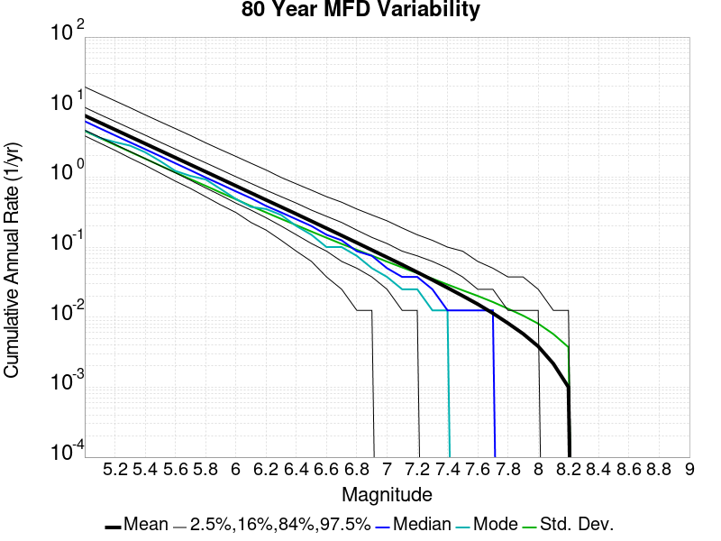
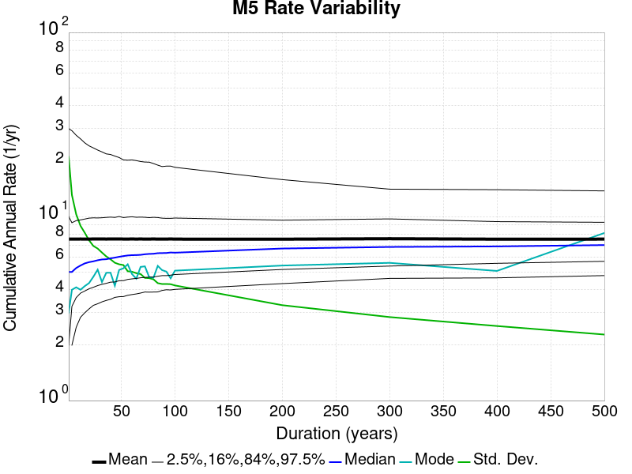
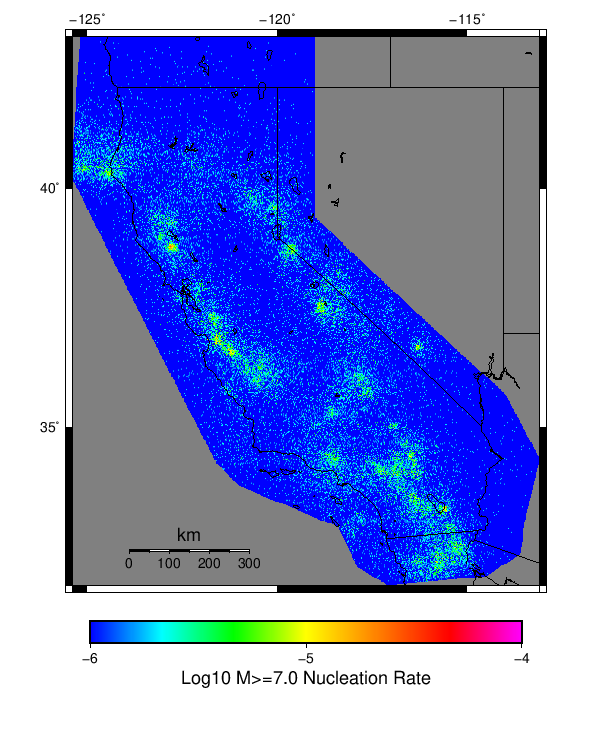

# Start 2012, 500 yr, kCOV=1.16, No Faults, Spontaneous, Historical Catalog Results

|   | Start 2012, 500 yr, kCOV=1.16, No Faults, Spontaneous, Historical Catalog |
|-----|-----|
| Num Simulations | 686 (incomplete) |
| Start Time | 2012/01/01 00:00:00 UTC |
| Start Time Epoch Milliseconds | 1325376000000 |
| Duration | 500 Years |
| Includes Spontaneous? | true |
| Trigger Ruptures | *(none)* |
| Historical Ruptures | 60366 Trigger Ruptures |
|   | First: M7.3 at 1852/01/05 04:40:39 UTC |
|   | Last: M3.2 at 2011/12/31 19:14:44 UTC |
|   | Largest: M7.9 at 1857/01/09 16:25:39 UTC |
| Config Generated With | u3etas_config_builder.sh --start-year 2012 --num-simulations 1000 --duration-years 500 --gridded-only --include-spontaneous --historical-catalog --etas-k-cov 1.16 --random-seed 123456789 --hpc-site USC_HPC --nodes 36 --hours 24 --queue scec |

## Table Of Contents

* [Magnitude Frequency Distribution](#magnitude-frequency-distribution)
* [Long Term Rate Variability](#long-term-rate-variability)
  * [162 Year Variability](#162-year-variability)
  * [80 Year Variability](#80-year-variability)
  * [28 Year Variability](#28-year-variability)
  * [Variability Duration Dependence](#variability-duration-dependence)
* [Simulation Stationarity](#simulation-stationarity)
* [Gridded Nucleation](#gridded-nucleation)
* [JSON Input File](#json-input-file)

## Magnitude Frequency Distribution
*[(top)](#table-of-contents)*

**Legend**
* **Mean** (thick black line): mean annual rate across all 686 catalogs
* **2.5%,97.5%** (thin black lines): annual rate percentiles across all 686 catalogs
* **Median** (thin blue line): median annual rate across all 686 catalogs
* **Mode** (thin cyan line): modal annual rate across all 686 catalogs (scaled to annualized value)
* **500 yr Probability** (thin red line): 500 year probability calculated as the fraction of catalogs with at least 1 occurrence
* **500 yr Supraseismogenic Probability** (thin dashed red line): same as above, but only for supraseismogenic ruptures on explicitly modeled UCERF3 faults
* **95% Conf** (light red shaded region): binomial 95% confidence bounds on probability


| Mag | Mean | 2.5 %ile | 97.5 %ile | Median | Mode | 500 yr Probability | 500 yr Supra-Seis Prob |
|-----|-----|-----|-----|-----|-----|-----|-----|
| **M&ge;5** | 7.499 | 4.752 | 13.686 | 6.988 | 8.136 | 1.000 (100.00%) | 0.000 (0.00%) |
| **M&ge;5.1** | 5.955 | 3.758 | 10.810 | 5.554 | 5.532 | 1.000 (100.00%) | 0.000 (0.00%) |
| **M&ge;5.2** | 4.732 | 2.966 | 8.502 | 4.418 | 4.348 | 1.000 (100.00%) | 0.000 (0.00%) |
| **M&ge;5.3** | 3.755 | 2.350 | 6.728 | 3.496 | 3.076 | 1.000 (100.00%) | 0.000 (0.00%) |
| **M&ge;5.4** | 2.983 | 1.856 | 5.370 | 2.782 | 3.208 | 1.000 (100.00%) | 0.000 (0.00%) |
| **M&ge;5.5** | 2.366 | 1.476 | 4.264 | 2.206 | 2.018 | 1.000 (100.00%) | 0.000 (0.00%) |
| **M&ge;5.6** | 1.879 | 1.162 | 3.384 | 1.750 | 1.604 | 1.000 (100.00%) | 0.000 (0.00%) |
| **M&ge;5.7** | 1.492 | 0.912 | 2.694 | 1.398 | 1.316 | 1.000 (100.00%) | 0.000 (0.00%) |
| **M&ge;5.8** | 1.184 | 0.724 | 2.138 | 1.104 | 1.150 | 1.000 (100.00%) | 0.000 (0.00%) |
| **M&ge;5.9** | 0.938 | 0.566 | 1.702 | 0.872 | 0.798 | 1.000 (100.00%) | 0.000 (0.00%) |
| **M&ge;6** | 0.743 | 0.444 | 1.378 | 0.692 | 0.632 | 1.000 (100.00%) | 0.000 (0.00%) |
| **M&ge;6.1** | 0.589 | 0.348 | 1.078 | 0.548 | 0.550 | 1.000 (100.00%) | 0.000 (0.00%) |
| **M&ge;6.2** | 0.467 | 0.270 | 0.860 | 0.430 | 0.380 | 1.000 (100.00%) | 0.000 (0.00%) |
| **M&ge;6.3** | 0.371 | 0.212 | 0.698 | 0.342 | 0.322 | 1.000 (100.00%) | 0.000 (0.00%) |
| **M&ge;6.4** | 0.294 | 0.166 | 0.564 | 0.274 | 0.254 | 1.000 (100.00%) | 0.000 (0.00%) |
| **M&ge;6.5** | 0.232 | 0.126 | 0.422 | 0.216 | 0.224 | 1.000 (100.00%) | 0.000 (0.00%) |
| **M&ge;6.6** | 0.184 | 0.094 | 0.334 | 0.172 | 0.148 | 1.000 (100.00%) | 0.000 (0.00%) |
| **M&ge;6.7** | 0.145 | 0.072 | 0.268 | 0.134 | 0.146 | 1.000 (100.00%) | 0.000 (0.00%) |
| **M&ge;6.8** | 0.114 | 0.054 | 0.216 | 0.104 | 0.102 | 1.000 (100.00%) | 0.000 (0.00%) |
| **M&ge;6.9** | 0.090 | 0.042 | 0.176 | 0.082 | 0.080 | 1.000 (100.00%) | 0.000 (0.00%) |
| **M&ge;7** | 0.071 | 0.030 | 0.138 | 0.066 | 0.060 | 1.000 (100.00%) | 0.000 (0.00%) |
| **M&ge;7.1** | 0.056 | 0.022 | 0.112 | 0.052 | 0.046 | 1.000 (100.00%) | 0.000 (0.00%) |
| **M&ge;7.2** | 0.043 | 0.016 | 0.090 | 0.040 | 0.038 | 1.000 (100.00%) | 0.000 (0.00%) |
| **M&ge;7.3** | 0.034 | 0.012 | 0.070 | 0.030 | 0.022 | 1.000 (100.00%) | 0.000 (0.00%) |
| **M&ge;7.4** | 0.026 | 6.00E-3 | 0.054 | 0.024 | 0.024 | 1.000 (100.00%) | 0.000 (0.00%) |
| **M&ge;7.5** | 0.020 | 4.00E-3 | 0.046 | 0.018 | 0.020 | 0.997 (99.71%) | 0.000 (0.00%) |
| **M&ge;7.6** | 0.015 | 2.00E-3 | 0.038 | 0.014 | 0.012 | 0.993 (99.27%) | 0.000 (0.00%) |
| **M&ge;7.7** | 0.011 | 2.00E-3 | 0.030 | 0.010 | 0.010 | 0.984 (98.40%) | 0.000 (0.00%) |
| **M&ge;7.8** | 8.02E-3 | 0.000 | 0.022 | 8.00E-3 | 8.00E-3 | 0.959 (95.92%) | 0.000 (0.00%) |
| **M&ge;7.9** | 5.67E-3 | 0.000 | 0.016 | 4.00E-3 | 4.00E-3 | 0.895 (89.50%) | 0.000 (0.00%) |
| **M&ge;8** | 3.79E-3 | 0.000 | 0.012 | 4.00E-3 | 2.00E-3 | 0.789 (78.86%) | 0.000 (0.00%) |
| **M&ge;8.1** | 2.10E-3 | 0.000 | 8.00E-3 | 2.00E-3 | 0.000 | 0.609 (60.93%) | 0.000 (0.00%) |
| **M&ge;8.2** | 1.02E-3 | 0.000 | 6.00E-3 | 0.000 | 0.000 | 0.378 (37.76%) | 0.000 (0.00%) |
| **M&ge;8.3** | 0.000 | 0.000 | 0.000 | 0.000 | 0.000 | 0.000 (0.00%) | 0.000 (0.00%) |
| **M&ge;8.4** | 0.000 | 0.000 | 0.000 | 0.000 | 0.000 | 0.000 (0.00%) | 0.000 (0.00%) |
| **M&ge;8.5** | 0.000 | 0.000 | 0.000 | 0.000 | 0.000 | 0.000 (0.00%) | 0.000 (0.00%) |
| **M&ge;8.6** | 0.000 | 0.000 | 0.000 | 0.000 | 0.000 | 0.000 (0.00%) | 0.000 (0.00%) |
| **M&ge;8.7** | 0.000 | 0.000 | 0.000 | 0.000 | 0.000 | 0.000 (0.00%) | 0.000 (0.00%) |
| **M&ge;8.8** | 0.000 | 0.000 | 0.000 | 0.000 | 0.000 | 0.000 (0.00%) | 0.000 (0.00%) |
| **M&ge;8.9** | 0.000 | 0.000 | 0.000 | 0.000 | 0.000 | 0.000 (0.00%) | 0.000 (0.00%) |
| **M&ge;9** | 0.000 | 0.000 | 0.000 | 0.000 | 0.000 | 0.000 (0.00%) | 0.000 (0.00%) |


## Long Term Rate Variability
*[(top)](#table-of-contents)*

### 162 Year Variability
*[(top)](#table-of-contents)*


[Download CSV Here](plots/long_term_var_162yr.csv)

| **Magnitude** | Mean | Median | Mode | Std. Dev. | 2.5 %-ile | 16 %-ile | 84 %-ile | 97.5 %-ile |
|-----|-----|-----|-----|-----|-----|-----|-----|-----|
| **5.0** | 7.510327 | 6.648148 | 6.067901 | 3.3291292 | 4.2222223 | 5.0617285 | 9.709877 | 16.425926 |
| **5.1** | 5.9645705 | 5.296296 | 4.6296296 | 2.651112 | 3.382716 | 4.0061727 | 7.6975307 | 13.049383 |
| **5.2** | 4.7403326 | 4.203704 | 3.7160494 | 2.1117918 | 2.6604939 | 3.1851852 | 6.123457 | 10.320988 |
| **5.3** | 3.7622497 | 3.3271606 | 2.5987654 | 1.6835134 | 2.080247 | 2.5185184 | 4.882716 | 8.216049 |
| **5.4** | 2.9882872 | 2.6358025 | 2.2037036 | 1.3428615 | 1.6419753 | 1.9938271 | 3.8888888 | 6.567901 |
| **5.5** | 2.3704543 | 2.0925925 | 1.8827161 | 1.0712034 | 1.2901235 | 1.574074 | 3.0987654 | 5.191358 |
| **5.6** | 1.8823471 | 1.6666666 | 1.6481482 | 0.85496557 | 1.0123457 | 1.2407408 | 2.4629629 | 4.111111 |
| **5.7** | 1.4941632 | 1.3271605 | 1.1234568 | 0.6852025 | 0.79012346 | 0.9814815 | 1.9567901 | 3.2962964 |
| **5.8** | 1.186235 | 1.0555556 | 0.9259259 | 0.5516866 | 0.6111111 | 0.77160496 | 1.5679013 | 2.617284 |
| **5.9** | 0.93978333 | 0.8333333 | 0.75308645 | 0.4409335 | 0.47530866 | 0.60493827 | 1.2407408 | 2.1296296 |
| **6.0** | 0.744739 | 0.66049385 | 0.48765433 | 0.3535306 | 0.37037036 | 0.47530866 | 0.9814815 | 1.6975309 |
| **6.1** | 0.5899051 | 0.52469134 | 0.42592594 | 0.28216258 | 0.28395063 | 0.37037036 | 0.7777778 | 1.3271605 |
| **6.2** | 0.46767807 | 0.41358024 | 0.33950618 | 0.22935489 | 0.21604939 | 0.29012346 | 0.6234568 | 1.0617284 |
| **6.3** | 0.37146217 | 0.33333334 | 0.2777778 | 0.1857385 | 0.16049382 | 0.22839506 | 0.5 | 0.845679 |
| **6.4** | 0.29426867 | 0.25925925 | 0.2962963 | 0.14995998 | 0.12345679 | 0.17901234 | 0.4074074 | 0.6728395 |
| **6.5** | 0.23273225 | 0.2037037 | 0.14197531 | 0.12133524 | 0.09259259 | 0.13580246 | 0.32098764 | 0.5308642 |
| **6.6** | 0.1840694 | 0.16666667 | 0.13580246 | 0.09914495 | 0.06790123 | 0.10493827 | 0.25925925 | 0.43209878 |
| **6.7** | 0.1451907 | 0.12962963 | 0.09876543 | 0.08075461 | 0.043209877 | 0.08024691 | 0.2037037 | 0.3580247 |
| **6.8** | 0.11431751 | 0.09876543 | 0.11111111 | 0.06662737 | 0.030864198 | 0.055555556 | 0.16666667 | 0.28395063 |
| **6.9** | 0.0899081 | 0.08024691 | 0.049382716 | 0.055150755 | 0.018518519 | 0.043209877 | 0.12962963 | 0.22839506 |
| **7.0** | 0.07068771 | 0.061728396 | 0.061728396 | 0.04512994 | 0.012345679 | 0.030864198 | 0.10493827 | 0.19135803 |
| **7.1** | 0.05574152 | 0.049382716 | 0.037037037 | 0.037560035 | 0.012345679 | 0.024691358 | 0.086419754 | 0.14814815 |
| **7.2** | 0.04336285 | 0.037037037 | 0.030864198 | 0.03084881 | 0.0061728396 | 0.018518519 | 0.06790123 | 0.12345679 |
| **7.3** | 0.033584688 | 0.024691358 | 0.018518519 | 0.02575236 | 0.0 | 0.012345679 | 0.055555556 | 0.09876543 |
| **7.4** | 0.025996113 | 0.018518519 | 0.012345679 | 0.021357795 | 0.0 | 0.0061728396 | 0.043209877 | 0.08024691 |
| **7.5** | 0.020021236 | 0.018518519 | 0.012345679 | 0.017395139 | 0.0 | 0.0061728396 | 0.037037037 | 0.06790123 |
| **7.6** | 0.015192144 | 0.012345679 | 0.0061728396 | 0.014422678 | 0.0 | 0.0 | 0.024691358 | 0.055555556 |
| **7.7** | 0.011238887 | 0.0061728396 | 0.0061728396 | 0.011640461 | 0.0 | 0.0 | 0.018518519 | 0.043209877 |
| **7.8** | 0.008050486 | 0.0061728396 | 0.0 | 0.009192332 | 0.0 | 0.0 | 0.012345679 | 0.030864198 |
| **7.9** | 0.0057139257 | 0.0061728396 | 0.0 | 0.0072985063 | 0.0 | 0.0 | 0.012345679 | 0.024691358 |
| **8.0** | 0.0038182822 | 0.0 | 0.0 | 0.005544543 | 0.0 | 0.0 | 0.0061728396 | 0.018518519 |
| **8.1** | 0.0021206012 | 0.0 | 0.0 | 0.003849862 | 0.0 | 0.0 | 0.0061728396 | 0.012345679 |
| **8.2** | 0.0010288066 | 0.0 | 0.0 | 0.002638551 | 0.0 | 0.0 | 0.0 | 0.0061728396 |
| **8.3** | 0.0 | 0.0 | 0.0 | 0.0 | 0.0 | 0.0 | 0.0 | 0.0 |
| **8.4** | 0.0 | 0.0 | 0.0 | 0.0 | 0.0 | 0.0 | 0.0 | 0.0 |
| **8.5** | 0.0 | 0.0 | 0.0 | 0.0 | 0.0 | 0.0 | 0.0 | 0.0 |
| **8.6** | 0.0 | 0.0 | 0.0 | 0.0 | 0.0 | 0.0 | 0.0 | 0.0 |
| **8.7** | 0.0 | 0.0 | 0.0 | 0.0 | 0.0 | 0.0 | 0.0 | 0.0 |
| **8.8** | 0.0 | 0.0 | 0.0 | 0.0 | 0.0 | 0.0 | 0.0 | 0.0 |
| **8.9** | 0.0 | 0.0 | 0.0 | 0.0 | 0.0 | 0.0 | 0.0 | 0.0 |
| **9.0** | 0.0 | 0.0 | 0.0 | 0.0 | 0.0 | 0.0 | 0.0 | 0.0 |

### 80 Year Variability
*[(top)](#table-of-contents)*



[Download CSV Here](plots/long_term_var_80yr.csv)

| **Magnitude** | Mean | Median | Mode | Std. Dev. | 2.5 %-ile | 16 %-ile | 84 %-ile | 97.5 %-ile |
|-----|-----|-----|-----|-----|-----|-----|-----|-----|
| **5.0** | 7.5140123 | 6.2375 | 5.35 | 4.391907 | 3.8875 | 4.675 | 9.85 | 19.5875 |
| **5.1** | 5.9673104 | 4.9625 | 3.7375 | 3.4966607 | 3.0625 | 3.7 | 7.8 | 15.375 |
| **5.2** | 4.7425838 | 3.925 | 3.575 | 2.786268 | 2.4125 | 2.925 | 6.2125 | 12.2875 |
| **5.3** | 3.7638392 | 3.1125 | 2.8125 | 2.2225413 | 1.8875 | 2.325 | 4.9625 | 9.8125 |
| **5.4** | 2.9895742 | 2.475 | 2.1375 | 1.7734977 | 1.4625 | 1.8375 | 3.9625 | 7.7625 |
| **5.5** | 2.3712432 | 1.9625 | 1.525 | 1.4142058 | 1.1375 | 1.45 | 3.15 | 6.1875 |
| **5.6** | 1.8827564 | 1.5625 | 1.225 | 1.1295195 | 0.875 | 1.1375 | 2.5125 | 4.925 |
| **5.7** | 1.4946641 | 1.2375 | 1.175 | 0.90497863 | 0.675 | 0.8875 | 2.0 | 3.9375 |
| **5.8** | 1.1867104 | 0.9875 | 0.9625 | 0.72856694 | 0.525 | 0.7 | 1.6 | 3.15 |
| **5.9** | 0.9402302 | 0.7875 | 0.675 | 0.58258575 | 0.4 | 0.55 | 1.2625 | 2.5 |
| **6.0** | 0.7451409 | 0.625 | 0.4875 | 0.46831194 | 0.3 | 0.425 | 1.0125 | 1.975 |
| **6.1** | 0.5900814 | 0.4875 | 0.375 | 0.37492397 | 0.225 | 0.3375 | 0.8125 | 1.5625 |
| **6.2** | 0.46775997 | 0.3875 | 0.35 | 0.30468467 | 0.1625 | 0.25 | 0.65 | 1.2625 |
| **6.3** | 0.37160167 | 0.3125 | 0.275 | 0.24649401 | 0.125 | 0.2 | 0.525 | 0.9875 |
| **6.4** | 0.29438776 | 0.25 | 0.2 | 0.20004027 | 0.0875 | 0.15 | 0.425 | 0.775 |
| **6.5** | 0.23283528 | 0.1875 | 0.15 | 0.1625794 | 0.0625 | 0.1125 | 0.3375 | 0.6375 |
| **6.6** | 0.18417153 | 0.15 | 0.1 | 0.1330158 | 0.0375 | 0.0875 | 0.275 | 0.5125 |
| **6.7** | 0.14523506 | 0.1125 | 0.075 | 0.108941615 | 0.025 | 0.0625 | 0.2125 | 0.425 |
| **6.8** | 0.11434949 | 0.0875 | 0.075 | 0.09004161 | 0.0125 | 0.05 | 0.175 | 0.35 |
| **6.9** | 0.0899174 | 0.075 | 0.05 | 0.07403081 | 0.0125 | 0.0375 | 0.1375 | 0.275 |
| **7.0** | 0.07070578 | 0.05 | 0.0375 | 0.060676698 | 0.0 | 0.025 | 0.1125 | 0.225 |
| **7.1** | 0.05576713 | 0.0375 | 0.025 | 0.050439615 | 0.0 | 0.0125 | 0.0875 | 0.1875 |
| **7.2** | 0.043400753 | 0.0375 | 0.025 | 0.041705634 | 0.0 | 0.0125 | 0.075 | 0.15 |
| **7.3** | 0.033600584 | 0.025 | 0.0125 | 0.034884732 | 0.0 | 0.0 | 0.0625 | 0.125 |
| **7.4** | 0.026017372 | 0.0125 | 0.0125 | 0.028927345 | 0.0 | 0.0 | 0.05 | 0.1 |
| **7.5** | 0.020037659 | 0.0125 | 0.0 | 0.023934877 | 0.0 | 0.0 | 0.0375 | 0.0875 |
| **7.6** | 0.015224125 | 0.0125 | 0.0 | 0.019854343 | 0.0 | 0.0 | 0.025 | 0.075 |
| **7.7** | 0.01126397 | 0.0 | 0.0 | 0.016257482 | 0.0 | 0.0 | 0.025 | 0.0625 |
| **7.8** | 0.0080782315 | 0.0 | 0.0 | 0.013006086 | 0.0 | 0.0 | 0.0125 | 0.0375 |
| **7.9** | 0.0057458696 | 0.0 | 0.0 | 0.010344729 | 0.0 | 0.0 | 0.0125 | 0.0375 |
| **8.0** | 0.0038386784 | 0.0 | 0.0 | 0.00795318 | 0.0 | 0.0 | 0.0125 | 0.025 |
| **8.1** | 0.0021319243 | 0.0 | 0.0 | 0.0055330633 | 0.0 | 0.0 | 0.0 | 0.0125 |
| **8.2** | 0.0010325558 | 0.0 | 0.0 | 0.0037477943 | 0.0 | 0.0 | 0.0 | 0.0125 |
| **8.3** | 0.0 | 0.0 | 0.0 | 0.0 | 0.0 | 0.0 | 0.0 | 0.0 |
| **8.4** | 0.0 | 0.0 | 0.0 | 0.0 | 0.0 | 0.0 | 0.0 | 0.0 |
| **8.5** | 0.0 | 0.0 | 0.0 | 0.0 | 0.0 | 0.0 | 0.0 | 0.0 |
| **8.6** | 0.0 | 0.0 | 0.0 | 0.0 | 0.0 | 0.0 | 0.0 | 0.0 |
| **8.7** | 0.0 | 0.0 | 0.0 | 0.0 | 0.0 | 0.0 | 0.0 | 0.0 |
| **8.8** | 0.0 | 0.0 | 0.0 | 0.0 | 0.0 | 0.0 | 0.0 | 0.0 |
| **8.9** | 0.0 | 0.0 | 0.0 | 0.0 | 0.0 | 0.0 | 0.0 | 0.0 |
| **9.0** | 0.0 | 0.0 | 0.0 | 0.0 | 0.0 | 0.0 | 0.0 | 0.0 |

### 28 Year Variability
*[(top)](#table-of-contents)*


[Download CSV Here](plots/long_term_var_28yr.csv)

| **Magnitude** | Mean | Median | Mode | Std. Dev. | 2.5 %-ile | 16 %-ile | 84 %-ile | 97.5 %-ile |
|-----|-----|-----|-----|-----|-----|-----|-----|-----|
| **5.0** | 7.51157 | 5.75 | 4.964286 | 6.5559406 | 3.357143 | 4.178571 | 9.821428 | 22.964285 |
| **5.1** | 5.9654894 | 4.571429 | 3.4285715 | 5.2213726 | 2.642857 | 3.3214285 | 7.821429 | 18.107143 |
| **5.2** | 4.741143 | 3.642857 | 2.9285715 | 4.161349 | 2.0 | 2.607143 | 6.25 | 14.5 |
| **5.3** | 3.7627306 | 2.892857 | 2.0714285 | 3.3230824 | 1.5714285 | 2.0714285 | 4.964286 | 11.535714 |
| **5.4** | 2.988816 | 2.2857144 | 1.7142857 | 2.6506171 | 1.2142857 | 1.6071428 | 3.9285715 | 9.178572 |
| **5.5** | 2.370581 | 1.8214285 | 1.3571428 | 2.1183338 | 0.9285714 | 1.25 | 3.142857 | 7.285714 |
| **5.6** | 1.8821937 | 1.4642857 | 1.1071428 | 1.6921554 | 0.6785714 | 0.96428573 | 2.5357144 | 5.821429 |
| **5.7** | 1.4941446 | 1.1428572 | 0.89285713 | 1.3570552 | 0.5 | 0.75 | 2.0 | 4.642857 |
| **5.8** | 1.1861877 | 0.9285714 | 0.75 | 1.0915141 | 0.39285713 | 0.5714286 | 1.6071428 | 3.7142856 |
| **5.9** | 0.93988717 | 0.71428573 | 0.5714286 | 0.87382156 | 0.2857143 | 0.4642857 | 1.3214285 | 3.0 |
| **6.0** | 0.7447816 | 0.5714286 | 0.5 | 0.70531946 | 0.17857143 | 0.35714287 | 1.0357143 | 2.392857 |
| **6.1** | 0.58979714 | 0.4642857 | 0.35714287 | 0.5661479 | 0.14285715 | 0.25 | 0.8214286 | 1.8928572 |
| **6.2** | 0.46751353 | 0.35714287 | 0.2857143 | 0.46082273 | 0.10714286 | 0.17857143 | 0.6785714 | 1.5 |
| **6.3** | 0.3713771 | 0.2857143 | 0.21428572 | 0.37414002 | 0.071428575 | 0.14285715 | 0.53571427 | 1.25 |
| **6.4** | 0.29424626 | 0.21428572 | 0.14285715 | 0.3039922 | 0.035714287 | 0.10714286 | 0.42857143 | 1.0 |
| **6.5** | 0.23273697 | 0.17857143 | 0.10714286 | 0.24739699 | 0.0 | 0.071428575 | 0.35714287 | 0.8214286 |
| **6.6** | 0.18409915 | 0.14285715 | 0.071428575 | 0.20296921 | 0.0 | 0.035714287 | 0.2857143 | 0.6785714 |
| **6.7** | 0.14522442 | 0.10714286 | 0.071428575 | 0.16730765 | 0.0 | 0.035714287 | 0.25 | 0.53571427 |
| **6.8** | 0.11433655 | 0.071428575 | 0.035714287 | 0.13838996 | 0.0 | 0.035714287 | 0.17857143 | 0.42857143 |
| **6.9** | 0.089925766 | 0.071428575 | 0.035714287 | 0.11410234 | 0.0 | 0.0 | 0.14285715 | 0.35714287 |
| **7.0** | 0.07069971 | 0.035714287 | 0.0 | 0.09476746 | 0.0 | 0.0 | 0.14285715 | 0.32142857 |
| **7.1** | 0.055767205 | 0.035714287 | 0.0 | 0.0795387 | 0.0 | 0.0 | 0.10714286 | 0.25 |
| **7.2** | 0.043410223 | 0.035714287 | 0.0 | 0.06602482 | 0.0 | 0.0 | 0.071428575 | 0.21428572 |
| **7.3** | 0.033592008 | 0.0 | 0.0 | 0.055020474 | 0.0 | 0.0 | 0.071428575 | 0.17857143 |
| **7.4** | 0.026009383 | 0.0 | 0.0 | 0.04571247 | 0.0 | 0.0 | 0.071428575 | 0.14285715 |
| **7.5** | 0.020019231 | 0.0 | 0.0 | 0.03801063 | 0.0 | 0.0 | 0.035714287 | 0.10714286 |
| **7.6** | 0.015211186 | 0.0 | 0.0 | 0.031814627 | 0.0 | 0.0 | 0.035714287 | 0.10714286 |
| **7.7** | 0.011266751 | 0.0 | 0.0 | 0.026205847 | 0.0 | 0.0 | 0.035714287 | 0.071428575 |
| **7.8** | 0.008081804 | 0.0 | 0.0 | 0.021233352 | 0.0 | 0.0 | 0.035714287 | 0.071428575 |
| **7.9** | 0.0057420926 | 0.0 | 0.0 | 0.017017484 | 0.0 | 0.0 | 0.0 | 0.035714287 |
| **8.0** | 0.003843374 | 0.0 | 0.0 | 0.013187575 | 0.0 | 0.0 | 0.0 | 0.035714287 |
| **8.1** | 0.002131465 | 0.0 | 0.0 | 0.009322033 | 0.0 | 0.0 | 0.0 | 0.035714287 |
| **8.2** | 0.001028983 | 0.0 | 0.0 | 0.006295349 | 0.0 | 0.0 | 0.0 | 0.035714287 |
| **8.3** | 0.0 | 0.0 | 0.0 | 0.0 | 0.0 | 0.0 | 0.0 | 0.0 |
| **8.4** | 0.0 | 0.0 | 0.0 | 0.0 | 0.0 | 0.0 | 0.0 | 0.0 |
| **8.5** | 0.0 | 0.0 | 0.0 | 0.0 | 0.0 | 0.0 | 0.0 | 0.0 |
| **8.6** | 0.0 | 0.0 | 0.0 | 0.0 | 0.0 | 0.0 | 0.0 | 0.0 |
| **8.7** | 0.0 | 0.0 | 0.0 | 0.0 | 0.0 | 0.0 | 0.0 | 0.0 |
| **8.8** | 0.0 | 0.0 | 0.0 | 0.0 | 0.0 | 0.0 | 0.0 | 0.0 |
| **8.9** | 0.0 | 0.0 | 0.0 | 0.0 | 0.0 | 0.0 | 0.0 | 0.0 |
| **9.0** | 0.0 | 0.0 | 0.0 | 0.0 | 0.0 | 0.0 | 0.0 | 0.0 |

### Variability Duration Dependence
*[(top)](#table-of-contents)*



[Download CSV Here](plots/long_term_var_m5.csv)

| **Duration (years)** | Mean | Median | Mode | Std. Dev. | 2.5 %-ile | 16 %-ile | 84 %-ile | 97.5 %-ile |
|-----|-----|-----|-----|-----|-----|-----|-----|-----|
| **1.0** | 7.498577 | 5.0 | 3.0 | 20.449886 | 0.0 | 2.0 | 9.0 | 30.0 |
| **4.0** | 7.498577 | 5.0 | 3.75 | 12.823333 | 2.0 | 3.25 | 9.25 | 29.25 |
| **8.0** | 7.5034237 | 5.25 | 4.375 | 9.972018 | 2.5 | 3.625 | 9.375 | 27.375 |
| **12.0** | 7.509807 | 5.4166665 | 4.6666665 | 8.739335 | 2.8333333 | 3.8333333 | 9.5 | 26.25 |
| **16.0** | 7.5034237 | 5.5625 | 4.1875 | 7.917737 | 3.0 | 3.9375 | 9.625 | 25.125 |
| **20.0** | 7.498577 | 5.6 | 4.35 | 7.1764035 | 3.15 | 4.05 | 9.65 | 24.35 |
| **24.0** | 7.5140123 | 5.6666665 | 4.375 | 6.779909 | 3.2916667 | 4.125 | 9.791667 | 23.291666 |
| **28.0** | 7.51157 | 5.75 | 4.964286 | 6.5559406 | 3.357143 | 4.178571 | 9.821428 | 22.964285 |
| **32.0** | 7.5140123 | 5.8125 | 4.40625 | 6.215842 | 3.4375 | 4.28125 | 9.78125 | 22.53125 |
| **36.0** | 7.508133 | 5.861111 | 4.4444447 | 5.9569364 | 3.5 | 4.3055553 | 9.888889 | 21.88889 |
| **40.0** | 7.5140123 | 5.9 | 4.675 | 5.644134 | 3.55 | 4.4 | 9.9 | 21.775 |
| **44.0** | 7.512782 | 5.931818 | 5.1363635 | 5.505642 | 3.6136363 | 4.409091 | 9.886364 | 21.318182 |
| **48.0** | 7.5140123 | 6.0 | 5.125 | 5.389516 | 3.6666667 | 4.4583335 | 9.895833 | 20.770834 |
| **52.0** | 7.508133 | 6.0384617 | 5.230769 | 5.30634 | 3.6538463 | 4.480769 | 9.846154 | 20.25 |
| **56.0** | 7.502073 | 6.107143 | 5.017857 | 4.8819 | 3.732143 | 4.535714 | 9.910714 | 20.017857 |
| **60.0** | 7.5140123 | 6.1 | 4.75 | 4.9003086 | 3.7666667 | 4.5666666 | 9.933333 | 20.0 |
| **64.0** | 7.502073 | 6.125 | 4.59375 | 4.738343 | 3.828125 | 4.59375 | 9.890625 | 19.6875 |
| **68.0** | 7.51157 | 6.147059 | 4.7352943 | 4.733379 | 3.8529413 | 4.617647 | 9.8529415 | 19.838236 |
| **72.0** | 7.497945 | 6.1805553 | 4.8472223 | 4.503157 | 3.8888888 | 4.6666665 | 9.861111 | 19.63889 |
| **76.0** | 7.5035644 | 6.236842 | 4.6842103 | 4.4691744 | 3.9078948 | 4.6842103 | 9.828947 | 19.723684 |
| **80.0** | 7.5140123 | 6.2375 | 5.35 | 4.391907 | 3.8875 | 4.675 | 9.85 | 19.5875 |
| **84.0** | 7.4958005 | 6.25 | 4.7619047 | 4.165838 | 3.9166667 | 4.75 | 9.821428 | 18.833334 |
| **88.0** | 7.4991918 | 6.318182 | 5.3522725 | 4.1044455 | 3.9545455 | 4.7727275 | 9.738636 | 18.5 |
| **92.0** | 7.5040846 | 6.3369565 | 5.021739 | 4.1457853 | 4.0 | 4.7608695 | 9.695652 | 18.75 |
| **96.0** | 7.5140123 | 6.3333335 | 4.9791665 | 4.1640353 | 3.9791667 | 4.78125 | 9.697917 | 18.791666 |
| **100.0** | 7.498577 | 6.31 | 5.13 | 4.1163073 | 4.0 | 4.81 | 9.85 | 18.47 |
| **200.0** | 7.4903827 | 6.65 | 5.415 | 3.12767 | 4.31 | 5.1 | 9.595 | 15.975 |
| **300.0** | 7.526613 | 6.8333335 | 5.25 | 2.722666 | 4.5733333 | 5.366667 | 9.706667 | 13.966666 |
| **400.0** | 7.4903827 | 6.8975 | 6.58 | 2.4489827 | 4.615 | 5.54 | 9.38 | 12.905 |
| **500.0** | 7.498577 | 6.988 | 8.136 | 2.2369354 | 4.752 | 5.67 | 9.416 | 13.686 |


## Simulation Stationarity
*[(top)](#table-of-contents)*


## Gridded Nucleation
*[(top)](#table-of-contents)*

| Min Mag | Complete Catalog (including spontaneous) |
|-----|-----|
| **M&ge;5** |  |
| **M&ge;6** |  |
| **M&ge;7** |  |


## JSON Input File
*[(top)](#table-of-contents)*

```
{
  "numSimulations": 1000,
  "duration": 500.0,
  "startYear": 2012,
  "includeSpontaneous": true,
  "randomSeed": 123456789,
  "binaryOutput": true,
  "binaryOutputFilters": [
    {
      "prefix": "results_complete",
      "descendantsOnly": false
    },
    {
      "prefix": "results_m5_preserve_chain",
      "minMag": 5.0,
      "preserveChainBelowMag": true,
      "descendantsOnly": false
    }
  ],
  "forceRecalc": false,
  "simulationName": "Start 2012, 500 yr, kCOV\u003d1.16, No Faults, Spontaneous, Historical Catalog",
  "numRetries": 3,
  "outputDir": "${ETAS_SIM_DIR}/2019_10_18-Start2012_500yr_kCOV1p16_NoFaults_Spontaneous_HistoricalCatalog",
  "triggerCatalog": "${ETAS_LAUNCHER}/inputs/u3_historical_catalog.txt",
  "triggerCatalogSurfaceMappings": "${ETAS_LAUNCHER}/inputs/u3_historical_catalog_finite_fault_mappings.xml",
  "treatTriggerCatalogAsSpontaneous": true,
  "cacheDir": "${ETAS_LAUNCHER}/inputs/cache_fm3p1_ba",
  "fssFile": "${ETAS_LAUNCHER}/inputs/2013_05_10-ucerf3p3-production-10runs_COMPOUND_SOL_FM3_1_SpatSeisU3_MEAN_BRANCH_AVG_SOL.zip",
  "probModel": "POISSON",
  "applySubSeisForSupraNucl": true,
  "totRateScaleFactor": 1.0,
  "gridSeisCorr": true,
  "timeIndependentERF": false,
  "griddedOnly": true,
  "imposeGR": false,
  "includeIndirectTriggering": true,
  "gridSeisDiscr": 0.1,
  "catalogCompletenessModel": "RELAXED",
  "etas_k_cov": 1.16,
  "configCommand": "u3etas_config_builder.sh --start-year 2012 --num-simulations 1000 --duration-years 500 --gridded-only --include-spontaneous --historical-catalog --etas-k-cov 1.16 --random-seed 123456789 --hpc-site USC_HPC --nodes 36 --hours 24 --queue scec",
  "configTime": 1571427781713
}
```

