# Parent Section Magnitude-Probability Distributions

Only fault sections with at least one triggered aftershock are plotted. Sections are sorted by total supraseismogenic trigger rate (decreasing)

## Table Of Contents

* [Garlock (Central)](#garlock-central)
* [Tank Canyon](#tank-canyon)
* [Little Lake](#little-lake)
* [Airport Lake](#airport-lake)
* [Owl Lake](#owl-lake)
* [Panamint Valley](#panamint-valley)
* [Garlock (East)](#garlock-east)
* [Hunter Mountain-Saline Valley](#hunter-mountain-saline-valley)
* [Blackwater](#blackwater)
* [Ash Hill](#ash-hill)
* [Garlock (West)](#garlock-west)
* [McLean Lake](#mclean-lake)
* [Gravel Hills-Harper Lk](#gravel-hills-harper-lk)
* [Goldstone Lake](#goldstone-lake)
* [So Sierra Nevada](#so-sierra-nevada)
* [San Andreas (Mojave S)](#san-andreas-mojave-s)
* [Coyote Canyon](#coyote-canyon)
* [San Andreas (Mojave N)](#san-andreas-mojave-n)
* [Death Valley (So)](#death-valley-so)
* [Nelson Lake](#nelson-lake)
* [Lenwood-Lockhart-Old Woman Springs](#lenwood-lockhart-old-woman-springs)
* [Towne Pass](#towne-pass)
* [San Andreas (San Bernardino N)](#san-andreas-san-bernardino-n)
* [Paradise](#paradise)
* [Bicycle Lake](#bicycle-lake)
* [Garlic Springs](#garlic-springs)
* [Death Valley (Black Mtns Frontal)](#death-valley-black-mtns-frontal)
* [Helendale-So Lockhart](#helendale-so-lockhart)
* [San Andreas (San Bernardino S)](#san-andreas-san-bernardino-s)
* [Coyote Lake](#coyote-lake)
* [San Andreas (Big Bend)](#san-andreas-big-bend)
* [San Andreas (Parkfield)](#san-andreas-parkfield)
* [Death Valley (No)](#death-valley-no)
* [Death Valley (Fish Lake Valley)](#death-valley-fish-lake-valley)
* [Elsinore (Glen Ivy) rev](#elsinore-glen-ivy-rev)
* [San Andreas (Carrizo) rev](#san-andreas-carrizo-rev)
* [San Andreas (Cholame) rev](#san-andreas-cholame-rev)
* [Ludlow](#ludlow)
* [Sierra Nevada  (No Extension)](#sierra-nevada--no-extension)
* [Cady](#cady)
* [Calico-Hidalgo](#calico-hidalgo)
* [San Andreas (San Gorgonio Pass-Garnet HIll)](#san-andreas-san-gorgonio-pass-garnet-hill)
* [Red Pass](#red-pass)
* [Manix-Afton Hills](#manix-afton-hills)
* [Scodie Lineament](#scodie-lineament)
* [San Andreas (Coachella) rev](#san-andreas-coachella-rev)
* [San Jacinto (San Bernardino)](#san-jacinto-san-bernardino)
* [San Andreas (North Branch Mill Creek)](#san-andreas-north-branch-mill-creek)
* [Baker](#baker)
* [White Wolf (Extension)](#white-wolf-extension)
* [San Andreas (Creeping Section) 2011 CFM](#san-andreas-creeping-section-2011-cfm)
* [Lake Isabella (Seismicity)](#lake-isabella-seismicity)
* [Pisgah-Bullion Mtn-Mesquite Lk](#pisgah-bullion-mtn-mesquite-lk)
* [Santa Ynez (East)](#santa-ynez-east)
* [Cleghorn Lake](#cleghorn-lake)
* [San Jacinto (San Jacinto Valley) rev](#san-jacinto-san-jacinto-valley-rev)
* [San Jacinto (Stepovers Combined)](#san-jacinto-stepovers-combined)
* [Santa Ynez (West)](#santa-ynez-west)
* [Cleghorn Pass](#cleghorn-pass)
* [San Jacinto (Anza) rev](#san-jacinto-anza-rev)
* [San Diego Trough north alt1](#san-diego-trough-north-alt1)
* [Mission Creek](#mission-creek)
* [Pinto Mtn](#pinto-mtn)
* [Brawley (Seismic Zone) alt 1](#brawley-seismic-zone-alt-1)
* [Kern Canyon (North Kern) 2011](#kern-canyon-north-kern-2011)
* [White Mountains](#white-mountains)
* [Mission Ridge-Arroyo Parida-Santa Ana](#mission-ridge-arroyo-parida-santa-ana)
* [Pleito](#pleito)
* [Red Mountain](#red-mountain)
* [Rose Canyon](#rose-canyon)
* [Imperial](#imperial)
* [Lost Hills](#lost-hills)
* [Independence rev 2011](#independence-rev-2011)
* [San Jacinto (Lytle Creek connector)](#san-jacinto-lytle-creek-connector)
* [Deep Springs](#deep-springs)
* [Santa Cruz Island](#santa-cruz-island)
* [Tin Mountain](#tin-mountain)
* [Chino alt 1](#chino-alt-1)
* [Ortigalita (North)](#ortigalita-north)
* [Oceanic - West Huasna](#oceanic---west-huasna)
* [Santa Rosa Island](#santa-rosa-island)
* [Coronado Bank alt1](#coronado-bank-alt1)
* [Camp Rock 2011](#camp-rock-2011)
* [Owens Valley](#owens-valley)
* [Kern Canyon (South Kern) 2011](#kern-canyon-south-kern-2011)
* [Ventura-Pitas Point](#ventura-pitas-point)
* [Bullion Mountains](#bullion-mountains)
* [San Jacinto (Coyote Creek)](#san-jacinto-coyote-creek)
* [Cleghorn](#cleghorn)
* [San Cayetano](#san-cayetano)
* [Dry Mountain](#dry-mountain)
* [Santa Cruz Catalina Ridge alt1](#santa-cruz-catalina-ridge-alt1)
* [Big Pine (Central)](#big-pine-central)
* [San Clemente](#san-clemente)
* [Pine Mtn](#pine-mtn)
* [Palos Verdes](#palos-verdes)
* [San Jacinto (Clark) rev](#san-jacinto-clark-rev)
* [Kern Canyon (Lake Isabella) 2011](#kern-canyon-lake-isabella-2011)
* [Great Valley 09 (Laguna Seca)](#great-valley-09-laguna-seca)
* [Big Pine (East)](#big-pine-east)
* [San Pedro Basin](#san-pedro-basin)
* [Hayward (So) 2011 CFM](#hayward-so-2011-cfm)
* [Calaveras (So) - Paicines extension 2011 CFM](#calaveras-so---paicines-extension-2011-cfm)
* [Calaveras (So) 2011 CFM](#calaveras-so-2011-cfm)
* [San Jacinto (Borrego)](#san-jacinto-borrego)
* [Hunting Creek - Berryessa 2011 CFM](#hunting-creek---berryessa-2011-cfm)
* [San Diego Trough south](#san-diego-trough-south)
* [Malibu Coast alt 1](#malibu-coast-alt-1)
* [Calaveras (Central) 2011 CFM](#calaveras-central-2011-cfm)
* [Pitas Point (Lower West)](#pitas-point-lower-west)
* [Channel Islands Thrust](#channel-islands-thrust)
* [Hosgri](#hosgri)
* [Whittier alt 1](#whittier-alt-1)
* [Robinson Creek](#robinson-creek)
* [San Andreas (Santa Cruz Mts) 2011 CFM](#san-andreas-santa-cruz-mts-2011-cfm)
* [Green Valley 2011 CFM](#green-valley-2011-cfm)
* [San Andreas (North Coast) 2011 CFM](#san-andreas-north-coast-2011-cfm)
* [Hayward (So) extension 2011 CFM](#hayward-so-extension-2011-cfm)
* [Great Valley 07 (Orestimba)](#great-valley-07-orestimba)
* [White Wolf](#white-wolf)
* [Great Valley 03a Dunnigan Hills](#great-valley-03a-dunnigan-hills)
* [Great Valley 05 Pittsburg - Kirby Hills alt1](#great-valley-05-pittsburg---kirby-hills-alt1)
* [Almanor 2011 CFM](#almanor-2011-cfm)
* [Cucamonga](#cucamonga)
* [Oceanside alt1](#oceanside-alt1)
* [Mono Lake 2011 CFM](#mono-lake-2011-cfm)
* [Blue Cut](#blue-cut)
* [North Frontal  (East)](#north-frontal--east)
* [Surprise Valley 2011 CFM](#surprise-valley-2011-cfm)
* [Hosgri (Extension)](#hosgri-extension)
* [Malibu Coast (Extension) alt 1](#malibu-coast-extension-alt-1)
* [Elsinore (Stepovers Combined)](#elsinore-stepovers-combined)
* [Oak Ridge (Onshore)](#oak-ridge-onshore)
* [Sierra Madre](#sierra-madre)
* [Santa Ynez River](#santa-ynez-river)
* [Pitas Point (Lower)-Montalvo](#pitas-point-lower-montalvo)
* [San Andreas (Peninsula) 2011 CFM](#san-andreas-peninsula-2011-cfm)
* [San Juan](#san-juan)
* [Sheephole](#sheephole)
* [Johnson Valley (No) 2011 rev](#johnson-valley-no-2011-rev)
* [Maacama 2011 CFM](#maacama-2011-cfm)
* [Hayward (No) 2011 CFM](#hayward-no-2011-cfm)
* [Clamshell-Sawpit](#clamshell-sawpit)
* [Cedar Mtn-Mahogany Mtn](#cedar-mtn-mahogany-mtn)
* [Sierra Madre (San Fernando)](#sierra-madre-san-fernando)
* [Great Valley 08 (Quinto)](#great-valley-08-quinto)
* [Burnt Mtn](#burnt-mtn)
* [Hector Mine](#hector-mine)
* [Monterey Bay-Tularcitos](#monterey-bay-tularcitos)
* [Ortigalita (South)](#ortigalita-south)
* [Elysian Park (Upper)](#elysian-park-upper)
* [Rinconada 2011 CFM](#rinconada-2011-cfm)
* [Elsinore (Temecula) rev](#elsinore-temecula-rev)
* [North Frontal  (West)](#north-frontal--west)
* [Pittville 2011 CFM](#pittville-2011-cfm)
* [San Gabriel](#san-gabriel)
* [Santa Monica alt 1](#santa-monica-alt-1)
* [San Gabriel (Extension)](#san-gabriel-extension)
* [Channel Islands Western Deep Ramp](#channel-islands-western-deep-ramp)
* [Elmore Ranch](#elmore-ranch)
* [Raymond](#raymond)
* [Newport-Inglewood alt 1](#newport-inglewood-alt-1)
* [Great Valley 11](#great-valley-11)
* [Del Valle](#del-valle)
* [Great Valley 04b Gordon Valley](#great-valley-04b-gordon-valley)
* [Owens Valley Keough Hot Springs](#owens-valley-keough-hot-springs)
* [Earthquake Valley (So Extension)](#earthquake-valley-so-extension)
* [Likely 2011 CFM](#likely-2011-cfm)
* [Great Valley 04a Trout Creek](#great-valley-04a-trout-creek)
* [Rocky Ledge 2011 CFM](#rocky-ledge-2011-cfm)
* [South Klamath Lake West](#south-klamath-lake-west)
* [Morales (East)](#morales-east)
* [Concord 2011 CFM](#concord-2011-cfm)
* [McKinleyville (alt1)](#mckinleyville-alt1)
* [Eaton Roughs 2011 CFM](#eaton-roughs-2011-cfm)
* [South Cuyama](#south-cuyama)
* [Homestead Valley 2011](#homestead-valley-2011)
* [Santa Susana alt 1](#santa-susana-alt-1)
* [Eureka Peak](#eureka-peak)
* [Richfield](#richfield)
* [Los Osos 2011](#los-osos-2011)
* [Emerson-Copper Mtn 2011](#emerson-copper-mtn-2011)
* [Rodgers Creek - Healdsburg 2011 CFM](#rodgers-creek---healdsburg-2011-cfm)
* [Mission Hills 2011](#mission-hills-2011)
* [Fickle Hill (alt1)](#fickle-hill-alt1)
* [Reliz 2011 CFM](#reliz-2011-cfm)
* [Davis Creek](#davis-creek)
* [West Tahoe](#west-tahoe)
* [Mad River (alt1)](#mad-river-alt1)
* [Hat Creek-McArthur-Mayfield](#hat-creek-mcarthur-mayfield)
* [Puente Hills](#puente-hills)
* [Silver Creek 2011 CFM](#silver-creek-2011-cfm)
* [Hollywood](#hollywood)
* [Cerro Prieto](#cerro-prieto)
* [Honey Lake 2011 CFM](#honey-lake-2011-cfm)
* [Gillem - Big Crack 2011 CFM](#gillem---big-crack-2011-cfm)
* [Antelope Valley 2011](#antelope-valley-2011)
* [Garberville - Briceland 2011 CFM](#garberville---briceland-2011-cfm)
* [Bennett Valley 2011 CFM](#bennett-valley-2011-cfm)
* [Monte Vista - Shannon 2011 CFM](#monte-vista---shannon-2011-cfm)
* [La Panza 2011](#la-panza-2011)
* [Santa Susana East (connector)](#santa-susana-east-connector)
* [Earthquake Valley](#earthquake-valley)
* [Anaheim](#anaheim)
* [San Gorgonio Pass](#san-gorgonio-pass)
* [Hunting Creek - Bartlett Springs connector 2011](#hunting-creek---bartlett-springs-connector-2011)
* [San Jacinto (Superstition Mtn)](#san-jacinto-superstition-mtn)
* [Shoreline](#shoreline)
* [Round Valley](#round-valley)
* [San Andreas (Offshore) 2011 CFM](#san-andreas-offshore-2011-cfm)
* [Simi-Santa Rosa](#simi-santa-rosa)
* [San Gregorio (North) 2011 CFM](#san-gregorio-north-2011-cfm)
* [Mendocino](#mendocino)
* [Big Pine (West)](#big-pine-west)
* [San Luis Range 2011 CFM](#san-luis-range-2011-cfm)
* [Great Valley 03 Mysterious Ridge](#great-valley-03-mysterious-ridge)
* [Trinidad (alt1)](#trinidad-alt1)
* [San Luis Range - Pecho 2011 CFM](#san-luis-range---pecho-2011-cfm)
* [Keddie Ridge 2011 CFM](#keddie-ridge-2011-cfm)
* [Quien Sabe 2011 CFM](#quien-sabe-2011-cfm)
* [Hartley Springs 2011 CFM](#hartley-springs-2011-cfm)
* [Fontana (Seismicity)](#fontana-seismicity)
* [Carlsbad](#carlsbad)
* [Breckenridge 2011](#breckenridge-2011)
* [Anacapa-Dume alt 1](#anacapa-dume-alt-1)

## Garlock (Central)
*[(top)](#table-of-contents)*

| 1 Week | 1 Month | 1 Year | 10 Year |
|-----|-----|-----|-----|
|  |  |  |  |

| Magnitude | 1 wk TI Prob | 1 wk TD Prob | 1 wk ETAS Prob | 1 wk ETAS/TD Gain | 1 wk ETAS Triggered Only | 1 mo TI Prob | 1 mo TD Prob | 1 mo ETAS Prob | 1 mo ETAS/TD Gain | 1 mo ETAS Triggered Only | 1 yr TI Prob | 1 yr TD Prob | 1 yr ETAS Prob | 1 yr ETAS/TD Gain | 1 yr ETAS Triggered Only | 10 yr TI Prob | 10 yr TD Prob | 10 yr ETAS Prob | 10 yr ETAS/TD Gain | 10 yr ETAS Triggered Only |
|-----|-----|-----|-----|-----|-----|-----|-----|-----|-----|-----|-----|-----|-----|-----|-----|-----|-----|-----|-----|-----|
| 6.0 | 5.5131142E-5 | 7.02476E-5 | 0.07278514 | 1036.1228 | 0.07272 | 2.3625491E-4 | 3.0102677E-4 | 0.08894434 | 295.46985 | 0.08867 | 0.0028726095 | 0.003658906 | 0.1203703 | 32.897896 | 0.11714 | 0.028357591 | 0.036136657 | 0.17356429 | 4.802998 | 0.14258 |
| 6.1 | 5.5131142E-5 | 7.02476E-5 | 0.07278514 | 1036.1228 | 0.07272 | 2.3625491E-4 | 3.0102677E-4 | 0.08894434 | 295.46985 | 0.08867 | 0.0028726095 | 0.003658906 | 0.1203703 | 32.897896 | 0.11714 | 0.028357591 | 0.036136657 | 0.17356429 | 4.802998 | 0.14258 |
| 6.2 | 4.216245E-5 | 5.1661802E-5 | 0.04435937 | 858.64935 | 0.04431 | 1.806837E-4 | 2.213891E-4 | 0.054369397 | 245.583 | 0.05416 | 0.0021976046 | 0.002692112 | 0.07481742 | 27.791348 | 0.07232 | 0.021759989 | 0.026701318 | 0.11365582 | 4.256562 | 0.08934 |
| 6.3 | 4.216245E-5 | 5.1661802E-5 | 0.04435937 | 858.64935 | 0.04431 | 1.806837E-4 | 2.213891E-4 | 0.054369397 | 245.583 | 0.05416 | 0.0021976046 | 0.002692112 | 0.07481742 | 27.791348 | 0.07232 | 0.021759989 | 0.026701318 | 0.11365582 | 4.256562 | 0.08934 |
| 6.4 | 3.6858168E-5 | 4.411026E-5 | 0.034352597 | 778.78925 | 0.03431 | 1.5795401E-4 | 1.8903041E-4 | 0.042271074 | 223.62048 | 0.04209 | 0.0019213937 | 0.0022990413 | 0.058499537 | 25.445187 | 0.05633 | 0.019048655 | 0.022866098 | 0.09117753 | 3.9874544 | 0.06991 |
| 6.5 | 3.39199E-5 | 4.0018425E-5 | 0.030828787 | 770.3648 | 0.03079 | 1.453629E-4 | 1.7149639E-4 | 0.03793502 | 221.2001 | 0.03777 | 0.0017683565 | 0.0020859907 | 0.052640315 | 25.23516 | 0.05066 | 0.017543508 | 0.020758783 | 0.0824314 | 3.9709165 | 0.06298 |
| 6.6 | 3.3571985E-5 | 3.947258E-5 | 0.030778259 | 779.73773 | 0.03074 | 1.4387199E-4 | 1.6915736E-4 | 0.03786278 | 223.83171 | 0.0377 | 0.0017502342 | 0.0020575672 | 0.052513536 | 25.52215 | 0.05056 | 0.017365133 | 0.020480042 | 0.082033075 | 4.005513 | 0.06284 |
| 6.7 | 3.2580007E-5 | 3.808902E-5 | 0.02966696 | 778.8848 | 0.02963 | 1.3962112E-4 | 1.6322857E-4 | 0.036567286 | 224.02504 | 0.03641 | 0.0016985617 | 0.0019855178 | 0.050648704 | 25.509066 | 0.04876 | 0.016856372 | 0.019770874 | 0.07915315 | 4.0035233 | 0.06058 |
| 6.8 | 3.2185937E-5 | 3.7516216E-5 | 0.029076427 | 775.03625 | 0.02904 | 1.3793244E-4 | 1.60774E-4 | 0.03586503 | 223.07733 | 0.03571 | 0.0016780337 | 0.0019556875 | 0.049702127 | 25.414146 | 0.04784 | 0.016654192 | 0.019477878 | 0.07778953 | 3.9937375 | 0.05947 |
| 6.9 | 3.165394E-5 | 3.672075E-5 | 0.028325683 | 771.3808 | 0.02829 | 1.3565269E-4 | 1.5736527E-4 | 0.034911897 | 221.8526 | 0.03476 | 0.0016503202 | 0.00191426 | 0.048445016 | 25.30744 | 0.04662 | 0.01638118 | 0.019071518 | 0.07591632 | 3.9806125 | 0.05795 |
| 7.0 | 3.0903822E-5 | 3.562591E-5 | 0.027654642 | 776.2508 | 0.02762 | 1.3243823E-4 | 1.5267366E-4 | 0.034127485 | 223.53226 | 0.03398 | 0.0016112428 | 0.0018572382 | 0.047272734 | 25.453241 | 0.0455 | 0.015996104 | 0.018513493 | 0.07395767 | 3.9947982 | 0.05649 |
| 7.1 | 3.0069863E-5 | 3.4392175E-5 | 0.026363486 | 766.5548 | 0.02633 | 1.2886449E-4 | 1.4738683E-4 | 0.0326126 | 221.27216 | 0.03247 | 0.0015677959 | 0.0017929787 | 0.04523495 | 25.228937 | 0.04352 | 0.01556781 | 0.01788099 | 0.07086631 | 3.9632208 | 0.05395 |
| 7.2 | 2.7957109E-5 | 3.128141E-5 | 0.022210587 | 710.0251 | 0.02218 | 1.1981068E-4 | 1.3405642E-4 | 0.027540382 | 205.43874 | 0.02741 | 0.0014577188 | 0.0016309345 | 0.038071405 | 23.343307 | 0.0365 | 0.014481937 | 0.016284352 | 0.060994226 | 3.745573 | 0.04545 |
| 7.3 | 2.4519275E-5 | 2.6714602E-5 | 0.015796293 | 591.2981 | 0.01577 | 1.0507837E-4 | 1.1448621E-4 | 0.01965225 | 171.65604 | 0.01954 | 0.0012785783 | 0.001392993 | 0.02739672 | 19.66752 | 0.02604 | 0.012712469 | 0.01392861 | 0.045936488 | 3.297995 | 0.03246 |
| 7.4 | 2.3225532E-5 | 2.5199166E-5 | 0.014074845 | 558.54407 | 0.01405 | 9.95342E-5 | 1.0799204E-4 | 0.0176361 | 163.30925 | 0.01753 | 0.0012111551 | 0.0013140244 | 0.024653316 | 18.761686 | 0.02337 | 0.012045753 | 0.013146196 | 0.041982062 | 3.1934762 | 0.02922 |
| 7.5 | 2.097765E-5 | 2.2483406E-5 | 0.010972237 | 488.0149 | 0.01095 | 8.9901114E-5 | 9.6353964E-5 | 0.01383503 | 143.58548 | 0.01374 | 0.0010939965 | 0.00117249 | 0.019221304 | 16.393576 | 0.01807 | 0.010886264 | 0.0117406575 | 0.034203794 | 2.9132774 | 0.02273 |
| 7.6 | 1.511254E-5 | 1.5990969E-5 | 0.0061158934 | 382.45923 | 0.0061 | 6.476642E-5 | 6.8530964E-5 | 0.0077080075 | 112.47481 | 0.00764 | 7.882459E-4 | 8.34053E-4 | 0.010825712 | 12.979647 | 0.01 | 0.007854558 | 0.008383867 | 0.020759236 | 2.476093 | 0.01248 |
| 7.7 | 9.934069E-6 | 1.0678523E-5 | 0.0018706587 | 175.17953 | 0.00186 | 4.2573887E-5 | 4.5764296E-5 | 0.0023556587 | 51.473717 | 0.00231 | 5.182138E-4 | 5.570383E-4 | 0.0035453727 | 6.364684 | 0.00299 | 0.00517007 | 0.005627419 | 0.009336429 | 1.659096 | 0.00373 |
| 7.8 | 6.7562896E-6 | 8.42837E-6 | 0.0011584187 | 137.4428 | 0.00115 | 2.8955206E-5 | 3.6121084E-5 | 0.0014660695 | 40.587635 | 0.00143 | 3.5247262E-4 | 4.3968562E-4 | 0.0023788325 | 5.410303 | 0.00194 | 0.0035191406 | 0.004446416 | 0.006815834 | 1.5328826 | 0.00238 |
| 7.9 | 3.975453E-6 | 5.3710532E-6 | 6.453676E-4 | 120.156624 | 6.4E-4 | 1.7037546E-5 | 2.3018596E-5 | 8.529995E-4 | 37.056973 | 8.3E-4 | 2.0741238E-4 | 2.8021546E-4 | 0.0013899044 | 4.9601274 | 0.00111 | 0.002072189 | 0.0028335669 | 0.004219628 | 1.4891578 | 0.00139 |
| 8.0 | 1.6729537E-6 | 2.0775192E-6 | 1.3207724E-4 | 63.5745 | 1.3E-4 | 7.169782E-6 | 8.903624E-6 | 1.789021E-4 | 20.09318 | 1.7E-4 | 8.7288594E-5 | 1.0839626E-4 | 2.9837567E-4 | 2.752638 | 1.9E-4 | 8.7254314E-4 | 0.001096854 | 0.0013565688 | 1.2367816 | 2.6E-4 |
| 8.1 | 3.6733252E-7 | 3.1489736E-7 | 2.031489E-5 | 64.51273 | 2.0E-5 | 1.5742813E-6 | 1.3495595E-6 | 3.134952E-5 | 23.229445 | 3.0E-5 | 1.9166706E-5 | 1.643078E-5 | 4.6430287E-5 | 2.8258114 | 3.0E-5 | 1.9165053E-4 | 1.662928E-4 | 1.962878E-4 | 1.1803747 | 3.0E-5 |

## Tank Canyon
*[(top)](#table-of-contents)*

| 1 Week | 1 Month | 1 Year | 10 Year |
|-----|-----|-----|-----|
|  |  |  |  |

| Magnitude | 1 wk TI Prob | 1 wk TD Prob | 1 wk ETAS Prob | 1 wk ETAS/TD Gain | 1 wk ETAS Triggered Only | 1 mo TI Prob | 1 mo TD Prob | 1 mo ETAS Prob | 1 mo ETAS/TD Gain | 1 mo ETAS Triggered Only | 1 yr TI Prob | 1 yr TD Prob | 1 yr ETAS Prob | 1 yr ETAS/TD Gain | 1 yr ETAS Triggered Only | 10 yr TI Prob | 10 yr TD Prob | 10 yr ETAS Prob | 10 yr ETAS/TD Gain | 10 yr ETAS Triggered Only |
|-----|-----|-----|-----|-----|-----|-----|-----|-----|-----|-----|-----|-----|-----|-----|-----|-----|-----|-----|-----|-----|
| 6.0 | 4.8284557E-5 | 5.796445E-5 | 0.04033563 | 695.8684 | 0.04028 | 2.0691741E-4 | 2.4839927E-4 | 0.053225238 | 214.27293 | 0.05299 | 0.0025163088 | 0.0030207336 | 0.0823105 | 27.248512 | 0.07953 | 0.02488006 | 0.029863616 | 0.13301821 | 4.45419 | 0.10633 |
| 6.1 | 1.7796336E-5 | 2.0873378E-5 | 0.013850585 | 663.5526 | 0.01383 | 7.626778E-5 | 8.945448E-5 | 0.018837778 | 210.58507 | 0.01875 | 9.281647E-4 | 0.0010886024 | 0.029877229 | 27.445496 | 0.02882 | 0.009242975 | 0.010836642 | 0.050442744 | 4.6548314 | 0.04004 |
| 6.2 | 1.7796336E-5 | 2.0873378E-5 | 0.013850585 | 663.5526 | 0.01383 | 7.626778E-5 | 8.945448E-5 | 0.018837778 | 210.58507 | 0.01875 | 9.281647E-4 | 0.0010886024 | 0.029877229 | 27.445496 | 0.02882 | 0.009242975 | 0.010836642 | 0.050442744 | 4.6548314 | 0.04004 |
| 6.3 | 1.3515912E-5 | 1.5759651E-5 | 0.009945603 | 631.08014 | 0.00993 | 5.792405E-5 | 6.7539746E-5 | 0.013376641 | 198.05583 | 0.01331 | 7.049971E-4 | 8.2200987E-4 | 0.021285174 | 25.894062 | 0.02048 | 0.007027647 | 0.008192157 | 0.036746304 | 4.485547 | 0.02879 |
| 6.4 | 1.0870146E-5 | 1.2618114E-5 | 0.007282526 | 577.14856 | 0.00727 | 4.658551E-5 | 5.4076605E-5 | 0.00998354 | 184.61845 | 0.00993 | 5.67031E-4 | 6.582015E-4 | 0.016038071 | 24.366507 | 0.01539 | 0.005655863 | 0.006564382 | 0.028002722 | 4.265858 | 0.02158 |
| 6.5 | 7.964826E-6 | 9.196184E-6 | 0.0043991557 | 478.36755 | 0.00439 | 3.4134522E-5 | 3.941168E-5 | 0.006119172 | 155.26291 | 0.00608 | 4.1550855E-4 | 4.797421E-4 | 0.009955194 | 20.751137 | 0.00948 | 0.0041473247 | 0.004788209 | 0.018173808 | 3.7955334 | 0.01345 |
| 6.6 | 6.6317E-6 | 7.612378E-6 | 0.0032375879 | 425.3057 | 0.00323 | 2.8421264E-5 | 3.262412E-5 | 0.004482479 | 137.39769 | 0.00445 | 3.4597394E-4 | 3.9713533E-4 | 0.007364367 | 18.543722 | 0.00697 | 0.0034543579 | 0.0039652516 | 0.013736352 | 3.464182 | 0.00981 |
| 6.7 | 4.793663E-6 | 5.4308593E-6 | 0.0017054216 | 314.0243 | 0.0017 | 2.0544108E-5 | 2.3274928E-5 | 0.0023632206 | 101.53503 | 0.00234 | 2.500958E-4 | 2.833398E-4 | 0.0039522997 | 13.9489765 | 0.00367 | 0.0024981452 | 0.0028303189 | 0.008065459 | 2.8496647 | 0.00525 |
| 6.8 | 4.382823E-6 | 4.969325E-6 | 0.0015149618 | 304.8627 | 0.00151 | 1.8783392E-5 | 2.1296957E-5 | 0.0021012526 | 98.66445 | 0.00208 | 2.286638E-4 | 2.5926388E-4 | 0.0035184186 | 13.570802 | 0.00326 | 0.0022842865 | 0.0025901233 | 0.0072480277 | 2.798333 | 0.00467 |
| 6.9 | 2.729601E-6 | 3.0735862E-6 | 7.230714E-4 | 235.25333 | 7.2E-4 | 1.1698237E-5 | 1.3172453E-5 | 9.931596E-4 | 75.396706 | 9.8E-4 | 1.4241673E-4 | 1.6036403E-4 | 0.0017201139 | 10.726307 | 0.00156 | 0.001423255 | 0.0016024808 | 0.0038588592 | 2.4080534 | 0.00226 |
| 7.0 | 1.8987357E-6 | 2.126971E-6 | 2.721264E-4 | 127.94081 | 2.7E-4 | 8.137413E-6 | 9.115562E-6 | 3.99112E-4 | 43.78359 | 3.9E-4 | 9.90685E-5 | 1.1097702E-4 | 7.109104E-4 | 6.405925 | 6.0E-4 | 9.902435E-4 | 0.0011092846 | 0.0019883085 | 1.7924241 | 8.8E-4 |
| 7.1 | 1.4928986E-6 | 1.6641525E-6 | 1.7166387E-4 | 103.15393 | 1.7E-4 | 6.398121E-6 | 7.132066E-6 | 2.5713028E-4 | 36.052708 | 2.5E-4 | 7.789434E-5 | 8.6830034E-5 | 4.5679792E-4 | 5.2608285 | 3.7E-4 | 7.786704E-4 | 8.6801895E-4 | 0.0014375242 | 1.6560977 | 5.7E-4 |
| 7.2 | 1.069082E-6 | 1.1828765E-6 | 5.118282E-5 | 43.269787 | 5.0E-5 | 4.581772E-6 | 5.0694644E-6 | 8.5069056E-5 | 16.78068 | 8.0E-5 | 5.5781646E-5 | 6.171951E-5 | 1.7171272E-4 | 2.7821465 | 1.1E-4 | 5.576765E-4 | 6.1707594E-4 | 8.369402E-4 | 1.3563001 | 2.2E-4 |
| 7.3 | 8.776551E-7 | 9.770151E-7 | 5.0976967E-5 | 52.17623 | 5.0E-5 | 3.7613736E-6 | 4.187204E-6 | 8.418687E-5 | 20.10575 | 8.0E-5 | 4.579376E-5 | 5.0978535E-5 | 1.4097395E-4 | 2.765359 | 9.0E-5 | 4.5784327E-4 | 5.097194E-4 | 6.6963787E-4 | 1.3137382 | 1.6E-4 |
| 7.4 | 7.55721E-7 | 8.5103835E-7 | 5.0850995E-5 | 59.751705 | 5.0E-5 | 3.2388E-6 | 3.6473052E-6 | 7.364705E-5 | 20.192183 | 7.0E-5 | 3.9431678E-5 | 4.4405555E-5 | 1.24402E-4 | 2.8014965 | 8.0E-5 | 3.942468E-4 | 4.4401767E-4 | 5.6396436E-4 | 1.2701396 | 1.2E-4 |
| 7.5 | 5.587665E-7 | 6.305732E-7 | 4.0630548E-5 | 64.43431 | 4.0E-5 | 2.3947114E-6 | 2.7024564E-6 | 6.27023E-5 | 23.201963 | 6.0E-5 | 2.915522E-5 | 3.2902408E-5 | 1.0290011E-4 | 3.1274338 | 7.0E-5 | 2.9151395E-4 | 3.2902407E-4 | 4.389879E-4 | 1.3342121 | 1.1E-4 |

## Little Lake
*[(top)](#table-of-contents)*

| 1 Week | 1 Month | 1 Year | 10 Year |
|-----|-----|-----|-----|
|  |  | 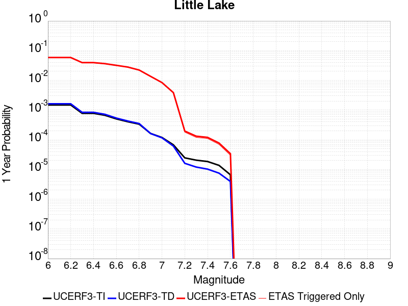 |  |

| Magnitude | 1 wk TI Prob | 1 wk TD Prob | 1 wk ETAS Prob | 1 wk ETAS/TD Gain | 1 wk ETAS Triggered Only | 1 mo TI Prob | 1 mo TD Prob | 1 mo ETAS Prob | 1 mo ETAS/TD Gain | 1 mo ETAS Triggered Only | 1 yr TI Prob | 1 yr TD Prob | 1 yr ETAS Prob | 1 yr ETAS/TD Gain | 1 yr ETAS Triggered Only | 10 yr TI Prob | 10 yr TD Prob | 10 yr ETAS Prob | 10 yr ETAS/TD Gain | 10 yr ETAS Triggered Only |
|-----|-----|-----|-----|-----|-----|-----|-----|-----|-----|-----|-----|-----|-----|-----|-----|-----|-----|-----|-----|-----|
| 6.0 | 2.8424427E-5 | 3.1205716E-5 | 0.035530098 | 1138.5767 | 0.0355 | 1.2181328E-4 | 1.3373268E-4 | 0.04358792 | 325.9332 | 0.04346 | 0.0014820677 | 0.0016271125 | 0.05870409 | 36.078693 | 0.05717 | 0.014722223 | 0.016165398 | 0.08489608 | 5.251716 | 0.06986 |
| 6.1 | 2.8424427E-5 | 3.1205716E-5 | 0.035530098 | 1138.5767 | 0.0355 | 1.2181328E-4 | 1.3373268E-4 | 0.04358792 | 325.9332 | 0.04346 | 0.0014820677 | 0.0016271125 | 0.05870409 | 36.078693 | 0.05717 | 0.014722223 | 0.016165398 | 0.08489608 | 5.251716 | 0.06986 |
| 6.2 | 2.8424427E-5 | 3.1205716E-5 | 0.035530098 | 1138.5767 | 0.0355 | 1.2181328E-4 | 1.3373268E-4 | 0.04358792 | 325.9332 | 0.04346 | 0.0014820677 | 0.0016271125 | 0.05870409 | 36.078693 | 0.05717 | 0.014722223 | 0.016165398 | 0.08489608 | 5.251716 | 0.06986 |
| 6.3 | 1.48860645E-5 | 1.6081383E-5 | 0.024655685 | 1533.1818 | 0.02464 | 6.379586E-5 | 6.8918554E-5 | 0.029956859 | 434.67044 | 0.02989 | 7.7643775E-4 | 8.387886E-4 | 0.039556287 | 47.158825 | 0.03875 | 0.007737305 | 0.008359045 | 0.05526366 | 6.611241 | 0.0473 |
| 6.4 | 1.48860645E-5 | 1.6081383E-5 | 0.024655685 | 1533.1818 | 0.02464 | 6.379586E-5 | 6.8918554E-5 | 0.029956859 | 434.67044 | 0.02989 | 7.7643775E-4 | 8.387886E-4 | 0.039556287 | 47.158825 | 0.03875 | 0.007737305 | 0.008359045 | 0.05526366 | 6.611241 | 0.0473 |
| 6.5 | 1.2797581E-5 | 1.376556E-5 | 0.022813452 | 1657.2848 | 0.0228 | 5.4845623E-5 | 5.8994065E-5 | 0.027697364 | 469.49405 | 0.02764 | 6.675408E-4 | 7.1804173E-4 | 0.03646236 | 50.780273 | 0.03577 | 0.006655392 | 0.007159767 | 0.050536957 | 7.0584636 | 0.04369 |
| 6.6 | 9.661896E-6 | 1.0289033E-5 | 0.020080082 | 1951.6007 | 0.02007 | 4.1407468E-5 | 4.40952E-5 | 0.02440302 | 553.41675 | 0.02436 | 5.040193E-4 | 5.36743E-4 | 0.032019835 | 59.6558 | 0.0315 | 0.005028777 | 0.0053560715 | 0.04357029 | 8.1347475 | 0.03842 |
| 6.7 | 7.767871E-6 | 8.199681E-6 | 0.017508056 | 2135.212 | 0.0175 | 3.329045E-5 | 3.5141096E-5 | 0.02136439 | 607.9603 | 0.02133 | 4.0523586E-4 | 4.2777258E-4 | 0.028015966 | 65.49267 | 0.0276 | 0.004044977 | 0.004270843 | 0.03770743 | 8.829036 | 0.03358 |
| 6.8 | 6.4235196E-6 | 6.735739E-6 | 0.013766643 | 2043.8207 | 0.01376 | 2.752908E-5 | 2.8867207E-5 | 0.016808383 | 582.2656 | 0.01678 | 3.35115E-4 | 3.5141438E-4 | 0.022243718 | 63.297688 | 0.0219 | 0.003346101 | 0.0035098472 | 0.029896906 | 8.518008 | 0.02648 |
| 6.9 | 3.1283696E-6 | 3.1121751E-6 | 0.008653086 | 2780.398 | 0.00865 | 1.3407229E-5 | 1.33378335E-5 | 0.010503198 | 787.47406 | 0.01049 | 1.6322079E-4 | 1.6237753E-4 | 0.013640189 | 84.00293 | 0.01348 | 0.0016310095 | 0.0016227372 | 0.017636709 | 10.868493 | 0.01604 |
| 7.0 | 2.290603E-6 | 2.2286763E-6 | 0.0053422167 | 2397.036 | 0.00534 | 9.816834E-6 | 9.551441E-6 | 0.0065194895 | 682.5661 | 0.00651 | 1.19513395E-4 | 1.1628362E-4 | 0.008415318 | 72.368904 | 0.0083 | 0.0011944914 | 0.0011623299 | 0.011090776 | 9.541849 | 0.00994 |
| 7.1 | 1.293693E-6 | 1.1776774E-6 | 0.0025211747 | 2140.8025 | 0.00252 | 5.5443866E-6 | 5.047183E-6 | 0.0031150314 | 617.1822 | 0.00311 | 6.750081E-5 | 6.1448416E-5 | 0.003861215 | 62.836685 | 0.0038 | 6.7480316E-4 | 6.1438273E-4 | 0.005261526 | 8.563922 | 0.00465 |
| 7.2 | 4.715842E-7 | 3.091732E-7 | 1.1030914E-4 | 356.7875 | 1.1E-4 | 2.0210737E-6 | 1.3250274E-6 | 1.4132484E-4 | 106.65806 | 1.4E-4 | 2.4606294E-5 | 1.6132095E-5 | 1.9612919E-4 | 12.1577015 | 1.8E-4 | 2.460357E-4 | 1.6130977E-4 | 4.1126946E-4 | 2.5495632 | 2.5E-4 |
| 7.3 | 3.9430947E-7 | 2.3096938E-7 | 8.023095E-5 | 347.36618 | 8.0E-5 | 1.6898966E-6 | 9.898685E-7 | 1.0098977E-4 | 102.02343 | 1.0E-4 | 2.0574296E-5 | 1.2051582E-5 | 1.3205013E-4 | 10.957079 | 1.2E-4 | 2.0572392E-4 | 1.2050936E-4 | 2.9048888E-4 | 2.4105089 | 1.7E-4 |
| 7.4 | 3.547123E-7 | 1.9678579E-7 | 7.019677E-5 | 356.71667 | 7.0E-5 | 1.5201948E-6 | 8.433674E-7 | 9.084329E-5 | 107.714966 | 9.0E-5 | 1.8508214E-5 | 1.02679505E-5 | 1.2026682E-4 | 11.712836 | 1.1E-4 | 1.8506673E-4 | 1.0267482E-4 | 2.626584E-4 | 2.5581577 | 1.6E-4 |
| 7.5 | 2.6354266E-7 | 1.4422719E-7 | 5.014422E-5 | 347.67523 | 5.0E-5 | 1.129468E-6 | 6.1811636E-7 | 7.061807E-5 | 114.247215 | 7.0E-5 | 1.3751187E-5 | 7.525541E-6 | 7.7525016E-5 | 10.301586 | 7.0E-5 | 1.3750336E-4 | 7.5252916E-5 | 1.9524389E-4 | 2.5945027 | 1.2E-4 |
| 7.6 | 1.269913E-7 | 7.572344E-8 | 2.0075722E-5 | 265.119 | 2.0E-5 | 5.4424834E-7 | 3.24529E-7 | 3.032452E-5 | 93.441635 | 3.0E-5 | 6.6262032E-6 | 3.9511337E-6 | 3.3951015E-5 | 8.592728 | 3.0E-5 | 6.626006E-5 | 3.9510673E-5 | 1.09507906E-4 | 2.7716033 | 7.0E-5 |

## Airport Lake
*[(top)](#table-of-contents)*

| 1 Week | 1 Month | 1 Year | 10 Year |
|-----|-----|-----|-----|
|  |  | 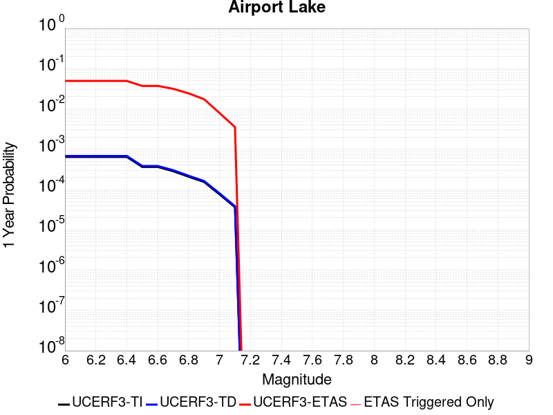 |  |

| Magnitude | 1 wk TI Prob | 1 wk TD Prob | 1 wk ETAS Prob | 1 wk ETAS/TD Gain | 1 wk ETAS Triggered Only | 1 mo TI Prob | 1 mo TD Prob | 1 mo ETAS Prob | 1 mo ETAS/TD Gain | 1 mo ETAS Triggered Only | 1 yr TI Prob | 1 yr TD Prob | 1 yr ETAS Prob | 1 yr ETAS/TD Gain | 1 yr ETAS Triggered Only | 10 yr TI Prob | 10 yr TD Prob | 10 yr ETAS Prob | 10 yr ETAS/TD Gain | 10 yr ETAS Triggered Only |
|-----|-----|-----|-----|-----|-----|-----|-----|-----|-----|-----|-----|-----|-----|-----|-----|-----|-----|-----|-----|-----|
| 6.0 | 1.2387061E-5 | 1.3103157E-5 | 0.031772688 | 2424.8115 | 0.03176 | 5.3086325E-5 | 5.615534E-5 | 0.038424 | 684.2449 | 0.03837 | 6.461343E-4 | 6.8350515E-4 | 0.04961004 | 72.58181 | 0.04896 | 0.0064425888 | 0.0068168393 | 0.06526567 | 9.574183 | 0.05885 |
| 6.1 | 1.2387061E-5 | 1.3103157E-5 | 0.031772688 | 2424.8115 | 0.03176 | 5.3086325E-5 | 5.615534E-5 | 0.038424 | 684.2449 | 0.03837 | 6.461343E-4 | 6.8350515E-4 | 0.04961004 | 72.58181 | 0.04896 | 0.0064425888 | 0.0068168393 | 0.06526567 | 9.574183 | 0.05885 |
| 6.2 | 1.2387061E-5 | 1.3103157E-5 | 0.031772688 | 2424.8115 | 0.03176 | 5.3086325E-5 | 5.615534E-5 | 0.038424 | 684.2449 | 0.03837 | 6.461343E-4 | 6.8350515E-4 | 0.04961004 | 72.58181 | 0.04896 | 0.0064425888 | 0.0068168393 | 0.06526567 | 9.574183 | 0.05885 |
| 6.3 | 1.2387061E-5 | 1.3103157E-5 | 0.031772688 | 2424.8115 | 0.03176 | 5.3086325E-5 | 5.615534E-5 | 0.038424 | 684.2449 | 0.03837 | 6.461343E-4 | 6.8350515E-4 | 0.04961004 | 72.58181 | 0.04896 | 0.0064425888 | 0.0068168393 | 0.06526567 | 9.574183 | 0.05885 |
| 6.4 | 1.2387061E-5 | 1.3103157E-5 | 0.031772688 | 2424.8115 | 0.03176 | 5.3086325E-5 | 5.615534E-5 | 0.038424 | 684.2449 | 0.03837 | 6.461343E-4 | 6.8350515E-4 | 0.04961004 | 72.58181 | 0.04896 | 0.0064425888 | 0.0068168393 | 0.06526567 | 9.574183 | 0.05885 |
| 6.5 | 6.9922594E-6 | 7.384925E-6 | 0.024127208 | 3267.0889 | 0.02412 | 2.996648E-5 | 3.1649324E-5 | 0.029210726 | 922.9494 | 0.02918 | 3.6478083E-4 | 3.8526783E-4 | 0.037391007 | 97.05198 | 0.03702 | 0.003641826 | 0.0038465366 | 0.048225172 | 12.537297 | 0.04455 |
| 6.6 | 6.9922594E-6 | 7.384925E-6 | 0.024127208 | 3267.0889 | 0.02412 | 2.996648E-5 | 3.1649324E-5 | 0.029210726 | 922.9494 | 0.02918 | 3.6478083E-4 | 3.8526783E-4 | 0.037391007 | 97.05198 | 0.03702 | 0.003641826 | 0.0038465366 | 0.048225172 | 12.537297 | 0.04455 |
| 6.7 | 5.477277E-6 | 5.7860684E-6 | 0.020445667 | 3533.6028 | 0.02044 | 2.3473833E-5 | 2.4797222E-5 | 0.024734184 | 997.4579 | 0.02471 | 2.8575645E-4 | 3.0186825E-4 | 0.03169239 | 104.98749 | 0.0314 | 0.0028538927 | 0.003014966 | 0.040800698 | 13.532723 | 0.0379 |
| 6.8 | 3.9950432E-6 | 4.2190873E-6 | 0.015774153 | 3738.7598 | 0.01577 | 1.7121502E-5 | 1.8081691E-5 | 0.019057738 | 1053.9797 | 0.01904 | 2.0843433E-4 | 2.2012512E-4 | 0.02444479 | 111.04953 | 0.02423 | 0.0020823893 | 0.0021993418 | 0.031135561 | 14.156763 | 0.029 |
| 6.9 | 2.95695E-6 | 3.1230243E-6 | 0.011213088 | 3590.458 | 0.01121 | 1.2672582E-5 | 1.3384334E-5 | 0.013593202 | 1015.60547 | 0.01358 | 1.5427776E-4 | 1.6294434E-4 | 0.017480122 | 107.27664 | 0.01732 | 0.001541707 | 0.0016284712 | 0.022254827 | 13.666086 | 0.02066 |
| 7.0 | 1.456072E-6 | 1.540812E-6 | 0.005071533 | 3291.4678 | 0.00507 | 6.2402937E-6 | 6.603469E-6 | 0.0061965627 | 938.3799 | 0.00619 | 7.597293E-5 | 8.039528E-5 | 0.007949763 | 98.88345 | 0.00787 | 7.594696E-4 | 8.0376083E-4 | 0.010126262 | 12.5986 | 0.00933 |
| 7.1 | 6.995192E-7 | 7.4089746E-7 | 0.0023507392 | 3172.8267 | 0.00235 | 2.997936E-6 | 3.1752747E-6 | 0.002913166 | 917.45325 | 0.00291 | 3.649926E-5 | 3.865897E-5 | 0.0035585228 | 92.04909 | 0.00352 | 3.6493264E-4 | 3.865897E-4 | 0.0046349466 | 11.989318 | 0.00425 |

## Owl Lake
*[(top)](#table-of-contents)*

| 1 Week | 1 Month | 1 Year | 10 Year |
|-----|-----|-----|-----|
|  |  |  |  |

| Magnitude | 1 wk TI Prob | 1 wk TD Prob | 1 wk ETAS Prob | 1 wk ETAS/TD Gain | 1 wk ETAS Triggered Only | 1 mo TI Prob | 1 mo TD Prob | 1 mo ETAS Prob | 1 mo ETAS/TD Gain | 1 mo ETAS Triggered Only | 1 yr TI Prob | 1 yr TD Prob | 1 yr ETAS Prob | 1 yr ETAS/TD Gain | 1 yr ETAS Triggered Only | 10 yr TI Prob | 10 yr TD Prob | 10 yr ETAS Prob | 10 yr ETAS/TD Gain | 10 yr ETAS Triggered Only |
|-----|-----|-----|-----|-----|-----|-----|-----|-----|-----|-----|-----|-----|-----|-----|-----|-----|-----|-----|-----|-----|
| 6.0 | 5.0320643E-5 | 6.6358676E-5 | 0.016815247 | 253.39938 | 0.01675 | 2.1564208E-4 | 2.843643E-4 | 0.021968197 | 77.25371 | 0.02169 | 0.0026222812 | 0.003457547 | 0.03452974 | 9.9867735 | 0.03118 | 0.02591553 | 0.034141295 | 0.07367389 | 2.1579115 | 0.04093 |
| 6.1 | 5.0320643E-5 | 6.6358676E-5 | 0.016815247 | 253.39938 | 0.01675 | 2.1564208E-4 | 2.843643E-4 | 0.021968197 | 77.25371 | 0.02169 | 0.0026222812 | 0.003457547 | 0.03452974 | 9.9867735 | 0.03118 | 0.02591553 | 0.034141295 | 0.07367389 | 2.1579115 | 0.04093 |
| 6.2 | 2.4125871E-5 | 3.0980515E-5 | 0.013220572 | 426.73828 | 0.01319 | 1.0339249E-4 | 1.3276804E-4 | 0.016870545 | 127.067825 | 0.01674 | 0.0012580766 | 0.0016154252 | 0.02535701 | 15.696802 | 0.02378 | 0.012509781 | 0.016070755 | 0.0463069 | 2.881439 | 0.03073 |
| 6.3 | 1.7433485E-5 | 2.2355545E-5 | 0.01191209 | 532.8472 | 0.01189 | 7.471279E-5 | 9.580685E-5 | 0.01509437 | 157.55 | 0.015 | 9.0924866E-4 | 0.001165962 | 0.022151465 | 18.998446 | 0.02101 | 0.009055373 | 0.0116291465 | 0.038196556 | 3.2845535 | 0.02688 |
| 6.4 | 1.7433485E-5 | 2.2355545E-5 | 0.01191209 | 532.8472 | 0.01189 | 7.471279E-5 | 9.580685E-5 | 0.01509437 | 157.55 | 0.015 | 9.0924866E-4 | 0.001165962 | 0.022151465 | 18.998446 | 0.02101 | 0.009055373 | 0.0116291465 | 0.038196556 | 3.2845535 | 0.02688 |
| 6.5 | 1.5182742E-5 | 1.9429277E-5 | 0.011539206 | 593.90814 | 0.01152 | 6.506727E-5 | 8.3266525E-5 | 0.014552061 | 174.76485 | 0.01447 | 7.919061E-4 | 0.0010134344 | 0.021093065 | 20.81345 | 0.0201 | 0.0078909 | 0.010118678 | 0.035499234 | 3.508288 | 0.02564 |
| 6.6 | 6.7271576E-6 | 8.547518E-6 | 0.009738464 | 1139.3324 | 0.00973 | 2.8830356E-5 | 3.6631736E-5 | 0.011966195 | 326.66196 | 0.01193 | 3.5095305E-4 | 4.4590578E-4 | 0.016618691 | 37.269512 | 0.01618 | 0.0035039932 | 0.0044680187 | 0.024527987 | 5.489679 | 0.02015 |
| 6.7 | 6.682835E-6 | 8.479961E-6 | 0.009718398 | 1146.0427 | 0.00971 | 2.8640408E-5 | 3.6342215E-5 | 0.011935909 | 328.431 | 0.0119 | 3.4864116E-4 | 4.423823E-4 | 0.016575241 | 37.46814 | 0.01614 | 0.003480947 | 0.0044329325 | 0.024443831 | 5.5141444 | 0.0201 |
| 6.8 | 6.5774975E-6 | 8.326427E-6 | 0.009688246 | 1163.5538 | 0.00968 | 2.8188972E-5 | 3.5684232E-5 | 0.01190526 | 333.62805 | 0.01187 | 3.4314668E-4 | 4.3437455E-4 | 0.016537378 | 38.071697 | 0.01611 | 0.0034261728 | 0.0043531056 | 0.024315827 | 5.585857 | 0.02005 |
| 6.9 | 6.363419E-6 | 7.999591E-6 | 0.009657922 | 1207.3021 | 0.00965 | 2.727151E-5 | 3.428354E-5 | 0.011843879 | 345.46838 | 0.01181 | 3.3198006E-4 | 4.1732774E-4 | 0.016450634 | 39.41898 | 0.01604 | 0.0033148455 | 0.0041830647 | 0.024039654 | 5.7469 | 0.01994 |
| 7.0 | 6.1342453E-6 | 7.631779E-6 | 0.0095975585 | 1257.5781 | 0.00959 | 2.6289357E-5 | 3.2707245E-5 | 0.011762324 | 359.6244 | 0.01173 | 3.2002592E-4 | 3.9814346E-4 | 0.0163218 | 40.994774 | 0.01593 | 0.0031956544 | 0.003991739 | 0.023672862 | 5.9304633 | 0.01976 |
| 7.1 | 5.842926E-6 | 7.142312E-6 | 0.008977078 | 1256.8868 | 0.00897 | 2.504087E-5 | 3.060958E-5 | 0.011060272 | 361.33368 | 0.01103 | 3.0482994E-4 | 3.7261334E-4 | 0.015417006 | 41.375347 | 0.01505 | 0.0030441214 | 0.0037371595 | 0.022287574 | 5.9637737 | 0.01862 |
| 7.2 | 4.77173E-6 | 5.358478E-6 | 0.0058453274 | 1090.8558 | 0.00584 | 2.045011E-5 | 2.2964727E-5 | 0.007252799 | 315.82343 | 0.00723 | 2.4895166E-4 | 2.7956374E-4 | 0.0099868495 | 35.722977 | 0.00971 | 0.0024867293 | 0.0028086212 | 0.014884609 | 5.299614 | 0.01211 |
| 7.3 | 3.0494948E-6 | 2.710356E-6 | 0.0013827066 | 510.1568 | 0.00138 | 1.3069198E-5 | 1.1615762E-5 | 0.001801595 | 155.09917 | 0.00179 | 1.5910587E-4 | 1.4141288E-4 | 0.0026410595 | 18.67623 | 0.0025 | 0.0015899199 | 0.0014231089 | 0.004538669 | 3.189263 | 0.00312 |
| 7.4 | 2.7263884E-6 | 2.3055634E-6 | 8.9230353E-4 | 387.0219 | 8.9E-4 | 1.1684469E-5 | 9.880949E-6 | 0.0012498687 | 126.49278 | 0.00124 | 1.4224913E-4 | 1.2029401E-4 | 0.0018100907 | 15.047222 | 0.00169 | 0.0014215811 | 0.0012110578 | 0.0033185023 | 2.7401686 | 0.00211 |
| 7.5 | 2.6090431E-6 | 2.1655019E-6 | 8.021638E-4 | 370.4286 | 8.0E-4 | 1.1181565E-5 | 9.2806895E-6 | 0.0011292703 | 121.679565 | 0.00112 | 1.3612706E-4 | 1.1298663E-4 | 0.0015828206 | 14.008919 | 0.00147 | 0.001360437 | 0.0011378126 | 0.0029657304 | 2.6065192 | 0.00183 |
| 7.6 | 2.3008756E-6 | 1.8726826E-6 | 6.418715E-4 | 342.7551 | 6.4E-4 | 9.860858E-6 | 8.025758E-6 | 8.4801903E-4 | 105.66217 | 8.4E-4 | 1.20049335E-4 | 9.770931E-5 | 0.0011976018 | 12.2567835 | 0.0011 | 0.001199845 | 9.848307E-4 | 0.002323511 | 2.3593001 | 0.00134 |
| 7.7 | 1.7184348E-6 | 1.341808E-6 | 3.613413E-4 | 269.29434 | 3.6E-4 | 7.3646997E-6 | 5.750593E-6 | 5.0574774E-4 | 87.94705 | 5.0E-4 | 8.966153E-5 | 7.0011265E-5 | 7.2996505E-4 | 10.426394 | 6.6E-4 | 8.962536E-4 | 7.0769014E-4 | 0.0014671523 | 2.0731564 | 7.6E-4 |
| 7.8 | 8.4612907E-7 | 8.4054994E-7 | 1.908404E-4 | 227.0423 | 1.9E-4 | 3.6262625E-6 | 3.602352E-6 | 2.5360147E-4 | 70.39885 | 2.5E-4 | 4.4148852E-5 | 4.3857777E-5 | 4.1384154E-4 | 9.43599 | 3.7E-4 | 4.414008E-4 | 4.4386165E-4 | 8.23693E-4 | 1.8557426 | 3.8E-4 |
| 7.9 | 2.716738E-7 | 3.7681625E-7 | 8.037678E-5 | 213.305 | 8.0E-5 | 1.1643157E-6 | 1.6149258E-6 | 1.01614765E-4 | 62.92225 | 1.0E-4 | 1.4175452E-5 | 1.9661555E-5 | 1.49659E-4 | 7.6117578 | 1.3E-4 | 1.4174548E-4 | 1.9829652E-4 | 3.2827075E-4 | 1.6554539 | 1.3E-4 |
| 8.0 | 2.1995428E-8 | 3.3853325E-8 | 3.3853325E-8 | 1.0 | 0.0 | 9.426611E-8 | 1.4508568E-7 | 1.0145084E-5 | 69.92478 | 1.0E-5 | 1.1476893E-6 | 1.7664173E-6 | 1.1766399E-5 | 6.661166 | 1.0E-5 | 1.14768345E-5 | 1.7869768E-5 | 2.786959E-5 | 1.5595943 | 1.0E-5 |

## Panamint Valley
*[(top)](#table-of-contents)*

| 1 Week | 1 Month | 1 Year | 10 Year |
|-----|-----|-----|-----|
|  |  |  |  |

| Magnitude | 1 wk TI Prob | 1 wk TD Prob | 1 wk ETAS Prob | 1 wk ETAS/TD Gain | 1 wk ETAS Triggered Only | 1 mo TI Prob | 1 mo TD Prob | 1 mo ETAS Prob | 1 mo ETAS/TD Gain | 1 mo ETAS Triggered Only | 1 yr TI Prob | 1 yr TD Prob | 1 yr ETAS Prob | 1 yr ETAS/TD Gain | 1 yr ETAS Triggered Only | 10 yr TI Prob | 10 yr TD Prob | 10 yr ETAS Prob | 10 yr ETAS/TD Gain | 10 yr ETAS Triggered Only |
|-----|-----|-----|-----|-----|-----|-----|-----|-----|-----|-----|-----|-----|-----|-----|-----|-----|-----|-----|-----|-----|
| 6.0 | 3.0211835E-5 | 3.3984263E-5 | 0.013723519 | 403.81982 | 0.01369 | 1.2947287E-4 | 1.4563887E-4 | 0.017823065 | 122.37848 | 0.01768 | 0.0015751923 | 0.0017717406 | 0.027226562 | 15.3671255 | 0.0255 | 0.015640736 | 0.017583003 | 0.0504645 | 2.8700728 | 0.03347 |
| 6.1 | 3.0211835E-5 | 3.3984263E-5 | 0.013723519 | 403.81982 | 0.01369 | 1.2947287E-4 | 1.4563887E-4 | 0.017823065 | 122.37848 | 0.01768 | 0.0015751923 | 0.0017717406 | 0.027226562 | 15.3671255 | 0.0255 | 0.015640736 | 0.017583003 | 0.0504645 | 2.8700728 | 0.03347 |
| 6.2 | 3.0211835E-5 | 3.3984263E-5 | 0.013723519 | 403.81982 | 0.01369 | 1.2947287E-4 | 1.4563887E-4 | 0.017823065 | 122.37848 | 0.01768 | 0.0015751923 | 0.0017717406 | 0.027226562 | 15.3671255 | 0.0255 | 0.015640736 | 0.017583003 | 0.0504645 | 2.8700728 | 0.03347 |
| 6.3 | 2.8573924E-5 | 3.2102445E-5 | 0.013251678 | 412.79343 | 0.01322 | 1.2245393E-4 | 1.375748E-4 | 0.01710524 | 124.33411 | 0.01697 | 0.001489857 | 0.0016737141 | 0.025962994 | 15.512202 | 0.02433 | 0.01479908 | 0.016618038 | 0.047938753 | 2.8847423 | 0.03185 |
| 6.4 | 2.8573924E-5 | 3.2102445E-5 | 0.013251678 | 412.79343 | 0.01322 | 1.2245393E-4 | 1.375748E-4 | 0.01710524 | 124.33411 | 0.01697 | 0.001489857 | 0.0016737141 | 0.025962994 | 15.512202 | 0.02433 | 0.01479908 | 0.016618038 | 0.047938753 | 2.8847423 | 0.03185 |
| 6.5 | 2.7468774E-5 | 3.0828138E-5 | 0.012970429 | 420.73343 | 0.01294 | 1.1771801E-4 | 1.3211406E-4 | 0.016729921 | 126.6324 | 0.0166 | 0.0014322745 | 0.0016073292 | 0.025319155 | 15.752314 | 0.02375 | 0.014230782 | 0.015963882 | 0.046469003 | 2.9108834 | 0.031 |
| 6.6 | 2.6135967E-5 | 2.9252153E-5 | 0.0126688825 | 433.09232 | 0.01264 | 1.1200648E-4 | 1.2536049E-4 | 0.016293334 | 129.97183 | 0.01617 | 0.0013628257 | 0.0015252219 | 0.024510112 | 16.069866 | 0.02302 | 0.013544982 | 0.015154343 | 0.04472926 | 2.95158 | 0.03003 |
| 6.7 | 2.4498746E-5 | 2.7341044E-5 | 0.012057012 | 440.98578 | 0.01203 | 1.04990395E-4 | 1.17170785E-4 | 0.015475371 | 132.07533 | 0.01536 | 0.0012775084 | 0.0014256459 | 0.02318458 | 16.26251 | 0.02179 | 0.012701893 | 0.014171593 | 0.04222827 | 2.9797828 | 0.02846 |
| 6.8 | 2.2244329E-5 | 2.4935374E-5 | 0.011364653 | 455.76428 | 0.01134 | 9.532935E-5 | 1.0686163E-4 | 0.014545319 | 136.11357 | 0.01444 | 0.0011600169 | 0.0013002857 | 0.021533942 | 16.56093 | 0.02026 | 0.011539802 | 0.012932955 | 0.038873076 | 3.0057383 | 0.02628 |
| 6.9 | 1.9902658E-5 | 2.2290182E-5 | 0.010422058 | 467.5627 | 0.0104 | 8.529431E-5 | 9.552596E-5 | 0.013224272 | 138.43642 | 0.01313 | 0.0010379635 | 0.0011624265 | 0.01946113 | 16.741816 | 0.01832 | 0.010331288 | 0.011569021 | 0.03475761 | 3.0043693 | 0.02346 |
| 7.0 | 1.8353881E-5 | 2.056605E-5 | 0.009810365 | 477.01743 | 0.00979 | 7.865712E-5 | 8.813734E-5 | 0.01242705 | 140.99641 | 0.01234 | 9.5722964E-4 | 0.0010725616 | 0.018064318 | 16.84222 | 0.01701 | 0.009531168 | 0.01067939 | 0.032058608 | 3.0019138 | 0.02161 |
| 7.1 | 1.7667631E-5 | 1.9772435E-5 | 0.009529584 | 481.9631 | 0.00951 | 7.571623E-5 | 8.4736355E-5 | 0.0120837195 | 142.60373 | 0.012 | 9.2145515E-4 | 0.0010311945 | 0.017474221 | 16.945612 | 0.01646 | 0.009176437 | 0.0102695925 | 0.030954959 | 3.0142343 | 0.0209 |
| 7.2 | 1.6381597E-5 | 1.8158042E-5 | 0.008578002 | 472.4079 | 0.00856 | 7.020495E-5 | 7.781795E-5 | 0.010866978 | 139.64615 | 0.01079 | 8.544101E-4 | 9.470391E-4 | 0.015623127 | 16.496813 | 0.01469 | 0.008511325 | 0.009435269 | 0.028067792 | 2.974774 | 0.01881 |
| 7.3 | 1.4520491E-5 | 1.596657E-5 | 0.007145853 | 447.55087 | 0.00713 | 6.222919E-5 | 6.842646E-5 | 0.009037812 | 132.08067 | 0.00897 | 7.57377E-4 | 8.327899E-4 | 0.012982663 | 15.589362 | 0.01216 | 0.0075480095 | 0.008300399 | 0.023711411 | 2.856659 | 0.01554 |
| 7.4 | 1.2852287E-5 | 1.41454875E-5 | 0.006914048 | 488.78116 | 0.0069 | 5.5080065E-5 | 6.06222E-5 | 0.008720097 | 143.8433 | 0.00866 | 6.7039346E-4 | 7.378411E-4 | 0.012479171 | 16.913088 | 0.01175 | 0.0066837464 | 0.007357429 | 0.022207363 | 3.018359 | 0.01496 |
| 7.5 | 1.1637851E-5 | 1.2836868E-5 | 0.0068527493 | 533.83344 | 0.00684 | 4.987555E-5 | 5.5014076E-5 | 0.008644542 | 157.13327 | 0.00859 | 6.070656E-4 | 6.696062E-4 | 0.012291819 | 18.356787 | 0.01163 | 0.006054099 | 0.0066793845 | 0.02135073 | 3.1965117 | 0.01477 |
| 7.6 | 3.0068115E-6 | 3.3330623E-6 | 0.003053323 | 916.07135 | 0.00305 | 1.2886271E-5 | 1.4284516E-5 | 0.0037742308 | 264.21832 | 0.00376 | 1.5687906E-4 | 1.7390738E-4 | 0.0052230293 | 30.033396 | 0.00505 | 0.0015676835 | 0.0017397973 | 0.007998888 | 4.597598 | 0.00627 |

## Garlock (East)
*[(top)](#table-of-contents)*

| 1 Week | 1 Month | 1 Year | 10 Year |
|-----|-----|-----|-----|
| 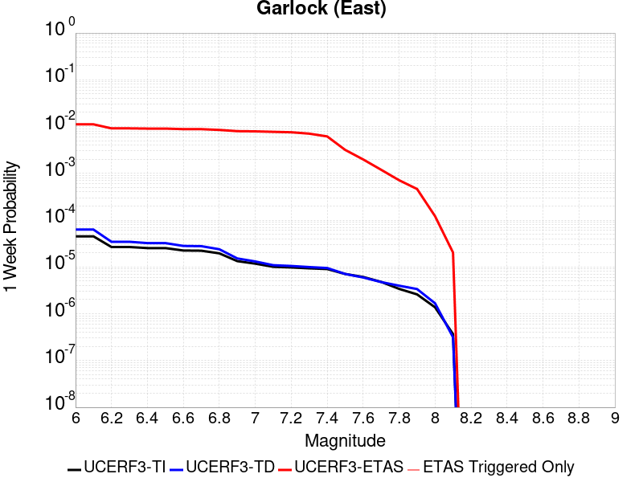 |  |  | 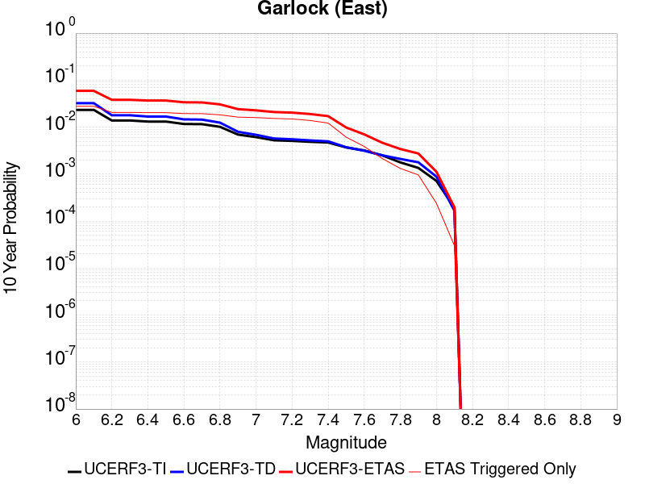 |

| Magnitude | 1 wk TI Prob | 1 wk TD Prob | 1 wk ETAS Prob | 1 wk ETAS/TD Gain | 1 wk ETAS Triggered Only | 1 mo TI Prob | 1 mo TD Prob | 1 mo ETAS Prob | 1 mo ETAS/TD Gain | 1 mo ETAS Triggered Only | 1 yr TI Prob | 1 yr TD Prob | 1 yr ETAS Prob | 1 yr ETAS/TD Gain | 1 yr ETAS Triggered Only | 10 yr TI Prob | 10 yr TD Prob | 10 yr ETAS Prob | 10 yr ETAS/TD Gain | 10 yr ETAS Triggered Only |
|-----|-----|-----|-----|-----|-----|-----|-----|-----|-----|-----|-----|-----|-----|-----|-----|-----|-----|-----|-----|-----|
| 6.0 | 4.5092507E-5 | 6.2904815E-5 | 0.0111622065 | 177.44597 | 0.0111 | 1.9323928E-4 | 2.6956675E-4 | 0.014845637 | 55.072212 | 0.01458 | 0.0023501497 | 0.003277482 | 0.024208656 | 7.3863583 | 0.021 | 0.023254504 | 0.03235377 | 0.059167247 | 1.828759 | 0.02771 |
| 6.1 | 4.5092507E-5 | 6.2904815E-5 | 0.0111622065 | 177.44597 | 0.0111 | 1.9323928E-4 | 2.6956675E-4 | 0.014845637 | 55.072212 | 0.01458 | 0.0023501497 | 0.003277482 | 0.024208656 | 7.3863583 | 0.021 | 0.023254504 | 0.03235377 | 0.059167247 | 1.828759 | 0.02771 |
| 6.2 | 2.6674514E-5 | 3.4511588E-5 | 0.009154197 | 265.24994 | 0.00912 | 1.1431433E-4 | 1.4789861E-4 | 0.011736184 | 79.352905 | 0.01159 | 0.0013908884 | 0.0017992114 | 0.01780037 | 9.893429 | 0.01603 | 0.01382215 | 0.017872788 | 0.03806532 | 2.1297922 | 0.02056 |
| 6.3 | 2.6674514E-5 | 3.4511588E-5 | 0.009154197 | 265.24994 | 0.00912 | 1.1431433E-4 | 1.4789861E-4 | 0.011736184 | 79.352905 | 0.01159 | 0.0013908884 | 0.0017992114 | 0.01780037 | 9.893429 | 0.01603 | 0.01382215 | 0.017872788 | 0.03806532 | 2.1297922 | 0.02056 |
| 6.4 | 2.5312667E-5 | 3.2340467E-5 | 0.009052048 | 279.8985 | 0.00902 | 1.0847834E-4 | 1.3859481E-4 | 0.011607005 | 83.747765 | 0.01147 | 0.0013199237 | 0.0016861152 | 0.017499408 | 10.378536 | 0.01584 | 0.013121112 | 0.016772287 | 0.036721975 | 2.1894438 | 0.02029 |
| 6.5 | 2.5312667E-5 | 3.2340467E-5 | 0.009052048 | 279.8985 | 0.00902 | 1.0847834E-4 | 1.3859481E-4 | 0.011607005 | 83.747765 | 0.01147 | 0.0013199237 | 0.0016861152 | 0.017499408 | 10.378536 | 0.01584 | 0.013121112 | 0.016772287 | 0.036721975 | 2.1894438 | 0.02029 |
| 6.6 | 2.246556E-5 | 2.8134691E-5 | 0.008817887 | 313.4169 | 0.00879 | 9.627742E-5 | 1.2057181E-4 | 0.011219233 | 93.050224 | 0.0111 | 0.0011715472 | 0.0014669969 | 0.016624728 | 11.332491 | 0.01518 | 0.011653901 | 0.014613169 | 0.033739526 | 2.308844 | 0.01941 |
| 6.7 | 2.2241198E-5 | 2.7804432E-5 | 0.00880756 | 316.76822 | 0.00878 | 9.531594E-5 | 1.1915654E-4 | 0.011187837 | 93.89193 | 0.01107 | 0.0011598538 | 0.0014497889 | 0.016557854 | 11.420872 | 0.01513 | 0.011538187 | 0.014442829 | 0.03349365 | 2.3190503 | 0.01933 |
| 6.8 | 1.9528685E-5 | 2.3898969E-5 | 0.008473697 | 354.5633 | 0.00845 | 8.369167E-5 | 1.0242024E-4 | 0.010701335 | 104.484566 | 0.0106 | 0.0010184698 | 0.0012462728 | 0.015558413 | 12.483955 | 0.01433 | 0.010138147 | 0.012436723 | 0.030440003 | 2.44759 | 0.01823 |
| 6.9 | 1.3318621E-5 | 1.5198818E-5 | 0.007975078 | 524.717 | 0.00796 | 5.7078556E-5 | 6.51362E-5 | 0.009884496 | 151.7512 | 0.00982 | 6.9470983E-4 | 7.927504E-4 | 0.013832405 | 17.448626 | 0.01305 | 0.0069254204 | 0.007940721 | 0.024121208 | 3.0376596 | 0.01631 |
| 7.0 | 1.1760853E-5 | 1.3107653E-5 | 0.007903004 | 602.93054 | 0.00789 | 5.0402683E-5 | 5.6174475E-5 | 0.009775628 | 174.02261 | 0.00972 | 6.134799E-4 | 6.8371464E-4 | 0.013534922 | 19.796158 | 0.01286 | 0.0061178906 | 0.006857401 | 0.022707958 | 3.3114524 | 0.01596 |
| 7.1 | 1.0064758E-5 | 1.0902761E-5 | 0.0077208187 | 708.15265 | 0.00771 | 4.3133965E-5 | 4.67253E-5 | 0.009526283 | 203.87846 | 0.00948 | 5.2502943E-4 | 5.6873553E-4 | 0.012971678 | 22.807924 | 0.01241 | 0.005237907 | 0.0057133473 | 0.02091599 | 3.6608994 | 0.01529 |
| 7.2 | 9.768808E-6 | 1.0498628E-5 | 0.0075604194 | 720.134 | 0.00755 | 4.186565E-5 | 4.499337E-5 | 0.009344575 | 207.68784 | 0.0093 | 5.095951E-4 | 5.4766005E-4 | 0.012651028 | 23.100147 | 0.01211 | 0.0050842804 | 0.005503584 | 0.02032158 | 3.6924267 | 0.0149 |
| 7.3 | 9.344516E-6 | 9.9442705E-6 | 0.007059874 | 709.9439 | 0.00705 | 4.004731E-5 | 4.2617627E-5 | 0.008702248 | 204.19365 | 0.00866 | 4.8746695E-4 | 5.187495E-4 | 0.011742924 | 22.636982 | 0.01123 | 0.0048639905 | 0.005215269 | 0.018963194 | 3.6360912 | 0.01382 |
| 7.4 | 9.023491E-6 | 9.490441E-6 | 0.006159432 | 649.0143 | 0.00615 | 3.867153E-5 | 4.0672705E-5 | 0.007610365 | 187.11234 | 0.00757 | 4.7072413E-4 | 4.95081E-4 | 0.010340204 | 20.885883 | 0.00985 | 0.004697283 | 0.0049787266 | 0.017108036 | 3.4362273 | 0.01219 |
| 7.5 | 7.081253E-6 | 7.0873994E-6 | 0.003177065 | 448.2695 | 0.00317 | 3.0347876E-5 | 3.0374218E-5 | 0.0039802543 | 131.04054 | 0.00395 | 3.6942272E-4 | 3.697441E-4 | 0.005217951 | 14.11233 | 0.00485 | 0.003688092 | 0.0037244745 | 0.009801756 | 2.6317148 | 0.0061 |
| 7.6 | 6.116396E-6 | 5.9589424E-6 | 0.0019859471 | 333.27176 | 0.00198 | 2.6212863E-5 | 2.5538076E-5 | 0.002535474 | 99.282104 | 0.00251 | 3.1909486E-4 | 3.1088197E-4 | 0.0033599338 | 10.807747 | 0.00305 | 0.0031863707 | 0.0031359126 | 0.0069937767 | 2.2302206 | 0.00387 |
| 7.7 | 4.797145E-6 | 4.7571157E-6 | 0.0011947515 | 251.15039 | 0.00119 | 2.055903E-5 | 2.0387479E-5 | 0.0014203589 | 69.6682 | 0.0014 | 2.5027743E-4 | 2.481894E-4 | 0.0019377699 | 7.8076253 | 0.00169 | 0.0024999576 | 0.0025094065 | 0.0046440363 | 1.8506513 | 0.00214 |
| 7.8 | 3.4028885E-6 | 3.978375E-6 | 7.139756E-4 | 179.46413 | 7.1E-4 | 1.4583726E-5 | 1.7050066E-5 | 8.7703543E-4 | 51.438828 | 8.6E-4 | 1.775424E-4 | 2.0756487E-4 | 0.0012673448 | 6.1057773 | 0.00106 | 0.0017740062 | 0.0021012141 | 0.0034184405 | 1.6268883 | 0.00132 |
| 7.9 | 2.5928412E-6 | 3.372436E-6 | 4.6337087E-4 | 137.39946 | 4.6E-4 | 1.1112129E-5 | 1.4453217E-5 | 6.044447E-4 | 41.82077 | 5.9E-4 | 1.3528178E-4 | 1.7595377E-4 | 9.1582356E-4 | 5.2049103 | 7.4E-4 | 0.0013519945 | 0.0017812426 | 0.0027395326 | 1.5379896 | 9.6E-4 |
| 8.0 | 1.3743648E-6 | 1.6734741E-6 | 1.2167327E-4 | 72.70699 | 1.2E-4 | 5.8901214E-6 | 7.1720124E-6 | 1.5717094E-4 | 21.914482 | 1.5E-4 | 7.1709874E-5 | 8.731578E-5 | 2.5730094E-4 | 2.9467862 | 1.7E-4 | 7.1686733E-4 | 8.837377E-4 | 0.0011235257 | 1.2713338 | 2.4E-4 |
| 8.1 | 3.6733252E-7 | 3.1489736E-7 | 2.031489E-5 | 64.51273 | 2.0E-5 | 1.5742813E-6 | 1.3495595E-6 | 3.134952E-5 | 23.229445 | 3.0E-5 | 1.9166706E-5 | 1.643078E-5 | 4.6430287E-5 | 2.8258114 | 3.0E-5 | 1.9165053E-4 | 1.662928E-4 | 1.962878E-4 | 1.1803747 | 3.0E-5 |

## Hunter Mountain-Saline Valley
*[(top)](#table-of-contents)*

| 1 Week | 1 Month | 1 Year | 10 Year |
|-----|-----|-----|-----|
|  |  | 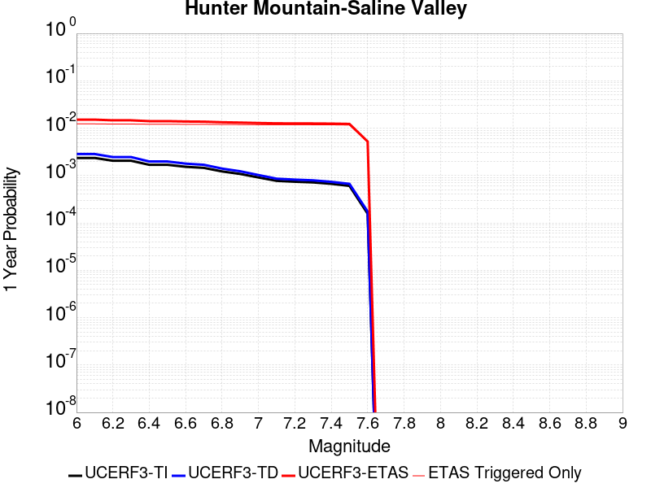 |  |

| Magnitude | 1 wk TI Prob | 1 wk TD Prob | 1 wk ETAS Prob | 1 wk ETAS/TD Gain | 1 wk ETAS Triggered Only | 1 mo TI Prob | 1 mo TD Prob | 1 mo ETAS Prob | 1 mo ETAS/TD Gain | 1 mo ETAS Triggered Only | 1 yr TI Prob | 1 yr TD Prob | 1 yr ETAS Prob | 1 yr ETAS/TD Gain | 1 yr ETAS Triggered Only | 10 yr TI Prob | 10 yr TD Prob | 10 yr ETAS Prob | 10 yr ETAS/TD Gain | 10 yr ETAS Triggered Only |
|-----|-----|-----|-----|-----|-----|-----|-----|-----|-----|-----|-----|-----|-----|-----|-----|-----|-----|-----|-----|-----|
| 6.0 | 4.5103672E-5 | 5.456906E-5 | 0.007234177 | 132.56921 | 0.00718 | 1.9328714E-4 | 2.3384714E-4 | 0.009281731 | 39.691444 | 0.00905 | 0.002350731 | 0.0028435462 | 0.015118542 | 5.3167915 | 0.01231 | 0.023260195 | 0.028092625 | 0.043361288 | 1.5435115 | 0.01571 |
| 6.1 | 4.5103672E-5 | 5.456906E-5 | 0.007234177 | 132.56921 | 0.00718 | 1.9328714E-4 | 2.3384714E-4 | 0.009281731 | 39.691444 | 0.00905 | 0.002350731 | 0.0028435462 | 0.015118542 | 5.3167915 | 0.01231 | 0.023260195 | 0.028092625 | 0.043361288 | 1.5435115 | 0.01571 |
| 6.2 | 3.9363465E-5 | 4.706271E-5 | 0.007176727 | 152.49286 | 0.00713 | 1.6868966E-4 | 2.016826E-4 | 0.0091798715 | 45.516426 | 0.00898 | 0.002051862 | 0.0024528534 | 0.014632904 | 5.9656663 | 0.01221 | 0.020330196 | 0.024274187 | 0.03946624 | 1.6258521 | 0.01557 |
| 6.3 | 3.9363465E-5 | 4.706271E-5 | 0.007176727 | 152.49286 | 0.00713 | 1.6868966E-4 | 2.016826E-4 | 0.0091798715 | 45.516426 | 0.00898 | 0.002051862 | 0.0024528534 | 0.014632904 | 5.9656663 | 0.01221 | 0.020330196 | 0.024274187 | 0.03946624 | 1.6258521 | 0.01557 |
| 6.4 | 3.2311684E-5 | 3.795112E-5 | 0.0071176826 | 187.54869 | 0.00708 | 1.384713E-4 | 1.6263791E-4 | 0.00906119 | 55.713886 | 0.0089 | 0.0016845843 | 0.001978387 | 0.014054448 | 7.1039934 | 0.0121 | 0.016718714 | 0.019617118 | 0.034764033 | 1.7721274 | 0.01545 |
| 6.5 | 3.2311684E-5 | 3.795112E-5 | 0.0071176826 | 187.54869 | 0.00708 | 1.384713E-4 | 1.6263791E-4 | 0.00906119 | 55.713886 | 0.0089 | 0.0016845843 | 0.001978387 | 0.014054448 | 7.1039934 | 0.0121 | 0.016718714 | 0.019617118 | 0.034764033 | 1.7721274 | 0.01545 |
| 6.6 | 2.9305844E-5 | 3.418196E-5 | 0.0071039405 | 207.82716 | 0.00707 | 1.2559042E-4 | 1.4648624E-4 | 0.009025185 | 61.611145 | 0.00888 | 0.0015279909 | 0.0017820727 | 0.013810598 | 7.749739 | 0.01205 | 0.015175272 | 0.017686324 | 0.032813955 | 1.8553293 | 0.0154 |
| 6.7 | 2.7826512E-5 | 3.2344353E-5 | 0.007092116 | 219.26906 | 0.00706 | 1.19251024E-4 | 1.3861163E-4 | 0.009007382 | 64.98287 | 0.00887 | 0.0014509142 | 0.0016863506 | 0.013696063 | 8.121718 | 0.01203 | 0.014414776 | 0.016743818 | 0.031866297 | 1.903168 | 0.01538 |
| 6.8 | 2.3389874E-5 | 2.6866792E-5 | 0.007016679 | 261.1655 | 0.00699 | 1.0023846E-4 | 1.1513857E-4 | 0.0089041265 | 77.334 | 0.00879 | 0.00121972 | 0.001400958 | 0.013314244 | 9.503672 | 0.01193 | 0.01213047 | 0.013928067 | 0.028926222 | 2.0768297 | 0.01521 |
| 6.9 | 2.069209E-5 | 2.357011E-5 | 0.006993406 | 296.70654 | 0.00697 | 8.867737E-5 | 1.0101105E-4 | 0.008850127 | 87.61544 | 0.00875 | 0.0010791123 | 0.0012291519 | 0.013094549 | 10.653321 | 0.01188 | 0.010738871 | 0.012229158 | 0.027184008 | 2.222885 | 0.01514 |
| 7.0 | 1.7462342E-5 | 1.9633622E-5 | 0.0069594975 | 354.46832 | 0.00694 | 7.483646E-5 | 8.414151E-5 | 0.008793409 | 104.50738 | 0.00871 | 9.1075303E-4 | 0.0010239641 | 0.012831861 | 12.531553 | 0.01182 | 0.009070295 | 0.010196688 | 0.025122922 | 2.4638317 | 0.01508 |
| 7.1 | 1.4807709E-5 | 1.6441827E-5 | 0.0069263284 | 421.2627 | 0.00691 | 6.3460066E-5 | 7.046316E-5 | 0.008749852 | 124.176254 | 0.00868 | 7.723524E-4 | 8.575678E-4 | 0.012627466 | 14.724743 | 0.01178 | 0.007696735 | 0.008546168 | 0.023437804 | 2.742493 | 0.01502 |
| 7.2 | 1.4180048E-5 | 1.5698413E-5 | 0.00692559 | 441.16498 | 0.00691 | 6.077022E-5 | 6.727727E-5 | 0.008746693 | 130.00963 | 0.00868 | 7.396263E-4 | 8.1880915E-4 | 0.012589163 | 15.374967 | 0.01178 | 0.0073716943 | 0.008161469 | 0.023048965 | 2.8241196 | 0.01501 |
| 7.3 | 1.3730402E-5 | 1.5172151E-5 | 0.0069250674 | 456.4328 | 0.00691 | 5.8843252E-5 | 6.502197E-5 | 0.008744458 | 134.48465 | 0.00868 | 7.161811E-4 | 7.9137104E-4 | 0.012552056 | 15.861152 | 0.01177 | 0.007138774 | 0.007889058 | 0.022770721 | 2.8863676 | 0.015 |
| 7.4 | 1.2810095E-5 | 1.4109353E-5 | 0.006904012 | 489.32166 | 0.00689 | 5.489925E-5 | 6.0467344E-5 | 0.008709944 | 144.04378 | 0.00865 | 6.681934E-4 | 7.3595706E-4 | 0.012467317 | 16.940277 | 0.01174 | 0.006661878 | 0.0073386896 | 0.02216905 | 3.020846 | 0.01494 |
| 7.5 | 1.1595659E-5 | 1.2800734E-5 | 0.0068427133 | 534.55634 | 0.00683 | 4.9694736E-5 | 5.485922E-5 | 0.008634388 | 157.39174 | 0.00858 | 6.0486543E-4 | 6.67722E-4 | 0.012279963 | 18.390831 | 0.01162 | 0.006032217 | 0.006660632 | 0.021312388 | 3.1997545 | 0.01475 |
| 7.6 | 2.997694E-6 | 3.3251877E-6 | 0.003053315 | 918.23846 | 0.00305 | 1.28471975E-5 | 1.4250767E-5 | 0.003774197 | 264.84167 | 0.00376 | 1.564034E-4 | 1.7349655E-4 | 0.0052226204 | 30.102156 | 0.00505 | 0.0015629337 | 0.0017356955 | 0.007994813 | 4.606115 | 0.00627 |

## Blackwater
*[(top)](#table-of-contents)*

| 1 Week | 1 Month | 1 Year | 10 Year |
|-----|-----|-----|-----|
|  |  | 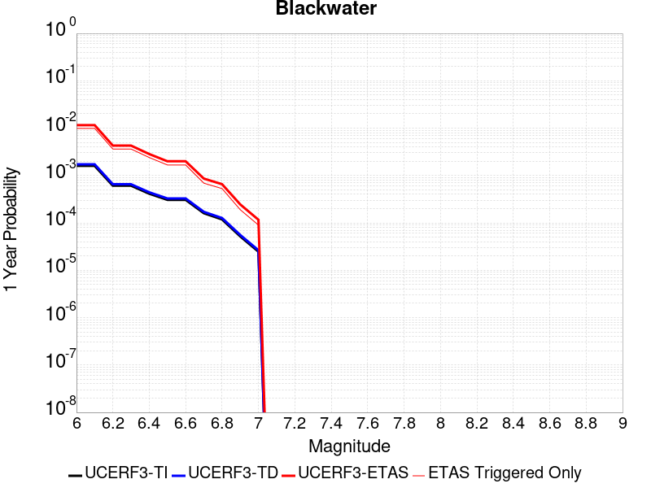 |  |

| Magnitude | 1 wk TI Prob | 1 wk TD Prob | 1 wk ETAS Prob | 1 wk ETAS/TD Gain | 1 wk ETAS Triggered Only | 1 mo TI Prob | 1 mo TD Prob | 1 mo ETAS Prob | 1 mo ETAS/TD Gain | 1 mo ETAS Triggered Only | 1 yr TI Prob | 1 yr TD Prob | 1 yr ETAS Prob | 1 yr ETAS/TD Gain | 1 yr ETAS Triggered Only | 10 yr TI Prob | 10 yr TD Prob | 10 yr ETAS Prob | 10 yr ETAS/TD Gain | 10 yr ETAS Triggered Only |
|-----|-----|-----|-----|-----|-----|-----|-----|-----|-----|-----|-----|-----|-----|-----|-----|-----|-----|-----|-----|-----|
| 6.0 | 3.0708583E-5 | 3.3095846E-5 | 0.004502948 | 136.05779 | 0.00447 | 1.3160157E-4 | 1.4183241E-4 | 0.006270963 | 44.213894 | 0.00613 | 0.0016010714 | 0.0017255784 | 0.01158853 | 6.7157364 | 0.00988 | 0.015895851 | 0.017135633 | 0.03056156 | 1.7835093 | 0.01366 |
| 6.1 | 3.0708583E-5 | 3.3095846E-5 | 0.004502948 | 136.05779 | 0.00447 | 1.3160157E-4 | 1.4183241E-4 | 0.006270963 | 44.213894 | 0.00613 | 0.0016010714 | 0.0017255784 | 0.01158853 | 6.7157364 | 0.00988 | 0.015895851 | 0.017135633 | 0.03056156 | 1.7835093 | 0.01366 |
| 6.2 | 1.1707779E-5 | 1.2545122E-5 | 0.0016425247 | 130.92935 | 0.00163 | 5.017523E-5 | 5.3763757E-5 | 0.0022136476 | 41.173603 | 0.00216 | 6.107122E-4 | 6.5438676E-4 | 0.004282011 | 6.5435486 | 0.00363 | 0.006090366 | 0.0065255696 | 0.01176118 | 1.8023224 | 0.00527 |
| 6.3 | 1.1707779E-5 | 1.2545122E-5 | 0.0016425247 | 130.92935 | 0.00163 | 5.017523E-5 | 5.3763757E-5 | 0.0022136476 | 41.173603 | 0.00216 | 6.107122E-4 | 6.5438676E-4 | 0.004282011 | 6.5435486 | 0.00363 | 0.006090366 | 0.0065255696 | 0.01176118 | 1.8023224 | 0.00527 |
| 6.4 | 7.929244E-6 | 8.480098E-6 | 0.0011384705 | 134.25204 | 0.00113 | 3.3982033E-5 | 3.6342793E-5 | 0.0015362883 | 42.272156 | 0.0015 | 4.136527E-4 | 4.423877E-4 | 0.002841326 | 6.422705 | 0.0024 | 0.0041288356 | 0.0044154758 | 0.007900022 | 1.7891666 | 0.0035 |
| 6.5 | 5.8832115E-6 | 6.285991E-6 | 7.862811E-4 | 125.08467 | 7.8E-4 | 2.521352E-5 | 2.6939697E-5 | 0.0010769115 | 39.974888 | 0.00105 | 3.0693135E-4 | 3.27944E-4 | 0.0019973963 | 6.090663 | 0.00167 | 0.0030650778 | 0.0032748538 | 0.005736765 | 1.7517622 | 0.00247 |
| 6.6 | 5.8832115E-6 | 6.285991E-6 | 7.862811E-4 | 125.08467 | 7.8E-4 | 2.521352E-5 | 2.6939697E-5 | 0.0010769115 | 39.974888 | 0.00105 | 3.0693135E-4 | 3.27944E-4 | 0.0019973963 | 6.090663 | 0.00167 | 0.0030650778 | 0.0032748538 | 0.005736765 | 1.7517622 | 0.00247 |
| 6.7 | 3.0715053E-6 | 3.2814662E-6 | 3.532803E-4 | 107.65929 | 3.5E-4 | 1.3163528E-5 | 1.4063357E-5 | 4.440573E-4 | 31.575483 | 4.3E-4 | 1.6025416E-4 | 1.7120909E-4 | 8.6109096E-4 | 5.02947 | 6.9E-4 | 0.0016013865 | 0.0017108864 | 0.002749107 | 1.606832 | 0.00104 |
| 6.8 | 2.2722281E-6 | 2.4287538E-6 | 2.6242813E-4 | 108.05053 | 2.6E-4 | 9.738084E-6 | 1.0408908E-5 | 3.2040567E-4 | 30.781874 | 3.1E-4 | 1.1855473E-4 | 1.26722E-4 | 6.566548E-4 | 5.1818533 | 5.3E-4 | 0.001184915 | 0.0012665876 | 0.0020755616 | 1.6387036 | 8.1E-4 |
| 6.9 | 9.952399E-7 | 1.0653489E-6 | 6.1065286E-5 | 57.31952 | 6.0E-5 | 4.265307E-6 | 4.5657757E-6 | 1.0456532E-4 | 22.901983 | 1.0E-4 | 5.1928873E-5 | 5.5587418E-5 | 2.4557687E-4 | 4.4178495 | 1.9E-4 | 5.191674E-4 | 5.557858E-4 | 8.6561346E-4 | 1.5574589 | 3.1E-4 |
| 7.0 | 4.7385504E-7 | 5.0755597E-7 | 2.0507547E-5 | 40.404503 | 2.0E-5 | 2.0308057E-6 | 2.1752398E-6 | 5.217513E-5 | 23.985922 | 5.0E-5 | 2.4724779E-5 | 2.6483543E-5 | 1.1648116E-4 | 4.398247 | 9.0E-5 | 2.4722028E-4 | 2.6483546E-4 | 3.9480103E-4 | 1.4907409 | 1.3E-4 |

## Ash Hill
*[(top)](#table-of-contents)*

| 1 Week | 1 Month | 1 Year | 10 Year |
|-----|-----|-----|-----|
|  |  |  | 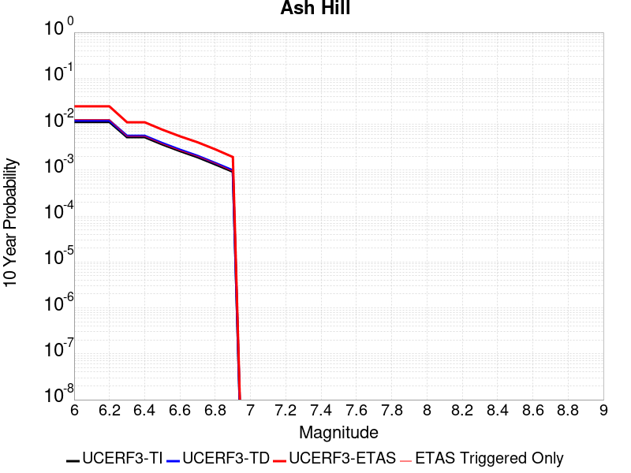 |

| Magnitude | 1 wk TI Prob | 1 wk TD Prob | 1 wk ETAS Prob | 1 wk ETAS/TD Gain | 1 wk ETAS Triggered Only | 1 mo TI Prob | 1 mo TD Prob | 1 mo ETAS Prob | 1 mo ETAS/TD Gain | 1 mo ETAS Triggered Only | 1 yr TI Prob | 1 yr TD Prob | 1 yr ETAS Prob | 1 yr ETAS/TD Gain | 1 yr ETAS Triggered Only | 10 yr TI Prob | 10 yr TD Prob | 10 yr ETAS Prob | 10 yr ETAS/TD Gain | 10 yr ETAS Triggered Only |
|-----|-----|-----|-----|-----|-----|-----|-----|-----|-----|-----|-----|-----|-----|-----|-----|-----|-----|-----|-----|-----|
| 6.0 | 2.1545662E-5 | 2.3194447E-5 | 0.0039831027 | 171.72656 | 0.00396 | 9.2335285E-5 | 9.940143E-5 | 0.0055188625 | 55.520954 | 0.00542 | 0.0011236023 | 0.0012096206 | 0.010008964 | 8.274466 | 0.00881 | 0.011179381 | 0.012038348 | 0.024476785 | 2.0332346 | 0.01259 |
| 6.1 | 2.1545662E-5 | 2.3194447E-5 | 0.0039831027 | 171.72656 | 0.00396 | 9.2335285E-5 | 9.940143E-5 | 0.0055188625 | 55.520954 | 0.00542 | 0.0011236023 | 0.0012096206 | 0.010008964 | 8.274466 | 0.00881 | 0.011179381 | 0.012038348 | 0.024476785 | 2.0332346 | 0.01259 |
| 6.2 | 2.1545662E-5 | 2.3194447E-5 | 0.0039831027 | 171.72656 | 0.00396 | 9.2335285E-5 | 9.940143E-5 | 0.0055188625 | 55.520954 | 0.00542 | 0.0011236023 | 0.0012096206 | 0.010008964 | 8.274466 | 0.00881 | 0.011179381 | 0.012038348 | 0.024476785 | 2.0332346 | 0.01259 |
| 6.3 | 1.0025529E-5 | 1.0746934E-5 | 0.0016207297 | 150.80855 | 0.00161 | 4.2965847E-5 | 4.605755E-5 | 0.0023559511 | 51.152332 | 0.00231 | 5.229836E-4 | 5.6061964E-4 | 0.004328506 | 7.720932 | 0.00377 | 0.005217545 | 0.0055933665 | 0.01103277 | 1.9724742 | 0.00547 |
| 6.4 | 1.0025529E-5 | 1.0746934E-5 | 0.0016207297 | 150.80855 | 0.00161 | 4.2965847E-5 | 4.605755E-5 | 0.0023559511 | 51.152332 | 0.00231 | 5.229836E-4 | 5.6061964E-4 | 0.004328506 | 7.720932 | 0.00377 | 0.005217545 | 0.0055933665 | 0.01103277 | 1.9724742 | 0.00547 |
| 6.5 | 6.9617327E-6 | 7.456634E-6 | 0.0011974478 | 160.58824 | 0.00119 | 2.9835655E-5 | 3.195666E-5 | 0.0016419052 | 51.379124 | 0.00161 | 3.6318856E-4 | 3.8901155E-4 | 0.0029380196 | 7.5525255 | 0.00255 | 0.0036259557 | 0.0038841602 | 0.0076195947 | 1.9617096 | 0.00375 |
| 6.6 | 4.9919777E-6 | 5.3466883E-6 | 8.353423E-4 | 156.23544 | 8.3E-4 | 2.1394015E-5 | 2.2914215E-5 | 0.0010928897 | 47.694836 | 0.00107 | 2.60441E-4 | 2.7895154E-4 | 0.002008469 | 7.2000637 | 0.00173 | 0.0026013597 | 0.0027866727 | 0.0054592043 | 1.9590404 | 0.00268 |
| 6.7 | 3.6630722E-6 | 3.924624E-6 | 6.339222E-4 | 161.52432 | 6.3E-4 | 1.5698786E-5 | 1.681974E-5 | 8.168063E-4 | 48.562363 | 8.0E-4 | 1.9111596E-4 | 2.0476682E-4 | 0.0015244966 | 7.445037 | 0.00132 | 0.0019095168 | 0.0020463446 | 0.004042252 | 1.9753525 | 0.002 |
| 6.8 | 2.5599613E-6 | 2.744925E-6 | 4.127438E-4 | 150.36615 | 4.1E-4 | 1.0971216E-5 | 1.1763939E-5 | 5.2175793E-4 | 44.352314 | 5.1E-4 | 1.3356637E-4 | 1.4322149E-4 | 0.0010530911 | 7.352885 | 9.1E-4 | 0.0013348613 | 0.0014317769 | 0.002839758 | 1.9833803 | 0.00141 |
| 6.9 | 1.7684905E-6 | 1.8968707E-6 | 2.7189637E-4 | 143.33943 | 2.7E-4 | 7.579223E-6 | 8.129446E-6 | 3.2812686E-4 | 40.362755 | 3.2E-4 | 9.2273134E-5 | 9.8976E-5 | 6.789186E-4 | 6.859426 | 5.8E-4 | 9.223483E-4 | 9.8976E-4 | 0.0019288297 | 1.9487852 | 9.4E-4 |

## Garlock (West)
*[(top)](#table-of-contents)*

| 1 Week | 1 Month | 1 Year | 10 Year |
|-----|-----|-----|-----|
|  |  |  |  |

| Magnitude | 1 wk TI Prob | 1 wk TD Prob | 1 wk ETAS Prob | 1 wk ETAS/TD Gain | 1 wk ETAS Triggered Only | 1 mo TI Prob | 1 mo TD Prob | 1 mo ETAS Prob | 1 mo ETAS/TD Gain | 1 mo ETAS Triggered Only | 1 yr TI Prob | 1 yr TD Prob | 1 yr ETAS Prob | 1 yr ETAS/TD Gain | 1 yr ETAS Triggered Only | 10 yr TI Prob | 10 yr TD Prob | 10 yr ETAS Prob | 10 yr ETAS/TD Gain | 10 yr ETAS Triggered Only |
|-----|-----|-----|-----|-----|-----|-----|-----|-----|-----|-----|-----|-----|-----|-----|-----|-----|-----|-----|-----|-----|
| 6.0 | 2.5181727E-5 | 2.5197181E-5 | 0.005135068 | 203.79535 | 0.00511 | 1.0791722E-4 | 1.0798347E-4 | 0.0066272793 | 61.373093 | 0.00652 | 0.0013131002 | 0.0013139093 | 0.009732833 | 7.407538 | 0.00843 | 0.013053683 | 0.013141794 | 0.023641966 | 1.7989907 | 0.01064 |
| 6.1 | 2.5077732E-5 | 2.5098223E-5 | 0.00513497 | 204.59496 | 0.00511 | 1.0747157E-4 | 1.075594E-4 | 0.006626858 | 61.61115 | 0.00652 | 0.001307681 | 0.0013087525 | 0.009727719 | 7.4328184 | 0.00843 | 0.013000126 | 0.013090835 | 0.023591548 | 1.8021424 | 0.01064 |
| 6.2 | 2.494612E-5 | 2.4979914E-5 | 0.005134852 | 205.55923 | 0.00511 | 1.0690756E-4 | 1.070524E-4 | 0.0066263545 | 61.89823 | 0.00652 | 0.0013008224 | 0.0013025872 | 0.009721606 | 7.463306 | 0.00843 | 0.012932341 | 0.013029906 | 0.023531267 | 1.805943 | 0.01064 |
| 6.3 | 2.4733758E-5 | 2.4799276E-5 | 0.0051346724 | 207.04929 | 0.00511 | 1.0599751E-4 | 1.06278305E-4 | 0.0066255853 | 62.341843 | 0.00652 | 0.0012897556 | 0.0012931736 | 0.009712272 | 7.510416 | 0.00843 | 0.012822957 | 0.0129368715 | 0.023439223 | 1.8118154 | 0.01064 |
| 6.4 | 2.3237335E-5 | 2.3178607E-5 | 0.0051130606 | 220.59395 | 0.00509 | 9.958477E-5 | 9.933313E-5 | 0.0065886886 | 66.329216 | 0.00649 | 0.0012117702 | 0.0012087126 | 0.009578584 | 7.9246163 | 0.00838 | 0.012051838 | 0.012101731 | 0.022553695 | 1.8636751 | 0.01058 |
| 6.5 | 2.2732203E-5 | 2.2992977E-5 | 0.0051128757 | 222.36685 | 0.00509 | 9.742009E-5 | 9.8537625E-5 | 0.006587898 | 66.85668 | 0.00649 | 0.0011854442 | 0.0011990381 | 0.00956899 | 7.9805555 | 0.00838 | 0.011791403 | 0.012006035 | 0.022459012 | 1.8706435 | 0.01058 |
| 6.6 | 2.1319436E-5 | 2.1773201E-5 | 0.005081663 | 233.39072 | 0.00506 | 9.136581E-5 | 9.3310395E-5 | 0.0065227104 | 69.90336 | 0.00643 | 0.001111811 | 0.0011354643 | 0.00942604 | 8.301485 | 0.0083 | 0.011062649 | 0.011376952 | 0.021757493 | 1.9124186 | 0.0105 |
| 6.7 | 1.970802E-5 | 2.0393094E-5 | 0.0050802897 | 249.11815 | 0.00506 | 8.446021E-5 | 8.739606E-5 | 0.0065168343 | 74.56668 | 0.00643 | 0.001027818 | 0.0010635294 | 0.009354702 | 8.795904 | 0.0083 | 0.010230771 | 0.0106646875 | 0.021052709 | 1.9740577 | 0.0105 |
| 6.8 | 1.8744462E-5 | 1.9900775E-5 | 0.0050798003 | 255.2564 | 0.00506 | 8.033094E-5 | 8.528626E-5 | 0.006514738 | 76.38673 | 0.00643 | 9.775903E-4 | 0.0010378672 | 0.009329253 | 8.98887 | 0.0083 | 0.009733009 | 0.010410495 | 0.020801185 | 1.9980975 | 0.0105 |
| 6.9 | 1.7559682E-5 | 1.8953151E-5 | 0.0050788573 | 267.96902 | 0.00506 | 7.5253614E-5 | 8.122527E-5 | 0.006510703 | 80.15613 | 0.00643 | 9.158276E-4 | 9.884704E-4 | 0.009280266 | 9.388512 | 0.0083 | 0.0091206245 | 0.009921073 | 0.020307 | 2.0468552 | 0.01049 |
| 7.0 | 1.6794445E-5 | 1.8215967E-5 | 0.005078124 | 278.77322 | 0.00506 | 7.197421E-5 | 7.806611E-5 | 0.0065075643 | 83.359665 | 0.00643 | 8.759337E-4 | 9.5004175E-4 | 0.009222175 | 9.707127 | 0.00828 | 0.008724891 | 0.009539958 | 0.01990017 | 2.085981 | 0.01046 |
| 7.1 | 1.6337795E-5 | 1.771677E-5 | 0.0050676274 | 286.03564 | 0.00505 | 7.0017246E-5 | 7.592681E-5 | 0.0064954394 | 85.5487 | 0.00642 | 8.521265E-4 | 9.2401815E-4 | 0.009166395 | 9.920146 | 0.00825 | 0.008488664 | 0.009281721 | 0.019595098 | 2.1111493 | 0.01041 |
| 7.2 | 1.5780008E-5 | 1.71654E-5 | 0.005057079 | 294.6089 | 0.00504 | 6.762685E-5 | 7.3563926E-5 | 0.0064830924 | 88.128685 | 0.00641 | 8.2304585E-4 | 8.952741E-4 | 0.009127897 | 10.195645 | 0.00824 | 0.008200042 | 0.008996559 | 0.019243535 | 2.1389883 | 0.01034 |
| 7.3 | 1.5058865E-5 | 1.6618484E-5 | 0.0050065354 | 301.2631 | 0.00499 | 6.45364E-5 | 7.122013E-5 | 0.006430767 | 90.294235 | 0.00636 | 7.854473E-4 | 8.667614E-4 | 0.009039671 | 10.429251 | 0.00818 | 0.00782677 | 0.008713263 | 0.018883865 | 2.1672552 | 0.01026 |
| 7.4 | 1.4887923E-5 | 1.6454453E-5 | 0.0048563746 | 295.14047 | 0.00484 | 6.380382E-5 | 7.0517184E-5 | 0.0062500816 | 88.632034 | 0.00618 | 7.7653467E-4 | 8.5820974E-4 | 0.008811378 | 10.267162 | 0.00796 | 0.0077382675 | 0.008628101 | 0.018531907 | 2.1478546 | 0.00999 |
| 7.5 | 1.4509299E-5 | 1.6046468E-5 | 0.004525974 | 282.05423 | 0.00451 | 6.218123E-5 | 6.876877E-5 | 0.0058483714 | 85.044 | 0.00578 | 7.567935E-4 | 8.369394E-4 | 0.008200771 | 9.798525 | 0.00737 | 0.0075422134 | 0.008416411 | 0.017568726 | 2.0874372 | 0.00923 |
| 7.6 | 1.2756717E-5 | 1.4050529E-5 | 0.0030640077 | 218.07063 | 0.00305 | 5.4670498E-5 | 6.0215163E-5 | 0.0039499807 | 65.59778 | 0.00389 | 6.6541E-4 | 7.328737E-4 | 0.0056892387 | 7.7629185 | 0.00496 | 0.006634211 | 0.007381374 | 0.0135653885 | 1.8377863 | 0.00623 |
| 7.7 | 1.0328985E-5 | 1.146033E-5 | 0.001871439 | 163.29713 | 0.00186 | 4.4266326E-5 | 4.9114777E-5 | 0.0023590014 | 48.030376 | 0.00231 | 5.388092E-4 | 5.9780874E-4 | 0.0035860213 | 5.9986095 | 0.00299 | 0.0053750467 | 0.006038286 | 0.009745763 | 1.613995 | 0.00373 |
| 7.8 | 7.0306583E-6 | 8.899537E-6 | 0.0011588893 | 130.21906 | 0.00115 | 3.0131043E-5 | 3.8140315E-5 | 0.0014680858 | 38.491707 | 0.00143 | 3.667837E-4 | 4.6425956E-4 | 0.002403359 | 5.176757 | 0.00194 | 0.003661789 | 0.0046950667 | 0.007063892 | 1.5045351 | 0.00238 |
| 7.9 | 4.060633E-6 | 5.465412E-6 | 6.454619E-4 | 118.0994 | 6.4E-4 | 1.7402595E-5 | 2.3422985E-5 | 8.5340353E-4 | 36.43445 | 8.3E-4 | 2.11856E-4 | 2.8513762E-4 | 0.0013948211 | 4.891747 | 0.00111 | 0.0021165414 | 0.002884143 | 0.004270134 | 1.4805555 | 0.00139 |
| 8.0 | 1.6729537E-6 | 2.0775192E-6 | 1.3207724E-4 | 63.5745 | 1.3E-4 | 7.169782E-6 | 8.903624E-6 | 1.789021E-4 | 20.09318 | 1.7E-4 | 8.7288594E-5 | 1.0839626E-4 | 2.9837567E-4 | 2.752638 | 1.9E-4 | 8.7254314E-4 | 0.001096854 | 0.0013565688 | 1.2367816 | 2.6E-4 |
| 8.1 | 3.6733252E-7 | 3.1489736E-7 | 2.031489E-5 | 64.51273 | 2.0E-5 | 1.5742813E-6 | 1.3495595E-6 | 3.134952E-5 | 23.229445 | 3.0E-5 | 1.9166706E-5 | 1.643078E-5 | 4.6430287E-5 | 2.8258114 | 3.0E-5 | 1.9165053E-4 | 1.662928E-4 | 1.962878E-4 | 1.1803747 | 3.0E-5 |

## McLean Lake
*[(top)](#table-of-contents)*

| 1 Week | 1 Month | 1 Year | 10 Year |
|-----|-----|-----|-----|
|  |  |  |  |

| Magnitude | 1 wk TI Prob | 1 wk TD Prob | 1 wk ETAS Prob | 1 wk ETAS/TD Gain | 1 wk ETAS Triggered Only | 1 mo TI Prob | 1 mo TD Prob | 1 mo ETAS Prob | 1 mo ETAS/TD Gain | 1 mo ETAS Triggered Only | 1 yr TI Prob | 1 yr TD Prob | 1 yr ETAS Prob | 1 yr ETAS/TD Gain | 1 yr ETAS Triggered Only | 10 yr TI Prob | 10 yr TD Prob | 10 yr ETAS Prob | 10 yr ETAS/TD Gain | 10 yr ETAS Triggered Only |
|-----|-----|-----|-----|-----|-----|-----|-----|-----|-----|-----|-----|-----|-----|-----|-----|-----|-----|-----|-----|-----|
| 6.0 | 1.7360222E-5 | 1.8501627E-5 | 0.0019784654 | 106.93467 | 0.00196 | 7.439883E-5 | 7.9290556E-5 | 0.0030190574 | 38.07588 | 0.00294 | 9.0542925E-4 | 9.6498354E-4 | 0.006199927 | 6.4249043 | 0.00524 | 0.009017491 | 0.0096127745 | 0.017634911 | 1.8345287 | 0.0081 |
| 6.1 | 9.062689E-6 | 9.592193E-6 | 9.595831E-4 | 100.03792 | 9.5E-4 | 3.8839516E-5 | 4.1108804E-5 | 0.00147105 | 35.784306 | 0.00143 | 4.727685E-4 | 5.003936E-4 | 0.0031490675 | 6.293181 | 0.00265 | 0.0047176396 | 0.004993552 | 0.00934173 | 1.8707587 | 0.00437 |
| 6.2 | 9.062689E-6 | 9.592193E-6 | 9.595831E-4 | 100.03792 | 9.5E-4 | 3.8839516E-5 | 4.1108804E-5 | 0.00147105 | 35.784306 | 0.00143 | 4.727685E-4 | 5.003936E-4 | 0.0031490675 | 6.293181 | 0.00265 | 0.0047176396 | 0.004993552 | 0.00934173 | 1.8707587 | 0.00437 |
| 6.3 | 7.2575485E-6 | 7.66771E-6 | 7.4766204E-4 | 97.50787 | 7.4E-4 | 3.110341E-5 | 3.2861237E-5 | 0.0011228254 | 34.16869 | 0.00109 | 3.786182E-4 | 4.0001926E-4 | 0.002489183 | 6.2226586 | 0.00209 | 0.0037797375 | 0.0039936965 | 0.007409998 | 1.8554235 | 0.00343 |
| 6.4 | 7.2575485E-6 | 7.66771E-6 | 7.4766204E-4 | 97.50787 | 7.4E-4 | 3.110341E-5 | 3.2861237E-5 | 0.0011228254 | 34.16869 | 0.00109 | 3.786182E-4 | 4.0001926E-4 | 0.002489183 | 6.2226586 | 0.00209 | 0.0037797375 | 0.0039936965 | 0.007409998 | 1.8554235 | 0.00343 |
| 6.5 | 6.06582E-6 | 6.4038773E-6 | 6.164E-4 | 96.25419 | 6.1E-4 | 2.5996113E-5 | 2.7444936E-5 | 9.274202E-4 | 33.792034 | 9.0E-4 | 3.164567E-4 | 3.3409733E-4 | 0.0020035394 | 5.9968734 | 0.00167 | 0.0031600643 | 0.0033365893 | 0.0061073136 | 1.8304062 | 0.00278 |
| 6.6 | 5.598744E-6 | 5.910262E-6 | 5.759069E-4 | 97.44185 | 5.7E-4 | 2.3994397E-5 | 2.5329486E-5 | 8.5530843E-4 | 33.767303 | 8.3E-4 | 2.9209262E-4 | 3.0834923E-4 | 0.0018278805 | 5.9279556 | 0.00152 | 0.0029170897 | 0.003079843 | 0.0056319586 | 1.8286512 | 0.00256 |
| 6.7 | 5.246996E-6 | 5.539162E-6 | 5.555361E-4 | 100.29245 | 5.5E-4 | 2.2486933E-5 | 2.3739085E-5 | 8.3371985E-4 | 35.120132 | 8.1E-4 | 2.73744E-4 | 2.8899137E-4 | 0.0017485694 | 6.050594 | 0.00146 | 0.0027340704 | 0.0028867796 | 0.0053695915 | 1.8600628 | 0.00249 |
| 6.8 | 4.02324E-6 | 4.2469046E-6 | 4.3424507E-4 | 102.24979 | 4.3E-4 | 1.7242342E-5 | 1.8200926E-5 | 6.1819E-4 | 33.964756 | 6.0E-4 | 2.099053E-4 | 2.2157968E-4 | 0.0013013404 | 5.873013 | 0.00108 | 0.0020970714 | 0.002214172 | 0.0040201643 | 1.8156513 | 0.00181 |
| 6.9 | 6.835972E-7 | 7.1399285E-7 | 7.071394E-5 | 99.04013 | 7.0E-5 | 2.9296991E-6 | 3.0599674E-6 | 9.3059694E-5 | 30.411987 | 9.0E-5 | 3.56685E-5 | 3.7254784E-5 | 2.1724807E-4 | 5.831414 | 1.8E-4 | 3.5662777E-4 | 3.7251666E-4 | 6.6240865E-4 | 1.7781987 | 2.9E-4 |

## Gravel Hills-Harper Lk
*[(top)](#table-of-contents)*

| 1 Week | 1 Month | 1 Year | 10 Year |
|-----|-----|-----|-----|
|  |  |  | 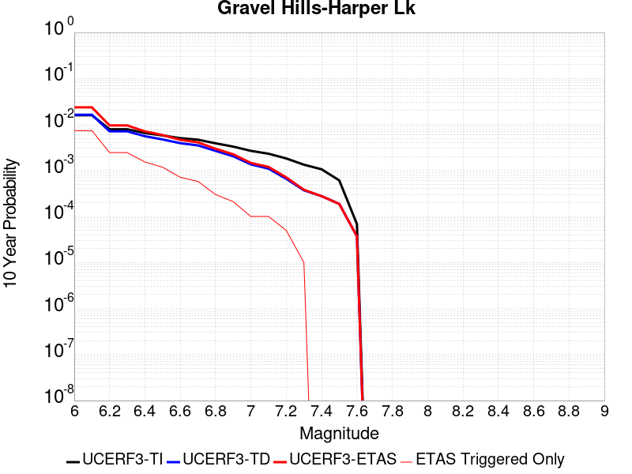 |

| Magnitude | 1 wk TI Prob | 1 wk TD Prob | 1 wk ETAS Prob | 1 wk ETAS/TD Gain | 1 wk ETAS Triggered Only | 1 mo TI Prob | 1 mo TD Prob | 1 mo ETAS Prob | 1 mo ETAS/TD Gain | 1 mo ETAS Triggered Only | 1 yr TI Prob | 1 yr TD Prob | 1 yr ETAS Prob | 1 yr ETAS/TD Gain | 1 yr ETAS Triggered Only | 10 yr TI Prob | 10 yr TD Prob | 10 yr ETAS Prob | 10 yr ETAS/TD Gain | 10 yr ETAS Triggered Only |
|-----|-----|-----|-----|-----|-----|-----|-----|-----|-----|-----|-----|-----|-----|-----|-----|-----|-----|-----|-----|-----|
| 6.0 | 3.0679566E-5 | 3.1464628E-5 | 0.0021913967 | 69.64636 | 0.00216 | 1.3147724E-4 | 1.3484266E-4 | 0.0032144273 | 23.838358 | 0.00308 | 0.0015995599 | 0.00164069 | 0.006832158 | 4.1641984 | 0.0052 | 0.015880952 | 0.016307337 | 0.023547316 | 1.4439706 | 0.00736 |
| 6.1 | 3.0679566E-5 | 3.1464628E-5 | 0.0021913967 | 69.64636 | 0.00216 | 1.3147724E-4 | 1.3484266E-4 | 0.0032144273 | 23.838358 | 0.00308 | 0.0015995599 | 0.00164069 | 0.006832158 | 4.1641984 | 0.0052 | 0.015880952 | 0.016307337 | 0.023547316 | 1.4439706 | 0.00736 |
| 6.2 | 1.514536E-5 | 1.36352E-5 | 7.536251E-4 | 55.270557 | 7.4E-4 | 6.490707E-5 | 5.843533E-5 | 0.0010883751 | 18.625292 | 0.00103 | 7.8995706E-4 | 7.112298E-4 | 0.0024200135 | 3.4025762 | 0.00171 | 0.007871548 | 0.007090737 | 0.009523365 | 1.3430712 | 0.00245 |
| 6.3 | 1.514536E-5 | 1.36352E-5 | 7.536251E-4 | 55.270557 | 7.4E-4 | 6.490707E-5 | 5.843533E-5 | 0.0010883751 | 18.625292 | 0.00103 | 7.8995706E-4 | 7.112298E-4 | 0.0024200135 | 3.4025762 | 0.00171 | 0.007871548 | 0.007090737 | 0.009523365 | 1.3430712 | 0.00245 |
| 6.4 | 1.2532521E-5 | 1.0689684E-5 | 4.306852E-4 | 40.289795 | 4.2E-4 | 5.37097E-5 | 4.581216E-5 | 6.6578377E-4 | 14.532905 | 6.2E-4 | 6.537194E-4 | 5.5762613E-4 | 0.0015870518 | 2.8460858 | 0.00103 | 0.0065179965 | 0.005562859 | 0.0070843482 | 1.2735084 | 0.00153 |
| 6.5 | 1.1094058E-5 | 9.083657E-6 | 2.9908103E-4 | 32.92518 | 2.9E-4 | 4.7545094E-5 | 3.89294E-5 | 4.989115E-4 | 12.815803 | 4.6E-4 | 5.787078E-4 | 4.7386638E-4 | 0.0012734873 | 2.6874397 | 8.0E-4 | 0.0057720304 | 0.004728967 | 0.0059033865 | 1.248346 | 0.00118 |
| 6.6 | 9.688328E-6 | 7.531688E-6 | 1.7753041E-4 | 23.57113 | 1.7E-4 | 4.1520743E-5 | 3.227828E-5 | 3.0226956E-4 | 9.364489 | 2.7E-4 | 5.053978E-4 | 3.9291973E-4 | 8.6273503E-4 | 2.195703 | 4.7E-4 | 0.0050424994 | 0.0039225067 | 0.004629722 | 1.1802967 | 7.1E-4 |
| 6.7 | 8.974824E-6 | 6.749406E-6 | 1.4674845E-4 | 21.742426 | 1.4E-4 | 3.8462964E-5 | 2.8925719E-5 | 2.4891936E-4 | 8.605469 | 2.2E-4 | 4.6818596E-4 | 3.5211592E-4 | 7.5197505E-4 | 2.1355896 | 4.0E-4 | 0.004672008 | 0.003515801 | 0.0040937616 | 1.1643895 | 5.8E-4 |
| 6.8 | 7.4780046E-6 | 5.1161865E-6 | 9.511573E-5 | 18.591139 | 9.0E-5 | 3.20482E-5 | 2.1926337E-5 | 1.3192392E-4 | 6.016688 | 1.1E-4 | 3.9011694E-4 | 2.6692182E-4 | 4.4687378E-4 | 1.6741747 | 1.8E-4 | 0.0038943281 | 0.0026661505 | 0.0029653506 | 1.1122218 | 3.0E-4 |
| 6.9 | 6.3409307E-6 | 3.907489E-6 | 8.390718E-5 | 21.473427 | 8.0E-5 | 2.7175134E-5 | 1.674628E-5 | 9.674494E-5 | 5.7771006 | 8.0E-5 | 3.3080703E-4 | 2.0386786E-4 | 3.2384341E-4 | 1.5884966 | 1.2E-4 | 0.0033031502 | 0.0020369065 | 0.0022464788 | 1.1028875 | 2.1E-4 |
| 7.0 | 5.1239335E-6 | 2.6058492E-6 | 3.260577E-5 | 12.512531 | 3.0E-5 | 2.195953E-5 | 1.1167879E-5 | 4.1167543E-5 | 3.6862454 | 3.0E-5 | 2.6732447E-4 | 1.359607E-4 | 1.859539E-4 | 1.3677033 | 5.0E-5 | 0.0026700313 | 0.0013588005 | 0.0014586645 | 1.0734943 | 1.0E-4 |
| 7.1 | 4.438899E-6 | 2.0984692E-6 | 3.2098407E-5 | 15.296105 | 3.0E-5 | 1.9023713E-5 | 8.99341E-6 | 3.899314E-5 | 4.335746 | 3.0E-5 | 2.315891E-4 | 1.0948948E-4 | 1.5948401E-4 | 1.4566149 | 5.0E-5 | 0.002313479 | 0.0010943774 | 0.0011942679 | 1.0912762 | 1.0E-4 |
| 7.2 | 3.50367E-6 | 1.2615715E-6 | 1.1261559E-5 | 8.926612 | 1.0E-5 | 1.5015643E-5 | 5.406724E-6 | 1.540667E-5 | 2.8495388 | 1.0E-5 | 1.8280011E-4 | 6.5824956E-5 | 8.5823645E-5 | 1.3038161 | 2.0E-5 | 0.0018264982 | 6.580628E-4 | 7.0802995E-4 | 1.0759306 | 5.0E-5 |
| 7.3 | 2.561638E-6 | 7.118686E-7 | 7.118686E-7 | 1.0 | 0.0 | 1.0978401E-5 | 3.050862E-6 | 3.050862E-6 | 1.0 | 0.0 | 1.3365384E-4 | 3.7143633E-5 | 3.7143633E-5 | 1.0 | 0.0 | 0.0013357349 | 3.7137623E-4 | 3.8137252E-4 | 1.0269169 | 1.0E-5 |
| 7.4 | 2.0368864E-6 | 5.304471E-7 | 5.304471E-7 | 1.0 | 0.0 | 8.729483E-6 | 2.2733427E-6 | 2.2733427E-6 | 1.0 | 0.0 | 1.06276275E-4 | 2.76776E-5 | 2.76776E-5 | 1.0 | 0.0 | 0.0010622547 | 2.767421E-4 | 2.767421E-4 | 1.0 | 0.0 |
| 7.5 | 1.1681728E-6 | 3.6028484E-7 | 3.6028484E-7 | 1.0 | 0.0 | 5.0064455E-6 | 1.544077E-6 | 1.544077E-6 | 1.0 | 0.0 | 6.0951766E-5 | 1.879898E-5 | 1.879898E-5 | 1.0 | 0.0 | 6.093505E-4 | 1.8797436E-4 | 1.8797436E-4 | 1.0 | 0.0 |
| 7.6 | 1.3154387E-7 | 7.1196716E-8 | 7.1196716E-8 | 1.0 | 0.0 | 5.6375933E-7 | 3.0512876E-7 | 3.0512876E-7 | 1.0 | 0.0 | 6.863748E-6 | 3.714938E-6 | 3.714938E-6 | 1.0 | 0.0 | 6.863536E-5 | 3.7148915E-5 | 3.7148915E-5 | 1.0 | 0.0 |

## Goldstone Lake
*[(top)](#table-of-contents)*

| 1 Week | 1 Month | 1 Year | 10 Year |
|-----|-----|-----|-----|
|  |  |  |  |

| Magnitude | 1 wk TI Prob | 1 wk TD Prob | 1 wk ETAS Prob | 1 wk ETAS/TD Gain | 1 wk ETAS Triggered Only | 1 mo TI Prob | 1 mo TD Prob | 1 mo ETAS Prob | 1 mo ETAS/TD Gain | 1 mo ETAS Triggered Only | 1 yr TI Prob | 1 yr TD Prob | 1 yr ETAS Prob | 1 yr ETAS/TD Gain | 1 yr ETAS Triggered Only | 10 yr TI Prob | 10 yr TD Prob | 10 yr ETAS Prob | 10 yr ETAS/TD Gain | 10 yr ETAS Triggered Only |
|-----|-----|-----|-----|-----|-----|-----|-----|-----|-----|-----|-----|-----|-----|-----|-----|-----|-----|-----|-----|-----|
| 6.0 | 2.671352E-5 | 3.0376103E-5 | 0.0015003314 | 49.391834 | 0.00147 | 1.1448149E-4 | 1.3017791E-4 | 0.0024098812 | 18.512213 | 0.00228 | 0.001392921 | 0.0015839601 | 0.0056475135 | 3.5654392 | 0.00407 | 0.013842222 | 0.015746202 | 0.02218322 | 1.4087982 | 0.00654 |
| 6.1 | 2.671352E-5 | 3.0376103E-5 | 0.0015003314 | 49.391834 | 0.00147 | 1.1448149E-4 | 1.3017791E-4 | 0.0024098812 | 18.512213 | 0.00228 | 0.001392921 | 0.0015839601 | 0.0056475135 | 3.5654392 | 0.00407 | 0.013842222 | 0.015746202 | 0.02218322 | 1.4087982 | 0.00654 |
| 6.2 | 1.4197047E-5 | 1.6096254E-5 | 7.5608434E-4 | 46.972687 | 7.4E-4 | 6.0843064E-5 | 6.898268E-5 | 0.0011689068 | 16.944931 | 0.0011 | 7.4051257E-4 | 8.3963916E-4 | 0.0028179768 | 3.356176 | 0.00198 | 0.007380498 | 0.008374364 | 0.0116665615 | 1.393128 | 0.00332 |
| 6.3 | 1.4197047E-5 | 1.6096254E-5 | 7.5608434E-4 | 46.972687 | 7.4E-4 | 6.0843064E-5 | 6.898268E-5 | 0.0011689068 | 16.944931 | 0.0011 | 7.4051257E-4 | 8.3963916E-4 | 0.0028179768 | 3.356176 | 0.00198 | 0.007380498 | 0.008374364 | 0.0116665615 | 1.393128 | 0.00332 |
| 6.4 | 1.3238931E-5 | 1.500847E-5 | 7.2499784E-4 | 48.305912 | 7.1E-4 | 5.6737044E-5 | 6.432098E-5 | 0.001074256 | 16.701487 | 0.00101 | 6.9055456E-4 | 7.8292453E-4 | 0.0026014997 | 3.3227973 | 0.00182 | 0.006884126 | 0.007811289 | 0.010887073 | 1.3937615 | 0.0031 |
| 6.5 | 1.3238931E-5 | 1.500847E-5 | 7.2499784E-4 | 48.305912 | 7.1E-4 | 5.6737044E-5 | 6.432098E-5 | 0.001074256 | 16.701487 | 0.00101 | 6.9055456E-4 | 7.8292453E-4 | 0.0026014997 | 3.3227973 | 0.00182 | 0.006884126 | 0.007811289 | 0.010887073 | 1.3937615 | 0.0031 |
| 6.6 | 1.1328278E-5 | 1.2855176E-5 | 5.928477E-4 | 46.117435 | 5.8E-4 | 4.8548856E-5 | 5.5092984E-5 | 8.650484E-4 | 15.701607 | 8.1E-4 | 5.90922E-4 | 6.706464E-4 | 0.0021396605 | 3.1904454 | 0.00147 | 0.0058935313 | 0.0066956137 | 0.00932787 | 1.3931315 | 0.00265 |
| 6.7 | 8.651175E-6 | 9.824575E-6 | 4.2982044E-4 | 43.749523 | 4.2E-4 | 3.707594E-5 | 4.2105148E-5 | 6.5207947E-4 | 15.486929 | 6.1E-4 | 4.5130608E-4 | 5.126002E-4 | 0.0016020414 | 3.1253238 | 0.00109 | 0.0045039062 | 0.0051230565 | 0.007073015 | 1.3806242 | 0.00196 |
| 6.8 | 1.0215377E-6 | 1.1754802E-6 | 2.1175456E-5 | 18.014303 | 2.0E-5 | 4.378012E-6 | 5.037763E-6 | 4.5037563E-5 | 8.939992 | 4.0E-5 | 5.3300988E-5 | 6.133315E-5 | 1.5132764E-4 | 2.4673057 | 9.0E-5 | 5.3288206E-4 | 6.131735E-4 | 7.231061E-4 | 1.1792846 | 1.1E-4 |
| 6.9 | 7.9360774E-7 | 9.283496E-7 | 1.092834E-5 | 11.771794 | 1.0E-5 | 3.4011714E-6 | 3.9786355E-6 | 3.3978515E-5 | 8.540244 | 3.0E-5 | 4.1408475E-5 | 4.843888E-5 | 1.08435976E-4 | 2.2386143 | 6.0E-5 | 4.140076E-4 | 4.842902E-4 | 5.442612E-4 | 1.1238327 | 6.0E-5 |
| 7.0 | 7.4382757E-7 | 8.747428E-7 | 1.08747345E-5 | 12.431922 | 1.0E-5 | 3.1878285E-6 | 3.7488926E-6 | 2.3748818E-5 | 6.3348885 | 2.0E-5 | 3.8811122E-5 | 4.564188E-5 | 9.5639596E-5 | 2.0954351 | 5.0E-5 | 3.8804344E-4 | 4.563317E-4 | 5.0630886E-4 | 1.1095194 | 5.0E-5 |
| 7.1 | 6.4709513E-7 | 7.711399E-7 | 1.0771132E-5 | 13.967805 | 1.0E-5 | 2.773262E-6 | 3.3048816E-6 | 2.3304816E-5 | 7.0516343 | 2.0E-5 | 3.376394E-5 | 4.023625E-5 | 9.0234236E-5 | 2.2426105 | 5.0E-5 | 3.375881E-4 | 4.022956E-4 | 4.522755E-4 | 1.1242367 | 5.0E-5 |
| 7.2 | 6.356704E-7 | 7.588459E-7 | 1.07588385E-5 | 14.1778965 | 1.0E-5 | 2.7242988E-6 | 3.252193E-6 | 2.3252129E-5 | 7.149677 | 2.0E-5 | 3.3167835E-5 | 3.959479E-5 | 8.959281E-5 | 2.2627423 | 5.0E-5 | 3.3162883E-4 | 3.9588328E-4 | 4.458635E-4 | 1.1262498 | 5.0E-5 |
| 7.3 | 5.7695723E-7 | 6.896648E-7 | 1.0689658E-5 | 15.499787 | 1.0E-5 | 2.4726714E-6 | 2.9557032E-6 | 1.2955674E-5 | 4.38328 | 1.0E-5 | 3.0104358E-5 | 3.598515E-5 | 7.598371E-5 | 2.1115296 | 4.0E-5 | 3.0100282E-4 | 3.5979896E-4 | 3.9978456E-4 | 1.1111332 | 4.0E-5 |
| 7.4 | 5.209647E-7 | 6.193583E-7 | 1.0619352E-5 | 17.145733 | 1.0E-5 | 2.232704E-6 | 2.6543903E-6 | 1.2654364E-5 | 4.7673335 | 1.0E-5 | 2.718283E-5 | 3.2316777E-5 | 7.231549E-5 | 2.2377071 | 4.0E-5 | 2.7179506E-4 | 3.2312635E-4 | 3.6311342E-4 | 1.1237506 | 4.0E-5 |
| 7.5 | 4.512955E-7 | 5.3489487E-7 | 1.053489E-5 | 19.695251 | 1.0E-5 | 1.934122E-6 | 2.2924048E-6 | 1.2292382E-5 | 5.3622212 | 1.0E-5 | 2.3547682E-5 | 2.7909726E-5 | 5.790889E-5 | 2.0748641 | 3.0E-5 | 2.3545188E-4 | 2.7906752E-4 | 3.0905916E-4 | 1.1074709 | 3.0E-5 |
| 7.6 | 2.21172E-7 | 2.6040198E-7 | 2.6040198E-7 | 1.0 | 0.0 | 9.478797E-7 | 1.1160082E-6 | 1.1160082E-6 | 1.0 | 0.0 | 1.1540374E-5 | 1.3587343E-5 | 2.3587207E-5 | 1.7359691 | 1.0E-5 | 1.1539775E-4 | 1.3586794E-4 | 1.4586658E-4 | 1.0735909 | 1.0E-5 |

## So Sierra Nevada
*[(top)](#table-of-contents)*

| 1 Week | 1 Month | 1 Year | 10 Year |
|-----|-----|-----|-----|
|  |  | 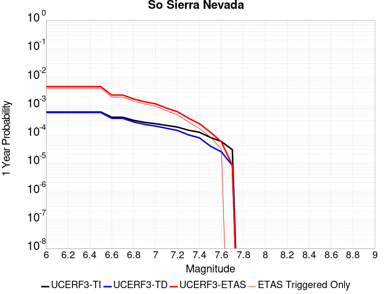 |  |

| Magnitude | 1 wk TI Prob | 1 wk TD Prob | 1 wk ETAS Prob | 1 wk ETAS/TD Gain | 1 wk ETAS Triggered Only | 1 mo TI Prob | 1 mo TD Prob | 1 mo ETAS Prob | 1 mo ETAS/TD Gain | 1 mo ETAS Triggered Only | 1 yr TI Prob | 1 yr TD Prob | 1 yr ETAS Prob | 1 yr ETAS/TD Gain | 1 yr ETAS Triggered Only | 10 yr TI Prob | 10 yr TD Prob | 10 yr ETAS Prob | 10 yr ETAS/TD Gain | 10 yr ETAS Triggered Only |
|-----|-----|-----|-----|-----|-----|-----|-----|-----|-----|-----|-----|-----|-----|-----|-----|-----|-----|-----|-----|-----|
| 6.0 | 1.15488665E-5 | 1.1079612E-5 | 0.0018610591 | 167.97151 | 0.00185 | 4.9494203E-5 | 4.7483256E-5 | 0.0025473644 | 53.647636 | 0.0025 | 6.024253E-4 | 5.779681E-4 | 0.0046755983 | 8.089718 | 0.0041 | 0.006007948 | 0.005765918 | 0.011293859 | 1.958727 | 0.00556 |
| 6.1 | 1.15488665E-5 | 1.1079612E-5 | 0.0018610591 | 167.97151 | 0.00185 | 4.9494203E-5 | 4.7483256E-5 | 0.0025473644 | 53.647636 | 0.0025 | 6.024253E-4 | 5.779681E-4 | 0.0046755983 | 8.089718 | 0.0041 | 0.006007948 | 0.005765918 | 0.011293859 | 1.958727 | 0.00556 |
| 6.2 | 1.15488665E-5 | 1.1079612E-5 | 0.0018610591 | 167.97151 | 0.00185 | 4.9494203E-5 | 4.7483256E-5 | 0.0025473644 | 53.647636 | 0.0025 | 6.024253E-4 | 5.779681E-4 | 0.0046755983 | 8.089718 | 0.0041 | 0.006007948 | 0.005765918 | 0.011293859 | 1.958727 | 0.00556 |
| 6.3 | 1.15488665E-5 | 1.1079612E-5 | 0.0018610591 | 167.97151 | 0.00185 | 4.9494203E-5 | 4.7483256E-5 | 0.0025473644 | 53.647636 | 0.0025 | 6.024253E-4 | 5.779681E-4 | 0.0046755983 | 8.089718 | 0.0041 | 0.006007948 | 0.005765918 | 0.011293859 | 1.958727 | 0.00556 |
| 6.4 | 1.15488665E-5 | 1.1079612E-5 | 0.0018610591 | 167.97151 | 0.00185 | 4.9494203E-5 | 4.7483256E-5 | 0.0025473644 | 53.647636 | 0.0025 | 6.024253E-4 | 5.779681E-4 | 0.0046755983 | 8.089718 | 0.0041 | 0.006007948 | 0.005765918 | 0.011293859 | 1.958727 | 0.00556 |
| 6.5 | 1.15488665E-5 | 1.1079612E-5 | 0.0018610591 | 167.97151 | 0.00185 | 4.9494203E-5 | 4.7483256E-5 | 0.0025473644 | 53.647636 | 0.0025 | 6.024253E-4 | 5.779681E-4 | 0.0046755983 | 8.089718 | 0.0041 | 0.006007948 | 0.005765918 | 0.011293859 | 1.958727 | 0.00556 |
| 6.6 | 7.587044E-6 | 6.9356042E-6 | 9.769289E-4 | 140.85707 | 9.7E-4 | 3.2515498E-5 | 2.9723697E-5 | 0.0013096856 | 44.062004 | 0.00128 | 3.9580427E-4 | 3.6182883E-4 | 0.0023711016 | 6.553103 | 0.00201 | 0.003951 | 0.0036126887 | 0.006352754 | 1.7584559 | 0.00275 |
| 6.7 | 7.587044E-6 | 6.9356042E-6 | 9.769289E-4 | 140.85707 | 9.7E-4 | 3.2515498E-5 | 2.9723697E-5 | 0.0013096856 | 44.062004 | 0.00128 | 3.9580427E-4 | 3.6182883E-4 | 0.0023711016 | 6.553103 | 0.00201 | 0.003951 | 0.0036126887 | 0.006352754 | 1.7584559 | 0.00275 |
| 6.8 | 5.9026956E-6 | 5.179362E-6 | 7.551755E-4 | 145.80473 | 7.5E-4 | 2.5297022E-5 | 2.2197082E-5 | 0.0010021754 | 45.148964 | 9.8E-4 | 3.0794772E-4 | 2.7021713E-4 | 0.0017298226 | 6.4016023 | 0.00146 | 0.0030752132 | 0.002699002 | 0.004663685 | 1.7279295 | 0.00197 |
| 6.9 | 5.0118915E-6 | 4.2523943E-6 | 6.342497E-4 | 149.1512 | 6.3E-4 | 2.1479358E-5 | 1.8224424E-5 | 7.8821037E-4 | 43.25022 | 7.7E-4 | 2.614798E-4 | 2.2186051E-4 | 0.0013716053 | 6.182287 | 0.00115 | 0.0026117235 | 0.0022164627 | 0.0037630273 | 1.6977625 | 0.00155 |
| 7.0 | 4.4924795E-6 | 3.7138868E-6 | 5.337119E-4 | 143.7071 | 5.3E-4 | 1.925334E-5 | 1.5916565E-5 | 6.6590623E-4 | 41.83731 | 6.5E-4 | 2.3438422E-4 | 1.9376757E-4 | 0.0011635796 | 6.005028 | 9.7E-4 | 0.0023413717 | 0.0019360491 | 0.0032534935 | 1.6804808 | 0.00132 |
| 7.1 | 3.9118436E-6 | 3.1119469E-6 | 3.8311078E-4 | 123.10967 | 3.8E-4 | 1.6764936E-5 | 1.333685E-5 | 4.5333098E-4 | 33.990856 | 4.4E-4 | 2.0409399E-4 | 1.6236462E-4 | 8.222575E-4 | 5.064265 | 6.6E-4 | 0.0020390663 | 0.0016225161 | 0.0025410233 | 1.5661006 | 9.2E-4 |
| 7.2 | 3.4200818E-6 | 2.6054236E-6 | 2.8260468E-4 | 108.46785 | 2.8E-4 | 1.4657411E-5 | 1.11660565E-5 | 3.4116238E-4 | 30.553524 | 3.3E-4 | 1.7843937E-4 | 1.3593875E-4 | 6.158735E-4 | 4.530522 | 4.8E-4 | 0.0017829615 | 0.0013586058 | 0.0020376819 | 1.4998331 | 6.8E-4 |
| 7.3 | 2.6593618E-6 | 1.8283897E-6 | 1.3182816E-4 | 72.100685 | 1.3E-4 | 1.13972155E-5 | 7.8359335E-6 | 1.778346E-4 | 22.694756 | 1.7E-4 | 1.3875226E-4 | 9.539862E-5 | 3.6537286E-4 | 3.8299599 | 2.7E-4 | 0.0013866565 | 9.536055E-4 | 0.0013332432 | 1.3981076 | 3.8E-4 |
| 7.4 | 2.2577992E-6 | 1.4364078E-6 | 1.01436264E-4 | 70.61801 | 1.0E-4 | 9.676246E-6 | 6.1560204E-6 | 1.2615528E-4 | 20.492992 | 1.2E-4 | 1.1780193E-4 | 7.4947224E-5 | 2.3493523E-4 | 3.1346755 | 1.6E-4 | 0.001177395 | 7.4924453E-4 | 0.0010090497 | 1.3467562 | 2.6E-4 |
| 7.5 | 1.489319E-6 | 7.353661E-7 | 5.073533E-5 | 68.99329 | 5.0E-5 | 6.3827797E-6 | 3.1515651E-6 | 7.315134E-5 | 23.211117 | 7.0E-5 | 7.770758E-5 | 3.8369635E-5 | 1.18366566E-4 | 3.084902 | 8.0E-5 | 7.7680405E-4 | 3.8363054E-4 | 5.33573E-4 | 1.3908513 | 1.5E-4 |
| 7.6 | 1.0680322E-6 | 4.65941E-7 | 2.0465932E-5 | 43.92387 | 2.0E-5 | 4.577273E-6 | 1.9968884E-6 | 3.1996828E-5 | 16.023342 | 3.0E-5 | 5.5726876E-5 | 2.4311848E-5 | 5.431112E-5 | 2.2339363 | 3.0E-5 | 5.5712904E-4 | 2.4309216E-4 | 3.2307272E-4 | 1.3290133 | 8.0E-5 |
| 7.7 | 5.509146E-7 | 1.5578539E-7 | 1.5578539E-7 | 1.0 | 0.0 | 2.3610605E-6 | 6.676515E-7 | 6.676515E-7 | 1.0 | 0.0 | 2.8745531E-5 | 8.128628E-6 | 8.128628E-6 | 1.0 | 0.0 | 2.8741814E-4 | 8.128342E-5 | 8.128342E-5 | 1.0 | 0.0 |

## San Andreas (Mojave S)
*[(top)](#table-of-contents)*

| 1 Week | 1 Month | 1 Year | 10 Year |
|-----|-----|-----|-----|
|  | 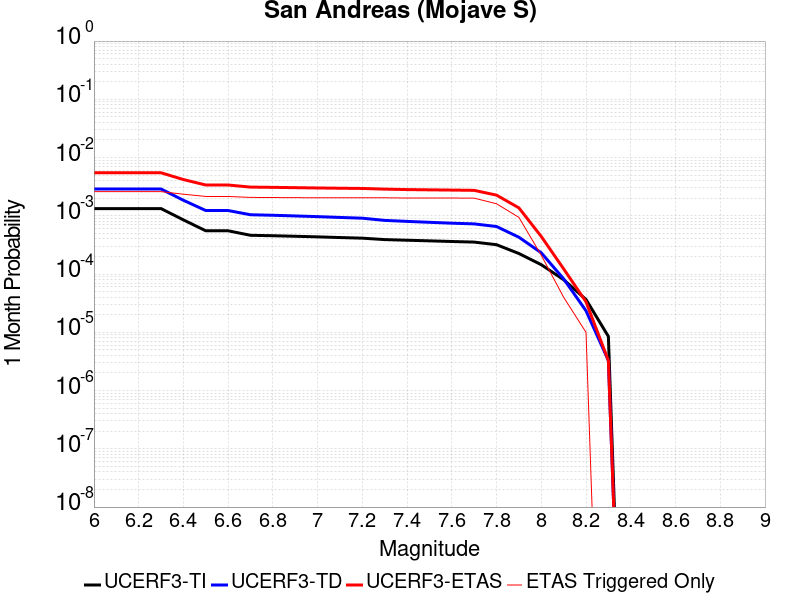 |  |  |

| Magnitude | 1 wk TI Prob | 1 wk TD Prob | 1 wk ETAS Prob | 1 wk ETAS/TD Gain | 1 wk ETAS Triggered Only | 1 mo TI Prob | 1 mo TD Prob | 1 mo ETAS Prob | 1 mo ETAS/TD Gain | 1 mo ETAS Triggered Only | 1 yr TI Prob | 1 yr TD Prob | 1 yr ETAS Prob | 1 yr ETAS/TD Gain | 1 yr ETAS Triggered Only | 10 yr TI Prob | 10 yr TD Prob | 10 yr ETAS Prob | 10 yr ETAS/TD Gain | 10 yr ETAS Triggered Only |
|-----|-----|-----|-----|-----|-----|-----|-----|-----|-----|-----|-----|-----|-----|-----|-----|-----|-----|-----|-----|-----|
| 6.0 | 3.1064058E-4 | 6.7462435E-4 | 0.002673275 | 3.9626129 | 0.002 | 0.0013306376 | 0.002888172 | 0.0054806625 | 1.8976234 | 0.0026 | 0.016080605 | 0.034565594 | 0.038002543 | 1.0994326 | 0.00356 | 0.1496549 | 0.28654557 | 0.28985602 | 1.0115529 | 0.00464 |
| 6.1 | 3.1064058E-4 | 6.7462435E-4 | 0.002673275 | 3.9626129 | 0.002 | 0.0013306376 | 0.002888172 | 0.0054806625 | 1.8976234 | 0.0026 | 0.016080605 | 0.034565594 | 0.038002543 | 1.0994326 | 0.00356 | 0.1496549 | 0.28654557 | 0.28985602 | 1.0115529 | 0.00464 |
| 6.2 | 3.1064058E-4 | 6.7462435E-4 | 0.002673275 | 3.9626129 | 0.002 | 0.0013306376 | 0.002888172 | 0.0054806625 | 1.8976234 | 0.0026 | 0.016080605 | 0.034565594 | 0.038002543 | 1.0994326 | 0.00356 | 0.1496549 | 0.28654557 | 0.28985602 | 1.0115529 | 0.00464 |
| 6.3 | 3.1064058E-4 | 6.7462435E-4 | 0.002673275 | 3.9626129 | 0.002 | 0.0013306376 | 0.002888172 | 0.0054806625 | 1.8976234 | 0.0026 | 0.016080605 | 0.034565594 | 0.038002543 | 1.0994326 | 0.00356 | 0.1496549 | 0.28654557 | 0.28985602 | 1.0115529 | 0.00464 |
| 6.4 | 1.9872203E-4 | 4.3181062E-4 | 0.0022510248 | 5.2129908 | 0.00182 | 8.5138786E-4 | 0.0018493326 | 0.0041949865 | 2.2683787 | 0.00235 | 0.010316478 | 0.02228931 | 0.02539843 | 1.1394893 | 0.00318 | 0.098504856 | 0.19686839 | 0.2001532 | 1.0166852 | 0.00409 |
| 6.5 | 1.291105E-4 | 2.8754136E-4 | 0.0019370669 | 6.7366548 | 0.00165 | 5.5321335E-4 | 0.0012317409 | 0.0033790928 | 2.743347 | 0.00215 | 0.006714592 | 0.014894155 | 0.017731259 | 1.1904844 | 0.00288 | 0.065152965 | 0.13800792 | 0.14113696 | 1.0226729 | 0.00363 |
| 6.6 | 1.291105E-4 | 2.8754136E-4 | 0.0019370669 | 6.7366548 | 0.00165 | 5.5321335E-4 | 0.0012317409 | 0.0033790928 | 2.743347 | 0.00215 | 0.006714592 | 0.014894155 | 0.017731259 | 1.1904844 | 0.00288 | 0.065152965 | 0.13800792 | 0.14113696 | 1.0226729 | 0.00363 |
| 6.7 | 1.08001186E-4 | 2.4335351E-4 | 0.0018329666 | 7.5321145 | 0.00159 | 4.6278012E-4 | 0.0010425274 | 0.0031103692 | 2.9834895 | 0.00207 | 0.0056198016 | 0.0126192 | 0.015364119 | 1.2175193 | 0.00278 | 0.054797906 | 0.11918431 | 0.12225836 | 1.0257924 | 0.00349 |
| 6.8 | 1.0624356E-4 | 2.3853009E-4 | 0.0018281508 | 7.6642356 | 0.00159 | 4.5525006E-4 | 0.0010218718 | 0.0030797669 | 3.0138483 | 0.00206 | 0.0055285925 | 0.012370593 | 0.01509645 | 1.2203498 | 0.00276 | 0.053930566 | 0.11713308 | 0.12017897 | 1.0260037 | 0.00345 |
| 6.9 | 1.0393785E-4 | 2.3223337E-4 | 0.0018118664 | 7.801921 | 0.00158 | 4.4537184E-4 | 9.949068E-4 | 0.0030428672 | 3.0584447 | 0.00205 | 0.0054089287 | 0.012045963 | 0.0147628365 | 1.2255423 | 0.00275 | 0.05279156 | 0.114433445 | 0.117479794 | 1.0266211 | 0.00344 |
| 7.0 | 1.0155622E-4 | 2.2592908E-4 | 0.0017955743 | 7.9475136 | 0.00157 | 4.3516833E-4 | 9.6790853E-4 | 0.003005934 | 3.1055973 | 0.00204 | 0.005285311 | 0.011720838 | 0.01441884 | 1.2301885 | 0.00273 | 0.05161361 | 0.11169745 | 0.11473545 | 1.0271984 | 0.00342 |
| 7.1 | 9.885595E-5 | 2.188132E-4 | 0.0017884696 | 8.1735 | 0.00157 | 4.2359953E-4 | 9.374342E-4 | 0.0029755218 | 3.1741128 | 0.00204 | 0.0051451353 | 0.011353733 | 0.014042851 | 1.2368488 | 0.00272 | 0.05027629 | 0.10857607 | 0.11161582 | 1.0279965 | 0.00341 |
| 7.2 | 9.6411415E-5 | 2.1244297E-4 | 0.0017821094 | 8.388649 | 0.00157 | 4.1312634E-4 | 9.101525E-4 | 0.0029482958 | 3.2393427 | 0.00204 | 0.005018219 | 0.011024987 | 0.013714999 | 1.2439923 | 0.00272 | 0.049064007 | 0.1057697 | 0.10880114 | 1.0286608 | 0.00339 |
| 7.3 | 9.1180635E-5 | 1.9472656E-4 | 0.0017644209 | 9.061018 | 0.00157 | 3.907156E-4 | 8.342756E-4 | 0.0028725737 | 3.443195 | 0.00204 | 0.004746591 | 0.010110112 | 0.012792714 | 1.2653384 | 0.00271 | 0.046464786 | 0.09796176 | 0.10100163 | 1.0310311 | 0.00337 |
| 7.4 | 8.887388E-5 | 1.872126E-4 | 0.0017469205 | 9.331212 | 0.00156 | 3.8083247E-4 | 8.020931E-4 | 0.002820473 | 3.5163908 | 0.00202 | 0.0046267817 | 0.009721855 | 0.012385703 | 1.2740061 | 0.00269 | 0.045316286 | 0.094593845 | 0.09760885 | 1.0318731 | 0.00333 |
| 7.5 | 8.6750515E-5 | 1.80528E-4 | 0.0017402464 | 9.639759 | 0.00156 | 3.7173493E-4 | 7.734621E-4 | 0.0027918997 | 3.6096141 | 0.00202 | 0.004516484 | 0.009376327 | 0.012041104 | 1.2842027 | 0.00269 | 0.04425787 | 0.09155606 | 0.09458117 | 1.0330411 | 0.00333 |
| 7.6 | 8.453092E-5 | 1.7440386E-4 | 0.0017341318 | 9.943196 | 0.00156 | 3.6222505E-4 | 7.4723107E-4 | 0.0027657216 | 3.7012937 | 0.00202 | 0.0044011753 | 0.009059664 | 0.0117252935 | 1.2942305 | 0.00269 | 0.04315024 | 0.08871447 | 0.09174906 | 1.0342062 | 0.00333 |
| 7.7 | 8.259102E-5 | 1.6962511E-4 | 0.0017193622 | 10.136249 | 0.00155 | 3.539135E-4 | 7.267622E-4 | 0.0027353014 | 3.7636812 | 0.00201 | 0.004300386 | 0.0088125 | 0.011468883 | 1.3014334 | 0.00268 | 0.042181134 | 0.086465426 | 0.08949836 | 1.0350769 | 0.00332 |
| 7.8 | 7.444844E-5 | 1.528469E-4 | 0.0014026558 | 9.1768675 | 0.00125 | 3.1902574E-4 | 6.5489375E-4 | 0.0022638394 | 3.456804 | 0.00161 | 0.0038772223 | 0.007944231 | 0.010106913 | 1.272233 | 0.00218 | 0.03810269 | 0.078293875 | 0.0807917 | 1.0319031 | 0.00271 |
| 7.9 | 5.2586525E-5 | 1.0007023E-4 | 8.000002E-4 | 7.994387 | 7.0E-4 | 2.2535135E-4 | 4.2880196E-4 | 0.0013683989 | 3.1912143 | 9.4E-4 | 0.0027402006 | 0.005208178 | 0.0064715636 | 1.2425773 | 0.00127 | 0.027066574 | 0.052201588 | 0.053737022 | 1.0294136 | 0.00162 |
| 8.0 | 3.379877E-5 | 5.4075565E-5 | 2.1406691E-4 | 3.9586625 | 1.6E-4 | 1.4484383E-4 | 2.3173184E-4 | 4.4168317E-4 | 1.9060099 | 2.1E-4 | 0.0017620471 | 0.0028176866 | 0.0030669824 | 1.0884752 | 2.5E-4 | 0.017481409 | 0.028835917 | 0.029185535 | 1.0121244 | 3.6E-4 |
| 8.1 | 1.8668277E-5 | 1.9308145E-5 | 4.9307564E-5 | 2.5537186 | 3.0E-5 | 8.000444E-5 | 8.274657E-5 | 1.2274327E-4 | 1.4833637 | 4.0E-5 | 9.736188E-4 | 0.0010069745 | 0.0010469343 | 1.039683 | 4.0E-5 | 0.009693642 | 0.010798624 | 0.0108480835 | 1.0045803 | 5.0E-5 |
| 8.2 | 8.541571E-6 | 5.4596358E-6 | 1.5459582E-5 | 2.831614 | 1.0E-5 | 3.660622E-5 | 2.339823E-5 | 3.3397995E-5 | 1.4273728 | 1.0E-5 | 4.455896E-4 | 2.848363E-4 | 2.9483344E-4 | 1.0350978 | 1.0E-5 | 0.0044469717 | 0.003240283 | 0.0032602183 | 1.0061523 | 2.0E-5 |
| 8.3 | 1.983087E-6 | 7.6564595E-7 | 7.6564595E-7 | 1.0 | 0.0 | 8.498917E-6 | 3.281336E-6 | 3.281336E-6 | 1.0 | 0.0 | 1.034694E-4 | 3.9949547E-5 | 3.9949547E-5 | 1.0 | 0.0 | 0.0010342124 | 4.717979E-4 | 4.717979E-4 | 1.0 | 0.0 |

## Coyote Canyon
*[(top)](#table-of-contents)*

| 1 Week | 1 Month | 1 Year | 10 Year |
|-----|-----|-----|-----|
|  |  |  |  |

| Magnitude | 1 wk TI Prob | 1 wk TD Prob | 1 wk ETAS Prob | 1 wk ETAS/TD Gain | 1 wk ETAS Triggered Only | 1 mo TI Prob | 1 mo TD Prob | 1 mo ETAS Prob | 1 mo ETAS/TD Gain | 1 mo ETAS Triggered Only | 1 yr TI Prob | 1 yr TD Prob | 1 yr ETAS Prob | 1 yr ETAS/TD Gain | 1 yr ETAS Triggered Only | 10 yr TI Prob | 10 yr TD Prob | 10 yr ETAS Prob | 10 yr ETAS/TD Gain | 10 yr ETAS Triggered Only |
|-----|-----|-----|-----|-----|-----|-----|-----|-----|-----|-----|-----|-----|-----|-----|-----|-----|-----|-----|-----|-----|
| 6.0 | 3.5090034E-5 | 4.0364317E-5 | 0.0010103252 | 25.030157 | 9.7E-4 | 1.503772E-4 | 1.7297991E-4 | 0.0017027153 | 9.843428 | 0.00153 | 0.0018293047 | 0.0021042533 | 0.004748677 | 2.256704 | 0.00265 | 0.018143194 | 0.020869205 | 0.02517738 | 1.206437 | 0.0044 |
| 6.1 | 3.5090034E-5 | 4.0364317E-5 | 0.0010103252 | 25.030157 | 9.7E-4 | 1.503772E-4 | 1.7297991E-4 | 0.0017027153 | 9.843428 | 0.00153 | 0.0018293047 | 0.0021042533 | 0.004748677 | 2.256704 | 0.00265 | 0.018143194 | 0.020869205 | 0.02517738 | 1.206437 | 0.0044 |
| 6.2 | 1.841879E-5 | 2.1059794E-5 | 5.010497E-4 | 23.791767 | 4.8E-4 | 7.8935285E-5 | 9.025371E-5 | 9.101797E-4 | 10.08468 | 8.2E-4 | 9.606133E-4 | 0.0010983871 | 0.0024868601 | 2.264102 | 0.00139 | 0.0095647145 | 0.010939668 | 0.013293631 | 1.2151769 | 0.00238 |
| 6.3 | 1.841879E-5 | 2.1059794E-5 | 5.010497E-4 | 23.791767 | 4.8E-4 | 7.8935285E-5 | 9.025371E-5 | 9.101797E-4 | 10.08468 | 8.2E-4 | 9.606133E-4 | 0.0010983871 | 0.0024868601 | 2.264102 | 0.00139 | 0.0095647145 | 0.010939668 | 0.013293631 | 1.2151769 | 0.00238 |
| 6.4 | 1.712201E-5 | 1.9565212E-5 | 4.695564E-4 | 23.999557 | 4.5E-4 | 7.337798E-5 | 8.3848776E-5 | 8.537842E-4 | 10.182428 | 7.7E-4 | 8.930107E-4 | 0.0010204813 | 0.0023291444 | 2.282398 | 0.00131 | 0.008894307 | 0.010167871 | 0.012365298 | 1.2161148 | 0.00222 |
| 6.5 | 1.4744935E-5 | 1.6836972E-5 | 3.8683074E-4 | 22.975079 | 3.7E-4 | 6.3191044E-5 | 7.215698E-5 | 7.421086E-4 | 10.28464 | 6.7E-4 | 7.6907943E-4 | 8.782507E-4 | 0.0020272406 | 2.3082712 | 0.00115 | 0.007664232 | 0.008756994 | 0.010709743 | 1.222993 | 0.00197 |
| 6.6 | 1.2017839E-5 | 1.3724089E-5 | 2.9372025E-4 | 21.401802 | 2.8E-4 | 5.150401E-5 | 5.88167E-5 | 5.687867E-4 | 9.670497 | 5.1E-4 | 6.268809E-4 | 7.159466E-4 | 0.0016252951 | 2.2701344 | 9.1E-4 | 0.0062511545 | 0.0071450938 | 0.008703876 | 1.2181612 | 0.00157 |
| 6.7 | 1.00956095E-5 | 1.1533517E-5 | 2.6153063E-4 | 22.675707 | 2.5E-4 | 4.326618E-5 | 4.942891E-5 | 4.9940665E-4 | 10.103534 | 4.5E-4 | 5.266384E-4 | 6.017178E-4 | 0.0014112304 | 2.345336 | 8.1E-4 | 0.005253921 | 0.0060094125 | 0.0073811193 | 1.2282598 | 0.00138 |

## San Andreas (Mojave N)
*[(top)](#table-of-contents)*

| 1 Week | 1 Month | 1 Year | 10 Year |
|-----|-----|-----|-----|
|  |  |  |  |

| Magnitude | 1 wk TI Prob | 1 wk TD Prob | 1 wk ETAS Prob | 1 wk ETAS/TD Gain | 1 wk ETAS Triggered Only | 1 mo TI Prob | 1 mo TD Prob | 1 mo ETAS Prob | 1 mo ETAS/TD Gain | 1 mo ETAS Triggered Only | 1 yr TI Prob | 1 yr TD Prob | 1 yr ETAS Prob | 1 yr ETAS/TD Gain | 1 yr ETAS Triggered Only | 10 yr TI Prob | 10 yr TD Prob | 10 yr ETAS Prob | 10 yr ETAS/TD Gain | 10 yr ETAS Triggered Only |
|-----|-----|-----|-----|-----|-----|-----|-----|-----|-----|-----|-----|-----|-----|-----|-----|-----|-----|-----|-----|-----|
| 6.0 | 9.877682E-5 | 1.9402112E-4 | 0.0023835963 | 12.285241 | 0.00219 | 4.2326056E-4 | 8.312543E-4 | 0.0035789683 | 4.305504 | 0.00275 | 0.0051410277 | 0.010073684 | 0.013617621 | 1.3518014 | 0.00358 | 0.05023708 | 0.09832245 | 0.10234394 | 1.040901 | 0.00446 |
| 6.1 | 9.877682E-5 | 1.9402112E-4 | 0.0023835963 | 12.285241 | 0.00219 | 4.2326056E-4 | 8.312543E-4 | 0.0035789683 | 4.305504 | 0.00275 | 0.0051410277 | 0.010073684 | 0.013617621 | 1.3518014 | 0.00358 | 0.05023708 | 0.09832245 | 0.10234394 | 1.040901 | 0.00446 |
| 6.2 | 9.877682E-5 | 1.9402112E-4 | 0.0023835963 | 12.285241 | 0.00219 | 4.2326056E-4 | 8.312543E-4 | 0.0035789683 | 4.305504 | 0.00275 | 0.0051410277 | 0.010073684 | 0.013617621 | 1.3518014 | 0.00358 | 0.05023708 | 0.09832245 | 0.10234394 | 1.040901 | 0.00446 |
| 6.3 | 9.877682E-5 | 1.9402112E-4 | 0.0023835963 | 12.285241 | 0.00219 | 4.2326056E-4 | 8.312543E-4 | 0.0035789683 | 4.305504 | 0.00275 | 0.0051410277 | 0.010073684 | 0.013617621 | 1.3518014 | 0.00358 | 0.05023708 | 0.09832245 | 0.10234394 | 1.040901 | 0.00446 |
| 6.4 | 9.877682E-5 | 1.9402112E-4 | 0.0023835963 | 12.285241 | 0.00219 | 4.2326056E-4 | 8.312543E-4 | 0.0035789683 | 4.305504 | 0.00275 | 0.0051410277 | 0.010073684 | 0.013617621 | 1.3518014 | 0.00358 | 0.05023708 | 0.09832245 | 0.10234394 | 1.040901 | 0.00446 |
| 6.5 | 9.861474E-5 | 1.937588E-4 | 0.0023833346 | 12.300522 | 0.00219 | 4.2256617E-4 | 8.3013077E-4 | 0.003577848 | 4.309981 | 0.00275 | 0.0051326132 | 0.0100601325 | 0.013604117 | 1.3522801 | 0.00358 | 0.050156746 | 0.09820035 | 0.102222376 | 1.0409573 | 0.00446 |
| 6.6 | 9.861474E-5 | 1.937588E-4 | 0.0023833346 | 12.300522 | 0.00219 | 4.2256617E-4 | 8.3013077E-4 | 0.003577848 | 4.309981 | 0.00275 | 0.0051326132 | 0.0100601325 | 0.013604117 | 1.3522801 | 0.00358 | 0.050156746 | 0.09820035 | 0.102222376 | 1.0409573 | 0.00446 |
| 6.7 | 9.8552715E-5 | 1.9365833E-4 | 0.0023732362 | 12.254759 | 0.00218 | 4.223004E-4 | 8.2970044E-4 | 0.0035674272 | 4.299657 | 0.00274 | 0.0051293927 | 0.010054941 | 0.013589045 | 1.3514793 | 0.00357 | 0.050125998 | 0.09815356 | 0.10216678 | 1.0408871 | 0.00445 |
| 6.8 | 9.8464974E-5 | 1.9350994E-4 | 0.0023730882 | 12.2633915 | 0.00218 | 4.219245E-4 | 8.290649E-4 | 0.0035667932 | 4.3021884 | 0.00274 | 0.0051248376 | 0.010047276 | 0.013581406 | 1.3517503 | 0.00357 | 0.05008251 | 0.09808378 | 0.10209731 | 1.0409194 | 0.00445 |
| 6.9 | 9.825824E-5 | 1.9319002E-4 | 0.002372769 | 12.282047 | 0.00218 | 4.2103877E-4 | 8.276947E-4 | 0.003565427 | 4.307659 | 0.00274 | 0.0051141046 | 0.010030746 | 0.013564937 | 1.3523357 | 0.00357 | 0.049980022 | 0.097932965 | 0.10194716 | 1.0409893 | 0.00445 |
| 7.0 | 9.781462E-5 | 1.9250368E-4 | 0.002372084 | 12.322279 | 0.00218 | 4.1913814E-4 | 8.247551E-4 | 0.0035624953 | 4.3194585 | 0.00274 | 0.005091073 | 0.009995285 | 0.013529602 | 1.3535984 | 0.00357 | 0.04976007 | 0.09760912 | 0.10162476 | 1.04114 | 0.00445 |
| 7.1 | 9.7121134E-5 | 1.9152075E-4 | 0.002361105 | 12.328195 | 0.00217 | 4.1616702E-4 | 8.205452E-4 | 0.003548305 | 4.324326 | 0.00273 | 0.005055068 | 0.0099444995 | 0.013469097 | 1.3544269 | 0.00356 | 0.04941613 | 0.09714571 | 0.10114535 | 1.0411716 | 0.00443 |
| 7.2 | 9.663819E-5 | 1.9082859E-4 | 0.0023604145 | 12.369291 | 0.00217 | 4.1409794E-4 | 8.175807E-4 | 0.0035453488 | 4.33639 | 0.00273 | 0.0050299936 | 0.009908735 | 0.013423559 | 1.3547198 | 0.00355 | 0.049176537 | 0.09681883 | 0.100810885 | 1.0412322 | 0.00442 |
| 7.3 | 9.6277574E-5 | 1.9035369E-4 | 0.0023599407 | 12.397662 | 0.00217 | 4.125529E-4 | 8.1554666E-4 | 0.00354332 | 4.344718 | 0.00273 | 0.0050112694 | 0.009884195 | 0.013399106 | 1.3556092 | 0.00355 | 0.04899759 | 0.09659228 | 0.10058534 | 1.0413394 | 0.00442 |
| 7.4 | 9.593308E-5 | 1.8975153E-4 | 0.0023593397 | 12.433838 | 0.00217 | 4.1107697E-4 | 8.129676E-4 | 0.0035407483 | 4.3553376 | 0.00273 | 0.0049933824 | 0.009853081 | 0.013368102 | 1.3567435 | 0.00355 | 0.04882661 | 0.09630986 | 0.100295134 | 1.0413797 | 0.00441 |
| 7.5 | 9.561707E-5 | 1.8921228E-4 | 0.0023588017 | 12.466431 | 0.00217 | 4.0972308E-4 | 8.106579E-4 | 0.0035384449 | 4.364905 | 0.00273 | 0.0049769743 | 0.009825215 | 0.013340334 | 1.3577653 | 0.00355 | 0.048669744 | 0.096056245 | 0.10004264 | 1.0415006 | 0.00441 |
| 7.6 | 9.418194E-5 | 1.8573487E-4 | 0.0023453336 | 12.62732 | 0.00216 | 4.0357444E-4 | 7.95764E-4 | 0.0035135995 | 4.415379 | 0.00272 | 0.004902454 | 0.009645499 | 0.013151354 | 1.3634706 | 0.00354 | 0.047957025 | 0.094437465 | 0.09842194 | 1.0421916 | 0.0044 |
| 7.7 | 8.202141E-5 | 1.6022482E-4 | 0.002099914 | 13.106047 | 0.00194 | 3.51473E-4 | 6.8649714E-4 | 0.0031548014 | 4.5955057 | 0.00247 | 0.00427079 | 0.008326128 | 0.011509402 | 1.3823234 | 0.00321 | 0.04189639 | 0.082237914 | 0.08594567 | 1.0450858 | 0.00404 |
| 7.8 | 7.2859846E-5 | 1.4517571E-4 | 0.0013749972 | 9.471262 | 0.00123 | 3.1221908E-4 | 6.2203326E-4 | 0.0022010505 | 3.538477 | 0.00158 | 0.003794643 | 0.0075469986 | 0.009680773 | 1.2827314 | 0.00215 | 0.037304975 | 0.07472766 | 0.077207394 | 1.0331836 | 0.00268 |
| 7.9 | 5.3874453E-5 | 1.00462625E-4 | 8.003923E-4 | 7.9670653 | 7.0E-4 | 2.3087008E-4 | 4.3048308E-4 | 0.0013700784 | 3.1826534 | 9.4E-4 | 0.0028072202 | 0.0052285474 | 0.0064919074 | 1.2416273 | 0.00127 | 0.02772022 | 0.052425884 | 0.053960953 | 1.0292808 | 0.00162 |
| 8.0 | 3.468538E-5 | 5.4261534E-5 | 2.1425285E-4 | 3.9485216 | 1.6E-4 | 1.4864317E-4 | 2.3252872E-4 | 4.4247988E-4 | 1.9029043 | 2.1E-4 | 0.0018082283 | 0.0028273636 | 0.0030766567 | 1.0881716 | 2.5E-4 | 0.017935853 | 0.028948462 | 0.029298041 | 1.0120759 | 3.6E-4 |
| 8.1 | 1.9152367E-5 | 1.9401303E-5 | 4.940072E-5 | 2.546258 | 3.0E-5 | 8.207899E-5 | 8.3145795E-5 | 1.2314247E-4 | 1.4810426 | 4.0E-5 | 9.988535E-4 | 0.0010118305 | 0.0010517901 | 1.0394924 | 4.0E-5 | 0.009943757 | 0.01085595 | 0.010905408 | 1.0045558 | 5.0E-5 |
| 8.2 | 8.643924E-6 | 5.473668E-6 | 1.5473614E-5 | 2.8269184 | 1.0E-5 | 3.704486E-5 | 2.3458366E-5 | 3.345813E-5 | 1.4262772 | 1.0E-5 | 4.5092785E-4 | 2.8556827E-4 | 2.955654E-4 | 1.035008 | 1.0E-5 | 0.0045001395 | 0.0032481793 | 0.0032681145 | 1.0061373 | 2.0E-5 |
| 8.3 | 1.983087E-6 | 7.6564595E-7 | 7.6564595E-7 | 1.0 | 0.0 | 8.498917E-6 | 3.281336E-6 | 3.281336E-6 | 1.0 | 0.0 | 1.034694E-4 | 3.9949547E-5 | 3.9949547E-5 | 1.0 | 0.0 | 0.0010342124 | 4.717979E-4 | 4.717979E-4 | 1.0 | 0.0 |

## Death Valley (So)
*[(top)](#table-of-contents)*

| 1 Week | 1 Month | 1 Year | 10 Year |
|-----|-----|-----|-----|
|  |  |  |  |

| Magnitude | 1 wk TI Prob | 1 wk TD Prob | 1 wk ETAS Prob | 1 wk ETAS/TD Gain | 1 wk ETAS Triggered Only | 1 mo TI Prob | 1 mo TD Prob | 1 mo ETAS Prob | 1 mo ETAS/TD Gain | 1 mo ETAS Triggered Only | 1 yr TI Prob | 1 yr TD Prob | 1 yr ETAS Prob | 1 yr ETAS/TD Gain | 1 yr ETAS Triggered Only | 10 yr TI Prob | 10 yr TD Prob | 10 yr ETAS Prob | 10 yr ETAS/TD Gain | 10 yr ETAS Triggered Only |
|-----|-----|-----|-----|-----|-----|-----|-----|-----|-----|-----|-----|-----|-----|-----|-----|-----|-----|-----|-----|-----|
| 6.0 | 2.0684236E-5 | 2.5618314E-5 | 0.001015593 | 39.643238 | 9.9E-4 | 8.864371E-5 | 1.0978825E-4 | 0.0016796159 | 15.298685 | 0.00157 | 0.0010787029 | 0.0013358692 | 0.004132129 | 3.0932136 | 0.0028 | 0.010734817 | 0.013279985 | 0.017483411 | 1.3165236 | 0.00426 |
| 6.1 | 2.0684236E-5 | 2.5618314E-5 | 0.001015593 | 39.643238 | 9.9E-4 | 8.864371E-5 | 1.0978825E-4 | 0.0016796159 | 15.298685 | 0.00157 | 0.0010787029 | 0.0013358692 | 0.004132129 | 3.0932136 | 0.0028 | 0.010734817 | 0.013279985 | 0.017483411 | 1.3165236 | 0.00426 |
| 6.2 | 2.0684236E-5 | 2.5618314E-5 | 0.001015593 | 39.643238 | 9.9E-4 | 8.864371E-5 | 1.0978825E-4 | 0.0016796159 | 15.298685 | 0.00157 | 0.0010787029 | 0.0013358692 | 0.004132129 | 3.0932136 | 0.0028 | 0.010734817 | 0.013279985 | 0.017483411 | 1.3165236 | 0.00426 |
| 6.3 | 2.0240292E-5 | 2.51184E-5 | 9.650948E-4 | 38.42183 | 9.4E-4 | 8.6741224E-5 | 1.0764593E-4 | 0.0015974855 | 14.840185 | 0.00149 | 0.0010555626 | 0.001309818 | 0.00394636 | 3.0129073 | 0.00264 | 0.010505628 | 0.013022543 | 0.017000062 | 1.3054334 | 0.00403 |
| 6.4 | 2.0240292E-5 | 2.51184E-5 | 9.650948E-4 | 38.42183 | 9.4E-4 | 8.6741224E-5 | 1.0764593E-4 | 0.0015974855 | 14.840185 | 0.00149 | 0.0010555626 | 0.001309818 | 0.00394636 | 3.0129073 | 0.00264 | 0.010505628 | 0.013022543 | 0.017000062 | 1.3054334 | 0.00403 |
| 6.5 | 1.9962767E-5 | 2.4807652E-5 | 9.5478457E-4 | 38.487503 | 9.3E-4 | 8.55519E-5 | 1.0631427E-4 | 0.001576158 | 14.82546 | 0.00147 | 0.0010410968 | 0.0012936244 | 0.0038702867 | 2.9918165 | 0.00258 | 0.010362327 | 0.01286249 | 0.01675181 | 1.3023771 | 0.00394 |
| 6.6 | 1.8937297E-5 | 2.3311462E-5 | 8.7329163E-4 | 37.4619 | 8.5E-4 | 8.115732E-5 | 9.990252E-5 | 0.0014297697 | 14.311647 | 0.00133 | 9.876423E-4 | 0.0012156491 | 0.003582768 | 2.9472058 | 0.00237 | 0.009832645 | 0.0120915035 | 0.01568749 | 1.2973979 | 0.00364 |
| 6.7 | 1.8621096E-5 | 2.2912098E-5 | 8.528931E-4 | 37.224575 | 8.3E-4 | 7.980225E-5 | 9.8191085E-5 | 0.0013780654 | 14.034526 | 0.00128 | 9.711593E-4 | 0.0011948354 | 0.0034920874 | 2.9226513 | 0.0023 | 0.009669261 | 0.011885625 | 0.015413194 | 1.2967929 | 0.00357 |
| 6.8 | 1.7830353E-5 | 2.1806083E-5 | 7.7178975E-4 | 35.393322 | 7.5E-4 | 7.641356E-5 | 9.3451374E-5 | 0.001263342 | 13.51871 | 0.00117 | 9.29938E-4 | 0.0011371907 | 0.0032647685 | 2.8709068 | 0.00213 | 0.009260561 | 0.01131609 | 0.014588634 | 1.2891939 | 0.00331 |
| 6.9 | 1.3135183E-5 | 1.5304031E-5 | 4.352976E-4 | 28.44333 | 4.2E-4 | 5.6292425E-5 | 6.558709E-5 | 7.255438E-4 | 11.062296 | 6.6E-4 | 6.8514474E-4 | 7.982367E-4 | 0.002057231 | 2.5772192 | 0.00126 | 0.006830362 | 0.007955158 | 0.010008691 | 1.2581385 | 0.00207 |
| 7.0 | 1.1507512E-5 | 1.3154237E-5 | 3.6314962E-4 | 27.607044 | 3.5E-4 | 4.9316975E-5 | 5.637412E-5 | 5.763448E-4 | 10.223571 | 5.2E-4 | 6.002687E-4 | 6.861445E-4 | 0.001655479 | 2.4127264 | 9.7E-4 | 0.0059864987 | 0.0068414924 | 0.0084206145 | 1.2308154 | 0.00159 |
| 7.1 | 9.715903E-6 | 1.0865287E-5 | 2.20863E-4 | 20.327398 | 2.1E-4 | 4.1638916E-5 | 4.6564706E-5 | 3.7654935E-4 | 8.086582 | 3.3E-4 | 5.068359E-4 | 5.667821E-4 | 0.0011064761 | 1.9522071 | 5.4E-4 | 0.0050568148 | 0.005653834 | 0.0065487456 | 1.1582841 | 9.0E-4 |
| 7.2 | 9.233269E-6 | 1.0286314E-5 | 1.6028478E-4 | 15.582334 | 1.5E-4 | 3.9570554E-5 | 4.408348E-5 | 2.840729E-4 | 6.4439764 | 2.4E-4 | 4.81665E-4 | 5.365884E-4 | 9.063899E-4 | 1.6891716 | 3.7E-4 | 0.0048062233 | 0.0053533595 | 0.0059700403 | 1.1151952 | 6.2E-4 |
| 7.3 | 8.8041315E-6 | 9.808164E-6 | 1.2980698E-4 | 13.234586 | 1.2E-4 | 3.7731446E-5 | 4.2034335E-5 | 2.4202593E-4 | 5.7578154 | 2.0E-4 | 4.592835E-4 | 5.1165203E-4 | 8.2149345E-4 | 1.6055706 | 3.1E-4 | 0.0045833546 | 0.005105167 | 0.0056125633 | 1.0993888 | 5.1E-4 |
| 7.4 | 8.708749E-6 | 9.707175E-6 | 1.09706205E-4 | 11.3015585 | 1.0E-4 | 3.7322676E-5 | 4.160154E-5 | 2.2159405E-4 | 5.326583 | 1.8E-4 | 4.5430884E-4 | 5.0638523E-4 | 7.862434E-4 | 1.5526587 | 2.8E-4 | 0.004533812 | 0.0050527398 | 0.0055303145 | 1.094518 | 4.8E-4 |
| 7.5 | 8.612678E-6 | 9.604817E-6 | 1.09603854E-4 | 11.411343 | 1.0E-4 | 3.6910955E-5 | 4.1162875E-5 | 2.2115547E-4 | 5.372692 | 1.8E-4 | 4.492982E-4 | 5.01047E-4 | 7.809067E-4 | 1.5585499 | 2.8E-4 | 0.004483909 | 0.0049995985 | 0.005467249 | 1.0935376 | 4.7E-4 |
| 7.6 | 8.319024E-6 | 9.283916E-6 | 1.0928299E-4 | 11.771216 | 1.0E-4 | 3.5652476E-5 | 3.978763E-5 | 2.1978047E-4 | 5.523839 | 1.8E-4 | 4.3398244E-4 | 4.8431093E-4 | 7.5418013E-4 | 1.5572231 | 2.7E-4 | 0.0043313587 | 0.0048329784 | 0.0052808034 | 1.0926603 | 4.5E-4 |
| 7.7 | 7.4718328E-6 | 8.34517E-6 | 9.834442E-5 | 11.784592 | 9.0E-5 | 3.2021748E-5 | 3.5764548E-5 | 1.8575919E-4 | 5.193948 | 1.5E-4 | 3.8979502E-4 | 4.353504E-4 | 6.6525023E-4 | 1.5280801 | 2.3E-4 | 0.00389112 | 0.0043453807 | 0.004713773 | 1.084778 | 3.7E-4 |
| 7.8 | 3.4586725E-7 | 3.6482615E-7 | 1.0364823E-5 | 28.410307 | 1.0E-5 | 1.4822873E-6 | 1.5635396E-6 | 2.1563508E-5 | 13.791469 | 2.0E-5 | 1.80467E-5 | 1.9035933E-5 | 4.9035363E-5 | 2.5759368 | 3.0E-5 | 1.8045233E-4 | 1.9034347E-4 | 2.3033586E-4 | 1.2101064 | 4.0E-5 |
| 7.9 | 2.5591178E-9 | 2.6696718E-9 | 2.6696718E-9 | 1.0 | 0.0 | 1.0967647E-8 | 1.14414505E-8 | 1.14414505E-8 | 1.0 | 0.0 | 1.335311E-7 | 1.3929966E-7 | 1.3929966E-7 | 1.0 | 0.0 | 1.3353102E-6 | 1.3929966E-6 | 1.3929966E-6 | 1.0 | 0.0 |

## Nelson Lake
*[(top)](#table-of-contents)*

| 1 Week | 1 Month | 1 Year | 10 Year |
|-----|-----|-----|-----|
|  | 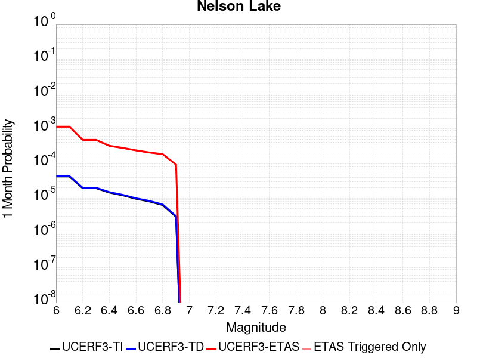 | 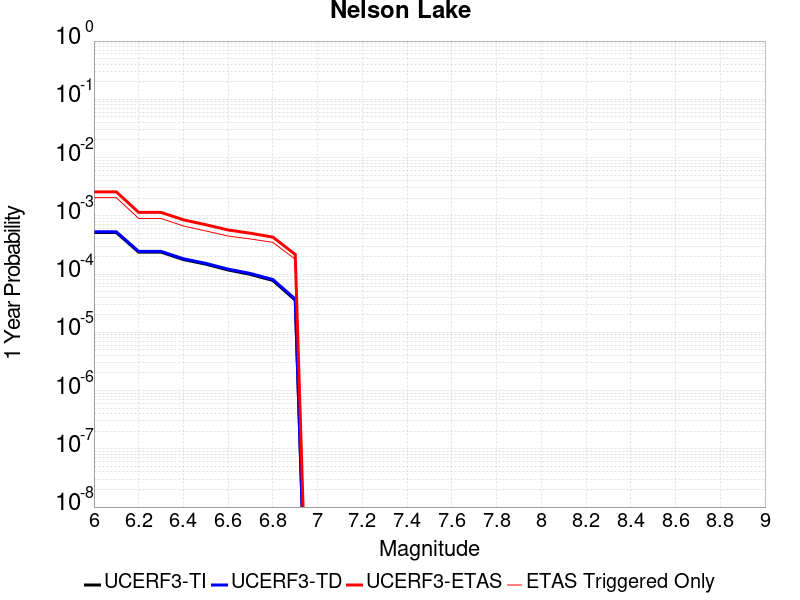 |  |

| Magnitude | 1 wk TI Prob | 1 wk TD Prob | 1 wk ETAS Prob | 1 wk ETAS/TD Gain | 1 wk ETAS Triggered Only | 1 mo TI Prob | 1 mo TD Prob | 1 mo ETAS Prob | 1 mo ETAS/TD Gain | 1 mo ETAS Triggered Only | 1 yr TI Prob | 1 yr TD Prob | 1 yr ETAS Prob | 1 yr ETAS/TD Gain | 1 yr ETAS Triggered Only | 10 yr TI Prob | 10 yr TD Prob | 10 yr ETAS Prob | 10 yr ETAS/TD Gain | 10 yr ETAS Triggered Only |
|-----|-----|-----|-----|-----|-----|-----|-----|-----|-----|-----|-----|-----|-----|-----|-----|-----|-----|-----|-----|-----|
| 6.0 | 9.913453E-6 | 1.0192255E-5 | 6.8018545E-4 | 66.73552 | 6.7E-4 | 4.2485535E-5 | 4.3680422E-5 | 0.001153632 | 26.410732 | 0.00111 | 5.1713863E-4 | 5.316897E-4 | 0.0025805996 | 4.8535824 | 0.00205 | 0.0051593683 | 0.005305204 | 0.008736901 | 1.6468549 | 0.00345 |
| 6.1 | 9.913453E-6 | 1.0192255E-5 | 6.8018545E-4 | 66.73552 | 6.7E-4 | 4.2485535E-5 | 4.3680422E-5 | 0.001153632 | 26.410732 | 0.00111 | 5.1713863E-4 | 5.316897E-4 | 0.0025805996 | 4.8535824 | 0.00205 | 0.0051593683 | 0.005305204 | 0.008736901 | 1.6468549 | 0.00345 |
| 6.2 | 4.5596407E-6 | 4.696313E-6 | 2.84695E-4 | 60.620956 | 2.8E-4 | 1.954117E-5 | 2.0126909E-5 | 4.8011765E-4 | 23.854517 | 4.6E-4 | 2.3788778E-4 | 2.4501883E-4 | 0.0011447984 | 4.6722875 | 9.0E-4 | 0.0023763329 | 0.0024476128 | 0.0039638923 | 1.6194932 | 0.00152 |
| 6.3 | 4.5596407E-6 | 4.696313E-6 | 2.84695E-4 | 60.620956 | 2.8E-4 | 1.954117E-5 | 2.0126909E-5 | 4.8011765E-4 | 23.854517 | 4.6E-4 | 2.3788778E-4 | 2.4501883E-4 | 0.0011447984 | 4.6722875 | 9.0E-4 | 0.0023763329 | 0.0024476128 | 0.0039638923 | 1.6194932 | 0.00152 |
| 6.4 | 3.4025713E-6 | 3.5098972E-6 | 1.735093E-4 | 49.434296 | 1.7E-4 | 1.4582367E-5 | 1.5042335E-5 | 3.2503766E-4 | 21.608192 | 3.1E-4 | 1.7752586E-4 | 1.8312587E-4 | 8.530032E-4 | 4.6580157 | 6.7E-4 | 0.001773841 | 0.0018298327 | 0.0029477833 | 1.6109579 | 0.00112 |
| 6.5 | 2.8352947E-6 | 2.927856E-6 | 1.6292739E-4 | 55.647335 | 1.6E-4 | 1.2151207E-5 | 1.2547898E-5 | 2.825445E-4 | 22.517277 | 2.7E-4 | 1.479309E-4 | 1.5276071E-4 | 7.026767E-4 | 4.5998526 | 5.5E-4 | 0.0014783246 | 0.0015266308 | 0.0024651957 | 1.614795 | 9.4E-4 |
| 6.6 | 2.251518E-6 | 2.3290677E-6 | 1.4232875E-4 | 61.109753 | 1.4E-4 | 9.649328E-6 | 9.981683E-6 | 2.3997939E-4 | 24.041975 | 2.3E-4 | 1.1747423E-4 | 1.2152085E-4 | 5.7146617E-4 | 4.702618 | 4.5E-4 | 0.0011741214 | 0.0012146058 | 0.0019836705 | 1.6331806 | 7.7E-4 |
| 6.7 | 1.8911853E-6 | 1.9591396E-6 | 1.219589E-4 | 62.251255 | 1.2E-4 | 8.105055E-6 | 8.39629E-6 | 2.0839462E-4 | 24.819847 | 2.0E-4 | 9.867457E-5 | 1.0222061E-4 | 5.021797E-4 | 4.912705 | 4.0E-4 | 9.863076E-4 | 0.0010217935 | 0.0017110883 | 1.6745932 | 6.9E-4 |
| 6.8 | 1.4874814E-6 | 1.5438305E-6 | 1.1154366E-4 | 72.251236 | 1.1E-4 | 6.374905E-6 | 6.6164025E-6 | 1.8661522E-4 | 28.204937 | 1.8E-4 | 7.76117E-5 | 8.055224E-5 | 4.3052406E-4 | 5.344656 | 3.5E-4 | 7.75846E-4 | 8.0528157E-4 | 0.0014047984 | 1.744481 | 6.0E-4 |
| 6.9 | 6.835972E-7 | 7.1399285E-7 | 7.071394E-5 | 99.04013 | 7.0E-5 | 2.9296991E-6 | 3.0599674E-6 | 9.3059694E-5 | 30.411987 | 9.0E-5 | 3.56685E-5 | 3.7254784E-5 | 2.1724807E-4 | 5.831414 | 1.8E-4 | 3.5662777E-4 | 3.7251666E-4 | 6.6240865E-4 | 1.7781987 | 2.9E-4 |

## Lenwood-Lockhart-Old Woman Springs
*[(top)](#table-of-contents)*

| 1 Week | 1 Month | 1 Year | 10 Year |
|-----|-----|-----|-----|
|  |  |  |  |

| Magnitude | 1 wk TI Prob | 1 wk TD Prob | 1 wk ETAS Prob | 1 wk ETAS/TD Gain | 1 wk ETAS Triggered Only | 1 mo TI Prob | 1 mo TD Prob | 1 mo ETAS Prob | 1 mo ETAS/TD Gain | 1 mo ETAS Triggered Only | 1 yr TI Prob | 1 yr TD Prob | 1 yr ETAS Prob | 1 yr ETAS/TD Gain | 1 yr ETAS Triggered Only | 10 yr TI Prob | 10 yr TD Prob | 10 yr ETAS Prob | 10 yr ETAS/TD Gain | 10 yr ETAS Triggered Only |
|-----|-----|-----|-----|-----|-----|-----|-----|-----|-----|-----|-----|-----|-----|-----|-----|-----|-----|-----|-----|-----|
| 6.0 | 3.744542E-5 | 4.396349E-5 | 0.0011339156 | 25.792212 | 0.00109 | 1.604705E-4 | 1.8840231E-4 | 0.0017581065 | 9.331661 | 0.00157 | 0.0019519776 | 0.0022915571 | 0.0048357137 | 2.1102304 | 0.00255 | 0.019349206 | 0.022697281 | 0.026352394 | 1.1610374 | 0.00374 |
| 6.1 | 3.744542E-5 | 4.396349E-5 | 0.0011339156 | 25.792212 | 0.00109 | 1.604705E-4 | 1.8840231E-4 | 0.0017581065 | 9.331661 | 0.00157 | 0.0019519776 | 0.0022915571 | 0.0048357137 | 2.1102304 | 0.00255 | 0.019349206 | 0.022697281 | 0.026352394 | 1.1610374 | 0.00374 |
| 6.2 | 3.744542E-5 | 4.396349E-5 | 0.0011339156 | 25.792212 | 0.00109 | 1.604705E-4 | 1.8840231E-4 | 0.0017581065 | 9.331661 | 0.00157 | 0.0019519776 | 0.0022915571 | 0.0048357137 | 2.1102304 | 0.00255 | 0.019349206 | 0.022697281 | 0.026352394 | 1.1610374 | 0.00374 |
| 6.3 | 2.1079984E-5 | 2.5354384E-5 | 5.1534193E-4 | 20.325556 | 4.9E-4 | 9.0339665E-5 | 1.0865723E-4 | 7.585866E-4 | 6.9814644 | 6.5E-4 | 0.0010993304 | 0.0013221189 | 0.002410678 | 1.8233441 | 0.00109 | 0.010939079 | 0.013144747 | 0.014743453 | 1.1216232 | 0.00162 |
| 6.4 | 2.1079984E-5 | 2.5354384E-5 | 5.1534193E-4 | 20.325556 | 4.9E-4 | 9.0339665E-5 | 1.0865723E-4 | 7.585866E-4 | 6.9814644 | 6.5E-4 | 0.0010993304 | 0.0013221189 | 0.002410678 | 1.8233441 | 0.00109 | 0.010939079 | 0.013144747 | 0.014743453 | 1.1216232 | 0.00162 |
| 6.5 | 1.7397282E-5 | 2.0663285E-5 | 4.0065544E-4 | 19.389727 | 3.8E-4 | 7.455765E-5 | 8.8554E-5 | 5.7851063E-4 | 6.532857 | 4.9E-4 | 9.073613E-4 | 0.0010776235 | 0.0018467937 | 1.7137654 | 7.7E-4 | 0.009036654 | 0.010725273 | 0.011862939 | 1.1060734 | 0.00115 |
| 6.6 | 1.52050325E-5 | 1.7680086E-5 | 3.3767443E-4 | 19.09914 | 3.2E-4 | 6.51628E-5 | 7.576964E-5 | 4.957378E-4 | 6.5426974 | 4.2E-4 | 7.9306826E-4 | 9.221128E-4 | 0.0016014858 | 1.7367569 | 6.8E-4 | 0.007902439 | 0.009183729 | 0.010184453 | 1.1089671 | 0.00101 |
| 6.7 | 1.332523E-5 | 1.5264379E-5 | 2.7526042E-4 | 18.03286 | 2.6E-4 | 5.7106878E-5 | 6.541716E-5 | 4.053949E-4 | 6.197073 | 3.4E-4 | 6.950544E-4 | 7.9616875E-4 | 0.0013657149 | 1.7153586 | 5.7E-4 | 0.006928845 | 0.0079337945 | 0.00876713 | 1.1050363 | 8.4E-4 |
| 6.8 | 1.1525329E-5 | 1.3031365E-5 | 2.0302889E-4 | 15.580017 | 1.9E-4 | 4.9393333E-5 | 5.5847537E-5 | 3.2583246E-4 | 5.834321 | 2.7E-4 | 6.011979E-4 | 6.7973585E-4 | 0.0011394232 | 1.6762735 | 4.6E-4 | 0.00599574 | 0.0067770192 | 0.0074722753 | 1.1025902 | 7.0E-4 |
| 6.9 | 1.0253909E-5 | 1.1514835E-5 | 1.4151334E-4 | 12.289655 | 1.3E-4 | 4.3944583E-5 | 4.934838E-5 | 2.493385E-4 | 5.052618 | 2.0E-4 | 5.3489394E-4 | 6.006545E-4 | 9.7043224E-4 | 1.6156247 | 3.7E-4 | 0.0053360825 | 0.0059906896 | 0.006547335 | 1.0929184 | 5.6E-4 |
| 7.0 | 8.104563E-6 | 8.99143E-6 | 1.08990534E-4 | 12.121601 | 1.0E-4 | 3.4733377E-5 | 3.853415E-5 | 1.8852837E-4 | 4.8925014 | 1.5E-4 | 4.2279682E-4 | 4.6905465E-4 | 7.189374E-4 | 1.5327369 | 2.5E-4 | 0.0042199334 | 0.0046808943 | 0.0050690686 | 1.0829275 | 3.9E-4 |
| 7.1 | 6.7986157E-6 | 7.5159796E-6 | 5.7515605E-5 | 7.6524425 | 5.0E-5 | 2.91366E-5 | 3.2210955E-5 | 1.2220806E-4 | 3.7939904 | 9.0E-5 | 3.5468035E-4 | 3.9209996E-4 | 5.320451E-4 | 1.3569118 | 1.4E-4 | 0.003541148 | 0.003914298 | 0.00417328 | 1.0661632 | 2.6E-4 |
| 7.2 | 5.6893327E-6 | 6.280132E-6 | 5.627982E-5 | 8.961566 | 5.0E-5 | 2.4382627E-5 | 2.6914584E-5 | 1.06912434E-4 | 3.9722862 | 8.0E-5 | 2.9681803E-4 | 3.276378E-4 | 4.4759846E-4 | 1.3661381 | 1.2E-4 | 0.002964219 | 0.003271746 | 0.003481059 | 1.0639759 | 2.1E-4 |
| 7.3 | 4.253348E-6 | 4.707075E-6 | 4.4706885E-5 | 9.497807 | 4.0E-5 | 1.8228506E-5 | 2.017303E-5 | 8.017182E-5 | 3.9742079 | 6.0E-5 | 2.2190946E-4 | 2.455808E-4 | 3.355587E-4 | 1.3663882 | 9.0E-5 | 0.00221688 | 0.0024532753 | 0.0026128828 | 1.065059 | 1.6E-4 |
| 7.4 | 2.5448119E-6 | 2.8520594E-6 | 1.28520305E-5 | 4.5062284 | 1.0E-5 | 1.0906291E-5 | 1.2223064E-5 | 4.22227E-5 | 3.4543464 | 3.0E-5 | 1.3277601E-4 | 1.4880729E-4 | 1.9879985E-4 | 1.335955 | 5.0E-5 | 0.001326967 | 0.0014872387 | 0.0015671197 | 1.0537109 | 8.0E-5 |
| 7.5 | 4.3706837E-8 | 4.562909E-8 | 4.562909E-8 | 1.0 | 0.0 | 1.8731501E-7 | 1.9555324E-7 | 1.9555324E-7 | 1.0 | 0.0 | 2.2805577E-6 | 2.3808586E-6 | 2.3808586E-6 | 1.0 | 0.0 | 2.2805343E-5 | 2.3808387E-5 | 2.3808387E-5 | 1.0 | 0.0 |

## Towne Pass
*[(top)](#table-of-contents)*

| 1 Week | 1 Month | 1 Year | 10 Year |
|-----|-----|-----|-----|
|  | 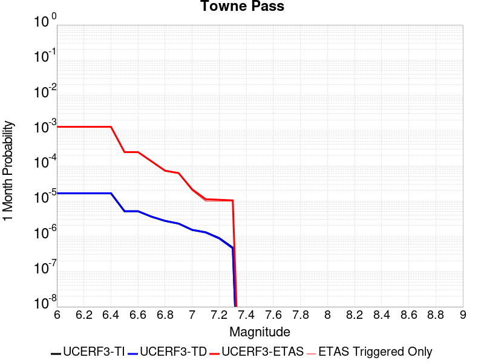 |  |  |

| Magnitude | 1 wk TI Prob | 1 wk TD Prob | 1 wk ETAS Prob | 1 wk ETAS/TD Gain | 1 wk ETAS Triggered Only | 1 mo TI Prob | 1 mo TD Prob | 1 mo ETAS Prob | 1 mo ETAS/TD Gain | 1 mo ETAS Triggered Only | 1 yr TI Prob | 1 yr TD Prob | 1 yr ETAS Prob | 1 yr ETAS/TD Gain | 1 yr ETAS Triggered Only | 10 yr TI Prob | 10 yr TD Prob | 10 yr ETAS Prob | 10 yr ETAS/TD Gain | 10 yr ETAS Triggered Only |
|-----|-----|-----|-----|-----|-----|-----|-----|-----|-----|-----|-----|-----|-----|-----|-----|-----|-----|-----|-----|-----|
| 6.0 | 3.849728E-6 | 3.894542E-6 | 8.138914E-4 | 208.98257 | 8.1E-4 | 1.649873E-5 | 1.6690812E-5 | 0.0012766698 | 76.48937 | 0.00126 | 2.0085352E-4 | 2.0319606E-4 | 0.0023627572 | 11.627968 | 0.00216 | 0.0020067208 | 0.0020305319 | 0.0051142573 | 2.518679 | 0.00309 |
| 6.1 | 3.849728E-6 | 3.894542E-6 | 8.138914E-4 | 208.98257 | 8.1E-4 | 1.649873E-5 | 1.6690812E-5 | 0.0012766698 | 76.48937 | 0.00126 | 2.0085352E-4 | 2.0319606E-4 | 0.0023627572 | 11.627968 | 0.00216 | 0.0020067208 | 0.0020305319 | 0.0051142573 | 2.518679 | 0.00309 |
| 6.2 | 3.849728E-6 | 3.894542E-6 | 8.138914E-4 | 208.98257 | 8.1E-4 | 1.649873E-5 | 1.6690812E-5 | 0.0012766698 | 76.48937 | 0.00126 | 2.0085352E-4 | 2.0319606E-4 | 0.0023627572 | 11.627968 | 0.00216 | 0.0020067208 | 0.0020305319 | 0.0051142573 | 2.518679 | 0.00309 |
| 6.3 | 3.849728E-6 | 3.894542E-6 | 8.138914E-4 | 208.98257 | 8.1E-4 | 1.649873E-5 | 1.6690812E-5 | 0.0012766698 | 76.48937 | 0.00126 | 2.0085352E-4 | 2.0319606E-4 | 0.0023627572 | 11.627968 | 0.00216 | 0.0020067208 | 0.0020305319 | 0.0051142573 | 2.518679 | 0.00309 |
| 6.4 | 3.849728E-6 | 3.894542E-6 | 8.138914E-4 | 208.98257 | 8.1E-4 | 1.649873E-5 | 1.6690812E-5 | 0.0012766698 | 76.48937 | 0.00126 | 2.0085352E-4 | 2.0319606E-4 | 0.0023627572 | 11.627968 | 0.00216 | 0.0020067208 | 0.0020305319 | 0.0051142573 | 2.518679 | 0.00309 |
| 6.5 | 1.1953545E-6 | 1.2030526E-6 | 1.5120287E-4 | 125.68268 | 1.5E-4 | 5.1229376E-6 | 5.15593E-6 | 2.451547E-4 | 47.548103 | 2.4E-4 | 6.236998E-5 | 6.277176E-5 | 3.727523E-4 | 5.938216 | 3.1E-4 | 6.235248E-4 | 6.2755204E-4 | 0.0010372947 | 1.6529223 | 4.1E-4 |
| 6.6 | 1.1953545E-6 | 1.2030526E-6 | 1.5120287E-4 | 125.68268 | 1.5E-4 | 5.1229376E-6 | 5.15593E-6 | 2.451547E-4 | 47.548103 | 2.4E-4 | 6.236998E-5 | 6.277176E-5 | 3.727523E-4 | 5.938216 | 3.1E-4 | 6.235248E-4 | 6.2755204E-4 | 0.0010372947 | 1.6529223 | 4.1E-4 |
| 6.7 | 8.375951E-7 | 8.410676E-7 | 8.0841E-5 | 96.11713 | 8.0E-5 | 3.5896885E-6 | 3.6045708E-6 | 1.336041E-4 | 37.06519 | 1.3E-4 | 4.370358E-5 | 4.3884826E-5 | 2.1387737E-4 | 4.8736067 | 1.7E-4 | 4.3694986E-4 | 4.3876728E-4 | 6.8865763E-4 | 1.5695281 | 2.5E-4 |
| 6.8 | 6.38041E-7 | 6.3921624E-7 | 4.0639192E-5 | 63.576595 | 4.0E-5 | 2.7344586E-6 | 2.7394954E-6 | 7.2739305E-5 | 26.55208 | 7.0E-5 | 3.3291526E-5 | 3.3352884E-5 | 1.2334988E-4 | 3.6983273 | 9.0E-5 | 3.3286537E-4 | 3.334826E-4 | 4.734359E-4 | 1.419672 | 1.4E-4 |
| 6.9 | 5.3460053E-7 | 5.345339E-7 | 3.0534517E-5 | 57.123634 | 3.0E-5 | 2.2911431E-6 | 2.2908578E-6 | 6.229072E-5 | 27.191004 | 6.0E-5 | 2.789431E-5 | 2.7890868E-5 | 1.07888634E-4 | 3.8682423 | 8.0E-5 | 2.789081E-4 | 2.78877E-4 | 3.8884633E-4 | 1.3943291 | 1.1E-4 |
| 7.0 | 3.557783E-7 | 3.5324283E-7 | 1.0353239E-5 | 29.309128 | 1.0E-5 | 1.5247632E-6 | 1.513897E-6 | 2.1513866E-5 | 14.210917 | 2.0E-5 | 1.8563835E-5 | 1.8431549E-5 | 4.8430997E-5 | 2.627614 | 3.0E-5 | 1.8562283E-4 | 1.8430105E-4 | 2.4429E-4 | 1.3254943 | 6.0E-5 |
| 7.1 | 3.037942E-7 | 3.0002275E-7 | 3.0002275E-7 | 1.0 | 0.0 | 1.3019744E-6 | 1.2858112E-6 | 1.1285799E-5 | 8.777182 | 1.0E-5 | 1.5851423E-5 | 1.5654647E-5 | 3.5654335E-5 | 2.277556 | 2.0E-5 | 1.5850292E-4 | 1.5653619E-4 | 2.0652836E-4 | 1.3193649 | 5.0E-5 |
| 7.2 | 2.0808248E-7 | 2.0217735E-7 | 2.0217735E-7 | 1.0 | 0.0 | 8.917818E-7 | 8.6647407E-7 | 1.0866465E-5 | 12.541017 | 1.0E-5 | 1.0857389E-5 | 1.0549275E-5 | 2.054917E-5 | 1.9479225 | 1.0E-5 | 1.0856859E-4 | 1.0548821E-4 | 1.45484E-4 | 1.3791493 | 4.0E-5 |
| 7.3 | 1.1162073E-7 | 1.0636902E-7 | 1.0636902E-7 | 1.0 | 0.0 | 4.7837443E-7 | 4.5586717E-7 | 1.0455863E-5 | 22.936205 | 1.0E-5 | 5.8241935E-6 | 5.5501705E-6 | 1.5550115E-5 | 2.8017364 | 1.0E-5 | 5.8240406E-5 | 5.550052E-5 | 8.5498854E-5 | 1.5405054 | 3.0E-5 |

## San Andreas (San Bernardino N)
*[(top)](#table-of-contents)*

| 1 Week | 1 Month | 1 Year | 10 Year |
|-----|-----|-----|-----|
| 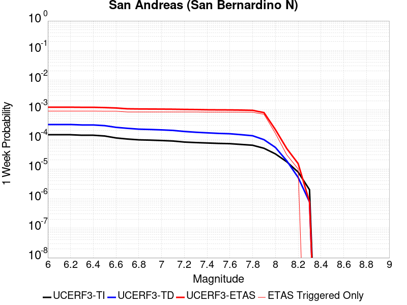 |  |  |  |

| Magnitude | 1 wk TI Prob | 1 wk TD Prob | 1 wk ETAS Prob | 1 wk ETAS/TD Gain | 1 wk ETAS Triggered Only | 1 mo TI Prob | 1 mo TD Prob | 1 mo ETAS Prob | 1 mo ETAS/TD Gain | 1 mo ETAS Triggered Only | 1 yr TI Prob | 1 yr TD Prob | 1 yr ETAS Prob | 1 yr ETAS/TD Gain | 1 yr ETAS Triggered Only | 10 yr TI Prob | 10 yr TD Prob | 10 yr ETAS Prob | 10 yr ETAS/TD Gain | 10 yr ETAS Triggered Only |
|-----|-----|-----|-----|-----|-----|-----|-----|-----|-----|-----|-----|-----|-----|-----|-----|-----|-----|-----|-----|-----|
| 6.0 | 1.4273766E-4 | 3.160784E-4 | 0.0012157939 | 3.8464947 | 9.0E-4 | 6.115894E-4 | 0.0013539245 | 0.0025822592 | 1.9072402 | 0.00123 | 0.0074207084 | 0.016360939 | 0.01799378 | 1.0998012 | 0.00166 | 0.07177748 | 0.15021163 | 0.15205567 | 1.0122763 | 0.00217 |
| 6.1 | 1.4273766E-4 | 3.160784E-4 | 0.0012157939 | 3.8464947 | 9.0E-4 | 6.115894E-4 | 0.0013539245 | 0.0025822592 | 1.9072402 | 0.00123 | 0.0074207084 | 0.016360939 | 0.01799378 | 1.0998012 | 0.00166 | 0.07177748 | 0.15021163 | 0.15205567 | 1.0122763 | 0.00217 |
| 6.2 | 1.4273766E-4 | 3.160784E-4 | 0.0012157939 | 3.8464947 | 9.0E-4 | 6.115894E-4 | 0.0013539245 | 0.0025822592 | 1.9072402 | 0.00123 | 0.0074207084 | 0.016360939 | 0.01799378 | 1.0998012 | 0.00166 | 0.07177748 | 0.15021163 | 0.15205567 | 1.0122763 | 0.00217 |
| 6.3 | 1.3730655E-4 | 3.0512668E-4 | 0.001204852 | 3.9486947 | 9.0E-4 | 5.883239E-4 | 0.001307036 | 0.0025354284 | 1.9398305 | 0.00123 | 0.0071393442 | 0.015798455 | 0.01743223 | 1.1034136 | 0.00166 | 0.06914291 | 0.1455135 | 0.14736775 | 1.0127428 | 0.00217 |
| 6.4 | 1.3730655E-4 | 3.0512668E-4 | 0.001204852 | 3.9486947 | 9.0E-4 | 5.883239E-4 | 0.001307036 | 0.0025354284 | 1.9398305 | 0.00123 | 0.0071393442 | 0.015798455 | 0.01743223 | 1.1034136 | 0.00166 | 0.06914291 | 0.1455135 | 0.14736775 | 1.0127428 | 0.00217 |
| 6.5 | 1.2942807E-4 | 2.8927144E-4 | 0.001179014 | 4.075805 | 8.9E-4 | 5.545738E-4 | 0.0012391509 | 0.0024576392 | 1.9833251 | 0.00122 | 0.0067310524 | 0.014983548 | 0.016608825 | 1.1084708 | 0.00165 | 0.06530788 | 0.13865088 | 0.14049417 | 1.0132945 | 0.00214 |
| 6.6 | 1.1125901E-4 | 2.5365927E-4 | 0.0011434335 | 4.507754 | 8.9E-4 | 4.767372E-4 | 0.0010866605 | 0.0022853564 | 2.1031008 | 0.0012 | 0.005788839 | 0.0131504685 | 0.014759033 | 1.1223199 | 0.00163 | 0.056403454 | 0.12300496 | 0.124837875 | 1.0149012 | 0.00209 |
| 6.7 | 1.02209575E-4 | 2.3500937E-4 | 0.001074812 | 4.5734854 | 8.4E-4 | 4.3796748E-4 | 0.0010067957 | 0.002145648 | 2.1311653 | 0.00114 | 0.0053192247 | 0.012189267 | 0.01374013 | 1.1272318 | 0.00157 | 0.051936906 | 0.114792764 | 0.11658974 | 1.0156541 | 0.00203 |
| 6.8 | 9.610582E-5 | 2.2026796E-4 | 0.0010600829 | 4.812697 | 8.4E-4 | 4.1181705E-4 | 9.436647E-4 | 0.0020725983 | 2.196329 | 0.00113 | 0.0050023515 | 0.011428859 | 0.012961145 | 1.1340716 | 0.00155 | 0.048912346 | 0.10820469 | 0.10998828 | 1.0164835 | 0.002 |
| 6.9 | 9.3877505E-5 | 2.1482339E-4 | 0.001054643 | 4.9093485 | 8.4E-4 | 4.0227012E-4 | 9.203475E-4 | 0.0020493076 | 2.2266672 | 0.00113 | 0.0048866454 | 0.011147907 | 0.012680627 | 1.1374896 | 0.00155 | 0.04780577 | 0.105798274 | 0.107586674 | 1.0169039 | 0.002 |
| 7.0 | 9.1019785E-5 | 2.0809306E-4 | 0.0010479182 | 5.0358157 | 8.4E-4 | 3.900265E-4 | 8.915232E-4 | 0.0020205157 | 2.2663636 | 0.00113 | 0.0047382377 | 0.0108004995 | 0.012323867 | 1.141046 | 0.00154 | 0.046384744 | 0.10276815 | 0.10455365 | 1.0173739 | 0.00199 |
| 7.1 | 8.771155E-5 | 1.9983841E-4 | 0.0010396705 | 5.202556 | 8.4E-4 | 3.758525E-4 | 8.5616973E-4 | 0.0019852023 | 2.3187017 | 0.00113 | 0.0045664064 | 0.010374243 | 0.011888371 | 1.1459507 | 0.00153 | 0.044737056 | 0.09907644 | 0.10086027 | 1.0180045 | 0.00198 |
| 7.2 | 8.0830236E-5 | 1.8389444E-4 | 0.0010237399 | 5.566998 | 8.4E-4 | 3.4636928E-4 | 7.8788114E-4 | 0.0019169908 | 2.4330964 | 0.00113 | 0.0042088944 | 0.009550368 | 0.011055852 | 1.1576362 | 0.00152 | 0.041300658 | 0.09180518 | 0.093585245 | 1.0193895 | 0.00196 |
| 7.3 | 7.7668235E-5 | 1.7333007E-4 | 0.0010131844 | 5.845405 | 8.4E-4 | 3.328214E-4 | 7.426318E-4 | 0.0018717926 | 2.5204854 | 0.00113 | 0.0040445733 | 0.009004138 | 0.010510452 | 1.1672913 | 0.00152 | 0.03971748 | 0.08706761 | 0.088856965 | 1.0205512 | 0.00196 |
| 7.4 | 7.520177E-5 | 1.655312E-4 | 9.953938E-4 | 6.013331 | 8.3E-4 | 3.2225347E-4 | 7.092266E-4 | 0.0018184393 | 2.563975 | 0.00111 | 0.0039163795 | 0.008600714 | 0.010087812 | 1.1729041 | 0.0015 | 0.038480744 | 0.08352157 | 0.085290365 | 1.0211778 | 0.00193 |
| 7.5 | 7.274697E-5 | 1.584075E-4 | 9.88276E-4 | 6.238821 | 8.3E-4 | 3.1173544E-4 | 6.7871273E-4 | 0.0017879594 | 2.6343389 | 0.00111 | 0.003788775 | 0.008232076 | 0.009719728 | 1.180714 | 0.0015 | 0.03724827 | 0.08023654 | 0.082011685 | 1.0221239 | 0.00193 |
| 7.6 | 7.1185845E-5 | 1.5410586E-4 | 9.839779E-4 | 6.3850784 | 8.3E-4 | 3.0504653E-4 | 6.602866E-4 | 0.0017695536 | 2.6799784 | 0.00111 | 0.0037076178 | 0.0080094095 | 0.009497395 | 1.1857797 | 0.0015 | 0.036463667 | 0.07822661 | 0.08000564 | 1.0227419 | 0.00193 |
| 7.7 | 6.709961E-5 | 1.4319421E-4 | 9.7307534E-4 | 6.7954936 | 8.3E-4 | 2.8753807E-4 | 6.135452E-4 | 0.0017228641 | 2.8080478 | 0.00111 | 0.003495157 | 0.0074443663 | 0.0089332 | 1.1999947 | 0.0015 | 0.034406938 | 0.07305558 | 0.074844584 | 1.0244882 | 0.00193 |
| 7.8 | 6.300812E-5 | 1.320343E-4 | 9.5192605E-4 | 7.209687 | 8.2E-4 | 2.7000686E-4 | 5.657386E-4 | 0.0016651163 | 2.943261 | 0.0011 | 0.0032823787 | 0.006866143 | 0.0083359815 | 1.2140704 | 0.00148 | 0.032343175 | 0.06771385 | 0.069494516 | 1.026297 | 0.00191 |
| 7.9 | 4.983037E-5 | 9.7241085E-5 | 7.97173E-4 | 8.197904 | 7.0E-4 | 2.1354125E-4 | 4.1668097E-4 | 0.0013562893 | 3.2549827 | 9.4E-4 | 0.0025967648 | 0.0050613005 | 0.0063248724 | 1.2496537 | 0.00127 | 0.025666296 | 0.050650507 | 0.05217896 | 1.0301764 | 0.00161 |
| 8.0 | 3.2211527E-5 | 5.3306234E-5 | 2.1329771E-4 | 4.001365 | 1.6E-4 | 1.380421E-4 | 2.2843528E-4 | 4.383873E-4 | 1.9190875 | 2.1E-4 | 0.0016793669 | 0.0027776542 | 0.00302696 | 1.089754 | 2.5E-4 | 0.016667323 | 0.028362568 | 0.028712358 | 1.0123328 | 3.6E-4 |
| 8.1 | 1.743376E-5 | 1.8823403E-5 | 4.8822836E-5 | 2.5937307 | 3.0E-5 | 7.471398E-5 | 8.066923E-5 | 1.20666E-4 | 1.495812 | 4.0E-5 | 9.0926304E-4 | 9.81706E-4 | 0.0010216667 | 1.0407054 | 4.0E-5 | 0.009055517 | 0.010483979 | 0.010533456 | 1.0047191 | 5.0E-5 |
| 8.2 | 7.831616E-6 | 5.1540533E-6 | 1.5154002E-5 | 2.9402106 | 1.0E-5 | 3.3563636E-5 | 2.2088612E-5 | 3.2088392E-5 | 1.4527119 | 1.0E-5 | 4.0856065E-4 | 2.6889573E-4 | 2.7889304E-4 | 1.0371791 | 1.0E-5 | 0.004078103 | 0.0030413668 | 0.003061306 | 1.006556 | 2.0E-5 |
| 8.3 | 1.983087E-6 | 7.6564595E-7 | 7.6564595E-7 | 1.0 | 0.0 | 8.498917E-6 | 3.281336E-6 | 3.281336E-6 | 1.0 | 0.0 | 1.034694E-4 | 3.9949547E-5 | 3.9949547E-5 | 1.0 | 0.0 | 0.0010342124 | 4.717979E-4 | 4.717979E-4 | 1.0 | 0.0 |

## Paradise
*[(top)](#table-of-contents)*

| 1 Week | 1 Month | 1 Year | 10 Year |
|-----|-----|-----|-----|
|  |  |  |  |

| Magnitude | 1 wk TI Prob | 1 wk TD Prob | 1 wk ETAS Prob | 1 wk ETAS/TD Gain | 1 wk ETAS Triggered Only | 1 mo TI Prob | 1 mo TD Prob | 1 mo ETAS Prob | 1 mo ETAS/TD Gain | 1 mo ETAS Triggered Only | 1 yr TI Prob | 1 yr TD Prob | 1 yr ETAS Prob | 1 yr ETAS/TD Gain | 1 yr ETAS Triggered Only | 10 yr TI Prob | 10 yr TD Prob | 10 yr ETAS Prob | 10 yr ETAS/TD Gain | 10 yr ETAS Triggered Only |
|-----|-----|-----|-----|-----|-----|-----|-----|-----|-----|-----|-----|-----|-----|-----|-----|-----|-----|-----|-----|-----|
| 6.0 | 1.4851273E-5 | 1.6694768E-5 | 5.966851E-4 | 35.74084 | 5.8E-4 | 6.364676E-5 | 7.154718E-5 | 9.314857E-4 | 13.01918 | 8.6E-4 | 7.7462377E-4 | 8.707624E-4 | 0.0023394823 | 2.6867058 | 0.00147 | 0.0077192914 | 0.008675884 | 0.010916277 | 1.2582321 | 0.00226 |
| 6.1 | 1.4851273E-5 | 1.6694768E-5 | 5.966851E-4 | 35.74084 | 5.8E-4 | 6.364676E-5 | 7.154718E-5 | 9.314857E-4 | 13.01918 | 8.6E-4 | 7.7462377E-4 | 8.707624E-4 | 0.0023394823 | 2.6867058 | 0.00147 | 0.0077192914 | 0.008675884 | 0.010916277 | 1.2582321 | 0.00226 |
| 6.2 | 1.4851273E-5 | 1.6694768E-5 | 5.966851E-4 | 35.74084 | 5.8E-4 | 6.364676E-5 | 7.154718E-5 | 9.314857E-4 | 13.01918 | 8.6E-4 | 7.7462377E-4 | 8.707624E-4 | 0.0023394823 | 2.6867058 | 0.00147 | 0.0077192914 | 0.008675884 | 0.010916277 | 1.2582321 | 0.00226 |
| 6.3 | 1.0426831E-5 | 1.1888697E-5 | 3.2188502E-4 | 27.074875 | 3.1E-4 | 4.4685654E-5 | 5.09506E-5 | 5.009277E-4 | 9.8316345 | 4.5E-4 | 5.43912E-4 | 6.201529E-4 | 0.0013497003 | 2.176399 | 7.3E-4 | 0.0054258266 | 0.0061848317 | 0.0072183996 | 1.1671133 | 0.00104 |
| 6.4 | 1.0426831E-5 | 1.1888697E-5 | 3.2188502E-4 | 27.074875 | 3.1E-4 | 4.4685654E-5 | 5.09506E-5 | 5.009277E-4 | 9.8316345 | 4.5E-4 | 5.43912E-4 | 6.201529E-4 | 0.0013497003 | 2.176399 | 7.3E-4 | 0.0054258266 | 0.0061848317 | 0.0072183996 | 1.1671133 | 0.00104 |
| 6.5 | 9.25027E-6 | 1.0620037E-5 | 2.5061748E-4 | 23.59855 | 2.4E-4 | 3.964341E-5 | 4.551368E-5 | 3.9549774E-4 | 8.689646 | 3.5E-4 | 4.8255164E-4 | 5.5399304E-4 | 0.0011536607 | 2.082446 | 6.0E-4 | 0.0048150513 | 0.0055266195 | 0.006361977 | 1.1511517 | 8.4E-4 |
| 6.6 | 7.904275E-6 | 9.159602E-6 | 1.3915841E-4 | 15.192626 | 1.3E-4 | 3.3875025E-5 | 3.925487E-5 | 2.4924663E-4 | 6.3494444 | 2.1E-4 | 4.1235037E-4 | 4.7782718E-4 | 8.076695E-4 | 1.6902963 | 3.3E-4 | 0.0041158604 | 0.004768395 | 0.0052361535 | 1.0980957 | 4.7E-4 |
| 6.7 | 7.2061953E-6 | 8.407326E-6 | 7.840674E-5 | 9.326002 | 7.0E-5 | 3.088333E-5 | 3.603092E-5 | 1.4602696E-4 | 4.0528235 | 1.1E-4 | 3.7593965E-4 | 4.3859181E-4 | 6.6849095E-4 | 1.5241756 | 2.3E-4 | 0.003753043 | 0.004377631 | 0.0046962304 | 1.0727789 | 3.2E-4 |
| 6.8 | 6.6948724E-6 | 7.842242E-6 | 6.784177E-5 | 8.650813 | 6.0E-5 | 2.8691995E-5 | 3.3609194E-5 | 1.3360583E-4 | 3.9752762 | 1.0E-4 | 3.4926904E-4 | 4.091187E-4 | 5.9904094E-4 | 1.4642229 | 1.9E-4 | 0.003487206 | 0.0040840125 | 0.00435291 | 1.0658414 | 2.7E-4 |
| 6.9 | 6.0421025E-6 | 7.1306963E-6 | 5.713034E-5 | 8.0118885 | 5.0E-5 | 2.5894467E-5 | 3.0559786E-5 | 1.2055704E-4 | 3.9449565 | 9.0E-5 | 3.1521954E-4 | 3.7200528E-4 | 5.219495E-4 | 1.4030701 | 1.5E-4 | 0.0031477278 | 0.0037141638 | 0.003913421 | 1.0536479 | 2.0E-4 |
| 7.0 | 4.134091E-6 | 5.0803824E-6 | 3.508023E-5 | 6.905037 | 3.0E-5 | 1.7717413E-5 | 2.1772896E-5 | 6.177202E-5 | 2.8371067 | 4.0E-5 | 2.1568815E-4 | 2.650543E-4 | 3.450331E-4 | 1.3017449 | 8.0E-5 | 0.0021547892 | 0.0026475347 | 0.00274727 | 1.037671 | 1.0E-4 |
| 7.1 | 3.7674888E-6 | 4.631936E-6 | 3.4631797E-5 | 7.476743 | 3.0E-5 | 1.6146281E-5 | 1.9851012E-5 | 5.985022E-5 | 3.0149705 | 4.0E-5 | 1.9656324E-4 | 2.4166079E-4 | 3.1164387E-4 | 1.2895923 | 7.0E-5 | 0.0019638946 | 0.0024141306 | 0.0025039134 | 1.0371906 | 9.0E-5 |
| 7.2 | 3.4065345E-6 | 4.156782E-6 | 2.41567E-5 | 5.811394 | 2.0E-5 | 1.4599351E-5 | 1.7814667E-5 | 4.7814134E-5 | 2.6839757 | 3.0E-5 | 1.777326E-4 | 2.168735E-4 | 2.7686046E-4 | 1.276599 | 6.0E-5 | 0.0017759053 | 0.0021667667 | 0.0022465934 | 1.0368414 | 8.0E-5 |
| 7.3 | 2.9934936E-6 | 3.6293673E-6 | 2.3629294E-5 | 6.5105824 | 2.0E-5 | 1.2829195E-5 | 1.5554348E-5 | 3.5554036E-5 | 2.2857943 | 2.0E-5 | 1.5618425E-4 | 1.8935918E-4 | 2.3934973E-4 | 1.2639984 | 5.0E-5 | 0.0015607453 | 0.0018921237 | 0.0019619912 | 1.0369254 | 7.0E-5 |
| 7.4 | 2.4049796E-6 | 2.8890186E-6 | 1.288899E-5 | 4.4613733 | 1.0E-5 | 1.0307015E-5 | 1.2381457E-5 | 2.2381333E-5 | 1.8076494 | 1.0E-5 | 1.2548068E-4 | 1.5073526E-4 | 1.9072923E-4 | 1.2653259 | 4.0E-5 | 0.0012540985 | 0.0015064715 | 0.0015464113 | 1.0265121 | 4.0E-5 |
| 7.5 | 1.2710091E-6 | 1.5134859E-6 | 1.1513471E-5 | 7.6072536 | 1.0E-5 | 5.44717E-6 | 6.4863593E-6 | 1.6486294E-5 | 2.541687 | 1.0E-5 | 6.631728E-5 | 7.896981E-5 | 1.0896744E-4 | 1.379862 | 3.0E-5 | 6.6297496E-4 | 7.895401E-4 | 8.195164E-4 | 1.0379668 | 3.0E-5 |
| 7.6 | 2.21172E-7 | 2.6040198E-7 | 2.6040198E-7 | 1.0 | 0.0 | 9.478797E-7 | 1.1160082E-6 | 1.1160082E-6 | 1.0 | 0.0 | 1.1540374E-5 | 1.3587343E-5 | 2.3587207E-5 | 1.7359691 | 1.0E-5 | 1.1539775E-4 | 1.3586794E-4 | 1.4586658E-4 | 1.0735909 | 1.0E-5 |

## Bicycle Lake
*[(top)](#table-of-contents)*

| 1 Week | 1 Month | 1 Year | 10 Year |
|-----|-----|-----|-----|
|  |  | 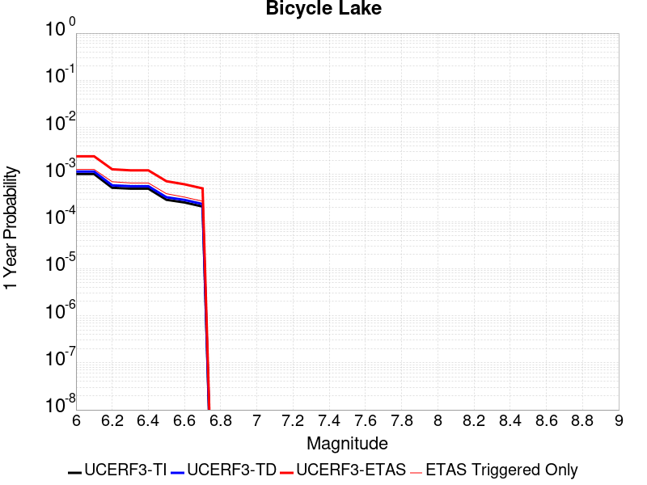 |  |

| Magnitude | 1 wk TI Prob | 1 wk TD Prob | 1 wk ETAS Prob | 1 wk ETAS/TD Gain | 1 wk ETAS Triggered Only | 1 mo TI Prob | 1 mo TD Prob | 1 mo ETAS Prob | 1 mo ETAS/TD Gain | 1 mo ETAS Triggered Only | 1 yr TI Prob | 1 yr TD Prob | 1 yr ETAS Prob | 1 yr ETAS/TD Gain | 1 yr ETAS Triggered Only | 10 yr TI Prob | 10 yr TD Prob | 10 yr ETAS Prob | 10 yr ETAS/TD Gain | 10 yr ETAS Triggered Only |
|-----|-----|-----|-----|-----|-----|-----|-----|-----|-----|-----|-----|-----|-----|-----|-----|-----|-----|-----|-----|-----|
| 6.0 | 1.9621975E-5 | 2.2097078E-5 | 4.1208847E-4 | 18.649002 | 3.9E-4 | 8.4091465E-5 | 9.4699084E-5 | 7.1464037E-4 | 7.5464334 | 6.2E-4 | 0.0010233327 | 0.0011524865 | 0.0024310113 | 2.1093621 | 0.00128 | 0.01018633 | 0.011478408 | 0.013494993 | 1.175685 | 0.00204 |
| 6.1 | 1.9621975E-5 | 2.2097078E-5 | 4.1208847E-4 | 18.649002 | 3.9E-4 | 8.4091465E-5 | 9.4699084E-5 | 7.1464037E-4 | 7.5464334 | 6.2E-4 | 0.0010233327 | 0.0011524865 | 0.0024310113 | 2.1093621 | 0.00128 | 0.01018633 | 0.011478408 | 0.013494993 | 1.175685 | 0.00204 |
| 6.2 | 9.9971285E-6 | 1.125564E-5 | 2.012535E-4 | 17.880238 | 1.9E-4 | 4.2844134E-5 | 4.8237856E-5 | 3.6822242E-4 | 7.633474 | 3.2E-4 | 5.2150246E-4 | 5.871897E-4 | 0.0012867786 | 2.1914191 | 7.0E-4 | 0.0052028033 | 0.005861487 | 0.00703457 | 1.2001342 | 0.00118 |
| 6.3 | 9.589428E-6 | 1.0798346E-5 | 2.0079629E-4 | 18.595097 | 1.9E-4 | 4.10969E-5 | 4.62781E-5 | 3.5626374E-4 | 7.6983232 | 3.1E-4 | 5.002399E-4 | 5.6334207E-4 | 0.0012229702 | 2.1709194 | 6.6E-4 | 0.0049911533 | 0.0056242296 | 0.0067379307 | 1.1980184 | 0.00112 |
| 6.4 | 9.589428E-6 | 1.0798346E-5 | 2.0079629E-4 | 18.595097 | 1.9E-4 | 4.10969E-5 | 4.62781E-5 | 3.5626374E-4 | 7.6983232 | 3.1E-4 | 5.002399E-4 | 5.6334207E-4 | 0.0012229702 | 2.1709194 | 6.6E-4 | 0.0049911533 | 0.0056242296 | 0.0067379307 | 1.1980184 | 0.00112 |
| 6.5 | 5.557707E-6 | 6.2856016E-6 | 1.0628497E-4 | 16.909277 | 1.0E-4 | 2.3818526E-5 | 2.6938165E-5 | 1.9693359E-4 | 7.310579 | 1.7E-4 | 2.8995197E-4 | 3.279497E-4 | 7.1782176E-4 | 2.1888168 | 3.9E-4 | 0.0028957394 | 0.0032772934 | 0.0039749993 | 1.2128909 | 7.0E-4 |
| 6.6 | 4.8742945E-6 | 5.5132896E-6 | 9.551279E-5 | 17.324102 | 9.0E-5 | 2.0889667E-5 | 2.3628318E-5 | 1.7362478E-4 | 7.3481646 | 1.5E-4 | 2.54302E-4 | 2.87663E-4 | 6.175681E-4 | 2.1468456 | 3.3E-4 | 0.002540112 | 0.0028754752 | 0.0034837213 | 1.2115289 | 6.1E-4 |
| 6.7 | 3.991108E-6 | 4.5159104E-6 | 8.451555E-5 | 18.715063 | 8.0E-5 | 1.7104636E-5 | 1.9353902E-5 | 1.4935138E-4 | 7.716862 | 1.3E-4 | 2.0822904E-4 | 2.3563375E-4 | 5.0557015E-4 | 2.145576 | 2.7E-4 | 0.0020803404 | 0.0023563374 | 0.0028751122 | 1.2201614 | 5.2E-4 |

## Garlic Springs
*[(top)](#table-of-contents)*

| 1 Week | 1 Month | 1 Year | 10 Year |
|-----|-----|-----|-----|
|  |  |  |  |

| Magnitude | 1 wk TI Prob | 1 wk TD Prob | 1 wk ETAS Prob | 1 wk ETAS/TD Gain | 1 wk ETAS Triggered Only | 1 mo TI Prob | 1 mo TD Prob | 1 mo ETAS Prob | 1 mo ETAS/TD Gain | 1 mo ETAS Triggered Only | 1 yr TI Prob | 1 yr TD Prob | 1 yr ETAS Prob | 1 yr ETAS/TD Gain | 1 yr ETAS Triggered Only | 10 yr TI Prob | 10 yr TD Prob | 10 yr ETAS Prob | 10 yr ETAS/TD Gain | 10 yr ETAS Triggered Only |
|-----|-----|-----|-----|-----|-----|-----|-----|-----|-----|-----|-----|-----|-----|-----|-----|-----|-----|-----|-----|-----|
| 6.0 | 1.6760017E-5 | 1.8776833E-5 | 3.0877138E-4 | 16.444275 | 2.9E-4 | 7.182667E-5 | 8.0470316E-5 | 4.8043812E-4 | 5.970377 | 4.0E-4 | 8.7413884E-4 | 9.794032E-4 | 0.0018285706 | 1.8670255 | 8.5E-4 | 0.008707083 | 0.009762413 | 0.011317086 | 1.1592509 | 0.00157 |
| 6.1 | 9.852767E-6 | 1.0973587E-5 | 2.009715E-4 | 18.314112 | 1.9E-4 | 4.222546E-5 | 4.702921E-5 | 2.9701745E-4 | 6.315595 | 2.5E-4 | 5.139737E-4 | 5.7250116E-4 | 0.001112192 | 1.9426895 | 5.4E-4 | 0.005127866 | 0.005717221 | 0.0066319616 | 1.1599973 | 9.2E-4 |
| 6.2 | 9.852767E-6 | 1.0973587E-5 | 2.009715E-4 | 18.314112 | 1.9E-4 | 4.222546E-5 | 4.702921E-5 | 2.9701745E-4 | 6.315595 | 2.5E-4 | 5.139737E-4 | 5.7250116E-4 | 0.001112192 | 1.9426895 | 5.4E-4 | 0.005127866 | 0.005717221 | 0.0066319616 | 1.1599973 | 9.2E-4 |
| 6.3 | 4.3167724E-6 | 4.7780286E-6 | 6.477774E-5 | 13.557421 | 6.0E-5 | 1.8500323E-5 | 2.0477235E-5 | 1.004756E-4 | 4.9066978 | 8.0E-5 | 2.2521814E-4 | 2.4930484E-4 | 4.4925496E-4 | 1.8020307 | 2.0E-4 | 0.0022499003 | 0.00249251 | 0.0028615878 | 1.1480747 | 3.7E-4 |
| 6.4 | 4.3167724E-6 | 4.7780286E-6 | 6.477774E-5 | 13.557421 | 6.0E-5 | 1.8500323E-5 | 2.0477235E-5 | 1.004756E-4 | 4.9066978 | 8.0E-5 | 2.2521814E-4 | 2.4930484E-4 | 4.4925496E-4 | 1.8020307 | 2.0E-4 | 0.0022499003 | 0.00249251 | 0.0028615878 | 1.1480747 | 3.7E-4 |
| 6.5 | 4.3167724E-6 | 4.7780286E-6 | 6.477774E-5 | 13.557421 | 6.0E-5 | 1.8500323E-5 | 2.0477235E-5 | 1.004756E-4 | 4.9066978 | 8.0E-5 | 2.2521814E-4 | 2.4930484E-4 | 4.4925496E-4 | 1.8020307 | 2.0E-4 | 0.0022499003 | 0.00249251 | 0.0028615878 | 1.1480747 | 3.7E-4 |
| 6.6 | 4.301311E-6 | 4.760897E-6 | 6.4760614E-5 | 13.602607 | 6.0E-5 | 1.8434059E-5 | 2.0403815E-5 | 1.0040218E-4 | 4.9207554 | 8.0E-5 | 2.2441156E-4 | 2.4841115E-4 | 4.4836148E-4 | 1.8049169 | 2.0E-4 | 0.0022418506 | 0.002483593 | 0.002852674 | 1.1486077 | 3.7E-4 |
| 6.7 | 3.8599724E-6 | 4.27106E-6 | 5.4270848E-5 | 12.706646 | 5.0E-5 | 1.6542634E-5 | 1.8304541E-5 | 8.830326E-5 | 4.8241177 | 7.0E-5 | 2.0138794E-4 | 2.228578E-4 | 4.0281768E-4 | 1.8075099 | 1.8E-4 | 0.0020120554 | 0.002228578 | 0.0025578425 | 1.1477464 | 3.3E-4 |

## Death Valley (Black Mtns Frontal)
*[(top)](#table-of-contents)*

| 1 Week | 1 Month | 1 Year | 10 Year |
|-----|-----|-----|-----|
|  |  |  | 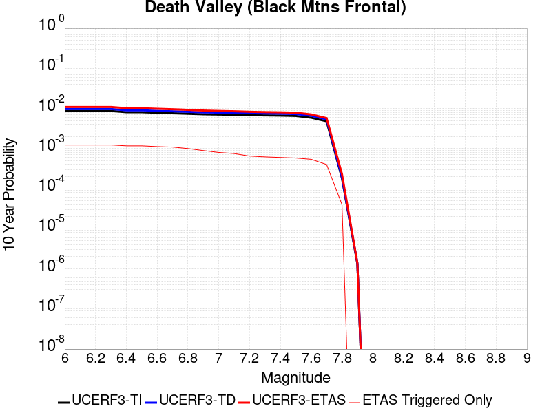 |

| Magnitude | 1 wk TI Prob | 1 wk TD Prob | 1 wk ETAS Prob | 1 wk ETAS/TD Gain | 1 wk ETAS Triggered Only | 1 mo TI Prob | 1 mo TD Prob | 1 mo ETAS Prob | 1 mo ETAS/TD Gain | 1 mo ETAS Triggered Only | 1 yr TI Prob | 1 yr TD Prob | 1 yr ETAS Prob | 1 yr ETAS/TD Gain | 1 yr ETAS Triggered Only | 10 yr TI Prob | 10 yr TD Prob | 10 yr ETAS Prob | 10 yr ETAS/TD Gain | 10 yr ETAS Triggered Only |
|-----|-----|-----|-----|-----|-----|-----|-----|-----|-----|-----|-----|-----|-----|-----|-----|-----|-----|-----|-----|-----|
| 6.0 | 1.6707214E-5 | 1.867027E-5 | 3.9866316E-4 | 21.352835 | 3.8E-4 | 7.160038E-5 | 8.001303E-5 | 6.599666E-4 | 8.2482395 | 5.8E-4 | 8.71386E-4 | 9.737309E-4 | 0.0017629616 | 1.8105224 | 7.9E-4 | 0.00867977 | 0.009695496 | 0.010913571 | 1.125633 | 0.00123 |
| 6.1 | 1.6707214E-5 | 1.867027E-5 | 3.9866316E-4 | 21.352835 | 3.8E-4 | 7.160038E-5 | 8.001303E-5 | 6.599666E-4 | 8.2482395 | 5.8E-4 | 8.71386E-4 | 9.737309E-4 | 0.0017629616 | 1.8105224 | 7.9E-4 | 0.00867977 | 0.009695496 | 0.010913571 | 1.125633 | 0.00123 |
| 6.2 | 1.6707214E-5 | 1.867027E-5 | 3.9866316E-4 | 21.352835 | 3.8E-4 | 7.160038E-5 | 8.001303E-5 | 6.599666E-4 | 8.2482395 | 5.8E-4 | 8.71386E-4 | 9.737309E-4 | 0.0017629616 | 1.8105224 | 7.9E-4 | 0.00867977 | 0.009695496 | 0.010913571 | 1.125633 | 0.00123 |
| 6.3 | 1.6707214E-5 | 1.867027E-5 | 3.9866316E-4 | 21.352835 | 3.8E-4 | 7.160038E-5 | 8.001303E-5 | 6.599666E-4 | 8.2482395 | 5.8E-4 | 8.71386E-4 | 9.737309E-4 | 0.0017629616 | 1.8105224 | 7.9E-4 | 0.00867977 | 0.009695496 | 0.010913571 | 1.125633 | 0.00123 |
| 6.4 | 1.5515609E-5 | 1.7338214E-5 | 3.6733213E-4 | 21.186274 | 3.5E-4 | 6.649377E-5 | 7.4304546E-5 | 6.142644E-4 | 8.266849 | 5.4E-4 | 8.0926094E-4 | 9.042885E-4 | 0.0016436193 | 1.817583 | 7.4E-4 | 0.008063202 | 0.009006773 | 0.010166235 | 1.1287322 | 0.00117 |
| 6.5 | 1.5515609E-5 | 1.7338214E-5 | 3.6733213E-4 | 21.186274 | 3.5E-4 | 6.649377E-5 | 7.4304546E-5 | 6.142644E-4 | 8.266849 | 5.4E-4 | 8.0926094E-4 | 9.042885E-4 | 0.0016436193 | 1.817583 | 7.4E-4 | 0.008063202 | 0.009006773 | 0.010166235 | 1.1287322 | 0.00117 |
| 6.6 | 1.5041828E-5 | 1.6809145E-5 | 3.5680342E-4 | 21.226746 | 3.4E-4 | 6.4463384E-5 | 7.203723E-5 | 5.820005E-4 | 8.079162 | 5.1E-4 | 7.8455906E-4 | 8.767063E-4 | 0.0015760927 | 1.797743 | 7.0E-4 | 0.00781795 | 0.008733132 | 0.009843351 | 1.1271272 | 0.00112 |
| 6.7 | 1.4634985E-5 | 1.6356016E-5 | 3.363508E-4 | 20.564346 | 3.2E-4 | 6.271985E-5 | 7.009536E-5 | 5.60061E-4 | 7.989987 | 4.9E-4 | 7.6334673E-4 | 8.5308263E-4 | 0.0015225111 | 1.784717 | 6.7E-4 | 0.007607299 | 0.008498715 | 0.009579452 | 1.1271647 | 0.00109 |
| 6.8 | 1.4209158E-5 | 1.5882048E-5 | 3.158773E-4 | 19.888952 | 3.0E-4 | 6.089497E-5 | 6.8064175E-5 | 5.280329E-4 | 7.757868 | 4.6E-4 | 7.4114406E-4 | 8.2837185E-4 | 0.0014478583 | 1.7478361 | 6.2E-4 | 0.007386771 | 0.008253456 | 0.009245203 | 1.1201614 | 0.001 |
| 6.9 | 1.3780098E-5 | 1.5404594E-5 | 2.3540121E-4 | 15.281235 | 2.2E-4 | 5.9056227E-5 | 6.6018045E-5 | 4.3599363E-4 | 6.6041584 | 3.7E-4 | 7.1877235E-4 | 8.0347876E-4 | 0.001323061 | 1.6466658 | 5.2E-4 | 0.0071645193 | 0.008006332 | 0.008889207 | 1.110272 | 8.9E-4 |
| 7.0 | 1.3585064E-5 | 1.5188155E-5 | 2.2518497E-4 | 14.826354 | 2.1E-4 | 5.8220405E-5 | 6.50905E-5 | 3.8506967E-4 | 5.915912 | 3.2E-4 | 7.086029E-4 | 7.9219416E-4 | 0.0012418376 | 1.5675925 | 4.5E-4 | 0.007063476 | 0.007894293 | 0.008687979 | 1.100539 | 8.0E-4 |
| 7.1 | 1.3398601E-5 | 1.49813395E-5 | 2.049785E-4 | 13.682254 | 1.9E-4 | 5.742131E-5 | 6.420419E-5 | 3.6418493E-4 | 5.672292 | 3.0E-4 | 6.9888023E-4 | 7.8141113E-4 | 0.001201083 | 1.5370692 | 4.2E-4 | 0.0069668638 | 0.007787224 | 0.008531383 | 1.0955616 | 7.5E-4 |
| 7.2 | 1.3126312E-5 | 1.4679561E-5 | 1.546775E-4 | 10.53693 | 1.4E-4 | 5.6254412E-5 | 6.291092E-5 | 3.0289582E-4 | 4.814678 | 2.4E-4 | 6.846822E-4 | 7.6567667E-4 | 0.001125401 | 1.4698124 | 3.6E-4 | 0.006825765 | 0.00763097 | 0.00827601 | 1.0845292 | 6.5E-4 |
| 7.3 | 1.2922429E-5 | 1.4453788E-5 | 1.5445176E-4 | 10.685903 | 1.4E-4 | 5.5380664E-5 | 6.194336E-5 | 3.019285E-4 | 4.874267 | 2.4E-4 | 6.74051E-4 | 7.53905E-4 | 0.0011136335 | 1.4771538 | 3.6E-4 | 0.006720101 | 0.007514055 | 0.0081293965 | 1.081892 | 6.2E-4 |
| 7.4 | 1.2768878E-5 | 1.4283772E-5 | 1.4428192E-4 | 10.101108 | 1.3E-4 | 5.4722615E-5 | 6.1214756E-5 | 2.9120067E-4 | 4.757034 | 2.3E-4 | 6.660441E-4 | 7.4504025E-4 | 0.001084787 | 1.4560112 | 3.4E-4 | 0.0066405144 | 0.0074260035 | 0.008021547 | 1.0801972 | 6.0E-4 |
| 7.5 | 1.2521929E-5 | 1.40120155E-5 | 1.3401033E-4 | 9.563959 | 1.2E-4 | 5.366431E-5 | 6.005014E-5 | 2.8003694E-4 | 4.663385 | 2.2E-4 | 6.531671E-4 | 7.3087064E-4 | 0.0010606295 | 1.4511863 | 3.3E-4 | 0.006512506 | 0.0072852457 | 0.00786102 | 1.079033 | 5.8E-4 |
| 7.6 | 1.1301089E-5 | 1.2648149E-5 | 1.3264663E-4 | 10.487434 | 1.2E-4 | 4.8432343E-5 | 5.4205255E-5 | 2.7419333E-4 | 5.058427 | 2.2E-4 | 5.895042E-4 | 6.5975444E-4 | 9.795433E-4 | 1.4847089 | 3.2E-4 | 0.0058794282 | 0.00657851 | 0.007114958 | 1.0815455 | 5.4E-4 |
| 7.7 | 9.189108E-6 | 1.0283358E-5 | 1.00282436E-4 | 9.751915 | 9.0E-5 | 3.93813E-5 | 4.407082E-5 | 1.9406421E-4 | 4.403463 | 1.5E-4 | 4.7936183E-4 | 5.3643517E-4 | 7.7630644E-4 | 1.447158 | 2.4E-4 | 0.004783291 | 0.005351914 | 0.0057497732 | 1.0743396 | 4.0E-4 |
| 7.8 | 3.4586725E-7 | 3.6482615E-7 | 1.0364823E-5 | 28.410307 | 1.0E-5 | 1.4822873E-6 | 1.5635396E-6 | 2.1563508E-5 | 13.791469 | 2.0E-5 | 1.80467E-5 | 1.9035933E-5 | 4.9035363E-5 | 2.5759368 | 3.0E-5 | 1.8045233E-4 | 1.9034347E-4 | 2.3033586E-4 | 1.2101064 | 4.0E-5 |
| 7.9 | 2.5591178E-9 | 2.6696718E-9 | 2.6696718E-9 | 1.0 | 0.0 | 1.0967647E-8 | 1.14414505E-8 | 1.14414505E-8 | 1.0 | 0.0 | 1.335311E-7 | 1.3929966E-7 | 1.3929966E-7 | 1.0 | 0.0 | 1.3353102E-6 | 1.3929966E-6 | 1.3929966E-6 | 1.0 | 0.0 |

## Helendale-So Lockhart
*[(top)](#table-of-contents)*

| 1 Week | 1 Month | 1 Year | 10 Year |
|-----|-----|-----|-----|
|  |  |  |  |

| Magnitude | 1 wk TI Prob | 1 wk TD Prob | 1 wk ETAS Prob | 1 wk ETAS/TD Gain | 1 wk ETAS Triggered Only | 1 mo TI Prob | 1 mo TD Prob | 1 mo ETAS Prob | 1 mo ETAS/TD Gain | 1 mo ETAS Triggered Only | 1 yr TI Prob | 1 yr TD Prob | 1 yr ETAS Prob | 1 yr ETAS/TD Gain | 1 yr ETAS Triggered Only | 10 yr TI Prob | 10 yr TD Prob | 10 yr ETAS Prob | 10 yr ETAS/TD Gain | 10 yr ETAS Triggered Only |
|-----|-----|-----|-----|-----|-----|-----|-----|-----|-----|-----|-----|-----|-----|-----|-----|-----|-----|-----|-----|-----|
| 6.0 | 1.7296055E-5 | 1.8103729E-5 | 3.9809686E-4 | 21.98977 | 3.8E-4 | 7.412385E-5 | 7.7585224E-5 | 5.3754955E-4 | 6.928504 | 4.6E-4 | 9.0208417E-4 | 9.4421144E-4 | 0.001653541 | 1.7512403 | 7.1E-4 | 0.008984311 | 0.009404116 | 0.01052349 | 1.1190301 | 0.00113 |
| 6.1 | 1.7296055E-5 | 1.8103729E-5 | 3.9809686E-4 | 21.98977 | 3.8E-4 | 7.412385E-5 | 7.7585224E-5 | 5.3754955E-4 | 6.928504 | 4.6E-4 | 9.0208417E-4 | 9.4421144E-4 | 0.001653541 | 1.7512403 | 7.1E-4 | 0.008984311 | 0.009404116 | 0.01052349 | 1.1190301 | 0.00113 |
| 6.2 | 1.7296055E-5 | 1.8103729E-5 | 3.9809686E-4 | 21.98977 | 3.8E-4 | 7.412385E-5 | 7.7585224E-5 | 5.3754955E-4 | 6.928504 | 4.6E-4 | 9.0208417E-4 | 9.4421144E-4 | 0.001653541 | 1.7512403 | 7.1E-4 | 0.008984311 | 0.009404116 | 0.01052349 | 1.1190301 | 0.00113 |
| 6.3 | 1.0669118E-5 | 1.1135425E-5 | 2.6113263E-4 | 23.450623 | 2.5E-4 | 4.5723988E-5 | 4.772239E-5 | 3.4770806E-4 | 7.2860575 | 3.0E-4 | 5.5654737E-4 | 5.80868E-4 | 0.0010406008 | 1.7914582 | 4.6E-4 | 0.0055515557 | 0.0057937936 | 0.006479796 | 1.118403 | 6.9E-4 |
| 6.4 | 1.0669118E-5 | 1.1135425E-5 | 2.6113263E-4 | 23.450623 | 2.5E-4 | 4.5723988E-5 | 4.772239E-5 | 3.4770806E-4 | 7.2860575 | 3.0E-4 | 5.5654737E-4 | 5.80868E-4 | 0.0010406008 | 1.7914582 | 4.6E-4 | 0.0055515557 | 0.0057937936 | 0.006479796 | 1.118403 | 6.9E-4 |
| 6.5 | 8.790038E-6 | 9.170197E-6 | 2.0916836E-4 | 22.809584 | 2.0E-4 | 3.767105E-5 | 3.930026E-5 | 2.8929044E-4 | 7.361031 | 2.5E-4 | 4.585485E-4 | 4.7837716E-4 | 8.681906E-4 | 1.8148663 | 3.9E-4 | 0.0045760344 | 0.004773638 | 0.0053707743 | 1.1250902 | 6.0E-4 |
| 6.6 | 7.396949E-6 | 7.715537E-6 | 1.8771415E-4 | 24.329369 | 1.8E-4 | 3.1700827E-5 | 3.3066175E-5 | 2.6305858E-4 | 7.9555187 | 2.3E-4 | 3.858892E-4 | 4.025073E-4 | 7.623624E-4 | 1.8940337 | 3.6E-4 | 0.003852198 | 0.00401789 | 0.0045457603 | 1.1313801 | 5.3E-4 |
| 6.7 | 6.4600285E-6 | 6.738031E-6 | 1.5673702E-4 | 23.261547 | 1.5E-4 | 2.7685543E-5 | 2.887696E-5 | 2.1887147E-4 | 7.5794497 | 1.9E-4 | 3.3701936E-4 | 3.5152107E-4 | 6.614121E-4 | 1.8815718 | 3.1E-4 | 0.0033650869 | 0.003509732 | 0.0039780824 | 1.1334434 | 4.7E-4 |
| 6.8 | 5.600104E-6 | 5.836009E-6 | 1.3583525E-4 | 23.275366 | 1.3E-4 | 2.4000226E-5 | 2.5011232E-5 | 1.9500699E-4 | 7.7967763 | 1.7E-4 | 2.9216358E-4 | 3.044698E-4 | 5.543937E-4 | 1.8208495 | 2.5E-4 | 0.0029177975 | 0.003040588 | 0.0034294021 | 1.1278746 | 3.9E-4 |
| 6.9 | 4.839122E-6 | 5.0395092E-6 | 1.05039006E-4 | 20.843102 | 1.0E-4 | 2.0738931E-5 | 2.159772E-5 | 1.615947E-4 | 7.4820256 | 1.4E-4 | 2.5246723E-4 | 2.6292098E-4 | 4.8286314E-4 | 1.8365333 | 2.2E-4 | 0.002521806 | 0.002626147 | 0.0029453065 | 1.1215315 | 3.2E-4 |
| 7.0 | 3.6937633E-6 | 3.845208E-6 | 8.38449E-5 | 21.805037 | 8.0E-5 | 1.5830317E-5 | 1.647936E-5 | 1.2647755E-4 | 7.6749063 | 1.1E-4 | 1.9271708E-4 | 2.0061806E-4 | 3.5058797E-4 | 1.7475394 | 1.5E-4 | 0.0019255003 | 0.002004401 | 0.00223394 | 1.1145175 | 2.3E-4 |
| 7.1 | 2.7858857E-6 | 2.8978538E-6 | 5.289771E-5 | 18.254099 | 5.0E-5 | 1.1939455E-5 | 1.2419316E-5 | 8.2418446E-5 | 6.6363115 | 7.0E-5 | 1.4535317E-4 | 1.511949E-4 | 2.4118129E-4 | 1.5951682 | 9.0E-5 | 0.0014525814 | 0.0015109418 | 0.0016607151 | 1.0991259 | 1.5E-4 |
| 7.2 | 2.1672065E-6 | 2.2540128E-6 | 5.22539E-5 | 23.18261 | 5.0E-5 | 9.2879945E-6 | 9.66002E-6 | 6.965944E-5 | 7.2111073 | 6.0E-5 | 1.1307546E-4 | 1.1760458E-4 | 1.9759517E-4 | 1.6801656 | 8.0E-5 | 0.0011301794 | 0.0011754417 | 0.0013052889 | 1.1104667 | 1.3E-4 |
| 7.3 | 1.4823496E-6 | 1.5422102E-6 | 4.154215E-5 | 26.936762 | 4.0E-5 | 6.3529114E-6 | 6.6094562E-6 | 5.6609126E-5 | 8.564869 | 5.0E-5 | 7.734395E-5 | 8.046731E-5 | 1.4046249E-4 | 1.7455844 | 6.0E-5 | 7.731704E-4 | 8.0439687E-4 | 9.0431643E-4 | 1.1242168 | 1.0E-4 |
| 7.4 | 4.2321457E-7 | 4.4108765E-7 | 1.0441083E-5 | 23.67122 | 1.0E-5 | 1.8137755E-6 | 1.8903745E-6 | 2.1890337E-5 | 11.579894 | 2.0E-5 | 2.2082493E-5 | 2.3015113E-5 | 4.3014654E-5 | 1.8689742 | 2.0E-5 | 2.2080299E-4 | 2.3013182E-4 | 2.5012722E-4 | 1.0868868 | 2.0E-5 |
| 7.5 | 5.6942316E-8 | 5.9415648E-8 | 5.9415648E-8 | 1.0 | 0.0 | 2.440385E-7 | 2.5463845E-7 | 2.5463845E-7 | 1.0 | 0.0 | 2.9711643E-6 | 3.1002196E-6 | 3.1002196E-6 | 1.0 | 0.0 | 2.9711247E-5 | 3.1001844E-5 | 3.1001844E-5 | 1.0 | 0.0 |

## San Andreas (San Bernardino S)
*[(top)](#table-of-contents)*

| 1 Week | 1 Month | 1 Year | 10 Year |
|-----|-----|-----|-----|
|  |  |  |  |

| Magnitude | 1 wk TI Prob | 1 wk TD Prob | 1 wk ETAS Prob | 1 wk ETAS/TD Gain | 1 wk ETAS Triggered Only | 1 mo TI Prob | 1 mo TD Prob | 1 mo ETAS Prob | 1 mo ETAS/TD Gain | 1 mo ETAS Triggered Only | 1 yr TI Prob | 1 yr TD Prob | 1 yr ETAS Prob | 1 yr ETAS/TD Gain | 1 yr ETAS Triggered Only | 10 yr TI Prob | 10 yr TD Prob | 10 yr ETAS Prob | 10 yr ETAS/TD Gain | 10 yr ETAS Triggered Only |
|-----|-----|-----|-----|-----|-----|-----|-----|-----|-----|-----|-----|-----|-----|-----|-----|-----|-----|-----|-----|-----|
| 6.0 | 1.2336002E-4 | 3.0005194E-4 | 6.599439E-4 | 2.1994324 | 3.6E-4 | 5.2857865E-4 | 0.0012853292 | 0.0017946736 | 1.3962755 | 5.1E-4 | 0.006416472 | 0.015541554 | 0.016289743 | 1.0481411 | 7.6E-4 | 0.06234337 | 0.14294699 | 0.14382976 | 1.0061755 | 0.00103 |
| 6.1 | 1.2336002E-4 | 3.0005194E-4 | 6.599439E-4 | 2.1994324 | 3.6E-4 | 5.2857865E-4 | 0.0012853292 | 0.0017946736 | 1.3962755 | 5.1E-4 | 0.006416472 | 0.015541554 | 0.016289743 | 1.0481411 | 7.6E-4 | 0.06234337 | 0.14294699 | 0.14382976 | 1.0061755 | 0.00103 |
| 6.2 | 1.2336002E-4 | 3.0005194E-4 | 6.599439E-4 | 2.1994324 | 3.6E-4 | 5.2857865E-4 | 0.0012853292 | 0.0017946736 | 1.3962755 | 5.1E-4 | 0.006416472 | 0.015541554 | 0.016289743 | 1.0481411 | 7.6E-4 | 0.06234337 | 0.14294699 | 0.14382976 | 1.0061755 | 0.00103 |
| 6.3 | 1.1712257E-4 | 2.8793467E-4 | 6.47831E-4 | 2.2499237 | 3.6E-4 | 5.018573E-4 | 0.0012334478 | 0.0017428187 | 1.4129652 | 5.1E-4 | 0.006093008 | 0.014918666 | 0.015667329 | 1.0501829 | 7.6E-4 | 0.059286322 | 0.13765779 | 0.13854599 | 1.0064523 | 0.00103 |
| 6.4 | 1.1712257E-4 | 2.8793467E-4 | 6.47831E-4 | 2.2499237 | 3.6E-4 | 5.018573E-4 | 0.0012334478 | 0.0017428187 | 1.4129652 | 5.1E-4 | 0.006093008 | 0.014918666 | 0.015667329 | 1.0501829 | 7.6E-4 | 0.059286322 | 0.13765779 | 0.13854599 | 1.0064523 | 0.00103 |
| 6.5 | 1.0689076E-4 | 2.6806415E-4 | 6.07973E-4 | 2.268013 | 3.4E-4 | 4.5802278E-4 | 0.0011483653 | 0.0016378027 | 1.4262035 | 4.9E-4 | 0.0055621783 | 0.013896335 | 0.014626052 | 1.0525115 | 7.4E-4 | 0.05425003 | 0.1288989 | 0.12977001 | 1.006758 | 0.001 |
| 6.6 | 9.7648895E-5 | 2.505129E-4 | 5.7043275E-4 | 2.2770593 | 3.2E-4 | 4.1842813E-4 | 0.0010732086 | 0.0015327149 | 1.4281613 | 4.6E-4 | 0.005082469 | 0.012992399 | 0.013693174 | 1.0539373 | 7.1E-4 | 0.049677886 | 0.121077746 | 0.12192151 | 1.0069687 | 9.6E-4 |
| 6.7 | 8.757013E-5 | 2.3122175E-4 | 5.511478E-4 | 2.383633 | 3.2E-4 | 3.7524657E-4 | 9.905964E-4 | 0.0014501406 | 1.4639068 | 4.6E-4 | 0.00455906 | 0.011997902 | 0.012699383 | 1.058467 | 7.1E-4 | 0.04466656 | 0.112373024 | 0.11322515 | 1.007583 | 9.6E-4 |
| 6.8 | 8.562978E-5 | 2.2682057E-4 | 5.46748E-4 | 2.4104867 | 3.2E-4 | 3.6693315E-4 | 9.7174826E-4 | 0.0014313012 | 1.4729136 | 4.6E-4 | 0.004458263 | 0.011770921 | 0.012472563 | 1.0596081 | 7.1E-4 | 0.043698758 | 0.11037863 | 0.11123267 | 1.0077373 | 9.6E-4 |
| 6.9 | 6.124075E-5 | 1.7066885E-4 | 4.5062107E-4 | 2.640324 | 2.8E-4 | 2.6243398E-4 | 7.312337E-4 | 0.001140934 | 1.5602863 | 4.1E-4 | 0.0031904527 | 0.008866636 | 0.009491051 | 1.0704229 | 6.3E-4 | 0.031450346 | 0.08420262 | 0.08497189 | 1.009136 | 8.4E-4 |
| 7.0 | 5.8598747E-5 | 1.6495936E-4 | 4.4491317E-4 | 2.6971078 | 2.8E-4 | 2.5111332E-4 | 7.067779E-4 | 0.0011164881 | 1.5796874 | 4.1E-4 | 0.0030530186 | 0.008571265 | 0.009195865 | 1.0728714 | 6.3E-4 | 0.03011414 | 0.08151562 | 0.08227795 | 1.0093521 | 8.3E-4 |
| 7.1 | 5.613814E-5 | 1.5914452E-4 | 4.3909997E-4 | 2.7591271 | 2.8E-4 | 2.4056983E-4 | 6.818704E-4 | 0.0010915908 | 1.6008773 | 4.1E-4 | 0.0029250039 | 0.008270353 | 0.008895143 | 1.0755457 | 6.3E-4 | 0.028868021 | 0.07881268 | 0.07957727 | 1.0097013 | 8.3E-4 |
| 7.2 | 4.991222E-5 | 1.4520933E-4 | 4.2516866E-4 | 2.927971 | 2.8E-4 | 2.1389198E-4 | 6.221777E-4 | 0.0010319225 | 1.6585658 | 4.1E-4 | 0.002601025 | 0.0075488063 | 0.0081641255 | 1.0815122 | 6.2E-4 | 0.025707912 | 0.07226191 | 0.07302265 | 1.0105276 | 8.2E-4 |
| 7.3 | 4.7410045E-5 | 1.371513E-4 | 4.171129E-4 | 3.041261 | 2.8E-4 | 2.0317009E-4 | 5.8765925E-4 | 9.974183E-4 | 1.6972733 | 4.1E-4 | 0.0024707897 | 0.0071313656 | 0.007746944 | 1.0863199 | 6.2E-4 | 0.024434982 | 0.068541944 | 0.06930574 | 1.0111434 | 8.2E-4 |
| 7.4 | 4.5556746E-5 | 1.3123035E-4 | 4.011949E-4 | 3.057181 | 2.7E-4 | 1.952286E-4 | 5.6229485E-4 | 9.6206996E-4 | 1.7109705 | 4.0E-4 | 0.002374317 | 0.0068245293 | 0.0074303667 | 1.0887735 | 6.1E-4 | 0.023491086 | 0.06579143 | 0.06654814 | 1.0115017 | 8.1E-4 |
| 7.5 | 4.3084514E-5 | 1.2358342E-4 | 3.835513E-4 | 3.1035821 | 2.6E-4 | 1.8463485E-4 | 5.2953605E-4 | 9.193295E-4 | 1.7361038 | 3.9E-4 | 0.0022456115 | 0.0064281146 | 0.007024258 | 1.0927399 | 6.0E-4 | 0.022230545 | 0.062190283 | 0.06294053 | 1.0120637 | 8.0E-4 |
| 7.6 | 3.408608E-5 | 9.836477E-5 | 3.4834017E-4 | 3.5413103 | 2.5E-4 | 1.4607502E-4 | 4.214953E-4 | 8.013351E-4 | 1.9011722 | 3.8E-4 | 0.0017770125 | 0.005119656 | 0.0056966865 | 1.1127088 | 5.8E-4 | 0.017628696 | 0.05002244 | 0.05076342 | 1.014813 | 7.8E-4 |
| 7.7 | 2.8315713E-5 | 8.2495724E-5 | 3.324751E-4 | 4.03021 | 2.5E-4 | 1.2134742E-4 | 3.5350522E-4 | 7.333709E-4 | 2.0745687 | 3.8E-4 | 0.0014764034 | 0.004295442 | 0.0048729503 | 1.1344469 | 5.8E-4 | 0.01466633 | 0.042272415 | 0.043019444 | 1.0176717 | 7.8E-4 |
| 7.8 | 2.6222975E-5 | 7.463898E-5 | 3.1462105E-4 | 4.215238 | 2.4E-4 | 1.1237934E-4 | 3.1984213E-4 | 6.897238E-4 | 2.1564507 | 3.7E-4 | 0.0013673597 | 0.003887131 | 0.0044549154 | 1.1460677 | 5.7E-4 | 0.013589768 | 0.038437475 | 0.039177876 | 1.0192626 | 7.7E-4 |
| 7.9 | 2.1469694E-5 | 5.7884805E-5 | 2.7787208E-4 | 4.800432 | 2.2E-4 | 9.200973E-5 | 2.4805416E-4 | 5.8796984E-4 | 2.3703284 | 3.4E-4 | 0.0011196428 | 0.00301588 | 0.003534312 | 1.1719006 | 5.2E-4 | 0.011140184 | 0.030153265 | 0.03082246 | 1.0221931 | 6.9E-4 |
| 8.0 | 1.2420249E-5 | 3.1321662E-5 | 1.0131947E-4 | 3.2348049 | 7.0E-5 | 5.322855E-5 | 1.342288E-4 | 2.2421672E-4 | 1.6704069 | 9.0E-5 | 6.478649E-4 | 0.0016330116 | 0.0017528156 | 1.0733639 | 1.2E-4 | 0.0064597935 | 0.01652369 | 0.016720386 | 1.0119039 | 2.0E-4 |
| 8.1 | 4.9197724E-6 | 7.822525E-6 | 1.7822445E-5 | 2.2783496 | 1.0E-5 | 2.1084568E-5 | 3.3524673E-5 | 4.352434E-5 | 1.2982777 | 1.0E-5 | 2.566744E-4 | 4.080866E-4 | 4.1808252E-4 | 1.0244946 | 1.0E-5 | 0.002563781 | 0.004384557 | 0.004404469 | 1.0045415 | 2.0E-5 |
| 8.2 | 2.5634774E-6 | 2.9065757E-6 | 1.29065465E-5 | 4.4404645 | 1.0E-5 | 1.0986286E-5 | 1.2456694E-5 | 2.245657E-5 | 1.8027712 | 1.0E-5 | 1.3374983E-4 | 1.5164974E-4 | 1.6164822E-4 | 1.0659314 | 1.0E-5 | 0.0013366934 | 0.001704941 | 0.001724907 | 1.0117106 | 2.0E-5 |
| 8.3 | 5.2850464E-7 | 3.2080476E-7 | 3.2080476E-7 | 1.0 | 0.0 | 2.2650179E-6 | 1.3748769E-6 | 1.3748769E-6 | 1.0 | 0.0 | 2.7576245E-5 | 1.673901E-5 | 1.673901E-5 | 1.0 | 0.0 | 2.7572823E-4 | 1.986671E-4 | 1.986671E-4 | 1.0 | 0.0 |

## Coyote Lake
*[(top)](#table-of-contents)*

| 1 Week | 1 Month | 1 Year | 10 Year |
|-----|-----|-----|-----|
|  |  | 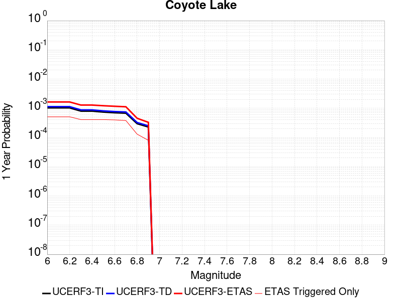 |  |

| Magnitude | 1 wk TI Prob | 1 wk TD Prob | 1 wk ETAS Prob | 1 wk ETAS/TD Gain | 1 wk ETAS Triggered Only | 1 mo TI Prob | 1 mo TD Prob | 1 mo ETAS Prob | 1 mo ETAS/TD Gain | 1 mo ETAS Triggered Only | 1 yr TI Prob | 1 yr TD Prob | 1 yr ETAS Prob | 1 yr ETAS/TD Gain | 1 yr ETAS Triggered Only | 10 yr TI Prob | 10 yr TD Prob | 10 yr ETAS Prob | 10 yr ETAS/TD Gain | 10 yr ETAS Triggered Only |
|-----|-----|-----|-----|-----|-----|-----|-----|-----|-----|-----|-----|-----|-----|-----|-----|-----|-----|-----|-----|-----|
| 6.0 | 1.980352E-5 | 2.1706745E-5 | 1.8170328E-4 | 8.370821 | 1.6E-4 | 8.486947E-5 | 9.302599E-5 | 3.0300647E-4 | 3.2572236 | 2.1E-4 | 0.0010327959 | 0.0011320751 | 0.0016414977 | 1.4499902 | 5.1E-4 | 0.010280091 | 0.011270258 | 0.012090904 | 1.0728152 | 8.3E-4 |
| 6.1 | 1.980352E-5 | 2.1706745E-5 | 1.8170328E-4 | 8.370821 | 1.6E-4 | 8.486947E-5 | 9.302599E-5 | 3.0300647E-4 | 3.2572236 | 2.1E-4 | 0.0010327959 | 0.0011320751 | 0.0016414977 | 1.4499902 | 5.1E-4 | 0.010280091 | 0.011270258 | 0.012090904 | 1.0728152 | 8.3E-4 |
| 6.2 | 1.980352E-5 | 2.1706745E-5 | 1.8170328E-4 | 8.370821 | 1.6E-4 | 8.486947E-5 | 9.302599E-5 | 3.0300647E-4 | 3.2572236 | 2.1E-4 | 0.0010327959 | 0.0011320751 | 0.0016414977 | 1.4499902 | 5.1E-4 | 0.010280091 | 0.011270258 | 0.012090904 | 1.0728152 | 8.3E-4 |
| 6.3 | 1.5344787E-5 | 1.682067E-5 | 1.16818985E-4 | 6.944967 | 1.0E-4 | 6.576172E-5 | 7.2086936E-5 | 2.1207685E-4 | 2.9419594 | 1.4E-4 | 8.003548E-4 | 8.773662E-4 | 0.0012870065 | 1.4668977 | 4.1E-4 | 0.007974784 | 0.00874507 | 0.009399298 | 1.0748111 | 6.6E-4 |
| 6.4 | 1.5344787E-5 | 1.682067E-5 | 1.16818985E-4 | 6.944967 | 1.0E-4 | 6.576172E-5 | 7.2086936E-5 | 2.1207685E-4 | 2.9419594 | 1.4E-4 | 8.003548E-4 | 8.773662E-4 | 0.0012870065 | 1.4668977 | 4.1E-4 | 0.007974784 | 0.00874507 | 0.009399298 | 1.0748111 | 6.6E-4 |
| 6.5 | 1.4189697E-5 | 1.5557987E-5 | 1.1555643E-4 | 7.427467 | 1.0E-4 | 6.081157E-5 | 6.6675726E-5 | 2.0666639E-4 | 3.0995748 | 1.4E-4 | 7.401293E-4 | 8.115349E-4 | 0.0012212022 | 1.5048054 | 4.1E-4 | 0.0073766913 | 0.008091656 | 0.008736396 | 1.0796796 | 6.5E-4 |
| 6.6 | 1.3469301E-5 | 1.4771577E-5 | 1.147701E-4 | 7.7696576 | 1.0E-4 | 5.7724297E-5 | 6.330556E-5 | 2.032967E-4 | 3.2113562 | 1.4E-4 | 7.025667E-4 | 7.7053264E-4 | 0.0011702244 | 1.5187215 | 4.0E-4 | 0.0070034964 | 0.0076845144 | 0.008319596 | 1.0826443 | 6.4E-4 |
| 6.7 | 1.3027966E-5 | 1.4281745E-5 | 1.0428046E-4 | 7.301661 | 9.0E-5 | 5.5832945E-5 | 6.120638E-5 | 1.9119843E-4 | 3.1238315 | 1.3E-4 | 6.7955407E-4 | 7.4499263E-4 | 0.0011247095 | 1.5096922 | 3.8E-4 | 0.006774798 | 0.0074308286 | 0.00802637 | 1.0801446 | 6.0E-4 |
| 6.8 | 5.695434E-6 | 6.2244176E-6 | 4.622417E-5 | 7.426264 | 4.0E-5 | 2.4408775E-5 | 2.6675973E-5 | 7.667464E-5 | 2.874296 | 5.0E-5 | 2.971363E-4 | 3.2476155E-4 | 4.5471932E-4 | 1.4001637 | 1.3E-4 | 0.0029673933 | 0.0032458105 | 0.0034152586 | 1.0522052 | 1.7E-4 |
| 6.9 | 4.385688E-6 | 4.7930553E-6 | 4.4792865E-5 | 9.345367 | 4.0E-5 | 1.879567E-5 | 2.0541665E-5 | 7.054064E-5 | 3.4340272 | 5.0E-5 | 2.2881327E-4 | 2.5009477E-4 | 3.3007478E-4 | 1.3197987 | 8.0E-5 | 0.002285778 | 0.0025009478 | 0.0026106727 | 1.0438733 | 1.1E-4 |

## San Andreas (Big Bend)
*[(top)](#table-of-contents)*

| 1 Week | 1 Month | 1 Year | 10 Year |
|-----|-----|-----|-----|
|  |  |  |  |

| Magnitude | 1 wk TI Prob | 1 wk TD Prob | 1 wk ETAS Prob | 1 wk ETAS/TD Gain | 1 wk ETAS Triggered Only | 1 mo TI Prob | 1 mo TD Prob | 1 mo ETAS Prob | 1 mo ETAS/TD Gain | 1 mo ETAS Triggered Only | 1 yr TI Prob | 1 yr TD Prob | 1 yr ETAS Prob | 1 yr ETAS/TD Gain | 1 yr ETAS Triggered Only | 10 yr TI Prob | 10 yr TD Prob | 10 yr ETAS Prob | 10 yr ETAS/TD Gain | 10 yr ETAS Triggered Only |
|-----|-----|-----|-----|-----|-----|-----|-----|-----|-----|-----|-----|-----|-----|-----|-----|-----|-----|-----|-----|-----|
| 6.0 | 1.0179969E-4 | 2.0073925E-4 | 4.2069508E-4 | 2.095729 | 2.2E-4 | 4.362114E-4 | 8.6002843E-4 | 0.0012097275 | 1.4066132 | 3.5E-4 | 0.0052979486 | 0.010420859 | 0.011034398 | 1.058876 | 6.2E-4 | 0.051734097 | 0.101455905 | 0.10216576 | 1.0069966 | 7.9E-4 |
| 6.1 | 1.0179969E-4 | 2.0073925E-4 | 4.2069508E-4 | 2.095729 | 2.2E-4 | 4.362114E-4 | 8.6002843E-4 | 0.0012097275 | 1.4066132 | 3.5E-4 | 0.0052979486 | 0.010420859 | 0.011034398 | 1.058876 | 6.2E-4 | 0.051734097 | 0.101455905 | 0.10216576 | 1.0069966 | 7.9E-4 |
| 6.2 | 1.0179969E-4 | 2.0073925E-4 | 4.2069508E-4 | 2.095729 | 2.2E-4 | 4.362114E-4 | 8.6002843E-4 | 0.0012097275 | 1.4066132 | 3.5E-4 | 0.0052979486 | 0.010420859 | 0.011034398 | 1.058876 | 6.2E-4 | 0.051734097 | 0.101455905 | 0.10216576 | 1.0069966 | 7.9E-4 |
| 6.3 | 1.0179969E-4 | 2.0073925E-4 | 4.2069508E-4 | 2.095729 | 2.2E-4 | 4.362114E-4 | 8.6002843E-4 | 0.0012097275 | 1.4066132 | 3.5E-4 | 0.0052979486 | 0.010420859 | 0.011034398 | 1.058876 | 6.2E-4 | 0.051734097 | 0.101455905 | 0.10216576 | 1.0069966 | 7.9E-4 |
| 6.4 | 9.1639464E-5 | 1.8430917E-4 | 3.5427784E-4 | 1.9221932 | 1.7E-4 | 3.9268145E-4 | 7.896575E-4 | 0.0010594444 | 1.3416504 | 2.7E-4 | 0.0047704205 | 0.009571818 | 0.009987798 | 1.0434588 | 4.2E-4 | 0.046693064 | 0.09378695 | 0.09428537 | 1.0053144 | 5.5E-4 |
| 6.5 | 9.1639464E-5 | 1.8430917E-4 | 3.5427784E-4 | 1.9221932 | 1.7E-4 | 3.9268145E-4 | 7.896575E-4 | 0.0010594444 | 1.3416504 | 2.7E-4 | 0.0047704205 | 0.009571818 | 0.009987798 | 1.0434588 | 4.2E-4 | 0.046693064 | 0.09378695 | 0.09428537 | 1.0053144 | 5.5E-4 |
| 6.6 | 9.042622E-5 | 1.8238011E-4 | 3.3235276E-4 | 1.8223081 | 1.5E-4 | 3.8748336E-4 | 7.813951E-4 | 0.0010311998 | 1.3196906 | 2.5E-4 | 0.0047074095 | 0.0094721 | 0.009858406 | 1.0407835 | 3.9E-4 | 0.046089325 | 0.09287721 | 0.09333077 | 1.0048834 | 5.0E-4 |
| 6.7 | 8.9836685E-5 | 1.8152347E-4 | 3.3149624E-4 | 1.8261894 | 1.5E-4 | 3.8495753E-4 | 7.7772595E-4 | 0.0010275316 | 1.3212 | 2.5E-4 | 0.00467679 | 0.009427815 | 0.009814138 | 1.040977 | 3.9E-4 | 0.045795817 | 0.09247148 | 0.09292525 | 1.0049071 | 5.0E-4 |
| 6.8 | 8.9471854E-5 | 1.8099119E-4 | 3.1096768E-4 | 1.718137 | 1.3E-4 | 3.8339442E-4 | 7.754462E-4 | 0.0010052678 | 1.2963735 | 2.3E-4 | 0.004657841 | 0.009400298 | 0.009756913 | 1.0379367 | 3.6E-4 | 0.04561414 | 0.0922192 | 0.09264586 | 1.0046265 | 4.7E-4 |
| 6.9 | 8.858234E-5 | 1.7981093E-4 | 3.0978755E-4 | 1.7228516 | 1.3E-4 | 3.7958333E-4 | 7.7039085E-4 | 0.0010002137 | 1.2983197 | 2.3E-4 | 0.004611638 | 0.009339278 | 0.009686009 | 1.0371262 | 3.5E-4 | 0.04517103 | 0.09165911 | 0.09207694 | 1.0045586 | 4.6E-4 |
| 7.0 | 8.7433385E-5 | 1.7819891E-4 | 3.0817575E-4 | 1.7293919 | 1.3E-4 | 3.746607E-4 | 7.6348626E-4 | 9.933107E-4 | 1.3010197 | 2.3E-4 | 0.004551957 | 0.009255932 | 0.009602692 | 1.0374635 | 3.5E-4 | 0.044598386 | 0.09089323 | 0.09131142 | 1.0046009 | 4.6E-4 |
| 7.1 | 8.684964E-5 | 1.7731842E-4 | 2.9729714E-4 | 1.6766287 | 1.2E-4 | 3.7215967E-4 | 7.597149E-4 | 9.695554E-4 | 1.2762095 | 2.1E-4 | 0.0045216335 | 0.009210405 | 0.009527458 | 1.0344234 | 3.2E-4 | 0.04430731 | 0.09047475 | 0.09086584 | 1.0043226 | 4.3E-4 |
| 7.2 | 8.606521E-5 | 1.7622454E-4 | 2.962034E-4 | 1.6808294 | 1.2E-4 | 3.6879873E-4 | 7.550296E-4 | 9.64871E-4 | 1.2779248 | 2.1E-4 | 0.0044808835 | 0.009153842 | 0.009451096 | 1.0324731 | 3.0E-4 | 0.043916024 | 0.08995518 | 0.0903283 | 1.0041478 | 4.1E-4 |
| 7.3 | 8.568266E-5 | 1.7564454E-4 | 2.9562347E-4 | 1.6830779 | 1.2E-4 | 3.6715972E-4 | 7.5254537E-4 | 9.623873E-4 | 1.2788429 | 2.1E-4 | 0.0044610105 | 0.00912385 | 0.009421113 | 1.0325809 | 3.0E-4 | 0.043725148 | 0.08967623 | 0.09004947 | 1.004162 | 4.1E-4 |
| 7.4 | 8.5432206E-5 | 1.752704E-4 | 2.9524937E-4 | 1.6845365 | 1.2E-4 | 3.6608664E-4 | 7.509428E-4 | 9.607851E-4 | 1.2794385 | 2.1E-4 | 0.004447999 | 0.009104501 | 0.00940177 | 1.0326507 | 3.0E-4 | 0.043600157 | 0.08949642 | 0.08986972 | 1.0041711 | 4.1E-4 |
| 7.5 | 8.4791965E-5 | 1.7396381E-4 | 2.9394293E-4 | 1.6896787 | 1.2E-4 | 3.633435E-4 | 7.4534636E-4 | 9.551898E-4 | 1.2815382 | 2.1E-4 | 0.0044147377 | 0.009036932 | 0.009324312 | 1.0318005 | 2.9E-4 | 0.043280575 | 0.08887209 | 0.08923654 | 1.0041008 | 4.0E-4 |
| 7.6 | 8.241105E-5 | 1.6841735E-4 | 2.8839713E-4 | 1.7123957 | 1.2E-4 | 3.531424E-4 | 7.2158914E-4 | 9.314376E-4 | 1.2908144 | 2.1E-4 | 0.0042910352 | 0.008750047 | 0.00903751 | 1.0328526 | 2.9E-4 | 0.042091176 | 0.08625032 | 0.08661582 | 1.0042377 | 4.0E-4 |
| 7.7 | 7.00432E-5 | 1.4205615E-4 | 2.2204478E-4 | 1.5630776 | 8.0E-5 | 3.001506E-4 | 6.0867006E-4 | 7.685727E-4 | 1.2627082 | 1.6E-4 | 0.0036482112 | 0.0073854174 | 0.007613719 | 1.0309124 | 2.3E-4 | 0.035888977 | 0.07352299 | 0.073819466 | 1.0040324 | 3.2E-4 |
| 7.8 | 6.415362E-5 | 1.2969968E-4 | 2.096893E-4 | 1.6167295 | 8.0E-5 | 2.749151E-4 | 5.557374E-4 | 7.0565403E-4 | 1.2697617 | 1.5E-4 | 0.0033419547 | 0.0067451415 | 0.006953725 | 1.0309235 | 2.1E-4 | 0.03292141 | 0.06725514 | 0.06753496 | 1.0041606 | 3.0E-4 |
| 7.9 | 4.939911E-5 | 9.341721E-5 | 1.5341162E-4 | 1.6422199 | 6.0E-5 | 2.116933E-4 | 4.0029807E-4 | 5.1025406E-4 | 1.2746853 | 1.1E-4 | 0.0025743195 | 0.004862747 | 0.0050219693 | 1.0327432 | 1.6E-4 | 0.025447013 | 0.048915803 | 0.049134552 | 1.0044719 | 2.3E-4 |
| 8.0 | 3.344983E-5 | 5.2228E-5 | 8.2226434E-5 | 1.5743746 | 3.0E-5 | 1.4334853E-4 | 2.2381509E-4 | 2.6380614E-4 | 1.178679 | 4.0E-5 | 0.0017438711 | 0.0027215453 | 0.002781382 | 1.0219862 | 6.0E-5 | 0.017302496 | 0.027923161 | 0.028020369 | 1.0034813 | 1.0E-4 |
| 8.1 | 1.9104898E-5 | 1.9171663E-5 | 2.917147E-5 | 1.5215932 | 1.0E-5 | 8.1875565E-5 | 8.2161685E-5 | 9.216086E-5 | 1.1217012 | 1.0E-5 | 9.963791E-4 | 9.9986E-4 | 0.0010098501 | 1.0099914 | 1.0E-5 | 0.009919235 | 0.010749552 | 0.010769337 | 1.0018406 | 2.0E-5 |
| 8.2 | 8.643924E-6 | 5.473668E-6 | 1.5473614E-5 | 2.8269184 | 1.0E-5 | 3.704486E-5 | 2.3458366E-5 | 3.345813E-5 | 1.4262772 | 1.0E-5 | 4.5092785E-4 | 2.8556827E-4 | 2.955654E-4 | 1.035008 | 1.0E-5 | 0.0045001395 | 0.0032481793 | 0.0032681145 | 1.0061373 | 2.0E-5 |
| 8.3 | 1.983087E-6 | 7.6564595E-7 | 7.6564595E-7 | 1.0 | 0.0 | 8.498917E-6 | 3.281336E-6 | 3.281336E-6 | 1.0 | 0.0 | 1.034694E-4 | 3.9949547E-5 | 3.9949547E-5 | 1.0 | 0.0 | 0.0010342124 | 4.717979E-4 | 4.717979E-4 | 1.0 | 0.0 |

## San Andreas (Parkfield)
*[(top)](#table-of-contents)*

| 1 Week | 1 Month | 1 Year | 10 Year |
|-----|-----|-----|-----|
|  |  |  |  |

| Magnitude | 1 wk TI Prob | 1 wk TD Prob | 1 wk ETAS Prob | 1 wk ETAS/TD Gain | 1 wk ETAS Triggered Only | 1 mo TI Prob | 1 mo TD Prob | 1 mo ETAS Prob | 1 mo ETAS/TD Gain | 1 mo ETAS Triggered Only | 1 yr TI Prob | 1 yr TD Prob | 1 yr ETAS Prob | 1 yr ETAS/TD Gain | 1 yr ETAS Triggered Only | 10 yr TI Prob | 10 yr TD Prob | 10 yr ETAS Prob | 10 yr ETAS/TD Gain | 10 yr ETAS Triggered Only |
|-----|-----|-----|-----|-----|-----|-----|-----|-----|-----|-----|-----|-----|-----|-----|-----|-----|-----|-----|-----|-----|
| 6.0 | 5.556969E-4 | 7.778562E-4 | 9.976851E-4 | 1.2826086 | 2.2E-4 | 0.0023793848 | 0.0033299583 | 0.0036887594 | 1.1077495 | 3.6E-4 | 0.028586963 | 0.040235043 | 0.040666938 | 1.0107343 | 4.5E-4 | 0.25176284 | 0.3371973 | 0.337648 | 1.0013366 | 6.8E-4 |
| 6.1 | 1.925858E-4 | 3.0278185E-4 | 3.927546E-4 | 1.2971537 | 9.0E-5 | 8.2510663E-4 | 0.001297085 | 0.0014668644 | 1.1308931 | 1.7E-4 | 0.0099994885 | 0.01577393 | 0.01599046 | 1.0137271 | 2.2E-4 | 0.095613256 | 0.14975825 | 0.15007283 | 1.0021007 | 3.7E-4 |
| 6.2 | 9.4306815E-5 | 1.8243887E-4 | 2.624243E-4 | 1.438423 | 8.0E-5 | 4.0410945E-4 | 7.8164786E-4 | 9.315306E-4 | 1.1917523 | 1.5E-4 | 0.0049089384 | 0.009475246 | 0.009663446 | 1.0198623 | 1.9E-4 | 0.048019063 | 0.0918565 | 0.09211078 | 1.0027683 | 2.8E-4 |
| 6.3 | 9.283051E-5 | 1.794041E-4 | 2.5938975E-4 | 1.4458407 | 8.0E-5 | 3.9778434E-4 | 7.686494E-4 | 9.1853406E-4 | 1.1949975 | 1.5E-4 | 0.0048322747 | 0.009318355 | 0.009506584 | 1.0201999 | 1.9E-4 | 0.047285385 | 0.090509474 | 0.09076413 | 1.0028136 | 2.8E-4 |
| 6.4 | 9.138826E-5 | 1.7702584E-4 | 2.5701168E-4 | 1.4518315 | 8.0E-5 | 3.916052E-4 | 7.5846276E-4 | 9.0834894E-4 | 1.1976185 | 1.5E-4 | 0.0047573745 | 0.009195387 | 0.00938364 | 1.0204725 | 1.9E-4 | 0.046568092 | 0.0894136 | 0.089668564 | 1.0028515 | 2.8E-4 |
| 6.5 | 9.000255E-5 | 1.746064E-4 | 2.5459242E-4 | 1.4580934 | 8.0E-5 | 3.8566816E-4 | 7.4809964E-4 | 8.9798745E-4 | 1.200358 | 1.5E-4 | 0.0046854047 | 0.009070284 | 0.009258561 | 1.0207576 | 1.9E-4 | 0.045878403 | 0.08829608 | 0.08855135 | 1.0028912 | 2.8E-4 |
| 6.6 | 8.8109264E-5 | 1.7141816E-4 | 2.5140445E-4 | 1.4666151 | 8.0E-5 | 3.7755648E-4 | 7.3444354E-4 | 8.843334E-4 | 1.2040863 | 1.5E-4 | 0.0045870654 | 0.008905404 | 0.009093712 | 1.0211453 | 1.9E-4 | 0.04493529 | 0.08682707 | 0.08708276 | 1.0029448 | 2.8E-4 |
| 6.7 | 8.738073E-5 | 1.7008898E-4 | 2.500754E-4 | 1.470262 | 8.0E-5 | 3.7443507E-4 | 7.287503E-4 | 8.7864103E-4 | 1.2056818 | 1.5E-4 | 0.0045492216 | 0.008836695 | 0.009025016 | 1.0213113 | 1.9E-4 | 0.04457213 | 0.0862268 | 0.08648265 | 1.0029672 | 2.8E-4 |
| 6.8 | 8.710195E-5 | 1.6954402E-4 | 2.4953045E-4 | 1.4717739 | 8.0E-5 | 3.7324068E-4 | 7.26416E-4 | 8.763071E-4 | 1.2063433 | 1.5E-4 | 0.0045347405 | 0.008808513 | 0.00899684 | 1.0213801 | 1.9E-4 | 0.04443313 | 0.08597436 | 0.086230285 | 1.0029768 | 2.8E-4 |
| 6.9 | 8.6801556E-5 | 1.6895356E-4 | 2.4894005E-4 | 1.4734229 | 8.0E-5 | 3.7195362E-4 | 7.238869E-4 | 8.737783E-4 | 1.2070647 | 1.5E-4 | 0.0045191357 | 0.0087779695 | 0.008966302 | 1.021455 | 1.9E-4 | 0.044283327 | 0.08570042 | 0.085956424 | 1.0029871 | 2.8E-4 |
| 7.0 | 8.5571606E-5 | 1.664819E-4 | 2.4646858E-4 | 1.4804528 | 8.0E-5 | 3.6668387E-4 | 7.132999E-4 | 8.631929E-4 | 1.2101402 | 1.5E-4 | 0.004455241 | 0.008650103 | 0.00883846 | 1.021775 | 1.9E-4 | 0.043669727 | 0.08454836 | 0.08480469 | 1.0030317 | 2.8E-4 |
| 7.1 | 7.82589E-5 | 1.5128969E-4 | 2.3127758E-4 | 1.5287069 | 8.0E-5 | 3.3535215E-4 | 6.4822397E-4 | 7.9812674E-4 | 1.2312515 | 1.5E-4 | 0.0040752706 | 0.007863738 | 0.008032401 | 1.0214483 | 1.7E-4 | 0.040013418 | 0.077460445 | 0.0777003 | 1.0030966 | 2.6E-4 |
| 7.2 | 7.690929E-5 | 1.4866212E-4 | 2.2865023E-4 | 1.538053 | 8.0E-5 | 3.2956956E-4 | 6.369685E-4 | 7.768793E-4 | 1.2196511 | 1.4E-4 | 0.004005129 | 0.0077276826 | 0.007886446 | 1.0205448 | 1.6E-4 | 0.0393371 | 0.07623341 | 0.076464355 | 1.0030293 | 2.5E-4 |
| 7.3 | 7.5543794E-5 | 1.4562748E-4 | 2.2561583E-4 | 1.5492669 | 8.0E-5 | 3.2371894E-4 | 6.239692E-4 | 7.6388184E-4 | 1.22423 | 1.4E-4 | 0.003934157 | 0.0075705256 | 0.0077293147 | 1.0209746 | 1.6E-4 | 0.038652334 | 0.07479777 | 0.075029075 | 1.0030923 | 2.5E-4 |
| 7.4 | 7.4214564E-5 | 1.4263717E-4 | 2.2262576E-4 | 1.5607836 | 8.0E-5 | 3.1802364E-4 | 6.1115966E-4 | 7.510741E-4 | 1.2289327 | 1.4E-4 | 0.003865065 | 0.0074156416 | 0.007574455 | 1.0214161 | 1.6E-4 | 0.03798529 | 0.07337152 | 0.07360318 | 1.0031573 | 2.5E-4 |
| 7.5 | 6.149578E-5 | 1.1191443E-4 | 1.9190548E-4 | 1.7147518 | 8.0E-5 | 2.6352672E-4 | 4.795452E-4 | 6.1947806E-4 | 1.2918032 | 1.4E-4 | 0.0032037178 | 0.005822865 | 0.0059819333 | 1.0273179 | 1.6E-4 | 0.03157923 | 0.058559462 | 0.05878541 | 1.0038584 | 2.4E-4 |
| 7.6 | 6.0643448E-5 | 1.102009E-4 | 1.9019208E-4 | 1.7258669 | 8.0E-5 | 2.598746E-4 | 4.7220418E-4 | 6.121381E-4 | 1.2963419 | 1.4E-4 | 0.0031593828 | 0.005733962 | 0.0058930446 | 1.0277439 | 1.6E-4 | 0.031148417 | 0.05772042 | 0.057946566 | 1.0039179 | 2.4E-4 |
| 7.7 | 5.1652263E-5 | 9.175265E-5 | 1.4174805E-4 | 1.5448934 | 5.0E-5 | 2.2134806E-4 | 3.9316638E-4 | 4.931271E-4 | 1.2542453 | 1.0E-4 | 0.002691582 | 0.0047763046 | 0.0048957313 | 1.025004 | 1.2E-4 | 0.026592141 | 0.04853641 | 0.0487267 | 1.0039207 | 2.0E-4 |
| 7.8 | 4.8090482E-5 | 8.560165E-5 | 1.3559737E-4 | 1.5840509 | 5.0E-5 | 2.060858E-4 | 3.6681266E-4 | 4.5677964E-4 | 1.2452668 | 9.0E-5 | 0.0025062072 | 0.004456807 | 0.0045563616 | 1.0223376 | 1.0E-4 | 0.024781305 | 0.045302264 | 0.045474112 | 1.0037934 | 1.8E-4 |
| 7.9 | 3.970278E-5 | 6.7507375E-5 | 1.07504675E-4 | 1.5924878 | 4.0E-5 | 1.7014367E-4 | 2.8928524E-4 | 3.59265E-4 | 1.2419057 | 7.0E-5 | 0.002069531 | 0.0035163634 | 0.0035960823 | 1.0226707 | 8.0E-5 | 0.020503636 | 0.03588176 | 0.036016736 | 1.0037616 | 1.4E-4 |
| 8.0 | 2.8982335E-5 | 4.0698153E-5 | 7.069693E-5 | 1.7371042 | 3.0E-5 | 1.2420409E-4 | 1.7440901E-4 | 2.1440203E-4 | 1.229306 | 4.0E-5 | 0.0015111357 | 0.0021213628 | 0.002161278 | 1.0188158 | 4.0E-5 | 0.015009012 | 0.02201118 | 0.02207964 | 1.0031102 | 7.0E-5 |
| 8.1 | 1.8836186E-5 | 1.867974E-5 | 2.8679553E-5 | 1.5353293 | 1.0E-5 | 8.0724014E-5 | 8.005358E-5 | 9.0052774E-5 | 1.1249063 | 1.0E-5 | 9.823717E-4 | 9.742171E-4 | 9.842074E-4 | 1.0102546 | 1.0E-5 | 0.009780403 | 0.010487711 | 0.010507501 | 1.001887 | 2.0E-5 |
| 8.2 | 8.643924E-6 | 5.473668E-6 | 1.5473614E-5 | 2.8269184 | 1.0E-5 | 3.704486E-5 | 2.3458366E-5 | 3.345813E-5 | 1.4262772 | 1.0E-5 | 4.5092785E-4 | 2.8556827E-4 | 2.955654E-4 | 1.035008 | 1.0E-5 | 0.0045001395 | 0.0032481793 | 0.0032681145 | 1.0061373 | 2.0E-5 |
| 8.3 | 1.983087E-6 | 7.6564595E-7 | 7.6564595E-7 | 1.0 | 0.0 | 8.498917E-6 | 3.281336E-6 | 3.281336E-6 | 1.0 | 0.0 | 1.034694E-4 | 3.9949547E-5 | 3.9949547E-5 | 1.0 | 0.0 | 0.0010342124 | 4.717979E-4 | 4.717979E-4 | 1.0 | 0.0 |

## Death Valley (No)
*[(top)](#table-of-contents)*

| 1 Week | 1 Month | 1 Year | 10 Year |
|-----|-----|-----|-----|
|  | 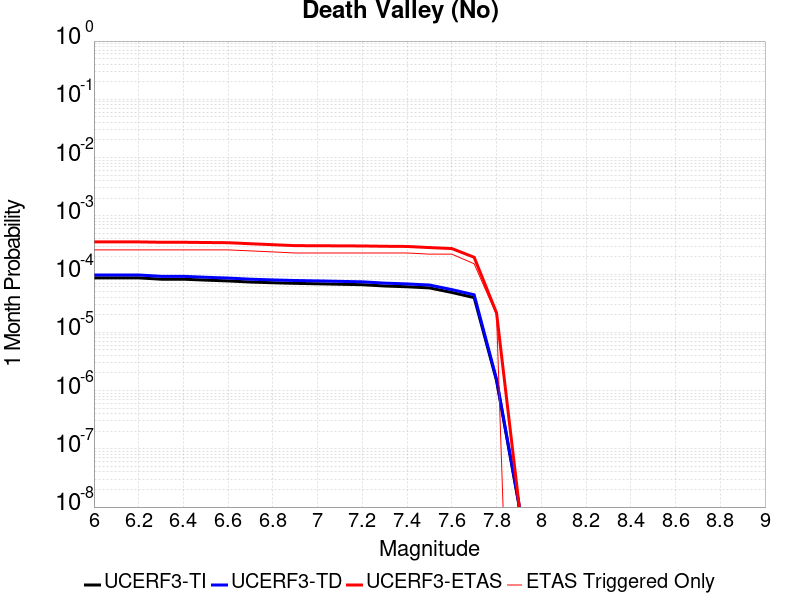 | 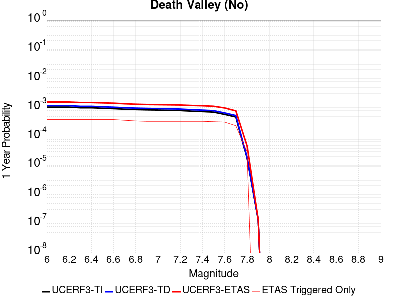 |  |

| Magnitude | 1 wk TI Prob | 1 wk TD Prob | 1 wk ETAS Prob | 1 wk ETAS/TD Gain | 1 wk ETAS Triggered Only | 1 mo TI Prob | 1 mo TD Prob | 1 mo ETAS Prob | 1 mo ETAS/TD Gain | 1 mo ETAS Triggered Only | 1 yr TI Prob | 1 yr TD Prob | 1 yr ETAS Prob | 1 yr ETAS/TD Gain | 1 yr ETAS Triggered Only | 10 yr TI Prob | 10 yr TD Prob | 10 yr ETAS Prob | 10 yr ETAS/TD Gain | 10 yr ETAS Triggered Only |
|-----|-----|-----|-----|-----|-----|-----|-----|-----|-----|-----|-----|-----|-----|-----|-----|-----|-----|-----|-----|-----|
| 6.0 | 2.0074807E-5 | 2.2500084E-5 | 1.7249672E-4 | 7.666492 | 1.5E-4 | 8.603206E-5 | 9.642541E-5 | 3.5640033E-4 | 3.6961248 | 2.6E-4 | 0.001046937 | 0.0011733545 | 0.0015628969 | 1.3319904 | 3.9E-4 | 0.010420183 | 0.011672506 | 0.012344569 | 1.0575765 | 6.8E-4 |
| 6.1 | 2.0074807E-5 | 2.2500084E-5 | 1.7249672E-4 | 7.666492 | 1.5E-4 | 8.603206E-5 | 9.642541E-5 | 3.5640033E-4 | 3.6961248 | 2.6E-4 | 0.001046937 | 0.0011733545 | 0.0015628969 | 1.3319904 | 3.9E-4 | 0.010420183 | 0.011672506 | 0.012344569 | 1.0575765 | 6.8E-4 |
| 6.2 | 2.0074807E-5 | 2.2500084E-5 | 1.7249672E-4 | 7.666492 | 1.5E-4 | 8.603206E-5 | 9.642541E-5 | 3.5640033E-4 | 3.6961248 | 2.6E-4 | 0.001046937 | 0.0011733545 | 0.0015628969 | 1.3319904 | 3.9E-4 | 0.010420183 | 0.011672506 | 0.012344569 | 1.0575765 | 6.8E-4 |
| 6.3 | 1.9050609E-5 | 2.1336948E-5 | 1.7133374E-4 | 8.029909 | 1.5E-4 | 8.164292E-5 | 9.1440896E-5 | 3.514171E-4 | 3.8431067 | 2.6E-4 | 9.935491E-4 | 0.001112731 | 0.0015022971 | 1.350099 | 3.9E-4 | 0.009891188 | 0.011072419 | 0.011735001 | 1.0598407 | 6.7E-4 |
| 6.4 | 1.9050609E-5 | 2.1336948E-5 | 1.7133374E-4 | 8.029909 | 1.5E-4 | 8.164292E-5 | 9.1440896E-5 | 3.514171E-4 | 3.8431067 | 2.6E-4 | 9.935491E-4 | 0.001112731 | 0.0015022971 | 1.350099 | 3.9E-4 | 0.009891188 | 0.011072419 | 0.011735001 | 1.0598407 | 6.7E-4 |
| 6.5 | 1.8367004E-5 | 2.0561009E-5 | 1.7055792E-4 | 8.295212 | 1.5E-4 | 7.8713354E-5 | 8.811567E-5 | 3.4809276E-4 | 3.950407 | 2.6E-4 | 9.5791375E-4 | 0.0010722869 | 0.0014618686 | 1.3633187 | 3.9E-4 | 0.009537951 | 0.0106719155 | 0.011334766 | 1.0621116 | 6.7E-4 |
| 6.6 | 1.779439E-5 | 1.9910927E-5 | 1.6990794E-4 | 8.5334015 | 1.5E-4 | 7.625944E-5 | 8.53298E-5 | 3.453076E-4 | 4.0467415 | 2.6E-4 | 9.280632E-4 | 0.0010384015 | 0.0014279966 | 1.3751873 | 3.9E-4 | 0.009241969 | 0.010336253 | 0.0109993275 | 1.0641505 | 6.7E-4 |
| 6.7 | 1.7025437E-5 | 1.9043426E-5 | 1.6904056E-4 | 8.876584 | 1.5E-4 | 7.296412E-5 | 8.161216E-5 | 3.3159176E-4 | 4.063019 | 2.5E-4 | 8.87976E-4 | 9.931813E-4 | 0.0013628139 | 1.3721702 | 3.7E-4 | 0.008844362 | 0.009888145 | 0.010531718 | 1.0650853 | 6.5E-4 |
| 6.8 | 1.6545107E-5 | 1.8512545E-5 | 1.5850995E-4 | 8.562299 | 1.4E-4 | 7.090568E-5 | 7.93371E-5 | 3.1931806E-4 | 4.0248265 | 2.4E-4 | 8.629347E-4 | 9.655073E-4 | 0.0013151694 | 1.3621538 | 3.5E-4 | 0.008595915 | 0.009613829 | 0.010237772 | 1.0649006 | 6.3E-4 |
| 6.9 | 1.615478E-5 | 1.8087594E-5 | 1.4808524E-4 | 8.187117 | 1.3E-4 | 6.9232934E-5 | 7.751599E-5 | 3.0749815E-4 | 3.9668996 | 2.3E-4 | 8.4258494E-4 | 9.433546E-4 | 0.0012830339 | 1.3600758 | 3.4E-4 | 0.008393973 | 0.009394196 | 0.010008371 | 1.0653782 | 6.2E-4 |
| 7.0 | 1.5894311E-5 | 1.780555E-5 | 1.4780324E-4 | 8.300964 | 1.3E-4 | 6.81167E-5 | 7.6307304E-5 | 3.0628976E-4 | 4.0138984 | 2.3E-4 | 8.2900526E-4 | 9.286515E-4 | 0.0012683357 | 1.3657823 | 3.4E-4 | 0.008259195 | 0.009248397 | 0.009862663 | 1.0664186 | 6.2E-4 |
| 7.1 | 1.5602263E-5 | 1.7483504E-5 | 1.4748123E-4 | 8.435451 | 1.3E-4 | 6.6865134E-5 | 7.492718E-5 | 3.0490995E-4 | 4.069417 | 2.3E-4 | 8.137789E-4 | 9.118627E-4 | 0.0012515527 | 1.3725232 | 3.4E-4 | 0.008108052 | 0.009081894 | 0.009686354 | 1.0665566 | 6.1E-4 |
| 7.2 | 1.5323829E-5 | 1.717063E-5 | 1.471684E-4 | 8.570937 | 1.3E-4 | 6.56719E-5 | 7.358637E-5 | 3.0356945E-4 | 4.1253486 | 2.3E-4 | 7.99262E-4 | 8.9555193E-4 | 0.0012352475 | 1.3793142 | 3.4E-4 | 0.007963934 | 0.008920107 | 0.009524666 | 1.0677749 | 6.1E-4 |
| 7.3 | 1.4556212E-5 | 1.6302456E-5 | 1.4630034E-4 | 8.974129 | 1.3E-4 | 6.238227E-5 | 6.9865826E-5 | 2.9984975E-4 | 4.2917943 | 2.3E-4 | 7.592395E-4 | 8.5029035E-4 | 0.0011900013 | 1.3995234 | 3.4E-4 | 0.0075665074 | 0.008471014 | 0.009056017 | 1.0690593 | 5.9E-4 |
| 7.4 | 1.411725E-5 | 1.580796E-5 | 1.458059E-4 | 9.223575 | 1.3E-4 | 6.0501097E-5 | 6.7746674E-5 | 2.9773108E-4 | 4.3947706 | 2.3E-4 | 7.363519E-4 | 8.245094E-4 | 0.0011642291 | 1.4120264 | 3.4E-4 | 0.0073391674 | 0.008215138 | 0.008800291 | 1.0712286 | 5.9E-4 |
| 7.5 | 1.3503312E-5 | 1.5126289E-5 | 1.3512447E-4 | 8.933088 | 1.2E-4 | 5.7870053E-5 | 6.482538E-5 | 2.848111E-4 | 4.3935127 | 2.2E-4 | 7.043401E-4 | 7.8896893E-4 | 0.0011187086 | 1.4179374 | 3.3E-4 | 0.007021119 | 0.007862304 | 0.008427823 | 1.0719278 | 5.7E-4 |
| 7.6 | 1.1279839E-5 | 1.2626327E-5 | 1.3262482E-4 | 10.503832 | 1.2E-4 | 4.834127E-5 | 5.4111737E-5 | 2.7409985E-4 | 5.0654416 | 2.2E-4 | 5.88396E-4 | 6.5861654E-4 | 9.784058E-4 | 1.485547 | 3.2E-4 | 0.005868405 | 0.006567199 | 0.007103652 | 1.0816869 | 5.4E-4 |
| 7.7 | 9.189108E-6 | 1.0283358E-5 | 1.00282436E-4 | 9.751915 | 9.0E-5 | 3.93813E-5 | 4.407082E-5 | 1.9406421E-4 | 4.403463 | 1.5E-4 | 4.7936183E-4 | 5.3643517E-4 | 7.7630644E-4 | 1.447158 | 2.4E-4 | 0.004783291 | 0.005351914 | 0.0057497732 | 1.0743396 | 4.0E-4 |
| 7.8 | 3.4586725E-7 | 3.6482615E-7 | 1.0364823E-5 | 28.410307 | 1.0E-5 | 1.4822873E-6 | 1.5635396E-6 | 2.1563508E-5 | 13.791469 | 2.0E-5 | 1.80467E-5 | 1.9035933E-5 | 4.9035363E-5 | 2.5759368 | 3.0E-5 | 1.8045233E-4 | 1.9034347E-4 | 2.3033586E-4 | 1.2101064 | 4.0E-5 |
| 7.9 | 2.5591178E-9 | 2.6696718E-9 | 2.6696718E-9 | 1.0 | 0.0 | 1.0967647E-8 | 1.14414505E-8 | 1.14414505E-8 | 1.0 | 0.0 | 1.335311E-7 | 1.3929966E-7 | 1.3929966E-7 | 1.0 | 0.0 | 1.3353102E-6 | 1.3929966E-6 | 1.3929966E-6 | 1.0 | 0.0 |

## Death Valley (Fish Lake Valley)
*[(top)](#table-of-contents)*

| 1 Week | 1 Month | 1 Year | 10 Year |
|-----|-----|-----|-----|
|  |  |  | 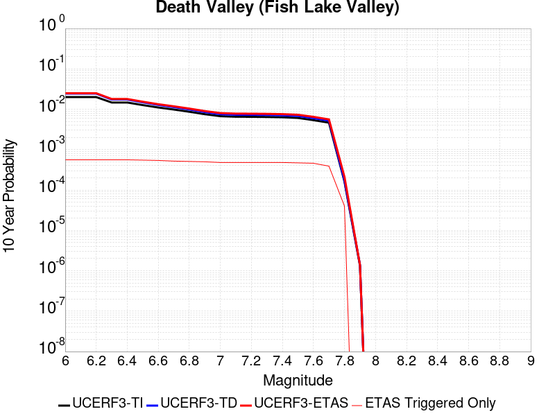 |

| Magnitude | 1 wk TI Prob | 1 wk TD Prob | 1 wk ETAS Prob | 1 wk ETAS/TD Gain | 1 wk ETAS Triggered Only | 1 mo TI Prob | 1 mo TD Prob | 1 mo ETAS Prob | 1 mo ETAS/TD Gain | 1 mo ETAS Triggered Only | 1 yr TI Prob | 1 yr TD Prob | 1 yr ETAS Prob | 1 yr ETAS/TD Gain | 1 yr ETAS Triggered Only | 10 yr TI Prob | 10 yr TD Prob | 10 yr ETAS Prob | 10 yr ETAS/TD Gain | 10 yr ETAS Triggered Only |
|-----|-----|-----|-----|-----|-----|-----|-----|-----|-----|-----|-----|-----|-----|-----|-----|-----|-----|-----|-----|-----|
| 6.0 | 3.872328E-5 | 4.7265705E-5 | 1.8725908E-4 | 3.9618385 | 1.4E-4 | 1.6594635E-4 | 2.0255324E-4 | 4.3250667E-4 | 2.135274 | 2.3E-4 | 0.0020185246 | 0.0024635606 | 0.0028226736 | 1.14577 | 3.6E-4 | 0.02000288 | 0.024388338 | 0.02493468 | 1.0224018 | 5.6E-4 |
| 6.1 | 3.872328E-5 | 4.7265705E-5 | 1.8725908E-4 | 3.9618385 | 1.4E-4 | 1.6594635E-4 | 2.0255324E-4 | 4.3250667E-4 | 2.135274 | 2.3E-4 | 0.0020185246 | 0.0024635606 | 0.0028226736 | 1.14577 | 3.6E-4 | 0.02000288 | 0.024388338 | 0.02493468 | 1.0224018 | 5.6E-4 |
| 6.2 | 3.872328E-5 | 4.7265705E-5 | 1.8725908E-4 | 3.9618385 | 1.4E-4 | 1.6594635E-4 | 2.0255324E-4 | 4.3250667E-4 | 2.135274 | 2.3E-4 | 0.0020185246 | 0.0024635606 | 0.0028226736 | 1.14577 | 3.6E-4 | 0.02000288 | 0.024388338 | 0.02493468 | 1.0224018 | 5.6E-4 |
| 6.3 | 2.8356371E-5 | 3.360979E-5 | 1.7360509E-4 | 5.165313 | 1.4E-4 | 1.2152165E-4 | 1.4403443E-4 | 3.740013E-4 | 2.5966103 | 2.3E-4 | 0.0014785219 | 0.0017522788 | 0.002111648 | 1.2050867 | 3.6E-4 | 0.014687235 | 0.017391816 | 0.017942077 | 1.0316391 | 5.6E-4 |
| 6.4 | 2.8356371E-5 | 3.360979E-5 | 1.7360509E-4 | 5.165313 | 1.4E-4 | 1.2152165E-4 | 1.4403443E-4 | 3.740013E-4 | 2.5966103 | 2.3E-4 | 0.0014785219 | 0.0017522788 | 0.002111648 | 1.2050867 | 3.6E-4 | 0.014687235 | 0.017391816 | 0.017942077 | 1.0316391 | 5.6E-4 |
| 6.5 | 2.4448687E-5 | 2.8607585E-5 | 1.5860387E-4 | 5.5441194 | 1.3E-4 | 1.0477588E-4 | 1.2259845E-4 | 3.4257147E-4 | 2.7942562 | 2.2E-4 | 0.0012748998 | 0.0014916616 | 0.0018411396 | 1.2342876 | 3.5E-4 | 0.012676105 | 0.014821392 | 0.01536324 | 1.0365585 | 5.5E-4 |
| 6.6 | 2.1298161E-5 | 2.4660083E-5 | 1.5465688E-4 | 6.2715473 | 1.3E-4 | 9.127464E-5 | 1.0568197E-4 | 3.1565977E-4 | 2.9868839 | 2.1E-4 | 0.0011107022 | 0.0012859512 | 0.001625514 | 1.2640557 | 3.4E-4 | 0.011051672 | 0.01278853 | 0.013321624 | 1.0416853 | 5.4E-4 |
| 6.7 | 1.8959729E-5 | 2.1781027E-5 | 1.4177841E-4 | 6.5092626 | 1.2E-4 | 8.125345E-5 | 9.334406E-5 | 2.933254E-4 | 3.142411 | 2.0E-4 | 9.888117E-4 | 0.001135897 | 0.0014555336 | 1.2813957 | 3.2E-4 | 0.009844234 | 0.01130357 | 0.011817692 | 1.0454831 | 5.2E-4 |
| 6.8 | 1.6691629E-5 | 1.9018351E-5 | 1.2901626E-4 | 6.783777 | 1.1E-4 | 7.153359E-5 | 8.150477E-5 | 2.714893E-4 | 3.330962 | 1.9E-4 | 8.7057345E-4 | 9.918857E-4 | 0.0013015782 | 1.312226 | 3.1E-4 | 0.008671708 | 0.009876343 | 0.0103813065 | 1.0511285 | 5.1E-4 |
| 6.9 | 1.450505E-5 | 1.638954E-5 | 1.2638773E-4 | 7.711488 | 1.1E-4 | 6.216302E-5 | 7.0239046E-5 | 2.602257E-4 | 3.7048583 | 1.9E-4 | 7.5657194E-4 | 8.5483363E-4 | 0.0011645686 | 1.3623337 | 3.1E-4 | 0.007540013 | 0.008516386 | 0.009012127 | 1.0582104 | 5.0E-4 |
| 7.0 | 1.2940855E-5 | 1.4537972E-5 | 1.1453652E-4 | 7.8784385 | 1.0E-4 | 5.545963E-5 | 6.230414E-5 | 2.4229292E-4 | 3.8888736 | 1.8E-4 | 6.750118E-4 | 7.5829466E-4 | 0.0010480748 | 1.3821471 | 2.9E-4 | 0.006729651 | 0.0075576897 | 0.008034063 | 1.0630314 | 4.8E-4 |
| 7.1 | 1.2544658E-5 | 1.4078208E-5 | 1.140768E-4 | 8.103077 | 1.0E-4 | 5.3761712E-5 | 6.0333812E-5 | 2.4032294E-4 | 3.9832218 | 1.8E-4 | 6.5435225E-4 | 7.343222E-4 | 0.0010241092 | 1.394632 | 2.9E-4 | 0.006524288 | 0.007319551 | 0.0077960375 | 1.0650978 | 4.8E-4 |
| 7.2 | 1.2489416E-5 | 1.4015674E-5 | 1.1401427E-4 | 8.134769 | 1.0E-4 | 5.3524967E-5 | 6.0065824E-5 | 2.4005501E-4 | 3.9965324 | 1.8E-4 | 6.514716E-4 | 7.310616E-4 | 0.0010208496 | 1.3963934 | 2.9E-4 | 0.006495651 | 0.0072871596 | 0.007763662 | 1.0653893 | 4.8E-4 |
| 7.3 | 1.2368307E-5 | 1.3879812E-5 | 1.1387842E-4 | 8.204608 | 1.0E-4 | 5.3005948E-5 | 5.9483587E-5 | 2.3947288E-4 | 4.025865 | 1.8E-4 | 6.451563E-4 | 7.2397763E-4 | 0.0010137677 | 1.4002749 | 2.9E-4 | 0.0064328653 | 0.007216782 | 0.0076933177 | 1.0660317 | 4.8E-4 |
| 7.4 | 1.2161707E-5 | 1.36478675E-5 | 1.136465E-4 | 8.327052 | 1.0E-4 | 5.212056E-5 | 5.8489582E-5 | 2.3847906E-4 | 4.077291 | 1.8E-4 | 6.3438306E-4 | 7.118836E-4 | 0.0010016771 | 1.4070799 | 2.9E-4 | 0.006325751 | 0.0070966207 | 0.0075732144 | 1.0671579 | 4.8E-4 |
| 7.5 | 1.1707948E-5 | 1.3145515E-5 | 1.13144204E-4 | 8.607058 | 1.0E-4 | 5.0175953E-5 | 5.6336736E-5 | 2.363266E-4 | 4.1948934 | 1.8E-4 | 6.10721E-4 | 6.856895E-4 | 9.7549066E-4 | 1.422642 | 2.9E-4 | 0.0060904534 | 0.006836321 | 0.007303108 | 1.0682805 | 4.7E-4 |
| 7.6 | 1.0319538E-5 | 1.1579622E-5 | 1.1157846E-4 | 9.63576 | 1.0E-4 | 4.4225842E-5 | 4.9626036E-5 | 2.296171E-4 | 4.6269484 | 1.8E-4 | 5.383166E-4 | 6.040347E-4 | 8.838656E-4 | 1.4632696 | 2.8E-4 | 0.0053701443 | 0.0060244603 | 0.006481689 | 1.0758954 | 4.6E-4 |
| 7.7 | 8.937764E-6 | 1.0022779E-5 | 9.0021975E-5 | 8.981738 | 8.0E-5 | 3.830414E-5 | 4.295409E-5 | 1.8294808E-4 | 4.259154 | 1.4E-4 | 4.6625308E-4 | 5.228456E-4 | 7.5272535E-4 | 1.4396704 | 2.3E-4 | 0.0046527605 | 0.005216664 | 0.00560463 | 1.0743704 | 3.9E-4 |
| 7.8 | 3.108007E-7 | 3.284654E-7 | 1.0328462E-5 | 31.444597 | 1.0E-5 | 1.3320023E-6 | 1.407708E-6 | 2.140768E-5 | 15.207471 | 2.0E-5 | 1.6217007E-5 | 1.7138715E-5 | 4.71382E-5 | 2.750393 | 3.0E-5 | 1.6215823E-4 | 1.7137431E-4 | 2.1136746E-4 | 1.2333672 | 4.0E-5 |
| 7.9 | 2.5591178E-9 | 2.6696718E-9 | 2.6696718E-9 | 1.0 | 0.0 | 1.0967647E-8 | 1.14414505E-8 | 1.14414505E-8 | 1.0 | 0.0 | 1.335311E-7 | 1.3929966E-7 | 1.3929966E-7 | 1.0 | 0.0 | 1.3353102E-6 | 1.3929966E-6 | 1.3929966E-6 | 1.0 | 0.0 |

## Elsinore (Glen Ivy) rev
*[(top)](#table-of-contents)*

| 1 Week | 1 Month | 1 Year | 10 Year |
|-----|-----|-----|-----|
|  |  |  |  |

| Magnitude | 1 wk TI Prob | 1 wk TD Prob | 1 wk ETAS Prob | 1 wk ETAS/TD Gain | 1 wk ETAS Triggered Only | 1 mo TI Prob | 1 mo TD Prob | 1 mo ETAS Prob | 1 mo ETAS/TD Gain | 1 mo ETAS Triggered Only | 1 yr TI Prob | 1 yr TD Prob | 1 yr ETAS Prob | 1 yr ETAS/TD Gain | 1 yr ETAS Triggered Only | 10 yr TI Prob | 10 yr TD Prob | 10 yr ETAS Prob | 10 yr ETAS/TD Gain | 10 yr ETAS Triggered Only |
|-----|-----|-----|-----|-----|-----|-----|-----|-----|-----|-----|-----|-----|-----|-----|-----|-----|-----|-----|-----|-----|
| 6.0 | 1.6204086E-4 | 2.937271E-4 | 3.6370652E-4 | 1.2382464 | 7.0E-5 | 6.94276E-4 | 0.0012583778 | 0.0013782268 | 1.0952408 | 1.2E-4 | 0.008420097 | 0.0152346175 | 0.015539895 | 1.0200384 | 3.1E-4 | 0.081081145 | 0.13962454 | 0.14002031 | 1.0028346 | 4.6E-4 |
| 6.1 | 1.6204086E-4 | 2.937271E-4 | 3.6370652E-4 | 1.2382464 | 7.0E-5 | 6.94276E-4 | 0.0012583778 | 0.0013782268 | 1.0952408 | 1.2E-4 | 0.008420097 | 0.0152346175 | 0.015539895 | 1.0200384 | 3.1E-4 | 0.081081145 | 0.13962454 | 0.14002031 | 1.0028346 | 4.6E-4 |
| 6.2 | 1.6204086E-4 | 2.937271E-4 | 3.6370652E-4 | 1.2382464 | 7.0E-5 | 6.94276E-4 | 0.0012583778 | 0.0013782268 | 1.0952408 | 1.2E-4 | 0.008420097 | 0.0152346175 | 0.015539895 | 1.0200384 | 3.1E-4 | 0.081081145 | 0.13962454 | 0.14002031 | 1.0028346 | 4.6E-4 |
| 6.3 | 1.0111737E-4 | 1.7703463E-4 | 2.2702577E-4 | 1.2823806 | 5.0E-5 | 4.332882E-4 | 7.5861585E-4 | 8.2856277E-4 | 1.0922033 | 7.0E-5 | 0.005262531 | 0.0092177205 | 0.009425785 | 1.0225722 | 2.1E-4 | 0.0513964 | 0.08707393 | 0.08736607 | 1.003355 | 3.2E-4 |
| 6.4 | 1.0111737E-4 | 1.7703463E-4 | 2.2702577E-4 | 1.2823806 | 5.0E-5 | 4.332882E-4 | 7.5861585E-4 | 8.2856277E-4 | 1.0922033 | 7.0E-5 | 0.005262531 | 0.0092177205 | 0.009425785 | 1.0225722 | 2.1E-4 | 0.0513964 | 0.08707393 | 0.08736607 | 1.003355 | 3.2E-4 |
| 6.5 | 3.6624708E-5 | 4.6391986E-5 | 5.639152E-5 | 1.2155445 | 1.0E-5 | 1.569536E-4 | 1.9880968E-4 | 2.0880769E-4 | 1.0502894 | 1.0E-5 | 0.001909235 | 0.0024181814 | 0.0024680605 | 1.0206267 | 5.0E-5 | 0.01892915 | 0.023697061 | 0.023765402 | 1.0028839 | 7.0E-5 |
| 6.6 | 2.5051324E-5 | 2.6147465E-5 | 2.6147465E-5 | 1.0 | 0.0 | 1.073584E-4 | 1.12056E-4 | 1.12056E-4 | 1.0 | 0.0 | 0.0013063047 | 0.0013634725 | 0.0013834452 | 1.0146484 | 2.0E-5 | 0.012986525 | 0.013565759 | 0.0136052165 | 1.0029086 | 4.0E-5 |
| 6.7 | 2.2189772E-5 | 2.2072489E-5 | 2.2072489E-5 | 1.0 | 0.0 | 9.509556E-5 | 9.459316E-5 | 9.459316E-5 | 1.0 | 0.0 | 0.0011571734 | 0.0011510996 | 0.0011710766 | 1.0173547 | 2.0E-5 | 0.011511663 | 0.0114663225 | 0.011505865 | 1.0034485 | 4.0E-5 |
| 6.8 | 1.6654378E-5 | 1.44376E-5 | 1.44376E-5 | 1.0 | 0.0 | 7.137396E-5 | 6.187399E-5 | 6.187399E-5 | 1.0 | 0.0 | 8.686314E-4 | 7.5306057E-4 | 7.5306057E-4 | 1.0 | 0.0 | 0.008652439 | 0.0075100763 | 0.0075100763 | 1.0 | 0.0 |
| 6.9 | 1.5042909E-5 | 1.2331886E-5 | 1.2331886E-5 | 1.0 | 0.0 | 6.446802E-5 | 5.2849886E-5 | 5.2849886E-5 | 1.0 | 0.0 | 7.8461546E-4 | 6.4326054E-4 | 6.4326054E-4 | 1.0 | 0.0 | 0.007818509 | 0.006417925 | 0.006417925 | 1.0 | 0.0 |
| 7.0 | 1.4361385E-5 | 1.1451172E-5 | 1.1451172E-5 | 1.0 | 0.0 | 6.154734E-5 | 4.9075545E-5 | 4.9075545E-5 | 1.0 | 0.0 | 7.490812E-4 | 5.973339E-4 | 5.973339E-4 | 1.0 | 0.0 | 0.007465612 | 0.005960982 | 0.005960982 | 1.0 | 0.0 |
| 7.1 | 1.3265571E-5 | 1.0244736E-5 | 1.0244736E-5 | 1.0 | 0.0 | 5.6851208E-5 | 4.3905282E-5 | 4.3905282E-5 | 1.0 | 0.0 | 6.919436E-4 | 5.344183E-4 | 5.344183E-4 | 1.0 | 0.0 | 0.006897931 | 0.0053346003 | 0.0053346003 | 1.0 | 0.0 |
| 7.2 | 1.1596403E-5 | 8.504847E-6 | 8.504847E-6 | 1.0 | 0.0 | 4.9697923E-5 | 3.6448844E-5 | 3.6448844E-5 | 1.0 | 0.0 | 6.049042E-4 | 4.4367602E-4 | 4.4367602E-4 | 1.0 | 0.0 | 0.006032603 | 0.004429357 | 0.004429357 | 1.0 | 0.0 |
| 7.3 | 1.0150827E-5 | 7.238537E-6 | 7.238537E-6 | 1.0 | 0.0 | 4.3502816E-5 | 3.102194E-5 | 3.102194E-5 | 1.0 | 0.0 | 5.2951806E-4 | 3.776281E-4 | 3.776281E-4 | 1.0 | 0.0 | 0.005282581 | 0.003770271 | 0.003770271 | 1.0 | 0.0 |
| 7.4 | 9.080705E-6 | 6.352307E-6 | 6.352307E-6 | 1.0 | 0.0 | 3.8916725E-5 | 2.7223898E-5 | 2.7223898E-5 | 1.0 | 0.0 | 4.7370812E-4 | 3.314019E-4 | 3.314019E-4 | 1.0 | 0.0 | 0.004726996 | 0.0033092257 | 0.0033092257 | 1.0 | 0.0 |
| 7.5 | 7.671649E-6 | 5.225419E-6 | 5.225419E-6 | 1.0 | 0.0 | 3.287808E-5 | 2.2394468E-5 | 2.2394468E-5 | 1.0 | 0.0 | 4.0021708E-4 | 2.7261977E-4 | 2.7261977E-4 | 1.0 | 0.0 | 0.0039949706 | 0.0027229784 | 0.0027229784 | 1.0 | 0.0 |
| 7.6 | 6.990086E-6 | 4.687336E-6 | 4.687336E-6 | 1.0 | 0.0 | 2.9957167E-5 | 2.0088435E-5 | 2.0088435E-5 | 1.0 | 0.0 | 3.6466747E-4 | 2.445504E-4 | 2.445504E-4 | 1.0 | 0.0 | 0.0036406964 | 0.0024429292 | 0.0024429292 | 1.0 | 0.0 |
| 7.7 | 4.163505E-6 | 2.329331E-6 | 2.329331E-6 | 1.0 | 0.0 | 1.7843471E-5 | 9.982813E-6 | 9.982813E-6 | 1.0 | 0.0 | 2.172226E-4 | 1.2153471E-4 | 1.2153471E-4 | 1.0 | 0.0 | 0.0021701038 | 0.0012147555 | 0.0012147555 | 1.0 | 0.0 |
| 7.8 | 2.2692414E-7 | 9.384417E-8 | 9.384417E-8 | 1.0 | 0.0 | 9.725317E-7 | 4.0218927E-7 | 4.0218927E-7 | 1.0 | 0.0 | 1.1840509E-5 | 4.8966467E-6 | 4.8966467E-6 | 1.0 | 0.0 | 1.1839878E-4 | 4.8965718E-5 | 4.8965718E-5 | 1.0 | 0.0 |
| 7.9 | 6.676829E-9 | 3.4397174E-9 | 3.4397174E-9 | 1.0 | 0.0 | 2.861498E-8 | 1.4741646E-8 | 1.4741646E-8 | 1.0 | 0.0 | 3.4838732E-7 | 1.7947953E-7 | 1.7947953E-7 | 1.0 | 0.0 | 3.4838679E-6 | 1.794794E-6 | 1.794794E-6 | 1.0 | 0.0 |

## San Andreas (Carrizo) rev
*[(top)](#table-of-contents)*

| 1 Week | 1 Month | 1 Year | 10 Year |
|-----|-----|-----|-----|
|  |  |  | 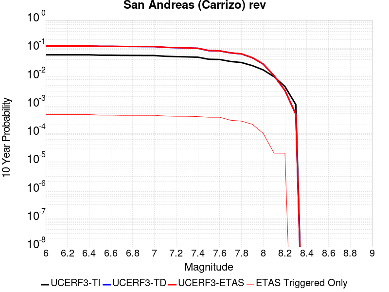 |

| Magnitude | 1 wk TI Prob | 1 wk TD Prob | 1 wk ETAS Prob | 1 wk ETAS/TD Gain | 1 wk ETAS Triggered Only | 1 mo TI Prob | 1 mo TD Prob | 1 mo ETAS Prob | 1 mo ETAS/TD Gain | 1 mo ETAS Triggered Only | 1 yr TI Prob | 1 yr TD Prob | 1 yr ETAS Prob | 1 yr ETAS/TD Gain | 1 yr ETAS Triggered Only | 10 yr TI Prob | 10 yr TD Prob | 10 yr ETAS Prob | 10 yr ETAS/TD Gain | 10 yr ETAS Triggered Only |
|-----|-----|-----|-----|-----|-----|-----|-----|-----|-----|-----|-----|-----|-----|-----|-----|-----|-----|-----|-----|-----|
| 6.0 | 1.1674632E-4 | 2.4324407E-4 | 3.8321002E-4 | 1.5754136 | 1.4E-4 | 5.002454E-4 | 0.0010420597 | 0.00127182 | 1.2204868 | 2.3E-4 | 0.006073493 | 0.012613757 | 0.012939594 | 1.0258319 | 3.3E-4 | 0.0591016 | 0.120640226 | 0.12104473 | 1.003353 | 4.6E-4 |
| 6.1 | 1.1674632E-4 | 2.4324407E-4 | 3.8321002E-4 | 1.5754136 | 1.4E-4 | 5.002454E-4 | 0.0010420597 | 0.00127182 | 1.2204868 | 2.3E-4 | 0.006073493 | 0.012613757 | 0.012939594 | 1.0258319 | 3.3E-4 | 0.0591016 | 0.120640226 | 0.12104473 | 1.003353 | 4.6E-4 |
| 6.2 | 1.1674632E-4 | 2.4324407E-4 | 3.8321002E-4 | 1.5754136 | 1.4E-4 | 5.002454E-4 | 0.0010420597 | 0.00127182 | 1.2204868 | 2.3E-4 | 0.006073493 | 0.012613757 | 0.012939594 | 1.0258319 | 3.3E-4 | 0.0591016 | 0.120640226 | 0.12104473 | 1.003353 | 4.6E-4 |
| 6.3 | 1.1674632E-4 | 2.4324407E-4 | 3.8321002E-4 | 1.5754136 | 1.4E-4 | 5.002454E-4 | 0.0010420597 | 0.00127182 | 1.2204868 | 2.3E-4 | 0.006073493 | 0.012613757 | 0.012939594 | 1.0258319 | 3.3E-4 | 0.0591016 | 0.120640226 | 0.12104473 | 1.003353 | 4.6E-4 |
| 6.4 | 1.1674632E-4 | 2.4324407E-4 | 3.8321002E-4 | 1.5754136 | 1.4E-4 | 5.002454E-4 | 0.0010420597 | 0.00127182 | 1.2204868 | 2.3E-4 | 0.006073493 | 0.012613757 | 0.012939594 | 1.0258319 | 3.3E-4 | 0.0591016 | 0.120640226 | 0.12104473 | 1.003353 | 4.6E-4 |
| 6.5 | 1.13136164E-4 | 2.3644442E-4 | 3.6641367E-4 | 1.5496821 | 1.3E-4 | 4.847792E-4 | 0.0010129412 | 0.0012327184 | 1.2169693 | 2.2E-4 | 0.0058862255 | 0.012263271 | 0.012579347 | 1.0257741 | 3.2E-4 | 0.057327334 | 0.11761008 | 0.11799833 | 1.0033011 | 4.4E-4 |
| 6.6 | 1.13136164E-4 | 2.3644442E-4 | 3.6641367E-4 | 1.5496821 | 1.3E-4 | 4.847792E-4 | 0.0010129412 | 0.0012327184 | 1.2169693 | 2.2E-4 | 0.0058862255 | 0.012263271 | 0.012579347 | 1.0257741 | 3.2E-4 | 0.057327334 | 0.11761008 | 0.11799833 | 1.0033011 | 4.4E-4 |
| 6.7 | 1.1149675E-4 | 2.3335687E-4 | 3.5332888E-4 | 1.5141138 | 1.2E-4 | 4.777557E-4 | 9.997191E-4 | 0.0012095091 | 1.209849 | 2.1E-4 | 0.0058011734 | 0.012104088 | 0.012410336 | 1.0253012 | 3.1E-4 | 0.05652051 | 0.1162291 | 0.11660913 | 1.0032696 | 4.3E-4 |
| 6.8 | 1.1103589E-4 | 2.3237852E-4 | 3.5235062E-4 | 1.5162789 | 1.2E-4 | 4.7578133E-4 | 9.955293E-4 | 0.0012053202 | 1.210733 | 2.1E-4 | 0.005777263 | 0.012053643 | 0.012359907 | 1.0254084 | 3.1E-4 | 0.056293584 | 0.11578894 | 0.11616915 | 1.0032836 | 4.3E-4 |
| 6.9 | 1.1053259E-4 | 2.3130233E-4 | 3.512746E-4 | 1.5186815 | 1.2E-4 | 4.7362508E-4 | 9.909206E-4 | 0.0012007125 | 1.2117141 | 2.1E-4 | 0.0057511497 | 0.011998152 | 0.012304433 | 1.0255274 | 3.1E-4 | 0.05604569 | 0.11530445 | 0.11568487 | 1.0032992 | 4.3E-4 |
| 7.0 | 1.1005377E-4 | 2.3031076E-4 | 3.5028314E-4 | 1.5209152 | 1.2E-4 | 4.7157376E-4 | 9.866742E-4 | 0.0011964671 | 1.2126262 | 2.1E-4 | 0.0057263062 | 0.011947021 | 0.012253317 | 1.0256379 | 3.1E-4 | 0.055809796 | 0.11485658 | 0.11523719 | 1.0033138 | 4.3E-4 |
| 7.1 | 1.0308142E-4 | 2.1540876E-4 | 3.153872E-4 | 1.4641336 | 1.0E-4 | 4.417027E-4 | 9.228548E-4 | 0.0011126795 | 1.2056929 | 1.9E-4 | 0.0053644776 | 0.011178188 | 0.011464947 | 1.0256534 | 2.9E-4 | 0.052368138 | 0.10809042 | 0.108456105 | 1.0033832 | 4.1E-4 |
| 7.2 | 1.0027479E-4 | 2.094876E-4 | 3.0946665E-4 | 1.4772552 | 1.0E-4 | 4.296783E-4 | 8.9749607E-4 | 0.0010873255 | 1.2115101 | 1.9E-4 | 0.0052187922 | 0.010872566 | 0.011149522 | 1.0254729 | 2.8E-4 | 0.050979212 | 0.10539086 | 0.105748706 | 1.0033954 | 4.0E-4 |
| 7.3 | 9.816942E-5 | 2.0423878E-4 | 3.0421835E-4 | 1.4895229 | 1.0E-4 | 4.2065824E-4 | 8.7501644E-4 | 0.0010648501 | 1.2169487 | 1.9E-4 | 0.005109493 | 0.010601572 | 0.010878603 | 1.0261312 | 2.8E-4 | 0.049935985 | 0.10297546 | 0.10333426 | 1.0034844 | 4.0E-4 |
| 7.4 | 9.5634205E-5 | 1.9793298E-4 | 2.9791318E-4 | 1.5051215 | 1.0E-4 | 4.0979648E-4 | 8.4800937E-4 | 0.0010278567 | 1.2120818 | 1.8E-4 | 0.0049778637 | 0.010275901 | 0.010543127 | 1.026005 | 2.7E-4 | 0.048678253 | 0.100067884 | 0.10041886 | 1.0035074 | 3.9E-4 |
| 7.5 | 8.052417E-5 | 1.6113915E-4 | 2.6112303E-4 | 1.6204816 | 1.0E-4 | 3.4505792E-4 | 6.9041376E-4 | 8.702895E-4 | 1.2605332 | 1.8E-4 | 0.0041929903 | 0.008373471 | 0.008631295 | 1.0307904 | 2.6E-4 | 0.04114753 | 0.082815245 | 0.083154604 | 1.0040978 | 3.7E-4 |
| 7.6 | 7.897024E-5 | 1.5767086E-4 | 2.576551E-4 | 1.6341326 | 1.0E-4 | 3.384E-4 | 6.755574E-4 | 8.5543585E-4 | 1.2662666 | 1.8E-4 | 0.0041122385 | 0.00819397 | 0.00845184 | 1.0314707 | 2.6E-4 | 0.040369697 | 0.08115866 | 0.08149863 | 1.004189 | 3.7E-4 |
| 7.7 | 6.707427E-5 | 1.3277122E-4 | 1.9276325E-4 | 1.4518452 | 6.0E-5 | 2.8742946E-4 | 5.688955E-4 | 6.9882156E-4 | 1.228383 | 1.3E-4 | 0.003493839 | 0.0069043385 | 0.0071029575 | 1.0287673 | 2.0E-4 | 0.034394164 | 0.06905339 | 0.06932337 | 1.0039097 | 2.9E-4 |
| 7.8 | 6.147705E-5 | 1.2198445E-4 | 1.8197713E-4 | 1.4918059 | 6.0E-5 | 2.6344648E-4 | 5.226858E-4 | 6.4262305E-4 | 1.2294635 | 1.2E-4 | 0.0032027436 | 0.006345156 | 0.0065240143 | 1.0281881 | 1.8E-4 | 0.031569764 | 0.0635172 | 0.06377005 | 1.0039809 | 2.7E-4 |
| 7.9 | 4.7636717E-5 | 8.8802946E-5 | 1.3879851E-4 | 1.5629944 | 5.0E-5 | 2.0414138E-4 | 3.8052857E-4 | 4.7049433E-4 | 1.2364231 | 9.0E-5 | 0.0024825884 | 0.004623101 | 0.004762454 | 1.0301427 | 1.4E-4 | 0.024550365 | 0.046629366 | 0.046829574 | 1.0042936 | 2.1E-4 |
| 8.0 | 3.3554235E-5 | 5.2138024E-5 | 8.213646E-5 | 1.5753658 | 3.0E-5 | 1.4379594E-4 | 2.2342955E-4 | 2.634206E-4 | 1.1789874 | 4.0E-5 | 0.0017493097 | 0.002716863 | 0.0027767 | 1.0220243 | 6.0E-5 | 0.017356034 | 0.027881905 | 0.027979117 | 1.0034865 | 1.0E-4 |
| 8.1 | 1.9175432E-5 | 1.9183564E-5 | 2.9183373E-5 | 1.5212696 | 1.0E-5 | 8.217783E-5 | 8.221269E-5 | 9.221186E-5 | 1.1216258 | 1.0E-5 | 0.0010000558 | 0.0010004805 | 0.0010104704 | 1.0099852 | 1.0E-5 | 0.009955673 | 0.010757771 | 0.010777556 | 1.0018392 | 2.0E-5 |
| 8.2 | 8.643924E-6 | 5.473668E-6 | 1.5473614E-5 | 2.8269184 | 1.0E-5 | 3.704486E-5 | 2.3458366E-5 | 3.345813E-5 | 1.4262772 | 1.0E-5 | 4.5092785E-4 | 2.8556827E-4 | 2.955654E-4 | 1.035008 | 1.0E-5 | 0.0045001395 | 0.0032481793 | 0.0032681145 | 1.0061373 | 2.0E-5 |
| 8.3 | 1.983087E-6 | 7.6564595E-7 | 7.6564595E-7 | 1.0 | 0.0 | 8.498917E-6 | 3.281336E-6 | 3.281336E-6 | 1.0 | 0.0 | 1.034694E-4 | 3.9949547E-5 | 3.9949547E-5 | 1.0 | 0.0 | 0.0010342124 | 4.717979E-4 | 4.717979E-4 | 1.0 | 0.0 |

## San Andreas (Cholame) rev
*[(top)](#table-of-contents)*

| 1 Week | 1 Month | 1 Year | 10 Year |
|-----|-----|-----|-----|
|  |  |  |  |

| Magnitude | 1 wk TI Prob | 1 wk TD Prob | 1 wk ETAS Prob | 1 wk ETAS/TD Gain | 1 wk ETAS Triggered Only | 1 mo TI Prob | 1 mo TD Prob | 1 mo ETAS Prob | 1 mo ETAS/TD Gain | 1 mo ETAS Triggered Only | 1 yr TI Prob | 1 yr TD Prob | 1 yr ETAS Prob | 1 yr ETAS/TD Gain | 1 yr ETAS Triggered Only | 10 yr TI Prob | 10 yr TD Prob | 10 yr ETAS Prob | 10 yr ETAS/TD Gain | 10 yr ETAS Triggered Only |
|-----|-----|-----|-----|-----|-----|-----|-----|-----|-----|-----|-----|-----|-----|-----|-----|-----|-----|-----|-----|-----|
| 6.0 | 1.2302514E-4 | 2.5205986E-4 | 3.720296E-4 | 1.4759574 | 1.2E-4 | 5.27144E-4 | 0.0010798109 | 0.0012895842 | 1.1942685 | 2.1E-4 | 0.0063991086 | 0.013067958 | 0.013373907 | 1.0234121 | 3.1E-4 | 0.06217949 | 0.12438412 | 0.12476939 | 1.0030974 | 4.4E-4 |
| 6.1 | 1.2302514E-4 | 2.5205986E-4 | 3.720296E-4 | 1.4759574 | 1.2E-4 | 5.27144E-4 | 0.0010798109 | 0.0012895842 | 1.1942685 | 2.1E-4 | 0.0063991086 | 0.013067958 | 0.013373907 | 1.0234121 | 3.1E-4 | 0.06217949 | 0.12438412 | 0.12476939 | 1.0030974 | 4.4E-4 |
| 6.2 | 1.2203569E-4 | 2.502277E-4 | 3.7019767E-4 | 1.4794432 | 1.2E-4 | 5.2290526E-4 | 0.0010719653 | 0.0012817401 | 1.1956918 | 2.1E-4 | 0.006347804 | 0.012973578 | 0.013279556 | 1.0235847 | 3.1E-4 | 0.061695136 | 0.123571314 | 0.12395694 | 1.0031207 | 4.4E-4 |
| 6.3 | 1.2142645E-4 | 2.4908737E-4 | 3.690575E-4 | 1.4816387 | 1.2E-4 | 5.202953E-4 | 0.0010670823 | 0.0012768582 | 1.1965883 | 2.1E-4 | 0.006316212 | 0.012914834 | 0.01322083 | 1.0236934 | 3.1E-4 | 0.06139677 | 0.12306532 | 0.12345117 | 1.0031353 | 4.4E-4 |
| 6.4 | 1.1865206E-4 | 2.4414246E-4 | 3.6411316E-4 | 1.4913963 | 1.2E-4 | 5.0840975E-4 | 0.0010459068 | 0.0012556872 | 1.2005727 | 2.1E-4 | 0.006172335 | 0.012660044 | 0.01296612 | 1.0241765 | 3.1E-4 | 0.060036868 | 0.12085904 | 0.12123707 | 1.0031278 | 4.3E-4 |
| 6.5 | 1.17443946E-4 | 2.4207575E-4 | 3.620467E-4 | 1.4955926 | 1.2E-4 | 5.032341E-4 | 0.0010370566 | 0.0012468388 | 1.2022861 | 2.1E-4 | 0.006109677 | 0.012553536 | 0.012859644 | 1.0243843 | 3.1E-4 | 0.059444077 | 0.11993008 | 0.12030851 | 1.0031555 | 4.3E-4 |
| 6.6 | 1.13579066E-4 | 2.3516564E-4 | 3.4513976E-4 | 1.4676454 | 1.1E-4 | 4.866766E-4 | 0.001007465 | 0.0012072634 | 1.1983181 | 2.0E-4 | 0.0059092017 | 0.012197345 | 0.012493685 | 1.0242956 | 3.0E-4 | 0.057545185 | 0.1168492 | 0.117220126 | 1.0031744 | 4.2E-4 |
| 6.7 | 1.1271412E-4 | 2.336088E-4 | 3.4358312E-4 | 1.4707627 | 1.1E-4 | 4.829711E-4 | 0.001000798 | 0.0012005977 | 1.1996405 | 2.0E-4 | 0.005864331 | 0.012117079 | 0.012413444 | 1.0244584 | 3.0E-4 | 0.057119697 | 0.11615275 | 0.116523966 | 1.0031959 | 4.2E-4 |
| 6.8 | 1.1217975E-4 | 2.3249313E-4 | 3.4246754E-4 | 1.4730222 | 1.1E-4 | 4.8068175E-4 | 9.960202E-4 | 0.001195821 | 1.2005992 | 2.0E-4 | 0.005836608 | 0.012059555 | 0.012355938 | 1.0245765 | 3.0E-4 | 0.056856725 | 0.11565061 | 0.116022035 | 1.0032116 | 4.2E-4 |
| 6.9 | 1.1146753E-4 | 2.3098059E-4 | 3.409552E-4 | 1.4761205 | 1.1E-4 | 4.7763053E-4 | 9.895428E-4 | 0.0011893449 | 1.2019136 | 2.0E-4 | 0.0057996577 | 0.011981564 | 0.012277969 | 1.0247384 | 3.0E-4 | 0.056506127 | 0.11497027 | 0.11534198 | 1.0032331 | 4.2E-4 |
| 7.0 | 1.0965793E-4 | 2.2721413E-4 | 3.3718912E-4 | 1.4840149 | 1.1E-4 | 4.698779E-4 | 9.734129E-4 | 0.0011732182 | 1.2052627 | 2.0E-4 | 0.005705768 | 0.011787324 | 0.0120837875 | 1.025151 | 3.0E-4 | 0.055614736 | 0.11327011 | 0.11364254 | 1.0032879 | 4.2E-4 |
| 7.1 | 9.927982E-5 | 2.0540332E-4 | 3.0538277E-4 | 1.486747 | 1.0E-4 | 4.2541555E-4 | 8.8000396E-4 | 0.0010598456 | 1.2043645 | 1.8E-4 | 0.0051671406 | 0.010661708 | 0.010918937 | 1.0241263 | 2.6E-4 | 0.05048634 | 0.10336573 | 0.10370645 | 1.0032963 | 3.8E-4 |
| 7.2 | 9.696786E-5 | 2.0044584E-4 | 3.004258E-4 | 1.4987879 | 1.0E-4 | 4.1551032E-4 | 8.587718E-4 | 0.0010386172 | 1.2094216 | 1.8E-4 | 0.00504711 | 0.010405703 | 0.010662998 | 1.0247263 | 2.6E-4 | 0.04934009 | 0.10110233 | 0.10144392 | 1.0033785 | 3.8E-4 |
| 7.3 | 9.4727984E-5 | 1.9473763E-4 | 2.9471816E-4 | 1.5134114 | 1.0E-4 | 4.0591392E-4 | 8.343239E-4 | 0.0010141737 | 1.2155635 | 1.8E-4 | 0.0049308087 | 0.010110851 | 0.010368222 | 1.025455 | 2.6E-4 | 0.048228268 | 0.09847412 | 0.0988167 | 1.0034789 | 3.8E-4 |
| 7.4 | 9.220358E-5 | 1.8844259E-4 | 2.8842373E-4 | 1.5305656 | 1.0E-4 | 3.9509835E-4 | 8.07362E-4 | 9.772248E-4 | 1.2103922 | 1.7E-4 | 0.004799717 | 0.009785578 | 0.010033132 | 1.0252978 | 2.5E-4 | 0.046973653 | 0.09555831 | 0.09589295 | 1.003502 | 3.7E-4 |
| 7.5 | 7.71631E-5 | 1.5179155E-4 | 2.5177636E-4 | 1.6586982 | 1.0E-4 | 3.306571E-4 | 6.5037323E-4 | 8.2026265E-4 | 1.2612184 | 1.7E-4 | 0.0040183207 | 0.007889617 | 0.008127723 | 1.0301797 | 2.4E-4 | 0.03946433 | 0.078289196 | 0.0786118 | 1.0041206 | 3.5E-4 |
| 7.6 | 7.5634416E-5 | 1.4838556E-4 | 2.4837072E-4 | 1.67382 | 1.0E-4 | 3.241072E-4 | 6.357833E-4 | 8.056752E-4 | 1.2672167 | 1.7E-4 | 0.0039388672 | 0.007713256 | 0.007951405 | 1.0308752 | 2.4E-4 | 0.038697794 | 0.076654874 | 0.07697805 | 1.004216 | 3.5E-4 |
| 7.7 | 6.3783E-5 | 1.2359623E-4 | 1.8358881E-4 | 1.4853917 | 6.0E-5 | 2.7332708E-4 | 5.2959064E-4 | 6.4952706E-4 | 1.2264701 | 1.2E-4 | 0.0033226798 | 0.0064287307 | 0.0066075735 | 1.0278193 | 1.8E-4 | 0.032734364 | 0.06454488 | 0.06479745 | 1.0039132 | 2.7E-4 |
| 7.8 | 5.863422E-5 | 1.14169685E-4 | 1.7416284E-4 | 1.5254736 | 6.0E-5 | 2.512653E-4 | 4.892069E-4 | 5.991531E-4 | 1.2247437 | 1.1E-4 | 0.003054864 | 0.0059398497 | 0.006098899 | 1.0267767 | 1.6E-4 | 0.030132094 | 0.05966162 | 0.059896704 | 1.0039403 | 2.5E-4 |
| 7.9 | 4.595283E-5 | 8.426815E-5 | 1.3426394E-4 | 1.593294 | 5.0E-5 | 1.9692584E-4 | 3.6109926E-4 | 4.4107036E-4 | 1.2214657 | 8.0E-5 | 0.0023949358 | 0.0043875277 | 0.004507001 | 1.0272303 | 1.2E-4 | 0.023692891 | 0.044363137 | 0.04454471 | 1.0040928 | 1.9E-4 |
| 8.0 | 3.2950178E-5 | 5.077396E-5 | 8.0772435E-5 | 1.590824 | 3.0E-5 | 1.412074E-4 | 2.1758456E-4 | 2.5757586E-4 | 1.1837965 | 4.0E-5 | 0.0017178444 | 0.0026458753 | 0.002695743 | 1.0188473 | 5.0E-5 | 0.017046256 | 0.027181072 | 0.027268626 | 1.0032212 | 9.0E-5 |
| 8.1 | 1.9177472E-5 | 1.9183733E-5 | 2.9183542E-5 | 1.5212649 | 1.0E-5 | 8.218658E-5 | 8.221342E-5 | 9.221259E-5 | 1.1216247 | 1.0E-5 | 0.0010001622 | 0.0010004893 | 0.0010104793 | 1.0099851 | 1.0E-5 | 0.009956728 | 0.010757887 | 0.010777672 | 1.001839 | 2.0E-5 |
| 8.2 | 8.643924E-6 | 5.473668E-6 | 1.5473614E-5 | 2.8269184 | 1.0E-5 | 3.704486E-5 | 2.3458366E-5 | 3.345813E-5 | 1.4262772 | 1.0E-5 | 4.5092785E-4 | 2.8556827E-4 | 2.955654E-4 | 1.035008 | 1.0E-5 | 0.0045001395 | 0.0032481793 | 0.0032681145 | 1.0061373 | 2.0E-5 |
| 8.3 | 1.983087E-6 | 7.6564595E-7 | 7.6564595E-7 | 1.0 | 0.0 | 8.498917E-6 | 3.281336E-6 | 3.281336E-6 | 1.0 | 0.0 | 1.034694E-4 | 3.9949547E-5 | 3.9949547E-5 | 1.0 | 0.0 | 0.0010342124 | 4.717979E-4 | 4.717979E-4 | 1.0 | 0.0 |

## Ludlow
*[(top)](#table-of-contents)*

| 1 Week | 1 Month | 1 Year | 10 Year |
|-----|-----|-----|-----|
| 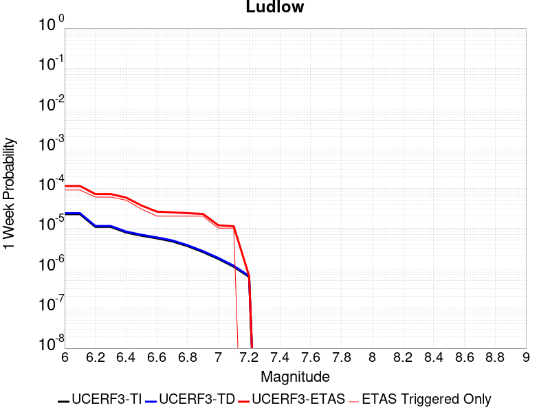 |  |  | 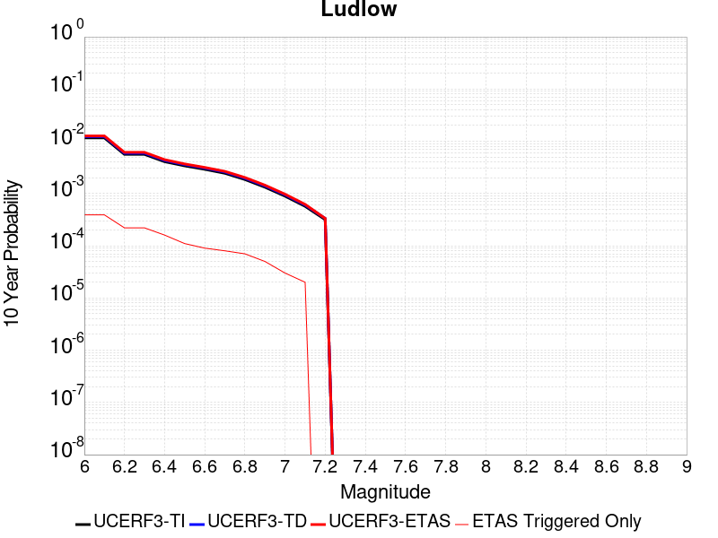 |

| Magnitude | 1 wk TI Prob | 1 wk TD Prob | 1 wk ETAS Prob | 1 wk ETAS/TD Gain | 1 wk ETAS Triggered Only | 1 mo TI Prob | 1 mo TD Prob | 1 mo ETAS Prob | 1 mo ETAS/TD Gain | 1 mo ETAS Triggered Only | 1 yr TI Prob | 1 yr TD Prob | 1 yr ETAS Prob | 1 yr ETAS/TD Gain | 1 yr ETAS Triggered Only | 10 yr TI Prob | 10 yr TD Prob | 10 yr ETAS Prob | 10 yr ETAS/TD Gain | 10 yr ETAS Triggered Only |
|-----|-----|-----|-----|-----|-----|-----|-----|-----|-----|-----|-----|-----|-----|-----|-----|-----|-----|-----|-----|-----|
| 6.0 | 2.2407607E-5 | 2.3657254E-5 | 1.1365512E-4 | 4.80424 | 9.0E-5 | 9.602906E-5 | 1.0138454E-4 | 2.2137238E-4 | 2.1834924 | 1.2E-4 | 0.0011685267 | 0.001233702 | 0.0014833935 | 1.2023921 | 2.5E-4 | 0.011624013 | 0.012273042 | 0.012658255 | 1.031387 | 3.9E-4 |
| 6.1 | 2.2407607E-5 | 2.3657254E-5 | 1.1365512E-4 | 4.80424 | 9.0E-5 | 9.602906E-5 | 1.0138454E-4 | 2.2137238E-4 | 2.1834924 | 1.2E-4 | 0.0011685267 | 0.001233702 | 0.0014833935 | 1.2023921 | 2.5E-4 | 0.011624013 | 0.012273042 | 0.012658255 | 1.031387 | 3.9E-4 |
| 6.2 | 1.0781252E-5 | 1.1365663E-5 | 7.136498E-5 | 6.2789984 | 6.0E-5 | 4.620455E-5 | 4.8709102E-5 | 1.1870569E-4 | 2.4370332 | 7.0E-5 | 5.623952E-4 | 5.9287593E-4 | 7.4278703E-4 | 1.252854 | 1.5E-4 | 0.00560974 | 0.0059133614 | 0.00613206 | 1.0369838 | 2.2E-4 |
| 6.3 | 1.0781252E-5 | 1.1365663E-5 | 7.136498E-5 | 6.2789984 | 6.0E-5 | 4.620455E-5 | 4.8709102E-5 | 1.1870569E-4 | 2.4370332 | 7.0E-5 | 5.623952E-4 | 5.9287593E-4 | 7.4278703E-4 | 1.252854 | 1.5E-4 | 0.00560974 | 0.0059133614 | 0.00613206 | 1.0369838 | 2.2E-4 |
| 6.4 | 7.814439E-6 | 8.237729E-6 | 5.8237318E-5 | 7.0695844 | 5.0E-5 | 3.3490025E-5 | 3.530408E-5 | 8.5302316E-5 | 2.4162169 | 5.0E-5 | 4.0766477E-4 | 4.2974384E-4 | 5.2970083E-4 | 1.2325968 | 1.0E-4 | 0.0040691774 | 0.0042892746 | 0.004448588 | 1.0371424 | 1.6E-4 |
| 6.5 | 6.4986366E-6 | 6.85092E-6 | 3.6850714E-5 | 5.3789444 | 3.0E-5 | 2.7851002E-5 | 2.9360759E-5 | 5.9359878E-5 | 2.0217419 | 3.0E-5 | 3.390332E-4 | 3.5740953E-4 | 4.1738807E-4 | 1.1678146 | 6.0E-5 | 0.003385164 | 0.0035684432 | 0.0036780508 | 1.0307158 | 1.1E-4 |
| 6.6 | 5.582177E-6 | 5.8860055E-6 | 2.5885887E-5 | 4.39787 | 2.0E-5 | 2.3923398E-5 | 2.5225498E-5 | 4.5224995E-5 | 1.7928286 | 2.0E-5 | 2.9122844E-4 | 3.0707786E-4 | 3.5706253E-4 | 1.1627752 | 5.0E-5 | 0.0029084706 | 0.003066609 | 0.0031563328 | 1.0292584 | 9.0E-5 |
| 6.7 | 4.6858763E-6 | 4.940427E-6 | 2.494033E-5 | 5.048213 | 2.0E-5 | 2.0082172E-5 | 2.1173091E-5 | 4.117267E-5 | 1.9445752 | 2.0E-5 | 2.4447302E-4 | 2.5775246E-4 | 3.0773957E-4 | 1.1939346 | 5.0E-5 | 0.0024420423 | 0.0025745912 | 0.0026543853 | 1.0309929 | 8.0E-5 |
| 6.8 | 3.5584908E-6 | 3.7520183E-6 | 2.3751943E-5 | 6.3304443 | 2.0E-5 | 1.5250586E-5 | 1.6079981E-5 | 3.607966E-5 | 2.2437625 | 2.0E-5 | 1.8566006E-4 | 1.957566E-4 | 2.457468E-4 | 1.2553692 | 5.0E-5 | 0.0018550502 | 0.0019558826 | 0.0020257458 | 1.0357195 | 7.0E-5 |
| 6.9 | 2.532834E-6 | 2.6710034E-6 | 2.267095E-5 | 8.4878025 | 2.0E-5 | 1.0854958E-5 | 1.1447109E-5 | 3.144688E-5 | 2.7471461 | 2.0E-5 | 1.3215111E-4 | 1.3935992E-4 | 1.7935435E-4 | 1.2869866 | 4.0E-5 | 0.0013207254 | 0.0013927529 | 0.0014426832 | 1.0358502 | 5.0E-5 |
| 7.0 | 1.7083285E-6 | 1.8019439E-6 | 1.1801926E-5 | 6.5495524 | 1.0E-5 | 7.3213873E-6 | 7.722595E-6 | 1.7722517E-5 | 2.2948916 | 1.0E-5 | 8.913424E-5 | 9.40187E-5 | 1.1401682E-4 | 1.2127036 | 2.0E-5 | 8.9098496E-4 | 9.3980576E-4 | 9.697775E-4 | 1.0318915 | 3.0E-5 |
| 7.1 | 1.0905424E-6 | 1.1497619E-6 | 1.114975E-5 | 9.697442 | 1.0E-5 | 4.6737446E-6 | 4.9275427E-6 | 1.4927493E-5 | 3.0293992 | 1.0E-5 | 5.6901354E-5 | 5.999128E-5 | 6.999068E-5 | 1.1666809 | 1.0E-5 | 5.6886784E-4 | 5.997606E-4 | 6.197486E-4 | 1.0333266 | 2.0E-5 |
| 7.2 | 6.06668E-7 | 6.387277E-7 | 6.387277E-7 | 1.0 | 0.0 | 2.600003E-6 | 2.7374022E-6 | 2.7374022E-6 | 1.0 | 0.0 | 3.1654577E-5 | 3.3327433E-5 | 3.3327433E-5 | 1.0 | 0.0 | 3.1650066E-4 | 3.3323118E-4 | 3.3323118E-4 | 1.0 | 0.0 |

## Sierra Nevada  (No Extension)
*[(top)](#table-of-contents)*

| 1 Week | 1 Month | 1 Year | 10 Year |
|-----|-----|-----|-----|
|  |  |  |  |

| Magnitude | 1 wk TI Prob | 1 wk TD Prob | 1 wk ETAS Prob | 1 wk ETAS/TD Gain | 1 wk ETAS Triggered Only | 1 mo TI Prob | 1 mo TD Prob | 1 mo ETAS Prob | 1 mo ETAS/TD Gain | 1 mo ETAS Triggered Only | 1 yr TI Prob | 1 yr TD Prob | 1 yr ETAS Prob | 1 yr ETAS/TD Gain | 1 yr ETAS Triggered Only | 10 yr TI Prob | 10 yr TD Prob | 10 yr ETAS Prob | 10 yr ETAS/TD Gain | 10 yr ETAS Triggered Only |
|-----|-----|-----|-----|-----|-----|-----|-----|-----|-----|-----|-----|-----|-----|-----|-----|-----|-----|-----|-----|-----|
| 6.0 | 7.7690465E-6 | 6.9762887E-6 | 1.6697517E-4 | 23.934671 | 1.6E-4 | 3.329549E-5 | 2.989824E-5 | 2.1989256E-4 | 7.354699 | 1.9E-4 | 4.0529718E-4 | 3.6398612E-4 | 5.9390237E-4 | 1.6316622 | 2.3E-4 | 0.004045588 | 0.0036374154 | 0.0040160334 | 1.1040897 | 3.8E-4 |
| 6.1 | 7.7690465E-6 | 6.9762887E-6 | 1.6697517E-4 | 23.934671 | 1.6E-4 | 3.329549E-5 | 2.989824E-5 | 2.1989256E-4 | 7.354699 | 1.9E-4 | 4.0529718E-4 | 3.6398612E-4 | 5.9390237E-4 | 1.6316622 | 2.3E-4 | 0.004045588 | 0.0036374154 | 0.0040160334 | 1.1040897 | 3.8E-4 |
| 6.2 | 7.7690465E-6 | 6.9762887E-6 | 1.6697517E-4 | 23.934671 | 1.6E-4 | 3.329549E-5 | 2.989824E-5 | 2.1989256E-4 | 7.354699 | 1.9E-4 | 4.0529718E-4 | 3.6398612E-4 | 5.9390237E-4 | 1.6316622 | 2.3E-4 | 0.004045588 | 0.0036374154 | 0.0040160334 | 1.1040897 | 3.8E-4 |
| 6.3 | 7.7690465E-6 | 6.9762887E-6 | 1.6697517E-4 | 23.934671 | 1.6E-4 | 3.329549E-5 | 2.989824E-5 | 2.1989256E-4 | 7.354699 | 1.9E-4 | 4.0529718E-4 | 3.6398612E-4 | 5.9390237E-4 | 1.6316622 | 2.3E-4 | 0.004045588 | 0.0036374154 | 0.0040160334 | 1.1040897 | 3.8E-4 |
| 6.4 | 7.7690465E-6 | 6.9762887E-6 | 1.6697517E-4 | 23.934671 | 1.6E-4 | 3.329549E-5 | 2.989824E-5 | 2.1989256E-4 | 7.354699 | 1.9E-4 | 4.0529718E-4 | 3.6398612E-4 | 5.9390237E-4 | 1.6316622 | 2.3E-4 | 0.004045588 | 0.0036374154 | 0.0040160334 | 1.1040897 | 3.8E-4 |
| 6.5 | 7.7690465E-6 | 6.9762887E-6 | 1.6697517E-4 | 23.934671 | 1.6E-4 | 3.329549E-5 | 2.989824E-5 | 2.1989256E-4 | 7.354699 | 1.9E-4 | 4.0529718E-4 | 3.6398612E-4 | 5.9390237E-4 | 1.6316622 | 2.3E-4 | 0.004045588 | 0.0036374154 | 0.0040160334 | 1.1040897 | 3.8E-4 |
| 6.6 | 2.653E-6 | 1.6148208E-6 | 1.11614645E-4 | 69.118904 | 1.1E-4 | 1.136995E-5 | 6.9206426E-6 | 1.4691967E-4 | 21.229195 | 1.4E-4 | 1.3842035E-4 | 8.42556E-5 | 2.5424128E-4 | 3.0175 | 1.7E-4 | 0.0013833415 | 8.4224E-4 | 0.0010920294 | 1.2965775 | 2.5E-4 |
| 6.7 | 2.5902466E-6 | 1.5501544E-6 | 1.1154998E-4 | 71.96056 | 1.1E-4 | 1.11010095E-5 | 6.643502E-6 | 1.4664257E-4 | 22.073084 | 1.4E-4 | 1.351464E-4 | 8.088166E-5 | 2.5086792E-4 | 3.101666 | 1.7E-4 | 0.0013506424 | 8.0852525E-4 | 0.0010483313 | 1.2965968 | 2.4E-4 |
| 6.8 | 2.5853892E-6 | 1.5469546E-6 | 1.1154678E-4 | 72.10734 | 1.1E-4 | 1.1080193E-5 | 6.629789E-6 | 1.4662887E-4 | 22.11667 | 1.4E-4 | 1.34893E-4 | 8.071472E-5 | 2.50701E-4 | 3.1060133 | 1.7E-4 | 0.0013481114 | 8.06857E-4 | 0.0010466634 | 1.2972105 | 2.4E-4 |
| 6.9 | 2.458257E-6 | 1.422029E-6 | 1.11421876E-4 | 78.35416 | 1.1E-4 | 1.0535345E-5 | 6.0943958E-6 | 1.4609355E-4 | 23.971785 | 1.4E-4 | 1.2826028E-4 | 7.419676E-5 | 2.4418414E-4 | 3.2910352 | 1.7E-4 | 0.0012818627 | 7.4172183E-4 | 9.815438E-4 | 1.3233315 | 2.4E-4 |
| 7.0 | 2.4341468E-6 | 1.3989927E-6 | 1.1139884E-4 | 79.62789 | 1.1E-4 | 1.0432016E-5 | 5.9956697E-6 | 1.4599483E-4 | 24.350046 | 1.4E-4 | 1.270024E-4 | 7.299485E-5 | 2.4298244E-4 | 3.3287613 | 1.7E-4 | 0.0012692984 | 7.297107E-4 | 9.6953555E-4 | 1.3286575 | 2.4E-4 |
| 7.1 | 2.3652476E-6 | 1.3339427E-6 | 1.0133381E-4 | 75.96564 | 1.0E-4 | 1.0136736E-5 | 5.716885E-6 | 1.3571614E-4 | 23.739527 | 1.3E-4 | 1.2340778E-4 | 6.9600865E-5 | 2.2958973E-4 | 3.298662 | 1.6E-4 | 0.0012333926 | 6.957924E-4 | 9.2563237E-4 | 1.3303283 | 2.3E-4 |
| 7.2 | 2.272158E-6 | 1.2502497E-6 | 1.0125012E-4 | 80.983925 | 1.0E-4 | 9.737784E-6 | 5.358202E-6 | 1.353575E-4 | 25.26174 | 1.3E-4 | 1.1855107E-4 | 6.523417E-5 | 2.2522373E-4 | 3.4525423 | 1.6E-4 | 0.0011848784 | 6.5215176E-4 | 8.8200177E-4 | 1.3524487 | 2.3E-4 |
| 7.3 | 2.1382127E-6 | 1.1419382E-6 | 1.0114182E-4 | 88.57031 | 1.0E-4 | 9.163737E-6 | 4.894012E-6 | 1.2489343E-4 | 25.51964 | 1.2E-4 | 1.1156279E-4 | 5.9582977E-5 | 2.0957403E-4 | 3.5173476 | 1.5E-4 | 0.001115068 | 5.956712E-4 | 8.1554014E-4 | 1.3691113 | 2.2E-4 |
| 7.4 | 1.9048055E-6 | 9.574928E-7 | 8.095742E-5 | 84.55146 | 8.0E-5 | 8.163426E-6 | 4.103534E-6 | 1.0410312E-4 | 25.369137 | 1.0E-4 | 9.9385186E-5 | 4.995939E-5 | 1.799529E-4 | 3.6019833 | 1.3E-4 | 9.934074E-4 | 4.9948227E-4 | 6.993824E-4 | 1.4002146 | 2.0E-4 |
| 7.5 | 1.5373403E-6 | 7.559763E-7 | 5.0755938E-5 | 67.13959 | 5.0E-5 | 6.5885843E-6 | 3.2398946E-6 | 7.3239666E-5 | 22.605572 | 7.0E-5 | 8.021306E-5 | 3.9445007E-5 | 1.1944185E-4 | 3.0280602 | 8.0E-5 | 8.0184115E-4 | 3.9438053E-4 | 5.443214E-4 | 1.3801934 | 1.5E-4 |
| 7.6 | 1.0680322E-6 | 4.65941E-7 | 2.0465932E-5 | 43.92387 | 2.0E-5 | 4.577273E-6 | 1.9968884E-6 | 3.1996828E-5 | 16.023342 | 3.0E-5 | 5.5726876E-5 | 2.4311848E-5 | 5.431112E-5 | 2.2339363 | 3.0E-5 | 5.5712904E-4 | 2.4309216E-4 | 3.2307272E-4 | 1.3290133 | 8.0E-5 |
| 7.7 | 5.509146E-7 | 1.5578539E-7 | 1.5578539E-7 | 1.0 | 0.0 | 2.3610605E-6 | 6.676515E-7 | 6.676515E-7 | 1.0 | 0.0 | 2.8745531E-5 | 8.128628E-6 | 8.128628E-6 | 1.0 | 0.0 | 2.8741814E-4 | 8.128342E-5 | 8.128342E-5 | 1.0 | 0.0 |

## Cady
*[(top)](#table-of-contents)*

| 1 Week | 1 Month | 1 Year | 10 Year |
|-----|-----|-----|-----|
|  |  |  |  |

| Magnitude | 1 wk TI Prob | 1 wk TD Prob | 1 wk ETAS Prob | 1 wk ETAS/TD Gain | 1 wk ETAS Triggered Only | 1 mo TI Prob | 1 mo TD Prob | 1 mo ETAS Prob | 1 mo ETAS/TD Gain | 1 mo ETAS Triggered Only | 1 yr TI Prob | 1 yr TD Prob | 1 yr ETAS Prob | 1 yr ETAS/TD Gain | 1 yr ETAS Triggered Only | 10 yr TI Prob | 10 yr TD Prob | 10 yr ETAS Prob | 10 yr ETAS/TD Gain | 10 yr ETAS Triggered Only |
|-----|-----|-----|-----|-----|-----|-----|-----|-----|-----|-----|-----|-----|-----|-----|-----|-----|-----|-----|-----|-----|
| 6.0 | 1.9892565E-5 | 2.1858728E-5 | 9.18572E-5 | 4.202312 | 7.0E-5 | 8.525106E-5 | 9.3677416E-5 | 2.2366524E-4 | 2.3876112 | 1.3E-4 | 0.0010374374 | 0.0011400167 | 0.0013897317 | 1.219045 | 2.5E-4 | 0.010326075 | 0.011350701 | 0.011726387 | 1.0330981 | 3.8E-4 |
| 6.1 | 1.9892565E-5 | 2.1858728E-5 | 9.18572E-5 | 4.202312 | 7.0E-5 | 8.525106E-5 | 9.3677416E-5 | 2.2366524E-4 | 2.3876112 | 1.3E-4 | 0.0010374374 | 0.0011400167 | 0.0013897317 | 1.219045 | 2.5E-4 | 0.010326075 | 0.011350701 | 0.011726387 | 1.0330981 | 3.8E-4 |
| 6.2 | 1.9892565E-5 | 2.1858728E-5 | 9.18572E-5 | 4.202312 | 7.0E-5 | 8.525106E-5 | 9.3677416E-5 | 2.2366524E-4 | 2.3876112 | 1.3E-4 | 0.0010374374 | 0.0011400167 | 0.0013897317 | 1.219045 | 2.5E-4 | 0.010326075 | 0.011350701 | 0.011726387 | 1.0330981 | 3.8E-4 |
| 6.3 | 1.1117327E-5 | 1.2176583E-5 | 6.2175975E-5 | 5.106192 | 5.0E-5 | 4.764482E-5 | 5.2184492E-5 | 1.421798E-4 | 2.7245603 | 9.0E-5 | 5.7992124E-4 | 6.351925E-4 | 8.0508454E-4 | 1.2674654 | 1.7E-4 | 0.0057841022 | 0.0063368753 | 0.0065554813 | 1.0344974 | 2.2E-4 |
| 6.4 | 1.1117327E-5 | 1.2176583E-5 | 6.2175975E-5 | 5.106192 | 5.0E-5 | 4.764482E-5 | 5.2184492E-5 | 1.421798E-4 | 2.7245603 | 9.0E-5 | 5.7992124E-4 | 6.351925E-4 | 8.0508454E-4 | 1.2674654 | 1.7E-4 | 0.0057841022 | 0.0063368753 | 0.0065554813 | 1.0344974 | 2.2E-4 |
| 6.5 | 6.103093E-6 | 6.672021E-6 | 2.6671887E-5 | 3.9975727 | 2.0E-5 | 2.615585E-5 | 2.8594131E-5 | 4.859356E-5 | 1.6994243 | 2.0E-5 | 3.1840094E-4 | 3.480905E-4 | 3.9807308E-4 | 1.1435908 | 5.0E-5 | 0.0031794512 | 0.0034766865 | 0.003576339 | 1.028663 | 1.0E-4 |
| 6.6 | 5.817237E-6 | 6.3656585E-6 | 2.6365531E-5 | 4.1418386 | 2.0E-5 | 2.4930776E-5 | 2.728118E-5 | 4.728063E-5 | 1.7330861 | 2.0E-5 | 3.034899E-4 | 3.3211018E-4 | 3.8209357E-4 | 1.1505024 | 5.0E-5 | 0.0030307577 | 0.0033173605 | 0.0034170288 | 1.0300444 | 1.0E-4 |
| 6.7 | 4.8846314E-6 | 5.3405684E-6 | 2.5340461E-5 | 4.7448997 | 2.0E-5 | 2.0933967E-5 | 2.2888014E-5 | 4.2887557E-5 | 1.8737998 | 2.0E-5 | 2.5484123E-4 | 2.7863772E-4 | 3.286238E-4 | 1.1793945 | 5.0E-5 | 0.0025454918 | 0.0027840391 | 0.0028737886 | 1.0322372 | 9.0E-5 |
| 6.8 | 1.7788773E-6 | 1.9399079E-6 | 1.9399079E-6 | 1.0 | 0.0 | 7.6237375E-6 | 8.313874E-6 | 8.313874E-6 | 1.0 | 0.0 | 9.281505E-5 | 1.01218284E-4 | 1.11217276E-4 | 1.0987864 | 1.0E-5 | 9.2776294E-4 | 0.0010118765 | 0.0010418461 | 1.0296179 | 3.0E-5 |
| 6.9 | 7.5455404E-7 | 8.297092E-7 | 8.297092E-7 | 1.0 | 0.0 | 3.233799E-6 | 3.5558937E-6 | 3.5558937E-6 | 1.0 | 0.0 | 3.937079E-5 | 4.3292483E-5 | 4.3292483E-5 | 1.0 | 0.0 | 3.9363815E-4 | 4.3287344E-4 | 4.3287344E-4 | 1.0 | 0.0 |
| 7.0 | 6.8578805E-7 | 7.541816E-7 | 7.541816E-7 | 1.0 | 0.0 | 2.9390883E-6 | 3.2322048E-6 | 3.2322048E-6 | 1.0 | 0.0 | 3.578281E-5 | 3.9351715E-5 | 3.9351715E-5 | 1.0 | 0.0 | 3.577705E-4 | 3.9347992E-4 | 3.9347992E-4 | 1.0 | 0.0 |

## Calico-Hidalgo
*[(top)](#table-of-contents)*

| 1 Week | 1 Month | 1 Year | 10 Year |
|-----|-----|-----|-----|
|  |  | 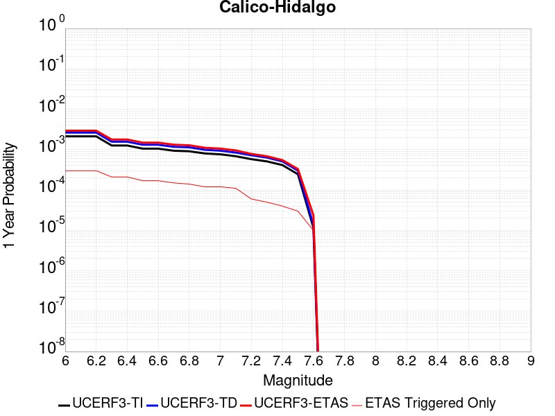 | 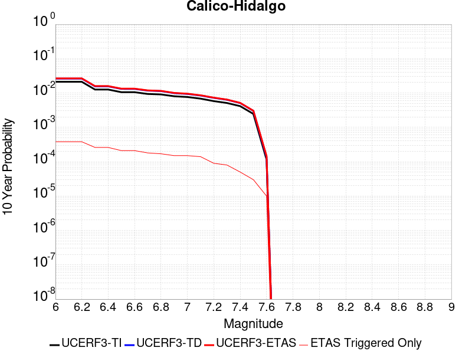 |

| Magnitude | 1 wk TI Prob | 1 wk TD Prob | 1 wk ETAS Prob | 1 wk ETAS/TD Gain | 1 wk ETAS Triggered Only | 1 mo TI Prob | 1 mo TD Prob | 1 mo ETAS Prob | 1 mo ETAS/TD Gain | 1 mo ETAS Triggered Only | 1 yr TI Prob | 1 yr TD Prob | 1 yr ETAS Prob | 1 yr ETAS/TD Gain | 1 yr ETAS Triggered Only | 10 yr TI Prob | 10 yr TD Prob | 10 yr ETAS Prob | 10 yr ETAS/TD Gain | 10 yr ETAS Triggered Only |
|-----|-----|-----|-----|-----|-----|-----|-----|-----|-----|-----|-----|-----|-----|-----|-----|-----|-----|-----|-----|-----|
| 6.0 | 4.0906612E-5 | 5.0704355E-5 | 2.0069676E-4 | 3.9581757 | 1.5E-4 | 1.7530227E-4 | 2.1728857E-4 | 4.1724512E-4 | 1.920235 | 2.0E-4 | 0.0021322158 | 0.002642678 | 0.0029418853 | 1.1132212 | 3.0E-4 | 0.02111873 | 0.026152814 | 0.026522877 | 1.01415 | 3.8E-4 |
| 6.1 | 4.0906612E-5 | 5.0704355E-5 | 2.0069676E-4 | 3.9581757 | 1.5E-4 | 1.7530227E-4 | 2.1728857E-4 | 4.1724512E-4 | 1.920235 | 2.0E-4 | 0.0021322158 | 0.002642678 | 0.0029418853 | 1.1132212 | 3.0E-4 | 0.02111873 | 0.026152814 | 0.026522877 | 1.01415 | 3.8E-4 |
| 6.2 | 4.0906612E-5 | 5.0704355E-5 | 2.0069676E-4 | 3.9581757 | 1.5E-4 | 1.7530227E-4 | 2.1728857E-4 | 4.1724512E-4 | 1.920235 | 2.0E-4 | 0.0021322158 | 0.002642678 | 0.0029418853 | 1.1132212 | 3.0E-4 | 0.02111873 | 0.026152814 | 0.026522877 | 1.01415 | 3.8E-4 |
| 6.3 | 2.4242801E-5 | 3.0090967E-5 | 1.4008765E-4 | 4.6554723 | 1.1E-4 | 1.0389358E-4 | 1.289551E-4 | 2.6893706E-4 | 2.085509 | 1.4E-4 | 0.0012641704 | 0.0015689312 | 0.0017786017 | 1.1336391 | 2.1E-4 | 0.01257003 | 0.015582229 | 0.015838178 | 1.0164257 | 2.6E-4 |
| 6.4 | 2.4242801E-5 | 3.0090967E-5 | 1.4008765E-4 | 4.6554723 | 1.1E-4 | 1.0389358E-4 | 1.289551E-4 | 2.6893706E-4 | 2.085509 | 1.4E-4 | 0.0012641704 | 0.0015689312 | 0.0017786017 | 1.1336391 | 2.1E-4 | 0.01257003 | 0.015582229 | 0.015838178 | 1.0164257 | 2.6E-4 |
| 6.5 | 2.0286952E-5 | 2.5316054E-5 | 1.0531403E-4 | 4.15997 | 8.0E-5 | 8.694118E-5 | 1.0849296E-4 | 2.1848103E-4 | 2.0137806 | 1.1E-4 | 0.0010579949 | 0.0013201186 | 0.0014898941 | 1.1286063 | 1.7E-4 | 0.010529719 | 0.013124701 | 0.013331944 | 1.0157903 | 2.1E-4 |
| 6.6 | 2.0269223E-5 | 2.5297004E-5 | 1.0529498E-4 | 4.1623497 | 8.0E-5 | 8.6865206E-5 | 1.08411325E-4 | 2.183994E-4 | 2.0145442 | 1.1E-4 | 0.0010570707 | 0.0013191258 | 0.0014889016 | 1.1287032 | 1.7E-4 | 0.010520565 | 0.01311489 | 0.013322136 | 1.0158024 | 2.1E-4 |
| 6.7 | 1.799852E-5 | 2.2540933E-5 | 8.2539584E-5 | 3.6617641 | 6.0E-5 | 7.713423E-5 | 9.660051E-5 | 1.8659182E-4 | 1.9315821 | 9.0E-5 | 9.3870464E-4 | 0.0011754911 | 0.0013253149 | 1.1274562 | 1.5E-4 | 0.009347493 | 0.011694346 | 0.01187224 | 1.015212 | 1.8E-4 |
| 6.8 | 1.7458793E-5 | 2.184258E-5 | 8.184127E-5 | 3.7468684 | 6.0E-5 | 7.4821255E-5 | 9.360778E-5 | 1.8359936E-4 | 1.9613686 | 9.0E-5 | 9.10568E-4 | 0.0011390933 | 0.0012789338 | 1.1227648 | 1.4E-4 | 0.009068459 | 0.011334131 | 0.0115022035 | 1.0148289 | 1.7E-4 |
| 6.9 | 1.542884E-5 | 1.9026285E-5 | 5.9025526E-5 | 3.1023147 | 4.0E-5 | 6.612192E-5 | 8.153875E-5 | 1.5153304E-4 | 1.8584175 | 7.0E-5 | 8.04737E-4 | 9.922953E-4 | 0.0011121762 | 1.1208117 | 1.2E-4 | 0.008018291 | 0.009880043 | 0.010028561 | 1.0150322 | 1.5E-4 |
| 7.0 | 1.468253E-5 | 1.803109E-5 | 5.803037E-5 | 3.2183504 | 4.0E-5 | 6.292361E-5 | 7.727389E-5 | 1.4726848E-4 | 1.9057987 | 7.0E-5 | 7.658257E-4 | 9.4041653E-4 | 0.0010603038 | 1.127483 | 1.2E-4 | 0.0076319184 | 0.009365736 | 0.009514331 | 1.0158658 | 1.5E-4 |
| 7.1 | 1.3139281E-5 | 1.620139E-5 | 5.620074E-5 | 3.468884 | 4.0E-5 | 5.6309986E-5 | 6.943275E-5 | 1.394279E-4 | 2.0080998 | 7.0E-5 | 6.853584E-4 | 8.4502844E-4 | 9.549355E-4 | 1.1300632 | 1.1E-4 | 0.0068324856 | 0.008419449 | 0.0085582705 | 1.0164882 | 1.4E-4 |
| 7.2 | 1.1127404E-5 | 1.3867038E-5 | 3.386676E-5 | 2.442249 | 2.0E-5 | 4.7688E-5 | 5.9428872E-5 | 8.942709E-5 | 1.5047752 | 3.0E-5 | 5.8044674E-4 | 7.233172E-4 | 7.8327383E-4 | 1.0828911 | 6.0E-5 | 0.0057893298 | 0.007210737 | 0.007300088 | 1.0123913 | 9.0E-5 |
| 7.3 | 9.808154E-6 | 1.2176586E-5 | 3.2176344E-5 | 2.6424766 | 2.0E-5 | 4.2034266E-5 | 5.2184383E-5 | 7.218334E-5 | 1.3832364 | 2.0E-5 | 5.11647E-4 | 6.351704E-4 | 6.851386E-4 | 1.0786691 | 5.0E-5 | 0.0051047057 | 0.006334625 | 0.0064141187 | 1.012549 | 8.0E-5 |
| 7.4 | 7.942452E-6 | 9.792348E-6 | 1.979225E-5 | 2.0211957 | 1.0E-5 | 3.4038632E-5 | 4.1966585E-5 | 5.1966163E-5 | 1.2382748 | 1.0E-5 | 4.1434157E-4 | 5.108328E-4 | 5.508124E-4 | 1.0782635 | 4.0E-5 | 0.0041356985 | 0.005097527 | 0.0051472723 | 1.0097587 | 5.0E-5 |
| 7.5 | 4.7121216E-6 | 5.7729717E-6 | 1.5772914E-5 | 2.7322001 | 1.0E-5 | 2.019465E-5 | 2.4741115E-5 | 3.4740868E-5 | 1.4041755 | 1.0E-5 | 2.4584212E-4 | 3.011891E-4 | 3.3118005E-4 | 1.0995752 | 3.0E-5 | 0.0024557032 | 0.0030085614 | 0.0030384713 | 1.0099416 | 3.0E-5 |
| 7.6 | 2.21172E-7 | 2.6040198E-7 | 2.6040198E-7 | 1.0 | 0.0 | 9.478797E-7 | 1.1160082E-6 | 1.1160082E-6 | 1.0 | 0.0 | 1.1540374E-5 | 1.3587343E-5 | 2.3587207E-5 | 1.7359691 | 1.0E-5 | 1.1539775E-4 | 1.3586794E-4 | 1.4586658E-4 | 1.0735909 | 1.0E-5 |

## San Andreas (San Gorgonio Pass-Garnet HIll)
*[(top)](#table-of-contents)*

| 1 Week | 1 Month | 1 Year | 10 Year |
|-----|-----|-----|-----|
|  |  |  |  |

| Magnitude | 1 wk TI Prob | 1 wk TD Prob | 1 wk ETAS Prob | 1 wk ETAS/TD Gain | 1 wk ETAS Triggered Only | 1 mo TI Prob | 1 mo TD Prob | 1 mo ETAS Prob | 1 mo ETAS/TD Gain | 1 mo ETAS Triggered Only | 1 yr TI Prob | 1 yr TD Prob | 1 yr ETAS Prob | 1 yr ETAS/TD Gain | 1 yr ETAS Triggered Only | 10 yr TI Prob | 10 yr TD Prob | 10 yr ETAS Prob | 10 yr ETAS/TD Gain | 10 yr ETAS Triggered Only |
|-----|-----|-----|-----|-----|-----|-----|-----|-----|-----|-----|-----|-----|-----|-----|-----|-----|-----|-----|-----|-----|
| 6.0 | 8.31567E-5 | 2.3384395E-4 | 3.6381357E-4 | 1.5557963 | 1.3E-4 | 3.5633717E-4 | 0.0010018025 | 0.0011816222 | 1.1794962 | 1.8E-4 | 0.004329778 | 0.012128622 | 0.012405226 | 1.0228059 | 2.8E-4 | 0.042463828 | 0.11258187 | 0.11291022 | 1.0029165 | 3.7E-4 |
| 6.1 | 8.31567E-5 | 2.3384395E-4 | 3.6381357E-4 | 1.5557963 | 1.3E-4 | 3.5633717E-4 | 0.0010018025 | 0.0011816222 | 1.1794962 | 1.8E-4 | 0.004329778 | 0.012128622 | 0.012405226 | 1.0228059 | 2.8E-4 | 0.042463828 | 0.11258187 | 0.11291022 | 1.0029165 | 3.7E-4 |
| 6.2 | 8.31567E-5 | 2.3384395E-4 | 3.6381357E-4 | 1.5557963 | 1.3E-4 | 3.5633717E-4 | 0.0010018025 | 0.0011816222 | 1.1794962 | 1.8E-4 | 0.004329778 | 0.012128622 | 0.012405226 | 1.0228059 | 2.8E-4 | 0.042463828 | 0.11258187 | 0.11291022 | 1.0029165 | 3.7E-4 |
| 6.3 | 8.31567E-5 | 2.3384395E-4 | 3.6381357E-4 | 1.5557963 | 1.3E-4 | 3.5633717E-4 | 0.0010018025 | 0.0011816222 | 1.1794962 | 1.8E-4 | 0.004329778 | 0.012128622 | 0.012405226 | 1.0228059 | 2.8E-4 | 0.042463828 | 0.11258187 | 0.11291022 | 1.0029165 | 3.7E-4 |
| 6.4 | 8.059055E-5 | 2.2941893E-4 | 3.5938912E-4 | 1.566519 | 1.3E-4 | 3.4534236E-4 | 9.828559E-4 | 0.001162679 | 1.1829598 | 1.8E-4 | 0.0041964394 | 0.011900819 | 0.012177487 | 1.0232478 | 2.8E-4 | 0.041180745 | 0.110562965 | 0.11089206 | 1.0029765 | 3.7E-4 |
| 6.5 | 8.059055E-5 | 2.2941893E-4 | 3.5938912E-4 | 1.566519 | 1.3E-4 | 3.4534236E-4 | 9.828559E-4 | 0.001162679 | 1.1829598 | 1.8E-4 | 0.0041964394 | 0.011900819 | 0.012177487 | 1.0232478 | 2.8E-4 | 0.041180745 | 0.110562965 | 0.11089206 | 1.0029765 | 3.7E-4 |
| 6.6 | 7.619237E-5 | 2.2186468E-4 | 3.5183583E-4 | 1.5858128 | 1.3E-4 | 3.2649786E-4 | 9.5050444E-4 | 0.0011303333 | 1.1891931 | 1.8E-4 | 0.0039678677 | 0.0115115335 | 0.011778425 | 1.0231848 | 2.7E-4 | 0.03897764 | 0.10709954 | 0.10742099 | 1.0030013 | 3.6E-4 |
| 6.7 | 7.440636E-5 | 2.1862281E-4 | 3.485944E-4 | 1.5945015 | 1.3E-4 | 3.188454E-4 | 9.3662075E-4 | 0.0011164522 | 1.1920003 | 1.8E-4 | 0.0038750346 | 0.011344268 | 0.0116112055 | 1.0235306 | 2.7E-4 | 0.038081564 | 0.1056081 | 0.10593008 | 1.0030488 | 3.6E-4 |
| 6.8 | 7.3735864E-5 | 2.1709445E-4 | 3.4706623E-4 | 1.5986876 | 1.3E-4 | 3.1597257E-4 | 9.300753E-4 | 0.0011099079 | 1.1933527 | 1.8E-4 | 0.0038401815 | 0.011265406 | 0.011532365 | 1.0236971 | 2.7E-4 | 0.03774495 | 0.104909696 | 0.105231926 | 1.0030715 | 3.6E-4 |
| 6.9 | 7.27575E-5 | 2.1478413E-4 | 3.447562E-4 | 1.6051289 | 1.3E-4 | 3.117806E-4 | 9.20181E-4 | 0.0010900246 | 1.1845763 | 1.7E-4 | 0.003789323 | 0.011146182 | 0.011393395 | 1.0221792 | 2.5E-4 | 0.037253562 | 0.10385753 | 0.104162216 | 1.0029337 | 3.4E-4 |
| 7.0 | 7.102591E-5 | 2.1062451E-4 | 3.4059712E-4 | 1.6170821 | 1.3E-4 | 3.0436125E-4 | 9.023664E-4 | 0.001072213 | 1.1882235 | 1.7E-4 | 0.003699303 | 0.010931484 | 0.0111787515 | 1.0226197 | 2.5E-4 | 0.03638325 | 0.101959534 | 0.102264866 | 1.0029947 | 3.4E-4 |
| 7.1 | 7.028513E-5 | 2.0898094E-4 | 3.3895377E-4 | 1.6219363 | 1.3E-4 | 3.0118722E-4 | 8.953274E-4 | 0.0010651752 | 1.1897047 | 1.7E-4 | 0.0036607897 | 0.010846641 | 0.011093929 | 1.0227987 | 2.5E-4 | 0.036010686 | 0.10120243 | 0.10150802 | 1.0030196 | 3.4E-4 |
| 7.2 | 6.8498244E-5 | 2.050596E-4 | 3.3503294E-4 | 1.633832 | 1.3E-4 | 2.9353087E-4 | 8.7853306E-4 | 0.0010483838 | 1.1933343 | 1.7E-4 | 0.003567883 | 0.0106441835 | 0.010891522 | 1.023237 | 2.5E-4 | 0.035111405 | 0.09939449 | 0.0997007 | 1.0030807 | 3.4E-4 |
| 7.3 | 6.622592E-5 | 1.9733235E-4 | 3.273067E-4 | 1.6586571 | 1.3E-4 | 2.8379448E-4 | 8.4543816E-4 | 0.0010152945 | 1.2009091 | 1.7E-4 | 0.0034497243 | 0.010245111 | 0.010492549 | 1.0241519 | 2.5E-4 | 0.033966612 | 0.095891245 | 0.09619865 | 1.0032057 | 3.4E-4 |
| 7.4 | 5.1050705E-5 | 1.4690042E-4 | 2.7688133E-4 | 1.8848232 | 1.3E-4 | 2.1877038E-4 | 6.294222E-4 | 7.993152E-4 | 1.2699189 | 1.7E-4 | 0.002660276 | 0.007636482 | 0.007874649 | 1.0311881 | 2.4E-4 | 0.02628654 | 0.07286554 | 0.07316222 | 1.0040716 | 3.2E-4 |
| 7.5 | 3.9302922E-5 | 1.11307076E-4 | 2.412926E-4 | 2.1678102 | 1.3E-4 | 1.6843023E-4 | 4.7694342E-4 | 6.468623E-4 | 1.3562664 | 1.7E-4 | 0.0020487092 | 0.0057913954 | 0.0060300054 | 1.0412008 | 2.4E-4 | 0.020299247 | 0.05601151 | 0.056313585 | 1.0053931 | 3.2E-4 |
| 7.6 | 2.9851626E-5 | 8.4956984E-5 | 2.0494679E-4 | 2.4123595 | 1.2E-4 | 1.2792926E-4 | 3.6405068E-4 | 5.2399246E-4 | 1.4393393 | 1.6E-4 | 0.0015564259 | 0.0044233347 | 0.004642362 | 1.0495162 | 2.2E-4 | 0.0154556995 | 0.043196145 | 0.043483187 | 1.0066451 | 3.0E-4 |
| 7.7 | 2.1135214E-5 | 6.353527E-5 | 1.8352765E-4 | 2.8885949 | 1.2E-4 | 9.0576345E-5 | 2.722656E-4 | 4.3222206E-4 | 1.5875014 | 1.6E-4 | 0.0011022091 | 0.0033098008 | 0.0035290725 | 1.0662493 | 2.2E-4 | 0.010967582 | 0.03258456 | 0.03286511 | 1.0086099 | 2.9E-4 |
| 7.8 | 1.883379E-5 | 5.564576E-5 | 1.6563963E-4 | 2.9766803 | 1.1E-4 | 8.0713755E-5 | 2.3846005E-4 | 3.884243E-4 | 1.6288862 | 1.5E-4 | 9.822468E-4 | 0.002899389 | 0.0031087801 | 1.072219 | 2.1E-4 | 0.0097791655 | 0.028696978 | 0.028968943 | 1.0094771 | 2.8E-4 |
| 7.9 | 1.5156185E-5 | 4.1662403E-5 | 1.3165866E-4 | 3.160131 | 9.0E-5 | 6.495346E-5 | 1.7854095E-4 | 2.9851953E-4 | 1.6719947 | 1.2E-4 | 7.9052144E-4 | 0.0021715704 | 0.0023511795 | 1.0827093 | 1.8E-4 | 0.007877152 | 0.021760946 | 0.022005506 | 1.0112385 | 2.5E-4 |
| 8.0 | 1.1405907E-5 | 2.9976925E-5 | 8.9975125E-5 | 3.0014794 | 6.0E-5 | 4.8881542E-5 | 1.2846621E-4 | 2.0845594E-4 | 1.6226518 | 8.0E-5 | 5.9497025E-4 | 0.0015629551 | 0.0016727832 | 1.0702695 | 1.1E-4 | 0.005933798 | 0.015774013 | 0.015951173 | 1.0112312 | 1.8E-4 |
| 8.1 | 4.3511436E-6 | 7.369465E-6 | 1.7369392E-5 | 2.3569405 | 1.0E-5 | 1.8647626E-5 | 3.158304E-5 | 4.1582723E-5 | 1.3166156 | 1.0E-5 | 2.2701119E-4 | 3.844558E-4 | 3.9445196E-4 | 1.0260007 | 1.0E-5 | 0.0022677942 | 0.0041165445 | 0.0041364618 | 1.0048385 | 2.0E-5 |
| 8.2 | 2.3042528E-6 | 2.7328301E-6 | 1.2732803E-5 | 4.6592 | 1.0E-5 | 9.875332E-6 | 1.1712076E-5 | 2.171196E-5 | 1.8538096 | 1.0E-5 | 1.2022553E-4 | 1.4258524E-4 | 1.5258382E-4 | 1.0701234 | 1.0E-5 | 0.0012016051 | 0.0015979637 | 0.0016179318 | 1.0124959 | 2.0E-5 |
| 8.3 | 5.202968E-7 | 3.1590292E-7 | 3.1590292E-7 | 1.0 | 0.0 | 2.2298414E-6 | 1.353869E-6 | 1.353869E-6 | 1.0 | 0.0 | 2.714798E-5 | 1.6483244E-5 | 1.6483244E-5 | 1.0 | 0.0 | 2.7144665E-4 | 1.955901E-4 | 1.955901E-4 | 1.0 | 0.0 |

## Red Pass
*[(top)](#table-of-contents)*

| 1 Week | 1 Month | 1 Year | 10 Year |
|-----|-----|-----|-----|
|  |  |  |  |

| Magnitude | 1 wk TI Prob | 1 wk TD Prob | 1 wk ETAS Prob | 1 wk ETAS/TD Gain | 1 wk ETAS Triggered Only | 1 mo TI Prob | 1 mo TD Prob | 1 mo ETAS Prob | 1 mo ETAS/TD Gain | 1 mo ETAS Triggered Only | 1 yr TI Prob | 1 yr TD Prob | 1 yr ETAS Prob | 1 yr ETAS/TD Gain | 1 yr ETAS Triggered Only | 10 yr TI Prob | 10 yr TD Prob | 10 yr ETAS Prob | 10 yr ETAS/TD Gain | 10 yr ETAS Triggered Only |
|-----|-----|-----|-----|-----|-----|-----|-----|-----|-----|-----|-----|-----|-----|-----|-----|-----|-----|-----|-----|-----|
| 6.0 | 8.258278E-6 | 8.551265E-6 | 9.8550496E-5 | 11.524669 | 9.0E-5 | 3.539214E-5 | 3.6647863E-5 | 1.666431E-4 | 4.5471435 | 1.3E-4 | 4.308141E-4 | 4.4611428E-4 | 6.860072E-4 | 1.5377388 | 2.4E-4 | 0.0042997985 | 0.004453945 | 0.0047924304 | 1.0759969 | 3.4E-4 |
| 6.1 | 3.649988E-6 | 3.7753161E-6 | 3.3775203E-5 | 8.946324 | 3.0E-5 | 1.5642712E-5 | 1.6179853E-5 | 7.617888E-5 | 4.708256 | 6.0E-5 | 1.9043336E-4 | 1.9697666E-4 | 3.06955E-4 | 1.5583318 | 1.1E-4 | 0.0019027026 | 0.001968488 | 0.0021481337 | 1.0912608 | 1.8E-4 |
| 6.2 | 3.649988E-6 | 3.7753161E-6 | 3.3775203E-5 | 8.946324 | 3.0E-5 | 1.5642712E-5 | 1.6179853E-5 | 7.617888E-5 | 4.708256 | 6.0E-5 | 1.9043336E-4 | 1.9697666E-4 | 3.06955E-4 | 1.5583318 | 1.1E-4 | 0.0019027026 | 0.001968488 | 0.0021481337 | 1.0912608 | 1.8E-4 |
| 6.3 | 1.3924937E-6 | 1.4411166E-6 | 2.1441088E-5 | 14.878107 | 2.0E-5 | 5.9678164E-6 | 6.1762075E-6 | 3.617602E-5 | 5.85732 | 3.0E-5 | 7.265574E-5 | 7.519415E-5 | 1.3518964E-4 | 1.7978745 | 6.0E-5 | 7.263199E-4 | 7.518258E-4 | 8.4175816E-4 | 1.1196185 | 9.0E-5 |
| 6.4 | 1.3924937E-6 | 1.4411166E-6 | 2.1441088E-5 | 14.878107 | 2.0E-5 | 5.9678164E-6 | 6.1762075E-6 | 3.617602E-5 | 5.85732 | 3.0E-5 | 7.265574E-5 | 7.519415E-5 | 1.3518964E-4 | 1.7978745 | 6.0E-5 | 7.263199E-4 | 7.518258E-4 | 8.4175816E-4 | 1.1196185 | 9.0E-5 |
| 6.5 | 9.876812E-7 | 1.0221912E-6 | 1.1022181E-5 | 10.782895 | 1.0E-5 | 4.2329125E-6 | 4.3808195E-6 | 2.4380732E-5 | 5.5653358 | 2.0E-5 | 5.153449E-5 | 5.3336476E-5 | 8.3334875E-5 | 1.5624368 | 3.0E-5 | 5.1522546E-4 | 5.333648E-4 | 5.9333275E-4 | 1.1124333 | 6.0E-5 |

## Manix-Afton Hills
*[(top)](#table-of-contents)*

| 1 Week | 1 Month | 1 Year | 10 Year |
|-----|-----|-----|-----|
|  | 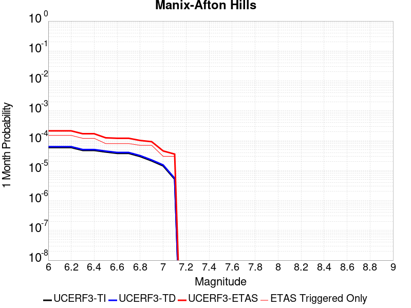 |  |  |

| Magnitude | 1 wk TI Prob | 1 wk TD Prob | 1 wk ETAS Prob | 1 wk ETAS/TD Gain | 1 wk ETAS Triggered Only | 1 mo TI Prob | 1 mo TD Prob | 1 mo ETAS Prob | 1 mo ETAS/TD Gain | 1 mo ETAS Triggered Only | 1 yr TI Prob | 1 yr TD Prob | 1 yr ETAS Prob | 1 yr ETAS/TD Gain | 1 yr ETAS Triggered Only | 10 yr TI Prob | 10 yr TD Prob | 10 yr ETAS Prob | 10 yr ETAS/TD Gain | 10 yr ETAS Triggered Only |
|-----|-----|-----|-----|-----|-----|-----|-----|-----|-----|-----|-----|-----|-----|-----|-----|-----|-----|-----|-----|-----|
| 6.0 | 1.3783202E-5 | 1.47110895E-5 | 1.1470962E-4 | 7.797493 | 1.0E-4 | 5.906953E-5 | 6.30461E-5 | 2.1303665E-4 | 3.3790612 | 1.5E-4 | 7.189342E-4 | 7.6733343E-4 | 0.0010071493 | 1.3125315 | 2.4E-4 | 0.0071661277 | 0.007648596 | 0.007995919 | 1.04541 | 3.5E-4 |
| 6.1 | 1.3783202E-5 | 1.47110895E-5 | 1.1470962E-4 | 7.797493 | 1.0E-4 | 5.906953E-5 | 6.30461E-5 | 2.1303665E-4 | 3.3790612 | 1.5E-4 | 7.189342E-4 | 7.6733343E-4 | 0.0010071493 | 1.3125315 | 2.4E-4 | 0.0071661277 | 0.007648596 | 0.007995919 | 1.04541 | 3.5E-4 |
| 6.2 | 1.3783202E-5 | 1.47110895E-5 | 1.1470962E-4 | 7.797493 | 1.0E-4 | 5.906953E-5 | 6.30461E-5 | 2.1303665E-4 | 3.3790612 | 1.5E-4 | 7.189342E-4 | 7.6733343E-4 | 0.0010071493 | 1.3125315 | 2.4E-4 | 0.0071661277 | 0.007648596 | 0.007995919 | 1.04541 | 3.5E-4 |
| 6.3 | 1.10494875E-5 | 1.1793136E-5 | 9.179219E-5 | 7.7835274 | 8.0E-5 | 4.7354086E-5 | 5.054109E-5 | 1.7053503E-4 | 3.3741858 | 1.2E-4 | 5.763835E-4 | 6.151744E-4 | 7.950637E-4 | 1.2924199 | 1.8E-4 | 0.005748908 | 0.0061357557 | 0.00639416 | 1.0421146 | 2.6E-4 |
| 6.4 | 1.10494875E-5 | 1.1793136E-5 | 9.179219E-5 | 7.7835274 | 8.0E-5 | 4.7354086E-5 | 5.054109E-5 | 1.7053503E-4 | 3.3741858 | 1.2E-4 | 5.763835E-4 | 6.151744E-4 | 7.950637E-4 | 1.2924199 | 1.8E-4 | 0.005748908 | 0.0061357557 | 0.00639416 | 1.0421146 | 2.6E-4 |
| 6.5 | 9.788949E-6 | 1.045432E-5 | 6.0453796E-5 | 5.782662 | 5.0E-5 | 4.1951964E-5 | 4.480351E-5 | 1.2479993E-4 | 2.7854943 | 8.0E-5 | 5.1064545E-4 | 5.453555E-4 | 6.752846E-4 | 1.2382467 | 1.3E-4 | 0.0050947363 | 0.0054410985 | 0.005649956 | 1.0383852 | 2.1E-4 |
| 6.6 | 8.810006E-6 | 9.4136285E-6 | 5.9413156E-5 | 6.3113985 | 5.0E-5 | 3.775662E-5 | 4.0343548E-5 | 1.2034032E-4 | 2.982889 | 8.0E-5 | 4.5958988E-4 | 4.9108086E-4 | 6.0102687E-4 | 1.2238857 | 1.1E-4 | 0.0045864056 | 0.004900839 | 0.005050104 | 1.030457 | 1.5E-4 |
| 6.7 | 8.80128E-6 | 9.404108E-6 | 5.940364E-5 | 6.3167753 | 5.0E-5 | 3.7719226E-5 | 4.0302748E-5 | 1.20299526E-4 | 2.9848964 | 8.0E-5 | 4.591348E-4 | 4.9058435E-4 | 6.005304E-4 | 1.2241124 | 1.1E-4 | 0.004581874 | 0.0048958957 | 0.0050451616 | 1.0304879 | 1.5E-4 |
| 6.8 | 6.8994877E-6 | 7.380076E-6 | 4.737978E-5 | 6.4199586 | 4.0E-5 | 2.9568899E-5 | 3.162856E-5 | 1.0162635E-4 | 3.2131195 | 7.0E-5 | 3.5994186E-4 | 3.8501783E-4 | 4.749832E-4 | 1.2336653 | 9.0E-5 | 0.003593594 | 0.0038443129 | 0.0039638514 | 1.0310949 | 1.2E-4 |
| 6.9 | 4.9328037E-6 | 5.2709615E-6 | 4.527075E-5 | 8.588708 | 4.0E-5 | 2.1140417E-5 | 2.2589675E-5 | 9.2588096E-5 | 4.098691 | 7.0E-5 | 2.5735417E-4 | 2.7500073E-4 | 3.5497872E-4 | 1.2908283 | 8.0E-5 | 0.0025705635 | 0.0027472095 | 0.0028369622 | 1.0326705 | 9.0E-5 |
| 7.0 | 3.347973E-6 | 3.59003E-6 | 1.35899945E-5 | 3.7854822 | 1.0E-5 | 1.4348378E-5 | 1.5385775E-5 | 4.5385314E-5 | 2.949823 | 3.0E-5 | 1.746775E-4 | 1.8730981E-4 | 2.2730233E-4 | 1.2135099 | 4.0E-5 | 0.0017454025 | 0.0018719219 | 0.0019218284 | 1.0266606 | 5.0E-5 |
| 7.1 | 1.2073567E-6 | 1.293482E-6 | 1.12934695E-5 | 8.73106 | 1.0E-5 | 5.1743755E-6 | 5.543492E-6 | 3.5543326E-5 | 6.411721 | 3.0E-5 | 6.29962E-5 | 6.749156E-5 | 1.0748886E-4 | 1.5926267 | 4.0E-5 | 6.297835E-4 | 6.7487074E-4 | 7.1484374E-4 | 1.0592306 | 4.0E-5 |

## Scodie Lineament
*[(top)](#table-of-contents)*

| 1 Week | 1 Month | 1 Year | 10 Year |
|-----|-----|-----|-----|
|  |  | 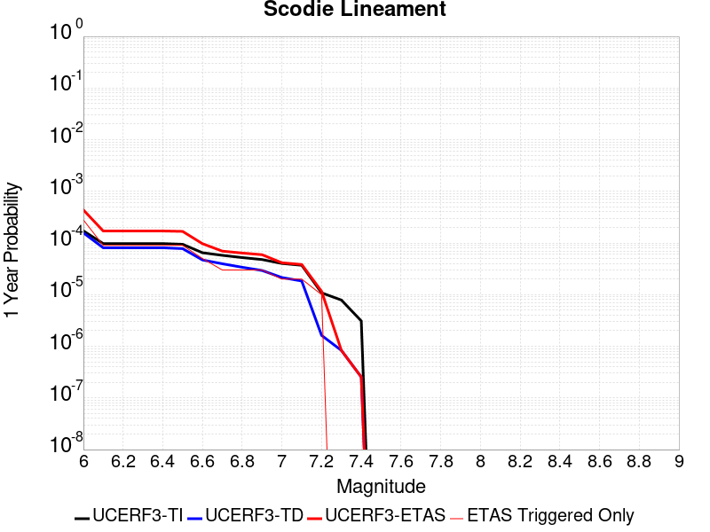 |  |

| Magnitude | 1 wk TI Prob | 1 wk TD Prob | 1 wk ETAS Prob | 1 wk ETAS/TD Gain | 1 wk ETAS Triggered Only | 1 mo TI Prob | 1 mo TD Prob | 1 mo ETAS Prob | 1 mo ETAS/TD Gain | 1 mo ETAS Triggered Only | 1 yr TI Prob | 1 yr TD Prob | 1 yr ETAS Prob | 1 yr ETAS/TD Gain | 1 yr ETAS Triggered Only | 10 yr TI Prob | 10 yr TD Prob | 10 yr ETAS Prob | 10 yr ETAS/TD Gain | 10 yr ETAS Triggered Only |
|-----|-----|-----|-----|-----|-----|-----|-----|-----|-----|-----|-----|-----|-----|-----|-----|-----|-----|-----|-----|-----|
| 6.0 | 3.2919327E-6 | 3.0133303E-6 | 9.301306E-5 | 30.867195 | 9.0E-5 | 1.4108206E-5 | 1.2914227E-5 | 1.6291229E-4 | 12.614946 | 1.5E-4 | 1.7175387E-4 | 1.5722254E-4 | 4.3717853E-4 | 2.780635 | 2.8E-4 | 0.0017162118 | 0.0015714248 | 0.0019108905 | 1.2160242 | 3.4E-4 |
| 6.1 | 1.8663811E-6 | 1.5490382E-6 | 4.1548978E-5 | 26.822435 | 4.0E-5 | 7.998751E-6 | 6.6387206E-6 | 6.663832E-5 | 10.037826 | 6.0E-5 | 9.738045E-5 | 8.082393E-5 | 1.7081665E-4 | 2.1134417 | 9.0E-5 | 9.7337784E-4 | 8.079941E-4 | 9.1790524E-4 | 1.1360296 | 1.1E-4 |
| 6.2 | 1.8663811E-6 | 1.5490382E-6 | 4.1548978E-5 | 26.822435 | 4.0E-5 | 7.998751E-6 | 6.6387206E-6 | 6.663832E-5 | 10.037826 | 6.0E-5 | 9.738045E-5 | 8.082393E-5 | 1.7081665E-4 | 2.1134417 | 9.0E-5 | 9.7337784E-4 | 8.079941E-4 | 9.1790524E-4 | 1.1360296 | 1.1E-4 |
| 6.3 | 1.8663811E-6 | 1.5490382E-6 | 4.1548978E-5 | 26.822435 | 4.0E-5 | 7.998751E-6 | 6.6387206E-6 | 6.663832E-5 | 10.037826 | 6.0E-5 | 9.738045E-5 | 8.082393E-5 | 1.7081665E-4 | 2.1134417 | 9.0E-5 | 9.7337784E-4 | 8.079941E-4 | 9.1790524E-4 | 1.1360296 | 1.1E-4 |
| 6.4 | 1.8663811E-6 | 1.5490382E-6 | 4.1548978E-5 | 26.822435 | 4.0E-5 | 7.998751E-6 | 6.6387206E-6 | 6.663832E-5 | 10.037826 | 6.0E-5 | 9.738045E-5 | 8.082393E-5 | 1.7081665E-4 | 2.1134417 | 9.0E-5 | 9.7337784E-4 | 8.079941E-4 | 9.1790524E-4 | 1.1360296 | 1.1E-4 |
| 6.5 | 1.8106311E-6 | 1.4909722E-6 | 4.1490912E-5 | 27.828094 | 4.0E-5 | 7.759824E-6 | 6.389868E-6 | 6.638948E-5 | 10.389806 | 6.0E-5 | 9.447177E-5 | 7.779436E-5 | 1.6778735E-4 | 2.1568062 | 9.0E-5 | 9.4431615E-4 | 7.7771995E-4 | 8.8763435E-4 | 1.141329 | 1.1E-4 |
| 6.6 | 1.2414679E-6 | 8.9974395E-7 | 4.0899708E-5 | 45.45705 | 4.0E-5 | 5.320566E-6 | 3.85604E-6 | 4.3855885E-5 | 11.373296 | 4.0E-5 | 6.477596E-5 | 4.6946367E-5 | 9.694402E-5 | 2.064995 | 5.0E-5 | 6.475708E-4 | 4.6937316E-4 | 5.29345E-4 | 1.1277701 | 6.0E-5 |
| 6.7 | 1.1062215E-6 | 7.594193E-7 | 2.0759404E-5 | 27.335892 | 2.0E-5 | 4.7409408E-6 | 3.2546504E-6 | 2.3254586E-5 | 7.145033 | 2.0E-5 | 5.7719422E-5 | 3.962472E-5 | 6.962353E-5 | 1.7570732 | 3.0E-5 | 5.770443E-4 | 3.9618355E-4 | 4.361677E-4 | 1.1009233 | 4.0E-5 |
| 6.8 | 1.0006736E-6 | 6.5002786E-7 | 2.0650015E-5 | 31.76789 | 2.0E-5 | 4.288594E-6 | 2.7858312E-6 | 2.2785776E-5 | 8.179166 | 2.0E-5 | 5.221238E-5 | 3.391703E-5 | 6.391601E-5 | 1.8844814 | 3.0E-5 | 5.220012E-4 | 3.3912458E-4 | 3.7911104E-4 | 1.1179107 | 4.0E-5 |
| 6.9 | 9.167364E-7 | 5.6315065E-7 | 2.0563139E-5 | 36.514454 | 2.0E-5 | 3.9288643E-6 | 2.413501E-6 | 2.2413453E-5 | 9.286697 | 2.0E-5 | 4.7832873E-5 | 2.9384037E-5 | 5.9383154E-5 | 2.0209324 | 3.0E-5 | 4.782258E-4 | 2.9380718E-4 | 3.3379544E-4 | 1.1361037 | 4.0E-5 |
| 7.0 | 7.6987664E-7 | 4.113265E-7 | 1.0411322E-5 | 25.311577 | 1.0E-5 | 3.2994672E-6 | 1.7628269E-6 | 1.176281E-5 | 6.6726966 | 1.0E-5 | 4.0170275E-5 | 2.1462245E-5 | 4.1461815E-5 | 1.931849 | 2.0E-5 | 4.0163012E-4 | 2.1460558E-4 | 2.3460129E-4 | 1.0931742 | 2.0E-5 |
| 7.1 | 7.1038727E-7 | 3.5210306E-7 | 1.03521E-5 | 29.400766 | 1.0E-5 | 3.0445133E-6 | 1.5090123E-6 | 1.1508997E-5 | 7.626841 | 1.0E-5 | 3.706632E-5 | 1.8372106E-5 | 3.8371738E-5 | 2.0885868 | 2.0E-5 | 3.7060137E-4 | 1.8370937E-4 | 2.037057E-4 | 1.1088476 | 2.0E-5 |
| 7.2 | 2.0799602E-7 | 3.1178534E-8 | 1.0031178E-5 | 321.7335 | 1.0E-5 | 8.914113E-7 | 1.3362228E-7 | 1.0133621E-5 | 75.83781 | 1.0E-5 | 1.0852878E-5 | 1.6268501E-6 | 1.1626834E-5 | 7.1468377 | 1.0E-5 | 1.08523476E-4 | 1.626839E-5 | 2.6268226E-5 | 1.614679 | 1.0E-5 |
| 7.3 | 1.5048182E-7 | 1.5939106E-8 | 1.5939106E-8 | 1.0 | 0.0 | 6.449219E-7 | 6.8310456E-8 | 6.8310456E-8 | 1.0 | 0.0 | 7.851896E-6 | 8.316795E-7 | 8.316795E-7 | 1.0 | 0.0 | 7.851618E-5 | 8.316767E-6 | 8.316767E-6 | 1.0 | 0.0 |
| 7.4 | 5.9334678E-8 | 4.8638475E-9 | 4.8638475E-9 | 1.0 | 0.0 | 2.5429145E-7 | 2.084506E-8 | 2.084506E-8 | 1.0 | 0.0 | 3.095994E-6 | 2.5378858E-7 | 2.5378858E-7 | 1.0 | 0.0 | 3.095951E-5 | 2.5378843E-6 | 2.5378843E-6 | 1.0 | 0.0 |

## San Andreas (Coachella) rev
*[(top)](#table-of-contents)*

| 1 Week | 1 Month | 1 Year | 10 Year |
|-----|-----|-----|-----|
| 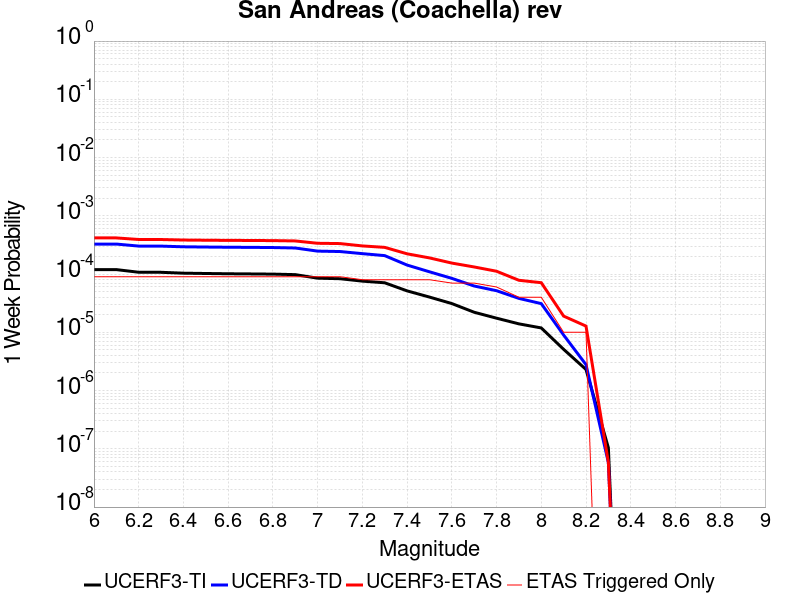 |  | 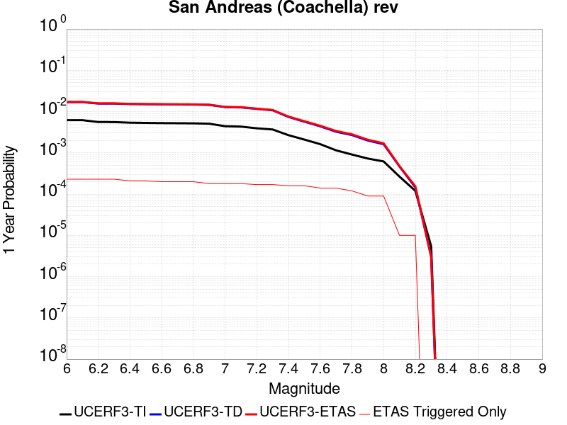 |  |

| Magnitude | 1 wk TI Prob | 1 wk TD Prob | 1 wk ETAS Prob | 1 wk ETAS/TD Gain | 1 wk ETAS Triggered Only | 1 mo TI Prob | 1 mo TD Prob | 1 mo ETAS Prob | 1 mo ETAS/TD Gain | 1 mo ETAS Triggered Only | 1 yr TI Prob | 1 yr TD Prob | 1 yr ETAS Prob | 1 yr ETAS/TD Gain | 1 yr ETAS Triggered Only | 10 yr TI Prob | 10 yr TD Prob | 10 yr ETAS Prob | 10 yr ETAS/TD Gain | 10 yr ETAS Triggered Only |
|-----|-----|-----|-----|-----|-----|-----|-----|-----|-----|-----|-----|-----|-----|-----|-----|-----|-----|-----|-----|-----|
| 6.0 | 1.1925945E-4 | 3.273077E-4 | 4.1727826E-4 | 1.2748806 | 9.0E-5 | 5.110118E-4 | 0.001401998 | 0.0015218297 | 1.0854721 | 1.2E-4 | 0.0062038354 | 0.016937068 | 0.017163172 | 1.0133497 | 2.3E-4 | 0.060334753 | 0.15267672 | 0.15293938 | 1.0017204 | 3.1E-4 |
| 6.1 | 1.1925945E-4 | 3.273077E-4 | 4.1727826E-4 | 1.2748806 | 9.0E-5 | 5.110118E-4 | 0.001401998 | 0.0015218297 | 1.0854721 | 1.2E-4 | 0.0062038354 | 0.016937068 | 0.017163172 | 1.0133497 | 2.3E-4 | 0.060334753 | 0.15267672 | 0.15293938 | 1.0017204 | 3.1E-4 |
| 6.2 | 1.07432395E-4 | 3.0231563E-4 | 3.922884E-4 | 1.2976121 | 9.0E-5 | 4.603433E-4 | 0.001294999 | 0.0014148436 | 1.0925442 | 1.2E-4 | 0.005590286 | 0.015653731 | 0.01588013 | 1.014463 | 2.3E-4 | 0.05451731 | 0.14182784 | 0.14209387 | 1.0018758 | 3.1E-4 |
| 6.3 | 1.0718766E-4 | 3.0176868E-4 | 3.9174152E-4 | 1.2981517 | 9.0E-5 | 4.592948E-4 | 0.0012926573 | 0.0014125023 | 1.092712 | 1.2E-4 | 0.005577586 | 0.01562563 | 0.015852036 | 1.0144894 | 2.3E-4 | 0.054396555 | 0.14159605 | 0.14186215 | 1.0018793 | 3.1E-4 |
| 6.4 | 1.0355944E-4 | 2.9384956E-4 | 3.838231E-4 | 1.3061892 | 9.0E-5 | 4.4375064E-4 | 0.0012587514 | 0.0013786003 | 1.0952126 | 1.2E-4 | 0.0053892885 | 0.015218662 | 0.015425466 | 1.0135889 | 2.1E-4 | 0.052604496 | 0.13815795 | 0.13840789 | 1.001809 | 2.9E-4 |
| 6.5 | 1.0227914E-4 | 2.9104383E-4 | 3.8101766E-4 | 1.3091418 | 9.0E-5 | 4.382655E-4 | 0.0012467385 | 0.0013665889 | 1.0961311 | 1.2E-4 | 0.0053228354 | 0.015074439 | 0.015281273 | 1.0137209 | 2.1E-4 | 0.051971316 | 0.13694239 | 0.13719267 | 1.0018277 | 2.9E-4 |
| 6.6 | 1.0116757E-4 | 2.8870135E-4 | 3.7867535E-4 | 1.3116509 | 9.0E-5 | 4.3350324E-4 | 0.0012367087 | 0.0013565603 | 1.0969118 | 1.2E-4 | 0.0052651367 | 0.014954008 | 0.015151017 | 1.0131743 | 2.0E-4 | 0.051421247 | 0.13591973 | 0.13617033 | 1.0018436 | 2.9E-4 |
| 6.7 | 1.0050676E-4 | 2.8728697E-4 | 3.772611E-4 | 1.3131856 | 9.0E-5 | 4.3067214E-4 | 0.0012306528 | 0.0013505052 | 1.0973892 | 1.2E-4 | 0.005230834 | 0.014881288 | 0.015078312 | 1.0132397 | 2.0E-4 | 0.051094085 | 0.13530464 | 0.13555542 | 1.0018533 | 2.9E-4 |
| 6.8 | 9.976819E-5 | 2.8532353E-4 | 3.7529785E-4 | 1.3153414 | 9.0E-5 | 4.2750788E-4 | 0.001222246 | 0.0013420993 | 1.0980599 | 1.2E-4 | 0.0051924936 | 0.014780328 | 0.014977372 | 1.0133315 | 2.0E-4 | 0.050728295 | 0.13445628 | 0.13470729 | 1.0018668 | 2.9E-4 |
| 6.9 | 9.77719E-5 | 2.802926E-4 | 3.7026737E-4 | 1.3210031 | 9.0E-5 | 4.1895514E-4 | 0.0012007048 | 0.0013105727 | 1.0915029 | 1.1E-4 | 0.0050888555 | 0.0145215895 | 0.014698976 | 1.0122154 | 1.8E-4 | 0.049738888 | 0.13228476 | 0.13251904 | 1.0017711 | 2.7E-4 |
| 7.0 | 8.500761E-5 | 2.4763815E-4 | 3.3761587E-4 | 1.3633435 | 9.0E-5 | 3.6426744E-4 | 0.0010608779 | 0.0011707612 | 1.1035777 | 1.1E-4 | 0.0044259406 | 0.01284047 | 0.013018159 | 1.0138382 | 1.8E-4 | 0.04338823 | 0.11813616 | 0.11837426 | 1.0020155 | 2.7E-4 |
| 7.1 | 8.319876E-5 | 2.4366553E-4 | 3.336436E-4 | 1.3692688 | 9.0E-5 | 3.5651738E-4 | 0.0010438662 | 0.0011537513 | 1.1052675 | 1.1E-4 | 0.004331963 | 0.012635773 | 0.012813498 | 1.0140653 | 1.8E-4 | 0.042484846 | 0.11635632 | 0.1165949 | 1.0020504 | 2.7E-4 |
| 7.2 | 7.563917E-5 | 2.2414974E-4 | 3.0413183E-4 | 1.3568243 | 8.0E-5 | 3.2412758E-4 | 9.602912E-4 | 0.0010601952 | 1.1040351 | 1.0E-4 | 0.0039391145 | 0.011629559 | 0.011797583 | 1.0144479 | 1.7E-4 | 0.03870018 | 0.10776202 | 0.10798507 | 1.00207 | 2.5E-4 |
| 7.3 | 7.082985E-5 | 2.07311E-4 | 2.8729442E-4 | 1.3858137 | 8.0E-5 | 3.0352117E-4 | 8.881761E-4 | 9.880873E-4 | 1.1124903 | 1.0E-4 | 0.0036891096 | 0.010760553 | 0.010928724 | 1.0156285 | 1.7E-4 | 0.03628465 | 0.10028403 | 0.100508966 | 1.0022429 | 2.5E-4 |
| 7.4 | 5.146215E-5 | 1.4274761E-4 | 2.2273618E-4 | 1.5603497 | 8.0E-5 | 2.2053342E-4 | 6.1163295E-4 | 7.115718E-4 | 1.1633967 | 1.0E-4 | 0.0026816884 | 0.0074213943 | 0.0075802067 | 1.0213993 | 1.6E-4 | 0.02649557 | 0.07085049 | 0.0710642 | 1.0030162 | 2.3E-4 |
| 7.5 | 4.0285166E-5 | 1.0942422E-4 | 1.8941546E-4 | 1.7310196 | 8.0E-5 | 1.7263928E-4 | 4.6887697E-4 | 5.6883006E-4 | 1.2131755 | 1.0E-4 | 0.002099857 | 0.0056937044 | 0.0058527933 | 1.0279412 | 1.6E-4 | 0.020801254 | 0.055013083 | 0.055230428 | 1.0039508 | 2.3E-4 |
| 7.6 | 3.1168736E-5 | 8.439599E-5 | 1.5439009E-4 | 1.8293532 | 7.0E-5 | 1.3357346E-4 | 3.616471E-4 | 4.5161456E-4 | 1.2487714 | 9.0E-5 | 0.0016250437 | 0.004394191 | 0.004533576 | 1.0317203 | 1.4E-4 | 0.016132116 | 0.042812478 | 0.043013487 | 1.004695 | 2.1E-4 |
| 7.7 | 2.2100989E-5 | 6.239345E-5 | 1.3238908E-4 | 2.1218426 | 7.0E-5 | 9.4715084E-5 | 2.6737314E-4 | 3.5734905E-4 | 1.3365183 | 9.0E-5 | 0.001152546 | 0.0032504152 | 0.0033899602 | 1.0429314 | 1.4E-4 | 0.011465867 | 0.031902168 | 0.03209579 | 1.0060692 | 2.0E-4 |
| 7.8 | 1.7484861E-5 | 5.180078E-5 | 1.1179767E-4 | 2.1582236 | 6.0E-5 | 7.493296E-5 | 2.2198448E-4 | 3.019667E-4 | 1.3603055 | 8.0E-5 | 9.1192697E-4 | 0.0026993142 | 0.0028189903 | 1.0443357 | 1.2E-4 | 0.009081938 | 0.026641788 | 0.026816992 | 1.0065763 | 1.8E-4 |
| 7.9 | 1.3967285E-5 | 3.8226146E-5 | 7.822462E-5 | 2.046364 | 4.0E-5 | 5.985842E-5 | 1.6381606E-4 | 2.1380787E-4 | 1.3051704 | 5.0E-5 | 7.2853256E-4 | 0.0019926373 | 0.002082458 | 1.0450763 | 9.0E-5 | 0.0072614877 | 0.019911002 | 0.020058017 | 1.0073835 | 1.5E-4 |
| 8.0 | 1.1887396E-5 | 3.106798E-5 | 7.106674E-5 | 2.2874591 | 4.0E-5 | 5.094499E-5 | 1.331417E-4 | 1.8313504E-4 | 1.3754897 | 5.0E-5 | 6.200787E-4 | 0.0016197958 | 0.00170965 | 1.0554726 | 9.0E-5 | 0.006183513 | 0.016280567 | 0.016428124 | 1.0090635 | 1.5E-4 |
| 8.1 | 5.100864E-6 | 8.973766E-6 | 1.8973677E-5 | 2.1143494 | 1.0E-5 | 2.1860664E-5 | 3.845843E-5 | 4.8458045E-5 | 1.2600111 | 1.0E-5 | 2.6612106E-4 | 4.6813092E-4 | 4.7812623E-4 | 1.0213516 | 1.0E-5 | 0.002658026 | 0.004918092 | 0.0049379934 | 1.0040466 | 2.0E-5 |
| 8.2 | 2.3004484E-6 | 2.7863473E-6 | 1.27863195E-5 | 4.588918 | 1.0E-5 | 9.859027E-6 | 1.19414335E-5 | 2.1941314E-5 | 1.8374104 | 1.0E-5 | 1.2002704E-4 | 1.4537729E-4 | 1.5537583E-4 | 1.0687765 | 1.0E-5 | 0.0011996223 | 0.0015973782 | 0.0016173462 | 1.0125005 | 2.0E-5 |
| 8.3 | 1.0424446E-7 | 5.814421E-8 | 5.814421E-8 | 1.0 | 0.0 | 4.4676187E-7 | 2.4918944E-7 | 2.4918944E-7 | 1.0 | 0.0 | 5.439312E-6 | 3.0338776E-6 | 3.0338776E-6 | 1.0 | 0.0 | 5.4391792E-5 | 3.189592E-5 | 3.189592E-5 | 1.0 | 0.0 |

## San Jacinto (San Bernardino)
*[(top)](#table-of-contents)*

| 1 Week | 1 Month | 1 Year | 10 Year |
|-----|-----|-----|-----|
| 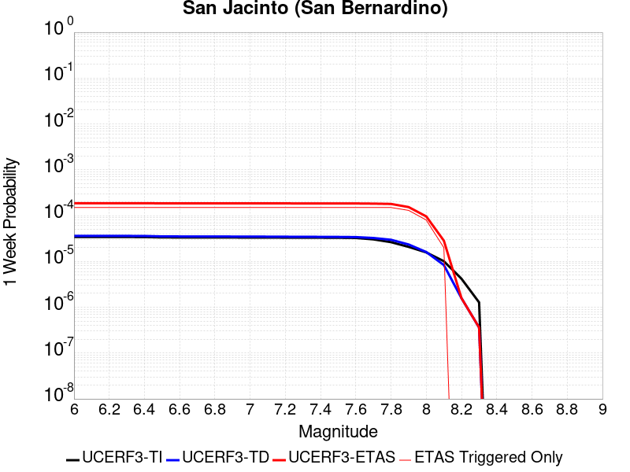 |  | 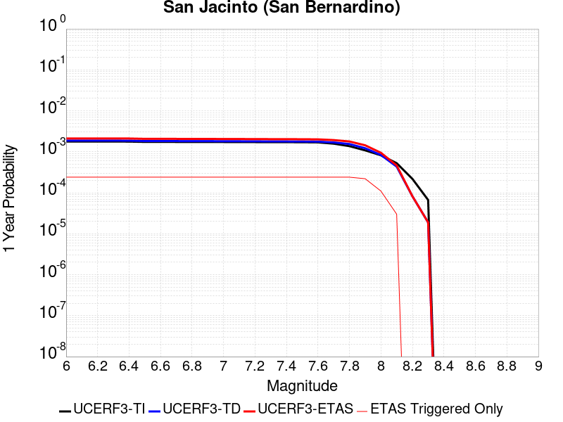 |  |

| Magnitude | 1 wk TI Prob | 1 wk TD Prob | 1 wk ETAS Prob | 1 wk ETAS/TD Gain | 1 wk ETAS Triggered Only | 1 mo TI Prob | 1 mo TD Prob | 1 mo ETAS Prob | 1 mo ETAS/TD Gain | 1 mo ETAS Triggered Only | 1 yr TI Prob | 1 yr TD Prob | 1 yr ETAS Prob | 1 yr ETAS/TD Gain | 1 yr ETAS Triggered Only | 10 yr TI Prob | 10 yr TD Prob | 10 yr ETAS Prob | 10 yr ETAS/TD Gain | 10 yr ETAS Triggered Only |
|-----|-----|-----|-----|-----|-----|-----|-----|-----|-----|-----|-----|-----|-----|-----|-----|-----|-----|-----|-----|-----|
| 6.0 | 3.409352E-5 | 3.598562E-5 | 1.8598023E-4 | 5.168182 | 1.5E-4 | 1.461069E-4 | 1.5421498E-4 | 3.641826E-4 | 2.3615255 | 2.1E-4 | 0.0017774 | 0.0018759521 | 0.0021155018 | 1.1276951 | 2.4E-4 | 0.01763251 | 0.019349992 | 0.019673608 | 1.0167242 | 3.3E-4 |
| 6.1 | 3.409352E-5 | 3.598562E-5 | 1.8598023E-4 | 5.168182 | 1.5E-4 | 1.461069E-4 | 1.5421498E-4 | 3.641826E-4 | 2.3615255 | 2.1E-4 | 0.0017774 | 0.0018759521 | 0.0021155018 | 1.1276951 | 2.4E-4 | 0.01763251 | 0.019349992 | 0.019673608 | 1.0167242 | 3.3E-4 |
| 6.2 | 3.409352E-5 | 3.598562E-5 | 1.8598023E-4 | 5.168182 | 1.5E-4 | 1.461069E-4 | 1.5421498E-4 | 3.641826E-4 | 2.3615255 | 2.1E-4 | 0.0017774 | 0.0018759521 | 0.0021155018 | 1.1276951 | 2.4E-4 | 0.01763251 | 0.019349992 | 0.019673608 | 1.0167242 | 3.3E-4 |
| 6.3 | 3.409352E-5 | 3.598562E-5 | 1.8598023E-4 | 5.168182 | 1.5E-4 | 1.461069E-4 | 1.5421498E-4 | 3.641826E-4 | 2.3615255 | 2.1E-4 | 0.0017774 | 0.0018759521 | 0.0021155018 | 1.1276951 | 2.4E-4 | 0.01763251 | 0.019349992 | 0.019673608 | 1.0167242 | 3.3E-4 |
| 6.4 | 3.400795E-5 | 3.5878285E-5 | 1.8587291E-4 | 5.180652 | 1.5E-4 | 1.4574021E-4 | 1.5375503E-4 | 3.6372273E-4 | 2.365599 | 2.1E-4 | 0.0017729428 | 0.0018703619 | 0.002109913 | 1.1280774 | 2.4E-4 | 0.017588645 | 0.019295074 | 0.019618707 | 1.0167729 | 3.3E-4 |
| 6.5 | 3.341482E-5 | 3.5138914E-5 | 1.8513364E-4 | 5.2686214 | 1.5E-4 | 1.4319851E-4 | 1.5058667E-4 | 3.6055504E-4 | 2.3943357 | 2.1E-4 | 0.0017420477 | 0.0018318522 | 0.0020714125 | 1.130775 | 2.4E-4 | 0.017284546 | 0.018916616 | 0.019230563 | 1.0165963 | 3.2E-4 |
| 6.6 | 3.3364955E-5 | 3.5076133E-5 | 1.8507086E-4 | 5.2762623 | 1.5E-4 | 1.4298483E-4 | 1.5031763E-4 | 3.6028607E-4 | 2.3968318 | 2.1E-4 | 0.0017394501 | 0.0018285823 | 0.0020681433 | 1.1310092 | 2.4E-4 | 0.017258976 | 0.01888448 | 0.019198438 | 1.0166252 | 3.2E-4 |
| 6.7 | 3.335922E-5 | 3.5065907E-5 | 1.8506065E-4 | 5.277509 | 1.5E-4 | 1.4296026E-4 | 1.5027382E-4 | 3.6024227E-4 | 2.3972392 | 2.1E-4 | 0.0017391514 | 0.0018280497 | 0.0020676109 | 1.1310475 | 2.4E-4 | 0.017256035 | 0.018879272 | 0.01919323 | 1.0166298 | 3.2E-4 |
| 6.8 | 3.327683E-5 | 3.4959972E-5 | 1.8495473E-4 | 5.290471 | 1.5E-4 | 1.4260718E-4 | 1.4981985E-4 | 3.597884E-4 | 2.4014733 | 2.1E-4 | 0.0017348597 | 0.001822532 | 0.0020620946 | 1.1314449 | 2.4E-4 | 0.017213784 | 0.018825045 | 0.01913902 | 1.0166787 | 3.2E-4 |
| 6.9 | 3.3235785E-5 | 3.4900928E-5 | 1.8489569E-4 | 5.29773 | 1.5E-4 | 1.4243131E-4 | 1.4956683E-4 | 3.5953542E-4 | 2.4038446 | 2.1E-4 | 0.0017327217 | 0.0018194567 | 0.0020590199 | 1.1316675 | 2.4E-4 | 0.017192734 | 0.018794911 | 0.019108897 | 1.0167059 | 3.2E-4 |
| 7.0 | 3.3197095E-5 | 3.4840854E-5 | 1.8483563E-4 | 5.3051405 | 1.5E-4 | 1.422655E-4 | 1.4930942E-4 | 3.5927806E-4 | 2.4062653 | 2.1E-4 | 0.0017307063 | 0.0018163278 | 0.002055892 | 1.1318947 | 2.4E-4 | 0.017172894 | 0.01876429 | 0.019078285 | 1.0167336 | 3.2E-4 |
| 7.1 | 3.3129716E-5 | 3.4721066E-5 | 1.8471586E-4 | 5.319994 | 1.5E-4 | 1.4197677E-4 | 1.4879608E-4 | 3.5876484E-4 | 2.4111176 | 2.1E-4 | 0.0017271966 | 0.0018100884 | 0.002049654 | 1.1323502 | 2.4E-4 | 0.017138338 | 0.018703366 | 0.01901738 | 1.0167892 | 3.2E-4 |
| 7.2 | 3.3034008E-5 | 3.4588513E-5 | 1.8458332E-4 | 5.33655 | 1.5E-4 | 1.4156665E-4 | 1.4822806E-4 | 3.5819694E-4 | 2.4165258 | 2.1E-4 | 0.0017222111 | 0.0018031843 | 0.0020427515 | 1.1328579 | 2.4E-4 | 0.017089253 | 0.01863575 | 0.018949786 | 1.0168513 | 3.2E-4 |
| 7.3 | 3.2956614E-5 | 3.4456265E-5 | 1.844511E-4 | 5.3531947 | 1.5E-4 | 1.4123498E-4 | 1.4766137E-4 | 3.5763034E-4 | 2.421963 | 2.1E-4 | 0.0017181796 | 0.0017962961 | 0.002035865 | 1.1333683 | 2.4E-4 | 0.017049557 | 0.018568495 | 0.018882554 | 1.0169135 | 3.2E-4 |
| 7.4 | 3.2915937E-5 | 3.4377957E-5 | 1.843728E-4 | 5.363111 | 1.5E-4 | 1.4106068E-4 | 1.473258E-4 | 3.5729486E-4 | 2.4252024 | 2.1E-4 | 0.0017160608 | 0.0017922173 | 0.002031787 | 1.1336724 | 2.4E-4 | 0.017028693 | 0.018528769 | 0.01884284 | 1.0169505 | 3.2E-4 |
| 7.5 | 3.281791E-5 | 3.424287E-5 | 1.8423774E-4 | 5.380324 | 1.5E-4 | 1.406406E-4 | 1.4674691E-4 | 3.567161E-4 | 2.4308252 | 2.1E-4 | 0.0017109542 | 0.0017851809 | 0.0020247526 | 1.1342001 | 2.4E-4 | 0.016978411 | 0.018459652 | 0.018773746 | 1.0170151 | 3.2E-4 |
| 7.6 | 3.2521442E-5 | 3.396782E-5 | 1.8396272E-4 | 5.4157944 | 1.5E-4 | 1.3937015E-4 | 1.4556825E-4 | 3.555377E-4 | 2.4424121 | 2.1E-4 | 0.0016955109 | 0.0017708542 | 0.0020104293 | 1.1352878 | 2.4E-4 | 0.016826328 | 0.018317295 | 0.018631434 | 1.0171498 | 3.2E-4 |
| 7.7 | 3.0287873E-5 | 3.245191E-5 | 1.8244704E-4 | 5.622074 | 1.5E-4 | 1.297987E-4 | 1.3907222E-4 | 3.49043E-4 | 2.5097969 | 2.1E-4 | 0.0015791537 | 0.0016918903 | 0.0019314842 | 1.1416131 | 2.4E-4 | 0.01567979 | 0.017528199 | 0.01784259 | 1.0179363 | 3.2E-4 |
| 7.8 | 2.6316151E-5 | 2.9662837E-5 | 1.7965838E-4 | 6.0566826 | 1.5E-4 | 1.1277862E-4 | 1.2712025E-4 | 3.3709354E-4 | 2.6517692 | 2.1E-4 | 0.0013722149 | 0.0015465913 | 0.0017862201 | 1.15494 | 2.4E-4 | 0.013637724 | 0.016069878 | 0.016384736 | 1.019593 | 3.2E-4 |
| 7.9 | 2.0761147E-5 | 2.3417291E-5 | 1.5341425E-4 | 6.5513234 | 1.3E-4 | 8.897331E-5 | 1.0035596E-4 | 2.903369E-4 | 2.8930707 | 1.9E-4 | 0.0010827117 | 0.0012211498 | 0.0014408812 | 1.1799381 | 2.2E-4 | 0.010774517 | 0.012793272 | 0.013079561 | 1.0223782 | 2.9E-4 |
| 8.0 | 1.5738568E-5 | 1.6032505E-5 | 9.6031225E-5 | 5.989783 | 8.0E-5 | 6.744926E-5 | 6.8708934E-5 | 1.7870138E-4 | 2.6008463 | 1.1E-4 | 8.2088535E-4 | 8.3621085E-4 | 9.461189E-4 | 1.1314358 | 1.1E-4 | 0.008178596 | 0.008865741 | 0.0090045 | 1.0156511 | 1.4E-4 |
| 8.1 | 1.0105832E-5 | 8.329479E-6 | 2.8329312E-5 | 3.4010906 | 2.0E-5 | 4.3309992E-5 | 3.569728E-5 | 6.569621E-5 | 1.8403702 | 3.0E-5 | 5.2717153E-4 | 4.3452822E-4 | 4.6451518E-4 | 1.0690104 | 3.0E-5 | 0.005259227 | 0.0046768794 | 0.004706739 | 1.0063845 | 3.0E-5 |
| 8.2 | 4.189207E-6 | 1.577699E-6 | 1.577699E-6 | 1.0 | 0.0 | 1.7953622E-5 | 6.7615497E-6 | 6.7615497E-6 | 1.0 | 0.0 | 2.1856341E-4 | 8.231879E-5 | 8.231879E-5 | 1.0 | 0.0 | 0.0021834858 | 9.562628E-4 | 9.562628E-4 | 1.0 | 0.0 |
| 8.3 | 1.2758221E-6 | 3.612677E-7 | 3.612677E-7 | 1.0 | 0.0 | 5.4677976E-6 | 1.5482892E-6 | 1.5482892E-6 | 1.0 | 0.0 | 6.65684E-5 | 1.8850264E-5 | 1.8850264E-5 | 1.0 | 0.0 | 6.6548464E-4 | 2.2739546E-4 | 2.2739546E-4 | 1.0 | 0.0 |

## San Andreas (North Branch Mill Creek)
*[(top)](#table-of-contents)*

| 1 Week | 1 Month | 1 Year | 10 Year |
|-----|-----|-----|-----|
|  |  |  |  |

| Magnitude | 1 wk TI Prob | 1 wk TD Prob | 1 wk ETAS Prob | 1 wk ETAS/TD Gain | 1 wk ETAS Triggered Only | 1 mo TI Prob | 1 mo TD Prob | 1 mo ETAS Prob | 1 mo ETAS/TD Gain | 1 mo ETAS Triggered Only | 1 yr TI Prob | 1 yr TD Prob | 1 yr ETAS Prob | 1 yr ETAS/TD Gain | 1 yr ETAS Triggered Only | 10 yr TI Prob | 10 yr TD Prob | 10 yr ETAS Prob | 10 yr ETAS/TD Gain | 10 yr ETAS Triggered Only |
|-----|-----|-----|-----|-----|-----|-----|-----|-----|-----|-----|-----|-----|-----|-----|-----|-----|-----|-----|-----|-----|
| 6.0 | 1.3461156E-5 | 2.3500992E-5 | 2.4349582E-4 | 10.361087 | 2.2E-4 | 5.7689394E-5 | 1.00714664E-4 | 3.406905E-4 | 3.3827298 | 2.4E-4 | 7.02142E-4 | 0.0012255146 | 0.0015351347 | 1.252645 | 3.1E-4 | 0.0069992766 | 0.012228744 | 0.012544831 | 1.0258479 | 3.2E-4 |
| 6.1 | 1.3461156E-5 | 2.3500992E-5 | 2.4349582E-4 | 10.361087 | 2.2E-4 | 5.7689394E-5 | 1.00714664E-4 | 3.406905E-4 | 3.3827298 | 2.4E-4 | 7.02142E-4 | 0.0012255146 | 0.0015351347 | 1.252645 | 3.1E-4 | 0.0069992766 | 0.012228744 | 0.012544831 | 1.0258479 | 3.2E-4 |
| 6.2 | 1.3461156E-5 | 2.3500992E-5 | 2.4349582E-4 | 10.361087 | 2.2E-4 | 5.7689394E-5 | 1.00714664E-4 | 3.406905E-4 | 3.3827298 | 2.4E-4 | 7.02142E-4 | 0.0012255146 | 0.0015351347 | 1.252645 | 3.1E-4 | 0.0069992766 | 0.012228744 | 0.012544831 | 1.0258479 | 3.2E-4 |
| 6.3 | 1.3461156E-5 | 2.3500992E-5 | 2.4349582E-4 | 10.361087 | 2.2E-4 | 5.7689394E-5 | 1.00714664E-4 | 3.406905E-4 | 3.3827298 | 2.4E-4 | 7.02142E-4 | 0.0012255146 | 0.0015351347 | 1.252645 | 3.1E-4 | 0.0069992766 | 0.012228744 | 0.012544831 | 1.0258479 | 3.2E-4 |
| 6.4 | 1.3461156E-5 | 2.3500992E-5 | 2.4349582E-4 | 10.361087 | 2.2E-4 | 5.7689394E-5 | 1.00714664E-4 | 3.406905E-4 | 3.3827298 | 2.4E-4 | 7.02142E-4 | 0.0012255146 | 0.0015351347 | 1.252645 | 3.1E-4 | 0.0069992766 | 0.012228744 | 0.012544831 | 1.0258479 | 3.2E-4 |
| 6.5 | 1.3450706E-5 | 2.348995E-5 | 2.4348478E-4 | 10.365487 | 2.2E-4 | 5.764461E-5 | 1.00667356E-4 | 3.406432E-4 | 3.3838496 | 2.4E-4 | 7.0159714E-4 | 0.0012249392 | 0.0015345595 | 1.2527637 | 3.1E-4 | 0.006993862 | 0.012223054 | 0.012539143 | 1.0258601 | 3.2E-4 |
| 6.6 | 1.3074523E-5 | 2.3104236E-5 | 2.4309916E-4 | 10.521844 | 2.2E-4 | 5.6032466E-5 | 9.901441E-5 | 3.3899065E-4 | 3.4236495 | 2.4E-4 | 6.8198174E-4 | 0.001204837 | 0.0015144636 | 1.2569863 | 3.1E-4 | 0.006798926 | 0.012024219 | 0.0123403715 | 1.0262929 | 3.2E-4 |
| 6.7 | 1.3050216E-5 | 2.3079532E-5 | 2.4307445E-4 | 10.532036 | 2.2E-4 | 5.59283E-5 | 9.890855E-5 | 3.388848E-4 | 3.4262438 | 2.4E-4 | 6.8071426E-4 | 0.0012035496 | 0.0015131765 | 1.2572614 | 3.1E-4 | 0.0067863287 | 0.012011484 | 0.01232764 | 1.0263212 | 3.2E-4 |
| 6.8 | 1.29049395E-5 | 2.2927941E-5 | 2.4292289E-4 | 10.595059 | 2.2E-4 | 5.530571E-5 | 9.825892E-5 | 3.3823535E-4 | 3.4422863 | 2.4E-4 | 6.73139E-4 | 0.001195649 | 0.0015052784 | 1.2589635 | 3.1E-4 | 0.0067110364 | 0.011933329 | 0.01224951 | 1.0264957 | 3.2E-4 |
| 6.9 | 1.2867369E-5 | 2.2887343E-5 | 2.428823E-4 | 10.61208 | 2.2E-4 | 5.51447E-5 | 9.808494E-5 | 3.380614E-4 | 3.4466188 | 2.4E-4 | 6.711799E-4 | 0.0011935332 | 0.0015031633 | 1.259423 | 3.1E-4 | 0.006691564 | 0.011912397 | 0.012228586 | 1.0265428 | 3.2E-4 |
| 7.0 | 1.2495996E-5 | 2.2287419E-5 | 2.4228252E-4 | 10.87082 | 2.2E-4 | 5.3553173E-5 | 9.551403E-5 | 3.3549112E-4 | 3.5124798 | 2.4E-4 | 6.518148E-4 | 0.0011622658 | 0.0014719055 | 1.2664104 | 3.1E-4 | 0.0064990623 | 0.011603 | 0.011919287 | 1.0272591 | 3.2E-4 |
| 7.1 | 1.2452067E-5 | 2.2232492E-5 | 2.422276E-4 | 10.895207 | 2.2E-4 | 5.3364907E-5 | 9.527864E-5 | 3.3525578E-4 | 3.5186875 | 2.4E-4 | 6.4952404E-4 | 0.001159403 | 0.0014690435 | 1.267069 | 3.1E-4 | 0.0064762887 | 0.011574671 | 0.011890967 | 1.0273266 | 3.2E-4 |
| 7.2 | 1.2002777E-5 | 2.1611015E-5 | 2.4160626E-4 | 11.179774 | 2.2E-4 | 5.143946E-5 | 9.261536E-5 | 3.3259313E-4 | 3.5911229 | 2.4E-4 | 6.2609545E-4 | 0.0011270114 | 0.001436662 | 1.2747538 | 3.1E-4 | 0.006243344 | 0.011254058 | 0.011570456 | 1.0281142 | 3.2E-4 |
| 7.3 | 1.1923425E-5 | 2.1480853E-5 | 2.4147613E-4 | 11.241458 | 2.2E-4 | 5.109939E-5 | 9.205757E-5 | 3.3203547E-4 | 3.6068242 | 2.4E-4 | 6.219575E-4 | 0.0011202273 | 0.00142988 | 1.2764195 | 3.1E-4 | 0.0062021962 | 0.011186945 | 0.011503365 | 1.0282848 | 3.2E-4 |
| 7.4 | 1.16105175E-5 | 2.0854808E-5 | 2.4085022E-4 | 11.548906 | 2.2E-4 | 4.975841E-5 | 8.93747E-5 | 3.2935324E-4 | 3.6850836 | 2.4E-4 | 6.0564023E-4 | 0.0010875963 | 0.0013972592 | 1.2847222 | 3.1E-4 | 0.006039923 | 0.010864409 | 0.011180933 | 1.0291339 | 3.2E-4 |
| 7.5 | 1.1037265E-5 | 1.9554842E-5 | 2.3955054E-4 | 12.250191 | 2.2E-4 | 4.7301706E-5 | 8.380379E-5 | 3.2378366E-4 | 3.8635924 | 2.4E-4 | 5.757461E-4 | 0.0010198357 | 0.0013295196 | 1.3036605 | 3.1E-4 | 0.005742567 | 0.010195527 | 0.010512265 | 1.0310663 | 3.2E-4 |
| 7.6 | 1.0720915E-5 | 1.8996727E-5 | 2.3899255E-4 | 12.580722 | 2.2E-4 | 4.5945973E-5 | 8.141202E-5 | 3.213925E-4 | 3.9477277 | 2.4E-4 | 5.592486E-4 | 9.907428E-4 | 0.0013004356 | 1.3125865 | 3.1E-4 | 0.005578433 | 0.009907238 | 0.010224069 | 1.0319796 | 3.2E-4 |
| 7.7 | 9.276279E-6 | 1.6442464E-5 | 2.3643885E-4 | 14.37977 | 2.2E-4 | 3.9754876E-5 | 7.046581E-5 | 3.104489E-4 | 4.4056673 | 2.4E-4 | 4.839081E-4 | 8.5758517E-4 | 0.0011673194 | 1.3611702 | 3.1E-4 | 0.0048285574 | 0.008586576 | 0.008903828 | 1.0369475 | 3.2E-4 |
| 7.8 | 5.8346777E-6 | 1.11555855E-5 | 2.3115313E-4 | 20.720842 | 2.2E-4 | 2.5005522E-5 | 4.7808775E-5 | 2.877973E-4 | 6.0197587 | 2.4E-4 | 3.043997E-4 | 5.819165E-4 | 8.8174193E-4 | 1.5152379 | 3.0E-4 | 0.0030398308 | 0.0058473335 | 0.0061555207 | 1.0527056 | 3.1E-4 |
| 7.9 | 4.690204E-6 | 8.509473E-6 | 2.0850777E-4 | 24.503016 | 2.0E-4 | 2.0100719E-5 | 3.6468664E-5 | 2.5646065E-4 | 7.0323563 | 2.2E-4 | 2.4469878E-4 | 4.439156E-4 | 7.237913E-4 | 1.6304705 | 2.8E-4 | 0.002444295 | 0.004471165 | 0.004759868 | 1.0645701 | 2.9E-4 |
| 8.0 | 2.9570454E-6 | 4.8470656E-6 | 1.4847017E-5 | 3.063094 | 1.0E-5 | 1.267299E-5 | 2.0772974E-5 | 3.0772764E-5 | 1.4813848 | 1.0E-5 | 1.5428272E-4 | 2.5288164E-4 | 2.7287658E-4 | 1.0790684 | 2.0E-5 | 0.0015417566 | 0.002549932 | 0.0025698813 | 1.0078233 | 2.0E-5 |
| 8.1 | 1.6376824E-6 | 2.1968672E-6 | 2.1968672E-6 | 1.0 | 0.0 | 7.01862E-6 | 9.415111E-6 | 9.415111E-6 | 1.0 | 0.0 | 8.544835E-5 | 1.1462297E-4 | 1.1462297E-4 | 1.0 | 0.0 | 8.54155E-4 | 0.0011607445 | 0.0011607445 | 1.0 | 0.0 |
| 8.2 | 6.9631557E-7 | 4.535001E-7 | 4.535001E-7 | 1.0 | 0.0 | 2.984206E-6 | 1.9435704E-6 | 1.9435704E-6 | 1.0 | 0.0 | 3.63321E-5 | 2.3662713E-5 | 2.3662713E-5 | 1.0 | 0.0 | 3.6326164E-4 | 2.4510184E-4 | 2.4510184E-4 | 1.0 | 0.0 |
| 8.3 | 1.7876137E-7 | 8.357368E-8 | 8.357368E-8 | 1.0 | 0.0 | 7.661199E-7 | 3.5817288E-7 | 3.5817288E-7 | 1.0 | 0.0 | 9.32747E-6 | 4.3607465E-6 | 4.3607465E-6 | 1.0 | 0.0 | 9.3270784E-5 | 4.5800018E-5 | 4.5800018E-5 | 1.0 | 0.0 |

## Baker
*[(top)](#table-of-contents)*

| 1 Week | 1 Month | 1 Year | 10 Year |
|-----|-----|-----|-----|
| 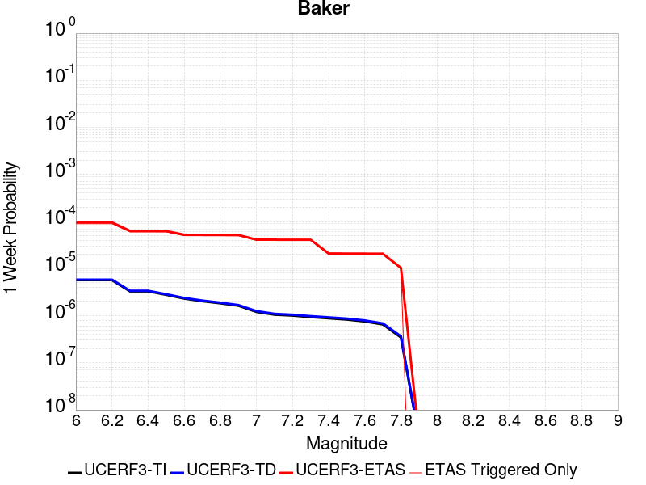 |  |  |  |

| Magnitude | 1 wk TI Prob | 1 wk TD Prob | 1 wk ETAS Prob | 1 wk ETAS/TD Gain | 1 wk ETAS Triggered Only | 1 mo TI Prob | 1 mo TD Prob | 1 mo ETAS Prob | 1 mo ETAS/TD Gain | 1 mo ETAS Triggered Only | 1 yr TI Prob | 1 yr TD Prob | 1 yr ETAS Prob | 1 yr ETAS/TD Gain | 1 yr ETAS Triggered Only | 10 yr TI Prob | 10 yr TD Prob | 10 yr ETAS Prob | 10 yr ETAS/TD Gain | 10 yr ETAS Triggered Only |
|-----|-----|-----|-----|-----|-----|-----|-----|-----|-----|-----|-----|-----|-----|-----|-----|-----|-----|-----|-----|-----|
| 6.0 | 5.695525E-6 | 5.8348373E-6 | 9.5834315E-5 | 16.424505 | 9.0E-5 | 2.4409164E-5 | 2.5006228E-5 | 1.7500248E-4 | 6.998356 | 1.5E-4 | 2.9714106E-4 | 3.044123E-4 | 5.243453E-4 | 1.722484 | 2.2E-4 | 0.0029674405 | 0.0030403486 | 0.0033494062 | 1.101652 | 3.1E-4 |
| 6.1 | 5.695525E-6 | 5.8348373E-6 | 9.5834315E-5 | 16.424505 | 9.0E-5 | 2.4409164E-5 | 2.5006228E-5 | 1.7500248E-4 | 6.998356 | 1.5E-4 | 2.9714106E-4 | 3.044123E-4 | 5.243453E-4 | 1.722484 | 2.2E-4 | 0.0029674405 | 0.0030403486 | 0.0033494062 | 1.101652 | 3.1E-4 |
| 6.2 | 5.695525E-6 | 5.8348373E-6 | 9.5834315E-5 | 16.424505 | 9.0E-5 | 2.4409164E-5 | 2.5006228E-5 | 1.7500248E-4 | 6.998356 | 1.5E-4 | 2.9714106E-4 | 3.044123E-4 | 5.243453E-4 | 1.722484 | 2.2E-4 | 0.0029674405 | 0.0030403486 | 0.0033494062 | 1.101652 | 3.1E-4 |
| 6.3 | 3.2995713E-6 | 3.383667E-6 | 6.3383464E-5 | 18.732182 | 6.0E-5 | 1.4140943E-5 | 1.4501353E-5 | 1.2449975E-4 | 8.585389 | 1.1E-4 | 1.7215237E-4 | 1.7654014E-4 | 3.1651542E-4 | 1.7928808 | 1.4E-4 | 0.0017201907 | 0.001764046 | 0.0019736756 | 1.1188345 | 2.1E-4 |
| 6.4 | 3.2995713E-6 | 3.383667E-6 | 6.3383464E-5 | 18.732182 | 6.0E-5 | 1.4140943E-5 | 1.4501353E-5 | 1.2449975E-4 | 8.585389 | 1.1E-4 | 1.7215237E-4 | 1.7654014E-4 | 3.1651542E-4 | 1.7928808 | 1.4E-4 | 0.0017201907 | 0.001764046 | 0.0019736756 | 1.1188345 | 2.1E-4 |
| 6.5 | 2.782202E-6 | 2.8558404E-6 | 6.2855666E-5 | 22.009518 | 6.0E-5 | 1.1923668E-5 | 1.223926E-5 | 1.2223792E-4 | 9.987361 | 1.1E-4 | 1.4516099E-4 | 1.4900314E-4 | 2.8898226E-4 | 1.9394375 | 1.4E-4 | 0.001450662 | 0.0014890651 | 0.0016987524 | 1.1408181 | 2.1E-4 |
| 6.6 | 2.3163404E-6 | 2.38092E-6 | 5.23808E-5 | 22.000237 | 5.0E-5 | 9.927136E-6 | 1.0203904E-5 | 1.0020298E-4 | 9.820064 | 9.0E-5 | 1.20856166E-4 | 1.2422565E-4 | 2.4421074E-4 | 1.9658641 | 1.2E-4 | 0.0012079047 | 0.0012415823 | 0.0014313464 | 1.1528405 | 1.9E-4 |
| 6.7 | 2.037056E-6 | 2.0965003E-6 | 5.2096395E-5 | 24.849218 | 5.0E-5 | 8.7302105E-6 | 8.984972E-6 | 9.8984165E-5 | 11.016636 | 9.0E-5 | 1.0628513E-4 | 1.093867E-4 | 2.2937357E-4 | 2.0969055 | 1.2E-4 | 0.0010623431 | 0.0010933448 | 0.001283137 | 1.1735886 | 1.9E-4 |
| 6.8 | 1.8356744E-6 | 1.8915287E-6 | 5.1891435E-5 | 27.433596 | 5.0E-5 | 7.867153E-6 | 8.106527E-6 | 9.81058E-5 | 12.102075 | 9.0E-5 | 9.577837E-5 | 9.869264E-5 | 2.186808E-4 | 2.2157762 | 1.2E-4 | 9.57371E-4 | 9.86502E-4 | 0.0011763147 | 1.1924098 | 1.9E-4 |
| 6.9 | 1.6310546E-6 | 1.6832072E-6 | 5.1683124E-5 | 30.705147 | 5.0E-5 | 6.9902153E-6 | 7.213726E-6 | 8.721315E-5 | 12.08989 | 8.0E-5 | 8.510255E-5 | 8.782368E-5 | 1.9781402E-4 | 2.2523994 | 1.1E-4 | 8.5069967E-4 | 8.7790104E-4 | 0.0010377606 | 1.1820929 | 1.6E-4 |
| 7.0 | 1.2058036E-6 | 1.2508665E-6 | 4.1250816E-5 | 32.97779 | 4.0E-5 | 5.1677193E-6 | 5.3608455E-6 | 7.536047E-5 | 14.057571 | 7.0E-5 | 6.291517E-5 | 6.5266366E-5 | 1.552605E-4 | 2.3788745 | 9.0E-5 | 6.289736E-4 | 6.524743E-4 | 7.923829E-4 | 1.2144278 | 1.4E-4 |
| 7.1 | 1.052382E-6 | 1.0951609E-6 | 4.1095118E-5 | 37.524277 | 4.0E-5 | 4.5102006E-6 | 4.693538E-6 | 7.469321E-5 | 15.914052 | 7.0E-5 | 5.491031E-5 | 5.7142337E-5 | 1.471372E-4 | 2.5749242 | 9.0E-5 | 5.4896745E-4 | 5.7127734E-4 | 7.0120307E-4 | 1.2274302 | 1.3E-4 |
| 7.2 | 1.0067454E-6 | 1.0487711E-6 | 4.104873E-5 | 39.13984 | 4.0E-5 | 4.3146156E-6 | 4.4947255E-6 | 5.44945E-5 | 12.1241 | 5.0E-5 | 5.252918E-5 | 5.4721917E-5 | 1.2471809E-4 | 2.279125 | 7.0E-5 | 5.251676E-4 | 5.470853E-4 | 6.570251E-4 | 1.2009555 | 1.1E-4 |
| 7.3 | 9.3596316E-7 | 9.767723E-7 | 4.0976734E-5 | 41.95116 | 4.0E-5 | 4.0112645E-6 | 4.1861604E-6 | 5.418595E-5 | 12.944069 | 5.0E-5 | 4.8836053E-5 | 5.096532E-5 | 1.20961755E-4 | 2.373413 | 7.0E-5 | 4.8825322E-4 | 5.095371E-4 | 6.0948613E-4 | 1.1961566 | 1.0E-4 |
| 7.4 | 8.8117395E-7 | 9.2076635E-7 | 2.0920748E-5 | 22.721018 | 2.0E-5 | 3.7764542E-6 | 3.9461356E-6 | 3.3946017E-5 | 8.6023445 | 3.0E-5 | 4.5977362E-5 | 4.8043148E-5 | 9.804075E-5 | 2.0406811 | 5.0E-5 | 4.596785E-4 | 4.8032837E-4 | 5.6028995E-4 | 1.1664727 | 8.0E-5 |
| 7.5 | 8.292386E-7 | 8.6745956E-7 | 2.0867443E-5 | 24.055809 | 2.0E-5 | 3.5538749E-6 | 3.7176785E-6 | 3.3717566E-5 | 9.069522 | 3.0E-5 | 4.326757E-5 | 4.5261804E-5 | 9.5259544E-5 | 2.1046343 | 5.0E-5 | 4.3259145E-4 | 4.5252658E-4 | 5.224949E-4 | 1.1546171 | 7.0E-5 |
| 7.6 | 7.553842E-7 | 7.9144706E-7 | 2.079143E-5 | 26.270147 | 2.0E-5 | 3.2373566E-6 | 3.3919116E-6 | 3.339181E-5 | 9.844541 | 3.0E-5 | 3.9414106E-5 | 4.129575E-5 | 8.129409E-5 | 1.9685827 | 4.0E-5 | 3.9407116E-4 | 4.1288146E-4 | 4.628608E-4 | 1.1210501 | 5.0E-5 |
| 7.7 | 6.5285366E-7 | 6.852797E-7 | 2.0685266E-5 | 30.185144 | 2.0E-5 | 2.797941E-6 | 2.9369096E-6 | 3.2936823E-5 | 11.214789 | 3.0E-5 | 3.40644E-5 | 3.5756293E-5 | 7.575486E-5 | 2.1186442 | 4.0E-5 | 3.405918E-4 | 3.5750607E-4 | 4.074882E-4 | 1.1398078 | 5.0E-5 |
| 7.8 | 3.4586725E-7 | 3.6482615E-7 | 1.0364823E-5 | 28.410307 | 1.0E-5 | 1.4822873E-6 | 1.5635396E-6 | 2.1563508E-5 | 13.791469 | 2.0E-5 | 1.80467E-5 | 1.9035933E-5 | 4.9035363E-5 | 2.5759368 | 3.0E-5 | 1.8045233E-4 | 1.9034347E-4 | 2.3033586E-4 | 1.2101064 | 4.0E-5 |
| 7.9 | 2.5591178E-9 | 2.6696718E-9 | 2.6696718E-9 | 1.0 | 0.0 | 1.0967647E-8 | 1.14414505E-8 | 1.14414505E-8 | 1.0 | 0.0 | 1.335311E-7 | 1.3929966E-7 | 1.3929966E-7 | 1.0 | 0.0 | 1.3353102E-6 | 1.3929966E-6 | 1.3929966E-6 | 1.0 | 0.0 |

## White Wolf (Extension)
*[(top)](#table-of-contents)*

| 1 Week | 1 Month | 1 Year | 10 Year |
|-----|-----|-----|-----|
|  |  |  |  |

| Magnitude | 1 wk TI Prob | 1 wk TD Prob | 1 wk ETAS Prob | 1 wk ETAS/TD Gain | 1 wk ETAS Triggered Only | 1 mo TI Prob | 1 mo TD Prob | 1 mo ETAS Prob | 1 mo ETAS/TD Gain | 1 mo ETAS Triggered Only | 1 yr TI Prob | 1 yr TD Prob | 1 yr ETAS Prob | 1 yr ETAS/TD Gain | 1 yr ETAS Triggered Only | 10 yr TI Prob | 10 yr TD Prob | 10 yr ETAS Prob | 10 yr ETAS/TD Gain | 10 yr ETAS Triggered Only |
|-----|-----|-----|-----|-----|-----|-----|-----|-----|-----|-----|-----|-----|-----|-----|-----|-----|-----|-----|-----|-----|
| 6.0 | 8.222555E-6 | 6.066615E-6 | 1.6606564E-4 | 27.373692 | 1.6E-4 | 3.5239045E-5 | 2.5999556E-5 | 2.2599436E-4 | 8.692239 | 2.0E-4 | 4.289509E-4 | 3.1650523E-4 | 5.7642296E-4 | 1.8212113 | 2.6E-4 | 0.0042812387 | 0.0031611966 | 0.0034702166 | 1.0977541 | 3.1E-4 |
| 6.1 | 8.222555E-6 | 6.066615E-6 | 1.6606564E-4 | 27.373692 | 1.6E-4 | 3.5239045E-5 | 2.5999556E-5 | 2.2599436E-4 | 8.692239 | 2.0E-4 | 4.289509E-4 | 3.1650523E-4 | 5.7642296E-4 | 1.8212113 | 2.6E-4 | 0.0042812387 | 0.0031611966 | 0.0034702166 | 1.0977541 | 3.1E-4 |
| 6.2 | 8.222555E-6 | 6.066615E-6 | 1.6606564E-4 | 27.373692 | 1.6E-4 | 3.5239045E-5 | 2.5999556E-5 | 2.2599436E-4 | 8.692239 | 2.0E-4 | 4.289509E-4 | 3.1650523E-4 | 5.7642296E-4 | 1.8212113 | 2.6E-4 | 0.0042812387 | 0.0031611966 | 0.0034702166 | 1.0977541 | 3.1E-4 |
| 6.3 | 8.222555E-6 | 6.066615E-6 | 1.6606564E-4 | 27.373692 | 1.6E-4 | 3.5239045E-5 | 2.5999556E-5 | 2.2599436E-4 | 8.692239 | 2.0E-4 | 4.289509E-4 | 3.1650523E-4 | 5.7642296E-4 | 1.8212113 | 2.6E-4 | 0.0042812387 | 0.0031611966 | 0.0034702166 | 1.0977541 | 3.1E-4 |
| 6.4 | 5.821773E-6 | 3.5571256E-6 | 1.235567E-4 | 34.73498 | 1.2E-4 | 2.4950215E-5 | 1.5244741E-5 | 1.6524245E-4 | 10.839309 | 1.5E-4 | 3.0372653E-4 | 1.8559002E-4 | 3.7555475E-4 | 2.023572 | 1.9E-4 | 0.0030331176 | 0.0018544586 | 0.0020740507 | 1.118413 | 2.2E-4 |
| 6.5 | 5.766023E-6 | 3.4990599E-6 | 1.2349864E-4 | 35.294807 | 1.2E-4 | 2.4711293E-5 | 1.49958905E-5 | 1.6499365E-4 | 11.00259 | 1.5E-4 | 3.0081844E-4 | 1.8256076E-4 | 3.725261E-4 | 2.0405593 | 1.9E-4 | 0.0030041158 | 0.0018242161 | 0.0020438149 | 1.1203797 | 2.2E-4 |
| 6.6 | 4.643576E-6 | 2.3325733E-6 | 8.2332386E-5 | 35.296806 | 8.0E-5 | 1.9900888E-5 | 9.9967065E-6 | 9.999581E-5 | 10.002875 | 9.0E-5 | 2.4226638E-4 | 1.2170354E-4 | 2.3169015E-4 | 1.9037257 | 1.1E-4 | 0.0024200242 | 0.0012164112 | 0.0013462531 | 1.1067418 | 1.3E-4 |
| 6.7 | 3.9529173E-6 | 1.6482975E-6 | 5.1648214E-5 | 31.33428 | 5.0E-5 | 1.6940963E-5 | 7.064114E-6 | 5.706376E-5 | 8.077978 | 5.0E-5 | 2.0623671E-4 | 8.600239E-5 | 1.4599723E-4 | 1.6975951 | 6.0E-5 | 0.002060454 | 8.597095E-4 | 9.3964074E-4 | 1.0929747 | 8.0E-5 |
| 6.8 | 3.4377522E-6 | 1.2244764E-6 | 4.1224426E-5 | 33.666985 | 4.0E-5 | 1.473314E-5 | 5.247746E-6 | 4.5247536E-5 | 8.62228 | 4.0E-5 | 1.7936122E-4 | 6.388952E-5 | 1.1388633E-4 | 1.7825509 | 5.0E-5 | 0.0017921652 | 6.3872064E-4 | 7.0867594E-4 | 1.1095241 | 7.0E-5 |
| 6.9 | 3.1367306E-6 | 1.0033316E-6 | 3.1003303E-5 | 30.900356 | 3.0E-5 | 1.3443062E-5 | 4.299986E-6 | 3.4299857E-5 | 7.9767375 | 3.0E-5 | 1.63657E-4 | 5.2351144E-5 | 9.234905E-5 | 1.7640312 | 4.0E-5 | 0.0016353652 | 5.233958E-4 | 5.833644E-4 | 1.114576 | 6.0E-5 |
| 7.0 | 2.8298145E-6 | 7.4282326E-7 | 2.074281E-5 | 27.924284 | 2.0E-5 | 1.2127721E-5 | 3.1835248E-6 | 2.318346E-5 | 7.282325 | 2.0E-5 | 1.47645E-4 | 3.8758775E-5 | 6.875761E-5 | 1.7739882 | 3.0E-5 | 0.0014754693 | 3.8752513E-4 | 4.2750963E-4 | 1.1031791 | 4.0E-5 |
| 7.1 | 2.4091064E-6 | 5.4223835E-7 | 1.0542233E-5 | 19.442064 | 1.0E-5 | 1.03247E-5 | 2.3238767E-6 | 1.2323853E-5 | 5.303144 | 1.0E-5 | 1.2569598E-4 | 2.8292874E-5 | 4.829231E-5 | 1.7068717 | 2.0E-5 | 0.001256249 | 2.8289677E-4 | 3.1288827E-4 | 1.1060158 | 3.0E-5 |
| 7.2 | 1.3875518E-6 | 1.0740268E-7 | 1.0107402E-5 | 94.10754 | 1.0E-5 | 5.9466374E-6 | 4.6029712E-7 | 1.0460292E-5 | 22.725088 | 1.0E-5 | 7.23979E-5 | 5.604104E-6 | 1.5604048E-5 | 2.7843966 | 1.0E-5 | 7.2374323E-4 | 5.6039742E-5 | 6.603918E-5 | 1.1784348 | 1.0E-5 |
| 7.3 | 7.056077E-7 | 5.0002956E-8 | 5.0002956E-8 | 1.0 | 0.0 | 3.0240296E-6 | 2.1429837E-7 | 2.1429837E-7 | 1.0 | 0.0 | 3.681694E-5 | 2.60908E-6 | 2.60908E-6 | 1.0 | 0.0 | 3.681084E-4 | 2.609054E-5 | 2.609054E-5 | 1.0 | 0.0 |
| 7.4 | 5.9334678E-8 | 4.8638475E-9 | 4.8638475E-9 | 1.0 | 0.0 | 2.5429145E-7 | 2.084506E-8 | 2.084506E-8 | 1.0 | 0.0 | 3.095994E-6 | 2.5378858E-7 | 2.5378858E-7 | 1.0 | 0.0 | 3.095951E-5 | 2.5378843E-6 | 2.5378843E-6 | 1.0 | 0.0 |

## San Andreas (Creeping Section) 2011 CFM
*[(top)](#table-of-contents)*

| 1 Week | 1 Month | 1 Year | 10 Year |
|-----|-----|-----|-----|
|  |  |  |  |

| Magnitude | 1 wk TI Prob | 1 wk TD Prob | 1 wk ETAS Prob | 1 wk ETAS/TD Gain | 1 wk ETAS Triggered Only | 1 mo TI Prob | 1 mo TD Prob | 1 mo ETAS Prob | 1 mo ETAS/TD Gain | 1 mo ETAS Triggered Only | 1 yr TI Prob | 1 yr TD Prob | 1 yr ETAS Prob | 1 yr ETAS/TD Gain | 1 yr ETAS Triggered Only | 10 yr TI Prob | 10 yr TD Prob | 10 yr ETAS Prob | 10 yr ETAS/TD Gain | 10 yr ETAS Triggered Only |
|-----|-----|-----|-----|-----|-----|-----|-----|-----|-----|-----|-----|-----|-----|-----|-----|-----|-----|-----|-----|-----|
| 6.0 | 5.986481E-4 | 0.0012275929 | 0.0013074947 | 1.0650882 | 8.0E-5 | 0.0025631124 | 0.005245547 | 0.0053848126 | 1.0265493 | 1.4E-4 | 0.030762846 | 0.06120491 | 0.061355118 | 1.0024542 | 1.6E-4 | 0.26835477 | 0.42593494 | 0.42609566 | 1.0003774 | 2.8E-4 |
| 6.1 | 5.015945E-4 | 0.0010217986 | 0.001091727 | 1.0684366 | 7.0E-5 | 0.00214792 | 0.0043678596 | 0.004477379 | 1.025074 | 1.1E-4 | 0.025839351 | 0.05124837 | 0.05137171 | 1.0024067 | 1.3E-4 | 0.23032776 | 0.37285668 | 0.37300092 | 1.0003868 | 2.3E-4 |
| 6.2 | 4.073338E-4 | 8.1073755E-4 | 8.8068075E-4 | 1.0862712 | 7.0E-5 | 0.0017445484 | 0.0034671477 | 0.0035767662 | 1.0316163 | 1.1E-4 | 0.021034058 | 0.04093317 | 0.041057847 | 1.0030459 | 1.3E-4 | 0.19150782 | 0.31303346 | 0.31317773 | 1.0004609 | 2.1E-4 |
| 6.3 | 3.464099E-4 | 6.7391695E-4 | 7.4386975E-4 | 1.1038004 | 7.0E-5 | 0.0014837692 | 0.0028829593 | 0.002992642 | 1.0380453 | 1.1E-4 | 0.017915873 | 0.034189582 | 0.034315135 | 1.0036724 | 1.3E-4 | 0.16538359 | 0.2713166 | 0.27146232 | 1.0005372 | 2.0E-4 |
| 6.4 | 2.935057E-4 | 5.5442745E-4 | 6.1439414E-4 | 1.1081598 | 6.0E-5 | 0.0012572751 | 0.0023725363 | 0.0024722992 | 1.0420489 | 1.0E-4 | 0.015200248 | 0.02826451 | 0.028371401 | 1.0037818 | 1.1E-4 | 0.14201577 | 0.23298529 | 0.23312335 | 1.0005926 | 1.8E-4 |
| 6.5 | 2.3409708E-4 | 4.2093755E-4 | 4.809123E-4 | 1.142479 | 6.0E-5 | 0.0010028875 | 0.0018019684 | 0.0019017883 | 1.0553949 | 1.0E-4 | 0.012141965 | 0.021587461 | 0.021685302 | 1.0045323 | 1.0E-4 | 0.11499573 | 0.18682368 | 0.18696192 | 1.0007399 | 1.7E-4 |
| 6.6 | 1.5842178E-4 | 2.506933E-4 | 3.1067827E-4 | 1.2392763 | 6.0E-5 | 6.7877385E-4 | 0.0010739497 | 0.0011638531 | 1.0837128 | 9.0E-5 | 0.0082328 | 0.012995575 | 0.013084405 | 1.0068355 | 9.0E-5 | 0.07934396 | 0.12314638 | 0.12328667 | 1.0011393 | 1.6E-4 |
| 6.7 | 1.5616413E-4 | 2.4605883E-4 | 3.0604406E-4 | 1.2437842 | 6.0E-5 | 6.691031E-4 | 0.0010541069 | 0.001144012 | 1.0852903 | 9.0E-5 | 0.0081159435 | 0.01275744 | 0.012846292 | 1.0069647 | 9.0E-5 | 0.0782586 | 0.12117351 | 0.12131412 | 1.0011604 | 1.6E-4 |
| 6.8 | 1.5538467E-4 | 2.4429744E-4 | 3.042828E-4 | 1.2455423 | 6.0E-5 | 6.6576427E-4 | 0.0010465645 | 0.0011364704 | 1.0859057 | 9.0E-5 | 0.008075596 | 0.012666838 | 0.0127556985 | 1.0070151 | 9.0E-5 | 0.07788358 | 0.120404355 | 0.12054509 | 1.0011688 | 1.6E-4 |
| 6.9 | 1.5153569E-4 | 2.3539034E-4 | 2.953762E-4 | 1.2548357 | 6.0E-5 | 6.49277E-4 | 0.0010084276 | 0.0010983369 | 1.0891578 | 9.0E-5 | 0.007876333 | 0.01220901 | 0.012297912 | 1.0072817 | 9.0E-5 | 0.07602952 | 0.11647445 | 0.11661581 | 1.0012137 | 1.6E-4 |
| 7.0 | 1.4588932E-4 | 2.2396253E-4 | 2.839491E-4 | 1.2678419 | 6.0E-5 | 6.250901E-4 | 9.5948833E-4 | 0.0010494019 | 1.09371 | 9.0E-5 | 0.0075839474 | 0.011619697 | 0.011708651 | 1.0076555 | 9.0E-5 | 0.073302895 | 0.11132046 | 0.111462645 | 1.0012773 | 1.6E-4 |
| 7.1 | 1.1565079E-4 | 1.6281738E-4 | 2.2280762E-4 | 1.368451 | 6.0E-5 | 4.955521E-4 | 6.9760304E-4 | 7.875402E-4 | 1.1289232 | 9.0E-5 | 0.006016669 | 0.0084604435 | 0.008549682 | 1.0105478 | 9.0E-5 | 0.058563538 | 0.08367046 | 0.08381707 | 1.0017523 | 1.6E-4 |
| 7.2 | 1.0393792E-4 | 1.4615769E-4 | 2.0614892E-4 | 1.4104556 | 6.0E-5 | 4.4537216E-4 | 6.2624045E-4 | 7.0619036E-4 | 1.1276665 | 8.0E-5 | 0.005408933 | 0.0075979927 | 0.0076773847 | 1.010449 | 8.0E-5 | 0.052791595 | 0.07561969 | 0.075758345 | 1.0018336 | 1.5E-4 |
| 7.3 | 9.332884E-5 | 1.2780898E-4 | 1.8780131E-4 | 1.4693906 | 6.0E-5 | 3.999194E-4 | 5.4763845E-4 | 6.275946E-4 | 1.1460018 | 8.0E-5 | 0.0048581534 | 0.006647249 | 0.006726717 | 1.011955 | 8.0E-5 | 0.047533102 | 0.06648326 | 0.066623285 | 1.0021062 | 1.5E-4 |
| 7.4 | 8.670252E-5 | 1.17032345E-4 | 1.7702531E-4 | 1.5126188 | 6.0E-5 | 3.715293E-4 | 5.0147134E-4 | 5.8143126E-4 | 1.1594505 | 8.0E-5 | 0.004513991 | 0.006088443 | 0.0061679557 | 1.0130596 | 8.0E-5 | 0.044233937 | 0.061151642 | 0.06129247 | 1.0023029 | 1.5E-4 |
| 7.5 | 7.3036405E-5 | 9.005856E-5 | 1.5005315E-4 | 1.6661732 | 6.0E-5 | 3.129756E-4 | 3.8590826E-4 | 4.6587738E-4 | 1.2072232 | 8.0E-5 | 0.0038038217 | 0.0046883323 | 0.004767957 | 1.0169836 | 8.0E-5 | 0.03739367 | 0.047877792 | 0.04801109 | 1.0027841 | 1.4E-4 |
| 7.6 | 6.3935775E-5 | 8.280385E-5 | 1.4279888E-4 | 1.724544 | 6.0E-5 | 2.7398168E-4 | 3.5482543E-4 | 4.3479705E-4 | 1.2253829 | 8.0E-5 | 0.0033306254 | 0.004311461 | 0.004391116 | 1.0184752 | 8.0E-5 | 0.032811474 | 0.04399201 | 0.044125848 | 1.0030423 | 1.4E-4 |
| 7.7 | 5.5050095E-5 | 6.6618326E-5 | 9.661633E-5 | 1.4502965 | 3.0E-5 | 2.3590765E-4 | 2.854759E-4 | 3.2546447E-4 | 1.1400769 | 4.0E-5 | 0.0028683927 | 0.003470134 | 0.003509995 | 1.0114869 | 4.0E-5 | 0.0283165 | 0.035796214 | 0.03589263 | 1.0026935 | 1.0E-4 |
| 7.8 | 5.027131E-5 | 6.162871E-5 | 9.1626855E-5 | 1.4867562 | 3.0E-5 | 2.1543067E-4 | 2.640963E-4 | 3.0408573E-4 | 1.1514199 | 4.0E-5 | 0.0026197135 | 0.003210635 | 0.0032505065 | 1.0124186 | 4.0E-5 | 0.025890453 | 0.03312666 | 0.033223346 | 1.0029187 | 1.0E-4 |
| 7.9 | 3.7271806E-5 | 5.022507E-5 | 7.0224065E-5 | 1.3981875 | 2.0E-5 | 1.5972654E-4 | 2.1523255E-4 | 2.4522608E-4 | 1.1393541 | 3.0E-5 | 0.0019429359 | 0.002617309 | 0.0026472306 | 1.0114322 | 3.0E-5 | 0.019260362 | 0.027067466 | 0.0271453 | 1.0028756 | 8.0E-5 |
| 8.0 | 2.7310243E-5 | 3.1427757E-5 | 5.142713E-5 | 1.6363602 | 2.0E-5 | 1.17038646E-4 | 1.3468343E-4 | 1.5468075E-4 | 1.1484764 | 2.0E-5 | 0.0014240141 | 0.0016385383 | 0.0016585055 | 1.012186 | 2.0E-5 | 0.014149235 | 0.01721386 | 0.017262999 | 1.0028546 | 5.0E-5 |
| 8.1 | 1.7940547E-5 | 1.7399378E-5 | 2.7399203E-5 | 1.5747232 | 1.0E-5 | 7.688579E-5 | 7.456663E-5 | 8.456589E-5 | 1.1340983 | 1.0E-5 | 9.3568244E-4 | 9.074711E-4 | 9.1746205E-4 | 1.0110097 | 1.0E-5 | 0.009317525 | 0.009798636 | 0.009818439 | 1.0020211 | 2.0E-5 |
| 8.2 | 8.643924E-6 | 5.473668E-6 | 1.5473614E-5 | 2.8269184 | 1.0E-5 | 3.704486E-5 | 2.3458366E-5 | 3.345813E-5 | 1.4262772 | 1.0E-5 | 4.5092785E-4 | 2.8556827E-4 | 2.955654E-4 | 1.035008 | 1.0E-5 | 0.0045001395 | 0.0032481793 | 0.0032681145 | 1.0061373 | 2.0E-5 |
| 8.3 | 1.983087E-6 | 7.6564595E-7 | 7.6564595E-7 | 1.0 | 0.0 | 8.498917E-6 | 3.281336E-6 | 3.281336E-6 | 1.0 | 0.0 | 1.034694E-4 | 3.9949547E-5 | 3.9949547E-5 | 1.0 | 0.0 | 0.0010342124 | 4.717979E-4 | 4.717979E-4 | 1.0 | 0.0 |

## Lake Isabella (Seismicity)
*[(top)](#table-of-contents)*

| 1 Week | 1 Month | 1 Year | 10 Year |
|-----|-----|-----|-----|
|  |  |  | 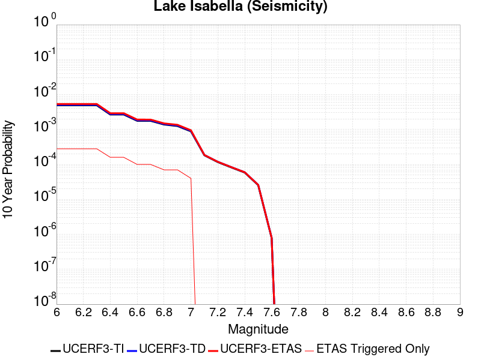 |

| Magnitude | 1 wk TI Prob | 1 wk TD Prob | 1 wk ETAS Prob | 1 wk ETAS/TD Gain | 1 wk ETAS Triggered Only | 1 mo TI Prob | 1 mo TD Prob | 1 mo ETAS Prob | 1 mo ETAS/TD Gain | 1 mo ETAS Triggered Only | 1 yr TI Prob | 1 yr TD Prob | 1 yr ETAS Prob | 1 yr ETAS/TD Gain | 1 yr ETAS Triggered Only | 10 yr TI Prob | 10 yr TD Prob | 10 yr ETAS Prob | 10 yr ETAS/TD Gain | 10 yr ETAS Triggered Only |
|-----|-----|-----|-----|-----|-----|-----|-----|-----|-----|-----|-----|-----|-----|-----|-----|-----|-----|-----|-----|-----|
| 6.0 | 9.431637E-6 | 9.741651E-6 | 1.7973999E-4 | 18.45067 | 1.7E-4 | 4.0420677E-5 | 4.1749343E-5 | 2.2174182E-4 | 5.3112655 | 1.8E-4 | 4.920106E-4 | 5.0819275E-4 | 7.280809E-4 | 1.4326866 | 2.2E-4 | 0.004909227 | 0.005071599 | 0.0053501786 | 1.0549294 | 2.8E-4 |
| 6.1 | 9.431637E-6 | 9.741651E-6 | 1.7973999E-4 | 18.45067 | 1.7E-4 | 4.0420677E-5 | 4.1749343E-5 | 2.2174182E-4 | 5.3112655 | 1.8E-4 | 4.920106E-4 | 5.0819275E-4 | 7.280809E-4 | 1.4326866 | 2.2E-4 | 0.004909227 | 0.005071599 | 0.0053501786 | 1.0549294 | 2.8E-4 |
| 6.2 | 9.431637E-6 | 9.741651E-6 | 1.7973999E-4 | 18.45067 | 1.7E-4 | 4.0420677E-5 | 4.1749343E-5 | 2.2174182E-4 | 5.3112655 | 1.8E-4 | 4.920106E-4 | 5.0819275E-4 | 7.280809E-4 | 1.4326866 | 2.2E-4 | 0.004909227 | 0.005071599 | 0.0053501786 | 1.0549294 | 2.8E-4 |
| 6.3 | 9.431637E-6 | 9.741651E-6 | 1.7973999E-4 | 18.45067 | 1.7E-4 | 4.0420677E-5 | 4.1749343E-5 | 2.2174182E-4 | 5.3112655 | 1.8E-4 | 4.920106E-4 | 5.0819275E-4 | 7.280809E-4 | 1.4326866 | 2.2E-4 | 0.004909227 | 0.005071599 | 0.0053501786 | 1.0549294 | 2.8E-4 |
| 6.4 | 5.144063E-6 | 5.3000763E-6 | 9.52996E-5 | 17.980799 | 9.0E-5 | 2.2045799E-5 | 2.2714434E-5 | 1.2271217E-4 | 5.402387 | 1.0E-4 | 2.6837454E-4 | 2.765166E-4 | 3.964834E-4 | 1.4338503 | 1.2E-4 | 0.0026805066 | 0.0027620657 | 0.0029216239 | 1.0577676 | 1.6E-4 |
| 6.5 | 5.144063E-6 | 5.3000763E-6 | 9.52996E-5 | 17.980799 | 9.0E-5 | 2.2045799E-5 | 2.2714434E-5 | 1.2271217E-4 | 5.402387 | 1.0E-4 | 2.6837454E-4 | 2.765166E-4 | 3.964834E-4 | 1.4338503 | 1.2E-4 | 0.0026805066 | 0.0027620657 | 0.0029216239 | 1.0577676 | 1.6E-4 |
| 6.6 | 3.4009804E-6 | 3.498786E-6 | 6.349858E-5 | 18.148745 | 6.0E-5 | 1.4575549E-5 | 1.4994721E-5 | 8.499367E-5 | 5.6682396 | 7.0E-5 | 1.7744285E-4 | 1.8254704E-4 | 2.725306E-4 | 1.4929336 | 9.0E-5 | 0.0017730123 | 0.0018241286 | 0.0019239462 | 1.0547206 | 1.0E-4 |
| 6.7 | 3.3880428E-6 | 3.4856528E-6 | 6.3485444E-5 | 18.213358 | 6.0E-5 | 1.4520103E-5 | 1.4938435E-5 | 8.493739E-5 | 5.685829 | 7.0E-5 | 1.767679E-4 | 1.8186188E-4 | 2.7184552E-4 | 1.494791 | 9.0E-5 | 0.0017662736 | 0.0018172882 | 0.0019171064 | 1.054927 | 1.0E-4 |
| 6.8 | 2.6582E-6 | 2.7337003E-6 | 4.273359E-5 | 15.632142 | 4.0E-5 | 1.1392236E-5 | 1.1715813E-5 | 6.1715225E-5 | 5.2676864 | 5.0E-5 | 1.3869164E-4 | 1.4263204E-4 | 2.1262205E-4 | 1.4907033 | 7.0E-5 | 0.0013860512 | 0.0014255369 | 0.0014954371 | 1.0490344 | 7.0E-5 |
| 6.9 | 2.406011E-6 | 2.4743288E-6 | 4.247423E-5 | 17.16596 | 4.0E-5 | 1.0311434E-5 | 1.0604231E-5 | 6.06037E-5 | 5.7150493 | 5.0E-5 | 1.2553448E-4 | 1.2910018E-4 | 1.9909114E-4 | 1.5421445 | 7.0E-5 | 0.0012546359 | 0.0012903814 | 0.0013602911 | 1.0541775 | 7.0E-5 |
| 7.0 | 1.6953097E-6 | 1.7429371E-6 | 2.1742902E-5 | 12.474863 | 2.0E-5 | 7.265593E-6 | 7.469715E-6 | 2.7469567E-5 | 3.6774583 | 2.0E-5 | 8.8455E-5 | 9.094104E-5 | 1.3093739E-4 | 1.4398054 | 4.0E-5 | 8.84198E-4 | 9.09141E-4 | 9.491046E-4 | 1.0439576 | 4.0E-5 |
| 7.1 | 3.5013824E-7 | 3.5714822E-7 | 3.5714822E-7 | 1.0 | 0.0 | 1.5005916E-6 | 1.5306344E-6 | 1.5306344E-6 | 1.0 | 0.0 | 1.826955E-5 | 1.8635317E-5 | 1.8635317E-5 | 1.0 | 0.0 | 1.8268047E-4 | 1.863378E-4 | 1.863378E-4 | 1.0 | 0.0 |
| 7.2 | 2.2321095E-7 | 2.2750574E-7 | 2.2750574E-7 | 1.0 | 0.0 | 9.56618E-7 | 9.750242E-7 | 9.750242E-7 | 1.0 | 0.0 | 1.1646762E-5 | 1.1870856E-5 | 1.1870856E-5 | 1.0 | 0.0 | 1.1646151E-4 | 1.1870232E-4 | 1.1870232E-4 | 1.0 | 0.0 |
| 7.3 | 1.5760406E-7 | 1.6060922E-7 | 1.6060922E-7 | 1.0 | 0.0 | 6.7544585E-7 | 6.8832503E-7 | 6.8832503E-7 | 1.0 | 0.0 | 8.223522E-6 | 8.380326E-6 | 8.380326E-6 | 1.0 | 0.0 | 8.2232174E-5 | 8.3800165E-5 | 8.3800165E-5 | 1.0 | 0.0 |
| 7.4 | 1.1216497E-7 | 1.1431706E-7 | 1.1431706E-7 | 1.0 | 0.0 | 4.8070694E-7 | 4.899302E-7 | 4.899302E-7 | 1.0 | 0.0 | 5.852591E-6 | 5.964884E-6 | 5.964884E-6 | 1.0 | 0.0 | 5.8524372E-5 | 5.9647282E-5 | 5.9647282E-5 | 1.0 | 0.0 |
| 7.5 | 4.885185E-8 | 4.9787737E-8 | 4.9787737E-8 | 1.0 | 0.0 | 2.0936506E-7 | 2.13376E-7 | 2.13376E-7 | 1.0 | 0.0 | 2.5490165E-6 | 2.59785E-6 | 2.59785E-6 | 1.0 | 0.0 | 2.5489873E-5 | 2.5978214E-5 | 2.5978214E-5 | 1.0 | 0.0 |
| 7.6 | 1.504641E-9 | 1.5317903E-9 | 1.5317903E-9 | 1.0 | 0.0 | 6.4484613E-9 | 6.5648154E-9 | 6.5648154E-9 | 1.0 | 0.0 | 7.851001E-8 | 7.992663E-8 | 7.992663E-8 | 1.0 | 0.0 | 7.8509987E-7 | 7.992663E-7 | 7.992663E-7 | 1.0 | 0.0 |

## Pisgah-Bullion Mtn-Mesquite Lk
*[(top)](#table-of-contents)*

| 1 Week | 1 Month | 1 Year | 10 Year |
|-----|-----|-----|-----|
|  | 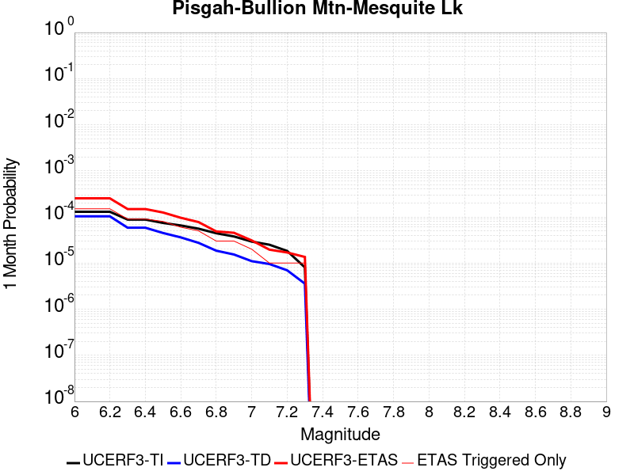 | 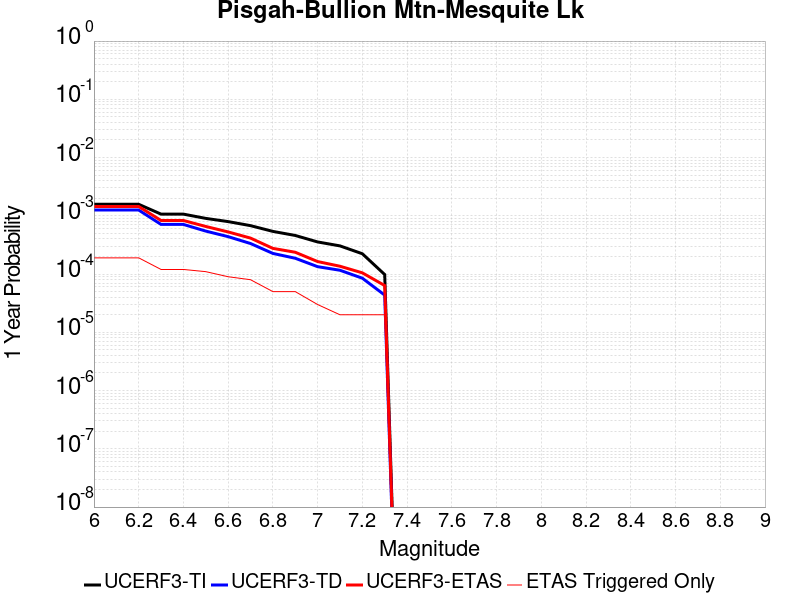 |  |

| Magnitude | 1 wk TI Prob | 1 wk TD Prob | 1 wk ETAS Prob | 1 wk ETAS/TD Gain | 1 wk ETAS Triggered Only | 1 mo TI Prob | 1 mo TD Prob | 1 mo ETAS Prob | 1 mo ETAS/TD Gain | 1 mo ETAS Triggered Only | 1 yr TI Prob | 1 yr TD Prob | 1 yr ETAS Prob | 1 yr ETAS/TD Gain | 1 yr ETAS Triggered Only | 10 yr TI Prob | 10 yr TD Prob | 10 yr ETAS Prob | 10 yr ETAS/TD Gain | 10 yr ETAS Triggered Only |
|-----|-----|-----|-----|-----|-----|-----|-----|-----|-----|-----|-----|-----|-----|-----|-----|-----|-----|-----|-----|-----|
| 6.0 | 3.0240792E-5 | 2.40909E-5 | 1.3408824E-4 | 5.5659294 | 1.1E-4 | 1.2959696E-4 | 1.032432E-4 | 2.532277E-4 | 2.4527302 | 1.5E-4 | 0.0015767008 | 0.0012563618 | 0.0014461231 | 1.1510403 | 1.9E-4 | 0.015655609 | 0.012502613 | 0.012769237 | 1.0213255 | 2.7E-4 |
| 6.1 | 3.0240792E-5 | 2.40909E-5 | 1.3408824E-4 | 5.5659294 | 1.1E-4 | 1.2959696E-4 | 1.032432E-4 | 2.532277E-4 | 2.4527302 | 1.5E-4 | 0.0015767008 | 0.0012563618 | 0.0014461231 | 1.1510403 | 1.9E-4 | 0.015655609 | 0.012502613 | 0.012769237 | 1.0213255 | 2.7E-4 |
| 6.2 | 3.0240792E-5 | 2.40909E-5 | 1.3408824E-4 | 5.5659294 | 1.1E-4 | 1.2959696E-4 | 1.032432E-4 | 2.532277E-4 | 2.4527302 | 1.5E-4 | 0.0015767008 | 0.0012563618 | 0.0014461231 | 1.1510403 | 1.9E-4 | 0.015655609 | 0.012502613 | 0.012769237 | 1.0213255 | 2.7E-4 |
| 6.3 | 2.0498217E-5 | 1.3638054E-5 | 7.363724E-5 | 5.3993945 | 6.0E-5 | 8.784654E-5 | 5.8447586E-5 | 1.4844233E-4 | 2.5397513 | 9.0E-5 | 0.0010690069 | 7.1138324E-4 | 8.312979E-4 | 1.1685654 | 1.2E-4 | 0.01063879 | 0.0070926864 | 0.0072416225 | 1.0209986 | 1.5E-4 |
| 6.4 | 2.0498217E-5 | 1.3638054E-5 | 7.363724E-5 | 5.3993945 | 6.0E-5 | 8.784654E-5 | 5.8447586E-5 | 1.4844233E-4 | 2.5397513 | 9.0E-5 | 0.0010690069 | 7.1138324E-4 | 8.312979E-4 | 1.1685654 | 1.2E-4 | 0.01063879 | 0.0070926864 | 0.0072416225 | 1.0209986 | 1.5E-4 |
| 6.5 | 1.7316182E-5 | 1.04769715E-5 | 6.0476446E-5 | 5.772321 | 5.0E-5 | 7.42101E-5 | 4.490059E-5 | 1.24897E-4 | 2.7816339 | 8.0E-5 | 9.0313336E-4 | 5.465376E-4 | 6.5647747E-4 | 1.2011571 | 1.1E-4 | 0.008994718 | 0.00545293 | 0.0055822213 | 1.0237104 | 1.3E-4 |
| 6.6 | 1.5251077E-5 | 8.414133E-6 | 5.8413712E-5 | 6.9423327 | 5.0E-5 | 6.536012E-5 | 3.606011E-5 | 9.605795E-5 | 2.6638284 | 6.0E-5 | 7.9546886E-4 | 4.3895066E-4 | 5.289111E-4 | 1.2049445 | 9.0E-5 | 0.007926274 | 0.0043815537 | 0.0044910717 | 1.0249952 | 1.1E-4 |
| 6.7 | 1.2997425E-5 | 6.4112146E-6 | 4.6410958E-5 | 7.2390275 | 4.0E-5 | 5.570206E-5 | 2.7476372E-5 | 7.7475E-5 | 2.8196955 | 5.0E-5 | 6.7796157E-4 | 3.3447813E-4 | 4.1445138E-4 | 1.2390985 | 8.0E-5 | 0.0067589693 | 0.003340207 | 0.003439873 | 1.0298382 | 1.0E-4 |
| 6.8 | 1.035386E-5 | 4.333145E-6 | 3.4333014E-5 | 7.9233475 | 3.0E-5 | 4.437293E-5 | 1.8570496E-5 | 4.856994E-5 | 2.6154358 | 3.0E-5 | 5.401065E-4 | 2.260732E-4 | 2.7606188E-4 | 1.2211173 | 5.0E-5 | 0.0053879567 | 0.002258519 | 0.0023183834 | 1.0265061 | 6.0E-5 |
| 6.9 | 8.816252E-6 | 3.5805879E-6 | 3.358048E-5 | 9.378482 | 3.0E-5 | 3.778339E-5 | 1.534529E-5 | 4.534483E-5 | 2.9549673 | 3.0E-5 | 4.5991567E-4 | 1.8681347E-4 | 2.3680413E-4 | 1.2675966 | 5.0E-5 | 0.00458965 | 0.0018666228 | 0.0019265108 | 1.0320836 | 6.0E-5 |
| 7.0 | 6.8232207E-6 | 2.5674399E-6 | 2.2567388E-5 | 8.789841 | 2.0E-5 | 2.9242048E-5 | 1.100327E-5 | 3.100305E-5 | 2.8176215 | 2.0E-5 | 3.5596377E-4 | 1.3395688E-4 | 1.6395286E-4 | 1.2239226 | 3.0E-5 | 0.0035539411 | 0.0013387925 | 0.0013787389 | 1.0298377 | 4.0E-5 |
| 7.1 | 5.837013E-6 | 2.2273143E-6 | 1.2227292E-5 | 5.489702 | 1.0E-5 | 2.501553E-5 | 9.5456E-6 | 1.9545503E-5 | 2.047593 | 1.0E-5 | 3.045215E-4 | 1.1621177E-4 | 1.3620945E-4 | 1.1720796 | 2.0E-5 | 0.0030410455 | 0.001161539 | 0.0011915042 | 1.0257978 | 3.0E-5 |
| 7.2 | 4.278052E-6 | 1.6275065E-6 | 1.16274905E-5 | 7.1443586 | 1.0E-5 | 1.833438E-5 | 6.975011E-6 | 1.697494E-5 | 2.4336796 | 1.0E-5 | 2.231982E-4 | 8.491768E-5 | 1.04915984E-4 | 1.2355022 | 2.0E-5 | 0.0022297418 | 8.4887556E-4 | 8.6885854E-4 | 1.0235406 | 2.0E-5 |
| 7.3 | 1.8803692E-6 | 8.344788E-7 | 1.083447E-5 | 12.983518 | 1.0E-5 | 8.0587E-6 | 3.5763337E-6 | 1.35762975E-5 | 3.7961497 | 1.0E-5 | 9.811026E-5 | 4.354114E-5 | 6.354027E-5 | 1.4593157 | 2.0E-5 | 9.806695E-4 | 4.3534054E-4 | 4.5533184E-4 | 1.0459211 | 2.0E-5 |

## Santa Ynez (East)
*[(top)](#table-of-contents)*

| 1 Week | 1 Month | 1 Year | 10 Year |
|-----|-----|-----|-----|
|  |  |  |  |

| Magnitude | 1 wk TI Prob | 1 wk TD Prob | 1 wk ETAS Prob | 1 wk ETAS/TD Gain | 1 wk ETAS Triggered Only | 1 mo TI Prob | 1 mo TD Prob | 1 mo ETAS Prob | 1 mo ETAS/TD Gain | 1 mo ETAS Triggered Only | 1 yr TI Prob | 1 yr TD Prob | 1 yr ETAS Prob | 1 yr ETAS/TD Gain | 1 yr ETAS Triggered Only | 10 yr TI Prob | 10 yr TD Prob | 10 yr ETAS Prob | 10 yr ETAS/TD Gain | 10 yr ETAS Triggered Only |
|-----|-----|-----|-----|-----|-----|-----|-----|-----|-----|-----|-----|-----|-----|-----|-----|-----|-----|-----|-----|-----|
| 6.0 | 3.2269712E-5 | 3.6750775E-5 | 1.1674783E-4 | 3.176745 | 8.0E-5 | 1.3829143E-4 | 1.5749714E-4 | 2.7747822E-4 | 1.7617986 | 1.2E-4 | 0.0016823979 | 0.0019164253 | 0.0020761187 | 1.0833287 | 1.6E-4 | 0.016697178 | 0.019056438 | 0.019282056 | 1.0118394 | 2.3E-4 |
| 6.1 | 3.2269712E-5 | 3.6750775E-5 | 1.1674783E-4 | 3.176745 | 8.0E-5 | 1.3829143E-4 | 1.5749714E-4 | 2.7747822E-4 | 1.7617986 | 1.2E-4 | 0.0016823979 | 0.0019164253 | 0.0020761187 | 1.0833287 | 1.6E-4 | 0.016697178 | 0.019056438 | 0.019282056 | 1.0118394 | 2.3E-4 |
| 6.2 | 3.2269712E-5 | 3.6750775E-5 | 1.1674783E-4 | 3.176745 | 8.0E-5 | 1.3829143E-4 | 1.5749714E-4 | 2.7747822E-4 | 1.7617986 | 1.2E-4 | 0.0016823979 | 0.0019164253 | 0.0020761187 | 1.0833287 | 1.6E-4 | 0.016697178 | 0.019056438 | 0.019282056 | 1.0118394 | 2.3E-4 |
| 6.3 | 3.2269712E-5 | 3.6750775E-5 | 1.1674783E-4 | 3.176745 | 8.0E-5 | 1.3829143E-4 | 1.5749714E-4 | 2.7747822E-4 | 1.7617986 | 1.2E-4 | 0.0016823979 | 0.0019164253 | 0.0020761187 | 1.0833287 | 1.6E-4 | 0.016697178 | 0.019056438 | 0.019282056 | 1.0118394 | 2.3E-4 |
| 6.4 | 1.4404779E-5 | 1.48492945E-5 | 5.48487E-5 | 3.6936908 | 4.0E-5 | 6.1733306E-5 | 6.363831E-5 | 1.3363386E-4 | 2.0998964 | 7.0E-5 | 7.513438E-4 | 7.7452604E-4 | 8.4447186E-4 | 1.0903078 | 7.0E-5 | 0.0074880854 | 0.007718817 | 0.007827967 | 1.0141408 | 1.1E-4 |
| 6.5 | 1.4404779E-5 | 1.48492945E-5 | 5.48487E-5 | 3.6936908 | 4.0E-5 | 6.1733306E-5 | 6.363831E-5 | 1.3363386E-4 | 2.0998964 | 7.0E-5 | 7.513438E-4 | 7.7452604E-4 | 8.4447186E-4 | 1.0903078 | 7.0E-5 | 0.0074880854 | 0.007718817 | 0.007827967 | 1.0141408 | 1.1E-4 |
| 6.6 | 1.280208E-5 | 1.301186E-5 | 5.301134E-5 | 4.0740786 | 4.0E-5 | 5.4864904E-5 | 5.5763932E-5 | 1.2576002E-4 | 2.2552216 | 7.0E-5 | 6.6777546E-4 | 6.7871617E-4 | 7.486686E-4 | 1.1030658 | 7.0E-5 | 0.006657724 | 0.0067666434 | 0.0068659666 | 1.0146784 | 1.0E-4 |
| 6.7 | 1.2457027E-5 | 1.262838E-5 | 5.2627875E-5 | 4.167429 | 4.0E-5 | 5.3386164E-5 | 5.4120515E-5 | 1.2411673E-4 | 2.2933397 | 7.0E-5 | 6.497827E-4 | 6.5871974E-4 | 7.2867365E-4 | 1.1061968 | 7.0E-5 | 0.00647886 | 0.00656787 | 0.006667213 | 1.0151256 | 1.0E-4 |
| 6.8 | 1.2095134E-5 | 1.2230827E-5 | 5.2230338E-5 | 4.270385 | 4.0E-5 | 5.1835254E-5 | 5.2416784E-5 | 1.2241311E-4 | 2.33538 | 7.0E-5 | 6.309115E-4 | 6.3798914E-4 | 7.0794445E-4 | 1.1096498 | 7.0E-5 | 0.0062912325 | 0.006361764 | 0.0064611277 | 1.0156189 | 1.0E-4 |
| 6.9 | 1.1104036E-5 | 1.115726E-5 | 5.1156814E-5 | 4.5850697 | 4.0E-5 | 4.758786E-5 | 4.781596E-5 | 1.1781261E-4 | 2.4638765 | 7.0E-5 | 5.7922816E-4 | 5.82005E-4 | 6.519643E-4 | 1.1202039 | 7.0E-5 | 0.005777207 | 0.0058049536 | 0.0058944314 | 1.015414 | 9.0E-5 |
| 7.0 | 1.0577444E-5 | 1.05815925E-5 | 5.058117E-5 | 4.7801094 | 4.0E-5 | 4.5331115E-5 | 4.53489E-5 | 1.0534618E-4 | 2.323015 | 6.0E-5 | 5.5176654E-4 | 5.5198424E-4 | 6.119511E-4 | 1.1086388 | 6.0E-5 | 0.0055039856 | 0.00550627 | 0.0055858297 | 1.0144489 | 8.0E-5 |
| 7.1 | 1.0021775E-5 | 9.9809E-6 | 4.99805E-5 | 5.0076146 | 4.0E-5 | 4.294976E-5 | 4.277459E-5 | 1.0277203E-4 | 2.4026418 | 6.0E-5 | 5.2278786E-4 | 5.206574E-4 | 5.8062613E-4 | 1.115179 | 6.0E-5 | 0.0052155964 | 0.005194508 | 0.0052641444 | 1.0134058 | 7.0E-5 |
| 7.2 | 8.874109E-6 | 8.748706E-6 | 3.8748443E-5 | 4.4290485 | 3.0E-5 | 3.8031343E-5 | 3.7493923E-5 | 8.749205E-5 | 2.3334994 | 5.0E-5 | 4.629332E-4 | 4.56394E-4 | 5.0637114E-4 | 1.1095045 | 5.0E-5 | 0.0046197 | 0.0045546847 | 0.0046044574 | 1.0109277 | 5.0E-5 |
| 7.3 | 7.5504267E-6 | 7.5050243E-6 | 2.7504873E-5 | 3.6648614 | 2.0E-5 | 3.235857E-5 | 3.2164E-5 | 7.2162715E-5 | 2.2435865 | 4.0E-5 | 3.9389438E-4 | 3.9152734E-4 | 4.3151167E-4 | 1.102124 | 4.0E-5 | 0.0039319694 | 0.0039084824 | 0.003948326 | 1.0101942 | 4.0E-5 |
| 7.4 | 6.309394E-6 | 6.183062E-6 | 2.618294E-5 | 4.2346234 | 2.0E-5 | 2.703998E-5 | 2.6498574E-5 | 6.6497516E-5 | 2.5094752 | 4.0E-5 | 3.2916202E-4 | 3.2257332E-4 | 3.6256041E-4 | 1.1239628 | 4.0E-5 | 0.003286749 | 0.0032211484 | 0.0032610195 | 1.012378 | 4.0E-5 |
| 7.5 | 4.6103073E-6 | 4.4408016E-6 | 1.4440757E-5 | 3.2518356 | 1.0E-5 | 1.975831E-5 | 1.9031871E-5 | 4.90313E-5 | 2.5762732 | 3.0E-5 | 2.4053088E-4 | 2.316891E-4 | 2.6168214E-4 | 1.1294539 | 3.0E-5 | 0.002402707 | 0.002314545 | 0.0023444756 | 1.0129315 | 3.0E-5 |
| 7.6 | 1.2858658E-6 | 1.3008196E-6 | 1.3008196E-6 | 1.0 | 0.0 | 5.5108417E-6 | 5.574929E-6 | 1.5574873E-5 | 2.7937348 | 1.0E-5 | 6.7092435E-5 | 6.787272E-5 | 7.787204E-5 | 1.1473246 | 1.0E-5 | 6.707218E-4 | 6.7852676E-4 | 6.8852E-4 | 1.0147278 | 1.0E-5 |
| 7.7 | 5.3302307E-7 | 5.612138E-7 | 5.612138E-7 | 1.0 | 0.0 | 2.2843826E-6 | 2.4052001E-6 | 1.2405176E-5 | 5.157648 | 1.0E-5 | 2.7812002E-5 | 2.9282955E-5 | 3.9282662E-5 | 1.3414856 | 1.0E-5 | 2.7808524E-4 | 2.9279455E-4 | 3.0279162E-4 | 1.0341437 | 1.0E-5 |
| 7.8 | 4.613933E-8 | 4.80301E-8 | 4.80301E-8 | 1.0 | 0.0 | 1.9773998E-7 | 2.0584326E-7 | 2.0584326E-7 | 1.0 | 0.0 | 2.4074816E-6 | 2.5061388E-6 | 2.5061388E-6 | 1.0 | 0.0 | 2.4074554E-5 | 2.5061116E-5 | 2.5061116E-5 | 1.0 | 0.0 |

## Cleghorn Lake
*[(top)](#table-of-contents)*

| 1 Week | 1 Month | 1 Year | 10 Year |
|-----|-----|-----|-----|
|  | 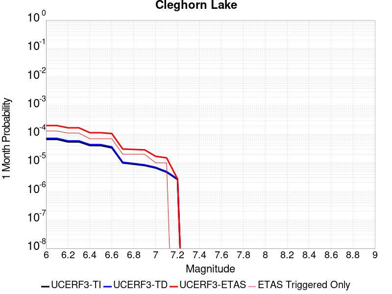 |  |  |

| Magnitude | 1 wk TI Prob | 1 wk TD Prob | 1 wk ETAS Prob | 1 wk ETAS/TD Gain | 1 wk ETAS Triggered Only | 1 mo TI Prob | 1 mo TD Prob | 1 mo ETAS Prob | 1 mo ETAS/TD Gain | 1 mo ETAS Triggered Only | 1 yr TI Prob | 1 yr TD Prob | 1 yr ETAS Prob | 1 yr ETAS/TD Gain | 1 yr ETAS Triggered Only | 10 yr TI Prob | 10 yr TD Prob | 10 yr ETAS Prob | 10 yr ETAS/TD Gain | 10 yr ETAS Triggered Only |
|-----|-----|-----|-----|-----|-----|-----|-----|-----|-----|-----|-----|-----|-----|-----|-----|-----|-----|-----|-----|-----|
| 6.0 | 1.5467183E-5 | 1.6794203E-5 | 1.0679269E-4 | 6.358902 | 9.0E-5 | 6.6286244E-5 | 7.197348E-5 | 2.0196413E-4 | 2.8060908 | 1.3E-4 | 8.067362E-4 | 8.759797E-4 | 0.0010358396 | 1.1824926 | 1.6E-4 | 0.008038137 | 0.008730696 | 0.0089686 | 1.0272492 | 2.4E-4 |
| 6.1 | 1.5467183E-5 | 1.6794203E-5 | 1.0679269E-4 | 6.358902 | 9.0E-5 | 6.6286244E-5 | 7.197348E-5 | 2.0196413E-4 | 2.8060908 | 1.3E-4 | 8.067362E-4 | 8.759797E-4 | 0.0010358396 | 1.1824926 | 1.6E-4 | 0.008038137 | 0.008730696 | 0.0089686 | 1.0272492 | 2.4E-4 |
| 6.2 | 1.2624631E-5 | 1.3681544E-5 | 9.368045E-5 | 6.847213 | 8.0E-5 | 5.410444E-5 | 5.863415E-5 | 1.686277E-4 | 2.8759298 | 1.1E-4 | 6.585225E-4 | 7.1368564E-4 | 8.535857E-4 | 1.1960248 | 1.4E-4 | 0.0065657445 | 0.0071187317 | 0.0073272367 | 1.0292896 | 2.1E-4 |
| 6.3 | 1.2624631E-5 | 1.3681544E-5 | 9.368045E-5 | 6.847213 | 8.0E-5 | 5.410444E-5 | 5.863415E-5 | 1.686277E-4 | 2.8759298 | 1.1E-4 | 6.585225E-4 | 7.1368564E-4 | 8.535857E-4 | 1.1960248 | 1.4E-4 | 0.0065657445 | 0.0071187317 | 0.0073272367 | 1.0292896 | 2.1E-4 |
| 6.4 | 9.417684E-6 | 1.0170118E-5 | 6.016961E-5 | 5.916314 | 5.0E-5 | 4.036088E-5 | 4.3585722E-5 | 1.1358267E-4 | 2.6059606 | 7.0E-5 | 4.912829E-4 | 5.3056807E-4 | 6.30515E-4 | 1.1883773 | 1.0E-4 | 0.004901982 | 0.005297049 | 0.0054462543 | 1.0281676 | 1.5E-4 |
| 6.5 | 9.368219E-6 | 1.0117545E-5 | 6.011704E-5 | 5.9418607 | 5.0E-5 | 4.014889E-5 | 4.3360415E-5 | 1.1335738E-4 | 2.6143057 | 7.0E-5 | 4.8870314E-4 | 5.2782625E-4 | 6.2777346E-4 | 1.1893563 | 1.0E-4 | 0.004876298 | 0.0052697617 | 0.005418971 | 1.0283142 | 1.5E-4 |
| 6.6 | 7.803798E-6 | 8.441831E-6 | 5.844141E-5 | 6.922836 | 5.0E-5 | 3.3444423E-5 | 3.6179E-5 | 1.0617646E-4 | 2.9347541 | 7.0E-5 | 4.0710976E-4 | 4.4043022E-4 | 5.403862E-4 | 1.2269508 | 1.0E-4 | 0.0040636472 | 0.0043994905 | 0.0045488304 | 1.0339448 | 1.5E-4 |
| 6.7 | 2.3108669E-6 | 2.4438336E-6 | 2.2443784E-5 | 9.183843 | 2.0E-5 | 9.903678E-6 | 1.0473532E-5 | 3.0473322E-5 | 2.9095554 | 2.0E-5 | 1.205706E-4 | 1.2750797E-4 | 1.5750415E-4 | 1.2352494 | 3.0E-5 | 0.001205052 | 0.0012743667 | 0.0013243031 | 1.0391852 | 5.0E-5 |
| 6.8 | 2.0882828E-6 | 2.2062823E-6 | 2.2206237E-5 | 10.065003 | 2.0E-5 | 8.949753E-6 | 9.455462E-6 | 2.9455272E-5 | 3.1151595 | 2.0E-5 | 1.08957785E-4 | 1.1511434E-4 | 1.4511088E-4 | 1.2605804 | 3.0E-5 | 0.0010890438 | 0.0011505639 | 0.0012005065 | 1.043407 | 5.0E-5 |
| 6.9 | 1.876935E-6 | 1.981051E-6 | 2.1981012E-5 | 11.095632 | 2.0E-5 | 8.043982E-6 | 8.490192E-6 | 2.8490022E-5 | 3.3556395 | 2.0E-5 | 9.7931086E-5 | 1.03363345E-4 | 1.3336024E-4 | 1.2902083 | 3.0E-5 | 9.788794E-4 | 0.0010331686 | 0.0010731274 | 1.0386759 | 4.0E-5 |
| 7.0 | 1.5357559E-6 | 1.6202807E-6 | 1.1620265E-5 | 7.17176 | 1.0E-5 | 6.5817944E-6 | 6.9440425E-6 | 1.6943974E-5 | 2.4400733 | 1.0E-5 | 8.01304E-5 | 8.454057E-5 | 1.0453887E-4 | 1.2365528 | 2.0E-5 | 8.010151E-4 | 8.450965E-4 | 8.750711E-4 | 1.0354689 | 3.0E-5 |
| 7.1 | 1.0905424E-6 | 1.1497619E-6 | 1.114975E-5 | 9.697442 | 1.0E-5 | 4.6737446E-6 | 4.9275427E-6 | 1.4927493E-5 | 3.0293992 | 1.0E-5 | 5.6901354E-5 | 5.999128E-5 | 6.999068E-5 | 1.1666809 | 1.0E-5 | 5.6886784E-4 | 5.997606E-4 | 6.197486E-4 | 1.0333266 | 2.0E-5 |
| 7.2 | 6.06668E-7 | 6.387277E-7 | 6.387277E-7 | 1.0 | 0.0 | 2.600003E-6 | 2.7374022E-6 | 2.7374022E-6 | 1.0 | 0.0 | 3.1654577E-5 | 3.3327433E-5 | 3.3327433E-5 | 1.0 | 0.0 | 3.1650066E-4 | 3.3323118E-4 | 3.3323118E-4 | 1.0 | 0.0 |

## San Jacinto (San Jacinto Valley) rev
*[(top)](#table-of-contents)*

| 1 Week | 1 Month | 1 Year | 10 Year |
|-----|-----|-----|-----|
|  |  |  |  |

| Magnitude | 1 wk TI Prob | 1 wk TD Prob | 1 wk ETAS Prob | 1 wk ETAS/TD Gain | 1 wk ETAS Triggered Only | 1 mo TI Prob | 1 mo TD Prob | 1 mo ETAS Prob | 1 mo ETAS/TD Gain | 1 mo ETAS Triggered Only | 1 yr TI Prob | 1 yr TD Prob | 1 yr ETAS Prob | 1 yr ETAS/TD Gain | 1 yr ETAS Triggered Only | 10 yr TI Prob | 10 yr TD Prob | 10 yr ETAS Prob | 10 yr ETAS/TD Gain | 10 yr ETAS Triggered Only |
|-----|-----|-----|-----|-----|-----|-----|-----|-----|-----|-----|-----|-----|-----|-----|-----|-----|-----|-----|-----|-----|
| 6.0 | 3.652694E-5 | 3.4401106E-5 | 1.6439664E-4 | 4.778818 | 1.3E-4 | 1.5653463E-4 | 1.4742499E-4 | 3.3739698E-4 | 2.288601 | 1.9E-4 | 0.0019041431 | 0.0017934233 | 0.0020030467 | 1.1168845 | 2.1E-4 | 0.018879099 | 0.018526303 | 0.01877167 | 1.0132443 | 2.5E-4 |
| 6.1 | 3.652694E-5 | 3.4401106E-5 | 1.6439664E-4 | 4.778818 | 1.3E-4 | 1.5653463E-4 | 1.4742499E-4 | 3.3739698E-4 | 2.288601 | 1.9E-4 | 0.0019041431 | 0.0017934233 | 0.0020030467 | 1.1168845 | 2.1E-4 | 0.018879099 | 0.018526303 | 0.01877167 | 1.0132443 | 2.5E-4 |
| 6.2 | 3.652694E-5 | 3.4401106E-5 | 1.6439664E-4 | 4.778818 | 1.3E-4 | 1.5653463E-4 | 1.4742499E-4 | 3.3739698E-4 | 2.288601 | 1.9E-4 | 0.0019041431 | 0.0017934233 | 0.0020030467 | 1.1168845 | 2.1E-4 | 0.018879099 | 0.018526303 | 0.01877167 | 1.0132443 | 2.5E-4 |
| 6.3 | 3.652694E-5 | 3.4401106E-5 | 1.6439664E-4 | 4.778818 | 1.3E-4 | 1.5653463E-4 | 1.4742499E-4 | 3.3739698E-4 | 2.288601 | 1.9E-4 | 0.0019041431 | 0.0017934233 | 0.0020030467 | 1.1168845 | 2.1E-4 | 0.018879099 | 0.018526303 | 0.01877167 | 1.0132443 | 2.5E-4 |
| 6.4 | 3.646941E-5 | 3.432268E-5 | 1.6431822E-4 | 4.787453 | 1.3E-4 | 1.5628811E-4 | 1.4708891E-4 | 3.3706098E-4 | 2.2915456 | 1.9E-4 | 0.0019011468 | 0.0017893389 | 0.001998963 | 1.1171517 | 2.1E-4 | 0.018849645 | 0.018486181 | 0.01873156 | 1.0132736 | 2.5E-4 |
| 6.5 | 3.646941E-5 | 3.432268E-5 | 1.6431822E-4 | 4.787453 | 1.3E-4 | 1.5628811E-4 | 1.4708891E-4 | 3.3706098E-4 | 2.2915456 | 1.9E-4 | 0.0019011468 | 0.0017893389 | 0.001998963 | 1.1171517 | 2.1E-4 | 0.018849645 | 0.018486181 | 0.01873156 | 1.0132736 | 2.5E-4 |
| 6.6 | 3.6442503E-5 | 3.4286066E-5 | 1.642816E-4 | 4.7914977 | 1.3E-4 | 1.561728E-4 | 1.4693203E-4 | 3.369041E-4 | 2.292925 | 1.9E-4 | 0.0018997455 | 0.001787432 | 0.0019970566 | 1.117277 | 2.1E-4 | 0.018835869 | 0.01846745 | 0.018712834 | 1.0132873 | 2.5E-4 |
| 6.7 | 3.6432113E-5 | 3.427164E-5 | 1.6426719E-4 | 4.7930937 | 1.3E-4 | 1.5612828E-4 | 1.4687021E-4 | 3.368423E-4 | 2.2934692 | 1.9E-4 | 0.0018992044 | 0.0017866807 | 0.0019963055 | 1.1173264 | 2.1E-4 | 0.018830549 | 0.018460074 | 0.01870546 | 1.0132928 | 2.5E-4 |
| 6.8 | 3.6409598E-5 | 3.4240697E-5 | 1.6423625E-4 | 4.7965217 | 1.3E-4 | 1.560318E-4 | 1.4673761E-4 | 3.3670972E-4 | 2.2946382 | 1.9E-4 | 0.0018980318 | 0.0017850689 | 0.0019946941 | 1.1174325 | 2.1E-4 | 0.018819023 | 0.018444229 | 0.018689618 | 1.0133044 | 2.5E-4 |
| 6.9 | 3.638078E-5 | 3.4201123E-5 | 1.6419668E-4 | 4.800915 | 1.3E-4 | 1.5590832E-4 | 1.4656801E-4 | 3.3654016E-4 | 2.2961366 | 1.9E-4 | 0.0018965311 | 0.0017830075 | 0.001992633 | 1.1175685 | 2.1E-4 | 0.018804269 | 0.018423963 | 0.018669358 | 1.0133193 | 2.5E-4 |
| 7.0 | 3.6294874E-5 | 3.408314E-5 | 1.6407871E-4 | 4.8140726 | 1.3E-4 | 1.5554018E-4 | 1.4606243E-4 | 3.360347E-4 | 2.3006237 | 1.9E-4 | 0.0018920569 | 0.0017768623 | 0.0019864892 | 1.1179758 | 2.1E-4 | 0.018760284 | 0.018363545 | 0.018608954 | 1.013364 | 2.5E-4 |
| 7.1 | 3.6260717E-5 | 3.403942E-5 | 1.64035E-4 | 4.818971 | 1.3E-4 | 1.5539382E-4 | 1.4587509E-4 | 3.3584738E-4 | 2.3022943 | 1.9E-4 | 0.001890278 | 0.0017745851 | 0.0019842125 | 1.1181275 | 2.1E-4 | 0.018742796 | 0.018341139 | 0.018586554 | 1.0133805 | 2.5E-4 |
| 7.2 | 3.6210204E-5 | 3.397364E-5 | 1.6396922E-4 | 4.826366 | 1.3E-4 | 1.5517735E-4 | 1.455932E-4 | 3.3556554E-4 | 2.304816 | 1.9E-4 | 0.001887647 | 0.0017711588 | 0.001980787 | 1.1183565 | 2.1E-4 | 0.01871693 | 0.018307408 | 0.01855283 | 1.0134057 | 2.5E-4 |
| 7.3 | 3.6119454E-5 | 3.386193E-5 | 1.6385752E-4 | 4.8389897 | 1.3E-4 | 1.5478847E-4 | 1.4511449E-4 | 3.3508692E-4 | 2.3091211 | 1.9E-4 | 0.0018829206 | 0.0017653398 | 0.0019749692 | 1.1187472 | 2.1E-4 | 0.018670462 | 0.01824996 | 0.018495398 | 1.0134487 | 2.5E-4 |
| 7.4 | 3.607848E-5 | 3.380943E-5 | 1.6380503E-4 | 4.844951 | 1.3E-4 | 1.5461289E-4 | 1.4488952E-4 | 3.3486198E-4 | 2.3111541 | 1.9E-4 | 0.0018807866 | 0.0017626052 | 0.001972235 | 1.1189318 | 2.1E-4 | 0.018649481 | 0.018222956 | 0.0184684 | 1.013469 | 2.5E-4 |
| 7.5 | 3.5856774E-5 | 3.3619202E-5 | 1.6361484E-4 | 4.866708 | 1.3E-4 | 1.5366284E-4 | 1.4407437E-4 | 3.3404698E-4 | 2.3185735 | 1.9E-4 | 0.0018692396 | 0.0017526967 | 0.0019623286 | 1.1196054 | 2.1E-4 | 0.018535944 | 0.018124057 | 0.018369526 | 1.0135438 | 2.5E-4 |
| 7.6 | 3.286655E-5 | 3.2142278E-5 | 1.621381E-4 | 5.0443873 | 1.3E-4 | 1.4084904E-4 | 1.3774536E-4 | 3.2771917E-4 | 2.3791668 | 1.9E-4 | 0.001713488 | 0.0016757617 | 0.0018854098 | 1.1251061 | 2.1E-4 | 0.017003361 | 0.017343804 | 0.017589467 | 1.0141643 | 2.5E-4 |
| 7.7 | 2.8882527E-5 | 2.9235205E-5 | 1.5923141E-4 | 5.4465637 | 1.3E-4 | 1.237764E-4 | 1.2528773E-4 | 3.1526393E-4 | 2.5163193 | 1.9E-4 | 0.0015059357 | 0.0015243118 | 0.0017339917 | 1.1375571 | 2.1E-4 | 0.014957713 | 0.015830338 | 0.01607638 | 1.0155425 | 2.5E-4 |
| 7.8 | 2.4950225E-5 | 2.6526219E-5 | 1.5652277E-4 | 5.9006815 | 1.3E-4 | 1.0692515E-4 | 1.1367885E-4 | 3.0365726E-4 | 2.671185 | 1.9E-4 | 0.0013010362 | 0.0013831621 | 0.0015928717 | 1.151616 | 2.1E-4 | 0.012934455 | 0.01441176 | 0.014658157 | 1.017097 | 2.5E-4 |
| 7.9 | 1.9881603E-5 | 2.150649E-5 | 1.4150392E-4 | 6.579591 | 1.2E-4 | 8.520408E-5 | 9.216742E-5 | 2.7215082E-4 | 2.9527876 | 1.8E-4 | 0.001036866 | 0.0011215615 | 0.0013213372 | 1.1781228 | 2.0E-4 | 0.010320415 | 0.011776998 | 0.012014171 | 1.0201387 | 2.4E-4 |
| 8.0 | 1.563292E-5 | 1.5936288E-5 | 9.5935015E-5 | 6.01991 | 8.0E-5 | 6.6996516E-5 | 6.829659E-5 | 1.7828908E-4 | 2.610512 | 1.1E-4 | 8.153773E-4 | 8.3119445E-4 | 9.4110303E-4 | 1.1322297 | 1.1E-4 | 0.00812392 | 0.008810331 | 0.008949098 | 1.0157504 | 1.4E-4 |
| 8.1 | 1.0045313E-5 | 8.300794E-6 | 2.8300628E-5 | 3.409388 | 2.0E-5 | 4.305063E-5 | 3.557435E-5 | 6.557328E-5 | 1.8432742 | 3.0E-5 | 5.2401534E-4 | 4.3303217E-4 | 4.6301915E-4 | 1.0692489 | 3.0E-5 | 0.0052278144 | 0.0046587666 | 0.004688627 | 1.0064095 | 3.0E-5 |
| 8.2 | 4.1554413E-6 | 1.5648296E-6 | 1.5648296E-6 | 1.0 | 0.0 | 1.7808914E-5 | 6.7063957E-6 | 6.7063957E-6 | 1.0 | 0.0 | 2.1680194E-4 | 8.164734E-5 | 8.164734E-5 | 1.0 | 0.0 | 0.0021659054 | 9.479703E-4 | 9.479703E-4 | 1.0 | 0.0 |
| 8.3 | 1.2758221E-6 | 3.612677E-7 | 3.612677E-7 | 1.0 | 0.0 | 5.4677976E-6 | 1.5482892E-6 | 1.5482892E-6 | 1.0 | 0.0 | 6.65684E-5 | 1.8850264E-5 | 1.8850264E-5 | 1.0 | 0.0 | 6.6548464E-4 | 2.2739546E-4 | 2.2739546E-4 | 1.0 | 0.0 |

## San Jacinto (Stepovers Combined)
*[(top)](#table-of-contents)*

| 1 Week | 1 Month | 1 Year | 10 Year |
|-----|-----|-----|-----|
|  | 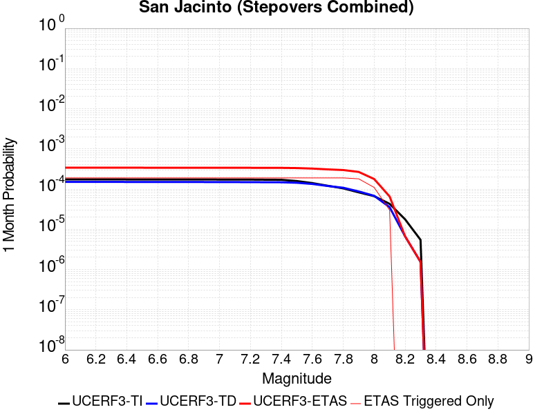 |  |  |

| Magnitude | 1 wk TI Prob | 1 wk TD Prob | 1 wk ETAS Prob | 1 wk ETAS/TD Gain | 1 wk ETAS Triggered Only | 1 mo TI Prob | 1 mo TD Prob | 1 mo ETAS Prob | 1 mo ETAS/TD Gain | 1 mo ETAS Triggered Only | 1 yr TI Prob | 1 yr TD Prob | 1 yr ETAS Prob | 1 yr ETAS/TD Gain | 1 yr ETAS Triggered Only | 10 yr TI Prob | 10 yr TD Prob | 10 yr ETAS Prob | 10 yr ETAS/TD Gain | 10 yr ETAS Triggered Only |
|-----|-----|-----|-----|-----|-----|-----|-----|-----|-----|-----|-----|-----|-----|-----|-----|-----|-----|-----|-----|-----|
| 6.0 | 4.0667746E-5 | 3.5271103E-5 | 1.6526652E-4 | 4.685607 | 1.3E-4 | 1.742787E-4 | 1.5115313E-4 | 3.4112443E-4 | 2.2568135 | 1.9E-4 | 0.0021197782 | 0.0018387372 | 0.0020383694 | 1.1085703 | 2.0E-4 | 0.020996714 | 0.018986495 | 0.019212129 | 1.0118839 | 2.3E-4 |
| 6.1 | 4.0667746E-5 | 3.5271103E-5 | 1.6526652E-4 | 4.685607 | 1.3E-4 | 1.742787E-4 | 1.5115313E-4 | 3.4112443E-4 | 2.2568135 | 1.9E-4 | 0.0021197782 | 0.0018387372 | 0.0020383694 | 1.1085703 | 2.0E-4 | 0.020996714 | 0.018986495 | 0.019212129 | 1.0118839 | 2.3E-4 |
| 6.2 | 4.0667746E-5 | 3.5271103E-5 | 1.6526652E-4 | 4.685607 | 1.3E-4 | 1.742787E-4 | 1.5115313E-4 | 3.4112443E-4 | 2.2568135 | 1.9E-4 | 0.0021197782 | 0.0018387372 | 0.0020383694 | 1.1085703 | 2.0E-4 | 0.020996714 | 0.018986495 | 0.019212129 | 1.0118839 | 2.3E-4 |
| 6.3 | 4.0667746E-5 | 3.5271103E-5 | 1.6526652E-4 | 4.685607 | 1.3E-4 | 1.742787E-4 | 1.5115313E-4 | 3.4112443E-4 | 2.2568135 | 1.9E-4 | 0.0021197782 | 0.0018387372 | 0.0020383694 | 1.1085703 | 2.0E-4 | 0.020996714 | 0.018986495 | 0.019212129 | 1.0118839 | 2.3E-4 |
| 6.4 | 4.0577226E-5 | 3.5143014E-5 | 1.6513845E-4 | 4.6990404 | 1.3E-4 | 1.738908E-4 | 1.5060425E-4 | 3.405756E-4 | 2.2613947 | 1.9E-4 | 0.0021150648 | 0.0018320669 | 0.0020317005 | 1.1089664 | 2.0E-4 | 0.020950472 | 0.018921062 | 0.01914671 | 1.0119258 | 2.3E-4 |
| 6.5 | 4.0577226E-5 | 3.5143014E-5 | 1.6513845E-4 | 4.6990404 | 1.3E-4 | 1.738908E-4 | 1.5060425E-4 | 3.405756E-4 | 2.2613947 | 1.9E-4 | 0.0021150648 | 0.0018320669 | 0.0020317005 | 1.1089664 | 2.0E-4 | 0.020950472 | 0.018921062 | 0.01914671 | 1.0119258 | 2.3E-4 |
| 6.6 | 4.053861E-5 | 3.5088357E-5 | 1.650838E-4 | 4.7048025 | 1.3E-4 | 1.7372532E-4 | 1.5037002E-4 | 3.4034144E-4 | 2.2633598 | 1.9E-4 | 0.0021130538 | 0.0018292206 | 0.0020288548 | 1.1091362 | 2.0E-4 | 0.020930743 | 0.01889314 | 0.019118795 | 1.0119437 | 2.3E-4 |
| 6.7 | 4.0516545E-5 | 3.505743E-5 | 1.6505287E-4 | 4.7080708 | 1.3E-4 | 1.7363077E-4 | 1.502375E-4 | 3.4020896E-4 | 2.2644744 | 1.9E-4 | 0.002111905 | 0.0018276101 | 0.0020272445 | 1.1092325 | 2.0E-4 | 0.020919468 | 0.018877337 | 0.019102994 | 1.011954 | 2.3E-4 |
| 6.8 | 4.049434E-5 | 3.5028992E-5 | 1.6502444E-4 | 4.7110815 | 1.3E-4 | 1.7353562E-4 | 1.5011564E-4 | 3.400871E-4 | 2.265501 | 1.9E-4 | 0.0021107488 | 0.0018261289 | 0.0020257637 | 1.1093212 | 2.0E-4 | 0.020908125 | 0.018862749 | 0.01908841 | 1.0119634 | 2.3E-4 |
| 6.9 | 4.046386E-5 | 3.4991554E-5 | 1.6498701E-4 | 4.715052 | 1.3E-4 | 1.73405E-4 | 1.499552E-4 | 3.3992672E-4 | 2.266855 | 1.9E-4 | 0.0021091616 | 0.0018241788 | 0.002023814 | 1.1094384 | 2.0E-4 | 0.020892553 | 0.018843522 | 0.019069187 | 1.0119758 | 2.3E-4 |
| 7.0 | 4.036382E-5 | 3.4872126E-5 | 1.648676E-4 | 4.727776 | 1.3E-4 | 1.7297632E-4 | 1.4944343E-4 | 3.39415E-4 | 2.2711942 | 1.9E-4 | 0.0021039525 | 0.0018179584 | 0.0020175949 | 1.1098136 | 2.0E-4 | 0.02084144 | 0.018782137 | 0.019007817 | 1.0120157 | 2.3E-4 |
| 7.1 | 4.0343282E-5 | 3.485059E-5 | 1.6484606E-4 | 4.7300797 | 1.3E-4 | 1.7288832E-4 | 1.4935112E-4 | 3.3932275E-4 | 2.2719798 | 1.9E-4 | 0.002102883 | 0.0018168368 | 0.0020164733 | 1.1098814 | 2.0E-4 | 0.020830948 | 0.018771008 | 0.01899669 | 1.012023 | 2.3E-4 |
| 7.2 | 4.0257353E-5 | 3.475509E-5 | 1.6475057E-4 | 4.7403297 | 1.3E-4 | 1.725201E-4 | 1.489419E-4 | 3.3891358E-4 | 2.2754753 | 1.9E-4 | 0.0020984085 | 0.0018118626 | 0.0020115 | 1.1101836 | 2.0E-4 | 0.020787042 | 0.018721746 | 0.018947441 | 1.0120552 | 2.3E-4 |
| 7.3 | 3.9940667E-5 | 3.458276E-5 | 1.6457826E-4 | 4.7589684 | 1.3E-4 | 1.7116306E-4 | 1.4820343E-4 | 3.3817528E-4 | 2.2818317 | 1.9E-4 | 0.0020819185 | 0.0018028866 | 0.002002526 | 1.1107332 | 2.0E-4 | 0.020625217 | 0.018630387 | 0.018856103 | 1.0121155 | 2.3E-4 |
| 7.4 | 3.9721202E-5 | 3.4468165E-5 | 1.6446368E-4 | 4.7714663 | 1.3E-4 | 1.7022261E-4 | 1.4771236E-4 | 3.376843E-4 | 2.2860937 | 1.9E-4 | 0.0020704903 | 0.0017969179 | 0.0019965584 | 1.1111017 | 2.0E-4 | 0.020513052 | 0.018569522 | 0.01879525 | 1.0121559 | 2.3E-4 |
| 7.5 | 3.7036873E-5 | 3.3535776E-5 | 1.6353141E-4 | 4.8763275 | 1.3E-4 | 1.5871979E-4 | 1.4371685E-4 | 3.3368953E-4 | 2.321854 | 1.9E-4 | 0.0019307006 | 0.0017483513 | 0.0019480017 | 1.1141934 | 2.0E-4 | 0.019140124 | 0.018071128 | 0.018296972 | 1.0124974 | 2.3E-4 |
| 7.6 | 3.2940967E-5 | 3.13167E-5 | 1.6131264E-4 | 5.1510096 | 1.3E-4 | 1.4116794E-4 | 1.3420754E-4 | 3.2418204E-4 | 2.4155278 | 1.9E-4 | 0.0017173645 | 0.0016327545 | 0.0018224443 | 1.1161778 | 1.9E-4 | 0.01704153 | 0.016904091 | 0.017120373 | 1.0127946 | 2.2E-4 |
| 7.7 | 2.8236149E-5 | 2.7882697E-5 | 1.5787907E-4 | 5.6622596 | 1.3E-4 | 1.2100645E-4 | 1.1949181E-4 | 3.094691E-4 | 2.5898771 | 1.9E-4 | 0.0014722579 | 0.0014538429 | 0.0016435666 | 1.1304982 | 1.9E-4 | 0.014625421 | 0.015114912 | 0.015331586 | 1.0143352 | 2.2E-4 |
| 7.8 | 2.4329287E-5 | 2.5206451E-5 | 1.5520318E-4 | 6.15728 | 1.3E-4 | 1.042642E-4 | 1.08023174E-4 | 2.9800265E-4 | 2.7586918 | 1.9E-4 | 0.0012686774 | 0.0013143895 | 0.0015041399 | 1.1443638 | 1.9E-4 | 0.012614589 | 0.013712341 | 0.013929324 | 1.015824 | 2.2E-4 |
| 7.9 | 1.9370926E-5 | 2.0420413E-5 | 1.4041796E-4 | 6.876353 | 1.2E-4 | 8.301561E-5 | 8.751312E-5 | 2.6749738E-4 | 3.0566545 | 1.8E-4 | 0.0010102465 | 0.0010649522 | 0.0012447606 | 1.1688417 | 1.8E-4 | 0.0100566605 | 0.011199402 | 0.011407049 | 1.018541 | 2.1E-4 |
| 8.0 | 1.5583017E-5 | 1.5885415E-5 | 9.588414E-5 | 6.035986 | 8.0E-5 | 6.6782646E-5 | 6.807858E-5 | 1.7807109E-4 | 2.61567 | 1.1E-4 | 8.127754E-4 | 8.2854216E-4 | 9.3845103E-4 | 1.1326534 | 1.1E-4 | 0.008098091 | 0.008781636 | 0.008920407 | 1.0158024 | 1.4E-4 |
| 8.1 | 1.0024873E-5 | 8.291399E-6 | 2.8291233E-5 | 3.412118 | 2.0E-5 | 4.2963035E-5 | 3.553409E-5 | 6.553302E-5 | 1.8442297 | 3.0E-5 | 5.229494E-4 | 4.3254215E-4 | 4.6252916E-4 | 1.0693274 | 3.0E-5 | 0.0052172043 | 0.0046530655 | 0.004682926 | 1.0064174 | 3.0E-5 |
| 8.2 | 4.142796E-6 | 1.5602761E-6 | 1.5602761E-6 | 1.0 | 0.0 | 1.775472E-5 | 6.6868806E-6 | 6.6868806E-6 | 1.0 | 0.0 | 2.1614227E-4 | 8.140976E-5 | 8.140976E-5 | 1.0 | 0.0 | 0.0021593217 | 9.4514614E-4 | 9.4514614E-4 | 1.0 | 0.0 |
| 8.3 | 1.2750878E-6 | 3.609817E-7 | 3.609817E-7 | 1.0 | 0.0 | 5.4646503E-6 | 1.5470634E-6 | 1.5470634E-6 | 1.0 | 0.0 | 6.653009E-5 | 1.8835339E-5 | 1.8835339E-5 | 1.0 | 0.0 | 6.6510175E-4 | 2.272251E-4 | 2.272251E-4 | 1.0 | 0.0 |

## Santa Ynez (West)
*[(top)](#table-of-contents)*

| 1 Week | 1 Month | 1 Year | 10 Year |
|-----|-----|-----|-----|
|  |  |  |  |

| Magnitude | 1 wk TI Prob | 1 wk TD Prob | 1 wk ETAS Prob | 1 wk ETAS/TD Gain | 1 wk ETAS Triggered Only | 1 mo TI Prob | 1 mo TD Prob | 1 mo ETAS Prob | 1 mo ETAS/TD Gain | 1 mo ETAS Triggered Only | 1 yr TI Prob | 1 yr TD Prob | 1 yr ETAS Prob | 1 yr ETAS/TD Gain | 1 yr ETAS Triggered Only | 10 yr TI Prob | 10 yr TD Prob | 10 yr ETAS Prob | 10 yr ETAS/TD Gain | 10 yr ETAS Triggered Only |
|-----|-----|-----|-----|-----|-----|-----|-----|-----|-----|-----|-----|-----|-----|-----|-----|-----|-----|-----|-----|-----|
| 6.0 | 4.7352758E-5 | 5.497084E-5 | 1.14967545E-4 | 2.0914278 | 6.0E-5 | 2.0292461E-4 | 2.3556968E-4 | 3.2554846E-4 | 1.3819625 | 9.0E-5 | 0.0024678076 | 0.002864558 | 0.0029941855 | 1.0452522 | 1.3E-4 | 0.024405818 | 0.028304456 | 0.02847936 | 1.0061795 | 1.8E-4 |
| 6.1 | 4.7352758E-5 | 5.497084E-5 | 1.14967545E-4 | 2.0914278 | 6.0E-5 | 2.0292461E-4 | 2.3556968E-4 | 3.2554846E-4 | 1.3819625 | 9.0E-5 | 0.0024678076 | 0.002864558 | 0.0029941855 | 1.0452522 | 1.3E-4 | 0.024405818 | 0.028304456 | 0.028469644 | 1.0058361 | 1.7E-4 |
| 6.2 | 3.0415853E-5 | 3.3925004E-5 | 8.39233E-5 | 2.4737892 | 5.0E-5 | 1.3034715E-4 | 1.4538495E-4 | 2.1537478E-4 | 1.4814104 | 7.0E-5 | 0.0015858212 | 0.0017686592 | 0.0018485177 | 1.045152 | 8.0E-5 | 0.015745522 | 0.01754978 | 0.017657848 | 1.0061579 | 1.1E-4 |
| 6.3 | 3.0415853E-5 | 3.3925004E-5 | 8.39233E-5 | 2.4737892 | 5.0E-5 | 1.3034715E-4 | 1.4538495E-4 | 2.1537478E-4 | 1.4814104 | 7.0E-5 | 0.0015858212 | 0.0017686592 | 0.0018485177 | 1.045152 | 8.0E-5 | 0.015745522 | 0.01754978 | 0.017657848 | 1.0061579 | 1.1E-4 |
| 6.4 | 2.5452082E-5 | 2.7912318E-5 | 7.7910925E-5 | 2.7912738 | 5.0E-5 | 1.09075794E-4 | 1.1961885E-4 | 1.8961048E-4 | 1.585122 | 7.0E-5 | 0.0013271887 | 0.0014554056 | 0.0015253037 | 1.0480266 | 7.0E-5 | 0.013192902 | 0.01446091 | 0.014549608 | 1.0061337 | 9.0E-5 |
| 6.5 | 2.3143784E-5 | 2.5128133E-5 | 7.5126874E-5 | 2.9897516 | 5.0E-5 | 9.9183875E-5 | 1.07687636E-4 | 1.776801E-4 | 1.6499583 | 7.0E-5 | 0.0012068948 | 0.001310323 | 0.0013802312 | 1.053352 | 7.0E-5 | 0.012003611 | 0.013027638 | 0.013116466 | 1.0068184 | 9.0E-5 |
| 6.6 | 1.9118515E-5 | 2.0354244E-5 | 6.035343E-5 | 2.965152 | 4.0E-5 | 8.193392E-5 | 8.722961E-5 | 1.4722437E-4 | 1.6877799 | 6.0E-5 | 9.97089E-4 | 0.001061511 | 0.0011214473 | 1.0564632 | 6.0E-5 | 0.00992627 | 0.010565317 | 0.010644471 | 1.007492 | 8.0E-5 |
| 6.7 | 1.722807E-5 | 1.8146253E-5 | 5.8145528E-5 | 3.2042718 | 4.0E-5 | 7.3832496E-5 | 7.776737E-5 | 1.377627E-4 | 1.7714719 | 6.0E-5 | 8.985399E-4 | 9.4641204E-4 | 0.0010063553 | 1.0633373 | 6.0E-5 | 0.008949154 | 0.009424461 | 0.009503707 | 1.0084085 | 8.0E-5 |
| 6.8 | 1.5317364E-5 | 1.5926391E-5 | 5.5925753E-5 | 3.5115144 | 4.0E-5 | 6.56442E-5 | 6.82542E-5 | 1.282501E-4 | 1.8790067 | 6.0E-5 | 7.98925E-4 | 8.3068234E-4 | 8.906325E-4 | 1.0721698 | 6.0E-5 | 0.007960589 | 0.008276261 | 0.008345681 | 1.0083879 | 7.0E-5 |
| 6.9 | 1.3071226E-5 | 1.332953E-5 | 5.3328997E-5 | 4.000816 | 4.0E-5 | 5.6018336E-5 | 5.712532E-5 | 1.0712246E-4 | 1.8752186 | 5.0E-5 | 6.8180985E-4 | 6.952811E-4 | 7.452463E-4 | 1.0718634 | 5.0E-5 | 0.0067972173 | 0.0069313184 | 0.0069909026 | 1.0085964 | 6.0E-5 |
| 7.0 | 1.1836986E-5 | 1.1932688E-5 | 4.193233E-5 | 3.5140724 | 3.0E-5 | 5.0728955E-5 | 5.1139097E-5 | 9.113705E-5 | 1.7821404 | 4.0E-5 | 6.1745E-4 | 6.2244234E-4 | 6.6241744E-4 | 1.0642229 | 4.0E-5 | 0.006157372 | 0.0062071825 | 0.006256872 | 1.0080051 | 5.0E-5 |
| 7.1 | 1.0597169E-5 | 1.0542107E-5 | 3.0541898E-5 | 2.8971338 | 2.0E-5 | 4.541565E-5 | 4.5179684E-5 | 7.517833E-5 | 1.6639853 | 3.0E-5 | 5.5279525E-4 | 5.4992497E-4 | 5.7990843E-4 | 1.0545229 | 3.0E-5 | 0.0055142213 | 0.005485772 | 0.0055255527 | 1.0072516 | 4.0E-5 |
| 7.2 | 9.59113E-6 | 9.45905E-6 | 2.945886E-5 | 3.1143572 | 2.0E-5 | 4.11042E-5 | 4.053816E-5 | 7.0536946E-5 | 1.7400135 | 3.0E-5 | 5.0032866E-4 | 4.934414E-4 | 5.234266E-4 | 1.0607675 | 3.0E-5 | 0.004992037 | 0.0049235765 | 0.0049534286 | 1.0060631 | 3.0E-5 |
| 7.3 | 8.586084E-6 | 8.379489E-6 | 2.8379322E-5 | 3.3867602 | 2.0E-5 | 3.679698E-5 | 3.591161E-5 | 6.591053E-5 | 1.8353544 | 3.0E-5 | 4.4791115E-4 | 4.3713715E-4 | 4.6712405E-4 | 1.0685984 | 3.0E-5 | 0.004470094 | 0.004362884 | 0.0043927534 | 1.0068462 | 3.0E-5 |
| 7.4 | 7.2622997E-6 | 6.9514485E-6 | 2.695131E-5 | 3.877078 | 2.0E-5 | 3.112377E-5 | 2.9791589E-5 | 5.9790695E-5 | 2.0069656 | 3.0E-5 | 3.78866E-4 | 3.6265317E-4 | 3.926423E-4 | 1.0826937 | 3.0E-5 | 0.0037822074 | 0.003620714 | 0.0036506054 | 1.0082556 | 3.0E-5 |
| 7.5 | 5.627296E-6 | 5.2514984E-6 | 1.5251446E-5 | 2.9042084 | 1.0E-5 | 2.411676E-5 | 2.2506232E-5 | 4.250578E-5 | 1.8886228 | 2.0E-5 | 2.9358198E-4 | 2.7397962E-4 | 2.9397415E-4 | 1.0729781 | 2.0E-5 | 0.0029319443 | 0.0027364905 | 0.0027564357 | 1.0072886 | 2.0E-5 |
| 7.6 | 2.265244E-6 | 2.0608632E-6 | 2.0608632E-6 | 1.0 | 0.0 | 9.708152E-6 | 8.832241E-6 | 8.832241E-6 | 1.0 | 0.0 | 1.18190335E-4 | 1.0752732E-4 | 1.0752732E-4 | 1.0 | 0.0 | 0.001181275 | 0.0010747615 | 0.0010747615 | 1.0 | 0.0 |
| 7.7 | 1.3099874E-6 | 1.1016228E-6 | 1.1016228E-6 | 1.0 | 0.0 | 5.61422E-6 | 4.7212325E-6 | 4.7212325E-6 | 1.0 | 0.0 | 6.8350986E-5 | 5.7479516E-5 | 5.7479516E-5 | 1.0 | 0.0 | 6.832996E-4 | 5.7464885E-4 | 5.7464885E-4 | 1.0 | 0.0 |
| 7.8 | 7.903951E-7 | 6.0710704E-7 | 6.0710704E-7 | 1.0 | 0.0 | 3.3874032E-6 | 2.601885E-6 | 2.601885E-6 | 1.0 | 0.0 | 4.1240855E-5 | 3.16775E-5 | 3.16775E-5 | 1.0 | 0.0 | 4.12332E-4 | 3.167312E-4 | 3.167312E-4 | 1.0 | 0.0 |
| 7.9 | 7.0753297E-9 | 5.090092E-9 | 5.090092E-9 | 1.0 | 0.0 | 3.032284E-8 | 2.181468E-8 | 2.181468E-8 | 1.0 | 0.0 | 3.6918053E-7 | 2.655937E-7 | 2.655937E-7 | 1.0 | 0.0 | 3.691799E-6 | 2.6559348E-6 | 2.6559348E-6 | 1.0 | 0.0 |

## Cleghorn Pass
*[(top)](#table-of-contents)*

| 1 Week | 1 Month | 1 Year | 10 Year |
|-----|-----|-----|-----|
|  |  | 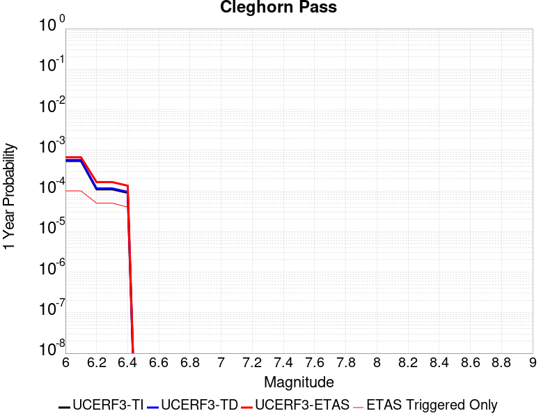 |  |

| Magnitude | 1 wk TI Prob | 1 wk TD Prob | 1 wk ETAS Prob | 1 wk ETAS/TD Gain | 1 wk ETAS Triggered Only | 1 mo TI Prob | 1 mo TD Prob | 1 mo ETAS Prob | 1 mo ETAS/TD Gain | 1 mo ETAS Triggered Only | 1 yr TI Prob | 1 yr TD Prob | 1 yr ETAS Prob | 1 yr ETAS/TD Gain | 1 yr ETAS Triggered Only | 10 yr TI Prob | 10 yr TD Prob | 10 yr ETAS Prob | 10 yr ETAS/TD Gain | 10 yr ETAS Triggered Only |
|-----|-----|-----|-----|-----|-----|-----|-----|-----|-----|-----|-----|-----|-----|-----|-----|-----|-----|-----|-----|-----|
| 6.0 | 1.0522846E-5 | 1.1040642E-5 | 6.104009E-5 | 5.528672 | 5.0E-5 | 4.509713E-5 | 4.7316473E-5 | 1.0731364E-4 | 2.2679973 | 6.0E-5 | 5.4891926E-4 | 5.759784E-4 | 6.7592086E-4 | 1.1735176 | 1.0E-4 | 0.0054756533 | 0.005750022 | 0.0059289867 | 1.0311242 | 1.8E-4 |
| 6.1 | 1.0522846E-5 | 1.1040642E-5 | 6.104009E-5 | 5.528672 | 5.0E-5 | 4.509713E-5 | 4.7316473E-5 | 1.0731364E-4 | 2.2679973 | 6.0E-5 | 5.4891926E-4 | 5.759784E-4 | 6.7592086E-4 | 1.1735176 | 1.0E-4 | 0.0054756533 | 0.005750022 | 0.0059289867 | 1.0311242 | 1.8E-4 |
| 6.2 | 2.1045846E-6 | 2.2082024E-6 | 2.2208158E-5 | 10.05712 | 2.0E-5 | 9.019617E-6 | 9.463714E-6 | 3.946343E-5 | 4.169973 | 3.0E-5 | 1.098083E-4 | 1.1521882E-4 | 1.6521306E-4 | 1.4339069 | 5.0E-5 | 0.0010975406 | 0.0011520023 | 0.0012319101 | 1.0693643 | 8.0E-5 |
| 6.3 | 2.1045846E-6 | 2.2082024E-6 | 2.2208158E-5 | 10.05712 | 2.0E-5 | 9.019617E-6 | 9.463714E-6 | 3.946343E-5 | 4.169973 | 3.0E-5 | 1.098083E-4 | 1.1521882E-4 | 1.6521306E-4 | 1.4339069 | 5.0E-5 | 0.0010975406 | 0.0011520023 | 0.0012319101 | 1.0693643 | 8.0E-5 |
| 6.4 | 1.7259927E-6 | 1.810877E-6 | 2.1810842E-5 | 12.044352 | 2.0E-5 | 7.3970905E-6 | 7.760902E-6 | 3.776067E-5 | 4.8655 | 3.0E-5 | 9.005586E-5 | 9.4488976E-5 | 1.344852E-4 | 1.4232898 | 4.0E-5 | 9.001937E-4 | 9.448898E-4 | 0.0010048331 | 1.0634395 | 6.0E-5 |

## San Jacinto (Anza) rev
*[(top)](#table-of-contents)*

| 1 Week | 1 Month | 1 Year | 10 Year |
|-----|-----|-----|-----|
|  |  | 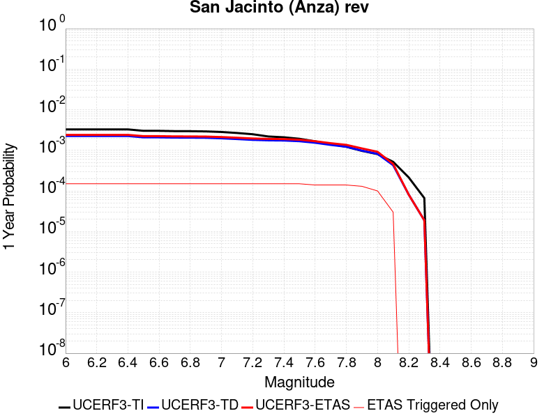 |  |

| Magnitude | 1 wk TI Prob | 1 wk TD Prob | 1 wk ETAS Prob | 1 wk ETAS/TD Gain | 1 wk ETAS Triggered Only | 1 mo TI Prob | 1 mo TD Prob | 1 mo ETAS Prob | 1 mo ETAS/TD Gain | 1 mo ETAS Triggered Only | 1 yr TI Prob | 1 yr TD Prob | 1 yr ETAS Prob | 1 yr ETAS/TD Gain | 1 yr ETAS Triggered Only | 10 yr TI Prob | 10 yr TD Prob | 10 yr ETAS Prob | 10 yr ETAS/TD Gain | 10 yr ETAS Triggered Only |
|-----|-----|-----|-----|-----|-----|-----|-----|-----|-----|-----|-----|-----|-----|-----|-----|-----|-----|-----|-----|-----|
| 6.0 | 6.3015636E-5 | 4.3298347E-5 | 1.3329445E-4 | 3.0785112 | 9.0E-5 | 2.7003905E-4 | 1.8555121E-4 | 3.2552524E-4 | 1.7543687 | 1.4E-4 | 0.0032827691 | 0.0022567573 | 0.0024064188 | 1.0663171 | 1.5E-4 | 0.032346968 | 0.02329361 | 0.023469418 | 1.0075475 | 1.8E-4 |
| 6.1 | 6.3015636E-5 | 4.3298347E-5 | 1.3329445E-4 | 3.0785112 | 9.0E-5 | 2.7003905E-4 | 1.8555121E-4 | 3.2552524E-4 | 1.7543687 | 1.4E-4 | 0.0032827691 | 0.0022567573 | 0.0024064188 | 1.0663171 | 1.5E-4 | 0.032346968 | 0.02329361 | 0.023469418 | 1.0075475 | 1.8E-4 |
| 6.2 | 6.3015636E-5 | 4.3298347E-5 | 1.3329445E-4 | 3.0785112 | 9.0E-5 | 2.7003905E-4 | 1.8555121E-4 | 3.2552524E-4 | 1.7543687 | 1.4E-4 | 0.0032827691 | 0.0022567573 | 0.0024064188 | 1.0663171 | 1.5E-4 | 0.032346968 | 0.02329361 | 0.023469418 | 1.0075475 | 1.8E-4 |
| 6.3 | 6.3015636E-5 | 4.3298347E-5 | 1.3329445E-4 | 3.0785112 | 9.0E-5 | 2.7003905E-4 | 1.8555121E-4 | 3.2552524E-4 | 1.7543687 | 1.4E-4 | 0.0032827691 | 0.0022567573 | 0.0024064188 | 1.0663171 | 1.5E-4 | 0.032346968 | 0.02329361 | 0.023469418 | 1.0075475 | 1.8E-4 |
| 6.4 | 6.3015636E-5 | 4.3298347E-5 | 1.3329445E-4 | 3.0785112 | 9.0E-5 | 2.7003905E-4 | 1.8555121E-4 | 3.2552524E-4 | 1.7543687 | 1.4E-4 | 0.0032827691 | 0.0022567573 | 0.0024064188 | 1.0663171 | 1.5E-4 | 0.032346968 | 0.02329361 | 0.023469418 | 1.0075475 | 1.8E-4 |
| 6.5 | 5.811017E-5 | 4.0080286E-5 | 1.3007667E-4 | 3.245403 | 9.0E-5 | 2.4901982E-4 | 1.7176138E-4 | 3.1173733E-4 | 1.8149443 | 1.4E-4 | 0.0030276014 | 0.0020891947 | 0.0022388813 | 1.071648 | 1.5E-4 | 0.02986684 | 0.021590833 | 0.021766948 | 1.0081569 | 1.8E-4 |
| 6.6 | 5.811017E-5 | 4.0080286E-5 | 1.3007667E-4 | 3.245403 | 9.0E-5 | 2.4901982E-4 | 1.7176138E-4 | 3.1173733E-4 | 1.8149443 | 1.4E-4 | 0.0030276014 | 0.0020891947 | 0.0022388813 | 1.071648 | 1.5E-4 | 0.02986684 | 0.021590833 | 0.021766948 | 1.0081569 | 1.8E-4 |
| 6.7 | 5.712442E-5 | 3.950301E-5 | 1.2949946E-4 | 3.2782173 | 9.0E-5 | 2.4479596E-4 | 1.6928767E-4 | 3.0926397E-4 | 1.8268547 | 1.4E-4 | 0.0029763177 | 0.0020591344 | 0.0022088257 | 1.0726961 | 1.5E-4 | 0.029367693 | 0.021282919 | 0.021459088 | 1.0082775 | 1.8E-4 |
| 6.8 | 5.6967532E-5 | 3.93593E-5 | 1.2935576E-4 | 3.286536 | 9.0E-5 | 2.4412372E-4 | 1.6867183E-4 | 3.0864822E-4 | 1.829874 | 1.4E-4 | 0.0029681553 | 0.0020516508 | 0.0022013432 | 1.0729618 | 1.5E-4 | 0.029288229 | 0.02120852 | 0.021384701 | 1.0083071 | 1.8E-4 |
| 6.9 | 5.6211324E-5 | 3.9064216E-5 | 1.290607E-4 | 3.3038087 | 9.0E-5 | 2.4088343E-4 | 1.6740736E-4 | 3.0738392E-4 | 1.8361435 | 1.4E-4 | 0.0029288116 | 0.0020362847 | 0.0021859794 | 1.0735136 | 1.5E-4 | 0.028905109 | 0.021047527 | 0.021223739 | 1.0083721 | 1.8E-4 |
| 7.0 | 5.4383527E-5 | 3.7925012E-5 | 1.279216E-4 | 3.3730142 | 9.0E-5 | 2.3305144E-4 | 1.6252567E-4 | 3.0250291E-4 | 1.8612624 | 1.4E-4 | 0.0028337094 | 0.001976959 | 0.0021266625 | 1.0757241 | 1.5E-4 | 0.027978465 | 0.02044095 | 0.02061727 | 1.0086259 | 1.8E-4 |
| 7.1 | 5.1393665E-5 | 3.638787E-5 | 1.2638459E-4 | 3.4732616 | 9.0E-5 | 2.2023996E-4 | 1.5593872E-4 | 2.959169E-4 | 1.8976486 | 1.4E-4 | 0.0026781242 | 0.0018969048 | 0.0020466202 | 1.0789262 | 1.5E-4 | 0.026460782 | 0.019616077 | 0.019792546 | 1.0089961 | 1.8E-4 |
| 7.2 | 4.785222E-5 | 3.4738845E-5 | 1.2473571E-4 | 3.5906699 | 9.0E-5 | 2.0506482E-4 | 1.4887229E-4 | 2.8885144E-4 | 1.9402634 | 1.4E-4 | 0.0024938055 | 0.0018110167 | 0.001960745 | 1.0826764 | 1.5E-4 | 0.024660049 | 0.018728783 | 0.018905412 | 1.0094309 | 1.8E-4 |
| 7.3 | 4.2143256E-5 | 3.3834414E-5 | 1.2383137E-4 | 3.6599236 | 9.0E-5 | 1.8060145E-4 | 1.449966E-4 | 2.849763E-4 | 1.9654 | 1.4E-4 | 0.002196605 | 0.0017639075 | 0.0019136429 | 1.0848885 | 1.5E-4 | 0.02175019 | 0.018236695 | 0.018413413 | 1.0096902 | 1.8E-4 |
| 7.4 | 4.0264713E-5 | 3.3472694E-5 | 1.2346968E-4 | 3.6886687 | 9.0E-5 | 1.7255165E-4 | 1.4344654E-4 | 2.8342646E-4 | 1.9758334 | 1.4E-4 | 0.002098792 | 0.0017450659 | 0.0018948042 | 1.0858066 | 1.5E-4 | 0.020790804 | 0.018041389 | 0.018218141 | 1.0097971 | 1.8E-4 |
| 7.5 | 3.694492E-5 | 3.2186905E-5 | 1.22184E-4 | 3.7960782 | 9.0E-5 | 1.5832575E-4 | 1.379366E-4 | 2.7791728E-4 | 2.014819 | 1.4E-4 | 0.0019259118 | 0.0016780876 | 0.0018278359 | 1.0892375 | 1.5E-4 | 0.01909306 | 0.017357888 | 0.017534764 | 1.0101899 | 1.8E-4 |
| 7.6 | 3.200565E-5 | 2.9502702E-5 | 1.19500044E-4 | 4.050478 | 9.0E-5 | 1.3715986E-4 | 1.2643404E-4 | 2.6641635E-4 | 2.1071568 | 1.4E-4 | 0.001668642 | 0.0015382497 | 0.0016780343 | 1.0908725 | 1.4E-4 | 0.01656168 | 0.015946016 | 0.016113305 | 1.010491 | 1.7E-4 |
| 7.7 | 2.731642E-5 | 2.6091477E-5 | 1.16089126E-4 | 4.449312 | 9.0E-5 | 1.1706512E-4 | 1.11815825E-4 | 2.5180017E-4 | 2.251919 | 1.4E-4 | 0.001424336 | 0.0013605085 | 0.0015003181 | 1.1027627 | 1.4E-4 | 0.014152412 | 0.0141668 | 0.014334392 | 1.0118299 | 1.7E-4 |
| 7.8 | 2.3466424E-5 | 2.3503619E-5 | 1.13501505E-4 | 4.8291073 | 9.0E-5 | 1.0056651E-4 | 1.0072591E-4 | 2.4071182E-4 | 2.3897705 | 1.4E-4 | 0.0012237094 | 0.0012256489 | 0.0013654773 | 1.1140852 | 1.4E-4 | 0.012169928 | 0.012808796 | 0.0129766185 | 1.0131022 | 1.7E-4 |
| 7.9 | 1.8611925E-5 | 1.890698E-5 | 9.890547E-5 | 5.2311616 | 8.0E-5 | 7.9762955E-5 | 8.10274E-5 | 2.1101687E-4 | 2.6042655 | 1.3E-4 | 9.7068126E-4 | 9.860628E-4 | 0.0011159347 | 1.1317074 | 1.3E-4 | 0.0096645225 | 0.010393705 | 0.010552042 | 1.0152339 | 1.6E-4 |
| 8.0 | 1.5460775E-5 | 1.5739915E-5 | 8.5738815E-5 | 5.4472218 | 7.0E-5 | 6.6258784E-5 | 6.745504E-5 | 1.6744829E-4 | 2.482369 | 1.0E-4 | 8.0640207E-4 | 8.2095637E-4 | 9.2087424E-4 | 1.1217091 | 1.0E-4 | 0.008034821 | 0.008702706 | 0.008831575 | 1.0148079 | 1.3E-4 |
| 8.1 | 9.983884E-6 | 8.268954E-6 | 2.8268789E-5 | 3.4186654 | 2.0E-5 | 4.2787375E-5 | 3.5437897E-5 | 6.5436834E-5 | 1.8465214 | 3.0E-5 | 5.2081177E-4 | 4.313715E-4 | 4.6135855E-4 | 1.0695156 | 3.0E-5 | 0.0051959283 | 0.00463968 | 0.004669541 | 1.006436 | 3.0E-5 |
| 8.2 | 4.1226E-6 | 1.5522551E-6 | 1.5522551E-6 | 1.0 | 0.0 | 1.7668166E-5 | 6.6525045E-6 | 6.6525045E-6 | 1.0 | 0.0 | 2.1508869E-4 | 8.099126E-5 | 8.099126E-5 | 1.0 | 0.0 | 0.0021488064 | 9.401847E-4 | 9.401847E-4 | 1.0 | 0.0 |
| 8.3 | 1.2750878E-6 | 3.609817E-7 | 3.609817E-7 | 1.0 | 0.0 | 5.4646503E-6 | 1.5470634E-6 | 1.5470634E-6 | 1.0 | 0.0 | 6.653009E-5 | 1.8835339E-5 | 1.8835339E-5 | 1.0 | 0.0 | 6.6510175E-4 | 2.272251E-4 | 2.272251E-4 | 1.0 | 0.0 |

## San Diego Trough north alt1
*[(top)](#table-of-contents)*

| 1 Week | 1 Month | 1 Year | 10 Year |
|-----|-----|-----|-----|
|  |  | 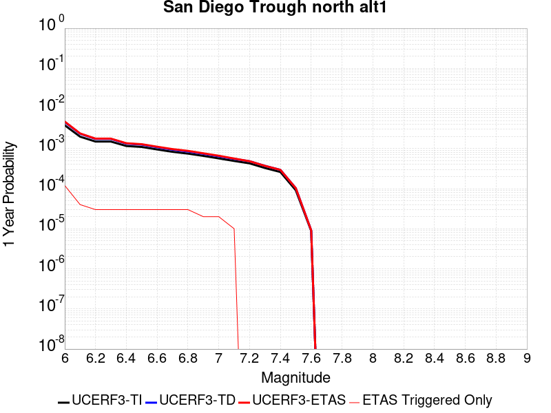 |  |

| Magnitude | 1 wk TI Prob | 1 wk TD Prob | 1 wk ETAS Prob | 1 wk ETAS/TD Gain | 1 wk ETAS Triggered Only | 1 mo TI Prob | 1 mo TD Prob | 1 mo ETAS Prob | 1 mo ETAS/TD Gain | 1 mo ETAS Triggered Only | 1 yr TI Prob | 1 yr TD Prob | 1 yr ETAS Prob | 1 yr ETAS/TD Gain | 1 yr ETAS Triggered Only | 10 yr TI Prob | 10 yr TD Prob | 10 yr ETAS Prob | 10 yr ETAS/TD Gain | 10 yr ETAS Triggered Only |
|-----|-----|-----|-----|-----|-----|-----|-----|-----|-----|-----|-----|-----|-----|-----|-----|-----|-----|-----|-----|-----|
| 6.0 | 7.329252E-5 | 8.821269E-5 | 1.5820652E-4 | 1.7934666 | 7.0E-5 | 3.14073E-4 | 3.7800326E-4 | 4.879617E-4 | 1.2908928 | 1.1E-4 | 0.0038171355 | 0.0045930487 | 0.0047124973 | 1.0260065 | 1.2E-4 | 0.03752231 | 0.045045137 | 0.04519793 | 1.003392 | 1.6E-4 |
| 6.1 | 3.7940346E-5 | 4.4884906E-5 | 5.488446E-5 | 1.222782 | 1.0E-5 | 1.6259136E-4 | 1.9235026E-4 | 2.2234449E-4 | 1.1559355 | 3.0E-5 | 0.0019777524 | 0.002339431 | 0.0023793373 | 1.0170581 | 4.0E-5 | 0.019602431 | 0.023156732 | 0.023225112 | 1.0029529 | 7.0E-5 |
| 6.2 | 2.8645263E-5 | 3.329672E-5 | 3.329672E-5 | 1.0 | 0.0 | 1.2275964E-4 | 1.4269259E-4 | 1.6268973E-4 | 1.1401415 | 2.0E-5 | 0.0014935739 | 0.0017359206 | 0.0017658685 | 1.0172518 | 3.0E-5 | 0.0148357535 | 0.017226268 | 0.017265579 | 1.002282 | 4.0E-5 |
| 6.3 | 2.8645263E-5 | 3.329672E-5 | 3.329672E-5 | 1.0 | 0.0 | 1.2275964E-4 | 1.4269259E-4 | 1.6268973E-4 | 1.1401415 | 2.0E-5 | 0.0014935739 | 0.0017359206 | 0.0017658685 | 1.0172518 | 3.0E-5 | 0.0148357535 | 0.017226268 | 0.017265579 | 1.002282 | 4.0E-5 |
| 6.4 | 2.2204576E-5 | 2.544832E-5 | 2.544832E-5 | 1.0 | 0.0 | 9.5159E-5 | 1.0905972E-4 | 1.1905863E-4 | 1.0916829 | 1.0E-5 | 0.001157945 | 0.0013270028 | 0.001356963 | 1.0225773 | 3.0E-5 | 0.011519298 | 0.013191959 | 0.013231431 | 1.0029922 | 4.0E-5 |
| 6.5 | 2.1004838E-5 | 2.4024695E-5 | 2.4024695E-5 | 1.0 | 0.0 | 9.0017624E-5 | 1.0295897E-4 | 1.1295794E-4 | 1.0971161 | 1.0E-5 | 0.0010954136 | 0.0012528135 | 0.0012827759 | 1.0239161 | 3.0E-5 | 0.010900296 | 0.012458592 | 0.012498093 | 1.0031706 | 4.0E-5 |
| 6.6 | 1.820557E-5 | 2.070479E-5 | 2.070479E-5 | 1.0 | 0.0 | 7.802154E-5 | 8.8731824E-5 | 9.873094E-5 | 1.1126891 | 1.0E-5 | 9.4949827E-4 | 0.0010797799 | 0.0011097476 | 1.0277535 | 3.0E-5 | 0.009454516 | 0.010746005 | 0.010775683 | 1.0027617 | 3.0E-5 |
| 6.7 | 1.5884485E-5 | 1.7983646E-5 | 1.7983646E-5 | 1.0 | 0.0 | 6.807459E-5 | 7.707051E-5 | 8.706974E-5 | 1.1297413 | 1.0E-5 | 8.284929E-4 | 9.3793223E-4 | 9.679041E-4 | 1.0319552 | 3.0E-5 | 0.008254109 | 0.009340104 | 0.009369823 | 1.0031819 | 3.0E-5 |
| 6.8 | 1.4331171E-5 | 1.6201066E-5 | 1.6201066E-5 | 1.0 | 0.0 | 6.141786E-5 | 6.94313E-5 | 7.94306E-5 | 1.1440172 | 1.0E-5 | 7.4750587E-4 | 8.450002E-4 | 8.749748E-4 | 1.035473 | 3.0E-5 | 0.0074499645 | 0.008418139 | 0.008447886 | 1.0035337 | 3.0E-5 |
| 6.9 | 1.2574203E-5 | 1.4205835E-5 | 1.4205835E-5 | 1.0 | 0.0 | 5.3888325E-5 | 6.0880735E-5 | 7.088013E-5 | 1.1642456 | 1.0E-5 | 6.558929E-4 | 7.409723E-4 | 7.609575E-4 | 1.0269716 | 2.0E-5 | 0.0065396037 | 0.007385203 | 0.0074050557 | 1.0026882 | 2.0E-5 |
| 7.0 | 1.0883844E-5 | 1.2289262E-5 | 1.2289262E-5 | 1.0 | 0.0 | 4.664421E-5 | 5.2667205E-5 | 6.266668E-5 | 1.1898614 | 1.0E-5 | 5.677453E-4 | 6.4103556E-4 | 6.610227E-4 | 1.0311795 | 2.0E-5 | 0.00566297 | 0.006391993 | 0.006411865 | 1.0031089 | 2.0E-5 |
| 7.1 | 9.393088E-6 | 1.060702E-5 | 1.060702E-5 | 1.0 | 0.0 | 4.025547E-5 | 4.545787E-5 | 4.545787E-5 | 1.0 | 0.0 | 4.900001E-4 | 5.533098E-4 | 5.6330423E-4 | 1.0180631 | 1.0E-5 | 0.0048892107 | 0.005519418 | 0.0055293627 | 1.0018017 | 1.0E-5 |
| 7.2 | 8.190791E-6 | 9.258625E-6 | 9.258625E-6 | 1.0 | 0.0 | 3.510292E-5 | 3.9679224E-5 | 3.9679224E-5 | 1.0 | 0.0 | 4.2729423E-4 | 4.8298817E-4 | 4.8298817E-4 | 1.0 | 0.0 | 0.0042647356 | 0.004819465 | 0.004819465 | 1.0 | 0.0 |
| 7.3 | 6.268162E-6 | 7.089716E-6 | 7.089716E-6 | 1.0 | 0.0 | 2.6863276E-5 | 3.0384144E-5 | 3.0384144E-5 | 1.0 | 0.0 | 3.2701128E-4 | 3.6986457E-4 | 3.6986457E-4 | 1.0 | 0.0 | 0.003265305 | 0.003692536 | 0.003692536 | 1.0 | 0.0 |
| 7.4 | 4.985186E-6 | 5.6426816E-6 | 5.6426816E-6 | 1.0 | 0.0 | 2.1364907E-5 | 2.4182698E-5 | 2.4182698E-5 | 1.0 | 0.0 | 2.600867E-4 | 2.9438498E-4 | 2.9438498E-4 | 1.0 | 0.0 | 0.002597825 | 0.0029399914 | 0.0029399914 | 1.0 | 0.0 |
| 7.5 | 1.7489613E-6 | 1.969678E-6 | 1.969678E-6 | 1.0 | 0.0 | 7.495527E-6 | 8.4414505E-6 | 8.4414505E-6 | 1.0 | 0.0 | 9.125422E-5 | 1.02770035E-4 | 1.02770035E-4 | 1.0 | 0.0 | 9.1216754E-4 | 0.0010272472 | 0.0010272472 | 1.0 | 0.0 |
| 7.6 | 1.6988751E-7 | 1.7533823E-7 | 1.7533823E-7 | 1.0 | 0.0 | 7.2808916E-7 | 7.5144936E-7 | 7.5144936E-7 | 1.0 | 0.0 | 8.864449E-6 | 9.14886E-6 | 9.14886E-6 | 1.0 | 0.0 | 8.8640954E-5 | 9.1485024E-5 | 9.1485024E-5 | 1.0 | 0.0 |

## Mission Creek
*[(top)](#table-of-contents)*

| 1 Week | 1 Month | 1 Year | 10 Year |
|-----|-----|-----|-----|
|  | 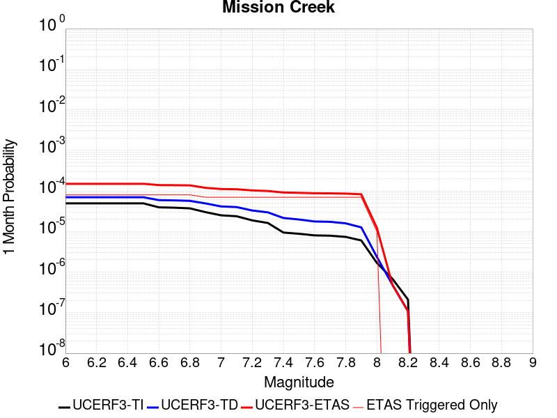 |  | 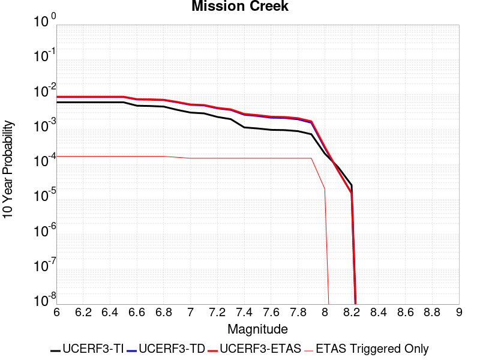 |

| Magnitude | 1 wk TI Prob | 1 wk TD Prob | 1 wk ETAS Prob | 1 wk ETAS/TD Gain | 1 wk ETAS Triggered Only | 1 mo TI Prob | 1 mo TD Prob | 1 mo ETAS Prob | 1 mo ETAS/TD Gain | 1 mo ETAS Triggered Only | 1 yr TI Prob | 1 yr TD Prob | 1 yr ETAS Prob | 1 yr ETAS/TD Gain | 1 yr ETAS Triggered Only | 10 yr TI Prob | 10 yr TD Prob | 10 yr ETAS Prob | 10 yr ETAS/TD Gain | 10 yr ETAS Triggered Only |
|-----|-----|-----|-----|-----|-----|-----|-----|-----|-----|-----|-----|-----|-----|-----|-----|-----|-----|-----|-----|-----|
| 6.0 | 1.1549387E-5 | 1.6322783E-5 | 7.6321805E-5 | 4.675784 | 6.0E-5 | 4.9496433E-5 | 6.995299E-5 | 1.4994739E-4 | 2.1435452 | 8.0E-5 | 6.0245243E-4 | 8.5135986E-4 | 9.812493E-4 | 1.1525669 | 1.3E-4 | 0.006008218 | 0.008510157 | 0.00867871 | 1.0198061 | 1.7E-4 |
| 6.1 | 1.1549387E-5 | 1.6322783E-5 | 7.6321805E-5 | 4.675784 | 6.0E-5 | 4.9496433E-5 | 6.995299E-5 | 1.4994739E-4 | 2.1435452 | 8.0E-5 | 6.0245243E-4 | 8.5135986E-4 | 9.812493E-4 | 1.1525669 | 1.3E-4 | 0.006008218 | 0.008510157 | 0.00867871 | 1.0198061 | 1.7E-4 |
| 6.2 | 1.1549387E-5 | 1.6322783E-5 | 7.6321805E-5 | 4.675784 | 6.0E-5 | 4.9496433E-5 | 6.995299E-5 | 1.4994739E-4 | 2.1435452 | 8.0E-5 | 6.0245243E-4 | 8.5135986E-4 | 9.812493E-4 | 1.1525669 | 1.3E-4 | 0.006008218 | 0.008510157 | 0.00867871 | 1.0198061 | 1.7E-4 |
| 6.3 | 1.1549387E-5 | 1.6322783E-5 | 7.6321805E-5 | 4.675784 | 6.0E-5 | 4.9496433E-5 | 6.995299E-5 | 1.4994739E-4 | 2.1435452 | 8.0E-5 | 6.0245243E-4 | 8.5135986E-4 | 9.812493E-4 | 1.1525669 | 1.3E-4 | 0.006008218 | 0.008510157 | 0.00867871 | 1.0198061 | 1.7E-4 |
| 6.4 | 1.1549387E-5 | 1.6322783E-5 | 7.6321805E-5 | 4.675784 | 6.0E-5 | 4.9496433E-5 | 6.995299E-5 | 1.4994739E-4 | 2.1435452 | 8.0E-5 | 6.0245243E-4 | 8.5135986E-4 | 9.812493E-4 | 1.1525669 | 1.3E-4 | 0.006008218 | 0.008510157 | 0.00867871 | 1.0198061 | 1.7E-4 |
| 6.5 | 1.1549387E-5 | 1.6322783E-5 | 7.6321805E-5 | 4.675784 | 6.0E-5 | 4.9496433E-5 | 6.995299E-5 | 1.4994739E-4 | 2.1435452 | 8.0E-5 | 6.0245243E-4 | 8.5135986E-4 | 9.812493E-4 | 1.1525669 | 1.3E-4 | 0.006008218 | 0.008510157 | 0.00867871 | 1.0198061 | 1.7E-4 |
| 6.6 | 9.202681E-6 | 1.3846059E-5 | 7.384523E-5 | 5.333303 | 6.0E-5 | 3.9439463E-5 | 5.9338956E-5 | 1.3933421E-4 | 2.3481069 | 8.0E-5 | 4.800697E-4 | 7.2222133E-4 | 8.5212744E-4 | 1.1798702 | 1.3E-4 | 0.004790339 | 0.0072273402 | 0.0073961117 | 1.0233518 | 1.7E-4 |
| 6.7 | 9.019164E-6 | 1.3651728E-5 | 7.365091E-5 | 5.394988 | 6.0E-5 | 3.8652986E-5 | 5.8506146E-5 | 1.3850146E-4 | 2.3672976 | 8.0E-5 | 4.7049852E-4 | 7.1208854E-4 | 8.41996E-4 | 1.1824316 | 1.3E-4 | 0.004695036 | 0.0071266647 | 0.007295453 | 1.023684 | 1.7E-4 |
| 6.8 | 8.673558E-6 | 1.3273839E-5 | 7.327304E-5 | 5.520109 | 6.0E-5 | 3.717186E-5 | 5.688669E-5 | 1.3688214E-4 | 2.4062243 | 8.0E-5 | 4.524734E-4 | 6.923842E-4 | 8.222942E-4 | 1.1876271 | 1.3E-4 | 0.0045155324 | 0.0069308523 | 0.007099674 | 1.024358 | 1.7E-4 |
| 6.9 | 7.002255E-6 | 1.1478069E-5 | 6.147749E-5 | 5.356084 | 5.0E-5 | 3.000932E-5 | 4.9190832E-5 | 1.1918739E-4 | 2.4229593 | 7.0E-5 | 3.653022E-4 | 5.9874065E-4 | 7.186688E-4 | 1.2003007 | 1.2E-4 | 0.0036470229 | 0.005999676 | 0.0061587156 | 1.0265081 | 1.6E-4 |
| 7.0 | 5.84644E-6 | 9.675359E-6 | 5.9674876E-5 | 6.167717 | 5.0E-5 | 2.5055931E-5 | 4.146519E-5 | 1.1146229E-4 | 2.688093 | 7.0E-5 | 3.0501327E-4 | 5.047263E-4 | 6.2466576E-4 | 1.2376326 | 1.2E-4 | 0.0030459496 | 0.005063994 | 0.0052132346 | 1.0294709 | 1.5E-4 |
| 7.1 | 5.54703E-6 | 9.329834E-6 | 5.9329366E-5 | 6.3591022 | 5.0E-5 | 2.377277E-5 | 3.9984414E-5 | 1.09981615E-4 | 2.750612 | 7.0E-5 | 2.8939504E-4 | 4.8670598E-4 | 6.066476E-4 | 1.2464354 | 1.2E-4 | 0.0028901845 | 0.0048845876 | 0.005033855 | 1.0305588 | 1.5E-4 |
| 7.2 | 4.384709E-6 | 7.681918E-6 | 5.7681533E-5 | 7.5087414 | 5.0E-5 | 1.8791474E-5 | 3.292211E-5 | 1.029198E-4 | 3.1261606 | 7.0E-5 | 2.2876218E-4 | 4.0075663E-4 | 5.2070856E-4 | 1.2993135 | 1.2E-4 | 0.0022852682 | 0.004028542 | 0.0041779377 | 1.0370843 | 1.5E-4 |
| 7.3 | 3.7888456E-6 | 6.915788E-6 | 5.6915444E-5 | 8.229784 | 5.0E-5 | 1.623781E-5 | 2.9638775E-5 | 9.96367E-5 | 3.361701 | 7.0E-5 | 1.9767738E-4 | 3.6079568E-4 | 4.8075238E-4 | 1.3324782 | 1.2E-4 | 0.0019750162 | 0.00363027 | 0.0037797254 | 1.0411693 | 1.5E-4 |
| 7.4 | 2.1982462E-6 | 5.0241033E-6 | 5.502385E-5 | 10.951975 | 5.0E-5 | 9.421021E-6 | 2.1531694E-5 | 9.1530186E-5 | 4.2509513 | 7.0E-5 | 1.1469489E-4 | 2.6211704E-4 | 3.8208556E-4 | 1.4576907 | 1.2E-4 | 0.0011463572 | 0.0026460327 | 0.0027956357 | 1.0565387 | 1.5E-4 |
| 7.5 | 2.051923E-6 | 4.6153277E-6 | 5.4615095E-5 | 11.833417 | 5.0E-5 | 8.793926E-6 | 1.9779825E-5 | 8.977844E-5 | 4.5388894 | 7.0E-5 | 1.0706078E-4 | 2.4079291E-4 | 3.60764E-4 | 1.4982336 | 1.2E-4 | 0.0010700922 | 0.0024335932 | 0.002583228 | 1.0614872 | 1.5E-4 |
| 7.6 | 1.8733427E-6 | 4.1236603E-6 | 5.4123455E-5 | 13.125099 | 5.0E-5 | 8.028587E-6 | 1.7672712E-5 | 8.767148E-5 | 4.960839 | 7.0E-5 | 9.774366E-5 | 2.151441E-4 | 3.351183E-4 | 1.5576457 | 1.2E-4 | 9.770069E-4 | 0.0021782513 | 0.0023279244 | 1.0687126 | 1.5E-4 |
| 7.7 | 1.8411953E-6 | 4.0433315E-6 | 5.404313E-5 | 13.36599 | 5.0E-5 | 7.890813E-6 | 1.732845E-5 | 8.732724E-5 | 5.03953 | 7.0E-5 | 9.606641E-5 | 2.1095353E-4 | 3.3092822E-4 | 1.5687257 | 1.2E-4 | 9.6024893E-4 | 0.0021365292 | 0.0022862086 | 1.0700573 | 1.5E-4 |
| 7.8 | 1.7194251E-6 | 3.71068E-6 | 5.3710493E-5 | 14.474569 | 5.0E-5 | 7.368944E-6 | 1.5902819E-5 | 8.59017E-5 | 5.4016657 | 7.0E-5 | 8.97132E-5 | 1.9359968E-4 | 3.1357646E-4 | 1.6197157 | 1.2E-4 | 8.967699E-4 | 0.0019624757 | 0.0021121812 | 1.076284 | 1.5E-4 |
| 7.9 | 1.4035052E-6 | 2.9502596E-6 | 5.2950112E-5 | 17.94761 | 5.0E-5 | 6.0150082E-6 | 1.2643909E-5 | 8.2643026E-5 | 6.5361924 | 7.0E-5 | 7.3230265E-5 | 1.5392878E-4 | 2.7391032E-4 | 1.7794613 | 1.2E-4 | 7.3206134E-4 | 0.0015631174 | 0.0017128829 | 1.0958121 | 1.5E-4 |
| 8.0 | 3.9318823E-7 | 5.528477E-7 | 1.05528425E-5 | 19.088152 | 1.0E-5 | 1.6850913E-6 | 2.3693453E-6 | 1.2369322E-5 | 5.220565 | 1.0E-5 | 2.0515794E-5 | 2.8846403E-5 | 3.8846116E-5 | 1.3466537 | 1.0E-5 | 2.0513899E-4 | 2.990952E-4 | 3.1908925E-4 | 1.0668484 | 2.0E-5 |
| 8.1 | 1.596793E-7 | 1.13775044E-7 | 1.13775044E-7 | 1.0 | 0.0 | 6.8433974E-7 | 4.876072E-7 | 4.876072E-7 | 1.0 | 0.0 | 8.331805E-6 | 5.936602E-6 | 5.936602E-6 | 1.0 | 0.0 | 8.331492E-5 | 6.5494125E-5 | 6.5494125E-5 | 1.0 | 0.0 |
| 8.2 | 4.9003038E-8 | 2.5435753E-8 | 2.5435753E-8 | 1.0 | 0.0 | 2.10013E-7 | 1.09010365E-7 | 1.09010365E-7 | 1.0 | 0.0 | 2.5569052E-6 | 1.3272004E-6 | 1.3272004E-6 | 1.0 | 0.0 | 2.556876E-5 | 1.4952613E-5 | 1.4952613E-5 | 1.0 | 0.0 |

## Pinto Mtn
*[(top)](#table-of-contents)*

| 1 Week | 1 Month | 1 Year | 10 Year |
|-----|-----|-----|-----|
|  |  |  |  |

| Magnitude | 1 wk TI Prob | 1 wk TD Prob | 1 wk ETAS Prob | 1 wk ETAS/TD Gain | 1 wk ETAS Triggered Only | 1 mo TI Prob | 1 mo TD Prob | 1 mo ETAS Prob | 1 mo ETAS/TD Gain | 1 mo ETAS Triggered Only | 1 yr TI Prob | 1 yr TD Prob | 1 yr ETAS Prob | 1 yr ETAS/TD Gain | 1 yr ETAS Triggered Only | 10 yr TI Prob | 10 yr TD Prob | 10 yr ETAS Prob | 10 yr ETAS/TD Gain | 10 yr ETAS Triggered Only |
|-----|-----|-----|-----|-----|-----|-----|-----|-----|-----|-----|-----|-----|-----|-----|-----|-----|-----|-----|-----|-----|
| 6.0 | 4.4194956E-5 | 4.7853926E-5 | 9.785153E-5 | 2.0447965 | 5.0E-5 | 1.893932E-4 | 2.0507304E-4 | 2.6506075E-4 | 1.2925187 | 6.0E-5 | 0.0023034236 | 0.0024940688 | 0.0026237445 | 1.0519936 | 1.3E-4 | 0.022796938 | 0.024678305 | 0.024834357 | 1.0063235 | 1.6E-4 |
| 6.1 | 4.4194956E-5 | 4.7853926E-5 | 9.785153E-5 | 2.0447965 | 5.0E-5 | 1.893932E-4 | 2.0507304E-4 | 2.6506075E-4 | 1.2925187 | 6.0E-5 | 0.0023034236 | 0.0024940688 | 0.0026237445 | 1.0519936 | 1.3E-4 | 0.022796938 | 0.024678305 | 0.024834357 | 1.0063235 | 1.6E-4 |
| 6.2 | 4.4194956E-5 | 4.7853926E-5 | 9.785153E-5 | 2.0447965 | 5.0E-5 | 1.893932E-4 | 2.0507304E-4 | 2.6506075E-4 | 1.2925187 | 6.0E-5 | 0.0023034236 | 0.0024940688 | 0.0026237445 | 1.0519936 | 1.3E-4 | 0.022796938 | 0.024678305 | 0.024834357 | 1.0063235 | 1.6E-4 |
| 6.3 | 4.4194956E-5 | 4.7853926E-5 | 9.785153E-5 | 2.0447965 | 5.0E-5 | 1.893932E-4 | 2.0507304E-4 | 2.6506075E-4 | 1.2925187 | 6.0E-5 | 0.0023034236 | 0.0024940688 | 0.0026237445 | 1.0519936 | 1.3E-4 | 0.022796938 | 0.024678305 | 0.024834357 | 1.0063235 | 1.6E-4 |
| 6.4 | 3.729929E-5 | 3.960349E-5 | 8.960151E-5 | 2.262465 | 5.0E-5 | 1.5984432E-4 | 1.6971873E-4 | 2.2970854E-4 | 1.3534662 | 6.0E-5 | 0.0019443673 | 0.0020644604 | 0.0021742333 | 1.0531727 | 1.1E-4 | 0.019274427 | 0.020462848 | 0.020580392 | 1.0057443 | 1.2E-4 |
| 6.5 | 3.729929E-5 | 3.960349E-5 | 8.960151E-5 | 2.262465 | 5.0E-5 | 1.5984432E-4 | 1.6971873E-4 | 2.2970854E-4 | 1.3534662 | 6.0E-5 | 0.0019443673 | 0.0020644604 | 0.0021742333 | 1.0531727 | 1.1E-4 | 0.019274427 | 0.020462848 | 0.020580392 | 1.0057443 | 1.2E-4 |
| 6.6 | 3.0204548E-5 | 3.12056E-5 | 7.1204355E-5 | 2.2817812 | 4.0E-5 | 1.2944164E-4 | 1.3373162E-4 | 1.8372494E-4 | 1.3738332 | 5.0E-5 | 0.0015748127 | 0.0016270012 | 0.0017268385 | 1.0613627 | 1.0E-4 | 0.015636992 | 0.016154764 | 0.016262988 | 1.0066991 | 1.1E-4 |
| 6.7 | 2.9857754E-5 | 3.0814987E-5 | 7.081375E-5 | 2.2980297 | 4.0E-5 | 1.2795553E-4 | 1.3205773E-4 | 1.8205112E-4 | 1.3785723 | 5.0E-5 | 0.0015567453 | 0.0016066517 | 0.001706491 | 1.0621413 | 1.0E-4 | 0.015458848 | 0.015954204 | 0.01606245 | 1.0067847 | 1.1E-4 |
| 6.8 | 2.4819734E-5 | 2.5009665E-5 | 5.5008917E-5 | 2.1995063 | 3.0E-5 | 1.0636595E-4 | 1.0718E-4 | 1.3717679E-4 | 1.279873 | 3.0E-5 | 0.0012942362 | 0.001304157 | 0.0013840527 | 1.0612622 | 8.0E-5 | 0.012867244 | 0.012967403 | 0.013056236 | 1.0068505 | 9.0E-5 |
| 6.9 | 2.331124E-5 | 2.3337945E-5 | 4.3337477E-5 | 1.8569535 | 2.0E-5 | 9.990149E-5 | 1.0001605E-4 | 1.2001405E-4 | 1.199948 | 2.0E-5 | 0.001215622 | 0.0012170355 | 0.0012869503 | 1.0574468 | 7.0E-5 | 0.012089936 | 0.012105897 | 0.012184929 | 1.0065284 | 8.0E-5 |
| 7.0 | 2.1818534E-5 | 2.1761074E-5 | 3.1760857E-5 | 1.4595262 | 1.0E-5 | 9.3504656E-5 | 9.3258524E-5 | 1.0325759E-4 | 1.1072189 | 1.0E-5 | 0.0011378246 | 0.0011348509 | 0.0011847942 | 1.0440086 | 5.0E-5 | 0.011320163 | 0.01129266 | 0.011351981 | 1.0052532 | 6.0E-5 |
| 7.1 | 2.066081E-5 | 2.0540718E-5 | 3.0540512E-5 | 1.4868279 | 1.0E-5 | 8.854332E-5 | 8.8028784E-5 | 9.802791E-5 | 1.1135892 | 1.0E-5 | 0.0010774818 | 0.0010712431 | 0.0011211896 | 1.0466248 | 5.0E-5 | 0.010722724 | 0.0106628435 | 0.010722203 | 1.0055671 | 6.0E-5 |
| 7.2 | 1.8990233E-5 | 1.9054001E-5 | 2.9053812E-5 | 1.5248141 | 1.0E-5 | 8.138417E-5 | 8.165756E-5 | 9.1656744E-5 | 1.1224526 | 1.0E-5 | 9.904018E-4 | 9.937467E-4 | 0.001043697 | 1.0502646 | 5.0E-5 | 0.009859995 | 0.009895029 | 0.009954435 | 1.0060036 | 6.0E-5 |
| 7.3 | 1.3335872E-5 | 1.4906713E-5 | 2.4906563E-5 | 1.6708287 | 1.0E-5 | 5.7152483E-5 | 6.388442E-5 | 7.388378E-5 | 1.1565228 | 1.0E-5 | 6.956093E-4 | 7.77528E-4 | 8.2748913E-4 | 1.0642563 | 5.0E-5 | 0.006934359 | 0.007749376 | 0.0078089107 | 1.0076826 | 6.0E-5 |
| 7.4 | 9.414066E-6 | 1.186096E-5 | 1.186096E-5 | 1.0 | 0.0 | 4.0345374E-5 | 5.083175E-5 | 5.083175E-5 | 1.0 | 0.0 | 4.910942E-4 | 6.1871024E-4 | 6.4869167E-4 | 1.048458 | 3.0E-5 | 0.0049001034 | 0.0061708256 | 0.0062105786 | 1.0064421 | 4.0E-5 |
| 7.5 | 7.2101157E-6 | 9.158192E-6 | 9.158192E-6 | 1.0 | 0.0 | 3.090013E-5 | 3.9248847E-5 | 3.9248847E-5 | 1.0 | 0.0 | 3.7614413E-4 | 4.7775774E-4 | 5.0774345E-4 | 1.0627633 | 3.0E-5 | 0.0037550807 | 0.004768082 | 0.0047979387 | 1.0062618 | 3.0E-5 |
| 7.6 | 3.296375E-6 | 4.5455017E-6 | 4.5455017E-6 | 1.0 | 0.0 | 1.4127245E-5 | 1.9480583E-5 | 1.9480583E-5 | 1.0 | 0.0 | 1.7198564E-4 | 2.3715167E-4 | 2.5714692E-4 | 1.0843142 | 2.0E-5 | 0.0017185259 | 0.0023691233 | 0.002389076 | 1.0084219 | 2.0E-5 |
| 7.7 | 2.5741092E-6 | 3.5844084E-6 | 3.5844084E-6 | 1.0 | 0.0 | 1.103185E-5 | 1.5361667E-5 | 1.5361667E-5 | 1.0 | 0.0 | 1.3430449E-4 | 1.8701357E-4 | 1.970117E-4 | 1.053462 | 1.0E-5 | 0.0013422335 | 0.0018686918 | 0.0018786731 | 1.0053413 | 1.0E-5 |

## Brawley (Seismic Zone) alt 1
*[(top)](#table-of-contents)*

| 1 Week | 1 Month | 1 Year | 10 Year |
|-----|-----|-----|-----|
|  |  |  | 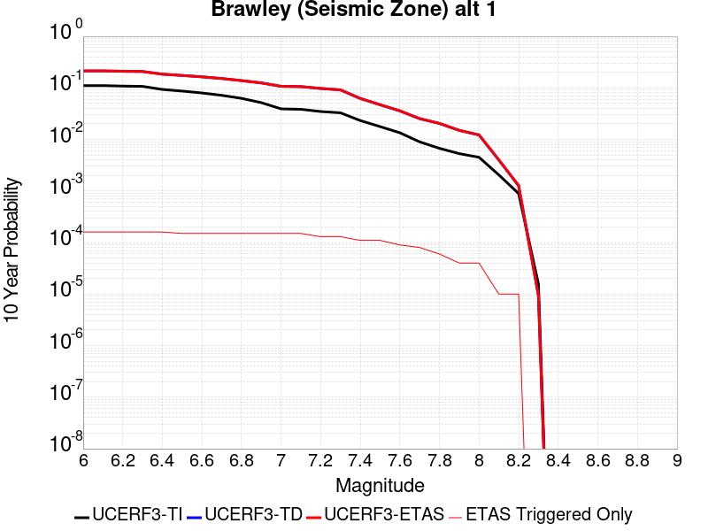 |

| Magnitude | 1 wk TI Prob | 1 wk TD Prob | 1 wk ETAS Prob | 1 wk ETAS/TD Gain | 1 wk ETAS Triggered Only | 1 mo TI Prob | 1 mo TD Prob | 1 mo ETAS Prob | 1 mo ETAS/TD Gain | 1 mo ETAS Triggered Only | 1 yr TI Prob | 1 yr TD Prob | 1 yr ETAS Prob | 1 yr ETAS/TD Gain | 1 yr ETAS Triggered Only | 10 yr TI Prob | 10 yr TD Prob | 10 yr ETAS Prob | 10 yr ETAS/TD Gain | 10 yr ETAS Triggered Only |
|-----|-----|-----|-----|-----|-----|-----|-----|-----|-----|-----|-----|-----|-----|-----|-----|-----|-----|-----|-----|-----|
| 6.0 | 2.2521618E-4 | 4.763429E-4 | 5.363143E-4 | 1.1258997 | 6.0E-5 | 9.6485513E-4 | 0.0020399094 | 0.0021097667 | 1.0342453 | 7.0E-5 | 0.011683988 | 0.024544531 | 0.024661586 | 1.0047691 | 1.2E-4 | 0.11088423 | 0.21349923 | 0.21362507 | 1.0005894 | 1.6E-4 |
| 6.1 | 2.2521618E-4 | 4.763429E-4 | 5.363143E-4 | 1.1258997 | 6.0E-5 | 9.6485513E-4 | 0.0020399094 | 0.0021097667 | 1.0342453 | 7.0E-5 | 0.011683988 | 0.024544531 | 0.024661586 | 1.0047691 | 1.2E-4 | 0.11088423 | 0.21349923 | 0.21362507 | 1.0005894 | 1.6E-4 |
| 6.2 | 2.198148E-4 | 4.6718874E-4 | 5.271607E-4 | 1.1283678 | 6.0E-5 | 9.417233E-4 | 0.0020007377 | 0.0020705976 | 1.0349171 | 7.0E-5 | 0.011405343 | 0.024078513 | 0.024195625 | 1.0048637 | 1.2E-4 | 0.10837428 | 0.20993572 | 0.21006213 | 1.0006021 | 1.6E-4 |
| 6.3 | 2.1704129E-4 | 4.615455E-4 | 5.215178E-4 | 1.129938 | 6.0E-5 | 9.298453E-4 | 0.0019765892 | 0.002046451 | 1.0353445 | 7.0E-5 | 0.011262234 | 0.023792034 | 0.02390918 | 1.0049237 | 1.2E-4 | 0.107082725 | 0.20782684 | 0.20795359 | 1.0006099 | 1.6E-4 |
| 6.4 | 1.876142E-4 | 4.004663E-4 | 4.6044227E-4 | 1.1497654 | 6.0E-5 | 8.038131E-4 | 0.0017151695 | 0.0017850494 | 1.0407423 | 7.0E-5 | 0.00974259 | 0.020678662 | 0.02079618 | 1.0056831 | 1.2E-4 | 0.093263686 | 0.18457787 | 0.18470834 | 1.0007068 | 1.6E-4 |
| 6.5 | 1.7390939E-4 | 3.7478763E-4 | 4.247689E-4 | 1.1333588 | 5.0E-5 | 7.45113E-4 | 0.0016052561 | 0.0016651598 | 1.0373172 | 6.0E-5 | 0.009034078 | 0.019367293 | 0.019475162 | 1.0055697 | 1.1E-4 | 0.086755216 | 0.17440015 | 0.174524 | 1.0007101 | 1.5E-4 |
| 6.6 | 1.591791E-4 | 3.4893592E-4 | 3.9891846E-4 | 1.1432428 | 5.0E-5 | 6.8201777E-4 | 0.0014945926 | 0.001554503 | 1.0400847 | 6.0E-5 | 0.008271996 | 0.018045008 | 0.018153023 | 1.0059859 | 1.1E-4 | 0.07970774 | 0.16380787 | 0.16393329 | 1.0007657 | 1.5E-4 |
| 6.7 | 1.4268003E-4 | 3.2059717E-4 | 3.7058117E-4 | 1.155909 | 5.0E-5 | 6.1134255E-4 | 0.0013732726 | 0.0014331902 | 1.0436312 | 6.0E-5 | 0.007417723 | 0.01659171 | 0.016699884 | 1.0065198 | 1.1E-4 | 0.07174956 | 0.15193594 | 0.15206313 | 1.0008372 | 1.5E-4 |
| 6.8 | 1.239713E-4 | 2.9055026E-4 | 3.4053574E-4 | 1.1720372 | 5.0E-5 | 5.3119735E-4 | 0.0012446274 | 0.0013045527 | 1.0481472 | 6.0E-5 | 0.0064481674 | 0.015049482 | 0.015157826 | 1.0071992 | 1.1E-4 | 0.06264243 | 0.13838051 | 0.13850975 | 1.000934 | 1.5E-4 |
| 6.9 | 1.0180238E-4 | 2.6255674E-4 | 3.1254362E-4 | 1.190385 | 5.0E-5 | 4.3622297E-4 | 0.0011247622 | 0.0011846948 | 1.0532846 | 6.0E-5 | 0.005298089 | 0.013608998 | 0.0137175005 | 1.0079728 | 1.1E-4 | 0.05173543 | 0.12496473 | 0.12509598 | 1.0010504 | 1.5E-4 |
| 7.0 | 7.6619996E-5 | 2.2400476E-4 | 2.7399356E-4 | 1.2231596 | 5.0E-5 | 3.283301E-4 | 9.596704E-4 | 0.0010196128 | 1.0624615 | 6.0E-5 | 0.0039900932 | 0.011622103 | 0.011730824 | 1.0093547 | 1.1E-4 | 0.039192066 | 0.10726982 | 0.10740373 | 1.0012484 | 1.5E-4 |
| 7.1 | 7.5127435E-5 | 2.2083633E-4 | 2.708253E-4 | 1.226362 | 5.0E-5 | 3.2193496E-4 | 9.461013E-4 | 0.0010060446 | 1.0633582 | 6.0E-5 | 0.0039125155 | 0.011458648 | 0.011567388 | 1.0094898 | 1.1E-4 | 0.038443442 | 0.10583378 | 0.1059679 | 1.0012673 | 1.5E-4 |
| 7.2 | 6.788582E-5 | 2.0211334E-4 | 2.4210526E-4 | 1.1978687 | 4.0E-5 | 2.9090676E-4 | 8.6591556E-4 | 9.158722E-4 | 1.0576924 | 5.0E-5 | 0.0035360386 | 0.0104922 | 0.01059115 | 1.0094309 | 1.0E-4 | 0.034803 | 0.097503684 | 0.09762101 | 1.0012033 | 1.3E-4 |
| 7.3 | 6.399602E-5 | 1.8842232E-4 | 2.2841478E-4 | 1.212249 | 4.0E-5 | 2.7423984E-4 | 8.0727716E-4 | 8.572368E-4 | 1.0618865 | 5.0E-5 | 0.0033337586 | 0.009784897 | 0.009883918 | 1.0101198 | 1.0E-4 | 0.03284188 | 0.091397986 | 0.09151611 | 1.0012923 | 1.3E-4 |
| 7.4 | 4.506759E-5 | 1.2530042E-4 | 1.6529541E-4 | 1.3191928 | 4.0E-5 | 1.9313251E-4 | 5.3689216E-4 | 5.868653E-4 | 1.0930786 | 5.0E-5 | 0.0023488526 | 0.006517245 | 0.0066066585 | 1.0137196 | 9.0E-5 | 0.023241805 | 0.062364522 | 0.06246766 | 1.0016538 | 1.1E-4 |
| 7.5 | 3.43289E-5 | 9.336103E-5 | 1.333573E-4 | 1.4284043 | 4.0E-5 | 1.4711556E-4 | 4.0005764E-4 | 4.5003765E-4 | 1.1249319 | 5.0E-5 | 0.0017896603 | 0.004859886 | 0.004949449 | 1.0184289 | 9.0E-5 | 0.01775316 | 0.047057066 | 0.047161892 | 1.0022275 | 1.1E-4 |
| 7.6 | 2.5980507E-5 | 7.053672E-5 | 1.00534606E-4 | 1.4252803 | 3.0E-5 | 1.1134028E-4 | 3.0226534E-4 | 3.4225325E-4 | 1.132294 | 4.0E-5 | 0.001354725 | 0.0036738948 | 0.0037436376 | 1.0189834 | 7.0E-5 | 0.013464959 | 0.03584298 | 0.035929754 | 1.0024209 | 9.0E-5 |
| 7.7 | 1.7292105E-5 | 4.9412036E-5 | 7.941056E-5 | 1.6071095 | 3.0E-5 | 7.4106916E-5 | 2.1174872E-4 | 2.5174025E-4 | 1.1888632 | 4.0E-5 | 9.018782E-4 | 0.0025749984 | 0.002644818 | 1.0271145 | 7.0E-5 | 0.008982267 | 0.025292097 | 0.025370073 | 1.003083 | 8.0E-5 |
| 7.8 | 1.2927471E-5 | 3.9697254E-5 | 5.969646E-5 | 1.5037931 | 2.0E-5 | 5.5402274E-5 | 1.7012001E-4 | 2.0011491E-4 | 1.1763161 | 3.0E-5 | 6.743139E-4 | 0.0020692463 | 0.0021191428 | 1.0241134 | 5.0E-5 | 0.0067227143 | 0.020433145 | 0.020491919 | 1.0028764 | 6.0E-5 |
| 7.9 | 1.0200774E-5 | 2.8748475E-5 | 3.874819E-5 | 1.3478346 | 1.0E-5 | 4.371687E-5 | 1.2320194E-4 | 1.3320071E-4 | 1.0811576 | 1.0E-5 | 5.321229E-4 | 0.0014989526 | 0.0015289077 | 1.019984 | 3.0E-5 | 0.005308505 | 0.014992895 | 0.015032295 | 1.002628 | 4.0E-5 |
| 8.0 | 8.650396E-6 | 2.3279512E-5 | 3.3279277E-5 | 1.4295523 | 1.0E-5 | 3.70726E-5 | 9.976552E-5 | 1.0976452E-4 | 1.100225 | 1.0E-5 | 4.5126543E-4 | 0.0012139693 | 0.0012439329 | 1.0246823 | 3.0E-5 | 0.0045035016 | 0.012212164 | 0.012251675 | 1.0032355 | 4.0E-5 |
| 8.1 | 3.9368224E-6 | 7.3283345E-6 | 7.3283345E-6 | 1.0 | 0.0 | 1.6871985E-5 | 3.1406773E-5 | 3.1406773E-5 | 1.0 | 0.0 | 2.0539707E-4 | 3.8231048E-4 | 3.8231048E-4 | 1.0 | 0.0 | 0.0020520731 | 0.0040015313 | 0.0040114913 | 1.0024891 | 1.0E-5 |
| 8.2 | 1.7101195E-6 | 2.2178374E-6 | 2.2178374E-6 | 1.0 | 0.0 | 7.329063E-6 | 9.504983E-6 | 9.504983E-6 | 1.0 | 0.0 | 8.922769E-5 | 1.15717055E-4 | 1.15717055E-4 | 1.0 | 0.0 | 8.9191867E-4 | 0.00126669 | 0.0012766774 | 1.0078846 | 1.0E-5 |
| 8.3 | 3.0346666E-8 | 1.721086E-8 | 1.721086E-8 | 1.0 | 0.0 | 1.3005713E-7 | 7.376083E-8 | 7.376083E-8 | 1.0 | 0.0 | 1.5834444E-6 | 8.98038E-7 | 8.98038E-7 | 1.0 | 0.0 | 1.5834332E-5 | 9.36379E-6 | 9.36379E-6 | 1.0 | 0.0 |

## Kern Canyon (North Kern) 2011
*[(top)](#table-of-contents)*

| 1 Week | 1 Month | 1 Year | 10 Year |
|-----|-----|-----|-----|
|  |  | 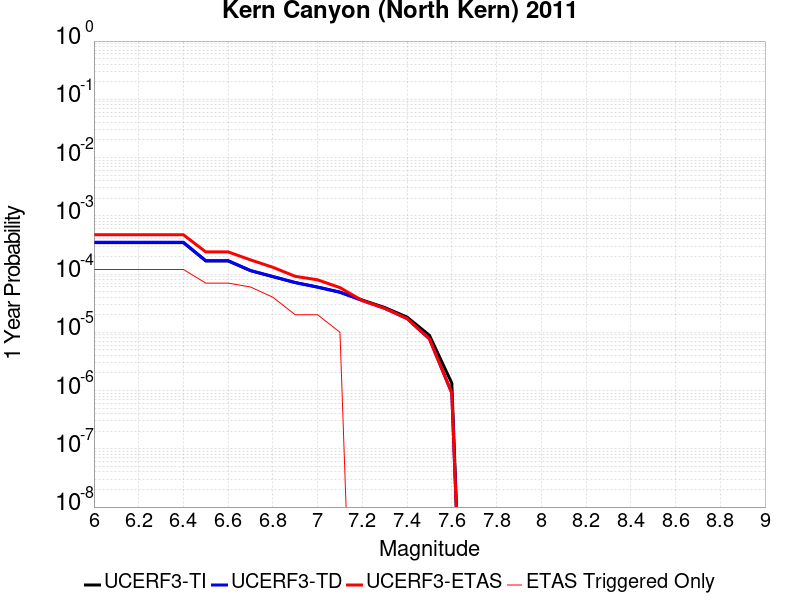 |  |

| Magnitude | 1 wk TI Prob | 1 wk TD Prob | 1 wk ETAS Prob | 1 wk ETAS/TD Gain | 1 wk ETAS Triggered Only | 1 mo TI Prob | 1 mo TD Prob | 1 mo ETAS Prob | 1 mo ETAS/TD Gain | 1 mo ETAS Triggered Only | 1 yr TI Prob | 1 yr TD Prob | 1 yr ETAS Prob | 1 yr ETAS/TD Gain | 1 yr ETAS Triggered Only | 10 yr TI Prob | 10 yr TD Prob | 10 yr ETAS Prob | 10 yr ETAS/TD Gain | 10 yr ETAS Triggered Only |
|-----|-----|-----|-----|-----|-----|-----|-----|-----|-----|-----|-----|-----|-----|-----|-----|-----|-----|-----|-----|-----|
| 6.0 | 6.6264497E-6 | 6.75733E-6 | 7.6756856E-5 | 11.359051 | 7.0E-5 | 2.8398761E-5 | 2.895971E-5 | 1.0895739E-4 | 3.7623787 | 8.0E-5 | 3.4570007E-4 | 3.5253543E-4 | 4.7249312E-4 | 1.3402714 | 1.2E-4 | 0.0034516277 | 0.0035205502 | 0.0036700221 | 1.042457 | 1.5E-4 |
| 6.1 | 6.6264497E-6 | 6.75733E-6 | 7.6756856E-5 | 11.359051 | 7.0E-5 | 2.8398761E-5 | 2.895971E-5 | 1.0895739E-4 | 3.7623787 | 8.0E-5 | 3.4570007E-4 | 3.5253543E-4 | 4.7249312E-4 | 1.3402714 | 1.2E-4 | 0.0034516277 | 0.0035205502 | 0.0036700221 | 1.042457 | 1.5E-4 |
| 6.2 | 6.6264497E-6 | 6.75733E-6 | 7.6756856E-5 | 11.359051 | 7.0E-5 | 2.8398761E-5 | 2.895971E-5 | 1.0895739E-4 | 3.7623787 | 8.0E-5 | 3.4570007E-4 | 3.5253543E-4 | 4.7249312E-4 | 1.3402714 | 1.2E-4 | 0.0034516277 | 0.0035205502 | 0.0036700221 | 1.042457 | 1.5E-4 |
| 6.3 | 6.6264497E-6 | 6.75733E-6 | 7.6756856E-5 | 11.359051 | 7.0E-5 | 2.8398761E-5 | 2.895971E-5 | 1.0895739E-4 | 3.7623787 | 8.0E-5 | 3.4570007E-4 | 3.5253543E-4 | 4.7249312E-4 | 1.3402714 | 1.2E-4 | 0.0034516277 | 0.0035205502 | 0.0036700221 | 1.042457 | 1.5E-4 |
| 6.4 | 6.6264497E-6 | 6.75733E-6 | 7.6756856E-5 | 11.359051 | 7.0E-5 | 2.8398761E-5 | 2.895971E-5 | 1.0895739E-4 | 3.7623787 | 8.0E-5 | 3.4570007E-4 | 3.5253543E-4 | 4.7249312E-4 | 1.3402714 | 1.2E-4 | 0.0034516277 | 0.0035205502 | 0.0036700221 | 1.042457 | 1.5E-4 |
| 6.5 | 3.2162225E-6 | 3.2570915E-6 | 4.325696E-5 | 13.280855 | 4.0E-5 | 1.3783738E-5 | 1.3958894E-5 | 6.395819E-5 | 4.581896 | 5.0E-5 | 1.6780409E-4 | 1.6993708E-4 | 2.3992518E-4 | 1.4118471 | 7.0E-5 | 0.0016767744 | 0.001698151 | 0.0017780152 | 1.0470301 | 8.0E-5 |
| 6.6 | 3.2162225E-6 | 3.2570915E-6 | 4.325696E-5 | 13.280855 | 4.0E-5 | 1.3783738E-5 | 1.3958894E-5 | 6.395819E-5 | 4.581896 | 5.0E-5 | 1.6780409E-4 | 1.6993708E-4 | 2.3992518E-4 | 1.4118471 | 7.0E-5 | 0.0016767744 | 0.001698151 | 0.0017780152 | 1.0470301 | 8.0E-5 |
| 6.7 | 2.1908265E-6 | 2.2071222E-6 | 4.2207033E-5 | 19.123106 | 4.0E-5 | 9.389223E-6 | 9.459062E-6 | 4.9458682E-5 | 5.228709 | 4.0E-5 | 1.1430779E-4 | 1.1515819E-4 | 1.7515128E-4 | 1.5209625 | 6.0E-5 | 0.0011424901 | 0.0011510046 | 0.0012109355 | 1.0520684 | 6.0E-5 |
| 6.8 | 1.7303895E-6 | 1.736553E-6 | 2.1736518E-5 | 12.517049 | 2.0E-5 | 7.415934E-6 | 7.442349E-6 | 2.74422E-5 | 3.6873035 | 2.0E-5 | 9.028525E-5 | 9.060693E-5 | 1.3060331E-4 | 1.4414274 | 4.0E-5 | 9.024858E-4 | 9.0570963E-4 | 9.456734E-4 | 1.0441242 | 4.0E-5 |
| 6.9 | 1.3700314E-6 | 1.3688623E-6 | 1.1368848E-5 | 8.305326 | 1.0E-5 | 5.87155E-6 | 5.86654E-6 | 1.586648E-5 | 2.7045722 | 1.0E-5 | 7.148377E-5 | 7.142283E-5 | 9.14214E-5 | 1.2800025 | 2.0E-5 | 7.146078E-4 | 7.140033E-4 | 7.33989E-4 | 1.027991 | 2.0E-5 |
| 7.0 | 1.1467797E-6 | 1.1413805E-6 | 1.1141369E-5 | 9.76131 | 1.0E-5 | 4.9147607E-6 | 4.8916218E-6 | 1.4891573E-5 | 3.0443017 | 1.0E-5 | 5.983557E-5 | 5.95539E-5 | 7.955271E-5 | 1.3358102 | 2.0E-5 | 5.981946E-4 | 5.9538253E-4 | 6.1537063E-4 | 1.0335718 | 2.0E-5 |
| 7.1 | 9.3952065E-7 | 9.3026915E-7 | 9.3026915E-7 | 1.0 | 0.0 | 4.026511E-6 | 3.986862E-6 | 3.986862E-6 | 1.0 | 0.0 | 4.9021666E-5 | 4.853898E-5 | 5.853849E-5 | 1.20601 | 1.0E-5 | 4.901085E-4 | 4.8528553E-4 | 4.9528066E-4 | 1.0205964 | 1.0E-5 |
| 7.2 | 6.858055E-7 | 6.7193014E-7 | 6.7193014E-7 | 1.0 | 0.0 | 2.939163E-6 | 2.8796974E-6 | 2.8796974E-6 | 1.0 | 0.0 | 3.5783723E-5 | 3.5059762E-5 | 3.5059762E-5 | 1.0 | 0.0 | 3.5777962E-4 | 3.5054318E-4 | 3.5054318E-4 | 1.0 | 0.0 |
| 7.3 | 5.1101983E-7 | 4.939301E-7 | 4.939301E-7 | 1.0 | 0.0 | 2.1900833E-6 | 2.1168414E-6 | 2.1168414E-6 | 1.0 | 0.0 | 2.6663936E-5 | 2.5772246E-5 | 2.5772246E-5 | 1.0 | 0.0 | 2.6660739E-4 | 2.5769303E-4 | 2.5769303E-4 | 1.0 | 0.0 |
| 7.4 | 3.4999414E-7 | 3.2995916E-7 | 3.2995916E-7 | 1.0 | 0.0 | 1.499974E-6 | 1.4141099E-6 | 1.4141099E-6 | 1.0 | 0.0 | 1.8262032E-5 | 1.7216655E-5 | 1.7216655E-5 | 1.0 | 0.0 | 1.826053E-4 | 1.7215345E-4 | 1.7215345E-4 | 1.0 | 0.0 |
| 7.5 | 1.7021522E-7 | 1.4750053E-7 | 1.4750053E-7 | 1.0 | 0.0 | 7.2949354E-7 | 6.32145E-7 | 6.32145E-7 | 1.0 | 0.0 | 8.881548E-6 | 7.696339E-6 | 7.696339E-6 | 1.0 | 0.0 | 8.8811925E-5 | 7.696081E-5 | 7.696081E-5 | 1.0 | 0.0 |
| 7.6 | 2.572245E-8 | 1.735264E-8 | 1.735264E-8 | 1.0 | 0.0 | 1.10239064E-7 | 7.436845E-8 | 7.436845E-8 | 1.0 | 0.0 | 1.3421597E-6 | 9.0543557E-7 | 9.0543557E-7 | 1.0 | 0.0 | 1.3421517E-5 | 9.054324E-6 | 9.054324E-6 | 1.0 | 0.0 |

## White Mountains
*[(top)](#table-of-contents)*

| 1 Week | 1 Month | 1 Year | 10 Year |
|-----|-----|-----|-----|
|  |  |  | 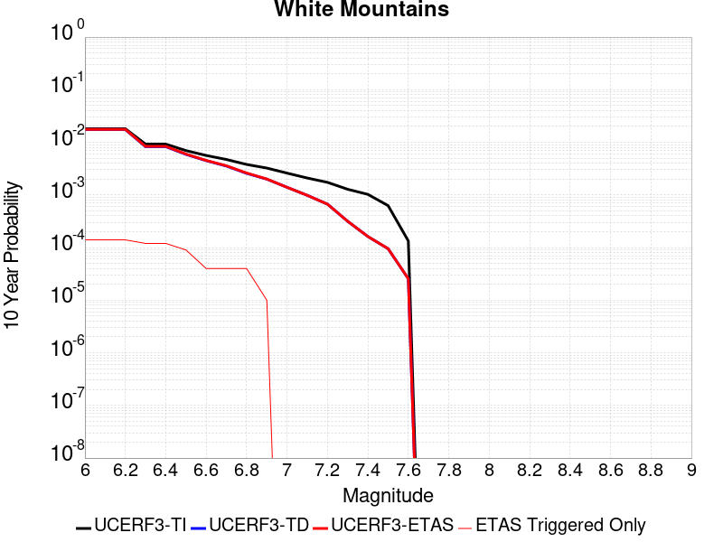 |

| Magnitude | 1 wk TI Prob | 1 wk TD Prob | 1 wk ETAS Prob | 1 wk ETAS/TD Gain | 1 wk ETAS Triggered Only | 1 mo TI Prob | 1 mo TD Prob | 1 mo ETAS Prob | 1 mo ETAS/TD Gain | 1 mo ETAS Triggered Only | 1 yr TI Prob | 1 yr TD Prob | 1 yr ETAS Prob | 1 yr ETAS/TD Gain | 1 yr ETAS Triggered Only | 10 yr TI Prob | 10 yr TD Prob | 10 yr ETAS Prob | 10 yr ETAS/TD Gain | 10 yr ETAS Triggered Only |
|-----|-----|-----|-----|-----|-----|-----|-----|-----|-----|-----|-----|-----|-----|-----|-----|-----|-----|-----|-----|-----|
| 6.0 | 3.503579E-5 | 3.3784127E-5 | 8.3782434E-5 | 2.4799352 | 5.0E-5 | 1.5014476E-4 | 1.4478175E-4 | 2.1477161E-4 | 1.4834163 | 7.0E-5 | 0.0018264796 | 0.0017614134 | 0.0018312901 | 1.0396708 | 7.0E-5 | 0.018115403 | 0.017486857 | 0.017624408 | 1.007866 | 1.4E-4 |
| 6.1 | 3.503579E-5 | 3.3784127E-5 | 8.3782434E-5 | 2.4799352 | 5.0E-5 | 1.5014476E-4 | 1.4478175E-4 | 2.1477161E-4 | 1.4834163 | 7.0E-5 | 0.0018264796 | 0.0017614134 | 0.0018312901 | 1.0396708 | 7.0E-5 | 0.018115403 | 0.017486857 | 0.017624408 | 1.007866 | 1.4E-4 |
| 6.2 | 3.503579E-5 | 3.3784127E-5 | 8.3782434E-5 | 2.4799352 | 5.0E-5 | 1.5014476E-4 | 1.4478175E-4 | 2.1477161E-4 | 1.4834163 | 7.0E-5 | 0.0018264796 | 0.0017614134 | 0.0018312901 | 1.0396708 | 7.0E-5 | 0.018115403 | 0.017486857 | 0.017624408 | 1.007866 | 1.4E-4 |
| 6.3 | 1.7818425E-5 | 1.591616E-5 | 5.5915523E-5 | 3.5131292 | 4.0E-5 | 7.636245E-5 | 6.821041E-5 | 1.2820632E-4 | 1.8795712 | 6.0E-5 | 9.293162E-4 | 8.301596E-4 | 8.9010975E-4 | 1.0722153 | 6.0E-5 | 0.009254395 | 0.0082720425 | 0.00839105 | 1.0143867 | 1.2E-4 |
| 6.4 | 1.7818425E-5 | 1.591616E-5 | 5.5915523E-5 | 3.5131292 | 4.0E-5 | 7.636245E-5 | 6.821041E-5 | 1.2820632E-4 | 1.8795712 | 6.0E-5 | 9.293162E-4 | 8.301596E-4 | 8.9010975E-4 | 1.0722153 | 6.0E-5 | 0.009254395 | 0.0082720425 | 0.00839105 | 1.0143867 | 1.2E-4 |
| 6.5 | 1.3397557E-5 | 1.1336374E-5 | 4.1336036E-5 | 3.6463187 | 3.0E-5 | 5.741684E-5 | 4.8583595E-5 | 8.8581655E-5 | 1.8232832 | 4.0E-5 | 6.988258E-4 | 5.913517E-4 | 6.3132803E-4 | 1.0676017 | 4.0E-5 | 0.006966323 | 0.005898487 | 0.0059879557 | 1.0151682 | 9.0E-5 |
| 6.6 | 1.0818695E-5 | 8.625434E-6 | 1.8625347E-5 | 2.1593518 | 1.0E-5 | 4.6365014E-5 | 3.6965648E-5 | 5.696491E-5 | 1.5410229 | 2.0E-5 | 5.6434784E-4 | 4.4996818E-4 | 4.6995917E-4 | 1.0444276 | 2.0E-5 | 0.005629168 | 0.0044910074 | 0.004530828 | 1.0088667 | 4.0E-5 |
| 6.7 | 9.067908E-6 | 6.802476E-6 | 1.6802407E-5 | 2.470043 | 1.0E-5 | 3.8861883E-5 | 2.915316E-5 | 4.915258E-5 | 1.686012 | 2.0E-5 | 4.7304068E-4 | 3.548851E-4 | 3.74878E-4 | 1.0563363 | 2.0E-5 | 0.00472035 | 0.003543501 | 0.0035833593 | 1.0112482 | 4.0E-5 |
| 6.8 | 7.295947E-6 | 4.9364285E-6 | 1.4936379E-5 | 3.025746 | 1.0E-5 | 3.126797E-5 | 2.1155956E-5 | 4.1155534E-5 | 1.9453403 | 2.0E-5 | 3.8062103E-4 | 2.5754445E-4 | 2.775393E-4 | 1.0776365 | 2.0E-5 | 0.0037996976 | 0.0025725728 | 0.0026124697 | 1.0155087 | 4.0E-5 |
| 6.9 | 6.2243444E-6 | 3.8322546E-6 | 3.8322546E-6 | 1.0 | 0.0 | 2.6675489E-5 | 1.6423846E-5 | 2.6423682E-5 | 1.6088607 | 1.0E-5 | 3.2472567E-4 | 1.9994251E-4 | 2.0994052E-4 | 1.0500044 | 1.0E-5 | 0.0032425157 | 0.001997679 | 0.002007659 | 1.0049958 | 1.0E-5 |
| 7.0 | 4.9878413E-6 | 2.679564E-6 | 2.679564E-6 | 1.0 | 0.0 | 2.1376287E-5 | 1.1483797E-5 | 1.1483797E-5 | 1.0 | 0.0 | 2.602252E-4 | 1.3980652E-4 | 1.3980652E-4 | 1.0 | 0.0 | 0.002599207 | 0.0013972119 | 0.0013972119 | 1.0 | 0.0 |
| 7.1 | 4.0252844E-6 | 1.885702E-6 | 1.885702E-6 | 1.0 | 0.0 | 1.7251105E-5 | 8.081555E-6 | 8.081555E-6 | 1.0 | 0.0 | 2.1001195E-4 | 9.838863E-5 | 9.838863E-5 | 1.0 | 0.0 | 0.0020981359 | 9.834635E-4 | 9.834635E-4 | 1.0 | 0.0 |
| 7.2 | 3.3284066E-6 | 1.2818929E-6 | 1.2818929E-6 | 1.0 | 0.0 | 1.4264522E-5 | 5.4938155E-6 | 5.4938155E-6 | 1.0 | 0.0 | 1.736567E-4 | 6.688525E-5 | 6.688525E-5 | 1.0 | 0.0 | 0.0017352107 | 6.6866126E-4 | 6.6866126E-4 | 1.0 | 0.0 |
| 7.3 | 2.458226E-6 | 6.056684E-7 | 6.056684E-7 | 1.0 | 0.0 | 1.0535211E-5 | 2.5957193E-6 | 2.5957193E-6 | 1.0 | 0.0 | 1.2825865E-4 | 3.160246E-5 | 3.160246E-5 | 1.0 | 0.0 | 0.0012818464 | 3.1598343E-4 | 3.1598343E-4 | 1.0 | 0.0 |
| 7.4 | 1.965953E-6 | 3.1084684E-7 | 3.1084684E-7 | 1.0 | 0.0 | 8.425486E-6 | 1.3322001E-6 | 1.3322001E-6 | 1.0 | 0.0 | 1.0257547E-4 | 1.6219417E-5 | 1.6219417E-5 | 1.0 | 0.0 | 0.0010252813 | 1.6218246E-4 | 1.6218246E-4 | 1.0 | 0.0 |
| 7.5 | 1.2014192E-6 | 1.8241002E-7 | 1.8241002E-7 | 1.0 | 0.0 | 5.148929E-6 | 7.8175697E-7 | 7.8175697E-7 | 1.0 | 0.0 | 6.2686406E-5 | 9.51785E-6 | 9.51785E-6 | 1.0 | 0.0 | 6.266873E-4 | 9.517451E-5 | 9.517451E-5 | 1.0 | 0.0 |
| 7.6 | 2.5612175E-7 | 4.893784E-8 | 4.893784E-8 | 1.0 | 0.0 | 1.0976642E-6 | 2.0973359E-7 | 2.0973359E-7 | 1.0 | 0.0 | 1.3363979E-5 | 2.5535037E-6 | 2.5535037E-6 | 1.0 | 0.0 | 1.3363175E-4 | 2.553478E-5 | 2.553478E-5 | 1.0 | 0.0 |

## Mission Ridge-Arroyo Parida-Santa Ana
*[(top)](#table-of-contents)*

| 1 Week | 1 Month | 1 Year | 10 Year |
|-----|-----|-----|-----|
| 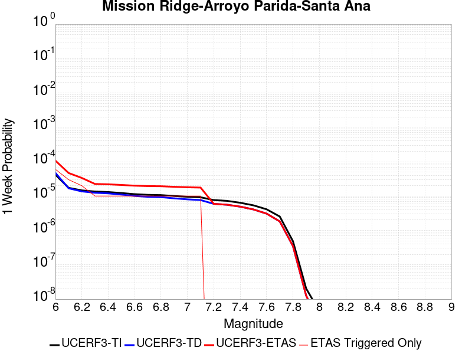 |  | 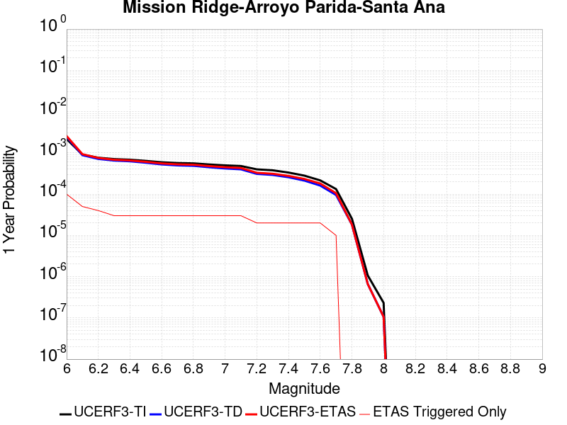 |  |

| Magnitude | 1 wk TI Prob | 1 wk TD Prob | 1 wk ETAS Prob | 1 wk ETAS/TD Gain | 1 wk ETAS Triggered Only | 1 mo TI Prob | 1 mo TD Prob | 1 mo ETAS Prob | 1 mo ETAS/TD Gain | 1 mo ETAS Triggered Only | 1 yr TI Prob | 1 yr TD Prob | 1 yr ETAS Prob | 1 yr ETAS/TD Gain | 1 yr ETAS Triggered Only | 10 yr TI Prob | 10 yr TD Prob | 10 yr ETAS Prob | 10 yr ETAS/TD Gain | 10 yr ETAS Triggered Only |
|-----|-----|-----|-----|-----|-----|-----|-----|-----|-----|-----|-----|-----|-----|-----|-----|-----|-----|-----|-----|-----|
| 6.0 | 4.169034E-5 | 4.7137048E-5 | 1.0713422E-4 | 2.272824 | 6.0E-5 | 1.7866064E-4 | 2.0200513E-4 | 2.8198896E-4 | 1.3959496 | 8.0E-5 | 0.0021730233 | 0.0024574657 | 0.00255722 | 1.0405923 | 1.0E-4 | 0.021518968 | 0.02438483 | 0.024501903 | 1.004801 | 1.2E-4 |
| 6.1 | 1.73813E-5 | 1.6854203E-5 | 4.6853696E-5 | 2.7799413 | 3.0E-5 | 7.4489166E-5 | 7.223036E-5 | 1.2222675E-4 | 1.6921797 | 5.0E-5 | 9.065282E-4 | 8.790605E-4 | 9.2901656E-4 | 1.0568289 | 5.0E-5 | 0.009028391 | 0.008757128 | 0.008836429 | 1.0090554 | 8.0E-5 |
| 6.2 | 1.4622182E-5 | 1.3673262E-5 | 3.367299E-5 | 2.4626887 | 2.0E-5 | 6.2664985E-5 | 5.85984E-5 | 9.859606E-5 | 1.6825725 | 4.0E-5 | 7.6267915E-4 | 7.132059E-4 | 7.531774E-4 | 1.0560448 | 4.0E-5 | 0.007600669 | 0.007109767 | 0.0071792696 | 1.0097756 | 7.0E-5 |
| 6.3 | 1.3552434E-5 | 1.2482174E-5 | 2.2482049E-5 | 1.8011326 | 1.0E-5 | 5.8080568E-5 | 5.349395E-5 | 8.349235E-5 | 1.5607811 | 3.0E-5 | 7.069015E-4 | 6.510974E-4 | 6.810778E-4 | 1.046046 | 3.0E-5 | 0.00704657 | 0.006492415 | 0.006552025 | 1.0091815 | 6.0E-5 |
| 6.4 | 1.30977305E-5 | 1.1979128E-5 | 2.1979009E-5 | 1.8347752 | 1.0E-5 | 5.613192E-5 | 5.133813E-5 | 8.133659E-5 | 1.584331 | 3.0E-5 | 6.831918E-4 | 6.2486547E-4 | 6.548467E-4 | 1.0479803 | 3.0E-5 | 0.006810953 | 0.006231584 | 0.0062812725 | 1.0079737 | 5.0E-5 |
| 6.5 | 1.225205E-5 | 1.1048776E-5 | 2.1048665E-5 | 1.9050677 | 1.0E-5 | 5.2507727E-5 | 4.735105E-5 | 7.734963E-5 | 1.6335356 | 3.0E-5 | 6.3909404E-4 | 5.7634927E-4 | 6.06332E-4 | 1.0520217 | 3.0E-5 | 0.006372592 | 0.005749009 | 0.005788779 | 1.0069177 | 4.0E-5 |
| 6.6 | 1.1352241E-5 | 1.0063508E-5 | 2.0063408E-5 | 1.9936793 | 1.0E-5 | 4.8651553E-5 | 4.3128617E-5 | 7.3127325E-5 | 1.6955638 | 3.0E-5 | 5.921717E-4 | 5.249665E-4 | 5.549508E-4 | 1.0571165 | 3.0E-5 | 0.0059059616 | 0.0052376646 | 0.005277455 | 1.007597 | 4.0E-5 |
| 6.7 | 1.0864116E-5 | 9.517E-6 | 1.9516905E-5 | 2.0507412 | 1.0E-5 | 4.6559664E-5 | 4.0786515E-5 | 7.0785296E-5 | 1.7355071 | 3.0E-5 | 5.667165E-4 | 4.964647E-4 | 5.264498E-4 | 1.0603973 | 3.0E-5 | 0.005652734 | 0.0049539437 | 0.0049937456 | 1.0080343 | 4.0E-5 |
| 6.8 | 1.0666365E-5 | 9.299752E-6 | 1.929966E-5 | 2.0752876 | 1.0E-5 | 4.571219E-5 | 3.985548E-5 | 6.9854286E-5 | 1.7526896 | 3.0E-5 | 5.564038E-4 | 4.8513446E-4 | 5.151199E-4 | 1.0618086 | 3.0E-5 | 0.005550127 | 0.00484114 | 0.0048809466 | 1.0082225 | 4.0E-5 |
| 6.9 | 1.0038665E-5 | 8.592018E-6 | 1.8591933E-5 | 2.1638608 | 1.0E-5 | 4.302214E-5 | 3.682243E-5 | 6.6821325E-5 | 1.8146908 | 3.0E-5 | 5.236687E-4 | 4.4822265E-4 | 4.782092E-4 | 1.066901 | 3.0E-5 | 0.005224364 | 0.0044735507 | 0.0045133717 | 1.0089015 | 4.0E-5 |
| 7.0 | 9.5379955E-6 | 8.025047E-6 | 1.8024966E-5 | 2.2460887 | 1.0E-5 | 4.0876483E-5 | 3.439261E-5 | 6.439158E-5 | 1.8722503 | 3.0E-5 | 4.975576E-4 | 4.1865133E-4 | 4.4863875E-4 | 1.0716287 | 3.0E-5 | 0.00496445 | 0.00417898 | 0.0042188126 | 1.0095317 | 4.0E-5 |
| 7.1 | 9.207389E-6 | 7.652347E-6 | 1.7652272E-5 | 2.3067784 | 1.0E-5 | 3.945964E-5 | 3.2795375E-5 | 6.279439E-5 | 1.9147332 | 3.0E-5 | 4.803152E-4 | 3.992122E-4 | 4.2920024E-4 | 1.075118 | 3.0E-5 | 0.004792784 | 0.003985301 | 0.0040251417 | 1.0099969 | 4.0E-5 |
| 7.2 | 7.638091E-6 | 5.9310923E-6 | 5.9310923E-6 | 1.0 | 0.0 | 3.2734264E-5 | 2.5418722E-5 | 4.541821E-5 | 1.7868016 | 2.0E-5 | 3.984668E-4 | 3.094293E-4 | 3.294231E-4 | 1.0646151 | 2.0E-5 | 0.0039775306 | 0.0030901956 | 0.0031101338 | 1.0064521 | 2.0E-5 |
| 7.3 | 7.2500147E-6 | 5.596131E-6 | 5.596131E-6 | 1.0 | 0.0 | 3.1071122E-5 | 2.3983199E-5 | 4.398272E-5 | 1.8338971 | 2.0E-5 | 3.7822526E-4 | 2.9195662E-4 | 3.1195077E-4 | 1.0684834 | 2.0E-5 | 0.0037758215 | 0.0029159402 | 0.002935882 | 1.0068388 | 2.0E-5 |
| 7.4 | 6.3899715E-6 | 4.9184864E-6 | 4.9184864E-6 | 1.0 | 0.0 | 2.7385306E-5 | 2.1079059E-5 | 4.1078638E-5 | 1.948789 | 2.0E-5 | 3.3336508E-4 | 2.566075E-4 | 2.7660237E-4 | 1.0779201 | 2.0E-5 | 0.0033286542 | 0.002563311 | 0.0025832597 | 1.0077825 | 2.0E-5 |
| 7.5 | 5.379025E-6 | 4.0838477E-6 | 4.0838477E-6 | 1.0 | 0.0 | 2.305276E-5 | 1.7502087E-5 | 3.7501737E-5 | 2.142701 | 2.0E-5 | 2.806312E-4 | 2.1306718E-4 | 2.330629E-4 | 1.0938472 | 2.0E-5 | 0.0028027708 | 0.0021286402 | 0.0021485977 | 1.0093757 | 2.0E-5 |
| 7.6 | 4.1270696E-6 | 3.0883373E-6 | 3.0883373E-6 | 1.0 | 0.0 | 1.768732E-5 | 1.32356645E-5 | 3.32354E-5 | 2.5110488 | 2.0E-5 | 2.1532185E-4 | 1.6113237E-4 | 1.8112914E-4 | 1.1241015 | 2.0E-5 | 0.0021511333 | 0.0016101635 | 0.0016301313 | 1.0124011 | 2.0E-5 |
| 7.7 | 2.5406805E-6 | 1.8282044E-6 | 1.8282044E-6 | 1.0 | 0.0 | 1.0888585E-5 | 7.835139E-6 | 1.783506E-5 | 2.2762916 | 1.0E-5 | 1.3256045E-4 | 9.53887E-5 | 1.0538774E-4 | 1.1048242 | 1.0E-5 | 0.0013248142 | 9.534837E-4 | 9.6347416E-4 | 1.0104779 | 1.0E-5 |
| 7.8 | 4.8608285E-7 | 3.509864E-7 | 3.509864E-7 | 1.0 | 0.0 | 2.0832106E-6 | 1.5042266E-6 | 1.5042266E-6 | 1.0 | 0.0 | 2.5362791E-5 | 1.8313805E-5 | 1.8313805E-5 | 1.0 | 0.0 | 2.5359896E-4 | 1.8312308E-4 | 1.8312308E-4 | 1.0 | 0.0 |
| 7.9 | 2.0472514E-8 | 1.2688718E-8 | 1.2688718E-8 | 1.0 | 0.0 | 8.7739345E-8 | 5.438022E-8 | 5.438022E-8 | 1.0 | 0.0 | 1.068226E-6 | 6.6207895E-7 | 6.6207895E-7 | 1.0 | 0.0 | 1.0682209E-5 | 6.620771E-6 | 6.620771E-6 | 1.0 | 0.0 |
| 8.0 | 4.443582E-9 | 2.032067E-9 | 2.032067E-9 | 1.0 | 0.0 | 1.9043922E-8 | 8.7088585E-9 | 8.7088585E-9 | 1.0 | 0.0 | 2.3185973E-7 | 1.0603035E-7 | 1.0603035E-7 | 1.0 | 0.0 | 2.3185949E-6 | 1.0603031E-6 | 1.0603031E-6 | 1.0 | 0.0 |

## Pleito
*[(top)](#table-of-contents)*

| 1 Week | 1 Month | 1 Year | 10 Year |
|-----|-----|-----|-----|
|  |  | 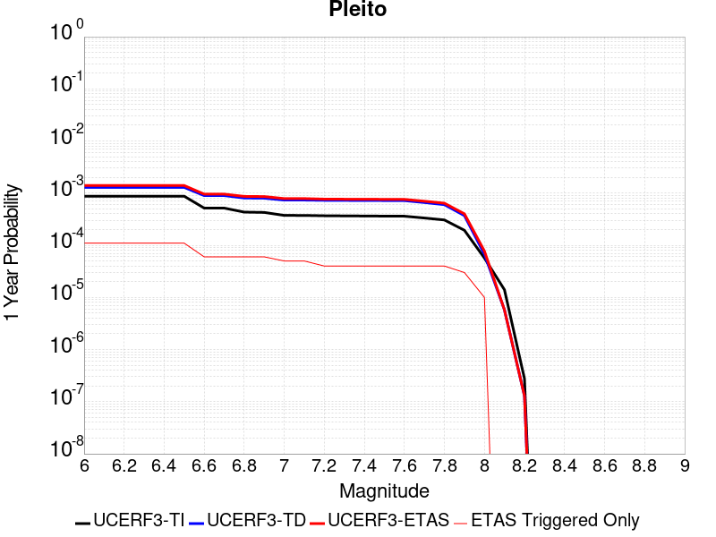 |  |

| Magnitude | 1 wk TI Prob | 1 wk TD Prob | 1 wk ETAS Prob | 1 wk ETAS/TD Gain | 1 wk ETAS Triggered Only | 1 mo TI Prob | 1 mo TD Prob | 1 mo ETAS Prob | 1 mo ETAS/TD Gain | 1 mo ETAS Triggered Only | 1 yr TI Prob | 1 yr TD Prob | 1 yr ETAS Prob | 1 yr ETAS/TD Gain | 1 yr ETAS Triggered Only | 10 yr TI Prob | 10 yr TD Prob | 10 yr ETAS Prob | 10 yr ETAS/TD Gain | 10 yr ETAS Triggered Only |
|-----|-----|-----|-----|-----|-----|-----|-----|-----|-----|-----|-----|-----|-----|-----|-----|-----|-----|-----|-----|-----|
| 6.0 | 1.6763008E-5 | 2.4764735E-5 | 7.47635E-5 | 3.01895 | 5.0E-5 | 7.183948E-5 | 1.0613067E-4 | 1.8612218E-4 | 1.7537078 | 8.0E-5 | 8.742947E-4 | 0.001291447 | 0.001401305 | 1.0850657 | 1.1E-4 | 0.00870863 | 0.012954412 | 0.013102469 | 1.0114291 | 1.5E-4 |
| 6.1 | 1.6763008E-5 | 2.4764735E-5 | 7.47635E-5 | 3.01895 | 5.0E-5 | 7.183948E-5 | 1.0613067E-4 | 1.8612218E-4 | 1.7537078 | 8.0E-5 | 8.742947E-4 | 0.001291447 | 0.001401305 | 1.0850657 | 1.1E-4 | 0.00870863 | 0.012954412 | 0.013102469 | 1.0114291 | 1.5E-4 |
| 6.2 | 1.6763008E-5 | 2.4764735E-5 | 7.47635E-5 | 3.01895 | 5.0E-5 | 7.183948E-5 | 1.0613067E-4 | 1.8612218E-4 | 1.7537078 | 8.0E-5 | 8.742947E-4 | 0.001291447 | 0.001401305 | 1.0850657 | 1.1E-4 | 0.00870863 | 0.012954412 | 0.013102469 | 1.0114291 | 1.5E-4 |
| 6.3 | 1.6763008E-5 | 2.4764735E-5 | 7.47635E-5 | 3.01895 | 5.0E-5 | 7.183948E-5 | 1.0613067E-4 | 1.8612218E-4 | 1.7537078 | 8.0E-5 | 8.742947E-4 | 0.001291447 | 0.001401305 | 1.0850657 | 1.1E-4 | 0.00870863 | 0.012954412 | 0.013102469 | 1.0114291 | 1.5E-4 |
| 6.4 | 1.6763008E-5 | 2.4764735E-5 | 7.47635E-5 | 3.01895 | 5.0E-5 | 7.183948E-5 | 1.0613067E-4 | 1.8612218E-4 | 1.7537078 | 8.0E-5 | 8.742947E-4 | 0.001291447 | 0.001401305 | 1.0850657 | 1.1E-4 | 0.00870863 | 0.012954412 | 0.013102469 | 1.0114291 | 1.5E-4 |
| 6.5 | 1.6763008E-5 | 2.4764735E-5 | 7.47635E-5 | 3.01895 | 5.0E-5 | 7.183948E-5 | 1.0613067E-4 | 1.8612218E-4 | 1.7537078 | 8.0E-5 | 8.742947E-4 | 0.001291447 | 0.001401305 | 1.0850657 | 1.1E-4 | 0.00870863 | 0.012954412 | 0.013102469 | 1.0114291 | 1.5E-4 |
| 6.6 | 9.910213E-6 | 1.721552E-5 | 6.7214656E-5 | 3.904306 | 5.0E-5 | 4.247165E-5 | 7.3778734E-5 | 1.2377504E-4 | 1.677652 | 5.0E-5 | 5.169696E-4 | 8.9788967E-4 | 9.5783576E-4 | 1.0667634 | 6.0E-5 | 0.0051576863 | 0.009051226 | 0.009130502 | 1.0087585 | 8.0E-5 |
| 6.7 | 9.910213E-6 | 1.721552E-5 | 6.7214656E-5 | 3.904306 | 5.0E-5 | 4.247165E-5 | 7.3778734E-5 | 1.2377504E-4 | 1.677652 | 5.0E-5 | 5.169696E-4 | 8.9788967E-4 | 9.5783576E-4 | 1.0667634 | 6.0E-5 | 0.0051576863 | 0.009051226 | 0.009130502 | 1.0087585 | 8.0E-5 |
| 6.8 | 8.300162E-6 | 1.5475129E-5 | 6.5474356E-5 | 4.230941 | 5.0E-5 | 3.557164E-5 | 6.63203E-5 | 1.1631699E-4 | 1.7538669 | 5.0E-5 | 4.3299864E-4 | 8.07152E-4 | 8.671036E-4 | 1.0742755 | 6.0E-5 | 0.004321559 | 0.008150663 | 0.008230011 | 1.0097351 | 8.0E-5 |
| 6.9 | 8.183114E-6 | 1.5346344E-5 | 6.534558E-5 | 4.2580547 | 5.0E-5 | 3.5070017E-5 | 6.57684E-5 | 1.15765106E-4 | 1.7601936 | 5.0E-5 | 4.2689382E-4 | 8.0043747E-4 | 8.6038944E-4 | 1.074899 | 6.0E-5 | 0.0042607468 | 0.008084008 | 0.008163361 | 1.009816 | 8.0E-5 |
| 7.0 | 7.1748823E-6 | 1.4133306E-5 | 5.413274E-5 | 3.8301542 | 4.0E-5 | 3.0749135E-5 | 6.0569906E-5 | 1.00567486E-4 | 1.6603539 | 4.0E-5 | 3.743064E-4 | 7.3718966E-4 | 7.871528E-4 | 1.0677751 | 5.0E-5 | 0.0037367654 | 0.0074553755 | 0.0075149285 | 1.0079879 | 6.0E-5 |
| 7.1 | 7.1671807E-6 | 1.4123676E-5 | 5.412311E-5 | 3.832084 | 4.0E-5 | 3.0716128E-5 | 6.0528637E-5 | 1.0052622E-4 | 1.6608043 | 4.0E-5 | 3.7390468E-4 | 7.366875E-4 | 7.866507E-4 | 1.0678214 | 5.0E-5 | 0.0037327618 | 0.0074503883 | 0.0075099412 | 1.0079932 | 6.0E-5 |
| 7.2 | 7.0649667E-6 | 1.3970962E-5 | 5.39704E-5 | 3.8630414 | 4.0E-5 | 3.0278077E-5 | 5.987418E-5 | 9.987179E-5 | 1.6680276 | 4.0E-5 | 3.6857324E-4 | 7.287248E-4 | 7.6869567E-4 | 1.0548505 | 4.0E-5 | 0.0036796255 | 0.0073711374 | 0.007420769 | 1.0067332 | 5.0E-5 |
| 7.3 | 7.02082E-6 | 1.3914415E-5 | 5.391386E-5 | 3.8746765 | 4.0E-5 | 3.008888E-5 | 5.9631846E-5 | 9.962946E-5 | 1.6707425 | 4.0E-5 | 3.6627054E-4 | 7.257764E-4 | 7.657474E-4 | 1.0550734 | 4.0E-5 | 0.0036566744 | 0.0073416373 | 0.0073912703 | 1.0067605 | 5.0E-5 |
| 7.4 | 6.987146E-6 | 1.3873975E-5 | 5.387342E-5 | 3.8830557 | 4.0E-5 | 2.9944567E-5 | 5.9458544E-5 | 9.945616E-5 | 1.6726977 | 4.0E-5 | 3.6451413E-4 | 7.2366785E-4 | 7.636389E-4 | 1.055234 | 4.0E-5 | 0.0036391679 | 0.007320571 | 0.0073702056 | 1.00678 | 5.0E-5 |
| 7.5 | 6.9494554E-6 | 1.383088E-5 | 5.383033E-5 | 3.892039 | 4.0E-5 | 2.9783041E-5 | 5.9273858E-5 | 9.9271485E-5 | 1.6747937 | 4.0E-5 | 3.625482E-4 | 7.2142074E-4 | 7.613919E-4 | 1.0554061 | 4.0E-5 | 0.0036195726 | 0.007298199 | 0.007347834 | 1.006801 | 5.0E-5 |
| 7.6 | 6.92694E-6 | 1.3789992E-5 | 5.378944E-5 | 3.9006143 | 4.0E-5 | 2.9686547E-5 | 5.909863E-5 | 9.9096265E-5 | 1.6767946 | 4.0E-5 | 3.6137376E-4 | 7.192888E-4 | 7.5926003E-4 | 1.0555705 | 4.0E-5 | 0.0036078666 | 0.007276951 | 0.007326587 | 1.006821 | 5.0E-5 |
| 7.7 | 6.395867E-6 | 1.26690065E-5 | 5.26685E-5 | 4.1572714 | 4.0E-5 | 2.741057E-5 | 5.4294615E-5 | 9.4292445E-5 | 1.7366813 | 4.0E-5 | 3.336726E-4 | 6.6083675E-4 | 7.0081034E-4 | 1.0604893 | 4.0E-5 | 0.0033317201 | 0.0066955453 | 0.0067452104 | 1.0074177 | 5.0E-5 |
| 7.8 | 5.8664327E-6 | 1.1536581E-5 | 5.153612E-5 | 4.4671917 | 4.0E-5 | 2.5141611E-5 | 4.9441554E-5 | 8.943958E-5 | 1.8089961 | 4.0E-5 | 3.060561E-4 | 6.0178485E-4 | 6.417608E-4 | 1.0664289 | 4.0E-5 | 0.0030563495 | 0.0061010164 | 0.0061507113 | 1.0081453 | 5.0E-5 |
| 7.9 | 3.7167474E-6 | 7.1145205E-6 | 3.7114307E-5 | 5.216698 | 3.0E-5 | 1.592882E-5 | 3.0490448E-5 | 6.0489532E-5 | 1.9838847 | 3.0E-5 | 1.9391612E-4 | 3.7115812E-4 | 4.0114697E-4 | 1.080798 | 3.0E-5 | 0.0019374699 | 0.0037676243 | 0.0038074737 | 1.0105767 | 4.0E-5 |
| 8.0 | 1.0903841E-6 | 1.2879104E-6 | 1.1287898E-5 | 8.764505 | 1.0E-5 | 4.6730665E-6 | 5.5196047E-6 | 1.551955E-5 | 2.811714 | 1.0E-5 | 5.68931E-5 | 6.719913E-5 | 7.7198456E-5 | 1.1488014 | 1.0E-5 | 5.6878536E-4 | 6.942094E-4 | 7.0420245E-4 | 1.0143949 | 1.0E-5 |
| 8.1 | 2.6894583E-7 | 1.1056095E-7 | 1.1056095E-7 | 1.0 | 0.0 | 1.1526245E-6 | 4.7383253E-7 | 4.7383253E-7 | 1.0 | 0.0 | 1.4033113E-5 | 5.768896E-6 | 5.768896E-6 | 1.0 | 0.0 | 1.4032227E-4 | 6.454915E-5 | 6.454915E-5 | 1.0 | 0.0 |
| 8.2 | 5.2967013E-9 | 2.4567874E-9 | 2.4567874E-9 | 1.0 | 0.0 | 2.2700148E-8 | 1.0529089E-8 | 1.0529089E-8 | 1.0 | 0.0 | 2.7637427E-7 | 1.2819166E-7 | 1.2819166E-7 | 1.0 | 0.0 | 2.7637393E-6 | 1.4588004E-6 | 1.4588004E-6 | 1.0 | 0.0 |

## Red Mountain
*[(top)](#table-of-contents)*

| 1 Week | 1 Month | 1 Year | 10 Year |
|-----|-----|-----|-----|
|  |  |  |  |

| Magnitude | 1 wk TI Prob | 1 wk TD Prob | 1 wk ETAS Prob | 1 wk ETAS/TD Gain | 1 wk ETAS Triggered Only | 1 mo TI Prob | 1 mo TD Prob | 1 mo ETAS Prob | 1 mo ETAS/TD Gain | 1 mo ETAS Triggered Only | 1 yr TI Prob | 1 yr TD Prob | 1 yr ETAS Prob | 1 yr ETAS/TD Gain | 1 yr ETAS Triggered Only | 10 yr TI Prob | 10 yr TD Prob | 10 yr ETAS Prob | 10 yr ETAS/TD Gain | 10 yr ETAS Triggered Only |
|-----|-----|-----|-----|-----|-----|-----|-----|-----|-----|-----|-----|-----|-----|-----|-----|-----|-----|-----|-----|-----|
| 6.0 | 4.1810763E-5 | 4.7590016E-5 | 7.7588586E-5 | 1.6303543 | 3.0E-5 | 1.7917668E-4 | 2.039422E-4 | 2.7392793E-4 | 1.3431646 | 7.0E-5 | 0.0021792934 | 0.0024803334 | 0.0025701101 | 1.0361954 | 9.0E-5 | 0.021580452 | 0.02454411 | 0.024661165 | 1.0047692 | 1.2E-4 |
| 6.1 | 4.1810763E-5 | 4.7590016E-5 | 7.7588586E-5 | 1.6303543 | 3.0E-5 | 1.7917668E-4 | 2.039422E-4 | 2.7392793E-4 | 1.3431646 | 7.0E-5 | 0.0021792934 | 0.0024803334 | 0.0025701101 | 1.0361954 | 9.0E-5 | 0.021580452 | 0.02454411 | 0.024661165 | 1.0047692 | 1.2E-4 |
| 6.2 | 4.1810763E-5 | 4.7590016E-5 | 7.7588586E-5 | 1.6303543 | 3.0E-5 | 1.7917668E-4 | 2.039422E-4 | 2.7392793E-4 | 1.3431646 | 7.0E-5 | 0.0021792934 | 0.0024803334 | 0.0025701101 | 1.0361954 | 9.0E-5 | 0.021580452 | 0.02454411 | 0.024661165 | 1.0047692 | 1.2E-4 |
| 6.3 | 4.1810763E-5 | 4.7590016E-5 | 7.7588586E-5 | 1.6303543 | 3.0E-5 | 1.7917668E-4 | 2.039422E-4 | 2.7392793E-4 | 1.3431646 | 7.0E-5 | 0.0021792934 | 0.0024803334 | 0.0025701101 | 1.0361954 | 9.0E-5 | 0.021580452 | 0.02454411 | 0.024661165 | 1.0047692 | 1.2E-4 |
| 6.4 | 4.1810763E-5 | 4.7590016E-5 | 7.7588586E-5 | 1.6303543 | 3.0E-5 | 1.7917668E-4 | 2.039422E-4 | 2.7392793E-4 | 1.3431646 | 7.0E-5 | 0.0021792934 | 0.0024803334 | 0.0025701101 | 1.0361954 | 9.0E-5 | 0.021580452 | 0.02454411 | 0.024661165 | 1.0047692 | 1.2E-4 |
| 6.5 | 3.154503E-5 | 3.5359757E-5 | 4.5359404E-5 | 1.2827973 | 1.0E-5 | 1.3518598E-4 | 1.5153353E-4 | 1.9152748E-4 | 1.2639279 | 4.0E-5 | 0.0016446467 | 0.0018434518 | 0.0019033412 | 1.0324876 | 6.0E-5 | 0.01632528 | 0.018291244 | 0.018379599 | 1.0048304 | 9.0E-5 |
| 6.6 | 3.1535834E-5 | 3.5349138E-5 | 4.5348785E-5 | 1.2828823 | 1.0E-5 | 1.3514658E-4 | 1.5148803E-4 | 1.9148197E-4 | 1.2640072 | 4.0E-5 | 0.0016441676 | 0.0018428987 | 0.0019027882 | 1.0324974 | 6.0E-5 | 0.01632056 | 0.018285805 | 0.01837416 | 1.0048318 | 9.0E-5 |
| 6.7 | 2.8267326E-5 | 3.1469353E-5 | 4.146904E-5 | 1.3177595 | 1.0E-5 | 1.2114006E-4 | 1.3486217E-4 | 1.7485677E-4 | 1.2965591 | 4.0E-5 | 0.0014738824 | 0.0016407954 | 0.0017006969 | 1.0365076 | 6.0E-5 | 0.014641452 | 0.01629557 | 0.016384104 | 1.005433 | 9.0E-5 |
| 6.8 | 2.8212884E-5 | 3.1407242E-5 | 4.1406925E-5 | 1.3183879 | 1.0E-5 | 1.20906756E-4 | 1.3459599E-4 | 1.745906E-4 | 1.2971456 | 4.0E-5 | 0.0014710457 | 0.0016375595 | 0.0016974612 | 1.0365798 | 6.0E-5 | 0.014613459 | 0.016263688 | 0.016352223 | 1.0054438 | 9.0E-5 |
| 6.9 | 2.4227871E-5 | 2.6706994E-5 | 3.6706726E-5 | 1.3744237 | 1.0E-5 | 1.03829596E-4 | 1.1445395E-4 | 1.5444937E-4 | 1.3494456 | 4.0E-5 | 0.0012633923 | 0.0013926621 | 0.0014525785 | 1.043023 | 6.0E-5 | 0.012562336 | 0.0138470335 | 0.013935788 | 1.0064096 | 9.0E-5 |
| 7.0 | 2.348524E-5 | 2.5835778E-5 | 3.583552E-5 | 1.3870502 | 1.0E-5 | 1.0064714E-4 | 1.10720495E-4 | 1.5071606E-4 | 1.36123 | 4.0E-5 | 0.0012246901 | 0.001347264 | 0.0014071832 | 1.0444747 | 6.0E-5 | 0.012179627 | 0.013398598 | 0.013487392 | 1.0066271 | 9.0E-5 |
| 7.1 | 2.2311642E-5 | 2.4462845E-5 | 3.44626E-5 | 1.4087732 | 1.0E-5 | 9.561782E-5 | 1.04836974E-4 | 1.4483278E-4 | 1.3815048 | 4.0E-5 | 0.0011635252 | 0.0012757176 | 0.001335641 | 1.0469724 | 6.0E-5 | 0.01157452 | 0.01269146 | 0.012780317 | 1.0070014 | 9.0E-5 |
| 7.2 | 1.6533986E-5 | 1.7670362E-5 | 2.7670185E-5 | 1.5659094 | 1.0E-5 | 7.085802E-5 | 7.572828E-5 | 1.15725255E-4 | 1.5281643 | 4.0E-5 | 8.623549E-4 | 9.2166534E-4 | 9.716192E-4 | 1.0541996 | 5.0E-5 | 0.008590161 | 0.009184707 | 0.0092540635 | 1.0075513 | 7.0E-5 |
| 7.3 | 1.4703092E-5 | 1.5559537E-5 | 2.555938E-5 | 1.6426827 | 1.0E-5 | 6.301173E-5 | 6.668237E-5 | 9.668037E-5 | 1.449864 | 3.0E-5 | 7.668978E-4 | 8.1161706E-4 | 8.4159273E-4 | 1.0369333 | 3.0E-5 | 0.0076425658 | 0.008092604 | 0.008142199 | 1.0061284 | 5.0E-5 |
| 7.4 | 6.1331984E-6 | 5.5288874E-6 | 5.5288874E-6 | 1.0 | 0.0 | 2.6284872E-5 | 2.3695018E-5 | 4.3694545E-5 | 1.8440393 | 2.0E-5 | 3.199713E-4 | 2.884492E-4 | 3.084434E-4 | 1.0693163 | 2.0E-5 | 0.0031951098 | 0.0028808024 | 0.002910716 | 1.0103837 | 3.0E-5 |
| 7.5 | 5.954766E-6 | 5.338517E-6 | 5.338517E-6 | 1.0 | 0.0 | 2.5520176E-5 | 2.2879161E-5 | 4.2878703E-5 | 1.874138 | 2.0E-5 | 3.1066386E-4 | 2.785187E-4 | 2.9851313E-4 | 1.0717884 | 2.0E-5 | 0.003102299 | 0.0027817504 | 0.0028116668 | 1.0107546 | 3.0E-5 |
| 7.6 | 4.9726646E-6 | 4.315309E-6 | 4.315309E-6 | 1.0 | 0.0 | 2.1311245E-5 | 1.8494053E-5 | 3.8493683E-5 | 2.0814087 | 2.0E-5 | 2.5943352E-4 | 2.2514217E-4 | 2.4513766E-4 | 1.0888127 | 2.0E-5 | 0.0025913084 | 0.0022491754 | 0.002279108 | 1.0133082 | 3.0E-5 |
| 7.7 | 3.3613894E-6 | 2.8526886E-6 | 2.8526886E-6 | 1.0 | 0.0 | 1.4405875E-5 | 1.22257525E-5 | 2.2225631E-5 | 1.8179356 | 1.0E-5 | 1.7537741E-4 | 1.4883863E-4 | 1.5883715E-4 | 1.0671768 | 1.0E-5 | 0.0017523908 | 0.0014874157 | 0.0015073861 | 1.0134262 | 2.0E-5 |
| 7.8 | 1.1828961E-6 | 1.0122935E-6 | 1.0122935E-6 | 1.0 | 0.0 | 5.069545E-6 | 4.338394E-6 | 4.338394E-6 | 1.0 | 0.0 | 6.171996E-5 | 5.281869E-5 | 5.281869E-5 | 1.0 | 0.0 | 6.170282E-4 | 5.280643E-4 | 5.280643E-4 | 1.0 | 0.0 |
| 7.9 | 2.2967266E-7 | 1.861919E-7 | 1.861919E-7 | 1.0 | 0.0 | 9.843111E-7 | 7.97965E-7 | 7.97965E-7 | 1.0 | 0.0 | 1.19839215E-5 | 9.715184E-6 | 9.715184E-6 | 1.0 | 0.0 | 1.1983275E-4 | 9.714788E-5 | 9.714788E-5 | 1.0 | 0.0 |

## Rose Canyon
*[(top)](#table-of-contents)*

| 1 Week | 1 Month | 1 Year | 10 Year |
|-----|-----|-----|-----|
|  |  |  |  |

| Magnitude | 1 wk TI Prob | 1 wk TD Prob | 1 wk ETAS Prob | 1 wk ETAS/TD Gain | 1 wk ETAS Triggered Only | 1 mo TI Prob | 1 mo TD Prob | 1 mo ETAS Prob | 1 mo ETAS/TD Gain | 1 mo ETAS Triggered Only | 1 yr TI Prob | 1 yr TD Prob | 1 yr ETAS Prob | 1 yr ETAS/TD Gain | 1 yr ETAS Triggered Only | 10 yr TI Prob | 10 yr TD Prob | 10 yr ETAS Prob | 10 yr ETAS/TD Gain | 10 yr ETAS Triggered Only |
|-----|-----|-----|-----|-----|-----|-----|-----|-----|-----|-----|-----|-----|-----|-----|-----|-----|-----|-----|-----|-----|
| 6.0 | 4.5923203E-5 | 4.9714607E-5 | 7.9713114E-5 | 1.6034144 | 3.0E-5 | 1.9679888E-4 | 2.1304654E-4 | 2.4304015E-4 | 1.1407843 | 3.0E-5 | 0.0023933933 | 0.0025909478 | 0.0026607665 | 1.0269471 | 7.0E-5 | 0.023677798 | 0.025618518 | 0.02575493 | 1.0053248 | 1.4E-4 |
| 6.1 | 4.5923203E-5 | 4.9714607E-5 | 5.9714108E-5 | 1.2011381 | 1.0E-5 | 1.9679888E-4 | 2.1304654E-4 | 2.2304442E-4 | 1.046928 | 1.0E-5 | 0.0023933933 | 0.0025909478 | 0.00262087 | 1.0115488 | 3.0E-5 | 0.023677798 | 0.025618518 | 0.025686724 | 1.0026624 | 7.0E-5 |
| 6.2 | 2.8844734E-5 | 2.9669678E-5 | 2.9669678E-5 | 1.0 | 0.0 | 1.2361443E-4 | 1.2714976E-4 | 1.2714976E-4 | 1.0 | 0.0 | 0.0015039665 | 0.001546976 | 0.0015669451 | 1.0129085 | 2.0E-5 | 0.0149382865 | 0.015364873 | 0.015414105 | 1.0032042 | 5.0E-5 |
| 6.3 | 2.3171577E-5 | 2.3162425E-5 | 2.3162425E-5 | 1.0 | 0.0 | 9.9302975E-5 | 9.926383E-5 | 9.926383E-5 | 1.0 | 0.0 | 0.0012083431 | 0.0012078804 | 0.0012278563 | 1.0165379 | 2.0E-5 | 0.012017938 | 0.012012152 | 0.012061551 | 1.0041125 | 5.0E-5 |
| 6.4 | 2.0066604E-5 | 1.9668067E-5 | 1.9668067E-5 | 1.0 | 0.0 | 8.599689E-5 | 8.428905E-5 | 8.428905E-5 | 1.0 | 0.0 | 0.0010465092 | 0.001025746 | 0.0010457255 | 1.019478 | 2.0E-5 | 0.010415946 | 0.010211479 | 0.0102609685 | 1.0048465 | 5.0E-5 |
| 6.5 | 1.776989E-5 | 1.7115402E-5 | 1.7115402E-5 | 1.0 | 0.0 | 7.615444E-5 | 7.33497E-5 | 7.33497E-5 | 1.0 | 0.0 | 9.267859E-4 | 8.926737E-4 | 9.126558E-4 | 1.0223846 | 2.0E-5 | 0.009229303 | 0.008874663 | 0.00892422 | 1.005584 | 5.0E-5 |
| 6.6 | 1.5227364E-5 | 1.4340872E-5 | 1.4340872E-5 | 1.0 | 0.0 | 6.52585E-5 | 6.145947E-5 | 6.145947E-5 | 1.0 | 0.0 | 7.942326E-4 | 7.480173E-4 | 7.6800236E-4 | 1.0267173 | 2.0E-5 | 0.007914 | 0.0074410336 | 0.0074906615 | 1.0066695 | 5.0E-5 |
| 6.7 | 1.2703898E-5 | 1.1674277E-5 | 1.1674277E-5 | 1.0 | 0.0 | 5.4444143E-5 | 5.0031682E-5 | 5.0031682E-5 | 1.0 | 0.0 | 6.626558E-4 | 6.089697E-4 | 6.189636E-4 | 1.0164112 | 1.0E-5 | 0.006606833 | 0.0060623093 | 0.006102067 | 1.0065582 | 4.0E-5 |
| 6.8 | 1.1554917E-5 | 1.0610384E-5 | 1.0610384E-5 | 1.0 | 0.0 | 4.9520135E-5 | 4.547231E-5 | 4.547231E-5 | 1.0 | 0.0 | 6.0274085E-4 | 5.5348873E-4 | 5.634832E-4 | 1.0180572 | 1.0E-5 | 0.0060110865 | 0.005504414 | 0.0055441936 | 1.007227 | 4.0E-5 |
| 6.9 | 8.732078E-6 | 7.882285E-6 | 7.882285E-6 | 1.0 | 0.0 | 3.7422655E-5 | 3.37808E-5 | 3.37808E-5 | 1.0 | 0.0 | 4.5552556E-4 | 4.112066E-4 | 4.112066E-4 | 1.0 | 0.0 | 0.0045459294 | 0.004089515 | 0.0041193925 | 1.0073059 | 3.0E-5 |
| 7.0 | 5.9337494E-6 | 5.107436E-6 | 5.107436E-6 | 1.0 | 0.0 | 2.5430107E-5 | 2.1888829E-5 | 2.1888829E-5 | 1.0 | 0.0 | 3.0956755E-4 | 2.6646405E-4 | 2.6646405E-4 | 1.0 | 0.0 | 0.0030913667 | 0.002661461 | 0.002661461 | 1.0 | 0.0 |
| 7.1 | 5.013409E-6 | 4.17734E-6 | 4.17734E-6 | 1.0 | 0.0 | 2.1485863E-5 | 1.7902763E-5 | 1.7902763E-5 | 1.0 | 0.0 | 2.6155898E-4 | 2.1794444E-4 | 2.1794444E-4 | 1.0 | 0.0 | 0.0026125133 | 0.0021773188 | 0.0021773188 | 1.0 | 0.0 |
| 7.2 | 4.120763E-6 | 3.2820917E-6 | 3.2820917E-6 | 1.0 | 0.0 | 1.7660293E-5 | 1.4066032E-5 | 1.4066032E-5 | 1.0 | 0.0 | 2.1499286E-4 | 1.7124058E-4 | 1.7124058E-4 | 1.0 | 0.0 | 0.0021478499 | 0.0017110958 | 0.0017110958 | 1.0 | 0.0 |
| 7.3 | 3.2081239E-6 | 2.4404965E-6 | 2.4404965E-6 | 1.0 | 0.0 | 1.374903E-5 | 1.0459229E-5 | 1.0459229E-5 | 1.0 | 0.0 | 1.6738157E-4 | 1.2733374E-4 | 1.2733374E-4 | 1.0 | 0.0 | 0.0016725556 | 0.0012726148 | 0.0012726148 | 1.0 | 0.0 |
| 7.4 | 2.4194755E-6 | 1.7680321E-6 | 1.7680321E-6 | 1.0 | 0.0 | 1.0369139E-5 | 7.5772587E-6 | 7.5772587E-6 | 1.0 | 0.0 | 1.2623696E-4 | 9.224927E-5 | 9.224927E-5 | 1.0 | 0.0 | 0.0012616527 | 9.221151E-4 | 9.221151E-4 | 1.0 | 0.0 |
| 7.5 | 1.3842889E-6 | 9.3782967E-7 | 9.3782967E-7 | 1.0 | 0.0 | 5.9326535E-6 | 4.019264E-6 | 4.019264E-6 | 1.0 | 0.0 | 7.222766E-5 | 4.8933474E-5 | 4.8933474E-5 | 1.0 | 0.0 | 7.220419E-4 | 4.8923056E-4 | 4.8923056E-4 | 1.0 | 0.0 |
| 7.6 | 1.0021575E-6 | 6.4113493E-7 | 6.4113493E-7 | 1.0 | 0.0 | 4.2949537E-6 | 2.7477186E-6 | 2.7477186E-6 | 1.0 | 0.0 | 5.2289808E-5 | 3.345298E-5 | 3.345298E-5 | 1.0 | 0.0 | 5.2277505E-4 | 3.344816E-4 | 3.344816E-4 | 1.0 | 0.0 |
| 7.7 | 8.7620116E-8 | 6.449304E-8 | 6.449304E-8 | 1.0 | 0.0 | 3.7551473E-7 | 2.763987E-7 | 2.763987E-7 | 1.0 | 0.0 | 4.5718825E-6 | 3.3651493E-6 | 3.3651493E-6 | 1.0 | 0.0 | 4.5717883E-5 | 3.3651013E-5 | 3.3651013E-5 | 1.0 | 0.0 |

## Imperial
*[(top)](#table-of-contents)*

| 1 Week | 1 Month | 1 Year | 10 Year |
|-----|-----|-----|-----|
|  |  |  |  |

| Magnitude | 1 wk TI Prob | 1 wk TD Prob | 1 wk ETAS Prob | 1 wk ETAS/TD Gain | 1 wk ETAS Triggered Only | 1 mo TI Prob | 1 mo TD Prob | 1 mo ETAS Prob | 1 mo ETAS/TD Gain | 1 mo ETAS Triggered Only | 1 yr TI Prob | 1 yr TD Prob | 1 yr ETAS Prob | 1 yr ETAS/TD Gain | 1 yr ETAS Triggered Only | 10 yr TI Prob | 10 yr TD Prob | 10 yr ETAS Prob | 10 yr ETAS/TD Gain | 10 yr ETAS Triggered Only |
|-----|-----|-----|-----|-----|-----|-----|-----|-----|-----|-----|-----|-----|-----|-----|-----|-----|-----|-----|-----|-----|
| 6.0 | 2.7496446E-4 | 5.055345E-4 | 5.655042E-4 | 1.1186262 | 6.0E-5 | 0.0011778869 | 0.002164817 | 0.0022346654 | 1.0322653 | 7.0E-5 | 0.0142467655 | 0.026048409 | 0.026155544 | 1.004113 | 1.1E-4 | 0.13367249 | 0.22807029 | 0.22818609 | 1.0005077 | 1.5E-4 |
| 6.1 | 2.5356023E-4 | 4.8657708E-4 | 5.465479E-4 | 1.1232504 | 6.0E-5 | 0.001086234 | 0.002083702 | 0.002153556 | 1.033524 | 7.0E-5 | 0.013144928 | 0.02507094 | 0.025178181 | 1.0042776 | 1.1E-4 | 0.123940155 | 0.21949561 | 0.21961269 | 1.0005333 | 1.5E-4 |
| 6.2 | 2.4820742E-4 | 4.775311E-4 | 5.3750246E-4 | 1.1255863 | 6.0E-5 | 0.0010633124 | 0.0020449946 | 0.0021148515 | 1.0341599 | 7.0E-5 | 0.01286919 | 0.024610676 | 0.024717968 | 1.0043596 | 1.1E-4 | 0.12148927 | 0.21600136 | 0.21611896 | 1.0005444 | 1.5E-4 |
| 6.3 | 2.3205351E-4 | 4.5892023E-4 | 5.188927E-4 | 1.1306816 | 6.0E-5 | 9.94136E-4 | 0.0019653554 | 0.0020352178 | 1.035547 | 7.0E-5 | 0.012036599 | 0.023661187 | 0.023768583 | 1.004539 | 1.1E-4 | 0.11405133 | 0.20793827 | 0.20805708 | 1.0005714 | 1.5E-4 |
| 6.4 | 2.0304754E-4 | 3.9878016E-4 | 4.5875623E-4 | 1.1503989 | 6.0E-5 | 8.6991355E-4 | 0.0017079529 | 0.0017778334 | 1.0409148 | 7.0E-5 | 0.010539869 | 0.020595418 | 0.020703154 | 1.005231 | 1.1E-4 | 0.100537635 | 0.18507113 | 0.18519336 | 1.0006605 | 1.5E-4 |
| 6.5 | 1.854992E-4 | 3.6990462E-4 | 4.1988614E-4 | 1.13512 | 5.0E-5 | 7.9475436E-4 | 0.0015843548 | 0.0016442597 | 1.0378103 | 6.0E-5 | 0.009633281 | 0.01911443 | 0.019212518 | 1.0051316 | 1.0E-4 | 0.0922623 | 0.1733039 | 0.17341964 | 1.0006678 | 1.4E-4 |
| 6.6 | 1.6586106E-4 | 3.4036173E-4 | 3.9034474E-4 | 1.1468525 | 5.0E-5 | 7.106394E-4 | 0.0014578878 | 0.0015178004 | 1.0410954 | 6.0E-5 | 0.008617763 | 0.017607626 | 0.017705863 | 1.0055794 | 1.0E-4 | 0.08291132 | 0.16078055 | 0.16089803 | 1.0007308 | 1.4E-4 |
| 6.7 | 1.4224656E-4 | 3.076812E-4 | 3.5766582E-4 | 1.1624559 | 5.0E-5 | 6.094856E-4 | 0.0013179756 | 0.0013778964 | 1.0454644 | 6.0E-5 | 0.0073952693 | 0.015928522 | 0.016026929 | 1.006178 | 1.0E-4 | 0.07153955 | 0.14648798 | 0.14660747 | 1.0008157 | 1.4E-4 |
| 6.8 | 1.2317259E-4 | 2.779231E-4 | 3.279092E-4 | 1.1798558 | 5.0E-5 | 5.2777573E-4 | 0.0011905615 | 0.00125049 | 1.0503364 | 6.0E-5 | 0.0064067547 | 0.014400131 | 0.014498691 | 1.0068444 | 1.0E-4 | 0.06225166 | 0.13294089 | 0.13306227 | 1.0009131 | 1.4E-4 |
| 6.9 | 9.859898E-5 | 2.5015484E-4 | 3.0014233E-4 | 1.1998262 | 5.0E-5 | 4.2249862E-4 | 0.0010716559 | 0.0011315916 | 1.0559281 | 6.0E-5 | 0.0051317946 | 0.012970319 | 0.0130690215 | 1.00761 | 1.0E-4 | 0.05014893 | 0.119408876 | 0.11953215 | 1.0010325 | 1.4E-4 |
| 7.0 | 7.3191884E-5 | 2.1267848E-4 | 2.6266786E-4 | 1.2350466 | 5.0E-5 | 3.136418E-4 | 9.11164E-4 | 9.711093E-4 | 1.0657898 | 6.0E-5 | 0.003811904 | 0.011037681 | 0.011136577 | 1.0089599 | 1.0E-4 | 0.037471764 | 0.10206756 | 0.10219327 | 1.0012317 | 1.4E-4 |
| 7.1 | 7.1760296E-5 | 2.0969207E-4 | 2.5968158E-4 | 1.2383949 | 5.0E-5 | 3.0750787E-4 | 8.9837395E-4 | 9.5832004E-4 | 1.0667273 | 6.0E-5 | 0.003737482 | 0.010883528 | 0.01098244 | 1.0090882 | 1.0E-4 | 0.03675245 | 0.10070406 | 0.10082997 | 1.0012503 | 1.4E-4 |
| 7.2 | 6.46614E-5 | 1.9137723E-4 | 2.3136957E-4 | 1.2089713 | 4.0E-5 | 2.7709085E-4 | 8.199333E-4 | 8.6989236E-4 | 1.0609306 | 5.0E-5 | 0.0033683628 | 0.009937617 | 0.010026723 | 1.0089664 | 9.0E-5 | 0.033177625 | 0.092511006 | 0.0926199 | 1.0011772 | 1.2E-4 |
| 7.3 | 6.088115E-5 | 1.780939E-4 | 2.1808677E-4 | 1.2245606 | 4.0E-5 | 2.6089314E-4 | 7.6303916E-4 | 8.13001E-4 | 1.0654775 | 5.0E-5 | 0.0031717476 | 0.009251006 | 0.009340174 | 1.0096387 | 9.0E-5 | 0.031268585 | 0.08656135 | 0.086670965 | 1.0012662 | 1.2E-4 |
| 7.4 | 4.199346E-5 | 1.1511097E-4 | 1.5510636E-4 | 1.3474507 | 4.0E-5 | 1.7995955E-4 | 4.932403E-4 | 5.4321566E-4 | 1.1013205 | 5.0E-5 | 0.0021888057 | 0.005988835 | 0.006068356 | 1.0132782 | 8.0E-5 | 0.02167372 | 0.05744024 | 0.057534497 | 1.0016409 | 1.0E-4 |
| 7.5 | 3.130448E-5 | 8.333871E-5 | 1.2333538E-4 | 1.479929 | 4.0E-5 | 1.3415517E-4 | 3.5711733E-4 | 4.070995E-4 | 1.13996 | 5.0E-5 | 0.0016321153 | 0.0043392954 | 0.004418948 | 1.0183562 | 8.0E-5 | 0.016201803 | 0.042133506 | 0.04222929 | 1.0022734 | 1.0E-4 |
| 7.6 | 2.3074248E-5 | 6.0849357E-5 | 9.0847534E-5 | 1.4929909 | 3.0E-5 | 9.888588E-5 | 2.6075702E-4 | 3.007466E-4 | 1.1533595 | 4.0E-5 | 0.0012032706 | 0.0031701182 | 0.0032299282 | 1.0188668 | 6.0E-5 | 0.011967761 | 0.03102816 | 0.031105679 | 1.0024983 | 8.0E-5 |
| 7.7 | 1.45864815E-5 | 4.0128452E-5 | 7.012725E-5 | 1.7475692 | 3.0E-5 | 6.2511994E-5 | 1.7196777E-4 | 2.119609E-4 | 1.2325617 | 4.0E-5 | 7.608177E-4 | 0.0020917025 | 0.002151577 | 1.0286248 | 6.0E-5 | 0.007582182 | 0.02062909 | 0.020697646 | 1.0033233 | 7.0E-5 |
| 7.8 | 1.0352979E-5 | 3.096395E-5 | 5.0963332E-5 | 1.6458924 | 2.0E-5 | 4.4369157E-5 | 1.326959E-4 | 1.6269193E-4 | 1.2260509 | 3.0E-5 | 5.400606E-4 | 0.0016143778 | 0.0016543132 | 1.0247374 | 4.0E-5 | 0.0053875 | 0.016017893 | 0.016067091 | 1.0030715 | 5.0E-5 |
| 7.9 | 8.137906E-6 | 2.2151205E-5 | 3.2150983E-5 | 1.4514327 | 1.0E-5 | 3.4876273E-5 | 9.493029E-5 | 1.0492934E-4 | 1.1053305 | 1.0E-5 | 4.2453592E-4 | 0.0011551644 | 0.0011751413 | 1.0172936 | 2.0E-5 | 0.004237258 | 0.011618842 | 0.011648494 | 1.002552 | 3.0E-5 |
| 8.0 | 6.93792E-6 | 1.8010365E-5 | 2.8010185E-5 | 1.5552258 | 1.0E-5 | 2.9733603E-5 | 7.7185E-5 | 8.718423E-5 | 1.1295488 | 1.0E-5 | 3.6194647E-4 | 9.3932304E-4 | 9.593042E-4 | 1.021272 | 2.0E-5 | 0.0036135751 | 0.009502415 | 0.009532129 | 1.0031271 | 3.0E-5 |
| 8.1 | 3.4286315E-6 | 6.380179E-6 | 6.380179E-6 | 1.0 | 0.0 | 1.4694053E-5 | 2.734334E-5 | 2.734334E-5 | 1.0 | 0.0 | 1.7888541E-4 | 3.3285443E-4 | 3.3285443E-4 | 1.0 | 0.0 | 0.0017874148 | 0.0034863674 | 0.0034963326 | 1.0028583 | 1.0E-5 |
| 8.2 | 1.4906886E-6 | 1.936633E-6 | 1.936633E-6 | 1.0 | 0.0 | 6.3886496E-6 | 8.2998295E-6 | 8.2998295E-6 | 1.0 | 0.0 | 7.7779034E-5 | 1.0104576E-4 | 1.0104576E-4 | 1.0 | 0.0 | 7.775182E-4 | 0.0011075423 | 0.0011175312 | 1.009019 | 1.0E-5 |
| 8.3 | 2.5758007E-8 | 1.4495866E-8 | 1.4495866E-8 | 1.0 | 0.0 | 1.10391454E-7 | 6.212514E-8 | 6.212514E-8 | 1.0 | 0.0 | 1.3440151E-6 | 7.563736E-7 | 7.563736E-7 | 1.0 | 0.0 | 1.344007E-5 | 7.884359E-6 | 7.884359E-6 | 1.0 | 0.0 |

## Lost Hills
*[(top)](#table-of-contents)*

| 1 Week | 1 Month | 1 Year | 10 Year |
|-----|-----|-----|-----|
|  |  |  |  |

| Magnitude | 1 wk TI Prob | 1 wk TD Prob | 1 wk ETAS Prob | 1 wk ETAS/TD Gain | 1 wk ETAS Triggered Only | 1 mo TI Prob | 1 mo TD Prob | 1 mo ETAS Prob | 1 mo ETAS/TD Gain | 1 mo ETAS Triggered Only | 1 yr TI Prob | 1 yr TD Prob | 1 yr ETAS Prob | 1 yr ETAS/TD Gain | 1 yr ETAS Triggered Only | 10 yr TI Prob | 10 yr TD Prob | 10 yr ETAS Prob | 10 yr ETAS/TD Gain | 10 yr ETAS Triggered Only |
|-----|-----|-----|-----|-----|-----|-----|-----|-----|-----|-----|-----|-----|-----|-----|-----|-----|-----|-----|-----|-----|
| 6.0 | 2.233523E-5 | 2.5106583E-5 | 8.510508E-5 | 3.3897514 | 6.0E-5 | 9.571891E-5 | 1.0759615E-4 | 1.9758647E-4 | 1.8363712 | 9.0E-5 | 0.0011647546 | 0.001309364 | 0.0014292069 | 1.0915276 | 1.2E-4 | 0.011586686 | 0.013033091 | 0.013171266 | 1.0106019 | 1.4E-4 |
| 6.1 | 2.233523E-5 | 2.5106583E-5 | 8.510508E-5 | 3.3897514 | 6.0E-5 | 9.571891E-5 | 1.0759615E-4 | 1.9758647E-4 | 1.8363712 | 9.0E-5 | 0.0011647546 | 0.001309364 | 0.0014292069 | 1.0915276 | 1.2E-4 | 0.011586686 | 0.013033091 | 0.013171266 | 1.0106019 | 1.4E-4 |
| 6.2 | 2.233523E-5 | 2.5106583E-5 | 8.510508E-5 | 3.3897514 | 6.0E-5 | 9.571891E-5 | 1.0759615E-4 | 1.9758647E-4 | 1.8363712 | 9.0E-5 | 0.0011647546 | 0.001309364 | 0.0014292069 | 1.0915276 | 1.2E-4 | 0.011586686 | 0.013033091 | 0.013171266 | 1.0106019 | 1.4E-4 |
| 6.3 | 2.233523E-5 | 2.5106583E-5 | 8.510508E-5 | 3.3897514 | 6.0E-5 | 9.571891E-5 | 1.0759615E-4 | 1.9758647E-4 | 1.8363712 | 9.0E-5 | 0.0011647546 | 0.001309364 | 0.0014292069 | 1.0915276 | 1.2E-4 | 0.011586686 | 0.013033091 | 0.013171266 | 1.0106019 | 1.4E-4 |
| 6.4 | 1.2288092E-5 | 1.3781108E-5 | 3.378083E-5 | 2.4512422 | 2.0E-5 | 5.2662188E-5 | 5.906108E-5 | 9.905872E-5 | 1.677225 | 4.0E-5 | 6.409735E-4 | 7.189252E-4 | 7.6888927E-4 | 1.0694983 | 5.0E-5 | 0.006391279 | 0.0071752006 | 0.0072446987 | 1.0096859 | 7.0E-5 |
| 6.5 | 1.2288092E-5 | 1.3781108E-5 | 3.378083E-5 | 2.4512422 | 2.0E-5 | 5.2662188E-5 | 5.906108E-5 | 9.905872E-5 | 1.677225 | 4.0E-5 | 6.409735E-4 | 7.189252E-4 | 7.6888927E-4 | 1.0694983 | 5.0E-5 | 0.006391279 | 0.0071752006 | 0.0072446987 | 1.0096859 | 7.0E-5 |
| 6.6 | 8.58281E-6 | 9.63377E-6 | 2.9633577E-5 | 3.0760105 | 2.0E-5 | 3.6782953E-5 | 4.12874E-5 | 8.128575E-5 | 1.9687785 | 4.0E-5 | 4.4774043E-4 | 5.026414E-4 | 5.4262124E-4 | 1.0795397 | 4.0E-5 | 0.0044683935 | 0.005023205 | 0.005082904 | 1.0118846 | 6.0E-5 |
| 6.7 | 7.205685E-6 | 8.088302E-6 | 2.808814E-5 | 3.472687 | 2.0E-5 | 3.088114E-5 | 3.466415E-5 | 7.466276E-5 | 2.15389 | 4.0E-5 | 3.7591302E-4 | 4.2203604E-4 | 4.6201915E-4 | 1.0947386 | 4.0E-5 | 0.0037527776 | 0.0042203604 | 0.004280107 | 1.0141568 | 6.0E-5 |

## Independence rev 2011
*[(top)](#table-of-contents)*

| 1 Week | 1 Month | 1 Year | 10 Year |
|-----|-----|-----|-----|
|  |  |  |  |

| Magnitude | 1 wk TI Prob | 1 wk TD Prob | 1 wk ETAS Prob | 1 wk ETAS/TD Gain | 1 wk ETAS Triggered Only | 1 mo TI Prob | 1 mo TD Prob | 1 mo ETAS Prob | 1 mo ETAS/TD Gain | 1 mo ETAS Triggered Only | 1 yr TI Prob | 1 yr TD Prob | 1 yr ETAS Prob | 1 yr ETAS/TD Gain | 1 yr ETAS Triggered Only | 10 yr TI Prob | 10 yr TD Prob | 10 yr ETAS Prob | 10 yr ETAS/TD Gain | 10 yr ETAS Triggered Only |
|-----|-----|-----|-----|-----|-----|-----|-----|-----|-----|-----|-----|-----|-----|-----|-----|-----|-----|-----|-----|-----|
| 6.0 | 4.422171E-6 | 4.3262253E-6 | 7.432592E-5 | 17.180317 | 7.0E-5 | 1.8952025E-5 | 1.8540852E-5 | 9.853937E-5 | 5.314717 | 8.0E-5 | 2.3071647E-4 | 2.2571447E-4 | 3.3568963E-4 | 1.4872314 | 1.1E-4 | 0.0023047708 | 0.0022551457 | 0.0023948299 | 1.0619402 | 1.4E-4 |
| 6.1 | 4.422171E-6 | 4.3262253E-6 | 7.432592E-5 | 17.180317 | 7.0E-5 | 1.8952025E-5 | 1.8540852E-5 | 9.853937E-5 | 5.314717 | 8.0E-5 | 2.3071647E-4 | 2.2571447E-4 | 3.3568963E-4 | 1.4872314 | 1.1E-4 | 0.0023047708 | 0.0022551457 | 0.0023948299 | 1.0619402 | 1.4E-4 |
| 6.2 | 4.422171E-6 | 4.3262253E-6 | 7.432592E-5 | 17.180317 | 7.0E-5 | 1.8952025E-5 | 1.8540852E-5 | 9.853937E-5 | 5.314717 | 8.0E-5 | 2.3071647E-4 | 2.2571447E-4 | 3.3568963E-4 | 1.4872314 | 1.1E-4 | 0.0023047708 | 0.0022551457 | 0.0023948299 | 1.0619402 | 1.4E-4 |
| 6.3 | 4.422171E-6 | 4.3262253E-6 | 7.432592E-5 | 17.180317 | 7.0E-5 | 1.8952025E-5 | 1.8540852E-5 | 9.853937E-5 | 5.314717 | 8.0E-5 | 2.3071647E-4 | 2.2571447E-4 | 3.3568963E-4 | 1.4872314 | 1.1E-4 | 0.0023047708 | 0.0022551457 | 0.0023948299 | 1.0619402 | 1.4E-4 |
| 6.4 | 4.422171E-6 | 4.3262253E-6 | 7.432592E-5 | 17.180317 | 7.0E-5 | 1.8952025E-5 | 1.8540852E-5 | 9.853937E-5 | 5.314717 | 8.0E-5 | 2.3071647E-4 | 2.2571447E-4 | 3.3568963E-4 | 1.4872314 | 1.1E-4 | 0.0023047708 | 0.0022551457 | 0.0023948299 | 1.0619402 | 1.4E-4 |
| 6.5 | 4.422171E-6 | 4.3262253E-6 | 7.432592E-5 | 17.180317 | 7.0E-5 | 1.8952025E-5 | 1.8540852E-5 | 9.853937E-5 | 5.314717 | 8.0E-5 | 2.3071647E-4 | 2.2571447E-4 | 3.3568963E-4 | 1.4872314 | 1.1E-4 | 0.0023047708 | 0.0022551457 | 0.0023948299 | 1.0619402 | 1.4E-4 |
| 6.6 | 2.663744E-6 | 2.5319846E-6 | 7.253181E-5 | 28.646229 | 7.0E-5 | 1.1415996E-5 | 1.08513195E-5 | 9.085045E-5 | 8.372295 | 8.0E-5 | 1.3898089E-4 | 1.321073E-4 | 2.220954E-4 | 1.6811744 | 9.0E-5 | 0.0013889399 | 0.0013203359 | 0.0014401774 | 1.090766 | 1.2E-4 |
| 6.7 | 2.663744E-6 | 2.5319846E-6 | 7.253181E-5 | 28.646229 | 7.0E-5 | 1.1415996E-5 | 1.08513195E-5 | 9.085045E-5 | 8.372295 | 8.0E-5 | 1.3898089E-4 | 1.321073E-4 | 2.220954E-4 | 1.6811744 | 9.0E-5 | 0.0013889399 | 0.0013203359 | 0.0014401774 | 1.090766 | 1.2E-4 |
| 6.8 | 1.9716529E-6 | 1.8322567E-6 | 7.183213E-5 | 39.204185 | 7.0E-5 | 8.449913E-6 | 7.852505E-6 | 8.785188E-5 | 11.187751 | 8.0E-5 | 1.0287284E-4 | 9.560019E-5 | 1.8559159E-4 | 1.9413307 | 9.0E-5 | 0.0010282523 | 9.5560355E-4 | 0.0010754889 | 1.1254551 | 1.2E-4 |
| 6.9 | 1.8788617E-6 | 1.7429976E-6 | 7.174288E-5 | 41.16063 | 7.0E-5 | 8.0522395E-6 | 7.4699688E-6 | 8.746937E-5 | 11.70947 | 8.0E-5 | 9.80316E-5 | 9.09432E-5 | 1.80935E-4 | 1.9895387 | 9.0E-5 | 9.798837E-4 | 9.090718E-4 | 0.0010289628 | 1.1318828 | 1.2E-4 |
| 7.0 | 1.5045488E-6 | 1.3849498E-6 | 7.138485E-5 | 51.54328 | 7.0E-5 | 6.44805E-6 | 5.9354857E-6 | 7.593507E-5 | 12.793405 | 7.0E-5 | 7.8502184E-5 | 7.226219E-5 | 1.5225641E-4 | 2.1069996 | 8.0E-5 | 7.8474457E-4 | 7.223921E-4 | 8.323126E-4 | 1.1521618 | 1.1E-4 |
| 7.1 | 1.272341E-6 | 1.1625089E-6 | 6.116244E-5 | 52.61245 | 6.0E-5 | 5.4528787E-6 | 4.9821715E-6 | 6.4981876E-5 | 13.042881 | 6.0E-5 | 6.6386776E-5 | 6.0656283E-5 | 1.3065204E-4 | 2.1539736 | 7.0E-5 | 6.636695E-4 | 6.064005E-4 | 7.0633984E-4 | 1.1648076 | 1.0E-4 |
| 7.2 | 1.0416892E-6 | 9.409871E-7 | 6.094093E-5 | 64.76277 | 6.0E-5 | 4.464375E-6 | 4.032796E-6 | 6.403255E-5 | 15.877956 | 6.0E-5 | 5.4352407E-5 | 4.9098202E-5 | 1.19094766E-4 | 2.4256442 | 7.0E-5 | 5.4339116E-4 | 4.908754E-4 | 5.908263E-4 | 1.2036177 | 1.0E-4 |
| 7.3 | 7.9450155E-7 | 7.2350036E-7 | 6.0723458E-5 | 83.9301 | 6.0E-5 | 3.4050022E-6 | 3.1007123E-6 | 6.3100524E-5 | 20.350332 | 6.0E-5 | 4.1455114E-5 | 3.7750528E-5 | 1.0774789E-4 | 2.8542087 | 7.0E-5 | 4.144738E-4 | 3.7744228E-4 | 4.7740454E-4 | 1.2648412 | 1.0E-4 |
| 7.4 | 5.3893444E-7 | 5.0195166E-7 | 5.0501927E-5 | 100.61114 | 5.0E-5 | 2.309717E-6 | 2.1512196E-6 | 5.2151114E-5 | 24.24258 | 5.0E-5 | 2.8120441E-5 | 2.6190788E-5 | 8.618922E-5 | 3.2908218 | 6.0E-5 | 2.8116882E-4 | 2.6187746E-4 | 3.518539E-4 | 1.3435822 | 9.0E-5 |
| 7.5 | 3.8852085E-7 | 3.6825622E-7 | 5.036824E-5 | 136.77498 | 5.0E-5 | 1.6650882E-6 | 1.57824E-6 | 5.157816E-5 | 32.68081 | 5.0E-5 | 2.027226E-5 | 1.9214905E-5 | 6.9213944E-5 | 3.6020966 | 5.0E-5 | 2.0270412E-4 | 1.9213265E-4 | 2.721173E-4 | 1.416299 | 8.0E-5 |
| 7.6 | 2.414929E-7 | 2.3457605E-7 | 2.0234571E-5 | 86.26018 | 2.0E-5 | 1.0349692E-6 | 1.0053255E-6 | 2.1005306E-5 | 20.894033 | 2.0E-5 | 1.2600677E-5 | 1.2239771E-5 | 3.2239524E-5 | 2.6339974 | 2.0E-5 | 1.2599962E-4 | 1.223911E-4 | 1.7238497E-4 | 1.4084765 | 5.0E-5 |
| 7.7 | 6.8298014E-8 | 6.8589785E-8 | 6.8589785E-8 | 1.0 | 0.0 | 2.9270575E-7 | 2.939562E-7 | 2.939562E-7 | 1.0 | 0.0 | 3.5636867E-6 | 3.5789112E-6 | 3.5789112E-6 | 1.0 | 0.0 | 3.5636294E-5 | 3.5788584E-5 | 3.5788584E-5 | 1.0 | 0.0 |

## San Jacinto (Lytle Creek connector)
*[(top)](#table-of-contents)*

| 1 Week | 1 Month | 1 Year | 10 Year |
|-----|-----|-----|-----|
|  |  |  | 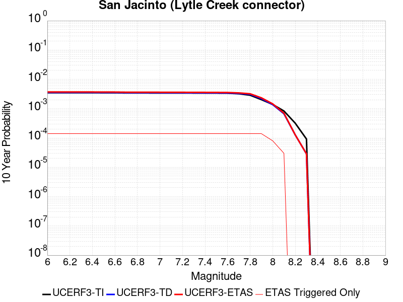 |

| Magnitude | 1 wk TI Prob | 1 wk TD Prob | 1 wk ETAS Prob | 1 wk ETAS/TD Gain | 1 wk ETAS Triggered Only | 1 mo TI Prob | 1 mo TD Prob | 1 mo ETAS Prob | 1 mo ETAS/TD Gain | 1 mo ETAS Triggered Only | 1 yr TI Prob | 1 yr TD Prob | 1 yr ETAS Prob | 1 yr ETAS/TD Gain | 1 yr ETAS Triggered Only | 10 yr TI Prob | 10 yr TD Prob | 10 yr ETAS Prob | 10 yr ETAS/TD Gain | 10 yr ETAS Triggered Only |
|-----|-----|-----|-----|-----|-----|-----|-----|-----|-----|-----|-----|-----|-----|-----|-----|-----|-----|-----|-----|-----|
| 6.0 | 6.693995E-6 | 6.660123E-6 | 6.6659726E-5 | 10.008782 | 6.0E-5 | 2.8688235E-5 | 2.8543072E-5 | 1.18540505E-4 | 4.1530395 | 9.0E-5 | 3.492233E-4 | 3.4745657E-4 | 4.5741835E-4 | 1.3164763 | 1.1E-4 | 0.00348675 | 0.0035491167 | 0.0036886197 | 1.0393064 | 1.4E-4 |
| 6.1 | 6.693995E-6 | 6.660123E-6 | 6.6659726E-5 | 10.008782 | 6.0E-5 | 2.8688235E-5 | 2.8543072E-5 | 1.18540505E-4 | 4.1530395 | 9.0E-5 | 3.492233E-4 | 3.4745657E-4 | 4.5741835E-4 | 1.3164763 | 1.1E-4 | 0.00348675 | 0.0035491167 | 0.0036886197 | 1.0393064 | 1.4E-4 |
| 6.2 | 6.693995E-6 | 6.660123E-6 | 6.6659726E-5 | 10.008782 | 6.0E-5 | 2.8688235E-5 | 2.8543072E-5 | 1.18540505E-4 | 4.1530395 | 9.0E-5 | 3.492233E-4 | 3.4745657E-4 | 4.5741835E-4 | 1.3164763 | 1.1E-4 | 0.00348675 | 0.0035491167 | 0.0036886197 | 1.0393064 | 1.4E-4 |
| 6.3 | 6.693995E-6 | 6.660123E-6 | 6.6659726E-5 | 10.008782 | 6.0E-5 | 2.8688235E-5 | 2.8543072E-5 | 1.18540505E-4 | 4.1530395 | 9.0E-5 | 3.492233E-4 | 3.4745657E-4 | 4.5741835E-4 | 1.3164763 | 1.1E-4 | 0.00348675 | 0.0035491167 | 0.0036886197 | 1.0393064 | 1.4E-4 |
| 6.4 | 6.693995E-6 | 6.660123E-6 | 6.6659726E-5 | 10.008782 | 6.0E-5 | 2.8688235E-5 | 2.8543072E-5 | 1.18540505E-4 | 4.1530395 | 9.0E-5 | 3.492233E-4 | 3.4745657E-4 | 4.5741835E-4 | 1.3164763 | 1.1E-4 | 0.00348675 | 0.0035491167 | 0.0036886197 | 1.0393064 | 1.4E-4 |
| 6.5 | 6.6561875E-6 | 6.620341E-6 | 6.661994E-5 | 10.062918 | 6.0E-5 | 2.8526205E-5 | 2.8372582E-5 | 1.1837003E-4 | 4.1719866 | 9.0E-5 | 3.472512E-4 | 3.453815E-4 | 4.553435E-4 | 1.3183783 | 1.1E-4 | 0.0034670907 | 0.0035284322 | 0.0036679383 | 1.0395377 | 1.4E-4 |
| 6.6 | 6.6561875E-6 | 6.620341E-6 | 6.661994E-5 | 10.062918 | 6.0E-5 | 2.8526205E-5 | 2.8372582E-5 | 1.1837003E-4 | 4.1719866 | 9.0E-5 | 3.472512E-4 | 3.453815E-4 | 4.553435E-4 | 1.3183783 | 1.1E-4 | 0.0034670907 | 0.0035284322 | 0.0036679383 | 1.0395377 | 1.4E-4 |
| 6.7 | 6.5802237E-6 | 6.539518E-6 | 6.653913E-5 | 10.174929 | 6.0E-5 | 2.8200653E-5 | 2.8026205E-5 | 1.1802368E-4 | 4.21119 | 9.0E-5 | 3.4328885E-4 | 3.4116567E-4 | 4.5112814E-4 | 1.322314 | 1.1E-4 | 0.0034275902 | 0.0034864065 | 0.0036259184 | 1.0400159 | 1.4E-4 |
| 6.8 | 6.575632E-6 | 6.5340073E-6 | 6.653361E-5 | 10.182666 | 6.0E-5 | 2.8180975E-5 | 2.8002589E-5 | 1.1800007E-4 | 4.2138987 | 9.0E-5 | 3.4304935E-4 | 3.4087826E-4 | 4.5084074E-4 | 1.3225858 | 1.1E-4 | 0.0034252026 | 0.0034835413 | 0.0036230537 | 1.040049 | 1.4E-4 |
| 6.9 | 6.570433E-6 | 6.525401E-6 | 6.652501E-5 | 10.194777 | 6.0E-5 | 2.8158694E-5 | 2.7965707E-5 | 1.1796319E-4 | 4.2181373 | 9.0E-5 | 3.4277816E-4 | 3.4042934E-4 | 4.503919E-4 | 1.3230114 | 1.1E-4 | 0.0034224992 | 0.0034790665 | 0.0036185794 | 1.0401007 | 1.4E-4 |
| 7.0 | 6.5643826E-6 | 6.5155223E-6 | 6.651513E-5 | 10.208718 | 6.0E-5 | 2.8132765E-5 | 2.7923368E-5 | 1.17920856E-4 | 4.2230167 | 9.0E-5 | 3.424626E-4 | 3.3991406E-4 | 4.4987665E-4 | 1.3235012 | 1.1E-4 | 0.0034193532 | 0.0034739296 | 0.0036134433 | 1.0401602 | 1.4E-4 |
| 7.1 | 6.557402E-6 | 6.504234E-6 | 6.6503846E-5 | 10.2247 | 6.0E-5 | 2.8102848E-5 | 2.7874992E-5 | 1.17872485E-4 | 4.2286105 | 9.0E-5 | 3.4209844E-4 | 3.3932526E-4 | 4.492879E-4 | 1.3240627 | 1.1E-4 | 0.0034157229 | 0.0034680606 | 0.003607575 | 1.0402284 | 1.4E-4 |
| 7.2 | 6.546394E-6 | 6.4862006E-6 | 6.648581E-5 | 10.250348 | 6.0E-5 | 2.8055672E-5 | 2.7797707E-5 | 1.1779521E-4 | 4.237587 | 9.0E-5 | 3.4152428E-4 | 3.383846E-4 | 4.4834736E-4 | 1.3249639 | 1.1E-4 | 0.0034099987 | 0.0034586883 | 0.0035982039 | 1.0403378 | 1.4E-4 |
| 7.3 | 6.5364216E-6 | 6.4669857E-6 | 6.64666E-5 | 10.277833 | 6.0E-5 | 2.8012933E-5 | 2.771536E-5 | 1.17712865E-4 | 4.247207 | 9.0E-5 | 3.4100408E-4 | 3.373823E-4 | 4.473452E-4 | 1.3259296 | 1.1E-4 | 0.003404813 | 0.0034487103 | 0.0035882276 | 1.0404549 | 1.4E-4 |
| 7.4 | 6.5269523E-6 | 6.4480723E-6 | 6.644768E-5 | 10.305047 | 6.0E-5 | 2.7972354E-5 | 2.7634303E-5 | 1.1763182E-4 | 4.256732 | 9.0E-5 | 3.4051016E-4 | 3.3639578E-4 | 4.4635875E-4 | 1.3268858 | 1.1E-4 | 0.0033998888 | 0.0034388923 | 0.0035784107 | 1.0405707 | 1.4E-4 |
| 7.5 | 6.5111835E-6 | 6.424346E-6 | 6.642396E-5 | 10.339413 | 6.0E-5 | 2.7904773E-5 | 2.753262E-5 | 1.17530144E-4 | 4.2687597 | 9.0E-5 | 3.3968766E-4 | 3.3515817E-4 | 4.451213E-4 | 1.3280933 | 1.1E-4 | 0.0033916887 | 0.0034265644 | 0.0035660847 | 1.0407172 | 1.4E-4 |
| 7.6 | 6.4768806E-6 | 6.383454E-6 | 6.638307E-5 | 10.39924 | 6.0E-5 | 2.7757764E-5 | 2.7357375E-5 | 1.1735491E-4 | 4.2896996 | 9.0E-5 | 3.3789838E-4 | 3.330252E-4 | 4.4298856E-4 | 1.3301953 | 1.1E-4 | 0.0033738504 | 0.0034052972 | 0.0035448205 | 1.0409725 | 1.4E-4 |
| 7.7 | 6.1655364E-6 | 6.1759456E-6 | 6.617558E-5 | 10.715052 | 6.0E-5 | 2.642346E-5 | 2.646807E-5 | 1.16465686E-4 | 4.4002333 | 9.0E-5 | 3.2165812E-4 | 3.2220117E-4 | 4.3216572E-4 | 1.3412917 | 1.1E-4 | 0.0032119295 | 0.0032969362 | 0.0034364746 | 1.0423237 | 1.4E-4 |
| 7.8 | 5.5043524E-6 | 5.7370175E-6 | 6.5736676E-5 | 11.458336 | 6.0E-5 | 2.3589868E-5 | 2.4586987E-5 | 1.1458477E-4 | 4.6603827 | 9.0E-5 | 2.871688E-4 | 2.993055E-4 | 4.092726E-4 | 1.3674074 | 1.1E-4 | 0.0028679797 | 0.0030670585 | 0.003206629 | 1.0455064 | 1.4E-4 |
| 7.9 | 3.889249E-6 | 4.0766436E-6 | 6.40764E-5 | 15.71793 | 6.0E-5 | 1.6668104E-5 | 1.7471213E-5 | 1.0746964E-4 | 6.151241 | 9.0E-5 | 2.0291525E-4 | 2.126913E-4 | 3.226679E-4 | 1.5170715 | 1.1E-4 | 0.0020273007 | 0.0021941073 | 0.0023338 | 1.0636673 | 1.4E-4 |
| 8.0 | 2.668535E-6 | 2.5313454E-6 | 5.2531217E-5 | 20.752293 | 5.0E-5 | 1.1436528E-5 | 1.0848577E-5 | 8.084782E-5 | 7.452389 | 7.0E-5 | 1.3923083E-4 | 1.3207346E-4 | 2.0206421E-4 | 1.5299381 | 7.0E-5 | 0.0013914363 | 0.0013755665 | 0.0014554565 | 1.0580778 | 8.0E-5 |
| 8.1 | 1.5911459E-6 | 1.2185134E-6 | 2.121849E-5 | 17.413424 | 2.0E-5 | 6.8191785E-6 | 5.2221894E-6 | 3.5222034E-5 | 6.7446866 | 3.0E-5 | 8.3020335E-5 | 6.357832E-5 | 9.357642E-5 | 1.4718289 | 3.0E-5 | 8.298933E-4 | 6.6911156E-4 | 6.9909147E-4 | 1.0448055 | 3.0E-5 |
| 8.2 | 6.1294963E-7 | 2.1802066E-7 | 2.1802066E-7 | 1.0 | 0.0 | 2.6269242E-6 | 9.3437393E-7 | 9.3437393E-7 | 1.0 | 0.0 | 3.1982334E-5 | 1.1375943E-5 | 1.1375943E-5 | 1.0 | 0.0 | 3.1977732E-4 | 1.2778955E-4 | 1.2778955E-4 | 1.0 | 0.0 |
| 8.3 | 1.762871E-7 | 4.7516316E-8 | 4.7516316E-8 | 1.0 | 0.0 | 7.5551594E-7 | 2.0364133E-7 | 2.0364133E-7 | 1.0 | 0.0 | 9.1983675E-6 | 2.4793305E-6 | 2.4793305E-6 | 1.0 | 0.0 | 9.197987E-5 | 2.8671833E-5 | 2.8671833E-5 | 1.0 | 0.0 |

## Deep Springs
*[(top)](#table-of-contents)*

| 1 Week | 1 Month | 1 Year | 10 Year |
|-----|-----|-----|-----|
|  |  |  |  |

| Magnitude | 1 wk TI Prob | 1 wk TD Prob | 1 wk ETAS Prob | 1 wk ETAS/TD Gain | 1 wk ETAS Triggered Only | 1 mo TI Prob | 1 mo TD Prob | 1 mo ETAS Prob | 1 mo ETAS/TD Gain | 1 mo ETAS Triggered Only | 1 yr TI Prob | 1 yr TD Prob | 1 yr ETAS Prob | 1 yr ETAS/TD Gain | 1 yr ETAS Triggered Only | 10 yr TI Prob | 10 yr TD Prob | 10 yr ETAS Prob | 10 yr ETAS/TD Gain | 10 yr ETAS Triggered Only |
|-----|-----|-----|-----|-----|-----|-----|-----|-----|-----|-----|-----|-----|-----|-----|-----|-----|-----|-----|-----|-----|
| 6.0 | 1.9810619E-5 | 2.311252E-5 | 5.3111828E-5 | 2.297968 | 3.0E-5 | 8.489989E-5 | 9.9052755E-5 | 1.3904879E-4 | 1.4037852 | 4.0E-5 | 0.001033166 | 0.0012058078 | 0.0012757235 | 1.0579823 | 7.0E-5 | 0.010283757 | 0.01204243 | 0.012170864 | 1.0106652 | 1.3E-4 |
| 6.1 | 1.9810619E-5 | 2.311252E-5 | 5.3111828E-5 | 2.297968 | 3.0E-5 | 8.489989E-5 | 9.9052755E-5 | 1.3904879E-4 | 1.4037852 | 4.0E-5 | 0.001033166 | 0.0012058078 | 0.0012757235 | 1.0579823 | 7.0E-5 | 0.010283757 | 0.01204243 | 0.012170864 | 1.0106652 | 1.3E-4 |
| 6.2 | 1.9810619E-5 | 2.311252E-5 | 5.3111828E-5 | 2.297968 | 3.0E-5 | 8.489989E-5 | 9.9052755E-5 | 1.3904879E-4 | 1.4037852 | 4.0E-5 | 0.001033166 | 0.0012058078 | 0.0012757235 | 1.0579823 | 7.0E-5 | 0.010283757 | 0.01204243 | 0.012170864 | 1.0106652 | 1.3E-4 |
| 6.3 | 1.9810619E-5 | 2.311252E-5 | 5.3111828E-5 | 2.297968 | 3.0E-5 | 8.489989E-5 | 9.9052755E-5 | 1.3904879E-4 | 1.4037852 | 4.0E-5 | 0.001033166 | 0.0012058078 | 0.0012757235 | 1.0579823 | 7.0E-5 | 0.010283757 | 0.01204243 | 0.012170864 | 1.0106652 | 1.3E-4 |
| 6.4 | 1.9810619E-5 | 2.311252E-5 | 5.3111828E-5 | 2.297968 | 3.0E-5 | 8.489989E-5 | 9.9052755E-5 | 1.3904879E-4 | 1.4037852 | 4.0E-5 | 0.001033166 | 0.0012058078 | 0.0012757235 | 1.0579823 | 7.0E-5 | 0.010283757 | 0.01204243 | 0.012170864 | 1.0106652 | 1.3E-4 |
| 6.5 | 1.7190405E-5 | 2.0050558E-5 | 5.0049955E-5 | 2.4961877 | 3.0E-5 | 7.367108E-5 | 8.593096E-5 | 1.2592753E-4 | 1.4654499 | 4.0E-5 | 8.9657627E-4 | 0.0010462092 | 0.0011061465 | 1.05729 | 6.0E-5 | 0.008929676 | 0.010462061 | 0.010580805 | 1.01135 | 1.2E-4 |
| 6.6 | 1.7190405E-5 | 2.0050558E-5 | 5.0049955E-5 | 2.4961877 | 3.0E-5 | 7.367108E-5 | 8.593096E-5 | 1.2592753E-4 | 1.4654499 | 4.0E-5 | 8.9657627E-4 | 0.0010462092 | 0.0011061465 | 1.05729 | 6.0E-5 | 0.008929676 | 0.010462061 | 0.010580805 | 1.01135 | 1.2E-4 |

## Santa Cruz Island
*[(top)](#table-of-contents)*

| 1 Week | 1 Month | 1 Year | 10 Year |
|-----|-----|-----|-----|
|  |  | 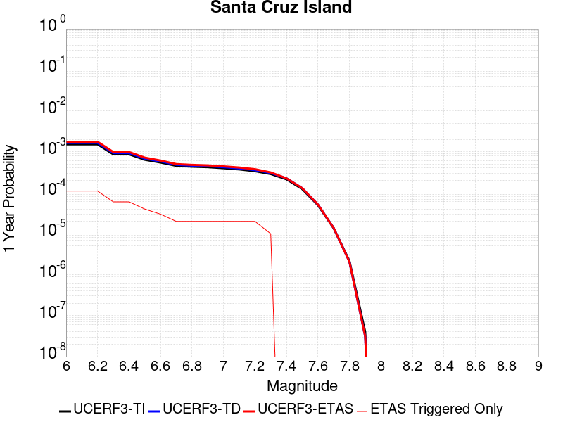 |  |

| Magnitude | 1 wk TI Prob | 1 wk TD Prob | 1 wk ETAS Prob | 1 wk ETAS/TD Gain | 1 wk ETAS Triggered Only | 1 mo TI Prob | 1 mo TD Prob | 1 mo ETAS Prob | 1 mo ETAS/TD Gain | 1 mo ETAS Triggered Only | 1 yr TI Prob | 1 yr TD Prob | 1 yr ETAS Prob | 1 yr ETAS/TD Gain | 1 yr ETAS Triggered Only | 10 yr TI Prob | 10 yr TD Prob | 10 yr ETAS Prob | 10 yr ETAS/TD Gain | 10 yr ETAS Triggered Only |
|-----|-----|-----|-----|-----|-----|-----|-----|-----|-----|-----|-----|-----|-----|-----|-----|-----|-----|-----|-----|-----|
| 6.0 | 2.9164563E-5 | 3.1599742E-5 | 7.159848E-5 | 2.265793 | 4.0E-5 | 1.2498499E-4 | 1.3542121E-4 | 2.0541174E-4 | 1.5168357 | 7.0E-5 | 0.0015206301 | 0.0016476426 | 0.0017574613 | 1.066652 | 1.1E-4 | 0.015102667 | 0.016368 | 0.016495872 | 1.0078124 | 1.3E-4 |
| 6.1 | 2.9164563E-5 | 3.1599742E-5 | 7.159848E-5 | 2.265793 | 4.0E-5 | 1.2498499E-4 | 1.3542121E-4 | 2.0541174E-4 | 1.5168357 | 7.0E-5 | 0.0015206301 | 0.0016476426 | 0.0017574613 | 1.066652 | 1.1E-4 | 0.015102667 | 0.016368 | 0.016495872 | 1.0078124 | 1.3E-4 |
| 6.2 | 2.9164563E-5 | 3.1599742E-5 | 7.159848E-5 | 2.265793 | 4.0E-5 | 1.2498499E-4 | 1.3542121E-4 | 2.0541174E-4 | 1.5168357 | 7.0E-5 | 0.0015206301 | 0.0016476426 | 0.0017574613 | 1.066652 | 1.1E-4 | 0.015102667 | 0.016368 | 0.016495872 | 1.0078124 | 1.3E-4 |
| 6.3 | 1.6635553E-5 | 1.780436E-5 | 2.780418E-5 | 1.5616502 | 1.0E-5 | 7.1293274E-5 | 7.630227E-5 | 1.0629998E-4 | 1.3931432 | 3.0E-5 | 8.6765E-4 | 9.286024E-4 | 9.885466E-4 | 1.0645533 | 6.0E-5 | 0.008642701 | 0.009249094 | 0.009318447 | 1.0074983 | 7.0E-5 |
| 6.4 | 1.6635553E-5 | 1.780436E-5 | 2.780418E-5 | 1.5616502 | 1.0E-5 | 7.1293274E-5 | 7.630227E-5 | 1.0629998E-4 | 1.3931432 | 3.0E-5 | 8.6765E-4 | 9.286024E-4 | 9.885466E-4 | 1.0645533 | 6.0E-5 | 0.008642701 | 0.009249094 | 0.009318447 | 1.0074983 | 7.0E-5 |
| 6.5 | 1.2238748E-5 | 1.3042996E-5 | 2.3042865E-5 | 1.766685 | 1.0E-5 | 5.2450723E-5 | 5.5897377E-5 | 7.5896256E-5 | 1.3577785 | 2.0E-5 | 6.3840044E-4 | 6.8034173E-4 | 7.2031457E-4 | 1.058754 | 4.0E-5 | 0.0063656955 | 0.006782988 | 0.006832649 | 1.0073214 | 5.0E-5 |
| 6.6 | 1.0489767E-5 | 1.1156636E-5 | 2.1156524E-5 | 1.8963175 | 1.0E-5 | 4.495537E-5 | 4.781329E-5 | 5.7812813E-5 | 1.2091368 | 1.0E-5 | 5.4719415E-4 | 5.819736E-4 | 6.119561E-4 | 1.0515187 | 3.0E-5 | 0.005458487 | 0.005804736 | 0.0058445036 | 1.006851 | 4.0E-5 |
| 6.7 | 8.699222E-6 | 9.236783E-6 | 1.923669E-5 | 2.082618 | 1.0E-5 | 3.7281847E-5 | 3.958561E-5 | 4.958522E-5 | 1.252607 | 1.0E-5 | 4.5381195E-4 | 4.818488E-4 | 5.0183915E-4 | 1.0414867 | 2.0E-5 | 0.0045288634 | 0.004808108 | 0.0048379637 | 1.0062095 | 3.0E-5 |
| 6.8 | 8.307732E-6 | 8.8169045E-6 | 1.8816816E-5 | 2.1341748 | 1.0E-5 | 3.560408E-5 | 3.7786187E-5 | 4.7785812E-5 | 1.264637 | 1.0E-5 | 4.3339343E-4 | 4.5995016E-4 | 4.7994097E-4 | 1.043463 | 2.0E-5 | 0.004325492 | 0.0045900354 | 0.004619898 | 1.0065058 | 3.0E-5 |
| 6.9 | 8.073121E-6 | 8.564939E-6 | 1.8564853E-5 | 2.1675406 | 1.0E-5 | 3.459863E-5 | 3.670637E-5 | 4.6706E-5 | 1.2724223 | 1.0E-5 | 4.2115687E-4 | 4.4680882E-4 | 4.667999E-4 | 1.0447419 | 2.0E-5 | 0.004203596 | 0.004459156 | 0.0044890223 | 1.0066978 | 3.0E-5 |
| 7.0 | 7.617019E-6 | 8.074665E-6 | 1.8074585E-5 | 2.2384315 | 1.0E-5 | 3.264396E-5 | 3.4605247E-5 | 4.46049E-5 | 1.2889636 | 1.0E-5 | 3.9736772E-4 | 4.2123784E-4 | 4.412294E-4 | 1.0474591 | 2.0E-5 | 0.003966579 | 0.0042044413 | 0.0042343154 | 1.0071054 | 3.0E-5 |
| 7.1 | 7.1224836E-6 | 7.5457883E-6 | 1.7545713E-5 | 2.3252325 | 1.0E-5 | 3.052457E-5 | 3.2338692E-5 | 4.2338368E-5 | 1.3092171 | 1.0E-5 | 3.715733E-4 | 3.9365282E-4 | 4.1364494E-4 | 1.0507861 | 2.0E-5 | 0.003709526 | 0.0039295983 | 0.00395948 | 1.0076044 | 3.0E-5 |
| 7.2 | 6.441115E-6 | 6.8273835E-6 | 1.6827315E-5 | 2.46468 | 1.0E-5 | 2.7604487E-5 | 2.9259889E-5 | 3.9259598E-5 | 1.3417548 | 1.0E-5 | 3.360328E-4 | 3.5618115E-4 | 3.7617402E-4 | 1.0561312 | 2.0E-5 | 0.0033552512 | 0.0035561312 | 0.0035860245 | 1.0084062 | 3.0E-5 |
| 7.3 | 5.494274E-6 | 5.8199944E-6 | 5.8199944E-6 | 1.0 | 0.0 | 2.3546674E-5 | 2.4942596E-5 | 2.4942596E-5 | 1.0 | 0.0 | 2.8664304E-4 | 3.03634E-4 | 3.1363097E-4 | 1.0329244 | 1.0E-5 | 0.002862736 | 0.0030322145 | 0.0030521539 | 1.0065758 | 2.0E-5 |
| 7.4 | 4.0802624E-6 | 4.3122564E-6 | 4.3122564E-6 | 1.0 | 0.0 | 1.7486722E-5 | 1.8480969E-5 | 1.8480969E-5 | 1.0 | 0.0 | 2.1288003E-4 | 2.2498264E-4 | 2.2498264E-4 | 1.0 | 0.0 | 0.0021267622 | 0.0022475577 | 0.0022575352 | 1.0044392 | 1.0E-5 |
| 7.5 | 2.3584746E-6 | 2.4753099E-6 | 2.4753099E-6 | 1.0 | 0.0 | 1.0107709E-5 | 1.0608428E-5 | 1.0608428E-5 | 1.0 | 0.0 | 1.2305441E-4 | 1.2915001E-4 | 1.2915001E-4 | 1.0 | 0.0 | 0.0012298629 | 0.0012907545 | 0.0012907545 | 1.0 | 0.0 |
| 7.6 | 9.4981914E-7 | 9.860934E-7 | 9.860934E-7 | 1.0 | 0.0 | 4.0706473E-6 | 4.2261076E-6 | 4.2261076E-6 | 1.0 | 0.0 | 4.9559E-5 | 5.1451658E-5 | 5.1451658E-5 | 1.0 | 0.0 | 4.954795E-4 | 5.1439874E-4 | 5.1439874E-4 | 1.0 | 0.0 |
| 7.7 | 2.6013532E-7 | 2.6416632E-7 | 2.6416632E-7 | 1.0 | 0.0 | 1.1148652E-6 | 1.1321408E-6 | 1.1321408E-6 | 1.0 | 0.0 | 1.3573399E-5 | 1.3783729E-5 | 1.3783729E-5 | 1.0 | 0.0 | 1.357257E-4 | 1.378288E-4 | 1.378288E-4 | 1.0 | 0.0 |
| 7.8 | 4.1522263E-8 | 3.965698E-8 | 3.965698E-8 | 1.0 | 0.0 | 1.7795254E-7 | 1.6995848E-7 | 1.6995848E-7 | 1.0 | 0.0 | 2.16657E-6 | 2.0692428E-6 | 2.0692428E-6 | 1.0 | 0.0 | 2.1665488E-5 | 2.0692256E-5 | 2.0692256E-5 | 1.0 | 0.0 |
| 7.9 | 7.7242046E-10 | 5.9475225E-10 | 5.9475225E-10 | 1.0 | 0.0 | 3.3103735E-9 | 2.5489382E-9 | 2.5489382E-9 | 1.0 | 0.0 | 4.0303796E-8 | 3.1033323E-8 | 3.1033323E-8 | 1.0 | 0.0 | 4.030379E-7 | 3.103332E-7 | 3.103332E-7 | 1.0 | 0.0 |

## Tin Mountain
*[(top)](#table-of-contents)*

| 1 Week | 1 Month | 1 Year | 10 Year |
|-----|-----|-----|-----|
|  |  |  |  |

| Magnitude | 1 wk TI Prob | 1 wk TD Prob | 1 wk ETAS Prob | 1 wk ETAS/TD Gain | 1 wk ETAS Triggered Only | 1 mo TI Prob | 1 mo TD Prob | 1 mo ETAS Prob | 1 mo ETAS/TD Gain | 1 mo ETAS Triggered Only | 1 yr TI Prob | 1 yr TD Prob | 1 yr ETAS Prob | 1 yr ETAS/TD Gain | 1 yr ETAS Triggered Only | 10 yr TI Prob | 10 yr TD Prob | 10 yr ETAS Prob | 10 yr ETAS/TD Gain | 10 yr ETAS Triggered Only |
|-----|-----|-----|-----|-----|-----|-----|-----|-----|-----|-----|-----|-----|-----|-----|-----|-----|-----|-----|-----|-----|
| 6.0 | 4.083776E-6 | 4.1815365E-6 | 3.4181412E-5 | 8.174366 | 3.0E-5 | 1.750178E-5 | 1.792077E-5 | 4.792023E-5 | 2.6740053 | 3.0E-5 | 2.1306332E-4 | 2.1816725E-4 | 2.8815196E-4 | 1.3207848 | 7.0E-5 | 0.0021285915 | 0.0021798965 | 0.0022996347 | 1.0549285 | 1.2E-4 |
| 6.1 | 4.083776E-6 | 4.1815365E-6 | 3.4181412E-5 | 8.174366 | 3.0E-5 | 1.750178E-5 | 1.792077E-5 | 4.792023E-5 | 2.6740053 | 3.0E-5 | 2.1306332E-4 | 2.1816725E-4 | 2.8815196E-4 | 1.3207848 | 7.0E-5 | 0.0021285915 | 0.0021798965 | 0.0022996347 | 1.0549285 | 1.2E-4 |
| 6.2 | 4.083776E-6 | 4.1815365E-6 | 3.4181412E-5 | 8.174366 | 3.0E-5 | 1.750178E-5 | 1.792077E-5 | 4.792023E-5 | 2.6740053 | 3.0E-5 | 2.1306332E-4 | 2.1816725E-4 | 2.8815196E-4 | 1.3207848 | 7.0E-5 | 0.0021285915 | 0.0021798965 | 0.0022996347 | 1.0549285 | 1.2E-4 |
| 6.3 | 4.083776E-6 | 4.1815365E-6 | 3.4181412E-5 | 8.174366 | 3.0E-5 | 1.750178E-5 | 1.792077E-5 | 4.792023E-5 | 2.6740053 | 3.0E-5 | 2.1306332E-4 | 2.1816725E-4 | 2.8815196E-4 | 1.3207848 | 7.0E-5 | 0.0021285915 | 0.0021798965 | 0.0022996347 | 1.0549285 | 1.2E-4 |
| 6.4 | 4.083776E-6 | 4.1815365E-6 | 3.4181412E-5 | 8.174366 | 3.0E-5 | 1.750178E-5 | 1.792077E-5 | 4.792023E-5 | 2.6740053 | 3.0E-5 | 2.1306332E-4 | 2.1816725E-4 | 2.8815196E-4 | 1.3207848 | 7.0E-5 | 0.0021285915 | 0.0021798965 | 0.0022996347 | 1.0549285 | 1.2E-4 |
| 6.5 | 2.3143427E-6 | 2.3731573E-6 | 3.2373086E-5 | 13.641357 | 3.0E-5 | 9.9185745E-6 | 1.0170638E-5 | 4.0170333E-5 | 3.9496374 | 3.0E-5 | 1.2075195E-4 | 1.2382126E-4 | 1.5381754E-4 | 1.2422547 | 3.0E-5 | 0.0012068636 | 0.0012375986 | 0.0012775491 | 1.0322807 | 4.0E-5 |
| 6.6 | 2.3143427E-6 | 2.3731573E-6 | 3.2373086E-5 | 13.641357 | 3.0E-5 | 9.9185745E-6 | 1.0170638E-5 | 4.0170333E-5 | 3.9496374 | 3.0E-5 | 1.2075195E-4 | 1.2382126E-4 | 1.5381754E-4 | 1.2422547 | 3.0E-5 | 0.0012068636 | 0.0012375986 | 0.0012775491 | 1.0322807 | 4.0E-5 |
| 6.7 | 1.7029532E-6 | 1.7497915E-6 | 2.1749756E-5 | 12.4299135 | 2.0E-5 | 7.2983503E-6 | 7.499088E-6 | 2.7498938E-5 | 3.666971 | 2.0E-5 | 8.885379E-5 | 9.1298105E-5 | 1.1129628E-4 | 1.2190425 | 2.0E-5 | 8.881827E-4 | 9.1265864E-4 | 9.426312E-4 | 1.032841 | 3.0E-5 |
| 6.8 | 1.2914646E-6 | 1.3299378E-6 | 2.1329912E-5 | 16.038277 | 2.0E-5 | 5.534837E-6 | 5.6997237E-6 | 2.569961E-5 | 4.508922 | 2.0E-5 | 6.738455E-5 | 6.939237E-5 | 8.939098E-5 | 1.2881961 | 2.0E-5 | 6.736412E-4 | 6.9375033E-4 | 7.1373646E-4 | 1.0288088 | 2.0E-5 |
| 6.9 | 5.8708974E-7 | 6.1169936E-7 | 6.1169936E-7 | 1.0 | 0.0 | 2.5160964E-6 | 2.6215664E-6 | 2.6215664E-6 | 1.0 | 0.0 | 3.0633044E-5 | 3.1917145E-5 | 3.1917145E-5 | 1.0 | 0.0 | 3.0628822E-4 | 3.191297E-4 | 3.191297E-4 | 1.0 | 0.0 |
| 7.0 | 4.6248786E-7 | 4.832015E-7 | 4.832015E-7 | 1.0 | 0.0 | 1.9820893E-6 | 2.0708624E-6 | 2.0708624E-6 | 1.0 | 0.0 | 2.413167E-5 | 2.5212494E-5 | 2.5212494E-5 | 1.0 | 0.0 | 2.412905E-4 | 2.5210003E-4 | 2.5210003E-4 | 1.0 | 0.0 |
| 7.1 | 3.804606E-7 | 3.987147E-7 | 3.987147E-7 | 1.0 | 0.0 | 1.6305444E-6 | 1.7087764E-6 | 1.7087764E-6 | 1.0 | 0.0 | 1.9851697E-5 | 2.0804187E-5 | 2.0804187E-5 | 1.0 | 0.0 | 1.9849923E-4 | 2.0802575E-4 | 2.0802575E-4 | 1.0 | 0.0 |
| 7.2 | 3.5864858E-7 | 3.7616863E-7 | 3.7616863E-7 | 1.0 | 0.0 | 1.5370645E-6 | 1.6121504E-6 | 1.6121504E-6 | 1.0 | 0.0 | 1.87136E-5 | 1.9627789E-5 | 1.9627789E-5 | 1.0 | 0.0 | 1.8712023E-4 | 1.9626386E-4 | 1.9626386E-4 | 1.0 | 0.0 |
| 7.3 | 3.342063E-7 | 3.506347E-7 | 3.506347E-7 | 1.0 | 0.0 | 1.4323119E-6 | 1.5027196E-6 | 1.5027196E-6 | 1.0 | 0.0 | 1.7438259E-5 | 1.829549E-5 | 1.829549E-5 | 1.0 | 0.0 | 1.743689E-4 | 1.8294314E-4 | 1.8294314E-4 | 1.0 | 0.0 |
| 7.4 | 2.971242E-7 | 3.1165817E-7 | 3.1165817E-7 | 1.0 | 0.0 | 1.2733886E-6 | 1.3356774E-6 | 1.3356774E-6 | 1.0 | 0.0 | 1.5503398E-5 | 1.6261785E-5 | 1.6261785E-5 | 1.0 | 0.0 | 1.5502315E-4 | 1.6260923E-4 | 1.6260923E-4 | 1.0 | 0.0 |
| 7.5 | 1.4326713E-7 | 1.5012525E-7 | 1.5012525E-7 | 1.0 | 0.0 | 6.140018E-7 | 6.433939E-7 | 6.433939E-7 | 1.0 | 0.0 | 7.4754466E-6 | 7.8333205E-6 | 7.8333205E-6 | 1.0 | 0.0 | 7.475195E-5 | 7.833321E-5 | 7.833321E-5 | 1.0 | 0.0 |

## Chino alt 1
*[(top)](#table-of-contents)*

| 1 Week | 1 Month | 1 Year | 10 Year |
|-----|-----|-----|-----|
| 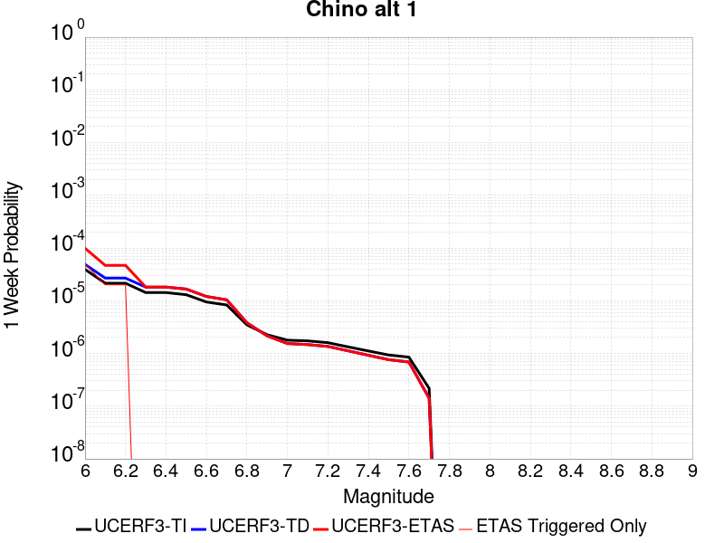 | 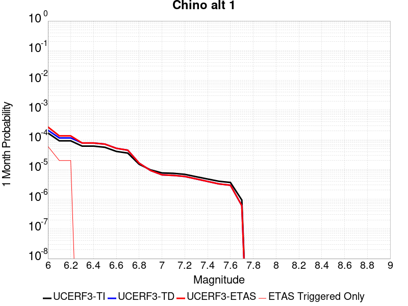 | 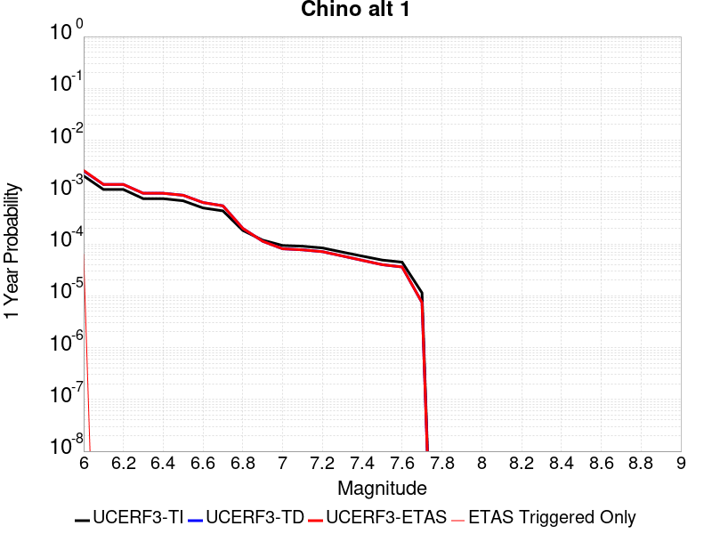 | 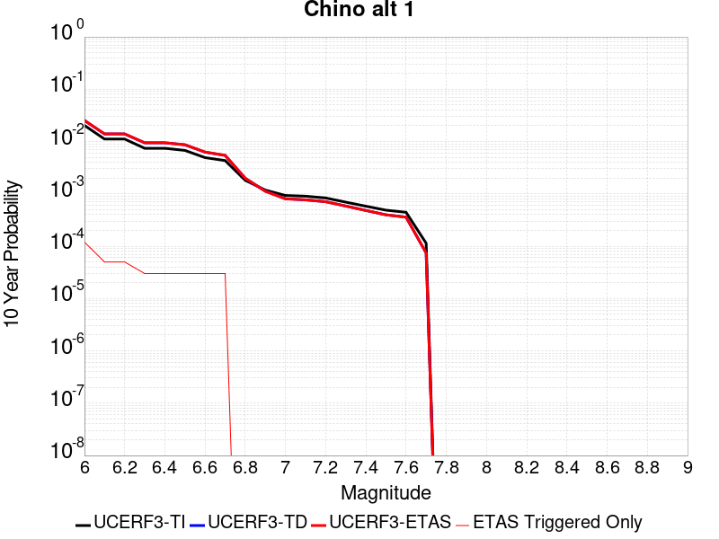 |

| Magnitude | 1 wk TI Prob | 1 wk TD Prob | 1 wk ETAS Prob | 1 wk ETAS/TD Gain | 1 wk ETAS Triggered Only | 1 mo TI Prob | 1 mo TD Prob | 1 mo ETAS Prob | 1 mo ETAS/TD Gain | 1 mo ETAS Triggered Only | 1 yr TI Prob | 1 yr TD Prob | 1 yr ETAS Prob | 1 yr ETAS/TD Gain | 1 yr ETAS Triggered Only | 10 yr TI Prob | 10 yr TD Prob | 10 yr ETAS Prob | 10 yr ETAS/TD Gain | 10 yr ETAS Triggered Only |
|-----|-----|-----|-----|-----|-----|-----|-----|-----|-----|-----|-----|-----|-----|-----|-----|-----|-----|-----|-----|-----|
| 6.0 | 3.939946E-5 | 4.894798E-5 | 9.894554E-5 | 2.0214427 | 5.0E-5 | 1.6884391E-4 | 2.0976314E-4 | 2.6975054E-4 | 1.2859769 | 6.0E-5 | 0.0020537362 | 0.002551385 | 0.0026511298 | 1.0390944 | 1.0E-4 | 0.020348595 | 0.025280168 | 0.025397135 | 1.0046268 | 1.2E-4 |
| 6.1 | 2.1505624E-5 | 2.6878823E-5 | 4.6878286E-5 | 1.7440602 | 2.0E-5 | 9.2163704E-5 | 1.15190494E-4 | 1.351882E-4 | 1.1736054 | 2.0E-5 | 0.0011215154 | 0.0014016517 | 0.0014415955 | 1.0284978 | 4.0E-5 | 0.011158722 | 0.013947425 | 0.013996728 | 1.0035349 | 5.0E-5 |
| 6.2 | 2.1505624E-5 | 2.6878823E-5 | 4.6878286E-5 | 1.7440602 | 2.0E-5 | 9.2163704E-5 | 1.15190494E-4 | 1.351882E-4 | 1.1736054 | 2.0E-5 | 0.0011215154 | 0.0014016517 | 0.0014415955 | 1.0284978 | 4.0E-5 | 0.011158722 | 0.013947425 | 0.013996728 | 1.0035349 | 5.0E-5 |
| 6.3 | 1.4290785E-5 | 1.8164832E-5 | 1.8164832E-5 | 1.0 | 0.0 | 6.1244784E-5 | 7.784722E-5 | 7.784722E-5 | 1.0 | 0.0 | 7.454001E-4 | 9.4742293E-4 | 9.67404E-4 | 1.0210899 | 2.0E-5 | 0.007429048 | 0.00944674 | 0.009476457 | 1.0031457 | 3.0E-5 |
| 6.4 | 1.4290785E-5 | 1.8164832E-5 | 1.8164832E-5 | 1.0 | 0.0 | 6.1244784E-5 | 7.784722E-5 | 7.784722E-5 | 1.0 | 0.0 | 7.454001E-4 | 9.4742293E-4 | 9.67404E-4 | 1.0210899 | 2.0E-5 | 0.007429048 | 0.00944674 | 0.009476457 | 1.0031457 | 3.0E-5 |
| 6.5 | 1.3017944E-5 | 1.6651793E-5 | 1.6651793E-5 | 1.0 | 0.0 | 5.5789995E-5 | 7.1363116E-5 | 7.1363116E-5 | 1.0 | 0.0 | 6.790315E-4 | 8.6854334E-4 | 8.88526E-4 | 1.023007 | 2.0E-5 | 0.0067696036 | 0.008664233 | 0.008693973 | 1.0034325 | 3.0E-5 |
| 6.6 | 9.470016E-6 | 1.2039209E-5 | 1.2039209E-5 | 1.0 | 0.0 | 4.058515E-5 | 5.159578E-5 | 5.159578E-5 | 1.0 | 0.0 | 4.940122E-4 | 6.280315E-4 | 6.4801896E-4 | 1.0318255 | 2.0E-5 | 0.004929154 | 0.006273248 | 0.0063030594 | 1.0047522 | 3.0E-5 |
| 6.7 | 8.314155E-6 | 1.040749E-5 | 1.040749E-5 | 1.0 | 0.0 | 3.5631605E-5 | 4.4602948E-5 | 4.4602948E-5 | 1.0 | 0.0 | 4.3372845E-4 | 5.4293784E-4 | 5.62927E-4 | 1.0368166 | 2.0E-5 | 0.004328829 | 0.0054270807 | 0.005456918 | 1.0054978 | 3.0E-5 |
| 6.8 | 3.4856364E-6 | 3.8134033E-6 | 3.8134033E-6 | 1.0 | 0.0 | 1.4938357E-5 | 1.6343065E-5 | 1.6343065E-5 | 1.0 | 0.0 | 1.8185932E-4 | 1.9896074E-4 | 1.9896074E-4 | 1.0 | 0.0 | 0.0018171056 | 0.0019894529 | 0.0019894529 | 1.0 | 0.0 |
| 6.9 | 2.2645952E-6 | 2.152909E-6 | 2.152909E-6 | 1.0 | 0.0 | 9.705372E-6 | 9.226722E-6 | 9.226722E-6 | 1.0 | 0.0 | 1.18156495E-4 | 1.12329755E-4 | 1.12329755E-4 | 1.0 | 0.0 | 0.0011809369 | 0.0011233138 | 0.0011233138 | 1.0 | 0.0 |
| 7.0 | 1.7864003E-6 | 1.5430741E-6 | 1.5430741E-6 | 1.0 | 0.0 | 7.655979E-6 | 6.613158E-6 | 6.613158E-6 | 1.0 | 0.0 | 9.3207556E-5 | 8.051228E-5 | 8.051228E-5 | 1.0 | 0.0 | 9.316847E-4 | 8.052856E-4 | 8.052856E-4 | 1.0 | 0.0 |
| 7.1 | 1.7315456E-6 | 1.4733466E-6 | 1.4733466E-6 | 1.0 | 0.0 | 7.420889E-6 | 6.314328E-6 | 6.314328E-6 | 1.0 | 0.0 | 9.034557E-5 | 7.687428E-5 | 7.687428E-5 | 1.0 | 0.0 | 9.0308854E-4 | 7.68921E-4 | 7.68921E-4 | 1.0 | 0.0 |
| 7.2 | 1.6008337E-6 | 1.3574178E-6 | 1.3574178E-6 | 1.0 | 0.0 | 6.860698E-6 | 5.817492E-6 | 5.817492E-6 | 1.0 | 0.0 | 8.352579E-5 | 7.082572E-5 | 7.082572E-5 | 1.0 | 0.0 | 8.34944E-4 | 7.0846075E-4 | 7.0846075E-4 | 1.0 | 0.0 |
| 7.3 | 1.3320939E-6 | 1.1217794E-6 | 1.1217794E-6 | 1.0 | 0.0 | 5.7089615E-6 | 4.8076176E-6 | 4.8076176E-6 | 1.0 | 0.0 | 6.9504385E-5 | 5.853122E-5 | 5.853122E-5 | 1.0 | 0.0 | 6.9482654E-4 | 5.8530655E-4 | 5.8530655E-4 | 1.0 | 0.0 |
| 7.4 | 1.114294E-6 | 9.237087E-7 | 9.237087E-7 | 1.0 | 0.0 | 4.775537E-6 | 3.9587458E-6 | 3.9587458E-6 | 1.0 | 0.0 | 5.8140613E-5 | 4.81967E-5 | 4.81967E-5 | 1.0 | 0.0 | 5.81254E-4 | 4.8187698E-4 | 4.8187698E-4 | 1.0 | 0.0 |
| 7.5 | 9.354081E-7 | 7.6233886E-7 | 7.6233886E-7 | 1.0 | 0.0 | 4.0088858E-6 | 3.2671626E-6 | 3.2671626E-6 | 1.0 | 0.0 | 4.8807087E-5 | 3.9777013E-5 | 3.9777013E-5 | 1.0 | 0.0 | 4.879637E-4 | 3.9770233E-4 | 3.9770233E-4 | 1.0 | 0.0 |
| 7.6 | 8.521771E-7 | 6.880688E-7 | 6.880688E-7 | 1.0 | 0.0 | 3.6521824E-6 | 2.948863E-6 | 2.948863E-6 | 1.0 | 0.0 | 4.4464414E-5 | 3.590185E-5 | 3.590185E-5 | 1.0 | 0.0 | 4.4455516E-4 | 3.5896365E-4 | 3.5896365E-4 | 1.0 | 0.0 |
| 7.7 | 2.1803626E-7 | 1.4186368E-7 | 1.4186368E-7 | 1.0 | 0.0 | 9.344408E-7 | 6.0798715E-7 | 6.0798715E-7 | 1.0 | 0.0 | 1.1376757E-5 | 7.4022278E-6 | 7.4022278E-6 | 1.0 | 0.0 | 1.13761744E-4 | 7.402077E-5 | 7.402077E-5 | 1.0 | 0.0 |

## Ortigalita (North)
*[(top)](#table-of-contents)*

| 1 Week | 1 Month | 1 Year | 10 Year |
|-----|-----|-----|-----|
| 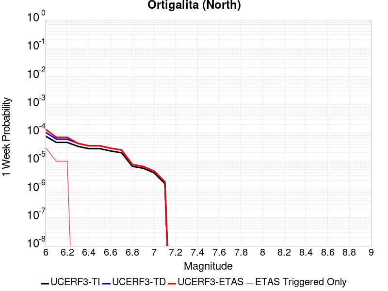 |  | 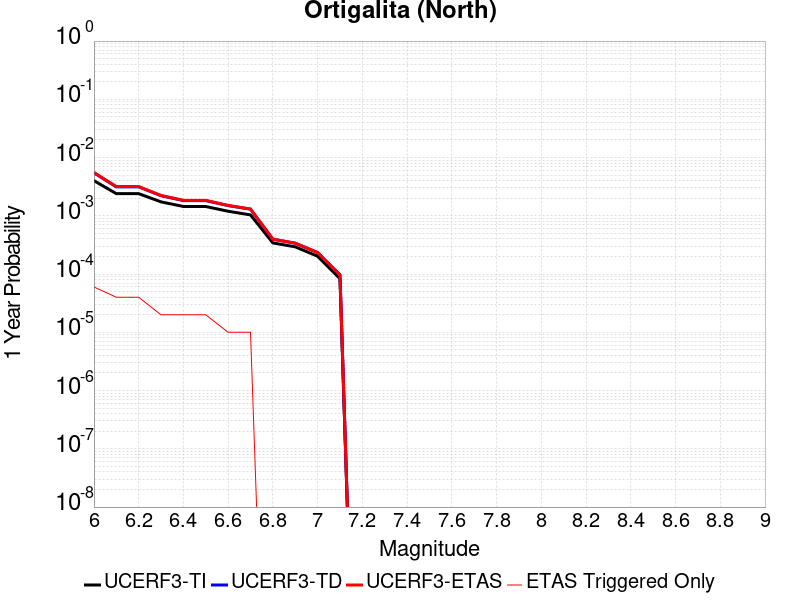 | 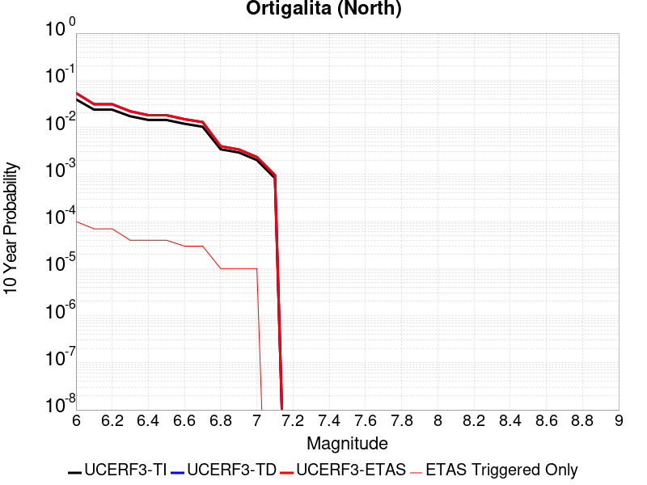 |

| Magnitude | 1 wk TI Prob | 1 wk TD Prob | 1 wk ETAS Prob | 1 wk ETAS/TD Gain | 1 wk ETAS Triggered Only | 1 mo TI Prob | 1 mo TD Prob | 1 mo ETAS Prob | 1 mo ETAS/TD Gain | 1 mo ETAS Triggered Only | 1 yr TI Prob | 1 yr TD Prob | 1 yr ETAS Prob | 1 yr ETAS/TD Gain | 1 yr ETAS Triggered Only | 10 yr TI Prob | 10 yr TD Prob | 10 yr ETAS Prob | 10 yr ETAS/TD Gain | 10 yr ETAS Triggered Only |
|-----|-----|-----|-----|-----|-----|-----|-----|-----|-----|-----|-----|-----|-----|-----|-----|-----|-----|-----|-----|-----|
| 6.0 | 7.711876E-5 | 1.0505308E-4 | 1.3504992E-4 | 1.28554 | 3.0E-5 | 3.3046713E-4 | 4.501601E-4 | 4.901421E-4 | 1.0888172 | 4.0E-5 | 0.004016016 | 0.0054680547 | 0.005527727 | 1.0109128 | 6.0E-5 | 0.039442103 | 0.053455614 | 0.053550266 | 1.0017707 | 1.0E-4 |
| 6.1 | 4.607858E-5 | 6.0239887E-5 | 7.0239286E-5 | 1.165993 | 1.0E-5 | 1.9746469E-4 | 2.5814763E-4 | 2.7814248E-4 | 1.077455 | 2.0E-5 | 0.0024014818 | 0.0031387366 | 0.0031786112 | 1.012704 | 4.0E-5 | 0.023756953 | 0.030975312 | 0.031043144 | 1.0021899 | 7.0E-5 |
| 6.2 | 4.607858E-5 | 6.0239887E-5 | 7.0239286E-5 | 1.165993 | 1.0E-5 | 1.9746469E-4 | 2.5814763E-4 | 2.7814248E-4 | 1.077455 | 2.0E-5 | 0.0024014818 | 0.0031387366 | 0.0031786112 | 1.012704 | 4.0E-5 | 0.023756953 | 0.030975312 | 0.031043144 | 1.0021899 | 7.0E-5 |
| 6.3 | 3.327423E-5 | 4.2476124E-5 | 4.2476124E-5 | 1.0 | 0.0 | 1.4259605E-4 | 1.8202956E-4 | 1.8202956E-4 | 1.0 | 0.0 | 0.0017347244 | 0.002214206 | 0.0022341616 | 1.0090126 | 2.0E-5 | 0.017212452 | 0.02194574 | 0.021984862 | 1.0017827 | 4.0E-5 |
| 6.4 | 2.7732503E-5 | 3.4999008E-5 | 3.4999008E-5 | 1.0 | 0.0 | 1.1884817E-4 | 1.499886E-4 | 1.499886E-4 | 1.0 | 0.0 | 0.001446016 | 0.0018248158 | 0.0018447792 | 1.01094 | 2.0E-5 | 0.014366428 | 0.018121297 | 0.018160572 | 1.0021673 | 4.0E-5 |
| 6.5 | 2.7689714E-5 | 3.4948822E-5 | 3.4948822E-5 | 1.0 | 0.0 | 1.186648E-4 | 1.4977354E-4 | 1.4977354E-4 | 1.0 | 0.0 | 0.0014437864 | 0.0018222018 | 0.0018421654 | 1.0109557 | 2.0E-5 | 0.014344421 | 0.018095585 | 0.01813486 | 1.0021704 | 4.0E-5 |
| 6.6 | 2.2976905E-5 | 2.871829E-5 | 2.871829E-5 | 1.0 | 0.0 | 9.846873E-5 | 1.23074E-4 | 1.23074E-4 | 1.0 | 0.0 | 0.0011981975 | 0.0014976348 | 0.0015076199 | 1.0066671 | 1.0E-5 | 0.011917574 | 0.014898733 | 0.014928287 | 1.0019836 | 3.0E-5 |
| 6.7 | 1.9871539E-5 | 2.4904637E-5 | 2.4904637E-5 | 1.0 | 0.0 | 8.516096E-5 | 1.067312E-4 | 1.067312E-4 | 1.0 | 0.0 | 0.0010363415 | 0.0012989199 | 0.0013089069 | 1.0076888 | 1.0E-5 | 0.010315218 | 0.012936938 | 0.01296655 | 1.0022889 | 3.0E-5 |
| 6.8 | 6.5640475E-6 | 7.6054926E-6 | 7.6054926E-6 | 1.0 | 0.0 | 2.813133E-5 | 3.2594577E-5 | 3.2594577E-5 | 1.0 | 0.0 | 3.424451E-4 | 3.9676955E-4 | 3.9676955E-4 | 1.0 | 0.0 | 0.0034191788 | 0.003960899 | 0.003970859 | 1.0025147 | 1.0E-5 |
| 6.9 | 5.6219683E-6 | 6.5018376E-6 | 6.5018376E-6 | 1.0 | 0.0 | 2.4093928E-5 | 2.7864735E-5 | 2.7864735E-5 | 1.0 | 0.0 | 2.933041E-4 | 3.3920293E-4 | 3.3920293E-4 | 1.0 | 0.0 | 0.0029291727 | 0.003387109 | 0.003397075 | 1.0029423 | 1.0E-5 |
| 7.0 | 3.875591E-6 | 4.4847548E-6 | 4.4847548E-6 | 1.0 | 0.0 | 1.6609569E-5 | 1.9220248E-5 | 1.9220248E-5 | 1.0 | 0.0 | 2.0220275E-4 | 2.339835E-4 | 2.339835E-4 | 1.0 | 0.0 | 0.0020201886 | 0.0023375798 | 0.0023475564 | 1.0042679 | 1.0E-5 |
| 7.1 | 1.6017933E-6 | 1.8570418E-6 | 1.8570418E-6 | 1.0 | 0.0 | 6.8648105E-6 | 7.958732E-6 | 7.958732E-6 | 1.0 | 0.0 | 8.357586E-5 | 9.689432E-5 | 9.689432E-5 | 1.0 | 0.0 | 8.3544437E-4 | 9.686254E-4 | 9.686254E-4 | 1.0 | 0.0 |

## Oceanic - West Huasna
*[(top)](#table-of-contents)*

| 1 Week | 1 Month | 1 Year | 10 Year |
|-----|-----|-----|-----|
|  | 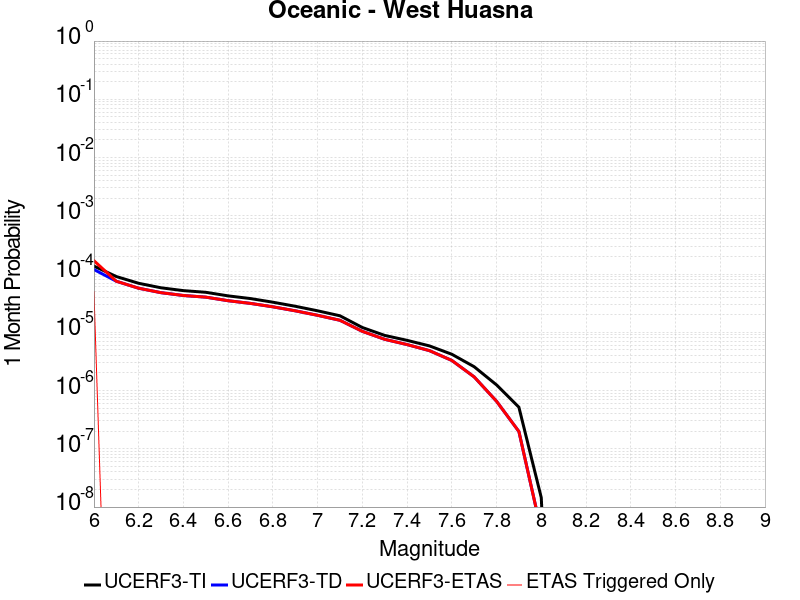 |  |  |

| Magnitude | 1 wk TI Prob | 1 wk TD Prob | 1 wk ETAS Prob | 1 wk ETAS/TD Gain | 1 wk ETAS Triggered Only | 1 mo TI Prob | 1 mo TD Prob | 1 mo ETAS Prob | 1 mo ETAS/TD Gain | 1 mo ETAS Triggered Only | 1 yr TI Prob | 1 yr TD Prob | 1 yr ETAS Prob | 1 yr ETAS/TD Gain | 1 yr ETAS Triggered Only | 10 yr TI Prob | 10 yr TD Prob | 10 yr ETAS Prob | 10 yr ETAS/TD Gain | 10 yr ETAS Triggered Only |
|-----|-----|-----|-----|-----|-----|-----|-----|-----|-----|-----|-----|-----|-----|-----|-----|-----|-----|-----|-----|-----|
| 6.0 | 3.195567E-5 | 2.7926368E-5 | 6.792525E-5 | 2.4322982 | 4.0E-5 | 1.3694567E-4 | 1.19679185E-4 | 1.696732E-4 | 1.4177336 | 5.0E-5 | 0.0016660384 | 0.0014561634 | 0.0015060905 | 1.0342869 | 5.0E-5 | 0.016536033 | 0.01447077 | 0.0145693235 | 1.0068104 | 1.0E-4 |
| 6.1 | 2.1156782E-5 | 1.7573117E-5 | 1.7573117E-5 | 1.0 | 0.0 | 9.066878E-5 | 7.531123E-5 | 7.531123E-5 | 1.0 | 0.0 | 0.0011033333 | 9.1653795E-4 | 9.1653795E-4 | 1.0 | 0.0 | 0.010978713 | 0.009128587 | 0.009148404 | 1.0021709 | 2.0E-5 |
| 6.2 | 1.6195117E-5 | 1.3327227E-5 | 1.3327227E-5 | 1.0 | 0.0 | 6.9405796E-5 | 5.7115452E-5 | 5.7115452E-5 | 1.0 | 0.0 | 8.44688E-4 | 6.9516135E-4 | 6.9516135E-4 | 1.0 | 0.0 | 0.008414844 | 0.0069301617 | 0.006950023 | 1.0028659 | 2.0E-5 |
| 6.3 | 1.3559345E-5 | 1.1179013E-5 | 1.1179013E-5 | 1.0 | 0.0 | 5.811018E-5 | 4.7909183E-5 | 4.7909183E-5 | 1.0 | 0.0 | 7.072618E-4 | 5.8313913E-4 | 5.8313913E-4 | 1.0 | 0.0 | 0.0070501505 | 0.005816208 | 0.0058360915 | 1.0034187 | 2.0E-5 |
| 6.4 | 1.2120619E-5 | 1.0000874E-5 | 1.0000874E-5 | 1.0 | 0.0 | 5.1944477E-5 | 4.2860185E-5 | 4.2860185E-5 | 1.0 | 0.0 | 6.322405E-4 | 5.216983E-4 | 5.216983E-4 | 1.0 | 0.0 | 0.006304447 | 0.005204804 | 0.0052246996 | 1.0038226 | 2.0E-5 |
| 6.5 | 1.13511915E-5 | 9.367378E-6 | 9.367378E-6 | 1.0 | 0.0 | 4.8647056E-5 | 4.0145293E-5 | 4.0145293E-5 | 1.0 | 0.0 | 5.9211696E-4 | 4.886598E-4 | 4.886598E-4 | 1.0 | 0.0 | 0.0059054173 | 0.0048759114 | 0.0048958138 | 1.0040818 | 2.0E-5 |
| 6.6 | 9.850605E-6 | 8.1353155E-6 | 8.1353155E-6 | 1.0 | 0.0 | 4.2216197E-5 | 3.4865174E-5 | 3.4865174E-5 | 1.0 | 0.0 | 5.1386096E-4 | 4.2440102E-4 | 4.2440102E-4 | 1.0 | 0.0 | 0.0051267436 | 0.0042359377 | 0.0042458954 | 1.0023508 | 1.0E-5 |
| 6.7 | 8.8558645E-6 | 7.318341E-6 | 7.318341E-6 | 1.0 | 0.0 | 3.7953152E-5 | 3.1363943E-5 | 3.1363943E-5 | 1.0 | 0.0 | 4.6198163E-4 | 3.8178926E-4 | 3.8178926E-4 | 1.0 | 0.0 | 0.004610224 | 0.0038113592 | 0.003821321 | 1.0026138 | 1.0E-5 |
| 6.8 | 7.67136E-6 | 6.39169E-6 | 6.39169E-6 | 1.0 | 0.0 | 3.2876844E-5 | 2.739267E-5 | 2.739267E-5 | 1.0 | 0.0 | 4.0020206E-4 | 3.3345487E-4 | 3.3345487E-4 | 1.0 | 0.0 | 0.003994821 | 0.0033295664 | 0.003339533 | 1.0029933 | 1.0E-5 |
| 6.9 | 6.534529E-6 | 5.458261E-6 | 5.458261E-6 | 1.0 | 0.0 | 2.8004823E-5 | 2.3392338E-5 | 2.3392338E-5 | 1.0 | 0.0 | 3.4090536E-4 | 2.8476462E-4 | 2.8476462E-4 | 1.0 | 0.0 | 0.0034038287 | 0.002844014 | 0.0028539856 | 1.0035062 | 1.0E-5 |
| 7.0 | 5.460525E-6 | 4.5699203E-6 | 4.5699203E-6 | 1.0 | 0.0 | 2.3402039E-5 | 1.9585226E-5 | 1.9585226E-5 | 1.0 | 0.0 | 2.8488258E-4 | 2.3842414E-4 | 2.3842414E-4 | 1.0 | 0.0 | 0.0028451765 | 0.0023816973 | 0.0023916736 | 1.0041887 | 1.0E-5 |
| 7.1 | 4.4825083E-6 | 3.7524153E-6 | 3.7524153E-6 | 1.0 | 0.0 | 1.9210609E-5 | 1.6081682E-5 | 1.6081682E-5 | 1.0 | 0.0 | 2.3386406E-4 | 1.9577699E-4 | 1.9577699E-4 | 1.0 | 0.0 | 0.002336181 | 0.001956057 | 0.0019660376 | 1.0051023 | 1.0E-5 |
| 7.2 | 2.821708E-6 | 2.424941E-6 | 2.424941E-6 | 1.0 | 0.0 | 1.2092979E-5 | 1.0392562E-5 | 1.0392562E-5 | 1.0 | 0.0 | 1.4722206E-4 | 1.265221E-4 | 1.265221E-4 | 1.0 | 0.0 | 0.0014712457 | 0.0012645032 | 0.0012645032 | 1.0 | 0.0 |
| 7.3 | 2.0644757E-6 | 1.7687502E-6 | 1.7687502E-6 | 1.0 | 0.0 | 8.847723E-6 | 7.580336E-6 | 7.580336E-6 | 1.0 | 0.0 | 1.0771569E-4 | 9.228668E-5 | 9.228668E-5 | 1.0 | 0.0 | 0.001076635 | 9.224854E-4 | 9.224854E-4 | 1.0 | 0.0 |
| 7.4 | 1.6980367E-6 | 1.4379966E-6 | 1.4379966E-6 | 1.0 | 0.0 | 7.27728E-6 | 6.1628284E-6 | 6.1628284E-6 | 1.0 | 0.0 | 8.8597284E-5 | 7.502986E-5 | 7.502986E-5 | 1.0 | 0.0 | 8.8561967E-4 | 7.5004686E-4 | 7.5004686E-4 | 1.0 | 0.0 |
| 7.5 | 1.3637683E-6 | 1.1302697E-6 | 1.1302697E-6 | 1.0 | 0.0 | 5.844708E-6 | 4.844004E-6 | 4.844004E-6 | 1.0 | 0.0 | 7.1156996E-5 | 5.897415E-5 | 5.897415E-5 | 1.0 | 0.0 | 7.1134215E-4 | 5.8958656E-4 | 5.8958656E-4 | 1.0 | 0.0 |
| 7.6 | 9.802994E-7 | 7.6772847E-7 | 7.6772847E-7 | 1.0 | 0.0 | 4.2012766E-6 | 3.2902608E-6 | 3.2902608E-6 | 1.0 | 0.0 | 5.1149345E-5 | 4.005819E-5 | 4.005819E-5 | 1.0 | 0.0 | 5.113757E-4 | 4.0051117E-4 | 4.0051117E-4 | 1.0 | 0.0 |
| 7.7 | 5.986191E-7 | 4.0050708E-7 | 4.0050708E-7 | 1.0 | 0.0 | 2.5655079E-6 | 1.7164577E-6 | 1.7164577E-6 | 1.0 | 0.0 | 3.1234613E-5 | 2.0897673E-5 | 2.0897673E-5 | 1.0 | 0.0 | 3.123022E-4 | 2.0895849E-4 | 2.0895849E-4 | 1.0 | 0.0 |
| 7.8 | 2.9189815E-7 | 1.5285202E-7 | 1.5285202E-7 | 1.0 | 0.0 | 1.2509914E-6 | 6.5507993E-7 | 6.5507993E-7 | 1.0 | 0.0 | 1.5230714E-5 | 7.975569E-6 | 7.975569E-6 | 1.0 | 0.0 | 1.522967E-4 | 7.97542E-5 | 7.97542E-5 | 1.0 | 0.0 |
| 7.9 | 1.2057845E-7 | 4.6208047E-8 | 4.6208047E-8 | 1.0 | 0.0 | 5.1676466E-7 | 1.9803447E-7 | 1.9803447E-7 | 1.0 | 0.0 | 6.2915915E-6 | 2.411067E-6 | 2.411067E-6 | 1.0 | 0.0 | 6.2914136E-5 | 2.4111772E-5 | 2.4111772E-5 | 1.0 | 0.0 |
| 8.0 | 3.3806387E-9 | 9.0093144E-10 | 9.0093144E-10 | 1.0 | 0.0 | 1.4488451E-8 | 3.8611354E-9 | 3.8611354E-9 | 1.0 | 0.0 | 1.7639688E-7 | 4.7009323E-8 | 4.7009323E-8 | 1.0 | 0.0 | 1.7639674E-6 | 4.712806E-7 | 4.712806E-7 | 1.0 | 0.0 |

## Santa Rosa Island
*[(top)](#table-of-contents)*

| 1 Week | 1 Month | 1 Year | 10 Year |
|-----|-----|-----|-----|
|  |  |  |  |

| Magnitude | 1 wk TI Prob | 1 wk TD Prob | 1 wk ETAS Prob | 1 wk ETAS/TD Gain | 1 wk ETAS Triggered Only | 1 mo TI Prob | 1 mo TD Prob | 1 mo ETAS Prob | 1 mo ETAS/TD Gain | 1 mo ETAS Triggered Only | 1 yr TI Prob | 1 yr TD Prob | 1 yr ETAS Prob | 1 yr ETAS/TD Gain | 1 yr ETAS Triggered Only | 10 yr TI Prob | 10 yr TD Prob | 10 yr ETAS Prob | 10 yr ETAS/TD Gain | 10 yr ETAS Triggered Only |
|-----|-----|-----|-----|-----|-----|-----|-----|-----|-----|-----|-----|-----|-----|-----|-----|-----|-----|-----|-----|-----|
| 6.0 | 4.1143165E-5 | 4.709113E-5 | 6.7090186E-5 | 1.4246885 | 2.0E-5 | 1.7631594E-4 | 2.0180462E-4 | 2.2180058E-4 | 1.0990858 | 2.0E-5 | 0.002144533 | 0.0024543991 | 0.0025142517 | 1.0243859 | 6.0E-5 | 0.021239553 | 0.024293557 | 0.024391128 | 1.0040163 | 1.0E-4 |
| 6.1 | 2.1061249E-5 | 2.3864959E-5 | 3.3864722E-5 | 1.4190143 | 1.0E-5 | 9.0259375E-5 | 1.0227455E-4 | 1.1227353E-4 | 1.097766 | 1.0E-5 | 0.0010983539 | 0.0012445103 | 0.001274473 | 1.0240759 | 3.0E-5 | 0.01092941 | 0.01237845 | 0.012427831 | 1.0039892 | 5.0E-5 |
| 6.2 | 2.1061249E-5 | 2.3864959E-5 | 3.3864722E-5 | 1.4190143 | 1.0E-5 | 9.0259375E-5 | 1.0227455E-4 | 1.1227353E-4 | 1.097766 | 1.0E-5 | 0.0010983539 | 0.0012445103 | 0.001274473 | 1.0240759 | 3.0E-5 | 0.01092941 | 0.01237845 | 0.012427831 | 1.0039892 | 5.0E-5 |
| 6.3 | 1.5158236E-5 | 1.7074419E-5 | 2.7074248E-5 | 1.5856615 | 1.0E-5 | 6.496225E-5 | 7.3174095E-5 | 8.317336E-5 | 1.1366504 | 1.0E-5 | 7.906284E-4 | 8.9054246E-4 | 9.105246E-4 | 1.0224382 | 2.0E-5 | 0.007878214 | 0.00887099 | 0.008900724 | 1.0033518 | 3.0E-5 |
| 6.4 | 1.2341918E-5 | 1.3852917E-5 | 2.3852777E-5 | 1.7218597 | 1.0E-5 | 5.2892858E-5 | 5.9368336E-5 | 6.936774E-5 | 1.16843 | 1.0E-5 | 6.437803E-4 | 7.225779E-4 | 7.4256345E-4 | 1.0276587 | 2.0E-5 | 0.006419184 | 0.0072031217 | 0.0072329054 | 1.0041349 | 3.0E-5 |
| 6.5 | 9.061158E-6 | 1.0117032E-5 | 2.011693E-5 | 1.9884223 | 1.0E-5 | 3.883296E-5 | 4.3358017E-5 | 5.335758E-5 | 1.2306279 | 1.0E-5 | 4.726887E-4 | 5.277613E-4 | 5.4775074E-4 | 1.0378759 | 2.0E-5 | 0.004716845 | 0.0052656177 | 0.0052954596 | 1.0056673 | 3.0E-5 |
| 6.6 | 7.5461685E-6 | 8.400734E-6 | 8.400734E-6 | 1.0 | 0.0 | 3.2340322E-5 | 3.600267E-5 | 3.600267E-5 | 1.0 | 0.0 | 3.936723E-4 | 4.3824868E-4 | 4.4824427E-4 | 1.0228081 | 1.0E-5 | 0.003929756 | 0.0043742736 | 0.004394186 | 1.0045522 | 2.0E-5 |
| 6.7 | 5.5023775E-6 | 6.087381E-6 | 6.087381E-6 | 1.0 | 0.0 | 2.3581404E-5 | 2.6088532E-5 | 2.6088532E-5 | 1.0 | 0.0 | 2.8706578E-4 | 3.1758484E-4 | 3.2758166E-4 | 1.0314777 | 1.0E-5 | 0.0028669522 | 0.0031716316 | 0.0031915682 | 1.0062859 | 2.0E-5 |
| 6.8 | 3.7351679E-6 | 4.0831405E-6 | 4.0831405E-6 | 1.0 | 0.0 | 1.6007763E-5 | 1.7499071E-5 | 1.7499071E-5 | 1.0 | 0.0 | 1.948771E-4 | 2.1303285E-4 | 2.2303071E-4 | 1.0469311 | 1.0E-5 | 0.0019470629 | 0.0021285315 | 0.00213851 | 1.004688 | 1.0E-5 |
| 6.9 | 2.456366E-6 | 2.6292707E-6 | 2.6292707E-6 | 1.0 | 0.0 | 1.0527241E-5 | 1.1268255E-5 | 1.1268255E-5 | 1.0 | 0.0 | 1.2816161E-4 | 1.3718239E-4 | 1.4718101E-4 | 1.0728856 | 1.0E-5 | 0.0012808773 | 0.0013709799 | 0.0013809663 | 1.007284 | 1.0E-5 |
| 7.0 | 2.3245157E-6 | 2.4827784E-6 | 2.4827784E-6 | 1.0 | 0.0 | 9.962172E-6 | 1.0640436E-5 | 1.0640436E-5 | 1.0 | 0.0 | 1.2128269E-4 | 1.2953962E-4 | 1.3953833E-4 | 1.0771865 | 1.0E-5 | 0.0012121652 | 0.0012946434 | 0.0013046304 | 1.0077142 | 1.0E-5 |
| 7.1 | 2.2248344E-6 | 2.37325E-6 | 2.37325E-6 | 1.0 | 0.0 | 9.53497E-6 | 1.0171032E-5 | 1.0171032E-5 | 1.0 | 0.0 | 1.1608207E-4 | 1.238253E-4 | 1.3382405E-4 | 1.0807489 | 1.0E-5 | 0.0011602144 | 0.0012375651 | 0.0012475527 | 1.0080703 | 1.0E-5 |
| 7.2 | 2.1350402E-6 | 2.2761542E-6 | 2.2761542E-6 | 1.0 | 0.0 | 9.150141E-6 | 9.75491E-6 | 9.75491E-6 | 1.0 | 0.0 | 1.1139726E-4 | 1.1875957E-4 | 1.2875839E-4 | 1.0841937 | 1.0E-5 | 0.0011134144 | 0.0011869629 | 0.0011969511 | 1.0084149 | 1.0E-5 |
| 7.3 | 1.9793572E-6 | 2.1087192E-6 | 2.1087192E-6 | 1.0 | 0.0 | 8.482932E-6 | 9.037337E-6 | 9.037337E-6 | 1.0 | 0.0 | 1.032748E-4 | 1.1002403E-4 | 1.2002294E-4 | 1.0908792 | 1.0E-5 | 0.0010322682 | 0.0010996974 | 0.0011096864 | 1.0090834 | 1.0E-5 |
| 7.4 | 1.6951194E-6 | 1.8045735E-6 | 1.8045735E-6 | 1.0 | 0.0 | 7.264777E-6 | 7.733864E-6 | 7.733864E-6 | 1.0 | 0.0 | 8.844508E-5 | 9.415574E-5 | 9.415574E-5 | 1.0 | 0.0 | 8.840988E-4 | 9.411601E-4 | 9.411601E-4 | 1.0 | 0.0 |
| 7.5 | 8.987207E-7 | 9.512216E-7 | 9.512216E-7 | 1.0 | 0.0 | 3.8516546E-6 | 4.0766577E-6 | 4.0766577E-6 | 1.0 | 0.0 | 4.6892885E-5 | 4.9632188E-5 | 4.9632188E-5 | 1.0 | 0.0 | 4.688299E-4 | 4.962122E-4 | 4.962122E-4 | 1.0 | 0.0 |
| 7.6 | 3.8783037E-7 | 4.0529335E-7 | 4.0529335E-7 | 1.0 | 0.0 | 1.6621291E-6 | 1.7369704E-6 | 1.7369704E-6 | 1.0 | 0.0 | 2.0236233E-5 | 2.1147416E-5 | 2.1147416E-5 | 1.0 | 0.0 | 2.023439E-4 | 2.114547E-4 | 2.114547E-4 | 1.0 | 0.0 |
| 7.7 | 6.181804E-8 | 6.339047E-8 | 6.339047E-8 | 1.0 | 0.0 | 2.6493444E-7 | 2.7167343E-7 | 2.7167343E-7 | 1.0 | 0.0 | 3.225572E-6 | 3.307619E-6 | 3.307619E-6 | 1.0 | 0.0 | 3.225525E-5 | 3.3075703E-5 | 3.3075703E-5 | 1.0 | 0.0 |
| 7.8 | 1.3704449E-9 | 1.3964153E-9 | 1.3964153E-9 | 1.0 | 0.0 | 5.873335E-9 | 5.984637E-9 | 5.984637E-9 | 1.0 | 0.0 | 7.1507856E-8 | 7.286295E-8 | 7.286295E-8 | 1.0 | 0.0 | 7.1507833E-7 | 7.286294E-7 | 7.286294E-7 | 1.0 | 0.0 |

## Coronado Bank alt1
*[(top)](#table-of-contents)*

| 1 Week | 1 Month | 1 Year | 10 Year |
|-----|-----|-----|-----|
|  |  |  |  |

| Magnitude | 1 wk TI Prob | 1 wk TD Prob | 1 wk ETAS Prob | 1 wk ETAS/TD Gain | 1 wk ETAS Triggered Only | 1 mo TI Prob | 1 mo TD Prob | 1 mo ETAS Prob | 1 mo ETAS/TD Gain | 1 mo ETAS Triggered Only | 1 yr TI Prob | 1 yr TD Prob | 1 yr ETAS Prob | 1 yr ETAS/TD Gain | 1 yr ETAS Triggered Only | 10 yr TI Prob | 10 yr TD Prob | 10 yr ETAS Prob | 10 yr ETAS/TD Gain | 10 yr ETAS Triggered Only |
|-----|-----|-----|-----|-----|-----|-----|-----|-----|-----|-----|-----|-----|-----|-----|-----|-----|-----|-----|-----|-----|
| 6.0 | 7.533492E-5 | 9.3951705E-5 | 1.2394889E-4 | 1.319283 | 3.0E-5 | 3.22824E-4 | 4.025903E-4 | 4.325782E-4 | 1.0744874 | 3.0E-5 | 0.0039233007 | 0.004891121 | 0.0049408763 | 1.0101726 | 5.0E-5 | 0.03854755 | 0.047904 | 0.048008732 | 1.0021863 | 1.1E-4 |
| 6.1 | 4.1807285E-5 | 5.0493105E-5 | 6.04926E-5 | 1.1980368 | 1.0E-5 | 1.7916178E-4 | 2.1638138E-4 | 2.2637921E-4 | 1.0462047 | 1.0E-5 | 0.0021791123 | 0.0026313365 | 0.002651284 | 1.0075808 | 2.0E-5 | 0.021578677 | 0.026011124 | 0.026059823 | 1.0018723 | 5.0E-5 |
| 6.2 | 4.1807285E-5 | 5.0493105E-5 | 6.04926E-5 | 1.1980368 | 1.0E-5 | 1.7916178E-4 | 2.1638138E-4 | 2.2637921E-4 | 1.0462047 | 1.0E-5 | 0.0021791123 | 0.0026313365 | 0.002651284 | 1.0075808 | 2.0E-5 | 0.021578677 | 0.026011124 | 0.026059823 | 1.0018723 | 5.0E-5 |
| 6.3 | 3.1793104E-5 | 3.7711125E-5 | 4.771075E-5 | 1.2651638 | 1.0E-5 | 1.3624904E-4 | 1.6160926E-4 | 1.7160765E-4 | 1.0618676 | 1.0E-5 | 0.0016575698 | 0.001965849 | 0.0019758292 | 1.0050769 | 1.0E-5 | 0.016452603 | 0.019488495 | 0.019527715 | 1.0020125 | 4.0E-5 |
| 6.4 | 2.9878007E-5 | 3.5335797E-5 | 4.5335444E-5 | 1.2829891 | 1.0E-5 | 1.2804232E-4 | 1.5143053E-4 | 1.6142902E-4 | 1.0660269 | 1.0E-5 | 0.0015578003 | 0.0018421395 | 0.0018521211 | 1.0054184 | 1.0E-5 | 0.015469253 | 0.018272463 | 0.018311733 | 1.0021491 | 4.0E-5 |
| 6.5 | 2.4512565E-5 | 2.8764101E-5 | 3.8763814E-5 | 1.3476455 | 1.0E-5 | 1.0504962E-4 | 1.2326906E-4 | 1.3326782E-4 | 1.0811133 | 1.0E-5 | 0.0012782287 | 0.0014997943 | 0.0015097794 | 1.0066576 | 1.0E-5 | 0.012709012 | 0.0148996925 | 0.014939097 | 1.0026447 | 4.0E-5 |
| 6.6 | 2.1317413E-5 | 2.490667E-5 | 3.490642E-5 | 1.4014889 | 1.0E-5 | 9.135714E-5 | 1.0673863E-4 | 1.1673757E-4 | 1.0936768 | 1.0E-5 | 0.0011117056 | 0.0012987903 | 0.0013087774 | 1.0076895 | 1.0E-5 | 0.011061605 | 0.012914407 | 0.0129538905 | 1.0030574 | 4.0E-5 |
| 6.7 | 1.8585655E-5 | 2.1634882E-5 | 3.1634663E-5 | 1.4622066 | 1.0E-5 | 7.9650374E-5 | 9.271774E-5 | 1.0271681E-4 | 1.1078442 | 1.0E-5 | 9.6931186E-4 | 0.0011282744 | 0.001138263 | 1.0088531 | 1.0E-5 | 0.0096509475 | 0.011227623 | 0.011267174 | 1.0035226 | 4.0E-5 |
| 6.8 | 1.5862879E-5 | 1.8419476E-5 | 2.8419292E-5 | 1.5428936 | 1.0E-5 | 6.798199E-5 | 7.8938334E-5 | 8.8937544E-5 | 1.1266712 | 1.0E-5 | 8.273665E-4 | 9.606697E-4 | 9.7066007E-4 | 1.0103995 | 1.0E-5 | 0.008242928 | 0.009567151 | 0.009606768 | 1.004141 | 4.0E-5 |
| 6.9 | 1.3021509E-5 | 1.5095266E-5 | 2.5095114E-5 | 1.6624494 | 1.0E-5 | 5.5805274E-5 | 6.46925E-5 | 7.4691845E-5 | 1.1545675 | 1.0E-5 | 6.792174E-4 | 7.873646E-4 | 7.973567E-4 | 1.0126905 | 1.0E-5 | 0.006771452 | 0.007847573 | 0.007877338 | 1.0037929 | 3.0E-5 |
| 7.0 | 1.0974371E-5 | 1.2720105E-5 | 2.2719978E-5 | 1.786147 | 1.0E-5 | 4.7032172E-5 | 5.4513697E-5 | 6.451315E-5 | 1.1834302 | 1.0E-5 | 5.7246623E-4 | 6.635197E-4 | 6.7351304E-4 | 1.0150611 | 1.0E-5 | 0.0057099373 | 0.0066171354 | 0.0066469368 | 1.0045037 | 3.0E-5 |
| 7.1 | 8.766221E-6 | 1.0163833E-5 | 2.0163732E-5 | 1.9838707 | 1.0E-5 | 3.7568978E-5 | 4.3558655E-5 | 5.355822E-5 | 1.2295655 | 1.0E-5 | 4.573063E-4 | 5.302148E-4 | 5.4020947E-4 | 1.0188503 | 1.0E-5 | 0.0045636636 | 0.005291197 | 0.0053210384 | 1.0056398 | 3.0E-5 |
| 7.2 | 8.026024E-7 | 8.331776E-7 | 8.331776E-7 | 1.0 | 0.0 | 3.43972E-6 | 3.5707562E-6 | 3.5707562E-6 | 1.0 | 0.0 | 4.1877785E-5 | 4.34731E-5 | 4.34731E-5 | 1.0 | 0.0 | 4.1869894E-4 | 4.3464705E-4 | 4.3464705E-4 | 1.0 | 0.0 |
| 7.3 | 3.7293114E-7 | 3.700106E-7 | 3.700106E-7 | 1.0 | 0.0 | 1.5982754E-6 | 1.5857588E-6 | 1.5857588E-6 | 1.0 | 0.0 | 1.9458828E-5 | 1.9306442E-5 | 1.9306442E-5 | 1.0 | 0.0 | 1.9457124E-4 | 1.9304773E-4 | 1.9304773E-4 | 1.0 | 0.0 |
| 7.4 | 2.0557036E-7 | 1.9674441E-7 | 1.9674441E-7 | 1.0 | 0.0 | 8.810155E-7 | 8.4319004E-7 | 8.4319004E-7 | 1.0 | 0.0 | 1.0726311E-5 | 1.02657905E-5 | 1.02657905E-5 | 1.0 | 0.0 | 1.0725793E-4 | 1.026532E-4 | 1.026532E-4 | 1.0 | 0.0 |
| 7.5 | 6.845446E-8 | 6.2794086E-8 | 6.2794086E-8 | 1.0 | 0.0 | 2.9337625E-7 | 2.6911746E-7 | 2.6911746E-7 | 1.0 | 0.0 | 3.5718497E-6 | 3.2765004E-6 | 3.2765004E-6 | 1.0 | 0.0 | 3.5717923E-5 | 3.276453E-5 | 3.276453E-5 | 1.0 | 0.0 |
| 7.6 | 6.0975145E-9 | 5.531901E-9 | 5.531901E-9 | 1.0 | 0.0 | 2.6132206E-8 | 2.3708148E-8 | 2.3708148E-8 | 1.0 | 0.0 | 3.1815955E-7 | 2.8864667E-7 | 2.8864667E-7 | 1.0 | 0.0 | 3.181591E-6 | 2.886464E-6 | 2.886464E-6 | 1.0 | 0.0 |

## Camp Rock 2011
*[(top)](#table-of-contents)*

| 1 Week | 1 Month | 1 Year | 10 Year |
|-----|-----|-----|-----|
|  |  |  |  |

| Magnitude | 1 wk TI Prob | 1 wk TD Prob | 1 wk ETAS Prob | 1 wk ETAS/TD Gain | 1 wk ETAS Triggered Only | 1 mo TI Prob | 1 mo TD Prob | 1 mo ETAS Prob | 1 mo ETAS/TD Gain | 1 mo ETAS Triggered Only | 1 yr TI Prob | 1 yr TD Prob | 1 yr ETAS Prob | 1 yr ETAS/TD Gain | 1 yr ETAS Triggered Only | 10 yr TI Prob | 10 yr TD Prob | 10 yr ETAS Prob | 10 yr ETAS/TD Gain | 10 yr ETAS Triggered Only |
|-----|-----|-----|-----|-----|-----|-----|-----|-----|-----|-----|-----|-----|-----|-----|-----|-----|-----|-----|-----|-----|
| 6.0 | 1.6710783E-5 | 4.249999E-6 | 3.424987E-5 | 8.058795 | 3.0E-5 | 7.161568E-5 | 1.8214158E-5 | 4.8213613E-5 | 2.6470404 | 3.0E-5 | 8.7157206E-4 | 2.2173533E-4 | 2.7172425E-4 | 1.2254441 | 5.0E-5 | 0.008681616 | 0.0022151938 | 0.0023249502 | 1.0495471 | 1.1E-4 |
| 6.1 | 1.6710783E-5 | 4.249999E-6 | 3.424987E-5 | 8.058795 | 3.0E-5 | 7.161568E-5 | 1.8214158E-5 | 4.8213613E-5 | 2.6470404 | 3.0E-5 | 8.7157206E-4 | 2.2173533E-4 | 2.7172425E-4 | 1.2254441 | 5.0E-5 | 0.008681616 | 0.0022151938 | 0.0023249502 | 1.0495471 | 1.1E-4 |
| 6.2 | 1.6710783E-5 | 4.249999E-6 | 3.424987E-5 | 8.058795 | 3.0E-5 | 7.161568E-5 | 1.8214158E-5 | 4.8213613E-5 | 2.6470404 | 3.0E-5 | 8.7157206E-4 | 2.2173533E-4 | 2.7172425E-4 | 1.2254441 | 5.0E-5 | 0.008681616 | 0.0022151938 | 0.0023249502 | 1.0495471 | 1.1E-4 |
| 6.3 | 1.6710783E-5 | 4.249999E-6 | 3.424987E-5 | 8.058795 | 3.0E-5 | 7.161568E-5 | 1.8214158E-5 | 4.8213613E-5 | 2.6470404 | 3.0E-5 | 8.7157206E-4 | 2.2173533E-4 | 2.7172425E-4 | 1.2254441 | 5.0E-5 | 0.008681616 | 0.0022151938 | 0.0023249502 | 1.0495471 | 1.1E-4 |
| 6.4 | 7.982846E-6 | 3.6820359E-6 | 3.3681925E-5 | 9.147636 | 3.0E-5 | 3.421175E-5 | 1.578006E-5 | 4.5779587E-5 | 2.9011035 | 3.0E-5 | 4.1644843E-4 | 1.9210564E-4 | 2.4209604E-4 | 1.2602235 | 5.0E-5 | 0.0041566887 | 0.0019194306 | 0.0020292194 | 1.0571986 | 1.1E-4 |
| 6.5 | 7.982846E-6 | 3.6820359E-6 | 3.3681925E-5 | 9.147636 | 3.0E-5 | 3.421175E-5 | 1.578006E-5 | 4.5779587E-5 | 2.9011035 | 3.0E-5 | 4.1644843E-4 | 1.9210564E-4 | 2.4209604E-4 | 1.2602235 | 5.0E-5 | 0.0041566887 | 0.0019194306 | 0.0020292194 | 1.0571986 | 1.1E-4 |
| 6.6 | 7.048869E-6 | 3.4242998E-6 | 3.3424196E-5 | 9.760885 | 3.0E-5 | 3.0209088E-5 | 1.467549E-5 | 4.467505E-5 | 3.0441947 | 3.0E-5 | 3.677336E-4 | 1.7865976E-4 | 2.2865082E-4 | 1.2798116 | 5.0E-5 | 0.0036712566 | 0.0017851929 | 0.0018949965 | 1.0615079 | 1.1E-4 |
| 6.7 | 6.987307E-6 | 3.3622775E-6 | 3.3362176E-5 | 9.922494 | 3.0E-5 | 2.9945259E-5 | 1.4409683E-5 | 4.440925E-5 | 3.0819035 | 3.0E-5 | 3.6452254E-4 | 1.7542407E-4 | 2.2541531E-4 | 1.2849736 | 5.0E-5 | 0.0036392517 | 0.0017528872 | 0.0018626943 | 1.0626436 | 1.1E-4 |
| 6.8 | 6.3737602E-6 | 3.1178672E-6 | 3.3117773E-5 | 10.621932 | 3.0E-5 | 2.731583E-5 | 1.3362222E-5 | 4.3361822E-5 | 3.2451057 | 3.0E-5 | 3.3251947E-4 | 1.6267318E-4 | 2.1266505E-4 | 1.3073148 | 5.0E-5 | 0.0033202237 | 0.0016255698 | 0.0017353909 | 1.0675585 | 1.1E-4 |
| 6.9 | 6.112211E-6 | 2.933078E-6 | 3.293299E-5 | 11.228133 | 3.0E-5 | 2.6194928E-5 | 1.2570275E-5 | 4.25699E-5 | 3.3865526 | 3.0E-5 | 3.1887658E-4 | 1.5303263E-4 | 2.0302497E-4 | 1.3266777 | 5.0E-5 | 0.003184194 | 0.0015293002 | 0.0016291473 | 1.0652894 | 1.0E-4 |
| 7.0 | 5.5140117E-6 | 2.64191E-6 | 3.264183E-5 | 12.3553915 | 3.0E-5 | 2.3631264E-5 | 1.1322423E-5 | 4.1322084E-5 | 3.6495795 | 3.0E-5 | 2.8767265E-4 | 1.3784204E-4 | 1.8783515E-4 | 1.362684 | 5.0E-5 | 0.0028730053 | 0.0013775907 | 0.0014774529 | 1.0724905 | 1.0E-4 |
| 7.1 | 4.8151105E-6 | 2.1342612E-6 | 3.2134198E-5 | 15.056357 | 3.0E-5 | 2.0636026E-5 | 9.146803E-6 | 3.914653E-5 | 4.2798047 | 3.0E-5 | 2.5121463E-4 | 1.1135685E-4 | 1.6135129E-4 | 1.448957 | 5.0E-5 | 0.0025093083 | 0.0011130325 | 0.0012129211 | 1.0897447 | 1.0E-4 |
| 7.2 | 3.818335E-6 | 1.2937372E-6 | 1.1293724E-5 | 8.729535 | 1.0E-5 | 1.6364189E-5 | 5.5445767E-6 | 1.5544521E-5 | 2.803554 | 1.0E-5 | 1.9921579E-4 | 6.750321E-5 | 8.750187E-5 | 1.2962621 | 2.0E-5 | 0.0019903728 | 6.7483535E-4 | 7.248016E-4 | 1.0740422 | 5.0E-5 |
| 7.3 | 2.7166698E-6 | 7.383078E-7 | 7.383078E-7 | 1.0 | 0.0 | 1.1642818E-5 | 3.1641725E-6 | 3.1641725E-6 | 1.0 | 0.0 | 1.4174209E-4 | 3.852314E-5 | 3.852314E-5 | 1.0 | 0.0 | 0.0014165172 | 3.8516664E-4 | 3.951628E-4 | 1.0259528 | 1.0E-5 |
| 7.4 | 2.0893426E-6 | 5.4614605E-7 | 5.4614605E-7 | 1.0 | 0.0 | 8.954295E-6 | 2.340624E-6 | 2.340624E-6 | 1.0 | 0.0 | 1.0901308E-4 | 2.8496728E-5 | 2.8496728E-5 | 1.0 | 0.0 | 0.0010895962 | 2.849313E-4 | 2.849313E-4 | 1.0 | 0.0 |
| 7.5 | 1.1681728E-6 | 3.6028484E-7 | 3.6028484E-7 | 1.0 | 0.0 | 5.0064455E-6 | 1.544077E-6 | 1.544077E-6 | 1.0 | 0.0 | 6.0951766E-5 | 1.879898E-5 | 1.879898E-5 | 1.0 | 0.0 | 6.093505E-4 | 1.8797436E-4 | 1.8797436E-4 | 1.0 | 0.0 |
| 7.6 | 1.3154387E-7 | 7.1196716E-8 | 7.1196716E-8 | 1.0 | 0.0 | 5.6375933E-7 | 3.0512876E-7 | 3.0512876E-7 | 1.0 | 0.0 | 6.863748E-6 | 3.714938E-6 | 3.714938E-6 | 1.0 | 0.0 | 6.863536E-5 | 3.7148915E-5 | 3.7148915E-5 | 1.0 | 0.0 |

## Owens Valley
*[(top)](#table-of-contents)*

| 1 Week | 1 Month | 1 Year | 10 Year |
|-----|-----|-----|-----|
|  |  | 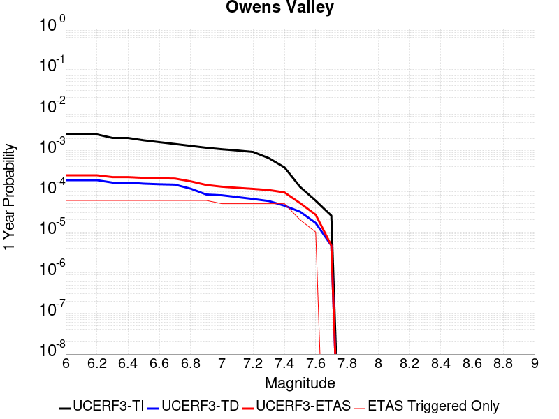 |  |

| Magnitude | 1 wk TI Prob | 1 wk TD Prob | 1 wk ETAS Prob | 1 wk ETAS/TD Gain | 1 wk ETAS Triggered Only | 1 mo TI Prob | 1 mo TD Prob | 1 mo ETAS Prob | 1 mo ETAS/TD Gain | 1 mo ETAS Triggered Only | 1 yr TI Prob | 1 yr TD Prob | 1 yr ETAS Prob | 1 yr ETAS/TD Gain | 1 yr ETAS Triggered Only | 10 yr TI Prob | 10 yr TD Prob | 10 yr ETAS Prob | 10 yr ETAS/TD Gain | 10 yr ETAS Triggered Only |
|-----|-----|-----|-----|-----|-----|-----|-----|-----|-----|-----|-----|-----|-----|-----|-----|-----|-----|-----|-----|-----|
| 6.0 | 4.83821E-5 | 3.6210524E-6 | 2.362098E-5 | 6.5232363 | 2.0E-5 | 2.0733538E-4 | 1.551871E-5 | 6.551793E-5 | 4.2218676 | 5.0E-5 | 0.002521386 | 1.889249E-4 | 2.4891357E-4 | 1.3175266 | 6.0E-5 | 0.024929691 | 0.0019297141 | 0.002039502 | 1.0568932 | 1.1E-4 |
| 6.1 | 4.83821E-5 | 3.6210524E-6 | 2.362098E-5 | 6.5232363 | 2.0E-5 | 2.0733538E-4 | 1.551871E-5 | 6.551793E-5 | 4.2218676 | 5.0E-5 | 0.002521386 | 1.889249E-4 | 2.4891357E-4 | 1.3175266 | 6.0E-5 | 0.024929691 | 0.0019297141 | 0.002039502 | 1.0568932 | 1.1E-4 |
| 6.2 | 4.83821E-5 | 3.6210524E-6 | 2.362098E-5 | 6.5232363 | 2.0E-5 | 2.0733538E-4 | 1.551871E-5 | 6.551793E-5 | 4.2218676 | 5.0E-5 | 0.002521386 | 1.889249E-4 | 2.4891357E-4 | 1.3175266 | 6.0E-5 | 0.024929691 | 0.0019297141 | 0.002039502 | 1.0568932 | 1.1E-4 |
| 6.3 | 3.953008E-5 | 3.1530958E-6 | 2.3153032E-5 | 7.3429523 | 2.0E-5 | 1.6940363E-4 | 1.3513202E-5 | 6.3512525E-5 | 4.700035 | 5.0E-5 | 0.002060538 | 1.6451156E-4 | 2.2450168E-4 | 1.3646561 | 6.0E-5 | 0.020415364 | 0.0016621627 | 0.0017619965 | 1.0600625 | 1.0E-4 |
| 6.4 | 3.953008E-5 | 3.1530958E-6 | 2.3153032E-5 | 7.3429523 | 2.0E-5 | 1.6940363E-4 | 1.3513202E-5 | 6.3512525E-5 | 4.700035 | 5.0E-5 | 0.002060538 | 1.6451156E-4 | 2.2450168E-4 | 1.3646561 | 6.0E-5 | 0.020415364 | 0.0016621627 | 0.0017619965 | 1.0600625 | 1.0E-4 |
| 6.5 | 3.457342E-5 | 2.9707387E-6 | 2.297068E-5 | 7.732312 | 2.0E-5 | 1.4816338E-4 | 1.273168E-5 | 6.2731044E-5 | 4.9271617 | 5.0E-5 | 0.0018023965 | 1.5499788E-4 | 2.1498857E-4 | 1.387042 | 6.0E-5 | 0.017878477 | 0.0015563119 | 0.0016561561 | 1.0641545 | 1.0E-4 |
| 6.6 | 3.1127765E-5 | 2.8737306E-6 | 2.2873674E-5 | 7.9595747 | 2.0E-5 | 1.3339789E-4 | 1.2315934E-5 | 6.231532E-5 | 5.0597315 | 5.0E-5 | 0.0016229092 | 1.4993687E-4 | 2.0992788E-4 | 1.4001085 | 6.0E-5 | 0.016111081 | 0.0015013438 | 0.0016011937 | 1.066507 | 1.0E-4 |
| 6.7 | 2.806885E-5 | 2.8101606E-6 | 2.2810103E-5 | 8.117011 | 2.0E-5 | 1.2028952E-4 | 1.2043493E-5 | 6.204289E-5 | 5.1515694 | 5.0E-5 | 0.001463541 | 1.4662035E-4 | 2.0661156E-4 | 1.4091601 | 6.0E-5 | 0.014539397 | 0.0014656087 | 0.0015654622 | 1.0681311 | 1.0E-4 |
| 6.8 | 2.524524E-5 | 2.2351392E-6 | 2.2235094E-5 | 9.9479685 | 2.0E-5 | 1.0818939E-4 | 9.579134E-6 | 5.9578655E-5 | 6.2196283 | 5.0E-5 | 0.0013164099 | 1.16620016E-4 | 1.7661302E-4 | 1.5144315 | 6.0E-5 | 0.01308639 | 0.001165827 | 0.0012657105 | 1.0856761 | 1.0E-4 |
| 6.9 | 2.2704568E-5 | 1.6079711E-6 | 2.1607939E-5 | 13.438015 | 2.0E-5 | 9.730166E-5 | 6.8912864E-6 | 5.689094E-5 | 8.255489 | 5.0E-5 | 0.0011840039 | 8.38982E-5 | 1.4389316E-4 | 1.7150924 | 6.0E-5 | 0.011777153 | 8.38853E-4 | 9.3876914E-4 | 1.1191103 | 1.0E-4 |
| 7.0 | 2.0871712E-5 | 1.5393621E-6 | 2.1539332E-5 | 13.992374 | 2.0E-5 | 8.944713E-5 | 6.5972495E-6 | 4.6596986E-5 | 7.0630927 | 4.0E-5 | 0.0010884746 | 8.031857E-5 | 1.3031455E-4 | 1.6224711 | 5.0E-5 | 0.010831586 | 8.030395E-4 | 8.929673E-4 | 1.1119841 | 9.0E-5 |
| 7.1 | 1.944928E-5 | 1.3862556E-6 | 2.1386228E-5 | 15.427335 | 2.0E-5 | 8.335139E-5 | 5.941082E-6 | 4.5940844E-5 | 7.7327404 | 4.0E-5 | 0.0010143308 | 7.233028E-5 | 1.2232666E-4 | 1.6912234 | 5.0E-5 | 0.010097133 | 7.2319806E-4 | 8.1313297E-4 | 1.1243572 | 9.0E-5 |
| 7.2 | 1.7876306E-5 | 1.2487686E-6 | 2.1248743E-5 | 17.015759 | 2.0E-5 | 7.6610486E-5 | 5.3518543E-6 | 4.535164E-5 | 8.474005 | 4.0E-5 | 9.3233347E-4 | 6.515689E-5 | 1.1515363E-4 | 1.7673286 | 5.0E-5 | 0.009284316 | 6.5148395E-4 | 7.414253E-4 | 1.1380562 | 9.0E-5 |
| 7.3 | 1.2618672E-5 | 1.1113839E-6 | 2.1111362E-5 | 18.995562 | 2.0E-5 | 5.40789E-5 | 4.763065E-6 | 4.4762874E-5 | 9.397913 | 4.0E-5 | 6.582117E-4 | 5.7988782E-5 | 1.07985885E-4 | 1.8621857 | 5.0E-5 | 0.0065626553 | 5.7983754E-4 | 6.6978537E-4 | 1.1551259 | 9.0E-5 |
| 7.4 | 7.4874442E-6 | 8.547518E-7 | 2.0854735E-5 | 24.398586 | 2.0E-5 | 3.208865E-5 | 3.6632168E-6 | 4.366307E-5 | 11.919325 | 4.0E-5 | 3.906093E-4 | 4.4598757E-5 | 9.459653E-5 | 2.1210575 | 5.0E-5 | 0.003899234 | 4.459579E-4 | 5.3591776E-4 | 1.2017227 | 9.0E-5 |
| 7.5 | 2.4734156E-6 | 6.0679935E-7 | 6.0679935E-7 | 1.0 | 0.0 | 1.060031E-5 | 2.6005662E-6 | 2.2600514E-5 | 8.690613 | 2.0E-5 | 1.2905113E-4 | 3.1661435E-5 | 5.16608E-5 | 1.6316633 | 2.0E-5 | 0.0012897621 | 3.1656958E-4 | 3.765506E-4 | 1.1894718 | 6.0E-5 |
| 7.6 | 1.1328841E-6 | 3.1961991E-7 | 3.1961991E-7 | 1.0 | 0.0 | 4.8552088E-6 | 1.369799E-6 | 1.1369785E-5 | 8.300331 | 1.0E-5 | 5.9110564E-5 | 1.6677177E-5 | 2.667701E-5 | 1.5996119 | 1.0E-5 | 5.9094845E-4 | 1.6675945E-4 | 1.9675444E-4 | 1.1798699 | 3.0E-5 |
| 7.7 | 4.8613185E-7 | 8.962742E-8 | 8.962742E-8 | 1.0 | 0.0 | 2.0834207E-6 | 3.8411747E-7 | 3.8411747E-7 | 1.0 | 0.0 | 2.536535E-5 | 4.676621E-6 | 4.676621E-6 | 1.0 | 0.0 | 2.5362454E-4 | 4.676529E-5 | 4.676529E-5 | 1.0 | 0.0 |

## Kern Canyon (South Kern) 2011
*[(top)](#table-of-contents)*

| 1 Week | 1 Month | 1 Year | 10 Year |
|-----|-----|-----|-----|
|  | 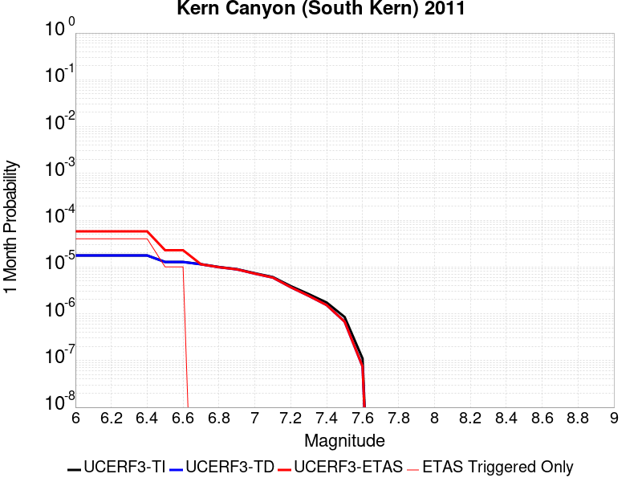 |  |  |

| Magnitude | 1 wk TI Prob | 1 wk TD Prob | 1 wk ETAS Prob | 1 wk ETAS/TD Gain | 1 wk ETAS Triggered Only | 1 mo TI Prob | 1 mo TD Prob | 1 mo ETAS Prob | 1 mo ETAS/TD Gain | 1 mo ETAS Triggered Only | 1 yr TI Prob | 1 yr TD Prob | 1 yr ETAS Prob | 1 yr ETAS/TD Gain | 1 yr ETAS Triggered Only | 10 yr TI Prob | 10 yr TD Prob | 10 yr ETAS Prob | 10 yr ETAS/TD Gain | 10 yr ETAS Triggered Only |
|-----|-----|-----|-----|-----|-----|-----|-----|-----|-----|-----|-----|-----|-----|-----|-----|-----|-----|-----|-----|-----|
| 6.0 | 4.105075E-6 | 4.113726E-6 | 3.4113604E-5 | 8.292629 | 3.0E-5 | 1.7593058E-5 | 1.7630138E-5 | 5.7629433E-5 | 3.2688022 | 4.0E-5 | 2.1417443E-4 | 2.1462643E-4 | 3.0460712E-4 | 1.4192432 | 9.0E-5 | 0.0021396813 | 0.0021442554 | 0.0022440408 | 1.0465362 | 1.0E-4 |
| 6.1 | 4.105075E-6 | 4.113726E-6 | 3.4113604E-5 | 8.292629 | 3.0E-5 | 1.7593058E-5 | 1.7630138E-5 | 5.7629433E-5 | 3.2688022 | 4.0E-5 | 2.1417443E-4 | 2.1462643E-4 | 3.0460712E-4 | 1.4192432 | 9.0E-5 | 0.0021396813 | 0.0021442554 | 0.0022440408 | 1.0465362 | 1.0E-4 |
| 6.2 | 4.105075E-6 | 4.113726E-6 | 3.4113604E-5 | 8.292629 | 3.0E-5 | 1.7593058E-5 | 1.7630138E-5 | 5.7629433E-5 | 3.2688022 | 4.0E-5 | 2.1417443E-4 | 2.1462643E-4 | 3.0460712E-4 | 1.4192432 | 9.0E-5 | 0.0021396813 | 0.0021442554 | 0.0022440408 | 1.0465362 | 1.0E-4 |
| 6.3 | 4.105075E-6 | 4.113726E-6 | 3.4113604E-5 | 8.292629 | 3.0E-5 | 1.7593058E-5 | 1.7630138E-5 | 5.7629433E-5 | 3.2688022 | 4.0E-5 | 2.1417443E-4 | 2.1462643E-4 | 3.0460712E-4 | 1.4192432 | 9.0E-5 | 0.0021396813 | 0.0021442554 | 0.0022440408 | 1.0465362 | 1.0E-4 |
| 6.4 | 4.105075E-6 | 4.113726E-6 | 3.4113604E-5 | 8.292629 | 3.0E-5 | 1.7593058E-5 | 1.7630138E-5 | 5.7629433E-5 | 3.2688022 | 4.0E-5 | 2.1417443E-4 | 2.1462643E-4 | 3.0460712E-4 | 1.4192432 | 9.0E-5 | 0.0021396813 | 0.0021442554 | 0.0022440408 | 1.0465362 | 1.0E-4 |
| 6.5 | 2.9849807E-6 | 2.973154E-6 | 2.973154E-6 | 1.0 | 0.0 | 1.2792712E-5 | 1.2742028E-5 | 2.27419E-5 | 1.7847944 | 1.0E-5 | 1.5574014E-4 | 1.551233E-4 | 1.9511709E-4 | 1.2578194 | 4.0E-5 | 0.0015563103 | 0.0015501654 | 0.0015901033 | 1.0257638 | 4.0E-5 |
| 6.6 | 2.9849807E-6 | 2.973154E-6 | 2.973154E-6 | 1.0 | 0.0 | 1.2792712E-5 | 1.2742028E-5 | 2.27419E-5 | 1.7847944 | 1.0E-5 | 1.5574014E-4 | 1.551233E-4 | 1.9511709E-4 | 1.2578194 | 4.0E-5 | 0.0015563103 | 0.0015501654 | 0.0015901033 | 1.0257638 | 4.0E-5 |
| 6.7 | 2.6756725E-6 | 2.6582202E-6 | 2.6582202E-6 | 1.0 | 0.0 | 1.1467117E-5 | 1.1392323E-5 | 1.1392323E-5 | 1.0 | 0.0 | 1.396032E-4 | 1.386928E-4 | 1.6868865E-4 | 1.2162753 | 3.0E-5 | 0.0013951553 | 0.0013860734 | 0.0014160319 | 1.0216138 | 3.0E-5 |
| 6.8 | 2.3283721E-6 | 2.3047783E-6 | 2.3047783E-6 | 1.0 | 0.0 | 9.9787E-6 | 9.877584E-6 | 9.877584E-6 | 1.0 | 0.0 | 1.214839E-4 | 1.2025302E-4 | 1.5024941E-4 | 1.249444 | 3.0E-5 | 0.001214175 | 0.001201887 | 0.0012318509 | 1.0249307 | 3.0E-5 |
| 6.9 | 2.0972677E-6 | 2.0696405E-6 | 2.0696405E-6 | 1.0 | 0.0 | 8.988259E-6 | 8.869858E-6 | 8.869858E-6 | 1.0 | 0.0 | 1.0942656E-4 | 1.0798523E-4 | 1.2798308E-4 | 1.1851906 | 2.0E-5 | 0.0010937268 | 0.0010793334 | 0.0010993119 | 1.01851 | 2.0E-5 |
| 7.0 | 1.7132242E-6 | 1.6787029E-6 | 1.6787029E-6 | 1.0 | 0.0 | 7.3423685E-6 | 7.1944214E-6 | 7.1944214E-6 | 1.0 | 0.0 | 8.938967E-5 | 8.75886E-5 | 1.0758685E-4 | 1.2283202 | 2.0E-5 | 8.935372E-4 | 8.755446E-4 | 8.9552713E-4 | 1.022823 | 2.0E-5 |
| 7.1 | 1.4215541E-6 | 1.3815746E-6 | 1.3815746E-6 | 1.0 | 0.0 | 6.0923603E-6 | 5.9210206E-6 | 5.9210206E-6 | 1.0 | 0.0 | 7.417196E-5 | 7.208607E-5 | 8.2085346E-5 | 1.138713 | 1.0E-5 | 7.414721E-4 | 7.206296E-4 | 7.306224E-4 | 1.0138668 | 1.0E-5 |
| 7.2 | 9.097853E-7 | 8.60377E-7 | 8.60377E-7 | 1.0 | 0.0 | 3.899074E-6 | 3.6873246E-6 | 3.6873246E-6 | 1.0 | 0.0 | 4.7470192E-5 | 4.4892266E-5 | 4.4892266E-5 | 1.0 | 0.0 | 4.7460053E-4 | 4.4883305E-4 | 4.4883305E-4 | 1.0 | 0.0 |
| 7.3 | 6.144169E-7 | 5.628199E-7 | 5.628199E-7 | 1.0 | 0.0 | 2.6332125E-6 | 2.4120832E-6 | 2.4120832E-6 | 1.0 | 0.0 | 3.205889E-5 | 2.9366722E-5 | 2.9366722E-5 | 1.0 | 0.0 | 3.2054266E-4 | 2.9362892E-4 | 2.9362892E-4 | 1.0 | 0.0 |
| 7.4 | 4.049844E-7 | 3.5728252E-7 | 3.5728252E-7 | 1.0 | 0.0 | 1.7356463E-6 | 1.5312098E-6 | 1.5312098E-6 | 1.0 | 0.0 | 2.1131287E-5 | 1.8642324E-5 | 1.8642324E-5 | 1.0 | 0.0 | 2.1129279E-4 | 1.8640784E-4 | 1.8640784E-4 | 1.0 | 0.0 |
| 7.5 | 1.9871162E-7 | 1.5830383E-7 | 1.5830383E-7 | 1.0 | 0.0 | 8.5162094E-7 | 6.784448E-7 | 6.784448E-7 | 1.0 | 0.0 | 1.0368436E-5 | 8.260035E-6 | 8.260035E-6 | 1.0 | 0.0 | 1.0367952E-4 | 8.259736E-5 | 8.259736E-5 | 1.0 | 0.0 |
| 7.6 | 2.572245E-8 | 1.735264E-8 | 1.735264E-8 | 1.0 | 0.0 | 1.10239064E-7 | 7.436845E-8 | 7.436845E-8 | 1.0 | 0.0 | 1.3421597E-6 | 9.0543557E-7 | 9.0543557E-7 | 1.0 | 0.0 | 1.3421517E-5 | 9.054324E-6 | 9.054324E-6 | 1.0 | 0.0 |

## Ventura-Pitas Point
*[(top)](#table-of-contents)*

| 1 Week | 1 Month | 1 Year | 10 Year |
|-----|-----|-----|-----|
|  | 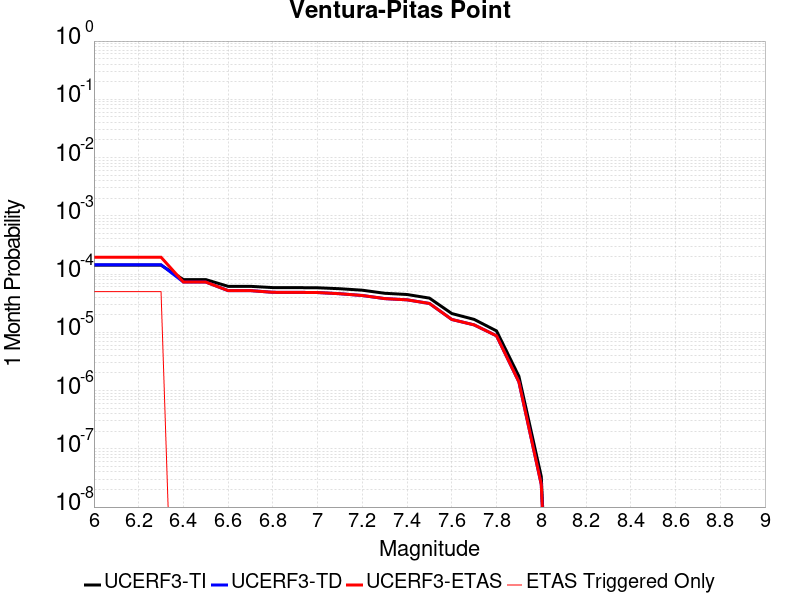 | 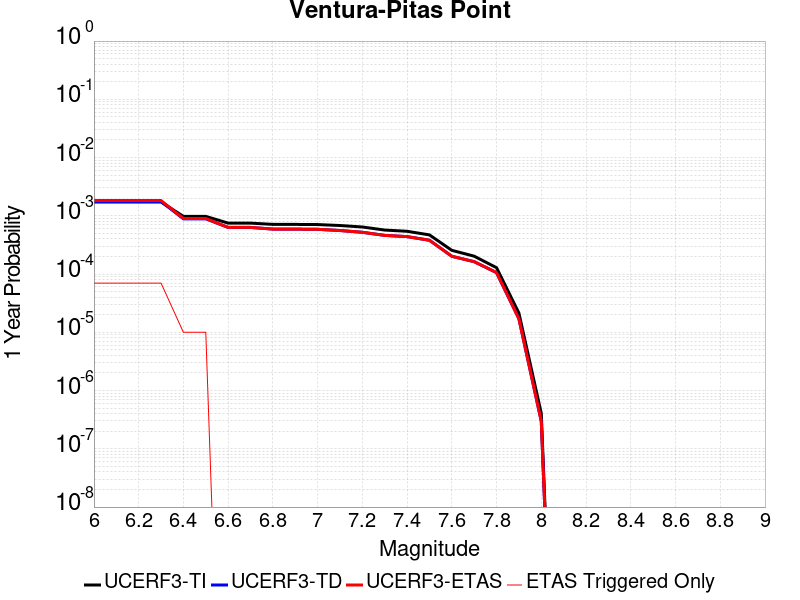 | 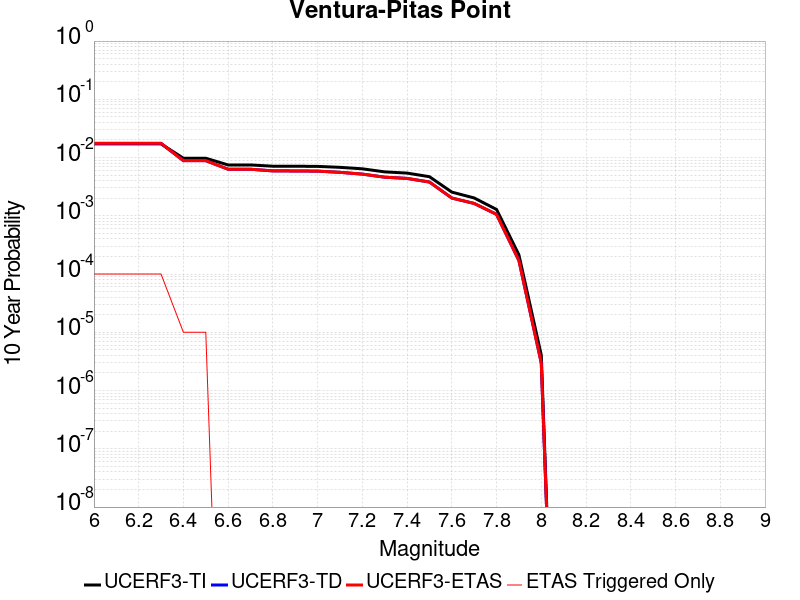 |

| Magnitude | 1 wk TI Prob | 1 wk TD Prob | 1 wk ETAS Prob | 1 wk ETAS/TD Gain | 1 wk ETAS Triggered Only | 1 mo TI Prob | 1 mo TD Prob | 1 mo ETAS Prob | 1 mo ETAS/TD Gain | 1 mo ETAS Triggered Only | 1 yr TI Prob | 1 yr TD Prob | 1 yr ETAS Prob | 1 yr ETAS/TD Gain | 1 yr ETAS Triggered Only | 10 yr TI Prob | 10 yr TD Prob | 10 yr ETAS Prob | 10 yr ETAS/TD Gain | 10 yr ETAS Triggered Only |
|-----|-----|-----|-----|-----|-----|-----|-----|-----|-----|-----|-----|-----|-----|-----|-----|-----|-----|-----|-----|-----|
| 6.0 | 3.3179622E-5 | 3.373519E-5 | 5.373451E-5 | 1.5928328 | 2.0E-5 | 1.4219063E-4 | 1.4457281E-4 | 1.9456558E-4 | 1.3457965 | 5.0E-5 | 0.0017297962 | 0.0017590097 | 0.0018288866 | 1.0397251 | 7.0E-5 | 0.017163932 | 0.017476497 | 0.01757475 | 1.005622 | 1.0E-4 |
| 6.1 | 3.3179622E-5 | 3.373519E-5 | 5.373451E-5 | 1.5928328 | 2.0E-5 | 1.4219063E-4 | 1.4457281E-4 | 1.9456558E-4 | 1.3457965 | 5.0E-5 | 0.0017297962 | 0.0017590097 | 0.0018288866 | 1.0397251 | 7.0E-5 | 0.017163932 | 0.017476497 | 0.01757475 | 1.005622 | 1.0E-4 |
| 6.2 | 3.3179622E-5 | 3.373519E-5 | 5.373451E-5 | 1.5928328 | 2.0E-5 | 1.4219063E-4 | 1.4457281E-4 | 1.9456558E-4 | 1.3457965 | 5.0E-5 | 0.0017297962 | 0.0017590097 | 0.0018288866 | 1.0397251 | 7.0E-5 | 0.017163932 | 0.017476497 | 0.01757475 | 1.005622 | 1.0E-4 |
| 6.3 | 3.3179622E-5 | 3.373519E-5 | 5.373451E-5 | 1.5928328 | 2.0E-5 | 1.4219063E-4 | 1.4457281E-4 | 1.9456558E-4 | 1.3457965 | 5.0E-5 | 0.0017297962 | 0.0017590097 | 0.0018288866 | 1.0397251 | 7.0E-5 | 0.017163932 | 0.017476497 | 0.01757475 | 1.005622 | 1.0E-4 |
| 6.4 | 1.8754668E-5 | 1.7019594E-5 | 1.7019594E-5 | 1.0 | 0.0 | 8.037467E-5 | 7.2939205E-5 | 7.2939205E-5 | 1.0 | 0.0 | 9.781223E-4 | 8.8769617E-4 | 8.976873E-4 | 1.0112551 | 1.0E-5 | 0.009738282 | 0.008843943 | 0.008853854 | 1.0011207 | 1.0E-5 |
| 6.5 | 1.8754668E-5 | 1.7019594E-5 | 1.7019594E-5 | 1.0 | 0.0 | 8.037467E-5 | 7.2939205E-5 | 7.2939205E-5 | 1.0 | 0.0 | 9.781223E-4 | 8.8769617E-4 | 8.976873E-4 | 1.0112551 | 1.0E-5 | 0.009738282 | 0.008843943 | 0.008853854 | 1.0011207 | 1.0E-5 |
| 6.6 | 1.4361558E-5 | 1.2122258E-5 | 1.2122258E-5 | 1.0 | 0.0 | 6.154808E-5 | 5.1951512E-5 | 5.1951512E-5 | 1.0 | 0.0 | 7.490902E-4 | 6.323284E-4 | 6.323284E-4 | 1.0 | 0.0 | 0.0074657016 | 0.006305652 | 0.006305652 | 1.0 | 0.0 |
| 6.7 | 1.4361558E-5 | 1.2122258E-5 | 1.2122258E-5 | 1.0 | 0.0 | 6.154808E-5 | 5.1951512E-5 | 5.1951512E-5 | 1.0 | 0.0 | 7.490902E-4 | 6.323284E-4 | 6.323284E-4 | 1.0 | 0.0 | 0.0074657016 | 0.006305652 | 0.006305652 | 1.0 | 0.0 |
| 6.8 | 1.3663846E-5 | 1.1344401E-5 | 1.1344401E-5 | 1.0 | 0.0 | 5.8558027E-5 | 4.8617967E-5 | 4.8617967E-5 | 1.0 | 0.0 | 7.127108E-4 | 5.917649E-4 | 5.917649E-4 | 1.0 | 0.0 | 0.007104293 | 0.0059022107 | 0.0059022107 | 1.0 | 0.0 |
| 6.9 | 1.3644157E-5 | 1.1322501E-5 | 1.1322501E-5 | 1.0 | 0.0 | 5.8473648E-5 | 4.8524114E-5 | 4.8524114E-5 | 1.0 | 0.0 | 7.116841E-4 | 5.906229E-4 | 5.906229E-4 | 1.0 | 0.0 | 0.007094092 | 0.0058908514 | 0.0058908514 | 1.0 | 0.0 |
| 7.0 | 1.3568845E-5 | 1.12420685E-5 | 1.12420685E-5 | 1.0 | 0.0 | 5.8150898E-5 | 4.8179416E-5 | 4.8179416E-5 | 1.0 | 0.0 | 7.077572E-4 | 5.8642845E-4 | 5.8642845E-4 | 1.0 | 0.0 | 0.007055073 | 0.005849128 | 0.005849128 | 1.0 | 0.0 |
| 7.1 | 1.306572E-5 | 1.0720521E-5 | 1.0720521E-5 | 1.0 | 0.0 | 5.599474E-5 | 4.594429E-5 | 4.594429E-5 | 1.0 | 0.0 | 6.815227E-4 | 5.5923004E-4 | 5.5923004E-4 | 1.0 | 0.0 | 0.0067943637 | 0.005578536 | 0.005578536 | 1.0 | 0.0 |
| 7.2 | 1.232604E-5 | 9.995121E-6 | 9.995121E-6 | 1.0 | 0.0 | 5.2824813E-5 | 4.283554E-5 | 4.283554E-5 | 1.0 | 0.0 | 6.429523E-4 | 5.2139966E-4 | 5.2139966E-4 | 1.0 | 0.0 | 0.0064109527 | 0.005202059 | 0.005202059 | 1.0 | 0.0 |
| 7.3 | 1.0917261E-5 | 8.843812E-6 | 8.843812E-6 | 1.0 | 0.0 | 4.678742E-5 | 3.7901507E-5 | 3.7901507E-5 | 1.0 | 0.0 | 5.69488E-4 | 4.6135474E-4 | 4.6135474E-4 | 1.0 | 0.0 | 0.0056803077 | 0.004604239 | 0.004604239 | 1.0 | 0.0 |
| 7.4 | 1.039959E-5 | 8.42354E-6 | 8.42354E-6 | 1.0 | 0.0 | 4.456891E-5 | 3.6100395E-5 | 3.6100395E-5 | 1.0 | 0.0 | 5.424914E-4 | 4.394352E-4 | 4.394352E-4 | 1.0 | 0.0 | 0.0054116896 | 0.0043859277 | 0.0043859277 | 1.0 | 0.0 |
| 7.5 | 9.015877E-6 | 7.29752E-6 | 7.29752E-6 | 1.0 | 0.0 | 3.86389E-5 | 3.1274718E-5 | 3.1274718E-5 | 1.0 | 0.0 | 4.7032707E-4 | 3.8070456E-4 | 3.8070456E-4 | 1.0 | 0.0 | 0.004693329 | 0.003800772 | 0.003800772 | 1.0 | 0.0 |
| 7.6 | 4.900162E-6 | 3.874119E-6 | 3.874119E-6 | 1.0 | 0.0 | 2.1000526E-5 | 1.6603262E-5 | 1.6603262E-5 | 1.0 | 0.0 | 2.556514E-4 | 2.0212609E-4 | 2.0212609E-4 | 1.0 | 0.0 | 0.0025535747 | 0.002019436 | 0.002019436 | 1.0 | 0.0 |
| 7.7 | 3.8850626E-6 | 3.12676E-6 | 3.12676E-6 | 1.0 | 0.0 | 1.6650163E-5 | 1.3400332E-5 | 1.3400332E-5 | 1.0 | 0.0 | 2.0269687E-4 | 1.6313691E-4 | 1.6313691E-4 | 1.0 | 0.0 | 0.002025121 | 0.0016301809 | 0.0016301809 | 1.0 | 0.0 |
| 7.8 | 2.4654719E-6 | 2.029902E-6 | 2.029902E-6 | 1.0 | 0.0 | 1.0566265E-5 | 8.699551E-6 | 8.699551E-6 | 1.0 | 0.0 | 1.2863669E-4 | 1.0591193E-4 | 1.0591193E-4 | 1.0 | 0.0 | 0.0012856225 | 0.0010586192 | 0.0010586192 | 1.0 | 0.0 |
| 7.9 | 4.095894E-7 | 3.2765078E-7 | 3.2765078E-7 | 1.0 | 0.0 | 1.7553821E-6 | 1.4042168E-6 | 1.4042168E-6 | 1.0 | 0.0 | 2.1371567E-5 | 1.709621E-5 | 1.709621E-5 | 1.0 | 0.0 | 2.1369511E-4 | 1.7094925E-4 | 1.7094925E-4 | 1.0 | 0.0 |
| 8.0 | 7.791402E-9 | 5.6836056E-9 | 5.6836056E-9 | 1.0 | 0.0 | 3.3391725E-8 | 2.4358311E-8 | 2.4358311E-8 | 1.0 | 0.0 | 4.0654416E-7 | 2.965624E-7 | 2.965624E-7 | 1.0 | 0.0 | 4.065434E-6 | 2.9656223E-6 | 2.9656223E-6 | 1.0 | 0.0 |

## Bullion Mountains
*[(top)](#table-of-contents)*

| 1 Week | 1 Month | 1 Year | 10 Year |
|-----|-----|-----|-----|
| 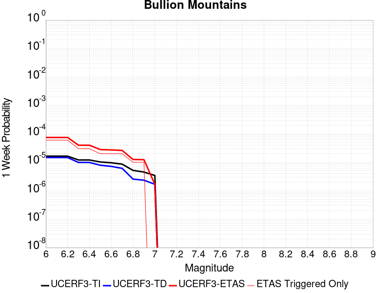 |  | 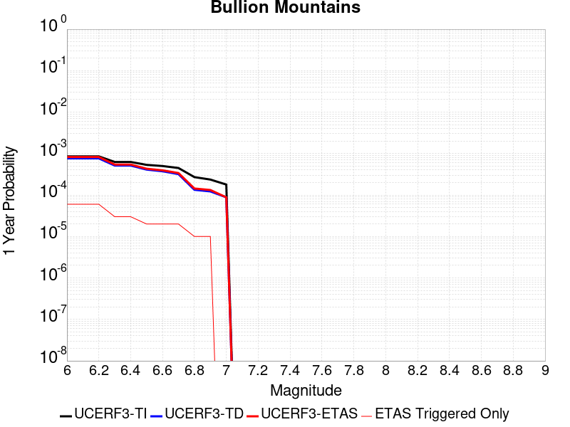 |  |

| Magnitude | 1 wk TI Prob | 1 wk TD Prob | 1 wk ETAS Prob | 1 wk ETAS/TD Gain | 1 wk ETAS Triggered Only | 1 mo TI Prob | 1 mo TD Prob | 1 mo ETAS Prob | 1 mo ETAS/TD Gain | 1 mo ETAS Triggered Only | 1 yr TI Prob | 1 yr TD Prob | 1 yr ETAS Prob | 1 yr ETAS/TD Gain | 1 yr ETAS Triggered Only | 10 yr TI Prob | 10 yr TD Prob | 10 yr ETAS Prob | 10 yr ETAS/TD Gain | 10 yr ETAS Triggered Only |
|-----|-----|-----|-----|-----|-----|-----|-----|-----|-----|-----|-----|-----|-----|-----|-----|-----|-----|-----|-----|-----|
| 6.0 | 1.6420427E-5 | 1.4692009E-5 | 7.4691125E-5 | 5.0837927 | 6.0E-5 | 7.037136E-5 | 6.296445E-5 | 1.2296067E-4 | 1.9528587 | 6.0E-5 | 8.5643446E-4 | 7.6636096E-4 | 8.2631496E-4 | 1.078232 | 6.0E-5 | 0.008531413 | 0.0076409746 | 0.0077402107 | 1.0129874 | 1.0E-4 |
| 6.1 | 1.6420427E-5 | 1.4692009E-5 | 7.4691125E-5 | 5.0837927 | 6.0E-5 | 7.037136E-5 | 6.296445E-5 | 1.2296067E-4 | 1.9528587 | 6.0E-5 | 8.5643446E-4 | 7.6636096E-4 | 8.2631496E-4 | 1.078232 | 6.0E-5 | 0.008531413 | 0.0076409746 | 0.0077402107 | 1.0129874 | 1.0E-4 |
| 6.2 | 1.6420427E-5 | 1.4692009E-5 | 7.4691125E-5 | 5.0837927 | 6.0E-5 | 7.037136E-5 | 6.296445E-5 | 1.2296067E-4 | 1.9528587 | 6.0E-5 | 8.5643446E-4 | 7.6636096E-4 | 8.2631496E-4 | 1.078232 | 6.0E-5 | 0.008531413 | 0.0076409746 | 0.0077402107 | 1.0129874 | 1.0E-4 |
| 6.3 | 1.2046778E-5 | 9.862255E-6 | 3.986196E-5 | 4.0418706 | 3.0E-5 | 5.1628023E-5 | 4.2266256E-5 | 7.2264986E-5 | 1.7097561 | 3.0E-5 | 6.283899E-4 | 5.144933E-4 | 5.444779E-4 | 1.0582798 | 3.0E-5 | 0.0062661595 | 0.0051353034 | 0.0051850467 | 1.0096865 | 5.0E-5 |
| 6.4 | 1.2046778E-5 | 9.862255E-6 | 3.986196E-5 | 4.0418706 | 3.0E-5 | 5.1628023E-5 | 4.2266256E-5 | 7.2264986E-5 | 1.7097561 | 3.0E-5 | 6.283899E-4 | 5.144933E-4 | 5.444779E-4 | 1.0582798 | 3.0E-5 | 0.0062661595 | 0.0051353034 | 0.0051850467 | 1.0096865 | 5.0E-5 |
| 6.5 | 1.0244343E-5 | 7.879378E-6 | 2.7879221E-5 | 3.5382512 | 2.0E-5 | 4.390359E-5 | 3.3768443E-5 | 5.376777E-5 | 1.5922489 | 2.0E-5 | 5.343951E-4 | 4.1107394E-4 | 4.310657E-4 | 1.0486331 | 2.0E-5 | 0.005331118 | 0.0041051665 | 0.0041350434 | 1.0072778 | 3.0E-5 |
| 6.6 | 9.605408E-6 | 7.1774166E-6 | 2.7177273E-5 | 3.7864978 | 2.0E-5 | 4.1165385E-5 | 3.0760108E-5 | 5.0759492E-5 | 1.6501727 | 2.0E-5 | 5.010733E-4 | 3.7446033E-4 | 3.9445283E-4 | 1.0533901 | 2.0E-5 | 0.00499945 | 0.0037402906 | 0.0037701784 | 1.0079907 | 3.0E-5 |
| 6.7 | 8.60418E-6 | 6.123926E-6 | 2.6123804E-5 | 4.2658587 | 2.0E-5 | 3.687454E-5 | 2.6245243E-5 | 4.624472E-5 | 1.7620229 | 2.0E-5 | 4.48855E-4 | 3.195085E-4 | 3.395021E-4 | 1.0625762 | 2.0E-5 | 0.004479495 | 0.0031924031 | 0.0032223072 | 1.0093673 | 3.0E-5 |
| 6.8 | 5.187994E-6 | 2.563117E-6 | 1.2563091E-5 | 4.9014897 | 1.0E-5 | 2.223407E-5 | 1.0984763E-5 | 2.0984653E-5 | 1.9103419 | 1.0E-5 | 2.7066618E-4 | 1.3373529E-4 | 1.4373395E-4 | 1.0747646 | 1.0E-5 | 0.0027033675 | 0.0013369396 | 0.0013569129 | 1.0149395 | 2.0E-5 |
| 6.9 | 4.5302368E-6 | 2.3442778E-6 | 1.2344254E-5 | 5.265696 | 1.0E-5 | 1.9415156E-5 | 1.0046889E-5 | 2.004679E-5 | 1.995323 | 1.0E-5 | 2.3635388E-4 | 1.2231797E-4 | 1.3231675E-4 | 1.0817441 | 1.0E-5 | 0.0023610266 | 0.0012228956 | 0.0012428712 | 1.0163347 | 2.0E-5 |
| 7.0 | 3.431668E-6 | 1.6882177E-6 | 1.6882177E-6 | 1.0 | 0.0 | 1.4707065E-5 | 7.2352186E-6 | 7.2352186E-6 | 1.0 | 0.0 | 1.7904381E-4 | 8.808879E-5 | 8.808879E-5 | 1.0 | 0.0 | 0.0017889962 | 8.8088785E-4 | 8.908791E-4 | 1.0113422 | 1.0E-5 |

## San Jacinto (Coyote Creek)
*[(top)](#table-of-contents)*

| 1 Week | 1 Month | 1 Year | 10 Year |
|-----|-----|-----|-----|
|  |  |  | 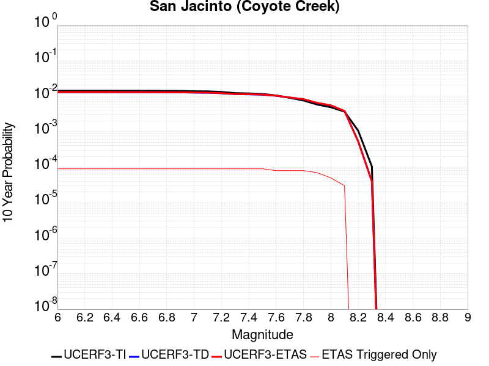 |

| Magnitude | 1 wk TI Prob | 1 wk TD Prob | 1 wk ETAS Prob | 1 wk ETAS/TD Gain | 1 wk ETAS Triggered Only | 1 mo TI Prob | 1 mo TD Prob | 1 mo ETAS Prob | 1 mo ETAS/TD Gain | 1 mo ETAS Triggered Only | 1 yr TI Prob | 1 yr TD Prob | 1 yr ETAS Prob | 1 yr ETAS/TD Gain | 1 yr ETAS Triggered Only | 10 yr TI Prob | 10 yr TD Prob | 10 yr ETAS Prob | 10 yr ETAS/TD Gain | 10 yr ETAS Triggered Only |
|-----|-----|-----|-----|-----|-----|-----|-----|-----|-----|-----|-----|-----|-----|-----|-----|-----|-----|-----|-----|-----|
| 6.0 | 2.7374346E-5 | 2.41444E-5 | 6.414343E-5 | 2.656659 | 4.0E-5 | 1.1731335E-4 | 1.034719E-4 | 1.7346466E-4 | 1.6764421 | 7.0E-5 | 0.0014273542 | 0.001259045 | 0.0013389443 | 1.0634602 | 8.0E-5 | 0.01418221 | 0.012928195 | 0.013017031 | 1.0068716 | 9.0E-5 |
| 6.1 | 2.7374346E-5 | 2.41444E-5 | 6.414343E-5 | 2.656659 | 4.0E-5 | 1.1731335E-4 | 1.034719E-4 | 1.7346466E-4 | 1.6764421 | 7.0E-5 | 0.0014273542 | 0.001259045 | 0.0013389443 | 1.0634602 | 8.0E-5 | 0.01418221 | 0.012928195 | 0.013017031 | 1.0068716 | 9.0E-5 |
| 6.2 | 2.7374346E-5 | 2.41444E-5 | 6.414343E-5 | 2.656659 | 4.0E-5 | 1.1731335E-4 | 1.034719E-4 | 1.7346466E-4 | 1.6764421 | 7.0E-5 | 0.0014273542 | 0.001259045 | 0.0013389443 | 1.0634602 | 8.0E-5 | 0.01418221 | 0.012928195 | 0.013017031 | 1.0068716 | 9.0E-5 |
| 6.3 | 2.7374346E-5 | 2.41444E-5 | 6.414343E-5 | 2.656659 | 4.0E-5 | 1.1731335E-4 | 1.034719E-4 | 1.7346466E-4 | 1.6764421 | 7.0E-5 | 0.0014273542 | 0.001259045 | 0.0013389443 | 1.0634602 | 8.0E-5 | 0.01418221 | 0.012928195 | 0.013017031 | 1.0068716 | 9.0E-5 |
| 6.4 | 2.7374346E-5 | 2.41444E-5 | 6.414343E-5 | 2.656659 | 4.0E-5 | 1.1731335E-4 | 1.034719E-4 | 1.7346466E-4 | 1.6764421 | 7.0E-5 | 0.0014273542 | 0.001259045 | 0.0013389443 | 1.0634602 | 8.0E-5 | 0.01418221 | 0.012928195 | 0.013017031 | 1.0068716 | 9.0E-5 |
| 6.5 | 2.7282445E-5 | 2.4030476E-5 | 6.402952E-5 | 2.6645129 | 4.0E-5 | 1.16919524E-4 | 1.0298371E-4 | 1.7297649E-4 | 1.6796492 | 7.0E-5 | 0.0014225657 | 0.001253108 | 0.0013330078 | 1.0637612 | 8.0E-5 | 0.014134934 | 0.012869522 | 0.012958364 | 1.0069033 | 9.0E-5 |
| 6.6 | 2.7282445E-5 | 2.4030476E-5 | 6.402952E-5 | 2.6645129 | 4.0E-5 | 1.16919524E-4 | 1.0298371E-4 | 1.7297649E-4 | 1.6796492 | 7.0E-5 | 0.0014225657 | 0.001253108 | 0.0013330078 | 1.0637612 | 8.0E-5 | 0.014134934 | 0.012869522 | 0.012958364 | 1.0069033 | 9.0E-5 |
| 6.7 | 2.7216198E-5 | 2.3955597E-5 | 6.395464E-5 | 2.669716 | 4.0E-5 | 1.1663563E-4 | 1.02662816E-4 | 1.7265564E-4 | 1.6817738 | 7.0E-5 | 0.0014191137 | 0.0012492058 | 0.0013291058 | 1.0639607 | 8.0E-5 | 0.014100855 | 0.012830934 | 0.012919779 | 1.0069243 | 9.0E-5 |
| 6.8 | 2.7078617E-5 | 2.3872815E-5 | 6.387186E-5 | 2.6755059 | 4.0E-5 | 1.1604605E-4 | 1.0230807E-4 | 1.723009E-4 | 1.6841381 | 7.0E-5 | 0.001411945 | 0.0012448917 | 0.001324792 | 1.0641826 | 8.0E-5 | 0.014030075 | 0.0127880825 | 0.012876932 | 1.0069478 | 9.0E-5 |
| 6.9 | 2.6982952E-5 | 2.3792329E-5 | 6.3791376E-5 | 2.681174 | 4.0E-5 | 1.15636096E-4 | 1.0196315E-4 | 1.7195602E-4 | 1.6864525 | 7.0E-5 | 0.0014069602 | 0.0012406971 | 0.0013205978 | 1.0643998 | 8.0E-5 | 0.013980856 | 0.012746378 | 0.012835231 | 1.0069709 | 9.0E-5 |
| 7.0 | 2.6449972E-5 | 2.3369357E-5 | 6.3368425E-5 | 2.7116032 | 4.0E-5 | 1.1335209E-4 | 1.0015055E-4 | 1.7014354E-4 | 1.6988777 | 7.0E-5 | 0.001379188 | 0.0012186535 | 0.0012985561 | 1.0655662 | 8.0E-5 | 0.0137065975 | 0.012527733 | 0.0126166055 | 1.007094 | 9.0E-5 |
| 7.1 | 2.6257849E-5 | 2.3195396E-5 | 6.319447E-5 | 2.72444 | 4.0E-5 | 1.1252879E-4 | 9.940507E-5 | 1.693981E-4 | 1.7041194 | 7.0E-5 | 0.0013691769 | 0.0012095873 | 0.0012894906 | 1.0660583 | 8.0E-5 | 0.013607717 | 0.012437661 | 0.012526541 | 1.0071461 | 9.0E-5 |
| 7.2 | 2.5270041E-5 | 2.2390155E-5 | 6.238926E-5 | 2.7864594 | 4.0E-5 | 1.0829568E-4 | 9.5954296E-5 | 1.6594758E-4 | 1.729444 | 7.0E-5 | 0.0013177024 | 0.0011676198 | 0.0012475264 | 1.0684354 | 8.0E-5 | 0.013099162 | 0.0120187905 | 0.0121077085 | 1.0073982 | 9.0E-5 |
| 7.3 | 2.339701E-5 | 2.1122027E-5 | 6.112118E-5 | 2.8937175 | 4.0E-5 | 1.0026905E-4 | 9.051985E-5 | 1.605135E-4 | 1.7732412 | 7.0E-5 | 0.001220092 | 0.001101524 | 0.0011814359 | 1.0725466 | 8.0E-5 | 0.012134149 | 0.011357642 | 0.011446619 | 1.0078342 | 9.0E-5 |
| 7.4 | 2.296333E-5 | 2.0852396E-5 | 6.0851562E-5 | 2.9182048 | 4.0E-5 | 9.841056E-5 | 8.936436E-5 | 1.593581E-4 | 1.7832401 | 7.0E-5 | 0.0011974899 | 0.0010874701 | 0.001167383 | 1.0734853 | 8.0E-5 | 0.011910575 | 0.011216754 | 0.011305744 | 1.0079337 | 9.0E-5 |
| 7.5 | 2.2188895E-5 | 2.037534E-5 | 6.0374525E-5 | 2.9631174 | 4.0E-5 | 9.50918E-5 | 8.731998E-5 | 1.5731387E-4 | 1.8015792 | 7.0E-5 | 0.0011571277 | 0.0010626042 | 0.0011425193 | 1.0752068 | 8.0E-5 | 0.011511209 | 0.010966369 | 0.011055382 | 1.008117 | 9.0E-5 |
| 7.6 | 2.0013189E-5 | 1.8961666E-5 | 5.8960908E-5 | 3.1094794 | 4.0E-5 | 8.5767984E-5 | 8.126176E-5 | 1.5125607E-4 | 1.8613437 | 7.0E-5 | 0.001043725 | 9.889146E-4 | 0.0010588454 | 1.0707147 | 7.0E-5 | 0.010388365 | 0.010224371 | 0.010303553 | 1.0077444 | 8.0E-5 |
| 7.7 | 1.7230794E-5 | 1.6743043E-5 | 5.6742374E-5 | 3.389012 | 4.0E-5 | 7.384417E-5 | 7.175393E-5 | 1.4174891E-4 | 1.9754864 | 7.0E-5 | 8.986819E-4 | 8.732547E-4 | 9.431936E-4 | 1.0800899 | 7.0E-5 | 0.008950562 | 0.00906292 | 0.009142195 | 1.0087472 | 8.0E-5 |
| 7.8 | 1.4478809E-5 | 1.499039E-5 | 5.498979E-5 | 3.6683362 | 4.0E-5 | 6.205057E-5 | 6.424295E-5 | 1.3423845E-4 | 2.0895438 | 7.0E-5 | 7.552038E-4 | 7.8187784E-4 | 8.5182313E-4 | 1.0894581 | 7.0E-5 | 0.0075264242 | 0.008141388 | 0.008220737 | 1.0097463 | 8.0E-5 |
| 7.9 | 1.1114467E-5 | 1.1644517E-5 | 4.164417E-5 | 3.57629 | 3.0E-5 | 4.7632562E-5 | 4.990412E-5 | 1.0990113E-4 | 2.2022455 | 6.0E-5 | 5.797721E-4 | 6.074139E-4 | 6.6737743E-4 | 1.0987195 | 6.0E-5 | 0.0057826187 | 0.0063803545 | 0.006449908 | 1.0109012 | 7.0E-5 |
| 8.0 | 9.327402E-6 | 9.8986575E-6 | 3.989836E-5 | 4.030684 | 3.0E-5 | 3.9973966E-5 | 4.2422133E-5 | 8.242043E-5 | 1.9428641 | 4.0E-5 | 4.8657437E-4 | 5.163676E-4 | 5.5634696E-4 | 1.0774242 | 4.0E-5 | 0.0048551033 | 0.00544994 | 0.0054996675 | 1.0091244 | 5.0E-5 |
| 8.1 | 7.0235833E-6 | 6.826985E-6 | 2.6826849E-5 | 3.9295309 | 2.0E-5 | 3.0100724E-5 | 2.9258183E-5 | 5.9257305E-5 | 2.025324 | 3.0E-5 | 3.664147E-4 | 3.5616063E-4 | 3.8614997E-4 | 1.0842017 | 3.0E-5 | 0.003658111 | 0.0037874572 | 0.0038173436 | 1.0078909 | 3.0E-5 |
| 8.2 | 2.0358202E-6 | 8.9912584E-7 | 8.9912584E-7 | 1.0 | 0.0 | 8.724915E-6 | 3.853391E-6 | 3.853391E-6 | 1.0 | 0.0 | 1.06220665E-4 | 4.6914047E-5 | 4.6914047E-5 | 1.0 | 0.0 | 0.001061699 | 5.3239096E-4 | 5.3239096E-4 | 1.0 | 0.0 |
| 8.3 | 2.0051264E-7 | 6.61379E-8 | 6.61379E-8 | 1.0 | 0.0 | 8.5933965E-7 | 2.8344812E-7 | 2.8344812E-7 | 1.0 | 0.0 | 1.046241E-5 | 3.450976E-6 | 3.450976E-6 | 1.0 | 0.0 | 1.0461917E-4 | 4.0120205E-5 | 4.0120205E-5 | 1.0 | 0.0 |

## Cleghorn
*[(top)](#table-of-contents)*

| 1 Week | 1 Month | 1 Year | 10 Year |
|-----|-----|-----|-----|
|  |  |  |  |

| Magnitude | 1 wk TI Prob | 1 wk TD Prob | 1 wk ETAS Prob | 1 wk ETAS/TD Gain | 1 wk ETAS Triggered Only | 1 mo TI Prob | 1 mo TD Prob | 1 mo ETAS Prob | 1 mo ETAS/TD Gain | 1 mo ETAS Triggered Only | 1 yr TI Prob | 1 yr TD Prob | 1 yr ETAS Prob | 1 yr ETAS/TD Gain | 1 yr ETAS Triggered Only | 10 yr TI Prob | 10 yr TD Prob | 10 yr ETAS Prob | 10 yr ETAS/TD Gain | 10 yr ETAS Triggered Only |
|-----|-----|-----|-----|-----|-----|-----|-----|-----|-----|-----|-----|-----|-----|-----|-----|-----|-----|-----|-----|-----|
| 6.0 | 7.9267165E-6 | 9.831764E-6 | 1.9831667E-5 | 2.0171015 | 1.0E-5 | 3.39712E-5 | 4.2135514E-5 | 7.213425E-5 | 1.7119585 | 3.0E-5 | 4.1352084E-4 | 5.1288976E-4 | 5.8285386E-4 | 1.1364115 | 7.0E-5 | 0.004127522 | 0.005132214 | 0.0052217524 | 1.0174463 | 9.0E-5 |
| 6.1 | 7.9267165E-6 | 9.831764E-6 | 1.9831667E-5 | 2.0171015 | 1.0E-5 | 3.39712E-5 | 4.2135514E-5 | 7.213425E-5 | 1.7119585 | 3.0E-5 | 4.1352084E-4 | 5.1288976E-4 | 5.8285386E-4 | 1.1364115 | 7.0E-5 | 0.004127522 | 0.005132214 | 0.0052217524 | 1.0174463 | 9.0E-5 |
| 6.2 | 7.9267165E-6 | 9.831764E-6 | 1.9831667E-5 | 2.0171015 | 1.0E-5 | 3.39712E-5 | 4.2135514E-5 | 7.213425E-5 | 1.7119585 | 3.0E-5 | 4.1352084E-4 | 5.1288976E-4 | 5.8285386E-4 | 1.1364115 | 7.0E-5 | 0.004127522 | 0.005132214 | 0.0052217524 | 1.0174463 | 9.0E-5 |
| 6.3 | 7.9267165E-6 | 9.831764E-6 | 1.9831667E-5 | 2.0171015 | 1.0E-5 | 3.39712E-5 | 4.2135514E-5 | 7.213425E-5 | 1.7119585 | 3.0E-5 | 4.1352084E-4 | 5.1288976E-4 | 5.8285386E-4 | 1.1364115 | 7.0E-5 | 0.004127522 | 0.005132214 | 0.0052217524 | 1.0174463 | 9.0E-5 |
| 6.4 | 4.3445207E-6 | 6.0916254E-6 | 1.6091564E-5 | 2.641588 | 1.0E-5 | 1.8619241E-5 | 2.6106709E-5 | 3.610645E-5 | 1.3830333 | 1.0E-5 | 2.2666567E-4 | 3.1780385E-4 | 3.4779432E-4 | 1.0943679 | 3.0E-5 | 0.0022643462 | 0.0031877246 | 0.003217629 | 1.009381 | 3.0E-5 |
| 6.5 | 4.3445207E-6 | 6.0916254E-6 | 1.6091564E-5 | 2.641588 | 1.0E-5 | 1.8619241E-5 | 2.6106709E-5 | 3.610645E-5 | 1.3830333 | 1.0E-5 | 2.2666567E-4 | 3.1780385E-4 | 3.4779432E-4 | 1.0943679 | 3.0E-5 | 0.0022643462 | 0.0031877246 | 0.003217629 | 1.009381 | 3.0E-5 |
| 6.6 | 4.040109E-6 | 5.774033E-6 | 1.5773976E-5 | 2.7318816 | 1.0E-5 | 1.7314638E-5 | 2.4745626E-5 | 3.474538E-5 | 1.4041018 | 1.0E-5 | 2.1078532E-4 | 3.0123728E-4 | 3.3122825E-4 | 1.0995593 | 3.0E-5 | 0.002105855 | 0.0030225143 | 0.0030524237 | 1.0098956 | 3.0E-5 |
| 6.7 | 3.3632055E-6 | 5.06753E-6 | 1.5067479E-5 | 2.9733381 | 1.0E-5 | 1.4413658E-5 | 2.1717806E-5 | 3.1717587E-5 | 1.4604417 | 1.0E-5 | 1.7547216E-4 | 2.643825E-4 | 2.8437722E-4 | 1.0756279 | 2.0E-5 | 0.0017533366 | 0.0026548486 | 0.0026747955 | 1.0075134 | 2.0E-5 |
| 6.8 | 3.2902772E-6 | 4.9894375E-6 | 1.4989388E-5 | 3.004224 | 1.0E-5 | 1.4101111E-5 | 2.138313E-5 | 3.1382915E-5 | 1.4676484 | 1.0E-5 | 1.716675E-4 | 2.6030882E-4 | 2.8030362E-4 | 1.0768118 | 2.0E-5 | 0.0017153495 | 0.0026142076 | 0.0026341553 | 1.0076305 | 2.0E-5 |
| 6.9 | 3.031547E-6 | 4.6911987E-6 | 1.4691152E-5 | 3.1316414 | 1.0E-5 | 1.299228E-5 | 2.0104984E-5 | 3.0104784E-5 | 1.4973791 | 1.0E-5 | 1.5816953E-4 | 2.4475096E-4 | 2.6474605E-4 | 1.0816957 | 2.0E-5 | 0.00158057 | 0.0024589805 | 0.0024789313 | 1.0081135 | 2.0E-5 |
| 7.0 | 2.8259715E-6 | 4.3707637E-6 | 1.437072E-5 | 3.2879195 | 1.0E-5 | 1.211125E-5 | 1.8731711E-5 | 2.8731525E-5 | 1.533844 | 1.0E-5 | 1.4744449E-4 | 2.2803496E-4 | 2.480304E-4 | 1.0876858 | 2.0E-5 | 0.001473467 | 0.0022921748 | 0.002312129 | 1.0087054 | 2.0E-5 |
| 7.1 | 2.5962665E-6 | 4.065983E-6 | 1.4065942E-5 | 3.45942 | 1.0E-5 | 1.1126809E-5 | 1.7425526E-5 | 2.7425353E-5 | 1.5738608 | 1.0E-5 | 1.3546048E-4 | 2.1213535E-4 | 2.2213323E-4 | 1.0471298 | 1.0E-5 | 0.0013537793 | 0.0021334959 | 0.0021434745 | 1.0046772 | 1.0E-5 |
| 7.2 | 2.3247253E-6 | 3.6765352E-6 | 1.3676498E-5 | 3.719942 | 1.0E-5 | 9.96307E-6 | 1.5756486E-5 | 2.5756328E-5 | 1.6346493 | 1.0E-5 | 1.21293626E-4 | 1.9181852E-4 | 2.018166E-4 | 1.0521226 | 1.0E-5 | 0.0012122744 | 0.0019307166 | 0.0019406972 | 1.0051694 | 1.0E-5 |
| 7.3 | 2.056928E-6 | 3.235253E-6 | 1.3235221E-5 | 4.0909386 | 1.0E-5 | 8.815376E-6 | 1.3865297E-5 | 2.3865157E-5 | 1.7212151 | 1.0E-5 | 1.0732192E-4 | 1.6879707E-4 | 1.7879538E-4 | 1.0592327 | 1.0E-5 | 0.001072701 | 0.0017009423 | 0.0017109253 | 1.0058692 | 1.0E-5 |
| 7.4 | 1.8055999E-6 | 2.8256538E-6 | 1.2825625E-5 | 4.538994 | 1.0E-5 | 7.738263E-6 | 1.210989E-5 | 2.2109769E-5 | 1.8257613 | 1.0E-5 | 9.4209274E-5 | 1.4742807E-4 | 1.5742659E-4 | 1.0678197 | 1.0E-5 | 9.4169343E-4 | 0.0014876705 | 0.0014976555 | 1.006712 | 1.0E-5 |
| 7.5 | 1.4683443E-6 | 2.4248943E-6 | 1.242487E-5 | 5.123881 | 1.0E-5 | 6.292889E-6 | 1.0392363E-5 | 2.039226E-5 | 1.962235 | 1.0E-5 | 7.661323E-5 | 1.2651978E-4 | 1.365185E-4 | 1.0790291 | 1.0E-5 | 7.658682E-4 | 0.0012788812 | 0.0012888685 | 1.0078093 | 1.0E-5 |
| 7.6 | 9.804088E-7 | 1.9004091E-6 | 1.190039E-5 | 6.262015 | 1.0E-5 | 4.201745E-6 | 8.144585E-6 | 1.8144503E-5 | 2.2277997 | 1.0E-5 | 5.1155046E-5 | 9.915586E-5 | 1.0915487E-4 | 1.1008413 | 1.0E-5 | 5.114327E-4 | 0.0010055583 | 0.0010155482 | 1.0099348 | 1.0E-5 |
| 7.7 | 7.3434086E-7 | 1.6285549E-6 | 1.6285549E-6 | 1.0 | 0.0 | 3.1471714E-6 | 6.9795024E-6 | 6.9795024E-6 | 1.0 | 0.0 | 3.831614E-5 | 8.4972155E-5 | 8.4972155E-5 | 1.0 | 0.0 | 3.8309532E-4 | 8.6387293E-4 | 8.6387293E-4 | 1.0 | 0.0 |
| 7.8 | 6.434184E-7 | 1.5221389E-6 | 1.5221389E-6 | 1.0 | 0.0 | 2.7575045E-6 | 6.523436E-6 | 6.523436E-6 | 1.0 | 0.0 | 3.35721E-5 | 7.9419966E-5 | 7.9419966E-5 | 1.0 | 0.0 | 3.3567028E-4 | 8.080443E-4 | 8.080443E-4 | 1.0 | 0.0 |
| 7.9 | 3.4943926E-7 | 7.5750586E-7 | 7.5750586E-7 | 1.0 | 0.0 | 1.497596E-6 | 3.2464498E-6 | 3.2464498E-6 | 1.0 | 0.0 | 1.8233079E-5 | 3.9524817E-5 | 3.9524817E-5 | 1.0 | 0.0 | 1.8231584E-4 | 4.0401975E-4 | 4.0401975E-4 | 1.0 | 0.0 |
| 8.0 | 6.717524E-8 | 5.837515E-8 | 5.837515E-8 | 1.0 | 0.0 | 2.8789387E-7 | 2.501792E-7 | 2.501792E-7 | 1.0 | 0.0 | 3.505102E-6 | 3.0459275E-6 | 3.0459275E-6 | 1.0 | 0.0 | 3.5050467E-5 | 3.2751934E-5 | 3.2751934E-5 | 1.0 | 0.0 |
| 8.1 | 3.1984914E-8 | 1.2949885E-8 | 1.2949885E-8 | 1.0 | 0.0 | 1.370782E-7 | 5.549951E-8 | 5.549951E-8 | 1.0 | 0.0 | 1.6689258E-6 | 6.757063E-7 | 6.757063E-7 | 1.0 | 0.0 | 1.6689133E-5 | 7.741151E-6 | 7.741151E-6 | 1.0 | 0.0 |
| 8.2 | 1.21887656E-8 | 3.6471115E-9 | 3.6471115E-9 | 1.0 | 0.0 | 5.2237567E-8 | 1.563048E-8 | 1.563048E-8 | 1.0 | 0.0 | 6.359922E-7 | 1.9030107E-7 | 1.9030107E-7 | 1.0 | 0.0 | 6.3599036E-6 | 2.245849E-6 | 2.245849E-6 | 1.0 | 0.0 |

## San Cayetano
*[(top)](#table-of-contents)*

| 1 Week | 1 Month | 1 Year | 10 Year |
|-----|-----|-----|-----|
|  |  |  |  |

| Magnitude | 1 wk TI Prob | 1 wk TD Prob | 1 wk ETAS Prob | 1 wk ETAS/TD Gain | 1 wk ETAS Triggered Only | 1 mo TI Prob | 1 mo TD Prob | 1 mo ETAS Prob | 1 mo ETAS/TD Gain | 1 mo ETAS Triggered Only | 1 yr TI Prob | 1 yr TD Prob | 1 yr ETAS Prob | 1 yr ETAS/TD Gain | 1 yr ETAS Triggered Only | 10 yr TI Prob | 10 yr TD Prob | 10 yr ETAS Prob | 10 yr ETAS/TD Gain | 10 yr ETAS Triggered Only |
|-----|-----|-----|-----|-----|-----|-----|-----|-----|-----|-----|-----|-----|-----|-----|-----|-----|-----|-----|-----|-----|
| 6.0 | 2.3476267E-5 | 1.8169216E-5 | 5.816849E-5 | 3.2014859 | 4.0E-5 | 1.0060869E-4 | 7.786576E-5 | 1.4786031E-4 | 1.898913 | 7.0E-5 | 0.0012242225 | 9.4760704E-4 | 0.0010175407 | 1.0738003 | 7.0E-5 | 0.012175002 | 0.00943675 | 0.009515995 | 1.0083975 | 8.0E-5 |
| 6.1 | 2.3476267E-5 | 1.8169216E-5 | 5.816849E-5 | 3.2014859 | 4.0E-5 | 1.0060869E-4 | 7.786576E-5 | 1.4786031E-4 | 1.898913 | 7.0E-5 | 0.0012242225 | 9.4760704E-4 | 0.0010175407 | 1.0738003 | 7.0E-5 | 0.012175002 | 0.00943675 | 0.009515995 | 1.0083975 | 8.0E-5 |
| 6.2 | 2.3476267E-5 | 1.8169216E-5 | 5.816849E-5 | 3.2014859 | 4.0E-5 | 1.0060869E-4 | 7.786576E-5 | 1.4786031E-4 | 1.898913 | 7.0E-5 | 0.0012242225 | 9.4760704E-4 | 0.0010175407 | 1.0738003 | 7.0E-5 | 0.012175002 | 0.00943675 | 0.009515995 | 1.0083975 | 8.0E-5 |
| 6.3 | 2.3476267E-5 | 1.8169216E-5 | 5.816849E-5 | 3.2014859 | 4.0E-5 | 1.0060869E-4 | 7.786576E-5 | 1.4786031E-4 | 1.898913 | 7.0E-5 | 0.0012242225 | 9.4760704E-4 | 0.0010175407 | 1.0738003 | 7.0E-5 | 0.012175002 | 0.00943675 | 0.009515995 | 1.0083975 | 8.0E-5 |
| 6.4 | 2.3476267E-5 | 1.8169216E-5 | 5.816849E-5 | 3.2014859 | 4.0E-5 | 1.0060869E-4 | 7.786576E-5 | 1.4786031E-4 | 1.898913 | 7.0E-5 | 0.0012242225 | 9.4760704E-4 | 0.0010175407 | 1.0738003 | 7.0E-5 | 0.012175002 | 0.00943675 | 0.009515995 | 1.0083975 | 8.0E-5 |
| 6.5 | 2.3476267E-5 | 1.8169216E-5 | 5.816849E-5 | 3.2014859 | 4.0E-5 | 1.0060869E-4 | 7.786576E-5 | 1.4786031E-4 | 1.898913 | 7.0E-5 | 0.0012242225 | 9.4760704E-4 | 0.0010175407 | 1.0738003 | 7.0E-5 | 0.012175002 | 0.00943675 | 0.009515995 | 1.0083975 | 8.0E-5 |
| 6.6 | 2.3476267E-5 | 1.8169216E-5 | 5.816849E-5 | 3.2014859 | 4.0E-5 | 1.0060869E-4 | 7.786576E-5 | 1.4786031E-4 | 1.898913 | 7.0E-5 | 0.0012242225 | 9.4760704E-4 | 0.0010175407 | 1.0738003 | 7.0E-5 | 0.012175002 | 0.00943675 | 0.009515995 | 1.0083975 | 8.0E-5 |
| 6.7 | 2.3476267E-5 | 1.8169216E-5 | 5.816849E-5 | 3.2014859 | 4.0E-5 | 1.0060869E-4 | 7.786576E-5 | 1.4786031E-4 | 1.898913 | 7.0E-5 | 0.0012242225 | 9.4760704E-4 | 0.0010175407 | 1.0738003 | 7.0E-5 | 0.012175002 | 0.00943675 | 0.009515995 | 1.0083975 | 8.0E-5 |
| 6.8 | 2.3241924E-5 | 1.7936945E-5 | 5.7936228E-5 | 3.229994 | 4.0E-5 | 9.960445E-5 | 7.687038E-5 | 1.3686577E-4 | 1.7804747 | 6.0E-5 | 0.0012120095 | 9.354987E-4 | 9.954425E-4 | 1.0640769 | 6.0E-5 | 0.012054204 | 0.0093166195 | 0.009385967 | 1.0074434 | 7.0E-5 |
| 6.9 | 2.2761007E-5 | 1.7432383E-5 | 5.7431687E-5 | 3.29454 | 4.0E-5 | 9.7543525E-5 | 7.47081E-5 | 1.3470362E-4 | 1.8030658 | 6.0E-5 | 0.0011869454 | 9.09195E-4 | 9.6914044E-4 | 1.0659324 | 6.0E-5 | 0.011806256 | 0.009055741 | 0.009125107 | 1.0076599 | 7.0E-5 |
| 7.0 | 2.240283E-5 | 1.7066137E-5 | 5.7065456E-5 | 3.3437827 | 4.0E-5 | 9.600859E-5 | 7.313856E-5 | 1.3313416E-4 | 1.8203007 | 6.0E-5 | 0.0011682777 | 8.9010154E-4 | 9.5004815E-4 | 1.067348 | 6.0E-5 | 0.011621549 | 0.008866336 | 0.008935716 | 1.007825 | 7.0E-5 |
| 7.1 | 2.1871154E-5 | 1.658602E-5 | 5.6585355E-5 | 3.4116297 | 4.0E-5 | 9.373015E-5 | 7.108103E-5 | 1.3107675E-4 | 1.8440472 | 6.0E-5 | 0.0011405671 | 8.6507126E-4 | 9.250193E-4 | 1.0692985 | 6.0E-5 | 0.011347309 | 0.008617996 | 0.00867748 | 1.0069022 | 6.0E-5 |
| 7.2 | 2.0714133E-5 | 1.5564563E-5 | 4.5564095E-5 | 2.9274254 | 3.0E-5 | 8.8771834E-5 | 6.670358E-5 | 1.1670024E-4 | 1.749535 | 5.0E-5 | 0.0010802611 | 8.118168E-4 | 8.617762E-4 | 1.0615402 | 5.0E-5 | 0.010750249 | 0.008089443 | 0.008139038 | 1.0061309 | 5.0E-5 |
| 7.3 | 1.8408395E-5 | 1.3996829E-5 | 3.3996548E-5 | 2.4288752 | 2.0E-5 | 7.8890735E-5 | 5.9985046E-5 | 9.9982644E-5 | 1.6667929 | 4.0E-5 | 9.600714E-4 | 7.300762E-4 | 7.70047E-4 | 1.0547488 | 4.0E-5 | 0.009559342 | 0.0072776447 | 0.0073173535 | 1.0054563 | 4.0E-5 |
| 7.4 | 1.6856795E-5 | 1.285006E-5 | 3.2849803E-5 | 2.5563931 | 2.0E-5 | 7.2241404E-5 | 5.5070537E-5 | 9.506833E-5 | 1.7263012 | 4.0E-5 | 8.7918417E-4 | 6.7028037E-4 | 7.1025355E-4 | 1.0596365 | 4.0E-5 | 0.00875714 | 0.0066834087 | 0.0067231413 | 1.005945 | 4.0E-5 |
| 7.5 | 1.2822778E-5 | 9.577415E-6 | 1.957732E-5 | 2.0441132 | 1.0E-5 | 5.495361E-5 | 4.1045427E-5 | 7.10442E-5 | 1.7308675 | 3.0E-5 | 6.688548E-4 | 4.9961504E-4 | 5.296001E-4 | 1.0600163 | 3.0E-5 | 0.006668452 | 0.0049851923 | 0.0050150426 | 1.0059878 | 3.0E-5 |
| 7.6 | 5.6272684E-6 | 3.854899E-6 | 3.854899E-6 | 1.0 | 0.0 | 2.4116642E-5 | 1.6520893E-5 | 2.6520727E-5 | 1.6052841 | 1.0E-5 | 2.9358055E-4 | 2.0112342E-4 | 2.111214E-4 | 1.0497108 | 1.0E-5 | 0.0029319301 | 0.0020094248 | 0.0020194047 | 1.0049665 | 1.0E-5 |
| 7.7 | 3.5261346E-6 | 2.3407094E-6 | 2.3407094E-6 | 1.0 | 0.0 | 1.5111918E-5 | 1.0031574E-5 | 2.0031473E-5 | 1.9968425 | 1.0E-5 | 1.8397206E-4 | 1.2212765E-4 | 1.3212643E-4 | 1.0818715 | 1.0E-5 | 0.0018381984 | 0.0012206127 | 0.0012306004 | 1.0081826 | 1.0E-5 |
| 7.8 | 1.4826929E-6 | 1.0564395E-6 | 1.0564395E-6 | 1.0 | 0.0 | 6.354383E-6 | 4.52759E-6 | 4.52759E-6 | 1.0 | 0.0 | 7.736187E-5 | 5.5122033E-5 | 5.5122033E-5 | 1.0 | 0.0 | 7.733494E-4 | 5.510856E-4 | 5.510856E-4 | 1.0 | 0.0 |
| 7.9 | 2.7568166E-7 | 1.6977887E-7 | 1.6977887E-7 | 1.0 | 0.0 | 1.1814923E-6 | 7.276235E-7 | 7.276235E-7 | 1.0 | 0.0 | 1.4384574E-5 | 8.85878E-6 | 8.85878E-6 | 1.0 | 0.0 | 1.4383643E-4 | 8.858431E-5 | 8.858431E-5 | 1.0 | 0.0 |
| 8.0 | 5.407832E-8 | 2.688677E-8 | 2.688677E-8 | 1.0 | 0.0 | 2.3176422E-7 | 1.15229014E-7 | 1.15229014E-7 | 1.0 | 0.0 | 2.8217257E-6 | 1.4029123E-6 | 1.4029123E-6 | 1.0 | 0.0 | 2.8216898E-5 | 1.40290385E-5 | 1.40290385E-5 | 1.0 | 0.0 |

## Dry Mountain
*[(top)](#table-of-contents)*

| 1 Week | 1 Month | 1 Year | 10 Year |
|-----|-----|-----|-----|
|  |  |  |  |

| Magnitude | 1 wk TI Prob | 1 wk TD Prob | 1 wk ETAS Prob | 1 wk ETAS/TD Gain | 1 wk ETAS Triggered Only | 1 mo TI Prob | 1 mo TD Prob | 1 mo ETAS Prob | 1 mo ETAS/TD Gain | 1 mo ETAS Triggered Only | 1 yr TI Prob | 1 yr TD Prob | 1 yr ETAS Prob | 1 yr ETAS/TD Gain | 1 yr ETAS Triggered Only | 10 yr TI Prob | 10 yr TD Prob | 10 yr ETAS Prob | 10 yr ETAS/TD Gain | 10 yr ETAS Triggered Only |
|-----|-----|-----|-----|-----|-----|-----|-----|-----|-----|-----|-----|-----|-----|-----|-----|-----|-----|-----|-----|-----|
| 6.0 | 6.222801E-6 | 6.439381E-6 | 6.439381E-6 | 1.0 | 0.0 | 2.6668875E-5 | 2.7597147E-5 | 5.7596317E-5 | 2.087039 | 3.0E-5 | 3.2464517E-4 | 3.3595937E-4 | 3.8594258E-4 | 1.1487775 | 5.0E-5 | 0.0032417132 | 0.0033560768 | 0.0034358085 | 1.0237573 | 8.0E-5 |
| 6.1 | 6.222801E-6 | 6.439381E-6 | 6.439381E-6 | 1.0 | 0.0 | 2.6668875E-5 | 2.7597147E-5 | 5.7596317E-5 | 2.087039 | 3.0E-5 | 3.2464517E-4 | 3.3595937E-4 | 3.8594258E-4 | 1.1487775 | 5.0E-5 | 0.0032417132 | 0.0033560768 | 0.0034358085 | 1.0237573 | 8.0E-5 |
| 6.2 | 6.222801E-6 | 6.439381E-6 | 6.439381E-6 | 1.0 | 0.0 | 2.6668875E-5 | 2.7597147E-5 | 5.7596317E-5 | 2.087039 | 3.0E-5 | 3.2464517E-4 | 3.3595937E-4 | 3.8594258E-4 | 1.1487775 | 5.0E-5 | 0.0032417132 | 0.0033560768 | 0.0034358085 | 1.0237573 | 8.0E-5 |
| 6.3 | 6.222801E-6 | 6.439381E-6 | 6.439381E-6 | 1.0 | 0.0 | 2.6668875E-5 | 2.7597147E-5 | 5.7596317E-5 | 2.087039 | 3.0E-5 | 3.2464517E-4 | 3.3595937E-4 | 3.8594258E-4 | 1.1487775 | 5.0E-5 | 0.0032417132 | 0.0033560768 | 0.0034358085 | 1.0237573 | 8.0E-5 |
| 6.4 | 6.222801E-6 | 6.439381E-6 | 6.439381E-6 | 1.0 | 0.0 | 2.6668875E-5 | 2.7597147E-5 | 5.7596317E-5 | 2.087039 | 3.0E-5 | 3.2464517E-4 | 3.3595937E-4 | 3.8594258E-4 | 1.1487775 | 5.0E-5 | 0.0032417132 | 0.0033560768 | 0.0034358085 | 1.0237573 | 8.0E-5 |
| 6.5 | 2.8528623E-6 | 2.9521684E-6 | 2.9521684E-6 | 1.0 | 0.0 | 1.22264955E-5 | 1.2652138E-5 | 2.2652011E-5 | 1.7903702 | 1.0E-5 | 1.4884741E-4 | 1.540376E-4 | 1.7403452E-4 | 1.1298184 | 2.0E-5 | 0.0014874774 | 0.0015401616 | 0.0015900846 | 1.0324141 | 5.0E-5 |
| 6.6 | 2.8528623E-6 | 2.9521684E-6 | 2.9521684E-6 | 1.0 | 0.0 | 1.22264955E-5 | 1.2652138E-5 | 2.2652011E-5 | 1.7903702 | 1.0E-5 | 1.4884741E-4 | 1.540376E-4 | 1.7403452E-4 | 1.1298184 | 2.0E-5 | 0.0014874774 | 0.0015401616 | 0.0015900846 | 1.0324141 | 5.0E-5 |
| 6.7 | 2.541E-6 | 2.6293578E-6 | 2.6293578E-6 | 1.0 | 0.0 | 1.0889954E-5 | 1.1268677E-5 | 2.1268565E-5 | 1.8874056 | 1.0E-5 | 1.3257713E-4 | 1.3719614E-4 | 1.571934E-4 | 1.1457567 | 2.0E-5 | 0.0013249806 | 0.0013719613 | 0.0014218928 | 1.0363941 | 5.0E-5 |

## Santa Cruz Catalina Ridge alt1
*[(top)](#table-of-contents)*

| 1 Week | 1 Month | 1 Year | 10 Year |
|-----|-----|-----|-----|
|  |  | 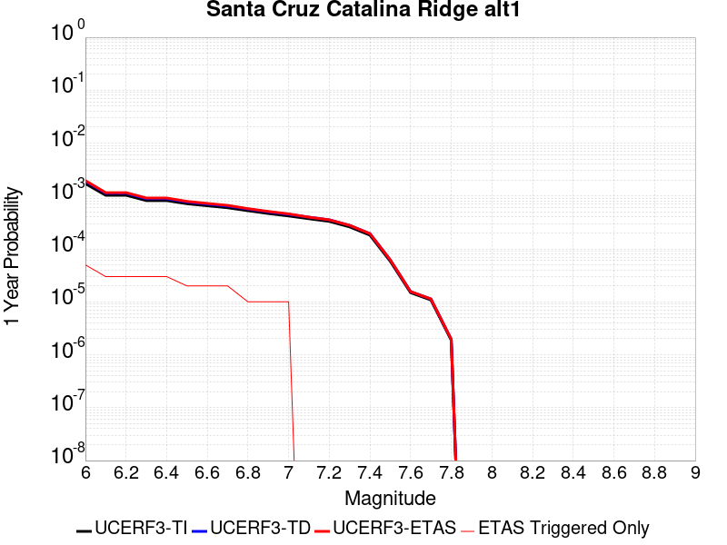 |  |

| Magnitude | 1 wk TI Prob | 1 wk TD Prob | 1 wk ETAS Prob | 1 wk ETAS/TD Gain | 1 wk ETAS Triggered Only | 1 mo TI Prob | 1 mo TD Prob | 1 mo ETAS Prob | 1 mo ETAS/TD Gain | 1 mo ETAS Triggered Only | 1 yr TI Prob | 1 yr TD Prob | 1 yr ETAS Prob | 1 yr ETAS/TD Gain | 1 yr ETAS Triggered Only | 10 yr TI Prob | 10 yr TD Prob | 10 yr ETAS Prob | 10 yr ETAS/TD Gain | 10 yr ETAS Triggered Only |
|-----|-----|-----|-----|-----|-----|-----|-----|-----|-----|-----|-----|-----|-----|-----|-----|-----|-----|-----|-----|-----|
| 6.0 | 3.2833184E-5 | 3.6558402E-5 | 5.655767E-5 | 1.5470499 | 2.0E-5 | 1.4070606E-4 | 1.5667039E-4 | 1.8666568E-4 | 1.1914548 | 3.0E-5 | 0.00171175 | 0.0019059594 | 0.001955864 | 1.0261835 | 5.0E-5 | 0.016986247 | 0.018913032 | 0.018981708 | 1.0036311 | 7.0E-5 |
| 6.1 | 1.9835548E-5 | 2.1659505E-5 | 3.165929E-5 | 1.461681 | 1.0E-5 | 8.500672E-5 | 9.282326E-5 | 1.12821406E-4 | 1.2154433 | 2.0E-5 | 0.0010344655 | 0.0011295575 | 0.0011595236 | 1.0265291 | 3.0E-5 | 0.010296632 | 0.011240296 | 0.011279846 | 1.0035186 | 4.0E-5 |
| 6.2 | 1.9835548E-5 | 2.1659505E-5 | 3.165929E-5 | 1.461681 | 1.0E-5 | 8.500672E-5 | 9.282326E-5 | 1.12821406E-4 | 1.2154433 | 2.0E-5 | 0.0010344655 | 0.0011295575 | 0.0011595236 | 1.0265291 | 3.0E-5 | 0.010296632 | 0.011240296 | 0.011279846 | 1.0035186 | 4.0E-5 |
| 6.3 | 1.5728183E-5 | 1.703395E-5 | 2.7033779E-5 | 1.587053 | 1.0E-5 | 6.7404755E-5 | 7.300063E-5 | 9.299917E-5 | 1.2739502 | 2.0E-5 | 8.2034385E-4 | 8.884264E-4 | 9.183997E-4 | 1.0337375 | 3.0E-5 | 0.008173222 | 0.008849427 | 0.008889073 | 1.0044801 | 4.0E-5 |
| 6.4 | 1.5728183E-5 | 1.703395E-5 | 2.7033779E-5 | 1.587053 | 1.0E-5 | 6.7404755E-5 | 7.300063E-5 | 9.299917E-5 | 1.2739502 | 2.0E-5 | 8.2034385E-4 | 8.884264E-4 | 9.183997E-4 | 1.0337375 | 3.0E-5 | 0.008173222 | 0.008849427 | 0.008889073 | 1.0044801 | 4.0E-5 |
| 6.5 | 1.3707734E-5 | 1.4794522E-5 | 1.4794522E-5 | 1.0 | 0.0 | 5.8746107E-5 | 6.3403575E-5 | 7.340294E-5 | 1.1577098 | 1.0E-5 | 7.1499916E-4 | 7.716686E-4 | 7.916532E-4 | 1.0258979 | 2.0E-5 | 0.0071270303 | 0.0076902895 | 0.007720059 | 1.003871 | 3.0E-5 |
| 6.6 | 1.2539813E-5 | 1.3510219E-5 | 1.3510219E-5 | 1.0 | 0.0 | 5.3740947E-5 | 5.789967E-5 | 6.789909E-5 | 1.1727026 | 1.0E-5 | 6.540996E-4 | 7.0470315E-4 | 7.2468905E-4 | 1.0283607 | 2.0E-5 | 0.0065217763 | 0.0070249885 | 0.007054778 | 1.0042405 | 3.0E-5 |
| 6.7 | 1.1504083E-5 | 1.2377375E-5 | 1.2377375E-5 | 1.0 | 0.0 | 4.930228E-5 | 5.3044827E-5 | 6.3044296E-5 | 1.1885098 | 1.0E-5 | 6.0008996E-4 | 6.456314E-4 | 6.6561846E-4 | 1.0309575 | 2.0E-5 | 0.005984721 | 0.006437786 | 0.006467593 | 1.00463 | 3.0E-5 |
| 6.8 | 1.012739E-5 | 1.0877071E-5 | 1.0877071E-5 | 1.0 | 0.0 | 4.340238E-5 | 4.6615194E-5 | 4.6615194E-5 | 1.0 | 0.0 | 5.282958E-4 | 5.673937E-4 | 5.7738804E-4 | 1.0176145 | 1.0E-5 | 0.0052704164 | 0.0056596193 | 0.0056795063 | 1.0035138 | 2.0E-5 |
| 6.9 | 8.9607865E-6 | 9.609117E-6 | 9.609117E-6 | 1.0 | 0.0 | 3.8402806E-5 | 4.1181287E-5 | 4.1181287E-5 | 1.0 | 0.0 | 4.6745385E-4 | 5.012679E-4 | 5.1126286E-4 | 1.0199394 | 1.0E-5 | 0.0046647177 | 0.005001492 | 0.005021392 | 1.0039788 | 2.0E-5 |
| 7.0 | 8.046829E-6 | 8.619746E-6 | 8.619746E-6 | 1.0 | 0.0 | 3.4485955E-5 | 3.694125E-5 | 3.694125E-5 | 1.0 | 0.0 | 4.1978562E-4 | 4.496677E-4 | 4.5966322E-4 | 1.0222286 | 1.0E-5 | 0.004189935 | 0.0044876686 | 0.004507579 | 1.0044366 | 2.0E-5 |
| 7.1 | 7.136131E-6 | 7.637656E-6 | 7.637656E-6 | 1.0 | 0.0 | 3.0583058E-5 | 3.2732405E-5 | 3.2732405E-5 | 1.0 | 0.0 | 3.7228514E-4 | 3.9844486E-4 | 3.9844486E-4 | 1.0 | 0.0 | 0.0037166206 | 0.003977381 | 0.0039873417 | 1.0025042 | 1.0E-5 |
| 7.2 | 6.362014E-6 | 6.8049585E-6 | 6.8049585E-6 | 1.0 | 0.0 | 2.726549E-5 | 2.9163786E-5 | 2.9163786E-5 | 1.0 | 0.0 | 3.3190678E-4 | 3.550119E-4 | 3.550119E-4 | 1.0 | 0.0 | 0.0033141149 | 0.003544516 | 0.0035544806 | 1.0028113 | 1.0E-5 |
| 7.3 | 5.004101E-6 | 5.351715E-6 | 5.351715E-6 | 1.0 | 0.0 | 2.1445969E-5 | 2.2935723E-5 | 2.2935723E-5 | 1.0 | 0.0 | 2.6107338E-4 | 2.792072E-4 | 2.792072E-4 | 1.0 | 0.0 | 0.002607669 | 0.0027886187 | 0.0027985908 | 1.003576 | 1.0E-5 |
| 7.4 | 3.4901443E-6 | 3.7320526E-6 | 3.7320526E-6 | 1.0 | 0.0 | 1.4957676E-5 | 1.5994416E-5 | 1.5994416E-5 | 1.0 | 0.0 | 1.8209449E-4 | 1.9471499E-4 | 1.9471499E-4 | 1.0 | 0.0 | 0.0018194534 | 0.0019454823 | 0.0019554629 | 1.0051302 | 1.0E-5 |
| 7.5 | 1.1215045E-6 | 1.189387E-6 | 1.189387E-6 | 1.0 | 0.0 | 4.806439E-6 | 5.097363E-6 | 5.097363E-6 | 1.0 | 0.0 | 5.851682E-5 | 6.205866E-5 | 6.205866E-5 | 1.0 | 0.0 | 5.850142E-4 | 6.2041637E-4 | 6.2041637E-4 | 1.0 | 0.0 |
| 7.6 | 2.8599047E-7 | 2.9951994E-7 | 2.9951994E-7 | 1.0 | 0.0 | 1.2256729E-6 | 1.2836562E-6 | 1.2836562E-6 | 1.0 | 0.0 | 1.4922465E-5 | 1.5628404E-5 | 1.5628404E-5 | 1.0 | 0.0 | 1.4921463E-4 | 1.5627318E-4 | 1.5627318E-4 | 1.0 | 0.0 |
| 7.7 | 2.0781519E-7 | 2.1744323E-7 | 2.1744323E-7 | 1.0 | 0.0 | 8.906362E-7 | 9.3189925E-7 | 9.3189925E-7 | 1.0 | 0.0 | 1.08434415E-5 | 1.13458145E-5 | 1.13458145E-5 | 1.0 | 0.0 | 1.0842913E-4 | 1.1345245E-4 | 1.1345245E-4 | 1.0 | 0.0 |
| 7.8 | 3.614776E-8 | 3.764102E-8 | 3.764102E-8 | 1.0 | 0.0 | 1.5491896E-7 | 1.6131864E-7 | 1.6131864E-7 | 1.0 | 0.0 | 1.8861368E-6 | 1.9640527E-6 | 1.9640527E-6 | 1.0 | 0.0 | 1.8861208E-5 | 1.9640367E-5 | 1.9640367E-5 | 1.0 | 0.0 |

## Big Pine (Central)
*[(top)](#table-of-contents)*

| 1 Week | 1 Month | 1 Year | 10 Year |
|-----|-----|-----|-----|
| 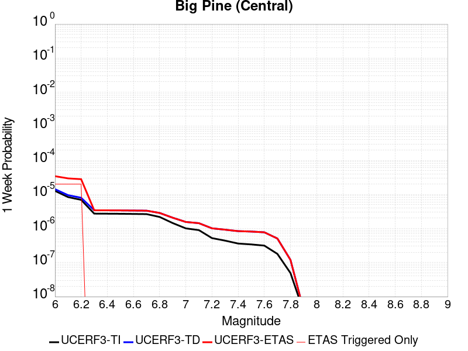 |  |  |  |

| Magnitude | 1 wk TI Prob | 1 wk TD Prob | 1 wk ETAS Prob | 1 wk ETAS/TD Gain | 1 wk ETAS Triggered Only | 1 mo TI Prob | 1 mo TD Prob | 1 mo ETAS Prob | 1 mo ETAS/TD Gain | 1 mo ETAS Triggered Only | 1 yr TI Prob | 1 yr TD Prob | 1 yr ETAS Prob | 1 yr ETAS/TD Gain | 1 yr ETAS Triggered Only | 10 yr TI Prob | 10 yr TD Prob | 10 yr ETAS Prob | 10 yr ETAS/TD Gain | 10 yr ETAS Triggered Only |
|-----|-----|-----|-----|-----|-----|-----|-----|-----|-----|-----|-----|-----|-----|-----|-----|-----|-----|-----|-----|-----|
| 6.0 | 1.2706755E-5 | 1.4250602E-5 | 3.425032E-5 | 2.4034295 | 2.0E-5 | 5.4456385E-5 | 6.107279E-5 | 1.11069734E-4 | 1.8186452 | 5.0E-5 | 6.628048E-4 | 7.433441E-4 | 8.1329205E-4 | 1.094099 | 7.0E-5 | 0.006608314 | 0.007413639 | 0.007493046 | 1.010711 | 8.0E-5 |
| 6.1 | 8.342579E-6 | 9.510835E-6 | 2.9510646E-5 | 3.1028447 | 2.0E-5 | 3.5753423E-5 | 4.076021E-5 | 7.0758986E-5 | 1.735982 | 3.0E-5 | 4.3521097E-4 | 4.9616426E-4 | 5.461395E-4 | 1.100723 | 5.0E-5 | 0.0043435963 | 0.004954155 | 0.005013858 | 1.0120511 | 6.0E-5 |
| 6.2 | 6.923899E-6 | 7.967221E-6 | 2.7967062E-5 | 3.5102656 | 2.0E-5 | 2.9673516E-5 | 3.4144894E-5 | 6.4143875E-5 | 1.8785787 | 3.0E-5 | 3.6121515E-4 | 4.1565404E-4 | 4.6563326E-4 | 1.1202424 | 5.0E-5 | 0.003606286 | 0.0041521094 | 0.0042118602 | 1.0143905 | 6.0E-5 |
| 6.3 | 2.728396E-6 | 3.4243646E-6 | 3.4243646E-6 | 1.0 | 0.0 | 1.1693074E-5 | 1.4675771E-5 | 2.4675624E-5 | 1.6813852 | 1.0E-5 | 1.4235388E-4 | 1.7866373E-4 | 1.9866016E-4 | 1.1119221 | 2.0E-5 | 0.0014226272 | 0.0017867433 | 0.0018166897 | 1.0167603 | 3.0E-5 |
| 6.4 | 2.7136944E-6 | 3.4086581E-6 | 3.4086581E-6 | 1.0 | 0.0 | 1.1630066E-5 | 1.4608458E-5 | 2.4608311E-5 | 1.6845249 | 1.0E-5 | 1.4158686E-4 | 1.7784433E-4 | 1.9784077E-4 | 1.1124378 | 2.0E-5 | 0.0014149669 | 0.0017785623 | 0.001808509 | 1.0168376 | 3.0E-5 |
| 6.5 | 2.6971882E-6 | 3.3910032E-6 | 3.3910032E-6 | 1.0 | 0.0 | 1.1559327E-5 | 1.4532795E-5 | 2.453265E-5 | 1.6880889 | 1.0E-5 | 1.4072572E-4 | 1.7692328E-4 | 1.9691975E-4 | 1.1130234 | 2.0E-5 | 0.0014063664 | 0.0017693666 | 0.0017993135 | 1.0169252 | 3.0E-5 |
| 6.6 | 2.669092E-6 | 3.3610236E-6 | 3.3610236E-6 | 1.0 | 0.0 | 1.1438916E-5 | 1.4404312E-5 | 2.4404168E-5 | 1.6942265 | 1.0E-5 | 1.3925991E-4 | 1.7535927E-4 | 1.9535575E-4 | 1.1140316 | 2.0E-5 | 0.0013917267 | 0.0017537511 | 0.0017836984 | 1.0170761 | 3.0E-5 |
| 6.7 | 2.6408059E-6 | 3.3310494E-6 | 3.3310494E-6 | 1.0 | 0.0 | 1.1317691E-5 | 1.4275853E-5 | 2.4275709E-5 | 1.7004735 | 1.0E-5 | 1.3778417E-4 | 1.737955E-4 | 1.9379203E-4 | 1.1150578 | 2.0E-5 | 0.0013769877 | 0.0017381381 | 0.001768086 | 1.0172298 | 3.0E-5 |
| 6.8 | 2.1786943E-6 | 2.8545066E-6 | 2.8545066E-6 | 1.0 | 0.0 | 9.337228E-6 | 1.2233547E-5 | 1.2233547E-5 | 1.0 | 0.0 | 1.1367482E-4 | 1.4893398E-4 | 1.5893248E-4 | 1.0671339 | 1.0E-5 | 0.0011361669 | 0.0014898704 | 0.0015098406 | 1.013404 | 2.0E-5 |
| 6.9 | 1.4411696E-6 | 2.0685677E-6 | 2.0685677E-6 | 1.0 | 0.0 | 6.1764263E-6 | 8.865261E-6 | 8.865261E-6 | 1.0 | 0.0 | 7.51954E-5 | 1.0792949E-4 | 1.1792841E-4 | 1.0926431 | 1.0E-5 | 7.5169955E-4 | 0.0010802548 | 0.0011002332 | 1.0184941 | 2.0E-5 |
| 7.0 | 1.0073411E-6 | 1.5543274E-6 | 1.5543274E-6 | 1.0 | 0.0 | 4.317169E-6 | 6.661387E-6 | 6.661387E-6 | 1.0 | 0.0 | 5.2560266E-5 | 8.109952E-5 | 9.109871E-5 | 1.1232953 | 1.0E-5 | 5.2547833E-4 | 8.1217213E-4 | 8.2216406E-4 | 1.0123026 | 1.0E-5 |
| 7.1 | 8.947104E-7 | 1.430316E-6 | 1.430316E-6 | 1.0 | 0.0 | 3.834468E-6 | 6.1299124E-6 | 6.1299124E-6 | 1.0 | 0.0 | 4.6683643E-5 | 7.462928E-5 | 8.462853E-5 | 1.1339856 | 1.0E-5 | 4.6673836E-4 | 7.4751483E-4 | 7.5750734E-4 | 1.0133677 | 1.0E-5 |
| 7.2 | 5.215166E-7 | 1.0112277E-6 | 1.0112277E-6 | 1.0 | 0.0 | 2.2350691E-6 | 4.333826E-6 | 4.333826E-6 | 1.0 | 0.0 | 2.7211627E-5 | 5.27631E-5 | 5.27631E-5 | 1.0 | 0.0 | 2.7208295E-4 | 5.289683E-4 | 5.289683E-4 | 1.0 | 0.0 |
| 7.3 | 4.4024807E-7 | 9.220183E-7 | 9.220183E-7 | 1.0 | 0.0 | 1.8867761E-6 | 3.951501E-6 | 3.951501E-6 | 1.0 | 0.0 | 2.2971257E-5 | 4.8108504E-5 | 4.8108504E-5 | 1.0 | 0.0 | 2.2968883E-4 | 4.824433E-4 | 4.824433E-4 | 1.0 | 0.0 |
| 7.4 | 3.6130905E-7 | 8.359109E-7 | 8.359109E-7 | 1.0 | 0.0 | 1.5484665E-6 | 3.5824705E-6 | 3.5824705E-6 | 1.0 | 0.0 | 1.8852415E-5 | 4.3615746E-5 | 4.3615746E-5 | 1.0 | 0.0 | 1.8850817E-4 | 4.3752496E-4 | 4.3752496E-4 | 1.0 | 0.0 |
| 7.5 | 3.408184E-7 | 8.1087245E-7 | 8.1087245E-7 | 1.0 | 0.0 | 1.4606494E-6 | 3.475163E-6 | 3.475163E-6 | 1.0 | 0.0 | 1.7783263E-5 | 4.230933E-5 | 4.230933E-5 | 1.0 | 0.0 | 1.778184E-4 | 4.2444657E-4 | 4.2444657E-4 | 1.0 | 0.0 |
| 7.6 | 3.1428627E-7 | 7.732167E-7 | 7.732167E-7 | 1.0 | 0.0 | 1.3469405E-6 | 3.313782E-6 | 3.313782E-6 | 1.0 | 0.0 | 1.6398877E-5 | 4.0344585E-5 | 4.0344585E-5 | 1.0 | 0.0 | 1.6397667E-4 | 4.0477706E-4 | 4.0477706E-4 | 1.0 | 0.0 |
| 7.7 | 1.7972785E-7 | 5.0782415E-7 | 5.0782415E-7 | 1.0 | 0.0 | 7.70262E-7 | 2.1763874E-6 | 2.1763874E-6 | 1.0 | 0.0 | 9.377899E-6 | 2.6497206E-5 | 2.6497206E-5 | 1.0 | 0.0 | 9.377503E-5 | 2.6633305E-4 | 2.6633305E-4 | 1.0 | 0.0 |
| 7.8 | 4.9230927E-8 | 1.1981747E-7 | 1.1981747E-7 | 1.0 | 0.0 | 2.1098968E-7 | 5.135033E-7 | 5.135033E-7 | 1.0 | 0.0 | 2.5687964E-6 | 6.2518866E-6 | 6.2518866E-6 | 1.0 | 0.0 | 2.5687666E-5 | 6.2971965E-5 | 6.2971965E-5 | 1.0 | 0.0 |
| 7.9 | 3.6805972E-9 | 4.1051638E-9 | 4.1051638E-9 | 1.0 | 0.0 | 1.5773987E-8 | 1.7593557E-8 | 1.7593557E-8 | 1.0 | 0.0 | 1.9204828E-7 | 2.1420155E-7 | 2.1420155E-7 | 1.0 | 0.0 | 1.920481E-6 | 2.1898923E-6 | 2.1898923E-6 | 1.0 | 0.0 |

## San Clemente
*[(top)](#table-of-contents)*

| 1 Week | 1 Month | 1 Year | 10 Year |
|-----|-----|-----|-----|
| 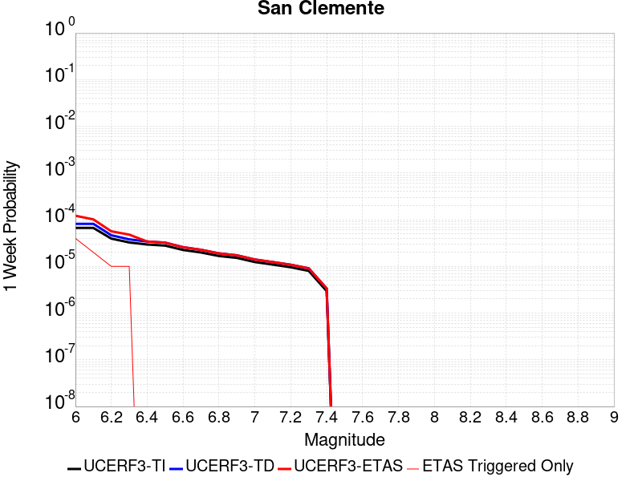 |  |  |  |

| Magnitude | 1 wk TI Prob | 1 wk TD Prob | 1 wk ETAS Prob | 1 wk ETAS/TD Gain | 1 wk ETAS Triggered Only | 1 mo TI Prob | 1 mo TD Prob | 1 mo ETAS Prob | 1 mo ETAS/TD Gain | 1 mo ETAS Triggered Only | 1 yr TI Prob | 1 yr TD Prob | 1 yr ETAS Prob | 1 yr ETAS/TD Gain | 1 yr ETAS Triggered Only | 10 yr TI Prob | 10 yr TD Prob | 10 yr ETAS Prob | 10 yr ETAS/TD Gain | 10 yr ETAS Triggered Only |
|-----|-----|-----|-----|-----|-----|-----|-----|-----|-----|-----|-----|-----|-----|-----|-----|-----|-----|-----|-----|-----|
| 6.0 | 6.681379E-5 | 8.163834E-5 | 1.2163507E-4 | 1.4899259 | 4.0E-5 | 2.8631336E-4 | 3.4983488E-4 | 3.898209E-4 | 1.1142997 | 4.0E-5 | 0.003480294 | 0.00425141 | 0.0043011974 | 1.0117108 | 5.0E-5 | 0.03426291 | 0.04175603 | 0.041823108 | 1.0016063 | 7.0E-5 |
| 6.1 | 6.681379E-5 | 8.163834E-5 | 1.016367E-4 | 1.2449629 | 2.0E-5 | 2.8631336E-4 | 3.4983488E-4 | 3.698279E-4 | 1.0571498 | 2.0E-5 | 0.003480294 | 0.00425141 | 0.0042812824 | 1.0070264 | 3.0E-5 | 0.03426291 | 0.04175603 | 0.04180394 | 1.0011474 | 5.0E-5 |
| 6.2 | 3.9400576E-5 | 4.6452373E-5 | 5.6451907E-5 | 1.2152642 | 1.0E-5 | 1.6884868E-4 | 1.9906677E-4 | 2.0906478E-4 | 1.0502244 | 1.0E-5 | 0.0020537945 | 0.0024209984 | 0.0024409501 | 1.008241 | 2.0E-5 | 0.020349167 | 0.023952903 | 0.023982184 | 1.0012225 | 3.0E-5 |
| 6.3 | 3.2590255E-5 | 3.792912E-5 | 4.7928737E-5 | 1.2636397 | 1.0E-5 | 1.3966505E-4 | 1.6254342E-4 | 1.725418E-4 | 1.061512 | 1.0E-5 | 0.0016990956 | 0.0019772002 | 0.0019971605 | 1.0100954 | 2.0E-5 | 0.01686163 | 0.019599883 | 0.019619491 | 1.0010004 | 2.0E-5 |
| 6.4 | 2.9454652E-5 | 3.4097764E-5 | 3.4097764E-5 | 1.0 | 0.0 | 1.2622811E-4 | 1.4612524E-4 | 1.4612524E-4 | 1.0 | 0.0 | 0.0015357438 | 0.0017776493 | 0.0017776493 | 1.0 | 0.0 | 0.015251739 | 0.01763747 | 0.01763747 | 1.0 | 0.0 |
| 6.5 | 2.790836E-5 | 3.2247463E-5 | 3.2247463E-5 | 1.0 | 0.0 | 1.1960178E-4 | 1.3819624E-4 | 1.3819624E-4 | 1.0 | 0.0 | 0.001455179 | 0.0016812662 | 0.0016812662 | 1.0 | 0.0 | 0.014456868 | 0.016688485 | 0.016688485 | 1.0 | 0.0 |
| 6.6 | 2.2492153E-5 | 2.5762702E-5 | 2.5762702E-5 | 1.0 | 0.0 | 9.639138E-5 | 1.1040699E-4 | 1.1040699E-4 | 1.0 | 0.0 | 0.0011729331 | 0.0013433909 | 0.0013433909 | 1.0 | 0.0 | 0.011667615 | 0.013354417 | 0.013354417 | 1.0 | 0.0 |
| 6.7 | 1.9862755E-5 | 2.2666423E-5 | 2.2666423E-5 | 1.0 | 0.0 | 8.512331E-5 | 9.713826E-5 | 9.713826E-5 | 1.0 | 0.0 | 0.0010358836 | 0.0011820279 | 0.0011820279 | 1.0 | 0.0 | 0.010310682 | 0.011758701 | 0.011758701 | 1.0 | 0.0 |
| 6.8 | 1.6697575E-5 | 1.897771E-5 | 1.897771E-5 | 1.0 | 0.0 | 7.155907E-5 | 8.133056E-5 | 8.133056E-5 | 1.0 | 0.0 | 8.7088346E-4 | 9.897591E-4 | 9.897591E-4 | 1.0 | 0.0 | 0.008674784 | 0.0098545365 | 0.0098545365 | 1.0 | 0.0 |
| 6.9 | 1.5218415E-5 | 1.72694E-5 | 1.72694E-5 | 1.0 | 0.0 | 6.522015E-5 | 7.4009666E-5 | 7.4009666E-5 | 1.0 | 0.0 | 7.93766E-4 | 9.00704E-4 | 9.00704E-4 | 1.0 | 0.0 | 0.007909367 | 0.008971481 | 0.008971481 | 1.0 | 0.0 |
| 7.0 | 1.2392958E-5 | 1.4033016E-5 | 1.4033016E-5 | 1.0 | 0.0 | 5.3111595E-5 | 6.014015E-5 | 6.014015E-5 | 1.0 | 0.0 | 6.4644177E-4 | 7.319679E-4 | 7.319679E-4 | 1.0 | 0.0 | 0.0064456454 | 0.0072963564 | 0.0072963564 | 1.0 | 0.0 |
| 7.1 | 1.0934128E-5 | 1.2375138E-5 | 1.2375138E-5 | 1.0 | 0.0 | 4.6859706E-5 | 5.303527E-5 | 5.303527E-5 | 1.0 | 0.0 | 5.7036756E-4 | 6.455204E-4 | 6.455204E-4 | 1.0 | 0.0 | 0.0056890585 | 0.0064371997 | 0.0064371997 | 1.0 | 0.0 |
| 7.2 | 9.5798805E-6 | 1.0844935E-5 | 1.0844935E-5 | 1.0 | 0.0 | 4.1055984E-5 | 4.6477508E-5 | 4.6477508E-5 | 1.0 | 0.0 | 4.9974193E-4 | 5.657239E-4 | 5.657239E-4 | 1.0 | 0.0 | 0.0049861963 | 0.0056435615 | 0.0056435615 | 1.0 | 0.0 |
| 7.3 | 8.0167365E-6 | 9.083918E-6 | 9.083918E-6 | 1.0 | 0.0 | 3.4356988E-5 | 3.8930535E-5 | 3.8930535E-5 | 1.0 | 0.0 | 4.1821605E-4 | 4.7388324E-4 | 4.7388324E-4 | 1.0 | 0.0 | 0.0041742986 | 0.0047294297 | 0.0047294297 | 1.0 | 0.0 |
| 7.4 | 2.9581017E-6 | 3.3623792E-6 | 3.3623792E-6 | 1.0 | 0.0 | 1.2677518E-5 | 1.4410146E-5 | 1.4410146E-5 | 1.0 | 0.0 | 1.5433785E-4 | 1.7543444E-4 | 1.7543444E-4 | 1.0 | 0.0 | 0.001542307 | 0.0017534546 | 0.0017534546 | 1.0 | 0.0 |

## Pine Mtn
*[(top)](#table-of-contents)*

| 1 Week | 1 Month | 1 Year | 10 Year |
|-----|-----|-----|-----|
| 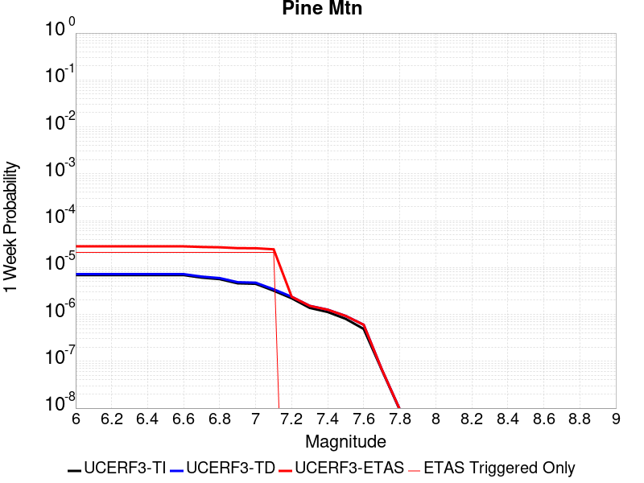 | 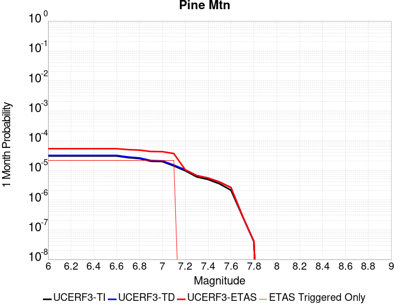 | 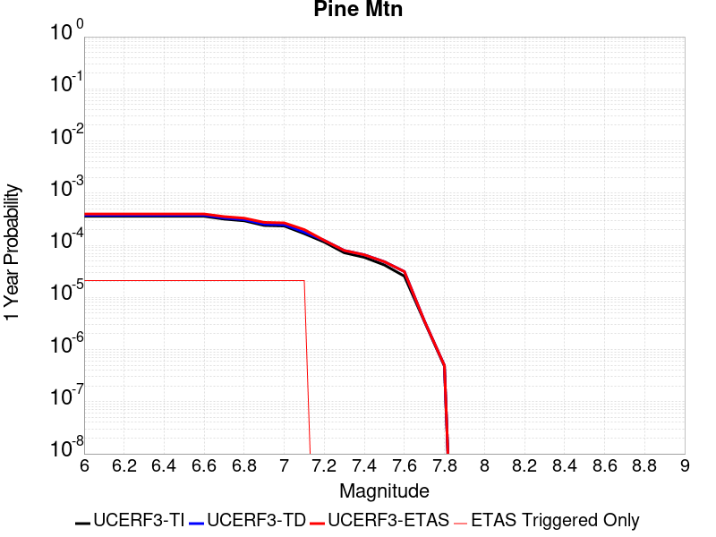 | 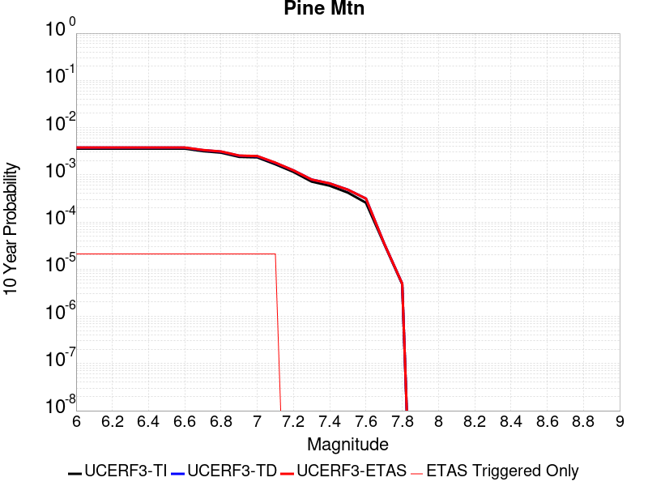 |

| Magnitude | 1 wk TI Prob | 1 wk TD Prob | 1 wk ETAS Prob | 1 wk ETAS/TD Gain | 1 wk ETAS Triggered Only | 1 mo TI Prob | 1 mo TD Prob | 1 mo ETAS Prob | 1 mo ETAS/TD Gain | 1 mo ETAS Triggered Only | 1 yr TI Prob | 1 yr TD Prob | 1 yr ETAS Prob | 1 yr ETAS/TD Gain | 1 yr ETAS Triggered Only | 10 yr TI Prob | 10 yr TD Prob | 10 yr ETAS Prob | 10 yr ETAS/TD Gain | 10 yr ETAS Triggered Only |
|-----|-----|-----|-----|-----|-----|-----|-----|-----|-----|-----|-----|-----|-----|-----|-----|-----|-----|-----|-----|-----|
| 6.0 | 6.894797E-6 | 7.2254716E-6 | 2.7225327E-5 | 3.7679653 | 2.0E-5 | 2.9548795E-5 | 3.0965955E-5 | 7.096472E-5 | 2.291701 | 4.0E-5 | 3.596972E-4 | 3.7694827E-4 | 4.3692565E-4 | 1.159113 | 6.0E-5 | 0.0035911554 | 0.0037633865 | 0.003833123 | 1.0185302 | 7.0E-5 |
| 6.1 | 6.894797E-6 | 7.2254716E-6 | 2.7225327E-5 | 3.7679653 | 2.0E-5 | 2.9548795E-5 | 3.0965955E-5 | 7.096472E-5 | 2.291701 | 4.0E-5 | 3.596972E-4 | 3.7694827E-4 | 4.3692565E-4 | 1.159113 | 6.0E-5 | 0.0035911554 | 0.0037633865 | 0.003833123 | 1.0185302 | 7.0E-5 |
| 6.2 | 6.894797E-6 | 7.2254716E-6 | 2.7225327E-5 | 3.7679653 | 2.0E-5 | 2.9548795E-5 | 3.0965955E-5 | 7.096472E-5 | 2.291701 | 4.0E-5 | 3.596972E-4 | 3.7694827E-4 | 4.3692565E-4 | 1.159113 | 6.0E-5 | 0.0035911554 | 0.0037633865 | 0.003833123 | 1.0185302 | 7.0E-5 |
| 6.3 | 6.894797E-6 | 7.2254716E-6 | 2.7225327E-5 | 3.7679653 | 2.0E-5 | 2.9548795E-5 | 3.0965955E-5 | 7.096472E-5 | 2.291701 | 4.0E-5 | 3.596972E-4 | 3.7694827E-4 | 4.3692565E-4 | 1.159113 | 6.0E-5 | 0.0035911554 | 0.0037633865 | 0.003833123 | 1.0185302 | 7.0E-5 |
| 6.4 | 6.894797E-6 | 7.2254716E-6 | 2.7225327E-5 | 3.7679653 | 2.0E-5 | 2.9548795E-5 | 3.0965955E-5 | 7.096472E-5 | 2.291701 | 4.0E-5 | 3.596972E-4 | 3.7694827E-4 | 4.3692565E-4 | 1.159113 | 6.0E-5 | 0.0035911554 | 0.0037633865 | 0.003833123 | 1.0185302 | 7.0E-5 |
| 6.5 | 6.894797E-6 | 7.2254716E-6 | 2.7225327E-5 | 3.7679653 | 2.0E-5 | 2.9548795E-5 | 3.0965955E-5 | 7.096472E-5 | 2.291701 | 4.0E-5 | 3.596972E-4 | 3.7694827E-4 | 4.3692565E-4 | 1.159113 | 6.0E-5 | 0.0035911554 | 0.0037633865 | 0.003833123 | 1.0185302 | 7.0E-5 |
| 6.6 | 6.894797E-6 | 7.2254716E-6 | 2.7225327E-5 | 3.7679653 | 2.0E-5 | 2.9548795E-5 | 3.0965955E-5 | 7.096472E-5 | 2.291701 | 4.0E-5 | 3.596972E-4 | 3.7694827E-4 | 4.3692565E-4 | 1.159113 | 6.0E-5 | 0.0035911554 | 0.0037633865 | 0.003833123 | 1.0185302 | 7.0E-5 |
| 6.7 | 6.0867933E-6 | 6.397124E-6 | 2.6396996E-5 | 4.126385 | 2.0E-5 | 2.6085996E-5 | 2.7415968E-5 | 5.7415145E-5 | 2.0942228 | 3.0E-5 | 3.1755073E-4 | 3.337405E-4 | 3.837238E-4 | 1.149767 | 5.0E-5 | 0.0031709734 | 0.0033326119 | 0.0033924119 | 1.0179439 | 6.0E-5 |
| 6.8 | 5.6530425E-6 | 5.950606E-6 | 2.5950487E-5 | 4.3609824 | 2.0E-5 | 2.42271E-5 | 2.5502359E-5 | 4.550185E-5 | 1.7842212 | 2.0E-5 | 2.94925E-4 | 3.1044905E-4 | 3.5043663E-4 | 1.1288056 | 4.0E-5 | 0.002945339 | 0.0031003582 | 0.0031502033 | 1.0160772 | 5.0E-5 |
| 6.9 | 4.6015225E-6 | 4.8638444E-6 | 2.4863748E-5 | 5.1119537 | 2.0E-5 | 1.9720663E-5 | 2.084489E-5 | 4.0844472E-5 | 1.9594477 | 2.0E-5 | 2.4007261E-4 | 2.5375842E-4 | 2.9374828E-4 | 1.1575903 | 4.0E-5 | 0.0023981342 | 0.002534831 | 0.0025747295 | 1.0157402 | 4.0E-5 |
| 7.0 | 4.4875965E-6 | 4.7474837E-6 | 2.4747389E-5 | 5.212738 | 2.0E-5 | 1.9232413E-5 | 2.0346208E-5 | 4.03458E-5 | 1.9829642 | 2.0E-5 | 2.3412947E-4 | 2.4768838E-4 | 2.8767847E-4 | 1.1614532 | 4.0E-5 | 0.0023388295 | 0.0024742668 | 0.002514168 | 1.0161264 | 4.0E-5 |
| 7.1 | 3.203907E-6 | 3.42942E-6 | 2.3429351E-5 | 6.83187 | 2.0E-5 | 1.3730958E-5 | 1.4697435E-5 | 3.4697143E-5 | 2.3607616 | 2.0E-5 | 1.6716159E-4 | 1.7892725E-4 | 2.0892188E-4 | 1.1676359 | 3.0E-5 | 0.0016703589 | 0.001787898 | 0.0018178443 | 1.0167495 | 3.0E-5 |
| 7.2 | 2.2060601E-6 | 2.3784874E-6 | 1.2378464E-5 | 5.204343 | 1.0E-5 | 9.4545085E-6 | 1.019348E-5 | 2.0193378E-5 | 1.9810092 | 1.0E-5 | 1.15102564E-4 | 1.2409901E-4 | 1.3409776E-4 | 1.0805708 | 1.0E-5 | 0.0011504296 | 0.0012403419 | 0.0012503295 | 1.0080523 | 1.0E-5 |
| 7.3 | 1.3765207E-6 | 1.5216535E-6 | 1.5216535E-6 | 1.0 | 0.0 | 5.899361E-6 | 6.5213567E-6 | 6.5213567E-6 | 1.0 | 0.0 | 7.182235E-5 | 7.939472E-5 | 7.939472E-5 | 1.0 | 0.0 | 7.1799144E-4 | 7.9367263E-4 | 7.9367263E-4 | 1.0 | 0.0 |
| 7.4 | 1.1245983E-6 | 1.2587126E-6 | 1.2587126E-6 | 1.0 | 0.0 | 4.819698E-6 | 5.394472E-6 | 5.394472E-6 | 1.0 | 0.0 | 5.8678244E-5 | 6.56758E-5 | 6.56758E-5 | 1.0 | 0.0 | 5.866275E-4 | 6.565722E-4 | 6.565722E-4 | 1.0 | 0.0 |
| 7.5 | 8.031682E-7 | 9.276999E-7 | 9.276999E-7 | 1.0 | 0.0 | 3.4421448E-6 | 3.975851E-6 | 3.975851E-6 | 1.0 | 0.0 | 4.1907308E-5 | 4.840498E-5 | 4.840498E-5 | 1.0 | 0.0 | 4.1899405E-4 | 4.8395112E-4 | 4.8395112E-4 | 1.0 | 0.0 |
| 7.6 | 4.8953444E-7 | 6.0030544E-7 | 6.0030544E-7 | 1.0 | 0.0 | 2.098003E-6 | 2.5727354E-6 | 2.5727354E-6 | 1.0 | 0.0 | 2.5542888E-5 | 3.1322652E-5 | 3.1322652E-5 | 1.0 | 0.0 | 2.5539953E-4 | 3.1318725E-4 | 3.1318725E-4 | 1.0 | 0.0 |
| 7.7 | 6.634529E-8 | 6.788826E-8 | 6.788826E-8 | 1.0 | 0.0 | 2.843369E-7 | 2.9094966E-7 | 2.9094966E-7 | 1.0 | 0.0 | 3.4617963E-6 | 3.5423066E-6 | 3.5423066E-6 | 1.0 | 0.0 | 3.4617424E-5 | 3.542255E-5 | 3.542255E-5 | 1.0 | 0.0 |
| 7.8 | 9.235578E-9 | 9.488566E-9 | 9.488566E-9 | 1.0 | 0.0 | 3.9581046E-8 | 4.0665284E-8 | 4.0665284E-8 | 1.0 | 0.0 | 4.818991E-7 | 4.950997E-7 | 4.950997E-7 | 1.0 | 0.0 | 4.8189804E-6 | 4.950988E-6 | 4.950988E-6 | 1.0 | 0.0 |

## Palos Verdes
*[(top)](#table-of-contents)*

| 1 Week | 1 Month | 1 Year | 10 Year |
|-----|-----|-----|-----|
|  | 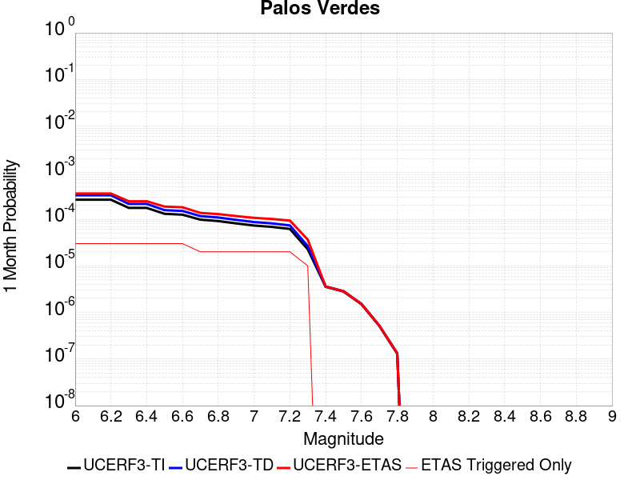 |  |  |

| Magnitude | 1 wk TI Prob | 1 wk TD Prob | 1 wk ETAS Prob | 1 wk ETAS/TD Gain | 1 wk ETAS Triggered Only | 1 mo TI Prob | 1 mo TD Prob | 1 mo ETAS Prob | 1 mo ETAS/TD Gain | 1 mo ETAS Triggered Only | 1 yr TI Prob | 1 yr TD Prob | 1 yr ETAS Prob | 1 yr ETAS/TD Gain | 1 yr ETAS Triggered Only | 10 yr TI Prob | 10 yr TD Prob | 10 yr ETAS Prob | 10 yr ETAS/TD Gain | 10 yr ETAS Triggered Only |
|-----|-----|-----|-----|-----|-----|-----|-----|-----|-----|-----|-----|-----|-----|-----|-----|-----|-----|-----|-----|-----|
| 6.0 | 6.126063E-5 | 7.622572E-5 | 8.622496E-5 | 1.1311793 | 1.0E-5 | 2.6251914E-4 | 3.266441E-4 | 3.5663432E-4 | 1.0918131 | 3.0E-5 | 0.0031914865 | 0.0039701737 | 0.004019975 | 1.0125439 | 5.0E-5 | 0.031460393 | 0.03904909 | 0.039116353 | 1.0017226 | 7.0E-5 |
| 6.1 | 6.126063E-5 | 7.622572E-5 | 8.622496E-5 | 1.1311793 | 1.0E-5 | 2.6251914E-4 | 3.266441E-4 | 3.5663432E-4 | 1.0918131 | 3.0E-5 | 0.0031914865 | 0.0039701737 | 0.004019975 | 1.0125439 | 5.0E-5 | 0.031460393 | 0.03904909 | 0.039116353 | 1.0017226 | 7.0E-5 |
| 6.2 | 6.126063E-5 | 7.622572E-5 | 8.622496E-5 | 1.1311793 | 1.0E-5 | 2.6251914E-4 | 3.266441E-4 | 3.5663432E-4 | 1.0918131 | 3.0E-5 | 0.0031914865 | 0.0039701737 | 0.004019975 | 1.0125439 | 5.0E-5 | 0.031460393 | 0.03904909 | 0.039116353 | 1.0017226 | 7.0E-5 |
| 6.3 | 4.0838047E-5 | 4.9749007E-5 | 5.974851E-5 | 1.200999 | 1.0E-5 | 1.7500846E-4 | 2.1319388E-4 | 2.4318747E-4 | 1.140687 | 3.0E-5 | 0.0021286458 | 0.002592754 | 0.0026326505 | 1.0153877 | 4.0E-5 | 0.021083709 | 0.025646746 | 0.025705209 | 1.0022795 | 6.0E-5 |
| 6.4 | 4.0838047E-5 | 4.9749007E-5 | 5.974851E-5 | 1.200999 | 1.0E-5 | 1.7500846E-4 | 2.1319388E-4 | 2.4318747E-4 | 1.140687 | 3.0E-5 | 0.0021286458 | 0.002592754 | 0.0026326505 | 1.0153877 | 4.0E-5 | 0.021083709 | 0.025646746 | 0.025705209 | 1.0022795 | 6.0E-5 |
| 6.5 | 3.0512005E-5 | 3.6561592E-5 | 4.656123E-5 | 1.273501 | 1.0E-5 | 1.3075917E-4 | 1.566838E-4 | 1.8667911E-4 | 1.1914384 | 3.0E-5 | 0.0015908304 | 0.001906072 | 0.0019459957 | 1.0209455 | 4.0E-5 | 0.015794903 | 0.018909173 | 0.018958228 | 1.0025942 | 5.0E-5 |
| 6.6 | 2.9255087E-5 | 3.5154393E-5 | 4.515404E-5 | 1.2844495 | 1.0E-5 | 1.2537291E-4 | 1.5065364E-4 | 1.8064912E-4 | 1.1991023 | 3.0E-5 | 0.0015253464 | 0.0018327782 | 0.001872705 | 1.0217848 | 4.0E-5 | 0.015149189 | 0.018188244 | 0.018237334 | 1.002699 | 5.0E-5 |
| 6.7 | 2.287198E-5 | 2.724828E-5 | 3.7248006E-5 | 1.3669857 | 1.0E-5 | 9.801909E-5 | 1.16773626E-4 | 1.367713E-4 | 1.1712515 | 2.0E-5 | 0.001192729 | 0.0014208833 | 0.0014508407 | 1.0210836 | 3.0E-5 | 0.011863477 | 0.014127217 | 0.014156793 | 1.0020936 | 3.0E-5 |
| 6.8 | 2.1325764E-5 | 2.5431878E-5 | 3.5431625E-5 | 1.3931973 | 1.0E-5 | 9.139293E-5 | 1.0898972E-4 | 1.2898754E-4 | 1.1834836 | 2.0E-5 | 0.001112141 | 0.0013262323 | 0.0013561925 | 1.0225905 | 3.0E-5 | 0.011065915 | 0.013192211 | 0.013221815 | 1.0022441 | 3.0E-5 |
| 6.9 | 1.9009392E-5 | 2.2613547E-5 | 3.2613323E-5 | 1.4422028 | 1.0E-5 | 8.1466285E-5 | 9.6912096E-5 | 1.1691016E-4 | 1.2063526 | 2.0E-5 | 9.914007E-4 | 0.0011793535 | 0.0011993299 | 1.0169384 | 2.0E-5 | 0.009869894 | 0.011739633 | 0.011759398 | 1.0016836 | 2.0E-5 |
| 7.0 | 1.7098473E-5 | 2.0319356E-5 | 3.0319152E-5 | 1.4921316 | 1.0E-5 | 7.3277115E-5 | 8.708052E-5 | 1.07078784E-4 | 1.2296525 | 2.0E-5 | 8.917837E-4 | 0.001059775 | 0.0010797537 | 1.0188519 | 2.0E-5 | 0.008882134 | 0.010555646 | 0.010575435 | 1.0018747 | 2.0E-5 |
| 7.1 | 1.5982785E-5 | 1.899476E-5 | 2.8994571E-5 | 1.526451 | 1.0E-5 | 6.849585E-5 | 8.1404054E-5 | 1.01402424E-4 | 1.245668 | 2.0E-5 | 8.336179E-4 | 9.907284E-4 | 0.0010107086 | 1.0201671 | 2.0E-5 | 0.008304977 | 0.009871479 | 0.009891282 | 1.002006 | 2.0E-5 |
| 7.2 | 1.4468002E-5 | 1.7197237E-5 | 2.7197064E-5 | 1.5814788 | 1.0E-5 | 6.200425E-5 | 7.370083E-5 | 9.369936E-5 | 1.2713474 | 2.0E-5 | 7.546402E-4 | 8.970222E-4 | 9.1700425E-4 | 1.022276 | 2.0E-5 | 0.007520827 | 0.008942284 | 0.008962105 | 1.0022166 | 2.0E-5 |
| 7.3 | 5.288233E-6 | 6.2036747E-6 | 1.6203612E-5 | 2.6119378 | 1.0E-5 | 2.2663658E-5 | 2.6587102E-5 | 3.6586836E-5 | 1.3761122 | 1.0E-5 | 2.7589512E-4 | 3.236848E-4 | 3.3368156E-4 | 1.0308843 | 1.0E-5 | 0.0027555283 | 0.0032355562 | 0.003245524 | 1.0030806 | 1.0E-5 |
| 7.4 | 8.279556E-7 | 8.408347E-7 | 8.408347E-7 | 1.0 | 0.0 | 3.5483763E-6 | 3.6035726E-6 | 3.6035726E-6 | 1.0 | 0.0 | 4.3200624E-5 | 4.3872686E-5 | 4.3872686E-5 | 1.0 | 0.0 | 4.3192226E-4 | 4.3864746E-4 | 4.3864746E-4 | 1.0 | 0.0 |
| 7.5 | 6.559831E-7 | 6.667229E-7 | 6.667229E-7 | 1.0 | 0.0 | 2.8113532E-6 | 2.857381E-6 | 2.857381E-6 | 1.0 | 0.0 | 3.4227687E-5 | 3.4788125E-5 | 3.4788125E-5 | 1.0 | 0.0 | 3.4222414E-4 | 3.4783344E-4 | 3.4783344E-4 | 1.0 | 0.0 |
| 7.6 | 3.5018968E-7 | 3.5620027E-7 | 3.5620027E-7 | 1.0 | 0.0 | 1.500812E-6 | 1.526572E-6 | 1.526572E-6 | 1.0 | 0.0 | 1.8272232E-5 | 1.8585903E-5 | 1.8585903E-5 | 1.0 | 0.0 | 1.8270731E-4 | 1.8584808E-4 | 1.8584808E-4 | 1.0 | 0.0 |
| 7.7 | 1.1986104E-7 | 1.2198376E-7 | 1.2198376E-7 | 1.0 | 0.0 | 5.1369005E-7 | 5.2278745E-7 | 5.2278745E-7 | 1.0 | 0.0 | 6.2541585E-6 | 6.364919E-6 | 6.364919E-6 | 1.0 | 0.0 | 6.2539824E-5 | 6.364741E-5 | 6.364741E-5 | 1.0 | 0.0 |
| 7.8 | 3.0445005E-8 | 3.1027582E-8 | 3.1027582E-8 | 1.0 | 0.0 | 1.3047858E-7 | 1.3297536E-7 | 1.3297536E-7 | 1.0 | 0.0 | 1.5885756E-6 | 1.6189739E-6 | 1.6189739E-6 | 1.0 | 0.0 | 1.5885644E-5 | 1.6189642E-5 | 1.6189642E-5 | 1.0 | 0.0 |

## San Jacinto (Clark) rev
*[(top)](#table-of-contents)*

| 1 Week | 1 Month | 1 Year | 10 Year |
|-----|-----|-----|-----|
|  | 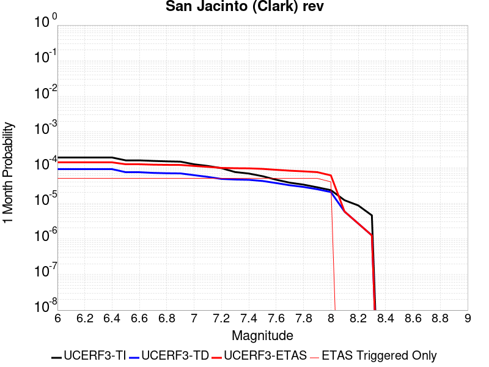 |  | 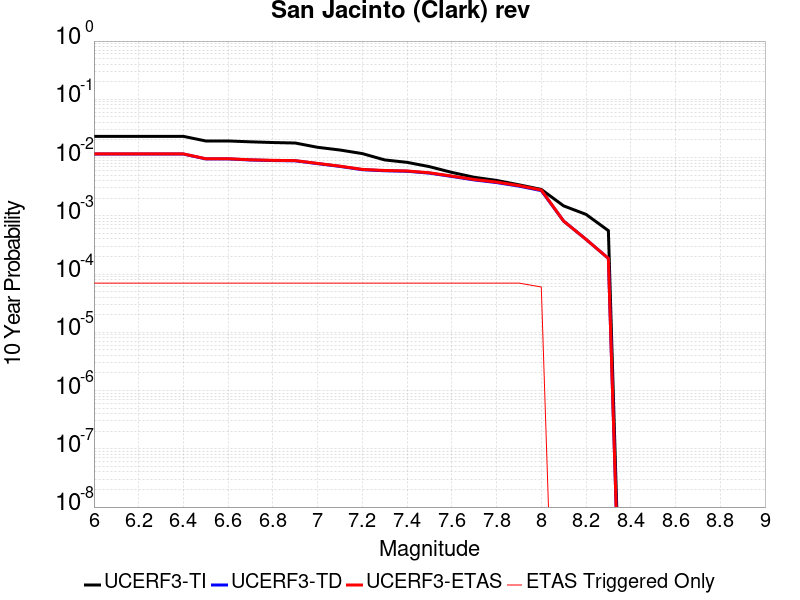 |

| Magnitude | 1 wk TI Prob | 1 wk TD Prob | 1 wk ETAS Prob | 1 wk ETAS/TD Gain | 1 wk ETAS Triggered Only | 1 mo TI Prob | 1 mo TD Prob | 1 mo ETAS Prob | 1 mo ETAS/TD Gain | 1 mo ETAS Triggered Only | 1 yr TI Prob | 1 yr TD Prob | 1 yr ETAS Prob | 1 yr ETAS/TD Gain | 1 yr ETAS Triggered Only | 10 yr TI Prob | 10 yr TD Prob | 10 yr ETAS Prob | 10 yr ETAS/TD Gain | 10 yr ETAS Triggered Only |
|-----|-----|-----|-----|-----|-----|-----|-----|-----|-----|-----|-----|-----|-----|-----|-----|-----|-----|-----|-----|-----|
| 6.0 | 4.482615E-5 | 2.1153059E-5 | 6.115221E-5 | 2.8909395 | 4.0E-5 | 1.9209793E-4 | 9.065287E-5 | 1.4064834E-4 | 1.5515045 | 5.0E-5 | 0.0023362834 | 0.0011031491 | 0.001153094 | 1.0452747 | 5.0E-5 | 0.02311874 | 0.011485709 | 0.011554905 | 1.0060245 | 7.0E-5 |
| 6.1 | 4.482615E-5 | 2.1153059E-5 | 6.115221E-5 | 2.8909395 | 4.0E-5 | 1.9209793E-4 | 9.065287E-5 | 1.4064834E-4 | 1.5515045 | 5.0E-5 | 0.0023362834 | 0.0011031491 | 0.001153094 | 1.0452747 | 5.0E-5 | 0.02311874 | 0.011485709 | 0.011554905 | 1.0060245 | 7.0E-5 |
| 6.2 | 4.482615E-5 | 2.1153059E-5 | 6.115221E-5 | 2.8909395 | 4.0E-5 | 1.9209793E-4 | 9.065287E-5 | 1.4064834E-4 | 1.5515045 | 5.0E-5 | 0.0023362834 | 0.0011031491 | 0.001153094 | 1.0452747 | 5.0E-5 | 0.02311874 | 0.011485709 | 0.011554905 | 1.0060245 | 7.0E-5 |
| 6.3 | 4.482615E-5 | 2.1153059E-5 | 6.115221E-5 | 2.8909395 | 4.0E-5 | 1.9209793E-4 | 9.065287E-5 | 1.4064834E-4 | 1.5515045 | 5.0E-5 | 0.0023362834 | 0.0011031491 | 0.001153094 | 1.0452747 | 5.0E-5 | 0.02311874 | 0.011485709 | 0.011554905 | 1.0060245 | 7.0E-5 |
| 6.4 | 4.482615E-5 | 2.1153059E-5 | 6.115221E-5 | 2.8909395 | 4.0E-5 | 1.9209793E-4 | 9.065287E-5 | 1.4064834E-4 | 1.5515045 | 5.0E-5 | 0.0023362834 | 0.0011031491 | 0.001153094 | 1.0452747 | 5.0E-5 | 0.02311874 | 0.011485709 | 0.011554905 | 1.0060245 | 7.0E-5 |
| 6.5 | 3.7294863E-5 | 1.7354667E-5 | 5.7353973E-5 | 3.3048155 | 4.0E-5 | 1.5982533E-4 | 7.437504E-5 | 1.2437132E-4 | 1.6722184 | 5.0E-5 | 0.0019441366 | 9.051445E-4 | 9.5509924E-4 | 1.0551898 | 5.0E-5 | 0.01927216 | 0.009485902 | 0.009555238 | 1.0073093 | 7.0E-5 |
| 6.6 | 3.7294863E-5 | 1.7354667E-5 | 5.7353973E-5 | 3.3048155 | 4.0E-5 | 1.5982533E-4 | 7.437504E-5 | 1.2437132E-4 | 1.6722184 | 5.0E-5 | 0.0019441366 | 9.051445E-4 | 9.5509924E-4 | 1.0551898 | 5.0E-5 | 0.01927216 | 0.009485902 | 0.009555238 | 1.0073093 | 7.0E-5 |
| 6.7 | 3.6039248E-5 | 1.6602684E-5 | 5.660202E-5 | 3.409209 | 4.0E-5 | 1.5444479E-4 | 7.115244E-5 | 1.21148885E-4 | 1.7026666 | 5.0E-5 | 0.0018787434 | 8.659408E-4 | 9.158975E-4 | 1.0576906 | 5.0E-5 | 0.01862939 | 0.009088189 | 0.009157553 | 1.0076323 | 7.0E-5 |
| 6.8 | 3.5031844E-5 | 1.6231123E-5 | 5.6230474E-5 | 3.4643612 | 4.0E-5 | 1.5012783E-4 | 6.956012E-5 | 1.19556644E-4 | 1.7187526 | 5.0E-5 | 0.0018262739 | 8.4656954E-4 | 8.965272E-4 | 1.0590119 | 5.0E-5 | 0.01811338 | 0.008888788 | 0.0089581655 | 1.0078051 | 7.0E-5 |
| 6.9 | 3.435112E-5 | 1.6061658E-5 | 5.6061017E-5 | 3.490363 | 4.0E-5 | 1.4721078E-4 | 6.8833884E-5 | 1.18830445E-4 | 1.7263365 | 5.0E-5 | 0.0017908178 | 8.377344E-4 | 8.876925E-4 | 1.0596348 | 5.0E-5 | 0.017764548 | 0.008796512 | 0.008865896 | 1.0078877 | 7.0E-5 |
| 7.0 | 2.8959772E-5 | 1.43355255E-5 | 5.4334952E-5 | 3.790231 | 4.0E-5 | 1.241074E-4 | 6.1436534E-5 | 1.1143346E-4 | 1.813798 | 5.0E-5 | 0.0015099603 | 7.477359E-4 | 7.976985E-4 | 1.0668185 | 5.0E-5 | 0.014997416 | 0.007868331 | 0.007937781 | 1.0088264 | 7.0E-5 |
| 7.1 | 2.6002877E-5 | 1.2827699E-5 | 5.2827185E-5 | 4.118212 | 4.0E-5 | 1.11436144E-4 | 5.4974706E-5 | 1.0497196E-4 | 1.9094592 | 5.0E-5 | 0.0013558907 | 6.6911365E-4 | 7.1908016E-4 | 1.0746757 | 5.0E-5 | 0.013476475 | 0.0070483433 | 0.0071178502 | 1.0098615 | 7.0E-5 |
| 7.2 | 2.2544838E-5 | 1.1260331E-5 | 5.125988E-5 | 4.5522532 | 4.0E-5 | 9.661716E-5 | 4.825768E-5 | 9.825527E-5 | 2.0360546 | 5.0E-5 | 0.001175679 | 5.873803E-4 | 6.373509E-4 | 1.0850737 | 5.0E-5 | 0.011694785 | 0.00619256 | 0.0062621264 | 1.0112339 | 7.0E-5 |
| 7.3 | 1.75334E-5 | 1.0810585E-5 | 5.081015E-5 | 4.7000375 | 4.0E-5 | 7.514098E-5 | 4.6330264E-5 | 9.6327945E-5 | 2.079158 | 5.0E-5 | 9.144575E-4 | 5.6392635E-4 | 6.1389816E-4 | 1.0886141 | 5.0E-5 | 0.009107036 | 0.0059332196 | 0.0060028043 | 1.0117279 | 7.0E-5 |
| 7.4 | 1.5924552E-5 | 1.0610475E-5 | 5.061005E-5 | 4.7698193 | 4.0E-5 | 6.82463E-5 | 4.547268E-5 | 9.547041E-5 | 2.0995114 | 5.0E-5 | 8.305819E-4 | 5.534906E-4 | 6.034629E-4 | 1.0902858 | 5.0E-5 | 0.008274844 | 0.0058205863 | 0.005890179 | 1.0119563 | 7.0E-5 |
| 7.5 | 1.3428931E-5 | 9.851045E-6 | 4.9850652E-5 | 5.060443 | 4.0E-5 | 5.7551293E-5 | 4.221809E-5 | 9.2215974E-5 | 2.1842766 | 5.0E-5 | 7.004617E-4 | 5.1388505E-4 | 5.638594E-4 | 1.0972481 | 5.0E-5 | 0.006982579 | 0.005406209 | 0.0054758303 | 1.0128781 | 7.0E-5 |
| 7.6 | 1.0688787E-5 | 8.614091E-6 | 4.8613747E-5 | 5.6435146 | 4.0E-5 | 4.5808283E-5 | 3.6917012E-5 | 8.691516E-5 | 2.3543391 | 5.0E-5 | 5.5757316E-4 | 4.4937237E-4 | 4.993499E-4 | 1.1112163 | 5.0E-5 | 0.005561762 | 0.0047413614 | 0.0048110294 | 1.0146937 | 7.0E-5 |
| 7.7 | 8.81236E-6 | 7.4673385E-6 | 4.746704E-5 | 6.356621 | 4.0E-5 | 3.776671E-5 | 3.200249E-5 | 8.2000886E-5 | 2.5623286 | 5.0E-5 | 4.597127E-4 | 3.8956082E-4 | 4.3954136E-4 | 1.1282997 | 5.0E-5 | 0.0045876284 | 0.0041344194 | 0.00420413 | 1.0168611 | 7.0E-5 |
| 7.8 | 7.780431E-6 | 6.695928E-6 | 4.669566E-5 | 6.97374 | 4.0E-5 | 3.3344273E-5 | 2.8696519E-5 | 7.8695084E-5 | 2.7423217 | 5.0E-5 | 4.0589093E-4 | 3.4932428E-4 | 3.9930682E-4 | 1.1430835 | 5.0E-5 | 0.0040515037 | 0.0037226272 | 0.0037923667 | 1.018734 | 7.0E-5 |
| 7.9 | 6.5437994E-6 | 5.7797783E-6 | 4.5779547E-5 | 7.9206405 | 4.0E-5 | 2.8044553E-5 | 2.4770245E-5 | 7.476901E-5 | 3.018501 | 5.0E-5 | 3.4138895E-4 | 3.0153614E-4 | 3.5152107E-4 | 1.1657676 | 5.0E-5 | 0.0034086495 | 0.0032343294 | 0.003304103 | 1.0215728 | 7.0E-5 |
| 8.0 | 5.4488164E-6 | 4.812793E-6 | 3.481265E-5 | 7.2333565 | 3.0E-5 | 2.3351862E-5 | 2.0626094E-5 | 6.062527E-5 | 2.9392512 | 4.0E-5 | 2.8427184E-4 | 2.510939E-4 | 2.9108385E-4 | 1.159263 | 4.0E-5 | 0.0028390845 | 0.0027107038 | 0.002770541 | 1.0220745 | 6.0E-5 |
| 8.1 | 2.8397242E-6 | 1.3665673E-6 | 1.3665673E-6 | 1.0 | 0.0 | 1.217019E-5 | 5.856704E-6 | 5.856704E-6 | 1.0 | 0.0 | 1.4816198E-4 | 7.1303046E-5 | 7.1303046E-5 | 1.0 | 0.0 | 0.0014806325 | 8.113543E-4 | 8.113543E-4 | 1.0 | 0.0 |
| 8.2 | 2.030244E-6 | 6.3151083E-7 | 6.3151083E-7 | 1.0 | 0.0 | 8.701017E-6 | 2.7064723E-6 | 2.7064723E-6 | 1.0 | 0.0 | 1.05929736E-4 | 3.2950808E-5 | 3.2950808E-5 | 1.0 | 0.0 | 0.0010587925 | 3.9470522E-4 | 3.9470522E-4 | 1.0 | 0.0 |
| 8.3 | 1.0659804E-6 | 2.9230563E-7 | 2.9230563E-7 | 1.0 | 0.0 | 4.568479E-6 | 1.2527379E-6 | 1.2527379E-6 | 1.0 | 0.0 | 5.5619817E-5 | 1.5251981E-5 | 1.5251981E-5 | 1.0 | 0.0 | 5.5605895E-4 | 1.8556409E-4 | 1.8556409E-4 | 1.0 | 0.0 |

## Kern Canyon (Lake Isabella) 2011
*[(top)](#table-of-contents)*

| 1 Week | 1 Month | 1 Year | 10 Year |
|-----|-----|-----|-----|
|  |  | 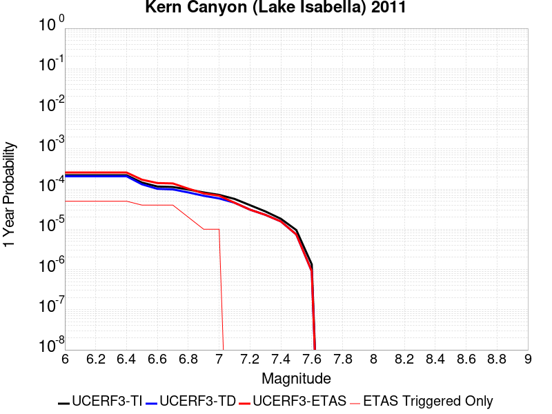 | 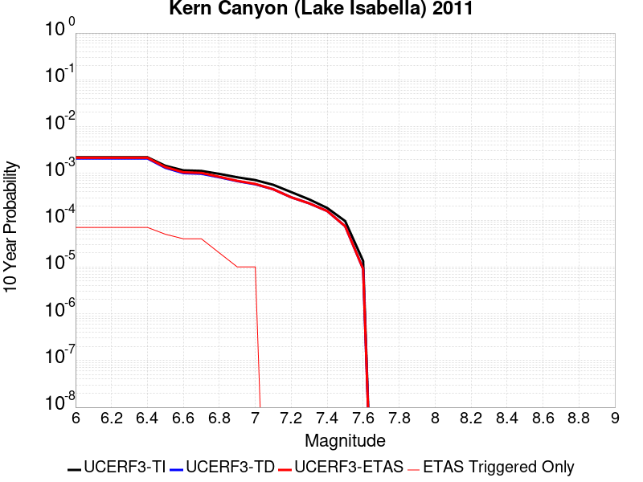 |

| Magnitude | 1 wk TI Prob | 1 wk TD Prob | 1 wk ETAS Prob | 1 wk ETAS/TD Gain | 1 wk ETAS Triggered Only | 1 mo TI Prob | 1 mo TD Prob | 1 mo ETAS Prob | 1 mo ETAS/TD Gain | 1 mo ETAS Triggered Only | 1 yr TI Prob | 1 yr TD Prob | 1 yr ETAS Prob | 1 yr ETAS/TD Gain | 1 yr ETAS Triggered Only | 10 yr TI Prob | 10 yr TD Prob | 10 yr ETAS Prob | 10 yr ETAS/TD Gain | 10 yr ETAS Triggered Only |
|-----|-----|-----|-----|-----|-----|-----|-----|-----|-----|-----|-----|-----|-----|-----|-----|-----|-----|-----|-----|-----|
| 6.0 | 4.2387383E-6 | 4.0016344E-6 | 4.0016344E-6 | 1.0 | 0.0 | 1.8165894E-5 | 1.7149758E-5 | 3.7149417E-5 | 2.1661773 | 2.0E-5 | 2.2114732E-4 | 2.0878017E-4 | 2.5876972E-4 | 1.2394364 | 5.0E-5 | 0.0022092736 | 0.002086024 | 0.002155878 | 1.0334866 | 7.0E-5 |
| 6.1 | 4.2387383E-6 | 4.0016344E-6 | 4.0016344E-6 | 1.0 | 0.0 | 1.8165894E-5 | 1.7149758E-5 | 3.7149417E-5 | 2.1661773 | 2.0E-5 | 2.2114732E-4 | 2.0878017E-4 | 2.5876972E-4 | 1.2394364 | 5.0E-5 | 0.0022092736 | 0.002086024 | 0.002155878 | 1.0334866 | 7.0E-5 |
| 6.2 | 4.2387383E-6 | 4.0016344E-6 | 4.0016344E-6 | 1.0 | 0.0 | 1.8165894E-5 | 1.7149758E-5 | 3.7149417E-5 | 2.1661773 | 2.0E-5 | 2.2114732E-4 | 2.0878017E-4 | 2.5876972E-4 | 1.2394364 | 5.0E-5 | 0.0022092736 | 0.002086024 | 0.002155878 | 1.0334866 | 7.0E-5 |
| 6.3 | 4.2387383E-6 | 4.0016344E-6 | 4.0016344E-6 | 1.0 | 0.0 | 1.8165894E-5 | 1.7149758E-5 | 3.7149417E-5 | 2.1661773 | 2.0E-5 | 2.2114732E-4 | 2.0878017E-4 | 2.5876972E-4 | 1.2394364 | 5.0E-5 | 0.0022092736 | 0.002086024 | 0.002155878 | 1.0334866 | 7.0E-5 |
| 6.4 | 4.2387383E-6 | 4.0016344E-6 | 4.0016344E-6 | 1.0 | 0.0 | 1.8165894E-5 | 1.7149758E-5 | 3.7149417E-5 | 2.1661773 | 2.0E-5 | 2.2114732E-4 | 2.0878017E-4 | 2.5876972E-4 | 1.2394364 | 5.0E-5 | 0.0022092736 | 0.002086024 | 0.002155878 | 1.0334866 | 7.0E-5 |
| 6.5 | 2.7857532E-6 | 2.5178624E-6 | 2.5178624E-6 | 1.0 | 0.0 | 1.1938888E-5 | 1.0790796E-5 | 3.079058E-5 | 2.8534114 | 2.0E-5 | 1.4534626E-4 | 1.3137035E-4 | 1.713651E-4 | 1.3044428 | 4.0E-5 | 0.0014525123 | 0.0013129596 | 0.001362894 | 1.0380319 | 5.0E-5 |
| 6.6 | 2.2233348E-6 | 1.944119E-6 | 1.944119E-6 | 1.0 | 0.0 | 9.528543E-6 | 8.331913E-6 | 2.8331746E-5 | 3.4003892 | 2.0E-5 | 1.1600384E-4 | 1.014364E-4 | 1.4143235E-4 | 1.3942958 | 4.0E-5 | 0.001159433 | 0.0010139096 | 0.001053869 | 1.0394113 | 4.0E-5 |
| 6.7 | 2.1635126E-6 | 1.8834991E-6 | 1.8834991E-6 | 1.0 | 0.0 | 9.272164E-6 | 8.072114E-6 | 2.8071952E-5 | 3.4776456 | 2.0E-5 | 1.1288274E-4 | 9.827364E-5 | 1.3826971E-4 | 1.4069867 | 4.0E-5 | 0.0011282542 | 9.8231E-4 | 0.0010222706 | 1.0406803 | 4.0E-5 |
| 6.8 | 1.8685711E-6 | 1.583138E-6 | 1.583138E-6 | 1.0 | 0.0 | 8.008137E-6 | 6.7848596E-6 | 6.7848596E-6 | 1.0 | 0.0 | 9.74947E-5 | 8.2602586E-5 | 1.02600934E-4 | 1.2421032 | 2.0E-5 | 9.745194E-4 | 8.2572375E-4 | 8.457072E-4 | 1.0242012 | 2.0E-5 |
| 6.9 | 1.5815071E-6 | 1.3064887E-6 | 1.3064887E-6 | 1.0 | 0.0 | 6.77787E-6 | 5.5992255E-6 | 5.5992255E-6 | 1.0 | 0.0 | 8.251744E-5 | 6.816846E-5 | 7.816778E-5 | 1.1466854 | 1.0E-5 | 8.248681E-4 | 6.8147824E-4 | 6.914714E-4 | 1.0146639 | 1.0E-5 |
| 7.0 | 1.3772564E-6 | 1.1210681E-6 | 1.1210681E-6 | 1.0 | 0.0 | 5.9025137E-6 | 4.8045686E-6 | 4.8045686E-6 | 1.0 | 0.0 | 7.186073E-5 | 5.8494075E-5 | 6.849349E-5 | 1.1709474 | 1.0E-5 | 7.18375E-4 | 5.8478885E-4 | 5.94783E-4 | 1.0170902 | 1.0E-5 |
| 7.1 | 1.0916998E-6 | 8.7637505E-7 | 8.7637505E-7 | 1.0 | 0.0 | 4.678705E-6 | 3.7558877E-6 | 3.7558877E-6 | 1.0 | 0.0 | 5.6961744E-5 | 4.5726985E-5 | 4.5726985E-5 | 1.0 | 0.0 | 5.6947145E-4 | 4.571771E-4 | 4.571771E-4 | 1.0 | 0.0 |
| 7.2 | 7.6277024E-7 | 5.901439E-7 | 5.901439E-7 | 1.0 | 0.0 | 3.2690114E-6 | 2.5291856E-6 | 2.5291856E-6 | 1.0 | 0.0 | 3.9799485E-5 | 3.0792406E-5 | 3.0792406E-5 | 1.0 | 0.0 | 3.9792358E-4 | 3.07882E-4 | 3.07882E-4 | 1.0 | 0.0 |
| 7.3 | 5.3265916E-7 | 4.3824264E-7 | 4.3824264E-7 | 1.0 | 0.0 | 2.282823E-6 | 1.8781814E-6 | 1.8781814E-6 | 1.0 | 0.0 | 2.7793016E-5 | 2.2866623E-5 | 2.2866623E-5 | 1.0 | 0.0 | 2.778954E-4 | 2.2864307E-4 | 2.2864307E-4 | 1.0 | 0.0 |
| 7.4 | 3.4946007E-7 | 3.0065647E-7 | 3.0065647E-7 | 1.0 | 0.0 | 1.497685E-6 | 1.2885271E-6 | 1.2885271E-6 | 1.0 | 0.0 | 1.8234163E-5 | 1.5687707E-5 | 1.5687707E-5 | 1.0 | 0.0 | 1.8232666E-4 | 1.5686621E-4 | 1.5686621E-4 | 1.0 | 0.0 |
| 7.5 | 1.8317026E-7 | 1.4244755E-7 | 1.4244755E-7 | 1.0 | 0.0 | 7.850152E-7 | 6.1048934E-7 | 6.1048934E-7 | 1.0 | 0.0 | 9.557518E-6 | 7.432683E-6 | 7.432683E-6 | 1.0 | 0.0 | 9.5571064E-5 | 7.432442E-5 | 7.432442E-5 | 1.0 | 0.0 |
| 7.6 | 2.572245E-8 | 1.735264E-8 | 1.735264E-8 | 1.0 | 0.0 | 1.10239064E-7 | 7.436845E-8 | 7.436845E-8 | 1.0 | 0.0 | 1.3421597E-6 | 9.0543557E-7 | 9.0543557E-7 | 1.0 | 0.0 | 1.3421517E-5 | 9.054324E-6 | 9.054324E-6 | 1.0 | 0.0 |

## Great Valley 09 (Laguna Seca)
*[(top)](#table-of-contents)*

| 1 Week | 1 Month | 1 Year | 10 Year |
|-----|-----|-----|-----|
|  | 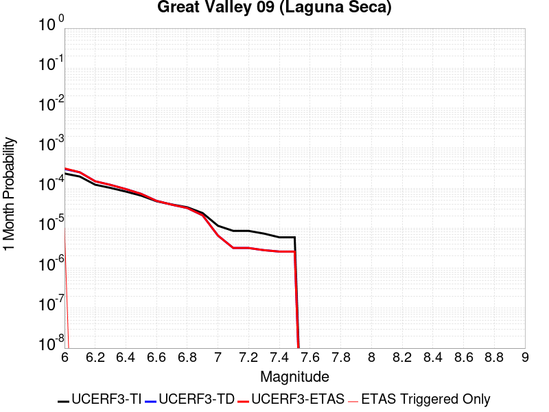 |  | 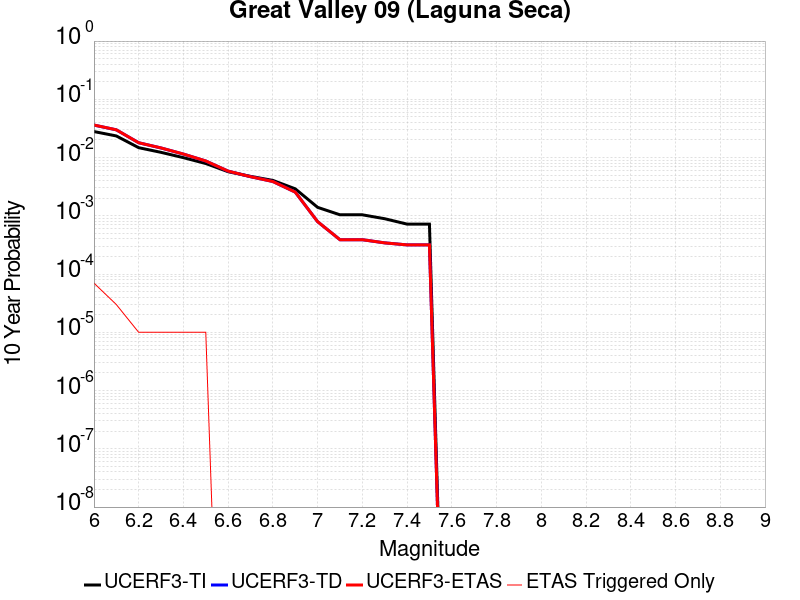 |

| Magnitude | 1 wk TI Prob | 1 wk TD Prob | 1 wk ETAS Prob | 1 wk ETAS/TD Gain | 1 wk ETAS Triggered Only | 1 mo TI Prob | 1 mo TD Prob | 1 mo ETAS Prob | 1 mo ETAS/TD Gain | 1 mo ETAS Triggered Only | 1 yr TI Prob | 1 yr TD Prob | 1 yr ETAS Prob | 1 yr ETAS/TD Gain | 1 yr ETAS Triggered Only | 10 yr TI Prob | 10 yr TD Prob | 10 yr ETAS Prob | 10 yr ETAS/TD Gain | 10 yr ETAS Triggered Only |
|-----|-----|-----|-----|-----|-----|-----|-----|-----|-----|-----|-----|-----|-----|-----|-----|-----|-----|-----|-----|-----|
| 6.0 | 5.4353277E-5 | 7.050019E-5 | 8.049948E-5 | 1.1418335 | 1.0E-5 | 2.3292181E-4 | 3.0211007E-4 | 3.1210706E-4 | 1.0330905 | 1.0E-5 | 0.0028321352 | 0.0036720056 | 0.0037118588 | 1.0108532 | 4.0E-5 | 0.02796312 | 0.036115844 | 0.036183316 | 1.0018682 | 7.0E-5 |
| 6.1 | 4.5578287E-5 | 5.822054E-5 | 5.822054E-5 | 1.0 | 0.0 | 1.953209E-4 | 2.4949352E-4 | 2.4949352E-4 | 1.0 | 0.0 | 0.0023754383 | 0.0030333549 | 0.0030433247 | 1.0032867 | 1.0E-5 | 0.023502063 | 0.029919893 | 0.029948995 | 1.0009726 | 3.0E-5 |
| 6.2 | 2.8536782E-5 | 3.4736422E-5 | 3.4736422E-5 | 1.0 | 0.0 | 1.2229476E-4 | 1.4886161E-4 | 1.4886161E-4 | 1.0 | 0.0 | 0.0014879217 | 0.0018108576 | 0.0018108576 | 1.0 | 0.0 | 0.014779986 | 0.017958276 | 0.017968098 | 1.0005468 | 1.0E-5 |
| 6.3 | 2.3698774E-5 | 2.8213344E-5 | 2.8213344E-5 | 1.0 | 0.0 | 1.01562226E-4 | 1.2090833E-4 | 1.2090833E-4 | 1.0 | 0.0 | 0.0012358186 | 0.001471051 | 0.001471051 | 1.0 | 0.0 | 0.012289686 | 0.014611455 | 0.014621308 | 1.0006744 | 1.0E-5 |
| 6.4 | 1.9191197E-5 | 2.212289E-5 | 2.212289E-5 | 1.0 | 0.0 | 8.2245395E-5 | 9.4808805E-5 | 9.4808805E-5 | 1.0 | 0.0 | 0.0010008777 | 0.0011536906 | 0.0011536906 | 1.0 | 0.0 | 0.009963818 | 0.011477022 | 0.0114869075 | 1.0008613 | 1.0E-5 |
| 6.5 | 1.5203241E-5 | 1.6801298E-5 | 1.6801298E-5 | 1.0 | 0.0 | 6.5155116E-5 | 7.200338E-5 | 7.200338E-5 | 1.0 | 0.0 | 7.9297484E-4 | 8.76301E-4 | 8.76301E-4 | 1.0 | 0.0 | 0.007901512 | 0.008729581 | 0.008739494 | 1.0011356 | 1.0E-5 |
| 6.6 | 1.0984925E-5 | 1.12425605E-5 | 1.12425605E-5 | 1.0 | 0.0 | 4.70774E-5 | 4.8181533E-5 | 4.8181533E-5 | 1.0 | 0.0 | 5.730166E-4 | 5.8645604E-4 | 5.8645604E-4 | 1.0 | 0.0 | 0.005715413 | 0.0058494755 | 0.0058494755 | 1.0 | 0.0 |
| 6.7 | 9.134616E-6 | 9.019868E-6 | 9.019868E-6 | 1.0 | 0.0 | 3.9147766E-5 | 3.865602E-5 | 3.865602E-5 | 1.0 | 0.0 | 4.7651984E-4 | 4.7053778E-4 | 4.7053778E-4 | 1.0 | 0.0 | 0.004754993 | 0.00469566 | 0.00469566 | 1.0 | 0.0 |
| 6.8 | 7.785589E-6 | 7.4519185E-6 | 7.4519185E-6 | 1.0 | 0.0 | 3.3366385E-5 | 3.1936415E-5 | 3.1936415E-5 | 1.0 | 0.0 | 4.0616E-4 | 3.887585E-4 | 3.887585E-4 | 1.0 | 0.0 | 0.0040541845 | 0.003880988 | 0.003880988 | 1.0 | 0.0 |
| 6.9 | 5.579095E-6 | 4.8984666E-6 | 4.8984666E-6 | 1.0 | 0.0 | 2.3910188E-5 | 2.0993268E-5 | 2.0993268E-5 | 1.0 | 0.0 | 2.9106764E-4 | 2.5556443E-4 | 2.5556443E-4 | 1.0 | 0.0 | 0.002906867 | 0.0025528427 | 0.0025528427 | 1.0 | 0.0 |
| 7.0 | 2.6816688E-6 | 1.521587E-6 | 1.521587E-6 | 1.0 | 0.0 | 1.1492816E-5 | 6.521071E-6 | 6.521071E-6 | 1.0 | 0.0 | 1.3991605E-4 | 7.939124E-5 | 7.939124E-5 | 1.0 | 0.0 | 0.0013982799 | 7.936375E-4 | 7.936375E-4 | 1.0 | 0.0 |
| 7.1 | 1.9951021E-6 | 7.45357E-7 | 7.45357E-7 | 1.0 | 0.0 | 8.55041E-6 | 3.1943835E-6 | 3.1943835E-6 | 1.0 | 0.0 | 1.0409627E-4 | 3.889097E-5 | 3.889097E-5 | 1.0 | 0.0 | 0.0010404752 | 3.8884574E-4 | 3.8884574E-4 | 1.0 | 0.0 |
| 7.2 | 1.9951021E-6 | 7.45357E-7 | 7.45357E-7 | 1.0 | 0.0 | 8.55041E-6 | 3.1943835E-6 | 3.1943835E-6 | 1.0 | 0.0 | 1.0409627E-4 | 3.889097E-5 | 3.889097E-5 | 1.0 | 0.0 | 0.0010404752 | 3.8884574E-4 | 3.8884574E-4 | 1.0 | 0.0 |
| 7.3 | 1.7087556E-6 | 6.578663E-7 | 6.578663E-7 | 1.0 | 0.0 | 7.3232177E-6 | 2.819424E-6 | 2.819424E-6 | 1.0 | 0.0 | 8.915652E-5 | 3.432599E-5 | 3.432599E-5 | 1.0 | 0.0 | 8.9120766E-4 | 3.432109E-4 | 3.432109E-4 | 1.0 | 0.0 |
| 7.4 | 1.3804846E-6 | 6.0737113E-7 | 6.0737113E-7 | 1.0 | 0.0 | 5.916349E-6 | 2.6030168E-6 | 2.6030168E-6 | 1.0 | 0.0 | 7.2029165E-5 | 3.169131E-5 | 3.169131E-5 | 1.0 | 0.0 | 7.200583E-4 | 3.168719E-4 | 3.168719E-4 | 1.0 | 0.0 |
| 7.5 | 1.3804846E-6 | 6.0737113E-7 | 6.0737113E-7 | 1.0 | 0.0 | 5.916349E-6 | 2.6030168E-6 | 2.6030168E-6 | 1.0 | 0.0 | 7.2029165E-5 | 3.169131E-5 | 3.169131E-5 | 1.0 | 0.0 | 7.200583E-4 | 3.168719E-4 | 3.168719E-4 | 1.0 | 0.0 |

## Big Pine (East)
*[(top)](#table-of-contents)*

| 1 Week | 1 Month | 1 Year | 10 Year |
|-----|-----|-----|-----|
|  |  | 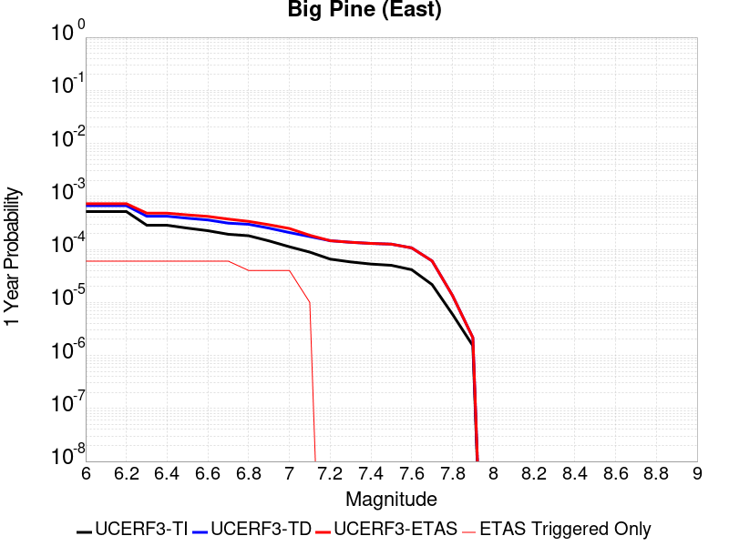 |  |

| Magnitude | 1 wk TI Prob | 1 wk TD Prob | 1 wk ETAS Prob | 1 wk ETAS/TD Gain | 1 wk ETAS Triggered Only | 1 mo TI Prob | 1 mo TD Prob | 1 mo ETAS Prob | 1 mo ETAS/TD Gain | 1 mo ETAS Triggered Only | 1 yr TI Prob | 1 yr TD Prob | 1 yr ETAS Prob | 1 yr ETAS/TD Gain | 1 yr ETAS Triggered Only | 10 yr TI Prob | 10 yr TD Prob | 10 yr ETAS Prob | 10 yr ETAS/TD Gain | 10 yr ETAS Triggered Only |
|-----|-----|-----|-----|-----|-----|-----|-----|-----|-----|-----|-----|-----|-----|-----|-----|-----|-----|-----|-----|-----|
| 6.0 | 9.916913E-6 | 1.28172705E-5 | 4.2816886E-5 | 3.3405619 | 3.0E-5 | 4.250036E-5 | 5.493013E-5 | 9.4927935E-5 | 1.7281579 | 4.0E-5 | 5.173191E-4 | 6.685912E-4 | 7.2855107E-4 | 1.0896809 | 6.0E-5 | 0.0051611643 | 0.006670449 | 0.006739982 | 1.010424 | 7.0E-5 |
| 6.1 | 9.916913E-6 | 1.28172705E-5 | 4.2816886E-5 | 3.3405619 | 3.0E-5 | 4.250036E-5 | 5.493013E-5 | 9.4927935E-5 | 1.7281579 | 4.0E-5 | 5.173191E-4 | 6.685912E-4 | 7.2855107E-4 | 1.0896809 | 6.0E-5 | 0.0051611643 | 0.006670449 | 0.006739982 | 1.010424 | 7.0E-5 |
| 6.2 | 9.916913E-6 | 1.28172705E-5 | 4.2816886E-5 | 3.3405619 | 3.0E-5 | 4.250036E-5 | 5.493013E-5 | 9.4927935E-5 | 1.7281579 | 4.0E-5 | 5.173191E-4 | 6.685912E-4 | 7.2855107E-4 | 1.0896809 | 6.0E-5 | 0.0051611643 | 0.006670449 | 0.006739982 | 1.010424 | 7.0E-5 |
| 6.3 | 5.479711E-6 | 8.1132375E-6 | 3.8112994E-5 | 4.6976304 | 3.0E-5 | 2.3484265E-5 | 3.4770575E-5 | 7.476918E-5 | 2.150358 | 4.0E-5 | 2.858834E-4 | 4.232527E-4 | 4.832273E-4 | 1.1416993 | 6.0E-5 | 0.0028551589 | 0.0042272513 | 0.004296955 | 1.0164893 | 7.0E-5 |
| 6.4 | 5.465009E-6 | 8.0975315E-6 | 3.809729E-5 | 4.704803 | 3.0E-5 | 2.3421257E-5 | 3.4703262E-5 | 7.470187E-5 | 2.1525893 | 4.0E-5 | 2.851165E-4 | 4.2243348E-4 | 4.8240816E-4 | 1.1419742 | 6.0E-5 | 0.0028475097 | 0.00421909 | 0.004288795 | 1.0165212 | 7.0E-5 |
| 6.5 | 4.826767E-6 | 7.4225877E-6 | 3.7422364E-5 | 5.041687 | 3.0E-5 | 2.068598E-5 | 3.1810716E-5 | 7.1809445E-5 | 2.257398 | 4.0E-5 | 2.518227E-4 | 3.8722943E-4 | 4.472062E-4 | 1.1548868 | 6.0E-5 | 0.0025153751 | 0.0038682907 | 0.0039380197 | 1.0180259 | 7.0E-5 |
| 6.6 | 4.3146847E-6 | 6.8825234E-6 | 3.6882317E-5 | 5.358836 | 3.0E-5 | 1.8491375E-5 | 2.949621E-5 | 6.949503E-5 | 2.3560665 | 4.0E-5 | 2.2510924E-4 | 3.5905963E-4 | 4.190381E-4 | 1.1670432 | 6.0E-5 | 0.0022488134 | 0.0035875062 | 0.003657255 | 1.0194422 | 7.0E-5 |
| 6.7 | 3.6968106E-6 | 5.9957474E-6 | 3.5995567E-5 | 6.003516 | 3.0E-5 | 1.5843378E-5 | 2.5695816E-5 | 6.569479E-5 | 2.5566337 | 4.0E-5 | 1.9287605E-4 | 3.128032E-4 | 3.7278442E-4 | 1.1917539 | 6.0E-5 | 0.0019270873 | 0.0031262499 | 0.003196031 | 1.022321 | 7.0E-5 |
| 6.8 | 3.4671132E-6 | 5.7024477E-6 | 1.5702391E-5 | 2.753623 | 1.0E-5 | 1.4858972E-5 | 2.4438841E-5 | 4.443835E-5 | 1.8183495 | 2.0E-5 | 1.8089297E-4 | 2.9750372E-4 | 3.374918E-4 | 1.134412 | 4.0E-5 | 0.0018074579 | 0.0029736666 | 0.003023518 | 1.0167643 | 5.0E-5 |
| 6.9 | 2.7686972E-6 | 4.8254797E-6 | 1.4825431E-5 | 3.0723228 | 1.0E-5 | 1.1865792E-5 | 2.0680467E-5 | 4.0680054E-5 | 1.9670762 | 2.0E-5 | 1.4445644E-4 | 2.5175634E-4 | 2.9174628E-4 | 1.1588438 | 4.0E-5 | 0.0014436257 | 0.002517256 | 0.00256713 | 1.019813 | 5.0E-5 |
| 7.0 | 2.1472624E-6 | 3.985277E-6 | 1.3985237E-5 | 3.5092258 | 1.0E-5 | 9.20252E-6 | 1.707965E-5 | 3.707931E-5 | 2.1709642 | 2.0E-5 | 1.12034926E-4 | 2.0792543E-4 | 2.479171E-4 | 1.1923367 | 4.0E-5 | 0.0011197845 | 0.0020798238 | 0.0021197407 | 1.0191925 | 4.0E-5 |
| 7.1 | 1.7018335E-6 | 3.3450835E-6 | 3.3450835E-6 | 1.0 | 0.0 | 7.293552E-6 | 1.4335996E-5 | 1.4335996E-5 | 1.0 | 0.0 | 8.879537E-5 | 1.7452713E-4 | 1.8452539E-4 | 1.0572877 | 1.0E-5 | 8.87599E-4 | 0.0017463792 | 0.0017563617 | 1.0057161 | 1.0E-5 |
| 7.2 | 1.25603E-6 | 2.794679E-6 | 2.794679E-6 | 1.0 | 0.0 | 5.3829745E-6 | 1.1977142E-5 | 1.1977142E-5 | 1.0 | 0.0 | 6.553574E-5 | 1.4581217E-4 | 1.4581217E-4 | 1.0 | 0.0 | 6.551642E-4 | 0.0014596173 | 0.0014596173 | 1.0 | 0.0 |
| 7.3 | 1.112297E-6 | 2.610519E-6 | 2.610519E-6 | 1.0 | 0.0 | 4.7669787E-6 | 1.1187892E-5 | 1.1187892E-5 | 1.0 | 0.0 | 5.803642E-5 | 1.3620428E-4 | 1.3620428E-4 | 1.0 | 0.0 | 5.802127E-4 | 0.001363502 | 0.001363502 | 1.0 | 0.0 |
| 7.4 | 1.0137181E-6 | 2.4836752E-6 | 2.4836752E-6 | 1.0 | 0.0 | 4.3444993E-6 | 1.064428E-5 | 1.064428E-5 | 1.0 | 0.0 | 5.2892992E-5 | 1.2958662E-4 | 1.2958662E-4 | 1.0 | 0.0 | 5.288041E-4 | 0.0012971918 | 0.0012971918 | 1.0 | 0.0 |
| 7.5 | 9.598608E-7 | 2.407328E-6 | 2.407328E-6 | 1.0 | 0.0 | 4.1136827E-6 | 1.03170805E-5 | 1.03170805E-5 | 1.0 | 0.0 | 5.0082934E-5 | 1.2560343E-4 | 1.2560343E-4 | 1.0 | 0.0 | 5.007165E-4 | 0.0012572132 | 0.0012572132 | 1.0 | 0.0 |
| 7.6 | 7.929459E-7 | 2.0450152E-6 | 2.0450152E-6 | 1.0 | 0.0 | 3.3983351E-6 | 8.764322E-6 | 8.764322E-6 | 1.0 | 0.0 | 4.1373947E-5 | 1.0670057E-4 | 1.0670057E-4 | 1.0 | 0.0 | 4.1366243E-4 | 0.0010685825 | 0.0010685825 | 1.0 | 0.0 |
| 7.7 | 4.155788E-7 | 1.1606729E-6 | 1.1606729E-6 | 1.0 | 0.0 | 1.7810507E-6 | 4.974303E-6 | 4.974303E-6 | 1.0 | 0.0 | 2.1684076E-5 | 6.05605E-5 | 6.05605E-5 | 1.0 | 0.0 | 2.1681961E-4 | 6.085995E-4 | 6.085995E-4 | 1.0 | 0.0 |
| 7.8 | 1.14666925E-7 | 2.592197E-7 | 2.592197E-7 | 1.0 | 0.0 | 4.914296E-7 | 1.1109411E-6 | 1.1109411E-6 | 1.0 | 0.0 | 5.9831386E-6 | 1.3525627E-5 | 1.3525627E-5 | 1.0 | 0.0 | 5.9829777E-5 | 1.3636416E-4 | 1.3636416E-4 | 1.0 | 0.0 |
| 7.9 | 2.9231824E-8 | 4.1462318E-8 | 4.1462318E-8 | 1.0 | 0.0 | 1.2527924E-7 | 1.7769564E-7 | 1.7769564E-7 | 1.0 | 0.0 | 1.5252737E-6 | 2.1634426E-6 | 2.1634426E-6 | 1.0 | 0.0 | 1.5252632E-5 | 2.197062E-5 | 2.197062E-5 | 1.0 | 0.0 |

## San Pedro Basin
*[(top)](#table-of-contents)*

| 1 Week | 1 Month | 1 Year | 10 Year |
|-----|-----|-----|-----|
|  |  |  |  |

| Magnitude | 1 wk TI Prob | 1 wk TD Prob | 1 wk ETAS Prob | 1 wk ETAS/TD Gain | 1 wk ETAS Triggered Only | 1 mo TI Prob | 1 mo TD Prob | 1 mo ETAS Prob | 1 mo ETAS/TD Gain | 1 mo ETAS Triggered Only | 1 yr TI Prob | 1 yr TD Prob | 1 yr ETAS Prob | 1 yr ETAS/TD Gain | 1 yr ETAS Triggered Only | 10 yr TI Prob | 10 yr TD Prob | 10 yr ETAS Prob | 10 yr ETAS/TD Gain | 10 yr ETAS Triggered Only |
|-----|-----|-----|-----|-----|-----|-----|-----|-----|-----|-----|-----|-----|-----|-----|-----|-----|-----|-----|-----|-----|
| 6.0 | 5.3449043E-5 | 6.337018E-5 | 7.336955E-5 | 1.1577929 | 1.0E-5 | 2.2904722E-4 | 2.7156167E-4 | 2.9155624E-4 | 1.0736281 | 2.0E-5 | 0.0027850836 | 0.0033018515 | 0.0033516863 | 1.015093 | 5.0E-5 | 0.027504366 | 0.03258948 | 0.0326572 | 1.0020779 | 7.0E-5 |
| 6.1 | 5.3449043E-5 | 6.337018E-5 | 7.336955E-5 | 1.1577929 | 1.0E-5 | 2.2904722E-4 | 2.7156167E-4 | 2.9155624E-4 | 1.0736281 | 2.0E-5 | 0.0027850836 | 0.0033018515 | 0.0033516863 | 1.015093 | 5.0E-5 | 0.027504366 | 0.03258948 | 0.0326572 | 1.0020779 | 7.0E-5 |
| 6.2 | 2.3189454E-5 | 2.6642829E-5 | 2.6642829E-5 | 1.0 | 0.0 | 9.9379584E-5 | 1.1417881E-4 | 1.1417881E-4 | 1.0 | 0.0 | 0.0012092749 | 0.0013892875 | 0.0013892875 | 1.0 | 0.0 | 0.012027155 | 0.01381089 | 0.01381089 | 1.0 | 0.0 |
| 6.3 | 2.3189454E-5 | 2.6642829E-5 | 2.6642829E-5 | 1.0 | 0.0 | 9.9379584E-5 | 1.1417881E-4 | 1.1417881E-4 | 1.0 | 0.0 | 0.0012092749 | 0.0013892875 | 0.0013892875 | 1.0 | 0.0 | 0.012027155 | 0.01381089 | 0.01381089 | 1.0 | 0.0 |
| 6.4 | 1.966056E-5 | 2.246342E-5 | 2.246342E-5 | 1.0 | 0.0 | 8.425682E-5 | 9.626848E-5 | 9.626848E-5 | 1.0 | 0.0 | 0.001025344 | 0.0011714787 | 0.0011714787 | 1.0 | 0.0 | 0.010206259 | 0.011657119 | 0.011657119 | 1.0 | 0.0 |
| 6.5 | 1.7342953E-5 | 1.9745152E-5 | 1.9745152E-5 | 1.0 | 0.0 | 7.4324824E-5 | 8.461954E-5 | 8.461954E-5 | 1.0 | 0.0 | 9.04529E-4 | 0.0010297929 | 0.0010297929 | 1.0 | 0.0 | 0.009008561 | 0.010253932 | 0.010253932 | 1.0 | 0.0 |
| 6.6 | 1.439804E-5 | 1.6322716E-5 | 1.6322716E-5 | 1.0 | 0.0 | 6.170443E-5 | 6.99528E-5 | 6.99528E-5 | 1.0 | 0.0 | 7.509924E-4 | 8.513747E-4 | 8.513747E-4 | 1.0 | 0.0 | 0.0074845953 | 0.008484333 | 0.008484333 | 1.0 | 0.0 |
| 6.7 | 1.2634884E-5 | 1.4285298E-5 | 1.4285298E-5 | 1.0 | 0.0 | 5.414838E-5 | 6.122144E-5 | 6.122144E-5 | 1.0 | 0.0 | 6.590571E-4 | 7.451466E-4 | 7.451466E-4 | 1.0 | 0.0 | 0.006571059 | 0.007429502 | 0.007429502 | 1.0 | 0.0 |
| 6.8 | 1.146091E-5 | 1.2933193E-5 | 1.2933193E-5 | 1.0 | 0.0 | 4.911726E-5 | 5.542696E-5 | 5.542696E-5 | 1.0 | 0.0 | 5.9783855E-4 | 6.74644E-4 | 6.74644E-4 | 1.0 | 0.0 | 0.0059623276 | 0.0067288997 | 0.0067288997 | 1.0 | 0.0 |
| 6.9 | 9.109035E-6 | 1.0235013E-5 | 1.0235013E-5 | 1.0 | 0.0 | 3.9038136E-5 | 4.386376E-5 | 4.386376E-5 | 1.0 | 0.0 | 4.7518566E-4 | 5.339384E-4 | 5.339384E-4 | 1.0 | 0.0 | 0.0047417083 | 0.0053293095 | 0.0053293095 | 1.0 | 0.0 |
| 7.0 | 5.9351028E-6 | 6.583965E-6 | 6.583965E-6 | 1.0 | 0.0 | 2.5435906E-5 | 2.821682E-5 | 2.821682E-5 | 1.0 | 0.0 | 3.0963816E-4 | 3.4350925E-4 | 3.4350925E-4 | 1.0 | 0.0 | 0.0030920706 | 0.0034320997 | 0.0034320997 | 1.0 | 0.0 |
| 7.1 | 2.1557585E-6 | 2.2096492E-6 | 2.2096492E-6 | 1.0 | 0.0 | 9.238933E-6 | 9.469892E-6 | 9.469892E-6 | 1.0 | 0.0 | 1.1247819E-4 | 1.15289986E-4 | 1.15289986E-4 | 1.0 | 0.0 | 0.0011242128 | 0.0011523172 | 0.0011523172 | 1.0 | 0.0 |
| 7.2 | 2.1251979E-6 | 2.1779954E-6 | 2.1779954E-6 | 1.0 | 0.0 | 9.107958E-6 | 9.334234E-6 | 9.334234E-6 | 1.0 | 0.0 | 1.1088375E-4 | 1.13638525E-4 | 1.13638525E-4 | 1.0 | 0.0 | 0.0011082845 | 0.0011358195 | 0.0011358195 | 1.0 | 0.0 |
| 7.3 | 1.7145798E-6 | 1.7442885E-6 | 1.7442885E-6 | 1.0 | 0.0 | 7.3481783E-6 | 7.475501E-6 | 7.475501E-6 | 1.0 | 0.0 | 8.94604E-5 | 9.1010515E-5 | 9.1010515E-5 | 1.0 | 0.0 | 8.9424395E-4 | 9.0974156E-4 | 9.0974156E-4 | 1.0 | 0.0 |
| 7.4 | 1.4467993E-6 | 1.4641878E-6 | 1.4641878E-6 | 1.0 | 0.0 | 6.200554E-6 | 6.275076E-6 | 6.275076E-6 | 1.0 | 0.0 | 7.548913E-5 | 7.639644E-5 | 7.639644E-5 | 1.0 | 0.0 | 7.546349E-4 | 7.6370913E-4 | 7.6370913E-4 | 1.0 | 0.0 |
| 7.5 | 1.2803735E-6 | 1.2931506E-6 | 1.2931506E-6 | 1.0 | 0.0 | 5.487303E-6 | 5.5420624E-6 | 5.5420624E-6 | 1.0 | 0.0 | 6.680587E-5 | 6.747259E-5 | 6.747259E-5 | 1.0 | 0.0 | 6.678579E-4 | 6.745281E-4 | 6.745281E-4 | 1.0 | 0.0 |
| 7.6 | 6.755009E-7 | 6.76947E-7 | 6.76947E-7 | 1.0 | 0.0 | 2.8950008E-6 | 2.9011985E-6 | 2.9011985E-6 | 1.0 | 0.0 | 3.5246063E-5 | 3.532158E-5 | 3.532158E-5 | 1.0 | 0.0 | 3.5240475E-4 | 3.5316538E-4 | 3.5316538E-4 | 1.0 | 0.0 |
| 7.7 | 6.211885E-8 | 4.5699714E-8 | 4.5699714E-8 | 1.0 | 0.0 | 2.6622362E-7 | 1.9585592E-7 | 1.9585592E-7 | 1.0 | 0.0 | 3.2412677E-6 | 2.3845432E-6 | 2.3845432E-6 | 1.0 | 0.0 | 3.2412205E-5 | 2.3845198E-5 | 2.3845198E-5 | 1.0 | 0.0 |
| 7.8 | 2.6580573E-9 | 1.5138054E-9 | 1.5138054E-9 | 1.0 | 0.0 | 1.1391674E-8 | 6.4877375E-9 | 6.4877375E-9 | 1.0 | 0.0 | 1.3869362E-7 | 7.89882E-8 | 7.89882E-8 | 1.0 | 0.0 | 1.3869354E-6 | 7.89882E-7 | 7.89882E-7 | 1.0 | 0.0 |

## Hayward (So) 2011 CFM
*[(top)](#table-of-contents)*

| 1 Week | 1 Month | 1 Year | 10 Year |
|-----|-----|-----|-----|
|  | 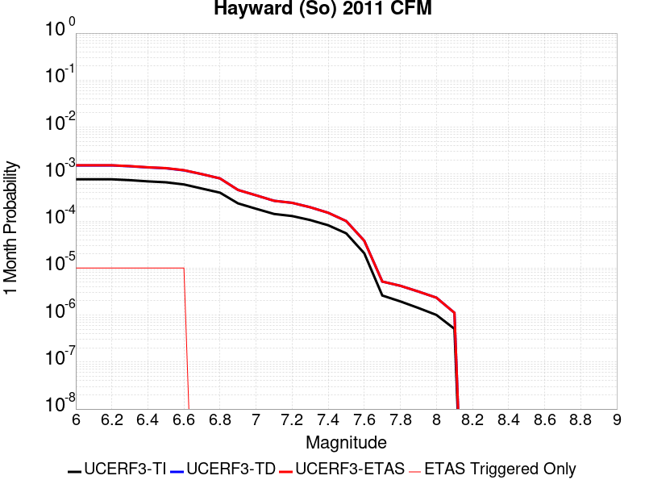 | 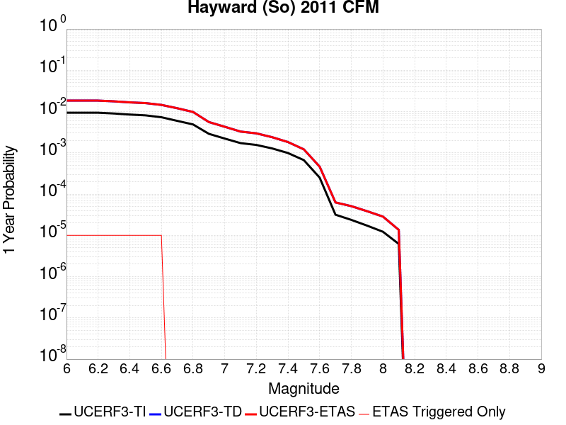 |  |

| Magnitude | 1 wk TI Prob | 1 wk TD Prob | 1 wk ETAS Prob | 1 wk ETAS/TD Gain | 1 wk ETAS Triggered Only | 1 mo TI Prob | 1 mo TD Prob | 1 mo ETAS Prob | 1 mo ETAS/TD Gain | 1 mo ETAS Triggered Only | 1 yr TI Prob | 1 yr TD Prob | 1 yr ETAS Prob | 1 yr ETAS/TD Gain | 1 yr ETAS Triggered Only | 10 yr TI Prob | 10 yr TD Prob | 10 yr ETAS Prob | 10 yr ETAS/TD Gain | 10 yr ETAS Triggered Only |
|-----|-----|-----|-----|-----|-----|-----|-----|-----|-----|-----|-----|-----|-----|-----|-----|-----|-----|-----|-----|-----|
| 6.0 | 1.8091932E-4 | 3.570673E-4 | 3.670637E-4 | 1.027996 | 1.0E-5 | 7.751381E-4 | 0.0015294008 | 0.0015393855 | 1.0065285 | 1.0E-5 | 0.00939654 | 0.018463885 | 0.0184737 | 1.0005316 | 1.0E-5 | 0.090090066 | 0.1667085 | 0.16675016 | 1.00025 | 5.0E-5 |
| 6.1 | 1.8091932E-4 | 3.570673E-4 | 3.670637E-4 | 1.027996 | 1.0E-5 | 7.751381E-4 | 0.0015294008 | 0.0015393855 | 1.0065285 | 1.0E-5 | 0.00939654 | 0.018463885 | 0.0184737 | 1.0005316 | 1.0E-5 | 0.090090066 | 0.1667085 | 0.16675016 | 1.00025 | 5.0E-5 |
| 6.2 | 1.8091932E-4 | 3.570673E-4 | 3.670637E-4 | 1.027996 | 1.0E-5 | 7.751381E-4 | 0.0015294008 | 0.0015393855 | 1.0065285 | 1.0E-5 | 0.00939654 | 0.018463885 | 0.0184737 | 1.0005316 | 1.0E-5 | 0.090090066 | 0.1667085 | 0.16675016 | 1.00025 | 5.0E-5 |
| 6.3 | 1.7322872E-4 | 3.4263515E-4 | 3.5263173E-4 | 1.0291755 | 1.0E-5 | 7.4219756E-4 | 0.0014676197 | 0.001477605 | 1.0068038 | 1.0E-5 | 0.0089988755 | 0.017724147 | 0.01773397 | 1.0005542 | 1.0E-5 | 0.08643075 | 0.16065954 | 0.1607015 | 1.0002612 | 5.0E-5 |
| 6.4 | 1.6334097E-4 | 3.2345165E-4 | 3.334484E-4 | 1.0309066 | 1.0E-5 | 6.998449E-4 | 0.0013854936 | 0.0013954798 | 1.0072076 | 1.0E-5 | 0.008487372 | 0.016739927 | 0.01674976 | 1.0005873 | 1.0E-5 | 0.081704415 | 0.15256606 | 0.15260842 | 1.0002778 | 5.0E-5 |
| 6.5 | 1.5600289E-4 | 3.101982E-4 | 3.2019507E-4 | 1.0322274 | 1.0E-5 | 6.684125E-4 | 0.0013287518 | 0.0013387385 | 1.0075159 | 1.0E-5 | 0.008107598 | 0.016059443 | 0.016069284 | 1.0006127 | 1.0E-5 | 0.078181036 | 0.14684291 | 0.14688557 | 1.0002905 | 5.0E-5 |
| 6.6 | 1.4046066E-4 | 2.8034003E-4 | 2.9033722E-4 | 1.035661 | 1.0E-5 | 6.018354E-4 | 0.0012009109 | 0.0012108989 | 1.008317 | 1.0E-5 | 0.0073027555 | 0.014524571 | 0.014534425 | 1.0006785 | 1.0E-5 | 0.07067384 | 0.13393044 | 0.13397375 | 1.0003233 | 5.0E-5 |
| 6.7 | 1.14696966E-4 | 2.3272466E-4 | 2.3272466E-4 | 1.0 | 0.0 | 4.914658E-4 | 9.970153E-4 | 9.970153E-4 | 1.0 | 0.0 | 0.0059671924 | 0.012072163 | 0.012072163 | 1.0 | 0.0 | 0.058094822 | 0.11274141 | 0.11276803 | 1.0002362 | 3.0E-5 |
| 6.8 | 9.3874296E-5 | 1.8862431E-4 | 1.8862431E-4 | 1.0 | 0.0 | 4.0225635E-4 | 8.081431E-4 | 8.081431E-4 | 1.0 | 0.0 | 0.0048864787 | 0.009795489 | 0.009795489 | 1.0 | 0.0 | 0.047804173 | 0.092592984 | 0.092611134 | 1.000196 | 2.0E-5 |
| 6.9 | 5.551852E-5 | 1.0729875E-4 | 1.0729875E-4 | 1.0 | 0.0 | 2.3791482E-4 | 4.5977137E-4 | 4.5977137E-4 | 1.0 | 0.0 | 0.0028927654 | 0.005583468 | 0.005583468 | 1.0 | 0.0 | 0.028553981 | 0.054246075 | 0.05426499 | 1.0003487 | 2.0E-5 |
| 7.0 | 4.2662363E-5 | 8.246792E-5 | 8.246792E-5 | 1.0 | 0.0 | 1.8282588E-4 | 3.5338648E-4 | 3.5338648E-4 | 1.0 | 0.0 | 0.0022236328 | 0.0042940658 | 0.0042940658 | 1.0 | 0.0 | 0.022015138 | 0.04206509 | 0.04208425 | 1.0004555 | 2.0E-5 |
| 7.1 | 3.305886E-5 | 6.302183E-5 | 6.302183E-5 | 1.0 | 0.0 | 1.4167312E-4 | 2.7006568E-4 | 2.7006568E-4 | 1.0 | 0.0 | 0.0017235056 | 0.003283111 | 0.003283111 | 1.0 | 0.0 | 0.017101998 | 0.032453902 | 0.032473255 | 1.0005963 | 2.0E-5 |
| 7.2 | 2.9856887E-5 | 5.701622E-5 | 5.701622E-5 | 1.0 | 0.0 | 1.2795182E-4 | 2.4433242E-4 | 2.4433242E-4 | 1.0 | 0.0 | 0.0015567001 | 0.0029707062 | 0.0029707062 | 1.0 | 0.0 | 0.015458403 | 0.029454801 | 0.029474212 | 1.000659 | 2.0E-5 |
| 7.3 | 2.4559737E-5 | 4.599286E-5 | 4.599286E-5 | 1.0 | 0.0 | 1.0525176E-4 | 1.9709744E-4 | 1.9709744E-4 | 1.0 | 0.0 | 0.0012806869 | 0.0023970334 | 0.0023970334 | 1.0 | 0.0 | 0.012733313 | 0.023858516 | 0.02387804 | 1.0008183 | 2.0E-5 |
| 7.4 | 1.9002231E-5 | 3.505084E-5 | 3.505084E-5 | 1.0 | 0.0 | 8.143559E-5 | 1.502093E-4 | 1.502093E-4 | 1.0 | 0.0 | 9.910273E-4 | 0.001827274 | 0.001827274 | 1.0 | 0.0 | 0.009866194 | 0.018258808 | 0.018278442 | 1.0010754 | 2.0E-5 |
| 7.5 | 1.2783333E-5 | 2.3331182E-5 | 2.3331182E-5 | 1.0 | 0.0 | 5.4784563E-5 | 9.998698E-5 | 9.998698E-5 | 1.0 | 0.0 | 6.667979E-4 | 0.0012166675 | 0.0012166675 | 1.0 | 0.0 | 0.006648007 | 0.012209443 | 0.0122291995 | 1.001618 | 2.0E-5 |
| 7.6 | 4.8149627E-6 | 8.888056E-6 | 8.888056E-6 | 1.0 | 0.0 | 2.063539E-5 | 3.8091122E-5 | 3.8091122E-5 | 1.0 | 0.0 | 2.5120692E-4 | 4.6366194E-4 | 4.6366194E-4 | 1.0 | 0.0 | 0.0025092314 | 0.0046805087 | 0.004690462 | 1.0021266 | 1.0E-5 |
| 7.7 | 6.0838227E-7 | 1.205754E-6 | 1.205754E-6 | 1.0 | 0.0 | 2.6073499E-6 | 5.1675065E-6 | 5.1675065E-6 | 1.0 | 0.0 | 3.174402E-5 | 6.291258E-5 | 6.291258E-5 | 1.0 | 0.0 | 3.1739488E-4 | 6.5296254E-4 | 6.6295604E-4 | 1.0153048 | 1.0E-5 |
| 7.8 | 4.5542808E-7 | 9.792941E-7 | 9.792941E-7 | 1.0 | 0.0 | 1.9518332E-6 | 4.196968E-6 | 4.196968E-6 | 1.0 | 0.0 | 2.376331E-5 | 5.109689E-5 | 5.109689E-5 | 1.0 | 0.0 | 2.3760769E-4 | 5.321693E-4 | 5.4216397E-4 | 1.0187811 | 1.0E-5 |
| 7.9 | 3.3016747E-7 | 7.3869535E-7 | 7.3869535E-7 | 1.0 | 0.0 | 1.4150027E-6 | 3.1658333E-6 | 3.1658333E-6 | 1.0 | 0.0 | 1.7227521E-5 | 3.854334E-5 | 3.854334E-5 | 1.0 | 0.0 | 1.7226185E-4 | 3.9932923E-4 | 4.0932524E-4 | 1.025032 | 1.0E-5 |
| 8.0 | 2.347038E-7 | 5.471963E-7 | 5.471963E-7 | 1.0 | 0.0 | 1.0058731E-6 | 2.3451248E-6 | 2.3451248E-6 | 1.0 | 0.0 | 1.2246436E-5 | 2.8551523E-5 | 2.8551523E-5 | 1.0 | 0.0 | 1.2245761E-4 | 2.9357258E-4 | 2.9357258E-4 | 1.0 | 0.0 |
| 8.1 | 1.18822804E-7 | 2.6060948E-7 | 2.6060948E-7 | 1.0 | 0.0 | 5.092405E-7 | 1.1168972E-6 | 1.1168972E-6 | 1.0 | 0.0 | 6.1999854E-6 | 1.359814E-5 | 1.359814E-5 | 1.0 | 0.0 | 6.199812E-5 | 1.3918082E-4 | 1.3918082E-4 | 1.0 | 0.0 |

## Calaveras (So) - Paicines extension 2011 CFM
*[(top)](#table-of-contents)*

| 1 Week | 1 Month | 1 Year | 10 Year |
|-----|-----|-----|-----|
|  |  |  | 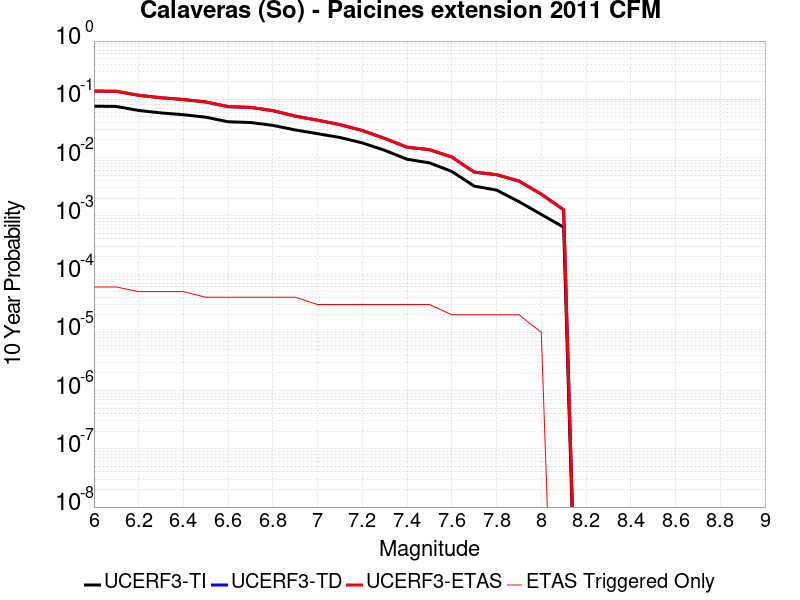 |

| Magnitude | 1 wk TI Prob | 1 wk TD Prob | 1 wk ETAS Prob | 1 wk ETAS/TD Gain | 1 wk ETAS Triggered Only | 1 mo TI Prob | 1 mo TD Prob | 1 mo ETAS Prob | 1 mo ETAS/TD Gain | 1 mo ETAS Triggered Only | 1 yr TI Prob | 1 yr TD Prob | 1 yr ETAS Prob | 1 yr ETAS/TD Gain | 1 yr ETAS Triggered Only | 10 yr TI Prob | 10 yr TD Prob | 10 yr ETAS Prob | 10 yr ETAS/TD Gain | 10 yr ETAS Triggered Only |
|-----|-----|-----|-----|-----|-----|-----|-----|-----|-----|-----|-----|-----|-----|-----|-----|-----|-----|-----|-----|-----|
| 6.0 | 1.5183659E-4 | 3.0520977E-4 | 3.1520674E-4 | 1.0327543 | 1.0E-5 | 6.5056595E-4 | 0.0013068188 | 0.0013168057 | 1.0076421 | 1.0E-5 | 0.007891912 | 0.015696203 | 0.01571589 | 1.0012542 | 2.0E-5 | 0.076174594 | 0.13848905 | 0.13854074 | 1.0003732 | 6.0E-5 |
| 6.1 | 1.5024997E-4 | 3.021517E-4 | 3.1214865E-4 | 1.033086 | 1.0E-5 | 6.437695E-4 | 0.0012937278 | 0.0013037149 | 1.0077196 | 1.0E-5 | 0.0078097614 | 0.015539596 | 0.015559285 | 1.0012671 | 2.0E-5 | 0.075409345 | 0.13715863 | 0.13721041 | 1.0003774 | 6.0E-5 |
| 6.2 | 1.2743923E-4 | 2.5313982E-4 | 2.6313728E-4 | 1.0394939 | 1.0E-5 | 5.460538E-4 | 0.0010839999 | 0.001093989 | 1.0092151 | 1.0E-5 | 0.0066279583 | 0.013046881 | 0.013066621 | 1.0015129 | 2.0E-5 | 0.064337276 | 0.117256075 | 0.11730021 | 1.0003765 | 5.0E-5 |
| 6.3 | 1.1525114E-4 | 2.2599236E-4 | 2.359901E-4 | 1.0442393 | 1.0E-5 | 4.9383997E-4 | 9.678718E-4 | 9.77862E-4 | 1.010322 | 1.0E-5 | 0.0059959386 | 0.011668079 | 0.011687845 | 1.0016941 | 2.0E-5 | 0.058367174 | 0.106372125 | 0.10641681 | 1.0004201 | 5.0E-5 |
| 6.4 | 1.07200925E-4 | 2.0840544E-4 | 2.1840337E-4 | 1.0479734 | 1.0E-5 | 4.5935164E-4 | 8.926123E-4 | 9.026034E-4 | 1.011193 | 1.0E-5 | 0.0055782744 | 0.010772959 | 0.010792743 | 1.0018365 | 2.0E-5 | 0.0544031 | 0.099194765 | 0.09923981 | 1.0004541 | 5.0E-5 |
| 6.5 | 9.69631E-5 | 1.8734725E-4 | 1.8734725E-4 | 1.0 | 0.0 | 4.1548995E-4 | 8.024631E-4 | 8.024631E-4 | 1.0 | 0.0 | 0.0050468626 | 0.009694842 | 0.009704744 | 1.0010215 | 1.0E-5 | 0.04933773 | 0.090086564 | 0.09012296 | 1.000404 | 4.0E-5 |
| 6.6 | 8.0552316E-5 | 1.507068E-4 | 1.507068E-4 | 1.0 | 0.0 | 3.4517853E-4 | 6.4569083E-4 | 6.4569083E-4 | 1.0 | 0.0 | 0.0041944524 | 0.007826508 | 0.00783643 | 1.0012677 | 1.0E-5 | 0.04116161 | 0.0748563 | 0.07489331 | 1.0004944 | 4.0E-5 |
| 6.7 | 7.815757E-5 | 1.4611272E-4 | 1.4611272E-4 | 1.0 | 0.0 | 3.34918E-4 | 6.26014E-4 | 6.26014E-4 | 1.0 | 0.0 | 0.004070005 | 0.007589312 | 0.0075992355 | 1.0013076 | 1.0E-5 | 0.039962657 | 0.07270582 | 0.07274291 | 1.0005102 | 4.0E-5 |
| 6.8 | 6.965264E-5 | 1.2722758E-4 | 1.2722758E-4 | 1.0 | 0.0 | 2.9847719E-4 | 5.4513285E-4 | 5.4513285E-4 | 1.0 | 0.0 | 0.0036279052 | 0.0066135945 | 0.0066235284 | 1.001502 | 1.0E-5 | 0.03569247 | 0.063801065 | 0.06383851 | 1.000587 | 4.0E-5 |
| 6.9 | 5.8000453E-5 | 1.01439E-4 | 1.01439E-4 | 1.0 | 0.0 | 2.4854968E-4 | 4.346666E-4 | 4.346666E-4 | 1.0 | 0.0 | 0.0030218933 | 0.005279322 | 0.0052892696 | 1.0018842 | 1.0E-5 | 0.029811295 | 0.051502965 | 0.051540904 | 1.0007367 | 4.0E-5 |
| 7.0 | 4.9865852E-5 | 8.568029E-5 | 8.568029E-5 | 1.0 | 0.0 | 2.1369329E-4 | 3.6715003E-4 | 3.6715003E-4 | 1.0 | 0.0 | 0.0025986114 | 0.004460979 | 0.004460979 | 1.0 | 0.0 | 0.025684336 | 0.043782018 | 0.043810703 | 1.0006552 | 3.0E-5 |
| 7.1 | 4.283875E-5 | 7.1124625E-5 | 7.1124625E-5 | 1.0 | 0.0 | 1.8358172E-4 | 3.0478454E-4 | 3.0478454E-4 | 1.0 | 0.0 | 0.0022328163 | 0.003704494 | 0.003704494 | 1.0 | 0.0 | 0.022105146 | 0.03673582 | 0.036764722 | 1.0007867 | 3.0E-5 |
| 7.2 | 3.450115E-5 | 5.5778568E-5 | 5.5778568E-5 | 1.0 | 0.0 | 1.478537E-4 | 2.3902925E-4 | 2.3902925E-4 | 1.0 | 0.0 | 0.0017986323 | 0.0029063264 | 0.0029063264 | 1.0 | 0.0 | 0.017841442 | 0.029079042 | 0.02910817 | 1.0010017 | 3.0E-5 |
| 7.3 | 2.5709045E-5 | 4.059001E-5 | 4.059001E-5 | 1.0 | 0.0 | 1.1017697E-4 | 1.7394568E-4 | 1.7394568E-4 | 1.0 | 0.0 | 0.0013405791 | 0.0021157486 | 0.0021157486 | 1.0 | 0.0 | 0.013325208 | 0.02129686 | 0.021326222 | 1.0013787 | 3.0E-5 |
| 7.4 | 1.8003093E-5 | 2.8511378E-5 | 2.8511378E-5 | 1.0 | 0.0 | 7.715383E-5 | 1.2218591E-4 | 1.2218591E-4 | 1.0 | 0.0 | 9.3894306E-4 | 0.0014866006 | 0.0014866006 | 1.0 | 0.0 | 0.009349857 | 0.015051589 | 0.015081138 | 1.0019631 | 3.0E-5 |
| 7.5 | 1.5595824E-5 | 2.5823752E-5 | 2.5823752E-5 | 1.0 | 0.0 | 6.683753E-5 | 1.10668545E-4 | 1.10668545E-4 | 1.0 | 0.0 | 8.134431E-4 | 0.0013465589 | 0.0013465589 | 1.0 | 0.0 | 0.008104719 | 0.013651571 | 0.013681161 | 1.0021676 | 3.0E-5 |
| 7.6 | 1.1110309E-5 | 1.9223195E-5 | 1.9223195E-5 | 1.0 | 0.0 | 4.761474E-5 | 8.2382525E-5 | 8.2382525E-5 | 1.0 | 0.0 | 5.795553E-4 | 0.0010025471 | 0.0010025471 | 1.0 | 0.0 | 0.0057804612 | 0.01020344 | 0.010223236 | 1.0019401 | 2.0E-5 |
| 7.7 | 6.2140443E-6 | 1.04376995E-5 | 1.04376995E-5 | 1.0 | 0.0 | 2.6631347E-5 | 4.4732235E-5 | 4.4732235E-5 | 1.0 | 0.0 | 3.241884E-4 | 5.4447894E-4 | 5.4447894E-4 | 1.0 | 0.0 | 0.0032371588 | 0.005620102 | 0.00563999 | 1.0035386 | 2.0E-5 |
| 7.8 | 5.305533E-6 | 9.433651E-6 | 9.433651E-6 | 1.0 | 0.0 | 2.27378E-5 | 4.0429306E-5 | 4.0429306E-5 | 1.0 | 0.0 | 2.7679754E-4 | 4.9211574E-4 | 4.9211574E-4 | 1.0 | 0.0 | 0.0027645302 | 0.005074622 | 0.0050945207 | 1.0039212 | 2.0E-5 |
| 7.9 | 3.363505E-6 | 7.3854467E-6 | 7.3854467E-6 | 1.0 | 0.0 | 1.4414942E-5 | 3.1651532E-5 | 3.1651532E-5 | 1.0 | 0.0 | 1.7548777E-4 | 3.8528934E-4 | 3.8528934E-4 | 1.0 | 0.0 | 0.0017534926 | 0.003948784 | 0.003968705 | 1.0050448 | 2.0E-5 |
| 8.0 | 2.0271132E-6 | 4.4134235E-6 | 4.4134235E-6 | 1.0 | 0.0 | 8.687599E-6 | 1.8914534E-5 | 1.8914534E-5 | 1.0 | 0.0 | 1.05766376E-4 | 2.3026018E-4 | 2.3026018E-4 | 1.0 | 0.0 | 0.0010571606 | 0.002351194 | 0.0023611705 | 1.0042431 | 1.0E-5 |
| 8.1 | 1.2206116E-6 | 2.3752666E-6 | 2.3752666E-6 | 1.0 | 0.0 | 5.2311816E-6 | 1.0179674E-5 | 1.0179674E-5 | 1.0 | 0.0 | 6.3687774E-5 | 1.2393051E-4 | 1.2393051E-4 | 1.0 | 0.0 | 6.366953E-4 | 0.0012705618 | 0.0012705618 | 1.0 | 0.0 |

## Calaveras (So) 2011 CFM
*[(top)](#table-of-contents)*

| 1 Week | 1 Month | 1 Year | 10 Year |
|-----|-----|-----|-----|
|  |  |  |  |

| Magnitude | 1 wk TI Prob | 1 wk TD Prob | 1 wk ETAS Prob | 1 wk ETAS/TD Gain | 1 wk ETAS Triggered Only | 1 mo TI Prob | 1 mo TD Prob | 1 mo ETAS Prob | 1 mo ETAS/TD Gain | 1 mo ETAS Triggered Only | 1 yr TI Prob | 1 yr TD Prob | 1 yr ETAS Prob | 1 yr ETAS/TD Gain | 1 yr ETAS Triggered Only | 10 yr TI Prob | 10 yr TD Prob | 10 yr ETAS Prob | 10 yr ETAS/TD Gain | 10 yr ETAS Triggered Only |
|-----|-----|-----|-----|-----|-----|-----|-----|-----|-----|-----|-----|-----|-----|-----|-----|-----|-----|-----|-----|-----|
| 6.0 | 1.5950744E-4 | 3.0713255E-4 | 3.1712948E-4 | 1.0325493 | 1.0E-5 | 6.834242E-4 | 0.001315409 | 0.0013253958 | 1.0075922 | 1.0E-5 | 0.00828899 | 0.015858326 | 0.015878009 | 1.0012412 | 2.0E-5 | 0.079865426 | 0.14440185 | 0.14444463 | 1.0002962 | 5.0E-5 |
| 6.1 | 1.3584697E-4 | 2.603514E-4 | 2.603514E-4 | 1.0 | 0.0 | 5.8207137E-4 | 0.0011151754 | 0.0011151754 | 1.0 | 0.0 | 0.007063716 | 0.013461385 | 0.013481116 | 1.0014657 | 2.0E-5 | 0.06843361 | 0.124029994 | 0.124073796 | 1.0003531 | 5.0E-5 |
| 6.2 | 1.14676266E-4 | 2.1714384E-4 | 2.1714384E-4 | 1.0 | 0.0 | 4.9137714E-4 | 9.30223E-4 | 9.30223E-4 | 1.0 | 0.0 | 0.0059661185 | 0.011245058 | 0.011254946 | 1.0008793 | 1.0E-5 | 0.058084648 | 0.10502057 | 0.10505637 | 1.0003408 | 4.0E-5 |
| 6.3 | 8.691518E-5 | 1.5987935E-4 | 1.5987935E-4 | 1.0 | 0.0 | 3.7244044E-4 | 6.849807E-4 | 6.849807E-4 | 1.0 | 0.0 | 0.004525038 | 0.008301122 | 0.008311039 | 1.0011947 | 1.0E-5 | 0.044339992 | 0.0793365 | 0.07937333 | 1.0004642 | 4.0E-5 |
| 6.4 | 8.50982E-5 | 1.5694331E-4 | 1.5694331E-4 | 1.0 | 0.0 | 3.646556E-4 | 6.724042E-4 | 6.724042E-4 | 1.0 | 0.0 | 0.0044306475 | 0.008149155 | 0.008159074 | 1.0012171 | 1.0E-5 | 0.04343345 | 0.07794268 | 0.07797956 | 1.0004731 | 4.0E-5 |
| 6.5 | 8.4062965E-5 | 1.5518743E-4 | 1.5518743E-4 | 1.0 | 0.0 | 3.602201E-4 | 6.6488347E-4 | 6.6488347E-4 | 1.0 | 0.0 | 0.004376863 | 0.008058365 | 0.008068285 | 1.001231 | 1.0E-5 | 0.042916555 | 0.07711388 | 0.0771508 | 1.0004787 | 4.0E-5 |
| 6.6 | 8.194716E-5 | 1.5154552E-4 | 1.5154552E-4 | 1.0 | 0.0 | 3.5115483E-4 | 6.492843E-4 | 6.492843E-4 | 1.0 | 0.0 | 0.0042669317 | 0.007870209 | 0.007880131 | 1.0012606 | 1.0E-5 | 0.04185927 | 0.07539919 | 0.075436175 | 1.0004905 | 4.0E-5 |
| 6.7 | 8.012326E-5 | 1.4822475E-4 | 1.4822475E-4 | 1.0 | 0.0 | 3.433402E-4 | 6.350612E-4 | 6.350612E-4 | 1.0 | 0.0 | 0.004172157 | 0.007698701 | 0.007708624 | 1.0012889 | 1.0E-5 | 0.040946912 | 0.07384132 | 0.07387836 | 1.0005018 | 4.0E-5 |
| 6.8 | 7.119773E-5 | 1.2881879E-4 | 1.2881879E-4 | 1.0 | 0.0 | 3.0509746E-4 | 5.519494E-4 | 5.519494E-4 | 1.0 | 0.0 | 0.0037082357 | 0.006696066 | 0.006705999 | 1.0014834 | 1.0E-5 | 0.036469642 | 0.06468575 | 0.06472316 | 1.0005784 | 4.0E-5 |
| 6.9 | 5.7343088E-5 | 9.919277E-5 | 9.919277E-5 | 1.0 | 0.0 | 2.4573295E-4 | 4.25043E-4 | 4.25043E-4 | 1.0 | 0.0 | 0.0029876942 | 0.005162694 | 0.0051726424 | 1.001927 | 1.0E-5 | 0.02947844 | 0.05051036 | 0.05054834 | 1.000752 | 4.0E-5 |
| 7.0 | 4.8746577E-5 | 8.2850725E-5 | 8.2850725E-5 | 1.0 | 0.0 | 2.0889717E-4 | 3.5502657E-4 | 3.5502657E-4 | 1.0 | 0.0 | 0.0025403565 | 0.004313948 | 0.004313948 | 1.0 | 0.0 | 0.025115121 | 0.042485245 | 0.04251397 | 1.0006762 | 3.0E-5 |
| 7.1 | 4.2998014E-5 | 7.265203E-5 | 7.265203E-5 | 1.0 | 0.0 | 1.8426418E-4 | 3.1132903E-4 | 3.1132903E-4 | 1.0 | 0.0 | 0.002241108 | 0.003783903 | 0.003783903 | 1.0 | 0.0 | 0.022186412 | 0.037423562 | 0.03745244 | 1.0007716 | 3.0E-5 |
| 7.2 | 3.221292E-5 | 5.390791E-5 | 5.390791E-5 | 1.0 | 0.0 | 1.3804805E-4 | 2.3101359E-4 | 2.3101359E-4 | 1.0 | 0.0 | 0.0016794393 | 0.0028089907 | 0.0028089907 | 1.0 | 0.0 | 0.016668037 | 0.02803602 | 0.02806518 | 1.0010401 | 3.0E-5 |
| 7.3 | 2.3756531E-5 | 3.9473416E-5 | 3.9473416E-5 | 1.0 | 0.0 | 1.0180973E-4 | 1.6916092E-4 | 1.6916092E-4 | 1.0 | 0.0 | 0.0012388286 | 0.0020576057 | 0.0020576057 | 1.0 | 0.0 | 0.012319452 | 0.020643145 | 0.020672526 | 1.0014232 | 3.0E-5 |
| 7.4 | 1.5997684E-5 | 2.7342163E-5 | 2.7342163E-5 | 1.0 | 0.0 | 6.8559704E-5 | 1.1717545E-4 | 1.1717545E-4 | 1.0 | 0.0 | 8.343947E-4 | 0.00142568 | 0.00142568 | 1.0 | 0.0 | 0.008312687 | 0.014376011 | 0.014405579 | 1.0020568 | 3.0E-5 |
| 7.5 | 1.3814293E-5 | 2.4783874E-5 | 2.4783874E-5 | 1.0 | 0.0 | 5.9202768E-5 | 1.062123E-4 | 1.062123E-4 | 1.0 | 0.0 | 7.205553E-4 | 0.00129237 | 0.00129237 | 1.0 | 0.0 | 0.007182234 | 0.013055085 | 0.013084693 | 1.002268 | 3.0E-5 |
| 7.6 | 8.817309E-6 | 1.6430757E-5 | 1.6430757E-5 | 1.0 | 0.0 | 3.7787922E-5 | 7.0415634E-5 | 7.0415634E-5 | 1.0 | 0.0 | 4.5997082E-4 | 8.569745E-4 | 8.569745E-4 | 1.0 | 0.0 | 0.004590199 | 0.008719284 | 0.008739109 | 1.0022738 | 2.0E-5 |
| 7.7 | 4.0352206E-6 | 7.707318E-6 | 7.707318E-6 | 1.0 | 0.0 | 1.7293689E-5 | 3.3030945E-5 | 3.3030945E-5 | 1.0 | 0.0 | 2.1053031E-4 | 4.0207763E-4 | 4.0207763E-4 | 1.0 | 0.0 | 0.0021033096 | 0.004165172 | 0.004185089 | 1.0047817 | 2.0E-5 |
| 7.8 | 3.413169E-6 | 6.787282E-6 | 6.787282E-6 | 1.0 | 0.0 | 1.4627784E-5 | 2.9088029E-5 | 2.9088029E-5 | 1.0 | 0.0 | 1.7807873E-4 | 3.5408925E-4 | 3.5408925E-4 | 1.0 | 0.0 | 0.0017793609 | 0.0036665166 | 0.0036864432 | 1.0054348 | 2.0E-5 |
| 7.9 | 2.4740732E-6 | 5.2791843E-6 | 5.2791843E-6 | 1.0 | 0.0 | 1.06031275E-5 | 2.262488E-5 | 2.262488E-5 | 1.0 | 0.0 | 1.2908543E-4 | 2.7542314E-4 | 2.7542314E-4 | 1.0 | 0.0 | 0.0012901047 | 0.0028347955 | 0.0028547389 | 1.0070351 | 2.0E-5 |
| 8.0 | 1.5231818E-6 | 3.2889548E-6 | 3.2889548E-6 | 1.0 | 0.0 | 6.527906E-6 | 1.40954435E-5 | 1.40954435E-5 | 1.0 | 0.0 | 7.9474354E-5 | 1.7159856E-4 | 1.7159856E-4 | 1.0 | 0.0 | 7.944594E-4 | 0.0017564303 | 0.0017664128 | 1.0056834 | 1.0E-5 |
| 8.1 | 1.0104524E-6 | 2.045782E-6 | 2.045782E-6 | 1.0 | 0.0 | 4.330503E-6 | 8.767608E-6 | 8.767608E-6 | 1.0 | 0.0 | 5.2722597E-5 | 1.0674043E-4 | 1.0674043E-4 | 1.0 | 0.0 | 5.271009E-4 | 0.001092934 | 0.001092934 | 1.0 | 0.0 |

## San Jacinto (Borrego)
*[(top)](#table-of-contents)*

| 1 Week | 1 Month | 1 Year | 10 Year |
|-----|-----|-----|-----|
|  |  |  | 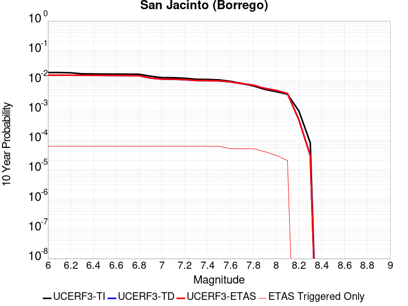 |

| Magnitude | 1 wk TI Prob | 1 wk TD Prob | 1 wk ETAS Prob | 1 wk ETAS/TD Gain | 1 wk ETAS Triggered Only | 1 mo TI Prob | 1 mo TD Prob | 1 mo ETAS Prob | 1 mo ETAS/TD Gain | 1 mo ETAS Triggered Only | 1 yr TI Prob | 1 yr TD Prob | 1 yr ETAS Prob | 1 yr ETAS/TD Gain | 1 yr ETAS Triggered Only | 10 yr TI Prob | 10 yr TD Prob | 10 yr ETAS Prob | 10 yr ETAS/TD Gain | 10 yr ETAS Triggered Only |
|-----|-----|-----|-----|-----|-----|-----|-----|-----|-----|-----|-----|-----|-----|-----|-----|-----|-----|-----|-----|-----|
| 6.0 | 3.543992E-5 | 2.7925962E-5 | 6.792485E-5 | 2.432319 | 4.0E-5 | 1.5187653E-4 | 1.1967727E-4 | 1.6967129E-4 | 1.4177402 | 5.0E-5 | 0.0018475284 | 0.0014561092 | 0.0015160218 | 1.0411457 | 6.0E-5 | 0.018322436 | 0.01486815 | 0.014927259 | 1.0039755 | 6.0E-5 |
| 6.1 | 3.542281E-5 | 2.7925962E-5 | 6.792485E-5 | 2.432319 | 4.0E-5 | 1.5180321E-4 | 1.1967727E-4 | 1.6967129E-4 | 1.4177402 | 5.0E-5 | 0.0018466372 | 0.0014561092 | 0.0015160218 | 1.0411457 | 6.0E-5 | 0.018313672 | 0.01486815 | 0.014927259 | 1.0039755 | 6.0E-5 |
| 6.2 | 3.4688688E-5 | 2.7925962E-5 | 6.792485E-5 | 2.432319 | 4.0E-5 | 1.4865733E-4 | 1.1967727E-4 | 1.6967129E-4 | 1.4177402 | 5.0E-5 | 0.0018084005 | 0.0014561091 | 0.0015160218 | 1.0411457 | 6.0E-5 | 0.017937548 | 0.01486815 | 0.014927259 | 1.0039755 | 6.0E-5 |
| 6.3 | 3.2087122E-5 | 2.7771312E-5 | 6.77702E-5 | 2.4402952 | 4.0E-5 | 1.3750899E-4 | 1.1901455E-4 | 1.6900859E-4 | 1.4200667 | 5.0E-5 | 0.0016728862 | 0.0014480512 | 0.0015079643 | 1.041375 | 6.0E-5 | 0.016603488 | 0.014789308 | 0.01484842 | 1.003997 | 6.0E-5 |
| 6.4 | 3.1828724E-5 | 2.773829E-5 | 6.773718E-5 | 2.44201 | 4.0E-5 | 1.364017E-4 | 1.1887303E-4 | 1.6886709E-4 | 1.4205668 | 5.0E-5 | 0.0016594254 | 0.0014463306 | 0.0015062437 | 1.0414243 | 6.0E-5 | 0.016470885 | 0.014772502 | 0.014831615 | 1.0040016 | 6.0E-5 |
| 6.5 | 3.1563577E-5 | 2.7477974E-5 | 6.7476874E-5 | 2.4556713 | 4.0E-5 | 1.3526545E-4 | 1.17757496E-4 | 1.6775161E-4 | 1.4245514 | 5.0E-5 | 0.0016456128 | 0.0014327668 | 0.0014926809 | 1.0418171 | 6.0E-5 | 0.0163348 | 0.01463991 | 0.014699032 | 1.0040383 | 6.0E-5 |
| 6.6 | 3.1467625E-5 | 2.7322194E-5 | 6.73211E-5 | 2.4639714 | 4.0E-5 | 1.3485427E-4 | 1.17089934E-4 | 1.6708407E-4 | 1.4269722 | 5.0E-5 | 0.0016406142 | 0.0014246498 | 0.0014845644 | 1.0420556 | 6.0E-5 | 0.016285548 | 0.014560228 | 0.014619354 | 1.0040609 | 6.0E-5 |
| 6.7 | 3.1223695E-5 | 2.6940217E-5 | 6.693914E-5 | 2.484729 | 4.0E-5 | 1.3380898E-4 | 1.1545303E-4 | 1.6544726E-4 | 1.4330266 | 5.0E-5 | 0.0016279068 | 0.0014047464 | 0.0014646621 | 1.0426524 | 6.0E-5 | 0.01616033 | 0.01436451 | 0.014423648 | 1.004117 | 6.0E-5 |
| 6.8 | 3.1015585E-5 | 2.6761221E-5 | 6.676015E-5 | 2.4946601 | 4.0E-5 | 1.3291716E-4 | 1.1468597E-4 | 1.6468024E-4 | 1.4359231 | 5.0E-5 | 0.001617065 | 0.0013954195 | 0.0014553358 | 1.0429379 | 6.0E-5 | 0.016053487 | 0.014271772 | 0.014330915 | 1.0041441 | 6.0E-5 |
| 6.9 | 2.6641965E-5 | 2.2183434E-5 | 6.2182546E-5 | 2.8031073 | 4.0E-5 | 1.1417485E-4 | 9.506842E-5 | 1.4506366E-4 | 1.525887 | 5.0E-5 | 0.0013891924 | 0.0011568473 | 0.001216778 | 1.0518051 | 6.0E-5 | 0.0138054015 | 0.011882191 | 0.011941478 | 1.0049896 | 6.0E-5 |
| 7.0 | 2.3854353E-5 | 2.047825E-5 | 6.0477432E-5 | 2.9532518 | 4.0E-5 | 1.02228936E-4 | 8.776099E-5 | 1.3775661E-4 | 1.5696791 | 5.0E-5 | 0.0012439266 | 0.0010679689 | 0.0011279049 | 1.0561215 | 6.0E-5 | 0.012369866 | 0.0109826205 | 0.011041962 | 1.0054032 | 6.0E-5 |
| 7.1 | 2.3672901E-5 | 2.0314741E-5 | 6.0313927E-5 | 2.9689736 | 4.0E-5 | 1.0145135E-4 | 8.706028E-5 | 1.3705593E-4 | 1.5742646 | 5.0E-5 | 0.0012344702 | 0.0010594461 | 0.0011193826 | 1.0565734 | 6.0E-5 | 0.0122763505 | 0.010897858 | 0.010957205 | 1.0054457 | 6.0E-5 |
| 7.2 | 2.2717244E-5 | 1.9542116E-5 | 5.9541333E-5 | 3.046821 | 4.0E-5 | 9.735599E-5 | 8.3749255E-5 | 1.3374507E-4 | 1.5969702 | 5.0E-5 | 0.0011846646 | 0.0010191725 | 0.0010791114 | 1.0588113 | 6.0E-5 | 0.01178369 | 0.010495322 | 0.010554692 | 1.0056568 | 6.0E-5 |
| 7.3 | 2.1016205E-5 | 1.8383771E-5 | 5.8383037E-5 | 3.1757922 | 4.0E-5 | 9.006634E-5 | 7.878522E-5 | 1.2878128E-4 | 1.6345868 | 5.0E-5 | 0.001096006 | 9.5879E-4 | 0.0010187326 | 1.0625188 | 6.0E-5 | 0.010906163 | 0.009890901 | 0.009950307 | 1.0060062 | 6.0E-5 |
| 7.4 | 2.0683625E-5 | 1.8186302E-5 | 5.8185575E-5 | 3.1994176 | 4.0E-5 | 8.86411E-5 | 7.7938974E-5 | 1.2793508E-4 | 1.6414776 | 5.0E-5 | 0.001078671 | 9.48496E-4 | 0.0010084391 | 1.0631981 | 6.0E-5 | 0.010734501 | 0.0097876275 | 0.00984704 | 1.0060701 | 6.0E-5 |
| 7.5 | 1.9993966E-5 | 1.7781347E-5 | 5.7780635E-5 | 3.2495084 | 4.0E-5 | 8.568561E-5 | 7.6203556E-5 | 1.2619975E-4 | 1.6560873 | 5.0E-5 | 0.001042723 | 9.2738547E-4 | 9.873298E-4 | 1.064638 | 6.0E-5 | 0.010378438 | 0.009574548 | 0.009633974 | 1.0062066 | 6.0E-5 |
| 7.6 | 1.788966E-5 | 1.6434618E-5 | 5.643396E-5 | 3.4338467 | 4.0E-5 | 7.666772E-5 | 7.043219E-5 | 1.2042866E-4 | 1.7098527 | 5.0E-5 | 9.3302975E-4 | 8.5717626E-4 | 9.071334E-4 | 1.0582811 | 5.0E-5 | 0.00929122 | 0.008866415 | 0.008915972 | 1.0055892 | 5.0E-5 |
| 7.7 | 1.5125781E-5 | 1.4236738E-5 | 5.4236167E-5 | 3.8095925 | 4.0E-5 | 6.4823165E-5 | 6.101317E-5 | 1.11010115E-4 | 1.8194453 | 5.0E-5 | 7.889362E-4 | 7.4258295E-4 | 7.9254585E-4 | 1.0672826 | 5.0E-5 | 0.007861412 | 0.007714161 | 0.0077637755 | 1.0064316 | 5.0E-5 |
| 7.8 | 1.250089E-5 | 1.262994E-5 | 5.2629435E-5 | 4.1670375 | 4.0E-5 | 5.3574146E-5 | 5.4127195E-5 | 1.0412449E-4 | 1.9237001 | 5.0E-5 | 6.5207E-4 | 6.588E-4 | 7.0876704E-4 | 1.0758456 | 5.0E-5 | 0.006501599 | 0.006867759 | 0.0069174157 | 1.0072304 | 5.0E-5 |
| 7.9 | 9.561E-6 | 9.754065E-6 | 3.9753773E-5 | 4.0756106 | 3.0E-5 | 4.0975072E-5 | 4.180247E-5 | 8.18008E-5 | 1.9568412 | 4.0E-5 | 4.987573E-4 | 5.0882675E-4 | 5.488064E-4 | 1.0785723 | 4.0E-5 | 0.0049763937 | 0.0053523607 | 0.0053921463 | 1.0074333 | 4.0E-5 |
| 8.0 | 8.01699E-6 | 8.292994E-6 | 3.8292746E-5 | 4.6174817 | 3.0E-5 | 3.4358076E-5 | 3.554092E-5 | 6.5539854E-5 | 1.8440675 | 3.0E-5 | 4.1822926E-4 | 4.3262533E-4 | 4.6261234E-4 | 1.0693141 | 3.0E-5 | 0.0041744304 | 0.0045733186 | 0.0046031815 | 1.0065298 | 3.0E-5 |
| 8.1 | 6.541947E-6 | 6.461784E-6 | 2.6461654E-5 | 4.0951004 | 2.0E-5 | 2.8036617E-5 | 2.7693068E-5 | 4.7692516E-5 | 1.7221824 | 2.0E-5 | 3.4129233E-4 | 3.3711144E-4 | 3.571047E-4 | 1.0593076 | 2.0E-5 | 0.0034076865 | 0.0035805756 | 0.0036005038 | 1.0055656 | 2.0E-5 |
| 8.2 | 1.7968189E-6 | 7.9684827E-7 | 7.9684827E-7 | 1.0 | 0.0 | 7.70063E-6 | 3.4150596E-6 | 3.4150596E-6 | 1.0 | 0.0 | 9.3751136E-5 | 4.157758E-5 | 4.157758E-5 | 1.0 | 0.0 | 9.371159E-4 | 4.7107413E-4 | 4.7107413E-4 | 1.0 | 0.0 |
| 8.3 | 1.5167889E-7 | 4.8951257E-8 | 4.8951257E-8 | 1.0 | 0.0 | 6.500522E-7 | 2.0979108E-7 | 2.0979108E-7 | 1.0 | 0.0 | 7.9143565E-6 | 2.5542038E-6 | 2.5542038E-6 | 1.0 | 0.0 | 7.914075E-5 | 2.9679897E-5 | 2.9679897E-5 | 1.0 | 0.0 |

## Hunting Creek - Berryessa 2011 CFM
*[(top)](#table-of-contents)*

| 1 Week | 1 Month | 1 Year | 10 Year |
|-----|-----|-----|-----|
|  |  |  |  |

| Magnitude | 1 wk TI Prob | 1 wk TD Prob | 1 wk ETAS Prob | 1 wk ETAS/TD Gain | 1 wk ETAS Triggered Only | 1 mo TI Prob | 1 mo TD Prob | 1 mo ETAS Prob | 1 mo ETAS/TD Gain | 1 mo ETAS Triggered Only | 1 yr TI Prob | 1 yr TD Prob | 1 yr ETAS Prob | 1 yr ETAS/TD Gain | 1 yr ETAS Triggered Only | 10 yr TI Prob | 10 yr TD Prob | 10 yr ETAS Prob | 10 yr ETAS/TD Gain | 10 yr ETAS Triggered Only |
|-----|-----|-----|-----|-----|-----|-----|-----|-----|-----|-----|-----|-----|-----|-----|-----|-----|-----|-----|-----|-----|
| 6.0 | 1.1270982E-4 | 2.0028367E-4 | 2.2027966E-4 | 1.0998384 | 2.0E-5 | 4.8295266E-4 | 8.579912E-4 | 8.879655E-4 | 1.0349354 | 3.0E-5 | 0.0058641075 | 0.010386173 | 0.01041586 | 1.0028584 | 3.0E-5 | 0.057117578 | 0.09804048 | 0.098085575 | 1.00046 | 5.0E-5 |
| 6.1 | 1.1239393E-4 | 1.9976508E-4 | 2.1976109E-4 | 1.1000975 | 2.0E-5 | 4.8159933E-4 | 8.557703E-4 | 8.8574464E-4 | 1.0350262 | 3.0E-5 | 0.0058477195 | 0.010359417 | 0.010389105 | 1.0028659 | 3.0E-5 | 0.056962132 | 0.09779895 | 0.09784406 | 1.0004612 | 5.0E-5 |
| 6.2 | 7.596265E-5 | 1.2933646E-4 | 1.4933388E-4 | 1.1546154 | 2.0E-5 | 3.2551357E-4 | 5.5415573E-4 | 5.841391E-4 | 1.0541064 | 3.0E-5 | 0.0039559277 | 0.0067213587 | 0.0067511573 | 1.0044334 | 3.0E-5 | 0.038862433 | 0.06459229 | 0.06463906 | 1.0007241 | 5.0E-5 |
| 6.3 | 6.78794E-5 | 1.1448377E-4 | 1.2448263E-4 | 1.0873386 | 1.0E-5 | 2.9087928E-4 | 4.9052597E-4 | 5.1051617E-4 | 1.0407525 | 2.0E-5 | 0.003535705 | 0.005952661 | 0.005972542 | 1.0033399 | 2.0E-5 | 0.034799766 | 0.057466213 | 0.057503913 | 1.000656 | 4.0E-5 |
| 6.4 | 6.2165134E-5 | 1.0434825E-4 | 1.143472E-4 | 1.0958229 | 1.0E-5 | 2.6639478E-4 | 4.4711027E-4 | 4.6710132E-4 | 1.0447117 | 2.0E-5 | 0.0032385332 | 0.0054274183 | 0.00544731 | 1.003665 | 2.0E-5 | 0.03191742 | 0.05255138 | 0.05258928 | 1.0007212 | 4.0E-5 |
| 6.5 | 5.4368087E-5 | 9.070258E-5 | 1.00701676E-4 | 1.1102405 | 1.0E-5 | 2.3298527E-4 | 3.886537E-4 | 4.0864592E-4 | 1.0514396 | 2.0E-5 | 0.0028329059 | 0.0047197016 | 0.004739607 | 1.0042175 | 2.0E-5 | 0.027970633 | 0.045881182 | 0.045919348 | 1.0008318 | 4.0E-5 |
| 6.6 | 4.729947E-5 | 7.847101E-5 | 7.847101E-5 | 1.0 | 0.0 | 2.0269625E-4 | 3.3624718E-4 | 3.4624382E-4 | 1.0297301 | 1.0E-5 | 0.002465034 | 0.004084746 | 0.004094705 | 1.0024382 | 1.0E-5 | 0.02437869 | 0.03985269 | 0.039881494 | 1.0007228 | 3.0E-5 |
| 6.7 | 3.6875328E-5 | 6.0443555E-5 | 6.0443555E-5 | 1.0 | 0.0 | 1.5802756E-4 | 2.5900968E-4 | 2.6900708E-4 | 1.0385985 | 1.0E-5 | 0.0019222875 | 0.0031482724 | 0.0031582408 | 1.0031663 | 1.0E-5 | 0.019057442 | 0.03089371 | 0.030922784 | 1.000941 | 3.0E-5 |
| 6.8 | 2.0292036E-5 | 2.8976721E-5 | 2.8976721E-5 | 1.0 | 0.0 | 8.6962966E-5 | 1.2417998E-4 | 1.2417998E-4 | 1.0 | 0.0 | 0.0010582599 | 0.0015108302 | 0.0015108302 | 1.0 | 0.0 | 0.010532344 | 0.0149790775 | 0.014988927 | 1.0006576 | 1.0E-5 |
| 6.9 | 1.7871042E-5 | 2.4472653E-5 | 2.4472653E-5 | 1.0 | 0.0 | 7.658793E-5 | 1.04878585E-4 | 1.04878585E-4 | 1.0 | 0.0 | 9.320591E-4 | 0.0012761486 | 0.0012761486 | 1.0 | 0.0 | 0.009281595 | 0.012680395 | 0.0126902675 | 1.0007787 | 1.0E-5 |
| 7.0 | 1.6415532E-5 | 2.1906566E-5 | 2.1906566E-5 | 1.0 | 0.0 | 7.035038E-5 | 9.388191E-5 | 9.388191E-5 | 1.0 | 0.0 | 8.561793E-4 | 0.0011424144 | 0.0011424144 | 1.0 | 0.0 | 0.008528882 | 0.011365017 | 0.011374903 | 1.0008699 | 1.0E-5 |
| 7.1 | 1.5409885E-5 | 2.0346588E-5 | 2.0346588E-5 | 1.0 | 0.0 | 6.6040695E-5 | 8.719676E-5 | 8.719676E-5 | 1.0 | 0.0 | 8.0374884E-4 | 0.0010611062 | 0.0010611062 | 1.0 | 0.0 | 0.00800848 | 0.010560924 | 0.010560924 | 1.0 | 0.0 |
| 7.2 | 1.4497423E-5 | 1.905519E-5 | 1.905519E-5 | 1.0 | 0.0 | 6.213033E-5 | 8.166256E-5 | 8.166256E-5 | 1.0 | 0.0 | 7.5617427E-4 | 9.937913E-4 | 9.937913E-4 | 1.0 | 0.0 | 0.0075360634 | 0.00989425 | 0.00989425 | 1.0 | 0.0 |
| 7.3 | 1.3615175E-5 | 1.7826347E-5 | 1.7826347E-5 | 1.0 | 0.0 | 5.8349444E-5 | 7.6396405E-5 | 7.6396405E-5 | 1.0 | 0.0 | 7.101729E-4 | 9.297323E-4 | 9.297323E-4 | 1.0 | 0.0 | 0.0070790765 | 0.009259124 | 0.009259124 | 1.0 | 0.0 |
| 7.4 | 1.2252825E-5 | 1.6026455E-5 | 1.6026455E-5 | 1.0 | 0.0 | 5.251105E-5 | 6.868302E-5 | 6.868302E-5 | 1.0 | 0.0 | 6.391345E-4 | 8.3589775E-4 | 8.3589775E-4 | 1.0 | 0.0 | 0.0063729943 | 0.008328172 | 0.008328172 | 1.0 | 0.0 |
| 7.5 | 1.0913301E-5 | 1.4241286E-5 | 1.4241286E-5 | 1.0 | 0.0 | 4.6770452E-5 | 6.103267E-5 | 6.103267E-5 | 1.0 | 0.0 | 5.6928146E-4 | 7.428222E-4 | 7.428222E-4 | 1.0 | 0.0 | 0.0056782532 | 0.0074039865 | 0.0074039865 | 1.0 | 0.0 |
| 7.6 | 8.623192E-6 | 1.12347825E-5 | 1.12347825E-5 | 1.0 | 0.0 | 3.6956015E-5 | 4.8148195E-5 | 4.8148195E-5 | 1.0 | 0.0 | 4.4984656E-4 | 5.8604917E-4 | 5.8604917E-4 | 1.0 | 0.0 | 0.00448937 | 0.005845504 | 0.005845504 | 1.0 | 0.0 |
| 7.7 | 2.0993634E-6 | 2.66264E-6 | 2.66264E-6 | 1.0 | 0.0 | 8.997241E-6 | 1.1411265E-5 | 1.1411265E-5 | 1.0 | 0.0 | 1.09535904E-4 | 1.3892337E-4 | 1.3892337E-4 | 1.0 | 0.0 | 0.0010948193 | 0.0013883994 | 0.0013883994 | 1.0 | 0.0 |
| 7.8 | 1.8428308E-7 | 2.1674624E-7 | 2.1674624E-7 | 1.0 | 0.0 | 7.897844E-7 | 9.289122E-7 | 9.289122E-7 | 1.0 | 0.0 | 9.615583E-6 | 1.130945E-5 | 1.130945E-5 | 1.0 | 0.0 | 9.615166E-5 | 1.1308173E-4 | 1.1308173E-4 | 1.0 | 0.0 |

## San Diego Trough south
*[(top)](#table-of-contents)*

| 1 Week | 1 Month | 1 Year | 10 Year |
|-----|-----|-----|-----|
|  |  |  |  |

| Magnitude | 1 wk TI Prob | 1 wk TD Prob | 1 wk ETAS Prob | 1 wk ETAS/TD Gain | 1 wk ETAS Triggered Only | 1 mo TI Prob | 1 mo TD Prob | 1 mo ETAS Prob | 1 mo ETAS/TD Gain | 1 mo ETAS Triggered Only | 1 yr TI Prob | 1 yr TD Prob | 1 yr ETAS Prob | 1 yr ETAS/TD Gain | 1 yr ETAS Triggered Only | 10 yr TI Prob | 10 yr TD Prob | 10 yr ETAS Prob | 10 yr ETAS/TD Gain | 10 yr ETAS Triggered Only |
|-----|-----|-----|-----|-----|-----|-----|-----|-----|-----|-----|-----|-----|-----|-----|-----|-----|-----|-----|-----|-----|
| 6.0 | 8.279495E-5 | 1.0425541E-4 | 1.1425436E-4 | 1.0959083 | 1.0E-5 | 3.5478722E-4 | 4.4673498E-4 | 4.7672156E-4 | 1.0671239 | 3.0E-5 | 0.004310982 | 0.0054259133 | 0.0054656966 | 1.0073321 | 4.0E-5 | 0.042283054 | 0.05299303 | 0.05304038 | 1.0008935 | 5.0E-5 |
| 6.1 | 4.6961468E-5 | 5.773024E-5 | 5.773024E-5 | 1.0 | 0.0 | 2.0124791E-4 | 2.473905E-4 | 2.473905E-4 | 1.0 | 0.0 | 0.00244744 | 0.003007886 | 0.0030178558 | 1.0033146 | 1.0E-5 | 0.024206603 | 0.029679636 | 0.029699042 | 1.0006539 | 2.0E-5 |
| 6.2 | 3.5079658E-5 | 4.214258E-5 | 4.214258E-5 | 1.0 | 0.0 | 1.5033272E-4 | 1.8059829E-4 | 1.8059829E-4 | 1.0 | 0.0 | 0.0018287642 | 0.002196587 | 0.002206565 | 1.0045425 | 1.0E-5 | 0.018137876 | 0.021751188 | 0.02176097 | 1.0004498 | 1.0E-5 |
| 6.3 | 3.5079658E-5 | 4.214258E-5 | 4.214258E-5 | 1.0 | 0.0 | 1.5033272E-4 | 1.8059829E-4 | 1.8059829E-4 | 1.0 | 0.0 | 0.0018287642 | 0.002196587 | 0.002206565 | 1.0045425 | 1.0E-5 | 0.018137876 | 0.021751188 | 0.02176097 | 1.0004498 | 1.0E-5 |
| 6.4 | 2.7196904E-5 | 3.208715E-5 | 3.208715E-5 | 1.0 | 0.0 | 1.16552954E-4 | 1.3750911E-4 | 1.3750911E-4 | 1.0 | 0.0 | 0.0014181085 | 0.0016728995 | 0.0016728995 | 1.0 | 0.0 | 0.014090929 | 0.016604666 | 0.016604666 | 1.0 | 0.0 |
| 6.5 | 2.5584688E-5 | 3.0101632E-5 | 3.0101632E-5 | 1.0 | 0.0 | 1.0964406E-4 | 1.2900059E-4 | 1.2900059E-4 | 1.0 | 0.0 | 0.0013340989 | 0.0015694627 | 0.0015694627 | 1.0 | 0.0 | 0.013261181 | 0.015585332 | 0.015585332 | 1.0 | 0.0 |
| 6.6 | 2.2034688E-5 | 2.574271E-5 | 2.574271E-5 | 1.0 | 0.0 | 9.443096E-5 | 1.1032127E-4 | 1.1032127E-4 | 1.0 | 0.0 | 0.0011490905 | 0.0013423412 | 0.0013423412 | 1.0 | 0.0 | 0.011431668 | 0.013343325 | 0.013343325 | 1.0 | 0.0 |
| 6.7 | 1.9394853E-5 | 2.254176E-5 | 2.254176E-5 | 1.0 | 0.0 | 8.311815E-5 | 9.6604E-5 | 9.6604E-5 | 1.0 | 0.0 | 0.0010114936 | 0.0011755243 | 0.0011755243 | 1.0 | 0.0 | 0.01006902 | 0.011693766 | 0.011693766 | 1.0 | 0.0 |
| 6.8 | 1.7615313E-5 | 2.0403182E-5 | 2.0403182E-5 | 1.0 | 0.0 | 7.549201E-5 | 8.743931E-5 | 8.743931E-5 | 1.0 | 0.0 | 9.1872766E-4 | 0.0010640579 | 0.0010640579 | 1.0 | 0.0 | 0.009149387 | 0.010590198 | 0.010590198 | 1.0 | 0.0 |
| 6.9 | 1.5621423E-5 | 1.8026114E-5 | 1.8026114E-5 | 1.0 | 0.0 | 6.6947236E-5 | 7.725251E-5 | 7.725251E-5 | 1.0 | 0.0 | 8.147778E-4 | 9.40147E-4 | 9.40147E-4 | 1.0 | 0.0 | 0.008117969 | 0.009362142 | 0.009362142 | 1.0 | 0.0 |
| 7.0 | 1.3444376E-5 | 1.544809E-5 | 1.544809E-5 | 1.0 | 0.0 | 5.7617483E-5 | 6.620443E-5 | 6.620443E-5 | 1.0 | 0.0 | 7.0126704E-4 | 8.057436E-4 | 8.057436E-4 | 1.0 | 0.0 | 0.006990582 | 0.008028555 | 0.008028555 | 1.0 | 0.0 |
| 7.1 | 1.2268361E-5 | 1.407303E-5 | 1.407303E-5 | 1.0 | 0.0 | 5.2577634E-5 | 6.0311606E-5 | 6.0311606E-5 | 1.0 | 0.0 | 6.399447E-4 | 7.3404907E-4 | 7.3404907E-4 | 1.0 | 0.0 | 0.0063810493 | 0.0073165493 | 0.0073165493 | 1.0 | 0.0 |
| 7.2 | 1.0922655E-5 | 1.2513563E-5 | 1.2513563E-5 | 1.0 | 0.0 | 4.681054E-5 | 5.3628468E-5 | 5.3628468E-5 | 1.0 | 0.0 | 5.697693E-4 | 6.5273355E-4 | 6.5273355E-4 | 1.0 | 0.0 | 0.0056831064 | 0.0065084435 | 0.0065084435 | 1.0 | 0.0 |
| 7.3 | 6.1106753E-6 | 6.928925E-6 | 6.928925E-6 | 1.0 | 0.0 | 2.6188345E-5 | 2.9695057E-5 | 2.9695057E-5 | 1.0 | 0.0 | 3.1879646E-4 | 3.6147775E-4 | 3.6147775E-4 | 1.0 | 0.0 | 0.0031833951 | 0.003608943 | 0.003608943 | 1.0 | 0.0 |
| 7.4 | 4.933187E-6 | 5.5895525E-6 | 5.5895525E-6 | 1.0 | 0.0 | 2.114206E-5 | 2.3955008E-5 | 2.3955008E-5 | 1.0 | 0.0 | 2.5737417E-4 | 2.9161357E-4 | 2.9161357E-4 | 1.0 | 0.0 | 0.002570763 | 0.0029123505 | 0.0029123505 | 1.0 | 0.0 |
| 7.5 | 1.7489613E-6 | 1.969678E-6 | 1.969678E-6 | 1.0 | 0.0 | 7.495527E-6 | 8.4414505E-6 | 8.4414505E-6 | 1.0 | 0.0 | 9.125422E-5 | 1.02770035E-4 | 1.02770035E-4 | 1.0 | 0.0 | 9.1216754E-4 | 0.0010272472 | 0.0010272472 | 1.0 | 0.0 |
| 7.6 | 1.6988751E-7 | 1.7533823E-7 | 1.7533823E-7 | 1.0 | 0.0 | 7.2808916E-7 | 7.5144936E-7 | 7.5144936E-7 | 1.0 | 0.0 | 8.864449E-6 | 9.14886E-6 | 9.14886E-6 | 1.0 | 0.0 | 8.8640954E-5 | 9.1485024E-5 | 9.1485024E-5 | 1.0 | 0.0 |

## Malibu Coast alt 1
*[(top)](#table-of-contents)*

| 1 Week | 1 Month | 1 Year | 10 Year |
|-----|-----|-----|-----|
| 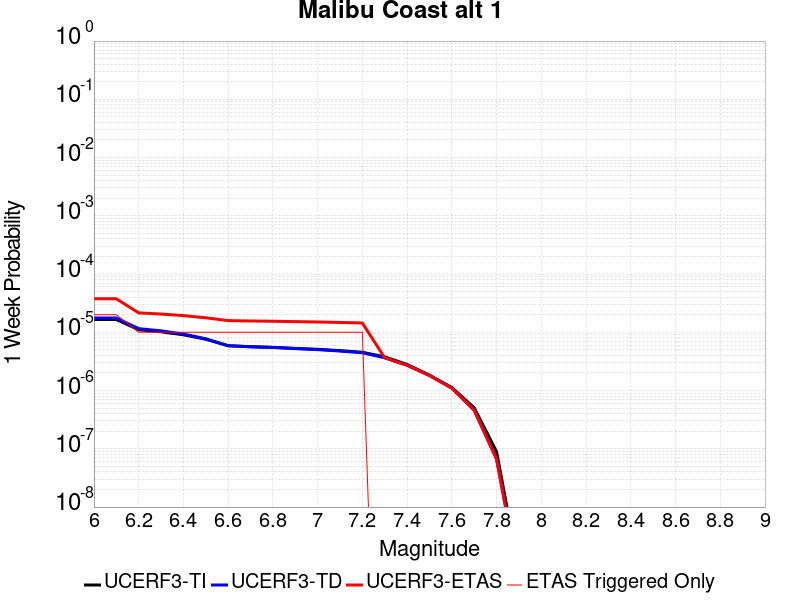 |  |  |  |

| Magnitude | 1 wk TI Prob | 1 wk TD Prob | 1 wk ETAS Prob | 1 wk ETAS/TD Gain | 1 wk ETAS Triggered Only | 1 mo TI Prob | 1 mo TD Prob | 1 mo ETAS Prob | 1 mo ETAS/TD Gain | 1 mo ETAS Triggered Only | 1 yr TI Prob | 1 yr TD Prob | 1 yr ETAS Prob | 1 yr ETAS/TD Gain | 1 yr ETAS Triggered Only | 10 yr TI Prob | 10 yr TD Prob | 10 yr ETAS Prob | 10 yr ETAS/TD Gain | 10 yr ETAS Triggered Only |
|-----|-----|-----|-----|-----|-----|-----|-----|-----|-----|-----|-----|-----|-----|-----|-----|-----|-----|-----|-----|-----|
| 6.0 | 1.6572556E-5 | 1.759807E-5 | 3.7597718E-5 | 2.1364684 | 2.0E-5 | 7.102331E-5 | 7.5418226E-5 | 1.0541596E-4 | 1.3977518 | 3.0E-5 | 8.6436566E-4 | 9.1784896E-4 | 9.5781224E-4 | 1.0435401 | 4.0E-5 | 0.0086101135 | 0.009142514 | 0.009192057 | 1.0054189 | 5.0E-5 |
| 6.1 | 1.6572556E-5 | 1.759807E-5 | 3.7597718E-5 | 2.1364684 | 2.0E-5 | 7.102331E-5 | 7.5418226E-5 | 1.0541596E-4 | 1.3977518 | 3.0E-5 | 8.6436566E-4 | 9.1784896E-4 | 9.5781224E-4 | 1.0435401 | 4.0E-5 | 0.0086101135 | 0.009142514 | 0.009182149 | 1.0043352 | 4.0E-5 |
| 6.2 | 1.1085717E-5 | 1.155715E-5 | 2.1557034E-5 | 1.8652552 | 1.0E-5 | 4.750935E-5 | 4.9529724E-5 | 6.952873E-5 | 1.403778 | 2.0E-5 | 5.782728E-4 | 6.0286105E-4 | 6.22849E-4 | 1.0331551 | 2.0E-5 | 0.0057677035 | 0.0060126274 | 0.006032507 | 1.0033064 | 2.0E-5 |
| 6.3 | 1.0208568E-5 | 1.0592241E-5 | 2.0592135E-5 | 1.9440774 | 1.0E-5 | 4.375027E-5 | 4.5394543E-5 | 6.539364E-5 | 1.4405615 | 2.0E-5 | 5.325294E-4 | 5.5254134E-4 | 5.725303E-4 | 1.0361764 | 2.0E-5 | 0.0053125503 | 0.0055119833 | 0.005531873 | 1.0036085 | 2.0E-5 |
| 6.4 | 9.0682315E-6 | 9.342641E-6 | 1.9342548E-5 | 2.0703511 | 1.0E-5 | 3.8863272E-5 | 4.0039286E-5 | 6.0038485E-5 | 1.4994894 | 2.0E-5 | 4.730576E-4 | 4.873713E-4 | 5.0736155E-4 | 1.0410165 | 2.0E-5 | 0.0047205184 | 0.004863238 | 0.004883141 | 1.0040925 | 2.0E-5 |
| 6.5 | 7.605796E-6 | 7.74859E-6 | 1.7748513E-5 | 2.2905474 | 1.0E-5 | 3.259586E-5 | 3.320783E-5 | 4.3207496E-5 | 1.3011239 | 1.0E-5 | 3.9678233E-4 | 4.0423166E-4 | 4.142276E-4 | 1.0247283 | 1.0E-5 | 0.0039607463 | 0.0040351013 | 0.004045061 | 1.0024682 | 1.0E-5 |
| 6.6 | 5.889873E-6 | 5.8795417E-6 | 1.5879483E-5 | 2.7008028 | 1.0E-5 | 2.5242069E-5 | 2.5197793E-5 | 3.519754E-5 | 1.3968501 | 1.0E-5 | 3.0727885E-4 | 3.0674002E-4 | 3.1673696E-4 | 1.0325909 | 1.0E-5 | 0.003068543 | 0.0030631793 | 0.0030731487 | 1.0032545 | 1.0E-5 |
| 6.7 | 5.66586E-6 | 5.6416443E-6 | 1.5641588E-5 | 2.772523 | 1.0E-5 | 2.428203E-5 | 2.4178253E-5 | 3.417801E-5 | 1.4135848 | 1.0E-5 | 2.955936E-4 | 2.9433056E-4 | 3.043276E-4 | 1.0339653 | 1.0E-5 | 0.0029520073 | 0.0029394194 | 0.0029493899 | 1.003392 | 1.0E-5 |
| 6.8 | 5.521556E-6 | 5.48943E-6 | 1.5489375E-5 | 2.8216727 | 1.0E-5 | 2.3663597E-5 | 2.3525918E-5 | 3.352568E-5 | 1.4250531 | 1.0E-5 | 2.880662E-4 | 2.8639048E-4 | 2.9638762E-4 | 1.0349073 | 1.0E-5 | 0.0028769306 | 0.0028602257 | 0.0028701972 | 1.0034863 | 1.0E-5 |
| 6.9 | 5.29752E-6 | 5.2499345E-6 | 1.5249882E-5 | 2.9047756 | 1.0E-5 | 2.270346E-5 | 2.2499526E-5 | 3.24993E-5 | 1.4444438 | 1.0E-5 | 2.7637955E-4 | 2.7389737E-4 | 2.8389462E-4 | 1.0365 | 1.0E-5 | 0.0027603607 | 0.0027356083 | 0.0027455809 | 1.0036455 | 1.0E-5 |
| 7.0 | 5.106743E-6 | 5.0476815E-6 | 1.5047631E-5 | 2.9810975 | 1.0E-5 | 2.1885859E-5 | 2.1632743E-5 | 3.1632528E-5 | 1.4622523 | 1.0E-5 | 2.6642776E-4 | 2.6334688E-4 | 2.7334425E-4 | 1.0379627 | 1.0E-5 | 0.0026610855 | 0.0026303576 | 0.0026403314 | 1.0037918 | 1.0E-5 |
| 7.1 | 4.8469647E-6 | 4.770376E-6 | 1.4770329E-5 | 3.0962608 | 1.0E-5 | 2.0772539E-5 | 2.044431E-5 | 3.0444104E-5 | 1.4891237 | 1.0E-5 | 2.528763E-4 | 2.488811E-4 | 2.588786E-4 | 1.0401698 | 1.0E-5 | 0.0025258875 | 0.0024860317 | 0.002496007 | 1.0040125 | 1.0E-5 |
| 7.2 | 4.545514E-6 | 4.4481967E-6 | 1.4448152E-5 | 3.2480922 | 1.0E-5 | 1.9480629E-5 | 1.906356E-5 | 2.906337E-5 | 1.524551 | 1.0E-5 | 2.3715083E-4 | 2.3207419E-4 | 2.4207187E-4 | 1.0430796 | 1.0E-5 | 0.0023689792 | 0.002318326 | 0.0023283027 | 1.0043035 | 1.0E-5 |
| 7.3 | 3.794097E-6 | 3.6519373E-6 | 3.6519373E-6 | 1.0 | 0.0 | 1.6260314E-5 | 1.5651065E-5 | 1.5651065E-5 | 1.0 | 0.0 | 1.9795135E-4 | 1.9053511E-4 | 1.9053511E-4 | 1.0 | 0.0 | 0.001977751 | 0.0019037221 | 0.0019037221 | 1.0 | 0.0 |
| 7.4 | 2.808217E-6 | 2.7190777E-6 | 2.7190777E-6 | 1.0 | 0.0 | 1.203516E-5 | 1.1653137E-5 | 1.1653137E-5 | 1.0 | 0.0 | 1.4651821E-4 | 1.4186774E-4 | 1.4186774E-4 | 1.0 | 0.0 | 0.0014642165 | 0.0014177744 | 0.0014177744 | 1.0 | 0.0 |
| 7.5 | 1.83809E-6 | 1.8190703E-6 | 1.8190703E-6 | 1.0 | 0.0 | 7.877505E-6 | 7.795992E-6 | 7.795992E-6 | 1.0 | 0.0 | 9.59044E-5 | 9.4912095E-5 | 9.4912095E-5 | 1.0 | 0.0 | 9.5863023E-4 | 9.487176E-4 | 9.487176E-4 | 1.0 | 0.0 |
| 7.6 | 1.1292672E-6 | 1.1001456E-6 | 1.1001456E-6 | 1.0 | 0.0 | 4.839708E-6 | 4.7149015E-6 | 4.7149015E-6 | 1.0 | 0.0 | 5.8921847E-5 | 5.7402427E-5 | 5.7402427E-5 | 1.0 | 0.0 | 5.890623E-4 | 5.7387765E-4 | 5.7387765E-4 | 1.0 | 0.0 |
| 7.7 | 5.065272E-7 | 4.6091537E-7 | 4.6091537E-7 | 1.0 | 0.0 | 2.170829E-6 | 1.9753502E-6 | 1.9753502E-6 | 1.0 | 0.0 | 2.6429525E-5 | 2.4049634E-5 | 2.4049634E-5 | 1.0 | 0.0 | 2.642638E-4 | 2.4047145E-4 | 2.4047145E-4 | 1.0 | 0.0 |
| 7.8 | 8.952991E-8 | 6.707853E-8 | 6.707853E-8 | 1.0 | 0.0 | 3.8369956E-7 | 2.874794E-7 | 2.874794E-7 | 1.0 | 0.0 | 4.671532E-6 | 3.5000562E-6 | 3.5000562E-6 | 1.0 | 0.0 | 4.671434E-5 | 3.500003E-5 | 3.500003E-5 | 1.0 | 0.0 |
| 7.9 | 8.007447E-10 | 6.161581E-10 | 6.161581E-10 | 1.0 | 0.0 | 3.4317629E-9 | 2.640678E-9 | 2.640678E-9 | 1.0 | 0.0 | 4.1781714E-8 | 3.2150254E-8 | 3.2150254E-8 | 1.0 | 0.0 | 4.1781706E-7 | 3.2150248E-7 | 3.2150248E-7 | 1.0 | 0.0 |

## Calaveras (Central) 2011 CFM
*[(top)](#table-of-contents)*

| 1 Week | 1 Month | 1 Year | 10 Year |
|-----|-----|-----|-----|
|  |  |  |  |

| Magnitude | 1 wk TI Prob | 1 wk TD Prob | 1 wk ETAS Prob | 1 wk ETAS/TD Gain | 1 wk ETAS Triggered Only | 1 mo TI Prob | 1 mo TD Prob | 1 mo ETAS Prob | 1 mo ETAS/TD Gain | 1 mo ETAS Triggered Only | 1 yr TI Prob | 1 yr TD Prob | 1 yr ETAS Prob | 1 yr ETAS/TD Gain | 1 yr ETAS Triggered Only | 10 yr TI Prob | 10 yr TD Prob | 10 yr ETAS Prob | 10 yr ETAS/TD Gain | 10 yr ETAS Triggered Only |
|-----|-----|-----|-----|-----|-----|-----|-----|-----|-----|-----|-----|-----|-----|-----|-----|-----|-----|-----|-----|-----|
| 6.0 | 1.5010907E-4 | 2.4804124E-4 | 2.5803875E-4 | 1.0403059 | 1.0E-5 | 6.4316596E-4 | 0.001062498 | 0.0010724873 | 1.0094018 | 1.0E-5 | 0.0078024664 | 0.012850443 | 0.012870186 | 1.0015364 | 2.0E-5 | 0.07534136 | 0.120411225 | 0.12044641 | 1.0002922 | 4.0E-5 |
| 6.1 | 1.4521465E-4 | 2.3965565E-4 | 2.3965565E-4 | 1.0 | 0.0 | 6.222001E-4 | 0.0010265942 | 0.0010265942 | 1.0 | 0.0 | 0.0075490056 | 0.012419763 | 0.012429639 | 1.0007951 | 1.0E-5 | 0.07297657 | 0.11668273 | 0.116709225 | 1.0002271 | 3.0E-5 |
| 6.2 | 1.429998E-4 | 2.3896809E-4 | 2.3896809E-4 | 1.0 | 0.0 | 6.127123E-4 | 0.0010236499 | 0.0010236499 | 1.0 | 0.0 | 0.007434286 | 0.012384372 | 0.012394248 | 1.0007975 | 1.0E-5 | 0.07190444 | 0.11633677 | 0.11636328 | 1.0002279 | 3.0E-5 |
| 6.3 | 1.3536277E-4 | 2.3227946E-4 | 2.3227946E-4 | 1.0 | 0.0 | 5.799972E-4 | 9.950127E-4 | 9.950127E-4 | 1.0 | 0.0 | 0.0070386264 | 0.012040534 | 0.0120504135 | 1.0008205 | 1.0E-5 | 0.0681982 | 0.113249525 | 0.11327613 | 1.0002348 | 3.0E-5 |
| 6.4 | 1.2993296E-4 | 2.2651516E-4 | 2.2651516E-4 | 1.0 | 0.0 | 5.5673666E-4 | 9.703276E-4 | 9.703276E-4 | 1.0 | 0.0 | 0.006757223 | 0.011743338 | 0.01175322 | 1.0008415 | 1.0E-5 | 0.06555412 | 0.11052752 | 0.1105542 | 1.0002414 | 3.0E-5 |
| 6.5 | 1.0498927E-4 | 1.7981966E-4 | 1.7981966E-4 | 1.0 | 0.0 | 4.498764E-4 | 7.7042676E-4 | 7.7042676E-4 | 1.0 | 0.0 | 0.005463498 | 0.00933952 | 0.009349426 | 1.0010607 | 1.0E-5 | 0.053311124 | 0.08920739 | 0.08923471 | 1.0003062 | 3.0E-5 |
| 6.6 | 1.0157505E-4 | 1.7469494E-4 | 1.7469494E-4 | 1.0 | 0.0 | 4.35249E-4 | 7.4847665E-4 | 7.4847665E-4 | 1.0 | 0.0 | 0.0052862884 | 0.009074567 | 0.009084476 | 1.001092 | 1.0E-5 | 0.05162293 | 0.08678487 | 0.086812265 | 1.0003157 | 3.0E-5 |
| 6.7 | 9.660386E-5 | 1.6728783E-4 | 1.6728783E-4 | 1.0 | 0.0 | 4.1395082E-4 | 7.167497E-4 | 7.167497E-4 | 1.0 | 0.0 | 0.0050282106 | 0.008691474 | 0.008701387 | 1.0011406 | 1.0E-5 | 0.049159497 | 0.08327401 | 0.08330151 | 1.0003302 | 3.0E-5 |
| 6.8 | 9.089927E-5 | 1.5643238E-4 | 1.5643238E-4 | 1.0 | 0.0 | 3.8951015E-4 | 6.702511E-4 | 6.702511E-4 | 1.0 | 0.0 | 0.0047319788 | 0.008129742 | 0.008139661 | 1.0012201 | 1.0E-5 | 0.046324775 | 0.078163 | 0.078190655 | 1.0003538 | 3.0E-5 |
| 6.9 | 7.353187E-5 | 1.2295779E-4 | 1.2295779E-4 | 1.0 | 0.0 | 3.150985E-4 | 5.2685605E-4 | 5.2685605E-4 | 1.0 | 0.0 | 0.0038295772 | 0.006395728 | 0.0064056637 | 1.0015535 | 1.0E-5 | 0.037642512 | 0.06218928 | 0.062217414 | 1.0004524 | 3.0E-5 |
| 7.0 | 5.746064E-5 | 9.3890936E-5 | 9.3890936E-5 | 1.0 | 0.0 | 2.4623662E-4 | 4.0232803E-4 | 4.0232803E-4 | 1.0 | 0.0 | 0.0029938098 | 0.0048874132 | 0.0048874132 | 1.0 | 0.0 | 0.02953797 | 0.04798713 | 0.04800617 | 1.0003967 | 2.0E-5 |
| 7.1 | 4.9557195E-5 | 8.052768E-5 | 8.052768E-5 | 1.0 | 0.0 | 2.123707E-4 | 3.4507332E-4 | 3.4507332E-4 | 1.0 | 0.0 | 0.0025825473 | 0.004193237 | 0.004193237 | 1.0 | 0.0 | 0.0255274 | 0.041373473 | 0.041392643 | 1.0004634 | 2.0E-5 |
| 7.2 | 3.687595E-5 | 5.952694E-5 | 5.952694E-5 | 1.0 | 0.0 | 1.5803022E-4 | 2.5509068E-4 | 2.5509068E-4 | 1.0 | 0.0 | 0.0019223199 | 0.003101335 | 0.003101335 | 1.0 | 0.0 | 0.01905776 | 0.030883823 | 0.030903203 | 1.0006276 | 2.0E-5 |
| 7.3 | 2.5846984E-5 | 4.2473923E-5 | 4.2473923E-5 | 1.0 | 0.0 | 1.1076809E-4 | 1.820185E-4 | 1.820185E-4 | 1.0 | 0.0 | 0.0013477671 | 0.0022138404 | 0.0022138404 | 1.0 | 0.0 | 0.013396223 | 0.022175217 | 0.022194775 | 1.0008819 | 2.0E-5 |
| 7.4 | 1.7747854E-5 | 2.993759E-5 | 2.993759E-5 | 1.0 | 0.0 | 7.6060016E-5 | 1.2829766E-4 | 1.2829766E-4 | 1.0 | 0.0 | 9.2563726E-4 | 0.0015609078 | 0.0015609078 | 1.0 | 0.0 | 0.009217911 | 0.015708687 | 0.015728373 | 1.0012531 | 2.0E-5 |
| 7.5 | 1.4883479E-5 | 2.6244672E-5 | 2.6244672E-5 | 1.0 | 0.0 | 6.378478E-5 | 1.12472335E-4 | 1.12472335E-4 | 1.0 | 0.0 | 7.76303E-4 | 0.0013684932 | 0.0013684932 | 1.0 | 0.0 | 0.0077359667 | 0.013801667 | 0.01382139 | 1.0014291 | 2.0E-5 |
| 7.6 | 8.166975E-6 | 1.4964299E-5 | 1.4964299E-5 | 1.0 | 0.0 | 3.5000852E-5 | 6.413114E-5 | 6.413114E-5 | 1.0 | 0.0 | 4.2605202E-4 | 7.805183E-4 | 7.805183E-4 | 1.0 | 0.0 | 0.004252361 | 0.007939203 | 0.007949124 | 1.0012496 | 1.0E-5 |
| 7.7 | 3.3858064E-6 | 6.254251E-6 | 6.254251E-6 | 1.0 | 0.0 | 1.4510518E-5 | 2.6803657E-5 | 2.6803657E-5 | 1.0 | 0.0 | 1.7665124E-4 | 3.2628572E-4 | 3.2628572E-4 | 1.0 | 0.0 | 0.0017651088 | 0.003388363 | 0.003398329 | 1.0029413 | 1.0E-5 |
| 7.8 | 2.7721615E-6 | 5.366695E-6 | 5.366695E-6 | 1.0 | 0.0 | 1.1880637E-5 | 2.2999919E-5 | 2.2999919E-5 | 1.0 | 0.0 | 1.4463716E-4 | 2.7998807E-4 | 2.7998807E-4 | 1.0 | 0.0 | 0.0014454306 | 0.002907615 | 0.0029175857 | 1.0034293 | 1.0E-5 |
| 7.9 | 1.9736292E-6 | 4.128705E-6 | 4.128705E-6 | 1.0 | 0.0 | 8.4583835E-6 | 1.769433E-5 | 1.769433E-5 | 1.0 | 0.0 | 1.0297595E-4 | 2.1540721E-4 | 2.1540721E-4 | 1.0 | 0.0 | 0.0010292825 | 0.0022237299 | 0.0022337078 | 1.0044869 | 1.0E-5 |
| 8.0 | 1.1767289E-6 | 2.5546633E-6 | 2.5546633E-6 | 1.0 | 0.0 | 5.0431145E-6 | 1.0948511E-5 | 1.0948511E-5 | 1.0 | 0.0 | 6.139818E-5 | 1.3329E-4 | 1.3329E-4 | 1.0 | 0.0 | 6.1381224E-4 | 0.001366126 | 0.001366126 | 1.0 | 0.0 |
| 8.1 | 7.5112825E-7 | 1.541076E-6 | 1.541076E-6 | 1.0 | 0.0 | 3.2191172E-6 | 6.604595E-6 | 6.604595E-6 | 1.0 | 0.0 | 3.9192048E-5 | 8.0408E-5 | 8.0408E-5 | 1.0 | 0.0 | 3.9185135E-4 | 8.2356273E-4 | 8.2356273E-4 | 1.0 | 0.0 |

## Pitas Point (Lower West)
*[(top)](#table-of-contents)*

| 1 Week | 1 Month | 1 Year | 10 Year |
|-----|-----|-----|-----|
|  |  |  |  |

| Magnitude | 1 wk TI Prob | 1 wk TD Prob | 1 wk ETAS Prob | 1 wk ETAS/TD Gain | 1 wk ETAS Triggered Only | 1 mo TI Prob | 1 mo TD Prob | 1 mo ETAS Prob | 1 mo ETAS/TD Gain | 1 mo ETAS Triggered Only | 1 yr TI Prob | 1 yr TD Prob | 1 yr ETAS Prob | 1 yr ETAS/TD Gain | 1 yr ETAS Triggered Only | 10 yr TI Prob | 10 yr TD Prob | 10 yr ETAS Prob | 10 yr ETAS/TD Gain | 10 yr ETAS Triggered Only |
|-----|-----|-----|-----|-----|-----|-----|-----|-----|-----|-----|-----|-----|-----|-----|-----|-----|-----|-----|-----|-----|
| 6.0 | 8.151497E-6 | 7.855796E-6 | 1.7855718E-5 | 2.2729354 | 1.0E-5 | 3.493452E-5 | 3.3667267E-5 | 6.366626E-5 | 1.8910432 | 3.0E-5 | 4.252448E-4 | 4.0982262E-4 | 4.4980622E-4 | 1.0975631 | 4.0E-5 | 0.0042443196 | 0.004090749 | 0.0041405447 | 1.0121727 | 5.0E-5 |
| 6.1 | 8.151497E-6 | 7.855796E-6 | 1.7855718E-5 | 2.2729354 | 1.0E-5 | 3.493452E-5 | 3.3667267E-5 | 6.366626E-5 | 1.8910432 | 3.0E-5 | 4.252448E-4 | 4.0982262E-4 | 4.4980622E-4 | 1.0975631 | 4.0E-5 | 0.0042443196 | 0.004090749 | 0.0041405447 | 1.0121727 | 5.0E-5 |
| 6.2 | 8.151497E-6 | 7.855796E-6 | 1.7855718E-5 | 2.2729354 | 1.0E-5 | 3.493452E-5 | 3.3667267E-5 | 6.366626E-5 | 1.8910432 | 3.0E-5 | 4.252448E-4 | 4.0982262E-4 | 4.4980622E-4 | 1.0975631 | 4.0E-5 | 0.0042443196 | 0.004090749 | 0.0041405447 | 1.0121727 | 5.0E-5 |
| 6.3 | 8.151497E-6 | 7.855796E-6 | 1.7855718E-5 | 2.2729354 | 1.0E-5 | 3.493452E-5 | 3.3667267E-5 | 6.366626E-5 | 1.8910432 | 3.0E-5 | 4.252448E-4 | 4.0982262E-4 | 4.4980622E-4 | 1.0975631 | 4.0E-5 | 0.0042443196 | 0.004090749 | 0.0041405447 | 1.0121727 | 5.0E-5 |
| 6.4 | 8.151497E-6 | 7.855796E-6 | 1.7855718E-5 | 2.2729354 | 1.0E-5 | 3.493452E-5 | 3.3667267E-5 | 6.366626E-5 | 1.8910432 | 3.0E-5 | 4.252448E-4 | 4.0982262E-4 | 4.4980622E-4 | 1.0975631 | 4.0E-5 | 0.0042443196 | 0.004090749 | 0.0041405447 | 1.0121727 | 5.0E-5 |
| 6.5 | 8.151497E-6 | 7.855796E-6 | 1.7855718E-5 | 2.2729354 | 1.0E-5 | 3.493452E-5 | 3.3667267E-5 | 6.366626E-5 | 1.8910432 | 3.0E-5 | 4.252448E-4 | 4.0982262E-4 | 4.4980622E-4 | 1.0975631 | 4.0E-5 | 0.0042443196 | 0.004090749 | 0.0041405447 | 1.0121727 | 5.0E-5 |
| 6.6 | 8.151497E-6 | 7.855796E-6 | 1.7855718E-5 | 2.2729354 | 1.0E-5 | 3.493452E-5 | 3.3667267E-5 | 6.366626E-5 | 1.8910432 | 3.0E-5 | 4.252448E-4 | 4.0982262E-4 | 4.4980622E-4 | 1.0975631 | 4.0E-5 | 0.0042443196 | 0.004090749 | 0.0041405447 | 1.0121727 | 5.0E-5 |
| 6.7 | 8.151497E-6 | 7.855796E-6 | 1.7855718E-5 | 2.2729354 | 1.0E-5 | 3.493452E-5 | 3.3667267E-5 | 6.366626E-5 | 1.8910432 | 3.0E-5 | 4.252448E-4 | 4.0982262E-4 | 4.4980622E-4 | 1.0975631 | 4.0E-5 | 0.0042443196 | 0.004090749 | 0.0041405447 | 1.0121727 | 5.0E-5 |
| 6.8 | 8.151497E-6 | 7.855796E-6 | 1.7855718E-5 | 2.2729354 | 1.0E-5 | 3.493452E-5 | 3.3667267E-5 | 6.366626E-5 | 1.8910432 | 3.0E-5 | 4.252448E-4 | 4.0982262E-4 | 4.4980622E-4 | 1.0975631 | 4.0E-5 | 0.0042443196 | 0.004090749 | 0.0041405447 | 1.0121727 | 5.0E-5 |
| 6.9 | 8.151497E-6 | 7.855796E-6 | 1.7855718E-5 | 2.2729354 | 1.0E-5 | 3.493452E-5 | 3.3667267E-5 | 6.366626E-5 | 1.8910432 | 3.0E-5 | 4.252448E-4 | 4.0982262E-4 | 4.4980622E-4 | 1.0975631 | 4.0E-5 | 0.0042443196 | 0.004090749 | 0.0041405447 | 1.0121727 | 5.0E-5 |
| 7.0 | 8.103535E-6 | 7.805226E-6 | 1.7805149E-5 | 2.281183 | 1.0E-5 | 3.4728975E-5 | 3.3450542E-5 | 6.344954E-5 | 1.8968164 | 3.0E-5 | 4.2274324E-4 | 4.07185E-4 | 4.471687E-4 | 1.0981954 | 4.0E-5 | 0.0042193993 | 0.0040644696 | 0.0041142665 | 1.0122517 | 5.0E-5 |
| 7.1 | 7.853298E-6 | 7.540917E-6 | 7.540917E-6 | 1.0 | 0.0 | 3.3656554E-5 | 3.2317817E-5 | 5.2317173E-5 | 1.6188337 | 2.0E-5 | 4.096915E-4 | 3.9339912E-4 | 4.233873E-4 | 1.0762284 | 3.0E-5 | 0.00408937 | 0.0039271032 | 0.003966946 | 1.0101457 | 4.0E-5 |
| 7.2 | 7.771102E-6 | 7.453199E-6 | 7.453199E-6 | 1.0 | 0.0 | 3.33043E-5 | 3.1941894E-5 | 5.1941253E-5 | 1.626117 | 2.0E-5 | 4.0540437E-4 | 3.8882386E-4 | 4.1881218E-4 | 1.0771258 | 3.0E-5 | 0.0040466557 | 0.003881511 | 0.003921356 | 1.0102652 | 4.0E-5 |
| 7.3 | 7.3945344E-6 | 7.0493033E-6 | 7.0493033E-6 | 1.0 | 0.0 | 3.1690477E-5 | 3.0210955E-5 | 5.021035E-5 | 1.6619915 | 2.0E-5 | 3.8576324E-4 | 3.677569E-4 | 3.8774955E-4 | 1.0543637 | 2.0E-5 | 0.0038509427 | 0.003671551 | 0.0037014408 | 1.0081409 | 3.0E-5 |
| 7.4 | 6.964645E-6 | 6.5901527E-6 | 6.5901527E-6 | 1.0 | 0.0 | 2.9848137E-5 | 2.8243208E-5 | 4.8242644E-5 | 1.7081149 | 2.0E-5 | 3.6334046E-4 | 3.438073E-4 | 3.638004E-4 | 1.0581521 | 2.0E-5 | 0.0036274698 | 0.0034328073 | 0.0034627041 | 1.0087092 | 3.0E-5 |
| 7.5 | 6.6525035E-6 | 6.259191E-6 | 6.259191E-6 | 1.0 | 0.0 | 2.851042E-5 | 2.6824831E-5 | 4.6824294E-5 | 1.7455579 | 2.0E-5 | 3.4705905E-4 | 3.2654387E-4 | 3.4653733E-4 | 1.0612276 | 2.0E-5 | 0.0034651754 | 0.0032606919 | 0.003290594 | 1.0091705 | 3.0E-5 |
| 7.6 | 5.613338E-6 | 5.15142E-6 | 5.15142E-6 | 1.0 | 0.0 | 2.405694E-5 | 2.2077327E-5 | 4.2076885E-5 | 1.9058868 | 2.0E-5 | 2.928539E-4 | 2.6875862E-4 | 2.8875325E-4 | 1.0743963 | 2.0E-5 | 0.0029246826 | 0.0026843674 | 0.002714287 | 1.0111458 | 3.0E-5 |
| 7.7 | 4.494704E-6 | 3.996945E-6 | 3.996945E-6 | 1.0 | 0.0 | 1.9262876E-5 | 1.7129652E-5 | 2.7129481E-5 | 1.583773 | 1.0E-5 | 2.3450027E-4 | 2.0853379E-4 | 2.185317E-4 | 1.0479438 | 1.0E-5 | 0.0023425296 | 0.0020834052 | 0.0021033634 | 1.0095797 | 2.0E-5 |
| 7.8 | 2.6075882E-6 | 2.1836663E-6 | 2.1836663E-6 | 1.0 | 0.0 | 1.117533E-5 | 9.358537E-6 | 9.358537E-6 | 1.0 | 0.0 | 1.3605114E-4 | 1.1393427E-4 | 1.1393427E-4 | 1.0 | 0.0 | 0.0013596788 | 0.0011387634 | 0.0011387634 | 1.0 | 0.0 |
| 7.9 | 4.045984E-7 | 3.2424057E-7 | 3.2424057E-7 | 1.0 | 0.0 | 1.733992E-6 | 1.3896017E-6 | 1.3896017E-6 | 1.0 | 0.0 | 2.1111147E-5 | 1.6918271E-5 | 1.6918271E-5 | 1.0 | 0.0 | 2.1109142E-4 | 1.6917015E-4 | 1.6917015E-4 | 1.0 | 0.0 |
| 8.0 | 7.791402E-9 | 5.6836056E-9 | 5.6836056E-9 | 1.0 | 0.0 | 3.3391725E-8 | 2.4358311E-8 | 2.4358311E-8 | 1.0 | 0.0 | 4.0654416E-7 | 2.965624E-7 | 2.965624E-7 | 1.0 | 0.0 | 4.065434E-6 | 2.9656223E-6 | 2.9656223E-6 | 1.0 | 0.0 |

## Channel Islands Thrust
*[(top)](#table-of-contents)*

| 1 Week | 1 Month | 1 Year | 10 Year |
|-----|-----|-----|-----|
|  | 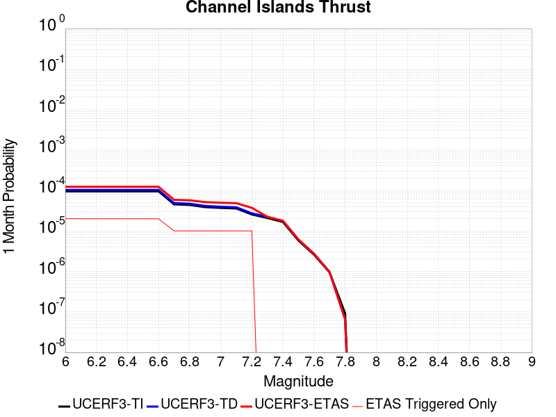 |  |  |

| Magnitude | 1 wk TI Prob | 1 wk TD Prob | 1 wk ETAS Prob | 1 wk ETAS/TD Gain | 1 wk ETAS Triggered Only | 1 mo TI Prob | 1 mo TD Prob | 1 mo ETAS Prob | 1 mo ETAS/TD Gain | 1 mo ETAS Triggered Only | 1 yr TI Prob | 1 yr TD Prob | 1 yr ETAS Prob | 1 yr ETAS/TD Gain | 1 yr ETAS Triggered Only | 10 yr TI Prob | 10 yr TD Prob | 10 yr ETAS Prob | 10 yr ETAS/TD Gain | 10 yr ETAS Triggered Only |
|-----|-----|-----|-----|-----|-----|-----|-----|-----|-----|-----|-----|-----|-----|-----|-----|-----|-----|-----|-----|-----|
| 6.0 | 2.2156251E-5 | 2.4092022E-5 | 4.409154E-5 | 1.8301303 | 2.0E-5 | 9.495191E-5 | 1.03248036E-4 | 1.2324598E-4 | 1.1936883 | 2.0E-5 | 0.0011554264 | 0.0012564266 | 0.0012963762 | 1.0317963 | 4.0E-5 | 0.011494373 | 0.0125038205 | 0.0125531955 | 1.0039488 | 5.0E-5 |
| 6.1 | 2.2156251E-5 | 2.4092022E-5 | 4.409154E-5 | 1.8301303 | 2.0E-5 | 9.495191E-5 | 1.03248036E-4 | 1.2324598E-4 | 1.1936883 | 2.0E-5 | 0.0011554264 | 0.0012564266 | 0.0012963762 | 1.0317963 | 4.0E-5 | 0.011494373 | 0.0125038205 | 0.0125531955 | 1.0039488 | 5.0E-5 |
| 6.2 | 2.2156251E-5 | 2.4092022E-5 | 4.409154E-5 | 1.8301303 | 2.0E-5 | 9.495191E-5 | 1.03248036E-4 | 1.2324598E-4 | 1.1936883 | 2.0E-5 | 0.0011554264 | 0.0012564266 | 0.0012963762 | 1.0317963 | 4.0E-5 | 0.011494373 | 0.0125038205 | 0.0125531955 | 1.0039488 | 5.0E-5 |
| 6.3 | 2.2156251E-5 | 2.4092022E-5 | 4.409154E-5 | 1.8301303 | 2.0E-5 | 9.495191E-5 | 1.03248036E-4 | 1.2324598E-4 | 1.1936883 | 2.0E-5 | 0.0011554264 | 0.0012564266 | 0.0012963762 | 1.0317963 | 4.0E-5 | 0.011494373 | 0.0125038205 | 0.0125531955 | 1.0039488 | 5.0E-5 |
| 6.4 | 2.2156251E-5 | 2.4092022E-5 | 4.409154E-5 | 1.8301303 | 2.0E-5 | 9.495191E-5 | 1.03248036E-4 | 1.2324598E-4 | 1.1936883 | 2.0E-5 | 0.0011554264 | 0.0012564266 | 0.0012963762 | 1.0317963 | 4.0E-5 | 0.011494373 | 0.0125038205 | 0.0125531955 | 1.0039488 | 5.0E-5 |
| 6.5 | 2.2156251E-5 | 2.4092022E-5 | 4.409154E-5 | 1.8301303 | 2.0E-5 | 9.495191E-5 | 1.03248036E-4 | 1.2324598E-4 | 1.1936883 | 2.0E-5 | 0.0011554264 | 0.0012564266 | 0.0012963762 | 1.0317963 | 4.0E-5 | 0.011494373 | 0.0125038205 | 0.0125531955 | 1.0039488 | 5.0E-5 |
| 6.6 | 2.2156251E-5 | 2.4092022E-5 | 4.409154E-5 | 1.8301303 | 2.0E-5 | 9.495191E-5 | 1.03248036E-4 | 1.2324598E-4 | 1.1936883 | 2.0E-5 | 0.0011554264 | 0.0012564266 | 0.0012963762 | 1.0317963 | 4.0E-5 | 0.011494373 | 0.0125038205 | 0.0125531955 | 1.0039488 | 5.0E-5 |
| 6.7 | 1.0601296E-5 | 1.1379544E-5 | 2.137943E-5 | 1.8787599 | 1.0E-5 | 4.5433335E-5 | 4.876859E-5 | 5.8768102E-5 | 1.20504 | 1.0E-5 | 5.5301044E-4 | 5.936007E-4 | 6.235829E-4 | 1.050509 | 3.0E-5 | 0.005516363 | 0.005920653 | 0.0059604165 | 1.006716 | 4.0E-5 |
| 6.8 | 1.0246747E-5 | 1.0996669E-5 | 2.0996558E-5 | 1.9093562 | 1.0E-5 | 4.391389E-5 | 4.7127756E-5 | 5.7127287E-5 | 1.2121792 | 1.0E-5 | 5.345204E-4 | 5.7363417E-4 | 6.0361694E-4 | 1.0522681 | 3.0E-5 | 0.0053323656 | 0.005722025 | 0.005761796 | 1.0069505 | 4.0E-5 |
| 6.9 | 9.049551E-6 | 9.699645E-6 | 1.9699548E-5 | 2.0309556 | 1.0E-5 | 3.878322E-5 | 4.1569267E-5 | 5.156885E-5 | 1.2405523 | 1.0E-5 | 4.7208337E-4 | 5.059924E-4 | 5.359772E-4 | 1.0592594 | 3.0E-5 | 0.0047108172 | 0.0050488203 | 0.0050886185 | 1.0078826 | 4.0E-5 |
| 7.0 | 8.6542195E-6 | 9.274603E-6 | 1.927451E-5 | 2.0782032 | 1.0E-5 | 3.7088983E-5 | 3.9747716E-5 | 4.974732E-5 | 1.2515768 | 1.0E-5 | 4.5146482E-4 | 4.8382508E-4 | 5.1381055E-4 | 1.0619758 | 3.0E-5 | 0.004505487 | 0.0048281294 | 0.004867936 | 1.0082448 | 4.0E-5 |
| 7.1 | 8.391028E-6 | 8.992925E-6 | 1.8992836E-5 | 2.1119752 | 1.0E-5 | 3.5961057E-5 | 3.8540562E-5 | 4.8540176E-5 | 1.2594569 | 1.0E-5 | 4.3773788E-4 | 4.6913436E-4 | 4.991203E-4 | 1.0639175 | 3.0E-5 | 0.004368766 | 0.0046818503 | 0.004721663 | 1.0085037 | 4.0E-5 |
| 7.2 | 5.965188E-6 | 6.3716957E-6 | 1.6371632E-5 | 2.569431 | 1.0E-5 | 2.556484E-5 | 2.7306984E-5 | 3.7306712E-5 | 1.3661966 | 1.0E-5 | 3.1120746E-4 | 3.3241237E-4 | 3.524057E-4 | 1.0601462 | 2.0E-5 | 0.00310772 | 0.0033192094 | 0.0033491098 | 1.0090083 | 3.0E-5 |
| 7.3 | 4.877518E-6 | 5.206007E-6 | 5.206007E-6 | 1.0 | 0.0 | 2.0903482E-5 | 2.231127E-5 | 2.231127E-5 | 1.0 | 0.0 | 2.5447016E-4 | 2.716063E-4 | 2.8160357E-4 | 1.036808 | 1.0E-5 | 0.0025417898 | 0.0027127897 | 0.0027327354 | 1.0073525 | 2.0E-5 |
| 7.4 | 3.8829853E-6 | 4.141863E-6 | 4.141863E-6 | 1.0 | 0.0 | 1.664126E-5 | 1.7750723E-5 | 1.7750723E-5 | 1.0 | 0.0 | 2.0258849E-4 | 2.1609403E-4 | 2.1609403E-4 | 1.0 | 0.0 | 0.002024039 | 0.002158881 | 0.0021688591 | 1.004622 | 1.0E-5 |
| 7.5 | 1.3489616E-6 | 1.4277905E-6 | 1.4277905E-6 | 1.0 | 0.0 | 5.7812517E-6 | 6.119088E-6 | 6.119088E-6 | 1.0 | 0.0 | 7.038446E-5 | 7.449739E-5 | 7.449739E-5 | 1.0 | 0.0 | 7.036218E-4 | 7.4472814E-4 | 7.4472814E-4 | 1.0 | 0.0 |
| 7.6 | 6.058192E-7 | 6.35378E-7 | 6.35378E-7 | 1.0 | 0.0 | 2.5963652E-6 | 2.7230458E-6 | 2.7230458E-6 | 1.0 | 0.0 | 3.161029E-5 | 3.3152595E-5 | 3.3152595E-5 | 1.0 | 0.0 | 3.1605794E-4 | 3.314781E-4 | 3.314781E-4 | 1.0 | 0.0 |
| 7.7 | 2.2170494E-7 | 2.2607924E-7 | 2.2607924E-7 | 1.0 | 0.0 | 9.5016367E-7 | 9.689107E-7 | 9.689107E-7 | 1.0 | 0.0 | 1.1568181E-5 | 1.17964355E-5 | 1.17964355E-5 | 1.0 | 0.0 | 1.1567579E-4 | 1.179592E-4 | 1.179592E-4 | 1.0 | 0.0 |
| 7.8 | 2.1613102E-8 | 1.5466837E-8 | 1.5466837E-8 | 1.0 | 0.0 | 9.262757E-8 | 6.628645E-8 | 6.628645E-8 | 1.0 | 0.0 | 1.1277401E-6 | 8.070372E-7 | 8.070372E-7 | 1.0 | 0.0 | 1.1277344E-5 | 8.07035E-6 | 8.07035E-6 | 1.0 | 0.0 |

## Hosgri
*[(top)](#table-of-contents)*

| 1 Week | 1 Month | 1 Year | 10 Year |
|-----|-----|-----|-----|
| 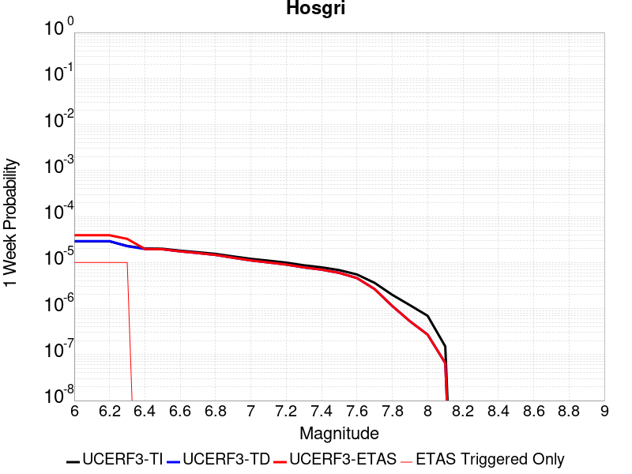 |  |  |  |

| Magnitude | 1 wk TI Prob | 1 wk TD Prob | 1 wk ETAS Prob | 1 wk ETAS/TD Gain | 1 wk ETAS Triggered Only | 1 mo TI Prob | 1 mo TD Prob | 1 mo ETAS Prob | 1 mo ETAS/TD Gain | 1 mo ETAS Triggered Only | 1 yr TI Prob | 1 yr TD Prob | 1 yr ETAS Prob | 1 yr ETAS/TD Gain | 1 yr ETAS Triggered Only | 10 yr TI Prob | 10 yr TD Prob | 10 yr ETAS Prob | 10 yr ETAS/TD Gain | 10 yr ETAS Triggered Only |
|-----|-----|-----|-----|-----|-----|-----|-----|-----|-----|-----|-----|-----|-----|-----|-----|-----|-----|-----|-----|-----|
| 6.0 | 2.883978E-5 | 2.9128403E-5 | 3.912811E-5 | 1.3432975 | 1.0E-5 | 1.235932E-4 | 1.248302E-4 | 1.448277E-4 | 1.1601976 | 2.0E-5 | 0.0015037085 | 0.0015187752 | 0.0015387449 | 1.0131485 | 2.0E-5 | 0.01493574 | 0.01508773 | 0.015136976 | 1.003264 | 5.0E-5 |
| 6.1 | 2.883978E-5 | 2.9128403E-5 | 3.912811E-5 | 1.3432975 | 1.0E-5 | 1.235932E-4 | 1.248302E-4 | 1.448277E-4 | 1.1601976 | 2.0E-5 | 0.0015037085 | 0.0015187752 | 0.0015387449 | 1.0131485 | 2.0E-5 | 0.01493574 | 0.01508773 | 0.015136976 | 1.003264 | 5.0E-5 |
| 6.2 | 2.883978E-5 | 2.9128403E-5 | 3.912811E-5 | 1.3432975 | 1.0E-5 | 1.235932E-4 | 1.248302E-4 | 1.448277E-4 | 1.1601976 | 2.0E-5 | 0.0015037085 | 0.0015187752 | 0.0015387449 | 1.0131485 | 2.0E-5 | 0.01493574 | 0.01508773 | 0.015136976 | 1.003264 | 5.0E-5 |
| 6.3 | 2.2914428E-5 | 2.2641956E-5 | 3.264173E-5 | 1.441648 | 1.0E-5 | 9.8200995E-5 | 9.703337E-5 | 1.17031435E-4 | 1.2060946 | 2.0E-5 | 0.0011949413 | 0.001180746 | 0.0012007224 | 1.0169184 | 2.0E-5 | 0.011885363 | 0.011746123 | 0.011795536 | 1.0042068 | 5.0E-5 |
| 6.4 | 2.0195741E-5 | 1.9696547E-5 | 1.9696547E-5 | 1.0 | 0.0 | 8.65503E-5 | 8.4411055E-5 | 8.4411055E-5 | 1.0 | 0.0 | 0.0010532405 | 0.001027222 | 0.001027222 | 1.0 | 0.0 | 0.010482626 | 0.010225783 | 0.010255476 | 1.0029038 | 3.0E-5 |
| 6.5 | 1.9924333E-5 | 1.9408968E-5 | 1.9408968E-5 | 1.0 | 0.0 | 8.53872E-5 | 8.317865E-5 | 8.317865E-5 | 1.0 | 0.0 | 0.0010390934 | 0.0010122315 | 0.0010122315 | 1.0 | 0.0 | 0.010342481 | 0.010077244 | 0.010097042 | 1.0019647 | 2.0E-5 |
| 6.6 | 1.809694E-5 | 1.7458287E-5 | 1.7458287E-5 | 1.0 | 0.0 | 7.7556004E-5 | 7.4819094E-5 | 7.4819094E-5 | 1.0 | 0.0 | 9.438353E-4 | 9.105431E-4 | 9.105431E-4 | 1.0 | 0.0 | 0.009398366 | 0.009069063 | 0.009078972 | 1.0010927 | 1.0E-5 |
| 6.7 | 1.675989E-5 | 1.6042752E-5 | 1.6042752E-5 | 1.0 | 0.0 | 7.182612E-5 | 6.8752845E-5 | 6.8752845E-5 | 1.0 | 0.0 | 8.7413215E-4 | 8.3674554E-4 | 8.3674554E-4 | 1.0 | 0.0 | 0.008707017 | 0.008336853 | 0.00834677 | 1.0011895 | 1.0E-5 |
| 6.8 | 1.5401129E-5 | 1.4614069E-5 | 1.4614069E-5 | 1.0 | 0.0 | 6.6003166E-5 | 6.263023E-5 | 6.263023E-5 | 1.0 | 0.0 | 8.032922E-4 | 7.6225714E-4 | 7.6225714E-4 | 1.0 | 0.0 | 0.008003947 | 0.0075972863 | 0.0075972863 | 1.0 | 0.0 |
| 6.9 | 1.356559E-5 | 1.2689955E-5 | 1.2689955E-5 | 1.0 | 0.0 | 5.8136946E-5 | 5.438439E-5 | 5.438439E-5 | 1.0 | 0.0 | 7.0758746E-4 | 6.6192925E-4 | 6.6192925E-4 | 1.0 | 0.0 | 0.007053386 | 0.006600378 | 0.006600378 | 1.0 | 0.0 |
| 7.0 | 1.2030819E-5 | 1.1095949E-5 | 1.1095949E-5 | 1.0 | 0.0 | 5.155963E-5 | 4.75532E-5 | 4.75532E-5 | 1.0 | 0.0 | 6.275577E-4 | 5.788065E-4 | 5.788065E-4 | 1.0 | 0.0 | 0.006257884 | 0.0057737473 | 0.0057737473 | 1.0 | 0.0 |
| 7.1 | 1.0972698E-5 | 1.0022167E-5 | 1.0022167E-5 | 1.0 | 0.0 | 4.7025E-5 | 4.2951437E-5 | 4.2951437E-5 | 1.0 | 0.0 | 5.72379E-4 | 5.2280835E-4 | 5.2280835E-4 | 1.0 | 0.0 | 0.0057090693 | 0.005216533 | 0.005216533 | 1.0 | 0.0 |
| 7.2 | 9.961926E-6 | 9.034732E-6 | 9.034732E-6 | 1.0 | 0.0 | 4.2693267E-5 | 3.8719707E-5 | 3.8719707E-5 | 1.0 | 0.0 | 5.1966653E-4 | 4.7131052E-4 | 4.7131052E-4 | 1.0 | 0.0 | 0.00518453 | 0.0047038523 | 0.0047038523 | 1.0 | 0.0 |
| 7.3 | 8.700929E-6 | 7.828089E-6 | 7.828089E-6 | 1.0 | 0.0 | 3.7289166E-5 | 3.354852E-5 | 3.354852E-5 | 1.0 | 0.0 | 4.53901E-4 | 4.083767E-4 | 4.083767E-4 | 1.0 | 0.0 | 0.00452975 | 0.004076999 | 0.004076999 | 1.0 | 0.0 |
| 7.4 | 7.866285E-6 | 6.9987263E-6 | 6.9987263E-6 | 1.0 | 0.0 | 3.3712215E-5 | 2.9994197E-5 | 2.9994197E-5 | 1.0 | 0.0 | 4.103689E-4 | 3.6511818E-4 | 3.6511818E-4 | 1.0 | 0.0 | 0.004096119 | 0.0036459167 | 0.0036459167 | 1.0 | 0.0 |
| 7.5 | 6.8381305E-6 | 5.9596814E-6 | 5.9596814E-6 | 1.0 | 0.0 | 2.9305946E-5 | 2.5541241E-5 | 2.5541241E-5 | 1.0 | 0.0 | 3.5674145E-4 | 3.1092027E-4 | 3.1092027E-4 | 1.0 | 0.0 | 0.0035616932 | 0.003105584 | 0.003105584 | 1.0 | 0.0 |
| 7.6 | 5.503376E-6 | 4.595227E-6 | 4.595227E-6 | 1.0 | 0.0 | 2.3585684E-5 | 1.9693682E-5 | 1.9693682E-5 | 1.0 | 0.0 | 2.8711787E-4 | 2.397442E-4 | 2.397442E-4 | 1.0 | 0.0 | 0.002867472 | 0.0023955852 | 0.0023955852 | 1.0 | 0.0 |
| 7.7 | 3.6144982E-6 | 2.6521896E-6 | 2.6521896E-6 | 1.0 | 0.0 | 1.5490614E-5 | 1.1366477E-5 | 1.1366477E-5 | 1.0 | 0.0 | 1.8858191E-4 | 1.3837808E-4 | 1.3837808E-4 | 1.0 | 0.0 | 0.0018842196 | 0.001383647 | 0.001383647 | 1.0 | 0.0 |
| 7.8 | 1.9853494E-6 | 1.1360784E-6 | 1.1360784E-6 | 1.0 | 0.0 | 8.508612E-6 | 4.8688985E-6 | 4.8688985E-6 | 1.0 | 0.0 | 1.0358743E-4 | 5.9277223E-5 | 5.9277223E-5 | 1.0 | 0.0 | 0.0010353916 | 5.933389E-4 | 5.933389E-4 | 1.0 | 0.0 |
| 7.9 | 1.1818757E-6 | 5.29477E-7 | 5.29477E-7 | 1.0 | 0.0 | 5.0651715E-6 | 2.269185E-6 | 2.269185E-6 | 1.0 | 0.0 | 6.1666724E-5 | 2.7626977E-5 | 2.7626977E-5 | 1.0 | 0.0 | 6.1649614E-4 | 2.7691363E-4 | 2.7691363E-4 | 1.0 | 0.0 |
| 8.0 | 6.962958E-7 | 2.71365E-7 | 2.71365E-7 | 1.0 | 0.0 | 2.9841215E-6 | 1.1629924E-6 | 1.1629924E-6 | 1.0 | 0.0 | 3.6331072E-5 | 1.415934E-5 | 1.415934E-5 | 1.0 | 0.0 | 3.6325134E-4 | 1.4215276E-4 | 1.4215276E-4 | 1.0 | 0.0 |
| 8.1 | 1.5033264E-7 | 6.52693E-8 | 6.52693E-8 | 1.0 | 0.0 | 6.442826E-7 | 2.7972553E-7 | 2.7972553E-7 | 1.0 | 0.0 | 7.844113E-6 | 3.4056532E-6 | 3.4056532E-6 | 1.0 | 0.0 | 7.843835E-5 | 3.4072833E-5 | 3.4072833E-5 | 1.0 | 0.0 |

## Whittier alt 1
*[(top)](#table-of-contents)*

| 1 Week | 1 Month | 1 Year | 10 Year |
|-----|-----|-----|-----|
|  |  |  |  |

| Magnitude | 1 wk TI Prob | 1 wk TD Prob | 1 wk ETAS Prob | 1 wk ETAS/TD Gain | 1 wk ETAS Triggered Only | 1 mo TI Prob | 1 mo TD Prob | 1 mo ETAS Prob | 1 mo ETAS/TD Gain | 1 mo ETAS Triggered Only | 1 yr TI Prob | 1 yr TD Prob | 1 yr ETAS Prob | 1 yr ETAS/TD Gain | 1 yr ETAS Triggered Only | 10 yr TI Prob | 10 yr TD Prob | 10 yr ETAS Prob | 10 yr ETAS/TD Gain | 10 yr ETAS Triggered Only |
|-----|-----|-----|-----|-----|-----|-----|-----|-----|-----|-----|-----|-----|-----|-----|-----|-----|-----|-----|-----|-----|
| 6.0 | 4.2554693E-5 | 4.7252182E-5 | 6.725124E-5 | 1.4232409 | 2.0E-5 | 1.8236451E-4 | 2.0249544E-4 | 2.2249139E-4 | 1.0987476 | 2.0E-5 | 0.002218027 | 0.0024629163 | 0.0024928425 | 1.0121506 | 3.0E-5 | 0.02196019 | 0.024390263 | 0.024439044 | 1.002 | 5.0E-5 |
| 6.1 | 4.2554693E-5 | 4.7252182E-5 | 6.725124E-5 | 1.4232409 | 2.0E-5 | 1.8236451E-4 | 2.0249544E-4 | 2.2249139E-4 | 1.0987476 | 2.0E-5 | 0.002218027 | 0.0024629163 | 0.0024928425 | 1.0121506 | 3.0E-5 | 0.02196019 | 0.024390263 | 0.024439044 | 1.002 | 5.0E-5 |
| 6.2 | 4.2554693E-5 | 4.7252182E-5 | 6.725124E-5 | 1.4232409 | 2.0E-5 | 1.8236451E-4 | 2.0249544E-4 | 2.2249139E-4 | 1.0987476 | 2.0E-5 | 0.002218027 | 0.0024629163 | 0.0024928425 | 1.0121506 | 3.0E-5 | 0.02196019 | 0.024390263 | 0.024439044 | 1.002 | 5.0E-5 |
| 6.3 | 1.9617712E-5 | 1.826841E-5 | 1.826841E-5 | 1.0 | 0.0 | 8.40732E-5 | 7.829095E-5 | 7.829095E-5 | 1.0 | 0.0 | 0.0010231105 | 9.527944E-4 | 9.527944E-4 | 1.0 | 0.0 | 0.01018413 | 0.0094904 | 0.0094904 | 1.0 | 0.0 |
| 6.4 | 1.5611336E-5 | 1.3604089E-5 | 1.3604089E-5 | 1.0 | 0.0 | 6.690401E-5 | 5.8301972E-5 | 5.8301972E-5 | 1.0 | 0.0 | 8.142519E-4 | 7.096013E-4 | 7.096013E-4 | 1.0 | 0.0 | 0.008112748 | 0.0070753377 | 0.0070753377 | 1.0 | 0.0 |
| 6.5 | 1.5150166E-5 | 1.3100744E-5 | 1.3100744E-5 | 1.0 | 0.0 | 6.492767E-5 | 5.614487E-5 | 5.614487E-5 | 1.0 | 0.0 | 7.9020765E-4 | 6.8335526E-4 | 6.8335526E-4 | 1.0 | 0.0 | 0.007874036 | 0.006814508 | 0.006814508 | 1.0 | 0.0 |
| 6.6 | 1.295588E-5 | 1.0380544E-5 | 1.0380544E-5 | 1.0 | 0.0 | 5.552402E-5 | 4.44873E-5 | 4.44873E-5 | 1.0 | 0.0 | 6.7579525E-4 | 5.415002E-4 | 5.415002E-4 | 1.0 | 0.0 | 0.006737438 | 0.005403343 | 0.005403343 | 1.0 | 0.0 |
| 6.7 | 1.2542085E-5 | 9.899189E-6 | 9.899189E-6 | 1.0 | 0.0 | 5.3750682E-5 | 4.2424414E-5 | 4.2424414E-5 | 1.0 | 0.0 | 6.542181E-4 | 5.163967E-4 | 5.163967E-4 | 1.0 | 0.0 | 0.006522954 | 0.005153464 | 0.005153464 | 1.0 | 0.0 |
| 6.8 | 1.2195878E-5 | 9.49523E-6 | 9.49523E-6 | 1.0 | 0.0 | 5.2267E-5 | 4.069322E-5 | 4.069322E-5 | 1.0 | 0.0 | 6.36165E-4 | 4.9532915E-4 | 4.9532915E-4 | 1.0 | 0.0 | 0.0063434686 | 0.0049436963 | 0.0049436963 | 1.0 | 0.0 |
| 6.9 | 1.1580298E-5 | 8.772739E-6 | 8.772739E-6 | 1.0 | 0.0 | 4.9628903E-5 | 3.759692E-5 | 3.759692E-5 | 1.0 | 0.0 | 6.040644E-4 | 4.5764804E-4 | 4.5764804E-4 | 1.0 | 0.0 | 0.00602425 | 0.0045684646 | 0.0045684646 | 1.0 | 0.0 |
| 7.0 | 1.0964795E-5 | 8.083794E-6 | 8.083794E-6 | 1.0 | 0.0 | 4.6991136E-5 | 3.4644378E-5 | 3.4644378E-5 | 1.0 | 0.0 | 5.7196687E-4 | 4.217152E-4 | 4.217152E-4 | 1.0 | 0.0 | 0.0057049696 | 0.004210459 | 0.004210459 | 1.0 | 0.0 |
| 7.1 | 1.0230601E-5 | 7.32646E-6 | 7.32646E-6 | 1.0 | 0.0 | 4.3844695E-5 | 3.1398744E-5 | 3.1398744E-5 | 1.0 | 0.0 | 5.336784E-4 | 3.8221394E-4 | 3.8221394E-4 | 1.0 | 0.0 | 0.005323986 | 0.0038167592 | 0.0038167592 | 1.0 | 0.0 |
| 7.2 | 9.40865E-6 | 6.5430822E-6 | 6.5430822E-6 | 1.0 | 0.0 | 4.032216E-5 | 2.8041486E-5 | 2.8041486E-5 | 1.0 | 0.0 | 4.908117E-4 | 3.4135283E-4 | 3.4135283E-4 | 1.0 | 0.0 | 0.0048972913 | 0.0034094024 | 0.0034094024 | 1.0 | 0.0 |
| 7.3 | 8.237384E-6 | 5.5975433E-6 | 5.5975433E-6 | 1.0 | 0.0 | 3.5302593E-5 | 2.3989258E-5 | 2.3989258E-5 | 1.0 | 0.0 | 4.2972428E-4 | 2.920311E-4 | 2.920311E-4 | 1.0 | 0.0 | 0.0042889426 | 0.0029167992 | 0.0029167992 | 1.0 | 0.0 |
| 7.4 | 7.5316966E-6 | 5.0276153E-6 | 5.0276153E-6 | 1.0 | 0.0 | 3.2278298E-5 | 2.154675E-5 | 2.154675E-5 | 1.0 | 0.0 | 3.9291743E-4 | 2.623011E-4 | 2.623011E-4 | 1.0 | 0.0 | 0.0039222343 | 0.0026200267 | 0.0026200267 | 1.0 | 0.0 |
| 7.5 | 6.149649E-6 | 3.9336355E-6 | 3.9336355E-6 | 1.0 | 0.0 | 2.6355372E-5 | 1.6858336E-5 | 1.6858336E-5 | 1.0 | 0.0 | 3.208294E-4 | 2.052318E-4 | 2.052318E-4 | 1.0 | 0.0 | 0.003203666 | 0.0020505118 | 0.0020505118 | 1.0 | 0.0 |
| 7.6 | 5.457711E-6 | 3.3951796E-6 | 3.3951796E-6 | 1.0 | 0.0 | 2.338998E-5 | 1.4550694E-5 | 1.4550694E-5 | 1.0 | 0.0 | 2.8473578E-4 | 1.771411E-4 | 1.771411E-4 | 1.0 | 0.0 | 0.0028437122 | 0.0017700798 | 0.0017700798 | 1.0 | 0.0 |
| 7.7 | 4.1676276E-6 | 2.3329922E-6 | 2.3329922E-6 | 1.0 | 0.0 | 1.7861139E-5 | 9.998504E-6 | 9.998504E-6 | 1.0 | 0.0 | 2.1743766E-4 | 1.2172572E-4 | 1.2172572E-4 | 1.0 | 0.0 | 0.0021722503 | 0.0012166635 | 0.0012166635 | 1.0 | 0.0 |
| 7.8 | 2.2692414E-7 | 9.384417E-8 | 9.384417E-8 | 1.0 | 0.0 | 9.725317E-7 | 4.0218927E-7 | 4.0218927E-7 | 1.0 | 0.0 | 1.1840509E-5 | 4.8966467E-6 | 4.8966467E-6 | 1.0 | 0.0 | 1.1839878E-4 | 4.8965718E-5 | 4.8965718E-5 | 1.0 | 0.0 |
| 7.9 | 6.676829E-9 | 3.4397174E-9 | 3.4397174E-9 | 1.0 | 0.0 | 2.861498E-8 | 1.4741646E-8 | 1.4741646E-8 | 1.0 | 0.0 | 3.4838732E-7 | 1.7947953E-7 | 1.7947953E-7 | 1.0 | 0.0 | 3.4838679E-6 | 1.794794E-6 | 1.794794E-6 | 1.0 | 0.0 |

## Robinson Creek
*[(top)](#table-of-contents)*

| 1 Week | 1 Month | 1 Year | 10 Year |
|-----|-----|-----|-----|
|  |  |  |  |

| Magnitude | 1 wk TI Prob | 1 wk TD Prob | 1 wk ETAS Prob | 1 wk ETAS/TD Gain | 1 wk ETAS Triggered Only | 1 mo TI Prob | 1 mo TD Prob | 1 mo ETAS Prob | 1 mo ETAS/TD Gain | 1 mo ETAS Triggered Only | 1 yr TI Prob | 1 yr TD Prob | 1 yr ETAS Prob | 1 yr ETAS/TD Gain | 1 yr ETAS Triggered Only | 10 yr TI Prob | 10 yr TD Prob | 10 yr ETAS Prob | 10 yr ETAS/TD Gain | 10 yr ETAS Triggered Only |
|-----|-----|-----|-----|-----|-----|-----|-----|-----|-----|-----|-----|-----|-----|-----|-----|-----|-----|-----|-----|-----|
| 6.0 | 1.3705327E-5 | 1.5285013E-5 | 3.528471E-5 | 2.3084512 | 2.0E-5 | 5.8735794E-5 | 6.55072E-5 | 8.550589E-5 | 1.30529 | 2.0E-5 | 7.1487366E-4 | 7.9755014E-4 | 8.275262E-4 | 1.0375851 | 3.0E-5 | 0.0071257832 | 0.007975501 | 0.008015183 | 1.0049753 | 4.0E-5 |
| 6.1 | 1.3705327E-5 | 1.5285013E-5 | 3.528471E-5 | 2.3084512 | 2.0E-5 | 5.8735794E-5 | 6.55072E-5 | 8.550589E-5 | 1.30529 | 2.0E-5 | 7.1487366E-4 | 7.9755014E-4 | 8.275262E-4 | 1.0375851 | 3.0E-5 | 0.0071257832 | 0.007975501 | 0.008015183 | 1.0049753 | 4.0E-5 |
| 6.2 | 1.3705327E-5 | 1.5285013E-5 | 3.528471E-5 | 2.3084512 | 2.0E-5 | 5.8735794E-5 | 6.55072E-5 | 8.550589E-5 | 1.30529 | 2.0E-5 | 7.1487366E-4 | 7.9755014E-4 | 8.275262E-4 | 1.0375851 | 3.0E-5 | 0.0071257832 | 0.007975501 | 0.008015183 | 1.0049753 | 4.0E-5 |
| 6.3 | 1.3705327E-5 | 1.5285013E-5 | 3.528471E-5 | 2.3084512 | 2.0E-5 | 5.8735794E-5 | 6.55072E-5 | 8.550589E-5 | 1.30529 | 2.0E-5 | 7.1487366E-4 | 7.9755014E-4 | 8.275262E-4 | 1.0375851 | 3.0E-5 | 0.0071257832 | 0.007975501 | 0.008015183 | 1.0049753 | 4.0E-5 |
| 6.4 | 1.3705327E-5 | 1.5285013E-5 | 3.528471E-5 | 2.3084512 | 2.0E-5 | 5.8735794E-5 | 6.55072E-5 | 8.550589E-5 | 1.30529 | 2.0E-5 | 7.1487366E-4 | 7.9755014E-4 | 8.275262E-4 | 1.0375851 | 3.0E-5 | 0.0071257832 | 0.007975501 | 0.008015183 | 1.0049753 | 4.0E-5 |

## San Andreas (Santa Cruz Mts) 2011 CFM
*[(top)](#table-of-contents)*

| 1 Week | 1 Month | 1 Year | 10 Year |
|-----|-----|-----|-----|
| 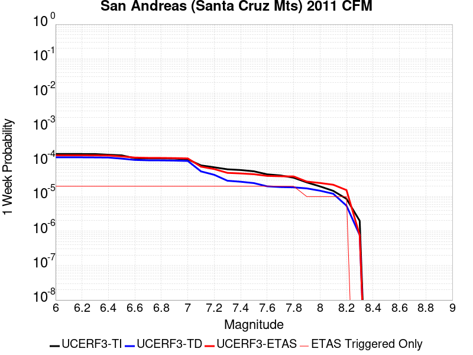 | 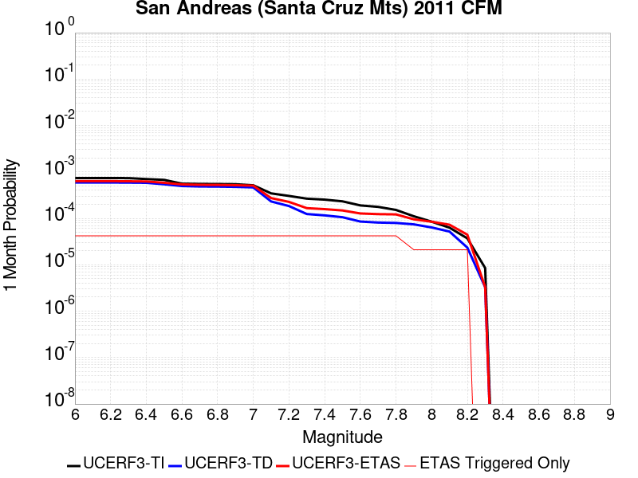 | 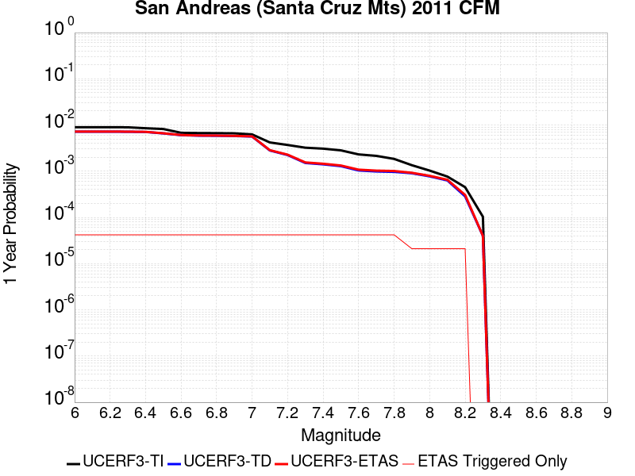 | 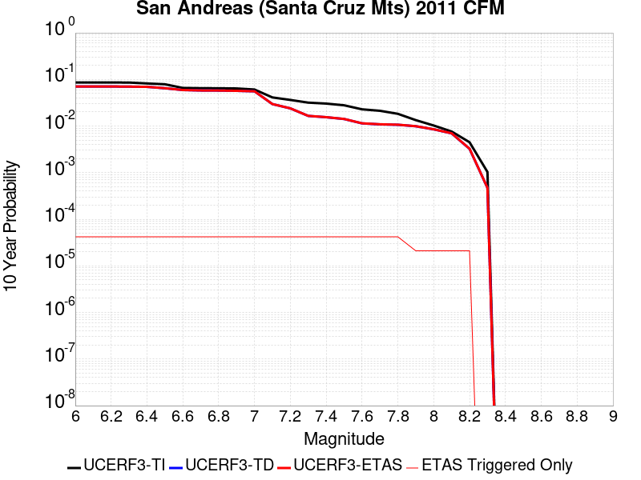 |

| Magnitude | 1 wk TI Prob | 1 wk TD Prob | 1 wk ETAS Prob | 1 wk ETAS/TD Gain | 1 wk ETAS Triggered Only | 1 mo TI Prob | 1 mo TD Prob | 1 mo ETAS Prob | 1 mo ETAS/TD Gain | 1 mo ETAS Triggered Only | 1 yr TI Prob | 1 yr TD Prob | 1 yr ETAS Prob | 1 yr ETAS/TD Gain | 1 yr ETAS Triggered Only | 10 yr TI Prob | 10 yr TD Prob | 10 yr ETAS Prob | 10 yr ETAS/TD Gain | 10 yr ETAS Triggered Only |
|-----|-----|-----|-----|-----|-----|-----|-----|-----|-----|-----|-----|-----|-----|-----|-----|-----|-----|-----|-----|-----|
| 6.0 | 1.7221631E-4 | 1.3792426E-4 | 1.579215E-4 | 1.1449871 | 2.0E-5 | 7.378611E-4 | 5.9097214E-4 | 6.209544E-4 | 1.0507338 | 3.0E-5 | 0.008946515 | 0.0071717235 | 0.0072015086 | 1.0041531 | 3.0E-5 | 0.08594794 | 0.07054796 | 0.07058514 | 1.000527 | 4.0E-5 |
| 6.1 | 1.7221631E-4 | 1.3792426E-4 | 1.579215E-4 | 1.1449871 | 2.0E-5 | 7.378611E-4 | 5.9097214E-4 | 6.209544E-4 | 1.0507338 | 3.0E-5 | 0.008946515 | 0.0071717235 | 0.0072015086 | 1.0041531 | 3.0E-5 | 0.08594794 | 0.07054796 | 0.07058514 | 1.000527 | 4.0E-5 |
| 6.2 | 1.7221631E-4 | 1.3792426E-4 | 1.579215E-4 | 1.1449871 | 2.0E-5 | 7.378611E-4 | 5.9097214E-4 | 6.209544E-4 | 1.0507338 | 3.0E-5 | 0.008946515 | 0.0071717235 | 0.0072015086 | 1.0041531 | 3.0E-5 | 0.08594794 | 0.07054796 | 0.07058514 | 1.000527 | 4.0E-5 |
| 6.3 | 1.716926E-4 | 1.3711878E-4 | 1.5711605E-4 | 1.145839 | 2.0E-5 | 7.3561794E-4 | 5.8752164E-4 | 6.17504E-4 | 1.051032 | 3.0E-5 | 0.008919428 | 0.007129989 | 0.0071597756 | 1.0041776 | 3.0E-5 | 0.08569809 | 0.07015993 | 0.07019712 | 1.0005301 | 4.0E-5 |
| 6.4 | 1.6392978E-4 | 1.3587909E-4 | 1.5587638E-4 | 1.1471697 | 2.0E-5 | 7.02367E-4 | 5.82211E-4 | 6.1219354E-4 | 1.0514977 | 3.0E-5 | 0.008517839 | 0.0070657525 | 0.0070955404 | 1.0042158 | 3.0E-5 | 0.08198654 | 0.069394976 | 0.0694322 | 1.0005364 | 4.0E-5 |
| 6.5 | 1.5742714E-4 | 1.2647794E-4 | 1.4647542E-4 | 1.1581104 | 2.0E-5 | 6.745133E-4 | 5.419374E-4 | 5.719212E-4 | 1.0553269 | 3.0E-5 | 0.00818132 | 0.0065784375 | 0.0066082403 | 1.0045303 | 3.0E-5 | 0.078865945 | 0.06486093 | 0.064898334 | 1.0005767 | 4.0E-5 |
| 6.6 | 1.3038084E-4 | 1.1587992E-4 | 1.358776E-4 | 1.1725725 | 2.0E-5 | 5.5865536E-4 | 4.96535E-4 | 5.265201E-4 | 1.0603887 | 3.0E-5 | 0.006780438 | 0.006028784 | 0.0060586035 | 1.0049461 | 3.0E-5 | 0.0657725 | 0.059330538 | 0.059368163 | 1.0006342 | 4.0E-5 |
| 6.7 | 1.2867592E-4 | 1.1314491E-4 | 1.3314265E-4 | 1.1767445 | 2.0E-5 | 5.5135164E-4 | 4.8481792E-4 | 5.148034E-4 | 1.0618489 | 3.0E-5 | 0.0066920654 | 0.005886907 | 0.0059167305 | 1.005066 | 3.0E-5 | 0.06494093 | 0.058041416 | 0.058079094 | 1.0006492 | 4.0E-5 |
| 6.8 | 1.2801298E-4 | 1.12520516E-4 | 1.3251827E-4 | 1.1777253 | 2.0E-5 | 5.485117E-4 | 4.8214293E-4 | 5.1212846E-4 | 1.0621922 | 3.0E-5 | 0.0066577005 | 0.0058545293 | 0.005884354 | 1.0050943 | 3.0E-5 | 0.06461738 | 0.05775524 | 0.05779293 | 1.0006526 | 4.0E-5 |
| 6.9 | 1.269149E-4 | 1.1094256E-4 | 1.3094033E-4 | 1.1802535 | 2.0E-5 | 5.4380763E-4 | 4.7538272E-4 | 5.0536846E-4 | 1.0630771 | 3.0E-5 | 0.006600777 | 0.005772663 | 0.00580249 | 1.0051669 | 3.0E-5 | 0.06408122 | 0.057027116 | 0.057064835 | 1.0006614 | 4.0E-5 |
| 7.0 | 1.2030331E-4 | 1.0824356E-4 | 1.282414E-4 | 1.1847485 | 2.0E-5 | 5.154837E-4 | 4.638198E-4 | 4.9380586E-4 | 1.0646503 | 3.0E-5 | 0.006257969 | 0.0056326203 | 0.005662451 | 1.0052961 | 3.0E-5 | 0.06084648 | 0.055699922 | 0.055737697 | 1.0006782 | 4.0E-5 |
| 7.1 | 8.049617E-5 | 5.392429E-5 | 7.392321E-5 | 1.3708704 | 2.0E-5 | 3.4493793E-4 | 2.3108382E-4 | 2.610769E-4 | 1.129793 | 3.0E-5 | 0.0041915346 | 0.0028098505 | 0.0028397662 | 1.0106467 | 3.0E-5 | 0.041133516 | 0.029618833 | 0.029657647 | 1.0013105 | 4.0E-5 |
| 7.2 | 7.093979E-5 | 4.2935415E-5 | 6.293456E-5 | 1.4657959 | 2.0E-5 | 3.0399222E-4 | 1.8399608E-4 | 2.0399239E-4 | 1.108678 | 2.0E-5 | 0.0036948253 | 0.0022378736 | 0.0022578288 | 1.0089171 | 2.0E-5 | 0.03633994 | 0.023941126 | 0.023970408 | 1.0012231 | 3.0E-5 |
| 7.3 | 6.193693E-5 | 2.8891074E-5 | 4.8890495E-5 | 1.6922354 | 2.0E-5 | 2.6541698E-4 | 1.2381302E-4 | 1.4381054E-4 | 1.1615139 | 2.0E-5 | 0.0032266637 | 0.001506383 | 0.0015263528 | 1.0132568 | 2.0E-5 | 0.031802133 | 0.016497677 | 0.016527183 | 1.0017885 | 3.0E-5 |
| 7.4 | 5.906492E-5 | 2.7020369E-5 | 4.701983E-5 | 1.7401624 | 2.0E-5 | 2.5311083E-4 | 1.1579645E-4 | 1.3579414E-4 | 1.1726968 | 2.0E-5 | 0.0030772698 | 0.0014089114 | 0.0014288833 | 1.0141754 | 2.0E-5 | 0.030350044 | 0.0154695045 | 0.0154990405 | 1.0019093 | 3.0E-5 |
| 7.5 | 5.424296E-5 | 2.4675093E-5 | 4.46746E-5 | 1.8105139 | 2.0E-5 | 2.324491E-4 | 1.0574612E-4 | 1.25744E-4 | 1.1891122 | 2.0E-5 | 0.002826395 | 0.0012866998 | 0.0013066741 | 1.0155237 | 2.0E-5 | 0.027907165 | 0.014161854 | 0.014191429 | 1.0020883 | 3.0E-5 |
| 7.6 | 4.43084E-5 | 1.990151E-5 | 3.990111E-5 | 2.0049288 | 2.0E-5 | 1.8987931E-4 | 8.528939E-5 | 1.0528769E-4 | 1.2344757 | 2.0E-5 | 0.0023093296 | 0.001037904 | 0.0010578833 | 1.0192496 | 2.0E-5 | 0.022854783 | 0.011411123 | 0.011440781 | 1.002599 | 3.0E-5 |
| 7.7 | 4.118098E-5 | 1.8933848E-5 | 3.8933467E-5 | 2.0562894 | 2.0E-5 | 1.7647797E-4 | 8.1142534E-5 | 1.0114091E-4 | 1.2464598 | 2.0E-5 | 0.002146502 | 9.874629E-4 | 0.0010074432 | 1.0202339 | 2.0E-5 | 0.021258866 | 0.010868995 | 0.010898669 | 1.0027301 | 3.0E-5 |
| 7.8 | 3.5408906E-5 | 1.856201E-5 | 3.856164E-5 | 2.0774496 | 2.0E-5 | 1.5174363E-4 | 7.954905E-5 | 9.9547455E-5 | 1.2513973 | 2.0E-5 | 0.0018459131 | 9.6807955E-4 | 9.880601E-4 | 1.0206394 | 2.0E-5 | 0.018306552 | 0.0106506655 | 0.010680346 | 1.0027868 | 3.0E-5 |
| 7.9 | 2.5860836E-5 | 1.7313954E-5 | 2.7313781E-5 | 1.5775588 | 1.0E-5 | 1.10827445E-4 | 7.420055E-5 | 8.419981E-5 | 1.1347599 | 1.0E-5 | 0.001348489 | 9.030175E-4 | 9.130085E-4 | 1.0110639 | 1.0E-5 | 0.013403354 | 0.009906601 | 0.009926403 | 1.0019989 | 2.0E-5 |
| 8.0 | 1.9777332E-5 | 1.4837888E-5 | 2.4837738E-5 | 1.6739404 | 1.0E-5 | 8.4757245E-5 | 6.3589396E-5 | 7.358876E-5 | 1.157249 | 1.0E-5 | 0.0010314309 | 7.739261E-4 | 7.8391837E-4 | 1.0129111 | 1.0E-5 | 0.010266567 | 0.008508087 | 0.008527917 | 1.0023307 | 2.0E-5 |
| 8.1 | 1.468494E-5 | 1.2105831E-5 | 2.210571E-5 | 1.8260382 | 1.0E-5 | 6.293394E-5 | 5.1881103E-5 | 6.1880586E-5 | 1.1927384 | 1.0E-5 | 7.6595135E-4 | 6.3146953E-4 | 6.414632E-4 | 1.0158261 | 1.0E-5 | 0.0076331664 | 0.0069684954 | 0.0069883564 | 1.00285 | 2.0E-5 |
| 8.2 | 8.63836E-6 | 5.4678667E-6 | 1.5467813E-5 | 2.8288567 | 1.0E-5 | 3.7021015E-5 | 2.3433504E-5 | 3.343327E-5 | 1.4267294 | 1.0E-5 | 4.5063766E-4 | 2.8526565E-4 | 2.9526278E-4 | 1.035045 | 1.0E-5 | 0.004497249 | 0.003245162 | 0.0032650973 | 1.006143 | 2.0E-5 |
| 8.3 | 1.983087E-6 | 7.6564595E-7 | 7.6564595E-7 | 1.0 | 0.0 | 8.498917E-6 | 3.281336E-6 | 3.281336E-6 | 1.0 | 0.0 | 1.034694E-4 | 3.9949547E-5 | 3.9949547E-5 | 1.0 | 0.0 | 0.0010342124 | 4.717979E-4 | 4.717979E-4 | 1.0 | 0.0 |

## Green Valley 2011 CFM
*[(top)](#table-of-contents)*

| 1 Week | 1 Month | 1 Year | 10 Year |
|-----|-----|-----|-----|
|  |  |  |  |

| Magnitude | 1 wk TI Prob | 1 wk TD Prob | 1 wk ETAS Prob | 1 wk ETAS/TD Gain | 1 wk ETAS Triggered Only | 1 mo TI Prob | 1 mo TD Prob | 1 mo ETAS Prob | 1 mo ETAS/TD Gain | 1 mo ETAS Triggered Only | 1 yr TI Prob | 1 yr TD Prob | 1 yr ETAS Prob | 1 yr ETAS/TD Gain | 1 yr ETAS Triggered Only | 10 yr TI Prob | 10 yr TD Prob | 10 yr ETAS Prob | 10 yr ETAS/TD Gain | 10 yr ETAS Triggered Only |
|-----|-----|-----|-----|-----|-----|-----|-----|-----|-----|-----|-----|-----|-----|-----|-----|-----|-----|-----|-----|-----|
| 6.0 | 9.9629346E-5 | 1.7302863E-4 | 1.8302689E-4 | 1.057784 | 1.0E-5 | 4.2691303E-4 | 7.41326E-4 | 7.6131115E-4 | 1.0269587 | 2.0E-5 | 0.0051852856 | 0.00898692 | 0.00900674 | 1.0022055 | 2.0E-5 | 0.050659515 | 0.08553951 | 0.08557609 | 1.0004276 | 4.0E-5 |
| 6.1 | 9.88615E-5 | 1.7150163E-4 | 1.8149991E-4 | 1.0582985 | 1.0E-5 | 4.2362334E-4 | 7.347854E-4 | 7.547707E-4 | 1.0271988 | 2.0E-5 | 0.0051454236 | 0.008907947 | 0.008927769 | 1.0022252 | 2.0E-5 | 0.050279044 | 0.08482712 | 0.08486372 | 1.0004315 | 4.0E-5 |
| 6.2 | 9.696895E-5 | 1.6789208E-4 | 1.7789041E-4 | 1.0595521 | 1.0E-5 | 4.15515E-4 | 7.1932544E-4 | 7.3931104E-4 | 1.0277839 | 2.0E-5 | 0.0050471667 | 0.00872133 | 0.008741155 | 1.0022732 | 2.0E-5 | 0.04934063 | 0.08313578 | 0.08317246 | 1.0004412 | 4.0E-5 |
| 6.3 | 9.275224E-5 | 1.5968543E-4 | 1.6968383E-4 | 1.0626131 | 1.0E-5 | 3.9744904E-4 | 6.841728E-4 | 7.041591E-4 | 1.0292124 | 2.0E-5 | 0.0048282105 | 0.008296652 | 0.008316485 | 1.0023906 | 2.0E-5 | 0.047246475 | 0.07927481 | 0.07931164 | 1.0004646 | 4.0E-5 |
| 6.4 | 8.391499E-5 | 1.4365884E-4 | 1.536574E-4 | 1.0695994 | 1.0E-5 | 3.595861E-4 | 6.155238E-4 | 6.355115E-4 | 1.0324726 | 2.0E-5 | 0.004369175 | 0.007467181 | 0.0074870316 | 1.0026584 | 2.0E-5 | 0.04284265 | 0.07164672 | 0.071683854 | 1.0005183 | 4.0E-5 |
| 6.5 | 5.9519385E-5 | 9.932622E-5 | 1.0932523E-4 | 1.1006683 | 1.0E-5 | 2.5505814E-4 | 4.2560388E-4 | 4.4559536E-4 | 1.046972 | 2.0E-5 | 0.0031009112 | 0.005168341 | 0.005188238 | 1.0038497 | 2.0E-5 | 0.030579966 | 0.05014692 | 0.050184913 | 1.0007577 | 4.0E-5 |
| 6.6 | 4.5361558E-5 | 7.4019794E-5 | 7.4019794E-5 | 1.0 | 0.0 | 1.9439218E-4 | 3.1717744E-4 | 3.2717426E-4 | 1.0315181 | 1.0E-5 | 0.0023641558 | 0.0038538678 | 0.0038638292 | 1.0025848 | 1.0E-5 | 0.023391623 | 0.03766727 | 0.037696138 | 1.0007664 | 3.0E-5 |
| 6.7 | 3.8808106E-5 | 6.264382E-5 | 6.264382E-5 | 1.0 | 0.0 | 1.6630985E-4 | 2.6843755E-4 | 2.7843486E-4 | 1.0372427 | 1.0E-5 | 0.0020229418 | 0.0032627317 | 0.003272699 | 1.0030549 | 1.0E-5 | 0.020046256 | 0.032007415 | 0.032036457 | 1.0009073 | 3.0E-5 |
| 6.8 | 2.2284667E-5 | 3.128574E-5 | 3.128574E-5 | 1.0 | 0.0 | 9.550222E-5 | 1.3407487E-4 | 1.3407487E-4 | 1.0 | 0.0 | 0.0011621192 | 0.0016311383 | 0.0016311383 | 1.0 | 0.0 | 0.011560607 | 0.01616672 | 0.016176559 | 1.0006086 | 1.0E-5 |
| 6.9 | 1.8050168E-5 | 2.4448536E-5 | 2.4448536E-5 | 1.0 | 0.0 | 7.735557E-5 | 1.0477527E-4 | 1.0477527E-4 | 1.0 | 0.0 | 9.4139716E-4 | 0.0012748954 | 0.0012748954 | 1.0 | 0.0 | 0.009374191 | 0.012669067 | 0.01267894 | 1.0007793 | 1.0E-5 |
| 7.0 | 1.4763166E-5 | 1.9583236E-5 | 1.9583236E-5 | 1.0 | 0.0 | 6.326917E-5 | 8.3925464E-5 | 8.3925464E-5 | 1.0 | 0.0 | 7.7002996E-4 | 0.001021315 | 0.001021315 | 1.0 | 0.0 | 0.007673672 | 0.01016625 | 0.010176148 | 1.0009737 | 1.0E-5 |
| 7.1 | 1.2399713E-5 | 1.6304042E-5 | 1.6304042E-5 | 1.0 | 0.0 | 5.3140546E-5 | 6.987261E-5 | 6.987261E-5 | 1.0 | 0.0 | 6.467941E-4 | 8.5036893E-4 | 8.5036893E-4 | 1.0 | 0.0 | 0.006449148 | 0.008471781 | 0.008471781 | 1.0 | 0.0 |
| 7.2 | 1.0584195E-5 | 1.39220465E-5 | 1.39220465E-5 | 1.0 | 0.0 | 4.5360044E-5 | 5.966456E-5 | 5.966456E-5 | 1.0 | 0.0 | 5.521186E-4 | 7.2617555E-4 | 7.2617555E-4 | 1.0 | 0.0 | 0.0055074887 | 0.0072386027 | 0.0072386027 | 1.0 | 0.0 |
| 7.3 | 7.998173E-6 | 1.0544255E-5 | 1.0544255E-5 | 1.0 | 0.0 | 3.4277433E-5 | 4.5188888E-5 | 4.5188888E-5 | 1.0 | 0.0 | 4.1724785E-4 | 5.500369E-4 | 5.500369E-4 | 1.0 | 0.0 | 0.004164653 | 0.005487135 | 0.005487135 | 1.0 | 0.0 |
| 7.4 | 6.7571127E-6 | 8.932903E-6 | 8.932903E-6 | 1.0 | 0.0 | 2.8958733E-5 | 3.8283313E-5 | 3.8283313E-5 | 1.0 | 0.0 | 3.5251552E-4 | 4.660006E-4 | 4.660006E-4 | 1.0 | 0.0 | 0.0035195686 | 0.004650633 | 0.004650633 | 1.0 | 0.0 |
| 7.5 | 5.69878E-6 | 7.516483E-6 | 7.516483E-6 | 1.0 | 0.0 | 2.4423114E-5 | 3.2213105E-5 | 3.2213105E-5 | 1.0 | 0.0 | 2.9731085E-4 | 3.9212484E-4 | 3.9212484E-4 | 1.0 | 0.0 | 0.002969134 | 0.0039147018 | 0.0039147018 | 1.0 | 0.0 |
| 7.6 | 4.503664E-6 | 5.9358217E-6 | 5.9358217E-6 | 1.0 | 0.0 | 1.9301275E-5 | 2.5438992E-5 | 2.5438992E-5 | 1.0 | 0.0 | 2.3496768E-4 | 3.0967654E-4 | 3.0967654E-4 | 1.0 | 0.0 | 0.002347194 | 0.0030927279 | 0.0030927279 | 1.0 | 0.0 |
| 7.7 | 1.0873546E-6 | 1.410754E-6 | 1.410754E-6 | 1.0 | 0.0 | 4.6600826E-6 | 6.0460743E-6 | 6.0460743E-6 | 1.0 | 0.0 | 5.6735033E-5 | 7.36085E-5 | 7.36085E-5 | 1.0 | 0.0 | 5.672055E-4 | 7.3587085E-4 | 7.3587085E-4 | 1.0 | 0.0 |
| 7.8 | 4.9373917E-8 | 6.177967E-8 | 6.177967E-8 | 1.0 | 0.0 | 2.1160248E-7 | 2.6477002E-7 | 2.6477002E-7 | 1.0 | 0.0 | 2.5762572E-6 | 3.2235714E-6 | 3.2235714E-6 | 1.0 | 0.0 | 2.5762274E-5 | 3.2228E-5 | 3.2228E-5 | 1.0 | 0.0 |

## San Andreas (North Coast) 2011 CFM
*[(top)](#table-of-contents)*

| 1 Week | 1 Month | 1 Year | 10 Year |
|-----|-----|-----|-----|
| 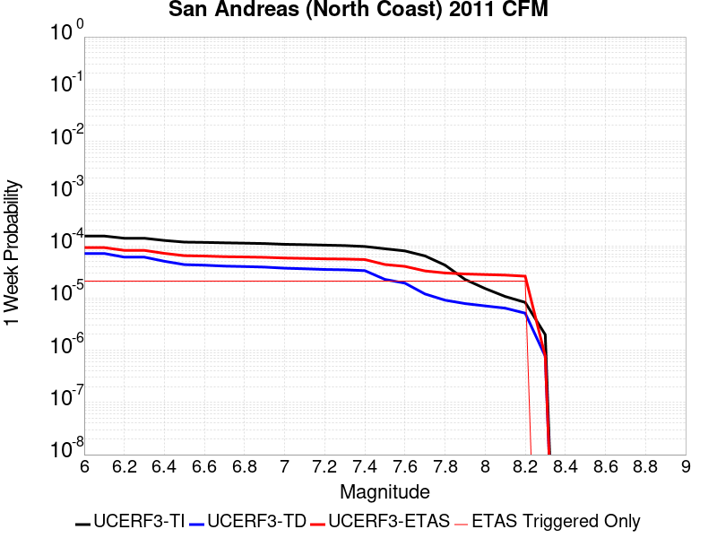 | 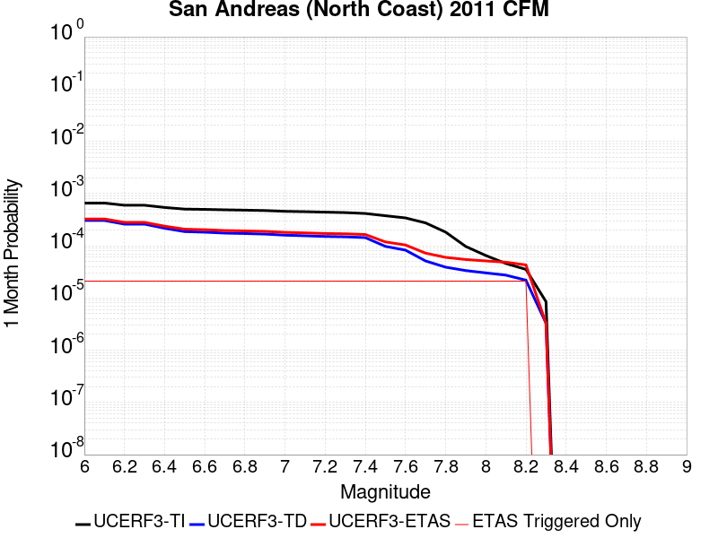 | 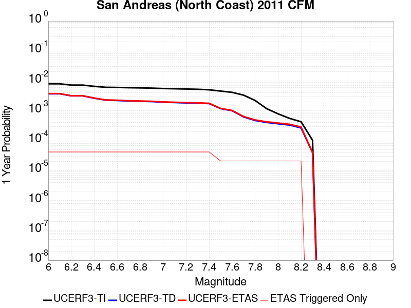 | 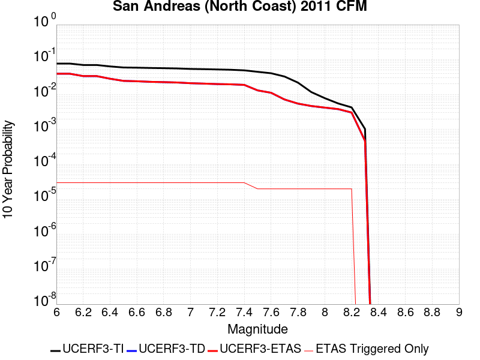 |

| Magnitude | 1 wk TI Prob | 1 wk TD Prob | 1 wk ETAS Prob | 1 wk ETAS/TD Gain | 1 wk ETAS Triggered Only | 1 mo TI Prob | 1 mo TD Prob | 1 mo ETAS Prob | 1 mo ETAS/TD Gain | 1 mo ETAS Triggered Only | 1 yr TI Prob | 1 yr TD Prob | 1 yr ETAS Prob | 1 yr ETAS/TD Gain | 1 yr ETAS Triggered Only | 10 yr TI Prob | 10 yr TD Prob | 10 yr ETAS Prob | 10 yr ETAS/TD Gain | 10 yr ETAS Triggered Only |
|-----|-----|-----|-----|-----|-----|-----|-----|-----|-----|-----|-----|-----|-----|-----|-----|-----|-----|-----|-----|-----|
| 6.0 | 1.5333705E-4 | 7.109695E-5 | 8.109623E-5 | 1.140643 | 1.0E-5 | 6.5699324E-4 | 3.046658E-4 | 3.1466273E-4 | 1.0328128 | 1.0E-5 | 0.007969595 | 0.0037030308 | 0.0037229569 | 1.005381 | 2.0E-5 | 0.0768977 | 0.039364267 | 0.039393086 | 1.0007321 | 3.0E-5 |
| 6.1 | 1.5333705E-4 | 7.109695E-5 | 8.109623E-5 | 1.140643 | 1.0E-5 | 6.5699324E-4 | 3.046658E-4 | 3.1466273E-4 | 1.0328128 | 1.0E-5 | 0.007969595 | 0.0037030308 | 0.0037229569 | 1.005381 | 2.0E-5 | 0.0768977 | 0.039364267 | 0.039393086 | 1.0007321 | 3.0E-5 |
| 6.2 | 1.3912938E-4 | 6.049243E-5 | 7.049183E-5 | 1.1652999 | 1.0E-5 | 5.961325E-4 | 2.5922767E-4 | 2.6922507E-4 | 1.0385661 | 1.0E-5 | 0.007233787 | 0.0031515562 | 0.0031714933 | 1.0063261 | 2.0E-5 | 0.07002798 | 0.03369792 | 0.033726912 | 1.0008602 | 3.0E-5 |
| 6.3 | 1.3912938E-4 | 6.049243E-5 | 7.049183E-5 | 1.1652999 | 1.0E-5 | 5.961325E-4 | 2.5922767E-4 | 2.6922507E-4 | 1.0385661 | 1.0E-5 | 0.007233787 | 0.0031515562 | 0.0031714933 | 1.0063261 | 2.0E-5 | 0.07002798 | 0.03369792 | 0.033726912 | 1.0008602 | 3.0E-5 |
| 6.4 | 1.2623647E-4 | 5.0433562E-5 | 6.043306E-5 | 1.1982707 | 1.0E-5 | 5.4090127E-4 | 2.1612605E-4 | 2.2612388E-4 | 1.0462593 | 1.0E-5 | 0.0065656058 | 0.0026281793 | 0.0026481268 | 1.0075898 | 2.0E-5 | 0.06374981 | 0.02830552 | 0.02833467 | 1.0010298 | 3.0E-5 |
| 6.5 | 1.1736096E-4 | 4.3516375E-5 | 5.351594E-5 | 1.2297885 | 1.0E-5 | 5.028786E-4 | 1.8648551E-4 | 1.9648364E-4 | 1.0536134 | 1.0E-5 | 0.006105373 | 0.0022681132 | 0.0022880677 | 1.0087979 | 2.0E-5 | 0.05940335 | 0.024576947 | 0.02460621 | 1.0011907 | 3.0E-5 |
| 6.6 | 1.1586959E-4 | 4.2416294E-5 | 5.2415868E-5 | 1.2357484 | 1.0E-5 | 4.964894E-4 | 1.8177154E-4 | 1.9176972E-4 | 1.0550041 | 1.0E-5 | 0.006028018 | 0.0022108385 | 0.0022307942 | 1.0090263 | 2.0E-5 | 0.058671024 | 0.023982164 | 0.024011444 | 1.001221 | 3.0E-5 |
| 6.7 | 1.13693764E-4 | 4.0728228E-5 | 5.072782E-5 | 1.24552 | 1.0E-5 | 4.87168E-4 | 1.7453796E-4 | 1.8453621E-4 | 1.0572841 | 1.0E-5 | 0.005915152 | 0.0021229447 | 0.0021429022 | 1.0094008 | 2.0E-5 | 0.057601593 | 0.023075242 | 0.02310455 | 1.00127 | 3.0E-5 |
| 6.8 | 1.1204889E-4 | 3.9945848E-5 | 4.994545E-5 | 1.2503289 | 1.0E-5 | 4.8012115E-4 | 1.7118535E-4 | 1.8118364E-4 | 1.0584062 | 1.0E-5 | 0.005829819 | 0.0020822054 | 0.0021021636 | 1.0095851 | 2.0E-5 | 0.05679232 | 0.022635331 | 0.022664653 | 1.0012953 | 3.0E-5 |
| 6.9 | 1.1005794E-4 | 3.9001738E-5 | 4.9001348E-5 | 1.2563888 | 1.0E-5 | 4.7159163E-4 | 1.6713967E-4 | 1.77138E-4 | 1.0598202 | 1.0E-5 | 0.0057265228 | 0.0020330423 | 0.0020530017 | 1.0098175 | 2.0E-5 | 0.055811852 | 0.02210134 | 0.022130677 | 1.0013274 | 3.0E-5 |
| 7.0 | 1.0647948E-4 | 3.7159174E-5 | 4.7158803E-5 | 1.2691026 | 1.0E-5 | 4.562608E-4 | 1.5924397E-4 | 1.6924237E-4 | 1.0627867 | 1.0E-5 | 0.0055408357 | 0.0019370868 | 0.001957048 | 1.0103048 | 2.0E-5 | 0.054047033 | 0.02105931 | 0.021088678 | 1.0013945 | 3.0E-5 |
| 7.1 | 1.04795035E-4 | 3.620866E-5 | 4.62083E-5 | 1.276167 | 1.0E-5 | 4.4904428E-4 | 1.5517084E-4 | 1.6516929E-4 | 1.0644351 | 1.0E-5 | 0.0054534175 | 0.0018875834 | 0.0019075456 | 1.0105755 | 2.0E-5 | 0.053215165 | 0.02052821 | 0.020557594 | 1.0014313 | 3.0E-5 |
| 7.2 | 1.02724036E-4 | 3.5117457E-5 | 4.5117107E-5 | 1.2847487 | 1.0E-5 | 4.401716E-4 | 1.5049479E-4 | 1.6049329E-4 | 1.0664375 | 1.0E-5 | 0.0053459285 | 0.0018307496 | 0.0018507129 | 1.0109044 | 2.0E-5 | 0.052191395 | 0.01991573 | 0.019945132 | 1.0014763 | 3.0E-5 |
| 7.3 | 1.00650694E-4 | 3.45853E-5 | 4.4584955E-5 | 1.2891302 | 1.0E-5 | 4.312888E-4 | 1.4821437E-4 | 1.5821289E-4 | 1.0674598 | 1.0E-5 | 0.005238306 | 0.0018030318 | 0.0018229957 | 1.0110724 | 2.0E-5 | 0.051165357 | 0.01959264 | 0.019622052 | 1.0015012 | 3.0E-5 |
| 7.4 | 9.672919E-5 | 3.3374814E-5 | 4.337448E-5 | 1.2996172 | 1.0E-5 | 4.144878E-4 | 1.4302715E-4 | 1.5302573E-4 | 1.0699068 | 1.0E-5 | 0.005034718 | 0.00173998 | 0.0017599452 | 1.0114744 | 2.0E-5 | 0.049221683 | 0.01886682 | 0.018896254 | 1.0015601 | 3.0E-5 |
| 7.5 | 8.7600405E-5 | 2.2694192E-5 | 3.2693966E-5 | 1.4406314 | 1.0E-5 | 3.753763E-4 | 9.725721E-5 | 1.0725624E-4 | 1.1028101 | 1.0E-5 | 0.0045606326 | 0.0011834651 | 0.0011934533 | 1.0084398 | 1.0E-5 | 0.04468165 | 0.013127938 | 0.0131476745 | 1.0015035 | 2.0E-5 |
| 7.6 | 7.9562284E-5 | 1.922004E-5 | 2.921985E-5 | 1.5202802 | 1.0E-5 | 3.4093665E-4 | 8.236901E-5 | 9.236819E-5 | 1.1213949 | 1.0E-5 | 0.0041430052 | 0.0010023828 | 0.0010123728 | 1.0099663 | 1.0E-5 | 0.040666126 | 0.0112194 | 0.011239175 | 1.0017626 | 2.0E-5 |
| 7.7 | 6.3866544E-5 | 1.1936281E-5 | 2.1936161E-5 | 1.8377719 | 1.0E-5 | 2.7368503E-4 | 5.115449E-5 | 6.115397E-5 | 1.1954763 | 1.0E-5 | 0.0033270244 | 6.226282E-4 | 6.3262193E-4 | 1.0160509 | 1.0E-5 | 0.032776527 | 0.0072073294 | 0.007227185 | 1.0027549 | 2.0E-5 |
| 7.8 | 4.2543215E-5 | 9.0726735E-6 | 1.9072584E-5 | 2.102201 | 1.0E-5 | 1.8231533E-4 | 3.888231E-5 | 4.888192E-5 | 1.2571764 | 1.0E-5 | 0.0022174292 | 4.7328937E-4 | 4.8328465E-4 | 1.0211188 | 1.0E-5 | 0.021954332 | 0.0054884683 | 0.0055083586 | 1.003624 | 2.0E-5 |
| 7.9 | 2.2636612E-5 | 7.811842E-6 | 1.7811764E-5 | 2.2800977 | 1.0E-5 | 9.7010445E-5 | 3.3478893E-5 | 4.3478558E-5 | 1.2986857 | 1.0E-5 | 0.0011804621 | 4.0752938E-4 | 4.1752533E-4 | 1.0245281 | 1.0E-5 | 0.011742111 | 0.0046821116 | 0.004702018 | 1.0042516 | 2.0E-5 |
| 8.0 | 1.5167874E-5 | 7.0475517E-6 | 1.7047481E-5 | 2.4189224 | 1.0E-5 | 6.500356E-5 | 3.0203442E-5 | 4.020314E-5 | 1.331078 | 1.0E-5 | 7.9113094E-4 | 3.6766496E-4 | 3.776613E-4 | 1.0271887 | 1.0E-5 | 0.007883203 | 0.004214701 | 0.0042346166 | 1.0047253 | 2.0E-5 |
| 8.1 | 1.0681047E-5 | 6.3854363E-6 | 1.6385373E-5 | 2.5660536 | 1.0E-5 | 4.5775112E-5 | 2.7365868E-5 | 3.7365597E-5 | 1.3654087 | 1.0E-5 | 5.5716943E-4 | 3.331286E-4 | 3.4312526E-4 | 1.0300084 | 1.0E-5 | 0.0055577457 | 0.003816698 | 0.0038366215 | 1.0052202 | 2.0E-5 |
| 8.2 | 8.226114E-6 | 5.1139064E-6 | 1.5113855E-5 | 2.9554424 | 1.0E-5 | 3.52543E-5 | 2.1916558E-5 | 3.1916337E-5 | 1.456266 | 1.0E-5 | 4.2913653E-4 | 2.6680148E-4 | 2.7679882E-4 | 1.037471 | 1.0E-5 | 0.004283088 | 0.0030445685 | 0.0030645076 | 1.0065491 | 2.0E-5 |
| 8.3 | 1.983087E-6 | 7.6564595E-7 | 7.6564595E-7 | 1.0 | 0.0 | 8.498917E-6 | 3.281336E-6 | 3.281336E-6 | 1.0 | 0.0 | 1.034694E-4 | 3.9949547E-5 | 3.9949547E-5 | 1.0 | 0.0 | 0.0010342124 | 4.717979E-4 | 4.717979E-4 | 1.0 | 0.0 |

## Hayward (So) extension 2011 CFM
*[(top)](#table-of-contents)*

| 1 Week | 1 Month | 1 Year | 10 Year |
|-----|-----|-----|-----|
|  |  |  |  |

| Magnitude | 1 wk TI Prob | 1 wk TD Prob | 1 wk ETAS Prob | 1 wk ETAS/TD Gain | 1 wk ETAS Triggered Only | 1 mo TI Prob | 1 mo TD Prob | 1 mo ETAS Prob | 1 mo ETAS/TD Gain | 1 mo ETAS Triggered Only | 1 yr TI Prob | 1 yr TD Prob | 1 yr ETAS Prob | 1 yr ETAS/TD Gain | 1 yr ETAS Triggered Only | 10 yr TI Prob | 10 yr TD Prob | 10 yr ETAS Prob | 10 yr ETAS/TD Gain | 10 yr ETAS Triggered Only |
|-----|-----|-----|-----|-----|-----|-----|-----|-----|-----|-----|-----|-----|-----|-----|-----|-----|-----|-----|-----|-----|
| 6.0 | 1.1721256E-4 | 2.3671088E-4 | 2.3671088E-4 | 1.0 | 0.0 | 5.022428E-4 | 0.0010138806 | 0.0010238704 | 1.0098531 | 1.0E-5 | 0.0060976758 | 0.012250609 | 0.012260486 | 1.0008063 | 1.0E-5 | 0.0593305 | 0.11284437 | 0.112870984 | 1.0002358 | 3.0E-5 |
| 6.1 | 6.99169E-5 | 1.3808164E-4 | 1.3808164E-4 | 1.0 | 0.0 | 2.9960944E-4 | 5.9155683E-4 | 5.9155683E-4 | 1.0 | 0.0 | 0.0036416445 | 0.0071723475 | 0.0071723475 | 1.0 | 0.0 | 0.035825435 | 0.067804344 | 0.067822985 | 1.000275 | 2.0E-5 |
| 6.2 | 6.99169E-5 | 1.3808164E-4 | 1.3808164E-4 | 1.0 | 0.0 | 2.9960944E-4 | 5.9155683E-4 | 5.9155683E-4 | 1.0 | 0.0 | 0.0036416445 | 0.0071723475 | 0.0071723475 | 1.0 | 0.0 | 0.035825435 | 0.067804344 | 0.067822985 | 1.000275 | 2.0E-5 |
| 6.3 | 6.970908E-5 | 1.3776305E-4 | 1.3776305E-4 | 1.0 | 0.0 | 2.9871898E-4 | 5.9019245E-4 | 5.9019245E-4 | 1.0 | 0.0 | 0.0036308395 | 0.007155884 | 0.007155884 | 1.0 | 0.0 | 0.035720866 | 0.0676533 | 0.06767195 | 1.0002756 | 2.0E-5 |
| 6.4 | 6.9517155E-5 | 1.3743227E-4 | 1.3743227E-4 | 1.0 | 0.0 | 2.9789665E-4 | 5.8877567E-4 | 5.8877567E-4 | 1.0 | 0.0 | 0.0036208609 | 0.0071387975 | 0.0071387975 | 1.0 | 0.0 | 0.03562429 | 0.06749734 | 0.06751599 | 1.0002763 | 2.0E-5 |
| 6.5 | 4.786248E-5 | 9.415232E-5 | 9.415232E-5 | 1.0 | 0.0 | 2.0510878E-4 | 4.0344993E-4 | 4.0344993E-4 | 1.0 | 0.0 | 0.0024943394 | 0.0049013784 | 0.0049013784 | 1.0 | 0.0 | 0.02466527 | 0.046900697 | 0.046910226 | 1.0002033 | 1.0E-5 |
| 6.6 | 4.4662214E-5 | 8.8819244E-5 | 8.8819244E-5 | 1.0 | 0.0 | 1.9139545E-4 | 3.80601E-4 | 3.80601E-4 | 1.0 | 0.0 | 0.0023277493 | 0.0046244357 | 0.0046244357 | 1.0 | 0.0 | 0.02303517 | 0.04429206 | 0.044301614 | 1.0002158 | 1.0E-5 |
| 6.7 | 3.884542E-5 | 7.8650686E-5 | 7.8650686E-5 | 1.0 | 0.0 | 1.6646975E-4 | 3.3703333E-4 | 3.3703333E-4 | 1.0 | 0.0 | 0.002024885 | 0.0040961048 | 0.0040961048 | 1.0 | 0.0 | 0.020065336 | 0.039332055 | 0.039332055 | 1.0 | 0.0 |
| 6.8 | 3.4221863E-5 | 6.855886E-5 | 6.855886E-5 | 1.0 | 0.0 | 1.4665688E-4 | 2.9379298E-4 | 2.9379298E-4 | 1.0 | 0.0 | 0.0017840851 | 0.0035714838 | 0.0035714838 | 1.0 | 0.0 | 0.017698295 | 0.034419462 | 0.034419462 | 1.0 | 0.0 |
| 6.9 | 1.6927712E-5 | 3.006262E-5 | 3.006262E-5 | 1.0 | 0.0 | 7.2545314E-5 | 1.2883375E-4 | 1.2883375E-4 | 1.0 | 0.0 | 8.828813E-4 | 0.0015674793 | 0.0015674793 | 1.0 | 0.0 | 0.008793819 | 0.015463544 | 0.015463544 | 1.0 | 0.0 |
| 7.0 | 1.2509653E-5 | 2.246337E-5 | 2.246337E-5 | 1.0 | 0.0 | 5.3611697E-5 | 9.626828E-5 | 9.626828E-5 | 1.0 | 0.0 | 6.525269E-4 | 0.0011714802 | 0.0011714802 | 1.0 | 0.0 | 0.0065061417 | 0.011583166 | 0.011583166 | 1.0 | 0.0 |
| 7.1 | 8.751583E-6 | 1.4926157E-5 | 1.4926157E-5 | 1.0 | 0.0 | 3.750624E-5 | 6.396771E-5 | 6.396771E-5 | 1.0 | 0.0 | 4.5654282E-4 | 7.785344E-4 | 7.785344E-4 | 1.0 | 0.0 | 0.0045560603 | 0.007764457 | 0.007764457 | 1.0 | 0.0 |
| 7.2 | 6.354379E-6 | 1.1499087E-5 | 1.1499087E-5 | 1.0 | 0.0 | 2.7232769E-5 | 4.9280898E-5 | 4.9280898E-5 | 1.0 | 0.0 | 3.3150852E-4 | 5.9983454E-4 | 5.9983454E-4 | 1.0 | 0.0 | 0.0033101442 | 0.006001243 | 0.006001243 | 1.0 | 0.0 |
| 7.3 | 4.645554E-6 | 8.818441E-6 | 8.818441E-6 | 1.0 | 0.0 | 1.9909365E-5 | 3.7792794E-5 | 3.7792794E-5 | 1.0 | 0.0 | 2.4236954E-4 | 4.6003403E-4 | 4.6003403E-4 | 1.0 | 0.0 | 0.0024210536 | 0.004611421 | 0.004611421 | 1.0 | 0.0 |
| 7.4 | 4.23437E-6 | 7.992759E-6 | 7.992759E-6 | 1.0 | 0.0 | 1.8147173E-5 | 3.425425E-5 | 3.425425E-5 | 1.0 | 0.0 | 2.2091944E-4 | 4.1696956E-4 | 4.1696956E-4 | 1.0 | 0.0 | 0.0022069993 | 0.0041826614 | 0.0041826614 | 1.0 | 0.0 |
| 7.5 | 2.2187417E-6 | 3.952336E-6 | 3.952336E-6 | 1.0 | 0.0 | 9.508858E-6 | 1.6938488E-5 | 1.6938488E-5 | 1.0 | 0.0 | 1.157642E-4 | 2.0620918E-4 | 2.0620918E-4 | 1.0 | 0.0 | 0.0011570391 | 0.0020739497 | 0.0020739497 | 1.0 | 0.0 |
| 7.6 | 2.7952495E-8 | 3.8785874E-8 | 3.8785874E-8 | 1.0 | 0.0 | 1.1979641E-7 | 1.6622516E-7 | 1.6622516E-7 | 1.0 | 0.0 | 1.4585203E-6 | 2.0237894E-6 | 2.0237894E-6 | 1.0 | 0.0 | 1.4585107E-5 | 2.0317146E-5 | 2.0317146E-5 | 1.0 | 0.0 |
| 7.7 | 1.7192724E-8 | 2.3436652E-8 | 2.3436652E-8 | 1.0 | 0.0 | 7.36831E-8 | 1.0044278E-7 | 1.0044278E-7 | 1.0 | 0.0 | 8.9709135E-7 | 1.2228902E-6 | 1.2228902E-6 | 1.0 | 0.0 | 8.970877E-6 | 1.2285953E-5 | 1.2285953E-5 | 1.0 | 0.0 |

## Great Valley 07 (Orestimba)
*[(top)](#table-of-contents)*

| 1 Week | 1 Month | 1 Year | 10 Year |
|-----|-----|-----|-----|
|  |  |  |  |

| Magnitude | 1 wk TI Prob | 1 wk TD Prob | 1 wk ETAS Prob | 1 wk ETAS/TD Gain | 1 wk ETAS Triggered Only | 1 mo TI Prob | 1 mo TD Prob | 1 mo ETAS Prob | 1 mo ETAS/TD Gain | 1 mo ETAS Triggered Only | 1 yr TI Prob | 1 yr TD Prob | 1 yr ETAS Prob | 1 yr ETAS/TD Gain | 1 yr ETAS Triggered Only | 10 yr TI Prob | 10 yr TD Prob | 10 yr ETAS Prob | 10 yr ETAS/TD Gain | 10 yr ETAS Triggered Only |
|-----|-----|-----|-----|-----|-----|-----|-----|-----|-----|-----|-----|-----|-----|-----|-----|-----|-----|-----|-----|-----|
| 6.0 | 2.9687902E-5 | 3.27575E-5 | 4.2757172E-5 | 1.3052636 | 1.0E-5 | 1.2722766E-4 | 1.4038214E-4 | 1.5038073E-4 | 1.0712241 | 1.0E-5 | 0.0015478961 | 0.0017078844 | 0.0017378331 | 1.0175356 | 3.0E-5 | 0.015371585 | 0.016955135 | 0.016994458 | 1.0023192 | 4.0E-5 |
| 6.1 | 2.9687902E-5 | 3.27575E-5 | 4.2757172E-5 | 1.3052636 | 1.0E-5 | 1.2722766E-4 | 1.4038214E-4 | 1.5038073E-4 | 1.0712241 | 1.0E-5 | 0.0015478961 | 0.0017078844 | 0.0017378331 | 1.0175356 | 3.0E-5 | 0.015371585 | 0.016955135 | 0.016994458 | 1.0023192 | 4.0E-5 |
| 6.2 | 1.9231524E-5 | 2.1159167E-5 | 3.1158954E-5 | 1.4725984 | 1.0E-5 | 8.2418206E-5 | 9.067912E-5 | 1.0067821E-4 | 1.110269 | 1.0E-5 | 0.0010029797 | 0.0011034822 | 0.0011334491 | 1.0271567 | 3.0E-5 | 0.00998465 | 0.010982441 | 0.011012111 | 1.0027016 | 3.0E-5 |
| 6.3 | 1.324766E-5 | 1.4548534E-5 | 1.4548534E-5 | 1.0 | 0.0 | 5.6774446E-5 | 6.234942E-5 | 6.234942E-5 | 1.0 | 0.0 | 6.910097E-4 | 7.5884897E-4 | 7.788338E-4 | 1.0263357 | 2.0E-5 | 0.006888649 | 0.0075635235 | 0.0075833723 | 1.0026243 | 2.0E-5 |
| 6.4 | 7.818645E-6 | 8.57284E-6 | 8.57284E-6 | 1.0 | 0.0 | 3.3508048E-5 | 3.6740246E-5 | 3.6740246E-5 | 1.0 | 0.0 | 4.078841E-4 | 4.4722404E-4 | 4.6721508E-4 | 1.0447003 | 2.0E-5 | 0.004071363 | 0.0044635804 | 0.004483491 | 1.0044607 | 2.0E-5 |
| 6.5 | 5.3076565E-6 | 5.8178007E-6 | 5.8178007E-6 | 1.0 | 0.0 | 2.27469E-5 | 2.4933206E-5 | 2.4933206E-5 | 1.0 | 0.0 | 2.7690834E-4 | 3.035216E-4 | 3.2351553E-4 | 1.0658731 | 2.0E-5 | 0.0027656353 | 0.00303128 | 0.0030512193 | 1.0065778 | 2.0E-5 |
| 6.6 | 3.6003578E-6 | 3.9484953E-6 | 3.9484953E-6 | 1.0 | 0.0 | 1.5430012E-5 | 1.6922022E-5 | 1.6922022E-5 | 1.0 | 0.0 | 1.8784421E-4 | 2.0600771E-4 | 2.1600565E-4 | 1.0485319 | 1.0E-5 | 0.0018768552 | 0.0020583214 | 0.0020683007 | 1.0048484 | 1.0E-5 |
| 6.7 | 2.5361826E-6 | 2.7834678E-6 | 2.7834678E-6 | 1.0 | 0.0 | 1.0869308E-5 | 1.1929101E-5 | 1.1929101E-5 | 1.0 | 0.0 | 1.3232579E-4 | 1.4522845E-4 | 1.55227E-4 | 1.0688471 | 1.0E-5 | 0.0013224703 | 0.0014514653 | 0.0014614508 | 1.0068796 | 1.0E-5 |
| 6.8 | 1.2115831E-6 | 1.3313797E-6 | 1.3313797E-6 | 1.0 | 0.0 | 5.1924885E-6 | 5.7059065E-6 | 5.7059065E-6 | 1.0 | 0.0 | 6.3216714E-5 | 6.9468166E-5 | 7.946747E-5 | 1.1439408 | 1.0E-5 | 6.3198735E-4 | 6.945596E-4 | 7.045527E-4 | 1.0143876 | 1.0E-5 |

## White Wolf
*[(top)](#table-of-contents)*

| 1 Week | 1 Month | 1 Year | 10 Year |
|-----|-----|-----|-----|
|  |  | 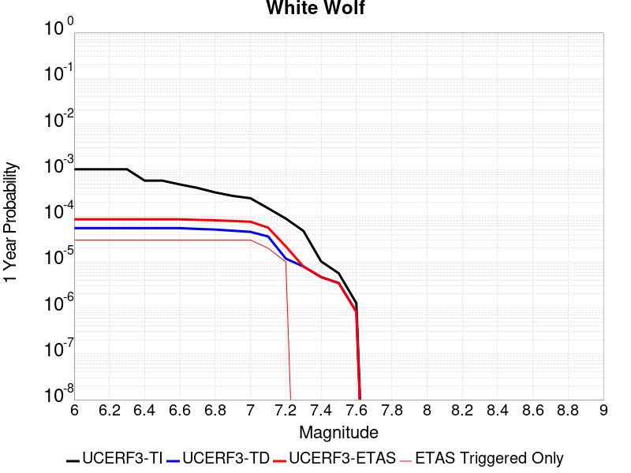 |  |

| Magnitude | 1 wk TI Prob | 1 wk TD Prob | 1 wk ETAS Prob | 1 wk ETAS/TD Gain | 1 wk ETAS Triggered Only | 1 mo TI Prob | 1 mo TD Prob | 1 mo ETAS Prob | 1 mo ETAS/TD Gain | 1 mo ETAS Triggered Only | 1 yr TI Prob | 1 yr TD Prob | 1 yr ETAS Prob | 1 yr ETAS/TD Gain | 1 yr ETAS Triggered Only | 10 yr TI Prob | 10 yr TD Prob | 10 yr ETAS Prob | 10 yr ETAS/TD Gain | 10 yr ETAS Triggered Only |
|-----|-----|-----|-----|-----|-----|-----|-----|-----|-----|-----|-----|-----|-----|-----|-----|-----|-----|-----|-----|-----|
| 6.0 | 2.0037822E-5 | 1.0468583E-6 | 2.1046837E-5 | 20.104763 | 2.0E-5 | 8.587355E-5 | 4.4865283E-6 | 2.4486439E-5 | 5.45777 | 2.0E-5 | 0.001045009 | 5.4622164E-5 | 8.462052E-5 | 1.5491976 | 3.0E-5 | 0.010401085 | 5.4609246E-4 | 5.860706E-4 | 1.0732076 | 4.0E-5 |
| 6.1 | 2.0037822E-5 | 1.0468583E-6 | 2.1046837E-5 | 20.104763 | 2.0E-5 | 8.587355E-5 | 4.4865283E-6 | 2.4486439E-5 | 5.45777 | 2.0E-5 | 0.001045009 | 5.4622164E-5 | 8.462052E-5 | 1.5491976 | 3.0E-5 | 0.010401085 | 5.4609246E-4 | 5.860706E-4 | 1.0732076 | 4.0E-5 |
| 6.2 | 2.0037822E-5 | 1.0468583E-6 | 2.1046837E-5 | 20.104763 | 2.0E-5 | 8.587355E-5 | 4.4865283E-6 | 2.4486439E-5 | 5.45777 | 2.0E-5 | 0.001045009 | 5.4622164E-5 | 8.462052E-5 | 1.5491976 | 3.0E-5 | 0.010401085 | 5.4609246E-4 | 5.860706E-4 | 1.0732076 | 4.0E-5 |
| 6.3 | 2.0037822E-5 | 1.0468583E-6 | 2.1046837E-5 | 20.104763 | 2.0E-5 | 8.587355E-5 | 4.4865283E-6 | 2.4486439E-5 | 5.45777 | 2.0E-5 | 0.001045009 | 5.4622164E-5 | 8.462052E-5 | 1.5491976 | 3.0E-5 | 0.010401085 | 5.4609246E-4 | 5.860706E-4 | 1.0732076 | 4.0E-5 |
| 6.4 | 1.132487E-5 | 1.0468583E-6 | 2.1046837E-5 | 20.104763 | 2.0E-5 | 4.8534253E-5 | 4.4865283E-6 | 2.4486439E-5 | 5.45777 | 2.0E-5 | 5.907443E-4 | 5.4622164E-5 | 8.462052E-5 | 1.5491976 | 3.0E-5 | 0.005891764 | 5.4609246E-4 | 5.860706E-4 | 1.0732076 | 4.0E-5 |
| 6.5 | 1.132487E-5 | 1.0468583E-6 | 2.1046837E-5 | 20.104763 | 2.0E-5 | 4.8534253E-5 | 4.4865283E-6 | 2.4486439E-5 | 5.45777 | 2.0E-5 | 5.907443E-4 | 5.4622164E-5 | 8.462052E-5 | 1.5491976 | 3.0E-5 | 0.005891764 | 5.4609246E-4 | 5.860706E-4 | 1.0732076 | 4.0E-5 |
| 6.6 | 9.347473E-6 | 1.0468583E-6 | 2.1046837E-5 | 20.104763 | 2.0E-5 | 4.0059982E-5 | 4.4865283E-6 | 2.4486439E-5 | 5.45777 | 2.0E-5 | 4.8762115E-4 | 5.4622164E-5 | 8.462052E-5 | 1.5491976 | 3.0E-5 | 0.0048655253 | 5.4609246E-4 | 5.860706E-4 | 1.0732076 | 4.0E-5 |
| 6.7 | 7.842647E-6 | 1.0047773E-6 | 2.1004756E-5 | 20.904888 | 2.0E-5 | 3.361091E-5 | 4.306182E-6 | 2.4306095E-5 | 5.644466 | 2.0E-5 | 4.0913603E-4 | 5.2426552E-5 | 8.242498E-5 | 1.5721991 | 3.0E-5 | 0.004083836 | 5.241468E-4 | 5.6412583E-4 | 1.0762745 | 4.0E-5 |
| 6.8 | 6.26597E-6 | 9.734289E-7 | 2.097341E-5 | 21.54591 | 2.0E-5 | 2.685388E-5 | 4.1718313E-6 | 2.4171748E-5 | 5.7940373 | 2.0E-5 | 3.2689696E-4 | 5.0790914E-5 | 8.078939E-5 | 1.5906268 | 3.0E-5 | 0.003264165 | 5.07798E-4 | 5.477776E-4 | 1.0787315 | 4.0E-5 |
| 6.9 | 5.258436E-6 | 9.1827343E-7 | 2.0918254E-5 | 22.779985 | 2.0E-5 | 2.2535958E-5 | 3.935452E-6 | 2.3935374E-5 | 6.0819883 | 2.0E-5 | 2.7434074E-4 | 4.7913123E-5 | 7.791168E-5 | 1.6261033 | 3.0E-5 | 0.0027400232 | 4.7903272E-4 | 5.1901356E-4 | 1.0834616 | 4.0E-5 |
| 7.0 | 4.675028E-6 | 8.660704E-7 | 2.0866053E-5 | 24.09279 | 2.0E-5 | 2.003568E-5 | 3.7117254E-6 | 2.3711651E-5 | 6.38831 | 2.0E-5 | 2.4390711E-4 | 4.518937E-5 | 7.5188014E-5 | 1.663843 | 3.0E-5 | 0.0024363957 | 4.518065E-4 | 4.9178844E-4 | 1.0884935 | 4.0E-5 |
| 7.1 | 2.8270078E-6 | 6.8737717E-7 | 1.068737E-5 | 15.548044 | 1.0E-5 | 1.2115692E-5 | 2.945899E-6 | 1.29458695E-5 | 4.3945394 | 1.0E-5 | 1.4749856E-4 | 3.586577E-5 | 5.5865054E-5 | 1.5576147 | 2.0E-5 | 0.001474007 | 3.5860392E-4 | 3.8859318E-4 | 1.0836277 | 3.0E-5 |
| 7.2 | 1.6881406E-6 | 2.2703432E-7 | 1.0227032E-5 | 45.046196 | 1.0E-5 | 7.2348685E-6 | 9.730038E-7 | 1.09729945E-5 | 11.277441 | 1.0E-5 | 8.808096E-5 | 1.1846259E-5 | 2.1846141E-5 | 1.8441384 | 1.0E-5 | 8.8046055E-4 | 1.1845643E-4 | 1.2845524E-4 | 1.0844092 | 1.0E-5 |
| 7.3 | 9.086107E-7 | 1.5264496E-7 | 1.5264496E-7 | 1.0 | 0.0 | 3.8940398E-6 | 6.5419255E-7 | 6.5419255E-7 | 1.0 | 0.0 | 4.7408903E-5 | 7.964766E-6 | 7.964766E-6 | 1.0 | 0.0 | 4.739879E-4 | 7.964489E-5 | 7.964489E-5 | 1.0 | 0.0 |
| 7.4 | 1.9717383E-7 | 9.003399E-8 | 9.003399E-8 | 1.0 | 0.0 | 8.450304E-7 | 3.8585992E-7 | 3.8585992E-7 | 1.0 | 0.0 | 1.0288197E-5 | 4.697835E-6 | 4.697835E-6 | 1.0 | 0.0 | 1.028772E-4 | 4.6977384E-5 | 4.6977384E-5 | 1.0 | 0.0 |
| 7.5 | 1.086975E-7 | 6.659662E-8 | 6.659662E-8 | 1.0 | 0.0 | 4.6584634E-7 | 2.8541407E-7 | 2.8541407E-7 | 1.0 | 0.0 | 5.6716644E-6 | 3.474911E-6 | 3.474911E-6 | 1.0 | 0.0 | 5.6715195E-5 | 3.474859E-5 | 3.474859E-5 | 1.0 | 0.0 |
| 7.6 | 2.4217808E-8 | 1.5820849E-8 | 1.5820849E-8 | 1.0 | 0.0 | 1.03790605E-7 | 6.780364E-8 | 6.780364E-8 | 1.0 | 0.0 | 1.2636499E-6 | 8.25509E-7 | 8.25509E-7 | 1.0 | 0.0 | 1.2636427E-5 | 8.255064E-6 | 8.255064E-6 | 1.0 | 0.0 |

## Great Valley 03a Dunnigan Hills
*[(top)](#table-of-contents)*

| 1 Week | 1 Month | 1 Year | 10 Year |
|-----|-----|-----|-----|
|  |  | 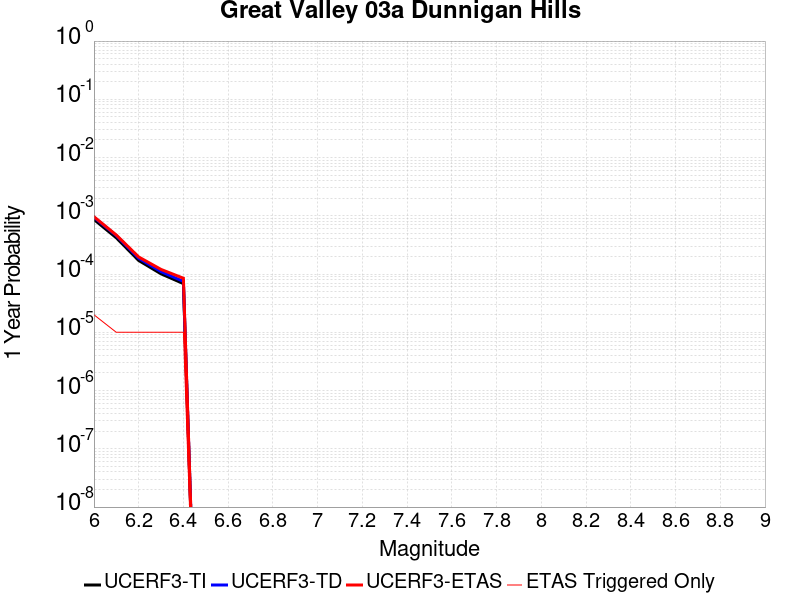 |  |

| Magnitude | 1 wk TI Prob | 1 wk TD Prob | 1 wk ETAS Prob | 1 wk ETAS/TD Gain | 1 wk ETAS Triggered Only | 1 mo TI Prob | 1 mo TD Prob | 1 mo ETAS Prob | 1 mo ETAS/TD Gain | 1 mo ETAS Triggered Only | 1 yr TI Prob | 1 yr TD Prob | 1 yr ETAS Prob | 1 yr ETAS/TD Gain | 1 yr ETAS Triggered Only | 10 yr TI Prob | 10 yr TD Prob | 10 yr ETAS Prob | 10 yr ETAS/TD Gain | 10 yr ETAS Triggered Only |
|-----|-----|-----|-----|-----|-----|-----|-----|-----|-----|-----|-----|-----|-----|-----|-----|-----|-----|-----|-----|-----|
| 6.0 | 1.6591328E-5 | 1.8107954E-5 | 2.8107774E-5 | 1.5522335 | 1.0E-5 | 7.110376E-5 | 7.7603596E-5 | 8.760282E-5 | 1.12885 | 1.0E-5 | 8.6534437E-4 | 9.444834E-4 | 9.644645E-4 | 1.0211556 | 2.0E-5 | 0.008619824 | 0.009411525 | 0.009441243 | 1.0031576 | 3.0E-5 |
| 6.1 | 8.041125E-6 | 8.769726E-6 | 8.769726E-6 | 1.0 | 0.0 | 3.4461507E-5 | 3.7584115E-5 | 3.7584115E-5 | 1.0 | 0.0 | 4.194881E-4 | 4.5751085E-4 | 4.6750627E-4 | 1.0218474 | 1.0E-5 | 0.004186971 | 0.004567687 | 0.0045776414 | 1.0021793 | 1.0E-5 |
| 6.2 | 3.2807004E-6 | 3.5795688E-6 | 3.5795688E-6 | 1.0 | 0.0 | 1.4060069E-5 | 1.5340942E-5 | 1.5340942E-5 | 1.0 | 0.0 | 1.7116789E-4 | 1.8676413E-4 | 1.9676225E-4 | 1.0535334 | 1.0E-5 | 0.0017103611 | 0.0018664796 | 0.001876461 | 1.0053477 | 1.0E-5 |
| 6.3 | 1.9339366E-6 | 2.1103806E-6 | 2.1103806E-6 | 1.0 | 0.0 | 8.288273E-6 | 9.044474E-6 | 9.044474E-6 | 1.0 | 0.0 | 1.00905054E-4 | 1.1011375E-4 | 1.2011265E-4 | 1.0908052 | 1.0E-5 | 0.0010085925 | 0.0011008718 | 0.0011108608 | 1.0090737 | 1.0E-5 |
| 6.4 | 1.3142635E-6 | 1.4339867E-6 | 1.4339867E-6 | 1.0 | 0.0 | 5.6325457E-6 | 6.145657E-6 | 6.145657E-6 | 1.0 | 0.0 | 6.857408E-5 | 7.482337E-5 | 8.482263E-5 | 1.133638 | 1.0E-5 | 6.8552926E-4 | 7.4823375E-4 | 7.5822626E-4 | 1.0133548 | 1.0E-5 |

## Great Valley 05 Pittsburg - Kirby Hills alt1
*[(top)](#table-of-contents)*

| 1 Week | 1 Month | 1 Year | 10 Year |
|-----|-----|-----|-----|
|  |  |  |  |

| Magnitude | 1 wk TI Prob | 1 wk TD Prob | 1 wk ETAS Prob | 1 wk ETAS/TD Gain | 1 wk ETAS Triggered Only | 1 mo TI Prob | 1 mo TD Prob | 1 mo ETAS Prob | 1 mo ETAS/TD Gain | 1 mo ETAS Triggered Only | 1 yr TI Prob | 1 yr TD Prob | 1 yr ETAS Prob | 1 yr ETAS/TD Gain | 1 yr ETAS Triggered Only | 10 yr TI Prob | 10 yr TD Prob | 10 yr ETAS Prob | 10 yr ETAS/TD Gain | 10 yr ETAS Triggered Only |
|-----|-----|-----|-----|-----|-----|-----|-----|-----|-----|-----|-----|-----|-----|-----|-----|-----|-----|-----|-----|-----|
| 6.0 | 4.187212E-5 | 5.344289E-5 | 8.3441286E-5 | 1.5613168 | 3.0E-5 | 1.794396E-4 | 2.2902661E-4 | 2.5901975E-4 | 1.1309592 | 3.0E-5 | 0.002182488 | 0.0027857998 | 0.0028256883 | 1.0143186 | 4.0E-5 | 0.021611776 | 0.027603218 | 0.027642114 | 1.001409 | 4.0E-5 |
| 6.1 | 4.187212E-5 | 5.344289E-5 | 8.3441286E-5 | 1.5613168 | 3.0E-5 | 1.794396E-4 | 2.2902661E-4 | 2.5901975E-4 | 1.1309592 | 3.0E-5 | 0.002182488 | 0.0027857998 | 0.0028256883 | 1.0143186 | 4.0E-5 | 0.021611776 | 0.027603218 | 0.027642114 | 1.001409 | 4.0E-5 |
| 6.2 | 1.7353306E-5 | 2.2154672E-5 | 2.2154672E-5 | 1.0 | 0.0 | 7.436919E-5 | 9.4947456E-5 | 9.4947456E-5 | 1.0 | 0.0 | 9.050688E-4 | 0.0011557573 | 0.0011557573 | 1.0 | 0.0 | 0.009013915 | 0.0115352 | 0.0115352 | 1.0 | 0.0 |
| 6.3 | 1.7353306E-5 | 2.2154672E-5 | 2.2154672E-5 | 1.0 | 0.0 | 7.436919E-5 | 9.4947456E-5 | 9.4947456E-5 | 1.0 | 0.0 | 9.050688E-4 | 0.0011557573 | 0.0011557573 | 1.0 | 0.0 | 0.009013915 | 0.0115352 | 0.0115352 | 1.0 | 0.0 |
| 6.4 | 1.4028824E-5 | 1.7901062E-5 | 1.7901062E-5 | 1.0 | 0.0 | 6.0122147E-5 | 7.671883E-5 | 7.671883E-5 | 1.0 | 0.0 | 7.3174125E-4 | 9.340303E-4 | 9.340303E-4 | 1.0 | 0.0 | 0.0072933645 | 0.009338211 | 0.009338211 | 1.0 | 0.0 |

## Almanor 2011 CFM
*[(top)](#table-of-contents)*

| 1 Week | 1 Month | 1 Year | 10 Year |
|-----|-----|-----|-----|
| 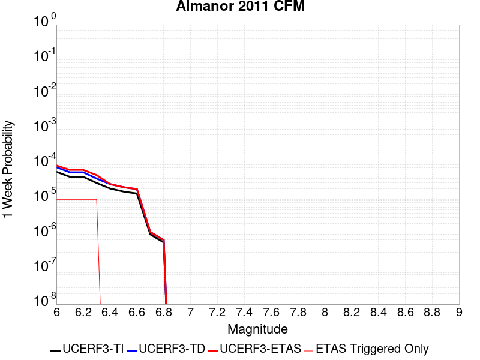 | 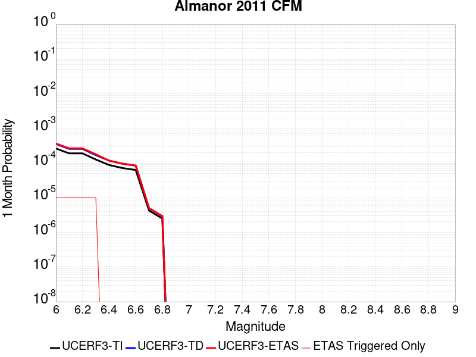 | 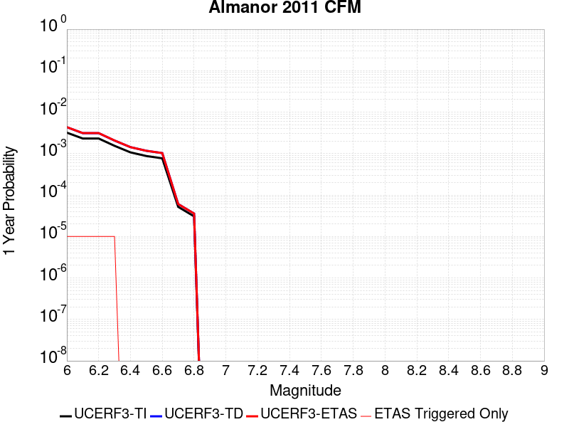 | 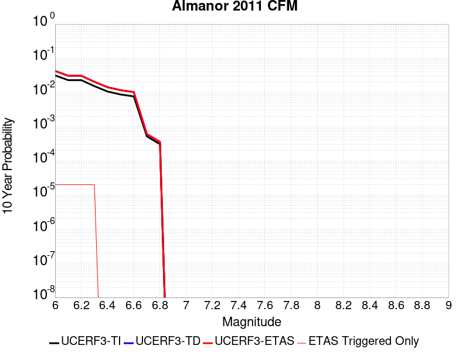 |

| Magnitude | 1 wk TI Prob | 1 wk TD Prob | 1 wk ETAS Prob | 1 wk ETAS/TD Gain | 1 wk ETAS Triggered Only | 1 mo TI Prob | 1 mo TD Prob | 1 mo ETAS Prob | 1 mo ETAS/TD Gain | 1 mo ETAS Triggered Only | 1 yr TI Prob | 1 yr TD Prob | 1 yr ETAS Prob | 1 yr ETAS/TD Gain | 1 yr ETAS Triggered Only | 10 yr TI Prob | 10 yr TD Prob | 10 yr ETAS Prob | 10 yr ETAS/TD Gain | 10 yr ETAS Triggered Only |
|-----|-----|-----|-----|-----|-----|-----|-----|-----|-----|-----|-----|-----|-----|-----|-----|-----|-----|-----|-----|-----|
| 6.0 | 6.1479834E-5 | 8.327245E-5 | 9.3271614E-5 | 1.1200777 | 1.0E-5 | 2.6345838E-4 | 3.5683523E-4 | 3.6683163E-4 | 1.0280142 | 1.0E-5 | 0.0032028882 | 0.004336495 | 0.0043464517 | 1.002296 | 1.0E-5 | 0.031571172 | 0.04258658 | 0.042605728 | 1.0004497 | 2.0E-5 |
| 6.1 | 4.4387216E-5 | 5.9767433E-5 | 6.976684E-5 | 1.1673052 | 1.0E-5 | 1.9021705E-4 | 2.561236E-4 | 2.6612106E-4 | 1.0390337 | 1.0E-5 | 0.0023134327 | 0.003114351 | 0.0031243197 | 1.0032009 | 1.0E-5 | 0.022894967 | 0.030755581 | 0.030774966 | 1.0006303 | 2.0E-5 |
| 6.2 | 4.4387216E-5 | 5.9767433E-5 | 6.976684E-5 | 1.1673052 | 1.0E-5 | 1.9021705E-4 | 2.561236E-4 | 2.6612106E-4 | 1.0390337 | 1.0E-5 | 0.0023134327 | 0.003114351 | 0.0031243197 | 1.0032009 | 1.0E-5 | 0.022894967 | 0.030755581 | 0.030774966 | 1.0006303 | 2.0E-5 |
| 6.3 | 2.9523822E-5 | 3.9546965E-5 | 4.9546572E-5 | 1.2528539 | 1.0E-5 | 1.2652454E-4 | 1.6947731E-4 | 1.7947561E-4 | 1.058995 | 1.0E-5 | 0.0015393476 | 0.0020617929 | 0.0020717722 | 1.0048401 | 1.0E-5 | 0.015287281 | 0.020461112 | 0.020480704 | 1.0009575 | 2.0E-5 |
| 6.4 | 2.0512744E-5 | 2.7430639E-5 | 2.7430639E-5 | 1.0 | 0.0 | 8.79088E-5 | 1.17555675E-4 | 1.17555675E-4 | 1.0 | 0.0 | 0.001069764 | 0.0014306171 | 0.0014306171 | 1.0 | 0.0 | 0.010646289 | 0.01424458 | 0.01424458 | 1.0 | 0.0 |
| 6.5 | 1.6750226E-5 | 2.2390364E-5 | 2.2390364E-5 | 1.0 | 0.0 | 7.178471E-5 | 9.595619E-5 | 9.595619E-5 | 1.0 | 0.0 | 8.7362836E-4 | 0.0011679606 | 0.0011679606 | 1.0 | 0.0 | 0.008702018 | 0.011649196 | 0.011649196 | 1.0 | 0.0 |
| 6.6 | 1.4745303E-5 | 1.970686E-5 | 1.970686E-5 | 1.0 | 0.0 | 6.319262E-5 | 8.445639E-5 | 8.445639E-5 | 1.0 | 0.0 | 7.690986E-4 | 0.0010280984 | 0.0010280984 | 1.0 | 0.0 | 0.0076644225 | 0.01026513 | 0.01026513 | 1.0 | 0.0 |
| 6.7 | 9.951145E-7 | 1.1616347E-6 | 1.1616347E-6 | 1.0 | 0.0 | 4.26477E-6 | 4.9784257E-6 | 4.9784257E-6 | 1.0 | 0.0 | 5.1922336E-5 | 6.0610826E-5 | 6.0610826E-5 | 1.0 | 0.0 | 5.1910203E-4 | 6.059602E-4 | 6.059602E-4 | 1.0 | 0.0 |
| 6.8 | 5.866312E-7 | 6.849384E-7 | 6.849384E-7 | 1.0 | 0.0 | 2.5141312E-6 | 2.9354478E-6 | 2.9354478E-6 | 1.0 | 0.0 | 3.0609117E-5 | 3.5738623E-5 | 3.5738623E-5 | 1.0 | 0.0 | 3.06049E-4 | 3.5734157E-4 | 3.5734157E-4 | 1.0 | 0.0 |

## Cucamonga
*[(top)](#table-of-contents)*

| 1 Week | 1 Month | 1 Year | 10 Year |
|-----|-----|-----|-----|
|  |  |  |  |

| Magnitude | 1 wk TI Prob | 1 wk TD Prob | 1 wk ETAS Prob | 1 wk ETAS/TD Gain | 1 wk ETAS Triggered Only | 1 mo TI Prob | 1 mo TD Prob | 1 mo ETAS Prob | 1 mo ETAS/TD Gain | 1 mo ETAS Triggered Only | 1 yr TI Prob | 1 yr TD Prob | 1 yr ETAS Prob | 1 yr ETAS/TD Gain | 1 yr ETAS Triggered Only | 10 yr TI Prob | 10 yr TD Prob | 10 yr ETAS Prob | 10 yr ETAS/TD Gain | 10 yr ETAS Triggered Only |
|-----|-----|-----|-----|-----|-----|-----|-----|-----|-----|-----|-----|-----|-----|-----|-----|-----|-----|-----|-----|-----|
| 6.0 | 1.1848348E-5 | 1.1737109E-5 | 4.1736756E-5 | 3.5559657 | 3.0E-5 | 5.0777642E-5 | 5.0300943E-5 | 8.029943E-5 | 1.5963804 | 3.0E-5 | 6.180424E-4 | 6.122446E-4 | 6.4222625E-4 | 1.04897 | 3.0E-5 | 0.0061632637 | 0.006106745 | 0.006146501 | 1.0065101 | 4.0E-5 |
| 6.1 | 1.1848348E-5 | 1.1737109E-5 | 4.1736756E-5 | 3.5559657 | 3.0E-5 | 5.0777642E-5 | 5.0300943E-5 | 8.029943E-5 | 1.5963804 | 3.0E-5 | 6.180424E-4 | 6.122446E-4 | 6.4222625E-4 | 1.04897 | 3.0E-5 | 0.0061632637 | 0.006106745 | 0.006146501 | 1.0065101 | 4.0E-5 |
| 6.2 | 1.1848348E-5 | 1.1737109E-5 | 4.1736756E-5 | 3.5559657 | 3.0E-5 | 5.0777642E-5 | 5.0300943E-5 | 8.029943E-5 | 1.5963804 | 3.0E-5 | 6.180424E-4 | 6.122446E-4 | 6.4222625E-4 | 1.04897 | 3.0E-5 | 0.0061632637 | 0.006106745 | 0.006146501 | 1.0065101 | 4.0E-5 |
| 6.3 | 1.1848348E-5 | 1.1737109E-5 | 4.1736756E-5 | 3.5559657 | 3.0E-5 | 5.0777642E-5 | 5.0300943E-5 | 8.029943E-5 | 1.5963804 | 3.0E-5 | 6.180424E-4 | 6.122446E-4 | 6.4222625E-4 | 1.04897 | 3.0E-5 | 0.0061632637 | 0.006106745 | 0.006146501 | 1.0065101 | 4.0E-5 |
| 6.4 | 1.1848348E-5 | 1.1737109E-5 | 4.1736756E-5 | 3.5559657 | 3.0E-5 | 5.0777642E-5 | 5.0300943E-5 | 8.029943E-5 | 1.5963804 | 3.0E-5 | 6.180424E-4 | 6.122446E-4 | 6.4222625E-4 | 1.04897 | 3.0E-5 | 0.0061632637 | 0.006106745 | 0.006146501 | 1.0065101 | 4.0E-5 |
| 6.5 | 1.16988695E-5 | 1.157614E-5 | 4.1575793E-5 | 3.5915074 | 3.0E-5 | 5.013705E-5 | 4.9611102E-5 | 7.9609614E-5 | 1.6046734 | 3.0E-5 | 6.102476E-4 | 6.0385047E-4 | 6.338323E-4 | 1.0496511 | 3.0E-5 | 0.006085745 | 0.0060232594 | 0.0060630185 | 1.006601 | 4.0E-5 |
| 6.6 | 1.16988695E-5 | 1.157614E-5 | 4.1575793E-5 | 3.5915074 | 3.0E-5 | 5.013705E-5 | 4.9611102E-5 | 7.9609614E-5 | 1.6046734 | 3.0E-5 | 6.102476E-4 | 6.0385047E-4 | 6.338323E-4 | 1.0496511 | 3.0E-5 | 0.006085745 | 0.0060232594 | 0.0060630185 | 1.006601 | 4.0E-5 |
| 6.7 | 1.1397107E-5 | 1.1115039E-5 | 4.1114705E-5 | 3.6990159 | 3.0E-5 | 4.884383E-5 | 4.7635025E-5 | 7.7633595E-5 | 1.6297587 | 3.0E-5 | 5.9451134E-4 | 5.798046E-4 | 6.097872E-4 | 1.0517116 | 3.0E-5 | 0.005929234 | 0.005784061 | 0.0058138873 | 1.0051566 | 3.0E-5 |
| 6.8 | 1.058387E-5 | 9.785037E-6 | 3.9784743E-5 | 4.0658755 | 3.0E-5 | 4.5358654E-5 | 4.1935207E-5 | 7.193395E-5 | 1.7153593 | 3.0E-5 | 5.521017E-4 | 5.1044265E-4 | 5.4042734E-4 | 1.0587425 | 3.0E-5 | 0.00550732 | 0.005093702 | 0.005123549 | 1.0058596 | 3.0E-5 |
| 6.9 | 9.690046E-6 | 8.579504E-6 | 3.8579245E-5 | 4.496676 | 3.0E-5 | 4.1528107E-5 | 3.6768783E-5 | 6.676768E-5 | 1.8158795 | 3.0E-5 | 5.054874E-4 | 4.475684E-4 | 4.7755498E-4 | 1.0669988 | 3.0E-5 | 0.005043391 | 0.0044675954 | 0.0044974615 | 1.006685 | 3.0E-5 |
| 7.0 | 9.381461E-6 | 8.18712E-6 | 3.8186874E-5 | 4.6642623 | 3.0E-5 | 4.020564E-5 | 3.508719E-5 | 6.508613E-5 | 1.854983 | 3.0E-5 | 4.893937E-4 | 4.2710314E-4 | 4.5709033E-4 | 1.0702107 | 3.0E-5 | 0.0048831734 | 0.004263747 | 0.004293619 | 1.007006 | 3.0E-5 |
| 7.1 | 8.946492E-6 | 7.781904E-6 | 3.7781672E-5 | 4.8550677 | 3.0E-5 | 3.8341543E-5 | 3.3350592E-5 | 6.3349595E-5 | 1.8995042 | 3.0E-5 | 4.667083E-4 | 4.0596814E-4 | 4.3595597E-4 | 1.0738674 | 3.0E-5 | 0.0046572937 | 0.0040531927 | 0.004083071 | 1.0073715 | 3.0E-5 |
| 7.2 | 8.251016E-6 | 6.9752878E-6 | 3.6975078E-5 | 5.300868 | 3.0E-5 | 3.5361016E-5 | 2.9893748E-5 | 5.9892853E-5 | 2.0035243 | 3.0E-5 | 4.3043532E-4 | 3.6389584E-4 | 3.9388493E-4 | 1.0824112 | 3.0E-5 | 0.0042960253 | 0.0036339252 | 0.003663816 | 1.0082256 | 3.0E-5 |
| 7.3 | 7.717881E-6 | 6.4863584E-6 | 3.6486163E-5 | 5.6250615 | 3.0E-5 | 3.3076216E-5 | 2.7798384E-5 | 5.779755E-5 | 2.0791695 | 3.0E-5 | 4.026285E-4 | 3.38393E-4 | 3.6838284E-4 | 1.0886244 | 3.0E-5 | 0.004018998 | 0.0033797103 | 0.003409609 | 1.0088465 | 3.0E-5 |
| 7.4 | 7.275623E-6 | 6.032004E-6 | 3.6031823E-5 | 5.9734416 | 3.0E-5 | 3.118087E-5 | 2.5851192E-5 | 5.5850414E-5 | 2.160458 | 3.0E-5 | 3.7956095E-4 | 3.1469302E-4 | 3.4468356E-4 | 1.095301 | 3.0E-5 | 0.0037891332 | 0.0031434046 | 0.0031733103 | 1.0095137 | 3.0E-5 |
| 7.5 | 6.5109502E-6 | 5.100593E-6 | 2.5100491E-5 | 4.9210925 | 2.0E-5 | 2.7903774E-5 | 2.1859503E-5 | 4.1859064E-5 | 1.9149139 | 2.0E-5 | 3.3967546E-4 | 2.661071E-4 | 2.8610177E-4 | 1.0751377 | 2.0E-5 | 0.0033915674 | 0.0026588016 | 0.0026787485 | 1.0075022 | 2.0E-5 |
| 7.6 | 5.4495326E-6 | 3.908547E-6 | 2.390847E-5 | 6.116971 | 2.0E-5 | 2.335493E-5 | 1.6750808E-5 | 3.6750473E-5 | 2.1939523 | 2.0E-5 | 2.8430918E-4 | 2.0392207E-4 | 2.2391799E-4 | 1.0980567 | 2.0E-5 | 0.0028394572 | 0.0020382616 | 0.0020582208 | 1.0097923 | 2.0E-5 |
| 7.7 | 4.7997164E-6 | 3.2002263E-6 | 1.3200194E-5 | 4.124769 | 1.0E-5 | 2.057005E-5 | 1.3715184E-5 | 2.3715047E-5 | 1.7291089 | 1.0E-5 | 2.504116E-4 | 1.6696959E-4 | 1.7696794E-4 | 1.0598811 | 1.0E-5 | 0.002501296 | 0.0016693701 | 0.0016793534 | 1.0059803 | 1.0E-5 |
| 7.8 | 3.3941733E-6 | 2.0641678E-6 | 1.2064147E-5 | 5.8445573 | 1.0E-5 | 1.4546376E-5 | 8.846404E-6 | 1.8846315E-5 | 2.1303928 | 1.0E-5 | 1.7708774E-4 | 1.07699656E-4 | 1.17698575E-4 | 1.0928408 | 1.0E-5 | 0.0017694668 | 0.0010766032 | 0.0010865924 | 1.0092784 | 1.0E-5 |
| 7.9 | 9.750552E-7 | 5.155798E-7 | 5.155798E-7 | 1.0 | 0.0 | 4.178801E-6 | 2.2096258E-6 | 2.2096258E-6 | 1.0 | 0.0 | 5.0875715E-5 | 2.6901867E-5 | 2.6901867E-5 | 1.0 | 0.0 | 5.086407E-4 | 2.689865E-4 | 2.689865E-4 | 1.0 | 0.0 |
| 8.0 | 1.133857E-7 | 6.053372E-8 | 6.053372E-8 | 1.0 | 0.0 | 4.8593864E-7 | 2.594302E-7 | 2.594302E-7 | 1.0 | 0.0 | 5.9162867E-6 | 3.1585582E-6 | 3.1585582E-6 | 1.0 | 0.0 | 5.916129E-5 | 3.158515E-5 | 3.158515E-5 | 1.0 | 0.0 |

## Oceanside alt1
*[(top)](#table-of-contents)*

| 1 Week | 1 Month | 1 Year | 10 Year |
|-----|-----|-----|-----|
| 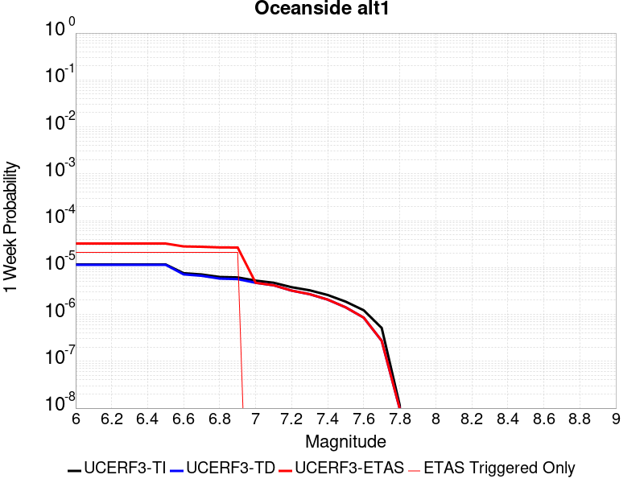 | 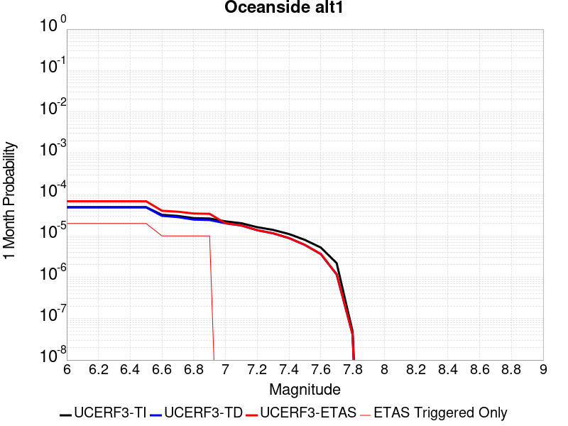 | 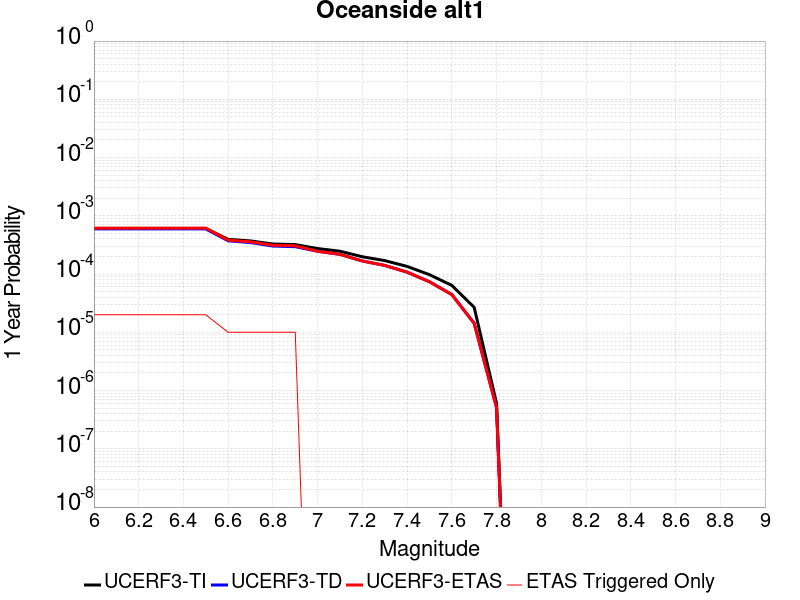 | 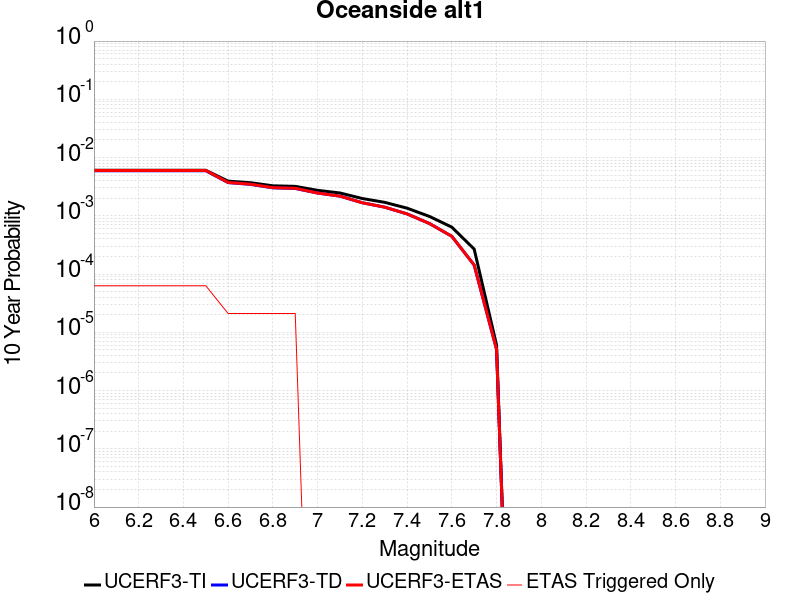 |

| Magnitude | 1 wk TI Prob | 1 wk TD Prob | 1 wk ETAS Prob | 1 wk ETAS/TD Gain | 1 wk ETAS Triggered Only | 1 mo TI Prob | 1 mo TD Prob | 1 mo ETAS Prob | 1 mo ETAS/TD Gain | 1 mo ETAS Triggered Only | 1 yr TI Prob | 1 yr TD Prob | 1 yr ETAS Prob | 1 yr ETAS/TD Gain | 1 yr ETAS Triggered Only | 10 yr TI Prob | 10 yr TD Prob | 10 yr ETAS Prob | 10 yr ETAS/TD Gain | 10 yr ETAS Triggered Only |
|-----|-----|-----|-----|-----|-----|-----|-----|-----|-----|-----|-----|-----|-----|-----|-----|-----|-----|-----|-----|-----|
| 6.0 | 1.1617542E-5 | 1.1423485E-5 | 2.1423371E-5 | 1.8753796 | 1.0E-5 | 4.9788516E-5 | 4.8956965E-5 | 6.895599E-5 | 1.4085021 | 2.0E-5 | 6.060066E-4 | 5.9590413E-4 | 6.1589223E-4 | 1.0335424 | 2.0E-5 | 0.0060435664 | 0.0059446604 | 0.0059744823 | 1.0050166 | 3.0E-5 |
| 6.1 | 1.1617542E-5 | 1.1423485E-5 | 2.1423371E-5 | 1.8753796 | 1.0E-5 | 4.9788516E-5 | 4.8956965E-5 | 6.895599E-5 | 1.4085021 | 2.0E-5 | 6.060066E-4 | 5.9590413E-4 | 6.1589223E-4 | 1.0335424 | 2.0E-5 | 0.0060435664 | 0.0059446604 | 0.0059744823 | 1.0050166 | 3.0E-5 |
| 6.2 | 1.1617542E-5 | 1.1423485E-5 | 2.1423371E-5 | 1.8753796 | 1.0E-5 | 4.9788516E-5 | 4.8956965E-5 | 6.895599E-5 | 1.4085021 | 2.0E-5 | 6.060066E-4 | 5.9590413E-4 | 6.1589223E-4 | 1.0335424 | 2.0E-5 | 0.0060435664 | 0.0059446604 | 0.0059744823 | 1.0050166 | 3.0E-5 |
| 6.3 | 1.1617542E-5 | 1.1423485E-5 | 2.1423371E-5 | 1.8753796 | 1.0E-5 | 4.9788516E-5 | 4.8956965E-5 | 6.895599E-5 | 1.4085021 | 2.0E-5 | 6.060066E-4 | 5.9590413E-4 | 6.1589223E-4 | 1.0335424 | 2.0E-5 | 0.0060435664 | 0.0059446604 | 0.0059744823 | 1.0050166 | 3.0E-5 |
| 6.4 | 1.1617542E-5 | 1.1423485E-5 | 2.1423371E-5 | 1.8753796 | 1.0E-5 | 4.9788516E-5 | 4.8956965E-5 | 6.895599E-5 | 1.4085021 | 2.0E-5 | 6.060066E-4 | 5.9590413E-4 | 6.1589223E-4 | 1.0335424 | 2.0E-5 | 0.0060435664 | 0.0059446604 | 0.0059744823 | 1.0050166 | 3.0E-5 |
| 6.5 | 1.1617542E-5 | 1.1423485E-5 | 2.1423371E-5 | 1.8753796 | 1.0E-5 | 4.9788516E-5 | 4.8956965E-5 | 6.895599E-5 | 1.4085021 | 2.0E-5 | 6.060066E-4 | 5.9590413E-4 | 6.1589223E-4 | 1.0335424 | 2.0E-5 | 0.0060435664 | 0.0059446604 | 0.0059744823 | 1.0050166 | 3.0E-5 |
| 6.6 | 7.561768E-6 | 7.1336085E-6 | 1.7133538E-5 | 2.4018052 | 1.0E-5 | 3.2407173E-5 | 3.0572253E-5 | 4.0571947E-5 | 1.327084 | 1.0E-5 | 3.9448592E-4 | 3.721547E-4 | 3.82151E-4 | 1.0268606 | 1.0E-5 | 0.0039378637 | 0.0037154262 | 0.003725389 | 1.0026815 | 1.0E-5 |
| 6.7 | 7.1042605E-6 | 6.6556786E-6 | 1.6655611E-5 | 2.5024664 | 1.0E-5 | 3.0446476E-5 | 2.852403E-5 | 3.8523744E-5 | 1.3505716 | 1.0E-5 | 3.706228E-4 | 3.4722552E-4 | 3.5722204E-4 | 1.0287898 | 1.0E-5 | 0.0037000529 | 0.0034669132 | 0.0034768786 | 1.0028744 | 1.0E-5 |
| 6.8 | 6.285554E-6 | 5.7996986E-6 | 1.579964E-5 | 2.7242174 | 1.0E-5 | 2.693781E-5 | 2.4855617E-5 | 3.485537E-5 | 1.4023136 | 1.0E-5 | 3.2791847E-4 | 3.0257567E-4 | 3.1257264E-4 | 1.0330396 | 1.0E-5 | 0.0032743502 | 0.0030216945 | 0.0030316643 | 1.0032994 | 1.0E-5 |
| 6.9 | 6.148883E-6 | 5.6565373E-6 | 1.565648E-5 | 2.7678561 | 1.0E-5 | 2.635209E-5 | 2.4242081E-5 | 3.424184E-5 | 1.4124959 | 1.0E-5 | 3.2078946E-4 | 2.951079E-4 | 3.0510494E-4 | 1.033876 | 1.0E-5 | 0.003203268 | 0.002947217 | 0.0029571876 | 1.003383 | 1.0E-5 |
| 7.0 | 5.253857E-6 | 4.7223966E-6 | 4.7223966E-6 | 1.0 | 0.0 | 2.2516335E-5 | 2.0238687E-5 | 2.0238687E-5 | 1.0 | 0.0 | 2.7410188E-4 | 2.4637848E-4 | 2.4637848E-4 | 1.0 | 0.0 | 0.0027376404 | 0.0024610846 | 0.0024610846 | 1.0 | 0.0 |
| 7.1 | 4.730754E-6 | 4.1785024E-6 | 4.1785024E-6 | 1.0 | 0.0 | 2.0274503E-5 | 1.7907745E-5 | 1.7907745E-5 | 1.0 | 0.0 | 2.468141E-4 | 2.1800524E-4 | 2.1800524E-4 | 1.0 | 0.0 | 0.0024654015 | 0.0021779404 | 0.0021779404 | 1.0 | 0.0 |
| 7.2 | 3.7998386E-6 | 3.2140165E-6 | 3.2140165E-6 | 1.0 | 0.0 | 1.6284921E-5 | 1.37742845E-5 | 1.37742845E-5 | 1.0 | 0.0 | 1.9825088E-4 | 1.6768913E-4 | 1.6768913E-4 | 1.0 | 0.0 | 0.001980741 | 0.0016756381 | 0.0016756381 | 1.0 | 0.0 |
| 7.3 | 3.2656465E-6 | 2.6983669E-6 | 2.6983669E-6 | 1.0 | 0.0 | 1.3995553E-5 | 1.1564379E-5 | 1.1564379E-5 | 1.0 | 0.0 | 1.7038253E-4 | 1.4078732E-4 | 1.4078732E-4 | 1.0 | 0.0 | 0.0017025196 | 0.0014069924 | 0.0014069924 | 1.0 | 0.0 |
| 7.4 | 2.593703E-6 | 2.0680227E-6 | 2.0680227E-6 | 1.0 | 0.0 | 1.1115822E-5 | 8.862925E-6 | 8.862925E-6 | 1.0 | 0.0 | 1.3532673E-4 | 1.0790086E-4 | 1.0790086E-4 | 1.0 | 0.0 | 0.0013524436 | 0.0010784935 | 0.0010784935 | 1.0 | 0.0 |
| 7.5 | 1.8715585E-6 | 1.4137277E-6 | 1.4137277E-6 | 1.0 | 0.0 | 8.020941E-6 | 6.058819E-6 | 6.058819E-6 | 1.0 | 0.0 | 9.7650576E-5 | 7.376369E-5 | 7.376369E-5 | 1.0 | 0.0 | 9.7607676E-4 | 7.373981E-4 | 7.373981E-4 | 1.0 | 0.0 |
| 7.6 | 1.2246786E-6 | 8.526946E-7 | 8.526946E-7 | 1.0 | 0.0 | 5.248612E-6 | 3.6544006E-6 | 3.6544006E-6 | 1.0 | 0.0 | 6.389998E-5 | 4.4491466E-5 | 4.4491466E-5 | 1.0 | 0.0 | 6.3881604E-4 | 4.4483008E-4 | 4.4483008E-4 | 1.0 | 0.0 |
| 7.7 | 5.140719E-7 | 2.7346528E-7 | 2.7346528E-7 | 1.0 | 0.0 | 2.2031636E-6 | 1.1719936E-6 | 1.1719936E-6 | 1.0 | 0.0 | 2.6823185E-5 | 1.4268943E-5 | 1.4268943E-5 | 1.0 | 0.0 | 2.6819948E-4 | 1.4268162E-4 | 1.4268162E-4 | 1.0 | 0.0 |
| 7.8 | 1.16056995E-8 | 9.782997E-9 | 9.782997E-9 | 1.0 | 0.0 | 4.9738713E-8 | 4.1927127E-8 | 4.1927127E-8 | 1.0 | 0.0 | 6.0556863E-7 | 5.1046277E-7 | 5.1046277E-7 | 1.0 | 0.0 | 6.05567E-6 | 5.1046277E-6 | 5.1046277E-6 | 1.0 | 0.0 |

## Mono Lake 2011 CFM
*[(top)](#table-of-contents)*

| 1 Week | 1 Month | 1 Year | 10 Year |
|-----|-----|-----|-----|
|  |  |  |  |

| Magnitude | 1 wk TI Prob | 1 wk TD Prob | 1 wk ETAS Prob | 1 wk ETAS/TD Gain | 1 wk ETAS Triggered Only | 1 mo TI Prob | 1 mo TD Prob | 1 mo ETAS Prob | 1 mo ETAS/TD Gain | 1 mo ETAS Triggered Only | 1 yr TI Prob | 1 yr TD Prob | 1 yr ETAS Prob | 1 yr ETAS/TD Gain | 1 yr ETAS Triggered Only | 10 yr TI Prob | 10 yr TD Prob | 10 yr ETAS Prob | 10 yr ETAS/TD Gain | 10 yr ETAS Triggered Only |
|-----|-----|-----|-----|-----|-----|-----|-----|-----|-----|-----|-----|-----|-----|-----|-----|-----|-----|-----|-----|-----|
| 6.0 | 2.0341662E-5 | 2.3828192E-5 | 3.3827953E-5 | 1.4196609 | 1.0E-5 | 8.717564E-5 | 1.0211982E-4 | 1.12118796E-4 | 1.0979142 | 1.0E-5 | 0.0010608466 | 0.0012431308 | 0.0012531184 | 1.0080342 | 1.0E-5 | 0.010557966 | 0.012413842 | 0.012443469 | 1.0023867 | 3.0E-5 |
| 6.1 | 2.0341662E-5 | 2.3828192E-5 | 3.3827953E-5 | 1.4196609 | 1.0E-5 | 8.717564E-5 | 1.0211982E-4 | 1.12118796E-4 | 1.0979142 | 1.0E-5 | 0.0010608466 | 0.0012431308 | 0.0012531184 | 1.0080342 | 1.0E-5 | 0.010557966 | 0.012413842 | 0.012443469 | 1.0023867 | 3.0E-5 |
| 6.2 | 2.0341662E-5 | 2.3828192E-5 | 3.3827953E-5 | 1.4196609 | 1.0E-5 | 8.717564E-5 | 1.0211982E-4 | 1.12118796E-4 | 1.0979142 | 1.0E-5 | 0.0010608466 | 0.0012431308 | 0.0012531184 | 1.0080342 | 1.0E-5 | 0.010557966 | 0.012413842 | 0.012443469 | 1.0023867 | 3.0E-5 |
| 6.3 | 2.0341662E-5 | 2.3828192E-5 | 3.3827953E-5 | 1.4196609 | 1.0E-5 | 8.717564E-5 | 1.0211982E-4 | 1.12118796E-4 | 1.0979142 | 1.0E-5 | 0.0010608466 | 0.0012431308 | 0.0012531184 | 1.0080342 | 1.0E-5 | 0.010557966 | 0.012413842 | 0.012443469 | 1.0023867 | 3.0E-5 |
| 6.4 | 1.749821E-5 | 2.049101E-5 | 3.0490804E-5 | 1.4880089 | 1.0E-5 | 7.499018E-5 | 8.781861E-5 | 9.7817734E-5 | 1.1138611 | 1.0E-5 | 9.1262296E-4 | 0.0010691914 | 0.0010791807 | 1.0093429 | 1.0E-5 | 0.009088841 | 0.01069187 | 0.010721549 | 1.0027759 | 3.0E-5 |
| 6.5 | 1.749821E-5 | 2.049101E-5 | 3.0490804E-5 | 1.4880089 | 1.0E-5 | 7.499018E-5 | 8.781861E-5 | 9.7817734E-5 | 1.1138611 | 1.0E-5 | 9.1262296E-4 | 0.0010691914 | 0.0010791807 | 1.0093429 | 1.0E-5 | 0.009088841 | 0.01069187 | 0.010721549 | 1.0027759 | 3.0E-5 |

## Blue Cut
*[(top)](#table-of-contents)*

| 1 Week | 1 Month | 1 Year | 10 Year |
|-----|-----|-----|-----|
| 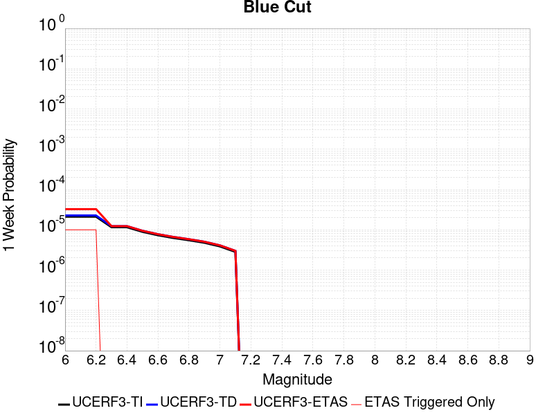 | 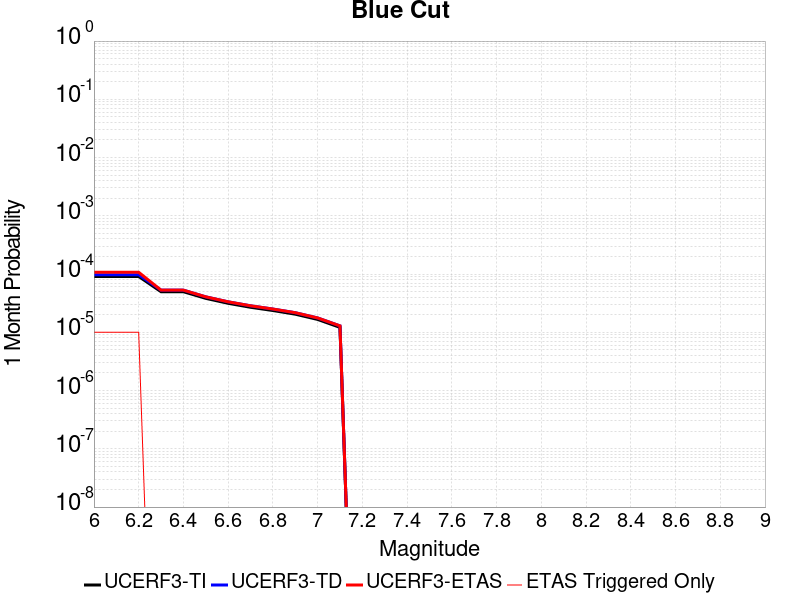 | 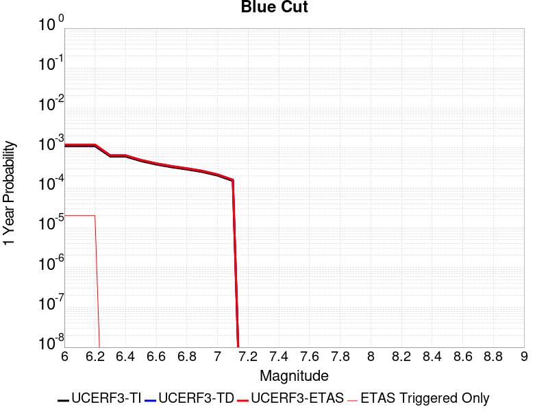 | 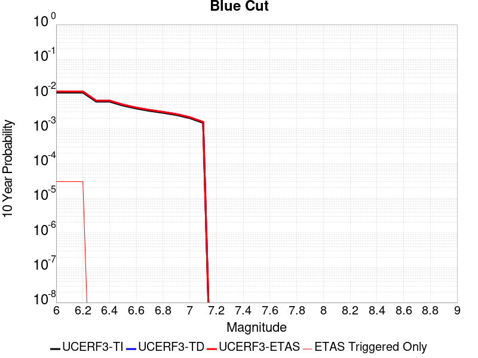 |

| Magnitude | 1 wk TI Prob | 1 wk TD Prob | 1 wk ETAS Prob | 1 wk ETAS/TD Gain | 1 wk ETAS Triggered Only | 1 mo TI Prob | 1 mo TD Prob | 1 mo ETAS Prob | 1 mo ETAS/TD Gain | 1 mo ETAS Triggered Only | 1 yr TI Prob | 1 yr TD Prob | 1 yr ETAS Prob | 1 yr ETAS/TD Gain | 1 yr ETAS Triggered Only | 10 yr TI Prob | 10 yr TD Prob | 10 yr ETAS Prob | 10 yr ETAS/TD Gain | 10 yr ETAS Triggered Only |
|-----|-----|-----|-----|-----|-----|-----|-----|-----|-----|-----|-----|-----|-----|-----|-----|-----|-----|-----|-----|-----|
| 6.0 | 2.1227985E-5 | 2.2719574E-5 | 3.271935E-5 | 1.440139 | 1.0E-5 | 9.097391E-5 | 9.73663E-5 | 1.07365326E-4 | 1.102695 | 1.0E-5 | 0.0011070445 | 0.0011848481 | 0.0012048244 | 1.0168598 | 2.0E-5 | 0.011015458 | 0.011791152 | 0.011820798 | 1.0025142 | 3.0E-5 |
| 6.1 | 2.1227985E-5 | 2.2719574E-5 | 3.271935E-5 | 1.440139 | 1.0E-5 | 9.097391E-5 | 9.73663E-5 | 1.07365326E-4 | 1.102695 | 1.0E-5 | 0.0011070445 | 0.0011848481 | 0.0012048244 | 1.0168598 | 2.0E-5 | 0.011015458 | 0.011791152 | 0.011820798 | 1.0025142 | 3.0E-5 |
| 6.2 | 2.1227985E-5 | 2.2719574E-5 | 3.271935E-5 | 1.440139 | 1.0E-5 | 9.097391E-5 | 9.73663E-5 | 1.07365326E-4 | 1.102695 | 1.0E-5 | 0.0011070445 | 0.0011848481 | 0.0012048244 | 1.0168598 | 2.0E-5 | 0.011015458 | 0.011791152 | 0.011820798 | 1.0025142 | 3.0E-5 |
| 6.3 | 1.1613981E-5 | 1.2353542E-5 | 1.2353542E-5 | 1.0 | 0.0 | 4.9773254E-5 | 5.2942745E-5 | 5.2942745E-5 | 1.0 | 0.0 | 6.0582085E-4 | 6.443998E-4 | 6.443998E-4 | 1.0 | 0.0 | 0.0060417196 | 0.0064265593 | 0.0064265593 | 1.0 | 0.0 |
| 6.4 | 1.1613981E-5 | 1.2353542E-5 | 1.2353542E-5 | 1.0 | 0.0 | 4.9773254E-5 | 5.2942745E-5 | 5.2942745E-5 | 1.0 | 0.0 | 6.0582085E-4 | 6.443998E-4 | 6.443998E-4 | 1.0 | 0.0 | 0.0060417196 | 0.0064265593 | 0.0064265593 | 1.0 | 0.0 |
| 6.5 | 8.931326E-6 | 9.4816E-6 | 9.4816E-6 | 1.0 | 0.0 | 3.8276554E-5 | 4.0634844E-5 | 4.0634844E-5 | 1.0 | 0.0 | 4.6591737E-4 | 4.946261E-4 | 4.946261E-4 | 1.0 | 0.0 | 0.0046494175 | 0.004936161 | 0.004936161 | 1.0 | 0.0 |
| 6.6 | 7.345353E-6 | 7.79028E-6 | 7.79028E-6 | 1.0 | 0.0 | 3.1479703E-5 | 3.338653E-5 | 3.338653E-5 | 1.0 | 0.0 | 3.83198E-4 | 4.064132E-4 | 4.064132E-4 | 1.0 | 0.0 | 0.0038253788 | 0.0040574907 | 0.0040574907 | 1.0 | 0.0 |
| 6.7 | 6.2775666E-6 | 6.655149E-6 | 6.655149E-6 | 1.0 | 0.0 | 2.690358E-5 | 2.8521798E-5 | 2.8521798E-5 | 1.0 | 0.0 | 3.2750185E-4 | 3.472051E-4 | 3.472051E-4 | 1.0 | 0.0 | 0.0032701963 | 0.003467367 | 0.003467367 | 1.0 | 0.0 |
| 6.8 | 5.5234095E-6 | 5.8551113E-6 | 5.8551113E-6 | 1.0 | 0.0 | 2.367154E-5 | 2.5093133E-5 | 2.5093133E-5 | 1.0 | 0.0 | 2.8816288E-4 | 3.0547334E-4 | 3.0547334E-4 | 1.0 | 0.0 | 0.002877895 | 0.0030512505 | 0.0030512505 | 1.0 | 0.0 |
| 6.9 | 4.7780054E-6 | 5.0654203E-6 | 5.0654203E-6 | 1.0 | 0.0 | 2.0477004E-5 | 2.1708804E-5 | 2.1708804E-5 | 1.0 | 0.0 | 2.4927902E-4 | 2.642797E-4 | 2.642797E-4 | 1.0 | 0.0 | 0.0024899957 | 0.002640346 | 0.002640346 | 1.0 | 0.0 |
| 7.0 | 3.883171E-6 | 4.118487E-6 | 4.118487E-6 | 1.0 | 0.0 | 1.6642054E-5 | 1.7650578E-5 | 1.7650578E-5 | 1.0 | 0.0 | 2.0259817E-4 | 2.1488148E-4 | 2.1488148E-4 | 1.0 | 0.0 | 0.0020241356 | 0.0021474129 | 0.0021474129 | 1.0 | 0.0 |
| 7.1 | 2.8358215E-6 | 3.0097158E-6 | 3.0097158E-6 | 1.0 | 0.0 | 1.2153464E-5 | 1.2898756E-5 | 1.2898756E-5 | 1.0 | 0.0 | 1.4795837E-4 | 1.5703762E-4 | 1.5703762E-4 | 1.0 | 0.0 | 0.001478599 | 0.0015699116 | 0.0015699116 | 1.0 | 0.0 |

## North Frontal  (East)
*[(top)](#table-of-contents)*

| 1 Week | 1 Month | 1 Year | 10 Year |
|-----|-----|-----|-----|
| 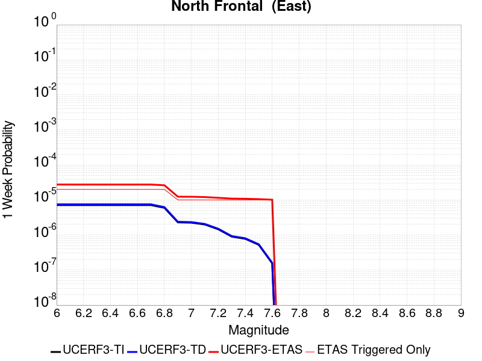 |  | 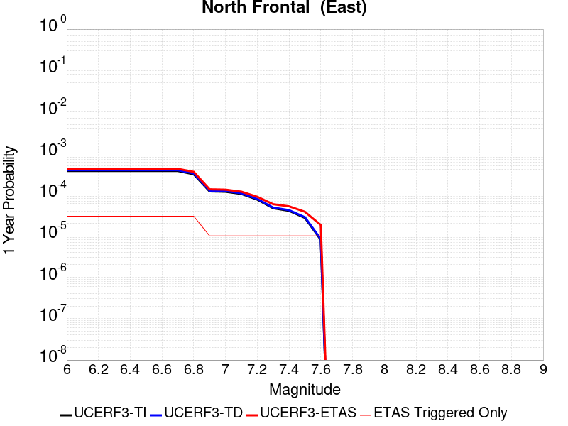 |  |

| Magnitude | 1 wk TI Prob | 1 wk TD Prob | 1 wk ETAS Prob | 1 wk ETAS/TD Gain | 1 wk ETAS Triggered Only | 1 mo TI Prob | 1 mo TD Prob | 1 mo ETAS Prob | 1 mo ETAS/TD Gain | 1 mo ETAS Triggered Only | 1 yr TI Prob | 1 yr TD Prob | 1 yr ETAS Prob | 1 yr ETAS/TD Gain | 1 yr ETAS Triggered Only | 10 yr TI Prob | 10 yr TD Prob | 10 yr ETAS Prob | 10 yr ETAS/TD Gain | 10 yr ETAS Triggered Only |
|-----|-----|-----|-----|-----|-----|-----|-----|-----|-----|-----|-----|-----|-----|-----|-----|-----|-----|-----|-----|-----|
| 6.0 | 7.135738E-6 | 7.4771765E-6 | 2.7477026E-5 | 3.6747863 | 2.0E-5 | 3.0581377E-5 | 3.204476E-5 | 5.204412E-5 | 1.624107 | 2.0E-5 | 3.7226462E-4 | 3.9009505E-4 | 4.2008335E-4 | 1.0768744 | 3.0E-5 | 0.0037164164 | 0.0038960609 | 0.0039259437 | 1.00767 | 3.0E-5 |
| 6.1 | 7.135738E-6 | 7.4771765E-6 | 2.7477026E-5 | 3.6747863 | 2.0E-5 | 3.0581377E-5 | 3.204476E-5 | 5.204412E-5 | 1.624107 | 2.0E-5 | 3.7226462E-4 | 3.9009505E-4 | 4.2008335E-4 | 1.0768744 | 3.0E-5 | 0.0037164164 | 0.0038960609 | 0.0039259437 | 1.00767 | 3.0E-5 |
| 6.2 | 7.135738E-6 | 7.4771765E-6 | 2.7477026E-5 | 3.6747863 | 2.0E-5 | 3.0581377E-5 | 3.204476E-5 | 5.204412E-5 | 1.624107 | 2.0E-5 | 3.7226462E-4 | 3.9009505E-4 | 4.2008335E-4 | 1.0768744 | 3.0E-5 | 0.0037164164 | 0.0038960609 | 0.0039259437 | 1.00767 | 3.0E-5 |
| 6.3 | 7.135738E-6 | 7.4771765E-6 | 2.7477026E-5 | 3.6747863 | 2.0E-5 | 3.0581377E-5 | 3.204476E-5 | 5.204412E-5 | 1.624107 | 2.0E-5 | 3.7226462E-4 | 3.9009505E-4 | 4.2008335E-4 | 1.0768744 | 3.0E-5 | 0.0037164164 | 0.0038960609 | 0.0039259437 | 1.00767 | 3.0E-5 |
| 6.4 | 7.135738E-6 | 7.4771765E-6 | 2.7477026E-5 | 3.6747863 | 2.0E-5 | 3.0581377E-5 | 3.204476E-5 | 5.204412E-5 | 1.624107 | 2.0E-5 | 3.7226462E-4 | 3.9009505E-4 | 4.2008335E-4 | 1.0768744 | 3.0E-5 | 0.0037164164 | 0.0038960609 | 0.0039259437 | 1.00767 | 3.0E-5 |
| 6.5 | 7.135738E-6 | 7.4771765E-6 | 2.7477026E-5 | 3.6747863 | 2.0E-5 | 3.0581377E-5 | 3.204476E-5 | 5.204412E-5 | 1.624107 | 2.0E-5 | 3.7226462E-4 | 3.9009505E-4 | 4.2008335E-4 | 1.0768744 | 3.0E-5 | 0.0037164164 | 0.0038960609 | 0.0039259437 | 1.00767 | 3.0E-5 |
| 6.6 | 7.135738E-6 | 7.4771765E-6 | 2.7477026E-5 | 3.6747863 | 2.0E-5 | 3.0581377E-5 | 3.204476E-5 | 5.204412E-5 | 1.624107 | 2.0E-5 | 3.7226462E-4 | 3.9009505E-4 | 4.2008335E-4 | 1.0768744 | 3.0E-5 | 0.0037164164 | 0.0038960609 | 0.0039259437 | 1.00767 | 3.0E-5 |
| 6.7 | 7.135738E-6 | 7.4771765E-6 | 2.7477026E-5 | 3.6747863 | 2.0E-5 | 3.0581377E-5 | 3.204476E-5 | 5.204412E-5 | 1.624107 | 2.0E-5 | 3.7226462E-4 | 3.9009505E-4 | 4.2008335E-4 | 1.0768744 | 3.0E-5 | 0.0037164164 | 0.0038960609 | 0.0039259437 | 1.00767 | 3.0E-5 |
| 6.8 | 5.959142E-6 | 6.236683E-6 | 2.6236557E-5 | 4.206813 | 2.0E-5 | 2.553893E-5 | 2.6728469E-5 | 4.6727935E-5 | 1.7482458 | 2.0E-5 | 3.108921E-4 | 3.253886E-4 | 3.553788E-4 | 1.0921675 | 3.0E-5 | 0.0031045752 | 0.0032508948 | 0.0032807973 | 1.0091982 | 3.0E-5 |
| 6.9 | 2.2946929E-6 | 2.3824605E-6 | 1.2382437E-5 | 5.1973314 | 1.0E-5 | 9.834361E-6 | 1.0210508E-5 | 2.0210406E-5 | 1.9793732 | 1.0E-5 | 1.1972676E-4 | 1.2430632E-4 | 1.3430507E-4 | 1.0804365 | 1.0E-5 | 0.0011966228 | 0.0012424142 | 0.0012524019 | 1.0080389 | 1.0E-5 |
| 7.0 | 2.2468673E-6 | 2.3321538E-6 | 1.2332131E-5 | 5.287872 | 1.0E-5 | 9.629396E-6 | 9.994909E-6 | 1.999481E-5 | 2.0004992 | 1.0E-5 | 1.1723159E-4 | 1.21681696E-4 | 1.3168047E-4 | 1.0821717 | 1.0E-5 | 0.0011716976 | 0.0012161969 | 0.0012261848 | 1.0082123 | 1.0E-5 |
| 7.1 | 1.9921076E-6 | 2.0646032E-6 | 1.2064583E-5 | 5.843536 | 1.0E-5 | 8.537577E-6 | 8.848272E-6 | 1.8848183E-5 | 2.1301541 | 1.0E-5 | 1.0394004E-4 | 1.0772282E-4 | 1.1772174E-4 | 1.0928209 | 1.0E-5 | 0.0010389143 | 0.0010767487 | 0.001086738 | 1.0092772 | 1.0E-5 |
| 7.2 | 1.4524545E-6 | 1.5045148E-6 | 1.15044995E-5 | 7.6466513 | 1.0E-5 | 6.2247905E-6 | 6.447906E-6 | 1.6447842E-5 | 2.5508811 | 1.0E-5 | 7.5784184E-5 | 7.850068E-5 | 8.849989E-5 | 1.1273774 | 1.0E-5 | 7.575835E-4 | 7.8475394E-4 | 7.947461E-4 | 1.0127329 | 1.0E-5 |
| 7.3 | 8.9802575E-7 | 9.3087283E-7 | 1.0930864E-5 | 11.742597 | 1.0E-5 | 3.848676E-6 | 3.9894494E-6 | 1.3989409E-5 | 3.5066016 | 1.0E-5 | 4.685662E-5 | 4.857058E-5 | 5.8570095E-5 | 1.205876 | 1.0E-5 | 4.6846745E-4 | 4.8561094E-4 | 4.956061E-4 | 1.0205827 | 1.0E-5 |
| 7.4 | 7.776139E-7 | 8.0604747E-7 | 1.0806039E-5 | 13.406207 | 1.0E-5 | 3.3326266E-6 | 3.4544853E-6 | 1.3454451E-5 | 3.8947773 | 1.0E-5 | 4.0573974E-5 | 4.2057654E-5 | 5.2057236E-5 | 1.2377589 | 1.0E-5 | 4.0566566E-4 | 4.205077E-4 | 4.305035E-4 | 1.0237708 | 1.0E-5 |
| 7.5 | 5.244417E-7 | 5.441219E-7 | 1.0544117E-5 | 19.378223 | 1.0E-5 | 2.2476054E-6 | 2.3319494E-6 | 1.2331926E-5 | 5.2882476 | 1.0E-5 | 2.7364253E-5 | 2.839118E-5 | 3.8390895E-5 | 1.3522121 | 1.0E-5 | 2.7360884E-4 | 2.8388205E-4 | 2.9387922E-4 | 1.0352159 | 1.0E-5 |
| 7.6 | 1.5489647E-7 | 1.6089504E-7 | 1.0160893E-5 | 63.15231 | 1.0E-5 | 6.6384183E-7 | 6.895501E-7 | 1.0689543E-5 | 15.502199 | 1.0E-5 | 8.082245E-6 | 8.395261E-6 | 1.8395176E-5 | 2.1911383 | 1.0E-5 | 8.08195E-5 | 8.395143E-5 | 9.395059E-5 | 1.1191065 | 1.0E-5 |

## Surprise Valley 2011 CFM
*[(top)](#table-of-contents)*

| 1 Week | 1 Month | 1 Year | 10 Year |
|-----|-----|-----|-----|
| 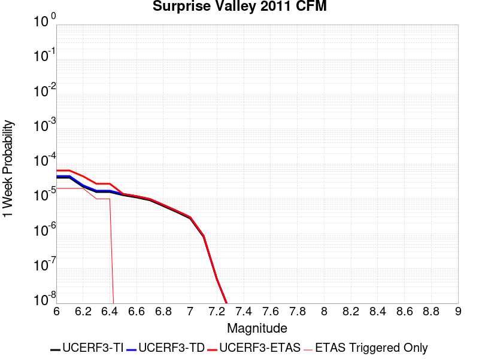 | 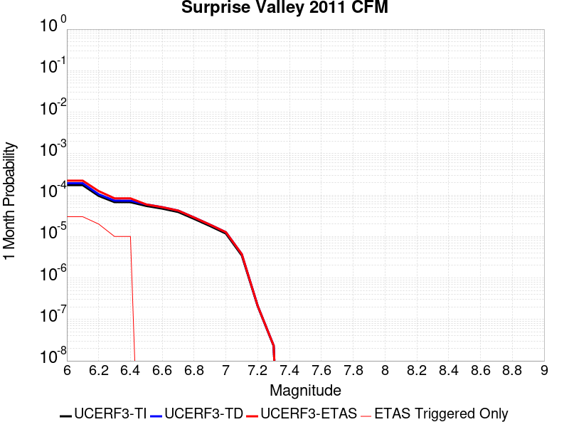 | 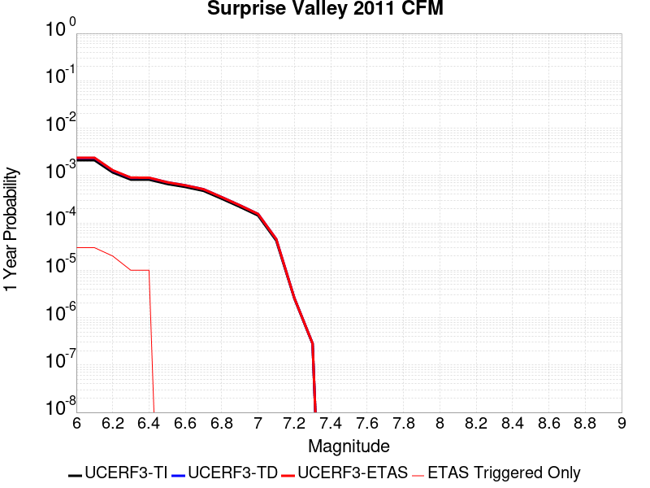 | 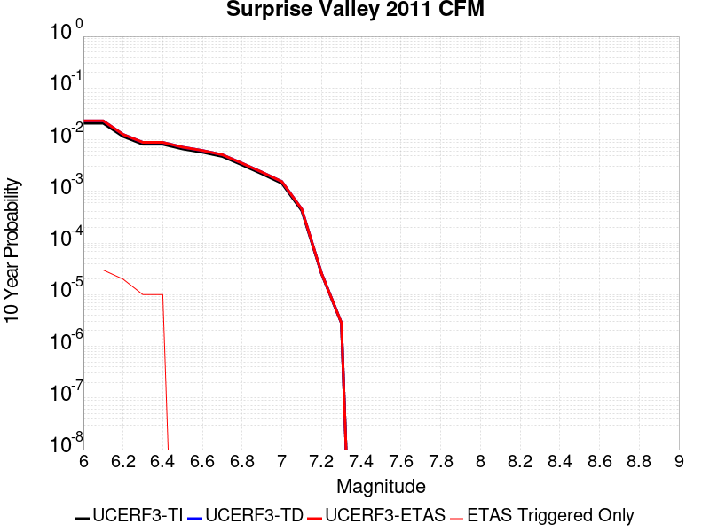 |

| Magnitude | 1 wk TI Prob | 1 wk TD Prob | 1 wk ETAS Prob | 1 wk ETAS/TD Gain | 1 wk ETAS Triggered Only | 1 mo TI Prob | 1 mo TD Prob | 1 mo ETAS Prob | 1 mo ETAS/TD Gain | 1 mo ETAS Triggered Only | 1 yr TI Prob | 1 yr TD Prob | 1 yr ETAS Prob | 1 yr ETAS/TD Gain | 1 yr ETAS Triggered Only | 10 yr TI Prob | 10 yr TD Prob | 10 yr ETAS Prob | 10 yr ETAS/TD Gain | 10 yr ETAS Triggered Only |
|-----|-----|-----|-----|-----|-----|-----|-----|-----|-----|-----|-----|-----|-----|-----|-----|-----|-----|-----|-----|-----|
| 6.0 | 4.0396248E-5 | 4.485131E-5 | 6.4850414E-5 | 1.4458978 | 2.0E-5 | 1.7311527E-4 | 1.9220692E-4 | 2.2220115E-4 | 1.1560518 | 3.0E-5 | 0.002105641 | 0.0023378176 | 0.0023677475 | 1.0128025 | 3.0E-5 | 0.020858008 | 0.023153966 | 0.023183271 | 1.0012656 | 3.0E-5 |
| 6.1 | 4.0396248E-5 | 4.485131E-5 | 6.4850414E-5 | 1.4458978 | 2.0E-5 | 1.7311527E-4 | 1.9220692E-4 | 2.2220115E-4 | 1.1560518 | 3.0E-5 | 0.002105641 | 0.0023378176 | 0.0023677475 | 1.0128025 | 3.0E-5 | 0.020858008 | 0.023153966 | 0.023183271 | 1.0012656 | 3.0E-5 |
| 6.2 | 2.2295266E-5 | 2.440125E-5 | 4.440076E-5 | 1.8196101 | 2.0E-5 | 9.554764E-5 | 1.0457276E-4 | 1.2457067E-4 | 1.1912344 | 2.0E-5 | 0.0011626717 | 0.0012724606 | 0.0012924351 | 1.0156976 | 2.0E-5 | 0.011566074 | 0.012654981 | 0.0126747275 | 1.0015604 | 2.0E-5 |
| 6.3 | 1.572643E-5 | 1.7096807E-5 | 2.7096636E-5 | 1.5848945 | 1.0E-5 | 6.7397246E-5 | 7.327003E-5 | 8.32693E-5 | 1.1364714 | 1.0E-5 | 8.202525E-4 | 8.91708E-4 | 9.016991E-4 | 1.0112045 | 1.0E-5 | 0.008172315 | 0.008882407 | 0.008892318 | 1.0011158 | 1.0E-5 |
| 6.4 | 1.5714395E-5 | 1.7084629E-5 | 2.7084458E-5 | 1.5853114 | 1.0E-5 | 6.734567E-5 | 7.3217845E-5 | 8.3217106E-5 | 1.1365688 | 1.0E-5 | 8.1962504E-4 | 8.9107314E-4 | 9.0106425E-4 | 1.0112125 | 1.0E-5 | 0.008166086 | 0.008876109 | 0.00888602 | 1.0011166 | 1.0E-5 |
| 6.5 | 1.2733495E-5 | 1.38016E-5 | 1.38016E-5 | 1.0 | 0.0 | 5.457098E-5 | 5.9148413E-5 | 5.9148413E-5 | 1.0 | 0.0 | 6.641992E-4 | 7.1990065E-4 | 7.1990065E-4 | 1.0 | 0.0 | 0.0066221743 | 0.0071763797 | 0.0071763797 | 1.0 | 0.0 |
| 6.6 | 1.0983784E-5 | 1.1886554E-5 | 1.1886554E-5 | 1.0 | 0.0 | 4.7072506E-5 | 5.094141E-5 | 5.094141E-5 | 1.0 | 0.0 | 5.7295704E-4 | 6.200405E-4 | 6.200405E-4 | 1.0 | 0.0 | 0.0057148207 | 0.0061836545 | 0.0061836545 | 1.0 | 0.0 |
| 6.7 | 9.104806E-6 | 9.839491E-6 | 9.839491E-6 | 1.0 | 0.0 | 3.902001E-5 | 4.2168587E-5 | 4.2168587E-5 | 1.0 | 0.0 | 4.7496508E-4 | 5.132855E-4 | 5.132855E-4 | 1.0 | 0.0 | 0.004739512 | 0.005121397 | 0.005121397 | 1.0 | 0.0 |
| 6.8 | 6.2162403E-6 | 6.7041337E-6 | 6.7041337E-6 | 1.0 | 0.0 | 2.6640759E-5 | 2.8731698E-5 | 2.8731698E-5 | 1.0 | 0.0 | 3.2430296E-4 | 3.497545E-4 | 3.497545E-4 | 1.0 | 0.0 | 0.003238301 | 0.0034922638 | 0.0034922638 | 1.0 | 0.0 |
| 6.9 | 4.1792696E-6 | 4.50323E-6 | 4.50323E-6 | 1.0 | 0.0 | 1.7911032E-5 | 1.9299423E-5 | 1.9299423E-5 | 1.0 | 0.0 | 2.1804498E-4 | 2.3494668E-4 | 2.3494668E-4 | 1.0 | 0.0 | 0.0021783116 | 0.0023471361 | 0.0023471361 | 1.0 | 0.0 |
| 7.0 | 2.7478413E-6 | 2.9622424E-6 | 2.9622424E-6 | 1.0 | 0.0 | 1.177641E-5 | 1.269527E-5 | 1.269527E-5 | 1.0 | 0.0 | 1.4336836E-4 | 1.545552E-4 | 1.545552E-4 | 1.0 | 0.0 | 0.001432759 | 0.0015445995 | 0.0015445995 | 1.0 | 0.0 |
| 7.1 | 8.128648E-7 | 8.724922E-7 | 8.724922E-7 | 1.0 | 0.0 | 3.4837017E-6 | 3.7392501E-6 | 3.7392501E-6 | 1.0 | 0.0 | 4.2413245E-5 | 4.552502E-5 | 4.552502E-5 | 1.0 | 0.0 | 4.2405148E-4 | 4.5521575E-4 | 4.5521575E-4 | 1.0 | 0.0 |
| 7.2 | 4.8641045E-8 | 4.9402068E-8 | 4.9402068E-8 | 1.0 | 0.0 | 2.084616E-7 | 2.1172312E-7 | 2.1172312E-7 | 1.0 | 0.0 | 2.538017E-6 | 2.577726E-6 | 2.577726E-6 | 1.0 | 0.0 | 2.537988E-5 | 2.5776973E-5 | 2.5776973E-5 | 1.0 | 0.0 |
| 7.3 | 5.3911844E-9 | 5.4758145E-9 | 5.4758145E-9 | 1.0 | 0.0 | 2.3105075E-8 | 2.3467775E-8 | 2.3467775E-8 | 1.0 | 0.0 | 2.8130427E-7 | 2.8572015E-7 | 2.8572015E-7 | 1.0 | 0.0 | 2.8130391E-6 | 2.8571992E-6 | 2.8571992E-6 | 1.0 | 0.0 |

## Hosgri (Extension)
*[(top)](#table-of-contents)*

| 1 Week | 1 Month | 1 Year | 10 Year |
|-----|-----|-----|-----|
|  |  |  |  |

| Magnitude | 1 wk TI Prob | 1 wk TD Prob | 1 wk ETAS Prob | 1 wk ETAS/TD Gain | 1 wk ETAS Triggered Only | 1 mo TI Prob | 1 mo TD Prob | 1 mo ETAS Prob | 1 mo ETAS/TD Gain | 1 mo ETAS Triggered Only | 1 yr TI Prob | 1 yr TD Prob | 1 yr ETAS Prob | 1 yr ETAS/TD Gain | 1 yr ETAS Triggered Only | 10 yr TI Prob | 10 yr TD Prob | 10 yr ETAS Prob | 10 yr ETAS/TD Gain | 10 yr ETAS Triggered Only |
|-----|-----|-----|-----|-----|-----|-----|-----|-----|-----|-----|-----|-----|-----|-----|-----|-----|-----|-----|-----|-----|
| 6.0 | 1.1369135E-5 | 1.2083073E-5 | 2.2082952E-5 | 1.827594 | 1.0E-5 | 4.8723956E-5 | 5.17837E-5 | 6.178318E-5 | 1.1931009 | 1.0E-5 | 5.9305265E-4 | 6.303069E-4 | 6.4030057E-4 | 1.0158553 | 1.0E-5 | 0.005914725 | 0.00628744 | 0.006317252 | 1.0047414 | 3.0E-5 |
| 6.1 | 6.934979E-6 | 7.324556E-6 | 1.7324483E-5 | 2.3652604 | 1.0E-5 | 2.9721E-5 | 3.13906E-5 | 4.1390285E-5 | 1.3185567 | 1.0E-5 | 3.617931E-4 | 3.821177E-4 | 3.9211387E-4 | 1.02616 | 1.0E-5 | 0.0036120464 | 0.003815019 | 0.0038449047 | 1.0078336 | 3.0E-5 |
| 6.2 | 6.934979E-6 | 7.324556E-6 | 1.7324483E-5 | 2.3652604 | 1.0E-5 | 2.9721E-5 | 3.13906E-5 | 4.1390285E-5 | 1.3185567 | 1.0E-5 | 3.617931E-4 | 3.821177E-4 | 3.9211387E-4 | 1.02616 | 1.0E-5 | 0.0036120464 | 0.003815019 | 0.0038449047 | 1.0078336 | 3.0E-5 |
| 6.3 | 4.5484676E-6 | 4.769331E-6 | 4.769331E-6 | 1.0 | 0.0 | 1.9493287E-5 | 2.0439833E-5 | 2.0439833E-5 | 1.0 | 0.0 | 2.3730492E-4 | 2.4882698E-4 | 2.4882698E-4 | 1.0 | 0.0 | 0.0023705168 | 0.0024855263 | 0.0025054766 | 1.0080266 | 2.0E-5 |
| 6.4 | 4.218095E-6 | 4.416863E-6 | 4.416863E-6 | 1.0 | 0.0 | 1.8077424E-5 | 1.8929275E-5 | 1.8929275E-5 | 1.0 | 0.0 | 2.2007042E-4 | 2.3043988E-4 | 2.3043988E-4 | 1.0 | 0.0 | 0.002198526 | 0.002302043 | 0.0023219967 | 1.008668 | 2.0E-5 |
| 6.5 | 3.717374E-6 | 3.883879E-6 | 3.883879E-6 | 1.0 | 0.0 | 1.5931506E-5 | 1.664509E-5 | 1.664509E-5 | 1.0 | 0.0 | 1.9394881E-4 | 2.026353E-4 | 2.026353E-4 | 1.0 | 0.0 | 0.0019377962 | 0.0020245241 | 0.002034504 | 1.0049294 | 1.0E-5 |
| 6.6 | 3.4605036E-6 | 3.6083072E-6 | 3.6083072E-6 | 1.0 | 0.0 | 1.4830645E-5 | 1.5464082E-5 | 1.5464082E-5 | 1.0 | 0.0 | 1.8054814E-4 | 1.8825909E-4 | 1.8825909E-4 | 1.0 | 0.0 | 0.0018040152 | 0.0018810107 | 0.0018909919 | 1.0053062 | 1.0E-5 |
| 6.7 | 3.123439E-6 | 3.2465698E-6 | 3.2465698E-6 | 1.0 | 0.0 | 1.33860985E-5 | 1.39137965E-5 | 1.39137965E-5 | 1.0 | 0.0 | 1.6296357E-4 | 1.6938741E-4 | 1.6938741E-4 | 1.0 | 0.0 | 0.001628441 | 0.001692594 | 0.0017025771 | 1.0058981 | 1.0E-5 |
| 6.8 | 2.8290783E-6 | 2.9305413E-6 | 2.9305413E-6 | 1.0 | 0.0 | 1.2124565E-5 | 1.2559403E-5 | 1.2559403E-5 | 1.0 | 0.0 | 1.4760658E-4 | 1.5290009E-4 | 1.5290009E-4 | 1.0 | 0.0 | 0.0014750857 | 0.0015279576 | 0.0015279576 | 1.0 | 0.0 |
| 6.9 | 2.454112E-6 | 2.5283207E-6 | 2.5283207E-6 | 1.0 | 0.0 | 1.0517581E-5 | 1.0835615E-5 | 1.0835615E-5 | 1.0 | 0.0 | 1.2804402E-4 | 1.3191569E-4 | 1.3191569E-4 | 1.0 | 0.0 | 0.0012797028 | 0.0013183799 | 0.0013183799 | 1.0 | 0.0 |
| 7.0 | 2.1008145E-6 | 2.1498715E-6 | 2.1498715E-6 | 1.0 | 0.0 | 9.003459E-6 | 9.2137025E-6 | 9.2137025E-6 | 1.0 | 0.0 | 1.096116E-4 | 1.1217109E-4 | 1.1217109E-4 | 1.0 | 0.0 | 0.0010955755 | 0.0011211485 | 0.0011211485 | 1.0 | 0.0 |
| 7.1 | 1.744384E-6 | 1.7686364E-6 | 1.7686364E-6 | 1.0 | 0.0 | 7.47591E-6 | 7.579848E-6 | 7.579848E-6 | 1.0 | 0.0 | 9.1015405E-5 | 9.228076E-5 | 9.228076E-5 | 1.0 | 0.0 | 9.097813E-4 | 9.224261E-4 | 9.224261E-4 | 1.0 | 0.0 |
| 7.2 | 1.5456587E-6 | 1.5562894E-6 | 1.5562894E-6 | 1.0 | 0.0 | 6.6242346E-6 | 6.6697944E-6 | 6.6697944E-6 | 1.0 | 0.0 | 8.064707E-5 | 8.120173E-5 | 8.120173E-5 | 1.0 | 0.0 | 8.0617814E-4 | 8.117219E-4 | 8.117219E-4 | 1.0 | 0.0 |
| 7.3 | 1.3775123E-6 | 1.3766092E-6 | 1.3766092E-6 | 1.0 | 0.0 | 5.9036106E-6 | 5.8997407E-6 | 5.8997407E-6 | 1.0 | 0.0 | 7.187409E-5 | 7.182699E-5 | 7.182699E-5 | 1.0 | 0.0 | 7.185085E-4 | 7.180387E-4 | 7.180387E-4 | 1.0 | 0.0 |
| 7.4 | 1.214491E-6 | 1.2023471E-6 | 1.2023471E-6 | 1.0 | 0.0 | 5.2049513E-6 | 5.152906E-6 | 5.152906E-6 | 1.0 | 0.0 | 6.336844E-5 | 6.2734835E-5 | 6.2734835E-5 | 1.0 | 0.0 | 6.335037E-4 | 6.2717206E-4 | 6.2717206E-4 | 1.0 | 0.0 |
| 7.5 | 1.0101123E-6 | 9.842256E-7 | 9.842256E-7 | 1.0 | 0.0 | 4.3290456E-6 | 4.218103E-6 | 4.218103E-6 | 1.0 | 0.0 | 5.2704854E-5 | 5.13542E-5 | 5.13542E-5 | 1.0 | 0.0 | 5.2692357E-4 | 5.1342393E-4 | 5.1342393E-4 | 1.0 | 0.0 |
| 7.6 | 8.1558215E-7 | 7.765977E-7 | 7.765977E-7 | 1.0 | 0.0 | 3.4953473E-6 | 3.3282718E-6 | 3.3282718E-6 | 1.0 | 0.0 | 4.255502E-5 | 4.0520958E-5 | 4.0520958E-5 | 1.0 | 0.0 | 4.2546875E-4 | 4.0513615E-4 | 4.0513615E-4 | 1.0 | 0.0 |
| 7.7 | 4.757816E-7 | 4.1308996E-7 | 4.1308996E-7 | 1.0 | 0.0 | 2.0390623E-6 | 1.7703843E-6 | 1.7703843E-6 | 1.0 | 0.0 | 2.4825302E-5 | 2.1554217E-5 | 2.1554217E-5 | 1.0 | 0.0 | 2.482253E-4 | 2.1552139E-4 | 2.1552139E-4 | 1.0 | 0.0 |
| 7.8 | 2.782787E-7 | 2.004783E-7 | 2.004783E-7 | 1.0 | 0.0 | 1.1926223E-6 | 8.591924E-7 | 8.591924E-7 | 1.0 | 0.0 | 1.452008E-5 | 1.0460618E-5 | 1.0460618E-5 | 1.0 | 0.0 | 1.4519131E-4 | 1.04601284E-4 | 1.04601284E-4 | 1.0 | 0.0 |
| 7.9 | 1.6948086E-7 | 9.243938E-8 | 9.243938E-8 | 1.0 | 0.0 | 7.2634634E-7 | 3.961687E-7 | 3.961687E-7 | 1.0 | 0.0 | 8.843231E-6 | 4.8233433E-6 | 4.8233433E-6 | 1.0 | 0.0 | 8.842879E-5 | 4.8232392E-5 | 4.8232392E-5 | 1.0 | 0.0 |
| 8.0 | 1.0225492E-7 | 4.473497E-8 | 4.473497E-8 | 1.0 | 0.0 | 4.382353E-7 | 1.917213E-7 | 1.917213E-7 | 1.0 | 0.0 | 5.335502E-6 | 2.3342043E-6 | 2.3342043E-6 | 1.0 | 0.0 | 5.335374E-5 | 2.33418E-5 | 2.33418E-5 | 1.0 | 0.0 |
| 8.1 | 1.43711345E-8 | 5.78716E-9 | 5.78716E-9 | 1.0 | 0.0 | 6.1590576E-8 | 2.4802116E-8 | 2.4802116E-8 | 1.0 | 0.0 | 7.4986497E-7 | 3.019657E-7 | 3.019657E-7 | 1.0 | 0.0 | 7.4986247E-6 | 3.0196536E-6 | 3.0196536E-6 | 1.0 | 0.0 |

## Malibu Coast (Extension) alt 1
*[(top)](#table-of-contents)*

| 1 Week | 1 Month | 1 Year | 10 Year |
|-----|-----|-----|-----|
| 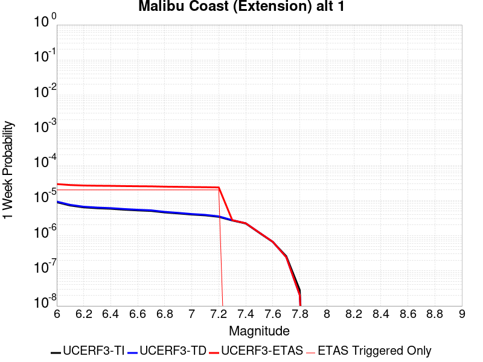 |  |  |  |

| Magnitude | 1 wk TI Prob | 1 wk TD Prob | 1 wk ETAS Prob | 1 wk ETAS/TD Gain | 1 wk ETAS Triggered Only | 1 mo TI Prob | 1 mo TD Prob | 1 mo ETAS Prob | 1 mo ETAS/TD Gain | 1 mo ETAS Triggered Only | 1 yr TI Prob | 1 yr TD Prob | 1 yr ETAS Prob | 1 yr ETAS/TD Gain | 1 yr ETAS Triggered Only | 10 yr TI Prob | 10 yr TD Prob | 10 yr ETAS Prob | 10 yr ETAS/TD Gain | 10 yr ETAS Triggered Only |
|-----|-----|-----|-----|-----|-----|-----|-----|-----|-----|-----|-----|-----|-----|-----|-----|-----|-----|-----|-----|-----|
| 6.0 | 8.930738E-6 | 9.3292765E-6 | 2.932909E-5 | 3.143769 | 2.0E-5 | 3.827403E-5 | 3.998201E-5 | 5.9981212E-5 | 1.5002049 | 2.0E-5 | 4.6588664E-4 | 4.86674E-4 | 5.166594E-4 | 1.061613 | 3.0E-5 | 0.0046491115 | 0.004856264 | 0.0048861187 | 1.0061476 | 3.0E-5 |
| 6.1 | 7.199952E-6 | 7.5302974E-6 | 2.7530146E-5 | 3.6559176 | 2.0E-5 | 3.0856572E-5 | 3.2272306E-5 | 5.2271662E-5 | 1.6197064 | 2.0E-5 | 3.75614E-4 | 3.928451E-4 | 4.228333E-4 | 1.076336 | 3.0E-5 | 0.0037497976 | 0.0039215726 | 0.003951455 | 1.00762 | 3.0E-5 |
| 6.2 | 6.3721413E-6 | 6.666792E-6 | 2.666666E-5 | 3.9999235 | 2.0E-5 | 2.7308892E-5 | 2.8571656E-5 | 4.8571084E-5 | 1.6999744 | 2.0E-5 | 3.3243504E-4 | 3.4780474E-4 | 3.7779432E-4 | 1.0862253 | 3.0E-5 | 0.0033193815 | 0.0034726441 | 0.00350254 | 1.0086089 | 3.0E-5 |
| 6.3 | 6.016345E-6 | 6.295159E-6 | 2.6295033E-5 | 4.1770244 | 2.0E-5 | 2.578408E-5 | 2.6978976E-5 | 4.6978435E-5 | 1.741298 | 2.0E-5 | 3.1387596E-4 | 3.2841985E-4 | 3.5841E-4 | 1.0913165 | 3.0E-5 | 0.00313433 | 0.0032793812 | 0.0033092827 | 1.0091181 | 3.0E-5 |
| 6.4 | 5.8104883E-6 | 6.0795455E-6 | 2.6079424E-5 | 4.2896996 | 2.0E-5 | 2.4901856E-5 | 2.6054937E-5 | 4.6054414E-5 | 1.7675889 | 2.0E-5 | 3.031379E-4 | 3.17173E-4 | 3.4716347E-4 | 1.0945556 | 3.0E-5 | 0.0030272473 | 0.0031672379 | 0.0031971429 | 1.009442 | 3.0E-5 |
| 6.5 | 5.476925E-6 | 5.727514E-6 | 2.5727399E-5 | 4.491896 | 2.0E-5 | 2.3472323E-5 | 2.454626E-5 | 4.454577E-5 | 1.8147681 | 2.0E-5 | 2.8573806E-4 | 2.9881002E-4 | 3.2880105E-4 | 1.1003683 | 3.0E-5 | 0.0028537093 | 0.0029841145 | 0.0030140248 | 1.0100232 | 3.0E-5 |
| 6.6 | 5.222387E-6 | 5.4585807E-6 | 2.5458472E-5 | 4.663936 | 2.0E-5 | 2.2381464E-5 | 2.3393708E-5 | 4.339324E-5 | 1.8549107 | 2.0E-5 | 2.7246025E-4 | 2.8478145E-4 | 3.1477291E-4 | 1.1053139 | 3.0E-5 | 0.0027212645 | 0.002844196 | 0.0028741106 | 1.0105178 | 3.0E-5 |
| 6.7 | 5.0337076E-6 | 5.259104E-6 | 2.5258998E-5 | 4.8029094 | 2.0E-5 | 2.1572854E-5 | 2.2538823E-5 | 4.2538373E-5 | 1.8873378 | 2.0E-5 | 2.6261783E-4 | 2.743759E-4 | 3.0436768E-4 | 1.1093091 | 3.0E-5 | 0.002623077 | 0.0027404015 | 0.0027703193 | 1.0109173 | 3.0E-5 |
| 6.8 | 4.5675624E-6 | 4.7587173E-6 | 2.4758621E-5 | 5.202793 | 2.0E-5 | 1.9575122E-5 | 2.0394344E-5 | 4.0393938E-5 | 1.980644 | 2.0E-5 | 2.3830103E-4 | 2.4827302E-4 | 2.782656E-4 | 1.1208047 | 3.0E-5 | 0.0023804565 | 0.0024799763 | 0.002509902 | 1.0120668 | 3.0E-5 |
| 6.9 | 4.2802412E-6 | 4.4520216E-6 | 2.4451932E-5 | 5.4923215 | 2.0E-5 | 1.8343762E-5 | 1.9079953E-5 | 3.9079572E-5 | 2.0482006 | 2.0E-5 | 2.2331243E-4 | 2.3227383E-4 | 2.6226684E-4 | 1.1291279 | 3.0E-5 | 0.0022308815 | 0.0023203273 | 0.0023502577 | 1.0128992 | 3.0E-5 |
| 7.0 | 3.9794063E-6 | 4.1301E-6 | 2.4130017E-5 | 5.842478 | 2.0E-5 | 1.7054486E-5 | 1.770031E-5 | 3.7699956E-5 | 2.1299038 | 2.0E-5 | 2.0761859E-4 | 2.1548007E-4 | 2.454736E-4 | 1.139194 | 3.0E-5 | 0.0020742472 | 0.002152725 | 0.0021826604 | 1.0139059 | 3.0E-5 |
| 7.1 | 3.7730424E-6 | 3.911218E-6 | 2.391114E-5 | 6.1134768 | 2.0E-5 | 1.6170083E-5 | 1.6762255E-5 | 3.676192E-5 | 2.193137 | 2.0E-5 | 1.9685295E-4 | 2.0406146E-4 | 2.3405535E-4 | 1.1469846 | 3.0E-5 | 0.0019667868 | 0.0020387538 | 0.0020686926 | 1.0146849 | 3.0E-5 |
| 7.2 | 3.424985E-6 | 3.541338E-6 | 2.3541266E-5 | 6.647563 | 2.0E-5 | 1.4678424E-5 | 1.5177075E-5 | 3.517677E-5 | 2.317757 | 2.0E-5 | 1.7869516E-4 | 1.8476533E-4 | 2.1475978E-4 | 1.1623381 | 3.0E-5 | 0.0017855153 | 0.0018461292 | 0.0018760738 | 1.0162202 | 3.0E-5 |
| 7.3 | 2.6966375E-6 | 2.759654E-6 | 2.759654E-6 | 1.0 | 0.0 | 1.15569665E-5 | 1.1827035E-5 | 1.1827035E-5 | 1.0 | 0.0 | 1.4069698E-4 | 1.4398468E-4 | 1.5398324E-4 | 1.0694418 | 1.0E-5 | 0.0014060794 | 0.001438918 | 0.0014489037 | 1.0069396 | 1.0E-5 |
| 7.4 | 2.215957E-6 | 2.249379E-6 | 2.249379E-6 | 1.0 | 0.0 | 9.496924E-6 | 9.64016E-6 | 9.64016E-6 | 1.0 | 0.0 | 1.1561892E-4 | 1.1736266E-4 | 1.1736266E-4 | 1.0 | 0.0 | 0.0011555878 | 0.0011730106 | 0.0011730106 | 1.0 | 0.0 |
| 7.5 | 1.2040218E-6 | 1.2219067E-6 | 1.2219067E-6 | 1.0 | 0.0 | 5.160083E-6 | 5.2367327E-6 | 5.2367327E-6 | 1.0 | 0.0 | 6.2822204E-5 | 6.3755375E-5 | 6.3755375E-5 | 1.0 | 0.0 | 6.280445E-4 | 6.3737266E-4 | 6.3737266E-4 | 1.0 | 0.0 |
| 7.6 | 6.6157446E-7 | 6.6789755E-7 | 6.6789755E-7 | 1.0 | 0.0 | 2.835316E-6 | 2.8624152E-6 | 2.8624152E-6 | 1.0 | 0.0 | 3.4519428E-5 | 3.4849363E-5 | 3.4849363E-5 | 1.0 | 0.0 | 3.4514067E-4 | 3.484405E-4 | 3.484405E-4 | 1.0 | 0.0 |
| 7.7 | 2.6012302E-7 | 2.4357584E-7 | 2.4357584E-7 | 1.0 | 0.0 | 1.1148124E-6 | 1.0438962E-6 | 1.0438962E-6 | 1.0 | 0.0 | 1.3572758E-5 | 1.2709373E-5 | 1.2709373E-5 | 1.0 | 0.0 | 1.3571928E-4 | 1.2708752E-4 | 1.2708752E-4 | 1.0 | 0.0 |
| 7.8 | 2.8323132E-8 | 2.0266642E-8 | 2.0266642E-8 | 1.0 | 0.0 | 1.2138484E-7 | 8.685703E-8 | 8.685703E-8 | 1.0 | 0.0 | 1.4778595E-6 | 1.0574839E-6 | 1.0574839E-6 | 1.0 | 0.0 | 1.4778497E-5 | 1.0574797E-5 | 1.0574797E-5 | 1.0 | 0.0 |

## Elsinore (Stepovers Combined)
*[(top)](#table-of-contents)*

| 1 Week | 1 Month | 1 Year | 10 Year |
|-----|-----|-----|-----|
| 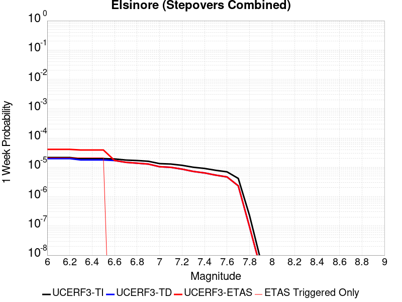 | 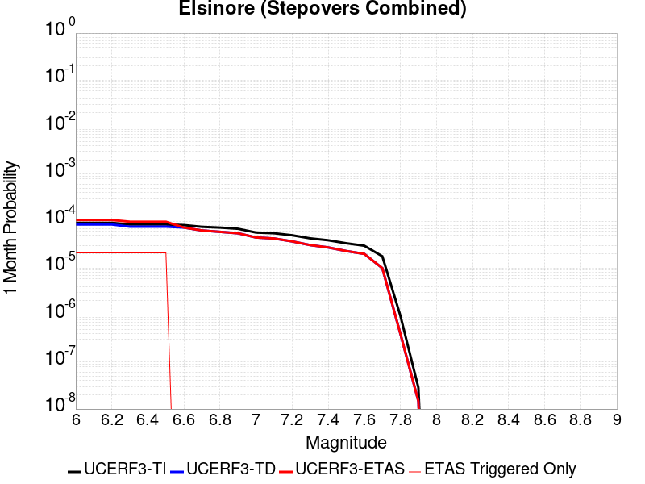 | 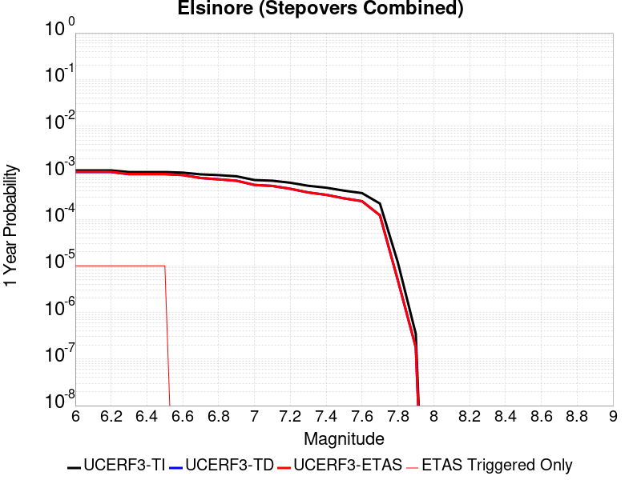 | 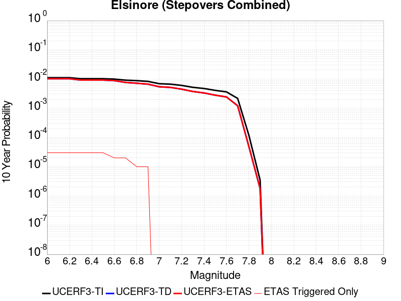 |

| Magnitude | 1 wk TI Prob | 1 wk TD Prob | 1 wk ETAS Prob | 1 wk ETAS/TD Gain | 1 wk ETAS Triggered Only | 1 mo TI Prob | 1 mo TD Prob | 1 mo ETAS Prob | 1 mo ETAS/TD Gain | 1 mo ETAS Triggered Only | 1 yr TI Prob | 1 yr TD Prob | 1 yr ETAS Prob | 1 yr ETAS/TD Gain | 1 yr ETAS Triggered Only | 10 yr TI Prob | 10 yr TD Prob | 10 yr ETAS Prob | 10 yr ETAS/TD Gain | 10 yr ETAS Triggered Only |
|-----|-----|-----|-----|-----|-----|-----|-----|-----|-----|-----|-----|-----|-----|-----|-----|-----|-----|-----|-----|-----|
| 6.0 | 2.144392E-5 | 1.976007E-5 | 2.9759873E-5 | 1.5060611 | 1.0E-5 | 9.189928E-5 | 8.468338E-5 | 9.468253E-5 | 1.1180769 | 1.0E-5 | 0.0011182994 | 0.0010305515 | 0.0010405412 | 1.0096935 | 1.0E-5 | 0.011126885 | 0.010264617 | 0.01029431 | 1.0028926 | 3.0E-5 |
| 6.1 | 2.144392E-5 | 1.976007E-5 | 2.9759873E-5 | 1.5060611 | 1.0E-5 | 9.189928E-5 | 8.468338E-5 | 9.468253E-5 | 1.1180769 | 1.0E-5 | 0.0011182994 | 0.0010305515 | 0.0010405412 | 1.0096935 | 1.0E-5 | 0.011126885 | 0.010264617 | 0.01029431 | 1.0028926 | 3.0E-5 |
| 6.2 | 2.144392E-5 | 1.976007E-5 | 2.9759873E-5 | 1.5060611 | 1.0E-5 | 9.189928E-5 | 8.468338E-5 | 9.468253E-5 | 1.1180769 | 1.0E-5 | 0.0011182994 | 0.0010305515 | 0.0010405412 | 1.0096935 | 1.0E-5 | 0.011126885 | 0.010264617 | 0.01029431 | 1.0028926 | 3.0E-5 |
| 6.3 | 1.9751555E-5 | 1.7741326E-5 | 2.7741147E-5 | 1.5636457 | 1.0E-5 | 8.4646774E-5 | 7.603211E-5 | 8.603135E-5 | 1.1315134 | 1.0E-5 | 0.0010300872 | 9.25312E-4 | 9.353027E-4 | 1.0107971 | 1.0E-5 | 0.010253254 | 0.0092209745 | 0.009250698 | 1.0032234 | 3.0E-5 |
| 6.4 | 1.9751555E-5 | 1.7741326E-5 | 2.7741147E-5 | 1.5636457 | 1.0E-5 | 8.4646774E-5 | 7.603211E-5 | 8.603135E-5 | 1.1315134 | 1.0E-5 | 0.0010300872 | 9.25312E-4 | 9.353027E-4 | 1.0107971 | 1.0E-5 | 0.010253254 | 0.0092209745 | 0.009250698 | 1.0032234 | 3.0E-5 |
| 6.5 | 1.9751555E-5 | 1.7741326E-5 | 2.7741147E-5 | 1.5636457 | 1.0E-5 | 8.4646774E-5 | 7.603211E-5 | 8.603135E-5 | 1.1315134 | 1.0E-5 | 0.0010300872 | 9.25312E-4 | 9.353027E-4 | 1.0107971 | 1.0E-5 | 0.010253254 | 0.0092209745 | 0.009250698 | 1.0032234 | 3.0E-5 |
| 6.6 | 1.9188685E-5 | 1.7003247E-5 | 1.7003247E-5 | 1.0 | 0.0 | 8.2234634E-5 | 7.2869116E-5 | 7.2869116E-5 | 1.0 | 0.0 | 0.0010007467 | 8.8683655E-4 | 8.8683655E-4 | 1.0 | 0.0 | 0.00996252 | 0.008839546 | 0.008859369 | 1.0022426 | 2.0E-5 |
| 6.7 | 1.7608272E-5 | 1.4732402E-5 | 1.4732402E-5 | 1.0 | 0.0 | 7.546184E-5 | 6.313739E-5 | 6.313739E-5 | 1.0 | 0.0 | 9.183606E-4 | 7.684364E-4 | 7.684364E-4 | 1.0 | 0.0 | 0.009145746 | 0.007664441 | 0.0076842876 | 1.0025895 | 2.0E-5 |
| 6.8 | 1.697165E-5 | 1.3783126E-5 | 1.3783126E-5 | 1.0 | 0.0 | 7.273361E-5 | 5.906925E-5 | 5.906925E-5 | 1.0 | 0.0 | 8.8517193E-4 | 7.189395E-4 | 7.189395E-4 | 1.0 | 0.0 | 0.008816543 | 0.0071722106 | 0.007182139 | 1.0013843 | 1.0E-5 |
| 6.9 | 1.600365E-5 | 1.2846429E-5 | 1.2846429E-5 | 1.0 | 0.0 | 6.858527E-5 | 5.5055007E-5 | 5.5055007E-5 | 1.0 | 0.0 | 8.347058E-4 | 6.700963E-4 | 6.700963E-4 | 1.0 | 0.0 | 0.008315775 | 0.006686422 | 0.006696355 | 1.0014856 | 1.0E-5 |
| 7.0 | 1.3314581E-5 | 1.044738E-5 | 1.044738E-5 | 1.0 | 0.0 | 5.7061243E-5 | 4.4773733E-5 | 4.4773733E-5 | 1.0 | 0.0 | 6.944992E-4 | 5.449866E-4 | 5.449866E-4 | 1.0 | 0.0 | 0.006923327 | 0.005440055 | 0.005440055 | 1.0 | 0.0 |
| 7.1 | 1.2865345E-5 | 9.937339E-6 | 9.937339E-6 | 1.0 | 0.0 | 5.5136024E-5 | 4.258792E-5 | 4.258792E-5 | 1.0 | 0.0 | 6.710743E-4 | 5.1838707E-4 | 5.1838707E-4 | 1.0 | 0.0 | 0.0066905143 | 0.005175021 | 0.005175021 | 1.0 | 0.0 |
| 7.2 | 1.1650051E-5 | 8.633585E-6 | 8.633585E-6 | 1.0 | 0.0 | 4.9927836E-5 | 3.7000562E-5 | 3.7000562E-5 | 1.0 | 0.0 | 6.0770183E-4 | 4.503905E-4 | 4.503905E-4 | 1.0 | 0.0 | 0.0060604266 | 0.00449624 | 0.00449624 | 1.0 | 0.0 |
| 7.3 | 1.0008533E-5 | 7.2008215E-6 | 7.2008215E-6 | 1.0 | 0.0 | 4.2893007E-5 | 3.0860305E-5 | 3.0860305E-5 | 1.0 | 0.0 | 5.220972E-4 | 3.756609E-4 | 3.756609E-4 | 1.0 | 0.0 | 0.005208723 | 0.0037506663 | 0.0037506663 | 1.0 | 0.0 |
| 7.4 | 9.116759E-6 | 6.409854E-6 | 6.409854E-6 | 1.0 | 0.0 | 3.907124E-5 | 2.7470522E-5 | 2.7470522E-5 | 1.0 | 0.0 | 4.7558855E-4 | 3.3440365E-4 | 3.3440365E-4 | 1.0 | 0.0 | 0.00474572 | 0.0033391542 | 0.0033391542 | 1.0 | 0.0 |
| 7.5 | 7.870524E-6 | 5.382316E-6 | 5.382316E-6 | 1.0 | 0.0 | 3.3730383E-5 | 2.306687E-5 | 2.306687E-5 | 1.0 | 0.0 | 4.1059E-4 | 2.8080423E-4 | 2.8080423E-4 | 1.0 | 0.0 | 0.0040983222 | 0.0028046207 | 0.0028046207 | 1.0 | 0.0 |
| 7.6 | 6.9774537E-6 | 4.677398E-6 | 4.677398E-6 | 1.0 | 0.0 | 2.990303E-5 | 2.0045845E-5 | 2.0045845E-5 | 1.0 | 0.0 | 3.640086E-4 | 2.44032E-4 | 2.44032E-4 | 1.0 | 0.0 | 0.003634129 | 0.0024377564 | 0.0024377564 | 1.0 | 0.0 |
| 7.7 | 4.1616954E-6 | 2.3281368E-6 | 2.3281368E-6 | 1.0 | 0.0 | 1.7835715E-5 | 9.977695E-6 | 9.977695E-6 | 1.0 | 0.0 | 2.171282E-4 | 1.2147242E-4 | 1.2147242E-4 | 1.0 | 0.0 | 0.0021691616 | 0.0012141332 | 0.0012141332 | 1.0 | 0.0 |
| 7.8 | 2.2692414E-7 | 9.384417E-8 | 9.384417E-8 | 1.0 | 0.0 | 9.725317E-7 | 4.0218927E-7 | 4.0218927E-7 | 1.0 | 0.0 | 1.1840509E-5 | 4.8966467E-6 | 4.8966467E-6 | 1.0 | 0.0 | 1.1839878E-4 | 4.8965718E-5 | 4.8965718E-5 | 1.0 | 0.0 |
| 7.9 | 6.676829E-9 | 3.4397174E-9 | 3.4397174E-9 | 1.0 | 0.0 | 2.861498E-8 | 1.4741646E-8 | 1.4741646E-8 | 1.0 | 0.0 | 3.4838732E-7 | 1.7947953E-7 | 1.7947953E-7 | 1.0 | 0.0 | 3.4838679E-6 | 1.794794E-6 | 1.794794E-6 | 1.0 | 0.0 |

## Oak Ridge (Onshore)
*[(top)](#table-of-contents)*

| 1 Week | 1 Month | 1 Year | 10 Year |
|-----|-----|-----|-----|
|  |  |  |  |

| Magnitude | 1 wk TI Prob | 1 wk TD Prob | 1 wk ETAS Prob | 1 wk ETAS/TD Gain | 1 wk ETAS Triggered Only | 1 mo TI Prob | 1 mo TD Prob | 1 mo ETAS Prob | 1 mo ETAS/TD Gain | 1 mo ETAS Triggered Only | 1 yr TI Prob | 1 yr TD Prob | 1 yr ETAS Prob | 1 yr ETAS/TD Gain | 1 yr ETAS Triggered Only | 10 yr TI Prob | 10 yr TD Prob | 10 yr ETAS Prob | 10 yr ETAS/TD Gain | 10 yr ETAS Triggered Only |
|-----|-----|-----|-----|-----|-----|-----|-----|-----|-----|-----|-----|-----|-----|-----|-----|-----|-----|-----|-----|-----|
| 6.0 | 3.155064E-5 | 2.9526076E-5 | 3.952578E-5 | 1.3386737 | 1.0E-5 | 1.3521002E-4 | 1.265344E-4 | 1.3653314E-4 | 1.0790199 | 1.0E-5 | 0.001644939 | 0.0015395058 | 0.0015494904 | 1.0064856 | 1.0E-5 | 0.01632816 | 0.015293054 | 0.015322596 | 1.0019317 | 3.0E-5 |
| 6.1 | 3.155064E-5 | 2.9526076E-5 | 3.952578E-5 | 1.3386737 | 1.0E-5 | 1.3521002E-4 | 1.265344E-4 | 1.3653314E-4 | 1.0790199 | 1.0E-5 | 0.001644939 | 0.0015395058 | 0.0015494904 | 1.0064856 | 1.0E-5 | 0.01632816 | 0.015293054 | 0.015322596 | 1.0019317 | 3.0E-5 |
| 6.2 | 3.155064E-5 | 2.9526076E-5 | 3.952578E-5 | 1.3386737 | 1.0E-5 | 1.3521002E-4 | 1.265344E-4 | 1.3653314E-4 | 1.0790199 | 1.0E-5 | 0.001644939 | 0.0015395058 | 0.0015494904 | 1.0064856 | 1.0E-5 | 0.01632816 | 0.015293054 | 0.015322596 | 1.0019317 | 3.0E-5 |
| 6.3 | 3.155064E-5 | 2.9526076E-5 | 3.952578E-5 | 1.3386737 | 1.0E-5 | 1.3521002E-4 | 1.265344E-4 | 1.3653314E-4 | 1.0790199 | 1.0E-5 | 0.001644939 | 0.0015395058 | 0.0015494904 | 1.0064856 | 1.0E-5 | 0.01632816 | 0.015293054 | 0.015322596 | 1.0019317 | 3.0E-5 |
| 6.4 | 3.155064E-5 | 2.9526076E-5 | 3.952578E-5 | 1.3386737 | 1.0E-5 | 1.3521002E-4 | 1.265344E-4 | 1.3653314E-4 | 1.0790199 | 1.0E-5 | 0.001644939 | 0.0015395058 | 0.0015494904 | 1.0064856 | 1.0E-5 | 0.01632816 | 0.015293054 | 0.015322596 | 1.0019317 | 3.0E-5 |
| 6.5 | 3.155064E-5 | 2.9526076E-5 | 3.952578E-5 | 1.3386737 | 1.0E-5 | 1.3521002E-4 | 1.265344E-4 | 1.3653314E-4 | 1.0790199 | 1.0E-5 | 0.001644939 | 0.0015395058 | 0.0015494904 | 1.0064856 | 1.0E-5 | 0.01632816 | 0.015293054 | 0.015322596 | 1.0019317 | 3.0E-5 |
| 6.6 | 3.155064E-5 | 2.9526076E-5 | 3.952578E-5 | 1.3386737 | 1.0E-5 | 1.3521002E-4 | 1.265344E-4 | 1.3653314E-4 | 1.0790199 | 1.0E-5 | 0.001644939 | 0.0015395058 | 0.0015494904 | 1.0064856 | 1.0E-5 | 0.01632816 | 0.015293054 | 0.015322596 | 1.0019317 | 3.0E-5 |
| 6.7 | 3.098897E-5 | 2.8864279E-5 | 3.886399E-5 | 1.346439 | 1.0E-5 | 1.328031E-4 | 1.236984E-4 | 1.3369716E-4 | 1.0808318 | 1.0E-5 | 0.0016156785 | 0.0015050253 | 0.0015150103 | 1.0066344 | 1.0E-5 | 0.016039822 | 0.014952909 | 0.014982461 | 1.0019763 | 3.0E-5 |
| 6.8 | 3.0449872E-5 | 2.8239476E-5 | 3.8239195E-5 | 1.3541042 | 1.0E-5 | 1.3049292E-4 | 1.2102092E-4 | 1.3101971E-4 | 1.0826204 | 1.0E-5 | 0.0015875935 | 0.001472471 | 0.0014824563 | 1.0067813 | 1.0E-5 | 0.015762992 | 0.014631658 | 0.014661219 | 1.0020204 | 3.0E-5 |
| 6.9 | 2.697928E-5 | 2.4219877E-5 | 3.4219636E-5 | 1.412874 | 1.0E-5 | 1.15620365E-4 | 1.03795464E-4 | 1.1379443E-4 | 1.0963333 | 1.0E-5 | 0.0014067689 | 0.0012629988 | 0.0012729861 | 1.0079076 | 1.0E-5 | 0.0139789665 | 0.012561066 | 0.012580815 | 1.0015723 | 2.0E-5 |
| 7.0 | 2.4893961E-5 | 2.1862146E-5 | 3.1861928E-5 | 1.4574016 | 1.0E-5 | 1.0668404E-4 | 9.369165E-5 | 1.0369071E-4 | 1.1067231 | 1.0E-5 | 0.0012981043 | 0.0011401166 | 0.0011501053 | 1.008761 | 1.0E-5 | 0.012905477 | 0.011345102 | 0.011364875 | 1.0017428 | 2.0E-5 |
| 7.1 | 2.0945363E-5 | 1.7354592E-5 | 1.7354592E-5 | 1.0 | 0.0 | 8.976275E-5 | 7.437473E-5 | 7.437473E-5 | 1.0 | 0.0 | 0.0010923136 | 9.0514094E-4 | 9.0514094E-4 | 1.0 | 0.0 | 0.0108696 | 0.009015621 | 0.00902553 | 1.0010992 | 1.0E-5 |
| 7.2 | 2.0439404E-5 | 1.680953E-5 | 1.680953E-5 | 1.0 | 0.0 | 8.7594504E-5 | 7.203888E-5 | 7.203888E-5 | 1.0 | 0.0 | 0.0010659413 | 8.767251E-4 | 8.767251E-4 | 1.0 | 0.0 | 0.010608427 | 0.008733723 | 0.008743636 | 1.001135 | 1.0E-5 |
| 7.3 | 1.8463334E-5 | 1.5381947E-5 | 1.5381947E-5 | 1.0 | 0.0 | 7.912617E-5 | 6.592098E-5 | 6.592098E-5 | 1.0 | 0.0 | 9.6293533E-4 | 8.0229685E-4 | 8.0229685E-4 | 1.0 | 0.0 | 0.009587734 | 0.0079950085 | 0.008004929 | 1.0012407 | 1.0E-5 |
| 7.4 | 1.763139E-5 | 1.4516977E-5 | 1.4516977E-5 | 1.0 | 0.0 | 7.556091E-5 | 6.221415E-5 | 6.221415E-5 | 1.0 | 0.0 | 9.1956573E-4 | 7.57198E-4 | 7.57198E-4 | 1.0 | 0.0 | 0.009157699 | 0.007547126 | 0.0075570503 | 1.001315 | 1.0E-5 |
| 7.5 | 1.3594944E-5 | 1.1163363E-5 | 1.1163363E-5 | 1.0 | 0.0 | 5.8262744E-5 | 4.7842117E-5 | 4.7842117E-5 | 1.0 | 0.0 | 7.0911803E-4 | 5.8232463E-4 | 5.8232463E-4 | 1.0 | 0.0 | 0.007068595 | 0.005808362 | 0.005808362 | 1.0 | 0.0 |
| 7.6 | 6.9889534E-6 | 5.6367194E-6 | 5.6367194E-6 | 1.0 | 0.0 | 2.9952313E-5 | 2.4157147E-5 | 2.4157147E-5 | 1.0 | 0.0 | 3.646084E-4 | 2.94074E-4 | 2.94074E-4 | 1.0 | 0.0 | 0.0036401073 | 0.0029368924 | 0.0029368924 | 1.0 | 0.0 |
| 7.7 | 4.0824193E-6 | 3.2832731E-6 | 3.2832731E-6 | 1.0 | 0.0 | 1.7495966E-5 | 1.4071096E-5 | 1.4071096E-5 | 1.0 | 0.0 | 2.1299256E-4 | 1.7130225E-4 | 1.7130225E-4 | 1.0 | 0.0 | 0.0021278851 | 0.0017117155 | 0.0017117155 | 1.0 | 0.0 |
| 7.8 | 1.7023609E-6 | 1.43706E-6 | 1.43706E-6 | 1.0 | 0.0 | 7.295812E-6 | 6.158814E-6 | 6.158814E-6 | 1.0 | 0.0 | 8.882289E-5 | 7.4981006E-5 | 7.4981006E-5 | 1.0 | 0.0 | 8.8787393E-4 | 7.4955984E-4 | 7.4955984E-4 | 1.0 | 0.0 |
| 7.9 | 2.721225E-7 | 2.261692E-7 | 2.261692E-7 | 1.0 | 0.0 | 1.1662388E-6 | 9.692963E-7 | 9.692963E-7 | 1.0 | 0.0 | 1.4198865E-5 | 1.1801121E-5 | 1.1801121E-5 | 1.0 | 0.0 | 1.4197957E-4 | 1.1800523E-4 | 1.1800523E-4 | 1.0 | 0.0 |
| 8.0 | 9.364255E-9 | 5.1204916E-9 | 5.1204916E-9 | 1.0 | 0.0 | 4.0132523E-8 | 2.1944963E-8 | 2.1944963E-8 | 1.0 | 0.0 | 4.8861335E-7 | 2.671799E-7 | 2.671799E-7 | 1.0 | 0.0 | 4.8861225E-6 | 2.6717962E-6 | 2.6717962E-6 | 1.0 | 0.0 |

## Sierra Madre
*[(top)](#table-of-contents)*

| 1 Week | 1 Month | 1 Year | 10 Year |
|-----|-----|-----|-----|
|  |  | 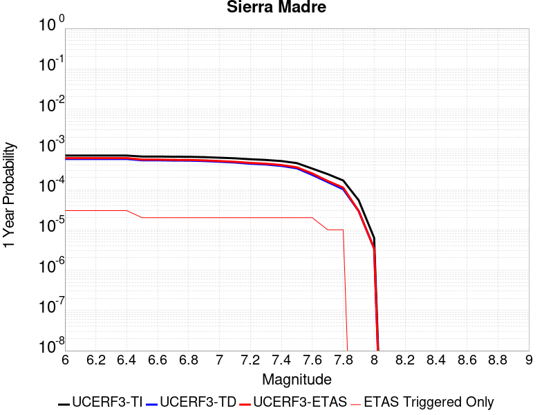 | 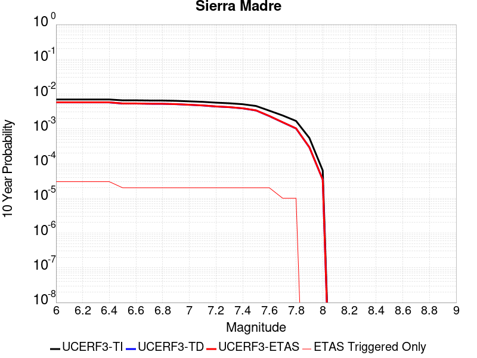 |

| Magnitude | 1 wk TI Prob | 1 wk TD Prob | 1 wk ETAS Prob | 1 wk ETAS/TD Gain | 1 wk ETAS Triggered Only | 1 mo TI Prob | 1 mo TD Prob | 1 mo ETAS Prob | 1 mo ETAS/TD Gain | 1 mo ETAS Triggered Only | 1 yr TI Prob | 1 yr TD Prob | 1 yr ETAS Prob | 1 yr ETAS/TD Gain | 1 yr ETAS Triggered Only | 10 yr TI Prob | 10 yr TD Prob | 10 yr ETAS Prob | 10 yr ETAS/TD Gain | 10 yr ETAS Triggered Only |
|-----|-----|-----|-----|-----|-----|-----|-----|-----|-----|-----|-----|-----|-----|-----|-----|-----|-----|-----|-----|-----|
| 6.0 | 1.3379373E-5 | 1.1000776E-5 | 4.1000447E-5 | 3.7270503 | 3.0E-5 | 5.7338908E-5 | 4.714534E-5 | 7.714392E-5 | 1.6363001 | 3.0E-5 | 6.978776E-4 | 5.738448E-4 | 6.038276E-4 | 1.052249 | 3.0E-5 | 0.0069569005 | 0.0057238447 | 0.005753673 | 1.0052112 | 3.0E-5 |
| 6.1 | 1.3379373E-5 | 1.1000776E-5 | 4.1000447E-5 | 3.7270503 | 3.0E-5 | 5.7338908E-5 | 4.714534E-5 | 7.714392E-5 | 1.6363001 | 3.0E-5 | 6.978776E-4 | 5.738448E-4 | 6.038276E-4 | 1.052249 | 3.0E-5 | 0.0069569005 | 0.0057238447 | 0.005753673 | 1.0052112 | 3.0E-5 |
| 6.2 | 1.3379373E-5 | 1.1000776E-5 | 4.1000447E-5 | 3.7270503 | 3.0E-5 | 5.7338908E-5 | 4.714534E-5 | 7.714392E-5 | 1.6363001 | 3.0E-5 | 6.978776E-4 | 5.738448E-4 | 6.038276E-4 | 1.052249 | 3.0E-5 | 0.0069569005 | 0.0057238447 | 0.005753673 | 1.0052112 | 3.0E-5 |
| 6.3 | 1.3379373E-5 | 1.1000776E-5 | 4.1000447E-5 | 3.7270503 | 3.0E-5 | 5.7338908E-5 | 4.714534E-5 | 7.714392E-5 | 1.6363001 | 3.0E-5 | 6.978776E-4 | 5.738448E-4 | 6.038276E-4 | 1.052249 | 3.0E-5 | 0.0069569005 | 0.0057238447 | 0.005753673 | 1.0052112 | 3.0E-5 |
| 6.4 | 1.3379373E-5 | 1.1000776E-5 | 4.1000447E-5 | 3.7270503 | 3.0E-5 | 5.7338908E-5 | 4.714534E-5 | 7.714392E-5 | 1.6363001 | 3.0E-5 | 6.978776E-4 | 5.738448E-4 | 6.038276E-4 | 1.052249 | 3.0E-5 | 0.0069569005 | 0.0057238447 | 0.005753673 | 1.0052112 | 3.0E-5 |
| 6.5 | 1.26563245E-5 | 1.0230232E-5 | 3.0230027E-5 | 2.95497 | 2.0E-5 | 5.4240263E-5 | 4.384312E-5 | 6.384224E-5 | 1.456152 | 2.0E-5 | 6.601751E-4 | 5.3366035E-4 | 5.536497E-4 | 1.037457 | 2.0E-5 | 0.006582173 | 0.0053239604 | 0.005343854 | 1.0037366 | 2.0E-5 |
| 6.6 | 1.26563245E-5 | 1.0230232E-5 | 3.0230027E-5 | 2.95497 | 2.0E-5 | 5.4240263E-5 | 4.384312E-5 | 6.384224E-5 | 1.456152 | 2.0E-5 | 6.601751E-4 | 5.3366035E-4 | 5.536497E-4 | 1.037457 | 2.0E-5 | 0.006582173 | 0.0053239604 | 0.005343854 | 1.0037366 | 2.0E-5 |
| 6.7 | 1.2502474E-5 | 1.00663765E-5 | 3.0066174E-5 | 2.9867923 | 2.0E-5 | 5.3580934E-5 | 4.3140906E-5 | 6.314004E-5 | 1.4635772 | 2.0E-5 | 6.521526E-4 | 5.25115E-4 | 5.451045E-4 | 1.0380669 | 2.0E-5 | 0.0065024206 | 0.0052389116 | 0.0052588065 | 1.0037975 | 2.0E-5 |
| 6.8 | 1.2454966E-5 | 1.0018662E-5 | 3.0018462E-5 | 2.9962547 | 2.0E-5 | 5.3377335E-5 | 4.293642E-5 | 6.293556E-5 | 1.465785 | 2.0E-5 | 6.4967526E-4 | 5.226266E-4 | 5.426161E-4 | 1.0382482 | 2.0E-5 | 0.006477792 | 0.0052141445 | 0.00523404 | 1.0038158 | 2.0E-5 |
| 6.9 | 1.2225574E-5 | 9.792639E-6 | 2.9792443E-5 | 3.0423305 | 2.0E-5 | 5.2394265E-5 | 4.196778E-5 | 6.1966944E-5 | 1.476536 | 2.0E-5 | 6.3771347E-4 | 5.10839E-4 | 5.308288E-4 | 1.0391313 | 2.0E-5 | 0.006358865 | 0.0050968137 | 0.005116712 | 1.003904 | 2.0E-5 |
| 7.0 | 1.182946E-5 | 9.399179E-6 | 2.9398992E-5 | 3.1278253 | 2.0E-5 | 5.06967E-5 | 4.0281582E-5 | 6.0280778E-5 | 1.4964849 | 2.0E-5 | 6.1705755E-4 | 4.903189E-4 | 5.103091E-4 | 1.0407698 | 2.0E-5 | 0.006153469 | 0.004892533 | 0.004912435 | 1.0040679 | 2.0E-5 |
| 7.1 | 1.14369095E-5 | 8.986194E-6 | 2.8986015E-5 | 3.2256162 | 2.0E-5 | 4.9014405E-5 | 3.85117E-5 | 5.8510926E-5 | 1.5193027 | 2.0E-5 | 5.9658696E-4 | 4.6878002E-4 | 4.8877066E-4 | 1.0426439 | 2.0E-5 | 0.005949879 | 0.0046780678 | 0.0046979743 | 1.0042553 | 2.0E-5 |
| 7.2 | 1.0836419E-5 | 8.39959E-6 | 2.8399421E-5 | 3.3810487 | 2.0E-5 | 4.644097E-5 | 3.599775E-5 | 5.599703E-5 | 1.5555702 | 2.0E-5 | 5.652721E-4 | 4.3818538E-4 | 4.5817663E-4 | 1.0456228 | 2.0E-5 | 0.0056383642 | 0.0043733614 | 0.004393274 | 1.0045532 | 2.0E-5 |
| 7.3 | 1.0403439E-5 | 8.020854E-6 | 2.8020693E-5 | 3.49348 | 2.0E-5 | 4.4585406E-5 | 3.437464E-5 | 5.437395E-5 | 1.5818043 | 2.0E-5 | 5.426921E-4 | 4.184318E-4 | 4.3842342E-4 | 1.0477775 | 2.0E-5 | 0.005413687 | 0.004176585 | 0.0041965013 | 1.0047686 | 2.0E-5 |
| 7.4 | 9.768864E-6 | 7.4144855E-6 | 2.7414337E-5 | 3.6974025 | 2.0E-5 | 4.186589E-5 | 3.1775984E-5 | 5.1775347E-5 | 1.6293862 | 2.0E-5 | 5.09598E-4 | 3.868048E-4 | 4.0679707E-4 | 1.0516857 | 2.0E-5 | 0.0050843097 | 0.0038614576 | 0.0038813804 | 1.0051594 | 2.0E-5 |
| 7.5 | 8.687089E-6 | 6.450183E-6 | 2.6450054E-5 | 4.1006675 | 2.0E-5 | 3.722985E-5 | 2.7643353E-5 | 4.76428E-5 | 1.7234812 | 2.0E-5 | 4.5317915E-4 | 3.3650672E-4 | 3.5649998E-4 | 1.0594141 | 2.0E-5 | 0.004522561 | 0.003360109 | 0.0033800418 | 1.0059322 | 2.0E-5 |
| 7.6 | 6.3506063E-6 | 4.430329E-6 | 2.4430241E-5 | 5.514317 | 2.0E-5 | 2.72166E-5 | 1.8986988E-5 | 3.8986607E-5 | 2.053333 | 2.0E-5 | 3.3131172E-4 | 2.3114232E-4 | 2.511377E-4 | 1.0865067 | 2.0E-5 | 0.003308182 | 0.0023090935 | 0.0023290473 | 1.0086414 | 2.0E-5 |
| 7.7 | 4.62223E-6 | 2.9329542E-6 | 1.2932925E-5 | 4.4095216 | 1.0E-5 | 1.9809406E-5 | 1.2569743E-5 | 2.2569617E-5 | 1.7955512 | 1.0E-5 | 2.4115283E-4 | 1.5302589E-4 | 1.6302436E-4 | 1.0653384 | 1.0E-5 | 0.0024089129 | 0.0015292577 | 0.0015392425 | 1.0065291 | 1.0E-5 |
| 7.8 | 3.2145008E-6 | 1.949411E-6 | 1.1949392E-5 | 6.1297445 | 1.0E-5 | 1.3776359E-5 | 8.354592E-6 | 1.8354509E-5 | 2.1969366 | 1.0E-5 | 1.6771426E-4 | 1.01712416E-4 | 1.117114E-4 | 1.0983064 | 1.0E-5 | 0.0016758774 | 0.0010166786 | 0.0010266685 | 1.009826 | 1.0E-5 |
| 7.9 | 1.0391769E-6 | 5.602482E-7 | 5.602482E-7 | 1.0 | 0.0 | 4.4536077E-6 | 2.4010617E-6 | 2.4010617E-6 | 1.0 | 0.0 | 5.4221324E-5 | 2.9232539E-5 | 2.9232539E-5 | 1.0 | 0.0 | 5.4208096E-4 | 2.9228735E-4 | 2.9228735E-4 | 1.0 | 0.0 |
| 8.0 | 1.210983E-7 | 6.613497E-8 | 6.613497E-8 | 1.0 | 0.0 | 5.1899264E-7 | 2.8343558E-7 | 2.8343558E-7 | 1.0 | 0.0 | 6.3187167E-6 | 3.4508228E-6 | 3.4508228E-6 | 1.0 | 0.0 | 6.318537E-5 | 3.450771E-5 | 3.450771E-5 | 1.0 | 0.0 |

## Santa Ynez River
*[(top)](#table-of-contents)*

| 1 Week | 1 Month | 1 Year | 10 Year |
|-----|-----|-----|-----|
|  |  |  |  |

| Magnitude | 1 wk TI Prob | 1 wk TD Prob | 1 wk ETAS Prob | 1 wk ETAS/TD Gain | 1 wk ETAS Triggered Only | 1 mo TI Prob | 1 mo TD Prob | 1 mo ETAS Prob | 1 mo ETAS/TD Gain | 1 mo ETAS Triggered Only | 1 yr TI Prob | 1 yr TD Prob | 1 yr ETAS Prob | 1 yr ETAS/TD Gain | 1 yr ETAS Triggered Only | 10 yr TI Prob | 10 yr TD Prob | 10 yr ETAS Prob | 10 yr ETAS/TD Gain | 10 yr ETAS Triggered Only |
|-----|-----|-----|-----|-----|-----|-----|-----|-----|-----|-----|-----|-----|-----|-----|-----|-----|-----|-----|-----|-----|
| 6.0 | 1.6396456E-5 | 1.7209444E-5 | 2.7209273E-5 | 1.5810663 | 1.0E-5 | 7.026863E-5 | 7.3752875E-5 | 8.375214E-5 | 1.1355779 | 1.0E-5 | 8.551848E-4 | 8.976069E-4 | 9.1758894E-4 | 1.0222615 | 2.0E-5 | 0.0085190125 | 0.008943363 | 0.008973095 | 1.0033244 | 3.0E-5 |
| 6.1 | 1.6396456E-5 | 1.7209444E-5 | 2.7209273E-5 | 1.5810663 | 1.0E-5 | 7.026863E-5 | 7.3752875E-5 | 8.375214E-5 | 1.1355779 | 1.0E-5 | 8.551848E-4 | 8.976069E-4 | 9.1758894E-4 | 1.0222615 | 2.0E-5 | 0.0085190125 | 0.008943363 | 0.008973095 | 1.0033244 | 3.0E-5 |
| 6.2 | 1.6396456E-5 | 1.7209444E-5 | 2.7209273E-5 | 1.5810663 | 1.0E-5 | 7.026863E-5 | 7.3752875E-5 | 8.375214E-5 | 1.1355779 | 1.0E-5 | 8.551848E-4 | 8.976069E-4 | 9.1758894E-4 | 1.0222615 | 2.0E-5 | 0.0085190125 | 0.008943363 | 0.008973095 | 1.0033244 | 3.0E-5 |
| 6.3 | 9.736976E-6 | 1.01223395E-5 | 1.01223395E-5 | 1.0 | 0.0 | 4.172923E-5 | 4.338076E-5 | 4.338076E-5 | 1.0 | 0.0 | 5.0793495E-4 | 5.280378E-4 | 5.280378E-4 | 1.0 | 0.0 | 0.005067755 | 0.0052683367 | 0.005278284 | 1.0018882 | 1.0E-5 |
| 6.4 | 9.736976E-6 | 1.01223395E-5 | 1.01223395E-5 | 1.0 | 0.0 | 4.172923E-5 | 4.338076E-5 | 4.338076E-5 | 1.0 | 0.0 | 5.0793495E-4 | 5.280378E-4 | 5.280378E-4 | 1.0 | 0.0 | 0.005067755 | 0.0052683367 | 0.005278284 | 1.0018882 | 1.0E-5 |
| 6.5 | 7.081964E-6 | 7.329905E-6 | 7.329905E-6 | 1.0 | 0.0 | 3.035092E-5 | 3.141351E-5 | 3.141351E-5 | 1.0 | 0.0 | 3.694598E-4 | 3.8239395E-4 | 3.8239395E-4 | 1.0 | 0.0 | 0.0036884616 | 0.0038175215 | 0.0038274832 | 1.0026095 | 1.0E-5 |
| 6.6 | 5.873247E-6 | 6.0597517E-6 | 6.0597517E-6 | 1.0 | 0.0 | 2.5170815E-5 | 2.5970112E-5 | 2.5970112E-5 | 1.0 | 0.0 | 3.064116E-4 | 3.161411E-4 | 3.161411E-4 | 1.0 | 0.0 | 0.0030598943 | 0.003157001 | 0.0031669694 | 1.0031576 | 1.0E-5 |
| 6.7 | 4.973277E-6 | 5.11591E-6 | 5.11591E-6 | 1.0 | 0.0 | 2.1313872E-5 | 2.1925147E-5 | 2.1925147E-5 | 1.0 | 0.0 | 2.5946548E-4 | 2.6690646E-4 | 2.6690646E-4 | 1.0 | 0.0 | 0.0025916274 | 0.0026659078 | 0.0026758811 | 1.003741 | 1.0E-5 |
| 6.8 | 4.396492E-6 | 4.510987E-6 | 4.510987E-6 | 1.0 | 0.0 | 1.884197E-5 | 1.933266E-5 | 1.933266E-5 | 1.0 | 0.0 | 2.2937685E-4 | 2.3535005E-4 | 2.3535005E-4 | 1.0 | 0.0 | 0.0022914023 | 0.0023510433 | 0.0023610198 | 1.0042434 | 1.0E-5 |
| 6.9 | 3.5255632E-6 | 3.6013423E-6 | 3.6013423E-6 | 1.0 | 0.0 | 1.5109469E-5 | 1.5434234E-5 | 1.5434234E-5 | 1.0 | 0.0 | 1.8394225E-4 | 1.8789574E-4 | 1.8789574E-4 | 1.0 | 0.0 | 0.0018379007 | 0.001877385 | 0.0018873662 | 1.0053166 | 1.0E-5 |
| 7.0 | 3.211603E-6 | 3.273663E-6 | 3.273663E-6 | 1.0 | 0.0 | 1.376394E-5 | 1.402991E-5 | 1.402991E-5 | 1.0 | 0.0 | 1.6756308E-4 | 1.708009E-4 | 1.708009E-4 | 1.0 | 0.0 | 0.0016743679 | 0.0017067104 | 0.0017166934 | 1.0058492 | 1.0E-5 |
| 7.1 | 2.5094619E-6 | 2.5409295E-6 | 2.5409295E-6 | 1.0 | 0.0 | 1.0754793E-5 | 1.0889652E-5 | 1.0889652E-5 | 1.0 | 0.0 | 1.3093173E-4 | 1.325735E-4 | 1.325735E-4 | 1.0 | 0.0 | 0.0013085462 | 0.0013249503 | 0.0013249503 | 1.0 | 0.0 |
| 7.2 | 2.0515774E-6 | 2.0619466E-6 | 2.0619466E-6 | 1.0 | 0.0 | 8.792445E-6 | 8.836884E-6 | 8.836884E-6 | 1.0 | 0.0 | 1.0704277E-4 | 1.0758379E-4 | 1.0758379E-4 | 1.0 | 0.0 | 0.0010699122 | 0.0010753215 | 0.0010753215 | 1.0 | 0.0 |
| 7.3 | 1.6845745E-6 | 1.6773996E-6 | 1.6773996E-6 | 1.0 | 0.0 | 7.219585E-6 | 7.1888358E-6 | 7.1888358E-6 | 1.0 | 0.0 | 8.78949E-5 | 8.752059E-5 | 8.752059E-5 | 1.0 | 0.0 | 8.7860145E-4 | 8.7486405E-4 | 8.7486405E-4 | 1.0 | 0.0 |
| 7.4 | 1.3600285E-6 | 1.3333447E-6 | 1.3333447E-6 | 1.0 | 0.0 | 5.82868E-6 | 5.714322E-6 | 5.714322E-6 | 1.0 | 0.0 | 7.096187E-5 | 6.956967E-5 | 6.956967E-5 | 1.0 | 0.0 | 7.0939213E-4 | 6.9548114E-4 | 6.9548114E-4 | 1.0 | 0.0 |
| 7.5 | 9.735342E-7 | 9.2901894E-7 | 9.2901894E-7 | 1.0 | 0.0 | 4.172283E-6 | 3.9815036E-6 | 3.9815036E-6 | 1.0 | 0.0 | 5.079636E-5 | 4.8473747E-5 | 4.8473747E-5 | 1.0 | 0.0 | 5.0784746E-4 | 4.8463346E-4 | 4.8463346E-4 | 1.0 | 0.0 |
| 7.6 | 5.067187E-7 | 4.778609E-7 | 4.778609E-7 | 1.0 | 0.0 | 2.1716498E-6 | 2.0479738E-6 | 2.0479738E-6 | 1.0 | 0.0 | 2.6439517E-5 | 2.4933803E-5 | 2.4933803E-5 | 1.0 | 0.0 | 2.643637E-4 | 2.493108E-4 | 2.493108E-4 | 1.0 | 0.0 |
| 7.7 | 2.769089E-7 | 2.5759346E-7 | 2.5759346E-7 | 1.0 | 0.0 | 1.1867519E-6 | 1.1039714E-6 | 1.1039714E-6 | 1.0 | 0.0 | 1.4448608E-5 | 1.344077E-5 | 1.344077E-5 | 1.0 | 0.0 | 1.444767E-4 | 1.343996E-4 | 1.343996E-4 | 1.0 | 0.0 |
| 7.8 | 1.7044663E-7 | 1.5449208E-7 | 1.5449208E-7 | 1.0 | 0.0 | 7.3048534E-7 | 6.6210873E-7 | 6.6210873E-7 | 1.0 | 0.0 | 8.893623E-6 | 8.061144E-6 | 8.061144E-6 | 1.0 | 0.0 | 8.893267E-5 | 8.060854E-5 | 8.060854E-5 | 1.0 | 0.0 |
| 7.9 | 4.8344287E-8 | 4.0911143E-8 | 4.0911143E-8 | 1.0 | 0.0 | 2.0718979E-7 | 1.7533345E-7 | 1.7533345E-7 | 1.0 | 0.0 | 2.5225327E-6 | 2.1346827E-6 | 2.1346827E-6 | 1.0 | 0.0 | 2.5225041E-5 | 2.1346626E-5 | 2.1346626E-5 | 1.0 | 0.0 |

## Pitas Point (Lower)-Montalvo
*[(top)](#table-of-contents)*

| 1 Week | 1 Month | 1 Year | 10 Year |
|-----|-----|-----|-----|
|  | 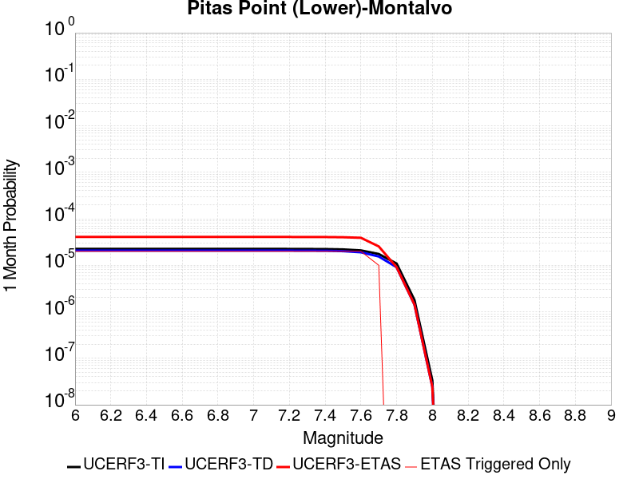 | 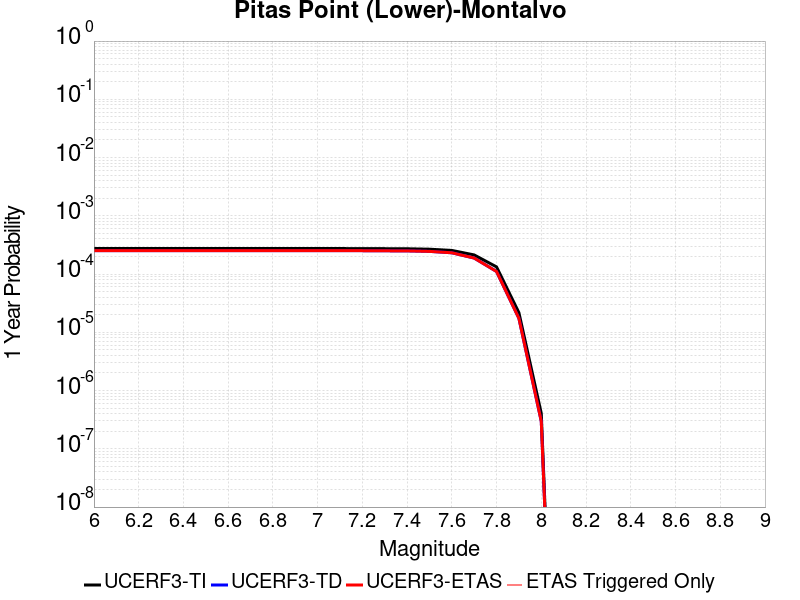 | 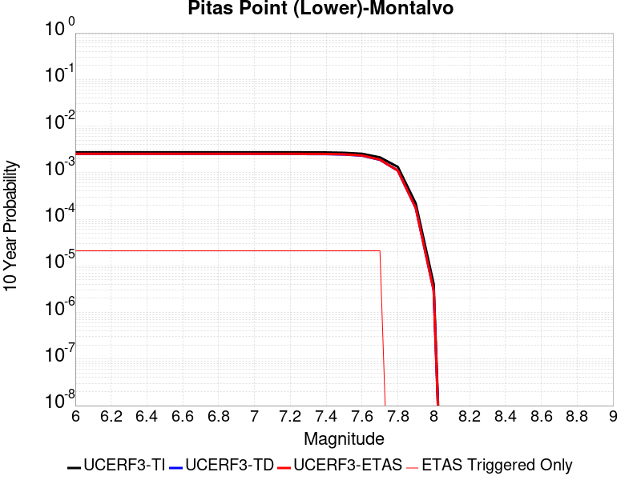 |

| Magnitude | 1 wk TI Prob | 1 wk TD Prob | 1 wk ETAS Prob | 1 wk ETAS/TD Gain | 1 wk ETAS Triggered Only | 1 mo TI Prob | 1 mo TD Prob | 1 mo ETAS Prob | 1 mo ETAS/TD Gain | 1 mo ETAS Triggered Only | 1 yr TI Prob | 1 yr TD Prob | 1 yr ETAS Prob | 1 yr ETAS/TD Gain | 1 yr ETAS Triggered Only | 10 yr TI Prob | 10 yr TD Prob | 10 yr ETAS Prob | 10 yr ETAS/TD Gain | 10 yr ETAS Triggered Only |
|-----|-----|-----|-----|-----|-----|-----|-----|-----|-----|-----|-----|-----|-----|-----|-----|-----|-----|-----|-----|-----|
| 6.0 | 5.2543637E-6 | 4.8379025E-6 | 4.8379025E-6 | 1.0 | 0.0 | 2.2518509E-5 | 2.0733705E-5 | 4.0733292E-5 | 1.9645929 | 2.0E-5 | 2.7412834E-4 | 2.5240393E-4 | 2.723989E-4 | 1.079218 | 2.0E-5 | 0.0027379042 | 0.0025212052 | 0.0025511296 | 1.0118691 | 3.0E-5 |
| 6.1 | 5.2543637E-6 | 4.8379025E-6 | 4.8379025E-6 | 1.0 | 0.0 | 2.2518509E-5 | 2.0733705E-5 | 4.0733292E-5 | 1.9645929 | 2.0E-5 | 2.7412834E-4 | 2.5240393E-4 | 2.723989E-4 | 1.079218 | 2.0E-5 | 0.0027379042 | 0.0025212052 | 0.0025511296 | 1.0118691 | 3.0E-5 |
| 6.2 | 5.2543637E-6 | 4.8379025E-6 | 4.8379025E-6 | 1.0 | 0.0 | 2.2518509E-5 | 2.0733705E-5 | 4.0733292E-5 | 1.9645929 | 2.0E-5 | 2.7412834E-4 | 2.5240393E-4 | 2.723989E-4 | 1.079218 | 2.0E-5 | 0.0027379042 | 0.0025212052 | 0.0025511296 | 1.0118691 | 3.0E-5 |
| 6.3 | 5.2543637E-6 | 4.8379025E-6 | 4.8379025E-6 | 1.0 | 0.0 | 2.2518509E-5 | 2.0733705E-5 | 4.0733292E-5 | 1.9645929 | 2.0E-5 | 2.7412834E-4 | 2.5240393E-4 | 2.723989E-4 | 1.079218 | 2.0E-5 | 0.0027379042 | 0.0025212052 | 0.0025511296 | 1.0118691 | 3.0E-5 |
| 6.4 | 5.2543637E-6 | 4.8379025E-6 | 4.8379025E-6 | 1.0 | 0.0 | 2.2518509E-5 | 2.0733705E-5 | 4.0733292E-5 | 1.9645929 | 2.0E-5 | 2.7412834E-4 | 2.5240393E-4 | 2.723989E-4 | 1.079218 | 2.0E-5 | 0.0027379042 | 0.0025212052 | 0.0025511296 | 1.0118691 | 3.0E-5 |
| 6.5 | 5.2543637E-6 | 4.8379025E-6 | 4.8379025E-6 | 1.0 | 0.0 | 2.2518509E-5 | 2.0733705E-5 | 4.0733292E-5 | 1.9645929 | 2.0E-5 | 2.7412834E-4 | 2.5240393E-4 | 2.723989E-4 | 1.079218 | 2.0E-5 | 0.0027379042 | 0.0025212052 | 0.0025511296 | 1.0118691 | 3.0E-5 |
| 6.6 | 5.2543637E-6 | 4.8379025E-6 | 4.8379025E-6 | 1.0 | 0.0 | 2.2518509E-5 | 2.0733705E-5 | 4.0733292E-5 | 1.9645929 | 2.0E-5 | 2.7412834E-4 | 2.5240393E-4 | 2.723989E-4 | 1.079218 | 2.0E-5 | 0.0027379042 | 0.0025212052 | 0.0025511296 | 1.0118691 | 3.0E-5 |
| 6.7 | 5.2543637E-6 | 4.8379025E-6 | 4.8379025E-6 | 1.0 | 0.0 | 2.2518509E-5 | 2.0733705E-5 | 4.0733292E-5 | 1.9645929 | 2.0E-5 | 2.7412834E-4 | 2.5240393E-4 | 2.723989E-4 | 1.079218 | 2.0E-5 | 0.0027379042 | 0.0025212052 | 0.0025511296 | 1.0118691 | 3.0E-5 |
| 6.8 | 5.2543637E-6 | 4.8379025E-6 | 4.8379025E-6 | 1.0 | 0.0 | 2.2518509E-5 | 2.0733705E-5 | 4.0733292E-5 | 1.9645929 | 2.0E-5 | 2.7412834E-4 | 2.5240393E-4 | 2.723989E-4 | 1.079218 | 2.0E-5 | 0.0027379042 | 0.0025212052 | 0.0025511296 | 1.0118691 | 3.0E-5 |
| 6.9 | 5.2543637E-6 | 4.8379025E-6 | 4.8379025E-6 | 1.0 | 0.0 | 2.2518509E-5 | 2.0733705E-5 | 4.0733292E-5 | 1.9645929 | 2.0E-5 | 2.7412834E-4 | 2.5240393E-4 | 2.723989E-4 | 1.079218 | 2.0E-5 | 0.0027379042 | 0.0025212052 | 0.0025511296 | 1.0118691 | 3.0E-5 |
| 7.0 | 5.2543637E-6 | 4.8379025E-6 | 4.8379025E-6 | 1.0 | 0.0 | 2.2518509E-5 | 2.0733705E-5 | 4.0733292E-5 | 1.9645929 | 2.0E-5 | 2.7412834E-4 | 2.5240393E-4 | 2.723989E-4 | 1.079218 | 2.0E-5 | 0.0027379042 | 0.0025212052 | 0.0025511296 | 1.0118691 | 3.0E-5 |
| 7.1 | 5.2543637E-6 | 4.8379025E-6 | 4.8379025E-6 | 1.0 | 0.0 | 2.2518509E-5 | 2.0733705E-5 | 4.0733292E-5 | 1.9645929 | 2.0E-5 | 2.7412834E-4 | 2.5240393E-4 | 2.723989E-4 | 1.079218 | 2.0E-5 | 0.0027379042 | 0.0025212052 | 0.0025511296 | 1.0118691 | 3.0E-5 |
| 7.2 | 5.2458695E-6 | 4.8290563E-6 | 4.8290563E-6 | 1.0 | 0.0 | 2.2482105E-5 | 2.0695794E-5 | 4.069538E-5 | 1.96636 | 2.0E-5 | 2.7368523E-4 | 2.5194246E-4 | 2.7193743E-4 | 1.0793632 | 2.0E-5 | 0.0027334841 | 0.002516601 | 0.0025465253 | 1.0118909 | 3.0E-5 |
| 7.3 | 5.22665E-6 | 4.8089737E-6 | 4.8089737E-6 | 1.0 | 0.0 | 2.2399736E-5 | 2.0609727E-5 | 4.0609313E-5 | 1.9703956 | 2.0E-5 | 2.7268266E-4 | 2.5089484E-4 | 2.708898E-4 | 1.0796946 | 2.0E-5 | 0.002723483 | 0.0025061483 | 0.002536073 | 1.0119406 | 3.0E-5 |
| 7.4 | 5.210642E-6 | 4.7921862E-6 | 4.7921862E-6 | 1.0 | 0.0 | 2.233113E-5 | 2.053778E-5 | 4.053737E-5 | 1.973795 | 2.0E-5 | 2.718476E-4 | 2.500191E-4 | 2.700141E-4 | 1.0799739 | 2.0E-5 | 0.002715153 | 0.0024974106 | 0.0025273357 | 1.0119824 | 3.0E-5 |
| 7.5 | 5.1226016E-6 | 4.7000726E-6 | 4.7000726E-6 | 1.0 | 0.0 | 2.1953823E-5 | 2.0143016E-5 | 4.014261E-5 | 1.99288 | 2.0E-5 | 2.67255E-4 | 2.4521392E-4 | 2.65209E-4 | 1.0815414 | 2.0E-5 | 0.0026693381 | 0.002449465 | 0.0024793916 | 1.0122175 | 3.0E-5 |
| 7.6 | 4.8796987E-6 | 4.4449725E-6 | 4.4449725E-6 | 1.0 | 0.0 | 2.0912828E-5 | 1.9049745E-5 | 3.9049362E-5 | 2.0498629 | 2.0E-5 | 2.5458392E-4 | 2.3190626E-4 | 2.5190163E-4 | 1.0862217 | 2.0E-5 | 0.0025429246 | 0.0023166733 | 0.0023466037 | 1.0129195 | 3.0E-5 |
| 7.7 | 4.0834398E-6 | 3.6091444E-6 | 3.6091444E-6 | 1.0 | 0.0 | 1.7500339E-5 | 1.546767E-5 | 2.5467516E-5 | 1.6464998 | 1.0E-5 | 2.1304579E-4 | 1.8830286E-4 | 1.9830097E-4 | 1.0530959 | 1.0E-5 | 0.0021284167 | 0.0018814567 | 0.0019014191 | 1.0106101 | 2.0E-5 |
| 7.8 | 2.5445438E-6 | 2.1212566E-6 | 2.1212566E-6 | 1.0 | 0.0 | 1.0905142E-5 | 9.091068E-6 | 9.091068E-6 | 1.0 | 0.0 | 1.3276201E-4 | 1.1067818E-4 | 1.1067818E-4 | 1.0 | 0.0 | 0.0013268272 | 0.0011062352 | 0.0011062352 | 1.0 | 0.0 |
| 7.9 | 4.1677114E-7 | 3.3294015E-7 | 3.3294015E-7 | 1.0 | 0.0 | 1.7861609E-6 | 1.4268857E-6 | 1.4268857E-6 | 1.0 | 0.0 | 2.1746291E-5 | 1.7372196E-5 | 1.7372196E-5 | 1.0 | 0.0 | 2.1744163E-4 | 1.737087E-4 | 1.737087E-4 | 1.0 | 0.0 |
| 8.0 | 7.791402E-9 | 5.6836056E-9 | 5.6836056E-9 | 1.0 | 0.0 | 3.3391725E-8 | 2.4358311E-8 | 2.4358311E-8 | 1.0 | 0.0 | 4.0654416E-7 | 2.965624E-7 | 2.965624E-7 | 1.0 | 0.0 | 4.065434E-6 | 2.9656223E-6 | 2.9656223E-6 | 1.0 | 0.0 |

## San Andreas (Peninsula) 2011 CFM
*[(top)](#table-of-contents)*

| 1 Week | 1 Month | 1 Year | 10 Year |
|-----|-----|-----|-----|
| 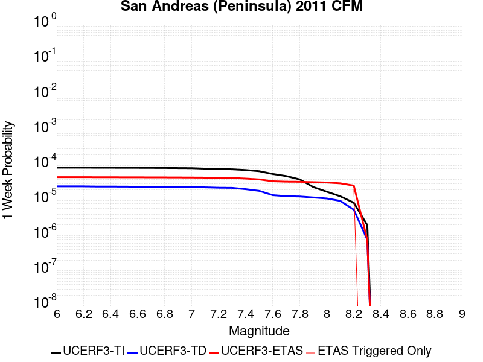 | 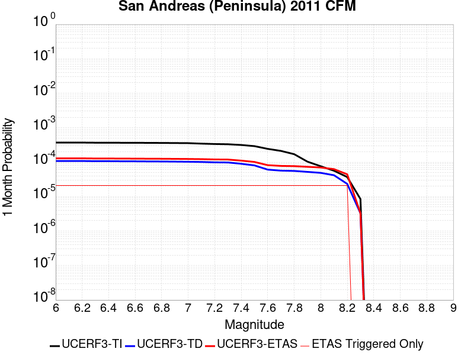 | 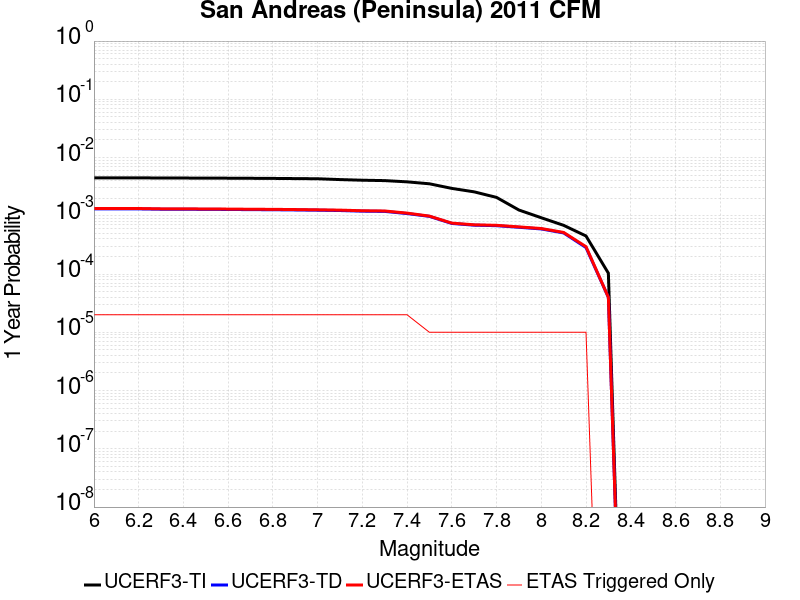 | 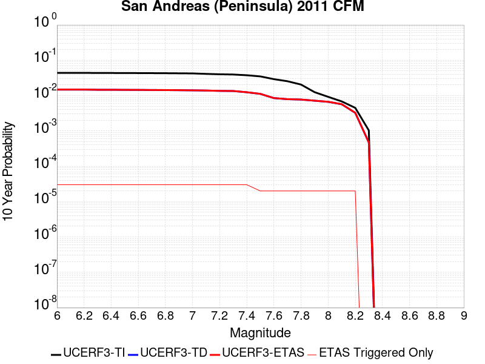 |

| Magnitude | 1 wk TI Prob | 1 wk TD Prob | 1 wk ETAS Prob | 1 wk ETAS/TD Gain | 1 wk ETAS Triggered Only | 1 mo TI Prob | 1 mo TD Prob | 1 mo ETAS Prob | 1 mo ETAS/TD Gain | 1 mo ETAS Triggered Only | 1 yr TI Prob | 1 yr TD Prob | 1 yr ETAS Prob | 1 yr ETAS/TD Gain | 1 yr ETAS Triggered Only | 10 yr TI Prob | 10 yr TD Prob | 10 yr ETAS Prob | 10 yr ETAS/TD Gain | 10 yr ETAS Triggered Only |
|-----|-----|-----|-----|-----|-----|-----|-----|-----|-----|-----|-----|-----|-----|-----|-----|-----|-----|-----|-----|-----|
| 6.0 | 8.6200685E-5 | 2.5207937E-5 | 3.5207686E-5 | 1.3966905 | 1.0E-5 | 3.6937918E-4 | 1.0802955E-4 | 1.1802847E-4 | 1.0925573 | 1.0E-5 | 0.0044879215 | 0.0013144679 | 0.0013344416 | 1.0151953 | 2.0E-5 | 0.043983612 | 0.01477218 | 0.014801736 | 1.0020008 | 3.0E-5 |
| 6.1 | 8.6200685E-5 | 2.5207937E-5 | 3.5207686E-5 | 1.3966905 | 1.0E-5 | 3.6937918E-4 | 1.0802955E-4 | 1.1802847E-4 | 1.0925573 | 1.0E-5 | 0.0044879215 | 0.0013144679 | 0.0013344416 | 1.0151953 | 2.0E-5 | 0.043983612 | 0.01477218 | 0.014801736 | 1.0020008 | 3.0E-5 |
| 6.2 | 8.6200685E-5 | 2.5207937E-5 | 3.5207686E-5 | 1.3966905 | 1.0E-5 | 3.6937918E-4 | 1.0802955E-4 | 1.1802847E-4 | 1.0925573 | 1.0E-5 | 0.0044879215 | 0.0013144679 | 0.0013344416 | 1.0151953 | 2.0E-5 | 0.043983612 | 0.01477218 | 0.014801736 | 1.0020008 | 3.0E-5 |
| 6.3 | 8.551163E-5 | 2.4899866E-5 | 3.4899615E-5 | 1.4015986 | 1.0E-5 | 3.6642692E-4 | 1.06709354E-4 | 1.1670828E-4 | 1.0937026 | 1.0E-5 | 0.004452125 | 0.0012984137 | 0.0013183877 | 1.0153834 | 2.0E-5 | 0.043639794 | 0.01459892 | 0.014628482 | 1.0020249 | 3.0E-5 |
| 6.4 | 8.551163E-5 | 2.4899866E-5 | 3.4899615E-5 | 1.4015986 | 1.0E-5 | 3.6642692E-4 | 1.06709354E-4 | 1.1670828E-4 | 1.0937026 | 1.0E-5 | 0.004452125 | 0.0012984137 | 0.0013183877 | 1.0153834 | 2.0E-5 | 0.043639794 | 0.01459892 | 0.014628482 | 1.0020249 | 3.0E-5 |
| 6.5 | 8.511146E-5 | 2.4721267E-5 | 3.472102E-5 | 1.4045 | 1.0E-5 | 3.647124E-4 | 1.0594399E-4 | 1.1594293E-4 | 1.0943795 | 1.0E-5 | 0.004431336 | 0.0012891064 | 0.0013090806 | 1.0154946 | 2.0E-5 | 0.04344007 | 0.014498963 | 0.014528529 | 1.0020391 | 3.0E-5 |
| 6.6 | 8.4985084E-5 | 2.4651948E-5 | 3.46517E-5 | 1.4056375 | 1.0E-5 | 3.6417096E-4 | 1.0564694E-4 | 1.1564588E-4 | 1.0946449 | 1.0E-5 | 0.0044247704 | 0.0012854942 | 0.0013054684 | 1.0155382 | 2.0E-5 | 0.043376986 | 0.0144609315 | 0.014490498 | 1.0020446 | 3.0E-5 |
| 6.7 | 8.462618E-5 | 2.4480485E-5 | 3.448024E-5 | 1.4084786 | 1.0E-5 | 3.6263323E-4 | 1.0491216E-4 | 1.14911105E-4 | 1.0953078 | 1.0E-5 | 0.004406125 | 0.0012765586 | 0.0012965332 | 1.0156472 | 2.0E-5 | 0.043197807 | 0.014365727 | 0.014395296 | 1.0020583 | 3.0E-5 |
| 6.8 | 8.42337E-5 | 2.4376272E-5 | 3.437603E-5 | 1.410225 | 1.0E-5 | 3.6095164E-4 | 1.04465566E-4 | 1.14464514E-4 | 1.0957153 | 1.0E-5 | 0.004385734 | 0.0012711277 | 0.0012911024 | 1.015714 | 2.0E-5 | 0.043001823 | 0.014306363 | 0.014335934 | 1.002067 | 3.0E-5 |
| 6.9 | 8.365989E-5 | 2.4180892E-5 | 3.418065E-5 | 1.4135396 | 1.0E-5 | 3.5849313E-4 | 1.0362829E-4 | 1.13627255E-4 | 1.0964887 | 1.0E-5 | 0.004355922 | 0.0012609458 | 0.0012809206 | 1.0158411 | 2.0E-5 | 0.04271523 | 0.014198911 | 0.014228485 | 1.0020828 | 3.0E-5 |
| 7.0 | 8.30936E-5 | 2.3942457E-5 | 3.394222E-5 | 1.4176581 | 1.0E-5 | 3.560668E-4 | 1.026065E-4 | 1.1260548E-4 | 1.0974497 | 1.0E-5 | 0.004326499 | 0.0012485199 | 0.0012684949 | 1.015999 | 2.0E-5 | 0.042432297 | 0.014069902 | 0.01409948 | 1.0021023 | 3.0E-5 |
| 7.1 | 8.041264E-5 | 2.3628894E-5 | 3.3628658E-5 | 1.4232006 | 1.0E-5 | 3.4458007E-4 | 1.0126277E-4 | 1.1126176E-4 | 1.098743 | 1.0E-5 | 0.0041871946 | 0.0012321785 | 0.0012521539 | 1.0162114 | 2.0E-5 | 0.041091725 | 0.013892905 | 0.013922488 | 1.0021293 | 3.0E-5 |
| 7.2 | 7.8427016E-5 | 2.3052688E-5 | 3.3052456E-5 | 1.4337789 | 1.0E-5 | 3.3607247E-4 | 9.87935E-5 | 1.08792505E-4 | 1.1012112 | 1.0E-5 | 0.004084008 | 0.0012021487 | 0.0012221247 | 1.0166168 | 2.0E-5 | 0.040097635 | 0.013576745 | 0.013606338 | 1.0021796 | 3.0E-5 |
| 7.3 | 7.721087E-5 | 2.2837554E-5 | 3.2837324E-5 | 1.4378653 | 1.0E-5 | 3.3086175E-4 | 9.787157E-5 | 1.0787059E-4 | 1.1021647 | 1.0E-5 | 0.004020803 | 0.0011909365 | 0.0012109127 | 1.0167735 | 2.0E-5 | 0.03948827 | 0.013460464 | 0.01349006 | 1.0021987 | 3.0E-5 |
| 7.4 | 7.3536525E-5 | 2.095521E-5 | 3.0955E-5 | 1.4771982 | 1.0E-5 | 3.1511846E-4 | 8.980496E-5 | 9.980406E-5 | 1.1113424 | 1.0E-5 | 0.0038298194 | 0.0010928282 | 0.0011128064 | 1.0182811 | 2.0E-5 | 0.037644852 | 0.0124172745 | 0.012446902 | 1.002386 | 3.0E-5 |
| 7.5 | 6.806207E-5 | 1.876151E-5 | 2.8761322E-5 | 1.5329962 | 1.0E-5 | 2.9166197E-4 | 8.0404E-5 | 9.04032E-5 | 1.1243619 | 1.0E-5 | 0.0035452035 | 9.784801E-4 | 9.884704E-4 | 1.0102099 | 1.0E-5 | 0.034891766 | 0.011170478 | 0.011190254 | 1.0017704 | 2.0E-5 |
| 7.6 | 5.6731416E-5 | 1.4173155E-5 | 2.4173014E-5 | 1.7055492 | 1.0E-5 | 2.43112E-4 | 6.074068E-5 | 7.0740076E-5 | 1.1646243 | 1.0E-5 | 0.0029558712 | 7.3926704E-4 | 7.492596E-4 | 1.0135169 | 1.0E-5 | 0.02916862 | 0.00848332 | 0.008503149 | 1.0023376 | 2.0E-5 |
| 7.7 | 4.946994E-5 | 1.3242368E-5 | 2.3242235E-5 | 1.755142 | 1.0E-5 | 2.1199681E-4 | 5.675177E-5 | 6.675121E-5 | 1.176196 | 1.0E-5 | 0.002578006 | 6.907339E-4 | 7.00727E-4 | 1.0144674 | 1.0E-5 | 0.02548303 | 0.007905742 | 0.007925584 | 1.0025098 | 2.0E-5 |
| 7.8 | 3.9718198E-5 | 1.2979126E-5 | 2.2978997E-5 | 1.7704579 | 1.0E-5 | 1.7020974E-4 | 5.562364E-5 | 6.5623084E-5 | 1.1797696 | 1.0E-5 | 0.0020703338 | 6.7700754E-4 | 6.8700075E-4 | 1.0147609 | 1.0E-5 | 0.020511515 | 0.007716547 | 0.007736393 | 1.0025718 | 2.0E-5 |
| 7.9 | 2.4115114E-5 | 1.2183215E-5 | 2.2183094E-5 | 1.8207914 | 1.0E-5 | 1.0334639E-4 | 5.2212738E-5 | 6.221222E-5 | 1.1915141 | 1.0E-5 | 0.001257516 | 6.355048E-4 | 6.4549845E-4 | 1.0157255 | 1.0E-5 | 0.012504238 | 0.0071578487 | 0.0071777054 | 1.0027741 | 2.0E-5 |
| 8.0 | 1.7756569E-5 | 1.1408184E-5 | 2.140807E-5 | 1.8765537 | 1.0E-5 | 7.6097356E-5 | 4.8891303E-5 | 5.8890815E-5 | 1.2045254 | 1.0E-5 | 9.260915E-4 | 5.9508916E-4 | 6.0508325E-4 | 1.0167942 | 1.0E-5 | 0.009222416 | 0.006658535 | 0.0066784015 | 1.0029837 | 2.0E-5 |
| 8.1 | 1.3159258E-5 | 9.744603E-6 | 1.9744506E-5 | 2.026199 | 1.0E-5 | 5.6395602E-5 | 4.1761916E-5 | 5.1761497E-5 | 1.2394426 | 1.0E-5 | 6.864001E-4 | 5.083328E-4 | 5.1832775E-4 | 1.0196621 | 1.0E-5 | 0.0068428386 | 0.005688865 | 0.0057087517 | 1.0034957 | 2.0E-5 |
| 8.2 | 8.635426E-6 | 5.465718E-6 | 1.5465663E-5 | 2.8295758 | 1.0E-5 | 3.700844E-5 | 2.3424296E-5 | 3.342406E-5 | 1.4268972 | 1.0E-5 | 4.5048463E-4 | 2.8515357E-4 | 2.951507E-4 | 1.0350589 | 1.0E-5 | 0.004495725 | 0.0032439749 | 0.00326391 | 1.0061452 | 2.0E-5 |
| 8.3 | 1.983087E-6 | 7.6564595E-7 | 7.6564595E-7 | 1.0 | 0.0 | 8.498917E-6 | 3.281336E-6 | 3.281336E-6 | 1.0 | 0.0 | 1.034694E-4 | 3.9949547E-5 | 3.9949547E-5 | 1.0 | 0.0 | 0.0010342124 | 4.717979E-4 | 4.717979E-4 | 1.0 | 0.0 |

## San Juan
*[(top)](#table-of-contents)*

| 1 Week | 1 Month | 1 Year | 10 Year |
|-----|-----|-----|-----|
|  |  |  |  |

| Magnitude | 1 wk TI Prob | 1 wk TD Prob | 1 wk ETAS Prob | 1 wk ETAS/TD Gain | 1 wk ETAS Triggered Only | 1 mo TI Prob | 1 mo TD Prob | 1 mo ETAS Prob | 1 mo ETAS/TD Gain | 1 mo ETAS Triggered Only | 1 yr TI Prob | 1 yr TD Prob | 1 yr ETAS Prob | 1 yr ETAS/TD Gain | 1 yr ETAS Triggered Only | 10 yr TI Prob | 10 yr TD Prob | 10 yr ETAS Prob | 10 yr ETAS/TD Gain | 10 yr ETAS Triggered Only |
|-----|-----|-----|-----|-----|-----|-----|-----|-----|-----|-----|-----|-----|-----|-----|-----|-----|-----|-----|-----|-----|
| 6.0 | 8.682808E-6 | 8.74917E-6 | 8.74917E-6 | 1.0 | 0.0 | 3.72115E-5 | 3.749593E-5 | 3.749593E-5 | 1.0 | 0.0 | 4.5295584E-4 | 4.5642213E-4 | 4.76413E-4 | 1.043799 | 2.0E-5 | 0.004520337 | 0.004555389 | 0.004585252 | 1.0065556 | 3.0E-5 |
| 6.1 | 8.682808E-6 | 8.74917E-6 | 8.74917E-6 | 1.0 | 0.0 | 3.72115E-5 | 3.749593E-5 | 3.749593E-5 | 1.0 | 0.0 | 4.5295584E-4 | 4.5642213E-4 | 4.76413E-4 | 1.043799 | 2.0E-5 | 0.004520337 | 0.004555389 | 0.004585252 | 1.0065556 | 3.0E-5 |
| 6.2 | 8.682808E-6 | 8.74917E-6 | 8.74917E-6 | 1.0 | 0.0 | 3.72115E-5 | 3.749593E-5 | 3.749593E-5 | 1.0 | 0.0 | 4.5295584E-4 | 4.5642213E-4 | 4.76413E-4 | 1.043799 | 2.0E-5 | 0.004520337 | 0.004555389 | 0.004585252 | 1.0065556 | 3.0E-5 |
| 6.3 | 6.3054235E-6 | 6.282591E-6 | 6.282591E-6 | 1.0 | 0.0 | 2.7022963E-5 | 2.692512E-5 | 2.692512E-5 | 1.0 | 0.0 | 3.2895492E-4 | 3.2776545E-4 | 3.2776545E-4 | 1.0 | 0.0 | 0.003284684 | 0.0032730205 | 0.0032829877 | 1.0030453 | 1.0E-5 |
| 6.4 | 6.1490473E-6 | 6.1144706E-6 | 6.1144706E-6 | 1.0 | 0.0 | 2.6352795E-5 | 2.6204618E-5 | 2.6204618E-5 | 1.0 | 0.0 | 3.2079802E-4 | 3.189959E-4 | 3.189959E-4 | 1.0 | 0.0 | 0.0032033534 | 0.0031855768 | 0.003195545 | 1.0031291 | 1.0E-5 |
| 6.5 | 5.204848E-6 | 5.137238E-6 | 5.137238E-6 | 1.0 | 0.0 | 2.23063E-5 | 2.2016555E-5 | 2.2016555E-5 | 1.0 | 0.0 | 2.7154534E-4 | 2.6801953E-4 | 2.6801953E-4 | 1.0 | 0.0 | 0.0027121378 | 0.0026771172 | 0.0026870905 | 1.0037254 | 1.0E-5 |
| 6.6 | 4.5179986E-6 | 4.415036E-6 | 4.415036E-6 | 1.0 | 0.0 | 1.9362706E-5 | 1.892145E-5 | 1.892145E-5 | 1.0 | 0.0 | 2.3571544E-4 | 2.303451E-4 | 2.303451E-4 | 1.0 | 0.0 | 0.0023546559 | 0.0023012008 | 0.0023012008 | 1.0 | 0.0 |
| 6.7 | 3.9442616E-6 | 3.8198336E-6 | 3.8198336E-6 | 1.0 | 0.0 | 1.6903869E-5 | 1.6370615E-5 | 1.6370615E-5 | 1.0 | 0.0 | 2.0578515E-4 | 1.9929469E-4 | 1.9929469E-4 | 1.0 | 0.0 | 0.002055947 | 0.001991285 | 0.001991285 | 1.0 | 0.0 |
| 6.8 | 3.4536245E-6 | 3.3163408E-6 | 3.3163408E-6 | 1.0 | 0.0 | 1.4801163E-5 | 1.4212815E-5 | 1.4212815E-5 | 1.0 | 0.0 | 1.8018926E-4 | 1.7302789E-4 | 1.7302789E-4 | 1.0 | 0.0 | 0.0018004322 | 0.001729051 | 0.001729051 | 1.0 | 0.0 |
| 6.9 | 3.059865E-6 | 2.9120363E-6 | 2.9120363E-6 | 1.0 | 0.0 | 1.3113641E-5 | 1.2480099E-5 | 1.2480099E-5 | 1.0 | 0.0 | 1.596469E-4 | 1.5193518E-4 | 1.5193518E-4 | 1.0 | 0.0 | 0.0015953224 | 0.0015184281 | 0.0015184281 | 1.0 | 0.0 |
| 7.0 | 2.6504351E-6 | 2.492005E-6 | 2.492005E-6 | 1.0 | 0.0 | 1.1358958E-5 | 1.0679981E-5 | 1.0679981E-5 | 1.0 | 0.0 | 1.3828653E-4 | 1.3002155E-4 | 1.3002155E-4 | 1.0 | 0.0 | 0.0013820052 | 0.001299567 | 0.001299567 | 1.0 | 0.0 |
| 7.1 | 2.2039317E-6 | 2.0338366E-6 | 2.0338366E-6 | 1.0 | 0.0 | 9.445387E-6 | 8.716416E-6 | 8.716416E-6 | 1.0 | 0.0 | 1.1499152E-4 | 1.0611773E-4 | 1.0611773E-4 | 1.0 | 0.0 | 0.0011493203 | 0.0010607811 | 0.0010607811 | 1.0 | 0.0 |
| 7.2 | 1.0786707E-6 | 8.770239E-7 | 8.770239E-7 | 1.0 | 0.0 | 4.622866E-6 | 3.7586685E-6 | 3.7586685E-6 | 1.0 | 0.0 | 5.628194E-5 | 4.576084E-5 | 4.576084E-5 | 1.0 | 0.0 | 5.6267687E-4 | 4.5757365E-4 | 4.5757365E-4 | 1.0 | 0.0 |
| 7.3 | 6.846433E-7 | 4.868812E-7 | 4.868812E-7 | 1.0 | 0.0 | 2.9341822E-6 | 2.086632E-6 | 2.086632E-6 | 1.0 | 0.0 | 3.5723086E-5 | 2.5404452E-5 | 2.5404452E-5 | 1.0 | 0.0 | 3.571734E-4 | 2.5405022E-4 | 2.5405022E-4 | 1.0 | 0.0 |
| 7.4 | 5.23043E-7 | 3.2627884E-7 | 3.2627884E-7 | 1.0 | 0.0 | 2.2416111E-6 | 1.3983371E-6 | 1.3983371E-6 | 1.0 | 0.0 | 2.7291273E-5 | 1.7024622E-5 | 1.7024622E-5 | 1.0 | 0.0 | 2.7287923E-4 | 1.7026608E-4 | 1.7026608E-4 | 1.0 | 0.0 |
| 7.5 | 4.648444E-7 | 2.723464E-7 | 2.723464E-7 | 1.0 | 0.0 | 1.9921886E-6 | 1.1671983E-6 | 1.1671983E-6 | 1.0 | 0.0 | 2.4254627E-5 | 1.4210547E-5 | 1.4210547E-5 | 1.0 | 0.0 | 2.425198E-4 | 1.4212691E-4 | 1.4212691E-4 | 1.0 | 0.0 |
| 7.6 | 3.9906567E-7 | 2.2083036E-7 | 2.2083036E-7 | 1.0 | 0.0 | 1.7102802E-6 | 9.4641547E-7 | 9.4641547E-7 | 1.0 | 0.0 | 2.0822463E-5 | 1.1522548E-5 | 1.1522548E-5 | 1.0 | 0.0 | 2.0820512E-4 | 1.15244526E-4 | 1.15244526E-4 | 1.0 | 0.0 |
| 7.7 | 1.8784601E-7 | 5.366277E-8 | 5.366277E-8 | 1.0 | 0.0 | 8.0505407E-7 | 2.2998329E-7 | 2.2998329E-7 | 1.0 | 0.0 | 9.80149E-6 | 2.800043E-6 | 2.800043E-6 | 1.0 | 0.0 | 9.801057E-5 | 2.8008939E-5 | 2.8008939E-5 | 1.0 | 0.0 |
| 7.8 | 1.00154914E-7 | 1.2412917E-8 | 1.2412917E-8 | 1.0 | 0.0 | 4.2923529E-7 | 5.3198217E-8 | 5.3198217E-8 | 1.0 | 0.0 | 5.225927E-6 | 6.476881E-7 | 6.476881E-7 | 1.0 | 0.0 | 5.225804E-5 | 6.4827886E-6 | 6.4827886E-6 | 1.0 | 0.0 |
| 7.9 | 6.171429E-8 | 4.2946513E-9 | 4.2946513E-9 | 1.0 | 0.0 | 2.6448978E-7 | 1.8405647E-8 | 1.8405647E-8 | 1.0 | 0.0 | 3.2201583E-6 | 2.2408874E-7 | 2.2408874E-7 | 1.0 | 0.0 | 3.2201115E-5 | 2.2462114E-6 | 2.2462114E-6 | 1.0 | 0.0 |
| 8.0 | 1.3974572E-8 | 3.3737857E-10 | 3.3737857E-10 | 1.0 | 0.0 | 5.989102E-8 | 1.4459075E-9 | 1.4459075E-9 | 1.0 | 0.0 | 7.2917294E-7 | 1.760392E-8 | 1.760392E-8 | 1.0 | 0.0 | 7.2917055E-6 | 1.8038004E-7 | 1.8038004E-7 | 1.0 | 0.0 |
| 8.1 | 1.8403477E-9 | 1.1291601E-10 | 1.1291601E-10 | 1.0 | 0.0 | 7.887204E-9 | 4.839261E-10 | 4.839261E-10 | 1.0 | 0.0 | 9.602671E-8 | 5.8917977E-9 | 5.8917977E-9 | 1.0 | 0.0 | 9.602667E-7 | 6.0206084E-8 | 6.0206084E-8 | 1.0 | 0.0 |

## Sheephole
*[(top)](#table-of-contents)*

| 1 Week | 1 Month | 1 Year | 10 Year |
|-----|-----|-----|-----|
| 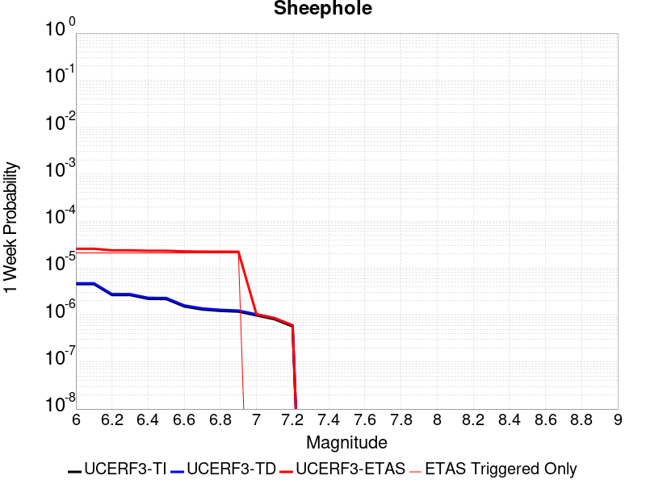 | 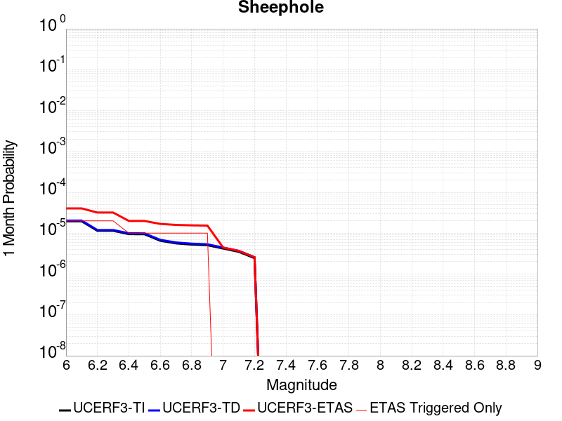 | 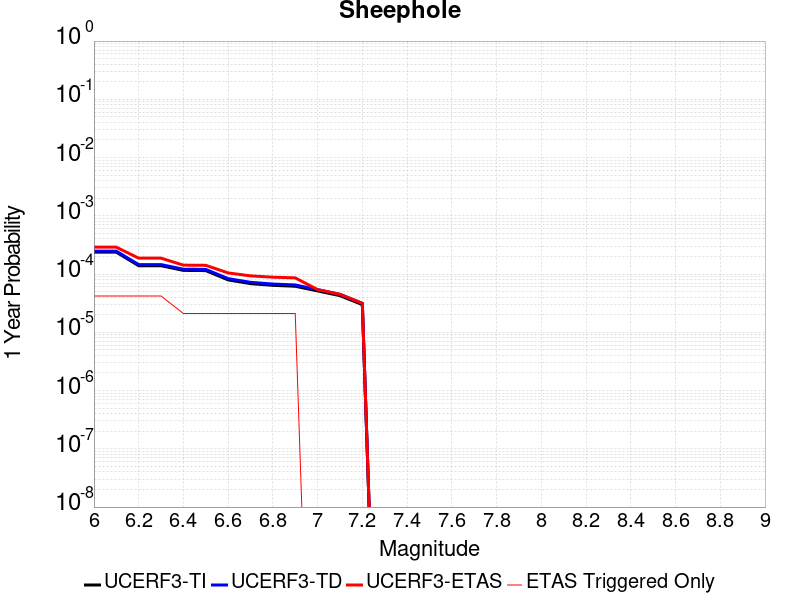 | 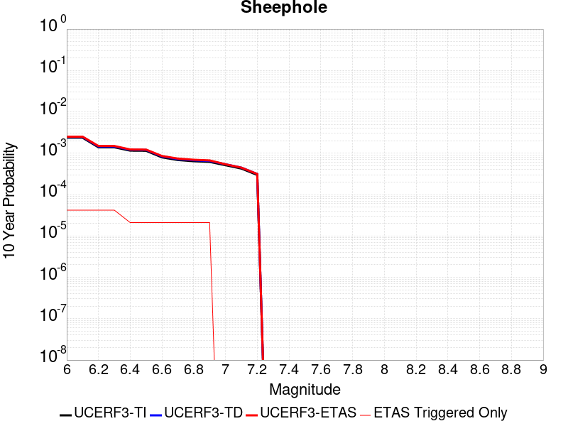 |

| Magnitude | 1 wk TI Prob | 1 wk TD Prob | 1 wk ETAS Prob | 1 wk ETAS/TD Gain | 1 wk ETAS Triggered Only | 1 mo TI Prob | 1 mo TD Prob | 1 mo ETAS Prob | 1 mo ETAS/TD Gain | 1 mo ETAS Triggered Only | 1 yr TI Prob | 1 yr TD Prob | 1 yr ETAS Prob | 1 yr ETAS/TD Gain | 1 yr ETAS Triggered Only | 10 yr TI Prob | 10 yr TD Prob | 10 yr ETAS Prob | 10 yr ETAS/TD Gain | 10 yr ETAS Triggered Only |
|-----|-----|-----|-----|-----|-----|-----|-----|-----|-----|-----|-----|-----|-----|-----|-----|-----|-----|-----|-----|-----|
| 6.0 | 4.5579695E-6 | 4.7412627E-6 | 1.4741215E-5 | 3.1091328 | 1.0E-5 | 1.9534009E-5 | 2.031957E-5 | 4.0319163E-5 | 1.9842528 | 2.0E-5 | 2.3780059E-4 | 2.473682E-4 | 2.6736327E-4 | 1.0808312 | 2.0E-5 | 0.0023754628 | 0.002471473 | 0.002501399 | 1.0121086 | 3.0E-5 |
| 6.1 | 4.5579695E-6 | 4.7412627E-6 | 1.4741215E-5 | 3.1091328 | 1.0E-5 | 1.9534009E-5 | 2.031957E-5 | 4.0319163E-5 | 1.9842528 | 2.0E-5 | 2.3780059E-4 | 2.473682E-4 | 2.6736327E-4 | 1.0808312 | 2.0E-5 | 0.0023754628 | 0.002471473 | 0.002501399 | 1.0121086 | 3.0E-5 |
| 6.2 | 2.6677674E-6 | 2.7873941E-6 | 1.2787366E-5 | 4.58757 | 1.0E-5 | 1.1433239E-5 | 1.1945926E-5 | 3.194569E-5 | 2.6741908 | 2.0E-5 | 1.3919079E-4 | 1.4543302E-4 | 1.6543012E-4 | 1.1375003 | 2.0E-5 | 0.0013910364 | 0.0014534844 | 0.0014834407 | 1.0206101 | 3.0E-5 |
| 6.3 | 2.6677674E-6 | 2.7873941E-6 | 1.2787366E-5 | 4.58757 | 1.0E-5 | 1.1433239E-5 | 1.1945926E-5 | 3.194569E-5 | 2.6741908 | 2.0E-5 | 1.3919079E-4 | 1.4543302E-4 | 1.6543012E-4 | 1.1375003 | 2.0E-5 | 0.0013910364 | 0.0014534844 | 0.0014834407 | 1.0206101 | 3.0E-5 |
| 6.4 | 2.2159759E-6 | 2.3228788E-6 | 1.2322856E-5 | 5.304993 | 1.0E-5 | 9.497005E-6 | 9.955161E-6 | 1.9955061E-5 | 2.0044942 | 1.0E-5 | 1.156199E-4 | 1.2119815E-4 | 1.3119694E-4 | 1.0824995 | 1.0E-5 | 0.0011555976 | 0.0012113999 | 0.0012313756 | 1.0164899 | 2.0E-5 |
| 6.5 | 2.1986082E-6 | 2.304759E-6 | 1.2304736E-5 | 5.3388386 | 1.0E-5 | 9.4225725E-6 | 9.877506E-6 | 1.9877407E-5 | 2.0123913 | 1.0E-5 | 1.1471378E-4 | 1.2025281E-4 | 1.302516E-4 | 1.0831481 | 1.0E-5 | 0.0011465458 | 0.0012019566 | 0.0012219326 | 1.0166196 | 2.0E-5 |
| 6.6 | 1.5232331E-6 | 1.6018919E-6 | 1.16018755E-5 | 7.2426085 | 1.0E-5 | 6.5281256E-6 | 6.865234E-6 | 1.6865166E-5 | 2.4566047 | 1.0E-5 | 7.947703E-5 | 8.35812E-5 | 9.358037E-5 | 1.1196342 | 1.0E-5 | 7.9448614E-4 | 8.3551643E-4 | 8.554997E-4 | 1.0239173 | 2.0E-5 |
| 6.7 | 1.3137362E-6 | 1.382819E-6 | 1.13828055E-5 | 8.231594 | 1.0E-5 | 5.6302856E-6 | 5.926355E-6 | 1.5926295E-5 | 2.687368 | 1.0E-5 | 6.854657E-5 | 7.215112E-5 | 8.21504E-5 | 1.138588 | 1.0E-5 | 6.8525434E-4 | 7.212908E-4 | 7.412764E-4 | 1.027708 | 2.0E-5 |
| 6.8 | 1.2275751E-6 | 1.2922847E-6 | 1.1292272E-5 | 8.738223 | 1.0E-5 | 5.2610258E-6 | 5.5383516E-6 | 1.5538297E-5 | 2.8055813 | 1.0E-5 | 6.4051106E-5 | 6.7427485E-5 | 7.7426805E-5 | 1.1482974 | 1.0E-5 | 6.4032647E-4 | 6.740836E-4 | 6.940701E-4 | 1.0296499 | 2.0E-5 |
| 6.9 | 1.1837088E-6 | 1.246102E-6 | 1.1246089E-5 | 9.025015 | 1.0E-5 | 5.0730278E-6 | 5.340427E-6 | 1.5340374E-5 | 2.8724995 | 1.0E-5 | 6.176237E-5 | 6.501789E-5 | 7.501724E-5 | 1.1537938 | 1.0E-5 | 6.17452E-4 | 6.5000186E-4 | 6.6998886E-4 | 1.0307492 | 2.0E-5 |
| 7.0 | 9.849371E-7 | 1.0366288E-6 | 1.0366288E-6 | 1.0 | 0.0 | 4.2211523E-6 | 4.442688E-6 | 4.442688E-6 | 1.0 | 0.0 | 5.1391315E-5 | 5.4088487E-5 | 5.4088487E-5 | 1.0 | 0.0 | 5.137943E-4 | 5.407633E-4 | 5.5075786E-4 | 1.0184823 | 1.0E-5 |
| 7.1 | 8.1643645E-7 | 8.591669E-7 | 8.591669E-7 | 1.0 | 0.0 | 3.4990085E-6 | 3.682139E-6 | 3.682139E-6 | 1.0 | 0.0 | 4.2599597E-5 | 4.482921E-5 | 4.482921E-5 | 1.0 | 0.0 | 4.259143E-4 | 4.4821028E-4 | 4.5820582E-4 | 1.022301 | 1.0E-5 |
| 7.2 | 5.7295756E-7 | 6.029502E-7 | 6.029502E-7 | 1.0 | 0.0 | 2.45553E-6 | 2.58407E-6 | 2.58407E-6 | 1.0 | 0.0 | 2.9895667E-5 | 3.1460666E-5 | 3.1460666E-5 | 1.0 | 0.0 | 2.9891645E-4 | 3.145688E-4 | 3.145688E-4 | 1.0 | 0.0 |

## Johnson Valley (No) 2011 rev
*[(top)](#table-of-contents)*

| 1 Week | 1 Month | 1 Year | 10 Year |
|-----|-----|-----|-----|
|  |  |  |  |

| Magnitude | 1 wk TI Prob | 1 wk TD Prob | 1 wk ETAS Prob | 1 wk ETAS/TD Gain | 1 wk ETAS Triggered Only | 1 mo TI Prob | 1 mo TD Prob | 1 mo ETAS Prob | 1 mo ETAS/TD Gain | 1 mo ETAS Triggered Only | 1 yr TI Prob | 1 yr TD Prob | 1 yr ETAS Prob | 1 yr ETAS/TD Gain | 1 yr ETAS Triggered Only | 10 yr TI Prob | 10 yr TD Prob | 10 yr ETAS Prob | 10 yr ETAS/TD Gain | 10 yr ETAS Triggered Only |
|-----|-----|-----|-----|-----|-----|-----|-----|-----|-----|-----|-----|-----|-----|-----|-----|-----|-----|-----|-----|-----|
| 6.0 | 2.577707E-5 | 1.2901208E-5 | 3.290095E-5 | 2.5502224 | 2.0E-5 | 1.1046848E-4 | 5.528994E-5 | 7.528884E-5 | 1.3617095 | 2.0E-5 | 0.0013441239 | 6.729868E-4 | 7.0296664E-4 | 1.0445474 | 3.0E-5 | 0.013360229 | 0.006713397 | 0.0067431955 | 1.0044386 | 3.0E-5 |
| 6.1 | 2.577707E-5 | 1.2901208E-5 | 3.290095E-5 | 2.5502224 | 2.0E-5 | 1.1046848E-4 | 5.528994E-5 | 7.528884E-5 | 1.3617095 | 2.0E-5 | 0.0013441239 | 6.729868E-4 | 7.0296664E-4 | 1.0445474 | 3.0E-5 | 0.013360229 | 0.006713397 | 0.0067431955 | 1.0044386 | 3.0E-5 |
| 6.2 | 2.577707E-5 | 1.2901208E-5 | 3.290095E-5 | 2.5502224 | 2.0E-5 | 1.1046848E-4 | 5.528994E-5 | 7.528884E-5 | 1.3617095 | 2.0E-5 | 0.0013441239 | 6.729868E-4 | 7.0296664E-4 | 1.0445474 | 3.0E-5 | 0.013360229 | 0.006713397 | 0.0067431955 | 1.0044386 | 3.0E-5 |
| 6.3 | 2.577707E-5 | 1.2901208E-5 | 3.290095E-5 | 2.5502224 | 2.0E-5 | 1.1046848E-4 | 5.528994E-5 | 7.528884E-5 | 1.3617095 | 2.0E-5 | 0.0013441239 | 6.729868E-4 | 7.0296664E-4 | 1.0445474 | 3.0E-5 | 0.013360229 | 0.006713397 | 0.0067431955 | 1.0044386 | 3.0E-5 |
| 6.4 | 1.5296591E-5 | 7.5369735E-6 | 1.7536899E-5 | 2.3267825 | 1.0E-5 | 6.555518E-5 | 3.230102E-5 | 4.2300697E-5 | 1.3095777 | 1.0E-5 | 7.97842E-4 | 3.9321271E-4 | 4.0320877E-4 | 1.0254215 | 1.0E-5 | 0.007949836 | 0.003927011 | 0.003936972 | 1.0025364 | 1.0E-5 |
| 6.5 | 1.5296591E-5 | 7.5369735E-6 | 1.7536899E-5 | 2.3267825 | 1.0E-5 | 6.555518E-5 | 3.230102E-5 | 4.2300697E-5 | 1.3095777 | 1.0E-5 | 7.97842E-4 | 3.9321271E-4 | 4.0320877E-4 | 1.0254215 | 1.0E-5 | 0.007949836 | 0.003927011 | 0.003936972 | 1.0025364 | 1.0E-5 |
| 6.6 | 1.3289383E-5 | 5.9919316E-6 | 1.599187E-5 | 2.668901 | 1.0E-5 | 5.6953253E-5 | 2.567955E-5 | 3.567929E-5 | 1.3894049 | 1.0E-5 | 6.9318525E-4 | 3.1262063E-4 | 3.226175E-4 | 1.0319777 | 1.0E-5 | 0.0069102696 | 0.0031234731 | 0.0031334418 | 1.0031916 | 1.0E-5 |
| 6.7 | 1.3289383E-5 | 5.9919316E-6 | 1.599187E-5 | 2.668901 | 1.0E-5 | 5.6953253E-5 | 2.567955E-5 | 3.567929E-5 | 1.3894049 | 1.0E-5 | 6.9318525E-4 | 3.1262063E-4 | 3.226175E-4 | 1.0319777 | 1.0E-5 | 0.0069102696 | 0.0031234731 | 0.0031334418 | 1.0031916 | 1.0E-5 |
| 6.8 | 8.330789E-6 | 2.9214577E-6 | 1.2921429E-5 | 4.422939 | 1.0E-5 | 3.570289E-5 | 1.2520505E-5 | 2.252038E-5 | 1.7986798 | 1.0E-5 | 4.34596E-4 | 1.524322E-4 | 1.6243068E-4 | 1.0655929 | 1.0E-5 | 0.0043374705 | 0.0015238364 | 0.0015338212 | 1.0065523 | 1.0E-5 |
| 6.9 | 7.2359003E-6 | 2.3014702E-6 | 1.2301447E-5 | 5.345039 | 1.0E-5 | 3.1010633E-5 | 9.863436E-6 | 1.9863337E-5 | 2.0138354 | 1.0E-5 | 3.7748902E-4 | 1.2008605E-4 | 1.3008485E-4 | 1.0832636 | 1.0E-5 | 0.0037684843 | 0.0012007345 | 0.0012107225 | 1.0083182 | 1.0E-5 |
| 7.0 | 6.5149957E-6 | 2.0886398E-6 | 1.2088619E-5 | 5.787795 | 1.0E-5 | 2.792111E-5 | 8.951313E-6 | 1.8951223E-5 | 2.1171446 | 1.0E-5 | 3.398865E-4 | 1.0898209E-4 | 1.1898099E-4 | 1.0917482 | 1.0E-5 | 0.003393671 | 0.0010898062 | 0.0010997953 | 1.009166 | 1.0E-5 |
| 7.1 | 1.1662233E-6 | 2.8793124E-8 | 2.8793124E-8 | 1.0 | 0.0 | 4.9980904E-6 | 1.2339909E-7 | 1.2339909E-7 | 1.0 | 0.0 | 6.0850052E-5 | 1.5023832E-6 | 1.5023832E-6 | 1.0 | 0.0 | 6.083339E-4 | 1.5023746E-5 | 1.5023746E-5 | 1.0 | 0.0 |
| 7.2 | 5.413881E-7 | 2.8793124E-8 | 2.8793124E-8 | 1.0 | 0.0 | 2.3202326E-6 | 1.2339909E-7 | 1.2339909E-7 | 1.0 | 0.0 | 2.8248465E-5 | 1.5023832E-6 | 1.5023832E-6 | 1.0 | 0.0 | 2.8244875E-4 | 1.5023746E-5 | 1.5023746E-5 | 1.0 | 0.0 |
| 7.3 | 5.076821E-7 | 2.8793124E-8 | 2.8793124E-8 | 1.0 | 0.0 | 2.1757785E-6 | 1.2339909E-7 | 1.2339909E-7 | 1.0 | 0.0 | 2.648978E-5 | 1.5023832E-6 | 1.5023832E-6 | 1.0 | 0.0 | 2.6486625E-4 | 1.5023746E-5 | 1.5023746E-5 | 1.0 | 0.0 |
| 7.4 | 4.7568687E-7 | 2.8775073E-8 | 2.8775073E-8 | 1.0 | 0.0 | 2.0386565E-6 | 1.2332174E-7 | 1.2332174E-7 | 1.0 | 0.0 | 2.482036E-5 | 1.5014413E-6 | 1.5014413E-6 | 1.0 | 0.0 | 2.4817587E-4 | 1.5014328E-5 | 1.5014328E-5 | 1.0 | 0.0 |
| 7.5 | 3.435626E-7 | 2.5350424E-8 | 2.5350424E-8 | 1.0 | 0.0 | 1.4724103E-6 | 1.0864467E-7 | 1.0864467E-7 | 1.0 | 0.0 | 1.7926448E-5 | 1.3227482E-6 | 1.3227482E-6 | 1.0 | 0.0 | 1.7925001E-4 | 1.3227419E-5 | 1.3227419E-5 | 1.0 | 0.0 |

## Maacama 2011 CFM
*[(top)](#table-of-contents)*

| 1 Week | 1 Month | 1 Year | 10 Year |
|-----|-----|-----|-----|
|  |  | 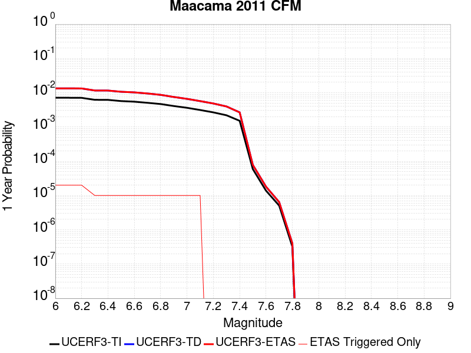 |  |

| Magnitude | 1 wk TI Prob | 1 wk TD Prob | 1 wk ETAS Prob | 1 wk ETAS/TD Gain | 1 wk ETAS Triggered Only | 1 mo TI Prob | 1 mo TD Prob | 1 mo ETAS Prob | 1 mo ETAS/TD Gain | 1 mo ETAS Triggered Only | 1 yr TI Prob | 1 yr TD Prob | 1 yr ETAS Prob | 1 yr ETAS/TD Gain | 1 yr ETAS Triggered Only | 10 yr TI Prob | 10 yr TD Prob | 10 yr ETAS Prob | 10 yr ETAS/TD Gain | 10 yr ETAS Triggered Only |
|-----|-----|-----|-----|-----|-----|-----|-----|-----|-----|-----|-----|-----|-----|-----|-----|-----|-----|-----|-----|-----|
| 6.0 | 1.368203E-4 | 2.579087E-4 | 2.679061E-4 | 1.0387634 | 1.0E-5 | 5.862409E-4 | 0.0011047592 | 0.0011147481 | 1.0090418 | 1.0E-5 | 0.0071141496 | 0.013350345 | 0.013370078 | 1.0014781 | 2.0E-5 | 0.06890667 | 0.1241916 | 0.12420911 | 1.000141 | 2.0E-5 |
| 6.1 | 1.368203E-4 | 2.579087E-4 | 2.679061E-4 | 1.0387634 | 1.0E-5 | 5.862409E-4 | 0.0011047592 | 0.0011147481 | 1.0090418 | 1.0E-5 | 0.0071141496 | 0.013350345 | 0.013370078 | 1.0014781 | 2.0E-5 | 0.06890667 | 0.1241916 | 0.12420911 | 1.000141 | 2.0E-5 |
| 6.2 | 1.360743E-4 | 2.566557E-4 | 2.6665317E-4 | 1.0389527 | 1.0E-5 | 5.8304524E-4 | 0.001099394 | 0.0011093831 | 1.0090859 | 1.0E-5 | 0.007075496 | 0.013285898 | 0.0133056315 | 1.0014853 | 2.0E-5 | 0.06854413 | 0.123625994 | 0.123643525 | 1.0001417 | 2.0E-5 |
| 6.3 | 1.1917239E-4 | 2.236021E-4 | 2.3359986E-4 | 1.0447123 | 1.0E-5 | 5.1063887E-4 | 9.578717E-4 | 9.6786214E-4 | 1.0104299 | 1.0E-5 | 0.0061993203 | 0.0115873255 | 0.01159721 | 1.0008531 | 1.0E-5 | 0.060292065 | 0.108845875 | 0.108854786 | 1.0000819 | 1.0E-5 |
| 6.4 | 1.1859289E-4 | 2.2263796E-4 | 2.3263574E-4 | 1.044906 | 1.0E-5 | 5.0815626E-4 | 9.537432E-4 | 9.6373365E-4 | 1.010475 | 1.0E-5 | 0.006169266 | 0.011537647 | 0.011547532 | 1.0008568 | 1.0E-5 | 0.06000784 | 0.10840272 | 0.10841164 | 1.0000823 | 1.0E-5 |
| 6.5 | 1.09512424E-4 | 2.0517908E-4 | 2.1517703E-4 | 1.0487279 | 1.0E-5 | 4.6925453E-4 | 8.7897904E-4 | 8.889703E-4 | 1.0113668 | 1.0E-5 | 0.005698218 | 0.010639169 | 0.010649063 | 1.00093 | 1.0E-5 | 0.055543028 | 0.1004949 | 0.10050389 | 1.0000895 | 1.0E-5 |
| 6.6 | 1.0502928E-4 | 1.9675294E-4 | 2.0675096E-4 | 1.0508151 | 1.0E-5 | 4.500478E-4 | 8.429031E-4 | 8.528946E-4 | 1.0118538 | 1.0E-5 | 0.0054655746 | 0.010205293 | 0.010215191 | 1.0009699 | 1.0E-5 | 0.053330887 | 0.0966474 | 0.096656434 | 1.0000935 | 1.0E-5 |
| 6.7 | 9.739358E-5 | 1.8259176E-4 | 1.9258993E-4 | 1.054757 | 1.0E-5 | 4.173343E-4 | 7.822563E-4 | 7.9224847E-4 | 1.0127735 | 1.0E-5 | 0.0050692135 | 0.009475343 | 0.009485248 | 1.0010453 | 1.0E-5 | 0.049551267 | 0.09012011 | 0.090129204 | 1.000101 | 1.0E-5 |
| 6.8 | 8.969524E-5 | 1.6658378E-4 | 1.765821E-4 | 1.0600199 | 1.0E-5 | 3.8435153E-4 | 7.1369443E-4 | 7.236873E-4 | 1.0140016 | 1.0E-5 | 0.0046694432 | 0.00864909 | 0.008659003 | 1.0011462 | 1.0E-5 | 0.045725387 | 0.08265246 | 0.082661636 | 1.000111 | 1.0E-5 |
| 6.9 | 7.838291E-5 | 1.4418772E-4 | 1.5418629E-4 | 1.069344 | 1.0E-5 | 3.358835E-4 | 6.1778206E-4 | 6.2777585E-4 | 1.0161769 | 1.0E-5 | 0.0040817154 | 0.007491724 | 0.007501649 | 1.0013248 | 1.0E-5 | 0.04007554 | 0.07205298 | 0.072062254 | 1.0001287 | 1.0E-5 |
| 7.0 | 6.961957E-5 | 1.2708071E-4 | 1.3707943E-4 | 1.0786802 | 1.0E-5 | 2.9833548E-4 | 5.445059E-4 | 5.5450044E-4 | 1.0183553 | 1.0E-5 | 0.0036261857 | 0.006606692 | 0.006616626 | 1.0015036 | 1.0E-5 | 0.035675827 | 0.063871816 | 0.063881174 | 1.0001465 | 1.0E-5 |
| 7.1 | 5.999398E-5 | 1.09053384E-4 | 1.19052296E-4 | 1.0916882 | 1.0E-5 | 2.570917E-4 | 4.6728246E-4 | 4.7727776E-4 | 1.0213903 | 1.0E-5 | 0.0031255994 | 0.00567284 | 0.005682783 | 1.0017527 | 1.0E-5 | 0.030820016 | 0.055139277 | 0.055148724 | 1.0001713 | 1.0E-5 |
| 7.2 | 5.116532E-5 | 9.305489E-5 | 9.305489E-5 | 1.0 | 0.0 | 2.1926152E-4 | 3.9874107E-4 | 3.9874107E-4 | 1.0 | 0.0 | 0.002666241 | 0.00484315 | 0.00484315 | 1.0 | 0.0 | 0.026344774 | 0.047303654 | 0.047303654 | 1.0 | 0.0 |
| 7.3 | 4.2087835E-5 | 7.617064E-5 | 7.617064E-5 | 1.0 | 0.0 | 1.8036396E-4 | 3.264016E-4 | 3.264016E-4 | 1.0 | 0.0 | 0.0021937196 | 0.0039662397 | 0.0039662397 | 1.0 | 0.0 | 0.0217219 | 0.038905017 | 0.038905017 | 1.0 | 0.0 |
| 7.4 | 2.8991652E-5 | 5.1163643E-5 | 5.1163643E-5 | 1.0 | 0.0 | 1.2424402E-4 | 2.1925455E-4 | 2.1925455E-4 | 1.0 | 0.0 | 0.0015116213 | 0.0026661097 | 0.0026661097 | 1.0 | 0.0 | 0.015013801 | 0.026332043 | 0.026332043 | 1.0 | 0.0 |
| 7.5 | 1.1292299E-6 | 1.4950216E-6 | 1.4950216E-6 | 1.0 | 0.0 | 4.8395473E-6 | 6.407227E-6 | 6.407227E-6 | 1.0 | 0.0 | 5.8919897E-5 | 7.8006444E-5 | 7.8006444E-5 | 1.0 | 0.0 | 5.890428E-4 | 7.805042E-4 | 7.805042E-4 | 1.0 | 0.0 |
| 7.6 | 2.6535366E-7 | 3.4720998E-7 | 3.4720998E-7 | 1.0 | 0.0 | 1.1372296E-6 | 1.4880419E-6 | 1.4880419E-6 | 1.0 | 0.0 | 1.3845682E-5 | 1.811676E-5 | 1.811676E-5 | 1.0 | 0.0 | 1.3844819E-4 | 1.8170691E-4 | 1.8170691E-4 | 1.0 | 0.0 |
| 7.7 | 9.727789E-8 | 1.2302418E-7 | 1.2302418E-7 | 1.0 | 0.0 | 4.1690518E-7 | 5.2724636E-7 | 5.2724636E-7 | 1.0 | 0.0 | 5.0758085E-6 | 6.419206E-6 | 6.419206E-6 | 1.0 | 0.0 | 5.0756928E-5 | 6.456404E-5 | 6.456404E-5 | 1.0 | 0.0 |
| 7.8 | 6.1939325E-9 | 7.711711E-9 | 7.711711E-9 | 1.0 | 0.0 | 2.6545425E-8 | 3.305019E-8 | 3.305019E-8 | 1.0 | 0.0 | 3.231905E-7 | 4.0238598E-7 | 4.0238598E-7 | 1.0 | 0.0 | 3.2319003E-6 | 4.0597915E-6 | 4.0597915E-6 | 1.0 | 0.0 |

## Hayward (No) 2011 CFM
*[(top)](#table-of-contents)*

| 1 Week | 1 Month | 1 Year | 10 Year |
|-----|-----|-----|-----|
|  |  |  | 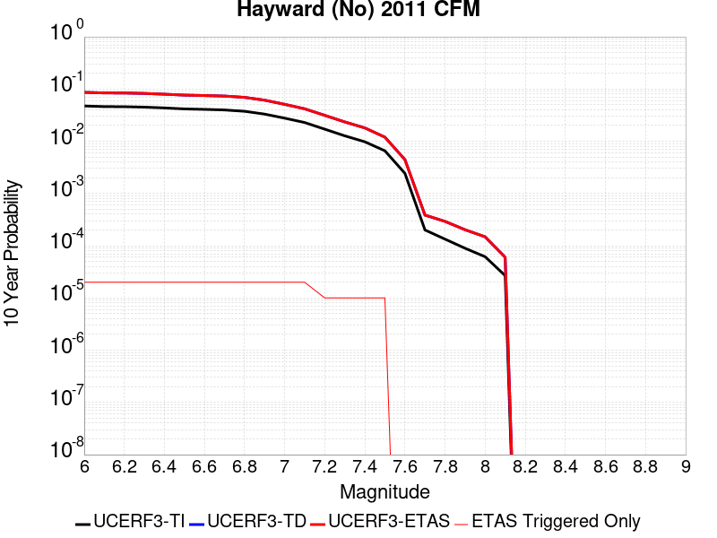 |

| Magnitude | 1 wk TI Prob | 1 wk TD Prob | 1 wk ETAS Prob | 1 wk ETAS/TD Gain | 1 wk ETAS Triggered Only | 1 mo TI Prob | 1 mo TD Prob | 1 mo ETAS Prob | 1 mo ETAS/TD Gain | 1 mo ETAS Triggered Only | 1 yr TI Prob | 1 yr TD Prob | 1 yr ETAS Prob | 1 yr ETAS/TD Gain | 1 yr ETAS Triggered Only | 10 yr TI Prob | 10 yr TD Prob | 10 yr ETAS Prob | 10 yr ETAS/TD Gain | 10 yr ETAS Triggered Only |
|-----|-----|-----|-----|-----|-----|-----|-----|-----|-----|-----|-----|-----|-----|-----|-----|-----|-----|-----|-----|-----|
| 6.0 | 9.3068506E-5 | 1.739643E-4 | 1.739643E-4 | 1.0 | 0.0 | 3.9880406E-4 | 7.453474E-4 | 7.5534E-4 | 1.0134065 | 1.0E-5 | 0.0048446343 | 0.009036727 | 0.0090466365 | 1.0010966 | 1.0E-5 | 0.047403704 | 0.086396605 | 0.08641488 | 1.0002115 | 2.0E-5 |
| 6.1 | 9.055486E-5 | 1.6947639E-4 | 1.6947639E-4 | 1.0 | 0.0 | 3.880345E-4 | 7.2612526E-4 | 7.36118E-4 | 1.0137618 | 1.0E-5 | 0.0047140904 | 0.008804814 | 0.008814726 | 1.0011257 | 1.0E-5 | 0.046153355 | 0.08428568 | 0.08430399 | 1.0002173 | 2.0E-5 |
| 6.2 | 9.006742E-5 | 1.6868232E-4 | 1.6868232E-4 | 1.0 | 0.0 | 3.859461E-4 | 7.227246E-4 | 7.327174E-4 | 1.0138265 | 1.0E-5 | 0.0046887742 | 0.00876378 | 0.008773692 | 1.001131 | 1.0E-5 | 0.0459107 | 0.08390991 | 0.08392823 | 1.0002184 | 2.0E-5 |
| 6.3 | 8.8336754E-5 | 1.6547782E-4 | 1.6547782E-4 | 1.0 | 0.0 | 3.7853114E-4 | 7.0899865E-4 | 7.1899156E-4 | 1.0140944 | 1.0E-5 | 0.004598882 | 0.008598051 | 0.008607965 | 1.0011531 | 1.0E-5 | 0.04504866 | 0.08240195 | 0.082420304 | 1.0002227 | 2.0E-5 |
| 6.4 | 8.526157E-5 | 1.5974796E-4 | 1.5974796E-4 | 1.0 | 0.0 | 3.6535555E-4 | 6.844552E-4 | 6.9444836E-4 | 1.0146002 | 1.0E-5 | 0.0044391346 | 0.00830156 | 0.008311477 | 1.0011946 | 1.0E-5 | 0.043514993 | 0.07968467 | 0.07970307 | 1.000231 | 2.0E-5 |
| 6.5 | 8.152396E-5 | 1.5307199E-4 | 1.5307199E-4 | 1.0 | 0.0 | 3.493416E-4 | 6.558586E-4 | 6.6585204E-4 | 1.0152372 | 1.0E-5 | 0.0042449418 | 0.007955993 | 0.007965913 | 1.0012469 | 1.0E-5 | 0.04164765 | 0.07651448 | 0.07653295 | 1.0002414 | 2.0E-5 |
| 6.6 | 7.987405E-5 | 1.5011412E-4 | 1.5011412E-4 | 1.0 | 0.0 | 3.4227243E-4 | 6.431883E-4 | 6.5318187E-4 | 1.0155375 | 1.0E-5 | 0.0041592065 | 0.007802858 | 0.00781278 | 1.0012716 | 1.0E-5 | 0.04082218 | 0.075105876 | 0.07512437 | 1.0002463 | 2.0E-5 |
| 6.7 | 7.777665E-5 | 1.4650672E-4 | 1.4650672E-4 | 1.0 | 0.0 | 3.332859E-4 | 6.277355E-4 | 6.3772924E-4 | 1.0159203 | 1.0E-5 | 0.004050208 | 0.007616053 | 0.0076259766 | 1.001303 | 1.0E-5 | 0.039771806 | 0.0733825 | 0.073401034 | 1.0002525 | 2.0E-5 |
| 6.8 | 7.3284005E-5 | 1.3801287E-4 | 1.3801287E-4 | 1.0 | 0.0 | 3.140365E-4 | 5.9135025E-4 | 6.0134433E-4 | 1.0169004 | 1.0E-5 | 0.0038166929 | 0.007176059 | 0.007185987 | 1.0013835 | 1.0E-5 | 0.037518036 | 0.06929624 | 0.06931486 | 1.0002686 | 2.0E-5 |
| 6.9 | 6.458263E-5 | 1.21319164E-4 | 1.21319164E-4 | 1.0 | 0.0 | 2.7675333E-4 | 5.1983615E-4 | 5.298309E-4 | 1.0192268 | 1.0E-5 | 0.0033642664 | 0.0063107396 | 0.0063206763 | 1.0015746 | 1.0E-5 | 0.033137884 | 0.061224625 | 0.0612434 | 1.0003067 | 2.0E-5 |
| 7.0 | 5.3853604E-5 | 1.00254634E-4 | 1.00254634E-4 | 1.0 | 0.0 | 2.3078074E-4 | 4.295923E-4 | 4.39588E-4 | 1.0232679 | 1.0E-5 | 0.0028061352 | 0.0052178074 | 0.0052277553 | 1.0019065 | 1.0E-5 | 0.027709642 | 0.050957024 | 0.050976004 | 1.0003725 | 2.0E-5 |
| 7.1 | 4.4308683E-5 | 8.17098E-5 | 8.17098E-5 | 1.0 | 0.0 | 1.8988053E-4 | 3.5013806E-4 | 3.6013455E-4 | 1.0285501 | 1.0E-5 | 0.0023093442 | 0.0042546396 | 0.0042645973 | 1.0023403 | 1.0E-5 | 0.022854926 | 0.041824497 | 0.041843664 | 1.0004582 | 2.0E-5 |
| 7.2 | 3.295973E-5 | 6.0774026E-5 | 6.0774026E-5 | 1.0 | 0.0 | 1.4124835E-4 | 2.6043423E-4 | 2.6043423E-4 | 1.0 | 0.0 | 0.0017183421 | 0.0031661994 | 0.0031661994 | 1.0 | 0.0 | 0.017051157 | 0.031370014 | 0.0313797 | 1.0003088 | 1.0E-5 |
| 7.3 | 2.452256E-5 | 4.518223E-5 | 4.518223E-5 | 1.0 | 0.0 | 1.05092455E-4 | 1.9362383E-4 | 1.9362383E-4 | 1.0 | 0.0 | 0.0012787496 | 0.0023548352 | 0.0023548352 | 1.0 | 0.0 | 0.0127141625 | 0.023442036 | 0.023451801 | 1.0004166 | 1.0E-5 |
| 7.4 | 1.8829967E-5 | 3.4604043E-5 | 3.4604043E-5 | 1.0 | 0.0 | 8.069736E-5 | 1.4829468E-4 | 1.4829468E-4 | 1.0 | 0.0 | 9.820475E-4 | 0.0018040023 | 0.0018040023 | 1.0 | 0.0 | 0.009777189 | 0.01802003 | 0.01802985 | 1.0005449 | 1.0E-5 |
| 7.5 | 1.26374125E-5 | 2.292219E-5 | 2.292219E-5 | 1.0 | 0.0 | 5.4159216E-5 | 9.823428E-5 | 9.823428E-5 | 1.0 | 0.0 | 6.5918895E-4 | 0.0011953521 | 0.0011953521 | 1.0 | 0.0 | 0.00657237 | 0.011988704 | 0.0119985845 | 1.0008241 | 1.0E-5 |
| 7.6 | 4.666429E-6 | 8.479636E-6 | 8.479636E-6 | 1.0 | 0.0 | 1.9998828E-5 | 3.6340796E-5 | 3.6340796E-5 | 1.0 | 0.0 | 2.4345852E-4 | 4.423606E-4 | 4.423606E-4 | 1.0 | 0.0 | 0.0024319198 | 0.004458377 | 0.004458377 | 1.0 | 0.0 |
| 7.7 | 3.8399318E-7 | 7.1343146E-7 | 7.1343146E-7 | 1.0 | 0.0 | 1.6456839E-6 | 3.0575598E-6 | 3.0575598E-6 | 1.0 | 0.0 | 2.003602E-5 | 3.7225156E-5 | 3.7225156E-5 | 1.0 | 0.0 | 2.0034213E-4 | 3.86166E-4 | 3.86166E-4 | 1.0 | 0.0 |
| 7.8 | 2.5637698E-7 | 5.3666145E-7 | 5.3666145E-7 | 1.0 | 0.0 | 1.098758E-6 | 2.2999754E-6 | 2.2999754E-6 | 1.0 | 0.0 | 1.3377297E-5 | 2.8001843E-5 | 2.8001843E-5 | 1.0 | 0.0 | 1.3376492E-4 | 2.9246495E-4 | 2.9246495E-4 | 1.0 | 0.0 |
| 7.9 | 1.7141245E-7 | 3.7293606E-7 | 3.7293606E-7 | 1.0 | 0.0 | 7.3462456E-7 | 1.5982963E-6 | 1.5982963E-6 | 1.0 | 0.0 | 8.944017E-6 | 1.9459085E-5 | 1.9459085E-5 | 1.0 | 0.0 | 8.943657E-5 | 2.0246378E-4 | 2.0246378E-4 | 1.0 | 0.0 |
| 8.0 | 1.1808895E-7 | 2.7512246E-7 | 2.7512246E-7 | 1.0 | 0.0 | 5.060954E-7 | 1.1790958E-6 | 1.1790958E-6 | 1.0 | 0.0 | 6.161694E-6 | 1.4355397E-5 | 1.4355397E-5 | 1.0 | 0.0 | 6.161523E-5 | 1.4817173E-4 | 1.4817173E-4 | 1.0 | 0.0 |
| 8.1 | 5.138535E-8 | 1.12307575E-7 | 1.12307575E-7 | 1.0 | 0.0 | 2.2022292E-7 | 4.8131807E-7 | 4.8131807E-7 | 1.0 | 0.0 | 2.6812106E-6 | 5.860032E-6 | 5.860032E-6 | 1.0 | 0.0 | 2.6811784E-5 | 6.0156468E-5 | 6.0156468E-5 | 1.0 | 0.0 |

## Clamshell-Sawpit
*[(top)](#table-of-contents)*

| 1 Week | 1 Month | 1 Year | 10 Year |
|-----|-----|-----|-----|
| 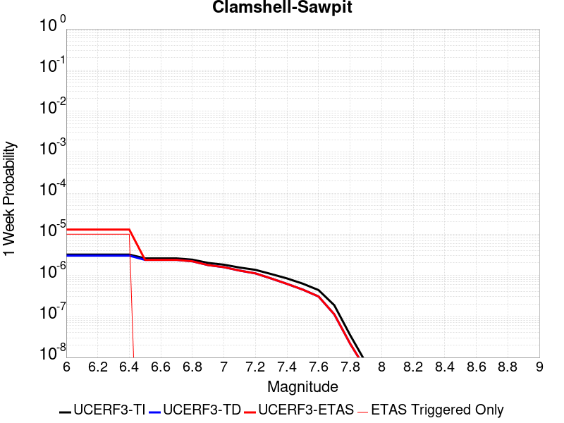 | 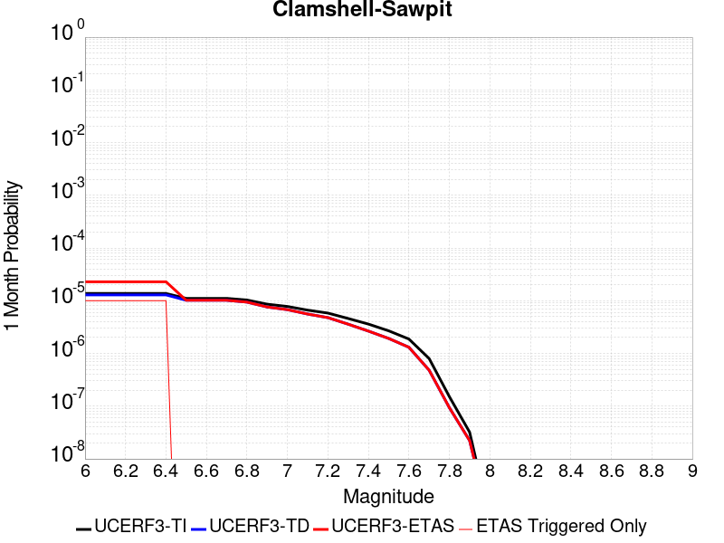 | 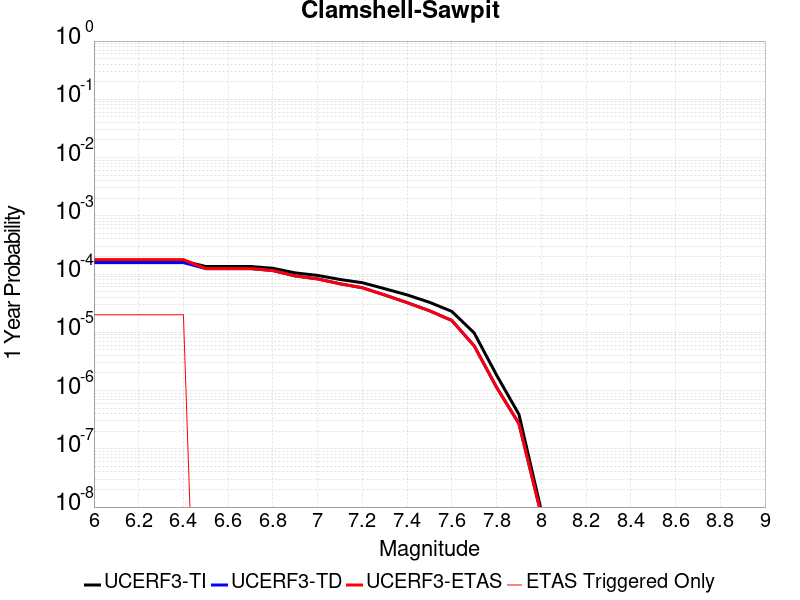 | 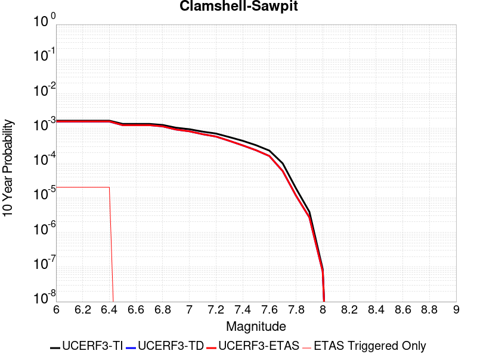 |

| Magnitude | 1 wk TI Prob | 1 wk TD Prob | 1 wk ETAS Prob | 1 wk ETAS/TD Gain | 1 wk ETAS Triggered Only | 1 mo TI Prob | 1 mo TD Prob | 1 mo ETAS Prob | 1 mo ETAS/TD Gain | 1 mo ETAS Triggered Only | 1 yr TI Prob | 1 yr TD Prob | 1 yr ETAS Prob | 1 yr ETAS/TD Gain | 1 yr ETAS Triggered Only | 10 yr TI Prob | 10 yr TD Prob | 10 yr ETAS Prob | 10 yr ETAS/TD Gain | 10 yr ETAS Triggered Only |
|-----|-----|-----|-----|-----|-----|-----|-----|-----|-----|-----|-----|-----|-----|-----|-----|-----|-----|-----|-----|-----|
| 6.0 | 3.202998E-6 | 3.0127642E-6 | 1.3012734E-5 | 4.319201 | 1.0E-5 | 1.3727062E-5 | 1.2911787E-5 | 2.2911658E-5 | 1.7744762 | 1.0E-5 | 1.6711417E-4 | 1.5719047E-4 | 1.7718734E-4 | 1.1272142 | 2.0E-5 | 0.0016698855 | 0.0015708723 | 0.0015908409 | 1.0127118 | 2.0E-5 |
| 6.1 | 3.202998E-6 | 3.0127642E-6 | 1.3012734E-5 | 4.319201 | 1.0E-5 | 1.3727062E-5 | 1.2911787E-5 | 2.2911658E-5 | 1.7744762 | 1.0E-5 | 1.6711417E-4 | 1.5719047E-4 | 1.7718734E-4 | 1.1272142 | 2.0E-5 | 0.0016698855 | 0.0015708723 | 0.0015908409 | 1.0127118 | 2.0E-5 |
| 6.2 | 3.202998E-6 | 3.0127642E-6 | 1.3012734E-5 | 4.319201 | 1.0E-5 | 1.3727062E-5 | 1.2911787E-5 | 2.2911658E-5 | 1.7744762 | 1.0E-5 | 1.6711417E-4 | 1.5719047E-4 | 1.7718734E-4 | 1.1272142 | 2.0E-5 | 0.0016698855 | 0.0015708723 | 0.0015908409 | 1.0127118 | 2.0E-5 |
| 6.3 | 3.202998E-6 | 3.0127642E-6 | 1.3012734E-5 | 4.319201 | 1.0E-5 | 1.3727062E-5 | 1.2911787E-5 | 2.2911658E-5 | 1.7744762 | 1.0E-5 | 1.6711417E-4 | 1.5719047E-4 | 1.7718734E-4 | 1.1272142 | 2.0E-5 | 0.0016698855 | 0.0015708723 | 0.0015908409 | 1.0127118 | 2.0E-5 |
| 6.4 | 3.202998E-6 | 3.0127642E-6 | 1.3012734E-5 | 4.319201 | 1.0E-5 | 1.3727062E-5 | 1.2911787E-5 | 2.2911658E-5 | 1.7744762 | 1.0E-5 | 1.6711417E-4 | 1.5719047E-4 | 1.7718734E-4 | 1.1272142 | 2.0E-5 | 0.0016698855 | 0.0015708723 | 0.0015908409 | 1.0127118 | 2.0E-5 |
| 6.5 | 2.5862723E-6 | 2.3807747E-6 | 2.3807747E-6 | 1.0 | 0.0 | 1.1083977E-5 | 1.0203283E-5 | 1.0203283E-5 | 1.0 | 0.0 | 1.3493907E-4 | 1.2421819E-4 | 1.2421819E-4 | 1.0 | 0.0 | 0.0013485716 | 0.0012415178 | 0.0012415178 | 1.0 | 0.0 |
| 6.6 | 2.5862723E-6 | 2.3807747E-6 | 2.3807747E-6 | 1.0 | 0.0 | 1.1083977E-5 | 1.0203283E-5 | 1.0203283E-5 | 1.0 | 0.0 | 1.3493907E-4 | 1.2421819E-4 | 1.2421819E-4 | 1.0 | 0.0 | 0.0013485716 | 0.0012415178 | 0.0012415178 | 1.0 | 0.0 |
| 6.7 | 2.5862723E-6 | 2.3807747E-6 | 2.3807747E-6 | 1.0 | 0.0 | 1.1083977E-5 | 1.0203283E-5 | 1.0203283E-5 | 1.0 | 0.0 | 1.3493907E-4 | 1.2421819E-4 | 1.2421819E-4 | 1.0 | 0.0 | 0.0013485716 | 0.0012415178 | 0.0012415178 | 1.0 | 0.0 |
| 6.8 | 2.4098806E-6 | 2.1977307E-6 | 2.1977307E-6 | 1.0 | 0.0 | 1.0328019E-5 | 9.4188135E-6 | 9.4188135E-6 | 1.0 | 0.0 | 1.2573638E-4 | 1.14668284E-4 | 1.14668284E-4 | 1.0 | 0.0 | 0.0012566525 | 0.0011461178 | 0.0011461178 | 1.0 | 0.0 |
| 6.9 | 2.0073985E-6 | 1.7784247E-6 | 1.7784247E-6 | 1.0 | 0.0 | 8.603109E-6 | 7.6217984E-6 | 7.6217984E-6 | 1.0 | 0.0 | 1.0473781E-4 | 9.279157E-5 | 9.279157E-5 | 1.0 | 0.0 | 0.0010468846 | 9.2754007E-4 | 9.2754007E-4 | 1.0 | 0.0 |
| 7.0 | 1.8166766E-6 | 1.5807094E-6 | 1.5807094E-6 | 1.0 | 0.0 | 7.785734E-6 | 6.774452E-6 | 6.774452E-6 | 1.0 | 0.0 | 9.478718E-5 | 8.247593E-5 | 8.247593E-5 | 1.0 | 0.0 | 9.4746763E-4 | 8.244633E-4 | 8.244633E-4 | 1.0 | 0.0 |
| 7.1 | 1.5471421E-6 | 1.3052961E-6 | 1.3052961E-6 | 1.0 | 0.0 | 6.6305925E-6 | 5.5941146E-6 | 5.5941146E-6 | 1.0 | 0.0 | 8.072447E-5 | 6.810627E-5 | 6.810627E-5 | 1.0 | 0.0 | 8.0695155E-4 | 6.8085943E-4 | 6.8085943E-4 | 1.0 | 0.0 |
| 7.2 | 1.3608037E-6 | 1.1153442E-6 | 1.1153442E-6 | 1.0 | 0.0 | 5.8320024E-6 | 4.780038E-6 | 4.780038E-6 | 1.0 | 0.0 | 7.1002316E-5 | 5.8195455E-5 | 5.8195455E-5 | 1.0 | 0.0 | 7.097964E-4 | 5.818068E-4 | 5.818068E-4 | 1.0 | 0.0 |
| 7.3 | 1.0749634E-6 | 8.384255E-7 | 8.384255E-7 | 1.0 | 0.0 | 4.6069777E-6 | 3.5932474E-6 | 3.5932474E-6 | 1.0 | 0.0 | 5.608851E-5 | 4.3746935E-5 | 4.3746935E-5 | 1.0 | 0.0 | 5.6074356E-4 | 4.3738607E-4 | 4.3738607E-4 | 1.0 | 0.0 |
| 7.4 | 8.416856E-7 | 6.2000527E-7 | 6.2000527E-7 | 1.0 | 0.0 | 3.607219E-6 | 2.657163E-6 | 2.657163E-6 | 1.0 | 0.0 | 4.3917007E-5 | 3.2350497E-5 | 3.2350497E-5 | 1.0 | 0.0 | 4.390833E-4 | 3.2345986E-4 | 3.2345986E-4 | 1.0 | 0.0 |
| 7.5 | 6.2779594E-7 | 4.4968908E-7 | 4.4968908E-7 | 1.0 | 0.0 | 2.6905511E-6 | 1.9272377E-6 | 1.9272377E-6 | 1.0 | 0.0 | 3.275697E-5 | 2.3463885E-5 | 2.3463885E-5 | 1.0 | 0.0 | 3.275214E-4 | 2.3461595E-4 | 2.3461595E-4 | 1.0 | 0.0 |
| 7.6 | 4.3822078E-7 | 3.059551E-7 | 3.059551E-7 | 1.0 | 0.0 | 1.8780877E-6 | 1.3112356E-6 | 1.3112356E-6 | 1.0 | 0.0 | 2.2865479E-5 | 1.5964191E-5 | 1.5964191E-5 | 1.0 | 0.0 | 2.2863125E-4 | 1.5963199E-4 | 1.5963199E-4 | 1.0 | 0.0 |
| 7.7 | 1.8704569E-7 | 1.12379E-7 | 1.12379E-7 | 1.0 | 0.0 | 8.0162414E-7 | 4.8162417E-7 | 4.8162417E-7 | 1.0 | 0.0 | 9.75973E-6 | 5.8637593E-6 | 5.8637593E-6 | 1.0 | 0.0 | 9.7593016E-5 | 5.863611E-5 | 5.863611E-5 | 1.0 | 0.0 |
| 7.8 | 3.5378733E-8 | 2.1838002E-8 | 2.1838002E-8 | 1.0 | 0.0 | 1.5162313E-7 | 9.359143E-8 | 9.359143E-8 | 1.0 | 0.0 | 1.84601E-6 | 1.1394751E-6 | 1.1394751E-6 | 1.0 | 0.0 | 1.8459947E-5 | 1.1394695E-5 | 1.1394695E-5 | 1.0 | 0.0 |
| 7.9 | 7.504945E-9 | 5.1921663E-9 | 5.1921663E-9 | 1.0 | 0.0 | 3.2164053E-8 | 2.2252141E-8 | 2.2252141E-8 | 1.0 | 0.0 | 3.9159727E-7 | 2.709198E-7 | 2.709198E-7 | 1.0 | 0.0 | 3.915966E-6 | 2.7091953E-6 | 2.7091953E-6 | 1.0 | 0.0 |
| 8.0 | 1.6554036E-10 | 1.418149E-10 | 1.418149E-10 | 1.0 | 0.0 | 7.0945894E-10 | 6.0777794E-10 | 6.0777794E-10 | 1.0 | 0.0 | 8.637662E-9 | 7.3996964E-9 | 7.3996964E-9 | 1.0 | 0.0 | 8.6376616E-8 | 7.3996965E-8 | 7.3996965E-8 | 1.0 | 0.0 |

## Cedar Mtn-Mahogany Mtn
*[(top)](#table-of-contents)*

| 1 Week | 1 Month | 1 Year | 10 Year |
|-----|-----|-----|-----|
|  |  |  |  |

| Magnitude | 1 wk TI Prob | 1 wk TD Prob | 1 wk ETAS Prob | 1 wk ETAS/TD Gain | 1 wk ETAS Triggered Only | 1 mo TI Prob | 1 mo TD Prob | 1 mo ETAS Prob | 1 mo ETAS/TD Gain | 1 mo ETAS Triggered Only | 1 yr TI Prob | 1 yr TD Prob | 1 yr ETAS Prob | 1 yr ETAS/TD Gain | 1 yr ETAS Triggered Only | 10 yr TI Prob | 10 yr TD Prob | 10 yr ETAS Prob | 10 yr ETAS/TD Gain | 10 yr ETAS Triggered Only |
|-----|-----|-----|-----|-----|-----|-----|-----|-----|-----|-----|-----|-----|-----|-----|-----|-----|-----|-----|-----|-----|
| 6.0 | 2.7763876E-5 | 2.9588866E-5 | 2.9588866E-5 | 1.0 | 0.0 | 1.1898261E-4 | 1.2680366E-4 | 1.2680366E-4 | 1.0 | 0.0 | 0.0014476506 | 0.0015428112 | 0.0015428112 | 1.0 | 0.0 | 0.0143825635 | 0.015328225 | 0.0153479185 | 1.0012848 | 2.0E-5 |
| 6.1 | 1.6162443E-5 | 1.7142966E-5 | 1.7142966E-5 | 1.0 | 0.0 | 6.926578E-5 | 7.346788E-5 | 7.346788E-5 | 1.0 | 0.0 | 8.4298453E-4 | 8.941221E-4 | 8.941221E-4 | 1.0 | 0.0 | 0.008397939 | 0.008907059 | 0.008916969 | 1.0011127 | 1.0E-5 |
| 6.2 | 1.6162443E-5 | 1.7142966E-5 | 1.7142966E-5 | 1.0 | 0.0 | 6.926578E-5 | 7.346788E-5 | 7.346788E-5 | 1.0 | 0.0 | 8.4298453E-4 | 8.941221E-4 | 8.941221E-4 | 1.0 | 0.0 | 0.008397939 | 0.008907059 | 0.008916969 | 1.0011127 | 1.0E-5 |
| 6.3 | 9.746053E-6 | 1.0303152E-5 | 1.0303152E-5 | 1.0 | 0.0 | 4.1768133E-5 | 4.415564E-5 | 4.415564E-5 | 1.0 | 0.0 | 5.0840835E-4 | 5.3746643E-4 | 5.3746643E-4 | 1.0 | 0.0 | 0.0050724675 | 0.005362084 | 0.005362084 | 1.0 | 0.0 |
| 6.4 | 9.746053E-6 | 1.0303152E-5 | 1.0303152E-5 | 1.0 | 0.0 | 4.1768133E-5 | 4.415564E-5 | 4.415564E-5 | 1.0 | 0.0 | 5.0840835E-4 | 5.3746643E-4 | 5.3746643E-4 | 1.0 | 0.0 | 0.0050724675 | 0.005362084 | 0.005362084 | 1.0 | 0.0 |
| 6.5 | 7.290083E-6 | 7.695325E-6 | 7.695325E-6 | 1.0 | 0.0 | 3.124284E-5 | 3.297956E-5 | 3.297956E-5 | 1.0 | 0.0 | 3.8031515E-4 | 4.014543E-4 | 4.014543E-4 | 1.0 | 0.0 | 0.0037966494 | 0.004007511 | 0.004007511 | 1.0 | 0.0 |
| 6.6 | 5.67907E-6 | 5.9891527E-6 | 5.9891527E-6 | 1.0 | 0.0 | 2.4338644E-5 | 2.5667552E-5 | 2.5667552E-5 | 1.0 | 0.0 | 2.962827E-4 | 3.12459E-4 | 3.12459E-4 | 1.0 | 0.0 | 0.0029588798 | 0.003120333 | 0.003120333 | 1.0 | 0.0 |
| 6.7 | 3.4853963E-6 | 3.672631E-6 | 3.672631E-6 | 1.0 | 0.0 | 1.4937327E-5 | 1.5739755E-5 | 1.5739755E-5 | 1.0 | 0.0 | 1.8184677E-4 | 1.916153E-4 | 1.916153E-4 | 1.0 | 0.0 | 0.0018169804 | 0.0019145629 | 0.0019145629 | 1.0 | 0.0 |
| 6.8 | 2.7535168E-6 | 2.9015764E-6 | 2.9015764E-6 | 1.0 | 0.0 | 1.1800733E-5 | 1.2435271E-5 | 1.2435271E-5 | 1.0 | 0.0 | 1.4366445E-4 | 1.5138938E-4 | 1.5138938E-4 | 1.0 | 0.0 | 0.0014357162 | 0.0015129098 | 0.0015129098 | 1.0 | 0.0 |
| 6.9 | 1.6594106E-6 | 1.7496985E-6 | 1.7496985E-6 | 1.0 | 0.0 | 7.1117406E-6 | 7.4986883E-6 | 7.4986883E-6 | 1.0 | 0.0 | 8.6582E-5 | 9.129302E-5 | 9.129302E-5 | 1.0 | 0.0 | 8.654827E-4 | 9.125856E-4 | 9.125856E-4 | 1.0 | 0.0 |
| 7.0 | 5.10215E-7 | 5.389254E-7 | 5.389254E-7 | 1.0 | 0.0 | 2.186634E-6 | 2.3096788E-6 | 2.3096788E-6 | 1.0 | 0.0 | 2.6621943E-5 | 2.8120105E-5 | 2.8120105E-5 | 1.0 | 0.0 | 2.6618753E-4 | 2.81178E-4 | 2.81178E-4 | 1.0 | 0.0 |

## Sierra Madre (San Fernando)
*[(top)](#table-of-contents)*

| 1 Week | 1 Month | 1 Year | 10 Year |
|-----|-----|-----|-----|
|  |  |  |  |

| Magnitude | 1 wk TI Prob | 1 wk TD Prob | 1 wk ETAS Prob | 1 wk ETAS/TD Gain | 1 wk ETAS Triggered Only | 1 mo TI Prob | 1 mo TD Prob | 1 mo ETAS Prob | 1 mo ETAS/TD Gain | 1 mo ETAS Triggered Only | 1 yr TI Prob | 1 yr TD Prob | 1 yr ETAS Prob | 1 yr ETAS/TD Gain | 1 yr ETAS Triggered Only | 10 yr TI Prob | 10 yr TD Prob | 10 yr ETAS Prob | 10 yr ETAS/TD Gain | 10 yr ETAS Triggered Only |
|-----|-----|-----|-----|-----|-----|-----|-----|-----|-----|-----|-----|-----|-----|-----|-----|-----|-----|-----|-----|-----|
| 6.0 | 1.0346413E-5 | 6.2872386E-6 | 1.6287177E-5 | 2.5905135 | 1.0E-5 | 4.4341014E-5 | 2.6945036E-5 | 3.6944766E-5 | 1.3711159 | 1.0E-5 | 5.3971814E-4 | 3.2800753E-4 | 3.3800426E-4 | 1.030477 | 1.0E-5 | 0.0053840918 | 0.0032753467 | 0.0032952812 | 1.0060862 | 2.0E-5 |
| 6.1 | 1.0346413E-5 | 6.2872386E-6 | 1.6287177E-5 | 2.5905135 | 1.0E-5 | 4.4341014E-5 | 2.6945036E-5 | 3.6944766E-5 | 1.3711159 | 1.0E-5 | 5.3971814E-4 | 3.2800753E-4 | 3.3800426E-4 | 1.030477 | 1.0E-5 | 0.0053840918 | 0.0032753467 | 0.0032952812 | 1.0060862 | 2.0E-5 |
| 6.2 | 1.0346413E-5 | 6.2872386E-6 | 1.6287177E-5 | 2.5905135 | 1.0E-5 | 4.4341014E-5 | 2.6945036E-5 | 3.6944766E-5 | 1.3711159 | 1.0E-5 | 5.3971814E-4 | 3.2800753E-4 | 3.3800426E-4 | 1.030477 | 1.0E-5 | 0.0053840918 | 0.0032753467 | 0.0032952812 | 1.0060862 | 2.0E-5 |
| 6.3 | 1.0346413E-5 | 6.2872386E-6 | 1.6287177E-5 | 2.5905135 | 1.0E-5 | 4.4341014E-5 | 2.6945036E-5 | 3.6944766E-5 | 1.3711159 | 1.0E-5 | 5.3971814E-4 | 3.2800753E-4 | 3.3800426E-4 | 1.030477 | 1.0E-5 | 0.0053840918 | 0.0032753467 | 0.0032952812 | 1.0060862 | 2.0E-5 |
| 6.4 | 1.0249558E-5 | 6.2872386E-6 | 1.6287177E-5 | 2.5905135 | 1.0E-5 | 4.392594E-5 | 2.6945036E-5 | 3.6944766E-5 | 1.3711159 | 1.0E-5 | 5.3466705E-4 | 3.2800753E-4 | 3.3800426E-4 | 1.030477 | 1.0E-5 | 0.0053338245 | 0.0032753467 | 0.0032952812 | 1.0060862 | 2.0E-5 |
| 6.5 | 1.0249558E-5 | 6.2872386E-6 | 1.6287177E-5 | 2.5905135 | 1.0E-5 | 4.392594E-5 | 2.6945036E-5 | 3.6944766E-5 | 1.3711159 | 1.0E-5 | 5.3466705E-4 | 3.2800753E-4 | 3.3800426E-4 | 1.030477 | 1.0E-5 | 0.0053338245 | 0.0032753467 | 0.0032952812 | 1.0060862 | 2.0E-5 |
| 6.6 | 9.9035515E-6 | 6.2872386E-6 | 1.6287177E-5 | 2.5905135 | 1.0E-5 | 4.2443102E-5 | 2.6945036E-5 | 3.6944766E-5 | 1.3711159 | 1.0E-5 | 5.166222E-4 | 3.2800753E-4 | 3.3800426E-4 | 1.030477 | 1.0E-5 | 0.0051542283 | 0.0032753467 | 0.0032952812 | 1.0060862 | 2.0E-5 |
| 6.7 | 9.87217E-6 | 6.274661E-6 | 1.6274598E-5 | 2.5937016 | 1.0E-5 | 4.2308613E-5 | 2.6891132E-5 | 3.6890862E-5 | 1.3718598 | 1.0E-5 | 5.149856E-4 | 3.2735144E-4 | 3.3734817E-4 | 1.0305382 | 1.0E-5 | 0.005137938 | 0.003268805 | 0.0032887396 | 1.0060984 | 2.0E-5 |
| 6.8 | 9.4359175E-6 | 6.1786473E-6 | 1.6178585E-5 | 2.6184673 | 1.0E-5 | 4.043902E-5 | 2.6479653E-5 | 3.647939E-5 | 1.3776385 | 1.0E-5 | 4.9223384E-4 | 3.223432E-4 | 3.3233996E-4 | 1.0310129 | 1.0E-5 | 0.0049114493 | 0.0032188678 | 0.0032388035 | 1.0061934 | 2.0E-5 |
| 6.9 | 8.700447E-6 | 6.0399334E-6 | 1.6039872E-5 | 2.6556375 | 1.0E-5 | 3.72871E-5 | 2.5885178E-5 | 3.5884917E-5 | 1.3863115 | 1.0E-5 | 4.5387587E-4 | 3.1510755E-4 | 3.251044E-4 | 1.0317252 | 1.0E-5 | 0.0045295 | 0.0031467169 | 0.003166654 | 1.0063359 | 2.0E-5 |
| 7.0 | 8.648878E-6 | 6.014848E-6 | 1.6014788E-5 | 2.6625423 | 1.0E-5 | 3.7066096E-5 | 2.5777672E-5 | 3.5777415E-5 | 1.3879226 | 1.0E-5 | 4.5118626E-4 | 3.1379904E-4 | 3.2379592E-4 | 1.0318575 | 1.0E-5 | 0.004502713 | 0.0031336688 | 0.003153606 | 1.0063623 | 2.0E-5 |
| 7.1 | 8.505786E-6 | 5.9244794E-6 | 1.592442E-5 | 2.687902 | 1.0E-5 | 3.645286E-5 | 2.5390384E-5 | 3.539013E-5 | 1.3938398 | 1.0E-5 | 4.437232E-4 | 3.0908515E-4 | 3.1908206E-4 | 1.0323435 | 1.0E-5 | 0.0044283825 | 0.0030866617 | 0.0031066 | 1.0064595 | 2.0E-5 |
| 7.2 | 8.139752E-6 | 5.698777E-6 | 1.569872E-5 | 2.7547524 | 1.0E-5 | 3.4884186E-5 | 2.4423107E-5 | 3.4422865E-5 | 1.4094383 | 1.0E-5 | 4.246322E-4 | 2.973118E-4 | 3.0730883E-4 | 1.0336248 | 1.0E-5 | 0.004238217 | 0.0029692466 | 0.0029891871 | 1.0067158 | 2.0E-5 |
| 7.3 | 7.8816E-6 | 5.5520936E-6 | 1.5552037E-5 | 2.8011124 | 1.0E-5 | 3.3777847E-5 | 2.3794475E-5 | 3.3794237E-5 | 1.4202557 | 1.0E-5 | 4.111677E-4 | 2.8966027E-4 | 2.9965737E-4 | 1.0345132 | 1.0E-5 | 0.004104078 | 0.0028929329 | 0.002912875 | 1.0068934 | 2.0E-5 |
| 7.4 | 7.5810603E-6 | 5.356333E-6 | 1.535628E-5 | 2.8669388 | 1.0E-5 | 3.2489854E-5 | 2.2955517E-5 | 3.295529E-5 | 1.4356151 | 1.0E-5 | 3.9549218E-4 | 2.7944864E-4 | 2.8944583E-4 | 1.0357747 | 1.0E-5 | 0.0039478904 | 0.0027910774 | 0.0028110216 | 1.0071456 | 2.0E-5 |
| 7.5 | 6.349153E-6 | 4.4075887E-6 | 1.4407545E-5 | 3.2688043 | 1.0E-5 | 2.7210372E-5 | 1.8889532E-5 | 2.8889344E-5 | 1.5293837 | 1.0E-5 | 3.312359E-4 | 2.2995661E-4 | 2.3995432E-4 | 1.0434765 | 1.0E-5 | 0.0033074263 | 0.0022972687 | 0.0023072457 | 1.004343 | 1.0E-5 |
| 7.6 | 4.430576E-6 | 2.8905786E-6 | 1.2890549E-5 | 4.459505 | 1.0E-5 | 1.8988047E-5 | 1.23881355E-5 | 2.2388012E-5 | 1.8072139 | 1.0E-5 | 2.3115493E-4 | 1.5081534E-4 | 1.6081383E-4 | 1.0662962 | 1.0E-5 | 0.0023091463 | 0.0015071525 | 0.0015171374 | 1.006625 | 1.0E-5 |
| 7.7 | 3.005066E-6 | 1.7509823E-6 | 1.1750964E-5 | 6.71107 | 1.0E-5 | 1.2878791E-5 | 7.504188E-6 | 1.7504113E-5 | 2.3325791 | 1.0E-5 | 1.56788E-4 | 9.135967E-5 | 1.0135875E-4 | 1.1094475 | 1.0E-5 | 0.0015667742 | 9.1322226E-4 | 9.2321314E-4 | 1.0109402 | 1.0E-5 |
| 7.8 | 1.8459098E-6 | 1.0581826E-6 | 1.1058172E-5 | 10.450154 | 1.0E-5 | 7.911018E-6 | 4.5350607E-6 | 1.4535015E-5 | 3.2050323 | 1.0E-5 | 9.631238E-5 | 5.5212968E-5 | 6.5212414E-5 | 1.1811069 | 1.0E-5 | 9.627065E-4 | 5.5199297E-4 | 5.6198746E-4 | 1.0181062 | 1.0E-5 |
| 7.9 | 9.839262E-7 | 5.2340516E-7 | 5.2340516E-7 | 1.0 | 0.0 | 4.2168194E-6 | 2.243163E-6 | 2.243163E-6 | 1.0 | 0.0 | 5.1338568E-5 | 2.731017E-5 | 2.731017E-5 | 1.0 | 0.0 | 5.132671E-4 | 2.7306844E-4 | 2.7306844E-4 | 1.0 | 0.0 |
| 8.0 | 1.210983E-7 | 6.613497E-8 | 6.613497E-8 | 1.0 | 0.0 | 5.1899264E-7 | 2.8343558E-7 | 2.8343558E-7 | 1.0 | 0.0 | 6.3187167E-6 | 3.4508228E-6 | 3.4508228E-6 | 1.0 | 0.0 | 6.318537E-5 | 3.450771E-5 | 3.450771E-5 | 1.0 | 0.0 |

## Great Valley 08 (Quinto)
*[(top)](#table-of-contents)*

| 1 Week | 1 Month | 1 Year | 10 Year |
|-----|-----|-----|-----|
|  |  |  |  |

| Magnitude | 1 wk TI Prob | 1 wk TD Prob | 1 wk ETAS Prob | 1 wk ETAS/TD Gain | 1 wk ETAS Triggered Only | 1 mo TI Prob | 1 mo TD Prob | 1 mo ETAS Prob | 1 mo ETAS/TD Gain | 1 mo ETAS Triggered Only | 1 yr TI Prob | 1 yr TD Prob | 1 yr ETAS Prob | 1 yr ETAS/TD Gain | 1 yr ETAS Triggered Only | 10 yr TI Prob | 10 yr TD Prob | 10 yr ETAS Prob | 10 yr ETAS/TD Gain | 10 yr ETAS Triggered Only |
|-----|-----|-----|-----|-----|-----|-----|-----|-----|-----|-----|-----|-----|-----|-----|-----|-----|-----|-----|-----|-----|
| 6.0 | 7.737697E-6 | 8.253038E-6 | 8.253038E-6 | 1.0 | 0.0 | 3.3161137E-5 | 3.536979E-5 | 4.5369437E-5 | 1.2827171 | 1.0E-5 | 4.0366207E-4 | 4.3056096E-4 | 4.5055235E-4 | 1.0464311 | 2.0E-5 | 0.004029296 | 0.0042991205 | 0.0043190345 | 1.0046321 | 2.0E-5 |
| 6.1 | 7.737697E-6 | 8.253038E-6 | 8.253038E-6 | 1.0 | 0.0 | 3.3161137E-5 | 3.536979E-5 | 4.5369437E-5 | 1.2827171 | 1.0E-5 | 4.0366207E-4 | 4.3056096E-4 | 4.5055235E-4 | 1.0464311 | 2.0E-5 | 0.004029296 | 0.0042991205 | 0.0043190345 | 1.0046321 | 2.0E-5 |
| 6.2 | 7.737697E-6 | 8.253038E-6 | 8.253038E-6 | 1.0 | 0.0 | 3.3161137E-5 | 3.536979E-5 | 4.5369437E-5 | 1.2827171 | 1.0E-5 | 4.0366207E-4 | 4.3056096E-4 | 4.5055235E-4 | 1.0464311 | 2.0E-5 | 0.004029296 | 0.0042991205 | 0.0043190345 | 1.0046321 | 2.0E-5 |
| 6.3 | 5.374012E-6 | 5.7505736E-6 | 5.7505736E-6 | 1.0 | 0.0 | 2.3031276E-5 | 2.4645145E-5 | 2.4645145E-5 | 1.0 | 0.0 | 2.803697E-4 | 3.0002446E-4 | 3.0002446E-4 | 1.0 | 0.0 | 0.0028001624 | 0.0029972875 | 0.0029972875 | 1.0 | 0.0 |
| 6.4 | 5.374012E-6 | 5.7505736E-6 | 5.7505736E-6 | 1.0 | 0.0 | 2.3031276E-5 | 2.4645145E-5 | 2.4645145E-5 | 1.0 | 0.0 | 2.803697E-4 | 3.0002446E-4 | 3.0002446E-4 | 1.0 | 0.0 | 0.0028001624 | 0.0029972875 | 0.0029972875 | 1.0 | 0.0 |
| 6.5 | 3.65427E-6 | 3.941324E-6 | 3.941324E-6 | 1.0 | 0.0 | 1.5661062E-5 | 1.689132E-5 | 1.689132E-5 | 1.0 | 0.0 | 1.9065675E-4 | 2.0563944E-4 | 2.0563944E-4 | 1.0 | 0.0 | 0.0019049325 | 0.0020551833 | 0.0020551833 | 1.0 | 0.0 |
| 6.6 | 3.6143538E-6 | 3.8985104E-6 | 3.8985104E-6 | 1.0 | 0.0 | 1.5489995E-5 | 1.6707834E-5 | 1.6707834E-5 | 1.0 | 0.0 | 1.8857437E-4 | 2.0340596E-4 | 2.0340596E-4 | 1.0 | 0.0 | 0.0018841444 | 0.0020328893 | 0.0020328893 | 1.0 | 0.0 |
| 6.7 | 2.4821015E-6 | 2.6857067E-6 | 2.6857067E-6 | 1.0 | 0.0 | 1.0637535E-5 | 1.1510153E-5 | 1.1510153E-5 | 1.0 | 0.0 | 1.2950429E-4 | 1.4013276E-4 | 1.4013276E-4 | 1.0 | 0.0 | 0.0012942884 | 0.0014009989 | 0.0014009989 | 1.0 | 0.0 |
| 6.8 | 4.7110538E-7 | 5.193021E-7 | 5.193021E-7 | 1.0 | 0.0 | 2.0190216E-6 | 2.2255786E-6 | 2.2255786E-6 | 1.0 | 0.0 | 2.458131E-5 | 2.70961E-5 | 2.70961E-5 | 1.0 | 0.0 | 2.457859E-4 | 2.7092977E-4 | 2.7092977E-4 | 1.0 | 0.0 |
| 6.9 | 3.958685E-7 | 4.3703452E-7 | 4.3703452E-7 | 1.0 | 0.0 | 1.6965782E-6 | 1.8730038E-6 | 1.8730038E-6 | 1.0 | 0.0 | 2.0655643E-5 | 2.28036E-5 | 2.28036E-5 | 1.0 | 0.0 | 2.0653724E-4 | 2.2801422E-4 | 2.2801422E-4 | 1.0 | 0.0 |
| 7.0 | 2.70294E-7 | 2.9920008E-7 | 2.9920008E-7 | 1.0 | 0.0 | 1.1584025E-6 | 1.2822856E-6 | 1.2822856E-6 | 1.0 | 0.0 | 1.4103458E-5 | 1.5611728E-5 | 1.5611728E-5 | 1.0 | 0.0 | 1.4102564E-4 | 1.5610759E-4 | 1.5610759E-4 | 1.0 | 0.0 |
| 7.1 | 1.4828602E-7 | 1.6469107E-7 | 1.6469107E-7 | 1.0 | 0.0 | 6.3551136E-7 | 7.058187E-7 | 7.058187E-7 | 1.0 | 0.0 | 7.737323E-6 | 8.593317E-6 | 8.593317E-6 | 1.0 | 0.0 | 7.737054E-5 | 8.593065E-5 | 8.593065E-5 | 1.0 | 0.0 |

## Burnt Mtn
*[(top)](#table-of-contents)*

| 1 Week | 1 Month | 1 Year | 10 Year |
|-----|-----|-----|-----|
| 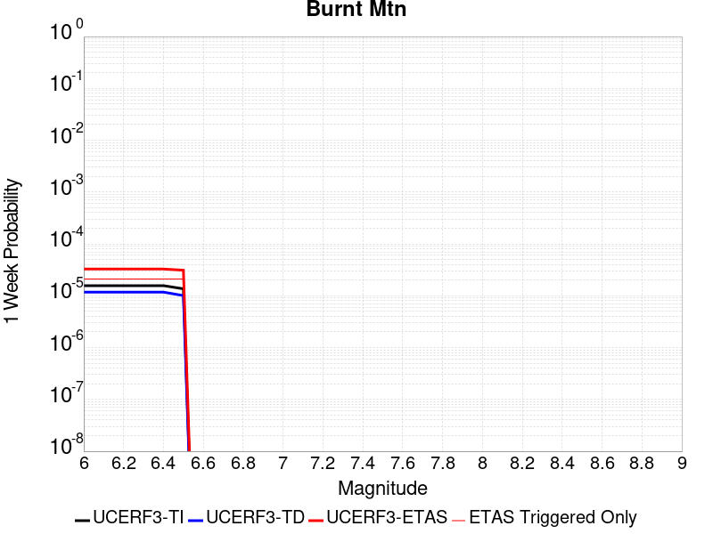 | 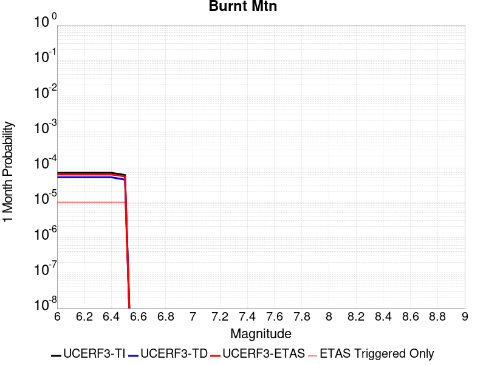 | 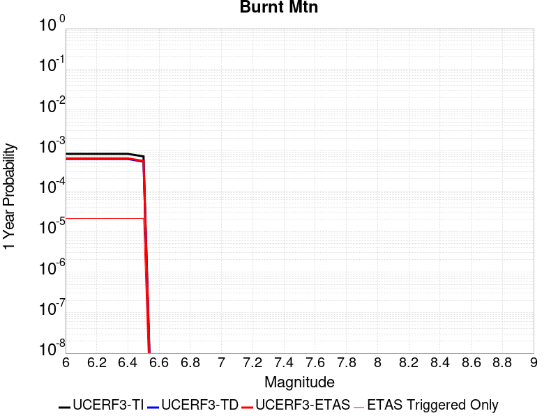 | 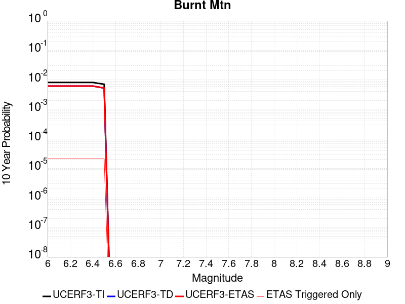 |

| Magnitude | 1 wk TI Prob | 1 wk TD Prob | 1 wk ETAS Prob | 1 wk ETAS/TD Gain | 1 wk ETAS Triggered Only | 1 mo TI Prob | 1 mo TD Prob | 1 mo ETAS Prob | 1 mo ETAS/TD Gain | 1 mo ETAS Triggered Only | 1 yr TI Prob | 1 yr TD Prob | 1 yr ETAS Prob | 1 yr ETAS/TD Gain | 1 yr ETAS Triggered Only | 10 yr TI Prob | 10 yr TD Prob | 10 yr ETAS Prob | 10 yr ETAS/TD Gain | 10 yr ETAS Triggered Only |
|-----|-----|-----|-----|-----|-----|-----|-----|-----|-----|-----|-----|-----|-----|-----|-----|-----|-----|-----|-----|-----|
| 6.0 | 1.5673151E-5 | 1.1749247E-5 | 2.1749129E-5 | 1.8511083 | 1.0E-5 | 6.716892E-5 | 5.0353672E-5 | 6.0353166E-5 | 1.1985853 | 1.0E-5 | 8.1747473E-4 | 6.130124E-4 | 6.2300626E-4 | 1.016303 | 1.0E-5 | 0.008144741 | 0.006125855 | 0.006145732 | 1.0032449 | 2.0E-5 |
| 6.1 | 1.5673151E-5 | 1.1749247E-5 | 2.1749129E-5 | 1.8511083 | 1.0E-5 | 6.716892E-5 | 5.0353672E-5 | 6.0353166E-5 | 1.1985853 | 1.0E-5 | 8.1747473E-4 | 6.130124E-4 | 6.2300626E-4 | 1.016303 | 1.0E-5 | 0.008144741 | 0.006125855 | 0.006145732 | 1.0032449 | 2.0E-5 |
| 6.2 | 1.5673151E-5 | 1.1749247E-5 | 2.1749129E-5 | 1.8511083 | 1.0E-5 | 6.716892E-5 | 5.0353672E-5 | 6.0353166E-5 | 1.1985853 | 1.0E-5 | 8.1747473E-4 | 6.130124E-4 | 6.2300626E-4 | 1.016303 | 1.0E-5 | 0.008144741 | 0.006125855 | 0.006145732 | 1.0032449 | 2.0E-5 |
| 6.3 | 1.5673151E-5 | 1.1749247E-5 | 2.1749129E-5 | 1.8511083 | 1.0E-5 | 6.716892E-5 | 5.0353672E-5 | 6.0353166E-5 | 1.1985853 | 1.0E-5 | 8.1747473E-4 | 6.130124E-4 | 6.2300626E-4 | 1.016303 | 1.0E-5 | 0.008144741 | 0.006125855 | 0.006145732 | 1.0032449 | 2.0E-5 |
| 6.4 | 1.5673151E-5 | 1.1749247E-5 | 2.1749129E-5 | 1.8511083 | 1.0E-5 | 6.716892E-5 | 5.0353672E-5 | 6.0353166E-5 | 1.1985853 | 1.0E-5 | 8.1747473E-4 | 6.130124E-4 | 6.2300626E-4 | 1.016303 | 1.0E-5 | 0.008144741 | 0.006125855 | 0.006145732 | 1.0032449 | 2.0E-5 |
| 6.5 | 1.36191375E-5 | 1.007816E-5 | 2.007806E-5 | 1.9922347 | 1.0E-5 | 5.8366426E-5 | 4.319211E-5 | 5.319168E-5 | 1.2315137 | 1.0E-5 | 7.103795E-4 | 5.2586396E-4 | 5.358587E-4 | 1.0190064 | 1.0E-5 | 0.0070811296 | 0.00525864 | 0.0052785343 | 1.0037832 | 2.0E-5 |

## Hector Mine
*[(top)](#table-of-contents)*

| 1 Week | 1 Month | 1 Year | 10 Year |
|-----|-----|-----|-----|
|  |  |  |  |

| Magnitude | 1 wk TI Prob | 1 wk TD Prob | 1 wk ETAS Prob | 1 wk ETAS/TD Gain | 1 wk ETAS Triggered Only | 1 mo TI Prob | 1 mo TD Prob | 1 mo ETAS Prob | 1 mo ETAS/TD Gain | 1 mo ETAS Triggered Only | 1 yr TI Prob | 1 yr TD Prob | 1 yr ETAS Prob | 1 yr ETAS/TD Gain | 1 yr ETAS Triggered Only | 10 yr TI Prob | 10 yr TD Prob | 10 yr ETAS Prob | 10 yr ETAS/TD Gain | 10 yr ETAS Triggered Only |
|-----|-----|-----|-----|-----|-----|-----|-----|-----|-----|-----|-----|-----|-----|-----|-----|-----|-----|-----|-----|-----|
| 6.0 | 1.8760093E-5 | 2.7962699E-6 | 1.2796242E-5 | 4.576183 | 1.0E-5 | 8.039792E-5 | 1.19839815E-5 | 2.1983862E-5 | 1.8344373 | 1.0E-5 | 9.78405E-4 | 1.458992E-4 | 1.5589774E-4 | 1.0685304 | 1.0E-5 | 0.009741086 | 0.0014584264 | 0.0014783972 | 1.0136935 | 2.0E-5 |
| 6.1 | 1.8760093E-5 | 2.7962699E-6 | 1.2796242E-5 | 4.576183 | 1.0E-5 | 8.039792E-5 | 1.19839815E-5 | 2.1983862E-5 | 1.8344373 | 1.0E-5 | 9.78405E-4 | 1.458992E-4 | 1.5589774E-4 | 1.0685304 | 1.0E-5 | 0.009741086 | 0.0014584264 | 0.0014783972 | 1.0136935 | 2.0E-5 |
| 6.2 | 1.8760093E-5 | 2.7962699E-6 | 1.2796242E-5 | 4.576183 | 1.0E-5 | 8.039792E-5 | 1.19839815E-5 | 2.1983862E-5 | 1.8344373 | 1.0E-5 | 9.78405E-4 | 1.458992E-4 | 1.5589774E-4 | 1.0685304 | 1.0E-5 | 0.009741086 | 0.0014584264 | 0.0014783972 | 1.0136935 | 2.0E-5 |
| 6.3 | 1.8760093E-5 | 2.7962699E-6 | 1.2796242E-5 | 4.576183 | 1.0E-5 | 8.039792E-5 | 1.19839815E-5 | 2.1983862E-5 | 1.8344373 | 1.0E-5 | 9.78405E-4 | 1.458992E-4 | 1.5589774E-4 | 1.0685304 | 1.0E-5 | 0.009741086 | 0.0014584264 | 0.0014783972 | 1.0136935 | 2.0E-5 |
| 6.4 | 1.0888055E-5 | 2.7962699E-6 | 1.2796242E-5 | 4.576183 | 1.0E-5 | 4.666226E-5 | 1.19839815E-5 | 2.1983862E-5 | 1.8344373 | 1.0E-5 | 5.679649E-4 | 1.458992E-4 | 1.5589774E-4 | 1.0685304 | 1.0E-5 | 0.0056651547 | 0.0014584264 | 0.0014783972 | 1.0136935 | 2.0E-5 |
| 6.5 | 1.0888055E-5 | 2.7962699E-6 | 1.2796242E-5 | 4.576183 | 1.0E-5 | 4.666226E-5 | 1.19839815E-5 | 2.1983862E-5 | 1.8344373 | 1.0E-5 | 5.679649E-4 | 1.458992E-4 | 1.5589774E-4 | 1.0685304 | 1.0E-5 | 0.0056651547 | 0.0014584264 | 0.0014783972 | 1.0136935 | 2.0E-5 |
| 6.6 | 1.0730738E-5 | 2.7962699E-6 | 1.2796242E-5 | 4.576183 | 1.0E-5 | 4.5988065E-5 | 1.19839815E-5 | 2.1983862E-5 | 1.8344373 | 1.0E-5 | 5.5976084E-4 | 1.458992E-4 | 1.5589774E-4 | 1.0685304 | 1.0E-5 | 0.0055835294 | 0.0014584264 | 0.0014783972 | 1.0136935 | 2.0E-5 |
| 6.7 | 7.881326E-6 | 2.770952E-6 | 1.27709245E-5 | 4.6088576 | 1.0E-5 | 3.3776672E-5 | 1.1875478E-5 | 2.187536E-5 | 1.8420614 | 1.0E-5 | 4.111534E-4 | 1.4457834E-4 | 1.545769E-4 | 1.0691566 | 1.0E-5 | 0.0041039353 | 0.001445235 | 0.001465206 | 1.0138186 | 2.0E-5 |
| 6.8 | 7.5683483E-6 | 2.7327321E-6 | 1.2732705E-5 | 4.6593313 | 1.0E-5 | 3.2435375E-5 | 1.1711679E-5 | 2.1711561E-5 | 1.8538386 | 1.0E-5 | 3.9482914E-4 | 1.4258435E-4 | 1.5258293E-4 | 1.0701239 | 1.0E-5 | 0.0039412836 | 0.0014253207 | 0.0014452923 | 1.014012 | 2.0E-5 |
| 6.9 | 6.473048E-6 | 2.513824E-6 | 1.25137985E-5 | 4.977993 | 1.0E-5 | 2.7741338E-5 | 1.07735095E-5 | 2.0773401E-5 | 1.9281926 | 1.0E-5 | 3.3769844E-4 | 1.3116356E-4 | 1.4116225E-4 | 1.0762306 | 1.0E-5 | 0.0033718573 | 0.001311251 | 0.0013312247 | 1.0152326 | 2.0E-5 |
| 7.0 | 4.9959954E-6 | 1.8564588E-6 | 1.8564588E-6 | 1.0 | 0.0 | 2.1411232E-5 | 7.956248E-6 | 7.956248E-6 | 1.0 | 0.0 | 2.6065056E-4 | 9.686658E-5 | 9.686658E-5 | 1.0 | 0.0 | 0.0026034506 | 9.685931E-4 | 9.785835E-4 | 1.0103142 | 1.0E-5 |
| 7.1 | 1.2997541E-6 | 1.5599346E-7 | 1.5599346E-7 | 1.0 | 0.0 | 5.5703626E-6 | 6.685433E-7 | 6.685433E-7 | 1.0 | 0.0 | 6.7817055E-5 | 8.139488E-6 | 8.139488E-6 | 1.0 | 0.0 | 6.779636E-4 | 8.1392296E-5 | 8.1392296E-5 | 1.0 | 0.0 |
| 7.2 | 8.392699E-7 | 9.725453E-8 | 9.725453E-8 | 1.0 | 0.0 | 3.596866E-6 | 4.1680505E-7 | 4.1680505E-7 | 1.0 | 0.0 | 4.3790962E-5 | 5.0745916E-6 | 5.0745916E-6 | 1.0 | 0.0 | 4.3782333E-4 | 5.074495E-5 | 5.074495E-5 | 1.0 | 0.0 |
| 7.3 | 3.13015E-7 | 4.8283802E-8 | 4.8283802E-8 | 1.0 | 0.0 | 1.3414921E-6 | 2.0693057E-7 | 2.0693057E-7 | 1.0 | 0.0 | 1.6332544E-5 | 2.5193776E-6 | 2.5193776E-6 | 1.0 | 0.0 | 1.6331344E-4 | 2.5193574E-5 | 2.5193574E-5 | 1.0 | 0.0 |

## Monterey Bay-Tularcitos
*[(top)](#table-of-contents)*

| 1 Week | 1 Month | 1 Year | 10 Year |
|-----|-----|-----|-----|
|  |  | 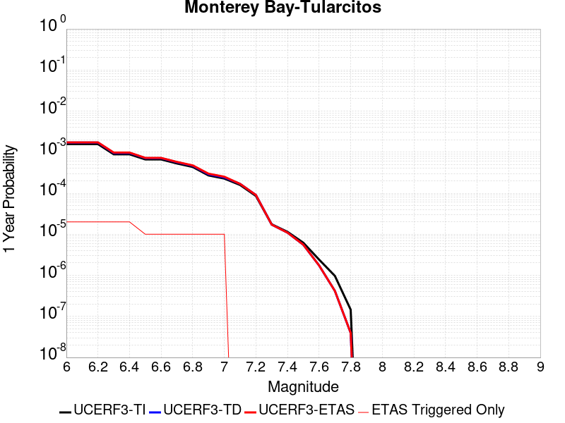 |  |

| Magnitude | 1 wk TI Prob | 1 wk TD Prob | 1 wk ETAS Prob | 1 wk ETAS/TD Gain | 1 wk ETAS Triggered Only | 1 mo TI Prob | 1 mo TD Prob | 1 mo ETAS Prob | 1 mo ETAS/TD Gain | 1 mo ETAS Triggered Only | 1 yr TI Prob | 1 yr TD Prob | 1 yr ETAS Prob | 1 yr ETAS/TD Gain | 1 yr ETAS Triggered Only | 10 yr TI Prob | 10 yr TD Prob | 10 yr ETAS Prob | 10 yr ETAS/TD Gain | 10 yr ETAS Triggered Only |
|-----|-----|-----|-----|-----|-----|-----|-----|-----|-----|-----|-----|-----|-----|-----|-----|-----|-----|-----|-----|-----|
| 6.0 | 3.0131365E-5 | 3.279877E-5 | 4.279844E-5 | 1.3048794 | 1.0E-5 | 1.2912804E-4 | 1.4055918E-4 | 1.5055778E-4 | 1.0711344 | 1.0E-5 | 0.001571 | 0.0017100703 | 0.001730036 | 1.0116755 | 2.0E-5 | 0.015599402 | 0.016979916 | 0.016999578 | 1.0011579 | 2.0E-5 |
| 6.1 | 3.0131365E-5 | 3.279877E-5 | 4.279844E-5 | 1.3048794 | 1.0E-5 | 1.2912804E-4 | 1.4055918E-4 | 1.5055778E-4 | 1.0711344 | 1.0E-5 | 0.001571 | 0.0017100703 | 0.001730036 | 1.0116755 | 2.0E-5 | 0.015599402 | 0.016979916 | 0.016999578 | 1.0011579 | 2.0E-5 |
| 6.2 | 3.0131365E-5 | 3.279877E-5 | 4.279844E-5 | 1.3048794 | 1.0E-5 | 1.2912804E-4 | 1.4055918E-4 | 1.5055778E-4 | 1.0711344 | 1.0E-5 | 0.001571 | 0.0017100703 | 0.001730036 | 1.0116755 | 2.0E-5 | 0.015599402 | 0.016979916 | 0.016999578 | 1.0011579 | 2.0E-5 |
| 6.3 | 1.6998249E-5 | 1.8330798E-5 | 2.8330614E-5 | 1.54552 | 1.0E-5 | 7.28476E-5 | 7.85583E-5 | 8.8557514E-5 | 1.127284 | 1.0E-5 | 8.865586E-4 | 9.5604634E-4 | 9.760272E-4 | 1.0208995 | 2.0E-5 | 0.0088303005 | 0.009521258 | 0.009541067 | 1.0020806 | 2.0E-5 |
| 6.4 | 1.6998249E-5 | 1.8330798E-5 | 2.8330614E-5 | 1.54552 | 1.0E-5 | 7.28476E-5 | 7.85583E-5 | 8.8557514E-5 | 1.127284 | 1.0E-5 | 8.865586E-4 | 9.5604634E-4 | 9.760272E-4 | 1.0208995 | 2.0E-5 | 0.0088303005 | 0.009521258 | 0.009541067 | 1.0020806 | 2.0E-5 |
| 6.5 | 1.27470785E-5 | 1.3693312E-5 | 1.3693312E-5 | 1.0 | 0.0 | 5.4629192E-5 | 5.8684363E-5 | 5.8684363E-5 | 1.0 | 0.0 | 6.649074E-4 | 7.1425823E-4 | 7.242511E-4 | 1.0139905 | 1.0E-5 | 0.0066292146 | 0.007120678 | 0.007130607 | 1.0013944 | 1.0E-5 |
| 6.6 | 1.2739422E-5 | 1.36854E-5 | 1.36854E-5 | 1.0 | 0.0 | 5.4596385E-5 | 5.8650454E-5 | 5.8650454E-5 | 1.0 | 0.0 | 6.645082E-4 | 7.1384566E-4 | 7.238385E-4 | 1.0139986 | 1.0E-5 | 0.0066252467 | 0.007116579 | 0.007126508 | 1.0013952 | 1.0E-5 |
| 6.7 | 1.0160109E-5 | 1.0885755E-5 | 1.0885755E-5 | 1.0 | 0.0 | 4.35426E-5 | 4.665244E-5 | 4.665244E-5 | 1.0 | 0.0 | 5.300022E-4 | 5.6785246E-4 | 5.778468E-4 | 1.0176002 | 1.0E-5 | 0.005287399 | 0.0056647263 | 0.0056746695 | 1.0017554 | 1.0E-5 |
| 6.8 | 8.349859E-6 | 8.932587E-6 | 8.932587E-6 | 1.0 | 0.0 | 3.578462E-5 | 3.8281985E-5 | 3.8281985E-5 | 1.0 | 0.0 | 4.3559066E-4 | 4.6598914E-4 | 4.759845E-4 | 1.0214497 | 1.0E-5 | 0.004347378 | 0.004650685 | 0.0046606385 | 1.0021402 | 1.0E-5 |
| 6.9 | 5.193639E-6 | 5.53643E-6 | 5.53643E-6 | 1.0 | 0.0 | 2.2258262E-5 | 2.372736E-5 | 2.372736E-5 | 1.0 | 0.0 | 2.7096065E-4 | 2.8884556E-4 | 2.9884267E-4 | 1.0346106 | 1.0E-5 | 0.0027063051 | 0.0028850224 | 0.0028949934 | 1.0034562 | 1.0E-5 |
| 7.0 | 4.359381E-6 | 4.643366E-6 | 4.643366E-6 | 1.0 | 0.0 | 1.8682927E-5 | 1.9900004E-5 | 1.9900004E-5 | 1.0 | 0.0 | 2.274409E-4 | 2.422586E-4 | 2.5225617E-4 | 1.0412682 | 1.0E-5 | 0.0022720827 | 0.002420238 | 0.0024302138 | 1.0041218 | 1.0E-5 |
| 7.1 | 3.0398533E-6 | 3.2310427E-6 | 3.2310427E-6 | 1.0 | 0.0 | 1.3027877E-5 | 1.3847267E-5 | 1.3847267E-5 | 1.0 | 0.0 | 1.5860285E-4 | 1.6858005E-4 | 1.6858005E-4 | 1.0 | 0.0 | 0.001584897 | 0.0016847793 | 0.0016847793 | 1.0 | 0.0 |
| 7.2 | 1.642335E-6 | 1.7333153E-6 | 1.7333153E-6 | 1.0 | 0.0 | 7.0385595E-6 | 7.428485E-6 | 7.428485E-6 | 1.0 | 0.0 | 8.569109E-5 | 9.044012E-5 | 9.044012E-5 | 1.0 | 0.0 | 8.5658056E-4 | 9.042358E-4 | 9.042358E-4 | 1.0 | 0.0 |
| 7.3 | 3.356842E-7 | 3.2952389E-7 | 3.2952389E-7 | 1.0 | 0.0 | 1.4386458E-6 | 1.4122445E-6 | 1.4122445E-6 | 1.0 | 0.0 | 1.7515373E-5 | 1.7193941E-5 | 1.7193941E-5 | 1.0 | 0.0 | 1.7513991E-4 | 1.719262E-4 | 1.719262E-4 | 1.0 | 0.0 |
| 7.4 | 2.1973483E-7 | 2.1006414E-7 | 2.1006414E-7 | 1.0 | 0.0 | 9.417204E-7 | 9.002746E-7 | 9.002746E-7 | 1.0 | 0.0 | 1.1465385E-5 | 1.0960788E-5 | 1.0960788E-5 | 1.0 | 0.0 | 1.1464794E-4 | 1.0960251E-4 | 1.0960251E-4 | 1.0 | 0.0 |
| 7.5 | 1.1944135E-7 | 1.0696035E-7 | 1.0696035E-7 | 1.0 | 0.0 | 5.118914E-7 | 4.5840142E-7 | 4.5840142E-7 | 1.0 | 0.0 | 6.23226E-6 | 5.581023E-6 | 5.581023E-6 | 1.0 | 0.0 | 6.2320854E-5 | 5.5808843E-5 | 5.5808843E-5 | 1.0 | 0.0 |
| 7.6 | 4.636058E-8 | 3.3364433E-8 | 3.3364433E-8 | 1.0 | 0.0 | 1.9868818E-7 | 1.4299042E-7 | 1.4299042E-7 | 1.0 | 0.0 | 2.419026E-6 | 1.740907E-6 | 1.740907E-6 | 1.0 | 0.0 | 2.4189996E-5 | 1.7408936E-5 | 1.7408936E-5 | 1.0 | 0.0 |
| 7.7 | 1.8588572E-8 | 8.003168E-9 | 8.003168E-9 | 1.0 | 0.0 | 7.9665305E-8 | 3.429929E-8 | 3.429929E-8 | 1.0 | 0.0 | 9.699246E-7 | 4.1759378E-7 | 4.1759378E-7 | 1.0 | 0.0 | 9.699204E-6 | 4.1759304E-6 | 4.1759304E-6 | 1.0 | 0.0 |
| 7.8 | 2.7960154E-9 | 7.608624E-10 | 7.608624E-10 | 1.0 | 0.0 | 1.1982923E-8 | 3.2608392E-9 | 3.2608392E-9 | 1.0 | 0.0 | 1.4589209E-7 | 3.9700716E-8 | 3.9700716E-8 | 1.0 | 0.0 | 1.4589199E-6 | 3.970071E-7 | 3.970071E-7 | 1.0 | 0.0 |

## Ortigalita (South)
*[(top)](#table-of-contents)*

| 1 Week | 1 Month | 1 Year | 10 Year |
|-----|-----|-----|-----|
|  |  |  |  |

| Magnitude | 1 wk TI Prob | 1 wk TD Prob | 1 wk ETAS Prob | 1 wk ETAS/TD Gain | 1 wk ETAS Triggered Only | 1 mo TI Prob | 1 mo TD Prob | 1 mo ETAS Prob | 1 mo ETAS/TD Gain | 1 mo ETAS Triggered Only | 1 yr TI Prob | 1 yr TD Prob | 1 yr ETAS Prob | 1 yr ETAS/TD Gain | 1 yr ETAS Triggered Only | 10 yr TI Prob | 10 yr TD Prob | 10 yr ETAS Prob | 10 yr ETAS/TD Gain | 10 yr ETAS Triggered Only |
|-----|-----|-----|-----|-----|-----|-----|-----|-----|-----|-----|-----|-----|-----|-----|-----|-----|-----|-----|-----|-----|
| 6.0 | 3.72394E-5 | 4.32556E-5 | 4.32556E-5 | 1.0 | 0.0 | 1.5958765E-4 | 1.8536886E-4 | 1.8536886E-4 | 1.0 | 0.0 | 0.0019412481 | 0.0022546863 | 0.0022546863 | 1.0 | 0.0 | 0.019243775 | 0.022334501 | 0.022354055 | 1.0008755 | 2.0E-5 |
| 6.1 | 2.7299884E-5 | 3.1492036E-5 | 3.1492036E-5 | 1.0 | 0.0 | 1.16994255E-4 | 1.349592E-4 | 1.349592E-4 | 1.0 | 0.0 | 0.0014234743 | 0.0016419457 | 0.0016419457 | 1.0 | 0.0 | 0.014143906 | 0.016304072 | 0.016323747 | 1.0012066 | 2.0E-5 |
| 6.2 | 2.7299884E-5 | 3.1492036E-5 | 3.1492036E-5 | 1.0 | 0.0 | 1.16994255E-4 | 1.349592E-4 | 1.349592E-4 | 1.0 | 0.0 | 0.0014234743 | 0.0016419457 | 0.0016419457 | 1.0 | 0.0 | 0.014143906 | 0.016304072 | 0.016323747 | 1.0012066 | 2.0E-5 |
| 6.3 | 2.0546433E-5 | 2.3631454E-5 | 2.3631454E-5 | 1.0 | 0.0 | 8.805317E-5 | 1.0127383E-4 | 1.0127383E-4 | 1.0 | 0.0 | 0.00107152 | 0.0012323305 | 0.0012323305 | 1.0 | 0.0 | 0.010663681 | 0.012257031 | 0.012276786 | 1.0016117 | 2.0E-5 |
| 6.4 | 2.0546433E-5 | 2.3631454E-5 | 2.3631454E-5 | 1.0 | 0.0 | 8.805317E-5 | 1.0127383E-4 | 1.0127383E-4 | 1.0 | 0.0 | 0.00107152 | 0.0012323305 | 0.0012323305 | 1.0 | 0.0 | 0.010663681 | 0.012257031 | 0.012276786 | 1.0016117 | 2.0E-5 |
| 6.5 | 1.7779594E-5 | 2.0446974E-5 | 2.0446974E-5 | 1.0 | 0.0 | 7.619603E-5 | 8.762703E-5 | 8.762703E-5 | 1.0 | 0.0 | 9.272918E-4 | 0.0010663505 | 0.0010663505 | 1.0 | 0.0 | 0.009234319 | 0.010613804 | 0.010623697 | 1.0009322 | 1.0E-5 |
| 6.6 | 1.6272212E-5 | 1.8714967E-5 | 1.8714967E-5 | 1.0 | 0.0 | 6.973618E-5 | 8.0204605E-5 | 8.0204605E-5 | 1.0 | 0.0 | 8.487073E-4 | 9.760659E-4 | 9.760659E-4 | 1.0 | 0.0 | 0.008454733 | 0.009719091 | 0.009728993 | 1.0010189 | 1.0E-5 |
| 6.7 | 1.3051484E-5 | 1.5038758E-5 | 1.5038758E-5 | 1.0 | 0.0 | 5.593373E-5 | 6.445028E-5 | 6.445028E-5 | 1.0 | 0.0 | 6.807804E-4 | 7.844092E-4 | 7.844092E-4 | 1.0 | 0.0 | 0.006786986 | 0.007817388 | 0.00782731 | 1.0012692 | 1.0E-5 |
| 6.8 | 1.04277415E-5 | 1.1987235E-5 | 1.1987235E-5 | 1.0 | 0.0 | 4.4689557E-5 | 5.1372896E-5 | 5.1372896E-5 | 1.0 | 0.0 | 5.439595E-4 | 6.2529295E-4 | 6.2529295E-4 | 1.0 | 0.0 | 0.0054262993 | 0.00623609 | 0.0062460275 | 1.0015936 | 1.0E-5 |
| 6.9 | 7.639968E-6 | 8.791503E-6 | 8.791503E-6 | 1.0 | 0.0 | 3.274231E-5 | 3.767736E-5 | 3.767736E-5 | 1.0 | 0.0 | 3.9856473E-4 | 4.586312E-4 | 4.586312E-4 | 1.0 | 0.0 | 0.003978506 | 0.004577433 | 0.004587387 | 1.0021746 | 1.0E-5 |
| 7.0 | 3.919831E-6 | 4.5334014E-6 | 4.5334014E-6 | 1.0 | 0.0 | 1.679917E-5 | 1.942873E-5 | 1.942873E-5 | 1.0 | 0.0 | 2.045107E-4 | 2.3652123E-4 | 2.3652123E-4 | 1.0 | 0.0 | 0.0020432258 | 0.0023629034 | 0.0023728798 | 1.004222 | 1.0E-5 |
| 7.1 | 1.6017933E-6 | 1.8570418E-6 | 1.8570418E-6 | 1.0 | 0.0 | 6.8648105E-6 | 7.958732E-6 | 7.958732E-6 | 1.0 | 0.0 | 8.357586E-5 | 9.689432E-5 | 9.689432E-5 | 1.0 | 0.0 | 8.3544437E-4 | 9.686254E-4 | 9.686254E-4 | 1.0 | 0.0 |

## Elysian Park (Upper)
*[(top)](#table-of-contents)*

| 1 Week | 1 Month | 1 Year | 10 Year |
|-----|-----|-----|-----|
|  | 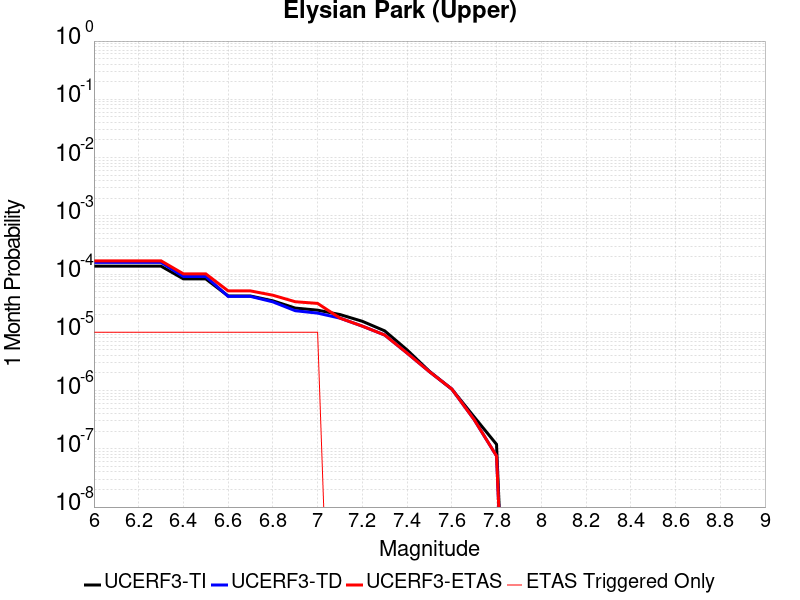 |  |  |

| Magnitude | 1 wk TI Prob | 1 wk TD Prob | 1 wk ETAS Prob | 1 wk ETAS/TD Gain | 1 wk ETAS Triggered Only | 1 mo TI Prob | 1 mo TD Prob | 1 mo ETAS Prob | 1 mo ETAS/TD Gain | 1 mo ETAS Triggered Only | 1 yr TI Prob | 1 yr TD Prob | 1 yr ETAS Prob | 1 yr ETAS/TD Gain | 1 yr ETAS Triggered Only | 10 yr TI Prob | 10 yr TD Prob | 10 yr ETAS Prob | 10 yr ETAS/TD Gain | 10 yr ETAS Triggered Only |
|-----|-----|-----|-----|-----|-----|-----|-----|-----|-----|-----|-----|-----|-----|-----|-----|-----|-----|-----|-----|-----|
| 6.0 | 3.1876025E-5 | 3.7035275E-5 | 4.7034904E-5 | 1.2700028 | 1.0E-5 | 1.3660437E-4 | 1.5871569E-4 | 1.687141E-4 | 1.0629958 | 1.0E-5 | 0.0016618895 | 0.001931122 | 0.0019411027 | 1.0051683 | 1.0E-5 | 0.016495159 | 0.019189863 | 0.019209478 | 1.0010222 | 2.0E-5 |
| 6.1 | 3.1876025E-5 | 3.7035275E-5 | 4.7034904E-5 | 1.2700028 | 1.0E-5 | 1.3660437E-4 | 1.5871569E-4 | 1.687141E-4 | 1.0629958 | 1.0E-5 | 0.0016618895 | 0.001931122 | 0.0019411027 | 1.0051683 | 1.0E-5 | 0.016495159 | 0.019189863 | 0.019209478 | 1.0010222 | 2.0E-5 |
| 6.2 | 3.1876025E-5 | 3.7035275E-5 | 4.7034904E-5 | 1.2700028 | 1.0E-5 | 1.3660437E-4 | 1.5871569E-4 | 1.687141E-4 | 1.0629958 | 1.0E-5 | 0.0016618895 | 0.001931122 | 0.0019411027 | 1.0051683 | 1.0E-5 | 0.016495159 | 0.019189863 | 0.019209478 | 1.0010222 | 2.0E-5 |
| 6.3 | 3.1876025E-5 | 3.7035275E-5 | 4.7034904E-5 | 1.2700028 | 1.0E-5 | 1.3660437E-4 | 1.5871569E-4 | 1.687141E-4 | 1.0629958 | 1.0E-5 | 0.0016618895 | 0.001931122 | 0.0019411027 | 1.0051683 | 1.0E-5 | 0.016495159 | 0.019189863 | 0.019209478 | 1.0010222 | 2.0E-5 |
| 6.4 | 1.9273462E-5 | 2.120244E-5 | 3.1202228E-5 | 1.4716338 | 1.0E-5 | 8.259794E-5 | 9.086542E-5 | 1.0086451E-4 | 1.1100428 | 1.0E-5 | 0.001005166 | 0.0011058967 | 0.0011158857 | 1.0090325 | 1.0E-5 | 0.010006315 | 0.011020744 | 0.011040524 | 1.0017948 | 2.0E-5 |
| 6.5 | 1.9273462E-5 | 2.120244E-5 | 3.1202228E-5 | 1.4716338 | 1.0E-5 | 8.259794E-5 | 9.086542E-5 | 1.0086451E-4 | 1.1100428 | 1.0E-5 | 0.001005166 | 0.0011058967 | 0.0011158857 | 1.0090325 | 1.0E-5 | 0.010006315 | 0.011020744 | 0.011040524 | 1.0017948 | 2.0E-5 |
| 6.6 | 9.813258E-6 | 9.665589E-6 | 1.9665491E-5 | 2.034588 | 1.0E-5 | 4.205614E-5 | 4.1423333E-5 | 5.1422918E-5 | 1.2413999 | 1.0E-5 | 5.119132E-4 | 5.042196E-4 | 5.1421457E-4 | 1.0198226 | 1.0E-5 | 0.005107356 | 0.0050314795 | 0.005051379 | 1.003955 | 2.0E-5 |
| 6.7 | 9.801478E-6 | 9.653158E-6 | 1.9653062E-5 | 2.0359204 | 1.0E-5 | 4.2005657E-5 | 4.137006E-5 | 5.1369647E-5 | 1.2417107 | 1.0E-5 | 5.112989E-4 | 5.0357135E-4 | 5.135663E-4 | 1.0198481 | 1.0E-5 | 0.0051012407 | 0.005025026 | 0.0050449255 | 1.0039601 | 2.0E-5 |
| 6.8 | 8.102489E-6 | 7.772994E-6 | 1.7772916E-5 | 2.2864957 | 1.0E-5 | 3.4724493E-5 | 3.3312434E-5 | 4.3312102E-5 | 1.3001782 | 1.0E-5 | 4.2268867E-4 | 4.0550836E-4 | 4.1550433E-4 | 1.0246505 | 1.0E-5 | 0.004218856 | 0.0040481784 | 0.004068097 | 1.0049205 | 2.0E-5 |
| 6.9 | 6.08275E-6 | 5.481441E-6 | 1.5481386E-5 | 2.8243277 | 1.0E-5 | 2.6068668E-5 | 2.3491682E-5 | 3.3491448E-5 | 1.4256725 | 1.0E-5 | 3.173398E-4 | 2.8597447E-4 | 2.959716E-4 | 1.0349581 | 1.0E-5 | 0.0031688702 | 0.0028561424 | 0.0028661138 | 1.0034913 | 1.0E-5 |
| 7.0 | 5.5995934E-6 | 4.9827686E-6 | 1.4982719E-5 | 3.0069063 | 1.0E-5 | 2.3998036E-5 | 2.1354552E-5 | 3.135434E-5 | 1.4682742 | 1.0E-5 | 2.9213692E-4 | 2.5996132E-4 | 2.6995872E-4 | 1.0384573 | 1.0E-5 | 0.0029175316 | 0.0025966396 | 0.0026066136 | 1.0038412 | 1.0E-5 |
| 7.1 | 4.709881E-6 | 4.0873906E-6 | 4.0873906E-6 | 1.0 | 0.0 | 2.0185047E-5 | 1.7517272E-5 | 1.7517272E-5 | 1.0 | 0.0 | 2.4572524E-4 | 2.1325232E-4 | 2.1325232E-4 | 1.0 | 0.0 | 0.002454537 | 0.0021305184 | 0.0021305184 | 1.0 | 0.0 |
| 7.2 | 3.6063436E-6 | 2.9779412E-6 | 2.9779412E-6 | 1.0 | 0.0 | 1.5455667E-5 | 1.27625435E-5 | 1.27625435E-5 | 1.0 | 0.0 | 1.881565E-4 | 1.55373E-4 | 1.55373E-4 | 1.0 | 0.0 | 0.0018799726 | 0.0015526549 | 0.0015526549 | 1.0 | 0.0 |
| 7.3 | 2.471135E-6 | 2.0954562E-6 | 2.0954562E-6 | 1.0 | 0.0 | 1.0590536E-5 | 8.980496E-6 | 8.980496E-6 | 1.0 | 0.0 | 1.2893214E-4 | 1.0933213E-4 | 1.0933213E-4 | 1.0 | 0.0 | 0.0012885736 | 0.0010927906 | 0.0010927906 | 1.0 | 0.0 |
| 7.4 | 1.163943E-6 | 1.0275061E-6 | 1.0275061E-6 | 1.0 | 0.0 | 4.988318E-6 | 4.40359E-6 | 4.40359E-6 | 1.0 | 0.0 | 6.0731076E-5 | 5.361242E-5 | 5.361242E-5 | 1.0 | 0.0 | 6.071448E-4 | 5.3599785E-4 | 5.3599785E-4 | 1.0 | 0.0 |
| 7.5 | 4.99459E-7 | 4.917601E-7 | 4.917601E-7 | 1.0 | 0.0 | 2.140537E-6 | 2.1075416E-6 | 2.1075416E-6 | 1.0 | 0.0 | 2.6060725E-5 | 2.5659032E-5 | 2.5659032E-5 | 1.0 | 0.0 | 2.605767E-4 | 2.5656226E-4 | 2.5656226E-4 | 1.0 | 0.0 |
| 7.6 | 2.4667852E-7 | 2.4778313E-7 | 2.4778313E-7 | 1.0 | 0.0 | 1.0571932E-6 | 1.0619274E-6 | 1.0619274E-6 | 1.0 | 0.0 | 1.2871251E-5 | 1.2928893E-5 | 1.2928893E-5 | 1.0 | 0.0 | 1.2870505E-4 | 1.2928178E-4 | 1.2928178E-4 | 1.0 | 0.0 |
| 7.7 | 8.2312795E-8 | 7.3864214E-8 | 7.3864214E-8 | 1.0 | 0.0 | 3.527691E-7 | 3.165609E-7 | 3.165609E-7 | 1.0 | 0.0 | 4.294955E-6 | 3.854123E-6 | 3.854123E-6 | 1.0 | 0.0 | 4.2948723E-5 | 3.854068E-5 | 3.854068E-5 | 1.0 | 0.0 |
| 7.8 | 2.7819295E-8 | 1.7565618E-8 | 1.7565618E-8 | 1.0 | 0.0 | 1.1922555E-7 | 7.528122E-8 | 7.528122E-8 | 1.0 | 0.0 | 1.45157E-6 | 9.1654863E-7 | 9.1654863E-7 | 1.0 | 0.0 | 1.45156055E-5 | 9.165463E-6 | 9.165463E-6 | 1.0 | 0.0 |

## Rinconada 2011 CFM
*[(top)](#table-of-contents)*

| 1 Week | 1 Month | 1 Year | 10 Year |
|-----|-----|-----|-----|
|  |  |  | 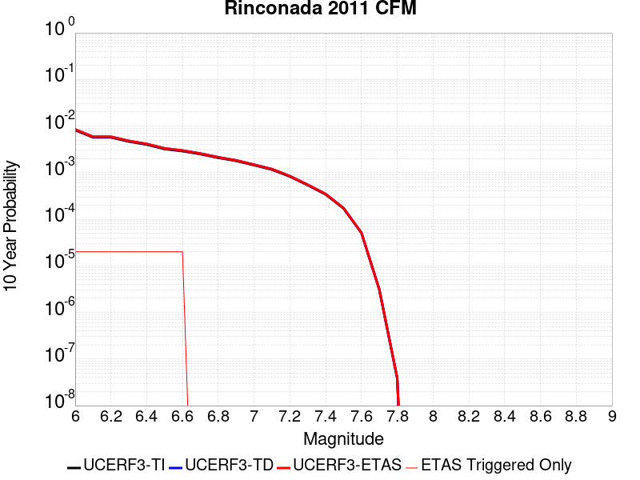 |

| Magnitude | 1 wk TI Prob | 1 wk TD Prob | 1 wk ETAS Prob | 1 wk ETAS/TD Gain | 1 wk ETAS Triggered Only | 1 mo TI Prob | 1 mo TD Prob | 1 mo ETAS Prob | 1 mo ETAS/TD Gain | 1 mo ETAS Triggered Only | 1 yr TI Prob | 1 yr TD Prob | 1 yr ETAS Prob | 1 yr ETAS/TD Gain | 1 yr ETAS Triggered Only | 10 yr TI Prob | 10 yr TD Prob | 10 yr ETAS Prob | 10 yr ETAS/TD Gain | 10 yr ETAS Triggered Only |
|-----|-----|-----|-----|-----|-----|-----|-----|-----|-----|-----|-----|-----|-----|-----|-----|-----|-----|-----|-----|-----|
| 6.0 | 1.5752368E-5 | 1.6274716E-5 | 1.6274716E-5 | 1.0 | 0.0 | 6.75084E-5 | 6.974694E-5 | 6.974694E-5 | 1.0 | 0.0 | 8.2160486E-4 | 8.488413E-4 | 8.5883273E-4 | 1.0117707 | 1.0E-5 | 0.008185739 | 0.00845637 | 0.0084762005 | 1.0023451 | 2.0E-5 |
| 6.1 | 1.0966133E-5 | 1.1323029E-5 | 1.1323029E-5 | 1.0 | 0.0 | 4.6996865E-5 | 4.852637E-5 | 4.852637E-5 | 1.0 | 0.0 | 5.720366E-4 | 5.9064914E-4 | 6.006432E-4 | 1.0169206 | 1.0E-5 | 0.0057056635 | 0.005890889 | 0.005910771 | 1.003375 | 2.0E-5 |
| 6.2 | 1.0966133E-5 | 1.1323029E-5 | 1.1323029E-5 | 1.0 | 0.0 | 4.6996865E-5 | 4.852637E-5 | 4.852637E-5 | 1.0 | 0.0 | 5.720366E-4 | 5.9064914E-4 | 6.006432E-4 | 1.0169206 | 1.0E-5 | 0.0057056635 | 0.005890889 | 0.005910771 | 1.003375 | 2.0E-5 |
| 6.3 | 8.926149E-6 | 9.212772E-6 | 9.212772E-6 | 1.0 | 0.0 | 3.8254362E-5 | 3.948271E-5 | 3.948271E-5 | 1.0 | 0.0 | 4.6564735E-4 | 4.8059633E-4 | 4.905915E-4 | 1.0207975 | 1.0E-5 | 0.0046467283 | 0.0047956146 | 0.004815519 | 1.0041505 | 2.0E-5 |
| 6.4 | 7.676955E-6 | 7.920191E-6 | 7.920191E-6 | 1.0 | 0.0 | 3.290082E-5 | 3.3943234E-5 | 3.3943234E-5 | 1.0 | 0.0 | 4.0049385E-4 | 4.131807E-4 | 4.2317656E-4 | 1.0241925 | 1.0E-5 | 0.0039977287 | 0.004124151 | 0.004144069 | 1.0048295 | 2.0E-5 |
| 6.5 | 6.1671026E-6 | 6.358955E-6 | 6.358955E-6 | 1.0 | 0.0 | 2.6430173E-5 | 2.725238E-5 | 2.725238E-5 | 1.0 | 0.0 | 3.2173982E-4 | 3.317473E-4 | 3.4174396E-4 | 1.0301335 | 1.0E-5 | 0.003212744 | 0.0033125326 | 0.0033324664 | 1.0060177 | 2.0E-5 |
| 6.6 | 5.553456E-6 | 5.7248126E-6 | 5.7248126E-6 | 1.0 | 0.0 | 2.3800309E-5 | 2.4534682E-5 | 2.4534682E-5 | 1.0 | 0.0 | 2.897302E-4 | 2.9866886E-4 | 3.0866588E-4 | 1.033472 | 1.0E-5 | 0.0028935277 | 0.0029826832 | 0.0030026236 | 1.0066854 | 2.0E-5 |
| 6.7 | 4.787857E-6 | 4.93331E-6 | 4.93331E-6 | 1.0 | 0.0 | 2.0519226E-5 | 2.1142585E-5 | 2.1142585E-5 | 1.0 | 0.0 | 2.4979294E-4 | 2.573806E-4 | 2.573806E-4 | 1.0 | 0.0 | 0.0024951235 | 0.002570831 | 0.002570831 | 1.0 | 0.0 |
| 6.8 | 3.9955166E-6 | 4.1134763E-6 | 4.1134763E-6 | 1.0 | 0.0 | 1.7123532E-5 | 1.7629065E-5 | 1.7629065E-5 | 1.0 | 0.0 | 2.0845905E-4 | 2.1461275E-4 | 2.1461275E-4 | 1.0 | 0.0 | 0.002082636 | 0.0021440587 | 0.0021440587 | 1.0 | 0.0 |
| 6.9 | 3.4250072E-6 | 3.5224466E-6 | 3.5224466E-6 | 1.0 | 0.0 | 1.46785205E-5 | 1.5096112E-5 | 1.5096112E-5 | 1.0 | 0.0 | 1.7869633E-4 | 1.8377969E-4 | 1.8377969E-4 | 1.0 | 0.0 | 0.001785527 | 0.0018362795 | 0.0018362795 | 1.0 | 0.0 |
| 7.0 | 2.7712713E-6 | 2.8467002E-6 | 2.8467002E-6 | 1.0 | 0.0 | 1.1876823E-5 | 1.22000865E-5 | 1.22000865E-5 | 1.0 | 0.0 | 1.4459073E-4 | 1.4852594E-4 | 1.4852594E-4 | 1.0 | 0.0 | 0.0014449668 | 0.0014842683 | 0.0014842683 | 1.0 | 0.0 |
| 7.1 | 2.227358E-6 | 2.2856987E-6 | 2.2856987E-6 | 1.0 | 0.0 | 9.545785E-6 | 9.795815E-6 | 9.795815E-6 | 1.0 | 0.0 | 1.16213734E-4 | 1.1925753E-4 | 1.1925753E-4 | 1.0 | 0.0 | 0.0011615298 | 0.0011919363 | 0.0011919363 | 1.0 | 0.0 |
| 7.2 | 1.581796E-6 | 1.6209015E-6 | 1.6209015E-6 | 1.0 | 0.0 | 6.779108E-6 | 6.946702E-6 | 6.946702E-6 | 1.0 | 0.0 | 8.253252E-5 | 8.4572814E-5 | 8.4572814E-5 | 1.0 | 0.0 | 8.250187E-4 | 8.4540684E-4 | 8.4540684E-4 | 1.0 | 0.0 |
| 7.3 | 1.0306567E-6 | 1.054648E-6 | 1.054648E-6 | 1.0 | 0.0 | 4.4170924E-6 | 4.519912E-6 | 4.519912E-6 | 1.0 | 0.0 | 5.3776774E-5 | 5.502854E-5 | 5.502854E-5 | 1.0 | 0.0 | 5.376376E-4 | 5.501494E-4 | 5.501494E-4 | 1.0 | 0.0 |
| 7.4 | 6.535541E-7 | 6.682744E-7 | 6.682744E-7 | 1.0 | 0.0 | 2.800943E-6 | 2.8640302E-6 | 2.8640302E-6 | 1.0 | 0.0 | 3.4100947E-5 | 3.4869012E-5 | 3.4869012E-5 | 1.0 | 0.0 | 3.4095717E-4 | 3.486355E-4 | 3.486355E-4 | 1.0 | 0.0 |
| 7.5 | 3.2656962E-7 | 3.3316712E-7 | 3.3316712E-7 | 1.0 | 0.0 | 1.3995833E-6 | 1.4278584E-6 | 1.4278584E-6 | 1.0 | 0.0 | 1.7039794E-5 | 1.7384036E-5 | 1.7384036E-5 | 1.0 | 0.0 | 1.7038487E-4 | 1.738268E-4 | 1.738268E-4 | 1.0 | 0.0 |
| 7.6 | 9.754343E-8 | 9.821017E-8 | 9.821017E-8 | 1.0 | 0.0 | 4.180432E-7 | 4.2090065E-7 | 4.2090065E-7 | 1.0 | 0.0 | 5.089664E-6 | 5.1244533E-6 | 5.1244533E-6 | 1.0 | 0.0 | 5.0895473E-5 | 5.124336E-5 | 5.124336E-5 | 1.0 | 0.0 |
| 7.7 | 6.0001453E-9 | 5.8491207E-9 | 5.8491207E-9 | 1.0 | 0.0 | 2.5714908E-8 | 2.506766E-8 | 2.506766E-8 | 1.0 | 0.0 | 3.1307894E-7 | 3.051987E-7 | 3.051987E-7 | 1.0 | 0.0 | 3.1307852E-6 | 3.0519832E-6 | 3.0519832E-6 | 1.0 | 0.0 |
| 7.8 | 7.400003E-11 | 7.4654505E-11 | 7.4654505E-11 | 1.0 | 0.0 | 3.171432E-10 | 3.1994773E-10 | 3.1994773E-10 | 1.0 | 0.0 | 3.861218E-9 | 3.895363E-9 | 3.895363E-9 | 1.0 | 0.0 | 3.861218E-8 | 3.895363E-8 | 3.895363E-8 | 1.0 | 0.0 |

## Elsinore (Temecula) rev
*[(top)](#table-of-contents)*

| 1 Week | 1 Month | 1 Year | 10 Year |
|-----|-----|-----|-----|
| 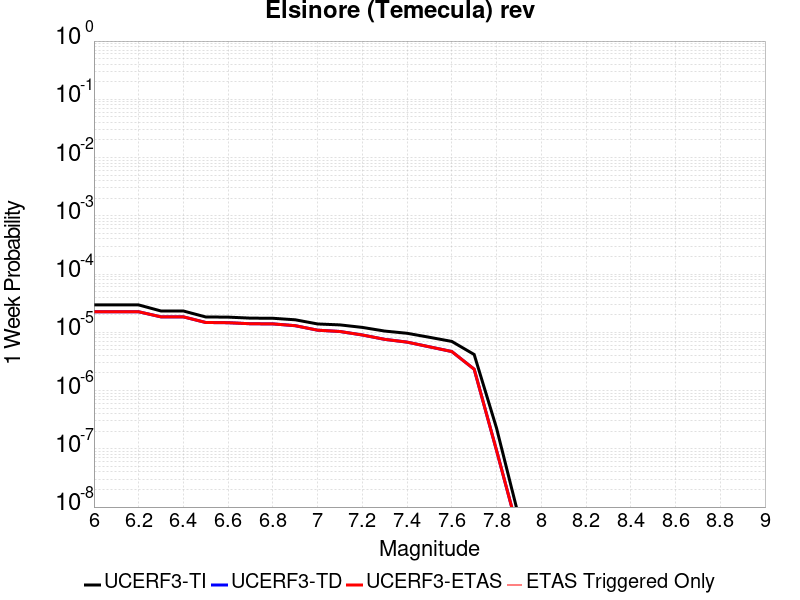 | 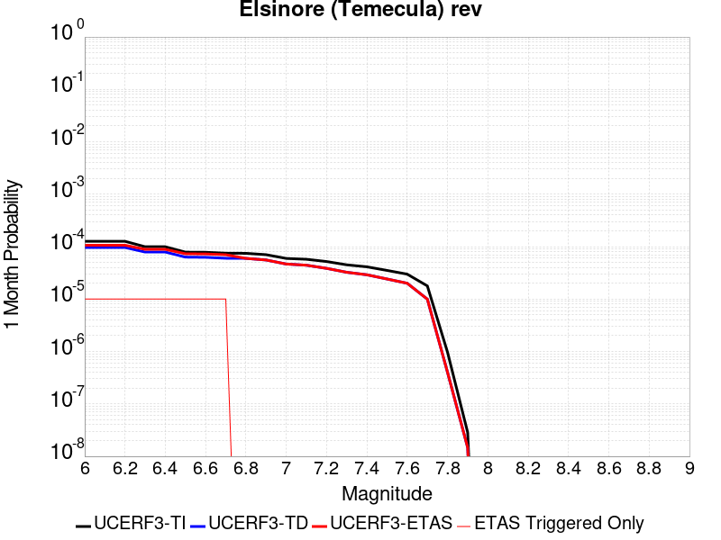 | 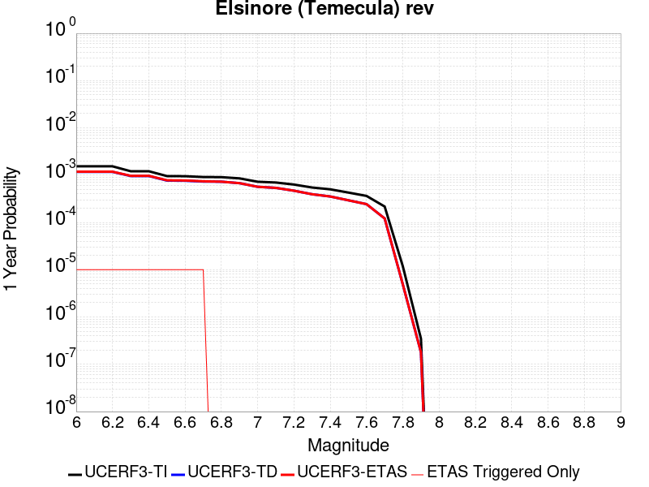 | 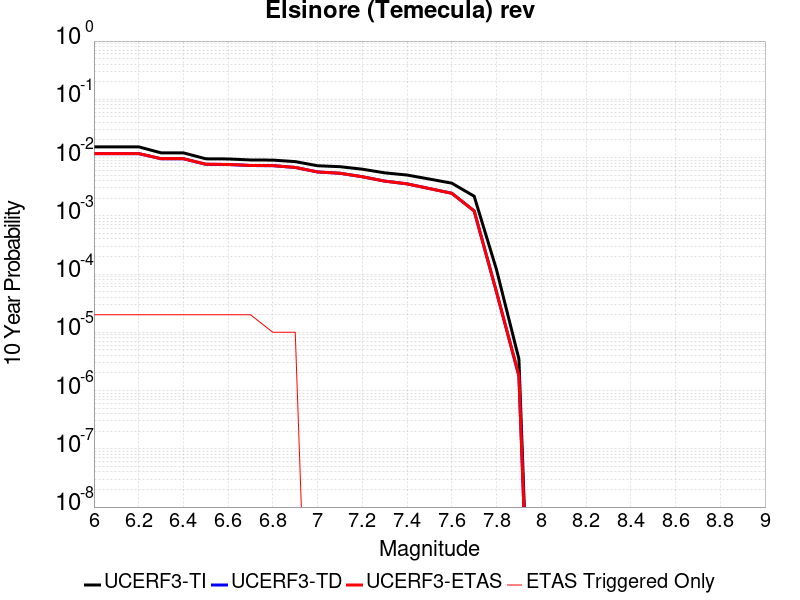 |

| Magnitude | 1 wk TI Prob | 1 wk TD Prob | 1 wk ETAS Prob | 1 wk ETAS/TD Gain | 1 wk ETAS Triggered Only | 1 mo TI Prob | 1 mo TD Prob | 1 mo ETAS Prob | 1 mo ETAS/TD Gain | 1 mo ETAS Triggered Only | 1 yr TI Prob | 1 yr TD Prob | 1 yr ETAS Prob | 1 yr ETAS/TD Gain | 1 yr ETAS Triggered Only | 10 yr TI Prob | 10 yr TD Prob | 10 yr ETAS Prob | 10 yr ETAS/TD Gain | 10 yr ETAS Triggered Only |
|-----|-----|-----|-----|-----|-----|-----|-----|-----|-----|-----|-----|-----|-----|-----|-----|-----|-----|-----|-----|-----|
| 6.0 | 2.9514995E-5 | 2.251887E-5 | 2.251887E-5 | 1.0 | 0.0 | 1.264867E-4 | 9.6505995E-5 | 1.0650503E-4 | 1.1036105 | 1.0E-5 | 0.0015388876 | 0.0011743492 | 0.0011843374 | 1.0085053 | 1.0E-5 | 0.015282745 | 0.011688135 | 0.011707901 | 1.0016911 | 2.0E-5 |
| 6.1 | 2.9514995E-5 | 2.251887E-5 | 2.251887E-5 | 1.0 | 0.0 | 1.264867E-4 | 9.6505995E-5 | 1.0650503E-4 | 1.1036105 | 1.0E-5 | 0.0015388876 | 0.0011743492 | 0.0011843374 | 1.0085053 | 1.0E-5 | 0.015282745 | 0.011688135 | 0.011707901 | 1.0016911 | 2.0E-5 |
| 6.2 | 2.9514995E-5 | 2.251887E-5 | 2.251887E-5 | 1.0 | 0.0 | 1.264867E-4 | 9.6505995E-5 | 1.0650503E-4 | 1.1036105 | 1.0E-5 | 0.0015388876 | 0.0011743492 | 0.0011843374 | 1.0085053 | 1.0E-5 | 0.015282745 | 0.011688135 | 0.011707901 | 1.0016911 | 2.0E-5 |
| 6.3 | 2.3223649E-5 | 1.840822E-5 | 1.840822E-5 | 1.0 | 0.0 | 9.952613E-5 | 7.889008E-5 | 8.888929E-5 | 1.1267487 | 1.0E-5 | 0.001211057 | 9.600807E-4 | 9.700711E-4 | 1.0104058 | 1.0E-5 | 0.012044783 | 0.009551284 | 0.009571092 | 1.002074 | 2.0E-5 |
| 6.4 | 2.3223649E-5 | 1.840822E-5 | 1.840822E-5 | 1.0 | 0.0 | 9.952613E-5 | 7.889008E-5 | 8.888929E-5 | 1.1267487 | 1.0E-5 | 0.001211057 | 9.600807E-4 | 9.700711E-4 | 1.0104058 | 1.0E-5 | 0.012044783 | 0.009551284 | 0.009571092 | 1.002074 | 2.0E-5 |
| 6.5 | 1.8338875E-5 | 1.4750074E-5 | 1.4750074E-5 | 1.0 | 0.0 | 7.8592806E-5 | 6.321312E-5 | 7.321249E-5 | 1.158185 | 1.0E-5 | 9.5644733E-4 | 7.6935673E-4 | 7.7934907E-4 | 1.0129879 | 1.0E-5 | 0.009523412 | 0.0076699676 | 0.007689814 | 1.0025876 | 2.0E-5 |
| 6.6 | 1.8223333E-5 | 1.461263E-5 | 1.461263E-5 | 1.0 | 0.0 | 7.809766E-5 | 6.26241E-5 | 7.262348E-5 | 1.159673 | 1.0E-5 | 9.504242E-4 | 7.621905E-4 | 7.721829E-4 | 1.01311 | 1.0E-5 | 0.009463696 | 0.007598796 | 0.0076186443 | 1.002612 | 2.0E-5 |
| 6.7 | 1.7512752E-5 | 1.4026963E-5 | 1.4026963E-5 | 1.0 | 0.0 | 7.505249E-5 | 6.0114216E-5 | 7.0113616E-5 | 1.16634 | 1.0E-5 | 9.13381E-4 | 7.316534E-4 | 7.416461E-4 | 1.0136577 | 1.0E-5 | 0.00909636 | 0.0072983317 | 0.0073181856 | 1.0027204 | 2.0E-5 |
| 6.8 | 1.7417142E-5 | 1.395093E-5 | 1.395093E-5 | 1.0 | 0.0 | 7.4642754E-5 | 5.978838E-5 | 5.978838E-5 | 1.0 | 0.0 | 9.083966E-4 | 7.27689E-4 | 7.27689E-4 | 1.0 | 0.0 | 0.009046922 | 0.007259359 | 0.0072692866 | 1.0013676 | 1.0E-5 |
| 6.9 | 1.6402591E-5 | 1.29883665E-5 | 1.29883665E-5 | 1.0 | 0.0 | 7.0294926E-5 | 5.5663284E-5 | 5.5663284E-5 | 1.0 | 0.0 | 8.5550465E-4 | 6.774974E-4 | 6.774974E-4 | 1.0 | 0.0 | 0.008522186 | 0.0067598647 | 0.006769797 | 1.0014694 | 1.0E-5 |
| 7.0 | 1.3912486E-5 | 1.0878067E-5 | 1.0878067E-5 | 1.0 | 0.0 | 5.9623577E-5 | 4.661947E-5 | 4.661947E-5 | 1.0 | 0.0 | 7.2567526E-4 | 5.674469E-4 | 5.674469E-4 | 1.0 | 0.0 | 0.0072331014 | 0.0056635314 | 0.0056635314 | 1.0 | 0.0 |
| 7.1 | 1.3405147E-5 | 1.0327192E-5 | 1.0327192E-5 | 1.0 | 0.0 | 5.7449364E-5 | 4.4258657E-5 | 4.4258657E-5 | 1.0 | 0.0 | 6.9922156E-4 | 5.3871854E-4 | 5.3871854E-4 | 1.0 | 0.0 | 0.0069702556 | 0.005377366 | 0.005377366 | 1.0 | 0.0 |
| 7.2 | 1.21402E-5 | 8.996479E-6 | 8.996479E-6 | 1.0 | 0.0 | 5.202839E-5 | 3.8555776E-5 | 3.8555776E-5 | 1.0 | 0.0 | 6.332616E-4 | 4.6931725E-4 | 4.6931725E-4 | 1.0 | 0.0 | 0.0063146 | 0.0046847262 | 0.0046847262 | 1.0 | 0.0 |
| 7.3 | 1.05047775E-5 | 7.571515E-6 | 7.571515E-6 | 1.0 | 0.0 | 4.5019697E-5 | 3.2448956E-5 | 3.2448956E-5 | 1.0 | 0.0 | 5.4797693E-4 | 3.9499588E-4 | 3.9499588E-4 | 1.0 | 0.0 | 0.005466277 | 0.003943348 | 0.003943348 | 1.0 | 0.0 |
| 7.4 | 9.624483E-6 | 6.786621E-6 | 6.786621E-6 | 1.0 | 0.0 | 4.124713E-5 | 2.90852E-5 | 2.90852E-5 | 1.0 | 0.0 | 5.0206814E-4 | 3.5405616E-4 | 3.5405616E-4 | 1.0 | 0.0 | 0.005009353 | 0.0035350726 | 0.0035350726 | 1.0 | 0.0 |
| 7.5 | 8.215151E-6 | 5.6353133E-6 | 5.6353133E-6 | 1.0 | 0.0 | 3.5207315E-5 | 2.4151126E-5 | 2.4151126E-5 | 1.0 | 0.0 | 4.2856473E-4 | 2.9400157E-4 | 2.9400157E-4 | 1.0 | 0.0 | 0.004277392 | 0.002936254 | 0.002936254 | 1.0 | 0.0 |
| 7.6 | 6.975058E-6 | 4.675836E-6 | 4.675836E-6 | 1.0 | 0.0 | 2.9892764E-5 | 2.003915E-5 | 2.003915E-5 | 1.0 | 0.0 | 3.6388362E-4 | 2.439505E-4 | 2.439505E-4 | 1.0 | 0.0 | 0.0036328835 | 0.0024369434 | 0.0024369434 | 1.0 | 0.0 |
| 7.7 | 4.159604E-6 | 2.326789E-6 | 2.326789E-6 | 1.0 | 0.0 | 1.7826753E-5 | 9.971919E-6 | 9.971919E-6 | 1.0 | 0.0 | 2.1701909E-4 | 1.2140209E-4 | 1.2140209E-4 | 1.0 | 0.0 | 0.0021680726 | 0.0012134308 | 0.0012134308 | 1.0 | 0.0 |
| 7.8 | 2.2692414E-7 | 9.384417E-8 | 9.384417E-8 | 1.0 | 0.0 | 9.725317E-7 | 4.0218927E-7 | 4.0218927E-7 | 1.0 | 0.0 | 1.1840509E-5 | 4.8966467E-6 | 4.8966467E-6 | 1.0 | 0.0 | 1.1839878E-4 | 4.8965718E-5 | 4.8965718E-5 | 1.0 | 0.0 |
| 7.9 | 6.676829E-9 | 3.4397174E-9 | 3.4397174E-9 | 1.0 | 0.0 | 2.861498E-8 | 1.4741646E-8 | 1.4741646E-8 | 1.0 | 0.0 | 3.4838732E-7 | 1.7947953E-7 | 1.7947953E-7 | 1.0 | 0.0 | 3.4838679E-6 | 1.794794E-6 | 1.794794E-6 | 1.0 | 0.0 |

## North Frontal  (West)
*[(top)](#table-of-contents)*

| 1 Week | 1 Month | 1 Year | 10 Year |
|-----|-----|-----|-----|
|  | 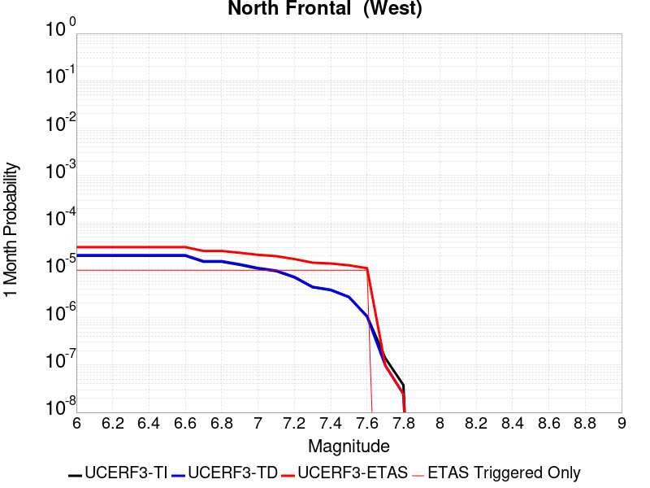 | 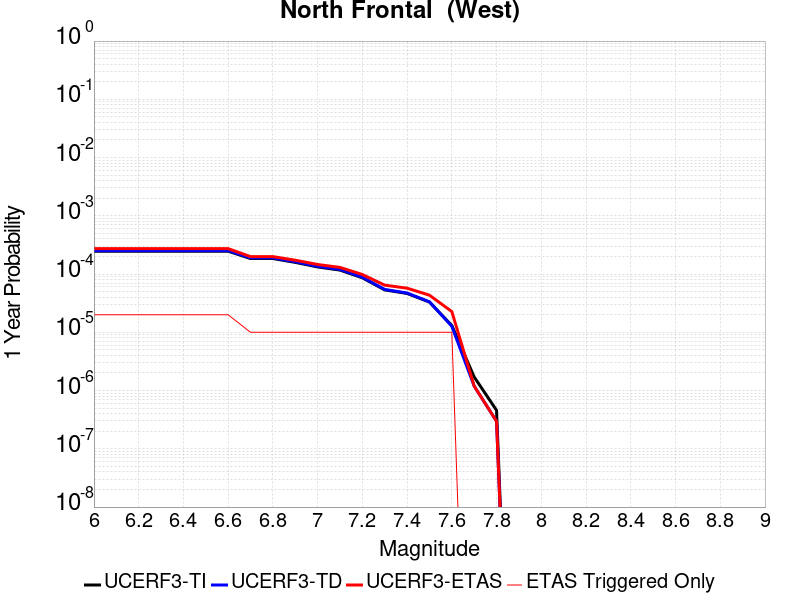 |  |

| Magnitude | 1 wk TI Prob | 1 wk TD Prob | 1 wk ETAS Prob | 1 wk ETAS/TD Gain | 1 wk ETAS Triggered Only | 1 mo TI Prob | 1 mo TD Prob | 1 mo ETAS Prob | 1 mo ETAS/TD Gain | 1 mo ETAS Triggered Only | 1 yr TI Prob | 1 yr TD Prob | 1 yr ETAS Prob | 1 yr ETAS/TD Gain | 1 yr ETAS Triggered Only | 10 yr TI Prob | 10 yr TD Prob | 10 yr ETAS Prob | 10 yr ETAS/TD Gain | 10 yr ETAS Triggered Only |
|-----|-----|-----|-----|-----|-----|-----|-----|-----|-----|-----|-----|-----|-----|-----|-----|-----|-----|-----|-----|-----|
| 6.0 | 4.7316266E-6 | 4.852674E-6 | 1.4852625E-5 | 3.0607095 | 1.0E-5 | 2.0278241E-5 | 2.0797017E-5 | 3.0796808E-5 | 1.4808282 | 1.0E-5 | 2.4685962E-4 | 2.5317573E-4 | 2.7317068E-4 | 1.0789765 | 2.0E-5 | 0.0024658558 | 0.002529019 | 0.0025489687 | 1.0078882 | 2.0E-5 |
| 6.1 | 4.7316266E-6 | 4.852674E-6 | 1.4852625E-5 | 3.0607095 | 1.0E-5 | 2.0278241E-5 | 2.0797017E-5 | 3.0796808E-5 | 1.4808282 | 1.0E-5 | 2.4685962E-4 | 2.5317573E-4 | 2.7317068E-4 | 1.0789765 | 2.0E-5 | 0.0024658558 | 0.002529019 | 0.0025489687 | 1.0078882 | 2.0E-5 |
| 6.2 | 4.7316266E-6 | 4.852674E-6 | 1.4852625E-5 | 3.0607095 | 1.0E-5 | 2.0278241E-5 | 2.0797017E-5 | 3.0796808E-5 | 1.4808282 | 1.0E-5 | 2.4685962E-4 | 2.5317573E-4 | 2.7317068E-4 | 1.0789765 | 2.0E-5 | 0.0024658558 | 0.002529019 | 0.0025489687 | 1.0078882 | 2.0E-5 |
| 6.3 | 4.7316266E-6 | 4.852674E-6 | 1.4852625E-5 | 3.0607095 | 1.0E-5 | 2.0278241E-5 | 2.0797017E-5 | 3.0796808E-5 | 1.4808282 | 1.0E-5 | 2.4685962E-4 | 2.5317573E-4 | 2.7317068E-4 | 1.0789765 | 2.0E-5 | 0.0024658558 | 0.002529019 | 0.0025489687 | 1.0078882 | 2.0E-5 |
| 6.4 | 4.7316266E-6 | 4.852674E-6 | 1.4852625E-5 | 3.0607095 | 1.0E-5 | 2.0278241E-5 | 2.0797017E-5 | 3.0796808E-5 | 1.4808282 | 1.0E-5 | 2.4685962E-4 | 2.5317573E-4 | 2.7317068E-4 | 1.0789765 | 2.0E-5 | 0.0024658558 | 0.002529019 | 0.0025489687 | 1.0078882 | 2.0E-5 |
| 6.5 | 4.7316266E-6 | 4.852674E-6 | 1.4852625E-5 | 3.0607095 | 1.0E-5 | 2.0278241E-5 | 2.0797017E-5 | 3.0796808E-5 | 1.4808282 | 1.0E-5 | 2.4685962E-4 | 2.5317573E-4 | 2.7317068E-4 | 1.0789765 | 2.0E-5 | 0.0024658558 | 0.002529019 | 0.0025489687 | 1.0078882 | 2.0E-5 |
| 6.6 | 4.7316266E-6 | 4.852674E-6 | 1.4852625E-5 | 3.0607095 | 1.0E-5 | 2.0278241E-5 | 2.0797017E-5 | 3.0796808E-5 | 1.4808282 | 1.0E-5 | 2.4685962E-4 | 2.5317573E-4 | 2.7317068E-4 | 1.0789765 | 2.0E-5 | 0.0024658558 | 0.002529019 | 0.0025489687 | 1.0078882 | 2.0E-5 |
| 6.7 | 3.5382777E-6 | 3.6308872E-6 | 1.3630851E-5 | 3.7541378 | 1.0E-5 | 1.516396E-5 | 1.5560858E-5 | 2.5560701E-5 | 1.6426281 | 1.0E-5 | 1.8460557E-4 | 1.8943775E-4 | 1.9943585E-4 | 1.0527778 | 1.0E-5 | 0.0018445229 | 0.0018928396 | 0.0019028207 | 1.0052731 | 1.0E-5 |
| 6.8 | 3.5382777E-6 | 3.6308872E-6 | 1.3630851E-5 | 3.7541378 | 1.0E-5 | 1.516396E-5 | 1.5560858E-5 | 2.5560701E-5 | 1.6426281 | 1.0E-5 | 1.8460557E-4 | 1.8943775E-4 | 1.9943585E-4 | 1.0527778 | 1.0E-5 | 0.0018445229 | 0.0018928396 | 0.0019028207 | 1.0052731 | 1.0E-5 |
| 6.9 | 3.0428037E-6 | 3.1227619E-6 | 1.3122731E-5 | 4.2022834 | 1.0E-5 | 1.30405215E-5 | 1.3383201E-5 | 2.3383067E-5 | 1.7471954 | 1.0E-5 | 1.5875678E-4 | 1.6292896E-4 | 1.7292734E-4 | 1.0613664 | 1.0E-5 | 0.0015864341 | 0.0016281622 | 0.001638146 | 1.0061319 | 1.0E-5 |
| 7.0 | 2.538778E-6 | 2.6060916E-6 | 1.2606066E-5 | 4.8371534 | 1.0E-5 | 1.0880432E-5 | 1.116892E-5 | 2.1168808E-5 | 1.8953317 | 1.0E-5 | 1.324612E-4 | 1.3597358E-4 | 1.4597223E-4 | 1.0735337 | 1.0E-5 | 0.0013238228 | 0.0013589506 | 0.001368937 | 1.0073487 | 1.0E-5 |
| 7.1 | 2.2418935E-6 | 2.3012087E-6 | 1.2301186E-5 | 5.3455324 | 1.0E-5 | 9.60808E-6 | 9.862288E-6 | 1.986219E-5 | 2.0139534 | 1.0E-5 | 1.1697209E-4 | 1.2006718E-4 | 1.3006598E-4 | 1.0832767 | 1.0E-5 | 0.0011691054 | 0.0012000671 | 0.0012100551 | 1.0083228 | 1.0E-5 |
| 7.2 | 1.6526745E-6 | 1.6924864E-6 | 1.1692469E-5 | 6.908457 | 1.0E-5 | 7.082872E-6 | 7.2534945E-6 | 1.7253422E-5 | 2.378636 | 1.0E-5 | 8.623055E-5 | 8.830797E-5 | 9.830709E-5 | 1.1132301 | 1.0E-5 | 8.61971E-4 | 8.8275387E-4 | 8.9274504E-4 | 1.0113182 | 1.0E-5 |
| 7.3 | 1.0246019E-6 | 1.0442274E-6 | 1.1044217E-5 | 10.576448 | 1.0E-5 | 4.391144E-6 | 4.4752533E-6 | 1.4475208E-5 | 3.2345004 | 1.0E-5 | 5.3460866E-5 | 5.4484964E-5 | 6.448442E-5 | 1.1835269 | 1.0E-5 | 5.344801E-4 | 5.4472755E-4 | 5.547221E-4 | 1.0183479 | 1.0E-5 |
| 7.4 | 8.9045164E-7 | 9.056572E-7 | 1.0905648E-5 | 12.041696 | 1.0E-5 | 3.8162157E-6 | 3.881383E-6 | 1.3881344E-5 | 3.5763915 | 1.0E-5 | 4.646144E-5 | 4.725492E-5 | 5.725445E-5 | 1.2116082 | 1.0E-5 | 4.6451724E-4 | 4.7245962E-4 | 4.824549E-4 | 1.0211558 | 1.0E-5 |
| 7.5 | 6.3357E-7 | 6.4027137E-7 | 1.0640265E-5 | 16.618368 | 1.0E-5 | 2.7152971E-6 | 2.7440176E-6 | 1.274399E-5 | 4.6442814 | 1.0E-5 | 3.305824E-5 | 3.340797E-5 | 4.3407636E-5 | 1.2993197 | 1.0E-5 | 3.3053322E-4 | 3.3403604E-4 | 3.440327E-4 | 1.0299269 | 1.0E-5 |
| 7.6 | 2.5087024E-7 | 2.436123E-7 | 1.024361E-5 | 42.048817 | 1.0E-5 | 1.0751578E-6 | 1.0440525E-6 | 1.1044042E-5 | 10.5780525 | 1.0E-5 | 1.3089967E-5 | 1.2711286E-5 | 2.271116E-5 | 1.7866925 | 1.0E-5 | 1.3089196E-4 | 1.2710765E-4 | 1.3710637E-4 | 1.0786635 | 1.0E-5 |
| 7.7 | 3.282987E-8 | 2.2875435E-8 | 2.2875435E-8 | 1.0 | 0.0 | 1.4069944E-7 | 9.8037575E-8 | 9.8037575E-8 | 1.0 | 0.0 | 1.7130144E-6 | 1.193607E-6 | 1.193607E-6 | 1.0 | 0.0 | 1.7130013E-5 | 1.1936014E-5 | 1.1936014E-5 | 1.0 | 0.0 |
| 7.8 | 8.77499E-9 | 5.6817466E-9 | 5.6817466E-9 | 1.0 | 0.0 | 3.7607098E-8 | 2.4350342E-8 | 2.4350342E-8 | 1.0 | 0.0 | 4.578663E-7 | 2.964654E-7 | 2.964654E-7 | 1.0 | 0.0 | 4.5786537E-6 | 2.9646512E-6 | 2.9646512E-6 | 1.0 | 0.0 |

## Pittville 2011 CFM
*[(top)](#table-of-contents)*

| 1 Week | 1 Month | 1 Year | 10 Year |
|-----|-----|-----|-----|
| 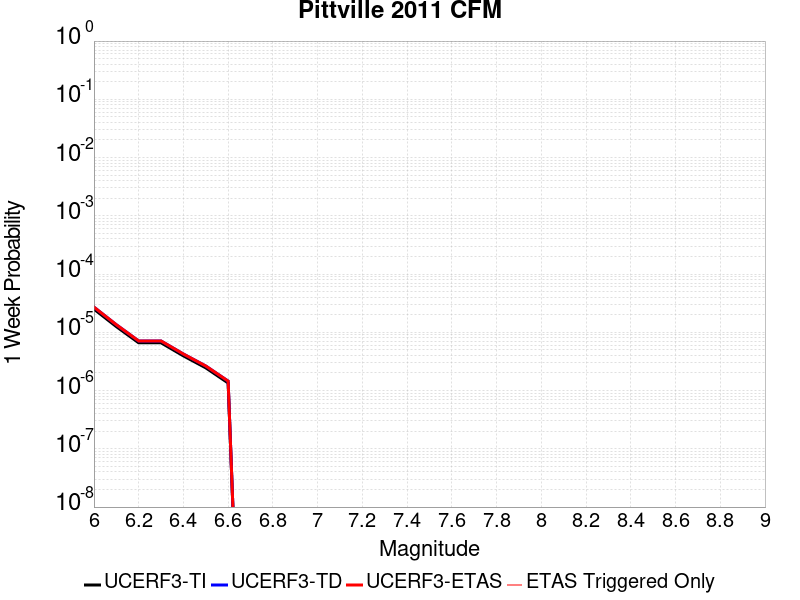 |  | 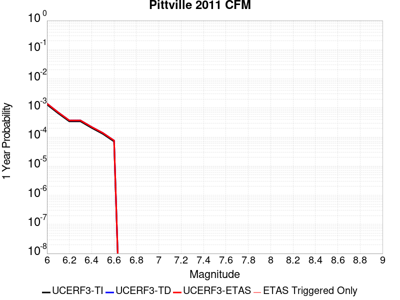 | 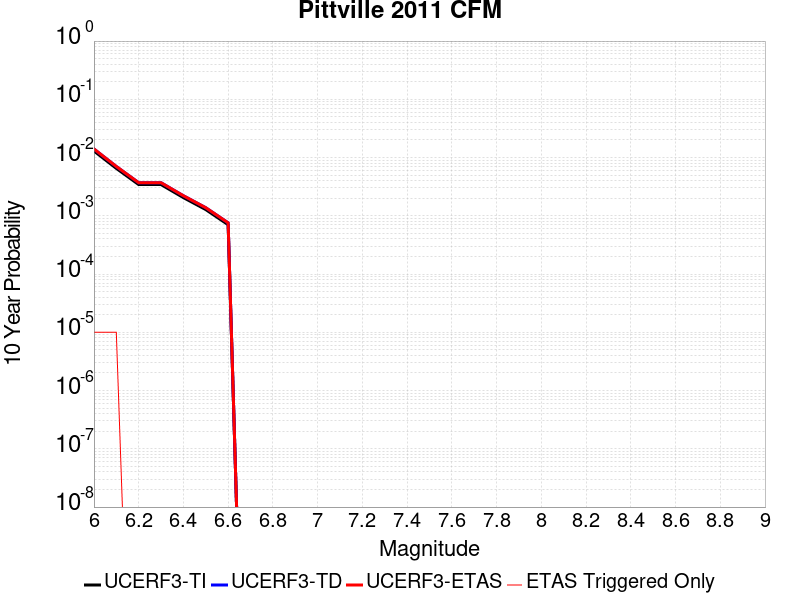 |

| Magnitude | 1 wk TI Prob | 1 wk TD Prob | 1 wk ETAS Prob | 1 wk ETAS/TD Gain | 1 wk ETAS Triggered Only | 1 mo TI Prob | 1 mo TD Prob | 1 mo ETAS Prob | 1 mo ETAS/TD Gain | 1 mo ETAS Triggered Only | 1 yr TI Prob | 1 yr TD Prob | 1 yr ETAS Prob | 1 yr ETAS/TD Gain | 1 yr ETAS Triggered Only | 10 yr TI Prob | 10 yr TD Prob | 10 yr ETAS Prob | 10 yr ETAS/TD Gain | 10 yr ETAS Triggered Only |
|-----|-----|-----|-----|-----|-----|-----|-----|-----|-----|-----|-----|-----|-----|-----|-----|-----|-----|-----|-----|-----|
| 6.0 | 2.5031832E-5 | 2.7056969E-5 | 2.7056969E-5 | 1.0 | 0.0 | 1.0727487E-4 | 1.1595384E-4 | 1.1595384E-4 | 1.0 | 0.0 | 0.001305289 | 0.0014109211 | 0.0014109211 | 1.0 | 0.0 | 0.012976485 | 0.014029415 | 0.014039275 | 1.0007027 | 1.0E-5 |
| 6.1 | 1.2540113E-5 | 1.3513067E-5 | 1.3513067E-5 | 1.0 | 0.0 | 5.3742235E-5 | 5.7911984E-5 | 5.7911984E-5 | 1.0 | 0.0 | 6.541153E-4 | 7.048728E-4 | 7.048728E-4 | 1.0 | 0.0 | 0.0065219323 | 0.0070286044 | 0.007038534 | 1.0014127 | 1.0E-5 |
| 6.2 | 6.603218E-6 | 7.107189E-6 | 7.107189E-6 | 1.0 | 0.0 | 2.8299199E-5 | 3.0459063E-5 | 3.0459063E-5 | 1.0 | 0.0 | 3.4448825E-4 | 3.7078248E-4 | 3.7078248E-4 | 1.0 | 0.0 | 0.0034395473 | 0.0037022792 | 0.0037022792 | 1.0 | 0.0 |
| 6.3 | 6.603218E-6 | 7.107189E-6 | 7.107189E-6 | 1.0 | 0.0 | 2.8299199E-5 | 3.0459063E-5 | 3.0459063E-5 | 1.0 | 0.0 | 3.4448825E-4 | 3.7078248E-4 | 3.7078248E-4 | 1.0 | 0.0 | 0.0034395473 | 0.0037022792 | 0.0037022792 | 1.0 | 0.0 |
| 6.4 | 3.9389015E-6 | 4.239175E-6 | 4.239175E-6 | 1.0 | 0.0 | 1.6880897E-5 | 1.8167784E-5 | 1.8167784E-5 | 1.0 | 0.0 | 2.0550552E-4 | 2.2117342E-4 | 2.2117342E-4 | 1.0 | 0.0 | 0.0020531558 | 0.002209838 | 0.002209838 | 1.0 | 0.0 |
| 6.5 | 2.4533072E-6 | 2.6412686E-6 | 2.6412686E-6 | 1.0 | 0.0 | 1.0514132E-5 | 1.1319685E-5 | 1.1319685E-5 | 1.0 | 0.0 | 1.2800204E-4 | 1.3781038E-4 | 1.3781038E-4 | 1.0 | 0.0 | 0.0012792832 | 0.0013774394 | 0.0013774394 | 1.0 | 0.0 |
| 6.6 | 1.3482367E-6 | 1.452993E-6 | 1.452993E-6 | 1.0 | 0.0 | 5.778144E-6 | 6.2271047E-6 | 6.2271047E-6 | 1.0 | 0.0 | 7.0346636E-5 | 7.58135E-5 | 7.58135E-5 | 1.0 | 0.0 | 7.032437E-4 | 7.5798744E-4 | 7.5798744E-4 | 1.0 | 0.0 |

## San Gabriel
*[(top)](#table-of-contents)*

| 1 Week | 1 Month | 1 Year | 10 Year |
|-----|-----|-----|-----|
|  | 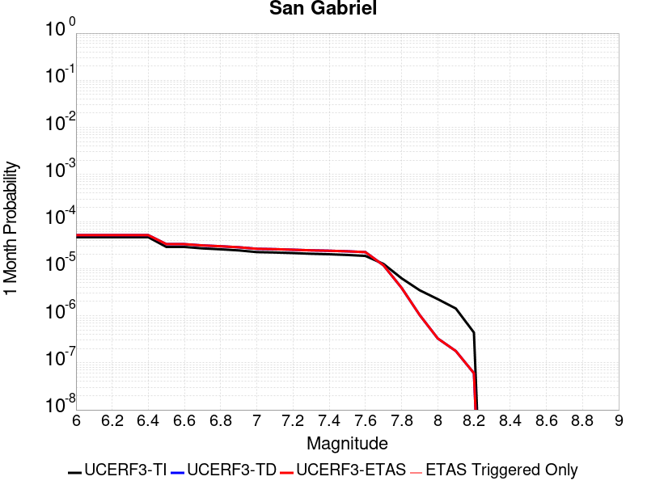 | 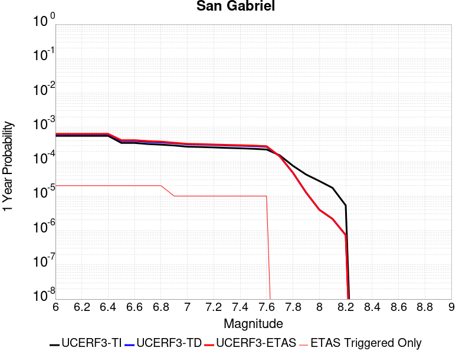 | 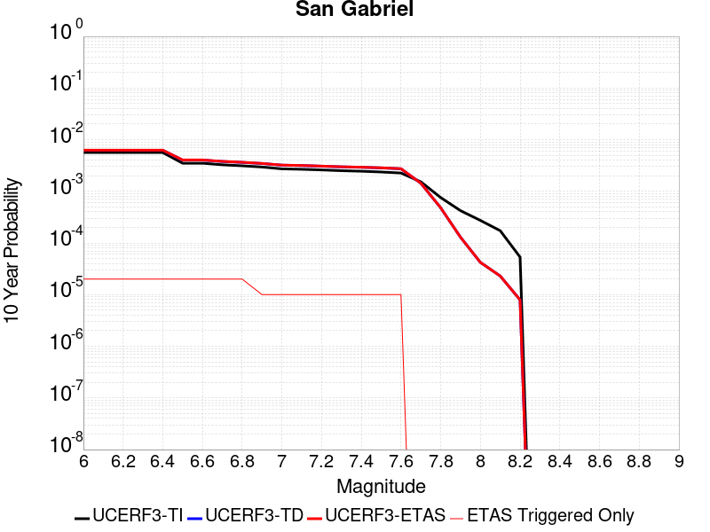 |

| Magnitude | 1 wk TI Prob | 1 wk TD Prob | 1 wk ETAS Prob | 1 wk ETAS/TD Gain | 1 wk ETAS Triggered Only | 1 mo TI Prob | 1 mo TD Prob | 1 mo ETAS Prob | 1 mo ETAS/TD Gain | 1 mo ETAS Triggered Only | 1 yr TI Prob | 1 yr TD Prob | 1 yr ETAS Prob | 1 yr ETAS/TD Gain | 1 yr ETAS Triggered Only | 10 yr TI Prob | 10 yr TD Prob | 10 yr ETAS Prob | 10 yr ETAS/TD Gain | 10 yr ETAS Triggered Only |
|-----|-----|-----|-----|-----|-----|-----|-----|-----|-----|-----|-----|-----|-----|-----|-----|-----|-----|-----|-----|-----|
| 6.0 | 1.083775E-5 | 1.198525E-5 | 1.198525E-5 | 1.0 | 0.0 | 4.6446676E-5 | 5.1364408E-5 | 5.1364408E-5 | 1.0 | 0.0 | 5.653415E-4 | 6.251936E-4 | 6.4518105E-4 | 1.0319701 | 2.0E-5 | 0.0056390543 | 0.0062463325 | 0.0062662074 | 1.0031819 | 2.0E-5 |
| 6.1 | 1.083775E-5 | 1.198525E-5 | 1.198525E-5 | 1.0 | 0.0 | 4.6446676E-5 | 5.1364408E-5 | 5.1364408E-5 | 1.0 | 0.0 | 5.653415E-4 | 6.251936E-4 | 6.4518105E-4 | 1.0319701 | 2.0E-5 | 0.0056390543 | 0.0062463325 | 0.0062662074 | 1.0031819 | 2.0E-5 |
| 6.2 | 1.083775E-5 | 1.198525E-5 | 1.198525E-5 | 1.0 | 0.0 | 4.6446676E-5 | 5.1364408E-5 | 5.1364408E-5 | 1.0 | 0.0 | 5.653415E-4 | 6.251936E-4 | 6.4518105E-4 | 1.0319701 | 2.0E-5 | 0.0056390543 | 0.0062463325 | 0.0062662074 | 1.0031819 | 2.0E-5 |
| 6.3 | 1.083775E-5 | 1.198525E-5 | 1.198525E-5 | 1.0 | 0.0 | 4.6446676E-5 | 5.1364408E-5 | 5.1364408E-5 | 1.0 | 0.0 | 5.653415E-4 | 6.251936E-4 | 6.4518105E-4 | 1.0319701 | 2.0E-5 | 0.0056390543 | 0.0062463325 | 0.0062662074 | 1.0031819 | 2.0E-5 |
| 6.4 | 1.083775E-5 | 1.198525E-5 | 1.198525E-5 | 1.0 | 0.0 | 4.6446676E-5 | 5.1364408E-5 | 5.1364408E-5 | 1.0 | 0.0 | 5.653415E-4 | 6.251936E-4 | 6.4518105E-4 | 1.0319701 | 2.0E-5 | 0.0056390543 | 0.0062463325 | 0.0062662074 | 1.0031819 | 2.0E-5 |
| 6.5 | 6.7317824E-6 | 7.717007E-6 | 7.717007E-6 | 1.0 | 0.0 | 2.8850178E-5 | 3.3072472E-5 | 3.3072472E-5 | 1.0 | 0.0 | 3.511943E-4 | 4.0258403E-4 | 4.2257598E-4 | 1.049659 | 2.0E-5 | 0.003506398 | 0.004029533 | 0.0040494525 | 1.0049434 | 2.0E-5 |
| 6.6 | 6.7317824E-6 | 7.717007E-6 | 7.717007E-6 | 1.0 | 0.0 | 2.8850178E-5 | 3.3072472E-5 | 3.3072472E-5 | 1.0 | 0.0 | 3.511943E-4 | 4.0258403E-4 | 4.2257598E-4 | 1.049659 | 2.0E-5 | 0.003506398 | 0.004029533 | 0.0040494525 | 1.0049434 | 2.0E-5 |
| 6.7 | 6.274881E-6 | 7.2459275E-6 | 7.2459275E-6 | 1.0 | 0.0 | 2.6892068E-5 | 3.105361E-5 | 3.105361E-5 | 1.0 | 0.0 | 3.2736175E-4 | 3.7801306E-4 | 3.980055E-4 | 1.0528883 | 2.0E-5 | 0.0032687993 | 0.0037846796 | 0.0038046038 | 1.0052645 | 2.0E-5 |
| 6.8 | 5.996209E-6 | 6.958647E-6 | 6.958647E-6 | 1.0 | 0.0 | 2.5697784E-5 | 2.9822439E-5 | 2.9822439E-5 | 1.0 | 0.0 | 3.128256E-4 | 3.6302864E-4 | 3.8302137E-4 | 1.0550721 | 2.0E-5 | 0.003123856 | 0.0036353325 | 0.0036552597 | 1.0054816 | 2.0E-5 |
| 6.9 | 5.686331E-6 | 6.6236917E-6 | 6.6236917E-6 | 1.0 | 0.0 | 2.4369761E-5 | 2.8386947E-5 | 2.8386947E-5 | 1.0 | 0.0 | 2.9666146E-4 | 3.4555717E-4 | 3.5555373E-4 | 1.0289288 | 1.0E-5 | 0.0029626573 | 0.0034611735 | 0.003471139 | 1.0028791 | 1.0E-5 |
| 7.0 | 5.2329838E-6 | 6.1475757E-6 | 6.1475757E-6 | 1.0 | 0.0 | 2.242688E-5 | 2.6346492E-5 | 2.6346492E-5 | 1.0 | 0.0 | 2.7301308E-4 | 3.207221E-4 | 3.3071887E-4 | 1.0311697 | 1.0E-5 | 0.002726779 | 0.0032135549 | 0.0032235228 | 1.0031018 | 1.0E-5 |
| 7.1 | 5.135671E-6 | 6.0377E-6 | 6.0377E-6 | 1.0 | 0.0 | 2.2009834E-5 | 2.5875606E-5 | 2.5875606E-5 | 1.0 | 0.0 | 2.6793676E-4 | 3.1499073E-4 | 3.2498757E-4 | 1.031737 | 1.0E-5 | 0.0026761394 | 0.0031564054 | 0.0031663738 | 1.0031582 | 1.0E-5 |
| 7.2 | 4.989062E-6 | 5.8710784E-6 | 5.8710784E-6 | 1.0 | 0.0 | 2.1381518E-5 | 2.5161527E-5 | 2.5161527E-5 | 1.0 | 0.0 | 2.6028889E-4 | 3.0629928E-4 | 3.162962E-4 | 1.0326378 | 1.0E-5 | 0.0025998424 | 0.003069734 | 0.0030797033 | 1.0032476 | 1.0E-5 |
| 7.3 | 4.8219395E-6 | 5.7026323E-6 | 5.7026323E-6 | 1.0 | 0.0 | 2.0665291E-5 | 2.4439627E-5 | 2.4439627E-5 | 1.0 | 0.0 | 2.5157086E-4 | 2.975126E-4 | 3.0750962E-4 | 1.033602 | 1.0E-5 | 0.0025128627 | 0.002982106 | 0.0029920763 | 1.0033433 | 1.0E-5 |
| 7.4 | 4.7118383E-6 | 5.5911896E-6 | 5.5911896E-6 | 1.0 | 0.0 | 2.0193436E-5 | 2.3962024E-5 | 2.3962024E-5 | 1.0 | 0.0 | 2.4582737E-4 | 2.9169934E-4 | 3.0169642E-4 | 1.0342718 | 1.0E-5 | 0.002455556 | 0.0029241266 | 0.0029340973 | 1.0034099 | 1.0E-5 |
| 7.5 | 4.5506545E-6 | 5.4365555E-6 | 5.4365555E-6 | 1.0 | 0.0 | 1.9502659E-5 | 2.329932E-5 | 2.329932E-5 | 1.0 | 0.0 | 2.37419E-4 | 2.8363304E-4 | 2.936302E-4 | 1.0352468 | 1.0E-5 | 0.002371655 | 0.0028436715 | 0.0028536431 | 1.0035065 | 1.0E-5 |
| 7.6 | 4.343636E-6 | 5.2294336E-6 | 5.2294336E-6 | 1.0 | 0.0 | 1.861545E-5 | 2.241167E-5 | 2.241167E-5 | 1.0 | 0.0 | 2.2661954E-4 | 2.7282868E-4 | 2.8282593E-4 | 1.036643 | 1.0E-5 | 0.0022638857 | 0.0027358893 | 0.002745862 | 1.0036451 | 1.0E-5 |
| 7.7 | 2.936235E-6 | 2.743946E-6 | 2.743946E-6 | 1.0 | 0.0 | 1.2583803E-5 | 1.1759716E-5 | 1.1759716E-5 | 1.0 | 0.0 | 1.5319703E-4 | 1.4316518E-4 | 1.4316518E-4 | 1.0 | 0.0 | 0.0015309147 | 0.0014379849 | 0.0014379849 | 1.0 | 0.0 |
| 7.8 | 1.4541639E-6 | 9.122518E-7 | 9.122518E-7 | 1.0 | 0.0 | 6.232116E-6 | 3.9096444E-6 | 3.9096444E-6 | 1.0 | 0.0 | 7.587337E-5 | 4.7598885E-5 | 4.7598885E-5 | 1.0 | 0.0 | 7.584747E-4 | 4.8078224E-4 | 4.8078224E-4 | 1.0 | 0.0 |
| 7.9 | 8.098958E-7 | 2.4165956E-7 | 2.4165956E-7 | 1.0 | 0.0 | 3.4709774E-6 | 1.0356835E-6 | 1.0356835E-6 | 1.0 | 0.0 | 4.225833E-5 | 1.2609373E-5 | 1.2609373E-5 | 1.0 | 0.0 | 4.2250296E-4 | 1.2917137E-4 | 1.2917137E-4 | 1.0 | 0.0 |
| 8.0 | 5.2473234E-7 | 7.672734E-8 | 7.672734E-8 | 1.0 | 0.0 | 2.248851E-6 | 3.2883142E-7 | 3.2883142E-7 | 1.0 | 0.0 | 2.7379416E-5 | 4.003515E-6 | 4.003515E-6 | 1.0 | 0.0 | 2.7376044E-4 | 4.215796E-5 | 4.215796E-5 | 1.0 | 0.0 |
| 8.1 | 3.3162388E-7 | 4.1457096E-8 | 4.1457096E-8 | 1.0 | 0.0 | 1.4212444E-6 | 1.7767324E-7 | 1.7767324E-7 | 1.0 | 0.0 | 1.7303513E-5 | 2.1631695E-6 | 2.1631695E-6 | 1.0 | 0.0 | 1.7302166E-4 | 2.294416E-5 | 2.294416E-5 | 1.0 | 0.0 |
| 8.2 | 1.0235345E-7 | 1.4032201E-8 | 1.4032201E-8 | 1.0 | 0.0 | 4.3865757E-7 | 6.013801E-8 | 6.013801E-8 | 1.0 | 0.0 | 5.340643E-6 | 7.3217996E-7 | 7.3217996E-7 | 1.0 | 0.0 | 5.3405143E-5 | 7.921925E-6 | 7.921925E-6 | 1.0 | 0.0 |

## Santa Monica alt 1
*[(top)](#table-of-contents)*

| 1 Week | 1 Month | 1 Year | 10 Year |
|-----|-----|-----|-----|
|  |  |  |  |

| Magnitude | 1 wk TI Prob | 1 wk TD Prob | 1 wk ETAS Prob | 1 wk ETAS/TD Gain | 1 wk ETAS Triggered Only | 1 mo TI Prob | 1 mo TD Prob | 1 mo ETAS Prob | 1 mo ETAS/TD Gain | 1 mo ETAS Triggered Only | 1 yr TI Prob | 1 yr TD Prob | 1 yr ETAS Prob | 1 yr ETAS/TD Gain | 1 yr ETAS Triggered Only | 10 yr TI Prob | 10 yr TD Prob | 10 yr ETAS Prob | 10 yr ETAS/TD Gain | 10 yr ETAS Triggered Only |
|-----|-----|-----|-----|-----|-----|-----|-----|-----|-----|-----|-----|-----|-----|-----|-----|-----|-----|-----|-----|-----|
| 6.0 | 1.1066008E-5 | 1.1480312E-5 | 1.1480312E-5 | 1.0 | 0.0 | 4.742488E-5 | 4.920049E-5 | 4.920049E-5 | 1.0 | 0.0 | 5.7724497E-4 | 5.9886527E-4 | 6.088593E-4 | 1.0166882 | 1.0E-5 | 0.005757478 | 0.0059739016 | 0.005993782 | 1.0033278 | 2.0E-5 |
| 6.1 | 1.1066008E-5 | 1.1480312E-5 | 1.1480312E-5 | 1.0 | 0.0 | 4.742488E-5 | 4.920049E-5 | 4.920049E-5 | 1.0 | 0.0 | 5.7724497E-4 | 5.9886527E-4 | 6.088593E-4 | 1.0166882 | 1.0E-5 | 0.005757478 | 0.0059739016 | 0.005993782 | 1.0033278 | 2.0E-5 |
| 6.2 | 1.1066008E-5 | 1.1480312E-5 | 1.1480312E-5 | 1.0 | 0.0 | 4.742488E-5 | 4.920049E-5 | 4.920049E-5 | 1.0 | 0.0 | 5.7724497E-4 | 5.9886527E-4 | 6.088593E-4 | 1.0166882 | 1.0E-5 | 0.005757478 | 0.0059739016 | 0.005993782 | 1.0033278 | 2.0E-5 |
| 6.3 | 1.1066008E-5 | 1.1480312E-5 | 1.1480312E-5 | 1.0 | 0.0 | 4.742488E-5 | 4.920049E-5 | 4.920049E-5 | 1.0 | 0.0 | 5.7724497E-4 | 5.9886527E-4 | 6.088593E-4 | 1.0166882 | 1.0E-5 | 0.005757478 | 0.0059739016 | 0.005993782 | 1.0033278 | 2.0E-5 |
| 6.4 | 1.1066008E-5 | 1.1480312E-5 | 1.1480312E-5 | 1.0 | 0.0 | 4.742488E-5 | 4.920049E-5 | 4.920049E-5 | 1.0 | 0.0 | 5.7724497E-4 | 5.9886527E-4 | 6.088593E-4 | 1.0166882 | 1.0E-5 | 0.005757478 | 0.0059739016 | 0.005993782 | 1.0033278 | 2.0E-5 |
| 6.5 | 8.183544E-6 | 8.335434E-6 | 8.335434E-6 | 1.0 | 0.0 | 3.5071862E-5 | 3.572281E-5 | 3.572281E-5 | 1.0 | 0.0 | 4.2691626E-4 | 4.3483998E-4 | 4.3483998E-4 | 1.0 | 0.0 | 0.0042609703 | 0.004340057 | 0.004340057 | 1.0 | 0.0 |
| 6.6 | 8.1543285E-6 | 8.303648E-6 | 8.303648E-6 | 1.0 | 0.0 | 3.4946657E-5 | 3.558659E-5 | 3.558659E-5 | 1.0 | 0.0 | 4.2539247E-4 | 4.3318217E-4 | 4.3318217E-4 | 1.0 | 0.0 | 0.0042457907 | 0.004323543 | 0.004323543 | 1.0 | 0.0 |
| 6.7 | 8.110878E-6 | 8.257045E-6 | 8.257045E-6 | 1.0 | 0.0 | 3.4760444E-5 | 3.5386864E-5 | 3.5386864E-5 | 1.0 | 0.0 | 4.231262E-4 | 4.3075148E-4 | 4.3075148E-4 | 1.0 | 0.0 | 0.0042232145 | 0.004299331 | 0.004299331 | 1.0 | 0.0 |
| 6.8 | 7.644036E-6 | 7.751063E-6 | 7.751063E-6 | 1.0 | 0.0 | 3.275974E-5 | 3.3218425E-5 | 3.3218425E-5 | 1.0 | 0.0 | 3.9877684E-4 | 4.043607E-4 | 4.043607E-4 | 1.0 | 0.0 | 0.00398062 | 0.004036396 | 0.004036396 | 1.0 | 0.0 |
| 6.9 | 7.3698293E-6 | 7.4557215E-6 | 7.4557215E-6 | 1.0 | 0.0 | 3.15846E-5 | 3.195271E-5 | 3.195271E-5 | 1.0 | 0.0 | 3.8447464E-4 | 3.889562E-4 | 3.889562E-4 | 1.0 | 0.0 | 0.0038381014 | 0.0038828978 | 0.0038828978 | 1.0 | 0.0 |
| 7.0 | 7.209872E-6 | 7.2856283E-6 | 7.2856283E-6 | 1.0 | 0.0 | 3.0899086E-5 | 3.1223753E-5 | 3.1223753E-5 | 1.0 | 0.0 | 3.7613141E-4 | 3.800843E-4 | 3.800843E-4 | 1.0 | 0.0 | 0.0037549543 | 0.003794485 | 0.003794485 | 1.0 | 0.0 |
| 7.1 | 5.603456E-6 | 5.5238947E-6 | 5.5238947E-6 | 1.0 | 0.0 | 2.4014591E-5 | 2.3673623E-5 | 2.3673623E-5 | 1.0 | 0.0 | 2.923384E-4 | 2.8818863E-4 | 2.8818863E-4 | 1.0 | 0.0 | 0.0029195412 | 0.002878191 | 0.002878191 | 1.0 | 0.0 |
| 7.2 | 4.7483613E-6 | 4.591135E-6 | 4.591135E-6 | 1.0 | 0.0 | 2.0349962E-5 | 1.9676147E-5 | 1.9676147E-5 | 1.0 | 0.0 | 2.4773262E-4 | 2.3953087E-4 | 2.3953087E-4 | 1.0 | 0.0 | 0.0024745662 | 0.0023927412 | 0.0023927412 | 1.0 | 0.0 |
| 7.3 | 3.829015E-6 | 3.6342271E-6 | 3.6342271E-6 | 1.0 | 0.0 | 1.6409962E-5 | 1.5575166E-5 | 1.5575166E-5 | 1.0 | 0.0 | 1.9977297E-4 | 1.8961124E-4 | 1.8961124E-4 | 1.0 | 0.0 | 0.0019959346 | 0.0018945034 | 0.0018945034 | 1.0 | 0.0 |
| 7.4 | 2.610755E-6 | 2.4995722E-6 | 2.4995722E-6 | 1.0 | 0.0 | 1.1188902E-5 | 1.0712408E-5 | 1.0712408E-5 | 1.0 | 0.0 | 1.3621636E-4 | 1.304158E-4 | 1.304158E-4 | 1.0 | 0.0 | 0.001361329 | 0.0013033971 | 0.0013033971 | 1.0 | 0.0 |
| 7.5 | 1.792146E-6 | 1.7584194E-6 | 1.7584194E-6 | 1.0 | 0.0 | 7.680603E-6 | 7.5360617E-6 | 7.5360617E-6 | 1.0 | 0.0 | 9.3507326E-5 | 9.174772E-5 | 9.174772E-5 | 1.0 | 0.0 | 9.3467993E-4 | 9.1710157E-4 | 9.1710157E-4 | 1.0 | 0.0 |
| 7.6 | 1.1473018E-6 | 1.102916E-6 | 1.102916E-6 | 1.0 | 0.0 | 4.9169985E-6 | 4.7267745E-6 | 4.7267745E-6 | 1.0 | 0.0 | 5.986281E-5 | 5.7546975E-5 | 5.7546975E-5 | 1.0 | 0.0 | 5.984669E-4 | 5.753224E-4 | 5.753224E-4 | 1.0 | 0.0 |
| 7.7 | 5.330919E-7 | 4.7452562E-7 | 4.7452562E-7 | 1.0 | 0.0 | 2.2846775E-6 | 2.0336797E-6 | 2.0336797E-6 | 1.0 | 0.0 | 2.7815593E-5 | 2.4759782E-5 | 2.4759782E-5 | 1.0 | 0.0 | 2.7812112E-4 | 2.4757136E-4 | 2.4757136E-4 | 1.0 | 0.0 |
| 7.8 | 1.1668574E-7 | 8.296564E-8 | 8.296564E-8 | 1.0 | 0.0 | 5.000816E-7 | 3.5556698E-7 | 3.5556698E-7 | 1.0 | 0.0 | 6.0884768E-6 | 4.3290197E-6 | 4.3290197E-6 | 1.0 | 0.0 | 6.08831E-5 | 4.3289383E-5 | 4.3289383E-5 | 1.0 | 0.0 |
| 7.9 | 8.007447E-10 | 6.161581E-10 | 6.161581E-10 | 1.0 | 0.0 | 3.4317629E-9 | 2.640678E-9 | 2.640678E-9 | 1.0 | 0.0 | 4.1781714E-8 | 3.2150254E-8 | 3.2150254E-8 | 1.0 | 0.0 | 4.1781706E-7 | 3.2150248E-7 | 3.2150248E-7 | 1.0 | 0.0 |

## San Gabriel (Extension)
*[(top)](#table-of-contents)*

| 1 Week | 1 Month | 1 Year | 10 Year |
|-----|-----|-----|-----|
| 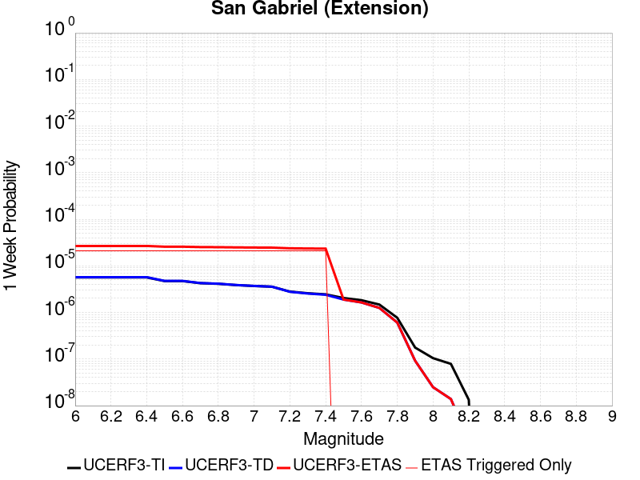 | 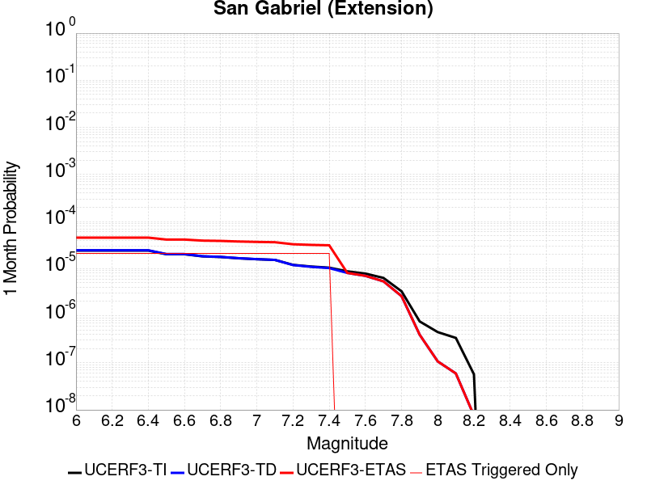 | 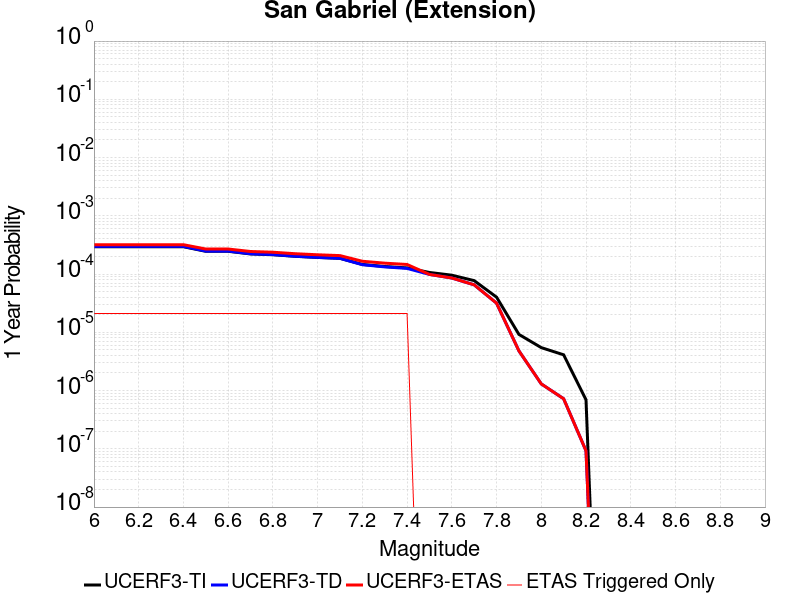 | 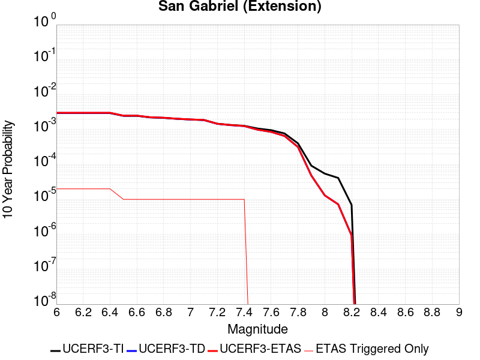 |

| Magnitude | 1 wk TI Prob | 1 wk TD Prob | 1 wk ETAS Prob | 1 wk ETAS/TD Gain | 1 wk ETAS Triggered Only | 1 mo TI Prob | 1 mo TD Prob | 1 mo ETAS Prob | 1 mo ETAS/TD Gain | 1 mo ETAS Triggered Only | 1 yr TI Prob | 1 yr TD Prob | 1 yr ETAS Prob | 1 yr ETAS/TD Gain | 1 yr ETAS Triggered Only | 10 yr TI Prob | 10 yr TD Prob | 10 yr ETAS Prob | 10 yr ETAS/TD Gain | 10 yr ETAS Triggered Only |
|-----|-----|-----|-----|-----|-----|-----|-----|-----|-----|-----|-----|-----|-----|-----|-----|-----|-----|-----|-----|-----|
| 6.0 | 5.6486106E-6 | 5.7168368E-6 | 1.571678E-5 | 2.7492092 | 1.0E-5 | 2.4208108E-5 | 2.4500505E-5 | 3.450026E-5 | 1.4081448 | 1.0E-5 | 2.9469383E-4 | 2.9825408E-4 | 3.1824812E-4 | 1.0670369 | 2.0E-5 | 0.0029430336 | 0.0029786646 | 0.0029986051 | 1.0066944 | 2.0E-5 |
| 6.1 | 5.6486106E-6 | 5.7168368E-6 | 1.571678E-5 | 2.7492092 | 1.0E-5 | 2.4208108E-5 | 2.4500505E-5 | 3.450026E-5 | 1.4081448 | 1.0E-5 | 2.9469383E-4 | 2.9825408E-4 | 3.1824812E-4 | 1.0670369 | 2.0E-5 | 0.0029430336 | 0.0029786646 | 0.0029986051 | 1.0066944 | 2.0E-5 |
| 6.2 | 5.6486106E-6 | 5.7168368E-6 | 1.571678E-5 | 2.7492092 | 1.0E-5 | 2.4208108E-5 | 2.4500505E-5 | 3.450026E-5 | 1.4081448 | 1.0E-5 | 2.9469383E-4 | 2.9825408E-4 | 3.1824812E-4 | 1.0670369 | 2.0E-5 | 0.0029430336 | 0.0029786646 | 0.0029986051 | 1.0066944 | 2.0E-5 |
| 6.3 | 5.6486106E-6 | 5.7168368E-6 | 1.571678E-5 | 2.7492092 | 1.0E-5 | 2.4208108E-5 | 2.4500505E-5 | 3.450026E-5 | 1.4081448 | 1.0E-5 | 2.9469383E-4 | 2.9825408E-4 | 3.1824812E-4 | 1.0670369 | 2.0E-5 | 0.0029430336 | 0.0029786646 | 0.0029986051 | 1.0066944 | 2.0E-5 |
| 6.4 | 5.6486106E-6 | 5.7168368E-6 | 1.571678E-5 | 2.7492092 | 1.0E-5 | 2.4208108E-5 | 2.4500505E-5 | 3.450026E-5 | 1.4081448 | 1.0E-5 | 2.9469383E-4 | 2.9825408E-4 | 3.1824812E-4 | 1.0670369 | 2.0E-5 | 0.0029430336 | 0.0029786646 | 0.0029986051 | 1.0066944 | 2.0E-5 |
| 6.5 | 4.7134554E-6 | 4.7542608E-6 | 1.4754213E-5 | 3.1033664 | 1.0E-5 | 2.0200367E-5 | 2.0375248E-5 | 3.0375044E-5 | 1.4907815 | 1.0E-5 | 2.459117E-4 | 2.4804127E-4 | 2.5803878E-4 | 1.0403059 | 1.0E-5 | 0.0024563975 | 0.0024777285 | 0.0024877037 | 1.0040259 | 1.0E-5 |
| 6.6 | 4.7134554E-6 | 4.7542608E-6 | 1.4754213E-5 | 3.1033664 | 1.0E-5 | 2.0200367E-5 | 2.0375248E-5 | 3.0375044E-5 | 1.4907815 | 1.0E-5 | 2.459117E-4 | 2.4804127E-4 | 2.5803878E-4 | 1.0403059 | 1.0E-5 | 0.0024563975 | 0.0024777285 | 0.0024877037 | 1.0040259 | 1.0E-5 |
| 6.7 | 4.2468837E-6 | 4.274078E-6 | 1.42740355E-5 | 3.339676 | 1.0E-5 | 1.8200803E-5 | 1.8317352E-5 | 2.8317168E-5 | 1.5459204 | 1.0E-5 | 2.2157225E-4 | 2.2299167E-4 | 2.3298943E-4 | 1.0448347 | 1.0E-5 | 0.0022135144 | 0.0022277513 | 0.002237729 | 1.0044788 | 1.0E-5 |
| 6.8 | 4.1180615E-6 | 4.1414673E-6 | 1.4141426E-5 | 3.414593 | 1.0E-5 | 1.7648716E-5 | 1.774903E-5 | 2.7748853E-5 | 1.5634011 | 1.0E-5 | 2.1485193E-4 | 2.1607373E-4 | 2.2607157E-4 | 1.0462705 | 1.0E-5 | 0.0021464431 | 0.0021587077 | 0.0021686861 | 1.0046225 | 1.0E-5 |
| 6.9 | 3.863861E-6 | 3.879783E-6 | 1.3879744E-5 | 3.5774539 | 1.0E-5 | 1.65593E-5 | 1.6627539E-5 | 2.6627373E-5 | 1.6014019 | 1.0E-5 | 2.0159081E-4 | 2.0242216E-4 | 2.1242014E-4 | 1.0493917 | 1.0E-5 | 0.0020140803 | 0.0020224454 | 0.0020324253 | 1.0049345 | 1.0E-5 |
| 7.0 | 3.6947372E-6 | 3.705682E-6 | 1.3705645E-5 | 3.6985486 | 1.0E-5 | 1.5834492E-5 | 1.5881402E-5 | 2.5881243E-5 | 1.6296574 | 1.0E-5 | 1.9276788E-4 | 1.9333958E-4 | 2.0333765E-4 | 1.0517125 | 1.0E-5 | 0.0019260074 | 0.0019317803 | 0.0019417609 | 1.0051665 | 1.0E-5 |
| 7.1 | 3.5686835E-6 | 3.5729024E-6 | 1.3572867E-5 | 3.7988348 | 1.0E-5 | 1.5294268E-5 | 1.5312353E-5 | 2.53122E-5 | 1.6530575 | 1.0E-5 | 1.861918E-4 | 1.8641262E-4 | 1.9641075E-4 | 1.0536344 | 1.0E-5 | 0.0018603588 | 0.0018626284 | 0.0018726097 | 1.0053588 | 1.0E-5 |
| 7.2 | 2.8023446E-6 | 2.776794E-6 | 1.2776766E-5 | 4.6012654 | 1.0E-5 | 1.2009994E-5 | 1.1900492E-5 | 2.1900372E-5 | 1.8402914 | 1.0E-5 | 1.4621185E-4 | 1.4487897E-4 | 1.5487752E-4 | 1.0690131 | 1.0E-5 | 0.001461157 | 0.001447856 | 0.0014578415 | 1.0068967 | 1.0E-5 |
| 7.3 | 2.5843012E-6 | 2.5459692E-6 | 1.2545944E-5 | 4.9277673 | 1.0E-5 | 1.1075529E-5 | 1.0911252E-5 | 2.0911142E-5 | 1.9164752 | 1.0E-5 | 1.3483623E-4 | 1.3283649E-4 | 1.4283515E-4 | 1.0752705 | 1.0E-5 | 0.0013475444 | 0.0013275805 | 0.0013375673 | 1.0075225 | 1.0E-5 |
| 7.4 | 2.4464468E-6 | 2.396669E-6 | 1.2396645E-5 | 5.1724477 | 1.0E-5 | 1.04847295E-5 | 1.0271398E-5 | 2.0271296E-5 | 1.9735672 | 1.0E-5 | 1.276441E-4 | 1.250472E-4 | 1.3504595E-4 | 1.0799598 | 1.0E-5 | 0.0012757082 | 0.001249778 | 0.0012597655 | 1.0079914 | 1.0E-5 |
| 7.5 | 2.0420266E-6 | 1.8910376E-6 | 1.8910376E-6 | 1.0 | 0.0 | 8.751514E-6 | 8.104422E-6 | 8.104422E-6 | 1.0 | 0.0 | 1.0654447E-4 | 9.866691E-5 | 9.866691E-5 | 1.0 | 0.0 | 0.001064934 | 9.862344E-4 | 9.862344E-4 | 1.0 | 0.0 |
| 7.6 | 1.8326596E-6 | 1.6398233E-6 | 1.6398233E-6 | 1.0 | 0.0 | 7.854232E-6 | 7.027795E-6 | 7.027795E-6 | 1.0 | 0.0 | 9.562107E-5 | 8.556007E-5 | 8.556007E-5 | 1.0 | 0.0 | 9.5579936E-4 | 8.552735E-4 | 8.552735E-4 | 1.0 | 0.0 |
| 7.7 | 1.4786998E-6 | 1.2523672E-6 | 1.2523672E-6 | 1.0 | 0.0 | 6.3372695E-6 | 5.3672766E-6 | 5.3672766E-6 | 1.0 | 0.0 | 7.715353E-5 | 6.534465E-5 | 6.534465E-5 | 1.0 | 0.0 | 7.7126746E-4 | 6.5325975E-4 | 6.5325975E-4 | 1.0 | 0.0 |
| 7.8 | 7.6975533E-7 | 6.069207E-7 | 6.069207E-7 | 1.0 | 0.0 | 3.2989474E-6 | 2.6010862E-6 | 2.6010862E-6 | 1.0 | 0.0 | 4.0163945E-5 | 3.1667765E-5 | 3.1667765E-5 | 1.0 | 0.0 | 4.0156685E-4 | 3.166365E-4 | 3.166365E-4 | 1.0 | 0.0 |
| 7.9 | 1.7645915E-7 | 9.211899E-8 | 9.211899E-8 | 1.0 | 0.0 | 7.562533E-7 | 3.947956E-7 | 3.947956E-7 | 1.0 | 0.0 | 9.207345E-6 | 4.806626E-6 | 4.806626E-6 | 1.0 | 0.0 | 9.206964E-5 | 4.8069025E-5 | 4.8069025E-5 | 1.0 | 0.0 |
| 8.0 | 1.0463461E-7 | 2.4937416E-8 | 2.4937416E-8 | 1.0 | 0.0 | 4.4843398E-7 | 1.0687464E-7 | 1.0687464E-7 | 1.0 | 0.0 | 5.45967E-6 | 1.3011979E-6 | 1.3011979E-6 | 1.0 | 0.0 | 5.459536E-5 | 1.3015701E-5 | 1.3015701E-5 | 1.0 | 0.0 |
| 8.1 | 7.875717E-8 | 1.3857542E-8 | 1.3857542E-8 | 1.0 | 0.0 | 3.3753068E-7 | 5.9389468E-8 | 5.9389468E-8 | 1.0 | 0.0 | 4.109428E-6 | 7.2306653E-7 | 7.2306653E-7 | 1.0 | 0.0 | 4.109352E-5 | 7.234439E-6 | 7.234439E-6 | 1.0 | 0.0 |
| 8.2 | 1.33163E-8 | 1.7720816E-9 | 1.7720816E-9 | 1.0 | 0.0 | 5.7069855E-8 | 7.594638E-9 | 7.594638E-9 | 1.0 | 0.0 | 6.9482525E-7 | 9.246471E-8 | 9.246471E-8 | 1.0 | 0.0 | 6.9482307E-6 | 9.2664203E-7 | 9.2664203E-7 | 1.0 | 0.0 |

## Channel Islands Western Deep Ramp
*[(top)](#table-of-contents)*

| 1 Week | 1 Month | 1 Year | 10 Year |
|-----|-----|-----|-----|
|  |  |  | 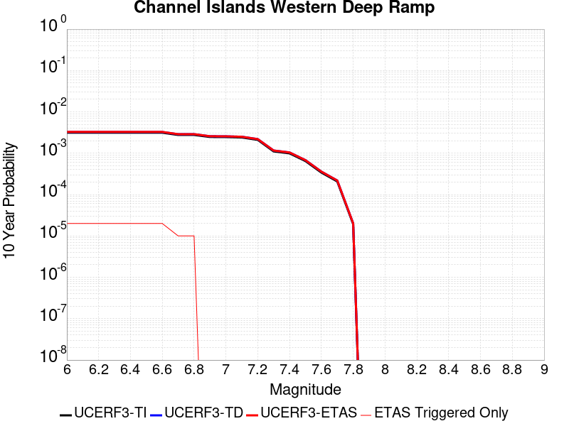 |

| Magnitude | 1 wk TI Prob | 1 wk TD Prob | 1 wk ETAS Prob | 1 wk ETAS/TD Gain | 1 wk ETAS Triggered Only | 1 mo TI Prob | 1 mo TD Prob | 1 mo ETAS Prob | 1 mo ETAS/TD Gain | 1 mo ETAS Triggered Only | 1 yr TI Prob | 1 yr TD Prob | 1 yr ETAS Prob | 1 yr ETAS/TD Gain | 1 yr ETAS Triggered Only | 10 yr TI Prob | 10 yr TD Prob | 10 yr ETAS Prob | 10 yr ETAS/TD Gain | 10 yr ETAS Triggered Only |
|-----|-----|-----|-----|-----|-----|-----|-----|-----|-----|-----|-----|-----|-----|-----|-----|-----|-----|-----|-----|-----|
| 6.0 | 6.0213506E-6 | 6.2548684E-6 | 6.2548684E-6 | 1.0 | 0.0 | 2.5805533E-5 | 2.6806329E-5 | 3.680606E-5 | 1.3730363 | 1.0E-5 | 3.1413708E-4 | 3.2632265E-4 | 3.3631938E-4 | 1.0306345 | 1.0E-5 | 0.0031369338 | 0.0032588763 | 0.003278811 | 1.0061171 | 2.0E-5 |
| 6.1 | 6.0213506E-6 | 6.2548684E-6 | 6.2548684E-6 | 1.0 | 0.0 | 2.5805533E-5 | 2.6806329E-5 | 3.680606E-5 | 1.3730363 | 1.0E-5 | 3.1413708E-4 | 3.2632265E-4 | 3.3631938E-4 | 1.0306345 | 1.0E-5 | 0.0031369338 | 0.0032588763 | 0.003278811 | 1.0061171 | 2.0E-5 |
| 6.2 | 6.0213506E-6 | 6.2548684E-6 | 6.2548684E-6 | 1.0 | 0.0 | 2.5805533E-5 | 2.6806329E-5 | 3.680606E-5 | 1.3730363 | 1.0E-5 | 3.1413708E-4 | 3.2632265E-4 | 3.3631938E-4 | 1.0306345 | 1.0E-5 | 0.0031369338 | 0.0032588763 | 0.003278811 | 1.0061171 | 2.0E-5 |
| 6.3 | 6.0213506E-6 | 6.2548684E-6 | 6.2548684E-6 | 1.0 | 0.0 | 2.5805533E-5 | 2.6806329E-5 | 3.680606E-5 | 1.3730363 | 1.0E-5 | 3.1413708E-4 | 3.2632265E-4 | 3.3631938E-4 | 1.0306345 | 1.0E-5 | 0.0031369338 | 0.0032588763 | 0.003278811 | 1.0061171 | 2.0E-5 |
| 6.4 | 6.0213506E-6 | 6.2548684E-6 | 6.2548684E-6 | 1.0 | 0.0 | 2.5805533E-5 | 2.6806329E-5 | 3.680606E-5 | 1.3730363 | 1.0E-5 | 3.1413708E-4 | 3.2632265E-4 | 3.3631938E-4 | 1.0306345 | 1.0E-5 | 0.0031369338 | 0.0032588763 | 0.003278811 | 1.0061171 | 2.0E-5 |
| 6.5 | 6.0213506E-6 | 6.2548684E-6 | 6.2548684E-6 | 1.0 | 0.0 | 2.5805533E-5 | 2.6806329E-5 | 3.680606E-5 | 1.3730363 | 1.0E-5 | 3.1413708E-4 | 3.2632265E-4 | 3.3631938E-4 | 1.0306345 | 1.0E-5 | 0.0031369338 | 0.0032588763 | 0.003278811 | 1.0061171 | 2.0E-5 |
| 6.6 | 6.0213506E-6 | 6.2548684E-6 | 6.2548684E-6 | 1.0 | 0.0 | 2.5805533E-5 | 2.6806329E-5 | 3.680606E-5 | 1.3730363 | 1.0E-5 | 3.1413708E-4 | 3.2632265E-4 | 3.3631938E-4 | 1.0306345 | 1.0E-5 | 0.0031369338 | 0.0032588763 | 0.003278811 | 1.0061171 | 2.0E-5 |
| 6.7 | 5.313309E-6 | 5.5252403E-6 | 5.5252403E-6 | 1.0 | 0.0 | 2.2771126E-5 | 2.367941E-5 | 3.3679175E-5 | 1.4222978 | 1.0E-5 | 2.772032E-4 | 2.8826276E-4 | 2.982599E-4 | 1.0346806 | 1.0E-5 | 0.0027685766 | 0.0028792918 | 0.002889263 | 1.003463 | 1.0E-5 |
| 6.8 | 5.313309E-6 | 5.5252403E-6 | 5.5252403E-6 | 1.0 | 0.0 | 2.2771126E-5 | 2.367941E-5 | 3.3679175E-5 | 1.4222978 | 1.0E-5 | 2.772032E-4 | 2.8826276E-4 | 2.982599E-4 | 1.0346806 | 1.0E-5 | 0.0027685766 | 0.0028792918 | 0.002889263 | 1.003463 | 1.0E-5 |
| 6.9 | 4.744377E-6 | 4.9394303E-6 | 4.9394303E-6 | 1.0 | 0.0 | 2.0332885E-5 | 2.1168837E-5 | 2.1168837E-5 | 1.0 | 0.0 | 2.4752476E-4 | 2.5770385E-4 | 2.5770385E-4 | 1.0 | 0.0 | 0.0024724922 | 0.0025744175 | 0.0025744175 | 1.0 | 0.0 |
| 7.0 | 4.722209E-6 | 4.9164732E-6 | 4.9164732E-6 | 1.0 | 0.0 | 2.0237881E-5 | 2.107045E-5 | 2.107045E-5 | 1.0 | 0.0 | 2.4636835E-4 | 2.5650626E-4 | 2.5650626E-4 | 1.0 | 0.0 | 0.002460954 | 0.0025624693 | 0.0025624693 | 1.0 | 0.0 |
| 7.1 | 4.611174E-6 | 4.801409E-6 | 4.801409E-6 | 1.0 | 0.0 | 1.9762025E-5 | 2.0577325E-5 | 2.0577325E-5 | 1.0 | 0.0 | 2.4057609E-4 | 2.5050386E-4 | 2.5050386E-4 | 1.0 | 0.0 | 0.002403158 | 0.002502582 | 0.002502582 | 1.0 | 0.0 |
| 7.2 | 4.043994E-6 | 4.2120264E-6 | 4.2120264E-6 | 1.0 | 0.0 | 1.7331287E-5 | 1.8051438E-5 | 1.8051438E-5 | 1.0 | 0.0 | 2.10988E-4 | 2.1975765E-4 | 2.1975765E-4 | 1.0 | 0.0 | 0.002107878 | 0.0021957543 | 0.0021957543 | 1.0 | 0.0 |
| 7.3 | 2.1233036E-6 | 2.2297875E-6 | 2.2297875E-6 | 1.0 | 0.0 | 9.099841E-6 | 9.556197E-6 | 9.556197E-6 | 1.0 | 0.0 | 1.1078493E-4 | 1.1634055E-4 | 1.1634055E-4 | 1.0 | 0.0 | 0.0011072971 | 0.001162802 | 0.001162802 | 1.0 | 0.0 |
| 7.4 | 1.9051884E-6 | 2.0014973E-6 | 2.0014973E-6 | 1.0 | 0.0 | 8.165067E-6 | 8.577817E-6 | 8.577817E-6 | 1.0 | 0.0 | 9.940516E-5 | 1.0442998E-4 | 1.0442998E-4 | 1.0 | 0.0 | 9.93607E-4 | 0.0010438144 | 0.0010438144 | 1.0 | 0.0 |
| 7.5 | 1.2408497E-6 | 1.3038839E-6 | 1.3038839E-6 | 1.0 | 0.0 | 5.317916E-6 | 5.588062E-6 | 5.588062E-6 | 1.0 | 0.0 | 6.4743705E-5 | 6.8032554E-5 | 6.8032554E-5 | 1.0 | 0.0 | 6.4724847E-4 | 6.8011944E-4 | 6.8011944E-4 | 1.0 | 0.0 |
| 7.6 | 6.5440025E-7 | 6.886718E-7 | 6.886718E-7 | 1.0 | 0.0 | 2.8045695E-6 | 2.9514472E-6 | 2.9514472E-6 | 1.0 | 0.0 | 3.4145098E-5 | 3.593329E-5 | 3.593329E-5 | 1.0 | 0.0 | 3.4139853E-4 | 3.5927625E-4 | 3.5927625E-4 | 1.0 | 0.0 |
| 7.7 | 3.985963E-7 | 4.1930787E-7 | 4.1930787E-7 | 1.0 | 0.0 | 1.7082689E-6 | 1.7970326E-6 | 1.7970326E-6 | 1.0 | 0.0 | 2.0797976E-5 | 2.1878664E-5 | 2.1878664E-5 | 1.0 | 0.0 | 2.0796029E-4 | 2.1876628E-4 | 2.1876628E-4 | 1.0 | 0.0 |
| 7.8 | 3.706329E-8 | 3.8591796E-8 | 3.8591796E-8 | 1.0 | 0.0 | 1.5884267E-7 | 1.653934E-7 | 1.653934E-7 | 1.0 | 0.0 | 1.9339077E-6 | 2.0136629E-6 | 2.0136629E-6 | 1.0 | 0.0 | 1.933891E-5 | 2.0136458E-5 | 2.0136458E-5 | 1.0 | 0.0 |

## Elmore Ranch
*[(top)](#table-of-contents)*

| 1 Week | 1 Month | 1 Year | 10 Year |
|-----|-----|-----|-----|
|  |  |  |  |

| Magnitude | 1 wk TI Prob | 1 wk TD Prob | 1 wk ETAS Prob | 1 wk ETAS/TD Gain | 1 wk ETAS Triggered Only | 1 mo TI Prob | 1 mo TD Prob | 1 mo ETAS Prob | 1 mo ETAS/TD Gain | 1 mo ETAS Triggered Only | 1 yr TI Prob | 1 yr TD Prob | 1 yr ETAS Prob | 1 yr ETAS/TD Gain | 1 yr ETAS Triggered Only | 10 yr TI Prob | 10 yr TD Prob | 10 yr ETAS Prob | 10 yr ETAS/TD Gain | 10 yr ETAS Triggered Only |
|-----|-----|-----|-----|-----|-----|-----|-----|-----|-----|-----|-----|-----|-----|-----|-----|-----|-----|-----|-----|-----|
| 6.0 | 9.102099E-5 | 8.953848E-5 | 8.953848E-5 | 1.0 | 0.0 | 3.9003167E-4 | 3.836898E-4 | 3.836898E-4 | 1.0 | 0.0 | 0.0047383 | 0.004662132 | 0.0046720854 | 1.0021349 | 1.0E-5 | 0.046385348 | 0.04583787 | 0.045856956 | 1.0004163 | 2.0E-5 |
| 6.1 | 3.8306698E-5 | 4.14921E-5 | 4.14921E-5 | 1.0 | 0.0 | 1.6416123E-4 | 1.7781362E-4 | 1.7781362E-4 | 1.0 | 0.0 | 0.0019968306 | 0.0021632186 | 0.002173197 | 1.0046127 | 1.0E-5 | 0.019789828 | 0.021595007 | 0.021614576 | 1.0009061 | 2.0E-5 |
| 6.2 | 3.8306698E-5 | 4.14921E-5 | 4.14921E-5 | 1.0 | 0.0 | 1.6416123E-4 | 1.7781362E-4 | 1.7781362E-4 | 1.0 | 0.0 | 0.0019968306 | 0.0021632186 | 0.002173197 | 1.0046127 | 1.0E-5 | 0.019789828 | 0.021595007 | 0.021614576 | 1.0009061 | 2.0E-5 |
| 6.3 | 3.3197924E-5 | 3.6550366E-5 | 3.6550366E-5 | 1.0 | 0.0 | 1.4226905E-4 | 1.56639E-4 | 1.56639E-4 | 1.0 | 0.0 | 0.0017307495 | 0.0019059771 | 0.0019159581 | 1.0052366 | 1.0E-5 | 0.017173318 | 0.019057386 | 0.019077003 | 1.0010295 | 2.0E-5 |
| 6.4 | 2.5148964E-5 | 2.7420736E-5 | 2.7420736E-5 | 1.0 | 0.0 | 1.0777682E-4 | 1.17515796E-4 | 1.17515796E-4 | 1.0 | 0.0 | 0.0013113929 | 0.0014304637 | 0.0014404494 | 1.0069808 | 1.0E-5 | 0.01303681 | 0.014365338 | 0.014375194 | 1.0006862 | 1.0E-5 |
| 6.5 | 2.5148964E-5 | 2.7420736E-5 | 2.7420736E-5 | 1.0 | 0.0 | 1.0777682E-4 | 1.17515796E-4 | 1.17515796E-4 | 1.0 | 0.0 | 0.0013113929 | 0.0014304637 | 0.0014404494 | 1.0069808 | 1.0E-5 | 0.01303681 | 0.014365338 | 0.014375194 | 1.0006862 | 1.0E-5 |

## Raymond
*[(top)](#table-of-contents)*

| 1 Week | 1 Month | 1 Year | 10 Year |
|-----|-----|-----|-----|
|  |  |  |  |

| Magnitude | 1 wk TI Prob | 1 wk TD Prob | 1 wk ETAS Prob | 1 wk ETAS/TD Gain | 1 wk ETAS Triggered Only | 1 mo TI Prob | 1 mo TD Prob | 1 mo ETAS Prob | 1 mo ETAS/TD Gain | 1 mo ETAS Triggered Only | 1 yr TI Prob | 1 yr TD Prob | 1 yr ETAS Prob | 1 yr ETAS/TD Gain | 1 yr ETAS Triggered Only | 10 yr TI Prob | 10 yr TD Prob | 10 yr ETAS Prob | 10 yr ETAS/TD Gain | 10 yr ETAS Triggered Only |
|-----|-----|-----|-----|-----|-----|-----|-----|-----|-----|-----|-----|-----|-----|-----|-----|-----|-----|-----|-----|-----|
| 6.0 | 1.5157413E-5 | 1.5810125E-5 | 1.5810125E-5 | 1.0 | 0.0 | 6.4958724E-5 | 6.775606E-5 | 6.775606E-5 | 1.0 | 0.0 | 7.905855E-4 | 8.246429E-4 | 8.3463464E-4 | 1.0121164 | 1.0E-5 | 0.007877788 | 0.008218355 | 0.00823819 | 1.0024136 | 2.0E-5 |
| 6.1 | 1.5157413E-5 | 1.5810125E-5 | 1.5810125E-5 | 1.0 | 0.0 | 6.4958724E-5 | 6.775606E-5 | 6.775606E-5 | 1.0 | 0.0 | 7.905855E-4 | 8.246429E-4 | 8.3463464E-4 | 1.0121164 | 1.0E-5 | 0.007877788 | 0.008218355 | 0.00823819 | 1.0024136 | 2.0E-5 |
| 6.2 | 1.5157413E-5 | 1.5810125E-5 | 1.5810125E-5 | 1.0 | 0.0 | 6.4958724E-5 | 6.775606E-5 | 6.775606E-5 | 1.0 | 0.0 | 7.905855E-4 | 8.246429E-4 | 8.3463464E-4 | 1.0121164 | 1.0E-5 | 0.007877788 | 0.008218355 | 0.00823819 | 1.0024136 | 2.0E-5 |
| 6.3 | 1.5157413E-5 | 1.5810125E-5 | 1.5810125E-5 | 1.0 | 0.0 | 6.4958724E-5 | 6.775606E-5 | 6.775606E-5 | 1.0 | 0.0 | 7.905855E-4 | 8.246429E-4 | 8.3463464E-4 | 1.0121164 | 1.0E-5 | 0.007877788 | 0.008218355 | 0.00823819 | 1.0024136 | 2.0E-5 |
| 6.4 | 1.3941944E-5 | 1.4454688E-5 | 1.4454688E-5 | 1.0 | 0.0 | 5.9749822E-5 | 6.194732E-5 | 6.194732E-5 | 1.0 | 0.0 | 7.2721124E-4 | 7.53971E-4 | 7.6396344E-4 | 1.0132531 | 1.0E-5 | 0.007248361 | 0.007516471 | 0.007536321 | 1.0026408 | 2.0E-5 |
| 6.5 | 1.3941944E-5 | 1.4454688E-5 | 1.4454688E-5 | 1.0 | 0.0 | 5.9749822E-5 | 6.194732E-5 | 6.194732E-5 | 1.0 | 0.0 | 7.2721124E-4 | 7.53971E-4 | 7.6396344E-4 | 1.0132531 | 1.0E-5 | 0.007248361 | 0.007516471 | 0.007536321 | 1.0026408 | 2.0E-5 |
| 6.6 | 1.0542609E-5 | 1.067111E-5 | 1.067111E-5 | 1.0 | 0.0 | 4.5181827E-5 | 4.573256E-5 | 4.573256E-5 | 1.0 | 0.0 | 5.499499E-4 | 5.566571E-4 | 5.566571E-4 | 1.0 | 0.0 | 0.005485909 | 0.0055531966 | 0.005563141 | 1.0017908 | 1.0E-5 |
| 6.7 | 1.0542609E-5 | 1.067111E-5 | 1.067111E-5 | 1.0 | 0.0 | 4.5181827E-5 | 4.573256E-5 | 4.573256E-5 | 1.0 | 0.0 | 5.499499E-4 | 5.566571E-4 | 5.566571E-4 | 1.0 | 0.0 | 0.005485909 | 0.0055531966 | 0.005563141 | 1.0017908 | 1.0E-5 |
| 6.8 | 1.0079132E-5 | 1.0176644E-5 | 1.0176644E-5 | 1.0 | 0.0 | 4.3195567E-5 | 4.3613487E-5 | 4.3613487E-5 | 1.0 | 0.0 | 5.257791E-4 | 5.308702E-4 | 5.308702E-4 | 1.0 | 0.0 | 0.0052453685 | 0.0052965777 | 0.0053065247 | 1.001878 | 1.0E-5 |
| 6.9 | 7.721598E-6 | 7.548902E-6 | 7.548902E-6 | 1.0 | 0.0 | 3.3092143E-5 | 3.2352043E-5 | 3.2352043E-5 | 1.0 | 0.0 | 4.0282236E-4 | 3.9381615E-4 | 3.9381615E-4 | 1.0 | 0.0 | 0.0040209293 | 0.003931324 | 0.003931324 | 1.0 | 0.0 |
| 7.0 | 7.137566E-6 | 6.911303E-6 | 6.911303E-6 | 1.0 | 0.0 | 3.058921E-5 | 2.961954E-5 | 2.961954E-5 | 1.0 | 0.0 | 3.7236E-4 | 3.605593E-4 | 3.605593E-4 | 1.0 | 0.0 | 0.0037173668 | 0.003599869 | 0.003599869 | 1.0 | 0.0 |
| 7.1 | 5.654976E-6 | 5.299538E-6 | 5.299538E-6 | 1.0 | 0.0 | 2.4235387E-5 | 2.2712107E-5 | 2.2712107E-5 | 1.0 | 0.0 | 2.9502588E-4 | 2.7648505E-4 | 2.7648505E-4 | 1.0 | 0.0 | 0.0029463451 | 0.0027614492 | 0.0027614492 | 1.0 | 0.0 |
| 7.2 | 4.9358455E-6 | 4.526655E-6 | 4.526655E-6 | 1.0 | 0.0 | 2.1153453E-5 | 1.9399806E-5 | 1.9399806E-5 | 1.0 | 0.0 | 2.5751285E-4 | 2.3616718E-4 | 2.3616718E-4 | 1.0 | 0.0 | 0.0025721465 | 0.002359192 | 0.002359192 | 1.0 | 0.0 |
| 7.3 | 4.2368597E-6 | 3.8056128E-6 | 3.8056128E-6 | 1.0 | 0.0 | 1.8157843E-5 | 1.6309668E-5 | 1.6309668E-5 | 1.0 | 0.0 | 2.2104931E-4 | 1.9855222E-4 | 1.9855222E-4 | 1.0 | 0.0 | 0.0022082955 | 0.0019837746 | 0.0019837746 | 1.0 | 0.0 |
| 7.4 | 3.4999923E-6 | 3.0437407E-6 | 3.0437407E-6 | 1.0 | 0.0 | 1.49998805E-5 | 1.3044538E-5 | 1.3044538E-5 | 1.0 | 0.0 | 1.8260824E-4 | 1.5880575E-4 | 1.5880575E-4 | 1.0 | 0.0 | 0.0018245826 | 0.0015869461 | 0.0015869461 | 1.0 | 0.0 |
| 7.5 | 2.738017E-6 | 2.3020405E-6 | 2.3020405E-6 | 1.0 | 0.0 | 1.1734306E-5 | 9.865851E-6 | 9.865851E-6 | 1.0 | 0.0 | 1.428558E-4 | 1.20110184E-4 | 1.20110184E-4 | 1.0 | 0.0 | 0.0014276401 | 0.0012004747 | 0.0012004747 | 1.0 | 0.0 |
| 7.6 | 1.8186392E-6 | 1.442302E-6 | 1.442302E-6 | 1.0 | 0.0 | 7.794145E-6 | 6.1812802E-6 | 6.1812802E-6 | 1.0 | 0.0 | 9.488958E-5 | 7.5254524E-5 | 7.5254524E-5 | 1.0 | 0.0 | 9.4849075E-4 | 7.5230957E-4 | 7.5230957E-4 | 1.0 | 0.0 |
| 7.7 | 1.0660348E-6 | 7.6437E-7 | 7.6437E-7 | 1.0 | 0.0 | 4.5687125E-6 | 3.2758674E-6 | 3.2758674E-6 | 1.0 | 0.0 | 5.5622655E-5 | 3.988297E-5 | 3.988297E-5 | 1.0 | 0.0 | 5.5608735E-4 | 3.9877492E-4 | 3.9877492E-4 | 1.0 | 0.0 |
| 7.8 | 6.913602E-7 | 4.3202903E-7 | 4.3202903E-7 | 1.0 | 0.0 | 2.962969E-6 | 1.8515517E-6 | 1.8515517E-6 | 1.0 | 0.0 | 3.607355E-5 | 2.2542416E-5 | 2.2542416E-5 | 1.0 | 0.0 | 3.6067693E-4 | 2.2541684E-4 | 2.2541684E-4 | 1.0 | 0.0 |
| 7.9 | 7.425201E-8 | 5.322267E-8 | 5.322267E-8 | 1.0 | 0.0 | 3.1822285E-7 | 2.2809714E-7 | 2.2809714E-7 | 1.0 | 0.0 | 3.874356E-6 | 2.7770805E-6 | 2.7770805E-6 | 1.0 | 0.0 | 3.8742884E-5 | 2.7770588E-5 | 2.7770588E-5 | 1.0 | 0.0 |

## Newport-Inglewood alt 1
*[(top)](#table-of-contents)*

| 1 Week | 1 Month | 1 Year | 10 Year |
|-----|-----|-----|-----|
| 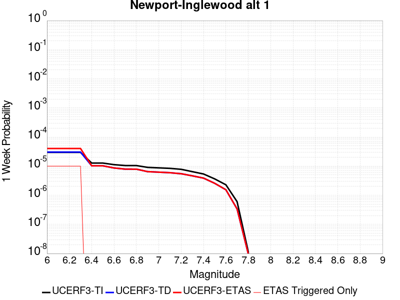 | 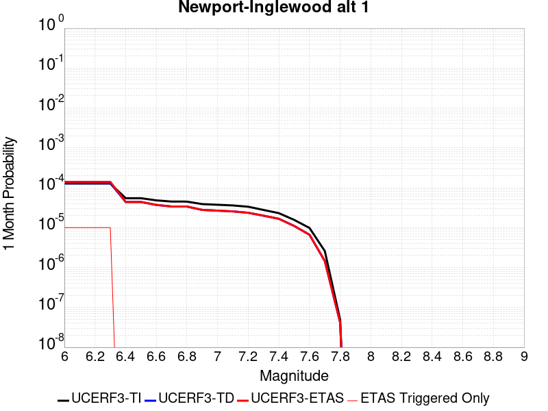 | 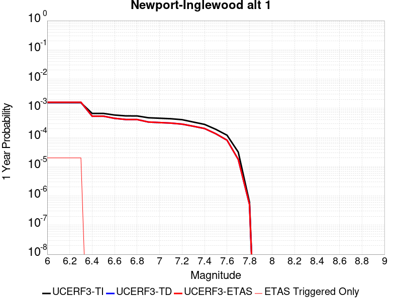 | 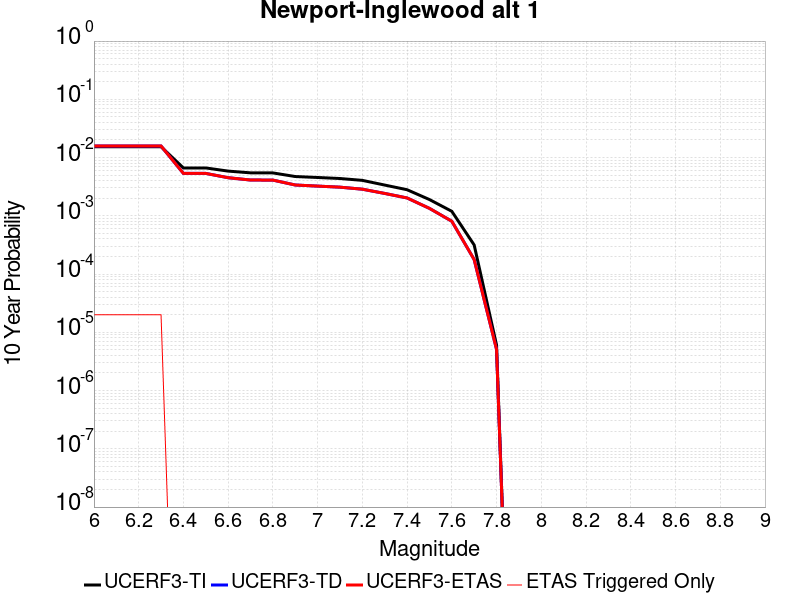 |

| Magnitude | 1 wk TI Prob | 1 wk TD Prob | 1 wk ETAS Prob | 1 wk ETAS/TD Gain | 1 wk ETAS Triggered Only | 1 mo TI Prob | 1 mo TD Prob | 1 mo ETAS Prob | 1 mo ETAS/TD Gain | 1 mo ETAS Triggered Only | 1 yr TI Prob | 1 yr TD Prob | 1 yr ETAS Prob | 1 yr ETAS/TD Gain | 1 yr ETAS Triggered Only | 10 yr TI Prob | 10 yr TD Prob | 10 yr ETAS Prob | 10 yr ETAS/TD Gain | 10 yr ETAS Triggered Only |
|-----|-----|-----|-----|-----|-----|-----|-----|-----|-----|-----|-----|-----|-----|-----|-----|-----|-----|-----|-----|-----|
| 6.0 | 2.9668912E-5 | 3.0404828E-5 | 4.0404524E-5 | 1.3288851 | 1.0E-5 | 1.2714628E-4 | 1.3030265E-4 | 1.4030134E-4 | 1.0767344 | 1.0E-5 | 0.0015469068 | 0.0015857654 | 0.0016057338 | 1.0125922 | 2.0E-5 | 0.015361829 | 0.01579211 | 0.015811794 | 1.0012465 | 2.0E-5 |
| 6.1 | 2.9668912E-5 | 3.0404828E-5 | 4.0404524E-5 | 1.3288851 | 1.0E-5 | 1.2714628E-4 | 1.3030265E-4 | 1.4030134E-4 | 1.0767344 | 1.0E-5 | 0.0015469068 | 0.0015857654 | 0.0016057338 | 1.0125922 | 2.0E-5 | 0.015361829 | 0.01579211 | 0.015811794 | 1.0012465 | 2.0E-5 |
| 6.2 | 2.9668912E-5 | 3.0404828E-5 | 4.0404524E-5 | 1.3288851 | 1.0E-5 | 1.2714628E-4 | 1.3030265E-4 | 1.4030134E-4 | 1.0767344 | 1.0E-5 | 0.0015469068 | 0.0015857654 | 0.0016057338 | 1.0125922 | 2.0E-5 | 0.015361829 | 0.01579211 | 0.015811794 | 1.0012465 | 2.0E-5 |
| 6.3 | 2.9668912E-5 | 3.0404828E-5 | 4.0404524E-5 | 1.3288851 | 1.0E-5 | 1.2714628E-4 | 1.3030265E-4 | 1.4030134E-4 | 1.0767344 | 1.0E-5 | 0.0015469068 | 0.0015857654 | 0.0016057338 | 1.0125922 | 2.0E-5 | 0.015361829 | 0.01579211 | 0.015811794 | 1.0012465 | 2.0E-5 |
| 6.4 | 1.275942E-5 | 1.02725335E-5 | 1.02725335E-5 | 1.0 | 0.0 | 5.4682085E-5 | 4.4024422E-5 | 4.4024422E-5 | 1.0 | 0.0 | 6.65551E-4 | 5.358697E-4 | 5.358697E-4 | 1.0 | 0.0 | 0.0066356123 | 0.0053462 | 0.0053462 | 1.0 | 0.0 |
| 6.5 | 1.275942E-5 | 1.02725335E-5 | 1.02725335E-5 | 1.0 | 0.0 | 5.4682085E-5 | 4.4024422E-5 | 4.4024422E-5 | 1.0 | 0.0 | 6.65551E-4 | 5.358697E-4 | 5.358697E-4 | 1.0 | 0.0 | 0.0066356123 | 0.0053462 | 0.0053462 | 1.0 | 0.0 |
| 6.6 | 1.1255358E-5 | 8.661911E-6 | 8.661911E-6 | 1.0 | 0.0 | 4.8236358E-5 | 3.7121958E-5 | 3.7121958E-5 | 1.0 | 0.0 | 5.871194E-4 | 4.5186782E-4 | 4.5186782E-4 | 1.0 | 0.0 | 0.005855706 | 0.0045096674 | 0.0045096674 | 1.0 | 0.0 |
| 6.7 | 1.0504745E-5 | 7.8998455E-6 | 7.8998455E-6 | 1.0 | 0.0 | 4.5019555E-5 | 3.385605E-5 | 3.385605E-5 | 1.0 | 0.0 | 5.4797524E-4 | 4.121207E-4 | 4.121207E-4 | 1.0 | 0.0 | 0.0054662596 | 0.004113694 | 0.004113694 | 1.0 | 0.0 |
| 6.8 | 1.0476007E-5 | 7.881227E-6 | 7.881227E-6 | 1.0 | 0.0 | 4.4896402E-5 | 3.3776258E-5 | 3.3776258E-5 | 1.0 | 0.0 | 5.464766E-4 | 4.1114958E-4 | 4.1114958E-4 | 1.0 | 0.0 | 0.005451347 | 0.004104019 | 0.004104019 | 1.0 | 0.0 |
| 6.9 | 9.076797E-6 | 6.4896567E-6 | 6.4896567E-6 | 1.0 | 0.0 | 3.889998E-5 | 2.7812519E-5 | 2.7812519E-5 | 1.0 | 0.0 | 4.7350433E-4 | 3.3856515E-4 | 3.3856515E-4 | 1.0 | 0.0 | 0.004724967 | 0.003380531 | 0.003380531 | 1.0 | 0.0 |
| 7.0 | 8.73795E-6 | 6.2120503E-6 | 6.2120503E-6 | 1.0 | 0.0 | 3.7447822E-5 | 2.6622802E-5 | 2.6622802E-5 | 1.0 | 0.0 | 4.5583185E-4 | 3.2408469E-4 | 3.2408469E-4 | 1.0 | 0.0 | 0.0045489795 | 0.0032361522 | 0.0032361522 | 1.0 | 0.0 |
| 7.1 | 8.391299E-6 | 5.9557533E-6 | 5.9557533E-6 | 1.0 | 0.0 | 3.5962214E-5 | 2.5524409E-5 | 2.5524409E-5 | 1.0 | 0.0 | 4.37752E-4 | 3.1071564E-4 | 3.1071564E-4 | 1.0 | 0.0 | 0.004368907 | 0.0031028416 | 0.0031028416 | 1.0 | 0.0 |
| 7.2 | 7.796882E-6 | 5.4964826E-6 | 5.4964826E-6 | 1.0 | 0.0 | 3.341478E-5 | 2.3556144E-5 | 2.3556144E-5 | 1.0 | 0.0 | 4.06749E-4 | 2.867585E-4 | 2.867585E-4 | 1.0 | 0.0 | 0.0040600533 | 0.002863909 | 0.002863909 | 1.0 | 0.0 |
| 7.3 | 6.4738833E-6 | 4.6477753E-6 | 4.6477753E-6 | 1.0 | 0.0 | 2.774492E-5 | 1.9918885E-5 | 1.9918885E-5 | 1.0 | 0.0 | 3.3774204E-4 | 2.424856E-4 | 2.424856E-4 | 1.0 | 0.0 | 0.0033722918 | 0.0024222268 | 0.0024222268 | 1.0 | 0.0 |
| 7.4 | 5.382145E-6 | 3.8857215E-6 | 3.8857215E-6 | 1.0 | 0.0 | 2.3066134E-5 | 1.6652988E-5 | 1.6652988E-5 | 1.0 | 0.0 | 2.8079396E-4 | 2.0273139E-4 | 2.0273139E-4 | 1.0 | 0.0 | 0.0028043943 | 0.002025479 | 0.002025479 | 1.0 | 0.0 |
| 7.5 | 3.648244E-6 | 2.5737634E-6 | 2.5737634E-6 | 1.0 | 0.0 | 1.5635238E-5 | 1.1030369E-5 | 1.1030369E-5 | 1.0 | 0.0 | 1.9034238E-4 | 1.3428657E-4 | 1.3428657E-4 | 1.0 | 0.0 | 0.0019017943 | 0.0013420646 | 0.0013420646 | 1.0 | 0.0 |
| 7.6 | 2.2906888E-6 | 1.547986E-6 | 1.547986E-6 | 1.0 | 0.0 | 9.817201E-6 | 6.634209E-6 | 6.634209E-6 | 1.0 | 0.0 | 1.1951787E-4 | 8.076857E-5 | 8.076857E-5 | 1.0 | 0.0 | 0.0011945361 | 8.073989E-4 | 8.073989E-4 | 1.0 | 0.0 |
| 7.7 | 6.0479874E-7 | 3.397468E-7 | 3.397468E-7 | 1.0 | 0.0 | 2.5919921E-6 | 1.456057E-6 | 1.456057E-6 | 1.0 | 0.0 | 3.1557047E-5 | 1.7727363E-5 | 1.7727363E-5 | 1.0 | 0.0 | 3.1552566E-4 | 1.7726087E-4 | 1.7726087E-4 | 1.0 | 0.0 |
| 7.8 | 1.16056995E-8 | 9.782997E-9 | 9.782997E-9 | 1.0 | 0.0 | 4.9738713E-8 | 4.1927127E-8 | 4.1927127E-8 | 1.0 | 0.0 | 6.0556863E-7 | 5.1046277E-7 | 5.1046277E-7 | 1.0 | 0.0 | 6.05567E-6 | 5.1046277E-6 | 5.1046277E-6 | 1.0 | 0.0 |

## Great Valley 11
*[(top)](#table-of-contents)*

| 1 Week | 1 Month | 1 Year | 10 Year |
|-----|-----|-----|-----|
| 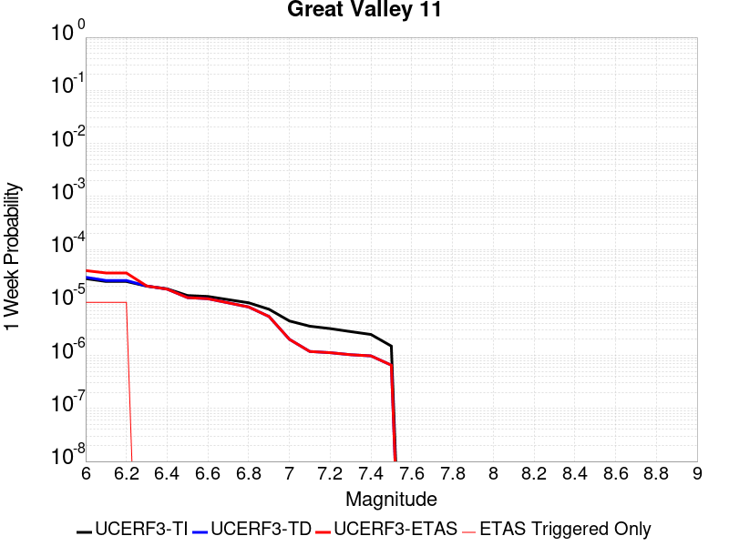 | 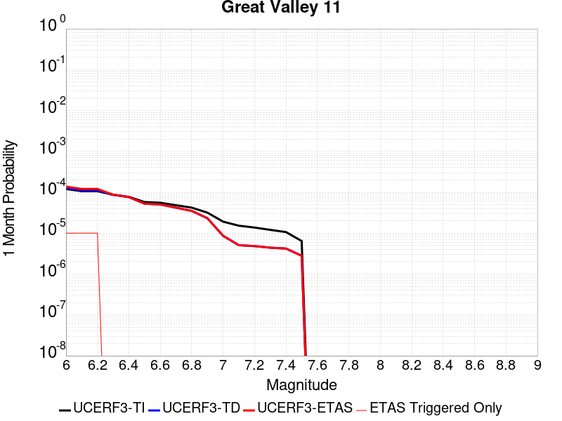 | 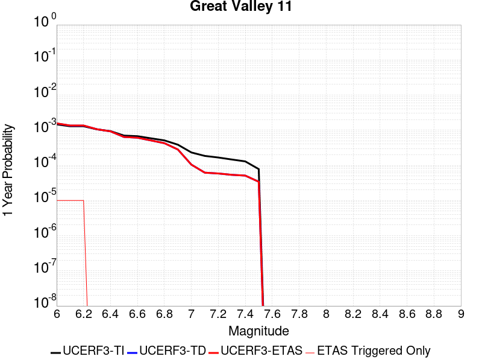 | 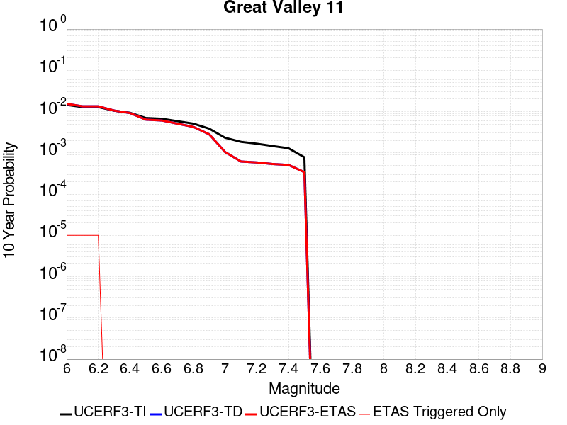 |

| Magnitude | 1 wk TI Prob | 1 wk TD Prob | 1 wk ETAS Prob | 1 wk ETAS/TD Gain | 1 wk ETAS Triggered Only | 1 mo TI Prob | 1 mo TD Prob | 1 mo ETAS Prob | 1 mo ETAS/TD Gain | 1 mo ETAS Triggered Only | 1 yr TI Prob | 1 yr TD Prob | 1 yr ETAS Prob | 1 yr ETAS/TD Gain | 1 yr ETAS Triggered Only | 10 yr TI Prob | 10 yr TD Prob | 10 yr ETAS Prob | 10 yr ETAS/TD Gain | 10 yr ETAS Triggered Only |
|-----|-----|-----|-----|-----|-----|-----|-----|-----|-----|-----|-----|-----|-----|-----|-----|-----|-----|-----|-----|-----|
| 6.0 | 2.8099583E-5 | 2.983214E-5 | 3.983184E-5 | 1.335199 | 1.0E-5 | 1.20421224E-4 | 1.2784619E-4 | 1.378449E-4 | 1.078209 | 1.0E-5 | 0.0014651422 | 0.0015554894 | 0.0015654739 | 1.0064188 | 1.0E-5 | 0.0145552 | 0.015453546 | 0.015463391 | 1.000637 | 1.0E-5 |
| 6.1 | 2.483194E-5 | 2.5907144E-5 | 3.5906884E-5 | 1.385984 | 1.0E-5 | 1.0641825E-4 | 1.11026246E-4 | 1.21025136E-4 | 1.0900588 | 1.0E-5 | 0.0012948721 | 0.0013509697 | 0.0013609562 | 1.007392 | 1.0E-5 | 0.012873529 | 0.013433979 | 0.013443844 | 1.0007343 | 1.0E-5 |
| 6.2 | 2.483194E-5 | 2.5907144E-5 | 3.5906884E-5 | 1.385984 | 1.0E-5 | 1.0641825E-4 | 1.11026246E-4 | 1.21025136E-4 | 1.0900588 | 1.0E-5 | 0.0012948721 | 0.0013509697 | 0.0013609562 | 1.007392 | 1.0E-5 | 0.012873529 | 0.013433979 | 0.013443844 | 1.0007343 | 1.0E-5 |
| 6.3 | 2.0257901E-5 | 2.0398915E-5 | 2.0398915E-5 | 1.0 | 0.0 | 8.681669E-5 | 8.742122E-5 | 8.742122E-5 | 1.0 | 0.0 | 0.0010564806 | 0.0010638753 | 0.0010638753 | 1.0 | 0.0 | 0.01051472 | 0.010591993 | 0.010591993 | 1.0 | 0.0 |
| 6.4 | 1.8054898E-5 | 1.7780852E-5 | 1.7780852E-5 | 1.0 | 0.0 | 7.737584E-5 | 7.6201635E-5 | 7.6201635E-5 | 1.0 | 0.0 | 9.416436E-4 | 9.2739763E-4 | 9.2739763E-4 | 1.0 | 0.0 | 0.009376635 | 0.009239015 | 0.009239015 | 1.0 | 0.0 |
| 6.5 | 1.34804895E-5 | 1.2321004E-5 | 1.2321004E-5 | 1.0 | 0.0 | 5.777225E-5 | 5.2803258E-5 | 5.2803258E-5 | 1.0 | 0.0 | 7.031501E-4 | 6.426942E-4 | 6.426942E-4 | 1.0 | 0.0 | 0.007009294 | 0.006408792 | 0.006408792 | 1.0 | 0.0 |
| 6.6 | 1.294883E-5 | 1.1732261E-5 | 1.1732261E-5 | 1.0 | 0.0 | 5.5493805E-5 | 5.028017E-5 | 5.028017E-5 | 1.0 | 0.0 | 6.754276E-4 | 6.1199325E-4 | 6.1199325E-4 | 1.0 | 0.0 | 0.006733784 | 0.0061035044 | 0.0061035044 | 1.0 | 0.0 |
| 6.7 | 1.1272237E-5 | 9.811834E-6 | 9.811834E-6 | 1.0 | 0.0 | 4.8308695E-5 | 4.205006E-5 | 4.205006E-5 | 1.0 | 0.0 | 5.879996E-4 | 5.1184196E-4 | 5.1184196E-4 | 1.0 | 0.0 | 0.005864462 | 0.005106915 | 0.005106915 | 1.0 | 0.0 |
| 6.8 | 9.8337505E-6 | 8.193719E-6 | 8.193719E-6 | 1.0 | 0.0 | 4.2143965E-5 | 3.5115478E-5 | 3.5115478E-5 | 1.0 | 0.0 | 5.1298196E-4 | 4.2744912E-4 | 4.2744912E-4 | 1.0 | 0.0 | 0.005117994 | 0.0042664795 | 0.0042664795 | 1.0 | 0.0 |
| 6.9 | 7.4224813E-6 | 5.4130837E-6 | 5.4130837E-6 | 1.0 | 0.0 | 3.1810247E-5 | 2.3198732E-5 | 2.3198732E-5 | 1.0 | 0.0 | 3.872209E-4 | 2.8240937E-4 | 2.8240937E-4 | 1.0 | 0.0 | 0.0038654688 | 0.0028206457 | 0.0028206457 | 1.0 | 0.0 |
| 7.0 | 4.4628923E-6 | 2.0110294E-6 | 2.0110294E-6 | 1.0 | 0.0 | 1.912654E-5 | 8.61867E-6 | 8.61867E-6 | 1.0 | 0.0 | 2.3284076E-4 | 1.0492737E-4 | 1.0492737E-4 | 1.0 | 0.0 | 0.0023259693 | 0.0010487898 | 0.0010487898 | 1.0 | 0.0 |
| 7.1 | 3.5546527E-6 | 1.1855383E-6 | 1.1855383E-6 | 1.0 | 0.0 | 1.5234136E-5 | 5.080869E-6 | 5.080869E-6 | 1.0 | 0.0 | 1.8545982E-4 | 6.185789E-5 | 6.185789E-5 | 1.0 | 0.0 | 0.0018530512 | 6.1841356E-4 | 6.1841356E-4 | 1.0 | 0.0 |
| 7.2 | 3.2039936E-6 | 1.1253728E-6 | 1.1253728E-6 | 1.0 | 0.0 | 1.3731329E-5 | 4.8230177E-6 | 4.8230177E-6 | 1.0 | 0.0 | 1.671661E-4 | 5.8718724E-5 | 5.8718724E-5 | 1.0 | 0.0 | 0.0016704041 | 5.870388E-4 | 5.870388E-4 | 1.0 | 0.0 |
| 7.3 | 2.8120473E-6 | 1.0305271E-6 | 1.0305271E-6 | 1.0 | 0.0 | 1.2051575E-5 | 4.4165376E-6 | 4.4165376E-6 | 1.0 | 0.0 | 1.4671806E-4 | 5.3770087E-5 | 5.3770087E-5 | 1.0 | 0.0 | 0.0014662122 | 5.375774E-4 | 5.375774E-4 | 1.0 | 0.0 |
| 7.4 | 2.4837766E-6 | 9.80032E-7 | 9.80032E-7 | 1.0 | 0.0 | 1.0644713E-5 | 4.2001307E-6 | 4.2001307E-6 | 1.0 | 0.0 | 1.2959167E-4 | 5.113546E-5 | 5.113546E-5 | 1.0 | 0.0 | 0.0012951613 | 5.1124353E-4 | 5.1124353E-4 | 1.0 | 0.0 |
| 7.5 | 1.5002679E-6 | 6.545985E-7 | 6.545985E-7 | 1.0 | 0.0 | 6.4297037E-6 | 2.8054194E-6 | 2.8054194E-6 | 1.0 | 0.0 | 7.827883E-5 | 3.4155488E-5 | 3.4155488E-5 | 1.0 | 0.0 | 7.825126E-4 | 3.4150656E-4 | 3.4150656E-4 | 1.0 | 0.0 |

## Del Valle
*[(top)](#table-of-contents)*

| 1 Week | 1 Month | 1 Year | 10 Year |
|-----|-----|-----|-----|
| 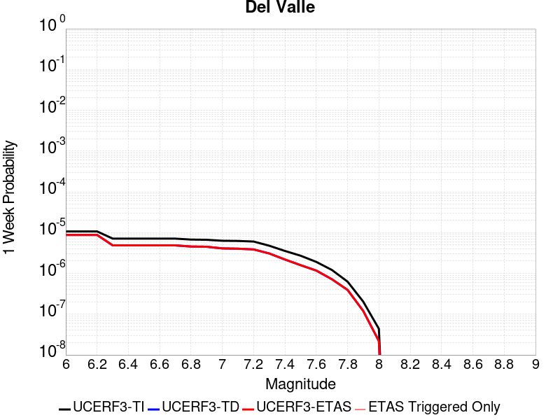 |  | 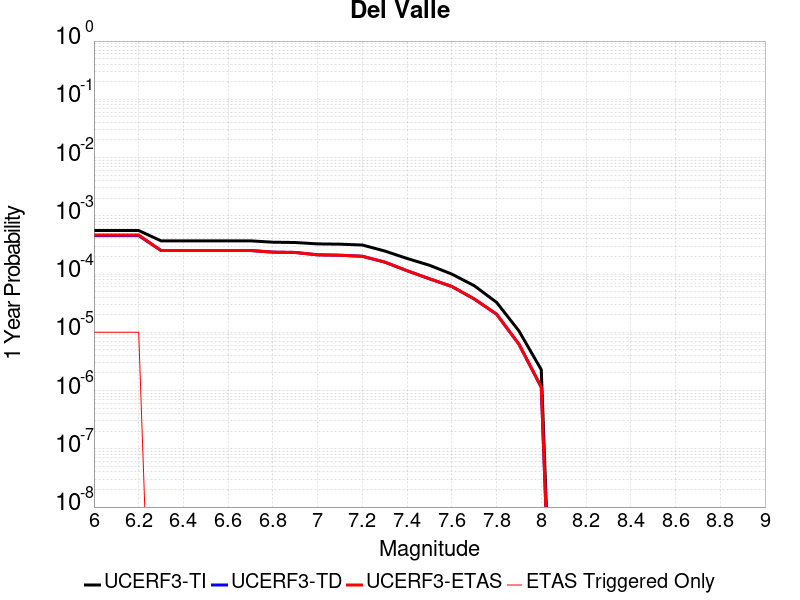 | 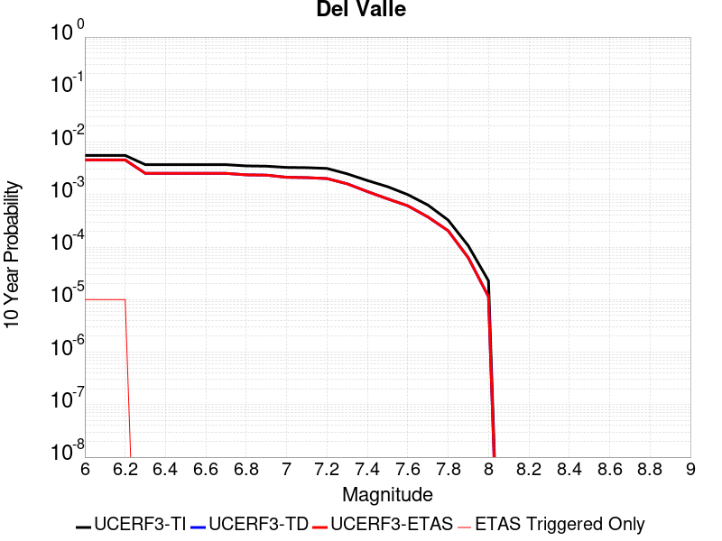 |

| Magnitude | 1 wk TI Prob | 1 wk TD Prob | 1 wk ETAS Prob | 1 wk ETAS/TD Gain | 1 wk ETAS Triggered Only | 1 mo TI Prob | 1 mo TD Prob | 1 mo ETAS Prob | 1 mo ETAS/TD Gain | 1 mo ETAS Triggered Only | 1 yr TI Prob | 1 yr TD Prob | 1 yr ETAS Prob | 1 yr ETAS/TD Gain | 1 yr ETAS Triggered Only | 10 yr TI Prob | 10 yr TD Prob | 10 yr ETAS Prob | 10 yr ETAS/TD Gain | 10 yr ETAS Triggered Only |
|-----|-----|-----|-----|-----|-----|-----|-----|-----|-----|-----|-----|-----|-----|-----|-----|-----|-----|-----|-----|-----|
| 6.0 | 1.0716125E-5 | 8.767882E-6 | 8.767882E-6 | 1.0 | 0.0 | 4.592544E-5 | 3.7576207E-5 | 4.7575828E-5 | 1.2661159 | 1.0E-5 | 5.589988E-4 | 4.5741402E-4 | 4.6740944E-4 | 1.021852 | 1.0E-5 | 0.0055759475 | 0.004566694 | 0.0045766486 | 1.0021797 | 1.0E-5 |
| 6.1 | 1.0716125E-5 | 8.767882E-6 | 8.767882E-6 | 1.0 | 0.0 | 4.592544E-5 | 3.7576207E-5 | 4.7575828E-5 | 1.2661159 | 1.0E-5 | 5.589988E-4 | 4.5741402E-4 | 4.6740944E-4 | 1.021852 | 1.0E-5 | 0.0055759475 | 0.004566694 | 0.0045766486 | 1.0021797 | 1.0E-5 |
| 6.2 | 1.0716125E-5 | 8.767882E-6 | 8.767882E-6 | 1.0 | 0.0 | 4.592544E-5 | 3.7576207E-5 | 4.7575828E-5 | 1.2661159 | 1.0E-5 | 5.589988E-4 | 4.5741402E-4 | 4.6740944E-4 | 1.021852 | 1.0E-5 | 0.0055759475 | 0.004566694 | 0.0045766486 | 1.0021797 | 1.0E-5 |
| 6.3 | 7.1293784E-6 | 4.8658226E-6 | 4.8658226E-6 | 1.0 | 0.0 | 3.055412E-5 | 2.0853362E-5 | 2.0853362E-5 | 1.0 | 0.0 | 3.7193293E-4 | 2.5386084E-4 | 2.5386084E-4 | 1.0 | 0.0 | 0.0037131102 | 0.0025358086 | 0.0025358086 | 1.0 | 0.0 |
| 6.4 | 7.1293784E-6 | 4.8658226E-6 | 4.8658226E-6 | 1.0 | 0.0 | 3.055412E-5 | 2.0853362E-5 | 2.0853362E-5 | 1.0 | 0.0 | 3.7193293E-4 | 2.5386084E-4 | 2.5386084E-4 | 1.0 | 0.0 | 0.0037131102 | 0.0025358086 | 0.0025358086 | 1.0 | 0.0 |
| 6.5 | 7.1293784E-6 | 4.8658226E-6 | 4.8658226E-6 | 1.0 | 0.0 | 3.055412E-5 | 2.0853362E-5 | 2.0853362E-5 | 1.0 | 0.0 | 3.7193293E-4 | 2.5386084E-4 | 2.5386084E-4 | 1.0 | 0.0 | 0.0037131102 | 0.0025358086 | 0.0025358086 | 1.0 | 0.0 |
| 6.6 | 7.1293784E-6 | 4.8658226E-6 | 4.8658226E-6 | 1.0 | 0.0 | 3.055412E-5 | 2.0853362E-5 | 2.0853362E-5 | 1.0 | 0.0 | 3.7193293E-4 | 2.5386084E-4 | 2.5386084E-4 | 1.0 | 0.0 | 0.0037131102 | 0.0025358086 | 0.0025358086 | 1.0 | 0.0 |
| 6.7 | 7.12272E-6 | 4.8631982E-6 | 4.8631982E-6 | 1.0 | 0.0 | 3.0525585E-5 | 2.0842115E-5 | 2.0842115E-5 | 1.0 | 0.0 | 3.7158563E-4 | 2.5372393E-4 | 2.5372393E-4 | 1.0 | 0.0 | 0.003709649 | 0.0025344428 | 0.0025344428 | 1.0 | 0.0 |
| 6.8 | 6.7558703E-6 | 4.559404E-6 | 4.559404E-6 | 1.0 | 0.0 | 2.895341E-5 | 1.954016E-5 | 1.954016E-5 | 1.0 | 0.0 | 3.5245073E-4 | 2.3787611E-4 | 2.3787611E-4 | 1.0 | 0.0 | 0.0035189227 | 0.0023763045 | 0.0023763045 | 1.0 | 0.0 |
| 6.9 | 6.6700386E-6 | 4.5025436E-6 | 4.5025436E-6 | 1.0 | 0.0 | 2.8585566E-5 | 1.9296476E-5 | 1.9296476E-5 | 1.0 | 0.0 | 3.479737E-4 | 2.349099E-4 | 2.349099E-4 | 1.0 | 0.0 | 0.003474293 | 0.0023467052 | 0.0023467052 | 1.0 | 0.0 |
| 7.0 | 6.3181424E-6 | 4.098708E-6 | 4.098708E-6 | 1.0 | 0.0 | 2.7077473E-5 | 1.7565775E-5 | 1.7565775E-5 | 1.0 | 0.0 | 3.2961834E-4 | 2.1384275E-4 | 2.1384275E-4 | 1.0 | 0.0 | 0.0032912986 | 0.0021364389 | 0.0021364389 | 1.0 | 0.0 |
| 7.1 | 6.248759E-6 | 4.033899E-6 | 4.033899E-6 | 1.0 | 0.0 | 2.678012E-5 | 1.7288028E-5 | 1.7288028E-5 | 1.0 | 0.0 | 3.2599916E-4 | 2.1046183E-4 | 2.1046183E-4 | 1.0 | 0.0 | 0.0032552136 | 0.0021026938 | 0.0021026938 | 1.0 | 0.0 |
| 7.2 | 6.0411944E-6 | 3.869892E-6 | 3.869892E-6 | 1.0 | 0.0 | 2.5890577E-5 | 1.658515E-5 | 1.658515E-5 | 1.0 | 0.0 | 3.1517216E-4 | 2.019059E-4 | 2.019059E-4 | 1.0 | 0.0 | 0.0031472554 | 0.0020172922 | 0.0020172922 | 1.0 | 0.0 |
| 7.3 | 4.7691183E-6 | 3.0780905E-6 | 3.0780905E-6 | 1.0 | 0.0 | 2.0438918E-5 | 1.3191751E-5 | 1.3191751E-5 | 1.0 | 0.0 | 2.488154E-4 | 1.6059795E-4 | 1.6059795E-4 | 1.0 | 0.0 | 0.00248537 | 0.0016048512 | 0.0016048512 | 1.0 | 0.0 |
| 7.4 | 3.5524722E-6 | 2.1893159E-6 | 2.1893159E-6 | 1.0 | 0.0 | 1.5224792E-5 | 9.382749E-6 | 9.382749E-6 | 1.0 | 0.0 | 1.8534607E-4 | 1.14229064E-4 | 1.14229064E-4 | 1.0 | 0.0 | 0.0018519156 | 0.0011417117 | 0.0011417117 | 1.0 | 0.0 |
| 7.5 | 2.7133442E-6 | 1.5915855E-6 | 1.5915855E-6 | 1.0 | 0.0 | 1.1628566E-5 | 6.821063E-6 | 6.821063E-6 | 1.0 | 0.0 | 1.415686E-4 | 8.30433E-5 | 8.30433E-5 | 1.0 | 0.0 | 0.0014147845 | 8.301246E-4 | 8.301246E-4 | 1.0 | 0.0 |
| 7.6 | 1.915338E-6 | 1.1738952E-6 | 1.1738952E-6 | 1.0 | 0.0 | 8.208566E-6 | 5.0309695E-6 | 5.0309695E-6 | 1.0 | 0.0 | 9.993471E-5 | 6.125034E-5 | 6.125034E-5 | 1.0 | 0.0 | 9.988978E-4 | 6.123355E-4 | 6.123355E-4 | 1.0 | 0.0 |
| 7.7 | 1.2120448E-6 | 7.1801645E-7 | 7.1801645E-7 | 1.0 | 0.0 | 5.194467E-6 | 3.0772098E-6 | 3.0772098E-6 | 1.0 | 0.0 | 6.3240805E-5 | 3.746439E-5 | 3.746439E-5 | 1.0 | 0.0 | 6.322281E-4 | 3.745811E-4 | 3.745811E-4 | 1.0 | 0.0 |
| 7.8 | 6.272381E-7 | 3.93245E-7 | 3.93245E-7 | 1.0 | 0.0 | 2.6881603E-6 | 1.6853346E-6 | 1.6853346E-6 | 1.0 | 0.0 | 3.272786E-5 | 2.0518757E-5 | 2.0518757E-5 | 1.0 | 0.0 | 3.272304E-4 | 2.0516879E-4 | 2.0516879E-4 | 1.0 | 0.0 |
| 7.9 | 2.0292627E-7 | 1.2004223E-7 | 1.2004223E-7 | 1.0 | 0.0 | 8.6968373E-7 | 5.144666E-7 | 5.144666E-7 | 1.0 | 0.0 | 1.0588348E-5 | 6.2636127E-6 | 6.2636127E-6 | 1.0 | 0.0 | 1.0587843E-4 | 6.263438E-5 | 6.263438E-5 | 1.0 | 0.0 |
| 8.0 | 4.374492E-8 | 2.1898856E-8 | 2.1898856E-8 | 1.0 | 0.0 | 1.8747821E-7 | 9.3852236E-8 | 9.3852236E-8 | 1.0 | 0.0 | 2.2825448E-6 | 1.1426505E-6 | 1.1426505E-6 | 1.0 | 0.0 | 2.2825214E-5 | 1.1426449E-5 | 1.1426449E-5 | 1.0 | 0.0 |

## Great Valley 04b Gordon Valley
*[(top)](#table-of-contents)*

| 1 Week | 1 Month | 1 Year | 10 Year |
|-----|-----|-----|-----|
|  |  | 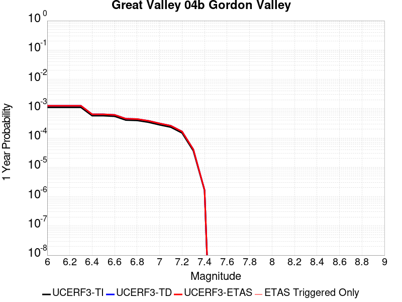 |  |

| Magnitude | 1 wk TI Prob | 1 wk TD Prob | 1 wk ETAS Prob | 1 wk ETAS/TD Gain | 1 wk ETAS Triggered Only | 1 mo TI Prob | 1 mo TD Prob | 1 mo ETAS Prob | 1 mo ETAS/TD Gain | 1 mo ETAS Triggered Only | 1 yr TI Prob | 1 yr TD Prob | 1 yr ETAS Prob | 1 yr ETAS/TD Gain | 1 yr ETAS Triggered Only | 10 yr TI Prob | 10 yr TD Prob | 10 yr ETAS Prob | 10 yr ETAS/TD Gain | 10 yr ETAS Triggered Only |
|-----|-----|-----|-----|-----|-----|-----|-----|-----|-----|-----|-----|-----|-----|-----|-----|-----|-----|-----|-----|-----|
| 6.0 | 2.1181217E-5 | 2.3981951E-5 | 2.3981951E-5 | 1.0 | 0.0 | 9.077348E-5 | 1.02776685E-4 | 1.02776685E-4 | 1.0 | 0.0 | 0.0011046068 | 0.0012507545 | 0.0012507545 | 1.0 | 0.0 | 0.010991322 | 0.0124536 | 0.012463476 | 1.000793 | 1.0E-5 |
| 6.1 | 2.1181217E-5 | 2.3981951E-5 | 2.3981951E-5 | 1.0 | 0.0 | 9.077348E-5 | 1.02776685E-4 | 1.02776685E-4 | 1.0 | 0.0 | 0.0011046068 | 0.0012507545 | 0.0012507545 | 1.0 | 0.0 | 0.010991322 | 0.0124536 | 0.012463476 | 1.000793 | 1.0E-5 |
| 6.2 | 2.1181217E-5 | 2.3981951E-5 | 2.3981951E-5 | 1.0 | 0.0 | 9.077348E-5 | 1.02776685E-4 | 1.02776685E-4 | 1.0 | 0.0 | 0.0011046068 | 0.0012507545 | 0.0012507545 | 1.0 | 0.0 | 0.010991322 | 0.0124536 | 0.012463476 | 1.000793 | 1.0E-5 |
| 6.3 | 2.1181217E-5 | 2.3981951E-5 | 2.3981951E-5 | 1.0 | 0.0 | 9.077348E-5 | 1.02776685E-4 | 1.02776685E-4 | 1.0 | 0.0 | 0.0011046068 | 0.0012507545 | 0.0012507545 | 1.0 | 0.0 | 0.010991322 | 0.0124536 | 0.012463476 | 1.000793 | 1.0E-5 |
| 6.4 | 1.0988268E-5 | 1.2254499E-5 | 1.2254499E-5 | 1.0 | 0.0 | 4.7091726E-5 | 5.2518313E-5 | 5.2518313E-5 | 1.0 | 0.0 | 5.731909E-4 | 6.392388E-4 | 6.392388E-4 | 1.0 | 0.0 | 0.005717147 | 0.0063755875 | 0.006385524 | 1.0015585 | 1.0E-5 |
| 6.5 | 1.0988268E-5 | 1.2254499E-5 | 1.2254499E-5 | 1.0 | 0.0 | 4.7091726E-5 | 5.2518313E-5 | 5.2518313E-5 | 1.0 | 0.0 | 5.731909E-4 | 6.392388E-4 | 6.392388E-4 | 1.0 | 0.0 | 0.005717147 | 0.0063755875 | 0.006385524 | 1.0015585 | 1.0E-5 |
| 6.6 | 1.0517822E-5 | 1.1724062E-5 | 1.1724062E-5 | 1.0 | 0.0 | 4.5075605E-5 | 5.02451E-5 | 5.02451E-5 | 1.0 | 0.0 | 5.4865726E-4 | 6.11578E-4 | 6.11578E-4 | 1.0 | 0.0 | 0.0054730466 | 0.0061005033 | 0.0061104423 | 1.0016292 | 1.0E-5 |
| 6.7 | 7.789219E-6 | 8.6776445E-6 | 8.6776445E-6 | 1.0 | 0.0 | 3.3381937E-5 | 3.7189402E-5 | 3.7189402E-5 | 1.0 | 0.0 | 4.063493E-4 | 4.526921E-4 | 4.526921E-4 | 1.0 | 0.0 | 0.004056071 | 0.0045182165 | 0.0045281714 | 1.0022032 | 1.0E-5 |
| 6.8 | 7.5850853E-6 | 8.452389E-6 | 8.452389E-6 | 1.0 | 0.0 | 3.2507105E-5 | 3.622405E-5 | 3.622405E-5 | 1.0 | 0.0 | 3.957021E-4 | 4.409437E-4 | 4.409437E-4 | 1.0 | 0.0 | 0.0039499826 | 0.0044012 | 0.0044111563 | 1.0022621 | 1.0E-5 |
| 6.9 | 6.604105E-6 | 7.3585493E-6 | 7.3585493E-6 | 1.0 | 0.0 | 2.8303E-5 | 3.153628E-5 | 3.153628E-5 | 1.0 | 0.0 | 3.4453452E-4 | 3.8389044E-4 | 3.8389044E-4 | 1.0 | 0.0 | 0.0034400085 | 0.0038326595 | 0.0038326595 | 1.0 | 0.0 |
| 7.0 | 5.3701115E-6 | 5.9884183E-6 | 5.9884183E-6 | 1.0 | 0.0 | 2.301456E-5 | 2.5664414E-5 | 2.5664414E-5 | 1.0 | 0.0 | 2.8016625E-4 | 3.1242234E-4 | 3.1242234E-4 | 1.0 | 0.0 | 0.0027981328 | 0.00312012 | 0.00312012 | 1.0 | 0.0 |
| 7.1 | 4.4685607E-6 | 4.986478E-6 | 4.986478E-6 | 1.0 | 0.0 | 1.9150835E-5 | 2.1370459E-5 | 2.1370459E-5 | 1.0 | 0.0 | 2.3313647E-4 | 2.6015675E-4 | 2.6015675E-4 | 1.0 | 0.0 | 0.0023289204 | 0.0025987667 | 0.0025987667 | 1.0 | 0.0 |
| 7.2 | 2.833378E-6 | 3.164419E-6 | 3.164419E-6 | 1.0 | 0.0 | 1.2142991E-5 | 1.3561736E-5 | 1.3561736E-5 | 1.0 | 0.0 | 1.4783088E-4 | 1.6510337E-4 | 1.6510337E-4 | 1.0 | 0.0 | 0.0014773258 | 0.0016499789 | 0.0016499789 | 1.0 | 0.0 |
| 7.3 | 7.0087293E-7 | 7.7728157E-7 | 7.7728157E-7 | 1.0 | 0.0 | 3.0037377E-6 | 3.3312049E-6 | 3.3312049E-6 | 1.0 | 0.0 | 3.656989E-5 | 4.0557123E-5 | 4.0557123E-5 | 1.0 | 0.0 | 3.6563876E-4 | 4.055422E-4 | 4.055422E-4 | 1.0 | 0.0 |
| 7.4 | 3.112171E-8 | 3.2068368E-8 | 3.2068368E-8 | 1.0 | 0.0 | 1.3337875E-7 | 1.3743585E-7 | 1.3743585E-7 | 1.0 | 0.0 | 1.6238852E-6 | 1.6732803E-6 | 1.6732803E-6 | 1.0 | 0.0 | 1.6238733E-5 | 1.6732685E-5 | 1.6732685E-5 | 1.0 | 0.0 |

## Owens Valley Keough Hot Springs
*[(top)](#table-of-contents)*

| 1 Week | 1 Month | 1 Year | 10 Year |
|-----|-----|-----|-----|
| 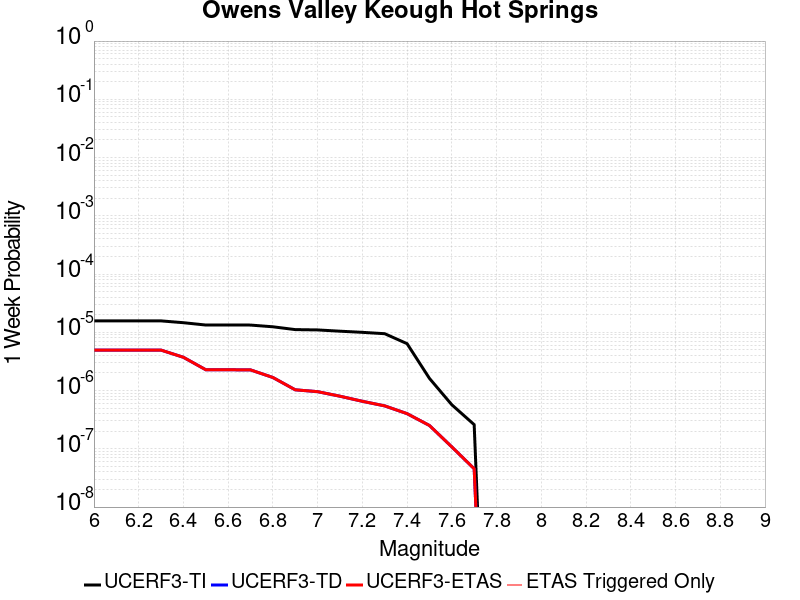 | 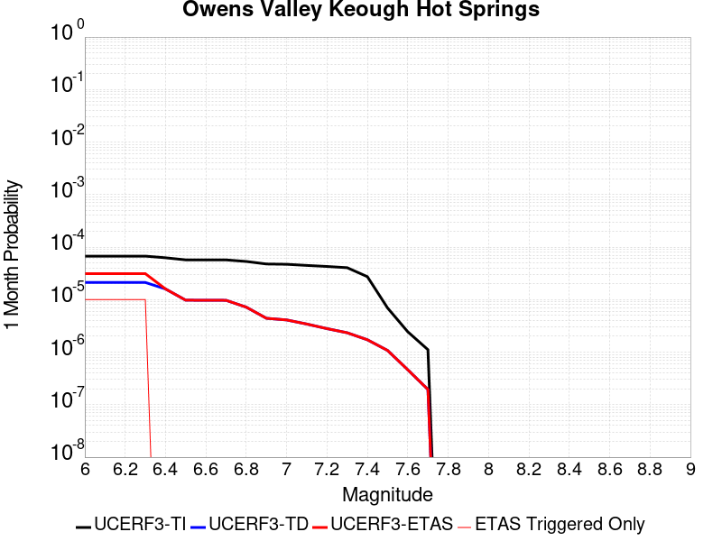 | 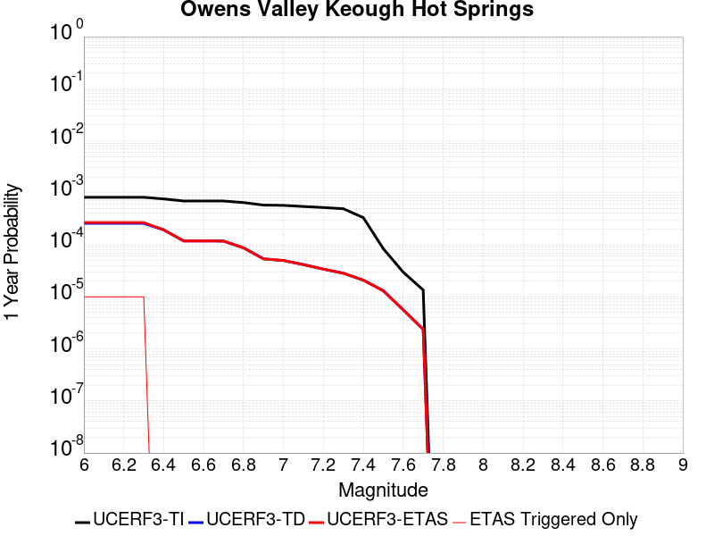 | 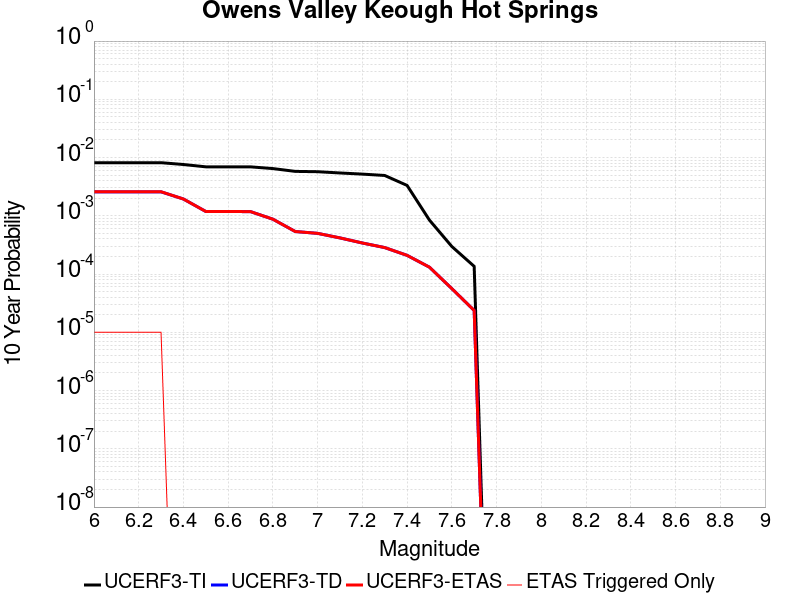 |

| Magnitude | 1 wk TI Prob | 1 wk TD Prob | 1 wk ETAS Prob | 1 wk ETAS/TD Gain | 1 wk ETAS Triggered Only | 1 mo TI Prob | 1 mo TD Prob | 1 mo ETAS Prob | 1 mo ETAS/TD Gain | 1 mo ETAS Triggered Only | 1 yr TI Prob | 1 yr TD Prob | 1 yr ETAS Prob | 1 yr ETAS/TD Gain | 1 yr ETAS Triggered Only | 10 yr TI Prob | 10 yr TD Prob | 10 yr ETAS Prob | 10 yr ETAS/TD Gain | 10 yr ETAS Triggered Only |
|-----|-----|-----|-----|-----|-----|-----|-----|-----|-----|-----|-----|-----|-----|-----|-----|-----|-----|-----|-----|-----|
| 6.0 | 1.5708529E-5 | 4.950463E-6 | 4.950463E-6 | 1.0 | 0.0 | 6.7320536E-5 | 2.1216127E-5 | 3.1215914E-5 | 1.4713296 | 1.0E-5 | 8.193192E-4 | 2.5828084E-4 | 2.6827827E-4 | 1.0387075 | 1.0E-5 | 0.008163051 | 0.0025804387 | 0.002590413 | 1.0038654 | 1.0E-5 |
| 6.1 | 1.5708529E-5 | 4.950463E-6 | 4.950463E-6 | 1.0 | 0.0 | 6.7320536E-5 | 2.1216127E-5 | 3.1215914E-5 | 1.4713296 | 1.0E-5 | 8.193192E-4 | 2.5828084E-4 | 2.6827827E-4 | 1.0387075 | 1.0E-5 | 0.008163051 | 0.0025804387 | 0.002590413 | 1.0038654 | 1.0E-5 |
| 6.2 | 1.5708529E-5 | 4.950463E-6 | 4.950463E-6 | 1.0 | 0.0 | 6.7320536E-5 | 2.1216127E-5 | 3.1215914E-5 | 1.4713296 | 1.0E-5 | 8.193192E-4 | 2.5828084E-4 | 2.6827827E-4 | 1.0387075 | 1.0E-5 | 0.008163051 | 0.0025804387 | 0.002590413 | 1.0038654 | 1.0E-5 |
| 6.3 | 1.5708529E-5 | 4.950463E-6 | 4.950463E-6 | 1.0 | 0.0 | 6.7320536E-5 | 2.1216127E-5 | 3.1215914E-5 | 1.4713296 | 1.0E-5 | 8.193192E-4 | 2.5828084E-4 | 2.6827827E-4 | 1.0387075 | 1.0E-5 | 0.008163051 | 0.0025804387 | 0.002590413 | 1.0038654 | 1.0E-5 |
| 6.4 | 1.4622509E-5 | 3.7263276E-6 | 3.7263276E-6 | 1.0 | 0.0 | 6.266639E-5 | 1.5969896E-5 | 1.5969896E-5 | 1.0 | 0.0 | 7.626962E-4 | 1.9441944E-4 | 1.9441944E-4 | 1.0 | 0.0 | 0.007600839 | 0.0019429466 | 0.0019429466 | 1.0 | 0.0 |
| 6.5 | 1.3335527E-5 | 2.2775241E-6 | 2.2775241E-6 | 1.0 | 0.0 | 5.7151006E-5 | 9.760785E-6 | 9.760785E-6 | 1.0 | 0.0 | 6.955913E-4 | 1.1883176E-4 | 1.1883176E-4 | 1.0 | 0.0 | 0.0069341804 | 0.001187878 | 0.001187878 | 1.0 | 0.0 |
| 6.6 | 1.3332855E-5 | 2.2746733E-6 | 2.2746733E-6 | 1.0 | 0.0 | 5.7139558E-5 | 9.748568E-6 | 9.748568E-6 | 1.0 | 0.0 | 6.9545204E-4 | 1.1868303E-4 | 1.1868303E-4 | 1.0 | 0.0 | 0.0069327964 | 0.0011863923 | 0.0011863923 | 1.0 | 0.0 |
| 6.7 | 1.3318214E-5 | 2.2639038E-6 | 2.2639038E-6 | 1.0 | 0.0 | 5.707681E-5 | 9.702413E-6 | 9.702413E-6 | 1.0 | 0.0 | 6.946886E-4 | 1.18121156E-4 | 1.18121156E-4 | 1.0 | 0.0 | 0.0069252094 | 0.0011807795 | 0.0011807795 | 1.0 | 0.0 |
| 6.8 | 1.2441338E-5 | 1.677594E-6 | 1.677594E-6 | 1.0 | 0.0 | 5.331893E-5 | 7.1896707E-6 | 7.1896707E-6 | 1.0 | 0.0 | 6.489646E-4 | 8.753102E-5 | 8.753102E-5 | 1.0 | 0.0 | 0.0064707273 | 8.751236E-4 | 8.751236E-4 | 1.0 | 0.0 |
| 6.9 | 1.1130476E-5 | 1.0302234E-6 | 1.0302234E-6 | 1.0 | 0.0 | 4.7701167E-5 | 4.4152357E-6 | 4.4152357E-6 | 1.0 | 0.0 | 5.806069E-4 | 5.3754186E-5 | 5.3754186E-5 | 1.0 | 0.0 | 0.0057909233 | 5.375404E-4 | 5.375404E-4 | 1.0 | 0.0 |
| 7.0 | 1.0986073E-5 | 9.577824E-7 | 9.577824E-7 | 1.0 | 0.0 | 4.7082318E-5 | 4.1047756E-6 | 4.1047756E-6 | 1.0 | 0.0 | 5.730765E-4 | 4.9974507E-5 | 4.9974507E-5 | 1.0 | 0.0 | 0.0057160086 | 4.997603E-4 | 4.997603E-4 | 1.0 | 0.0 |
| 7.1 | 1.0451338E-5 | 7.9988575E-7 | 7.9988575E-7 | 1.0 | 0.0 | 4.4790682E-5 | 3.4280772E-6 | 3.4280772E-6 | 1.0 | 0.0 | 5.451901E-4 | 4.1736046E-5 | 4.1736046E-5 | 1.0 | 0.0 | 0.005438545 | 4.1740583E-4 | 4.1740583E-4 | 1.0 | 0.0 |
| 7.2 | 9.989061E-6 | 6.543693E-7 | 6.543693E-7 | 1.0 | 0.0 | 4.280956E-5 | 2.8044367E-6 | 2.8044367E-6 | 1.0 | 0.0 | 5.2108173E-4 | 3.4143486E-5 | 3.4143486E-5 | 1.0 | 0.0 | 0.0051986156 | 3.41488E-4 | 3.41488E-4 | 1.0 | 0.0 |
| 7.3 | 9.465365E-6 | 5.458855E-7 | 5.458855E-7 | 1.0 | 0.0 | 4.056522E-5 | 2.3395073E-6 | 2.3395073E-6 | 1.0 | 0.0 | 4.937696E-4 | 2.8483131E-5 | 2.8483131E-5 | 1.0 | 0.0 | 0.0049267393 | 2.8489542E-4 | 2.8489542E-4 | 1.0 | 0.0 |
| 7.4 | 6.3824805E-6 | 4.0153776E-7 | 4.0153776E-7 | 1.0 | 0.0 | 2.73532E-5 | 1.7208749E-6 | 1.7208749E-6 | 1.0 | 0.0 | 3.3297433E-4 | 2.0951453E-5 | 2.0951453E-5 | 1.0 | 0.0 | 0.0033247585 | 2.0955436E-4 | 2.0955436E-4 | 1.0 | 0.0 |
| 7.5 | 1.6192645E-6 | 2.5156373E-7 | 2.5156373E-7 | 1.0 | 0.0 | 6.9396865E-6 | 1.0781299E-6 | 1.0781299E-6 | 1.0 | 0.0 | 8.448741E-5 | 1.3126153E-5 | 1.3126153E-5 | 1.0 | 0.0 | 8.4455294E-4 | 1.3125391E-4 | 1.3125391E-4 | 1.0 | 0.0 |
| 7.6 | 5.7062545E-7 | 1.0790214E-7 | 1.0790214E-7 | 1.0 | 0.0 | 2.4455355E-6 | 4.6243767E-7 | 4.6243767E-7 | 1.0 | 0.0 | 2.9773988E-5 | 5.630165E-6 | 5.630165E-6 | 1.0 | 0.0 | 2.977E-4 | 5.6300305E-5 | 5.6300305E-5 | 1.0 | 0.0 |
| 7.7 | 2.5988817E-7 | 4.5445965E-8 | 4.5445965E-8 | 1.0 | 0.0 | 1.113806E-6 | 1.9476842E-7 | 1.9476842E-7 | 1.0 | 0.0 | 1.3560503E-5 | 2.3713033E-6 | 2.3713033E-6 | 1.0 | 0.0 | 1.3559677E-4 | 2.3712824E-5 | 2.3712824E-5 | 1.0 | 0.0 |

## Earthquake Valley (So Extension)
*[(top)](#table-of-contents)*

| 1 Week | 1 Month | 1 Year | 10 Year |
|-----|-----|-----|-----|
| 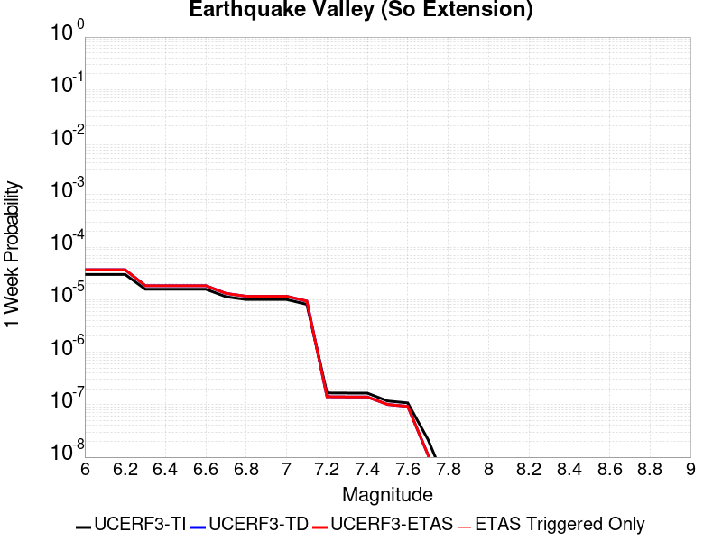 | 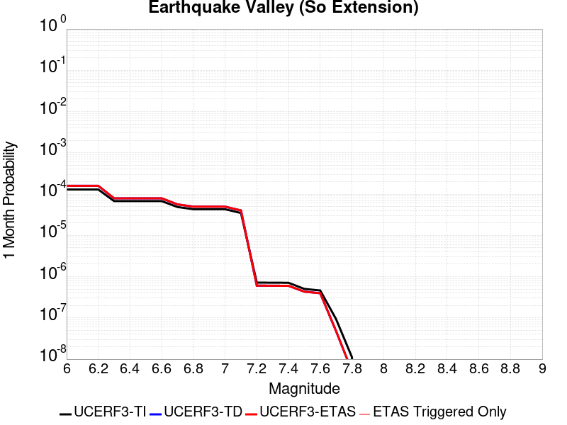 | 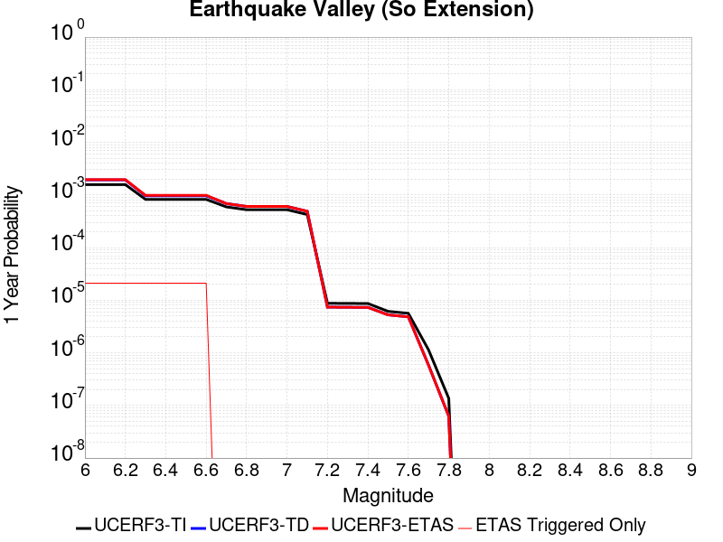 | 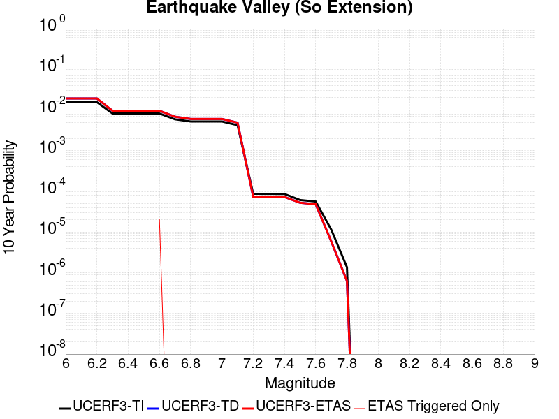 |

| Magnitude | 1 wk TI Prob | 1 wk TD Prob | 1 wk ETAS Prob | 1 wk ETAS/TD Gain | 1 wk ETAS Triggered Only | 1 mo TI Prob | 1 mo TD Prob | 1 mo ETAS Prob | 1 mo ETAS/TD Gain | 1 mo ETAS Triggered Only | 1 yr TI Prob | 1 yr TD Prob | 1 yr ETAS Prob | 1 yr ETAS/TD Gain | 1 yr ETAS Triggered Only | 10 yr TI Prob | 10 yr TD Prob | 10 yr ETAS Prob | 10 yr ETAS/TD Gain | 10 yr ETAS Triggered Only |
|-----|-----|-----|-----|-----|-----|-----|-----|-----|-----|-----|-----|-----|-----|-----|-----|-----|-----|-----|-----|-----|
| 6.0 | 3.0194888E-5 | 3.707208E-5 | 3.707208E-5 | 1.0 | 0.0 | 1.2940024E-4 | 1.5887374E-4 | 1.5887374E-4 | 1.0 | 0.0 | 0.0015743093 | 0.0019330877 | 0.0019430685 | 1.0051631 | 1.0E-5 | 0.01563203 | 0.0192131 | 0.01922291 | 1.0005105 | 1.0E-5 |
| 6.1 | 3.0194888E-5 | 3.707208E-5 | 3.707208E-5 | 1.0 | 0.0 | 1.2940024E-4 | 1.5887374E-4 | 1.5887374E-4 | 1.0 | 0.0 | 0.0015743093 | 0.0019330877 | 0.0019430685 | 1.0051631 | 1.0E-5 | 0.01563203 | 0.0192131 | 0.01922291 | 1.0005105 | 1.0E-5 |
| 6.2 | 3.0194888E-5 | 3.707208E-5 | 3.707208E-5 | 1.0 | 0.0 | 1.2940024E-4 | 1.5887374E-4 | 1.5887374E-4 | 1.0 | 0.0 | 0.0015743093 | 0.0019330877 | 0.0019430685 | 1.0051631 | 1.0E-5 | 0.01563203 | 0.0192131 | 0.01922291 | 1.0005105 | 1.0E-5 |
| 6.3 | 1.5795305E-5 | 1.8446612E-5 | 1.8446612E-5 | 1.0 | 0.0 | 6.769241E-5 | 7.905514E-5 | 7.905514E-5 | 1.0 | 0.0 | 8.238434E-4 | 9.621823E-4 | 9.721727E-4 | 1.010383 | 1.0E-5 | 0.008207959 | 0.0095910635 | 0.009600967 | 1.0010326 | 1.0E-5 |
| 6.4 | 1.5795305E-5 | 1.8446612E-5 | 1.8446612E-5 | 1.0 | 0.0 | 6.769241E-5 | 7.905514E-5 | 7.905514E-5 | 1.0 | 0.0 | 8.238434E-4 | 9.621823E-4 | 9.721727E-4 | 1.010383 | 1.0E-5 | 0.008207959 | 0.0095910635 | 0.009600967 | 1.0010326 | 1.0E-5 |
| 6.5 | 1.5795305E-5 | 1.8446612E-5 | 1.8446612E-5 | 1.0 | 0.0 | 6.769241E-5 | 7.905514E-5 | 7.905514E-5 | 1.0 | 0.0 | 8.238434E-4 | 9.621823E-4 | 9.721727E-4 | 1.010383 | 1.0E-5 | 0.008207959 | 0.0095910635 | 0.009600967 | 1.0010326 | 1.0E-5 |
| 6.6 | 1.5795305E-5 | 1.8446612E-5 | 1.8446612E-5 | 1.0 | 0.0 | 6.769241E-5 | 7.905514E-5 | 7.905514E-5 | 1.0 | 0.0 | 8.238434E-4 | 9.621823E-4 | 9.721727E-4 | 1.010383 | 1.0E-5 | 0.008207959 | 0.0095910635 | 0.009600967 | 1.0010326 | 1.0E-5 |
| 6.7 | 1.1363076E-5 | 1.3138288E-5 | 1.3138288E-5 | 1.0 | 0.0 | 4.8697988E-5 | 5.6306162E-5 | 5.6306162E-5 | 1.0 | 0.0 | 5.927367E-4 | 6.8538805E-4 | 6.8538805E-4 | 1.0 | 0.0 | 0.0059115817 | 0.006840215 | 0.006840215 | 1.0 | 0.0 |
| 6.8 | 1.0049611E-5 | 1.1594328E-5 | 1.1594328E-5 | 1.0 | 0.0 | 4.306905E-5 | 4.968944E-5 | 4.968944E-5 | 1.0 | 0.0 | 5.242395E-4 | 6.0487416E-4 | 6.0487416E-4 | 1.0 | 0.0 | 0.0052300454 | 0.0060394546 | 0.0060394546 | 1.0 | 0.0 |
| 6.9 | 1.0049611E-5 | 1.1594328E-5 | 1.1594328E-5 | 1.0 | 0.0 | 4.306905E-5 | 4.968944E-5 | 4.968944E-5 | 1.0 | 0.0 | 5.242395E-4 | 6.0487416E-4 | 6.0487416E-4 | 1.0 | 0.0 | 0.0052300454 | 0.0060394546 | 0.0060394546 | 1.0 | 0.0 |
| 7.0 | 1.0049611E-5 | 1.1594328E-5 | 1.1594328E-5 | 1.0 | 0.0 | 4.306905E-5 | 4.968944E-5 | 4.968944E-5 | 1.0 | 0.0 | 5.242395E-4 | 6.0487416E-4 | 6.0487416E-4 | 1.0 | 0.0 | 0.0052300454 | 0.0060394546 | 0.0060394546 | 1.0 | 0.0 |
| 7.1 | 8.140254E-6 | 9.3834515E-6 | 9.3834515E-6 | 1.0 | 0.0 | 3.4886336E-5 | 4.021455E-5 | 4.021455E-5 | 1.0 | 0.0 | 4.2465836E-4 | 4.895692E-4 | 4.895692E-4 | 1.0 | 0.0 | 0.0042384774 | 0.004891483 | 0.004891483 | 1.0 | 0.0 |
| 7.2 | 1.673835E-7 | 1.4153493E-7 | 1.4153493E-7 | 1.0 | 0.0 | 7.173577E-7 | 6.065781E-7 | 6.065781E-7 | 1.0 | 0.0 | 8.733795E-6 | 7.3850674E-6 | 7.3850674E-6 | 1.0 | 0.0 | 8.733451E-5 | 7.3848576E-5 | 7.3848576E-5 | 1.0 | 0.0 |
| 7.3 | 1.6632116E-7 | 1.4051723E-7 | 1.4051723E-7 | 1.0 | 0.0 | 7.1280476E-7 | 6.022166E-7 | 6.022166E-7 | 1.0 | 0.0 | 8.678364E-6 | 7.331966E-6 | 7.331966E-6 | 1.0 | 0.0 | 8.6780245E-5 | 7.33176E-5 | 7.33176E-5 | 1.0 | 0.0 |
| 7.4 | 1.6569169E-7 | 1.3996352E-7 | 1.3996352E-7 | 1.0 | 0.0 | 7.1010703E-7 | 5.9984353E-7 | 5.9984353E-7 | 1.0 | 0.0 | 8.645519E-6 | 7.303074E-6 | 7.303074E-6 | 1.0 | 0.0 | 8.645182E-5 | 7.30287E-5 | 7.30287E-5 | 1.0 | 0.0 |
| 7.5 | 1.1764555E-7 | 1.0095245E-7 | 1.0095245E-7 | 1.0 | 0.0 | 5.041951E-7 | 4.3265328E-7 | 4.3265328E-7 | 1.0 | 0.0 | 6.138558E-6 | 5.267543E-6 | 5.267543E-6 | 1.0 | 0.0 | 6.1383886E-5 | 5.2674397E-5 | 5.2674397E-5 | 1.0 | 0.0 |
| 7.6 | 1.07927605E-7 | 9.2600665E-8 | 9.2600665E-8 | 1.0 | 0.0 | 4.6254678E-7 | 3.9685995E-7 | 3.9685995E-7 | 1.0 | 0.0 | 5.6314925E-6 | 4.8317615E-6 | 4.8317615E-6 | 1.0 | 0.0 | 5.63135E-5 | 4.831677E-5 | 4.831677E-5 | 1.0 | 0.0 |
| 7.7 | 2.1826905E-8 | 1.1179958E-8 | 1.1179958E-8 | 1.0 | 0.0 | 9.3543875E-8 | 4.791411E-8 | 4.791411E-8 | 1.0 | 0.0 | 1.1388961E-6 | 5.8335416E-7 | 5.8335416E-7 | 1.0 | 0.0 | 1.1388902E-5 | 5.8335318E-6 | 5.8335318E-6 | 1.0 | 0.0 |
| 7.8 | 2.6169649E-9 | 1.1968753E-9 | 1.1968753E-9 | 1.0 | 0.0 | 1.1215564E-8 | 5.1294657E-9 | 5.1294657E-9 | 1.0 | 0.0 | 1.3654947E-7 | 6.245124E-8 | 6.245124E-8 | 1.0 | 0.0 | 1.365494E-6 | 6.2451244E-7 | 6.2451244E-7 | 1.0 | 0.0 |

## Likely 2011 CFM
*[(top)](#table-of-contents)*

| 1 Week | 1 Month | 1 Year | 10 Year |
|-----|-----|-----|-----|
|  |  | 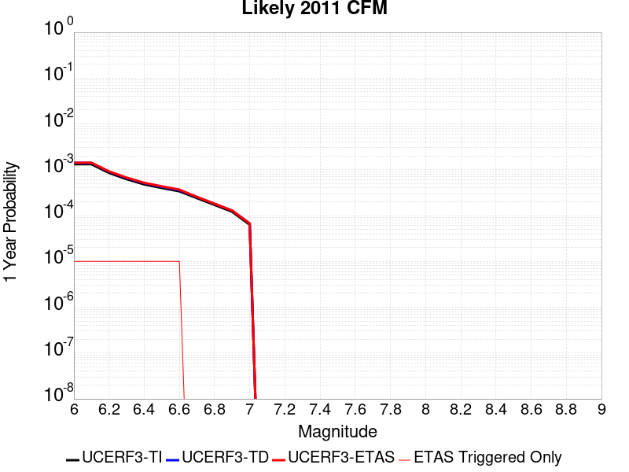 | 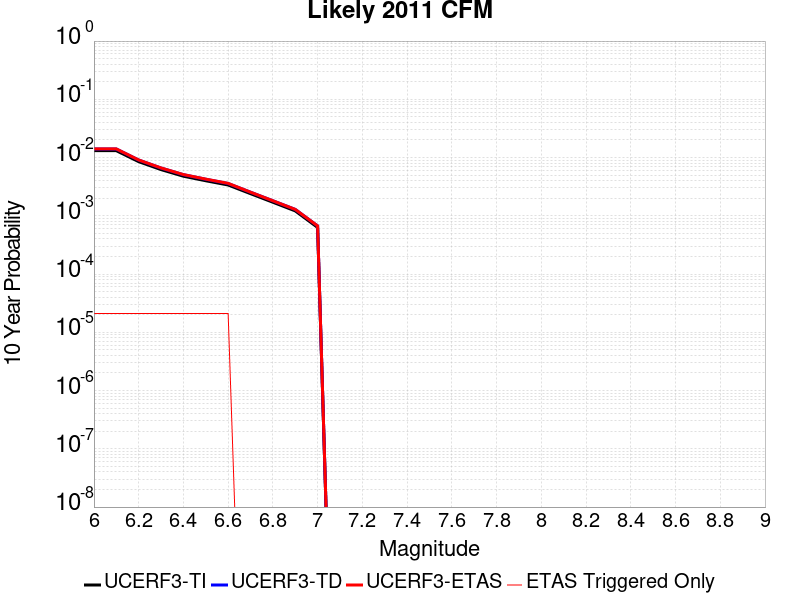 |

| Magnitude | 1 wk TI Prob | 1 wk TD Prob | 1 wk ETAS Prob | 1 wk ETAS/TD Gain | 1 wk ETAS Triggered Only | 1 mo TI Prob | 1 mo TD Prob | 1 mo ETAS Prob | 1 mo ETAS/TD Gain | 1 mo ETAS Triggered Only | 1 yr TI Prob | 1 yr TD Prob | 1 yr ETAS Prob | 1 yr ETAS/TD Gain | 1 yr ETAS Triggered Only | 10 yr TI Prob | 10 yr TD Prob | 10 yr ETAS Prob | 10 yr ETAS/TD Gain | 10 yr ETAS Triggered Only |
|-----|-----|-----|-----|-----|-----|-----|-----|-----|-----|-----|-----|-----|-----|-----|-----|-----|-----|-----|-----|-----|
| 6.0 | 2.5315949E-5 | 2.7104748E-5 | 2.7104748E-5 | 1.0 | 0.0 | 1.0849241E-4 | 1.16158284E-4 | 1.16158284E-4 | 1.0 | 0.0 | 0.0013200947 | 0.0014133542 | 0.00142334 | 1.0070654 | 1.0E-5 | 0.013122803 | 0.01404831 | 0.01405817 | 1.0007018 | 1.0E-5 |
| 6.1 | 2.5315949E-5 | 2.7104748E-5 | 2.7104748E-5 | 1.0 | 0.0 | 1.0849241E-4 | 1.16158284E-4 | 1.16158284E-4 | 1.0 | 0.0 | 0.0013200947 | 0.0014133542 | 0.00142334 | 1.0070654 | 1.0E-5 | 0.013122803 | 0.01404831 | 0.01405817 | 1.0007018 | 1.0E-5 |
| 6.2 | 1.6375941E-5 | 1.7465842E-5 | 1.7465842E-5 | 1.0 | 0.0 | 7.0180715E-5 | 7.485153E-5 | 7.485153E-5 | 1.0 | 0.0 | 8.5411523E-4 | 9.109487E-4 | 9.2093955E-4 | 1.0109676 | 1.0E-5 | 0.008508399 | 0.009073433 | 0.009083342 | 1.0010921 | 1.0E-5 |
| 6.3 | 1.1945543E-5 | 1.2712587E-5 | 1.2712587E-5 | 1.0 | 0.0 | 5.119418E-5 | 5.4481407E-5 | 5.4481407E-5 | 1.0 | 0.0 | 6.2311086E-4 | 6.631146E-4 | 6.73108E-4 | 1.0150703 | 1.0E-5 | 0.0062136655 | 0.0066119144 | 0.0066218483 | 1.0015024 | 1.0E-5 |
| 6.4 | 9.192729E-6 | 9.768488E-6 | 9.768488E-6 | 1.0 | 0.0 | 3.939681E-5 | 4.1864292E-5 | 4.1864292E-5 | 1.0 | 0.0 | 4.7955062E-4 | 5.0958124E-4 | 5.195762E-4 | 1.019614 | 1.0E-5 | 0.004785171 | 0.0050844094 | 0.005094358 | 1.0019568 | 1.0E-5 |
| 6.5 | 7.67906E-6 | 8.152622E-6 | 8.152622E-6 | 1.0 | 0.0 | 3.2909844E-5 | 3.4939352E-5 | 3.4939352E-5 | 1.0 | 0.0 | 4.006037E-4 | 4.2530545E-4 | 4.3530122E-4 | 1.0235025 | 1.0E-5 | 0.0039988225 | 0.004245108 | 0.0042550657 | 1.0023457 | 1.0E-5 |
| 6.6 | 6.4884057E-6 | 6.8847507E-6 | 6.8847507E-6 | 1.0 | 0.0 | 2.7807157E-5 | 2.9505749E-5 | 2.9505749E-5 | 1.0 | 0.0 | 3.3849955E-4 | 3.591747E-4 | 3.6917112E-4 | 1.0278316 | 1.0E-5 | 0.003379844 | 0.0035860867 | 0.003596051 | 1.0027785 | 1.0E-5 |
| 6.7 | 4.6060636E-6 | 4.884041E-6 | 4.884041E-6 | 1.0 | 0.0 | 1.9740122E-5 | 2.0931442E-5 | 2.0931442E-5 | 1.0 | 0.0 | 2.403095E-4 | 2.5481134E-4 | 2.5481134E-4 | 1.0 | 0.0 | 0.002400498 | 0.0025452746 | 0.0025452746 | 1.0 | 0.0 |
| 6.8 | 3.2795615E-6 | 3.4773732E-6 | 3.4773732E-6 | 1.0 | 0.0 | 1.4055187E-5 | 1.4902946E-5 | 1.4902946E-5 | 1.0 | 0.0 | 1.7110848E-4 | 1.8142881E-4 | 1.8142881E-4 | 1.0 | 0.0 | 0.0017097679 | 0.0018128622 | 0.0018128622 | 1.0 | 0.0 |
| 6.9 | 2.3289967E-6 | 2.4705569E-6 | 2.4705569E-6 | 1.0 | 0.0 | 9.981376E-6 | 1.058806E-5 | 1.058806E-5 | 1.0 | 0.0 | 1.2151648E-4 | 1.2890245E-4 | 1.2890245E-4 | 1.0 | 0.0 | 0.0012145005 | 0.0012883197 | 0.0012883197 | 1.0 | 0.0 |
| 7.0 | 1.211292E-6 | 1.2863958E-6 | 1.2863958E-6 | 1.0 | 0.0 | 5.1912407E-6 | 5.5131145E-6 | 5.5131145E-6 | 1.0 | 0.0 | 6.320152E-5 | 6.712041E-5 | 6.712041E-5 | 1.0 | 0.0 | 6.3183554E-4 | 6.710312E-4 | 6.710312E-4 | 1.0 | 0.0 |

## Great Valley 04a Trout Creek
*[(top)](#table-of-contents)*

| 1 Week | 1 Month | 1 Year | 10 Year |
|-----|-----|-----|-----|
|  |  |  |  |

| Magnitude | 1 wk TI Prob | 1 wk TD Prob | 1 wk ETAS Prob | 1 wk ETAS/TD Gain | 1 wk ETAS Triggered Only | 1 mo TI Prob | 1 mo TD Prob | 1 mo ETAS Prob | 1 mo ETAS/TD Gain | 1 mo ETAS Triggered Only | 1 yr TI Prob | 1 yr TD Prob | 1 yr ETAS Prob | 1 yr ETAS/TD Gain | 1 yr ETAS Triggered Only | 10 yr TI Prob | 10 yr TD Prob | 10 yr ETAS Prob | 10 yr ETAS/TD Gain | 10 yr ETAS Triggered Only |
|-----|-----|-----|-----|-----|-----|-----|-----|-----|-----|-----|-----|-----|-----|-----|-----|-----|-----|-----|-----|-----|
| 6.0 | 1.4088538E-5 | 1.5719554E-5 | 1.5719554E-5 | 1.0 | 0.0 | 6.037805E-5 | 6.7367844E-5 | 6.7367844E-5 | 1.0 | 0.0 | 7.3485484E-4 | 8.199074E-4 | 8.199074E-4 | 1.0 | 0.0 | 0.007324295 | 0.008170108 | 0.008180026 | 1.001214 | 1.0E-5 |
| 6.1 | 1.4088538E-5 | 1.5719554E-5 | 1.5719554E-5 | 1.0 | 0.0 | 6.037805E-5 | 6.7367844E-5 | 6.7367844E-5 | 1.0 | 0.0 | 7.3485484E-4 | 8.199074E-4 | 8.199074E-4 | 1.0 | 0.0 | 0.007324295 | 0.008170108 | 0.008180026 | 1.001214 | 1.0E-5 |
| 6.2 | 1.4088538E-5 | 1.5719554E-5 | 1.5719554E-5 | 1.0 | 0.0 | 6.037805E-5 | 6.7367844E-5 | 6.7367844E-5 | 1.0 | 0.0 | 7.3485484E-4 | 8.199074E-4 | 8.199074E-4 | 1.0 | 0.0 | 0.007324295 | 0.008170108 | 0.008180026 | 1.001214 | 1.0E-5 |
| 6.3 | 1.2882862E-5 | 1.4378603E-5 | 1.4378603E-5 | 1.0 | 0.0 | 5.5211098E-5 | 6.1621184E-5 | 6.1621184E-5 | 1.0 | 0.0 | 6.7198783E-4 | 7.4999005E-4 | 7.4999005E-4 | 1.0 | 0.0 | 0.0066995937 | 0.0074756527 | 0.0074855783 | 1.0013276 | 1.0E-5 |
| 6.4 | 1.2882862E-5 | 1.4378603E-5 | 1.4378603E-5 | 1.0 | 0.0 | 5.5211098E-5 | 6.1621184E-5 | 6.1621184E-5 | 1.0 | 0.0 | 6.7198783E-4 | 7.4999005E-4 | 7.4999005E-4 | 1.0 | 0.0 | 0.0066995937 | 0.0074756527 | 0.0074855783 | 1.0013276 | 1.0E-5 |
| 6.5 | 1.2762329E-5 | 1.424516E-5 | 1.424516E-5 | 1.0 | 0.0 | 5.469455E-5 | 6.1049315E-5 | 6.1049315E-5 | 1.0 | 0.0 | 6.657027E-4 | 7.430323E-4 | 7.430323E-4 | 1.0 | 0.0 | 0.00663712 | 0.0074065393 | 0.007416465 | 1.0013402 | 1.0E-5 |
| 6.6 | 1.2762329E-5 | 1.424516E-5 | 1.424516E-5 | 1.0 | 0.0 | 5.469455E-5 | 6.1049315E-5 | 6.1049315E-5 | 1.0 | 0.0 | 6.657027E-4 | 7.430323E-4 | 7.430323E-4 | 1.0 | 0.0 | 0.00663712 | 0.0074065393 | 0.007416465 | 1.0013402 | 1.0E-5 |
| 6.7 | 1.2557959E-5 | 1.4019395E-5 | 1.4019395E-5 | 1.0 | 0.0 | 5.3818712E-5 | 6.0081795E-5 | 6.0081795E-5 | 1.0 | 0.0 | 6.5504585E-4 | 7.312607E-4 | 7.312607E-4 | 1.0 | 0.0 | 0.006531183 | 0.007289598 | 0.007299525 | 1.0013618 | 1.0E-5 |
| 6.8 | 1.1871544E-5 | 1.3258823E-5 | 1.3258823E-5 | 1.0 | 0.0 | 5.0877054E-5 | 5.6822348E-5 | 5.6822348E-5 | 1.0 | 0.0 | 6.1925204E-4 | 6.916025E-4 | 6.916025E-4 | 1.0 | 0.0 | 0.0061752927 | 0.0068955184 | 0.0069054496 | 1.0014402 | 1.0E-5 |
| 6.9 | 1.0500373E-5 | 1.1731261E-5 | 1.1731261E-5 | 1.0 | 0.0 | 4.5000823E-5 | 5.0275914E-5 | 5.0275914E-5 | 1.0 | 0.0 | 5.4774724E-4 | 6.119459E-4 | 6.119459E-4 | 1.0 | 0.0 | 0.005463991 | 0.0061034737 | 0.0061034737 | 1.0 | 0.0 |
| 7.0 | 8.524332E-6 | 9.5334835E-6 | 9.5334835E-6 | 1.0 | 0.0 | 3.653234E-5 | 4.0857187E-5 | 4.0857187E-5 | 1.0 | 0.0 | 4.4469046E-4 | 4.9733004E-4 | 4.9733004E-4 | 1.0 | 0.0 | 0.0044380166 | 0.004962902 | 0.004962902 | 1.0 | 0.0 |
| 7.1 | 6.006849E-6 | 6.711559E-6 | 6.711559E-6 | 1.0 | 0.0 | 2.5743384E-5 | 2.876354E-5 | 2.876354E-5 | 1.0 | 0.0 | 3.1338062E-4 | 3.501454E-4 | 3.501454E-4 | 1.0 | 0.0 | 0.0031293905 | 0.0034964874 | 0.0034964874 | 1.0 | 0.0 |
| 7.2 | 2.9122193E-6 | 3.2465305E-6 | 3.2465305E-6 | 1.0 | 0.0 | 1.248088E-5 | 1.3913637E-5 | 1.3913637E-5 | 1.0 | 0.0 | 1.5194413E-4 | 1.6938712E-4 | 1.6938712E-4 | 1.0 | 0.0 | 0.0015184027 | 0.0016927521 | 0.0016927521 | 1.0 | 0.0 |
| 7.3 | 7.2194007E-7 | 7.988761E-7 | 7.988761E-7 | 1.0 | 0.0 | 3.0940253E-6 | 3.4237528E-6 | 3.4237528E-6 | 1.0 | 0.0 | 3.7669106E-5 | 4.1683852E-5 | 4.1683852E-5 | 1.0 | 0.0 | 3.766272E-4 | 4.168053E-4 | 4.168053E-4 | 1.0 | 0.0 |
| 7.4 | 3.112171E-8 | 3.2068368E-8 | 3.2068368E-8 | 1.0 | 0.0 | 1.3337875E-7 | 1.3743585E-7 | 1.3743585E-7 | 1.0 | 0.0 | 1.6238852E-6 | 1.6732803E-6 | 1.6732803E-6 | 1.0 | 0.0 | 1.6238733E-5 | 1.6732685E-5 | 1.6732685E-5 | 1.0 | 0.0 |

## Rocky Ledge 2011 CFM
*[(top)](#table-of-contents)*

| 1 Week | 1 Month | 1 Year | 10 Year |
|-----|-----|-----|-----|
| 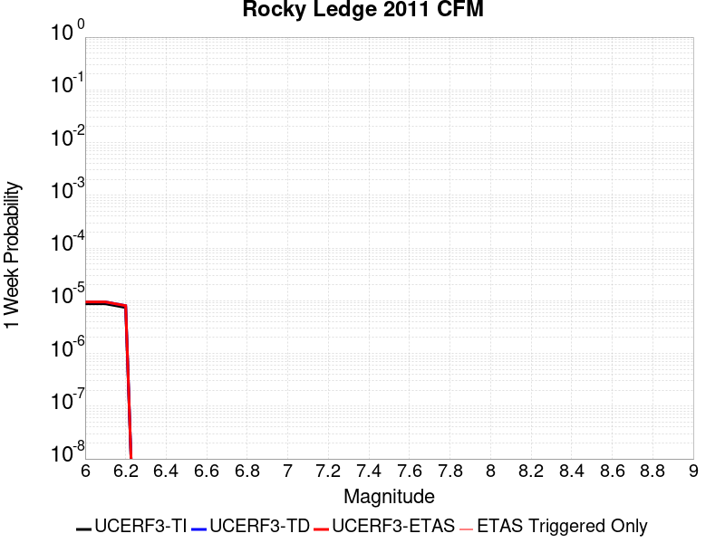 |  |  |  |

| Magnitude | 1 wk TI Prob | 1 wk TD Prob | 1 wk ETAS Prob | 1 wk ETAS/TD Gain | 1 wk ETAS Triggered Only | 1 mo TI Prob | 1 mo TD Prob | 1 mo ETAS Prob | 1 mo ETAS/TD Gain | 1 mo ETAS Triggered Only | 1 yr TI Prob | 1 yr TD Prob | 1 yr ETAS Prob | 1 yr ETAS/TD Gain | 1 yr ETAS Triggered Only | 10 yr TI Prob | 10 yr TD Prob | 10 yr ETAS Prob | 10 yr ETAS/TD Gain | 10 yr ETAS Triggered Only |
|-----|-----|-----|-----|-----|-----|-----|-----|-----|-----|-----|-----|-----|-----|-----|-----|-----|-----|-----|-----|-----|
| 6.0 | 8.7550525E-6 | 9.486605E-6 | 9.486605E-6 | 1.0 | 0.0 | 3.7521113E-5 | 4.0656712E-5 | 4.0656712E-5 | 1.0 | 0.0 | 4.567238E-4 | 4.949655E-4 | 4.949655E-4 | 1.0 | 0.0 | 0.0045578624 | 0.0049467194 | 0.0049566696 | 1.0020115 | 1.0E-5 |
| 6.1 | 8.7550525E-6 | 9.486605E-6 | 9.486605E-6 | 1.0 | 0.0 | 3.7521113E-5 | 4.0656712E-5 | 4.0656712E-5 | 1.0 | 0.0 | 4.567238E-4 | 4.949655E-4 | 4.949655E-4 | 1.0 | 0.0 | 0.0045578624 | 0.0049467194 | 0.0049467194 | 1.0 | 0.0 |
| 6.2 | 7.442295E-6 | 8.06304E-6 | 8.06304E-6 | 1.0 | 0.0 | 3.189516E-5 | 3.4555887E-5 | 3.4555887E-5 | 1.0 | 0.0 | 3.8825438E-4 | 4.2071793E-4 | 4.2071793E-4 | 1.0 | 0.0 | 0.0038757676 | 0.004207179 | 0.004207179 | 1.0 | 0.0 |

## South Klamath Lake West
*[(top)](#table-of-contents)*

| 1 Week | 1 Month | 1 Year | 10 Year |
|-----|-----|-----|-----|
| 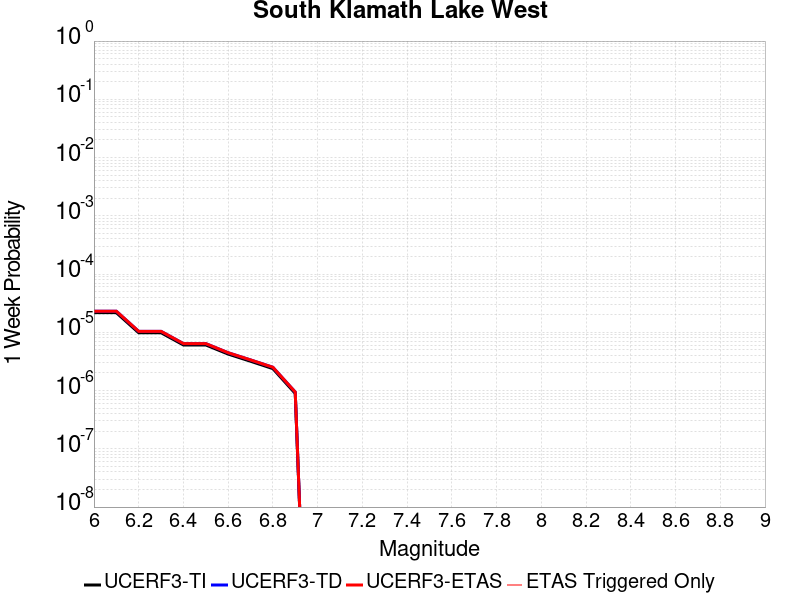 | 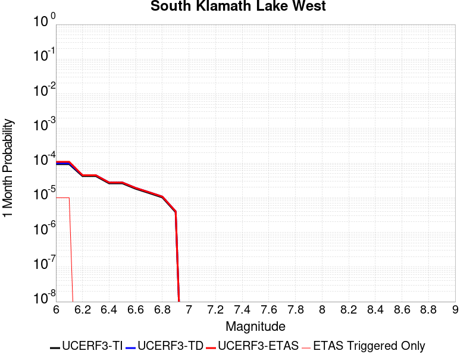 |  |  |

| Magnitude | 1 wk TI Prob | 1 wk TD Prob | 1 wk ETAS Prob | 1 wk ETAS/TD Gain | 1 wk ETAS Triggered Only | 1 mo TI Prob | 1 mo TD Prob | 1 mo ETAS Prob | 1 mo ETAS/TD Gain | 1 mo ETAS Triggered Only | 1 yr TI Prob | 1 yr TD Prob | 1 yr ETAS Prob | 1 yr ETAS/TD Gain | 1 yr ETAS Triggered Only | 10 yr TI Prob | 10 yr TD Prob | 10 yr ETAS Prob | 10 yr ETAS/TD Gain | 10 yr ETAS Triggered Only |
|-----|-----|-----|-----|-----|-----|-----|-----|-----|-----|-----|-----|-----|-----|-----|-----|-----|-----|-----|-----|-----|
| 6.0 | 2.174025E-5 | 2.3042025E-5 | 2.3042025E-5 | 1.0 | 0.0 | 9.3169176E-5 | 9.874817E-5 | 1.0874718E-4 | 1.1012577 | 1.0E-5 | 0.0011337444 | 0.0012016617 | 0.0012116497 | 1.0083119 | 1.0E-5 | 0.011279777 | 0.0119582405 | 0.011968121 | 1.0008262 | 1.0E-5 |
| 6.1 | 2.174025E-5 | 2.3042025E-5 | 2.3042025E-5 | 1.0 | 0.0 | 9.3169176E-5 | 9.874817E-5 | 1.0874718E-4 | 1.1012577 | 1.0E-5 | 0.0011337444 | 0.0012016617 | 0.0012116497 | 1.0083119 | 1.0E-5 | 0.011279777 | 0.0119582405 | 0.011968121 | 1.0008262 | 1.0E-5 |
| 6.2 | 9.834929E-6 | 1.0393841E-5 | 1.0393841E-5 | 1.0 | 0.0 | 4.2149015E-5 | 4.4544326E-5 | 4.4544326E-5 | 1.0 | 0.0 | 5.1304343E-4 | 5.422012E-4 | 5.422012E-4 | 1.0 | 0.0 | 0.0051186057 | 0.0054096854 | 0.0054096854 | 1.0 | 0.0 |
| 6.3 | 9.834929E-6 | 1.0393841E-5 | 1.0393841E-5 | 1.0 | 0.0 | 4.2149015E-5 | 4.4544326E-5 | 4.4544326E-5 | 1.0 | 0.0 | 5.1304343E-4 | 5.422012E-4 | 5.422012E-4 | 1.0 | 0.0 | 0.0051186057 | 0.0054096854 | 0.0054096854 | 1.0 | 0.0 |
| 6.4 | 6.066321E-6 | 6.40043E-6 | 6.40043E-6 | 1.0 | 0.0 | 2.5998259E-5 | 2.743014E-5 | 2.743014E-5 | 1.0 | 0.0 | 3.1648282E-4 | 3.3391351E-4 | 3.3391351E-4 | 1.0 | 0.0 | 0.0031603249 | 0.0033343881 | 0.0033343881 | 1.0 | 0.0 |
| 6.5 | 6.066321E-6 | 6.40043E-6 | 6.40043E-6 | 1.0 | 0.0 | 2.5998259E-5 | 2.743014E-5 | 2.743014E-5 | 1.0 | 0.0 | 3.1648282E-4 | 3.3391351E-4 | 3.3391351E-4 | 1.0 | 0.0 | 0.0031603249 | 0.0033343881 | 0.0033343881 | 1.0 | 0.0 |
| 6.6 | 4.2321803E-6 | 4.461291E-6 | 4.461291E-6 | 1.0 | 0.0 | 1.8137789E-5 | 1.9119685E-5 | 1.9119685E-5 | 1.0 | 0.0 | 2.208052E-4 | 2.3275832E-4 | 2.3275832E-4 | 1.0 | 0.0 | 0.0022058594 | 0.0023252473 | 0.0023252473 | 1.0 | 0.0 |
| 6.7 | 3.186646E-6 | 3.360305E-6 | 3.360305E-6 | 1.0 | 0.0 | 1.3656982E-5 | 1.4401232E-5 | 1.4401232E-5 | 1.0 | 0.0 | 1.6626107E-4 | 1.7532158E-4 | 1.7532158E-4 | 1.0 | 0.0 | 0.0016613674 | 0.0017518997 | 0.0017518997 | 1.0 | 0.0 |
| 6.8 | 2.380121E-6 | 2.510907E-6 | 2.510907E-6 | 1.0 | 0.0 | 1.0200479E-5 | 1.07609885E-5 | 1.07609885E-5 | 1.0 | 0.0 | 1.2418375E-4 | 1.3100762E-4 | 1.3100762E-4 | 1.0 | 0.0 | 0.0012411437 | 0.0013093497 | 0.0013093497 | 1.0 | 0.0 |
| 6.9 | 8.928287E-7 | 9.4302504E-7 | 9.4302504E-7 | 1.0 | 0.0 | 3.826403E-6 | 4.0415307E-6 | 4.0415307E-6 | 1.0 | 0.0 | 4.658546E-5 | 4.9204747E-5 | 4.9204747E-5 | 1.0 | 0.0 | 4.6575698E-4 | 4.9196015E-4 | 4.9196015E-4 | 1.0 | 0.0 |

## Morales (East)
*[(top)](#table-of-contents)*

| 1 Week | 1 Month | 1 Year | 10 Year |
|-----|-----|-----|-----|
| 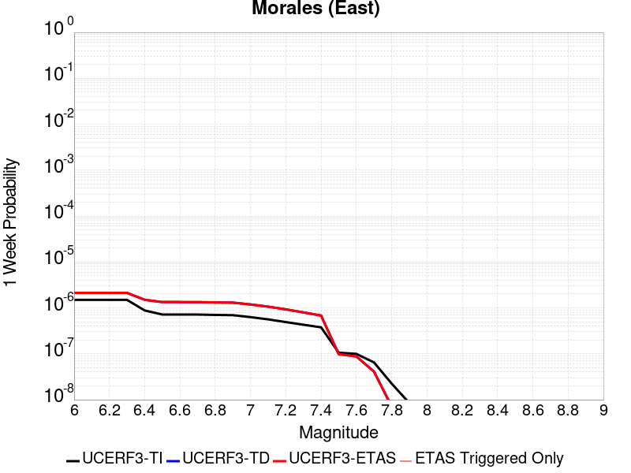 |  | 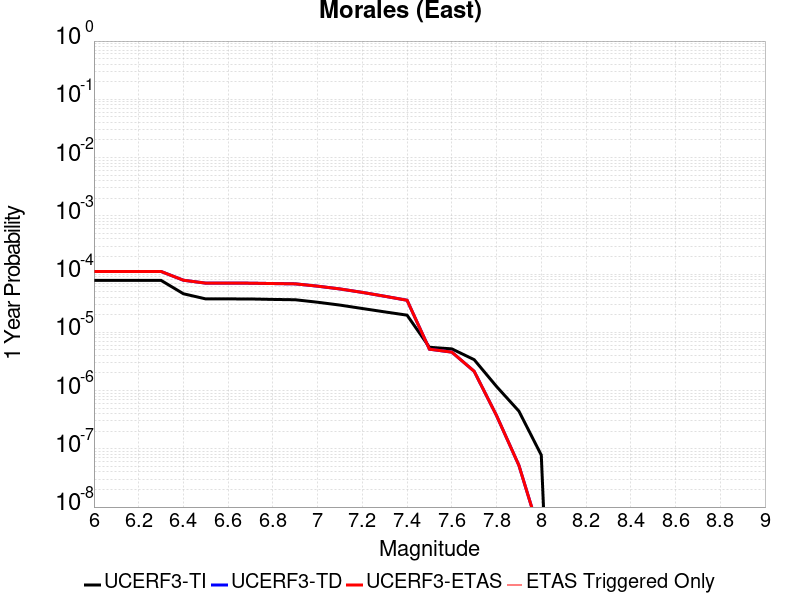 | 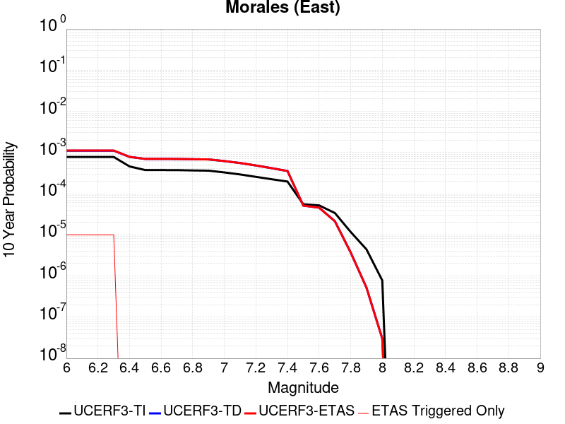 |

| Magnitude | 1 wk TI Prob | 1 wk TD Prob | 1 wk ETAS Prob | 1 wk ETAS/TD Gain | 1 wk ETAS Triggered Only | 1 mo TI Prob | 1 mo TD Prob | 1 mo ETAS Prob | 1 mo ETAS/TD Gain | 1 mo ETAS Triggered Only | 1 yr TI Prob | 1 yr TD Prob | 1 yr ETAS Prob | 1 yr ETAS/TD Gain | 1 yr ETAS Triggered Only | 10 yr TI Prob | 10 yr TD Prob | 10 yr ETAS Prob | 10 yr ETAS/TD Gain | 10 yr ETAS Triggered Only |
|-----|-----|-----|-----|-----|-----|-----|-----|-----|-----|-----|-----|-----|-----|-----|-----|-----|-----|-----|-----|-----|
| 6.0 | 1.4942771E-6 | 2.123544E-6 | 2.123544E-6 | 1.0 | 0.0 | 6.404029E-6 | 9.100874E-6 | 9.100874E-6 | 1.0 | 0.0 | 7.7966266E-5 | 1.1079809E-4 | 1.1079809E-4 | 1.0 | 0.0 | 7.793892E-4 | 0.0011074883 | 0.0011174772 | 1.0090195 | 1.0E-5 |
| 6.1 | 1.4942771E-6 | 2.123544E-6 | 2.123544E-6 | 1.0 | 0.0 | 6.404029E-6 | 9.100874E-6 | 9.100874E-6 | 1.0 | 0.0 | 7.7966266E-5 | 1.1079809E-4 | 1.1079809E-4 | 1.0 | 0.0 | 7.793892E-4 | 0.0011074883 | 0.0011174772 | 1.0090195 | 1.0E-5 |
| 6.2 | 1.4942771E-6 | 2.123544E-6 | 2.123544E-6 | 1.0 | 0.0 | 6.404029E-6 | 9.100874E-6 | 9.100874E-6 | 1.0 | 0.0 | 7.7966266E-5 | 1.1079809E-4 | 1.1079809E-4 | 1.0 | 0.0 | 7.793892E-4 | 0.0011074883 | 0.0011174772 | 1.0090195 | 1.0E-5 |
| 6.3 | 1.4942771E-6 | 2.123544E-6 | 2.123544E-6 | 1.0 | 0.0 | 6.404029E-6 | 9.100874E-6 | 9.100874E-6 | 1.0 | 0.0 | 7.7966266E-5 | 1.1079809E-4 | 1.1079809E-4 | 1.0 | 0.0 | 7.793892E-4 | 0.0011074883 | 0.0011174772 | 1.0090195 | 1.0E-5 |
| 6.4 | 8.798845E-7 | 1.5023381E-6 | 1.5023381E-6 | 1.0 | 0.0 | 3.7709283E-6 | 6.4385767E-6 | 6.4385767E-6 | 1.0 | 0.0 | 4.5910085E-5 | 7.838696E-5 | 7.838696E-5 | 1.0 | 0.0 | 4.59006E-4 | 7.836066E-4 | 7.836066E-4 | 1.0 | 0.0 |
| 6.5 | 7.1751725E-7 | 1.3384879E-6 | 1.3384879E-6 | 1.0 | 0.0 | 3.0750705E-6 | 5.7363645E-6 | 5.7363645E-6 | 1.0 | 0.0 | 3.7438338E-5 | 6.9838075E-5 | 6.9838075E-5 | 1.0 | 0.0 | 3.743203E-4 | 6.981715E-4 | 6.981715E-4 | 1.0 | 0.0 |
| 6.6 | 7.1751725E-7 | 1.3384879E-6 | 1.3384879E-6 | 1.0 | 0.0 | 3.0750705E-6 | 5.7363645E-6 | 5.7363645E-6 | 1.0 | 0.0 | 3.7438338E-5 | 6.9838075E-5 | 6.9838075E-5 | 1.0 | 0.0 | 3.743203E-4 | 6.981715E-4 | 6.981715E-4 | 1.0 | 0.0 |
| 6.7 | 7.159057E-7 | 1.3359539E-6 | 1.3359539E-6 | 1.0 | 0.0 | 3.0681638E-6 | 5.7255043E-6 | 5.7255043E-6 | 1.0 | 0.0 | 3.7354253E-5 | 6.9705864E-5 | 6.9705864E-5 | 1.0 | 0.0 | 3.7347974E-4 | 6.968502E-4 | 6.968502E-4 | 1.0 | 0.0 |
| 6.8 | 7.032203E-7 | 1.3175089E-6 | 1.3175089E-6 | 1.0 | 0.0 | 3.0137978E-6 | 5.646455E-6 | 5.646455E-6 | 1.0 | 0.0 | 3.669237E-5 | 6.87435E-5 | 6.87435E-5 | 1.0 | 0.0 | 3.6686313E-4 | 6.872325E-4 | 6.872325E-4 | 1.0 | 0.0 |
| 6.9 | 6.941549E-7 | 1.3025701E-6 | 1.3025701E-6 | 1.0 | 0.0 | 2.974946E-6 | 5.5824316E-6 | 5.5824316E-6 | 1.0 | 0.0 | 3.6219368E-5 | 6.7964065E-5 | 6.7964065E-5 | 1.0 | 0.0 | 3.6213463E-4 | 6.794429E-4 | 6.794429E-4 | 1.0 | 0.0 |
| 7.0 | 6.2932247E-7 | 1.1877994E-6 | 1.1877994E-6 | 1.0 | 0.0 | 2.6970936E-6 | 5.090559E-6 | 5.090559E-6 | 1.0 | 0.0 | 3.283662E-5 | 6.197586E-5 | 6.197586E-5 | 1.0 | 0.0 | 3.283177E-4 | 6.1959465E-4 | 6.1959465E-4 | 1.0 | 0.0 |
| 7.1 | 5.6200963E-7 | 1.064093E-6 | 1.064093E-6 | 1.0 | 0.0 | 2.4086105E-6 | 4.560391E-6 | 4.560391E-6 | 1.0 | 0.0 | 2.9324437E-5 | 5.5521392E-5 | 5.5521392E-5 | 1.0 | 0.0 | 2.9320567E-4 | 5.5508246E-4 | 5.5508246E-4 | 1.0 | 0.0 |
| 7.2 | 4.91044E-7 | 9.2862194E-7 | 9.2862194E-7 | 1.0 | 0.0 | 2.1044725E-6 | 3.9798024E-6 | 3.9798024E-6 | 1.0 | 0.0 | 2.5621652E-5 | 4.8453054E-5 | 4.8453054E-5 | 1.0 | 0.0 | 2.56187E-4 | 4.8443122E-4 | 4.8443122E-4 | 1.0 | 0.0 |
| 7.3 | 4.2978448E-7 | 7.974413E-7 | 7.974413E-7 | 1.0 | 0.0 | 1.8419321E-6 | 3.4176012E-6 | 3.4176012E-6 | 1.0 | 0.0 | 2.2425293E-5 | 4.160853E-5 | 4.160853E-5 | 1.0 | 0.0 | 2.242303E-4 | 4.1601306E-4 | 4.1601306E-4 | 1.0 | 0.0 |
| 7.4 | 3.774317E-7 | 6.807105E-7 | 6.807105E-7 | 1.0 | 0.0 | 1.6175634E-6 | 2.9173275E-6 | 2.9173275E-6 | 1.0 | 0.0 | 1.9693656E-5 | 3.551791E-5 | 3.551791E-5 | 1.0 | 0.0 | 1.969191E-4 | 3.5512767E-4 | 3.5512767E-4 | 1.0 | 0.0 |
| 7.5 | 1.0603232E-7 | 9.8406424E-8 | 9.8406424E-8 | 1.0 | 0.0 | 4.5442414E-7 | 4.2174173E-7 | 4.2174173E-7 | 1.0 | 0.0 | 5.5326E-6 | 5.1346938E-6 | 5.1346938E-6 | 1.0 | 0.0 | 5.532462E-5 | 5.1348336E-5 | 5.1348336E-5 | 1.0 | 0.0 |
| 7.6 | 9.960384E-8 | 8.755028E-8 | 8.755028E-8 | 1.0 | 0.0 | 4.2687353E-7 | 3.7521542E-7 | 3.7521542E-7 | 1.0 | 0.0 | 5.197173E-6 | 4.568238E-6 | 4.568238E-6 | 1.0 | 0.0 | 5.1970514E-5 | 4.5684028E-5 | 4.5684028E-5 | 1.0 | 0.0 |
| 7.7 | 6.499468E-8 | 4.103351E-8 | 4.103351E-8 | 1.0 | 0.0 | 2.785486E-7 | 1.7585788E-7 | 1.7585788E-7 | 1.0 | 0.0 | 3.3913238E-6 | 2.1410676E-6 | 2.1410676E-6 | 1.0 | 0.0 | 3.3912722E-5 | 2.1413045E-5 | 2.1413045E-5 | 1.0 | 0.0 |
| 7.8 | 2.2517119E-8 | 7.1293824E-9 | 7.1293824E-9 | 1.0 | 0.0 | 9.6501935E-8 | 3.0554492E-8 | 3.0554492E-8 | 1.0 | 0.0 | 1.1749105E-6 | 3.720009E-7 | 3.720009E-7 | 1.0 | 0.0 | 1.1749043E-5 | 3.7225666E-6 | 3.7225666E-6 | 1.0 | 0.0 |
| 7.9 | 8.493023E-9 | 9.962774E-10 | 9.962774E-10 | 1.0 | 0.0 | 3.639867E-8 | 4.2697574E-9 | 4.2697574E-9 | 1.0 | 0.0 | 4.4315374E-7 | 5.19843E-8 | 5.19843E-8 | 1.0 | 0.0 | 4.4315284E-6 | 5.2196486E-7 | 5.2196486E-7 | 1.0 | 0.0 |
| 8.0 | 1.4971842E-9 | 5.5340177E-11 | 5.5340177E-11 | 1.0 | 0.0 | 6.4165038E-9 | 2.3717173E-10 | 2.3717173E-10 | 1.0 | 0.0 | 7.812093E-8 | 2.887568E-9 | 2.887568E-9 | 1.0 | 0.0 | 7.81209E-7 | 3.0142694E-8 | 3.0142694E-8 | 1.0 | 0.0 |

## Concord 2011 CFM
*[(top)](#table-of-contents)*

| 1 Week | 1 Month | 1 Year | 10 Year |
|-----|-----|-----|-----|
|  |  | 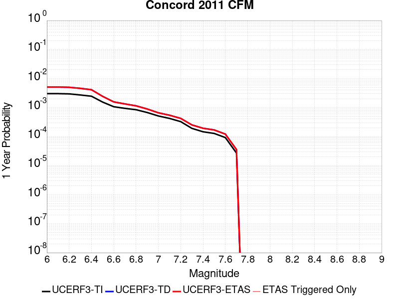 | 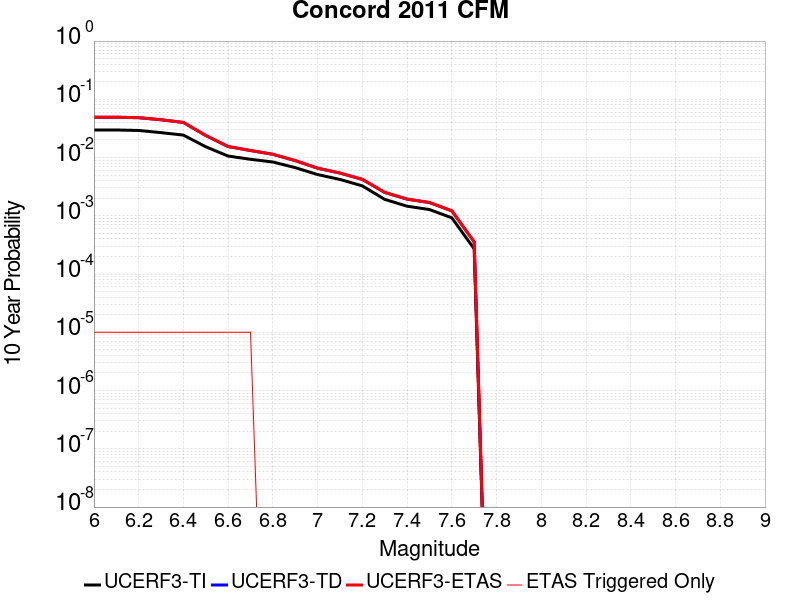 |

| Magnitude | 1 wk TI Prob | 1 wk TD Prob | 1 wk ETAS Prob | 1 wk ETAS/TD Gain | 1 wk ETAS Triggered Only | 1 mo TI Prob | 1 mo TD Prob | 1 mo ETAS Prob | 1 mo ETAS/TD Gain | 1 mo ETAS Triggered Only | 1 yr TI Prob | 1 yr TD Prob | 1 yr ETAS Prob | 1 yr ETAS/TD Gain | 1 yr ETAS Triggered Only | 10 yr TI Prob | 10 yr TD Prob | 10 yr ETAS Prob | 10 yr ETAS/TD Gain | 10 yr ETAS Triggered Only |
|-----|-----|-----|-----|-----|-----|-----|-----|-----|-----|-----|-----|-----|-----|-----|-----|-----|-----|-----|-----|-----|
| 6.0 | 5.7865112E-5 | 9.7585355E-5 | 9.7585355E-5 | 1.0 | 0.0 | 2.4796976E-4 | 4.181607E-4 | 4.181607E-4 | 1.0 | 0.0 | 0.0030148525 | 0.005079743 | 0.005079743 | 1.0 | 0.0 | 0.029742775 | 0.049266078 | 0.049275585 | 1.000193 | 1.0E-5 |
| 6.1 | 5.7865112E-5 | 9.7585355E-5 | 9.7585355E-5 | 1.0 | 0.0 | 2.4796976E-4 | 4.181607E-4 | 4.181607E-4 | 1.0 | 0.0 | 0.0030148525 | 0.005079743 | 0.005079743 | 1.0 | 0.0 | 0.029742775 | 0.049266078 | 0.049275585 | 1.000193 | 1.0E-5 |
| 6.2 | 5.6789337E-5 | 9.578793E-5 | 9.578793E-5 | 1.0 | 0.0 | 2.4336016E-4 | 4.1045985E-4 | 4.1045985E-4 | 1.0 | 0.0 | 0.0029588845 | 0.0049864696 | 0.0049864696 | 1.0 | 0.0 | 0.029197963 | 0.04838257 | 0.048392083 | 1.0001967 | 1.0E-5 |
| 6.3 | 5.203322E-5 | 8.803241E-5 | 8.803241E-5 | 1.0 | 0.0 | 2.2298045E-4 | 3.772316E-4 | 3.772316E-4 | 1.0 | 0.0 | 0.0027114071 | 0.0045839064 | 0.0045839064 | 1.0 | 0.0 | 0.026785625 | 0.04455397 | 0.044563524 | 1.0002145 | 1.0E-5 |
| 6.4 | 4.7120942E-5 | 7.897583E-5 | 7.897583E-5 | 1.0 | 0.0 | 2.0193127E-4 | 3.3842813E-4 | 3.3842813E-4 | 1.0 | 0.0 | 0.0024557412 | 0.004113323 | 0.004113323 | 1.0 | 0.0 | 0.024287801 | 0.040080756 | 0.040090356 | 1.0002395 | 1.0E-5 |
| 6.5 | 2.9598437E-5 | 4.6675777E-5 | 4.6675777E-5 | 1.0 | 0.0 | 1.2684427E-4 | 2.000249E-4 | 2.000249E-4 | 1.0 | 0.0 | 0.001543235 | 0.0024327936 | 0.0024327936 | 1.0 | 0.0 | 0.015325619 | 0.023909668 | 0.02391943 | 1.0004083 | 1.0E-5 |
| 6.6 | 2.0443718E-5 | 2.9984873E-5 | 2.9984873E-5 | 1.0 | 0.0 | 8.7613E-5 | 1.2850047E-4 | 1.2850047E-4 | 1.0 | 0.0 | 0.0010661662 | 0.0015634067 | 0.0015634067 | 1.0 | 0.0 | 0.010610655 | 0.0154669015 | 0.015476747 | 1.0006366 | 1.0E-5 |
| 6.7 | 1.798539E-5 | 2.5557883E-5 | 2.5557883E-5 | 1.0 | 0.0 | 7.7077966E-5 | 1.0952931E-4 | 1.0952931E-4 | 1.0 | 0.0 | 9.380202E-4 | 0.0013327252 | 0.0013327252 | 1.0 | 0.0 | 0.009340706 | 0.013217516 | 0.013227384 | 1.0007466 | 1.0E-5 |
| 6.8 | 1.613555E-5 | 2.1959608E-5 | 2.1959608E-5 | 1.0 | 0.0 | 6.915052E-5 | 9.4109295E-5 | 9.4109295E-5 | 1.0 | 0.0 | 8.4158237E-4 | 0.0011451923 | 0.0011451923 | 1.0 | 0.0 | 0.008384023 | 0.011378321 | 0.011378321 | 1.0 | 0.0 |
| 6.9 | 1.2916435E-5 | 1.708134E-5 | 1.708134E-5 | 1.0 | 0.0 | 5.5354973E-5 | 7.320372E-5 | 7.320372E-5 | 1.0 | 0.0 | 6.7373837E-4 | 8.908967E-4 | 8.908967E-4 | 1.0 | 0.0 | 0.006716994 | 0.008867833 | 0.008867833 | 1.0 | 0.0 |
| 7.0 | 9.81129E-6 | 1.2631038E-5 | 1.2631038E-5 | 1.0 | 0.0 | 4.2047708E-5 | 5.4131906E-5 | 5.4131906E-5 | 1.0 | 0.0 | 5.118106E-4 | 6.588583E-4 | 6.588583E-4 | 1.0 | 0.0 | 0.005106334 | 0.0065697595 | 0.0065697595 | 1.0 | 0.0 |
| 7.1 | 8.0889195E-6 | 1.04184555E-5 | 1.04184555E-5 | 1.0 | 0.0 | 3.4666336E-5 | 4.4649765E-5 | 4.4649765E-5 | 1.0 | 0.0 | 4.219809E-4 | 5.434764E-4 | 5.434764E-4 | 1.0 | 0.0 | 0.004211805 | 0.0054219896 | 0.0054219896 | 1.0 | 0.0 |
| 7.2 | 6.267438E-6 | 8.115879E-6 | 8.115879E-6 | 1.0 | 0.0 | 2.6860173E-5 | 3.478188E-5 | 3.478188E-5 | 1.0 | 0.0 | 3.2697353E-4 | 4.2338783E-4 | 4.2338783E-4 | 1.0 | 0.0 | 0.0032649285 | 0.004226169 | 0.004226169 | 1.0 | 0.0 |
| 7.3 | 3.6761196E-6 | 4.840281E-6 | 4.840281E-6 | 1.0 | 0.0 | 1.5754704E-5 | 2.0743897E-5 | 2.0743897E-5 | 1.0 | 0.0 | 1.9179663E-4 | 2.5252788E-4 | 2.5252788E-4 | 1.0 | 0.0 | 0.0019163118 | 0.0025226264 | 0.0025226264 | 1.0 | 0.0 |
| 7.4 | 2.8044356E-6 | 3.7096993E-6 | 3.7096993E-6 | 1.0 | 0.0 | 1.2018954E-5 | 1.5898615E-5 | 1.5898615E-5 | 1.0 | 0.0 | 1.4632095E-4 | 1.9354856E-4 | 1.9354856E-4 | 1.0 | 0.0 | 0.0014622464 | 0.0019340349 | 0.0019340349 | 1.0 | 0.0 |
| 7.5 | 2.4578699E-6 | 3.2448306E-6 | 3.2448306E-6 | 1.0 | 0.0 | 1.0533685E-5 | 1.3906343E-5 | 1.3906343E-5 | 1.0 | 0.0 | 1.2824008E-4 | 1.6929668E-4 | 1.6929668E-4 | 1.0 | 0.0 | 0.0012816609 | 0.0016918926 | 0.0016918926 | 1.0 | 0.0 |
| 7.6 | 1.7713267E-6 | 2.335189E-6 | 2.335189E-6 | 1.0 | 0.0 | 7.591378E-6 | 1.0007916E-5 | 1.0007916E-5 | 1.0 | 0.0 | 9.2421105E-5 | 1.2183965E-4 | 1.2183965E-4 | 1.0 | 0.0 | 9.2382677E-4 | 0.0012178655 | 0.0012178655 | 1.0 | 0.0 |
| 7.7 | 5.1912366E-7 | 6.829346E-7 | 6.829346E-7 | 1.0 | 0.0 | 2.2248137E-6 | 2.9268595E-6 | 2.9268595E-6 | 1.0 | 0.0 | 2.708677E-5 | 3.5633944E-5 | 3.5633944E-5 | 1.0 | 0.0 | 2.708347E-4 | 3.5630353E-4 | 3.5630353E-4 | 1.0 | 0.0 |

## McKinleyville (alt1)
*[(top)](#table-of-contents)*

| 1 Week | 1 Month | 1 Year | 10 Year |
|-----|-----|-----|-----|
| 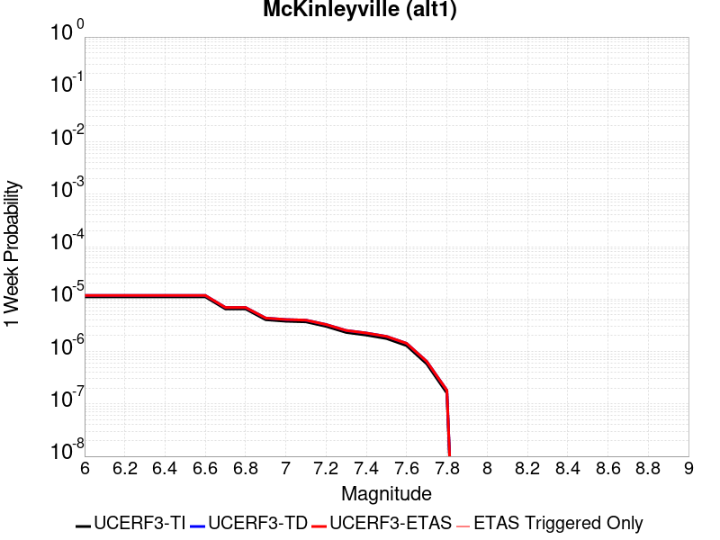 |  |  | 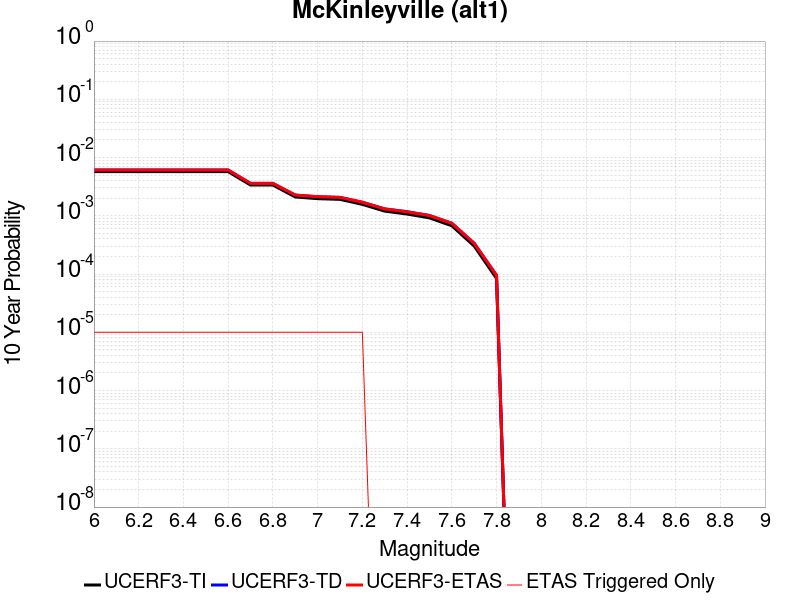 |

| Magnitude | 1 wk TI Prob | 1 wk TD Prob | 1 wk ETAS Prob | 1 wk ETAS/TD Gain | 1 wk ETAS Triggered Only | 1 mo TI Prob | 1 mo TD Prob | 1 mo ETAS Prob | 1 mo ETAS/TD Gain | 1 mo ETAS Triggered Only | 1 yr TI Prob | 1 yr TD Prob | 1 yr ETAS Prob | 1 yr ETAS/TD Gain | 1 yr ETAS Triggered Only | 10 yr TI Prob | 10 yr TD Prob | 10 yr ETAS Prob | 10 yr ETAS/TD Gain | 10 yr ETAS Triggered Only |
|-----|-----|-----|-----|-----|-----|-----|-----|-----|-----|-----|-----|-----|-----|-----|-----|-----|-----|-----|-----|-----|
| 6.0 | 1.1028524E-5 | 1.1727756E-5 | 1.1727756E-5 | 1.0 | 0.0 | 4.7264242E-5 | 5.0260987E-5 | 5.0260987E-5 | 1.0 | 0.0 | 5.7529024E-4 | 6.1178114E-4 | 6.1178114E-4 | 1.0 | 0.0 | 0.005738032 | 0.0061034784 | 0.0061134174 | 1.0016284 | 1.0E-5 |
| 6.1 | 1.1028524E-5 | 1.1727756E-5 | 1.1727756E-5 | 1.0 | 0.0 | 4.7264242E-5 | 5.0260987E-5 | 5.0260987E-5 | 1.0 | 0.0 | 5.7529024E-4 | 6.1178114E-4 | 6.1178114E-4 | 1.0 | 0.0 | 0.005738032 | 0.0061034784 | 0.0061134174 | 1.0016284 | 1.0E-5 |
| 6.2 | 1.1028524E-5 | 1.1727756E-5 | 1.1727756E-5 | 1.0 | 0.0 | 4.7264242E-5 | 5.0260987E-5 | 5.0260987E-5 | 1.0 | 0.0 | 5.7529024E-4 | 6.1178114E-4 | 6.1178114E-4 | 1.0 | 0.0 | 0.005738032 | 0.0061034784 | 0.0061134174 | 1.0016284 | 1.0E-5 |
| 6.3 | 1.1028524E-5 | 1.1727756E-5 | 1.1727756E-5 | 1.0 | 0.0 | 4.7264242E-5 | 5.0260987E-5 | 5.0260987E-5 | 1.0 | 0.0 | 5.7529024E-4 | 6.1178114E-4 | 6.1178114E-4 | 1.0 | 0.0 | 0.005738032 | 0.0061034784 | 0.0061134174 | 1.0016284 | 1.0E-5 |
| 6.4 | 1.1028524E-5 | 1.1727756E-5 | 1.1727756E-5 | 1.0 | 0.0 | 4.7264242E-5 | 5.0260987E-5 | 5.0260987E-5 | 1.0 | 0.0 | 5.7529024E-4 | 6.1178114E-4 | 6.1178114E-4 | 1.0 | 0.0 | 0.005738032 | 0.0061034784 | 0.0061134174 | 1.0016284 | 1.0E-5 |
| 6.5 | 1.1028524E-5 | 1.1727756E-5 | 1.1727756E-5 | 1.0 | 0.0 | 4.7264242E-5 | 5.0260987E-5 | 5.0260987E-5 | 1.0 | 0.0 | 5.7529024E-4 | 6.1178114E-4 | 6.1178114E-4 | 1.0 | 0.0 | 0.005738032 | 0.0061034784 | 0.0061134174 | 1.0016284 | 1.0E-5 |
| 6.6 | 1.1028524E-5 | 1.1727756E-5 | 1.1727756E-5 | 1.0 | 0.0 | 4.7264242E-5 | 5.0260987E-5 | 5.0260987E-5 | 1.0 | 0.0 | 5.7529024E-4 | 6.1178114E-4 | 6.1178114E-4 | 1.0 | 0.0 | 0.005738032 | 0.0061034784 | 0.0061134174 | 1.0016284 | 1.0E-5 |
| 6.7 | 6.483374E-6 | 6.917082E-6 | 6.917082E-6 | 1.0 | 0.0 | 2.7785592E-5 | 2.9644334E-5 | 2.9644334E-5 | 1.0 | 0.0 | 3.3823706E-4 | 3.6086622E-4 | 3.6086622E-4 | 1.0 | 0.0 | 0.003377227 | 0.0036034149 | 0.0036133789 | 1.0027652 | 1.0E-5 |
| 6.8 | 6.483374E-6 | 6.917082E-6 | 6.917082E-6 | 1.0 | 0.0 | 2.7785592E-5 | 2.9644334E-5 | 2.9644334E-5 | 1.0 | 0.0 | 3.3823706E-4 | 3.6086622E-4 | 3.6086622E-4 | 1.0 | 0.0 | 0.003377227 | 0.0036034149 | 0.0036133789 | 1.0027652 | 1.0E-5 |
| 6.9 | 4.0394048E-6 | 4.3453424E-6 | 4.3453424E-6 | 1.0 | 0.0 | 1.731162E-5 | 1.8622766E-5 | 1.8622766E-5 | 1.0 | 0.0 | 2.1074859E-4 | 2.2670913E-4 | 2.2670913E-4 | 1.0 | 0.0 | 0.0021054882 | 0.0022648333 | 0.0022748108 | 1.0044054 | 1.0E-5 |
| 7.0 | 3.7791233E-6 | 4.0721984E-6 | 4.0721984E-6 | 1.0 | 0.0 | 1.6196142E-5 | 1.7452165E-5 | 1.7452165E-5 | 1.0 | 0.0 | 1.9717019E-4 | 2.124599E-4 | 2.124599E-4 | 1.0 | 0.0 | 0.0019699533 | 0.0021226178 | 0.0021325964 | 1.0047011 | 1.0E-5 |
| 7.1 | 3.675443E-6 | 3.963499E-6 | 3.963499E-6 | 1.0 | 0.0 | 1.5751802E-5 | 1.6986316E-5 | 1.6986316E-5 | 1.0 | 0.0 | 1.9176133E-4 | 2.0678926E-4 | 2.0678926E-4 | 1.0 | 0.0 | 0.0019159593 | 0.002066018 | 0.0020759972 | 1.0048302 | 1.0E-5 |
| 7.2 | 3.0165843E-6 | 3.2720998E-6 | 3.2720998E-6 | 1.0 | 0.0 | 1.2928153E-5 | 1.402321E-5 | 1.402321E-5 | 1.0 | 0.0 | 1.573889E-4 | 1.7071939E-4 | 1.7071939E-4 | 1.0 | 0.0 | 0.0015727748 | 0.0017059012 | 0.0017158842 | 1.005852 | 1.0E-5 |
| 7.3 | 2.307633E-6 | 2.5189145E-6 | 2.5189145E-6 | 1.0 | 0.0 | 9.889818E-6 | 1.0795304E-5 | 1.0795304E-5 | 1.0 | 0.0 | 1.2040188E-4 | 1.3142498E-4 | 1.3142498E-4 | 1.0 | 0.0 | 0.0012033667 | 0.0013134809 | 0.0013134809 | 1.0 | 0.0 |
| 7.4 | 2.0568484E-6 | 2.2517233E-6 | 2.2517233E-6 | 1.0 | 0.0 | 8.8150355E-6 | 9.650207E-6 | 9.650207E-6 | 1.0 | 0.0 | 1.0731777E-4 | 1.1748502E-4 | 1.1748502E-4 | 1.0 | 0.0 | 0.0010726595 | 0.0011742366 | 0.0011742366 | 1.0 | 0.0 |
| 7.5 | 1.7674889E-6 | 1.9414256E-6 | 1.9414256E-6 | 1.0 | 0.0 | 7.5749304E-6 | 8.3203695E-6 | 8.3203695E-6 | 1.0 | 0.0 | 9.222087E-5 | 1.0129585E-4 | 1.0129585E-4 | 1.0 | 0.0 | 9.218261E-4 | 0.0010125034 | 0.0010125034 | 1.0 | 0.0 |
| 7.6 | 1.2944297E-6 | 1.4296386E-6 | 1.4296386E-6 | 1.0 | 0.0 | 5.547544E-6 | 6.1270084E-6 | 6.1270084E-6 | 1.0 | 0.0 | 6.753925E-5 | 7.459382E-5 | 7.459382E-5 | 1.0 | 0.0 | 6.7518733E-4 | 7.456927E-4 | 7.456927E-4 | 1.0 | 0.0 |
| 7.7 | 5.806243E-7 | 6.461009E-7 | 6.461009E-7 | 1.0 | 0.0 | 2.4883875E-6 | 2.769001E-6 | 2.769001E-6 | 1.0 | 0.0 | 3.0295698E-5 | 3.3712084E-5 | 3.3712084E-5 | 1.0 | 0.0 | 3.0291567E-4 | 3.3707137E-4 | 3.3707137E-4 | 1.0 | 0.0 |
| 7.8 | 1.6121008E-7 | 1.8183495E-7 | 1.8183495E-7 | 1.0 | 0.0 | 6.909002E-7 | 7.792924E-7 | 7.792924E-7 | 1.0 | 0.0 | 8.411677E-6 | 9.487846E-6 | 9.487846E-6 | 1.0 | 0.0 | 8.411359E-5 | 9.487466E-5 | 9.487466E-5 | 1.0 | 0.0 |

## Eaton Roughs 2011 CFM
*[(top)](#table-of-contents)*

| 1 Week | 1 Month | 1 Year | 10 Year |
|-----|-----|-----|-----|
|  |  |  |  |

| Magnitude | 1 wk TI Prob | 1 wk TD Prob | 1 wk ETAS Prob | 1 wk ETAS/TD Gain | 1 wk ETAS Triggered Only | 1 mo TI Prob | 1 mo TD Prob | 1 mo ETAS Prob | 1 mo ETAS/TD Gain | 1 mo ETAS Triggered Only | 1 yr TI Prob | 1 yr TD Prob | 1 yr ETAS Prob | 1 yr ETAS/TD Gain | 1 yr ETAS Triggered Only | 10 yr TI Prob | 10 yr TD Prob | 10 yr ETAS Prob | 10 yr ETAS/TD Gain | 10 yr ETAS Triggered Only |
|-----|-----|-----|-----|-----|-----|-----|-----|-----|-----|-----|-----|-----|-----|-----|-----|-----|-----|-----|-----|-----|
| 6.0 | 6.8044945E-5 | 8.8434645E-5 | 8.8434645E-5 | 1.0 | 0.0 | 2.9158857E-4 | 3.7895713E-4 | 3.7895713E-4 | 1.0 | 0.0 | 0.0035443127 | 0.0046046837 | 0.0046046837 | 1.0 | 0.0 | 0.03488314 | 0.04516368 | 0.045173228 | 1.0002114 | 1.0E-5 |
| 6.1 | 6.8044945E-5 | 8.8434645E-5 | 8.8434645E-5 | 1.0 | 0.0 | 2.9158857E-4 | 3.7895713E-4 | 3.7895713E-4 | 1.0 | 0.0 | 0.0035443127 | 0.0046046837 | 0.0046046837 | 1.0 | 0.0 | 0.03488314 | 0.04516368 | 0.045173228 | 1.0002114 | 1.0E-5 |
| 6.2 | 6.8044945E-5 | 8.8434645E-5 | 8.8434645E-5 | 1.0 | 0.0 | 2.9158857E-4 | 3.7895713E-4 | 3.7895713E-4 | 1.0 | 0.0 | 0.0035443127 | 0.0046046837 | 0.0046046837 | 1.0 | 0.0 | 0.03488314 | 0.04516368 | 0.045173228 | 1.0002114 | 1.0E-5 |
| 6.3 | 6.8044945E-5 | 8.8434645E-5 | 8.8434645E-5 | 1.0 | 0.0 | 2.9158857E-4 | 3.7895713E-4 | 3.7895713E-4 | 1.0 | 0.0 | 0.0035443127 | 0.0046046837 | 0.0046046837 | 1.0 | 0.0 | 0.03488314 | 0.04516368 | 0.045173228 | 1.0002114 | 1.0E-5 |
| 6.4 | 4.5830013E-5 | 5.71553E-5 | 5.71553E-5 | 1.0 | 0.0 | 1.9639956E-4 | 2.4493135E-4 | 2.4493135E-4 | 1.0 | 0.0 | 0.0023885423 | 0.002978342 | 0.002978342 | 1.0 | 0.0 | 0.023630321 | 0.029421948 | 0.029421948 | 1.0 | 0.0 |
| 6.5 | 4.5830013E-5 | 5.71553E-5 | 5.71553E-5 | 1.0 | 0.0 | 1.9639956E-4 | 2.4493135E-4 | 2.4493135E-4 | 1.0 | 0.0 | 0.0023885423 | 0.002978342 | 0.002978342 | 1.0 | 0.0 | 0.023630321 | 0.029421948 | 0.029421948 | 1.0 | 0.0 |
| 6.6 | 3.222194E-5 | 3.8262962E-5 | 3.8262962E-5 | 1.0 | 0.0 | 1.3808672E-4 | 1.6397446E-4 | 1.6397446E-4 | 1.0 | 0.0 | 0.0016799092 | 0.0019946485 | 0.0019946485 | 1.0 | 0.0 | 0.016672665 | 0.019776754 | 0.019776754 | 1.0 | 0.0 |
| 6.7 | 2.4155654E-5 | 2.7786275E-5 | 2.7786275E-5 | 1.0 | 0.0 | 1.0352012E-4 | 1.1907864E-4 | 1.1907864E-4 | 1.0 | 0.0 | 0.0012596287 | 0.0014488265 | 0.0014488265 | 1.0 | 0.0 | 0.012525126 | 0.01439499 | 0.01439499 | 1.0 | 0.0 |
| 6.8 | 2.1814667E-5 | 2.4940904E-5 | 2.4940904E-5 | 1.0 | 0.0 | 9.348808E-5 | 1.0688523E-4 | 1.0688523E-4 | 1.0 | 0.0 | 0.001137623 | 0.0013005546 | 0.0013005546 | 1.0 | 0.0 | 0.011318169 | 0.012930086 | 0.012930086 | 1.0 | 0.0 |
| 6.9 | 2.0700467E-5 | 2.362897E-5 | 2.362897E-5 | 1.0 | 0.0 | 8.871327E-5 | 1.01263104E-4 | 1.01263104E-4 | 1.0 | 0.0 | 0.0010795488 | 0.0012321841 | 0.0012321841 | 1.0 | 0.0 | 0.010743194 | 0.012254083 | 0.012254083 | 1.0 | 0.0 |
| 7.0 | 2.0104066E-5 | 2.2936536E-5 | 2.2936536E-5 | 1.0 | 0.0 | 8.615744E-5 | 9.829576E-5 | 9.829576E-5 | 1.0 | 0.0 | 0.0010484619 | 0.0011960969 | 0.0011960969 | 1.0 | 0.0 | 0.010435291 | 0.01189712 | 0.01189712 | 1.0 | 0.0 |
| 7.1 | 1.8225232E-5 | 2.0773083E-5 | 2.0773083E-5 | 1.0 | 0.0 | 7.81058E-5 | 8.902447E-5 | 8.902447E-5 | 1.0 | 0.0 | 9.5052324E-4 | 0.0010833355 | 0.0010833355 | 1.0 | 0.0 | 0.009464677 | 0.010780873 | 0.010780873 | 1.0 | 0.0 |
| 7.2 | 1.7526572E-5 | 1.9993524E-5 | 1.9993524E-5 | 1.0 | 0.0 | 7.511172E-5 | 8.568373E-5 | 8.568373E-5 | 1.0 | 0.0 | 9.141015E-4 | 0.0010427017 | 0.0010427017 | 1.0 | 0.0 | 0.009103506 | 0.010378398 | 0.010378398 | 1.0 | 0.0 |
| 7.3 | 1.5727232E-5 | 1.8021543E-5 | 1.8021543E-5 | 1.0 | 0.0 | 6.740067E-5 | 7.72329E-5 | 7.72329E-5 | 1.0 | 0.0 | 8.2029426E-4 | 9.399062E-4 | 9.399062E-4 | 1.0 | 0.0 | 0.008172729 | 0.009359558 | 0.009359558 | 1.0 | 0.0 |
| 7.4 | 1.4457361E-5 | 1.6598395E-5 | 1.6598395E-5 | 1.0 | 0.0 | 6.195865E-5 | 7.113405E-5 | 7.113405E-5 | 1.0 | 0.0 | 7.540854E-4 | 8.657138E-4 | 8.657138E-4 | 1.0 | 0.0 | 0.007515317 | 0.008623603 | 0.008623603 | 1.0 | 0.0 |
| 7.5 | 1.33280955E-5 | 1.5345471E-5 | 1.5345471E-5 | 1.0 | 0.0 | 5.711916E-5 | 6.576465E-5 | 6.576465E-5 | 1.0 | 0.0 | 6.9520384E-4 | 8.0039137E-4 | 8.0039137E-4 | 1.0 | 0.0 | 0.00693033 | 0.007975256 | 0.007975256 | 1.0 | 0.0 |
| 7.6 | 1.0699478E-5 | 1.2387852E-5 | 1.2387852E-5 | 1.0 | 0.0 | 4.5854096E-5 | 5.3089716E-5 | 5.3089716E-5 | 1.0 | 0.0 | 5.581306E-4 | 6.461761E-4 | 6.461761E-4 | 1.0 | 0.0 | 0.005567309 | 0.0064430824 | 0.0064430824 | 1.0 | 0.0 |
| 7.7 | 5.9390236E-6 | 6.8529853E-6 | 6.8529853E-6 | 1.0 | 0.0 | 2.545271E-5 | 2.9369607E-5 | 2.9369607E-5 | 1.0 | 0.0 | 3.0984267E-4 | 3.5751655E-4 | 3.5751655E-4 | 1.0 | 0.0 | 0.0030941102 | 0.0035694393 | 0.0035694393 | 1.0 | 0.0 |
| 7.8 | 2.1622036E-6 | 2.329702E-6 | 2.329702E-6 | 1.0 | 0.0 | 9.266554E-6 | 9.984399E-6 | 9.984399E-6 | 1.0 | 0.0 | 1.1281446E-4 | 1.21553356E-4 | 1.21553356E-4 | 1.0 | 0.0 | 0.001127572 | 0.0012148687 | 0.0012148687 | 1.0 | 0.0 |
| 7.9 | 4.9586197E-7 | 5.2189216E-7 | 5.2189216E-7 | 1.0 | 0.0 | 2.125121E-6 | 2.2366787E-6 | 2.2366787E-6 | 1.0 | 0.0 | 2.5873042E-5 | 2.7231245E-5 | 2.7231245E-5 | 1.0 | 0.0 | 2.5870028E-4 | 2.7228118E-4 | 2.7228118E-4 | 1.0 | 0.0 |

## South Cuyama
*[(top)](#table-of-contents)*

| 1 Week | 1 Month | 1 Year | 10 Year |
|-----|-----|-----|-----|
|  |  |  |  |

| Magnitude | 1 wk TI Prob | 1 wk TD Prob | 1 wk ETAS Prob | 1 wk ETAS/TD Gain | 1 wk ETAS Triggered Only | 1 mo TI Prob | 1 mo TD Prob | 1 mo ETAS Prob | 1 mo ETAS/TD Gain | 1 mo ETAS Triggered Only | 1 yr TI Prob | 1 yr TD Prob | 1 yr ETAS Prob | 1 yr ETAS/TD Gain | 1 yr ETAS Triggered Only | 10 yr TI Prob | 10 yr TD Prob | 10 yr ETAS Prob | 10 yr ETAS/TD Gain | 10 yr ETAS Triggered Only |
|-----|-----|-----|-----|-----|-----|-----|-----|-----|-----|-----|-----|-----|-----|-----|-----|-----|-----|-----|-----|-----|
| 6.0 | 1.2747308E-6 | 1.2818697E-6 | 1.2818697E-6 | 1.0 | 0.0 | 5.4631205E-6 | 5.4937163E-6 | 5.4937163E-6 | 1.0 | 0.0 | 6.6511464E-5 | 6.6884015E-5 | 7.688334E-5 | 1.1495025 | 1.0E-5 | 6.649156E-4 | 6.686458E-4 | 6.786391E-4 | 1.0149456 | 1.0E-5 |
| 6.1 | 1.2747308E-6 | 1.2818697E-6 | 1.2818697E-6 | 1.0 | 0.0 | 5.4631205E-6 | 5.4937163E-6 | 5.4937163E-6 | 1.0 | 0.0 | 6.6511464E-5 | 6.6884015E-5 | 7.688334E-5 | 1.1495025 | 1.0E-5 | 6.649156E-4 | 6.686458E-4 | 6.786391E-4 | 1.0149456 | 1.0E-5 |
| 6.2 | 1.2747308E-6 | 1.2818697E-6 | 1.2818697E-6 | 1.0 | 0.0 | 5.4631205E-6 | 5.4937163E-6 | 5.4937163E-6 | 1.0 | 0.0 | 6.6511464E-5 | 6.6884015E-5 | 7.688334E-5 | 1.1495025 | 1.0E-5 | 6.649156E-4 | 6.686458E-4 | 6.786391E-4 | 1.0149456 | 1.0E-5 |
| 6.3 | 1.2747308E-6 | 1.2818697E-6 | 1.2818697E-6 | 1.0 | 0.0 | 5.4631205E-6 | 5.4937163E-6 | 5.4937163E-6 | 1.0 | 0.0 | 6.6511464E-5 | 6.6884015E-5 | 7.688334E-5 | 1.1495025 | 1.0E-5 | 6.649156E-4 | 6.686458E-4 | 6.786391E-4 | 1.0149456 | 1.0E-5 |
| 6.4 | 1.2747308E-6 | 1.2818697E-6 | 1.2818697E-6 | 1.0 | 0.0 | 5.4631205E-6 | 5.4937163E-6 | 5.4937163E-6 | 1.0 | 0.0 | 6.6511464E-5 | 6.6884015E-5 | 7.688334E-5 | 1.1495025 | 1.0E-5 | 6.649156E-4 | 6.686458E-4 | 6.786391E-4 | 1.0149456 | 1.0E-5 |
| 6.5 | 1.2747308E-6 | 1.2818697E-6 | 1.2818697E-6 | 1.0 | 0.0 | 5.4631205E-6 | 5.4937163E-6 | 5.4937163E-6 | 1.0 | 0.0 | 6.6511464E-5 | 6.6884015E-5 | 7.688334E-5 | 1.1495025 | 1.0E-5 | 6.649156E-4 | 6.686458E-4 | 6.786391E-4 | 1.0149456 | 1.0E-5 |
| 6.6 | 1.2747308E-6 | 1.2818697E-6 | 1.2818697E-6 | 1.0 | 0.0 | 5.4631205E-6 | 5.4937163E-6 | 5.4937163E-6 | 1.0 | 0.0 | 6.6511464E-5 | 6.6884015E-5 | 7.688334E-5 | 1.1495025 | 1.0E-5 | 6.649156E-4 | 6.686458E-4 | 6.786391E-4 | 1.0149456 | 1.0E-5 |
| 6.7 | 1.2747308E-6 | 1.2818697E-6 | 1.2818697E-6 | 1.0 | 0.0 | 5.4631205E-6 | 5.4937163E-6 | 5.4937163E-6 | 1.0 | 0.0 | 6.6511464E-5 | 6.6884015E-5 | 7.688334E-5 | 1.1495025 | 1.0E-5 | 6.649156E-4 | 6.686458E-4 | 6.786391E-4 | 1.0149456 | 1.0E-5 |
| 6.8 | 1.2747308E-6 | 1.2818697E-6 | 1.2818697E-6 | 1.0 | 0.0 | 5.4631205E-6 | 5.4937163E-6 | 5.4937163E-6 | 1.0 | 0.0 | 6.6511464E-5 | 6.6884015E-5 | 7.688334E-5 | 1.1495025 | 1.0E-5 | 6.649156E-4 | 6.686458E-4 | 6.786391E-4 | 1.0149456 | 1.0E-5 |
| 6.9 | 8.4566324E-7 | 8.507883E-7 | 8.507883E-7 | 1.0 | 0.0 | 3.624266E-6 | 3.6462304E-6 | 3.6462304E-6 | 1.0 | 0.0 | 4.4124543E-5 | 4.439196E-5 | 5.4391516E-5 | 1.225256 | 1.0E-5 | 4.4115784E-4 | 4.4383196E-4 | 4.5382752E-4 | 1.022521 | 1.0E-5 |
| 7.0 | 8.2277904E-7 | 8.27782E-7 | 8.27782E-7 | 1.0 | 0.0 | 3.526191E-6 | 3.5476323E-6 | 3.5476323E-6 | 1.0 | 0.0 | 4.293053E-5 | 4.3191576E-5 | 5.3191146E-5 | 1.2315166 | 1.0E-5 | 4.292224E-4 | 4.3183283E-4 | 4.418285E-4 | 1.0231471 | 1.0E-5 |
| 7.1 | 6.7661887E-7 | 6.80913E-7 | 6.80913E-7 | 1.0 | 0.0 | 2.899792E-6 | 2.9181954E-6 | 2.9181954E-6 | 1.0 | 0.0 | 3.5304394E-5 | 3.5528454E-5 | 3.5528454E-5 | 1.0 | 0.0 | 3.5298787E-4 | 3.552281E-4 | 3.552281E-4 | 1.0 | 0.0 |
| 7.2 | 5.783336E-7 | 5.8211907E-7 | 5.8211907E-7 | 1.0 | 0.0 | 2.4785702E-6 | 2.4947938E-6 | 2.4947938E-6 | 1.0 | 0.0 | 3.0176174E-5 | 3.0373692E-5 | 3.0373692E-5 | 1.0 | 0.0 | 3.0172078E-4 | 3.0369565E-4 | 3.0369565E-4 | 1.0 | 0.0 |
| 7.3 | 5.136759E-7 | 5.170938E-7 | 5.170938E-7 | 1.0 | 0.0 | 2.2014663E-6 | 2.2161144E-6 | 2.2161144E-6 | 1.0 | 0.0 | 2.6802521E-5 | 2.698086E-5 | 2.698086E-5 | 1.0 | 0.0 | 2.679929E-4 | 2.6977606E-4 | 2.6977606E-4 | 1.0 | 0.0 |
| 7.4 | 4.3370295E-7 | 4.3665364E-7 | 4.3665364E-7 | 1.0 | 0.0 | 1.8587256E-6 | 1.8713713E-6 | 1.8713713E-6 | 1.0 | 0.0 | 2.2629749E-5 | 2.278371E-5 | 2.278371E-5 | 1.0 | 0.0 | 2.2627445E-4 | 2.278139E-4 | 2.278139E-4 | 1.0 | 0.0 |
| 7.5 | 3.3242574E-7 | 3.3476465E-7 | 3.3476465E-7 | 1.0 | 0.0 | 1.4246809E-6 | 1.4347048E-6 | 1.4347048E-6 | 1.0 | 0.0 | 1.7345352E-5 | 1.7467393E-5 | 1.7467393E-5 | 1.0 | 0.0 | 1.7343998E-4 | 1.7466032E-4 | 1.7466032E-4 | 1.0 | 0.0 |
| 7.6 | 2.0627535E-7 | 2.07789E-7 | 2.07789E-7 | 1.0 | 0.0 | 8.840369E-7 | 8.90524E-7 | 8.90524E-7 | 1.0 | 0.0 | 1.0763096E-5 | 1.0842076E-5 | 1.0842076E-5 | 1.0 | 0.0 | 1.0762575E-4 | 1.0841556E-4 | 1.0841556E-4 | 1.0 | 0.0 |
| 7.7 | 6.15236E-8 | 6.1983044E-8 | 6.1983044E-8 | 1.0 | 0.0 | 2.6367252E-7 | 2.656416E-7 | 2.656416E-7 | 1.0 | 0.0 | 3.2102084E-6 | 3.2341818E-6 | 3.2341818E-6 | 1.0 | 0.0 | 3.210162E-5 | 3.234136E-5 | 3.234136E-5 | 1.0 | 0.0 |
| 7.8 | 1.1765573E-8 | 1.1873414E-8 | 1.1873414E-8 | 1.0 | 0.0 | 5.0423886E-8 | 5.0886058E-8 | 5.0886058E-8 | 1.0 | 0.0 | 6.1391063E-7 | 6.195376E-7 | 6.195376E-7 | 1.0 | 0.0 | 6.1390897E-6 | 6.19536E-6 | 6.19536E-6 | 1.0 | 0.0 |
| 7.9 | 6.0381755E-10 | 6.10058E-10 | 6.10058E-10 | 1.0 | 0.0 | 2.5877895E-9 | 2.614534E-9 | 2.614534E-9 | 1.0 | 0.0 | 3.1506335E-8 | 3.1831952E-8 | 3.1831952E-8 | 1.0 | 0.0 | 3.1506332E-7 | 3.183195E-7 | 3.183195E-7 | 1.0 | 0.0 |

## Homestead Valley 2011
*[(top)](#table-of-contents)*

| 1 Week | 1 Month | 1 Year | 10 Year |
|-----|-----|-----|-----|
| 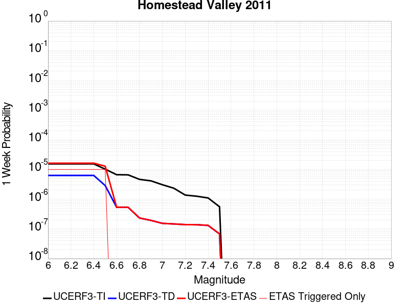 | 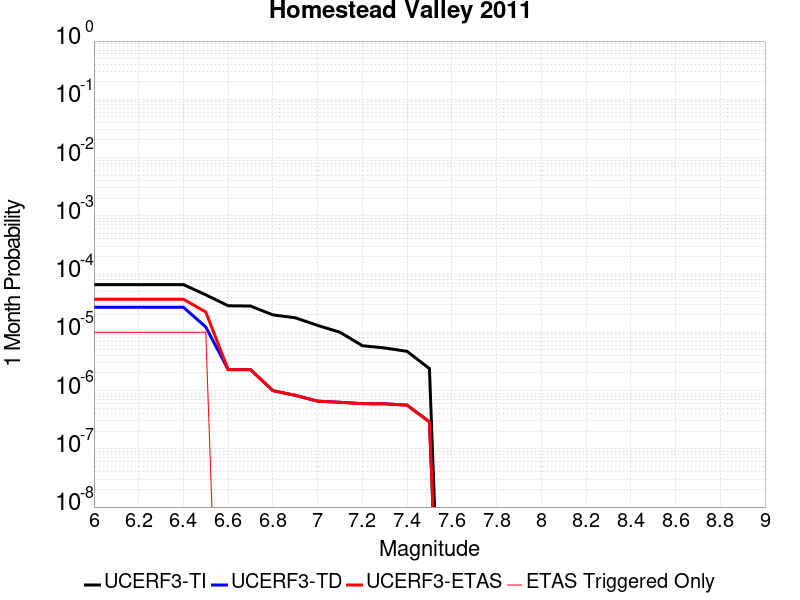 | 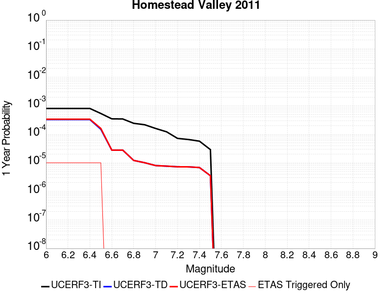 |  |

| Magnitude | 1 wk TI Prob | 1 wk TD Prob | 1 wk ETAS Prob | 1 wk ETAS/TD Gain | 1 wk ETAS Triggered Only | 1 mo TI Prob | 1 mo TD Prob | 1 mo ETAS Prob | 1 mo ETAS/TD Gain | 1 mo ETAS Triggered Only | 1 yr TI Prob | 1 yr TD Prob | 1 yr ETAS Prob | 1 yr ETAS/TD Gain | 1 yr ETAS Triggered Only | 10 yr TI Prob | 10 yr TD Prob | 10 yr ETAS Prob | 10 yr ETAS/TD Gain | 10 yr ETAS Triggered Only |
|-----|-----|-----|-----|-----|-----|-----|-----|-----|-----|-----|-----|-----|-----|-----|-----|-----|-----|-----|-----|-----|
| 6.0 | 1.539795E-5 | 6.286469E-6 | 1.6286407E-5 | 2.590708 | 1.0E-5 | 6.5989545E-5 | 2.6941849E-5 | 3.694158E-5 | 1.3711598 | 1.0E-5 | 8.0312655E-4 | 3.2798824E-4 | 3.3798497E-4 | 1.030479 | 1.0E-5 | 0.008002302 | 0.0032770627 | 0.00328703 | 1.0030415 | 1.0E-5 |
| 6.1 | 1.539795E-5 | 6.286469E-6 | 1.6286407E-5 | 2.590708 | 1.0E-5 | 6.5989545E-5 | 2.6941849E-5 | 3.694158E-5 | 1.3711598 | 1.0E-5 | 8.0312655E-4 | 3.2798824E-4 | 3.3798497E-4 | 1.030479 | 1.0E-5 | 0.008002302 | 0.0032770627 | 0.00328703 | 1.0030415 | 1.0E-5 |
| 6.2 | 1.539795E-5 | 6.286469E-6 | 1.6286407E-5 | 2.590708 | 1.0E-5 | 6.5989545E-5 | 2.6941849E-5 | 3.694158E-5 | 1.3711598 | 1.0E-5 | 8.0312655E-4 | 3.2798824E-4 | 3.3798497E-4 | 1.030479 | 1.0E-5 | 0.008002302 | 0.0032770627 | 0.00328703 | 1.0030415 | 1.0E-5 |
| 6.3 | 1.539795E-5 | 6.286469E-6 | 1.6286407E-5 | 2.590708 | 1.0E-5 | 6.5989545E-5 | 2.6941849E-5 | 3.694158E-5 | 1.3711598 | 1.0E-5 | 8.0312655E-4 | 3.2798824E-4 | 3.3798497E-4 | 1.030479 | 1.0E-5 | 0.008002302 | 0.0032770627 | 0.00328703 | 1.0030415 | 1.0E-5 |
| 6.4 | 1.539795E-5 | 6.286469E-6 | 1.6286407E-5 | 2.590708 | 1.0E-5 | 6.5989545E-5 | 2.6941849E-5 | 3.694158E-5 | 1.3711598 | 1.0E-5 | 8.0312655E-4 | 3.2798824E-4 | 3.3798497E-4 | 1.030479 | 1.0E-5 | 0.008002302 | 0.0032770627 | 0.00328703 | 1.0030415 | 1.0E-5 |
| 6.5 | 1.0265258E-5 | 2.8786876E-6 | 1.2878659E-5 | 4.473795 | 1.0E-5 | 4.3993223E-5 | 1.2337214E-5 | 2.233709E-5 | 1.8105458 | 1.0E-5 | 5.3548586E-4 | 1.5020218E-4 | 1.6020068E-4 | 1.066567 | 1.0E-5 | 0.005341973 | 0.0015016886 | 0.0015116736 | 1.0066491 | 1.0E-5 |
| 6.6 | 6.664671E-6 | 5.343859E-7 | 5.343859E-7 | 1.0 | 0.0 | 2.8562565E-5 | 2.2902238E-6 | 2.2902238E-6 | 1.0 | 0.0 | 3.476937E-4 | 2.7883236E-5 | 2.7883236E-5 | 1.0 | 0.0 | 0.003471502 | 2.78809E-4 | 2.78809E-4 | 1.0 | 0.0 |
| 6.7 | 6.5954046E-6 | 5.343859E-7 | 5.343859E-7 | 1.0 | 0.0 | 2.8265715E-5 | 2.2902238E-6 | 2.2902238E-6 | 1.0 | 0.0 | 3.4408073E-4 | 2.7883236E-5 | 2.7883236E-5 | 1.0 | 0.0 | 0.0034354846 | 2.78809E-4 | 2.78809E-4 | 1.0 | 0.0 |
| 6.8 | 4.648189E-6 | 2.3257238E-7 | 2.3257238E-7 | 1.0 | 0.0 | 1.9920659E-5 | 9.967384E-7 | 9.967384E-7 | 1.0 | 0.0 | 2.4250703E-4 | 1.2135227E-5 | 1.2135227E-5 | 1.0 | 0.0 | 0.0024224254 | 1.2134612E-4 | 1.2134612E-4 | 1.0 | 0.0 |
| 6.9 | 4.1428534E-6 | 1.9342777E-7 | 1.9342777E-7 | 1.0 | 0.0 | 1.7754966E-5 | 8.289759E-7 | 8.289759E-7 | 1.0 | 0.0 | 2.1614527E-4 | 1.0092737E-5 | 1.0092737E-5 | 1.0 | 0.0 | 0.0021593515 | 1.0092309E-4 | 1.0092309E-4 | 1.0 | 0.0 |
| 7.0 | 3.0673707E-6 | 1.5364343E-7 | 1.5364343E-7 | 1.0 | 0.0 | 1.3145808E-5 | 6.5847166E-7 | 6.5847166E-7 | 1.0 | 0.0 | 1.6003846E-4 | 8.016864E-6 | 8.016864E-6 | 1.0 | 0.0 | 0.0015992324 | 8.016585E-5 | 8.016585E-5 | 1.0 | 0.0 |
| 7.1 | 2.340854E-6 | 1.4684727E-7 | 1.4684727E-7 | 1.0 | 0.0 | 1.0032193E-5 | 6.293453E-7 | 6.293453E-7 | 1.0 | 0.0 | 1.221351E-4 | 7.662254E-6 | 7.662254E-6 | 1.0 | 0.0 | 0.00122068 | 7.661999E-5 | 7.661999E-5 | 1.0 | 0.0 |
| 7.2 | 1.3754182E-6 | 1.3920152E-7 | 1.3920152E-7 | 1.0 | 0.0 | 5.8946357E-6 | 5.965778E-7 | 5.965778E-7 | 1.0 | 0.0 | 7.176483E-5 | 7.2633115E-6 | 7.2633115E-6 | 1.0 | 0.0 | 7.174166E-4 | 7.2630835E-5 | 7.2630835E-5 | 1.0 | 0.0 |
| 7.3 | 1.2573237E-6 | 1.3824703E-7 | 1.3824703E-7 | 1.0 | 0.0 | 5.388519E-6 | 5.9248714E-7 | 5.9248714E-7 | 1.0 | 0.0 | 6.560324E-5 | 7.213508E-6 | 7.213508E-6 | 1.0 | 0.0 | 6.558388E-4 | 7.213283E-5 | 7.213283E-5 | 1.0 | 0.0 |
| 7.4 | 1.0994207E-6 | 1.3103899E-7 | 1.3103899E-7 | 1.0 | 0.0 | 4.7117946E-6 | 5.615955E-7 | 5.615955E-7 | 1.0 | 0.0 | 5.736459E-5 | 6.837405E-6 | 6.837405E-6 | 1.0 | 0.0 | 5.734978E-4 | 6.837204E-5 | 6.837204E-5 | 1.0 | 0.0 |
| 7.5 | 5.5569126E-7 | 6.7717565E-8 | 6.7717565E-8 | 1.0 | 0.0 | 2.3815317E-6 | 2.902181E-7 | 2.902181E-7 | 1.0 | 0.0 | 2.8994764E-5 | 3.5334003E-6 | 3.5334003E-6 | 1.0 | 0.0 | 2.899098E-4 | 3.5333505E-5 | 3.5333505E-5 | 1.0 | 0.0 |

## Santa Susana alt 1
*[(top)](#table-of-contents)*

| 1 Week | 1 Month | 1 Year | 10 Year |
|-----|-----|-----|-----|
|  |  |  |  |

| Magnitude | 1 wk TI Prob | 1 wk TD Prob | 1 wk ETAS Prob | 1 wk ETAS/TD Gain | 1 wk ETAS Triggered Only | 1 mo TI Prob | 1 mo TD Prob | 1 mo ETAS Prob | 1 mo ETAS/TD Gain | 1 mo ETAS Triggered Only | 1 yr TI Prob | 1 yr TD Prob | 1 yr ETAS Prob | 1 yr ETAS/TD Gain | 1 yr ETAS Triggered Only | 10 yr TI Prob | 10 yr TD Prob | 10 yr ETAS Prob | 10 yr ETAS/TD Gain | 10 yr ETAS Triggered Only |
|-----|-----|-----|-----|-----|-----|-----|-----|-----|-----|-----|-----|-----|-----|-----|-----|-----|-----|-----|-----|-----|
| 6.0 | 2.674877E-5 | 2.7198214E-5 | 2.7198214E-5 | 1.0 | 0.0 | 1.1463255E-4 | 1.16559204E-4 | 1.16559204E-4 | 1.0 | 0.0 | 0.0013947578 | 0.0014182981 | 0.0014182981 | 1.0 | 0.0 | 0.013860362 | 0.014104388 | 0.014114247 | 1.000699 | 1.0E-5 |
| 6.1 | 2.674877E-5 | 2.7198214E-5 | 2.7198214E-5 | 1.0 | 0.0 | 1.1463255E-4 | 1.16559204E-4 | 1.16559204E-4 | 1.0 | 0.0 | 0.0013947578 | 0.0014182981 | 0.0014182981 | 1.0 | 0.0 | 0.013860362 | 0.014104388 | 0.014114247 | 1.000699 | 1.0E-5 |
| 6.2 | 2.674877E-5 | 2.7198214E-5 | 2.7198214E-5 | 1.0 | 0.0 | 1.1463255E-4 | 1.16559204E-4 | 1.16559204E-4 | 1.0 | 0.0 | 0.0013947578 | 0.0014182981 | 0.0014182981 | 1.0 | 0.0 | 0.013860362 | 0.014104388 | 0.014114247 | 1.000699 | 1.0E-5 |
| 6.3 | 2.674877E-5 | 2.7198214E-5 | 2.7198214E-5 | 1.0 | 0.0 | 1.1463255E-4 | 1.16559204E-4 | 1.16559204E-4 | 1.0 | 0.0 | 0.0013947578 | 0.0014182981 | 0.0014182981 | 1.0 | 0.0 | 0.013860362 | 0.014104388 | 0.014114247 | 1.000699 | 1.0E-5 |
| 6.4 | 2.674877E-5 | 2.7198214E-5 | 2.7198214E-5 | 1.0 | 0.0 | 1.1463255E-4 | 1.16559204E-4 | 1.16559204E-4 | 1.0 | 0.0 | 0.0013947578 | 0.0014182981 | 0.0014182981 | 1.0 | 0.0 | 0.013860362 | 0.014104388 | 0.014114247 | 1.000699 | 1.0E-5 |
| 6.5 | 2.674877E-5 | 2.7198214E-5 | 2.7198214E-5 | 1.0 | 0.0 | 1.1463255E-4 | 1.16559204E-4 | 1.16559204E-4 | 1.0 | 0.0 | 0.0013947578 | 0.0014182981 | 0.0014182981 | 1.0 | 0.0 | 0.013860362 | 0.014104388 | 0.014114247 | 1.000699 | 1.0E-5 |
| 6.6 | 2.6647976E-5 | 2.7074553E-5 | 2.7074553E-5 | 1.0 | 0.0 | 1.14200615E-4 | 1.16029274E-4 | 1.16029274E-4 | 1.0 | 0.0 | 0.0013895056 | 0.0014118546 | 0.0014118546 | 1.0 | 0.0 | 0.013808494 | 0.014040773 | 0.014050633 | 1.0007023 | 1.0E-5 |
| 6.7 | 2.6647976E-5 | 2.7074553E-5 | 2.7074553E-5 | 1.0 | 0.0 | 1.14200615E-4 | 1.16029274E-4 | 1.16029274E-4 | 1.0 | 0.0 | 0.0013895056 | 0.0014118546 | 0.0014118546 | 1.0 | 0.0 | 0.013808494 | 0.014040773 | 0.014050633 | 1.0007023 | 1.0E-5 |
| 6.8 | 1.9073179E-5 | 1.7637467E-5 | 1.7637467E-5 | 1.0 | 0.0 | 8.1739636E-5 | 7.558706E-5 | 7.558706E-5 | 1.0 | 0.0 | 9.947256E-4 | 9.19902E-4 | 9.19902E-4 | 1.0 | 0.0 | 0.009902848 | 0.009163361 | 0.009173269 | 1.0010813 | 1.0E-5 |
| 6.9 | 1.9041876E-5 | 1.7619597E-5 | 1.7619597E-5 | 1.0 | 0.0 | 8.160549E-5 | 7.551048E-5 | 7.551048E-5 | 1.0 | 0.0 | 9.930939E-4 | 9.189705E-4 | 9.189705E-4 | 1.0 | 0.0 | 0.0098866755 | 0.009154123 | 0.009164032 | 1.0010824 | 1.0E-5 |
| 7.0 | 1.5917482E-5 | 1.3864049E-5 | 1.3864049E-5 | 1.0 | 0.0 | 6.8215995E-5 | 5.9416023E-5 | 5.9416023E-5 | 1.0 | 0.0 | 8.302132E-4 | 7.2315463E-4 | 7.2315463E-4 | 1.0 | 0.0 | 0.008271185 | 0.0072090672 | 0.007218995 | 1.0013771 | 1.0E-5 |
| 7.1 | 1.577788E-5 | 1.3744056E-5 | 1.3744056E-5 | 1.0 | 0.0 | 6.761774E-5 | 5.890179E-5 | 5.890179E-5 | 1.0 | 0.0 | 8.2293496E-4 | 7.16898E-4 | 7.16898E-4 | 1.0 | 0.0 | 0.008198941 | 0.0071469042 | 0.007156833 | 1.0013893 | 1.0E-5 |
| 7.2 | 1.5416446E-5 | 1.34701295E-5 | 1.34701295E-5 | 1.0 | 0.0 | 6.606882E-5 | 5.7727877E-5 | 5.7727877E-5 | 1.0 | 0.0 | 8.0409093E-4 | 7.026149E-4 | 7.026149E-4 | 1.0 | 0.0 | 0.008011877 | 0.0070049763 | 0.0070149065 | 1.0014175 | 1.0E-5 |
| 7.3 | 1.4534083E-5 | 1.2718032E-5 | 1.2718032E-5 | 1.0 | 0.0 | 6.228744E-5 | 5.4504737E-5 | 5.4504737E-5 | 1.0 | 0.0 | 7.580857E-4 | 6.633976E-4 | 6.633976E-4 | 1.0 | 0.0 | 0.007555048 | 0.0066151717 | 0.0066251056 | 1.0015017 | 1.0E-5 |
| 7.4 | 1.2858995E-5 | 1.1229814E-5 | 1.1229814E-5 | 1.0 | 0.0 | 5.5108816E-5 | 4.812691E-5 | 4.812691E-5 | 1.0 | 0.0 | 6.7074323E-4 | 5.8579154E-4 | 5.8579154E-4 | 1.0 | 0.0 | 0.0066872234 | 0.0058433902 | 0.005853332 | 1.0017014 | 1.0E-5 |
| 7.5 | 8.827668E-6 | 7.805494E-6 | 7.805494E-6 | 1.0 | 0.0 | 3.7832317E-5 | 3.3451703E-5 | 3.3451703E-5 | 1.0 | 0.0 | 4.605111E-4 | 4.072008E-4 | 4.072008E-4 | 1.0 | 0.0 | 0.0045955796 | 0.0040648985 | 0.0040648985 | 1.0 | 0.0 |
| 7.6 | 3.2533426E-6 | 2.8720106E-6 | 2.8720106E-6 | 1.0 | 0.0 | 1.3942822E-5 | 1.230856E-5 | 1.230856E-5 | 1.0 | 0.0 | 1.6974064E-4 | 1.4984679E-4 | 1.4984679E-4 | 1.0 | 0.0 | 0.0016961104 | 0.0014974943 | 0.0014974943 | 1.0 | 0.0 |
| 7.7 | 1.2751709E-6 | 1.1491339E-6 | 1.1491339E-6 | 1.0 | 0.0 | 5.4650063E-6 | 4.9248506E-6 | 4.9248506E-6 | 1.0 | 0.0 | 6.653442E-5 | 5.99585E-5 | 5.99585E-5 | 1.0 | 0.0 | 6.6514505E-4 | 5.9943215E-4 | 5.9943215E-4 | 1.0 | 0.0 |
| 7.8 | 3.067544E-7 | 3.240052E-7 | 3.240052E-7 | 1.0 | 0.0 | 1.3146611E-6 | 1.3885931E-6 | 1.3885931E-6 | 1.0 | 0.0 | 1.600588E-5 | 1.6906E-5 | 1.6906E-5 | 1.0 | 0.0 | 1.6004729E-4 | 1.6904817E-4 | 1.6904817E-4 | 1.0 | 0.0 |
| 7.9 | 7.622999E-8 | 8.0879715E-8 | 8.0879715E-8 | 1.0 | 0.0 | 3.2669993E-7 | 3.4662733E-7 | 3.4662733E-7 | 1.0 | 0.0 | 3.977564E-6 | 4.220182E-6 | 4.220182E-6 | 1.0 | 0.0 | 3.977493E-5 | 4.2201224E-5 | 4.2201224E-5 | 1.0 | 0.0 |

## Eureka Peak
*[(top)](#table-of-contents)*

| 1 Week | 1 Month | 1 Year | 10 Year |
|-----|-----|-----|-----|
|  |  | 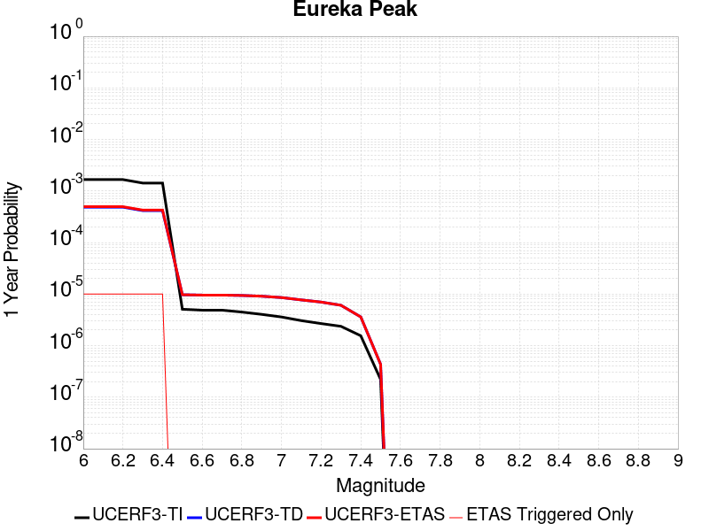 | 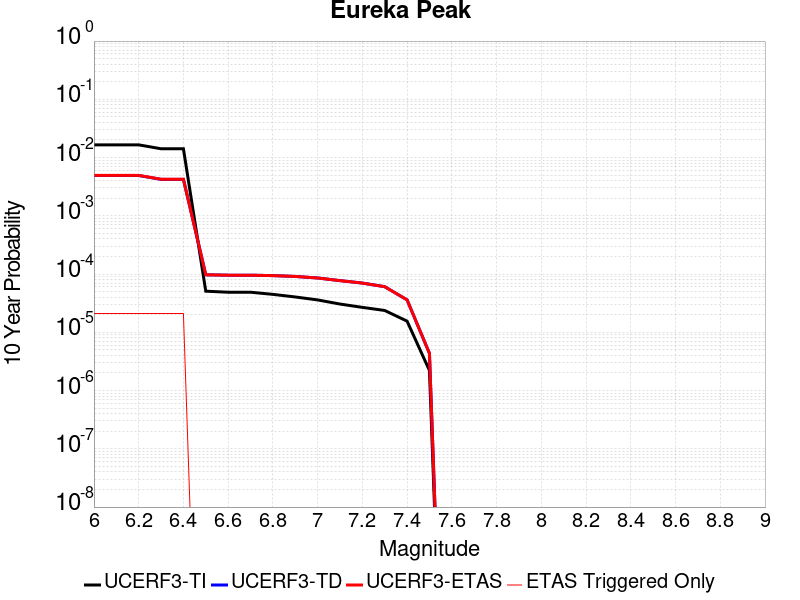 |

| Magnitude | 1 wk TI Prob | 1 wk TD Prob | 1 wk ETAS Prob | 1 wk ETAS/TD Gain | 1 wk ETAS Triggered Only | 1 mo TI Prob | 1 mo TD Prob | 1 mo ETAS Prob | 1 mo ETAS/TD Gain | 1 mo ETAS Triggered Only | 1 yr TI Prob | 1 yr TD Prob | 1 yr ETAS Prob | 1 yr ETAS/TD Gain | 1 yr ETAS Triggered Only | 10 yr TI Prob | 10 yr TD Prob | 10 yr ETAS Prob | 10 yr ETAS/TD Gain | 10 yr ETAS Triggered Only |
|-----|-----|-----|-----|-----|-----|-----|-----|-----|-----|-----|-----|-----|-----|-----|-----|-----|-----|-----|-----|-----|
| 6.0 | 3.1949054E-5 | 9.310979E-6 | 9.310979E-6 | 1.0 | 0.0 | 1.3691733E-4 | 3.9904025E-5 | 3.9904025E-5 | 1.0 | 0.0 | 0.0016656938 | 4.858013E-4 | 4.9579644E-4 | 1.0205746 | 1.0E-5 | 0.016532637 | 0.004921293 | 0.0049312436 | 1.002022 | 1.0E-5 |
| 6.1 | 3.1949054E-5 | 9.310979E-6 | 9.310979E-6 | 1.0 | 0.0 | 1.3691733E-4 | 3.9904025E-5 | 3.9904025E-5 | 1.0 | 0.0 | 0.0016656938 | 4.858013E-4 | 4.9579644E-4 | 1.0205746 | 1.0E-5 | 0.016532637 | 0.004921293 | 0.0049312436 | 1.002022 | 1.0E-5 |
| 6.2 | 3.1949054E-5 | 9.310979E-6 | 9.310979E-6 | 1.0 | 0.0 | 1.3691733E-4 | 3.9904025E-5 | 3.9904025E-5 | 1.0 | 0.0 | 0.0016656938 | 4.858013E-4 | 4.9579644E-4 | 1.0205746 | 1.0E-5 | 0.016532637 | 0.004921293 | 0.0049312436 | 1.002022 | 1.0E-5 |
| 6.3 | 2.7339745E-5 | 7.980821E-6 | 7.980821E-6 | 1.0 | 0.0 | 1.1716507E-4 | 3.4203495E-5 | 3.4203495E-5 | 1.0 | 0.0 | 0.0014255513 | 4.164239E-4 | 4.2641972E-4 | 1.024004 | 1.0E-5 | 0.0141644105 | 0.0042259954 | 0.004235953 | 1.0023563 | 1.0E-5 |
| 6.4 | 2.7339745E-5 | 7.980821E-6 | 7.980821E-6 | 1.0 | 0.0 | 1.1716507E-4 | 3.4203495E-5 | 3.4203495E-5 | 1.0 | 0.0 | 0.0014255513 | 4.164239E-4 | 4.2641972E-4 | 1.024004 | 1.0E-5 | 0.0141644105 | 0.0042259954 | 0.004235953 | 1.0023563 | 1.0E-5 |
| 6.5 | 9.738388E-8 | 1.8620014E-7 | 1.8620014E-7 | 1.0 | 0.0 | 4.1735944E-7 | 7.980003E-7 | 7.980003E-7 | 1.0 | 0.0 | 5.081339E-6 | 9.715612E-6 | 9.715612E-6 | 1.0 | 0.0 | 5.0812232E-5 | 9.715195E-5 | 9.715195E-5 | 1.0 | 0.0 |
| 6.6 | 9.3495956E-8 | 1.8328839E-7 | 1.8328839E-7 | 1.0 | 0.0 | 4.0069688E-7 | 7.855215E-7 | 7.855215E-7 | 1.0 | 0.0 | 4.8784736E-6 | 9.563682E-6 | 9.563682E-6 | 1.0 | 0.0 | 4.8783666E-5 | 9.563279E-5 | 9.563279E-5 | 1.0 | 0.0 |
| 6.7 | 9.3495956E-8 | 1.8328839E-7 | 1.8328839E-7 | 1.0 | 0.0 | 4.0069688E-7 | 7.855215E-7 | 7.855215E-7 | 1.0 | 0.0 | 4.8784736E-6 | 9.563682E-6 | 9.563682E-6 | 1.0 | 0.0 | 4.8783666E-5 | 9.563279E-5 | 9.563279E-5 | 1.0 | 0.0 |
| 6.8 | 8.591428E-8 | 1.8021817E-7 | 1.8021817E-7 | 1.0 | 0.0 | 3.68204E-7 | 7.7236336E-7 | 7.7236336E-7 | 1.0 | 0.0 | 4.4828744E-6 | 9.403484E-6 | 9.403484E-6 | 1.0 | 0.0 | 4.482784E-5 | 9.403094E-5 | 9.403094E-5 | 1.0 | 0.0 |
| 6.9 | 7.749723E-8 | 1.7439834E-7 | 1.7439834E-7 | 1.0 | 0.0 | 3.3213098E-7 | 7.4742127E-7 | 7.4742127E-7 | 1.0 | 0.0 | 4.043687E-6 | 9.099816E-6 | 9.099816E-6 | 1.0 | 0.0 | 4.0436134E-5 | 9.0994516E-5 | 9.0994516E-5 | 1.0 | 0.0 |
| 7.0 | 6.897872E-8 | 1.6416043E-7 | 1.6416043E-7 | 1.0 | 0.0 | 2.9562307E-7 | 7.035445E-7 | 7.035445E-7 | 1.0 | 0.0 | 3.5992048E-6 | 8.565621E-6 | 8.565621E-6 | 1.0 | 0.0 | 3.5991467E-5 | 8.565299E-5 | 8.565299E-5 | 1.0 | 0.0 |
| 7.1 | 5.859318E-8 | 1.4787899E-7 | 1.4787899E-7 | 1.0 | 0.0 | 2.5111362E-7 | 6.33767E-7 | 6.33767E-7 | 1.0 | 0.0 | 3.057304E-6 | 7.716087E-6 | 7.716087E-6 | 1.0 | 0.0 | 3.0572617E-5 | 7.715825E-5 | 7.715825E-5 | 1.0 | 0.0 |
| 7.2 | 5.1375338E-8 | 1.3421746E-7 | 1.3421746E-7 | 1.0 | 0.0 | 2.2018E-7 | 5.7521754E-7 | 5.7521754E-7 | 1.0 | 0.0 | 2.680688E-6 | 7.003252E-6 | 7.003252E-6 | 1.0 | 0.0 | 2.6806558E-5 | 7.003037E-5 | 7.003037E-5 | 1.0 | 0.0 |
| 7.3 | 4.5441396E-8 | 1.1636931E-7 | 1.1636931E-7 | 1.0 | 0.0 | 1.9474882E-7 | 4.987255E-7 | 4.987255E-7 | 1.0 | 0.0 | 2.3710643E-6 | 6.0719667E-6 | 6.0719667E-6 | 1.0 | 0.0 | 2.371039E-5 | 6.0718063E-5 | 6.0718063E-5 | 1.0 | 0.0 |
| 7.4 | 2.981918E-8 | 6.911723E-8 | 6.911723E-8 | 1.0 | 0.0 | 1.2779647E-7 | 2.9621668E-7 | 2.9621668E-7 | 1.0 | 0.0 | 1.5559209E-6 | 3.6064325E-6 | 3.6064325E-6 | 1.0 | 0.0 | 1.55591E-5 | 3.6063782E-5 | 3.6063782E-5 | 1.0 | 0.0 |
| 7.5 | 4.24214E-9 | 8.34289E-9 | 8.34289E-9 | 1.0 | 0.0 | 1.81806E-8 | 3.5755242E-8 | 3.5755242E-8 | 1.0 | 0.0 | 2.213488E-7 | 4.3532006E-7 | 4.3532006E-7 | 1.0 | 0.0 | 2.2134857E-6 | 4.3531986E-6 | 4.3531986E-6 | 1.0 | 0.0 |

## Richfield
*[(top)](#table-of-contents)*

| 1 Week | 1 Month | 1 Year | 10 Year |
|-----|-----|-----|-----|
| 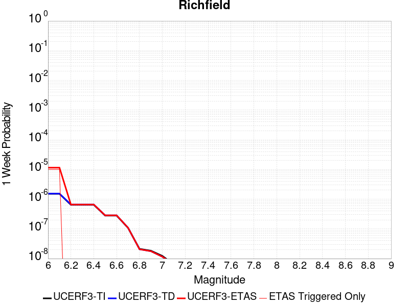 |  |  | 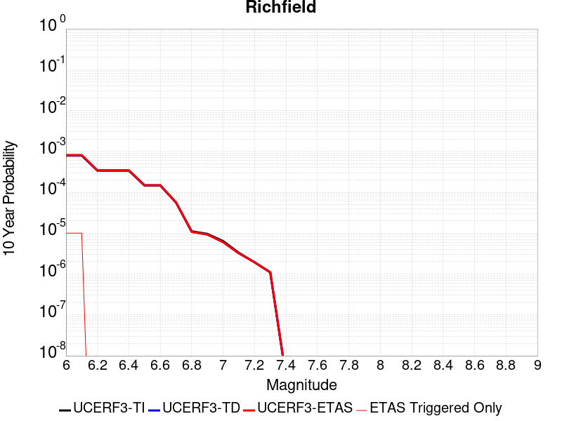 |

| Magnitude | 1 wk TI Prob | 1 wk TD Prob | 1 wk ETAS Prob | 1 wk ETAS/TD Gain | 1 wk ETAS Triggered Only | 1 mo TI Prob | 1 mo TD Prob | 1 mo ETAS Prob | 1 mo ETAS/TD Gain | 1 mo ETAS Triggered Only | 1 yr TI Prob | 1 yr TD Prob | 1 yr ETAS Prob | 1 yr ETAS/TD Gain | 1 yr ETAS Triggered Only | 10 yr TI Prob | 10 yr TD Prob | 10 yr ETAS Prob | 10 yr ETAS/TD Gain | 10 yr ETAS Triggered Only |
|-----|-----|-----|-----|-----|-----|-----|-----|-----|-----|-----|-----|-----|-----|-----|-----|-----|-----|-----|-----|-----|
| 6.0 | 1.5166896E-6 | 1.5392679E-6 | 1.1539252E-5 | 7.496585 | 1.0E-5 | 6.5000822E-6 | 6.596852E-6 | 1.6596787E-5 | 2.5158646 | 1.0E-5 | 7.913562E-5 | 8.0314814E-5 | 9.031401E-5 | 1.1245 | 1.0E-5 | 7.910745E-4 | 8.0296566E-4 | 8.129576E-4 | 1.0124438 | 1.0E-5 |
| 6.1 | 1.5166896E-6 | 1.5392679E-6 | 1.1539252E-5 | 7.496585 | 1.0E-5 | 6.5000822E-6 | 6.596852E-6 | 1.6596787E-5 | 2.5158646 | 1.0E-5 | 7.913562E-5 | 8.0314814E-5 | 9.031401E-5 | 1.1245 | 1.0E-5 | 7.910745E-4 | 8.0296566E-4 | 8.129576E-4 | 1.0124438 | 1.0E-5 |
| 6.2 | 6.473272E-7 | 6.598479E-7 | 6.598479E-7 | 1.0 | 0.0 | 2.7742565E-6 | 2.8279171E-6 | 2.8279171E-6 | 1.0 | 0.0 | 3.377605E-5 | 3.442948E-5 | 3.442948E-5 | 1.0 | 0.0 | 3.3770915E-4 | 3.4425448E-4 | 3.4425448E-4 | 1.0 | 0.0 |
| 6.3 | 6.473272E-7 | 6.598479E-7 | 6.598479E-7 | 1.0 | 0.0 | 2.7742565E-6 | 2.8279171E-6 | 2.8279171E-6 | 1.0 | 0.0 | 3.377605E-5 | 3.442948E-5 | 3.442948E-5 | 1.0 | 0.0 | 3.3770915E-4 | 3.4425448E-4 | 3.4425448E-4 | 1.0 | 0.0 |
| 6.4 | 6.473272E-7 | 6.598479E-7 | 6.598479E-7 | 1.0 | 0.0 | 2.7742565E-6 | 2.8279171E-6 | 2.8279171E-6 | 1.0 | 0.0 | 3.377605E-5 | 3.442948E-5 | 3.442948E-5 | 1.0 | 0.0 | 3.3770915E-4 | 3.4425448E-4 | 3.4425448E-4 | 1.0 | 0.0 |
| 6.5 | 2.7954403E-7 | 2.85316E-7 | 2.85316E-7 | 1.0 | 0.0 | 1.1980452E-6 | 1.2227825E-6 | 1.2227825E-6 | 1.0 | 0.0 | 1.4586103E-5 | 1.4887319E-5 | 1.4887319E-5 | 1.0 | 0.0 | 1.4585146E-4 | 1.4886746E-4 | 1.4886746E-4 | 1.0 | 0.0 |
| 6.6 | 2.7954403E-7 | 2.85316E-7 | 2.85316E-7 | 1.0 | 0.0 | 1.1980452E-6 | 1.2227825E-6 | 1.2227825E-6 | 1.0 | 0.0 | 1.4586103E-5 | 1.4887319E-5 | 1.4887319E-5 | 1.0 | 0.0 | 1.4585146E-4 | 1.4886746E-4 | 1.4886746E-4 | 1.0 | 0.0 |
| 6.7 | 1.0777299E-7 | 1.0878809E-7 | 1.0878809E-7 | 1.0 | 0.0 | 4.6188418E-7 | 4.662346E-7 | 4.662346E-7 | 1.0 | 0.0 | 5.6234253E-6 | 5.676396E-6 | 5.676396E-6 | 1.0 | 0.0 | 5.623283E-5 | 5.676294E-5 | 5.676294E-5 | 1.0 | 0.0 |
| 6.8 | 2.1301874E-8 | 2.0666132E-8 | 2.0666132E-8 | 1.0 | 0.0 | 9.129375E-8 | 8.856914E-8 | 8.856914E-8 | 1.0 | 0.0 | 1.1115008E-6 | 1.0783288E-6 | 1.0783288E-6 | 1.0 | 0.0 | 1.1114952E-5 | 1.0783239E-5 | 1.0783239E-5 | 1.0 | 0.0 |
| 6.9 | 1.8413502E-8 | 1.7751097E-8 | 1.7751097E-8 | 1.0 | 0.0 | 7.891501E-8 | 7.607613E-8 | 7.607613E-8 | 1.0 | 0.0 | 9.607899E-7 | 9.2622645E-7 | 9.2622645E-7 | 1.0 | 0.0 | 9.607857E-6 | 9.2622295E-6 | 9.2622295E-6 | 1.0 | 0.0 |
| 7.0 | 1.2290541E-8 | 1.1574315E-8 | 1.1574315E-8 | 1.0 | 0.0 | 5.2673748E-8 | 4.9604207E-8 | 4.9604207E-8 | 1.0 | 0.0 | 6.413027E-7 | 6.03931E-7 | 6.03931E-7 | 1.0 | 0.0 | 6.4130086E-6 | 6.0392954E-6 | 6.0392954E-6 | 1.0 | 0.0 |
| 7.1 | 6.373573E-9 | 6.155758E-9 | 6.155758E-9 | 1.0 | 0.0 | 2.7315311E-8 | 2.6381821E-8 | 2.6381821E-8 | 1.0 | 0.0 | 3.3256384E-7 | 3.2119863E-7 | 3.2119863E-7 | 1.0 | 0.0 | 3.3256335E-6 | 3.211982E-6 | 3.211982E-6 | 1.0 | 0.0 |
| 7.2 | 3.6989944E-9 | 3.7360146E-9 | 3.7360146E-9 | 1.0 | 0.0 | 1.5852834E-8 | 1.6011493E-8 | 1.6011493E-8 | 1.0 | 0.0 | 1.9300822E-7 | 1.9493989E-7 | 1.9493989E-7 | 1.0 | 0.0 | 1.9300805E-6 | 1.9493975E-6 | 1.9493975E-6 | 1.0 | 0.0 |
| 7.3 | 2.097397E-9 | 2.1200501E-9 | 2.1200501E-9 | 1.0 | 0.0 | 8.9888434E-9 | 9.085929E-9 | 9.085929E-9 | 1.0 | 0.0 | 1.0943917E-7 | 1.1062118E-7 | 1.1062118E-7 | 1.0 | 0.0 | 1.0943911E-6 | 1.1062115E-6 | 1.1062115E-6 | 1.0 | 0.0 |
| 7.4 | 5.8314464E-12 | 5.8918426E-12 | 5.8918426E-12 | 1.0 | 0.0 | 2.4991786E-11 | 2.5250912E-11 | 2.5250912E-11 | 1.0 | 0.0 | 3.0427527E-10 | 3.0742975E-10 | 3.0742975E-10 | 1.0 | 0.0 | 3.0427532E-9 | 3.0742973E-9 | 3.0742973E-9 | 1.0 | 0.0 |

## Los Osos 2011
*[(top)](#table-of-contents)*

| 1 Week | 1 Month | 1 Year | 10 Year |
|-----|-----|-----|-----|
|  |  |  | 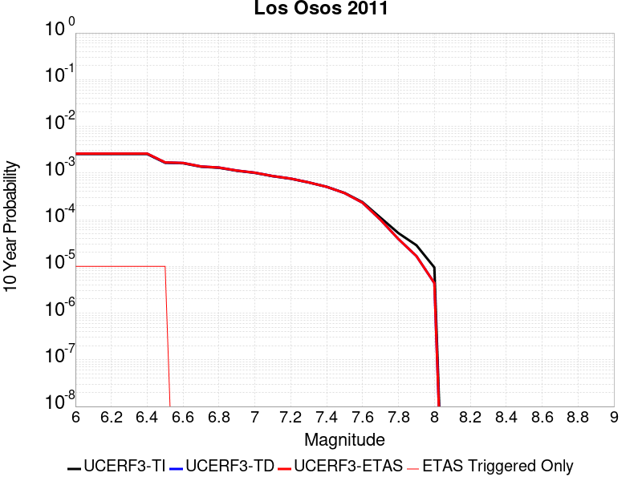 |

| Magnitude | 1 wk TI Prob | 1 wk TD Prob | 1 wk ETAS Prob | 1 wk ETAS/TD Gain | 1 wk ETAS Triggered Only | 1 mo TI Prob | 1 mo TD Prob | 1 mo ETAS Prob | 1 mo ETAS/TD Gain | 1 mo ETAS Triggered Only | 1 yr TI Prob | 1 yr TD Prob | 1 yr ETAS Prob | 1 yr ETAS/TD Gain | 1 yr ETAS Triggered Only | 10 yr TI Prob | 10 yr TD Prob | 10 yr ETAS Prob | 10 yr ETAS/TD Gain | 10 yr ETAS Triggered Only |
|-----|-----|-----|-----|-----|-----|-----|-----|-----|-----|-----|-----|-----|-----|-----|-----|-----|-----|-----|-----|-----|
| 6.0 | 4.8871775E-6 | 4.9814826E-6 | 4.9814826E-6 | 1.0 | 0.0 | 2.0944879E-5 | 2.1349053E-5 | 2.1349053E-5 | 1.0 | 0.0 | 2.5497406E-4 | 2.598965E-4 | 2.598965E-4 | 1.0 | 0.0 | 0.002546817 | 0.0025962 | 0.002606174 | 1.0038418 | 1.0E-5 |
| 6.1 | 4.8871775E-6 | 4.9814826E-6 | 4.9814826E-6 | 1.0 | 0.0 | 2.0944879E-5 | 2.1349053E-5 | 2.1349053E-5 | 1.0 | 0.0 | 2.5497406E-4 | 2.598965E-4 | 2.598965E-4 | 1.0 | 0.0 | 0.002546817 | 0.0025962 | 0.002606174 | 1.0038418 | 1.0E-5 |
| 6.2 | 4.8871775E-6 | 4.9814826E-6 | 4.9814826E-6 | 1.0 | 0.0 | 2.0944879E-5 | 2.1349053E-5 | 2.1349053E-5 | 1.0 | 0.0 | 2.5497406E-4 | 2.598965E-4 | 2.598965E-4 | 1.0 | 0.0 | 0.002546817 | 0.0025962 | 0.002606174 | 1.0038418 | 1.0E-5 |
| 6.3 | 4.8871775E-6 | 4.9814826E-6 | 4.9814826E-6 | 1.0 | 0.0 | 2.0944879E-5 | 2.1349053E-5 | 2.1349053E-5 | 1.0 | 0.0 | 2.5497406E-4 | 2.598965E-4 | 2.598965E-4 | 1.0 | 0.0 | 0.002546817 | 0.0025962 | 0.002606174 | 1.0038418 | 1.0E-5 |
| 6.4 | 4.8871775E-6 | 4.9814826E-6 | 4.9814826E-6 | 1.0 | 0.0 | 2.0944879E-5 | 2.1349053E-5 | 2.1349053E-5 | 1.0 | 0.0 | 2.5497406E-4 | 2.598965E-4 | 2.598965E-4 | 1.0 | 0.0 | 0.002546817 | 0.0025962 | 0.002606174 | 1.0038418 | 1.0E-5 |
| 6.5 | 3.1724062E-6 | 3.2233943E-6 | 3.2233943E-6 | 1.0 | 0.0 | 1.3595956E-5 | 1.3814474E-5 | 1.3814474E-5 | 1.0 | 0.0 | 1.6551818E-4 | 1.6817838E-4 | 1.6817838E-4 | 1.0 | 0.0 | 0.0016539496 | 0.0016805246 | 0.0016905078 | 1.0059406 | 1.0E-5 |
| 6.6 | 3.1022591E-6 | 3.1511038E-6 | 3.1511038E-6 | 1.0 | 0.0 | 1.3295328E-5 | 1.3504661E-5 | 1.3504661E-5 | 1.0 | 0.0 | 1.618586E-4 | 1.6440697E-4 | 1.6440697E-4 | 1.0 | 0.0 | 0.0016174077 | 0.0016428662 | 0.0016428662 | 1.0 | 0.0 |
| 6.7 | 2.611518E-6 | 2.6491825E-6 | 2.6491825E-6 | 1.0 | 0.0 | 1.1192172E-5 | 1.1353591E-5 | 1.1353591E-5 | 1.0 | 0.0 | 1.3625617E-4 | 1.3822124E-4 | 1.3822124E-4 | 1.0 | 0.0 | 0.0013617266 | 0.0013813572 | 0.0013813572 | 1.0 | 0.0 |
| 6.8 | 2.4780884E-6 | 2.5121587E-6 | 2.5121587E-6 | 1.0 | 0.0 | 1.0620336E-5 | 1.076635E-5 | 1.076635E-5 | 1.0 | 0.0 | 1.2929492E-4 | 1.3107246E-4 | 1.3107246E-4 | 1.0 | 0.0 | 0.0012921972 | 0.0013099556 | 0.0013099556 | 1.0 | 0.0 |
| 6.9 | 2.1376322E-6 | 2.1635049E-6 | 2.1635049E-6 | 1.0 | 0.0 | 9.161248E-6 | 9.272131E-6 | 9.272131E-6 | 1.0 | 0.0 | 1.1153249E-4 | 1.1288237E-4 | 1.1288237E-4 | 1.0 | 0.0 | 0.0011147653 | 0.0011282521 | 0.0011282521 | 1.0 | 0.0 |
| 7.0 | 1.9282882E-6 | 1.949458E-6 | 1.949458E-6 | 1.0 | 0.0 | 8.264066E-6 | 8.354793E-6 | 8.354793E-6 | 1.0 | 0.0 | 1.0061036E-4 | 1.0171487E-4 | 1.0171487E-4 | 1.0 | 0.0 | 0.0010056482 | 0.0010166845 | 0.0010166845 | 1.0 | 0.0 |
| 7.1 | 1.6353226E-6 | 1.6501111E-6 | 1.6501111E-6 | 1.0 | 0.0 | 7.0085066E-6 | 7.0718856E-6 | 7.0718856E-6 | 1.0 | 0.0 | 8.532523E-5 | 8.6096814E-5 | 8.6096814E-5 | 1.0 | 0.0 | 8.529247E-4 | 8.6063537E-4 | 8.6063537E-4 | 1.0 | 0.0 |
| 7.2 | 1.4446276E-6 | 1.4553335E-6 | 1.4553335E-6 | 1.0 | 0.0 | 6.191247E-6 | 6.2371287E-6 | 6.2371287E-6 | 1.0 | 0.0 | 7.537582E-5 | 7.59344E-5 | 7.59344E-5 | 1.0 | 0.0 | 7.535026E-4 | 7.590851E-4 | 7.590851E-4 | 1.0 | 0.0 |
| 7.3 | 1.2014582E-6 | 1.2069066E-6 | 1.2069066E-6 | 1.0 | 0.0 | 5.149096E-6 | 5.172447E-6 | 5.172447E-6 | 1.0 | 0.0 | 6.268844E-5 | 6.297272E-5 | 6.297272E-5 | 1.0 | 0.0 | 6.267076E-4 | 6.295492E-4 | 6.295492E-4 | 1.0 | 0.0 |
| 7.4 | 9.707733E-7 | 9.709767E-7 | 9.709767E-7 | 1.0 | 0.0 | 4.16045E-6 | 4.161322E-6 | 4.161322E-6 | 1.0 | 0.0 | 5.0652303E-5 | 5.066292E-5 | 5.066292E-5 | 1.0 | 0.0 | 5.064076E-4 | 5.065139E-4 | 5.065139E-4 | 1.0 | 0.0 |
| 7.5 | 7.174908E-7 | 7.114907E-7 | 7.114907E-7 | 1.0 | 0.0 | 3.074957E-6 | 3.0492424E-6 | 3.0492424E-6 | 1.0 | 0.0 | 3.743696E-5 | 3.7123897E-5 | 3.7123897E-5 | 1.0 | 0.0 | 3.7430652E-4 | 3.7117713E-4 | 3.7117713E-4 | 1.0 | 0.0 |
| 7.6 | 4.5535776E-7 | 4.4207857E-7 | 4.4207857E-7 | 1.0 | 0.0 | 1.9515319E-6 | 1.8946212E-6 | 1.8946212E-6 | 1.0 | 0.0 | 2.3759641E-5 | 2.3066768E-5 | 2.3066768E-5 | 1.0 | 0.0 | 2.37571E-4 | 2.3064384E-4 | 2.3064384E-4 | 1.0 | 0.0 |
| 7.7 | 2.1173553E-7 | 1.9060734E-7 | 1.9060734E-7 | 1.0 | 0.0 | 9.0743765E-7 | 8.1688836E-7 | 8.1688836E-7 | 1.0 | 0.0 | 1.1047998E-5 | 9.94557E-6 | 9.94557E-6 | 1.0 | 0.0 | 1.1047449E-4 | 9.945128E-5 | 9.945128E-5 | 1.0 | 0.0 |
| 7.8 | 9.873608E-8 | 7.367457E-8 | 7.367457E-8 | 1.0 | 0.0 | 4.2315455E-7 | 3.1574814E-7 | 3.1574814E-7 | 1.0 | 0.0 | 5.1518946E-6 | 3.8442267E-6 | 3.8442267E-6 | 1.0 | 0.0 | 5.1517753E-5 | 3.844161E-5 | 3.844161E-5 | 1.0 | 0.0 |
| 7.9 | 5.4399106E-8 | 3.187941E-8 | 3.187941E-8 | 1.0 | 0.0 | 2.33139E-7 | 1.3662603E-7 | 1.3662603E-7 | 1.0 | 0.0 | 2.8384638E-6 | 1.6634207E-6 | 1.6634207E-6 | 1.0 | 0.0 | 2.8384275E-5 | 1.6634083E-5 | 1.6634083E-5 | 1.0 | 0.0 |
| 8.0 | 1.817203E-8 | 8.420079E-9 | 8.420079E-9 | 1.0 | 0.0 | 7.7880124E-8 | 3.6086053E-8 | 3.6086053E-8 | 1.0 | 0.0 | 9.481901E-7 | 4.393476E-7 | 4.393476E-7 | 1.0 | 0.0 | 9.481861E-6 | 4.393468E-6 | 4.393468E-6 | 1.0 | 0.0 |

## Emerson-Copper Mtn 2011
*[(top)](#table-of-contents)*

| 1 Week | 1 Month | 1 Year | 10 Year |
|-----|-----|-----|-----|
|  |  | 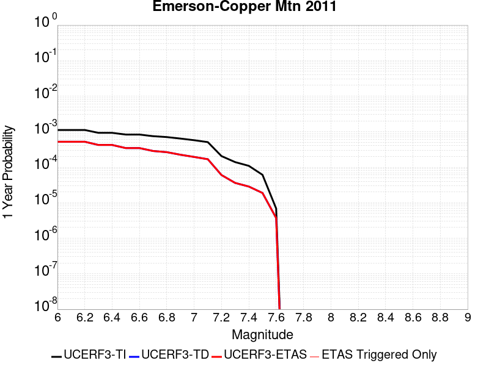 | 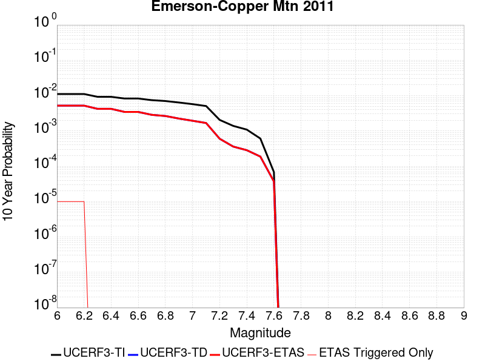 |

| Magnitude | 1 wk TI Prob | 1 wk TD Prob | 1 wk ETAS Prob | 1 wk ETAS/TD Gain | 1 wk ETAS Triggered Only | 1 mo TI Prob | 1 mo TD Prob | 1 mo ETAS Prob | 1 mo ETAS/TD Gain | 1 mo ETAS Triggered Only | 1 yr TI Prob | 1 yr TD Prob | 1 yr ETAS Prob | 1 yr ETAS/TD Gain | 1 yr ETAS Triggered Only | 10 yr TI Prob | 10 yr TD Prob | 10 yr ETAS Prob | 10 yr ETAS/TD Gain | 10 yr ETAS Triggered Only |
|-----|-----|-----|-----|-----|-----|-----|-----|-----|-----|-----|-----|-----|-----|-----|-----|-----|-----|-----|-----|-----|
| 6.0 | 2.1364202E-5 | 9.967999E-6 | 9.967999E-6 | 1.0 | 0.0 | 9.1557646E-5 | 4.2719344E-5 | 4.2719344E-5 | 1.0 | 0.0 | 0.0011141442 | 5.1999267E-4 | 5.1999267E-4 | 1.0 | 0.0 | 0.011085749 | 0.0051886286 | 0.005198577 | 1.0019172 | 1.0E-5 |
| 6.1 | 2.1364202E-5 | 9.967999E-6 | 9.967999E-6 | 1.0 | 0.0 | 9.1557646E-5 | 4.2719344E-5 | 4.2719344E-5 | 1.0 | 0.0 | 0.0011141442 | 5.1999267E-4 | 5.1999267E-4 | 1.0 | 0.0 | 0.011085749 | 0.0051886286 | 0.005198577 | 1.0019172 | 1.0E-5 |
| 6.2 | 2.1364202E-5 | 9.967999E-6 | 9.967999E-6 | 1.0 | 0.0 | 9.1557646E-5 | 4.2719344E-5 | 4.2719344E-5 | 1.0 | 0.0 | 0.0011141442 | 5.1999267E-4 | 5.1999267E-4 | 1.0 | 0.0 | 0.011085749 | 0.0051886286 | 0.005198577 | 1.0019172 | 1.0E-5 |
| 6.3 | 1.7751237E-5 | 8.089109E-6 | 8.089109E-6 | 1.0 | 0.0 | 7.607452E-5 | 3.4667184E-5 | 3.4667184E-5 | 1.0 | 0.0 | 9.258136E-4 | 4.2199748E-4 | 4.2199748E-4 | 1.0 | 0.0 | 0.00921966 | 0.004212584 | 0.004212584 | 1.0 | 0.0 |
| 6.4 | 1.7751237E-5 | 8.089109E-6 | 8.089109E-6 | 1.0 | 0.0 | 7.607452E-5 | 3.4667184E-5 | 3.4667184E-5 | 1.0 | 0.0 | 9.258136E-4 | 4.2199748E-4 | 4.2199748E-4 | 1.0 | 0.0 | 0.00921966 | 0.004212584 | 0.004212584 | 1.0 | 0.0 |
| 6.5 | 1.5886664E-5 | 6.6037437E-6 | 6.6037437E-6 | 1.0 | 0.0 | 6.808392E-5 | 2.830148E-5 | 2.830148E-5 | 1.0 | 0.0 | 8.286065E-4 | 3.4452073E-4 | 3.4452073E-4 | 1.0 | 0.0 | 0.008255237 | 0.0034403303 | 0.0034403303 | 1.0 | 0.0 |
| 6.6 | 1.5886664E-5 | 6.6037437E-6 | 6.6037437E-6 | 1.0 | 0.0 | 6.808392E-5 | 2.830148E-5 | 2.830148E-5 | 1.0 | 0.0 | 8.286065E-4 | 3.4452073E-4 | 3.4452073E-4 | 1.0 | 0.0 | 0.008255237 | 0.0034403303 | 0.0034403303 | 1.0 | 0.0 |
| 6.7 | 1.428471E-5 | 5.4703055E-6 | 5.4703055E-6 | 1.0 | 0.0 | 6.121875E-5 | 2.3443978E-5 | 2.3443978E-5 | 1.0 | 0.0 | 7.450834E-4 | 2.8539696E-4 | 2.8539696E-4 | 1.0 | 0.0 | 0.007425902 | 0.0028506925 | 0.0028506925 | 1.0 | 0.0 |
| 6.8 | 1.3490684E-5 | 5.0735894E-6 | 5.0735894E-6 | 1.0 | 0.0 | 5.7815934E-5 | 2.1743796E-5 | 2.1743796E-5 | 1.0 | 0.0 | 7.0368167E-4 | 2.6470242E-4 | 2.6470242E-4 | 1.0 | 0.0 | 0.007014576 | 0.002644252 | 0.002644252 | 1.0 | 0.0 |
| 6.9 | 1.2235421E-5 | 4.289545E-6 | 4.289545E-6 | 1.0 | 0.0 | 5.2436466E-5 | 1.8383655E-5 | 1.8383655E-5 | 1.0 | 0.0 | 6.38227E-4 | 2.238016E-4 | 2.238016E-4 | 1.0 | 0.0 | 0.0063639707 | 0.0022361164 | 0.0022361164 | 1.0 | 0.0 |
| 7.0 | 1.1009851E-5 | 3.7188345E-6 | 3.7188345E-6 | 1.0 | 0.0 | 4.7184225E-5 | 1.5937783E-5 | 1.5937783E-5 | 1.0 | 0.0 | 5.743165E-4 | 1.9402867E-4 | 1.9402867E-4 | 1.0 | 0.0 | 0.005728345 | 0.0019389305 | 0.0019389305 | 1.0 | 0.0 |
| 7.1 | 9.726373E-6 | 3.2115693E-6 | 3.2115693E-6 | 1.0 | 0.0 | 4.168379E-5 | 1.3763814E-5 | 1.3763814E-5 | 1.0 | 0.0 | 5.07382E-4 | 1.6756494E-4 | 1.6756494E-4 | 1.0 | 0.0 | 0.0050622504 | 0.0016747171 | 0.0016747171 | 1.0 | 0.0 |
| 7.2 | 3.9335127E-6 | 1.1524114E-6 | 1.1524114E-6 | 1.0 | 0.0 | 1.6857803E-5 | 4.9388973E-6 | 4.9388973E-6 | 1.0 | 0.0 | 2.0522442E-4 | 6.0129474E-5 | 6.0129474E-5 | 1.0 | 0.0 | 0.00205035 | 6.01138E-4 | 6.01138E-4 | 1.0 | 0.0 |
| 7.3 | 2.661632E-6 | 6.91098E-7 | 6.91098E-7 | 1.0 | 0.0 | 1.14069435E-5 | 2.9618452E-6 | 2.9618452E-6 | 1.0 | 0.0 | 1.3887069E-4 | 3.605988E-5 | 3.605988E-5 | 1.0 | 0.0 | 0.0013878393 | 3.6054134E-4 | 3.6054134E-4 | 1.0 | 0.0 |
| 7.4 | 2.0893426E-6 | 5.4614605E-7 | 5.4614605E-7 | 1.0 | 0.0 | 8.954295E-6 | 2.340624E-6 | 2.340624E-6 | 1.0 | 0.0 | 1.0901308E-4 | 2.8496728E-5 | 2.8496728E-5 | 1.0 | 0.0 | 0.0010895962 | 2.849313E-4 | 2.849313E-4 | 1.0 | 0.0 |
| 7.5 | 1.1681728E-6 | 3.6028484E-7 | 3.6028484E-7 | 1.0 | 0.0 | 5.0064455E-6 | 1.544077E-6 | 1.544077E-6 | 1.0 | 0.0 | 6.0951766E-5 | 1.879898E-5 | 1.879898E-5 | 1.0 | 0.0 | 6.093505E-4 | 1.8797436E-4 | 1.8797436E-4 | 1.0 | 0.0 |
| 7.6 | 1.3154387E-7 | 7.1196716E-8 | 7.1196716E-8 | 1.0 | 0.0 | 5.6375933E-7 | 3.0512876E-7 | 3.0512876E-7 | 1.0 | 0.0 | 6.863748E-6 | 3.714938E-6 | 3.714938E-6 | 1.0 | 0.0 | 6.863536E-5 | 3.7148915E-5 | 3.7148915E-5 | 1.0 | 0.0 |

## Rodgers Creek - Healdsburg 2011 CFM
*[(top)](#table-of-contents)*

| 1 Week | 1 Month | 1 Year | 10 Year |
|-----|-----|-----|-----|
| 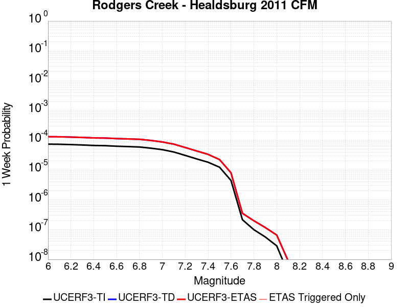 | 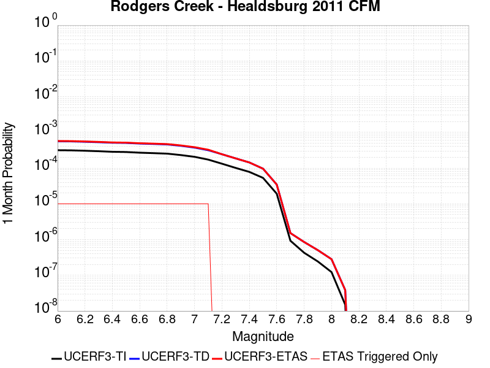 | 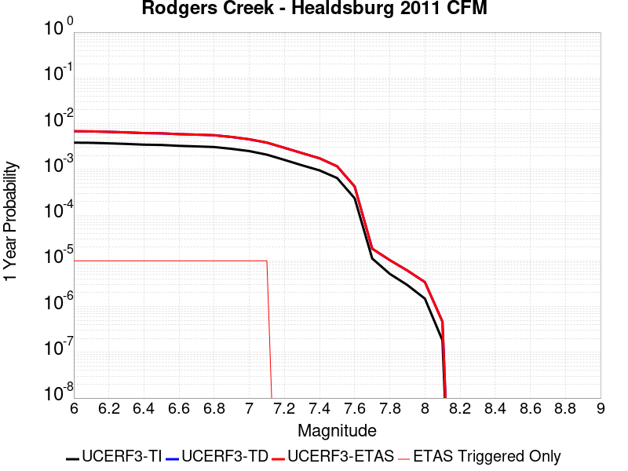 | 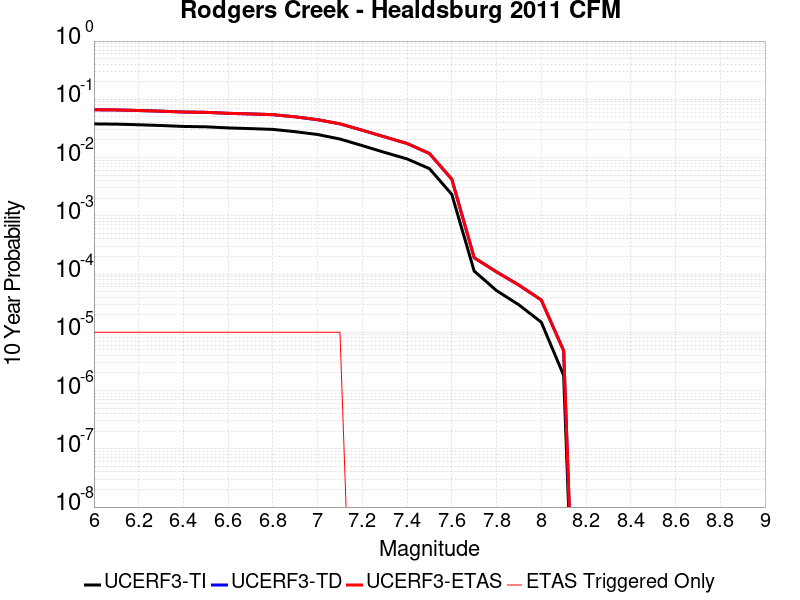 |

| Magnitude | 1 wk TI Prob | 1 wk TD Prob | 1 wk ETAS Prob | 1 wk ETAS/TD Gain | 1 wk ETAS Triggered Only | 1 mo TI Prob | 1 mo TD Prob | 1 mo ETAS Prob | 1 mo ETAS/TD Gain | 1 mo ETAS Triggered Only | 1 yr TI Prob | 1 yr TD Prob | 1 yr ETAS Prob | 1 yr ETAS/TD Gain | 1 yr ETAS Triggered Only | 10 yr TI Prob | 10 yr TD Prob | 10 yr ETAS Prob | 10 yr ETAS/TD Gain | 10 yr ETAS Triggered Only |
|-----|-----|-----|-----|-----|-----|-----|-----|-----|-----|-----|-----|-----|-----|-----|-----|-----|-----|-----|-----|-----|
| 6.0 | 7.390182E-5 | 1.3137296E-4 | 1.3137296E-4 | 1.0 | 0.0 | 3.1668364E-4 | 5.629057E-4 | 5.7290005E-4 | 1.0177549 | 1.0E-5 | 0.0038488081 | 0.0068318076 | 0.006841739 | 1.0014538 | 1.0E-5 | 0.037828278 | 0.06618395 | 0.06619328 | 1.0001411 | 1.0E-5 |
| 6.1 | 7.318768E-5 | 1.303531E-4 | 1.303531E-4 | 1.0 | 0.0 | 3.1362378E-4 | 5.585369E-4 | 5.6853134E-4 | 1.0178939 | 1.0E-5 | 0.0038116854 | 0.006778966 | 0.0067888983 | 1.0014652 | 1.0E-5 | 0.037469655 | 0.06568854 | 0.065697886 | 1.0001422 | 1.0E-5 |
| 6.2 | 7.1379836E-5 | 1.2728151E-4 | 1.2728151E-4 | 1.0 | 0.0 | 3.058777E-4 | 5.453785E-4 | 5.5537303E-4 | 1.0183259 | 1.0E-5 | 0.003717703 | 0.0066197454 | 0.006629679 | 1.0015006 | 1.0E-5 | 0.0365612 | 0.06421061 | 0.06421997 | 1.0001458 | 1.0E-5 |
| 6.3 | 6.9255926E-5 | 1.2382482E-4 | 1.2382482E-4 | 1.0 | 0.0 | 2.9677735E-4 | 5.305703E-4 | 5.4056494E-4 | 1.0188377 | 1.0E-5 | 0.0036072785 | 0.0064406106 | 0.0064505464 | 1.0015427 | 1.0E-5 | 0.035492823 | 0.062541805 | 0.062551185 | 1.0001498 | 1.0E-5 |
| 6.4 | 6.6757144E-5 | 1.195919E-4 | 1.195919E-4 | 1.0 | 0.0 | 2.8607066E-4 | 5.1243644E-4 | 5.2243134E-4 | 1.0195047 | 1.0E-5 | 0.0034773487 | 0.00622114 | 0.006231078 | 1.0015974 | 1.0E-5 | 0.034234364 | 0.060491614 | 0.06050101 | 1.0001553 | 1.0E-5 |
| 6.5 | 6.5735134E-5 | 1.180849E-4 | 1.180849E-4 | 1.0 | 0.0 | 2.8169158E-4 | 5.059804E-4 | 5.1597535E-4 | 1.0197536 | 1.0E-5 | 0.003424202 | 0.0061429944 | 0.006152933 | 1.0016179 | 1.0E-5 | 0.03371918 | 0.059755705 | 0.059765108 | 1.0001574 | 1.0E-5 |
| 6.6 | 6.289601E-5 | 1.13442366E-4 | 1.13442366E-4 | 1.0 | 0.0 | 2.6952647E-4 | 4.8609133E-4 | 4.960865E-4 | 1.0205623 | 1.0E-5 | 0.0032765474 | 0.005902183 | 0.0059121237 | 1.0016843 | 1.0E-5 | 0.032286562 | 0.057495043 | 0.057504468 | 1.0001639 | 1.0E-5 |
| 6.7 | 6.115274E-5 | 1.106132E-4 | 1.106132E-4 | 1.0 | 0.0 | 2.6205686E-4 | 4.739708E-4 | 4.8396608E-4 | 1.0210884 | 1.0E-5 | 0.0031858748 | 0.0057554054 | 0.0057653477 | 1.0017275 | 1.0E-5 | 0.031405866 | 0.05611361 | 0.056123048 | 1.0001682 | 1.0E-5 |
| 6.8 | 5.9232367E-5 | 1.0728657E-4 | 1.0728657E-4 | 1.0 | 0.0 | 2.538283E-4 | 4.5971893E-4 | 4.6971434E-4 | 1.0217425 | 1.0E-5 | 0.0030859804 | 0.005582791 | 0.005592735 | 1.0017812 | 1.0E-5 | 0.030434765 | 0.05448041 | 0.054489866 | 1.0001736 | 1.0E-5 |
| 6.9 | 5.4030377E-5 | 9.8228295E-5 | 9.8228295E-5 | 1.0 | 0.0 | 2.315382E-4 | 4.209108E-4 | 4.309066E-4 | 1.023748 | 1.0E-5 | 0.0028153337 | 0.0051126136 | 0.0051225624 | 1.001946 | 1.0E-5 | 0.027799325 | 0.05001572 | 0.05002522 | 1.0001899 | 1.0E-5 |
| 7.0 | 4.8260714E-5 | 8.7408924E-5 | 8.7408924E-5 | 1.0 | 0.0 | 2.0681522E-4 | 3.7455617E-4 | 3.8455243E-4 | 1.0266882 | 1.0E-5 | 0.0025150678 | 0.0045507406 | 0.004560695 | 1.0021875 | 1.0E-5 | 0.024867928 | 0.044667073 | 0.044676628 | 1.0002139 | 1.0E-5 |
| 7.1 | 4.0294493E-5 | 7.389363E-5 | 7.389363E-5 | 1.0 | 0.0 | 1.7267925E-4 | 3.1664874E-4 | 3.2664556E-4 | 1.0315708 | 1.0E-5 | 0.0021003427 | 0.0038484214 | 0.003858383 | 1.0025885 | 1.0E-5 | 0.02080602 | 0.037923187 | 0.03793281 | 1.0002537 | 1.0E-5 |
| 7.2 | 3.096388E-5 | 5.698023E-5 | 5.698023E-5 | 1.0 | 0.0 | 1.326956E-4 | 2.4417826E-4 | 2.4417826E-4 | 1.0 | 0.0 | 0.0016143717 | 0.0029688394 | 0.0029688394 | 1.0 | 0.0 | 0.01602694 | 0.029437006 | 0.029437006 | 1.0 | 0.0 |
| 7.3 | 2.3615226E-5 | 4.3629818E-5 | 4.3629818E-5 | 1.0 | 0.0 | 1.0120418E-4 | 1.869716E-4 | 1.869716E-4 | 1.0 | 0.0 | 0.0012314644 | 0.0022740164 | 0.0022740164 | 1.0 | 0.0 | 0.0122466255 | 0.022637889 | 0.022637889 | 1.0 | 0.0 |
| 7.4 | 1.8251132E-5 | 3.3542477E-5 | 3.3542477E-5 | 1.0 | 0.0 | 7.821679E-5 | 1.4374561E-4 | 1.4374561E-4 | 1.0 | 0.0 | 9.518733E-4 | 0.0017487077 | 0.0017487077 | 1.0 | 0.0 | 0.009478063 | 0.017466031 | 0.017466031 | 1.0 | 0.0 |
| 7.5 | 1.2411432E-5 | 2.2461069E-5 | 2.2461069E-5 | 1.0 | 0.0 | 5.3190768E-5 | 9.6258205E-5 | 9.6258205E-5 | 1.0 | 0.0 | 6.4740516E-4 | 0.0011713194 | 0.0011713194 | 1.0 | 0.0 | 0.006455223 | 0.011743137 | 0.011743137 | 1.0 | 0.0 |
| 7.6 | 4.4771446E-6 | 8.08443E-6 | 8.08443E-6 | 1.0 | 0.0 | 1.918762E-5 | 3.4647102E-5 | 3.4647102E-5 | 1.0 | 0.0 | 2.3358424E-4 | 4.2174806E-4 | 4.2174806E-4 | 1.0 | 0.0 | 0.0023333887 | 0.0042453306 | 0.0042453306 | 1.0 | 0.0 |
| 7.7 | 2.157941E-7 | 3.5350925E-7 | 3.5350925E-7 | 1.0 | 0.0 | 9.248315E-7 | 1.5150388E-6 | 1.5150388E-6 | 1.0 | 0.0 | 1.1259765E-5 | 1.844544E-5 | 1.844544E-5 | 1.0 | 0.0 | 1.1259195E-4 | 1.9069649E-4 | 1.9069649E-4 | 1.0 | 0.0 |
| 7.8 | 9.9623286E-8 | 1.9900986E-7 | 1.9900986E-7 | 1.0 | 0.0 | 4.269569E-7 | 8.528991E-7 | 8.528991E-7 | 1.0 | 0.0 | 5.1981874E-6 | 1.03839975E-5 | 1.03839975E-5 | 1.0 | 0.0 | 5.198066E-5 | 1.0902916E-4 | 1.0902916E-4 | 1.0 | 0.0 |
| 7.9 | 5.6745257E-8 | 1.1774714E-7 | 1.1774714E-7 | 1.0 | 0.0 | 2.4319394E-7 | 5.046305E-7 | 5.046305E-7 | 1.0 | 0.0 | 2.960882E-6 | 6.143859E-6 | 6.143859E-6 | 1.0 | 0.0 | 2.9608427E-5 | 6.471445E-5 | 6.471445E-5 | 1.0 | 0.0 |
| 8.0 | 2.8614323E-8 | 6.5789635E-8 | 6.5789635E-8 | 1.0 | 0.0 | 1.2263281E-7 | 2.8195555E-7 | 2.8195555E-7 | 1.0 | 0.0 | 1.4930534E-6 | 3.4328034E-6 | 3.4328034E-6 | 1.0 | 0.0 | 1.4930434E-5 | 3.5830046E-5 | 3.5830046E-5 | 1.0 | 0.0 |
| 8.1 | 3.5045191E-9 | 8.966459E-9 | 8.966459E-9 | 1.0 | 0.0 | 1.5019367E-8 | 3.8427682E-8 | 3.8427682E-8 | 1.0 | 0.0 | 1.8286079E-7 | 4.6785692E-7 | 4.6785692E-7 | 1.0 | 0.0 | 1.8286064E-6 | 4.834128E-6 | 4.834128E-6 | 1.0 | 0.0 |

## Mission Hills 2011
*[(top)](#table-of-contents)*

| 1 Week | 1 Month | 1 Year | 10 Year |
|-----|-----|-----|-----|
|  | 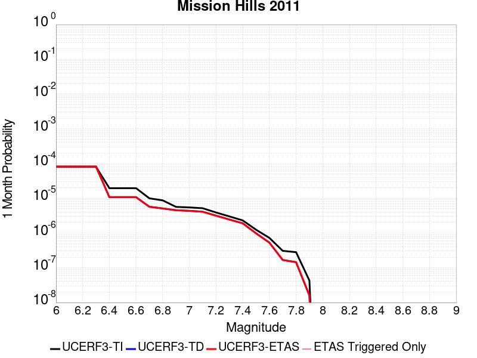 |  |  |

| Magnitude | 1 wk TI Prob | 1 wk TD Prob | 1 wk ETAS Prob | 1 wk ETAS/TD Gain | 1 wk ETAS Triggered Only | 1 mo TI Prob | 1 mo TD Prob | 1 mo ETAS Prob | 1 mo ETAS/TD Gain | 1 mo ETAS Triggered Only | 1 yr TI Prob | 1 yr TD Prob | 1 yr ETAS Prob | 1 yr ETAS/TD Gain | 1 yr ETAS Triggered Only | 10 yr TI Prob | 10 yr TD Prob | 10 yr ETAS Prob | 10 yr ETAS/TD Gain | 10 yr ETAS Triggered Only |
|-----|-----|-----|-----|-----|-----|-----|-----|-----|-----|-----|-----|-----|-----|-----|-----|-----|-----|-----|-----|-----|
| 6.0 | 1.8765717E-5 | 1.9054629E-5 | 1.9054629E-5 | 1.0 | 0.0 | 8.0422025E-5 | 8.1662074E-5 | 8.1662074E-5 | 1.0 | 0.0 | 9.786983E-4 | 9.941256E-4 | 9.941256E-4 | 1.0 | 0.0 | 0.009743992 | 0.00993045 | 0.00994035 | 1.000997 | 1.0E-5 |
| 6.1 | 1.8765717E-5 | 1.9054629E-5 | 1.9054629E-5 | 1.0 | 0.0 | 8.0422025E-5 | 8.1662074E-5 | 8.1662074E-5 | 1.0 | 0.0 | 9.786983E-4 | 9.941256E-4 | 9.941256E-4 | 1.0 | 0.0 | 0.009743992 | 0.00993045 | 0.00994035 | 1.000997 | 1.0E-5 |
| 6.2 | 1.8765717E-5 | 1.9054629E-5 | 1.9054629E-5 | 1.0 | 0.0 | 8.0422025E-5 | 8.1662074E-5 | 8.1662074E-5 | 1.0 | 0.0 | 9.786983E-4 | 9.941256E-4 | 9.941256E-4 | 1.0 | 0.0 | 0.009743992 | 0.00993045 | 0.00994035 | 1.000997 | 1.0E-5 |
| 6.3 | 1.8765717E-5 | 1.9054629E-5 | 1.9054629E-5 | 1.0 | 0.0 | 8.0422025E-5 | 8.1662074E-5 | 8.1662074E-5 | 1.0 | 0.0 | 9.786983E-4 | 9.941256E-4 | 9.941256E-4 | 1.0 | 0.0 | 0.009743992 | 0.00993045 | 0.00994035 | 1.000997 | 1.0E-5 |
| 6.4 | 4.566357E-6 | 2.5148213E-6 | 2.5148213E-6 | 1.0 | 0.0 | 1.9569954E-5 | 1.0777771E-5 | 1.0777771E-5 | 1.0 | 0.0 | 2.3823815E-4 | 1.3121328E-4 | 1.3121328E-4 | 1.0 | 0.0 | 0.002379829 | 0.0013115364 | 0.0013115364 | 1.0 | 0.0 |
| 6.5 | 4.566357E-6 | 2.5148213E-6 | 2.5148213E-6 | 1.0 | 0.0 | 1.9569954E-5 | 1.0777771E-5 | 1.0777771E-5 | 1.0 | 0.0 | 2.3823815E-4 | 1.3121328E-4 | 1.3121328E-4 | 1.0 | 0.0 | 0.002379829 | 0.0013115364 | 0.0013115364 | 1.0 | 0.0 |
| 6.6 | 4.566357E-6 | 2.5148213E-6 | 2.5148213E-6 | 1.0 | 0.0 | 1.9569954E-5 | 1.0777771E-5 | 1.0777771E-5 | 1.0 | 0.0 | 2.3823815E-4 | 1.3121328E-4 | 1.3121328E-4 | 1.0 | 0.0 | 0.002379829 | 0.0013115364 | 0.0013115364 | 1.0 | 0.0 |
| 6.7 | 2.3266773E-6 | 1.3296132E-6 | 1.3296132E-6 | 1.0 | 0.0 | 9.971435E-6 | 5.69833E-6 | 5.69833E-6 | 1.0 | 0.0 | 1.2139547E-4 | 6.937502E-5 | 6.937502E-5 | 1.0 | 0.0 | 0.0012132917 | 6.935397E-4 | 6.935397E-4 | 1.0 | 0.0 |
| 6.8 | 2.032735E-6 | 1.1894101E-6 | 1.1894101E-6 | 1.0 | 0.0 | 8.711692E-6 | 5.0974622E-6 | 5.0974622E-6 | 1.0 | 0.0 | 1.06059684E-4 | 6.205988E-5 | 6.205988E-5 | 1.0 | 0.0 | 0.0010600908 | 6.204304E-4 | 6.204304E-4 | 1.0 | 0.0 |
| 6.9 | 1.3186259E-6 | 1.0561989E-6 | 1.0561989E-6 | 1.0 | 0.0 | 5.6512413E-6 | 4.526559E-6 | 4.526559E-6 | 1.0 | 0.0 | 6.8801695E-5 | 5.5109493E-5 | 5.5109493E-5 | 1.0 | 0.0 | 6.8780396E-4 | 5.5096124E-4 | 5.5096124E-4 | 1.0 | 0.0 |
| 7.0 | 1.2726016E-6 | 1.0159295E-6 | 1.0159295E-6 | 1.0 | 0.0 | 5.4539955E-6 | 4.3539762E-6 | 4.3539762E-6 | 1.0 | 0.0 | 6.6400375E-5 | 5.30084E-5 | 5.30084E-5 | 1.0 | 0.0 | 6.6380535E-4 | 5.299604E-4 | 5.299604E-4 | 1.0 | 0.0 |
| 7.1 | 1.2063913E-6 | 9.570282E-7 | 9.570282E-7 | 1.0 | 0.0 | 5.170238E-6 | 4.101543E-6 | 4.101543E-6 | 1.0 | 0.0 | 6.294583E-5 | 4.9935166E-5 | 4.9935166E-5 | 1.0 | 0.0 | 6.2928005E-4 | 4.9924204E-4 | 4.9924204E-4 | 1.0 | 0.0 |
| 7.2 | 9.105806E-7 | 7.3767757E-7 | 7.3767757E-7 | 1.0 | 0.0 | 3.9024826E-6 | 3.1614716E-6 | 3.1614716E-6 | 1.0 | 0.0 | 4.7511687E-5 | 3.8490252E-5 | 3.8490252E-5 | 1.0 | 0.0 | 4.7501532E-4 | 3.8483742E-4 | 3.8483742E-4 | 1.0 | 0.0 |
| 7.3 | 7.020432E-7 | 5.7103375E-7 | 5.7103375E-7 | 1.0 | 0.0 | 3.0087533E-6 | 2.4472852E-6 | 2.4472852E-6 | 1.0 | 0.0 | 3.6630954E-5 | 2.9795303E-5 | 2.9795303E-5 | 1.0 | 0.0 | 3.6624918E-4 | 2.979144E-4 | 2.979144E-4 | 1.0 | 0.0 |
| 7.4 | 5.3900635E-7 | 4.4483278E-7 | 4.4483278E-7 | 1.0 | 0.0 | 2.3100251E-6 | 1.9064248E-6 | 1.9064248E-6 | 1.0 | 0.0 | 2.8124194E-5 | 2.3210489E-5 | 2.3210489E-5 | 1.0 | 0.0 | 2.8120633E-4 | 2.3208185E-4 | 2.3208185E-4 | 1.0 | 0.0 |
| 7.5 | 2.907075E-7 | 2.2875324E-7 | 2.2875324E-7 | 1.0 | 0.0 | 1.2458887E-6 | 9.803706E-7 | 9.803706E-7 | 1.0 | 0.0 | 1.5168589E-5 | 1.1935949E-5 | 1.1935949E-5 | 1.0 | 0.0 | 1.5167553E-4 | 1.1935326E-4 | 1.1935326E-4 | 1.0 | 0.0 |
| 7.6 | 1.6903675E-7 | 1.2353401E-7 | 1.2353401E-7 | 1.0 | 0.0 | 7.2444305E-7 | 5.2943136E-7 | 5.2943136E-7 | 1.0 | 0.0 | 8.820059E-6 | 6.4458086E-6 | 6.4458086E-6 | 1.0 | 0.0 | 8.8197085E-5 | 6.445634E-5 | 6.445634E-5 | 1.0 | 0.0 |
| 7.7 | 7.168073E-8 | 3.9134374E-8 | 3.9134374E-8 | 1.0 | 0.0 | 3.072031E-7 | 1.6771872E-7 | 1.6771872E-7 | 1.0 | 0.0 | 3.7401915E-6 | 2.0419736E-6 | 2.0419736E-6 | 1.0 | 0.0 | 3.7401285E-5 | 2.041956E-5 | 2.041956E-5 | 1.0 | 0.0 |
| 7.8 | 6.564101E-8 | 3.3834656E-8 | 3.3834656E-8 | 1.0 | 0.0 | 2.813186E-7 | 1.4500566E-7 | 1.4500566E-7 | 1.0 | 0.0 | 3.4250486E-6 | 1.7654426E-6 | 1.7654426E-6 | 1.0 | 0.0 | 3.424996E-5 | 1.7654296E-5 | 1.7654296E-5 | 1.0 | 0.0 |
| 7.9 | 1.0029074E-8 | 3.728858E-9 | 3.728858E-9 | 1.0 | 0.0 | 4.2981743E-8 | 1.598082E-8 | 1.598082E-8 | 1.0 | 0.0 | 5.2330256E-7 | 1.945665E-7 | 1.945665E-7 | 1.0 | 0.0 | 5.2330133E-6 | 1.9456643E-6 | 1.9456643E-6 | 1.0 | 0.0 |

## Fickle Hill (alt1)
*[(top)](#table-of-contents)*

| 1 Week | 1 Month | 1 Year | 10 Year |
|-----|-----|-----|-----|
|  |  | 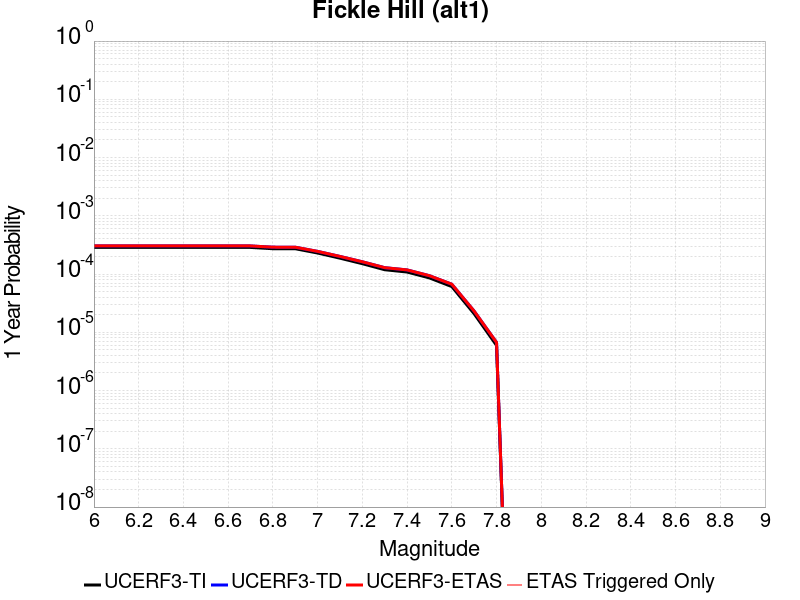 |  |

| Magnitude | 1 wk TI Prob | 1 wk TD Prob | 1 wk ETAS Prob | 1 wk ETAS/TD Gain | 1 wk ETAS Triggered Only | 1 mo TI Prob | 1 mo TD Prob | 1 mo ETAS Prob | 1 mo ETAS/TD Gain | 1 mo ETAS Triggered Only | 1 yr TI Prob | 1 yr TD Prob | 1 yr ETAS Prob | 1 yr ETAS/TD Gain | 1 yr ETAS Triggered Only | 10 yr TI Prob | 10 yr TD Prob | 10 yr ETAS Prob | 10 yr ETAS/TD Gain | 10 yr ETAS Triggered Only |
|-----|-----|-----|-----|-----|-----|-----|-----|-----|-----|-----|-----|-----|-----|-----|-----|-----|-----|-----|-----|-----|
| 6.0 | 5.491893E-6 | 5.826998E-6 | 5.826998E-6 | 1.0 | 0.0 | 2.3536471E-5 | 2.4972622E-5 | 2.4972622E-5 | 1.0 | 0.0 | 2.8651886E-4 | 3.040015E-4 | 3.040015E-4 | 1.0 | 0.0 | 0.0028614972 | 0.0030360806 | 0.0030460502 | 1.0032837 | 1.0E-5 |
| 6.1 | 5.491893E-6 | 5.826998E-6 | 5.826998E-6 | 1.0 | 0.0 | 2.3536471E-5 | 2.4972622E-5 | 2.4972622E-5 | 1.0 | 0.0 | 2.8651886E-4 | 3.040015E-4 | 3.040015E-4 | 1.0 | 0.0 | 0.0028614972 | 0.0030360806 | 0.0030460502 | 1.0032837 | 1.0E-5 |
| 6.2 | 5.491893E-6 | 5.826998E-6 | 5.826998E-6 | 1.0 | 0.0 | 2.3536471E-5 | 2.4972622E-5 | 2.4972622E-5 | 1.0 | 0.0 | 2.8651886E-4 | 3.040015E-4 | 3.040015E-4 | 1.0 | 0.0 | 0.0028614972 | 0.0030360806 | 0.0030460502 | 1.0032837 | 1.0E-5 |
| 6.3 | 5.491893E-6 | 5.826998E-6 | 5.826998E-6 | 1.0 | 0.0 | 2.3536471E-5 | 2.4972622E-5 | 2.4972622E-5 | 1.0 | 0.0 | 2.8651886E-4 | 3.040015E-4 | 3.040015E-4 | 1.0 | 0.0 | 0.0028614972 | 0.0030360806 | 0.0030460502 | 1.0032837 | 1.0E-5 |
| 6.4 | 5.491893E-6 | 5.826998E-6 | 5.826998E-6 | 1.0 | 0.0 | 2.3536471E-5 | 2.4972622E-5 | 2.4972622E-5 | 1.0 | 0.0 | 2.8651886E-4 | 3.040015E-4 | 3.040015E-4 | 1.0 | 0.0 | 0.0028614972 | 0.0030360806 | 0.0030460502 | 1.0032837 | 1.0E-5 |
| 6.5 | 5.491893E-6 | 5.826998E-6 | 5.826998E-6 | 1.0 | 0.0 | 2.3536471E-5 | 2.4972622E-5 | 2.4972622E-5 | 1.0 | 0.0 | 2.8651886E-4 | 3.040015E-4 | 3.040015E-4 | 1.0 | 0.0 | 0.0028614972 | 0.0030360806 | 0.0030460502 | 1.0032837 | 1.0E-5 |
| 6.6 | 5.491893E-6 | 5.826998E-6 | 5.826998E-6 | 1.0 | 0.0 | 2.3536471E-5 | 2.4972622E-5 | 2.4972622E-5 | 1.0 | 0.0 | 2.8651886E-4 | 3.040015E-4 | 3.040015E-4 | 1.0 | 0.0 | 0.0028614972 | 0.0030360806 | 0.0030460502 | 1.0032837 | 1.0E-5 |
| 6.7 | 5.491893E-6 | 5.826998E-6 | 5.826998E-6 | 1.0 | 0.0 | 2.3536471E-5 | 2.4972622E-5 | 2.4972622E-5 | 1.0 | 0.0 | 2.8651886E-4 | 3.040015E-4 | 3.040015E-4 | 1.0 | 0.0 | 0.0028614972 | 0.0030360806 | 0.0030460502 | 1.0032837 | 1.0E-5 |
| 6.8 | 5.2207747E-6 | 5.5457263E-6 | 5.5457263E-6 | 1.0 | 0.0 | 2.2374557E-5 | 2.3767194E-5 | 2.3767194E-5 | 1.0 | 0.0 | 2.7237617E-4 | 2.8932936E-4 | 2.8932936E-4 | 1.0 | 0.0 | 0.0027204256 | 0.002889745 | 0.0028997161 | 1.0034505 | 1.0E-5 |
| 6.9 | 5.2186956E-6 | 5.5435466E-6 | 5.5435466E-6 | 1.0 | 0.0 | 2.2365646E-5 | 2.3757853E-5 | 2.3757853E-5 | 1.0 | 0.0 | 2.722677E-4 | 2.8921568E-4 | 2.8921568E-4 | 1.0 | 0.0 | 0.0027193436 | 0.0028886108 | 0.002898582 | 1.0034518 | 1.0E-5 |
| 7.0 | 4.403045E-6 | 4.69848E-6 | 4.69848E-6 | 1.0 | 0.0 | 1.8870056E-5 | 2.0136196E-5 | 2.0136196E-5 | 1.0 | 0.0 | 2.297187E-4 | 2.4513193E-4 | 2.4513193E-4 | 1.0 | 0.0 | 0.0022948137 | 0.0024487455 | 0.0024587212 | 1.0040737 | 1.0E-5 |
| 7.1 | 3.5911396E-6 | 3.8479548E-6 | 3.8479548E-6 | 1.0 | 0.0 | 1.5390508E-5 | 1.6491134E-5 | 1.6491134E-5 | 1.0 | 0.0 | 1.8736332E-4 | 2.0076182E-4 | 2.0076182E-4 | 1.0 | 0.0 | 0.0018720542 | 0.002005878 | 0.0020158577 | 1.0049753 | 1.0E-5 |
| 7.2 | 2.888171E-6 | 3.114158E-6 | 3.114158E-6 | 1.0 | 0.0 | 1.2377816E-5 | 1.3346325E-5 | 1.3346325E-5 | 1.0 | 0.0 | 1.5068949E-4 | 1.6247964E-4 | 1.6247964E-4 | 1.0 | 0.0 | 0.0015058735 | 0.0016236332 | 0.001633617 | 1.006149 | 1.0E-5 |
| 7.3 | 2.275019E-6 | 2.4675212E-6 | 2.4675212E-6 | 1.0 | 0.0 | 9.750045E-6 | 1.0575049E-5 | 1.0575049E-5 | 1.0 | 0.0 | 1.1870033E-4 | 1.2874375E-4 | 1.2874375E-4 | 1.0 | 0.0 | 0.0011863695 | 0.0012867056 | 0.0012867056 | 1.0 | 0.0 |
| 7.4 | 2.076662E-6 | 2.2576116E-6 | 2.2576116E-6 | 1.0 | 0.0 | 8.8999495E-6 | 9.675444E-6 | 9.675444E-6 | 1.0 | 0.0 | 1.08351494E-4 | 1.1779229E-4 | 1.1779229E-4 | 1.0 | 0.0 | 0.0010829868 | 0.0011773116 | 0.0011773116 | 1.0 | 0.0 |
| 7.5 | 1.6450799E-6 | 1.7954102E-6 | 1.7954102E-6 | 1.0 | 0.0 | 7.0503233E-6 | 7.694593E-6 | 7.694593E-6 | 1.0 | 0.0 | 8.5834305E-5 | 9.367772E-5 | 9.367772E-5 | 1.0 | 0.0 | 8.580116E-4 | 9.3639E-4 | 9.3639E-4 | 1.0 | 0.0 |
| 7.6 | 1.168891E-6 | 1.282952E-6 | 1.282952E-6 | 1.0 | 0.0 | 5.009523E-6 | 5.4983543E-6 | 5.4983543E-6 | 1.0 | 0.0 | 6.098924E-5 | 6.694047E-5 | 6.694047E-5 | 1.0 | 0.0 | 6.09725E-4 | 6.6920865E-4 | 6.6920865E-4 | 1.0 | 0.0 |
| 7.7 | 3.9871026E-7 | 4.4271442E-7 | 4.4271442E-7 | 1.0 | 0.0 | 1.708757E-6 | 1.8973462E-6 | 1.8973462E-6 | 1.0 | 0.0 | 2.0803918E-5 | 2.3099954E-5 | 2.3099954E-5 | 1.0 | 0.0 | 2.0801972E-4 | 2.3097637E-4 | 2.3097637E-4 | 1.0 | 0.0 |
| 7.8 | 1.14295965E-7 | 1.2853816E-7 | 1.2853816E-7 | 1.0 | 0.0 | 4.8983975E-7 | 5.5087776E-7 | 5.5087776E-7 | 1.0 | 0.0 | 5.9637828E-6 | 6.7069177E-6 | 6.7069177E-6 | 1.0 | 0.0 | 5.9636226E-5 | 6.70673E-5 | 6.70673E-5 | 1.0 | 0.0 |

## Reliz 2011 CFM
*[(top)](#table-of-contents)*

| 1 Week | 1 Month | 1 Year | 10 Year |
|-----|-----|-----|-----|
|  |  | 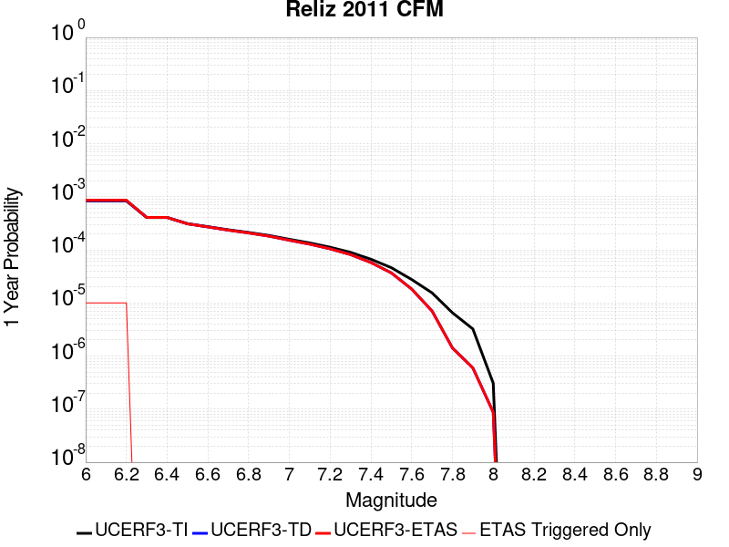 | 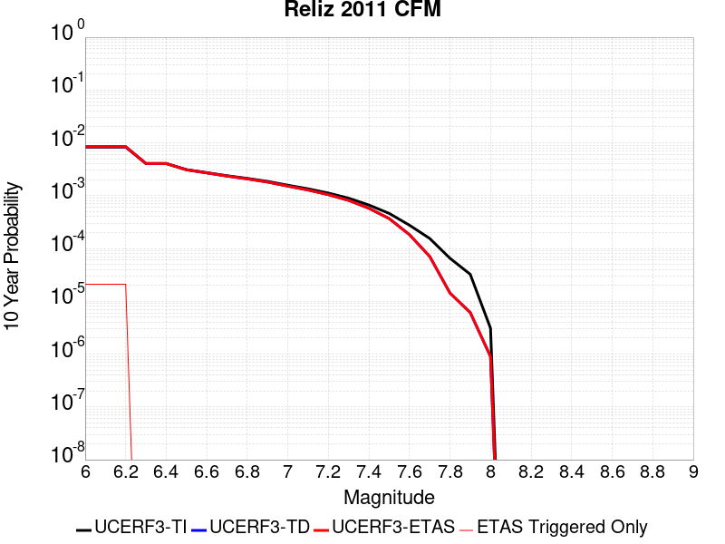 |

| Magnitude | 1 wk TI Prob | 1 wk TD Prob | 1 wk ETAS Prob | 1 wk ETAS/TD Gain | 1 wk ETAS Triggered Only | 1 mo TI Prob | 1 mo TD Prob | 1 mo ETAS Prob | 1 mo ETAS/TD Gain | 1 mo ETAS Triggered Only | 1 yr TI Prob | 1 yr TD Prob | 1 yr ETAS Prob | 1 yr ETAS/TD Gain | 1 yr ETAS Triggered Only | 10 yr TI Prob | 10 yr TD Prob | 10 yr ETAS Prob | 10 yr ETAS/TD Gain | 10 yr ETAS Triggered Only |
|-----|-----|-----|-----|-----|-----|-----|-----|-----|-----|-----|-----|-----|-----|-----|-----|-----|-----|-----|-----|-----|
| 6.0 | 1.6002472E-5 | 1.6282795E-5 | 1.6282795E-5 | 1.0 | 0.0 | 6.8580215E-5 | 6.978165E-5 | 6.978165E-5 | 1.0 | 0.0 | 8.3464425E-4 | 8.492802E-4 | 8.5927173E-4 | 1.0117646 | 1.0E-5 | 0.008315164 | 0.008462543 | 0.008472458 | 1.0011717 | 1.0E-5 |
| 6.1 | 1.6002472E-5 | 1.6282795E-5 | 1.6282795E-5 | 1.0 | 0.0 | 6.8580215E-5 | 6.978165E-5 | 6.978165E-5 | 1.0 | 0.0 | 8.3464425E-4 | 8.492802E-4 | 8.5927173E-4 | 1.0117646 | 1.0E-5 | 0.008315164 | 0.008462543 | 0.008472458 | 1.0011717 | 1.0E-5 |
| 6.2 | 1.6002472E-5 | 1.6282795E-5 | 1.6282795E-5 | 1.0 | 0.0 | 6.8580215E-5 | 6.978165E-5 | 6.978165E-5 | 1.0 | 0.0 | 8.3464425E-4 | 8.492802E-4 | 8.5927173E-4 | 1.0117646 | 1.0E-5 | 0.008315164 | 0.008462543 | 0.008472458 | 1.0011717 | 1.0E-5 |
| 6.3 | 7.792404E-6 | 7.803792E-6 | 7.803792E-6 | 1.0 | 0.0 | 3.339559E-5 | 3.3444398E-5 | 3.3444398E-5 | 1.0 | 0.0 | 4.0651546E-4 | 4.0711026E-4 | 4.0711026E-4 | 1.0 | 0.0 | 0.0040577264 | 0.0040639215 | 0.0040639215 | 1.0 | 0.0 |
| 6.4 | 7.792404E-6 | 7.803792E-6 | 7.803792E-6 | 1.0 | 0.0 | 3.339559E-5 | 3.3444398E-5 | 3.3444398E-5 | 1.0 | 0.0 | 4.0651546E-4 | 4.0711026E-4 | 4.0711026E-4 | 1.0 | 0.0 | 0.0040577264 | 0.0040639215 | 0.0040639215 | 1.0 | 0.0 |
| 6.5 | 5.9659374E-6 | 5.928728E-6 | 5.928728E-6 | 1.0 | 0.0 | 2.5568053E-5 | 2.5408588E-5 | 2.5408588E-5 | 1.0 | 0.0 | 3.1124658E-4 | 3.0930588E-4 | 3.0930588E-4 | 1.0 | 0.0 | 0.00310811 | 0.003088972 | 0.003088972 | 1.0 | 0.0 |
| 6.6 | 5.2350692E-6 | 5.178976E-6 | 5.178976E-6 | 1.0 | 0.0 | 2.2435817E-5 | 2.2195423E-5 | 2.2195423E-5 | 1.0 | 0.0 | 2.7312184E-4 | 2.7019592E-4 | 2.7019592E-4 | 1.0 | 0.0 | 0.002727864 | 0.0026988846 | 0.0026988846 | 1.0 | 0.0 |
| 6.7 | 4.580206E-6 | 4.50611E-6 | 4.50611E-6 | 1.0 | 0.0 | 1.9629308E-5 | 1.931176E-5 | 1.931176E-5 | 1.0 | 0.0 | 2.389606E-4 | 2.3509537E-4 | 2.3509537E-4 | 1.0 | 0.0 | 0.002387038 | 0.002348669 | 0.002348669 | 1.0 | 0.0 |
| 6.8 | 4.0765017E-6 | 3.988228E-6 | 3.988228E-6 | 1.0 | 0.0 | 1.7470604E-5 | 1.7092294E-5 | 1.7092294E-5 | 1.0 | 0.0 | 2.1268385E-4 | 2.0807884E-4 | 2.0807884E-4 | 1.0 | 0.0 | 0.002124804 | 0.0020790389 | 0.0020790389 | 1.0 | 0.0 |
| 6.9 | 3.5752896E-6 | 3.4725074E-6 | 3.4725074E-6 | 1.0 | 0.0 | 1.532258E-5 | 1.488209E-5 | 1.488209E-5 | 1.0 | 0.0 | 1.8653645E-4 | 1.811744E-4 | 1.811744E-4 | 1.0 | 0.0 | 0.0018637994 | 0.001810464 | 0.001810464 | 1.0 | 0.0 |
| 7.0 | 3.0259848E-6 | 2.9079317E-6 | 2.9079317E-6 | 1.0 | 0.0 | 1.2968442E-5 | 1.2462505E-5 | 1.2462505E-5 | 1.0 | 0.0 | 1.5787935E-4 | 1.5172044E-4 | 1.5172044E-4 | 1.0 | 0.0 | 0.0015776722 | 0.0015163644 | 0.0015163644 | 1.0 | 0.0 |
| 7.1 | 2.5861116E-6 | 2.455157E-6 | 2.455157E-6 | 1.0 | 0.0 | 1.1083288E-5 | 1.0522059E-5 | 1.0522059E-5 | 1.0 | 0.0 | 1.3493067E-4 | 1.2809855E-4 | 1.2809855E-4 | 1.0 | 0.0 | 0.0013484878 | 0.0012804423 | 0.0012804423 | 1.0 | 0.0 |
| 7.2 | 2.1482588E-6 | 2.0032267E-6 | 2.0032267E-6 | 1.0 | 0.0 | 9.20679E-6 | 8.585229E-6 | 8.585229E-6 | 1.0 | 0.0 | 1.12086906E-4 | 1.0452016E-4 | 1.0452016E-4 | 1.0 | 0.0 | 0.0011203039 | 0.0010449048 | 0.0010449048 | 1.0 | 0.0 |
| 7.3 | 1.7194744E-6 | 1.561114E-6 | 1.561114E-6 | 1.0 | 0.0 | 7.3691554E-6 | 6.6904713E-6 | 6.6904713E-6 | 1.0 | 0.0 | 8.971577E-5 | 8.145344E-5 | 8.145344E-5 | 1.0 | 0.0 | 8.967956E-4 | 8.144305E-4 | 8.144305E-4 | 1.0 | 0.0 |
| 7.4 | 1.2755178E-6 | 1.1056196E-6 | 1.1056196E-6 | 1.0 | 0.0 | 5.4664933E-6 | 4.738361E-6 | 4.738361E-6 | 1.0 | 0.0 | 6.655252E-5 | 5.768802E-5 | 5.768802E-5 | 1.0 | 0.0 | 6.6532596E-4 | 5.769249E-4 | 5.769249E-4 | 1.0 | 0.0 |
| 7.5 | 8.8463224E-7 | 7.0579193E-7 | 7.0579193E-7 | 1.0 | 0.0 | 3.7912755E-6 | 3.0248189E-6 | 3.0248189E-6 | 1.0 | 0.0 | 4.6157802E-5 | 3.682655E-5 | 3.682655E-5 | 1.0 | 0.0 | 4.6148215E-4 | 3.683988E-4 | 3.683988E-4 | 1.0 | 0.0 |
| 7.6 | 5.291355E-7 | 3.5006548E-7 | 3.5006548E-7 | 1.0 | 0.0 | 2.2677216E-6 | 1.5002796E-6 | 1.5002796E-6 | 1.0 | 0.0 | 2.760916E-5 | 1.8265751E-5 | 1.8265751E-5 | 1.0 | 0.0 | 2.760573E-4 | 1.8283579E-4 | 1.8283579E-4 | 1.0 | 0.0 |
| 7.7 | 2.9663357E-7 | 1.3509886E-7 | 1.3509886E-7 | 1.0 | 0.0 | 1.2712861E-6 | 5.7899496E-7 | 5.7899496E-7 | 1.0 | 0.0 | 1.5477797E-5 | 7.0492406E-6 | 7.0492406E-6 | 1.0 | 0.0 | 1.547672E-4 | 7.0675895E-5 | 7.0675895E-5 | 1.0 | 0.0 |
| 7.8 | 1.2509386E-7 | 2.7148959E-8 | 2.7148959E-8 | 1.0 | 0.0 | 5.3611643E-7 | 1.1635268E-7 | 1.1635268E-7 | 1.0 | 0.0 | 6.527198E-6 | 1.4165929E-6 | 1.4165929E-6 | 1.0 | 0.0 | 6.527006E-5 | 1.4322827E-5 | 1.4322827E-5 | 1.0 | 0.0 |
| 7.9 | 6.213493E-8 | 1.1477568E-8 | 1.1477568E-8 | 1.0 | 0.0 | 2.6629255E-7 | 4.9189577E-8 | 4.9189577E-8 | 1.0 | 0.0 | 3.242107E-6 | 5.9888293E-7 | 5.9888293E-7 | 1.0 | 0.0 | 3.2420594E-5 | 6.1203536E-6 | 6.1203536E-6 | 1.0 | 0.0 |
| 8.0 | 5.92383E-9 | 1.6775827E-9 | 1.6775827E-9 | 1.0 | 0.0 | 2.5387841E-8 | 7.18964E-9 | 7.18964E-9 | 1.0 | 0.0 | 3.0909692E-7 | 8.753386E-8 | 8.753386E-8 | 1.0 | 0.0 | 3.090965E-6 | 8.992677E-7 | 8.992677E-7 | 1.0 | 0.0 |

## Davis Creek
*[(top)](#table-of-contents)*

| 1 Week | 1 Month | 1 Year | 10 Year |
|-----|-----|-----|-----|
| 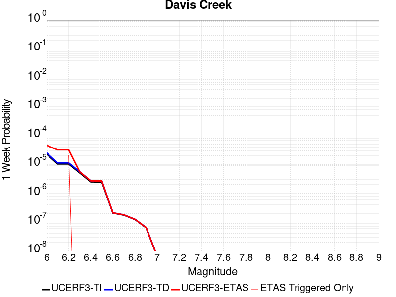 | 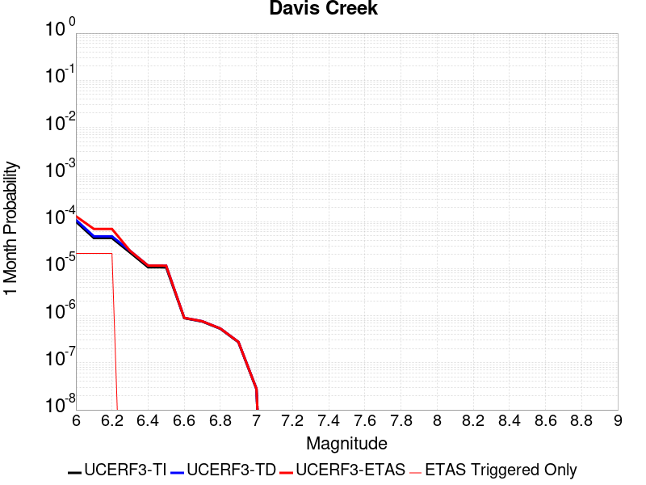 | 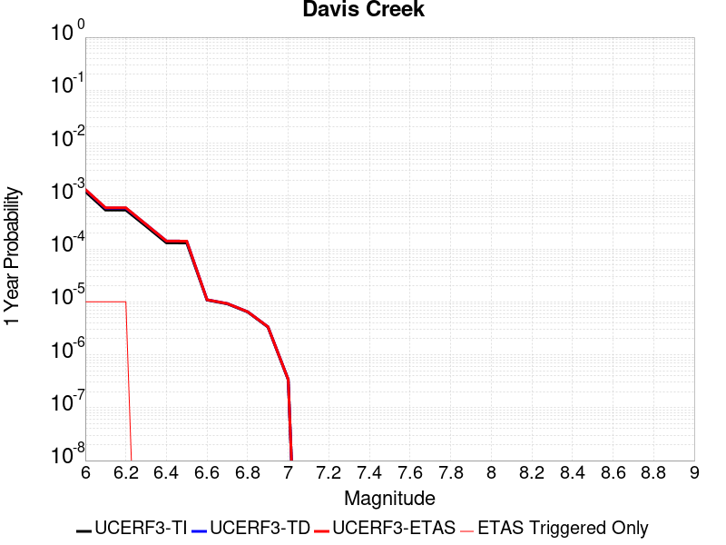 | 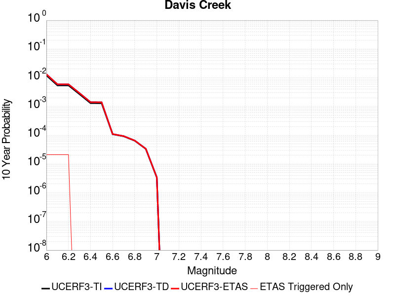 |

| Magnitude | 1 wk TI Prob | 1 wk TD Prob | 1 wk ETAS Prob | 1 wk ETAS/TD Gain | 1 wk ETAS Triggered Only | 1 mo TI Prob | 1 mo TD Prob | 1 mo ETAS Prob | 1 mo ETAS/TD Gain | 1 mo ETAS Triggered Only | 1 yr TI Prob | 1 yr TD Prob | 1 yr ETAS Prob | 1 yr ETAS/TD Gain | 1 yr ETAS Triggered Only | 10 yr TI Prob | 10 yr TD Prob | 10 yr ETAS Prob | 10 yr ETAS/TD Gain | 10 yr ETAS Triggered Only |
|-----|-----|-----|-----|-----|-----|-----|-----|-----|-----|-----|-----|-----|-----|-----|-----|-----|-----|-----|-----|-----|
| 6.0 | 2.331472E-5 | 2.5417214E-5 | 3.541696E-5 | 1.3934242 | 1.0E-5 | 9.99164E-5 | 1.0892704E-4 | 1.1892595E-4 | 1.0917946 | 1.0E-5 | 0.0012158032 | 0.0013254983 | 0.0013354851 | 1.0075344 | 1.0E-5 | 0.01209173 | 0.013187704 | 0.013197572 | 1.0007483 | 1.0E-5 |
| 6.1 | 1.0407654E-5 | 1.1316986E-5 | 2.1316873E-5 | 1.8836174 | 1.0E-5 | 4.4603472E-5 | 4.8500624E-5 | 5.8500136E-5 | 1.206173 | 1.0E-5 | 5.4291193E-4 | 5.9036224E-4 | 6.003563E-4 | 1.0169288 | 1.0E-5 | 0.0054158745 | 0.005890611 | 0.005900552 | 1.0016876 | 1.0E-5 |
| 6.2 | 1.0407654E-5 | 1.1316986E-5 | 2.1316873E-5 | 1.8836174 | 1.0E-5 | 4.4603472E-5 | 4.8500624E-5 | 5.8500136E-5 | 1.206173 | 1.0E-5 | 5.4291193E-4 | 5.9036224E-4 | 6.003563E-4 | 1.0169288 | 1.0E-5 | 0.0054158745 | 0.005890611 | 0.005900552 | 1.0016876 | 1.0E-5 |
| 6.3 | 5.1323277E-6 | 5.568556E-6 | 5.568556E-6 | 1.0 | 0.0 | 2.1995505E-5 | 2.386507E-5 | 2.386507E-5 | 1.0 | 0.0 | 2.6776237E-4 | 2.905271E-4 | 2.905271E-4 | 1.0 | 0.0 | 0.0026743996 | 0.0029023192 | 0.0029023192 | 1.0 | 0.0 |
| 6.4 | 2.4985154E-6 | 2.704538E-6 | 2.704538E-6 | 1.0 | 0.0 | 1.07078795E-5 | 1.1590847E-5 | 1.1590847E-5 | 1.0 | 0.0 | 1.3036063E-4 | 1.4111304E-4 | 1.4111304E-4 | 1.0 | 0.0 | 0.0013028418 | 0.001410589 | 0.001410589 | 1.0 | 0.0 |
| 6.5 | 2.4846438E-6 | 2.6904722E-6 | 2.6904722E-6 | 1.0 | 0.0 | 1.064843E-5 | 1.1530565E-5 | 1.1530565E-5 | 1.0 | 0.0 | 1.2963692E-4 | 1.403792E-4 | 1.403792E-4 | 1.0 | 0.0 | 0.0012956132 | 0.0014032599 | 0.0014032599 | 1.0 | 0.0 |
| 6.6 | 2.072566E-7 | 2.1018087E-7 | 2.1018087E-7 | 1.0 | 0.0 | 8.882423E-7 | 9.0077486E-7 | 9.0077486E-7 | 1.0 | 0.0 | 1.0814296E-5 | 1.0966881E-5 | 1.0966881E-5 | 1.0 | 0.0 | 1.081377E-4 | 1.09663575E-4 | 1.09663575E-4 | 1.0 | 0.0 |
| 6.7 | 1.7544528E-7 | 1.7790826E-7 | 1.7790826E-7 | 1.0 | 0.0 | 7.5190815E-7 | 7.6246374E-7 | 7.6246374E-7 | 1.0 | 0.0 | 9.154443E-6 | 9.282958E-6 | 9.282958E-6 | 1.0 | 0.0 | 9.1540656E-5 | 9.282586E-5 | 9.282586E-5 | 1.0 | 0.0 |
| 6.8 | 1.2320395E-7 | 1.2481138E-7 | 1.2481138E-7 | 1.0 | 0.0 | 5.280168E-7 | 5.349058E-7 | 5.349058E-7 | 1.0 | 0.0 | 6.428586E-6 | 6.5124595E-6 | 6.5124595E-6 | 1.0 | 0.0 | 6.4284E-5 | 6.5122804E-5 | 6.5122804E-5 | 1.0 | 0.0 |
| 6.9 | 6.399997E-8 | 6.486058E-8 | 6.486058E-8 | 1.0 | 0.0 | 2.7428555E-7 | 2.7797387E-7 | 2.7797387E-7 | 1.0 | 0.0 | 3.3394215E-6 | 3.3843273E-6 | 3.3843273E-6 | 1.0 | 0.0 | 3.3393713E-5 | 3.384282E-5 | 3.384282E-5 | 1.0 | 0.0 |
| 7.0 | 6.4455685E-9 | 6.535264E-9 | 6.535264E-9 | 1.0 | 0.0 | 2.7623864E-8 | 2.8008275E-8 | 2.8008275E-8 | 1.0 | 0.0 | 3.3632048E-7 | 3.4100074E-7 | 3.4100074E-7 | 1.0 | 0.0 | 3.3631998E-6 | 3.4100074E-6 | 3.4100074E-6 | 1.0 | 0.0 |

## West Tahoe
*[(top)](#table-of-contents)*

| 1 Week | 1 Month | 1 Year | 10 Year |
|-----|-----|-----|-----|
|  | 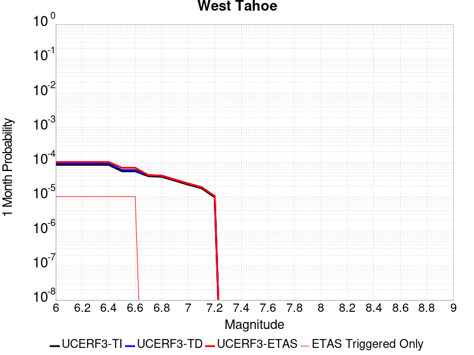 | 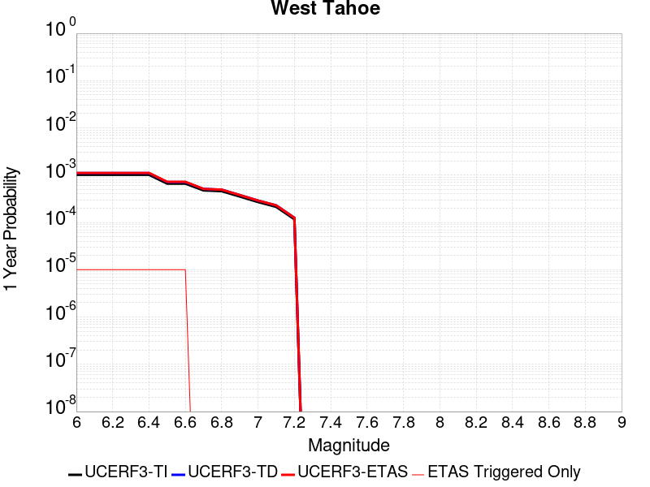 | 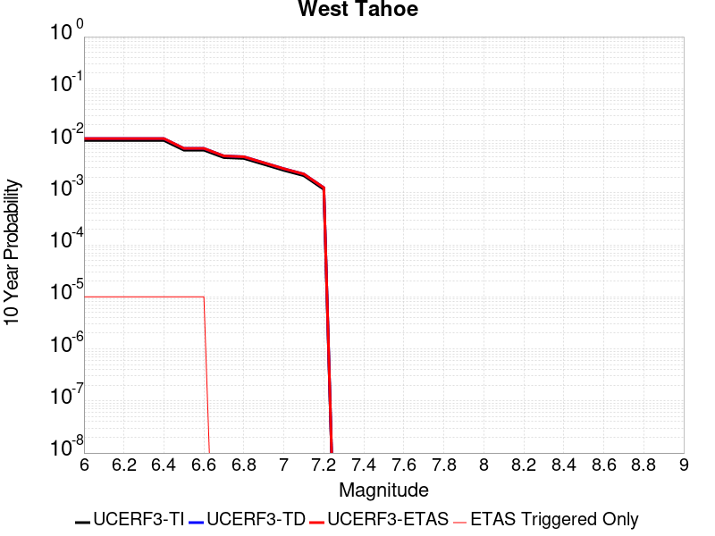 |

| Magnitude | 1 wk TI Prob | 1 wk TD Prob | 1 wk ETAS Prob | 1 wk ETAS/TD Gain | 1 wk ETAS Triggered Only | 1 mo TI Prob | 1 mo TD Prob | 1 mo ETAS Prob | 1 mo ETAS/TD Gain | 1 mo ETAS Triggered Only | 1 yr TI Prob | 1 yr TD Prob | 1 yr ETAS Prob | 1 yr ETAS/TD Gain | 1 yr ETAS Triggered Only | 10 yr TI Prob | 10 yr TD Prob | 10 yr ETAS Prob | 10 yr ETAS/TD Gain | 10 yr ETAS Triggered Only |
|-----|-----|-----|-----|-----|-----|-----|-----|-----|-----|-----|-----|-----|-----|-----|-----|-----|-----|-----|-----|-----|
| 6.0 | 1.952444E-5 | 2.118317E-5 | 3.1182957E-5 | 1.4720628 | 1.0E-5 | 8.367348E-5 | 9.078217E-5 | 1.0078125E-4 | 1.1101438 | 1.0E-5 | 0.0010182485 | 0.0011047672 | 0.0011147561 | 1.0090417 | 1.0E-5 | 0.010135954 | 0.010998235 | 0.011008126 | 1.0008992 | 1.0E-5 |
| 6.1 | 1.952444E-5 | 2.118317E-5 | 3.1182957E-5 | 1.4720628 | 1.0E-5 | 8.367348E-5 | 9.078217E-5 | 1.0078125E-4 | 1.1101438 | 1.0E-5 | 0.0010182485 | 0.0011047672 | 0.0011147561 | 1.0090417 | 1.0E-5 | 0.010135954 | 0.010998235 | 0.011008126 | 1.0008992 | 1.0E-5 |
| 6.2 | 1.952444E-5 | 2.118317E-5 | 3.1182957E-5 | 1.4720628 | 1.0E-5 | 8.367348E-5 | 9.078217E-5 | 1.0078125E-4 | 1.1101438 | 1.0E-5 | 0.0010182485 | 0.0011047672 | 0.0011147561 | 1.0090417 | 1.0E-5 | 0.010135954 | 0.010998235 | 0.011008126 | 1.0008992 | 1.0E-5 |
| 6.3 | 1.952444E-5 | 2.118317E-5 | 3.1182957E-5 | 1.4720628 | 1.0E-5 | 8.367348E-5 | 9.078217E-5 | 1.0078125E-4 | 1.1101438 | 1.0E-5 | 0.0010182485 | 0.0011047672 | 0.0011147561 | 1.0090417 | 1.0E-5 | 0.010135954 | 0.010998235 | 0.011008126 | 1.0008992 | 1.0E-5 |
| 6.4 | 1.952444E-5 | 2.118317E-5 | 3.1182957E-5 | 1.4720628 | 1.0E-5 | 8.367348E-5 | 9.078217E-5 | 1.0078125E-4 | 1.1101438 | 1.0E-5 | 0.0010182485 | 0.0011047672 | 0.0011147561 | 1.0090417 | 1.0E-5 | 0.010135954 | 0.010998235 | 0.011008126 | 1.0008992 | 1.0E-5 |
| 6.5 | 1.2685271E-5 | 1.3690627E-5 | 2.369049E-5 | 1.7304167 | 1.0E-5 | 5.4364315E-5 | 5.8672893E-5 | 6.867231E-5 | 1.1704265 | 1.0E-5 | 6.616845E-4 | 7.141248E-4 | 7.241177E-4 | 1.0139931 | 1.0E-5 | 0.0065971776 | 0.00711995 | 0.0071298787 | 1.0013945 | 1.0E-5 |
| 6.6 | 1.2685271E-5 | 1.3690627E-5 | 2.369049E-5 | 1.7304167 | 1.0E-5 | 5.4364315E-5 | 5.8672893E-5 | 6.867231E-5 | 1.1704265 | 1.0E-5 | 6.616845E-4 | 7.141248E-4 | 7.241177E-4 | 1.0139931 | 1.0E-5 | 0.0065971776 | 0.00711995 | 0.0071298787 | 1.0013945 | 1.0E-5 |
| 6.7 | 9.117886E-6 | 9.809846E-6 | 9.809846E-6 | 1.0 | 0.0 | 3.9076072E-5 | 4.2041564E-5 | 4.2041564E-5 | 1.0 | 0.0 | 4.756473E-4 | 5.11743E-4 | 5.11743E-4 | 1.0 | 0.0 | 0.0047463053 | 0.0051063634 | 0.0051063634 | 1.0 | 0.0 |
| 6.8 | 8.786828E-6 | 9.457863E-6 | 9.457863E-6 | 1.0 | 0.0 | 3.7657293E-5 | 4.053311E-5 | 4.053311E-5 | 1.0 | 0.0 | 4.5838108E-4 | 4.933859E-4 | 4.933859E-4 | 1.0 | 0.0 | 0.0045743673 | 0.0049236063 | 0.0049236063 | 1.0 | 0.0 |
| 6.9 | 6.7562123E-6 | 7.2638086E-6 | 7.2638086E-6 | 1.0 | 0.0 | 2.8954875E-5 | 3.1130265E-5 | 3.1130265E-5 | 1.0 | 0.0 | 3.5246857E-4 | 3.789498E-4 | 3.789498E-4 | 1.0 | 0.0 | 0.0035191004 | 0.0037835082 | 0.0037835082 | 1.0 | 0.0 |
| 7.0 | 5.1792854E-6 | 5.567338E-6 | 5.567338E-6 | 1.0 | 0.0 | 2.2196748E-5 | 2.3859824E-5 | 2.3859824E-5 | 1.0 | 0.0 | 2.702119E-4 | 2.9045844E-4 | 2.9045844E-4 | 1.0 | 0.0 | 0.0026988357 | 0.0029011632 | 0.0029011632 | 1.0 | 0.0 |
| 7.1 | 4.090765E-6 | 4.3974223E-6 | 4.3974223E-6 | 1.0 | 0.0 | 1.7531731E-5 | 1.884598E-5 | 1.884598E-5 | 1.0 | 0.0 | 2.134279E-4 | 2.2942905E-4 | 2.2942905E-4 | 1.0 | 0.0 | 0.0021322304 | 0.0022922563 | 0.0022922563 | 1.0 | 0.0 |
| 7.2 | 2.2356758E-6 | 2.4023684E-6 | 2.4023684E-6 | 1.0 | 0.0 | 9.581432E-6 | 1.0295834E-5 | 1.0295834E-5 | 1.0 | 0.0 | 1.1664769E-4 | 1.2534647E-4 | 1.2534647E-4 | 1.0 | 0.0 | 0.0011658648 | 0.0012529434 | 0.0012529434 | 1.0 | 0.0 |

## Mad River (alt1)
*[(top)](#table-of-contents)*

| 1 Week | 1 Month | 1 Year | 10 Year |
|-----|-----|-----|-----|
|  |  |  |  |

| Magnitude | 1 wk TI Prob | 1 wk TD Prob | 1 wk ETAS Prob | 1 wk ETAS/TD Gain | 1 wk ETAS Triggered Only | 1 mo TI Prob | 1 mo TD Prob | 1 mo ETAS Prob | 1 mo ETAS/TD Gain | 1 mo ETAS Triggered Only | 1 yr TI Prob | 1 yr TD Prob | 1 yr ETAS Prob | 1 yr ETAS/TD Gain | 1 yr ETAS Triggered Only | 10 yr TI Prob | 10 yr TD Prob | 10 yr ETAS Prob | 10 yr ETAS/TD Gain | 10 yr ETAS Triggered Only |
|-----|-----|-----|-----|-----|-----|-----|-----|-----|-----|-----|-----|-----|-----|-----|-----|-----|-----|-----|-----|-----|
| 6.0 | 1.1255216E-5 | 1.2039658E-5 | 1.2039658E-5 | 1.0 | 0.0 | 4.8235746E-5 | 5.1597595E-5 | 5.1597595E-5 | 1.0 | 0.0 | 5.87112E-4 | 6.280341E-4 | 6.280341E-4 | 1.0 | 0.0 | 0.0058556325 | 0.006264031 | 0.0062739686 | 1.0015864 | 1.0E-5 |
| 6.1 | 1.1255216E-5 | 1.2039658E-5 | 1.2039658E-5 | 1.0 | 0.0 | 4.8235746E-5 | 5.1597595E-5 | 5.1597595E-5 | 1.0 | 0.0 | 5.87112E-4 | 6.280341E-4 | 6.280341E-4 | 1.0 | 0.0 | 0.0058556325 | 0.006264031 | 0.0062739686 | 1.0015864 | 1.0E-5 |
| 6.2 | 1.1255216E-5 | 1.2039658E-5 | 1.2039658E-5 | 1.0 | 0.0 | 4.8235746E-5 | 5.1597595E-5 | 5.1597595E-5 | 1.0 | 0.0 | 5.87112E-4 | 6.280341E-4 | 6.280341E-4 | 1.0 | 0.0 | 0.0058556325 | 0.006264031 | 0.0062739686 | 1.0015864 | 1.0E-5 |
| 6.3 | 1.1255216E-5 | 1.2039658E-5 | 1.2039658E-5 | 1.0 | 0.0 | 4.8235746E-5 | 5.1597595E-5 | 5.1597595E-5 | 1.0 | 0.0 | 5.87112E-4 | 6.280341E-4 | 6.280341E-4 | 1.0 | 0.0 | 0.0058556325 | 0.006264031 | 0.0062739686 | 1.0015864 | 1.0E-5 |
| 6.4 | 1.1255216E-5 | 1.2039658E-5 | 1.2039658E-5 | 1.0 | 0.0 | 4.8235746E-5 | 5.1597595E-5 | 5.1597595E-5 | 1.0 | 0.0 | 5.87112E-4 | 6.280341E-4 | 6.280341E-4 | 1.0 | 0.0 | 0.0058556325 | 0.006264031 | 0.0062739686 | 1.0015864 | 1.0E-5 |
| 6.5 | 1.1255216E-5 | 1.2039658E-5 | 1.2039658E-5 | 1.0 | 0.0 | 4.8235746E-5 | 5.1597595E-5 | 5.1597595E-5 | 1.0 | 0.0 | 5.87112E-4 | 6.280341E-4 | 6.280341E-4 | 1.0 | 0.0 | 0.0058556325 | 0.006264031 | 0.0062739686 | 1.0015864 | 1.0E-5 |
| 6.6 | 1.1255216E-5 | 1.2039658E-5 | 1.2039658E-5 | 1.0 | 0.0 | 4.8235746E-5 | 5.1597595E-5 | 5.1597595E-5 | 1.0 | 0.0 | 5.87112E-4 | 6.280341E-4 | 6.280341E-4 | 1.0 | 0.0 | 0.0058556325 | 0.006264031 | 0.0062739686 | 1.0015864 | 1.0E-5 |
| 6.7 | 7.0564884E-6 | 7.6054325E-6 | 7.6054325E-6 | 1.0 | 0.0 | 3.0241743E-5 | 3.2594315E-5 | 3.2594315E-5 | 1.0 | 0.0 | 3.68131E-4 | 3.967657E-4 | 3.967657E-4 | 1.0 | 0.0 | 0.0036752177 | 0.0039607957 | 0.003970756 | 1.0025147 | 1.0E-5 |
| 6.8 | 7.0564884E-6 | 7.6054325E-6 | 7.6054325E-6 | 1.0 | 0.0 | 3.0241743E-5 | 3.2594315E-5 | 3.2594315E-5 | 1.0 | 0.0 | 3.68131E-4 | 3.967657E-4 | 3.967657E-4 | 1.0 | 0.0 | 0.0036752177 | 0.0039607957 | 0.003970756 | 1.0025147 | 1.0E-5 |
| 6.9 | 6.727494E-6 | 7.2572843E-6 | 7.2572843E-6 | 1.0 | 0.0 | 2.8831799E-5 | 3.110229E-5 | 3.110229E-5 | 1.0 | 0.0 | 3.509706E-4 | 3.786067E-4 | 3.786067E-4 | 1.0 | 0.0 | 0.003504168 | 0.0037798323 | 0.0037897944 | 1.0026356 | 1.0E-5 |
| 7.0 | 6.7021124E-6 | 7.2301245E-6 | 7.2301245E-6 | 1.0 | 0.0 | 2.8723021E-5 | 3.098589E-5 | 3.098589E-5 | 1.0 | 0.0 | 3.4964667E-4 | 3.7719007E-4 | 3.7719007E-4 | 1.0 | 0.0 | 0.0034909705 | 0.003765714 | 0.0037756762 | 1.0026455 | 1.0E-5 |
| 7.1 | 5.2784667E-6 | 5.7322395E-6 | 5.7322395E-6 | 1.0 | 0.0 | 2.2621804E-5 | 2.4566516E-5 | 2.4566516E-5 | 1.0 | 0.0 | 2.7538565E-4 | 2.990572E-4 | 2.990572E-4 | 1.0 | 0.0 | 0.0027504463 | 0.0029866395 | 0.0029966098 | 1.0033382 | 1.0E-5 |
| 7.2 | 4.4085446E-6 | 4.819547E-6 | 4.819547E-6 | 1.0 | 0.0 | 1.8893625E-5 | 2.0655041E-5 | 2.0655041E-5 | 1.0 | 0.0 | 2.3000561E-4 | 2.514465E-4 | 2.514465E-4 | 1.0 | 0.0 | 0.0022976769 | 0.0025116608 | 0.0025216355 | 1.0039715 | 1.0E-5 |
| 7.3 | 3.4060627E-6 | 3.7531752E-6 | 3.7531752E-6 | 1.0 | 0.0 | 1.459733E-5 | 1.6084938E-5 | 1.6084938E-5 | 1.0 | 0.0 | 1.77708E-4 | 1.9581676E-4 | 1.9581676E-4 | 1.0 | 0.0 | 0.0017756595 | 0.0019564657 | 0.0019564657 | 1.0 | 0.0 |
| 7.4 | 3.0570902E-6 | 3.3802967E-6 | 3.3802967E-6 | 1.0 | 0.0 | 1.310175E-5 | 1.4486906E-5 | 1.4486906E-5 | 1.0 | 0.0 | 1.5950213E-4 | 1.7636403E-4 | 1.7636403E-4 | 1.0 | 0.0 | 0.0015938769 | 0.0017622622 | 0.0017622622 | 1.0 | 0.0 |
| 7.5 | 2.674048E-6 | 2.9692678E-6 | 2.9692678E-6 | 1.0 | 0.0 | 1.1460155E-5 | 1.27253725E-5 | 1.27253725E-5 | 1.0 | 0.0 | 1.3951845E-4 | 1.5492059E-4 | 1.5492059E-4 | 1.0 | 0.0 | 0.0013943089 | 0.0015481455 | 0.0015481455 | 1.0 | 0.0 |
| 7.6 | 1.8806261E-6 | 2.1046062E-6 | 2.1046062E-6 | 1.0 | 0.0 | 8.059801E-6 | 9.01971E-6 | 9.01971E-6 | 1.0 | 0.0 | 9.812366E-5 | 1.0980956E-4 | 1.0980956E-4 | 1.0 | 0.0 | 9.808034E-4 | 0.0010975654 | 0.0010975654 | 1.0 | 0.0 |
| 7.7 | 6.461283E-7 | 7.3407836E-7 | 7.3407836E-7 | 1.0 | 0.0 | 2.7691183E-6 | 3.1460463E-6 | 3.1460463E-6 | 1.0 | 0.0 | 3.371349E-5 | 3.8302456E-5 | 3.8302456E-5 | 1.0 | 0.0 | 3.370838E-4 | 3.8296005E-4 | 3.8296005E-4 | 1.0 | 0.0 |
| 7.8 | 3.0785324E-7 | 3.5290012E-7 | 3.5290012E-7 | 1.0 | 0.0 | 1.3193703E-6 | 1.5124282E-6 | 1.5124282E-6 | 1.0 | 0.0 | 1.6063215E-5 | 1.8413664E-5 | 1.8413664E-5 | 1.0 | 0.0 | 1.6062055E-4 | 1.8412202E-4 | 1.8412202E-4 | 1.0 | 0.0 |

## Hat Creek-McArthur-Mayfield
*[(top)](#table-of-contents)*

| 1 Week | 1 Month | 1 Year | 10 Year |
|-----|-----|-----|-----|
| 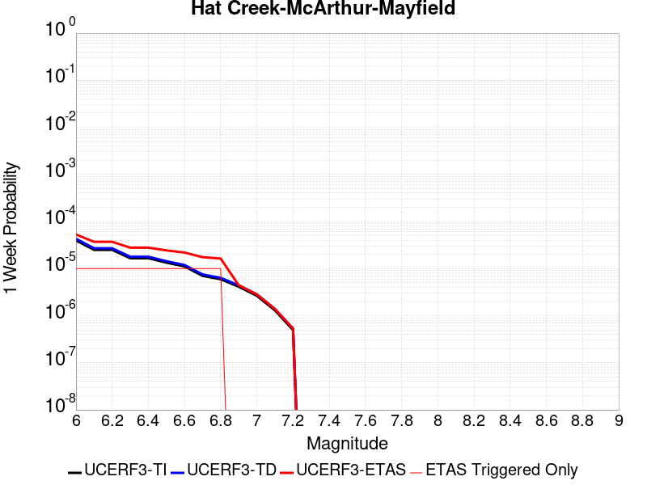 | 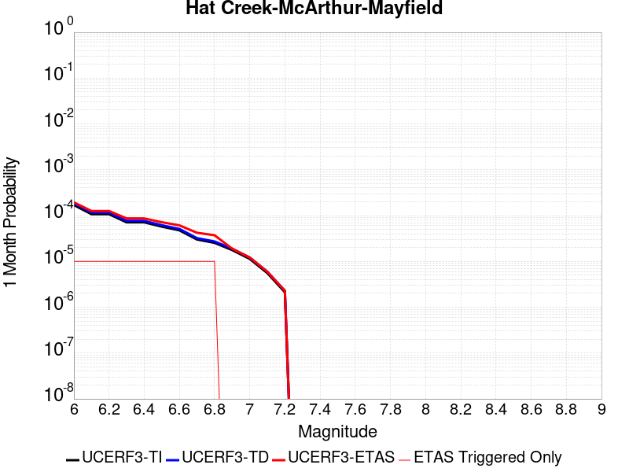 | 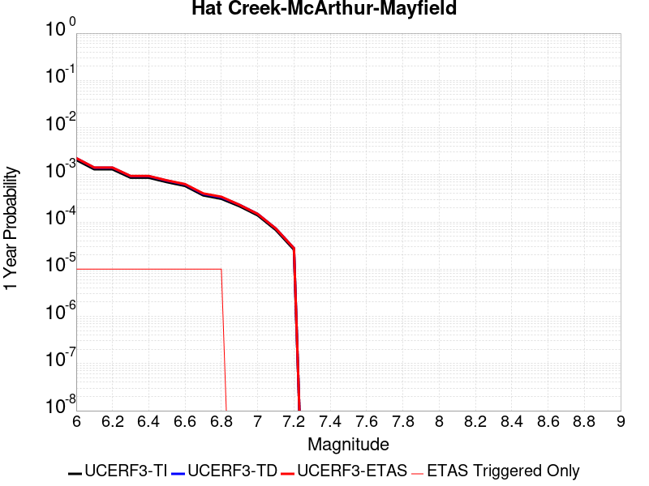 | 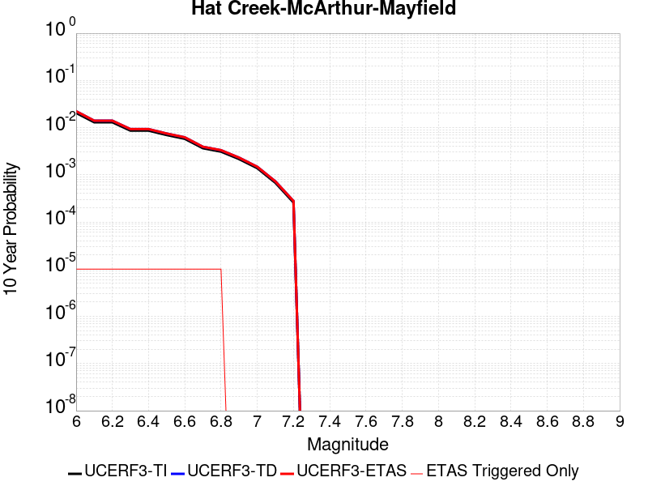 |

| Magnitude | 1 wk TI Prob | 1 wk TD Prob | 1 wk ETAS Prob | 1 wk ETAS/TD Gain | 1 wk ETAS Triggered Only | 1 mo TI Prob | 1 mo TD Prob | 1 mo ETAS Prob | 1 mo ETAS/TD Gain | 1 mo ETAS Triggered Only | 1 yr TI Prob | 1 yr TD Prob | 1 yr ETAS Prob | 1 yr ETAS/TD Gain | 1 yr ETAS Triggered Only | 10 yr TI Prob | 10 yr TD Prob | 10 yr ETAS Prob | 10 yr ETAS/TD Gain | 10 yr ETAS Triggered Only |
|-----|-----|-----|-----|-----|-----|-----|-----|-----|-----|-----|-----|-----|-----|-----|-----|-----|-----|-----|-----|-----|
| 6.0 | 3.967457E-5 | 4.315831E-5 | 5.3157877E-5 | 1.231695 | 1.0E-5 | 1.7002279E-4 | 1.8495171E-4 | 1.9494987E-4 | 1.0540582 | 1.0E-5 | 0.002068062 | 0.002249576 | 0.0022595534 | 1.0044353 | 1.0E-5 | 0.02048922 | 0.022280399 | 0.022290176 | 1.0004388 | 1.0E-5 |
| 6.1 | 2.5044013E-5 | 2.7071164E-5 | 3.7070895E-5 | 1.3693868 | 1.0E-5 | 1.0732707E-4 | 1.1601429E-4 | 1.2601314E-4 | 1.0861863 | 1.0E-5 | 0.0013059238 | 0.0014115906 | 0.0014215765 | 1.0070742 | 1.0E-5 | 0.01298276 | 0.01402966 | 0.01403952 | 1.0007027 | 1.0E-5 |
| 6.2 | 2.5044013E-5 | 2.7071164E-5 | 3.7070895E-5 | 1.3693868 | 1.0E-5 | 1.0732707E-4 | 1.1601429E-4 | 1.2601314E-4 | 1.0861863 | 1.0E-5 | 0.0013059238 | 0.0014115906 | 0.0014215765 | 1.0070742 | 1.0E-5 | 0.01298276 | 0.01402966 | 0.01403952 | 1.0007027 | 1.0E-5 |
| 6.3 | 1.6624012E-5 | 1.7891072E-5 | 2.7890892E-5 | 1.558928 | 1.0E-5 | 7.124382E-5 | 7.6673816E-5 | 8.667305E-5 | 1.1304126 | 1.0E-5 | 8.670483E-4 | 9.331125E-4 | 9.4310316E-4 | 1.0107068 | 1.0E-5 | 0.008636732 | 0.009292879 | 0.009302787 | 1.0010661 | 1.0E-5 |
| 6.4 | 1.6624012E-5 | 1.7891072E-5 | 2.7890892E-5 | 1.558928 | 1.0E-5 | 7.124382E-5 | 7.6673816E-5 | 8.667305E-5 | 1.1304126 | 1.0E-5 | 8.670483E-4 | 9.331125E-4 | 9.4310316E-4 | 1.0107068 | 1.0E-5 | 0.008636732 | 0.009292879 | 0.009302787 | 1.0010661 | 1.0E-5 |
| 6.5 | 1.3394842E-5 | 1.4392137E-5 | 2.4391993E-5 | 1.6948138 | 1.0E-5 | 5.7405203E-5 | 6.167916E-5 | 7.167854E-5 | 1.1621193 | 1.0E-5 | 6.986842E-4 | 7.506906E-4 | 7.606831E-4 | 1.013311 | 1.0E-5 | 0.006964916 | 0.0074821403 | 0.007492066 | 1.0013266 | 1.0E-5 |
| 6.6 | 1.1137514E-5 | 1.1954546E-5 | 2.1954425E-5 | 1.8364918 | 1.0E-5 | 4.7731326E-5 | 5.1232782E-5 | 6.123227E-5 | 1.1951776 | 1.0E-5 | 5.809739E-4 | 6.2358467E-4 | 6.335784E-4 | 1.0160263 | 1.0E-5 | 0.005794574 | 0.00621877 | 0.0062287077 | 1.001598 | 1.0E-5 |
| 6.7 | 7.0200663E-6 | 7.5242897E-6 | 1.7524215E-5 | 2.329019 | 1.0E-5 | 3.008565E-5 | 3.2246568E-5 | 4.2246244E-5 | 1.3101006 | 1.0E-5 | 3.6623122E-4 | 3.925328E-4 | 4.0252888E-4 | 1.0254656 | 1.0E-5 | 0.0036562826 | 0.0039185574 | 0.003928518 | 1.002542 | 1.0E-5 |
| 6.8 | 5.940172E-6 | 6.3654766E-6 | 1.6365413E-5 | 2.5709643 | 1.0E-5 | 2.545763E-5 | 2.7280335E-5 | 3.7280064E-5 | 1.3665544 | 1.0E-5 | 3.0990256E-4 | 3.3208873E-4 | 3.420854E-4 | 1.0301025 | 1.0E-5 | 0.0030947074 | 0.0033160534 | 0.0033260202 | 1.0030056 | 1.0E-5 |
| 6.9 | 4.129831E-6 | 4.423547E-6 | 4.423547E-6 | 1.0 | 0.0 | 1.7699154E-5 | 1.8957926E-5 | 1.8957926E-5 | 1.0 | 0.0 | 2.154659E-4 | 2.3078908E-4 | 2.3078908E-4 | 1.0 | 0.0 | 0.002152571 | 0.0023055724 | 0.0023055724 | 1.0 | 0.0 |
| 7.0 | 2.6512955E-6 | 2.8374002E-6 | 2.8374002E-6 | 1.0 | 0.0 | 1.1362646E-5 | 1.2160232E-5 | 1.2160232E-5 | 1.0 | 0.0 | 1.3833142E-4 | 1.480412E-4 | 1.480412E-4 | 1.0 | 0.0 | 0.0013824535 | 0.0014794683 | 0.0014794683 | 1.0 | 0.0 |
| 7.1 | 1.2992575E-6 | 1.3909317E-6 | 1.3909317E-6 | 1.0 | 0.0 | 5.568235E-6 | 5.961124E-6 | 5.961124E-6 | 1.0 | 0.0 | 6.779115E-5 | 7.257448E-5 | 7.257448E-5 | 1.0 | 0.0 | 6.7770475E-4 | 7.2552945E-4 | 7.2552945E-4 | 1.0 | 0.0 |
| 7.2 | 4.968191E-7 | 5.3271475E-7 | 5.3271475E-7 | 1.0 | 0.0 | 2.1292228E-6 | 2.283062E-6 | 2.283062E-6 | 1.0 | 0.0 | 2.592298E-5 | 2.7796052E-5 | 2.7796052E-5 | 1.0 | 0.0 | 2.5919956E-4 | 2.7793812E-4 | 2.7793812E-4 | 1.0 | 0.0 |

## Puente Hills
*[(top)](#table-of-contents)*

| 1 Week | 1 Month | 1 Year | 10 Year |
|-----|-----|-----|-----|
|  |  |  |  |

| Magnitude | 1 wk TI Prob | 1 wk TD Prob | 1 wk ETAS Prob | 1 wk ETAS/TD Gain | 1 wk ETAS Triggered Only | 1 mo TI Prob | 1 mo TD Prob | 1 mo ETAS Prob | 1 mo ETAS/TD Gain | 1 mo ETAS Triggered Only | 1 yr TI Prob | 1 yr TD Prob | 1 yr ETAS Prob | 1 yr ETAS/TD Gain | 1 yr ETAS Triggered Only | 10 yr TI Prob | 10 yr TD Prob | 10 yr ETAS Prob | 10 yr ETAS/TD Gain | 10 yr ETAS Triggered Only |
|-----|-----|-----|-----|-----|-----|-----|-----|-----|-----|-----|-----|-----|-----|-----|-----|-----|-----|-----|-----|-----|
| 6.0 | 1.2101656E-5 | 8.098448E-6 | 1.8098368E-5 | 2.2347944 | 1.0E-5 | 5.1863204E-5 | 3.4707205E-5 | 4.4706856E-5 | 1.2881147 | 1.0E-5 | 6.312516E-4 | 4.2248392E-4 | 4.324797E-4 | 1.0236596 | 1.0E-5 | 0.0062946146 | 0.0042173676 | 0.0042273253 | 1.0023612 | 1.0E-5 |
| 6.1 | 1.2101656E-5 | 8.098448E-6 | 1.8098368E-5 | 2.2347944 | 1.0E-5 | 5.1863204E-5 | 3.4707205E-5 | 4.4706856E-5 | 1.2881147 | 1.0E-5 | 6.312516E-4 | 4.2248392E-4 | 4.324797E-4 | 1.0236596 | 1.0E-5 | 0.0062946146 | 0.0042173676 | 0.0042273253 | 1.0023612 | 1.0E-5 |
| 6.2 | 1.2101656E-5 | 8.098448E-6 | 1.8098368E-5 | 2.2347944 | 1.0E-5 | 5.1863204E-5 | 3.4707205E-5 | 4.4706856E-5 | 1.2881147 | 1.0E-5 | 6.312516E-4 | 4.2248392E-4 | 4.324797E-4 | 1.0236596 | 1.0E-5 | 0.0062946146 | 0.0042173676 | 0.0042273253 | 1.0023612 | 1.0E-5 |
| 6.3 | 1.2101656E-5 | 8.098448E-6 | 1.8098368E-5 | 2.2347944 | 1.0E-5 | 5.1863204E-5 | 3.4707205E-5 | 4.4706856E-5 | 1.2881147 | 1.0E-5 | 6.312516E-4 | 4.2248392E-4 | 4.324797E-4 | 1.0236596 | 1.0E-5 | 0.0062946146 | 0.0042173676 | 0.0042273253 | 1.0023612 | 1.0E-5 |
| 6.4 | 1.2101656E-5 | 8.098448E-6 | 1.8098368E-5 | 2.2347944 | 1.0E-5 | 5.1863204E-5 | 3.4707205E-5 | 4.4706856E-5 | 1.2881147 | 1.0E-5 | 6.312516E-4 | 4.2248392E-4 | 4.324797E-4 | 1.0236596 | 1.0E-5 | 0.0062946146 | 0.0042173676 | 0.0042273253 | 1.0023612 | 1.0E-5 |
| 6.5 | 1.2101656E-5 | 8.098448E-6 | 1.8098368E-5 | 2.2347944 | 1.0E-5 | 5.1863204E-5 | 3.4707205E-5 | 4.4706856E-5 | 1.2881147 | 1.0E-5 | 6.312516E-4 | 4.2248392E-4 | 4.324797E-4 | 1.0236596 | 1.0E-5 | 0.0062946146 | 0.0042173676 | 0.0042273253 | 1.0023612 | 1.0E-5 |
| 6.6 | 1.0222488E-5 | 6.399079E-6 | 1.6399015E-5 | 2.5627148 | 1.0E-5 | 4.3809923E-5 | 2.742435E-5 | 3.7424077E-5 | 1.3646294 | 1.0E-5 | 5.332553E-4 | 3.3384276E-4 | 3.4383943E-4 | 1.0299442 | 1.0E-5 | 0.0053197746 | 0.0033336577 | 0.0033436243 | 1.0029896 | 1.0E-5 |
| 6.7 | 1.0222488E-5 | 6.399079E-6 | 1.6399015E-5 | 2.5627148 | 1.0E-5 | 4.3809923E-5 | 2.742435E-5 | 3.7424077E-5 | 1.3646294 | 1.0E-5 | 5.332553E-4 | 3.3384276E-4 | 3.4383943E-4 | 1.0299442 | 1.0E-5 | 0.0053197746 | 0.0033336577 | 0.0033436243 | 1.0029896 | 1.0E-5 |
| 6.8 | 8.6367845E-6 | 5.028129E-6 | 1.5028078E-5 | 2.9888012 | 1.0E-5 | 3.7014266E-5 | 2.1548949E-5 | 3.1548734E-5 | 1.4640497 | 1.0E-5 | 4.505555E-4 | 2.6232743E-4 | 2.723248E-4 | 1.0381103 | 1.0E-5 | 0.004496431 | 0.002620234 | 0.0026302077 | 1.0038065 | 1.0E-5 |
| 6.9 | 8.066481E-6 | 4.8360116E-6 | 1.4835963E-5 | 3.0678098 | 1.0E-5 | 3.4570177E-5 | 2.0725602E-5 | 3.0725394E-5 | 1.482485 | 1.0E-5 | 4.2081063E-4 | 2.523055E-4 | 2.62303E-4 | 1.0396245 | 1.0E-5 | 0.0042001465 | 0.0025202443 | 0.0025302193 | 1.0039579 | 1.0E-5 |
| 7.0 | 7.393828E-6 | 4.4172275E-6 | 1.4417184E-5 | 3.2638533 | 1.0E-5 | 3.168745E-5 | 1.8930841E-5 | 2.8930652E-5 | 1.5282285 | 1.0E-5 | 3.857264E-4 | 2.3045906E-4 | 2.4045675E-4 | 1.0433817 | 1.0E-5 | 0.0038505755 | 0.0023022462 | 0.0023122232 | 1.0043336 | 1.0E-5 |
| 7.1 | 6.4660953E-6 | 3.8043859E-6 | 3.8043859E-6 | 1.0 | 0.0 | 2.7711543E-5 | 1.630441E-5 | 1.630441E-5 | 1.0 | 0.0 | 3.373358E-4 | 1.9848847E-4 | 1.9848847E-4 | 1.0 | 0.0 | 0.0033682417 | 0.0019831478 | 0.0019831478 | 1.0 | 0.0 |
| 7.2 | 5.143232E-6 | 2.7864896E-6 | 2.7864896E-6 | 1.0 | 0.0 | 2.2042237E-5 | 1.1942045E-5 | 1.1942045E-5 | 1.0 | 0.0 | 2.6833118E-4 | 1.453848E-4 | 1.453848E-4 | 1.0 | 0.0 | 0.002680074 | 0.0014529065 | 0.0014529065 | 1.0 | 0.0 |
| 7.3 | 3.928255E-6 | 2.091338E-6 | 2.091338E-6 | 1.0 | 0.0 | 1.683527E-5 | 8.962847E-6 | 8.962847E-6 | 1.0 | 0.0 | 2.0495013E-4 | 1.0911726E-4 | 1.0911726E-4 | 1.0 | 0.0 | 0.002047612 | 0.0010906435 | 0.0010906435 | 1.0 | 0.0 |
| 7.4 | 2.7894434E-6 | 1.3546429E-6 | 1.3546429E-6 | 1.0 | 0.0 | 1.1954703E-5 | 5.8056E-6 | 5.8056E-6 | 1.0 | 0.0 | 1.4553878E-4 | 7.068093E-5 | 7.068093E-5 | 1.0 | 0.0 | 0.001454435 | 7.0658885E-4 | 7.0658885E-4 | 1.0 | 0.0 |
| 7.5 | 2.041735E-6 | 8.786996E-7 | 8.786996E-7 | 1.0 | 0.0 | 8.750263E-6 | 3.7658504E-6 | 3.7658504E-6 | 1.0 | 0.0 | 1.06529245E-4 | 4.5848297E-5 | 4.5848297E-5 | 1.0 | 0.0 | 0.0010647819 | 4.5839173E-4 | 4.5839173E-4 | 1.0 | 0.0 |
| 7.6 | 1.6959062E-6 | 6.698339E-7 | 6.698339E-7 | 1.0 | 0.0 | 7.268149E-6 | 2.8707138E-6 | 2.8707138E-6 | 1.0 | 0.0 | 8.848612E-5 | 3.4950408E-5 | 3.4950408E-5 | 1.0 | 0.0 | 8.84509E-4 | 3.4945202E-4 | 3.4945202E-4 | 1.0 | 0.0 |
| 7.7 | 1.4767965E-6 | 5.407146E-7 | 5.407146E-7 | 1.0 | 0.0 | 6.3291122E-6 | 2.3173466E-6 | 2.3173466E-6 | 1.0 | 0.0 | 7.705422E-5 | 2.8213353E-5 | 2.8213353E-5 | 1.0 | 0.0 | 7.702751E-4 | 2.8210029E-4 | 2.8210029E-4 | 1.0 | 0.0 |
| 7.8 | 1.8432911E-7 | 7.2811105E-8 | 7.2811105E-8 | 1.0 | 0.0 | 7.8998164E-7 | 3.1204758E-7 | 3.1204758E-7 | 1.0 | 0.0 | 9.617985E-6 | 3.799176E-6 | 3.799176E-6 | 1.0 | 0.0 | 9.617568E-5 | 3.7991435E-5 | 3.7991435E-5 | 1.0 | 0.0 |

## Silver Creek 2011 CFM
*[(top)](#table-of-contents)*

| 1 Week | 1 Month | 1 Year | 10 Year |
|-----|-----|-----|-----|
|  |  |  |  |

| Magnitude | 1 wk TI Prob | 1 wk TD Prob | 1 wk ETAS Prob | 1 wk ETAS/TD Gain | 1 wk ETAS Triggered Only | 1 mo TI Prob | 1 mo TD Prob | 1 mo ETAS Prob | 1 mo ETAS/TD Gain | 1 mo ETAS Triggered Only | 1 yr TI Prob | 1 yr TD Prob | 1 yr ETAS Prob | 1 yr ETAS/TD Gain | 1 yr ETAS Triggered Only | 10 yr TI Prob | 10 yr TD Prob | 10 yr ETAS Prob | 10 yr ETAS/TD Gain | 10 yr ETAS Triggered Only |
|-----|-----|-----|-----|-----|-----|-----|-----|-----|-----|-----|-----|-----|-----|-----|-----|-----|-----|-----|-----|-----|
| 6.0 | 3.5229125E-6 | 4.008142E-6 | 4.008142E-6 | 1.0 | 0.0 | 1.5098109E-5 | 1.717764E-5 | 1.717764E-5 | 1.0 | 0.0 | 1.8380396E-4 | 2.0911806E-4 | 2.0911806E-4 | 1.0 | 0.0 | 0.0018365202 | 0.0020895726 | 0.0020995517 | 1.0047756 | 1.0E-5 |
| 6.1 | 3.5229125E-6 | 4.008142E-6 | 4.008142E-6 | 1.0 | 0.0 | 1.5098109E-5 | 1.717764E-5 | 1.717764E-5 | 1.0 | 0.0 | 1.8380396E-4 | 2.0911806E-4 | 2.0911806E-4 | 1.0 | 0.0 | 0.0018365202 | 0.0020895726 | 0.0020995517 | 1.0047756 | 1.0E-5 |
| 6.2 | 2.6363234E-6 | 3.1105278E-6 | 3.1105278E-6 | 1.0 | 0.0 | 1.129848E-5 | 1.3330766E-5 | 1.3330766E-5 | 1.0 | 0.0 | 1.375503E-4 | 1.6229005E-4 | 1.6229005E-4 | 1.0 | 0.0 | 0.0013746519 | 0.0016220442 | 0.001632028 | 1.006155 | 1.0E-5 |
| 6.3 | 2.5275126E-6 | 3.0001668E-6 | 3.0001668E-6 | 1.0 | 0.0 | 1.0832152E-5 | 1.2857795E-5 | 1.2857795E-5 | 1.0 | 0.0 | 1.3187347E-4 | 1.5653246E-4 | 1.5653246E-4 | 1.0 | 0.0 | 0.0013179524 | 0.00156455 | 0.0015745343 | 1.0063816 | 1.0E-5 |
| 6.4 | 2.178732E-6 | 2.6707307E-6 | 2.6707307E-6 | 1.0 | 0.0 | 9.337389E-6 | 1.1445939E-5 | 1.1445939E-5 | 1.0 | 0.0 | 1.1367678E-4 | 1.3934543E-4 | 1.3934543E-4 | 1.0 | 0.0 | 0.0011361865 | 0.0013929061 | 0.0014028922 | 1.0071692 | 1.0E-5 |
| 6.5 | 2.0341574E-6 | 2.5298211E-6 | 2.5298211E-6 | 1.0 | 0.0 | 8.717788E-6 | 1.0842045E-5 | 1.0842045E-5 | 1.0 | 0.0 | 1.061339E-4 | 1.3199393E-4 | 1.3199393E-4 | 1.0 | 0.0 | 0.0010608323 | 0.0013194805 | 0.0013294673 | 1.0075687 | 1.0E-5 |
| 6.6 | 1.8856827E-6 | 2.3613982E-6 | 2.3613982E-6 | 1.0 | 0.0 | 8.0814725E-6 | 1.0120239E-5 | 1.0120239E-5 | 1.0 | 0.0 | 9.838748E-5 | 1.2320696E-4 | 1.2320696E-4 | 1.0 | 0.0 | 9.834393E-4 | 0.0012317112 | 0.0012416989 | 1.0081087 | 1.0E-5 |
| 6.7 | 1.6844668E-6 | 2.1197875E-6 | 2.1197875E-6 | 1.0 | 0.0 | 7.2191233E-6 | 9.0847725E-6 | 9.0847725E-6 | 1.0 | 0.0 | 8.788928E-5 | 1.10601504E-4 | 1.10601504E-4 | 1.0 | 0.0 | 8.785453E-4 | 0.0011057886 | 0.0011157775 | 1.0090333 | 1.0E-5 |
| 6.8 | 1.5177161E-6 | 1.8953942E-6 | 1.8953942E-6 | 1.0 | 0.0 | 6.504481E-6 | 8.123093E-6 | 8.123093E-6 | 1.0 | 0.0 | 7.918918E-5 | 9.8894176E-5 | 9.8894176E-5 | 1.0 | 0.0 | 7.9160964E-4 | 9.888251E-4 | 9.988153E-4 | 1.010103 | 1.0E-5 |
| 6.9 | 1.3437394E-6 | 1.6561632E-6 | 1.6561632E-6 | 1.0 | 0.0 | 5.7588704E-6 | 7.097823E-6 | 7.097823E-6 | 1.0 | 0.0 | 7.011199E-5 | 8.6412576E-5 | 8.6412576E-5 | 1.0 | 0.0 | 7.0089876E-4 | 8.6411275E-4 | 8.7410415E-4 | 1.0115626 | 1.0E-5 |
| 7.0 | 1.1563575E-6 | 1.4313372E-6 | 1.4313372E-6 | 1.0 | 0.0 | 4.9558084E-6 | 6.1342876E-6 | 6.1342876E-6 | 1.0 | 0.0 | 6.03353E-5 | 7.46824E-5 | 7.46824E-5 | 1.0 | 0.0 | 6.0318917E-4 | 7.4689585E-4 | 7.568884E-4 | 1.0133787 | 1.0E-5 |
| 7.1 | 8.602183E-7 | 1.0891652E-6 | 1.0891652E-6 | 1.0 | 0.0 | 3.6866445E-6 | 4.6678424E-6 | 4.6678424E-6 | 1.0 | 0.0 | 4.4883975E-5 | 5.68295E-5 | 5.68295E-5 | 1.0 | 0.0 | 4.4874908E-4 | 5.684724E-4 | 5.784667E-4 | 1.017581 | 1.0E-5 |
| 7.2 | 6.788407E-7 | 8.6221576E-7 | 8.6221576E-7 | 1.0 | 0.0 | 2.9093142E-6 | 3.695205E-6 | 3.695205E-6 | 1.0 | 0.0 | 3.5420322E-5 | 4.498819E-5 | 4.498819E-5 | 1.0 | 0.0 | 3.541468E-4 | 4.5011353E-4 | 4.60109E-4 | 1.0222067 | 1.0E-5 |
| 7.3 | 5.1292045E-7 | 6.693958E-7 | 6.693958E-7 | 1.0 | 0.0 | 2.1982287E-6 | 2.8688357E-6 | 2.8688357E-6 | 1.0 | 0.0 | 2.6763106E-5 | 3.4927514E-5 | 3.4927514E-5 | 1.0 | 0.0 | 2.6759884E-4 | 3.495429E-4 | 3.5953944E-4 | 1.0285988 | 1.0E-5 |
| 7.4 | 3.820994E-7 | 5.0624527E-7 | 5.0624527E-7 | 1.0 | 0.0 | 1.6375678E-6 | 2.1696205E-6 | 2.1696205E-6 | 1.0 | 0.0 | 1.9937206E-5 | 2.6414811E-5 | 2.6414811E-5 | 1.0 | 0.0 | 1.9935417E-4 | 2.6443938E-4 | 2.7443672E-4 | 1.0378058 | 1.0E-5 |
| 7.5 | 2.2292595E-7 | 3.066783E-7 | 3.066783E-7 | 1.0 | 0.0 | 9.553966E-7 | 1.3143348E-6 | 1.3143348E-6 | 1.0 | 0.0 | 1.16318915E-5 | 1.600191E-5 | 1.600191E-5 | 1.0 | 0.0 | 1.16312825E-4 | 1.6033021E-4 | 1.7032861E-4 | 1.0623612 | 1.0E-5 |
| 7.6 | 1.420587E-7 | 2.0913494E-7 | 2.0913494E-7 | 1.0 | 0.0 | 6.088228E-7 | 8.9629225E-7 | 8.9629225E-7 | 1.0 | 0.0 | 7.4123927E-6 | 1.0912303E-5 | 1.0912303E-5 | 1.0 | 0.0 | 7.412145E-5 | 1.0944006E-4 | 1.0944006E-4 | 1.0 | 0.0 |
| 7.7 | 1.1250075E-7 | 1.6871893E-7 | 1.6871893E-7 | 1.0 | 0.0 | 4.82146E-7 | 7.230809E-7 | 7.230809E-7 | 1.0 | 0.0 | 5.8701116E-6 | 8.803475E-6 | 8.803475E-6 | 1.0 | 0.0 | 5.8699567E-5 | 8.834876E-5 | 8.834876E-5 | 1.0 | 0.0 |
| 7.8 | 8.592761E-8 | 1.3650167E-7 | 1.3650167E-7 | 1.0 | 0.0 | 3.682611E-7 | 5.8500706E-7 | 5.8500706E-7 | 1.0 | 0.0 | 4.48357E-6 | 7.122437E-6 | 7.122437E-6 | 1.0 | 0.0 | 4.4834796E-5 | 7.152824E-5 | 7.152824E-5 | 1.0 | 0.0 |
| 7.9 | 6.156529E-8 | 1.0743081E-7 | 1.0743081E-7 | 1.0 | 0.0 | 2.638512E-7 | 4.6041765E-7 | 4.6041765E-7 | 1.0 | 0.0 | 3.212384E-6 | 5.6055705E-6 | 5.6055705E-6 | 1.0 | 0.0 | 3.2123375E-5 | 5.6315246E-5 | 5.6315246E-5 | 1.0 | 0.0 |
| 8.0 | 2.9230547E-8 | 5.3892336E-8 | 5.3892336E-8 | 1.0 | 0.0 | 1.2527377E-7 | 2.3096713E-7 | 2.3096713E-7 | 1.0 | 0.0 | 1.525207E-6 | 2.8120212E-6 | 2.8120212E-6 | 1.0 | 0.0 | 1.5251966E-5 | 2.8256853E-5 | 2.8256853E-5 | 1.0 | 0.0 |
| 8.1 | 5.6062213E-9 | 7.9031315E-9 | 7.9031315E-9 | 1.0 | 0.0 | 2.4026663E-8 | 3.387056E-8 | 3.387056E-8 | 1.0 | 0.0 | 2.925246E-7 | 4.1237402E-7 | 4.1237402E-7 | 1.0 | 0.0 | 2.925242E-6 | 4.1619833E-6 | 4.1619833E-6 | 1.0 | 0.0 |

## Hollywood
*[(top)](#table-of-contents)*

| 1 Week | 1 Month | 1 Year | 10 Year |
|-----|-----|-----|-----|
|  |  |  |  |

| Magnitude | 1 wk TI Prob | 1 wk TD Prob | 1 wk ETAS Prob | 1 wk ETAS/TD Gain | 1 wk ETAS Triggered Only | 1 mo TI Prob | 1 mo TD Prob | 1 mo ETAS Prob | 1 mo ETAS/TD Gain | 1 mo ETAS Triggered Only | 1 yr TI Prob | 1 yr TD Prob | 1 yr ETAS Prob | 1 yr ETAS/TD Gain | 1 yr ETAS Triggered Only | 10 yr TI Prob | 10 yr TD Prob | 10 yr ETAS Prob | 10 yr ETAS/TD Gain | 10 yr ETAS Triggered Only |
|-----|-----|-----|-----|-----|-----|-----|-----|-----|-----|-----|-----|-----|-----|-----|-----|-----|-----|-----|-----|-----|
| 6.0 | 1.24487615E-5 | 1.2593229E-5 | 2.2593103E-5 | 1.7940675 | 1.0E-5 | 5.3350745E-5 | 5.3969892E-5 | 6.396935E-5 | 1.1852785 | 1.0E-5 | 6.4935174E-4 | 6.5689E-4 | 6.668834E-4 | 1.0152133 | 1.0E-5 | 0.0064745755 | 0.0065499707 | 0.006559905 | 1.0015167 | 1.0E-5 |
| 6.1 | 1.24487615E-5 | 1.2593229E-5 | 2.2593103E-5 | 1.7940675 | 1.0E-5 | 5.3350745E-5 | 5.3969892E-5 | 6.396935E-5 | 1.1852785 | 1.0E-5 | 6.4935174E-4 | 6.5689E-4 | 6.668834E-4 | 1.0152133 | 1.0E-5 | 0.0064745755 | 0.0065499707 | 0.006559905 | 1.0015167 | 1.0E-5 |
| 6.2 | 1.24487615E-5 | 1.2593229E-5 | 2.2593103E-5 | 1.7940675 | 1.0E-5 | 5.3350745E-5 | 5.3969892E-5 | 6.396935E-5 | 1.1852785 | 1.0E-5 | 6.4935174E-4 | 6.5689E-4 | 6.668834E-4 | 1.0152133 | 1.0E-5 | 0.0064745755 | 0.0065499707 | 0.006559905 | 1.0015167 | 1.0E-5 |
| 6.3 | 1.24487615E-5 | 1.2593229E-5 | 2.2593103E-5 | 1.7940675 | 1.0E-5 | 5.3350745E-5 | 5.3969892E-5 | 6.396935E-5 | 1.1852785 | 1.0E-5 | 6.4935174E-4 | 6.5689E-4 | 6.668834E-4 | 1.0152133 | 1.0E-5 | 0.0064745755 | 0.0065499707 | 0.006559905 | 1.0015167 | 1.0E-5 |
| 6.4 | 1.2431024E-5 | 1.25738425E-5 | 2.2573717E-5 | 1.7952918 | 1.0E-5 | 5.327473E-5 | 5.388681E-5 | 6.388627E-5 | 1.1855642 | 1.0E-5 | 6.4842677E-4 | 6.558791E-4 | 6.6587253E-4 | 1.0152367 | 1.0E-5 | 0.0064653796 | 0.0065399213 | 0.0065498557 | 1.0015191 | 1.0E-5 |
| 6.5 | 1.1242222E-5 | 1.1317804E-5 | 2.131769E-5 | 1.8835536 | 1.0E-5 | 4.8180063E-5 | 4.8503985E-5 | 5.85035E-5 | 1.2061586 | 1.0E-5 | 5.864344E-4 | 5.903787E-4 | 6.003728E-4 | 1.0169283 | 1.0E-5 | 0.0058488925 | 0.00588839 | 0.005898331 | 1.0016882 | 1.0E-5 |
| 6.6 | 1.1234066E-5 | 1.1308918E-5 | 2.1308804E-5 | 1.8842479 | 1.0E-5 | 4.8145106E-5 | 4.8465907E-5 | 5.846542E-5 | 1.2063206 | 1.0E-5 | 5.86009E-4 | 5.899153E-4 | 5.999094E-4 | 1.0169415 | 1.0E-5 | 0.005844661 | 0.0058837803 | 0.0058937217 | 1.0016896 | 1.0E-5 |
| 6.7 | 1.12294E-5 | 1.1303661E-5 | 2.1303547E-5 | 1.8846592 | 1.0E-5 | 4.812511E-5 | 4.8443377E-5 | 5.8442893E-5 | 1.2064166 | 1.0E-5 | 5.857657E-4 | 5.896412E-4 | 5.996353E-4 | 1.0169494 | 1.0E-5 | 0.0058422405 | 0.005881054 | 0.005890995 | 1.0016904 | 1.0E-5 |
| 6.8 | 1.0252819E-5 | 1.0218449E-5 | 2.0218346E-5 | 1.9786122 | 1.0E-5 | 4.3939912E-5 | 4.3792625E-5 | 5.3792188E-5 | 1.228339 | 1.0E-5 | 5.3483713E-4 | 5.330469E-4 | 5.4304156E-4 | 1.0187501 | 1.0E-5 | 0.005335517 | 0.0053179096 | 0.005327856 | 1.0018704 | 1.0E-5 |
| 6.9 | 9.252289E-6 | 9.110309E-6 | 1.9110219E-5 | 2.0976474 | 1.0E-5 | 3.9652066E-5 | 3.9043607E-5 | 4.9043218E-5 | 1.2561139 | 1.0E-5 | 4.8265693E-4 | 4.752539E-4 | 4.8524915E-4 | 1.0210314 | 1.0E-5 | 0.0048161 | 0.004742549 | 0.0047525014 | 1.0020986 | 1.0E-5 |
| 7.0 | 8.474604E-6 | 8.25826E-6 | 1.8258177E-5 | 2.2108989 | 1.0E-5 | 3.6319227E-5 | 3.5392073E-5 | 4.539172E-5 | 1.2825391 | 1.0E-5 | 4.4209688E-4 | 4.3081472E-4 | 4.4081043E-4 | 1.0232018 | 1.0E-5 | 0.004412184 | 0.0042999457 | 0.004309903 | 1.0023156 | 1.0E-5 |
| 7.1 | 6.643643E-6 | 6.2683707E-6 | 6.2683707E-6 | 1.0 | 0.0 | 2.8472443E-5 | 2.686417E-5 | 2.686417E-5 | 1.0 | 0.0 | 3.4659685E-4 | 3.2702263E-4 | 3.2702263E-4 | 1.0 | 0.0 | 0.0034605677 | 0.0032654598 | 0.0032654598 | 1.0 | 0.0 |
| 7.2 | 5.549002E-6 | 5.1087086E-6 | 5.1087086E-6 | 1.0 | 0.0 | 2.378122E-5 | 2.1894282E-5 | 2.1894282E-5 | 1.0 | 0.0 | 2.8949787E-4 | 2.665304E-4 | 2.665304E-4 | 1.0 | 0.0 | 0.0028912104 | 0.002662124 | 0.002662124 | 1.0 | 0.0 |
| 7.3 | 4.3059727E-6 | 3.9598913E-6 | 3.9598913E-6 | 1.0 | 0.0 | 1.8454039E-5 | 1.6970853E-5 | 1.6970853E-5 | 1.0 | 0.0 | 2.2465475E-4 | 2.0660064E-4 | 2.0660064E-4 | 1.0 | 0.0 | 0.0022442779 | 0.0020640958 | 0.0020640958 | 1.0 | 0.0 |
| 7.4 | 2.8550733E-6 | 2.7013002E-6 | 2.7013002E-6 | 1.0 | 0.0 | 1.2235971E-5 | 1.1576949E-5 | 1.1576949E-5 | 1.0 | 0.0 | 1.4896276E-4 | 1.4094029E-4 | 1.4094029E-4 | 1.0 | 0.0 | 0.0014886294 | 0.0014085141 | 0.0014085141 | 1.0 | 0.0 |
| 7.5 | 1.9927045E-6 | 1.8976393E-6 | 1.8976393E-6 | 1.0 | 0.0 | 8.540134E-6 | 8.132714E-6 | 8.132714E-6 | 1.0 | 0.0 | 1.0397117E-4 | 9.901134E-5 | 9.901134E-5 | 1.0 | 0.0 | 0.0010392254 | 9.896759E-4 | 9.896759E-4 | 1.0 | 0.0 |
| 7.6 | 1.345084E-6 | 1.2216018E-6 | 1.2216018E-6 | 1.0 | 0.0 | 5.764633E-6 | 5.2354258E-6 | 5.2354258E-6 | 1.0 | 0.0 | 7.018215E-5 | 6.373946E-5 | 6.373946E-5 | 1.0 | 0.0 | 7.0159987E-4 | 6.372138E-4 | 6.372138E-4 | 1.0 | 0.0 |
| 7.7 | 7.6835164E-7 | 6.2777013E-7 | 6.2777013E-7 | 1.0 | 0.0 | 3.2929315E-6 | 2.6904406E-6 | 2.6904406E-6 | 1.0 | 0.0 | 4.00907E-5 | 3.2755637E-5 | 3.2755637E-5 | 1.0 | 0.0 | 4.0083472E-4 | 3.2750957E-4 | 3.2750957E-4 | 1.0 | 0.0 |
| 7.8 | 3.6562128E-7 | 2.4534745E-7 | 2.4534745E-7 | 1.0 | 0.0 | 1.5669474E-6 | 1.0514887E-6 | 1.0514887E-6 | 1.0 | 0.0 | 1.9077417E-5 | 1.2801803E-5 | 1.2801803E-5 | 1.0 | 0.0 | 1.907578E-4 | 1.2801103E-4 | 1.2801103E-4 | 1.0 | 0.0 |
| 7.9 | 7.5024424E-8 | 5.381742E-8 | 5.381742E-8 | 1.0 | 0.0 | 3.215332E-7 | 2.3064608E-7 | 2.3064608E-7 | 1.0 | 0.0 | 3.91466E-6 | 2.8081138E-6 | 2.8081138E-6 | 1.0 | 0.0 | 3.9145907E-5 | 2.8080913E-5 | 2.8080913E-5 | 1.0 | 0.0 |

## Cerro Prieto
*[(top)](#table-of-contents)*

| 1 Week | 1 Month | 1 Year | 10 Year |
|-----|-----|-----|-----|
|  |  | 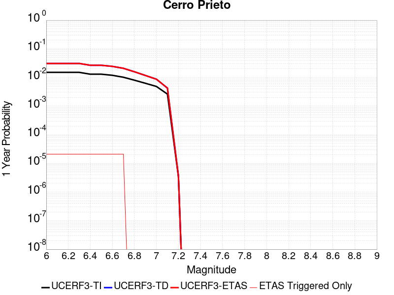 | 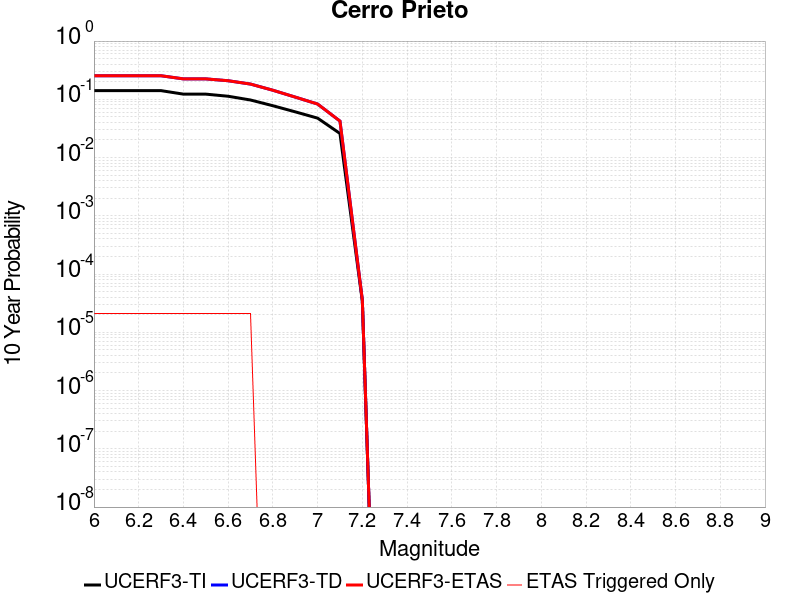 |

| Magnitude | 1 wk TI Prob | 1 wk TD Prob | 1 wk ETAS Prob | 1 wk ETAS/TD Gain | 1 wk ETAS Triggered Only | 1 mo TI Prob | 1 mo TD Prob | 1 mo ETAS Prob | 1 mo ETAS/TD Gain | 1 mo ETAS Triggered Only | 1 yr TI Prob | 1 yr TD Prob | 1 yr ETAS Prob | 1 yr ETAS/TD Gain | 1 yr ETAS Triggered Only | 10 yr TI Prob | 10 yr TD Prob | 10 yr ETAS Prob | 10 yr ETAS/TD Gain | 10 yr ETAS Triggered Only |
|-----|-----|-----|-----|-----|-----|-----|-----|-----|-----|-----|-----|-----|-----|-----|-----|-----|-----|-----|-----|-----|
| 6.0 | 2.9101528E-4 | 5.9654453E-4 | 5.9654453E-4 | 1.0 | 0.0 | 0.0012466122 | 0.0025543566 | 0.0025543566 | 1.0 | 0.0 | 0.015072231 | 0.030802928 | 0.03081262 | 1.0003146 | 1.0E-5 | 0.14089979 | 0.25386256 | 0.25387004 | 1.0000294 | 1.0E-5 |
| 6.1 | 2.9101528E-4 | 5.9654453E-4 | 5.9654453E-4 | 1.0 | 0.0 | 0.0012466122 | 0.0025543566 | 0.0025543566 | 1.0 | 0.0 | 0.015072231 | 0.030802928 | 0.03081262 | 1.0003146 | 1.0E-5 | 0.14089979 | 0.25386256 | 0.25387004 | 1.0000294 | 1.0E-5 |
| 6.2 | 2.9101528E-4 | 5.9654453E-4 | 5.9654453E-4 | 1.0 | 0.0 | 0.0012466122 | 0.0025543566 | 0.0025543566 | 1.0 | 0.0 | 0.015072231 | 0.030802928 | 0.03081262 | 1.0003146 | 1.0E-5 | 0.14089979 | 0.25386256 | 0.25387004 | 1.0000294 | 1.0E-5 |
| 6.3 | 2.9101528E-4 | 5.9654453E-4 | 5.9654453E-4 | 1.0 | 0.0 | 0.0012466122 | 0.0025543566 | 0.0025543566 | 1.0 | 0.0 | 0.015072231 | 0.030802928 | 0.03081262 | 1.0003146 | 1.0E-5 | 0.14089979 | 0.25386256 | 0.25387004 | 1.0000294 | 1.0E-5 |
| 6.4 | 2.508648E-4 | 5.140412E-4 | 5.140412E-4 | 1.0 | 0.0 | 0.0010746918 | 0.0022013725 | 0.0022013725 | 1.0 | 0.0 | 0.013006088 | 0.026629416 | 0.02663915 | 1.0003655 | 1.0E-5 | 0.12270685 | 0.2242222 | 0.22422995 | 1.0000346 | 1.0E-5 |
| 6.5 | 2.508648E-4 | 5.140412E-4 | 5.140412E-4 | 1.0 | 0.0 | 0.0010746918 | 0.0022013725 | 0.0022013725 | 1.0 | 0.0 | 0.013006088 | 0.026629416 | 0.02663915 | 1.0003655 | 1.0E-5 | 0.12270685 | 0.2242222 | 0.22422995 | 1.0000346 | 1.0E-5 |
| 6.6 | 2.294914E-4 | 4.7123645E-4 | 4.7123645E-4 | 1.0 | 0.0 | 9.831638E-4 | 0.0020182093 | 0.0020182093 | 1.0 | 0.0 | 0.011904482 | 0.024394194 | 0.02440395 | 1.0004 | 1.0E-5 | 0.11286586 | 0.20837563 | 0.20838355 | 1.000038 | 1.0E-5 |
| 6.7 | 1.9621674E-4 | 4.0426268E-4 | 4.0426268E-4 | 1.0 | 0.0 | 8.4065786E-4 | 0.0017315624 | 0.0017315624 | 1.0 | 0.0 | 0.010187071 | 0.020888962 | 0.020898754 | 1.0004687 | 1.0E-5 | 0.09732539 | 0.18264732 | 0.18265548 | 1.0000447 | 1.0E-5 |
| 6.8 | 1.5476145E-4 | 3.0572579E-4 | 3.0572579E-4 | 1.0 | 0.0 | 6.6309475E-4 | 0.0013096977 | 0.0013096977 | 1.0 | 0.0 | 0.008043335 | 0.015826825 | 0.015826825 | 1.0 | 0.0 | 0.07758363 | 0.14310057 | 0.14310057 | 1.0 | 0.0 |
| 6.9 | 1.20509176E-4 | 2.2588465E-4 | 2.2588465E-4 | 1.0 | 0.0 | 5.1636563E-4 | 9.6778123E-4 | 9.6778123E-4 | 1.0 | 0.0 | 0.006268645 | 0.011734025 | 0.011734025 | 1.0 | 0.0 | 0.060947374 | 0.10917958 | 0.10917958 | 1.0 | 0.0 |
| 7.0 | 9.3269155E-5 | 1.6721459E-4 | 1.6721459E-4 | 1.0 | 0.0 | 3.9966372E-4 | 7.1648025E-4 | 7.1648025E-4 | 1.0 | 0.0 | 0.0048550544 | 0.008695914 | 0.008695914 | 1.0 | 0.0 | 0.04750344 | 0.082943216 | 0.082943216 | 1.0 | 0.0 |
| 7.1 | 5.029709E-5 | 8.174011E-5 | 8.174011E-5 | 1.0 | 0.0 | 2.1554115E-4 | 3.50287E-4 | 3.50287E-4 | 1.0 | 0.0 | 0.0026210553 | 0.004259821 | 0.004259821 | 1.0 | 0.0 | 0.025903556 | 0.04226813 | 0.04226813 | 1.0 | 0.0 |
| 7.2 | 6.5445185E-8 | 6.824737E-8 | 6.824737E-8 | 1.0 | 0.0 | 2.8047933E-7 | 2.9248872E-7 | 2.9248872E-7 | 1.0 | 0.0 | 3.4148304E-6 | 3.56105E-6 | 3.56105E-6 | 1.0 | 0.0 | 3.414778E-5 | 3.56105E-5 | 3.56105E-5 | 1.0 | 0.0 |

## Honey Lake 2011 CFM
*[(top)](#table-of-contents)*

| 1 Week | 1 Month | 1 Year | 10 Year |
|-----|-----|-----|-----|
| 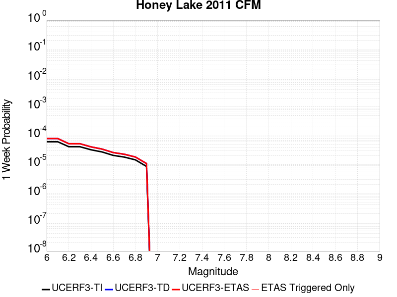 |  | 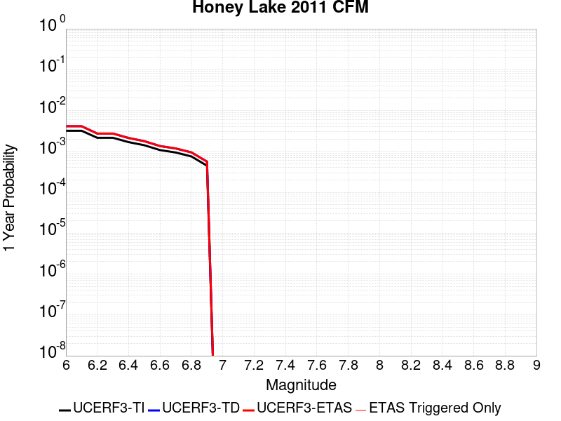 | 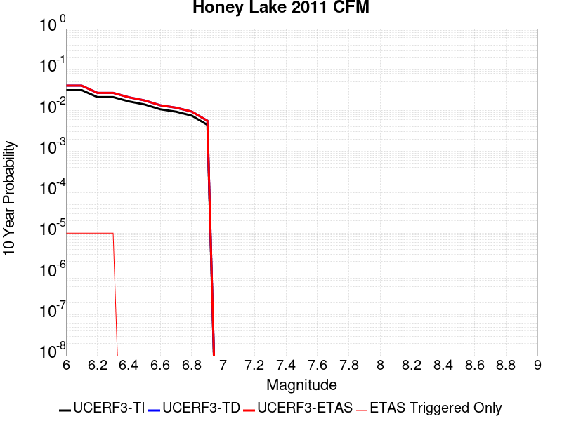 |

| Magnitude | 1 wk TI Prob | 1 wk TD Prob | 1 wk ETAS Prob | 1 wk ETAS/TD Gain | 1 wk ETAS Triggered Only | 1 mo TI Prob | 1 mo TD Prob | 1 mo ETAS Prob | 1 mo ETAS/TD Gain | 1 mo ETAS Triggered Only | 1 yr TI Prob | 1 yr TD Prob | 1 yr ETAS Prob | 1 yr ETAS/TD Gain | 1 yr ETAS Triggered Only | 10 yr TI Prob | 10 yr TD Prob | 10 yr ETAS Prob | 10 yr ETAS/TD Gain | 10 yr ETAS Triggered Only |
|-----|-----|-----|-----|-----|-----|-----|-----|-----|-----|-----|-----|-----|-----|-----|-----|-----|-----|-----|-----|-----|
| 6.0 | 6.155506E-5 | 7.954708E-5 | 7.954708E-5 | 1.0 | 0.0 | 2.6378073E-4 | 3.4087323E-4 | 3.4087323E-4 | 1.0 | 0.0 | 0.0032068014 | 0.0041426765 | 0.0041426765 | 1.0 | 0.0 | 0.03160919 | 0.040703055 | 0.040712647 | 1.0002357 | 1.0E-5 |
| 6.1 | 6.155506E-5 | 7.954708E-5 | 7.954708E-5 | 1.0 | 0.0 | 2.6378073E-4 | 3.4087323E-4 | 3.4087323E-4 | 1.0 | 0.0 | 0.0032068014 | 0.0041426765 | 0.0041426765 | 1.0 | 0.0 | 0.03160919 | 0.040703055 | 0.040712647 | 1.0002357 | 1.0E-5 |
| 6.2 | 4.1335024E-5 | 5.257652E-5 | 5.257652E-5 | 1.0 | 0.0 | 1.7713808E-4 | 2.2530954E-4 | 2.2530954E-4 | 1.0 | 0.0 | 0.0021545228 | 0.0027398444 | 0.0027398444 | 1.0 | 0.0 | 0.021337535 | 0.027076809 | 0.027086537 | 1.0003593 | 1.0E-5 |
| 6.3 | 4.1335024E-5 | 5.257652E-5 | 5.257652E-5 | 1.0 | 0.0 | 1.7713808E-4 | 2.2530954E-4 | 2.2530954E-4 | 1.0 | 0.0 | 0.0021545228 | 0.0027398444 | 0.0027398444 | 1.0 | 0.0 | 0.021337535 | 0.027076809 | 0.027086537 | 1.0003593 | 1.0E-5 |
| 6.4 | 3.2393702E-5 | 4.0887273E-5 | 4.0887273E-5 | 1.0 | 0.0 | 1.3882275E-4 | 1.7522006E-4 | 1.7522006E-4 | 1.0 | 0.0 | 0.0016888566 | 0.0021313233 | 0.0021313233 | 1.0 | 0.0 | 0.016760793 | 0.021119867 | 0.021119867 | 1.0 | 0.0 |
| 6.5 | 2.7205504E-5 | 3.4211767E-5 | 3.4211767E-5 | 1.0 | 0.0 | 1.1658981E-4 | 1.4661417E-4 | 1.4661417E-4 | 1.0 | 0.0 | 0.0014185566 | 0.0017836596 | 0.0017836596 | 1.0 | 0.0 | 0.014095354 | 0.017702963 | 0.017702963 | 1.0 | 0.0 |
| 6.6 | 2.069265E-5 | 2.5955416E-5 | 2.5955416E-5 | 1.0 | 0.0 | 8.867977E-5 | 1.1123324E-4 | 1.1123324E-4 | 1.0 | 0.0 | 0.0010791414 | 0.0013535074 | 0.0013535074 | 1.0 | 0.0 | 0.010739161 | 0.0134610105 | 0.0134610105 | 1.0 | 0.0 |
| 6.7 | 1.8060919E-5 | 2.265683E-5 | 2.265683E-5 | 1.0 | 0.0 | 7.7401644E-5 | 9.7097545E-5 | 9.7097545E-5 | 1.0 | 0.0 | 9.419576E-4 | 0.0011816025 | 0.0011816025 | 1.0 | 0.0 | 0.009379748 | 0.0117612425 | 0.0117612425 | 1.0 | 0.0 |
| 6.8 | 1.4474663E-5 | 1.8181274E-5 | 1.8181274E-5 | 1.0 | 0.0 | 6.203279E-5 | 7.791785E-5 | 7.791785E-5 | 1.0 | 0.0 | 7.5498753E-4 | 9.4831345E-4 | 9.4831345E-4 | 1.0 | 0.0 | 0.007524277 | 0.009450195 | 0.009450195 | 1.0 | 0.0 |
| 6.9 | 8.564552E-6 | 1.0802311E-5 | 1.0802311E-5 | 1.0 | 0.0 | 3.6704707E-5 | 4.6295176E-5 | 4.6295176E-5 | 1.0 | 0.0 | 4.4678818E-4 | 5.635644E-4 | 5.635644E-4 | 1.0 | 0.0 | 0.0044589094 | 0.0056278505 | 0.0056278505 | 1.0 | 0.0 |

## Gillem - Big Crack 2011 CFM
*[(top)](#table-of-contents)*

| 1 Week | 1 Month | 1 Year | 10 Year |
|-----|-----|-----|-----|
|  |  |  |  |

| Magnitude | 1 wk TI Prob | 1 wk TD Prob | 1 wk ETAS Prob | 1 wk ETAS/TD Gain | 1 wk ETAS Triggered Only | 1 mo TI Prob | 1 mo TD Prob | 1 mo ETAS Prob | 1 mo ETAS/TD Gain | 1 mo ETAS Triggered Only | 1 yr TI Prob | 1 yr TD Prob | 1 yr ETAS Prob | 1 yr ETAS/TD Gain | 1 yr ETAS Triggered Only | 10 yr TI Prob | 10 yr TD Prob | 10 yr ETAS Prob | 10 yr ETAS/TD Gain | 10 yr ETAS Triggered Only |
|-----|-----|-----|-----|-----|-----|-----|-----|-----|-----|-----|-----|-----|-----|-----|-----|-----|-----|-----|-----|-----|
| 6.0 | 2.196852E-5 | 2.3604485E-5 | 2.3604485E-5 | 1.0 | 0.0 | 9.4147406E-5 | 1.01158665E-4 | 1.01158665E-4 | 1.0 | 0.0 | 0.0011456419 | 0.0012309998 | 0.0012409874 | 1.0081135 | 1.0E-5 | 0.011397537 | 0.012250669 | 0.012260547 | 1.0008063 | 1.0E-5 |
| 6.1 | 9.992795E-6 | 1.071189E-5 | 1.071189E-5 | 1.0 | 0.0 | 4.2825563E-5 | 4.5907396E-5 | 4.5907396E-5 | 1.0 | 0.0 | 5.2127644E-4 | 5.587975E-4 | 5.6879193E-4 | 1.0178856 | 1.0E-5 | 0.0052005537 | 0.0055757347 | 0.005585679 | 1.0017835 | 1.0E-5 |
| 6.2 | 9.992795E-6 | 1.071189E-5 | 1.071189E-5 | 1.0 | 0.0 | 4.2825563E-5 | 4.5907396E-5 | 4.5907396E-5 | 1.0 | 0.0 | 5.2127644E-4 | 5.587975E-4 | 5.6879193E-4 | 1.0178856 | 1.0E-5 | 0.0052005537 | 0.0055757347 | 0.005585679 | 1.0017835 | 1.0E-5 |
| 6.3 | 4.6127884E-6 | 4.942657E-6 | 4.942657E-6 | 1.0 | 0.0 | 1.9768944E-5 | 2.1182668E-5 | 2.1182668E-5 | 1.0 | 0.0 | 2.406603E-4 | 2.5787292E-4 | 2.5787292E-4 | 1.0 | 0.0 | 0.0024039985 | 0.0025761751 | 0.0025761751 | 1.0 | 0.0 |
| 6.4 | 4.6127884E-6 | 4.942657E-6 | 4.942657E-6 | 1.0 | 0.0 | 1.9768944E-5 | 2.1182668E-5 | 2.1182668E-5 | 1.0 | 0.0 | 2.406603E-4 | 2.5787292E-4 | 2.5787292E-4 | 1.0 | 0.0 | 0.0024039985 | 0.0025761751 | 0.0025761751 | 1.0 | 0.0 |
| 6.5 | 2.716712E-6 | 2.9111113E-6 | 2.9111113E-6 | 1.0 | 0.0 | 1.1643E-5 | 1.24761455E-5 | 1.24761455E-5 | 1.0 | 0.0 | 1.417443E-4 | 1.5188892E-4 | 1.5188892E-4 | 1.0 | 0.0 | 0.0014165393 | 0.001518089 | 0.001518089 | 1.0 | 0.0 |
| 6.6 | 1.3818255E-6 | 1.4820689E-6 | 1.4820689E-6 | 1.0 | 0.0 | 5.922096E-6 | 6.3517155E-6 | 6.3517155E-6 | 1.0 | 0.0 | 7.209913E-5 | 7.7330624E-5 | 7.7330624E-5 | 1.0 | 0.0 | 7.2075747E-4 | 7.7315804E-4 | 7.7315804E-4 | 1.0 | 0.0 |

## Antelope Valley 2011
*[(top)](#table-of-contents)*

| 1 Week | 1 Month | 1 Year | 10 Year |
|-----|-----|-----|-----|
|  |  | 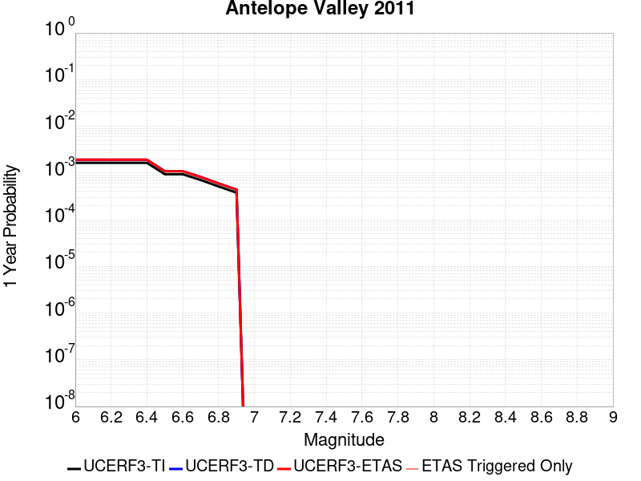 | 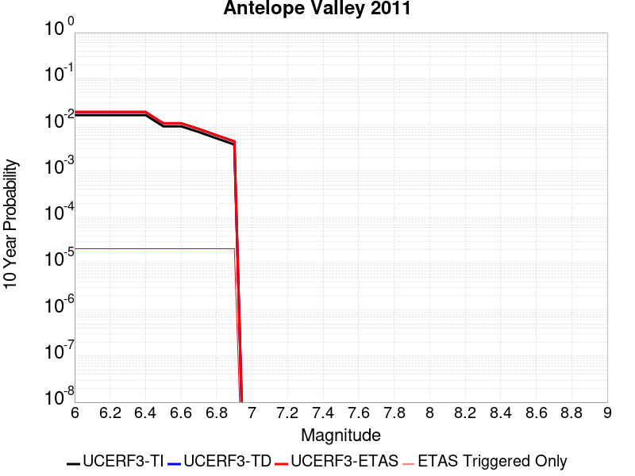 |

| Magnitude | 1 wk TI Prob | 1 wk TD Prob | 1 wk ETAS Prob | 1 wk ETAS/TD Gain | 1 wk ETAS Triggered Only | 1 mo TI Prob | 1 mo TD Prob | 1 mo ETAS Prob | 1 mo ETAS/TD Gain | 1 mo ETAS Triggered Only | 1 yr TI Prob | 1 yr TD Prob | 1 yr ETAS Prob | 1 yr ETAS/TD Gain | 1 yr ETAS Triggered Only | 10 yr TI Prob | 10 yr TD Prob | 10 yr ETAS Prob | 10 yr ETAS/TD Gain | 10 yr ETAS Triggered Only |
|-----|-----|-----|-----|-----|-----|-----|-----|-----|-----|-----|-----|-----|-----|-----|-----|-----|-----|-----|-----|-----|
| 6.0 | 3.1646934E-5 | 3.6904392E-5 | 3.6904392E-5 | 1.0 | 0.0 | 1.3562266E-4 | 1.5815359E-4 | 1.5815359E-4 | 1.0 | 0.0 | 0.0016499552 | 0.0019240839 | 0.0019240839 | 1.0 | 0.0 | 0.016377583 | 0.019100657 | 0.019110465 | 1.0005136 | 1.0E-5 |
| 6.1 | 3.1646934E-5 | 3.6904392E-5 | 3.6904392E-5 | 1.0 | 0.0 | 1.3562266E-4 | 1.5815359E-4 | 1.5815359E-4 | 1.0 | 0.0 | 0.0016499552 | 0.0019240839 | 0.0019240839 | 1.0 | 0.0 | 0.016377583 | 0.019100657 | 0.019110465 | 1.0005136 | 1.0E-5 |
| 6.2 | 3.1646934E-5 | 3.6904392E-5 | 3.6904392E-5 | 1.0 | 0.0 | 1.3562266E-4 | 1.5815359E-4 | 1.5815359E-4 | 1.0 | 0.0 | 0.0016499552 | 0.0019240839 | 0.0019240839 | 1.0 | 0.0 | 0.016377583 | 0.019100657 | 0.019110465 | 1.0005136 | 1.0E-5 |
| 6.3 | 3.1646934E-5 | 3.6904392E-5 | 3.6904392E-5 | 1.0 | 0.0 | 1.3562266E-4 | 1.5815359E-4 | 1.5815359E-4 | 1.0 | 0.0 | 0.0016499552 | 0.0019240839 | 0.0019240839 | 1.0 | 0.0 | 0.016377583 | 0.019100657 | 0.019110465 | 1.0005136 | 1.0E-5 |
| 6.4 | 3.1646934E-5 | 3.6904392E-5 | 3.6904392E-5 | 1.0 | 0.0 | 1.3562266E-4 | 1.5815359E-4 | 1.5815359E-4 | 1.0 | 0.0 | 0.0016499552 | 0.0019240839 | 0.0019240839 | 1.0 | 0.0 | 0.016377583 | 0.019100657 | 0.019110465 | 1.0005136 | 1.0E-5 |
| 6.5 | 1.8034107E-5 | 2.0940955E-5 | 2.0940955E-5 | 1.0 | 0.0 | 7.7286735E-5 | 8.974456E-5 | 8.974456E-5 | 1.0 | 0.0 | 9.405598E-4 | 0.0010922147 | 0.0010922147 | 1.0 | 0.0 | 0.009365888 | 0.010880543 | 0.010890434 | 1.0009091 | 1.0E-5 |
| 6.6 | 1.8034107E-5 | 2.0940955E-5 | 2.0940955E-5 | 1.0 | 0.0 | 7.7286735E-5 | 8.974456E-5 | 8.974456E-5 | 1.0 | 0.0 | 9.405598E-4 | 0.0010922147 | 0.0010922147 | 1.0 | 0.0 | 0.009365888 | 0.010880543 | 0.010890434 | 1.0009091 | 1.0E-5 |
| 6.7 | 1.3567667E-5 | 1.5749509E-5 | 1.5749509E-5 | 1.0 | 0.0 | 5.814585E-5 | 6.749675E-5 | 6.749675E-5 | 1.0 | 0.0 | 7.076958E-4 | 8.2156935E-4 | 8.2156935E-4 | 1.0 | 0.0 | 0.007054463 | 0.008195754 | 0.008205673 | 1.0012101 | 1.0E-5 |
| 6.8 | 9.867387E-6 | 1.1467935E-5 | 1.1467935E-5 | 1.0 | 0.0 | 4.2288117E-5 | 4.91479E-5 | 4.91479E-5 | 1.0 | 0.0 | 5.1473617E-4 | 5.9830636E-4 | 5.9830636E-4 | 1.0 | 0.0 | 0.005135455 | 0.005976268 | 0.005986208 | 1.0016633 | 1.0E-5 |
| 6.9 | 7.273233E-6 | 8.454864E-6 | 8.454864E-6 | 1.0 | 0.0 | 3.1170628E-5 | 3.623513E-5 | 3.623513E-5 | 1.0 | 0.0 | 3.794363E-4 | 4.411627E-4 | 4.411627E-4 | 1.0 | 0.0 | 0.0037878908 | 0.004411627 | 0.004421583 | 1.0022568 | 1.0E-5 |

## Garberville - Briceland 2011 CFM
*[(top)](#table-of-contents)*

| 1 Week | 1 Month | 1 Year | 10 Year |
|-----|-----|-----|-----|
| 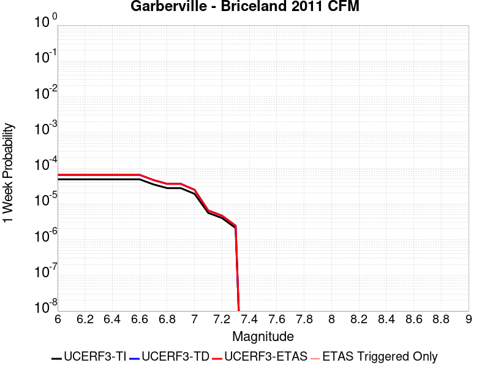 |  |  |  |

| Magnitude | 1 wk TI Prob | 1 wk TD Prob | 1 wk ETAS Prob | 1 wk ETAS/TD Gain | 1 wk ETAS Triggered Only | 1 mo TI Prob | 1 mo TD Prob | 1 mo ETAS Prob | 1 mo ETAS/TD Gain | 1 mo ETAS Triggered Only | 1 yr TI Prob | 1 yr TD Prob | 1 yr ETAS Prob | 1 yr ETAS/TD Gain | 1 yr ETAS Triggered Only | 10 yr TI Prob | 10 yr TD Prob | 10 yr ETAS Prob | 10 yr ETAS/TD Gain | 10 yr ETAS Triggered Only |
|-----|-----|-----|-----|-----|-----|-----|-----|-----|-----|-----|-----|-----|-----|-----|-----|-----|-----|-----|-----|-----|
| 6.0 | 4.8399295E-5 | 6.4527754E-5 | 6.4527754E-5 | 1.0 | 0.0 | 2.0740906E-4 | 2.765224E-4 | 2.765224E-4 | 1.0 | 0.0 | 0.002522281 | 0.0033621131 | 0.0033720795 | 1.0029644 | 1.0E-5 | 0.024938442 | 0.03317879 | 0.03318846 | 1.0002913 | 1.0E-5 |
| 6.1 | 4.8399295E-5 | 6.4527754E-5 | 6.4527754E-5 | 1.0 | 0.0 | 2.0740906E-4 | 2.765224E-4 | 2.765224E-4 | 1.0 | 0.0 | 0.002522281 | 0.0033621131 | 0.0033720795 | 1.0029644 | 1.0E-5 | 0.024938442 | 0.03317879 | 0.03318846 | 1.0002913 | 1.0E-5 |
| 6.2 | 4.8399295E-5 | 6.4527754E-5 | 6.4527754E-5 | 1.0 | 0.0 | 2.0740906E-4 | 2.765224E-4 | 2.765224E-4 | 1.0 | 0.0 | 0.002522281 | 0.0033621131 | 0.0033720795 | 1.0029644 | 1.0E-5 | 0.024938442 | 0.03317879 | 0.03318846 | 1.0002913 | 1.0E-5 |
| 6.3 | 4.8399295E-5 | 6.4527754E-5 | 6.4527754E-5 | 1.0 | 0.0 | 2.0740906E-4 | 2.765224E-4 | 2.765224E-4 | 1.0 | 0.0 | 0.002522281 | 0.0033621131 | 0.0033720795 | 1.0029644 | 1.0E-5 | 0.024938442 | 0.03317879 | 0.03318846 | 1.0002913 | 1.0E-5 |
| 6.4 | 4.8399295E-5 | 6.4527754E-5 | 6.4527754E-5 | 1.0 | 0.0 | 2.0740906E-4 | 2.765224E-4 | 2.765224E-4 | 1.0 | 0.0 | 0.002522281 | 0.0033621131 | 0.0033720795 | 1.0029644 | 1.0E-5 | 0.024938442 | 0.03317879 | 0.03318846 | 1.0002913 | 1.0E-5 |
| 6.5 | 4.8399295E-5 | 6.4527754E-5 | 6.4527754E-5 | 1.0 | 0.0 | 2.0740906E-4 | 2.765224E-4 | 2.765224E-4 | 1.0 | 0.0 | 0.002522281 | 0.0033621131 | 0.0033720795 | 1.0029644 | 1.0E-5 | 0.024938442 | 0.03317879 | 0.03318846 | 1.0002913 | 1.0E-5 |
| 6.6 | 4.8399295E-5 | 6.4527754E-5 | 6.4527754E-5 | 1.0 | 0.0 | 2.0740906E-4 | 2.765224E-4 | 2.765224E-4 | 1.0 | 0.0 | 0.002522281 | 0.0033621131 | 0.0033720795 | 1.0029644 | 1.0E-5 | 0.024938442 | 0.03317879 | 0.03318846 | 1.0002913 | 1.0E-5 |
| 6.7 | 3.495179E-5 | 4.630908E-5 | 4.630908E-5 | 1.0 | 0.0 | 1.4978478E-4 | 1.9845538E-4 | 1.9845538E-4 | 1.0 | 0.0 | 0.0018221042 | 0.0024140473 | 0.002424023 | 1.0041324 | 1.0E-5 | 0.018072363 | 0.023930654 | 0.023940416 | 1.0004078 | 1.0E-5 |
| 6.8 | 2.7517597E-5 | 3.62417E-5 | 3.62417E-5 | 1.0 | 0.0 | 1.1792722E-4 | 1.5531495E-4 | 1.5531495E-4 | 1.0 | 0.0 | 0.0014348183 | 0.0018897917 | 0.0018897917 | 1.0 | 0.0 | 0.014255894 | 0.01878354 | 0.01878354 | 1.0 | 0.0 |
| 6.9 | 2.74461E-5 | 3.6159425E-5 | 3.6159425E-5 | 1.0 | 0.0 | 1.1762084E-4 | 1.5496238E-4 | 1.5496238E-4 | 1.0 | 0.0 | 0.001431093 | 0.0018855067 | 0.0018855067 | 1.0 | 0.0 | 0.014219119 | 0.018741412 | 0.018741412 | 1.0 | 0.0 |
| 7.0 | 1.9023773E-5 | 2.4707771E-5 | 2.4707771E-5 | 1.0 | 0.0 | 8.152791E-5 | 1.0588833E-4 | 1.0588833E-4 | 1.0 | 0.0 | 9.921503E-4 | 0.0012888273 | 0.0012888273 | 1.0 | 0.0 | 0.009877323 | 0.012852578 | 0.012852578 | 1.0 | 0.0 |
| 7.1 | 5.566844E-6 | 6.512147E-6 | 6.512147E-6 | 1.0 | 0.0 | 2.3857683E-5 | 2.7908927E-5 | 2.7908927E-5 | 1.0 | 0.0 | 2.9042858E-4 | 3.3974246E-4 | 3.3974246E-4 | 1.0 | 0.0 | 0.002900493 | 0.0033926512 | 0.0033926512 | 1.0 | 0.0 |
| 7.2 | 4.011353E-6 | 4.6746213E-6 | 4.6746213E-6 | 1.0 | 0.0 | 1.7191402E-5 | 2.0033956E-5 | 2.0033956E-5 | 1.0 | 0.0 | 2.0928521E-4 | 2.4388955E-4 | 2.4388955E-4 | 1.0 | 0.0 | 0.0020908823 | 0.0024365564 | 0.0024365564 | 1.0 | 0.0 |
| 7.3 | 2.0974871E-6 | 2.4395908E-6 | 2.4395908E-6 | 1.0 | 0.0 | 8.989199E-6 | 1.0455362E-5 | 1.0455362E-5 | 1.0 | 0.0 | 1.09438006E-4 | 1.272891E-4 | 1.272891E-4 | 1.0 | 0.0 | 0.0010938413 | 0.0012724071 | 0.0012724071 | 1.0 | 0.0 |

## Bennett Valley 2011 CFM
*[(top)](#table-of-contents)*

| 1 Week | 1 Month | 1 Year | 10 Year |
|-----|-----|-----|-----|
| 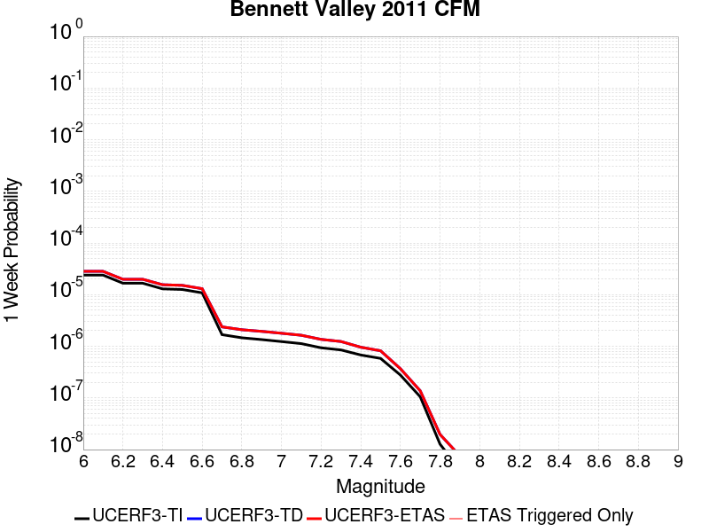 | 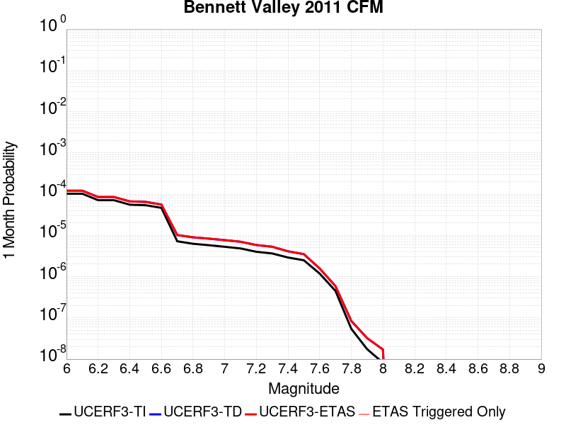 | 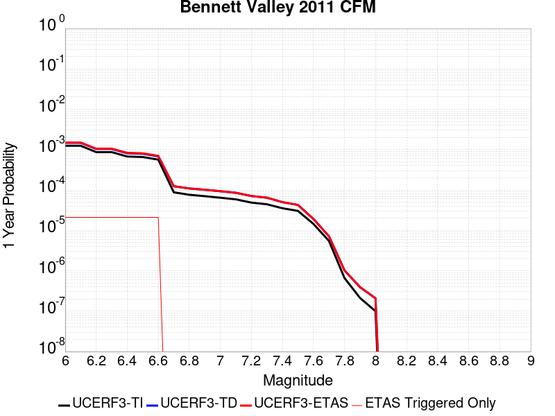 | 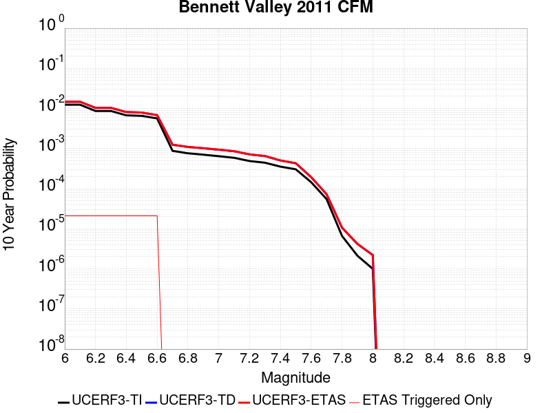 |

| Magnitude | 1 wk TI Prob | 1 wk TD Prob | 1 wk ETAS Prob | 1 wk ETAS/TD Gain | 1 wk ETAS Triggered Only | 1 mo TI Prob | 1 mo TD Prob | 1 mo ETAS Prob | 1 mo ETAS/TD Gain | 1 mo ETAS Triggered Only | 1 yr TI Prob | 1 yr TD Prob | 1 yr ETAS Prob | 1 yr ETAS/TD Gain | 1 yr ETAS Triggered Only | 10 yr TI Prob | 10 yr TD Prob | 10 yr ETAS Prob | 10 yr ETAS/TD Gain | 10 yr ETAS Triggered Only |
|-----|-----|-----|-----|-----|-----|-----|-----|-----|-----|-----|-----|-----|-----|-----|-----|-----|-----|-----|-----|-----|
| 6.0 | 2.3893934E-5 | 2.823899E-5 | 2.823899E-5 | 1.0 | 0.0 | 1.0239855E-4 | 1.2101967E-4 | 1.2101967E-4 | 1.0 | 0.0 | 0.0012459893 | 0.0014726035 | 0.0014825888 | 1.0067807 | 1.0E-5 | 0.012390262 | 0.01465108 | 0.014660933 | 1.0006726 | 1.0E-5 |
| 6.1 | 2.3893934E-5 | 2.823899E-5 | 2.823899E-5 | 1.0 | 0.0 | 1.0239855E-4 | 1.2101967E-4 | 1.2101967E-4 | 1.0 | 0.0 | 0.0012459893 | 0.0014726035 | 0.0014825888 | 1.0067807 | 1.0E-5 | 0.012390262 | 0.01465108 | 0.014660933 | 1.0006726 | 1.0E-5 |
| 6.2 | 1.6657146E-5 | 1.9853873E-5 | 1.9853873E-5 | 1.0 | 0.0 | 7.138582E-5 | 8.508605E-5 | 8.508605E-5 | 1.0 | 0.0 | 8.6877577E-4 | 0.0010355718 | 0.0010455615 | 1.0096465 | 1.0E-5 | 0.008653872 | 0.010325706 | 0.010335602 | 1.0009584 | 1.0E-5 |
| 6.3 | 1.6657146E-5 | 1.9853873E-5 | 1.9853873E-5 | 1.0 | 0.0 | 7.138582E-5 | 8.508605E-5 | 8.508605E-5 | 1.0 | 0.0 | 8.6877577E-4 | 0.0010355718 | 0.0010455615 | 1.0096465 | 1.0E-5 | 0.008653872 | 0.010325706 | 0.010335602 | 1.0009584 | 1.0E-5 |
| 6.4 | 1.29418495E-5 | 1.5567592E-5 | 1.5567592E-5 | 1.0 | 0.0 | 5.546389E-5 | 6.671728E-5 | 6.671728E-5 | 1.0 | 0.0 | 6.7506364E-4 | 8.1211043E-4 | 8.221023E-4 | 1.0123036 | 1.0E-5 | 0.0067301663 | 0.008108544 | 0.008118464 | 1.0012233 | 1.0E-5 |
| 6.5 | 1.2582504E-5 | 1.5134623E-5 | 1.5134623E-5 | 1.0 | 0.0 | 5.39239E-5 | 6.486179E-5 | 6.486179E-5 | 1.0 | 0.0 | 6.563257E-4 | 7.8953634E-4 | 7.9952844E-4 | 1.0126556 | 1.0E-5 | 0.006543907 | 0.007884451 | 0.007894373 | 1.0012584 | 1.0E-5 |
| 6.6 | 1.0846706E-5 | 1.3036858E-5 | 1.3036858E-5 | 1.0 | 0.0 | 4.6485053E-5 | 5.5871777E-5 | 5.5871777E-5 | 1.0 | 0.0 | 5.6580856E-4 | 6.801549E-4 | 6.901481E-4 | 1.0146925 | 1.0E-5 | 0.005643701 | 0.0067976816 | 0.0068076137 | 1.0014611 | 1.0E-5 |
| 6.7 | 1.6803231E-6 | 2.377902E-6 | 2.377902E-6 | 1.0 | 0.0 | 7.2013645E-6 | 1.019097E-5 | 1.019097E-5 | 1.0 | 0.0 | 8.7673085E-5 | 1.2406812E-4 | 1.2406812E-4 | 1.0 | 0.0 | 8.76385E-4 | 0.0012444188 | 0.0012444188 | 1.0 | 0.0 |
| 6.8 | 1.4609833E-6 | 2.0939708E-6 | 2.0939708E-6 | 1.0 | 0.0 | 6.261342E-6 | 8.974131E-6 | 8.974131E-6 | 1.0 | 0.0 | 7.6229175E-5 | 1.0925463E-4 | 1.0925463E-4 | 1.0 | 0.0 | 7.620303E-4 | 0.0010963798 | 0.0010963798 | 1.0 | 0.0 |
| 6.9 | 1.3492396E-6 | 1.9459103E-6 | 1.9459103E-6 | 1.0 | 0.0 | 5.7824427E-6 | 8.339589E-6 | 8.339589E-6 | 1.0 | 0.0 | 7.0398964E-5 | 1.01529826E-4 | 1.01529826E-4 | 1.0 | 0.0 | 7.037667E-4 | 0.001019178 | 0.001019178 | 1.0 | 0.0 |
| 7.0 | 1.2347921E-6 | 1.7888974E-6 | 1.7888974E-6 | 1.0 | 0.0 | 5.291955E-6 | 7.666681E-6 | 7.666681E-6 | 1.0 | 0.0 | 6.442765E-5 | 9.33379E-5 | 9.33379E-5 | 1.0 | 0.0 | 6.440897E-4 | 9.373068E-4 | 9.373068E-4 | 1.0 | 0.0 |
| 7.1 | 1.1262973E-6 | 1.6359154E-6 | 1.6359154E-6 | 1.0 | 0.0 | 4.8269794E-6 | 7.0110473E-6 | 7.0110473E-6 | 1.0 | 0.0 | 5.876689E-5 | 8.535621E-5 | 8.535621E-5 | 1.0 | 0.0 | 5.875135E-4 | 8.5754244E-4 | 8.5754244E-4 | 1.0 | 0.0 |
| 7.2 | 9.351744E-7 | 1.3611758E-6 | 1.3611758E-6 | 1.0 | 0.0 | 4.007884E-6 | 5.8335977E-6 | 5.8335977E-6 | 1.0 | 0.0 | 4.8794896E-5 | 7.1021765E-5 | 7.1021765E-5 | 1.0 | 0.0 | 4.878418E-4 | 7.142461E-4 | 7.142461E-4 | 1.0 | 0.0 |
| 7.3 | 8.5039534E-7 | 1.2386733E-6 | 1.2386733E-6 | 1.0 | 0.0 | 3.6445463E-6 | 5.308589E-6 | 5.308589E-6 | 1.0 | 0.0 | 4.437145E-5 | 6.463018E-5 | 6.463018E-5 | 1.0 | 0.0 | 4.436259E-4 | 6.50103E-4 | 6.50103E-4 | 1.0 | 0.0 |
| 7.4 | 6.7875015E-7 | 9.600642E-7 | 9.600642E-7 | 1.0 | 0.0 | 2.908926E-6 | 4.1145545E-6 | 4.1145545E-6 | 1.0 | 0.0 | 3.54156E-5 | 5.009356E-5 | 5.009356E-5 | 1.0 | 0.0 | 3.5409955E-4 | 5.0413073E-4 | 5.0413073E-4 | 1.0 | 0.0 |
| 7.5 | 5.826867E-7 | 8.1883735E-7 | 8.1883735E-7 | 1.0 | 0.0 | 2.4972264E-6 | 3.5092983E-6 | 3.5092983E-6 | 1.0 | 0.0 | 3.0403306E-5 | 4.2724878E-5 | 4.2724878E-5 | 1.0 | 0.0 | 3.0399146E-4 | 4.300558E-4 | 4.300558E-4 | 1.0 | 0.0 |
| 7.6 | 2.7734902E-7 | 3.6822587E-7 | 3.6822587E-7 | 1.0 | 0.0 | 1.1886381E-6 | 1.57811E-6 | 1.57811E-6 | 1.0 | 0.0 | 1.4471572E-5 | 1.9213321E-5 | 1.9213321E-5 | 1.0 | 0.0 | 1.447063E-4 | 1.9315645E-4 | 1.9315645E-4 | 1.0 | 0.0 |
| 7.7 | 1.0530888E-7 | 1.3749101E-7 | 1.3749101E-7 | 1.0 | 0.0 | 4.513237E-7 | 5.8924707E-7 | 5.8924707E-7 | 1.0 | 0.0 | 5.4948523E-6 | 7.174059E-6 | 7.174059E-6 | 1.0 | 0.0 | 5.4947162E-5 | 7.255585E-5 | 7.255585E-5 | 1.0 | 0.0 |
| 7.8 | 1.2714258E-8 | 1.9633259E-8 | 1.9633259E-8 | 1.0 | 0.0 | 5.448968E-8 | 8.4142535E-8 | 8.4142535E-8 | 1.0 | 0.0 | 6.6341164E-7 | 1.0244348E-6 | 1.0244348E-6 | 1.0 | 0.0 | 6.6340967E-6 | 1.0658595E-5 | 1.0658595E-5 | 1.0 | 0.0 |
| 7.9 | 4.075888E-9 | 7.559928E-9 | 7.559928E-9 | 1.0 | 0.0 | 1.7468091E-8 | 3.239969E-8 | 3.239969E-8 | 1.0 | 0.0 | 2.12674E-7 | 3.9446616E-7 | 3.9446616E-7 | 1.0 | 0.0 | 2.1267379E-6 | 4.1952467E-6 | 4.1952467E-6 | 1.0 | 0.0 |
| 8.0 | 1.9126138E-9 | 3.9956882E-9 | 3.9956882E-9 | 1.0 | 0.0 | 8.196917E-9 | 1.7124377E-8 | 1.7124377E-8 | 1.0 | 0.0 | 9.9797454E-8 | 2.0848927E-7 | 2.0848927E-7 | 1.0 | 0.0 | 9.979741E-7 | 2.1982228E-6 | 2.1982228E-6 | 1.0 | 0.0 |

## Monte Vista - Shannon 2011 CFM
*[(top)](#table-of-contents)*

| 1 Week | 1 Month | 1 Year | 10 Year |
|-----|-----|-----|-----|
|  | 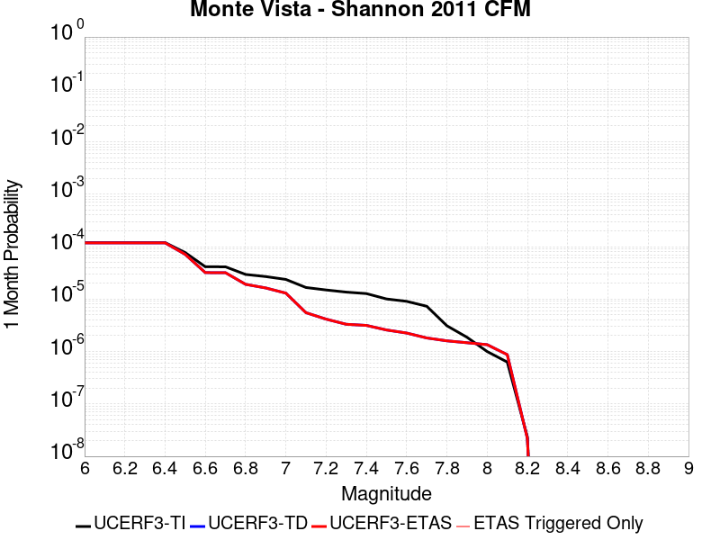 |  | 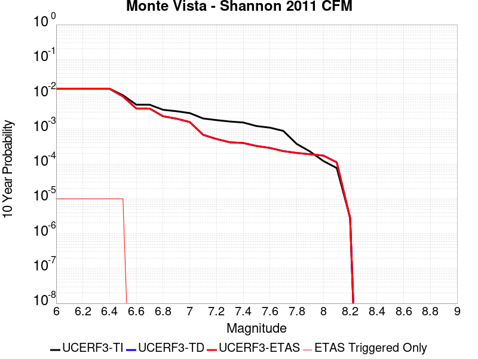 |

| Magnitude | 1 wk TI Prob | 1 wk TD Prob | 1 wk ETAS Prob | 1 wk ETAS/TD Gain | 1 wk ETAS Triggered Only | 1 mo TI Prob | 1 mo TD Prob | 1 mo ETAS Prob | 1 mo ETAS/TD Gain | 1 mo ETAS Triggered Only | 1 yr TI Prob | 1 yr TD Prob | 1 yr ETAS Prob | 1 yr ETAS/TD Gain | 1 yr ETAS Triggered Only | 10 yr TI Prob | 10 yr TD Prob | 10 yr ETAS Prob | 10 yr ETAS/TD Gain | 10 yr ETAS Triggered Only |
|-----|-----|-----|-----|-----|-----|-----|-----|-----|-----|-----|-----|-----|-----|-----|-----|-----|-----|-----|-----|-----|
| 6.0 | 2.7907707E-5 | 2.7584067E-5 | 2.7584067E-5 | 1.0 | 0.0 | 1.19598975E-4 | 1.1821277E-4 | 1.1821277E-4 | 1.0 | 0.0 | 0.0014551448 | 0.001438414 | 0.001438414 | 1.0 | 0.0 | 0.014456532 | 0.014320111 | 0.014329968 | 1.0006883 | 1.0E-5 |
| 6.1 | 2.7907707E-5 | 2.7584067E-5 | 2.7584067E-5 | 1.0 | 0.0 | 1.19598975E-4 | 1.1821277E-4 | 1.1821277E-4 | 1.0 | 0.0 | 0.0014551448 | 0.001438414 | 0.001438414 | 1.0 | 0.0 | 0.014456532 | 0.014320111 | 0.014329968 | 1.0006883 | 1.0E-5 |
| 6.2 | 2.7907707E-5 | 2.7584067E-5 | 2.7584067E-5 | 1.0 | 0.0 | 1.19598975E-4 | 1.1821277E-4 | 1.1821277E-4 | 1.0 | 0.0 | 0.0014551448 | 0.001438414 | 0.001438414 | 1.0 | 0.0 | 0.014456532 | 0.014320111 | 0.014329968 | 1.0006883 | 1.0E-5 |
| 6.3 | 2.7907707E-5 | 2.7584067E-5 | 2.7584067E-5 | 1.0 | 0.0 | 1.19598975E-4 | 1.1821277E-4 | 1.1821277E-4 | 1.0 | 0.0 | 0.0014551448 | 0.001438414 | 0.001438414 | 1.0 | 0.0 | 0.014456532 | 0.014320111 | 0.014329968 | 1.0006883 | 1.0E-5 |
| 6.4 | 2.7907707E-5 | 2.7584067E-5 | 2.7584067E-5 | 1.0 | 0.0 | 1.19598975E-4 | 1.1821277E-4 | 1.1821277E-4 | 1.0 | 0.0 | 0.0014551448 | 0.001438414 | 0.001438414 | 1.0 | 0.0 | 0.014456532 | 0.014320111 | 0.014329968 | 1.0006883 | 1.0E-5 |
| 6.5 | 1.7990213E-5 | 1.6639742E-5 | 1.6639742E-5 | 1.0 | 0.0 | 7.709863E-5 | 7.13116E-5 | 7.13116E-5 | 1.0 | 0.0 | 9.382716E-4 | 8.679393E-4 | 8.679393E-4 | 1.0 | 0.0 | 0.0093431985 | 0.008668857 | 0.008678771 | 1.0011436 | 1.0E-5 |
| 6.6 | 9.650407E-6 | 7.457001E-6 | 7.457001E-6 | 1.0 | 0.0 | 4.135823E-5 | 3.195823E-5 | 3.195823E-5 | 1.0 | 0.0 | 5.0342013E-4 | 3.890298E-4 | 3.890298E-4 | 1.0 | 0.0 | 0.005022812 | 0.0039011573 | 0.0039011573 | 1.0 | 0.0 |
| 6.7 | 9.62828E-6 | 7.434916E-6 | 7.434916E-6 | 1.0 | 0.0 | 4.1263404E-5 | 3.186358E-5 | 3.186358E-5 | 1.0 | 0.0 | 5.022661E-4 | 3.8787787E-4 | 3.8787787E-4 | 1.0 | 0.0 | 0.0050113243 | 0.003889678 | 0.003889678 | 1.0 | 0.0 |
| 6.8 | 6.887523E-6 | 4.461425E-6 | 4.461425E-6 | 1.0 | 0.0 | 2.9517621E-5 | 1.9120265E-5 | 1.9120265E-5 | 1.0 | 0.0 | 3.5931775E-4 | 2.3276659E-4 | 2.3276659E-4 | 1.0 | 0.0 | 0.0035873733 | 0.0023423703 | 0.0023423703 | 1.0 | 0.0 |
| 6.9 | 6.2722347E-6 | 3.8032956E-6 | 3.8032956E-6 | 1.0 | 0.0 | 2.6880729E-5 | 1.6299748E-5 | 1.6299748E-5 | 1.0 | 0.0 | 3.2722374E-4 | 1.9843338E-4 | 1.9843338E-4 | 1.0 | 0.0 | 0.003267423 | 0.0019996904 | 0.0019996904 | 1.0 | 0.0 |
| 7.0 | 5.5320347E-6 | 3.0304461E-6 | 3.0304461E-6 | 1.0 | 0.0 | 2.3708504E-5 | 1.2987572E-5 | 1.2987572E-5 | 1.0 | 0.0 | 2.8861282E-4 | 1.5811404E-4 | 1.5811404E-4 | 1.0 | 0.0 | 0.0028823826 | 0.0015971304 | 0.0015971304 | 1.0 | 0.0 |
| 7.1 | 3.8794055E-6 | 1.283645E-6 | 1.283645E-6 | 1.0 | 0.0 | 1.6625918E-5 | 5.5013243E-6 | 5.5013243E-6 | 1.0 | 0.0 | 2.0240174E-4 | 6.697658E-5 | 6.697658E-5 | 1.0 | 0.0 | 0.002022175 | 6.86504E-4 | 6.86504E-4 | 1.0 | 0.0 |
| 7.2 | 3.4813652E-6 | 9.669686E-7 | 9.669686E-7 | 1.0 | 0.0 | 1.49200505E-5 | 4.144145E-6 | 4.144145E-6 | 1.0 | 0.0 | 1.8163648E-4 | 5.0453804E-5 | 5.0453804E-5 | 1.0 | 0.0 | 0.0018148809 | 5.213506E-4 | 5.213506E-4 | 1.0 | 0.0 |
| 7.3 | 3.1682148E-6 | 7.7177793E-7 | 7.7177793E-7 | 1.0 | 0.0 | 1.3577992E-5 | 3.3076153E-6 | 3.3076153E-6 | 1.0 | 0.0 | 1.6529951E-4 | 4.0269475E-5 | 4.0269475E-5 | 1.0 | 0.0 | 0.0016517661 | 4.195245E-4 | 4.195245E-4 | 1.0 | 0.0 |
| 7.4 | 2.9707667E-6 | 7.344474E-7 | 7.344474E-7 | 1.0 | 0.0 | 1.2731795E-5 | 3.147628E-6 | 3.147628E-6 | 1.0 | 0.0 | 1.5499859E-4 | 3.8321698E-5 | 3.8321698E-5 | 1.0 | 0.0 | 0.0015489052 | 3.998471E-4 | 3.998471E-4 | 1.0 | 0.0 |
| 7.5 | 2.3462758E-6 | 6.0069135E-7 | 6.0069135E-7 | 1.0 | 0.0 | 1.0055429E-5 | 2.5743889E-6 | 2.5743889E-6 | 1.0 | 0.0 | 1.2241797E-4 | 3.1342737E-5 | 3.1342737E-5 | 1.0 | 0.0 | 0.0012235056 | 3.2833643E-4 | 3.2833643E-4 | 1.0 | 0.0 |
| 7.6 | 2.112783E-6 | 5.250731E-7 | 5.250731E-7 | 1.0 | 0.0 | 9.054753E-6 | 2.2503114E-6 | 2.2503114E-6 | 1.0 | 0.0 | 1.1023604E-4 | 2.7397198E-5 | 2.7397198E-5 | 1.0 | 0.0 | 0.0011018137 | 2.8845918E-4 | 2.8845918E-4 | 1.0 | 0.0 |
| 7.7 | 1.7022471E-6 | 4.23102E-7 | 4.23102E-7 | 1.0 | 0.0 | 7.2953244E-6 | 1.8132929E-6 | 1.8132929E-6 | 1.0 | 0.0 | 8.881695E-5 | 2.207662E-5 | 2.207662E-5 | 1.0 | 0.0 | 8.878146E-4 | 2.3394964E-4 | 2.3394964E-4 | 1.0 | 0.0 |
| 7.8 | 7.230914E-7 | 3.728293E-7 | 3.728293E-7 | 1.0 | 0.0 | 3.0989595E-6 | 1.597839E-6 | 1.597839E-6 | 1.0 | 0.0 | 3.772918E-5 | 1.9453517E-5 | 1.9453517E-5 | 1.0 | 0.0 | 3.7722773E-4 | 2.072548E-4 | 2.072548E-4 | 1.0 | 0.0 |
| 7.9 | 4.3588446E-7 | 3.4304335E-7 | 3.4304335E-7 | 1.0 | 0.0 | 1.868075E-6 | 1.4701849E-6 | 1.4701849E-6 | 1.0 | 0.0 | 2.2743576E-5 | 1.7899356E-5 | 1.7899356E-5 | 1.0 | 0.0 | 2.2741247E-4 | 1.899464E-4 | 1.899464E-4 | 1.0 | 0.0 |
| 8.0 | 2.3317523E-7 | 3.1513432E-7 | 3.1513432E-7 | 1.0 | 0.0 | 9.99322E-7 | 1.350575E-6 | 1.350575E-6 | 1.0 | 0.0 | 1.2166677E-5 | 1.6443128E-5 | 1.6443128E-5 | 1.0 | 0.0 | 1.21660116E-4 | 1.7399403E-4 | 1.7399403E-4 | 1.0 | 0.0 |
| 8.1 | 1.4662456E-7 | 2.03077E-7 | 2.03077E-7 | 1.0 | 0.0 | 6.283908E-7 | 8.703297E-7 | 8.703297E-7 | 1.0 | 0.0 | 7.650631E-6 | 1.05962135E-5 | 1.05962135E-5 | 1.0 | 0.0 | 7.650368E-5 | 1.1132272E-4 | 1.1132272E-4 | 1.0 | 0.0 |
| 8.2 | 5.4931775E-9 | 5.0752176E-9 | 5.0752176E-9 | 1.0 | 0.0 | 2.3542189E-8 | 2.1750932E-8 | 2.1750932E-8 | 1.0 | 0.0 | 2.8662612E-7 | 2.6481757E-7 | 2.6481757E-7 | 1.0 | 0.0 | 2.8662573E-6 | 2.754138E-6 | 2.754138E-6 | 1.0 | 0.0 |

## La Panza 2011
*[(top)](#table-of-contents)*

| 1 Week | 1 Month | 1 Year | 10 Year |
|-----|-----|-----|-----|
| 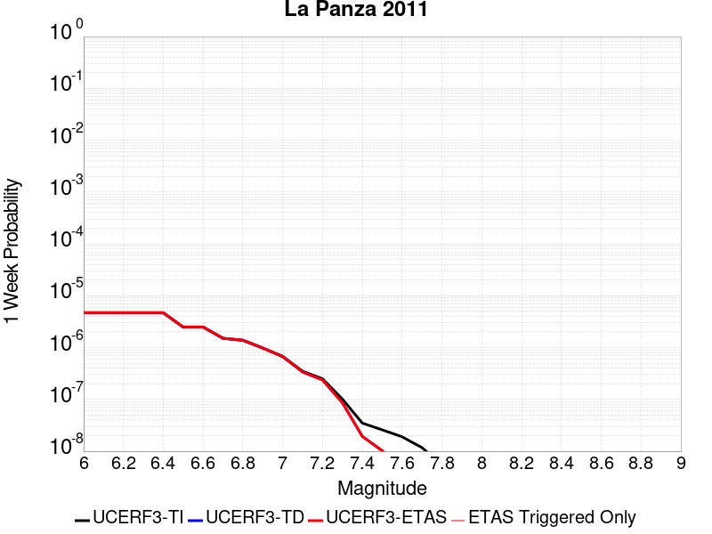 | 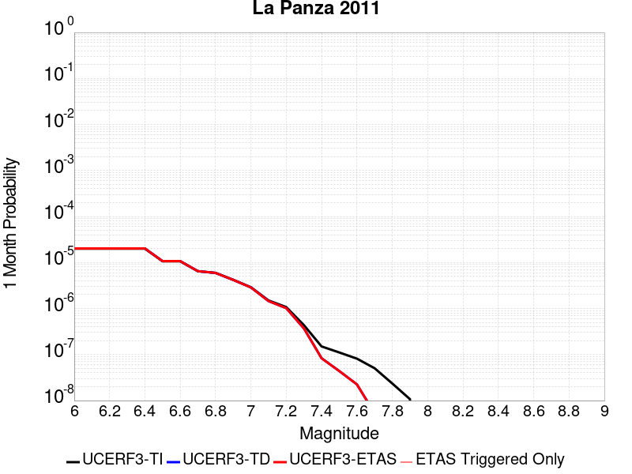 | 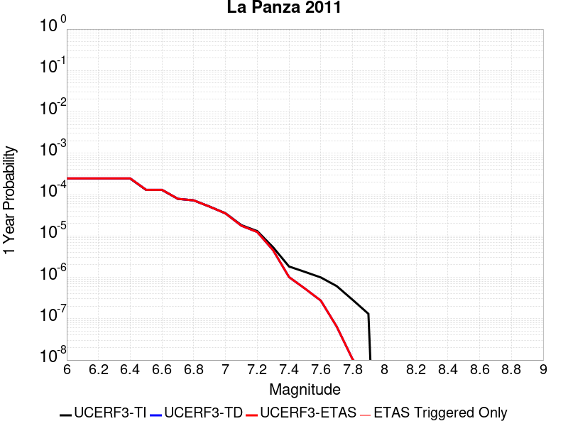 | 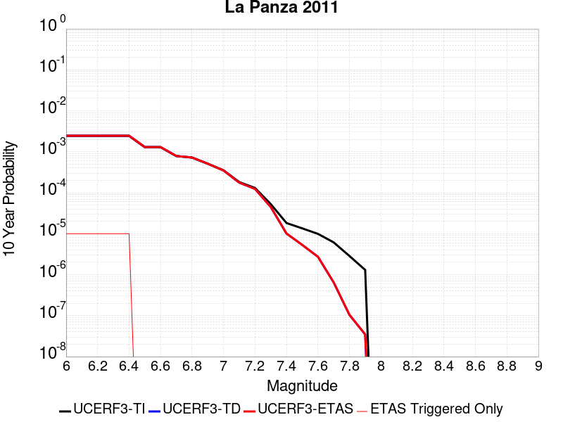 |

| Magnitude | 1 wk TI Prob | 1 wk TD Prob | 1 wk ETAS Prob | 1 wk ETAS/TD Gain | 1 wk ETAS Triggered Only | 1 mo TI Prob | 1 mo TD Prob | 1 mo ETAS Prob | 1 mo ETAS/TD Gain | 1 mo ETAS Triggered Only | 1 yr TI Prob | 1 yr TD Prob | 1 yr ETAS Prob | 1 yr ETAS/TD Gain | 1 yr ETAS Triggered Only | 10 yr TI Prob | 10 yr TD Prob | 10 yr ETAS Prob | 10 yr ETAS/TD Gain | 10 yr ETAS Triggered Only |
|-----|-----|-----|-----|-----|-----|-----|-----|-----|-----|-----|-----|-----|-----|-----|-----|-----|-----|-----|-----|-----|
| 6.0 | 4.6754544E-6 | 4.7175886E-6 | 4.7175886E-6 | 1.0 | 0.0 | 2.0037509E-5 | 2.021809E-5 | 2.021809E-5 | 1.0 | 0.0 | 2.4392935E-4 | 2.4612944E-4 | 2.4612944E-4 | 1.0 | 0.0 | 0.0024366176 | 0.0024587628 | 0.0024687382 | 1.004057 | 1.0E-5 |
| 6.1 | 4.6754544E-6 | 4.7175886E-6 | 4.7175886E-6 | 1.0 | 0.0 | 2.0037509E-5 | 2.021809E-5 | 2.021809E-5 | 1.0 | 0.0 | 2.4392935E-4 | 2.4612944E-4 | 2.4612944E-4 | 1.0 | 0.0 | 0.0024366176 | 0.0024587628 | 0.0024687382 | 1.004057 | 1.0E-5 |
| 6.2 | 4.6754544E-6 | 4.7175886E-6 | 4.7175886E-6 | 1.0 | 0.0 | 2.0037509E-5 | 2.021809E-5 | 2.021809E-5 | 1.0 | 0.0 | 2.4392935E-4 | 2.4612944E-4 | 2.4612944E-4 | 1.0 | 0.0 | 0.0024366176 | 0.0024587628 | 0.0024687382 | 1.004057 | 1.0E-5 |
| 6.3 | 4.6754544E-6 | 4.7175886E-6 | 4.7175886E-6 | 1.0 | 0.0 | 2.0037509E-5 | 2.021809E-5 | 2.021809E-5 | 1.0 | 0.0 | 2.4392935E-4 | 2.4612944E-4 | 2.4612944E-4 | 1.0 | 0.0 | 0.0024366176 | 0.0024587628 | 0.0024687382 | 1.004057 | 1.0E-5 |
| 6.4 | 4.6754544E-6 | 4.7175886E-6 | 4.7175886E-6 | 1.0 | 0.0 | 2.0037509E-5 | 2.021809E-5 | 2.021809E-5 | 1.0 | 0.0 | 2.4392935E-4 | 2.4612944E-4 | 2.4612944E-4 | 1.0 | 0.0 | 0.0024366176 | 0.0024587628 | 0.0024687382 | 1.004057 | 1.0E-5 |
| 6.5 | 2.485343E-6 | 2.5006007E-6 | 2.5006007E-6 | 1.0 | 0.0 | 1.0651426E-5 | 1.0716818E-5 | 1.0716818E-5 | 1.0 | 0.0 | 1.296734E-4 | 1.3046984E-4 | 1.3046984E-4 | 1.0 | 0.0 | 0.0012959775 | 0.0013039707 | 0.0013039707 | 1.0 | 0.0 |
| 6.6 | 2.485343E-6 | 2.5006007E-6 | 2.5006007E-6 | 1.0 | 0.0 | 1.0651426E-5 | 1.0716818E-5 | 1.0716818E-5 | 1.0 | 0.0 | 1.296734E-4 | 1.3046984E-4 | 1.3046984E-4 | 1.0 | 0.0 | 0.0012959775 | 0.0013039707 | 0.0013039707 | 1.0 | 0.0 |
| 6.7 | 1.5108508E-6 | 1.514639E-6 | 1.514639E-6 | 1.0 | 0.0 | 6.4750584E-6 | 6.4912947E-6 | 6.4912947E-6 | 1.0 | 0.0 | 7.8830984E-5 | 7.902876E-5 | 7.902876E-5 | 1.0 | 0.0 | 7.880303E-4 | 7.9001737E-4 | 7.9001737E-4 | 1.0 | 0.0 |
| 6.8 | 1.3865837E-6 | 1.3885118E-6 | 1.3885118E-6 | 1.0 | 0.0 | 5.942488E-6 | 5.950752E-6 | 5.950752E-6 | 1.0 | 0.0 | 7.234739E-5 | 7.244809E-5 | 7.244809E-5 | 1.0 | 0.0 | 7.232384E-4 | 7.242546E-4 | 7.242546E-4 | 1.0 | 0.0 |
| 6.9 | 9.826583E-7 | 9.796303E-7 | 9.796303E-7 | 1.0 | 0.0 | 4.2113857E-6 | 4.198409E-6 | 4.198409E-6 | 1.0 | 0.0 | 5.1272415E-5 | 5.1114486E-5 | 5.1114486E-5 | 1.0 | 0.0 | 5.126059E-4 | 5.1103265E-4 | 5.1103265E-4 | 1.0 | 0.0 |
| 7.0 | 6.7797646E-7 | 6.710231E-7 | 6.710231E-7 | 1.0 | 0.0 | 2.9056102E-6 | 2.8758104E-6 | 2.8758104E-6 | 1.0 | 0.0 | 3.537523E-5 | 3.501246E-5 | 3.501246E-5 | 1.0 | 0.0 | 3.5369597E-4 | 3.5007254E-4 | 3.5007254E-4 | 1.0 | 0.0 |
| 7.1 | 3.4979826E-7 | 3.3874045E-7 | 3.3874045E-7 | 1.0 | 0.0 | 1.4991346E-6 | 1.4517441E-6 | 1.4517441E-6 | 1.0 | 0.0 | 1.825181E-5 | 1.7674853E-5 | 1.7674853E-5 | 1.0 | 0.0 | 1.825031E-4 | 1.7673563E-4 | 1.7673563E-4 | 1.0 | 0.0 |
| 7.2 | 2.5088332E-7 | 2.3832064E-7 | 2.3832064E-7 | 1.0 | 0.0 | 1.0752137E-6 | 1.0213738E-6 | 1.0213738E-6 | 1.0 | 0.0 | 1.3090649E-5 | 1.2435164E-5 | 1.2435164E-5 | 1.0 | 0.0 | 1.3089878E-4 | 1.2434553E-4 | 1.2434553E-4 | 1.0 | 0.0 |
| 7.3 | 1.0159086E-7 | 8.644785E-8 | 8.644785E-8 | 1.0 | 0.0 | 4.3538932E-7 | 3.704907E-7 | 3.704907E-7 | 1.0 | 0.0 | 5.300852E-6 | 4.510716E-6 | 4.510716E-6 | 1.0 | 0.0 | 5.3007258E-5 | 4.510628E-5 | 4.510628E-5 | 1.0 | 0.0 |
| 7.4 | 3.5006252E-8 | 1.9403883E-8 | 1.9403883E-8 | 1.0 | 0.0 | 1.5002678E-7 | 8.315949E-8 | 8.315949E-8 | 1.0 | 0.0 | 1.8265745E-6 | 1.0124663E-6 | 1.0124663E-6 | 1.0 | 0.0 | 1.8265595E-5 | 1.012462E-5 | 1.012462E-5 | 1.0 | 0.0 |
| 7.5 | 2.592274E-8 | 1.0238468E-8 | 1.0238468E-8 | 1.0 | 0.0 | 1.1109746E-7 | 4.3879147E-8 | 4.3879147E-8 | 1.0 | 0.0 | 1.3526106E-6 | 5.342285E-7 | 5.342285E-7 | 1.0 | 0.0 | 1.3526024E-5 | 5.342273E-6 | 5.342273E-6 | 1.0 | 0.0 |
| 7.6 | 1.9016717E-8 | 5.2442264E-9 | 5.2442264E-9 | 1.0 | 0.0 | 8.150022E-8 | 2.2475257E-8 | 2.2475257E-8 | 1.0 | 0.0 | 9.922647E-7 | 2.736362E-7 | 2.736362E-7 | 1.0 | 0.0 | 9.922603E-6 | 2.736359E-6 | 2.736359E-6 | 1.0 | 0.0 |
| 7.7 | 1.17738495E-8 | 1.2393437E-9 | 1.2393437E-9 | 1.0 | 0.0 | 5.0459356E-8 | 5.3114735E-9 | 5.3114735E-9 | 1.0 | 0.0 | 6.1434247E-7 | 6.466719E-8 | 6.466719E-8 | 1.0 | 0.0 | 6.143408E-6 | 6.466717E-7 | 6.466717E-7 | 1.0 | 0.0 |
| 7.8 | 5.489079E-9 | 2.009185E-10 | 2.009185E-10 | 1.0 | 0.0 | 2.3524624E-8 | 8.61079E-10 | 8.61079E-10 | 1.0 | 0.0 | 2.8641225E-7 | 1.0483639E-8 | 1.0483639E-8 | 1.0 | 0.0 | 2.8641189E-6 | 1.0483638E-7 | 1.0483638E-7 | 1.0 | 0.0 |
| 7.9 | 2.5081048E-9 | 6.675449E-11 | 6.675449E-11 | 1.0 | 0.0 | 1.0749021E-8 | 2.8609015E-10 | 2.8609015E-10 | 1.0 | 0.0 | 1.3086932E-7 | 3.483148E-9 | 3.483148E-9 | 1.0 | 0.0 | 1.3086925E-6 | 3.483148E-8 | 3.483148E-8 | 1.0 | 0.0 |

## Santa Susana East (connector)
*[(top)](#table-of-contents)*

| 1 Week | 1 Month | 1 Year | 10 Year |
|-----|-----|-----|-----|
|  |  |  |  |

| Magnitude | 1 wk TI Prob | 1 wk TD Prob | 1 wk ETAS Prob | 1 wk ETAS/TD Gain | 1 wk ETAS Triggered Only | 1 mo TI Prob | 1 mo TD Prob | 1 mo ETAS Prob | 1 mo ETAS/TD Gain | 1 mo ETAS Triggered Only | 1 yr TI Prob | 1 yr TD Prob | 1 yr ETAS Prob | 1 yr ETAS/TD Gain | 1 yr ETAS Triggered Only | 10 yr TI Prob | 10 yr TD Prob | 10 yr ETAS Prob | 10 yr ETAS/TD Gain | 10 yr ETAS Triggered Only |
|-----|-----|-----|-----|-----|-----|-----|-----|-----|-----|-----|-----|-----|-----|-----|-----|-----|-----|-----|-----|-----|
| 6.0 | 2.858397E-5 | 3.2021693E-5 | 3.2021693E-5 | 1.0 | 0.0 | 1.2249697E-4 | 1.3723019E-4 | 1.3723019E-4 | 1.0 | 0.0 | 0.0014903803 | 0.00166977 | 0.00166977 | 1.0 | 0.0 | 0.014804244 | 0.016599316 | 0.01660915 | 1.0005925 | 1.0E-5 |
| 6.1 | 2.858397E-5 | 3.2021693E-5 | 3.2021693E-5 | 1.0 | 0.0 | 1.2249697E-4 | 1.3723019E-4 | 1.3723019E-4 | 1.0 | 0.0 | 0.0014903803 | 0.00166977 | 0.00166977 | 1.0 | 0.0 | 0.014804244 | 0.016599316 | 0.01660915 | 1.0005925 | 1.0E-5 |
| 6.2 | 2.858397E-5 | 3.2021693E-5 | 3.2021693E-5 | 1.0 | 0.0 | 1.2249697E-4 | 1.3723019E-4 | 1.3723019E-4 | 1.0 | 0.0 | 0.0014903803 | 0.00166977 | 0.00166977 | 1.0 | 0.0 | 0.014804244 | 0.016599316 | 0.01660915 | 1.0005925 | 1.0E-5 |
| 6.3 | 1.943582E-5 | 2.0367343E-5 | 2.0367343E-5 | 1.0 | 0.0 | 8.329371E-5 | 8.7286324E-5 | 8.7286324E-5 | 1.0 | 0.0 | 0.001013629 | 0.001062305 | 0.001062305 | 1.0 | 0.0 | 0.010090181 | 0.010583852 | 0.010593747 | 1.0009348 | 1.0E-5 |
| 6.4 | 1.943582E-5 | 2.0367343E-5 | 2.0367343E-5 | 1.0 | 0.0 | 8.329371E-5 | 8.7286324E-5 | 8.7286324E-5 | 1.0 | 0.0 | 0.001013629 | 0.001062305 | 0.001062305 | 1.0 | 0.0 | 0.010090181 | 0.010583852 | 0.010593747 | 1.0009348 | 1.0E-5 |
| 6.5 | 1.943582E-5 | 2.0367343E-5 | 2.0367343E-5 | 1.0 | 0.0 | 8.329371E-5 | 8.7286324E-5 | 8.7286324E-5 | 1.0 | 0.0 | 0.001013629 | 0.001062305 | 0.001062305 | 1.0 | 0.0 | 0.010090181 | 0.010583852 | 0.010593747 | 1.0009348 | 1.0E-5 |
| 6.6 | 1.943582E-5 | 2.0367343E-5 | 2.0367343E-5 | 1.0 | 0.0 | 8.329371E-5 | 8.7286324E-5 | 8.7286324E-5 | 1.0 | 0.0 | 0.001013629 | 0.001062305 | 0.001062305 | 1.0 | 0.0 | 0.010090181 | 0.010583852 | 0.010593747 | 1.0009348 | 1.0E-5 |
| 6.7 | 1.9404439E-5 | 2.0354766E-5 | 2.0354766E-5 | 1.0 | 0.0 | 8.3159226E-5 | 8.723242E-5 | 8.723242E-5 | 1.0 | 0.0 | 0.0010119933 | 0.0010616493 | 0.0010616493 | 1.0 | 0.0 | 0.010073971 | 0.010577358 | 0.010587253 | 1.0009354 | 1.0E-5 |
| 6.8 | 1.2217526E-5 | 1.1593157E-5 | 1.1593157E-5 | 1.0 | 0.0 | 5.2359774E-5 | 4.9684106E-5 | 4.9684106E-5 | 1.0 | 0.0 | 6.372938E-4 | 6.047529E-4 | 6.047529E-4 | 1.0 | 0.0 | 0.0063546924 | 0.006033274 | 0.006043214 | 1.0016475 | 1.0E-5 |
| 6.9 | 1.2217526E-5 | 1.1593157E-5 | 1.1593157E-5 | 1.0 | 0.0 | 5.2359774E-5 | 4.9684106E-5 | 4.9684106E-5 | 1.0 | 0.0 | 6.372938E-4 | 6.047529E-4 | 6.047529E-4 | 1.0 | 0.0 | 0.0063546924 | 0.006033274 | 0.006043214 | 1.0016475 | 1.0E-5 |
| 7.0 | 9.276017E-6 | 8.059273E-6 | 8.059273E-6 | 1.0 | 0.0 | 3.9753755E-5 | 3.4539302E-5 | 3.4539302E-5 | 1.0 | 0.0 | 4.8389446E-4 | 4.2043833E-4 | 4.2043833E-4 | 1.0 | 0.0 | 0.0048284214 | 0.0041973097 | 0.004207268 | 1.0023725 | 1.0E-5 |
| 7.1 | 9.130355E-6 | 7.942446E-6 | 7.942446E-6 | 1.0 | 0.0 | 3.9129503E-5 | 3.4038632E-5 | 3.4038632E-5 | 1.0 | 0.0 | 4.7629757E-4 | 4.1434498E-4 | 4.1434498E-4 | 1.0 | 0.0 | 0.00475278 | 0.0041366047 | 0.0041465634 | 1.0024074 | 1.0E-5 |
| 7.2 | 8.851015E-6 | 7.741608E-6 | 7.741608E-6 | 1.0 | 0.0 | 3.7932372E-5 | 3.317792E-5 | 3.317792E-5 | 1.0 | 0.0 | 4.6172875E-4 | 4.038697E-4 | 4.038697E-4 | 1.0 | 0.0 | 0.0046077054 | 0.0040322347 | 0.004042194 | 1.00247 | 1.0E-5 |
| 7.3 | 8.573006E-6 | 7.5503312E-6 | 7.5503312E-6 | 1.0 | 0.0 | 3.6740938E-5 | 3.235818E-5 | 3.235818E-5 | 1.0 | 0.0 | 4.472291E-4 | 3.9389305E-4 | 3.9389305E-4 | 1.0 | 0.0 | 0.004463301 | 0.003932817 | 0.0039427774 | 1.0025327 | 1.0E-5 |
| 7.4 | 7.852282E-6 | 6.8178556E-6 | 6.8178556E-6 | 1.0 | 0.0 | 3.36522E-5 | 2.921907E-5 | 2.921907E-5 | 1.0 | 0.0 | 4.096385E-4 | 3.5568717E-4 | 3.5568717E-4 | 1.0 | 0.0 | 0.0040888423 | 0.0035519868 | 0.0035619512 | 1.0028054 | 1.0E-5 |
| 7.5 | 4.8869324E-6 | 4.2790975E-6 | 4.2790975E-6 | 1.0 | 0.0 | 2.0943828E-5 | 1.833887E-5 | 1.833887E-5 | 1.0 | 0.0 | 2.5496128E-4 | 2.2325452E-4 | 2.2325452E-4 | 1.0 | 0.0 | 0.0025466895 | 0.00223057 | 0.00223057 | 1.0 | 0.0 |
| 7.6 | 1.3894544E-6 | 1.1568394E-6 | 1.1568394E-6 | 1.0 | 0.0 | 5.954791E-6 | 4.957875E-6 | 4.957875E-6 | 1.0 | 0.0 | 7.249717E-5 | 6.036068E-5 | 6.036068E-5 | 1.0 | 0.0 | 7.247352E-4 | 6.0346466E-4 | 6.0346466E-4 | 1.0 | 0.0 |
| 7.7 | 2.9924632E-7 | 2.3719332E-7 | 2.3719332E-7 | 1.0 | 0.0 | 1.2824837E-6 | 1.0165425E-6 | 1.0165425E-6 | 1.0 | 0.0 | 1.5614127E-5 | 1.2376341E-5 | 1.2376341E-5 | 1.0 | 0.0 | 1.5613029E-4 | 1.2375724E-4 | 1.2375724E-4 | 1.0 | 0.0 |
| 7.8 | 4.8188564E-8 | 2.6321862E-8 | 2.6321862E-8 | 1.0 | 0.0 | 2.065224E-7 | 1.12807975E-7 | 1.12807975E-7 | 1.0 | 0.0 | 2.5144072E-6 | 1.3734362E-6 | 1.3734362E-6 | 1.0 | 0.0 | 2.5143789E-5 | 1.3734286E-5 | 1.3734286E-5 | 1.0 | 0.0 |
| 7.9 | 2.6127251E-9 | 2.7681102E-9 | 2.7681102E-9 | 1.0 | 0.0 | 1.1197393E-8 | 1.186333E-8 | 1.186333E-8 | 1.0 | 0.0 | 1.3632825E-7 | 1.4443603E-7 | 1.4443603E-7 | 1.0 | 0.0 | 1.3632817E-6 | 1.4443604E-6 | 1.4443604E-6 | 1.0 | 0.0 |

## Earthquake Valley
*[(top)](#table-of-contents)*

| 1 Week | 1 Month | 1 Year | 10 Year |
|-----|-----|-----|-----|
| 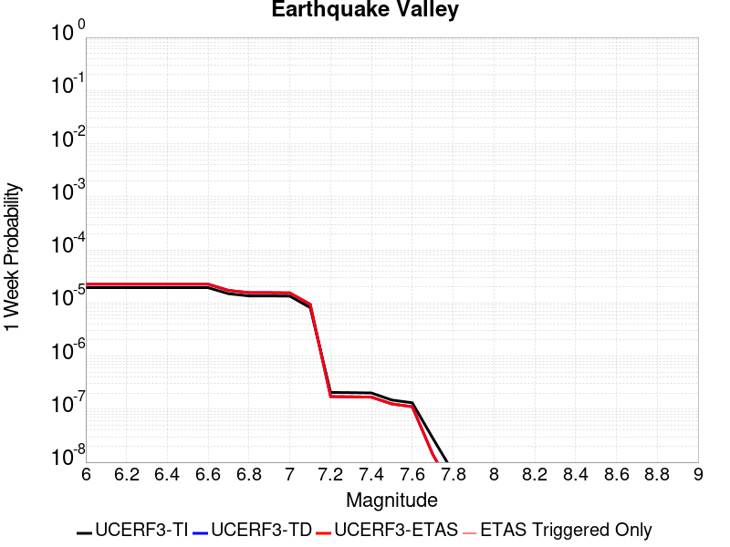 | 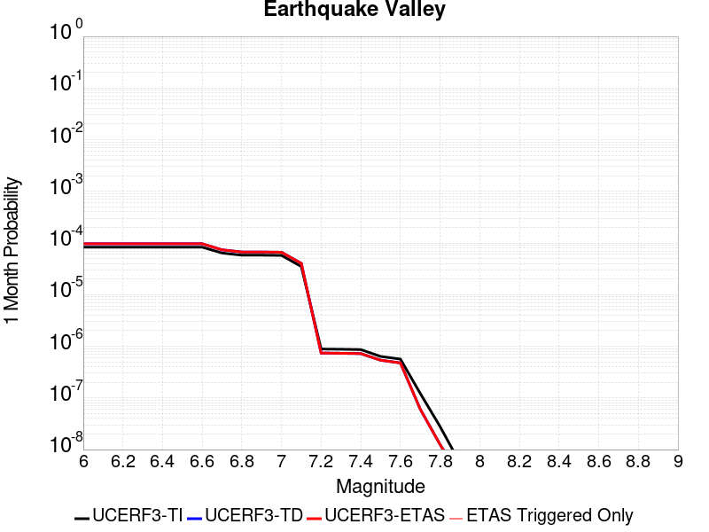 | 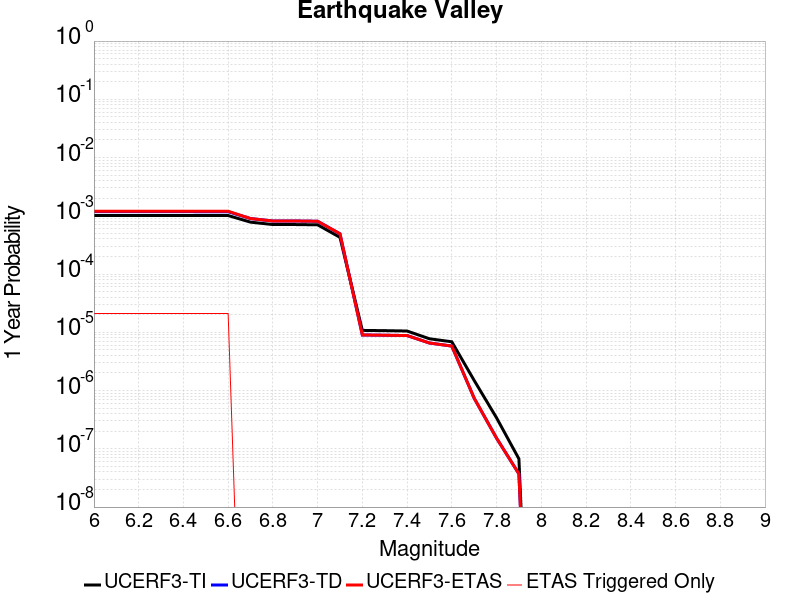 | 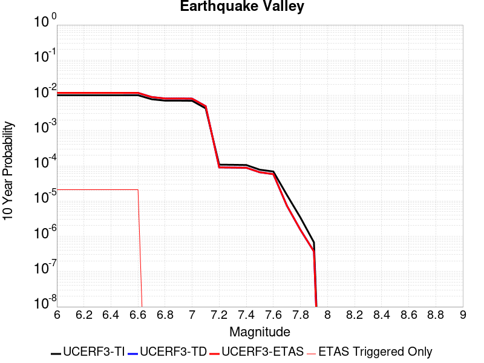 |

| Magnitude | 1 wk TI Prob | 1 wk TD Prob | 1 wk ETAS Prob | 1 wk ETAS/TD Gain | 1 wk ETAS Triggered Only | 1 mo TI Prob | 1 mo TD Prob | 1 mo ETAS Prob | 1 mo ETAS/TD Gain | 1 mo ETAS Triggered Only | 1 yr TI Prob | 1 yr TD Prob | 1 yr ETAS Prob | 1 yr ETAS/TD Gain | 1 yr ETAS Triggered Only | 10 yr TI Prob | 10 yr TD Prob | 10 yr ETAS Prob | 10 yr ETAS/TD Gain | 10 yr ETAS Triggered Only |
|-----|-----|-----|-----|-----|-----|-----|-----|-----|-----|-----|-----|-----|-----|-----|-----|-----|-----|-----|-----|-----|
| 6.0 | 1.9416384E-5 | 2.258411E-5 | 2.258411E-5 | 1.0 | 0.0 | 8.321042E-5 | 9.6786134E-5 | 9.6786134E-5 | 1.0 | 0.0 | 0.001012616 | 0.001177854 | 0.0011878422 | 1.0084801 | 1.0E-5 | 0.010080142 | 0.011727945 | 0.011737828 | 1.0008427 | 1.0E-5 |
| 6.1 | 1.9416384E-5 | 2.258411E-5 | 2.258411E-5 | 1.0 | 0.0 | 8.321042E-5 | 9.6786134E-5 | 9.6786134E-5 | 1.0 | 0.0 | 0.001012616 | 0.001177854 | 0.0011878422 | 1.0084801 | 1.0E-5 | 0.010080142 | 0.011727945 | 0.011737828 | 1.0008427 | 1.0E-5 |
| 6.2 | 1.9416384E-5 | 2.258411E-5 | 2.258411E-5 | 1.0 | 0.0 | 8.321042E-5 | 9.6786134E-5 | 9.6786134E-5 | 1.0 | 0.0 | 0.001012616 | 0.001177854 | 0.0011878422 | 1.0084801 | 1.0E-5 | 0.010080142 | 0.011727945 | 0.011737828 | 1.0008427 | 1.0E-5 |
| 6.3 | 1.9416384E-5 | 2.258411E-5 | 2.258411E-5 | 1.0 | 0.0 | 8.321042E-5 | 9.6786134E-5 | 9.6786134E-5 | 1.0 | 0.0 | 0.001012616 | 0.001177854 | 0.0011878422 | 1.0084801 | 1.0E-5 | 0.010080142 | 0.011727945 | 0.011737828 | 1.0008427 | 1.0E-5 |
| 6.4 | 1.9416384E-5 | 2.258411E-5 | 2.258411E-5 | 1.0 | 0.0 | 8.321042E-5 | 9.6786134E-5 | 9.6786134E-5 | 1.0 | 0.0 | 0.001012616 | 0.001177854 | 0.0011878422 | 1.0084801 | 1.0E-5 | 0.010080142 | 0.011727945 | 0.011737828 | 1.0008427 | 1.0E-5 |
| 6.5 | 1.9389157E-5 | 2.25527E-5 | 2.25527E-5 | 1.0 | 0.0 | 8.309374E-5 | 9.665152E-5 | 9.665152E-5 | 1.0 | 0.0 | 0.0010111968 | 0.001176217 | 0.0011862052 | 1.0084919 | 1.0E-5 | 0.010066078 | 0.011711747 | 0.01172163 | 1.0008439 | 1.0E-5 |
| 6.6 | 1.9389157E-5 | 2.25527E-5 | 2.25527E-5 | 1.0 | 0.0 | 8.309374E-5 | 9.665152E-5 | 9.665152E-5 | 1.0 | 0.0 | 0.0010111968 | 0.001176217 | 0.0011862052 | 1.0084919 | 1.0E-5 | 0.010066078 | 0.011711747 | 0.01172163 | 1.0008439 | 1.0E-5 |
| 6.7 | 1.4925434E-5 | 1.720822E-5 | 1.720822E-5 | 1.0 | 0.0 | 6.396457E-5 | 7.374791E-5 | 7.374791E-5 | 1.0 | 0.0 | 7.7849044E-4 | 8.97596E-4 | 8.97596E-4 | 1.0 | 0.0 | 0.007757689 | 0.008948081 | 0.008948081 | 1.0 | 0.0 |
| 6.8 | 1.3570335E-5 | 1.5616837E-5 | 1.5616837E-5 | 1.0 | 0.0 | 5.8157282E-5 | 6.692804E-5 | 6.692804E-5 | 1.0 | 0.0 | 7.0783484E-4 | 8.146264E-4 | 8.146264E-4 | 1.0 | 0.0 | 0.0070558446 | 0.008124473 | 0.008124473 | 1.0 | 0.0 |
| 6.9 | 1.3570335E-5 | 1.5616837E-5 | 1.5616837E-5 | 1.0 | 0.0 | 5.8157282E-5 | 6.692804E-5 | 6.692804E-5 | 1.0 | 0.0 | 7.0783484E-4 | 8.146264E-4 | 8.146264E-4 | 1.0 | 0.0 | 0.0070558446 | 0.008124473 | 0.008124473 | 1.0 | 0.0 |
| 7.0 | 1.3433392E-5 | 1.546038E-5 | 1.546038E-5 | 1.0 | 0.0 | 5.757041E-5 | 6.6257555E-5 | 6.6257555E-5 | 1.0 | 0.0 | 7.0069433E-4 | 8.064692E-4 | 8.064692E-4 | 1.0 | 0.0 | 0.006984891 | 0.008043493 | 0.008043493 | 1.0 | 0.0 |
| 7.1 | 8.181609E-6 | 9.4168445E-6 | 9.4168445E-6 | 1.0 | 0.0 | 3.5063567E-5 | 4.0357656E-5 | 4.0357656E-5 | 1.0 | 0.0 | 4.268153E-4 | 4.913108E-4 | 4.913108E-4 | 1.0 | 0.0 | 0.0042599645 | 0.004908822 | 0.004908822 | 1.0 | 0.0 |
| 7.2 | 2.0663983E-7 | 1.7262263E-7 | 1.7262263E-7 | 1.0 | 0.0 | 8.855989E-7 | 7.398111E-7 | 7.398111E-7 | 1.0 | 0.0 | 1.0782113E-5 | 9.007167E-6 | 9.007167E-6 | 1.0 | 0.0 | 1.07815904E-4 | 9.006837E-5 | 9.006837E-5 | 1.0 | 0.0 |
| 7.3 | 2.0462376E-7 | 1.7077758E-7 | 1.7077758E-7 | 1.0 | 0.0 | 8.7695867E-7 | 7.319037E-7 | 7.319037E-7 | 1.0 | 0.0 | 1.0676919E-5 | 8.910895E-6 | 8.910895E-6 | 1.0 | 0.0 | 1.0676406E-4 | 8.9105735E-5 | 8.9105735E-5 | 1.0 | 0.0 |
| 7.4 | 2.0171088E-7 | 1.6860244E-7 | 1.6860244E-7 | 1.0 | 0.0 | 8.644749E-7 | 7.2258166E-7 | 7.2258166E-7 | 1.0 | 0.0 | 1.0524931E-5 | 8.7974E-6 | 8.7974E-6 | 1.0 | 0.0 | 1.05244326E-4 | 8.7970875E-5 | 8.7970875E-5 | 1.0 | 0.0 |
| 7.5 | 1.4847944E-7 | 1.2558573E-7 | 1.2558573E-7 | 1.0 | 0.0 | 6.363403E-7 | 5.382244E-7 | 5.382244E-7 | 1.0 | 0.0 | 7.747416E-6 | 6.5528648E-6 | 6.5528648E-6 | 1.0 | 0.0 | 7.747146E-5 | 6.552693E-5 | 6.552693E-5 | 1.0 | 0.0 |
| 7.6 | 1.3185847E-7 | 1.1122516E-7 | 1.1122516E-7 | 1.0 | 0.0 | 5.6510765E-7 | 4.766792E-7 | 4.766792E-7 | 1.0 | 0.0 | 6.8801637E-6 | 5.803556E-6 | 5.803556E-6 | 1.0 | 0.0 | 6.8799505E-5 | 5.8034257E-5 | 5.8034257E-5 | 1.0 | 0.0 |
| 7.7 | 2.8609954E-8 | 1.4170218E-8 | 1.4170218E-8 | 1.0 | 0.0 | 1.2261408E-7 | 6.0729505E-8 | 6.0729505E-8 | 1.0 | 0.0 | 1.4928254E-6 | 7.393815E-7 | 7.393815E-7 | 1.0 | 0.0 | 1.4928154E-5 | 7.393796E-6 | 7.393796E-6 | 1.0 | 0.0 |
| 7.8 | 6.527266E-9 | 2.9232412E-9 | 2.9232412E-9 | 1.0 | 0.0 | 2.7973995E-8 | 1.2528178E-8 | 1.2528178E-8 | 1.0 | 0.0 | 3.4058334E-7 | 1.5253055E-7 | 1.5253055E-7 | 1.0 | 0.0 | 3.4058282E-6 | 1.5253047E-6 | 1.5253047E-6 | 1.0 | 0.0 |
| 7.9 | 1.2898267E-9 | 7.127704E-10 | 7.127704E-10 | 1.0 | 0.0 | 5.527829E-9 | 3.0547302E-9 | 3.0547302E-9 | 1.0 | 0.0 | 6.7301315E-8 | 3.719134E-8 | 3.719134E-8 | 1.0 | 0.0 | 6.7301295E-7 | 3.7191342E-7 | 3.7191342E-7 | 1.0 | 0.0 |

## Anaheim
*[(top)](#table-of-contents)*

| 1 Week | 1 Month | 1 Year | 10 Year |
|-----|-----|-----|-----|
| 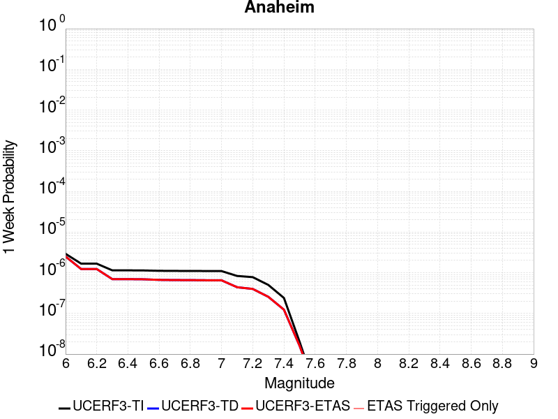 | 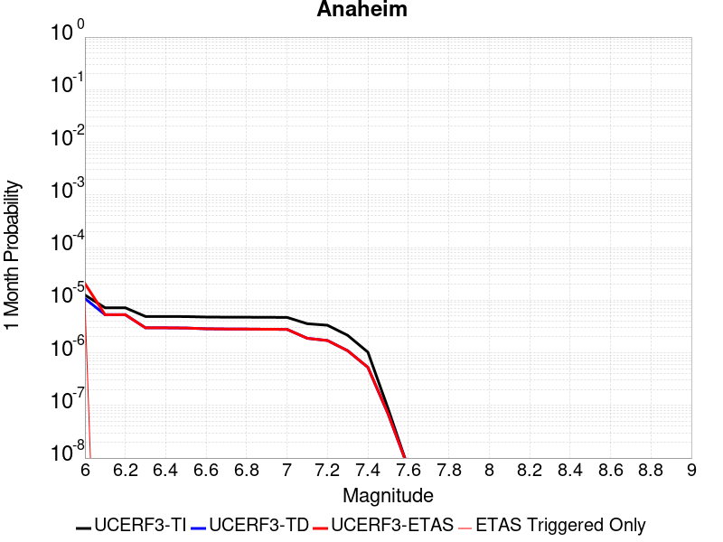 | 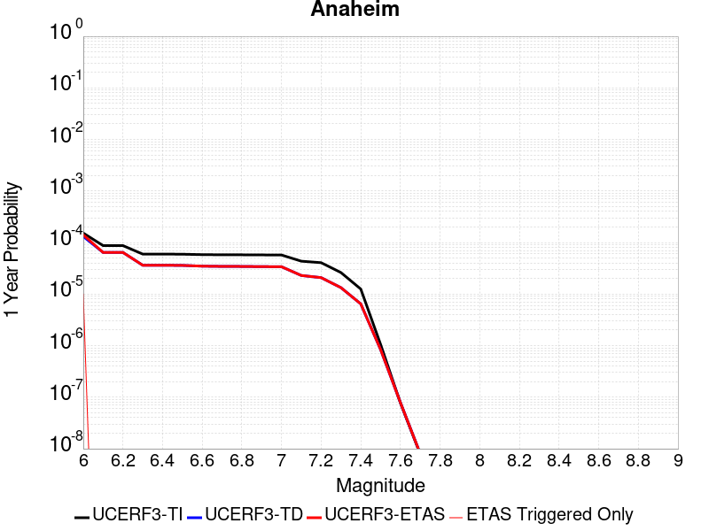 | 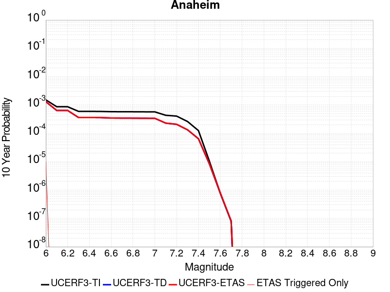 |

| Magnitude | 1 wk TI Prob | 1 wk TD Prob | 1 wk ETAS Prob | 1 wk ETAS/TD Gain | 1 wk ETAS Triggered Only | 1 mo TI Prob | 1 mo TD Prob | 1 mo ETAS Prob | 1 mo ETAS/TD Gain | 1 mo ETAS Triggered Only | 1 yr TI Prob | 1 yr TD Prob | 1 yr ETAS Prob | 1 yr ETAS/TD Gain | 1 yr ETAS Triggered Only | 10 yr TI Prob | 10 yr TD Prob | 10 yr ETAS Prob | 10 yr ETAS/TD Gain | 10 yr ETAS Triggered Only |
|-----|-----|-----|-----|-----|-----|-----|-----|-----|-----|-----|-----|-----|-----|-----|-----|-----|-----|-----|-----|-----|
| 6.0 | 2.9254998E-6 | 2.5122672E-6 | 2.5122672E-6 | 1.0 | 0.0 | 1.25377965E-5 | 1.0766828E-5 | 2.076672E-5 | 1.9287686 | 1.0E-5 | 1.5263697E-4 | 1.310806E-4 | 1.4107929E-4 | 1.0762789 | 1.0E-5 | 0.0015253217 | 0.001310263 | 0.0013202499 | 1.007622 | 1.0E-5 |
| 6.1 | 1.6729715E-6 | 1.2337158E-6 | 1.2337158E-6 | 1.0 | 0.0 | 7.1698582E-6 | 5.287345E-6 | 5.287345E-6 | 1.0 | 0.0 | 8.7289525E-5 | 6.437194E-5 | 6.437194E-5 | 1.0 | 0.0 | 8.7255245E-4 | 6.435739E-4 | 6.435739E-4 | 1.0 | 0.0 |
| 6.2 | 1.6729715E-6 | 1.2337158E-6 | 1.2337158E-6 | 1.0 | 0.0 | 7.1698582E-6 | 5.287345E-6 | 5.287345E-6 | 1.0 | 0.0 | 8.7289525E-5 | 6.437194E-5 | 6.437194E-5 | 1.0 | 0.0 | 8.7255245E-4 | 6.435739E-4 | 6.435739E-4 | 1.0 | 0.0 |
| 6.3 | 1.1444064E-6 | 6.9594773E-7 | 6.9594773E-7 | 1.0 | 0.0 | 4.9045893E-6 | 2.9826301E-6 | 2.9826301E-6 | 1.0 | 0.0 | 5.971174E-5 | 3.6312973E-5 | 3.6312973E-5 | 1.0 | 0.0 | 5.96957E-4 | 3.6307587E-4 | 3.6307587E-4 | 1.0 | 0.0 |
| 6.4 | 1.1444064E-6 | 6.9594773E-7 | 6.9594773E-7 | 1.0 | 0.0 | 4.9045893E-6 | 2.9826301E-6 | 2.9826301E-6 | 1.0 | 0.0 | 5.971174E-5 | 3.6312973E-5 | 3.6312973E-5 | 1.0 | 0.0 | 5.96957E-4 | 3.6307587E-4 | 3.6307587E-4 | 1.0 | 0.0 |
| 6.5 | 1.1385318E-6 | 6.9001607E-7 | 6.9001607E-7 | 1.0 | 0.0 | 4.879413E-6 | 2.9572088E-6 | 2.9572088E-6 | 1.0 | 0.0 | 5.9405233E-5 | 3.600348E-5 | 3.600348E-5 | 1.0 | 0.0 | 5.938936E-4 | 3.5998193E-4 | 3.5998193E-4 | 1.0 | 0.0 |
| 6.6 | 1.1165511E-6 | 6.678032E-7 | 6.678032E-7 | 1.0 | 0.0 | 4.78521E-6 | 2.862011E-6 | 2.862011E-6 | 1.0 | 0.0 | 5.8258374E-5 | 3.484448E-5 | 3.484448E-5 | 1.0 | 0.0 | 5.8243104E-4 | 3.483956E-4 | 3.483956E-4 | 1.0 | 0.0 |
| 6.7 | 1.1098243E-6 | 6.610226E-7 | 6.610226E-7 | 1.0 | 0.0 | 4.7563813E-6 | 2.8329514E-6 | 2.8329514E-6 | 1.0 | 0.0 | 5.7907404E-5 | 3.449069E-5 | 3.449069E-5 | 1.0 | 0.0 | 5.7892315E-4 | 3.4485882E-4 | 3.4485882E-4 | 1.0 | 0.0 |
| 6.8 | 1.1077587E-6 | 6.5894295E-7 | 6.5894295E-7 | 1.0 | 0.0 | 4.7475287E-6 | 2.8240383E-6 | 2.8240383E-6 | 1.0 | 0.0 | 5.779963E-5 | 3.438218E-5 | 3.438218E-5 | 1.0 | 0.0 | 5.77846E-4 | 3.4377404E-4 | 3.4377404E-4 | 1.0 | 0.0 |
| 6.9 | 1.1024468E-6 | 6.5360064E-7 | 6.5360064E-7 | 1.0 | 0.0 | 4.7247636E-6 | 2.801143E-6 | 2.801143E-6 | 1.0 | 0.0 | 5.752248E-5 | 3.4103436E-5 | 3.4103436E-5 | 1.0 | 0.0 | 5.750759E-4 | 3.4098746E-4 | 3.4098746E-4 | 1.0 | 0.0 |
| 7.0 | 1.0993066E-6 | 6.5101136E-7 | 6.5101136E-7 | 1.0 | 0.0 | 4.7113053E-6 | 2.790046E-6 | 2.790046E-6 | 1.0 | 0.0 | 5.7358633E-5 | 3.3968336E-5 | 3.3968336E-5 | 1.0 | 0.0 | 5.734383E-4 | 3.3963687E-4 | 3.3963687E-4 | 1.0 | 0.0 |
| 7.1 | 8.334877E-7 | 4.4046894E-7 | 4.4046894E-7 | 1.0 | 0.0 | 3.5720855E-6 | 1.8877229E-6 | 1.8877229E-6 | 1.0 | 0.0 | 4.348927E-5 | 2.2982806E-5 | 2.2982806E-5 | 1.0 | 0.0 | 4.3480762E-4 | 2.2980652E-4 | 2.2980652E-4 | 1.0 | 0.0 |
| 7.2 | 7.794411E-7 | 3.997425E-7 | 3.997425E-7 | 1.0 | 0.0 | 3.3404576E-6 | 1.7131812E-6 | 1.7131812E-6 | 1.0 | 0.0 | 4.0669314E-5 | 2.0857802E-5 | 2.0857802E-5 | 1.0 | 0.0 | 4.066187E-4 | 2.085605E-4 | 2.085605E-4 | 1.0 | 0.0 |
| 7.3 | 5.01704E-7 | 2.5571964E-7 | 2.5571964E-7 | 1.0 | 0.0 | 2.150158E-6 | 1.095941E-6 | 1.095941E-6 | 1.0 | 0.0 | 2.617786E-5 | 1.3343012E-5 | 1.3343012E-5 | 1.0 | 0.0 | 2.6174777E-4 | 1.3342335E-4 | 1.3342335E-4 | 1.0 | 0.0 |
| 7.4 | 2.4008182E-7 | 1.2367195E-7 | 1.2367195E-7 | 1.0 | 0.0 | 1.0289217E-6 | 5.300226E-7 | 5.300226E-7 | 1.0 | 0.0 | 1.252705E-5 | 6.4530136E-6 | 6.4530136E-6 | 1.0 | 0.0 | 1.2526344E-4 | 6.452902E-5 | 6.452902E-5 | 1.0 | 0.0 |
| 7.5 | 2.0263876E-8 | 1.6121012E-8 | 1.6121012E-8 | 1.0 | 0.0 | 8.684518E-8 | 6.909005E-8 | 6.909005E-8 | 1.0 | 0.0 | 1.0573395E-6 | 8.4117113E-7 | 8.4117113E-7 | 1.0 | 0.0 | 1.0573345E-5 | 8.411688E-6 | 8.411688E-6 | 1.0 | 0.0 |
| 7.6 | 1.4871431E-9 | 1.508418E-9 | 1.508418E-9 | 1.0 | 0.0 | 6.37347E-9 | 6.4646484E-9 | 6.4646484E-9 | 1.0 | 0.0 | 7.7596994E-8 | 7.870709E-8 | 7.870709E-8 | 1.0 | 0.0 | 7.759697E-7 | 7.8707063E-7 | 7.8707063E-7 | 1.0 | 0.0 |
| 7.7 | 1.5093293E-10 | 1.5333512E-10 | 1.5333512E-10 | 1.0 | 0.0 | 6.4685546E-10 | 6.571509E-10 | 6.571509E-10 | 1.0 | 0.0 | 7.875465E-9 | 8.0008125E-9 | 8.0008125E-9 | 1.0 | 0.0 | 7.8754645E-8 | 8.000812E-8 | 8.000812E-8 | 1.0 | 0.0 |

## San Gorgonio Pass
*[(top)](#table-of-contents)*

| 1 Week | 1 Month | 1 Year | 10 Year |
|-----|-----|-----|-----|
|  |  | 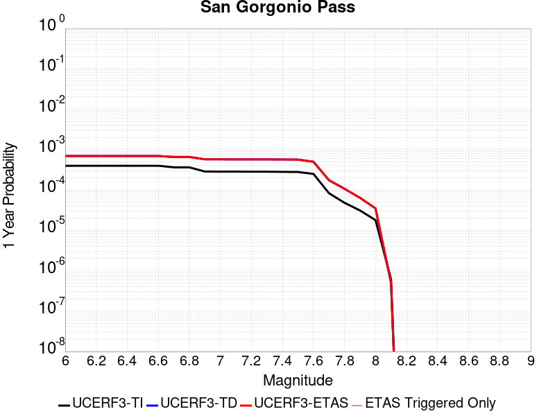 |  |

| Magnitude | 1 wk TI Prob | 1 wk TD Prob | 1 wk ETAS Prob | 1 wk ETAS/TD Gain | 1 wk ETAS Triggered Only | 1 mo TI Prob | 1 mo TD Prob | 1 mo ETAS Prob | 1 mo ETAS/TD Gain | 1 mo ETAS Triggered Only | 1 yr TI Prob | 1 yr TD Prob | 1 yr ETAS Prob | 1 yr ETAS/TD Gain | 1 yr ETAS Triggered Only | 10 yr TI Prob | 10 yr TD Prob | 10 yr ETAS Prob | 10 yr ETAS/TD Gain | 10 yr ETAS Triggered Only |
|-----|-----|-----|-----|-----|-----|-----|-----|-----|-----|-----|-----|-----|-----|-----|-----|-----|-----|-----|-----|-----|
| 6.0 | 7.644328E-6 | 1.331474E-5 | 1.331474E-5 | 1.0 | 0.0 | 3.2760996E-5 | 5.706197E-5 | 5.706197E-5 | 1.0 | 0.0 | 3.987921E-4 | 6.945166E-4 | 6.945166E-4 | 1.0 | 0.0 | 0.003980772 | 0.006930024 | 0.0069399546 | 1.001433 | 1.0E-5 |
| 6.1 | 7.644328E-6 | 1.331474E-5 | 1.331474E-5 | 1.0 | 0.0 | 3.2760996E-5 | 5.706197E-5 | 5.706197E-5 | 1.0 | 0.0 | 3.987921E-4 | 6.945166E-4 | 6.945166E-4 | 1.0 | 0.0 | 0.003980772 | 0.006930024 | 0.0069399546 | 1.001433 | 1.0E-5 |
| 6.2 | 7.644328E-6 | 1.331474E-5 | 1.331474E-5 | 1.0 | 0.0 | 3.2760996E-5 | 5.706197E-5 | 5.706197E-5 | 1.0 | 0.0 | 3.987921E-4 | 6.945166E-4 | 6.945166E-4 | 1.0 | 0.0 | 0.003980772 | 0.006930024 | 0.0069399546 | 1.001433 | 1.0E-5 |
| 6.3 | 7.644328E-6 | 1.331474E-5 | 1.331474E-5 | 1.0 | 0.0 | 3.2760996E-5 | 5.706197E-5 | 5.706197E-5 | 1.0 | 0.0 | 3.987921E-4 | 6.945166E-4 | 6.945166E-4 | 1.0 | 0.0 | 0.003980772 | 0.006930024 | 0.0069399546 | 1.001433 | 1.0E-5 |
| 6.4 | 7.644328E-6 | 1.331474E-5 | 1.331474E-5 | 1.0 | 0.0 | 3.2760996E-5 | 5.706197E-5 | 5.706197E-5 | 1.0 | 0.0 | 3.987921E-4 | 6.945166E-4 | 6.945166E-4 | 1.0 | 0.0 | 0.003980772 | 0.006930024 | 0.0069399546 | 1.001433 | 1.0E-5 |
| 6.5 | 7.644328E-6 | 1.331474E-5 | 1.331474E-5 | 1.0 | 0.0 | 3.2760996E-5 | 5.706197E-5 | 5.706197E-5 | 1.0 | 0.0 | 3.987921E-4 | 6.945166E-4 | 6.945166E-4 | 1.0 | 0.0 | 0.003980772 | 0.006930024 | 0.0069399546 | 1.001433 | 1.0E-5 |
| 6.6 | 7.644328E-6 | 1.331474E-5 | 1.331474E-5 | 1.0 | 0.0 | 3.2760996E-5 | 5.706197E-5 | 5.706197E-5 | 1.0 | 0.0 | 3.987921E-4 | 6.945166E-4 | 6.945166E-4 | 1.0 | 0.0 | 0.003980772 | 0.006930024 | 0.0069399546 | 1.001433 | 1.0E-5 |
| 6.7 | 6.987586E-6 | 1.2619013E-5 | 1.2619013E-5 | 1.0 | 0.0 | 2.9946454E-5 | 5.408041E-5 | 5.408041E-5 | 1.0 | 0.0 | 3.645371E-4 | 6.582382E-4 | 6.582382E-4 | 1.0 | 0.0 | 0.0036393967 | 0.0065694 | 0.0065793344 | 1.0015122 | 1.0E-5 |
| 6.8 | 6.987586E-6 | 1.2619013E-5 | 1.2619013E-5 | 1.0 | 0.0 | 2.9946454E-5 | 5.408041E-5 | 5.408041E-5 | 1.0 | 0.0 | 3.645371E-4 | 6.582382E-4 | 6.582382E-4 | 1.0 | 0.0 | 0.0036393967 | 0.0065694 | 0.0065793344 | 1.0015122 | 1.0E-5 |
| 6.9 | 5.504702E-6 | 1.1049877E-5 | 1.1049877E-5 | 1.0 | 0.0 | 2.3591367E-5 | 4.7355785E-5 | 4.7355785E-5 | 1.0 | 0.0 | 2.8718702E-4 | 5.764092E-4 | 5.764092E-4 | 1.0 | 0.0 | 0.0028681618 | 0.0057553523 | 0.0057652947 | 1.0017275 | 1.0E-5 |
| 7.0 | 5.4825764E-6 | 1.1026218E-5 | 1.1026218E-5 | 1.0 | 0.0 | 2.3496545E-5 | 4.725439E-5 | 4.725439E-5 | 1.0 | 0.0 | 2.8603288E-4 | 5.751754E-4 | 5.751754E-4 | 1.0 | 0.0 | 0.00285665 | 0.0057430784 | 0.0057530208 | 1.0017313 | 1.0E-5 |
| 7.1 | 5.4692787E-6 | 1.1011928E-5 | 1.1011928E-5 | 1.0 | 0.0 | 2.3439556E-5 | 4.719315E-5 | 4.719315E-5 | 1.0 | 0.0 | 2.8533922E-4 | 5.744302E-4 | 5.744302E-4 | 1.0 | 0.0 | 0.0028497311 | 0.0057356646 | 0.0057456074 | 1.0017334 | 1.0E-5 |
| 7.2 | 5.453661E-6 | 1.0994954E-5 | 1.0994954E-5 | 1.0 | 0.0 | 2.3372622E-5 | 4.712041E-5 | 4.712041E-5 | 1.0 | 0.0 | 2.8452452E-4 | 5.7354505E-4 | 5.7354505E-4 | 1.0 | 0.0 | 0.002841605 | 0.005726859 | 0.0057368013 | 1.0017362 | 1.0E-5 |
| 7.3 | 5.4422303E-6 | 1.09818775E-5 | 1.09818775E-5 | 1.0 | 0.0 | 2.3323635E-5 | 4.7064368E-5 | 4.7064368E-5 | 1.0 | 0.0 | 2.8392827E-4 | 5.728631E-4 | 5.728631E-4 | 1.0 | 0.0 | 0.0028356577 | 0.0057200743 | 0.005730017 | 1.0017382 | 1.0E-5 |
| 7.4 | 5.398595E-6 | 1.0929241E-5 | 1.0929241E-5 | 1.0 | 0.0 | 2.313663E-5 | 4.6838795E-5 | 4.6838795E-5 | 1.0 | 0.0 | 2.8165206E-4 | 5.701182E-4 | 5.701182E-4 | 1.0 | 0.0 | 0.0028129534 | 0.0056927665 | 0.0057027093 | 1.0017467 | 1.0E-5 |
| 7.5 | 5.3578788E-6 | 1.0855785E-5 | 1.0855785E-5 | 1.0 | 0.0 | 2.2962136E-5 | 4.6523994E-5 | 4.6523994E-5 | 1.0 | 0.0 | 2.7952815E-4 | 5.662875E-4 | 5.662875E-4 | 1.0 | 0.0 | 0.002791768 | 0.0056546913 | 0.005664635 | 1.0017585 | 1.0E-5 |
| 7.6 | 4.8091474E-6 | 9.604131E-6 | 9.604131E-6 | 1.0 | 0.0 | 2.0610469E-5 | 4.1159943E-5 | 4.1159943E-5 | 1.0 | 0.0 | 2.5090357E-4 | 5.010119E-4 | 5.010119E-4 | 1.0 | 0.0 | 0.0025062046 | 0.0050054584 | 0.005015408 | 1.0019878 | 1.0E-5 |
| 7.7 | 1.5991155E-6 | 3.353035E-6 | 3.353035E-6 | 1.0 | 0.0 | 6.853334E-6 | 1.4370073E-5 | 1.4370073E-5 | 1.0 | 0.0 | 8.343615E-5 | 1.7494184E-4 | 1.7494184E-4 | 1.0 | 0.0 | 8.340483E-4 | 0.0017535852 | 0.0017535852 | 1.0 | 0.0 |
| 7.8 | 9.258398E-7 | 2.0581049E-6 | 2.0581049E-6 | 1.0 | 0.0 | 3.967879E-6 | 8.82042E-6 | 8.82042E-6 | 1.0 | 0.0 | 4.8307855E-5 | 1.0738334E-4 | 1.0738334E-4 | 1.0 | 0.0 | 4.8297356E-4 | 0.0010788103 | 0.0010788103 | 1.0 | 0.0 |
| 7.9 | 5.975575E-7 | 1.2292295E-6 | 1.2292295E-6 | 1.0 | 0.0 | 2.5609581E-6 | 5.2681157E-6 | 5.2681157E-6 | 1.0 | 0.0 | 3.117922E-5 | 6.413743E-5 | 6.413743E-5 | 1.0 | 0.0 | 3.1174847E-4 | 6.464778E-4 | 6.464778E-4 | 1.0 | 0.0 |
| 8.0 | 3.4413725E-7 | 6.714992E-7 | 6.714992E-7 | 1.0 | 0.0 | 1.4748731E-6 | 2.8778506E-6 | 2.8778506E-6 | 1.0 | 0.0 | 1.7956432E-5 | 3.5037272E-5 | 3.5037272E-5 | 1.0 | 0.0 | 1.7954981E-4 | 3.5392298E-4 | 3.5392298E-4 | 1.0 | 0.0 |
| 8.1 | 1.1787731E-8 | 9.6332045E-9 | 9.6332045E-9 | 1.0 | 0.0 | 5.0518846E-8 | 4.1285162E-8 | 4.1285162E-8 | 1.0 | 0.0 | 6.1506677E-7 | 5.0264674E-7 | 5.0264674E-7 | 1.0 | 0.0 | 6.1506507E-6 | 5.2417968E-6 | 5.2417968E-6 | 1.0 | 0.0 |

## Hunting Creek - Bartlett Springs connector 2011
*[(top)](#table-of-contents)*

| 1 Week | 1 Month | 1 Year | 10 Year |
|-----|-----|-----|-----|
|  |  |  |  |

| Magnitude | 1 wk TI Prob | 1 wk TD Prob | 1 wk ETAS Prob | 1 wk ETAS/TD Gain | 1 wk ETAS Triggered Only | 1 mo TI Prob | 1 mo TD Prob | 1 mo ETAS Prob | 1 mo ETAS/TD Gain | 1 mo ETAS Triggered Only | 1 yr TI Prob | 1 yr TD Prob | 1 yr ETAS Prob | 1 yr ETAS/TD Gain | 1 yr ETAS Triggered Only | 10 yr TI Prob | 10 yr TD Prob | 10 yr ETAS Prob | 10 yr ETAS/TD Gain | 10 yr ETAS Triggered Only |
|-----|-----|-----|-----|-----|-----|-----|-----|-----|-----|-----|-----|-----|-----|-----|-----|-----|-----|-----|-----|-----|
| 6.0 | 4.940016E-5 | 6.7870766E-5 | 6.7870766E-5 | 1.0 | 0.0 | 2.1169778E-4 | 2.9084194E-4 | 2.9084194E-4 | 1.0 | 0.0 | 0.002574374 | 0.0035350819 | 0.0035350819 | 1.0 | 0.0 | 0.025447546 | 0.03477475 | 0.034784403 | 1.0002775 | 1.0E-5 |
| 6.1 | 4.940016E-5 | 6.7870766E-5 | 6.7870766E-5 | 1.0 | 0.0 | 2.1169778E-4 | 2.9084194E-4 | 2.9084194E-4 | 1.0 | 0.0 | 0.002574374 | 0.0035350819 | 0.0035350819 | 1.0 | 0.0 | 0.025447546 | 0.03477475 | 0.034784403 | 1.0002775 | 1.0E-5 |
| 6.2 | 4.472471E-5 | 6.100572E-5 | 6.100572E-5 | 1.0 | 0.0 | 1.9166325E-4 | 2.6142647E-4 | 2.6142647E-4 | 1.0 | 0.0 | 0.0023310026 | 0.0031781218 | 0.0031781218 | 1.0 | 0.0 | 0.02306703 | 0.031317808 | 0.031327493 | 1.0003093 | 1.0E-5 |
| 6.3 | 4.472471E-5 | 6.100572E-5 | 6.100572E-5 | 1.0 | 0.0 | 1.9166325E-4 | 2.6142647E-4 | 2.6142647E-4 | 1.0 | 0.0 | 0.0023310026 | 0.0031781218 | 0.0031781218 | 1.0 | 0.0 | 0.02306703 | 0.031317808 | 0.031327493 | 1.0003093 | 1.0E-5 |
| 6.4 | 4.0001003E-5 | 5.410516E-5 | 5.410516E-5 | 1.0 | 0.0 | 1.714216E-4 | 2.318579E-4 | 2.318579E-4 | 1.0 | 0.0 | 0.0020850603 | 0.0028191686 | 0.0028191686 | 1.0 | 0.0 | 0.02065605 | 0.027829198 | 0.027838921 | 1.0003493 | 1.0E-5 |
| 6.5 | 3.8033053E-5 | 5.126649E-5 | 5.126649E-5 | 1.0 | 0.0 | 1.6298861E-4 | 2.1969521E-4 | 2.1969521E-4 | 1.0 | 0.0 | 0.0019825802 | 0.0026714848 | 0.0026714848 | 1.0 | 0.0 | 0.019649856 | 0.026391273 | 0.02640101 | 1.000369 | 1.0E-5 |
| 6.6 | 3.653754E-5 | 4.912955E-5 | 4.912955E-5 | 1.0 | 0.0 | 1.5658008E-4 | 2.1053842E-4 | 2.1053842E-4 | 1.0 | 0.0 | 0.0019046954 | 0.0025602889 | 0.0025602889 | 1.0 | 0.0 | 0.018884527 | 0.025307199 | 0.025316946 | 1.0003852 | 1.0E-5 |
| 6.7 | 3.372024E-5 | 4.5140216E-5 | 4.5140216E-5 | 1.0 | 0.0 | 1.4450731E-4 | 1.9344388E-4 | 1.9344388E-4 | 1.0 | 0.0 | 0.0017579567 | 0.0023526535 | 0.0023526535 | 1.0 | 0.0 | 0.017441148 | 0.023278862 | 0.023288628 | 1.0004196 | 1.0E-5 |
| 6.8 | 2.9650024E-5 | 3.9411647E-5 | 3.9411647E-5 | 1.0 | 0.0 | 1.2706534E-4 | 1.6889606E-4 | 1.6889606E-4 | 1.0 | 0.0 | 0.0015459227 | 0.0020543607 | 0.0020543607 | 1.0 | 0.0 | 0.015352124 | 0.020351961 | 0.020361759 | 1.0004814 | 1.0E-5 |
| 6.9 | 2.860775E-5 | 3.7812886E-5 | 3.7812886E-5 | 1.0 | 0.0 | 1.2259888E-4 | 1.620452E-4 | 1.620452E-4 | 1.0 | 0.0 | 0.0014916194 | 0.0019711219 | 0.0019711219 | 1.0 | 0.0 | 0.014816469 | 0.019536555 | 0.01954636 | 1.0005019 | 1.0E-5 |
| 7.0 | 2.6696067E-5 | 3.5067544E-5 | 3.5067544E-5 | 1.0 | 0.0 | 1.144067E-4 | 1.5028086E-4 | 1.5028086E-4 | 1.0 | 0.0 | 0.0013920115 | 0.0018281427 | 0.0018281427 | 1.0 | 0.0 | 0.013833242 | 0.01813184 | 0.018141657 | 1.0005416 | 1.0E-5 |
| 7.1 | 2.456087E-5 | 3.2013326E-5 | 3.2013326E-5 | 1.0 | 0.0 | 1.0525662E-4 | 1.3719281E-4 | 1.3719281E-4 | 1.0 | 0.0 | 0.001280746 | 0.0016690517 | 0.0016690517 | 1.0 | 0.0 | 0.012733897 | 0.016566671 | 0.016566671 | 1.0 | 0.0 |
| 7.2 | 2.295761E-5 | 2.9823148E-5 | 2.9823148E-5 | 1.0 | 0.0 | 9.8386045E-5 | 1.2780727E-4 | 1.2780727E-4 | 1.0 | 0.0 | 0.0011971919 | 0.0015549522 | 0.0015549522 | 1.0 | 0.0 | 0.011907627 | 0.015442378 | 0.015442378 | 1.0 | 0.0 |
| 7.3 | 2.1256936E-5 | 2.7542124E-5 | 2.7542124E-5 | 1.0 | 0.0 | 9.109797E-5 | 1.1803238E-4 | 1.1803238E-4 | 1.0 | 0.0 | 0.0011085535 | 0.0014361058 | 0.0014361058 | 1.0 | 0.0 | 0.011030397 | 0.014269741 | 0.014269741 | 1.0 | 0.0 |
| 7.4 | 1.8784336E-5 | 2.430697E-5 | 2.430697E-5 | 1.0 | 0.0 | 8.050181E-5 | 1.0416861E-4 | 1.0416861E-4 | 1.0 | 0.0 | 9.796688E-4 | 0.0012675226 | 0.0012675226 | 1.0 | 0.0 | 0.009753612 | 0.012604194 | 0.012604194 | 1.0 | 0.0 |
| 7.5 | 1.7248298E-5 | 2.2269056E-5 | 2.2269056E-5 | 1.0 | 0.0 | 7.391918E-5 | 9.543537E-5 | 9.543537E-5 | 1.0 | 0.0 | 8.9959445E-4 | 0.0011613137 | 0.0011613137 | 1.0 | 0.0 | 0.008959615 | 0.011553645 | 0.011553645 | 1.0 | 0.0 |
| 7.6 | 1.0653709E-5 | 1.3722259E-5 | 1.3722259E-5 | 1.0 | 0.0 | 4.5657955E-5 | 5.880837E-5 | 5.880837E-5 | 1.0 | 0.0 | 5.557438E-4 | 7.157594E-4 | 7.157594E-4 | 1.0 | 0.0 | 0.0055435603 | 0.0071350415 | 0.0071350415 | 1.0 | 0.0 |
| 7.7 | 3.286316E-6 | 4.0903997E-6 | 4.0903997E-6 | 1.0 | 0.0 | 1.4084137E-5 | 1.7530168E-5 | 1.7530168E-5 | 1.0 | 0.0 | 1.7146087E-4 | 2.1340905E-4 | 2.1340905E-4 | 1.0 | 0.0 | 0.0017132863 | 0.0021320845 | 0.0021320845 | 1.0 | 0.0 |
| 7.8 | 5.1855085E-7 | 5.972095E-7 | 5.972095E-7 | 1.0 | 0.0 | 2.222359E-6 | 2.5594668E-6 | 2.5594668E-6 | 1.0 | 0.0 | 2.7056883E-5 | 3.1161075E-5 | 3.1161075E-5 | 1.0 | 0.0 | 2.705359E-4 | 3.1156064E-4 | 3.1156064E-4 | 1.0 | 0.0 |

## San Jacinto (Superstition Mtn)
*[(top)](#table-of-contents)*

| 1 Week | 1 Month | 1 Year | 10 Year |
|-----|-----|-----|-----|
| 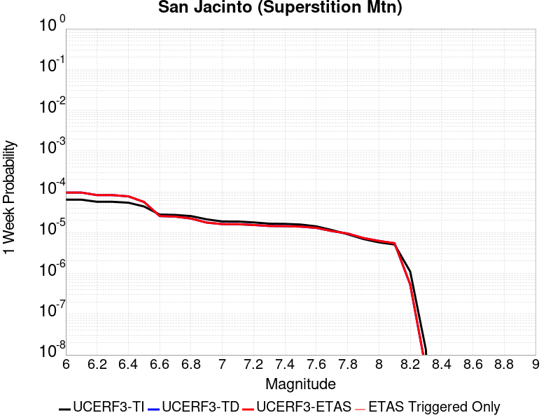 | 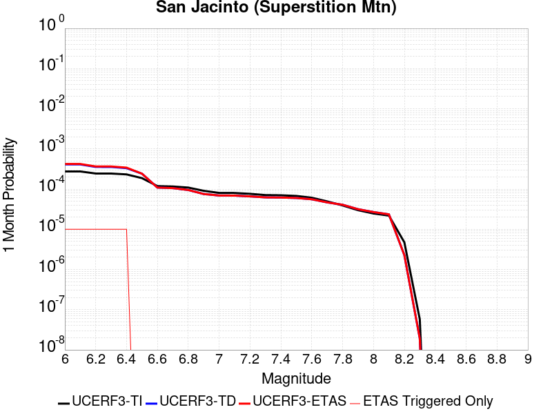 | 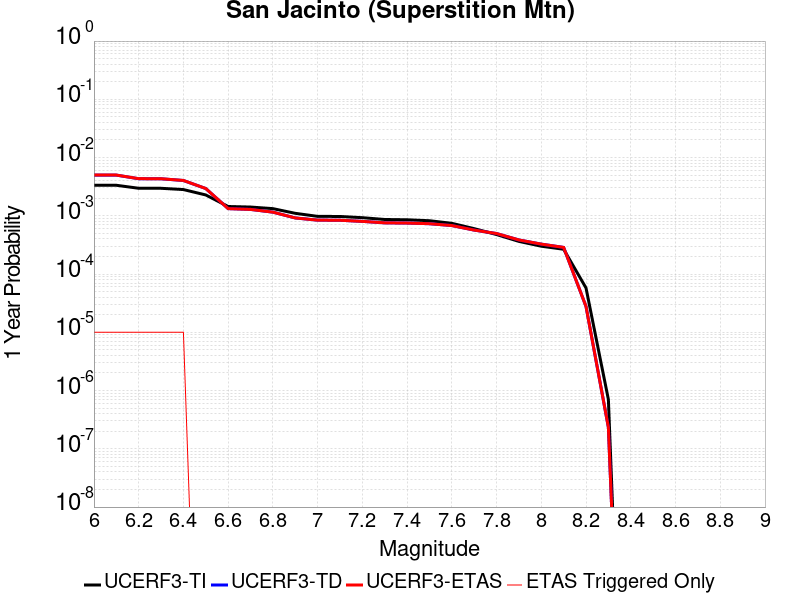 | 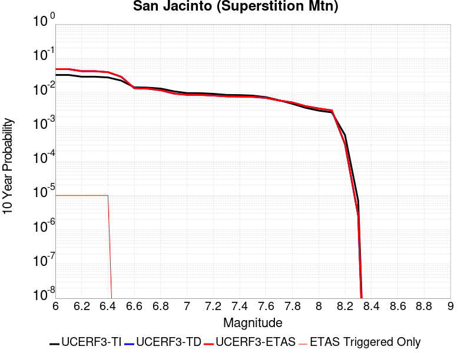 |

| Magnitude | 1 wk TI Prob | 1 wk TD Prob | 1 wk ETAS Prob | 1 wk ETAS/TD Gain | 1 wk ETAS Triggered Only | 1 mo TI Prob | 1 mo TD Prob | 1 mo ETAS Prob | 1 mo ETAS/TD Gain | 1 mo ETAS Triggered Only | 1 yr TI Prob | 1 yr TD Prob | 1 yr ETAS Prob | 1 yr ETAS/TD Gain | 1 yr ETAS Triggered Only | 10 yr TI Prob | 10 yr TD Prob | 10 yr ETAS Prob | 10 yr ETAS/TD Gain | 10 yr ETAS Triggered Only |
|-----|-----|-----|-----|-----|-----|-----|-----|-----|-----|-----|-----|-----|-----|-----|-----|-----|-----|-----|-----|-----|
| 6.0 | 6.4193904E-5 | 9.599558E-5 | 9.599558E-5 | 1.0 | 0.0 | 2.7508775E-4 | 4.1135435E-4 | 4.2135024E-4 | 1.0243 | 1.0E-5 | 0.0033440501 | 0.0049981694 | 0.005008119 | 1.0019907 | 1.0E-5 | 0.03294174 | 0.048820045 | 0.048829556 | 1.0001948 | 1.0E-5 |
| 6.1 | 6.4193904E-5 | 9.599558E-5 | 9.599558E-5 | 1.0 | 0.0 | 2.7508775E-4 | 4.1135435E-4 | 4.2135024E-4 | 1.0243 | 1.0E-5 | 0.0033440501 | 0.0049981694 | 0.005008119 | 1.0019907 | 1.0E-5 | 0.03294174 | 0.048820045 | 0.048829556 | 1.0001948 | 1.0E-5 |
| 6.2 | 5.7023593E-5 | 8.3144616E-5 | 8.3144616E-5 | 1.0 | 0.0 | 2.4436394E-4 | 3.5629462E-4 | 3.6629106E-4 | 1.0280566 | 1.0E-5 | 0.002971072 | 0.0043309047 | 0.0043408615 | 1.002299 | 1.0E-5 | 0.029316625 | 0.042502448 | 0.042512026 | 1.0002253 | 1.0E-5 |
| 6.3 | 5.6940098E-5 | 8.298998E-5 | 8.298998E-5 | 1.0 | 0.0 | 2.4400617E-4 | 3.5563204E-4 | 3.656285E-4 | 1.028109 | 1.0E-5 | 0.002966728 | 0.00432287 | 0.004332827 | 1.0023032 | 1.0E-5 | 0.029274331 | 0.04242582 | 0.042435396 | 1.0002257 | 1.0E-5 |
| 6.4 | 5.4171585E-5 | 7.748391E-5 | 7.748391E-5 | 1.0 | 0.0 | 2.3214328E-4 | 3.3204095E-4 | 3.4203762E-4 | 1.0301068 | 1.0E-5 | 0.0028226813 | 0.0040367534 | 0.004046713 | 1.0024673 | 1.0E-5 | 0.02787096 | 0.039715026 | 0.03972463 | 1.0002418 | 1.0E-5 |
| 6.5 | 4.375144E-5 | 5.6421442E-5 | 5.6421442E-5 | 1.0 | 0.0 | 1.874927E-4 | 2.417904E-4 | 2.417904E-4 | 1.0 | 0.0 | 0.0022803338 | 0.002941 | 0.002941 | 1.0 | 0.0 | 0.022570757 | 0.029235592 | 0.029235592 | 1.0 | 0.0 |
| 6.6 | 2.772192E-5 | 2.5488029E-5 | 2.5488029E-5 | 1.0 | 0.0 | 1.1880282E-4 | 1.0922994E-4 | 1.0922994E-4 | 1.0 | 0.0 | 0.0014454646 | 0.0013290826 | 0.0013290826 | 1.0 | 0.0 | 0.014360986 | 0.013540891 | 0.013540891 | 1.0 | 0.0 |
| 6.7 | 2.7124124E-5 | 2.4699055E-5 | 2.4699055E-5 | 1.0 | 0.0 | 1.1624106E-4 | 1.0584891E-4 | 1.0584891E-4 | 1.0 | 0.0 | 0.0014143161 | 0.0012879678 | 0.0012879678 | 1.0 | 0.0 | 0.014053487 | 0.013134248 | 0.013134248 | 1.0 | 0.0 |
| 6.8 | 2.5475807E-5 | 2.2164071E-5 | 2.2164071E-5 | 1.0 | 0.0 | 1.0917746E-4 | 9.498548E-5 | 9.498548E-5 | 1.0 | 0.0 | 0.001328425 | 0.0011558468 | 0.0011558468 | 1.0 | 0.0 | 0.0132051185 | 0.011821818 | 0.011821818 | 1.0 | 0.0 |
| 6.9 | 2.1162023E-5 | 1.762564E-5 | 1.762564E-5 | 1.0 | 0.0 | 9.069123E-5 | 7.553629E-5 | 7.553629E-5 | 1.0 | 0.0 | 0.0011036064 | 9.1927015E-4 | 9.1927015E-4 | 1.0 | 0.0 | 0.010981417 | 0.009446762 | 0.009446762 | 1.0 | 0.0 |
| 7.0 | 1.8754288E-5 | 1.616099E-5 | 1.616099E-5 | 1.0 | 0.0 | 8.037304E-5 | 6.9259564E-5 | 6.9259564E-5 | 1.0 | 0.0 | 9.781026E-4 | 8.429114E-4 | 8.429114E-4 | 1.0 | 0.0 | 0.009738087 | 0.008669995 | 0.008669995 | 1.0 | 0.0 |
| 7.1 | 1.8678527E-5 | 1.6086136E-5 | 1.6086136E-5 | 1.0 | 0.0 | 8.0048376E-5 | 6.8938774E-5 | 6.8938774E-5 | 1.0 | 0.0 | 9.7415317E-4 | 8.3900883E-4 | 8.3900883E-4 | 1.0 | 0.0 | 0.009698939 | 0.008631011 | 0.008631011 | 1.0 | 0.0 |
| 7.2 | 1.7804578E-5 | 1.5380709E-5 | 1.5380709E-5 | 1.0 | 0.0 | 7.6303106E-5 | 6.591567E-5 | 6.591567E-5 | 1.0 | 0.0 | 9.285943E-4 | 8.022301E-4 | 8.022301E-4 | 1.0 | 0.0 | 0.009247236 | 0.008262424 | 0.008262424 | 1.0 | 0.0 |
| 7.3 | 1.6583685E-5 | 1.4529837E-5 | 1.4529837E-5 | 1.0 | 0.0 | 7.1070994E-5 | 6.226926E-5 | 6.226926E-5 | 1.0 | 0.0 | 8.649459E-4 | 7.5786654E-4 | 7.5786654E-4 | 1.0 | 0.0 | 0.00861587 | 0.007817646 | 0.007817646 | 1.0 | 0.0 |
| 7.4 | 1.6387552E-5 | 1.4394727E-5 | 1.4394727E-5 | 1.0 | 0.0 | 7.023047E-5 | 6.169024E-5 | 6.169024E-5 | 1.0 | 0.0 | 8.5472054E-4 | 7.508219E-4 | 7.508219E-4 | 1.0 | 0.0 | 0.008514405 | 0.0077470187 | 0.0077470187 | 1.0 | 0.0 |
| 7.5 | 1.5790754E-5 | 1.40354305E-5 | 1.40354305E-5 | 1.0 | 0.0 | 6.767291E-5 | 6.015047E-5 | 6.015047E-5 | 1.0 | 0.0 | 8.236062E-4 | 7.320879E-4 | 7.320879E-4 | 1.0 | 0.0 | 0.008205604 | 0.007557581 | 0.007557581 | 1.0 | 0.0 |
| 7.6 | 1.4248672E-5 | 1.3054444E-5 | 1.3054444E-5 | 1.0 | 0.0 | 6.106431E-5 | 5.5946428E-5 | 5.5946428E-5 | 1.0 | 0.0 | 7.432043E-4 | 6.809366E-4 | 6.809366E-4 | 1.0 | 0.0 | 0.007407237 | 0.007040175 | 0.007040175 | 1.0 | 0.0 |
| 7.7 | 1.15449975E-5 | 1.0903222E-5 | 1.0903222E-5 | 1.0 | 0.0 | 4.947762E-5 | 4.672726E-5 | 4.672726E-5 | 1.0 | 0.0 | 6.022235E-4 | 5.6875666E-4 | 5.6875666E-4 | 1.0 | 0.0 | 0.006005941 | 0.0059102564 | 0.0059102564 | 1.0 | 0.0 |
| 7.8 | 9.1391985E-6 | 9.5139185E-6 | 9.5139185E-6 | 1.0 | 0.0 | 3.9167408E-5 | 4.0773306E-5 | 4.0773306E-5 | 1.0 | 0.0 | 4.767588E-4 | 4.963025E-4 | 4.963025E-4 | 1.0 | 0.0 | 0.0047573727 | 0.005176809 | 0.005176809 | 1.0 | 0.0 |
| 7.9 | 6.973017E-6 | 7.3817937E-6 | 7.3817937E-6 | 1.0 | 0.0 | 2.9884017E-5 | 3.163588E-5 | 3.163588E-5 | 1.0 | 0.0 | 3.6377716E-4 | 3.8509927E-4 | 3.8509927E-4 | 1.0 | 0.0 | 0.0036318225 | 0.004051976 | 0.004051976 | 1.0 | 0.0 |
| 8.0 | 5.7638235E-6 | 6.259641E-6 | 6.259641E-6 | 1.0 | 0.0 | 2.4701867E-5 | 2.682676E-5 | 2.682676E-5 | 1.0 | 0.0 | 3.0070372E-4 | 3.2656736E-4 | 3.2656736E-4 | 1.0 | 0.0 | 0.0030029714 | 0.0034535413 | 0.0034535413 | 1.0 | 0.0 |
| 8.1 | 5.1124434E-6 | 5.4953657E-6 | 5.4953657E-6 | 1.0 | 0.0 | 2.1910288E-5 | 2.3551356E-5 | 2.3551356E-5 | 1.0 | 0.0 | 2.6672508E-4 | 2.8670052E-4 | 2.8670052E-4 | 1.0 | 0.0 | 0.0026640517 | 0.0030403896 | 0.0030403896 | 1.0 | 0.0 |
| 8.2 | 1.1075938E-6 | 5.3348367E-7 | 5.3348367E-7 | 1.0 | 0.0 | 4.7468216E-6 | 2.2863567E-6 | 2.2863567E-6 | 1.0 | 0.0 | 5.779102E-5 | 2.7836059E-5 | 2.7836059E-5 | 1.0 | 0.0 | 5.777599E-4 | 3.133962E-4 | 3.133962E-4 | 1.0 | 0.0 |
| 8.3 | 1.3584393E-8 | 4.4718784E-9 | 4.4718784E-9 | 1.0 | 0.0 | 5.8218827E-8 | 1.9165192E-8 | 1.9165192E-8 | 1.0 | 0.0 | 7.0881396E-7 | 2.3333622E-7 | 2.3333622E-7 | 1.0 | 0.0 | 7.0881174E-6 | 2.6140672E-6 | 2.6140672E-6 | 1.0 | 0.0 |

## Shoreline
*[(top)](#table-of-contents)*

| 1 Week | 1 Month | 1 Year | 10 Year |
|-----|-----|-----|-----|
|  |  |  | 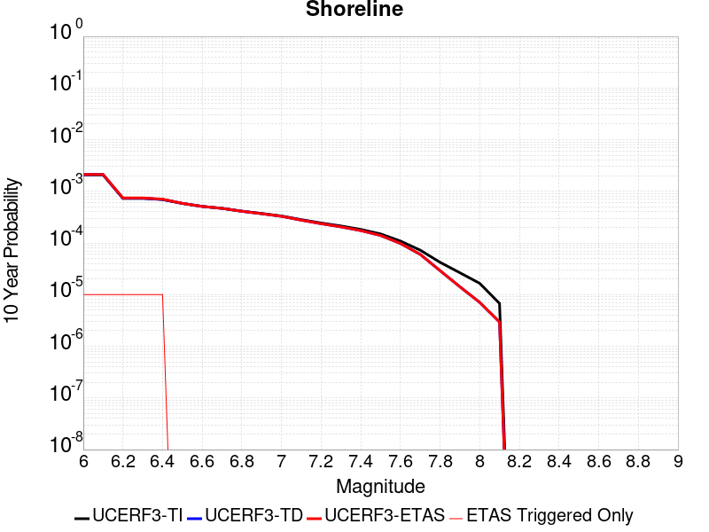 |

| Magnitude | 1 wk TI Prob | 1 wk TD Prob | 1 wk ETAS Prob | 1 wk ETAS/TD Gain | 1 wk ETAS Triggered Only | 1 mo TI Prob | 1 mo TD Prob | 1 mo ETAS Prob | 1 mo ETAS/TD Gain | 1 mo ETAS Triggered Only | 1 yr TI Prob | 1 yr TD Prob | 1 yr ETAS Prob | 1 yr ETAS/TD Gain | 1 yr ETAS Triggered Only | 10 yr TI Prob | 10 yr TD Prob | 10 yr ETAS Prob | 10 yr ETAS/TD Gain | 10 yr ETAS Triggered Only |
|-----|-----|-----|-----|-----|-----|-----|-----|-----|-----|-----|-----|-----|-----|-----|-----|-----|-----|-----|-----|-----|
| 6.0 | 3.9888673E-6 | 4.0479285E-6 | 1.4047888E-5 | 3.4703894 | 1.0E-5 | 1.7095033E-5 | 1.7348182E-5 | 2.7348007E-5 | 1.5764194 | 1.0E-5 | 2.0811215E-4 | 2.1119922E-4 | 2.2119712E-4 | 1.0473386 | 1.0E-5 | 0.0020791737 | 0.0021105339 | 0.0021205128 | 1.0047281 | 1.0E-5 |
| 6.1 | 3.9888673E-6 | 4.0479285E-6 | 1.4047888E-5 | 3.4703894 | 1.0E-5 | 1.7095033E-5 | 1.7348182E-5 | 2.7348007E-5 | 1.5764194 | 1.0E-5 | 2.0811215E-4 | 2.1119922E-4 | 2.2119712E-4 | 1.0473386 | 1.0E-5 | 0.0020791737 | 0.0021105339 | 0.0021205128 | 1.0047281 | 1.0E-5 |
| 6.2 | 1.4039653E-6 | 1.4100885E-6 | 1.1410075E-5 | 8.091743 | 1.0E-5 | 6.0169805E-6 | 6.043223E-6 | 1.6043163E-5 | 2.654736 | 1.0E-5 | 7.325427E-5 | 7.357382E-5 | 8.357308E-5 | 1.1359079 | 1.0E-5 | 7.3230127E-4 | 7.355006E-4 | 7.454933E-4 | 1.0135862 | 1.0E-5 |
| 6.3 | 1.4039653E-6 | 1.4100885E-6 | 1.1410075E-5 | 8.091743 | 1.0E-5 | 6.0169805E-6 | 6.043223E-6 | 1.6043163E-5 | 2.654736 | 1.0E-5 | 7.325427E-5 | 7.357382E-5 | 8.357308E-5 | 1.1359079 | 1.0E-5 | 7.3230127E-4 | 7.355006E-4 | 7.454933E-4 | 1.0135862 | 1.0E-5 |
| 6.4 | 1.3314152E-6 | 1.33616E-6 | 1.1336147E-5 | 8.484123 | 1.0E-5 | 5.7060524E-6 | 5.726388E-6 | 1.5726331E-5 | 2.7462916 | 1.0E-5 | 6.946897E-5 | 6.9716596E-5 | 7.9715894E-5 | 1.1434278 | 1.0E-5 | 6.9447263E-4 | 6.9695263E-4 | 7.0694566E-4 | 1.0143381 | 1.0E-5 |
| 6.5 | 1.1187026E-6 | 1.1203634E-6 | 1.1203634E-6 | 1.0 | 0.0 | 4.794431E-6 | 4.801549E-6 | 4.801549E-6 | 1.0 | 0.0 | 5.8370628E-5 | 5.8457317E-5 | 5.8457317E-5 | 1.0 | 0.0 | 5.83553E-4 | 5.844219E-4 | 5.844219E-4 | 1.0 | 0.0 |
| 6.6 | 9.793089E-7 | 9.784915E-7 | 9.784915E-7 | 1.0 | 0.0 | 4.1970316E-6 | 4.193528E-6 | 4.193528E-6 | 1.0 | 0.0 | 5.1097657E-5 | 5.1055024E-5 | 5.1055024E-5 | 1.0 | 0.0 | 5.108591E-4 | 5.104342E-4 | 5.104342E-4 | 1.0 | 0.0 |
| 6.7 | 8.995986E-7 | 8.972795E-7 | 8.972795E-7 | 1.0 | 0.0 | 3.8554167E-6 | 3.8454777E-6 | 3.8454777E-6 | 1.0 | 0.0 | 4.693869E-5 | 4.68177E-5 | 4.68177E-5 | 1.0 | 0.0 | 4.6928777E-4 | 4.680793E-4 | 4.680793E-4 | 1.0 | 0.0 |
| 6.8 | 7.931612E-7 | 7.8803976E-7 | 7.8803976E-7 | 1.0 | 0.0 | 3.3992578E-6 | 3.377309E-6 | 3.377309E-6 | 1.0 | 0.0 | 4.1385178E-5 | 4.1117964E-5 | 4.1117964E-5 | 1.0 | 0.0 | 4.1377472E-4 | 4.1110412E-4 | 4.1110412E-4 | 1.0 | 0.0 |
| 6.9 | 7.1465956E-7 | 7.078001E-7 | 7.078001E-7 | 1.0 | 0.0 | 3.062823E-6 | 3.0334254E-6 | 3.0334254E-6 | 1.0 | 0.0 | 3.7289232E-5 | 3.693133E-5 | 3.693133E-5 | 1.0 | 0.0 | 3.7282976E-4 | 3.6925232E-4 | 3.6925232E-4 | 1.0 | 0.0 |
| 7.0 | 6.389046E-7 | 6.299453E-7 | 6.299453E-7 | 1.0 | 0.0 | 2.7381598E-6 | 2.699763E-6 | 2.699763E-6 | 1.0 | 0.0 | 3.3336586E-5 | 3.286912E-5 | 3.286912E-5 | 1.0 | 0.0 | 3.3331584E-4 | 3.286428E-4 | 3.286428E-4 | 1.0 | 0.0 |
| 7.1 | 5.4300875E-7 | 5.311126E-7 | 5.311126E-7 | 1.0 | 0.0 | 2.3271782E-6 | 2.276195E-6 | 2.276195E-6 | 1.0 | 0.0 | 2.8333026E-5 | 2.7712322E-5 | 2.7712322E-5 | 1.0 | 0.0 | 2.8329415E-4 | 2.7708875E-4 | 2.7708875E-4 | 1.0 | 0.0 |
| 7.2 | 4.6768855E-7 | 4.5348904E-7 | 4.5348904E-7 | 1.0 | 0.0 | 2.0043778E-6 | 1.9435229E-6 | 1.9435229E-6 | 1.0 | 0.0 | 2.4403027E-5 | 2.3662134E-5 | 2.3662134E-5 | 1.0 | 0.0 | 2.4400349E-4 | 2.3659621E-4 | 2.3659621E-4 | 1.0 | 0.0 |
| 7.3 | 4.0966103E-7 | 3.9385614E-7 | 3.9385614E-7 | 1.0 | 0.0 | 1.7556889E-6 | 1.6879537E-6 | 1.6879537E-6 | 1.0 | 0.0 | 2.1375303E-5 | 2.0550642E-5 | 2.0550642E-5 | 1.0 | 0.0 | 2.1373246E-4 | 2.0548746E-4 | 2.0548746E-4 | 1.0 | 0.0 |
| 7.4 | 3.5105785E-7 | 3.3363924E-7 | 3.3363924E-7 | 1.0 | 0.0 | 1.5045327E-6 | 1.4298816E-6 | 1.4298816E-6 | 1.0 | 0.0 | 1.8317533E-5 | 1.7408669E-5 | 1.7408669E-5 | 1.0 | 0.0 | 1.8316023E-4 | 1.740731E-4 | 1.740731E-4 | 1.0 | 0.0 |
| 7.5 | 2.8737534E-7 | 2.681999E-7 | 2.681999E-7 | 1.0 | 0.0 | 1.2316079E-6 | 1.1494276E-6 | 1.1494276E-6 | 1.0 | 0.0 | 1.4994724E-5 | 1.399419E-5 | 1.399419E-5 | 1.0 | 0.0 | 1.4993713E-4 | 1.3993312E-4 | 1.3993312E-4 | 1.0 | 0.0 |
| 7.6 | 2.0924051E-7 | 1.8778938E-7 | 1.8778938E-7 | 1.0 | 0.0 | 8.967448E-7 | 8.0481135E-7 | 8.0481135E-7 | 1.0 | 0.0 | 1.0917813E-5 | 9.798534E-6 | 9.798534E-6 | 1.0 | 0.0 | 1.0917276E-4 | 9.798103E-5 | 9.798103E-5 | 1.0 | 0.0 |
| 7.7 | 1.392265E-7 | 1.1543341E-7 | 1.1543341E-7 | 1.0 | 0.0 | 5.9668486E-7 | 4.9471447E-7 | 4.9471447E-7 | 1.0 | 0.0 | 7.2646135E-6 | 6.0231323E-6 | 6.0231323E-6 | 1.0 | 0.0 | 7.2643765E-5 | 6.0229693E-5 | 6.0229693E-5 | 1.0 | 0.0 |
| 7.8 | 8.1080074E-8 | 5.5866355E-8 | 5.5866355E-8 | 1.0 | 0.0 | 3.4748598E-7 | 2.394272E-7 | 2.394272E-7 | 1.0 | 0.0 | 4.2306337E-6 | 2.9150222E-6 | 2.9150222E-6 | 1.0 | 0.0 | 4.230553E-5 | 2.9149842E-5 | 2.9149842E-5 | 1.0 | 0.0 |
| 7.9 | 5.0859036E-8 | 2.7243395E-8 | 2.7243395E-8 | 1.0 | 0.0 | 2.1796728E-7 | 1.16757406E-7 | 1.16757406E-7 | 1.0 | 0.0 | 2.6537484E-6 | 1.4215204E-6 | 1.4215204E-6 | 1.0 | 0.0 | 2.6537167E-5 | 1.4215115E-5 | 1.4215115E-5 | 1.0 | 0.0 |
| 8.0 | 3.1760536E-8 | 1.3575991E-8 | 1.3575991E-8 | 1.0 | 0.0 | 1.3611657E-7 | 5.8182817E-8 | 5.8182817E-8 | 1.0 | 0.0 | 1.6572179E-6 | 7.083755E-7 | 7.083755E-7 | 1.0 | 0.0 | 1.6572056E-5 | 7.083733E-6 | 7.083733E-6 | 1.0 | 0.0 |
| 8.1 | 1.2947896E-8 | 5.6625185E-9 | 5.6625185E-9 | 1.0 | 0.0 | 5.5490982E-8 | 2.4267937E-8 | 2.4267937E-8 | 1.0 | 0.0 | 6.756025E-7 | 2.954621E-7 | 2.954621E-7 | 1.0 | 0.0 | 6.7560045E-6 | 2.9546172E-6 | 2.9546172E-6 | 1.0 | 0.0 |

## Round Valley
*[(top)](#table-of-contents)*

| 1 Week | 1 Month | 1 Year | 10 Year |
|-----|-----|-----|-----|
| 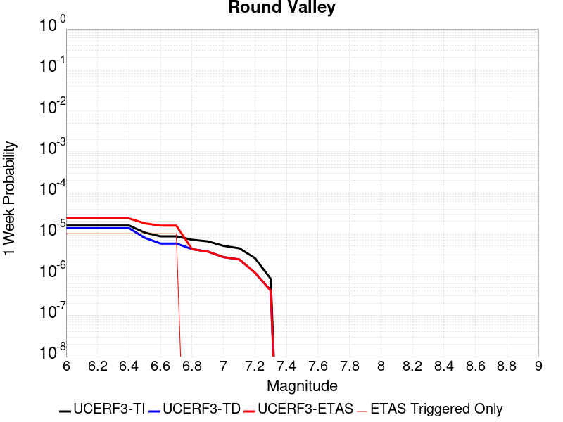 | 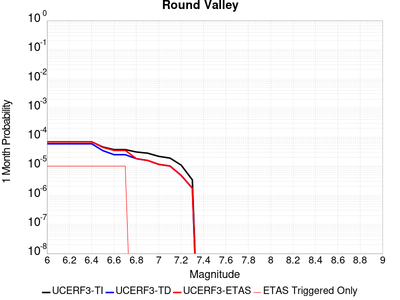 | 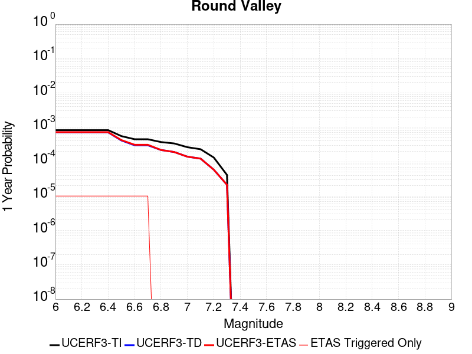 | 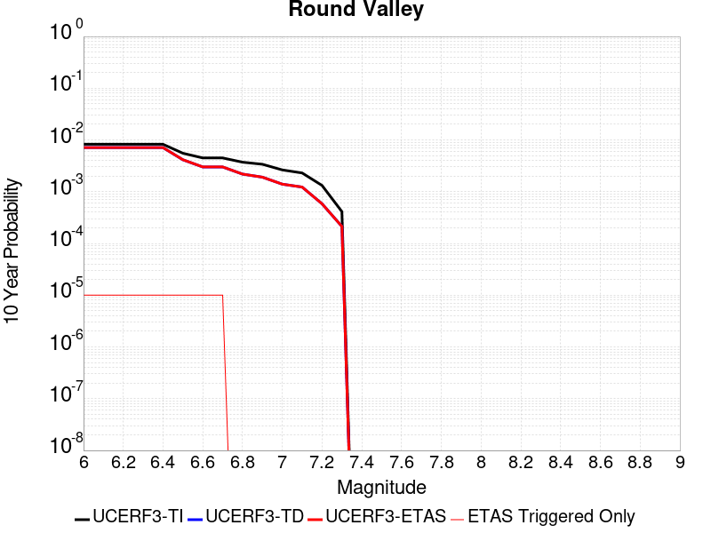 |

| Magnitude | 1 wk TI Prob | 1 wk TD Prob | 1 wk ETAS Prob | 1 wk ETAS/TD Gain | 1 wk ETAS Triggered Only | 1 mo TI Prob | 1 mo TD Prob | 1 mo ETAS Prob | 1 mo ETAS/TD Gain | 1 mo ETAS Triggered Only | 1 yr TI Prob | 1 yr TD Prob | 1 yr ETAS Prob | 1 yr ETAS/TD Gain | 1 yr ETAS Triggered Only | 10 yr TI Prob | 10 yr TD Prob | 10 yr ETAS Prob | 10 yr ETAS/TD Gain | 10 yr ETAS Triggered Only |
|-----|-----|-----|-----|-----|-----|-----|-----|-----|-----|-----|-----|-----|-----|-----|-----|-----|-----|-----|-----|-----|
| 6.0 | 1.588152E-5 | 1.3670525E-5 | 2.3670389E-5 | 1.7314909 | 1.0E-5 | 6.806188E-5 | 5.8586873E-5 | 6.858628E-5 | 1.1706767 | 1.0E-5 | 8.283384E-4 | 7.131011E-4 | 7.23094E-4 | 1.0140133 | 1.0E-5 | 0.008252576 | 0.0071120164 | 0.0071219453 | 1.0013961 | 1.0E-5 |
| 6.1 | 1.588152E-5 | 1.3670525E-5 | 2.3670389E-5 | 1.7314909 | 1.0E-5 | 6.806188E-5 | 5.8586873E-5 | 6.858628E-5 | 1.1706767 | 1.0E-5 | 8.283384E-4 | 7.131011E-4 | 7.23094E-4 | 1.0140133 | 1.0E-5 | 0.008252576 | 0.0071120164 | 0.0071219453 | 1.0013961 | 1.0E-5 |
| 6.2 | 1.588152E-5 | 1.3670525E-5 | 2.3670389E-5 | 1.7314909 | 1.0E-5 | 6.806188E-5 | 5.8586873E-5 | 6.858628E-5 | 1.1706767 | 1.0E-5 | 8.283384E-4 | 7.131011E-4 | 7.23094E-4 | 1.0140133 | 1.0E-5 | 0.008252576 | 0.0071120164 | 0.0071219453 | 1.0013961 | 1.0E-5 |
| 6.3 | 1.588152E-5 | 1.3670525E-5 | 2.3670389E-5 | 1.7314909 | 1.0E-5 | 6.806188E-5 | 5.8586873E-5 | 6.858628E-5 | 1.1706767 | 1.0E-5 | 8.283384E-4 | 7.131011E-4 | 7.23094E-4 | 1.0140133 | 1.0E-5 | 0.008252576 | 0.0071120164 | 0.0071219453 | 1.0013961 | 1.0E-5 |
| 6.4 | 1.588152E-5 | 1.3670525E-5 | 2.3670389E-5 | 1.7314909 | 1.0E-5 | 6.806188E-5 | 5.8586873E-5 | 6.858628E-5 | 1.1706767 | 1.0E-5 | 8.283384E-4 | 7.131011E-4 | 7.23094E-4 | 1.0140133 | 1.0E-5 | 0.008252576 | 0.0071120164 | 0.0071219453 | 1.0013961 | 1.0E-5 |
| 6.5 | 1.0646776E-5 | 7.952847E-6 | 1.7952767E-5 | 2.2574012 | 1.0E-5 | 4.5628243E-5 | 3.4083234E-5 | 4.408289E-5 | 1.2933894 | 1.0E-5 | 5.553823E-4 | 4.1489274E-4 | 4.248886E-4 | 1.0240927 | 1.0E-5 | 0.005539963 | 0.00414201 | 0.0041519688 | 1.0024043 | 1.0E-5 |
| 6.6 | 8.632956E-6 | 5.768552E-6 | 1.5768494E-5 | 2.7335274 | 1.0E-5 | 3.6997862E-5 | 2.4722152E-5 | 3.4721907E-5 | 1.4044856 | 1.0E-5 | 4.5035584E-4 | 3.0095447E-4 | 3.1095147E-4 | 1.0332177 | 1.0E-5 | 0.0044944426 | 0.0030058469 | 0.003015817 | 1.0033169 | 1.0E-5 |
| 6.7 | 8.632956E-6 | 5.768552E-6 | 1.5768494E-5 | 2.7335274 | 1.0E-5 | 3.6997862E-5 | 2.4722152E-5 | 3.4721907E-5 | 1.4044856 | 1.0E-5 | 4.5035584E-4 | 3.0095447E-4 | 3.1095147E-4 | 1.0332177 | 1.0E-5 | 0.0044944426 | 0.0030058469 | 0.003015817 | 1.0033169 | 1.0E-5 |
| 6.8 | 7.143895E-6 | 4.201644E-6 | 4.201644E-6 | 1.0 | 0.0 | 3.0616335E-5 | 1.8006931E-5 | 1.8006931E-5 | 1.0 | 0.0 | 3.726901E-4 | 2.19214E-4 | 2.19214E-4 | 1.0 | 0.0 | 0.0037206567 | 0.0021901424 | 0.0021901424 | 1.0 | 0.0 |
| 6.9 | 6.5120694E-6 | 3.6642807E-6 | 3.6642807E-6 | 1.0 | 0.0 | 2.790857E-5 | 1.5703974E-5 | 1.5703974E-5 | 1.0 | 0.0 | 3.3973387E-4 | 1.9118062E-4 | 1.9118062E-4 | 1.0 | 0.0 | 0.0033921495 | 0.0019103106 | 0.0019103106 | 1.0 | 0.0 |
| 7.0 | 5.0614435E-6 | 2.6834869E-6 | 2.6834869E-6 | 1.0 | 0.0 | 2.169172E-5 | 1.1500612E-5 | 1.1500612E-5 | 1.0 | 0.0 | 2.6406467E-4 | 1.40012E-4 | 1.40012E-4 | 1.0 | 0.0 | 0.0026375111 | 0.0013993392 | 0.0013993392 | 1.0 | 0.0 |
| 7.1 | 4.41728E-6 | 2.3573243E-6 | 2.3573243E-6 | 1.0 | 0.0 | 1.8931061E-5 | 1.01027845E-5 | 1.01027845E-5 | 1.0 | 0.0 | 2.304613E-4 | 1.2299545E-4 | 1.2299545E-4 | 1.0 | 0.0 | 0.0023022245 | 0.0012293702 | 0.0012293702 | 1.0 | 0.0 |
| 7.2 | 2.535495E-6 | 1.120784E-6 | 1.120784E-6 | 1.0 | 0.0 | 1.0866362E-5 | 4.803354E-6 | 4.803354E-6 | 1.0 | 0.0 | 1.3228992E-4 | 5.8479785E-5 | 5.8479785E-5 | 1.0 | 0.0 | 0.0013221119 | 5.846952E-4 | 5.846952E-4 | 1.0 | 0.0 |
| 7.3 | 7.900015E-7 | 4.0888176E-7 | 4.0888176E-7 | 1.0 | 0.0 | 3.3857161E-6 | 1.7523504E-6 | 1.7523504E-6 | 1.0 | 0.0 | 4.1220315E-5 | 2.1334865E-5 | 2.1334865E-5 | 1.0 | 0.0 | 4.121267E-4 | 2.1334866E-4 | 2.1334866E-4 | 1.0 | 0.0 |

## San Andreas (Offshore) 2011 CFM
*[(top)](#table-of-contents)*

| 1 Week | 1 Month | 1 Year | 10 Year |
|-----|-----|-----|-----|
| 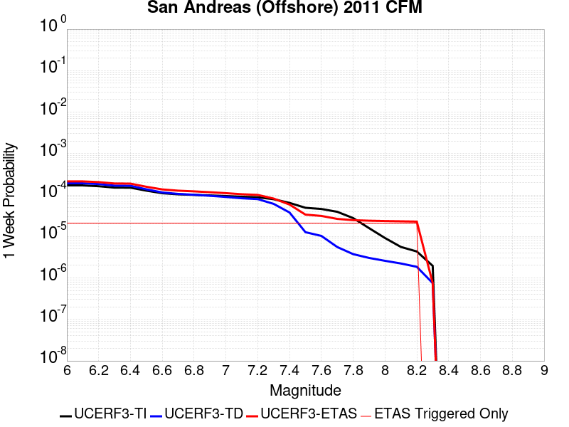 | 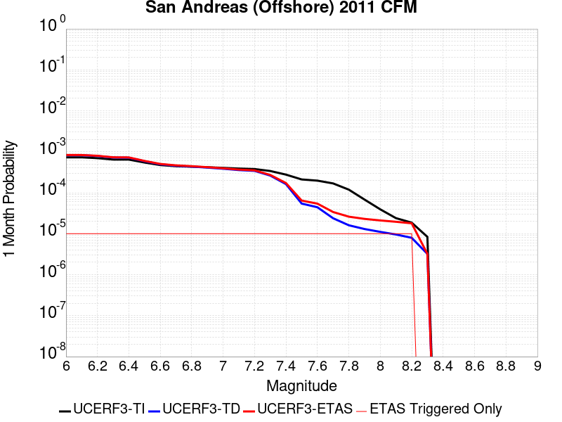 | 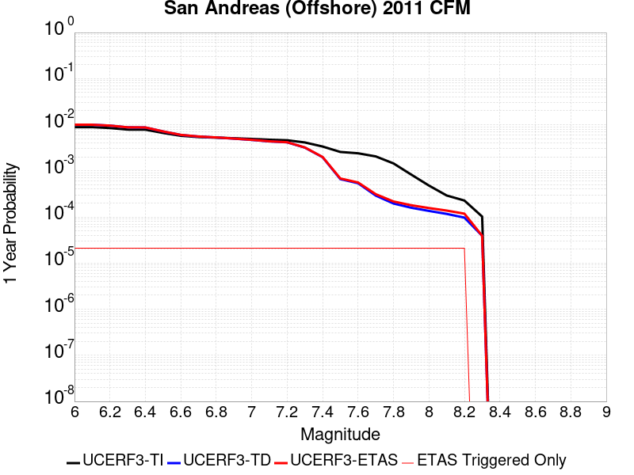 | 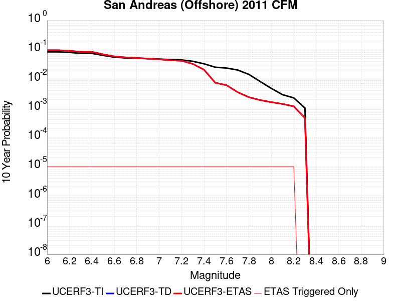 |

| Magnitude | 1 wk TI Prob | 1 wk TD Prob | 1 wk ETAS Prob | 1 wk ETAS/TD Gain | 1 wk ETAS Triggered Only | 1 mo TI Prob | 1 mo TD Prob | 1 mo ETAS Prob | 1 mo ETAS/TD Gain | 1 mo ETAS Triggered Only | 1 yr TI Prob | 1 yr TD Prob | 1 yr ETAS Prob | 1 yr ETAS/TD Gain | 1 yr ETAS Triggered Only | 10 yr TI Prob | 10 yr TD Prob | 10 yr ETAS Prob | 10 yr ETAS/TD Gain | 10 yr ETAS Triggered Only |
|-----|-----|-----|-----|-----|-----|-----|-----|-----|-----|-----|-----|-----|-----|-----|-----|-----|-----|-----|-----|-----|
| 6.0 | 1.7072787E-4 | 1.9226626E-4 | 2.0226435E-4 | 1.0520012 | 1.0E-5 | 7.3148566E-4 | 8.237405E-4 | 8.3373225E-4 | 1.0121298 | 1.0E-5 | 0.008869528 | 0.009983436 | 0.009993336 | 1.0009917 | 1.0E-5 | 0.085237645 | 0.09681613 | 0.09682517 | 1.0000933 | 1.0E-5 |
| 6.1 | 1.7072787E-4 | 1.9226626E-4 | 2.0226435E-4 | 1.0520012 | 1.0E-5 | 7.3148566E-4 | 8.237405E-4 | 8.3373225E-4 | 1.0121298 | 1.0E-5 | 0.008869528 | 0.009983436 | 0.009993336 | 1.0009917 | 1.0E-5 | 0.085237645 | 0.09681613 | 0.09682517 | 1.0000933 | 1.0E-5 |
| 6.2 | 1.6312556E-4 | 1.8408237E-4 | 1.9408052E-4 | 1.0543135 | 1.0E-5 | 6.989222E-4 | 7.8868825E-4 | 7.9868035E-4 | 1.0126693 | 1.0E-5 | 0.008476226 | 0.0095605 | 0.009570405 | 1.0010359 | 1.0E-5 | 0.08160117 | 0.092837214 | 0.09284629 | 1.0000978 | 1.0E-5 |
| 6.3 | 1.5103363E-4 | 1.6881147E-4 | 1.7880979E-4 | 1.0592277 | 1.0E-5 | 6.471264E-4 | 7.232793E-4 | 7.332721E-4 | 1.0138159 | 1.0E-5 | 0.007850339 | 0.008770814 | 0.008780727 | 1.0011301 | 1.0E-5 | 0.075787395 | 0.08546859 | 0.08547774 | 1.000107 | 1.0E-5 |
| 6.4 | 1.5047993E-4 | 1.6767075E-4 | 1.7766906E-4 | 1.0596308 | 1.0E-5 | 6.4475456E-4 | 7.183932E-4 | 7.28386E-4 | 1.0139099 | 1.0E-5 | 0.007821669 | 0.008711802 | 0.008721715 | 1.0011379 | 1.0E-5 | 0.0755203 | 0.08494888 | 0.08495803 | 1.0001078 | 1.0E-5 |
| 6.5 | 1.2760791E-4 | 1.3734949E-4 | 1.4734811E-4 | 1.072797 | 1.0E-5 | 5.467764E-4 | 5.8850925E-4 | 5.985034E-4 | 1.0169821 | 1.0E-5 | 0.0066367025 | 0.007141834 | 0.007151763 | 1.0013902 | 1.0E-5 | 0.064419635 | 0.07024954 | 0.07025884 | 1.0001323 | 1.0E-5 |
| 6.6 | 1.1063525E-4 | 1.15565475E-4 | 1.2556433E-4 | 1.086521 | 1.0E-5 | 4.740649E-4 | 4.9518765E-4 | 5.051827E-4 | 1.0201844 | 1.0E-5 | 0.0057564764 | 0.006012446 | 0.0060223853 | 1.0016532 | 1.0E-5 | 0.05609626 | 0.059496127 | 0.059505533 | 1.0001581 | 1.0E-5 |
| 6.7 | 1.0391049E-4 | 1.0645875E-4 | 1.1645768E-4 | 1.0939231 | 1.0E-5 | 4.4525467E-4 | 4.56173E-4 | 4.6616845E-4 | 1.0219115 | 1.0E-5 | 0.0054075094 | 0.0055399504 | 0.005549895 | 1.001795 | 1.0E-5 | 0.052778035 | 0.05498844 | 0.05499789 | 1.0001719 | 1.0E-5 |
| 6.8 | 1.0096706E-4 | 1.01582154E-4 | 1.1158114E-4 | 1.0984325 | 1.0E-5 | 4.3264418E-4 | 4.3528038E-4 | 4.4527603E-4 | 1.0229636 | 1.0E-5 | 0.0052547283 | 0.0052868384 | 0.0052967854 | 1.0018815 | 1.0E-5 | 0.051321987 | 0.052686825 | 0.0526963 | 1.0001798 | 1.0E-5 |
| 6.9 | 9.800265E-5 | 9.588697E-5 | 1.0588601E-4 | 1.1042794 | 1.0E-5 | 4.1994374E-4 | 4.1088034E-4 | 4.2087623E-4 | 1.024328 | 1.0E-5 | 0.0051008356 | 0.004991162 | 0.0050011124 | 1.0019935 | 1.0E-5 | 0.049853306 | 0.05001508 | 0.05002458 | 1.0001899 | 1.0E-5 |
| 7.0 | 9.4642375E-5 | 9.002096E-5 | 1.00020065E-4 | 1.1110753 | 1.0E-5 | 4.0554712E-4 | 3.8574796E-4 | 3.957441E-4 | 1.0259137 | 1.0E-5 | 0.004926363 | 0.00468653 | 0.0046964833 | 1.0021238 | 1.0E-5 | 0.048185747 | 0.047194667 | 0.047204193 | 1.000202 | 1.0E-5 |
| 7.1 | 9.0996844E-5 | 8.354119E-5 | 9.354036E-5 | 1.1196914 | 1.0E-5 | 3.8992817E-4 | 3.579854E-4 | 3.6798185E-4 | 1.0279241 | 1.0E-5 | 0.004737046 | 0.0043499186 | 0.004359875 | 1.0022889 | 1.0E-5 | 0.04637333 | 0.04404688 | 0.044056438 | 1.0002171 | 1.0E-5 |
| 7.2 | 8.848287E-5 | 7.981761E-5 | 8.9816815E-5 | 1.1252756 | 1.0E-5 | 3.791572E-4 | 3.420315E-4 | 3.520281E-4 | 1.029227 | 1.0E-5 | 0.004606472 | 0.0041564363 | 0.0041663945 | 1.0023959 | 1.0E-5 | 0.045121472 | 0.042189904 | 0.04219948 | 1.000227 | 1.0E-5 |
| 7.3 | 7.9280784E-5 | 6.1274885E-5 | 7.127427E-5 | 1.163189 | 1.0E-5 | 3.3973053E-4 | 2.6258078E-4 | 2.7257815E-4 | 1.0380735 | 1.0E-5 | 0.004128377 | 0.003192337 | 0.003202305 | 1.0031224 | 1.0E-5 | 0.040525194 | 0.03290183 | 0.0329115 | 1.000294 | 1.0E-5 |
| 7.4 | 6.468038E-5 | 3.7930724E-5 | 4.793034E-5 | 1.2636285 | 1.0E-5 | 2.771722E-4 | 1.6255044E-4 | 1.7254881E-4 | 1.0615094 | 1.0E-5 | 0.0033693502 | 0.0019773128 | 0.0019872931 | 1.0050473 | 1.0E-5 | 0.0331872 | 0.02081734 | 0.020827131 | 1.0004704 | 1.0E-5 |
| 7.5 | 4.930574E-5 | 1.2699263E-5 | 2.2699136E-5 | 1.7874373 | 1.0E-5 | 2.1129321E-4 | 5.4424287E-5 | 6.4423744E-5 | 1.1837316 | 1.0E-5 | 0.0025694598 | 6.6241587E-4 | 6.724092E-4 | 1.0150863 | 1.0E-5 | 0.02539953 | 0.0074798525 | 0.0074897776 | 1.0013269 | 1.0E-5 |
| 7.6 | 4.612566E-5 | 1.0332297E-5 | 2.0332194E-5 | 1.967829 | 1.0E-5 | 1.9766642E-4 | 4.428053E-5 | 5.4280084E-5 | 1.2258229 | 1.0E-5 | 0.0024039324 | 5.3898344E-4 | 5.4897805E-4 | 1.0185435 | 1.0E-5 | 0.023780935 | 0.006170428 | 0.006180366 | 1.0016106 | 1.0E-5 |
| 7.7 | 3.9435414E-5 | 5.5710498E-6 | 1.5570995E-5 | 2.7949839 | 1.0E-5 | 1.6899795E-4 | 2.3875711E-5 | 3.3875473E-5 | 1.4188257 | 1.0E-5 | 0.0020556084 | 2.906482E-4 | 3.0064528E-4 | 1.0343958 | 1.0E-5 | 0.020366974 | 0.0035397834 | 0.003549748 | 1.002815 | 1.0E-5 |
| 7.8 | 2.7787428E-5 | 3.7526645E-6 | 1.3752627E-5 | 3.6647632 | 1.0E-5 | 1.1908354E-4 | 1.6082748E-5 | 2.6082587E-5 | 1.6217743 | 1.0E-5 | 0.0014488777 | 1.9578991E-4 | 2.0578795E-4 | 1.0510652 | 1.0E-5 | 0.014394675 | 0.0023862 | 0.002396176 | 1.0041808 | 1.0E-5 |
| 7.9 | 1.590671E-5 | 3.0391298E-6 | 1.3039099E-5 | 4.2904058 | 1.0E-5 | 6.816983E-5 | 1.3024777E-5 | 2.3024646E-5 | 1.7677574 | 1.0E-5 | 8.2965166E-4 | 1.5856515E-4 | 1.6856357E-4 | 1.0630555 | 1.0E-5 | 0.008265611 | 0.0019033558 | 0.0019133368 | 1.0052439 | 1.0E-5 |
| 8.0 | 9.193638E-6 | 2.5908973E-6 | 1.2590871E-5 | 4.859657 | 1.0E-5 | 3.940071E-5 | 1.1103798E-5 | 2.1103688E-5 | 1.9005828 | 1.0E-5 | 4.7959806E-4 | 1.3518038E-4 | 1.4517903E-4 | 1.0739652 | 1.0E-5 | 0.0047856434 | 0.0016108477 | 0.0016208316 | 1.0061979 | 1.0E-5 |
| 8.1 | 5.601576E-6 | 2.2333788E-6 | 1.2233357E-5 | 5.477511 | 1.0E-5 | 2.4006533E-5 | 9.571589E-6 | 1.9571493E-5 | 2.0447488 | 1.0E-5 | 2.9224035E-4 | 1.1652788E-4 | 1.2652672E-4 | 1.0858064 | 1.0E-5 | 0.0029185633 | 0.0014015464 | 0.0014115324 | 1.007125 | 1.0E-5 |
| 8.2 | 4.3508785E-6 | 1.8568232E-6 | 1.1856805E-5 | 6.3855324 | 1.0E-5 | 1.864649E-5 | 7.957789E-6 | 1.795771E-5 | 2.2566204 | 1.0E-5 | 2.2699735E-4 | 9.6881806E-5 | 1.0688084E-4 | 1.1032085 | 1.0E-5 | 0.0022676561 | 0.0011590312 | 0.0011690195 | 1.0086179 | 1.0E-5 |
| 8.3 | 1.9573292E-6 | 7.511501E-7 | 7.511501E-7 | 1.0 | 0.0 | 8.388526E-6 | 3.2192108E-6 | 3.2192108E-6 | 1.0 | 0.0 | 1.0212552E-4 | 3.9193204E-5 | 3.9193204E-5 | 1.0 | 0.0 | 0.001020786 | 4.6391718E-4 | 4.6391718E-4 | 1.0 | 0.0 |

## Simi-Santa Rosa
*[(top)](#table-of-contents)*

| 1 Week | 1 Month | 1 Year | 10 Year |
|-----|-----|-----|-----|
| 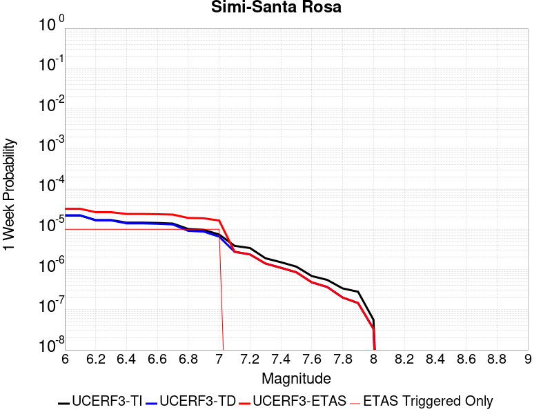 | 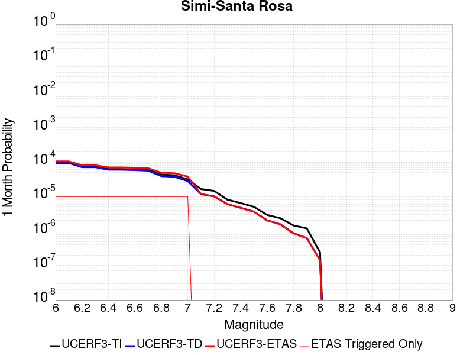 | 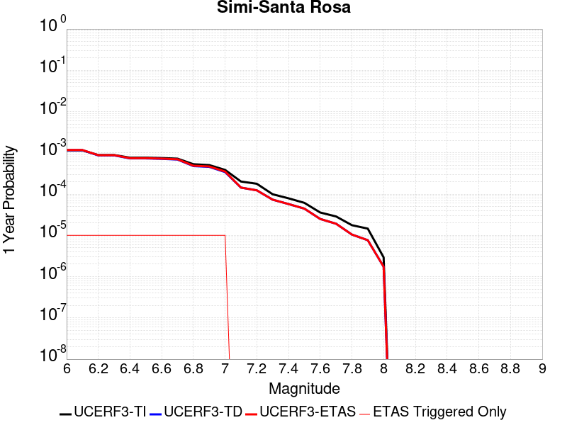 | 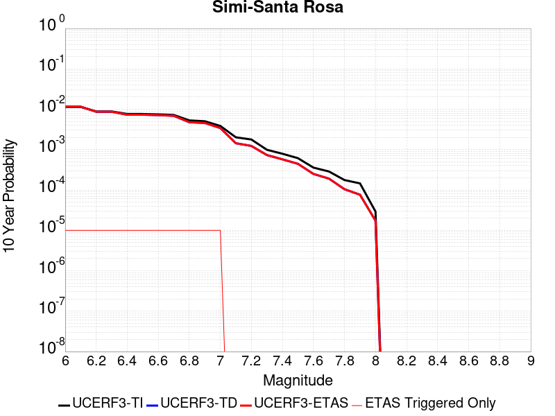 |

| Magnitude | 1 wk TI Prob | 1 wk TD Prob | 1 wk ETAS Prob | 1 wk ETAS/TD Gain | 1 wk ETAS Triggered Only | 1 mo TI Prob | 1 mo TD Prob | 1 mo ETAS Prob | 1 mo ETAS/TD Gain | 1 mo ETAS Triggered Only | 1 yr TI Prob | 1 yr TD Prob | 1 yr ETAS Prob | 1 yr ETAS/TD Gain | 1 yr ETAS Triggered Only | 10 yr TI Prob | 10 yr TD Prob | 10 yr ETAS Prob | 10 yr ETAS/TD Gain | 10 yr ETAS Triggered Only |
|-----|-----|-----|-----|-----|-----|-----|-----|-----|-----|-----|-----|-----|-----|-----|-----|-----|-----|-----|-----|-----|
| 6.0 | 2.198912E-5 | 2.2275388E-5 | 3.2275166E-5 | 1.448916 | 1.0E-5 | 9.4235686E-5 | 9.54627E-5 | 1.0546175E-4 | 1.104743 | 1.0E-5 | 0.0011467156 | 0.0011616825 | 0.001171671 | 1.0085982 | 1.0E-5 | 0.011408163 | 0.011560547 | 0.011570432 | 1.000855 | 1.0E-5 |
| 6.1 | 2.198912E-5 | 2.2275388E-5 | 3.2275166E-5 | 1.448916 | 1.0E-5 | 9.4235686E-5 | 9.54627E-5 | 1.0546175E-4 | 1.104743 | 1.0E-5 | 0.0011467156 | 0.0011616825 | 0.001171671 | 1.0085982 | 1.0E-5 | 0.011408163 | 0.011560547 | 0.011570432 | 1.000855 | 1.0E-5 |
| 6.2 | 1.69983E-5 | 1.6668506E-5 | 2.6668338E-5 | 1.5999238 | 1.0E-5 | 7.284782E-5 | 7.143466E-5 | 8.1433944E-5 | 1.139978 | 1.0E-5 | 8.865613E-4 | 8.6939917E-4 | 8.7939046E-4 | 1.0114923 | 1.0E-5 | 0.008830327 | 0.0086629 | 0.008672813 | 1.0011443 | 1.0E-5 |
| 6.3 | 1.69983E-5 | 1.6668506E-5 | 2.6668338E-5 | 1.5999238 | 1.0E-5 | 7.284782E-5 | 7.143466E-5 | 8.1433944E-5 | 1.139978 | 1.0E-5 | 8.865613E-4 | 8.6939917E-4 | 8.7939046E-4 | 1.0114923 | 1.0E-5 | 0.008830327 | 0.0086629 | 0.008672813 | 1.0011443 | 1.0E-5 |
| 6.4 | 1.4666188E-5 | 1.4052489E-5 | 2.4052348E-5 | 1.7116077 | 1.0E-5 | 6.285358E-5 | 6.0223705E-5 | 7.0223105E-5 | 1.1660376 | 1.0E-5 | 7.6497364E-4 | 7.330018E-4 | 7.429945E-4 | 1.0136325 | 1.0E-5 | 0.0076234564 | 0.0073083164 | 0.0073182434 | 1.0013583 | 1.0E-5 |
| 6.5 | 1.4666188E-5 | 1.4052489E-5 | 2.4052348E-5 | 1.7116077 | 1.0E-5 | 6.285358E-5 | 6.0223705E-5 | 7.0223105E-5 | 1.1660376 | 1.0E-5 | 7.6497364E-4 | 7.330018E-4 | 7.429945E-4 | 1.0136325 | 1.0E-5 | 0.0076234564 | 0.0073083164 | 0.0073182434 | 1.0013583 | 1.0E-5 |
| 6.6 | 1.4377586E-5 | 1.3729529E-5 | 2.3729392E-5 | 1.7283471 | 1.0E-5 | 6.1616774E-5 | 5.883965E-5 | 6.8839065E-5 | 1.1699435 | 1.0E-5 | 7.4992597E-4 | 7.1616215E-4 | 7.26155E-4 | 1.0139533 | 1.0E-5 | 0.007474003 | 0.0071410104 | 0.007150939 | 1.0013903 | 1.0E-5 |
| 6.7 | 1.3881404E-5 | 1.3207497E-5 | 2.3207365E-5 | 1.7571357 | 1.0E-5 | 5.9490372E-5 | 5.6602472E-5 | 6.6601904E-5 | 1.1766608 | 1.0E-5 | 7.240546E-4 | 6.889419E-4 | 6.98935E-4 | 1.014505 | 1.0E-5 | 0.007217 | 0.0068705105 | 0.006880442 | 1.0014455 | 1.0E-5 |
| 6.8 | 1.0176516E-5 | 9.1541E-6 | 1.9154008E-5 | 2.0923967 | 1.0E-5 | 4.3612912E-5 | 3.923136E-5 | 4.9230966E-5 | 1.2548882 | 1.0E-5 | 5.308578E-4 | 4.775537E-4 | 4.875489E-4 | 1.02093 | 1.0E-5 | 0.0052959146 | 0.004766908 | 0.00477686 | 1.0020878 | 1.0E-5 |
| 6.9 | 9.699797E-6 | 8.774672E-6 | 1.8774585E-5 | 2.1396337 | 1.0E-5 | 4.15699E-5 | 3.760529E-5 | 4.760491E-5 | 1.26591 | 1.0E-5 | 5.05996E-4 | 4.5776463E-4 | 4.6776005E-4 | 1.0218353 | 1.0E-5 | 0.005048454 | 0.0045698346 | 0.004579789 | 1.0021783 | 1.0E-5 |
| 7.0 | 7.4049476E-6 | 6.559291E-6 | 1.6559225E-5 | 2.5245452 | 1.0E-5 | 3.1735104E-5 | 2.8111013E-5 | 3.811073E-5 | 1.3557224 | 1.0E-5 | 3.8630638E-4 | 3.422105E-4 | 3.5220708E-4 | 1.0292118 | 1.0E-5 | 0.0038563553 | 0.0034180775 | 0.0034280433 | 1.0029156 | 1.0E-5 |
| 7.1 | 3.873439E-6 | 2.759473E-6 | 2.759473E-6 | 1.0 | 0.0 | 1.6600346E-5 | 1.1826261E-5 | 1.1826261E-5 | 1.0 | 0.0 | 2.0209046E-4 | 1.4397544E-4 | 1.4397544E-4 | 1.0 | 0.0 | 0.0020190678 | 0.0014388453 | 0.0014388453 | 1.0 | 0.0 |
| 7.2 | 3.417706E-6 | 2.367616E-6 | 2.367616E-6 | 1.0 | 0.0 | 1.4647229E-5 | 1.0146887E-5 | 1.0146887E-5 | 1.0 | 0.0 | 1.7831543E-4 | 1.2353157E-4 | 1.2353157E-4 | 1.0 | 0.0 | 0.0017817242 | 0.0012346513 | 0.0012346513 | 1.0 | 0.0 |
| 7.3 | 1.90225E-6 | 1.4073756E-6 | 1.4073756E-6 | 1.0 | 0.0 | 8.152474E-6 | 6.031596E-6 | 6.031596E-6 | 1.0 | 0.0 | 9.9251854E-5 | 7.343223E-5 | 7.343223E-5 | 1.0 | 0.0 | 9.920754E-4 | 7.340819E-4 | 7.340819E-4 | 1.0 | 0.0 |
| 7.4 | 1.5170556E-6 | 1.1024792E-6 | 1.1024792E-6 | 1.0 | 0.0 | 6.5016507E-6 | 4.7249023E-6 | 4.7249023E-6 | 1.0 | 0.0 | 7.915472E-5 | 5.752418E-5 | 5.752418E-5 | 1.0 | 0.0 | 7.9126534E-4 | 5.75094E-4 | 5.75094E-4 | 1.0 | 0.0 |
| 7.5 | 1.178732E-6 | 8.5351127E-7 | 8.5351127E-7 | 1.0 | 0.0 | 5.0516987E-6 | 3.6579004E-6 | 3.6579004E-6 | 1.0 | 0.0 | 6.1502695E-5 | 4.4534037E-5 | 4.4534037E-5 | 1.0 | 0.0 | 6.148568E-4 | 4.4525208E-4 | 4.4525208E-4 | 1.0 | 0.0 |
| 7.6 | 6.8722386E-7 | 4.793211E-7 | 4.793211E-7 | 1.0 | 0.0 | 2.9452417E-6 | 2.0542318E-6 | 2.0542318E-6 | 1.0 | 0.0 | 3.5857727E-5 | 2.5009986E-5 | 2.5009986E-5 | 1.0 | 0.0 | 3.5851944E-4 | 2.5007184E-4 | 2.5007184E-4 | 1.0 | 0.0 |
| 7.7 | 5.5126515E-7 | 3.6731117E-7 | 3.6731117E-7 | 1.0 | 0.0 | 2.3625628E-6 | 1.5741898E-6 | 1.5741898E-6 | 1.0 | 0.0 | 2.8763823E-5 | 1.9165593E-5 | 1.9165593E-5 | 1.0 | 0.0 | 2.87601E-4 | 1.9163951E-4 | 1.9163951E-4 | 1.0 | 0.0 |
| 7.8 | 3.3860243E-7 | 2.0075514E-7 | 2.0075514E-7 | 1.0 | 0.0 | 1.4511525E-6 | 8.6037886E-7 | 8.6037886E-7 | 1.0 | 0.0 | 1.7667637E-5 | 1.0475063E-5 | 1.0475063E-5 | 1.0 | 0.0 | 1.7666233E-4 | 1.0474575E-4 | 1.0474575E-4 | 1.0 | 0.0 |
| 7.9 | 2.7955386E-7 | 1.4648724E-7 | 1.4648724E-7 | 1.0 | 0.0 | 1.1980875E-6 | 6.278023E-7 | 6.278023E-7 | 1.0 | 0.0 | 1.4586617E-5 | 7.643467E-6 | 7.643467E-6 | 1.0 | 0.0 | 1.458566E-4 | 7.643208E-5 | 7.643208E-5 | 1.0 | 0.0 |
| 8.0 | 5.6259015E-8 | 3.335318E-8 | 3.335318E-8 | 1.0 | 0.0 | 2.4111003E-7 | 1.429422E-7 | 1.429422E-7 | 1.0 | 0.0 | 2.9355108E-6 | 1.7403199E-6 | 1.7403199E-6 | 1.0 | 0.0 | 2.935472E-5 | 1.7403077E-5 | 1.7403077E-5 | 1.0 | 0.0 |

## San Gregorio (North) 2011 CFM
*[(top)](#table-of-contents)*

| 1 Week | 1 Month | 1 Year | 10 Year |
|-----|-----|-----|-----|
| 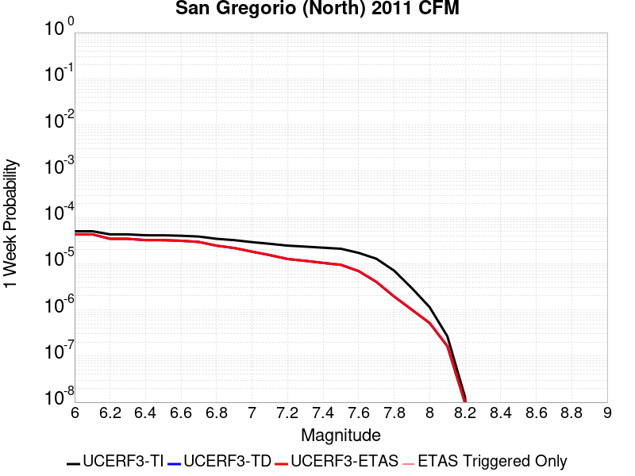 | 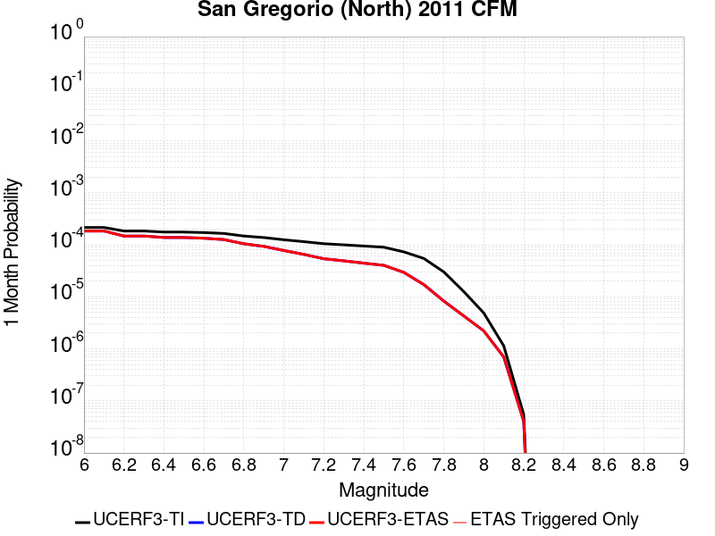 | 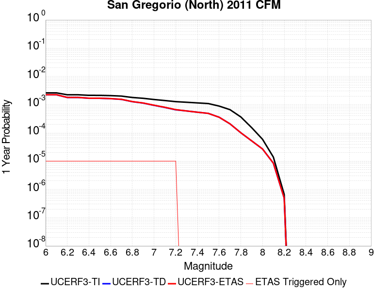 | 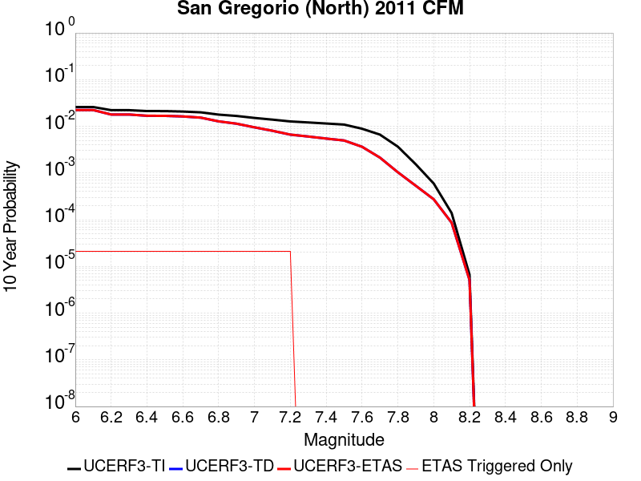 |

| Magnitude | 1 wk TI Prob | 1 wk TD Prob | 1 wk ETAS Prob | 1 wk ETAS/TD Gain | 1 wk ETAS Triggered Only | 1 mo TI Prob | 1 mo TD Prob | 1 mo ETAS Prob | 1 mo ETAS/TD Gain | 1 mo ETAS Triggered Only | 1 yr TI Prob | 1 yr TD Prob | 1 yr ETAS Prob | 1 yr ETAS/TD Gain | 1 yr ETAS Triggered Only | 10 yr TI Prob | 10 yr TD Prob | 10 yr ETAS Prob | 10 yr ETAS/TD Gain | 10 yr ETAS Triggered Only |
|-----|-----|-----|-----|-----|-----|-----|-----|-----|-----|-----|-----|-----|-----|-----|-----|-----|-----|-----|-----|-----|
| 6.0 | 5.0283932E-5 | 4.3057098E-5 | 4.3057098E-5 | 1.0 | 0.0 | 2.1548476E-4 | 1.8451746E-4 | 1.8451746E-4 | 1.0 | 0.0 | 0.0026203706 | 0.002244199 | 0.0022541767 | 1.0044459 | 1.0E-5 | 0.02589687 | 0.022295918 | 0.022305695 | 1.0004386 | 1.0E-5 |
| 6.1 | 5.0283932E-5 | 4.3057098E-5 | 4.3057098E-5 | 1.0 | 0.0 | 2.1548476E-4 | 1.8451746E-4 | 1.8451746E-4 | 1.0 | 0.0 | 0.0026203706 | 0.002244199 | 0.0022541767 | 1.0044459 | 1.0E-5 | 0.02589687 | 0.022295918 | 0.022305695 | 1.0004386 | 1.0E-5 |
| 6.2 | 4.2998647E-5 | 3.4440873E-5 | 3.4440873E-5 | 1.0 | 0.0 | 1.842669E-4 | 1.4759546E-4 | 1.4759546E-4 | 1.0 | 0.0 | 0.0022411412 | 0.001795506 | 0.001805488 | 1.0055594 | 1.0E-5 | 0.022186736 | 0.017884884 | 0.017894706 | 1.0005491 | 1.0E-5 |
| 6.3 | 4.2998647E-5 | 3.4440873E-5 | 3.4440873E-5 | 1.0 | 0.0 | 1.842669E-4 | 1.4759546E-4 | 1.4759546E-4 | 1.0 | 0.0 | 0.0022411412 | 0.001795506 | 0.001805488 | 1.0055594 | 1.0E-5 | 0.022186736 | 0.017884884 | 0.017894706 | 1.0005491 | 1.0E-5 |
| 6.4 | 4.1101295E-5 | 3.2326076E-5 | 3.2326076E-5 | 1.0 | 0.0 | 1.7613651E-4 | 1.3853304E-4 | 1.3853304E-4 | 1.0 | 0.0 | 0.0021423528 | 0.0016853481 | 0.0016953313 | 1.0059235 | 1.0E-5 | 0.02121817 | 0.016800618 | 0.01681045 | 1.0005852 | 1.0E-5 |
| 6.5 | 4.1032585E-5 | 3.224411E-5 | 3.224411E-5 | 1.0 | 0.0 | 1.7584208E-4 | 1.381818E-4 | 1.381818E-4 | 1.0 | 0.0 | 0.0021387753 | 0.0016810785 | 0.0016910617 | 1.0059385 | 1.0E-5 | 0.021183075 | 0.01675857 | 0.016768403 | 1.0005867 | 1.0E-5 |
| 6.6 | 4.011629E-5 | 3.1265718E-5 | 3.1265718E-5 | 1.0 | 0.0 | 1.7191563E-4 | 1.3398913E-4 | 1.3398913E-4 | 1.0 | 0.0 | 0.0020910634 | 0.0016301107 | 0.0016400943 | 1.0061245 | 1.0E-5 | 0.020714961 | 0.016257357 | 0.016267195 | 1.0006051 | 1.0E-5 |
| 6.7 | 3.8583938E-5 | 2.9452754E-5 | 2.9452754E-5 | 1.0 | 0.0 | 1.6534925E-4 | 1.2622007E-4 | 1.2622007E-4 | 1.0 | 0.0 | 0.0020112682 | 0.0015356604 | 0.001545645 | 1.0065019 | 1.0E-5 | 0.019931622 | 0.015326062 | 0.015335909 | 1.0006425 | 1.0E-5 |
| 6.8 | 3.44341E-5 | 2.4450024E-5 | 2.4450024E-5 | 1.0 | 0.0 | 1.4756636E-4 | 1.0478167E-4 | 1.0478167E-4 | 1.0 | 0.0 | 0.0017951399 | 0.0012749807 | 0.001284968 | 1.0078332 | 1.0E-5 | 0.017807078 | 0.012751525 | 0.012761398 | 1.0007743 | 1.0E-5 |
| 6.9 | 3.221199E-5 | 2.1777196E-5 | 2.1777196E-5 | 1.0 | 0.0 | 1.3804408E-4 | 9.3327544E-5 | 9.3327544E-5 | 1.0 | 0.0 | 0.0016793909 | 0.0011356788 | 0.0011456675 | 1.0087953 | 1.0E-5 | 0.01666756 | 0.011372544 | 0.01138243 | 1.0008693 | 1.0E-5 |
| 7.0 | 2.9186718E-5 | 1.814604E-5 | 1.814604E-5 | 1.0 | 0.0 | 1.2507994E-4 | 7.776645E-5 | 7.776645E-5 | 1.0 | 0.0 | 0.0015217843 | 9.463997E-4 | 9.563902E-4 | 1.0105563 | 1.0E-5 | 0.015114053 | 0.0094966395 | 0.009506545 | 1.001043 | 1.0E-5 |
| 7.1 | 2.6840138E-5 | 1.5283675E-5 | 1.5283675E-5 | 1.0 | 0.0 | 1.1502409E-4 | 6.549983E-5 | 6.549983E-5 | 1.0 | 0.0 | 0.0013995186 | 7.971706E-4 | 8.0716267E-4 | 1.0125344 | 1.0E-5 | 0.013907375 | 0.0080155255 | 0.008025446 | 1.0012376 | 1.0E-5 |
| 7.2 | 2.453002E-5 | 1.2605825E-5 | 1.2605825E-5 | 1.0 | 0.0 | 1.05124425E-4 | 5.4023847E-5 | 5.4023847E-5 | 1.0 | 0.0 | 0.0012791384 | 6.5754243E-4 | 6.675359E-4 | 1.0151981 | 1.0E-5 | 0.012718005 | 0.006627395 | 0.0066373283 | 1.0014989 | 1.0E-5 |
| 7.3 | 2.3330727E-5 | 1.1487833E-5 | 1.1487833E-5 | 1.0 | 0.0 | 9.9985E-5 | 4.923264E-5 | 4.923264E-5 | 1.0 | 0.0 | 0.0012166376 | 5.99243E-4 | 5.99243E-4 | 1.0 | 0.0 | 0.012099981 | 0.0060462817 | 0.0060462817 | 1.0 | 0.0 |
| 7.4 | 2.2136466E-5 | 1.0368137E-5 | 1.0368137E-5 | 1.0 | 0.0 | 9.486712E-5 | 4.4434113E-5 | 4.4434113E-5 | 1.0 | 0.0 | 0.0011543952 | 5.408513E-4 | 5.408513E-4 | 1.0 | 0.0 | 0.011484168 | 0.0054640025 | 0.0054640025 | 1.0 | 0.0 |
| 7.5 | 2.0994974E-5 | 9.426374E-6 | 9.426374E-6 | 1.0 | 0.0 | 8.997535E-5 | 4.0398125E-5 | 4.0398125E-5 | 1.0 | 0.0 | 0.0010948994 | 4.917364E-4 | 4.917364E-4 | 1.0 | 0.0 | 0.010895205 | 0.004973108 | 0.004973108 | 1.0 | 0.0 |
| 7.6 | 1.7091823E-5 | 6.892992E-6 | 6.892992E-6 | 1.0 | 0.0 | 7.3248615E-5 | 2.9541061E-5 | 2.9541061E-5 | 1.0 | 0.0 | 8.9143694E-4 | 3.5960317E-4 | 3.5960317E-4 | 1.0 | 0.0 | 0.008878695 | 0.0036480771 | 0.0036480771 | 1.0 | 0.0 |
| 7.7 | 1.2772179E-5 | 4.0202267E-6 | 4.0202267E-6 | 1.0 | 0.0 | 5.473676E-5 | 1.722943E-5 | 1.722943E-5 | 1.0 | 0.0 | 6.6621625E-4 | 2.0974813E-4 | 2.0974813E-4 | 1.0 | 0.0 | 0.006642225 | 0.0021365841 | 0.0021365841 | 1.0 | 0.0 |
| 7.8 | 7.041923E-6 | 1.9402341E-6 | 1.9402341E-6 | 1.0 | 0.0 | 3.017932E-5 | 8.315263E-6 | 8.315263E-6 | 1.0 | 0.0 | 3.6737128E-4 | 1.01233614E-4 | 1.01233614E-4 | 1.0 | 0.0 | 0.0036676454 | 0.0010376878 | 0.0010376878 | 1.0 | 0.0 |
| 7.9 | 2.946768E-6 | 1.0031822E-6 | 1.0031822E-6 | 1.0 | 0.0 | 1.2628945E-5 | 4.299345E-6 | 4.299345E-6 | 1.0 | 0.0 | 1.5374656E-4 | 5.2343268E-5 | 5.2343268E-5 | 1.0 | 0.0 | 0.0015364023 | 5.339059E-4 | 5.339059E-4 | 1.0 | 0.0 |
| 8.0 | 1.1433375E-6 | 5.180804E-7 | 5.180804E-7 | 1.0 | 0.0 | 4.9000087E-6 | 2.2203426E-6 | 2.2203426E-6 | 1.0 | 0.0 | 5.965597E-5 | 2.7032334E-5 | 2.7032334E-5 | 1.0 | 0.0 | 5.963996E-4 | 2.7394458E-4 | 2.7394458E-4 | 1.0 | 0.0 |
| 8.1 | 2.6675295E-7 | 1.6288074E-7 | 1.6288074E-7 | 1.0 | 0.0 | 1.1432264E-6 | 6.9806015E-7 | 6.9806015E-7 | 1.0 | 0.0 | 1.3918692E-5 | 8.498849E-6 | 8.498849E-6 | 1.0 | 0.0 | 1.391782E-4 | 8.6366665E-5 | 8.6366665E-5 | 1.0 | 0.0 |
| 8.2 | 1.2704569E-8 | 9.429871E-9 | 9.429871E-9 | 1.0 | 0.0 | 5.444815E-8 | 4.041373E-8 | 4.041373E-8 | 1.0 | 0.0 | 6.629061E-7 | 4.920371E-7 | 4.920371E-7 | 1.0 | 0.0 | 6.629041E-6 | 5.1106863E-6 | 5.1106863E-6 | 1.0 | 0.0 |

## Mendocino
*[(top)](#table-of-contents)*

| 1 Week | 1 Month | 1 Year | 10 Year |
|-----|-----|-----|-----|
|  |  | 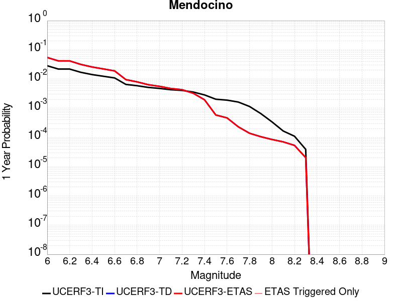 | 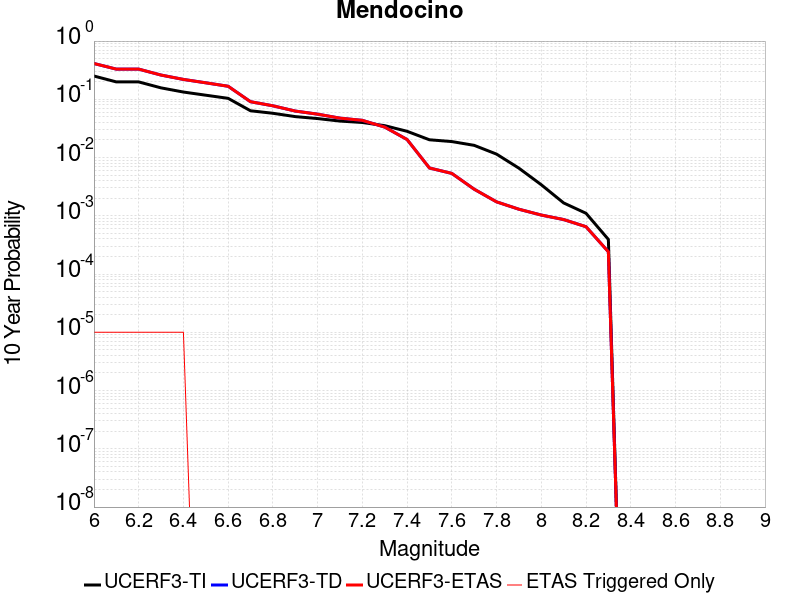 |

| Magnitude | 1 wk TI Prob | 1 wk TD Prob | 1 wk ETAS Prob | 1 wk ETAS/TD Gain | 1 wk ETAS Triggered Only | 1 mo TI Prob | 1 mo TD Prob | 1 mo ETAS Prob | 1 mo ETAS/TD Gain | 1 mo ETAS Triggered Only | 1 yr TI Prob | 1 yr TD Prob | 1 yr ETAS Prob | 1 yr ETAS/TD Gain | 1 yr ETAS Triggered Only | 10 yr TI Prob | 10 yr TD Prob | 10 yr ETAS Prob | 10 yr ETAS/TD Gain | 10 yr ETAS Triggered Only |
|-----|-----|-----|-----|-----|-----|-----|-----|-----|-----|-----|-----|-----|-----|-----|-----|-----|-----|-----|-----|-----|
| 6.0 | 5.5409013E-4 | 0.0010840978 | 0.0010840978 | 1.0 | 0.0 | 0.0023725112 | 0.0046357135 | 0.0046357135 | 1.0 | 0.0 | 0.028505474 | 0.054677837 | 0.054677837 | 1.0 | 0.0 | 0.25113493 | 0.41188422 | 0.4118901 | 1.0000143 | 1.0E-5 |
| 6.1 | 4.2515888E-4 | 8.229105E-4 | 8.229105E-4 | 1.0 | 0.0 | 0.0018208373 | 0.003520157 | 0.003520157 | 1.0 | 0.0 | 0.021944538 | 0.041751582 | 0.041751582 | 1.0 | 0.0 | 0.19899574 | 0.32995522 | 0.3299619 | 1.0000203 | 1.0E-5 |
| 6.2 | 4.2515888E-4 | 8.229105E-4 | 8.229105E-4 | 1.0 | 0.0 | 0.0018208373 | 0.003520157 | 0.003520157 | 1.0 | 0.0 | 0.021944538 | 0.041751582 | 0.041751582 | 1.0 | 0.0 | 0.19899574 | 0.32995522 | 0.3299619 | 1.0000203 | 1.0E-5 |
| 6.3 | 3.2773745E-4 | 6.193633E-4 | 6.193633E-4 | 1.0 | 0.0 | 0.0014038329 | 0.0026503794 | 0.0026503794 | 1.0 | 0.0 | 0.016958237 | 0.031593565 | 0.031593565 | 1.0 | 0.0 | 0.1572094 | 0.26077798 | 0.26078537 | 1.0000284 | 1.0E-5 |
| 6.4 | 2.7417165E-4 | 5.04789E-4 | 5.04789E-4 | 1.0 | 0.0 | 0.0011744922 | 0.002160561 | 0.002160561 | 1.0 | 0.0 | 0.014205975 | 0.02583886 | 0.02583886 | 1.0 | 0.0 | 0.13331394 | 0.21948014 | 0.21948795 | 1.0000355 | 1.0E-5 |
| 6.5 | 2.3984899E-4 | 4.323638E-4 | 4.323638E-4 | 1.0 | 0.0 | 0.0010275192 | 0.0018508366 | 0.0018508366 | 1.0 | 0.0 | 0.012438473 | 0.02218166 | 0.02218166 | 1.0 | 0.0 | 0.11764851 | 0.19203737 | 0.19203737 | 1.0 | 0.0 |
| 6.6 | 2.1023539E-4 | 3.6936256E-4 | 3.6936256E-4 | 1.0 | 0.0 | 9.0069766E-4 | 0.0015813457 | 0.0015813457 | 1.0 | 0.0 | 0.010910975 | 0.018990727 | 0.018990727 | 1.0 | 0.0 | 0.10390546 | 0.16749373 | 0.16749373 | 1.0 | 0.0 |
| 6.7 | 1.2592976E-4 | 1.8425964E-4 | 1.8425964E-4 | 1.0 | 0.0 | 5.395873E-4 | 7.8937394E-4 | 7.8937394E-4 | 1.0 | 0.0 | 0.006549705 | 0.009556835 | 0.009556835 | 1.0 | 0.0 | 0.063599944 | 0.09096922 | 0.09096922 | 1.0 | 0.0 |
| 6.8 | 1.13663555E-4 | 1.5401552E-4 | 1.5401552E-4 | 1.0 | 0.0 | 4.8703855E-4 | 6.5987057E-4 | 6.5987057E-4 | 1.0 | 0.0 | 0.0059135845 | 0.008000202 | 0.008000202 | 1.0 | 0.0 | 0.057586733 | 0.07739247 | 0.07739247 | 1.0 | 0.0 |
| 6.9 | 9.926894E-5 | 1.2300287E-4 | 1.2300287E-4 | 1.0 | 0.0 | 4.2536893E-4 | 5.2704377E-4 | 5.2704377E-4 | 1.0 | 0.0 | 0.0051665753 | 0.006396927 | 0.006396927 | 1.0 | 0.0 | 0.050480947 | 0.06285957 | 0.06285957 | 1.0 | 0.0 |
| 7.0 | 9.168125E-5 | 1.0784103E-4 | 1.0784103E-4 | 1.0 | 0.0 | 3.9286047E-4 | 4.6208999E-4 | 4.6208999E-4 | 1.0 | 0.0 | 0.004772591 | 0.005611076 | 0.005611076 | 1.0 | 0.0 | 0.04671385 | 0.0556208 | 0.0556208 | 1.0 | 0.0 |
| 7.1 | 8.2854116E-5 | 9.1051006E-5 | 9.1051006E-5 | 1.0 | 0.0 | 3.5504074E-4 | 3.9016042E-4 | 3.9016042E-4 | 1.0 | 0.0 | 0.004314056 | 0.0047399225 | 0.0047399225 | 1.0 | 0.0 | 0.042312626 | 0.047480468 | 0.047480468 | 1.0 | 0.0 |
| 7.2 | 7.8255274E-5 | 8.300352E-5 | 8.300352E-5 | 1.0 | 0.0 | 3.3533663E-4 | 3.556817E-4 | 3.556817E-4 | 1.0 | 0.0 | 0.0040750825 | 0.004321974 | 0.004321974 | 1.0 | 0.0 | 0.040011603 | 0.043524873 | 0.043524873 | 1.0 | 0.0 |
| 7.3 | 6.887904E-5 | 6.258733E-5 | 6.258733E-5 | 1.0 | 0.0 | 2.9516246E-4 | 2.6820437E-4 | 2.6820437E-4 | 1.0 | 0.0 | 0.0035876823 | 0.0032605957 | 0.0032605957 | 1.0 | 0.0 | 0.035303112 | 0.03335046 | 0.03335046 | 1.0 | 0.0 |
| 7.4 | 5.4898497E-5 | 3.7397505E-5 | 3.7397505E-5 | 1.0 | 0.0 | 2.3525805E-4 | 1.6026547E-4 | 1.6026547E-4 | 1.0 | 0.0 | 0.0028605047 | 0.0019495422 | 0.0019495422 | 1.0 | 0.0 | 0.02823963 | 0.020406872 | 0.020406872 | 1.0 | 0.0 |
| 7.5 | 3.9103943E-5 | 1.1304096E-5 | 1.1304096E-5 | 1.0 | 0.0 | 1.6757756E-4 | 4.8445232E-5 | 4.8445232E-5 | 1.0 | 0.0 | 0.0020383475 | 5.896627E-4 | 5.896627E-4 | 1.0 | 0.0 | 0.020197518 | 0.0066229533 | 0.0066229533 | 1.0 | 0.0 |
| 7.6 | 3.641042E-5 | 8.981182E-6 | 8.981182E-6 | 1.0 | 0.0 | 1.5603533E-4 | 3.849022E-5 | 3.849022E-5 | 1.0 | 0.0 | 0.0018980748 | 4.6851902E-4 | 4.6851902E-4 | 1.0 | 0.0 | 0.018819444 | 0.0053467555 | 0.0053467555 | 1.0 | 0.0 |
| 7.7 | 3.1318774E-5 | 4.452091E-6 | 4.452091E-6 | 1.0 | 0.0 | 1.342164E-4 | 1.9080253E-5 | 1.9080253E-5 | 1.0 | 0.0 | 0.0016328598 | 2.322775E-4 | 2.322775E-4 | 1.0 | 0.0 | 0.016209139 | 0.0028640495 | 0.0028640495 | 1.0 | 0.0 |
| 7.8 | 2.209241E-5 | 2.679371E-6 | 2.679371E-6 | 1.0 | 0.0 | 9.467832E-5 | 1.1482968E-5 | 1.1482968E-5 | 1.0 | 0.0 | 0.001152099 | 1.397962E-4 | 1.397962E-4 | 1.0 | 0.0 | 0.011461443 | 0.001736627 | 0.001736627 | 1.0 | 0.0 |
| 7.9 | 1.2640477E-5 | 2.041037E-6 | 2.041037E-6 | 1.0 | 0.0 | 5.4172346E-5 | 8.747273E-6 | 8.747273E-6 | 1.0 | 0.0 | 6.593487E-4 | 1.06492866E-4 | 1.06492866E-4 | 1.0 | 0.0 | 0.006573958 | 0.0012974226 | 0.0012974226 | 1.0 | 0.0 |
| 8.0 | 6.5548907E-6 | 1.6379622E-6 | 1.6379622E-6 | 1.0 | 0.0 | 2.8092087E-5 | 7.019819E-6 | 7.019819E-6 | 1.0 | 0.0 | 3.4196748E-4 | 8.546297E-5 | 8.546297E-5 | 1.0 | 0.0 | 0.0034144172 | 0.0010306032 | 0.0010306032 | 1.0 | 0.0 |
| 8.1 | 3.1916707E-6 | 1.357735E-6 | 1.357735E-6 | 1.0 | 0.0 | 1.3678517E-5 | 5.818851E-6 | 5.818851E-6 | 1.0 | 0.0 | 1.6652321E-4 | 7.084223E-5 | 7.084223E-5 | 1.0 | 0.0 | 0.0016639848 | 8.624329E-4 | 8.624329E-4 | 1.0 | 0.0 |
| 8.2 | 2.1193785E-6 | 1.0297509E-6 | 1.0297509E-6 | 1.0 | 0.0 | 9.083019E-6 | 4.413211E-6 | 4.413211E-6 | 1.0 | 0.0 | 1.1058014E-4 | 5.372954E-5 | 5.372954E-5 | 1.0 | 0.0 | 0.0011052513 | 6.500931E-4 | 6.500931E-4 | 1.0 | 0.0 |
| 8.3 | 7.536878E-7 | 3.9261332E-7 | 3.9261332E-7 | 1.0 | 0.0 | 3.2300866E-6 | 1.6826275E-6 | 1.6826275E-6 | 1.0 | 0.0 | 3.9325594E-5 | 2.048581E-5 | 2.048581E-5 | 1.0 | 0.0 | 3.9318635E-4 | 2.4124846E-4 | 2.4124846E-4 | 1.0 | 0.0 |

## Big Pine (West)
*[(top)](#table-of-contents)*

| 1 Week | 1 Month | 1 Year | 10 Year |
|-----|-----|-----|-----|
|  |  | 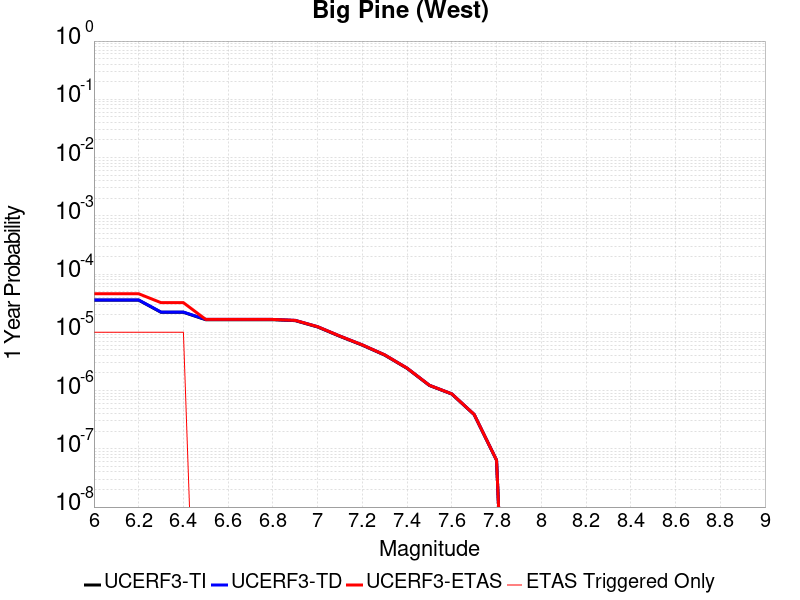 | 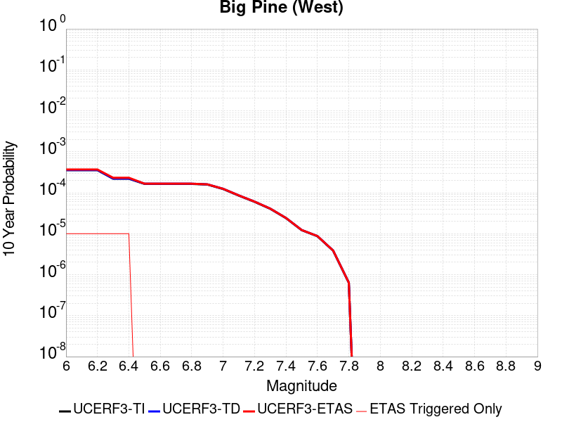 |

| Magnitude | 1 wk TI Prob | 1 wk TD Prob | 1 wk ETAS Prob | 1 wk ETAS/TD Gain | 1 wk ETAS Triggered Only | 1 mo TI Prob | 1 mo TD Prob | 1 mo ETAS Prob | 1 mo ETAS/TD Gain | 1 mo ETAS Triggered Only | 1 yr TI Prob | 1 yr TD Prob | 1 yr ETAS Prob | 1 yr ETAS/TD Gain | 1 yr ETAS Triggered Only | 10 yr TI Prob | 10 yr TD Prob | 10 yr ETAS Prob | 10 yr ETAS/TD Gain | 10 yr ETAS Triggered Only |
|-----|-----|-----|-----|-----|-----|-----|-----|-----|-----|-----|-----|-----|-----|-----|-----|-----|-----|-----|-----|-----|
| 6.0 | 6.8306974E-7 | 6.8818304E-7 | 6.8818304E-7 | 1.0 | 0.0 | 2.9274386E-6 | 2.949353E-6 | 2.949353E-6 | 1.0 | 0.0 | 3.564098E-5 | 3.5907877E-5 | 4.5907516E-5 | 1.2784804 | 1.0E-5 | 3.5635266E-4 | 3.5903015E-4 | 3.6902656E-4 | 1.0278428 | 1.0E-5 |
| 6.1 | 6.8306974E-7 | 6.8818304E-7 | 6.8818304E-7 | 1.0 | 0.0 | 2.9274386E-6 | 2.949353E-6 | 2.949353E-6 | 1.0 | 0.0 | 3.564098E-5 | 3.5907877E-5 | 4.5907516E-5 | 1.2784804 | 1.0E-5 | 3.5635266E-4 | 3.5903015E-4 | 3.6902656E-4 | 1.0278428 | 1.0E-5 |
| 6.2 | 6.8306974E-7 | 6.8818304E-7 | 6.8818304E-7 | 1.0 | 0.0 | 2.9274386E-6 | 2.949353E-6 | 2.949353E-6 | 1.0 | 0.0 | 3.564098E-5 | 3.5907877E-5 | 4.5907516E-5 | 1.2784804 | 1.0E-5 | 3.5635266E-4 | 3.5903015E-4 | 3.6902656E-4 | 1.0278428 | 1.0E-5 |
| 6.3 | 4.227652E-7 | 4.2665604E-7 | 4.2665604E-7 | 1.0 | 0.0 | 1.8118495E-6 | 1.8285248E-6 | 1.8285248E-6 | 1.0 | 0.0 | 2.2059045E-5 | 2.226208E-5 | 3.2261858E-5 | 1.4491843 | 1.0E-5 | 2.2056856E-4 | 2.2260031E-4 | 2.3259809E-4 | 1.0449135 | 1.0E-5 |
| 6.4 | 4.227652E-7 | 4.2665604E-7 | 4.2665604E-7 | 1.0 | 0.0 | 1.8118495E-6 | 1.8285248E-6 | 1.8285248E-6 | 1.0 | 0.0 | 2.2059045E-5 | 2.226208E-5 | 3.2261858E-5 | 1.4491843 | 1.0E-5 | 2.2056856E-4 | 2.2260031E-4 | 2.3259809E-4 | 1.0449135 | 1.0E-5 |
| 6.5 | 3.1538403E-7 | 3.1884528E-7 | 3.1884528E-7 | 1.0 | 0.0 | 1.3516451E-6 | 1.3664791E-6 | 1.3664791E-6 | 1.0 | 0.0 | 1.6456155E-5 | 1.6636759E-5 | 1.6636759E-5 | 1.0 | 0.0 | 1.6454936E-4 | 1.6635554E-4 | 1.6635554E-4 | 1.0 | 0.0 |
| 6.6 | 3.1538403E-7 | 3.1884528E-7 | 3.1884528E-7 | 1.0 | 0.0 | 1.3516451E-6 | 1.3664791E-6 | 1.3664791E-6 | 1.0 | 0.0 | 1.6456155E-5 | 1.6636759E-5 | 1.6636759E-5 | 1.0 | 0.0 | 1.6454936E-4 | 1.6635554E-4 | 1.6635554E-4 | 1.0 | 0.0 |
| 6.7 | 3.1538403E-7 | 3.1884528E-7 | 3.1884528E-7 | 1.0 | 0.0 | 1.3516451E-6 | 1.3664791E-6 | 1.3664791E-6 | 1.0 | 0.0 | 1.6456155E-5 | 1.6636759E-5 | 1.6636759E-5 | 1.0 | 0.0 | 1.6454936E-4 | 1.6635554E-4 | 1.6635554E-4 | 1.0 | 0.0 |
| 6.8 | 3.1538403E-7 | 3.1884528E-7 | 3.1884528E-7 | 1.0 | 0.0 | 1.3516451E-6 | 1.3664791E-6 | 1.3664791E-6 | 1.0 | 0.0 | 1.6456155E-5 | 1.6636759E-5 | 1.6636759E-5 | 1.0 | 0.0 | 1.6454936E-4 | 1.6635554E-4 | 1.6635554E-4 | 1.0 | 0.0 |
| 6.9 | 3.0402092E-7 | 3.0739798E-7 | 3.0739798E-7 | 1.0 | 0.0 | 1.3029462E-6 | 1.3174192E-6 | 1.3174192E-6 | 1.0 | 0.0 | 1.5863254E-5 | 1.6039465E-5 | 1.6039465E-5 | 1.0 | 0.0 | 1.5862122E-4 | 1.6038347E-4 | 1.6038347E-4 | 1.0 | 0.0 |
| 7.0 | 2.3673063E-7 | 2.3944315E-7 | 2.3944315E-7 | 1.0 | 0.0 | 1.0145594E-6 | 1.0261845E-6 | 1.0261845E-6 | 1.0 | 0.0 | 1.235219E-5 | 1.2493728E-5 | 1.2493728E-5 | 1.0 | 0.0 | 1.2351504E-4 | 1.2493054E-4 | 1.2493054E-4 | 1.0 | 0.0 |
| 7.1 | 1.632138E-7 | 1.6514511E-7 | 1.6514511E-7 | 1.0 | 0.0 | 6.9948754E-7 | 7.0776457E-7 | 7.0776457E-7 | 1.0 | 0.0 | 8.516227E-6 | 8.617002E-6 | 8.617002E-6 | 1.0 | 0.0 | 8.5159016E-5 | 8.616685E-5 | 8.616685E-5 | 1.0 | 0.0 |
| 7.2 | 1.1523723E-7 | 1.1657165E-7 | 1.1657165E-7 | 1.0 | 0.0 | 4.9387376E-7 | 4.9959266E-7 | 4.9959266E-7 | 1.0 | 0.0 | 6.0128964E-6 | 6.082525E-6 | 6.082525E-6 | 1.0 | 0.0 | 6.0127335E-5 | 6.0823695E-5 | 6.0823695E-5 | 1.0 | 0.0 |
| 7.3 | 7.777805E-8 | 7.862446E-8 | 7.862446E-8 | 1.0 | 0.0 | 3.3333444E-7 | 3.3696193E-7 | 3.3696193E-7 | 1.0 | 0.0 | 4.0583395E-6 | 4.102504E-6 | 4.102504E-6 | 1.0 | 0.0 | 4.0582654E-5 | 4.102434E-5 | 4.102434E-5 | 1.0 | 0.0 |
| 7.4 | 4.609946E-8 | 4.6522135E-8 | 4.6522135E-8 | 1.0 | 0.0 | 1.975691E-7 | 1.9938055E-7 | 1.9938055E-7 | 1.0 | 0.0 | 2.4054011E-6 | 2.4274557E-6 | 2.4274557E-6 | 1.0 | 0.0 | 2.405375E-5 | 2.427431E-5 | 2.427431E-5 | 1.0 | 0.0 |
| 7.5 | 2.3439137E-8 | 2.3608283E-8 | 2.3608283E-8 | 1.0 | 0.0 | 1.00453434E-7 | 1.0117836E-7 | 1.0117836E-7 | 1.0 | 0.0 | 1.2230199E-6 | 1.2318458E-6 | 1.2318458E-6 | 1.0 | 0.0 | 1.2230132E-5 | 1.2318393E-5 | 1.2318393E-5 | 1.0 | 0.0 |
| 7.6 | 1.6699769E-8 | 1.6817072E-8 | 1.6817072E-8 | 1.0 | 0.0 | 7.157044E-8 | 7.207316E-8 | 7.207316E-8 | 1.0 | 0.0 | 8.713697E-7 | 8.7749044E-7 | 8.7749044E-7 | 1.0 | 0.0 | 8.713663E-6 | 8.774871E-6 | 8.774871E-6 | 1.0 | 0.0 |
| 7.7 | 7.4061512E-9 | 7.4541635E-9 | 7.4541635E-9 | 1.0 | 0.0 | 3.1740647E-8 | 3.1946417E-8 | 3.1946417E-8 | 1.0 | 0.0 | 3.864423E-7 | 3.8894754E-7 | 3.8894754E-7 | 1.0 | 0.0 | 3.8644166E-6 | 3.8894696E-6 | 3.8894696E-6 | 1.0 | 0.0 |
| 7.8 | 1.2189427E-9 | 1.2270763E-9 | 1.2270763E-9 | 1.0 | 0.0 | 5.2240403E-9 | 5.258898E-9 | 5.258898E-9 | 1.0 | 0.0 | 6.3602684E-8 | 6.4027084E-8 | 6.4027084E-8 | 1.0 | 0.0 | 6.360267E-7 | 6.4027074E-7 | 6.4027074E-7 | 1.0 | 0.0 |

## San Luis Range 2011 CFM
*[(top)](#table-of-contents)*

| 1 Week | 1 Month | 1 Year | 10 Year |
|-----|-----|-----|-----|
| 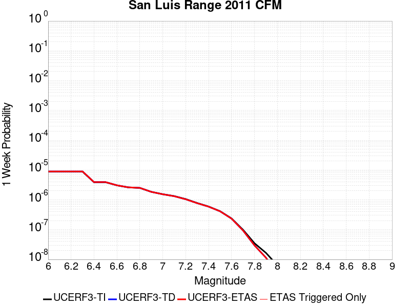 | 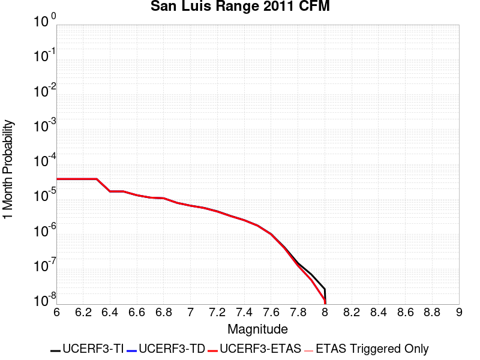 |  | 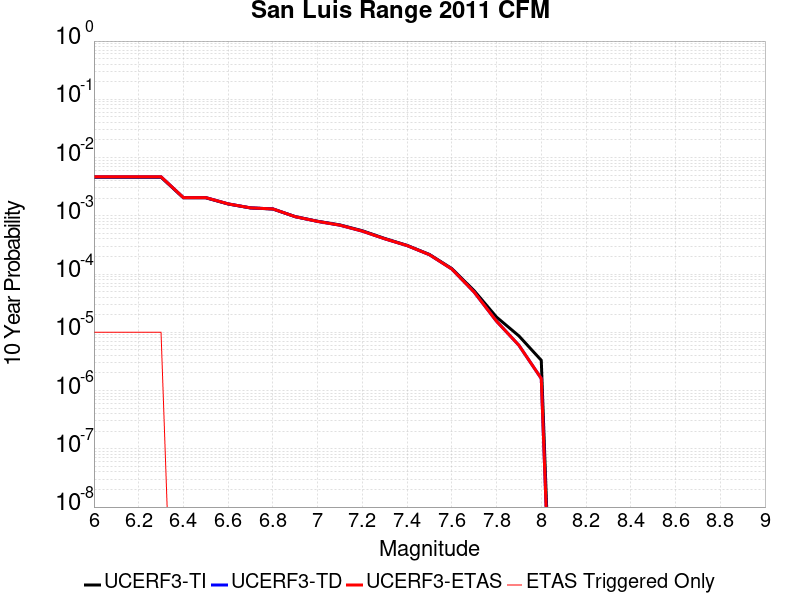 |

| Magnitude | 1 wk TI Prob | 1 wk TD Prob | 1 wk ETAS Prob | 1 wk ETAS/TD Gain | 1 wk ETAS Triggered Only | 1 mo TI Prob | 1 mo TD Prob | 1 mo ETAS Prob | 1 mo ETAS/TD Gain | 1 mo ETAS Triggered Only | 1 yr TI Prob | 1 yr TD Prob | 1 yr ETAS Prob | 1 yr ETAS/TD Gain | 1 yr ETAS Triggered Only | 10 yr TI Prob | 10 yr TD Prob | 10 yr ETAS Prob | 10 yr ETAS/TD Gain | 10 yr ETAS Triggered Only |
|-----|-----|-----|-----|-----|-----|-----|-----|-----|-----|-----|-----|-----|-----|-----|-----|-----|-----|-----|-----|-----|
| 6.0 | 8.8368415E-6 | 8.965455E-6 | 8.965455E-6 | 1.0 | 0.0 | 3.787163E-5 | 3.8422855E-5 | 3.8422855E-5 | 1.0 | 0.0 | 4.609895E-4 | 4.6770574E-4 | 4.6770574E-4 | 1.0 | 0.0 | 0.0046003438 | 0.004667997 | 0.00467795 | 1.0021323 | 1.0E-5 |
| 6.1 | 8.8368415E-6 | 8.965455E-6 | 8.965455E-6 | 1.0 | 0.0 | 3.787163E-5 | 3.8422855E-5 | 3.8422855E-5 | 1.0 | 0.0 | 4.609895E-4 | 4.6770574E-4 | 4.6770574E-4 | 1.0 | 0.0 | 0.0046003438 | 0.004667997 | 0.00467795 | 1.0021323 | 1.0E-5 |
| 6.2 | 8.8368415E-6 | 8.965455E-6 | 8.965455E-6 | 1.0 | 0.0 | 3.787163E-5 | 3.8422855E-5 | 3.8422855E-5 | 1.0 | 0.0 | 4.609895E-4 | 4.6770574E-4 | 4.6770574E-4 | 1.0 | 0.0 | 0.0046003438 | 0.004667997 | 0.00467795 | 1.0021323 | 1.0E-5 |
| 6.3 | 8.8368415E-6 | 8.965455E-6 | 8.965455E-6 | 1.0 | 0.0 | 3.787163E-5 | 3.8422855E-5 | 3.8422855E-5 | 1.0 | 0.0 | 4.609895E-4 | 4.6770574E-4 | 4.6770574E-4 | 1.0 | 0.0 | 0.0046003438 | 0.004667997 | 0.00467795 | 1.0021323 | 1.0E-5 |
| 6.4 | 3.9094193E-6 | 3.941204E-6 | 3.941204E-6 | 1.0 | 0.0 | 1.6754546E-5 | 1.6890766E-5 | 1.6890766E-5 | 1.0 | 0.0 | 2.039675E-4 | 2.0562594E-4 | 2.0562594E-4 | 1.0 | 0.0 | 0.0020378039 | 0.0020543856 | 0.0020543856 | 1.0 | 0.0 |
| 6.5 | 3.9094193E-6 | 3.941204E-6 | 3.941204E-6 | 1.0 | 0.0 | 1.6754546E-5 | 1.6890766E-5 | 1.6890766E-5 | 1.0 | 0.0 | 2.039675E-4 | 2.0562594E-4 | 2.0562594E-4 | 1.0 | 0.0 | 0.0020378039 | 0.0020543856 | 0.0020543856 | 1.0 | 0.0 |
| 6.6 | 3.0587726E-6 | 3.0753893E-6 | 3.0753893E-6 | 1.0 | 0.0 | 1.3108959E-5 | 1.3180174E-5 | 1.3180174E-5 | 1.0 | 0.0 | 1.595899E-4 | 1.6045693E-4 | 1.6045693E-4 | 1.0 | 0.0 | 0.0015947534 | 0.0016034227 | 0.0016034227 | 1.0 | 0.0 |
| 6.7 | 2.6160574E-6 | 2.6251284E-6 | 2.6251284E-6 | 1.0 | 0.0 | 1.1211626E-5 | 1.1250502E-5 | 1.1250502E-5 | 1.0 | 0.0 | 1.3649299E-4 | 1.3696631E-4 | 1.3696631E-4 | 1.0 | 0.0 | 0.0013640919 | 0.0013688251 | 0.0013688251 | 1.0 | 0.0 |
| 6.8 | 2.5110312E-6 | 2.5181412E-6 | 2.5181412E-6 | 1.0 | 0.0 | 1.0761518E-5 | 1.079199E-5 | 1.079199E-5 | 1.0 | 0.0 | 1.310136E-4 | 1.313846E-4 | 1.313846E-4 | 1.0 | 0.0 | 0.0013093639 | 0.0013130752 | 0.0013130752 | 1.0 | 0.0 |
| 6.9 | 1.8564405E-6 | 1.852488E-6 | 1.852488E-6 | 1.0 | 0.0 | 7.95615E-6 | 7.93921E-6 | 7.93921E-6 | 1.0 | 0.0 | 9.686181E-5 | 9.665562E-5 | 9.665562E-5 | 1.0 | 0.0 | 9.68196E-4 | 9.6613786E-4 | 9.6613786E-4 | 1.0 | 0.0 |
| 7.0 | 1.546127E-6 | 1.5369549E-6 | 1.5369549E-6 | 1.0 | 0.0 | 6.626242E-6 | 6.5869326E-6 | 6.5869326E-6 | 1.0 | 0.0 | 8.06715E-5 | 8.019296E-5 | 8.019296E-5 | 1.0 | 0.0 | 8.0642226E-4 | 8.016409E-4 | 8.016409E-4 | 1.0 | 0.0 |
| 7.1 | 1.3368208E-6 | 1.3235336E-6 | 1.3235336E-6 | 1.0 | 0.0 | 5.7292195E-6 | 5.6722747E-6 | 5.6722747E-6 | 1.0 | 0.0 | 6.975101E-5 | 6.905776E-5 | 6.905776E-5 | 1.0 | 0.0 | 6.972912E-4 | 6.903635E-4 | 6.903635E-4 | 1.0 | 0.0 |
| 7.2 | 1.0623363E-6 | 1.0454378E-6 | 1.0454378E-6 | 1.0 | 0.0 | 4.5528623E-6 | 4.4804397E-6 | 4.4804397E-6 | 1.0 | 0.0 | 5.5429686E-5 | 5.4547992E-5 | 5.4547992E-5 | 1.0 | 0.0 | 5.5415864E-4 | 5.453463E-4 | 5.453463E-4 | 1.0 | 0.0 |
| 7.3 | 7.831679E-7 | 7.727399E-7 | 7.727399E-7 | 1.0 | 0.0 | 3.3564295E-6 | 3.3117383E-6 | 3.3117383E-6 | 1.0 | 0.0 | 4.086376E-5 | 4.031967E-5 | 4.031967E-5 | 1.0 | 0.0 | 4.0856248E-4 | 4.0312367E-4 | 4.0312367E-4 | 1.0 | 0.0 |
| 7.4 | 5.9558846E-7 | 5.910646E-7 | 5.910646E-7 | 1.0 | 0.0 | 2.5525194E-6 | 2.5331315E-6 | 2.5331315E-6 | 1.0 | 0.0 | 3.107648E-5 | 3.084044E-5 | 3.084044E-5 | 1.0 | 0.0 | 3.1072134E-4 | 3.083617E-4 | 3.083617E-4 | 1.0 | 0.0 |
| 7.5 | 4.1616502E-7 | 4.1196404E-7 | 4.1196404E-7 | 1.0 | 0.0 | 1.7835631E-6 | 1.765559E-6 | 1.765559E-6 | 1.0 | 0.0 | 2.1714664E-5 | 2.1495469E-5 | 2.1495469E-5 | 1.0 | 0.0 | 2.1712543E-4 | 2.1493394E-4 | 2.1493394E-4 | 1.0 | 0.0 |
| 7.6 | 2.3816014E-7 | 2.3376614E-7 | 2.3376614E-7 | 1.0 | 0.0 | 1.0206859E-6 | 1.0018545E-6 | 1.0018545E-6 | 1.0 | 0.0 | 1.242678E-5 | 1.219751E-5 | 1.219751E-5 | 1.0 | 0.0 | 1.2426086E-4 | 1.2196843E-4 | 1.2196843E-4 | 1.0 | 0.0 |
| 7.7 | 9.918777E-8 | 9.3868096E-8 | 9.3868096E-8 | 1.0 | 0.0 | 4.2509038E-7 | 4.022918E-7 | 4.022918E-7 | 1.0 | 0.0 | 5.1754632E-6 | 4.8978914E-6 | 4.8978914E-6 | 1.0 | 0.0 | 5.1753424E-5 | 4.897784E-5 | 4.897784E-5 | 1.0 | 0.0 |
| 7.8 | 3.4982556E-8 | 2.968672E-8 | 2.968672E-8 | 1.0 | 0.0 | 1.4992524E-7 | 1.272288E-7 | 1.272288E-7 | 1.0 | 0.0 | 1.8253382E-6 | 1.5490094E-6 | 1.5490094E-6 | 1.0 | 0.0 | 1.8253233E-5 | 1.5489988E-5 | 1.5489988E-5 | 1.0 | 0.0 |
| 7.9 | 1.6624908E-8 | 1.1476994E-8 | 1.1476994E-8 | 1.0 | 0.0 | 7.12496E-8 | 4.9187115E-8 | 4.9187115E-8 | 1.0 | 0.0 | 8.6746354E-7 | 5.988529E-7 | 5.988529E-7 | 1.0 | 0.0 | 8.674601E-6 | 5.9885133E-6 | 5.9885133E-6 | 1.0 | 0.0 |
| 8.0 | 6.3352315E-9 | 3.0886564E-9 | 3.0886564E-9 | 1.0 | 0.0 | 2.715099E-8 | 1.32370985E-8 | 1.32370985E-8 | 1.0 | 0.0 | 3.3056327E-7 | 1.6116167E-7 | 1.6116167E-7 | 1.0 | 0.0 | 3.3056278E-6 | 1.6116155E-6 | 1.6116155E-6 | 1.0 | 0.0 |

## Great Valley 03 Mysterious Ridge
*[(top)](#table-of-contents)*

| 1 Week | 1 Month | 1 Year | 10 Year |
|-----|-----|-----|-----|
| 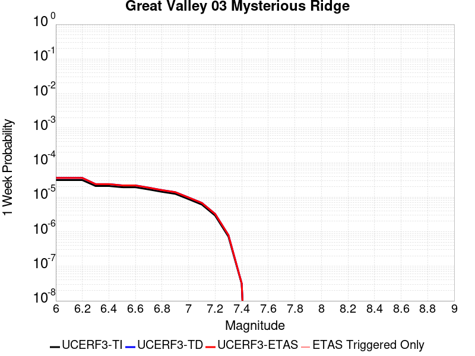 |  | 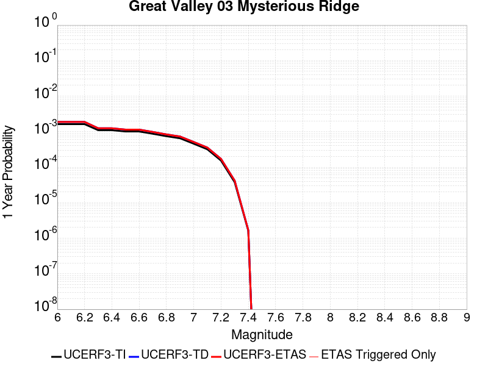 | 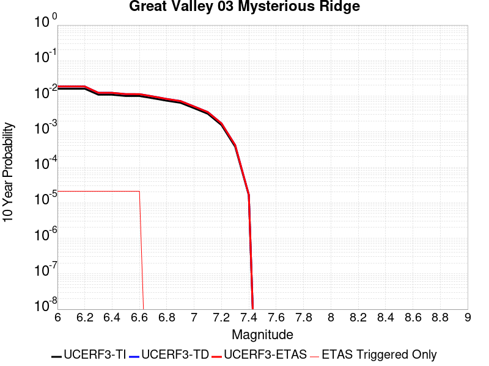 |

| Magnitude | 1 wk TI Prob | 1 wk TD Prob | 1 wk ETAS Prob | 1 wk ETAS/TD Gain | 1 wk ETAS Triggered Only | 1 mo TI Prob | 1 mo TD Prob | 1 mo ETAS Prob | 1 mo ETAS/TD Gain | 1 mo ETAS Triggered Only | 1 yr TI Prob | 1 yr TD Prob | 1 yr ETAS Prob | 1 yr ETAS/TD Gain | 1 yr ETAS Triggered Only | 10 yr TI Prob | 10 yr TD Prob | 10 yr ETAS Prob | 10 yr ETAS/TD Gain | 10 yr ETAS Triggered Only |
|-----|-----|-----|-----|-----|-----|-----|-----|-----|-----|-----|-----|-----|-----|-----|-----|-----|-----|-----|-----|-----|
| 6.0 | 3.1182444E-5 | 3.6034133E-5 | 3.6034133E-5 | 1.0 | 0.0 | 1.336322E-4 | 1.5442389E-4 | 1.5442389E-4 | 1.0 | 0.0 | 0.0016257578 | 0.0018786751 | 0.0018786751 | 1.0 | 0.0 | 0.016139153 | 0.018646672 | 0.018656485 | 1.0005263 | 1.0E-5 |
| 6.1 | 3.1182444E-5 | 3.6034133E-5 | 3.6034133E-5 | 1.0 | 0.0 | 1.336322E-4 | 1.5442389E-4 | 1.5442389E-4 | 1.0 | 0.0 | 0.0016257578 | 0.0018786751 | 0.0018786751 | 1.0 | 0.0 | 0.016139153 | 0.018646672 | 0.018656485 | 1.0005263 | 1.0E-5 |
| 6.2 | 3.1182444E-5 | 3.6034133E-5 | 3.6034133E-5 | 1.0 | 0.0 | 1.336322E-4 | 1.5442389E-4 | 1.5442389E-4 | 1.0 | 0.0 | 0.0016257578 | 0.0018786751 | 0.0018786751 | 1.0 | 0.0 | 0.016139153 | 0.018646672 | 0.018656485 | 1.0005263 | 1.0E-5 |
| 6.3 | 2.106934E-5 | 2.3850303E-5 | 2.3850303E-5 | 1.0 | 0.0 | 9.0294045E-5 | 1.0221176E-4 | 1.0221176E-4 | 1.0 | 0.0 | 0.0010987755 | 0.0012437488 | 0.0012437488 | 1.0 | 0.0 | 0.010933585 | 0.0123711275 | 0.012381004 | 1.0007983 | 1.0E-5 |
| 6.4 | 2.106934E-5 | 2.3850303E-5 | 2.3850303E-5 | 1.0 | 0.0 | 9.0294045E-5 | 1.0221176E-4 | 1.0221176E-4 | 1.0 | 0.0 | 0.0010987755 | 0.0012437488 | 0.0012437488 | 1.0 | 0.0 | 0.010933585 | 0.0123711275 | 0.012381004 | 1.0007983 | 1.0E-5 |
| 6.5 | 1.9389783E-5 | 2.1884982E-5 | 2.1884982E-5 | 1.0 | 0.0 | 8.309642E-5 | 9.378956E-5 | 9.378956E-5 | 1.0 | 0.0 | 0.0010112294 | 0.0011413175 | 0.0011413175 | 1.0 | 0.0 | 0.010066401 | 0.011357434 | 0.011367321 | 1.0008705 | 1.0E-5 |
| 6.6 | 1.9370193E-5 | 2.1864902E-5 | 2.1864902E-5 | 1.0 | 0.0 | 8.301247E-5 | 9.3703515E-5 | 9.3703515E-5 | 1.0 | 0.0 | 0.0010102082 | 0.001140271 | 0.001140271 | 1.0 | 0.0 | 0.010056281 | 0.011347076 | 0.011356963 | 1.0008713 | 1.0E-5 |
| 6.7 | 1.6723505E-5 | 1.8799281E-5 | 1.8799281E-5 | 1.0 | 0.0 | 7.16702E-5 | 8.056597E-5 | 8.056597E-5 | 1.0 | 0.0 | 8.722353E-4 | 9.804688E-4 | 9.804688E-4 | 1.0 | 0.0 | 0.008688197 | 0.009763439 | 0.009763439 | 1.0 | 0.0 |
| 6.8 | 1.426937E-5 | 1.599721E-5 | 1.599721E-5 | 1.0 | 0.0 | 6.115301E-5 | 6.855775E-5 | 6.855775E-5 | 1.0 | 0.0 | 7.4428355E-4 | 8.343854E-4 | 8.343854E-4 | 1.0 | 0.0 | 0.007417957 | 0.008314005 | 0.008314005 | 1.0 | 0.0 |
| 6.9 | 1.2469891E-5 | 1.3956928E-5 | 1.3956928E-5 | 1.0 | 0.0 | 5.3441294E-5 | 5.9814105E-5 | 5.9814105E-5 | 1.0 | 0.0 | 6.504535E-4 | 7.280055E-4 | 7.280055E-4 | 1.0 | 0.0 | 0.006485529 | 0.00725743 | 0.00725743 | 1.0 | 0.0 |
| 7.0 | 8.7746275E-6 | 9.791734E-6 | 9.791734E-6 | 1.0 | 0.0 | 3.7605005E-5 | 4.196394E-5 | 4.196394E-5 | 1.0 | 0.0 | 4.5774475E-4 | 5.1079853E-4 | 5.1079853E-4 | 1.0 | 0.0 | 0.00456803 | 0.005096977 | 0.005096977 | 1.0 | 0.0 |
| 7.1 | 6.1067153E-6 | 6.813725E-6 | 6.813725E-6 | 1.0 | 0.0 | 2.6171374E-5 | 2.9201385E-5 | 2.9201385E-5 | 1.0 | 0.0 | 3.1858988E-4 | 3.5547445E-4 | 3.5547445E-4 | 1.0 | 0.0 | 0.0031813353 | 0.003549609 | 0.003549609 | 1.0 | 0.0 |
| 7.2 | 2.939283E-6 | 3.2741057E-6 | 3.2741057E-6 | 1.0 | 0.0 | 1.2596866E-5 | 1.4031816E-5 | 1.4031816E-5 | 1.0 | 0.0 | 1.5335606E-4 | 1.7082572E-4 | 1.7082572E-4 | 1.0 | 0.0 | 0.0015325027 | 0.001707116 | 0.001707116 | 1.0 | 0.0 |
| 7.3 | 7.2387763E-7 | 8.008505E-7 | 8.008505E-7 | 1.0 | 0.0 | 3.102329E-6 | 3.4322145E-6 | 3.4322145E-6 | 1.0 | 0.0 | 3.77702E-5 | 4.178687E-5 | 4.178687E-5 | 1.0 | 0.0 | 3.7763783E-4 | 4.1783508E-4 | 4.1783508E-4 | 1.0 | 0.0 |
| 7.4 | 3.112171E-8 | 3.2068368E-8 | 3.2068368E-8 | 1.0 | 0.0 | 1.3337875E-7 | 1.3743585E-7 | 1.3743585E-7 | 1.0 | 0.0 | 1.6238852E-6 | 1.6732803E-6 | 1.6732803E-6 | 1.0 | 0.0 | 1.6238733E-5 | 1.6732685E-5 | 1.6732685E-5 | 1.0 | 0.0 |

## Trinidad (alt1)
*[(top)](#table-of-contents)*

| 1 Week | 1 Month | 1 Year | 10 Year |
|-----|-----|-----|-----|
|  |  |  |  |

| Magnitude | 1 wk TI Prob | 1 wk TD Prob | 1 wk ETAS Prob | 1 wk ETAS/TD Gain | 1 wk ETAS Triggered Only | 1 mo TI Prob | 1 mo TD Prob | 1 mo ETAS Prob | 1 mo ETAS/TD Gain | 1 mo ETAS Triggered Only | 1 yr TI Prob | 1 yr TD Prob | 1 yr ETAS Prob | 1 yr ETAS/TD Gain | 1 yr ETAS Triggered Only | 10 yr TI Prob | 10 yr TD Prob | 10 yr ETAS Prob | 10 yr ETAS/TD Gain | 10 yr ETAS Triggered Only |
|-----|-----|-----|-----|-----|-----|-----|-----|-----|-----|-----|-----|-----|-----|-----|-----|-----|-----|-----|-----|-----|
| 6.0 | 3.0167168E-5 | 3.4033183E-5 | 3.4033183E-5 | 1.0 | 0.0 | 1.2928146E-4 | 1.4584929E-4 | 1.4584929E-4 | 1.0 | 0.0 | 0.0015728653 | 0.0017744373 | 0.0017744373 | 1.0 | 0.0 | 0.0156177925 | 0.017619645 | 0.017629469 | 1.0005575 | 1.0E-5 |
| 6.1 | 3.0167168E-5 | 3.4033183E-5 | 3.4033183E-5 | 1.0 | 0.0 | 1.2928146E-4 | 1.4584929E-4 | 1.4584929E-4 | 1.0 | 0.0 | 0.0015728653 | 0.0017744373 | 0.0017744373 | 1.0 | 0.0 | 0.0156177925 | 0.017619645 | 0.017629469 | 1.0005575 | 1.0E-5 |
| 6.2 | 3.0167168E-5 | 3.4033183E-5 | 3.4033183E-5 | 1.0 | 0.0 | 1.2928146E-4 | 1.4584929E-4 | 1.4584929E-4 | 1.0 | 0.0 | 0.0015728653 | 0.0017744373 | 0.0017744373 | 1.0 | 0.0 | 0.0156177925 | 0.017619645 | 0.017629469 | 1.0005575 | 1.0E-5 |
| 6.3 | 3.0167168E-5 | 3.4033183E-5 | 3.4033183E-5 | 1.0 | 0.0 | 1.2928146E-4 | 1.4584929E-4 | 1.4584929E-4 | 1.0 | 0.0 | 0.0015728653 | 0.0017744373 | 0.0017744373 | 1.0 | 0.0 | 0.0156177925 | 0.017619645 | 0.017629469 | 1.0005575 | 1.0E-5 |
| 6.4 | 3.0167168E-5 | 3.4033183E-5 | 3.4033183E-5 | 1.0 | 0.0 | 1.2928146E-4 | 1.4584929E-4 | 1.4584929E-4 | 1.0 | 0.0 | 0.0015728653 | 0.0017744373 | 0.0017744373 | 1.0 | 0.0 | 0.0156177925 | 0.017619645 | 0.017629469 | 1.0005575 | 1.0E-5 |
| 6.5 | 3.0167168E-5 | 3.4033183E-5 | 3.4033183E-5 | 1.0 | 0.0 | 1.2928146E-4 | 1.4584929E-4 | 1.4584929E-4 | 1.0 | 0.0 | 0.0015728653 | 0.0017744373 | 0.0017744373 | 1.0 | 0.0 | 0.0156177925 | 0.017619645 | 0.017629469 | 1.0005575 | 1.0E-5 |
| 6.6 | 3.0167168E-5 | 3.4033183E-5 | 3.4033183E-5 | 1.0 | 0.0 | 1.2928146E-4 | 1.4584929E-4 | 1.4584929E-4 | 1.0 | 0.0 | 0.0015728653 | 0.0017744373 | 0.0017744373 | 1.0 | 0.0 | 0.0156177925 | 0.017619645 | 0.017629469 | 1.0005575 | 1.0E-5 |
| 6.7 | 3.0167168E-5 | 3.4033183E-5 | 3.4033183E-5 | 1.0 | 0.0 | 1.2928146E-4 | 1.4584929E-4 | 1.4584929E-4 | 1.0 | 0.0 | 0.0015728653 | 0.0017744373 | 0.0017744373 | 1.0 | 0.0 | 0.0156177925 | 0.017619645 | 0.017629469 | 1.0005575 | 1.0E-5 |
| 6.8 | 1.717077E-5 | 1.9195684E-5 | 1.9195684E-5 | 1.0 | 0.0 | 7.358694E-5 | 8.226487E-5 | 8.226487E-5 | 1.0 | 0.0 | 8.9555274E-4 | 0.0010011591 | 0.0010011591 | 1.0 | 0.0 | 0.008919522 | 0.009970939 | 0.009980839 | 1.0009929 | 1.0E-5 |
| 6.9 | 1.717077E-5 | 1.9195684E-5 | 1.9195684E-5 | 1.0 | 0.0 | 7.358694E-5 | 8.226487E-5 | 8.226487E-5 | 1.0 | 0.0 | 8.9555274E-4 | 0.0010011591 | 0.0010011591 | 1.0 | 0.0 | 0.008919522 | 0.009970939 | 0.009980839 | 1.0009929 | 1.0E-5 |
| 7.0 | 1.2858572E-5 | 1.433737E-5 | 1.433737E-5 | 1.0 | 0.0 | 5.5107E-5 | 6.14446E-5 | 6.14446E-5 | 1.0 | 0.0 | 6.707212E-4 | 7.478634E-4 | 7.478634E-4 | 1.0 | 0.0 | 0.006687004 | 0.0074566454 | 0.007466571 | 1.0013311 | 1.0E-5 |
| 7.1 | 1.0588431E-5 | 1.1801269E-5 | 1.1801269E-5 | 1.0 | 0.0 | 4.53782E-5 | 5.057605E-5 | 5.057605E-5 | 1.0 | 0.0 | 5.5233954E-4 | 6.156183E-4 | 6.156183E-4 | 1.0 | 0.0 | 0.005509687 | 0.006141979 | 0.006141979 | 1.0 | 0.0 |
| 7.2 | 8.138061E-6 | 9.067213E-6 | 9.067213E-6 | 1.0 | 0.0 | 3.487694E-5 | 3.8859045E-5 | 3.8859045E-5 | 1.0 | 0.0 | 4.2454398E-4 | 4.7303102E-4 | 4.7303102E-4 | 1.0 | 0.0 | 0.0042373384 | 0.0047226823 | 0.0047226823 | 1.0 | 0.0 |
| 7.3 | 5.787542E-6 | 6.46032E-6 | 6.46032E-6 | 1.0 | 0.0 | 2.4803514E-5 | 2.7686914E-5 | 2.7686914E-5 | 1.0 | 0.0 | 3.0194095E-4 | 3.3705754E-4 | 3.3705754E-4 | 1.0 | 0.0 | 0.00301531 | 0.0033675742 | 0.0033675742 | 1.0 | 0.0 |
| 7.4 | 4.303563E-6 | 4.800851E-6 | 4.800851E-6 | 1.0 | 0.0 | 1.844371E-5 | 2.0575026E-5 | 2.0575026E-5 | 1.0 | 0.0 | 2.2452902E-4 | 2.504919E-4 | 2.504919E-4 | 1.0 | 0.0 | 0.0022430231 | 0.0025040337 | 0.0025040337 | 1.0 | 0.0 |
| 7.5 | 5.6063425E-7 | 6.142982E-7 | 6.142982E-7 | 1.0 | 0.0 | 2.402716E-6 | 2.632704E-6 | 2.632704E-6 | 1.0 | 0.0 | 2.9252675E-5 | 3.2052718E-5 | 3.2052718E-5 | 1.0 | 0.0 | 2.9248823E-4 | 3.2048248E-4 | 3.2048248E-4 | 1.0 | 0.0 |
| 7.6 | 4.6699128E-7 | 5.1257996E-7 | 5.1257996E-7 | 1.0 | 0.0 | 2.0013897E-6 | 2.1967694E-6 | 2.1967694E-6 | 1.0 | 0.0 | 2.4366647E-5 | 2.6745354E-5 | 2.6745354E-5 | 1.0 | 0.0 | 2.4363975E-4 | 2.6742276E-4 | 2.6742276E-4 | 1.0 | 0.0 |
| 7.7 | 2.2080937E-7 | 2.4346897E-7 | 2.4346897E-7 | 1.0 | 0.0 | 9.4632554E-7 | 1.043438E-6 | 1.043438E-6 | 1.0 | 0.0 | 1.15214525E-5 | 1.270379E-5 | 1.270379E-5 | 1.0 | 0.0 | 1.1520855E-4 | 1.2703124E-4 | 1.2703124E-4 | 1.0 | 0.0 |
| 7.8 | 1.1438307E-8 | 1.2682963E-8 | 1.2682963E-8 | 1.0 | 0.0 | 4.9021317E-8 | 5.4355557E-8 | 5.4355557E-8 | 1.0 | 0.0 | 5.9683435E-7 | 6.6177887E-7 | 6.6177887E-7 | 1.0 | 0.0 | 5.9683275E-6 | 6.617789E-6 | 6.617789E-6 | 1.0 | 0.0 |

## San Luis Range - Pecho 2011 CFM
*[(top)](#table-of-contents)*

| 1 Week | 1 Month | 1 Year | 10 Year |
|-----|-----|-----|-----|
|  |  |  |  |

| Magnitude | 1 wk TI Prob | 1 wk TD Prob | 1 wk ETAS Prob | 1 wk ETAS/TD Gain | 1 wk ETAS Triggered Only | 1 mo TI Prob | 1 mo TD Prob | 1 mo ETAS Prob | 1 mo ETAS/TD Gain | 1 mo ETAS Triggered Only | 1 yr TI Prob | 1 yr TD Prob | 1 yr ETAS Prob | 1 yr ETAS/TD Gain | 1 yr ETAS Triggered Only | 10 yr TI Prob | 10 yr TD Prob | 10 yr ETAS Prob | 10 yr ETAS/TD Gain | 10 yr ETAS Triggered Only |
|-----|-----|-----|-----|-----|-----|-----|-----|-----|-----|-----|-----|-----|-----|-----|-----|-----|-----|-----|-----|-----|
| 6.0 | 1.687423E-6 | 1.6921944E-6 | 1.1692177E-5 | 6.9094768 | 1.0E-5 | 7.231793E-6 | 7.252243E-6 | 1.725217E-5 | 2.3788738 | 1.0E-5 | 8.804352E-5 | 8.829272E-5 | 9.8291835E-5 | 1.1132497 | 1.0E-5 | 8.8008645E-4 | 8.826003E-4 | 8.9259155E-4 | 1.0113201 | 1.0E-5 |
| 6.1 | 1.687423E-6 | 1.6921944E-6 | 1.1692177E-5 | 6.9094768 | 1.0E-5 | 7.231793E-6 | 7.252243E-6 | 1.725217E-5 | 2.3788738 | 1.0E-5 | 8.804352E-5 | 8.829272E-5 | 9.8291835E-5 | 1.1132497 | 1.0E-5 | 8.8008645E-4 | 8.826003E-4 | 8.9259155E-4 | 1.0113201 | 1.0E-5 |
| 6.2 | 1.0765672E-6 | 1.0770541E-6 | 1.1077043E-5 | 10.2845745 | 1.0E-5 | 4.613851E-6 | 4.615938E-6 | 1.4615892E-5 | 3.1663969 | 1.0E-5 | 5.617219E-5 | 5.6197663E-5 | 6.61971E-5 | 1.1779333 | 1.0E-5 | 5.6157995E-4 | 5.618408E-4 | 5.7183515E-4 | 1.0177886 | 1.0E-5 |
| 6.3 | 8.523104E-7 | 8.5130216E-7 | 1.0851294E-5 | 12.7467 | 1.0E-5 | 3.6527538E-6 | 3.648433E-6 | 1.3648397E-5 | 3.740893 | 1.0E-5 | 4.447137E-5 | 4.4418797E-5 | 5.4418353E-5 | 1.22512 | 1.0E-5 | 4.4462472E-4 | 4.441024E-4 | 4.5409796E-4 | 1.0225073 | 1.0E-5 |
| 6.4 | 8.523104E-7 | 8.5130216E-7 | 1.0851294E-5 | 12.7467 | 1.0E-5 | 3.6527538E-6 | 3.648433E-6 | 1.3648397E-5 | 3.740893 | 1.0E-5 | 4.447137E-5 | 4.4418797E-5 | 5.4418353E-5 | 1.22512 | 1.0E-5 | 4.4462472E-4 | 4.441024E-4 | 4.5409796E-4 | 1.0225073 | 1.0E-5 |
| 6.5 | 7.0029404E-7 | 6.976438E-7 | 6.976438E-7 | 1.0 | 0.0 | 3.0012568E-6 | 2.9898988E-6 | 2.9898988E-6 | 1.0 | 0.0 | 3.6539688E-5 | 3.6401427E-5 | 3.6401427E-5 | 1.0 | 0.0 | 3.653368E-4 | 3.6395632E-4 | 3.6395632E-4 | 1.0 | 0.0 |
| 6.6 | 5.583906E-7 | 5.5428296E-7 | 5.5428296E-7 | 1.0 | 0.0 | 2.3931002E-6 | 2.3754963E-6 | 2.3754963E-6 | 1.0 | 0.0 | 2.9135606E-5 | 2.892129E-5 | 2.892129E-5 | 1.0 | 0.0 | 2.9131788E-4 | 2.89176E-4 | 2.89176E-4 | 1.0 | 0.0 |
| 6.7 | 4.73441E-7 | 4.6830658E-7 | 4.6830658E-7 | 1.0 | 0.0 | 2.0290313E-6 | 2.0070268E-6 | 2.0070268E-6 | 1.0 | 0.0 | 2.4703175E-5 | 2.4435281E-5 | 2.4435281E-5 | 1.0 | 0.0 | 2.470043E-4 | 2.443264E-4 | 2.443264E-4 | 1.0 | 0.0 |
| 6.8 | 4.1466086E-7 | 4.087795E-7 | 4.087795E-7 | 1.0 | 0.0 | 1.7771167E-6 | 1.751911E-6 | 1.751911E-6 | 1.0 | 0.0 | 2.1636182E-5 | 2.132931E-5 | 2.132931E-5 | 1.0 | 0.0 | 2.1634075E-4 | 2.1327297E-4 | 2.1327297E-4 | 1.0 | 0.0 |
| 6.9 | 3.2056641E-7 | 3.13293E-7 | 3.13293E-7 | 1.0 | 0.0 | 1.3738553E-6 | 1.3426836E-6 | 1.3426836E-6 | 1.0 | 0.0 | 1.6726559E-5 | 1.6347052E-5 | 1.6347052E-5 | 1.0 | 0.0 | 1.67253E-4 | 1.6345865E-4 | 1.6345865E-4 | 1.0 | 0.0 |
| 7.0 | 2.6315942E-7 | 2.5489675E-7 | 2.5489675E-7 | 1.0 | 0.0 | 1.1278256E-6 | 1.0924141E-6 | 1.0924141E-6 | 1.0 | 0.0 | 1.3731191E-5 | 1.3300061E-5 | 1.3300061E-5 | 1.0 | 0.0 | 1.3730342E-4 | 1.3299273E-4 | 1.3299273E-4 | 1.0 | 0.0 |
| 7.1 | 2.1832436E-7 | 2.0917312E-7 | 2.0917312E-7 | 1.0 | 0.0 | 9.356755E-7 | 8.9645596E-7 | 8.9645596E-7 | 1.0 | 0.0 | 1.13917895E-5 | 1.0914297E-5 | 1.0914297E-5 | 1.0 | 0.0 | 1.1391206E-4 | 1.0913766E-4 | 1.0913766E-4 | 1.0 | 0.0 |
| 7.2 | 1.7393015E-7 | 1.6376592E-7 | 1.6376592E-7 | 1.0 | 0.0 | 7.454147E-7 | 7.018537E-7 | 7.018537E-7 | 1.0 | 0.0 | 9.075386E-6 | 8.545036E-6 | 8.545036E-6 | 1.0 | 0.0 | 9.075015E-5 | 8.54471E-5 | 8.54471E-5 | 1.0 | 0.0 |
| 7.3 | 1.3744894E-7 | 1.263862E-7 | 1.263862E-7 | 1.0 | 0.0 | 5.890667E-7 | 5.4165497E-7 | 5.4165497E-7 | 1.0 | 0.0 | 7.1718637E-6 | 6.5946297E-6 | 6.5946297E-6 | 1.0 | 0.0 | 7.171632E-5 | 6.5944354E-5 | 6.5944354E-5 | 1.0 | 0.0 |
| 7.4 | 1.0915278E-7 | 9.727534E-8 | 9.727534E-8 | 1.0 | 0.0 | 4.6779755E-7 | 4.1689424E-7 | 4.1689424E-7 | 1.0 | 0.0 | 5.6954204E-6 | 5.0756753E-6 | 5.0756753E-6 | 1.0 | 0.0 | 5.6952744E-5 | 5.0755603E-5 | 5.0755603E-5 | 1.0 | 0.0 |
| 7.5 | 9.490291E-8 | 8.257131E-8 | 8.257131E-8 | 1.0 | 0.0 | 4.0672668E-7 | 3.53877E-7 | 3.53877E-7 | 1.0 | 0.0 | 4.9518862E-6 | 4.308444E-6 | 4.308444E-6 | 1.0 | 0.0 | 4.951776E-5 | 4.308361E-5 | 4.308361E-5 | 1.0 | 0.0 |
| 7.6 | 7.256678E-8 | 5.942529E-8 | 5.942529E-8 | 1.0 | 0.0 | 3.1100043E-7 | 2.546798E-7 | 2.546798E-7 | 1.0 | 0.0 | 3.7864236E-6 | 3.100722E-6 | 3.100722E-6 | 1.0 | 0.0 | 3.7863592E-5 | 3.100679E-5 | 3.100679E-5 | 1.0 | 0.0 |
| 7.7 | 5.446273E-8 | 4.057937E-8 | 4.057937E-8 | 1.0 | 0.0 | 2.3341168E-7 | 1.7391157E-7 | 1.7391157E-7 | 1.0 | 0.0 | 2.8417835E-6 | 2.1173712E-6 | 2.1173712E-6 | 1.0 | 0.0 | 2.8417471E-5 | 2.1173511E-5 | 2.1173511E-5 | 1.0 | 0.0 |
| 7.8 | 3.5850867E-8 | 2.1520364E-8 | 2.1520364E-8 | 1.0 | 0.0 | 1.5364655E-7 | 9.2230124E-8 | 9.2230124E-8 | 1.0 | 0.0 | 1.8706452E-6 | 1.1229012E-6 | 1.1229012E-6 | 1.0 | 0.0 | 1.8706294E-5 | 1.1228955E-5 | 1.1228955E-5 | 1.0 | 0.0 |
| 7.9 | 2.45879E-8 | 1.1394102E-8 | 1.1394102E-8 | 1.0 | 0.0 | 1.0537671E-7 | 4.883186E-8 | 4.883186E-8 | 1.0 | 0.0 | 1.2829606E-6 | 5.9452776E-7 | 5.9452776E-7 | 1.0 | 0.0 | 1.2829532E-5 | 5.945262E-6 | 5.945262E-6 | 1.0 | 0.0 |
| 8.0 | 1.8151761E-8 | 7.4404523E-9 | 7.4404523E-9 | 1.0 | 0.0 | 7.779326E-8 | 3.188765E-8 | 3.188765E-8 | 1.0 | 0.0 | 9.4713255E-7 | 3.8823208E-7 | 3.8823208E-7 | 1.0 | 0.0 | 9.471285E-6 | 3.882314E-6 | 3.882314E-6 | 1.0 | 0.0 |
| 8.1 | 9.559205E-9 | 4.100115E-9 | 4.100115E-9 | 1.0 | 0.0 | 4.096802E-8 | 1.7571923E-8 | 1.7571923E-8 | 1.0 | 0.0 | 4.9878554E-7 | 2.1393814E-7 | 2.1393814E-7 | 1.0 | 0.0 | 4.987844E-6 | 2.1393794E-6 | 2.1393794E-6 | 1.0 | 0.0 |

## Keddie Ridge 2011 CFM
*[(top)](#table-of-contents)*

| 1 Week | 1 Month | 1 Year | 10 Year |
|-----|-----|-----|-----|
| 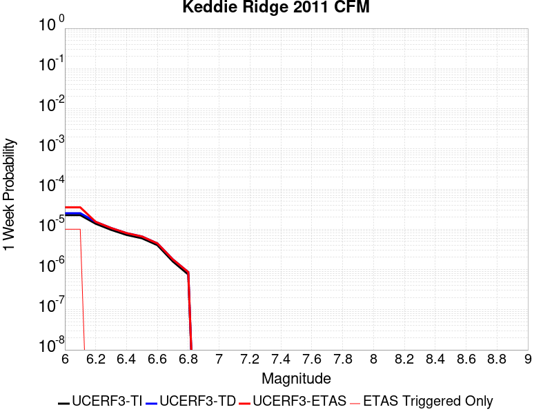 | 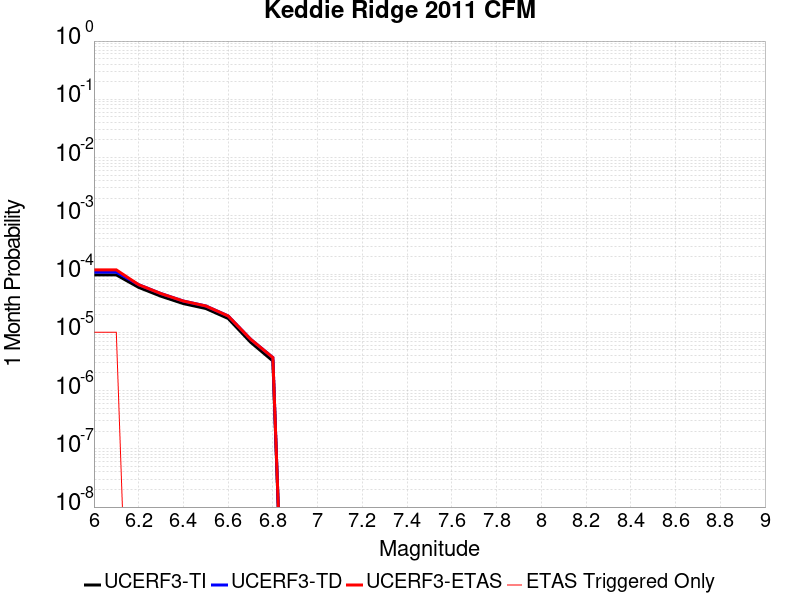 | 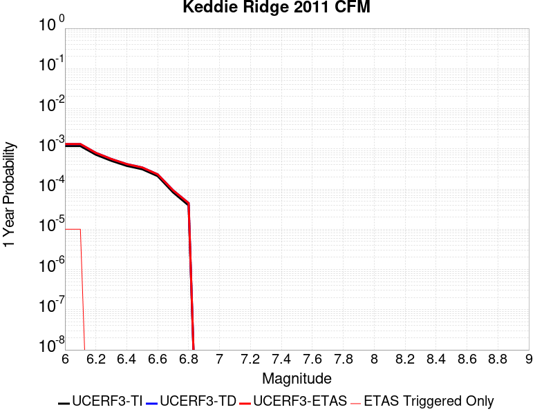 | 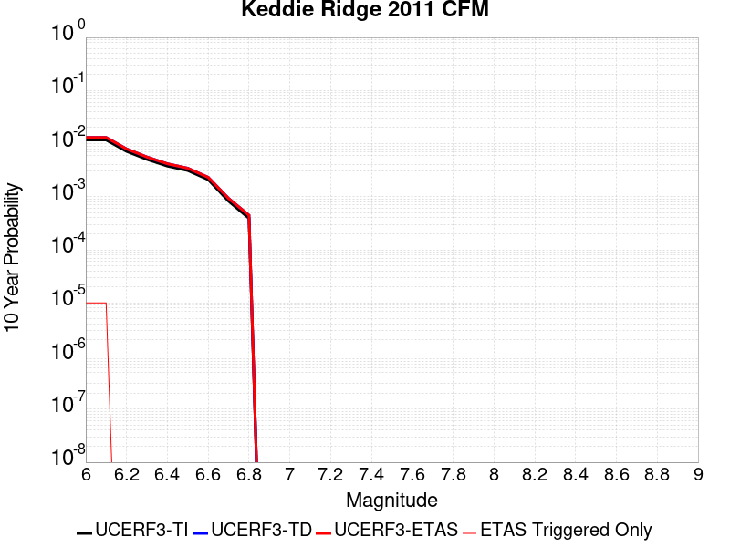 |

| Magnitude | 1 wk TI Prob | 1 wk TD Prob | 1 wk ETAS Prob | 1 wk ETAS/TD Gain | 1 wk ETAS Triggered Only | 1 mo TI Prob | 1 mo TD Prob | 1 mo ETAS Prob | 1 mo ETAS/TD Gain | 1 mo ETAS Triggered Only | 1 yr TI Prob | 1 yr TD Prob | 1 yr ETAS Prob | 1 yr ETAS/TD Gain | 1 yr ETAS Triggered Only | 10 yr TI Prob | 10 yr TD Prob | 10 yr ETAS Prob | 10 yr ETAS/TD Gain | 10 yr ETAS Triggered Only |
|-----|-----|-----|-----|-----|-----|-----|-----|-----|-----|-----|-----|-----|-----|-----|-----|-----|-----|-----|-----|-----|
| 6.0 | 2.2591947E-5 | 2.5189187E-5 | 3.5188936E-5 | 1.3969858 | 1.0E-5 | 9.6819036E-5 | 1.0794964E-4 | 1.1794856E-4 | 1.0926257 | 1.0E-5 | 0.0011781343 | 0.0013135736 | 0.0013235604 | 1.0076028 | 1.0E-5 | 0.011719079 | 0.013066037 | 0.013075906 | 1.0007553 | 1.0E-5 |
| 6.1 | 2.2591947E-5 | 2.5189187E-5 | 3.5188936E-5 | 1.3969858 | 1.0E-5 | 9.6819036E-5 | 1.0794964E-4 | 1.1794856E-4 | 1.0926257 | 1.0E-5 | 0.0011781343 | 0.0013135736 | 0.0013235604 | 1.0076028 | 1.0E-5 | 0.011719079 | 0.013066037 | 0.013075906 | 1.0007553 | 1.0E-5 |
| 6.2 | 1.3775145E-5 | 1.5322817E-5 | 1.5322817E-5 | 1.0 | 0.0 | 5.9035E-5 | 6.56677E-5 | 6.56677E-5 | 1.0 | 0.0 | 7.185141E-4 | 7.9923525E-4 | 7.9923525E-4 | 1.0 | 0.0 | 0.0071619535 | 0.007966028 | 0.007966028 | 1.0 | 0.0 |
| 6.3 | 9.705435E-6 | 1.0768351E-5 | 1.0768351E-5 | 1.0 | 0.0 | 4.1594063E-5 | 4.6149325E-5 | 4.6149325E-5 | 1.0 | 0.0 | 5.0629E-4 | 5.617356E-4 | 5.617356E-4 | 1.0 | 0.0 | 0.005051381 | 0.0056043877 | 0.0056043877 | 1.0 | 0.0 |
| 6.4 | 7.2549733E-6 | 8.027268E-6 | 8.027268E-6 | 1.0 | 0.0 | 3.109237E-5 | 3.440217E-5 | 3.440217E-5 | 1.0 | 0.0 | 3.7848388E-4 | 4.1877388E-4 | 4.1877388E-4 | 1.0 | 0.0 | 0.003778399 | 0.004180635 | 0.004180635 | 1.0 | 0.0 |
| 6.5 | 5.983293E-6 | 6.6130237E-6 | 6.6130237E-6 | 1.0 | 0.0 | 2.5642432E-5 | 2.834126E-5 | 2.834126E-5 | 1.0 | 0.0 | 3.1215188E-4 | 3.4500693E-4 | 3.4500693E-4 | 1.0 | 0.0 | 0.0031171376 | 0.003445376 | 0.003445376 | 1.0 | 0.0 |
| 6.6 | 4.0336154E-6 | 4.4578037E-6 | 4.4578037E-6 | 1.0 | 0.0 | 1.728681E-5 | 1.9104757E-5 | 1.9104757E-5 | 1.0 | 0.0 | 2.1044657E-4 | 2.3257962E-4 | 2.3257962E-4 | 1.0 | 0.0 | 0.002102474 | 0.002323758 | 0.002323758 | 1.0 | 0.0 |
| 6.7 | 1.5832104E-6 | 1.7816087E-6 | 1.7816087E-6 | 1.0 | 0.0 | 6.7851697E-6 | 7.635445E-6 | 7.635445E-6 | 1.0 | 0.0 | 8.260631E-5 | 9.295785E-5 | 9.295785E-5 | 1.0 | 0.0 | 8.2575605E-4 | 9.2921633E-4 | 9.2921633E-4 | 1.0 | 0.0 |
| 6.8 | 7.5177275E-7 | 8.5902946E-7 | 8.5902946E-7 | 1.0 | 0.0 | 3.221879E-6 | 3.6815507E-6 | 3.6815507E-6 | 1.0 | 0.0 | 3.9225673E-5 | 4.4822125E-5 | 4.4822125E-5 | 1.0 | 0.0 | 3.921875E-4 | 4.481474E-4 | 4.481474E-4 | 1.0 | 0.0 |

## Quien Sabe 2011 CFM
*[(top)](#table-of-contents)*

| 1 Week | 1 Month | 1 Year | 10 Year |
|-----|-----|-----|-----|
| 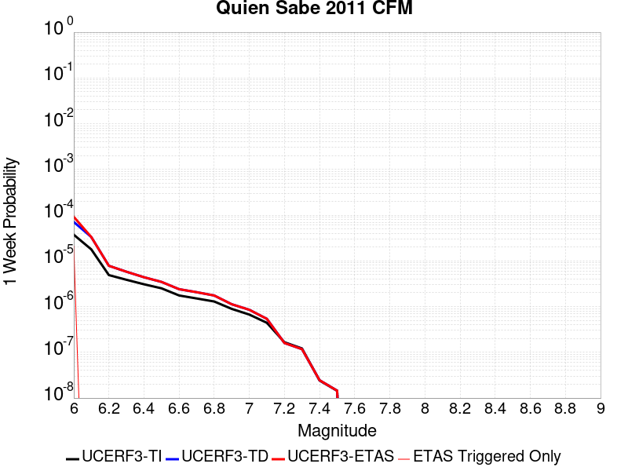 | 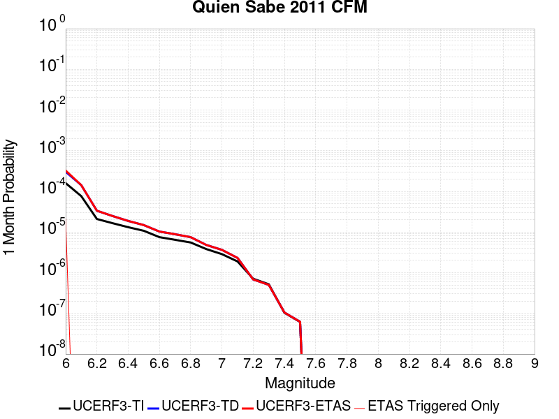 | 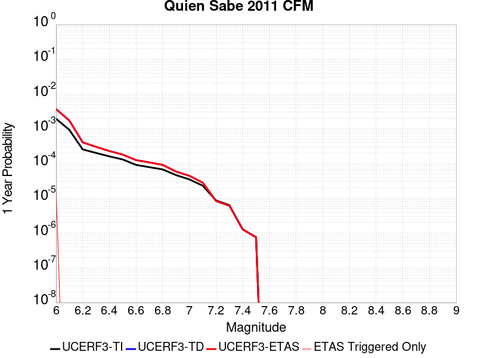 |  |

| Magnitude | 1 wk TI Prob | 1 wk TD Prob | 1 wk ETAS Prob | 1 wk ETAS/TD Gain | 1 wk ETAS Triggered Only | 1 mo TI Prob | 1 mo TD Prob | 1 mo ETAS Prob | 1 mo ETAS/TD Gain | 1 mo ETAS Triggered Only | 1 yr TI Prob | 1 yr TD Prob | 1 yr ETAS Prob | 1 yr ETAS/TD Gain | 1 yr ETAS Triggered Only | 10 yr TI Prob | 10 yr TD Prob | 10 yr ETAS Prob | 10 yr ETAS/TD Gain | 10 yr ETAS Triggered Only |
|-----|-----|-----|-----|-----|-----|-----|-----|-----|-----|-----|-----|-----|-----|-----|-----|-----|-----|-----|-----|-----|
| 6.0 | 3.729899E-5 | 7.094885E-5 | 8.094814E-5 | 1.1409366 | 1.0E-5 | 1.5984301E-4 | 3.0394195E-4 | 3.1393892E-4 | 1.032891 | 1.0E-5 | 0.0019443515 | 0.0036850597 | 0.0036950228 | 1.0027037 | 1.0E-5 | 0.019274272 | 0.035349693 | 0.035359338 | 1.0002729 | 1.0E-5 |
| 6.1 | 1.7825725E-5 | 3.3210796E-5 | 3.3210796E-5 | 1.0 | 0.0 | 7.639373E-5 | 1.4227985E-4 | 1.4227985E-4 | 1.0 | 0.0 | 9.296967E-4 | 0.0017266083 | 0.0017266083 | 1.0 | 0.0 | 0.009258169 | 0.016698873 | 0.016698873 | 1.0 | 0.0 |
| 6.2 | 4.8865336E-6 | 7.807397E-6 | 7.807397E-6 | 1.0 | 0.0 | 2.0942118E-5 | 3.3456672E-5 | 3.3456672E-5 | 1.0 | 0.0 | 2.5494045E-4 | 4.0691794E-4 | 4.0691794E-4 | 1.0 | 0.0 | 0.0025464818 | 0.0040135398 | 0.0040135398 | 1.0 | 0.0 |
| 6.3 | 3.858491E-6 | 5.7896764E-6 | 5.7896764E-6 | 1.0 | 0.0 | 1.6536285E-5 | 2.4812689E-5 | 2.4812689E-5 | 1.0 | 0.0 | 2.0131067E-4 | 3.020573E-4 | 3.020573E-4 | 1.0 | 0.0 | 0.002011284 | 0.0030020247 | 0.0030020247 | 1.0 | 0.0 |
| 6.4 | 3.0771805E-6 | 4.3848822E-6 | 4.3848822E-6 | 1.0 | 0.0 | 1.318785E-5 | 1.879223E-5 | 1.879223E-5 | 1.0 | 0.0 | 1.6055023E-4 | 2.287738E-4 | 2.287738E-4 | 1.0 | 0.0 | 0.001604343 | 0.0022864633 | 0.0022864633 | 1.0 | 0.0 |
| 6.5 | 2.5081235E-6 | 3.4635768E-6 | 3.4635768E-6 | 1.0 | 0.0 | 1.0749056E-5 | 1.4843825E-5 | 1.4843825E-5 | 1.0 | 0.0 | 1.308619E-4 | 1.8071005E-4 | 1.8071005E-4 | 1.0 | 0.0 | 0.0013078486 | 0.0018122483 | 0.0018122483 | 1.0 | 0.0 |
| 6.6 | 1.7505364E-6 | 2.4023664E-6 | 2.4023664E-6 | 1.0 | 0.0 | 7.502277E-6 | 1.0295819E-5 | 1.0295819E-5 | 1.0 | 0.0 | 9.13364E-5 | 1.253451E-4 | 1.253451E-4 | 1.0 | 0.0 | 9.129886E-4 | 0.0012582706 | 0.0012582706 | 1.0 | 0.0 |
| 6.7 | 1.505737E-6 | 2.063768E-6 | 2.063768E-6 | 1.0 | 0.0 | 6.4531428E-6 | 8.844693E-6 | 8.844693E-6 | 1.0 | 0.0 | 7.8564175E-5 | 1.0767942E-4 | 1.0767942E-4 | 1.0 | 0.0 | 7.853641E-4 | 0.0010818074 | 0.0010818074 | 1.0 | 0.0 |
| 6.8 | 1.2924105E-6 | 1.7484224E-6 | 1.7484224E-6 | 1.0 | 0.0 | 5.5388905E-6 | 7.4932204E-6 | 7.4932204E-6 | 1.0 | 0.0 | 6.74339E-5 | 9.1226684E-5 | 9.1226684E-5 | 1.0 | 0.0 | 6.741344E-4 | 9.1608387E-4 | 9.1608387E-4 | 1.0 | 0.0 |
| 6.9 | 8.9075286E-7 | 1.1249912E-6 | 1.1249912E-6 | 1.0 | 0.0 | 3.8175067E-6 | 4.8213833E-6 | 4.8213833E-6 | 1.0 | 0.0 | 4.6477155E-5 | 5.869898E-5 | 5.869898E-5 | 1.0 | 0.0 | 4.6467435E-4 | 5.903731E-4 | 5.903731E-4 | 1.0 | 0.0 |
| 7.0 | 6.6891175E-7 | 8.516645E-7 | 8.516645E-7 | 1.0 | 0.0 | 2.8667614E-6 | 3.6499866E-6 | 3.6499866E-6 | 1.0 | 0.0 | 3.4902263E-5 | 4.443788E-5 | 4.443788E-5 | 1.0 | 0.0 | 3.4896782E-4 | 4.4676356E-4 | 4.4676356E-4 | 1.0 | 0.0 |
| 7.1 | 4.4205015E-7 | 5.391929E-7 | 5.391929E-7 | 1.0 | 0.0 | 1.8944993E-6 | 2.3108257E-6 | 2.3108257E-6 | 1.0 | 0.0 | 2.3065284E-5 | 2.8134109E-5 | 2.8134109E-5 | 1.0 | 0.0 | 2.3062891E-4 | 2.826615E-4 | 2.826615E-4 | 1.0 | 0.0 |
| 7.2 | 1.6620965E-7 | 1.5987632E-7 | 1.5987632E-7 | 1.0 | 0.0 | 7.123269E-7 | 6.851841E-7 | 6.851841E-7 | 1.0 | 0.0 | 8.672545E-6 | 8.342088E-6 | 8.342088E-6 | 1.0 | 0.0 | 8.6722066E-5 | 8.354316E-5 | 8.354316E-5 | 1.0 | 0.0 |
| 7.3 | 1.2142488E-7 | 1.1726676E-7 | 1.1726676E-7 | 1.0 | 0.0 | 5.2039223E-7 | 5.025717E-7 | 5.025717E-7 | 1.0 | 0.0 | 6.335757E-6 | 6.118797E-6 | 6.118797E-6 | 1.0 | 0.0 | 6.3355765E-5 | 6.120608E-5 | 6.120608E-5 | 1.0 | 0.0 |
| 7.4 | 2.4192937E-8 | 2.4545901E-8 | 2.4545901E-8 | 1.0 | 0.0 | 1.0368401E-7 | 1.0519671E-7 | 1.0519671E-7 | 1.0 | 0.0 | 1.2623522E-6 | 1.2807693E-6 | 1.2807693E-6 | 1.0 | 0.0 | 1.2623449E-5 | 1.2768185E-5 | 1.2768185E-5 | 1.0 | 0.0 |
| 7.5 | 1.4432802E-8 | 1.4508743E-8 | 1.4508743E-8 | 1.0 | 0.0 | 6.185486E-8 | 6.218033E-8 | 6.218033E-8 | 1.0 | 0.0 | 7.530827E-7 | 7.5704526E-7 | 7.5704526E-7 | 1.0 | 0.0 | 7.530801E-6 | 7.528889E-6 | 7.528889E-6 | 1.0 | 0.0 |

## Hartley Springs 2011 CFM
*[(top)](#table-of-contents)*

| 1 Week | 1 Month | 1 Year | 10 Year |
|-----|-----|-----|-----|
| 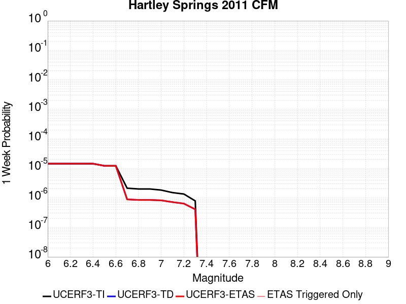 |  | 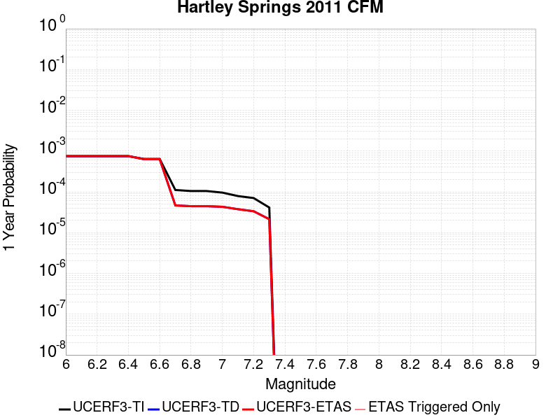 | 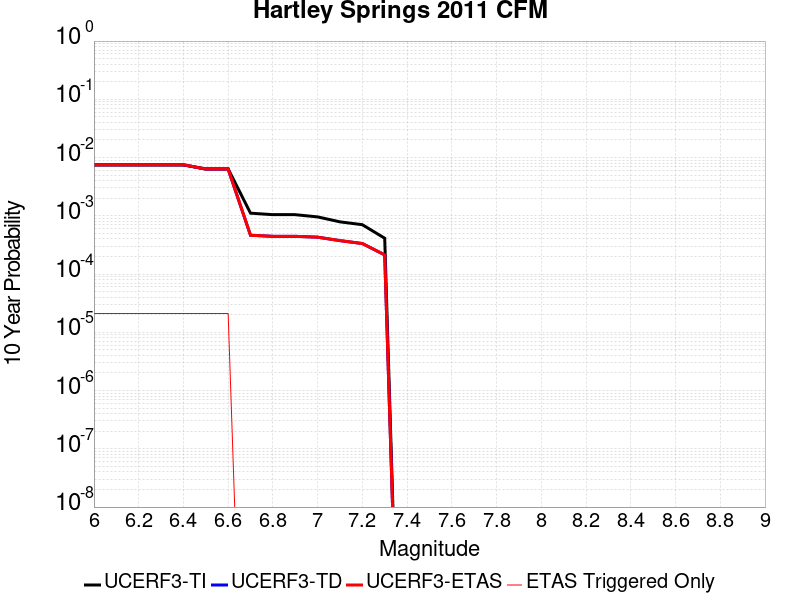 |

| Magnitude | 1 wk TI Prob | 1 wk TD Prob | 1 wk ETAS Prob | 1 wk ETAS/TD Gain | 1 wk ETAS Triggered Only | 1 mo TI Prob | 1 mo TD Prob | 1 mo ETAS Prob | 1 mo ETAS/TD Gain | 1 mo ETAS Triggered Only | 1 yr TI Prob | 1 yr TD Prob | 1 yr ETAS Prob | 1 yr ETAS/TD Gain | 1 yr ETAS Triggered Only | 10 yr TI Prob | 10 yr TD Prob | 10 yr ETAS Prob | 10 yr ETAS/TD Gain | 10 yr ETAS Triggered Only |
|-----|-----|-----|-----|-----|-----|-----|-----|-----|-----|-----|-----|-----|-----|-----|-----|-----|-----|-----|-----|-----|
| 6.0 | 1.4352418E-5 | 1.4434111E-5 | 1.4434111E-5 | 1.0 | 0.0 | 6.1508916E-5 | 6.185994E-5 | 6.185994E-5 | 1.0 | 0.0 | 7.486137E-4 | 7.5304887E-4 | 7.5304887E-4 | 1.0 | 0.0 | 0.007460968 | 0.007521092 | 0.0075310166 | 1.0013196 | 1.0E-5 |
| 6.1 | 1.4352418E-5 | 1.4434111E-5 | 1.4434111E-5 | 1.0 | 0.0 | 6.1508916E-5 | 6.185994E-5 | 6.185994E-5 | 1.0 | 0.0 | 7.486137E-4 | 7.5304887E-4 | 7.5304887E-4 | 1.0 | 0.0 | 0.007460968 | 0.007521092 | 0.0075310166 | 1.0013196 | 1.0E-5 |
| 6.2 | 1.4352418E-5 | 1.4434111E-5 | 1.4434111E-5 | 1.0 | 0.0 | 6.1508916E-5 | 6.185994E-5 | 6.185994E-5 | 1.0 | 0.0 | 7.486137E-4 | 7.5304887E-4 | 7.5304887E-4 | 1.0 | 0.0 | 0.007460968 | 0.007521092 | 0.0075310166 | 1.0013196 | 1.0E-5 |
| 6.3 | 1.4352418E-5 | 1.4434111E-5 | 1.4434111E-5 | 1.0 | 0.0 | 6.1508916E-5 | 6.185994E-5 | 6.185994E-5 | 1.0 | 0.0 | 7.486137E-4 | 7.5304887E-4 | 7.5304887E-4 | 1.0 | 0.0 | 0.007460968 | 0.007521092 | 0.0075310166 | 1.0013196 | 1.0E-5 |
| 6.4 | 1.4352418E-5 | 1.4434111E-5 | 1.4434111E-5 | 1.0 | 0.0 | 6.1508916E-5 | 6.185994E-5 | 6.185994E-5 | 1.0 | 0.0 | 7.486137E-4 | 7.5304887E-4 | 7.5304887E-4 | 1.0 | 0.0 | 0.007460968 | 0.007521092 | 0.0075310166 | 1.0013196 | 1.0E-5 |
| 6.5 | 1.2279858E-5 | 1.2133036E-5 | 1.2133036E-5 | 1.0 | 0.0 | 5.26269E-5 | 5.199858E-5 | 5.199858E-5 | 1.0 | 0.0 | 6.4054417E-4 | 6.33057E-4 | 6.33057E-4 | 1.0 | 0.0 | 0.0063870098 | 0.006328048 | 0.006337985 | 1.0015702 | 1.0E-5 |
| 6.6 | 1.2279858E-5 | 1.2133036E-5 | 1.2133036E-5 | 1.0 | 0.0 | 5.26269E-5 | 5.199858E-5 | 5.199858E-5 | 1.0 | 0.0 | 6.4054417E-4 | 6.33057E-4 | 6.33057E-4 | 1.0 | 0.0 | 0.0063870098 | 0.006328048 | 0.006337985 | 1.0015702 | 1.0E-5 |
| 6.7 | 2.1282601E-6 | 8.894127E-7 | 8.894127E-7 | 1.0 | 0.0 | 9.121083E-6 | 3.8117648E-6 | 3.8117648E-6 | 1.0 | 0.0 | 1.11043526E-4 | 4.6407506E-5 | 4.6407506E-5 | 1.0 | 0.0 | 0.0011098806 | 4.6400347E-4 | 4.6400347E-4 | 1.0 | 0.0 |
| 6.8 | 2.00516E-6 | 8.516916E-7 | 8.516916E-7 | 1.0 | 0.0 | 8.593515E-6 | 3.6501033E-6 | 3.6501033E-6 | 1.0 | 0.0 | 1.04621024E-4 | 4.443936E-5 | 4.443936E-5 | 1.0 | 0.0 | 0.0010457177 | 4.4432987E-4 | 4.4432987E-4 | 1.0 | 0.0 |
| 6.9 | 2.00516E-6 | 8.516916E-7 | 8.516916E-7 | 1.0 | 0.0 | 8.593515E-6 | 3.6501033E-6 | 3.6501033E-6 | 1.0 | 0.0 | 1.04621024E-4 | 4.443936E-5 | 4.443936E-5 | 1.0 | 0.0 | 0.0010457177 | 4.4432987E-4 | 4.4432987E-4 | 1.0 | 0.0 |
| 7.0 | 1.8366732E-6 | 8.2366813E-7 | 8.2366813E-7 | 1.0 | 0.0 | 7.871433E-6 | 3.5300031E-6 | 3.5300031E-6 | 1.0 | 0.0 | 9.583048E-5 | 4.2977194E-5 | 4.2977194E-5 | 1.0 | 0.0 | 9.5789164E-4 | 4.297139E-4 | 4.297139E-4 | 1.0 | 0.0 |
| 7.1 | 1.5097997E-6 | 7.1897E-7 | 7.1897E-7 | 1.0 | 0.0 | 6.470554E-6 | 3.0812978E-6 | 3.0812978E-6 | 1.0 | 0.0 | 7.877615E-5 | 3.7514397E-5 | 3.7514397E-5 | 1.0 | 0.0 | 7.874823E-4 | 3.7510434E-4 | 3.7510434E-4 | 1.0 | 0.0 |
| 7.2 | 1.3490993E-6 | 6.404769E-7 | 6.404769E-7 | 1.0 | 0.0 | 5.7818415E-6 | 2.7448996E-6 | 2.7448996E-6 | 1.0 | 0.0 | 7.0391645E-5 | 3.3418873E-5 | 3.3418873E-5 | 1.0 | 0.0 | 7.0369354E-4 | 3.3416142E-4 | 3.3416142E-4 | 1.0 | 0.0 |
| 7.3 | 7.900015E-7 | 4.0888176E-7 | 4.0888176E-7 | 1.0 | 0.0 | 3.3857161E-6 | 1.7523504E-6 | 1.7523504E-6 | 1.0 | 0.0 | 4.1220315E-5 | 2.1334865E-5 | 2.1334865E-5 | 1.0 | 0.0 | 4.121267E-4 | 2.1334866E-4 | 2.1334866E-4 | 1.0 | 0.0 |

## Fontana (Seismicity)
*[(top)](#table-of-contents)*

| 1 Week | 1 Month | 1 Year | 10 Year |
|-----|-----|-----|-----|
|  |  |  |  |

| Magnitude | 1 wk TI Prob | 1 wk TD Prob | 1 wk ETAS Prob | 1 wk ETAS/TD Gain | 1 wk ETAS Triggered Only | 1 mo TI Prob | 1 mo TD Prob | 1 mo ETAS Prob | 1 mo ETAS/TD Gain | 1 mo ETAS Triggered Only | 1 yr TI Prob | 1 yr TD Prob | 1 yr ETAS Prob | 1 yr ETAS/TD Gain | 1 yr ETAS Triggered Only | 10 yr TI Prob | 10 yr TD Prob | 10 yr ETAS Prob | 10 yr ETAS/TD Gain | 10 yr ETAS Triggered Only |
|-----|-----|-----|-----|-----|-----|-----|-----|-----|-----|-----|-----|-----|-----|-----|-----|-----|-----|-----|-----|-----|
| 6.0 | 7.1789214E-6 | 7.5520006E-6 | 7.5520006E-6 | 1.0 | 0.0 | 3.076644E-5 | 3.2365548E-5 | 3.2365548E-5 | 1.0 | 0.0 | 3.7451705E-4 | 3.9402005E-4 | 4.0401611E-4 | 1.0253694 | 1.0E-5 | 0.003738865 | 0.003937214 | 0.0039471746 | 1.0025299 | 1.0E-5 |
| 6.1 | 7.1789214E-6 | 7.5520006E-6 | 7.5520006E-6 | 1.0 | 0.0 | 3.076644E-5 | 3.2365548E-5 | 3.2365548E-5 | 1.0 | 0.0 | 3.7451705E-4 | 3.9402005E-4 | 4.0401611E-4 | 1.0253694 | 1.0E-5 | 0.003738865 | 0.003937214 | 0.0039471746 | 1.0025299 | 1.0E-5 |
| 6.2 | 7.1789214E-6 | 7.5520006E-6 | 7.5520006E-6 | 1.0 | 0.0 | 3.076644E-5 | 3.2365548E-5 | 3.2365548E-5 | 1.0 | 0.0 | 3.7451705E-4 | 3.9402005E-4 | 4.0401611E-4 | 1.0253694 | 1.0E-5 | 0.003738865 | 0.003937214 | 0.0039471746 | 1.0025299 | 1.0E-5 |
| 6.3 | 7.1789214E-6 | 7.5520006E-6 | 7.5520006E-6 | 1.0 | 0.0 | 3.076644E-5 | 3.2365548E-5 | 3.2365548E-5 | 1.0 | 0.0 | 3.7451705E-4 | 3.9402005E-4 | 4.0401611E-4 | 1.0253694 | 1.0E-5 | 0.003738865 | 0.003937214 | 0.0039471746 | 1.0025299 | 1.0E-5 |
| 6.4 | 7.1789214E-6 | 7.5520006E-6 | 7.5520006E-6 | 1.0 | 0.0 | 3.076644E-5 | 3.2365548E-5 | 3.2365548E-5 | 1.0 | 0.0 | 3.7451705E-4 | 3.9402005E-4 | 4.0401611E-4 | 1.0253694 | 1.0E-5 | 0.003738865 | 0.003937214 | 0.0039471746 | 1.0025299 | 1.0E-5 |
| 6.5 | 5.2611317E-6 | 5.532726E-6 | 5.532726E-6 | 1.0 | 0.0 | 2.2547512E-5 | 2.3711682E-5 | 2.3711682E-5 | 1.0 | 0.0 | 2.744814E-4 | 2.8868974E-4 | 2.9868685E-4 | 1.0346292 | 1.0E-5 | 0.002741426 | 0.0028868972 | 0.0028968684 | 1.003454 | 1.0E-5 |
| 6.6 | 5.2611317E-6 | 5.532726E-6 | 5.532726E-6 | 1.0 | 0.0 | 2.2547512E-5 | 2.3711682E-5 | 2.3711682E-5 | 1.0 | 0.0 | 2.744814E-4 | 2.8868974E-4 | 2.9868685E-4 | 1.0346292 | 1.0E-5 | 0.002741426 | 0.0028868972 | 0.0028968684 | 1.003454 | 1.0E-5 |

## Carlsbad
*[(top)](#table-of-contents)*

| 1 Week | 1 Month | 1 Year | 10 Year |
|-----|-----|-----|-----|
| 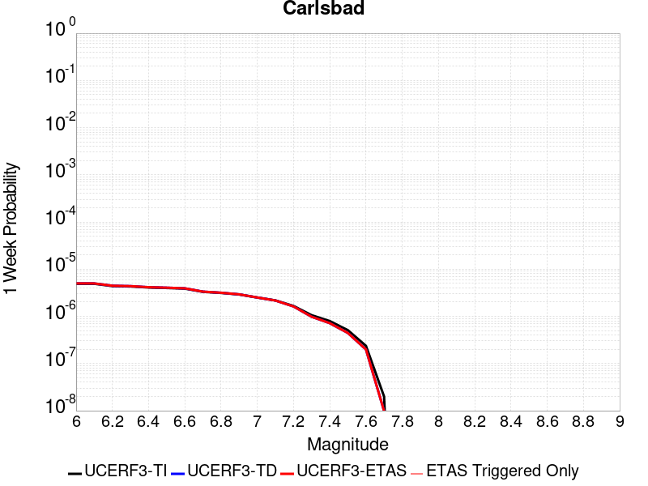 | 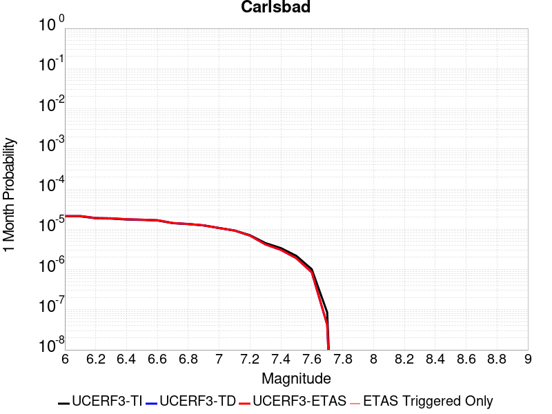 | 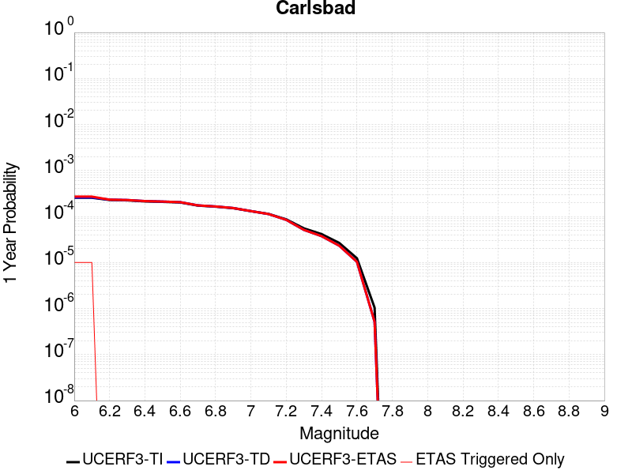 | 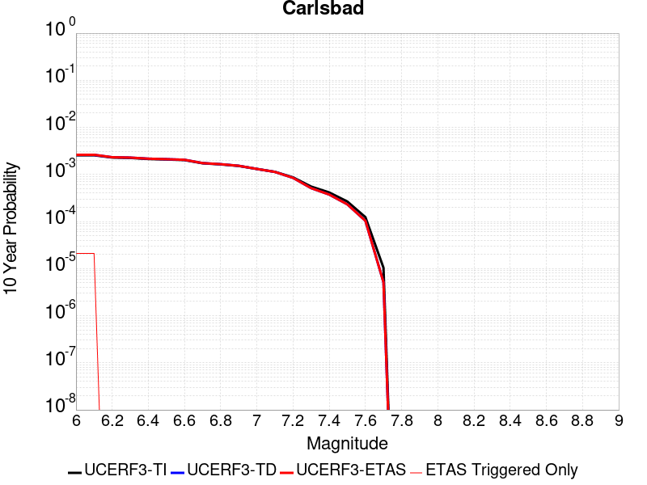 |

| Magnitude | 1 wk TI Prob | 1 wk TD Prob | 1 wk ETAS Prob | 1 wk ETAS/TD Gain | 1 wk ETAS Triggered Only | 1 mo TI Prob | 1 mo TD Prob | 1 mo ETAS Prob | 1 mo ETAS/TD Gain | 1 mo ETAS Triggered Only | 1 yr TI Prob | 1 yr TD Prob | 1 yr ETAS Prob | 1 yr ETAS/TD Gain | 1 yr ETAS Triggered Only | 10 yr TI Prob | 10 yr TD Prob | 10 yr ETAS Prob | 10 yr ETAS/TD Gain | 10 yr ETAS Triggered Only |
|-----|-----|-----|-----|-----|-----|-----|-----|-----|-----|-----|-----|-----|-----|-----|-----|-----|-----|-----|-----|-----|
| 6.0 | 4.9038536E-6 | 4.9872688E-6 | 4.9872688E-6 | 1.0 | 0.0 | 2.1016345E-5 | 2.1373837E-5 | 2.1373837E-5 | 1.0 | 0.0 | 2.5584397E-4 | 2.6019584E-4 | 2.7019324E-4 | 1.0384226 | 1.0E-5 | 0.002555496 | 0.002598959 | 0.002608933 | 1.0038377 | 1.0E-5 |
| 6.1 | 4.9038536E-6 | 4.9872688E-6 | 4.9872688E-6 | 1.0 | 0.0 | 2.1016345E-5 | 2.1373837E-5 | 2.1373837E-5 | 1.0 | 0.0 | 2.5584397E-4 | 2.6019584E-4 | 2.7019324E-4 | 1.0384226 | 1.0E-5 | 0.002555496 | 0.002598959 | 0.002608933 | 1.0038377 | 1.0E-5 |
| 6.2 | 4.3820614E-6 | 4.4547814E-6 | 4.4547814E-6 | 1.0 | 0.0 | 1.8780129E-5 | 1.9091782E-5 | 1.9091782E-5 | 1.0 | 0.0 | 2.2862408E-4 | 2.3241801E-4 | 2.3241801E-4 | 1.0 | 0.0 | 0.00228389 | 0.002321785 | 0.002321785 | 1.0 | 0.0 |
| 6.3 | 4.302872E-6 | 4.373019E-6 | 4.373019E-6 | 1.0 | 0.0 | 1.8440749E-5 | 1.8741377E-5 | 1.8741377E-5 | 1.0 | 0.0 | 2.24493E-4 | 2.2815271E-4 | 2.2815271E-4 | 1.0 | 0.0 | 0.0022426634 | 0.0022792201 | 0.0022792201 | 1.0 | 0.0 |
| 6.4 | 4.0835243E-6 | 4.147667E-6 | 4.147667E-6 | 1.0 | 0.0 | 1.75007E-5 | 1.7775597E-5 | 1.7775597E-5 | 1.0 | 0.0 | 2.1305021E-4 | 2.1639673E-4 | 2.1639673E-4 | 1.0 | 0.0 | 0.0021284607 | 0.0021618942 | 0.0021618942 | 1.0 | 0.0 |
| 6.5 | 3.987806E-6 | 4.048899E-6 | 4.048899E-6 | 1.0 | 0.0 | 1.7090486E-5 | 1.7352311E-5 | 1.7352311E-5 | 1.0 | 0.0 | 2.080568E-4 | 2.1124425E-4 | 2.1124425E-4 | 1.0 | 0.0 | 0.002078621 | 0.0021104682 | 0.0021104682 | 1.0 | 0.0 |
| 6.6 | 3.8707576E-6 | 3.927501E-6 | 3.927501E-6 | 1.0 | 0.0 | 1.6588854E-5 | 1.683204E-5 | 1.683204E-5 | 1.0 | 0.0 | 2.0195059E-4 | 2.0491115E-4 | 2.0491115E-4 | 1.0 | 0.0 | 0.0020176715 | 0.0020472556 | 0.0020472556 | 1.0 | 0.0 |
| 6.7 | 3.3093434E-6 | 3.3424044E-6 | 3.3424044E-6 | 1.0 | 0.0 | 1.4182823E-5 | 1.4324512E-5 | 1.4324512E-5 | 1.0 | 0.0 | 1.7266218E-4 | 1.7438704E-4 | 1.7438704E-4 | 1.0 | 0.0 | 0.001725281 | 0.001742508 | 0.001742508 | 1.0 | 0.0 |
| 6.8 | 3.136983E-6 | 3.1664663E-6 | 3.1664663E-6 | 1.0 | 0.0 | 1.3444143E-5 | 1.35704995E-5 | 1.35704995E-5 | 1.0 | 0.0 | 1.6367015E-4 | 1.6520836E-4 | 1.6520836E-4 | 1.0 | 0.0 | 0.0016354966 | 0.0016508611 | 0.0016508611 | 1.0 | 0.0 |
| 6.9 | 2.9056644E-6 | 2.9267715E-6 | 2.9267715E-6 | 1.0 | 0.0 | 1.2452788E-5 | 1.2543246E-5 | 1.2543246E-5 | 1.0 | 0.0 | 1.5160214E-4 | 1.5270336E-4 | 1.5270336E-4 | 1.0 | 0.0 | 0.0015149876 | 0.0015259896 | 0.0015259896 | 1.0 | 0.0 |
| 7.0 | 2.5071035E-6 | 2.51141E-6 | 2.51141E-6 | 1.0 | 0.0 | 1.0744685E-5 | 1.0763142E-5 | 1.0763142E-5 | 1.0 | 0.0 | 1.308087E-4 | 1.310334E-4 | 1.310334E-4 | 1.0 | 0.0 | 0.0013073172 | 0.0013095647 | 0.0013095647 | 1.0 | 0.0 |
| 7.1 | 2.1786877E-6 | 2.1678952E-6 | 2.1678952E-6 | 1.0 | 0.0 | 9.3372E-6 | 9.290947E-6 | 9.290947E-6 | 1.0 | 0.0 | 1.13674476E-4 | 1.13111426E-4 | 1.13111426E-4 | 1.0 | 0.0 | 0.0011361635 | 0.0011305414 | 0.0011305414 | 1.0 | 0.0 |
| 7.2 | 1.6628418E-6 | 1.6213987E-6 | 1.6213987E-6 | 1.0 | 0.0 | 7.1264453E-6 | 6.9488333E-6 | 6.9488333E-6 | 1.0 | 0.0 | 8.676102E-5 | 8.459878E-5 | 8.459878E-5 | 1.0 | 0.0 | 8.672715E-4 | 8.4566796E-4 | 8.4566796E-4 | 1.0 | 0.0 |
| 7.3 | 1.0595926E-6 | 9.816912E-7 | 9.816912E-7 | 1.0 | 0.0 | 4.541103E-6 | 4.207241E-6 | 4.207241E-6 | 1.0 | 0.0 | 5.5286528E-5 | 5.1221967E-5 | 5.1221967E-5 | 1.0 | 0.0 | 5.527277E-4 | 5.121025E-4 | 5.121025E-4 | 1.0 | 0.0 |
| 7.4 | 7.956623E-7 | 7.173889E-7 | 7.173889E-7 | 1.0 | 0.0 | 3.4099767E-6 | 3.0745202E-6 | 3.0745202E-6 | 1.0 | 0.0 | 4.1515676E-5 | 3.7431648E-5 | 3.7431648E-5 | 1.0 | 0.0 | 4.150792E-4 | 3.7425413E-4 | 3.7425413E-4 | 1.0 | 0.0 |
| 7.5 | 5.1043804E-7 | 4.448447E-7 | 4.448447E-7 | 1.0 | 0.0 | 2.1875896E-6 | 1.9064759E-6 | 1.9064759E-6 | 1.0 | 0.0 | 2.663358E-5 | 2.3211102E-5 | 2.3211102E-5 | 1.0 | 0.0 | 2.6630386E-4 | 2.3208735E-4 | 2.3208735E-4 | 1.0 | 0.0 |
| 7.6 | 2.3723294E-7 | 1.9896439E-7 | 1.9896439E-7 | 1.0 | 0.0 | 1.0167122E-6 | 8.527042E-7 | 8.527042E-7 | 1.0 | 0.0 | 1.2378401E-5 | 1.0381627E-5 | 1.0381627E-5 | 1.0 | 0.0 | 1.237771E-4 | 1.038117E-4 | 1.038117E-4 | 1.0 | 0.0 |
| 7.7 | 1.9992152E-8 | 9.860285E-9 | 9.860285E-9 | 1.0 | 0.0 | 8.568065E-8 | 4.2258364E-8 | 4.2258364E-8 | 1.0 | 0.0 | 1.0431614E-6 | 5.144956E-7 | 5.144956E-7 | 1.0 | 0.0 | 1.0431565E-5 | 5.144956E-6 | 5.144956E-6 | 1.0 | 0.0 |

## Breckenridge 2011
*[(top)](#table-of-contents)*

| 1 Week | 1 Month | 1 Year | 10 Year |
|-----|-----|-----|-----|
|  |  | 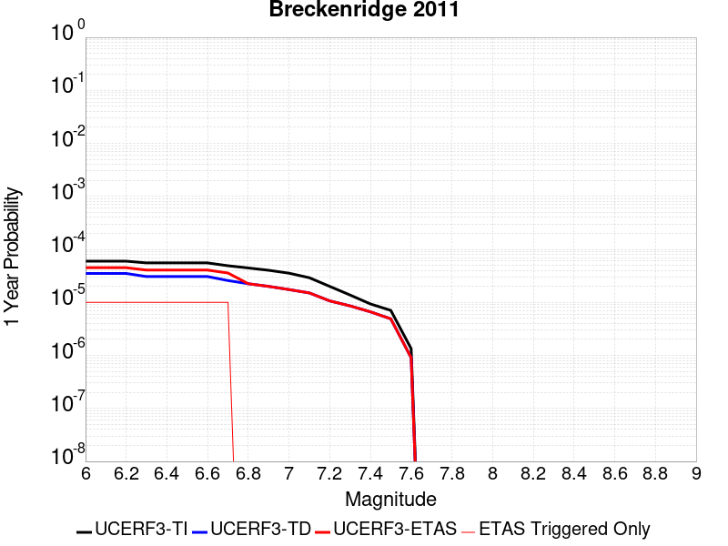 | 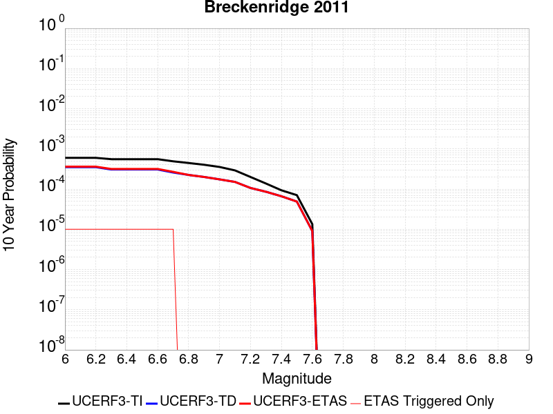 |

| Magnitude | 1 wk TI Prob | 1 wk TD Prob | 1 wk ETAS Prob | 1 wk ETAS/TD Gain | 1 wk ETAS Triggered Only | 1 mo TI Prob | 1 mo TD Prob | 1 mo ETAS Prob | 1 mo ETAS/TD Gain | 1 mo ETAS Triggered Only | 1 yr TI Prob | 1 yr TD Prob | 1 yr ETAS Prob | 1 yr ETAS/TD Gain | 1 yr ETAS Triggered Only | 10 yr TI Prob | 10 yr TD Prob | 10 yr ETAS Prob | 10 yr ETAS/TD Gain | 10 yr ETAS Triggered Only |
|-----|-----|-----|-----|-----|-----|-----|-----|-----|-----|-----|-----|-----|-----|-----|-----|-----|-----|-----|-----|-----|
| 6.0 | 1.1490393E-6 | 6.738007E-7 | 6.738007E-7 | 1.0 | 0.0 | 4.924445E-6 | 2.8877141E-6 | 1.2887685E-5 | 4.4629364 | 1.0E-5 | 5.995347E-5 | 3.5157373E-5 | 4.5157023E-5 | 1.2844254 | 1.0E-5 | 5.9937296E-4 | 3.5152017E-4 | 3.6151666E-4 | 1.0284379 | 1.0E-5 |
| 6.1 | 1.1490393E-6 | 6.738007E-7 | 6.738007E-7 | 1.0 | 0.0 | 4.924445E-6 | 2.8877141E-6 | 1.2887685E-5 | 4.4629364 | 1.0E-5 | 5.995347E-5 | 3.5157373E-5 | 4.5157023E-5 | 1.2844254 | 1.0E-5 | 5.9937296E-4 | 3.5152017E-4 | 3.6151666E-4 | 1.0284379 | 1.0E-5 |
| 6.2 | 1.1490393E-6 | 6.738007E-7 | 6.738007E-7 | 1.0 | 0.0 | 4.924445E-6 | 2.8877141E-6 | 1.2887685E-5 | 4.4629364 | 1.0E-5 | 5.995347E-5 | 3.5157373E-5 | 4.5157023E-5 | 1.2844254 | 1.0E-5 | 5.9937296E-4 | 3.5152017E-4 | 3.6151666E-4 | 1.0284379 | 1.0E-5 |
| 6.3 | 1.064617E-6 | 5.886405E-7 | 5.886405E-7 | 1.0 | 0.0 | 4.5626366E-6 | 2.5227425E-6 | 1.2522717E-5 | 4.96393 | 1.0E-5 | 5.5548684E-5 | 3.071397E-5 | 4.071366E-5 | 1.3255748 | 1.0E-5 | 5.55348E-4 | 3.070984E-4 | 3.1709534E-4 | 1.0325528 | 1.0E-5 |
| 6.4 | 1.064617E-6 | 5.886405E-7 | 5.886405E-7 | 1.0 | 0.0 | 4.5626366E-6 | 2.5227425E-6 | 1.2522717E-5 | 4.96393 | 1.0E-5 | 5.5548684E-5 | 3.071397E-5 | 4.071366E-5 | 1.3255748 | 1.0E-5 | 5.55348E-4 | 3.070984E-4 | 3.1709534E-4 | 1.0325528 | 1.0E-5 |
| 6.5 | 1.064617E-6 | 5.886405E-7 | 5.886405E-7 | 1.0 | 0.0 | 4.5626366E-6 | 2.5227425E-6 | 1.2522717E-5 | 4.96393 | 1.0E-5 | 5.5548684E-5 | 3.071397E-5 | 4.071366E-5 | 1.3255748 | 1.0E-5 | 5.55348E-4 | 3.070984E-4 | 3.1709534E-4 | 1.0325528 | 1.0E-5 |
| 6.6 | 1.064617E-6 | 5.886405E-7 | 5.886405E-7 | 1.0 | 0.0 | 4.5626366E-6 | 2.5227425E-6 | 1.2522717E-5 | 4.96393 | 1.0E-5 | 5.5548684E-5 | 3.071397E-5 | 4.071366E-5 | 1.3255748 | 1.0E-5 | 5.55348E-4 | 3.070984E-4 | 3.1709534E-4 | 1.0325528 | 1.0E-5 |
| 6.7 | 9.4219524E-7 | 4.954012E-7 | 4.954012E-7 | 1.0 | 0.0 | 4.037973E-6 | 2.1231463E-6 | 1.2123125E-5 | 5.709981 | 1.0E-5 | 4.916122E-5 | 2.5849005E-5 | 3.584875E-5 | 1.386852 | 1.0E-5 | 4.9150345E-4 | 2.5846064E-4 | 2.6845807E-4 | 1.0386806 | 1.0E-5 |
| 6.8 | 8.556422E-7 | 4.311915E-7 | 4.311915E-7 | 1.0 | 0.0 | 3.667033E-6 | 1.8479623E-6 | 1.8479623E-6 | 1.0 | 0.0 | 4.464521E-5 | 2.2498712E-5 | 2.2498712E-5 | 1.0 | 0.0 | 4.4636242E-4 | 2.2496474E-4 | 2.2496474E-4 | 1.0 | 0.0 |
| 6.9 | 7.7357794E-7 | 3.841983E-7 | 3.841983E-7 | 1.0 | 0.0 | 3.3153299E-6 | 1.6465632E-6 | 1.6465632E-6 | 1.0 | 0.0 | 4.0363393E-5 | 2.0046726E-5 | 2.0046726E-5 | 1.0 | 0.0 | 4.035606E-4 | 2.0044947E-4 | 2.0044947E-4 | 1.0 | 0.0 |
| 7.0 | 6.8172454E-7 | 3.3470985E-7 | 3.3470985E-7 | 1.0 | 0.0 | 2.9216735E-6 | 1.43447E-6 | 1.43447E-6 | 1.0 | 0.0 | 3.5570793E-5 | 1.7464534E-5 | 1.7464534E-5 | 1.0 | 0.0 | 3.55651E-4 | 1.7463184E-4 | 1.7463184E-4 | 1.0 | 0.0 |
| 7.1 | 5.5936397E-7 | 2.8909366E-7 | 2.8909366E-7 | 1.0 | 0.0 | 2.397272E-6 | 1.2389722E-6 | 1.2389722E-6 | 1.0 | 0.0 | 2.9186394E-5 | 1.5084385E-5 | 1.5084385E-5 | 1.0 | 0.0 | 2.9182562E-4 | 1.5083379E-4 | 1.5083379E-4 | 1.0 | 0.0 |
| 7.2 | 3.8420822E-7 | 2.0468183E-7 | 2.0468183E-7 | 1.0 | 0.0 | 1.6466057E-6 | 8.772076E-7 | 8.772076E-7 | 1.0 | 0.0 | 2.004724E-5 | 1.0679951E-5 | 1.0679951E-5 | 1.0 | 0.0 | 2.004543E-4 | 1.06794454E-4 | 1.06794454E-4 | 1.0 | 0.0 |
| 7.3 | 2.6405158E-7 | 1.6473078E-7 | 1.6473078E-7 | 1.0 | 0.0 | 1.1316491E-6 | 7.0598884E-7 | 7.0598884E-7 | 1.0 | 0.0 | 1.37777415E-5 | 8.595381E-6 | 8.595381E-6 | 1.0 | 0.0 | 1.3776887E-4 | 8.595055E-5 | 8.595055E-5 | 1.0 | 0.0 |
| 7.4 | 1.792114E-7 | 1.2725252E-7 | 1.2725252E-7 | 1.0 | 0.0 | 7.6804866E-7 | 5.453678E-7 | 5.453678E-7 | 1.0 | 0.0 | 9.3509525E-6 | 6.639834E-6 | 6.639834E-6 | 1.0 | 0.0 | 9.350559E-5 | 6.63964E-5 | 6.63964E-5 | 1.0 | 0.0 |
| 7.5 | 1.3548703E-7 | 9.385346E-8 | 9.385346E-8 | 1.0 | 0.0 | 5.8065854E-7 | 4.0222903E-7 | 4.0222903E-7 | 1.0 | 0.0 | 7.0694946E-6 | 4.897128E-6 | 4.897128E-6 | 1.0 | 0.0 | 7.0692695E-5 | 4.8970236E-5 | 4.8970236E-5 | 1.0 | 0.0 |
| 7.6 | 2.572245E-8 | 1.735264E-8 | 1.735264E-8 | 1.0 | 0.0 | 1.10239064E-7 | 7.436845E-8 | 7.436845E-8 | 1.0 | 0.0 | 1.3421597E-6 | 9.0543557E-7 | 9.0543557E-7 | 1.0 | 0.0 | 1.3421517E-5 | 9.054324E-6 | 9.054324E-6 | 1.0 | 0.0 |

## Anacapa-Dume alt 1
*[(top)](#table-of-contents)*

| 1 Week | 1 Month | 1 Year | 10 Year |
|-----|-----|-----|-----|
| 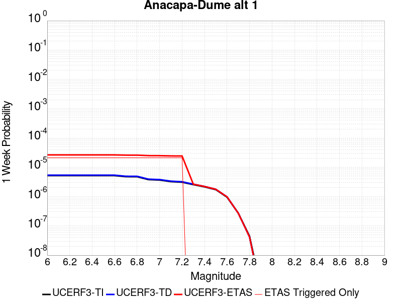 | 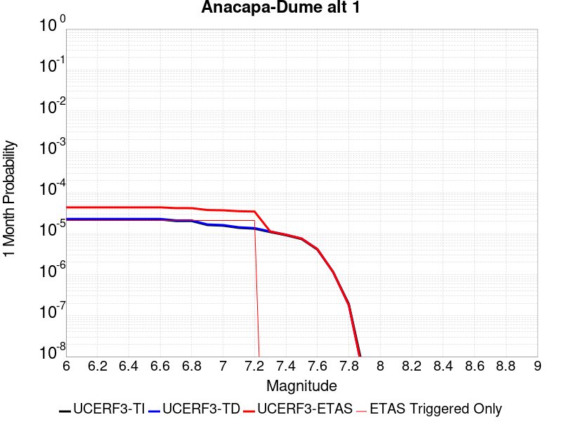 | 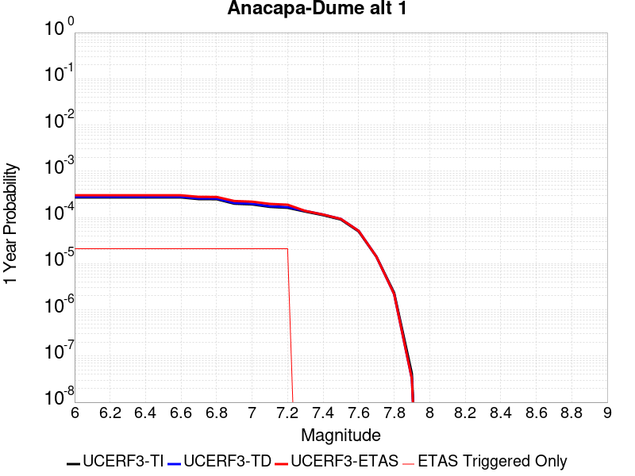 | 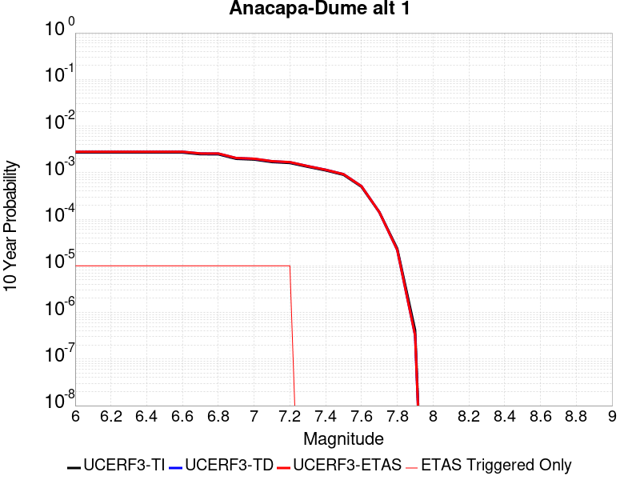 |

| Magnitude | 1 wk TI Prob | 1 wk TD Prob | 1 wk ETAS Prob | 1 wk ETAS/TD Gain | 1 wk ETAS Triggered Only | 1 mo TI Prob | 1 mo TD Prob | 1 mo ETAS Prob | 1 mo ETAS/TD Gain | 1 mo ETAS Triggered Only | 1 yr TI Prob | 1 yr TD Prob | 1 yr ETAS Prob | 1 yr ETAS/TD Gain | 1 yr ETAS Triggered Only | 10 yr TI Prob | 10 yr TD Prob | 10 yr ETAS Prob | 10 yr ETAS/TD Gain | 10 yr ETAS Triggered Only |
|-----|-----|-----|-----|-----|-----|-----|-----|-----|-----|-----|-----|-----|-----|-----|-----|-----|-----|-----|-----|-----|
| 6.0 | 5.1871802E-6 | 5.3673916E-6 | 1.5367337E-5 | 2.8630924 | 1.0E-5 | 2.2230583E-5 | 2.3002909E-5 | 3.3002678E-5 | 1.4347177 | 1.0E-5 | 2.7062374E-4 | 2.8002527E-4 | 2.9002246E-4 | 1.035701 | 1.0E-5 | 0.002702944 | 0.0027968097 | 0.0028067816 | 1.0035655 | 1.0E-5 |
| 6.1 | 5.1871802E-6 | 5.3673916E-6 | 1.5367337E-5 | 2.8630924 | 1.0E-5 | 2.2230583E-5 | 2.3002909E-5 | 3.3002678E-5 | 1.4347177 | 1.0E-5 | 2.7062374E-4 | 2.8002527E-4 | 2.9002246E-4 | 1.035701 | 1.0E-5 | 0.002702944 | 0.0027968097 | 0.0028067816 | 1.0035655 | 1.0E-5 |
| 6.2 | 5.1871802E-6 | 5.3673916E-6 | 1.5367337E-5 | 2.8630924 | 1.0E-5 | 2.2230583E-5 | 2.3002909E-5 | 3.3002678E-5 | 1.4347177 | 1.0E-5 | 2.7062374E-4 | 2.8002527E-4 | 2.9002246E-4 | 1.035701 | 1.0E-5 | 0.002702944 | 0.0027968097 | 0.0028067816 | 1.0035655 | 1.0E-5 |
| 6.3 | 5.1871802E-6 | 5.3673916E-6 | 1.5367337E-5 | 2.8630924 | 1.0E-5 | 2.2230583E-5 | 2.3002909E-5 | 3.3002678E-5 | 1.4347177 | 1.0E-5 | 2.7062374E-4 | 2.8002527E-4 | 2.9002246E-4 | 1.035701 | 1.0E-5 | 0.002702944 | 0.0027968097 | 0.0028067816 | 1.0035655 | 1.0E-5 |
| 6.4 | 5.1871802E-6 | 5.3673916E-6 | 1.5367337E-5 | 2.8630924 | 1.0E-5 | 2.2230583E-5 | 2.3002909E-5 | 3.3002678E-5 | 1.4347177 | 1.0E-5 | 2.7062374E-4 | 2.8002527E-4 | 2.9002246E-4 | 1.035701 | 1.0E-5 | 0.002702944 | 0.0027968097 | 0.0028067816 | 1.0035655 | 1.0E-5 |
| 6.5 | 5.1871802E-6 | 5.3673916E-6 | 1.5367337E-5 | 2.8630924 | 1.0E-5 | 2.2230583E-5 | 2.3002909E-5 | 3.3002678E-5 | 1.4347177 | 1.0E-5 | 2.7062374E-4 | 2.8002527E-4 | 2.9002246E-4 | 1.035701 | 1.0E-5 | 0.002702944 | 0.0027968097 | 0.0028067816 | 1.0035655 | 1.0E-5 |
| 6.6 | 5.1871802E-6 | 5.3673916E-6 | 1.5367337E-5 | 2.8630924 | 1.0E-5 | 2.2230583E-5 | 2.3002909E-5 | 3.3002678E-5 | 1.4347177 | 1.0E-5 | 2.7062374E-4 | 2.8002527E-4 | 2.9002246E-4 | 1.035701 | 1.0E-5 | 0.002702944 | 0.0027968097 | 0.0028067816 | 1.0035655 | 1.0E-5 |
| 6.7 | 4.7693475E-6 | 4.9366927E-6 | 1.4936643E-5 | 3.0256376 | 1.0E-5 | 2.04399E-5 | 2.1157086E-5 | 3.1156873E-5 | 1.4726449 | 1.0E-5 | 2.4882736E-4 | 2.5755784E-4 | 2.6755527E-4 | 1.0388162 | 1.0E-5 | 0.0024854892 | 0.0025726694 | 0.0025826436 | 1.003877 | 1.0E-5 |
| 6.8 | 4.753408E-6 | 4.920241E-6 | 1.49201915E-5 | 3.0324109 | 1.0E-5 | 2.037159E-5 | 2.108658E-5 | 3.108637E-5 | 1.4742253 | 1.0E-5 | 2.4799586E-4 | 2.5669963E-4 | 2.6669705E-4 | 1.038946 | 1.0E-5 | 0.002477193 | 0.002564107 | 0.0025740813 | 1.00389 | 1.0E-5 |
| 6.9 | 3.800069E-6 | 3.937127E-6 | 1.3937088E-5 | 3.5399132 | 1.0E-5 | 1.6285909E-5 | 1.6873293E-5 | 2.6873124E-5 | 1.5926425 | 1.0E-5 | 1.9826289E-4 | 2.054132E-4 | 2.1541116E-4 | 1.0486723 | 1.0E-5 | 0.001980861 | 0.0020522573 | 0.0020622367 | 1.0048627 | 1.0E-5 |
| 7.0 | 3.6671938E-6 | 3.799919E-6 | 1.3799881E-5 | 3.631625 | 1.0E-5 | 1.571645E-5 | 1.6285267E-5 | 2.6285104E-5 | 1.6140419 | 1.0E-5 | 1.9133097E-4 | 1.9825532E-4 | 2.0825333E-4 | 1.05043 | 1.0E-5 | 0.0019116632 | 0.0019808079 | 0.001990788 | 1.0050385 | 1.0E-5 |
| 7.1 | 3.2394885E-6 | 3.3587942E-6 | 1.335876E-5 | 3.9772491 | 1.0E-5 | 1.3883448E-5 | 1.4394753E-5 | 2.4394609E-5 | 1.6946876 | 1.0E-5 | 1.6901788E-4 | 1.7524212E-4 | 1.8524038E-4 | 1.0570539 | 1.0E-5 | 0.0016888938 | 0.0017510506 | 0.0017610331 | 1.0057008 | 1.0E-5 |
| 7.2 | 3.0935948E-6 | 3.2079267E-6 | 1.3207895E-5 | 4.117268 | 1.0E-5 | 1.3258196E-5 | 1.3748186E-5 | 2.3748049E-5 | 1.7273587 | 1.0E-5 | 1.6140658E-4 | 1.6737141E-4 | 1.7736973E-4 | 1.0597373 | 1.0E-5 | 0.001612894 | 0.0016724645 | 0.0016824479 | 1.0059692 | 1.0E-5 |
| 7.3 | 2.5604163E-6 | 2.6470739E-6 | 2.6470739E-6 | 1.0 | 0.0 | 1.0973167E-5 | 1.1344553E-5 | 1.1344553E-5 | 1.0 | 0.0 | 1.3359012E-4 | 1.3811122E-4 | 1.3811122E-4 | 1.0 | 0.0 | 0.0013350984 | 0.0013802585 | 0.0013802585 | 1.0 | 0.0 |
| 7.4 | 2.1429005E-6 | 2.2106035E-6 | 2.2106035E-6 | 1.0 | 0.0 | 9.1838265E-6 | 9.473981E-6 | 9.473981E-6 | 1.0 | 0.0 | 1.11807356E-4 | 1.1533964E-4 | 1.1533964E-4 | 1.0 | 0.0 | 0.0011175112 | 0.0011528004 | 0.0011528004 | 1.0 | 0.0 |
| 7.5 | 1.7237151E-6 | 1.7761457E-6 | 1.7761457E-6 | 1.0 | 0.0 | 7.3873293E-6 | 7.6120314E-6 | 7.6120314E-6 | 1.0 | 0.0 | 8.993702E-5 | 9.267256E-5 | 9.267256E-5 | 1.0 | 0.0 | 8.990063E-4 | 9.263415E-4 | 9.263415E-4 | 1.0 | 0.0 |
| 7.6 | 9.541696E-7 | 9.823211E-7 | 9.823211E-7 | 1.0 | 0.0 | 4.089292E-6 | 4.2099414E-6 | 4.2099414E-6 | 1.0 | 0.0 | 4.9785995E-5 | 5.125484E-5 | 5.125484E-5 | 1.0 | 0.0 | 4.9774844E-4 | 5.124315E-4 | 5.124315E-4 | 1.0 | 0.0 |
| 7.7 | 2.7226676E-7 | 2.7172473E-7 | 2.7172473E-7 | 1.0 | 0.0 | 1.166857E-6 | 1.1645341E-6 | 1.1645341E-6 | 1.0 | 0.0 | 1.4206392E-5 | 1.4178111E-5 | 1.4178111E-5 | 1.0 | 0.0 | 1.4205484E-4 | 1.4177214E-4 | 1.4177214E-4 | 1.0 | 0.0 |
| 7.8 | 4.5017995E-8 | 4.215797E-8 | 4.215797E-8 | 1.0 | 0.0 | 1.9293425E-7 | 1.80677E-7 | 1.80677E-7 | 1.0 | 0.0 | 2.348972E-6 | 2.1997405E-6 | 2.1997405E-6 | 1.0 | 0.0 | 2.348947E-5 | 2.1997208E-5 | 2.1997208E-5 | 1.0 | 0.0 |
| 7.9 | 8.007447E-10 | 6.161581E-10 | 6.161581E-10 | 1.0 | 0.0 | 3.4317629E-9 | 2.640678E-9 | 2.640678E-9 | 1.0 | 0.0 | 4.1781714E-8 | 3.2150254E-8 | 3.2150254E-8 | 1.0 | 0.0 | 4.1781706E-7 | 3.2150248E-7 | 3.2150248E-7 | 1.0 | 0.0 |

