# Parent Section Magnitude-Probability Distributions

Only fault sections with at least one triggered aftershock are plotted. Sections are sorted by total supraseismogenic trigger rate (decreasing)

## Table Of Contents

* [Garlock (Central)](#garlock-central)
* [Tank Canyon](#tank-canyon)
* [Airport Lake](#airport-lake)
* [Little Lake](#little-lake)
* [Owl Lake](#owl-lake)
* [Panamint Valley](#panamint-valley)
* [Garlock (East)](#garlock-east)
* [Hunter Mountain-Saline Valley](#hunter-mountain-saline-valley)
* [Blackwater](#blackwater)
* [Garlock (West)](#garlock-west)
* [Goldstone Lake](#goldstone-lake)
* [McLean Lake](#mclean-lake)
* [Ash Hill](#ash-hill)
* [San Andreas (Mojave N)](#san-andreas-mojave-n)
* [San Andreas (Mojave S)](#san-andreas-mojave-s)
* [So Sierra Nevada](#so-sierra-nevada)
* [Towne Pass](#towne-pass)
* [San Andreas (San Bernardino N)](#san-andreas-san-bernardino-n)
* [San Andreas (Parkfield)](#san-andreas-parkfield)
* [Death Valley (So)](#death-valley-so)
* [Nelson Lake](#nelson-lake)
* [Lenwood-Lockhart-Old Woman Springs](#lenwood-lockhart-old-woman-springs)
* [Gravel Hills-Harper Lk](#gravel-hills-harper-lk)
* [Pisgah-Bullion Mtn-Mesquite Lk](#pisgah-bullion-mtn-mesquite-lk)
* [Elsinore (Glen Ivy) rev](#elsinore-glen-ivy-rev)
* [San Andreas (San Bernardino S)](#san-andreas-san-bernardino-s)
* [Pinto Mtn](#pinto-mtn)
* [San Andreas (Big Bend)](#san-andreas-big-bend)
* [San Andreas (San Gorgonio Pass-Garnet HIll)](#san-andreas-san-gorgonio-pass-garnet-hill)
* [Sierra Nevada  (No Extension)](#sierra-nevada--no-extension)
* [Manix-Afton Hills](#manix-afton-hills)
* [Bicycle Lake](#bicycle-lake)
* [Death Valley (Black Mtns Frontal)](#death-valley-black-mtns-frontal)
* [San Andreas (Cholame) rev](#san-andreas-cholame-rev)
* [Kern Canyon (North Kern) 2011](#kern-canyon-north-kern-2011)
* [Mono Lake 2011 CFM](#mono-lake-2011-cfm)
* [San Jacinto (San Bernardino)](#san-jacinto-san-bernardino)
* [Palos Verdes](#palos-verdes)
* [San Jacinto (San Jacinto Valley) rev](#san-jacinto-san-jacinto-valley-rev)
* [Coyote Canyon](#coyote-canyon)
* [San Jacinto (Stepovers Combined)](#san-jacinto-stepovers-combined)
* [Mission Creek](#mission-creek)
* [White Wolf (Extension)](#white-wolf-extension)
* [Baker](#baker)
* [Paradise](#paradise)
* [Garlic Springs](#garlic-springs)
* [Lost Hills](#lost-hills)

## Garlock (Central)
*[(top)](#table-of-contents)*

| 1 Week | 1 Month | 1 Year | 10 Year |
|-----|-----|-----|-----|
|  |  |  |  |

| Magnitude | 1 wk TI Prob | 1 wk TD Prob | 1 wk ETAS Prob | 1 wk ETAS/TD Gain | 1 wk ETAS Triggered Only | 1 mo TI Prob | 1 mo TD Prob | 1 mo ETAS Prob | 1 mo ETAS/TD Gain | 1 mo ETAS Triggered Only | 1 yr TI Prob | 1 yr TD Prob | 1 yr ETAS Prob | 1 yr ETAS/TD Gain | 1 yr ETAS Triggered Only | 10 yr TI Prob | 10 yr TD Prob | 10 yr ETAS Prob | 10 yr ETAS/TD Gain | 10 yr ETAS Triggered Only |
|-----|-----|-----|-----|-----|-----|-----|-----|-----|-----|-----|-----|-----|-----|-----|-----|-----|-----|-----|-----|-----|
| 6.0 | 5.5131142E-5 | 7.02476E-5 | 0.055287253 | 787.03406 | 0.055220883 | 2.3625491E-4 | 3.0102677E-4 | 0.07557956 | 251.07257 | 0.07530121 | 0.0028726095 | 0.003658906 | 0.104693495 | 28.613333 | 0.10140562 | 0.028357591 | 0.036136657 | 0.1532325 | 4.240362 | 0.12148594 |
| 6.1 | 5.5131142E-5 | 7.02476E-5 | 0.055287253 | 787.03406 | 0.055220883 | 2.3625491E-4 | 3.0102677E-4 | 0.07557956 | 251.07257 | 0.07530121 | 0.0028726095 | 0.003658906 | 0.104693495 | 28.613333 | 0.10140562 | 0.028357591 | 0.036136657 | 0.1532325 | 4.240362 | 0.12148594 |
| 6.2 | 4.216245E-5 | 5.1661802E-5 | 0.04021023 | 778.3358 | 0.04016064 | 1.806837E-4 | 2.213891E-4 | 0.047399696 | 214.1013 | 0.047188755 | 0.0021976046 | 0.002692112 | 0.068778776 | 25.548262 | 0.06626506 | 0.021759989 | 0.026701318 | 0.10780954 | 4.0376115 | 0.083333336 |
| 6.3 | 4.216245E-5 | 5.1661802E-5 | 0.04021023 | 778.3358 | 0.04016064 | 1.806837E-4 | 2.213891E-4 | 0.047399696 | 214.1013 | 0.047188755 | 0.0021976046 | 0.002692112 | 0.068778776 | 25.548262 | 0.06626506 | 0.021759989 | 0.026701318 | 0.10780954 | 4.0376115 | 0.083333336 |
| 6.4 | 3.6858168E-5 | 4.411026E-5 | 0.03417915 | 774.8572 | 0.034136545 | 1.5795401E-4 | 1.8903041E-4 | 0.039338253 | 208.10542 | 0.039156627 | 0.0019213937 | 0.0022990413 | 0.055389553 | 24.092457 | 0.05321285 | 0.019048655 | 0.022866098 | 0.089578055 | 3.9175048 | 0.06827309 |
| 6.5 | 3.39199E-5 | 4.0018425E-5 | 0.030159295 | 753.63525 | 0.030120483 | 1.453629E-4 | 1.7149639E-4 | 0.03430219 | 200.01697 | 0.034136545 | 0.0017683565 | 0.0020859907 | 0.04817439 | 23.094248 | 0.046184737 | 0.017543508 | 0.020758783 | 0.07974922 | 3.8417096 | 0.060240965 |
| 6.6 | 3.3571985E-5 | 3.947258E-5 | 0.030158766 | 764.04346 | 0.030120483 | 1.4387199E-4 | 1.6915736E-4 | 0.03429993 | 202.76936 | 0.034136545 | 0.0017502342 | 0.0020575672 | 0.04814728 | 23.4001 | 0.046184737 | 0.017365133 | 0.020480042 | 0.07948727 | 3.8812063 | 0.060240965 |
| 6.7 | 3.2580007E-5 | 3.808902E-5 | 0.030157425 | 791.7616 | 0.030120483 | 1.3962112E-4 | 1.6322857E-4 | 0.034294203 | 210.09927 | 0.034136545 | 0.0016985617 | 0.0019855178 | 0.04607451 | 23.205286 | 0.044176705 | 0.016856372 | 0.019770874 | 0.07586832 | 3.8373785 | 0.057228915 |
| 6.8 | 3.2185937E-5 | 3.7516216E-5 | 0.030156868 | 803.8356 | 0.030120483 | 1.3793244E-4 | 1.60774E-4 | 0.034291834 | 213.29216 | 0.034136545 | 0.0016780337 | 0.0019556875 | 0.046046 | 23.54466 | 0.044176705 | 0.016654192 | 0.019477878 | 0.07559209 | 3.8809204 | 0.057228915 |
| 6.9 | 3.165394E-5 | 3.672075E-5 | 0.030156096 | 821.22766 | 0.030120483 | 1.3565269E-4 | 1.5736527E-4 | 0.03428854 | 217.8914 | 0.034136545 | 0.0016503202 | 0.00191426 | 0.0460064 | 24.033518 | 0.044176705 | 0.01638118 | 0.019071518 | 0.07520899 | 3.9435241 | 0.057228915 |
| 7.0 | 3.0903822E-5 | 3.562591E-5 | 0.030155035 | 846.4355 | 0.030120483 | 1.3243823E-4 | 1.5267366E-4 | 0.034284007 | 224.55746 | 0.034136545 | 0.0016112428 | 0.0018572382 | 0.0459519 | 24.74206 | 0.044176705 | 0.015996104 | 0.018513493 | 0.0746829 | 4.0339713 | 0.057228915 |
| 7.1 | 3.0069863E-5 | 3.4392175E-5 | 0.030153839 | 876.7645 | 0.030120483 | 1.2886449E-4 | 1.4738683E-4 | 0.034278903 | 232.57779 | 0.034136545 | 0.0015677959 | 0.0017929787 | 0.045890477 | 25.594547 | 0.044176705 | 0.01556781 | 0.01788099 | 0.07408659 | 4.1433163 | 0.057228915 |
| 7.2 | 2.7957109E-5 | 3.128141E-5 | 0.025130898 | 803.38116 | 0.025100403 | 1.1981068E-4 | 1.3405642E-4 | 0.027238857 | 203.18948 | 0.027108435 | 0.0014577188 | 0.0016309345 | 0.035711806 | 21.89653 | 0.034136545 | 0.014481937 | 0.016284352 | 0.060729336 | 3.7293062 | 0.045180723 |
| 7.3 | 2.4519275E-5 | 2.6714602E-5 | 0.01809852 | 677.47675 | 0.018072288 | 1.0507837E-4 | 1.1448621E-4 | 0.020192508 | 176.37503 | 0.02008032 | 0.0012785783 | 0.001392993 | 0.028463665 | 20.433458 | 0.027108435 | 0.012712469 | 0.01392861 | 0.04659965 | 3.3456066 | 0.03313253 |
| 7.4 | 2.3225532E-5 | 2.5199166E-5 | 0.01408107 | 558.7911 | 0.014056225 | 9.95342E-5 | 1.0799204E-4 | 0.015166607 | 140.4419 | 0.015060241 | 0.0012111551 | 0.0013140244 | 0.022370657 | 17.024536 | 0.021084337 | 0.012045753 | 0.013146196 | 0.03890744 | 2.9595969 | 0.026104419 |
| 7.5 | 2.097765E-5 | 2.2483406E-5 | 0.013074399 | 581.51324 | 0.013052209 | 8.9901114E-5 | 9.6353964E-5 | 0.014151225 | 146.86707 | 0.014056225 | 0.0010939965 | 0.00117249 | 0.021229267 | 18.10614 | 0.02008032 | 0.010886264 | 0.0117406575 | 0.035554137 | 3.0282917 | 0.024096385 |
| 7.6 | 1.511254E-5 | 1.5990969E-5 | 0.006039991 | 377.71265 | 0.006024096 | 6.476642E-5 | 6.8530964E-5 | 0.0070961616 | 103.54679 | 0.0070281127 | 7.882459E-4 | 8.34053E-4 | 0.011869018 | 14.230533 | 0.011044176 | 0.007854558 | 0.008383867 | 0.02033105 | 2.4250205 | 0.012048192 |
| 7.7 | 9.934069E-6 | 1.0678523E-5 | 0.0030226945 | 283.063 | 0.003012048 | 4.2573887E-5 | 4.5764296E-5 | 0.0030576747 | 66.81354 | 0.003012048 | 5.182138E-4 | 5.570383E-4 | 0.0055743223 | 10.007072 | 0.00502008 | 0.00517007 | 0.005627419 | 0.010619249 | 1.887055 | 0.00502008 |
| 7.8 | 6.7562896E-6 | 8.42837E-6 | 0.0020164435 | 239.2448 | 0.002008032 | 2.8955206E-5 | 3.6121084E-5 | 0.0020440808 | 56.58968 | 0.002008032 | 3.5247262E-4 | 4.3968562E-4 | 0.0034504095 | 7.8474464 | 0.003012048 | 0.0035191406 | 0.004446416 | 0.007445072 | 1.6743983 | 0.003012048 |
| 7.9 | 3.975453E-6 | 5.3710532E-6 | 0.0020133923 | 374.8599 | 0.002008032 | 1.7037546E-5 | 2.3018596E-5 | 0.0020310045 | 88.23321 | 0.002008032 | 2.0741238E-4 | 2.8021546E-4 | 0.0032914197 | 11.746031 | 0.003012048 | 0.002072189 | 0.0028335669 | 0.00583708 | 2.059976 | 0.003012048 |
| 8.0 | 1.6729537E-6 | 2.0775192E-6 | 2.0775192E-6 | 1.0 | 0.0 | 7.169782E-6 | 8.903624E-6 | 8.903624E-6 | 1.0 | 0.0 | 8.7288594E-5 | 1.0839626E-4 | 1.0839626E-4 | 1.0 | 0.0 | 8.7254314E-4 | 0.001096854 | 0.001096854 | 1.0 | 0.0 |
| 8.1 | 3.6733252E-7 | 3.1489736E-7 | 3.1489736E-7 | 1.0 | 0.0 | 1.5742813E-6 | 1.3495595E-6 | 1.3495595E-6 | 1.0 | 0.0 | 1.9166706E-5 | 1.643078E-5 | 1.643078E-5 | 1.0 | 0.0 | 1.9165053E-4 | 1.662928E-4 | 1.662928E-4 | 1.0 | 0.0 |

## Tank Canyon
*[(top)](#table-of-contents)*

| 1 Week | 1 Month | 1 Year | 10 Year |
|-----|-----|-----|-----|
| 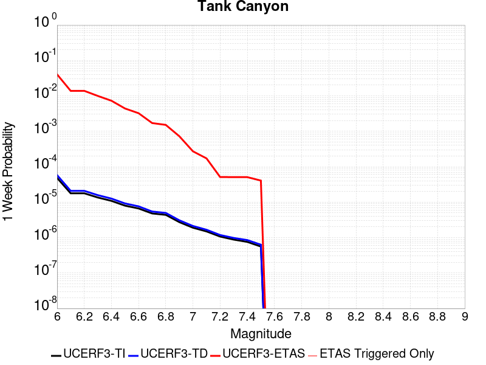 |  |  |  |

| Magnitude | 1 wk TI Prob | 1 wk TD Prob | 1 wk ETAS Prob | 1 wk ETAS/TD Gain | 1 wk ETAS Triggered Only | 1 mo TI Prob | 1 mo TD Prob | 1 mo ETAS Prob | 1 mo ETAS/TD Gain | 1 mo ETAS Triggered Only | 1 yr TI Prob | 1 yr TD Prob | 1 yr ETAS Prob | 1 yr ETAS/TD Gain | 1 yr ETAS Triggered Only | 10 yr TI Prob | 10 yr TD Prob | 10 yr ETAS Prob | 10 yr ETAS/TD Gain | 10 yr ETAS Triggered Only |
|-----|-----|-----|-----|-----|-----|-----|-----|-----|-----|-----|-----|-----|-----|-----|-----|-----|-----|-----|-----|-----|
| 6.0 | 4.8284557E-5 | 5.796445E-5 | 0.04523607 | 780.4105 | 0.045180723 | 2.0691741E-4 | 2.4839927E-4 | 0.0544518 | 219.2108 | 0.05421687 | 0.0025163088 | 0.0030207336 | 0.081097424 | 26.84693 | 0.078313254 | 0.02488006 | 0.029863616 | 0.12921493 | 4.3268347 | 0.10240964 |
| 6.1 | 1.7796336E-5 | 2.0873378E-5 | 0.0150808 | 722.4897 | 0.015060241 | 7.626778E-5 | 8.945448E-5 | 0.019164054 | 214.23245 | 0.019076305 | 9.281647E-4 | 0.0010886024 | 0.031176295 | 28.638828 | 0.030120483 | 0.009242975 | 0.010836642 | 0.05453462 | 5.032428 | 0.044176705 |
| 6.2 | 1.7796336E-5 | 2.0873378E-5 | 0.0150808 | 722.4897 | 0.015060241 | 7.626778E-5 | 8.945448E-5 | 0.019164054 | 214.23245 | 0.019076305 | 9.281647E-4 | 0.0010886024 | 0.031176295 | 28.638828 | 0.030120483 | 0.009242975 | 0.010836642 | 0.05453462 | 5.032428 | 0.044176705 |
| 6.3 | 1.3515912E-5 | 1.5759651E-5 | 0.008047761 | 510.65604 | 0.008032128 | 5.792405E-5 | 6.7539746E-5 | 0.009103074 | 134.78099 | 0.009036144 | 7.049971E-4 | 8.2200987E-4 | 0.020885825 | 25.408241 | 0.02008032 | 0.007027647 | 0.008192157 | 0.036074307 | 4.4035172 | 0.02811245 |
| 6.4 | 1.0870146E-5 | 1.2618114E-5 | 0.0060366383 | 478.41052 | 0.006024096 | 4.658551E-5 | 5.4076605E-5 | 0.007081809 | 130.95883 | 0.0070281127 | 5.67031E-4 | 6.582015E-4 | 0.01570853 | 23.865837 | 0.015060241 | 0.005655863 | 0.006564382 | 0.029505163 | 4.494736 | 0.023092369 |
| 6.5 | 7.964826E-6 | 9.196184E-6 | 0.0040252237 | 437.70587 | 0.004016064 | 3.4134522E-5 | 3.941168E-5 | 0.005059294 | 128.37042 | 0.00502008 | 4.1550855E-4 | 4.797421E-4 | 0.010515086 | 21.918205 | 0.01004016 | 0.0041473247 | 0.004788209 | 0.023773173 | 4.9649405 | 0.019076305 |
| 6.6 | 6.6317E-6 | 7.612378E-6 | 0.0020156293 | 264.7831 | 0.002008032 | 2.8421264E-5 | 3.262412E-5 | 0.003044574 | 93.32279 | 0.003012048 | 3.4597394E-4 | 3.9713533E-4 | 0.0074224565 | 18.689993 | 0.0070281127 | 0.0034543579 | 0.0039652516 | 0.018965775 | 4.7829943 | 0.015060241 |
| 6.7 | 4.793663E-6 | 5.4308593E-6 | 0.0010094414 | 185.87141 | 0.001004016 | 2.0544108E-5 | 2.3274928E-5 | 0.0020312604 | 87.27247 | 0.002008032 | 2.500958E-4 | 2.833398E-4 | 0.0053019975 | 18.712507 | 0.00502008 | 0.0024981452 | 0.0028303189 | 0.012842063 | 4.53732 | 0.01004016 |
| 6.8 | 4.382823E-6 | 4.969325E-6 | 0.0010089804 | 203.04175 | 0.001004016 | 1.8783392E-5 | 2.1296957E-5 | 0.0020292862 | 95.28527 | 0.002008032 | 2.286638E-4 | 2.5926388E-4 | 0.0052780425 | 20.357801 | 0.00502008 | 0.0022842865 | 0.0025901233 | 0.011602864 | 4.4796567 | 0.009036144 |
| 6.9 | 2.729601E-6 | 3.0735862E-6 | 3.0735862E-6 | 1.0 | 0.0 | 1.1698237E-5 | 1.3172453E-5 | 0.0010171753 | 77.21989 | 0.001004016 | 1.4241673E-4 | 1.6036403E-4 | 0.0011642191 | 7.2598515 | 0.001004016 | 0.001423255 | 0.0016024808 | 0.0056121093 | 3.5021384 | 0.004016064 |
| 7.0 | 1.8987357E-6 | 2.126971E-6 | 2.126971E-6 | 1.0 | 0.0 | 8.137413E-6 | 9.115562E-6 | 9.115562E-6 | 1.0 | 0.0 | 9.90685E-5 | 1.1097702E-4 | 1.1097702E-4 | 1.0 | 0.0 | 9.902435E-4 | 0.0011092846 | 0.004117992 | 3.7122948 | 0.003012048 |
| 7.1 | 1.4928986E-6 | 1.6641525E-6 | 1.6641525E-6 | 1.0 | 0.0 | 6.398121E-6 | 7.132066E-6 | 7.132066E-6 | 1.0 | 0.0 | 7.789434E-5 | 8.6830034E-5 | 8.6830034E-5 | 1.0 | 0.0 | 7.786704E-4 | 8.6801895E-4 | 0.002874308 | 3.3113425 | 0.002008032 |
| 7.2 | 1.069082E-6 | 1.1828765E-6 | 1.1828765E-6 | 1.0 | 0.0 | 4.581772E-6 | 5.0694644E-6 | 5.0694644E-6 | 1.0 | 0.0 | 5.5781646E-5 | 6.171951E-5 | 6.171951E-5 | 1.0 | 0.0 | 5.576765E-4 | 6.1707594E-4 | 0.0026238689 | 4.2521005 | 0.002008032 |
| 7.3 | 8.776551E-7 | 9.770151E-7 | 9.770151E-7 | 1.0 | 0.0 | 3.7613736E-6 | 4.187204E-6 | 4.187204E-6 | 1.0 | 0.0 | 4.579376E-5 | 5.0978535E-5 | 5.0978535E-5 | 1.0 | 0.0 | 4.5784327E-4 | 5.097194E-4 | 0.0025167281 | 4.937477 | 0.002008032 |
| 7.4 | 7.55721E-7 | 8.5103835E-7 | 8.5103835E-7 | 1.0 | 0.0 | 3.2388E-6 | 3.6473052E-6 | 3.6473052E-6 | 1.0 | 0.0 | 3.9431678E-5 | 4.4405555E-5 | 4.4405555E-5 | 1.0 | 0.0 | 3.942468E-4 | 4.4401767E-4 | 0.0024511581 | 5.520407 | 0.002008032 |
| 7.5 | 5.587665E-7 | 6.305732E-7 | 6.305732E-7 | 1.0 | 0.0 | 2.3947114E-6 | 2.7024564E-6 | 2.7024564E-6 | 1.0 | 0.0 | 2.915522E-5 | 3.2902408E-5 | 3.2902408E-5 | 1.0 | 0.0 | 2.9151395E-4 | 3.2902407E-4 | 0.0023363954 | 7.1009865 | 0.002008032 |

## Airport Lake
*[(top)](#table-of-contents)*

| 1 Week | 1 Month | 1 Year | 10 Year |
|-----|-----|-----|-----|
|  |  |  |  |

| Magnitude | 1 wk TI Prob | 1 wk TD Prob | 1 wk ETAS Prob | 1 wk ETAS/TD Gain | 1 wk ETAS Triggered Only | 1 mo TI Prob | 1 mo TD Prob | 1 mo ETAS Prob | 1 mo ETAS/TD Gain | 1 mo ETAS Triggered Only | 1 yr TI Prob | 1 yr TD Prob | 1 yr ETAS Prob | 1 yr ETAS/TD Gain | 1 yr ETAS Triggered Only | 10 yr TI Prob | 10 yr TD Prob | 10 yr ETAS Prob | 10 yr ETAS/TD Gain | 10 yr ETAS Triggered Only |
|-----|-----|-----|-----|-----|-----|-----|-----|-----|-----|-----|-----|-----|-----|-----|-----|-----|-----|-----|-----|-----|
| 6.0 | 1.2387061E-5 | 1.3103157E-5 | 0.020093162 | 1533.4596 | 0.02008032 | 5.3086325E-5 | 5.615534E-5 | 0.023147227 | 412.19995 | 0.023092369 | 6.461343E-4 | 6.8350515E-4 | 0.042823356 | 62.652573 | 0.042168673 | 0.0064425888 | 0.0068168393 | 0.057672605 | 8.460315 | 0.05120482 |
| 6.1 | 1.2387061E-5 | 1.3103157E-5 | 0.020093162 | 1533.4596 | 0.02008032 | 5.3086325E-5 | 5.615534E-5 | 0.023147227 | 412.19995 | 0.023092369 | 6.461343E-4 | 6.8350515E-4 | 0.042823356 | 62.652573 | 0.042168673 | 0.0064425888 | 0.0068168393 | 0.057672605 | 8.460315 | 0.05120482 |
| 6.2 | 1.2387061E-5 | 1.3103157E-5 | 0.020093162 | 1533.4596 | 0.02008032 | 5.3086325E-5 | 5.615534E-5 | 0.023147227 | 412.19995 | 0.023092369 | 6.461343E-4 | 6.8350515E-4 | 0.042823356 | 62.652573 | 0.042168673 | 0.0064425888 | 0.0068168393 | 0.057672605 | 8.460315 | 0.05120482 |
| 6.3 | 1.2387061E-5 | 1.3103157E-5 | 0.020093162 | 1533.4596 | 0.02008032 | 5.3086325E-5 | 5.615534E-5 | 0.023147227 | 412.19995 | 0.023092369 | 6.461343E-4 | 6.8350515E-4 | 0.042823356 | 62.652573 | 0.042168673 | 0.0064425888 | 0.0068168393 | 0.057672605 | 8.460315 | 0.05120482 |
| 6.4 | 1.2387061E-5 | 1.3103157E-5 | 0.020093162 | 1533.4596 | 0.02008032 | 5.3086325E-5 | 5.615534E-5 | 0.023147227 | 412.19995 | 0.023092369 | 6.461343E-4 | 6.8350515E-4 | 0.042823356 | 62.652573 | 0.042168673 | 0.0064425888 | 0.0068168393 | 0.057672605 | 8.460315 | 0.05120482 |
| 6.5 | 6.9922594E-6 | 7.384925E-6 | 0.014063506 | 1904.3533 | 0.014056225 | 2.996648E-5 | 3.1649324E-5 | 0.015091414 | 476.83206 | 0.015060241 | 3.6478083E-4 | 3.8526783E-4 | 0.031497773 | 81.75552 | 0.031124499 | 0.003641826 | 0.0038465366 | 0.039852083 | 10.360511 | 0.036144577 |
| 6.6 | 6.9922594E-6 | 7.384925E-6 | 0.014063506 | 1904.3533 | 0.014056225 | 2.996648E-5 | 3.1649324E-5 | 0.015091414 | 476.83206 | 0.015060241 | 3.6478083E-4 | 3.8526783E-4 | 0.031497773 | 81.75552 | 0.031124499 | 0.003641826 | 0.0038465366 | 0.039852083 | 10.360511 | 0.036144577 |
| 6.7 | 5.477277E-6 | 5.7860684E-6 | 0.011049899 | 1909.7422 | 0.011044176 | 2.3473833E-5 | 2.4797222E-5 | 0.012072692 | 486.8566 | 0.012048192 | 2.8575645E-4 | 3.0186825E-4 | 0.028405832 | 94.1001 | 0.02811245 | 0.0028538927 | 0.003014966 | 0.036047604 | 11.956223 | 0.03313253 |
| 6.8 | 3.9950432E-6 | 4.2190873E-6 | 0.008036314 | 1904.7518 | 0.008032128 | 1.7121502E-5 | 1.8081691E-5 | 0.009054063 | 500.73096 | 0.009036144 | 2.0843433E-4 | 2.2012512E-4 | 0.023307411 | 105.88256 | 0.023092369 | 0.0020823893 | 0.0021993418 | 0.029248156 | 13.298594 | 0.027108435 |
| 6.9 | 2.95695E-6 | 3.1230243E-6 | 0.0060272007 | 1929.9243 | 0.006024096 | 1.2672582E-5 | 1.3384334E-5 | 0.0060374 | 451.0796 | 0.006024096 | 1.5427776E-4 | 1.6294434E-4 | 0.017228436 | 105.732025 | 0.017068272 | 0.001541707 | 0.0016284712 | 0.02067371 | 12.695166 | 0.019076305 |
| 7.0 | 1.456072E-6 | 1.540812E-6 | 0.0030135843 | 1955.8417 | 0.003012048 | 6.2402937E-6 | 6.603469E-6 | 0.0030186318 | 457.12817 | 0.003012048 | 7.597293E-5 | 8.039528E-5 | 0.007107943 | 88.412445 | 0.0070281127 | 7.594696E-4 | 8.0376083E-4 | 0.0088294335 | 10.98515 | 0.008032128 |
| 7.1 | 6.995192E-7 | 7.4089746E-7 | 0.0020087715 | 2711.268 | 0.002008032 | 2.997936E-6 | 3.1752747E-6 | 0.002011201 | 633.39435 | 0.002008032 | 3.649926E-5 | 3.865897E-5 | 0.004054568 | 104.880394 | 0.004016064 | 3.6493264E-4 | 3.865897E-4 | 0.0054047294 | 13.980531 | 0.00502008 |

## Little Lake
*[(top)](#table-of-contents)*

| 1 Week | 1 Month | 1 Year | 10 Year |
|-----|-----|-----|-----|
|  |  |  |  |

| Magnitude | 1 wk TI Prob | 1 wk TD Prob | 1 wk ETAS Prob | 1 wk ETAS/TD Gain | 1 wk ETAS Triggered Only | 1 mo TI Prob | 1 mo TD Prob | 1 mo ETAS Prob | 1 mo ETAS/TD Gain | 1 mo ETAS Triggered Only | 1 yr TI Prob | 1 yr TD Prob | 1 yr ETAS Prob | 1 yr ETAS/TD Gain | 1 yr ETAS Triggered Only | 10 yr TI Prob | 10 yr TD Prob | 10 yr ETAS Prob | 10 yr ETAS/TD Gain | 10 yr ETAS Triggered Only |
|-----|-----|-----|-----|-----|-----|-----|-----|-----|-----|-----|-----|-----|-----|-----|-----|-----|-----|-----|-----|-----|
| 6.0 | 2.8424427E-5 | 3.1205716E-5 | 0.02211887 | 708.8083 | 0.022088353 | 1.2181328E-4 | 1.3373268E-4 | 0.026234658 | 196.1724 | 0.026104419 | 0.0014820677 | 0.0016271125 | 0.042724792 | 26.258045 | 0.04116466 | 0.014722223 | 0.016165398 | 0.06259133 | 3.8719323 | 0.047188755 |
| 6.1 | 2.8424427E-5 | 3.1205716E-5 | 0.02211887 | 708.8083 | 0.022088353 | 1.2181328E-4 | 1.3373268E-4 | 0.026234658 | 196.1724 | 0.026104419 | 0.0014820677 | 0.0016271125 | 0.042724792 | 26.258045 | 0.04116466 | 0.014722223 | 0.016165398 | 0.06259133 | 3.8719323 | 0.047188755 |
| 6.2 | 2.8424427E-5 | 3.1205716E-5 | 0.02211887 | 708.8083 | 0.022088353 | 1.2181328E-4 | 1.3373268E-4 | 0.026234658 | 196.1724 | 0.026104419 | 0.0014820677 | 0.0016271125 | 0.042724792 | 26.258045 | 0.04116466 | 0.014722223 | 0.016165398 | 0.06259133 | 3.8719323 | 0.047188755 |
| 6.3 | 1.48860645E-5 | 1.6081383E-5 | 0.01306808 | 812.62164 | 0.013052209 | 6.379586E-5 | 6.8918554E-5 | 0.014124175 | 204.94008 | 0.014056225 | 7.7643775E-4 | 8.387886E-4 | 0.02692131 | 32.095467 | 0.026104419 | 0.007737305 | 0.008359045 | 0.039223373 | 4.692327 | 0.031124499 |
| 6.4 | 1.48860645E-5 | 1.6081383E-5 | 0.01306808 | 812.62164 | 0.013052209 | 6.379586E-5 | 6.8918554E-5 | 0.014124175 | 204.94008 | 0.014056225 | 7.7643775E-4 | 8.387886E-4 | 0.02692131 | 32.095467 | 0.026104419 | 0.007737305 | 0.008359045 | 0.039223373 | 4.692327 | 0.031124499 |
| 6.5 | 1.2797581E-5 | 1.376556E-5 | 0.012061792 | 876.22974 | 0.012048192 | 5.4845623E-5 | 5.8994065E-5 | 0.013110433 | 222.23308 | 0.013052209 | 6.675408E-4 | 7.1804173E-4 | 0.024797125 | 34.534378 | 0.024096385 | 0.006655392 | 0.007159767 | 0.036067765 | 5.0375614 | 0.029116467 |
| 6.6 | 9.661896E-6 | 1.0289033E-5 | 0.012058358 | 1171.9623 | 0.012048192 | 4.1407468E-5 | 4.40952E-5 | 0.013095728 | 296.98764 | 0.013052209 | 5.040193E-4 | 5.36743E-4 | 0.023616718 | 44.000046 | 0.023092369 | 0.005028777 | 0.0053560715 | 0.03231931 | 6.0341444 | 0.027108435 |
| 6.7 | 7.767871E-6 | 8.199681E-6 | 0.00904427 | 1103.0027 | 0.009036144 | 3.329045E-5 | 3.5141096E-5 | 0.010074949 | 286.69992 | 0.01004016 | 4.0523586E-4 | 4.2777258E-4 | 0.020499503 | 47.9215 | 0.02008032 | 0.004044977 | 0.004270843 | 0.02726459 | 6.383889 | 0.023092369 |
| 6.8 | 6.4235196E-6 | 6.735739E-6 | 0.007034801 | 1044.3993 | 0.0070281127 | 2.752908E-5 | 2.8867207E-5 | 0.008060764 | 279.23602 | 0.008032128 | 3.35115E-4 | 3.5141438E-4 | 0.016410027 | 46.697083 | 0.016064256 | 0.003346101 | 0.0035098472 | 0.022519197 | 6.416005 | 0.019076305 |
| 6.9 | 3.1283696E-6 | 3.1121751E-6 | 0.005023177 | 1614.0405 | 0.00502008 | 1.3407229E-5 | 1.33378335E-5 | 0.005033351 | 377.37396 | 0.00502008 | 1.6322079E-4 | 1.6237753E-4 | 0.0112047605 | 69.00438 | 0.011044176 | 0.0016310095 | 0.0016227372 | 0.013651378 | 8.412563 | 0.012048192 |
| 7.0 | 2.290603E-6 | 2.2286763E-6 | 0.004018284 | 1802.9913 | 0.004016064 | 9.816834E-6 | 9.551441E-6 | 0.0040255776 | 421.46286 | 0.004016064 | 1.19513395E-4 | 1.1628362E-4 | 0.008147478 | 70.06557 | 0.008032128 | 0.0011944914 | 0.0011623299 | 0.010187971 | 8.765129 | 0.009036144 |
| 7.1 | 1.293693E-6 | 1.1776774E-6 | 0.0030132222 | 2558.6143 | 0.003012048 | 5.5443866E-6 | 5.047183E-6 | 0.0030170802 | 597.7751 | 0.003012048 | 6.750081E-5 | 6.1448416E-5 | 0.00508122 | 82.69082 | 0.00502008 | 6.7480316E-4 | 6.1438273E-4 | 0.006634778 | 10.799095 | 0.006024096 |
| 7.2 | 4.715842E-7 | 3.091732E-7 | 0.0010043249 | 3248.4216 | 0.001004016 | 2.0210737E-6 | 1.3250274E-6 | 0.0010053398 | 758.7313 | 0.001004016 | 2.4606294E-5 | 1.6132095E-5 | 0.001020132 | 63.236176 | 0.001004016 | 2.460357E-4 | 1.6130977E-4 | 0.0011651639 | 7.223145 | 0.001004016 |
| 7.3 | 3.9430947E-7 | 2.3096938E-7 | 0.0010042468 | 4347.965 | 0.001004016 | 1.6898966E-6 | 9.898685E-7 | 0.001005005 | 1015.29144 | 0.001004016 | 2.0574296E-5 | 1.2051582E-5 | 0.0010160556 | 84.30889 | 0.001004016 | 2.0572392E-4 | 1.2050936E-4 | 0.0011244045 | 9.330433 | 0.001004016 |
| 7.4 | 3.547123E-7 | 1.9678579E-7 | 1.9678579E-7 | 1.0 | 0.0 | 1.5201948E-6 | 8.433674E-7 | 8.433674E-7 | 1.0 | 0.0 | 1.8508214E-5 | 1.02679505E-5 | 1.02679505E-5 | 1.0 | 0.0 | 1.8506673E-4 | 1.0267482E-4 | 1.0267482E-4 | 1.0 | 0.0 |
| 7.5 | 2.6354266E-7 | 1.4422719E-7 | 1.4422719E-7 | 1.0 | 0.0 | 1.129468E-6 | 6.1811636E-7 | 6.1811636E-7 | 1.0 | 0.0 | 1.3751187E-5 | 7.525541E-6 | 7.525541E-6 | 1.0 | 0.0 | 1.3750336E-4 | 7.5252916E-5 | 7.5252916E-5 | 1.0 | 0.0 |
| 7.6 | 1.269913E-7 | 7.572344E-8 | 7.572344E-8 | 1.0 | 0.0 | 5.4424834E-7 | 3.24529E-7 | 3.24529E-7 | 1.0 | 0.0 | 6.6262032E-6 | 3.9511337E-6 | 3.9511337E-6 | 1.0 | 0.0 | 6.626006E-5 | 3.9510673E-5 | 3.9510673E-5 | 1.0 | 0.0 |

## Owl Lake
*[(top)](#table-of-contents)*

| 1 Week | 1 Month | 1 Year | 10 Year |
|-----|-----|-----|-----|
|  |  |  |  |

| Magnitude | 1 wk TI Prob | 1 wk TD Prob | 1 wk ETAS Prob | 1 wk ETAS/TD Gain | 1 wk ETAS Triggered Only | 1 mo TI Prob | 1 mo TD Prob | 1 mo ETAS Prob | 1 mo ETAS/TD Gain | 1 mo ETAS Triggered Only | 1 yr TI Prob | 1 yr TD Prob | 1 yr ETAS Prob | 1 yr ETAS/TD Gain | 1 yr ETAS Triggered Only | 10 yr TI Prob | 10 yr TD Prob | 10 yr ETAS Prob | 10 yr ETAS/TD Gain | 10 yr ETAS Triggered Only |
|-----|-----|-----|-----|-----|-----|-----|-----|-----|-----|-----|-----|-----|-----|-----|-----|-----|-----|-----|-----|-----|
| 6.0 | 5.0320643E-5 | 6.6358676E-5 | 0.015125601 | 227.93704 | 0.015060241 | 2.1564208E-4 | 2.843643E-4 | 0.018351514 | 64.535225 | 0.018072288 | 0.0026222812 | 0.003457547 | 0.028471163 | 8.234498 | 0.025100403 | 0.02591553 | 0.034141295 | 0.07099133 | 2.079339 | 0.03815261 |
| 6.1 | 5.0320643E-5 | 6.6358676E-5 | 0.015125601 | 227.93704 | 0.015060241 | 2.1564208E-4 | 2.843643E-4 | 0.018351514 | 64.535225 | 0.018072288 | 0.0026222812 | 0.003457547 | 0.028471163 | 8.234498 | 0.025100403 | 0.02591553 | 0.034141295 | 0.07099133 | 2.079339 | 0.03815261 |
| 6.2 | 2.4125871E-5 | 3.0980515E-5 | 0.011074815 | 357.47678 | 0.011044176 | 1.0339249E-4 | 1.3276804E-4 | 0.013183244 | 99.29531 | 0.013052209 | 0.0012580766 | 0.0016154252 | 0.018656125 | 11.548739 | 0.017068272 | 0.012509781 | 0.016070755 | 0.041755654 | 2.5982385 | 0.026104419 |
| 6.3 | 1.7433485E-5 | 2.2355545E-5 | 0.009058299 | 405.19244 | 0.009036144 | 7.471279E-5 | 9.580685E-5 | 0.011138925 | 116.2644 | 0.011044176 | 9.0924866E-4 | 0.001165962 | 0.015205798 | 13.041419 | 0.014056225 | 0.009055373 | 0.0116291465 | 0.03246829 | 2.7919755 | 0.021084337 |
| 6.4 | 1.7433485E-5 | 2.2355545E-5 | 0.009058299 | 405.19244 | 0.009036144 | 7.471279E-5 | 9.580685E-5 | 0.011138925 | 116.2644 | 0.011044176 | 9.0924866E-4 | 0.001165962 | 0.015205798 | 13.041419 | 0.014056225 | 0.009055373 | 0.0116291465 | 0.03246829 | 2.7919755 | 0.021084337 |
| 6.5 | 1.5182742E-5 | 1.9429277E-5 | 0.009055398 | 466.06976 | 0.009036144 | 6.506727E-5 | 8.3266525E-5 | 0.011126524 | 133.62541 | 0.011044176 | 7.919061E-4 | 0.0010134344 | 0.015055414 | 14.855836 | 0.014056225 | 0.0078909 | 0.010118678 | 0.029001957 | 2.8661804 | 0.019076305 |
| 6.6 | 6.7271576E-6 | 8.547518E-6 | 0.009044615 | 1058.1569 | 0.009036144 | 2.8830356E-5 | 3.6631736E-5 | 0.011080404 | 302.481 | 0.011044176 | 3.5095305E-4 | 4.4590578E-4 | 0.014495863 | 32.5088 | 0.014056225 | 0.0035039932 | 0.0044680187 | 0.02345909 | 5.250446 | 0.019076305 |
| 6.7 | 6.682835E-6 | 8.479961E-6 | 0.009044548 | 1066.579 | 0.009036144 | 2.8640408E-5 | 3.6342215E-5 | 0.011080118 | 304.88284 | 0.011044176 | 3.4864116E-4 | 4.423823E-4 | 0.014492389 | 32.759876 | 0.014056225 | 0.003480947 | 0.0044329325 | 0.023424674 | 5.284239 | 0.019076305 |
| 6.8 | 6.5774975E-6 | 8.326427E-6 | 0.009044396 | 1086.2277 | 0.009036144 | 2.8188972E-5 | 3.5684232E-5 | 0.011079467 | 310.48636 | 0.011044176 | 3.4314668E-4 | 4.3437455E-4 | 0.014484494 | 33.34563 | 0.014056225 | 0.0034261728 | 0.0043531056 | 0.02334637 | 5.3631525 | 0.019076305 |
| 6.9 | 6.363419E-6 | 7.999591E-6 | 0.009044072 | 1130.5669 | 0.009036144 | 2.727151E-5 | 3.428354E-5 | 0.011078082 | 323.1312 | 0.011044176 | 3.3198006E-4 | 4.1732774E-4 | 0.014467686 | 34.667446 | 0.014056225 | 0.0033148455 | 0.0041830647 | 0.023179572 | 5.5412893 | 0.019076305 |
| 7.0 | 6.1342453E-6 | 7.631779E-6 | 0.0090437075 | 1185.0065 | 0.009036144 | 2.6289357E-5 | 3.2707245E-5 | 0.011076523 | 338.65652 | 0.011044176 | 3.2002592E-4 | 3.9814346E-4 | 0.014448772 | 36.290367 | 0.014056225 | 0.0031956544 | 0.003991739 | 0.022991898 | 5.7598696 | 0.019076305 |
| 7.1 | 5.842926E-6 | 7.142312E-6 | 0.009043222 | 1266.1477 | 0.009036144 | 2.504087E-5 | 3.060958E-5 | 0.011074448 | 361.79678 | 0.011044176 | 3.0482994E-4 | 3.7261334E-4 | 0.0144236 | 38.709297 | 0.014056225 | 0.0030441214 | 0.0037371595 | 0.022742173 | 6.085417 | 0.019076305 |
| 7.2 | 4.77173E-6 | 5.358478E-6 | 0.0060294224 | 1125.2117 | 0.006024096 | 2.045011E-5 | 2.2964727E-5 | 0.006046923 | 263.3135 | 0.006024096 | 2.4895166E-4 | 2.7956374E-4 | 0.006301976 | 22.54218 | 0.006024096 | 0.0024867293 | 0.0028086212 | 0.012820583 | 4.564725 | 0.01004016 |
| 7.3 | 3.0494948E-6 | 2.710356E-6 | 0.0010067237 | 371.43594 | 0.001004016 | 1.3069198E-5 | 1.1615762E-5 | 0.0010156202 | 87.43466 | 0.001004016 | 1.5910587E-4 | 1.4141288E-4 | 0.001145287 | 8.098887 | 0.001004016 | 0.0015899199 | 0.0014231089 | 0.0034282834 | 2.40901 | 0.002008032 |
| 7.4 | 2.7263884E-6 | 2.3055634E-6 | 2.3055634E-6 | 1.0 | 0.0 | 1.1684469E-5 | 9.880949E-6 | 9.880949E-6 | 1.0 | 0.0 | 1.4224913E-4 | 1.2029401E-4 | 1.2029401E-4 | 1.0 | 0.0 | 0.0014215811 | 0.0012110578 | 0.0012110578 | 1.0 | 0.0 |
| 7.5 | 2.6090431E-6 | 2.1655019E-6 | 2.1655019E-6 | 1.0 | 0.0 | 1.1181565E-5 | 9.2806895E-6 | 9.2806895E-6 | 1.0 | 0.0 | 1.3612706E-4 | 1.1298663E-4 | 1.1298663E-4 | 1.0 | 0.0 | 0.001360437 | 0.0011378126 | 0.0011378126 | 1.0 | 0.0 |
| 7.6 | 2.3008756E-6 | 1.8726826E-6 | 1.8726826E-6 | 1.0 | 0.0 | 9.860858E-6 | 8.025758E-6 | 8.025758E-6 | 1.0 | 0.0 | 1.20049335E-4 | 9.770931E-5 | 9.770931E-5 | 1.0 | 0.0 | 0.001199845 | 9.848307E-4 | 9.848307E-4 | 1.0 | 0.0 |
| 7.7 | 1.7184348E-6 | 1.341808E-6 | 1.341808E-6 | 1.0 | 0.0 | 7.3646997E-6 | 5.750593E-6 | 5.750593E-6 | 1.0 | 0.0 | 8.966153E-5 | 7.0011265E-5 | 7.0011265E-5 | 1.0 | 0.0 | 8.962536E-4 | 7.0769014E-4 | 7.0769014E-4 | 1.0 | 0.0 |
| 7.8 | 8.4612907E-7 | 8.4054994E-7 | 8.4054994E-7 | 1.0 | 0.0 | 3.6262625E-6 | 3.602352E-6 | 3.602352E-6 | 1.0 | 0.0 | 4.4148852E-5 | 4.3857777E-5 | 4.3857777E-5 | 1.0 | 0.0 | 4.414008E-4 | 4.4386165E-4 | 4.4386165E-4 | 1.0 | 0.0 |
| 7.9 | 2.716738E-7 | 3.7681625E-7 | 3.7681625E-7 | 1.0 | 0.0 | 1.1643157E-6 | 1.6149258E-6 | 1.6149258E-6 | 1.0 | 0.0 | 1.4175452E-5 | 1.9661555E-5 | 1.9661555E-5 | 1.0 | 0.0 | 1.4174548E-4 | 1.9829652E-4 | 1.9829652E-4 | 1.0 | 0.0 |
| 8.0 | 2.1995428E-8 | 3.3853325E-8 | 3.3853325E-8 | 1.0 | 0.0 | 9.426611E-8 | 1.4508568E-7 | 1.4508568E-7 | 1.0 | 0.0 | 1.1476893E-6 | 1.7664173E-6 | 1.7664173E-6 | 1.0 | 0.0 | 1.14768345E-5 | 1.7869768E-5 | 1.7869768E-5 | 1.0 | 0.0 |

## Panamint Valley
*[(top)](#table-of-contents)*

| 1 Week | 1 Month | 1 Year | 10 Year |
|-----|-----|-----|-----|
|  |  |  |  |

| Magnitude | 1 wk TI Prob | 1 wk TD Prob | 1 wk ETAS Prob | 1 wk ETAS/TD Gain | 1 wk ETAS Triggered Only | 1 mo TI Prob | 1 mo TD Prob | 1 mo ETAS Prob | 1 mo ETAS/TD Gain | 1 mo ETAS Triggered Only | 1 yr TI Prob | 1 yr TD Prob | 1 yr ETAS Prob | 1 yr ETAS/TD Gain | 1 yr ETAS Triggered Only | 10 yr TI Prob | 10 yr TD Prob | 10 yr ETAS Prob | 10 yr ETAS/TD Gain | 10 yr ETAS Triggered Only |
|-----|-----|-----|-----|-----|-----|-----|-----|-----|-----|-----|-----|-----|-----|-----|-----|-----|-----|-----|-----|-----|
| 6.0 | 3.0211835E-5 | 3.3984263E-5 | 0.015093713 | 444.13834 | 0.015060241 | 1.2947287E-4 | 1.4563887E-4 | 0.016207557 | 111.28593 | 0.016064256 | 0.0015751923 | 0.0017717406 | 0.027829908 | 15.7076645 | 0.026104419 | 0.015640736 | 0.017583003 | 0.055064775 | 3.1317048 | 0.03815261 |
| 6.1 | 3.0211835E-5 | 3.3984263E-5 | 0.015093713 | 444.13834 | 0.015060241 | 1.2947287E-4 | 1.4563887E-4 | 0.016207557 | 111.28593 | 0.016064256 | 0.0015751923 | 0.0017717406 | 0.027829908 | 15.7076645 | 0.026104419 | 0.015640736 | 0.017583003 | 0.055064775 | 3.1317048 | 0.03815261 |
| 6.2 | 3.0211835E-5 | 3.3984263E-5 | 0.015093713 | 444.13834 | 0.015060241 | 1.2947287E-4 | 1.4563887E-4 | 0.016207557 | 111.28593 | 0.016064256 | 0.0015751923 | 0.0017717406 | 0.027829908 | 15.7076645 | 0.026104419 | 0.015640736 | 0.017583003 | 0.055064775 | 3.1317048 | 0.03815261 |
| 6.3 | 2.8573924E-5 | 3.2102445E-5 | 0.01509186 | 470.1156 | 0.015060241 | 1.2245393E-4 | 1.375748E-4 | 0.016199622 | 117.75137 | 0.016064256 | 0.001489857 | 0.0016737141 | 0.02773444 | 16.570595 | 0.026104419 | 0.01479908 | 0.016618038 | 0.054136626 | 3.2577028 | 0.03815261 |
| 6.4 | 2.8573924E-5 | 3.2102445E-5 | 0.01509186 | 470.1156 | 0.015060241 | 1.2245393E-4 | 1.375748E-4 | 0.016199622 | 117.75137 | 0.016064256 | 0.001489857 | 0.0016737141 | 0.02773444 | 16.570595 | 0.026104419 | 0.01479908 | 0.016618038 | 0.054136626 | 3.2577028 | 0.03815261 |
| 6.5 | 2.7468774E-5 | 3.0828138E-5 | 0.015090605 | 489.50748 | 0.015060241 | 1.1771801E-4 | 1.3211406E-4 | 0.016194249 | 122.57778 | 0.016064256 | 0.0014322745 | 0.0016073292 | 0.026667386 | 16.591116 | 0.025100403 | 0.014230782 | 0.015963882 | 0.05251944 | 3.2898915 | 0.037148595 |
| 6.6 | 2.6135967E-5 | 2.9252153E-5 | 0.014085066 | 481.50528 | 0.014056225 | 1.1200648E-4 | 1.2536049E-4 | 0.015183713 | 121.12041 | 0.015060241 | 0.0013628257 | 0.0015252219 | 0.025584856 | 16.774513 | 0.024096385 | 0.013544982 | 0.015154343 | 0.050751176 | 3.3489523 | 0.036144577 |
| 6.7 | 2.4498746E-5 | 2.7341044E-5 | 0.0140831815 | 515.093 | 0.014056225 | 1.04990395E-4 | 1.17170785E-4 | 0.015175647 | 129.51733 | 0.015060241 | 0.0012775084 | 0.0014256459 | 0.024485094 | 17.174738 | 0.023092369 | 0.012701893 | 0.014171593 | 0.047824368 | 3.3746645 | 0.034136545 |
| 6.8 | 2.2244329E-5 | 2.4935374E-5 | 0.014080809 | 564.69214 | 0.014056225 | 9.532935E-5 | 1.0686163E-4 | 0.015165493 | 141.9171 | 0.015060241 | 0.0011600169 | 0.0013002857 | 0.023359917 | 17.96522 | 0.022088353 | 0.011539802 | 0.012932955 | 0.045636985 | 3.5287359 | 0.03313253 |
| 6.9 | 1.9902658E-5 | 2.2290182E-5 | 0.013074208 | 586.5456 | 0.013052209 | 8.529431E-5 | 9.552596E-5 | 0.014150408 | 148.13155 | 0.014056225 | 0.0010379635 | 0.0011624265 | 0.019213708 | 16.528965 | 0.018072288 | 0.010331288 | 0.011569021 | 0.03935624 | 3.401864 | 0.02811245 |
| 7.0 | 1.8353881E-5 | 2.056605E-5 | 0.0130725065 | 635.6352 | 0.013052209 | 7.865712E-5 | 8.813734E-5 | 0.013139196 | 149.07639 | 0.013052209 | 9.5722964E-4 | 0.0010725616 | 0.018122528 | 16.896492 | 0.017068272 | 0.009531168 | 0.01067939 | 0.03749832 | 3.5112793 | 0.027108435 |
| 7.1 | 1.7667631E-5 | 1.9772435E-5 | 0.013071723 | 661.1084 | 0.013052209 | 7.571623E-5 | 8.4736355E-5 | 0.013135839 | 155.02011 | 0.013052209 | 9.2145515E-4 | 0.0010311945 | 0.018081866 | 17.534876 | 0.017068272 | 0.009176437 | 0.0102695925 | 0.036105927 | 3.515809 | 0.026104419 |
| 7.2 | 1.6381597E-5 | 1.8158042E-5 | 0.012066132 | 664.5062 | 0.012048192 | 7.020495E-5 | 7.781795E-5 | 0.012125073 | 155.81331 | 0.012048192 | 8.544101E-4 | 9.470391E-4 | 0.016996082 | 17.946548 | 0.016064256 | 0.008511325 | 0.009435269 | 0.0333043 | 3.5297668 | 0.024096385 |
| 7.3 | 1.4520491E-5 | 1.596657E-5 | 0.011059967 | 692.6952 | 0.011044176 | 6.222919E-5 | 6.842646E-5 | 0.011111847 | 162.3911 | 0.011044176 | 7.57377E-4 | 8.327899E-4 | 0.01588049 | 19.069021 | 0.015060241 | 0.0075480095 | 0.008300399 | 0.02920973 | 3.519075 | 0.021084337 |
| 7.4 | 1.2852287E-5 | 1.41454875E-5 | 0.010054165 | 710.7683 | 0.01004016 | 5.5080065E-5 | 6.06222E-5 | 0.010100174 | 166.6085 | 0.01004016 | 6.7039346E-4 | 7.378411E-4 | 0.014783694 | 20.03642 | 0.014056225 | 0.0066837464 | 0.007357429 | 0.02729001 | 3.7091775 | 0.02008032 |
| 7.5 | 1.1637851E-5 | 1.2836868E-5 | 0.010052868 | 783.1247 | 0.01004016 | 4.987555E-5 | 5.5014076E-5 | 0.010094622 | 183.49162 | 0.01004016 | 6.070656E-4 | 6.696062E-4 | 0.014716419 | 21.977722 | 0.014056225 | 0.006054099 | 0.0066793845 | 0.026625581 | 3.986233 | 0.02008032 |
| 7.6 | 3.0068115E-6 | 3.3330623E-6 | 0.0030153713 | 904.68494 | 0.003012048 | 1.2886271E-5 | 1.4284516E-5 | 0.0030262896 | 211.85805 | 0.003012048 | 1.5687906E-4 | 1.7390738E-4 | 0.0051931147 | 29.861382 | 0.00502008 | 0.0015676835 | 0.0017397973 | 0.007753413 | 4.4565034 | 0.006024096 |

## Garlock (East)
*[(top)](#table-of-contents)*

| 1 Week | 1 Month | 1 Year | 10 Year |
|-----|-----|-----|-----|
|  | 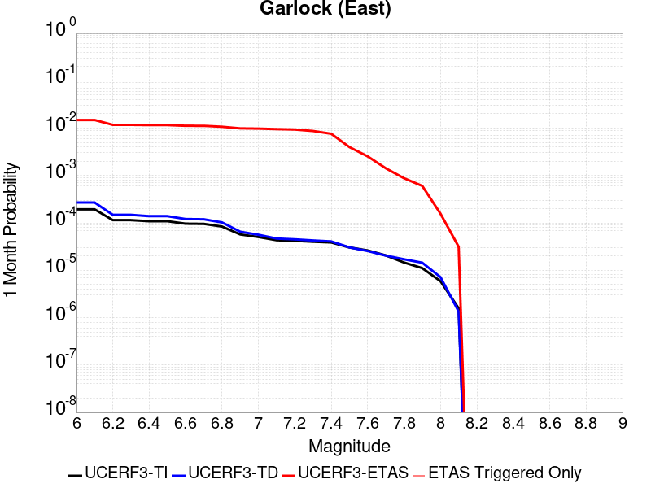 |  |  |

| Magnitude | 1 wk TI Prob | 1 wk TD Prob | 1 wk ETAS Prob | 1 wk ETAS/TD Gain | 1 wk ETAS Triggered Only | 1 mo TI Prob | 1 mo TD Prob | 1 mo ETAS Prob | 1 mo ETAS/TD Gain | 1 mo ETAS Triggered Only | 1 yr TI Prob | 1 yr TD Prob | 1 yr ETAS Prob | 1 yr ETAS/TD Gain | 1 yr ETAS Triggered Only | 10 yr TI Prob | 10 yr TD Prob | 10 yr ETAS Prob | 10 yr ETAS/TD Gain | 10 yr ETAS Triggered Only |
|-----|-----|-----|-----|-----|-----|-----|-----|-----|-----|-----|-----|-----|-----|-----|-----|-----|-----|-----|-----|-----|
| 6.0 | 4.5092507E-5 | 6.2904815E-5 | 0.009098481 | 144.63885 | 0.009036144 | 1.9323928E-4 | 2.6956675E-4 | 0.011310766 | 41.959057 | 0.011044176 | 0.0023501497 | 0.003277482 | 0.018288363 | 5.580004 | 0.015060241 | 0.023254504 | 0.03235377 | 0.05372748 | 1.6606251 | 0.022088353 |
| 6.1 | 4.5092507E-5 | 6.2904815E-5 | 0.009098481 | 144.63885 | 0.009036144 | 1.9323928E-4 | 2.6956675E-4 | 0.011310766 | 41.959057 | 0.011044176 | 0.0023501497 | 0.003277482 | 0.018288363 | 5.580004 | 0.015060241 | 0.023254504 | 0.03235377 | 0.05372748 | 1.6606251 | 0.022088353 |
| 6.2 | 2.6674514E-5 | 3.4511588E-5 | 0.0070623816 | 204.63799 | 0.0070281127 | 1.1431433E-4 | 1.4789861E-4 | 0.0091827065 | 62.087852 | 0.009036144 | 0.0013908884 | 0.0017992114 | 0.013825727 | 7.684326 | 0.012048192 | 0.01382215 | 0.017872788 | 0.03266386 | 1.827575 | 0.015060241 |
| 6.3 | 2.6674514E-5 | 3.4511588E-5 | 0.0070623816 | 204.63799 | 0.0070281127 | 1.1431433E-4 | 1.4789861E-4 | 0.0091827065 | 62.087852 | 0.009036144 | 0.0013908884 | 0.0017992114 | 0.013825727 | 7.684326 | 0.012048192 | 0.01382215 | 0.017872788 | 0.03266386 | 1.827575 | 0.015060241 |
| 6.4 | 2.5312667E-5 | 3.2340467E-5 | 0.0070602256 | 218.30931 | 0.0070281127 | 1.0847834E-4 | 1.3859481E-4 | 0.009173487 | 66.189255 | 0.009036144 | 0.0013199237 | 0.0016861152 | 0.01271167 | 7.539028 | 0.011044176 | 0.013121112 | 0.016772287 | 0.030592756 | 1.8240063 | 0.014056225 |
| 6.5 | 2.5312667E-5 | 3.2340467E-5 | 0.0070602256 | 218.30931 | 0.0070281127 | 1.0847834E-4 | 1.3859481E-4 | 0.009173487 | 66.189255 | 0.009036144 | 0.0013199237 | 0.0016861152 | 0.01271167 | 7.539028 | 0.011044176 | 0.013121112 | 0.016772287 | 0.030592756 | 1.8240063 | 0.014056225 |
| 6.6 | 2.246556E-5 | 2.8134691E-5 | 0.0070560495 | 250.79533 | 0.0070281127 | 9.627742E-5 | 1.2057181E-4 | 0.009155627 | 75.93505 | 0.009036144 | 0.0011715472 | 0.0014669969 | 0.012494972 | 8.517382 | 0.011044176 | 0.011653901 | 0.014613169 | 0.028463988 | 1.9478313 | 0.014056225 |
| 6.7 | 2.2241198E-5 | 2.7804432E-5 | 0.0070557212 | 253.76248 | 0.0070281127 | 9.531594E-5 | 1.1915654E-4 | 0.009154225 | 76.825195 | 0.009036144 | 0.0011598538 | 0.0014497889 | 0.012477954 | 8.606738 | 0.011044176 | 0.011538187 | 0.014442829 | 0.028296042 | 1.9591758 | 0.014056225 |
| 6.8 | 1.9528685E-5 | 2.3898969E-5 | 0.0070518437 | 295.06894 | 0.0070281127 | 8.369167E-5 | 1.0242024E-4 | 0.00913764 | 89.217125 | 0.009036144 | 0.0010184698 | 0.0012462728 | 0.011273921 | 9.04611 | 0.01004016 | 0.010138147 | 0.012436723 | 0.025326606 | 2.036437 | 0.013052209 |
| 6.9 | 1.3318621E-5 | 1.5198818E-5 | 0.0070432043 | 463.40475 | 0.0070281127 | 5.7078556E-5 | 6.51362E-5 | 0.0080967415 | 124.304794 | 0.008032128 | 6.9470983E-4 | 7.927504E-4 | 0.008818512 | 11.123944 | 0.008032128 | 0.0069254204 | 0.007940721 | 0.017901154 | 2.254349 | 0.01004016 |
| 7.0 | 1.1760853E-5 | 1.3107653E-5 | 0.007041128 | 537.1769 | 0.0070281127 | 5.0402683E-5 | 5.6174475E-5 | 0.008087852 | 143.97736 | 0.008032128 | 6.134799E-4 | 6.8371464E-4 | 0.008710352 | 12.739747 | 0.008032128 | 0.0061178906 | 0.006857401 | 0.016828712 | 2.4540946 | 0.01004016 |
| 7.1 | 1.0064758E-5 | 1.0902761E-5 | 0.007038939 | 645.61066 | 0.0070281127 | 4.3133965E-5 | 4.67253E-5 | 0.008078478 | 172.89302 | 0.008032128 | 5.2502943E-4 | 5.6873553E-4 | 0.0085962955 | 15.114751 | 0.008032128 | 0.005237907 | 0.0057133473 | 0.015696146 | 2.7472765 | 0.01004016 |
| 7.2 | 9.768808E-6 | 1.0498628E-5 | 0.0060345316 | 574.79236 | 0.006024096 | 4.186565E-5 | 4.499337E-5 | 0.0070727896 | 157.19627 | 0.0070281127 | 5.095951E-4 | 5.4766005E-4 | 0.0075719235 | 13.825955 | 0.0070281127 | 0.0050842804 | 0.005503584 | 0.014489997 | 2.6328294 | 0.009036144 |
| 7.3 | 9.344516E-6 | 9.9442705E-6 | 0.0060339808 | 606.7796 | 0.006024096 | 4.004731E-5 | 4.2617627E-5 | 0.0070704306 | 165.9039 | 0.0070281127 | 4.8746695E-4 | 5.187495E-4 | 0.007543216 | 14.541153 | 0.0070281127 | 0.0048639905 | 0.005215269 | 0.014204288 | 2.7235963 | 0.009036144 |
| 7.4 | 9.023491E-6 | 9.490441E-6 | 0.0040255166 | 424.16537 | 0.004016064 | 3.867153E-5 | 4.0672705E-5 | 0.005060549 | 124.42125 | 0.00502008 | 4.7072413E-4 | 4.95081E-4 | 0.005512676 | 11.134896 | 0.00502008 | 0.004697283 | 0.0049787266 | 0.011971848 | 2.4046004 | 0.0070281127 |
| 7.5 | 7.081253E-6 | 7.0873994E-6 | 0.0030191143 | 425.98337 | 0.003012048 | 3.0347876E-5 | 3.0374218E-5 | 0.0040463163 | 133.21548 | 0.004016064 | 3.6942272E-4 | 3.697441E-4 | 0.0043843235 | 11.857724 | 0.004016064 | 0.003688092 | 0.0037244745 | 0.008725857 | 2.3428426 | 0.00502008 |
| 7.6 | 6.116396E-6 | 5.9589424E-6 | 0.0030179892 | 506.4639 | 0.003012048 | 2.6212863E-5 | 2.5538076E-5 | 0.0040415 | 158.25389 | 0.004016064 | 3.1909486E-4 | 3.1088197E-4 | 0.0043256977 | 13.914276 | 0.004016064 | 0.0031863707 | 0.0031359126 | 0.007139383 | 2.2766523 | 0.004016064 |
| 7.7 | 4.797145E-6 | 4.7571157E-6 | 0.003016791 | 634.1639 | 0.003012048 | 2.055903E-5 | 2.0387479E-5 | 0.0030323742 | 148.73709 | 0.003012048 | 2.5027743E-4 | 2.481894E-4 | 0.00325949 | 13.133075 | 0.003012048 | 0.0024999576 | 0.0025094065 | 0.0055138962 | 2.197291 | 0.003012048 |
| 7.8 | 3.4028885E-6 | 3.978375E-6 | 0.0020120025 | 505.7348 | 0.002008032 | 1.4583726E-5 | 1.7050066E-5 | 0.002025048 | 118.770676 | 0.002008032 | 1.775424E-4 | 2.0756487E-4 | 0.00221518 | 10.672232 | 0.002008032 | 0.0017740062 | 0.0021012141 | 0.004105027 | 1.9536452 | 0.002008032 |
| 7.9 | 2.5928412E-6 | 3.372436E-6 | 0.0020113979 | 596.42285 | 0.002008032 | 1.1112129E-5 | 1.4453217E-5 | 0.0020224564 | 139.93123 | 0.002008032 | 1.3528178E-4 | 1.7595377E-4 | 0.0021836327 | 12.410263 | 0.002008032 | 0.0013519945 | 0.0017812426 | 0.003785698 | 2.125313 | 0.002008032 |
| 8.0 | 1.3743648E-6 | 1.6734741E-6 | 1.6734741E-6 | 1.0 | 0.0 | 5.8901214E-6 | 7.1720124E-6 | 7.1720124E-6 | 1.0 | 0.0 | 7.1709874E-5 | 8.731578E-5 | 8.731578E-5 | 1.0 | 0.0 | 7.1686733E-4 | 8.837377E-4 | 8.837377E-4 | 1.0 | 0.0 |
| 8.1 | 3.6733252E-7 | 3.1489736E-7 | 3.1489736E-7 | 1.0 | 0.0 | 1.5742813E-6 | 1.3495595E-6 | 1.3495595E-6 | 1.0 | 0.0 | 1.9166706E-5 | 1.643078E-5 | 1.643078E-5 | 1.0 | 0.0 | 1.9165053E-4 | 1.662928E-4 | 1.662928E-4 | 1.0 | 0.0 |

## Hunter Mountain-Saline Valley
*[(top)](#table-of-contents)*

| 1 Week | 1 Month | 1 Year | 10 Year |
|-----|-----|-----|-----|
|  |  |  |  |

| Magnitude | 1 wk TI Prob | 1 wk TD Prob | 1 wk ETAS Prob | 1 wk ETAS/TD Gain | 1 wk ETAS Triggered Only | 1 mo TI Prob | 1 mo TD Prob | 1 mo ETAS Prob | 1 mo ETAS/TD Gain | 1 mo ETAS Triggered Only | 1 yr TI Prob | 1 yr TD Prob | 1 yr ETAS Prob | 1 yr ETAS/TD Gain | 1 yr ETAS Triggered Only | 10 yr TI Prob | 10 yr TD Prob | 10 yr ETAS Prob | 10 yr ETAS/TD Gain | 10 yr ETAS Triggered Only |
|-----|-----|-----|-----|-----|-----|-----|-----|-----|-----|-----|-----|-----|-----|-----|-----|-----|-----|-----|-----|-----|
| 6.0 | 4.5103672E-5 | 5.456906E-5 | 0.010094182 | 184.97995 | 0.01004016 | 1.9328714E-4 | 2.3384714E-4 | 0.01027166 | 43.92468 | 0.01004016 | 0.002350731 | 0.0028435462 | 0.016859801 | 5.9291463 | 0.014056225 | 0.023260195 | 0.028092625 | 0.047608837 | 1.6947094 | 0.02008032 |
| 6.1 | 4.5103672E-5 | 5.456906E-5 | 0.010094182 | 184.97995 | 0.01004016 | 1.9328714E-4 | 2.3384714E-4 | 0.01027166 | 43.92468 | 0.01004016 | 0.002350731 | 0.0028435462 | 0.016859801 | 5.9291463 | 0.014056225 | 0.023260195 | 0.028092625 | 0.047608837 | 1.6947094 | 0.02008032 |
| 6.2 | 3.9363465E-5 | 4.706271E-5 | 0.010086751 | 214.32576 | 0.01004016 | 1.6868966E-4 | 2.016826E-4 | 0.010239818 | 50.771946 | 0.01004016 | 0.002051862 | 0.0024528534 | 0.0164746 | 6.7165046 | 0.014056225 | 0.020330196 | 0.024274187 | 0.043867074 | 1.807149 | 0.02008032 |
| 6.3 | 3.9363465E-5 | 4.706271E-5 | 0.010086751 | 214.32576 | 0.01004016 | 1.6868966E-4 | 2.016826E-4 | 0.010239818 | 50.771946 | 0.01004016 | 0.002051862 | 0.0024528534 | 0.0164746 | 6.7165046 | 0.014056225 | 0.020330196 | 0.024274187 | 0.043867074 | 1.807149 | 0.02008032 |
| 6.4 | 3.2311684E-5 | 3.795112E-5 | 0.010077731 | 265.545 | 0.01004016 | 1.384713E-4 | 1.6263791E-4 | 0.010201165 | 62.72317 | 0.01004016 | 0.0016845843 | 0.001978387 | 0.016006803 | 8.090836 | 0.014056225 | 0.016718714 | 0.019617118 | 0.039303523 | 2.003532 | 0.02008032 |
| 6.5 | 3.2311684E-5 | 3.795112E-5 | 0.010077731 | 265.545 | 0.01004016 | 1.384713E-4 | 1.6263791E-4 | 0.010201165 | 62.72317 | 0.01004016 | 0.0016845843 | 0.001978387 | 0.016006803 | 8.090836 | 0.014056225 | 0.016718714 | 0.019617118 | 0.039303523 | 2.003532 | 0.02008032 |
| 6.6 | 2.9305844E-5 | 3.418196E-5 | 0.010074 | 294.71683 | 0.01004016 | 1.2559042E-4 | 1.4648624E-4 | 0.0101851765 | 69.529915 | 0.01004016 | 0.0015279909 | 0.0017820727 | 0.015813248 | 8.873515 | 0.014056225 | 0.015175272 | 0.017686324 | 0.0374115 | 2.1152782 | 0.02008032 |
| 6.7 | 2.7826512E-5 | 3.2344353E-5 | 0.01007218 | 311.4046 | 0.01004016 | 1.19251024E-4 | 1.3861163E-4 | 0.01017738 | 73.42371 | 0.01004016 | 0.0014509142 | 0.0016863506 | 0.015718872 | 9.321237 | 0.014056225 | 0.014414776 | 0.016743818 | 0.03648792 | 2.1791875 | 0.02008032 |
| 6.8 | 2.3389874E-5 | 2.6866792E-5 | 0.010066758 | 374.69147 | 0.01004016 | 1.0023846E-4 | 1.1513857E-4 | 0.010154143 | 88.19063 | 0.01004016 | 0.00121972 | 0.001400958 | 0.01543749 | 11.019238 | 0.014056225 | 0.01213047 | 0.013928067 | 0.033728708 | 2.421636 | 0.02008032 |
| 6.9 | 2.069209E-5 | 2.357011E-5 | 0.010063495 | 426.96002 | 0.01004016 | 8.867737E-5 | 1.0101105E-4 | 0.010140157 | 100.38662 | 0.01004016 | 0.0010791123 | 0.0012291519 | 0.0152680995 | 12.421655 | 0.014056225 | 0.010738871 | 0.012229158 | 0.032063913 | 2.6219234 | 0.02008032 |
| 7.0 | 1.7462342E-5 | 1.9633622E-5 | 0.010059597 | 512.3658 | 0.01004016 | 7.483646E-5 | 8.414151E-5 | 0.010123458 | 120.31466 | 0.01004016 | 9.1075303E-4 | 0.0010239641 | 0.015065796 | 14.713207 | 0.014056225 | 0.009070295 | 0.010196688 | 0.030072255 | 2.9492183 | 0.02008032 |
| 7.1 | 1.4807709E-5 | 1.6441827E-5 | 0.010056437 | 611.6375 | 0.01004016 | 6.3460066E-5 | 7.046316E-5 | 0.010109916 | 143.47804 | 0.01004016 | 7.723524E-4 | 8.575678E-4 | 0.014901739 | 17.376747 | 0.014056225 | 0.007696735 | 0.008546168 | 0.02845488 | 3.3295484 | 0.02008032 |
| 7.2 | 1.4180048E-5 | 1.5698413E-5 | 0.010055701 | 640.5553 | 0.01004016 | 6.077022E-5 | 6.727727E-5 | 0.010106763 | 150.22551 | 0.01004016 | 7.396263E-4 | 8.1880915E-4 | 0.014863525 | 18.15261 | 0.014056225 | 0.0073716943 | 0.008161469 | 0.028077906 | 3.4403002 | 0.02008032 |
| 7.3 | 1.3730402E-5 | 1.5172151E-5 | 0.010055181 | 662.7393 | 0.01004016 | 5.8843252E-5 | 6.502197E-5 | 0.01010453 | 155.40178 | 0.01004016 | 7.161811E-4 | 7.9137104E-4 | 0.014836472 | 18.747807 | 0.014056225 | 0.007138774 | 0.007889058 | 0.027810965 | 3.5252578 | 0.02008032 |
| 7.4 | 1.2810095E-5 | 1.4109353E-5 | 0.010054128 | 712.58606 | 0.01004016 | 5.489925E-5 | 6.0467344E-5 | 0.010100021 | 167.03265 | 0.01004016 | 6.681934E-4 | 7.3595706E-4 | 0.014781837 | 20.08519 | 0.014056225 | 0.006661878 | 0.0073386896 | 0.027271647 | 3.716147 | 0.02008032 |
| 7.5 | 1.1595659E-5 | 1.2800734E-5 | 0.010052833 | 785.3326 | 0.01004016 | 4.9694736E-5 | 5.485922E-5 | 0.010094469 | 184.00679 | 0.01004016 | 6.0486543E-4 | 6.67722E-4 | 0.014714561 | 22.036957 | 0.014056225 | 0.006032217 | 0.006660632 | 0.026607206 | 3.9946969 | 0.02008032 |
| 7.6 | 2.997694E-6 | 3.3251877E-6 | 0.0030153634 | 906.825 | 0.003012048 | 1.28471975E-5 | 1.4250767E-5 | 0.003026256 | 212.3574 | 0.003012048 | 1.564034E-4 | 1.7349655E-4 | 0.005192706 | 29.929735 | 0.00502008 | 0.0015629337 | 0.0017356955 | 0.007749336 | 4.4646864 | 0.006024096 |

## Blackwater
*[(top)](#table-of-contents)*

| 1 Week | 1 Month | 1 Year | 10 Year |
|-----|-----|-----|-----|
|  |  |  |  |

| Magnitude | 1 wk TI Prob | 1 wk TD Prob | 1 wk ETAS Prob | 1 wk ETAS/TD Gain | 1 wk ETAS Triggered Only | 1 mo TI Prob | 1 mo TD Prob | 1 mo ETAS Prob | 1 mo ETAS/TD Gain | 1 mo ETAS Triggered Only | 1 yr TI Prob | 1 yr TD Prob | 1 yr ETAS Prob | 1 yr ETAS/TD Gain | 1 yr ETAS Triggered Only | 10 yr TI Prob | 10 yr TD Prob | 10 yr ETAS Prob | 10 yr ETAS/TD Gain | 10 yr ETAS Triggered Only |
|-----|-----|-----|-----|-----|-----|-----|-----|-----|-----|-----|-----|-----|-----|-----|-----|-----|-----|-----|-----|-----|
| 6.0 | 3.0708583E-5 | 3.3095846E-5 | 0.0030450444 | 92.006836 | 0.003012048 | 1.3160157E-4 | 1.4183241E-4 | 0.0051612007 | 36.38943 | 0.00502008 | 0.0016010714 | 0.0017255784 | 0.009743847 | 5.6467133 | 0.008032128 | 0.015895851 | 0.017135633 | 0.028977372 | 1.6910594 | 0.012048192 |
| 6.1 | 3.0708583E-5 | 3.3095846E-5 | 0.0030450444 | 92.006836 | 0.003012048 | 1.3160157E-4 | 1.4183241E-4 | 0.0051612007 | 36.38943 | 0.00502008 | 0.0016010714 | 0.0017255784 | 0.009743847 | 5.6467133 | 0.008032128 | 0.015895851 | 0.017135633 | 0.028977372 | 1.6910594 | 0.012048192 |
| 6.2 | 1.1707779E-5 | 1.2545122E-5 | 0.0010165486 | 81.03138 | 0.001004016 | 5.017523E-5 | 5.3763757E-5 | 0.0010577259 | 19.673586 | 0.001004016 | 6.107122E-4 | 6.5438676E-4 | 0.0016577458 | 2.5332813 | 0.001004016 | 0.006090366 | 0.0065255696 | 0.010515426 | 1.611419 | 0.004016064 |
| 6.3 | 1.1707779E-5 | 1.2545122E-5 | 0.0010165486 | 81.03138 | 0.001004016 | 5.017523E-5 | 5.3763757E-5 | 0.0010577259 | 19.673586 | 0.001004016 | 6.107122E-4 | 6.5438676E-4 | 0.0016577458 | 2.5332813 | 0.001004016 | 0.006090366 | 0.0065255696 | 0.010515426 | 1.611419 | 0.004016064 |
| 6.4 | 7.929244E-6 | 8.480098E-6 | 8.480098E-6 | 1.0 | 0.0 | 3.3982033E-5 | 3.6342793E-5 | 3.6342793E-5 | 1.0 | 0.0 | 4.136527E-4 | 4.423877E-4 | 4.423877E-4 | 1.0 | 0.0 | 0.0041288356 | 0.0044154758 | 0.0044154758 | 1.0 | 0.0 |
| 6.5 | 5.8832115E-6 | 6.285991E-6 | 6.285991E-6 | 1.0 | 0.0 | 2.521352E-5 | 2.6939697E-5 | 2.6939697E-5 | 1.0 | 0.0 | 3.0693135E-4 | 3.27944E-4 | 3.27944E-4 | 1.0 | 0.0 | 0.0030650778 | 0.0032748538 | 0.0032748538 | 1.0 | 0.0 |
| 6.6 | 5.8832115E-6 | 6.285991E-6 | 6.285991E-6 | 1.0 | 0.0 | 2.521352E-5 | 2.6939697E-5 | 2.6939697E-5 | 1.0 | 0.0 | 3.0693135E-4 | 3.27944E-4 | 3.27944E-4 | 1.0 | 0.0 | 0.0030650778 | 0.0032748538 | 0.0032748538 | 1.0 | 0.0 |
| 6.7 | 3.0715053E-6 | 3.2814662E-6 | 3.2814662E-6 | 1.0 | 0.0 | 1.3163528E-5 | 1.4063357E-5 | 1.4063357E-5 | 1.0 | 0.0 | 1.6025416E-4 | 1.7120909E-4 | 1.7120909E-4 | 1.0 | 0.0 | 0.0016013865 | 0.0017108864 | 0.0017108864 | 1.0 | 0.0 |
| 6.8 | 2.2722281E-6 | 2.4287538E-6 | 2.4287538E-6 | 1.0 | 0.0 | 9.738084E-6 | 1.0408908E-5 | 1.0408908E-5 | 1.0 | 0.0 | 1.1855473E-4 | 1.26722E-4 | 1.26722E-4 | 1.0 | 0.0 | 0.001184915 | 0.0012665876 | 0.0012665876 | 1.0 | 0.0 |
| 6.9 | 9.952399E-7 | 1.0653489E-6 | 1.0653489E-6 | 1.0 | 0.0 | 4.265307E-6 | 4.5657757E-6 | 4.5657757E-6 | 1.0 | 0.0 | 5.1928873E-5 | 5.5587418E-5 | 5.5587418E-5 | 1.0 | 0.0 | 5.191674E-4 | 5.557858E-4 | 5.557858E-4 | 1.0 | 0.0 |
| 7.0 | 4.7385504E-7 | 5.0755597E-7 | 5.0755597E-7 | 1.0 | 0.0 | 2.0308057E-6 | 2.1752398E-6 | 2.1752398E-6 | 1.0 | 0.0 | 2.4724779E-5 | 2.6483543E-5 | 2.6483543E-5 | 1.0 | 0.0 | 2.4722028E-4 | 2.6483546E-4 | 2.6483546E-4 | 1.0 | 0.0 |

## Garlock (West)
*[(top)](#table-of-contents)*

| 1 Week | 1 Month | 1 Year | 10 Year |
|-----|-----|-----|-----|
|  |  |  |  |

| Magnitude | 1 wk TI Prob | 1 wk TD Prob | 1 wk ETAS Prob | 1 wk ETAS/TD Gain | 1 wk ETAS Triggered Only | 1 mo TI Prob | 1 mo TD Prob | 1 mo ETAS Prob | 1 mo ETAS/TD Gain | 1 mo ETAS Triggered Only | 1 yr TI Prob | 1 yr TD Prob | 1 yr ETAS Prob | 1 yr ETAS/TD Gain | 1 yr ETAS Triggered Only | 10 yr TI Prob | 10 yr TD Prob | 10 yr ETAS Prob | 10 yr ETAS/TD Gain | 10 yr ETAS Triggered Only |
|-----|-----|-----|-----|-----|-----|-----|-----|-----|-----|-----|-----|-----|-----|-----|-----|-----|-----|-----|-----|-----|
| 6.0 | 2.5181727E-5 | 2.5197181E-5 | 0.0040411605 | 160.38144 | 0.004016064 | 1.0791722E-4 | 1.0798347E-4 | 0.006131429 | 56.781185 | 0.006024096 | 0.0013131002 | 0.0013139093 | 0.010338182 | 7.868261 | 0.009036144 | 0.013053683 | 0.013141794 | 0.02305001 | 1.7539469 | 0.01004016 |
| 6.1 | 2.5077732E-5 | 2.5098223E-5 | 0.0040410617 | 161.00987 | 0.004016064 | 1.0747157E-4 | 1.075594E-4 | 0.006131008 | 57.001133 | 0.006024096 | 0.001307681 | 0.0013087525 | 0.0103330705 | 7.8953595 | 0.009036144 | 0.013000126 | 0.013090835 | 0.022999562 | 1.7569209 | 0.01004016 |
| 6.2 | 2.494612E-5 | 2.4979914E-5 | 0.004040944 | 161.76772 | 0.004016064 | 1.0690756E-4 | 1.070524E-4 | 0.006130504 | 57.26638 | 0.006024096 | 0.0013008224 | 0.0013025872 | 0.010326961 | 7.9280386 | 0.009036144 | 0.012932341 | 0.013029906 | 0.022939244 | 1.7605072 | 0.01004016 |
| 6.3 | 2.4733758E-5 | 2.4799276E-5 | 0.0040407637 | 162.93878 | 0.004016064 | 1.0599751E-4 | 1.06278305E-4 | 0.0061297347 | 57.676254 | 0.006024096 | 0.0012897556 | 0.0012931736 | 0.010317633 | 7.978536 | 0.009036144 | 0.012822957 | 0.0129368715 | 0.022847144 | 1.7660486 | 0.01004016 |
| 6.4 | 2.3237335E-5 | 2.3178607E-5 | 0.0040391497 | 174.26196 | 0.004016064 | 9.958477E-5 | 9.933313E-5 | 0.0061228313 | 61.63937 | 0.006024096 | 0.0012117702 | 0.0012087126 | 0.010233935 | 8.466805 | 0.009036144 | 0.012051838 | 0.012101731 | 0.022020388 | 1.8196064 | 0.01004016 |
| 6.5 | 2.2732203E-5 | 2.2992977E-5 | 0.004038965 | 175.66081 | 0.004016064 | 9.742009E-5 | 9.8537625E-5 | 0.0061220406 | 62.128963 | 0.006024096 | 0.0011854442 | 0.0011990381 | 0.010224348 | 8.527125 | 0.009036144 | 0.011791403 | 0.012006035 | 0.021925654 | 1.8262193 | 0.01004016 |
| 6.6 | 2.1319436E-5 | 2.1773201E-5 | 0.00403775 | 185.44586 | 0.004016064 | 9.136581E-5 | 9.3310395E-5 | 0.0061168447 | 65.553734 | 0.006024096 | 0.001111811 | 0.0011354643 | 0.010161349 | 8.949069 | 0.009036144 | 0.011062649 | 0.011376952 | 0.021302886 | 1.8724599 | 0.01004016 |
| 6.7 | 1.970802E-5 | 2.0393094E-5 | 0.0040363753 | 197.92854 | 0.004016064 | 8.446021E-5 | 8.739606E-5 | 0.0061109657 | 69.92267 | 0.006024096 | 0.001027818 | 0.0010635294 | 0.010090063 | 9.487339 | 0.009036144 | 0.010230771 | 0.0106646875 | 0.020597773 | 1.9313996 | 0.01004016 |
| 6.8 | 1.8744462E-5 | 1.9900775E-5 | 0.004035885 | 202.8004 | 0.004016064 | 8.033094E-5 | 8.528626E-5 | 0.006108869 | 71.62782 | 0.006024096 | 9.775903E-4 | 0.0010378672 | 0.010064634 | 9.697419 | 0.009036144 | 0.009733009 | 0.010410495 | 0.020346133 | 1.9543867 | 0.01004016 |
| 6.9 | 1.7559682E-5 | 1.8953151E-5 | 0.004034941 | 212.89026 | 0.004016064 | 7.5253614E-5 | 8.122527E-5 | 0.0061048325 | 75.15927 | 0.006024096 | 9.158276E-4 | 9.884704E-4 | 0.010015683 | 10.132506 | 0.009036144 | 0.0091206245 | 0.009921073 | 0.019861624 | 2.0019634 | 0.01004016 |
| 7.0 | 1.6794445E-5 | 1.8215967E-5 | 0.004034207 | 221.46542 | 0.004016064 | 7.197421E-5 | 7.806611E-5 | 0.006101692 | 78.16058 | 0.006024096 | 8.759337E-4 | 9.5004175E-4 | 0.0099776015 | 10.502276 | 0.009036144 | 0.008724891 | 0.009539958 | 0.019484336 | 2.0423923 | 0.01004016 |
| 7.1 | 1.6337795E-5 | 1.771677E-5 | 0.00403371 | 227.6775 | 0.004016064 | 7.0017246E-5 | 7.592681E-5 | 0.006099566 | 80.33481 | 0.006024096 | 8.521265E-4 | 9.2401815E-4 | 0.009951813 | 10.770148 | 0.009036144 | 0.008488664 | 0.009281721 | 0.019228691 | 2.0716732 | 0.01004016 |
| 7.2 | 1.5780008E-5 | 1.71654E-5 | 0.004033161 | 234.95876 | 0.004016064 | 6.762685E-5 | 7.3563926E-5 | 0.006097217 | 82.88325 | 0.006024096 | 8.2304585E-4 | 8.952741E-4 | 0.009923329 | 11.084124 | 0.009036144 | 0.008200042 | 0.008996559 | 0.018946392 | 2.10596 | 0.01004016 |
| 7.3 | 1.5058865E-5 | 1.6618484E-5 | 0.004032616 | 242.6585 | 0.004016064 | 6.45364E-5 | 7.122013E-5 | 0.0060948874 | 85.578156 | 0.006024096 | 7.854473E-4 | 8.667614E-4 | 0.009895074 | 11.416145 | 0.009036144 | 0.00782677 | 0.008713263 | 0.018665941 | 2.1422446 | 0.01004016 |
| 7.4 | 1.4887923E-5 | 1.6454453E-5 | 0.0040324526 | 245.06757 | 0.004016064 | 6.380382E-5 | 7.0517184E-5 | 0.0050902436 | 72.18444 | 0.00502008 | 7.7653467E-4 | 8.5820974E-4 | 0.007880291 | 9.182243 | 0.0070281127 | 0.0077382675 | 0.008628101 | 0.016590929 | 1.9228944 | 0.008032128 |
| 7.5 | 1.4509299E-5 | 1.6046468E-5 | 0.0030280463 | 188.70485 | 0.003012048 | 6.218123E-5 | 6.876877E-5 | 0.004084557 | 59.395515 | 0.004016064 | 7.567935E-4 | 8.369394E-4 | 0.006855994 | 8.191745 | 0.006024096 | 0.0075422134 | 0.008416411 | 0.015385372 | 1.8280206 | 0.0070281127 |
| 7.6 | 1.2756717E-5 | 1.4050529E-5 | 0.0030260563 | 215.36958 | 0.003012048 | 5.4670498E-5 | 6.0215163E-5 | 0.0040760376 | 67.691216 | 0.004016064 | 6.6541E-4 | 7.328737E-4 | 0.0067525553 | 9.213805 | 0.006024096 | 0.006634211 | 0.007381374 | 0.013361004 | 1.8100972 | 0.006024096 |
| 7.7 | 1.0328985E-5 | 1.146033E-5 | 0.003023474 | 263.82086 | 0.003012048 | 4.4266326E-5 | 4.9114777E-5 | 0.003061015 | 62.323708 | 0.003012048 | 5.388092E-4 | 5.9780874E-4 | 0.005614888 | 9.392448 | 0.00502008 | 0.0053750467 | 0.006038286 | 0.011028053 | 1.826355 | 0.00502008 |
| 7.8 | 7.0306583E-6 | 8.899537E-6 | 0.0020169138 | 226.63133 | 0.002008032 | 3.0131043E-5 | 3.8140315E-5 | 0.002046096 | 53.646538 | 0.002008032 | 3.667837E-4 | 4.6425956E-4 | 0.0034749093 | 7.484842 | 0.003012048 | 0.003661789 | 0.0046950667 | 0.007692973 | 1.6385226 | 0.003012048 |
| 7.9 | 4.060633E-6 | 5.465412E-6 | 0.0020134866 | 368.40527 | 0.002008032 | 1.7402595E-5 | 2.3422985E-5 | 0.002031408 | 86.72712 | 0.002008032 | 2.11856E-4 | 2.8513762E-4 | 0.003296327 | 11.560477 | 0.003012048 | 0.0021165414 | 0.002884143 | 0.005887504 | 2.0413356 | 0.003012048 |
| 8.0 | 1.6729537E-6 | 2.0775192E-6 | 2.0775192E-6 | 1.0 | 0.0 | 7.169782E-6 | 8.903624E-6 | 8.903624E-6 | 1.0 | 0.0 | 8.7288594E-5 | 1.0839626E-4 | 1.0839626E-4 | 1.0 | 0.0 | 8.7254314E-4 | 0.001096854 | 0.001096854 | 1.0 | 0.0 |
| 8.1 | 3.6733252E-7 | 3.1489736E-7 | 3.1489736E-7 | 1.0 | 0.0 | 1.5742813E-6 | 1.3495595E-6 | 1.3495595E-6 | 1.0 | 0.0 | 1.9166706E-5 | 1.643078E-5 | 1.643078E-5 | 1.0 | 0.0 | 1.9165053E-4 | 1.662928E-4 | 1.662928E-4 | 1.0 | 0.0 |

## Goldstone Lake
*[(top)](#table-of-contents)*

| 1 Week | 1 Month | 1 Year | 10 Year |
|-----|-----|-----|-----|
|  |  |  |  |

| Magnitude | 1 wk TI Prob | 1 wk TD Prob | 1 wk ETAS Prob | 1 wk ETAS/TD Gain | 1 wk ETAS Triggered Only | 1 mo TI Prob | 1 mo TD Prob | 1 mo ETAS Prob | 1 mo ETAS/TD Gain | 1 mo ETAS Triggered Only | 1 yr TI Prob | 1 yr TD Prob | 1 yr ETAS Prob | 1 yr ETAS/TD Gain | 1 yr ETAS Triggered Only | 10 yr TI Prob | 10 yr TD Prob | 10 yr ETAS Prob | 10 yr ETAS/TD Gain | 10 yr ETAS Triggered Only |
|-----|-----|-----|-----|-----|-----|-----|-----|-----|-----|-----|-----|-----|-----|-----|-----|-----|-----|-----|-----|-----|
| 6.0 | 2.671352E-5 | 3.0376103E-5 | 0.0020383473 | 67.103645 | 0.002008032 | 1.1448149E-4 | 1.3017791E-4 | 0.0051496048 | 39.55821 | 0.00502008 | 0.001392921 | 0.0015839601 | 0.006596089 | 4.1643023 | 0.00502008 | 0.013842222 | 0.015746202 | 0.022663647 | 1.4393089 | 0.0070281127 |
| 6.1 | 2.671352E-5 | 3.0376103E-5 | 0.0020383473 | 67.103645 | 0.002008032 | 1.1448149E-4 | 1.3017791E-4 | 0.0051496048 | 39.55821 | 0.00502008 | 0.001392921 | 0.0015839601 | 0.006596089 | 4.1643023 | 0.00502008 | 0.013842222 | 0.015746202 | 0.022663647 | 1.4393089 | 0.0070281127 |
| 6.2 | 1.4197047E-5 | 1.6096254E-5 | 1.6096254E-5 | 1.0 | 0.0 | 6.0843064E-5 | 6.898268E-5 | 0.0020768763 | 30.107214 | 0.002008032 | 7.4051257E-4 | 8.3963916E-4 | 0.0028459853 | 3.3895338 | 0.002008032 | 0.007380498 | 0.008374364 | 0.011361188 | 1.3566628 | 0.003012048 |
| 6.3 | 1.4197047E-5 | 1.6096254E-5 | 1.6096254E-5 | 1.0 | 0.0 | 6.0843064E-5 | 6.898268E-5 | 0.0020768763 | 30.107214 | 0.002008032 | 7.4051257E-4 | 8.3963916E-4 | 0.0028459853 | 3.3895338 | 0.002008032 | 0.007380498 | 0.008374364 | 0.011361188 | 1.3566628 | 0.003012048 |
| 6.4 | 1.3238931E-5 | 1.500847E-5 | 1.500847E-5 | 1.0 | 0.0 | 5.6737044E-5 | 6.432098E-5 | 0.002072224 | 32.216923 | 0.002008032 | 6.9055456E-4 | 7.8292453E-4 | 0.0027893845 | 3.5627756 | 0.002008032 | 0.006884126 | 0.007811289 | 0.010799809 | 1.3825899 | 0.003012048 |
| 6.5 | 1.3238931E-5 | 1.500847E-5 | 1.500847E-5 | 1.0 | 0.0 | 5.6737044E-5 | 6.432098E-5 | 0.002072224 | 32.216923 | 0.002008032 | 6.9055456E-4 | 7.8292453E-4 | 0.0027893845 | 3.5627756 | 0.002008032 | 0.006884126 | 0.007811289 | 0.010799809 | 1.3825899 | 0.003012048 |
| 6.6 | 1.1328278E-5 | 1.2855176E-5 | 1.2855176E-5 | 1.0 | 0.0 | 4.8548856E-5 | 5.5092984E-5 | 0.0010590537 | 19.223022 | 0.001004016 | 5.90922E-4 | 6.706464E-4 | 0.0016739891 | 2.4960833 | 0.001004016 | 0.0058935313 | 0.0066956137 | 0.008690201 | 1.2978946 | 0.002008032 |
| 6.7 | 8.651175E-6 | 9.824575E-6 | 9.824575E-6 | 1.0 | 0.0 | 3.707594E-5 | 4.2105148E-5 | 0.001046079 | 24.844442 | 0.001004016 | 4.5130608E-4 | 5.126002E-4 | 0.0015161015 | 2.957669 | 0.001004016 | 0.0045039062 | 0.0051230565 | 0.007120801 | 1.3899518 | 0.002008032 |
| 6.8 | 1.0215377E-6 | 1.1754802E-6 | 1.1754802E-6 | 1.0 | 0.0 | 4.378012E-6 | 5.037763E-6 | 5.037763E-6 | 1.0 | 0.0 | 5.3300988E-5 | 6.133315E-5 | 6.133315E-5 | 1.0 | 0.0 | 5.3288206E-4 | 6.131735E-4 | 6.131735E-4 | 1.0 | 0.0 |
| 6.9 | 7.9360774E-7 | 9.283496E-7 | 9.283496E-7 | 1.0 | 0.0 | 3.4011714E-6 | 3.9786355E-6 | 3.9786355E-6 | 1.0 | 0.0 | 4.1408475E-5 | 4.843888E-5 | 4.843888E-5 | 1.0 | 0.0 | 4.140076E-4 | 4.842902E-4 | 4.842902E-4 | 1.0 | 0.0 |
| 7.0 | 7.4382757E-7 | 8.747428E-7 | 8.747428E-7 | 1.0 | 0.0 | 3.1878285E-6 | 3.7488926E-6 | 3.7488926E-6 | 1.0 | 0.0 | 3.8811122E-5 | 4.564188E-5 | 4.564188E-5 | 1.0 | 0.0 | 3.8804344E-4 | 4.563317E-4 | 4.563317E-4 | 1.0 | 0.0 |
| 7.1 | 6.4709513E-7 | 7.711399E-7 | 7.711399E-7 | 1.0 | 0.0 | 2.773262E-6 | 3.3048816E-6 | 3.3048816E-6 | 1.0 | 0.0 | 3.376394E-5 | 4.023625E-5 | 4.023625E-5 | 1.0 | 0.0 | 3.375881E-4 | 4.022956E-4 | 4.022956E-4 | 1.0 | 0.0 |
| 7.2 | 6.356704E-7 | 7.588459E-7 | 7.588459E-7 | 1.0 | 0.0 | 2.7242988E-6 | 3.252193E-6 | 3.252193E-6 | 1.0 | 0.0 | 3.3167835E-5 | 3.959479E-5 | 3.959479E-5 | 1.0 | 0.0 | 3.3162883E-4 | 3.9588328E-4 | 3.9588328E-4 | 1.0 | 0.0 |
| 7.3 | 5.7695723E-7 | 6.896648E-7 | 6.896648E-7 | 1.0 | 0.0 | 2.4726714E-6 | 2.9557032E-6 | 2.9557032E-6 | 1.0 | 0.0 | 3.0104358E-5 | 3.598515E-5 | 3.598515E-5 | 1.0 | 0.0 | 3.0100282E-4 | 3.5979896E-4 | 3.5979896E-4 | 1.0 | 0.0 |
| 7.4 | 5.209647E-7 | 6.193583E-7 | 6.193583E-7 | 1.0 | 0.0 | 2.232704E-6 | 2.6543903E-6 | 2.6543903E-6 | 1.0 | 0.0 | 2.718283E-5 | 3.2316777E-5 | 3.2316777E-5 | 1.0 | 0.0 | 2.7179506E-4 | 3.2312635E-4 | 3.2312635E-4 | 1.0 | 0.0 |
| 7.5 | 4.512955E-7 | 5.3489487E-7 | 5.3489487E-7 | 1.0 | 0.0 | 1.934122E-6 | 2.2924048E-6 | 2.2924048E-6 | 1.0 | 0.0 | 2.3547682E-5 | 2.7909726E-5 | 2.7909726E-5 | 1.0 | 0.0 | 2.3545188E-4 | 2.7906752E-4 | 2.7906752E-4 | 1.0 | 0.0 |
| 7.6 | 2.21172E-7 | 2.6040198E-7 | 2.6040198E-7 | 1.0 | 0.0 | 9.478797E-7 | 1.1160082E-6 | 1.1160082E-6 | 1.0 | 0.0 | 1.1540374E-5 | 1.3587343E-5 | 1.3587343E-5 | 1.0 | 0.0 | 1.1539775E-4 | 1.3586794E-4 | 1.3586794E-4 | 1.0 | 0.0 |

## McLean Lake
*[(top)](#table-of-contents)*

| 1 Week | 1 Month | 1 Year | 10 Year |
|-----|-----|-----|-----|
|  |  |  |  |

| Magnitude | 1 wk TI Prob | 1 wk TD Prob | 1 wk ETAS Prob | 1 wk ETAS/TD Gain | 1 wk ETAS Triggered Only | 1 mo TI Prob | 1 mo TD Prob | 1 mo ETAS Prob | 1 mo ETAS/TD Gain | 1 mo ETAS Triggered Only | 1 yr TI Prob | 1 yr TD Prob | 1 yr ETAS Prob | 1 yr ETAS/TD Gain | 1 yr ETAS Triggered Only | 10 yr TI Prob | 10 yr TD Prob | 10 yr ETAS Prob | 10 yr ETAS/TD Gain | 10 yr ETAS Triggered Only |
|-----|-----|-----|-----|-----|-----|-----|-----|-----|-----|-----|-----|-----|-----|-----|-----|-----|-----|-----|-----|-----|
| 6.0 | 1.7360222E-5 | 1.8501627E-5 | 0.0010224992 | 55.26536 | 0.001004016 | 7.439883E-5 | 7.9290556E-5 | 0.0030911 | 38.984467 | 0.003012048 | 9.0542925E-4 | 9.6498354E-4 | 0.0039741253 | 4.118335 | 0.003012048 | 0.009017491 | 0.0096127745 | 0.015578963 | 1.6206521 | 0.006024096 |
| 6.1 | 9.062689E-6 | 9.592193E-6 | 0.0010135986 | 105.66912 | 0.001004016 | 3.8839516E-5 | 4.1108804E-5 | 0.0010450836 | 25.42238 | 0.001004016 | 4.727685E-4 | 5.003936E-4 | 0.0015039073 | 3.0054486 | 0.001004016 | 0.0047176396 | 0.004993552 | 0.007990559 | 1.6001755 | 0.003012048 |
| 6.2 | 9.062689E-6 | 9.592193E-6 | 0.0010135986 | 105.66912 | 0.001004016 | 3.8839516E-5 | 4.1108804E-5 | 0.0010450836 | 25.42238 | 0.001004016 | 4.727685E-4 | 5.003936E-4 | 0.0015039073 | 3.0054486 | 0.001004016 | 0.0047176396 | 0.004993552 | 0.007990559 | 1.6001755 | 0.003012048 |
| 6.3 | 7.2575485E-6 | 7.66771E-6 | 0.001011676 | 131.9398 | 0.001004016 | 3.110341E-5 | 3.2861237E-5 | 0.0010368443 | 31.552198 | 0.001004016 | 3.786182E-4 | 4.0001926E-4 | 0.0014036337 | 3.5089154 | 0.001004016 | 0.0037797375 | 0.0039936965 | 0.0069937157 | 1.7511885 | 0.003012048 |
| 6.4 | 7.2575485E-6 | 7.66771E-6 | 0.001011676 | 131.9398 | 0.001004016 | 3.110341E-5 | 3.2861237E-5 | 0.0010368443 | 31.552198 | 0.001004016 | 3.786182E-4 | 4.0001926E-4 | 0.0014036337 | 3.5089154 | 0.001004016 | 0.0037797375 | 0.0039936965 | 0.0069937157 | 1.7511885 | 0.003012048 |
| 6.5 | 6.06582E-6 | 6.4038773E-6 | 6.4038773E-6 | 1.0 | 0.0 | 2.5996113E-5 | 2.7444936E-5 | 2.7444936E-5 | 1.0 | 0.0 | 3.164567E-4 | 3.3409733E-4 | 3.3409733E-4 | 1.0 | 0.0 | 0.0031600643 | 0.0033365893 | 0.0043372554 | 1.2999068 | 0.001004016 |
| 6.6 | 5.598744E-6 | 5.910262E-6 | 5.910262E-6 | 1.0 | 0.0 | 2.3994397E-5 | 2.5329486E-5 | 2.5329486E-5 | 1.0 | 0.0 | 2.9209262E-4 | 3.0834923E-4 | 3.0834923E-4 | 1.0 | 0.0 | 0.0029170897 | 0.003079843 | 0.004080767 | 1.3249918 | 0.001004016 |
| 6.7 | 5.246996E-6 | 5.539162E-6 | 5.539162E-6 | 1.0 | 0.0 | 2.2486933E-5 | 2.3739085E-5 | 2.3739085E-5 | 1.0 | 0.0 | 2.73744E-4 | 2.8899137E-4 | 2.8899137E-4 | 1.0 | 0.0 | 0.0027340704 | 0.0028867796 | 0.0038878974 | 1.3467939 | 0.001004016 |
| 6.8 | 4.02324E-6 | 4.2469046E-6 | 4.2469046E-6 | 1.0 | 0.0 | 1.7242342E-5 | 1.8200926E-5 | 1.8200926E-5 | 1.0 | 0.0 | 2.099053E-4 | 2.2157968E-4 | 2.2157968E-4 | 1.0 | 0.0 | 0.0020970714 | 0.002214172 | 0.0032159649 | 1.4524459 | 0.001004016 |
| 6.9 | 6.835972E-7 | 7.1399285E-7 | 7.1399285E-7 | 1.0 | 0.0 | 2.9296991E-6 | 3.0599674E-6 | 3.0599674E-6 | 1.0 | 0.0 | 3.56685E-5 | 3.7254784E-5 | 3.7254784E-5 | 1.0 | 0.0 | 3.5662777E-4 | 3.7251666E-4 | 3.7251666E-4 | 1.0 | 0.0 |

## Ash Hill
*[(top)](#table-of-contents)*

| 1 Week | 1 Month | 1 Year | 10 Year |
|-----|-----|-----|-----|
|  |  | 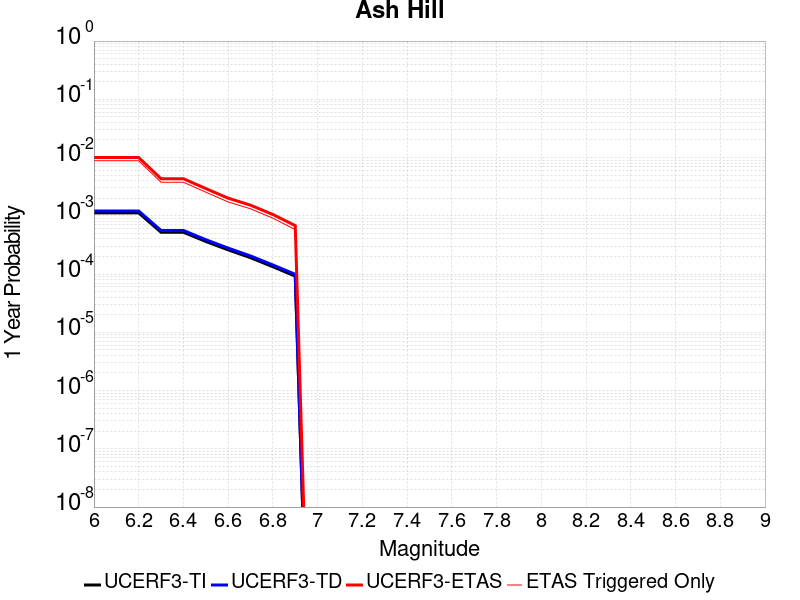 |  |

| Magnitude | 1 wk TI Prob | 1 wk TD Prob | 1 wk ETAS Prob | 1 wk ETAS/TD Gain | 1 wk ETAS Triggered Only | 1 mo TI Prob | 1 mo TD Prob | 1 mo ETAS Prob | 1 mo ETAS/TD Gain | 1 mo ETAS Triggered Only | 1 yr TI Prob | 1 yr TD Prob | 1 yr ETAS Prob | 1 yr ETAS/TD Gain | 1 yr ETAS Triggered Only | 10 yr TI Prob | 10 yr TD Prob | 10 yr ETAS Prob | 10 yr ETAS/TD Gain | 10 yr ETAS Triggered Only |
|-----|-----|-----|-----|-----|-----|-----|-----|-----|-----|-----|-----|-----|-----|-----|-----|-----|-----|-----|-----|-----|
| 6.0 | 2.1545662E-5 | 2.3194447E-5 | 0.00203118 | 87.57182 | 0.002008032 | 9.2335285E-5 | 9.940143E-5 | 0.002107234 | 21.19923 | 0.002008032 | 0.0011236023 | 0.0012096206 | 0.0052208267 | 4.3160863 | 0.004016064 | 0.011179381 | 0.012038348 | 0.018981854 | 1.5767822 | 0.0070281127 |
| 6.1 | 2.1545662E-5 | 2.3194447E-5 | 0.00203118 | 87.57182 | 0.002008032 | 9.2335285E-5 | 9.940143E-5 | 0.002107234 | 21.19923 | 0.002008032 | 0.0011236023 | 0.0012096206 | 0.0052208267 | 4.3160863 | 0.004016064 | 0.011179381 | 0.012038348 | 0.018981854 | 1.5767822 | 0.0070281127 |
| 6.2 | 2.1545662E-5 | 2.3194447E-5 | 0.00203118 | 87.57182 | 0.002008032 | 9.2335285E-5 | 9.940143E-5 | 0.002107234 | 21.19923 | 0.002008032 | 0.0011236023 | 0.0012096206 | 0.0052208267 | 4.3160863 | 0.004016064 | 0.011179381 | 0.012038348 | 0.018981854 | 1.5767822 | 0.0070281127 |
| 6.3 | 1.0025529E-5 | 1.0746934E-5 | 0.0020187574 | 187.84497 | 0.002008032 | 4.2965847E-5 | 4.605755E-5 | 0.0020539972 | 44.596317 | 0.002008032 | 5.229836E-4 | 5.6061964E-4 | 0.002567526 | 4.5798 | 0.002008032 | 0.005217545 | 0.0055933665 | 0.008588567 | 1.5354916 | 0.003012048 |
| 6.4 | 1.0025529E-5 | 1.0746934E-5 | 0.0020187574 | 187.84497 | 0.002008032 | 4.2965847E-5 | 4.605755E-5 | 0.0020539972 | 44.596317 | 0.002008032 | 5.229836E-4 | 5.6061964E-4 | 0.002567526 | 4.5798 | 0.002008032 | 0.005217545 | 0.0055933665 | 0.008588567 | 1.5354916 | 0.003012048 |
| 6.5 | 6.9617327E-6 | 7.456634E-6 | 0.0010114652 | 135.64635 | 0.001004016 | 2.9835655E-5 | 3.195666E-5 | 0.0010359406 | 32.41705 | 0.001004016 | 3.6318856E-4 | 3.8901155E-4 | 0.001392637 | 3.5799375 | 0.001004016 | 0.0036259557 | 0.0038841602 | 0.005884393 | 1.5149717 | 0.002008032 |
| 6.6 | 4.9919777E-6 | 5.3466883E-6 | 0.0010093574 | 188.78178 | 0.001004016 | 2.1394015E-5 | 2.2914215E-5 | 0.0010269072 | 44.815292 | 0.001004016 | 2.60441E-4 | 2.7895154E-4 | 0.0012826875 | 4.5982447 | 0.001004016 | 0.0026013597 | 0.0027866727 | 0.0037878908 | 1.3592881 | 0.001004016 |
| 6.7 | 3.6630722E-6 | 3.924624E-6 | 0.0010079368 | 256.8238 | 0.001004016 | 1.5698786E-5 | 1.681974E-5 | 0.001020819 | 60.69172 | 0.001004016 | 1.9111596E-4 | 2.0476682E-4 | 0.0012085773 | 5.9022126 | 0.001004016 | 0.0019095168 | 0.0020463446 | 0.003048306 | 1.4896348 | 0.001004016 |
| 6.8 | 2.5599613E-6 | 2.744925E-6 | 0.0010067582 | 366.77075 | 0.001004016 | 1.0971216E-5 | 1.1763939E-5 | 0.0010157682 | 86.345924 | 0.001004016 | 1.3356637E-4 | 1.4322149E-4 | 0.0011470937 | 8.009229 | 0.001004016 | 0.0013348613 | 0.0014317769 | 0.0024343554 | 1.7002338 | 0.001004016 |
| 6.9 | 1.7684905E-6 | 1.8968707E-6 | 1.8968707E-6 | 1.0 | 0.0 | 7.579223E-6 | 8.129446E-6 | 8.129446E-6 | 1.0 | 0.0 | 9.2273134E-5 | 9.8976E-5 | 9.8976E-5 | 1.0 | 0.0 | 9.223483E-4 | 9.8976E-4 | 9.8976E-4 | 1.0 | 0.0 |

## San Andreas (Mojave N)
*[(top)](#table-of-contents)*

| 1 Week | 1 Month | 1 Year | 10 Year |
|-----|-----|-----|-----|
| 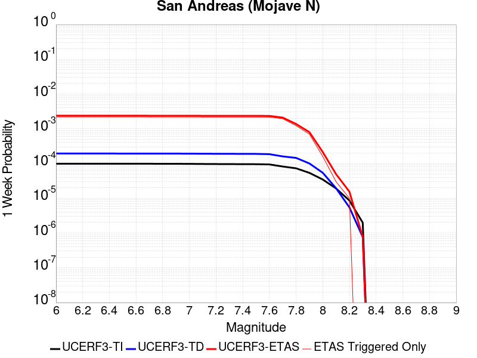 | 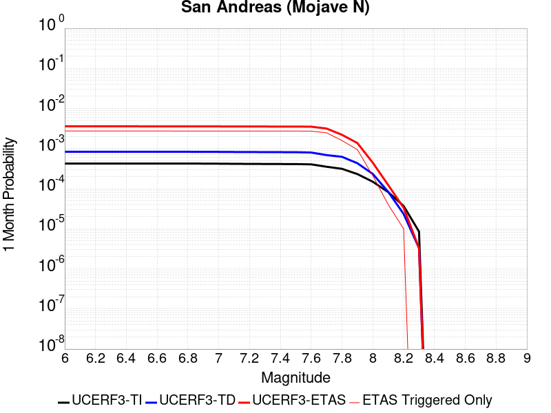 |  | 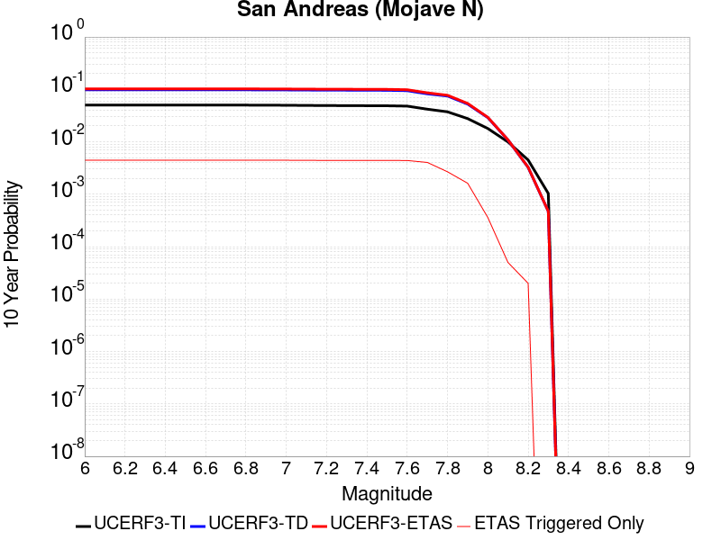 |

| Magnitude | 1 wk TI Prob | 1 wk TD Prob | 1 wk ETAS Prob | 1 wk ETAS/TD Gain | 1 wk ETAS Triggered Only | 1 mo TI Prob | 1 mo TD Prob | 1 mo ETAS Prob | 1 mo ETAS/TD Gain | 1 mo ETAS Triggered Only | 1 yr TI Prob | 1 yr TD Prob | 1 yr ETAS Prob | 1 yr ETAS/TD Gain | 1 yr ETAS Triggered Only | 10 yr TI Prob | 10 yr TD Prob | 10 yr ETAS Prob | 10 yr ETAS/TD Gain | 10 yr ETAS Triggered Only |
|-----|-----|-----|-----|-----|-----|-----|-----|-----|-----|-----|-----|-----|-----|-----|-----|-----|-----|-----|-----|-----|
| 6.0 | 9.877682E-5 | 1.9402112E-4 | 0.003205485 | 16.52132 | 0.003012048 | 4.2326056E-4 | 8.312543E-4 | 0.0038407987 | 4.620486 | 0.003012048 | 0.0051410277 | 0.010073684 | 0.0150431935 | 1.493316 | 0.00502008 | 0.05023708 | 0.09832245 | 0.10284895 | 1.0460372 | 0.00502008 |
| 6.1 | 9.877682E-5 | 1.9402112E-4 | 0.003205485 | 16.52132 | 0.003012048 | 4.2326056E-4 | 8.312543E-4 | 0.0038407987 | 4.620486 | 0.003012048 | 0.0051410277 | 0.010073684 | 0.0150431935 | 1.493316 | 0.00502008 | 0.05023708 | 0.09832245 | 0.10284895 | 1.0460372 | 0.00502008 |
| 6.2 | 9.877682E-5 | 1.9402112E-4 | 0.003205485 | 16.52132 | 0.003012048 | 4.2326056E-4 | 8.312543E-4 | 0.0038407987 | 4.620486 | 0.003012048 | 0.0051410277 | 0.010073684 | 0.0150431935 | 1.493316 | 0.00502008 | 0.05023708 | 0.09832245 | 0.10284895 | 1.0460372 | 0.00502008 |
| 6.3 | 9.877682E-5 | 1.9402112E-4 | 0.003205485 | 16.52132 | 0.003012048 | 4.2326056E-4 | 8.312543E-4 | 0.0038407987 | 4.620486 | 0.003012048 | 0.0051410277 | 0.010073684 | 0.0150431935 | 1.493316 | 0.00502008 | 0.05023708 | 0.09832245 | 0.10284895 | 1.0460372 | 0.00502008 |
| 6.4 | 9.877682E-5 | 1.9402112E-4 | 0.003205485 | 16.52132 | 0.003012048 | 4.2326056E-4 | 8.312543E-4 | 0.0038407987 | 4.620486 | 0.003012048 | 0.0051410277 | 0.010073684 | 0.0150431935 | 1.493316 | 0.00502008 | 0.05023708 | 0.09832245 | 0.10284895 | 1.0460372 | 0.00502008 |
| 6.5 | 9.861474E-5 | 1.937588E-4 | 0.0032052235 | 16.542337 | 0.003012048 | 4.2256617E-4 | 8.3013077E-4 | 0.0038396786 | 4.62539 | 0.003012048 | 0.0051326132 | 0.0100601325 | 0.01502971 | 1.4939873 | 0.00502008 | 0.050156746 | 0.09820035 | 0.10272746 | 1.0461007 | 0.00502008 |
| 6.6 | 9.861474E-5 | 1.937588E-4 | 0.0032052235 | 16.542337 | 0.003012048 | 4.2256617E-4 | 8.3013077E-4 | 0.0038396786 | 4.62539 | 0.003012048 | 0.0051326132 | 0.0100601325 | 0.01502971 | 1.4939873 | 0.00502008 | 0.050156746 | 0.09820035 | 0.10272746 | 1.0461007 | 0.00502008 |
| 6.7 | 9.8552715E-5 | 1.9365833E-4 | 0.0032051231 | 16.550402 | 0.003012048 | 4.223004E-4 | 8.2970044E-4 | 0.0038392495 | 4.6272717 | 0.003012048 | 0.0051293927 | 0.010054941 | 0.015024545 | 1.4942449 | 0.00502008 | 0.050125998 | 0.09815356 | 0.1026809 | 1.046125 | 0.00502008 |
| 6.8 | 9.8464974E-5 | 1.9350994E-4 | 0.0032049753 | 16.562328 | 0.003012048 | 4.219245E-4 | 8.290649E-4 | 0.003838616 | 4.6300545 | 0.003012048 | 0.0051248376 | 0.010047276 | 0.015016917 | 1.4946259 | 0.00502008 | 0.05008251 | 0.09808378 | 0.102611475 | 1.0461615 | 0.00502008 |
| 6.9 | 9.825824E-5 | 1.9319002E-4 | 0.0032046563 | 16.588104 | 0.003012048 | 4.2103877E-4 | 8.276947E-4 | 0.00383725 | 4.6360693 | 0.003012048 | 0.0051141046 | 0.010030746 | 0.015000472 | 1.4954492 | 0.00502008 | 0.049980022 | 0.097932965 | 0.10246141 | 1.0462403 | 0.00502008 |
| 7.0 | 9.781462E-5 | 1.9250368E-4 | 0.003203972 | 16.643692 | 0.003012048 | 4.1913814E-4 | 8.247551E-4 | 0.003834319 | 4.6490397 | 0.003012048 | 0.005091073 | 0.009995285 | 0.014965189 | 1.4972247 | 0.00502008 | 0.04976007 | 0.09760912 | 0.1021392 | 1.0464103 | 0.00502008 |
| 7.1 | 9.7121134E-5 | 1.9152075E-4 | 0.003202992 | 16.723995 | 0.003012048 | 4.1616702E-4 | 8.205452E-4 | 0.0038301218 | 4.6677766 | 0.003012048 | 0.005055068 | 0.0099444995 | 0.014914658 | 1.4997897 | 0.00502008 | 0.04941613 | 0.09714571 | 0.10167811 | 1.0466557 | 0.00502008 |
| 7.2 | 9.663819E-5 | 1.9082859E-4 | 0.003202302 | 16.781038 | 0.003012048 | 4.1409794E-4 | 8.175807E-4 | 0.0038271663 | 4.681087 | 0.003012048 | 0.0050299936 | 0.009908735 | 0.014879073 | 1.5016117 | 0.00502008 | 0.049176537 | 0.09681883 | 0.10135287 | 1.0468302 | 0.00502008 |
| 7.3 | 9.6277574E-5 | 1.9035369E-4 | 0.0032018286 | 16.820417 | 0.003012048 | 4.125529E-4 | 8.1554666E-4 | 0.0038251383 | 4.6902757 | 0.003012048 | 0.0050112694 | 0.009884195 | 0.0148546565 | 1.5028695 | 0.00502008 | 0.04899759 | 0.09659228 | 0.10112745 | 1.0469518 | 0.00502008 |
| 7.4 | 9.593308E-5 | 1.8975153E-4 | 0.003201228 | 16.870632 | 0.003012048 | 4.1107697E-4 | 8.129676E-4 | 0.0038225672 | 4.701992 | 0.003012048 | 0.0049933824 | 0.009853081 | 0.0148236975 | 1.5044734 | 0.00502008 | 0.04882661 | 0.09630986 | 0.100846455 | 1.0471042 | 0.00502008 |
| 7.5 | 9.561707E-5 | 1.8921228E-4 | 0.0032006905 | 16.91587 | 0.003012048 | 4.0972308E-4 | 8.106579E-4 | 0.0038202645 | 4.712548 | 0.003012048 | 0.0049769743 | 0.009825215 | 0.014795971 | 1.5059184 | 0.00502008 | 0.048669744 | 0.096056245 | 0.10059412 | 1.0472418 | 0.00502008 |
| 7.6 | 9.418194E-5 | 1.8573487E-4 | 0.0031972236 | 17.213911 | 0.003012048 | 4.0357444E-4 | 7.95764E-4 | 0.0038054152 | 4.7820907 | 0.003012048 | 0.004902454 | 0.009645499 | 0.014617158 | 1.5154382 | 0.00502008 | 0.047957025 | 0.094437465 | 0.09898346 | 1.0481377 | 0.00502008 |
| 7.7 | 8.202141E-5 | 1.6022482E-4 | 0.0031717904 | 19.795874 | 0.003012048 | 3.51473E-4 | 6.8649714E-4 | 0.0036964775 | 5.384549 | 0.003012048 | 0.00427079 | 0.008326128 | 0.013304411 | 1.5979109 | 0.00502008 | 0.04189639 | 0.082237914 | 0.08684515 | 1.0560234 | 0.00502008 |
| 7.8 | 7.2859846E-5 | 1.4517571E-4 | 0.0021529163 | 14.829728 | 0.002008032 | 3.1221908E-4 | 6.2203326E-4 | 0.0026288163 | 4.2261667 | 0.002008032 | 0.003794643 | 0.0075469986 | 0.010536315 | 1.3960934 | 0.003012048 | 0.037304975 | 0.07472766 | 0.077514626 | 1.037295 | 0.003012048 |
| 7.9 | 5.3874453E-5 | 1.00462625E-4 | 0.0021082931 | 20.985844 | 0.002008032 | 2.3087008E-4 | 4.3048308E-4 | 0.0024376507 | 5.662594 | 0.002008032 | 0.0028072202 | 0.0052285474 | 0.008224847 | 1.5730654 | 0.003012048 | 0.02772022 | 0.052425884 | 0.055280022 | 1.0544415 | 0.003012048 |
| 8.0 | 3.468538E-5 | 5.4261534E-5 | 5.4261534E-5 | 1.0 | 0.0 | 1.4864317E-4 | 2.3252872E-4 | 2.3252872E-4 | 1.0 | 0.0 | 0.0018082283 | 0.0028273636 | 0.0028273636 | 1.0 | 0.0 | 0.017935853 | 0.028948462 | 0.028948462 | 1.0 | 0.0 |
| 8.1 | 1.9152367E-5 | 1.9401303E-5 | 1.9401303E-5 | 1.0 | 0.0 | 8.207899E-5 | 8.3145795E-5 | 8.3145795E-5 | 1.0 | 0.0 | 9.988535E-4 | 0.0010118305 | 0.0010118305 | 1.0 | 0.0 | 0.009943757 | 0.01085595 | 0.01085595 | 1.0 | 0.0 |
| 8.2 | 8.643924E-6 | 5.473668E-6 | 5.473668E-6 | 1.0 | 0.0 | 3.704486E-5 | 2.3458366E-5 | 2.3458366E-5 | 1.0 | 0.0 | 4.5092785E-4 | 2.8556827E-4 | 2.8556827E-4 | 1.0 | 0.0 | 0.0045001395 | 0.0032481793 | 0.0032481793 | 1.0 | 0.0 |
| 8.3 | 1.983087E-6 | 7.6564595E-7 | 7.6564595E-7 | 1.0 | 0.0 | 8.498917E-6 | 3.281336E-6 | 3.281336E-6 | 1.0 | 0.0 | 1.034694E-4 | 3.9949547E-5 | 3.9949547E-5 | 1.0 | 0.0 | 0.0010342124 | 4.717979E-4 | 4.717979E-4 | 1.0 | 0.0 |

## San Andreas (Mojave S)
*[(top)](#table-of-contents)*

| 1 Week | 1 Month | 1 Year | 10 Year |
|-----|-----|-----|-----|
|  |  |  | 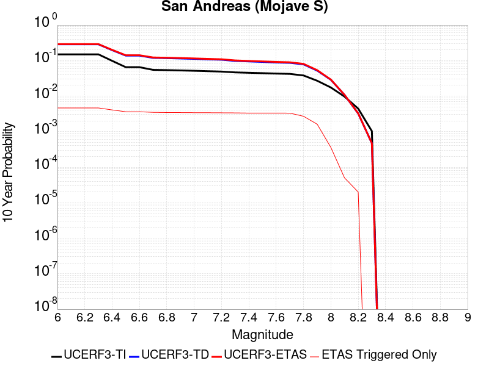 |

| Magnitude | 1 wk TI Prob | 1 wk TD Prob | 1 wk ETAS Prob | 1 wk ETAS/TD Gain | 1 wk ETAS Triggered Only | 1 mo TI Prob | 1 mo TD Prob | 1 mo ETAS Prob | 1 mo ETAS/TD Gain | 1 mo ETAS Triggered Only | 1 yr TI Prob | 1 yr TD Prob | 1 yr ETAS Prob | 1 yr ETAS/TD Gain | 1 yr ETAS Triggered Only | 10 yr TI Prob | 10 yr TD Prob | 10 yr ETAS Prob | 10 yr ETAS/TD Gain | 10 yr ETAS Triggered Only |
|-----|-----|-----|-----|-----|-----|-----|-----|-----|-----|-----|-----|-----|-----|-----|-----|-----|-----|-----|-----|-----|
| 6.0 | 3.1064058E-4 | 6.7462435E-4 | 0.002681302 | 3.974511 | 0.002008032 | 0.0013306376 | 0.002888172 | 0.0048904046 | 1.6932526 | 0.002008032 | 0.016080605 | 0.034565594 | 0.039412156 | 1.1402134 | 0.00502008 | 0.1496549 | 0.28654557 | 0.2901272 | 1.0124992 | 0.00502008 |
| 6.1 | 3.1064058E-4 | 6.7462435E-4 | 0.002681302 | 3.974511 | 0.002008032 | 0.0013306376 | 0.002888172 | 0.0048904046 | 1.6932526 | 0.002008032 | 0.016080605 | 0.034565594 | 0.039412156 | 1.1402134 | 0.00502008 | 0.1496549 | 0.28654557 | 0.2901272 | 1.0124992 | 0.00502008 |
| 6.2 | 3.1064058E-4 | 6.7462435E-4 | 0.002681302 | 3.974511 | 0.002008032 | 0.0013306376 | 0.002888172 | 0.0048904046 | 1.6932526 | 0.002008032 | 0.016080605 | 0.034565594 | 0.039412156 | 1.1402134 | 0.00502008 | 0.1496549 | 0.28654557 | 0.2901272 | 1.0124992 | 0.00502008 |
| 6.3 | 3.1064058E-4 | 6.7462435E-4 | 0.002681302 | 3.974511 | 0.002008032 | 0.0013306376 | 0.002888172 | 0.0048904046 | 1.6932526 | 0.002008032 | 0.016080605 | 0.034565594 | 0.039412156 | 1.1402134 | 0.00502008 | 0.1496549 | 0.28654557 | 0.2901272 | 1.0124992 | 0.00502008 |
| 6.4 | 1.9872203E-4 | 4.3181062E-4 | 0.0024389757 | 5.648253 | 0.002008032 | 8.5138786E-4 | 0.0018493326 | 0.0038536512 | 2.0838065 | 0.002008032 | 0.010316478 | 0.02228931 | 0.027197497 | 1.2202036 | 0.00502008 | 0.098504856 | 0.19686839 | 0.20090018 | 1.0204796 | 0.00502008 |
| 6.5 | 1.291105E-4 | 2.8754136E-4 | 0.002294996 | 7.9814467 | 0.002008032 | 5.5321335E-4 | 0.0012317409 | 0.0032372996 | 2.628231 | 0.002008032 | 0.006714592 | 0.014894155 | 0.018850403 | 1.2656243 | 0.004016064 | 0.065152965 | 0.13800792 | 0.14146975 | 1.0250841 | 0.004016064 |
| 6.6 | 1.291105E-4 | 2.8754136E-4 | 0.002294996 | 7.9814467 | 0.002008032 | 5.5321335E-4 | 0.0012317409 | 0.0032372996 | 2.628231 | 0.002008032 | 0.006714592 | 0.014894155 | 0.018850403 | 1.2656243 | 0.004016064 | 0.065152965 | 0.13800792 | 0.14146975 | 1.0250841 | 0.004016064 |
| 6.7 | 1.08001186E-4 | 2.4335351E-4 | 0.002250897 | 9.249495 | 0.002008032 | 4.6278012E-4 | 0.0010425274 | 0.003048466 | 2.9241114 | 0.002008032 | 0.0056198016 | 0.0126192 | 0.016584584 | 1.3142343 | 0.004016064 | 0.054797906 | 0.11918431 | 0.122721724 | 1.0296801 | 0.004016064 |
| 6.8 | 1.0624356E-4 | 2.3853009E-4 | 0.0022460832 | 9.416352 | 0.002008032 | 4.5525006E-4 | 0.0010218718 | 0.003027852 | 2.963045 | 0.002008032 | 0.0055285925 | 0.012370593 | 0.016336976 | 1.32063 | 0.004016064 | 0.053930566 | 0.11713308 | 0.12067873 | 1.0302702 | 0.004016064 |
| 6.9 | 1.0393785E-4 | 2.3223337E-4 | 0.0022397991 | 9.644605 | 0.002008032 | 4.4537184E-4 | 9.949068E-4 | 0.0030009411 | 3.016304 | 0.002008032 | 0.0054089287 | 0.012045963 | 0.01601365 | 1.329379 | 0.004016064 | 0.05279156 | 0.114433445 | 0.11798994 | 1.0310792 | 0.004016064 |
| 7.0 | 1.0155622E-4 | 2.2592908E-4 | 0.0022335076 | 9.8858795 | 0.002008032 | 4.3516833E-4 | 9.6790853E-4 | 0.002973997 | 3.0726013 | 0.002008032 | 0.005285311 | 0.011720838 | 0.015689831 | 1.338627 | 0.004016064 | 0.05161361 | 0.11169745 | 0.11526493 | 1.0319388 | 0.004016064 |
| 7.1 | 9.885595E-5 | 2.188132E-4 | 0.002226406 | 10.174915 | 0.002008032 | 4.2359953E-4 | 9.374342E-4 | 0.002943584 | 3.1400433 | 0.002008032 | 0.0051451353 | 0.011353733 | 0.0153242005 | 1.3497058 | 0.004016064 | 0.05027629 | 0.10857607 | 0.112156086 | 1.0329725 | 0.004016064 |
| 7.2 | 9.6411415E-5 | 2.1244297E-4 | 0.0022200486 | 10.450091 | 0.002008032 | 4.1312634E-4 | 9.101525E-4 | 0.002916357 | 3.204251 | 0.002008032 | 0.005018219 | 0.011024987 | 0.0149967745 | 1.3602532 | 0.004016064 | 0.049064007 | 0.1057697 | 0.10936099 | 1.0339538 | 0.004016064 |
| 7.3 | 9.1180635E-5 | 1.9472656E-4 | 0.0022023676 | 11.310053 | 0.002008032 | 3.907156E-4 | 8.342756E-4 | 0.0028406326 | 3.404909 | 0.002008032 | 0.004746591 | 0.010110112 | 0.014085573 | 1.3932164 | 0.004016064 | 0.046464786 | 0.09796176 | 0.101584405 | 1.0369802 | 0.004016064 |
| 7.4 | 8.887388E-5 | 1.872126E-4 | 0.0021948689 | 11.723937 | 0.002008032 | 3.8083247E-4 | 8.020931E-4 | 0.0028085145 | 3.501482 | 0.002008032 | 0.0046267817 | 0.009721855 | 0.013698875 | 1.4090804 | 0.004016064 | 0.045316286 | 0.094593845 | 0.09823001 | 1.0384398 | 0.004016064 |
| 7.5 | 8.6750515E-5 | 1.80528E-4 | 0.0021881976 | 12.1210985 | 0.002008032 | 3.7173493E-4 | 7.734621E-4 | 0.002779941 | 3.594153 | 0.002008032 | 0.004516484 | 0.009376327 | 0.0133547345 | 1.4243035 | 0.004016064 | 0.04425787 | 0.09155606 | 0.09520443 | 1.0398484 | 0.004016064 |
| 7.6 | 8.453092E-5 | 1.7440386E-4 | 0.0021820858 | 12.5116825 | 0.002008032 | 3.6222505E-4 | 7.4723107E-4 | 0.0027537628 | 3.6852894 | 0.002008032 | 0.0044011753 | 0.009059664 | 0.013039344 | 1.4392745 | 0.004016064 | 0.04315024 | 0.08871447 | 0.09237426 | 1.0412534 | 0.004016064 |
| 7.7 | 8.259102E-5 | 1.6962511E-4 | 0.0021773167 | 12.836052 | 0.002008032 | 3.539135E-4 | 7.267622E-4 | 0.0027333351 | 3.7609756 | 0.002008032 | 0.004300386 | 0.0088125 | 0.012793173 | 1.4517075 | 0.004016064 | 0.042181134 | 0.086465426 | 0.09013424 | 1.042431 | 0.004016064 |
| 7.8 | 7.444844E-5 | 1.528469E-4 | 0.0021605722 | 14.13553 | 0.002008032 | 3.1902574E-4 | 6.5489375E-4 | 0.0026616107 | 4.064187 | 0.002008032 | 0.0038772223 | 0.007944231 | 0.0109323505 | 1.376137 | 0.003012048 | 0.03810269 | 0.078293875 | 0.081070095 | 1.035459 | 0.003012048 |
| 7.9 | 5.2586525E-5 | 1.0007023E-4 | 0.0021079015 | 21.06422 | 0.002008032 | 2.2535135E-4 | 4.2880196E-4 | 0.002435973 | 5.6808815 | 0.002008032 | 0.0027402006 | 0.005208178 | 0.008204538 | 1.5753185 | 0.003012048 | 0.027066574 | 0.052201588 | 0.055056404 | 1.0546882 | 0.003012048 |
| 8.0 | 3.379877E-5 | 5.4075565E-5 | 5.4075565E-5 | 1.0 | 0.0 | 1.4484383E-4 | 2.3173184E-4 | 2.3173184E-4 | 1.0 | 0.0 | 0.0017620471 | 0.0028176866 | 0.0028176866 | 1.0 | 0.0 | 0.017481409 | 0.028835917 | 0.028835917 | 1.0 | 0.0 |
| 8.1 | 1.8668277E-5 | 1.9308145E-5 | 1.9308145E-5 | 1.0 | 0.0 | 8.000444E-5 | 8.274657E-5 | 8.274657E-5 | 1.0 | 0.0 | 9.736188E-4 | 0.0010069745 | 0.0010069745 | 1.0 | 0.0 | 0.009693642 | 0.010798624 | 0.010798624 | 1.0 | 0.0 |
| 8.2 | 8.541571E-6 | 5.4596358E-6 | 5.4596358E-6 | 1.0 | 0.0 | 3.660622E-5 | 2.339823E-5 | 2.339823E-5 | 1.0 | 0.0 | 4.455896E-4 | 2.848363E-4 | 2.848363E-4 | 1.0 | 0.0 | 0.0044469717 | 0.003240283 | 0.003240283 | 1.0 | 0.0 |
| 8.3 | 1.983087E-6 | 7.6564595E-7 | 7.6564595E-7 | 1.0 | 0.0 | 8.498917E-6 | 3.281336E-6 | 3.281336E-6 | 1.0 | 0.0 | 1.034694E-4 | 3.9949547E-5 | 3.9949547E-5 | 1.0 | 0.0 | 0.0010342124 | 4.717979E-4 | 4.717979E-4 | 1.0 | 0.0 |

## So Sierra Nevada
*[(top)](#table-of-contents)*

| 1 Week | 1 Month | 1 Year | 10 Year |
|-----|-----|-----|-----|
|  |  |  |  |

| Magnitude | 1 wk TI Prob | 1 wk TD Prob | 1 wk ETAS Prob | 1 wk ETAS/TD Gain | 1 wk ETAS Triggered Only | 1 mo TI Prob | 1 mo TD Prob | 1 mo ETAS Prob | 1 mo ETAS/TD Gain | 1 mo ETAS Triggered Only | 1 yr TI Prob | 1 yr TD Prob | 1 yr ETAS Prob | 1 yr ETAS/TD Gain | 1 yr ETAS Triggered Only | 10 yr TI Prob | 10 yr TD Prob | 10 yr ETAS Prob | 10 yr ETAS/TD Gain | 10 yr ETAS Triggered Only |
|-----|-----|-----|-----|-----|-----|-----|-----|-----|-----|-----|-----|-----|-----|-----|-----|-----|-----|-----|-----|-----|
| 6.0 | 1.15488665E-5 | 1.1079612E-5 | 0.0040270993 | 363.46936 | 0.004016064 | 4.9494203E-5 | 4.7483256E-5 | 0.0040633567 | 85.57452 | 0.004016064 | 6.024253E-4 | 5.779681E-4 | 0.0045917113 | 7.944576 | 0.004016064 | 0.006007948 | 0.005765918 | 0.010757053 | 1.865627 | 0.00502008 |
| 6.1 | 1.15488665E-5 | 1.1079612E-5 | 0.0040270993 | 363.46936 | 0.004016064 | 4.9494203E-5 | 4.7483256E-5 | 0.0040633567 | 85.57452 | 0.004016064 | 6.024253E-4 | 5.779681E-4 | 0.0045917113 | 7.944576 | 0.004016064 | 0.006007948 | 0.005765918 | 0.010757053 | 1.865627 | 0.00502008 |
| 6.2 | 1.15488665E-5 | 1.1079612E-5 | 0.0040270993 | 363.46936 | 0.004016064 | 4.9494203E-5 | 4.7483256E-5 | 0.0040633567 | 85.57452 | 0.004016064 | 6.024253E-4 | 5.779681E-4 | 0.0045917113 | 7.944576 | 0.004016064 | 0.006007948 | 0.005765918 | 0.010757053 | 1.865627 | 0.00502008 |
| 6.3 | 1.15488665E-5 | 1.1079612E-5 | 0.0040270993 | 363.46936 | 0.004016064 | 4.9494203E-5 | 4.7483256E-5 | 0.0040633567 | 85.57452 | 0.004016064 | 6.024253E-4 | 5.779681E-4 | 0.0045917113 | 7.944576 | 0.004016064 | 0.006007948 | 0.005765918 | 0.010757053 | 1.865627 | 0.00502008 |
| 6.4 | 1.15488665E-5 | 1.1079612E-5 | 0.0040270993 | 363.46936 | 0.004016064 | 4.9494203E-5 | 4.7483256E-5 | 0.0040633567 | 85.57452 | 0.004016064 | 6.024253E-4 | 5.779681E-4 | 0.0045917113 | 7.944576 | 0.004016064 | 0.006007948 | 0.005765918 | 0.010757053 | 1.865627 | 0.00502008 |
| 6.5 | 1.15488665E-5 | 1.1079612E-5 | 0.0040270993 | 363.46936 | 0.004016064 | 4.9494203E-5 | 4.7483256E-5 | 0.0040633567 | 85.57452 | 0.004016064 | 6.024253E-4 | 5.779681E-4 | 0.0045917113 | 7.944576 | 0.004016064 | 0.006007948 | 0.005765918 | 0.010757053 | 1.865627 | 0.00502008 |
| 6.6 | 7.587044E-6 | 6.9356042E-6 | 0.0020149539 | 290.5232 | 0.002008032 | 3.2515498E-5 | 2.9723697E-5 | 0.002037696 | 68.5546 | 0.002008032 | 3.9580427E-4 | 3.6182883E-4 | 0.0023691345 | 6.547666 | 0.002008032 | 0.003951 | 0.0036126887 | 0.0056134667 | 1.5538195 | 0.002008032 |
| 6.7 | 7.587044E-6 | 6.9356042E-6 | 0.0020149539 | 290.5232 | 0.002008032 | 3.2515498E-5 | 2.9723697E-5 | 0.002037696 | 68.5546 | 0.002008032 | 3.9580427E-4 | 3.6182883E-4 | 0.0023691345 | 6.547666 | 0.002008032 | 0.003951 | 0.0036126887 | 0.0056134667 | 1.5538195 | 0.002008032 |
| 6.8 | 5.9026956E-6 | 5.179362E-6 | 0.0020132011 | 388.69675 | 0.002008032 | 2.5297022E-5 | 2.2197082E-5 | 0.0020301847 | 91.46178 | 0.002008032 | 3.0794772E-4 | 2.7021713E-4 | 0.0022777067 | 8.429172 | 0.002008032 | 0.0030752132 | 0.002699002 | 0.0047016144 | 1.7419826 | 0.002008032 |
| 6.9 | 5.0118915E-6 | 4.2523943E-6 | 0.002012276 | 473.21008 | 0.002008032 | 2.1479358E-5 | 1.8224424E-5 | 0.0020262199 | 111.18156 | 0.002008032 | 2.614798E-4 | 2.2186051E-4 | 0.0022294472 | 10.048869 | 0.002008032 | 0.0026117235 | 0.0022164627 | 0.0042200442 | 1.9039545 | 0.002008032 |
| 7.0 | 4.4924795E-6 | 3.7138868E-6 | 0.0010077262 | 271.34006 | 0.001004016 | 1.925334E-5 | 1.5916565E-5 | 0.0010199166 | 64.07895 | 0.001004016 | 2.3438422E-4 | 1.9376757E-4 | 0.0011975891 | 6.1805444 | 0.001004016 | 0.0023413717 | 0.0019360491 | 0.0029381213 | 1.5175861 | 0.001004016 |
| 7.1 | 3.9118436E-6 | 3.1119469E-6 | 0.0010071249 | 323.63177 | 0.001004016 | 1.6764936E-5 | 1.333685E-5 | 0.0010173395 | 76.28034 | 0.001004016 | 2.0409399E-4 | 1.6236462E-4 | 0.0011662177 | 7.182708 | 0.001004016 | 0.0020390663 | 0.0016225161 | 0.002624903 | 1.6177979 | 0.001004016 |
| 7.2 | 3.4200818E-6 | 2.6054236E-6 | 0.0010066188 | 386.35516 | 0.001004016 | 1.4657411E-5 | 1.11660565E-5 | 0.001015171 | 90.915794 | 0.001004016 | 1.7843937E-4 | 1.3593875E-4 | 0.0011398183 | 8.384793 | 0.001004016 | 0.0017829615 | 0.0013586058 | 0.0023612578 | 1.7380006 | 0.001004016 |
| 7.3 | 2.6593618E-6 | 1.8283897E-6 | 0.0010058426 | 550.1249 | 0.001004016 | 1.13972155E-5 | 7.8359335E-6 | 0.0010118441 | 129.12872 | 0.001004016 | 1.3875226E-4 | 9.539862E-5 | 0.0010993188 | 11.523426 | 0.001004016 | 0.0013866565 | 9.536055E-4 | 0.0019566643 | 2.0518591 | 0.001004016 |
| 7.4 | 2.2577992E-6 | 1.4364078E-6 | 1.4364078E-6 | 1.0 | 0.0 | 9.676246E-6 | 6.1560204E-6 | 6.1560204E-6 | 1.0 | 0.0 | 1.1780193E-4 | 7.4947224E-5 | 7.4947224E-5 | 1.0 | 0.0 | 0.001177395 | 7.4924453E-4 | 7.4924453E-4 | 1.0 | 0.0 |
| 7.5 | 1.489319E-6 | 7.353661E-7 | 7.353661E-7 | 1.0 | 0.0 | 6.3827797E-6 | 3.1515651E-6 | 3.1515651E-6 | 1.0 | 0.0 | 7.770758E-5 | 3.8369635E-5 | 3.8369635E-5 | 1.0 | 0.0 | 7.7680405E-4 | 3.8363054E-4 | 3.8363054E-4 | 1.0 | 0.0 |
| 7.6 | 1.0680322E-6 | 4.65941E-7 | 4.65941E-7 | 1.0 | 0.0 | 4.577273E-6 | 1.9968884E-6 | 1.9968884E-6 | 1.0 | 0.0 | 5.5726876E-5 | 2.4311848E-5 | 2.4311848E-5 | 1.0 | 0.0 | 5.5712904E-4 | 2.4309216E-4 | 2.4309216E-4 | 1.0 | 0.0 |
| 7.7 | 5.509146E-7 | 1.5578539E-7 | 1.5578539E-7 | 1.0 | 0.0 | 2.3610605E-6 | 6.676515E-7 | 6.676515E-7 | 1.0 | 0.0 | 2.8745531E-5 | 8.128628E-6 | 8.128628E-6 | 1.0 | 0.0 | 2.8741814E-4 | 8.128342E-5 | 8.128342E-5 | 1.0 | 0.0 |

## Towne Pass
*[(top)](#table-of-contents)*

| 1 Week | 1 Month | 1 Year | 10 Year |
|-----|-----|-----|-----|
|  |  |  |  |

| Magnitude | 1 wk TI Prob | 1 wk TD Prob | 1 wk ETAS Prob | 1 wk ETAS/TD Gain | 1 wk ETAS Triggered Only | 1 mo TI Prob | 1 mo TD Prob | 1 mo ETAS Prob | 1 mo ETAS/TD Gain | 1 mo ETAS Triggered Only | 1 yr TI Prob | 1 yr TD Prob | 1 yr ETAS Prob | 1 yr ETAS/TD Gain | 1 yr ETAS Triggered Only | 10 yr TI Prob | 10 yr TD Prob | 10 yr ETAS Prob | 10 yr ETAS/TD Gain | 10 yr ETAS Triggered Only |
|-----|-----|-----|-----|-----|-----|-----|-----|-----|-----|-----|-----|-----|-----|-----|-----|-----|-----|-----|-----|-----|
| 6.0 | 3.849728E-6 | 3.894542E-6 | 3.894542E-6 | 1.0 | 0.0 | 1.649873E-5 | 1.6690812E-5 | 1.6690812E-5 | 1.0 | 0.0 | 2.0085352E-4 | 2.0319606E-4 | 2.0319606E-4 | 1.0 | 0.0 | 0.0020067208 | 0.0020305319 | 0.0060384413 | 2.9738226 | 0.004016064 |
| 6.1 | 3.849728E-6 | 3.894542E-6 | 3.894542E-6 | 1.0 | 0.0 | 1.649873E-5 | 1.6690812E-5 | 1.6690812E-5 | 1.0 | 0.0 | 2.0085352E-4 | 2.0319606E-4 | 2.0319606E-4 | 1.0 | 0.0 | 0.0020067208 | 0.0020305319 | 0.0060384413 | 2.9738226 | 0.004016064 |
| 6.2 | 3.849728E-6 | 3.894542E-6 | 3.894542E-6 | 1.0 | 0.0 | 1.649873E-5 | 1.6690812E-5 | 1.6690812E-5 | 1.0 | 0.0 | 2.0085352E-4 | 2.0319606E-4 | 2.0319606E-4 | 1.0 | 0.0 | 0.0020067208 | 0.0020305319 | 0.0060384413 | 2.9738226 | 0.004016064 |
| 6.3 | 3.849728E-6 | 3.894542E-6 | 3.894542E-6 | 1.0 | 0.0 | 1.649873E-5 | 1.6690812E-5 | 1.6690812E-5 | 1.0 | 0.0 | 2.0085352E-4 | 2.0319606E-4 | 2.0319606E-4 | 1.0 | 0.0 | 0.0020067208 | 0.0020305319 | 0.0060384413 | 2.9738226 | 0.004016064 |
| 6.4 | 3.849728E-6 | 3.894542E-6 | 3.894542E-6 | 1.0 | 0.0 | 1.649873E-5 | 1.6690812E-5 | 1.6690812E-5 | 1.0 | 0.0 | 2.0085352E-4 | 2.0319606E-4 | 2.0319606E-4 | 1.0 | 0.0 | 0.0020067208 | 0.0020305319 | 0.0060384413 | 2.9738226 | 0.004016064 |
| 6.5 | 1.1953545E-6 | 1.2030526E-6 | 1.2030526E-6 | 1.0 | 0.0 | 5.1229376E-6 | 5.15593E-6 | 5.15593E-6 | 1.0 | 0.0 | 6.236998E-5 | 6.277176E-5 | 6.277176E-5 | 1.0 | 0.0 | 6.235248E-4 | 6.2755204E-4 | 0.001630938 | 2.5988889 | 0.001004016 |
| 6.6 | 1.1953545E-6 | 1.2030526E-6 | 1.2030526E-6 | 1.0 | 0.0 | 5.1229376E-6 | 5.15593E-6 | 5.15593E-6 | 1.0 | 0.0 | 6.236998E-5 | 6.277176E-5 | 6.277176E-5 | 1.0 | 0.0 | 6.235248E-4 | 6.2755204E-4 | 0.001630938 | 2.5988889 | 0.001004016 |
| 6.7 | 8.375951E-7 | 8.410676E-7 | 8.410676E-7 | 1.0 | 0.0 | 3.5896885E-6 | 3.6045708E-6 | 3.6045708E-6 | 1.0 | 0.0 | 4.370358E-5 | 4.3884826E-5 | 4.3884826E-5 | 1.0 | 0.0 | 4.3694986E-4 | 4.3876728E-4 | 0.0014423429 | 3.2872615 | 0.001004016 |
| 6.8 | 6.38041E-7 | 6.3921624E-7 | 6.3921624E-7 | 1.0 | 0.0 | 2.7344586E-6 | 2.7394954E-6 | 2.7394954E-6 | 1.0 | 0.0 | 3.3291526E-5 | 3.3352884E-5 | 3.3352884E-5 | 1.0 | 0.0 | 3.3286537E-4 | 3.334826E-4 | 3.334826E-4 | 1.0 | 0.0 |
| 6.9 | 5.3460053E-7 | 5.345339E-7 | 5.345339E-7 | 1.0 | 0.0 | 2.2911431E-6 | 2.2908578E-6 | 2.2908578E-6 | 1.0 | 0.0 | 2.789431E-5 | 2.7890868E-5 | 2.7890868E-5 | 1.0 | 0.0 | 2.789081E-4 | 2.78877E-4 | 2.78877E-4 | 1.0 | 0.0 |
| 7.0 | 3.557783E-7 | 3.5324283E-7 | 3.5324283E-7 | 1.0 | 0.0 | 1.5247632E-6 | 1.513897E-6 | 1.513897E-6 | 1.0 | 0.0 | 1.8563835E-5 | 1.8431549E-5 | 1.8431549E-5 | 1.0 | 0.0 | 1.8562283E-4 | 1.8430105E-4 | 1.8430105E-4 | 1.0 | 0.0 |
| 7.1 | 3.037942E-7 | 3.0002275E-7 | 3.0002275E-7 | 1.0 | 0.0 | 1.3019744E-6 | 1.2858112E-6 | 1.2858112E-6 | 1.0 | 0.0 | 1.5851423E-5 | 1.5654647E-5 | 1.5654647E-5 | 1.0 | 0.0 | 1.5850292E-4 | 1.5653619E-4 | 1.5653619E-4 | 1.0 | 0.0 |
| 7.2 | 2.0808248E-7 | 2.0217735E-7 | 2.0217735E-7 | 1.0 | 0.0 | 8.917818E-7 | 8.6647407E-7 | 8.6647407E-7 | 1.0 | 0.0 | 1.0857389E-5 | 1.0549275E-5 | 1.0549275E-5 | 1.0 | 0.0 | 1.0856859E-4 | 1.0548821E-4 | 1.0548821E-4 | 1.0 | 0.0 |
| 7.3 | 1.1162073E-7 | 1.0636902E-7 | 1.0636902E-7 | 1.0 | 0.0 | 4.7837443E-7 | 4.5586717E-7 | 4.5586717E-7 | 1.0 | 0.0 | 5.8241935E-6 | 5.5501705E-6 | 5.5501705E-6 | 1.0 | 0.0 | 5.8240406E-5 | 5.550052E-5 | 5.550052E-5 | 1.0 | 0.0 |

## San Andreas (San Bernardino N)
*[(top)](#table-of-contents)*

| 1 Week | 1 Month | 1 Year | 10 Year |
|-----|-----|-----|-----|
|  |  |  |  |

| Magnitude | 1 wk TI Prob | 1 wk TD Prob | 1 wk ETAS Prob | 1 wk ETAS/TD Gain | 1 wk ETAS Triggered Only | 1 mo TI Prob | 1 mo TD Prob | 1 mo ETAS Prob | 1 mo ETAS/TD Gain | 1 mo ETAS Triggered Only | 1 yr TI Prob | 1 yr TD Prob | 1 yr ETAS Prob | 1 yr ETAS/TD Gain | 1 yr ETAS Triggered Only | 10 yr TI Prob | 10 yr TD Prob | 10 yr ETAS Prob | 10 yr ETAS/TD Gain | 10 yr ETAS Triggered Only |
|-----|-----|-----|-----|-----|-----|-----|-----|-----|-----|-----|-----|-----|-----|-----|-----|-----|-----|-----|-----|-----|
| 6.0 | 1.4273766E-4 | 3.160784E-4 | 0.002323476 | 7.350948 | 0.002008032 | 6.115894E-4 | 0.0013539245 | 0.003359238 | 2.4811118 | 0.002008032 | 0.0074207084 | 0.016360939 | 0.019323708 | 1.1810879 | 0.003012048 | 0.07177748 | 0.15021163 | 0.15277123 | 1.01704 | 0.003012048 |
| 6.1 | 1.4273766E-4 | 3.160784E-4 | 0.002323476 | 7.350948 | 0.002008032 | 6.115894E-4 | 0.0013539245 | 0.003359238 | 2.4811118 | 0.002008032 | 0.0074207084 | 0.016360939 | 0.019323708 | 1.1810879 | 0.003012048 | 0.07177748 | 0.15021163 | 0.15277123 | 1.01704 | 0.003012048 |
| 6.2 | 1.4273766E-4 | 3.160784E-4 | 0.002323476 | 7.350948 | 0.002008032 | 6.115894E-4 | 0.0013539245 | 0.003359238 | 2.4811118 | 0.002008032 | 0.0074207084 | 0.016360939 | 0.019323708 | 1.1810879 | 0.003012048 | 0.07177748 | 0.15021163 | 0.15277123 | 1.01704 | 0.003012048 |
| 6.3 | 1.3730655E-4 | 3.0512668E-4 | 0.0023125461 | 7.5789704 | 0.002008032 | 5.883239E-4 | 0.001307036 | 0.0033124436 | 2.534317 | 0.002008032 | 0.0071393442 | 0.015798455 | 0.018762918 | 1.1876426 | 0.003012048 | 0.06914291 | 0.1455135 | 0.14808726 | 1.0176874 | 0.003012048 |
| 6.4 | 1.3730655E-4 | 3.0512668E-4 | 0.0023125461 | 7.5789704 | 0.002008032 | 5.883239E-4 | 0.001307036 | 0.0033124436 | 2.534317 | 0.002008032 | 0.0071393442 | 0.015798455 | 0.018762918 | 1.1876426 | 0.003012048 | 0.06914291 | 0.1455135 | 0.14808726 | 1.0176874 | 0.003012048 |
| 6.5 | 1.2942807E-4 | 2.8927144E-4 | 0.0022967227 | 7.93968 | 0.002008032 | 5.545738E-4 | 0.0012391509 | 0.0032446948 | 2.6184824 | 0.002008032 | 0.0067310524 | 0.014983548 | 0.017950464 | 1.1980116 | 0.003012048 | 0.06530788 | 0.13865088 | 0.1412453 | 1.0187119 | 0.003012048 |
| 6.6 | 1.1125901E-4 | 2.5365927E-4 | 0.002261182 | 8.91425 | 0.002008032 | 4.767372E-4 | 0.0010866605 | 0.0030925106 | 2.8458848 | 0.002008032 | 0.005788839 | 0.0131504685 | 0.016122907 | 1.2260329 | 0.003012048 | 0.056403454 | 0.12300496 | 0.1256465 | 1.0214752 | 0.003012048 |
| 6.7 | 1.02209575E-4 | 2.3500937E-4 | 0.0022425696 | 9.542469 | 0.002008032 | 4.3796748E-4 | 0.0010067957 | 0.0030128062 | 2.9924703 | 0.002008032 | 0.0053192247 | 0.012189267 | 0.015164601 | 1.2440945 | 0.003012048 | 0.051936906 | 0.114792764 | 0.11745905 | 1.023227 | 0.003012048 |
| 6.8 | 9.610582E-5 | 2.2026796E-4 | 0.0022278577 | 10.114307 | 0.002008032 | 4.1181705E-4 | 9.436647E-4 | 0.002949802 | 3.1259005 | 0.002008032 | 0.0050023515 | 0.011428859 | 0.014406484 | 1.2605355 | 0.003012048 | 0.048912346 | 0.10820469 | 0.11089082 | 1.0248245 | 0.003012048 |
| 6.9 | 9.3877505E-5 | 2.1482339E-4 | 0.0022224241 | 10.345354 | 0.002008032 | 4.0227012E-4 | 9.203475E-4 | 0.0029265315 | 3.1798115 | 0.002008032 | 0.0048866454 | 0.011147907 | 0.014126377 | 1.2671776 | 0.003012048 | 0.04780577 | 0.105798274 | 0.10849165 | 1.0254577 | 0.003012048 |
| 7.0 | 9.1019785E-5 | 2.0809306E-4 | 0.0022157074 | 10.6476755 | 0.002008032 | 3.900265E-4 | 8.915232E-4 | 0.002897765 | 3.250353 | 0.002008032 | 0.0047382377 | 0.0108004995 | 0.013780016 | 1.2758684 | 0.003012048 | 0.046384744 | 0.10276815 | 0.10547066 | 1.0262971 | 0.003012048 |
| 7.1 | 8.771155E-5 | 1.9983841E-4 | 0.0022074692 | 11.046271 | 0.002008032 | 3.758525E-4 | 8.5616973E-4 | 0.0028624826 | 3.3433588 | 0.002008032 | 0.0045664064 | 0.010374243 | 0.013355044 | 1.287327 | 0.003012048 | 0.044737056 | 0.09907644 | 0.10179006 | 1.0273892 | 0.003012048 |
| 7.2 | 8.0830236E-5 | 1.8389444E-4 | 0.0021915573 | 11.917475 | 0.002008032 | 3.4636928E-4 | 7.8788114E-4 | 0.0027943312 | 3.5466406 | 0.002008032 | 0.0042088944 | 0.009550368 | 0.012533651 | 1.3123735 | 0.003012048 | 0.041300658 | 0.09180518 | 0.094540715 | 1.0297971 | 0.003012048 |
| 7.3 | 7.7668235E-5 | 1.7333007E-4 | 0.002181014 | 12.583011 | 0.002008032 | 3.328214E-4 | 7.426318E-4 | 0.0027491727 | 3.7019324 | 0.002008032 | 0.0040445733 | 0.009004138 | 0.011989065 | 1.3315061 | 0.003012048 | 0.03971748 | 0.08706761 | 0.08981741 | 1.0315824 | 0.003012048 |
| 7.4 | 7.520177E-5 | 1.655312E-4 | 0.002173231 | 13.128831 | 0.002008032 | 3.2225347E-4 | 7.092266E-4 | 0.0027158346 | 3.8292904 | 0.002008032 | 0.0039163795 | 0.008600714 | 0.011586856 | 1.347197 | 0.003012048 | 0.038480744 | 0.08352157 | 0.086282045 | 1.033051 | 0.003012048 |
| 7.5 | 7.274697E-5 | 1.584075E-4 | 0.0021661215 | 13.674362 | 0.002008032 | 3.1173544E-4 | 6.7871273E-4 | 0.002685382 | 3.956581 | 0.002008032 | 0.003788775 | 0.008232076 | 0.011219328 | 1.3628796 | 0.003012048 | 0.03724827 | 0.08023654 | 0.08300691 | 1.0345275 | 0.003012048 |
| 7.6 | 7.1185845E-5 | 1.5410586E-4 | 0.0021618286 | 14.028205 | 0.002008032 | 3.0504653E-4 | 6.602866E-4 | 0.0026669928 | 4.0391445 | 0.002008032 | 0.0037076178 | 0.0080094095 | 0.010997333 | 1.3730516 | 0.003012048 | 0.036463667 | 0.07822661 | 0.08100304 | 1.0354921 | 0.003012048 |
| 7.7 | 6.709961E-5 | 1.4319421E-4 | 0.0021509388 | 15.02113 | 0.002008032 | 2.8753807E-4 | 6.135452E-4 | 0.0026203452 | 4.270827 | 0.002008032 | 0.003495157 | 0.0074443663 | 0.010433991 | 1.4015957 | 0.003012048 | 0.034406938 | 0.07305558 | 0.07584758 | 1.0382175 | 0.003012048 |
| 7.8 | 6.300812E-5 | 1.320343E-4 | 0.0021398014 | 16.206404 | 0.002008032 | 2.7000686E-4 | 5.657386E-4 | 0.0025726347 | 4.547391 | 0.002008032 | 0.0032823787 | 0.006866143 | 0.00985751 | 1.4356692 | 0.003012048 | 0.032343175 | 0.06771385 | 0.070521936 | 1.0414699 | 0.003012048 |
| 7.9 | 4.983037E-5 | 9.7241085E-5 | 0.002105078 | 21.648031 | 0.002008032 | 2.1354125E-4 | 4.1668097E-4 | 0.0024238764 | 5.817104 | 0.002008032 | 0.0025967648 | 0.0050613005 | 0.008058104 | 1.5921015 | 0.003012048 | 0.025666296 | 0.050650507 | 0.053509995 | 1.0564553 | 0.003012048 |
| 8.0 | 3.2211527E-5 | 5.3306234E-5 | 5.3306234E-5 | 1.0 | 0.0 | 1.380421E-4 | 2.2843528E-4 | 2.2843528E-4 | 1.0 | 0.0 | 0.0016793669 | 0.0027776542 | 0.0027776542 | 1.0 | 0.0 | 0.016667323 | 0.028362568 | 0.028362568 | 1.0 | 0.0 |
| 8.1 | 1.743376E-5 | 1.8823403E-5 | 1.8823403E-5 | 1.0 | 0.0 | 7.471398E-5 | 8.066923E-5 | 8.066923E-5 | 1.0 | 0.0 | 9.0926304E-4 | 9.81706E-4 | 9.81706E-4 | 1.0 | 0.0 | 0.009055517 | 0.010483979 | 0.010483979 | 1.0 | 0.0 |
| 8.2 | 7.831616E-6 | 5.1540533E-6 | 5.1540533E-6 | 1.0 | 0.0 | 3.3563636E-5 | 2.2088612E-5 | 2.2088612E-5 | 1.0 | 0.0 | 4.0856065E-4 | 2.6889573E-4 | 2.6889573E-4 | 1.0 | 0.0 | 0.004078103 | 0.0030413668 | 0.0030413668 | 1.0 | 0.0 |
| 8.3 | 1.983087E-6 | 7.6564595E-7 | 7.6564595E-7 | 1.0 | 0.0 | 8.498917E-6 | 3.281336E-6 | 3.281336E-6 | 1.0 | 0.0 | 1.034694E-4 | 3.9949547E-5 | 3.9949547E-5 | 1.0 | 0.0 | 0.0010342124 | 4.717979E-4 | 4.717979E-4 | 1.0 | 0.0 |

## San Andreas (Parkfield)
*[(top)](#table-of-contents)*

| 1 Week | 1 Month | 1 Year | 10 Year |
|-----|-----|-----|-----|
|  | 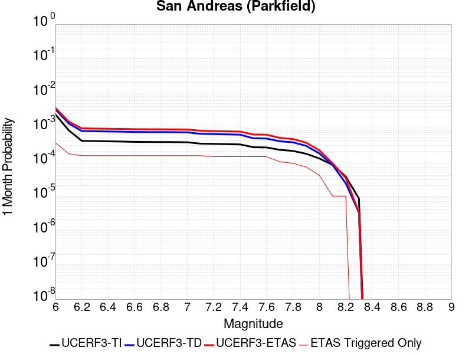 |  |  |

| Magnitude | 1 wk TI Prob | 1 wk TD Prob | 1 wk ETAS Prob | 1 wk ETAS/TD Gain | 1 wk ETAS Triggered Only | 1 mo TI Prob | 1 mo TD Prob | 1 mo ETAS Prob | 1 mo ETAS/TD Gain | 1 mo ETAS Triggered Only | 1 yr TI Prob | 1 yr TD Prob | 1 yr ETAS Prob | 1 yr ETAS/TD Gain | 1 yr ETAS Triggered Only | 10 yr TI Prob | 10 yr TD Prob | 10 yr ETAS Prob | 10 yr ETAS/TD Gain | 10 yr ETAS Triggered Only |
|-----|-----|-----|-----|-----|-----|-----|-----|-----|-----|-----|-----|-----|-----|-----|-----|-----|-----|-----|-----|-----|
| 6.0 | 5.556969E-4 | 7.778562E-4 | 7.778562E-4 | 1.0 | 0.0 | 0.0023793848 | 0.0033299583 | 0.0033299583 | 1.0 | 0.0 | 0.028586963 | 0.040235043 | 0.04119866 | 1.0239497 | 0.001004016 | 0.25176284 | 0.3371973 | 0.33852822 | 1.003947 | 0.002008032 |
| 6.1 | 1.925858E-4 | 3.0278185E-4 | 3.0278185E-4 | 1.0 | 0.0 | 8.2510663E-4 | 0.001297085 | 0.001297085 | 1.0 | 0.0 | 0.0099994885 | 0.01577393 | 0.01676211 | 1.0626463 | 0.001004016 | 0.095613256 | 0.14975825 | 0.1506119 | 1.0057002 | 0.001004016 |
| 6.2 | 9.4306815E-5 | 1.8243887E-4 | 1.8243887E-4 | 1.0 | 0.0 | 4.0410945E-4 | 7.8164786E-4 | 7.8164786E-4 | 1.0 | 0.0 | 0.0049089384 | 0.009475246 | 0.01046975 | 1.1049579 | 0.001004016 | 0.048019063 | 0.0918565 | 0.0927683 | 1.0099262 | 0.001004016 |
| 6.3 | 9.283051E-5 | 1.794041E-4 | 1.794041E-4 | 1.0 | 0.0 | 3.9778434E-4 | 7.686494E-4 | 7.686494E-4 | 1.0 | 0.0 | 0.0048322747 | 0.009318355 | 0.0103130145 | 1.106742 | 0.001004016 | 0.047285385 | 0.090509474 | 0.09142262 | 1.0100889 | 0.001004016 |
| 6.4 | 9.138826E-5 | 1.7702584E-4 | 1.7702584E-4 | 1.0 | 0.0 | 3.916052E-4 | 7.5846276E-4 | 7.5846276E-4 | 1.0 | 0.0 | 0.0047573745 | 0.009195387 | 0.010190171 | 1.1081829 | 0.001004016 | 0.046568092 | 0.0894136 | 0.090327844 | 1.0102249 | 0.001004016 |
| 6.5 | 9.000255E-5 | 1.746064E-4 | 1.746064E-4 | 1.0 | 0.0 | 3.8566816E-4 | 7.4809964E-4 | 7.4809964E-4 | 1.0 | 0.0 | 0.0046854047 | 0.009070284 | 0.010065193 | 1.1096889 | 0.001004016 | 0.045878403 | 0.08829608 | 0.08921144 | 1.010367 | 0.001004016 |
| 6.6 | 8.8109264E-5 | 1.7141816E-4 | 1.7141816E-4 | 1.0 | 0.0 | 3.7755648E-4 | 7.3444354E-4 | 7.3444354E-4 | 1.0 | 0.0 | 0.0045870654 | 0.008905404 | 0.00990048 | 1.1117383 | 0.001004016 | 0.04493529 | 0.08682707 | 0.087743916 | 1.0105594 | 0.001004016 |
| 6.7 | 8.738073E-5 | 1.7008898E-4 | 1.7008898E-4 | 1.0 | 0.0 | 3.7443507E-4 | 7.287503E-4 | 7.287503E-4 | 1.0 | 0.0 | 0.0045492216 | 0.008836695 | 0.009831838 | 1.112615 | 0.001004016 | 0.04457213 | 0.0862268 | 0.08714424 | 1.0106399 | 0.001004016 |
| 6.8 | 8.710195E-5 | 1.6954402E-4 | 1.6954402E-4 | 1.0 | 0.0 | 3.7324068E-4 | 7.26416E-4 | 7.26416E-4 | 1.0 | 0.0 | 0.0045347405 | 0.008808513 | 0.009803685 | 1.1129785 | 0.001004016 | 0.04443313 | 0.08597436 | 0.08689205 | 1.0106741 | 0.001004016 |
| 6.9 | 8.6801556E-5 | 1.6895356E-4 | 1.6895356E-4 | 1.0 | 0.0 | 3.7195362E-4 | 7.238869E-4 | 7.238869E-4 | 1.0 | 0.0 | 0.0045191357 | 0.0087779695 | 0.009773172 | 1.1133751 | 0.001004016 | 0.044283327 | 0.08570042 | 0.08661839 | 1.0107114 | 0.001004016 |
| 7.0 | 8.5571606E-5 | 1.664819E-4 | 1.664819E-4 | 1.0 | 0.0 | 3.6668387E-4 | 7.132999E-4 | 7.132999E-4 | 1.0 | 0.0 | 0.004455241 | 0.008650103 | 0.009645434 | 1.1150658 | 0.001004016 | 0.043669727 | 0.08454836 | 0.085467495 | 1.010871 | 0.001004016 |
| 7.1 | 7.82589E-5 | 1.5128969E-4 | 1.5128969E-4 | 1.0 | 0.0 | 3.3535215E-4 | 6.4822397E-4 | 6.4822397E-4 | 1.0 | 0.0 | 0.0040752706 | 0.007863738 | 0.007863738 | 1.0 | 0.0 | 0.040013418 | 0.077460445 | 0.077460445 | 1.0 | 0.0 |
| 7.2 | 7.690929E-5 | 1.4866212E-4 | 1.4866212E-4 | 1.0 | 0.0 | 3.2956956E-4 | 6.369685E-4 | 6.369685E-4 | 1.0 | 0.0 | 0.004005129 | 0.0077276826 | 0.0077276826 | 1.0 | 0.0 | 0.0393371 | 0.07623341 | 0.07623341 | 1.0 | 0.0 |
| 7.3 | 7.5543794E-5 | 1.4562748E-4 | 1.4562748E-4 | 1.0 | 0.0 | 3.2371894E-4 | 6.239692E-4 | 6.239692E-4 | 1.0 | 0.0 | 0.003934157 | 0.0075705256 | 0.0075705256 | 1.0 | 0.0 | 0.038652334 | 0.07479777 | 0.07479777 | 1.0 | 0.0 |
| 7.4 | 7.4214564E-5 | 1.4263717E-4 | 1.4263717E-4 | 1.0 | 0.0 | 3.1802364E-4 | 6.1115966E-4 | 6.1115966E-4 | 1.0 | 0.0 | 0.003865065 | 0.0074156416 | 0.0074156416 | 1.0 | 0.0 | 0.03798529 | 0.07337152 | 0.07337152 | 1.0 | 0.0 |
| 7.5 | 6.149578E-5 | 1.1191443E-4 | 1.1191443E-4 | 1.0 | 0.0 | 2.6352672E-4 | 4.795452E-4 | 4.795452E-4 | 1.0 | 0.0 | 0.0032037178 | 0.005822865 | 0.005822865 | 1.0 | 0.0 | 0.03157923 | 0.058559462 | 0.058559462 | 1.0 | 0.0 |
| 7.6 | 6.0643448E-5 | 1.102009E-4 | 1.102009E-4 | 1.0 | 0.0 | 2.598746E-4 | 4.7220418E-4 | 4.7220418E-4 | 1.0 | 0.0 | 0.0031593828 | 0.005733962 | 0.005733962 | 1.0 | 0.0 | 0.031148417 | 0.05772042 | 0.05772042 | 1.0 | 0.0 |
| 7.7 | 5.1652263E-5 | 9.175265E-5 | 9.175265E-5 | 1.0 | 0.0 | 2.2134806E-4 | 3.9316638E-4 | 3.9316638E-4 | 1.0 | 0.0 | 0.002691582 | 0.0047763046 | 0.0047763046 | 1.0 | 0.0 | 0.026592141 | 0.04853641 | 0.04853641 | 1.0 | 0.0 |
| 7.8 | 4.8090482E-5 | 8.560165E-5 | 8.560165E-5 | 1.0 | 0.0 | 2.060858E-4 | 3.6681266E-4 | 3.6681266E-4 | 1.0 | 0.0 | 0.0025062072 | 0.004456807 | 0.004456807 | 1.0 | 0.0 | 0.024781305 | 0.045302264 | 0.045302264 | 1.0 | 0.0 |
| 7.9 | 3.970278E-5 | 6.7507375E-5 | 6.7507375E-5 | 1.0 | 0.0 | 1.7014367E-4 | 2.8928524E-4 | 2.8928524E-4 | 1.0 | 0.0 | 0.002069531 | 0.0035163634 | 0.0035163634 | 1.0 | 0.0 | 0.020503636 | 0.03588176 | 0.03588176 | 1.0 | 0.0 |
| 8.0 | 2.8982335E-5 | 4.0698153E-5 | 4.0698153E-5 | 1.0 | 0.0 | 1.2420409E-4 | 1.7440901E-4 | 1.7440901E-4 | 1.0 | 0.0 | 0.0015111357 | 0.0021213628 | 0.0021213628 | 1.0 | 0.0 | 0.015009012 | 0.02201118 | 0.02201118 | 1.0 | 0.0 |
| 8.1 | 1.8836186E-5 | 1.867974E-5 | 1.867974E-5 | 1.0 | 0.0 | 8.0724014E-5 | 8.005358E-5 | 8.005358E-5 | 1.0 | 0.0 | 9.823717E-4 | 9.742171E-4 | 9.742171E-4 | 1.0 | 0.0 | 0.009780403 | 0.010487711 | 0.010487711 | 1.0 | 0.0 |
| 8.2 | 8.643924E-6 | 5.473668E-6 | 5.473668E-6 | 1.0 | 0.0 | 3.704486E-5 | 2.3458366E-5 | 2.3458366E-5 | 1.0 | 0.0 | 4.5092785E-4 | 2.8556827E-4 | 2.8556827E-4 | 1.0 | 0.0 | 0.0045001395 | 0.0032481793 | 0.0032481793 | 1.0 | 0.0 |
| 8.3 | 1.983087E-6 | 7.6564595E-7 | 7.6564595E-7 | 1.0 | 0.0 | 8.498917E-6 | 3.281336E-6 | 3.281336E-6 | 1.0 | 0.0 | 1.034694E-4 | 3.9949547E-5 | 3.9949547E-5 | 1.0 | 0.0 | 0.0010342124 | 4.717979E-4 | 4.717979E-4 | 1.0 | 0.0 |

## Death Valley (So)
*[(top)](#table-of-contents)*

| 1 Week | 1 Month | 1 Year | 10 Year |
|-----|-----|-----|-----|
|  |  |  |  |

| Magnitude | 1 wk TI Prob | 1 wk TD Prob | 1 wk ETAS Prob | 1 wk ETAS/TD Gain | 1 wk ETAS Triggered Only | 1 mo TI Prob | 1 mo TD Prob | 1 mo ETAS Prob | 1 mo ETAS/TD Gain | 1 mo ETAS Triggered Only | 1 yr TI Prob | 1 yr TD Prob | 1 yr ETAS Prob | 1 yr ETAS/TD Gain | 1 yr ETAS Triggered Only | 10 yr TI Prob | 10 yr TD Prob | 10 yr ETAS Prob | 10 yr ETAS/TD Gain | 10 yr ETAS Triggered Only |
|-----|-----|-----|-----|-----|-----|-----|-----|-----|-----|-----|-----|-----|-----|-----|-----|-----|-----|-----|-----|-----|
| 6.0 | 2.0684236E-5 | 2.5618314E-5 | 2.5618314E-5 | 1.0 | 0.0 | 8.864371E-5 | 1.0978825E-4 | 0.001113694 | 10.144019 | 0.001004016 | 0.0010787029 | 0.0013358692 | 0.002338544 | 1.7505786 | 0.001004016 | 0.010734817 | 0.013279985 | 0.016252033 | 1.2237991 | 0.003012048 |
| 6.1 | 2.0684236E-5 | 2.5618314E-5 | 2.5618314E-5 | 1.0 | 0.0 | 8.864371E-5 | 1.0978825E-4 | 0.001113694 | 10.144019 | 0.001004016 | 0.0010787029 | 0.0013358692 | 0.002338544 | 1.7505786 | 0.001004016 | 0.010734817 | 0.013279985 | 0.016252033 | 1.2237991 | 0.003012048 |
| 6.2 | 2.0684236E-5 | 2.5618314E-5 | 2.5618314E-5 | 1.0 | 0.0 | 8.864371E-5 | 1.0978825E-4 | 0.001113694 | 10.144019 | 0.001004016 | 0.0010787029 | 0.0013358692 | 0.002338544 | 1.7505786 | 0.001004016 | 0.010734817 | 0.013279985 | 0.016252033 | 1.2237991 | 0.003012048 |
| 6.3 | 2.0240292E-5 | 2.51184E-5 | 2.51184E-5 | 1.0 | 0.0 | 8.6741224E-5 | 1.0764593E-4 | 0.0011115539 | 10.326018 | 0.001004016 | 0.0010555626 | 0.001309818 | 0.0023125191 | 1.7655269 | 0.001004016 | 0.010505628 | 0.013022543 | 0.015995366 | 1.2282829 | 0.003012048 |
| 6.4 | 2.0240292E-5 | 2.51184E-5 | 2.51184E-5 | 1.0 | 0.0 | 8.6741224E-5 | 1.0764593E-4 | 0.0011115539 | 10.326018 | 0.001004016 | 0.0010555626 | 0.001309818 | 0.0023125191 | 1.7655269 | 0.001004016 | 0.010505628 | 0.013022543 | 0.015995366 | 1.2282829 | 0.003012048 |
| 6.5 | 1.9962767E-5 | 2.4807652E-5 | 2.4807652E-5 | 1.0 | 0.0 | 8.55519E-5 | 1.0631427E-4 | 0.0011102236 | 10.442846 | 0.001004016 | 0.0010410968 | 0.0012936244 | 0.0022963416 | 1.7751224 | 0.001004016 | 0.010362327 | 0.01286249 | 0.015835796 | 1.231161 | 0.003012048 |
| 6.6 | 1.8937297E-5 | 2.3311462E-5 | 2.3311462E-5 | 1.0 | 0.0 | 8.115732E-5 | 9.990252E-5 | 0.0011038183 | 11.048953 | 0.001004016 | 9.876423E-4 | 0.0012156491 | 0.0022184446 | 1.8249054 | 0.001004016 | 0.009832645 | 0.0120915035 | 0.015067131 | 1.2460924 | 0.003012048 |
| 6.7 | 1.8621096E-5 | 2.2912098E-5 | 2.2912098E-5 | 1.0 | 0.0 | 7.980225E-5 | 9.8191085E-5 | 0.0011021086 | 11.22412 | 0.001004016 | 9.711593E-4 | 0.0011948354 | 0.002197652 | 1.8392925 | 0.001004016 | 0.009669261 | 0.011885625 | 0.014861873 | 1.2504073 | 0.003012048 |
| 6.8 | 1.7830353E-5 | 2.1806083E-5 | 2.1806083E-5 | 1.0 | 0.0 | 7.641356E-5 | 9.3451374E-5 | 0.0010973737 | 11.7427225 | 0.001004016 | 9.29938E-4 | 0.0011371907 | 0.002140065 | 1.8818876 | 0.001004016 | 0.009260561 | 0.01131609 | 0.014294053 | 1.2631619 | 0.003012048 |
| 6.9 | 1.3135183E-5 | 1.5304031E-5 | 1.5304031E-5 | 1.0 | 0.0 | 5.6292425E-5 | 6.558709E-5 | 6.558709E-5 | 1.0 | 0.0 | 6.8514474E-4 | 7.982367E-4 | 7.982367E-4 | 1.0 | 0.0 | 0.006830362 | 0.007955158 | 0.009947216 | 1.2504108 | 0.002008032 |
| 7.0 | 1.1507512E-5 | 1.3154237E-5 | 1.3154237E-5 | 1.0 | 0.0 | 4.9316975E-5 | 5.637412E-5 | 5.637412E-5 | 1.0 | 0.0 | 6.002687E-4 | 6.861445E-4 | 6.861445E-4 | 1.0 | 0.0 | 0.0059864987 | 0.0068414924 | 0.008835787 | 1.2914999 | 0.002008032 |
| 7.1 | 9.715903E-6 | 1.0865287E-5 | 1.0865287E-5 | 1.0 | 0.0 | 4.1638916E-5 | 4.6564706E-5 | 4.6564706E-5 | 1.0 | 0.0 | 5.068359E-4 | 5.667821E-4 | 5.667821E-4 | 1.0 | 0.0 | 0.0050568148 | 0.005653834 | 0.006652173 | 1.1765774 | 0.001004016 |
| 7.2 | 9.233269E-6 | 1.0286314E-5 | 1.0286314E-5 | 1.0 | 0.0 | 3.9570554E-5 | 4.408348E-5 | 4.408348E-5 | 1.0 | 0.0 | 4.81665E-4 | 5.365884E-4 | 5.365884E-4 | 1.0 | 0.0 | 0.0048062233 | 0.0053533595 | 0.006352001 | 1.1865448 | 0.001004016 |
| 7.3 | 8.8041315E-6 | 9.808164E-6 | 9.808164E-6 | 1.0 | 0.0 | 3.7731446E-5 | 4.2034335E-5 | 4.2034335E-5 | 1.0 | 0.0 | 4.592835E-4 | 5.1165203E-4 | 5.1165203E-4 | 1.0 | 0.0 | 0.0045833546 | 0.005105167 | 0.005105167 | 1.0 | 0.0 |
| 7.4 | 8.708749E-6 | 9.707175E-6 | 9.707175E-6 | 1.0 | 0.0 | 3.7322676E-5 | 4.160154E-5 | 4.160154E-5 | 1.0 | 0.0 | 4.5430884E-4 | 5.0638523E-4 | 5.0638523E-4 | 1.0 | 0.0 | 0.004533812 | 0.0050527398 | 0.0050527398 | 1.0 | 0.0 |
| 7.5 | 8.612678E-6 | 9.604817E-6 | 9.604817E-6 | 1.0 | 0.0 | 3.6910955E-5 | 4.1162875E-5 | 4.1162875E-5 | 1.0 | 0.0 | 4.492982E-4 | 5.01047E-4 | 5.01047E-4 | 1.0 | 0.0 | 0.004483909 | 0.0049995985 | 0.0049995985 | 1.0 | 0.0 |
| 7.6 | 8.319024E-6 | 9.283916E-6 | 9.283916E-6 | 1.0 | 0.0 | 3.5652476E-5 | 3.978763E-5 | 3.978763E-5 | 1.0 | 0.0 | 4.3398244E-4 | 4.8431093E-4 | 4.8431093E-4 | 1.0 | 0.0 | 0.0043313587 | 0.0048329784 | 0.0048329784 | 1.0 | 0.0 |
| 7.7 | 7.4718328E-6 | 8.34517E-6 | 8.34517E-6 | 1.0 | 0.0 | 3.2021748E-5 | 3.5764548E-5 | 3.5764548E-5 | 1.0 | 0.0 | 3.8979502E-4 | 4.353504E-4 | 4.353504E-4 | 1.0 | 0.0 | 0.00389112 | 0.0043453807 | 0.0043453807 | 1.0 | 0.0 |
| 7.8 | 3.4586725E-7 | 3.6482615E-7 | 3.6482615E-7 | 1.0 | 0.0 | 1.4822873E-6 | 1.5635396E-6 | 1.5635396E-6 | 1.0 | 0.0 | 1.80467E-5 | 1.9035933E-5 | 1.9035933E-5 | 1.0 | 0.0 | 1.8045233E-4 | 1.9034347E-4 | 1.9034347E-4 | 1.0 | 0.0 |
| 7.9 | 2.5591178E-9 | 2.6696718E-9 | 2.6696718E-9 | 1.0 | 0.0 | 1.0967647E-8 | 1.14414505E-8 | 1.14414505E-8 | 1.0 | 0.0 | 1.335311E-7 | 1.3929966E-7 | 1.3929966E-7 | 1.0 | 0.0 | 1.3353102E-6 | 1.3929966E-6 | 1.3929966E-6 | 1.0 | 0.0 |

## Nelson Lake
*[(top)](#table-of-contents)*

| 1 Week | 1 Month | 1 Year | 10 Year |
|-----|-----|-----|-----|
|  |  |  |  |

| Magnitude | 1 wk TI Prob | 1 wk TD Prob | 1 wk ETAS Prob | 1 wk ETAS/TD Gain | 1 wk ETAS Triggered Only | 1 mo TI Prob | 1 mo TD Prob | 1 mo ETAS Prob | 1 mo ETAS/TD Gain | 1 mo ETAS Triggered Only | 1 yr TI Prob | 1 yr TD Prob | 1 yr ETAS Prob | 1 yr ETAS/TD Gain | 1 yr ETAS Triggered Only | 10 yr TI Prob | 10 yr TD Prob | 10 yr ETAS Prob | 10 yr ETAS/TD Gain | 10 yr ETAS Triggered Only |
|-----|-----|-----|-----|-----|-----|-----|-----|-----|-----|-----|-----|-----|-----|-----|-----|-----|-----|-----|-----|-----|
| 6.0 | 9.913453E-6 | 1.0192255E-5 | 0.0010141981 | 99.50674 | 0.001004016 | 4.2485535E-5 | 4.3680422E-5 | 0.0010476527 | 23.98449 | 0.001004016 | 5.1713863E-4 | 5.316897E-4 | 0.0025386543 | 4.774691 | 0.002008032 | 0.0051593683 | 0.005305204 | 0.008301273 | 1.5647415 | 0.003012048 |
| 6.1 | 9.913453E-6 | 1.0192255E-5 | 0.0010141981 | 99.50674 | 0.001004016 | 4.2485535E-5 | 4.3680422E-5 | 0.0010476527 | 23.98449 | 0.001004016 | 5.1713863E-4 | 5.316897E-4 | 0.0025386543 | 4.774691 | 0.002008032 | 0.0051593683 | 0.005305204 | 0.008301273 | 1.5647415 | 0.003012048 |
| 6.2 | 4.5596407E-6 | 4.696313E-6 | 0.0010087077 | 214.78714 | 0.001004016 | 1.954117E-5 | 2.0126909E-5 | 0.0010241228 | 50.883263 | 0.001004016 | 2.3788778E-4 | 2.4501883E-4 | 0.0012487889 | 5.096706 | 0.001004016 | 0.0023763329 | 0.0024476128 | 0.0034491715 | 1.4091982 | 0.001004016 |
| 6.3 | 4.5596407E-6 | 4.696313E-6 | 0.0010087077 | 214.78714 | 0.001004016 | 1.954117E-5 | 2.0126909E-5 | 0.0010241228 | 50.883263 | 0.001004016 | 2.3788778E-4 | 2.4501883E-4 | 0.0012487889 | 5.096706 | 0.001004016 | 0.0023763329 | 0.0024476128 | 0.0034491715 | 1.4091982 | 0.001004016 |
| 6.4 | 3.4025713E-6 | 3.5098972E-6 | 0.0010075225 | 287.05182 | 0.001004016 | 1.4582367E-5 | 1.5042335E-5 | 0.0010190433 | 67.74502 | 0.001004016 | 1.7752586E-4 | 1.8312587E-4 | 0.001186958 | 6.4816513 | 0.001004016 | 0.001773841 | 0.0018298327 | 0.0028320116 | 1.5476888 | 0.001004016 |
| 6.5 | 2.8352947E-6 | 2.927856E-6 | 0.001006941 | 343.9175 | 0.001004016 | 1.2151207E-5 | 1.2547898E-5 | 0.0010165514 | 81.01367 | 0.001004016 | 1.479309E-4 | 1.5276071E-4 | 0.0011566234 | 7.571472 | 0.001004016 | 0.0014783246 | 0.0015266308 | 0.0025291143 | 1.6566639 | 0.001004016 |
| 6.6 | 2.251518E-6 | 2.3290677E-6 | 2.3290677E-6 | 1.0 | 0.0 | 9.649328E-6 | 9.981683E-6 | 9.981683E-6 | 1.0 | 0.0 | 1.1747423E-4 | 1.2152085E-4 | 1.2152085E-4 | 1.0 | 0.0 | 0.0011741214 | 0.0012146058 | 0.0012146058 | 1.0 | 0.0 |
| 6.7 | 1.8911853E-6 | 1.9591396E-6 | 1.9591396E-6 | 1.0 | 0.0 | 8.105055E-6 | 8.39629E-6 | 8.39629E-6 | 1.0 | 0.0 | 9.867457E-5 | 1.0222061E-4 | 1.0222061E-4 | 1.0 | 0.0 | 9.863076E-4 | 0.0010217935 | 0.0010217935 | 1.0 | 0.0 |
| 6.8 | 1.4874814E-6 | 1.5438305E-6 | 1.5438305E-6 | 1.0 | 0.0 | 6.374905E-6 | 6.6164025E-6 | 6.6164025E-6 | 1.0 | 0.0 | 7.76117E-5 | 8.055224E-5 | 8.055224E-5 | 1.0 | 0.0 | 7.75846E-4 | 8.0528157E-4 | 8.0528157E-4 | 1.0 | 0.0 |
| 6.9 | 6.835972E-7 | 7.1399285E-7 | 7.1399285E-7 | 1.0 | 0.0 | 2.9296991E-6 | 3.0599674E-6 | 3.0599674E-6 | 1.0 | 0.0 | 3.56685E-5 | 3.7254784E-5 | 3.7254784E-5 | 1.0 | 0.0 | 3.5662777E-4 | 3.7251666E-4 | 3.7251666E-4 | 1.0 | 0.0 |

## Lenwood-Lockhart-Old Woman Springs
*[(top)](#table-of-contents)*

| 1 Week | 1 Month | 1 Year | 10 Year |
|-----|-----|-----|-----|
|  |  |  | 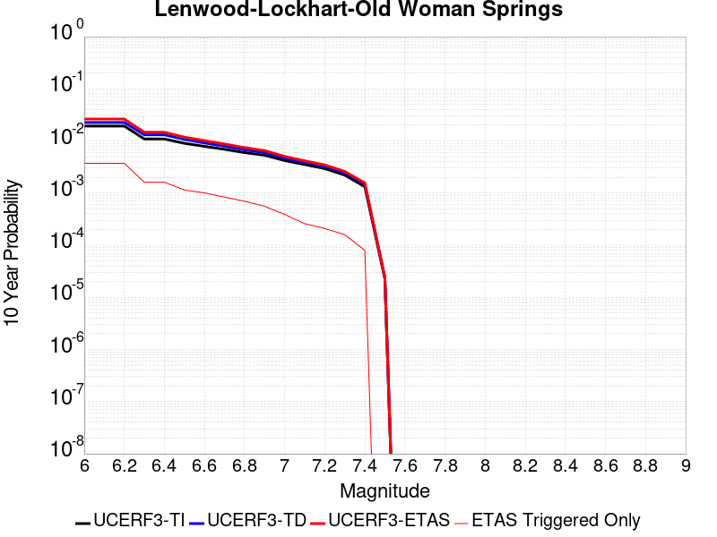 |

| Magnitude | 1 wk TI Prob | 1 wk TD Prob | 1 wk ETAS Prob | 1 wk ETAS/TD Gain | 1 wk ETAS Triggered Only | 1 mo TI Prob | 1 mo TD Prob | 1 mo ETAS Prob | 1 mo ETAS/TD Gain | 1 mo ETAS Triggered Only | 1 yr TI Prob | 1 yr TD Prob | 1 yr ETAS Prob | 1 yr ETAS/TD Gain | 1 yr ETAS Triggered Only | 10 yr TI Prob | 10 yr TD Prob | 10 yr ETAS Prob | 10 yr ETAS/TD Gain | 10 yr ETAS Triggered Only |
|-----|-----|-----|-----|-----|-----|-----|-----|-----|-----|-----|-----|-----|-----|-----|-----|-----|-----|-----|-----|-----|
| 6.0 | 3.744542E-5 | 4.396349E-5 | 0.0010479355 | 23.836494 | 0.001004016 | 1.604705E-4 | 1.8840231E-4 | 0.0011922292 | 6.328103 | 0.001004016 | 0.0019519776 | 0.0022915571 | 0.0032932726 | 1.437133 | 0.001004016 | 0.019349206 | 0.022697281 | 0.025640965 | 1.1296932 | 0.003012048 |
| 6.1 | 3.744542E-5 | 4.396349E-5 | 0.0010479355 | 23.836494 | 0.001004016 | 1.604705E-4 | 1.8840231E-4 | 0.0011922292 | 6.328103 | 0.001004016 | 0.0019519776 | 0.0022915571 | 0.0032932726 | 1.437133 | 0.001004016 | 0.019349206 | 0.022697281 | 0.025640965 | 1.1296932 | 0.003012048 |
| 6.2 | 3.744542E-5 | 4.396349E-5 | 0.0010479355 | 23.836494 | 0.001004016 | 1.604705E-4 | 1.8840231E-4 | 0.0011922292 | 6.328103 | 0.001004016 | 0.0019519776 | 0.0022915571 | 0.0032932726 | 1.437133 | 0.001004016 | 0.019349206 | 0.022697281 | 0.025640965 | 1.1296932 | 0.003012048 |
| 6.3 | 2.1079984E-5 | 2.5354384E-5 | 0.001029345 | 40.598305 | 0.001004016 | 9.0339665E-5 | 1.0865723E-4 | 0.0011125642 | 10.23921 | 0.001004016 | 0.0010993304 | 0.0013221189 | 0.0023248077 | 1.7583952 | 0.001004016 | 0.010939079 | 0.013144747 | 0.015126384 | 1.150755 | 0.002008032 |
| 6.4 | 2.1079984E-5 | 2.5354384E-5 | 0.001029345 | 40.598305 | 0.001004016 | 9.0339665E-5 | 1.0865723E-4 | 0.0011125642 | 10.23921 | 0.001004016 | 0.0010993304 | 0.0013221189 | 0.0023248077 | 1.7583952 | 0.001004016 | 0.010939079 | 0.013144747 | 0.015126384 | 1.150755 | 0.002008032 |
| 6.5 | 1.7397282E-5 | 2.0663285E-5 | 2.0663285E-5 | 1.0 | 0.0 | 7.455765E-5 | 8.8554E-5 | 8.8554E-5 | 1.0 | 0.0 | 9.073613E-4 | 0.0010776235 | 0.0010776235 | 1.0 | 0.0 | 0.009036654 | 0.010725273 | 0.010725273 | 1.0 | 0.0 |
| 6.6 | 1.52050325E-5 | 1.7680086E-5 | 1.7680086E-5 | 1.0 | 0.0 | 6.51628E-5 | 7.576964E-5 | 7.576964E-5 | 1.0 | 0.0 | 7.9306826E-4 | 9.221128E-4 | 9.221128E-4 | 1.0 | 0.0 | 0.007902439 | 0.009183729 | 0.009183729 | 1.0 | 0.0 |
| 6.7 | 1.332523E-5 | 1.5264379E-5 | 1.5264379E-5 | 1.0 | 0.0 | 5.7106878E-5 | 6.541716E-5 | 6.541716E-5 | 1.0 | 0.0 | 6.950544E-4 | 7.9616875E-4 | 7.9616875E-4 | 1.0 | 0.0 | 0.006928845 | 0.0079337945 | 0.0079337945 | 1.0 | 0.0 |
| 6.8 | 1.1525329E-5 | 1.3031365E-5 | 1.3031365E-5 | 1.0 | 0.0 | 4.9393333E-5 | 5.5847537E-5 | 5.5847537E-5 | 1.0 | 0.0 | 6.011979E-4 | 6.7973585E-4 | 6.7973585E-4 | 1.0 | 0.0 | 0.00599574 | 0.0067770192 | 0.0067770192 | 1.0 | 0.0 |
| 6.9 | 1.0253909E-5 | 1.1514835E-5 | 1.1514835E-5 | 1.0 | 0.0 | 4.3944583E-5 | 4.934838E-5 | 4.934838E-5 | 1.0 | 0.0 | 5.3489394E-4 | 6.006545E-4 | 6.006545E-4 | 1.0 | 0.0 | 0.0053360825 | 0.0059906896 | 0.0059906896 | 1.0 | 0.0 |
| 7.0 | 8.104563E-6 | 8.99143E-6 | 8.99143E-6 | 1.0 | 0.0 | 3.4733377E-5 | 3.853415E-5 | 3.853415E-5 | 1.0 | 0.0 | 4.2279682E-4 | 4.6905465E-4 | 4.6905465E-4 | 1.0 | 0.0 | 0.0042199334 | 0.0046808943 | 0.0046808943 | 1.0 | 0.0 |
| 7.1 | 6.7986157E-6 | 7.5159796E-6 | 7.5159796E-6 | 1.0 | 0.0 | 2.91366E-5 | 3.2210955E-5 | 3.2210955E-5 | 1.0 | 0.0 | 3.5468035E-4 | 3.9209996E-4 | 3.9209996E-4 | 1.0 | 0.0 | 0.003541148 | 0.003914298 | 0.003914298 | 1.0 | 0.0 |
| 7.2 | 5.6893327E-6 | 6.280132E-6 | 6.280132E-6 | 1.0 | 0.0 | 2.4382627E-5 | 2.6914584E-5 | 2.6914584E-5 | 1.0 | 0.0 | 2.9681803E-4 | 3.276378E-4 | 3.276378E-4 | 1.0 | 0.0 | 0.002964219 | 0.003271746 | 0.003271746 | 1.0 | 0.0 |
| 7.3 | 4.253348E-6 | 4.707075E-6 | 4.707075E-6 | 1.0 | 0.0 | 1.8228506E-5 | 2.017303E-5 | 2.017303E-5 | 1.0 | 0.0 | 2.2190946E-4 | 2.455808E-4 | 2.455808E-4 | 1.0 | 0.0 | 0.00221688 | 0.0024532753 | 0.0024532753 | 1.0 | 0.0 |
| 7.4 | 2.5448119E-6 | 2.8520594E-6 | 2.8520594E-6 | 1.0 | 0.0 | 1.0906291E-5 | 1.2223064E-5 | 1.2223064E-5 | 1.0 | 0.0 | 1.3277601E-4 | 1.4880729E-4 | 1.4880729E-4 | 1.0 | 0.0 | 0.001326967 | 0.0014872387 | 0.0014872387 | 1.0 | 0.0 |
| 7.5 | 4.3706837E-8 | 4.562909E-8 | 4.562909E-8 | 1.0 | 0.0 | 1.8731501E-7 | 1.9555324E-7 | 1.9555324E-7 | 1.0 | 0.0 | 2.2805577E-6 | 2.3808586E-6 | 2.3808586E-6 | 1.0 | 0.0 | 2.2805343E-5 | 2.3808387E-5 | 2.3808387E-5 | 1.0 | 0.0 |

## Gravel Hills-Harper Lk
*[(top)](#table-of-contents)*

| 1 Week | 1 Month | 1 Year | 10 Year |
|-----|-----|-----|-----|
|  |  |  |  |

| Magnitude | 1 wk TI Prob | 1 wk TD Prob | 1 wk ETAS Prob | 1 wk ETAS/TD Gain | 1 wk ETAS Triggered Only | 1 mo TI Prob | 1 mo TD Prob | 1 mo ETAS Prob | 1 mo ETAS/TD Gain | 1 mo ETAS Triggered Only | 1 yr TI Prob | 1 yr TD Prob | 1 yr ETAS Prob | 1 yr ETAS/TD Gain | 1 yr ETAS Triggered Only | 10 yr TI Prob | 10 yr TD Prob | 10 yr ETAS Prob | 10 yr ETAS/TD Gain | 10 yr ETAS Triggered Only |
|-----|-----|-----|-----|-----|-----|-----|-----|-----|-----|-----|-----|-----|-----|-----|-----|-----|-----|-----|-----|-----|
| 6.0 | 3.0679566E-5 | 3.1464628E-5 | 0.0010354491 | 32.908356 | 0.001004016 | 1.3147724E-4 | 1.3484266E-4 | 0.0011387233 | 8.444831 | 0.001004016 | 0.0015995599 | 0.00164069 | 0.0036454275 | 2.2218869 | 0.002008032 | 0.015880952 | 0.016307337 | 0.019270267 | 1.1816931 | 0.003012048 |
| 6.1 | 3.0679566E-5 | 3.1464628E-5 | 0.0010354491 | 32.908356 | 0.001004016 | 1.3147724E-4 | 1.3484266E-4 | 0.0011387233 | 8.444831 | 0.001004016 | 0.0015995599 | 0.00164069 | 0.0036454275 | 2.2218869 | 0.002008032 | 0.015880952 | 0.016307337 | 0.019270267 | 1.1816931 | 0.003012048 |
| 6.2 | 1.514536E-5 | 1.36352E-5 | 1.36352E-5 | 1.0 | 0.0 | 6.490707E-5 | 5.843533E-5 | 5.843533E-5 | 1.0 | 0.0 | 7.8995706E-4 | 7.112298E-4 | 7.112298E-4 | 1.0 | 0.0 | 0.007871548 | 0.007090737 | 0.008087634 | 1.1405914 | 0.001004016 |
| 6.3 | 1.514536E-5 | 1.36352E-5 | 1.36352E-5 | 1.0 | 0.0 | 6.490707E-5 | 5.843533E-5 | 5.843533E-5 | 1.0 | 0.0 | 7.8995706E-4 | 7.112298E-4 | 7.112298E-4 | 1.0 | 0.0 | 0.007871548 | 0.007090737 | 0.008087634 | 1.1405914 | 0.001004016 |
| 6.4 | 1.2532521E-5 | 1.0689684E-5 | 1.0689684E-5 | 1.0 | 0.0 | 5.37097E-5 | 4.581216E-5 | 4.581216E-5 | 1.0 | 0.0 | 6.537194E-4 | 5.5762613E-4 | 5.5762613E-4 | 1.0 | 0.0 | 0.0065179965 | 0.005562859 | 0.005562859 | 1.0 | 0.0 |
| 6.5 | 1.1094058E-5 | 9.083657E-6 | 9.083657E-6 | 1.0 | 0.0 | 4.7545094E-5 | 3.89294E-5 | 3.89294E-5 | 1.0 | 0.0 | 5.787078E-4 | 4.7386638E-4 | 4.7386638E-4 | 1.0 | 0.0 | 0.0057720304 | 0.004728967 | 0.004728967 | 1.0 | 0.0 |
| 6.6 | 9.688328E-6 | 7.531688E-6 | 7.531688E-6 | 1.0 | 0.0 | 4.1520743E-5 | 3.227828E-5 | 3.227828E-5 | 1.0 | 0.0 | 5.053978E-4 | 3.9291973E-4 | 3.9291973E-4 | 1.0 | 0.0 | 0.0050424994 | 0.0039225067 | 0.0039225067 | 1.0 | 0.0 |
| 6.7 | 8.974824E-6 | 6.749406E-6 | 6.749406E-6 | 1.0 | 0.0 | 3.8462964E-5 | 2.8925719E-5 | 2.8925719E-5 | 1.0 | 0.0 | 4.6818596E-4 | 3.5211592E-4 | 3.5211592E-4 | 1.0 | 0.0 | 0.004672008 | 0.003515801 | 0.003515801 | 1.0 | 0.0 |
| 6.8 | 7.4780046E-6 | 5.1161865E-6 | 5.1161865E-6 | 1.0 | 0.0 | 3.20482E-5 | 2.1926337E-5 | 2.1926337E-5 | 1.0 | 0.0 | 3.9011694E-4 | 2.6692182E-4 | 2.6692182E-4 | 1.0 | 0.0 | 0.0038943281 | 0.0026661505 | 0.0026661505 | 1.0 | 0.0 |
| 6.9 | 6.3409307E-6 | 3.907489E-6 | 3.907489E-6 | 1.0 | 0.0 | 2.7175134E-5 | 1.674628E-5 | 1.674628E-5 | 1.0 | 0.0 | 3.3080703E-4 | 2.0386786E-4 | 2.0386786E-4 | 1.0 | 0.0 | 0.0033031502 | 0.0020369065 | 0.0020369065 | 1.0 | 0.0 |
| 7.0 | 5.1239335E-6 | 2.6058492E-6 | 2.6058492E-6 | 1.0 | 0.0 | 2.195953E-5 | 1.1167879E-5 | 1.1167879E-5 | 1.0 | 0.0 | 2.6732447E-4 | 1.359607E-4 | 1.359607E-4 | 1.0 | 0.0 | 0.0026700313 | 0.0013588005 | 0.0013588005 | 1.0 | 0.0 |
| 7.1 | 4.438899E-6 | 2.0984692E-6 | 2.0984692E-6 | 1.0 | 0.0 | 1.9023713E-5 | 8.99341E-6 | 8.99341E-6 | 1.0 | 0.0 | 2.315891E-4 | 1.0948948E-4 | 1.0948948E-4 | 1.0 | 0.0 | 0.002313479 | 0.0010943774 | 0.0010943774 | 1.0 | 0.0 |
| 7.2 | 3.50367E-6 | 1.2615715E-6 | 1.2615715E-6 | 1.0 | 0.0 | 1.5015643E-5 | 5.406724E-6 | 5.406724E-6 | 1.0 | 0.0 | 1.8280011E-4 | 6.5824956E-5 | 6.5824956E-5 | 1.0 | 0.0 | 0.0018264982 | 6.580628E-4 | 6.580628E-4 | 1.0 | 0.0 |
| 7.3 | 2.561638E-6 | 7.118686E-7 | 7.118686E-7 | 1.0 | 0.0 | 1.0978401E-5 | 3.050862E-6 | 3.050862E-6 | 1.0 | 0.0 | 1.3365384E-4 | 3.7143633E-5 | 3.7143633E-5 | 1.0 | 0.0 | 0.0013357349 | 3.7137623E-4 | 3.7137623E-4 | 1.0 | 0.0 |
| 7.4 | 2.0368864E-6 | 5.304471E-7 | 5.304471E-7 | 1.0 | 0.0 | 8.729483E-6 | 2.2733427E-6 | 2.2733427E-6 | 1.0 | 0.0 | 1.06276275E-4 | 2.76776E-5 | 2.76776E-5 | 1.0 | 0.0 | 0.0010622547 | 2.767421E-4 | 2.767421E-4 | 1.0 | 0.0 |
| 7.5 | 1.1681728E-6 | 3.6028484E-7 | 3.6028484E-7 | 1.0 | 0.0 | 5.0064455E-6 | 1.544077E-6 | 1.544077E-6 | 1.0 | 0.0 | 6.0951766E-5 | 1.879898E-5 | 1.879898E-5 | 1.0 | 0.0 | 6.093505E-4 | 1.8797436E-4 | 1.8797436E-4 | 1.0 | 0.0 |
| 7.6 | 1.3154387E-7 | 7.1196716E-8 | 7.1196716E-8 | 1.0 | 0.0 | 5.6375933E-7 | 3.0512876E-7 | 3.0512876E-7 | 1.0 | 0.0 | 6.863748E-6 | 3.714938E-6 | 3.714938E-6 | 1.0 | 0.0 | 6.863536E-5 | 3.7148915E-5 | 3.7148915E-5 | 1.0 | 0.0 |

## Pisgah-Bullion Mtn-Mesquite Lk
*[(top)](#table-of-contents)*

| 1 Week | 1 Month | 1 Year | 10 Year |
|-----|-----|-----|-----|
|  |  |  |  |

| Magnitude | 1 wk TI Prob | 1 wk TD Prob | 1 wk ETAS Prob | 1 wk ETAS/TD Gain | 1 wk ETAS Triggered Only | 1 mo TI Prob | 1 mo TD Prob | 1 mo ETAS Prob | 1 mo ETAS/TD Gain | 1 mo ETAS Triggered Only | 1 yr TI Prob | 1 yr TD Prob | 1 yr ETAS Prob | 1 yr ETAS/TD Gain | 1 yr ETAS Triggered Only | 10 yr TI Prob | 10 yr TD Prob | 10 yr ETAS Prob | 10 yr ETAS/TD Gain | 10 yr ETAS Triggered Only |
|-----|-----|-----|-----|-----|-----|-----|-----|-----|-----|-----|-----|-----|-----|-----|-----|-----|-----|-----|-----|-----|
| 6.0 | 3.0240792E-5 | 2.40909E-5 | 2.40909E-5 | 1.0 | 0.0 | 1.2959696E-4 | 1.032432E-4 | 0.0011071556 | 10.723763 | 0.001004016 | 0.0015767008 | 0.0012563618 | 0.0032618712 | 2.5962832 | 0.002008032 | 0.015655609 | 0.012502613 | 0.014485539 | 1.1586009 | 0.002008032 |
| 6.1 | 3.0240792E-5 | 2.40909E-5 | 2.40909E-5 | 1.0 | 0.0 | 1.2959696E-4 | 1.032432E-4 | 0.0011071556 | 10.723763 | 0.001004016 | 0.0015767008 | 0.0012563618 | 0.0032618712 | 2.5962832 | 0.002008032 | 0.015655609 | 0.012502613 | 0.014485539 | 1.1586009 | 0.002008032 |
| 6.2 | 3.0240792E-5 | 2.40909E-5 | 2.40909E-5 | 1.0 | 0.0 | 1.2959696E-4 | 1.032432E-4 | 0.0011071556 | 10.723763 | 0.001004016 | 0.0015767008 | 0.0012563618 | 0.0032618712 | 2.5962832 | 0.002008032 | 0.015655609 | 0.012502613 | 0.014485539 | 1.1586009 | 0.002008032 |
| 6.3 | 2.0498217E-5 | 1.3638054E-5 | 1.3638054E-5 | 1.0 | 0.0 | 8.784654E-5 | 5.8447586E-5 | 0.001062405 | 18.177055 | 0.001004016 | 0.0010690069 | 7.1138324E-4 | 0.002717987 | 3.8207068 | 0.002008032 | 0.01063879 | 0.0070926864 | 0.009086477 | 1.281105 | 0.002008032 |
| 6.4 | 2.0498217E-5 | 1.3638054E-5 | 1.3638054E-5 | 1.0 | 0.0 | 8.784654E-5 | 5.8447586E-5 | 0.001062405 | 18.177055 | 0.001004016 | 0.0010690069 | 7.1138324E-4 | 0.002717987 | 3.8207068 | 0.002008032 | 0.01063879 | 0.0070926864 | 0.009086477 | 1.281105 | 0.002008032 |
| 6.5 | 1.7316182E-5 | 1.04769715E-5 | 1.04769715E-5 | 1.0 | 0.0 | 7.42101E-5 | 4.490059E-5 | 0.0010488715 | 23.359861 | 0.001004016 | 9.0313336E-4 | 5.465376E-4 | 0.0025534723 | 4.672089 | 0.002008032 | 0.008994718 | 0.00545293 | 0.0074500125 | 1.3662403 | 0.002008032 |
| 6.6 | 1.5251077E-5 | 8.414133E-6 | 8.414133E-6 | 1.0 | 0.0 | 6.536012E-5 | 3.606011E-5 | 3.606011E-5 | 1.0 | 0.0 | 7.9546886E-4 | 4.3895066E-4 | 0.001442526 | 3.2863057 | 0.001004016 | 0.007926274 | 0.0043815537 | 0.0053811707 | 1.2281421 | 0.001004016 |
| 6.7 | 1.2997425E-5 | 6.4112146E-6 | 6.4112146E-6 | 1.0 | 0.0 | 5.570206E-5 | 2.7476372E-5 | 2.7476372E-5 | 1.0 | 0.0 | 6.7796157E-4 | 3.3447813E-4 | 0.0013381584 | 4.0007353 | 0.001004016 | 0.0067589693 | 0.003340207 | 0.0043408694 | 1.2995809 | 0.001004016 |
| 6.8 | 1.035386E-5 | 4.333145E-6 | 4.333145E-6 | 1.0 | 0.0 | 4.437293E-5 | 1.8570496E-5 | 1.8570496E-5 | 1.0 | 0.0 | 5.401065E-4 | 2.260732E-4 | 2.260732E-4 | 1.0 | 0.0 | 0.0053879567 | 0.002258519 | 0.002258519 | 1.0 | 0.0 |
| 6.9 | 8.816252E-6 | 3.5805879E-6 | 3.5805879E-6 | 1.0 | 0.0 | 3.778339E-5 | 1.534529E-5 | 1.534529E-5 | 1.0 | 0.0 | 4.5991567E-4 | 1.8681347E-4 | 1.8681347E-4 | 1.0 | 0.0 | 0.00458965 | 0.0018666228 | 0.0018666228 | 1.0 | 0.0 |
| 7.0 | 6.8232207E-6 | 2.5674399E-6 | 2.5674399E-6 | 1.0 | 0.0 | 2.9242048E-5 | 1.100327E-5 | 1.100327E-5 | 1.0 | 0.0 | 3.5596377E-4 | 1.3395688E-4 | 1.3395688E-4 | 1.0 | 0.0 | 0.0035539411 | 0.0013387925 | 0.0013387925 | 1.0 | 0.0 |
| 7.1 | 5.837013E-6 | 2.2273143E-6 | 2.2273143E-6 | 1.0 | 0.0 | 2.501553E-5 | 9.5456E-6 | 9.5456E-6 | 1.0 | 0.0 | 3.045215E-4 | 1.1621177E-4 | 1.1621177E-4 | 1.0 | 0.0 | 0.0030410455 | 0.001161539 | 0.001161539 | 1.0 | 0.0 |
| 7.2 | 4.278052E-6 | 1.6275065E-6 | 1.6275065E-6 | 1.0 | 0.0 | 1.833438E-5 | 6.975011E-6 | 6.975011E-6 | 1.0 | 0.0 | 2.231982E-4 | 8.491768E-5 | 8.491768E-5 | 1.0 | 0.0 | 0.0022297418 | 8.4887556E-4 | 8.4887556E-4 | 1.0 | 0.0 |
| 7.3 | 1.8803692E-6 | 8.344788E-7 | 8.344788E-7 | 1.0 | 0.0 | 8.0587E-6 | 3.5763337E-6 | 3.5763337E-6 | 1.0 | 0.0 | 9.811026E-5 | 4.354114E-5 | 4.354114E-5 | 1.0 | 0.0 | 9.806695E-4 | 4.3534054E-4 | 4.3534054E-4 | 1.0 | 0.0 |

## Elsinore (Glen Ivy) rev
*[(top)](#table-of-contents)*

| 1 Week | 1 Month | 1 Year | 10 Year |
|-----|-----|-----|-----|
|  |  |  |  |

| Magnitude | 1 wk TI Prob | 1 wk TD Prob | 1 wk ETAS Prob | 1 wk ETAS/TD Gain | 1 wk ETAS Triggered Only | 1 mo TI Prob | 1 mo TD Prob | 1 mo ETAS Prob | 1 mo ETAS/TD Gain | 1 mo ETAS Triggered Only | 1 yr TI Prob | 1 yr TD Prob | 1 yr ETAS Prob | 1 yr ETAS/TD Gain | 1 yr ETAS Triggered Only | 10 yr TI Prob | 10 yr TD Prob | 10 yr ETAS Prob | 10 yr ETAS/TD Gain | 10 yr ETAS Triggered Only |
|-----|-----|-----|-----|-----|-----|-----|-----|-----|-----|-----|-----|-----|-----|-----|-----|-----|-----|-----|-----|-----|
| 6.0 | 1.6204086E-4 | 2.937271E-4 | 2.937271E-4 | 1.0 | 0.0 | 6.94276E-4 | 0.0012583778 | 0.0012583778 | 1.0 | 0.0 | 0.008420097 | 0.0152346175 | 0.0152346175 | 1.0 | 0.0 | 0.081081145 | 0.13962454 | 0.14048837 | 1.0061868 | 0.001004016 |
| 6.1 | 1.6204086E-4 | 2.937271E-4 | 2.937271E-4 | 1.0 | 0.0 | 6.94276E-4 | 0.0012583778 | 0.0012583778 | 1.0 | 0.0 | 0.008420097 | 0.0152346175 | 0.0152346175 | 1.0 | 0.0 | 0.081081145 | 0.13962454 | 0.14048837 | 1.0061868 | 0.001004016 |
| 6.2 | 1.6204086E-4 | 2.937271E-4 | 2.937271E-4 | 1.0 | 0.0 | 6.94276E-4 | 0.0012583778 | 0.0012583778 | 1.0 | 0.0 | 0.008420097 | 0.0152346175 | 0.0152346175 | 1.0 | 0.0 | 0.081081145 | 0.13962454 | 0.14048837 | 1.0061868 | 0.001004016 |
| 6.3 | 1.0111737E-4 | 1.7703463E-4 | 1.7703463E-4 | 1.0 | 0.0 | 4.332882E-4 | 7.5861585E-4 | 7.5861585E-4 | 1.0 | 0.0 | 0.005262531 | 0.0092177205 | 0.0092177205 | 1.0 | 0.0 | 0.0513964 | 0.08707393 | 0.08799052 | 1.0105267 | 0.001004016 |
| 6.4 | 1.0111737E-4 | 1.7703463E-4 | 1.7703463E-4 | 1.0 | 0.0 | 4.332882E-4 | 7.5861585E-4 | 7.5861585E-4 | 1.0 | 0.0 | 0.005262531 | 0.0092177205 | 0.0092177205 | 1.0 | 0.0 | 0.0513964 | 0.08707393 | 0.08799052 | 1.0105267 | 0.001004016 |
| 6.5 | 3.6624708E-5 | 4.6391986E-5 | 4.6391986E-5 | 1.0 | 0.0 | 1.569536E-4 | 1.9880968E-4 | 1.9880968E-4 | 1.0 | 0.0 | 0.001909235 | 0.0024181814 | 0.0024181814 | 1.0 | 0.0 | 0.01892915 | 0.023697061 | 0.023697061 | 1.0 | 0.0 |
| 6.6 | 2.5051324E-5 | 2.6147465E-5 | 2.6147465E-5 | 1.0 | 0.0 | 1.073584E-4 | 1.12056E-4 | 1.12056E-4 | 1.0 | 0.0 | 0.0013063047 | 0.0013634725 | 0.0013634725 | 1.0 | 0.0 | 0.012986525 | 0.013565759 | 0.013565759 | 1.0 | 0.0 |
| 6.7 | 2.2189772E-5 | 2.2072489E-5 | 2.2072489E-5 | 1.0 | 0.0 | 9.509556E-5 | 9.459316E-5 | 9.459316E-5 | 1.0 | 0.0 | 0.0011571734 | 0.0011510996 | 0.0011510996 | 1.0 | 0.0 | 0.011511663 | 0.0114663225 | 0.0114663225 | 1.0 | 0.0 |
| 6.8 | 1.6654378E-5 | 1.44376E-5 | 1.44376E-5 | 1.0 | 0.0 | 7.137396E-5 | 6.187399E-5 | 6.187399E-5 | 1.0 | 0.0 | 8.686314E-4 | 7.5306057E-4 | 7.5306057E-4 | 1.0 | 0.0 | 0.008652439 | 0.0075100763 | 0.0075100763 | 1.0 | 0.0 |
| 6.9 | 1.5042909E-5 | 1.2331886E-5 | 1.2331886E-5 | 1.0 | 0.0 | 6.446802E-5 | 5.2849886E-5 | 5.2849886E-5 | 1.0 | 0.0 | 7.8461546E-4 | 6.4326054E-4 | 6.4326054E-4 | 1.0 | 0.0 | 0.007818509 | 0.006417925 | 0.006417925 | 1.0 | 0.0 |
| 7.0 | 1.4361385E-5 | 1.1451172E-5 | 1.1451172E-5 | 1.0 | 0.0 | 6.154734E-5 | 4.9075545E-5 | 4.9075545E-5 | 1.0 | 0.0 | 7.490812E-4 | 5.973339E-4 | 5.973339E-4 | 1.0 | 0.0 | 0.007465612 | 0.005960982 | 0.005960982 | 1.0 | 0.0 |
| 7.1 | 1.3265571E-5 | 1.0244736E-5 | 1.0244736E-5 | 1.0 | 0.0 | 5.6851208E-5 | 4.3905282E-5 | 4.3905282E-5 | 1.0 | 0.0 | 6.919436E-4 | 5.344183E-4 | 5.344183E-4 | 1.0 | 0.0 | 0.006897931 | 0.0053346003 | 0.0053346003 | 1.0 | 0.0 |
| 7.2 | 1.1596403E-5 | 8.504847E-6 | 8.504847E-6 | 1.0 | 0.0 | 4.9697923E-5 | 3.6448844E-5 | 3.6448844E-5 | 1.0 | 0.0 | 6.049042E-4 | 4.4367602E-4 | 4.4367602E-4 | 1.0 | 0.0 | 0.006032603 | 0.004429357 | 0.004429357 | 1.0 | 0.0 |
| 7.3 | 1.0150827E-5 | 7.238537E-6 | 7.238537E-6 | 1.0 | 0.0 | 4.3502816E-5 | 3.102194E-5 | 3.102194E-5 | 1.0 | 0.0 | 5.2951806E-4 | 3.776281E-4 | 3.776281E-4 | 1.0 | 0.0 | 0.005282581 | 0.003770271 | 0.003770271 | 1.0 | 0.0 |
| 7.4 | 9.080705E-6 | 6.352307E-6 | 6.352307E-6 | 1.0 | 0.0 | 3.8916725E-5 | 2.7223898E-5 | 2.7223898E-5 | 1.0 | 0.0 | 4.7370812E-4 | 3.314019E-4 | 3.314019E-4 | 1.0 | 0.0 | 0.004726996 | 0.0033092257 | 0.0033092257 | 1.0 | 0.0 |
| 7.5 | 7.671649E-6 | 5.225419E-6 | 5.225419E-6 | 1.0 | 0.0 | 3.287808E-5 | 2.2394468E-5 | 2.2394468E-5 | 1.0 | 0.0 | 4.0021708E-4 | 2.7261977E-4 | 2.7261977E-4 | 1.0 | 0.0 | 0.0039949706 | 0.0027229784 | 0.0027229784 | 1.0 | 0.0 |
| 7.6 | 6.990086E-6 | 4.687336E-6 | 4.687336E-6 | 1.0 | 0.0 | 2.9957167E-5 | 2.0088435E-5 | 2.0088435E-5 | 1.0 | 0.0 | 3.6466747E-4 | 2.445504E-4 | 2.445504E-4 | 1.0 | 0.0 | 0.0036406964 | 0.0024429292 | 0.0024429292 | 1.0 | 0.0 |
| 7.7 | 4.163505E-6 | 2.329331E-6 | 2.329331E-6 | 1.0 | 0.0 | 1.7843471E-5 | 9.982813E-6 | 9.982813E-6 | 1.0 | 0.0 | 2.172226E-4 | 1.2153471E-4 | 1.2153471E-4 | 1.0 | 0.0 | 0.0021701038 | 0.0012147555 | 0.0012147555 | 1.0 | 0.0 |
| 7.8 | 2.2692414E-7 | 9.384417E-8 | 9.384417E-8 | 1.0 | 0.0 | 9.725317E-7 | 4.0218927E-7 | 4.0218927E-7 | 1.0 | 0.0 | 1.1840509E-5 | 4.8966467E-6 | 4.8966467E-6 | 1.0 | 0.0 | 1.1839878E-4 | 4.8965718E-5 | 4.8965718E-5 | 1.0 | 0.0 |
| 7.9 | 6.676829E-9 | 3.4397174E-9 | 3.4397174E-9 | 1.0 | 0.0 | 2.861498E-8 | 1.4741646E-8 | 1.4741646E-8 | 1.0 | 0.0 | 3.4838732E-7 | 1.7947953E-7 | 1.7947953E-7 | 1.0 | 0.0 | 3.4838679E-6 | 1.794794E-6 | 1.794794E-6 | 1.0 | 0.0 |

## San Andreas (San Bernardino S)
*[(top)](#table-of-contents)*

| 1 Week | 1 Month | 1 Year | 10 Year |
|-----|-----|-----|-----|
|  |  |  |  |

| Magnitude | 1 wk TI Prob | 1 wk TD Prob | 1 wk ETAS Prob | 1 wk ETAS/TD Gain | 1 wk ETAS Triggered Only | 1 mo TI Prob | 1 mo TD Prob | 1 mo ETAS Prob | 1 mo ETAS/TD Gain | 1 mo ETAS Triggered Only | 1 yr TI Prob | 1 yr TD Prob | 1 yr ETAS Prob | 1 yr ETAS/TD Gain | 1 yr ETAS Triggered Only | 10 yr TI Prob | 10 yr TD Prob | 10 yr ETAS Prob | 10 yr ETAS/TD Gain | 10 yr ETAS Triggered Only |
|-----|-----|-----|-----|-----|-----|-----|-----|-----|-----|-----|-----|-----|-----|-----|-----|-----|-----|-----|-----|-----|
| 6.0 | 1.2336002E-4 | 3.0005194E-4 | 0.0013037667 | 4.345137 | 0.001004016 | 5.2857865E-4 | 0.0012853292 | 0.0022880547 | 1.7801313 | 0.001004016 | 0.006416472 | 0.015541554 | 0.017518379 | 1.1271961 | 0.002008032 | 0.06234337 | 0.14294699 | 0.14466798 | 1.0120393 | 0.002008032 |
| 6.1 | 1.2336002E-4 | 3.0005194E-4 | 0.0013037667 | 4.345137 | 0.001004016 | 5.2857865E-4 | 0.0012853292 | 0.0022880547 | 1.7801313 | 0.001004016 | 0.006416472 | 0.015541554 | 0.017518379 | 1.1271961 | 0.002008032 | 0.06234337 | 0.14294699 | 0.14466798 | 1.0120393 | 0.002008032 |
| 6.2 | 1.2336002E-4 | 3.0005194E-4 | 0.0013037667 | 4.345137 | 0.001004016 | 5.2857865E-4 | 0.0012853292 | 0.0022880547 | 1.7801313 | 0.001004016 | 0.006416472 | 0.015541554 | 0.017518379 | 1.1271961 | 0.002008032 | 0.06234337 | 0.14294699 | 0.14466798 | 1.0120393 | 0.002008032 |
| 6.3 | 1.1712257E-4 | 2.8793467E-4 | 0.0012916616 | 4.485954 | 0.001004016 | 5.018573E-4 | 0.0012334478 | 0.0022362254 | 1.8129876 | 0.001004016 | 0.006093008 | 0.014918666 | 0.016896741 | 1.1325907 | 0.002008032 | 0.059286322 | 0.13765779 | 0.1393894 | 1.0125791 | 0.002008032 |
| 6.4 | 1.1712257E-4 | 2.8793467E-4 | 0.0012916616 | 4.485954 | 0.001004016 | 5.018573E-4 | 0.0012334478 | 0.0022362254 | 1.8129876 | 0.001004016 | 0.006093008 | 0.014918666 | 0.016896741 | 1.1325907 | 0.002008032 | 0.059286322 | 0.13765779 | 0.1393894 | 1.0125791 | 0.002008032 |
| 6.5 | 1.0689076E-4 | 2.6806415E-4 | 0.0012718111 | 4.744428 | 0.001004016 | 4.5802278E-4 | 0.0011483653 | 0.0021512285 | 1.8732961 | 0.001004016 | 0.0055621783 | 0.013896335 | 0.015876463 | 1.1424928 | 0.002008032 | 0.05425003 | 0.1288989 | 0.1306481 | 1.0135703 | 0.002008032 |
| 6.6 | 9.7648895E-5 | 2.505129E-4 | 0.0012542774 | 5.0068374 | 0.001004016 | 4.1842813E-4 | 0.0010732086 | 0.0020761471 | 1.9345233 | 0.001004016 | 0.005082469 | 0.012992399 | 0.014974342 | 1.1525464 | 0.002008032 | 0.049677886 | 0.121077746 | 0.12284265 | 1.0145767 | 0.002008032 |
| 6.7 | 8.757013E-5 | 2.3122175E-4 | 0.0012350057 | 5.3412175 | 0.001004016 | 3.7524657E-4 | 9.905964E-4 | 0.0019936177 | 2.0125432 | 0.001004016 | 0.00455906 | 0.011997902 | 0.0139818415 | 1.1653572 | 0.002008032 | 0.04466656 | 0.112373024 | 0.11415541 | 1.0158613 | 0.002008032 |
| 6.8 | 8.562978E-5 | 2.2682057E-4 | 0.0012306089 | 5.425473 | 0.001004016 | 3.6693315E-4 | 9.7174826E-4 | 0.0019747887 | 2.032202 | 0.001004016 | 0.004458263 | 0.011770921 | 0.013755317 | 1.1685846 | 0.002008032 | 0.043698758 | 0.11037863 | 0.11216502 | 1.0161842 | 0.002008032 |
| 6.9 | 6.124075E-5 | 1.7066885E-4 | 0.0011745136 | 6.8818274 | 0.001004016 | 2.6243398E-4 | 7.312337E-4 | 0.0017345157 | 2.37204 | 0.001004016 | 0.0031904527 | 0.008866636 | 0.010856864 | 1.2244625 | 0.002008032 | 0.031450346 | 0.08420262 | 0.08604157 | 1.0218396 | 0.002008032 |
| 7.0 | 5.8598747E-5 | 1.6495936E-4 | 0.0011688098 | 7.085441 | 0.001004016 | 2.5111332E-4 | 7.067779E-4 | 0.0017100844 | 2.4195497 | 0.001004016 | 0.0030530186 | 0.008571265 | 0.0105620865 | 1.2322668 | 0.002008032 | 0.03011414 | 0.08151562 | 0.083359964 | 1.0226257 | 0.002008032 |
| 7.1 | 5.613814E-5 | 1.5914452E-4 | 0.0011630008 | 7.3078284 | 0.001004016 | 2.4056983E-4 | 6.818704E-4 | 0.0016852019 | 2.47144 | 0.001004016 | 0.0029250039 | 0.008270353 | 0.010261778 | 1.2407908 | 0.002008032 | 0.028868021 | 0.07881268 | 0.08066246 | 1.0234705 | 0.002008032 |
| 7.2 | 4.991222E-5 | 1.4520933E-4 | 0.0011490796 | 7.913263 | 0.001004016 | 2.1389198E-4 | 6.221777E-4 | 0.0016255691 | 2.6127088 | 0.001004016 | 0.002601025 | 0.0075488063 | 0.00954168 | 1.2639985 | 0.002008032 | 0.025707912 | 0.07226191 | 0.074124835 | 1.0257802 | 0.002008032 |
| 7.3 | 4.7410045E-5 | 1.371513E-4 | 0.0011410296 | 8.319495 | 0.001004016 | 2.0317009E-4 | 5.8765925E-4 | 0.0015910853 | 2.7074964 | 0.001004016 | 0.0024707897 | 0.0071313656 | 0.009125078 | 1.2795695 | 0.002008032 | 0.024434982 | 0.068541944 | 0.07041234 | 1.0272883 | 0.002008032 |
| 7.4 | 4.5556746E-5 | 1.3123035E-4 | 0.0011351147 | 8.649788 | 0.001004016 | 1.952286E-4 | 5.6229485E-4 | 0.0015657464 | 2.7845647 | 0.001004016 | 0.002374317 | 0.0068245293 | 0.008818857 | 1.2922294 | 0.002008032 | 0.023491086 | 0.06579143 | 0.06766735 | 1.0285132 | 0.002008032 |
| 7.5 | 4.3084514E-5 | 1.2358342E-4 | 0.0011274754 | 9.123193 | 0.001004016 | 1.8463485E-4 | 5.2953605E-4 | 0.0015330204 | 2.8950257 | 0.001004016 | 0.0022456115 | 0.0064281146 | 0.008423239 | 1.3103747 | 0.002008032 | 0.022230545 | 0.062190283 | 0.064073436 | 1.0302805 | 0.002008032 |
| 7.6 | 3.408608E-5 | 9.836477E-5 | 0.0011022821 | 11.206066 | 0.001004016 | 1.4607502E-4 | 4.214953E-4 | 0.0014250882 | 3.3810298 | 0.001004016 | 0.0017770125 | 0.005119656 | 0.007117408 | 1.390212 | 0.002008032 | 0.017628696 | 0.05002244 | 0.05193002 | 1.0381346 | 0.002008032 |
| 7.7 | 2.8315713E-5 | 8.2495724E-5 | 0.001086429 | 13.169518 | 0.001004016 | 1.2134742E-4 | 3.5350522E-4 | 0.0013571663 | 3.839169 | 0.001004016 | 0.0014764034 | 0.004295442 | 0.0062948484 | 1.4654717 | 0.002008032 | 0.01466633 | 0.042272415 | 0.044195563 | 1.0454942 | 0.002008032 |
| 7.8 | 2.6222975E-5 | 7.463898E-5 | 0.0010785802 | 14.450628 | 0.001004016 | 1.1237934E-4 | 3.1984213E-4 | 0.0013235371 | 4.138095 | 0.001004016 | 0.0013673597 | 0.003887131 | 0.0058873575 | 1.5145766 | 0.002008032 | 0.013589768 | 0.038437475 | 0.040368322 | 1.0502335 | 0.002008032 |
| 7.9 | 2.1469694E-5 | 5.7884805E-5 | 0.0010618428 | 18.344067 | 0.001004016 | 9.200973E-5 | 2.4805416E-4 | 0.0012518212 | 5.046564 | 0.001004016 | 0.0011196428 | 0.00301588 | 0.005017856 | 1.6638116 | 0.002008032 | 0.011140184 | 0.030153265 | 0.03210075 | 1.0645862 | 0.002008032 |
| 8.0 | 1.2420249E-5 | 3.1321662E-5 | 3.1321662E-5 | 1.0 | 0.0 | 5.322855E-5 | 1.342288E-4 | 1.342288E-4 | 1.0 | 0.0 | 6.478649E-4 | 0.0016330116 | 0.0016330116 | 1.0 | 0.0 | 0.0064597935 | 0.01652369 | 0.01652369 | 1.0 | 0.0 |
| 8.1 | 4.9197724E-6 | 7.822525E-6 | 7.822525E-6 | 1.0 | 0.0 | 2.1084568E-5 | 3.3524673E-5 | 3.3524673E-5 | 1.0 | 0.0 | 2.566744E-4 | 4.080866E-4 | 4.080866E-4 | 1.0 | 0.0 | 0.002563781 | 0.004384557 | 0.004384557 | 1.0 | 0.0 |
| 8.2 | 2.5634774E-6 | 2.9065757E-6 | 2.9065757E-6 | 1.0 | 0.0 | 1.0986286E-5 | 1.2456694E-5 | 1.2456694E-5 | 1.0 | 0.0 | 1.3374983E-4 | 1.5164974E-4 | 1.5164974E-4 | 1.0 | 0.0 | 0.0013366934 | 0.001704941 | 0.001704941 | 1.0 | 0.0 |
| 8.3 | 5.2850464E-7 | 3.2080476E-7 | 3.2080476E-7 | 1.0 | 0.0 | 2.2650179E-6 | 1.3748769E-6 | 1.3748769E-6 | 1.0 | 0.0 | 2.7576245E-5 | 1.673901E-5 | 1.673901E-5 | 1.0 | 0.0 | 2.7572823E-4 | 1.986671E-4 | 1.986671E-4 | 1.0 | 0.0 |

## Pinto Mtn
*[(top)](#table-of-contents)*

| 1 Week | 1 Month | 1 Year | 10 Year |
|-----|-----|-----|-----|
|  |  |  | 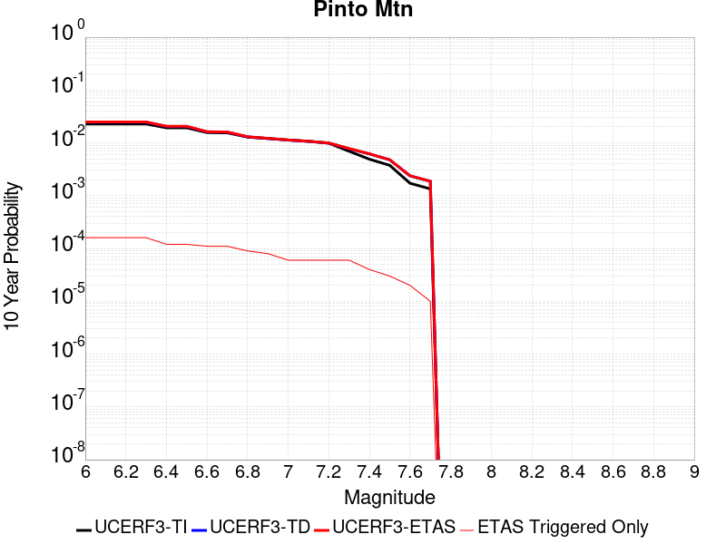 |

| Magnitude | 1 wk TI Prob | 1 wk TD Prob | 1 wk ETAS Prob | 1 wk ETAS/TD Gain | 1 wk ETAS Triggered Only | 1 mo TI Prob | 1 mo TD Prob | 1 mo ETAS Prob | 1 mo ETAS/TD Gain | 1 mo ETAS Triggered Only | 1 yr TI Prob | 1 yr TD Prob | 1 yr ETAS Prob | 1 yr ETAS/TD Gain | 1 yr ETAS Triggered Only | 10 yr TI Prob | 10 yr TD Prob | 10 yr ETAS Prob | 10 yr ETAS/TD Gain | 10 yr ETAS Triggered Only |
|-----|-----|-----|-----|-----|-----|-----|-----|-----|-----|-----|-----|-----|-----|-----|-----|-----|-----|-----|-----|-----|
| 6.0 | 4.4194956E-5 | 4.7853926E-5 | 0.001051822 | 21.979847 | 0.001004016 | 1.893932E-4 | 2.0507304E-4 | 0.0012088832 | 5.894891 | 0.001004016 | 0.0023034236 | 0.0024940688 | 0.0034955807 | 1.4015574 | 0.001004016 | 0.022796938 | 0.024678305 | 0.025657544 | 1.0396801 | 0.001004016 |
| 6.1 | 4.4194956E-5 | 4.7853926E-5 | 0.001051822 | 21.979847 | 0.001004016 | 1.893932E-4 | 2.0507304E-4 | 0.0012088832 | 5.894891 | 0.001004016 | 0.0023034236 | 0.0024940688 | 0.0034955807 | 1.4015574 | 0.001004016 | 0.022796938 | 0.024678305 | 0.025657544 | 1.0396801 | 0.001004016 |
| 6.2 | 4.4194956E-5 | 4.7853926E-5 | 0.001051822 | 21.979847 | 0.001004016 | 1.893932E-4 | 2.0507304E-4 | 0.0012088832 | 5.894891 | 0.001004016 | 0.0023034236 | 0.0024940688 | 0.0034955807 | 1.4015574 | 0.001004016 | 0.022796938 | 0.024678305 | 0.025657544 | 1.0396801 | 0.001004016 |
| 6.3 | 4.4194956E-5 | 4.7853926E-5 | 0.001051822 | 21.979847 | 0.001004016 | 1.893932E-4 | 2.0507304E-4 | 0.0012088832 | 5.894891 | 0.001004016 | 0.0023034236 | 0.0024940688 | 0.0034955807 | 1.4015574 | 0.001004016 | 0.022796938 | 0.024678305 | 0.025657544 | 1.0396801 | 0.001004016 |
| 6.4 | 3.729929E-5 | 3.960349E-5 | 0.0010435798 | 26.350702 | 0.001004016 | 1.5984432E-4 | 1.6971873E-4 | 0.0011735643 | 6.9147606 | 0.001004016 | 0.0019443673 | 0.0020644604 | 0.0030664038 | 1.4853294 | 0.001004016 | 0.019274427 | 0.020462848 | 0.02144632 | 1.0480613 | 0.001004016 |
| 6.5 | 3.729929E-5 | 3.960349E-5 | 0.0010435798 | 26.350702 | 0.001004016 | 1.5984432E-4 | 1.6971873E-4 | 0.0011735643 | 6.9147606 | 0.001004016 | 0.0019443673 | 0.0020644604 | 0.0030664038 | 1.4853294 | 0.001004016 | 0.019274427 | 0.020462848 | 0.02144632 | 1.0480613 | 0.001004016 |
| 6.6 | 3.0204548E-5 | 3.12056E-5 | 0.0010351903 | 33.17322 | 0.001004016 | 1.2944164E-4 | 1.3373162E-4 | 0.0011376134 | 8.506689 | 0.001004016 | 0.0015748127 | 0.0016270012 | 0.0026293837 | 1.6160921 | 0.001004016 | 0.015636992 | 0.016154764 | 0.01714256 | 1.0611458 | 0.001004016 |
| 6.7 | 2.9857754E-5 | 3.0814987E-5 | 0.0010348001 | 33.58107 | 0.001004016 | 1.2795553E-4 | 1.3205773E-4 | 0.0011359412 | 8.601853 | 0.001004016 | 0.0015567453 | 0.0016066517 | 0.0026090546 | 1.623908 | 0.001004016 | 0.015458848 | 0.015954204 | 0.016942201 | 1.0619271 | 0.001004016 |
| 6.8 | 2.4819734E-5 | 2.5009665E-5 | 2.5009665E-5 | 1.0 | 0.0 | 1.0636595E-4 | 1.0718E-4 | 1.0718E-4 | 1.0 | 0.0 | 0.0012942362 | 0.001304157 | 0.001304157 | 1.0 | 0.0 | 0.012867244 | 0.012967403 | 0.012967403 | 1.0 | 0.0 |
| 6.9 | 2.331124E-5 | 2.3337945E-5 | 2.3337945E-5 | 1.0 | 0.0 | 9.990149E-5 | 1.0001605E-4 | 1.0001605E-4 | 1.0 | 0.0 | 0.001215622 | 0.0012170355 | 0.0012170355 | 1.0 | 0.0 | 0.012089936 | 0.012105897 | 0.012105897 | 1.0 | 0.0 |
| 7.0 | 2.1818534E-5 | 2.1761074E-5 | 2.1761074E-5 | 1.0 | 0.0 | 9.3504656E-5 | 9.3258524E-5 | 9.3258524E-5 | 1.0 | 0.0 | 0.0011378246 | 0.0011348509 | 0.0011348509 | 1.0 | 0.0 | 0.011320163 | 0.01129266 | 0.01129266 | 1.0 | 0.0 |
| 7.1 | 2.066081E-5 | 2.0540718E-5 | 2.0540718E-5 | 1.0 | 0.0 | 8.854332E-5 | 8.8028784E-5 | 8.8028784E-5 | 1.0 | 0.0 | 0.0010774818 | 0.0010712431 | 0.0010712431 | 1.0 | 0.0 | 0.010722724 | 0.0106628435 | 0.0106628435 | 1.0 | 0.0 |
| 7.2 | 1.8990233E-5 | 1.9054001E-5 | 1.9054001E-5 | 1.0 | 0.0 | 8.138417E-5 | 8.165756E-5 | 8.165756E-5 | 1.0 | 0.0 | 9.904018E-4 | 9.937467E-4 | 9.937467E-4 | 1.0 | 0.0 | 0.009859995 | 0.009895029 | 0.009895029 | 1.0 | 0.0 |
| 7.3 | 1.3335872E-5 | 1.4906713E-5 | 1.4906713E-5 | 1.0 | 0.0 | 5.7152483E-5 | 6.388442E-5 | 6.388442E-5 | 1.0 | 0.0 | 6.956093E-4 | 7.77528E-4 | 7.77528E-4 | 1.0 | 0.0 | 0.006934359 | 0.007749376 | 0.007749376 | 1.0 | 0.0 |
| 7.4 | 9.414066E-6 | 1.186096E-5 | 1.186096E-5 | 1.0 | 0.0 | 4.0345374E-5 | 5.083175E-5 | 5.083175E-5 | 1.0 | 0.0 | 4.910942E-4 | 6.1871024E-4 | 6.1871024E-4 | 1.0 | 0.0 | 0.0049001034 | 0.0061708256 | 0.0061708256 | 1.0 | 0.0 |
| 7.5 | 7.2101157E-6 | 9.158192E-6 | 9.158192E-6 | 1.0 | 0.0 | 3.090013E-5 | 3.9248847E-5 | 3.9248847E-5 | 1.0 | 0.0 | 3.7614413E-4 | 4.7775774E-4 | 4.7775774E-4 | 1.0 | 0.0 | 0.0037550807 | 0.004768082 | 0.004768082 | 1.0 | 0.0 |
| 7.6 | 3.296375E-6 | 4.5455017E-6 | 4.5455017E-6 | 1.0 | 0.0 | 1.4127245E-5 | 1.9480583E-5 | 1.9480583E-5 | 1.0 | 0.0 | 1.7198564E-4 | 2.3715167E-4 | 2.3715167E-4 | 1.0 | 0.0 | 0.0017185259 | 0.0023691233 | 0.0023691233 | 1.0 | 0.0 |
| 7.7 | 2.5741092E-6 | 3.5844084E-6 | 3.5844084E-6 | 1.0 | 0.0 | 1.103185E-5 | 1.5361667E-5 | 1.5361667E-5 | 1.0 | 0.0 | 1.3430449E-4 | 1.8701357E-4 | 1.8701357E-4 | 1.0 | 0.0 | 0.0013422335 | 0.0018686918 | 0.0018686918 | 1.0 | 0.0 |

## San Andreas (Big Bend)
*[(top)](#table-of-contents)*

| 1 Week | 1 Month | 1 Year | 10 Year |
|-----|-----|-----|-----|
|  |  |  |  |

| Magnitude | 1 wk TI Prob | 1 wk TD Prob | 1 wk ETAS Prob | 1 wk ETAS/TD Gain | 1 wk ETAS Triggered Only | 1 mo TI Prob | 1 mo TD Prob | 1 mo ETAS Prob | 1 mo ETAS/TD Gain | 1 mo ETAS Triggered Only | 1 yr TI Prob | 1 yr TD Prob | 1 yr ETAS Prob | 1 yr ETAS/TD Gain | 1 yr ETAS Triggered Only | 10 yr TI Prob | 10 yr TD Prob | 10 yr ETAS Prob | 10 yr ETAS/TD Gain | 10 yr ETAS Triggered Only |
|-----|-----|-----|-----|-----|-----|-----|-----|-----|-----|-----|-----|-----|-----|-----|-----|-----|-----|-----|-----|-----|
| 6.0 | 1.0179969E-4 | 2.0073925E-4 | 2.0073925E-4 | 1.0 | 0.0 | 4.362114E-4 | 8.6002843E-4 | 8.6002843E-4 | 1.0 | 0.0 | 0.0052979486 | 0.010420859 | 0.011414412 | 1.0953428 | 0.001004016 | 0.051734097 | 0.101455905 | 0.10235806 | 1.008892 | 0.001004016 |
| 6.1 | 1.0179969E-4 | 2.0073925E-4 | 2.0073925E-4 | 1.0 | 0.0 | 4.362114E-4 | 8.6002843E-4 | 8.6002843E-4 | 1.0 | 0.0 | 0.0052979486 | 0.010420859 | 0.011414412 | 1.0953428 | 0.001004016 | 0.051734097 | 0.101455905 | 0.10235806 | 1.008892 | 0.001004016 |
| 6.2 | 1.0179969E-4 | 2.0073925E-4 | 2.0073925E-4 | 1.0 | 0.0 | 4.362114E-4 | 8.6002843E-4 | 8.6002843E-4 | 1.0 | 0.0 | 0.0052979486 | 0.010420859 | 0.011414412 | 1.0953428 | 0.001004016 | 0.051734097 | 0.101455905 | 0.10235806 | 1.008892 | 0.001004016 |
| 6.3 | 1.0179969E-4 | 2.0073925E-4 | 2.0073925E-4 | 1.0 | 0.0 | 4.362114E-4 | 8.6002843E-4 | 8.6002843E-4 | 1.0 | 0.0 | 0.0052979486 | 0.010420859 | 0.011414412 | 1.0953428 | 0.001004016 | 0.051734097 | 0.101455905 | 0.10235806 | 1.008892 | 0.001004016 |
| 6.4 | 9.1639464E-5 | 1.8430917E-4 | 1.8430917E-4 | 1.0 | 0.0 | 3.9268145E-4 | 7.896575E-4 | 7.896575E-4 | 1.0 | 0.0 | 0.0047704205 | 0.009571818 | 0.009571818 | 1.0 | 0.0 | 0.046693064 | 0.09378695 | 0.09378695 | 1.0 | 0.0 |
| 6.5 | 9.1639464E-5 | 1.8430917E-4 | 1.8430917E-4 | 1.0 | 0.0 | 3.9268145E-4 | 7.896575E-4 | 7.896575E-4 | 1.0 | 0.0 | 0.0047704205 | 0.009571818 | 0.009571818 | 1.0 | 0.0 | 0.046693064 | 0.09378695 | 0.09378695 | 1.0 | 0.0 |
| 6.6 | 9.042622E-5 | 1.8238011E-4 | 1.8238011E-4 | 1.0 | 0.0 | 3.8748336E-4 | 7.813951E-4 | 7.813951E-4 | 1.0 | 0.0 | 0.0047074095 | 0.0094721 | 0.0094721 | 1.0 | 0.0 | 0.046089325 | 0.09287721 | 0.09287721 | 1.0 | 0.0 |
| 6.7 | 8.9836685E-5 | 1.8152347E-4 | 1.8152347E-4 | 1.0 | 0.0 | 3.8495753E-4 | 7.7772595E-4 | 7.7772595E-4 | 1.0 | 0.0 | 0.00467679 | 0.009427815 | 0.009427815 | 1.0 | 0.0 | 0.045795817 | 0.09247148 | 0.09247148 | 1.0 | 0.0 |
| 6.8 | 8.9471854E-5 | 1.8099119E-4 | 1.8099119E-4 | 1.0 | 0.0 | 3.8339442E-4 | 7.754462E-4 | 7.754462E-4 | 1.0 | 0.0 | 0.004657841 | 0.009400298 | 0.009400298 | 1.0 | 0.0 | 0.04561414 | 0.0922192 | 0.0922192 | 1.0 | 0.0 |
| 6.9 | 8.858234E-5 | 1.7981093E-4 | 1.7981093E-4 | 1.0 | 0.0 | 3.7958333E-4 | 7.7039085E-4 | 7.7039085E-4 | 1.0 | 0.0 | 0.004611638 | 0.009339278 | 0.009339278 | 1.0 | 0.0 | 0.04517103 | 0.09165911 | 0.09165911 | 1.0 | 0.0 |
| 7.0 | 8.7433385E-5 | 1.7819891E-4 | 1.7819891E-4 | 1.0 | 0.0 | 3.746607E-4 | 7.6348626E-4 | 7.6348626E-4 | 1.0 | 0.0 | 0.004551957 | 0.009255932 | 0.009255932 | 1.0 | 0.0 | 0.044598386 | 0.09089323 | 0.09089323 | 1.0 | 0.0 |
| 7.1 | 8.684964E-5 | 1.7731842E-4 | 1.7731842E-4 | 1.0 | 0.0 | 3.7215967E-4 | 7.597149E-4 | 7.597149E-4 | 1.0 | 0.0 | 0.0045216335 | 0.009210405 | 0.009210405 | 1.0 | 0.0 | 0.04430731 | 0.09047475 | 0.09047475 | 1.0 | 0.0 |
| 7.2 | 8.606521E-5 | 1.7622454E-4 | 1.7622454E-4 | 1.0 | 0.0 | 3.6879873E-4 | 7.550296E-4 | 7.550296E-4 | 1.0 | 0.0 | 0.0044808835 | 0.009153842 | 0.009153842 | 1.0 | 0.0 | 0.043916024 | 0.08995518 | 0.08995518 | 1.0 | 0.0 |
| 7.3 | 8.568266E-5 | 1.7564454E-4 | 1.7564454E-4 | 1.0 | 0.0 | 3.6715972E-4 | 7.5254537E-4 | 7.5254537E-4 | 1.0 | 0.0 | 0.0044610105 | 0.00912385 | 0.00912385 | 1.0 | 0.0 | 0.043725148 | 0.08967623 | 0.08967623 | 1.0 | 0.0 |
| 7.4 | 8.5432206E-5 | 1.752704E-4 | 1.752704E-4 | 1.0 | 0.0 | 3.6608664E-4 | 7.509428E-4 | 7.509428E-4 | 1.0 | 0.0 | 0.004447999 | 0.009104501 | 0.009104501 | 1.0 | 0.0 | 0.043600157 | 0.08949642 | 0.08949642 | 1.0 | 0.0 |
| 7.5 | 8.4791965E-5 | 1.7396381E-4 | 1.7396381E-4 | 1.0 | 0.0 | 3.633435E-4 | 7.4534636E-4 | 7.4534636E-4 | 1.0 | 0.0 | 0.0044147377 | 0.009036932 | 0.009036932 | 1.0 | 0.0 | 0.043280575 | 0.08887209 | 0.08887209 | 1.0 | 0.0 |
| 7.6 | 8.241105E-5 | 1.6841735E-4 | 1.6841735E-4 | 1.0 | 0.0 | 3.531424E-4 | 7.2158914E-4 | 7.2158914E-4 | 1.0 | 0.0 | 0.0042910352 | 0.008750047 | 0.008750047 | 1.0 | 0.0 | 0.042091176 | 0.08625032 | 0.08625032 | 1.0 | 0.0 |
| 7.7 | 7.00432E-5 | 1.4205615E-4 | 1.4205615E-4 | 1.0 | 0.0 | 3.001506E-4 | 6.0867006E-4 | 6.0867006E-4 | 1.0 | 0.0 | 0.0036482112 | 0.0073854174 | 0.0073854174 | 1.0 | 0.0 | 0.035888977 | 0.07352299 | 0.07352299 | 1.0 | 0.0 |
| 7.8 | 6.415362E-5 | 1.2969968E-4 | 1.2969968E-4 | 1.0 | 0.0 | 2.749151E-4 | 5.557374E-4 | 5.557374E-4 | 1.0 | 0.0 | 0.0033419547 | 0.0067451415 | 0.0067451415 | 1.0 | 0.0 | 0.03292141 | 0.06725514 | 0.06725514 | 1.0 | 0.0 |
| 7.9 | 4.939911E-5 | 9.341721E-5 | 9.341721E-5 | 1.0 | 0.0 | 2.116933E-4 | 4.0029807E-4 | 4.0029807E-4 | 1.0 | 0.0 | 0.0025743195 | 0.004862747 | 0.004862747 | 1.0 | 0.0 | 0.025447013 | 0.048915803 | 0.048915803 | 1.0 | 0.0 |
| 8.0 | 3.344983E-5 | 5.2228E-5 | 5.2228E-5 | 1.0 | 0.0 | 1.4334853E-4 | 2.2381509E-4 | 2.2381509E-4 | 1.0 | 0.0 | 0.0017438711 | 0.0027215453 | 0.0027215453 | 1.0 | 0.0 | 0.017302496 | 0.027923161 | 0.027923161 | 1.0 | 0.0 |
| 8.1 | 1.9104898E-5 | 1.9171663E-5 | 1.9171663E-5 | 1.0 | 0.0 | 8.1875565E-5 | 8.2161685E-5 | 8.2161685E-5 | 1.0 | 0.0 | 9.963791E-4 | 9.9986E-4 | 9.9986E-4 | 1.0 | 0.0 | 0.009919235 | 0.010749552 | 0.010749552 | 1.0 | 0.0 |
| 8.2 | 8.643924E-6 | 5.473668E-6 | 5.473668E-6 | 1.0 | 0.0 | 3.704486E-5 | 2.3458366E-5 | 2.3458366E-5 | 1.0 | 0.0 | 4.5092785E-4 | 2.8556827E-4 | 2.8556827E-4 | 1.0 | 0.0 | 0.0045001395 | 0.0032481793 | 0.0032481793 | 1.0 | 0.0 |
| 8.3 | 1.983087E-6 | 7.6564595E-7 | 7.6564595E-7 | 1.0 | 0.0 | 8.498917E-6 | 3.281336E-6 | 3.281336E-6 | 1.0 | 0.0 | 1.034694E-4 | 3.9949547E-5 | 3.9949547E-5 | 1.0 | 0.0 | 0.0010342124 | 4.717979E-4 | 4.717979E-4 | 1.0 | 0.0 |

## San Andreas (San Gorgonio Pass-Garnet HIll)
*[(top)](#table-of-contents)*

| 1 Week | 1 Month | 1 Year | 10 Year |
|-----|-----|-----|-----|
| 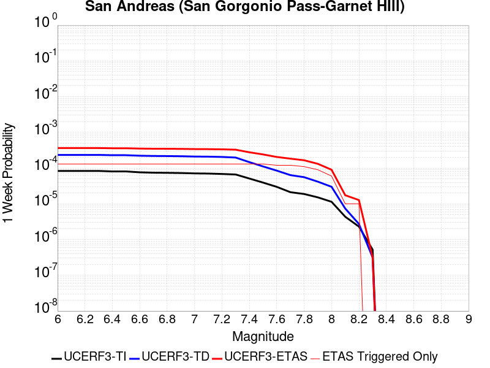 |  |  |  |

| Magnitude | 1 wk TI Prob | 1 wk TD Prob | 1 wk ETAS Prob | 1 wk ETAS/TD Gain | 1 wk ETAS Triggered Only | 1 mo TI Prob | 1 mo TD Prob | 1 mo ETAS Prob | 1 mo ETAS/TD Gain | 1 mo ETAS Triggered Only | 1 yr TI Prob | 1 yr TD Prob | 1 yr ETAS Prob | 1 yr ETAS/TD Gain | 1 yr ETAS Triggered Only | 10 yr TI Prob | 10 yr TD Prob | 10 yr ETAS Prob | 10 yr ETAS/TD Gain | 10 yr ETAS Triggered Only |
|-----|-----|-----|-----|-----|-----|-----|-----|-----|-----|-----|-----|-----|-----|-----|-----|-----|-----|-----|-----|-----|
| 6.0 | 8.31567E-5 | 2.3384395E-4 | 0.0012376253 | 5.2925262 | 0.001004016 | 3.5633717E-4 | 0.0010018025 | 0.0020048127 | 2.0012054 | 0.001004016 | 0.004329778 | 0.012128622 | 0.013120461 | 1.0817767 | 0.001004016 | 0.042463828 | 0.11258187 | 0.11347286 | 1.0079141 | 0.001004016 |
| 6.1 | 8.31567E-5 | 2.3384395E-4 | 0.0012376253 | 5.2925262 | 0.001004016 | 3.5633717E-4 | 0.0010018025 | 0.0020048127 | 2.0012054 | 0.001004016 | 0.004329778 | 0.012128622 | 0.013120461 | 1.0817767 | 0.001004016 | 0.042463828 | 0.11258187 | 0.11347286 | 1.0079141 | 0.001004016 |
| 6.2 | 8.31567E-5 | 2.3384395E-4 | 0.0012376253 | 5.2925262 | 0.001004016 | 3.5633717E-4 | 0.0010018025 | 0.0020048127 | 2.0012054 | 0.001004016 | 0.004329778 | 0.012128622 | 0.013120461 | 1.0817767 | 0.001004016 | 0.042463828 | 0.11258187 | 0.11347286 | 1.0079141 | 0.001004016 |
| 6.3 | 8.31567E-5 | 2.3384395E-4 | 0.0012376253 | 5.2925262 | 0.001004016 | 3.5633717E-4 | 0.0010018025 | 0.0020048127 | 2.0012054 | 0.001004016 | 0.004329778 | 0.012128622 | 0.013120461 | 1.0817767 | 0.001004016 | 0.042463828 | 0.11258187 | 0.11347286 | 1.0079141 | 0.001004016 |
| 6.4 | 8.059055E-5 | 2.2941893E-4 | 0.0012332046 | 5.3753395 | 0.001004016 | 3.4534236E-4 | 9.828559E-4 | 0.0019858852 | 2.0205252 | 0.001004016 | 0.0041964394 | 0.011900819 | 0.012892886 | 1.0833613 | 0.001004016 | 0.041180745 | 0.110562965 | 0.11145597 | 1.0080769 | 0.001004016 |
| 6.5 | 8.059055E-5 | 2.2941893E-4 | 0.0012332046 | 5.3753395 | 0.001004016 | 3.4534236E-4 | 9.828559E-4 | 0.0019858852 | 2.0205252 | 0.001004016 | 0.0041964394 | 0.011900819 | 0.012892886 | 1.0833613 | 0.001004016 | 0.041180745 | 0.110562965 | 0.11145597 | 1.0080769 | 0.001004016 |
| 6.6 | 7.619237E-5 | 2.2186468E-4 | 0.001225658 | 5.524349 | 0.001004016 | 3.2649786E-4 | 9.5050444E-4 | 0.0019535662 | 2.055294 | 0.001004016 | 0.0039678677 | 0.0115115335 | 0.012503992 | 1.0862143 | 0.001004016 | 0.03897764 | 0.10709954 | 0.107996024 | 1.0083706 | 0.001004016 |
| 6.7 | 7.440636E-5 | 2.1862281E-4 | 0.0012224193 | 5.591454 | 0.001004016 | 3.188454E-4 | 9.3662075E-4 | 0.0019396964 | 2.070952 | 0.001004016 | 0.0038750346 | 0.011344268 | 0.012336894 | 1.0875002 | 0.001004016 | 0.038081564 | 0.1056081 | 0.10650609 | 1.008503 | 0.001004016 |
| 6.8 | 7.3735864E-5 | 2.1709445E-4 | 0.0012208925 | 5.623785 | 0.001004016 | 3.1597257E-4 | 9.300753E-4 | 0.0019331576 | 2.0784957 | 0.001004016 | 0.0038401815 | 0.011265406 | 0.012258112 | 1.0881197 | 0.001004016 | 0.03774495 | 0.104909696 | 0.10580838 | 1.0085663 | 0.001004016 |
| 6.9 | 7.27575E-5 | 2.1478413E-4 | 0.0012185846 | 5.6735315 | 0.001004016 | 3.117806E-4 | 9.20181E-4 | 0.0019232732 | 2.0901031 | 0.001004016 | 0.003789323 | 0.011146182 | 0.012139007 | 1.0890731 | 0.001004016 | 0.037253562 | 0.10385753 | 0.10475727 | 1.0086632 | 0.001004016 |
| 7.0 | 7.102591E-5 | 2.1062451E-4 | 0.0012144292 | 5.765849 | 0.001004016 | 3.0436125E-4 | 9.023664E-4 | 0.0019054766 | 2.1116438 | 0.001004016 | 0.003699303 | 0.010931484 | 0.011924525 | 1.0908422 | 0.001004016 | 0.03638325 | 0.101959534 | 0.10286118 | 1.0088432 | 0.001004016 |
| 7.1 | 7.028513E-5 | 2.0898094E-4 | 0.0012127872 | 5.803339 | 0.001004016 | 3.0118722E-4 | 8.953274E-4 | 0.0018984445 | 2.1203914 | 0.001004016 | 0.0036607897 | 0.010846641 | 0.011839767 | 1.0915607 | 0.001004016 | 0.036010686 | 0.10120243 | 0.102104835 | 1.0089169 | 0.001004016 |
| 7.2 | 6.8498244E-5 | 2.050596E-4 | 0.0012088697 | 5.8952117 | 0.001004016 | 2.9353087E-4 | 8.7853306E-4 | 0.0018816671 | 2.1418283 | 0.001004016 | 0.003567883 | 0.0106441835 | 0.011637513 | 1.0933213 | 0.001004016 | 0.035111405 | 0.09939449 | 0.10029872 | 1.0090973 | 0.001004016 |
| 7.3 | 6.622592E-5 | 1.9733235E-4 | 0.0012011502 | 6.0869403 | 0.001004016 | 2.8379448E-4 | 8.4543816E-4 | 0.0018486053 | 2.186565 | 0.001004016 | 0.0034497243 | 0.010245111 | 0.01123884 | 1.0969955 | 0.001004016 | 0.033966612 | 0.095891245 | 0.096798986 | 1.0094663 | 0.001004016 |
| 7.4 | 5.1050705E-5 | 1.4690042E-4 | 0.001150769 | 7.8336673 | 0.001004016 | 2.1877038E-4 | 6.294222E-4 | 0.0016328064 | 2.5941353 | 0.001004016 | 0.002660276 | 0.007636482 | 0.008632831 | 1.1304722 | 0.001004016 | 0.02628654 | 0.07286554 | 0.07379639 | 1.0127751 | 0.001004016 |
| 7.5 | 3.9302922E-5 | 1.11307076E-4 | 0.0011152114 | 10.019232 | 0.001004016 | 1.6843023E-4 | 4.7694342E-4 | 0.0014804807 | 3.1041012 | 0.001004016 | 0.0020487092 | 0.0057913954 | 0.0067895968 | 1.1723593 | 0.001004016 | 0.020299247 | 0.05601151 | 0.05695929 | 1.0169212 | 0.001004016 |
| 7.6 | 2.9851626E-5 | 8.4956984E-5 | 0.0010888878 | 12.81693 | 0.001004016 | 1.2792926E-4 | 3.6405068E-4 | 0.0013677012 | 3.756898 | 0.001004016 | 0.0015564259 | 0.0044233347 | 0.0054229097 | 1.2259777 | 0.001004016 | 0.0154556995 | 0.043196145 | 0.044156794 | 1.0222392 | 0.001004016 |
| 7.7 | 2.1135214E-5 | 6.353527E-5 | 0.0010674875 | 16.801497 | 0.001004016 | 9.0576345E-5 | 2.722656E-4 | 0.0012760083 | 4.6866302 | 0.001004016 | 0.0011022091 | 0.0033098008 | 0.004310494 | 1.3023424 | 0.001004016 | 0.010967582 | 0.03258456 | 0.03355586 | 1.0298086 | 0.001004016 |
| 7.8 | 1.883379E-5 | 5.564576E-5 | 0.001059606 | 19.041988 | 0.001004016 | 8.0713755E-5 | 2.3846005E-4 | 0.0012422367 | 5.209412 | 0.001004016 | 9.822468E-4 | 0.002899389 | 0.0039004942 | 1.3452814 | 0.001004016 | 0.0097791655 | 0.028696978 | 0.029672183 | 1.0339828 | 0.001004016 |
| 7.9 | 1.5156185E-5 | 4.1662403E-5 | 0.0010456366 | 25.097847 | 0.001004016 | 6.495346E-5 | 1.7854095E-4 | 0.0011823778 | 6.6224456 | 0.001004016 | 7.9052144E-4 | 0.0021715704 | 0.003173406 | 1.4613416 | 0.001004016 | 0.007877152 | 0.021760946 | 0.022743113 | 1.0451344 | 0.001004016 |
| 8.0 | 1.1405907E-5 | 2.9976925E-5 | 2.9976925E-5 | 1.0 | 0.0 | 4.8881542E-5 | 1.2846621E-4 | 1.2846621E-4 | 1.0 | 0.0 | 5.9497025E-4 | 0.0015629551 | 0.0015629551 | 1.0 | 0.0 | 0.005933798 | 0.015774013 | 0.015774013 | 1.0 | 0.0 |
| 8.1 | 4.3511436E-6 | 7.369465E-6 | 7.369465E-6 | 1.0 | 0.0 | 1.8647626E-5 | 3.158304E-5 | 3.158304E-5 | 1.0 | 0.0 | 2.2701119E-4 | 3.844558E-4 | 3.844558E-4 | 1.0 | 0.0 | 0.0022677942 | 0.0041165445 | 0.0041165445 | 1.0 | 0.0 |
| 8.2 | 2.3042528E-6 | 2.7328301E-6 | 2.7328301E-6 | 1.0 | 0.0 | 9.875332E-6 | 1.1712076E-5 | 1.1712076E-5 | 1.0 | 0.0 | 1.2022553E-4 | 1.4258524E-4 | 1.4258524E-4 | 1.0 | 0.0 | 0.0012016051 | 0.0015979637 | 0.0015979637 | 1.0 | 0.0 |
| 8.3 | 5.202968E-7 | 3.1590292E-7 | 3.1590292E-7 | 1.0 | 0.0 | 2.2298414E-6 | 1.353869E-6 | 1.353869E-6 | 1.0 | 0.0 | 2.714798E-5 | 1.6483244E-5 | 1.6483244E-5 | 1.0 | 0.0 | 2.7144665E-4 | 1.955901E-4 | 1.955901E-4 | 1.0 | 0.0 |

## Sierra Nevada  (No Extension)
*[(top)](#table-of-contents)*

| 1 Week | 1 Month | 1 Year | 10 Year |
|-----|-----|-----|-----|
|  |  |  |  |

| Magnitude | 1 wk TI Prob | 1 wk TD Prob | 1 wk ETAS Prob | 1 wk ETAS/TD Gain | 1 wk ETAS Triggered Only | 1 mo TI Prob | 1 mo TD Prob | 1 mo ETAS Prob | 1 mo ETAS/TD Gain | 1 mo ETAS Triggered Only | 1 yr TI Prob | 1 yr TD Prob | 1 yr ETAS Prob | 1 yr ETAS/TD Gain | 1 yr ETAS Triggered Only | 10 yr TI Prob | 10 yr TD Prob | 10 yr ETAS Prob | 10 yr ETAS/TD Gain | 10 yr ETAS Triggered Only |
|-----|-----|-----|-----|-----|-----|-----|-----|-----|-----|-----|-----|-----|-----|-----|-----|-----|-----|-----|-----|-----|
| 6.0 | 7.7690465E-6 | 6.9762887E-6 | 0.0010109853 | 144.91736 | 0.001004016 | 3.329549E-5 | 2.989824E-5 | 0.0010338842 | 34.580105 | 0.001004016 | 4.0529718E-4 | 3.6398612E-4 | 0.0013676367 | 3.7573872 | 0.001004016 | 0.004045588 | 0.0036374154 | 0.0046377797 | 1.2750206 | 0.001004016 |
| 6.1 | 7.7690465E-6 | 6.9762887E-6 | 0.0010109853 | 144.91736 | 0.001004016 | 3.329549E-5 | 2.989824E-5 | 0.0010338842 | 34.580105 | 0.001004016 | 4.0529718E-4 | 3.6398612E-4 | 0.0013676367 | 3.7573872 | 0.001004016 | 0.004045588 | 0.0036374154 | 0.0046377797 | 1.2750206 | 0.001004016 |
| 6.2 | 7.7690465E-6 | 6.9762887E-6 | 0.0010109853 | 144.91736 | 0.001004016 | 3.329549E-5 | 2.989824E-5 | 0.0010338842 | 34.580105 | 0.001004016 | 4.0529718E-4 | 3.6398612E-4 | 0.0013676367 | 3.7573872 | 0.001004016 | 0.004045588 | 0.0036374154 | 0.0046377797 | 1.2750206 | 0.001004016 |
| 6.3 | 7.7690465E-6 | 6.9762887E-6 | 0.0010109853 | 144.91736 | 0.001004016 | 3.329549E-5 | 2.989824E-5 | 0.0010338842 | 34.580105 | 0.001004016 | 4.0529718E-4 | 3.6398612E-4 | 0.0013676367 | 3.7573872 | 0.001004016 | 0.004045588 | 0.0036374154 | 0.0046377797 | 1.2750206 | 0.001004016 |
| 6.4 | 7.7690465E-6 | 6.9762887E-6 | 0.0010109853 | 144.91736 | 0.001004016 | 3.329549E-5 | 2.989824E-5 | 0.0010338842 | 34.580105 | 0.001004016 | 4.0529718E-4 | 3.6398612E-4 | 0.0013676367 | 3.7573872 | 0.001004016 | 0.004045588 | 0.0036374154 | 0.0046377797 | 1.2750206 | 0.001004016 |
| 6.5 | 7.7690465E-6 | 6.9762887E-6 | 0.0010109853 | 144.91736 | 0.001004016 | 3.329549E-5 | 2.989824E-5 | 0.0010338842 | 34.580105 | 0.001004016 | 4.0529718E-4 | 3.6398612E-4 | 0.0013676367 | 3.7573872 | 0.001004016 | 0.004045588 | 0.0036374154 | 0.0046377797 | 1.2750206 | 0.001004016 |
| 6.6 | 2.653E-6 | 1.6148208E-6 | 0.0010056293 | 622.74976 | 0.001004016 | 1.136995E-5 | 6.9206426E-6 | 0.0010109298 | 146.07455 | 0.001004016 | 1.3842035E-4 | 8.42556E-5 | 0.0010881871 | 12.915309 | 0.001004016 | 0.0013833415 | 8.4224E-4 | 0.0018454104 | 2.1910744 | 0.001004016 |
| 6.7 | 2.5902466E-6 | 1.5501544E-6 | 0.0010055647 | 648.68677 | 0.001004016 | 1.11010095E-5 | 6.643502E-6 | 0.0010106529 | 152.12653 | 0.001004016 | 1.351464E-4 | 8.088166E-5 | 0.0010848165 | 13.412391 | 0.001004016 | 0.0013506424 | 8.0852525E-4 | 0.0018117295 | 2.240783 | 0.001004016 |
| 6.8 | 2.5853892E-6 | 1.5469546E-6 | 0.0010055614 | 650.0265 | 0.001004016 | 1.1080193E-5 | 6.629789E-6 | 0.0010106392 | 152.43912 | 0.001004016 | 1.34893E-4 | 8.071472E-5 | 0.0010846497 | 13.4380665 | 0.001004016 | 0.0013481114 | 8.06857E-4 | 0.001810063 | 2.2433503 | 0.001004016 |
| 6.9 | 2.458257E-6 | 1.422029E-6 | 0.0010054366 | 707.04376 | 0.001004016 | 1.0535345E-5 | 6.0943958E-6 | 0.0010101043 | 165.74315 | 0.001004016 | 1.2826028E-4 | 7.419676E-5 | 0.0010781384 | 14.530801 | 0.001004016 | 0.0012818627 | 7.4172183E-4 | 0.0017449931 | 2.352625 | 0.001004016 |
| 7.0 | 2.4341468E-6 | 1.3989927E-6 | 0.0010054137 | 718.6697 | 0.001004016 | 1.0432016E-5 | 5.9956697E-6 | 0.0010100057 | 168.45587 | 0.001004016 | 1.270024E-4 | 7.299485E-5 | 0.0010769377 | 14.753611 | 0.001004016 | 0.0012692984 | 7.297107E-4 | 0.0017329941 | 2.3749058 | 0.001004016 |
| 7.1 | 2.3652476E-6 | 1.3339427E-6 | 0.0010053486 | 753.66705 | 0.001004016 | 1.0136736E-5 | 5.716885E-6 | 0.0010097272 | 176.62193 | 0.001004016 | 1.2340778E-4 | 6.9600865E-5 | 0.001073547 | 15.424335 | 0.001004016 | 0.0012333926 | 6.957924E-4 | 0.0016991099 | 2.4419782 | 0.001004016 |
| 7.2 | 2.272158E-6 | 1.2502497E-6 | 0.001005265 | 804.05145 | 0.001004016 | 9.737784E-6 | 5.358202E-6 | 0.0010093689 | 188.37828 | 0.001004016 | 1.1855107E-4 | 6.523417E-5 | 0.0010691847 | 16.389948 | 0.001004016 | 0.0011848784 | 6.5215176E-4 | 0.0016555131 | 2.5385396 | 0.001004016 |
| 7.3 | 2.1382127E-6 | 1.1419382E-6 | 0.0010051569 | 880.22 | 0.001004016 | 9.163737E-6 | 4.894012E-6 | 0.0010089051 | 206.15094 | 0.001004016 | 1.1156279E-4 | 5.9582977E-5 | 0.0010635392 | 17.849716 | 0.001004016 | 0.001115068 | 5.956712E-4 | 0.0015990892 | 2.6845167 | 0.001004016 |
| 7.4 | 1.9048055E-6 | 9.574928E-7 | 9.574928E-7 | 1.0 | 0.0 | 8.163426E-6 | 4.103534E-6 | 4.103534E-6 | 1.0 | 0.0 | 9.9385186E-5 | 4.995939E-5 | 4.995939E-5 | 1.0 | 0.0 | 9.934074E-4 | 4.9948227E-4 | 4.9948227E-4 | 1.0 | 0.0 |
| 7.5 | 1.5373403E-6 | 7.559763E-7 | 7.559763E-7 | 1.0 | 0.0 | 6.5885843E-6 | 3.2398946E-6 | 3.2398946E-6 | 1.0 | 0.0 | 8.021306E-5 | 3.9445007E-5 | 3.9445007E-5 | 1.0 | 0.0 | 8.0184115E-4 | 3.9438053E-4 | 3.9438053E-4 | 1.0 | 0.0 |
| 7.6 | 1.0680322E-6 | 4.65941E-7 | 4.65941E-7 | 1.0 | 0.0 | 4.577273E-6 | 1.9968884E-6 | 1.9968884E-6 | 1.0 | 0.0 | 5.5726876E-5 | 2.4311848E-5 | 2.4311848E-5 | 1.0 | 0.0 | 5.5712904E-4 | 2.4309216E-4 | 2.4309216E-4 | 1.0 | 0.0 |
| 7.7 | 5.509146E-7 | 1.5578539E-7 | 1.5578539E-7 | 1.0 | 0.0 | 2.3610605E-6 | 6.676515E-7 | 6.676515E-7 | 1.0 | 0.0 | 2.8745531E-5 | 8.128628E-6 | 8.128628E-6 | 1.0 | 0.0 | 2.8741814E-4 | 8.128342E-5 | 8.128342E-5 | 1.0 | 0.0 |

## Manix-Afton Hills
*[(top)](#table-of-contents)*

| 1 Week | 1 Month | 1 Year | 10 Year |
|-----|-----|-----|-----|
|  |  | 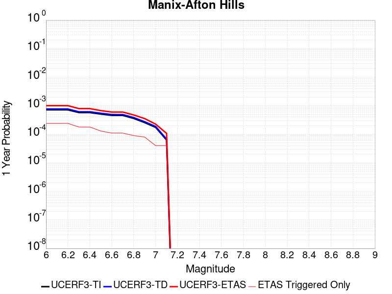 |  |

| Magnitude | 1 wk TI Prob | 1 wk TD Prob | 1 wk ETAS Prob | 1 wk ETAS/TD Gain | 1 wk ETAS Triggered Only | 1 mo TI Prob | 1 mo TD Prob | 1 mo ETAS Prob | 1 mo ETAS/TD Gain | 1 mo ETAS Triggered Only | 1 yr TI Prob | 1 yr TD Prob | 1 yr ETAS Prob | 1 yr ETAS/TD Gain | 1 yr ETAS Triggered Only | 10 yr TI Prob | 10 yr TD Prob | 10 yr ETAS Prob | 10 yr ETAS/TD Gain | 10 yr ETAS Triggered Only |
|-----|-----|-----|-----|-----|-----|-----|-----|-----|-----|-----|-----|-----|-----|-----|-----|-----|-----|-----|-----|-----|
| 6.0 | 1.3783202E-5 | 1.47110895E-5 | 0.0010187124 | 69.24792 | 0.001004016 | 5.906953E-5 | 6.30461E-5 | 0.0010669988 | 16.924105 | 0.001004016 | 7.189342E-4 | 7.6733343E-4 | 0.0017705791 | 2.307444 | 0.001004016 | 0.0071661277 | 0.007648596 | 0.008644933 | 1.130264 | 0.001004016 |
| 6.1 | 1.3783202E-5 | 1.47110895E-5 | 0.0010187124 | 69.24792 | 0.001004016 | 5.906953E-5 | 6.30461E-5 | 0.0010669988 | 16.924105 | 0.001004016 | 7.189342E-4 | 7.6733343E-4 | 0.0017705791 | 2.307444 | 0.001004016 | 0.0071661277 | 0.007648596 | 0.008644933 | 1.130264 | 0.001004016 |
| 6.2 | 1.3783202E-5 | 1.47110895E-5 | 0.0010187124 | 69.24792 | 0.001004016 | 5.906953E-5 | 6.30461E-5 | 0.0010669988 | 16.924105 | 0.001004016 | 7.189342E-4 | 7.6733343E-4 | 0.0017705791 | 2.307444 | 0.001004016 | 0.0071661277 | 0.007648596 | 0.008644933 | 1.130264 | 0.001004016 |
| 6.3 | 1.10494875E-5 | 1.1793136E-5 | 0.0010157974 | 86.13463 | 0.001004016 | 4.7354086E-5 | 5.054109E-5 | 0.0010545064 | 20.864338 | 0.001004016 | 5.763835E-4 | 6.151744E-4 | 0.0016185729 | 2.6310797 | 0.001004016 | 0.005748908 | 0.0061357557 | 0.007133611 | 1.1626296 | 0.001004016 |
| 6.4 | 1.10494875E-5 | 1.1793136E-5 | 0.0010157974 | 86.13463 | 0.001004016 | 4.7354086E-5 | 5.054109E-5 | 0.0010545064 | 20.864338 | 0.001004016 | 5.763835E-4 | 6.151744E-4 | 0.0016185729 | 2.6310797 | 0.001004016 | 0.005748908 | 0.0061357557 | 0.007133611 | 1.1626296 | 0.001004016 |
| 6.5 | 9.788949E-6 | 1.045432E-5 | 0.0010144599 | 97.03739 | 0.001004016 | 4.1951964E-5 | 4.480351E-5 | 0.0010487746 | 23.408314 | 0.001004016 | 5.1064545E-4 | 5.453555E-4 | 0.001548824 | 2.8400264 | 0.001004016 | 0.0050947363 | 0.0054410985 | 0.006439652 | 1.1835206 | 0.001004016 |
| 6.6 | 8.810006E-6 | 9.4136285E-6 | 0.0010134203 | 107.65459 | 0.001004016 | 3.775662E-5 | 4.0343548E-5 | 0.0010443191 | 25.885654 | 0.001004016 | 4.5958988E-4 | 4.9108086E-4 | 0.0014946039 | 3.0434985 | 0.001004016 | 0.0045864056 | 0.004900839 | 0.0058999346 | 1.2038622 | 0.001004016 |
| 6.7 | 8.80128E-6 | 9.404108E-6 | 0.0010134107 | 107.76256 | 0.001004016 | 3.7719226E-5 | 4.0302748E-5 | 0.0010442784 | 25.910849 | 0.001004016 | 4.591348E-4 | 4.9058435E-4 | 0.0014941079 | 3.0455678 | 0.001004016 | 0.004581874 | 0.0048958957 | 0.005894996 | 1.204069 | 0.001004016 |
| 6.8 | 6.8994877E-6 | 7.380076E-6 | 0.0010113887 | 137.04314 | 0.001004016 | 2.9568899E-5 | 3.162856E-5 | 0.0010356129 | 32.742966 | 0.001004016 | 3.5994186E-4 | 3.8501783E-4 | 0.0013886474 | 3.606709 | 0.001004016 | 0.003593594 | 0.0038443129 | 0.004844469 | 1.2601652 | 0.001004016 |
| 6.9 | 4.9328037E-6 | 5.2709615E-6 | 0.0010092817 | 191.47963 | 0.001004016 | 2.1140417E-5 | 2.2589675E-5 | 0.001026583 | 45.444794 | 0.001004016 | 2.5735417E-4 | 2.7500073E-4 | 0.0012787407 | 4.649954 | 0.001004016 | 0.0025705635 | 0.0027472095 | 0.0037484672 | 1.3644636 | 0.001004016 |
| 7.0 | 3.347973E-6 | 3.59003E-6 | 3.59003E-6 | 1.0 | 0.0 | 1.4348378E-5 | 1.5385775E-5 | 1.5385775E-5 | 1.0 | 0.0 | 1.746775E-4 | 1.8730981E-4 | 1.8730981E-4 | 1.0 | 0.0 | 0.0017454025 | 0.0018719219 | 0.0018719219 | 1.0 | 0.0 |
| 7.1 | 1.2073567E-6 | 1.293482E-6 | 1.293482E-6 | 1.0 | 0.0 | 5.1743755E-6 | 5.543492E-6 | 5.543492E-6 | 1.0 | 0.0 | 6.29962E-5 | 6.749156E-5 | 6.749156E-5 | 1.0 | 0.0 | 6.297835E-4 | 6.7487074E-4 | 6.7487074E-4 | 1.0 | 0.0 |

## Bicycle Lake
*[(top)](#table-of-contents)*

| 1 Week | 1 Month | 1 Year | 10 Year |
|-----|-----|-----|-----|
| 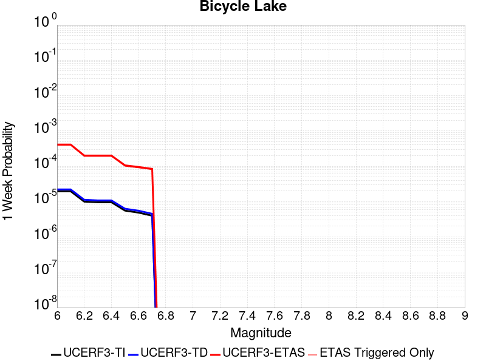 |  |  |  |

| Magnitude | 1 wk TI Prob | 1 wk TD Prob | 1 wk ETAS Prob | 1 wk ETAS/TD Gain | 1 wk ETAS Triggered Only | 1 mo TI Prob | 1 mo TD Prob | 1 mo ETAS Prob | 1 mo ETAS/TD Gain | 1 mo ETAS Triggered Only | 1 yr TI Prob | 1 yr TD Prob | 1 yr ETAS Prob | 1 yr ETAS/TD Gain | 1 yr ETAS Triggered Only | 10 yr TI Prob | 10 yr TD Prob | 10 yr ETAS Prob | 10 yr ETAS/TD Gain | 10 yr ETAS Triggered Only |
|-----|-----|-----|-----|-----|-----|-----|-----|-----|-----|-----|-----|-----|-----|-----|-----|-----|-----|-----|-----|-----|
| 6.0 | 1.9621975E-5 | 2.2097078E-5 | 2.2097078E-5 | 1.0 | 0.0 | 8.4091465E-5 | 9.4699084E-5 | 9.4699084E-5 | 1.0 | 0.0 | 0.0010233327 | 0.0011524865 | 0.0011524865 | 1.0 | 0.0 | 0.01018633 | 0.011478408 | 0.0124709 | 1.086466 | 0.001004016 |
| 6.1 | 1.9621975E-5 | 2.2097078E-5 | 2.2097078E-5 | 1.0 | 0.0 | 8.4091465E-5 | 9.4699084E-5 | 9.4699084E-5 | 1.0 | 0.0 | 0.0010233327 | 0.0011524865 | 0.0011524865 | 1.0 | 0.0 | 0.01018633 | 0.011478408 | 0.0124709 | 1.086466 | 0.001004016 |
| 6.2 | 9.9971285E-6 | 1.125564E-5 | 1.125564E-5 | 1.0 | 0.0 | 4.2844134E-5 | 4.8237856E-5 | 4.8237856E-5 | 1.0 | 0.0 | 5.2150246E-4 | 5.871897E-4 | 5.871897E-4 | 1.0 | 0.0 | 0.0052028033 | 0.005861487 | 0.006859618 | 1.1702863 | 0.001004016 |
| 6.3 | 9.589428E-6 | 1.0798346E-5 | 1.0798346E-5 | 1.0 | 0.0 | 4.10969E-5 | 4.62781E-5 | 4.62781E-5 | 1.0 | 0.0 | 5.002399E-4 | 5.6334207E-4 | 5.6334207E-4 | 1.0 | 0.0 | 0.0049911533 | 0.0056242296 | 0.006622599 | 1.1775122 | 0.001004016 |
| 6.4 | 9.589428E-6 | 1.0798346E-5 | 1.0798346E-5 | 1.0 | 0.0 | 4.10969E-5 | 4.62781E-5 | 4.62781E-5 | 1.0 | 0.0 | 5.002399E-4 | 5.6334207E-4 | 5.6334207E-4 | 1.0 | 0.0 | 0.0049911533 | 0.0056242296 | 0.006622599 | 1.1775122 | 0.001004016 |
| 6.5 | 5.557707E-6 | 6.2856016E-6 | 6.2856016E-6 | 1.0 | 0.0 | 2.3818526E-5 | 2.6938165E-5 | 2.6938165E-5 | 1.0 | 0.0 | 2.8995197E-4 | 3.279497E-4 | 3.279497E-4 | 1.0 | 0.0 | 0.0028957394 | 0.0032772934 | 0.004278019 | 1.3053513 | 0.001004016 |
| 6.6 | 4.8742945E-6 | 5.5132896E-6 | 5.5132896E-6 | 1.0 | 0.0 | 2.0889667E-5 | 2.3628318E-5 | 2.3628318E-5 | 1.0 | 0.0 | 2.54302E-4 | 2.87663E-4 | 2.87663E-4 | 1.0 | 0.0 | 0.002540112 | 0.0028754752 | 0.0038766044 | 1.3481612 | 0.001004016 |
| 6.7 | 3.991108E-6 | 4.5159104E-6 | 4.5159104E-6 | 1.0 | 0.0 | 1.7104636E-5 | 1.9353902E-5 | 1.9353902E-5 | 1.0 | 0.0 | 2.0822904E-4 | 2.3563375E-4 | 2.3563375E-4 | 1.0 | 0.0 | 0.0020803404 | 0.0023563374 | 0.0033579879 | 1.4250878 | 0.001004016 |

## Death Valley (Black Mtns Frontal)
*[(top)](#table-of-contents)*

| 1 Week | 1 Month | 1 Year | 10 Year |
|-----|-----|-----|-----|
|  |  |  |  |

| Magnitude | 1 wk TI Prob | 1 wk TD Prob | 1 wk ETAS Prob | 1 wk ETAS/TD Gain | 1 wk ETAS Triggered Only | 1 mo TI Prob | 1 mo TD Prob | 1 mo ETAS Prob | 1 mo ETAS/TD Gain | 1 mo ETAS Triggered Only | 1 yr TI Prob | 1 yr TD Prob | 1 yr ETAS Prob | 1 yr ETAS/TD Gain | 1 yr ETAS Triggered Only | 10 yr TI Prob | 10 yr TD Prob | 10 yr ETAS Prob | 10 yr ETAS/TD Gain | 10 yr ETAS Triggered Only |
|-----|-----|-----|-----|-----|-----|-----|-----|-----|-----|-----|-----|-----|-----|-----|-----|-----|-----|-----|-----|-----|
| 6.0 | 1.6707214E-5 | 1.867027E-5 | 1.867027E-5 | 1.0 | 0.0 | 7.160038E-5 | 8.001303E-5 | 8.001303E-5 | 1.0 | 0.0 | 8.71386E-4 | 9.737309E-4 | 9.737309E-4 | 1.0 | 0.0 | 0.00867977 | 0.009695496 | 0.010689778 | 1.1025509 | 0.001004016 |
| 6.1 | 1.6707214E-5 | 1.867027E-5 | 1.867027E-5 | 1.0 | 0.0 | 7.160038E-5 | 8.001303E-5 | 8.001303E-5 | 1.0 | 0.0 | 8.71386E-4 | 9.737309E-4 | 9.737309E-4 | 1.0 | 0.0 | 0.00867977 | 0.009695496 | 0.010689778 | 1.1025509 | 0.001004016 |
| 6.2 | 1.6707214E-5 | 1.867027E-5 | 1.867027E-5 | 1.0 | 0.0 | 7.160038E-5 | 8.001303E-5 | 8.001303E-5 | 1.0 | 0.0 | 8.71386E-4 | 9.737309E-4 | 9.737309E-4 | 1.0 | 0.0 | 0.00867977 | 0.009695496 | 0.010689778 | 1.1025509 | 0.001004016 |
| 6.3 | 1.6707214E-5 | 1.867027E-5 | 1.867027E-5 | 1.0 | 0.0 | 7.160038E-5 | 8.001303E-5 | 8.001303E-5 | 1.0 | 0.0 | 8.71386E-4 | 9.737309E-4 | 9.737309E-4 | 1.0 | 0.0 | 0.00867977 | 0.009695496 | 0.010689778 | 1.1025509 | 0.001004016 |
| 6.4 | 1.5515609E-5 | 1.7338214E-5 | 1.7338214E-5 | 1.0 | 0.0 | 6.649377E-5 | 7.4304546E-5 | 7.4304546E-5 | 1.0 | 0.0 | 8.0926094E-4 | 9.042885E-4 | 9.042885E-4 | 1.0 | 0.0 | 0.008063202 | 0.009006773 | 0.010001746 | 1.1104695 | 0.001004016 |
| 6.5 | 1.5515609E-5 | 1.7338214E-5 | 1.7338214E-5 | 1.0 | 0.0 | 6.649377E-5 | 7.4304546E-5 | 7.4304546E-5 | 1.0 | 0.0 | 8.0926094E-4 | 9.042885E-4 | 9.042885E-4 | 1.0 | 0.0 | 0.008063202 | 0.009006773 | 0.010001746 | 1.1104695 | 0.001004016 |
| 6.6 | 1.5041828E-5 | 1.6809145E-5 | 1.6809145E-5 | 1.0 | 0.0 | 6.4463384E-5 | 7.203723E-5 | 7.203723E-5 | 1.0 | 0.0 | 7.8455906E-4 | 8.767063E-4 | 8.767063E-4 | 1.0 | 0.0 | 0.00781795 | 0.008733132 | 0.0097283805 | 1.1139623 | 0.001004016 |
| 6.7 | 1.4634985E-5 | 1.6356016E-5 | 1.6356016E-5 | 1.0 | 0.0 | 6.271985E-5 | 7.009536E-5 | 7.009536E-5 | 1.0 | 0.0 | 7.6334673E-4 | 8.5308263E-4 | 8.5308263E-4 | 1.0 | 0.0 | 0.007607299 | 0.008498715 | 0.0094941985 | 1.1171334 | 0.001004016 |
| 6.8 | 1.4209158E-5 | 1.5882048E-5 | 1.5882048E-5 | 1.0 | 0.0 | 6.089497E-5 | 6.8064175E-5 | 6.8064175E-5 | 1.0 | 0.0 | 7.4114406E-4 | 8.2837185E-4 | 8.2837185E-4 | 1.0 | 0.0 | 0.007386771 | 0.008253456 | 0.009249186 | 1.120644 | 0.001004016 |
| 6.9 | 1.3780098E-5 | 1.5404594E-5 | 1.5404594E-5 | 1.0 | 0.0 | 5.9056227E-5 | 6.6018045E-5 | 6.6018045E-5 | 1.0 | 0.0 | 7.1877235E-4 | 8.0347876E-4 | 8.0347876E-4 | 1.0 | 0.0 | 0.0071645193 | 0.008006332 | 0.00900231 | 1.1243987 | 0.001004016 |
| 7.0 | 1.3585064E-5 | 1.5188155E-5 | 1.5188155E-5 | 1.0 | 0.0 | 5.8220405E-5 | 6.50905E-5 | 6.50905E-5 | 1.0 | 0.0 | 7.086029E-4 | 7.9219416E-4 | 7.9219416E-4 | 1.0 | 0.0 | 0.007063476 | 0.007894293 | 0.008890384 | 1.1261785 | 0.001004016 |
| 7.1 | 1.3398601E-5 | 1.49813395E-5 | 1.49813395E-5 | 1.0 | 0.0 | 5.742131E-5 | 6.420419E-5 | 6.420419E-5 | 1.0 | 0.0 | 6.9888023E-4 | 7.8141113E-4 | 7.8141113E-4 | 1.0 | 0.0 | 0.0069668638 | 0.007787224 | 0.007787224 | 1.0 | 0.0 |
| 7.2 | 1.3126312E-5 | 1.4679561E-5 | 1.4679561E-5 | 1.0 | 0.0 | 5.6254412E-5 | 6.291092E-5 | 6.291092E-5 | 1.0 | 0.0 | 6.846822E-4 | 7.6567667E-4 | 7.6567667E-4 | 1.0 | 0.0 | 0.006825765 | 0.00763097 | 0.00763097 | 1.0 | 0.0 |
| 7.3 | 1.2922429E-5 | 1.4453788E-5 | 1.4453788E-5 | 1.0 | 0.0 | 5.5380664E-5 | 6.194336E-5 | 6.194336E-5 | 1.0 | 0.0 | 6.74051E-4 | 7.53905E-4 | 7.53905E-4 | 1.0 | 0.0 | 0.006720101 | 0.007514055 | 0.007514055 | 1.0 | 0.0 |
| 7.4 | 1.2768878E-5 | 1.4283772E-5 | 1.4283772E-5 | 1.0 | 0.0 | 5.4722615E-5 | 6.1214756E-5 | 6.1214756E-5 | 1.0 | 0.0 | 6.660441E-4 | 7.4504025E-4 | 7.4504025E-4 | 1.0 | 0.0 | 0.0066405144 | 0.0074260035 | 0.0074260035 | 1.0 | 0.0 |
| 7.5 | 1.2521929E-5 | 1.40120155E-5 | 1.40120155E-5 | 1.0 | 0.0 | 5.366431E-5 | 6.005014E-5 | 6.005014E-5 | 1.0 | 0.0 | 6.531671E-4 | 7.3087064E-4 | 7.3087064E-4 | 1.0 | 0.0 | 0.006512506 | 0.0072852457 | 0.0072852457 | 1.0 | 0.0 |
| 7.6 | 1.1301089E-5 | 1.2648149E-5 | 1.2648149E-5 | 1.0 | 0.0 | 4.8432343E-5 | 5.4205255E-5 | 5.4205255E-5 | 1.0 | 0.0 | 5.895042E-4 | 6.5975444E-4 | 6.5975444E-4 | 1.0 | 0.0 | 0.0058794282 | 0.00657851 | 0.00657851 | 1.0 | 0.0 |
| 7.7 | 9.189108E-6 | 1.0283358E-5 | 1.0283358E-5 | 1.0 | 0.0 | 3.93813E-5 | 4.407082E-5 | 4.407082E-5 | 1.0 | 0.0 | 4.7936183E-4 | 5.3643517E-4 | 5.3643517E-4 | 1.0 | 0.0 | 0.004783291 | 0.005351914 | 0.005351914 | 1.0 | 0.0 |
| 7.8 | 3.4586725E-7 | 3.6482615E-7 | 3.6482615E-7 | 1.0 | 0.0 | 1.4822873E-6 | 1.5635396E-6 | 1.5635396E-6 | 1.0 | 0.0 | 1.80467E-5 | 1.9035933E-5 | 1.9035933E-5 | 1.0 | 0.0 | 1.8045233E-4 | 1.9034347E-4 | 1.9034347E-4 | 1.0 | 0.0 |
| 7.9 | 2.5591178E-9 | 2.6696718E-9 | 2.6696718E-9 | 1.0 | 0.0 | 1.0967647E-8 | 1.14414505E-8 | 1.14414505E-8 | 1.0 | 0.0 | 1.335311E-7 | 1.3929966E-7 | 1.3929966E-7 | 1.0 | 0.0 | 1.3353102E-6 | 1.3929966E-6 | 1.3929966E-6 | 1.0 | 0.0 |

## San Andreas (Cholame) rev
*[(top)](#table-of-contents)*

| 1 Week | 1 Month | 1 Year | 10 Year |
|-----|-----|-----|-----|
|  |  |  |  |

| Magnitude | 1 wk TI Prob | 1 wk TD Prob | 1 wk ETAS Prob | 1 wk ETAS/TD Gain | 1 wk ETAS Triggered Only | 1 mo TI Prob | 1 mo TD Prob | 1 mo ETAS Prob | 1 mo ETAS/TD Gain | 1 mo ETAS Triggered Only | 1 yr TI Prob | 1 yr TD Prob | 1 yr ETAS Prob | 1 yr ETAS/TD Gain | 1 yr ETAS Triggered Only | 10 yr TI Prob | 10 yr TD Prob | 10 yr ETAS Prob | 10 yr ETAS/TD Gain | 10 yr ETAS Triggered Only |
|-----|-----|-----|-----|-----|-----|-----|-----|-----|-----|-----|-----|-----|-----|-----|-----|-----|-----|-----|-----|-----|
| 6.0 | 1.2302514E-4 | 2.5205986E-4 | 2.5205986E-4 | 1.0 | 0.0 | 5.27144E-4 | 0.0010798109 | 0.0010798109 | 1.0 | 0.0 | 0.0063991086 | 0.013067958 | 0.0140588535 | 1.0758264 | 0.001004016 | 0.06217949 | 0.12438412 | 0.12526326 | 1.0070679 | 0.001004016 |
| 6.1 | 1.2302514E-4 | 2.5205986E-4 | 2.5205986E-4 | 1.0 | 0.0 | 5.27144E-4 | 0.0010798109 | 0.0010798109 | 1.0 | 0.0 | 0.0063991086 | 0.013067958 | 0.0140588535 | 1.0758264 | 0.001004016 | 0.06217949 | 0.12438412 | 0.12526326 | 1.0070679 | 0.001004016 |
| 6.2 | 1.2203569E-4 | 2.502277E-4 | 2.502277E-4 | 1.0 | 0.0 | 5.2290526E-4 | 0.0010719653 | 0.0010719653 | 1.0 | 0.0 | 0.006347804 | 0.012973578 | 0.013964568 | 1.0763853 | 0.001004016 | 0.061695136 | 0.123571314 | 0.12445126 | 1.007121 | 0.001004016 |
| 6.3 | 1.2142645E-4 | 2.4908737E-4 | 2.4908737E-4 | 1.0 | 0.0 | 5.202953E-4 | 0.0010670823 | 0.0010670823 | 1.0 | 0.0 | 0.006316212 | 0.012914834 | 0.013905883 | 1.0767373 | 0.001004016 | 0.06139677 | 0.12306532 | 0.12394578 | 1.0071543 | 0.001004016 |
| 6.4 | 1.1865206E-4 | 2.4414246E-4 | 2.4414246E-4 | 1.0 | 0.0 | 5.0840975E-4 | 0.0010459068 | 0.0010459068 | 1.0 | 0.0 | 0.006172335 | 0.012660044 | 0.01365135 | 1.0783019 | 0.001004016 | 0.060036868 | 0.12085904 | 0.12174171 | 1.0073034 | 0.001004016 |
| 6.5 | 1.17443946E-4 | 2.4207575E-4 | 2.4207575E-4 | 1.0 | 0.0 | 5.032341E-4 | 0.0010370566 | 0.0010370566 | 1.0 | 0.0 | 0.006109677 | 0.012553536 | 0.013544948 | 1.0789747 | 0.001004016 | 0.059444077 | 0.11993008 | 0.12081368 | 1.0073676 | 0.001004016 |
| 6.6 | 1.13579066E-4 | 2.3516564E-4 | 2.3516564E-4 | 1.0 | 0.0 | 4.866766E-4 | 0.001007465 | 0.001007465 | 1.0 | 0.0 | 0.0059092017 | 0.012197345 | 0.013189115 | 1.0813103 | 0.001004016 | 0.057545185 | 0.1168492 | 0.1177359 | 1.0075884 | 0.001004016 |
| 6.7 | 1.1271412E-4 | 2.336088E-4 | 2.336088E-4 | 1.0 | 0.0 | 4.829711E-4 | 0.001000798 | 0.001000798 | 1.0 | 0.0 | 0.005864331 | 0.012117079 | 0.01310893 | 1.0818555 | 0.001004016 | 0.057119697 | 0.11615275 | 0.11704015 | 1.0076399 | 0.001004016 |
| 6.8 | 1.1217975E-4 | 2.3249313E-4 | 2.3249313E-4 | 1.0 | 0.0 | 4.8068175E-4 | 9.960202E-4 | 9.960202E-4 | 1.0 | 0.0 | 0.005836608 | 0.012059555 | 0.013051463 | 1.0822508 | 0.001004016 | 0.056856725 | 0.11565061 | 0.11653851 | 1.0076774 | 0.001004016 |
| 6.9 | 1.1146753E-4 | 2.3098059E-4 | 2.3098059E-4 | 1.0 | 0.0 | 4.7763053E-4 | 9.895428E-4 | 9.895428E-4 | 1.0 | 0.0 | 0.0057996577 | 0.011981564 | 0.01297355 | 1.0827928 | 0.001004016 | 0.056506127 | 0.11497027 | 0.11585885 | 1.0077288 | 0.001004016 |
| 7.0 | 1.0965793E-4 | 2.2721413E-4 | 2.2721413E-4 | 1.0 | 0.0 | 4.698779E-4 | 9.734129E-4 | 9.734129E-4 | 1.0 | 0.0 | 0.005705768 | 0.011787324 | 0.012779506 | 1.0841736 | 0.001004016 | 0.055614736 | 0.11327011 | 0.1141604 | 1.00786 | 0.001004016 |
| 7.1 | 9.927982E-5 | 2.0540332E-4 | 2.0540332E-4 | 1.0 | 0.0 | 4.2541555E-4 | 8.8000396E-4 | 8.8000396E-4 | 1.0 | 0.0 | 0.0051671406 | 0.010661708 | 0.010661708 | 1.0 | 0.0 | 0.05048634 | 0.10336573 | 0.10336573 | 1.0 | 0.0 |
| 7.2 | 9.696786E-5 | 2.0044584E-4 | 2.0044584E-4 | 1.0 | 0.0 | 4.1551032E-4 | 8.587718E-4 | 8.587718E-4 | 1.0 | 0.0 | 0.00504711 | 0.010405703 | 0.010405703 | 1.0 | 0.0 | 0.04934009 | 0.10110233 | 0.10110233 | 1.0 | 0.0 |
| 7.3 | 9.4727984E-5 | 1.9473763E-4 | 1.9473763E-4 | 1.0 | 0.0 | 4.0591392E-4 | 8.343239E-4 | 8.343239E-4 | 1.0 | 0.0 | 0.0049308087 | 0.010110851 | 0.010110851 | 1.0 | 0.0 | 0.048228268 | 0.09847412 | 0.09847412 | 1.0 | 0.0 |
| 7.4 | 9.220358E-5 | 1.8844259E-4 | 1.8844259E-4 | 1.0 | 0.0 | 3.9509835E-4 | 8.07362E-4 | 8.07362E-4 | 1.0 | 0.0 | 0.004799717 | 0.009785578 | 0.009785578 | 1.0 | 0.0 | 0.046973653 | 0.09555831 | 0.09555831 | 1.0 | 0.0 |
| 7.5 | 7.71631E-5 | 1.5179155E-4 | 1.5179155E-4 | 1.0 | 0.0 | 3.306571E-4 | 6.5037323E-4 | 6.5037323E-4 | 1.0 | 0.0 | 0.0040183207 | 0.007889617 | 0.007889617 | 1.0 | 0.0 | 0.03946433 | 0.078289196 | 0.078289196 | 1.0 | 0.0 |
| 7.6 | 7.5634416E-5 | 1.4838556E-4 | 1.4838556E-4 | 1.0 | 0.0 | 3.241072E-4 | 6.357833E-4 | 6.357833E-4 | 1.0 | 0.0 | 0.0039388672 | 0.007713256 | 0.007713256 | 1.0 | 0.0 | 0.038697794 | 0.076654874 | 0.076654874 | 1.0 | 0.0 |
| 7.7 | 6.3783E-5 | 1.2359623E-4 | 1.2359623E-4 | 1.0 | 0.0 | 2.7332708E-4 | 5.2959064E-4 | 5.2959064E-4 | 1.0 | 0.0 | 0.0033226798 | 0.0064287307 | 0.0064287307 | 1.0 | 0.0 | 0.032734364 | 0.06454488 | 0.06454488 | 1.0 | 0.0 |
| 7.8 | 5.863422E-5 | 1.14169685E-4 | 1.14169685E-4 | 1.0 | 0.0 | 2.512653E-4 | 4.892069E-4 | 4.892069E-4 | 1.0 | 0.0 | 0.003054864 | 0.0059398497 | 0.0059398497 | 1.0 | 0.0 | 0.030132094 | 0.05966162 | 0.05966162 | 1.0 | 0.0 |
| 7.9 | 4.595283E-5 | 8.426815E-5 | 8.426815E-5 | 1.0 | 0.0 | 1.9692584E-4 | 3.6109926E-4 | 3.6109926E-4 | 1.0 | 0.0 | 0.0023949358 | 0.0043875277 | 0.0043875277 | 1.0 | 0.0 | 0.023692891 | 0.044363137 | 0.044363137 | 1.0 | 0.0 |
| 8.0 | 3.2950178E-5 | 5.077396E-5 | 5.077396E-5 | 1.0 | 0.0 | 1.412074E-4 | 2.1758456E-4 | 2.1758456E-4 | 1.0 | 0.0 | 0.0017178444 | 0.0026458753 | 0.0026458753 | 1.0 | 0.0 | 0.017046256 | 0.027181072 | 0.027181072 | 1.0 | 0.0 |
| 8.1 | 1.9177472E-5 | 1.9183733E-5 | 1.9183733E-5 | 1.0 | 0.0 | 8.218658E-5 | 8.221342E-5 | 8.221342E-5 | 1.0 | 0.0 | 0.0010001622 | 0.0010004893 | 0.0010004893 | 1.0 | 0.0 | 0.009956728 | 0.010757887 | 0.010757887 | 1.0 | 0.0 |
| 8.2 | 8.643924E-6 | 5.473668E-6 | 5.473668E-6 | 1.0 | 0.0 | 3.704486E-5 | 2.3458366E-5 | 2.3458366E-5 | 1.0 | 0.0 | 4.5092785E-4 | 2.8556827E-4 | 2.8556827E-4 | 1.0 | 0.0 | 0.0045001395 | 0.0032481793 | 0.0032481793 | 1.0 | 0.0 |
| 8.3 | 1.983087E-6 | 7.6564595E-7 | 7.6564595E-7 | 1.0 | 0.0 | 8.498917E-6 | 3.281336E-6 | 3.281336E-6 | 1.0 | 0.0 | 1.034694E-4 | 3.9949547E-5 | 3.9949547E-5 | 1.0 | 0.0 | 0.0010342124 | 4.717979E-4 | 4.717979E-4 | 1.0 | 0.0 |

## Kern Canyon (North Kern) 2011
*[(top)](#table-of-contents)*

| 1 Week | 1 Month | 1 Year | 10 Year |
|-----|-----|-----|-----|
|  |  |  |  |

| Magnitude | 1 wk TI Prob | 1 wk TD Prob | 1 wk ETAS Prob | 1 wk ETAS/TD Gain | 1 wk ETAS Triggered Only | 1 mo TI Prob | 1 mo TD Prob | 1 mo ETAS Prob | 1 mo ETAS/TD Gain | 1 mo ETAS Triggered Only | 1 yr TI Prob | 1 yr TD Prob | 1 yr ETAS Prob | 1 yr ETAS/TD Gain | 1 yr ETAS Triggered Only | 10 yr TI Prob | 10 yr TD Prob | 10 yr ETAS Prob | 10 yr ETAS/TD Gain | 10 yr ETAS Triggered Only |
|-----|-----|-----|-----|-----|-----|-----|-----|-----|-----|-----|-----|-----|-----|-----|-----|-----|-----|-----|-----|-----|
| 6.0 | 6.6264497E-6 | 6.75733E-6 | 6.75733E-6 | 1.0 | 0.0 | 2.8398761E-5 | 2.895971E-5 | 2.895971E-5 | 1.0 | 0.0 | 3.4570007E-4 | 3.5253543E-4 | 0.0013561975 | 3.8469822 | 0.001004016 | 0.0034516277 | 0.0035205502 | 0.004521032 | 1.2841833 | 0.001004016 |
| 6.1 | 6.6264497E-6 | 6.75733E-6 | 6.75733E-6 | 1.0 | 0.0 | 2.8398761E-5 | 2.895971E-5 | 2.895971E-5 | 1.0 | 0.0 | 3.4570007E-4 | 3.5253543E-4 | 0.0013561975 | 3.8469822 | 0.001004016 | 0.0034516277 | 0.0035205502 | 0.004521032 | 1.2841833 | 0.001004016 |
| 6.2 | 6.6264497E-6 | 6.75733E-6 | 6.75733E-6 | 1.0 | 0.0 | 2.8398761E-5 | 2.895971E-5 | 2.895971E-5 | 1.0 | 0.0 | 3.4570007E-4 | 3.5253543E-4 | 0.0013561975 | 3.8469822 | 0.001004016 | 0.0034516277 | 0.0035205502 | 0.004521032 | 1.2841833 | 0.001004016 |
| 6.3 | 6.6264497E-6 | 6.75733E-6 | 6.75733E-6 | 1.0 | 0.0 | 2.8398761E-5 | 2.895971E-5 | 2.895971E-5 | 1.0 | 0.0 | 3.4570007E-4 | 3.5253543E-4 | 0.0013561975 | 3.8469822 | 0.001004016 | 0.0034516277 | 0.0035205502 | 0.004521032 | 1.2841833 | 0.001004016 |
| 6.4 | 6.6264497E-6 | 6.75733E-6 | 6.75733E-6 | 1.0 | 0.0 | 2.8398761E-5 | 2.895971E-5 | 2.895971E-5 | 1.0 | 0.0 | 3.4570007E-4 | 3.5253543E-4 | 0.0013561975 | 3.8469822 | 0.001004016 | 0.0034516277 | 0.0035205502 | 0.004521032 | 1.2841833 | 0.001004016 |
| 6.5 | 3.2162225E-6 | 3.2570915E-6 | 3.2570915E-6 | 1.0 | 0.0 | 1.3783738E-5 | 1.3958894E-5 | 1.3958894E-5 | 1.0 | 0.0 | 1.6780409E-4 | 1.6993708E-4 | 1.6993708E-4 | 1.0 | 0.0 | 0.0016767744 | 0.001698151 | 0.001698151 | 1.0 | 0.0 |
| 6.6 | 3.2162225E-6 | 3.2570915E-6 | 3.2570915E-6 | 1.0 | 0.0 | 1.3783738E-5 | 1.3958894E-5 | 1.3958894E-5 | 1.0 | 0.0 | 1.6780409E-4 | 1.6993708E-4 | 1.6993708E-4 | 1.0 | 0.0 | 0.0016767744 | 0.001698151 | 0.001698151 | 1.0 | 0.0 |
| 6.7 | 2.1908265E-6 | 2.2071222E-6 | 2.2071222E-6 | 1.0 | 0.0 | 9.389223E-6 | 9.459062E-6 | 9.459062E-6 | 1.0 | 0.0 | 1.1430779E-4 | 1.1515819E-4 | 1.1515819E-4 | 1.0 | 0.0 | 0.0011424901 | 0.0011510046 | 0.0011510046 | 1.0 | 0.0 |
| 6.8 | 1.7303895E-6 | 1.736553E-6 | 1.736553E-6 | 1.0 | 0.0 | 7.415934E-6 | 7.442349E-6 | 7.442349E-6 | 1.0 | 0.0 | 9.028525E-5 | 9.060693E-5 | 9.060693E-5 | 1.0 | 0.0 | 9.024858E-4 | 9.0570963E-4 | 9.0570963E-4 | 1.0 | 0.0 |
| 6.9 | 1.3700314E-6 | 1.3688623E-6 | 1.3688623E-6 | 1.0 | 0.0 | 5.87155E-6 | 5.86654E-6 | 5.86654E-6 | 1.0 | 0.0 | 7.148377E-5 | 7.142283E-5 | 7.142283E-5 | 1.0 | 0.0 | 7.146078E-4 | 7.140033E-4 | 7.140033E-4 | 1.0 | 0.0 |
| 7.0 | 1.1467797E-6 | 1.1413805E-6 | 1.1413805E-6 | 1.0 | 0.0 | 4.9147607E-6 | 4.8916218E-6 | 4.8916218E-6 | 1.0 | 0.0 | 5.983557E-5 | 5.95539E-5 | 5.95539E-5 | 1.0 | 0.0 | 5.981946E-4 | 5.9538253E-4 | 5.9538253E-4 | 1.0 | 0.0 |
| 7.1 | 9.3952065E-7 | 9.3026915E-7 | 9.3026915E-7 | 1.0 | 0.0 | 4.026511E-6 | 3.986862E-6 | 3.986862E-6 | 1.0 | 0.0 | 4.9021666E-5 | 4.853898E-5 | 4.853898E-5 | 1.0 | 0.0 | 4.901085E-4 | 4.8528553E-4 | 4.8528553E-4 | 1.0 | 0.0 |
| 7.2 | 6.858055E-7 | 6.7193014E-7 | 6.7193014E-7 | 1.0 | 0.0 | 2.939163E-6 | 2.8796974E-6 | 2.8796974E-6 | 1.0 | 0.0 | 3.5783723E-5 | 3.5059762E-5 | 3.5059762E-5 | 1.0 | 0.0 | 3.5777962E-4 | 3.5054318E-4 | 3.5054318E-4 | 1.0 | 0.0 |
| 7.3 | 5.1101983E-7 | 4.939301E-7 | 4.939301E-7 | 1.0 | 0.0 | 2.1900833E-6 | 2.1168414E-6 | 2.1168414E-6 | 1.0 | 0.0 | 2.6663936E-5 | 2.5772246E-5 | 2.5772246E-5 | 1.0 | 0.0 | 2.6660739E-4 | 2.5769303E-4 | 2.5769303E-4 | 1.0 | 0.0 |
| 7.4 | 3.4999414E-7 | 3.2995916E-7 | 3.2995916E-7 | 1.0 | 0.0 | 1.499974E-6 | 1.4141099E-6 | 1.4141099E-6 | 1.0 | 0.0 | 1.8262032E-5 | 1.7216655E-5 | 1.7216655E-5 | 1.0 | 0.0 | 1.826053E-4 | 1.7215345E-4 | 1.7215345E-4 | 1.0 | 0.0 |
| 7.5 | 1.7021522E-7 | 1.4750053E-7 | 1.4750053E-7 | 1.0 | 0.0 | 7.2949354E-7 | 6.32145E-7 | 6.32145E-7 | 1.0 | 0.0 | 8.881548E-6 | 7.696339E-6 | 7.696339E-6 | 1.0 | 0.0 | 8.8811925E-5 | 7.696081E-5 | 7.696081E-5 | 1.0 | 0.0 |
| 7.6 | 2.572245E-8 | 1.735264E-8 | 1.735264E-8 | 1.0 | 0.0 | 1.10239064E-7 | 7.436845E-8 | 7.436845E-8 | 1.0 | 0.0 | 1.3421597E-6 | 9.0543557E-7 | 9.0543557E-7 | 1.0 | 0.0 | 1.3421517E-5 | 9.054324E-6 | 9.054324E-6 | 1.0 | 0.0 |

## Mono Lake 2011 CFM
*[(top)](#table-of-contents)*

| 1 Week | 1 Month | 1 Year | 10 Year |
|-----|-----|-----|-----|
|  |  |  |  |

| Magnitude | 1 wk TI Prob | 1 wk TD Prob | 1 wk ETAS Prob | 1 wk ETAS/TD Gain | 1 wk ETAS Triggered Only | 1 mo TI Prob | 1 mo TD Prob | 1 mo ETAS Prob | 1 mo ETAS/TD Gain | 1 mo ETAS Triggered Only | 1 yr TI Prob | 1 yr TD Prob | 1 yr ETAS Prob | 1 yr ETAS/TD Gain | 1 yr ETAS Triggered Only | 10 yr TI Prob | 10 yr TD Prob | 10 yr ETAS Prob | 10 yr ETAS/TD Gain | 10 yr ETAS Triggered Only |
|-----|-----|-----|-----|-----|-----|-----|-----|-----|-----|-----|-----|-----|-----|-----|-----|-----|-----|-----|-----|-----|
| 6.0 | 2.0341662E-5 | 2.3828192E-5 | 0.0010278203 | 43.134636 | 0.001004016 | 8.717564E-5 | 1.0211982E-4 | 0.0011060333 | 10.830742 | 0.001004016 | 0.0010608466 | 0.0012431308 | 0.0022458988 | 1.8066472 | 0.001004016 | 0.010557966 | 0.012413842 | 0.013405394 | 1.0798748 | 0.001004016 |
| 6.1 | 2.0341662E-5 | 2.3828192E-5 | 0.0010278203 | 43.134636 | 0.001004016 | 8.717564E-5 | 1.0211982E-4 | 0.0011060333 | 10.830742 | 0.001004016 | 0.0010608466 | 0.0012431308 | 0.0022458988 | 1.8066472 | 0.001004016 | 0.010557966 | 0.012413842 | 0.013405394 | 1.0798748 | 0.001004016 |
| 6.2 | 2.0341662E-5 | 2.3828192E-5 | 0.0010278203 | 43.134636 | 0.001004016 | 8.717564E-5 | 1.0211982E-4 | 0.0011060333 | 10.830742 | 0.001004016 | 0.0010608466 | 0.0012431308 | 0.0022458988 | 1.8066472 | 0.001004016 | 0.010557966 | 0.012413842 | 0.013405394 | 1.0798748 | 0.001004016 |
| 6.3 | 2.0341662E-5 | 2.3828192E-5 | 0.0010278203 | 43.134636 | 0.001004016 | 8.717564E-5 | 1.0211982E-4 | 0.0011060333 | 10.830742 | 0.001004016 | 0.0010608466 | 0.0012431308 | 0.0022458988 | 1.8066472 | 0.001004016 | 0.010557966 | 0.012413842 | 0.013405394 | 1.0798748 | 0.001004016 |
| 6.4 | 1.749821E-5 | 2.049101E-5 | 0.0010244865 | 49.996876 | 0.001004016 | 7.499018E-5 | 8.781861E-5 | 0.0010917465 | 12.431835 | 0.001004016 | 9.1262296E-4 | 0.0010691914 | 0.002072134 | 1.9380383 | 0.001004016 | 0.009088841 | 0.01069187 | 0.011685152 | 1.0929006 | 0.001004016 |
| 6.5 | 1.749821E-5 | 2.049101E-5 | 0.0010244865 | 49.996876 | 0.001004016 | 7.499018E-5 | 8.781861E-5 | 0.0010917465 | 12.431835 | 0.001004016 | 9.1262296E-4 | 0.0010691914 | 0.002072134 | 1.9380383 | 0.001004016 | 0.009088841 | 0.01069187 | 0.011685152 | 1.0929006 | 0.001004016 |

## San Jacinto (San Bernardino)
*[(top)](#table-of-contents)*

| 1 Week | 1 Month | 1 Year | 10 Year |
|-----|-----|-----|-----|
|  |  |  |  |

| Magnitude | 1 wk TI Prob | 1 wk TD Prob | 1 wk ETAS Prob | 1 wk ETAS/TD Gain | 1 wk ETAS Triggered Only | 1 mo TI Prob | 1 mo TD Prob | 1 mo ETAS Prob | 1 mo ETAS/TD Gain | 1 mo ETAS Triggered Only | 1 yr TI Prob | 1 yr TD Prob | 1 yr ETAS Prob | 1 yr ETAS/TD Gain | 1 yr ETAS Triggered Only | 10 yr TI Prob | 10 yr TD Prob | 10 yr ETAS Prob | 10 yr ETAS/TD Gain | 10 yr ETAS Triggered Only |
|-----|-----|-----|-----|-----|-----|-----|-----|-----|-----|-----|-----|-----|-----|-----|-----|-----|-----|-----|-----|-----|
| 6.0 | 3.409352E-5 | 3.598562E-5 | 0.0010399655 | 28.899477 | 0.001004016 | 1.461069E-4 | 1.5421498E-4 | 0.0011580762 | 7.5094924 | 0.001004016 | 0.0017774 | 0.0018759521 | 0.0028780845 | 1.5341995 | 0.001004016 | 0.01763251 | 0.019349992 | 0.02033458 | 1.0508832 | 0.001004016 |
| 6.1 | 3.409352E-5 | 3.598562E-5 | 0.0010399655 | 28.899477 | 0.001004016 | 1.461069E-4 | 1.5421498E-4 | 0.0011580762 | 7.5094924 | 0.001004016 | 0.0017774 | 0.0018759521 | 0.0028780845 | 1.5341995 | 0.001004016 | 0.01763251 | 0.019349992 | 0.02033458 | 1.0508832 | 0.001004016 |
| 6.2 | 3.409352E-5 | 3.598562E-5 | 0.0010399655 | 28.899477 | 0.001004016 | 1.461069E-4 | 1.5421498E-4 | 0.0011580762 | 7.5094924 | 0.001004016 | 0.0017774 | 0.0018759521 | 0.0028780845 | 1.5341995 | 0.001004016 | 0.01763251 | 0.019349992 | 0.02033458 | 1.0508832 | 0.001004016 |
| 6.3 | 3.409352E-5 | 3.598562E-5 | 0.0010399655 | 28.899477 | 0.001004016 | 1.461069E-4 | 1.5421498E-4 | 0.0011580762 | 7.5094924 | 0.001004016 | 0.0017774 | 0.0018759521 | 0.0028780845 | 1.5341995 | 0.001004016 | 0.01763251 | 0.019349992 | 0.02033458 | 1.0508832 | 0.001004016 |
| 6.4 | 3.400795E-5 | 3.5878285E-5 | 0.0010398583 | 28.982944 | 0.001004016 | 1.4574021E-4 | 1.5375503E-4 | 0.0011576167 | 7.5289683 | 0.001004016 | 0.0017729428 | 0.0018703619 | 0.0028725 | 1.5357991 | 0.001004016 | 0.017588645 | 0.019295074 | 0.020279719 | 1.0510309 | 0.001004016 |
| 6.5 | 3.341482E-5 | 3.5138914E-5 | 0.0010391197 | 29.571764 | 0.001004016 | 1.4319851E-4 | 1.5058667E-4 | 0.0011544515 | 7.66636 | 0.001004016 | 0.0017420477 | 0.0018318522 | 0.002834029 | 1.5470839 | 0.001004016 | 0.017284546 | 0.018916616 | 0.019901639 | 1.0520718 | 0.001004016 |
| 6.6 | 3.3364955E-5 | 3.5076133E-5 | 0.0010390569 | 29.622906 | 0.001004016 | 1.4298483E-4 | 1.5031763E-4 | 0.0011541828 | 7.6782928 | 0.001004016 | 0.0017394501 | 0.0018285823 | 0.0028307624 | 1.548064 | 0.001004016 | 0.017258976 | 0.01888448 | 0.019869536 | 1.0521622 | 0.001004016 |
| 6.7 | 3.335922E-5 | 3.5065907E-5 | 0.0010390468 | 29.631252 | 0.001004016 | 1.4296026E-4 | 1.5027382E-4 | 0.0011541389 | 7.6802406 | 0.001004016 | 0.0017391514 | 0.0018280497 | 0.0028302304 | 1.548224 | 0.001004016 | 0.017256035 | 0.018879272 | 0.019864332 | 1.0521768 | 0.001004016 |
| 6.8 | 3.327683E-5 | 3.4959972E-5 | 0.001038941 | 29.718014 | 0.001004016 | 1.4260718E-4 | 1.4981985E-4 | 0.0011536855 | 7.7004848 | 0.001004016 | 0.0017348597 | 0.001822532 | 0.0028247184 | 1.5498867 | 0.001004016 | 0.017213784 | 0.018825045 | 0.019810159 | 1.05233 | 0.001004016 |
| 6.9 | 3.3235785E-5 | 3.4900928E-5 | 0.001038882 | 29.766602 | 0.001004016 | 1.4243131E-4 | 1.4956683E-4 | 0.0011534328 | 7.7118216 | 0.001004016 | 0.0017327217 | 0.0018194567 | 0.002821646 | 1.5508178 | 0.001004016 | 0.017192734 | 0.018794911 | 0.019780057 | 1.0524156 | 0.001004016 |
| 7.0 | 3.3197095E-5 | 3.4840854E-5 | 0.001038822 | 29.8162 | 0.001004016 | 1.422655E-4 | 1.4930942E-4 | 0.0011531756 | 7.723395 | 0.001004016 | 0.0017307063 | 0.0018163278 | 0.0028185202 | 1.5517684 | 0.001004016 | 0.017172894 | 0.01876429 | 0.019749466 | 1.0525028 | 0.001004016 |
| 7.1 | 3.3129716E-5 | 3.4721066E-5 | 0.0010387023 | 29.915623 | 0.001004016 | 1.4197677E-4 | 1.4879608E-4 | 0.0011526628 | 7.7465935 | 0.001004016 | 0.0017271966 | 0.0018100884 | 0.002812287 | 1.5536739 | 0.001004016 | 0.017138338 | 0.018703366 | 0.019688603 | 1.052677 | 0.001004016 |
| 7.2 | 3.3034008E-5 | 3.4588513E-5 | 0.0010385698 | 30.02644 | 0.001004016 | 1.4156665E-4 | 1.4822806E-4 | 0.0011520953 | 7.772451 | 0.001004016 | 0.0017222111 | 0.0018031843 | 0.00280539 | 1.5557977 | 0.001004016 | 0.017089253 | 0.01863575 | 0.019621056 | 1.0528718 | 0.001004016 |
| 7.3 | 3.2956614E-5 | 3.4456265E-5 | 0.0010384377 | 30.137848 | 0.001004016 | 1.4123498E-4 | 1.4766137E-4 | 0.0011515291 | 7.798446 | 0.001004016 | 0.0017181796 | 0.0017962961 | 0.0027985086 | 1.5579329 | 0.001004016 | 0.017049557 | 0.018568495 | 0.019553868 | 1.053067 | 0.001004016 |
| 7.4 | 3.2915937E-5 | 3.4377957E-5 | 0.0010383595 | 30.204222 | 0.001004016 | 1.4106068E-4 | 1.473258E-4 | 0.001151194 | 7.8139334 | 0.001004016 | 0.0017160608 | 0.0017922173 | 0.0027944339 | 1.5592048 | 0.001004016 | 0.017028693 | 0.018528769 | 0.019514183 | 1.0531828 | 0.001004016 |
| 7.5 | 3.281791E-5 | 3.424287E-5 | 0.0010382246 | 30.319437 | 0.001004016 | 1.406406E-4 | 1.4674691E-4 | 0.0011506156 | 7.840817 | 0.001004016 | 0.0017109542 | 0.0017851809 | 0.0027874047 | 1.5614129 | 0.001004016 | 0.016978411 | 0.018459652 | 0.019445134 | 1.0533857 | 0.001004016 |
| 7.6 | 3.2521442E-5 | 3.396782E-5 | 0.0010379498 | 30.556856 | 0.001004016 | 1.3937015E-4 | 1.4556825E-4 | 0.0011494382 | 7.8962145 | 0.001004016 | 0.0016955109 | 0.0017708542 | 0.0027730924 | 1.565963 | 0.001004016 | 0.016826328 | 0.018317295 | 0.01930292 | 1.0538085 | 0.001004016 |
| 7.7 | 3.0287873E-5 | 3.245191E-5 | 0.0010364354 | 31.937576 | 0.001004016 | 1.297987E-4 | 1.3907222E-4 | 0.0011429486 | 8.218383 | 0.001004016 | 0.0015791537 | 0.0016918903 | 0.0026942077 | 1.5924245 | 0.001004016 | 0.01567979 | 0.017528199 | 0.018514616 | 1.0562761 | 0.001004016 |
| 7.8 | 2.6316151E-5 | 2.9662837E-5 | 0.0010336491 | 34.846603 | 0.001004016 | 1.1277862E-4 | 1.2712025E-4 | 0.0011310087 | 8.897156 | 0.001004016 | 0.0013722149 | 0.0015465913 | 0.0025490546 | 1.648176 | 0.001004016 | 0.013637724 | 0.016069878 | 0.01705776 | 1.0614741 | 0.001004016 |
| 7.9 | 2.0761147E-5 | 2.3417291E-5 | 0.0010274098 | 43.873985 | 0.001004016 | 8.897331E-5 | 1.0035596E-4 | 0.0011042713 | 11.003544 | 0.001004016 | 0.0010827117 | 0.0012211498 | 0.0022239399 | 1.8211851 | 0.001004016 | 0.010774517 | 0.012793272 | 0.013784443 | 1.077476 | 0.001004016 |
| 8.0 | 1.5738568E-5 | 1.6032505E-5 | 1.6032505E-5 | 1.0 | 0.0 | 6.744926E-5 | 6.8708934E-5 | 6.8708934E-5 | 1.0 | 0.0 | 8.2088535E-4 | 8.3621085E-4 | 8.3621085E-4 | 1.0 | 0.0 | 0.008178596 | 0.008865741 | 0.008865741 | 1.0 | 0.0 |
| 8.1 | 1.0105832E-5 | 8.329479E-6 | 8.329479E-6 | 1.0 | 0.0 | 4.3309992E-5 | 3.569728E-5 | 3.569728E-5 | 1.0 | 0.0 | 5.2717153E-4 | 4.3452822E-4 | 4.3452822E-4 | 1.0 | 0.0 | 0.005259227 | 0.0046768794 | 0.0046768794 | 1.0 | 0.0 |
| 8.2 | 4.189207E-6 | 1.577699E-6 | 1.577699E-6 | 1.0 | 0.0 | 1.7953622E-5 | 6.7615497E-6 | 6.7615497E-6 | 1.0 | 0.0 | 2.1856341E-4 | 8.231879E-5 | 8.231879E-5 | 1.0 | 0.0 | 0.0021834858 | 9.562628E-4 | 9.562628E-4 | 1.0 | 0.0 |
| 8.3 | 1.2758221E-6 | 3.612677E-7 | 3.612677E-7 | 1.0 | 0.0 | 5.4677976E-6 | 1.5482892E-6 | 1.5482892E-6 | 1.0 | 0.0 | 6.65684E-5 | 1.8850264E-5 | 1.8850264E-5 | 1.0 | 0.0 | 6.6548464E-4 | 2.2739546E-4 | 2.2739546E-4 | 1.0 | 0.0 |

## Palos Verdes
*[(top)](#table-of-contents)*

| 1 Week | 1 Month | 1 Year | 10 Year |
|-----|-----|-----|-----|
|  |  |  |  |

| Magnitude | 1 wk TI Prob | 1 wk TD Prob | 1 wk ETAS Prob | 1 wk ETAS/TD Gain | 1 wk ETAS Triggered Only | 1 mo TI Prob | 1 mo TD Prob | 1 mo ETAS Prob | 1 mo ETAS/TD Gain | 1 mo ETAS Triggered Only | 1 yr TI Prob | 1 yr TD Prob | 1 yr ETAS Prob | 1 yr ETAS/TD Gain | 1 yr ETAS Triggered Only | 10 yr TI Prob | 10 yr TD Prob | 10 yr ETAS Prob | 10 yr ETAS/TD Gain | 10 yr ETAS Triggered Only |
|-----|-----|-----|-----|-----|-----|-----|-----|-----|-----|-----|-----|-----|-----|-----|-----|-----|-----|-----|-----|-----|
| 6.0 | 6.126063E-5 | 7.622572E-5 | 7.622572E-5 | 1.0 | 0.0 | 2.6251914E-4 | 3.266441E-4 | 3.266441E-4 | 1.0 | 0.0 | 0.0031914865 | 0.0039701737 | 0.0049702036 | 1.2518857 | 0.001004016 | 0.031460393 | 0.03904909 | 0.0400139 | 1.0247077 | 0.001004016 |
| 6.1 | 6.126063E-5 | 7.622572E-5 | 7.622572E-5 | 1.0 | 0.0 | 2.6251914E-4 | 3.266441E-4 | 3.266441E-4 | 1.0 | 0.0 | 0.0031914865 | 0.0039701737 | 0.0049702036 | 1.2518857 | 0.001004016 | 0.031460393 | 0.03904909 | 0.0400139 | 1.0247077 | 0.001004016 |
| 6.2 | 6.126063E-5 | 7.622572E-5 | 7.622572E-5 | 1.0 | 0.0 | 2.6251914E-4 | 3.266441E-4 | 3.266441E-4 | 1.0 | 0.0 | 0.0031914865 | 0.0039701737 | 0.0049702036 | 1.2518857 | 0.001004016 | 0.031460393 | 0.03904909 | 0.0400139 | 1.0247077 | 0.001004016 |
| 6.3 | 4.0838047E-5 | 4.9749007E-5 | 4.9749007E-5 | 1.0 | 0.0 | 1.7500846E-4 | 2.1319388E-4 | 2.1319388E-4 | 1.0 | 0.0 | 0.0021286458 | 0.002592754 | 0.003594167 | 1.3862352 | 0.001004016 | 0.021083709 | 0.025646746 | 0.026625013 | 1.0381439 | 0.001004016 |
| 6.4 | 4.0838047E-5 | 4.9749007E-5 | 4.9749007E-5 | 1.0 | 0.0 | 1.7500846E-4 | 2.1319388E-4 | 2.1319388E-4 | 1.0 | 0.0 | 0.0021286458 | 0.002592754 | 0.003594167 | 1.3862352 | 0.001004016 | 0.021083709 | 0.025646746 | 0.026625013 | 1.0381439 | 0.001004016 |
| 6.5 | 3.0512005E-5 | 3.6561592E-5 | 3.6561592E-5 | 1.0 | 0.0 | 1.3075917E-4 | 1.566838E-4 | 1.566838E-4 | 1.0 | 0.0 | 0.0015908304 | 0.001906072 | 0.0029081744 | 1.5257422 | 0.001004016 | 0.015794903 | 0.018909173 | 0.019894203 | 1.0520928 | 0.001004016 |
| 6.6 | 2.9255087E-5 | 3.5154393E-5 | 3.5154393E-5 | 1.0 | 0.0 | 1.2537291E-4 | 1.5065364E-4 | 1.5065364E-4 | 1.0 | 0.0 | 0.0015253464 | 0.0018327782 | 0.002834954 | 1.5468069 | 0.001004016 | 0.015149189 | 0.018188244 | 0.019173998 | 1.0541973 | 0.001004016 |
| 6.7 | 2.287198E-5 | 2.724828E-5 | 2.724828E-5 | 1.0 | 0.0 | 9.801909E-5 | 1.16773626E-4 | 1.16773626E-4 | 1.0 | 0.0 | 0.001192729 | 0.0014208833 | 0.002423473 | 1.7056099 | 0.001004016 | 0.011863477 | 0.014127217 | 0.015117049 | 1.0700656 | 0.001004016 |
| 6.8 | 2.1325764E-5 | 2.5431878E-5 | 2.5431878E-5 | 1.0 | 0.0 | 9.139293E-5 | 1.0898972E-4 | 1.0898972E-4 | 1.0 | 0.0 | 0.001112141 | 0.0013262323 | 0.0023289167 | 1.7560399 | 0.001004016 | 0.011065915 | 0.013192211 | 0.014182982 | 1.0751027 | 0.001004016 |
| 6.9 | 1.9009392E-5 | 2.2613547E-5 | 2.2613547E-5 | 1.0 | 0.0 | 8.1466285E-5 | 9.6912096E-5 | 9.6912096E-5 | 1.0 | 0.0 | 9.914007E-4 | 0.0011793535 | 0.0011793535 | 1.0 | 0.0 | 0.009869894 | 0.011739633 | 0.011739633 | 1.0 | 0.0 |
| 7.0 | 1.7098473E-5 | 2.0319356E-5 | 2.0319356E-5 | 1.0 | 0.0 | 7.3277115E-5 | 8.708052E-5 | 8.708052E-5 | 1.0 | 0.0 | 8.917837E-4 | 0.001059775 | 0.001059775 | 1.0 | 0.0 | 0.008882134 | 0.010555646 | 0.010555646 | 1.0 | 0.0 |
| 7.1 | 1.5982785E-5 | 1.899476E-5 | 1.899476E-5 | 1.0 | 0.0 | 6.849585E-5 | 8.1404054E-5 | 8.1404054E-5 | 1.0 | 0.0 | 8.336179E-4 | 9.907284E-4 | 9.907284E-4 | 1.0 | 0.0 | 0.008304977 | 0.009871479 | 0.009871479 | 1.0 | 0.0 |
| 7.2 | 1.4468002E-5 | 1.7197237E-5 | 1.7197237E-5 | 1.0 | 0.0 | 6.200425E-5 | 7.370083E-5 | 7.370083E-5 | 1.0 | 0.0 | 7.546402E-4 | 8.970222E-4 | 8.970222E-4 | 1.0 | 0.0 | 0.007520827 | 0.008942284 | 0.008942284 | 1.0 | 0.0 |
| 7.3 | 5.288233E-6 | 6.2036747E-6 | 6.2036747E-6 | 1.0 | 0.0 | 2.2663658E-5 | 2.6587102E-5 | 2.6587102E-5 | 1.0 | 0.0 | 2.7589512E-4 | 3.236848E-4 | 3.236848E-4 | 1.0 | 0.0 | 0.0027555283 | 0.0032355562 | 0.0032355562 | 1.0 | 0.0 |
| 7.4 | 8.279556E-7 | 8.408347E-7 | 8.408347E-7 | 1.0 | 0.0 | 3.5483763E-6 | 3.6035726E-6 | 3.6035726E-6 | 1.0 | 0.0 | 4.3200624E-5 | 4.3872686E-5 | 4.3872686E-5 | 1.0 | 0.0 | 4.3192226E-4 | 4.3864746E-4 | 4.3864746E-4 | 1.0 | 0.0 |
| 7.5 | 6.559831E-7 | 6.667229E-7 | 6.667229E-7 | 1.0 | 0.0 | 2.8113532E-6 | 2.857381E-6 | 2.857381E-6 | 1.0 | 0.0 | 3.4227687E-5 | 3.4788125E-5 | 3.4788125E-5 | 1.0 | 0.0 | 3.4222414E-4 | 3.4783344E-4 | 3.4783344E-4 | 1.0 | 0.0 |
| 7.6 | 3.5018968E-7 | 3.5620027E-7 | 3.5620027E-7 | 1.0 | 0.0 | 1.500812E-6 | 1.526572E-6 | 1.526572E-6 | 1.0 | 0.0 | 1.8272232E-5 | 1.8585903E-5 | 1.8585903E-5 | 1.0 | 0.0 | 1.8270731E-4 | 1.8584808E-4 | 1.8584808E-4 | 1.0 | 0.0 |
| 7.7 | 1.1986104E-7 | 1.2198376E-7 | 1.2198376E-7 | 1.0 | 0.0 | 5.1369005E-7 | 5.2278745E-7 | 5.2278745E-7 | 1.0 | 0.0 | 6.2541585E-6 | 6.364919E-6 | 6.364919E-6 | 1.0 | 0.0 | 6.2539824E-5 | 6.364741E-5 | 6.364741E-5 | 1.0 | 0.0 |
| 7.8 | 3.0445005E-8 | 3.1027582E-8 | 3.1027582E-8 | 1.0 | 0.0 | 1.3047858E-7 | 1.3297536E-7 | 1.3297536E-7 | 1.0 | 0.0 | 1.5885756E-6 | 1.6189739E-6 | 1.6189739E-6 | 1.0 | 0.0 | 1.5885644E-5 | 1.6189642E-5 | 1.6189642E-5 | 1.0 | 0.0 |

## San Jacinto (San Jacinto Valley) rev
*[(top)](#table-of-contents)*

| 1 Week | 1 Month | 1 Year | 10 Year |
|-----|-----|-----|-----|
|  |  |  |  |

| Magnitude | 1 wk TI Prob | 1 wk TD Prob | 1 wk ETAS Prob | 1 wk ETAS/TD Gain | 1 wk ETAS Triggered Only | 1 mo TI Prob | 1 mo TD Prob | 1 mo ETAS Prob | 1 mo ETAS/TD Gain | 1 mo ETAS Triggered Only | 1 yr TI Prob | 1 yr TD Prob | 1 yr ETAS Prob | 1 yr ETAS/TD Gain | 1 yr ETAS Triggered Only | 10 yr TI Prob | 10 yr TD Prob | 10 yr ETAS Prob | 10 yr ETAS/TD Gain | 10 yr ETAS Triggered Only |
|-----|-----|-----|-----|-----|-----|-----|-----|-----|-----|-----|-----|-----|-----|-----|-----|-----|-----|-----|-----|-----|
| 6.0 | 3.652694E-5 | 3.4401106E-5 | 0.0010383826 | 30.184572 | 0.001004016 | 1.5653463E-4 | 1.4742499E-4 | 0.001151293 | 7.809348 | 0.001004016 | 0.0019041431 | 0.0017934233 | 0.0027956387 | 1.5588281 | 0.001004016 | 0.018879099 | 0.018526303 | 0.019511716 | 1.0531901 | 0.001004016 |
| 6.1 | 3.652694E-5 | 3.4401106E-5 | 0.0010383826 | 30.184572 | 0.001004016 | 1.5653463E-4 | 1.4742499E-4 | 0.001151293 | 7.809348 | 0.001004016 | 0.0019041431 | 0.0017934233 | 0.0027956387 | 1.5588281 | 0.001004016 | 0.018879099 | 0.018526303 | 0.019511716 | 1.0531901 | 0.001004016 |
| 6.2 | 3.652694E-5 | 3.4401106E-5 | 0.0010383826 | 30.184572 | 0.001004016 | 1.5653463E-4 | 1.4742499E-4 | 0.001151293 | 7.809348 | 0.001004016 | 0.0019041431 | 0.0017934233 | 0.0027956387 | 1.5588281 | 0.001004016 | 0.018879099 | 0.018526303 | 0.019511716 | 1.0531901 | 0.001004016 |
| 6.3 | 3.652694E-5 | 3.4401106E-5 | 0.0010383826 | 30.184572 | 0.001004016 | 1.5653463E-4 | 1.4742499E-4 | 0.001151293 | 7.809348 | 0.001004016 | 0.0019041431 | 0.0017934233 | 0.0027956387 | 1.5588281 | 0.001004016 | 0.018879099 | 0.018526303 | 0.019511716 | 1.0531901 | 0.001004016 |
| 6.4 | 3.646941E-5 | 3.432268E-5 | 0.0010383043 | 30.25126 | 0.001004016 | 1.5628811E-4 | 1.4708891E-4 | 0.0011509573 | 7.8249083 | 0.001004016 | 0.0019011468 | 0.0017893389 | 0.0027915584 | 1.560106 | 0.001004016 | 0.018849645 | 0.018486181 | 0.019471638 | 1.0533077 | 0.001004016 |
| 6.5 | 3.646941E-5 | 3.432268E-5 | 0.0010383043 | 30.25126 | 0.001004016 | 1.5628811E-4 | 1.4708891E-4 | 0.0011509573 | 7.8249083 | 0.001004016 | 0.0019011468 | 0.0017893389 | 0.0027915584 | 1.560106 | 0.001004016 | 0.018849645 | 0.018486181 | 0.019471638 | 1.0533077 | 0.001004016 |
| 6.6 | 3.6442503E-5 | 3.4286066E-5 | 0.0010382677 | 30.282497 | 0.001004016 | 1.561728E-4 | 1.4693203E-4 | 0.0011508006 | 7.832197 | 0.001004016 | 0.0018997455 | 0.001787432 | 0.0027896534 | 1.5607047 | 0.001004016 | 0.018835869 | 0.01846745 | 0.019452926 | 1.0533627 | 0.001004016 |
| 6.7 | 3.6432113E-5 | 3.427164E-5 | 0.0010382533 | 30.294823 | 0.001004016 | 1.5612828E-4 | 1.4687021E-4 | 0.0011507388 | 7.835073 | 0.001004016 | 0.0018992044 | 0.0017866807 | 0.002788903 | 1.5609409 | 0.001004016 | 0.018830549 | 0.018460074 | 0.019445557 | 1.0533845 | 0.001004016 |
| 6.8 | 3.6409598E-5 | 3.4240697E-5 | 0.0010382223 | 30.321297 | 0.001004016 | 1.560318E-4 | 1.4673761E-4 | 0.0011506063 | 7.8412504 | 0.001004016 | 0.0018980318 | 0.0017850689 | 0.0027872927 | 1.5614482 | 0.001004016 | 0.018819023 | 0.018444229 | 0.019429727 | 1.0534313 | 0.001004016 |
| 6.9 | 3.638078E-5 | 3.4201123E-5 | 0.0010381829 | 30.355228 | 0.001004016 | 1.5590832E-4 | 1.4656801E-4 | 0.0011504369 | 7.849168 | 0.001004016 | 0.0018965311 | 0.0017830075 | 0.0027852333 | 1.5620985 | 0.001004016 | 0.018804269 | 0.018423963 | 0.019409481 | 1.0534911 | 0.001004016 |
| 7.0 | 3.6294874E-5 | 3.408314E-5 | 0.001038065 | 30.456848 | 0.001004016 | 1.5554018E-4 | 1.4606243E-4 | 0.0011499318 | 7.872879 | 0.001004016 | 0.0018920569 | 0.0017768623 | 0.0027790943 | 1.564046 | 0.001004016 | 0.018760284 | 0.018363545 | 0.019349122 | 1.0536704 | 0.001004016 |
| 7.1 | 3.6260717E-5 | 3.403942E-5 | 0.0010380213 | 30.49468 | 0.001004016 | 1.5539382E-4 | 1.4587509E-4 | 0.0011497447 | 7.8817067 | 0.001004016 | 0.001890278 | 0.0017745851 | 0.0027768195 | 1.564771 | 0.001004016 | 0.018742796 | 0.018341139 | 0.01932674 | 1.0537372 | 0.001004016 |
| 7.2 | 3.6210204E-5 | 3.397364E-5 | 0.0010379556 | 30.551792 | 0.001004016 | 1.5517735E-4 | 1.455932E-4 | 0.0011494631 | 7.8950324 | 0.001004016 | 0.001887647 | 0.0017711588 | 0.0027733967 | 1.5658656 | 0.001004016 | 0.01871693 | 0.018307408 | 0.019293044 | 1.053838 | 0.001004016 |
| 7.3 | 3.6119454E-5 | 3.386193E-5 | 0.001037844 | 30.649288 | 0.001004016 | 1.5478847E-4 | 1.4511449E-4 | 0.0011489849 | 7.917782 | 0.001004016 | 0.0018829206 | 0.0017653398 | 0.0027675834 | 1.5677341 | 0.001004016 | 0.018670462 | 0.01824996 | 0.019235654 | 1.0540106 | 0.001004016 |
| 7.4 | 3.607848E-5 | 3.380943E-5 | 0.0010377916 | 30.69533 | 0.001004016 | 1.5461289E-4 | 1.4488952E-4 | 0.0011487601 | 7.928525 | 0.001004016 | 0.0018807866 | 0.0017626052 | 0.0027648516 | 1.5686165 | 0.001004016 | 0.018649481 | 0.018222956 | 0.019208675 | 1.0540922 | 0.001004016 |
| 7.5 | 3.5856774E-5 | 3.3619202E-5 | 0.0010376015 | 30.863358 | 0.001004016 | 1.5366284E-4 | 1.4407437E-4 | 0.0011479458 | 7.967731 | 0.001004016 | 0.0018692396 | 0.0017526967 | 0.002754953 | 1.5718367 | 0.001004016 | 0.018535944 | 0.018124057 | 0.019109875 | 1.0543928 | 0.001004016 |
| 7.6 | 3.286655E-5 | 3.2142278E-5 | 0.001036126 | 32.235615 | 0.001004016 | 1.4084904E-4 | 1.3774536E-4 | 0.0011416231 | 8.287925 | 0.001004016 | 0.001713488 | 0.0016757617 | 0.0026780954 | 1.5981361 | 0.001004016 | 0.017003361 | 0.017343804 | 0.018330406 | 1.056885 | 0.001004016 |
| 7.7 | 2.8882527E-5 | 2.9235205E-5 | 0.001033222 | 35.3417 | 0.001004016 | 1.237764E-4 | 1.2528773E-4 | 0.001129178 | 9.012679 | 0.001004016 | 0.0015059357 | 0.0015243118 | 0.0025267974 | 1.6576644 | 0.001004016 | 0.014957713 | 0.015830338 | 0.01681846 | 1.0624195 | 0.001004016 |
| 7.8 | 2.4950225E-5 | 2.6526219E-5 | 0.0010305156 | 38.848946 | 0.001004016 | 1.0692515E-4 | 1.1367885E-4 | 0.0011175808 | 9.831036 | 0.001004016 | 0.0013010362 | 0.0013831621 | 0.0023857895 | 1.7248806 | 0.001004016 | 0.012934455 | 0.01441176 | 0.015401306 | 1.0686624 | 0.001004016 |
| 7.9 | 1.9881603E-5 | 2.150649E-5 | 0.0010255009 | 47.683323 | 0.001004016 | 8.520408E-5 | 9.216742E-5 | 0.001096091 | 11.89239 | 0.001004016 | 0.001036866 | 0.0011215615 | 0.0021244516 | 1.8941908 | 0.001004016 | 0.010320415 | 0.011776998 | 0.01276919 | 1.0842483 | 0.001004016 |
| 8.0 | 1.563292E-5 | 1.5936288E-5 | 1.5936288E-5 | 1.0 | 0.0 | 6.6996516E-5 | 6.829659E-5 | 6.829659E-5 | 1.0 | 0.0 | 8.153773E-4 | 8.3119445E-4 | 8.3119445E-4 | 1.0 | 0.0 | 0.00812392 | 0.008810331 | 0.008810331 | 1.0 | 0.0 |
| 8.1 | 1.0045313E-5 | 8.300794E-6 | 8.300794E-6 | 1.0 | 0.0 | 4.305063E-5 | 3.557435E-5 | 3.557435E-5 | 1.0 | 0.0 | 5.2401534E-4 | 4.3303217E-4 | 4.3303217E-4 | 1.0 | 0.0 | 0.0052278144 | 0.0046587666 | 0.0046587666 | 1.0 | 0.0 |
| 8.2 | 4.1554413E-6 | 1.5648296E-6 | 1.5648296E-6 | 1.0 | 0.0 | 1.7808914E-5 | 6.7063957E-6 | 6.7063957E-6 | 1.0 | 0.0 | 2.1680194E-4 | 8.164734E-5 | 8.164734E-5 | 1.0 | 0.0 | 0.0021659054 | 9.479703E-4 | 9.479703E-4 | 1.0 | 0.0 |
| 8.3 | 1.2758221E-6 | 3.612677E-7 | 3.612677E-7 | 1.0 | 0.0 | 5.4677976E-6 | 1.5482892E-6 | 1.5482892E-6 | 1.0 | 0.0 | 6.65684E-5 | 1.8850264E-5 | 1.8850264E-5 | 1.0 | 0.0 | 6.6548464E-4 | 2.2739546E-4 | 2.2739546E-4 | 1.0 | 0.0 |

## Coyote Canyon
*[(top)](#table-of-contents)*

| 1 Week | 1 Month | 1 Year | 10 Year |
|-----|-----|-----|-----|
|  |  |  |  |

| Magnitude | 1 wk TI Prob | 1 wk TD Prob | 1 wk ETAS Prob | 1 wk ETAS/TD Gain | 1 wk ETAS Triggered Only | 1 mo TI Prob | 1 mo TD Prob | 1 mo ETAS Prob | 1 mo ETAS/TD Gain | 1 mo ETAS Triggered Only | 1 yr TI Prob | 1 yr TD Prob | 1 yr ETAS Prob | 1 yr ETAS/TD Gain | 1 yr ETAS Triggered Only | 10 yr TI Prob | 10 yr TD Prob | 10 yr ETAS Prob | 10 yr ETAS/TD Gain | 10 yr ETAS Triggered Only |
|-----|-----|-----|-----|-----|-----|-----|-----|-----|-----|-----|-----|-----|-----|-----|-----|-----|-----|-----|-----|-----|
| 6.0 | 3.5090034E-5 | 4.0364317E-5 | 4.0364317E-5 | 1.0 | 0.0 | 1.503772E-4 | 1.7297991E-4 | 1.7297991E-4 | 1.0 | 0.0 | 0.0018293047 | 0.0021042533 | 0.0021042533 | 1.0 | 0.0 | 0.018143194 | 0.020869205 | 0.021852268 | 1.0471059 | 0.001004016 |
| 6.1 | 3.5090034E-5 | 4.0364317E-5 | 4.0364317E-5 | 1.0 | 0.0 | 1.503772E-4 | 1.7297991E-4 | 1.7297991E-4 | 1.0 | 0.0 | 0.0018293047 | 0.0021042533 | 0.0021042533 | 1.0 | 0.0 | 0.018143194 | 0.020869205 | 0.021852268 | 1.0471059 | 0.001004016 |
| 6.2 | 1.841879E-5 | 2.1059794E-5 | 2.1059794E-5 | 1.0 | 0.0 | 7.8935285E-5 | 9.025371E-5 | 9.025371E-5 | 1.0 | 0.0 | 9.606133E-4 | 0.0010983871 | 0.0010983871 | 1.0 | 0.0 | 0.0095647145 | 0.010939668 | 0.0119327 | 1.0907736 | 0.001004016 |
| 6.3 | 1.841879E-5 | 2.1059794E-5 | 2.1059794E-5 | 1.0 | 0.0 | 7.8935285E-5 | 9.025371E-5 | 9.025371E-5 | 1.0 | 0.0 | 9.606133E-4 | 0.0010983871 | 0.0010983871 | 1.0 | 0.0 | 0.0095647145 | 0.010939668 | 0.0119327 | 1.0907736 | 0.001004016 |
| 6.4 | 1.712201E-5 | 1.9565212E-5 | 1.9565212E-5 | 1.0 | 0.0 | 7.337798E-5 | 8.3848776E-5 | 8.3848776E-5 | 1.0 | 0.0 | 8.930107E-4 | 0.0010204813 | 0.0010204813 | 1.0 | 0.0 | 0.008894307 | 0.010167871 | 0.0111616785 | 1.0977399 | 0.001004016 |
| 6.5 | 1.4744935E-5 | 1.6836972E-5 | 1.6836972E-5 | 1.0 | 0.0 | 6.3191044E-5 | 7.215698E-5 | 7.215698E-5 | 1.0 | 0.0 | 7.6907943E-4 | 8.782507E-4 | 8.782507E-4 | 1.0 | 0.0 | 0.007664232 | 0.008756994 | 0.009752219 | 1.113649 | 0.001004016 |
| 6.6 | 1.2017839E-5 | 1.3724089E-5 | 1.3724089E-5 | 1.0 | 0.0 | 5.150401E-5 | 5.88167E-5 | 5.88167E-5 | 1.0 | 0.0 | 6.268809E-4 | 7.159466E-4 | 7.159466E-4 | 1.0 | 0.0 | 0.0062511545 | 0.0071450938 | 0.008141936 | 1.1395142 | 0.001004016 |
| 6.7 | 1.00956095E-5 | 1.1533517E-5 | 1.1533517E-5 | 1.0 | 0.0 | 4.326618E-5 | 4.942891E-5 | 4.942891E-5 | 1.0 | 0.0 | 5.266384E-4 | 6.017178E-4 | 6.017178E-4 | 1.0 | 0.0 | 0.005253921 | 0.0060094125 | 0.007007395 | 1.1660699 | 0.001004016 |

## San Jacinto (Stepovers Combined)
*[(top)](#table-of-contents)*

| 1 Week | 1 Month | 1 Year | 10 Year |
|-----|-----|-----|-----|
|  |  |  |  |

| Magnitude | 1 wk TI Prob | 1 wk TD Prob | 1 wk ETAS Prob | 1 wk ETAS/TD Gain | 1 wk ETAS Triggered Only | 1 mo TI Prob | 1 mo TD Prob | 1 mo ETAS Prob | 1 mo ETAS/TD Gain | 1 mo ETAS Triggered Only | 1 yr TI Prob | 1 yr TD Prob | 1 yr ETAS Prob | 1 yr ETAS/TD Gain | 1 yr ETAS Triggered Only | 10 yr TI Prob | 10 yr TD Prob | 10 yr ETAS Prob | 10 yr ETAS/TD Gain | 10 yr ETAS Triggered Only |
|-----|-----|-----|-----|-----|-----|-----|-----|-----|-----|-----|-----|-----|-----|-----|-----|-----|-----|-----|-----|-----|
| 6.0 | 4.0667746E-5 | 3.5271103E-5 | 0.0010392518 | 29.46468 | 0.001004016 | 1.742787E-4 | 1.5115313E-4 | 0.0011550174 | 7.6413727 | 0.001004016 | 0.0021197782 | 0.0018387372 | 0.002840907 | 1.5450317 | 0.001004016 | 0.020996714 | 0.018986495 | 0.019971449 | 1.0518765 | 0.001004016 |
| 6.1 | 4.0667746E-5 | 3.5271103E-5 | 0.0010392518 | 29.46468 | 0.001004016 | 1.742787E-4 | 1.5115313E-4 | 0.0011550174 | 7.6413727 | 0.001004016 | 0.0021197782 | 0.0018387372 | 0.002840907 | 1.5450317 | 0.001004016 | 0.020996714 | 0.018986495 | 0.019971449 | 1.0518765 | 0.001004016 |
| 6.2 | 4.0667746E-5 | 3.5271103E-5 | 0.0010392518 | 29.46468 | 0.001004016 | 1.742787E-4 | 1.5115313E-4 | 0.0011550174 | 7.6413727 | 0.001004016 | 0.0021197782 | 0.0018387372 | 0.002840907 | 1.5450317 | 0.001004016 | 0.020996714 | 0.018986495 | 0.019971449 | 1.0518765 | 0.001004016 |
| 6.3 | 4.0667746E-5 | 3.5271103E-5 | 0.0010392518 | 29.46468 | 0.001004016 | 1.742787E-4 | 1.5115313E-4 | 0.0011550174 | 7.6413727 | 0.001004016 | 0.0021197782 | 0.0018387372 | 0.002840907 | 1.5450317 | 0.001004016 | 0.020996714 | 0.018986495 | 0.019971449 | 1.0518765 | 0.001004016 |
| 6.4 | 4.0577226E-5 | 3.5143014E-5 | 0.0010391237 | 29.56843 | 0.001004016 | 1.738908E-4 | 1.5060425E-4 | 0.0011544691 | 7.6655817 | 0.001004016 | 0.0021150648 | 0.0018320669 | 0.0028342437 | 1.5470196 | 0.001004016 | 0.020950472 | 0.018921062 | 0.019906081 | 1.0520594 | 0.001004016 |
| 6.5 | 4.0577226E-5 | 3.5143014E-5 | 0.0010391237 | 29.56843 | 0.001004016 | 1.738908E-4 | 1.5060425E-4 | 0.0011544691 | 7.6655817 | 0.001004016 | 0.0021150648 | 0.0018320669 | 0.0028342437 | 1.5470196 | 0.001004016 | 0.020950472 | 0.018921062 | 0.019906081 | 1.0520594 | 0.001004016 |
| 6.6 | 4.053861E-5 | 3.5088357E-5 | 0.0010390691 | 29.612934 | 0.001004016 | 1.7372532E-4 | 1.5037002E-4 | 0.0011542351 | 7.675966 | 0.001004016 | 0.0021130538 | 0.0018292206 | 0.0028314001 | 1.5478724 | 0.001004016 | 0.020930743 | 0.01889314 | 0.019878188 | 1.0521379 | 0.001004016 |
| 6.7 | 4.0516545E-5 | 3.505743E-5 | 0.0010390383 | 29.638176 | 0.001004016 | 1.7363077E-4 | 1.502375E-4 | 0.0011541027 | 7.681855 | 0.001004016 | 0.002111905 | 0.0018276101 | 0.002829791 | 1.548356 | 0.001004016 | 0.020919468 | 0.018877337 | 0.019862399 | 1.0521823 | 0.001004016 |
| 6.8 | 4.049434E-5 | 3.5028992E-5 | 0.0010390099 | 29.661427 | 0.001004016 | 1.7353562E-4 | 1.5011564E-4 | 0.001153981 | 7.68728 | 0.001004016 | 0.0021107488 | 0.0018261289 | 0.0028283114 | 1.5488017 | 0.001004016 | 0.020908125 | 0.018862749 | 0.019847827 | 1.0522234 | 0.001004016 |
| 6.9 | 4.046386E-5 | 3.4991554E-5 | 0.0010389725 | 29.692093 | 0.001004016 | 1.73405E-4 | 1.499552E-4 | 0.0011538207 | 7.694436 | 0.001004016 | 0.0021091616 | 0.0018241788 | 0.0028263633 | 1.5493894 | 0.001004016 | 0.020892553 | 0.018843522 | 0.01982862 | 1.0522778 | 0.001004016 |
| 7.0 | 4.036382E-5 | 3.4872126E-5 | 0.0010388532 | 29.790361 | 0.001004016 | 1.7297632E-4 | 1.4944343E-4 | 0.0011533095 | 7.7173653 | 0.001004016 | 0.0021039525 | 0.0018179584 | 0.0028201493 | 1.5512726 | 0.001004016 | 0.02084144 | 0.018782137 | 0.019767296 | 1.0524518 | 0.001004016 |
| 7.1 | 4.0343282E-5 | 3.485059E-5 | 0.0010388317 | 29.808153 | 0.001004016 | 1.7288832E-4 | 1.4935112E-4 | 0.0011532173 | 7.7215166 | 0.001004016 | 0.002102883 | 0.0018168368 | 0.0028190287 | 1.5516137 | 0.001004016 | 0.020830948 | 0.018771008 | 0.019756177 | 1.0524836 | 0.001004016 |
| 7.2 | 4.0257353E-5 | 3.475509E-5 | 0.0010387363 | 29.887316 | 0.001004016 | 1.725201E-4 | 1.489419E-4 | 0.0011528084 | 7.739988 | 0.001004016 | 0.0020984085 | 0.0018118626 | 0.0028140594 | 1.5531307 | 0.001004016 | 0.020787042 | 0.018721746 | 0.019706966 | 1.0526243 | 0.001004016 |
| 7.3 | 3.9940667E-5 | 3.458276E-5 | 0.0010385641 | 30.031267 | 0.001004016 | 1.7116306E-4 | 1.4820343E-4 | 0.0011520707 | 7.7735767 | 0.001004016 | 0.0020819185 | 0.0018028866 | 0.0028050926 | 1.5558896 | 0.001004016 | 0.020625217 | 0.018630387 | 0.019615699 | 1.0528873 | 0.001004016 |
| 7.4 | 3.9721202E-5 | 3.4468165E-5 | 0.0010384496 | 30.127789 | 0.001004016 | 1.7022261E-4 | 1.4771236E-4 | 0.0011515801 | 7.796098 | 0.001004016 | 0.0020704903 | 0.0017969179 | 0.0027991298 | 1.5577394 | 0.001004016 | 0.020513052 | 0.018569522 | 0.019554893 | 1.053064 | 0.001004016 |
| 7.5 | 3.7036873E-5 | 3.3535776E-5 | 0.0010375181 | 30.937653 | 0.001004016 | 1.5871979E-4 | 1.4371685E-4 | 0.0011475886 | 7.985067 | 0.001004016 | 0.0019307006 | 0.0017483513 | 0.002750612 | 1.5732604 | 0.001004016 | 0.019140124 | 0.018071128 | 0.019057 | 1.054555 | 0.001004016 |
| 7.6 | 3.2940967E-5 | 3.13167E-5 | 0.0010353014 | 33.05908 | 0.001004016 | 1.4116794E-4 | 1.3420754E-4 | 0.0011380889 | 8.480066 | 0.001004016 | 0.0017173645 | 0.0016327545 | 0.0026351311 | 1.6139176 | 0.001004016 | 0.01704153 | 0.016904091 | 0.017891135 | 1.0583909 | 0.001004016 |
| 7.7 | 2.8236149E-5 | 2.7882697E-5 | 0.0010318707 | 37.00757 | 0.001004016 | 1.2100645E-4 | 1.1949181E-4 | 0.001123388 | 9.401381 | 0.001004016 | 0.0014722579 | 0.0014538429 | 0.0024563994 | 1.6895906 | 0.001004016 | 0.014625421 | 0.015114912 | 0.016103752 | 1.0654215 | 0.001004016 |
| 7.8 | 2.4329287E-5 | 2.5206451E-5 | 0.0010291972 | 40.830708 | 0.001004016 | 1.042642E-4 | 1.08023174E-4 | 0.0011119308 | 10.293447 | 0.001004016 | 0.0012686774 | 0.0013143895 | 0.0023170859 | 1.7628609 | 0.001004016 | 0.012614589 | 0.013712341 | 0.014702589 | 1.0722159 | 0.001004016 |
| 7.9 | 1.9370926E-5 | 2.0420413E-5 | 0.001024416 | 50.16627 | 0.001004016 | 8.301561E-5 | 8.751312E-5 | 0.0010914414 | 12.471745 | 0.001004016 | 0.0010102465 | 0.0010649522 | 0.002067899 | 1.9417764 | 0.001004016 | 0.0100566605 | 0.011199402 | 0.012192173 | 1.0886451 | 0.001004016 |
| 8.0 | 1.5583017E-5 | 1.5885415E-5 | 1.5885415E-5 | 1.0 | 0.0 | 6.6782646E-5 | 6.807858E-5 | 6.807858E-5 | 1.0 | 0.0 | 8.127754E-4 | 8.2854216E-4 | 8.2854216E-4 | 1.0 | 0.0 | 0.008098091 | 0.008781636 | 0.008781636 | 1.0 | 0.0 |
| 8.1 | 1.0024873E-5 | 8.291399E-6 | 8.291399E-6 | 1.0 | 0.0 | 4.2963035E-5 | 3.553409E-5 | 3.553409E-5 | 1.0 | 0.0 | 5.229494E-4 | 4.3254215E-4 | 4.3254215E-4 | 1.0 | 0.0 | 0.0052172043 | 0.0046530655 | 0.0046530655 | 1.0 | 0.0 |
| 8.2 | 4.142796E-6 | 1.5602761E-6 | 1.5602761E-6 | 1.0 | 0.0 | 1.775472E-5 | 6.6868806E-6 | 6.6868806E-6 | 1.0 | 0.0 | 2.1614227E-4 | 8.140976E-5 | 8.140976E-5 | 1.0 | 0.0 | 0.0021593217 | 9.4514614E-4 | 9.4514614E-4 | 1.0 | 0.0 |
| 8.3 | 1.2750878E-6 | 3.609817E-7 | 3.609817E-7 | 1.0 | 0.0 | 5.4646503E-6 | 1.5470634E-6 | 1.5470634E-6 | 1.0 | 0.0 | 6.653009E-5 | 1.8835339E-5 | 1.8835339E-5 | 1.0 | 0.0 | 6.6510175E-4 | 2.272251E-4 | 2.272251E-4 | 1.0 | 0.0 |

## Mission Creek
*[(top)](#table-of-contents)*

| 1 Week | 1 Month | 1 Year | 10 Year |
|-----|-----|-----|-----|
| 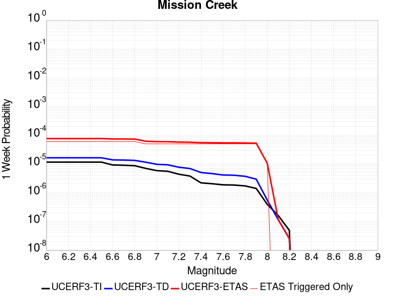 |  |  |  |

| Magnitude | 1 wk TI Prob | 1 wk TD Prob | 1 wk ETAS Prob | 1 wk ETAS/TD Gain | 1 wk ETAS Triggered Only | 1 mo TI Prob | 1 mo TD Prob | 1 mo ETAS Prob | 1 mo ETAS/TD Gain | 1 mo ETAS Triggered Only | 1 yr TI Prob | 1 yr TD Prob | 1 yr ETAS Prob | 1 yr ETAS/TD Gain | 1 yr ETAS Triggered Only | 10 yr TI Prob | 10 yr TD Prob | 10 yr ETAS Prob | 10 yr ETAS/TD Gain | 10 yr ETAS Triggered Only |
|-----|-----|-----|-----|-----|-----|-----|-----|-----|-----|-----|-----|-----|-----|-----|-----|-----|-----|-----|-----|-----|
| 6.0 | 1.1549387E-5 | 1.6322783E-5 | 1.6322783E-5 | 1.0 | 0.0 | 4.9496433E-5 | 6.995299E-5 | 6.995299E-5 | 1.0 | 0.0 | 6.0245243E-4 | 8.5135986E-4 | 0.0018545212 | 2.1783047 | 0.001004016 | 0.006008218 | 0.008510157 | 0.009505629 | 1.1169746 | 0.001004016 |
| 6.1 | 1.1549387E-5 | 1.6322783E-5 | 1.6322783E-5 | 1.0 | 0.0 | 4.9496433E-5 | 6.995299E-5 | 6.995299E-5 | 1.0 | 0.0 | 6.0245243E-4 | 8.5135986E-4 | 0.0018545212 | 2.1783047 | 0.001004016 | 0.006008218 | 0.008510157 | 0.009505629 | 1.1169746 | 0.001004016 |
| 6.2 | 1.1549387E-5 | 1.6322783E-5 | 1.6322783E-5 | 1.0 | 0.0 | 4.9496433E-5 | 6.995299E-5 | 6.995299E-5 | 1.0 | 0.0 | 6.0245243E-4 | 8.5135986E-4 | 0.0018545212 | 2.1783047 | 0.001004016 | 0.006008218 | 0.008510157 | 0.009505629 | 1.1169746 | 0.001004016 |
| 6.3 | 1.1549387E-5 | 1.6322783E-5 | 1.6322783E-5 | 1.0 | 0.0 | 4.9496433E-5 | 6.995299E-5 | 6.995299E-5 | 1.0 | 0.0 | 6.0245243E-4 | 8.5135986E-4 | 0.0018545212 | 2.1783047 | 0.001004016 | 0.006008218 | 0.008510157 | 0.009505629 | 1.1169746 | 0.001004016 |
| 6.4 | 1.1549387E-5 | 1.6322783E-5 | 1.6322783E-5 | 1.0 | 0.0 | 4.9496433E-5 | 6.995299E-5 | 6.995299E-5 | 1.0 | 0.0 | 6.0245243E-4 | 8.5135986E-4 | 0.0018545212 | 2.1783047 | 0.001004016 | 0.006008218 | 0.008510157 | 0.009505629 | 1.1169746 | 0.001004016 |
| 6.5 | 1.1549387E-5 | 1.6322783E-5 | 1.6322783E-5 | 1.0 | 0.0 | 4.9496433E-5 | 6.995299E-5 | 6.995299E-5 | 1.0 | 0.0 | 6.0245243E-4 | 8.5135986E-4 | 0.0018545212 | 2.1783047 | 0.001004016 | 0.006008218 | 0.008510157 | 0.009505629 | 1.1169746 | 0.001004016 |
| 6.6 | 9.202681E-6 | 1.3846059E-5 | 1.3846059E-5 | 1.0 | 0.0 | 3.9439463E-5 | 5.9338956E-5 | 5.9338956E-5 | 1.0 | 0.0 | 4.800697E-4 | 7.2222133E-4 | 0.0017255123 | 2.3891737 | 0.001004016 | 0.004790339 | 0.0072273402 | 0.0082241 | 1.1379151 | 0.001004016 |
| 6.7 | 9.019164E-6 | 1.3651728E-5 | 1.3651728E-5 | 1.0 | 0.0 | 3.8652986E-5 | 5.8506146E-5 | 5.8506146E-5 | 1.0 | 0.0 | 4.7049852E-4 | 7.1208854E-4 | 0.0017153897 | 2.4089556 | 0.001004016 | 0.004695036 | 0.0071266647 | 0.008123525 | 1.1398776 | 0.001004016 |
| 6.8 | 8.673558E-6 | 1.3273839E-5 | 1.3273839E-5 | 1.0 | 0.0 | 3.717186E-5 | 5.688669E-5 | 5.688669E-5 | 1.0 | 0.0 | 4.524734E-4 | 6.923842E-4 | 0.0016957051 | 2.4490812 | 0.001004016 | 0.0045155324 | 0.0069308523 | 0.0079279095 | 1.1438578 | 0.001004016 |
| 6.9 | 7.002255E-6 | 1.1478069E-5 | 1.1478069E-5 | 1.0 | 0.0 | 3.000932E-5 | 4.9190832E-5 | 4.9190832E-5 | 1.0 | 0.0 | 3.653022E-4 | 5.9874065E-4 | 0.0016021556 | 2.6758757 | 0.001004016 | 0.0036470229 | 0.005999676 | 0.006997668 | 1.1663411 | 0.001004016 |
| 7.0 | 5.84644E-6 | 9.675359E-6 | 9.675359E-6 | 1.0 | 0.0 | 2.5055931E-5 | 4.146519E-5 | 4.146519E-5 | 1.0 | 0.0 | 3.0501327E-4 | 5.047263E-4 | 0.0015082357 | 2.9882245 | 0.001004016 | 0.0030459496 | 0.005063994 | 0.006062926 | 1.1972617 | 0.001004016 |
| 7.1 | 5.54703E-6 | 9.329834E-6 | 9.329834E-6 | 1.0 | 0.0 | 2.377277E-5 | 3.9984414E-5 | 3.9984414E-5 | 1.0 | 0.0 | 2.8939504E-4 | 4.8670598E-4 | 0.0014902333 | 3.061876 | 0.001004016 | 0.0028901845 | 0.0048845876 | 0.0058836993 | 1.2045437 | 0.001004016 |
| 7.2 | 4.384709E-6 | 7.681918E-6 | 7.681918E-6 | 1.0 | 0.0 | 1.8791474E-5 | 3.292211E-5 | 3.292211E-5 | 1.0 | 0.0 | 2.2876218E-4 | 4.0075663E-4 | 0.0014043703 | 3.5042973 | 0.001004016 | 0.0022852682 | 0.004028542 | 0.0050285133 | 1.2482216 | 0.001004016 |
| 7.3 | 3.7888456E-6 | 6.915788E-6 | 6.915788E-6 | 1.0 | 0.0 | 1.623781E-5 | 2.9638775E-5 | 2.9638775E-5 | 1.0 | 0.0 | 1.9767738E-4 | 3.6079568E-4 | 0.0013644495 | 3.7817788 | 0.001004016 | 0.0019750162 | 0.00363027 | 0.004630641 | 1.2755638 | 0.001004016 |
| 7.4 | 2.1982462E-6 | 5.0241033E-6 | 5.0241033E-6 | 1.0 | 0.0 | 9.421021E-6 | 2.1531694E-5 | 2.1531694E-5 | 1.0 | 0.0 | 1.1469489E-4 | 2.6211704E-4 | 0.0012658699 | 4.829407 | 0.001004016 | 0.0011463572 | 0.0026460327 | 0.0036473922 | 1.378438 | 0.001004016 |
| 7.5 | 2.051923E-6 | 4.6153277E-6 | 4.6153277E-6 | 1.0 | 0.0 | 8.793926E-6 | 1.9779825E-5 | 1.9779825E-5 | 1.0 | 0.0 | 1.0706078E-4 | 2.4079291E-4 | 0.0012445672 | 5.1686206 | 0.001004016 | 0.0010700922 | 0.0024335932 | 0.0034351659 | 1.4115613 | 0.001004016 |
| 7.6 | 1.8733427E-6 | 4.1236603E-6 | 4.1236603E-6 | 1.0 | 0.0 | 8.028587E-6 | 1.7672712E-5 | 1.7672712E-5 | 1.0 | 0.0 | 9.774366E-5 | 2.151441E-4 | 0.0012189442 | 5.6657104 | 0.001004016 | 9.770069E-4 | 0.0021782513 | 0.0031800803 | 1.4599235 | 0.001004016 |
| 7.7 | 1.8411953E-6 | 4.0433315E-6 | 4.0433315E-6 | 1.0 | 0.0 | 7.890813E-6 | 1.732845E-5 | 1.732845E-5 | 1.0 | 0.0 | 9.606641E-5 | 2.1095353E-4 | 0.0012147578 | 5.7584143 | 0.001004016 | 9.6024893E-4 | 0.0021365292 | 0.0031384001 | 1.4689245 | 0.001004016 |
| 7.8 | 1.7194251E-6 | 3.71068E-6 | 3.71068E-6 | 1.0 | 0.0 | 7.368944E-6 | 1.5902819E-5 | 1.5902819E-5 | 1.0 | 0.0 | 8.97132E-5 | 1.9359968E-4 | 0.0011974213 | 6.185038 | 0.001004016 | 8.967699E-4 | 0.0019624757 | 0.0029645213 | 1.5106028 | 0.001004016 |
| 7.9 | 1.4035052E-6 | 2.9502596E-6 | 2.9502596E-6 | 1.0 | 0.0 | 6.0150082E-6 | 1.2643909E-5 | 1.2643909E-5 | 1.0 | 0.0 | 7.3230265E-5 | 1.5392878E-4 | 0.0011577903 | 7.5215974 | 0.001004016 | 7.3206134E-4 | 0.0015631174 | 0.0025655641 | 1.6413125 | 0.001004016 |
| 8.0 | 3.9318823E-7 | 5.528477E-7 | 5.528477E-7 | 1.0 | 0.0 | 1.6850913E-6 | 2.3693453E-6 | 2.3693453E-6 | 1.0 | 0.0 | 2.0515794E-5 | 2.8846403E-5 | 2.8846403E-5 | 1.0 | 0.0 | 2.0513899E-4 | 2.990952E-4 | 2.990952E-4 | 1.0 | 0.0 |
| 8.1 | 1.596793E-7 | 1.13775044E-7 | 1.13775044E-7 | 1.0 | 0.0 | 6.8433974E-7 | 4.876072E-7 | 4.876072E-7 | 1.0 | 0.0 | 8.331805E-6 | 5.936602E-6 | 5.936602E-6 | 1.0 | 0.0 | 8.331492E-5 | 6.5494125E-5 | 6.5494125E-5 | 1.0 | 0.0 |
| 8.2 | 4.9003038E-8 | 2.5435753E-8 | 2.5435753E-8 | 1.0 | 0.0 | 2.10013E-7 | 1.09010365E-7 | 1.09010365E-7 | 1.0 | 0.0 | 2.5569052E-6 | 1.3272004E-6 | 1.3272004E-6 | 1.0 | 0.0 | 2.556876E-5 | 1.4952613E-5 | 1.4952613E-5 | 1.0 | 0.0 |

## White Wolf (Extension)
*[(top)](#table-of-contents)*

| 1 Week | 1 Month | 1 Year | 10 Year |
|-----|-----|-----|-----|
|  |  |  |  |

| Magnitude | 1 wk TI Prob | 1 wk TD Prob | 1 wk ETAS Prob | 1 wk ETAS/TD Gain | 1 wk ETAS Triggered Only | 1 mo TI Prob | 1 mo TD Prob | 1 mo ETAS Prob | 1 mo ETAS/TD Gain | 1 mo ETAS Triggered Only | 1 yr TI Prob | 1 yr TD Prob | 1 yr ETAS Prob | 1 yr ETAS/TD Gain | 1 yr ETAS Triggered Only | 10 yr TI Prob | 10 yr TD Prob | 10 yr ETAS Prob | 10 yr ETAS/TD Gain | 10 yr ETAS Triggered Only |
|-----|-----|-----|-----|-----|-----|-----|-----|-----|-----|-----|-----|-----|-----|-----|-----|-----|-----|-----|-----|-----|
| 6.0 | 8.222555E-6 | 6.066615E-6 | 6.066615E-6 | 1.0 | 0.0 | 3.5239045E-5 | 2.5999556E-5 | 2.5999556E-5 | 1.0 | 0.0 | 4.289509E-4 | 3.1650523E-4 | 0.0013202035 | 4.1711903 | 0.001004016 | 0.0042812387 | 0.0031611966 | 0.0041620387 | 1.3166023 | 0.001004016 |
| 6.1 | 8.222555E-6 | 6.066615E-6 | 6.066615E-6 | 1.0 | 0.0 | 3.5239045E-5 | 2.5999556E-5 | 2.5999556E-5 | 1.0 | 0.0 | 4.289509E-4 | 3.1650523E-4 | 0.0013202035 | 4.1711903 | 0.001004016 | 0.0042812387 | 0.0031611966 | 0.0041620387 | 1.3166023 | 0.001004016 |
| 6.2 | 8.222555E-6 | 6.066615E-6 | 6.066615E-6 | 1.0 | 0.0 | 3.5239045E-5 | 2.5999556E-5 | 2.5999556E-5 | 1.0 | 0.0 | 4.289509E-4 | 3.1650523E-4 | 0.0013202035 | 4.1711903 | 0.001004016 | 0.0042812387 | 0.0031611966 | 0.0041620387 | 1.3166023 | 0.001004016 |
| 6.3 | 8.222555E-6 | 6.066615E-6 | 6.066615E-6 | 1.0 | 0.0 | 3.5239045E-5 | 2.5999556E-5 | 2.5999556E-5 | 1.0 | 0.0 | 4.289509E-4 | 3.1650523E-4 | 0.0013202035 | 4.1711903 | 0.001004016 | 0.0042812387 | 0.0031611966 | 0.0041620387 | 1.3166023 | 0.001004016 |
| 6.4 | 5.821773E-6 | 3.5571256E-6 | 3.5571256E-6 | 1.0 | 0.0 | 2.4950215E-5 | 1.5244741E-5 | 1.5244741E-5 | 1.0 | 0.0 | 3.0372653E-4 | 1.8559002E-4 | 1.8559002E-4 | 1.0 | 0.0 | 0.0030331176 | 0.0018544586 | 0.0018544586 | 1.0 | 0.0 |
| 6.5 | 5.766023E-6 | 3.4990599E-6 | 3.4990599E-6 | 1.0 | 0.0 | 2.4711293E-5 | 1.49958905E-5 | 1.49958905E-5 | 1.0 | 0.0 | 3.0081844E-4 | 1.8256076E-4 | 1.8256076E-4 | 1.0 | 0.0 | 0.0030041158 | 0.0018242161 | 0.0018242161 | 1.0 | 0.0 |
| 6.6 | 4.643576E-6 | 2.3325733E-6 | 2.3325733E-6 | 1.0 | 0.0 | 1.9900888E-5 | 9.9967065E-6 | 9.9967065E-6 | 1.0 | 0.0 | 2.4226638E-4 | 1.2170354E-4 | 1.2170354E-4 | 1.0 | 0.0 | 0.0024200242 | 0.0012164112 | 0.0012164112 | 1.0 | 0.0 |
| 6.7 | 3.9529173E-6 | 1.6482975E-6 | 1.6482975E-6 | 1.0 | 0.0 | 1.6940963E-5 | 7.064114E-6 | 7.064114E-6 | 1.0 | 0.0 | 2.0623671E-4 | 8.600239E-5 | 8.600239E-5 | 1.0 | 0.0 | 0.002060454 | 8.597095E-4 | 8.597095E-4 | 1.0 | 0.0 |
| 6.8 | 3.4377522E-6 | 1.2244764E-6 | 1.2244764E-6 | 1.0 | 0.0 | 1.473314E-5 | 5.247746E-6 | 5.247746E-6 | 1.0 | 0.0 | 1.7936122E-4 | 6.388952E-5 | 6.388952E-5 | 1.0 | 0.0 | 0.0017921652 | 6.3872064E-4 | 6.3872064E-4 | 1.0 | 0.0 |
| 6.9 | 3.1367306E-6 | 1.0033316E-6 | 1.0033316E-6 | 1.0 | 0.0 | 1.3443062E-5 | 4.299986E-6 | 4.299986E-6 | 1.0 | 0.0 | 1.63657E-4 | 5.2351144E-5 | 5.2351144E-5 | 1.0 | 0.0 | 0.0016353652 | 5.233958E-4 | 5.233958E-4 | 1.0 | 0.0 |
| 7.0 | 2.8298145E-6 | 7.4282326E-7 | 7.4282326E-7 | 1.0 | 0.0 | 1.2127721E-5 | 3.1835248E-6 | 3.1835248E-6 | 1.0 | 0.0 | 1.47645E-4 | 3.8758775E-5 | 3.8758775E-5 | 1.0 | 0.0 | 0.0014754693 | 3.8752513E-4 | 3.8752513E-4 | 1.0 | 0.0 |
| 7.1 | 2.4091064E-6 | 5.4223835E-7 | 5.4223835E-7 | 1.0 | 0.0 | 1.03247E-5 | 2.3238767E-6 | 2.3238767E-6 | 1.0 | 0.0 | 1.2569598E-4 | 2.8292874E-5 | 2.8292874E-5 | 1.0 | 0.0 | 0.001256249 | 2.8289677E-4 | 2.8289677E-4 | 1.0 | 0.0 |
| 7.2 | 1.3875518E-6 | 1.0740268E-7 | 1.0740268E-7 | 1.0 | 0.0 | 5.9466374E-6 | 4.6029712E-7 | 4.6029712E-7 | 1.0 | 0.0 | 7.23979E-5 | 5.604104E-6 | 5.604104E-6 | 1.0 | 0.0 | 7.2374323E-4 | 5.6039742E-5 | 5.6039742E-5 | 1.0 | 0.0 |
| 7.3 | 7.056077E-7 | 5.0002956E-8 | 5.0002956E-8 | 1.0 | 0.0 | 3.0240296E-6 | 2.1429837E-7 | 2.1429837E-7 | 1.0 | 0.0 | 3.681694E-5 | 2.60908E-6 | 2.60908E-6 | 1.0 | 0.0 | 3.681084E-4 | 2.609054E-5 | 2.609054E-5 | 1.0 | 0.0 |
| 7.4 | 5.9334678E-8 | 4.8638475E-9 | 4.8638475E-9 | 1.0 | 0.0 | 2.5429145E-7 | 2.084506E-8 | 2.084506E-8 | 1.0 | 0.0 | 3.095994E-6 | 2.5378858E-7 | 2.5378858E-7 | 1.0 | 0.0 | 3.095951E-5 | 2.5378843E-6 | 2.5378843E-6 | 1.0 | 0.0 |

## Baker
*[(top)](#table-of-contents)*

| 1 Week | 1 Month | 1 Year | 10 Year |
|-----|-----|-----|-----|
|  |  |  |  |

| Magnitude | 1 wk TI Prob | 1 wk TD Prob | 1 wk ETAS Prob | 1 wk ETAS/TD Gain | 1 wk ETAS Triggered Only | 1 mo TI Prob | 1 mo TD Prob | 1 mo ETAS Prob | 1 mo ETAS/TD Gain | 1 mo ETAS Triggered Only | 1 yr TI Prob | 1 yr TD Prob | 1 yr ETAS Prob | 1 yr ETAS/TD Gain | 1 yr ETAS Triggered Only | 10 yr TI Prob | 10 yr TD Prob | 10 yr ETAS Prob | 10 yr ETAS/TD Gain | 10 yr ETAS Triggered Only |
|-----|-----|-----|-----|-----|-----|-----|-----|-----|-----|-----|-----|-----|-----|-----|-----|-----|-----|-----|-----|-----|
| 6.0 | 5.695525E-6 | 5.8348373E-6 | 5.8348373E-6 | 1.0 | 0.0 | 2.4409164E-5 | 2.5006228E-5 | 2.5006228E-5 | 1.0 | 0.0 | 2.9714106E-4 | 3.044123E-4 | 3.044123E-4 | 1.0 | 0.0 | 0.0029674405 | 0.0030403486 | 0.0040413123 | 1.3292265 | 0.001004016 |
| 6.1 | 5.695525E-6 | 5.8348373E-6 | 5.8348373E-6 | 1.0 | 0.0 | 2.4409164E-5 | 2.5006228E-5 | 2.5006228E-5 | 1.0 | 0.0 | 2.9714106E-4 | 3.044123E-4 | 3.044123E-4 | 1.0 | 0.0 | 0.0029674405 | 0.0030403486 | 0.0040413123 | 1.3292265 | 0.001004016 |
| 6.2 | 5.695525E-6 | 5.8348373E-6 | 5.8348373E-6 | 1.0 | 0.0 | 2.4409164E-5 | 2.5006228E-5 | 2.5006228E-5 | 1.0 | 0.0 | 2.9714106E-4 | 3.044123E-4 | 3.044123E-4 | 1.0 | 0.0 | 0.0029674405 | 0.0030403486 | 0.0040413123 | 1.3292265 | 0.001004016 |
| 6.3 | 3.2995713E-6 | 3.383667E-6 | 3.383667E-6 | 1.0 | 0.0 | 1.4140943E-5 | 1.4501353E-5 | 1.4501353E-5 | 1.0 | 0.0 | 1.7215237E-4 | 1.7654014E-4 | 1.7654014E-4 | 1.0 | 0.0 | 0.0017201907 | 0.001764046 | 0.002766291 | 1.5681512 | 0.001004016 |
| 6.4 | 3.2995713E-6 | 3.383667E-6 | 3.383667E-6 | 1.0 | 0.0 | 1.4140943E-5 | 1.4501353E-5 | 1.4501353E-5 | 1.0 | 0.0 | 1.7215237E-4 | 1.7654014E-4 | 1.7654014E-4 | 1.0 | 0.0 | 0.0017201907 | 0.001764046 | 0.002766291 | 1.5681512 | 0.001004016 |
| 6.5 | 2.782202E-6 | 2.8558404E-6 | 2.8558404E-6 | 1.0 | 0.0 | 1.1923668E-5 | 1.223926E-5 | 1.223926E-5 | 1.0 | 0.0 | 1.4516099E-4 | 1.4900314E-4 | 1.4900314E-4 | 1.0 | 0.0 | 0.001450662 | 0.0014890651 | 0.0024915861 | 1.6732553 | 0.001004016 |
| 6.6 | 2.3163404E-6 | 2.38092E-6 | 2.38092E-6 | 1.0 | 0.0 | 9.927136E-6 | 1.0203904E-5 | 1.0203904E-5 | 1.0 | 0.0 | 1.20856166E-4 | 1.2422565E-4 | 1.2422565E-4 | 1.0 | 0.0 | 0.0012079047 | 0.0012415823 | 0.002244352 | 1.8076545 | 0.001004016 |
| 6.7 | 2.037056E-6 | 2.0965003E-6 | 2.0965003E-6 | 1.0 | 0.0 | 8.7302105E-6 | 8.984972E-6 | 8.984972E-6 | 1.0 | 0.0 | 1.0628513E-4 | 1.093867E-4 | 1.093867E-4 | 1.0 | 0.0 | 0.0010623431 | 0.0010933448 | 0.002096263 | 1.9172938 | 0.001004016 |
| 6.8 | 1.8356744E-6 | 1.8915287E-6 | 1.8915287E-6 | 1.0 | 0.0 | 7.867153E-6 | 8.106527E-6 | 8.106527E-6 | 1.0 | 0.0 | 9.577837E-5 | 9.869264E-5 | 9.869264E-5 | 1.0 | 0.0 | 9.57371E-4 | 9.86502E-4 | 0.0019895276 | 2.0167496 | 0.001004016 |
| 6.9 | 1.6310546E-6 | 1.6832072E-6 | 1.6832072E-6 | 1.0 | 0.0 | 6.9902153E-6 | 7.213726E-6 | 7.213726E-6 | 1.0 | 0.0 | 8.510255E-5 | 8.782368E-5 | 8.782368E-5 | 1.0 | 0.0 | 8.5069967E-4 | 8.7790104E-4 | 0.0018810357 | 2.142651 | 0.001004016 |
| 7.0 | 1.2058036E-6 | 1.2508665E-6 | 1.2508665E-6 | 1.0 | 0.0 | 5.1677193E-6 | 5.3608455E-6 | 5.3608455E-6 | 1.0 | 0.0 | 6.291517E-5 | 6.5266366E-5 | 6.5266366E-5 | 1.0 | 0.0 | 6.289736E-4 | 6.524743E-4 | 0.0016558353 | 2.5377786 | 0.001004016 |
| 7.1 | 1.052382E-6 | 1.0951609E-6 | 1.0951609E-6 | 1.0 | 0.0 | 4.5102006E-6 | 4.693538E-6 | 4.693538E-6 | 1.0 | 0.0 | 5.491031E-5 | 5.7142337E-5 | 5.7142337E-5 | 1.0 | 0.0 | 5.4896745E-4 | 5.7127734E-4 | 0.0015747198 | 2.7564893 | 0.001004016 |
| 7.2 | 1.0067454E-6 | 1.0487711E-6 | 1.0487711E-6 | 1.0 | 0.0 | 4.3146156E-6 | 4.4947255E-6 | 4.4947255E-6 | 1.0 | 0.0 | 5.252918E-5 | 5.4721917E-5 | 5.4721917E-5 | 1.0 | 0.0 | 5.251676E-4 | 5.470853E-4 | 0.0015505521 | 2.8342054 | 0.001004016 |
| 7.3 | 9.3596316E-7 | 9.767723E-7 | 9.767723E-7 | 1.0 | 0.0 | 4.0112645E-6 | 4.1861604E-6 | 4.1861604E-6 | 1.0 | 0.0 | 4.8836053E-5 | 5.096532E-5 | 5.096532E-5 | 1.0 | 0.0 | 4.8825322E-4 | 5.095371E-4 | 5.095371E-4 | 1.0 | 0.0 |
| 7.4 | 8.8117395E-7 | 9.2076635E-7 | 9.2076635E-7 | 1.0 | 0.0 | 3.7764542E-6 | 3.9461356E-6 | 3.9461356E-6 | 1.0 | 0.0 | 4.5977362E-5 | 4.8043148E-5 | 4.8043148E-5 | 1.0 | 0.0 | 4.596785E-4 | 4.8032837E-4 | 4.8032837E-4 | 1.0 | 0.0 |
| 7.5 | 8.292386E-7 | 8.6745956E-7 | 8.6745956E-7 | 1.0 | 0.0 | 3.5538749E-6 | 3.7176785E-6 | 3.7176785E-6 | 1.0 | 0.0 | 4.326757E-5 | 4.5261804E-5 | 4.5261804E-5 | 1.0 | 0.0 | 4.3259145E-4 | 4.5252658E-4 | 4.5252658E-4 | 1.0 | 0.0 |
| 7.6 | 7.553842E-7 | 7.9144706E-7 | 7.9144706E-7 | 1.0 | 0.0 | 3.2373566E-6 | 3.3919116E-6 | 3.3919116E-6 | 1.0 | 0.0 | 3.9414106E-5 | 4.129575E-5 | 4.129575E-5 | 1.0 | 0.0 | 3.9407116E-4 | 4.1288146E-4 | 4.1288146E-4 | 1.0 | 0.0 |
| 7.7 | 6.5285366E-7 | 6.852797E-7 | 6.852797E-7 | 1.0 | 0.0 | 2.797941E-6 | 2.9369096E-6 | 2.9369096E-6 | 1.0 | 0.0 | 3.40644E-5 | 3.5756293E-5 | 3.5756293E-5 | 1.0 | 0.0 | 3.405918E-4 | 3.5750607E-4 | 3.5750607E-4 | 1.0 | 0.0 |
| 7.8 | 3.4586725E-7 | 3.6482615E-7 | 3.6482615E-7 | 1.0 | 0.0 | 1.4822873E-6 | 1.5635396E-6 | 1.5635396E-6 | 1.0 | 0.0 | 1.80467E-5 | 1.9035933E-5 | 1.9035933E-5 | 1.0 | 0.0 | 1.8045233E-4 | 1.9034347E-4 | 1.9034347E-4 | 1.0 | 0.0 |
| 7.9 | 2.5591178E-9 | 2.6696718E-9 | 2.6696718E-9 | 1.0 | 0.0 | 1.0967647E-8 | 1.14414505E-8 | 1.14414505E-8 | 1.0 | 0.0 | 1.335311E-7 | 1.3929966E-7 | 1.3929966E-7 | 1.0 | 0.0 | 1.3353102E-6 | 1.3929966E-6 | 1.3929966E-6 | 1.0 | 0.0 |

## Paradise
*[(top)](#table-of-contents)*

| 1 Week | 1 Month | 1 Year | 10 Year |
|-----|-----|-----|-----|
|  |  | 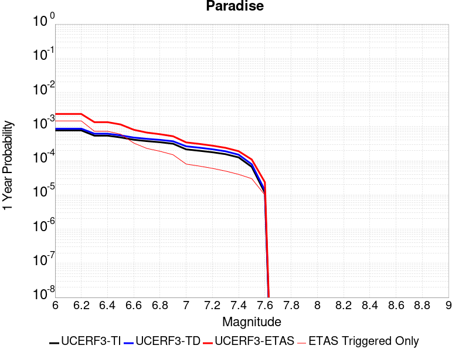 |  |

| Magnitude | 1 wk TI Prob | 1 wk TD Prob | 1 wk ETAS Prob | 1 wk ETAS/TD Gain | 1 wk ETAS Triggered Only | 1 mo TI Prob | 1 mo TD Prob | 1 mo ETAS Prob | 1 mo ETAS/TD Gain | 1 mo ETAS Triggered Only | 1 yr TI Prob | 1 yr TD Prob | 1 yr ETAS Prob | 1 yr ETAS/TD Gain | 1 yr ETAS Triggered Only | 10 yr TI Prob | 10 yr TD Prob | 10 yr ETAS Prob | 10 yr ETAS/TD Gain | 10 yr ETAS Triggered Only |
|-----|-----|-----|-----|-----|-----|-----|-----|-----|-----|-----|-----|-----|-----|-----|-----|-----|-----|-----|-----|-----|
| 6.0 | 1.4851273E-5 | 1.6694768E-5 | 1.6694768E-5 | 1.0 | 0.0 | 6.364676E-5 | 7.154718E-5 | 7.154718E-5 | 1.0 | 0.0 | 7.7462377E-4 | 8.707624E-4 | 8.707624E-4 | 1.0 | 0.0 | 0.0077192914 | 0.008675884 | 0.00967119 | 1.114721 | 0.001004016 |
| 6.1 | 1.4851273E-5 | 1.6694768E-5 | 1.6694768E-5 | 1.0 | 0.0 | 6.364676E-5 | 7.154718E-5 | 7.154718E-5 | 1.0 | 0.0 | 7.7462377E-4 | 8.707624E-4 | 8.707624E-4 | 1.0 | 0.0 | 0.0077192914 | 0.008675884 | 0.00967119 | 1.114721 | 0.001004016 |
| 6.2 | 1.4851273E-5 | 1.6694768E-5 | 1.6694768E-5 | 1.0 | 0.0 | 6.364676E-5 | 7.154718E-5 | 7.154718E-5 | 1.0 | 0.0 | 7.7462377E-4 | 8.707624E-4 | 8.707624E-4 | 1.0 | 0.0 | 0.0077192914 | 0.008675884 | 0.00967119 | 1.114721 | 0.001004016 |
| 6.3 | 1.0426831E-5 | 1.1888697E-5 | 1.1888697E-5 | 1.0 | 0.0 | 4.4685654E-5 | 5.09506E-5 | 5.09506E-5 | 1.0 | 0.0 | 5.43912E-4 | 6.201529E-4 | 6.201529E-4 | 1.0 | 0.0 | 0.0054258266 | 0.0061848317 | 0.0061848317 | 1.0 | 0.0 |
| 6.4 | 1.0426831E-5 | 1.1888697E-5 | 1.1888697E-5 | 1.0 | 0.0 | 4.4685654E-5 | 5.09506E-5 | 5.09506E-5 | 1.0 | 0.0 | 5.43912E-4 | 6.201529E-4 | 6.201529E-4 | 1.0 | 0.0 | 0.0054258266 | 0.0061848317 | 0.0061848317 | 1.0 | 0.0 |
| 6.5 | 9.25027E-6 | 1.0620037E-5 | 1.0620037E-5 | 1.0 | 0.0 | 3.964341E-5 | 4.551368E-5 | 4.551368E-5 | 1.0 | 0.0 | 4.8255164E-4 | 5.5399304E-4 | 5.5399304E-4 | 1.0 | 0.0 | 0.0048150513 | 0.0055266195 | 0.0055266195 | 1.0 | 0.0 |
| 6.6 | 7.904275E-6 | 9.159602E-6 | 9.159602E-6 | 1.0 | 0.0 | 3.3875025E-5 | 3.925487E-5 | 3.925487E-5 | 1.0 | 0.0 | 4.1235037E-4 | 4.7782718E-4 | 4.7782718E-4 | 1.0 | 0.0 | 0.0041158604 | 0.004768395 | 0.004768395 | 1.0 | 0.0 |
| 6.7 | 7.2061953E-6 | 8.407326E-6 | 8.407326E-6 | 1.0 | 0.0 | 3.088333E-5 | 3.603092E-5 | 3.603092E-5 | 1.0 | 0.0 | 3.7593965E-4 | 4.3859181E-4 | 4.3859181E-4 | 1.0 | 0.0 | 0.003753043 | 0.004377631 | 0.004377631 | 1.0 | 0.0 |
| 6.8 | 6.6948724E-6 | 7.842242E-6 | 7.842242E-6 | 1.0 | 0.0 | 2.8691995E-5 | 3.3609194E-5 | 3.3609194E-5 | 1.0 | 0.0 | 3.4926904E-4 | 4.091187E-4 | 4.091187E-4 | 1.0 | 0.0 | 0.003487206 | 0.0040840125 | 0.0040840125 | 1.0 | 0.0 |
| 6.9 | 6.0421025E-6 | 7.1306963E-6 | 7.1306963E-6 | 1.0 | 0.0 | 2.5894467E-5 | 3.0559786E-5 | 3.0559786E-5 | 1.0 | 0.0 | 3.1521954E-4 | 3.7200528E-4 | 3.7200528E-4 | 1.0 | 0.0 | 0.0031477278 | 0.0037141638 | 0.0037141638 | 1.0 | 0.0 |
| 7.0 | 4.134091E-6 | 5.0803824E-6 | 5.0803824E-6 | 1.0 | 0.0 | 1.7717413E-5 | 2.1772896E-5 | 2.1772896E-5 | 1.0 | 0.0 | 2.1568815E-4 | 2.650543E-4 | 2.650543E-4 | 1.0 | 0.0 | 0.0021547892 | 0.0026475347 | 0.0026475347 | 1.0 | 0.0 |
| 7.1 | 3.7674888E-6 | 4.631936E-6 | 4.631936E-6 | 1.0 | 0.0 | 1.6146281E-5 | 1.9851012E-5 | 1.9851012E-5 | 1.0 | 0.0 | 1.9656324E-4 | 2.4166079E-4 | 2.4166079E-4 | 1.0 | 0.0 | 0.0019638946 | 0.0024141306 | 0.0024141306 | 1.0 | 0.0 |
| 7.2 | 3.4065345E-6 | 4.156782E-6 | 4.156782E-6 | 1.0 | 0.0 | 1.4599351E-5 | 1.7814667E-5 | 1.7814667E-5 | 1.0 | 0.0 | 1.777326E-4 | 2.168735E-4 | 2.168735E-4 | 1.0 | 0.0 | 0.0017759053 | 0.0021667667 | 0.0021667667 | 1.0 | 0.0 |
| 7.3 | 2.9934936E-6 | 3.6293673E-6 | 3.6293673E-6 | 1.0 | 0.0 | 1.2829195E-5 | 1.5554348E-5 | 1.5554348E-5 | 1.0 | 0.0 | 1.5618425E-4 | 1.8935918E-4 | 1.8935918E-4 | 1.0 | 0.0 | 0.0015607453 | 0.0018921237 | 0.0018921237 | 1.0 | 0.0 |
| 7.4 | 2.4049796E-6 | 2.8890186E-6 | 2.8890186E-6 | 1.0 | 0.0 | 1.0307015E-5 | 1.2381457E-5 | 1.2381457E-5 | 1.0 | 0.0 | 1.2548068E-4 | 1.5073526E-4 | 1.5073526E-4 | 1.0 | 0.0 | 0.0012540985 | 0.0015064715 | 0.0015064715 | 1.0 | 0.0 |
| 7.5 | 1.2710091E-6 | 1.5134859E-6 | 1.5134859E-6 | 1.0 | 0.0 | 5.44717E-6 | 6.4863593E-6 | 6.4863593E-6 | 1.0 | 0.0 | 6.631728E-5 | 7.896981E-5 | 7.896981E-5 | 1.0 | 0.0 | 6.6297496E-4 | 7.895401E-4 | 7.895401E-4 | 1.0 | 0.0 |
| 7.6 | 2.21172E-7 | 2.6040198E-7 | 2.6040198E-7 | 1.0 | 0.0 | 9.478797E-7 | 1.1160082E-6 | 1.1160082E-6 | 1.0 | 0.0 | 1.1540374E-5 | 1.3587343E-5 | 1.3587343E-5 | 1.0 | 0.0 | 1.1539775E-4 | 1.3586794E-4 | 1.3586794E-4 | 1.0 | 0.0 |

## Garlic Springs
*[(top)](#table-of-contents)*

| 1 Week | 1 Month | 1 Year | 10 Year |
|-----|-----|-----|-----|
|  |  |  |  |

| Magnitude | 1 wk TI Prob | 1 wk TD Prob | 1 wk ETAS Prob | 1 wk ETAS/TD Gain | 1 wk ETAS Triggered Only | 1 mo TI Prob | 1 mo TD Prob | 1 mo ETAS Prob | 1 mo ETAS/TD Gain | 1 mo ETAS Triggered Only | 1 yr TI Prob | 1 yr TD Prob | 1 yr ETAS Prob | 1 yr ETAS/TD Gain | 1 yr ETAS Triggered Only | 10 yr TI Prob | 10 yr TD Prob | 10 yr ETAS Prob | 10 yr ETAS/TD Gain | 10 yr ETAS Triggered Only |
|-----|-----|-----|-----|-----|-----|-----|-----|-----|-----|-----|-----|-----|-----|-----|-----|-----|-----|-----|-----|-----|
| 6.0 | 1.6760017E-5 | 1.8776833E-5 | 0.001022774 | 54.469997 | 0.001004016 | 7.182667E-5 | 8.0470316E-5 | 0.0010844056 | 13.475845 | 0.001004016 | 8.7413884E-4 | 9.794032E-4 | 0.0019824358 | 2.0241265 | 0.001004016 | 0.008707083 | 0.009762413 | 0.010756628 | 1.1018411 | 0.001004016 |
| 6.1 | 9.852767E-6 | 1.0973587E-5 | 0.0010149786 | 92.492874 | 0.001004016 | 4.222546E-5 | 4.702921E-5 | 0.0010509981 | 22.34777 | 0.001004016 | 5.139737E-4 | 5.7250116E-4 | 0.0015759424 | 2.7527323 | 0.001004016 | 0.005127866 | 0.005717221 | 0.0067154975 | 1.1746086 | 0.001004016 |
| 6.2 | 9.852767E-6 | 1.0973587E-5 | 0.0010149786 | 92.492874 | 0.001004016 | 4.222546E-5 | 4.702921E-5 | 0.0010509981 | 22.34777 | 0.001004016 | 5.139737E-4 | 5.7250116E-4 | 0.0015759424 | 2.7527323 | 0.001004016 | 0.005127866 | 0.005717221 | 0.0067154975 | 1.1746086 | 0.001004016 |
| 6.3 | 4.3167724E-6 | 4.7780286E-6 | 4.7780286E-6 | 1.0 | 0.0 | 1.8500323E-5 | 2.0477235E-5 | 2.0477235E-5 | 1.0 | 0.0 | 2.2521814E-4 | 2.4930484E-4 | 2.4930484E-4 | 1.0 | 0.0 | 0.0022499003 | 0.00249251 | 0.00249251 | 1.0 | 0.0 |
| 6.4 | 4.3167724E-6 | 4.7780286E-6 | 4.7780286E-6 | 1.0 | 0.0 | 1.8500323E-5 | 2.0477235E-5 | 2.0477235E-5 | 1.0 | 0.0 | 2.2521814E-4 | 2.4930484E-4 | 2.4930484E-4 | 1.0 | 0.0 | 0.0022499003 | 0.00249251 | 0.00249251 | 1.0 | 0.0 |
| 6.5 | 4.3167724E-6 | 4.7780286E-6 | 4.7780286E-6 | 1.0 | 0.0 | 1.8500323E-5 | 2.0477235E-5 | 2.0477235E-5 | 1.0 | 0.0 | 2.2521814E-4 | 2.4930484E-4 | 2.4930484E-4 | 1.0 | 0.0 | 0.0022499003 | 0.00249251 | 0.00249251 | 1.0 | 0.0 |
| 6.6 | 4.301311E-6 | 4.760897E-6 | 4.760897E-6 | 1.0 | 0.0 | 1.8434059E-5 | 2.0403815E-5 | 2.0403815E-5 | 1.0 | 0.0 | 2.2441156E-4 | 2.4841115E-4 | 2.4841115E-4 | 1.0 | 0.0 | 0.0022418506 | 0.002483593 | 0.002483593 | 1.0 | 0.0 |
| 6.7 | 3.8599724E-6 | 4.27106E-6 | 4.27106E-6 | 1.0 | 0.0 | 1.6542634E-5 | 1.8304541E-5 | 1.8304541E-5 | 1.0 | 0.0 | 2.0138794E-4 | 2.228578E-4 | 2.228578E-4 | 1.0 | 0.0 | 0.0020120554 | 0.002228578 | 0.002228578 | 1.0 | 0.0 |

## Lost Hills
*[(top)](#table-of-contents)*

| 1 Week | 1 Month | 1 Year | 10 Year |
|-----|-----|-----|-----|
|  |  |  |  |

| Magnitude | 1 wk TI Prob | 1 wk TD Prob | 1 wk ETAS Prob | 1 wk ETAS/TD Gain | 1 wk ETAS Triggered Only | 1 mo TI Prob | 1 mo TD Prob | 1 mo ETAS Prob | 1 mo ETAS/TD Gain | 1 mo ETAS Triggered Only | 1 yr TI Prob | 1 yr TD Prob | 1 yr ETAS Prob | 1 yr ETAS/TD Gain | 1 yr ETAS Triggered Only | 10 yr TI Prob | 10 yr TD Prob | 10 yr ETAS Prob | 10 yr ETAS/TD Gain | 10 yr ETAS Triggered Only |
|-----|-----|-----|-----|-----|-----|-----|-----|-----|-----|-----|-----|-----|-----|-----|-----|-----|-----|-----|-----|-----|
| 6.0 | 2.233523E-5 | 2.5106583E-5 | 2.5106583E-5 | 1.0 | 0.0 | 9.571891E-5 | 1.0759615E-4 | 1.0759615E-4 | 1.0 | 0.0 | 0.0011647546 | 0.001309364 | 0.0023120656 | 1.7657927 | 0.001004016 | 0.011586686 | 0.013033091 | 0.014024021 | 1.0760319 | 0.001004016 |
| 6.1 | 2.233523E-5 | 2.5106583E-5 | 2.5106583E-5 | 1.0 | 0.0 | 9.571891E-5 | 1.0759615E-4 | 1.0759615E-4 | 1.0 | 0.0 | 0.0011647546 | 0.001309364 | 0.0023120656 | 1.7657927 | 0.001004016 | 0.011586686 | 0.013033091 | 0.014024021 | 1.0760319 | 0.001004016 |
| 6.2 | 2.233523E-5 | 2.5106583E-5 | 2.5106583E-5 | 1.0 | 0.0 | 9.571891E-5 | 1.0759615E-4 | 1.0759615E-4 | 1.0 | 0.0 | 0.0011647546 | 0.001309364 | 0.0023120656 | 1.7657927 | 0.001004016 | 0.011586686 | 0.013033091 | 0.014024021 | 1.0760319 | 0.001004016 |
| 6.3 | 2.233523E-5 | 2.5106583E-5 | 2.5106583E-5 | 1.0 | 0.0 | 9.571891E-5 | 1.0759615E-4 | 1.0759615E-4 | 1.0 | 0.0 | 0.0011647546 | 0.001309364 | 0.0023120656 | 1.7657927 | 0.001004016 | 0.011586686 | 0.013033091 | 0.014024021 | 1.0760319 | 0.001004016 |
| 6.4 | 1.2288092E-5 | 1.3781108E-5 | 1.3781108E-5 | 1.0 | 0.0 | 5.2662188E-5 | 5.906108E-5 | 5.906108E-5 | 1.0 | 0.0 | 6.409735E-4 | 7.189252E-4 | 7.189252E-4 | 1.0 | 0.0 | 0.006391279 | 0.0071752006 | 0.0071752006 | 1.0 | 0.0 |
| 6.5 | 1.2288092E-5 | 1.3781108E-5 | 1.3781108E-5 | 1.0 | 0.0 | 5.2662188E-5 | 5.906108E-5 | 5.906108E-5 | 1.0 | 0.0 | 6.409735E-4 | 7.189252E-4 | 7.189252E-4 | 1.0 | 0.0 | 0.006391279 | 0.0071752006 | 0.0071752006 | 1.0 | 0.0 |
| 6.6 | 8.58281E-6 | 9.63377E-6 | 9.63377E-6 | 1.0 | 0.0 | 3.6782953E-5 | 4.12874E-5 | 4.12874E-5 | 1.0 | 0.0 | 4.4774043E-4 | 5.026414E-4 | 5.026414E-4 | 1.0 | 0.0 | 0.0044683935 | 0.005023205 | 0.005023205 | 1.0 | 0.0 |
| 6.7 | 7.205685E-6 | 8.088302E-6 | 8.088302E-6 | 1.0 | 0.0 | 3.088114E-5 | 3.466415E-5 | 3.466415E-5 | 1.0 | 0.0 | 3.7591302E-4 | 4.2203604E-4 | 4.2203604E-4 | 1.0 | 0.0 | 0.0037527776 | 0.0042203604 | 0.0042203604 | 1.0 | 0.0 |

