# Parent Section Magnitude-Probability Distributions

Only fault sections with at least one triggered aftershock are plotted. Sections are sorted by total supraseismogenic trigger rate (decreasing)

## Table Of Contents

* [Garlock (Central)](#garlock-central)
* [Tank Canyon](#tank-canyon)
* [Little Lake](#little-lake)
* [Airport Lake](#airport-lake)
* [Owl Lake](#owl-lake)
* [Panamint Valley](#panamint-valley)
* [Garlock (East)](#garlock-east)
* [Hunter Mountain-Saline Valley](#hunter-mountain-saline-valley)
* [Blackwater](#blackwater)
* [Ash Hill](#ash-hill)
* [Garlock (West)](#garlock-west)
* [McLean Lake](#mclean-lake)
* [Gravel Hills-Harper Lk](#gravel-hills-harper-lk)
* [Goldstone Lake](#goldstone-lake)
* [San Andreas (Mojave S)](#san-andreas-mojave-s)
* [So Sierra Nevada](#so-sierra-nevada)
* [San Andreas (Mojave N)](#san-andreas-mojave-n)
* [Death Valley (So)](#death-valley-so)
* [Coyote Canyon](#coyote-canyon)
* [Nelson Lake](#nelson-lake)
* [Lenwood-Lockhart-Old Woman Springs](#lenwood-lockhart-old-woman-springs)
* [Towne Pass](#towne-pass)
* [San Andreas (San Bernardino N)](#san-andreas-san-bernardino-n)
* [Paradise](#paradise)
* [Bicycle Lake](#bicycle-lake)
* [Death Valley (Black Mtns Frontal)](#death-valley-black-mtns-frontal)
* [Garlic Springs](#garlic-springs)
* [San Andreas (San Bernardino S)](#san-andreas-san-bernardino-s)
* [Helendale-So Lockhart](#helendale-so-lockhart)
* [Death Valley (No)](#death-valley-no)
* [San Andreas (Big Bend)](#san-andreas-big-bend)
* [Coyote Lake](#coyote-lake)
* [San Andreas (Parkfield)](#san-andreas-parkfield)
* [Death Valley (Fish Lake Valley)](#death-valley-fish-lake-valley)
* [Elsinore (Glen Ivy) rev](#elsinore-glen-ivy-rev)
* [San Andreas (San Gorgonio Pass-Garnet HIll)](#san-andreas-san-gorgonio-pass-garnet-hill)
* [San Andreas (Cholame) rev](#san-andreas-cholame-rev)
* [Scodie Lineament](#scodie-lineament)
* [San Andreas (Coachella) rev](#san-andreas-coachella-rev)
* [San Andreas (North Branch Mill Creek)](#san-andreas-north-branch-mill-creek)
* [Ludlow](#ludlow)
* [Baker](#baker)
* [San Andreas (Carrizo) rev](#san-andreas-carrizo-rev)
* [San Jacinto (San Bernardino)](#san-jacinto-san-bernardino)
* [Red Pass](#red-pass)
* [Brawley (Seismic Zone) alt 1](#brawley-seismic-zone-alt-1)
* [White Wolf (Extension)](#white-wolf-extension)
* [Cady](#cady)
* [Calico-Hidalgo](#calico-hidalgo)
* [Imperial](#imperial)
* [San Jacinto (San Jacinto Valley) rev](#san-jacinto-san-jacinto-valley-rev)
* [Pisgah-Bullion Mtn-Mesquite Lk](#pisgah-bullion-mtn-mesquite-lk)
* [San Jacinto (Stepovers Combined)](#san-jacinto-stepovers-combined)
* [Sierra Nevada  (No Extension)](#sierra-nevada--no-extension)
* [Mission Creek](#mission-creek)
* [Lake Isabella (Seismicity)](#lake-isabella-seismicity)
* [Manix-Afton Hills](#manix-afton-hills)
* [Pinto Mtn](#pinto-mtn)
* [San Jacinto (Lytle Creek connector)](#san-jacinto-lytle-creek-connector)
* [San Jacinto (Anza) rev](#san-jacinto-anza-rev)
* [White Mountains](#white-mountains)
* [Santa Ynez (East)](#santa-ynez-east)
* [Cleghorn Pass](#cleghorn-pass)
* [Santa Ynez (West)](#santa-ynez-west)
* [San Andreas (Creeping Section) 2011 CFM](#san-andreas-creeping-section-2011-cfm)
* [Ventura-Pitas Point](#ventura-pitas-point)
* [San Diego Trough north alt1](#san-diego-trough-north-alt1)
* [Lost Hills](#lost-hills)
* [Deep Springs](#deep-springs)
* [Big Pine (Central)](#big-pine-central)
* [Cleghorn Lake](#cleghorn-lake)
* [Red Mountain](#red-mountain)
* [Santa Cruz Island](#santa-cruz-island)
* [Rose Canyon](#rose-canyon)
* [Mission Ridge-Arroyo Parida-Santa Ana](#mission-ridge-arroyo-parida-santa-ana)
* [Independence rev 2011](#independence-rev-2011)
* [San Cayetano](#san-cayetano)
* [Hayward (So) 2011 CFM](#hayward-so-2011-cfm)
* [Mono Lake 2011 CFM](#mono-lake-2011-cfm)
* [Oceanic - West Huasna](#oceanic---west-huasna)
* [Kern Canyon (North Kern) 2011](#kern-canyon-north-kern-2011)
* [Calaveras (Central) 2011 CFM](#calaveras-central-2011-cfm)
* [San Jacinto (Coyote Creek)](#san-jacinto-coyote-creek)
* [Tin Mountain](#tin-mountain)
* [Hosgri](#hosgri)
* [Coronado Bank alt1](#coronado-bank-alt1)
* [Great Valley 05 Pittsburg - Kirby Hills alt1](#great-valley-05-pittsburg---kirby-hills-alt1)
* [Camp Rock 2011](#camp-rock-2011)
* [Owens Valley](#owens-valley)
* [San Clemente](#san-clemente)
* [Big Pine (East)](#big-pine-east)
* [Hayward (So) extension 2011 CFM](#hayward-so-extension-2011-cfm)
* [Robinson Creek](#robinson-creek)
* [Palos Verdes](#palos-verdes)
* [San Jacinto (Borrego)](#san-jacinto-borrego)
* [Elysian Park (Upper)](#elysian-park-upper)
* [Cleghorn](#cleghorn)
* [Pitas Point (Lower West)](#pitas-point-lower-west)
* [San Juan](#san-juan)
* [Ortigalita (North)](#ortigalita-north)
* [Hunting Creek - Berryessa 2011 CFM](#hunting-creek---berryessa-2011-cfm)
* [San Diego Trough south](#san-diego-trough-south)
* [Whittier alt 1](#whittier-alt-1)
* [Channel Islands Western Deep Ramp](#channel-islands-western-deep-ramp)
* [Pleito](#pleito)
* [San Jacinto (Clark) rev](#san-jacinto-clark-rev)
* [Bullion Mountains](#bullion-mountains)
* [Cucamonga](#cucamonga)
* [San Pedro Basin](#san-pedro-basin)
* [Maacama 2011 CFM](#maacama-2011-cfm)
* [Hector Mine](#hector-mine)
* [Gillem - Big Crack 2011 CFM](#gillem---big-crack-2011-cfm)
* [Hayward (No) 2011 CFM](#hayward-no-2011-cfm)
* [Dry Mountain](#dry-mountain)
* [Great Valley 04b Gordon Valley](#great-valley-04b-gordon-valley)
* [Malibu Coast (Extension) alt 1](#malibu-coast-extension-alt-1)
* [Oak Ridge (Onshore)](#oak-ridge-onshore)
* [Garberville - Briceland 2011 CFM](#garberville---briceland-2011-cfm)
* [Sierra Madre](#sierra-madre)
* [Great Valley 04a Trout Creek](#great-valley-04a-trout-creek)
* [Monterey Bay-Tularcitos](#monterey-bay-tularcitos)
* [Santa Susana East (connector)](#santa-susana-east-connector)
* [Santa Cruz Catalina Ridge alt1](#santa-cruz-catalina-ridge-alt1)
* [Cedar Mtn-Mahogany Mtn](#cedar-mtn-mahogany-mtn)
* [Ortigalita (South)](#ortigalita-south)
* [Santa Ynez River](#santa-ynez-river)
* [Kern Canyon (South Kern) 2011](#kern-canyon-south-kern-2011)
* [San Gorgonio Pass](#san-gorgonio-pass)
* [Sierra Madre (San Fernando)](#sierra-madre-san-fernando)
* [Great Valley 07 (Orestimba)](#great-valley-07-orestimba)
* [McKinleyville (alt1)](#mckinleyville-alt1)
* [Malibu Coast alt 1](#malibu-coast-alt-1)
* [North Frontal  (West)](#north-frontal--west)
* [White Wolf](#white-wolf)
* [Hunting Creek - Bartlett Springs connector 2011](#hunting-creek---bartlett-springs-connector-2011)
* [Santa Rosa Island](#santa-rosa-island)
* [Great Valley 08 (Quinto)](#great-valley-08-quinto)
* [Eaton Roughs 2011 CFM](#eaton-roughs-2011-cfm)
* [Shoreline](#shoreline)
* [Great Valley 09 (Laguna Seca)](#great-valley-09-laguna-seca)
* [Channel Islands Thrust](#channel-islands-thrust)
* [South Cuyama](#south-cuyama)
* [Santa Monica alt 1](#santa-monica-alt-1)
* [Great Valley 03a Dunnigan Hills](#great-valley-03a-dunnigan-hills)
* [Santa Susana alt 1](#santa-susana-alt-1)
* [Mendocino](#mendocino)
* [Los Osos 2011](#los-osos-2011)
* [Green Valley 2011 CFM](#green-valley-2011-cfm)
* [North Frontal  (East)](#north-frontal--east)
* [Mission Hills 2011](#mission-hills-2011)
* [Trinidad (alt1)](#trinidad-alt1)
* [San Luis Range - Pecho 2011 CFM](#san-luis-range---pecho-2011-cfm)
* [Elmore Ranch](#elmore-ranch)
* [Fickle Hill (alt1)](#fickle-hill-alt1)
* [Fontana (Seismicity)](#fontana-seismicity)
* [Mad River (alt1)](#mad-river-alt1)
* [Johnson Valley (No) 2011 rev](#johnson-valley-no-2011-rev)
* [Breckenridge 2011](#breckenridge-2011)
* [Calaveras (So) - Paicines extension 2011 CFM](#calaveras-so---paicines-extension-2011-cfm)
* [Raymond](#raymond)
* [Kern Canyon (Lake Isabella) 2011](#kern-canyon-lake-isabella-2011)
* [Puente Hills](#puente-hills)
* [Hosgri (Extension)](#hosgri-extension)
* [Calaveras (So) 2011 CFM](#calaveras-so-2011-cfm)
* [Silver Creek 2011 CFM](#silver-creek-2011-cfm)
* [Hollywood](#hollywood)

## Garlock (Central)
*[(top)](#table-of-contents)*

| 1 Week | 1 Month | 1 Year | 10 Year |
|-----|-----|-----|-----|
|  |  |  |  |

| Magnitude | 1 wk TI Prob | 1 wk TD Prob | 1 wk ETAS Prob | 1 wk ETAS/TD Gain | 1 wk ETAS Triggered Only | 1 mo TI Prob | 1 mo TD Prob | 1 mo ETAS Prob | 1 mo ETAS/TD Gain | 1 mo ETAS Triggered Only | 1 yr TI Prob | 1 yr TD Prob | 1 yr ETAS Prob | 1 yr ETAS/TD Gain | 1 yr ETAS Triggered Only | 10 yr TI Prob | 10 yr TD Prob | 10 yr ETAS Prob | 10 yr ETAS/TD Gain | 10 yr ETAS Triggered Only |
|-----|-----|-----|-----|-----|-----|-----|-----|-----|-----|-----|-----|-----|-----|-----|-----|-----|-----|-----|-----|-----|
| 6.0 | 5.5131142E-5 | 7.02476E-5 | 0.07269564 | 1034.8488 | 0.072630495 | 2.3625491E-4 | 3.0102677E-4 | 0.08758587 | 290.9571 | 0.08731113 | 0.0028726095 | 0.003658906 | 0.120588705 | 32.957584 | 0.117359206 | 0.028357591 | 0.036136657 | 0.17383142 | 4.8103905 | 0.14285715 |
| 6.1 | 5.5131142E-5 | 7.02476E-5 | 0.07269564 | 1034.8488 | 0.072630495 | 2.3625491E-4 | 3.0102677E-4 | 0.08758587 | 290.9571 | 0.08731113 | 0.0028726095 | 0.003658906 | 0.120588705 | 32.957584 | 0.117359206 | 0.028357591 | 0.036136657 | 0.17383142 | 4.8103905 | 0.14285715 |
| 6.2 | 4.216245E-5 | 5.1661802E-5 | 0.04469221 | 865.09204 | 0.04464286 | 1.806837E-4 | 2.213891E-4 | 0.053566378 | 241.9558 | 0.0533568 | 0.0021976046 | 0.002692112 | 0.074955836 | 27.842764 | 0.07245879 | 0.021759989 | 0.026701318 | 0.11431324 | 4.2811832 | 0.090015456 |
| 6.3 | 4.216245E-5 | 5.1661802E-5 | 0.04469221 | 865.09204 | 0.04464286 | 1.806837E-4 | 2.213891E-4 | 0.053566378 | 241.9558 | 0.0533568 | 0.0021976046 | 0.002692112 | 0.074955836 | 27.842764 | 0.07245879 | 0.021759989 | 0.026701318 | 0.11431324 | 4.2811832 | 0.090015456 |
| 6.4 | 3.6858168E-5 | 4.411026E-5 | 0.03541343 | 802.8388 | 0.03537088 | 1.5795401E-4 | 1.8903041E-4 | 0.042677563 | 225.77087 | 0.042496566 | 0.0019213937 | 0.0022990413 | 0.059045 | 25.682442 | 0.056876715 | 0.019048655 | 0.022866098 | 0.0924936 | 4.04501 | 0.07125687 |
| 6.5 | 3.39199E-5 | 4.0018425E-5 | 0.031760935 | 793.6577 | 0.031722184 | 1.453629E-4 | 1.7149639E-4 | 0.0380685 | 221.97844 | 0.037903503 | 0.0017683565 | 0.0020859907 | 0.05323251 | 25.519054 | 0.051253434 | 0.017543508 | 0.020758783 | 0.0840631 | 4.0495195 | 0.06464629 |
| 6.6 | 3.3571985E-5 | 3.947258E-5 | 0.03171748 | 803.532 | 0.031679258 | 1.4387199E-4 | 1.6915736E-4 | 0.03802333 | 224.78082 | 0.037860576 | 0.0017502342 | 0.0020575672 | 0.053162705 | 25.837652 | 0.051210508 | 0.017365133 | 0.020480042 | 0.08376033 | 4.0898514 | 0.064603366 |
| 6.7 | 3.2580007E-5 | 3.808902E-5 | 0.03068596 | 805.63794 | 0.030649038 | 1.3962112E-4 | 1.6322857E-4 | 0.036901735 | 226.074 | 0.036744505 | 0.0016985617 | 0.0019855178 | 0.051594924 | 25.985626 | 0.049708106 | 0.016856372 | 0.019770874 | 0.08095104 | 4.0944595 | 0.062414147 |
| 6.8 | 3.2185937E-5 | 3.7516216E-5 | 0.030084467 | 801.9057 | 0.030048076 | 1.3793244E-4 | 1.60774E-4 | 0.03616975 | 224.97264 | 0.036014766 | 0.0016780337 | 0.0019556875 | 0.050581217 | 25.86365 | 0.04872081 | 0.016654192 | 0.019477878 | 0.07953991 | 4.0836024 | 0.06125515 |
| 6.9 | 3.165394E-5 | 3.672075E-5 | 0.029439831 | 801.7219 | 0.02940419 | 1.3565269E-4 | 1.5736527E-4 | 0.035136405 | 223.2793 | 0.034984548 | 0.0016503202 | 0.00191426 | 0.04929934 | 25.753733 | 0.04747596 | 0.01638118 | 0.019071518 | 0.07764258 | 4.0711274 | 0.05970982 |
| 7.0 | 3.0903822E-5 | 3.562591E-5 | 0.028794903 | 808.2573 | 0.028760303 | 1.3243823E-4 | 1.5267366E-4 | 0.03440225 | 225.33194 | 0.034254808 | 0.0016112428 | 0.0018572382 | 0.048131026 | 25.915377 | 0.04635989 | 0.015996104 | 0.018513493 | 0.07581181 | 4.0949492 | 0.05837912 |
| 7.1 | 3.0069863E-5 | 3.4392175E-5 | 0.02746305 | 798.5261 | 0.027429601 | 1.2886449E-4 | 1.4738683E-4 | 0.032809123 | 222.60555 | 0.032666553 | 0.0015677959 | 0.0017929787 | 0.04605585 | 25.686779 | 0.044342376 | 0.01556781 | 0.01788099 | 0.072728895 | 4.0673866 | 0.055846497 |
| 7.2 | 2.7957109E-5 | 3.128141E-5 | 0.023468047 | 750.2234 | 0.0234375 | 1.1981068E-4 | 1.3405642E-4 | 0.028203782 | 210.3874 | 0.02807349 | 0.0014577188 | 0.0016309345 | 0.03895835 | 23.887133 | 0.03738839 | 0.014481937 | 0.016284352 | 0.06243825 | 3.8342483 | 0.046917927 |
| 7.3 | 2.4519275E-5 | 2.6714602E-5 | 0.016381016 | 613.18585 | 0.01635474 | 1.0507837E-4 | 1.1448621E-4 | 0.019858105 | 173.45412 | 0.019745879 | 0.0012785783 | 0.001392993 | 0.027498405 | 19.740519 | 0.026141826 | 0.012712469 | 0.01392861 | 0.046267148 | 3.3217347 | 0.03279533 |
| 7.4 | 2.3225532E-5 | 2.5199166E-5 | 0.014619611 | 580.1625 | 0.01459478 | 9.95342E-5 | 1.0799204E-4 | 0.017920285 | 165.9408 | 0.017814217 | 0.0012111551 | 0.0013140244 | 0.024892205 | 18.943485 | 0.023609204 | 0.012045753 | 0.013146196 | 0.042460363 | 3.2298594 | 0.02970467 |
| 7.5 | 2.097765E-5 | 2.2483406E-5 | 0.01165512 | 518.38763 | 0.011632898 | 8.9901114E-5 | 9.6353964E-5 | 0.0143892765 | 149.33766 | 0.014294299 | 0.0010939965 | 0.00117249 | 0.020123458 | 17.163012 | 0.018973215 | 0.010886264 | 0.0117406575 | 0.035115097 | 2.990897 | 0.023652129 |
| 7.6 | 1.511254E-5 | 1.5990969E-5 | 0.006884013 | 430.4938 | 0.006868132 | 6.476642E-5 | 6.8530964E-5 | 0.008524339 | 124.38667 | 0.008456388 | 7.882459E-4 | 8.34053E-4 | 0.011728118 | 14.0616 | 0.010903159 | 0.007854558 | 0.008383867 | 0.021323914 | 2.5434458 | 0.013049451 |
| 7.7 | 9.934069E-6 | 1.0678523E-5 | 0.0021569468 | 201.98924 | 0.0021462913 | 4.2573887E-5 | 4.5764296E-5 | 0.0027070437 | 59.151867 | 0.0026614012 | 5.182138E-4 | 5.570383E-4 | 0.0039891913 | 7.1614313 | 0.003434066 | 0.00517007 | 0.005627419 | 0.009725108 | 1.7281649 | 0.0041208793 |
| 7.8 | 6.7562896E-6 | 8.42837E-6 | 0.0013391176 | 158.88217 | 0.0013307006 | 2.8955206E-5 | 3.6121084E-5 | 0.0016243192 | 44.968727 | 0.0015882555 | 3.5247262E-4 | 4.3968562E-4 | 0.0024992193 | 5.684105 | 0.0020604397 | 0.0035191406 | 0.004446416 | 0.006882309 | 1.5478327 | 0.002446772 |
| 7.9 | 3.975453E-6 | 5.3710532E-6 | 7.351061E-4 | 136.86444 | 7.29739E-4 | 1.7037546E-5 | 2.3018596E-5 | 9.2444016E-4 | 40.16058 | 9.014423E-4 | 2.0741238E-4 | 2.8021546E-4 | 0.0014818017 | 5.2880797 | 0.0012019231 | 0.002072189 | 0.0028335669 | 0.004203301 | 1.4833957 | 0.0013736264 |
| 8.0 | 1.6729537E-6 | 2.0775192E-6 | 2.5963192E-4 | 124.97209 | 2.5755496E-4 | 7.169782E-6 | 8.903624E-6 | 2.6645628E-4 | 29.926723 | 2.5755496E-4 | 8.7288594E-5 | 1.0839626E-4 | 4.0884447E-4 | 3.771758 | 3.0048078E-4 | 8.7254314E-4 | 0.001096854 | 0.0013970052 | 1.2736473 | 3.0048078E-4 |
| 8.1 | 3.6733252E-7 | 3.1489736E-7 | 4.3240707E-5 | 137.31683 | 4.2925825E-5 | 1.5742813E-6 | 1.3495595E-6 | 4.4275326E-5 | 32.80724 | 4.2925825E-5 | 1.9166706E-5 | 1.643078E-5 | 5.9355898E-5 | 3.612482 | 4.2925825E-5 | 1.9165053E-4 | 1.662928E-4 | 2.0921147E-4 | 1.2580911 | 4.2925825E-5 |

## Tank Canyon
*[(top)](#table-of-contents)*

| 1 Week | 1 Month | 1 Year | 10 Year |
|-----|-----|-----|-----|
|  |  |  |  |

| Magnitude | 1 wk TI Prob | 1 wk TD Prob | 1 wk ETAS Prob | 1 wk ETAS/TD Gain | 1 wk ETAS Triggered Only | 1 mo TI Prob | 1 mo TD Prob | 1 mo ETAS Prob | 1 mo ETAS/TD Gain | 1 mo ETAS Triggered Only | 1 yr TI Prob | 1 yr TD Prob | 1 yr ETAS Prob | 1 yr ETAS/TD Gain | 1 yr ETAS Triggered Only | 10 yr TI Prob | 10 yr TD Prob | 10 yr ETAS Prob | 10 yr ETAS/TD Gain | 10 yr ETAS Triggered Only |
|-----|-----|-----|-----|-----|-----|-----|-----|-----|-----|-----|-----|-----|-----|-----|-----|-----|-----|-----|-----|-----|
| 6.0 | 4.8284557E-5 | 5.796445E-5 | 0.040105436 | 691.89716 | 0.040049795 | 2.0691741E-4 | 2.4839927E-4 | 0.052776556 | 212.46664 | 0.052541208 | 0.0025163088 | 0.0030207336 | 0.08219362 | 27.209822 | 0.07941277 | 0.02488006 | 0.029863616 | 0.1338068 | 4.480596 | 0.10714286 |
| 6.1 | 1.7796336E-5 | 2.0873378E-5 | 0.014057325 | 673.45715 | 0.014036745 | 7.626778E-5 | 8.945448E-5 | 0.018460063 | 206.36266 | 0.018372253 | 9.281647E-4 | 0.0010886024 | 0.028488344 | 26.169653 | 0.027429601 | 0.009242975 | 0.010836642 | 0.050155208 | 4.628298 | 0.039749313 |
| 6.2 | 1.7796336E-5 | 2.0873378E-5 | 0.014057325 | 673.45715 | 0.014036745 | 7.626778E-5 | 8.945448E-5 | 0.018460063 | 206.36266 | 0.018372253 | 9.281647E-4 | 0.0010886024 | 0.028488344 | 26.169653 | 0.027429601 | 0.009242975 | 0.010836642 | 0.050155208 | 4.628298 | 0.039749313 |
| 6.3 | 1.3515912E-5 | 1.5759651E-5 | 0.010747046 | 681.93427 | 0.010731456 | 5.792405E-5 | 6.7539746E-5 | 0.013974568 | 206.90878 | 0.013907967 | 7.049971E-4 | 8.2200987E-4 | 0.021152126 | 25.732204 | 0.02034684 | 0.007027647 | 0.008192157 | 0.037312888 | 4.5547085 | 0.029361263 |
| 6.4 | 1.0870146E-5 | 1.2618114E-5 | 0.00782502 | 620.1418 | 0.0078125 | 4.658551E-5 | 5.4076605E-5 | 0.010226947 | 189.11961 | 0.01017342 | 5.67031E-4 | 6.582015E-4 | 0.015801044 | 24.006392 | 0.015152816 | 0.005655863 | 0.006564382 | 0.028526064 | 4.3455825 | 0.0221068 |
| 6.5 | 7.964826E-6 | 9.196184E-6 | 0.0047309934 | 514.45184 | 0.004721841 | 3.4134522E-5 | 3.941168E-5 | 0.0064780316 | 164.36832 | 0.0064388737 | 4.1550855E-4 | 4.797421E-4 | 0.009961798 | 20.764902 | 0.009486607 | 0.0041473247 | 0.004788209 | 0.018715022 | 3.908564 | 0.013993818 |
| 6.6 | 6.6317E-6 | 7.612378E-6 | 0.0033128757 | 435.1959 | 0.0033052885 | 2.8421264E-5 | 3.262412E-5 | 0.004797235 | 147.04565 | 0.0047647664 | 3.4597394E-4 | 3.9713533E-4 | 0.0074770837 | 18.827545 | 0.007082761 | 0.0034543579 | 0.0039652516 | 0.014098331 | 3.5554698 | 0.01017342 |
| 6.7 | 4.793663E-6 | 5.4308593E-6 | 0.0018512313 | 340.87265 | 0.0018458104 | 2.0544108E-5 | 2.3274928E-5 | 0.0025558397 | 109.81085 | 0.0025326237 | 2.500958E-4 | 2.833398E-4 | 0.0038880873 | 13.722349 | 0.0036057692 | 0.0024981452 | 0.0028303189 | 0.008223665 | 2.905561 | 0.005408654 |
| 6.8 | 4.382823E-6 | 4.969325E-6 | 0.0016790682 | 337.88657 | 0.0016741072 | 1.8783392E-5 | 2.1296957E-5 | 0.002339242 | 109.839264 | 0.0023179946 | 2.286638E-4 | 2.5926388E-4 | 0.0034349514 | 13.248862 | 0.003176511 | 0.0022842865 | 0.0025901233 | 0.007299734 | 2.8182957 | 0.004721841 |
| 6.9 | 2.729601E-6 | 3.0735862E-6 | 7.3281035E-4 | 238.42194 | 7.29739E-4 | 1.1698237E-5 | 1.3172453E-5 | 0.0011292292 | 85.72657 | 0.0011160715 | 1.4241673E-4 | 1.6036403E-4 | 0.0017054459 | 10.63484 | 0.0015453297 | 0.001423255 | 0.0016024808 | 0.0038310466 | 2.3906975 | 0.002232143 |
| 7.0 | 1.8987357E-6 | 2.126971E-6 | 3.026071E-4 | 142.27138 | 3.0048078E-4 | 8.137413E-6 | 9.115562E-6 | 5.2422076E-4 | 57.50833 | 5.151099E-4 | 9.90685E-5 | 1.1097702E-4 | 7.5479294E-4 | 6.801345 | 6.438874E-4 | 9.902435E-4 | 0.0011092846 | 0.0020526052 | 1.8503864 | 9.4436813E-4 |
| 7.1 | 1.4928986E-6 | 1.6641525E-6 | 1.7336717E-4 | 104.17745 | 1.717033E-4 | 6.398121E-6 | 7.132066E-6 | 3.505362E-4 | 49.149323 | 3.434066E-4 | 7.789434E-5 | 8.6830034E-5 | 4.731289E-4 | 5.4489083 | 3.8633242E-4 | 7.786704E-4 | 8.6801895E-4 | 0.0015113474 | 1.7411456 | 6.438874E-4 |
| 7.2 | 1.069082E-6 | 1.1828765E-6 | 1.1828765E-6 | 1.0 | 0.0 | 4.581772E-6 | 5.0694644E-6 | 4.7995072E-5 | 9.4674835 | 4.2925825E-5 | 5.5781646E-5 | 6.171951E-5 | 1.04642684E-4 | 1.6954556 | 4.2925825E-5 | 5.576765E-4 | 6.1707594E-4 | 7.4577396E-4 | 1.2085611 | 1.2877748E-4 |
| 7.3 | 8.776551E-7 | 9.770151E-7 | 9.770151E-7 | 1.0 | 0.0 | 3.7613736E-6 | 4.187204E-6 | 4.7112848E-5 | 11.251625 | 4.2925825E-5 | 4.579376E-5 | 5.0978535E-5 | 9.390217E-5 | 1.8419943 | 4.2925825E-5 | 4.5784327E-4 | 5.097194E-4 | 6.384313E-4 | 1.2525151 | 1.2877748E-4 |
| 7.4 | 7.55721E-7 | 8.5103835E-7 | 8.5103835E-7 | 1.0 | 0.0 | 3.2388E-6 | 3.6473052E-6 | 4.657297E-5 | 12.769146 | 4.2925825E-5 | 3.9431678E-5 | 4.4405555E-5 | 8.732947E-5 | 1.966634 | 4.2925825E-5 | 3.942468E-4 | 4.4401767E-4 | 5.7273795E-4 | 1.289899 | 1.2877748E-4 |
| 7.5 | 5.587665E-7 | 6.305732E-7 | 6.305732E-7 | 1.0 | 0.0 | 2.3947114E-6 | 2.7024564E-6 | 4.5628163E-5 | 16.883959 | 4.2925825E-5 | 2.915522E-5 | 3.2902408E-5 | 7.582682E-5 | 2.3045979 | 4.2925825E-5 | 2.9151395E-4 | 3.2902407E-4 | 4.577592E-4 | 1.3912635 | 1.2877748E-4 |

## Little Lake
*[(top)](#table-of-contents)*

| 1 Week | 1 Month | 1 Year | 10 Year |
|-----|-----|-----|-----|
|  |  |  |  |

| Magnitude | 1 wk TI Prob | 1 wk TD Prob | 1 wk ETAS Prob | 1 wk ETAS/TD Gain | 1 wk ETAS Triggered Only | 1 mo TI Prob | 1 mo TD Prob | 1 mo ETAS Prob | 1 mo ETAS/TD Gain | 1 mo ETAS Triggered Only | 1 yr TI Prob | 1 yr TD Prob | 1 yr ETAS Prob | 1 yr ETAS/TD Gain | 1 yr ETAS Triggered Only | 10 yr TI Prob | 10 yr TD Prob | 10 yr ETAS Prob | 10 yr ETAS/TD Gain | 10 yr ETAS Triggered Only |
|-----|-----|-----|-----|-----|-----|-----|-----|-----|-----|-----|-----|-----|-----|-----|-----|-----|-----|-----|-----|-----|
| 6.0 | 2.8424427E-5 | 3.1205716E-5 | 0.036345318 | 1164.7007 | 0.036315247 | 1.2181328E-4 | 1.3373268E-4 | 0.04468478 | 334.1351 | 0.044557005 | 0.0014820677 | 0.0016271125 | 0.060725506 | 37.321026 | 0.05919471 | 0.014722223 | 0.016165398 | 0.08690385 | 5.3759174 | 0.071900755 |
| 6.1 | 2.8424427E-5 | 3.1205716E-5 | 0.036345318 | 1164.7007 | 0.036315247 | 1.2181328E-4 | 1.3373268E-4 | 0.04468478 | 334.1351 | 0.044557005 | 0.0014820677 | 0.0016271125 | 0.060725506 | 37.321026 | 0.05919471 | 0.014722223 | 0.016165398 | 0.08690385 | 5.3759174 | 0.071900755 |
| 6.2 | 2.8424427E-5 | 3.1205716E-5 | 0.036345318 | 1164.7007 | 0.036315247 | 1.2181328E-4 | 1.3373268E-4 | 0.04468478 | 334.1351 | 0.044557005 | 0.0014820677 | 0.0016271125 | 0.060725506 | 37.321026 | 0.05919471 | 0.014722223 | 0.016165398 | 0.08690385 | 5.3759174 | 0.071900755 |
| 6.3 | 1.48860645E-5 | 1.6081383E-5 | 0.023667831 | 1471.7533 | 0.023652129 | 6.379586E-5 | 6.8918554E-5 | 0.028913084 | 419.5254 | 0.028846154 | 7.7643775E-4 | 8.387886E-4 | 0.039268065 | 46.815212 | 0.03846154 | 0.007737305 | 0.008359045 | 0.054799646 | 6.555731 | 0.046832073 |
| 6.4 | 1.48860645E-5 | 1.6081383E-5 | 0.023667831 | 1471.7533 | 0.023652129 | 6.379586E-5 | 6.8918554E-5 | 0.028913084 | 419.5254 | 0.028846154 | 7.7643775E-4 | 8.387886E-4 | 0.039268065 | 46.815212 | 0.03846154 | 0.007737305 | 0.008359045 | 0.054799646 | 6.555731 | 0.046832073 |
| 6.5 | 1.2797581E-5 | 1.376556E-5 | 0.022120262 | 1606.9279 | 0.0221068 | 5.4845623E-5 | 5.8994065E-5 | 0.026757281 | 453.55887 | 0.026699863 | 6.675408E-4 | 7.1804173E-4 | 0.036492474 | 50.822216 | 0.035800137 | 0.006655392 | 0.007159767 | 0.050332293 | 7.029878 | 0.04348386 |
| 6.6 | 9.661896E-6 | 1.0289033E-5 | 0.020228144 | 1965.991 | 0.020218063 | 4.1407468E-5 | 4.40952E-5 | 0.02433904 | 551.96576 | 0.024296017 | 5.040193E-4 | 5.36743E-4 | 0.032971248 | 61.428364 | 0.032451924 | 0.005028777 | 0.0053560715 | 0.043910477 | 8.198262 | 0.038762018 |
| 6.7 | 7.767871E-6 | 8.199681E-6 | 0.01773642 | 2163.062 | 0.017728366 | 3.329045E-5 | 3.5141096E-5 | 0.02141145 | 609.29944 | 0.02137706 | 4.0523586E-4 | 4.2777258E-4 | 0.028789604 | 67.30119 | 0.02837397 | 0.004044977 | 0.004270843 | 0.037909187 | 8.876277 | 0.033782624 |
| 6.8 | 6.4235196E-6 | 6.735739E-6 | 0.014043386 | 2084.9065 | 0.014036745 | 2.752908E-5 | 2.8867207E-5 | 0.017027004 | 589.8389 | 0.016998626 | 3.35115E-4 | 3.5141438E-4 | 0.02335157 | 66.45024 | 0.023008242 | 0.003346101 | 0.0035098472 | 0.030543748 | 8.702302 | 0.027129121 |
| 6.9 | 3.1283696E-6 | 3.1121751E-6 | 0.008631176 | 2773.3582 | 0.008628091 | 1.3407229E-5 | 1.33378335E-5 | 0.010358323 | 776.6121 | 0.010345124 | 1.6322079E-4 | 1.6237753E-4 | 0.014325599 | 88.22402 | 0.014165522 | 0.0016310095 | 0.0016227372 | 0.018122362 | 11.167773 | 0.016526442 |
| 7.0 | 2.290603E-6 | 2.2286763E-6 | 0.0057113506 | 2562.665 | 0.0057091345 | 9.816834E-6 | 9.551441E-6 | 0.0067488416 | 706.5784 | 0.006739354 | 1.19513395E-4 | 1.1628362E-4 | 0.009258421 | 79.6193 | 0.009143201 | 0.0011944914 | 0.0011623299 | 0.011838436 | 10.185092 | 0.01068853 |
| 7.1 | 1.293693E-6 | 1.1776774E-6 | 0.0027055014 | 2297.3196 | 0.002704327 | 5.5443866E-6 | 5.047183E-6 | 0.0032673934 | 647.3697 | 0.0032623627 | 6.750081E-5 | 6.1448416E-5 | 0.0043537673 | 70.85239 | 0.0042925826 | 6.7480316E-4 | 6.1438273E-4 | 0.0055478197 | 9.029908 | 0.0049364697 |
| 7.2 | 4.715842E-7 | 3.091732E-7 | 4.3234984E-5 | 139.84065 | 4.2925825E-5 | 2.0210737E-6 | 1.3250274E-6 | 8.717656E-5 | 65.792274 | 8.585165E-5 | 2.4606294E-5 | 1.6132095E-5 | 1.4490749E-4 | 8.982559 | 1.2877748E-4 | 2.460357E-4 | 1.6130977E-4 | 3.3298536E-4 | 2.0642605 | 1.717033E-4 |
| 7.3 | 3.9430947E-7 | 2.3096938E-7 | 4.3156782E-5 | 186.85066 | 4.2925825E-5 | 1.6898966E-6 | 9.898685E-7 | 8.6841435E-5 | 87.73028 | 8.585165E-5 | 2.0574296E-5 | 1.2051582E-5 | 9.790219E-5 | 8.123597 | 8.585165E-5 | 2.0572392E-4 | 1.2050936E-4 | 2.0635065E-4 | 1.7123207 | 8.585165E-5 |
| 7.4 | 3.547123E-7 | 1.9678579E-7 | 1.9678579E-7 | 1.0 | 0.0 | 1.5201948E-6 | 8.433674E-7 | 4.3769156E-5 | 51.898087 | 4.2925825E-5 | 1.8508214E-5 | 1.02679505E-5 | 5.3193333E-5 | 5.180521 | 4.2925825E-5 | 1.8506673E-4 | 1.0267482E-4 | 1.4559623E-4 | 1.4180325 | 4.2925825E-5 |
| 7.5 | 2.6354266E-7 | 1.4422719E-7 | 1.4422719E-7 | 1.0 | 0.0 | 1.129468E-6 | 6.1811636E-7 | 4.3543914E-5 | 70.446144 | 4.2925825E-5 | 1.3751187E-5 | 7.525541E-6 | 5.0451043E-5 | 6.703975 | 4.2925825E-5 | 1.3750336E-4 | 7.5252916E-5 | 1.18175514E-4 | 1.5703778 | 4.2925825E-5 |
| 7.6 | 1.269913E-7 | 7.572344E-8 | 7.572344E-8 | 1.0 | 0.0 | 5.4424834E-7 | 3.24529E-7 | 4.325034E-5 | 133.2711 | 4.2925825E-5 | 6.6262032E-6 | 3.9511337E-6 | 4.6876787E-5 | 11.864136 | 4.2925825E-5 | 6.626006E-5 | 3.9510673E-5 | 8.24348E-5 | 2.0863934 | 4.2925825E-5 |

## Airport Lake
*[(top)](#table-of-contents)*

| 1 Week | 1 Month | 1 Year | 10 Year |
|-----|-----|-----|-----|
|  |  |  |  |

| Magnitude | 1 wk TI Prob | 1 wk TD Prob | 1 wk ETAS Prob | 1 wk ETAS/TD Gain | 1 wk ETAS Triggered Only | 1 mo TI Prob | 1 mo TD Prob | 1 mo ETAS Prob | 1 mo ETAS/TD Gain | 1 mo ETAS Triggered Only | 1 yr TI Prob | 1 yr TD Prob | 1 yr ETAS Prob | 1 yr ETAS/TD Gain | 1 yr ETAS Triggered Only | 10 yr TI Prob | 10 yr TD Prob | 10 yr ETAS Prob | 10 yr ETAS/TD Gain | 10 yr ETAS Triggered Only |
|-----|-----|-----|-----|-----|-----|-----|-----|-----|-----|-----|-----|-----|-----|-----|-----|-----|-----|-----|-----|-----|
| 6.0 | 1.2387061E-5 | 1.3103157E-5 | 0.031391468 | 2395.718 | 0.031378776 | 5.3086325E-5 | 5.615534E-5 | 0.038000453 | 676.70245 | 0.03794643 | 6.461343E-4 | 6.8350515E-4 | 0.050357632 | 73.67557 | 0.049708106 | 0.0064425888 | 0.0068168393 | 0.06560803 | 9.624406 | 0.05919471 |
| 6.1 | 1.2387061E-5 | 1.3103157E-5 | 0.031391468 | 2395.718 | 0.031378776 | 5.3086325E-5 | 5.615534E-5 | 0.038000453 | 676.70245 | 0.03794643 | 6.461343E-4 | 6.8350515E-4 | 0.050357632 | 73.67557 | 0.049708106 | 0.0064425888 | 0.0068168393 | 0.06560803 | 9.624406 | 0.05919471 |
| 6.2 | 1.2387061E-5 | 1.3103157E-5 | 0.031391468 | 2395.718 | 0.031378776 | 5.3086325E-5 | 5.615534E-5 | 0.038000453 | 676.70245 | 0.03794643 | 6.461343E-4 | 6.8350515E-4 | 0.050357632 | 73.67557 | 0.049708106 | 0.0064425888 | 0.0068168393 | 0.06560803 | 9.624406 | 0.05919471 |
| 6.3 | 1.2387061E-5 | 1.3103157E-5 | 0.031391468 | 2395.718 | 0.031378776 | 5.3086325E-5 | 5.615534E-5 | 0.038000453 | 676.70245 | 0.03794643 | 6.461343E-4 | 6.8350515E-4 | 0.050357632 | 73.67557 | 0.049708106 | 0.0064425888 | 0.0068168393 | 0.06560803 | 9.624406 | 0.05919471 |
| 6.4 | 1.2387061E-5 | 1.3103157E-5 | 0.031391468 | 2395.718 | 0.031378776 | 5.3086325E-5 | 5.615534E-5 | 0.038000453 | 676.70245 | 0.03794643 | 6.461343E-4 | 6.8350515E-4 | 0.050357632 | 73.67557 | 0.049708106 | 0.0064425888 | 0.0068168393 | 0.06560803 | 9.624406 | 0.05919471 |
| 6.5 | 6.9922594E-6 | 7.384925E-6 | 0.023702266 | 3209.547 | 0.023695055 | 2.996648E-5 | 3.1649324E-5 | 0.028791042 | 909.6889 | 0.028760303 | 3.6478083E-4 | 3.8526783E-4 | 0.037930895 | 98.45331 | 0.037560098 | 0.003641826 | 0.0038465366 | 0.048232153 | 12.539112 | 0.044557005 |
| 6.6 | 6.9922594E-6 | 7.384925E-6 | 0.023702266 | 3209.547 | 0.023695055 | 2.996648E-5 | 3.1649324E-5 | 0.028791042 | 909.6889 | 0.028760303 | 3.6478083E-4 | 3.8526783E-4 | 0.037930895 | 98.45331 | 0.037560098 | 0.003641826 | 0.0038465366 | 0.048232153 | 12.539112 | 0.044557005 |
| 6.7 | 5.477277E-6 | 5.7860684E-6 | 0.02005203 | 3465.5708 | 0.02004636 | 2.3473833E-5 | 2.4797222E-5 | 0.024363136 | 982.49457 | 0.024338942 | 2.8575645E-4 | 3.0186825E-4 | 0.032314867 | 107.04957 | 0.032022666 | 0.0028538927 | 0.003014966 | 0.04093258 | 13.576466 | 0.03803228 |
| 6.8 | 3.9950432E-6 | 4.2190873E-6 | 0.015543302 | 3684.044 | 0.015539148 | 1.7121502E-5 | 1.8081691E-5 | 0.019076804 | 1055.0342 | 0.019059066 | 2.0843433E-4 | 2.2012512E-4 | 0.025626618 | 116.41843 | 0.025412088 | 0.0020823893 | 0.0021993418 | 0.031924345 | 14.5154085 | 0.029790523 |
| 6.9 | 2.95695E-6 | 3.1230243E-6 | 0.011163803 | 3574.6768 | 0.011160715 | 1.2672582E-5 | 1.3384334E-5 | 0.013663614 | 1020.86615 | 0.013650412 | 1.5427776E-4 | 1.6294434E-4 | 0.01866096 | 114.52352 | 0.01850103 | 0.001541707 | 0.0016284712 | 0.023399279 | 14.368863 | 0.021806318 |
| 7.0 | 1.456072E-6 | 1.540812E-6 | 0.005624815 | 3650.5525 | 0.005623283 | 6.2402937E-6 | 6.603469E-6 | 0.0066171368 | 1002.06976 | 0.006610577 | 7.597293E-5 | 8.039528E-5 | 0.0089653265 | 111.51559 | 0.008885645 | 7.594696E-4 | 8.0376083E-4 | 0.011097678 | 13.80719 | 0.010302198 |
| 7.1 | 6.995192E-7 | 7.4089746E-7 | 0.00266214 | 3593.129 | 0.0026614012 | 2.997936E-6 | 3.1752747E-6 | 0.0031796761 | 1001.38617 | 0.003176511 | 3.649926E-5 | 3.865897E-5 | 0.004159379 | 107.59156 | 0.0041208793 | 3.6493264E-4 | 3.865897E-4 | 0.005063696 | 13.098372 | 0.004678915 |

## Owl Lake
*[(top)](#table-of-contents)*

| 1 Week | 1 Month | 1 Year | 10 Year |
|-----|-----|-----|-----|
|  |  | 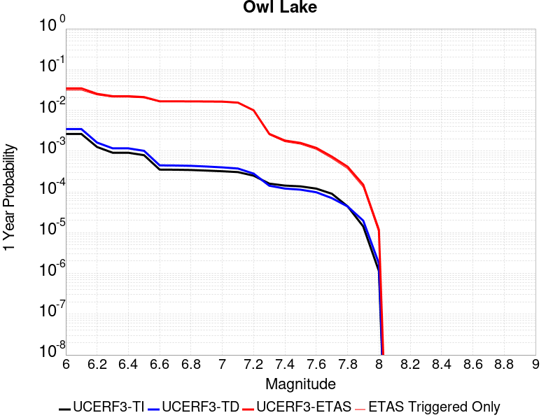 |  |

| Magnitude | 1 wk TI Prob | 1 wk TD Prob | 1 wk ETAS Prob | 1 wk ETAS/TD Gain | 1 wk ETAS Triggered Only | 1 mo TI Prob | 1 mo TD Prob | 1 mo ETAS Prob | 1 mo ETAS/TD Gain | 1 mo ETAS Triggered Only | 1 yr TI Prob | 1 yr TD Prob | 1 yr ETAS Prob | 1 yr ETAS/TD Gain | 1 yr ETAS Triggered Only | 10 yr TI Prob | 10 yr TD Prob | 10 yr ETAS Prob | 10 yr ETAS/TD Gain | 10 yr ETAS Triggered Only |
|-----|-----|-----|-----|-----|-----|-----|-----|-----|-----|-----|-----|-----|-----|-----|-----|-----|-----|-----|-----|-----|
| 6.0 | 5.0320643E-5 | 6.6358676E-5 | 0.017750625 | 267.49515 | 0.01768544 | 2.1564208E-4 | 2.843643E-4 | 0.022341963 | 78.5681 | 0.022063874 | 0.0026222812 | 0.003457547 | 0.034984495 | 10.1182995 | 0.03163633 | 0.02591553 | 0.034141295 | 0.07473091 | 2.1888716 | 0.04202438 |
| 6.1 | 5.0320643E-5 | 6.6358676E-5 | 0.017750625 | 267.49515 | 0.01768544 | 2.1564208E-4 | 2.843643E-4 | 0.022341963 | 78.5681 | 0.022063874 | 0.0026222812 | 0.003457547 | 0.034984495 | 10.1182995 | 0.03163633 | 0.02591553 | 0.034141295 | 0.07473091 | 2.1888716 | 0.04202438 |
| 6.2 | 2.4125871E-5 | 3.0980515E-5 | 0.013809743 | 445.75577 | 0.013779189 | 1.0339249E-4 | 1.3276804E-4 | 0.017386658 | 130.95515 | 0.017256182 | 0.0012580766 | 0.0016154252 | 0.025829338 | 15.989187 | 0.02425309 | 0.012509781 | 0.016070755 | 0.04728314 | 2.9421852 | 0.031722184 |
| 6.3 | 1.7433485E-5 | 2.2355545E-5 | 0.012513491 | 559.7489 | 0.012491415 | 7.471279E-5 | 9.580685E-5 | 0.015418858 | 160.9369 | 0.015324519 | 9.0924866E-4 | 0.001165962 | 0.022175092 | 19.01871 | 0.021033654 | 0.009055373 | 0.0116291465 | 0.03869734 | 3.3276165 | 0.027386677 |
| 6.4 | 1.7433485E-5 | 2.2355545E-5 | 0.012513491 | 559.7489 | 0.012491415 | 7.471279E-5 | 9.580685E-5 | 0.015418858 | 160.9369 | 0.015324519 | 9.0924866E-4 | 0.001165962 | 0.022175092 | 19.01871 | 0.021033654 | 0.009055373 | 0.0116291465 | 0.03869734 | 3.3276165 | 0.027386677 |
| 6.5 | 1.5182742E-5 | 1.9429277E-5 | 0.011995502 | 617.3931 | 0.011976305 | 6.506727E-5 | 8.3266525E-5 | 0.014805598 | 177.80974 | 0.014723558 | 7.919061E-4 | 0.0010134344 | 0.021125244 | 20.845201 | 0.020132212 | 0.0078909 | 0.010118678 | 0.035783526 | 3.5363836 | 0.025927197 |
| 6.6 | 6.7271576E-6 | 8.547518E-6 | 0.010224806 | 1196.2311 | 0.010216346 | 2.8830356E-5 | 3.6631736E-5 | 0.012312967 | 336.12842 | 0.012276785 | 3.5095305E-4 | 4.4590578E-4 | 0.01735114 | 38.91212 | 0.016912775 | 0.0035039932 | 0.0044680187 | 0.025664099 | 5.7439547 | 0.02129121 |
| 6.7 | 6.682835E-6 | 8.479961E-6 | 0.010138889 | 1195.6292 | 0.010130495 | 2.8640408E-5 | 3.6342215E-5 | 0.012226833 | 336.4361 | 0.012190934 | 3.4864116E-4 | 4.423823E-4 | 0.01726186 | 39.020237 | 0.016826924 | 0.003480947 | 0.0044329325 | 0.025544288 | 5.7623906 | 0.021205356 |
| 6.8 | 6.5774975E-6 | 8.326427E-6 | 0.010095811 | 1212.5022 | 0.010087568 | 2.8188972E-5 | 3.5684232E-5 | 0.012183259 | 341.41858 | 0.012148009 | 3.4314668E-4 | 4.3437455E-4 | 0.017168174 | 39.523895 | 0.01674107 | 0.0034261728 | 0.0043531056 | 0.025337936 | 5.8206577 | 0.02107658 |
| 6.9 | 6.363419E-6 | 7.999591E-6 | 0.0099667115 | 1245.9027 | 0.009958792 | 2.727151E-5 | 3.428354E-5 | 0.012010178 | 350.31906 | 0.011976305 | 3.3198006E-4 | 4.1732774E-4 | 0.016979782 | 40.68692 | 0.016569369 | 0.0033148455 | 0.0041830647 | 0.025000494 | 5.976598 | 0.020904876 |
| 7.0 | 6.1342453E-6 | 7.631779E-6 | 0.009966347 | 1305.9009 | 0.009958792 | 2.6289357E-5 | 3.2707245E-5 | 0.01200862 | 367.15472 | 0.011976305 | 3.2002592E-4 | 3.9814346E-4 | 0.016875098 | 42.384464 | 0.016483517 | 0.0031956544 | 0.003991739 | 0.02472766 | 6.1947083 | 0.020819025 |
| 7.1 | 5.842926E-6 | 7.142312E-6 | 0.009150278 | 1281.1366 | 0.009143201 | 2.504087E-5 | 3.060958E-5 | 0.011062209 | 361.39694 | 0.011031937 | 3.0482994E-4 | 3.7261334E-4 | 0.015734332 | 42.22697 | 0.015367445 | 0.0030441214 | 0.0037371595 | 0.023109887 | 6.1838107 | 0.019445399 |
| 7.2 | 4.77173E-6 | 5.358478E-6 | 0.0062295697 | 1162.5632 | 0.0062242444 | 2.045011E-5 | 2.2964727E-5 | 0.0075777364 | 329.97284 | 0.007554945 | 2.4895166E-4 | 2.7956374E-4 | 0.01045014 | 37.38017 | 0.01017342 | 0.0024867293 | 0.0028086212 | 0.015521784 | 5.5264783 | 0.01274897 |
| 7.3 | 3.0494948E-6 | 2.710356E-6 | 0.0012475558 | 460.29224 | 0.001244849 | 1.3069198E-5 | 1.1615762E-5 | 0.0016857034 | 145.12209 | 0.0016741072 | 1.5910587E-4 | 1.4141288E-4 | 0.002544919 | 17.996374 | 0.0024038462 | 0.0015899199 | 0.0014231089 | 0.004337911 | 3.0481932 | 0.002918956 |
| 7.4 | 2.7263884E-6 | 2.3055634E-6 | 7.320429E-4 | 317.5115 | 7.29739E-4 | 1.1684469E-5 | 9.880949E-6 | 0.0011259414 | 113.95074 | 0.0011160715 | 1.4224913E-4 | 1.2029401E-4 | 0.0017083584 | 14.201525 | 0.0015882555 | 0.0014215811 | 0.0012110578 | 0.0031403804 | 2.593089 | 0.0019316621 |
| 7.5 | 2.6090431E-6 | 2.1655019E-6 | 6.460515E-4 | 298.33798 | 6.438874E-4 | 1.1181565E-5 | 9.2806895E-6 | 0.0010394909 | 112.00578 | 0.0010302198 | 1.3612706E-4 | 1.1298663E-4 | 0.0015293788 | 13.535927 | 0.0014165522 | 0.001360437 | 0.0011378126 | 0.002852892 | 2.5073478 | 0.001717033 |
| 7.6 | 2.3008756E-6 | 1.8726826E-6 | 5.5990735E-4 | 298.9868 | 5.5803574E-4 | 9.860858E-6 | 8.025758E-6 | 8.6653535E-4 | 107.969284 | 8.585165E-4 | 1.20049335E-4 | 9.770931E-5 | 0.0012565933 | 12.860529 | 0.0011589973 | 0.001199845 | 9.848307E-4 | 0.0022713372 | 2.3063226 | 0.0012877748 |
| 7.7 | 1.7184348E-6 | 1.341808E-6 | 2.588964E-4 | 192.94594 | 2.5755496E-4 | 7.3646997E-6 | 5.750593E-6 | 4.7793196E-4 | 83.11002 | 4.7218407E-4 | 8.966153E-5 | 7.0011265E-5 | 7.5677637E-4 | 10.809351 | 6.868132E-4 | 8.962536E-4 | 7.0769014E-4 | 0.0014369127 | 2.0304263 | 7.29739E-4 |
| 7.8 | 8.4612907E-7 | 8.4054994E-7 | 1.725437E-4 | 205.27477 | 1.717033E-4 | 3.6262625E-6 | 3.602352E-6 | 2.182307E-4 | 60.58006 | 2.1462912E-4 | 4.4148852E-5 | 4.3857777E-5 | 3.4432538E-4 | 7.8509536 | 3.0048078E-4 | 4.414008E-4 | 4.4386165E-4 | 7.4420904E-4 | 1.676669 | 3.0048078E-4 |
| 7.9 | 2.716738E-7 | 3.7681625E-7 | 1.2915424E-4 | 342.75125 | 1.2877748E-4 | 1.1643157E-6 | 1.6149258E-6 | 1.7331795E-4 | 107.32254 | 1.717033E-4 | 1.4175452E-5 | 1.9661555E-5 | 1.9136148E-4 | 9.732774 | 1.717033E-4 | 1.4174548E-4 | 1.9829652E-4 | 3.6996577E-4 | 1.8657199 | 1.717033E-4 |
| 8.0 | 2.1995428E-8 | 3.3853325E-8 | 3.3853325E-8 | 1.0 | 0.0 | 9.426611E-8 | 1.4508568E-7 | 1.4508568E-7 | 1.0 | 0.0 | 1.1476893E-6 | 1.7664173E-6 | 1.7664173E-6 | 1.0 | 0.0 | 1.14768345E-5 | 1.7869768E-5 | 1.7869768E-5 | 1.0 | 0.0 |

## Panamint Valley
*[(top)](#table-of-contents)*

| 1 Week | 1 Month | 1 Year | 10 Year |
|-----|-----|-----|-----|
|  | 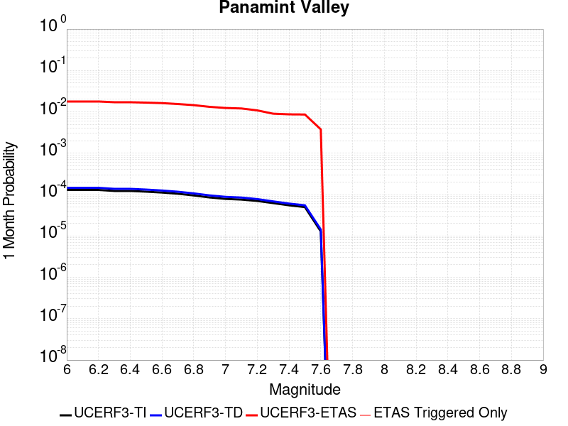 |  |  |

| Magnitude | 1 wk TI Prob | 1 wk TD Prob | 1 wk ETAS Prob | 1 wk ETAS/TD Gain | 1 wk ETAS Triggered Only | 1 mo TI Prob | 1 mo TD Prob | 1 mo ETAS Prob | 1 mo ETAS/TD Gain | 1 mo ETAS Triggered Only | 1 yr TI Prob | 1 yr TD Prob | 1 yr ETAS Prob | 1 yr ETAS/TD Gain | 1 yr ETAS Triggered Only | 10 yr TI Prob | 10 yr TD Prob | 10 yr ETAS Prob | 10 yr ETAS/TD Gain | 10 yr ETAS Triggered Only |
|-----|-----|-----|-----|-----|-----|-----|-----|-----|-----|-----|-----|-----|-----|-----|-----|-----|-----|-----|-----|-----|
| 6.0 | 3.0211835E-5 | 3.3984263E-5 | 0.01424195 | 419.07483 | 0.014208448 | 1.2947287E-4 | 1.4563887E-4 | 0.01795726 | 123.29992 | 0.017814217 | 0.0015751923 | 0.0017717406 | 0.027138805 | 15.317595 | 0.025412088 | 0.015640736 | 0.017583003 | 0.05085597 | 2.8923368 | 0.033868477 |
| 6.1 | 3.0211835E-5 | 3.3984263E-5 | 0.01424195 | 419.07483 | 0.014208448 | 1.2947287E-4 | 1.4563887E-4 | 0.01795726 | 123.29992 | 0.017814217 | 0.0015751923 | 0.0017717406 | 0.027138805 | 15.317595 | 0.025412088 | 0.015640736 | 0.017583003 | 0.05085597 | 2.8923368 | 0.033868477 |
| 6.2 | 3.0211835E-5 | 3.3984263E-5 | 0.01424195 | 419.07483 | 0.014208448 | 1.2947287E-4 | 1.4563887E-4 | 0.01795726 | 123.29992 | 0.017814217 | 0.0015751923 | 0.0017717406 | 0.027138805 | 15.317595 | 0.025412088 | 0.015640736 | 0.017583003 | 0.05085597 | 2.8923368 | 0.033868477 |
| 6.3 | 2.8573924E-5 | 3.2102445E-5 | 0.013853774 | 431.5489 | 0.013822115 | 1.2245393E-4 | 1.375748E-4 | 0.017391382 | 126.41401 | 0.017256182 | 0.001489857 | 0.0016737141 | 0.02618619 | 15.645556 | 0.02455357 | 0.01479908 | 0.016618038 | 0.04853067 | 2.9203613 | 0.032451924 |
| 6.4 | 2.8573924E-5 | 3.2102445E-5 | 0.013853774 | 431.5489 | 0.013822115 | 1.2245393E-4 | 1.375748E-4 | 0.017391382 | 126.41401 | 0.017256182 | 0.001489857 | 0.0016737141 | 0.02618619 | 15.645556 | 0.02455357 | 0.01479908 | 0.016618038 | 0.04853067 | 2.9203613 | 0.032451924 |
| 6.5 | 2.7468774E-5 | 3.0828138E-5 | 0.013552045 | 439.59985 | 0.013521635 | 1.1771801E-4 | 1.3211406E-4 | 0.016999735 | 128.67468 | 0.016869849 | 0.0014322745 | 0.0016073292 | 0.025521439 | 15.878165 | 0.02395261 | 0.014230782 | 0.015963882 | 0.0472219 | 2.958046 | 0.03176511 |
| 6.6 | 2.6135967E-5 | 2.9252153E-5 | 0.013078321 | 447.0892 | 0.013049451 | 1.1200648E-4 | 1.2536049E-4 | 0.016478049 | 131.44531 | 0.01635474 | 0.0013628257 | 0.0015252219 | 0.024884114 | 16.315077 | 0.023394573 | 0.013544982 | 0.015154343 | 0.04559257 | 3.0085478 | 0.030906593 |
| 6.7 | 2.4498746E-5 | 2.7341044E-5 | 0.012518414 | 457.8616 | 0.012491415 | 1.04990395E-4 | 1.17170785E-4 | 0.015783262 | 134.70303 | 0.015667927 | 0.0012775084 | 0.0014256459 | 0.023843845 | 16.724943 | 0.022450207 | 0.012701893 | 0.014171593 | 0.04328603 | 3.0544224 | 0.029532967 |
| 6.8 | 2.2244329E-5 | 2.4935374E-5 | 0.012043866 | 483.00323 | 0.012019231 | 9.532935E-5 | 1.0686163E-4 | 0.015086373 | 141.1767 | 0.014981112 | 0.0011600169 | 0.0013002857 | 0.02230659 | 17.155146 | 0.021033654 | 0.011539802 | 0.012932955 | 0.039923068 | 3.0869255 | 0.02734375 |
| 6.9 | 1.9902658E-5 | 2.2290182E-5 | 0.010796431 | 484.3582 | 0.010774381 | 8.529431E-5 | 9.552596E-5 | 0.013530025 | 141.63716 | 0.013435783 | 0.0010379635 | 0.0011624265 | 0.020199338 | 17.376873 | 0.019059066 | 0.010331288 | 0.011569021 | 0.035668816 | 3.0831316 | 0.024381869 |
| 7.0 | 1.8353881E-5 | 2.056605E-5 | 0.010279627 | 499.83475 | 0.010259272 | 7.865712E-5 | 8.813734E-5 | 0.012750139 | 144.66217 | 0.012663119 | 9.5722964E-4 | 0.0010725616 | 0.018953431 | 17.671183 | 0.017900068 | 0.009531168 | 0.01067939 | 0.033102177 | 3.099632 | 0.022664836 |
| 7.1 | 1.7667631E-5 | 1.9772435E-5 | 0.009978367 | 504.6605 | 0.009958792 | 7.571623E-5 | 8.4736355E-5 | 0.012360482 | 145.86987 | 0.012276785 | 9.2145515E-4 | 0.0010311945 | 0.0182267 | 17.67533 | 0.017213255 | 0.009176437 | 0.0102695925 | 0.03185197 | 3.1015806 | 0.021806318 |
| 7.2 | 1.6381597E-5 | 1.8158042E-5 | 0.009032417 | 497.43344 | 0.009014423 | 7.020495E-5 | 7.781795E-5 | 0.011280586 | 144.96123 | 0.01120364 | 8.544101E-4 | 9.470391E-4 | 0.0163857 | 17.302032 | 0.015453297 | 0.008511325 | 0.009435269 | 0.028824758 | 3.055001 | 0.019574177 |
| 7.3 | 1.4520491E-5 | 1.596657E-5 | 0.007270315 | 455.34607 | 0.007254464 | 6.222919E-5 | 6.842646E-5 | 0.009125155 | 133.35713 | 0.009057349 | 7.57377E-4 | 8.327899E-4 | 0.013313802 | 15.986988 | 0.012491415 | 0.0075480095 | 0.008300399 | 0.023965985 | 2.8873289 | 0.015796704 |
| 7.4 | 1.2852287E-5 | 1.41454875E-5 | 0.0069251056 | 489.56287 | 0.0069110575 | 5.5080065E-5 | 6.06222E-5 | 0.008731113 | 144.02501 | 0.008671016 | 6.7039346E-4 | 7.378411E-4 | 0.012662415 | 17.161438 | 0.011933379 | 0.0066837464 | 0.007357429 | 0.022398759 | 3.044373 | 0.015152816 |
| 7.5 | 1.1637851E-5 | 1.2836868E-5 | 0.006837955 | 532.68097 | 0.006825206 | 4.987555E-5 | 5.5014076E-5 | 0.008639706 | 157.04538 | 0.008585165 | 6.070656E-4 | 6.696062E-4 | 0.012423406 | 18.553303 | 0.011761676 | 0.006054099 | 0.0066793845 | 0.021517793 | 3.2215235 | 0.014938187 |
| 7.6 | 3.0068115E-6 | 3.3330623E-6 | 0.003351536 | 1005.5426 | 0.0033482143 | 1.2886271E-5 | 1.4284516E-5 | 0.004135105 | 289.48163 | 0.0041208793 | 1.5687906E-4 | 1.7390738E-4 | 0.0054528657 | 31.354998 | 0.0052798763 | 0.0015676835 | 0.0017397973 | 0.008124618 | 4.669864 | 0.0063959477 |

## Garlock (East)
*[(top)](#table-of-contents)*

| 1 Week | 1 Month | 1 Year | 10 Year |
|-----|-----|-----|-----|
|  |  |  |  |

| Magnitude | 1 wk TI Prob | 1 wk TD Prob | 1 wk ETAS Prob | 1 wk ETAS/TD Gain | 1 wk ETAS Triggered Only | 1 mo TI Prob | 1 mo TD Prob | 1 mo ETAS Prob | 1 mo ETAS/TD Gain | 1 mo ETAS Triggered Only | 1 yr TI Prob | 1 yr TD Prob | 1 yr ETAS Prob | 1 yr ETAS/TD Gain | 1 yr ETAS Triggered Only | 10 yr TI Prob | 10 yr TD Prob | 10 yr ETAS Prob | 10 yr ETAS/TD Gain | 10 yr ETAS Triggered Only |
|-----|-----|-----|-----|-----|-----|-----|-----|-----|-----|-----|-----|-----|-----|-----|-----|-----|-----|-----|-----|-----|
| 6.0 | 4.5092507E-5 | 6.2904815E-5 | 0.011351686 | 180.45815 | 0.011289491 | 1.9323928E-4 | 2.6956675E-4 | 0.014860413 | 55.127026 | 0.01459478 | 0.0023501497 | 0.003277482 | 0.023899917 | 7.2921586 | 0.020690247 | 0.023254504 | 0.03235377 | 0.059145145 | 1.8280758 | 0.027687157 |
| 6.1 | 4.5092507E-5 | 6.2904815E-5 | 0.011351686 | 180.45815 | 0.011289491 | 1.9323928E-4 | 2.6956675E-4 | 0.014860413 | 55.127026 | 0.01459478 | 0.0023501497 | 0.003277482 | 0.023899917 | 7.2921586 | 0.020690247 | 0.023254504 | 0.03235377 | 0.059145145 | 1.8280758 | 0.027687157 |
| 6.2 | 2.6674514E-5 | 3.4511588E-5 | 0.009563716 | 277.1161 | 0.009529533 | 1.1431433E-4 | 1.4789861E-4 | 0.012036594 | 81.38409 | 0.011890453 | 0.0013908884 | 0.0017992114 | 0.018124525 | 10.073594 | 0.01635474 | 0.01382215 | 0.017872788 | 0.038699146 | 2.165255 | 0.021205356 |
| 6.3 | 2.6674514E-5 | 3.4511588E-5 | 0.009563716 | 277.1161 | 0.009529533 | 1.1431433E-4 | 1.4789861E-4 | 0.012036594 | 81.38409 | 0.011890453 | 0.0013908884 | 0.0017992114 | 0.018124525 | 10.073594 | 0.01635474 | 0.01382215 | 0.017872788 | 0.038699146 | 2.165255 | 0.021205356 |
| 6.4 | 2.5312667E-5 | 3.2340467E-5 | 0.009389867 | 290.3442 | 0.00935783 | 1.0847834E-4 | 1.3859481E-4 | 0.011769881 | 84.92296 | 0.011632898 | 0.0013199237 | 0.0016861152 | 0.01767045 | 10.479979 | 0.016011333 | 0.013121112 | 0.016772287 | 0.037199922 | 2.2179399 | 0.020776099 |
| 6.5 | 2.5312667E-5 | 3.2340467E-5 | 0.009389867 | 290.3442 | 0.00935783 | 1.0847834E-4 | 1.3859481E-4 | 0.011769881 | 84.92296 | 0.011632898 | 0.0013199237 | 0.0016861152 | 0.01767045 | 10.479979 | 0.016011333 | 0.013121112 | 0.016772287 | 0.037199922 | 2.2179399 | 0.020776099 |
| 6.6 | 2.246556E-5 | 2.8134691E-5 | 0.009128153 | 324.44476 | 0.009100275 | 9.627742E-5 | 1.2057181E-4 | 0.011322862 | 93.90969 | 0.01120364 | 0.0011715472 | 0.0014669969 | 0.016940486 | 11.547732 | 0.015496222 | 0.011653901 | 0.014613169 | 0.034408886 | 2.3546493 | 0.020089285 |
| 6.7 | 2.2241198E-5 | 2.7804432E-5 | 0.009084902 | 326.74295 | 0.009057349 | 9.531594E-5 | 1.1915654E-4 | 0.011278541 | 94.653145 | 0.011160715 | 0.0011598538 | 0.0014497889 | 0.016837819 | 11.613979 | 0.015410371 | 0.011538187 | 0.014442829 | 0.034157358 | 2.3650045 | 0.020003434 |
| 6.8 | 1.9528685E-5 | 2.3898969E-5 | 0.008694708 | 363.81104 | 0.008671016 | 8.369167E-5 | 1.0242024E-4 | 0.01061817 | 103.67258 | 0.010516827 | 0.0010184698 | 0.0012462728 | 0.015351268 | 12.317743 | 0.014122596 | 0.010138147 | 0.012436723 | 0.030580485 | 2.458886 | 0.018372253 |
| 6.9 | 1.3318621E-5 | 1.5198818E-5 | 0.008213907 | 540.4306 | 0.008198832 | 5.7078556E-5 | 6.51362E-5 | 0.009679895 | 148.61006 | 0.009615385 | 6.9470983E-4 | 7.927504E-4 | 0.01344583 | 16.960987 | 0.012663119 | 0.0069254204 | 0.007940721 | 0.024080422 | 3.0325234 | 0.016268887 |
| 7.0 | 1.1760853E-5 | 1.3107653E-5 | 0.008168907 | 623.2166 | 0.008155907 | 5.0402683E-5 | 5.6174475E-5 | 0.009628096 | 171.39627 | 0.009572458 | 6.134799E-4 | 6.8371464E-4 | 0.013295278 | 19.445654 | 0.012620192 | 0.0061178906 | 0.006857401 | 0.022758938 | 3.3188868 | 0.016011333 |
| 7.1 | 1.0064758E-5 | 1.0902761E-5 | 0.008037944 | 737.2394 | 0.008027129 | 4.3133965E-5 | 4.67253E-5 | 0.009447042 | 202.18257 | 0.009400755 | 5.2502943E-4 | 5.6873553E-4 | 0.012666933 | 22.272097 | 0.012105082 | 0.005237907 | 0.0057133473 | 0.02082227 | 3.6444957 | 0.015195741 |
| 7.2 | 9.768808E-6 | 1.0498628E-5 | 0.007822917 | 745.13696 | 0.0078125 | 4.186565E-5 | 4.499337E-5 | 0.009187782 | 204.20305 | 0.009143201 | 5.095951E-4 | 5.4766005E-4 | 0.012302894 | 22.464474 | 0.011761676 | 0.0050842804 | 0.005503584 | 0.02014611 | 3.6605437 | 0.014723558 |
| 7.3 | 9.344516E-6 | 9.9442705E-6 | 0.007436038 | 747.77106 | 0.0074261674 | 4.004731E-5 | 4.2617627E-5 | 0.008713265 | 204.45213 | 0.008671016 | 4.8746695E-4 | 5.187495E-4 | 0.011544963 | 22.255371 | 0.011031937 | 0.0048639905 | 0.005215269 | 0.019008001 | 3.6446826 | 0.013865042 |
| 7.4 | 9.023491E-6 | 9.490441E-6 | 0.006620005 | 697.54443 | 0.006610577 | 3.867153E-5 | 4.0672705E-5 | 0.007809931 | 192.01897 | 0.007769574 | 4.7072413E-4 | 4.95081E-4 | 0.010448942 | 21.105518 | 0.009958792 | 0.004697283 | 0.0049787266 | 0.01740795 | 3.4964664 | 0.012491415 |
| 7.5 | 7.081253E-6 | 7.0873994E-6 | 0.0038274587 | 540.0371 | 0.0038203984 | 3.0347876E-5 | 3.0374218E-5 | 0.0044516 | 146.5585 | 0.00442136 | 3.6942272E-4 | 3.697441E-4 | 0.005948038 | 16.086905 | 0.0055803573 | 0.003688092 | 0.0037244745 | 0.01052426 | 2.8257034 | 0.006825206 |
| 7.6 | 6.116396E-6 | 5.9589424E-6 | 0.0024956418 | 418.80618 | 0.002489698 | 2.6212863E-5 | 2.5538076E-5 | 0.00285857 | 111.933655 | 0.0028331045 | 3.1909486E-4 | 3.1088197E-4 | 0.0038297053 | 12.31884 | 0.0035199176 | 0.0031863707 | 0.0031359126 | 0.0072866604 | 2.3236172 | 0.004163805 |
| 7.7 | 4.797145E-6 | 4.7571157E-6 | 0.0016359306 | 343.8913 | 0.0016311813 | 2.055903E-5 | 2.0387479E-5 | 0.0017803104 | 87.323715 | 0.0017599588 | 2.5027743E-4 | 2.481894E-4 | 0.0023510328 | 9.472735 | 0.0021033655 | 0.0024999576 | 0.0025094065 | 0.0049928566 | 1.9896563 | 0.002489698 |
| 7.8 | 3.4028885E-6 | 3.978375E-6 | 9.483427E-4 | 238.37442 | 9.4436813E-4 | 1.4583726E-5 | 1.7050066E-5 | 0.0010472523 | 61.42218 | 0.0010302198 | 1.775424E-4 | 2.0756487E-4 | 0.0014521554 | 6.9961524 | 0.001244849 | 0.0017740062 | 0.0021012141 | 0.0034719543 | 1.6523563 | 0.0013736264 |
| 7.9 | 2.5928412E-6 | 3.372436E-6 | 5.6140625E-4 | 166.46907 | 5.5803574E-4 | 1.1112129E-5 | 1.4453217E-5 | 6.5833126E-4 | 45.549118 | 6.438874E-4 | 1.3528178E-4 | 1.7595377E-4 | 0.0010343192 | 5.8783574 | 8.585165E-4 | 0.0013519945 | 0.0017812426 | 0.0026810793 | 1.5051736 | 9.014423E-4 |
| 8.0 | 1.3743648E-6 | 1.6734741E-6 | 2.59228E-4 | 154.9041 | 2.5755496E-4 | 5.8901214E-6 | 7.1720124E-6 | 2.6472512E-4 | 36.91086 | 2.5755496E-4 | 7.1709874E-5 | 8.731578E-5 | 3.877703E-4 | 4.441011 | 3.0048078E-4 | 7.1686733E-4 | 8.837377E-4 | 0.0011839529 | 1.3397108 | 3.0048078E-4 |
| 8.1 | 3.6733252E-7 | 3.1489736E-7 | 4.3240707E-5 | 137.31683 | 4.2925825E-5 | 1.5742813E-6 | 1.3495595E-6 | 4.4275326E-5 | 32.80724 | 4.2925825E-5 | 1.9166706E-5 | 1.643078E-5 | 5.9355898E-5 | 3.612482 | 4.2925825E-5 | 1.9165053E-4 | 1.662928E-4 | 2.0921147E-4 | 1.2580911 | 4.2925825E-5 |

## Hunter Mountain-Saline Valley
*[(top)](#table-of-contents)*

| 1 Week | 1 Month | 1 Year | 10 Year |
|-----|-----|-----|-----|
| 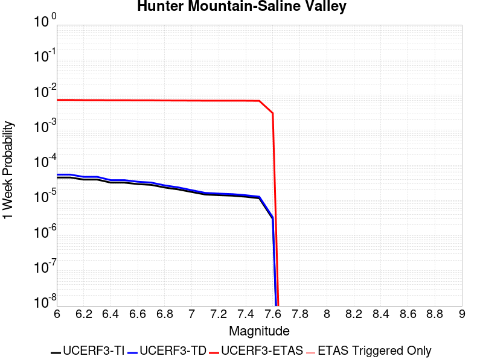 |  |  |  |

| Magnitude | 1 wk TI Prob | 1 wk TD Prob | 1 wk ETAS Prob | 1 wk ETAS/TD Gain | 1 wk ETAS Triggered Only | 1 mo TI Prob | 1 mo TD Prob | 1 mo ETAS Prob | 1 mo ETAS/TD Gain | 1 mo ETAS Triggered Only | 1 yr TI Prob | 1 yr TD Prob | 1 yr ETAS Prob | 1 yr ETAS/TD Gain | 1 yr ETAS Triggered Only | 10 yr TI Prob | 10 yr TD Prob | 10 yr ETAS Prob | 10 yr ETAS/TD Gain | 10 yr ETAS Triggered Only |
|-----|-----|-----|-----|-----|-----|-----|-----|-----|-----|-----|-----|-----|-----|-----|-----|-----|-----|-----|-----|-----|
| 6.0 | 4.5103672E-5 | 5.456906E-5 | 0.0072227907 | 132.36053 | 0.0071686124 | 1.9328714E-4 | 2.3384714E-4 | 0.009246162 | 39.539345 | 0.009014423 | 0.002350731 | 0.0028435462 | 0.015128226 | 5.320197 | 0.012319712 | 0.023260195 | 0.028092625 | 0.043403838 | 1.5450261 | 0.015753778 |
| 6.1 | 4.5103672E-5 | 5.456906E-5 | 0.0072227907 | 132.36053 | 0.0071686124 | 1.9328714E-4 | 2.3384714E-4 | 0.009246162 | 39.539345 | 0.009014423 | 0.002350731 | 0.0028435462 | 0.015128226 | 5.320197 | 0.012319712 | 0.023260195 | 0.028092625 | 0.043403838 | 1.5450261 | 0.015753778 |
| 6.2 | 3.9363465E-5 | 4.706271E-5 | 0.0071294904 | 151.48917 | 0.007082761 | 1.6868966E-4 | 2.016826E-4 | 0.009128453 | 45.261482 | 0.008928572 | 0.002051862 | 0.0024528534 | 0.0146138845 | 5.9579124 | 0.012190934 | 0.020330196 | 0.024274187 | 0.039436135 | 1.624612 | 0.015539148 |
| 6.3 | 3.9363465E-5 | 4.706271E-5 | 0.0071294904 | 151.48917 | 0.007082761 | 1.6868966E-4 | 2.016826E-4 | 0.009128453 | 45.261482 | 0.008928572 | 0.002051862 | 0.0024528534 | 0.0146138845 | 5.9579124 | 0.012190934 | 0.020330196 | 0.024274187 | 0.039436135 | 1.624612 | 0.015539148 |
| 6.4 | 3.2311684E-5 | 3.795112E-5 | 0.007034595 | 185.35936 | 0.006996909 | 1.384713E-4 | 1.6263791E-4 | 0.00900392 | 55.36175 | 0.00884272 | 0.0016845843 | 0.001978387 | 0.014059521 | 7.1065574 | 0.012105082 | 0.016718714 | 0.019617118 | 0.034767266 | 1.7722921 | 0.015453297 |
| 6.5 | 3.2311684E-5 | 3.795112E-5 | 0.007034595 | 185.35936 | 0.006996909 | 1.384713E-4 | 1.6263791E-4 | 0.00900392 | 55.36175 | 0.00884272 | 0.0016845843 | 0.001978387 | 0.014059521 | 7.1065574 | 0.012105082 | 0.016718714 | 0.019617118 | 0.034767266 | 1.7722921 | 0.015453297 |
| 6.6 | 2.9305844E-5 | 3.418196E-5 | 0.007030852 | 205.68895 | 0.006996909 | 1.2559042E-4 | 1.4648624E-4 | 0.008944991 | 61.06369 | 0.008799794 | 0.0015279909 | 0.0017820727 | 0.013779884 | 7.7325044 | 0.012019231 | 0.015175272 | 0.017686324 | 0.032781977 | 1.8535211 | 0.015367445 |
| 6.7 | 2.7826512E-5 | 3.2344353E-5 | 0.007029027 | 217.31853 | 0.006996909 | 1.19251024E-4 | 1.3861163E-4 | 0.008937186 | 64.47645 | 0.008799794 | 0.0014509142 | 0.0016863506 | 0.013685313 | 8.115343 | 0.012019231 | 0.014414776 | 0.016743818 | 0.031853955 | 1.9024307 | 0.015367445 |
| 6.8 | 2.3389874E-5 | 2.6866792E-5 | 0.0069806636 | 259.82498 | 0.0069539836 | 1.0023846E-4 | 1.1513857E-4 | 0.008870998 | 77.04627 | 0.008756869 | 0.00121972 | 0.001400958 | 0.0133604845 | 9.536677 | 0.011976305 | 0.01213047 | 0.013928067 | 0.028996818 | 2.0818982 | 0.015281593 |
| 6.9 | 2.069209E-5 | 2.357011E-5 | 0.0069773896 | 296.02704 | 0.0069539836 | 8.867737E-5 | 1.0101105E-4 | 0.008856995 | 87.683426 | 0.008756869 | 0.0010791123 | 0.0012291519 | 0.013190736 | 10.731576 | 0.011976305 | 0.010738871 | 0.012229158 | 0.027281469 | 2.2308543 | 0.015238668 |
| 7.0 | 1.7462342E-5 | 1.9633622E-5 | 0.006973481 | 355.18054 | 0.0069539836 | 7.483646E-5 | 8.414151E-5 | 0.00879735 | 104.55422 | 0.008713942 | 9.1075303E-4 | 0.0010239641 | 0.012988006 | 12.684044 | 0.011976305 | 0.009070295 | 0.010196688 | 0.02527997 | 2.4792337 | 0.015238668 |
| 7.1 | 1.4807709E-5 | 1.6441827E-5 | 0.006970311 | 423.93774 | 0.0069539836 | 6.3460066E-5 | 7.046316E-5 | 0.008783791 | 124.65793 | 0.008713942 | 7.723524E-4 | 8.575678E-4 | 0.012823602 | 14.953456 | 0.011976305 | 0.007696735 | 0.008546168 | 0.023612045 | 2.762881 | 0.015195741 |
| 7.2 | 1.4180048E-5 | 1.5698413E-5 | 0.006969573 | 443.9667 | 0.0069539836 | 6.077022E-5 | 6.727727E-5 | 0.008780633 | 130.51411 | 0.008713942 | 7.396263E-4 | 8.1880915E-4 | 0.012785308 | 15.614515 | 0.011976305 | 0.0073716943 | 0.008161469 | 0.023233192 | 2.8466923 | 0.015195741 |
| 7.3 | 1.3730402E-5 | 1.5172151E-5 | 0.00696905 | 459.33173 | 0.0069539836 | 5.8843252E-5 | 6.502197E-5 | 0.008778398 | 135.00664 | 0.008713942 | 7.161811E-4 | 7.9137104E-4 | 0.012758198 | 16.12164 | 0.011976305 | 0.007138774 | 0.007889058 | 0.022964919 | 2.9109838 | 0.015195741 |
| 7.4 | 1.2810095E-5 | 1.4109353E-5 | 0.0069250697 | 490.81412 | 0.0069110575 | 5.489925E-5 | 6.0467344E-5 | 0.008730959 | 144.39131 | 0.008671016 | 6.681934E-4 | 7.3595706E-4 | 0.012660554 | 17.202843 | 0.011933379 | 0.006661878 | 0.0073386896 | 0.022380304 | 3.0496323 | 0.015152816 |
| 7.5 | 1.1595659E-5 | 1.2800734E-5 | 0.0068379194 | 534.1818 | 0.006825206 | 4.9694736E-5 | 5.485922E-5 | 0.008639553 | 157.48589 | 0.008585165 | 6.0486543E-4 | 6.67722E-4 | 0.012421545 | 18.602867 | 0.011761676 | 0.006032217 | 0.006660632 | 0.02149932 | 3.22782 | 0.014938187 |
| 7.6 | 2.997694E-6 | 3.3251877E-6 | 0.0033515284 | 1007.9216 | 0.0033482143 | 1.28471975E-5 | 1.4250767E-5 | 0.0041350713 | 290.16483 | 0.0041208793 | 1.564034E-4 | 1.7349655E-4 | 0.005452457 | 31.426888 | 0.0052798763 | 0.0015629337 | 0.0017356955 | 0.008120541 | 4.678552 | 0.0063959477 |

## Blackwater
*[(top)](#table-of-contents)*

| 1 Week | 1 Month | 1 Year | 10 Year |
|-----|-----|-----|-----|
|  |  |  |  |

| Magnitude | 1 wk TI Prob | 1 wk TD Prob | 1 wk ETAS Prob | 1 wk ETAS/TD Gain | 1 wk ETAS Triggered Only | 1 mo TI Prob | 1 mo TD Prob | 1 mo ETAS Prob | 1 mo ETAS/TD Gain | 1 mo ETAS Triggered Only | 1 yr TI Prob | 1 yr TD Prob | 1 yr ETAS Prob | 1 yr ETAS/TD Gain | 1 yr ETAS Triggered Only | 10 yr TI Prob | 10 yr TD Prob | 10 yr ETAS Prob | 10 yr ETAS/TD Gain | 10 yr ETAS Triggered Only |
|-----|-----|-----|-----|-----|-----|-----|-----|-----|-----|-----|-----|-----|-----|-----|-----|-----|-----|-----|-----|-----|
| 6.0 | 3.0708583E-5 | 3.3095846E-5 | 0.003982141 | 120.321465 | 0.003949176 | 1.3160157E-4 | 1.4183241E-4 | 0.0056355586 | 39.73393 | 0.0054945056 | 0.0016010714 | 0.0017255784 | 0.011324371 | 6.562652 | 0.009615385 | 0.015895851 | 0.017135633 | 0.030678708 | 1.7903457 | 0.013779189 |
| 6.1 | 3.0708583E-5 | 3.3095846E-5 | 0.003982141 | 120.321465 | 0.003949176 | 1.3160157E-4 | 1.4183241E-4 | 0.0056355586 | 39.73393 | 0.0054945056 | 0.0016010714 | 0.0017255784 | 0.011324371 | 6.562652 | 0.009615385 | 0.015895851 | 0.017135633 | 0.030678708 | 1.7903457 | 0.013779189 |
| 6.2 | 1.1707779E-5 | 1.2545122E-5 | 0.0013861542 | 110.493484 | 0.0013736264 | 5.017523E-5 | 5.3763757E-5 | 0.0018136279 | 33.73328 | 0.0017599588 | 6.107122E-4 | 6.5438676E-4 | 0.0038288191 | 5.851003 | 0.003176511 | 0.006090366 | 0.0065255696 | 0.011216598 | 1.7188687 | 0.004721841 |
| 6.3 | 1.1707779E-5 | 1.2545122E-5 | 0.0013861542 | 110.493484 | 0.0013736264 | 5.017523E-5 | 5.3763757E-5 | 0.0018136279 | 33.73328 | 0.0017599588 | 6.107122E-4 | 6.5438676E-4 | 0.0038288191 | 5.851003 | 0.003176511 | 0.006090366 | 0.0065255696 | 0.011216598 | 1.7188687 | 0.004721841 |
| 6.4 | 7.929244E-6 | 8.480098E-6 | 9.099148E-4 | 107.300026 | 9.014423E-4 | 3.3982033E-5 | 3.6342793E-5 | 0.0012382222 | 34.070637 | 0.0012019231 | 4.136527E-4 | 4.423877E-4 | 0.002416102 | 5.4615035 | 0.001974588 | 0.0041288356 | 0.0044154758 | 0.007278807 | 1.6484762 | 0.0028760303 |
| 6.5 | 5.8832115E-6 | 6.285991E-6 | 7.360204E-4 | 117.089005 | 7.29739E-4 | 2.521352E-5 | 2.6939697E-5 | 0.001014207 | 37.64731 | 9.87294E-4 | 3.0693135E-4 | 3.27944E-4 | 0.0019156786 | 5.841481 | 0.0015882555 | 0.0030650778 | 0.0032748538 | 0.005585257 | 1.7054982 | 0.0023179946 |
| 6.6 | 5.8832115E-6 | 6.285991E-6 | 7.360204E-4 | 117.089005 | 7.29739E-4 | 2.521352E-5 | 2.6939697E-5 | 0.001014207 | 37.64731 | 9.87294E-4 | 3.0693135E-4 | 3.27944E-4 | 0.0019156786 | 5.841481 | 0.0015882555 | 0.0030650778 | 0.0032748538 | 0.005585257 | 1.7054982 | 0.0023179946 |
| 6.7 | 3.0715053E-6 | 3.2814662E-6 | 3.4668692E-4 | 105.65001 | 3.434066E-4 | 1.3163528E-5 | 1.4063357E-5 | 4.4331557E-4 | 31.522741 | 4.2925825E-4 | 1.6025416E-4 | 1.7120909E-4 | 8.5790467E-4 | 5.0108595 | 6.868132E-4 | 0.0016013865 | 0.0017108864 | 0.0026536388 | 1.5510316 | 9.4436813E-4 |
| 6.8 | 2.2722281E-6 | 2.4287538E-6 | 2.5998306E-4 | 107.04382 | 2.5755496E-4 | 9.738084E-6 | 1.0408908E-5 | 3.1088656E-4 | 29.867355 | 3.0048078E-4 | 1.1855473E-4 | 1.26722E-4 | 6.4176664E-4 | 5.0643663 | 5.151099E-4 | 0.001184915 | 0.0012665876 | 0.0020382737 | 1.609264 | 7.7266485E-4 |
| 6.9 | 9.952399E-7 | 1.0653489E-6 | 4.3991127E-5 | 41.292698 | 4.2925825E-5 | 4.265307E-6 | 4.5657757E-6 | 9.041703E-5 | 19.803213 | 8.585165E-5 | 5.1928873E-5 | 5.5587418E-5 | 2.7020462E-4 | 4.860895 | 2.1462912E-4 | 5.191674E-4 | 5.557858E-4 | 9.4190345E-4 | 1.694724 | 3.8633242E-4 |
| 7.0 | 4.7385504E-7 | 5.0755597E-7 | 5.0755597E-7 | 1.0 | 0.0 | 2.0308057E-6 | 2.1752398E-6 | 4.510097E-5 | 20.733793 | 4.2925825E-5 | 2.4724779E-5 | 2.6483543E-5 | 1.552576E-4 | 5.862418 | 1.2877748E-4 | 2.4722028E-4 | 2.6483546E-4 | 4.3649325E-4 | 1.6481678 | 1.717033E-4 |

## Ash Hill
*[(top)](#table-of-contents)*

| 1 Week | 1 Month | 1 Year | 10 Year |
|-----|-----|-----|-----|
|  |  |  |  |

| Magnitude | 1 wk TI Prob | 1 wk TD Prob | 1 wk ETAS Prob | 1 wk ETAS/TD Gain | 1 wk ETAS Triggered Only | 1 mo TI Prob | 1 mo TD Prob | 1 mo ETAS Prob | 1 mo ETAS/TD Gain | 1 mo ETAS Triggered Only | 1 yr TI Prob | 1 yr TD Prob | 1 yr ETAS Prob | 1 yr ETAS/TD Gain | 1 yr ETAS Triggered Only | 10 yr TI Prob | 10 yr TD Prob | 10 yr ETAS Prob | 10 yr ETAS/TD Gain | 10 yr ETAS Triggered Only |
|-----|-----|-----|-----|-----|-----|-----|-----|-----|-----|-----|-----|-----|-----|-----|-----|-----|-----|-----|-----|-----|
| 6.0 | 2.1545662E-5 | 2.3194447E-5 | 0.0041010533 | 176.81186 | 0.0040779533 | 9.2335285E-5 | 9.940143E-5 | 0.0053358315 | 53.679623 | 0.0052369507 | 0.0011236023 | 0.0012096206 | 0.009827275 | 8.124262 | 0.008628091 | 0.011179381 | 0.012038348 | 0.02420975 | 2.0110526 | 0.012319712 |
| 6.1 | 2.1545662E-5 | 2.3194447E-5 | 0.0041010533 | 176.81186 | 0.0040779533 | 9.2335285E-5 | 9.940143E-5 | 0.0053358315 | 53.679623 | 0.0052369507 | 0.0011236023 | 0.0012096206 | 0.009827275 | 8.124262 | 0.008628091 | 0.011179381 | 0.012038348 | 0.02420975 | 2.0110526 | 0.012319712 |
| 6.2 | 2.1545662E-5 | 2.3194447E-5 | 0.0041010533 | 176.81186 | 0.0040779533 | 9.2335285E-5 | 9.940143E-5 | 0.0053358315 | 53.679623 | 0.0052369507 | 0.0011236023 | 0.0012096206 | 0.009827275 | 8.124262 | 0.008628091 | 0.011179381 | 0.012038348 | 0.02420975 | 2.0110526 | 0.012319712 |
| 6.3 | 1.0025529E-5 | 1.0746934E-5 | 0.0017706868 | 164.76204 | 0.0017599588 | 4.2965847E-5 | 4.605755E-5 | 0.002406869 | 52.257862 | 0.0023609204 | 5.229836E-4 | 5.6061964E-4 | 0.0042930725 | 7.6577277 | 0.0037345467 | 0.005217545 | 0.0055933665 | 0.011057139 | 1.9768308 | 0.0054945056 |
| 6.4 | 1.0025529E-5 | 1.0746934E-5 | 0.0017706868 | 164.76204 | 0.0017599588 | 4.2965847E-5 | 4.605755E-5 | 0.002406869 | 52.257862 | 0.0023609204 | 5.229836E-4 | 5.6061964E-4 | 0.0042930725 | 7.6577277 | 0.0037345467 | 0.005217545 | 0.0055933665 | 0.011057139 | 1.9768308 | 0.0054945056 |
| 6.5 | 6.9617327E-6 | 7.456634E-6 | 0.0014239983 | 190.97066 | 0.0014165522 | 2.9835655E-5 | 3.195666E-5 | 0.0018777081 | 58.757957 | 0.0018458104 | 3.6318856E-4 | 3.8901155E-4 | 0.0030064683 | 7.7284803 | 0.0026184754 | 0.0036259557 | 0.0038841602 | 0.007860756 | 2.023798 | 0.0039921016 |
| 6.6 | 4.9919777E-6 | 5.3466883E-6 | 9.497098E-4 | 177.6258 | 9.4436813E-4 | 2.1394015E-5 | 2.2914215E-5 | 0.00113896 | 49.705395 | 0.0011160715 | 2.60441E-4 | 2.7895154E-4 | 0.0019525917 | 6.999752 | 0.0016741072 | 0.0026013597 | 0.0027866727 | 0.0056546885 | 2.02919 | 0.0028760303 |
| 6.7 | 3.6630722E-6 | 3.924624E-6 | 6.478095E-4 | 165.06282 | 6.438874E-4 | 1.5698786E-5 | 1.681974E-5 | 7.465465E-4 | 44.38514 | 7.29739E-4 | 1.9111596E-4 | 2.0476682E-4 | 0.0014064438 | 6.868514 | 0.0012019231 | 0.0019095168 | 0.0020463446 | 0.0040168916 | 1.9629596 | 0.001974588 |
| 6.8 | 2.5599613E-6 | 2.744925E-6 | 3.8907627E-4 | 141.74387 | 3.8633242E-4 | 1.0971216E-5 | 1.1763939E-5 | 4.4101712E-4 | 37.4889 | 4.2925825E-4 | 1.3356637E-4 | 1.4322149E-4 | 9.5869537E-4 | 6.693795 | 8.1559067E-4 | 0.0013348613 | 0.0014317769 | 0.0028891652 | 2.0178878 | 0.001459478 |
| 6.9 | 1.7684905E-6 | 1.8968707E-6 | 2.1652559E-4 | 114.148834 | 2.1462912E-4 | 7.579223E-6 | 8.129446E-6 | 2.656823E-4 | 32.681477 | 2.5755496E-4 | 9.2273134E-5 | 9.8976E-5 | 6.140349E-4 | 6.2038765 | 5.151099E-4 | 9.223483E-4 | 9.8976E-4 | 0.0019331935 | 1.9531941 | 9.4436813E-4 |

## Garlock (West)
*[(top)](#table-of-contents)*

| 1 Week | 1 Month | 1 Year | 10 Year |
|-----|-----|-----|-----|
|  |  | 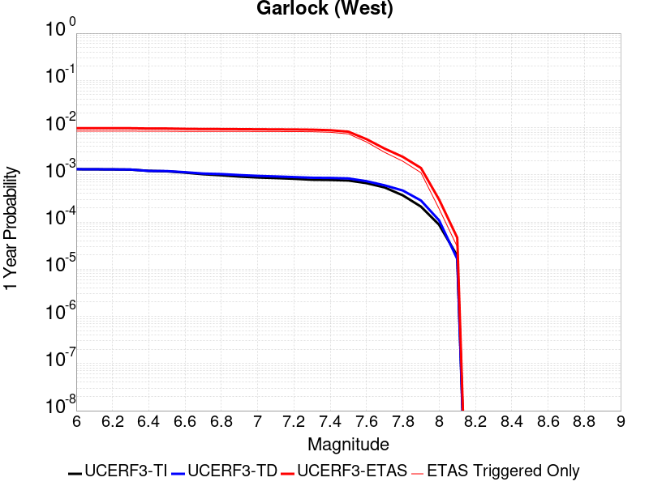 |  |

| Magnitude | 1 wk TI Prob | 1 wk TD Prob | 1 wk ETAS Prob | 1 wk ETAS/TD Gain | 1 wk ETAS Triggered Only | 1 mo TI Prob | 1 mo TD Prob | 1 mo ETAS Prob | 1 mo ETAS/TD Gain | 1 mo ETAS Triggered Only | 1 yr TI Prob | 1 yr TD Prob | 1 yr ETAS Prob | 1 yr ETAS/TD Gain | 1 yr ETAS Triggered Only | 10 yr TI Prob | 10 yr TD Prob | 10 yr ETAS Prob | 10 yr ETAS/TD Gain | 10 yr ETAS Triggered Only |
|-----|-----|-----|-----|-----|-----|-----|-----|-----|-----|-----|-----|-----|-----|-----|-----|-----|-----|-----|-----|-----|
| 6.0 | 2.5181727E-5 | 2.5197181E-5 | 0.0056912634 | 225.86903 | 0.005666209 | 1.0791722E-4 | 1.0798347E-4 | 0.0070182947 | 64.994156 | 0.0069110575 | 0.0013131002 | 0.0013139093 | 0.010316488 | 7.851751 | 0.009014423 | 0.013053683 | 0.013141794 | 0.024071114 | 1.8316458 | 0.011074862 |
| 6.1 | 2.5077732E-5 | 2.5098223E-5 | 0.0056911646 | 226.75568 | 0.005666209 | 1.0747157E-4 | 1.075594E-4 | 0.0070178737 | 65.24649 | 0.0069110575 | 0.001307681 | 0.0013087525 | 0.010311378 | 7.878784 | 0.009014423 | 0.013000126 | 0.013090835 | 0.024020718 | 1.8349264 | 0.011074862 |
| 6.2 | 2.494612E-5 | 2.4979914E-5 | 0.0056910473 | 227.82492 | 0.005666209 | 1.0690756E-4 | 1.070524E-4 | 0.0070173703 | 65.5508 | 0.0069110575 | 0.0013008224 | 0.0013025872 | 0.010305268 | 7.9113846 | 0.009014423 | 0.012932341 | 0.013029906 | 0.023960464 | 1.8388823 | 0.011074862 |
| 6.3 | 2.4733758E-5 | 2.4799276E-5 | 0.0056908675 | 229.47716 | 0.005666209 | 1.0599751E-4 | 1.06278305E-4 | 0.0070166015 | 66.02102 | 0.0069110575 | 0.0012897556 | 0.0012931736 | 0.01029594 | 7.961761 | 0.009014423 | 0.012822957 | 0.0129368715 | 0.02386846 | 1.8449948 | 0.011074862 |
| 6.4 | 2.3237335E-5 | 2.3178607E-5 | 0.005689256 | 245.45288 | 0.005666209 | 9.958477E-5 | 9.933313E-5 | 0.007009704 | 70.56764 | 0.0069110575 | 0.0012117702 | 0.0012087126 | 0.01021224 | 8.448856 | 0.009014423 | 0.012051838 | 0.012101731 | 0.023000162 | 1.9005679 | 0.011031937 |
| 6.5 | 2.2732203E-5 | 2.2992977E-5 | 0.0056890715 | 247.42648 | 0.005666209 | 9.742009E-5 | 9.8537625E-5 | 0.0070089144 | 71.129326 | 0.0069110575 | 0.0011854442 | 0.0011990381 | 0.010202653 | 8.509031 | 0.009014423 | 0.011791403 | 0.012006035 | 0.022905523 | 1.9078339 | 0.011031937 |
| 6.6 | 2.1319436E-5 | 2.1773201E-5 | 0.005559084 | 255.3177 | 0.005537431 | 9.136581E-5 | 9.3310395E-5 | 0.0068749576 | 73.67837 | 0.0067822803 | 0.001111811 | 0.0011354643 | 0.010011021 | 8.816675 | 0.008885645 | 0.011062649 | 0.011376952 | 0.022156067 | 1.947452 | 0.010903159 |
| 6.7 | 1.970802E-5 | 2.0393094E-5 | 0.0055577117 | 272.52908 | 0.005537431 | 8.446021E-5 | 8.739606E-5 | 0.0068690837 | 78.597176 | 0.0067822803 | 0.001027818 | 0.0010635294 | 0.009939725 | 9.345981 | 0.008885645 | 0.010230771 | 0.0106646875 | 0.021451568 | 2.0114577 | 0.010903159 |
| 6.8 | 1.8744462E-5 | 1.9900775E-5 | 0.005557222 | 279.24652 | 0.005537431 | 8.033094E-5 | 8.528626E-5 | 0.0068669883 | 80.51694 | 0.0067822803 | 9.775903E-4 | 0.0010378672 | 0.009914291 | 9.552562 | 0.008885645 | 0.009733009 | 0.010410495 | 0.021200147 | 2.0364206 | 0.010903159 |
| 6.9 | 1.7559682E-5 | 1.8953151E-5 | 0.0055562793 | 293.1586 | 0.005537431 | 7.5253614E-5 | 8.122527E-5 | 0.0068629547 | 84.49285 | 0.0067822803 | 9.158276E-4 | 9.884704E-4 | 0.009865332 | 9.980402 | 0.008885645 | 0.0091206245 | 0.009921073 | 0.020716062 | 2.0880868 | 0.010903159 |
| 7.0 | 1.6794445E-5 | 1.8215967E-5 | 0.0055555464 | 304.98224 | 0.005537431 | 7.197421E-5 | 7.806611E-5 | 0.006859817 | 87.871895 | 0.0067822803 | 8.759337E-4 | 9.5004175E-4 | 0.009827246 | 10.344014 | 0.008885645 | 0.008724891 | 0.009539958 | 0.020339102 | 2.1319907 | 0.010903159 |
| 7.1 | 1.6337795E-5 | 1.771677E-5 | 0.00555505 | 313.54758 | 0.005537431 | 7.0017246E-5 | 7.592681E-5 | 0.0068576923 | 90.31977 | 0.0067822803 | 8.521265E-4 | 9.2401815E-4 | 0.009801453 | 10.607425 | 0.008885645 | 0.008488664 | 0.009281721 | 0.02008368 | 2.1637883 | 0.010903159 |
| 7.2 | 1.5780008E-5 | 1.71654E-5 | 0.0055545014 | 323.5871 | 0.005537431 | 6.762685E-5 | 7.3563926E-5 | 0.0068553453 | 93.18895 | 0.0067822803 | 8.2304585E-4 | 8.952741E-4 | 0.009772965 | 10.91617 | 0.008885645 | 0.008200042 | 0.008996559 | 0.019801628 | 2.2010224 | 0.010903159 |
| 7.3 | 1.5058865E-5 | 1.6618484E-5 | 0.005511033 | 331.6207 | 0.0054945056 | 6.45364E-5 | 7.122013E-5 | 0.0068100947 | 95.62036 | 0.006739354 | 7.854473E-4 | 8.667614E-4 | 0.009701816 | 11.193181 | 0.00884272 | 0.00782677 | 0.008713263 | 0.019478869 | 2.2355423 | 0.010860234 |
| 7.4 | 1.4887923E-5 | 1.6454453E-5 | 0.005339169 | 324.48172 | 0.0053228023 | 6.380382E-5 | 7.0517184E-5 | 0.006594782 | 93.52022 | 0.0065247254 | 7.7653467E-4 | 8.5820974E-4 | 0.009393117 | 10.945014 | 0.008542239 | 0.0077382675 | 0.008628101 | 0.019096743 | 2.2133193 | 0.010559753 |
| 7.5 | 1.4509299E-5 | 1.6046468E-5 | 0.0050382875 | 313.98108 | 0.0050223214 | 6.218123E-5 | 6.876877E-5 | 0.0062925853 | 91.503525 | 0.0062242444 | 7.567935E-4 | 8.369394E-4 | 0.00894313 | 10.685517 | 0.008112981 | 0.0075422134 | 0.008416411 | 0.018291384 | 2.1733 | 0.009958792 |
| 7.6 | 1.2756717E-5 | 1.4050529E-5 | 0.0035339186 | 251.515 | 0.0035199176 | 5.4670498E-5 | 6.0215163E-5 | 0.0043954626 | 72.99593 | 0.004335508 | 6.6541E-4 | 7.328737E-4 | 0.0063520353 | 8.667299 | 0.005623283 | 0.006634211 | 0.007381374 | 0.013985765 | 1.8947374 | 0.0066535026 |
| 7.7 | 1.0328985E-5 | 1.146033E-5 | 0.002157727 | 188.27791 | 0.0021462913 | 4.4266326E-5 | 4.9114777E-5 | 0.0027103852 | 55.18472 | 0.0026614012 | 5.388092E-4 | 5.9780874E-4 | 0.0040298216 | 6.7409883 | 0.003434066 | 0.0053750467 | 0.006038286 | 0.010134282 | 1.6783376 | 0.0041208793 |
| 7.8 | 7.0306583E-6 | 8.899537E-6 | 0.0013395882 | 150.52338 | 0.0013307006 | 3.0131043E-5 | 3.8140315E-5 | 0.0016263352 | 42.640846 | 0.0015882555 | 3.667837E-4 | 4.6425956E-4 | 0.0025237426 | 5.4360595 | 0.0020604397 | 0.003661789 | 0.0046950667 | 0.007130351 | 1.51869 | 0.002446772 |
| 7.9 | 4.060633E-6 | 5.465412E-6 | 7.352004E-4 | 134.51875 | 7.29739E-4 | 1.7402595E-5 | 2.3422985E-5 | 9.248442E-4 | 39.48447 | 9.014423E-4 | 2.11856E-4 | 2.8513762E-4 | 0.001486718 | 5.2140365 | 0.0012019231 | 0.0021165414 | 0.002884143 | 0.0042538075 | 1.4748949 | 0.0013736264 |
| 8.0 | 1.6729537E-6 | 2.0775192E-6 | 2.5963192E-4 | 124.97209 | 2.5755496E-4 | 7.169782E-6 | 8.903624E-6 | 2.6645628E-4 | 29.926723 | 2.5755496E-4 | 8.7288594E-5 | 1.0839626E-4 | 4.0884447E-4 | 3.771758 | 3.0048078E-4 | 8.7254314E-4 | 0.001096854 | 0.0013970052 | 1.2736473 | 3.0048078E-4 |
| 8.1 | 3.6733252E-7 | 3.1489736E-7 | 4.3240707E-5 | 137.31683 | 4.2925825E-5 | 1.5742813E-6 | 1.3495595E-6 | 4.4275326E-5 | 32.80724 | 4.2925825E-5 | 1.9166706E-5 | 1.643078E-5 | 5.9355898E-5 | 3.612482 | 4.2925825E-5 | 1.9165053E-4 | 1.662928E-4 | 2.0921147E-4 | 1.2580911 | 4.2925825E-5 |

## McLean Lake
*[(top)](#table-of-contents)*

| 1 Week | 1 Month | 1 Year | 10 Year |
|-----|-----|-----|-----|
|  |  |  |  |

| Magnitude | 1 wk TI Prob | 1 wk TD Prob | 1 wk ETAS Prob | 1 wk ETAS/TD Gain | 1 wk ETAS Triggered Only | 1 mo TI Prob | 1 mo TD Prob | 1 mo ETAS Prob | 1 mo ETAS/TD Gain | 1 mo ETAS Triggered Only | 1 yr TI Prob | 1 yr TD Prob | 1 yr ETAS Prob | 1 yr ETAS/TD Gain | 1 yr ETAS Triggered Only | 10 yr TI Prob | 10 yr TD Prob | 10 yr ETAS Prob | 10 yr ETAS/TD Gain | 10 yr ETAS Triggered Only |
|-----|-----|-----|-----|-----|-----|-----|-----|-----|-----|-----|-----|-----|-----|-----|-----|-----|-----|-----|-----|-----|
| 6.0 | 1.7360222E-5 | 1.8501627E-5 | 0.002035978 | 110.04319 | 0.0020175138 | 7.439883E-5 | 7.9290556E-5 | 0.0030409375 | 38.351826 | 0.002961882 | 9.0542925E-4 | 9.6498354E-4 | 0.0057251523 | 5.9329014 | 0.0047647664 | 0.009017491 | 0.0096127745 | 0.017052582 | 1.7739501 | 0.007512019 |
| 6.1 | 9.062689E-6 | 9.592193E-6 | 0.0012544291 | 130.77605 | 0.001244849 | 3.8839516E-5 | 4.1108804E-5 | 0.001586375 | 38.589664 | 0.0015453297 | 4.727685E-4 | 5.003936E-4 | 0.0029888456 | 5.972989 | 0.002489698 | 0.0047176396 | 0.004993552 | 0.009093853 | 1.8211192 | 0.0041208793 |
| 6.2 | 9.062689E-6 | 9.592193E-6 | 0.0012544291 | 130.77605 | 0.001244849 | 3.8839516E-5 | 4.1108804E-5 | 0.001586375 | 38.589664 | 0.0015453297 | 4.727685E-4 | 5.003936E-4 | 0.0029888456 | 5.972989 | 0.002489698 | 0.0047176396 | 0.004993552 | 0.009093853 | 1.8211192 | 0.0041208793 |
| 6.3 | 7.2575485E-6 | 7.66771E-6 | 8.661776E-4 | 112.964325 | 8.585165E-4 | 3.110341E-5 | 3.2861237E-5 | 0.0011059716 | 33.65581 | 0.0010731457 | 3.786182E-4 | 4.0001926E-4 | 0.002288 | 5.7197247 | 0.0018887363 | 0.0037797375 | 0.0039936965 | 0.0070292586 | 1.7600882 | 0.0030477336 |
| 6.4 | 7.2575485E-6 | 7.66771E-6 | 8.661776E-4 | 112.964325 | 8.585165E-4 | 3.110341E-5 | 3.2861237E-5 | 0.0011059716 | 33.65581 | 0.0010731457 | 3.786182E-4 | 4.0001926E-4 | 0.002288 | 5.7197247 | 0.0018887363 | 0.0037797375 | 0.0039936965 | 0.0070292586 | 1.7600882 | 0.0030477336 |
| 6.5 | 6.06582E-6 | 6.4038773E-6 | 7.361382E-4 | 114.95196 | 7.29739E-4 | 2.5996113E-5 | 2.7444936E-5 | 9.7178714E-4 | 35.408615 | 9.4436813E-4 | 3.164567E-4 | 3.3409733E-4 | 0.0019218222 | 5.752282 | 0.0015882555 | 0.0031600643 | 0.0033365893 | 0.0059035453 | 1.7693353 | 0.0025755495 |
| 6.6 | 5.598744E-6 | 5.910262E-6 | 6.9271936E-4 | 117.2062 | 6.868132E-4 | 2.3994397E-5 | 2.5329486E-5 | 9.2674897E-4 | 36.587753 | 9.014423E-4 | 2.9209262E-4 | 3.0834923E-4 | 0.0017244646 | 5.59257 | 0.0014165522 | 0.0029170897 | 0.003079843 | 0.0053906986 | 1.750316 | 0.0023179946 |
| 6.7 | 5.246996E-6 | 5.539162E-6 | 6.923485E-4 | 124.99157 | 6.868132E-4 | 2.2486933E-5 | 2.3739085E-5 | 9.2516E-4 | 38.972015 | 9.014423E-4 | 2.73744E-4 | 2.8899137E-4 | 0.0016622208 | 5.7518005 | 0.0013736264 | 0.0027340704 | 0.0028867796 | 0.0051552807 | 1.7858242 | 0.0022750688 |
| 6.8 | 4.02324E-6 | 4.2469046E-6 | 6.052059E-4 | 142.50519 | 6.0096156E-4 | 1.7242342E-5 | 1.8200926E-5 | 7.050016E-4 | 38.734383 | 6.868132E-4 | 2.099053E-4 | 2.2157968E-4 | 0.0012086548 | 5.4547186 | 9.87294E-4 | 0.0020970714 | 0.002214172 | 0.00375608 | 1.6963813 | 0.0015453297 |
| 6.9 | 6.835972E-7 | 7.1399285E-7 | 4.3639786E-5 | 61.12076 | 4.2925825E-5 | 2.9296991E-6 | 3.0599674E-6 | 8.891135E-5 | 29.056307 | 8.585165E-5 | 3.56685E-5 | 3.7254784E-5 | 1.6602746E-4 | 4.4565406 | 1.2877748E-4 | 3.5662777E-4 | 3.7251666E-4 | 6.2997564E-4 | 1.6911342 | 2.5755496E-4 |

## Gravel Hills-Harper Lk
*[(top)](#table-of-contents)*

| 1 Week | 1 Month | 1 Year | 10 Year |
|-----|-----|-----|-----|
|  |  |  |  |

| Magnitude | 1 wk TI Prob | 1 wk TD Prob | 1 wk ETAS Prob | 1 wk ETAS/TD Gain | 1 wk ETAS Triggered Only | 1 mo TI Prob | 1 mo TD Prob | 1 mo ETAS Prob | 1 mo ETAS/TD Gain | 1 mo ETAS Triggered Only | 1 yr TI Prob | 1 yr TD Prob | 1 yr ETAS Prob | 1 yr ETAS/TD Gain | 1 yr ETAS Triggered Only | 10 yr TI Prob | 10 yr TD Prob | 10 yr ETAS Prob | 10 yr ETAS/TD Gain | 10 yr ETAS Triggered Only |
|-----|-----|-----|-----|-----|-----|-----|-----|-----|-----|-----|-----|-----|-----|-----|-----|-----|-----|-----|-----|-----|
| 6.0 | 3.0679566E-5 | 3.1464628E-5 | 0.0022206127 | 70.5749 | 0.0021892171 | 1.3147724E-4 | 1.3484266E-4 | 0.0032250853 | 23.917397 | 0.0030906594 | 0.0015995599 | 0.00164069 | 0.0068690483 | 4.1866827 | 0.0052369507 | 0.015880952 | 0.016307337 | 0.023570178 | 1.4453726 | 0.007383242 |
| 6.1 | 3.0679566E-5 | 3.1464628E-5 | 0.0022206127 | 70.5749 | 0.0021892171 | 1.3147724E-4 | 1.3484266E-4 | 0.0032250853 | 23.917397 | 0.0030906594 | 0.0015995599 | 0.00164069 | 0.0068690483 | 4.1866827 | 0.0052369507 | 0.015880952 | 0.016307337 | 0.023570178 | 1.4453726 | 0.007383242 |
| 6.2 | 1.514536E-5 | 1.36352E-5 | 8.7214E-4 | 63.962387 | 8.585165E-4 | 6.490707E-5 | 5.843533E-5 | 0.0012173648 | 20.832685 | 0.0011589973 | 7.8995706E-4 | 7.112298E-4 | 0.0025986228 | 3.6537035 | 0.0018887363 | 0.007871548 | 0.007090737 | 0.009733267 | 1.3726735 | 0.0026614012 |
| 6.3 | 1.514536E-5 | 1.36352E-5 | 8.7214E-4 | 63.962387 | 8.585165E-4 | 6.490707E-5 | 5.843533E-5 | 0.0012173648 | 20.832685 | 0.0011589973 | 7.8995706E-4 | 7.112298E-4 | 0.0025986228 | 3.6537035 | 0.0018887363 | 0.007871548 | 0.007090737 | 0.009733267 | 1.3726735 | 0.0026614012 |
| 6.4 | 1.2532521E-5 | 1.0689684E-5 | 6.116448E-4 | 57.21823 | 6.0096156E-4 | 5.37097E-5 | 4.581216E-5 | 8.6136546E-4 | 18.802114 | 8.1559067E-4 | 6.537194E-4 | 5.5762613E-4 | 0.0017159771 | 3.0772896 | 0.0011589973 | 0.0065179965 | 0.005562859 | 0.0071849665 | 1.2915959 | 0.0016311813 |
| 6.5 | 1.1094058E-5 | 9.083657E-6 | 3.9541256E-4 | 43.53011 | 3.8633242E-4 | 4.7545094E-5 | 3.89294E-5 | 6.3986756E-4 | 16.436615 | 6.0096156E-4 | 5.787078E-4 | 4.7386638E-4 | 0.0013748815 | 2.9014118 | 9.014423E-4 | 0.0057720304 | 0.004728967 | 0.0060106516 | 1.2710285 | 0.0012877748 |
| 6.6 | 9.688328E-6 | 7.531688E-6 | 3.080102E-4 | 40.89524 | 3.0048078E-4 | 4.1520743E-5 | 3.227828E-5 | 5.473715E-4 | 16.957891 | 5.151099E-4 | 5.053978E-4 | 3.9291973E-4 | 0.001079463 | 2.7472866 | 6.868132E-4 | 0.0050424994 | 0.0039225067 | 0.0049059284 | 1.2507124 | 9.87294E-4 |
| 6.7 | 8.974824E-6 | 6.749406E-6 | 2.2137708E-4 | 32.79949 | 2.1462912E-4 | 3.8462964E-5 | 2.8925719E-5 | 3.7232236E-4 | 12.871673 | 3.434066E-4 | 4.6818596E-4 | 3.5211592E-4 | 8.6704444E-4 | 2.4623835 | 5.151099E-4 | 0.004672008 | 0.003515801 | 0.004285749 | 1.2189965 | 7.7266485E-4 |
| 6.8 | 7.4780046E-6 | 5.1161865E-6 | 1.33893E-4 | 26.17047 | 1.2877748E-4 | 3.20482E-5 | 2.1926337E-5 | 1.9362586E-4 | 8.830744 | 1.717033E-4 | 3.9011694E-4 | 2.6692182E-4 | 5.24408E-4 | 1.9646502 | 2.5755496E-4 | 0.0038943281 | 0.0026661505 | 0.0030942643 | 1.1605737 | 4.2925825E-4 |
| 6.9 | 6.3409307E-6 | 3.907489E-6 | 8.97588E-5 | 22.970966 | 8.585165E-5 | 2.7175134E-5 | 1.674628E-5 | 1.0259649E-4 | 6.1265244 | 8.585165E-5 | 3.3080703E-4 | 2.0386786E-4 | 2.8970203E-4 | 1.4210283 | 8.585165E-5 | 0.0033031502 | 0.0020369065 | 0.002293937 | 1.1261866 | 2.5755496E-4 |
| 7.0 | 5.1239335E-6 | 2.6058492E-6 | 8.845727E-5 | 33.94566 | 8.585165E-5 | 2.195953E-5 | 1.1167879E-5 | 9.701857E-5 | 8.687286 | 8.585165E-5 | 2.6732447E-4 | 1.359607E-4 | 2.2180067E-4 | 1.6313587 | 8.585165E-5 | 0.0026700313 | 0.0013588005 | 0.001487403 | 1.0946442 | 1.2877748E-4 |
| 7.1 | 4.438899E-6 | 2.0984692E-6 | 8.7949935E-5 | 41.911472 | 8.585165E-5 | 1.9023713E-5 | 8.99341E-6 | 9.484428E-5 | 10.545976 | 8.585165E-5 | 2.315891E-4 | 1.0948948E-4 | 1.9533174E-4 | 1.7840228 | 8.585165E-5 | 0.002313479 | 0.0010943774 | 0.0012230139 | 1.1175431 | 1.2877748E-4 |
| 7.2 | 3.50367E-6 | 1.2615715E-6 | 1.2615715E-6 | 1.0 | 0.0 | 1.5015643E-5 | 5.406724E-6 | 5.406724E-6 | 1.0 | 0.0 | 1.8280011E-4 | 6.5824956E-5 | 6.5824956E-5 | 1.0 | 0.0 | 0.0018264982 | 6.580628E-4 | 6.580628E-4 | 1.0 | 0.0 |
| 7.3 | 2.561638E-6 | 7.118686E-7 | 7.118686E-7 | 1.0 | 0.0 | 1.0978401E-5 | 3.050862E-6 | 3.050862E-6 | 1.0 | 0.0 | 1.3365384E-4 | 3.7143633E-5 | 3.7143633E-5 | 1.0 | 0.0 | 0.0013357349 | 3.7137623E-4 | 3.7137623E-4 | 1.0 | 0.0 |
| 7.4 | 2.0368864E-6 | 5.304471E-7 | 5.304471E-7 | 1.0 | 0.0 | 8.729483E-6 | 2.2733427E-6 | 2.2733427E-6 | 1.0 | 0.0 | 1.06276275E-4 | 2.76776E-5 | 2.76776E-5 | 1.0 | 0.0 | 0.0010622547 | 2.767421E-4 | 2.767421E-4 | 1.0 | 0.0 |
| 7.5 | 1.1681728E-6 | 3.6028484E-7 | 3.6028484E-7 | 1.0 | 0.0 | 5.0064455E-6 | 1.544077E-6 | 1.544077E-6 | 1.0 | 0.0 | 6.0951766E-5 | 1.879898E-5 | 1.879898E-5 | 1.0 | 0.0 | 6.093505E-4 | 1.8797436E-4 | 1.8797436E-4 | 1.0 | 0.0 |
| 7.6 | 1.3154387E-7 | 7.1196716E-8 | 7.1196716E-8 | 1.0 | 0.0 | 5.6375933E-7 | 3.0512876E-7 | 3.0512876E-7 | 1.0 | 0.0 | 6.863748E-6 | 3.714938E-6 | 3.714938E-6 | 1.0 | 0.0 | 6.863536E-5 | 3.7148915E-5 | 3.7148915E-5 | 1.0 | 0.0 |

## Goldstone Lake
*[(top)](#table-of-contents)*

| 1 Week | 1 Month | 1 Year | 10 Year |
|-----|-----|-----|-----|
| 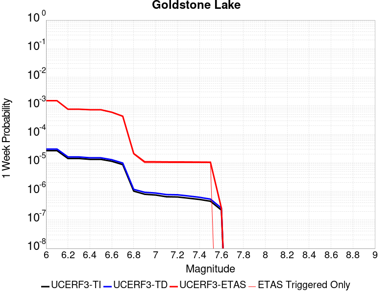 | 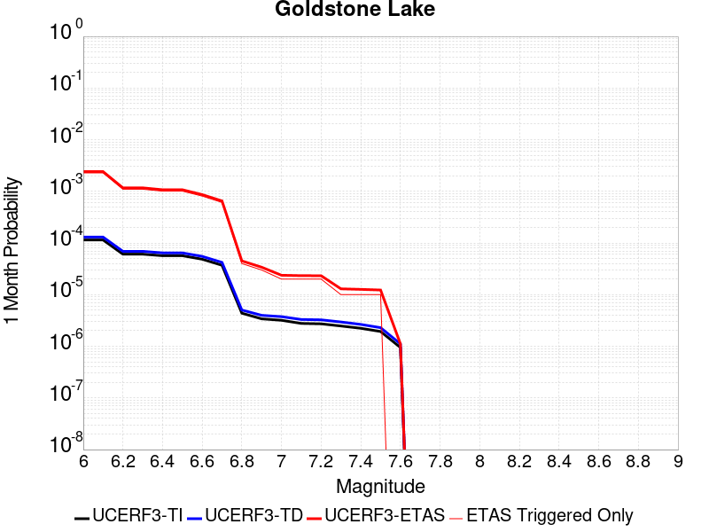 | 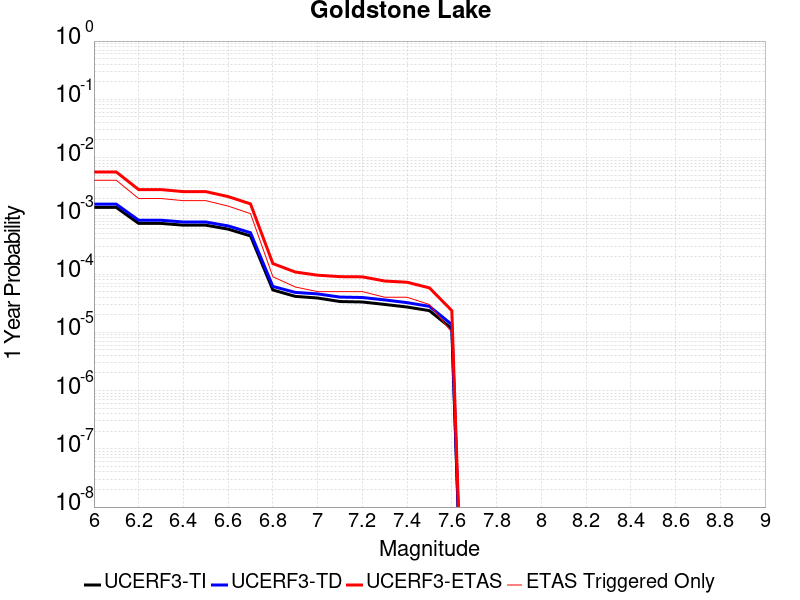 |  |

| Magnitude | 1 wk TI Prob | 1 wk TD Prob | 1 wk ETAS Prob | 1 wk ETAS/TD Gain | 1 wk ETAS Triggered Only | 1 mo TI Prob | 1 mo TD Prob | 1 mo ETAS Prob | 1 mo ETAS/TD Gain | 1 mo ETAS Triggered Only | 1 yr TI Prob | 1 yr TD Prob | 1 yr ETAS Prob | 1 yr ETAS/TD Gain | 1 yr ETAS Triggered Only | 10 yr TI Prob | 10 yr TD Prob | 10 yr ETAS Prob | 10 yr ETAS/TD Gain | 10 yr ETAS Triggered Only |
|-----|-----|-----|-----|-----|-----|-----|-----|-----|-----|-----|-----|-----|-----|-----|-----|-----|-----|-----|-----|-----|
| 6.0 | 2.671352E-5 | 3.0376103E-5 | 0.0014039607 | 46.21925 | 0.0013736264 | 1.1448149E-4 | 1.3017791E-4 | 0.00236203 | 18.14463 | 0.002232143 | 0.001392921 | 0.0015839601 | 0.0052697337 | 3.3269358 | 0.003691621 | 0.013842222 | 0.015746202 | 0.021703439 | 1.3783284 | 0.006052541 |
| 6.1 | 2.671352E-5 | 3.0376103E-5 | 0.0014039607 | 46.21925 | 0.0013736264 | 1.1448149E-4 | 1.3017791E-4 | 0.00236203 | 18.14463 | 0.002232143 | 0.001392921 | 0.0015839601 | 0.0052697337 | 3.3269358 | 0.003691621 | 0.013842222 | 0.015746202 | 0.021703439 | 1.3783284 | 0.006052541 |
| 6.2 | 1.4197047E-5 | 1.6096254E-5 | 7.0289837E-4 | 43.668446 | 6.868132E-4 | 6.0843064E-5 | 6.898268E-5 | 0.0010562085 | 15.3112135 | 9.87294E-4 | 7.4051257E-4 | 8.3963916E-4 | 0.0025123407 | 2.9921672 | 0.0016741072 | 0.007380498 | 0.008374364 | 0.01109861 | 1.3253078 | 0.0027472528 |
| 6.3 | 1.4197047E-5 | 1.6096254E-5 | 7.0289837E-4 | 43.668446 | 6.868132E-4 | 6.0843064E-5 | 6.898268E-5 | 0.0010562085 | 15.3112135 | 9.87294E-4 | 7.4051257E-4 | 8.3963916E-4 | 0.0025123407 | 2.9921672 | 0.0016741072 | 0.007380498 | 0.008374364 | 0.01109861 | 1.3253078 | 0.0027472528 |
| 6.4 | 1.3238931E-5 | 1.500847E-5 | 7.0181134E-4 | 46.76102 | 6.868132E-4 | 5.6737044E-5 | 6.432098E-5 | 0.0010515514 | 16.3485 | 9.87294E-4 | 6.9055456E-4 | 7.8292453E-4 | 0.002455721 | 3.1365998 | 0.0016741072 | 0.006884126 | 0.007811289 | 0.01036672 | 1.3271459 | 0.0025755495 |
| 6.5 | 1.3238931E-5 | 1.500847E-5 | 7.0181134E-4 | 46.76102 | 6.868132E-4 | 5.6737044E-5 | 6.432098E-5 | 0.0010515514 | 16.3485 | 9.87294E-4 | 6.9055456E-4 | 7.8292453E-4 | 0.002455721 | 3.1365998 | 0.0016741072 | 0.006884126 | 0.007811289 | 0.01036672 | 1.3271459 | 0.0025755495 |
| 6.6 | 1.1328278E-5 | 1.2855176E-5 | 5.7088374E-4 | 44.408863 | 5.5803574E-4 | 4.8548856E-5 | 5.5092984E-5 | 8.2771527E-4 | 15.023968 | 7.7266485E-4 | 5.90922E-4 | 6.706464E-4 | 0.0019575574 | 2.9189117 | 0.0012877748 | 0.0058935313 | 0.0066956137 | 0.0088275345 | 1.3184055 | 0.0021462913 |
| 6.7 | 8.651175E-6 | 9.824575E-6 | 3.961532E-4 | 40.32268 | 3.8633242E-4 | 3.707594E-5 | 4.2105148E-5 | 6.001174E-4 | 14.252826 | 5.5803574E-4 | 4.5130608E-4 | 5.126002E-4 | 0.0014135804 | 2.7576668 | 9.014423E-4 | 0.0045039062 | 0.0051230565 | 0.006617763 | 1.2917608 | 0.0015024039 |
| 6.8 | 1.0215377E-6 | 1.1754802E-6 | 4.4101253E-5 | 37.51765 | 4.2925825E-5 | 4.378012E-6 | 5.037763E-6 | 4.796337E-5 | 9.520767 | 4.2925825E-5 | 5.3300988E-5 | 6.133315E-5 | 1.4717954E-4 | 2.3996735 | 8.585165E-5 | 5.3288206E-4 | 6.131735E-4 | 6.9897255E-4 | 1.1399262 | 8.585165E-5 |
| 6.9 | 7.9360774E-7 | 9.283496E-7 | 4.3854136E-5 | 47.238815 | 4.2925825E-5 | 3.4011714E-6 | 3.9786355E-6 | 4.690429E-5 | 11.78904 | 4.2925825E-5 | 4.1408475E-5 | 4.843888E-5 | 9.136263E-5 | 1.8861424 | 4.2925825E-5 | 4.140076E-4 | 4.842902E-4 | 5.271953E-4 | 1.0885936 | 4.2925825E-5 |
| 7.0 | 7.4382757E-7 | 8.747428E-7 | 4.380053E-5 | 50.072468 | 4.2925825E-5 | 3.1878285E-6 | 3.7488926E-6 | 4.6674555E-5 | 12.450225 | 4.2925825E-5 | 3.8811122E-5 | 4.564188E-5 | 8.856574E-5 | 1.9404491 | 4.2925825E-5 | 3.8804344E-4 | 4.563317E-4 | 4.992379E-4 | 1.0940242 | 4.2925825E-5 |
| 7.1 | 6.4709513E-7 | 7.711399E-7 | 4.369693E-5 | 56.66537 | 4.2925825E-5 | 2.773262E-6 | 3.3048816E-6 | 4.6230565E-5 | 13.988569 | 4.2925825E-5 | 3.376394E-5 | 4.023625E-5 | 8.316035E-5 | 2.0668015 | 4.2925825E-5 | 3.375881E-4 | 4.022956E-4 | 4.4520418E-4 | 1.1066593 | 4.2925825E-5 |
| 7.2 | 6.356704E-7 | 7.588459E-7 | 4.368464E-5 | 57.567207 | 4.2925825E-5 | 2.7242988E-6 | 3.252193E-6 | 4.6177876E-5 | 14.198997 | 4.2925825E-5 | 3.3167835E-5 | 3.959479E-5 | 8.251891E-5 | 2.0840852 | 4.2925825E-5 | 3.3162883E-4 | 3.9588328E-4 | 4.3879214E-4 | 1.1083876 | 4.2925825E-5 |
| 7.3 | 5.7695723E-7 | 6.896648E-7 | 4.361546E-5 | 63.241535 | 4.2925825E-5 | 2.4726714E-6 | 2.9557032E-6 | 4.58814E-5 | 15.523006 | 4.2925825E-5 | 3.0104358E-5 | 3.598515E-5 | 7.8909434E-5 | 2.1928332 | 4.2925825E-5 | 3.0100282E-4 | 3.5979896E-4 | 4.0270935E-4 | 1.1192621 | 4.2925825E-5 |
| 7.4 | 5.209647E-7 | 6.193583E-7 | 4.3545155E-5 | 70.30689 | 4.2925825E-5 | 2.232704E-6 | 2.6543903E-6 | 4.5580102E-5 | 17.17159 | 4.2925825E-5 | 2.718283E-5 | 3.2316777E-5 | 7.5241216E-5 | 2.32824 | 4.2925825E-5 | 2.7179506E-4 | 3.2312635E-4 | 3.660383E-4 | 1.1328024 | 4.2925825E-5 |
| 7.5 | 4.512955E-7 | 5.3489487E-7 | 4.3460695E-5 | 81.25091 | 4.2925825E-5 | 1.934122E-6 | 2.2924048E-6 | 4.521813E-5 | 19.725193 | 4.2925825E-5 | 2.3547682E-5 | 2.7909726E-5 | 7.083435E-5 | 2.5379808 | 4.2925825E-5 | 2.3545188E-4 | 2.7906752E-4 | 3.2198138E-4 | 1.1537758 | 4.2925825E-5 |
| 7.6 | 2.21172E-7 | 2.6040198E-7 | 2.6040198E-7 | 1.0 | 0.0 | 9.478797E-7 | 1.1160082E-6 | 1.1160082E-6 | 1.0 | 0.0 | 1.1540374E-5 | 1.3587343E-5 | 1.3587343E-5 | 1.0 | 0.0 | 1.1539775E-4 | 1.3586794E-4 | 1.3586794E-4 | 1.0 | 0.0 |

## San Andreas (Mojave S)
*[(top)](#table-of-contents)*

| 1 Week | 1 Month | 1 Year | 10 Year |
|-----|-----|-----|-----|
|  |  |  |  |

| Magnitude | 1 wk TI Prob | 1 wk TD Prob | 1 wk ETAS Prob | 1 wk ETAS/TD Gain | 1 wk ETAS Triggered Only | 1 mo TI Prob | 1 mo TD Prob | 1 mo ETAS Prob | 1 mo ETAS/TD Gain | 1 mo ETAS Triggered Only | 1 yr TI Prob | 1 yr TD Prob | 1 yr ETAS Prob | 1 yr ETAS/TD Gain | 1 yr ETAS Triggered Only | 10 yr TI Prob | 10 yr TD Prob | 10 yr ETAS Prob | 10 yr ETAS/TD Gain | 10 yr ETAS Triggered Only |
|-----|-----|-----|-----|-----|-----|-----|-----|-----|-----|-----|-----|-----|-----|-----|-----|-----|-----|-----|-----|-----|
| 6.0 | 3.1064058E-4 | 6.7462435E-4 | 0.0028194676 | 4.179315 | 0.0021462913 | 0.0013306376 | 0.002888172 | 0.005713094 | 1.9781003 | 0.0028331045 | 0.016080605 | 0.034565594 | 0.038129613 | 1.1031088 | 0.003691621 | 0.1496549 | 0.28654557 | 0.28985316 | 1.0115429 | 0.004635989 |
| 6.1 | 3.1064058E-4 | 6.7462435E-4 | 0.0028194676 | 4.179315 | 0.0021462913 | 0.0013306376 | 0.002888172 | 0.005713094 | 1.9781003 | 0.0028331045 | 0.016080605 | 0.034565594 | 0.038129613 | 1.1031088 | 0.003691621 | 0.1496549 | 0.28654557 | 0.28985316 | 1.0115429 | 0.004635989 |
| 6.2 | 3.1064058E-4 | 6.7462435E-4 | 0.0028194676 | 4.179315 | 0.0021462913 | 0.0013306376 | 0.002888172 | 0.005713094 | 1.9781003 | 0.0028331045 | 0.016080605 | 0.034565594 | 0.038129613 | 1.1031088 | 0.003691621 | 0.1496549 | 0.28654557 | 0.28985316 | 1.0115429 | 0.004635989 |
| 6.3 | 3.1064058E-4 | 6.7462435E-4 | 0.0028194676 | 4.179315 | 0.0021462913 | 0.0013306376 | 0.002888172 | 0.005713094 | 1.9781003 | 0.0028331045 | 0.016080605 | 0.034565594 | 0.038129613 | 1.1031088 | 0.003691621 | 0.1496549 | 0.28654557 | 0.28985316 | 1.0115429 | 0.004635989 |
| 6.4 | 1.9872203E-4 | 4.3181062E-4 | 0.0024913605 | 5.7695675 | 0.0020604397 | 8.5138786E-4 | 0.0018493326 | 0.0045058117 | 2.4364529 | 0.0026614012 | 0.010316478 | 0.02228931 | 0.025604865 | 1.1487509 | 0.0033911401 | 0.098504856 | 0.19686839 | 0.20024696 | 1.0171615 | 0.004206731 |
| 6.5 | 1.291105E-4 | 2.8754136E-4 | 0.0021757346 | 7.5666833 | 0.0018887363 | 5.5321335E-4 | 0.0012317409 | 0.0037183722 | 3.0187938 | 0.002489698 | 0.006714592 | 0.014894155 | 0.018023355 | 1.2100958 | 0.003176511 | 0.065152965 | 0.13800792 | 0.14122708 | 1.0233258 | 0.0037345467 |
| 6.6 | 1.291105E-4 | 2.8754136E-4 | 0.0021757346 | 7.5666833 | 0.0018887363 | 5.5321335E-4 | 0.0012317409 | 0.0037183722 | 3.0187938 | 0.002489698 | 0.006714592 | 0.014894155 | 0.018023355 | 1.2100958 | 0.003176511 | 0.065152965 | 0.13800792 | 0.14122708 | 1.0233258 | 0.0037345467 |
| 6.7 | 1.08001186E-4 | 2.4335351E-4 | 0.0020887149 | 8.583048 | 0.0018458104 | 4.6278012E-4 | 0.0010425274 | 0.0034867486 | 3.344515 | 0.002446772 | 0.0056198016 | 0.0126192 | 0.015713241 | 1.2451853 | 0.0031335852 | 0.054797906 | 0.11918431 | 0.12243594 | 1.0272825 | 0.003691621 |
| 6.8 | 1.0624356E-4 | 2.3853009E-4 | 0.0020839002 | 8.736425 | 0.0018458104 | 4.5525006E-4 | 0.0010218718 | 0.0034661435 | 3.3919554 | 0.002446772 | 0.0055285925 | 0.012370593 | 0.015465413 | 1.2501756 | 0.0031335852 | 0.053930566 | 0.11713308 | 0.12039229 | 1.0278249 | 0.003691621 |
| 6.9 | 1.0393785E-4 | 2.3223337E-4 | 0.0020776151 | 8.9462385 | 0.0018458104 | 4.4537184E-4 | 9.949068E-4 | 0.0034392443 | 3.456851 | 0.002446772 | 0.0054089287 | 0.012045963 | 0.015141801 | 1.2570021 | 0.0031335852 | 0.05279156 | 0.114433445 | 0.117702626 | 1.0285684 | 0.003691621 |
| 7.0 | 1.0155622E-4 | 2.2592908E-4 | 0.0020284064 | 8.978067 | 0.0018028846 | 4.3516833E-4 | 9.6790853E-4 | 0.003369428 | 3.481143 | 0.0024038462 | 0.005285311 | 0.011720838 | 0.014775272 | 1.2605987 | 0.0030906594 | 0.05161361 | 0.11169745 | 0.114938594 | 1.0290172 | 0.003648695 |
| 7.1 | 9.885595E-5 | 2.188132E-4 | 0.0020213034 | 9.237575 | 0.0018028846 | 4.2359953E-4 | 9.374342E-4 | 0.0033390268 | 3.5618787 | 0.0024038462 | 0.0051451353 | 0.011353733 | 0.014409302 | 1.2691246 | 0.0030906594 | 0.05027629 | 0.10857607 | 0.1118286 | 1.0299562 | 0.003648695 |
| 7.2 | 9.6411415E-5 | 2.1244297E-4 | 0.0020149446 | 9.484637 | 0.0018028846 | 4.1312634E-4 | 9.101525E-4 | 0.0033118108 | 3.6387427 | 0.0024038462 | 0.005018219 | 0.011024987 | 0.014081572 | 1.2772416 | 0.0030906594 | 0.049064007 | 0.1057697 | 0.10899409 | 1.030485 | 0.0036057692 |
| 7.3 | 9.1180635E-5 | 1.9472656E-4 | 0.0019972601 | 10.2567425 | 0.0018028846 | 3.907156E-4 | 8.342756E-4 | 0.0032361164 | 3.8789535 | 0.0024038462 | 0.004746591 | 0.010110112 | 0.013169524 | 1.3026092 | 0.0030906594 | 0.046464786 | 0.09796176 | 0.101214305 | 1.0332022 | 0.0036057692 |
| 7.4 | 8.887388E-5 | 1.872126E-4 | 0.0019897597 | 10.628343 | 0.0018028846 | 3.8083247E-4 | 8.020931E-4 | 0.0031611198 | 3.9410882 | 0.0023609204 | 0.0046267817 | 0.009721855 | 0.012739958 | 1.3104453 | 0.0030477336 | 0.045316286 | 0.094593845 | 0.09781966 | 1.0341018 | 0.0035628434 |
| 7.5 | 8.6750515E-5 | 1.80528E-4 | 0.001983087 | 10.984928 | 0.0018028846 | 3.7173493E-4 | 7.734621E-4 | 0.0031325563 | 4.050045 | 0.0023609204 | 0.004516484 | 0.009376327 | 0.012395483 | 1.3219979 | 0.0030477336 | 0.04425787 | 0.09155606 | 0.0947927 | 1.0353515 | 0.0035628434 |
| 7.6 | 8.453092E-5 | 1.7440386E-4 | 0.001976974 | 11.335609 | 0.0018028846 | 3.6222505E-4 | 7.4723107E-4 | 0.0031063873 | 4.1571975 | 0.0023609204 | 0.0044011753 | 0.009059664 | 0.0120797865 | 1.3333591 | 0.0030477336 | 0.04315024 | 0.08871447 | 0.09196124 | 1.036598 | 0.0035628434 |
| 7.7 | 8.259102E-5 | 1.6962511E-4 | 0.0019292854 | 11.373819 | 0.0017599588 | 3.539135E-4 | 7.267622E-4 | 0.003043072 | 4.1871634 | 0.0023179946 | 0.004300386 | 0.0088125 | 0.011790828 | 1.3379662 | 0.0030048077 | 0.042181134 | 0.086465426 | 0.08968099 | 1.037189 | 0.0035199176 |
| 7.8 | 7.444844E-5 | 1.528469E-4 | 0.0016121018 | 10.547167 | 0.001459478 | 3.1902574E-4 | 6.5489375E-4 | 0.002542393 | 3.882146 | 0.0018887363 | 0.0038772223 | 0.007944231 | 0.01032898 | 1.3001863 | 0.0024038462 | 0.03810269 | 0.078293875 | 0.08094473 | 1.0338577 | 0.0028760303 |
| 7.9 | 5.2586525E-5 | 1.0007023E-4 | 8.7265775E-4 | 8.720453 | 7.7266485E-4 | 2.2535135E-4 | 4.2880196E-4 | 0.0015443948 | 3.6016507 | 0.0011160715 | 0.0027402006 | 0.005208178 | 0.0066600544 | 1.2787687 | 0.001459478 | 0.027066574 | 0.052201588 | 0.053828992 | 1.0311754 | 0.001717033 |
| 8.0 | 3.379877E-5 | 5.4075565E-5 | 3.545401E-4 | 6.5563827 | 3.0048078E-4 | 1.4484383E-4 | 2.3173184E-4 | 5.32143E-4 | 2.296374 | 3.0048078E-4 | 0.0017620471 | 0.0028176866 | 0.0032029306 | 1.1367234 | 3.8633242E-4 | 0.017481409 | 0.028835917 | 0.029211108 | 1.0130113 | 3.8633242E-4 |
| 8.1 | 1.8668277E-5 | 1.9308145E-5 | 6.223314E-5 | 3.2231548 | 4.2925825E-5 | 8.000444E-5 | 8.274657E-5 | 1.2566884E-4 | 1.5187197 | 4.2925825E-5 | 9.736188E-4 | 0.0010069745 | 0.0010498571 | 1.0425856 | 4.2925825E-5 | 0.009693642 | 0.010798624 | 0.010841086 | 1.0039322 | 4.2925825E-5 |
| 8.2 | 8.541571E-6 | 5.4596358E-6 | 5.4596358E-6 | 1.0 | 0.0 | 3.660622E-5 | 2.339823E-5 | 2.339823E-5 | 1.0 | 0.0 | 4.455896E-4 | 2.848363E-4 | 2.848363E-4 | 1.0 | 0.0 | 0.0044469717 | 0.003240283 | 0.003240283 | 1.0 | 0.0 |
| 8.3 | 1.983087E-6 | 7.6564595E-7 | 7.6564595E-7 | 1.0 | 0.0 | 8.498917E-6 | 3.281336E-6 | 3.281336E-6 | 1.0 | 0.0 | 1.034694E-4 | 3.9949547E-5 | 3.9949547E-5 | 1.0 | 0.0 | 0.0010342124 | 4.717979E-4 | 4.717979E-4 | 1.0 | 0.0 |

## So Sierra Nevada
*[(top)](#table-of-contents)*

| 1 Week | 1 Month | 1 Year | 10 Year |
|-----|-----|-----|-----|
|  |  |  |  |

| Magnitude | 1 wk TI Prob | 1 wk TD Prob | 1 wk ETAS Prob | 1 wk ETAS/TD Gain | 1 wk ETAS Triggered Only | 1 mo TI Prob | 1 mo TD Prob | 1 mo ETAS Prob | 1 mo ETAS/TD Gain | 1 mo ETAS Triggered Only | 1 yr TI Prob | 1 yr TD Prob | 1 yr ETAS Prob | 1 yr ETAS/TD Gain | 1 yr ETAS Triggered Only | 10 yr TI Prob | 10 yr TD Prob | 10 yr ETAS Prob | 10 yr ETAS/TD Gain | 10 yr ETAS Triggered Only |
|-----|-----|-----|-----|-----|-----|-----|-----|-----|-----|-----|-----|-----|-----|-----|-----|-----|-----|-----|-----|-----|
| 6.0 | 1.15488665E-5 | 1.1079612E-5 | 0.0016851682 | 152.09633 | 0.0016741072 | 4.9494203E-5 | 4.7483256E-5 | 0.002322444 | 48.910797 | 0.0022750688 | 6.024253E-4 | 5.779681E-4 | 0.0039671483 | 6.8639574 | 0.0033911401 | 0.006007948 | 0.005765918 | 0.010929994 | 1.8956208 | 0.0051940246 |
| 6.1 | 1.15488665E-5 | 1.1079612E-5 | 0.0016851682 | 152.09633 | 0.0016741072 | 4.9494203E-5 | 4.7483256E-5 | 0.002322444 | 48.910797 | 0.0022750688 | 6.024253E-4 | 5.779681E-4 | 0.0039671483 | 6.8639574 | 0.0033911401 | 0.006007948 | 0.005765918 | 0.010929994 | 1.8956208 | 0.0051940246 |
| 6.2 | 1.15488665E-5 | 1.1079612E-5 | 0.0016851682 | 152.09633 | 0.0016741072 | 4.9494203E-5 | 4.7483256E-5 | 0.002322444 | 48.910797 | 0.0022750688 | 6.024253E-4 | 5.779681E-4 | 0.0039671483 | 6.8639574 | 0.0033911401 | 0.006007948 | 0.005765918 | 0.010929994 | 1.8956208 | 0.0051940246 |
| 6.3 | 1.15488665E-5 | 1.1079612E-5 | 0.0016851682 | 152.09633 | 0.0016741072 | 4.9494203E-5 | 4.7483256E-5 | 0.002322444 | 48.910797 | 0.0022750688 | 6.024253E-4 | 5.779681E-4 | 0.0039671483 | 6.8639574 | 0.0033911401 | 0.006007948 | 0.005765918 | 0.010929994 | 1.8956208 | 0.0051940246 |
| 6.4 | 1.15488665E-5 | 1.1079612E-5 | 0.0016851682 | 152.09633 | 0.0016741072 | 4.9494203E-5 | 4.7483256E-5 | 0.002322444 | 48.910797 | 0.0022750688 | 6.024253E-4 | 5.779681E-4 | 0.0039671483 | 6.8639574 | 0.0033911401 | 0.006007948 | 0.005765918 | 0.010929994 | 1.8956208 | 0.0051940246 |
| 6.5 | 1.15488665E-5 | 1.1079612E-5 | 0.0016851682 | 152.09633 | 0.0016741072 | 4.9494203E-5 | 4.7483256E-5 | 0.002322444 | 48.910797 | 0.0022750688 | 6.024253E-4 | 5.779681E-4 | 0.0039671483 | 6.8639574 | 0.0033911401 | 0.006007948 | 0.005765918 | 0.010929994 | 1.8956208 | 0.0051940246 |
| 6.6 | 7.587044E-6 | 6.9356042E-6 | 8.225206E-4 | 118.59393 | 8.1559067E-4 | 3.2515498E-5 | 2.9723697E-5 | 0.0011028374 | 37.10297 | 0.0010731457 | 3.9580427E-4 | 3.6182883E-4 | 0.0021211507 | 5.8623047 | 0.0017599588 | 0.003951 | 0.0036126887 | 0.0064783287 | 1.7932153 | 0.0028760303 |
| 6.7 | 7.587044E-6 | 6.9356042E-6 | 8.225206E-4 | 118.59393 | 8.1559067E-4 | 3.2515498E-5 | 2.9723697E-5 | 0.0011028374 | 37.10297 | 0.0010731457 | 3.9580427E-4 | 3.6182883E-4 | 0.0021211507 | 5.8623047 | 0.0017599588 | 0.003951 | 0.0036126887 | 0.0064783287 | 1.7932153 | 0.0028760303 |
| 6.8 | 5.9026956E-6 | 5.179362E-6 | 6.490634E-4 | 125.31725 | 6.438874E-4 | 2.5297022E-5 | 2.2197082E-5 | 8.3776965E-4 | 37.742332 | 8.1559067E-4 | 3.0794772E-4 | 2.7021713E-4 | 0.0015576439 | 5.7644157 | 0.0012877748 | 0.0030752132 | 0.002699002 | 0.0046682605 | 1.7296247 | 0.001974588 |
| 6.9 | 5.0118915E-6 | 4.2523943E-6 | 5.622857E-4 | 132.22803 | 5.5803574E-4 | 2.1479358E-5 | 1.8224424E-5 | 7.050251E-4 | 38.685726 | 6.868132E-4 | 2.614798E-4 | 2.2186051E-4 | 0.0012518517 | 5.642517 | 0.0010302198 | 0.0026117235 | 0.0022164627 | 0.0037155366 | 1.6763362 | 0.0015024039 |
| 7.0 | 4.4924795E-6 | 3.7138868E-6 | 4.758962E-4 | 128.13966 | 4.7218407E-4 | 1.925334E-5 | 1.5916565E-5 | 5.7394337E-4 | 36.0595 | 5.5803574E-4 | 2.3438422E-4 | 1.9376757E-4 | 0.0010521177 | 5.4297924 | 8.585165E-4 | 0.0023413717 | 0.0019360491 | 0.0032641734 | 1.6859971 | 0.0013307006 |
| 7.1 | 3.9118436E-6 | 3.1119469E-6 | 3.4651748E-4 | 111.3507 | 3.434066E-4 | 1.6764936E-5 | 1.333685E-5 | 3.996641E-4 | 29.966904 | 3.8633242E-4 | 2.0409399E-4 | 1.6236462E-4 | 8.0614747E-4 | 4.9650435 | 6.438874E-4 | 0.0020390663 | 0.0016225161 | 0.0026510642 | 1.6339217 | 0.0010302198 |
| 7.2 | 3.4200818E-6 | 2.6054236E-6 | 2.1723399E-4 | 83.37761 | 2.1462912E-4 | 1.4657411E-5 | 1.11660565E-5 | 2.687181E-4 | 24.065624 | 2.5755496E-4 | 1.7843937E-4 | 1.3593875E-4 | 5.6513865E-4 | 4.1573033 | 4.2925825E-4 | 0.0017829615 | 0.0013586058 | 0.0020873533 | 1.5363936 | 7.29739E-4 |
| 7.3 | 2.6593618E-6 | 1.8283897E-6 | 4.4754135E-5 | 24.47735 | 4.2925825E-5 | 1.13972155E-5 | 7.8359335E-6 | 9.368691E-5 | 11.956061 | 8.585165E-5 | 1.3875226E-4 | 9.539862E-5 | 2.6708553E-4 | 2.7996793 | 1.717033E-4 | 0.0013866565 | 9.536055E-4 | 0.0012537998 | 1.3147992 | 3.0048078E-4 |
| 7.4 | 2.2577992E-6 | 1.4364078E-6 | 1.4364078E-6 | 1.0 | 0.0 | 9.676246E-6 | 6.1560204E-6 | 4.908158E-5 | 7.97294 | 4.2925825E-5 | 1.1780193E-4 | 7.4947224E-5 | 1.1786983E-4 | 1.5727044 | 4.2925825E-5 | 0.001177395 | 7.4924453E-4 | 8.7792554E-4 | 1.1717477 | 1.2877748E-4 |
| 7.5 | 1.489319E-6 | 7.353661E-7 | 7.353661E-7 | 1.0 | 0.0 | 6.3827797E-6 | 3.1515651E-6 | 4.6077254E-5 | 14.620435 | 4.2925825E-5 | 7.770758E-5 | 3.8369635E-5 | 8.129381E-5 | 2.1187017 | 4.2925825E-5 | 7.7680405E-4 | 3.8363054E-4 | 4.6944924E-4 | 1.2237015 | 8.585165E-5 |
| 7.6 | 1.0680322E-6 | 4.65941E-7 | 4.65941E-7 | 1.0 | 0.0 | 4.577273E-6 | 1.9968884E-6 | 4.4922628E-5 | 22.496313 | 4.2925825E-5 | 5.5726876E-5 | 2.4311848E-5 | 6.723663E-5 | 2.765591 | 4.2925825E-5 | 5.5712904E-4 | 2.4309216E-4 | 3.2892294E-4 | 1.3530792 | 8.585165E-5 |
| 7.7 | 5.509146E-7 | 1.5578539E-7 | 1.5578539E-7 | 1.0 | 0.0 | 2.3610605E-6 | 6.676515E-7 | 6.676515E-7 | 1.0 | 0.0 | 2.8745531E-5 | 8.128628E-6 | 8.128628E-6 | 1.0 | 0.0 | 2.8741814E-4 | 8.128342E-5 | 8.128342E-5 | 1.0 | 0.0 |

## San Andreas (Mojave N)
*[(top)](#table-of-contents)*

| 1 Week | 1 Month | 1 Year | 10 Year |
|-----|-----|-----|-----|
|  |  |  |  |

| Magnitude | 1 wk TI Prob | 1 wk TD Prob | 1 wk ETAS Prob | 1 wk ETAS/TD Gain | 1 wk ETAS Triggered Only | 1 mo TI Prob | 1 mo TD Prob | 1 mo ETAS Prob | 1 mo ETAS/TD Gain | 1 mo ETAS Triggered Only | 1 yr TI Prob | 1 yr TD Prob | 1 yr ETAS Prob | 1 yr ETAS/TD Gain | 1 yr ETAS Triggered Only | 10 yr TI Prob | 10 yr TD Prob | 10 yr ETAS Prob | 10 yr ETAS/TD Gain | 10 yr ETAS Triggered Only |
|-----|-----|-----|-----|-----|-----|-----|-----|-----|-----|-----|-----|-----|-----|-----|-----|-----|-----|-----|-----|-----|
| 6.0 | 9.877682E-5 | 1.9402112E-4 | 0.0027261535 | 14.050808 | 0.0025326237 | 4.2326056E-4 | 8.312543E-4 | 0.004048015 | 4.869767 | 0.0032194369 | 0.0051410277 | 0.010073684 | 0.014195545 | 1.4091711 | 0.004163805 | 0.05023708 | 0.09832245 | 0.10281226 | 1.0456641 | 0.004979396 |
| 6.1 | 9.877682E-5 | 1.9402112E-4 | 0.0027261535 | 14.050808 | 0.0025326237 | 4.2326056E-4 | 8.312543E-4 | 0.004048015 | 4.869767 | 0.0032194369 | 0.0051410277 | 0.010073684 | 0.014195545 | 1.4091711 | 0.004163805 | 0.05023708 | 0.09832245 | 0.10281226 | 1.0456641 | 0.004979396 |
| 6.2 | 9.877682E-5 | 1.9402112E-4 | 0.0027261535 | 14.050808 | 0.0025326237 | 4.2326056E-4 | 8.312543E-4 | 0.004048015 | 4.869767 | 0.0032194369 | 0.0051410277 | 0.010073684 | 0.014195545 | 1.4091711 | 0.004163805 | 0.05023708 | 0.09832245 | 0.10281226 | 1.0456641 | 0.004979396 |
| 6.3 | 9.877682E-5 | 1.9402112E-4 | 0.0027261535 | 14.050808 | 0.0025326237 | 4.2326056E-4 | 8.312543E-4 | 0.004048015 | 4.869767 | 0.0032194369 | 0.0051410277 | 0.010073684 | 0.014195545 | 1.4091711 | 0.004163805 | 0.05023708 | 0.09832245 | 0.10281226 | 1.0456641 | 0.004979396 |
| 6.4 | 9.877682E-5 | 1.9402112E-4 | 0.0027261535 | 14.050808 | 0.0025326237 | 4.2326056E-4 | 8.312543E-4 | 0.004048015 | 4.869767 | 0.0032194369 | 0.0051410277 | 0.010073684 | 0.014195545 | 1.4091711 | 0.004163805 | 0.05023708 | 0.09832245 | 0.10281226 | 1.0456641 | 0.004979396 |
| 6.5 | 9.861474E-5 | 1.937588E-4 | 0.0027258918 | 14.06848 | 0.0025326237 | 4.2256617E-4 | 8.3013077E-4 | 0.004046895 | 4.875009 | 0.0032194369 | 0.0051326132 | 0.0100601325 | 0.014182049 | 1.4097278 | 0.004163805 | 0.050156746 | 0.09820035 | 0.102690764 | 1.0457271 | 0.004979396 |
| 6.6 | 9.861474E-5 | 1.937588E-4 | 0.0027258918 | 14.06848 | 0.0025326237 | 4.2256617E-4 | 8.3013077E-4 | 0.004046895 | 4.875009 | 0.0032194369 | 0.0051326132 | 0.0100601325 | 0.014182049 | 1.4097278 | 0.004163805 | 0.050156746 | 0.09820035 | 0.102690764 | 1.0457271 | 0.004979396 |
| 6.7 | 9.8552715E-5 | 1.9365833E-4 | 0.0027257914 | 14.075261 | 0.0025326237 | 4.223004E-4 | 8.2970044E-4 | 0.004046466 | 4.8770204 | 0.0032194369 | 0.0051293927 | 0.010054941 | 0.014176879 | 1.4099416 | 0.004163805 | 0.050125998 | 0.09815356 | 0.10264421 | 1.0457512 | 0.004979396 |
| 6.8 | 9.8464974E-5 | 1.9350994E-4 | 0.0027256436 | 14.085289 | 0.0025326237 | 4.219245E-4 | 8.290649E-4 | 0.0040458324 | 4.879995 | 0.0032194369 | 0.0051248376 | 0.010047276 | 0.014169245 | 1.4102575 | 0.004163805 | 0.05008251 | 0.09808378 | 0.10257478 | 1.0457873 | 0.004979396 |
| 6.9 | 9.825824E-5 | 1.9319002E-4 | 0.0027253244 | 14.106962 | 0.0025326237 | 4.2103877E-4 | 8.276947E-4 | 0.0040444667 | 4.8864236 | 0.0032194369 | 0.0051141046 | 0.010030746 | 0.014152785 | 1.4109404 | 0.004163805 | 0.049980022 | 0.097932965 | 0.10242471 | 1.0458655 | 0.004979396 |
| 7.0 | 9.781462E-5 | 1.9250368E-4 | 0.0027246398 | 14.153703 | 0.0025326237 | 4.1913814E-4 | 8.247551E-4 | 0.0040415367 | 4.900287 | 0.0032194369 | 0.005091073 | 0.009995285 | 0.014117472 | 1.4124131 | 0.004163805 | 0.04976007 | 0.09760912 | 0.10210248 | 1.0460342 | 0.004979396 |
| 7.1 | 9.7121134E-5 | 1.9152075E-4 | 0.0026807417 | 13.997134 | 0.002489698 | 4.1616702E-4 | 8.205452E-4 | 0.0039944495 | 4.8680434 | 0.003176511 | 0.005055068 | 0.0099444995 | 0.014024398 | 1.4102669 | 0.0041208793 | 0.04941613 | 0.09714571 | 0.10156386 | 1.0454797 | 0.004893544 |
| 7.2 | 9.663819E-5 | 1.9082859E-4 | 0.0026800514 | 14.044286 | 0.002489698 | 4.1409794E-4 | 8.175807E-4 | 0.0039914944 | 4.8820806 | 0.003176511 | 0.0050299936 | 0.009908735 | 0.013988782 | 1.4117626 | 0.0041208793 | 0.049176537 | 0.09681883 | 0.101238586 | 1.0456498 | 0.004893544 |
| 7.3 | 9.6277574E-5 | 1.9035369E-4 | 0.0026795776 | 14.076836 | 0.002489698 | 4.125529E-4 | 8.1554666E-4 | 0.003989467 | 4.8917704 | 0.003176511 | 0.0050112694 | 0.009884195 | 0.013964343 | 1.4127951 | 0.0041208793 | 0.04899759 | 0.09659228 | 0.10101314 | 1.0457683 | 0.004893544 |
| 7.4 | 9.593308E-5 | 1.8975153E-4 | 0.0026789769 | 14.118341 | 0.002489698 | 4.1107697E-4 | 8.129676E-4 | 0.003986896 | 4.9041266 | 0.003176511 | 0.0049933824 | 0.009853081 | 0.013933356 | 1.4141117 | 0.0041208793 | 0.04882661 | 0.09630986 | 0.10073211 | 1.0459169 | 0.004893544 |
| 7.5 | 9.561707E-5 | 1.8921228E-4 | 0.002678439 | 14.155736 | 0.002489698 | 4.0972308E-4 | 8.106579E-4 | 0.003984594 | 4.9152594 | 0.003176511 | 0.0049769743 | 0.009825215 | 0.013905605 | 1.4152979 | 0.0041208793 | 0.048669744 | 0.096056245 | 0.10047974 | 1.046051 | 0.004893544 |
| 7.6 | 9.418194E-5 | 1.8573487E-4 | 0.0026749703 | 14.402089 | 0.002489698 | 4.0357444E-4 | 7.95764E-4 | 0.003969747 | 4.988599 | 0.003176511 | 0.004902454 | 0.009645499 | 0.01372663 | 1.4231125 | 0.0041208793 | 0.047957025 | 0.094437465 | 0.09886888 | 1.0469242 | 0.004893544 |
| 7.7 | 8.202141E-5 | 1.6022482E-4 | 0.00239201 | 14.929086 | 0.002232143 | 3.51473E-4 | 6.8649714E-4 | 0.0036034493 | 5.2490377 | 0.002918956 | 0.00427079 | 0.008326128 | 0.012029581 | 1.4447988 | 0.0037345467 | 0.04189639 | 0.082237914 | 0.08637446 | 1.0502998 | 0.0045072115 |
| 7.8 | 7.2859846E-5 | 1.4517571E-4 | 0.0015615223 | 10.756085 | 0.0014165522 | 3.1221908E-4 | 6.2203326E-4 | 0.0024666956 | 3.9655364 | 0.0018458104 | 0.003794643 | 0.0075469986 | 0.009890101 | 1.3104681 | 0.0023609204 | 0.037304975 | 0.07472766 | 0.07734906 | 1.0350792 | 0.0028331045 |
| 7.9 | 5.3874453E-5 | 1.00462625E-4 | 8.7304984E-4 | 8.690294 | 7.7266485E-4 | 2.3087008E-4 | 4.3048308E-4 | 0.001546074 | 3.5914862 | 0.0011160715 | 0.0028072202 | 0.0052285474 | 0.0066803945 | 1.2776769 | 0.001459478 | 0.02772022 | 0.052425884 | 0.0540529 | 1.0310346 | 0.001717033 |
| 8.0 | 3.468538E-5 | 5.4261534E-5 | 3.54726E-4 | 6.537338 | 3.0048078E-4 | 1.4864317E-4 | 2.3252872E-4 | 5.329396E-4 | 2.2919302 | 3.0048078E-4 | 0.0018082283 | 0.0028273636 | 0.0032126037 | 1.1362542 | 3.8633242E-4 | 0.017935853 | 0.028948462 | 0.02932361 | 1.0129592 | 3.8633242E-4 |
| 8.1 | 1.9152367E-5 | 1.9401303E-5 | 6.23263E-5 | 3.2124798 | 4.2925825E-5 | 8.207899E-5 | 8.3145795E-5 | 1.2606804E-4 | 1.5162288 | 4.2925825E-5 | 9.988535E-4 | 0.0010118305 | 0.0010547129 | 1.042381 | 4.2925825E-5 | 0.009943757 | 0.01085595 | 0.01089841 | 1.0039113 | 4.2925825E-5 |
| 8.2 | 8.643924E-6 | 5.473668E-6 | 5.473668E-6 | 1.0 | 0.0 | 3.704486E-5 | 2.3458366E-5 | 2.3458366E-5 | 1.0 | 0.0 | 4.5092785E-4 | 2.8556827E-4 | 2.8556827E-4 | 1.0 | 0.0 | 0.0045001395 | 0.0032481793 | 0.0032481793 | 1.0 | 0.0 |
| 8.3 | 1.983087E-6 | 7.6564595E-7 | 7.6564595E-7 | 1.0 | 0.0 | 8.498917E-6 | 3.281336E-6 | 3.281336E-6 | 1.0 | 0.0 | 1.034694E-4 | 3.9949547E-5 | 3.9949547E-5 | 1.0 | 0.0 | 0.0010342124 | 4.717979E-4 | 4.717979E-4 | 1.0 | 0.0 |

## Death Valley (So)
*[(top)](#table-of-contents)*

| 1 Week | 1 Month | 1 Year | 10 Year |
|-----|-----|-----|-----|
|  | 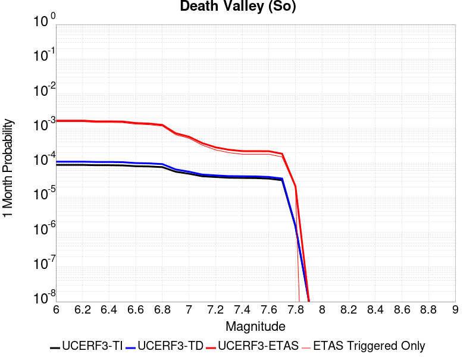 | 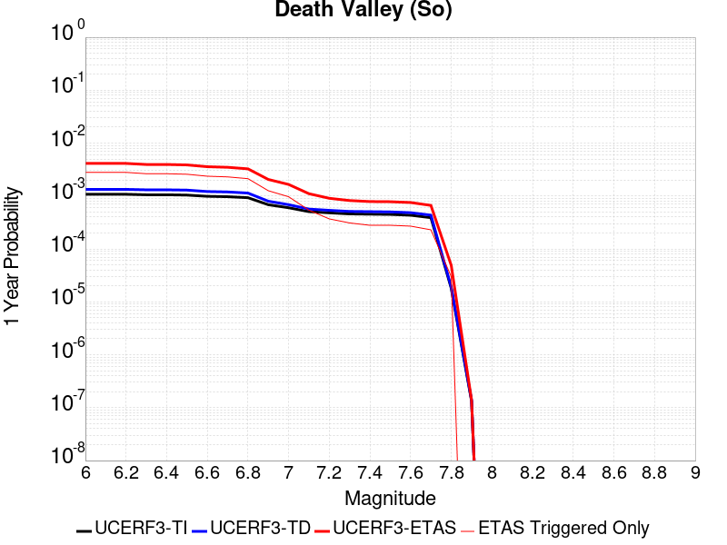 |  |

| Magnitude | 1 wk TI Prob | 1 wk TD Prob | 1 wk ETAS Prob | 1 wk ETAS/TD Gain | 1 wk ETAS Triggered Only | 1 mo TI Prob | 1 mo TD Prob | 1 mo ETAS Prob | 1 mo ETAS/TD Gain | 1 mo ETAS Triggered Only | 1 yr TI Prob | 1 yr TD Prob | 1 yr ETAS Prob | 1 yr ETAS/TD Gain | 1 yr ETAS Triggered Only | 10 yr TI Prob | 10 yr TD Prob | 10 yr ETAS Prob | 10 yr ETAS/TD Gain | 10 yr ETAS Triggered Only |
|-----|-----|-----|-----|-----|-----|-----|-----|-----|-----|-----|-----|-----|-----|-----|-----|-----|-----|-----|-----|-----|
| 6.0 | 2.0684236E-5 | 2.5618314E-5 | 8.4118807E-4 | 32.83542 | 8.1559067E-4 | 8.864371E-5 | 1.0978825E-4 | 0.0014403427 | 13.119279 | 0.0013307006 | 0.0010787029 | 0.0013358692 | 0.003907978 | 2.9254196 | 0.0025755495 | 0.010734817 | 0.013279985 | 0.01781205 | 1.3412706 | 0.004593063 |
| 6.1 | 2.0684236E-5 | 2.5618314E-5 | 8.4118807E-4 | 32.83542 | 8.1559067E-4 | 8.864371E-5 | 1.0978825E-4 | 0.0014403427 | 13.119279 | 0.0013307006 | 0.0010787029 | 0.0013358692 | 0.003907978 | 2.9254196 | 0.0025755495 | 0.010734817 | 0.013279985 | 0.01781205 | 1.3412706 | 0.004593063 |
| 6.2 | 2.0684236E-5 | 2.5618314E-5 | 8.4118807E-4 | 32.83542 | 8.1559067E-4 | 8.864371E-5 | 1.0978825E-4 | 0.0014403427 | 13.119279 | 0.0013307006 | 0.0010787029 | 0.0013358692 | 0.003907978 | 2.9254196 | 0.0025755495 | 0.010734817 | 0.013279985 | 0.01781205 | 1.3412706 | 0.004593063 |
| 6.3 | 2.0240292E-5 | 2.51184E-5 | 7.977638E-4 | 31.76014 | 7.7266485E-4 | 8.6741224E-5 | 1.0764593E-4 | 0.001395282 | 12.961772 | 0.0012877748 | 0.0010555626 | 0.001309818 | 0.0037962548 | 2.898307 | 0.002489698 | 0.010505628 | 0.013022543 | 0.017386327 | 1.3350945 | 0.00442136 |
| 6.4 | 2.0240292E-5 | 2.51184E-5 | 7.977638E-4 | 31.76014 | 7.7266485E-4 | 8.6741224E-5 | 1.0764593E-4 | 0.001395282 | 12.961772 | 0.0012877748 | 0.0010555626 | 0.001309818 | 0.0037962548 | 2.898307 | 0.002489698 | 0.010505628 | 0.013022543 | 0.017386327 | 1.3350945 | 0.00442136 |
| 6.5 | 1.9962767E-5 | 2.4807652E-5 | 7.9745334E-4 | 32.14546 | 7.7266485E-4 | 8.55519E-5 | 1.0631427E-4 | 0.0013510308 | 12.707897 | 0.001244849 | 0.0010410968 | 0.0012936244 | 0.003737231 | 2.8889616 | 0.002446772 | 0.010362327 | 0.01286249 | 0.017184606 | 1.3360249 | 0.0043784343 |
| 6.6 | 1.8937297E-5 | 2.3311462E-5 | 7.5303344E-4 | 32.303143 | 7.29739E-4 | 8.115732E-5 | 9.990252E-5 | 0.001258784 | 12.600122 | 0.0011589973 | 9.876423E-4 | 0.0012156491 | 0.0034022047 | 2.7986734 | 0.0021892171 | 0.009832645 | 0.0120915035 | 0.016077742 | 1.3296727 | 0.0040350277 |
| 6.7 | 1.8621096E-5 | 2.2912098E-5 | 7.5263437E-4 | 32.848778 | 7.29739E-4 | 7.980225E-5 | 9.8191085E-5 | 0.0012570745 | 12.802328 | 0.0011589973 | 9.711593E-4 | 0.0011948354 | 0.003338562 | 2.7941608 | 0.0021462913 | 0.009669261 | 0.011885625 | 0.015830278 | 1.3318844 | 0.0039921016 |
| 6.8 | 1.7830353E-5 | 2.1806083E-5 | 6.656794E-4 | 30.527233 | 6.438874E-4 | 7.641356E-5 | 9.3451374E-5 | 0.0011235749 | 12.023096 | 0.0010302198 | 9.29938E-4 | 0.0011371907 | 0.00315241 | 2.7721033 | 0.0020175138 | 0.009260561 | 0.01131609 | 0.015008376 | 1.3262864 | 0.0037345467 |
| 6.9 | 1.3135183E-5 | 1.5304031E-5 | 4.0163053E-4 | 26.243448 | 3.8633242E-4 | 5.6292425E-5 | 6.558709E-5 | 6.235862E-4 | 9.507759 | 5.5803574E-4 | 6.8514474E-4 | 7.982367E-4 | 0.0019563087 | 2.4507878 | 0.0011589973 | 0.006830362 | 0.007955158 | 0.01042505 | 1.3104768 | 0.002489698 |
| 7.0 | 1.1507512E-5 | 1.3154237E-5 | 3.5655632E-4 | 27.105814 | 3.434066E-4 | 4.9316975E-5 | 5.637412E-5 | 5.2853156E-4 | 9.375429 | 4.7218407E-4 | 6.002687E-4 | 6.861445E-4 | 0.0016298647 | 2.3753955 | 9.4436813E-4 | 0.0059864987 | 0.0068414924 | 0.008802571 | 1.2866449 | 0.001974588 |
| 7.1 | 9.715903E-6 | 1.0865287E-5 | 2.6841744E-4 | 24.704128 | 2.5755496E-4 | 4.1638916E-5 | 4.6564706E-5 | 3.899553E-4 | 8.374482 | 3.434066E-4 | 5.068359E-4 | 5.667821E-4 | 0.0010386985 | 1.8326241 | 4.7218407E-4 | 0.0050568148 | 0.005653834 | 0.006763595 | 1.1962848 | 0.0011160715 |
| 7.2 | 9.233269E-6 | 1.0286314E-5 | 2.2491322E-4 | 21.86529 | 2.1462912E-4 | 3.9570554E-5 | 4.408348E-5 | 3.44551E-4 | 7.8158755 | 3.0048078E-4 | 4.81665E-4 | 5.365884E-4 | 9.656163E-4 | 1.7995474 | 4.2925825E-4 | 0.0048062233 | 0.0053533595 | 0.006335368 | 1.1834378 | 9.87294E-4 |
| 7.3 | 8.8041315E-6 | 9.808164E-6 | 1.8150978E-4 | 18.50599 | 1.717033E-4 | 3.7731446E-5 | 4.2034335E-5 | 2.9957845E-4 | 7.126994 | 2.5755496E-4 | 4.592835E-4 | 5.1165203E-4 | 8.5488294E-4 | 1.6708287 | 3.434066E-4 | 0.0045833546 | 0.005105167 | 0.005916594 | 1.1589423 | 8.1559067E-4 |
| 7.4 | 8.708749E-6 | 9.707175E-6 | 1.814088E-4 | 18.688116 | 1.717033E-4 | 3.7322676E-5 | 4.160154E-5 | 2.9914576E-4 | 7.190738 | 2.5755496E-4 | 4.5430884E-4 | 5.0638523E-4 | 8.4961794E-4 | 1.6778095 | 3.434066E-4 | 0.004533812 | 0.0050527398 | 0.0058642095 | 1.1606 | 8.1559067E-4 |
| 7.5 | 8.612678E-6 | 9.604817E-6 | 1.8130646E-4 | 18.876617 | 1.717033E-4 | 3.6910955E-5 | 4.1162875E-5 | 2.9870722E-4 | 7.256714 | 2.5755496E-4 | 4.492982E-4 | 5.01047E-4 | 8.442815E-4 | 1.6850346 | 3.434066E-4 | 0.004483909 | 0.0049995985 | 0.0057684006 | 1.1537727 | 7.7266485E-4 |
| 7.6 | 8.319024E-6 | 9.283916E-6 | 1.8098562E-4 | 19.494534 | 1.717033E-4 | 3.5652476E-5 | 3.978763E-5 | 2.9733233E-4 | 7.4729843 | 2.5755496E-4 | 4.3398244E-4 | 4.8431093E-4 | 8.275512E-4 | 1.7087189 | 3.434066E-4 | 0.0043313587 | 0.0048329784 | 0.0055591906 | 1.1502619 | 7.29739E-4 |
| 7.7 | 7.4718328E-6 | 8.34517E-6 | 1.8004703E-4 | 21.574999 | 1.717033E-4 | 3.2021748E-5 | 3.5764548E-5 | 2.50386E-4 | 7.0009556 | 2.1462912E-4 | 3.8979502E-4 | 4.353504E-4 | 7.3570036E-4 | 1.689904 | 3.0048078E-4 | 0.00389112 | 0.0043453807 | 0.004943731 | 1.1376979 | 6.0096156E-4 |
| 7.8 | 3.4586725E-7 | 3.6482615E-7 | 4.3290634E-5 | 118.661 | 4.2925825E-5 | 1.4822873E-6 | 1.5635396E-6 | 4.4489298E-5 | 28.454216 | 4.2925825E-5 | 1.80467E-5 | 1.9035933E-5 | 6.196094E-5 | 3.2549462 | 4.2925825E-5 | 1.8045233E-4 | 1.9034347E-4 | 2.761788E-4 | 1.4509495 | 8.585165E-5 |
| 7.9 | 2.5591178E-9 | 2.6696718E-9 | 2.6696718E-9 | 1.0 | 0.0 | 1.0967647E-8 | 1.14414505E-8 | 1.14414505E-8 | 1.0 | 0.0 | 1.335311E-7 | 1.3929966E-7 | 1.3929966E-7 | 1.0 | 0.0 | 1.3353102E-6 | 1.3929966E-6 | 1.3929966E-6 | 1.0 | 0.0 |

## Coyote Canyon
*[(top)](#table-of-contents)*

| 1 Week | 1 Month | 1 Year | 10 Year |
|-----|-----|-----|-----|
|  |  |  | 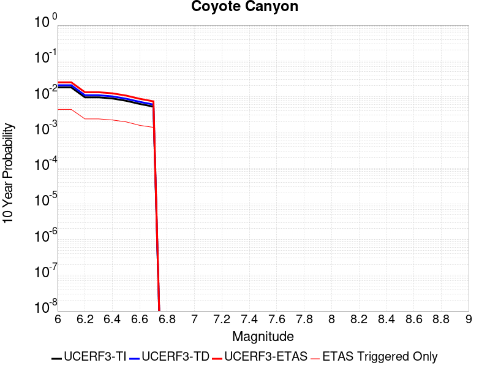 |

| Magnitude | 1 wk TI Prob | 1 wk TD Prob | 1 wk ETAS Prob | 1 wk ETAS/TD Gain | 1 wk ETAS Triggered Only | 1 mo TI Prob | 1 mo TD Prob | 1 mo ETAS Prob | 1 mo ETAS/TD Gain | 1 mo ETAS Triggered Only | 1 yr TI Prob | 1 yr TD Prob | 1 yr ETAS Prob | 1 yr ETAS/TD Gain | 1 yr ETAS Triggered Only | 10 yr TI Prob | 10 yr TD Prob | 10 yr ETAS Prob | 10 yr ETAS/TD Gain | 10 yr ETAS Triggered Only |
|-----|-----|-----|-----|-----|-----|-----|-----|-----|-----|-----|-----|-----|-----|-----|-----|-----|-----|-----|-----|-----|
| 6.0 | 3.5090034E-5 | 4.0364317E-5 | 9.417702E-4 | 23.331753 | 9.014423E-4 | 1.503772E-4 | 1.7297991E-4 | 0.0013746951 | 7.9471374 | 0.0012019231 | 0.0018293047 | 0.0021042533 | 0.004503041 | 2.139971 | 0.0024038462 | 0.018143194 | 0.020869205 | 0.024735965 | 1.1852854 | 0.003949176 |
| 6.1 | 3.5090034E-5 | 4.0364317E-5 | 9.417702E-4 | 23.331753 | 9.014423E-4 | 1.503772E-4 | 1.7297991E-4 | 0.0013746951 | 7.9471374 | 0.0012019231 | 0.0018293047 | 0.0021042533 | 0.004503041 | 2.139971 | 0.0024038462 | 0.018143194 | 0.020869205 | 0.024735965 | 1.1852854 | 0.003949176 |
| 6.2 | 1.841879E-5 | 2.1059794E-5 | 3.6445915E-4 | 17.305923 | 3.434066E-4 | 7.8935285E-5 | 9.025371E-5 | 6.91161E-4 | 7.657979 | 6.0096156E-4 | 9.606133E-4 | 0.0010983871 | 0.0022989898 | 2.09306 | 0.0012019231 | 0.0095647145 | 0.010939668 | 0.013104935 | 1.1979281 | 0.0021892171 |
| 6.3 | 1.841879E-5 | 2.1059794E-5 | 3.6445915E-4 | 17.305923 | 3.434066E-4 | 7.8935285E-5 | 9.025371E-5 | 6.91161E-4 | 7.657979 | 6.0096156E-4 | 9.606133E-4 | 0.0010983871 | 0.0022989898 | 2.09306 | 0.0012019231 | 0.0095647145 | 0.010939668 | 0.013104935 | 1.1979281 | 0.0021892171 |
| 6.4 | 1.712201E-5 | 1.9565212E-5 | 3.6296507E-4 | 18.551554 | 3.434066E-4 | 7.337798E-5 | 8.3848776E-5 | 6.847599E-4 | 8.166606 | 6.0096156E-4 | 8.930107E-4 | 0.0010204813 | 0.002135414 | 2.0925555 | 0.0011160715 | 0.008894307 | 0.010167871 | 0.0121223815 | 1.1922241 | 0.001974588 |
| 6.5 | 1.4744935E-5 | 1.6836972E-5 | 2.3146247E-4 | 13.747274 | 2.1462912E-4 | 6.3191044E-5 | 7.215698E-5 | 5.44307E-4 | 7.543372 | 4.7218407E-4 | 7.6907943E-4 | 8.782507E-4 | 0.0017360131 | 1.9766716 | 8.585165E-4 | 0.007664232 | 0.008756994 | 0.010373891 | 1.1846406 | 0.0016311813 |
| 6.6 | 1.2017839E-5 | 1.3724089E-5 | 1.4249979E-4 | 10.383188 | 1.2877748E-4 | 5.150401E-5 | 5.88167E-5 | 4.022031E-4 | 6.838247 | 3.434066E-4 | 6.268809E-4 | 7.159466E-4 | 0.0014451632 | 2.018535 | 7.29739E-4 | 0.0062511545 | 0.0071450938 | 0.008508906 | 1.1908739 | 0.0013736264 |
| 6.7 | 1.00956095E-5 | 1.1533517E-5 | 9.7384174E-5 | 8.443581 | 8.585165E-5 | 4.326618E-5 | 4.942891E-5 | 3.0697114E-4 | 6.2103558 | 2.5755496E-4 | 5.266384E-4 | 6.017178E-4 | 0.0012023178 | 1.9981422 | 6.0096156E-4 | 0.005253921 | 0.0060094125 | 0.007118777 | 1.1846045 | 0.0011160715 |

## Nelson Lake
*[(top)](#table-of-contents)*

| 1 Week | 1 Month | 1 Year | 10 Year |
|-----|-----|-----|-----|
|  |  |  | 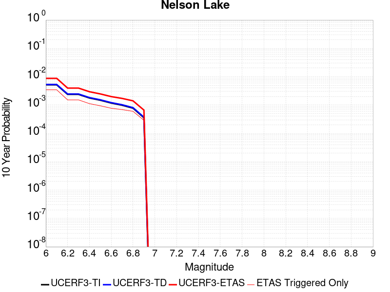 |

| Magnitude | 1 wk TI Prob | 1 wk TD Prob | 1 wk ETAS Prob | 1 wk ETAS/TD Gain | 1 wk ETAS Triggered Only | 1 mo TI Prob | 1 mo TD Prob | 1 mo ETAS Prob | 1 mo ETAS/TD Gain | 1 mo ETAS Triggered Only | 1 yr TI Prob | 1 yr TD Prob | 1 yr ETAS Prob | 1 yr ETAS/TD Gain | 1 yr ETAS Triggered Only | 10 yr TI Prob | 10 yr TD Prob | 10 yr ETAS Prob | 10 yr ETAS/TD Gain | 10 yr ETAS Triggered Only |
|-----|-----|-----|-----|-----|-----|-----|-----|-----|-----|-----|-----|-----|-----|-----|-----|-----|-----|-----|-----|-----|
| 6.0 | 9.913453E-6 | 1.0192255E-5 | 6.1114767E-4 | 59.961967 | 6.0096156E-4 | 4.2485535E-5 | 4.3680422E-5 | 0.0011597031 | 26.549723 | 0.0011160715 | 5.1713863E-4 | 5.316897E-4 | 0.0025052277 | 4.711823 | 0.001974588 | 0.0051593683 | 0.005305204 | 0.008721052 | 1.6438674 | 0.003434066 |
| 6.1 | 9.913453E-6 | 1.0192255E-5 | 6.1114767E-4 | 59.961967 | 6.0096156E-4 | 4.2485535E-5 | 4.3680422E-5 | 0.0011597031 | 26.549723 | 0.0011160715 | 5.1713863E-4 | 5.316897E-4 | 0.0025052277 | 4.711823 | 0.001974588 | 0.0051593683 | 0.005305204 | 0.008721052 | 1.6438674 | 0.003434066 |
| 6.2 | 4.5596407E-6 | 4.696313E-6 | 3.0517566E-4 | 64.98197 | 3.0048078E-4 | 1.954117E-5 | 2.0126909E-5 | 4.923015E-4 | 24.459866 | 4.7218407E-4 | 2.3788778E-4 | 2.4501883E-4 | 0.0010604096 | 4.3278704 | 8.1559067E-4 | 0.0023763329 | 0.0024476128 | 0.0039035187 | 1.5948268 | 0.001459478 |
| 6.3 | 4.5596407E-6 | 4.696313E-6 | 3.0517566E-4 | 64.98197 | 3.0048078E-4 | 1.954117E-5 | 2.0126909E-5 | 4.923015E-4 | 24.459866 | 4.7218407E-4 | 2.3788778E-4 | 2.4501883E-4 | 0.0010604096 | 4.3278704 | 8.1559067E-4 | 0.0023763329 | 0.0024476128 | 0.0039035187 | 1.5948268 | 0.001459478 |
| 6.4 | 3.4025713E-6 | 3.5098972E-6 | 2.1813826E-4 | 62.14947 | 2.1462912E-4 | 1.4582367E-5 | 1.5042335E-5 | 4.0136895E-4 | 26.682623 | 3.8633242E-4 | 1.7752586E-4 | 1.8312587E-4 | 6.9814146E-4 | 3.8123581 | 5.151099E-4 | 0.001773841 | 0.0018298327 | 0.0029010146 | 1.5853988 | 0.0010731457 |
| 6.5 | 2.8352947E-6 | 2.927856E-6 | 2.1755634E-4 | 74.30569 | 2.1462912E-4 | 1.2151207E-5 | 1.2547898E-5 | 3.130249E-4 | 24.9464 | 3.0048078E-4 | 1.479309E-4 | 1.5276071E-4 | 5.819534E-4 | 3.809575 | 4.2925825E-4 | 0.0014783246 | 0.0015266308 | 0.0025124175 | 1.645727 | 9.87294E-4 |
| 6.6 | 2.251518E-6 | 2.3290677E-6 | 1.7403197E-4 | 74.72173 | 1.717033E-4 | 9.649328E-6 | 9.981683E-6 | 2.6753405E-4 | 26.802498 | 2.5755496E-4 | 1.1747423E-4 | 1.2152085E-4 | 4.648857E-4 | 3.8255634 | 3.434066E-4 | 0.0011741214 | 0.0012146058 | 0.0019434583 | 1.6000735 | 7.29739E-4 |
| 6.7 | 1.8911853E-6 | 1.9591396E-6 | 1.3073636E-4 | 66.731514 | 1.2877748E-4 | 8.105055E-6 | 8.39629E-6 | 1.8009814E-4 | 21.449732 | 1.717033E-4 | 9.867457E-5 | 1.0222061E-4 | 3.5974922E-4 | 3.5193415 | 2.5755496E-4 | 9.863076E-4 | 0.0010217935 | 0.0015792589 | 1.5455755 | 5.5803574E-4 |
| 6.8 | 1.4874814E-6 | 1.5438305E-6 | 1.303211E-4 | 84.41413 | 1.2877748E-4 | 6.374905E-6 | 6.6164025E-6 | 1.7831856E-4 | 26.950985 | 1.717033E-4 | 7.76117E-5 | 8.055224E-5 | 3.3808645E-4 | 4.197108 | 2.5755496E-4 | 7.75846E-4 | 8.0528157E-4 | 0.0013199766 | 1.6391492 | 5.151099E-4 |
| 6.9 | 6.835972E-7 | 7.1399285E-7 | 4.3639786E-5 | 61.12076 | 4.2925825E-5 | 2.9296991E-6 | 3.0599674E-6 | 8.891135E-5 | 29.056307 | 8.585165E-5 | 3.56685E-5 | 3.7254784E-5 | 1.6602746E-4 | 4.4565406 | 1.2877748E-4 | 3.5662777E-4 | 3.7251666E-4 | 6.2997564E-4 | 1.6911342 | 2.5755496E-4 |

## Lenwood-Lockhart-Old Woman Springs
*[(top)](#table-of-contents)*

| 1 Week | 1 Month | 1 Year | 10 Year |
|-----|-----|-----|-----|
|  |  |  |  |

| Magnitude | 1 wk TI Prob | 1 wk TD Prob | 1 wk ETAS Prob | 1 wk ETAS/TD Gain | 1 wk ETAS Triggered Only | 1 mo TI Prob | 1 mo TD Prob | 1 mo ETAS Prob | 1 mo ETAS/TD Gain | 1 mo ETAS Triggered Only | 1 yr TI Prob | 1 yr TD Prob | 1 yr ETAS Prob | 1 yr ETAS/TD Gain | 1 yr ETAS Triggered Only | 10 yr TI Prob | 10 yr TD Prob | 10 yr ETAS Prob | 10 yr ETAS/TD Gain | 10 yr ETAS Triggered Only |
|-----|-----|-----|-----|-----|-----|-----|-----|-----|-----|-----|-----|-----|-----|-----|-----|-----|-----|-----|-----|-----|
| 6.0 | 3.744542E-5 | 4.396349E-5 | 0.0011170619 | 25.408855 | 0.0010731457 | 1.604705E-4 | 1.8840231E-4 | 0.0016046877 | 8.517345 | 0.0014165522 | 0.0019519776 | 0.0022915571 | 0.0044757575 | 1.9531511 | 0.0021892171 | 0.019349206 | 0.022697281 | 0.02592755 | 1.1423196 | 0.0033052885 |
| 6.1 | 3.744542E-5 | 4.396349E-5 | 0.0011170619 | 25.408855 | 0.0010731457 | 1.604705E-4 | 1.8840231E-4 | 0.0016046877 | 8.517345 | 0.0014165522 | 0.0019519776 | 0.0022915571 | 0.0044757575 | 1.9531511 | 0.0021892171 | 0.019349206 | 0.022697281 | 0.02592755 | 1.1423196 | 0.0033052885 |
| 6.2 | 3.744542E-5 | 4.396349E-5 | 0.0011170619 | 25.408855 | 0.0010731457 | 1.604705E-4 | 1.8840231E-4 | 0.0016046877 | 8.517345 | 0.0014165522 | 0.0019519776 | 0.0022915571 | 0.0044757575 | 1.9531511 | 0.0021892171 | 0.019349206 | 0.022697281 | 0.02592755 | 1.1423196 | 0.0033052885 |
| 6.3 | 2.1079984E-5 | 2.5354384E-5 | 4.5460174E-4 | 17.929907 | 4.2925825E-4 | 9.0339665E-5 | 1.0865723E-4 | 6.2371115E-4 | 5.7401714 | 5.151099E-4 | 0.0010993304 | 0.0013221189 | 0.0022223694 | 1.6809149 | 9.014423E-4 | 0.010939079 | 0.013144747 | 0.014627403 | 1.1127945 | 0.0015024039 |
| 6.4 | 2.1079984E-5 | 2.5354384E-5 | 4.5460174E-4 | 17.929907 | 4.2925825E-4 | 9.0339665E-5 | 1.0865723E-4 | 6.2371115E-4 | 5.7401714 | 5.151099E-4 | 0.0010993304 | 0.0013221189 | 0.0022223694 | 1.6809149 | 9.014423E-4 | 0.010939079 | 0.013144747 | 0.014627403 | 1.1127945 | 0.0015024039 |
| 6.5 | 1.7397282E-5 | 2.0663285E-5 | 3.6406278E-4 | 17.618824 | 3.434066E-4 | 7.455765E-5 | 8.8554E-5 | 4.748522E-4 | 5.36229 | 3.8633242E-4 | 9.073613E-4 | 0.0010776235 | 0.001720817 | 1.5968629 | 6.438874E-4 | 0.009036654 | 0.010725273 | 0.011786909 | 1.0989845 | 0.0010731457 |
| 6.6 | 1.52050325E-5 | 1.7680086E-5 | 3.1815554E-4 | 17.995136 | 3.0048078E-4 | 6.51628E-5 | 7.576964E-5 | 4.1915022E-4 | 5.531902 | 3.434066E-4 | 7.9306826E-4 | 9.221128E-4 | 0.001479634 | 1.6046127 | 5.5803574E-4 | 0.007902439 | 0.009183729 | 0.010161956 | 1.1065174 | 9.87294E-4 |
| 6.7 | 1.332523E-5 | 1.5264379E-5 | 3.1574056E-4 | 20.684795 | 3.0048078E-4 | 5.7106878E-5 | 6.541716E-5 | 4.0880128E-4 | 6.2491446 | 3.434066E-4 | 6.950544E-4 | 7.9616875E-4 | 0.0013537601 | 1.7003433 | 5.5803574E-4 | 0.006928845 | 0.0079337945 | 0.008785499 | 1.1073515 | 8.585165E-4 |
| 6.8 | 1.1525329E-5 | 1.3031365E-5 | 2.2765769E-4 | 17.46998 | 2.1462912E-4 | 4.9393333E-5 | 5.5847537E-5 | 3.133881E-4 | 5.6114936 | 2.5755496E-4 | 6.011979E-4 | 6.7973585E-4 | 0.0010658057 | 1.5679704 | 3.8633242E-4 | 0.00599574 | 0.0067770192 | 0.007373908 | 1.0880754 | 6.0096156E-4 |
| 6.9 | 1.0253909E-5 | 1.1514835E-5 | 9.73655E-5 | 8.455657 | 8.585165E-5 | 4.3944583E-5 | 4.934838E-5 | 1.781195E-4 | 3.6094296 | 1.2877748E-4 | 5.3489394E-4 | 6.006545E-4 | 8.5805473E-4 | 1.428533 | 2.5755496E-4 | 0.0053360825 | 0.0059906896 | 0.006460045 | 1.0783474 | 4.7218407E-4 |
| 7.0 | 8.104563E-6 | 8.99143E-6 | 5.1916868E-5 | 5.774039 | 4.2925825E-5 | 3.4733377E-5 | 3.853415E-5 | 8.145832E-5 | 2.1139255 | 4.2925825E-5 | 4.2279682E-4 | 4.6905465E-4 | 5.5486604E-4 | 1.1829454 | 8.585165E-5 | 0.0042199334 | 0.0046808943 | 0.0049372436 | 1.054765 | 2.5755496E-4 |
| 7.1 | 6.7986157E-6 | 7.5159796E-6 | 5.0441482E-5 | 6.7112317 | 4.2925825E-5 | 2.91366E-5 | 3.2210955E-5 | 7.5135395E-5 | 2.3326037 | 4.2925825E-5 | 3.5468035E-4 | 3.9209996E-4 | 4.3500896E-4 | 1.1094338 | 4.2925825E-5 | 0.003541148 | 0.003914298 | 0.004085329 | 1.043694 | 1.717033E-4 |
| 7.2 | 5.6893327E-6 | 6.280132E-6 | 4.9205686E-5 | 7.835136 | 4.2925825E-5 | 2.4382627E-5 | 2.6914584E-5 | 6.9839254E-5 | 2.594848 | 4.2925825E-5 | 2.9681803E-4 | 3.276378E-4 | 3.7054953E-4 | 1.1309732 | 4.2925825E-5 | 0.002964219 | 0.003271746 | 0.0034001023 | 1.0392317 | 1.2877748E-4 |
| 7.3 | 4.253348E-6 | 4.707075E-6 | 4.707075E-6 | 1.0 | 0.0 | 1.8228506E-5 | 2.017303E-5 | 2.017303E-5 | 1.0 | 0.0 | 2.2190946E-4 | 2.455808E-4 | 2.455808E-4 | 1.0 | 0.0 | 0.00221688 | 0.0024532753 | 0.0024960958 | 1.0174544 | 4.2925825E-5 |
| 7.4 | 2.5448119E-6 | 2.8520594E-6 | 2.8520594E-6 | 1.0 | 0.0 | 1.0906291E-5 | 1.2223064E-5 | 1.2223064E-5 | 1.0 | 0.0 | 1.3277601E-4 | 1.4880729E-4 | 1.4880729E-4 | 1.0 | 0.0 | 0.001326967 | 0.0014872387 | 0.0015301007 | 1.0288198 | 4.2925825E-5 |
| 7.5 | 4.3706837E-8 | 4.562909E-8 | 4.562909E-8 | 1.0 | 0.0 | 1.8731501E-7 | 1.9555324E-7 | 1.9555324E-7 | 1.0 | 0.0 | 2.2805577E-6 | 2.3808586E-6 | 2.3808586E-6 | 1.0 | 0.0 | 2.2805343E-5 | 2.3808387E-5 | 2.3808387E-5 | 1.0 | 0.0 |

## Towne Pass
*[(top)](#table-of-contents)*

| 1 Week | 1 Month | 1 Year | 10 Year |
|-----|-----|-----|-----|
|  |  |  |  |

| Magnitude | 1 wk TI Prob | 1 wk TD Prob | 1 wk ETAS Prob | 1 wk ETAS/TD Gain | 1 wk ETAS Triggered Only | 1 mo TI Prob | 1 mo TD Prob | 1 mo ETAS Prob | 1 mo ETAS/TD Gain | 1 mo ETAS Triggered Only | 1 yr TI Prob | 1 yr TD Prob | 1 yr ETAS Prob | 1 yr ETAS/TD Gain | 1 yr ETAS Triggered Only | 10 yr TI Prob | 10 yr TD Prob | 10 yr ETAS Prob | 10 yr ETAS/TD Gain | 10 yr ETAS Triggered Only |
|-----|-----|-----|-----|-----|-----|-----|-----|-----|-----|-----|-----|-----|-----|-----|-----|-----|-----|-----|-----|-----|
| 6.0 | 3.849728E-6 | 3.894542E-6 | 9.053333E-4 | 232.46208 | 9.014423E-4 | 1.649873E-5 | 1.6690812E-5 | 0.0012615189 | 75.58164 | 0.001244849 | 2.0085352E-4 | 2.0319606E-4 | 0.0022202998 | 10.926885 | 0.0020175138 | 0.0020067208 | 0.0020305319 | 0.005072077 | 2.4979057 | 0.0030477336 |
| 6.1 | 3.849728E-6 | 3.894542E-6 | 9.053333E-4 | 232.46208 | 9.014423E-4 | 1.649873E-5 | 1.6690812E-5 | 0.0012615189 | 75.58164 | 0.001244849 | 2.0085352E-4 | 2.0319606E-4 | 0.0022202998 | 10.926885 | 0.0020175138 | 0.0020067208 | 0.0020305319 | 0.005072077 | 2.4979057 | 0.0030477336 |
| 6.2 | 3.849728E-6 | 3.894542E-6 | 9.053333E-4 | 232.46208 | 9.014423E-4 | 1.649873E-5 | 1.6690812E-5 | 0.0012615189 | 75.58164 | 0.001244849 | 2.0085352E-4 | 2.0319606E-4 | 0.0022202998 | 10.926885 | 0.0020175138 | 0.0020067208 | 0.0020305319 | 0.005072077 | 2.4979057 | 0.0030477336 |
| 6.3 | 3.849728E-6 | 3.894542E-6 | 9.053333E-4 | 232.46208 | 9.014423E-4 | 1.649873E-5 | 1.6690812E-5 | 0.0012615189 | 75.58164 | 0.001244849 | 2.0085352E-4 | 2.0319606E-4 | 0.0022202998 | 10.926885 | 0.0020175138 | 0.0020067208 | 0.0020305319 | 0.005072077 | 2.4979057 | 0.0030477336 |
| 6.4 | 3.849728E-6 | 3.894542E-6 | 9.053333E-4 | 232.46208 | 9.014423E-4 | 1.649873E-5 | 1.6690812E-5 | 0.0012615189 | 75.58164 | 0.001244849 | 2.0085352E-4 | 2.0319606E-4 | 0.0022202998 | 10.926885 | 0.0020175138 | 0.0020067208 | 0.0020305319 | 0.005072077 | 2.4979057 | 0.0030477336 |
| 6.5 | 1.1953545E-6 | 1.2030526E-6 | 8.70546E-5 | 72.36142 | 8.585165E-5 | 5.1229376E-6 | 5.15593E-6 | 1.3393274E-4 | 25.976446 | 1.2877748E-4 | 6.236998E-5 | 6.277176E-5 | 2.3446429E-4 | 3.7351873 | 1.717033E-4 | 6.235248E-4 | 6.2755204E-4 | 9.278442E-4 | 1.4785136 | 3.0048078E-4 |
| 6.6 | 1.1953545E-6 | 1.2030526E-6 | 8.70546E-5 | 72.36142 | 8.585165E-5 | 5.1229376E-6 | 5.15593E-6 | 1.3393274E-4 | 25.976446 | 1.2877748E-4 | 6.236998E-5 | 6.277176E-5 | 2.3446429E-4 | 3.7351873 | 1.717033E-4 | 6.235248E-4 | 6.2755204E-4 | 9.278442E-4 | 1.4785136 | 3.0048078E-4 |
| 6.7 | 8.375951E-7 | 8.410676E-7 | 8.410676E-7 | 1.0 | 0.0 | 3.5896885E-6 | 3.6045708E-6 | 3.6045708E-6 | 1.0 | 0.0 | 4.370358E-5 | 4.3884826E-5 | 8.6808766E-5 | 1.9781044 | 4.2925825E-5 | 4.3694986E-4 | 4.3876728E-4 | 6.103953E-4 | 1.3911594 | 1.717033E-4 |
| 6.8 | 6.38041E-7 | 6.3921624E-7 | 6.3921624E-7 | 1.0 | 0.0 | 2.7344586E-6 | 2.7394954E-6 | 2.7394954E-6 | 1.0 | 0.0 | 3.3291526E-5 | 3.3352884E-5 | 7.6277276E-5 | 2.2869768 | 4.2925825E-5 | 3.3286537E-4 | 3.334826E-4 | 4.6221714E-4 | 1.3860307 | 1.2877748E-4 |
| 6.9 | 5.3460053E-7 | 5.345339E-7 | 5.345339E-7 | 1.0 | 0.0 | 2.2911431E-6 | 2.2908578E-6 | 2.2908578E-6 | 1.0 | 0.0 | 2.789431E-5 | 2.7890868E-5 | 7.08155E-5 | 2.5390208 | 4.2925825E-5 | 2.789081E-4 | 2.78877E-4 | 3.6470473E-4 | 1.3077619 | 8.585165E-5 |
| 7.0 | 3.557783E-7 | 3.5324283E-7 | 3.5324283E-7 | 1.0 | 0.0 | 1.5247632E-6 | 1.513897E-6 | 1.513897E-6 | 1.0 | 0.0 | 1.8563835E-5 | 1.8431549E-5 | 1.8431549E-5 | 1.0 | 0.0 | 1.8562283E-4 | 1.8430105E-4 | 2.2721896E-4 | 1.2328686 | 4.2925825E-5 |
| 7.1 | 3.037942E-7 | 3.0002275E-7 | 3.0002275E-7 | 1.0 | 0.0 | 1.3019744E-6 | 1.2858112E-6 | 1.2858112E-6 | 1.0 | 0.0 | 1.5851423E-5 | 1.5654647E-5 | 1.5654647E-5 | 1.0 | 0.0 | 1.5850292E-4 | 1.5653619E-4 | 1.9945529E-4 | 1.27418 | 4.2925825E-5 |
| 7.2 | 2.0808248E-7 | 2.0217735E-7 | 2.0217735E-7 | 1.0 | 0.0 | 8.917818E-7 | 8.6647407E-7 | 8.6647407E-7 | 1.0 | 0.0 | 1.0857389E-5 | 1.0549275E-5 | 1.0549275E-5 | 1.0 | 0.0 | 1.0856859E-4 | 1.0548821E-4 | 1.484095E-4 | 1.4068824 | 4.2925825E-5 |
| 7.3 | 1.1162073E-7 | 1.0636902E-7 | 1.0636902E-7 | 1.0 | 0.0 | 4.7837443E-7 | 4.5586717E-7 | 4.5586717E-7 | 1.0 | 0.0 | 5.8241935E-6 | 5.5501705E-6 | 5.5501705E-6 | 1.0 | 0.0 | 5.8240406E-5 | 5.550052E-5 | 5.550052E-5 | 1.0 | 0.0 |

## San Andreas (San Bernardino N)
*[(top)](#table-of-contents)*

| 1 Week | 1 Month | 1 Year | 10 Year |
|-----|-----|-----|-----|
|  |  |  |  |

| Magnitude | 1 wk TI Prob | 1 wk TD Prob | 1 wk ETAS Prob | 1 wk ETAS/TD Gain | 1 wk ETAS Triggered Only | 1 mo TI Prob | 1 mo TD Prob | 1 mo ETAS Prob | 1 mo ETAS/TD Gain | 1 mo ETAS Triggered Only | 1 yr TI Prob | 1 yr TD Prob | 1 yr ETAS Prob | 1 yr ETAS/TD Gain | 1 yr ETAS Triggered Only | 10 yr TI Prob | 10 yr TD Prob | 10 yr ETAS Prob | 10 yr ETAS/TD Gain | 10 yr ETAS Triggered Only |
|-----|-----|-----|-----|-----|-----|-----|-----|-----|-----|-----|-----|-----|-----|-----|-----|-----|-----|-----|-----|-----|
| 6.0 | 1.4273766E-4 | 3.160784E-4 | 0.0013030603 | 4.122586 | 9.87294E-4 | 6.115894E-4 | 0.0013539245 | 0.0028542941 | 2.1081636 | 0.0015024039 | 0.0074207084 | 0.016360939 | 0.018218774 | 1.113553 | 0.0018887363 | 0.07177748 | 0.15021163 | 0.15218143 | 1.0131135 | 0.0023179946 |
| 6.1 | 1.4273766E-4 | 3.160784E-4 | 0.0013030603 | 4.122586 | 9.87294E-4 | 6.115894E-4 | 0.0013539245 | 0.0028542941 | 2.1081636 | 0.0015024039 | 0.0074207084 | 0.016360939 | 0.018218774 | 1.113553 | 0.0018887363 | 0.07177748 | 0.15021163 | 0.15218143 | 1.0131135 | 0.0023179946 |
| 6.2 | 1.4273766E-4 | 3.160784E-4 | 0.0013030603 | 4.122586 | 9.87294E-4 | 6.115894E-4 | 0.0013539245 | 0.0028542941 | 2.1081636 | 0.0015024039 | 0.0074207084 | 0.016360939 | 0.018218774 | 1.113553 | 0.0018887363 | 0.07177748 | 0.15021163 | 0.15218143 | 1.0131135 | 0.0023179946 |
| 6.3 | 1.3730655E-4 | 3.0512668E-4 | 0.0012921194 | 4.2346983 | 9.87294E-4 | 5.883239E-4 | 0.001307036 | 0.0028074763 | 2.1479714 | 0.0015024039 | 0.0071393442 | 0.015798455 | 0.017657353 | 1.1176633 | 0.0018887363 | 0.06914291 | 0.1455135 | 0.1474942 | 1.0136118 | 0.0023179946 |
| 6.4 | 1.3730655E-4 | 3.0512668E-4 | 0.0012921194 | 4.2346983 | 9.87294E-4 | 5.883239E-4 | 0.001307036 | 0.0028074763 | 2.1479714 | 0.0015024039 | 0.0071393442 | 0.015798455 | 0.017657353 | 1.1176633 | 0.0018887363 | 0.06914291 | 0.1455135 | 0.1474942 | 1.0136118 | 0.0023179946 |
| 6.5 | 1.2942807E-4 | 2.8927144E-4 | 0.0012762798 | 4.4120493 | 9.87294E-4 | 5.545738E-4 | 0.0012391509 | 0.002739693 | 2.210944 | 0.0015024039 | 0.0067310524 | 0.014983548 | 0.016843984 | 1.1241653 | 0.0018887363 | 0.06530788 | 0.13865088 | 0.14064749 | 1.0144002 | 0.0023179946 |
| 6.6 | 1.1125901E-4 | 2.5365927E-4 | 0.0012407028 | 4.891218 | 9.87294E-4 | 4.767372E-4 | 0.0010866605 | 0.0025445526 | 2.3416262 | 0.001459478 | 0.005788839 | 0.0131504685 | 0.014972005 | 1.138515 | 0.0018458104 | 0.056403454 | 0.12300496 | 0.12496254 | 1.0159147 | 0.002232143 |
| 6.7 | 1.02209575E-4 | 2.3500937E-4 | 0.0011791555 | 5.017483 | 9.4436813E-4 | 4.3796748E-4 | 0.0010067957 | 0.0024219216 | 2.405574 | 0.0014165522 | 0.0053192247 | 0.012189267 | 0.013970176 | 1.1461047 | 0.0018028846 | 0.051936906 | 0.114792764 | 0.116730675 | 1.0168818 | 0.0021892171 |
| 6.8 | 9.610582E-5 | 2.2026796E-4 | 0.0011644281 | 5.286416 | 9.4436813E-4 | 4.1181705E-4 | 9.436647E-4 | 0.0023588801 | 2.4997015 | 0.0014165522 | 0.0050023515 | 0.011428859 | 0.013211139 | 1.1559455 | 0.0018028846 | 0.048912346 | 0.10820469 | 0.11011874 | 1.0176892 | 0.0021462913 |
| 6.9 | 9.3877505E-5 | 2.1482339E-4 | 0.0011589887 | 5.3950763 | 9.4436813E-4 | 4.0227012E-4 | 9.203475E-4 | 0.002335596 | 2.5377328 | 0.0014165522 | 0.0048866454 | 0.011147907 | 0.012930693 | 1.1599212 | 0.0018028846 | 0.04780577 | 0.105798274 | 0.10771749 | 1.0181403 | 0.0021462913 |
| 7.0 | 9.1019785E-5 | 2.0809306E-4 | 0.0011522647 | 5.5372567 | 9.4436813E-4 | 3.900265E-4 | 8.915232E-4 | 0.0023068124 | 2.5874958 | 0.0014165522 | 0.0047382377 | 0.0108004995 | 0.012583912 | 1.1651231 | 0.0018028846 | 0.046384744 | 0.10276815 | 0.104693875 | 1.0187385 | 0.0021462913 |
| 7.1 | 8.771155E-5 | 1.9983841E-4 | 0.0011440178 | 5.7247143 | 9.4436813E-4 | 3.758525E-4 | 8.5616973E-4 | 0.002271509 | 2.653106 | 0.0014165522 | 0.0045664064 | 0.010374243 | 0.012158424 | 1.1719818 | 0.0018028846 | 0.044737056 | 0.09907644 | 0.101010084 | 1.0195167 | 0.0021462913 |
| 7.2 | 8.0830236E-5 | 1.8389444E-4 | 0.0011280889 | 6.1344376 | 9.4436813E-4 | 3.4636928E-4 | 7.8788114E-4 | 0.0022033174 | 2.7965097 | 0.0014165522 | 0.0042088944 | 0.009550368 | 0.011336035 | 1.1869736 | 0.0018028846 | 0.041300658 | 0.09180518 | 0.09375443 | 1.0212325 | 0.0021462913 |
| 7.3 | 7.7668235E-5 | 1.7333007E-4 | 0.0011175345 | 6.447436 | 9.4436813E-4 | 3.328214E-4 | 7.426318E-4 | 0.002158132 | 2.9060593 | 0.0014165522 | 0.0040445733 | 0.009004138 | 0.0107907895 | 1.1984255 | 0.0018028846 | 0.03971748 | 0.08706761 | 0.08902703 | 1.0225046 | 0.0021462913 |
| 7.4 | 7.520177E-5 | 1.655312E-4 | 0.001109743 | 6.7041326 | 9.4436813E-4 | 3.2225347E-4 | 7.092266E-4 | 0.0020818787 | 2.9354212 | 0.0013736264 | 0.0039163795 | 0.008600714 | 0.010345535 | 1.2028694 | 0.0017599588 | 0.038480744 | 0.08352157 | 0.085449256 | 1.0230801 | 0.0021033655 |
| 7.5 | 7.274697E-5 | 1.584075E-4 | 0.0011026261 | 6.9606934 | 9.4436813E-4 | 3.1173544E-4 | 6.7871273E-4 | 0.0020514068 | 3.0224965 | 0.0013736264 | 0.003788775 | 0.008232076 | 0.0099775465 | 1.2120329 | 0.0017599588 | 0.03724827 | 0.08023654 | 0.082171135 | 1.0241112 | 0.0021033655 |
| 7.6 | 7.1185845E-5 | 1.5410586E-4 | 0.0010983285 | 7.127104 | 9.4436813E-4 | 3.0504653E-4 | 6.602866E-4 | 0.002033006 | 3.0789752 | 0.0013736264 | 0.0037076178 | 0.0080094095 | 0.0097552715 | 1.2179765 | 0.0017599588 | 0.036463667 | 0.07822661 | 0.08016544 | 1.0247847 | 0.0021033655 |
| 7.7 | 6.709961E-5 | 1.4319421E-4 | 0.0010874271 | 7.594072 | 9.4436813E-4 | 2.8753807E-4 | 6.135452E-4 | 0.0019863287 | 3.2374613 | 0.0013736264 | 0.003495157 | 0.0074443663 | 0.009191223 | 1.2346549 | 0.0017599588 | 0.034406938 | 0.07305558 | 0.075005285 | 1.026688 | 0.0021033655 |
| 7.8 | 6.300812E-5 | 1.320343E-4 | 0.0010762777 | 8.151501 | 9.4436813E-4 | 2.7000686E-4 | 5.657386E-4 | 0.0019385879 | 3.4266493 | 0.0013736264 | 0.0032823787 | 0.006866143 | 0.008614018 | 1.2545643 | 0.0017599588 | 0.032343175 | 0.06771385 | 0.06967478 | 1.0289592 | 0.0021033655 |
| 7.9 | 4.983037E-5 | 9.7241085E-5 | 8.698308E-4 | 8.945096 | 7.7266485E-4 | 2.1354125E-4 | 4.1668097E-4 | 0.0015322873 | 3.6773636 | 0.0011160715 | 0.0025967648 | 0.0050613005 | 0.0065133916 | 1.2869008 | 0.001459478 | 0.025666296 | 0.050650507 | 0.05228057 | 1.0321826 | 0.001717033 |
| 8.0 | 3.2211527E-5 | 5.3306234E-5 | 3.5377097E-4 | 6.636578 | 3.0048078E-4 | 1.380421E-4 | 2.2843528E-4 | 5.288474E-4 | 2.3150864 | 3.0048078E-4 | 0.0016793669 | 0.0027776542 | 0.0031629135 | 1.1386995 | 3.8633242E-4 | 0.016667323 | 0.028362568 | 0.028737944 | 1.0132349 | 3.8633242E-4 |
| 8.1 | 1.743376E-5 | 1.8823403E-5 | 6.174842E-5 | 3.280407 | 4.2925825E-5 | 7.471398E-5 | 8.066923E-5 | 1.235916E-4 | 1.5320785 | 4.2925825E-5 | 9.0926304E-4 | 9.81706E-4 | 0.0010245896 | 1.0436828 | 4.2925825E-5 | 0.009055517 | 0.010483979 | 0.010526455 | 1.0040514 | 4.2925825E-5 |
| 8.2 | 7.831616E-6 | 5.1540533E-6 | 5.1540533E-6 | 1.0 | 0.0 | 3.3563636E-5 | 2.2088612E-5 | 2.2088612E-5 | 1.0 | 0.0 | 4.0856065E-4 | 2.6889573E-4 | 2.6889573E-4 | 1.0 | 0.0 | 0.004078103 | 0.0030413668 | 0.0030413668 | 1.0 | 0.0 |
| 8.3 | 1.983087E-6 | 7.6564595E-7 | 7.6564595E-7 | 1.0 | 0.0 | 8.498917E-6 | 3.281336E-6 | 3.281336E-6 | 1.0 | 0.0 | 1.034694E-4 | 3.9949547E-5 | 3.9949547E-5 | 1.0 | 0.0 | 0.0010342124 | 4.717979E-4 | 4.717979E-4 | 1.0 | 0.0 |

## Paradise
*[(top)](#table-of-contents)*

| 1 Week | 1 Month | 1 Year | 10 Year |
|-----|-----|-----|-----|
|  | 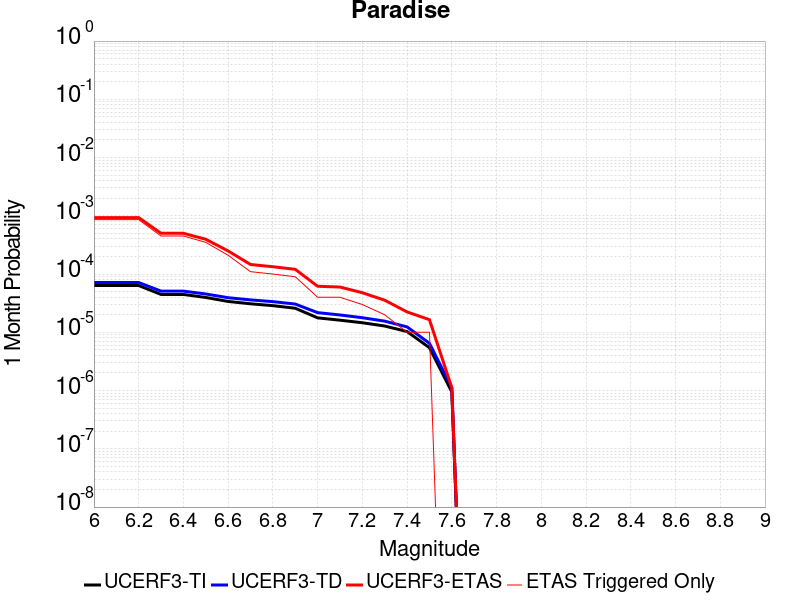 |  |  |

| Magnitude | 1 wk TI Prob | 1 wk TD Prob | 1 wk ETAS Prob | 1 wk ETAS/TD Gain | 1 wk ETAS Triggered Only | 1 mo TI Prob | 1 mo TD Prob | 1 mo ETAS Prob | 1 mo ETAS/TD Gain | 1 mo ETAS Triggered Only | 1 yr TI Prob | 1 yr TD Prob | 1 yr ETAS Prob | 1 yr ETAS/TD Gain | 1 yr ETAS Triggered Only | 10 yr TI Prob | 10 yr TD Prob | 10 yr ETAS Prob | 10 yr ETAS/TD Gain | 10 yr ETAS Triggered Only |
|-----|-----|-----|-----|-----|-----|-----|-----|-----|-----|-----|-----|-----|-----|-----|-----|-----|-----|-----|-----|-----|
| 6.0 | 1.4851273E-5 | 1.6694768E-5 | 6.605714E-4 | 39.567566 | 6.438874E-4 | 6.364676E-5 | 7.154718E-5 | 9.3000225E-4 | 12.998447 | 8.585165E-4 | 7.7462377E-4 | 8.707624E-4 | 0.0022860812 | 2.6253788 | 0.0014165522 | 0.0077192914 | 0.008675884 | 0.010675894 | 1.2305253 | 0.0020175138 |
| 6.1 | 1.4851273E-5 | 1.6694768E-5 | 6.605714E-4 | 39.567566 | 6.438874E-4 | 6.364676E-5 | 7.154718E-5 | 9.3000225E-4 | 12.998447 | 8.585165E-4 | 7.7462377E-4 | 8.707624E-4 | 0.0022860812 | 2.6253788 | 0.0014165522 | 0.0077192914 | 0.008675884 | 0.010675894 | 1.2305253 | 0.0020175138 |
| 6.2 | 1.4851273E-5 | 1.6694768E-5 | 6.605714E-4 | 39.567566 | 6.438874E-4 | 6.364676E-5 | 7.154718E-5 | 9.3000225E-4 | 12.998447 | 8.585165E-4 | 7.7462377E-4 | 8.707624E-4 | 0.0022860812 | 2.6253788 | 0.0014165522 | 0.0077192914 | 0.008675884 | 0.010675894 | 1.2305253 | 0.0020175138 |
| 6.3 | 1.0426831E-5 | 1.1888697E-5 | 3.1236588E-4 | 26.274189 | 3.0048078E-4 | 4.4685654E-5 | 5.09506E-5 | 4.3726334E-4 | 8.582104 | 3.8633242E-4 | 5.43912E-4 | 6.201529E-4 | 0.0012207418 | 1.9684528 | 6.0096156E-4 | 0.0054258266 | 0.0061848317 | 0.006952718 | 1.1241564 | 7.7266485E-4 |
| 6.4 | 1.0426831E-5 | 1.1888697E-5 | 3.1236588E-4 | 26.274189 | 3.0048078E-4 | 4.4685654E-5 | 5.09506E-5 | 4.3726334E-4 | 8.582104 | 3.8633242E-4 | 5.43912E-4 | 6.201529E-4 | 0.0012207418 | 1.9684528 | 6.0096156E-4 | 0.0054258266 | 0.0061848317 | 0.006952718 | 1.1241564 | 7.7266485E-4 |
| 6.5 | 9.25027E-6 | 1.0620037E-5 | 2.6817224E-4 | 25.251535 | 2.5755496E-4 | 3.964341E-5 | 4.551368E-5 | 3.4598078E-4 | 7.601688 | 3.0048078E-4 | 4.8255164E-4 | 5.5399304E-4 | 0.0010259155 | 1.8518564 | 4.7218407E-4 | 0.0048150513 | 0.0055266195 | 0.0060815713 | 1.1004143 | 5.5803574E-4 |
| 6.6 | 7.904275E-6 | 9.159602E-6 | 1.8086133E-4 | 19.745543 | 1.717033E-4 | 3.3875025E-5 | 3.925487E-5 | 2.5387557E-4 | 6.467365 | 2.1462912E-4 | 4.1235037E-4 | 4.7782718E-4 | 7.3525903E-4 | 1.5387552 | 2.5755496E-4 | 0.0041158604 | 0.004768395 | 0.0051101637 | 1.0716739 | 3.434066E-4 |
| 6.7 | 7.2061953E-6 | 8.407326E-6 | 1.3718371E-4 | 16.317163 | 1.2877748E-4 | 3.088333E-5 | 3.603092E-5 | 2.0772804E-4 | 5.765271 | 1.717033E-4 | 3.7593965E-4 | 4.3859181E-4 | 6.531268E-4 | 1.4891449 | 2.1462912E-4 | 0.003753043 | 0.004377631 | 0.0045913206 | 1.0488139 | 2.1462912E-4 |
| 6.8 | 6.6948724E-6 | 7.842242E-6 | 1.366187E-4 | 17.420874 | 1.2877748E-4 | 2.8691995E-5 | 3.3609194E-5 | 2.0530671E-4 | 6.1086473 | 1.717033E-4 | 3.4926904E-4 | 4.091187E-4 | 6.2366E-4 | 1.5243987 | 2.1462912E-4 | 0.003487206 | 0.0040840125 | 0.0042977654 | 1.0523388 | 2.1462912E-4 |
| 6.9 | 6.0421025E-6 | 7.1306963E-6 | 1.3590725E-4 | 19.059464 | 1.2877748E-4 | 2.5894467E-5 | 3.0559786E-5 | 2.0225784E-4 | 6.6184306 | 1.717033E-4 | 3.1521954E-4 | 3.7200528E-4 | 5.436447E-4 | 1.4613898 | 1.717033E-4 | 0.0031477278 | 0.0037141638 | 0.0038852294 | 1.0460576 | 1.717033E-4 |
| 7.0 | 4.134091E-6 | 5.0803824E-6 | 9.093159E-5 | 17.898573 | 8.585165E-5 | 1.7717413E-5 | 2.1772896E-5 | 1.07622676E-4 | 4.942966 | 8.585165E-5 | 2.1568815E-4 | 2.650543E-4 | 3.5088317E-4 | 1.3238163 | 8.585165E-5 | 0.0021547892 | 0.0026475347 | 0.002733159 | 1.0323411 | 8.585165E-5 |
| 7.1 | 3.7674888E-6 | 4.631936E-6 | 9.048318E-5 | 19.534636 | 8.585165E-5 | 1.6146281E-5 | 1.9851012E-5 | 1.0570096E-4 | 5.3247137 | 8.585165E-5 | 1.9656324E-4 | 2.4166079E-4 | 3.274917E-4 | 1.355171 | 8.585165E-5 | 0.0019638946 | 0.0024141306 | 0.002499775 | 1.0354763 | 8.585165E-5 |
| 7.2 | 3.4065345E-6 | 4.156782E-6 | 9.000807E-5 | 21.653305 | 8.585165E-5 | 1.4599351E-5 | 1.7814667E-5 | 1.0366479E-4 | 5.8190694 | 8.585165E-5 | 1.777326E-4 | 2.168735E-4 | 3.0270652E-4 | 1.3957746 | 8.585165E-5 | 0.0017759053 | 0.0021667667 | 0.0022524323 | 1.0395361 | 8.585165E-5 |
| 7.3 | 2.9934936E-6 | 3.6293673E-6 | 8.94807E-5 | 24.654629 | 8.585165E-5 | 1.2829195E-5 | 1.5554348E-5 | 1.0140466E-4 | 6.5193777 | 8.585165E-5 | 1.5618425E-4 | 1.8935918E-4 | 2.751946E-4 | 1.453294 | 8.585165E-5 | 0.0015607453 | 0.0018921237 | 0.001977813 | 1.0452874 | 8.585165E-5 |
| 7.4 | 2.4049796E-6 | 2.8890186E-6 | 4.581472E-5 | 15.85823 | 4.2925825E-5 | 1.0307015E-5 | 1.2381457E-5 | 5.530675E-5 | 4.4669013 | 4.2925825E-5 | 1.2548068E-4 | 1.5073526E-4 | 1.936546E-4 | 1.2847333 | 4.2925825E-5 | 0.0012540985 | 0.0015064715 | 0.0015493328 | 1.0284513 | 4.2925825E-5 |
| 7.5 | 1.2710091E-6 | 1.5134859E-6 | 4.4439246E-5 | 29.362179 | 4.2925825E-5 | 5.44717E-6 | 6.4863593E-6 | 4.9411905E-5 | 7.6178184 | 4.2925825E-5 | 6.631728E-5 | 7.896981E-5 | 1.2189225E-4 | 1.5435296 | 4.2925825E-5 | 6.6297496E-4 | 7.895401E-4 | 8.3243207E-4 | 1.0543252 | 4.2925825E-5 |
| 7.6 | 2.21172E-7 | 2.6040198E-7 | 2.6040198E-7 | 1.0 | 0.0 | 9.478797E-7 | 1.1160082E-6 | 1.1160082E-6 | 1.0 | 0.0 | 1.1540374E-5 | 1.3587343E-5 | 1.3587343E-5 | 1.0 | 0.0 | 1.1539775E-4 | 1.3586794E-4 | 1.3586794E-4 | 1.0 | 0.0 |

## Bicycle Lake
*[(top)](#table-of-contents)*

| 1 Week | 1 Month | 1 Year | 10 Year |
|-----|-----|-----|-----|
|  |  |  |  |

| Magnitude | 1 wk TI Prob | 1 wk TD Prob | 1 wk ETAS Prob | 1 wk ETAS/TD Gain | 1 wk ETAS Triggered Only | 1 mo TI Prob | 1 mo TD Prob | 1 mo ETAS Prob | 1 mo ETAS/TD Gain | 1 mo ETAS Triggered Only | 1 yr TI Prob | 1 yr TD Prob | 1 yr ETAS Prob | 1 yr ETAS/TD Gain | 1 yr ETAS Triggered Only | 10 yr TI Prob | 10 yr TD Prob | 10 yr ETAS Prob | 10 yr ETAS/TD Gain | 10 yr ETAS Triggered Only |
|-----|-----|-----|-----|-----|-----|-----|-----|-----|-----|-----|-----|-----|-----|-----|-----|-----|-----|-----|-----|-----|
| 6.0 | 1.9621975E-5 | 2.2097078E-5 | 4.5134584E-4 | 20.425589 | 4.2925825E-4 | 8.4091465E-5 | 9.4699084E-5 | 6.956037E-4 | 7.345411 | 6.0096156E-4 | 0.0010233327 | 0.0011524865 | 0.0020100137 | 1.7440668 | 8.585165E-4 | 0.01018633 | 0.011478408 | 0.0131333 | 1.1441742 | 0.0016741072 |
| 6.1 | 1.9621975E-5 | 2.2097078E-5 | 4.5134584E-4 | 20.425589 | 4.2925825E-4 | 8.4091465E-5 | 9.4699084E-5 | 6.956037E-4 | 7.345411 | 6.0096156E-4 | 0.0010233327 | 0.0011524865 | 0.0020100137 | 1.7440668 | 8.585165E-4 | 0.01018633 | 0.011478408 | 0.0131333 | 1.1441742 | 0.0016741072 |
| 6.2 | 9.9971285E-6 | 1.125564E-5 | 2.2588235E-4 | 20.06837 | 2.1462912E-4 | 4.2844134E-5 | 4.8237856E-5 | 4.3455165E-4 | 9.008519 | 3.8633242E-4 | 5.2150246E-4 | 5.871897E-4 | 0.0011877983 | 2.022853 | 6.0096156E-4 | 0.0052028033 | 0.005861487 | 0.0070136907 | 1.196572 | 0.0011589973 |
| 6.3 | 9.589428E-6 | 1.0798346E-5 | 2.2542514E-4 | 20.875896 | 2.1462912E-4 | 4.10969E-5 | 4.62781E-5 | 4.3259264E-4 | 9.347675 | 3.8633242E-4 | 5.002399E-4 | 5.6334207E-4 | 0.0011639651 | 2.066178 | 6.0096156E-4 | 0.0049911533 | 0.0056242296 | 0.0067767086 | 1.2049131 | 0.0011589973 |
| 6.4 | 9.589428E-6 | 1.0798346E-5 | 2.2542514E-4 | 20.875896 | 2.1462912E-4 | 4.10969E-5 | 4.62781E-5 | 4.3259264E-4 | 9.347675 | 3.8633242E-4 | 5.002399E-4 | 5.6334207E-4 | 0.0011639651 | 2.066178 | 6.0096156E-4 | 0.0049911533 | 0.0056242296 | 0.0067767086 | 1.2049131 | 0.0011589973 |
| 6.5 | 5.557707E-6 | 6.2856016E-6 | 9.213671E-5 | 14.658376 | 8.585165E-5 | 2.3818526E-5 | 2.6938165E-5 | 1.5571217E-4 | 5.7803555 | 1.2877748E-4 | 2.8995197E-4 | 3.279497E-4 | 5.854202E-4 | 1.7850914 | 2.5755496E-4 | 0.0028957394 | 0.0032772934 | 0.0039190706 | 1.1958253 | 6.438874E-4 |
| 6.6 | 4.8742945E-6 | 5.5132896E-6 | 4.8438877E-5 | 8.785839 | 4.2925825E-5 | 2.0889667E-5 | 2.3628318E-5 | 1.09477936E-4 | 4.633336 | 8.585165E-5 | 2.54302E-4 | 2.87663E-4 | 5.0223037E-4 | 1.7458985 | 2.1462912E-4 | 0.002540112 | 0.0028754752 | 0.0034319062 | 1.1935092 | 5.5803574E-4 |
| 6.7 | 3.991108E-6 | 4.5159104E-6 | 4.744154E-5 | 10.505422 | 4.2925825E-5 | 1.7104636E-5 | 1.9353902E-5 | 1.05203886E-4 | 5.4357977 | 8.585165E-5 | 2.0822904E-4 | 2.3563375E-4 | 4.0729658E-4 | 1.7285155 | 1.717033E-4 | 0.0020803404 | 0.0023563374 | 0.0028702335 | 1.218091 | 5.151099E-4 |

## Death Valley (Black Mtns Frontal)
*[(top)](#table-of-contents)*

| 1 Week | 1 Month | 1 Year | 10 Year |
|-----|-----|-----|-----|
|  |  |  |  |

| Magnitude | 1 wk TI Prob | 1 wk TD Prob | 1 wk ETAS Prob | 1 wk ETAS/TD Gain | 1 wk ETAS Triggered Only | 1 mo TI Prob | 1 mo TD Prob | 1 mo ETAS Prob | 1 mo ETAS/TD Gain | 1 mo ETAS Triggered Only | 1 yr TI Prob | 1 yr TD Prob | 1 yr ETAS Prob | 1 yr ETAS/TD Gain | 1 yr ETAS Triggered Only | 10 yr TI Prob | 10 yr TD Prob | 10 yr ETAS Prob | 10 yr ETAS/TD Gain | 10 yr ETAS Triggered Only |
|-----|-----|-----|-----|-----|-----|-----|-----|-----|-----|-----|-----|-----|-----|-----|-----|-----|-----|-----|-----|-----|
| 6.0 | 1.6707214E-5 | 1.867027E-5 | 2.3329539E-4 | 12.495556 | 2.1462912E-4 | 7.160038E-5 | 8.001303E-5 | 5.0923694E-4 | 6.364425 | 4.2925825E-4 | 8.71386E-4 | 9.737309E-4 | 0.0016598753 | 1.704655 | 6.868132E-4 | 0.00867977 | 0.009695496 | 0.0111833345 | 1.1534566 | 0.0015024039 |
| 6.1 | 1.6707214E-5 | 1.867027E-5 | 2.3329539E-4 | 12.495556 | 2.1462912E-4 | 7.160038E-5 | 8.001303E-5 | 5.0923694E-4 | 6.364425 | 4.2925825E-4 | 8.71386E-4 | 9.737309E-4 | 0.0016598753 | 1.704655 | 6.868132E-4 | 0.00867977 | 0.009695496 | 0.0111833345 | 1.1534566 | 0.0015024039 |
| 6.2 | 1.6707214E-5 | 1.867027E-5 | 2.3329539E-4 | 12.495556 | 2.1462912E-4 | 7.160038E-5 | 8.001303E-5 | 5.0923694E-4 | 6.364425 | 4.2925825E-4 | 8.71386E-4 | 9.737309E-4 | 0.0016598753 | 1.704655 | 6.868132E-4 | 0.00867977 | 0.009695496 | 0.0111833345 | 1.1534566 | 0.0015024039 |
| 6.3 | 1.6707214E-5 | 1.867027E-5 | 2.3329539E-4 | 12.495556 | 2.1462912E-4 | 7.160038E-5 | 8.001303E-5 | 5.0923694E-4 | 6.364425 | 4.2925825E-4 | 8.71386E-4 | 9.737309E-4 | 0.0016598753 | 1.704655 | 6.868132E-4 | 0.00867977 | 0.009695496 | 0.0111833345 | 1.1534566 | 0.0015024039 |
| 6.4 | 1.5515609E-5 | 1.7338214E-5 | 2.3196361E-4 | 13.37875 | 2.1462912E-4 | 6.649377E-5 | 7.4304546E-5 | 5.035309E-4 | 6.7765827 | 4.2925825E-4 | 8.0926094E-4 | 9.042885E-4 | 0.0015475936 | 1.7113937 | 6.438874E-4 | 0.008063202 | 0.009006773 | 0.010453106 | 1.1605828 | 0.001459478 |
| 6.5 | 1.5515609E-5 | 1.7338214E-5 | 2.3196361E-4 | 13.37875 | 2.1462912E-4 | 6.649377E-5 | 7.4304546E-5 | 5.035309E-4 | 6.7765827 | 4.2925825E-4 | 8.0926094E-4 | 9.042885E-4 | 0.0015475936 | 1.7113937 | 6.438874E-4 | 0.008063202 | 0.009006773 | 0.010453106 | 1.1605828 | 0.001459478 |
| 6.6 | 1.5041828E-5 | 1.6809145E-5 | 2.3143466E-4 | 13.768378 | 2.1462912E-4 | 6.4463384E-5 | 7.203723E-5 | 5.012645E-4 | 6.9584093 | 4.2925825E-4 | 7.8455906E-4 | 8.767063E-4 | 0.001477141 | 1.6848755 | 6.0096156E-4 | 0.00781795 | 0.008733132 | 0.010094763 | 1.1559155 | 0.0013736264 |
| 6.7 | 1.4634985E-5 | 1.6356016E-5 | 2.3098163E-4 | 14.12212 | 2.1462912E-4 | 6.271985E-5 | 7.009536E-5 | 4.9932353E-4 | 7.123489 | 4.2925825E-4 | 7.6334673E-4 | 8.5308263E-4 | 0.0014106423 | 1.6535822 | 5.5803574E-4 | 0.007607299 | 0.008498715 | 0.009818107 | 1.155246 | 0.0013307006 |
| 6.8 | 1.4209158E-5 | 1.5882048E-5 | 2.3050777E-4 | 14.513731 | 2.1462912E-4 | 6.089497E-5 | 6.8064175E-5 | 4.543703E-4 | 6.6756163 | 3.8633242E-4 | 7.4114406E-4 | 8.2837185E-4 | 0.001343055 | 1.621319 | 5.151099E-4 | 0.007386771 | 0.008253456 | 0.009530602 | 1.1547408 | 0.0012877748 |
| 6.9 | 1.3780098E-5 | 1.5404594E-5 | 1.8710525E-4 | 12.146069 | 1.717033E-4 | 5.9056227E-5 | 6.6018045E-5 | 4.0940195E-4 | 6.2013645 | 3.434066E-4 | 7.1877235E-4 | 8.0347876E-4 | 0.0012752834 | 1.5872024 | 4.7218407E-4 | 0.0071645193 | 0.008006332 | 0.009241215 | 1.1542382 | 0.001244849 |
| 7.0 | 1.3585064E-5 | 1.5188155E-5 | 1.8688885E-4 | 12.304908 | 1.717033E-4 | 5.8220405E-5 | 6.50905E-5 | 3.2262868E-4 | 4.956617 | 2.5755496E-4 | 7.086029E-4 | 7.9219416E-4 | 0.0011353287 | 1.4331445 | 3.434066E-4 | 0.007063476 | 0.007894293 | 0.008958967 | 1.1348662 | 0.0010731457 |
| 7.1 | 1.3398601E-5 | 1.49813395E-5 | 1.8668207E-4 | 12.460973 | 1.717033E-4 | 5.742131E-5 | 6.420419E-5 | 3.217426E-4 | 5.01124 | 2.5755496E-4 | 6.9888023E-4 | 7.8141113E-4 | 0.0011245494 | 1.4391264 | 3.434066E-4 | 0.0069668638 | 0.007787224 | 0.008809421 | 1.1312659 | 0.0010302198 |
| 7.2 | 1.3126312E-5 | 1.4679561E-5 | 1.8638033E-4 | 12.6965885 | 1.717033E-4 | 5.6254412E-5 | 6.291092E-5 | 3.2044965E-4 | 5.093705 | 2.5755496E-4 | 6.846822E-4 | 7.6567667E-4 | 0.0011088203 | 1.4481574 | 3.434066E-4 | 0.006825765 | 0.00763097 | 0.00861073 | 1.1283926 | 9.87294E-4 |
| 7.3 | 1.2922429E-5 | 1.4453788E-5 | 1.861546E-4 | 12.879295 | 1.717033E-4 | 5.5380664E-5 | 6.194336E-5 | 3.1948235E-4 | 5.1576524 | 2.5755496E-4 | 6.74051E-4 | 7.53905E-4 | 0.0010970527 | 1.4551604 | 3.434066E-4 | 0.006720101 | 0.007514055 | 0.008451327 | 1.1247358 | 9.4436813E-4 |
| 7.4 | 1.2768878E-5 | 1.4283772E-5 | 1.8598461E-4 | 13.020694 | 1.717033E-4 | 5.4722615E-5 | 6.1214756E-5 | 3.1875394E-4 | 5.207142 | 2.5755496E-4 | 6.660441E-4 | 7.4504025E-4 | 0.0010881909 | 1.4605801 | 3.434066E-4 | 0.0066405144 | 0.0074260035 | 0.008363359 | 1.1262261 | 9.4436813E-4 |
| 7.5 | 1.2521929E-5 | 1.40120155E-5 | 1.8571291E-4 | 13.253833 | 1.717033E-4 | 5.366431E-5 | 6.005014E-5 | 3.175896E-4 | 5.2887406 | 2.5755496E-4 | 6.531671E-4 | 7.3087064E-4 | 0.0010740262 | 1.4695162 | 3.434066E-4 | 0.006512506 | 0.0072852457 | 0.008180121 | 1.1228338 | 9.014423E-4 |
| 7.6 | 1.1301089E-5 | 1.2648149E-5 | 1.8434928E-4 | 14.575198 | 1.717033E-4 | 4.8432343E-5 | 5.4205255E-5 | 3.1174623E-4 | 5.751218 | 2.5755496E-4 | 5.895042E-4 | 6.5975444E-4 | 0.0010029345 | 1.5201633 | 3.434066E-4 | 0.0058794282 | 0.00657851 | 0.0073887357 | 1.1231624 | 8.1559067E-4 |
| 7.7 | 9.189108E-6 | 1.0283358E-5 | 1.8198488E-4 | 17.69703 | 1.717033E-4 | 3.93813E-5 | 4.407082E-5 | 2.5869047E-4 | 5.869881 | 2.1462912E-4 | 4.7936183E-4 | 5.3643517E-4 | 8.3675474E-4 | 1.5598432 | 3.0048078E-4 | 0.004783291 | 0.005351914 | 0.0059923553 | 1.1196659 | 6.438874E-4 |
| 7.8 | 3.4586725E-7 | 3.6482615E-7 | 4.3290634E-5 | 118.661 | 4.2925825E-5 | 1.4822873E-6 | 1.5635396E-6 | 4.4489298E-5 | 28.454216 | 4.2925825E-5 | 1.80467E-5 | 1.9035933E-5 | 6.196094E-5 | 3.2549462 | 4.2925825E-5 | 1.8045233E-4 | 1.9034347E-4 | 2.761788E-4 | 1.4509495 | 8.585165E-5 |
| 7.9 | 2.5591178E-9 | 2.6696718E-9 | 2.6696718E-9 | 1.0 | 0.0 | 1.0967647E-8 | 1.14414505E-8 | 1.14414505E-8 | 1.0 | 0.0 | 1.335311E-7 | 1.3929966E-7 | 1.3929966E-7 | 1.0 | 0.0 | 1.3353102E-6 | 1.3929966E-6 | 1.3929966E-6 | 1.0 | 0.0 |

## Garlic Springs
*[(top)](#table-of-contents)*

| 1 Week | 1 Month | 1 Year | 10 Year |
|-----|-----|-----|-----|
|  |  |  |  |

| Magnitude | 1 wk TI Prob | 1 wk TD Prob | 1 wk ETAS Prob | 1 wk ETAS/TD Gain | 1 wk ETAS Triggered Only | 1 mo TI Prob | 1 mo TD Prob | 1 mo ETAS Prob | 1 mo ETAS/TD Gain | 1 mo ETAS Triggered Only | 1 yr TI Prob | 1 yr TD Prob | 1 yr ETAS Prob | 1 yr ETAS/TD Gain | 1 yr ETAS Triggered Only | 10 yr TI Prob | 10 yr TD Prob | 10 yr ETAS Prob | 10 yr ETAS/TD Gain | 10 yr ETAS Triggered Only |
|-----|-----|-----|-----|-----|-----|-----|-----|-----|-----|-----|-----|-----|-----|-----|-----|-----|-----|-----|-----|-----|
| 6.0 | 1.6760017E-5 | 1.8776833E-5 | 3.1925197E-4 | 17.00244 | 3.0048078E-4 | 7.182667E-5 | 8.0470316E-5 | 5.0969404E-4 | 6.333938 | 4.2925825E-4 | 8.7413884E-4 | 9.794032E-4 | 0.001794195 | 1.831927 | 8.1559067E-4 | 0.008707083 | 0.009762413 | 0.011037616 | 1.1306237 | 0.0012877748 |
| 6.1 | 9.852767E-6 | 1.0973587E-5 | 1.3974965E-4 | 12.735092 | 1.2877748E-4 | 4.222546E-5 | 4.702921E-5 | 2.6164824E-4 | 5.563526 | 2.1462912E-4 | 5.139737E-4 | 5.7250116E-4 | 0.0011731187 | 2.0491114 | 6.0096156E-4 | 0.005127866 | 0.005717221 | 0.0065281494 | 1.1418395 | 8.1559067E-4 |
| 6.2 | 9.852767E-6 | 1.0973587E-5 | 1.3974965E-4 | 12.735092 | 1.2877748E-4 | 4.222546E-5 | 4.702921E-5 | 2.6164824E-4 | 5.563526 | 2.1462912E-4 | 5.139737E-4 | 5.7250116E-4 | 0.0011731187 | 2.0491114 | 6.0096156E-4 | 0.005127866 | 0.005717221 | 0.0065281494 | 1.1418395 | 8.1559067E-4 |
| 6.3 | 4.3167724E-6 | 4.7780286E-6 | 9.062927E-5 | 18.96792 | 8.585165E-5 | 1.8500323E-5 | 2.0477235E-5 | 1.4925207E-4 | 7.288683 | 1.2877748E-4 | 2.2521814E-4 | 2.4930484E-4 | 5.926258E-4 | 2.377113 | 3.434066E-4 | 0.0022499003 | 0.00249251 | 0.0028778794 | 1.154611 | 3.8633242E-4 |
| 6.4 | 4.3167724E-6 | 4.7780286E-6 | 9.062927E-5 | 18.96792 | 8.585165E-5 | 1.8500323E-5 | 2.0477235E-5 | 1.4925207E-4 | 7.288683 | 1.2877748E-4 | 2.2521814E-4 | 2.4930484E-4 | 5.926258E-4 | 2.377113 | 3.434066E-4 | 0.0022499003 | 0.00249251 | 0.0028778794 | 1.154611 | 3.8633242E-4 |
| 6.5 | 4.3167724E-6 | 4.7780286E-6 | 9.062927E-5 | 18.96792 | 8.585165E-5 | 1.8500323E-5 | 2.0477235E-5 | 1.4925207E-4 | 7.288683 | 1.2877748E-4 | 2.2521814E-4 | 2.4930484E-4 | 5.926258E-4 | 2.377113 | 3.434066E-4 | 0.0022499003 | 0.00249251 | 0.0028778794 | 1.154611 | 3.8633242E-4 |
| 6.6 | 4.301311E-6 | 4.760897E-6 | 9.0612135E-5 | 19.032576 | 8.585165E-5 | 1.8434059E-5 | 2.0403815E-5 | 1.4917865E-4 | 7.311312 | 1.2877748E-4 | 2.2441156E-4 | 2.4841115E-4 | 5.9173245E-4 | 2.3820686 | 3.434066E-4 | 0.0022418506 | 0.002483593 | 0.002868966 | 1.1551675 | 3.8633242E-4 |
| 6.7 | 3.8599724E-6 | 4.27106E-6 | 9.012234E-5 | 21.100697 | 8.585165E-5 | 1.6542634E-5 | 1.8304541E-5 | 1.4707966E-4 | 8.035146 | 1.2877748E-4 | 2.0138794E-4 | 2.228578E-4 | 5.6618784E-4 | 2.540579 | 3.434066E-4 | 0.0020120554 | 0.002228578 | 0.0026140495 | 1.1729674 | 3.8633242E-4 |

## San Andreas (San Bernardino S)
*[(top)](#table-of-contents)*

| 1 Week | 1 Month | 1 Year | 10 Year |
|-----|-----|-----|-----|
|  | 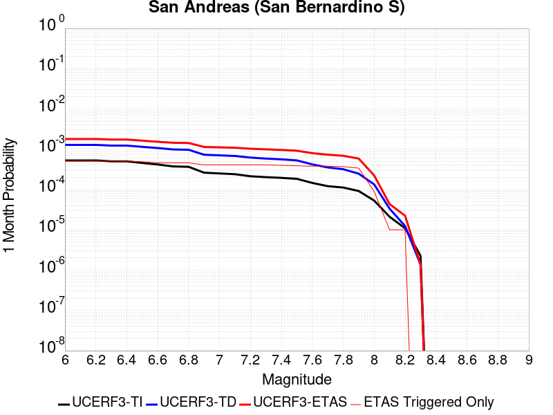 |  |  |

| Magnitude | 1 wk TI Prob | 1 wk TD Prob | 1 wk ETAS Prob | 1 wk ETAS/TD Gain | 1 wk ETAS Triggered Only | 1 mo TI Prob | 1 mo TD Prob | 1 mo ETAS Prob | 1 mo ETAS/TD Gain | 1 mo ETAS Triggered Only | 1 yr TI Prob | 1 yr TD Prob | 1 yr ETAS Prob | 1 yr ETAS/TD Gain | 1 yr ETAS Triggered Only | 10 yr TI Prob | 10 yr TD Prob | 10 yr ETAS Prob | 10 yr ETAS/TD Gain | 10 yr ETAS Triggered Only |
|-----|-----|-----|-----|-----|-----|-----|-----|-----|-----|-----|-----|-----|-----|-----|-----|-----|-----|-----|-----|-----|
| 6.0 | 1.2336002E-4 | 3.0005194E-4 | 7.291814E-4 | 2.430184 | 4.2925825E-4 | 5.2857865E-4 | 0.0012853292 | 0.001928389 | 1.5003074 | 6.438874E-4 | 0.006416472 | 0.015541554 | 0.016471246 | 1.0598197 | 9.4436813E-4 | 0.06234337 | 0.14294699 | 0.1439771 | 1.0072062 | 0.0012019231 |
| 6.1 | 1.2336002E-4 | 3.0005194E-4 | 7.291814E-4 | 2.430184 | 4.2925825E-4 | 5.2857865E-4 | 0.0012853292 | 0.001928389 | 1.5003074 | 6.438874E-4 | 0.006416472 | 0.015541554 | 0.016471246 | 1.0598197 | 9.4436813E-4 | 0.06234337 | 0.14294699 | 0.1439771 | 1.0072062 | 0.0012019231 |
| 6.2 | 1.2336002E-4 | 3.0005194E-4 | 7.291814E-4 | 2.430184 | 4.2925825E-4 | 5.2857865E-4 | 0.0012853292 | 0.001928389 | 1.5003074 | 6.438874E-4 | 0.006416472 | 0.015541554 | 0.016471246 | 1.0598197 | 9.4436813E-4 | 0.06234337 | 0.14294699 | 0.1439771 | 1.0072062 | 0.0012019231 |
| 6.3 | 1.1712257E-4 | 2.8793467E-4 | 7.170693E-4 | 2.4903889 | 4.2925825E-4 | 5.018573E-4 | 0.0012334478 | 0.001876541 | 1.5213785 | 6.438874E-4 | 0.006093008 | 0.014918666 | 0.015848946 | 1.0623567 | 9.4436813E-4 | 0.059286322 | 0.13765779 | 0.13869426 | 1.0075293 | 0.0012019231 |
| 6.4 | 1.1712257E-4 | 2.8793467E-4 | 7.170693E-4 | 2.4903889 | 4.2925825E-4 | 5.018573E-4 | 0.0012334478 | 0.001876541 | 1.5213785 | 6.438874E-4 | 0.006093008 | 0.014918666 | 0.015848946 | 1.0623567 | 9.4436813E-4 | 0.059286322 | 0.13765779 | 0.13869426 | 1.0075293 | 0.0012019231 |
| 6.5 | 1.0689076E-4 | 2.6806415E-4 | 6.9720735E-4 | 2.6008973 | 4.2925825E-4 | 4.5802278E-4 | 0.0011483653 | 0.0017915133 | 1.5600551 | 6.438874E-4 | 0.0055621783 | 0.013896335 | 0.01482758 | 1.0670137 | 9.4436813E-4 | 0.05425003 | 0.1288989 | 0.1299459 | 1.0081226 | 0.0012019231 |
| 6.6 | 9.7648895E-5 | 2.505129E-4 | 6.3674856E-4 | 2.5417793 | 3.8633242E-4 | 4.1842813E-4 | 0.0010732086 | 0.0016306455 | 1.5194114 | 5.5803574E-4 | 0.005082469 | 0.012992399 | 0.013839761 | 1.0652199 | 8.585165E-4 | 0.049677886 | 0.121077746 | 0.12205869 | 1.0081017 | 0.0011160715 |
| 6.7 | 8.757013E-5 | 2.3122175E-4 | 6.1746483E-4 | 2.6704445 | 3.8633242E-4 | 3.7524657E-4 | 9.905964E-4 | 0.0015480793 | 1.562775 | 5.5803574E-4 | 0.00455906 | 0.011997902 | 0.012846118 | 1.0706971 | 8.585165E-4 | 0.04466656 | 0.112373024 | 0.11336368 | 1.0088158 | 0.0011160715 |
| 6.8 | 8.562978E-5 | 2.2682057E-4 | 6.130654E-4 | 2.702865 | 3.8633242E-4 | 3.6693315E-4 | 9.7174826E-4 | 0.0015292417 | 1.5737015 | 5.5803574E-4 | 0.004458263 | 0.011770921 | 0.012619332 | 1.0720768 | 8.585165E-4 | 0.043698758 | 0.11037863 | 0.11137151 | 1.0089952 | 0.0011160715 |
| 6.9 | 6.124075E-5 | 1.7066885E-4 | 5.1401684E-4 | 3.0117788 | 3.434066E-4 | 2.6243398E-4 | 7.312337E-4 | 0.0012030725 | 1.645264 | 4.7218407E-4 | 0.0031904527 | 0.008866636 | 0.009589905 | 1.0815719 | 7.29739E-4 | 0.031450346 | 0.08420262 | 0.08502816 | 1.0098042 | 9.014423E-4 |
| 7.0 | 5.8598747E-5 | 1.6495936E-4 | 5.083093E-4 | 3.0814214 | 3.434066E-4 | 2.5111332E-4 | 7.067779E-4 | 0.0011786283 | 1.6676077 | 4.7218407E-4 | 0.0030530186 | 0.008571265 | 0.009294749 | 1.084408 | 7.29739E-4 | 0.03011414 | 0.08151562 | 0.08230415 | 1.0096734 | 8.585165E-4 |
| 7.1 | 5.613814E-5 | 1.5914452E-4 | 5.0249643E-4 | 3.1574852 | 3.434066E-4 | 2.4056983E-4 | 6.818704E-4 | 0.0011537325 | 1.6920114 | 4.7218407E-4 | 0.0029250039 | 0.008270353 | 0.008994057 | 1.0875058 | 7.29739E-4 | 0.028868021 | 0.07881268 | 0.07960354 | 1.0100346 | 8.585165E-4 |
| 7.2 | 4.991222E-5 | 1.4520933E-4 | 4.8856606E-4 | 3.364564 | 3.434066E-4 | 2.1389198E-4 | 6.221777E-4 | 0.0010940679 | 1.7584494 | 4.7218407E-4 | 0.002601025 | 0.0075488063 | 0.008273036 | 1.0959398 | 7.29739E-4 | 0.025707912 | 0.07226191 | 0.07305838 | 1.0110221 | 8.585165E-4 |
| 7.3 | 4.7410045E-5 | 1.371513E-4 | 4.8051082E-4 | 3.5035086 | 3.434066E-4 | 2.0317009E-4 | 5.8765925E-4 | 0.0010595658 | 1.8030276 | 4.7218407E-4 | 0.0024707897 | 0.0071313656 | 0.007855901 | 1.1015984 | 7.29739E-4 | 0.024434982 | 0.068541944 | 0.069341615 | 1.0116669 | 8.585165E-4 |
| 7.4 | 4.5556746E-5 | 1.3123035E-4 | 4.7459188E-4 | 3.6164796 | 3.434066E-4 | 1.952286E-4 | 5.6229485E-4 | 0.0010342135 | 1.8392724 | 4.7218407E-4 | 0.002374317 | 0.0068245293 | 0.007549288 | 1.1061991 | 7.29739E-4 | 0.023491086 | 0.06579143 | 0.06659346 | 1.0121906 | 8.585165E-4 |
| 7.5 | 4.3084514E-5 | 1.2358342E-4 | 4.669476E-4 | 3.7783997 | 3.434066E-4 | 1.8463485E-4 | 5.2953605E-4 | 0.00100147 | 1.8912218 | 4.7218407E-4 | 0.0022456115 | 0.0064281146 | 0.0071531627 | 1.1127933 | 7.29739E-4 | 0.022230545 | 0.062190283 | 0.06299541 | 1.0129461 | 8.585165E-4 |
| 7.6 | 3.408608E-5 | 9.836477E-5 | 3.98816E-4 | 4.0544596 | 3.0048078E-4 | 1.4607502E-4 | 4.214953E-4 | 8.505726E-4 | 2.0179884 | 4.2925825E-4 | 0.0017770125 | 0.005119656 | 0.005760247 | 1.1251239 | 6.438874E-4 | 0.017628696 | 0.05002244 | 0.05075645 | 1.0146737 | 7.7266485E-4 |
| 7.7 | 2.8315713E-5 | 8.2495724E-5 | 3.829517E-4 | 4.6420794 | 3.0048078E-4 | 1.2134742E-4 | 3.5350522E-4 | 7.826117E-4 | 2.2138617 | 4.2925825E-4 | 0.0014764034 | 0.004295442 | 0.0049365633 | 1.1492562 | 6.438874E-4 | 0.01466633 | 0.042272415 | 0.043012418 | 1.0175055 | 7.7266485E-4 |
| 7.8 | 2.6222975E-5 | 7.463898E-5 | 3.7509733E-4 | 5.0254884 | 3.0048078E-4 | 1.1237934E-4 | 3.1984213E-4 | 7.489631E-4 | 2.3416648 | 4.2925825E-4 | 0.0013673597 | 0.003887131 | 0.0045285155 | 1.165002 | 6.438874E-4 | 0.013589768 | 0.038437475 | 0.03918044 | 1.0193292 | 7.7266485E-4 |
| 7.9 | 2.1469694E-5 | 5.7884805E-5 | 2.725015E-4 | 4.7076516 | 2.1462912E-4 | 9.200973E-5 | 2.4805416E-4 | 5.913756E-4 | 2.3840582 | 3.434066E-4 | 0.0011196428 | 0.00301588 | 0.0035722328 | 1.1844745 | 5.5803574E-4 | 0.011140184 | 0.030153265 | 0.03081937 | 1.0220906 | 6.868132E-4 |
| 8.0 | 1.2420249E-5 | 3.1321662E-5 | 1.17170624E-4 | 3.7408812 | 8.585165E-5 | 5.322855E-5 | 1.342288E-4 | 2.2006892E-4 | 1.639506 | 8.585165E-5 | 6.478649E-4 | 0.0016330116 | 0.0018044345 | 1.1049734 | 1.717033E-4 | 0.0064597935 | 0.01652369 | 0.016692556 | 1.0102197 | 1.717033E-4 |
| 8.1 | 4.9197724E-6 | 7.822525E-6 | 7.822525E-6 | 1.0 | 0.0 | 2.1084568E-5 | 3.3524673E-5 | 3.3524673E-5 | 1.0 | 0.0 | 2.566744E-4 | 4.080866E-4 | 4.080866E-4 | 1.0 | 0.0 | 0.002563781 | 0.004384557 | 0.004384557 | 1.0 | 0.0 |
| 8.2 | 2.5634774E-6 | 2.9065757E-6 | 2.9065757E-6 | 1.0 | 0.0 | 1.0986286E-5 | 1.2456694E-5 | 1.2456694E-5 | 1.0 | 0.0 | 1.3374983E-4 | 1.5164974E-4 | 1.5164974E-4 | 1.0 | 0.0 | 0.0013366934 | 0.001704941 | 0.001704941 | 1.0 | 0.0 |
| 8.3 | 5.2850464E-7 | 3.2080476E-7 | 3.2080476E-7 | 1.0 | 0.0 | 2.2650179E-6 | 1.3748769E-6 | 1.3748769E-6 | 1.0 | 0.0 | 2.7576245E-5 | 1.673901E-5 | 1.673901E-5 | 1.0 | 0.0 | 2.7572823E-4 | 1.986671E-4 | 1.986671E-4 | 1.0 | 0.0 |

## Helendale-So Lockhart
*[(top)](#table-of-contents)*

| 1 Week | 1 Month | 1 Year | 10 Year |
|-----|-----|-----|-----|
|  |  |  | 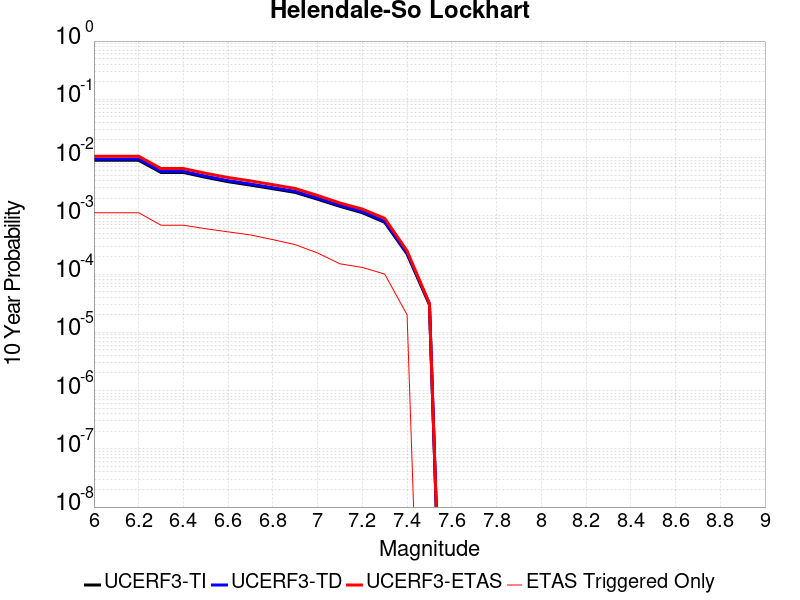 |

| Magnitude | 1 wk TI Prob | 1 wk TD Prob | 1 wk ETAS Prob | 1 wk ETAS/TD Gain | 1 wk ETAS Triggered Only | 1 mo TI Prob | 1 mo TD Prob | 1 mo ETAS Prob | 1 mo ETAS/TD Gain | 1 mo ETAS Triggered Only | 1 yr TI Prob | 1 yr TD Prob | 1 yr ETAS Prob | 1 yr ETAS/TD Gain | 1 yr ETAS Triggered Only | 10 yr TI Prob | 10 yr TD Prob | 10 yr ETAS Prob | 10 yr ETAS/TD Gain | 10 yr ETAS Triggered Only |
|-----|-----|-----|-----|-----|-----|-----|-----|-----|-----|-----|-----|-----|-----|-----|-----|-----|-----|-----|-----|-----|
| 6.0 | 1.7296055E-5 | 1.8103729E-5 | 1.8980392E-4 | 10.484244 | 1.717033E-4 | 7.412385E-5 | 7.7585224E-5 | 2.9219768E-4 | 3.7661514 | 2.1462912E-4 | 9.0208417E-4 | 9.4421144E-4 | 0.0014159497 | 1.4996108 | 4.7218407E-4 | 0.008984311 | 0.009404116 | 0.01046717 | 1.1130413 | 0.0010731457 |
| 6.1 | 1.7296055E-5 | 1.8103729E-5 | 1.8980392E-4 | 10.484244 | 1.717033E-4 | 7.412385E-5 | 7.7585224E-5 | 2.9219768E-4 | 3.7661514 | 2.1462912E-4 | 9.0208417E-4 | 9.4421144E-4 | 0.0014159497 | 1.4996108 | 4.7218407E-4 | 0.008984311 | 0.009404116 | 0.01046717 | 1.1130413 | 0.0010731457 |
| 6.2 | 1.7296055E-5 | 1.8103729E-5 | 1.8980392E-4 | 10.484244 | 1.717033E-4 | 7.412385E-5 | 7.7585224E-5 | 2.9219768E-4 | 3.7661514 | 2.1462912E-4 | 9.0208417E-4 | 9.4421144E-4 | 0.0014159497 | 1.4996108 | 4.7218407E-4 | 0.008984311 | 0.009404116 | 0.01046717 | 1.1130413 | 0.0010731457 |
| 6.3 | 1.0669118E-5 | 1.1135425E-5 | 9.6986114E-5 | 8.709692 | 8.585165E-5 | 4.5723988E-5 | 4.772239E-5 | 1.7649372E-4 | 3.6983418 | 1.2877748E-4 | 5.5654737E-4 | 5.80868E-4 | 8.8117423E-4 | 1.5169957 | 3.0048078E-4 | 0.0055515557 | 0.0057937936 | 0.006305919 | 1.088392 | 5.151099E-4 |
| 6.4 | 1.0669118E-5 | 1.1135425E-5 | 9.6986114E-5 | 8.709692 | 8.585165E-5 | 4.5723988E-5 | 4.772239E-5 | 1.7649372E-4 | 3.6983418 | 1.2877748E-4 | 5.5654737E-4 | 5.80868E-4 | 8.8117423E-4 | 1.5169957 | 3.0048078E-4 | 0.0055515557 | 0.0057937936 | 0.006305919 | 1.088392 | 5.151099E-4 |
| 6.5 | 8.790038E-6 | 9.170197E-6 | 5.2095627E-5 | 5.6809716 | 4.2925825E-5 | 3.767105E-5 | 3.930026E-5 | 1.2514854E-4 | 3.18442 | 8.585165E-5 | 4.585485E-4 | 4.7837716E-4 | 6.929036E-4 | 1.4484463 | 2.1462912E-4 | 0.0045760344 | 0.004773638 | 0.0052008475 | 1.0894934 | 4.2925825E-4 |
| 6.6 | 7.396949E-6 | 7.715537E-6 | 5.064103E-5 | 6.5635133 | 4.2925825E-5 | 3.1700827E-5 | 3.3066175E-5 | 1.18914984E-4 | 3.596273 | 8.585165E-5 | 3.858892E-4 | 4.025073E-4 | 6.1705004E-4 | 1.5330157 | 2.1462912E-4 | 0.003852198 | 0.00401789 | 0.004359917 | 1.085126 | 3.434066E-4 |
| 6.7 | 6.4600285E-6 | 6.738031E-6 | 4.9663566E-5 | 7.370635 | 4.2925825E-5 | 2.7685543E-5 | 2.887696E-5 | 1.1472613E-4 | 3.9729295 | 8.585165E-5 | 3.3701936E-4 | 3.5152107E-4 | 5.6607474E-4 | 1.610358 | 2.1462912E-4 | 0.0033650869 | 0.003509732 | 0.0038519332 | 1.0975007 | 3.434066E-4 |
| 6.8 | 5.600104E-6 | 5.836009E-6 | 4.8761583E-5 | 8.355295 | 4.2925825E-5 | 2.4000226E-5 | 2.5011232E-5 | 1.1086073E-4 | 4.432438 | 8.585165E-5 | 2.9216358E-4 | 3.044698E-4 | 4.3320807E-4 | 1.4228277 | 1.2877748E-4 | 0.0029177975 | 0.003040588 | 0.0032545645 | 1.0703734 | 2.1462912E-4 |
| 6.9 | 4.839122E-6 | 5.0395092E-6 | 4.7965117E-5 | 9.517815 | 4.2925825E-5 | 2.0738931E-5 | 2.159772E-5 | 1.07447515E-4 | 4.974947 | 8.585165E-5 | 2.5246723E-4 | 2.6292098E-4 | 3.916646E-4 | 1.4896666 | 1.2877748E-4 | 0.002521806 | 0.002626147 | 0.0028402123 | 1.0815132 | 2.1462912E-4 |
| 7.0 | 3.6937633E-6 | 3.845208E-6 | 3.845208E-6 | 1.0 | 0.0 | 1.5830317E-5 | 1.647936E-5 | 1.647936E-5 | 1.0 | 0.0 | 1.9271708E-4 | 2.0061806E-4 | 2.4353527E-4 | 1.213925 | 4.2925825E-5 | 0.0019255003 | 0.002004401 | 0.0020900804 | 1.0427457 | 8.585165E-5 |
| 7.1 | 2.7858857E-6 | 2.8978538E-6 | 2.8978538E-6 | 1.0 | 0.0 | 1.1939455E-5 | 1.2419316E-5 | 1.2419316E-5 | 1.0 | 0.0 | 1.4535317E-4 | 1.511949E-4 | 1.9411423E-4 | 1.2838676 | 4.2925825E-5 | 0.0014525814 | 0.0015109418 | 0.0015538028 | 1.028367 | 4.2925825E-5 |
| 7.2 | 2.1672065E-6 | 2.2540128E-6 | 2.2540128E-6 | 1.0 | 0.0 | 9.2879945E-6 | 9.66002E-6 | 9.66002E-6 | 1.0 | 0.0 | 1.1307546E-4 | 1.1760458E-4 | 1.6052536E-4 | 1.3649584 | 4.2925825E-5 | 0.0011301794 | 0.0011754417 | 0.001218317 | 1.036476 | 4.2925825E-5 |
| 7.3 | 1.4823496E-6 | 1.5422102E-6 | 1.5422102E-6 | 1.0 | 0.0 | 6.3529114E-6 | 6.6094562E-6 | 6.6094562E-6 | 1.0 | 0.0 | 7.734395E-5 | 8.046731E-5 | 8.046731E-5 | 1.0 | 0.0 | 7.731704E-4 | 8.0439687E-4 | 8.0439687E-4 | 1.0 | 0.0 |
| 7.4 | 4.2321457E-7 | 4.4108765E-7 | 4.4108765E-7 | 1.0 | 0.0 | 1.8137755E-6 | 1.8903745E-6 | 1.8903745E-6 | 1.0 | 0.0 | 2.2082493E-5 | 2.3015113E-5 | 2.3015113E-5 | 1.0 | 0.0 | 2.2080299E-4 | 2.3013182E-4 | 2.3013182E-4 | 1.0 | 0.0 |
| 7.5 | 5.6942316E-8 | 5.9415648E-8 | 5.9415648E-8 | 1.0 | 0.0 | 2.440385E-7 | 2.5463845E-7 | 2.5463845E-7 | 1.0 | 0.0 | 2.9711643E-6 | 3.1002196E-6 | 3.1002196E-6 | 1.0 | 0.0 | 2.9711247E-5 | 3.1001844E-5 | 3.1001844E-5 | 1.0 | 0.0 |

## Death Valley (No)
*[(top)](#table-of-contents)*

| 1 Week | 1 Month | 1 Year | 10 Year |
|-----|-----|-----|-----|
|  |  |  |  |

| Magnitude | 1 wk TI Prob | 1 wk TD Prob | 1 wk ETAS Prob | 1 wk ETAS/TD Gain | 1 wk ETAS Triggered Only | 1 mo TI Prob | 1 mo TD Prob | 1 mo ETAS Prob | 1 mo ETAS/TD Gain | 1 mo ETAS Triggered Only | 1 yr TI Prob | 1 yr TD Prob | 1 yr ETAS Prob | 1 yr ETAS/TD Gain | 1 yr ETAS Triggered Only | 10 yr TI Prob | 10 yr TD Prob | 10 yr ETAS Prob | 10 yr ETAS/TD Gain | 10 yr ETAS Triggered Only |
|-----|-----|-----|-----|-----|-----|-----|-----|-----|-----|-----|-----|-----|-----|-----|-----|-----|-----|-----|-----|-----|
| 6.0 | 2.0074807E-5 | 2.2500084E-5 | 2.3712438E-4 | 10.538822 | 2.1462912E-4 | 8.603206E-5 | 9.642541E-5 | 3.968772E-4 | 4.1158986 | 3.0048078E-4 | 0.001046937 | 0.0011733545 | 0.0015592336 | 1.3288683 | 3.8633242E-4 | 0.010420183 | 0.011672506 | 0.0126058515 | 1.079961 | 9.4436813E-4 |
| 6.1 | 2.0074807E-5 | 2.2500084E-5 | 2.3712438E-4 | 10.538822 | 2.1462912E-4 | 8.603206E-5 | 9.642541E-5 | 3.968772E-4 | 4.1158986 | 3.0048078E-4 | 0.001046937 | 0.0011733545 | 0.0015592336 | 1.3288683 | 3.8633242E-4 | 0.010420183 | 0.011672506 | 0.0126058515 | 1.079961 | 9.4436813E-4 |
| 6.2 | 2.0074807E-5 | 2.2500084E-5 | 2.3712438E-4 | 10.538822 | 2.1462912E-4 | 8.603206E-5 | 9.642541E-5 | 3.968772E-4 | 4.1158986 | 3.0048078E-4 | 0.001046937 | 0.0011733545 | 0.0015592336 | 1.3288683 | 3.8633242E-4 | 0.010420183 | 0.011672506 | 0.0126058515 | 1.079961 | 9.4436813E-4 |
| 6.3 | 1.9050609E-5 | 2.1336948E-5 | 2.3596149E-4 | 11.058822 | 2.1462912E-4 | 8.164292E-5 | 9.1440896E-5 | 3.918942E-4 | 4.285765 | 3.0048078E-4 | 9.935491E-4 | 0.001112731 | 0.0014986335 | 1.3468066 | 3.8633242E-4 | 0.009891188 | 0.011072419 | 0.01196388 | 1.0805119 | 9.014423E-4 |
| 6.4 | 1.9050609E-5 | 2.1336948E-5 | 2.3596149E-4 | 11.058822 | 2.1462912E-4 | 8.164292E-5 | 9.1440896E-5 | 3.918942E-4 | 4.285765 | 3.0048078E-4 | 9.935491E-4 | 0.001112731 | 0.0014986335 | 1.3468066 | 3.8633242E-4 | 0.009891188 | 0.011072419 | 0.01196388 | 1.0805119 | 9.014423E-4 |
| 6.5 | 1.8367004E-5 | 2.0561009E-5 | 2.3518571E-4 | 11.438433 | 2.1462912E-4 | 7.8713354E-5 | 8.811567E-5 | 3.8856996E-4 | 4.4097714 | 3.0048078E-4 | 9.5791375E-4 | 0.0010722869 | 0.0014582049 | 1.359902 | 3.8633242E-4 | 0.009537951 | 0.0106719155 | 0.011563738 | 1.0835673 | 9.014423E-4 |
| 6.6 | 1.779439E-5 | 1.9910927E-5 | 2.3453578E-4 | 11.779249 | 2.1462912E-4 | 7.625944E-5 | 8.53298E-5 | 3.8578492E-4 | 4.521105 | 3.0048078E-4 | 9.280632E-4 | 0.0010384015 | 0.0014243327 | 1.371659 | 3.8633242E-4 | 0.009241969 | 0.010336253 | 0.011228377 | 1.0863103 | 9.014423E-4 |
| 6.7 | 1.7025437E-5 | 1.9043426E-5 | 2.3366846E-4 | 12.270295 | 2.1462912E-4 | 7.296412E-5 | 8.161216E-5 | 3.8206842E-4 | 4.6815133 | 3.0048078E-4 | 8.87976E-4 | 9.931813E-4 | 0.0013791301 | 1.3885984 | 3.8633242E-4 | 0.008844362 | 0.009888145 | 0.010780674 | 1.0902625 | 9.014423E-4 |
| 6.8 | 1.6545107E-5 | 1.8512545E-5 | 1.9021267E-4 | 10.274798 | 1.717033E-4 | 7.090568E-5 | 7.93371E-5 | 3.3687163E-4 | 4.246079 | 2.5755496E-4 | 8.629347E-4 | 9.655073E-4 | 0.0013085824 | 1.3553314 | 3.434066E-4 | 0.008595915 | 0.009613829 | 0.010464092 | 1.0884416 | 8.585165E-4 |
| 6.9 | 1.615478E-5 | 1.8087594E-5 | 1.8978778E-4 | 10.492705 | 1.717033E-4 | 6.9232934E-5 | 7.751599E-5 | 3.3505098E-4 | 4.3223467 | 2.5755496E-4 | 8.4258494E-4 | 9.433546E-4 | 0.0012864373 | 1.3636836 | 3.434066E-4 | 0.008393973 | 0.009394196 | 0.010244647 | 1.0905294 | 8.585165E-4 |
| 7.0 | 1.5894311E-5 | 1.780555E-5 | 1.895058E-4 | 10.643074 | 1.717033E-4 | 6.81167E-5 | 7.6307304E-5 | 3.338426E-4 | 4.3749757 | 2.5755496E-4 | 8.2900526E-4 | 9.286515E-4 | 0.0012717391 | 1.3694472 | 3.434066E-4 | 0.008259195 | 0.009248397 | 0.010098974 | 1.0919702 | 8.585165E-4 |
| 7.1 | 1.5602263E-5 | 1.7483504E-5 | 1.891838E-4 | 10.8207035 | 1.717033E-4 | 6.6865134E-5 | 7.492718E-5 | 3.3246283E-4 | 4.4371457 | 2.5755496E-4 | 8.137789E-4 | 9.118627E-4 | 0.0012549561 | 1.3762556 | 3.434066E-4 | 0.008108052 | 0.009081894 | 0.009932613 | 1.093672 | 8.585165E-4 |
| 7.2 | 1.5323829E-5 | 1.717063E-5 | 1.8887098E-4 | 10.999653 | 1.717033E-4 | 6.56719E-5 | 7.358637E-5 | 3.3112237E-4 | 4.4997783 | 2.5755496E-4 | 7.99262E-4 | 8.9555193E-4 | 0.001238651 | 1.3831147 | 3.434066E-4 | 0.007963934 | 0.008920107 | 0.009770965 | 1.0953866 | 8.585165E-4 |
| 7.3 | 1.4556212E-5 | 1.6302456E-5 | 1.8800296E-4 | 11.5321865 | 1.717033E-4 | 6.238227E-5 | 6.9865826E-5 | 3.2740278E-4 | 4.686165 | 2.5755496E-4 | 7.592395E-4 | 8.5029035E-4 | 0.0011934049 | 1.4035264 | 3.434066E-4 | 0.0075665074 | 0.008471014 | 0.009322259 | 1.100489 | 8.585165E-4 |
| 7.4 | 1.411725E-5 | 1.580796E-5 | 1.8750854E-4 | 11.861653 | 1.717033E-4 | 6.0501097E-5 | 6.7746674E-5 | 3.2528417E-4 | 4.801478 | 2.5755496E-4 | 7.363519E-4 | 8.245094E-4 | 0.0011676329 | 1.4161546 | 3.434066E-4 | 0.0073391674 | 0.008215138 | 0.009066602 | 1.1036457 | 8.585165E-4 |
| 7.5 | 1.3503312E-5 | 1.5126289E-5 | 1.8682699E-4 | 12.351145 | 1.717033E-4 | 5.7870053E-5 | 6.482538E-5 | 3.2236363E-4 | 4.9728 | 2.5755496E-4 | 7.043401E-4 | 7.8896893E-4 | 0.0011321047 | 1.4349165 | 3.434066E-4 | 0.007021119 | 0.007862304 | 0.008714071 | 1.1083355 | 8.585165E-4 |
| 7.6 | 1.1279839E-5 | 1.2626327E-5 | 1.8432745E-4 | 14.59866 | 1.717033E-4 | 4.834127E-5 | 5.4111737E-5 | 3.1165275E-4 | 5.75943 | 2.5755496E-4 | 5.88396E-4 | 6.5861654E-4 | 0.001001797 | 1.5210625 | 3.434066E-4 | 0.005868405 | 0.006567199 | 0.007377433 | 1.123376 | 8.1559067E-4 |
| 7.7 | 9.189108E-6 | 1.0283358E-5 | 1.8198488E-4 | 17.69703 | 1.717033E-4 | 3.93813E-5 | 4.407082E-5 | 2.5869047E-4 | 5.869881 | 2.1462912E-4 | 4.7936183E-4 | 5.3643517E-4 | 8.3675474E-4 | 1.5598432 | 3.0048078E-4 | 0.004783291 | 0.005351914 | 0.0059923553 | 1.1196659 | 6.438874E-4 |
| 7.8 | 3.4586725E-7 | 3.6482615E-7 | 4.3290634E-5 | 118.661 | 4.2925825E-5 | 1.4822873E-6 | 1.5635396E-6 | 4.4489298E-5 | 28.454216 | 4.2925825E-5 | 1.80467E-5 | 1.9035933E-5 | 6.196094E-5 | 3.2549462 | 4.2925825E-5 | 1.8045233E-4 | 1.9034347E-4 | 2.761788E-4 | 1.4509495 | 8.585165E-5 |
| 7.9 | 2.5591178E-9 | 2.6696718E-9 | 2.6696718E-9 | 1.0 | 0.0 | 1.0967647E-8 | 1.14414505E-8 | 1.14414505E-8 | 1.0 | 0.0 | 1.335311E-7 | 1.3929966E-7 | 1.3929966E-7 | 1.0 | 0.0 | 1.3353102E-6 | 1.3929966E-6 | 1.3929966E-6 | 1.0 | 0.0 |

## San Andreas (Big Bend)
*[(top)](#table-of-contents)*

| 1 Week | 1 Month | 1 Year | 10 Year |
|-----|-----|-----|-----|
|  |  | 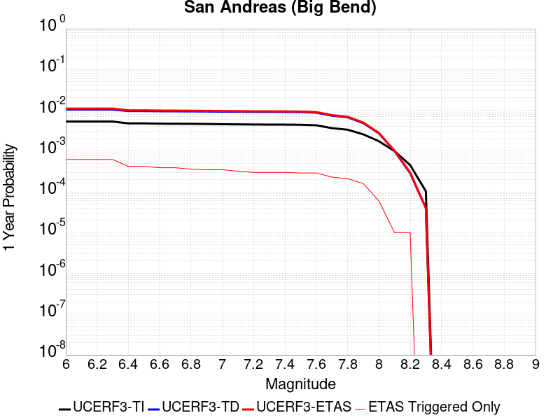 | 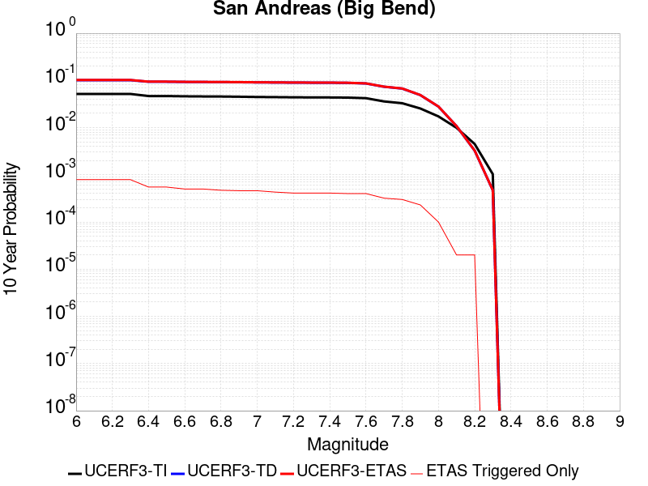 |

| Magnitude | 1 wk TI Prob | 1 wk TD Prob | 1 wk ETAS Prob | 1 wk ETAS/TD Gain | 1 wk ETAS Triggered Only | 1 mo TI Prob | 1 mo TD Prob | 1 mo ETAS Prob | 1 mo ETAS/TD Gain | 1 mo ETAS Triggered Only | 1 yr TI Prob | 1 yr TD Prob | 1 yr ETAS Prob | 1 yr ETAS/TD Gain | 1 yr ETAS Triggered Only | 10 yr TI Prob | 10 yr TD Prob | 10 yr ETAS Prob | 10 yr ETAS/TD Gain | 10 yr ETAS Triggered Only |
|-----|-----|-----|-----|-----|-----|-----|-----|-----|-----|-----|-----|-----|-----|-----|-----|-----|-----|-----|-----|-----|
| 6.0 | 1.0179969E-4 | 2.0073925E-4 | 3.2949087E-4 | 1.6413873 | 1.2877748E-4 | 4.362114E-4 | 8.6002843E-4 | 0.0012031397 | 1.3989533 | 3.434066E-4 | 0.0052979486 | 0.010420859 | 0.011058037 | 1.0611445 | 6.438874E-4 | 0.051734097 | 0.101455905 | 0.10215018 | 1.0068431 | 7.7266485E-4 |
| 6.1 | 1.0179969E-4 | 2.0073925E-4 | 3.2949087E-4 | 1.6413873 | 1.2877748E-4 | 4.362114E-4 | 8.6002843E-4 | 0.0012031397 | 1.3989533 | 3.434066E-4 | 0.0052979486 | 0.010420859 | 0.011058037 | 1.0611445 | 6.438874E-4 | 0.051734097 | 0.101455905 | 0.10215018 | 1.0068431 | 7.7266485E-4 |
| 6.2 | 1.0179969E-4 | 2.0073925E-4 | 3.2949087E-4 | 1.6413873 | 1.2877748E-4 | 4.362114E-4 | 8.6002843E-4 | 0.0012031397 | 1.3989533 | 3.434066E-4 | 0.0052979486 | 0.010420859 | 0.011058037 | 1.0611445 | 6.438874E-4 | 0.051734097 | 0.101455905 | 0.10215018 | 1.0068431 | 7.7266485E-4 |
| 6.3 | 1.0179969E-4 | 2.0073925E-4 | 3.2949087E-4 | 1.6413873 | 1.2877748E-4 | 4.362114E-4 | 8.6002843E-4 | 0.0012031397 | 1.3989533 | 3.434066E-4 | 0.0052979486 | 0.010420859 | 0.011058037 | 1.0611445 | 6.438874E-4 | 0.051734097 | 0.101455905 | 0.10215018 | 1.0068431 | 7.7266485E-4 |
| 6.4 | 9.1639464E-5 | 1.8430917E-4 | 3.1306292E-4 | 1.6985748 | 1.2877748E-4 | 3.9268145E-4 | 7.896575E-4 | 0.0010899011 | 1.3802198 | 3.0048078E-4 | 0.0047704205 | 0.009571818 | 0.009996967 | 1.0444168 | 4.2925825E-4 | 0.046693064 | 0.09378695 | 0.09429265 | 1.005392 | 5.5803574E-4 |
| 6.5 | 9.1639464E-5 | 1.8430917E-4 | 3.1306292E-4 | 1.6985748 | 1.2877748E-4 | 3.9268145E-4 | 7.896575E-4 | 0.0010899011 | 1.3802198 | 3.0048078E-4 | 0.0047704205 | 0.009571818 | 0.009996967 | 1.0444168 | 4.2925825E-4 | 0.046693064 | 0.09378695 | 0.09429265 | 1.005392 | 5.5803574E-4 |
| 6.6 | 9.042622E-5 | 1.8238011E-4 | 3.111341E-4 | 1.705965 | 1.2877748E-4 | 3.8748336E-4 | 7.813951E-4 | 0.0010816411 | 1.3842435 | 3.0048078E-4 | 0.0047074095 | 0.0094721 | 0.009897293 | 1.0448889 | 4.2925825E-4 | 0.046089325 | 0.09287721 | 0.09334448 | 1.005031 | 5.151099E-4 |
| 6.7 | 8.9836685E-5 | 1.8152347E-4 | 3.1027757E-4 | 1.7092973 | 1.2877748E-4 | 3.8495753E-4 | 7.7772595E-4 | 0.001077973 | 1.3860576 | 3.0048078E-4 | 0.00467679 | 0.009427815 | 0.009853026 | 1.0451018 | 4.2925825E-4 | 0.045795817 | 0.09247148 | 0.09293896 | 1.0050553 | 5.151099E-4 |
| 6.8 | 8.9471854E-5 | 1.8099119E-4 | 3.0974537E-4 | 1.7113836 | 1.2877748E-4 | 3.8339442E-4 | 7.754462E-4 | 0.001075694 | 1.3871936 | 3.0048078E-4 | 0.004657841 | 0.009400298 | 0.009825521 | 1.045235 | 4.2925825E-4 | 0.04561414 | 0.0922192 | 0.09268682 | 1.0050706 | 5.151099E-4 |
| 6.9 | 8.858234E-5 | 1.7981093E-4 | 3.0856524E-4 | 1.716054 | 1.2877748E-4 | 3.7958333E-4 | 7.7039085E-4 | 0.0010706402 | 1.3897363 | 3.0048078E-4 | 0.004611638 | 0.009339278 | 0.009764527 | 1.0455334 | 4.2925825E-4 | 0.04517103 | 0.09165911 | 0.092127 | 1.0051048 | 5.151099E-4 |
| 7.0 | 8.7433385E-5 | 1.7819891E-4 | 3.0695344E-4 | 1.7225326 | 1.2877748E-4 | 3.746607E-4 | 7.6348626E-4 | 0.0010637377 | 1.3932636 | 3.0048078E-4 | 0.004551957 | 0.009255932 | 0.009681216 | 1.0459473 | 4.2925825E-4 | 0.044598386 | 0.09089323 | 0.091361515 | 1.0051521 | 5.151099E-4 |
| 7.1 | 8.684964E-5 | 1.7731842E-4 | 2.6315486E-4 | 1.4840807 | 8.585165E-5 | 3.7215967E-4 | 7.597149E-4 | 0.0010170742 | 1.3387576 | 2.5755496E-4 | 0.0045216335 | 0.009210405 | 0.009550649 | 1.0369412 | 3.434066E-4 | 0.04430731 | 0.09047475 | 0.09086517 | 1.0043153 | 4.2925825E-4 |
| 7.2 | 8.606521E-5 | 1.7622454E-4 | 2.6206105E-4 | 1.487086 | 8.585165E-5 | 3.6879873E-4 | 7.550296E-4 | 0.0010123901 | 1.3408614 | 2.5755496E-4 | 0.0044808835 | 0.009153842 | 0.009494104 | 1.0371716 | 3.434066E-4 | 0.043916024 | 0.08995518 | 0.09034582 | 1.0043427 | 4.2925825E-4 |
| 7.3 | 8.568266E-5 | 1.7564454E-4 | 2.6148112E-4 | 1.4886948 | 8.585165E-5 | 3.6715972E-4 | 7.5254537E-4 | 0.0010099065 | 1.3419875 | 2.5755496E-4 | 0.0044610105 | 0.00912385 | 0.009464123 | 1.037295 | 3.434066E-4 | 0.043725148 | 0.08967623 | 0.090067 | 1.0043575 | 4.2925825E-4 |
| 7.4 | 8.5432206E-5 | 1.752704E-4 | 2.61107E-4 | 1.4897382 | 8.585165E-5 | 3.6608664E-4 | 7.509428E-4 | 0.0010083043 | 1.3427179 | 2.5755496E-4 | 0.004447999 | 0.009104501 | 0.009444782 | 1.037375 | 3.434066E-4 | 0.043600157 | 0.08949642 | 0.08988726 | 1.0043671 | 4.2925825E-4 |
| 7.5 | 8.4791965E-5 | 1.7396381E-4 | 2.5980052E-4 | 1.493417 | 8.585165E-5 | 3.633435E-4 | 7.4534636E-4 | 0.0010027094 | 1.3452932 | 2.5755496E-4 | 0.0044147377 | 0.009036932 | 0.009334698 | 1.0329498 | 3.0048078E-4 | 0.043280575 | 0.08887209 | 0.089224085 | 1.0039607 | 3.8633242E-4 |
| 7.6 | 8.241105E-5 | 1.6841735E-4 | 2.5425453E-4 | 1.5096695 | 8.585165E-5 | 3.531424E-4 | 7.2158914E-4 | 9.789582E-4 | 1.3566699 | 2.5755496E-4 | 0.0042910352 | 0.008750047 | 0.009047898 | 1.03404 | 3.0048078E-4 | 0.042091176 | 0.08625032 | 0.086603336 | 1.0040928 | 3.8633242E-4 |
| 7.7 | 7.00432E-5 | 1.4205615E-4 | 2.278956E-4 | 1.6042643 | 8.585165E-5 | 3.001506E-4 | 6.0867006E-4 | 8.6606824E-4 | 1.4228863 | 2.5755496E-4 | 0.0036482112 | 0.0073854174 | 0.007683679 | 1.0403852 | 3.0048078E-4 | 0.035888977 | 0.07352299 | 0.07388092 | 1.0048683 | 3.8633242E-4 |
| 7.8 | 6.415362E-5 | 1.2969968E-4 | 2.1554019E-4 | 1.6618406 | 8.585165E-5 | 2.749151E-4 | 5.557374E-4 | 8.131492E-4 | 1.4631897 | 2.5755496E-4 | 0.0033419547 | 0.0067451415 | 0.0070435954 | 1.0442473 | 3.0048078E-4 | 0.03292141 | 0.06725514 | 0.06761549 | 1.005358 | 3.8633242E-4 |
| 7.9 | 4.939911E-5 | 9.341721E-5 | 1.3633903E-4 | 1.4594636 | 4.2925825E-5 | 2.116933E-4 | 4.0029807E-4 | 6.148413E-4 | 1.5359586 | 2.1462912E-4 | 0.0025743195 | 0.004862747 | 0.00511905 | 1.0527073 | 2.5755496E-4 | 0.025447013 | 0.048915803 | 0.04924241 | 1.0066769 | 3.434066E-4 |
| 8.0 | 3.344983E-5 | 5.2228E-5 | 9.515158E-5 | 1.8218501 | 4.2925825E-5 | 1.4334853E-4 | 2.2381509E-4 | 2.667313E-4 | 1.1917485 | 4.2925825E-5 | 0.0017438711 | 0.0027215453 | 0.0028071634 | 1.0314593 | 8.585165E-5 | 0.017302496 | 0.027923161 | 0.028006617 | 1.0029887 | 8.585165E-5 |
| 8.1 | 1.9104898E-5 | 1.9171663E-5 | 1.9171663E-5 | 1.0 | 0.0 | 8.1875565E-5 | 8.2161685E-5 | 8.2161685E-5 | 1.0 | 0.0 | 9.963791E-4 | 9.9986E-4 | 9.9986E-4 | 1.0 | 0.0 | 0.009919235 | 0.010749552 | 0.010749552 | 1.0 | 0.0 |
| 8.2 | 8.643924E-6 | 5.473668E-6 | 5.473668E-6 | 1.0 | 0.0 | 3.704486E-5 | 2.3458366E-5 | 2.3458366E-5 | 1.0 | 0.0 | 4.5092785E-4 | 2.8556827E-4 | 2.8556827E-4 | 1.0 | 0.0 | 0.0045001395 | 0.0032481793 | 0.0032481793 | 1.0 | 0.0 |
| 8.3 | 1.983087E-6 | 7.6564595E-7 | 7.6564595E-7 | 1.0 | 0.0 | 8.498917E-6 | 3.281336E-6 | 3.281336E-6 | 1.0 | 0.0 | 1.034694E-4 | 3.9949547E-5 | 3.9949547E-5 | 1.0 | 0.0 | 0.0010342124 | 4.717979E-4 | 4.717979E-4 | 1.0 | 0.0 |

## Coyote Lake
*[(top)](#table-of-contents)*

| 1 Week | 1 Month | 1 Year | 10 Year |
|-----|-----|-----|-----|
|  |  |  |  |

| Magnitude | 1 wk TI Prob | 1 wk TD Prob | 1 wk ETAS Prob | 1 wk ETAS/TD Gain | 1 wk ETAS Triggered Only | 1 mo TI Prob | 1 mo TD Prob | 1 mo ETAS Prob | 1 mo ETAS/TD Gain | 1 mo ETAS Triggered Only | 1 yr TI Prob | 1 yr TD Prob | 1 yr ETAS Prob | 1 yr ETAS/TD Gain | 1 yr ETAS Triggered Only | 10 yr TI Prob | 10 yr TD Prob | 10 yr ETAS Prob | 10 yr ETAS/TD Gain | 10 yr ETAS Triggered Only |
|-----|-----|-----|-----|-----|-----|-----|-----|-----|-----|-----|-----|-----|-----|-----|-----|-----|-----|-----|-----|-----|
| 6.0 | 1.980352E-5 | 2.1706745E-5 | 1.5048143E-4 | 6.932473 | 1.2877748E-4 | 8.486947E-5 | 9.302599E-5 | 2.647133E-4 | 2.8455844 | 1.717033E-4 | 0.0010327959 | 0.0011320751 | 0.0016466018 | 1.4544988 | 5.151099E-4 | 0.010280091 | 0.011270258 | 0.012034215 | 1.0677851 | 7.7266485E-4 |
| 6.1 | 1.980352E-5 | 2.1706745E-5 | 1.5048143E-4 | 6.932473 | 1.2877748E-4 | 8.486947E-5 | 9.302599E-5 | 2.647133E-4 | 2.8455844 | 1.717033E-4 | 0.0010327959 | 0.0011320751 | 0.0016466018 | 1.4544988 | 5.151099E-4 | 0.010280091 | 0.011270258 | 0.012034215 | 1.0677851 | 7.7266485E-4 |
| 6.2 | 1.980352E-5 | 2.1706745E-5 | 1.5048143E-4 | 6.932473 | 1.2877748E-4 | 8.486947E-5 | 9.302599E-5 | 2.647133E-4 | 2.8455844 | 1.717033E-4 | 0.0010327959 | 0.0011320751 | 0.0016466018 | 1.4544988 | 5.151099E-4 | 0.010280091 | 0.011270258 | 0.012034215 | 1.0677851 | 7.7266485E-4 |
| 6.3 | 1.5344787E-5 | 1.682067E-5 | 1.0267087E-4 | 6.103852 | 8.585165E-5 | 6.576172E-5 | 7.2086936E-5 | 2.0085512E-4 | 2.7862902 | 1.2877748E-4 | 8.003548E-4 | 8.773662E-4 | 0.0012633597 | 1.4399457 | 3.8633242E-4 | 0.007974784 | 0.00874507 | 0.009213124 | 1.0535221 | 4.7218407E-4 |
| 6.4 | 1.5344787E-5 | 1.682067E-5 | 1.0267087E-4 | 6.103852 | 8.585165E-5 | 6.576172E-5 | 7.2086936E-5 | 2.0085512E-4 | 2.7862902 | 1.2877748E-4 | 8.003548E-4 | 8.773662E-4 | 0.0012633597 | 1.4399457 | 3.8633242E-4 | 0.007974784 | 0.00874507 | 0.009213124 | 1.0535221 | 4.7218407E-4 |
| 6.5 | 1.4189697E-5 | 1.5557987E-5 | 1.014083E-4 | 6.5180864 | 8.585165E-5 | 6.081157E-5 | 6.6675726E-5 | 1.954446E-4 | 2.931271 | 1.2877748E-4 | 7.401293E-4 | 8.115349E-4 | 0.0011975538 | 1.4756652 | 3.8633242E-4 | 0.0073766913 | 0.008091656 | 0.00856002 | 1.0578823 | 4.7218407E-4 |
| 6.6 | 1.3469301E-5 | 1.4771577E-5 | 1.0062196E-4 | 6.811863 | 8.585165E-5 | 5.7724297E-5 | 6.330556E-5 | 1.9207488E-4 | 3.0340917 | 1.2877748E-4 | 7.025667E-4 | 7.7053264E-4 | 0.0011565674 | 1.5009973 | 3.8633242E-4 | 0.0070034964 | 0.0076845144 | 0.00815307 | 1.060974 | 4.7218407E-4 |
| 6.7 | 1.3027966E-5 | 1.4281745E-5 | 1.00132165E-4 | 7.0112 | 8.585165E-5 | 5.5832945E-5 | 6.120638E-5 | 1.8997597E-4 | 3.103859 | 1.2877748E-4 | 6.7955407E-4 | 7.4499263E-4 | 0.0011310373 | 1.5181859 | 3.8633242E-4 | 0.006774798 | 0.0074308286 | 0.007899504 | 1.0630717 | 4.7218407E-4 |
| 6.8 | 5.695434E-6 | 6.2244176E-6 | 6.2244176E-6 | 1.0 | 0.0 | 2.4408775E-5 | 2.6675973E-5 | 2.6675973E-5 | 1.0 | 0.0 | 2.971363E-4 | 3.2476155E-4 | 3.6767343E-4 | 1.1321335 | 4.2925825E-5 | 0.0029673933 | 0.0032458105 | 0.0032885969 | 1.013182 | 4.2925825E-5 |
| 6.9 | 4.385688E-6 | 4.7930553E-6 | 4.7930553E-6 | 1.0 | 0.0 | 1.879567E-5 | 2.0541665E-5 | 2.0541665E-5 | 1.0 | 0.0 | 2.2881327E-4 | 2.5009477E-4 | 2.5009477E-4 | 1.0 | 0.0 | 0.002285778 | 0.0025009478 | 0.0025009478 | 1.0 | 0.0 |

## San Andreas (Parkfield)
*[(top)](#table-of-contents)*

| 1 Week | 1 Month | 1 Year | 10 Year |
|-----|-----|-----|-----|
|  |  |  | 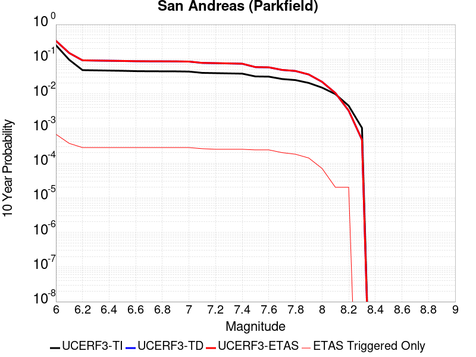 |

| Magnitude | 1 wk TI Prob | 1 wk TD Prob | 1 wk ETAS Prob | 1 wk ETAS/TD Gain | 1 wk ETAS Triggered Only | 1 mo TI Prob | 1 mo TD Prob | 1 mo ETAS Prob | 1 mo ETAS/TD Gain | 1 mo ETAS Triggered Only | 1 yr TI Prob | 1 yr TD Prob | 1 yr ETAS Prob | 1 yr ETAS/TD Gain | 1 yr ETAS Triggered Only | 10 yr TI Prob | 10 yr TD Prob | 10 yr ETAS Prob | 10 yr ETAS/TD Gain | 10 yr ETAS Triggered Only |
|-----|-----|-----|-----|-----|-----|-----|-----|-----|-----|-----|-----|-----|-----|-----|-----|-----|-----|-----|-----|-----|
| 6.0 | 5.556969E-4 | 7.778562E-4 | 0.0010781033 | 1.385993 | 3.0048078E-4 | 0.0023793848 | 0.0033299583 | 0.003715004 | 1.1156309 | 3.8633242E-4 | 0.028586963 | 0.040235043 | 0.040688228 | 1.0112635 | 4.7218407E-4 | 0.25176284 | 0.3371973 | 0.33768097 | 1.0014344 | 7.29739E-4 |
| 6.1 | 1.925858E-4 | 3.0278185E-4 | 3.456947E-4 | 1.1417285 | 4.2925825E-5 | 8.2510663E-4 | 0.001297085 | 0.0014256954 | 1.0991534 | 1.2877748E-4 | 0.0099994885 | 0.01577393 | 0.015942924 | 1.0107136 | 1.717033E-4 | 0.095613256 | 0.14975825 | 0.15001373 | 1.001706 | 3.0048078E-4 |
| 6.2 | 9.4306815E-5 | 1.8243887E-4 | 2.2535687E-4 | 1.2352458 | 4.2925825E-5 | 4.0410945E-4 | 7.8164786E-4 | 9.103246E-4 | 1.1646225 | 1.2877748E-4 | 0.0049089384 | 0.009475246 | 0.009645323 | 1.0179496 | 1.717033E-4 | 0.048019063 | 0.0918565 | 0.0920904 | 1.0025463 | 2.5755496E-4 |
| 6.3 | 9.283051E-5 | 1.794041E-4 | 2.2232223E-4 | 1.239226 | 4.2925825E-5 | 3.9778434E-4 | 7.686494E-4 | 8.9732785E-4 | 1.1674086 | 1.2877748E-4 | 0.0048322747 | 0.009318355 | 0.009488458 | 1.0182546 | 1.717033E-4 | 0.047285385 | 0.090509474 | 0.09074371 | 1.002588 | 2.5755496E-4 |
| 6.4 | 9.138826E-5 | 1.7702584E-4 | 2.1994406E-4 | 1.2424405 | 4.2925825E-5 | 3.916052E-4 | 7.5846276E-4 | 8.8714255E-4 | 1.1696587 | 1.2877748E-4 | 0.0047573745 | 0.009195387 | 0.009365512 | 1.018501 | 1.717033E-4 | 0.046568092 | 0.0894136 | 0.08964812 | 1.002623 | 2.5755496E-4 |
| 6.5 | 9.000255E-5 | 1.746064E-4 | 2.1752472E-4 | 1.2458005 | 4.2925825E-5 | 3.8566816E-4 | 7.4809964E-4 | 8.767808E-4 | 1.1720107 | 1.2877748E-4 | 0.0046854047 | 0.009070284 | 0.00924043 | 1.0187587 | 1.717033E-4 | 0.045878403 | 0.08829608 | 0.08853089 | 1.0026594 | 2.5755496E-4 |
| 6.6 | 8.8109264E-5 | 1.7141816E-4 | 2.1433661E-4 | 1.2503729 | 4.2925825E-5 | 3.7755648E-4 | 7.3444354E-4 | 8.631264E-4 | 1.1752114 | 1.2877748E-4 | 0.0045870654 | 0.008905404 | 0.009075578 | 1.0191091 | 1.717033E-4 | 0.04493529 | 0.08682707 | 0.08706226 | 1.0027088 | 2.5755496E-4 |
| 6.7 | 8.738073E-5 | 1.7008898E-4 | 2.1300752E-4 | 1.2523298 | 4.2925825E-5 | 3.7443507E-4 | 7.287503E-4 | 8.5743394E-4 | 1.1765813 | 1.2877748E-4 | 0.0045492216 | 0.008836695 | 0.009006881 | 1.019259 | 1.717033E-4 | 0.04457213 | 0.0862268 | 0.08646215 | 1.0027294 | 2.5755496E-4 |
| 6.8 | 8.710195E-5 | 1.6954402E-4 | 2.1246256E-4 | 1.253141 | 4.2925825E-5 | 3.7324068E-4 | 7.26416E-4 | 8.5509993E-4 | 1.177149 | 1.2877748E-4 | 0.0045347405 | 0.008808513 | 0.008978704 | 1.0193212 | 1.717033E-4 | 0.04443313 | 0.08597436 | 0.086209774 | 1.0027381 | 2.5755496E-4 |
| 6.9 | 8.6801556E-5 | 1.6895356E-4 | 2.1187213E-4 | 1.2540258 | 4.2925825E-5 | 3.7195362E-4 | 7.238869E-4 | 8.5257116E-4 | 1.1777685 | 1.2877748E-4 | 0.0045191357 | 0.0087779695 | 0.008948166 | 1.019389 | 1.717033E-4 | 0.044283327 | 0.08570042 | 0.085935906 | 1.0027478 | 2.5755496E-4 |
| 7.0 | 8.5571606E-5 | 1.664819E-4 | 2.0940058E-4 | 1.2577978 | 4.2925825E-5 | 3.6668387E-4 | 7.132999E-4 | 8.419855E-4 | 1.1804088 | 1.2877748E-4 | 0.004455241 | 0.008650103 | 0.008820321 | 1.0196781 | 1.717033E-4 | 0.043669727 | 0.08454836 | 0.08478414 | 1.0027887 | 2.5755496E-4 |
| 7.1 | 7.82589E-5 | 1.5128969E-4 | 1.94209E-4 | 1.2836897 | 4.2925825E-5 | 3.3535215E-4 | 6.4822397E-4 | 7.7691796E-4 | 1.1985332 | 1.2877748E-4 | 0.0040752706 | 0.007863738 | 0.007991503 | 1.0162474 | 1.2877748E-4 | 0.040013418 | 0.077460445 | 0.077658445 | 1.0025562 | 2.1462912E-4 |
| 7.2 | 7.690929E-5 | 1.4866212E-4 | 1.9158155E-4 | 1.2887046 | 4.2925825E-5 | 3.2956956E-4 | 6.369685E-4 | 7.65664E-4 | 1.2020437 | 1.2877748E-4 | 0.004005129 | 0.0077276826 | 0.007855465 | 1.0165356 | 1.2877748E-4 | 0.0393371 | 0.07623341 | 0.07643168 | 1.0026008 | 2.1462912E-4 |
| 7.3 | 7.5543794E-5 | 1.4562748E-4 | 1.8854706E-4 | 1.2947217 | 4.2925825E-5 | 3.2371894E-4 | 6.239692E-4 | 7.526663E-4 | 1.2062556 | 1.2877748E-4 | 0.003934157 | 0.0075705256 | 0.0076983282 | 1.0168816 | 1.2877748E-4 | 0.038652334 | 0.07479777 | 0.074996345 | 1.0026548 | 2.1462912E-4 |
| 7.4 | 7.4214564E-5 | 1.4263717E-4 | 1.8555687E-4 | 1.3009012 | 4.2925825E-5 | 3.1802364E-4 | 6.1115966E-4 | 7.398584E-4 | 1.2105813 | 1.2877748E-4 | 0.003865065 | 0.0074156416 | 0.0075434637 | 1.0172368 | 1.2877748E-4 | 0.03798529 | 0.07337152 | 0.07357041 | 1.0027106 | 2.1462912E-4 |
| 7.5 | 6.149578E-5 | 1.1191443E-4 | 1.5483545E-4 | 1.3835164 | 4.2925825E-5 | 2.6352672E-4 | 4.795452E-4 | 6.082609E-4 | 1.2684121 | 1.2877748E-4 | 0.0032037178 | 0.005822865 | 0.0059508923 | 1.0219871 | 1.2877748E-4 | 0.03157923 | 0.058559462 | 0.058761526 | 1.0034505 | 2.1462912E-4 |
| 7.6 | 6.0643448E-5 | 1.102009E-4 | 1.5312199E-4 | 1.3894805 | 4.2925825E-5 | 2.598746E-4 | 4.7220418E-4 | 6.009208E-4 | 1.2725868 | 1.2877748E-4 | 0.0031593828 | 0.005733962 | 0.005862001 | 1.0223299 | 1.2877748E-4 | 0.031148417 | 0.05772042 | 0.057922658 | 1.0035038 | 2.1462912E-4 |
| 7.7 | 5.1652263E-5 | 9.175265E-5 | 1.3467453E-4 | 1.4678 | 4.2925825E-5 | 2.2134806E-4 | 3.9316638E-4 | 5.218932E-4 | 1.3274106 | 1.2877748E-4 | 0.002691582 | 0.0047763046 | 0.0049044667 | 1.0268329 | 1.2877748E-4 | 0.026592141 | 0.04853641 | 0.048740618 | 1.0042074 | 2.1462912E-4 |
| 7.8 | 4.8090482E-5 | 8.560165E-5 | 1.285238E-4 | 1.5014173 | 4.2925825E-5 | 2.060858E-4 | 3.6681266E-4 | 4.955429E-4 | 1.3509427 | 1.2877748E-4 | 0.0025062072 | 0.004456807 | 0.0045850105 | 1.0287658 | 1.2877748E-4 | 0.024781305 | 0.045302264 | 0.04550717 | 1.004523 | 2.1462912E-4 |
| 7.9 | 3.970278E-5 | 6.7507375E-5 | 1.104303E-4 | 1.6358258 | 4.2925825E-5 | 1.7014367E-4 | 2.8928524E-4 | 4.1802548E-4 | 1.4450287 | 1.2877748E-4 | 0.002069531 | 0.0035163634 | 0.0036446883 | 1.0364935 | 1.2877748E-4 | 0.020503636 | 0.03588176 | 0.036088686 | 1.005767 | 2.1462912E-4 |
| 8.0 | 2.8982335E-5 | 4.0698153E-5 | 8.362223E-5 | 2.0546935 | 4.2925825E-5 | 1.2420409E-4 | 1.7440901E-4 | 2.1732734E-4 | 1.2460787 | 4.2925825E-5 | 0.0015111357 | 0.0021213628 | 0.0021641976 | 1.0201921 | 4.2925825E-5 | 0.015009012 | 0.02201118 | 0.022053162 | 1.0019072 | 4.2925825E-5 |
| 8.1 | 1.8836186E-5 | 1.867974E-5 | 1.867974E-5 | 1.0 | 0.0 | 8.0724014E-5 | 8.005358E-5 | 8.005358E-5 | 1.0 | 0.0 | 9.823717E-4 | 9.742171E-4 | 9.742171E-4 | 1.0 | 0.0 | 0.009780403 | 0.010487711 | 0.010487711 | 1.0 | 0.0 |
| 8.2 | 8.643924E-6 | 5.473668E-6 | 5.473668E-6 | 1.0 | 0.0 | 3.704486E-5 | 2.3458366E-5 | 2.3458366E-5 | 1.0 | 0.0 | 4.5092785E-4 | 2.8556827E-4 | 2.8556827E-4 | 1.0 | 0.0 | 0.0045001395 | 0.0032481793 | 0.0032481793 | 1.0 | 0.0 |
| 8.3 | 1.983087E-6 | 7.6564595E-7 | 7.6564595E-7 | 1.0 | 0.0 | 8.498917E-6 | 3.281336E-6 | 3.281336E-6 | 1.0 | 0.0 | 1.034694E-4 | 3.9949547E-5 | 3.9949547E-5 | 1.0 | 0.0 | 0.0010342124 | 4.717979E-4 | 4.717979E-4 | 1.0 | 0.0 |

## Death Valley (Fish Lake Valley)
*[(top)](#table-of-contents)*

| 1 Week | 1 Month | 1 Year | 10 Year |
|-----|-----|-----|-----|
|  |  |  |  |

| Magnitude | 1 wk TI Prob | 1 wk TD Prob | 1 wk ETAS Prob | 1 wk ETAS/TD Gain | 1 wk ETAS Triggered Only | 1 mo TI Prob | 1 mo TD Prob | 1 mo ETAS Prob | 1 mo ETAS/TD Gain | 1 mo ETAS Triggered Only | 1 yr TI Prob | 1 yr TD Prob | 1 yr ETAS Prob | 1 yr ETAS/TD Gain | 1 yr ETAS Triggered Only | 10 yr TI Prob | 10 yr TD Prob | 10 yr ETAS Prob | 10 yr ETAS/TD Gain | 10 yr ETAS Triggered Only |
|-----|-----|-----|-----|-----|-----|-----|-----|-----|-----|-----|-----|-----|-----|-----|-----|-----|-----|-----|-----|-----|
| 6.0 | 3.872328E-5 | 4.7265705E-5 | 2.1896088E-4 | 4.632553 | 1.717033E-4 | 1.6594635E-4 | 2.0255324E-4 | 4.171389E-4 | 2.0594037 | 2.1462912E-4 | 0.0020185246 | 0.0024635606 | 0.0028061213 | 1.139051 | 3.434066E-4 | 0.02000288 | 0.024388338 | 0.02510028 | 1.0291919 | 7.29739E-4 |
| 6.1 | 3.872328E-5 | 4.7265705E-5 | 2.1896088E-4 | 4.632553 | 1.717033E-4 | 1.6594635E-4 | 2.0255324E-4 | 4.171389E-4 | 2.0594037 | 2.1462912E-4 | 0.0020185246 | 0.0024635606 | 0.0028061213 | 1.139051 | 3.434066E-4 | 0.02000288 | 0.024388338 | 0.02510028 | 1.0291919 | 7.29739E-4 |
| 6.2 | 3.872328E-5 | 4.7265705E-5 | 2.1896088E-4 | 4.632553 | 1.717033E-4 | 1.6594635E-4 | 2.0255324E-4 | 4.171389E-4 | 2.0594037 | 2.1462912E-4 | 0.0020185246 | 0.0024635606 | 0.0028061213 | 1.139051 | 3.434066E-4 | 0.02000288 | 0.024388338 | 0.02510028 | 1.0291919 | 7.29739E-4 |
| 6.3 | 2.8356371E-5 | 3.360979E-5 | 2.0530731E-4 | 6.1085567 | 1.717033E-4 | 1.2152165E-4 | 1.4403443E-4 | 3.5863265E-4 | 2.489909 | 2.1462912E-4 | 0.0014785219 | 0.0017522788 | 0.0020950837 | 1.1956338 | 3.434066E-4 | 0.014687235 | 0.017391816 | 0.018108863 | 1.041229 | 7.29739E-4 |
| 6.4 | 2.8356371E-5 | 3.360979E-5 | 2.0530731E-4 | 6.1085567 | 1.717033E-4 | 1.2152165E-4 | 1.4403443E-4 | 3.5863265E-4 | 2.489909 | 2.1462912E-4 | 0.0014785219 | 0.0017522788 | 0.0020950837 | 1.1956338 | 3.434066E-4 | 0.014687235 | 0.017391816 | 0.018108863 | 1.041229 | 7.29739E-4 |
| 6.5 | 2.4448687E-5 | 2.8607585E-5 | 2.0030596E-4 | 7.001848 | 1.717033E-4 | 1.0477588E-4 | 1.2259845E-4 | 3.3720126E-4 | 2.750453 | 2.1462912E-4 | 0.0012748998 | 0.0014916616 | 0.001834556 | 1.229874 | 3.434066E-4 | 0.012676105 | 0.014821392 | 0.015540315 | 1.0485058 | 7.29739E-4 |
| 6.6 | 2.1298161E-5 | 2.4660083E-5 | 1.9635915E-4 | 7.962631 | 1.717033E-4 | 9.127464E-5 | 1.0568197E-4 | 3.202884E-4 | 3.0306818 | 2.1462912E-4 | 0.0011107022 | 0.0012859512 | 0.0016289162 | 1.2667013 | 3.434066E-4 | 0.011051672 | 0.01278853 | 0.013508937 | 1.0563322 | 7.29739E-4 |
| 6.7 | 1.8959729E-5 | 2.1781027E-5 | 1.5055569E-4 | 6.9122405 | 1.2877748E-4 | 8.125345E-5 | 9.334406E-5 | 2.6503133E-4 | 2.8392951 | 1.717033E-4 | 9.888117E-4 | 0.001135897 | 0.0014360364 | 1.2642312 | 3.0048078E-4 | 0.009844234 | 0.01130357 | 0.01198262 | 1.060074 | 6.868132E-4 |
| 6.8 | 1.6691629E-5 | 1.9018351E-5 | 1.4779337E-4 | 7.771093 | 1.2877748E-4 | 7.153359E-5 | 8.150477E-5 | 2.5319407E-4 | 3.106494 | 1.717033E-4 | 8.7057345E-4 | 9.918857E-4 | 0.0012920684 | 1.3026384 | 3.0048078E-4 | 0.008671708 | 0.009876343 | 0.010556374 | 1.0688545 | 6.868132E-4 |
| 6.9 | 1.450505E-5 | 1.638954E-5 | 1.451649E-4 | 8.857167 | 1.2877748E-4 | 6.216302E-5 | 7.0239046E-5 | 2.4193028E-4 | 3.4443846 | 1.717033E-4 | 7.5657194E-4 | 8.5483363E-4 | 0.0011550576 | 1.3512074 | 3.0048078E-4 | 0.007540013 | 0.008516386 | 0.00919735 | 1.0799593 | 6.868132E-4 |
| 7.0 | 1.2940855E-5 | 1.4537972E-5 | 1.4331358E-4 | 9.85788 | 1.2877748E-4 | 5.545963E-5 | 6.230414E-5 | 2.3399673E-4 | 3.7557175 | 1.717033E-4 | 6.750118E-4 | 7.5829466E-4 | 0.0010156543 | 1.3393927 | 2.5755496E-4 | 0.006729651 | 0.0075576897 | 0.008196711 | 1.0845524 | 6.438874E-4 |
| 7.1 | 1.2544658E-5 | 1.4078208E-5 | 1.4285387E-4 | 10.147163 | 1.2877748E-4 | 5.3761712E-5 | 6.0333812E-5 | 2.3202675E-4 | 3.8457167 | 1.717033E-4 | 6.5435225E-4 | 7.343222E-4 | 9.91688E-4 | 1.3504808 | 2.5755496E-4 | 0.006524288 | 0.007319551 | 0.007958725 | 1.0873243 | 6.438874E-4 |
| 7.2 | 1.2489416E-5 | 1.4015674E-5 | 1.4279134E-4 | 10.187975 | 1.2877748E-4 | 5.3524967E-5 | 6.0065824E-5 | 2.3175881E-4 | 3.858414 | 1.717033E-4 | 6.514716E-4 | 7.310616E-4 | 9.884282E-4 | 1.352045 | 2.5755496E-4 | 0.006495651 | 0.0072871596 | 0.007926355 | 1.0877153 | 6.438874E-4 |
| 7.3 | 1.2368307E-5 | 1.3879812E-5 | 1.426555E-4 | 10.277912 | 1.2877748E-4 | 5.3005948E-5 | 5.9483587E-5 | 2.3117667E-4 | 3.8863943 | 1.717033E-4 | 6.451563E-4 | 7.2397763E-4 | 9.813461E-4 | 1.3554924 | 2.5755496E-4 | 0.0064328653 | 0.007216782 | 0.007856023 | 1.0885769 | 6.438874E-4 |
| 7.4 | 1.2161707E-5 | 1.36478675E-5 | 1.4242358E-4 | 10.435592 | 1.2877748E-4 | 5.212056E-5 | 5.8489582E-5 | 2.3018284E-4 | 3.93545 | 1.717033E-4 | 6.3438306E-4 | 7.118836E-4 | 9.6925517E-4 | 1.361536 | 2.5755496E-4 | 0.006325751 | 0.0070966207 | 0.0077359383 | 1.0900877 | 6.438874E-4 |
| 7.5 | 1.1707948E-5 | 1.3145515E-5 | 1.419213E-4 | 10.796176 | 1.2877748E-4 | 5.0175953E-5 | 5.6336736E-5 | 2.2803036E-4 | 4.0476317 | 1.717033E-4 | 6.10721E-4 | 6.856895E-4 | 9.4306783E-4 | 1.375357 | 2.5755496E-4 | 0.0060904534 | 0.006836321 | 0.007475807 | 1.0935423 | 6.438874E-4 |
| 7.6 | 1.0319538E-5 | 1.1579622E-5 | 1.4035561E-4 | 12.1209135 | 1.2877748E-4 | 4.4225842E-5 | 4.9626036E-5 | 2.213208E-4 | 4.459772 | 1.717033E-4 | 5.383166E-4 | 6.040347E-4 | 8.6143403E-4 | 1.4261334 | 2.5755496E-4 | 0.0053701443 | 0.0060244603 | 0.0066644684 | 1.1062349 | 6.438874E-4 |
| 7.7 | 8.937764E-6 | 1.0022779E-5 | 1.3879896E-4 | 13.848351 | 1.2877748E-4 | 3.830414E-5 | 4.295409E-5 | 2.1465E-4 | 4.997196 | 1.717033E-4 | 4.6625308E-4 | 5.228456E-4 | 7.802659E-4 | 1.4923447 | 2.5755496E-4 | 0.0046527605 | 0.005216664 | 0.005814491 | 1.1145993 | 6.0096156E-4 |
| 7.8 | 3.108007E-7 | 3.284654E-7 | 4.3254277E-5 | 131.68594 | 4.2925825E-5 | 1.3320023E-6 | 1.407708E-6 | 4.4333472E-5 | 31.49337 | 4.2925825E-5 | 1.6217007E-5 | 1.7138715E-5 | 6.0063805E-5 | 3.5045686 | 4.2925825E-5 | 1.6215823E-4 | 1.7137431E-4 | 2.5721124E-4 | 1.5008739 | 8.585165E-5 |
| 7.9 | 2.5591178E-9 | 2.6696718E-9 | 2.6696718E-9 | 1.0 | 0.0 | 1.0967647E-8 | 1.14414505E-8 | 1.14414505E-8 | 1.0 | 0.0 | 1.335311E-7 | 1.3929966E-7 | 1.3929966E-7 | 1.0 | 0.0 | 1.3353102E-6 | 1.3929966E-6 | 1.3929966E-6 | 1.0 | 0.0 |

## Elsinore (Glen Ivy) rev
*[(top)](#table-of-contents)*

| 1 Week | 1 Month | 1 Year | 10 Year |
|-----|-----|-----|-----|
| 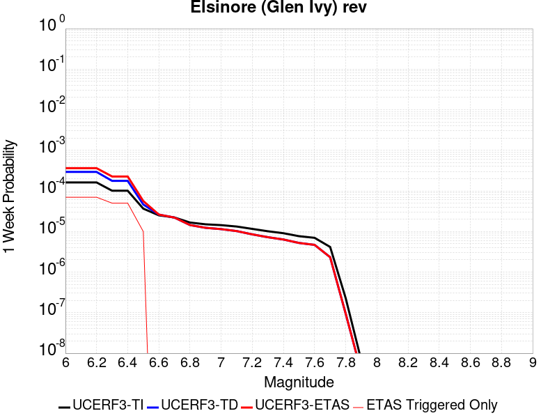 |  |  | 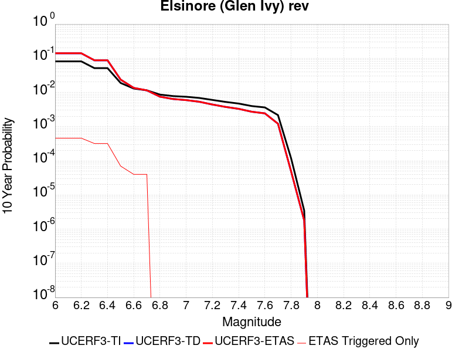 |

| Magnitude | 1 wk TI Prob | 1 wk TD Prob | 1 wk ETAS Prob | 1 wk ETAS/TD Gain | 1 wk ETAS Triggered Only | 1 mo TI Prob | 1 mo TD Prob | 1 mo ETAS Prob | 1 mo ETAS/TD Gain | 1 mo ETAS Triggered Only | 1 yr TI Prob | 1 yr TD Prob | 1 yr ETAS Prob | 1 yr ETAS/TD Gain | 1 yr ETAS Triggered Only | 10 yr TI Prob | 10 yr TD Prob | 10 yr ETAS Prob | 10 yr ETAS/TD Gain | 10 yr ETAS Triggered Only |
|-----|-----|-----|-----|-----|-----|-----|-----|-----|-----|-----|-----|-----|-----|-----|-----|-----|-----|-----|-----|-----|
| 6.0 | 1.6204086E-4 | 2.937271E-4 | 3.366403E-4 | 1.146099 | 4.2925825E-5 | 6.94276E-4 | 0.0012583778 | 0.0013441214 | 1.0681382 | 8.585165E-5 | 0.008420097 | 0.0152346175 | 0.015488249 | 1.0166483 | 2.5755496E-4 | 0.081081145 | 0.13962454 | 0.13999386 | 1.0026451 | 4.2925825E-4 |
| 6.1 | 1.6204086E-4 | 2.937271E-4 | 3.366403E-4 | 1.146099 | 4.2925825E-5 | 6.94276E-4 | 0.0012583778 | 0.0013441214 | 1.0681382 | 8.585165E-5 | 0.008420097 | 0.0152346175 | 0.015488249 | 1.0166483 | 2.5755496E-4 | 0.081081145 | 0.13962454 | 0.13999386 | 1.0026451 | 4.2925825E-4 |
| 6.2 | 1.6204086E-4 | 2.937271E-4 | 3.366403E-4 | 1.146099 | 4.2925825E-5 | 6.94276E-4 | 0.0012583778 | 0.0013441214 | 1.0681382 | 8.585165E-5 | 0.008420097 | 0.0152346175 | 0.015488249 | 1.0166483 | 2.5755496E-4 | 0.081081145 | 0.13962454 | 0.13999386 | 1.0026451 | 4.2925825E-4 |
| 6.3 | 1.0111737E-4 | 1.7703463E-4 | 2.1995285E-4 | 1.2424284 | 4.2925825E-5 | 4.332882E-4 | 7.5861585E-4 | 8.444024E-4 | 1.113083 | 8.585165E-5 | 0.005262531 | 0.0092177205 | 0.009472902 | 1.0276837 | 2.5755496E-4 | 0.0513964 | 0.08707393 | 0.087426625 | 1.0040505 | 3.8633242E-4 |
| 6.4 | 1.0111737E-4 | 1.7703463E-4 | 2.1995285E-4 | 1.2424284 | 4.2925825E-5 | 4.332882E-4 | 7.5861585E-4 | 8.444024E-4 | 1.113083 | 8.585165E-5 | 0.005262531 | 0.0092177205 | 0.009472902 | 1.0276837 | 2.5755496E-4 | 0.0513964 | 0.08707393 | 0.087426625 | 1.0040505 | 3.8633242E-4 |
| 6.5 | 3.6624708E-5 | 4.6391986E-5 | 4.6391986E-5 | 1.0 | 0.0 | 1.569536E-4 | 1.9880968E-4 | 1.9880968E-4 | 1.0 | 0.0 | 0.001909235 | 0.0024181814 | 0.0024610034 | 1.0177083 | 4.2925825E-5 | 0.01892915 | 0.023697061 | 0.023738971 | 1.0017685 | 4.2925825E-5 |
| 6.6 | 2.5051324E-5 | 2.6147465E-5 | 2.6147465E-5 | 1.0 | 0.0 | 1.073584E-4 | 1.12056E-4 | 1.12056E-4 | 1.0 | 0.0 | 0.0013063047 | 0.0013634725 | 0.0013634725 | 1.0 | 0.0 | 0.012986525 | 0.013565759 | 0.013565759 | 1.0 | 0.0 |
| 6.7 | 2.2189772E-5 | 2.2072489E-5 | 2.2072489E-5 | 1.0 | 0.0 | 9.509556E-5 | 9.459316E-5 | 9.459316E-5 | 1.0 | 0.0 | 0.0011571734 | 0.0011510996 | 0.0011510996 | 1.0 | 0.0 | 0.011511663 | 0.0114663225 | 0.0114663225 | 1.0 | 0.0 |
| 6.8 | 1.6654378E-5 | 1.44376E-5 | 1.44376E-5 | 1.0 | 0.0 | 7.137396E-5 | 6.187399E-5 | 6.187399E-5 | 1.0 | 0.0 | 8.686314E-4 | 7.5306057E-4 | 7.5306057E-4 | 1.0 | 0.0 | 0.008652439 | 0.0075100763 | 0.0075100763 | 1.0 | 0.0 |
| 6.9 | 1.5042909E-5 | 1.2331886E-5 | 1.2331886E-5 | 1.0 | 0.0 | 6.446802E-5 | 5.2849886E-5 | 5.2849886E-5 | 1.0 | 0.0 | 7.8461546E-4 | 6.4326054E-4 | 6.4326054E-4 | 1.0 | 0.0 | 0.007818509 | 0.006417925 | 0.006417925 | 1.0 | 0.0 |
| 7.0 | 1.4361385E-5 | 1.1451172E-5 | 1.1451172E-5 | 1.0 | 0.0 | 6.154734E-5 | 4.9075545E-5 | 4.9075545E-5 | 1.0 | 0.0 | 7.490812E-4 | 5.973339E-4 | 5.973339E-4 | 1.0 | 0.0 | 0.007465612 | 0.005960982 | 0.005960982 | 1.0 | 0.0 |
| 7.1 | 1.3265571E-5 | 1.0244736E-5 | 1.0244736E-5 | 1.0 | 0.0 | 5.6851208E-5 | 4.3905282E-5 | 4.3905282E-5 | 1.0 | 0.0 | 6.919436E-4 | 5.344183E-4 | 5.344183E-4 | 1.0 | 0.0 | 0.006897931 | 0.0053346003 | 0.0053346003 | 1.0 | 0.0 |
| 7.2 | 1.1596403E-5 | 8.504847E-6 | 8.504847E-6 | 1.0 | 0.0 | 4.9697923E-5 | 3.6448844E-5 | 3.6448844E-5 | 1.0 | 0.0 | 6.049042E-4 | 4.4367602E-4 | 4.4367602E-4 | 1.0 | 0.0 | 0.006032603 | 0.004429357 | 0.004429357 | 1.0 | 0.0 |
| 7.3 | 1.0150827E-5 | 7.238537E-6 | 7.238537E-6 | 1.0 | 0.0 | 4.3502816E-5 | 3.102194E-5 | 3.102194E-5 | 1.0 | 0.0 | 5.2951806E-4 | 3.776281E-4 | 3.776281E-4 | 1.0 | 0.0 | 0.005282581 | 0.003770271 | 0.003770271 | 1.0 | 0.0 |
| 7.4 | 9.080705E-6 | 6.352307E-6 | 6.352307E-6 | 1.0 | 0.0 | 3.8916725E-5 | 2.7223898E-5 | 2.7223898E-5 | 1.0 | 0.0 | 4.7370812E-4 | 3.314019E-4 | 3.314019E-4 | 1.0 | 0.0 | 0.004726996 | 0.0033092257 | 0.0033092257 | 1.0 | 0.0 |
| 7.5 | 7.671649E-6 | 5.225419E-6 | 5.225419E-6 | 1.0 | 0.0 | 3.287808E-5 | 2.2394468E-5 | 2.2394468E-5 | 1.0 | 0.0 | 4.0021708E-4 | 2.7261977E-4 | 2.7261977E-4 | 1.0 | 0.0 | 0.0039949706 | 0.0027229784 | 0.0027229784 | 1.0 | 0.0 |
| 7.6 | 6.990086E-6 | 4.687336E-6 | 4.687336E-6 | 1.0 | 0.0 | 2.9957167E-5 | 2.0088435E-5 | 2.0088435E-5 | 1.0 | 0.0 | 3.6466747E-4 | 2.445504E-4 | 2.445504E-4 | 1.0 | 0.0 | 0.0036406964 | 0.0024429292 | 0.0024429292 | 1.0 | 0.0 |
| 7.7 | 4.163505E-6 | 2.329331E-6 | 2.329331E-6 | 1.0 | 0.0 | 1.7843471E-5 | 9.982813E-6 | 9.982813E-6 | 1.0 | 0.0 | 2.172226E-4 | 1.2153471E-4 | 1.2153471E-4 | 1.0 | 0.0 | 0.0021701038 | 0.0012147555 | 0.0012147555 | 1.0 | 0.0 |
| 7.8 | 2.2692414E-7 | 9.384417E-8 | 9.384417E-8 | 1.0 | 0.0 | 9.725317E-7 | 4.0218927E-7 | 4.0218927E-7 | 1.0 | 0.0 | 1.1840509E-5 | 4.8966467E-6 | 4.8966467E-6 | 1.0 | 0.0 | 1.1839878E-4 | 4.8965718E-5 | 4.8965718E-5 | 1.0 | 0.0 |
| 7.9 | 6.676829E-9 | 3.4397174E-9 | 3.4397174E-9 | 1.0 | 0.0 | 2.861498E-8 | 1.4741646E-8 | 1.4741646E-8 | 1.0 | 0.0 | 3.4838732E-7 | 1.7947953E-7 | 1.7947953E-7 | 1.0 | 0.0 | 3.4838679E-6 | 1.794794E-6 | 1.794794E-6 | 1.0 | 0.0 |

## San Andreas (San Gorgonio Pass-Garnet HIll)
*[(top)](#table-of-contents)*

| 1 Week | 1 Month | 1 Year | 10 Year |
|-----|-----|-----|-----|
|  |  |  |  |

| Magnitude | 1 wk TI Prob | 1 wk TD Prob | 1 wk ETAS Prob | 1 wk ETAS/TD Gain | 1 wk ETAS Triggered Only | 1 mo TI Prob | 1 mo TD Prob | 1 mo ETAS Prob | 1 mo ETAS/TD Gain | 1 mo ETAS Triggered Only | 1 yr TI Prob | 1 yr TD Prob | 1 yr ETAS Prob | 1 yr ETAS/TD Gain | 1 yr ETAS Triggered Only | 10 yr TI Prob | 10 yr TD Prob | 10 yr ETAS Prob | 10 yr ETAS/TD Gain | 10 yr ETAS Triggered Only |
|-----|-----|-----|-----|-----|-----|-----|-----|-----|-----|-----|-----|-----|-----|-----|-----|-----|-----|-----|-----|-----|
| 6.0 | 8.31567E-5 | 2.3384395E-4 | 4.9133867E-4 | 2.101139 | 2.5755496E-4 | 3.5633717E-4 | 0.0010018025 | 0.0012590995 | 1.256834 | 2.5755496E-4 | 0.004329778 | 0.012128622 | 0.012552674 | 1.0349629 | 4.2925825E-4 | 0.042463828 | 0.11258187 | 0.113038994 | 1.0040603 | 5.151099E-4 |
| 6.1 | 8.31567E-5 | 2.3384395E-4 | 4.9133867E-4 | 2.101139 | 2.5755496E-4 | 3.5633717E-4 | 0.0010018025 | 0.0012590995 | 1.256834 | 2.5755496E-4 | 0.004329778 | 0.012128622 | 0.012552674 | 1.0349629 | 4.2925825E-4 | 0.042463828 | 0.11258187 | 0.113038994 | 1.0040603 | 5.151099E-4 |
| 6.2 | 8.31567E-5 | 2.3384395E-4 | 4.9133867E-4 | 2.101139 | 2.5755496E-4 | 3.5633717E-4 | 0.0010018025 | 0.0012590995 | 1.256834 | 2.5755496E-4 | 0.004329778 | 0.012128622 | 0.012552674 | 1.0349629 | 4.2925825E-4 | 0.042463828 | 0.11258187 | 0.113038994 | 1.0040603 | 5.151099E-4 |
| 6.3 | 8.31567E-5 | 2.3384395E-4 | 4.9133867E-4 | 2.101139 | 2.5755496E-4 | 3.5633717E-4 | 0.0010018025 | 0.0012590995 | 1.256834 | 2.5755496E-4 | 0.004329778 | 0.012128622 | 0.012552674 | 1.0349629 | 4.2925825E-4 | 0.042463828 | 0.11258187 | 0.113038994 | 1.0040603 | 5.151099E-4 |
| 6.4 | 8.059055E-5 | 2.2941893E-4 | 4.869148E-4 | 2.1223829 | 2.5755496E-4 | 3.4534236E-4 | 9.828559E-4 | 0.0012401578 | 1.2617899 | 2.5755496E-4 | 0.0041964394 | 0.011900819 | 0.012324968 | 1.0356404 | 4.2925825E-4 | 0.041180745 | 0.110562965 | 0.111021124 | 1.0041438 | 5.151099E-4 |
| 6.5 | 8.059055E-5 | 2.2941893E-4 | 4.869148E-4 | 2.1223829 | 2.5755496E-4 | 3.4534236E-4 | 9.828559E-4 | 0.0012401578 | 1.2617899 | 2.5755496E-4 | 0.0041964394 | 0.011900819 | 0.012324968 | 1.0356404 | 4.2925825E-4 | 0.041180745 | 0.110562965 | 0.111021124 | 1.0041438 | 5.151099E-4 |
| 6.6 | 7.619237E-5 | 2.2186468E-4 | 4.7936247E-4 | 2.1606076 | 2.5755496E-4 | 3.2649786E-4 | 9.5050444E-4 | 0.0012078146 | 1.270709 | 2.5755496E-4 | 0.0039678677 | 0.0115115335 | 0.011935851 | 1.0368601 | 4.2925825E-4 | 0.03897764 | 0.10709954 | 0.10755948 | 1.0042945 | 5.151099E-4 |
| 6.7 | 7.440636E-5 | 2.1862281E-4 | 4.7612144E-4 | 2.1778214 | 2.5755496E-4 | 3.188454E-4 | 9.3662075E-4 | 0.0011939345 | 1.2747257 | 2.5755496E-4 | 0.0038750346 | 0.011344268 | 0.011768657 | 1.0374099 | 4.2925825E-4 | 0.038081564 | 0.1056081 | 0.10606881 | 1.0043625 | 5.151099E-4 |
| 6.8 | 7.3735864E-5 | 2.1709445E-4 | 4.745935E-4 | 2.1861153 | 2.5755496E-4 | 3.1597257E-4 | 9.300753E-4 | 0.0011873906 | 1.2766608 | 2.5755496E-4 | 0.0038401815 | 0.011265406 | 0.011689829 | 1.0376749 | 4.2925825E-4 | 0.03774495 | 0.104909696 | 0.10537077 | 1.0043949 | 5.151099E-4 |
| 6.9 | 7.27575E-5 | 2.1478413E-4 | 4.7228378E-4 | 2.1988764 | 2.5755496E-4 | 3.117806E-4 | 9.20181E-4 | 0.001177499 | 1.2796384 | 2.5755496E-4 | 0.003789323 | 0.011146182 | 0.011528208 | 1.0342742 | 3.8633242E-4 | 0.037253562 | 0.10385753 | 0.10428067 | 1.0040743 | 4.7218407E-4 |
| 7.0 | 7.102591E-5 | 2.1062451E-4 | 4.6812522E-4 | 2.222558 | 2.5755496E-4 | 3.0436125E-4 | 9.023664E-4 | 0.0011596889 | 1.2851641 | 2.5755496E-4 | 0.003699303 | 0.010931484 | 0.011313593 | 1.0349549 | 3.8633242E-4 | 0.03638325 | 0.101959534 | 0.10238358 | 1.0041589 | 4.7218407E-4 |
| 7.1 | 7.028513E-5 | 2.0898094E-4 | 4.6648204E-4 | 2.232175 | 2.5755496E-4 | 3.0118722E-4 | 8.953274E-4 | 0.0011526517 | 1.2874081 | 2.5755496E-4 | 0.0036607897 | 0.010846641 | 0.011228783 | 1.0352314 | 3.8633242E-4 | 0.036010686 | 0.10120243 | 0.10162683 | 1.0041935 | 4.7218407E-4 |
| 7.2 | 6.8498244E-5 | 2.050596E-4 | 4.6256173E-4 | 2.2557428 | 2.5755496E-4 | 2.9353087E-4 | 8.7853306E-4 | 0.0011358617 | 1.2929072 | 2.5755496E-4 | 0.003567883 | 0.0106441835 | 0.011026404 | 1.0359088 | 3.8633242E-4 | 0.035111405 | 0.09939449 | 0.09981974 | 1.0042784 | 4.7218407E-4 |
| 7.3 | 6.622592E-5 | 1.9733235E-4 | 4.5483647E-4 | 2.304926 | 2.5755496E-4 | 2.8379448E-4 | 8.4543816E-4 | 0.0011027753 | 1.3043833 | 2.5755496E-4 | 0.0034497243 | 0.010245111 | 0.010627485 | 1.0373226 | 3.8633242E-4 | 0.033966612 | 0.095891245 | 0.096318156 | 1.004452 | 4.7218407E-4 |
| 7.4 | 5.1050705E-5 | 1.4690042E-4 | 4.0441754E-4 | 2.7530046 | 2.5755496E-4 | 2.1877038E-4 | 6.294222E-4 | 8.868151E-4 | 1.4089351 | 2.5755496E-4 | 0.002660276 | 0.007636482 | 0.008019865 | 1.050204 | 3.8633242E-4 | 0.02628654 | 0.07286554 | 0.07326352 | 1.0054618 | 4.2925825E-4 |
| 7.5 | 3.9302922E-5 | 1.11307076E-4 | 3.6883334E-4 | 3.313656 | 2.5755496E-4 | 1.6843023E-4 | 4.7694342E-4 | 7.3437556E-4 | 1.5397539 | 2.5755496E-4 | 0.0020487092 | 0.0057913954 | 0.00617549 | 1.0663217 | 3.8633242E-4 | 0.020299247 | 0.05601151 | 0.056416724 | 1.0072345 | 4.2925825E-4 |
| 7.6 | 2.9851626E-5 | 8.4956984E-5 | 2.9956788E-4 | 3.5261123 | 2.1462912E-4 | 1.2792926E-4 | 3.6405068E-4 | 5.7860167E-4 | 1.5893437 | 2.1462912E-4 | 0.0015564259 | 0.0044233347 | 0.0047224863 | 1.0676303 | 3.0048078E-4 | 0.0154556995 | 0.043196145 | 0.04352472 | 1.0076065 | 3.434066E-4 |
| 7.7 | 2.1135214E-5 | 6.353527E-5 | 2.7815075E-4 | 4.3778954 | 2.1462912E-4 | 9.0576345E-5 | 2.722656E-4 | 4.868363E-4 | 1.7880932 | 2.1462912E-4 | 0.0011022091 | 0.0033098008 | 0.003609287 | 1.0904846 | 3.0048078E-4 | 0.010967582 | 0.03258456 | 0.03287525 | 1.0089211 | 3.0048078E-4 |
| 7.8 | 1.883379E-5 | 5.564576E-5 | 2.7026294E-4 | 4.856847 | 2.1462912E-4 | 8.0713755E-5 | 2.3846005E-4 | 4.53038E-4 | 1.8998486 | 2.1462912E-4 | 9.822468E-4 | 0.002899389 | 0.0031989985 | 1.1033354 | 3.0048078E-4 | 0.0097791655 | 0.028696978 | 0.028988836 | 1.0101703 | 3.0048078E-4 |
| 7.9 | 1.5156185E-5 | 4.1662403E-5 | 1.704345E-4 | 4.0908465 | 1.2877748E-4 | 6.495346E-5 | 1.7854095E-4 | 3.0729544E-4 | 1.7211481 | 1.2877748E-4 | 7.9052144E-4 | 0.0021715704 | 0.0023857334 | 1.0986212 | 2.1462912E-4 | 0.007877152 | 0.021760946 | 0.021970904 | 1.0096484 | 2.1462912E-4 |
| 8.0 | 1.1405907E-5 | 2.9976925E-5 | 1.15826E-4 | 3.8638384 | 8.585165E-5 | 4.8881542E-5 | 1.2846621E-4 | 2.1430684E-4 | 1.6681961 | 8.585165E-5 | 5.9497025E-4 | 0.0015629551 | 0.00173439 | 1.1096864 | 1.717033E-4 | 0.005933798 | 0.015774013 | 0.015943008 | 1.0107135 | 1.717033E-4 |
| 8.1 | 4.3511436E-6 | 7.369465E-6 | 7.369465E-6 | 1.0 | 0.0 | 1.8647626E-5 | 3.158304E-5 | 3.158304E-5 | 1.0 | 0.0 | 2.2701119E-4 | 3.844558E-4 | 3.844558E-4 | 1.0 | 0.0 | 0.0022677942 | 0.0041165445 | 0.0041165445 | 1.0 | 0.0 |
| 8.2 | 2.3042528E-6 | 2.7328301E-6 | 2.7328301E-6 | 1.0 | 0.0 | 9.875332E-6 | 1.1712076E-5 | 1.1712076E-5 | 1.0 | 0.0 | 1.2022553E-4 | 1.4258524E-4 | 1.4258524E-4 | 1.0 | 0.0 | 0.0012016051 | 0.0015979637 | 0.0015979637 | 1.0 | 0.0 |
| 8.3 | 5.202968E-7 | 3.1590292E-7 | 3.1590292E-7 | 1.0 | 0.0 | 2.2298414E-6 | 1.353869E-6 | 1.353869E-6 | 1.0 | 0.0 | 2.714798E-5 | 1.6483244E-5 | 1.6483244E-5 | 1.0 | 0.0 | 2.7144665E-4 | 1.955901E-4 | 1.955901E-4 | 1.0 | 0.0 |

## San Andreas (Cholame) rev
*[(top)](#table-of-contents)*

| 1 Week | 1 Month | 1 Year | 10 Year |
|-----|-----|-----|-----|
|  |  |  |  |

| Magnitude | 1 wk TI Prob | 1 wk TD Prob | 1 wk ETAS Prob | 1 wk ETAS/TD Gain | 1 wk ETAS Triggered Only | 1 mo TI Prob | 1 mo TD Prob | 1 mo ETAS Prob | 1 mo ETAS/TD Gain | 1 mo ETAS Triggered Only | 1 yr TI Prob | 1 yr TD Prob | 1 yr ETAS Prob | 1 yr ETAS/TD Gain | 1 yr ETAS Triggered Only | 10 yr TI Prob | 10 yr TD Prob | 10 yr ETAS Prob | 10 yr ETAS/TD Gain | 10 yr ETAS Triggered Only |
|-----|-----|-----|-----|-----|-----|-----|-----|-----|-----|-----|-----|-----|-----|-----|-----|-----|-----|-----|-----|-----|
| 6.0 | 1.2302514E-4 | 2.5205986E-4 | 3.3788988E-4 | 1.3405144 | 8.585165E-5 | 5.27144E-4 | 0.0010798109 | 0.0013370878 | 1.238261 | 2.5755496E-4 | 0.0063991086 | 0.013067958 | 0.013449241 | 1.029177 | 3.8633242E-4 | 0.06217949 | 0.12438412 | 0.12479757 | 1.003324 | 4.7218407E-4 |
| 6.1 | 1.2302514E-4 | 2.5205986E-4 | 3.3788988E-4 | 1.3405144 | 8.585165E-5 | 5.27144E-4 | 0.0010798109 | 0.0013370878 | 1.238261 | 2.5755496E-4 | 0.0063991086 | 0.013067958 | 0.013449241 | 1.029177 | 3.8633242E-4 | 0.06217949 | 0.12438412 | 0.12479757 | 1.003324 | 4.7218407E-4 |
| 6.2 | 1.2203569E-4 | 2.502277E-4 | 3.3605786E-4 | 1.3430083 | 8.585165E-5 | 5.2290526E-4 | 0.0010719653 | 0.0013292441 | 1.2400067 | 2.5755496E-4 | 0.006347804 | 0.012973578 | 0.013354898 | 1.0293921 | 3.8633242E-4 | 0.061695136 | 0.123571314 | 0.12398515 | 1.003349 | 4.7218407E-4 |
| 6.3 | 1.2142645E-4 | 2.4908737E-4 | 3.3491765E-4 | 1.344579 | 8.585165E-5 | 5.202953E-4 | 0.0010670823 | 0.0013243624 | 1.2411062 | 2.5755496E-4 | 0.006316212 | 0.012914834 | 0.013296177 | 1.0295275 | 3.8633242E-4 | 0.06139677 | 0.12306532 | 0.123479396 | 1.0033647 | 4.7218407E-4 |
| 6.4 | 1.1865206E-4 | 2.4414246E-4 | 3.2997315E-4 | 1.3515599 | 8.585165E-5 | 5.0840975E-4 | 0.0010459068 | 0.0013031925 | 1.2459928 | 2.5755496E-4 | 0.006172335 | 0.012660044 | 0.013041485 | 1.0301296 | 3.8633242E-4 | 0.060036868 | 0.12085904 | 0.12127416 | 1.0034347 | 4.7218407E-4 |
| 6.5 | 1.17443946E-4 | 2.4207575E-4 | 3.2790663E-4 | 1.354562 | 8.585165E-5 | 5.032341E-4 | 0.0010370566 | 0.0012943444 | 1.2480943 | 2.5755496E-4 | 0.006109677 | 0.012553536 | 0.012935018 | 1.0303885 | 3.8633242E-4 | 0.059444077 | 0.11993008 | 0.12034564 | 1.0034649 | 4.7218407E-4 |
| 6.6 | 1.13579066E-4 | 2.3516564E-4 | 2.7808137E-4 | 1.1824915 | 4.2925825E-5 | 4.866766E-4 | 0.001007465 | 0.0012218779 | 1.2128241 | 2.1462912E-4 | 0.0059092017 | 0.012197345 | 0.012536562 | 1.0278108 | 3.434066E-4 | 0.057545185 | 0.1168492 | 0.1172283 | 1.0032444 | 4.2925825E-4 |
| 6.7 | 1.1271412E-4 | 2.336088E-4 | 2.765246E-4 | 1.183708 | 4.2925825E-5 | 4.829711E-4 | 0.001000798 | 0.0012152123 | 1.2142434 | 2.1462912E-4 | 0.005864331 | 0.012117079 | 0.012456325 | 1.0279973 | 3.434066E-4 | 0.057119697 | 0.11615275 | 0.116532154 | 1.0032663 | 4.2925825E-4 |
| 6.8 | 1.1217975E-4 | 2.3249313E-4 | 2.7540897E-4 | 1.1845897 | 4.2925825E-5 | 4.8068175E-4 | 9.960202E-4 | 0.0012104355 | 1.2152721 | 2.1462912E-4 | 0.005836608 | 0.012059555 | 0.01239882 | 1.0281324 | 3.434066E-4 | 0.056856725 | 0.11565061 | 0.11603022 | 1.0032824 | 4.2925825E-4 |
| 6.9 | 1.1146753E-4 | 2.3098059E-4 | 2.738965E-4 | 1.1857988 | 4.2925825E-5 | 4.7763053E-4 | 9.895428E-4 | 0.0012039595 | 1.2166827 | 2.1462912E-4 | 0.0057996577 | 0.011981564 | 0.012320856 | 1.0283178 | 3.434066E-4 | 0.056506127 | 0.11497027 | 0.11535017 | 1.0033044 | 4.2925825E-4 |
| 7.0 | 1.0965793E-4 | 2.2721413E-4 | 2.701302E-4 | 1.1888794 | 4.2925825E-5 | 4.698779E-4 | 9.734129E-4 | 0.0011878331 | 1.2202767 | 2.1462912E-4 | 0.005705768 | 0.011787324 | 0.012126683 | 1.0287901 | 3.434066E-4 | 0.055614736 | 0.11327011 | 0.113650754 | 1.0033604 | 4.2925825E-4 |
| 7.1 | 9.927982E-5 | 2.0540332E-4 | 2.4832034E-4 | 1.2089401 | 4.2925825E-5 | 4.2541555E-4 | 8.8000396E-4 | 0.0010515562 | 1.1949447 | 1.717033E-4 | 0.0051671406 | 0.010661708 | 0.010916517 | 1.0238994 | 2.5755496E-4 | 0.05048634 | 0.10336573 | 0.10367364 | 1.0029788 | 3.434066E-4 |
| 7.2 | 9.696786E-5 | 2.0044584E-4 | 2.4336306E-4 | 1.2141088 | 4.2925825E-5 | 4.1551032E-4 | 8.587718E-4 | 0.0010303276 | 1.1997689 | 1.717033E-4 | 0.00504711 | 0.010405703 | 0.0106605785 | 1.0244938 | 2.5755496E-4 | 0.04934009 | 0.10110233 | 0.10141102 | 1.0030532 | 3.434066E-4 |
| 7.3 | 9.4727984E-5 | 1.9473763E-4 | 2.3765508E-4 | 1.2203861 | 4.2925825E-5 | 4.0591392E-4 | 8.343239E-4 | 0.0010058839 | 1.2056277 | 1.717033E-4 | 0.0049308087 | 0.010110851 | 0.010365802 | 1.0252156 | 2.5755496E-4 | 0.048228268 | 0.09847412 | 0.09878372 | 1.0031439 | 3.434066E-4 |
| 7.4 | 9.220358E-5 | 1.8844259E-4 | 2.3136032E-4 | 1.2277497 | 4.2925825E-5 | 3.9509835E-4 | 8.07362E-4 | 9.3603553E-4 | 1.1593752 | 1.2877748E-4 | 0.004799717 | 0.009785578 | 0.009998106 | 1.0217186 | 2.1462912E-4 | 0.046973653 | 0.09555831 | 0.095830075 | 1.002844 | 3.0048078E-4 |
| 7.5 | 7.71631E-5 | 1.5179155E-4 | 1.9471085E-4 | 1.2827517 | 4.2925825E-5 | 3.306571E-4 | 6.5037323E-4 | 7.7906693E-4 | 1.1978767 | 1.2877748E-4 | 0.0040183207 | 0.007889617 | 0.008059965 | 1.0215915 | 1.717033E-4 | 0.03946433 | 0.078289196 | 0.07852659 | 1.0030322 | 2.5755496E-4 |
| 7.6 | 7.5634416E-5 | 1.4838556E-4 | 1.9130502E-4 | 1.2892427 | 4.2925825E-5 | 3.241072E-4 | 6.357833E-4 | 7.644789E-4 | 1.2024206 | 1.2877748E-4 | 0.0039388672 | 0.007713256 | 0.007883634 | 1.0220891 | 1.717033E-4 | 0.038697794 | 0.076654874 | 0.07689269 | 1.0031024 | 2.5755496E-4 |
| 7.7 | 6.3783E-5 | 1.2359623E-4 | 1.6651675E-4 | 1.3472639 | 4.2925825E-5 | 2.7332708E-4 | 5.2959064E-4 | 6.582999E-4 | 1.2430354 | 1.2877748E-4 | 0.0033226798 | 0.0064287307 | 0.00659933 | 1.0265371 | 1.717033E-4 | 0.032734364 | 0.06454488 | 0.06478581 | 1.0037328 | 2.5755496E-4 |
| 7.8 | 5.863422E-5 | 1.14169685E-4 | 1.5709062E-4 | 1.3759397 | 4.2925825E-5 | 2.512653E-4 | 4.892069E-4 | 6.179214E-4 | 1.2631085 | 1.2877748E-4 | 0.003054864 | 0.0059398497 | 0.006110533 | 1.0287353 | 1.717033E-4 | 0.030132094 | 0.05966162 | 0.059903808 | 1.0040593 | 2.5755496E-4 |
| 7.9 | 4.595283E-5 | 8.426815E-5 | 1.2719036E-4 | 1.5093527 | 4.2925825E-5 | 1.9692584E-4 | 3.6109926E-4 | 4.898302E-4 | 1.3564975 | 1.2877748E-4 | 0.0023949358 | 0.0043875277 | 0.0045584776 | 1.0389627 | 1.717033E-4 | 0.023692891 | 0.044363137 | 0.044609267 | 1.005548 | 2.5755496E-4 |
| 8.0 | 3.2950178E-5 | 5.077396E-5 | 9.369761E-5 | 1.845387 | 4.2925825E-5 | 1.412074E-4 | 2.1758456E-4 | 2.6050102E-4 | 1.1972405 | 4.2925825E-5 | 0.0017178444 | 0.0026458753 | 0.0027315 | 1.0323615 | 8.585165E-5 | 0.017046256 | 0.027181072 | 0.027264591 | 1.0030726 | 8.585165E-5 |
| 8.1 | 1.9177472E-5 | 1.9183733E-5 | 1.9183733E-5 | 1.0 | 0.0 | 8.218658E-5 | 8.221342E-5 | 8.221342E-5 | 1.0 | 0.0 | 0.0010001622 | 0.0010004893 | 0.0010004893 | 1.0 | 0.0 | 0.009956728 | 0.010757887 | 0.010757887 | 1.0 | 0.0 |
| 8.2 | 8.643924E-6 | 5.473668E-6 | 5.473668E-6 | 1.0 | 0.0 | 3.704486E-5 | 2.3458366E-5 | 2.3458366E-5 | 1.0 | 0.0 | 4.5092785E-4 | 2.8556827E-4 | 2.8556827E-4 | 1.0 | 0.0 | 0.0045001395 | 0.0032481793 | 0.0032481793 | 1.0 | 0.0 |
| 8.3 | 1.983087E-6 | 7.6564595E-7 | 7.6564595E-7 | 1.0 | 0.0 | 8.498917E-6 | 3.281336E-6 | 3.281336E-6 | 1.0 | 0.0 | 1.034694E-4 | 3.9949547E-5 | 3.9949547E-5 | 1.0 | 0.0 | 0.0010342124 | 4.717979E-4 | 4.717979E-4 | 1.0 | 0.0 |

## Scodie Lineament
*[(top)](#table-of-contents)*

| 1 Week | 1 Month | 1 Year | 10 Year |
|-----|-----|-----|-----|
|  |  |  |  |

| Magnitude | 1 wk TI Prob | 1 wk TD Prob | 1 wk ETAS Prob | 1 wk ETAS/TD Gain | 1 wk ETAS Triggered Only | 1 mo TI Prob | 1 mo TD Prob | 1 mo ETAS Prob | 1 mo ETAS/TD Gain | 1 mo ETAS Triggered Only | 1 yr TI Prob | 1 yr TD Prob | 1 yr ETAS Prob | 1 yr ETAS/TD Gain | 1 yr ETAS Triggered Only | 10 yr TI Prob | 10 yr TD Prob | 10 yr ETAS Prob | 10 yr ETAS/TD Gain | 10 yr ETAS Triggered Only |
|-----|-----|-----|-----|-----|-----|-----|-----|-----|-----|-----|-----|-----|-----|-----|-----|-----|-----|-----|-----|-----|
| 6.0 | 3.2919327E-6 | 3.0133303E-6 | 8.886472E-5 | 29.490532 | 8.585165E-5 | 1.4108206E-5 | 1.2914227E-5 | 1.846153E-4 | 14.295498 | 1.717033E-4 | 1.7175387E-4 | 1.5722254E-4 | 5.005752E-4 | 3.1838636 | 3.434066E-4 | 0.0017162118 | 0.0015714248 | 0.0020428668 | 1.3000094 | 4.7218407E-4 |
| 6.1 | 1.8663811E-6 | 1.5490382E-6 | 4.4474797E-5 | 28.711233 | 4.2925825E-5 | 7.998751E-6 | 6.6387206E-6 | 9.24898E-5 | 13.93187 | 8.585165E-5 | 9.738045E-5 | 8.082393E-5 | 1.6666863E-4 | 2.06212 | 8.585165E-5 | 9.7337784E-4 | 8.079941E-4 | 9.3666755E-4 | 1.1592505 | 1.2877748E-4 |
| 6.2 | 1.8663811E-6 | 1.5490382E-6 | 4.4474797E-5 | 28.711233 | 4.2925825E-5 | 7.998751E-6 | 6.6387206E-6 | 9.24898E-5 | 13.93187 | 8.585165E-5 | 9.738045E-5 | 8.082393E-5 | 1.6666863E-4 | 2.06212 | 8.585165E-5 | 9.7337784E-4 | 8.079941E-4 | 9.3666755E-4 | 1.1592505 | 1.2877748E-4 |
| 6.3 | 1.8663811E-6 | 1.5490382E-6 | 4.4474797E-5 | 28.711233 | 4.2925825E-5 | 7.998751E-6 | 6.6387206E-6 | 9.24898E-5 | 13.93187 | 8.585165E-5 | 9.738045E-5 | 8.082393E-5 | 1.6666863E-4 | 2.06212 | 8.585165E-5 | 9.7337784E-4 | 8.079941E-4 | 9.3666755E-4 | 1.1592505 | 1.2877748E-4 |
| 6.4 | 1.8663811E-6 | 1.5490382E-6 | 4.4474797E-5 | 28.711233 | 4.2925825E-5 | 7.998751E-6 | 6.6387206E-6 | 9.24898E-5 | 13.93187 | 8.585165E-5 | 9.738045E-5 | 8.082393E-5 | 1.6666863E-4 | 2.06212 | 8.585165E-5 | 9.7337784E-4 | 8.079941E-4 | 9.3666755E-4 | 1.1592505 | 1.2877748E-4 |
| 6.5 | 1.8106311E-6 | 1.4909722E-6 | 4.441673E-5 | 29.790451 | 4.2925825E-5 | 7.759824E-6 | 6.389868E-6 | 9.224097E-5 | 14.435505 | 8.585165E-5 | 9.447177E-5 | 7.779436E-5 | 1.6363933E-4 | 2.1034858 | 8.585165E-5 | 9.4431615E-4 | 7.7771995E-4 | 9.0639724E-4 | 1.1654546 | 1.2877748E-4 |
| 6.6 | 1.2414679E-6 | 8.9974395E-7 | 4.382553E-5 | 48.70889 | 4.2925825E-5 | 5.320566E-6 | 3.85604E-6 | 4.67817E-5 | 12.132056 | 4.2925825E-5 | 6.477596E-5 | 4.6946367E-5 | 8.987018E-5 | 1.9143158 | 4.2925825E-5 | 6.475708E-4 | 4.6937316E-4 | 5.122788E-4 | 1.0914106 | 4.2925825E-5 |
| 6.7 | 1.1062215E-6 | 7.594193E-7 | 4.368521E-5 | 57.524494 | 4.2925825E-5 | 4.7409408E-6 | 3.2546504E-6 | 4.6180336E-5 | 14.189031 | 4.2925825E-5 | 5.7719422E-5 | 3.962472E-5 | 8.2548846E-5 | 2.0832663 | 4.2925825E-5 | 5.770443E-4 | 3.9618355E-4 | 4.3909234E-4 | 1.1083055 | 4.2925825E-5 |
| 6.8 | 1.0006736E-6 | 6.5002786E-7 | 4.3575823E-5 | 67.03686 | 4.2925825E-5 | 4.288594E-6 | 2.7858312E-6 | 4.5711535E-5 | 16.40858 | 4.2925825E-5 | 5.221238E-5 | 3.391703E-5 | 7.6841396E-5 | 2.26557 | 4.2925825E-5 | 5.220012E-4 | 3.3912458E-4 | 3.8203585E-4 | 1.1265354 | 4.2925825E-5 |
| 6.9 | 9.167364E-7 | 5.6315065E-7 | 4.348895E-5 | 77.22436 | 4.2925825E-5 | 3.9288643E-6 | 2.413501E-6 | 4.533922E-5 | 18.785666 | 4.2925825E-5 | 4.7832873E-5 | 2.9384037E-5 | 7.23086E-5 | 2.4608123 | 4.2925825E-5 | 4.782258E-4 | 2.9380718E-4 | 3.367204E-4 | 1.1460592 | 4.2925825E-5 |
| 7.0 | 7.6987664E-7 | 4.113265E-7 | 4.333713E-5 | 105.35945 | 4.2925825E-5 | 3.2994672E-6 | 1.7628269E-6 | 4.4688575E-5 | 25.35052 | 4.2925825E-5 | 4.0170275E-5 | 2.1462245E-5 | 6.4387146E-5 | 3.0000193 | 4.2925825E-5 | 4.0163012E-4 | 2.1460558E-4 | 2.575222E-4 | 1.1999791 | 4.2925825E-5 |
| 7.1 | 7.1038727E-7 | 3.5210306E-7 | 4.3277912E-5 | 122.91263 | 4.2925825E-5 | 3.0445133E-6 | 1.5090123E-6 | 4.443477E-5 | 29.44626 | 4.2925825E-5 | 3.706632E-5 | 1.8372106E-5 | 6.129714E-5 | 3.3364244 | 4.2925825E-5 | 3.7060137E-4 | 1.8370937E-4 | 2.2662731E-4 | 1.2336186 | 4.2925825E-5 |
| 7.2 | 2.0799602E-7 | 3.1178534E-8 | 4.2957003E-5 | 1377.7749 | 4.2925825E-5 | 8.914113E-7 | 1.3362228E-7 | 4.305944E-5 | 322.24747 | 4.2925825E-5 | 1.0852878E-5 | 1.6268501E-6 | 4.4552606E-5 | 27.385807 | 4.2925825E-5 | 1.08523476E-4 | 1.626839E-5 | 5.9193517E-5 | 3.6385603 | 4.2925825E-5 |
| 7.3 | 1.5048182E-7 | 1.5939106E-8 | 1.5939106E-8 | 1.0 | 0.0 | 6.449219E-7 | 6.8310456E-8 | 6.8310456E-8 | 1.0 | 0.0 | 7.851896E-6 | 8.316795E-7 | 8.316795E-7 | 1.0 | 0.0 | 7.851618E-5 | 8.316767E-6 | 8.316767E-6 | 1.0 | 0.0 |
| 7.4 | 5.9334678E-8 | 4.8638475E-9 | 4.8638475E-9 | 1.0 | 0.0 | 2.5429145E-7 | 2.084506E-8 | 2.084506E-8 | 1.0 | 0.0 | 3.095994E-6 | 2.5378858E-7 | 2.5378858E-7 | 1.0 | 0.0 | 3.095951E-5 | 2.5378843E-6 | 2.5378843E-6 | 1.0 | 0.0 |

## San Andreas (Coachella) rev
*[(top)](#table-of-contents)*

| 1 Week | 1 Month | 1 Year | 10 Year |
|-----|-----|-----|-----|
|  |  |  |  |

| Magnitude | 1 wk TI Prob | 1 wk TD Prob | 1 wk ETAS Prob | 1 wk ETAS/TD Gain | 1 wk ETAS Triggered Only | 1 mo TI Prob | 1 mo TD Prob | 1 mo ETAS Prob | 1 mo ETAS/TD Gain | 1 mo ETAS Triggered Only | 1 yr TI Prob | 1 yr TD Prob | 1 yr ETAS Prob | 1 yr ETAS/TD Gain | 1 yr ETAS Triggered Only | 10 yr TI Prob | 10 yr TD Prob | 10 yr ETAS Prob | 10 yr ETAS/TD Gain | 10 yr ETAS Triggered Only |
|-----|-----|-----|-----|-----|-----|-----|-----|-----|-----|-----|-----|-----|-----|-----|-----|-----|-----|-----|-----|-----|
| 6.0 | 1.1925945E-4 | 3.273077E-4 | 4.5604302E-4 | 1.3933159 | 1.2877748E-4 | 5.110118E-4 | 0.001401998 | 0.0015305949 | 1.091724 | 1.2877748E-4 | 0.0062038354 | 0.016937068 | 0.017274657 | 1.019932 | 3.434066E-4 | 0.060334753 | 0.15267672 | 0.15304044 | 1.0023823 | 4.2925825E-4 |
| 6.1 | 1.1925945E-4 | 3.273077E-4 | 4.5604302E-4 | 1.3933159 | 1.2877748E-4 | 5.110118E-4 | 0.001401998 | 0.0015305949 | 1.091724 | 1.2877748E-4 | 0.0062038354 | 0.016937068 | 0.017274657 | 1.019932 | 3.434066E-4 | 0.060334753 | 0.15267672 | 0.15304044 | 1.0023823 | 4.2925825E-4 |
| 6.2 | 1.07432395E-4 | 3.0231563E-4 | 4.3105416E-4 | 1.4258416 | 1.2877748E-4 | 4.603433E-4 | 0.001294999 | 0.0014236098 | 1.0993134 | 1.2877748E-4 | 0.005590286 | 0.015653731 | 0.015991762 | 1.0215943 | 3.434066E-4 | 0.05451731 | 0.14182784 | 0.14219621 | 1.0025973 | 4.2925825E-4 |
| 6.3 | 1.0718766E-4 | 3.0176868E-4 | 4.305073E-4 | 1.4266136 | 1.2877748E-4 | 4.592948E-4 | 0.0012926573 | 0.0014212683 | 1.0994935 | 1.2877748E-4 | 0.005577586 | 0.01562563 | 0.01596367 | 1.0216337 | 3.434066E-4 | 0.054396555 | 0.14159605 | 0.14196452 | 1.0026023 | 4.2925825E-4 |
| 6.4 | 1.0355944E-4 | 2.9384956E-4 | 4.225892E-4 | 1.438114 | 1.2877748E-4 | 4.4375064E-4 | 0.0012587514 | 0.0013873667 | 1.1021769 | 1.2877748E-4 | 0.0053892885 | 0.015218662 | 0.015556843 | 1.0222214 | 3.434066E-4 | 0.052604496 | 0.13815795 | 0.1385279 | 1.0026778 | 4.2925825E-4 |
| 6.5 | 1.0227914E-4 | 2.9104383E-4 | 4.1978384E-4 | 1.4423388 | 1.2877748E-4 | 4.382655E-4 | 0.0012467385 | 0.0013753554 | 1.1031628 | 1.2877748E-4 | 0.0053228354 | 0.015074439 | 0.015412669 | 1.0224373 | 3.434066E-4 | 0.051971316 | 0.13694239 | 0.13731286 | 1.0027053 | 4.2925825E-4 |
| 6.6 | 1.0116757E-4 | 2.8870135E-4 | 4.1744165E-4 | 1.4459289 | 1.2877748E-4 | 4.3350324E-4 | 0.0012367087 | 0.0013653269 | 1.1040004 | 1.2877748E-4 | 0.0052651367 | 0.014954008 | 0.015292279 | 1.0226208 | 3.434066E-4 | 0.051421247 | 0.13591973 | 0.13629065 | 1.0027289 | 4.2925825E-4 |
| 6.7 | 1.0050676E-4 | 2.8728697E-4 | 4.1602744E-4 | 1.448125 | 1.2877748E-4 | 4.3067214E-4 | 0.0012306528 | 0.0013592718 | 1.1045128 | 1.2877748E-4 | 0.005230834 | 0.014881288 | 0.015219584 | 1.022733 | 3.434066E-4 | 0.051094085 | 0.13530464 | 0.13567583 | 1.0027432 | 4.2925825E-4 |
| 6.8 | 9.976819E-5 | 2.8532353E-4 | 4.1406424E-4 | 1.4512097 | 1.2877748E-4 | 4.2750788E-4 | 0.001222246 | 0.001350866 | 1.1052326 | 1.2877748E-4 | 0.0051924936 | 0.014780328 | 0.015118659 | 1.0228906 | 3.434066E-4 | 0.050728295 | 0.13445628 | 0.13482782 | 1.0027633 | 4.2925825E-4 |
| 6.9 | 9.77719E-5 | 2.802926E-4 | 4.0903396E-4 | 1.4593107 | 1.2877748E-4 | 4.1895514E-4 | 0.0012007048 | 0.0013293277 | 1.1071228 | 1.2877748E-4 | 0.0050888555 | 0.0145215895 | 0.014817707 | 1.0203915 | 3.0048078E-4 | 0.049738888 | 0.13228476 | 0.13261999 | 1.0025342 | 3.8633242E-4 |
| 7.0 | 8.500761E-5 | 2.4763815E-4 | 3.7638372E-4 | 1.519894 | 1.2877748E-4 | 3.6426744E-4 | 0.0010608779 | 0.0011895187 | 1.1212589 | 1.2877748E-4 | 0.0044259406 | 0.01284047 | 0.013137093 | 1.0231006 | 3.0048078E-4 | 0.04338823 | 0.11813616 | 0.11847685 | 1.0028839 | 3.8633242E-4 |
| 7.1 | 8.319876E-5 | 2.4366553E-4 | 3.7241162E-4 | 1.5283722 | 1.2877748E-4 | 3.5651738E-4 | 0.0010438662 | 0.0011725092 | 1.1232371 | 1.2877748E-4 | 0.004331963 | 0.012635773 | 0.012932457 | 1.0234797 | 3.0048078E-4 | 0.042484846 | 0.11635632 | 0.1166977 | 1.002934 | 3.8633242E-4 |
| 7.2 | 7.563917E-5 | 2.2414974E-4 | 3.5289835E-4 | 1.5743866 | 1.2877748E-4 | 3.2412758E-4 | 9.602912E-4 | 0.001088945 | 1.1339737 | 1.2877748E-4 | 0.0039391145 | 0.011629559 | 0.011926546 | 1.0255373 | 3.0048078E-4 | 0.03870018 | 0.10776202 | 0.10810672 | 1.0031987 | 3.8633242E-4 |
| 7.3 | 7.082985E-5 | 2.07311E-4 | 3.3606178E-4 | 1.6210513 | 1.2877748E-4 | 3.0352117E-4 | 8.881761E-4 | 0.0010168392 | 1.1448622 | 1.2877748E-4 | 0.0036891096 | 0.010760553 | 0.011057801 | 1.0276238 | 3.0048078E-4 | 0.03628465 | 0.10028403 | 0.100631624 | 1.003466 | 3.8633242E-4 |
| 7.4 | 5.146215E-5 | 1.4274761E-4 | 2.715067E-4 | 1.9020052 | 1.2877748E-4 | 2.2053342E-4 | 6.1163295E-4 | 7.4033166E-4 | 1.2104182 | 1.2877748E-4 | 0.0026816884 | 0.0074213943 | 0.007719645 | 1.040188 | 3.0048078E-4 | 0.02649557 | 0.07085049 | 0.07116956 | 1.0045035 | 3.434066E-4 |
| 7.5 | 4.0285166E-5 | 1.0942422E-4 | 2.381876E-4 | 2.1767356 | 1.2877748E-4 | 1.7263928E-4 | 4.6887697E-4 | 5.975941E-4 | 1.2745221 | 1.2877748E-4 | 0.002099857 | 0.0056937044 | 0.0059924745 | 1.0524738 | 3.0048078E-4 | 0.020801254 | 0.055013083 | 0.055337597 | 1.0058988 | 3.434066E-4 |
| 7.6 | 3.1168736E-5 | 8.439599E-5 | 1.702404E-4 | 2.017162 | 8.585165E-5 | 1.3357346E-4 | 3.616471E-4 | 4.474677E-4 | 1.2373048 | 8.585165E-5 | 0.0016250437 | 0.004394191 | 0.0046078768 | 1.0486292 | 2.1462912E-4 | 0.016132116 | 0.042812478 | 0.043059006 | 1.0057583 | 2.5755496E-4 |
| 7.7 | 2.2100989E-5 | 6.239345E-5 | 1.4823973E-4 | 2.3758862 | 8.585165E-5 | 9.4715084E-5 | 2.6737314E-4 | 3.5320182E-4 | 1.3210071 | 8.585165E-5 | 0.001152546 | 0.0032504152 | 0.0034643465 | 1.0658166 | 2.1462912E-4 | 0.011465867 | 0.031902168 | 0.032109953 | 1.0065131 | 2.1462912E-4 |
| 7.8 | 1.7484861E-5 | 5.180078E-5 | 1.3764798E-4 | 2.6572568 | 8.585165E-5 | 7.493296E-5 | 2.2198448E-4 | 3.0781707E-4 | 1.3866603 | 8.585165E-5 | 9.1192697E-4 | 0.0026993142 | 0.002870554 | 1.0634383 | 1.717033E-4 | 0.009081938 | 0.026641788 | 0.026808916 | 1.0062732 | 1.717033E-4 |
| 7.9 | 1.3967285E-5 | 3.8226146E-5 | 8.115033E-5 | 2.1229012 | 4.2925825E-5 | 5.985842E-5 | 1.6381606E-4 | 2.0673485E-4 | 1.2619938 | 4.2925825E-5 | 7.2853256E-4 | 0.0019926373 | 0.0021211582 | 1.0644978 | 1.2877748E-4 | 0.0072614877 | 0.019911002 | 0.020037217 | 1.0063388 | 1.2877748E-4 |
| 8.0 | 1.1887396E-5 | 3.106798E-5 | 7.399247E-5 | 2.3816311 | 4.2925825E-5 | 5.094499E-5 | 1.331417E-4 | 1.760618E-4 | 1.3223641 | 4.2925825E-5 | 6.200787E-4 | 0.0016197958 | 0.0017483648 | 1.0793735 | 1.2877748E-4 | 0.006183513 | 0.016280567 | 0.016407248 | 1.0077811 | 1.2877748E-4 |
| 8.1 | 5.100864E-6 | 8.973766E-6 | 8.973766E-6 | 1.0 | 0.0 | 2.1860664E-5 | 3.845843E-5 | 3.845843E-5 | 1.0 | 0.0 | 2.6612106E-4 | 4.6813092E-4 | 4.6813092E-4 | 1.0 | 0.0 | 0.002658026 | 0.004918092 | 0.004918092 | 1.0 | 0.0 |
| 8.2 | 2.3004484E-6 | 2.7863473E-6 | 2.7863473E-6 | 1.0 | 0.0 | 9.859027E-6 | 1.19414335E-5 | 1.19414335E-5 | 1.0 | 0.0 | 1.2002704E-4 | 1.4537729E-4 | 1.4537729E-4 | 1.0 | 0.0 | 0.0011996223 | 0.0015973782 | 0.0015973782 | 1.0 | 0.0 |
| 8.3 | 1.0424446E-7 | 5.814421E-8 | 5.814421E-8 | 1.0 | 0.0 | 4.4676187E-7 | 2.4918944E-7 | 2.4918944E-7 | 1.0 | 0.0 | 5.439312E-6 | 3.0338776E-6 | 3.0338776E-6 | 1.0 | 0.0 | 5.4391792E-5 | 3.189592E-5 | 3.189592E-5 | 1.0 | 0.0 |

## San Andreas (North Branch Mill Creek)
*[(top)](#table-of-contents)*

| 1 Week | 1 Month | 1 Year | 10 Year |
|-----|-----|-----|-----|
|  |  |  |  |

| Magnitude | 1 wk TI Prob | 1 wk TD Prob | 1 wk ETAS Prob | 1 wk ETAS/TD Gain | 1 wk ETAS Triggered Only | 1 mo TI Prob | 1 mo TD Prob | 1 mo ETAS Prob | 1 mo ETAS/TD Gain | 1 mo ETAS Triggered Only | 1 yr TI Prob | 1 yr TD Prob | 1 yr ETAS Prob | 1 yr ETAS/TD Gain | 1 yr ETAS Triggered Only | 10 yr TI Prob | 10 yr TD Prob | 10 yr ETAS Prob | 10 yr ETAS/TD Gain | 10 yr ETAS Triggered Only |
|-----|-----|-----|-----|-----|-----|-----|-----|-----|-----|-----|-----|-----|-----|-----|-----|-----|-----|-----|-----|-----|
| 6.0 | 1.3461156E-5 | 2.3500992E-5 | 2.8104987E-4 | 11.9590645 | 2.5755496E-4 | 5.7689394E-5 | 1.00714664E-4 | 4.4408668E-4 | 4.4093547 | 3.434066E-4 | 7.02142E-4 | 0.0012255146 | 0.0016542468 | 1.3498385 | 4.2925825E-4 | 0.0069992766 | 0.012228744 | 0.012695154 | 1.0381404 | 4.7218407E-4 |
| 6.1 | 1.3461156E-5 | 2.3500992E-5 | 2.8104987E-4 | 11.9590645 | 2.5755496E-4 | 5.7689394E-5 | 1.00714664E-4 | 4.4408668E-4 | 4.4093547 | 3.434066E-4 | 7.02142E-4 | 0.0012255146 | 0.0016542468 | 1.3498385 | 4.2925825E-4 | 0.0069992766 | 0.012228744 | 0.012695154 | 1.0381404 | 4.7218407E-4 |
| 6.2 | 1.3461156E-5 | 2.3500992E-5 | 2.8104987E-4 | 11.9590645 | 2.5755496E-4 | 5.7689394E-5 | 1.00714664E-4 | 4.4408668E-4 | 4.4093547 | 3.434066E-4 | 7.02142E-4 | 0.0012255146 | 0.0016542468 | 1.3498385 | 4.2925825E-4 | 0.0069992766 | 0.012228744 | 0.012695154 | 1.0381404 | 4.7218407E-4 |
| 6.3 | 1.3461156E-5 | 2.3500992E-5 | 2.8104987E-4 | 11.9590645 | 2.5755496E-4 | 5.7689394E-5 | 1.00714664E-4 | 4.4408668E-4 | 4.4093547 | 3.434066E-4 | 7.02142E-4 | 0.0012255146 | 0.0016542468 | 1.3498385 | 4.2925825E-4 | 0.0069992766 | 0.012228744 | 0.012695154 | 1.0381404 | 4.7218407E-4 |
| 6.4 | 1.3461156E-5 | 2.3500992E-5 | 2.8104987E-4 | 11.9590645 | 2.5755496E-4 | 5.7689394E-5 | 1.00714664E-4 | 4.4408668E-4 | 4.4093547 | 3.434066E-4 | 7.02142E-4 | 0.0012255146 | 0.0016542468 | 1.3498385 | 4.2925825E-4 | 0.0069992766 | 0.012228744 | 0.012695154 | 1.0381404 | 4.7218407E-4 |
| 6.5 | 1.3450706E-5 | 2.348995E-5 | 2.8103884E-4 | 11.964215 | 2.5755496E-4 | 5.764461E-5 | 1.00667356E-4 | 4.4403938E-4 | 4.410957 | 3.434066E-4 | 7.0159714E-4 | 0.0012249392 | 0.0016536717 | 1.350003 | 4.2925825E-4 | 0.006993862 | 0.012223054 | 0.012689467 | 1.0381584 | 4.7218407E-4 |
| 6.6 | 1.3074523E-5 | 2.3104236E-5 | 2.8065324E-4 | 12.147264 | 2.5755496E-4 | 5.6032466E-5 | 9.901441E-5 | 4.42387E-4 | 4.467905 | 3.434066E-4 | 6.8198174E-4 | 0.001204837 | 0.0016335781 | 1.3558499 | 4.2925825E-4 | 0.006798926 | 0.012024219 | 0.012490726 | 1.0387973 | 4.7218407E-4 |
| 6.7 | 1.3050216E-5 | 2.3079532E-5 | 2.8062853E-4 | 12.159195 | 2.5755496E-4 | 5.59283E-5 | 9.890855E-5 | 4.422812E-4 | 4.471617 | 3.434066E-4 | 6.8071426E-4 | 0.0012035496 | 0.0016322912 | 1.356231 | 4.2925825E-4 | 0.0067863287 | 0.012011484 | 0.012477997 | 1.0388389 | 4.7218407E-4 |
| 6.8 | 1.29049395E-5 | 2.2927941E-5 | 2.80477E-4 | 12.232978 | 2.5755496E-4 | 5.530571E-5 | 9.825892E-5 | 4.4163177E-4 | 4.4945717 | 3.434066E-4 | 6.73139E-4 | 0.001195649 | 0.001624394 | 1.3585876 | 4.2925825E-4 | 0.0067110364 | 0.011933329 | 0.012399877 | 1.0390964 | 4.7218407E-4 |
| 6.9 | 1.2867369E-5 | 2.2887343E-5 | 2.804364E-4 | 12.252903 | 2.5755496E-4 | 5.51447E-5 | 9.808494E-5 | 4.4145784E-4 | 4.500771 | 3.434066E-4 | 6.711799E-4 | 0.0011935332 | 0.0016222791 | 1.3592241 | 4.2925825E-4 | 0.006691564 | 0.011912397 | 0.012378957 | 1.0391659 | 4.7218407E-4 |
| 7.0 | 1.2495996E-5 | 2.2287419E-5 | 2.7983662E-4 | 12.555811 | 2.5755496E-4 | 5.3553173E-5 | 9.551403E-5 | 4.3888783E-4 | 4.595009 | 3.434066E-4 | 6.518148E-4 | 0.0011622658 | 0.0015910252 | 1.3688996 | 4.2925825E-4 | 0.0064990623 | 0.011603 | 0.012069705 | 1.0402228 | 4.7218407E-4 |
| 7.1 | 1.2452067E-5 | 2.2232492E-5 | 2.797817E-4 | 12.584361 | 2.5755496E-4 | 5.3364907E-5 | 9.527864E-5 | 4.3865253E-4 | 4.6038914 | 3.434066E-4 | 6.4952404E-4 | 0.001159403 | 0.0015881635 | 1.3698115 | 4.2925825E-4 | 0.0064762887 | 0.011574671 | 0.01204139 | 1.0403224 | 4.7218407E-4 |
| 7.2 | 1.2002777E-5 | 2.1611015E-5 | 2.791604E-4 | 12.917505 | 2.5755496E-4 | 5.143946E-5 | 9.261536E-5 | 4.3599014E-4 | 4.707536 | 3.434066E-4 | 6.2609545E-4 | 0.0011270114 | 0.0015557859 | 1.3804526 | 4.2925825E-4 | 0.006243344 | 0.011254058 | 0.011720928 | 1.0414846 | 4.7218407E-4 |
| 7.3 | 1.1923425E-5 | 2.1480853E-5 | 2.7903027E-4 | 12.989719 | 2.5755496E-4 | 5.109939E-5 | 9.205757E-5 | 4.3543254E-4 | 4.730003 | 3.434066E-4 | 6.219575E-4 | 0.0011202273 | 0.0015490047 | 1.3827592 | 4.2925825E-4 | 0.0062021962 | 0.011186945 | 0.011653847 | 1.0417364 | 4.7218407E-4 |
| 7.4 | 1.16105175E-5 | 2.0854808E-5 | 2.784044E-4 | 13.34965 | 2.5755496E-4 | 4.975841E-5 | 8.93747E-5 | 4.327506E-4 | 4.841981 | 3.434066E-4 | 6.0564023E-4 | 0.0010875963 | 0.0015163877 | 1.394256 | 4.2925825E-4 | 0.006039923 | 0.010864409 | 0.011331463 | 1.0429894 | 4.7218407E-4 |
| 7.5 | 1.1037265E-5 | 1.9554842E-5 | 2.7710476E-4 | 14.170646 | 2.5755496E-4 | 4.7301706E-5 | 8.380379E-5 | 4.271816E-4 | 5.097402 | 3.434066E-4 | 5.757461E-4 | 0.0010198357 | 0.0014486562 | 1.4204799 | 4.2925825E-4 | 0.005742567 | 0.010195527 | 0.0106628975 | 1.0458406 | 4.7218407E-4 |
| 7.6 | 1.0720915E-5 | 1.8996727E-5 | 2.7654678E-4 | 14.557601 | 2.5755496E-4 | 4.5945973E-5 | 8.141202E-5 | 4.2479066E-4 | 5.217788 | 3.434066E-4 | 5.592486E-4 | 9.907428E-4 | 0.0014195758 | 1.4328399 | 4.2925825E-4 | 0.005578433 | 0.009907238 | 0.010374744 | 1.0471883 | 4.7218407E-4 |
| 7.7 | 9.276279E-6 | 1.6442464E-5 | 2.7399318E-4 | 16.663754 | 2.5755496E-4 | 3.9754876E-5 | 7.046581E-5 | 4.138482E-4 | 5.8730354 | 3.434066E-4 | 4.839081E-4 | 8.5758517E-4 | 0.0012864753 | 1.5001137 | 4.2925825E-4 | 0.0048285574 | 0.008586576 | 0.0090547055 | 1.0545188 | 4.7218407E-4 |
| 7.8 | 5.8346777E-6 | 1.11555855E-5 | 2.6870766E-4 | 24.087276 | 2.5755496E-4 | 2.5005522E-5 | 4.7808775E-5 | 3.9119896E-4 | 8.182576 | 3.434066E-4 | 3.043997E-4 | 5.819165E-4 | 9.6802413E-4 | 1.6635103 | 3.8633242E-4 | 0.0030398308 | 0.0058473335 | 0.0062740813 | 1.0729817 | 4.2925825E-4 |
| 7.9 | 4.690204E-6 | 8.509473E-6 | 2.6606224E-4 | 31.26659 | 2.5755496E-4 | 2.0100719E-5 | 3.6468664E-5 | 3.7986273E-4 | 10.416141 | 3.434066E-4 | 2.4469878E-4 | 4.439156E-4 | 8.300765E-4 | 1.8698971 | 3.8633242E-4 | 0.002444295 | 0.004471165 | 0.004898504 | 1.0955766 | 4.2925825E-4 |
| 8.0 | 2.9570454E-6 | 4.8470656E-6 | 4.8470656E-6 | 1.0 | 0.0 | 1.267299E-5 | 2.0772974E-5 | 2.0772974E-5 | 1.0 | 0.0 | 1.5428272E-4 | 2.5288164E-4 | 2.5288164E-4 | 1.0 | 0.0 | 0.0015417566 | 0.002549932 | 0.002549932 | 1.0 | 0.0 |
| 8.1 | 1.6376824E-6 | 2.1968672E-6 | 2.1968672E-6 | 1.0 | 0.0 | 7.01862E-6 | 9.415111E-6 | 9.415111E-6 | 1.0 | 0.0 | 8.544835E-5 | 1.1462297E-4 | 1.1462297E-4 | 1.0 | 0.0 | 8.54155E-4 | 0.0011607445 | 0.0011607445 | 1.0 | 0.0 |
| 8.2 | 6.9631557E-7 | 4.535001E-7 | 4.535001E-7 | 1.0 | 0.0 | 2.984206E-6 | 1.9435704E-6 | 1.9435704E-6 | 1.0 | 0.0 | 3.63321E-5 | 2.3662713E-5 | 2.3662713E-5 | 1.0 | 0.0 | 3.6326164E-4 | 2.4510184E-4 | 2.4510184E-4 | 1.0 | 0.0 |
| 8.3 | 1.7876137E-7 | 8.357368E-8 | 8.357368E-8 | 1.0 | 0.0 | 7.661199E-7 | 3.5817288E-7 | 3.5817288E-7 | 1.0 | 0.0 | 9.32747E-6 | 4.3607465E-6 | 4.3607465E-6 | 1.0 | 0.0 | 9.3270784E-5 | 4.5800018E-5 | 4.5800018E-5 | 1.0 | 0.0 |

## Ludlow
*[(top)](#table-of-contents)*

| 1 Week | 1 Month | 1 Year | 10 Year |
|-----|-----|-----|-----|
|  |  | 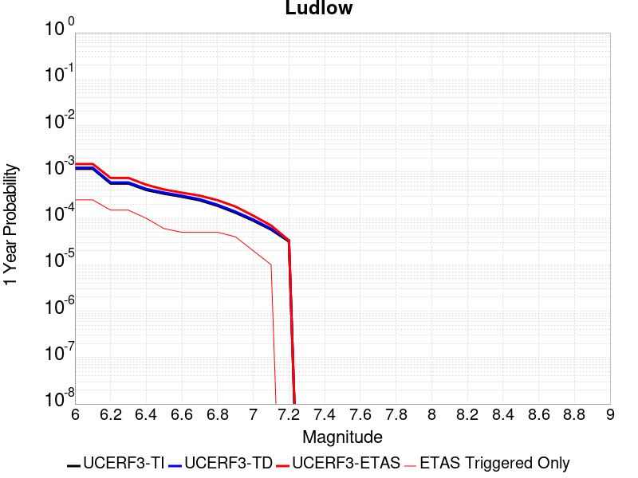 |  |

| Magnitude | 1 wk TI Prob | 1 wk TD Prob | 1 wk ETAS Prob | 1 wk ETAS/TD Gain | 1 wk ETAS Triggered Only | 1 mo TI Prob | 1 mo TD Prob | 1 mo ETAS Prob | 1 mo ETAS/TD Gain | 1 mo ETAS Triggered Only | 1 yr TI Prob | 1 yr TD Prob | 1 yr ETAS Prob | 1 yr ETAS/TD Gain | 1 yr ETAS Triggered Only | 10 yr TI Prob | 10 yr TD Prob | 10 yr ETAS Prob | 10 yr ETAS/TD Gain | 10 yr ETAS Triggered Only |
|-----|-----|-----|-----|-----|-----|-----|-----|-----|-----|-----|-----|-----|-----|-----|-----|-----|-----|-----|-----|-----|
| 6.0 | 2.2407607E-5 | 2.3657254E-5 | 1.953565E-4 | 8.257784 | 1.717033E-4 | 9.602906E-5 | 1.0138454E-4 | 2.730704E-4 | 2.693413 | 1.717033E-4 | 0.0011685267 | 0.001233702 | 0.001533812 | 1.2432598 | 3.0048078E-4 | 0.011624013 | 0.012273042 | 0.012739431 | 1.0380011 | 4.7218407E-4 |
| 6.1 | 2.2407607E-5 | 2.3657254E-5 | 1.953565E-4 | 8.257784 | 1.717033E-4 | 9.602906E-5 | 1.0138454E-4 | 2.730704E-4 | 2.693413 | 1.717033E-4 | 0.0011685267 | 0.001233702 | 0.001533812 | 1.2432598 | 3.0048078E-4 | 0.011624013 | 0.012273042 | 0.012739431 | 1.0380011 | 4.7218407E-4 |
| 6.2 | 1.0781252E-5 | 1.1365663E-5 | 9.721634E-5 | 8.553512 | 8.585165E-5 | 4.620455E-5 | 4.8709102E-5 | 1.3455657E-4 | 2.7624524 | 8.585165E-5 | 5.623952E-4 | 5.9287593E-4 | 7.215771E-4 | 1.2170794 | 1.2877748E-4 | 0.00560974 | 0.0059133614 | 0.006212065 | 1.0505134 | 3.0048078E-4 |
| 6.3 | 1.0781252E-5 | 1.1365663E-5 | 9.721634E-5 | 8.553512 | 8.585165E-5 | 4.620455E-5 | 4.8709102E-5 | 1.3455657E-4 | 2.7624524 | 8.585165E-5 | 5.623952E-4 | 5.9287593E-4 | 7.215771E-4 | 1.2170794 | 1.2877748E-4 | 0.00560974 | 0.0059133614 | 0.006212065 | 1.0505134 | 3.0048078E-4 |
| 6.4 | 7.814439E-6 | 8.237729E-6 | 9.408867E-5 | 11.421676 | 8.585165E-5 | 3.3490025E-5 | 3.530408E-5 | 1.211527E-4 | 3.431691 | 8.585165E-5 | 4.0766477E-4 | 4.2974384E-4 | 5.5846595E-4 | 1.2995323 | 1.2877748E-4 | 0.0040691774 | 0.0042892746 | 0.004545725 | 1.0597887 | 2.5755496E-4 |
| 6.5 | 6.4986366E-6 | 6.85092E-6 | 4.977645E-5 | 7.26566 | 4.2925825E-5 | 2.7851002E-5 | 2.9360759E-5 | 7.228532E-5 | 2.4619706 | 4.2925825E-5 | 3.390332E-4 | 3.5740953E-4 | 4.0032002E-4 | 1.1200597 | 4.2925825E-5 | 0.003385164 | 0.0035684432 | 0.003739534 | 1.0479455 | 1.717033E-4 |
| 6.6 | 5.582177E-6 | 5.8860055E-6 | 5.8860055E-6 | 1.0 | 0.0 | 2.3923398E-5 | 2.5225498E-5 | 2.5225498E-5 | 1.0 | 0.0 | 2.9122844E-4 | 3.0707786E-4 | 3.0707786E-4 | 1.0 | 0.0 | 0.0029084706 | 0.003066609 | 0.0031521972 | 1.0279098 | 8.585165E-5 |
| 6.7 | 4.6858763E-6 | 4.940427E-6 | 4.940427E-6 | 1.0 | 0.0 | 2.0082172E-5 | 2.1173091E-5 | 2.1173091E-5 | 1.0 | 0.0 | 2.4447302E-4 | 2.5775246E-4 | 2.5775246E-4 | 1.0 | 0.0 | 0.0024420423 | 0.0025745912 | 0.0026174067 | 1.0166299 | 4.2925825E-5 |
| 6.8 | 3.5584908E-6 | 3.7520183E-6 | 3.7520183E-6 | 1.0 | 0.0 | 1.5250586E-5 | 1.6079981E-5 | 1.6079981E-5 | 1.0 | 0.0 | 1.8566006E-4 | 1.957566E-4 | 1.957566E-4 | 1.0 | 0.0 | 0.0018550502 | 0.0019558826 | 0.0019558826 | 1.0 | 0.0 |
| 6.9 | 2.532834E-6 | 2.6710034E-6 | 2.6710034E-6 | 1.0 | 0.0 | 1.0854958E-5 | 1.1447109E-5 | 1.1447109E-5 | 1.0 | 0.0 | 1.3215111E-4 | 1.3935992E-4 | 1.3935992E-4 | 1.0 | 0.0 | 0.0013207254 | 0.0013927529 | 0.0013927529 | 1.0 | 0.0 |
| 7.0 | 1.7083285E-6 | 1.8019439E-6 | 1.8019439E-6 | 1.0 | 0.0 | 7.3213873E-6 | 7.722595E-6 | 7.722595E-6 | 1.0 | 0.0 | 8.913424E-5 | 9.40187E-5 | 9.40187E-5 | 1.0 | 0.0 | 8.9098496E-4 | 9.3980576E-4 | 9.3980576E-4 | 1.0 | 0.0 |
| 7.1 | 1.0905424E-6 | 1.1497619E-6 | 1.1497619E-6 | 1.0 | 0.0 | 4.6737446E-6 | 4.9275427E-6 | 4.9275427E-6 | 1.0 | 0.0 | 5.6901354E-5 | 5.999128E-5 | 5.999128E-5 | 1.0 | 0.0 | 5.6886784E-4 | 5.997606E-4 | 5.997606E-4 | 1.0 | 0.0 |
| 7.2 | 6.06668E-7 | 6.387277E-7 | 6.387277E-7 | 1.0 | 0.0 | 2.600003E-6 | 2.7374022E-6 | 2.7374022E-6 | 1.0 | 0.0 | 3.1654577E-5 | 3.3327433E-5 | 3.3327433E-5 | 1.0 | 0.0 | 3.1650066E-4 | 3.3323118E-4 | 3.3323118E-4 | 1.0 | 0.0 |

## Baker
*[(top)](#table-of-contents)*

| 1 Week | 1 Month | 1 Year | 10 Year |
|-----|-----|-----|-----|
|  |  |  | 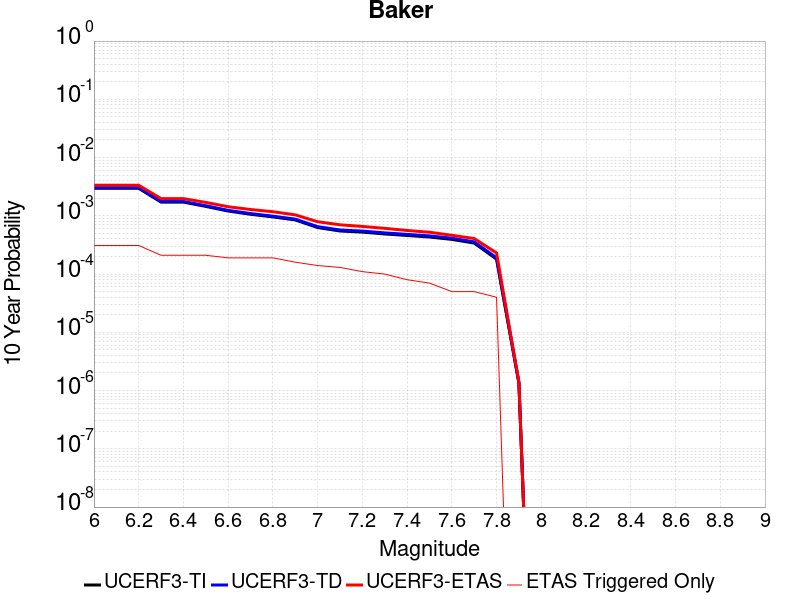 |

| Magnitude | 1 wk TI Prob | 1 wk TD Prob | 1 wk ETAS Prob | 1 wk ETAS/TD Gain | 1 wk ETAS Triggered Only | 1 mo TI Prob | 1 mo TD Prob | 1 mo ETAS Prob | 1 mo ETAS/TD Gain | 1 mo ETAS Triggered Only | 1 yr TI Prob | 1 yr TD Prob | 1 yr ETAS Prob | 1 yr ETAS/TD Gain | 1 yr ETAS Triggered Only | 10 yr TI Prob | 10 yr TD Prob | 10 yr ETAS Prob | 10 yr ETAS/TD Gain | 10 yr ETAS Triggered Only |
|-----|-----|-----|-----|-----|-----|-----|-----|-----|-----|-----|-----|-----|-----|-----|-----|-----|-----|-----|-----|-----|
| 6.0 | 5.695525E-6 | 5.8348373E-6 | 2.2046271E-4 | 37.783867 | 2.1462912E-4 | 2.4409164E-5 | 2.5006228E-5 | 2.3962998E-4 | 9.582812 | 2.1462912E-4 | 2.9714106E-4 | 3.044123E-4 | 5.6188885E-4 | 1.8458152 | 2.5755496E-4 | 0.0029674405 | 0.0030403486 | 0.0034683018 | 1.1407579 | 4.2925825E-4 |
| 6.1 | 5.695525E-6 | 5.8348373E-6 | 2.2046271E-4 | 37.783867 | 2.1462912E-4 | 2.4409164E-5 | 2.5006228E-5 | 2.3962998E-4 | 9.582812 | 2.1462912E-4 | 2.9714106E-4 | 3.044123E-4 | 5.6188885E-4 | 1.8458152 | 2.5755496E-4 | 0.0029674405 | 0.0030403486 | 0.0034683018 | 1.1407579 | 4.2925825E-4 |
| 6.2 | 5.695525E-6 | 5.8348373E-6 | 2.2046271E-4 | 37.783867 | 2.1462912E-4 | 2.4409164E-5 | 2.5006228E-5 | 2.3962998E-4 | 9.582812 | 2.1462912E-4 | 2.9714106E-4 | 3.044123E-4 | 5.6188885E-4 | 1.8458152 | 2.5755496E-4 | 0.0029674405 | 0.0030403486 | 0.0034683018 | 1.1407579 | 4.2925825E-4 |
| 6.3 | 3.2995713E-6 | 3.383667E-6 | 1.321607E-4 | 39.058422 | 1.2877748E-4 | 1.4140943E-5 | 1.4501353E-5 | 1.4327696E-4 | 9.880248 | 1.2877748E-4 | 1.7215237E-4 | 1.7654014E-4 | 3.0529487E-4 | 1.7293228 | 1.2877748E-4 | 0.0017201907 | 0.001764046 | 0.0020639966 | 1.1700356 | 3.0048078E-4 |
| 6.4 | 3.2995713E-6 | 3.383667E-6 | 1.321607E-4 | 39.058422 | 1.2877748E-4 | 1.4140943E-5 | 1.4501353E-5 | 1.4327696E-4 | 9.880248 | 1.2877748E-4 | 1.7215237E-4 | 1.7654014E-4 | 3.0529487E-4 | 1.7293228 | 1.2877748E-4 | 0.0017201907 | 0.001764046 | 0.0020639966 | 1.1700356 | 3.0048078E-4 |
| 6.5 | 2.782202E-6 | 2.8558404E-6 | 1.3163294E-4 | 46.09254 | 1.2877748E-4 | 1.1923668E-5 | 1.223926E-5 | 1.4101516E-4 | 11.521543 | 1.2877748E-4 | 1.4516099E-4 | 1.4900314E-4 | 2.7776143E-4 | 1.8641313 | 1.2877748E-4 | 0.001450662 | 0.0014890651 | 0.0017890984 | 1.2014911 | 3.0048078E-4 |
| 6.6 | 2.3163404E-6 | 2.38092E-6 | 1.3115809E-4 | 55.087147 | 1.2877748E-4 | 9.927136E-6 | 1.0203904E-5 | 1.3898006E-4 | 13.620283 | 1.2877748E-4 | 1.20856166E-4 | 1.2422565E-4 | 2.529871E-4 | 2.0365129 | 1.2877748E-4 | 0.0012079047 | 0.0012415823 | 0.00154169 | 1.2417139 | 3.0048078E-4 |
| 6.7 | 2.037056E-6 | 2.0965003E-6 | 1.308737E-4 | 62.42484 | 1.2877748E-4 | 8.7302105E-6 | 8.984972E-6 | 1.377613E-4 | 15.332412 | 1.2877748E-4 | 1.0628513E-4 | 1.093867E-4 | 2.381501E-4 | 2.1771393 | 1.2877748E-4 | 0.0010623431 | 0.0010933448 | 0.001393497 | 1.2745266 | 3.0048078E-4 |
| 6.8 | 1.8356744E-6 | 1.8915287E-6 | 1.3066876E-4 | 69.08103 | 1.2877748E-4 | 7.867153E-6 | 8.106527E-6 | 1.3688295E-4 | 16.885525 | 1.2877748E-4 | 9.577837E-5 | 9.869264E-5 | 2.274574E-4 | 2.304705 | 1.2877748E-4 | 9.57371E-4 | 9.86502E-4 | 0.0012866864 | 1.3042916 | 3.0048078E-4 |
| 6.9 | 1.6310546E-6 | 1.6832072E-6 | 1.3046047E-4 | 77.50707 | 1.2877748E-4 | 6.9902153E-6 | 7.213726E-6 | 1.3599027E-4 | 18.851599 | 1.2877748E-4 | 8.510255E-5 | 8.782368E-5 | 2.1658985E-4 | 2.4661894 | 1.2877748E-4 | 8.5069967E-4 | 8.7790104E-4 | 0.001178118 | 1.3419713 | 3.0048078E-4 |
| 7.0 | 1.2058036E-6 | 1.2508665E-6 | 8.710241E-5 | 69.63365 | 8.585165E-5 | 5.1677193E-6 | 5.3608455E-6 | 9.121203E-5 | 17.014486 | 8.585165E-5 | 6.291517E-5 | 6.5266366E-5 | 1.5111241E-4 | 2.3153183 | 8.585165E-5 | 6.289736E-4 | 6.524743E-4 | 9.098612E-4 | 1.3944782 | 2.5755496E-4 |
| 7.1 | 1.052382E-6 | 1.0951609E-6 | 8.694672E-5 | 79.39173 | 8.585165E-5 | 4.5102006E-6 | 4.693538E-6 | 9.054478E-5 | 19.29137 | 8.585165E-5 | 5.491031E-5 | 5.7142337E-5 | 1.4298908E-4 | 2.5023317 | 8.585165E-5 | 5.4896745E-4 | 5.7127734E-4 | 8.286851E-4 | 1.450583 | 2.5755496E-4 |
| 7.2 | 1.0067454E-6 | 1.0487711E-6 | 8.690033E-5 | 82.8592 | 8.585165E-5 | 4.3146156E-6 | 4.4947255E-6 | 9.034599E-5 | 20.100447 | 8.585165E-5 | 5.252918E-5 | 5.4721917E-5 | 1.4056887E-4 | 2.5687854 | 8.585165E-5 | 5.251676E-4 | 5.470853E-4 | 8.044993E-4 | 1.4705191 | 2.5755496E-4 |
| 7.3 | 9.3596316E-7 | 9.767723E-7 | 8.682834E-5 | 88.89312 | 8.585165E-5 | 4.0112645E-6 | 4.1861604E-6 | 9.003745E-5 | 21.50836 | 8.585165E-5 | 4.8836053E-5 | 5.096532E-5 | 1.368126E-4 | 2.6844254 | 8.585165E-5 | 4.8825322E-4 | 5.095371E-4 | 7.2405685E-4 | 1.4210091 | 2.1462912E-4 |
| 7.4 | 8.8117395E-7 | 9.2076635E-7 | 8.6772336E-5 | 94.23926 | 8.585165E-5 | 3.7764542E-6 | 3.9461356E-6 | 8.9797446E-5 | 22.755795 | 8.585165E-5 | 4.5977362E-5 | 4.8043148E-5 | 1.3389067E-4 | 2.7868838 | 8.585165E-5 | 4.596785E-4 | 4.8032837E-4 | 6.948544E-4 | 1.4466237 | 2.1462912E-4 |
| 7.5 | 8.292386E-7 | 8.6745956E-7 | 8.671903E-5 | 99.96896 | 8.585165E-5 | 3.5538749E-6 | 3.7176785E-6 | 8.956901E-5 | 24.092726 | 8.585165E-5 | 4.326757E-5 | 4.5261804E-5 | 1.3110957E-4 | 2.8966932 | 8.585165E-5 | 4.3259145E-4 | 4.5252658E-4 | 6.241522E-4 | 1.3792608 | 1.717033E-4 |
| 7.6 | 7.553842E-7 | 7.9144706E-7 | 8.664303E-5 | 109.47419 | 8.585165E-5 | 3.2373566E-6 | 3.3919116E-6 | 8.9243265E-5 | 26.310612 | 8.585165E-5 | 3.9414106E-5 | 4.129575E-5 | 1.2714385E-4 | 3.0788605 | 8.585165E-5 | 3.9407116E-4 | 4.1288146E-4 | 5.4160575E-4 | 1.3117706 | 1.2877748E-4 |
| 7.7 | 6.5285366E-7 | 6.852797E-7 | 8.653687E-5 | 126.27964 | 8.585165E-5 | 2.797941E-6 | 2.9369096E-6 | 8.878831E-5 | 30.231882 | 8.585165E-5 | 3.40644E-5 | 3.5756293E-5 | 1.2160488E-4 | 3.4009361 | 8.585165E-5 | 3.405918E-4 | 3.5750607E-4 | 4.8623752E-4 | 1.3600818 | 1.2877748E-4 |
| 7.8 | 3.4586725E-7 | 3.6482615E-7 | 4.3290634E-5 | 118.661 | 4.2925825E-5 | 1.4822873E-6 | 1.5635396E-6 | 4.4489298E-5 | 28.454216 | 4.2925825E-5 | 1.80467E-5 | 1.9035933E-5 | 6.196094E-5 | 3.2549462 | 4.2925825E-5 | 1.8045233E-4 | 1.9034347E-4 | 2.761788E-4 | 1.4509495 | 8.585165E-5 |
| 7.9 | 2.5591178E-9 | 2.6696718E-9 | 2.6696718E-9 | 1.0 | 0.0 | 1.0967647E-8 | 1.14414505E-8 | 1.14414505E-8 | 1.0 | 0.0 | 1.335311E-7 | 1.3929966E-7 | 1.3929966E-7 | 1.0 | 0.0 | 1.3353102E-6 | 1.3929966E-6 | 1.3929966E-6 | 1.0 | 0.0 |

## San Andreas (Carrizo) rev
*[(top)](#table-of-contents)*

| 1 Week | 1 Month | 1 Year | 10 Year |
|-----|-----|-----|-----|
| 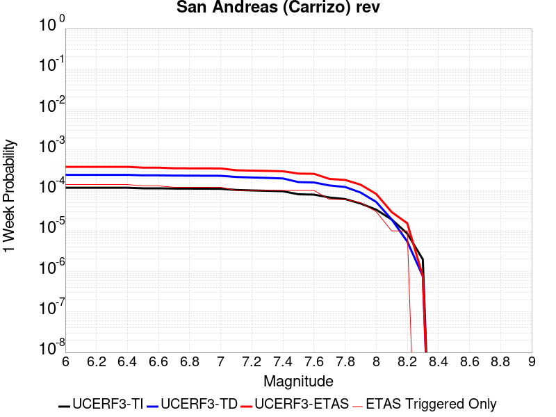 |  |  |  |

| Magnitude | 1 wk TI Prob | 1 wk TD Prob | 1 wk ETAS Prob | 1 wk ETAS/TD Gain | 1 wk ETAS Triggered Only | 1 mo TI Prob | 1 mo TD Prob | 1 mo ETAS Prob | 1 mo ETAS/TD Gain | 1 mo ETAS Triggered Only | 1 yr TI Prob | 1 yr TD Prob | 1 yr ETAS Prob | 1 yr ETAS/TD Gain | 1 yr ETAS Triggered Only | 10 yr TI Prob | 10 yr TD Prob | 10 yr ETAS Prob | 10 yr ETAS/TD Gain | 10 yr ETAS Triggered Only |
|-----|-----|-----|-----|-----|-----|-----|-----|-----|-----|-----|-----|-----|-----|-----|-----|-----|-----|-----|-----|-----|
| 6.0 | 1.1674632E-4 | 2.4324407E-4 | 3.2907483E-4 | 1.3528587 | 8.585165E-5 | 5.002454E-4 | 0.0010420597 | 0.0012993462 | 1.246902 | 2.5755496E-4 | 0.006073493 | 0.012613757 | 0.012952832 | 1.0268813 | 3.434066E-4 | 0.0591016 | 0.120640226 | 0.121017694 | 1.0031289 | 4.2925825E-4 |
| 6.1 | 1.1674632E-4 | 2.4324407E-4 | 3.2907483E-4 | 1.3528587 | 8.585165E-5 | 5.002454E-4 | 0.0010420597 | 0.0012993462 | 1.246902 | 2.5755496E-4 | 0.006073493 | 0.012613757 | 0.012952832 | 1.0268813 | 3.434066E-4 | 0.0591016 | 0.120640226 | 0.121017694 | 1.0031289 | 4.2925825E-4 |
| 6.2 | 1.1674632E-4 | 2.4324407E-4 | 3.2907483E-4 | 1.3528587 | 8.585165E-5 | 5.002454E-4 | 0.0010420597 | 0.0012993462 | 1.246902 | 2.5755496E-4 | 0.006073493 | 0.012613757 | 0.012952832 | 1.0268813 | 3.434066E-4 | 0.0591016 | 0.120640226 | 0.121017694 | 1.0031289 | 4.2925825E-4 |
| 6.3 | 1.1674632E-4 | 2.4324407E-4 | 3.2907483E-4 | 1.3528587 | 8.585165E-5 | 5.002454E-4 | 0.0010420597 | 0.0012993462 | 1.246902 | 2.5755496E-4 | 0.006073493 | 0.012613757 | 0.012952832 | 1.0268813 | 3.434066E-4 | 0.0591016 | 0.120640226 | 0.121017694 | 1.0031289 | 4.2925825E-4 |
| 6.4 | 1.1674632E-4 | 2.4324407E-4 | 3.2907483E-4 | 1.3528587 | 8.585165E-5 | 5.002454E-4 | 0.0010420597 | 0.0012993462 | 1.246902 | 2.5755496E-4 | 0.006073493 | 0.012613757 | 0.012952832 | 1.0268813 | 3.434066E-4 | 0.0591016 | 0.120640226 | 0.121017694 | 1.0031289 | 4.2925825E-4 |
| 6.5 | 1.13136164E-4 | 2.3644442E-4 | 3.2227577E-4 | 1.3630086 | 8.585165E-5 | 4.847792E-4 | 0.0010129412 | 0.0012702353 | 1.2540069 | 2.5755496E-4 | 0.0058862255 | 0.012263271 | 0.012602466 | 1.0276594 | 3.434066E-4 | 0.057327334 | 0.11761008 | 0.117988855 | 1.0032206 | 4.2925825E-4 |
| 6.6 | 1.13136164E-4 | 2.3644442E-4 | 3.2227577E-4 | 1.3630086 | 8.585165E-5 | 4.847792E-4 | 0.0010129412 | 0.0012702353 | 1.2540069 | 2.5755496E-4 | 0.0058862255 | 0.012263271 | 0.012602466 | 1.0276594 | 3.434066E-4 | 0.057327334 | 0.11761008 | 0.117988855 | 1.0032206 | 4.2925825E-4 |
| 6.7 | 1.1149675E-4 | 2.3335687E-4 | 3.191885E-4 | 1.3678126 | 8.585165E-5 | 4.777557E-4 | 9.997191E-4 | 0.0012570166 | 1.2573698 | 2.5755496E-4 | 0.0058011734 | 0.012104088 | 0.0124433385 | 1.0280278 | 3.434066E-4 | 0.05652051 | 0.1162291 | 0.11660847 | 1.003264 | 4.2925825E-4 |
| 6.8 | 1.1103589E-4 | 2.3237852E-4 | 3.1821022E-4 | 1.3693616 | 8.585165E-5 | 4.7578133E-4 | 9.955293E-4 | 0.0012528278 | 1.258454 | 2.5755496E-4 | 0.005777263 | 0.012053643 | 0.01239291 | 1.0281465 | 3.434066E-4 | 0.056293584 | 0.11578894 | 0.11616849 | 1.003278 | 4.2925825E-4 |
| 6.9 | 1.1053259E-4 | 2.3130233E-4 | 3.1713414E-4 | 1.3710805 | 8.585165E-5 | 4.7362508E-4 | 9.909206E-4 | 0.0012482203 | 1.2596573 | 2.5755496E-4 | 0.0057511497 | 0.011998152 | 0.012337439 | 1.0282782 | 3.434066E-4 | 0.05604569 | 0.11530445 | 0.11568421 | 1.0032935 | 4.2925825E-4 |
| 7.0 | 1.1005377E-4 | 2.3031076E-4 | 3.1614266E-4 | 1.3726785 | 8.585165E-5 | 4.7157376E-4 | 9.866742E-4 | 0.0012439751 | 1.2607758 | 2.5755496E-4 | 0.0057263062 | 0.011947021 | 0.012286325 | 1.0284007 | 3.434066E-4 | 0.055809796 | 0.11485658 | 0.115236536 | 1.003308 | 4.2925825E-4 |
| 7.1 | 1.0308142E-4 | 2.1540876E-4 | 2.5832534E-4 | 1.1992332 | 4.2925825E-5 | 4.417027E-4 | 9.228548E-4 | 0.0011372858 | 1.2323562 | 2.1462912E-4 | 0.0053644776 | 0.011178188 | 0.011475311 | 1.0265805 | 3.0048078E-4 | 0.052368138 | 0.10809042 | 0.108435 | 1.0031878 | 3.8633242E-4 |
| 7.2 | 1.0027479E-4 | 2.094876E-4 | 2.5240442E-4 | 1.2048657 | 4.2925825E-5 | 4.296783E-4 | 8.9749607E-4 | 0.0011119326 | 1.2389275 | 2.1462912E-4 | 0.0052187922 | 0.010872566 | 0.01116978 | 1.0273361 | 3.0048078E-4 | 0.050979212 | 0.10539086 | 0.10573648 | 1.0032793 | 3.8633242E-4 |
| 7.3 | 9.816942E-5 | 2.0423878E-4 | 2.4715584E-4 | 1.2101318 | 4.2925825E-5 | 4.2065824E-4 | 8.7501644E-4 | 0.0010894578 | 1.2450712 | 2.1462912E-4 | 0.005109493 | 0.010601572 | 0.010898867 | 1.0280426 | 3.0048078E-4 | 0.049935985 | 0.10297546 | 0.10332201 | 1.0033654 | 3.8633242E-4 |
| 7.4 | 9.5634205E-5 | 1.9793298E-4 | 2.4085032E-4 | 1.2168275 | 4.2925825E-5 | 4.0979648E-4 | 8.4800937E-4 | 0.001019567 | 1.2023064 | 1.717033E-4 | 0.0049778637 | 0.010275901 | 0.01053081 | 1.0248064 | 2.5755496E-4 | 0.048678253 | 0.100067884 | 0.10037693 | 1.0030884 | 3.434066E-4 |
| 7.5 | 8.052417E-5 | 1.6113915E-4 | 2.0405806E-4 | 1.2663468 | 4.2925825E-5 | 3.4505792E-4 | 6.9041376E-4 | 8.6199853E-4 | 1.2485245 | 1.717033E-4 | 0.0041929903 | 0.008373471 | 0.008586303 | 1.0254174 | 2.1462912E-4 | 0.04114753 | 0.082815245 | 0.08309084 | 1.0033278 | 3.0048078E-4 |
| 7.6 | 7.897024E-5 | 1.5767086E-4 | 2.0058992E-4 | 1.2722067 | 4.2925825E-5 | 3.384E-4 | 6.755574E-4 | 8.4714475E-4 | 1.2539936 | 1.717033E-4 | 0.0041122385 | 0.00819397 | 0.00840684 | 1.0259789 | 2.1462912E-4 | 0.040369697 | 0.08115866 | 0.08143476 | 1.0034019 | 3.0048078E-4 |
| 7.7 | 6.707427E-5 | 1.3277122E-4 | 1.7569136E-4 | 1.3232638 | 4.2925825E-5 | 2.8742946E-4 | 5.688955E-4 | 7.405011E-4 | 1.301647 | 1.717033E-4 | 0.003493839 | 0.0069043385 | 0.0071174856 | 1.0308715 | 2.1462912E-4 | 0.034394164 | 0.06905339 | 0.06933312 | 1.004051 | 3.0048078E-4 |
| 7.8 | 6.147705E-5 | 1.2198445E-4 | 1.6490504E-4 | 1.3518529 | 4.2925825E-5 | 2.6344648E-4 | 5.226858E-4 | 6.9429935E-4 | 1.3283303 | 1.717033E-4 | 0.0032027436 | 0.006345156 | 0.0065584234 | 1.033611 | 2.1462912E-4 | 0.031569764 | 0.0635172 | 0.06379859 | 1.0044302 | 3.0048078E-4 |
| 7.9 | 4.7636717E-5 | 8.8802946E-5 | 1.3172496E-4 | 1.4833399 | 4.2925825E-5 | 2.0414138E-4 | 3.8052857E-4 | 5.5216654E-4 | 1.4510515 | 1.717033E-4 | 0.0024825884 | 0.004623101 | 0.004836738 | 1.0462108 | 2.1462912E-4 | 0.024550365 | 0.046629366 | 0.046915833 | 1.0061436 | 3.0048078E-4 |
| 8.0 | 3.3554235E-5 | 5.2138024E-5 | 9.506161E-5 | 1.8232683 | 4.2925825E-5 | 1.4379594E-4 | 2.2342955E-4 | 2.6634577E-4 | 1.1920795 | 4.2925825E-5 | 0.0017493097 | 0.002716863 | 0.0028024816 | 1.0315137 | 8.585165E-5 | 0.017356034 | 0.027881905 | 0.027965363 | 1.0029932 | 8.585165E-5 |
| 8.1 | 1.9175432E-5 | 1.9183564E-5 | 1.9183564E-5 | 1.0 | 0.0 | 8.217783E-5 | 8.221269E-5 | 8.221269E-5 | 1.0 | 0.0 | 0.0010000558 | 0.0010004805 | 0.0010004805 | 1.0 | 0.0 | 0.009955673 | 0.010757771 | 0.010757771 | 1.0 | 0.0 |
| 8.2 | 8.643924E-6 | 5.473668E-6 | 5.473668E-6 | 1.0 | 0.0 | 3.704486E-5 | 2.3458366E-5 | 2.3458366E-5 | 1.0 | 0.0 | 4.5092785E-4 | 2.8556827E-4 | 2.8556827E-4 | 1.0 | 0.0 | 0.0045001395 | 0.0032481793 | 0.0032481793 | 1.0 | 0.0 |
| 8.3 | 1.983087E-6 | 7.6564595E-7 | 7.6564595E-7 | 1.0 | 0.0 | 8.498917E-6 | 3.281336E-6 | 3.281336E-6 | 1.0 | 0.0 | 1.034694E-4 | 3.9949547E-5 | 3.9949547E-5 | 1.0 | 0.0 | 0.0010342124 | 4.717979E-4 | 4.717979E-4 | 1.0 | 0.0 |

## San Jacinto (San Bernardino)
*[(top)](#table-of-contents)*

| 1 Week | 1 Month | 1 Year | 10 Year |
|-----|-----|-----|-----|
|  |  |  |  |

| Magnitude | 1 wk TI Prob | 1 wk TD Prob | 1 wk ETAS Prob | 1 wk ETAS/TD Gain | 1 wk ETAS Triggered Only | 1 mo TI Prob | 1 mo TD Prob | 1 mo ETAS Prob | 1 mo ETAS/TD Gain | 1 mo ETAS Triggered Only | 1 yr TI Prob | 1 yr TD Prob | 1 yr ETAS Prob | 1 yr ETAS/TD Gain | 1 yr ETAS Triggered Only | 10 yr TI Prob | 10 yr TD Prob | 10 yr ETAS Prob | 10 yr ETAS/TD Gain | 10 yr ETAS Triggered Only |
|-----|-----|-----|-----|-----|-----|-----|-----|-----|-----|-----|-----|-----|-----|-----|-----|-----|-----|-----|-----|-----|
| 6.0 | 3.409352E-5 | 3.598562E-5 | 2.935313E-4 | 8.156905 | 2.5755496E-4 | 1.461069E-4 | 1.5421498E-4 | 4.9756863E-4 | 3.226461 | 3.434066E-4 | 0.0017774 | 0.0018759521 | 0.0022187144 | 1.1827139 | 3.434066E-4 | 0.01763251 | 0.019349992 | 0.019770944 | 1.0217546 | 4.2925825E-4 |
| 6.1 | 3.409352E-5 | 3.598562E-5 | 2.935313E-4 | 8.156905 | 2.5755496E-4 | 1.461069E-4 | 1.5421498E-4 | 4.9756863E-4 | 3.226461 | 3.434066E-4 | 0.0017774 | 0.0018759521 | 0.0022187144 | 1.1827139 | 3.434066E-4 | 0.01763251 | 0.019349992 | 0.019770944 | 1.0217546 | 4.2925825E-4 |
| 6.2 | 3.409352E-5 | 3.598562E-5 | 2.935313E-4 | 8.156905 | 2.5755496E-4 | 1.461069E-4 | 1.5421498E-4 | 4.9756863E-4 | 3.226461 | 3.434066E-4 | 0.0017774 | 0.0018759521 | 0.0022187144 | 1.1827139 | 3.434066E-4 | 0.01763251 | 0.019349992 | 0.019770944 | 1.0217546 | 4.2925825E-4 |
| 6.3 | 3.409352E-5 | 3.598562E-5 | 2.935313E-4 | 8.156905 | 2.5755496E-4 | 1.461069E-4 | 1.5421498E-4 | 4.9756863E-4 | 3.226461 | 3.434066E-4 | 0.0017774 | 0.0018759521 | 0.0022187144 | 1.1827139 | 3.434066E-4 | 0.01763251 | 0.019349992 | 0.019770944 | 1.0217546 | 4.2925825E-4 |
| 6.4 | 3.400795E-5 | 3.5878285E-5 | 2.9342397E-4 | 8.178317 | 2.5755496E-4 | 1.4574021E-4 | 1.5375503E-4 | 4.971088E-4 | 3.2331223 | 3.434066E-4 | 0.0017729428 | 0.0018703619 | 0.002213126 | 1.1832609 | 3.434066E-4 | 0.017588645 | 0.019295074 | 0.01971605 | 1.0218178 | 4.2925825E-4 |
| 6.5 | 3.341482E-5 | 3.5138914E-5 | 2.926848E-4 | 8.329364 | 2.5755496E-4 | 1.4319851E-4 | 1.5058667E-4 | 4.9394154E-4 | 3.280115 | 3.434066E-4 | 0.0017420477 | 0.0018318522 | 0.0021746298 | 1.1871207 | 3.434066E-4 | 0.017284546 | 0.018916616 | 0.019337755 | 1.0222628 | 4.2925825E-4 |
| 6.6 | 3.3364955E-5 | 3.5076133E-5 | 2.9262205E-4 | 8.3424835 | 2.5755496E-4 | 1.4298483E-4 | 1.5031763E-4 | 4.936726E-4 | 3.2841964 | 3.434066E-4 | 0.0017394501 | 0.0018285823 | 0.002171361 | 1.187456 | 3.434066E-4 | 0.017258976 | 0.01888448 | 0.019305632 | 1.0223014 | 4.2925825E-4 |
| 6.7 | 3.335922E-5 | 3.5065907E-5 | 2.9261183E-4 | 8.3446245 | 2.5755496E-4 | 1.4296026E-4 | 1.5027382E-4 | 4.936288E-4 | 3.2848625 | 3.434066E-4 | 0.0017391514 | 0.0018280497 | 0.0021708286 | 1.1875107 | 3.434066E-4 | 0.017256035 | 0.018879272 | 0.019300425 | 1.0223078 | 4.2925825E-4 |
| 6.8 | 3.327683E-5 | 3.4959972E-5 | 2.9250592E-4 | 8.36688 | 2.5755496E-4 | 1.4260718E-4 | 1.4981985E-4 | 4.93175E-4 | 3.2917867 | 3.434066E-4 | 0.0017348597 | 0.001822532 | 0.0021653129 | 1.1880794 | 3.434066E-4 | 0.017213784 | 0.018825045 | 0.01924622 | 1.0223732 | 4.2925825E-4 |
| 6.9 | 3.3235785E-5 | 3.4900928E-5 | 2.9244687E-4 | 8.379344 | 2.5755496E-4 | 1.4243131E-4 | 1.4956683E-4 | 4.929221E-4 | 3.2956643 | 3.434066E-4 | 0.0017327217 | 0.0018194567 | 0.0021622384 | 1.1883979 | 3.434066E-4 | 0.017192734 | 0.018794911 | 0.019216102 | 1.0224098 | 4.2925825E-4 |
| 7.0 | 3.3197095E-5 | 3.4840854E-5 | 2.9238683E-4 | 8.392068 | 2.5755496E-4 | 1.422655E-4 | 1.4930942E-4 | 4.9266475E-4 | 3.2996228 | 3.434066E-4 | 0.0017307063 | 0.0018163278 | 0.0021591107 | 1.188723 | 3.434066E-4 | 0.017172894 | 0.01876429 | 0.019185493 | 1.0224471 | 4.2925825E-4 |
| 7.1 | 3.3129716E-5 | 3.4721066E-5 | 2.9226707E-4 | 8.417572 | 2.5755496E-4 | 1.4197677E-4 | 1.4879608E-4 | 4.921516E-4 | 3.3075573 | 3.434066E-4 | 0.0017271966 | 0.0018100884 | 0.0021528734 | 1.1893747 | 3.434066E-4 | 0.017138338 | 0.018703366 | 0.019124595 | 1.0225216 | 4.2925825E-4 |
| 7.2 | 3.3034008E-5 | 3.4588513E-5 | 2.9213456E-4 | 8.445999 | 2.5755496E-4 | 1.4156665E-4 | 1.4822806E-4 | 4.915838E-4 | 3.3164015 | 3.434066E-4 | 0.0017222111 | 0.0018031843 | 0.0021459716 | 1.1901011 | 3.434066E-4 | 0.017089253 | 0.01863575 | 0.01905701 | 1.0226048 | 4.2925825E-4 |
| 7.3 | 3.2956614E-5 | 3.4456265E-5 | 2.9200234E-4 | 8.474579 | 2.5755496E-4 | 1.4123498E-4 | 1.4766137E-4 | 4.9101724E-4 | 3.3252926 | 3.434066E-4 | 0.0017181796 | 0.0017962961 | 0.002139086 | 1.1908314 | 3.434066E-4 | 0.017049557 | 0.018568495 | 0.018989783 | 1.0226883 | 4.2925825E-4 |
| 7.4 | 3.2915937E-5 | 3.4377957E-5 | 2.9192405E-4 | 8.491605 | 2.5755496E-4 | 1.4106068E-4 | 1.473258E-4 | 4.906818E-4 | 3.3305898 | 3.434066E-4 | 0.0017160608 | 0.0017922173 | 0.0021350083 | 1.1912665 | 3.434066E-4 | 0.017028693 | 0.018528769 | 0.018950073 | 1.0227379 | 4.2925825E-4 |
| 7.5 | 3.281791E-5 | 3.424287E-5 | 2.91789E-4 | 8.521161 | 2.5755496E-4 | 1.406406E-4 | 1.4674691E-4 | 4.901031E-4 | 3.3397849 | 3.434066E-4 | 0.0017109542 | 0.0017851809 | 0.0021279745 | 1.1920217 | 3.434066E-4 | 0.016978411 | 0.018459652 | 0.018880986 | 1.0228246 | 4.2925825E-4 |
| 7.6 | 3.2521442E-5 | 3.396782E-5 | 2.91514E-4 | 8.582065 | 2.5755496E-4 | 1.3937015E-4 | 1.4556825E-4 | 4.8892485E-4 | 3.3587327 | 3.434066E-4 | 0.0016955109 | 0.0017708542 | 0.0021136526 | 1.193578 | 3.434066E-4 | 0.016826328 | 0.018317295 | 0.01873869 | 1.0230054 | 4.2925825E-4 |
| 7.7 | 3.0287873E-5 | 3.245191E-5 | 2.899985E-4 | 8.936254 | 2.5755496E-4 | 1.297987E-4 | 1.3907222E-4 | 4.8243106E-4 | 3.4689248 | 3.434066E-4 | 0.0015791537 | 0.0016918903 | 0.0020347158 | 1.2026287 | 3.434066E-4 | 0.01567979 | 0.017528199 | 0.017949933 | 1.0240604 | 4.2925825E-4 |
| 7.8 | 2.6316151E-5 | 2.9662837E-5 | 2.8721013E-4 | 9.682491 | 2.5755496E-4 | 1.1277862E-4 | 1.2712025E-4 | 4.7048318E-4 | 3.7010877 | 3.434066E-4 | 0.0013722149 | 0.0015465913 | 0.0018894668 | 1.2216976 | 3.434066E-4 | 0.013637724 | 0.016069878 | 0.016492238 | 1.0262827 | 4.2925825E-4 |
| 7.9 | 2.0761147E-5 | 2.3417291E-5 | 2.809662E-4 | 11.998237 | 2.5755496E-4 | 8.897331E-5 | 1.0035596E-4 | 4.437281E-4 | 4.4215417 | 3.434066E-4 | 0.0010827117 | 0.0012211498 | 0.001564137 | 1.2808723 | 3.434066E-4 | 0.010774517 | 0.012793272 | 0.013174661 | 1.0298117 | 3.8633242E-4 |
| 8.0 | 1.5738568E-5 | 1.6032505E-5 | 2.3065819E-4 | 14.386909 | 2.1462912E-4 | 6.744926E-5 | 6.8708934E-5 | 2.8332332E-4 | 4.1235294 | 2.1462912E-4 | 8.2088535E-4 | 8.3621085E-4 | 0.0010506605 | 1.256454 | 2.1462912E-4 | 0.008178596 | 0.008865741 | 0.009078467 | 1.0239942 | 2.1462912E-4 |
| 8.1 | 1.0105832E-5 | 8.329479E-6 | 5.1254945E-5 | 6.15344 | 4.2925825E-5 | 4.3309992E-5 | 3.569728E-5 | 7.8621575E-5 | 2.2024527 | 4.2925825E-5 | 5.2717153E-4 | 4.3452822E-4 | 4.774354E-4 | 1.0987443 | 4.2925825E-5 | 0.005259227 | 0.0046768794 | 0.0047196043 | 1.0091354 | 4.2925825E-5 |
| 8.2 | 4.189207E-6 | 1.577699E-6 | 1.577699E-6 | 1.0 | 0.0 | 1.7953622E-5 | 6.7615497E-6 | 6.7615497E-6 | 1.0 | 0.0 | 2.1856341E-4 | 8.231879E-5 | 8.231879E-5 | 1.0 | 0.0 | 0.0021834858 | 9.562628E-4 | 9.562628E-4 | 1.0 | 0.0 |
| 8.3 | 1.2758221E-6 | 3.612677E-7 | 3.612677E-7 | 1.0 | 0.0 | 5.4677976E-6 | 1.5482892E-6 | 1.5482892E-6 | 1.0 | 0.0 | 6.65684E-5 | 1.8850264E-5 | 1.8850264E-5 | 1.0 | 0.0 | 6.6548464E-4 | 2.2739546E-4 | 2.2739546E-4 | 1.0 | 0.0 |

## Red Pass
*[(top)](#table-of-contents)*

| 1 Week | 1 Month | 1 Year | 10 Year |
|-----|-----|-----|-----|
|  | 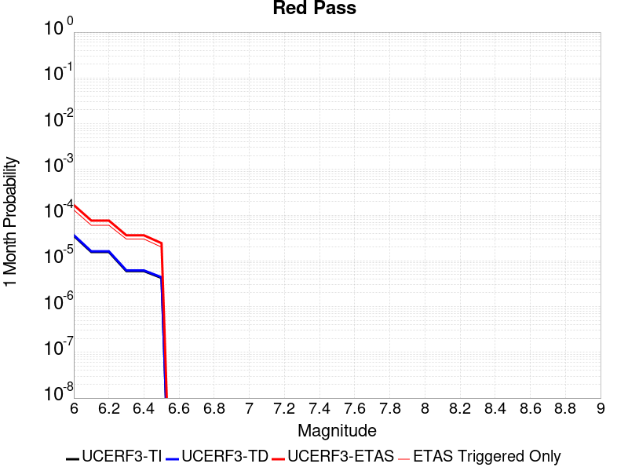 |  |  |

| Magnitude | 1 wk TI Prob | 1 wk TD Prob | 1 wk ETAS Prob | 1 wk ETAS/TD Gain | 1 wk ETAS Triggered Only | 1 mo TI Prob | 1 mo TD Prob | 1 mo ETAS Prob | 1 mo ETAS/TD Gain | 1 mo ETAS Triggered Only | 1 yr TI Prob | 1 yr TD Prob | 1 yr ETAS Prob | 1 yr ETAS/TD Gain | 1 yr ETAS Triggered Only | 10 yr TI Prob | 10 yr TD Prob | 10 yr ETAS Prob | 10 yr ETAS/TD Gain | 10 yr ETAS Triggered Only |
|-----|-----|-----|-----|-----|-----|-----|-----|-----|-----|-----|-----|-----|-----|-----|-----|-----|-----|-----|-----|-----|
| 6.0 | 8.258278E-6 | 8.551265E-6 | 1.3732763E-4 | 16.059336 | 1.2877748E-4 | 3.539214E-5 | 3.6647863E-5 | 1.6542061E-4 | 4.513786 | 1.2877748E-4 | 4.308141E-4 | 4.4611428E-4 | 7.46461E-4 | 1.6732507 | 3.0048078E-4 | 0.0042997985 | 0.004453945 | 0.0048385565 | 1.0863531 | 3.8633242E-4 |
| 6.1 | 3.649988E-6 | 3.7753161E-6 | 4.6700978E-5 | 12.370084 | 4.2925825E-5 | 1.5642712E-5 | 1.6179853E-5 | 5.9104983E-5 | 3.652999 | 4.2925825E-5 | 1.9043336E-4 | 1.9697666E-4 | 2.3989403E-4 | 1.2178805 | 4.2925825E-5 | 0.0019027026 | 0.001968488 | 0.0020541707 | 1.0435271 | 8.585165E-5 |
| 6.2 | 3.649988E-6 | 3.7753161E-6 | 4.6700978E-5 | 12.370084 | 4.2925825E-5 | 1.5642712E-5 | 1.6179853E-5 | 5.9104983E-5 | 3.652999 | 4.2925825E-5 | 1.9043336E-4 | 1.9697666E-4 | 2.3989403E-4 | 1.2178805 | 4.2925825E-5 | 0.0019027026 | 0.001968488 | 0.0020541707 | 1.0435271 | 8.585165E-5 |
| 6.3 | 1.3924937E-6 | 1.4411166E-6 | 1.4411166E-6 | 1.0 | 0.0 | 5.9678164E-6 | 6.1762075E-6 | 6.1762075E-6 | 1.0 | 0.0 | 7.265574E-5 | 7.519415E-5 | 7.519415E-5 | 1.0 | 0.0 | 7.263199E-4 | 7.518258E-4 | 7.518258E-4 | 1.0 | 0.0 |
| 6.4 | 1.3924937E-6 | 1.4411166E-6 | 1.4411166E-6 | 1.0 | 0.0 | 5.9678164E-6 | 6.1762075E-6 | 6.1762075E-6 | 1.0 | 0.0 | 7.265574E-5 | 7.519415E-5 | 7.519415E-5 | 1.0 | 0.0 | 7.263199E-4 | 7.518258E-4 | 7.518258E-4 | 1.0 | 0.0 |
| 6.5 | 9.876812E-7 | 1.0221912E-6 | 1.0221912E-6 | 1.0 | 0.0 | 4.2329125E-6 | 4.3808195E-6 | 4.3808195E-6 | 1.0 | 0.0 | 5.153449E-5 | 5.3336476E-5 | 5.3336476E-5 | 1.0 | 0.0 | 5.1522546E-4 | 5.333648E-4 | 5.333648E-4 | 1.0 | 0.0 |

## Brawley (Seismic Zone) alt 1
*[(top)](#table-of-contents)*

| 1 Week | 1 Month | 1 Year | 10 Year |
|-----|-----|-----|-----|
| 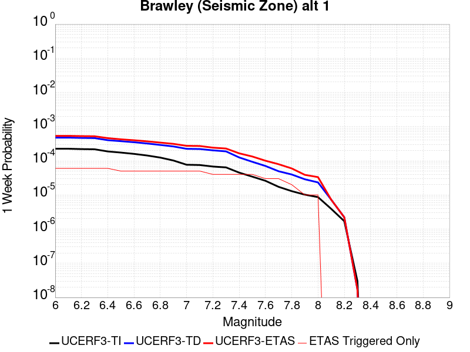 |  | 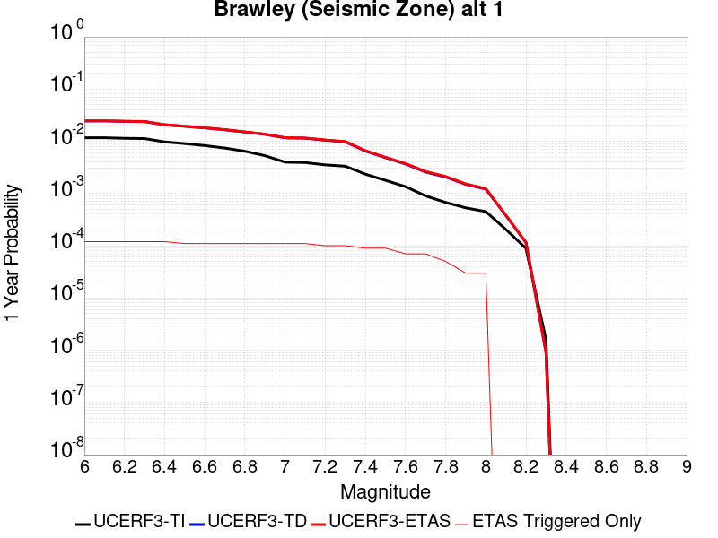 |  |

| Magnitude | 1 wk TI Prob | 1 wk TD Prob | 1 wk ETAS Prob | 1 wk ETAS/TD Gain | 1 wk ETAS Triggered Only | 1 mo TI Prob | 1 mo TD Prob | 1 mo ETAS Prob | 1 mo ETAS/TD Gain | 1 mo ETAS Triggered Only | 1 yr TI Prob | 1 yr TD Prob | 1 yr ETAS Prob | 1 yr ETAS/TD Gain | 1 yr ETAS Triggered Only | 10 yr TI Prob | 10 yr TD Prob | 10 yr ETAS Prob | 10 yr ETAS/TD Gain | 10 yr ETAS Triggered Only |
|-----|-----|-----|-----|-----|-----|-----|-----|-----|-----|-----|-----|-----|-----|-----|-----|-----|-----|-----|-----|-----|
| 6.0 | 2.2521618E-4 | 4.763429E-4 | 6.4796436E-4 | 1.3602898 | 1.717033E-4 | 9.6485513E-4 | 0.0020399094 | 0.0022112625 | 1.0840003 | 1.717033E-4 | 0.011683988 | 0.024544531 | 0.024837637 | 1.0119418 | 3.0048078E-4 | 0.11088423 | 0.21349923 | 0.21380308 | 1.0014232 | 3.8633242E-4 |
| 6.1 | 2.2521618E-4 | 4.763429E-4 | 6.4796436E-4 | 1.3602898 | 1.717033E-4 | 9.6485513E-4 | 0.0020399094 | 0.0022112625 | 1.0840003 | 1.717033E-4 | 0.011683988 | 0.024544531 | 0.024837637 | 1.0119418 | 3.0048078E-4 | 0.11088423 | 0.21349923 | 0.21380308 | 1.0014232 | 3.8633242E-4 |
| 6.2 | 2.198148E-4 | 4.6718874E-4 | 6.388118E-4 | 1.3673527 | 1.717033E-4 | 9.417233E-4 | 0.0020007377 | 0.0021720976 | 1.0856483 | 1.717033E-4 | 0.011405343 | 0.024078513 | 0.024371758 | 1.0121788 | 3.0048078E-4 | 0.10837428 | 0.20993572 | 0.21024096 | 1.0014539 | 3.8633242E-4 |
| 6.3 | 2.1704129E-4 | 4.615455E-4 | 6.3316955E-4 | 1.3718464 | 1.717033E-4 | 9.298453E-4 | 0.0019765892 | 0.0021479533 | 1.0866967 | 1.717033E-4 | 0.011262234 | 0.023792034 | 0.024085365 | 1.012329 | 3.0048078E-4 | 0.107082725 | 0.20782684 | 0.20813288 | 1.0014726 | 3.8633242E-4 |
| 6.4 | 1.876142E-4 | 4.004663E-4 | 5.721008E-4 | 1.4285867 | 1.717033E-4 | 8.038131E-4 | 0.0017151695 | 0.0018865784 | 1.099937 | 1.717033E-4 | 0.00974259 | 0.020678662 | 0.020972928 | 1.0142305 | 3.0048078E-4 | 0.093263686 | 0.18457787 | 0.1848929 | 1.0017067 | 3.8633242E-4 |
| 6.5 | 1.7390939E-4 | 3.7478763E-4 | 5.035169E-4 | 1.3434724 | 1.2877748E-4 | 7.45113E-4 | 0.0016052561 | 0.0017338268 | 1.0800936 | 1.2877748E-4 | 0.009034078 | 0.019367293 | 0.01961986 | 1.0130409 | 2.5755496E-4 | 0.086755216 | 0.17440015 | 0.17468366 | 1.0016257 | 3.434066E-4 |
| 6.6 | 1.591791E-4 | 3.4893592E-4 | 4.7766845E-4 | 1.3689289 | 1.2877748E-4 | 6.8201777E-4 | 0.0014945926 | 0.0016231777 | 1.0860335 | 1.2877748E-4 | 0.008271996 | 0.018045008 | 0.018297916 | 1.0140153 | 2.5755496E-4 | 0.07970774 | 0.16380787 | 0.16409501 | 1.001753 | 3.434066E-4 |
| 6.7 | 1.4268003E-4 | 3.2059717E-4 | 4.4933337E-4 | 1.4015512 | 1.2877748E-4 | 6.1134255E-4 | 0.0013732726 | 0.0015018733 | 1.0936453 | 1.2877748E-4 | 0.007417723 | 0.01659171 | 0.016844992 | 1.0152656 | 2.5755496E-4 | 0.07174956 | 0.15193594 | 0.15222716 | 1.0019168 | 3.434066E-4 |
| 6.8 | 1.239713E-4 | 2.9055026E-4 | 4.1929033E-4 | 1.4430904 | 1.2877748E-4 | 5.3119735E-4 | 0.0012446274 | 0.0013732446 | 1.1033379 | 1.2877748E-4 | 0.0064481674 | 0.015049482 | 0.015303161 | 1.0168563 | 2.5755496E-4 | 0.06264243 | 0.13838051 | 0.13867639 | 1.0021383 | 3.434066E-4 |
| 6.9 | 1.0180238E-4 | 2.6255674E-4 | 3.9130042E-4 | 1.4903461 | 1.2877748E-4 | 4.3622297E-4 | 0.0011247622 | 0.0012533949 | 1.1143643 | 1.2877748E-4 | 0.005298089 | 0.013608998 | 0.013863048 | 1.0186678 | 2.5755496E-4 | 0.05173543 | 0.12496473 | 0.12526523 | 1.0024046 | 3.434066E-4 |
| 7.0 | 7.6619996E-5 | 2.2400476E-4 | 3.5275338E-4 | 1.5747584 | 1.2877748E-4 | 3.283301E-4 | 9.596704E-4 | 0.0010883244 | 1.1340605 | 1.2877748E-4 | 0.0039900932 | 0.011622103 | 0.011876664 | 1.0219033 | 2.5755496E-4 | 0.039192066 | 0.10726982 | 0.10757639 | 1.0028579 | 3.434066E-4 |
| 7.1 | 7.5127435E-5 | 2.2083633E-4 | 3.4958537E-4 | 1.5830066 | 1.2877748E-4 | 3.2193496E-4 | 9.461013E-4 | 0.001074757 | 1.135985 | 1.2877748E-4 | 0.0039125155 | 0.011458648 | 0.0117132515 | 1.0222193 | 2.5755496E-4 | 0.038443442 | 0.10583378 | 0.10614084 | 1.0029013 | 3.434066E-4 |
| 7.2 | 6.788582E-5 | 2.0211334E-4 | 3.308648E-4 | 1.637026 | 1.2877748E-4 | 2.9090676E-4 | 8.6591556E-4 | 9.945815E-4 | 1.1485895 | 1.2877748E-4 | 0.0035360386 | 0.0104922 | 0.010747053 | 1.0242897 | 2.5755496E-4 | 0.034803 | 0.097503684 | 0.097813606 | 1.0031786 | 3.434066E-4 |
| 7.3 | 6.399602E-5 | 1.8842232E-4 | 3.1717552E-4 | 1.6833225 | 1.2877748E-4 | 2.7423984E-4 | 8.0727716E-4 | 9.3595067E-4 | 1.159392 | 1.2877748E-4 | 0.0033337586 | 0.009784897 | 0.010039931 | 1.0260642 | 2.5755496E-4 | 0.03284188 | 0.091397986 | 0.09171001 | 1.0034139 | 3.434066E-4 |
| 7.4 | 4.506759E-5 | 1.2530042E-4 | 2.5406174E-4 | 2.027621 | 1.2877748E-4 | 1.9313251E-4 | 5.3689216E-4 | 6.6560047E-4 | 1.2397285 | 1.2877748E-4 | 0.0023488526 | 0.006517245 | 0.0067731217 | 1.0392615 | 2.5755496E-4 | 0.023241805 | 0.062364522 | 0.06264626 | 1.0045177 | 3.0048078E-4 |
| 7.5 | 3.43289E-5 | 9.336103E-5 | 2.2212647E-4 | 2.3792205 | 1.2877748E-4 | 1.4711556E-4 | 4.0005764E-4 | 5.287836E-4 | 1.3217685 | 1.2877748E-4 | 0.0017896603 | 0.004859886 | 0.00511619 | 1.0527385 | 2.5755496E-4 | 0.01775316 | 0.047057066 | 0.047343407 | 1.0060849 | 3.0048078E-4 |
| 7.6 | 2.5980507E-5 | 7.053672E-5 | 1.5638232E-4 | 2.217034 | 8.585165E-5 | 1.1134028E-4 | 3.0226534E-4 | 3.8809105E-4 | 1.2839416 | 8.585165E-5 | 0.001354725 | 0.0036738948 | 0.0038449673 | 1.0465643 | 1.717033E-4 | 0.013464959 | 0.03584298 | 0.036049917 | 1.0057734 | 2.1462912E-4 |
| 7.7 | 1.7292105E-5 | 4.9412036E-5 | 1.3525944E-4 | 2.7373784 | 8.585165E-5 | 7.4106916E-5 | 2.1174872E-4 | 2.9758218E-4 | 1.4053553 | 8.585165E-5 | 9.018782E-4 | 0.0025749984 | 0.0027462596 | 1.0665092 | 1.717033E-4 | 0.008982267 | 0.025292097 | 0.025459457 | 1.0066171 | 1.717033E-4 |
| 7.8 | 1.2927471E-5 | 3.9697254E-5 | 1.255455E-4 | 3.1625738 | 8.585165E-5 | 5.5402274E-5 | 1.7012001E-4 | 2.5595707E-4 | 1.5045676 | 8.585165E-5 | 6.743139E-4 | 0.0020692463 | 0.0021977571 | 1.0621052 | 1.2877748E-4 | 0.0067227143 | 0.020433145 | 0.02055929 | 1.0061736 | 1.2877748E-4 |
| 7.9 | 1.0200774E-5 | 2.8748475E-5 | 7.1673065E-5 | 2.4931085 | 4.2925825E-5 | 4.371687E-5 | 1.2320194E-4 | 1.6612248E-4 | 1.3483754 | 4.2925825E-5 | 5.321229E-4 | 0.0014989526 | 0.0015846756 | 1.0571886 | 8.585165E-5 | 0.005308505 | 0.014992895 | 0.015077459 | 1.0056403 | 8.585165E-5 |
| 8.0 | 8.650396E-6 | 2.3279512E-5 | 6.620434E-5 | 2.8438885 | 4.2925825E-5 | 3.70726E-5 | 9.976552E-5 | 1.4268706E-4 | 1.4302242 | 4.2925825E-5 | 4.5126543E-4 | 0.0012139693 | 0.0012997166 | 1.0706339 | 8.585165E-5 | 0.0045035016 | 0.012212164 | 0.012296967 | 1.0069442 | 8.585165E-5 |
| 8.1 | 3.9368224E-6 | 7.3283345E-6 | 7.3283345E-6 | 1.0 | 0.0 | 1.6871985E-5 | 3.1406773E-5 | 3.1406773E-5 | 1.0 | 0.0 | 2.0539707E-4 | 3.8231048E-4 | 3.8231048E-4 | 1.0 | 0.0 | 0.0020520731 | 0.0040015313 | 0.0040015313 | 1.0 | 0.0 |
| 8.2 | 1.7101195E-6 | 2.2178374E-6 | 2.2178374E-6 | 1.0 | 0.0 | 7.329063E-6 | 9.504983E-6 | 9.504983E-6 | 1.0 | 0.0 | 8.922769E-5 | 1.15717055E-4 | 1.15717055E-4 | 1.0 | 0.0 | 8.9191867E-4 | 0.00126669 | 0.00126669 | 1.0 | 0.0 |
| 8.3 | 3.0346666E-8 | 1.721086E-8 | 1.721086E-8 | 1.0 | 0.0 | 1.3005713E-7 | 7.376083E-8 | 7.376083E-8 | 1.0 | 0.0 | 1.5834444E-6 | 8.98038E-7 | 8.98038E-7 | 1.0 | 0.0 | 1.5834332E-5 | 9.36379E-6 | 9.36379E-6 | 1.0 | 0.0 |

## White Wolf (Extension)
*[(top)](#table-of-contents)*

| 1 Week | 1 Month | 1 Year | 10 Year |
|-----|-----|-----|-----|
|  | 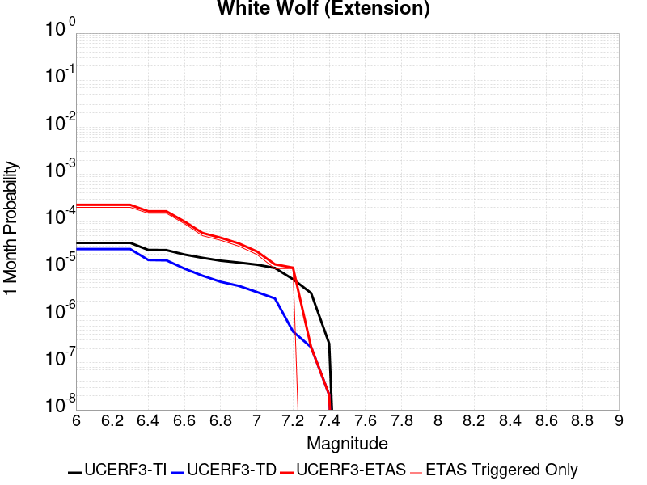 |  |  |

| Magnitude | 1 wk TI Prob | 1 wk TD Prob | 1 wk ETAS Prob | 1 wk ETAS/TD Gain | 1 wk ETAS Triggered Only | 1 mo TI Prob | 1 mo TD Prob | 1 mo ETAS Prob | 1 mo ETAS/TD Gain | 1 mo ETAS Triggered Only | 1 yr TI Prob | 1 yr TD Prob | 1 yr ETAS Prob | 1 yr ETAS/TD Gain | 1 yr ETAS Triggered Only | 10 yr TI Prob | 10 yr TD Prob | 10 yr ETAS Prob | 10 yr ETAS/TD Gain | 10 yr ETAS Triggered Only |
|-----|-----|-----|-----|-----|-----|-----|-----|-----|-----|-----|-----|-----|-----|-----|-----|-----|-----|-----|-----|-----|
| 6.0 | 8.222555E-6 | 6.066615E-6 | 2.2069443E-4 | 36.378513 | 2.1462912E-4 | 3.5239045E-5 | 2.5999556E-5 | 2.835478E-4 | 10.905871 | 2.5755496E-4 | 4.289509E-4 | 3.1650523E-4 | 6.5980316E-4 | 2.0846515 | 3.434066E-4 | 0.0042812387 | 0.0031611966 | 0.0035463078 | 1.1218245 | 3.8633242E-4 |
| 6.1 | 8.222555E-6 | 6.066615E-6 | 2.2069443E-4 | 36.378513 | 2.1462912E-4 | 3.5239045E-5 | 2.5999556E-5 | 2.835478E-4 | 10.905871 | 2.5755496E-4 | 4.289509E-4 | 3.1650523E-4 | 6.5980316E-4 | 2.0846515 | 3.434066E-4 | 0.0042812387 | 0.0031611966 | 0.0035463078 | 1.1218245 | 3.8633242E-4 |
| 6.2 | 8.222555E-6 | 6.066615E-6 | 2.2069443E-4 | 36.378513 | 2.1462912E-4 | 3.5239045E-5 | 2.5999556E-5 | 2.835478E-4 | 10.905871 | 2.5755496E-4 | 4.289509E-4 | 3.1650523E-4 | 6.5980316E-4 | 2.0846515 | 3.434066E-4 | 0.0042812387 | 0.0031611966 | 0.0035463078 | 1.1218245 | 3.8633242E-4 |
| 6.3 | 8.222555E-6 | 6.066615E-6 | 2.2069443E-4 | 36.378513 | 2.1462912E-4 | 3.5239045E-5 | 2.5999556E-5 | 2.835478E-4 | 10.905871 | 2.5755496E-4 | 4.289509E-4 | 3.1650523E-4 | 6.5980316E-4 | 2.0846515 | 3.434066E-4 | 0.0042812387 | 0.0031611966 | 0.0035463078 | 1.1218245 | 3.8633242E-4 |
| 6.4 | 5.821773E-6 | 3.5571256E-6 | 1.3233414E-4 | 37.20255 | 1.2877748E-4 | 2.4950215E-5 | 1.5244741E-5 | 1.8694541E-4 | 12.262945 | 1.717033E-4 | 3.0372653E-4 | 1.8559002E-4 | 4.001793E-4 | 2.1562545 | 2.1462912E-4 | 0.0030331176 | 0.0018544586 | 0.002111536 | 1.1386266 | 2.5755496E-4 |
| 6.5 | 5.766023E-6 | 3.4990599E-6 | 1.3227608E-4 | 37.80332 | 1.2877748E-4 | 2.4711293E-5 | 1.49958905E-5 | 1.8669662E-4 | 12.449852 | 1.717033E-4 | 3.0081844E-4 | 1.8256076E-4 | 3.971507E-4 | 2.175444 | 2.1462912E-4 | 0.0030041158 | 0.0018242161 | 0.0020813013 | 1.1409291 | 2.5755496E-4 |
| 6.6 | 4.643576E-6 | 2.3325733E-6 | 8.8184024E-5 | 37.805466 | 8.585165E-5 | 1.9900888E-5 | 9.9967065E-6 | 9.58475E-5 | 9.587908 | 8.585165E-5 | 2.4226638E-4 | 1.2170354E-4 | 2.5046532E-4 | 2.0579956 | 1.2877748E-4 | 0.0024200242 | 0.0012164112 | 0.0013450321 | 1.1057379 | 1.2877748E-4 |
| 6.7 | 3.9529173E-6 | 1.6482975E-6 | 8.749981E-5 | 53.084957 | 8.585165E-5 | 1.6940963E-5 | 7.064114E-6 | 9.291516E-5 | 13.153122 | 8.585165E-5 | 2.0623671E-4 | 8.600239E-5 | 1.7184665E-4 | 1.9981614 | 8.585165E-5 | 0.002060454 | 8.597095E-4 | 9.4548735E-4 | 1.0997754 | 8.585165E-5 |
| 6.8 | 3.4377522E-6 | 1.2244764E-6 | 8.707602E-5 | 71.11286 | 8.585165E-5 | 1.473314E-5 | 5.247746E-6 | 9.109894E-5 | 17.359634 | 8.585165E-5 | 1.7936122E-4 | 6.388952E-5 | 1.4973569E-4 | 2.3436658 | 8.585165E-5 | 0.0017921652 | 6.3872064E-4 | 7.2451745E-4 | 1.134326 | 8.585165E-5 |
| 6.9 | 3.1367306E-6 | 1.0033316E-6 | 4.3929114E-5 | 43.783245 | 4.2925825E-5 | 1.3443062E-5 | 4.299986E-6 | 4.7225625E-5 | 10.98274 | 4.2925825E-5 | 1.63657E-4 | 5.2351144E-5 | 9.527472E-5 | 1.8199167 | 4.2925825E-5 | 0.0016353652 | 5.233958E-4 | 5.6629913E-4 | 1.0819712 | 4.2925825E-5 |
| 7.0 | 2.8298145E-6 | 7.4282326E-7 | 4.3668617E-5 | 58.787354 | 4.2925825E-5 | 1.2127721E-5 | 3.1835248E-6 | 4.6109213E-5 | 14.483699 | 4.2925825E-5 | 1.47645E-4 | 3.8758775E-5 | 8.1682934E-5 | 2.1074696 | 4.2925825E-5 | 0.0014754693 | 3.8752513E-4 | 4.3043433E-4 | 1.1107262 | 4.2925825E-5 |
| 7.1 | 2.4091064E-6 | 5.4223835E-7 | 4.346804E-5 | 80.16408 | 4.2925825E-5 | 1.03247E-5 | 2.3238767E-6 | 4.5249602E-5 | 19.471601 | 4.2925825E-5 | 1.2569598E-4 | 2.8292874E-5 | 7.121748E-5 | 2.5171528 | 4.2925825E-5 | 0.001256249 | 2.8289677E-4 | 3.2581043E-4 | 1.1516938 | 4.2925825E-5 |
| 7.2 | 1.3875518E-6 | 1.0740268E-7 | 4.3033222E-5 | 400.67178 | 4.2925825E-5 | 5.9466374E-6 | 4.6029712E-7 | 4.3386102E-5 | 94.25673 | 4.2925825E-5 | 7.23979E-5 | 5.604104E-6 | 4.8529688E-5 | 8.659669 | 4.2925825E-5 | 7.2374323E-4 | 5.6039742E-5 | 9.896316E-5 | 1.765946 | 4.2925825E-5 |
| 7.3 | 7.056077E-7 | 5.0002956E-8 | 5.0002956E-8 | 1.0 | 0.0 | 3.0240296E-6 | 2.1429837E-7 | 2.1429837E-7 | 1.0 | 0.0 | 3.681694E-5 | 2.60908E-6 | 2.60908E-6 | 1.0 | 0.0 | 3.681084E-4 | 2.609054E-5 | 2.609054E-5 | 1.0 | 0.0 |
| 7.4 | 5.9334678E-8 | 4.8638475E-9 | 4.8638475E-9 | 1.0 | 0.0 | 2.5429145E-7 | 2.084506E-8 | 2.084506E-8 | 1.0 | 0.0 | 3.095994E-6 | 2.5378858E-7 | 2.5378858E-7 | 1.0 | 0.0 | 3.095951E-5 | 2.5378843E-6 | 2.5378843E-6 | 1.0 | 0.0 |

## Cady
*[(top)](#table-of-contents)*

| 1 Week | 1 Month | 1 Year | 10 Year |
|-----|-----|-----|-----|
|  |  |  |  |

| Magnitude | 1 wk TI Prob | 1 wk TD Prob | 1 wk ETAS Prob | 1 wk ETAS/TD Gain | 1 wk ETAS Triggered Only | 1 mo TI Prob | 1 mo TD Prob | 1 mo ETAS Prob | 1 mo ETAS/TD Gain | 1 mo ETAS Triggered Only | 1 yr TI Prob | 1 yr TD Prob | 1 yr ETAS Prob | 1 yr ETAS/TD Gain | 1 yr ETAS Triggered Only | 10 yr TI Prob | 10 yr TD Prob | 10 yr ETAS Prob | 10 yr ETAS/TD Gain | 10 yr ETAS Triggered Only |
|-----|-----|-----|-----|-----|-----|-----|-----|-----|-----|-----|-----|-----|-----|-----|-----|-----|-----|-----|-----|-----|
| 6.0 | 1.9892565E-5 | 2.1858728E-5 | 1.077085E-4 | 4.927482 | 8.585165E-5 | 8.525106E-5 | 9.3677416E-5 | 2.6536462E-4 | 2.8327491 | 1.717033E-4 | 0.0010374374 | 0.0011400167 | 0.001440155 | 1.2632753 | 3.0048078E-4 | 0.010326075 | 0.011350701 | 0.011732648 | 1.0336497 | 3.8633242E-4 |
| 6.1 | 1.9892565E-5 | 2.1858728E-5 | 1.077085E-4 | 4.927482 | 8.585165E-5 | 8.525106E-5 | 9.3677416E-5 | 2.6536462E-4 | 2.8327491 | 1.717033E-4 | 0.0010374374 | 0.0011400167 | 0.001440155 | 1.2632753 | 3.0048078E-4 | 0.010326075 | 0.011350701 | 0.011732648 | 1.0336497 | 3.8633242E-4 |
| 6.2 | 1.9892565E-5 | 2.1858728E-5 | 1.077085E-4 | 4.927482 | 8.585165E-5 | 8.525106E-5 | 9.3677416E-5 | 2.6536462E-4 | 2.8327491 | 1.717033E-4 | 0.0010374374 | 0.0011400167 | 0.001440155 | 1.2632753 | 3.0048078E-4 | 0.010326075 | 0.011350701 | 0.011732648 | 1.0336497 | 3.8633242E-4 |
| 6.3 | 1.1117327E-5 | 1.2176583E-5 | 9.802719E-5 | 8.0504675 | 8.585165E-5 | 4.764482E-5 | 5.2184492E-5 | 2.2387883E-4 | 4.290141 | 1.717033E-4 | 5.7992124E-4 | 6.351925E-4 | 8.496853E-4 | 1.3376815 | 2.1462912E-4 | 0.0057841022 | 0.0063368753 | 0.0065501444 | 1.0336553 | 2.1462912E-4 |
| 6.4 | 1.1117327E-5 | 1.2176583E-5 | 9.802719E-5 | 8.0504675 | 8.585165E-5 | 4.764482E-5 | 5.2184492E-5 | 2.2387883E-4 | 4.290141 | 1.717033E-4 | 5.7992124E-4 | 6.351925E-4 | 8.496853E-4 | 1.3376815 | 2.1462912E-4 | 0.0057841022 | 0.0063368753 | 0.0065501444 | 1.0336553 | 2.1462912E-4 |
| 6.5 | 6.103093E-6 | 6.672021E-6 | 4.959756E-5 | 7.433664 | 4.2925825E-5 | 2.615585E-5 | 2.8594131E-5 | 7.151873E-5 | 2.501168 | 4.2925825E-5 | 3.1840094E-4 | 3.480905E-4 | 3.9100138E-4 | 1.123275 | 4.2925825E-5 | 0.0031794512 | 0.0034766865 | 0.0035194631 | 1.0123038 | 4.2925825E-5 |
| 6.6 | 5.817237E-6 | 6.3656585E-6 | 4.9291208E-5 | 7.743301 | 4.2925825E-5 | 2.4930776E-5 | 2.728118E-5 | 7.020583E-5 | 2.5734165 | 4.2925825E-5 | 3.034899E-4 | 3.3211018E-4 | 3.7502174E-4 | 1.1292088 | 4.2925825E-5 | 0.0030307577 | 0.0033173605 | 0.003360144 | 1.0128968 | 4.2925825E-5 |
| 6.7 | 4.8846314E-6 | 5.3405684E-6 | 4.8266164E-5 | 9.037645 | 4.2925825E-5 | 2.0933967E-5 | 2.2888014E-5 | 6.5812856E-5 | 2.8754287 | 4.2925825E-5 | 2.5484123E-4 | 2.7863772E-4 | 3.215516E-4 | 1.1540132 | 4.2925825E-5 | 0.0025454918 | 0.0027840391 | 0.0028268455 | 1.0153756 | 4.2925825E-5 |
| 6.8 | 1.7788773E-6 | 1.9399079E-6 | 1.9399079E-6 | 1.0 | 0.0 | 7.6237375E-6 | 8.313874E-6 | 8.313874E-6 | 1.0 | 0.0 | 9.281505E-5 | 1.01218284E-4 | 1.01218284E-4 | 1.0 | 0.0 | 9.2776294E-4 | 0.0010118765 | 0.0010118765 | 1.0 | 0.0 |
| 6.9 | 7.5455404E-7 | 8.297092E-7 | 8.297092E-7 | 1.0 | 0.0 | 3.233799E-6 | 3.5558937E-6 | 3.5558937E-6 | 1.0 | 0.0 | 3.937079E-5 | 4.3292483E-5 | 4.3292483E-5 | 1.0 | 0.0 | 3.9363815E-4 | 4.3287344E-4 | 4.3287344E-4 | 1.0 | 0.0 |
| 7.0 | 6.8578805E-7 | 7.541816E-7 | 7.541816E-7 | 1.0 | 0.0 | 2.9390883E-6 | 3.2322048E-6 | 3.2322048E-6 | 1.0 | 0.0 | 3.578281E-5 | 3.9351715E-5 | 3.9351715E-5 | 1.0 | 0.0 | 3.577705E-4 | 3.9347992E-4 | 3.9347992E-4 | 1.0 | 0.0 |

## Calico-Hidalgo
*[(top)](#table-of-contents)*

| 1 Week | 1 Month | 1 Year | 10 Year |
|-----|-----|-----|-----|
| 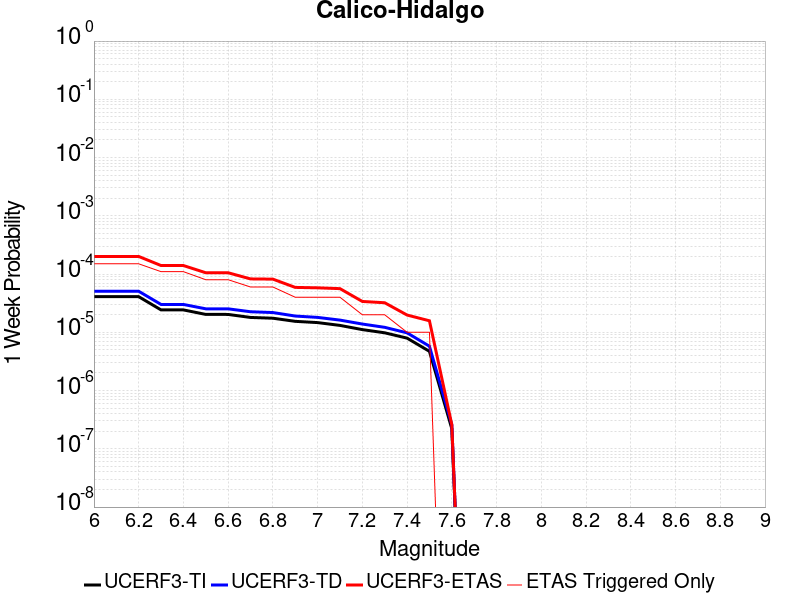 | 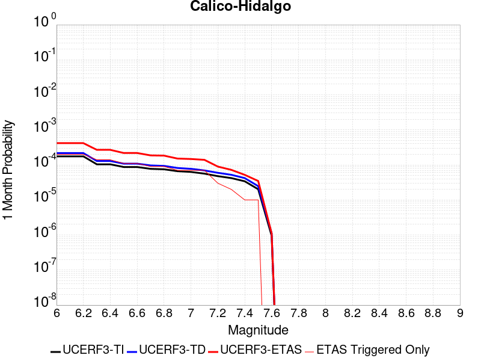 |  |  |

| Magnitude | 1 wk TI Prob | 1 wk TD Prob | 1 wk ETAS Prob | 1 wk ETAS/TD Gain | 1 wk ETAS Triggered Only | 1 mo TI Prob | 1 mo TD Prob | 1 mo ETAS Prob | 1 mo ETAS/TD Gain | 1 mo ETAS Triggered Only | 1 yr TI Prob | 1 yr TD Prob | 1 yr ETAS Prob | 1 yr ETAS/TD Gain | 1 yr ETAS Triggered Only | 10 yr TI Prob | 10 yr TD Prob | 10 yr ETAS Prob | 10 yr ETAS/TD Gain | 10 yr ETAS Triggered Only |
|-----|-----|-----|-----|-----|-----|-----|-----|-----|-----|-----|-----|-----|-----|-----|-----|-----|-----|-----|-----|-----|
| 6.0 | 4.0906612E-5 | 5.0704355E-5 | 3.0824624E-4 | 6.079285 | 2.5755496E-4 | 1.7530227E-4 | 2.1728857E-4 | 4.7478755E-4 | 2.1850553 | 2.5755496E-4 | 0.0021322158 | 0.002642678 | 0.0029851773 | 1.129603 | 3.434066E-4 | 0.02111873 | 0.026152814 | 0.026529042 | 1.0143858 | 3.8633242E-4 |
| 6.1 | 4.0906612E-5 | 5.0704355E-5 | 3.0824624E-4 | 6.079285 | 2.5755496E-4 | 1.7530227E-4 | 2.1728857E-4 | 4.7478755E-4 | 2.1850553 | 2.5755496E-4 | 0.0021322158 | 0.002642678 | 0.0029851773 | 1.129603 | 3.434066E-4 | 0.02111873 | 0.026152814 | 0.026529042 | 1.0143858 | 3.8633242E-4 |
| 6.2 | 4.0906612E-5 | 5.0704355E-5 | 3.0824624E-4 | 6.079285 | 2.5755496E-4 | 1.7530227E-4 | 2.1728857E-4 | 4.7478755E-4 | 2.1850553 | 2.5755496E-4 | 0.0021322158 | 0.002642678 | 0.0029851773 | 1.129603 | 3.434066E-4 | 0.02111873 | 0.026152814 | 0.026529042 | 1.0143858 | 3.8633242E-4 |
| 6.3 | 2.4242801E-5 | 3.0090967E-5 | 2.017891E-4 | 6.7059693 | 1.717033E-4 | 1.0389358E-4 | 1.289551E-4 | 3.0063625E-4 | 2.331325 | 1.717033E-4 | 0.0012641704 | 0.0015689312 | 0.0017832236 | 1.136585 | 2.1462912E-4 | 0.01257003 | 0.015582229 | 0.01583577 | 1.0162712 | 2.5755496E-4 |
| 6.4 | 2.4242801E-5 | 3.0090967E-5 | 2.017891E-4 | 6.7059693 | 1.717033E-4 | 1.0389358E-4 | 1.289551E-4 | 3.0063625E-4 | 2.331325 | 1.717033E-4 | 0.0012641704 | 0.0015689312 | 0.0017832236 | 1.136585 | 2.1462912E-4 | 0.01257003 | 0.015582229 | 0.01583577 | 1.0162712 | 2.5755496E-4 |
| 6.5 | 2.0286952E-5 | 2.5316054E-5 | 1.5409027E-4 | 6.086662 | 1.2877748E-4 | 8.694118E-5 | 1.0849296E-4 | 2.3725646E-4 | 2.1868374 | 1.2877748E-4 | 0.0010579949 | 0.0013201186 | 0.0014915952 | 1.1298949 | 1.717033E-4 | 0.010529719 | 0.013124701 | 0.01329415 | 1.0129107 | 1.717033E-4 |
| 6.6 | 2.0269223E-5 | 2.5297004E-5 | 1.5407123E-4 | 6.0904927 | 1.2877748E-4 | 8.6865206E-5 | 1.08411325E-4 | 2.3717483E-4 | 2.1877313 | 1.2877748E-4 | 0.0010570707 | 0.0013191258 | 0.0014906026 | 1.1299927 | 1.717033E-4 | 0.010520565 | 0.01311489 | 0.013284341 | 1.0129205 | 1.717033E-4 |
| 6.7 | 1.799852E-5 | 2.2540933E-5 | 1.513155E-4 | 6.7129207 | 1.2877748E-4 | 7.713423E-5 | 9.660051E-5 | 2.2536554E-4 | 2.3329644 | 1.2877748E-4 | 9.3870464E-4 | 0.0011754911 | 0.0013469927 | 1.1458977 | 1.717033E-4 | 0.009347493 | 0.011694346 | 0.011864041 | 1.0145109 | 1.717033E-4 |
| 6.8 | 1.7458793E-5 | 2.184258E-5 | 1.5061724E-4 | 6.8955793 | 1.2877748E-4 | 7.4821255E-5 | 9.360778E-5 | 2.223732E-4 | 2.3755846 | 1.2877748E-4 | 9.10568E-4 | 0.0011390933 | 0.0012677241 | 1.1129239 | 1.2877748E-4 | 0.009068459 | 0.011334131 | 0.011461449 | 1.0112331 | 1.2877748E-4 |
| 6.9 | 1.542884E-5 | 1.9026285E-5 | 1.4780131E-4 | 7.7682695 | 1.2877748E-4 | 6.612192E-5 | 8.153875E-5 | 2.1030572E-4 | 2.579212 | 1.2877748E-4 | 8.04737E-4 | 9.922953E-4 | 0.001120945 | 1.1296486 | 1.2877748E-4 | 0.008018291 | 0.009880043 | 0.010007548 | 1.0129054 | 1.2877748E-4 |
| 7.0 | 1.468253E-5 | 1.803109E-5 | 1.4680624E-4 | 8.141839 | 1.2877748E-4 | 6.292361E-5 | 7.727389E-5 | 2.0604141E-4 | 2.666378 | 1.2877748E-4 | 7.658257E-4 | 9.4041653E-4 | 0.001069073 | 1.1368078 | 1.2877748E-4 | 0.0076319184 | 0.009365736 | 0.009493307 | 1.0136211 | 1.2877748E-4 |
| 7.1 | 1.3139281E-5 | 1.620139E-5 | 1.4497677E-4 | 8.948417 | 1.2877748E-4 | 5.6309986E-5 | 6.943275E-5 | 1.9820128E-4 | 2.8545792 | 1.2877748E-4 | 6.853584E-4 | 8.4502844E-4 | 9.7369705E-4 | 1.1522654 | 1.2877748E-4 | 0.0068324856 | 0.008419449 | 0.008547143 | 1.0151664 | 1.2877748E-4 |
| 7.2 | 1.1127404E-5 | 1.3867038E-5 | 9.9717494E-5 | 7.190973 | 8.585165E-5 | 4.7688E-5 | 5.9428872E-5 | 1.4527542E-4 | 2.444526 | 8.585165E-5 | 5.8044674E-4 | 7.233172E-4 | 8.091068E-4 | 1.1186057 | 8.585165E-5 | 0.0057893298 | 0.007210737 | 0.00729597 | 1.0118202 | 8.585165E-5 |
| 7.3 | 9.808154E-6 | 1.2176586E-5 | 9.802719E-5 | 8.050466 | 8.585165E-5 | 4.2034266E-5 | 5.2184383E-5 | 1.3803155E-4 | 2.645074 | 8.585165E-5 | 5.11647E-4 | 6.351704E-4 | 7.209675E-4 | 1.1350774 | 8.585165E-5 | 0.0051047057 | 0.006334625 | 0.006419933 | 1.013467 | 8.585165E-5 |
| 7.4 | 7.942452E-6 | 9.792348E-6 | 5.271775E-5 | 5.383566 | 4.2925825E-5 | 3.4038632E-5 | 4.1966585E-5 | 8.4890606E-5 | 2.0228143 | 4.2925825E-5 | 4.1434157E-4 | 5.108328E-4 | 5.5373675E-4 | 1.0839882 | 4.2925825E-5 | 0.0041356985 | 0.005097527 | 0.0051402343 | 1.008378 | 4.2925825E-5 |
| 7.5 | 4.7121216E-6 | 5.7729717E-6 | 4.869855E-5 | 8.435612 | 4.2925825E-5 | 2.019465E-5 | 2.4741115E-5 | 6.7665875E-5 | 2.7349567 | 4.2925825E-5 | 2.4584212E-4 | 3.011891E-4 | 3.44102E-4 | 1.1424782 | 4.2925825E-5 | 0.0024557032 | 0.0030085614 | 0.0030513583 | 1.014225 | 4.2925825E-5 |
| 7.6 | 2.21172E-7 | 2.6040198E-7 | 2.6040198E-7 | 1.0 | 0.0 | 9.478797E-7 | 1.1160082E-6 | 1.1160082E-6 | 1.0 | 0.0 | 1.1540374E-5 | 1.3587343E-5 | 1.3587343E-5 | 1.0 | 0.0 | 1.1539775E-4 | 1.3586794E-4 | 1.3586794E-4 | 1.0 | 0.0 |

## Imperial
*[(top)](#table-of-contents)*

| 1 Week | 1 Month | 1 Year | 10 Year |
|-----|-----|-----|-----|
| 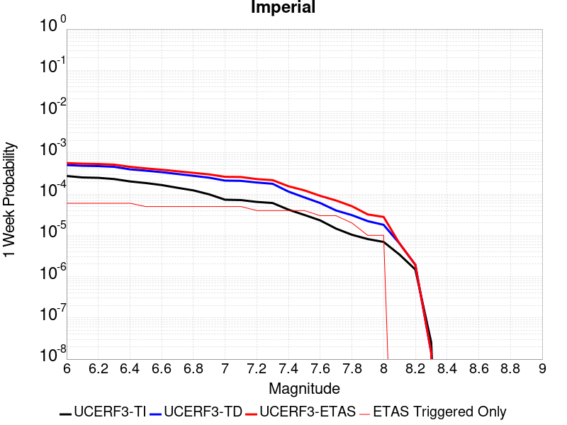 |  |  |  |

| Magnitude | 1 wk TI Prob | 1 wk TD Prob | 1 wk ETAS Prob | 1 wk ETAS/TD Gain | 1 wk ETAS Triggered Only | 1 mo TI Prob | 1 mo TD Prob | 1 mo ETAS Prob | 1 mo ETAS/TD Gain | 1 mo ETAS Triggered Only | 1 yr TI Prob | 1 yr TD Prob | 1 yr ETAS Prob | 1 yr ETAS/TD Gain | 1 yr ETAS Triggered Only | 10 yr TI Prob | 10 yr TD Prob | 10 yr ETAS Prob | 10 yr ETAS/TD Gain | 10 yr ETAS Triggered Only |
|-----|-----|-----|-----|-----|-----|-----|-----|-----|-----|-----|-----|-----|-----|-----|-----|-----|-----|-----|-----|-----|
| 6.0 | 2.7496446E-4 | 5.055345E-4 | 6.77151E-4 | 1.3394753 | 1.717033E-4 | 0.0011778869 | 0.002164817 | 0.0023361486 | 1.0791436 | 1.717033E-4 | 0.0142467655 | 0.026048409 | 0.026341064 | 1.011235 | 3.0048078E-4 | 0.13367249 | 0.22807029 | 0.2283685 | 1.0013076 | 3.8633242E-4 |
| 6.1 | 2.5356023E-4 | 4.8657708E-4 | 6.581968E-4 | 1.3527082 | 1.717033E-4 | 0.001086234 | 0.002083702 | 0.0022550477 | 1.0822313 | 1.717033E-4 | 0.013144928 | 0.02507094 | 0.025363887 | 1.0116848 | 3.0048078E-4 | 0.123940155 | 0.21949561 | 0.21979715 | 1.0013738 | 3.8633242E-4 |
| 6.2 | 2.4820742E-4 | 4.775311E-4 | 6.4915244E-4 | 1.3593929 | 1.717033E-4 | 0.0010633124 | 0.0020449946 | 0.0022163468 | 1.083791 | 1.717033E-4 | 0.01286919 | 0.024610676 | 0.024903761 | 1.0119089 | 3.0048078E-4 | 0.12148927 | 0.21600136 | 0.21630426 | 1.0014023 | 3.8633242E-4 |
| 6.3 | 2.3205351E-4 | 4.5892023E-4 | 6.3054473E-4 | 1.3739746 | 1.717033E-4 | 9.94136E-4 | 0.0019653554 | 0.0021367213 | 1.0871933 | 1.717033E-4 | 0.012036599 | 0.023661187 | 0.023954557 | 1.0123988 | 3.0048078E-4 | 0.11405133 | 0.20793827 | 0.20824426 | 1.0014716 | 3.8633242E-4 |
| 6.4 | 2.0304754E-4 | 3.9878016E-4 | 5.70415E-4 | 1.4303997 | 1.717033E-4 | 8.6991355E-4 | 0.0017079529 | 0.001879363 | 1.1003599 | 1.717033E-4 | 0.010539869 | 0.020595418 | 0.02088971 | 1.0142893 | 3.0048078E-4 | 0.100537635 | 0.18507113 | 0.18538596 | 1.0017011 | 3.8633242E-4 |
| 6.5 | 1.854992E-4 | 3.6990462E-4 | 4.986345E-4 | 1.3480082 | 1.2877748E-4 | 7.9475436E-4 | 0.0015843548 | 0.0017129282 | 1.081152 | 1.2877748E-4 | 0.009633281 | 0.01911443 | 0.01936706 | 1.0132169 | 2.5755496E-4 | 0.0922623 | 0.1733039 | 0.17358778 | 1.0016382 | 3.434066E-4 |
| 6.6 | 1.6586106E-4 | 3.4036173E-4 | 4.690954E-4 | 1.3782259 | 1.2877748E-4 | 7.106394E-4 | 0.0014578878 | 0.0015864776 | 1.0882027 | 1.2877748E-4 | 0.008617763 | 0.017607626 | 0.017860645 | 1.01437 | 2.5755496E-4 | 0.08291132 | 0.16078055 | 0.16106874 | 1.0017924 | 3.434066E-4 |
| 6.7 | 1.4224656E-4 | 3.076812E-4 | 4.3641904E-4 | 1.4184132 | 1.2877748E-4 | 6.094856E-4 | 0.0013179756 | 0.0014465833 | 1.0975797 | 1.2877748E-4 | 0.0073952693 | 0.015928522 | 0.016181974 | 1.0159118 | 2.5755496E-4 | 0.07153955 | 0.14648798 | 0.14678109 | 1.0020008 | 3.434066E-4 |
| 6.8 | 1.2317259E-4 | 2.779231E-4 | 4.0666477E-4 | 1.4632277 | 1.2877748E-4 | 5.2777573E-4 | 0.0011905615 | 0.0013191856 | 1.1080365 | 1.2877748E-4 | 0.0064067547 | 0.014400131 | 0.014653977 | 1.0176281 | 2.5755496E-4 | 0.06225166 | 0.13294089 | 0.13323863 | 1.0022397 | 3.434066E-4 |
| 6.9 | 9.859898E-5 | 2.5015484E-4 | 3.789001E-4 | 1.5146623 | 1.2877748E-4 | 4.2249862E-4 | 0.0010716559 | 0.0012002954 | 1.120038 | 1.2877748E-4 | 0.0051317946 | 0.012970319 | 0.013224533 | 1.0195997 | 2.5755496E-4 | 0.05014893 | 0.119408876 | 0.11971127 | 1.0025325 | 3.434066E-4 |
| 7.0 | 7.3191884E-5 | 2.1267848E-4 | 3.4142856E-4 | 1.6053743 | 1.2877748E-4 | 3.136418E-4 | 9.11164E-4 | 0.0010398241 | 1.1412041 | 1.2877748E-4 | 0.003811904 | 0.011037681 | 0.011292393 | 1.0230767 | 2.5755496E-4 | 0.037471764 | 0.10206756 | 0.10237592 | 1.0030211 | 3.434066E-4 |
| 7.1 | 7.1760296E-5 | 2.0969207E-4 | 3.3844254E-4 | 1.6139978 | 1.2877748E-4 | 3.0750787E-4 | 8.9837395E-4 | 0.0010270358 | 1.1432163 | 1.2877748E-4 | 0.003737482 | 0.010883528 | 0.01113828 | 1.0234071 | 2.5755496E-4 | 0.03675245 | 0.10070406 | 0.101012886 | 1.0030667 | 3.434066E-4 |
| 7.2 | 6.46614E-5 | 1.9137723E-4 | 3.2013006E-4 | 1.6727699 | 1.2877748E-4 | 2.7709085E-4 | 8.199333E-4 | 9.4860524E-4 | 1.1569297 | 1.2877748E-4 | 0.0033683628 | 0.009937617 | 0.010192613 | 1.0256596 | 2.5755496E-4 | 0.033177625 | 0.092511006 | 0.09282264 | 1.0033686 | 3.434066E-4 |
| 7.3 | 6.088115E-5 | 1.780939E-4 | 3.0684844E-4 | 1.7229587 | 1.2877748E-4 | 2.6089314E-4 | 7.6303916E-4 | 8.917184E-4 | 1.1686404 | 1.2877748E-4 | 0.0031717476 | 0.009251006 | 0.009506178 | 1.0275832 | 2.5755496E-4 | 0.031268585 | 0.08656135 | 0.08687504 | 1.0036238 | 3.434066E-4 |
| 7.4 | 4.199346E-5 | 1.1511097E-4 | 2.4387361E-4 | 2.1185958 | 1.2877748E-4 | 1.7995955E-4 | 4.932403E-4 | 6.2195427E-4 | 1.2609558 | 1.2877748E-4 | 0.0021888057 | 0.005988835 | 0.0062448476 | 1.0427483 | 2.5755496E-4 | 0.02167372 | 0.05744024 | 0.057723463 | 1.0049307 | 3.0048078E-4 |
| 7.5 | 3.130448E-5 | 8.333871E-5 | 2.1210546E-4 | 2.5451012 | 1.2877748E-4 | 1.3415517E-4 | 3.5711733E-4 | 4.858488E-4 | 1.3604739 | 1.2877748E-4 | 0.0016321153 | 0.0043392954 | 0.004595733 | 1.0590966 | 2.5755496E-4 | 0.016201803 | 0.042133506 | 0.042421326 | 1.0068312 | 3.0048078E-4 |
| 7.6 | 2.3074248E-5 | 6.0849357E-5 | 1.4669578E-4 | 2.4108026 | 8.585165E-5 | 9.888588E-5 | 2.6075702E-4 | 3.4658628E-4 | 1.3291541 | 8.585165E-5 | 0.0012032706 | 0.0031701182 | 0.0033412774 | 1.0539913 | 1.717033E-4 | 0.011967761 | 0.03102816 | 0.03123613 | 1.0067027 | 2.1462912E-4 |
| 7.7 | 1.45864815E-5 | 4.0128452E-5 | 1.2597666E-4 | 3.1393352 | 8.585165E-5 | 6.2511994E-5 | 1.7196777E-4 | 2.5780467E-4 | 1.4991452 | 8.585165E-5 | 7.608177E-4 | 0.0020917025 | 0.0022630468 | 1.0819161 | 1.717033E-4 | 0.007582182 | 0.02062909 | 0.02079725 | 1.0081517 | 1.717033E-4 |
| 7.8 | 1.0352979E-5 | 3.096395E-5 | 1.1681294E-4 | 3.7725465 | 8.585165E-5 | 4.4369157E-5 | 1.326959E-4 | 2.1853617E-4 | 1.6468946 | 8.585165E-5 | 5.400606E-4 | 0.0016143778 | 0.0017429474 | 1.0796403 | 1.2877748E-4 | 0.0053875 | 0.016017893 | 0.016144607 | 1.0079108 | 1.2877748E-4 |
| 7.9 | 8.137906E-6 | 2.2151205E-5 | 6.507608E-5 | 2.937812 | 4.2925825E-5 | 3.4876273E-5 | 9.493029E-5 | 1.3785204E-4 | 1.4521396 | 4.2925825E-5 | 4.2453592E-4 | 0.0011551644 | 0.0012409169 | 1.074234 | 8.585165E-5 | 0.004237258 | 0.011618842 | 0.011703697 | 1.0073031 | 8.585165E-5 |
| 8.0 | 6.93792E-6 | 1.8010365E-5 | 6.0935417E-5 | 3.3833525 | 4.2925825E-5 | 2.9733603E-5 | 7.7185E-5 | 1.20107514E-4 | 1.556099 | 4.2925825E-5 | 3.6194647E-4 | 9.3932304E-4 | 0.0010250941 | 1.0913115 | 8.585165E-5 | 0.0036135751 | 0.009502415 | 0.009587451 | 1.0089489 | 8.585165E-5 |
| 8.1 | 3.4286315E-6 | 6.380179E-6 | 6.380179E-6 | 1.0 | 0.0 | 1.4694053E-5 | 2.734334E-5 | 2.734334E-5 | 1.0 | 0.0 | 1.7888541E-4 | 3.3285443E-4 | 3.3285443E-4 | 1.0 | 0.0 | 0.0017874148 | 0.0034863674 | 0.0034863674 | 1.0 | 0.0 |
| 8.2 | 1.4906886E-6 | 1.936633E-6 | 1.936633E-6 | 1.0 | 0.0 | 6.3886496E-6 | 8.2998295E-6 | 8.2998295E-6 | 1.0 | 0.0 | 7.7779034E-5 | 1.0104576E-4 | 1.0104576E-4 | 1.0 | 0.0 | 7.775182E-4 | 0.0011075423 | 0.0011075423 | 1.0 | 0.0 |
| 8.3 | 2.5758007E-8 | 1.4495866E-8 | 1.4495866E-8 | 1.0 | 0.0 | 1.10391454E-7 | 6.212514E-8 | 6.212514E-8 | 1.0 | 0.0 | 1.3440151E-6 | 7.563736E-7 | 7.563736E-7 | 1.0 | 0.0 | 1.344007E-5 | 7.884359E-6 | 7.884359E-6 | 1.0 | 0.0 |

## San Jacinto (San Jacinto Valley) rev
*[(top)](#table-of-contents)*

| 1 Week | 1 Month | 1 Year | 10 Year |
|-----|-----|-----|-----|
|  |  |  |  |

| Magnitude | 1 wk TI Prob | 1 wk TD Prob | 1 wk ETAS Prob | 1 wk ETAS/TD Gain | 1 wk ETAS Triggered Only | 1 mo TI Prob | 1 mo TD Prob | 1 mo ETAS Prob | 1 mo ETAS/TD Gain | 1 mo ETAS Triggered Only | 1 yr TI Prob | 1 yr TD Prob | 1 yr ETAS Prob | 1 yr ETAS/TD Gain | 1 yr ETAS Triggered Only | 10 yr TI Prob | 10 yr TD Prob | 10 yr ETAS Prob | 10 yr ETAS/TD Gain | 10 yr ETAS Triggered Only |
|-----|-----|-----|-----|-----|-----|-----|-----|-----|-----|-----|-----|-----|-----|-----|-----|-----|-----|-----|-----|-----|
| 6.0 | 3.652694E-5 | 3.4401106E-5 | 2.919472E-4 | 8.486564 | 2.5755496E-4 | 1.5653463E-4 | 1.4742499E-4 | 4.90781E-4 | 3.3290215 | 3.434066E-4 | 0.0019041431 | 0.0017934233 | 0.0021362142 | 1.1911377 | 3.434066E-4 | 0.018879099 | 0.018526303 | 0.018905478 | 1.0204668 | 3.8633242E-4 |
| 6.1 | 3.652694E-5 | 3.4401106E-5 | 2.919472E-4 | 8.486564 | 2.5755496E-4 | 1.5653463E-4 | 1.4742499E-4 | 4.90781E-4 | 3.3290215 | 3.434066E-4 | 0.0019041431 | 0.0017934233 | 0.0021362142 | 1.1911377 | 3.434066E-4 | 0.018879099 | 0.018526303 | 0.018905478 | 1.0204668 | 3.8633242E-4 |
| 6.2 | 3.652694E-5 | 3.4401106E-5 | 2.919472E-4 | 8.486564 | 2.5755496E-4 | 1.5653463E-4 | 1.4742499E-4 | 4.90781E-4 | 3.3290215 | 3.434066E-4 | 0.0019041431 | 0.0017934233 | 0.0021362142 | 1.1911377 | 3.434066E-4 | 0.018879099 | 0.018526303 | 0.018905478 | 1.0204668 | 3.8633242E-4 |
| 6.3 | 3.652694E-5 | 3.4401106E-5 | 2.919472E-4 | 8.486564 | 2.5755496E-4 | 1.5653463E-4 | 1.4742499E-4 | 4.90781E-4 | 3.3290215 | 3.434066E-4 | 0.0019041431 | 0.0017934233 | 0.0021362142 | 1.1911377 | 3.434066E-4 | 0.018879099 | 0.018526303 | 0.018905478 | 1.0204668 | 3.8633242E-4 |
| 6.4 | 3.646941E-5 | 3.432268E-5 | 2.9186878E-4 | 8.503672 | 2.5755496E-4 | 1.5628811E-4 | 1.4708891E-4 | 4.90445E-4 | 3.3343437 | 3.434066E-4 | 0.0019011468 | 0.0017893389 | 0.002132131 | 1.1915747 | 3.434066E-4 | 0.018849645 | 0.018486181 | 0.018865373 | 1.0205121 | 3.8633242E-4 |
| 6.5 | 3.646941E-5 | 3.432268E-5 | 2.9186878E-4 | 8.503672 | 2.5755496E-4 | 1.5628811E-4 | 1.4708891E-4 | 4.90445E-4 | 3.3343437 | 3.434066E-4 | 0.0019011468 | 0.0017893389 | 0.002132131 | 1.1915747 | 3.434066E-4 | 0.018849645 | 0.018486181 | 0.018865373 | 1.0205121 | 3.8633242E-4 |
| 6.6 | 3.6442503E-5 | 3.4286066E-5 | 2.9183217E-4 | 8.511684 | 2.5755496E-4 | 1.561728E-4 | 1.4693203E-4 | 4.9028813E-4 | 3.3368366 | 3.434066E-4 | 0.0018997455 | 0.001787432 | 0.0021302248 | 1.1917795 | 3.434066E-4 | 0.018835869 | 0.01846745 | 0.01884665 | 1.0205333 | 3.8633242E-4 |
| 6.7 | 3.6432113E-5 | 3.427164E-5 | 2.9181776E-4 | 8.514846 | 2.5755496E-4 | 1.5612828E-4 | 1.4687021E-4 | 4.902264E-4 | 3.3378203 | 3.434066E-4 | 0.0018992044 | 0.0017866807 | 0.0021294737 | 1.1918603 | 3.434066E-4 | 0.018830549 | 0.018460074 | 0.018839275 | 1.0205417 | 3.8633242E-4 |
| 6.8 | 3.6409598E-5 | 3.4240697E-5 | 2.9178683E-4 | 8.521638 | 2.5755496E-4 | 1.560318E-4 | 1.4673761E-4 | 4.9009384E-4 | 3.3399332 | 3.434066E-4 | 0.0018980318 | 0.0017850689 | 0.0021278625 | 1.1920338 | 3.434066E-4 | 0.018819023 | 0.018444229 | 0.018823436 | 1.0205597 | 3.8633242E-4 |
| 6.9 | 3.638078E-5 | 3.4201123E-5 | 2.9174724E-4 | 8.530342 | 2.5755496E-4 | 1.5590832E-4 | 1.4656801E-4 | 4.899243E-4 | 3.342641 | 3.434066E-4 | 0.0018965311 | 0.0017830075 | 0.0021258018 | 1.1922562 | 3.434066E-4 | 0.018804269 | 0.018423963 | 0.018803177 | 1.0205827 | 3.8633242E-4 |
| 7.0 | 3.6294874E-5 | 3.408314E-5 | 2.9162932E-4 | 8.55641 | 2.5755496E-4 | 1.5554018E-4 | 1.4606243E-4 | 4.8941886E-4 | 3.3507512 | 3.434066E-4 | 0.0018920569 | 0.0017768623 | 0.0021196587 | 1.1929224 | 3.434066E-4 | 0.018760284 | 0.018363545 | 0.018742783 | 1.0206517 | 3.8633242E-4 |
| 7.1 | 3.6260717E-5 | 3.403942E-5 | 2.915856E-4 | 8.566114 | 2.5755496E-4 | 1.5539382E-4 | 1.4587509E-4 | 4.892316E-4 | 3.3537705 | 3.434066E-4 | 0.001890278 | 0.0017745851 | 0.0021173824 | 1.1931703 | 3.434066E-4 | 0.018742796 | 0.018341139 | 0.018720385 | 1.0206773 | 3.8633242E-4 |
| 7.2 | 3.6210204E-5 | 3.397364E-5 | 2.9151983E-4 | 8.580765 | 2.5755496E-4 | 1.5517735E-4 | 1.455932E-4 | 4.889498E-4 | 3.3583283 | 3.434066E-4 | 0.001887647 | 0.0017711588 | 0.0021139572 | 1.1935446 | 3.434066E-4 | 0.01871693 | 0.018307408 | 0.018686667 | 1.0207162 | 3.8633242E-4 |
| 7.3 | 3.6119454E-5 | 3.386193E-5 | 2.9140816E-4 | 8.605776 | 2.5755496E-4 | 1.5478847E-4 | 1.4511449E-4 | 4.8847124E-4 | 3.3661094 | 3.434066E-4 | 0.0018829206 | 0.0017653398 | 0.0021081402 | 1.1941838 | 3.434066E-4 | 0.018670462 | 0.01824996 | 0.018629242 | 1.0207826 | 3.8633242E-4 |
| 7.4 | 3.607848E-5 | 3.380943E-5 | 2.9135565E-4 | 8.617586 | 2.5755496E-4 | 1.5461289E-4 | 1.4488952E-4 | 4.8824635E-4 | 3.3697839 | 3.434066E-4 | 0.0018807866 | 0.0017626052 | 0.0021054065 | 1.1944855 | 3.434066E-4 | 0.018649481 | 0.018222956 | 0.018602248 | 1.020814 | 3.8633242E-4 |
| 7.5 | 3.5856774E-5 | 3.3619202E-5 | 2.911655E-4 | 8.660689 | 2.5755496E-4 | 1.5366284E-4 | 1.4407437E-4 | 4.8743148E-4 | 3.3831937 | 3.434066E-4 | 0.0018692396 | 0.0017526967 | 0.0020955014 | 1.195587 | 3.434066E-4 | 0.018535944 | 0.018124057 | 0.018503387 | 1.0209297 | 3.8633242E-4 |
| 7.6 | 3.286655E-5 | 3.2142278E-5 | 2.8968893E-4 | 9.012708 | 2.5755496E-4 | 1.4084904E-4 | 1.3774536E-4 | 4.8110465E-4 | 3.4927106 | 3.434066E-4 | 0.001713488 | 0.0016757617 | 0.0020185928 | 1.2045822 | 3.434066E-4 | 0.017003361 | 0.017343804 | 0.017723436 | 1.0218886 | 3.8633242E-4 |
| 7.7 | 2.8882527E-5 | 2.9235205E-5 | 2.8678263E-4 | 9.809496 | 2.5755496E-4 | 1.237764E-4 | 1.2528773E-4 | 4.686513E-4 | 3.7406003 | 3.434066E-4 | 0.0015059357 | 0.0015243118 | 0.0018671949 | 1.2249429 | 3.434066E-4 | 0.014957713 | 0.015830338 | 0.016210554 | 1.0240182 | 3.8633242E-4 |
| 7.8 | 2.4950225E-5 | 2.6526219E-5 | 2.8407434E-4 | 10.70919 | 2.5755496E-4 | 1.0692515E-4 | 1.1367885E-4 | 4.570464E-4 | 4.0205054 | 3.434066E-4 | 0.0013010362 | 0.0013831621 | 0.0017260937 | 1.247933 | 3.434066E-4 | 0.012934455 | 0.01441176 | 0.014792524 | 1.0264205 | 3.8633242E-4 |
| 7.9 | 1.9881603E-5 | 2.150649E-5 | 2.790559E-4 | 12.975427 | 2.5755496E-4 | 8.520408E-5 | 9.216742E-5 | 4.3554237E-4 | 4.7255564 | 3.434066E-4 | 0.001036866 | 0.0011215615 | 0.001464583 | 1.3058428 | 3.434066E-4 | 0.010320415 | 0.011776998 | 0.01215878 | 1.0324177 | 3.8633242E-4 |
| 8.0 | 1.563292E-5 | 1.5936288E-5 | 2.3056199E-4 | 14.467735 | 2.1462912E-4 | 6.6996516E-5 | 6.829659E-5 | 2.8291106E-4 | 4.1423893 | 2.1462912E-4 | 8.153773E-4 | 8.3119445E-4 | 0.0010456452 | 1.2580031 | 2.1462912E-4 | 0.00812392 | 0.008810331 | 0.009023069 | 1.0241464 | 2.1462912E-4 |
| 8.1 | 1.0045313E-5 | 8.300794E-6 | 5.1226263E-5 | 6.1712484 | 4.2925825E-5 | 4.305063E-5 | 3.557435E-5 | 7.849865E-5 | 2.206608 | 4.2925825E-5 | 5.2401534E-4 | 4.3303217E-4 | 4.759394E-4 | 1.0990856 | 4.2925825E-5 | 0.0052278144 | 0.0046587666 | 0.004701493 | 1.009171 | 4.2925825E-5 |
| 8.2 | 4.1554413E-6 | 1.5648296E-6 | 1.5648296E-6 | 1.0 | 0.0 | 1.7808914E-5 | 6.7063957E-6 | 6.7063957E-6 | 1.0 | 0.0 | 2.1680194E-4 | 8.164734E-5 | 8.164734E-5 | 1.0 | 0.0 | 0.0021659054 | 9.479703E-4 | 9.479703E-4 | 1.0 | 0.0 |
| 8.3 | 1.2758221E-6 | 3.612677E-7 | 3.612677E-7 | 1.0 | 0.0 | 5.4677976E-6 | 1.5482892E-6 | 1.5482892E-6 | 1.0 | 0.0 | 6.65684E-5 | 1.8850264E-5 | 1.8850264E-5 | 1.0 | 0.0 | 6.6548464E-4 | 2.2739546E-4 | 2.2739546E-4 | 1.0 | 0.0 |

## Pisgah-Bullion Mtn-Mesquite Lk
*[(top)](#table-of-contents)*

| 1 Week | 1 Month | 1 Year | 10 Year |
|-----|-----|-----|-----|
|  |  |  | 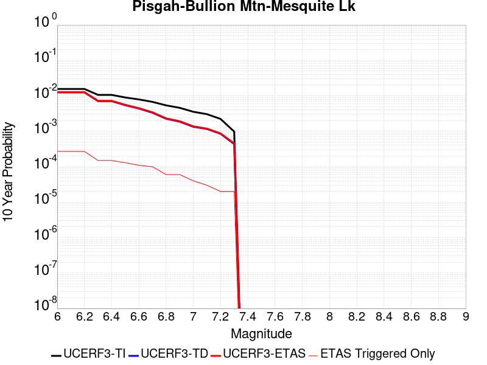 |

| Magnitude | 1 wk TI Prob | 1 wk TD Prob | 1 wk ETAS Prob | 1 wk ETAS/TD Gain | 1 wk ETAS Triggered Only | 1 mo TI Prob | 1 mo TD Prob | 1 mo ETAS Prob | 1 mo ETAS/TD Gain | 1 mo ETAS Triggered Only | 1 yr TI Prob | 1 yr TD Prob | 1 yr ETAS Prob | 1 yr ETAS/TD Gain | 1 yr ETAS Triggered Only | 10 yr TI Prob | 10 yr TD Prob | 10 yr ETAS Prob | 10 yr ETAS/TD Gain | 10 yr ETAS Triggered Only |
|-----|-----|-----|-----|-----|-----|-----|-----|-----|-----|-----|-----|-----|-----|-----|-----|-----|-----|-----|-----|-----|
| 6.0 | 3.0240792E-5 | 2.40909E-5 | 1.5286526E-4 | 6.345353 | 1.2877748E-4 | 1.2959696E-4 | 1.032432E-4 | 2.7492875E-4 | 2.6629238 | 1.717033E-4 | 0.0015767008 | 0.0012563618 | 0.0015135931 | 1.204743 | 2.5755496E-4 | 0.015655609 | 0.012502613 | 0.012841726 | 1.0271233 | 3.434066E-4 |
| 6.1 | 3.0240792E-5 | 2.40909E-5 | 1.5286526E-4 | 6.345353 | 1.2877748E-4 | 1.2959696E-4 | 1.032432E-4 | 2.7492875E-4 | 2.6629238 | 1.717033E-4 | 0.0015767008 | 0.0012563618 | 0.0015135931 | 1.204743 | 2.5755496E-4 | 0.015655609 | 0.012502613 | 0.012841726 | 1.0271233 | 3.434066E-4 |
| 6.2 | 3.0240792E-5 | 2.40909E-5 | 1.5286526E-4 | 6.345353 | 1.2877748E-4 | 1.2959696E-4 | 1.032432E-4 | 2.7492875E-4 | 2.6629238 | 1.717033E-4 | 0.0015767008 | 0.0012563618 | 0.0015135931 | 1.204743 | 2.5755496E-4 | 0.015655609 | 0.012502613 | 0.012841726 | 1.0271233 | 3.434066E-4 |
| 6.3 | 2.0498217E-5 | 1.3638054E-5 | 1.3638054E-5 | 1.0 | 0.0 | 8.784654E-5 | 5.8447586E-5 | 1.013709E-4 | 1.7343899 | 4.2925825E-5 | 0.0010690069 | 7.1138324E-4 | 8.4006914E-4 | 1.1808952 | 1.2877748E-4 | 0.01063879 | 0.0070926864 | 0.007263172 | 1.0240368 | 1.717033E-4 |
| 6.4 | 2.0498217E-5 | 1.3638054E-5 | 1.3638054E-5 | 1.0 | 0.0 | 8.784654E-5 | 5.8447586E-5 | 1.013709E-4 | 1.7343899 | 4.2925825E-5 | 0.0010690069 | 7.1138324E-4 | 8.4006914E-4 | 1.1808952 | 1.2877748E-4 | 0.01063879 | 0.0070926864 | 0.007263172 | 1.0240368 | 1.717033E-4 |
| 6.5 | 1.7316182E-5 | 1.04769715E-5 | 1.04769715E-5 | 1.0 | 0.0 | 7.42101E-5 | 4.490059E-5 | 8.782449E-5 | 1.9559762 | 4.2925825E-5 | 9.0313336E-4 | 5.465376E-4 | 6.7524466E-4 | 1.2354954 | 1.2877748E-4 | 0.008994718 | 0.00545293 | 0.005623697 | 1.0313165 | 1.717033E-4 |
| 6.6 | 1.5251077E-5 | 8.414133E-6 | 8.414133E-6 | 1.0 | 0.0 | 6.536012E-5 | 3.606011E-5 | 3.606011E-5 | 1.0 | 0.0 | 7.9546886E-4 | 4.3895066E-4 | 5.247646E-4 | 1.195498 | 8.585165E-5 | 0.007926274 | 0.0043815537 | 0.0045097666 | 1.0292621 | 1.2877748E-4 |
| 6.7 | 1.2997425E-5 | 6.4112146E-6 | 6.4112146E-6 | 1.0 | 0.0 | 5.570206E-5 | 2.7476372E-5 | 2.7476372E-5 | 1.0 | 0.0 | 6.7796157E-4 | 3.3447813E-4 | 4.2030105E-4 | 1.2565876 | 8.585165E-5 | 0.0067589693 | 0.003340207 | 0.0034685545 | 1.038425 | 1.2877748E-4 |
| 6.8 | 1.035386E-5 | 4.333145E-6 | 4.333145E-6 | 1.0 | 0.0 | 4.437293E-5 | 1.8570496E-5 | 1.8570496E-5 | 1.0 | 0.0 | 5.401065E-4 | 2.260732E-4 | 2.6898933E-4 | 1.1898328 | 4.2925825E-5 | 0.0053879567 | 0.002258519 | 0.002301348 | 1.0189632 | 4.2925825E-5 |
| 6.9 | 8.816252E-6 | 3.5805879E-6 | 3.5805879E-6 | 1.0 | 0.0 | 3.778339E-5 | 1.534529E-5 | 1.534529E-5 | 1.0 | 0.0 | 4.5991567E-4 | 1.8681347E-4 | 2.2973127E-4 | 1.2297361 | 4.2925825E-5 | 0.00458965 | 0.0018666228 | 0.0019094686 | 1.0229536 | 4.2925825E-5 |
| 7.0 | 6.8232207E-6 | 2.5674399E-6 | 2.5674399E-6 | 1.0 | 0.0 | 2.9242048E-5 | 1.100327E-5 | 1.100327E-5 | 1.0 | 0.0 | 3.5596377E-4 | 1.3395688E-4 | 1.7687696E-4 | 1.3204021 | 4.2925825E-5 | 0.0035539411 | 0.0013387925 | 0.0013816608 | 1.0320202 | 4.2925825E-5 |
| 7.1 | 5.837013E-6 | 2.2273143E-6 | 2.2273143E-6 | 1.0 | 0.0 | 2.501553E-5 | 9.5456E-6 | 9.5456E-6 | 1.0 | 0.0 | 3.045215E-4 | 1.1621177E-4 | 1.591326E-4 | 1.3693329 | 4.2925825E-5 | 0.0030410455 | 0.001161539 | 0.001204415 | 1.036913 | 4.2925825E-5 |
| 7.2 | 4.278052E-6 | 1.6275065E-6 | 1.6275065E-6 | 1.0 | 0.0 | 1.833438E-5 | 6.975011E-6 | 6.975011E-6 | 1.0 | 0.0 | 2.231982E-4 | 8.491768E-5 | 1.2783986E-4 | 1.5054563 | 4.2925825E-5 | 0.0022297418 | 8.4887556E-4 | 8.9176494E-4 | 1.050525 | 4.2925825E-5 |
| 7.3 | 1.8803692E-6 | 8.344788E-7 | 8.344788E-7 | 1.0 | 0.0 | 8.0587E-6 | 3.5763337E-6 | 3.5763337E-6 | 1.0 | 0.0 | 9.811026E-5 | 4.354114E-5 | 8.6465094E-5 | 1.9858253 | 4.2925825E-5 | 9.806695E-4 | 4.3534054E-4 | 4.7824768E-4 | 1.09856 | 4.2925825E-5 |

## San Jacinto (Stepovers Combined)
*[(top)](#table-of-contents)*

| 1 Week | 1 Month | 1 Year | 10 Year |
|-----|-----|-----|-----|
|  |  |  |  |

| Magnitude | 1 wk TI Prob | 1 wk TD Prob | 1 wk ETAS Prob | 1 wk ETAS/TD Gain | 1 wk ETAS Triggered Only | 1 mo TI Prob | 1 mo TD Prob | 1 mo ETAS Prob | 1 mo ETAS/TD Gain | 1 mo ETAS Triggered Only | 1 yr TI Prob | 1 yr TD Prob | 1 yr ETAS Prob | 1 yr ETAS/TD Gain | 1 yr ETAS Triggered Only | 10 yr TI Prob | 10 yr TD Prob | 10 yr ETAS Prob | 10 yr ETAS/TD Gain | 10 yr ETAS Triggered Only |
|-----|-----|-----|-----|-----|-----|-----|-----|-----|-----|-----|-----|-----|-----|-----|-----|-----|-----|-----|-----|-----|
| 6.0 | 4.0667746E-5 | 3.5271103E-5 | 2.9281696E-4 | 8.301894 | 2.5755496E-4 | 1.742787E-4 | 1.5115313E-4 | 4.9450784E-4 | 3.2715685 | 3.434066E-4 | 0.0021197782 | 0.0018387372 | 0.0021815123 | 1.1864188 | 3.434066E-4 | 0.020996714 | 0.018986495 | 0.01932338 | 1.0177435 | 3.434066E-4 |
| 6.1 | 4.0667746E-5 | 3.5271103E-5 | 2.9281696E-4 | 8.301894 | 2.5755496E-4 | 1.742787E-4 | 1.5115313E-4 | 4.9450784E-4 | 3.2715685 | 3.434066E-4 | 0.0021197782 | 0.0018387372 | 0.0021815123 | 1.1864188 | 3.434066E-4 | 0.020996714 | 0.018986495 | 0.01932338 | 1.0177435 | 3.434066E-4 |
| 6.2 | 4.0667746E-5 | 3.5271103E-5 | 2.9281696E-4 | 8.301894 | 2.5755496E-4 | 1.742787E-4 | 1.5115313E-4 | 4.9450784E-4 | 3.2715685 | 3.434066E-4 | 0.0021197782 | 0.0018387372 | 0.0021815123 | 1.1864188 | 3.434066E-4 | 0.020996714 | 0.018986495 | 0.01932338 | 1.0177435 | 3.434066E-4 |
| 6.3 | 4.0667746E-5 | 3.5271103E-5 | 2.9281696E-4 | 8.301894 | 2.5755496E-4 | 1.742787E-4 | 1.5115313E-4 | 4.9450784E-4 | 3.2715685 | 3.434066E-4 | 0.0021197782 | 0.0018387372 | 0.0021815123 | 1.1864188 | 3.434066E-4 | 0.020996714 | 0.018986495 | 0.01932338 | 1.0177435 | 3.434066E-4 |
| 6.4 | 4.0577226E-5 | 3.5143014E-5 | 2.926889E-4 | 8.328509 | 2.5755496E-4 | 1.738908E-4 | 1.5060425E-4 | 4.939591E-4 | 3.2798486 | 3.434066E-4 | 0.0021150648 | 0.0018320669 | 0.0021748445 | 1.1870987 | 3.434066E-4 | 0.020950472 | 0.018921062 | 0.019257972 | 1.017806 | 3.434066E-4 |
| 6.5 | 4.0577226E-5 | 3.5143014E-5 | 2.926889E-4 | 8.328509 | 2.5755496E-4 | 1.738908E-4 | 1.5060425E-4 | 4.939591E-4 | 3.2798486 | 3.434066E-4 | 0.0021150648 | 0.0018320669 | 0.0021748445 | 1.1870987 | 3.434066E-4 | 0.020950472 | 0.018921062 | 0.019257972 | 1.017806 | 3.434066E-4 |
| 6.6 | 4.053861E-5 | 3.5088357E-5 | 2.9263427E-4 | 8.339925 | 2.5755496E-4 | 1.7372532E-4 | 1.5037002E-4 | 4.93725E-4 | 3.2834003 | 3.434066E-4 | 0.0021130538 | 0.0018292206 | 0.002171999 | 1.1873904 | 3.434066E-4 | 0.020930743 | 0.01889314 | 0.019230058 | 1.0178329 | 3.434066E-4 |
| 6.7 | 4.0516545E-5 | 3.505743E-5 | 2.9260333E-4 | 8.3464 | 2.5755496E-4 | 1.7363077E-4 | 1.502375E-4 | 4.935925E-4 | 3.2854147 | 3.434066E-4 | 0.002111905 | 0.0018276101 | 0.002170389 | 1.1875559 | 3.434066E-4 | 0.020919468 | 0.018877337 | 0.019214261 | 1.017848 | 3.434066E-4 |
| 6.8 | 4.049434E-5 | 3.5028992E-5 | 2.9257493E-4 | 8.352365 | 2.5755496E-4 | 1.7353562E-4 | 1.5011564E-4 | 4.934707E-4 | 3.2872703 | 3.434066E-4 | 0.0021107488 | 0.0018261289 | 0.0021689085 | 1.1877083 | 3.434066E-4 | 0.020908125 | 0.018862749 | 0.019199677 | 1.0178621 | 3.434066E-4 |
| 6.9 | 4.046386E-5 | 3.4991554E-5 | 2.9253747E-4 | 8.360231 | 2.5755496E-4 | 1.73405E-4 | 1.499552E-4 | 4.933103E-4 | 3.289718 | 3.434066E-4 | 0.0021091616 | 0.0018241788 | 0.002166959 | 1.1879092 | 3.434066E-4 | 0.020892553 | 0.018843522 | 0.019180458 | 1.0178807 | 3.434066E-4 |
| 7.0 | 4.036382E-5 | 3.4872126E-5 | 2.924181E-4 | 8.38544 | 2.5755496E-4 | 1.7297632E-4 | 1.4944343E-4 | 4.927987E-4 | 3.2975605 | 3.434066E-4 | 0.0021039525 | 0.0018179584 | 0.0021607408 | 1.1885535 | 3.434066E-4 | 0.02084144 | 0.018782137 | 0.019119093 | 1.0179403 | 3.434066E-4 |
| 7.1 | 4.0343282E-5 | 3.485059E-5 | 2.9239655E-4 | 8.390003 | 2.5755496E-4 | 1.7288832E-4 | 1.4935112E-4 | 4.9270643E-4 | 3.2989802 | 3.434066E-4 | 0.002102883 | 0.0018168368 | 0.0021596195 | 1.18867 | 3.434066E-4 | 0.020830948 | 0.018771008 | 0.019107968 | 1.0179511 | 3.434066E-4 |
| 7.2 | 4.0257353E-5 | 3.475509E-5 | 2.923011E-4 | 8.410311 | 2.5755496E-4 | 1.725201E-4 | 1.489419E-4 | 4.9229735E-4 | 3.305298 | 3.434066E-4 | 0.0020984085 | 0.0018118626 | 0.002154647 | 1.189189 | 3.434066E-4 | 0.020787042 | 0.018721746 | 0.019058725 | 1.0179993 | 3.434066E-4 |
| 7.3 | 3.9940667E-5 | 3.458276E-5 | 2.921288E-4 | 8.447238 | 2.5755496E-4 | 1.7116306E-4 | 1.4820343E-4 | 4.915591E-4 | 3.3167865 | 3.434066E-4 | 0.0020819185 | 0.0018028866 | 0.002145674 | 1.1901326 | 3.434066E-4 | 0.020625217 | 0.018630387 | 0.018967396 | 1.0180892 | 3.434066E-4 |
| 7.4 | 3.9721202E-5 | 3.4468165E-5 | 2.9201424E-4 | 8.471998 | 2.5755496E-4 | 1.7022261E-4 | 1.4771236E-4 | 4.9106823E-4 | 3.3244896 | 3.434066E-4 | 0.0020704903 | 0.0017969179 | 0.0021397073 | 1.1907653 | 3.434066E-4 | 0.020513052 | 0.018569522 | 0.01890655 | 1.0181496 | 3.434066E-4 |
| 7.5 | 3.7036873E-5 | 3.3535776E-5 | 2.9108208E-4 | 8.679749 | 2.5755496E-4 | 1.5871979E-4 | 1.4371685E-4 | 4.8707408E-4 | 3.3891232 | 3.434066E-4 | 0.0019307006 | 0.0017483513 | 0.0020911575 | 1.196074 | 3.434066E-4 | 0.019140124 | 0.018071128 | 0.01840833 | 1.0186596 | 3.434066E-4 |
| 7.6 | 3.2940967E-5 | 3.13167E-5 | 2.8886358E-4 | 9.223947 | 2.5755496E-4 | 1.4116794E-4 | 1.3420754E-4 | 4.7756804E-4 | 3.5584292 | 3.434066E-4 | 0.0017173645 | 0.0016327545 | 0.0019756004 | 1.2099801 | 3.434066E-4 | 0.01704153 | 0.016904091 | 0.017241692 | 1.0199716 | 3.434066E-4 |
| 7.7 | 2.8236149E-5 | 2.7882697E-5 | 2.8543046E-4 | 10.236831 | 2.5755496E-4 | 1.2100645E-4 | 1.1949181E-4 | 4.6285737E-4 | 3.873549 | 3.434066E-4 | 0.0014722579 | 0.0014538429 | 0.0017967502 | 1.2358627 | 3.434066E-4 | 0.014625421 | 0.015114912 | 0.015453127 | 1.0223763 | 3.434066E-4 |
| 7.8 | 2.4329287E-5 | 2.5206451E-5 | 2.8275492E-4 | 11.217562 | 2.5755496E-4 | 1.042642E-4 | 1.08023174E-4 | 4.5139267E-4 | 4.178665 | 3.434066E-4 | 0.0012686774 | 0.0013143895 | 0.0016573448 | 1.2609236 | 3.434066E-4 | 0.012614589 | 0.013712341 | 0.014051038 | 1.0247002 | 3.434066E-4 |
| 7.9 | 1.9370926E-5 | 2.0420413E-5 | 2.779701E-4 | 13.612364 | 2.5755496E-4 | 8.301561E-5 | 8.751312E-5 | 4.3088966E-4 | 4.9237146 | 3.434066E-4 | 0.0010102465 | 0.0010649522 | 0.0014079931 | 1.3221185 | 3.434066E-4 | 0.0100566605 | 0.011199402 | 0.011538962 | 1.0303196 | 3.434066E-4 |
| 8.0 | 1.5583017E-5 | 1.5885415E-5 | 2.3051113E-4 | 14.510865 | 2.1462912E-4 | 6.6782646E-5 | 6.807858E-5 | 2.826931E-4 | 4.152453 | 2.1462912E-4 | 8.127754E-4 | 8.2854216E-4 | 0.0010429935 | 1.2588297 | 2.1462912E-4 | 0.008098091 | 0.008781636 | 0.008994381 | 1.0242261 | 2.1462912E-4 |
| 8.1 | 1.0024873E-5 | 8.291399E-6 | 5.1216866E-5 | 6.177108 | 4.2925825E-5 | 4.2963035E-5 | 3.553409E-5 | 7.845839E-5 | 2.2079751 | 4.2925825E-5 | 5.229494E-4 | 4.3254215E-4 | 4.754494E-4 | 1.0991979 | 4.2925825E-5 | 0.0052172043 | 0.0046530655 | 0.0046957918 | 1.0091823 | 4.2925825E-5 |
| 8.2 | 4.142796E-6 | 1.5602761E-6 | 1.5602761E-6 | 1.0 | 0.0 | 1.775472E-5 | 6.6868806E-6 | 6.6868806E-6 | 1.0 | 0.0 | 2.1614227E-4 | 8.140976E-5 | 8.140976E-5 | 1.0 | 0.0 | 0.0021593217 | 9.4514614E-4 | 9.4514614E-4 | 1.0 | 0.0 |
| 8.3 | 1.2750878E-6 | 3.609817E-7 | 3.609817E-7 | 1.0 | 0.0 | 5.4646503E-6 | 1.5470634E-6 | 1.5470634E-6 | 1.0 | 0.0 | 6.653009E-5 | 1.8835339E-5 | 1.8835339E-5 | 1.0 | 0.0 | 6.6510175E-4 | 2.272251E-4 | 2.272251E-4 | 1.0 | 0.0 |

## Sierra Nevada  (No Extension)
*[(top)](#table-of-contents)*

| 1 Week | 1 Month | 1 Year | 10 Year |
|-----|-----|-----|-----|
|  |  |  |  |

| Magnitude | 1 wk TI Prob | 1 wk TD Prob | 1 wk ETAS Prob | 1 wk ETAS/TD Gain | 1 wk ETAS Triggered Only | 1 mo TI Prob | 1 mo TD Prob | 1 mo ETAS Prob | 1 mo ETAS/TD Gain | 1 mo ETAS Triggered Only | 1 yr TI Prob | 1 yr TD Prob | 1 yr ETAS Prob | 1 yr ETAS/TD Gain | 1 yr ETAS Triggered Only | 10 yr TI Prob | 10 yr TD Prob | 10 yr ETAS Prob | 10 yr ETAS/TD Gain | 10 yr ETAS Triggered Only |
|-----|-----|-----|-----|-----|-----|-----|-----|-----|-----|-----|-----|-----|-----|-----|-----|-----|-----|-----|-----|-----|
| 6.0 | 7.7690465E-6 | 6.9762887E-6 | 9.282734E-5 | 13.306121 | 8.585165E-5 | 3.329549E-5 | 2.989824E-5 | 1.5867186E-4 | 5.3070636 | 1.2877748E-4 | 4.0529718E-4 | 3.6398612E-4 | 4.9271673E-4 | 1.353669 | 1.2877748E-4 | 0.004045588 | 0.0036374154 | 0.0039368034 | 1.0823078 | 3.0048078E-4 |
| 6.1 | 7.7690465E-6 | 6.9762887E-6 | 9.282734E-5 | 13.306121 | 8.585165E-5 | 3.329549E-5 | 2.989824E-5 | 1.5867186E-4 | 5.3070636 | 1.2877748E-4 | 4.0529718E-4 | 3.6398612E-4 | 4.9271673E-4 | 1.353669 | 1.2877748E-4 | 0.004045588 | 0.0036374154 | 0.0039368034 | 1.0823078 | 3.0048078E-4 |
| 6.2 | 7.7690465E-6 | 6.9762887E-6 | 9.282734E-5 | 13.306121 | 8.585165E-5 | 3.329549E-5 | 2.989824E-5 | 1.5867186E-4 | 5.3070636 | 1.2877748E-4 | 4.0529718E-4 | 3.6398612E-4 | 4.9271673E-4 | 1.353669 | 1.2877748E-4 | 0.004045588 | 0.0036374154 | 0.0039368034 | 1.0823078 | 3.0048078E-4 |
| 6.3 | 7.7690465E-6 | 6.9762887E-6 | 9.282734E-5 | 13.306121 | 8.585165E-5 | 3.329549E-5 | 2.989824E-5 | 1.5867186E-4 | 5.3070636 | 1.2877748E-4 | 4.0529718E-4 | 3.6398612E-4 | 4.9271673E-4 | 1.353669 | 1.2877748E-4 | 0.004045588 | 0.0036374154 | 0.0039368034 | 1.0823078 | 3.0048078E-4 |
| 6.4 | 7.7690465E-6 | 6.9762887E-6 | 9.282734E-5 | 13.306121 | 8.585165E-5 | 3.329549E-5 | 2.989824E-5 | 1.5867186E-4 | 5.3070636 | 1.2877748E-4 | 4.0529718E-4 | 3.6398612E-4 | 4.9271673E-4 | 1.353669 | 1.2877748E-4 | 0.004045588 | 0.0036374154 | 0.0039368034 | 1.0823078 | 3.0048078E-4 |
| 6.5 | 7.7690465E-6 | 6.9762887E-6 | 9.282734E-5 | 13.306121 | 8.585165E-5 | 3.329549E-5 | 2.989824E-5 | 1.5867186E-4 | 5.3070636 | 1.2877748E-4 | 4.0529718E-4 | 3.6398612E-4 | 4.9271673E-4 | 1.353669 | 1.2877748E-4 | 0.004045588 | 0.0036374154 | 0.0039368034 | 1.0823078 | 3.0048078E-4 |
| 6.6 | 2.653E-6 | 1.6148208E-6 | 4.4540575E-5 | 27.582363 | 4.2925825E-5 | 1.136995E-5 | 6.9206426E-6 | 9.27717E-5 | 13.405069 | 8.585165E-5 | 1.3842035E-4 | 8.42556E-5 | 1.7010001E-4 | 2.018857 | 8.585165E-5 | 0.0013833415 | 8.4224E-4 | 9.70909E-4 | 1.15277 | 1.2877748E-4 |
| 6.7 | 2.5902466E-6 | 1.5501544E-6 | 4.4475913E-5 | 28.691278 | 4.2925825E-5 | 1.11010095E-5 | 6.643502E-6 | 9.249458E-5 | 13.922564 | 8.585165E-5 | 1.351464E-4 | 8.088166E-5 | 1.6672637E-4 | 2.0613618 | 8.585165E-5 | 0.0013506424 | 8.0852525E-4 | 9.3719864E-4 | 1.1591457 | 1.2877748E-4 |
| 6.8 | 2.5853892E-6 | 1.5469546E-6 | 4.4472712E-5 | 28.748556 | 4.2925825E-5 | 1.1080193E-5 | 6.629789E-6 | 9.248087E-5 | 13.949293 | 8.585165E-5 | 1.34893E-4 | 8.071472E-5 | 1.6655943E-4 | 2.0635571 | 8.585165E-5 | 0.0013481114 | 8.06857E-4 | 9.355306E-4 | 1.1594751 | 1.2877748E-4 |
| 6.9 | 2.458257E-6 | 1.422029E-6 | 4.434779E-5 | 31.18628 | 4.2925825E-5 | 1.0535345E-5 | 6.0943958E-6 | 9.194552E-5 | 15.086898 | 8.585165E-5 | 1.2826028E-4 | 7.419676E-5 | 1.6004204E-4 | 2.156995 | 8.585165E-5 | 0.0012818627 | 7.4172183E-4 | 8.704038E-4 | 1.1734909 | 1.2877748E-4 |
| 7.0 | 2.4341468E-6 | 1.3989927E-6 | 4.4324755E-5 | 31.683336 | 4.2925825E-5 | 1.0432016E-5 | 5.9956697E-6 | 9.184681E-5 | 15.318857 | 8.585165E-5 | 1.270024E-4 | 7.299485E-5 | 1.5884024E-4 | 2.176047 | 8.585165E-5 | 0.0012692984 | 7.297107E-4 | 8.5839414E-4 | 1.1763487 | 1.2877748E-4 |
| 7.1 | 2.3652476E-6 | 1.3339427E-6 | 4.425971E-5 | 33.17962 | 4.2925825E-5 | 1.0136736E-5 | 5.716885E-6 | 9.156804E-5 | 16.017122 | 8.585165E-5 | 1.2340778E-4 | 6.9600865E-5 | 1.5544654E-4 | 2.2333994 | 8.585165E-5 | 0.0012333926 | 6.957924E-4 | 8.2448026E-4 | 1.1849515 | 1.2877748E-4 |
| 7.2 | 2.272158E-6 | 1.2502497E-6 | 4.417602E-5 | 35.33376 | 4.2925825E-5 | 9.737784E-6 | 5.358202E-6 | 9.120939E-5 | 17.022387 | 8.585165E-5 | 1.1855107E-4 | 6.523417E-5 | 1.5108022E-4 | 2.3159676 | 8.585165E-5 | 0.0011848784 | 6.5215176E-4 | 7.8084524E-4 | 1.1973367 | 1.2877748E-4 |
| 7.3 | 2.1382127E-6 | 1.1419382E-6 | 4.4067714E-5 | 38.59028 | 4.2925825E-5 | 9.163737E-6 | 4.894012E-6 | 9.074524E-5 | 18.542097 | 8.585165E-5 | 1.1156279E-4 | 5.9582977E-5 | 1.4542951E-4 | 2.4407897 | 8.585165E-5 | 0.001115068 | 5.956712E-4 | 7.24372E-4 | 1.21606 | 1.2877748E-4 |
| 7.4 | 1.9048055E-6 | 9.574928E-7 | 9.574928E-7 | 1.0 | 0.0 | 8.163426E-6 | 4.103534E-6 | 4.702918E-5 | 11.460653 | 4.2925825E-5 | 9.9385186E-5 | 4.995939E-5 | 9.288307E-5 | 1.8591714 | 4.2925825E-5 | 9.934074E-4 | 4.9948227E-4 | 5.8529107E-4 | 1.1717954 | 8.585165E-5 |
| 7.5 | 1.5373403E-6 | 7.559763E-7 | 7.559763E-7 | 1.0 | 0.0 | 6.5885843E-6 | 3.2398946E-6 | 4.616558E-5 | 14.2491 | 4.2925825E-5 | 8.021306E-5 | 3.9445007E-5 | 8.236914E-5 | 2.088202 | 4.2925825E-5 | 8.0184115E-4 | 3.9438053E-4 | 4.801983E-4 | 1.2176015 | 8.585165E-5 |
| 7.6 | 1.0680322E-6 | 4.65941E-7 | 4.65941E-7 | 1.0 | 0.0 | 4.577273E-6 | 1.9968884E-6 | 4.4922628E-5 | 22.496313 | 4.2925825E-5 | 5.5726876E-5 | 2.4311848E-5 | 6.723663E-5 | 2.765591 | 4.2925825E-5 | 5.5712904E-4 | 2.4309216E-4 | 3.2892294E-4 | 1.3530792 | 8.585165E-5 |
| 7.7 | 5.509146E-7 | 1.5578539E-7 | 1.5578539E-7 | 1.0 | 0.0 | 2.3610605E-6 | 6.676515E-7 | 6.676515E-7 | 1.0 | 0.0 | 2.8745531E-5 | 8.128628E-6 | 8.128628E-6 | 1.0 | 0.0 | 2.8741814E-4 | 8.128342E-5 | 8.128342E-5 | 1.0 | 0.0 |

## Mission Creek
*[(top)](#table-of-contents)*

| 1 Week | 1 Month | 1 Year | 10 Year |
|-----|-----|-----|-----|
|  |  |  |  |

| Magnitude | 1 wk TI Prob | 1 wk TD Prob | 1 wk ETAS Prob | 1 wk ETAS/TD Gain | 1 wk ETAS Triggered Only | 1 mo TI Prob | 1 mo TD Prob | 1 mo ETAS Prob | 1 mo ETAS/TD Gain | 1 mo ETAS Triggered Only | 1 yr TI Prob | 1 yr TD Prob | 1 yr ETAS Prob | 1 yr ETAS/TD Gain | 1 yr ETAS Triggered Only | 10 yr TI Prob | 10 yr TD Prob | 10 yr ETAS Prob | 10 yr ETAS/TD Gain | 10 yr ETAS Triggered Only |
|-----|-----|-----|-----|-----|-----|-----|-----|-----|-----|-----|-----|-----|-----|-----|-----|-----|-----|-----|-----|-----|
| 6.0 | 1.1549387E-5 | 1.6322783E-5 | 5.9247905E-5 | 3.6297677 | 4.2925825E-5 | 4.9496433E-5 | 6.995299E-5 | 1.5579864E-4 | 2.2271905 | 8.585165E-5 | 6.0245243E-4 | 8.5135986E-4 | 0.001022917 | 1.2015095 | 1.717033E-4 | 0.006008218 | 0.008510157 | 0.00880808 | 1.035008 | 3.0048078E-4 |
| 6.1 | 1.1549387E-5 | 1.6322783E-5 | 5.9247905E-5 | 3.6297677 | 4.2925825E-5 | 4.9496433E-5 | 6.995299E-5 | 1.5579864E-4 | 2.2271905 | 8.585165E-5 | 6.0245243E-4 | 8.5135986E-4 | 0.001022917 | 1.2015095 | 1.717033E-4 | 0.006008218 | 0.008510157 | 0.00880808 | 1.035008 | 3.0048078E-4 |
| 6.2 | 1.1549387E-5 | 1.6322783E-5 | 5.9247905E-5 | 3.6297677 | 4.2925825E-5 | 4.9496433E-5 | 6.995299E-5 | 1.5579864E-4 | 2.2271905 | 8.585165E-5 | 6.0245243E-4 | 8.5135986E-4 | 0.001022917 | 1.2015095 | 1.717033E-4 | 0.006008218 | 0.008510157 | 0.00880808 | 1.035008 | 3.0048078E-4 |
| 6.3 | 1.1549387E-5 | 1.6322783E-5 | 5.9247905E-5 | 3.6297677 | 4.2925825E-5 | 4.9496433E-5 | 6.995299E-5 | 1.5579864E-4 | 2.2271905 | 8.585165E-5 | 6.0245243E-4 | 8.5135986E-4 | 0.001022917 | 1.2015095 | 1.717033E-4 | 0.006008218 | 0.008510157 | 0.00880808 | 1.035008 | 3.0048078E-4 |
| 6.4 | 1.1549387E-5 | 1.6322783E-5 | 5.9247905E-5 | 3.6297677 | 4.2925825E-5 | 4.9496433E-5 | 6.995299E-5 | 1.5579864E-4 | 2.2271905 | 8.585165E-5 | 6.0245243E-4 | 8.5135986E-4 | 0.001022917 | 1.2015095 | 1.717033E-4 | 0.006008218 | 0.008510157 | 0.00880808 | 1.035008 | 3.0048078E-4 |
| 6.5 | 1.1549387E-5 | 1.6322783E-5 | 5.9247905E-5 | 3.6297677 | 4.2925825E-5 | 4.9496433E-5 | 6.995299E-5 | 1.5579864E-4 | 2.2271905 | 8.585165E-5 | 6.0245243E-4 | 8.5135986E-4 | 0.001022917 | 1.2015095 | 1.717033E-4 | 0.006008218 | 0.008510157 | 0.00880808 | 1.035008 | 3.0048078E-4 |
| 6.6 | 9.202681E-6 | 1.3846059E-5 | 5.677129E-5 | 4.100177 | 4.2925825E-5 | 3.9439463E-5 | 5.9338956E-5 | 1.451855E-4 | 2.4467149 | 8.585165E-5 | 4.800697E-4 | 7.2222133E-4 | 8.9380064E-4 | 1.2375716 | 1.717033E-4 | 0.004790339 | 0.0072273402 | 0.0075256494 | 1.0412751 | 3.0048078E-4 |
| 6.7 | 9.019164E-6 | 1.3651728E-5 | 5.6576966E-5 | 4.144308 | 4.2925825E-5 | 3.8652986E-5 | 5.8506146E-5 | 1.4435277E-4 | 2.4673095 | 8.585165E-5 | 4.7049852E-4 | 7.1208854E-4 | 8.836696E-4 | 1.2409546 | 1.717033E-4 | 0.004695036 | 0.0071266647 | 0.0074250037 | 1.0418624 | 3.0048078E-4 |
| 6.8 | 8.673558E-6 | 1.3273839E-5 | 5.6199093E-5 | 4.233824 | 4.2925825E-5 | 3.717186E-5 | 5.688669E-5 | 1.4273345E-4 | 2.5090835 | 8.585165E-5 | 4.524734E-4 | 6.923842E-4 | 8.639686E-4 | 1.2478168 | 1.717033E-4 | 0.0045155324 | 0.0069308523 | 0.007229251 | 1.0430536 | 3.0048078E-4 |
| 6.9 | 7.002255E-6 | 1.1478069E-5 | 1.1478069E-5 | 1.0 | 0.0 | 3.000932E-5 | 4.9190832E-5 | 9.211455E-5 | 1.8725958 | 4.2925825E-5 | 3.653022E-4 | 5.9874065E-4 | 7.2744105E-4 | 1.2149518 | 1.2877748E-4 | 0.0036470229 | 0.005999676 | 0.0062556854 | 1.0426706 | 2.5755496E-4 |
| 7.0 | 5.84644E-6 | 9.675359E-6 | 9.675359E-6 | 1.0 | 0.0 | 2.5055931E-5 | 4.146519E-5 | 8.4389234E-5 | 2.0351825 | 4.2925825E-5 | 3.0501327E-4 | 5.047263E-4 | 6.334388E-4 | 1.2550144 | 1.2877748E-4 | 0.0030459496 | 0.005063994 | 0.0052775363 | 1.0421687 | 2.1462912E-4 |
| 7.1 | 5.54703E-6 | 9.329834E-6 | 9.329834E-6 | 1.0 | 0.0 | 2.377277E-5 | 3.9984414E-5 | 8.2908526E-5 | 2.073521 | 4.2925825E-5 | 2.8939504E-4 | 4.8670598E-4 | 6.1542075E-4 | 1.264461 | 1.2877748E-4 | 0.0028901845 | 0.0048845876 | 0.0050981683 | 1.0437255 | 2.1462912E-4 |
| 7.2 | 4.384709E-6 | 7.681918E-6 | 7.681918E-6 | 1.0 | 0.0 | 1.8791474E-5 | 3.292211E-5 | 7.5846525E-5 | 2.303817 | 4.2925825E-5 | 2.2876218E-4 | 4.0075663E-4 | 5.294825E-4 | 1.321207 | 1.2877748E-4 | 0.0022852682 | 0.004028542 | 0.0042423066 | 1.0530624 | 2.1462912E-4 |
| 7.3 | 3.7888456E-6 | 6.915788E-6 | 6.915788E-6 | 1.0 | 0.0 | 1.623781E-5 | 2.9638775E-5 | 7.256333E-5 | 2.4482567 | 4.2925825E-5 | 1.9767738E-4 | 3.6079568E-4 | 4.895267E-4 | 1.3567976 | 1.2877748E-4 | 0.0019750162 | 0.00363027 | 0.0038441198 | 1.0589075 | 2.1462912E-4 |
| 7.4 | 2.1982462E-6 | 5.0241033E-6 | 5.0241033E-6 | 1.0 | 0.0 | 9.421021E-6 | 2.1531694E-5 | 6.4456595E-5 | 2.9935682 | 4.2925825E-5 | 1.1469489E-4 | 2.6211704E-4 | 3.9086075E-4 | 1.4911689 | 1.2877748E-4 | 0.0011463572 | 0.0026460327 | 0.002860094 | 1.0808989 | 2.1462912E-4 |
| 7.5 | 2.051923E-6 | 4.6153277E-6 | 4.6153277E-6 | 1.0 | 0.0 | 8.793926E-6 | 1.9779825E-5 | 6.27048E-5 | 3.170139 | 4.2925825E-5 | 1.0706078E-4 | 2.4079291E-4 | 3.6953937E-4 | 1.5346771 | 1.2877748E-4 | 0.0010700922 | 0.0024335932 | 0.0026476998 | 1.0879797 | 2.1462912E-4 |
| 7.6 | 1.8733427E-6 | 4.1236603E-6 | 4.1236603E-6 | 1.0 | 0.0 | 8.028587E-6 | 1.7672712E-5 | 6.0597777E-5 | 3.4288895 | 4.2925825E-5 | 9.774366E-5 | 2.151441E-4 | 3.4389386E-4 | 1.598435 | 1.2877748E-4 | 9.770069E-4 | 0.0021782513 | 0.0023924129 | 1.0983181 | 2.1462912E-4 |
| 7.7 | 1.8411953E-6 | 4.0433315E-6 | 4.0433315E-6 | 1.0 | 0.0 | 7.890813E-6 | 1.732845E-5 | 6.025353E-5 | 3.477145 | 4.2925825E-5 | 9.606641E-5 | 2.1095353E-4 | 3.3970384E-4 | 1.6103255 | 1.2877748E-4 | 9.6024893E-4 | 0.0021365292 | 0.0023506996 | 1.1002423 | 2.1462912E-4 |
| 7.8 | 1.7194251E-6 | 3.71068E-6 | 3.71068E-6 | 1.0 | 0.0 | 7.368944E-6 | 1.5902819E-5 | 5.8827958E-5 | 3.6992161 | 4.2925825E-5 | 8.97132E-5 | 1.9359968E-4 | 3.2235222E-4 | 1.6650453 | 1.2877748E-4 | 8.967699E-4 | 0.0019624757 | 0.0021766836 | 1.1091518 | 2.1462912E-4 |
| 7.9 | 1.4035052E-6 | 2.9502596E-6 | 2.9502596E-6 | 1.0 | 0.0 | 6.0150082E-6 | 1.2643909E-5 | 5.556919E-5 | 4.3949375 | 4.2925825E-5 | 7.3230265E-5 | 1.5392878E-4 | 2.8268644E-4 | 1.8364755 | 1.2877748E-4 | 7.3206134E-4 | 0.0015631174 | 0.001777411 | 1.1370938 | 2.1462912E-4 |
| 8.0 | 3.9318823E-7 | 5.528477E-7 | 5.528477E-7 | 1.0 | 0.0 | 1.6850913E-6 | 2.3693453E-6 | 2.3693453E-6 | 1.0 | 0.0 | 2.0515794E-5 | 2.8846403E-5 | 2.8846403E-5 | 1.0 | 0.0 | 2.0513899E-4 | 2.990952E-4 | 2.990952E-4 | 1.0 | 0.0 |
| 8.1 | 1.596793E-7 | 1.13775044E-7 | 1.13775044E-7 | 1.0 | 0.0 | 6.8433974E-7 | 4.876072E-7 | 4.876072E-7 | 1.0 | 0.0 | 8.331805E-6 | 5.936602E-6 | 5.936602E-6 | 1.0 | 0.0 | 8.331492E-5 | 6.5494125E-5 | 6.5494125E-5 | 1.0 | 0.0 |
| 8.2 | 4.9003038E-8 | 2.5435753E-8 | 2.5435753E-8 | 1.0 | 0.0 | 2.10013E-7 | 1.09010365E-7 | 1.09010365E-7 | 1.0 | 0.0 | 2.5569052E-6 | 1.3272004E-6 | 1.3272004E-6 | 1.0 | 0.0 | 2.556876E-5 | 1.4952613E-5 | 1.4952613E-5 | 1.0 | 0.0 |

## Lake Isabella (Seismicity)
*[(top)](#table-of-contents)*

| 1 Week | 1 Month | 1 Year | 10 Year |
|-----|-----|-----|-----|
|  |  | 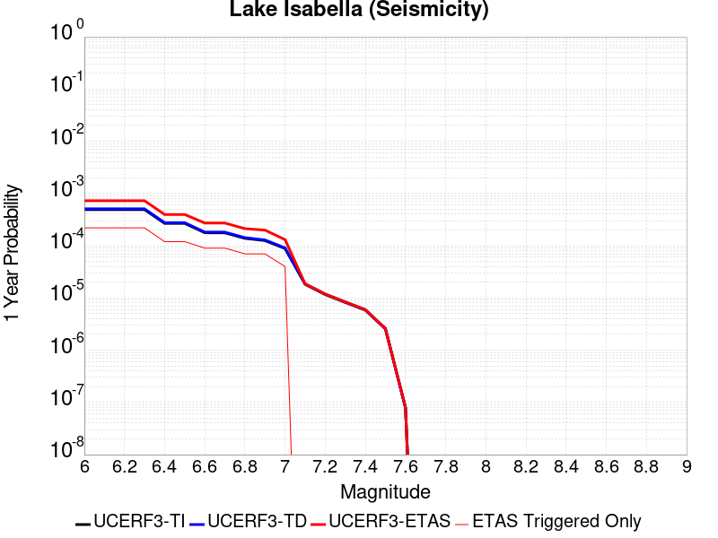 |  |

| Magnitude | 1 wk TI Prob | 1 wk TD Prob | 1 wk ETAS Prob | 1 wk ETAS/TD Gain | 1 wk ETAS Triggered Only | 1 mo TI Prob | 1 mo TD Prob | 1 mo ETAS Prob | 1 mo ETAS/TD Gain | 1 mo ETAS Triggered Only | 1 yr TI Prob | 1 yr TD Prob | 1 yr ETAS Prob | 1 yr ETAS/TD Gain | 1 yr ETAS Triggered Only | 10 yr TI Prob | 10 yr TD Prob | 10 yr ETAS Prob | 10 yr ETAS/TD Gain | 10 yr ETAS Triggered Only |
|-----|-----|-----|-----|-----|-----|-----|-----|-----|-----|-----|-----|-----|-----|-----|-----|-----|-----|-----|-----|-----|
| 6.0 | 9.431637E-6 | 9.741651E-6 | 1.3851788E-4 | 14.219136 | 1.2877748E-4 | 4.0420677E-5 | 4.1749343E-5 | 2.1344547E-4 | 5.112547 | 1.717033E-4 | 4.920106E-4 | 5.0819275E-4 | 7.227128E-4 | 1.4221234 | 2.1462912E-4 | 0.004909227 | 0.005071599 | 0.005370556 | 1.0589472 | 3.0048078E-4 |
| 6.1 | 9.431637E-6 | 9.741651E-6 | 1.3851788E-4 | 14.219136 | 1.2877748E-4 | 4.0420677E-5 | 4.1749343E-5 | 2.1344547E-4 | 5.112547 | 1.717033E-4 | 4.920106E-4 | 5.0819275E-4 | 7.227128E-4 | 1.4221234 | 2.1462912E-4 | 0.004909227 | 0.005071599 | 0.005370556 | 1.0589472 | 3.0048078E-4 |
| 6.2 | 9.431637E-6 | 9.741651E-6 | 1.3851788E-4 | 14.219136 | 1.2877748E-4 | 4.0420677E-5 | 4.1749343E-5 | 2.1344547E-4 | 5.112547 | 1.717033E-4 | 4.920106E-4 | 5.0819275E-4 | 7.227128E-4 | 1.4221234 | 2.1462912E-4 | 0.004909227 | 0.005071599 | 0.005370556 | 1.0589472 | 3.0048078E-4 |
| 6.3 | 9.431637E-6 | 9.741651E-6 | 1.3851788E-4 | 14.219136 | 1.2877748E-4 | 4.0420677E-5 | 4.1749343E-5 | 2.1344547E-4 | 5.112547 | 1.717033E-4 | 4.920106E-4 | 5.0819275E-4 | 7.227128E-4 | 1.4221234 | 2.1462912E-4 | 0.004909227 | 0.005071599 | 0.005370556 | 1.0589472 | 3.0048078E-4 |
| 6.4 | 5.144063E-6 | 5.3000763E-6 | 4.8225673E-5 | 9.099052 | 4.2925825E-5 | 2.2045799E-5 | 2.2714434E-5 | 1.08564134E-4 | 4.779522 | 8.585165E-5 | 2.6837454E-4 | 2.765166E-4 | 4.0525844E-4 | 1.4655846 | 1.2877748E-4 | 0.0026805066 | 0.0027620657 | 0.002976102 | 1.0774914 | 2.1462912E-4 |
| 6.5 | 5.144063E-6 | 5.3000763E-6 | 4.8225673E-5 | 9.099052 | 4.2925825E-5 | 2.2045799E-5 | 2.2714434E-5 | 1.08564134E-4 | 4.779522 | 8.585165E-5 | 2.6837454E-4 | 2.765166E-4 | 4.0525844E-4 | 1.4655846 | 1.2877748E-4 | 0.0026805066 | 0.0027620657 | 0.002976102 | 1.0774914 | 2.1462912E-4 |
| 6.6 | 3.4009804E-6 | 3.498786E-6 | 4.642446E-5 | 13.268733 | 4.2925825E-5 | 1.4575549E-5 | 1.4994721E-5 | 1.0084508E-4 | 6.7253723 | 8.585165E-5 | 1.7744285E-4 | 1.8254704E-4 | 3.11301E-4 | 1.7053194 | 1.2877748E-4 | 0.0017730123 | 0.0018241286 | 0.0019955186 | 1.0939572 | 1.717033E-4 |
| 6.7 | 3.3880428E-6 | 3.4856528E-6 | 4.641133E-5 | 13.3149605 | 4.2925825E-5 | 1.4520103E-5 | 1.4938435E-5 | 1.007888E-4 | 6.746945 | 8.585165E-5 | 1.767679E-4 | 1.8186188E-4 | 3.1061593E-4 | 1.7079772 | 1.2877748E-4 | 0.0017662736 | 0.0018172882 | 0.0019886794 | 1.0943116 | 1.717033E-4 |
| 6.8 | 2.6582E-6 | 2.7337003E-6 | 4.5659406E-5 | 16.70242 | 4.2925825E-5 | 1.1392236E-5 | 1.1715813E-5 | 9.756646E-5 | 8.327758 | 8.585165E-5 | 1.3869164E-4 | 1.4263204E-4 | 2.7139112E-4 | 1.9027363 | 1.2877748E-4 | 0.0013860512 | 0.0014255369 | 0.0015541308 | 1.0902073 | 1.2877748E-4 |
| 6.9 | 2.406011E-6 | 2.4743288E-6 | 4.5400047E-5 | 18.348429 | 4.2925825E-5 | 1.0311434E-5 | 1.0604231E-5 | 9.645497E-5 | 9.095895 | 8.585165E-5 | 1.2553448E-4 | 1.2910018E-4 | 2.5786101E-4 | 1.9973716 | 1.2877748E-4 | 0.0012546359 | 0.0012903814 | 0.0014189928 | 1.0996692 | 1.2877748E-4 |
| 7.0 | 1.6953097E-6 | 1.7429371E-6 | 1.7429371E-6 | 1.0 | 0.0 | 7.265593E-6 | 7.469715E-6 | 7.469715E-6 | 1.0 | 0.0 | 8.8455E-5 | 9.094104E-5 | 1.3386295E-4 | 1.4719753 | 4.2925825E-5 | 8.84198E-4 | 9.09141E-4 | 9.5202774E-4 | 1.0471729 | 4.2925825E-5 |
| 7.1 | 3.5013824E-7 | 3.5714822E-7 | 3.5714822E-7 | 1.0 | 0.0 | 1.5005916E-6 | 1.5306344E-6 | 1.5306344E-6 | 1.0 | 0.0 | 1.826955E-5 | 1.8635317E-5 | 1.8635317E-5 | 1.0 | 0.0 | 1.8268047E-4 | 1.863378E-4 | 1.863378E-4 | 1.0 | 0.0 |
| 7.2 | 2.2321095E-7 | 2.2750574E-7 | 2.2750574E-7 | 1.0 | 0.0 | 9.56618E-7 | 9.750242E-7 | 9.750242E-7 | 1.0 | 0.0 | 1.1646762E-5 | 1.1870856E-5 | 1.1870856E-5 | 1.0 | 0.0 | 1.1646151E-4 | 1.1870232E-4 | 1.1870232E-4 | 1.0 | 0.0 |
| 7.3 | 1.5760406E-7 | 1.6060922E-7 | 1.6060922E-7 | 1.0 | 0.0 | 6.7544585E-7 | 6.8832503E-7 | 6.8832503E-7 | 1.0 | 0.0 | 8.223522E-6 | 8.380326E-6 | 8.380326E-6 | 1.0 | 0.0 | 8.2232174E-5 | 8.3800165E-5 | 8.3800165E-5 | 1.0 | 0.0 |
| 7.4 | 1.1216497E-7 | 1.1431706E-7 | 1.1431706E-7 | 1.0 | 0.0 | 4.8070694E-7 | 4.899302E-7 | 4.899302E-7 | 1.0 | 0.0 | 5.852591E-6 | 5.964884E-6 | 5.964884E-6 | 1.0 | 0.0 | 5.8524372E-5 | 5.9647282E-5 | 5.9647282E-5 | 1.0 | 0.0 |
| 7.5 | 4.885185E-8 | 4.9787737E-8 | 4.9787737E-8 | 1.0 | 0.0 | 2.0936506E-7 | 2.13376E-7 | 2.13376E-7 | 1.0 | 0.0 | 2.5490165E-6 | 2.59785E-6 | 2.59785E-6 | 1.0 | 0.0 | 2.5489873E-5 | 2.5978214E-5 | 2.5978214E-5 | 1.0 | 0.0 |
| 7.6 | 1.504641E-9 | 1.5317903E-9 | 1.5317903E-9 | 1.0 | 0.0 | 6.4484613E-9 | 6.5648154E-9 | 6.5648154E-9 | 1.0 | 0.0 | 7.851001E-8 | 7.992663E-8 | 7.992663E-8 | 1.0 | 0.0 | 7.8509987E-7 | 7.992663E-7 | 7.992663E-7 | 1.0 | 0.0 |

## Manix-Afton Hills
*[(top)](#table-of-contents)*

| 1 Week | 1 Month | 1 Year | 10 Year |
|-----|-----|-----|-----|
|  |  |  |  |

| Magnitude | 1 wk TI Prob | 1 wk TD Prob | 1 wk ETAS Prob | 1 wk ETAS/TD Gain | 1 wk ETAS Triggered Only | 1 mo TI Prob | 1 mo TD Prob | 1 mo ETAS Prob | 1 mo ETAS/TD Gain | 1 mo ETAS Triggered Only | 1 yr TI Prob | 1 yr TD Prob | 1 yr ETAS Prob | 1 yr ETAS/TD Gain | 1 yr ETAS Triggered Only | 10 yr TI Prob | 10 yr TD Prob | 10 yr ETAS Prob | 10 yr ETAS/TD Gain | 10 yr ETAS Triggered Only |
|-----|-----|-----|-----|-----|-----|-----|-----|-----|-----|-----|-----|-----|-----|-----|-----|-----|-----|-----|-----|-----|
| 6.0 | 1.3783202E-5 | 1.47110895E-5 | 1.8641187E-4 | 12.671519 | 1.717033E-4 | 5.906953E-5 | 6.30461E-5 | 3.205848E-4 | 5.0849266 | 2.5755496E-4 | 7.189342E-4 | 7.6733343E-4 | 0.0010675837 | 1.3912904 | 3.0048078E-4 | 0.0071661277 | 0.007648596 | 0.007946778 | 1.0389853 | 3.0048078E-4 |
| 6.1 | 1.3783202E-5 | 1.47110895E-5 | 1.8641187E-4 | 12.671519 | 1.717033E-4 | 5.906953E-5 | 6.30461E-5 | 3.205848E-4 | 5.0849266 | 2.5755496E-4 | 7.189342E-4 | 7.6733343E-4 | 0.0010675837 | 1.3912904 | 3.0048078E-4 | 0.0071661277 | 0.007648596 | 0.007946778 | 1.0389853 | 3.0048078E-4 |
| 6.2 | 1.3783202E-5 | 1.47110895E-5 | 1.8641187E-4 | 12.671519 | 1.717033E-4 | 5.906953E-5 | 6.30461E-5 | 3.205848E-4 | 5.0849266 | 2.5755496E-4 | 7.189342E-4 | 7.6733343E-4 | 0.0010675837 | 1.3912904 | 3.0048078E-4 | 0.0071661277 | 0.007648596 | 0.007946778 | 1.0389853 | 3.0048078E-4 |
| 6.3 | 1.10494875E-5 | 1.1793136E-5 | 1.8349441E-4 | 15.559424 | 1.717033E-4 | 4.7354086E-5 | 5.054109E-5 | 3.0808302E-4 | 6.095694 | 2.5755496E-4 | 5.763835E-4 | 6.151744E-4 | 8.725709E-4 | 1.4184122 | 2.5755496E-4 | 0.005748908 | 0.0061357557 | 0.00639173 | 1.0417185 | 2.5755496E-4 |
| 6.4 | 1.10494875E-5 | 1.1793136E-5 | 1.8349441E-4 | 15.559424 | 1.717033E-4 | 4.7354086E-5 | 5.054109E-5 | 3.0808302E-4 | 6.095694 | 2.5755496E-4 | 5.763835E-4 | 6.151744E-4 | 8.725709E-4 | 1.4184122 | 2.5755496E-4 | 0.005748908 | 0.0061357557 | 0.00639173 | 1.0417185 | 2.5755496E-4 |
| 6.5 | 9.788949E-6 | 1.045432E-5 | 1.3923044E-4 | 13.317983 | 1.2877748E-4 | 4.1951964E-5 | 4.480351E-5 | 2.1649912E-4 | 4.832191 | 1.717033E-4 | 5.1064545E-4 | 5.453555E-4 | 7.169652E-4 | 1.3146749 | 1.717033E-4 | 0.0050947363 | 0.0054410985 | 0.0056118676 | 1.0313851 | 1.717033E-4 |
| 6.6 | 8.810006E-6 | 9.4136285E-6 | 1.3818989E-4 | 14.6797695 | 1.2877748E-4 | 3.775662E-5 | 4.0343548E-5 | 2.1203991E-4 | 5.255857 | 1.717033E-4 | 4.5958988E-4 | 4.9108086E-4 | 6.6269987E-4 | 1.3494719 | 1.717033E-4 | 0.0045864056 | 0.004900839 | 0.005071701 | 1.0348638 | 1.717033E-4 |
| 6.7 | 8.80128E-6 | 9.404108E-6 | 1.3818037E-4 | 14.693618 | 1.2877748E-4 | 3.7719226E-5 | 4.0302748E-5 | 2.1199913E-4 | 5.2601657 | 1.717033E-4 | 4.591348E-4 | 4.9058435E-4 | 6.622034E-4 | 1.3498257 | 1.717033E-4 | 0.004581874 | 0.0048958957 | 0.0050667585 | 1.0348991 | 1.717033E-4 |
| 6.8 | 6.8994877E-6 | 7.380076E-6 | 1.361566E-4 | 18.449213 | 1.2877748E-4 | 2.9568899E-5 | 3.162856E-5 | 2.0332643E-4 | 6.4285703 | 1.717033E-4 | 3.5994186E-4 | 3.8501783E-4 | 5.56655E-4 | 1.4457902 | 1.717033E-4 | 0.003593594 | 0.0038443129 | 0.0040153563 | 1.0444925 | 1.717033E-4 |
| 6.9 | 4.9328037E-6 | 5.2709615E-6 | 1.3404776E-4 | 25.431368 | 1.2877748E-4 | 2.1140417E-5 | 2.2589675E-5 | 1.942891E-4 | 8.600792 | 1.717033E-4 | 2.5735417E-4 | 2.7500073E-4 | 4.466568E-4 | 1.6242023 | 1.717033E-4 | 0.0025705635 | 0.0027472095 | 0.002918441 | 1.0623293 | 1.717033E-4 |
| 7.0 | 3.347973E-6 | 3.59003E-6 | 4.65157E-5 | 12.956911 | 4.2925825E-5 | 1.4348378E-5 | 1.5385775E-5 | 5.831094E-5 | 3.7899253 | 4.2925825E-5 | 1.746775E-4 | 1.8730981E-4 | 2.302276E-4 | 1.2291273 | 4.2925825E-5 | 0.0017454025 | 0.0018719219 | 0.0019147674 | 1.0228885 | 4.2925825E-5 |
| 7.1 | 1.2073567E-6 | 1.293482E-6 | 4.421925E-5 | 34.18621 | 4.2925825E-5 | 5.1743755E-6 | 5.543492E-6 | 4.846908E-5 | 8.74342 | 4.2925825E-5 | 6.29962E-5 | 6.749156E-5 | 1.1041448E-4 | 1.6359748 | 4.2925825E-5 | 6.297835E-4 | 6.7487074E-4 | 7.1776763E-4 | 1.0635631 | 4.2925825E-5 |

## Pinto Mtn
*[(top)](#table-of-contents)*

| 1 Week | 1 Month | 1 Year | 10 Year |
|-----|-----|-----|-----|
|  |  |  |  |

| Magnitude | 1 wk TI Prob | 1 wk TD Prob | 1 wk ETAS Prob | 1 wk ETAS/TD Gain | 1 wk ETAS Triggered Only | 1 mo TI Prob | 1 mo TD Prob | 1 mo ETAS Prob | 1 mo ETAS/TD Gain | 1 mo ETAS Triggered Only | 1 yr TI Prob | 1 yr TD Prob | 1 yr ETAS Prob | 1 yr ETAS/TD Gain | 1 yr ETAS Triggered Only | 10 yr TI Prob | 10 yr TD Prob | 10 yr ETAS Prob | 10 yr ETAS/TD Gain | 10 yr ETAS Triggered Only |
|-----|-----|-----|-----|-----|-----|-----|-----|-----|-----|-----|-----|-----|-----|-----|-----|-----|-----|-----|-----|-----|
| 6.0 | 4.4194956E-5 | 4.7853926E-5 | 1.7662524E-4 | 3.6909246 | 1.2877748E-4 | 1.893932E-4 | 2.0507304E-4 | 3.338241E-4 | 1.6278303 | 1.2877748E-4 | 0.0023034236 | 0.0024940688 | 0.0027509814 | 1.1030095 | 2.5755496E-4 | 0.022796938 | 0.024678305 | 0.02497137 | 1.0118754 | 3.0048078E-4 |
| 6.1 | 4.4194956E-5 | 4.7853926E-5 | 1.7662524E-4 | 3.6909246 | 1.2877748E-4 | 1.893932E-4 | 2.0507304E-4 | 3.338241E-4 | 1.6278303 | 1.2877748E-4 | 0.0023034236 | 0.0024940688 | 0.0027509814 | 1.1030095 | 2.5755496E-4 | 0.022796938 | 0.024678305 | 0.02497137 | 1.0118754 | 3.0048078E-4 |
| 6.2 | 4.4194956E-5 | 4.7853926E-5 | 1.7662524E-4 | 3.6909246 | 1.2877748E-4 | 1.893932E-4 | 2.0507304E-4 | 3.338241E-4 | 1.6278303 | 1.2877748E-4 | 0.0023034236 | 0.0024940688 | 0.0027509814 | 1.1030095 | 2.5755496E-4 | 0.022796938 | 0.024678305 | 0.02497137 | 1.0118754 | 3.0048078E-4 |
| 6.3 | 4.4194956E-5 | 4.7853926E-5 | 1.7662524E-4 | 3.6909246 | 1.2877748E-4 | 1.893932E-4 | 2.0507304E-4 | 3.338241E-4 | 1.6278303 | 1.2877748E-4 | 0.0023034236 | 0.0024940688 | 0.0027509814 | 1.1030095 | 2.5755496E-4 | 0.022796938 | 0.024678305 | 0.02497137 | 1.0118754 | 3.0048078E-4 |
| 6.4 | 3.729929E-5 | 3.960349E-5 | 1.6837586E-4 | 4.251541 | 1.2877748E-4 | 1.5984432E-4 | 1.6971873E-4 | 2.9847433E-4 | 1.7586412 | 1.2877748E-4 | 0.0019443673 | 0.0020644604 | 0.0022786465 | 1.1037492 | 2.1462912E-4 | 0.019274427 | 0.020462848 | 0.020673085 | 1.010274 | 2.1462912E-4 |
| 6.5 | 3.729929E-5 | 3.960349E-5 | 1.6837586E-4 | 4.251541 | 1.2877748E-4 | 1.5984432E-4 | 1.6971873E-4 | 2.9847433E-4 | 1.7586412 | 1.2877748E-4 | 0.0019443673 | 0.0020644604 | 0.0022786465 | 1.1037492 | 2.1462912E-4 | 0.019274427 | 0.020462848 | 0.020673085 | 1.010274 | 2.1462912E-4 |
| 6.6 | 3.0204548E-5 | 3.12056E-5 | 1.1705457E-4 | 3.7510757 | 8.585165E-5 | 1.2944164E-4 | 1.3373162E-4 | 2.195718E-4 | 1.6418839 | 8.585165E-5 | 0.0015748127 | 0.0016270012 | 0.0017984252 | 1.1053619 | 1.717033E-4 | 0.015636992 | 0.016154764 | 0.016323693 | 1.0104569 | 1.717033E-4 |
| 6.7 | 2.9857754E-5 | 3.0814987E-5 | 1.16663985E-4 | 3.78595 | 8.585165E-5 | 1.2795553E-4 | 1.3205773E-4 | 2.1789804E-4 | 1.6500211 | 8.585165E-5 | 0.0015567453 | 0.0016066517 | 0.0017780791 | 1.1066985 | 1.717033E-4 | 0.015458848 | 0.015954204 | 0.016123168 | 1.0105906 | 1.717033E-4 |
| 6.8 | 2.4819734E-5 | 2.5009665E-5 | 6.7934416E-5 | 2.7163265 | 4.2925825E-5 | 1.0636595E-4 | 1.0718E-4 | 1.5010123E-4 | 1.4004593 | 4.2925825E-5 | 0.0012942362 | 0.001304157 | 0.0014327666 | 1.098615 | 1.2877748E-4 | 0.012867244 | 0.012967403 | 0.013094511 | 1.0098021 | 1.2877748E-4 |
| 6.9 | 2.331124E-5 | 2.3337945E-5 | 2.3337945E-5 | 1.0 | 0.0 | 9.990149E-5 | 1.0001605E-4 | 1.0001605E-4 | 1.0 | 0.0 | 0.001215622 | 0.0012170355 | 0.0013027827 | 1.0704558 | 8.585165E-5 | 0.012089936 | 0.012105897 | 0.01219071 | 1.0070058 | 8.585165E-5 |
| 7.0 | 2.1818534E-5 | 2.1761074E-5 | 2.1761074E-5 | 1.0 | 0.0 | 9.3504656E-5 | 9.3258524E-5 | 9.3258524E-5 | 1.0 | 0.0 | 0.0011378246 | 0.0011348509 | 0.0012206051 | 1.0755643 | 8.585165E-5 | 0.011320163 | 0.01129266 | 0.011377541 | 1.0075166 | 8.585165E-5 |
| 7.1 | 2.066081E-5 | 2.0540718E-5 | 2.0540718E-5 | 1.0 | 0.0 | 8.854332E-5 | 8.8028784E-5 | 8.8028784E-5 | 1.0 | 0.0 | 0.0010774818 | 0.0010712431 | 0.0011570028 | 1.0800562 | 8.585165E-5 | 0.010722724 | 0.0106628435 | 0.01074778 | 1.0079657 | 8.585165E-5 |
| 7.2 | 1.8990233E-5 | 1.9054001E-5 | 1.9054001E-5 | 1.0 | 0.0 | 8.138417E-5 | 8.165756E-5 | 8.165756E-5 | 1.0 | 0.0 | 9.904018E-4 | 9.937467E-4 | 0.001079513 | 1.086306 | 8.585165E-5 | 0.009859995 | 0.009895029 | 0.009980031 | 1.0085903 | 8.585165E-5 |
| 7.3 | 1.3335872E-5 | 1.4906713E-5 | 1.4906713E-5 | 1.0 | 0.0 | 5.7152483E-5 | 6.388442E-5 | 6.388442E-5 | 1.0 | 0.0 | 6.956093E-4 | 7.77528E-4 | 8.6331286E-4 | 1.1103303 | 8.585165E-5 | 0.006934359 | 0.007749376 | 0.007834562 | 1.0109926 | 8.585165E-5 |
| 7.4 | 9.414066E-6 | 1.186096E-5 | 1.186096E-5 | 1.0 | 0.0 | 4.0345374E-5 | 5.083175E-5 | 5.083175E-5 | 1.0 | 0.0 | 4.910942E-4 | 6.1871024E-4 | 6.616095E-4 | 1.0693367 | 4.2925825E-5 | 0.0049001034 | 0.0061708256 | 0.006213486 | 1.0069133 | 4.2925825E-5 |
| 7.5 | 7.2101157E-6 | 9.158192E-6 | 9.158192E-6 | 1.0 | 0.0 | 3.090013E-5 | 3.9248847E-5 | 3.9248847E-5 | 1.0 | 0.0 | 3.7614413E-4 | 4.7775774E-4 | 5.2066304E-4 | 1.0898056 | 4.2925825E-5 | 0.0037550807 | 0.004768082 | 0.004810803 | 1.0089598 | 4.2925825E-5 |
| 7.6 | 3.296375E-6 | 4.5455017E-6 | 4.5455017E-6 | 1.0 | 0.0 | 1.4127245E-5 | 1.9480583E-5 | 1.9480583E-5 | 1.0 | 0.0 | 1.7198564E-4 | 2.3715167E-4 | 2.8006732E-4 | 1.1809628 | 4.2925825E-5 | 0.0017185259 | 0.0023691233 | 0.0024119476 | 1.018076 | 4.2925825E-5 |
| 7.7 | 2.5741092E-6 | 3.5844084E-6 | 3.5844084E-6 | 1.0 | 0.0 | 1.103185E-5 | 1.5361667E-5 | 1.5361667E-5 | 1.0 | 0.0 | 1.3430449E-4 | 1.8701357E-4 | 2.2993136E-4 | 1.2294903 | 4.2925825E-5 | 0.0013422335 | 0.0018686918 | 0.0019115374 | 1.0229281 | 4.2925825E-5 |

## San Jacinto (Lytle Creek connector)
*[(top)](#table-of-contents)*

| 1 Week | 1 Month | 1 Year | 10 Year |
|-----|-----|-----|-----|
| 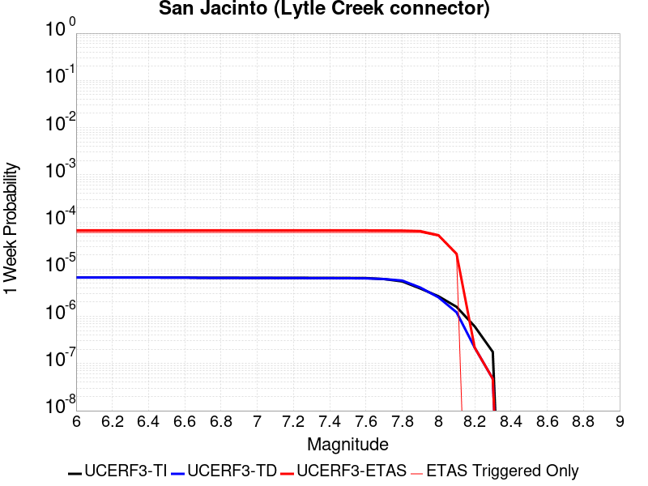 |  | 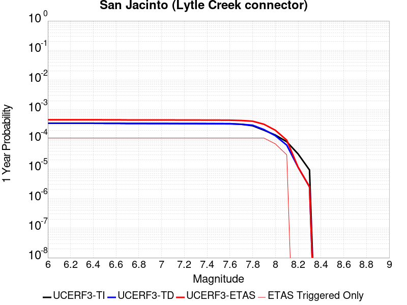 |  |

| Magnitude | 1 wk TI Prob | 1 wk TD Prob | 1 wk ETAS Prob | 1 wk ETAS/TD Gain | 1 wk ETAS Triggered Only | 1 mo TI Prob | 1 mo TD Prob | 1 mo ETAS Prob | 1 mo ETAS/TD Gain | 1 mo ETAS Triggered Only | 1 yr TI Prob | 1 yr TD Prob | 1 yr ETAS Prob | 1 yr ETAS/TD Gain | 1 yr ETAS Triggered Only | 10 yr TI Prob | 10 yr TD Prob | 10 yr ETAS Prob | 10 yr ETAS/TD Gain | 10 yr ETAS Triggered Only |
|-----|-----|-----|-----|-----|-----|-----|-----|-----|-----|-----|-----|-----|-----|-----|-----|-----|-----|-----|-----|-----|
| 6.0 | 6.693995E-6 | 6.660123E-6 | 1.7836227E-4 | 26.780628 | 1.717033E-4 | 2.8688235E-5 | 2.8543072E-5 | 2.4316607E-4 | 8.519267 | 2.1462912E-4 | 3.492233E-4 | 3.4745657E-4 | 5.620111E-4 | 1.6175003 | 2.1462912E-4 | 0.00348675 | 0.0035491167 | 0.0038057575 | 1.0723112 | 2.5755496E-4 |
| 6.1 | 6.693995E-6 | 6.660123E-6 | 1.7836227E-4 | 26.780628 | 1.717033E-4 | 2.8688235E-5 | 2.8543072E-5 | 2.4316607E-4 | 8.519267 | 2.1462912E-4 | 3.492233E-4 | 3.4745657E-4 | 5.620111E-4 | 1.6175003 | 2.1462912E-4 | 0.00348675 | 0.0035491167 | 0.0038057575 | 1.0723112 | 2.5755496E-4 |
| 6.2 | 6.693995E-6 | 6.660123E-6 | 1.7836227E-4 | 26.780628 | 1.717033E-4 | 2.8688235E-5 | 2.8543072E-5 | 2.4316607E-4 | 8.519267 | 2.1462912E-4 | 3.492233E-4 | 3.4745657E-4 | 5.620111E-4 | 1.6175003 | 2.1462912E-4 | 0.00348675 | 0.0035491167 | 0.0038057575 | 1.0723112 | 2.5755496E-4 |
| 6.3 | 6.693995E-6 | 6.660123E-6 | 1.7836227E-4 | 26.780628 | 1.717033E-4 | 2.8688235E-5 | 2.8543072E-5 | 2.4316607E-4 | 8.519267 | 2.1462912E-4 | 3.492233E-4 | 3.4745657E-4 | 5.620111E-4 | 1.6175003 | 2.1462912E-4 | 0.00348675 | 0.0035491167 | 0.0038057575 | 1.0723112 | 2.5755496E-4 |
| 6.4 | 6.693995E-6 | 6.660123E-6 | 1.7836227E-4 | 26.780628 | 1.717033E-4 | 2.8688235E-5 | 2.8543072E-5 | 2.4316607E-4 | 8.519267 | 2.1462912E-4 | 3.492233E-4 | 3.4745657E-4 | 5.620111E-4 | 1.6175003 | 2.1462912E-4 | 0.00348675 | 0.0035491167 | 0.0038057575 | 1.0723112 | 2.5755496E-4 |
| 6.5 | 6.6561875E-6 | 6.620341E-6 | 1.783225E-4 | 26.935547 | 1.717033E-4 | 2.8526205E-5 | 2.8372582E-5 | 2.4299561E-4 | 8.564452 | 2.1462912E-4 | 3.472512E-4 | 3.453815E-4 | 5.599365E-4 | 1.6212115 | 2.1462912E-4 | 0.0034670907 | 0.0035284322 | 0.0037850784 | 1.0727366 | 2.5755496E-4 |
| 6.6 | 6.6561875E-6 | 6.620341E-6 | 1.783225E-4 | 26.935547 | 1.717033E-4 | 2.8526205E-5 | 2.8372582E-5 | 2.4299561E-4 | 8.564452 | 2.1462912E-4 | 3.472512E-4 | 3.453815E-4 | 5.599365E-4 | 1.6212115 | 2.1462912E-4 | 0.0034670907 | 0.0035284322 | 0.0037850784 | 1.0727366 | 2.5755496E-4 |
| 6.7 | 6.5802237E-6 | 6.539518E-6 | 1.782417E-4 | 27.25609 | 1.717033E-4 | 2.8200653E-5 | 2.8026205E-5 | 2.4264932E-4 | 8.657945 | 2.1462912E-4 | 3.4328885E-4 | 3.4116567E-4 | 5.557216E-4 | 1.6288906 | 2.1462912E-4 | 0.0034275902 | 0.0034864065 | 0.0037430637 | 1.0736165 | 2.5755496E-4 |
| 6.8 | 6.575632E-6 | 6.5340073E-6 | 1.7823618E-4 | 27.278234 | 1.717033E-4 | 2.8180975E-5 | 2.8002589E-5 | 2.426257E-4 | 8.664403 | 2.1462912E-4 | 3.4304935E-4 | 3.4087826E-4 | 5.554342E-4 | 1.6294211 | 2.1462912E-4 | 0.0034252026 | 0.0034835413 | 0.0037401991 | 1.0736773 | 2.5755496E-4 |
| 6.9 | 6.570433E-6 | 6.525401E-6 | 1.7822758E-4 | 27.312891 | 1.717033E-4 | 2.8158694E-5 | 2.7965707E-5 | 2.4258882E-4 | 8.674511 | 2.1462912E-4 | 3.4277816E-4 | 3.4042934E-4 | 5.549854E-4 | 1.6302513 | 2.1462912E-4 | 0.0034224992 | 0.0034790665 | 0.0037357253 | 1.0737723 | 2.5755496E-4 |
| 7.0 | 6.5643826E-6 | 6.5155223E-6 | 1.782177E-4 | 27.352787 | 1.717033E-4 | 2.8132765E-5 | 2.7923368E-5 | 2.4254649E-4 | 8.686148 | 2.1462912E-4 | 3.424626E-4 | 3.3991406E-4 | 5.544702E-4 | 1.6312071 | 2.1462912E-4 | 0.0034193532 | 0.0034739296 | 0.0037305898 | 1.0738819 | 2.5755496E-4 |
| 7.1 | 6.557402E-6 | 6.504234E-6 | 1.7820642E-4 | 27.398523 | 1.717033E-4 | 2.8102848E-5 | 2.7874992E-5 | 2.4249814E-4 | 8.699487 | 2.1462912E-4 | 3.4209844E-4 | 3.3932526E-4 | 5.538815E-4 | 1.6323028 | 2.1462912E-4 | 0.0034157229 | 0.0034680606 | 0.0037247224 | 1.0740073 | 2.5755496E-4 |
| 7.2 | 6.546394E-6 | 6.4862006E-6 | 1.7818838E-4 | 27.47192 | 1.717033E-4 | 2.8055672E-5 | 2.7797707E-5 | 2.4242087E-4 | 8.720895 | 2.1462912E-4 | 3.4152428E-4 | 3.383846E-4 | 5.5294106E-4 | 1.6340611 | 2.1462912E-4 | 0.0034099987 | 0.0034586883 | 0.0037153524 | 1.0742085 | 2.5755496E-4 |
| 7.3 | 6.5364216E-6 | 6.4669857E-6 | 1.7816917E-4 | 27.550575 | 1.717033E-4 | 2.8012933E-5 | 2.771536E-5 | 2.4233853E-4 | 8.743835 | 2.1462912E-4 | 3.4100408E-4 | 3.373823E-4 | 5.51939E-4 | 1.6359453 | 2.1462912E-4 | 0.003404813 | 0.0034487103 | 0.003705377 | 1.074424 | 2.5755496E-4 |
| 7.4 | 6.5269523E-6 | 6.4480723E-6 | 1.7815027E-4 | 27.628452 | 1.717033E-4 | 2.7972354E-5 | 2.7634303E-5 | 2.4225749E-4 | 8.76655 | 2.1462912E-4 | 3.4051016E-4 | 3.3639578E-4 | 5.509527E-4 | 1.637811 | 2.1462912E-4 | 0.0033998888 | 0.0034388923 | 0.0036955616 | 1.0746372 | 2.5755496E-4 |
| 7.5 | 6.5111835E-6 | 6.424346E-6 | 1.7812655E-4 | 27.726797 | 1.717033E-4 | 2.7904773E-5 | 2.753262E-5 | 2.4215583E-4 | 8.795234 | 2.1462912E-4 | 3.3968766E-4 | 3.3515817E-4 | 5.4971536E-4 | 1.640167 | 2.1462912E-4 | 0.0033916887 | 0.0034265644 | 0.0036832367 | 1.0749066 | 2.5755496E-4 |
| 7.6 | 6.4768806E-6 | 6.383454E-6 | 1.7808565E-4 | 27.898008 | 1.717033E-4 | 2.7757764E-5 | 2.7357375E-5 | 2.4198063E-4 | 8.84517 | 2.1462912E-4 | 3.3789838E-4 | 3.330252E-4 | 5.4758287E-4 | 1.6442685 | 2.1462912E-4 | 0.0033738504 | 0.0034052972 | 0.003661975 | 1.075376 | 2.5755496E-4 |
| 7.7 | 6.1655364E-6 | 6.1759456E-6 | 1.7787819E-4 | 28.801773 | 1.717033E-4 | 2.642346E-5 | 2.646807E-5 | 2.410915E-4 | 9.108768 | 2.1462912E-4 | 3.2165812E-4 | 3.2220117E-4 | 5.3676113E-4 | 1.6659193 | 2.1462912E-4 | 0.0032119295 | 0.0032969362 | 0.003553642 | 1.0778619 | 2.5755496E-4 |
| 7.8 | 5.5043524E-6 | 5.7370175E-6 | 1.7743933E-4 | 30.928844 | 1.717033E-4 | 2.3589868E-5 | 2.4586987E-5 | 2.3921083E-4 | 9.729164 | 2.1462912E-4 | 2.871688E-4 | 2.993055E-4 | 5.138704E-4 | 1.7168758 | 2.1462912E-4 | 0.0028679797 | 0.0030670585 | 0.0033238237 | 1.083717 | 2.5755496E-4 |
| 7.9 | 3.889249E-6 | 4.0766436E-6 | 1.7577923E-4 | 43.118618 | 1.717033E-4 | 1.6668104E-5 | 1.7471213E-5 | 2.3209659E-4 | 13.284514 | 2.1462912E-4 | 2.0291525E-4 | 2.126913E-4 | 4.2727476E-4 | 2.0088964 | 2.1462912E-4 | 0.0020273007 | 0.0021941073 | 0.0024510971 | 1.1171273 | 2.5755496E-4 |
| 8.0 | 2.668535E-6 | 2.5313454E-6 | 1.7423421E-4 | 68.83067 | 1.717033E-4 | 1.1436528E-5 | 1.0848577E-5 | 1.8255001E-4 | 16.827091 | 1.717033E-4 | 1.3923083E-4 | 1.3207346E-4 | 3.037541E-4 | 2.2998874 | 1.717033E-4 | 0.0013914363 | 0.0013755665 | 0.0015470337 | 1.124652 | 1.717033E-4 |
| 8.1 | 1.5911459E-6 | 1.2185134E-6 | 4.4144286E-5 | 36.227985 | 4.2925825E-5 | 6.8191785E-6 | 5.2221894E-6 | 4.814779E-5 | 9.219847 | 4.2925825E-5 | 8.3020335E-5 | 6.357832E-5 | 1.0650142E-4 | 1.6751215 | 4.2925825E-5 | 8.298933E-4 | 6.6911156E-4 | 7.120086E-4 | 1.0641105 | 4.2925825E-5 |
| 8.2 | 6.1294963E-7 | 2.1802066E-7 | 2.1802066E-7 | 1.0 | 0.0 | 2.6269242E-6 | 9.3437393E-7 | 9.3437393E-7 | 1.0 | 0.0 | 3.1982334E-5 | 1.1375943E-5 | 1.1375943E-5 | 1.0 | 0.0 | 3.1977732E-4 | 1.2778955E-4 | 1.2778955E-4 | 1.0 | 0.0 |
| 8.3 | 1.762871E-7 | 4.7516316E-8 | 4.7516316E-8 | 1.0 | 0.0 | 7.5551594E-7 | 2.0364133E-7 | 2.0364133E-7 | 1.0 | 0.0 | 9.1983675E-6 | 2.4793305E-6 | 2.4793305E-6 | 1.0 | 0.0 | 9.197987E-5 | 2.8671833E-5 | 2.8671833E-5 | 1.0 | 0.0 |

## San Jacinto (Anza) rev
*[(top)](#table-of-contents)*

| 1 Week | 1 Month | 1 Year | 10 Year |
|-----|-----|-----|-----|
|  | 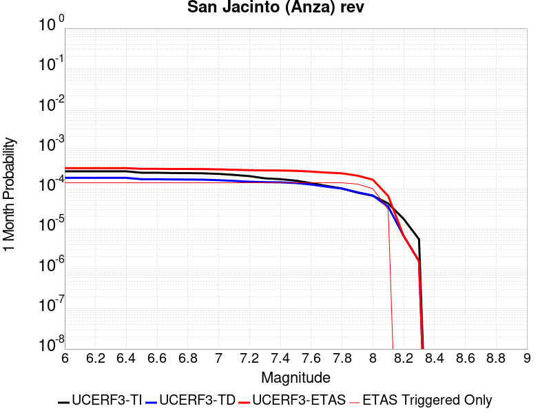 |  |  |

| Magnitude | 1 wk TI Prob | 1 wk TD Prob | 1 wk ETAS Prob | 1 wk ETAS/TD Gain | 1 wk ETAS Triggered Only | 1 mo TI Prob | 1 mo TD Prob | 1 mo ETAS Prob | 1 mo ETAS/TD Gain | 1 mo ETAS Triggered Only | 1 yr TI Prob | 1 yr TD Prob | 1 yr ETAS Prob | 1 yr ETAS/TD Gain | 1 yr ETAS Triggered Only | 10 yr TI Prob | 10 yr TD Prob | 10 yr ETAS Prob | 10 yr ETAS/TD Gain | 10 yr ETAS Triggered Only |
|-----|-----|-----|-----|-----|-----|-----|-----|-----|-----|-----|-----|-----|-----|-----|-----|-----|-----|-----|-----|-----|
| 6.0 | 6.3015636E-5 | 4.3298347E-5 | 2.1499422E-4 | 4.9654136 | 1.717033E-4 | 2.7003905E-4 | 1.8555121E-4 | 4.4305838E-4 | 2.3877957 | 2.5755496E-4 | 0.0032827691 | 0.0022567573 | 0.0025137311 | 1.1138686 | 2.5755496E-4 | 0.032346968 | 0.02329361 | 0.023545166 | 1.0107993 | 2.5755496E-4 |
| 6.1 | 6.3015636E-5 | 4.3298347E-5 | 2.1499422E-4 | 4.9654136 | 1.717033E-4 | 2.7003905E-4 | 1.8555121E-4 | 4.4305838E-4 | 2.3877957 | 2.5755496E-4 | 0.0032827691 | 0.0022567573 | 0.0025137311 | 1.1138686 | 2.5755496E-4 | 0.032346968 | 0.02329361 | 0.023545166 | 1.0107993 | 2.5755496E-4 |
| 6.2 | 6.3015636E-5 | 4.3298347E-5 | 2.1499422E-4 | 4.9654136 | 1.717033E-4 | 2.7003905E-4 | 1.8555121E-4 | 4.4305838E-4 | 2.3877957 | 2.5755496E-4 | 0.0032827691 | 0.0022567573 | 0.0025137311 | 1.1138686 | 2.5755496E-4 | 0.032346968 | 0.02329361 | 0.023545166 | 1.0107993 | 2.5755496E-4 |
| 6.3 | 6.3015636E-5 | 4.3298347E-5 | 2.1499422E-4 | 4.9654136 | 1.717033E-4 | 2.7003905E-4 | 1.8555121E-4 | 4.4305838E-4 | 2.3877957 | 2.5755496E-4 | 0.0032827691 | 0.0022567573 | 0.0025137311 | 1.1138686 | 2.5755496E-4 | 0.032346968 | 0.02329361 | 0.023545166 | 1.0107993 | 2.5755496E-4 |
| 6.4 | 6.3015636E-5 | 4.3298347E-5 | 2.1499422E-4 | 4.9654136 | 1.717033E-4 | 2.7003905E-4 | 1.8555121E-4 | 4.4305838E-4 | 2.3877957 | 2.5755496E-4 | 0.0032827691 | 0.0022567573 | 0.0025137311 | 1.1138686 | 2.5755496E-4 | 0.032346968 | 0.02329361 | 0.023545166 | 1.0107993 | 2.5755496E-4 |
| 6.5 | 5.811017E-5 | 4.0080286E-5 | 2.117767E-4 | 5.283812 | 1.717033E-4 | 2.4901982E-4 | 1.7176138E-4 | 4.2927207E-4 | 2.4992352 | 2.5755496E-4 | 0.0030276014 | 0.0020891947 | 0.0023462116 | 1.123022 | 2.5755496E-4 | 0.02986684 | 0.021590833 | 0.021842828 | 1.0116713 | 2.5755496E-4 |
| 6.6 | 5.811017E-5 | 4.0080286E-5 | 2.117767E-4 | 5.283812 | 1.717033E-4 | 2.4901982E-4 | 1.7176138E-4 | 4.2927207E-4 | 2.4992352 | 2.5755496E-4 | 0.0030276014 | 0.0020891947 | 0.0023462116 | 1.123022 | 2.5755496E-4 | 0.02986684 | 0.021590833 | 0.021842828 | 1.0116713 | 2.5755496E-4 |
| 6.7 | 5.712442E-5 | 3.950301E-5 | 2.1119953E-4 | 5.3464155 | 1.717033E-4 | 2.4479596E-4 | 1.6928767E-4 | 4.26799E-4 | 2.5211465 | 2.5755496E-4 | 0.0029763177 | 0.0020591344 | 0.0023161592 | 1.1248217 | 2.5755496E-4 | 0.029367693 | 0.021282919 | 0.02153499 | 1.0118439 | 2.5755496E-4 |
| 6.8 | 5.6967532E-5 | 3.93593E-5 | 2.1105584E-4 | 5.3622866 | 1.717033E-4 | 2.4412372E-4 | 1.6867183E-4 | 4.2618334E-4 | 2.5267012 | 2.5755496E-4 | 0.0029681553 | 0.0020516508 | 0.0023086774 | 1.1252779 | 2.5755496E-4 | 0.029288229 | 0.02120852 | 0.021460611 | 1.0118864 | 2.5755496E-4 |
| 6.9 | 5.6211324E-5 | 3.9064216E-5 | 2.107608E-4 | 5.3952394 | 1.717033E-4 | 2.4088343E-4 | 1.6740736E-4 | 4.2491918E-4 | 2.538235 | 2.5755496E-4 | 0.0029288116 | 0.0020362847 | 0.0022933153 | 1.1262252 | 2.5755496E-4 | 0.028905109 | 0.021047527 | 0.021299662 | 1.0119792 | 2.5755496E-4 |
| 7.0 | 5.4383527E-5 | 3.7925012E-5 | 2.096218E-4 | 5.5272703 | 1.717033E-4 | 2.3305144E-4 | 1.6252567E-4 | 4.2003876E-4 | 2.5844457 | 2.5755496E-4 | 0.0028337094 | 0.001976959 | 0.0022340047 | 1.1300207 | 2.5755496E-4 | 0.027978465 | 0.02044095 | 0.02069324 | 1.0123425 | 2.5755496E-4 |
| 7.1 | 5.1393665E-5 | 3.638787E-5 | 2.0808492E-4 | 5.7185245 | 1.717033E-4 | 2.2023996E-4 | 1.5593872E-4 | 4.134535E-4 | 2.6513846 | 2.5755496E-4 | 0.0026781242 | 0.0018969048 | 0.0021539712 | 1.1355189 | 2.5755496E-4 | 0.026460782 | 0.019616077 | 0.019868579 | 1.0128722 | 2.5755496E-4 |
| 7.2 | 4.785222E-5 | 3.4738845E-5 | 2.0643618E-4 | 5.9425173 | 1.717033E-4 | 2.0506482E-4 | 1.4887229E-4 | 4.063889E-4 | 2.729782 | 2.5755496E-4 | 0.0024938055 | 0.0018110167 | 0.0020681052 | 1.1419581 | 2.5755496E-4 | 0.024660049 | 0.018728783 | 0.018981514 | 1.0134943 | 2.5755496E-4 |
| 7.3 | 4.2143256E-5 | 3.3834414E-5 | 2.055319E-4 | 6.0746408 | 1.717033E-4 | 1.8060145E-4 | 1.449966E-4 | 4.0251418E-4 | 2.7760253 | 2.5755496E-4 | 0.002196605 | 0.0017639075 | 0.0020210082 | 1.1457564 | 2.5755496E-4 | 0.02175019 | 0.018236695 | 0.018489555 | 1.0138654 | 2.5755496E-4 |
| 7.4 | 4.0264713E-5 | 3.3472694E-5 | 2.0517025E-4 | 6.129481 | 1.717033E-4 | 1.7255165E-4 | 1.4344654E-4 | 4.0096452E-4 | 2.7952194 | 2.5755496E-4 | 0.002098792 | 0.0017450659 | 0.0020021715 | 1.1473328 | 2.5755496E-4 | 0.020790804 | 0.018041389 | 0.018294297 | 1.0140182 | 2.5755496E-4 |
| 7.5 | 3.694492E-5 | 3.2186905E-5 | 2.0388467E-4 | 6.3343983 | 1.717033E-4 | 1.5832575E-4 | 1.379366E-4 | 3.95456E-4 | 2.8669405 | 2.5755496E-4 | 0.0019259118 | 0.0016780876 | 0.0019352103 | 1.1532236 | 2.5755496E-4 | 0.01909306 | 0.017357888 | 0.017610973 | 1.0145804 | 2.5755496E-4 |
| 7.6 | 3.200565E-5 | 2.9502702E-5 | 2.0120094E-4 | 6.819746 | 1.717033E-4 | 1.3715986E-4 | 1.2643404E-4 | 3.8395642E-4 | 3.036812 | 2.5755496E-4 | 0.001668642 | 0.0015382497 | 0.0017954084 | 1.1671762 | 2.5755496E-4 | 0.01656168 | 0.015946016 | 0.016199464 | 1.0158942 | 2.5755496E-4 |
| 7.7 | 2.731642E-5 | 2.6091477E-5 | 1.9779029E-4 | 7.580648 | 1.717033E-4 | 1.1706512E-4 | 1.11815825E-4 | 3.6934196E-4 | 3.303128 | 2.5755496E-4 | 0.001424336 | 0.0013605085 | 0.001617713 | 1.1890503 | 2.5755496E-4 | 0.014152412 | 0.0141668 | 0.014420706 | 1.0179226 | 2.5755496E-4 |
| 7.8 | 2.3466424E-5 | 2.3503619E-5 | 1.9520288E-4 | 8.305226 | 1.717033E-4 | 1.0056651E-4 | 1.0072591E-4 | 3.582549E-4 | 3.5567305 | 2.5755496E-4 | 0.0012237094 | 0.0012256489 | 0.0014828881 | 1.2098801 | 2.5755496E-4 | 0.012169928 | 0.012808796 | 0.013063053 | 1.0198501 | 2.5755496E-4 |
| 7.9 | 1.8611925E-5 | 1.890698E-5 | 1.9060702E-4 | 10.081305 | 1.717033E-4 | 7.9762955E-5 | 8.10274E-5 | 3.3856148E-4 | 4.178358 | 2.5755496E-4 | 9.7068126E-4 | 9.860628E-4 | 0.0012433638 | 1.2609377 | 2.5755496E-4 | 0.0096645225 | 0.010393705 | 0.010648583 | 1.0245223 | 2.5755496E-4 |
| 8.0 | 1.5460775E-5 | 1.5739915E-5 | 1.8744051E-4 | 11.908609 | 1.717033E-4 | 6.6258784E-5 | 6.745504E-5 | 2.3914676E-4 | 3.5452764 | 1.717033E-4 | 8.0640207E-4 | 8.2095637E-4 | 9.925187E-4 | 1.2089787 | 1.717033E-4 | 0.008034821 | 0.008702706 | 0.008872915 | 1.0195582 | 1.717033E-4 |
| 8.1 | 9.983884E-6 | 8.268954E-6 | 5.1194424E-5 | 6.1911607 | 4.2925825E-5 | 4.2787375E-5 | 3.5437897E-5 | 7.83622E-5 | 2.2112544 | 4.2925825E-5 | 5.2081177E-4 | 4.313715E-4 | 4.742788E-4 | 1.0994672 | 4.2925825E-5 | 0.0051959283 | 0.00463968 | 0.004682407 | 1.0092089 | 4.2925825E-5 |
| 8.2 | 4.1226E-6 | 1.5522551E-6 | 1.5522551E-6 | 1.0 | 0.0 | 1.7668166E-5 | 6.6525045E-6 | 6.6525045E-6 | 1.0 | 0.0 | 2.1508869E-4 | 8.099126E-5 | 8.099126E-5 | 1.0 | 0.0 | 0.0021488064 | 9.401847E-4 | 9.401847E-4 | 1.0 | 0.0 |
| 8.3 | 1.2750878E-6 | 3.609817E-7 | 3.609817E-7 | 1.0 | 0.0 | 5.4646503E-6 | 1.5470634E-6 | 1.5470634E-6 | 1.0 | 0.0 | 6.653009E-5 | 1.8835339E-5 | 1.8835339E-5 | 1.0 | 0.0 | 6.6510175E-4 | 2.272251E-4 | 2.272251E-4 | 1.0 | 0.0 |

## White Mountains
*[(top)](#table-of-contents)*

| 1 Week | 1 Month | 1 Year | 10 Year |
|-----|-----|-----|-----|
|  | 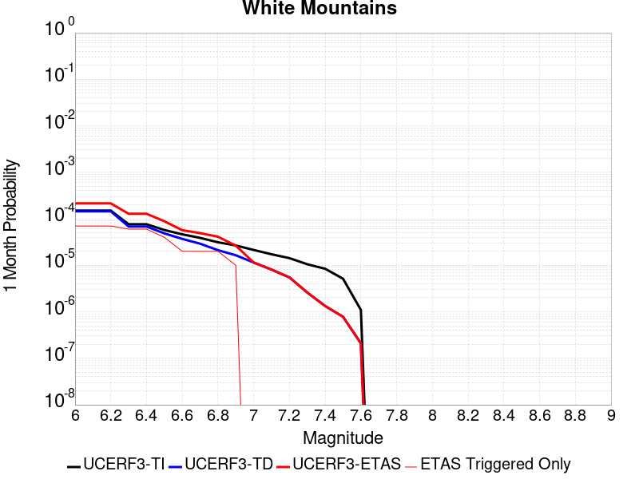 | 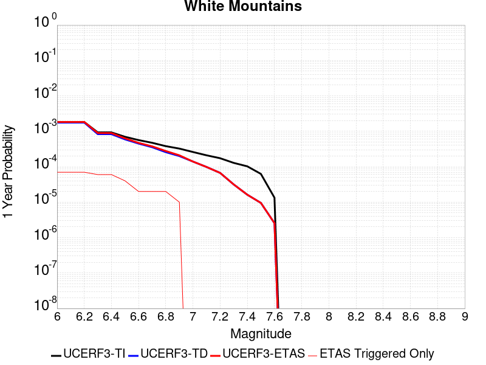 |  |

| Magnitude | 1 wk TI Prob | 1 wk TD Prob | 1 wk ETAS Prob | 1 wk ETAS/TD Gain | 1 wk ETAS Triggered Only | 1 mo TI Prob | 1 mo TD Prob | 1 mo ETAS Prob | 1 mo ETAS/TD Gain | 1 mo ETAS Triggered Only | 1 yr TI Prob | 1 yr TD Prob | 1 yr ETAS Prob | 1 yr ETAS/TD Gain | 1 yr ETAS Triggered Only | 10 yr TI Prob | 10 yr TD Prob | 10 yr ETAS Prob | 10 yr ETAS/TD Gain | 10 yr ETAS Triggered Only |
|-----|-----|-----|-----|-----|-----|-----|-----|-----|-----|-----|-----|-----|-----|-----|-----|-----|-----|-----|-----|-----|
| 6.0 | 3.503579E-5 | 3.3784127E-5 | 3.3784127E-5 | 1.0 | 0.0 | 1.5014476E-4 | 1.4478175E-4 | 1.8770136E-4 | 1.2964435 | 4.2925825E-5 | 0.0018264796 | 0.0017614134 | 0.0018042637 | 1.0243272 | 4.2925825E-5 | 0.018115403 | 0.017486857 | 0.017739907 | 1.0144709 | 2.5755496E-4 |
| 6.1 | 3.503579E-5 | 3.3784127E-5 | 3.3784127E-5 | 1.0 | 0.0 | 1.5014476E-4 | 1.4478175E-4 | 1.8770136E-4 | 1.2964435 | 4.2925825E-5 | 0.0018264796 | 0.0017614134 | 0.0018042637 | 1.0243272 | 4.2925825E-5 | 0.018115403 | 0.017486857 | 0.017739907 | 1.0144709 | 2.5755496E-4 |
| 6.2 | 3.503579E-5 | 3.3784127E-5 | 3.3784127E-5 | 1.0 | 0.0 | 1.5014476E-4 | 1.4478175E-4 | 1.8770136E-4 | 1.2964435 | 4.2925825E-5 | 0.0018264796 | 0.0017614134 | 0.0018042637 | 1.0243272 | 4.2925825E-5 | 0.018115403 | 0.017486857 | 0.017739907 | 1.0144709 | 2.5755496E-4 |
| 6.3 | 1.7818425E-5 | 1.591616E-5 | 1.591616E-5 | 1.0 | 0.0 | 7.636245E-5 | 6.821041E-5 | 1.11133304E-4 | 1.629272 | 4.2925825E-5 | 9.293162E-4 | 8.301596E-4 | 8.730498E-4 | 1.051665 | 4.2925825E-5 | 0.009254395 | 0.0082720425 | 0.008527467 | 1.0308781 | 2.5755496E-4 |
| 6.4 | 1.7818425E-5 | 1.591616E-5 | 1.591616E-5 | 1.0 | 0.0 | 7.636245E-5 | 6.821041E-5 | 1.11133304E-4 | 1.629272 | 4.2925825E-5 | 9.293162E-4 | 8.301596E-4 | 8.730498E-4 | 1.051665 | 4.2925825E-5 | 0.009254395 | 0.0082720425 | 0.008527467 | 1.0308781 | 2.5755496E-4 |
| 6.5 | 1.3397557E-5 | 1.1336374E-5 | 1.1336374E-5 | 1.0 | 0.0 | 5.741684E-5 | 4.8583595E-5 | 4.8583595E-5 | 1.0 | 0.0 | 6.988258E-4 | 5.913517E-4 | 5.913517E-4 | 1.0 | 0.0 | 0.006966323 | 0.005898487 | 0.0060691773 | 1.028938 | 1.717033E-4 |
| 6.6 | 1.0818695E-5 | 8.625434E-6 | 8.625434E-6 | 1.0 | 0.0 | 4.6365014E-5 | 3.6965648E-5 | 3.6965648E-5 | 1.0 | 0.0 | 5.6434784E-4 | 4.4996818E-4 | 4.4996818E-4 | 1.0 | 0.0 | 0.005629168 | 0.0044910074 | 0.0045764735 | 1.0190305 | 8.585165E-5 |
| 6.7 | 9.067908E-6 | 6.802476E-6 | 6.802476E-6 | 1.0 | 0.0 | 3.8861883E-5 | 2.915316E-5 | 2.915316E-5 | 1.0 | 0.0 | 4.7304068E-4 | 3.548851E-4 | 3.548851E-4 | 1.0 | 0.0 | 0.00472035 | 0.003543501 | 0.0036290484 | 1.024142 | 8.585165E-5 |
| 6.8 | 7.295947E-6 | 4.9364285E-6 | 4.9364285E-6 | 1.0 | 0.0 | 3.126797E-5 | 2.1155956E-5 | 2.1155956E-5 | 1.0 | 0.0 | 3.8062103E-4 | 2.5754445E-4 | 2.5754445E-4 | 1.0 | 0.0 | 0.0037996976 | 0.0025725728 | 0.0026582035 | 1.0332861 | 8.585165E-5 |
| 6.9 | 6.2243444E-6 | 3.8322546E-6 | 3.8322546E-6 | 1.0 | 0.0 | 2.6675489E-5 | 1.6423846E-5 | 1.6423846E-5 | 1.0 | 0.0 | 3.2472567E-4 | 1.9994251E-4 | 1.9994251E-4 | 1.0 | 0.0 | 0.0032425157 | 0.001997679 | 0.001997679 | 1.0 | 0.0 |
| 7.0 | 4.9878413E-6 | 2.679564E-6 | 2.679564E-6 | 1.0 | 0.0 | 2.1376287E-5 | 1.1483797E-5 | 1.1483797E-5 | 1.0 | 0.0 | 2.602252E-4 | 1.3980652E-4 | 1.3980652E-4 | 1.0 | 0.0 | 0.002599207 | 0.0013972119 | 0.0013972119 | 1.0 | 0.0 |
| 7.1 | 4.0252844E-6 | 1.885702E-6 | 1.885702E-6 | 1.0 | 0.0 | 1.7251105E-5 | 8.081555E-6 | 8.081555E-6 | 1.0 | 0.0 | 2.1001195E-4 | 9.838863E-5 | 9.838863E-5 | 1.0 | 0.0 | 0.0020981359 | 9.834635E-4 | 9.834635E-4 | 1.0 | 0.0 |
| 7.2 | 3.3284066E-6 | 1.2818929E-6 | 1.2818929E-6 | 1.0 | 0.0 | 1.4264522E-5 | 5.4938155E-6 | 5.4938155E-6 | 1.0 | 0.0 | 1.736567E-4 | 6.688525E-5 | 6.688525E-5 | 1.0 | 0.0 | 0.0017352107 | 6.6866126E-4 | 6.6866126E-4 | 1.0 | 0.0 |
| 7.3 | 2.458226E-6 | 6.056684E-7 | 6.056684E-7 | 1.0 | 0.0 | 1.0535211E-5 | 2.5957193E-6 | 2.5957193E-6 | 1.0 | 0.0 | 1.2825865E-4 | 3.160246E-5 | 3.160246E-5 | 1.0 | 0.0 | 0.0012818464 | 3.1598343E-4 | 3.1598343E-4 | 1.0 | 0.0 |
| 7.4 | 1.965953E-6 | 3.1084684E-7 | 3.1084684E-7 | 1.0 | 0.0 | 8.425486E-6 | 1.3322001E-6 | 1.3322001E-6 | 1.0 | 0.0 | 1.0257547E-4 | 1.6219417E-5 | 1.6219417E-5 | 1.0 | 0.0 | 0.0010252813 | 1.6218246E-4 | 1.6218246E-4 | 1.0 | 0.0 |
| 7.5 | 1.2014192E-6 | 1.8241002E-7 | 1.8241002E-7 | 1.0 | 0.0 | 5.148929E-6 | 7.8175697E-7 | 7.8175697E-7 | 1.0 | 0.0 | 6.2686406E-5 | 9.51785E-6 | 9.51785E-6 | 1.0 | 0.0 | 6.266873E-4 | 9.517451E-5 | 9.517451E-5 | 1.0 | 0.0 |
| 7.6 | 2.5612175E-7 | 4.893784E-8 | 4.893784E-8 | 1.0 | 0.0 | 1.0976642E-6 | 2.0973359E-7 | 2.0973359E-7 | 1.0 | 0.0 | 1.3363979E-5 | 2.5535037E-6 | 2.5535037E-6 | 1.0 | 0.0 | 1.3363175E-4 | 2.553478E-5 | 2.553478E-5 | 1.0 | 0.0 |

## Santa Ynez (East)
*[(top)](#table-of-contents)*

| 1 Week | 1 Month | 1 Year | 10 Year |
|-----|-----|-----|-----|
|  |  |  |  |

| Magnitude | 1 wk TI Prob | 1 wk TD Prob | 1 wk ETAS Prob | 1 wk ETAS/TD Gain | 1 wk ETAS Triggered Only | 1 mo TI Prob | 1 mo TD Prob | 1 mo ETAS Prob | 1 mo ETAS/TD Gain | 1 mo ETAS Triggered Only | 1 yr TI Prob | 1 yr TD Prob | 1 yr ETAS Prob | 1 yr ETAS/TD Gain | 1 yr ETAS Triggered Only | 10 yr TI Prob | 10 yr TD Prob | 10 yr ETAS Prob | 10 yr ETAS/TD Gain | 10 yr ETAS Triggered Only |
|-----|-----|-----|-----|-----|-----|-----|-----|-----|-----|-----|-----|-----|-----|-----|-----|-----|-----|-----|-----|-----|
| 6.0 | 3.2269712E-5 | 3.6750775E-5 | 2.0844776E-4 | 5.6719284 | 1.717033E-4 | 1.3829143E-4 | 1.5749714E-4 | 3.7209244E-4 | 2.3625348 | 2.1462912E-4 | 0.0016823979 | 0.0019164253 | 0.002130643 | 1.1117799 | 2.1462912E-4 | 0.016697178 | 0.019056438 | 0.019309085 | 1.0132579 | 2.5755496E-4 |
| 6.1 | 3.2269712E-5 | 3.6750775E-5 | 2.0844776E-4 | 5.6719284 | 1.717033E-4 | 1.3829143E-4 | 1.5749714E-4 | 3.7209244E-4 | 2.3625348 | 2.1462912E-4 | 0.0016823979 | 0.0019164253 | 0.002130643 | 1.1117799 | 2.1462912E-4 | 0.016697178 | 0.019056438 | 0.019309085 | 1.0132579 | 2.5755496E-4 |
| 6.2 | 3.2269712E-5 | 3.6750775E-5 | 2.0844776E-4 | 5.6719284 | 1.717033E-4 | 1.3829143E-4 | 1.5749714E-4 | 3.7209244E-4 | 2.3625348 | 2.1462912E-4 | 0.0016823979 | 0.0019164253 | 0.002130643 | 1.1117799 | 2.1462912E-4 | 0.016697178 | 0.019056438 | 0.019309085 | 1.0132579 | 2.5755496E-4 |
| 6.3 | 3.2269712E-5 | 3.6750775E-5 | 2.0844776E-4 | 5.6719284 | 1.717033E-4 | 1.3829143E-4 | 1.5749714E-4 | 3.7209244E-4 | 2.3625348 | 2.1462912E-4 | 0.0016823979 | 0.0019164253 | 0.002130643 | 1.1117799 | 2.1462912E-4 | 0.016697178 | 0.019056438 | 0.019309085 | 1.0132579 | 2.5755496E-4 |
| 6.4 | 1.4404779E-5 | 1.48492945E-5 | 1.0069967E-4 | 6.7814445 | 8.585165E-5 | 6.1733306E-5 | 6.363831E-5 | 1.4948449E-4 | 2.3489702 | 8.585165E-5 | 7.513438E-4 | 7.7452604E-4 | 8.603112E-4 | 1.1107583 | 8.585165E-5 | 0.0074880854 | 0.007718817 | 0.007804006 | 1.0110365 | 8.585165E-5 |
| 6.5 | 1.4404779E-5 | 1.48492945E-5 | 1.0069967E-4 | 6.7814445 | 8.585165E-5 | 6.1733306E-5 | 6.363831E-5 | 1.4948449E-4 | 2.3489702 | 8.585165E-5 | 7.513438E-4 | 7.7452604E-4 | 8.603112E-4 | 1.1107583 | 8.585165E-5 | 0.0074880854 | 0.007718817 | 0.007804006 | 1.0110365 | 8.585165E-5 |
| 6.6 | 1.280208E-5 | 1.301186E-5 | 9.8862394E-5 | 7.597868 | 8.585165E-5 | 5.4864904E-5 | 5.5763932E-5 | 1.416108E-4 | 2.5394692 | 8.585165E-5 | 6.6777546E-4 | 6.7871617E-4 | 7.6450955E-4 | 1.1264054 | 8.585165E-5 | 0.006657724 | 0.0067666434 | 0.006851914 | 1.0126016 | 8.585165E-5 |
| 6.7 | 1.2457027E-5 | 1.262838E-5 | 9.8478944E-5 | 7.7982244 | 8.585165E-5 | 5.3386164E-5 | 5.4120515E-5 | 1.3996752E-4 | 2.5862193 | 8.585165E-5 | 6.497827E-4 | 6.5871974E-4 | 7.4451487E-4 | 1.1302452 | 8.585165E-5 | 0.00647886 | 0.00656787 | 0.0066531575 | 1.0129856 | 8.585165E-5 |
| 6.8 | 1.2095134E-5 | 1.2230827E-5 | 9.808142E-5 | 8.019198 | 8.585165E-5 | 5.1835254E-5 | 5.2416784E-5 | 1.3826393E-4 | 2.6377797 | 8.585165E-5 | 6.309115E-4 | 6.3798914E-4 | 7.23786E-4 | 1.1344801 | 8.585165E-5 | 0.0062912325 | 0.006361764 | 0.0064470693 | 1.0134091 | 8.585165E-5 |
| 6.9 | 1.1104036E-5 | 1.115726E-5 | 9.700795E-5 | 8.694604 | 8.585165E-5 | 4.758786E-5 | 4.781596E-5 | 1.336635E-4 | 2.7953744 | 8.585165E-5 | 5.7922816E-4 | 5.82005E-4 | 6.678067E-4 | 1.1474243 | 8.585165E-5 | 0.005777207 | 0.0058049536 | 0.005890307 | 1.0147035 | 8.585165E-5 |
| 7.0 | 1.0577444E-5 | 1.05815925E-5 | 9.643233E-5 | 9.113215 | 8.585165E-5 | 4.5331115E-5 | 4.53489E-5 | 1.3119666E-4 | 2.8930504 | 8.585165E-5 | 5.5176654E-4 | 5.5198424E-4 | 6.377885E-4 | 1.1554469 | 8.585165E-5 | 0.0055039856 | 0.00550627 | 0.005591649 | 1.0155058 | 8.585165E-5 |
| 7.1 | 1.0021775E-5 | 9.9809E-6 | 9.583169E-5 | 9.601508 | 8.585165E-5 | 4.294976E-5 | 4.277459E-5 | 1.2862257E-4 | 3.0069852 | 8.585165E-5 | 5.2278786E-4 | 5.206574E-4 | 6.0646434E-4 | 1.164805 | 8.585165E-5 | 0.0052155964 | 0.005194508 | 0.005279914 | 1.0164416 | 8.585165E-5 |
| 7.2 | 8.874109E-6 | 8.748706E-6 | 9.459961E-5 | 10.812982 | 8.585165E-5 | 3.8031343E-5 | 3.7493923E-5 | 1.2334235E-4 | 3.2896626 | 8.585165E-5 | 4.629332E-4 | 4.56394E-4 | 5.4220646E-4 | 1.1880227 | 8.585165E-5 | 0.0046197 | 0.0045546847 | 0.0046401457 | 1.0187632 | 8.585165E-5 |
| 7.3 | 7.5504267E-6 | 7.5050243E-6 | 5.0430524E-5 | 6.7195687 | 4.2925825E-5 | 3.235857E-5 | 3.2164E-5 | 7.508844E-5 | 2.3345494 | 4.2925825E-5 | 3.9389438E-4 | 3.9152734E-4 | 4.3443637E-4 | 1.1095939 | 4.2925825E-5 | 0.0039319694 | 0.0039084824 | 0.0039512403 | 1.0109398 | 4.2925825E-5 |
| 7.4 | 6.309394E-6 | 6.183062E-6 | 4.910862E-5 | 7.9424434 | 4.2925825E-5 | 2.703998E-5 | 2.6498574E-5 | 6.942326E-5 | 2.6198866 | 4.2925825E-5 | 3.2916202E-4 | 3.2257332E-4 | 3.654853E-4 | 1.1330302 | 4.2925825E-5 | 0.003286749 | 0.0032211484 | 0.003263936 | 1.0132834 | 4.2925825E-5 |
| 7.5 | 4.6103073E-6 | 4.4408016E-6 | 4.4408016E-6 | 1.0 | 0.0 | 1.975831E-5 | 1.9031871E-5 | 1.9031871E-5 | 1.0 | 0.0 | 2.4053088E-4 | 2.316891E-4 | 2.316891E-4 | 1.0 | 0.0 | 0.002402707 | 0.002314545 | 0.002314545 | 1.0 | 0.0 |
| 7.6 | 1.2858658E-6 | 1.3008196E-6 | 1.3008196E-6 | 1.0 | 0.0 | 5.5108417E-6 | 5.574929E-6 | 5.574929E-6 | 1.0 | 0.0 | 6.7092435E-5 | 6.787272E-5 | 6.787272E-5 | 1.0 | 0.0 | 6.707218E-4 | 6.7852676E-4 | 6.7852676E-4 | 1.0 | 0.0 |
| 7.7 | 5.3302307E-7 | 5.612138E-7 | 5.612138E-7 | 1.0 | 0.0 | 2.2843826E-6 | 2.4052001E-6 | 2.4052001E-6 | 1.0 | 0.0 | 2.7812002E-5 | 2.9282955E-5 | 2.9282955E-5 | 1.0 | 0.0 | 2.7808524E-4 | 2.9279455E-4 | 2.9279455E-4 | 1.0 | 0.0 |
| 7.8 | 4.613933E-8 | 4.80301E-8 | 4.80301E-8 | 1.0 | 0.0 | 1.9773998E-7 | 2.0584326E-7 | 2.0584326E-7 | 1.0 | 0.0 | 2.4074816E-6 | 2.5061388E-6 | 2.5061388E-6 | 1.0 | 0.0 | 2.4074554E-5 | 2.5061116E-5 | 2.5061116E-5 | 1.0 | 0.0 |

## Cleghorn Pass
*[(top)](#table-of-contents)*

| 1 Week | 1 Month | 1 Year | 10 Year |
|-----|-----|-----|-----|
|  |  |  |  |

| Magnitude | 1 wk TI Prob | 1 wk TD Prob | 1 wk ETAS Prob | 1 wk ETAS/TD Gain | 1 wk ETAS Triggered Only | 1 mo TI Prob | 1 mo TD Prob | 1 mo ETAS Prob | 1 mo ETAS/TD Gain | 1 mo ETAS Triggered Only | 1 yr TI Prob | 1 yr TD Prob | 1 yr ETAS Prob | 1 yr ETAS/TD Gain | 1 yr ETAS Triggered Only | 10 yr TI Prob | 10 yr TD Prob | 10 yr ETAS Prob | 10 yr ETAS/TD Gain | 10 yr ETAS Triggered Only |
|-----|-----|-----|-----|-----|-----|-----|-----|-----|-----|-----|-----|-----|-----|-----|-----|-----|-----|-----|-----|-----|
| 6.0 | 1.0522846E-5 | 1.1040642E-5 | 1.1040642E-5 | 1.0 | 0.0 | 4.509713E-5 | 4.7316473E-5 | 4.7316473E-5 | 1.0 | 0.0 | 5.4891926E-4 | 5.759784E-4 | 6.6178065E-4 | 1.1489677 | 8.585165E-5 | 0.0054756533 | 0.005750022 | 0.005920738 | 1.0296897 | 1.717033E-4 |
| 6.1 | 1.0522846E-5 | 1.1040642E-5 | 1.1040642E-5 | 1.0 | 0.0 | 4.509713E-5 | 4.7316473E-5 | 4.7316473E-5 | 1.0 | 0.0 | 5.4891926E-4 | 5.759784E-4 | 6.6178065E-4 | 1.1489677 | 8.585165E-5 | 0.0054756533 | 0.005750022 | 0.005920738 | 1.0296897 | 1.717033E-4 |
| 6.2 | 2.1045846E-6 | 2.2082024E-6 | 2.2082024E-6 | 1.0 | 0.0 | 9.019617E-6 | 9.463714E-6 | 9.463714E-6 | 1.0 | 0.0 | 1.098083E-4 | 1.1521882E-4 | 1.581397E-4 | 1.3725162 | 4.2925825E-5 | 0.0010975406 | 0.0011520023 | 0.0011948786 | 1.037219 | 4.2925825E-5 |
| 6.3 | 2.1045846E-6 | 2.2082024E-6 | 2.2082024E-6 | 1.0 | 0.0 | 9.019617E-6 | 9.463714E-6 | 9.463714E-6 | 1.0 | 0.0 | 1.098083E-4 | 1.1521882E-4 | 1.581397E-4 | 1.3725162 | 4.2925825E-5 | 0.0010975406 | 0.0011520023 | 0.0011948786 | 1.037219 | 4.2925825E-5 |
| 6.4 | 1.7259927E-6 | 1.810877E-6 | 1.810877E-6 | 1.0 | 0.0 | 7.3970905E-6 | 7.760902E-6 | 7.760902E-6 | 1.0 | 0.0 | 9.005586E-5 | 9.4488976E-5 | 1.3741075E-4 | 1.4542515 | 4.2925825E-5 | 9.001937E-4 | 9.448898E-4 | 9.87775E-4 | 1.0453866 | 4.2925825E-5 |

## Santa Ynez (West)
*[(top)](#table-of-contents)*

| 1 Week | 1 Month | 1 Year | 10 Year |
|-----|-----|-----|-----|
| 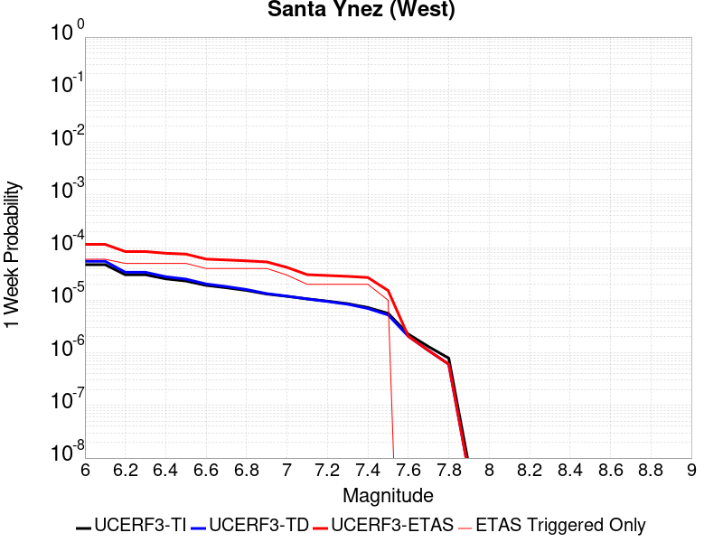 | 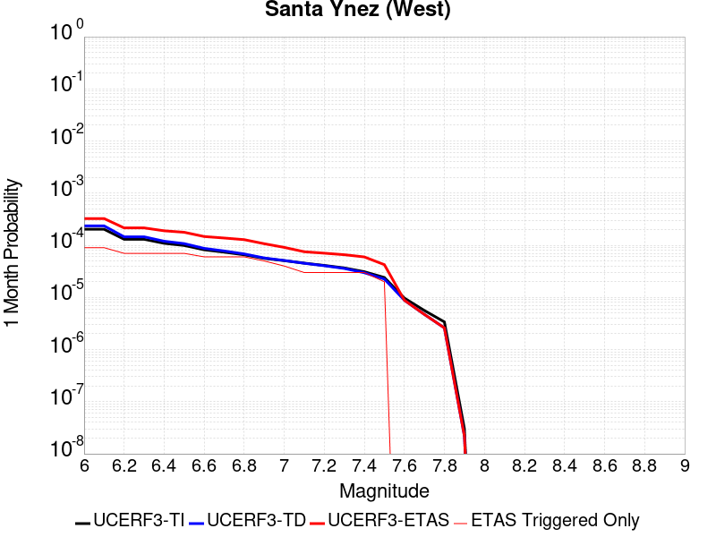 |  |  |

| Magnitude | 1 wk TI Prob | 1 wk TD Prob | 1 wk ETAS Prob | 1 wk ETAS/TD Gain | 1 wk ETAS Triggered Only | 1 mo TI Prob | 1 mo TD Prob | 1 mo ETAS Prob | 1 mo ETAS/TD Gain | 1 mo ETAS Triggered Only | 1 yr TI Prob | 1 yr TD Prob | 1 yr ETAS Prob | 1 yr ETAS/TD Gain | 1 yr ETAS Triggered Only | 10 yr TI Prob | 10 yr TD Prob | 10 yr ETAS Prob | 10 yr ETAS/TD Gain | 10 yr ETAS Triggered Only |
|-----|-----|-----|-----|-----|-----|-----|-----|-----|-----|-----|-----|-----|-----|-----|-----|-----|-----|-----|-----|-----|
| 6.0 | 4.7352758E-5 | 5.497084E-5 | 1.4081776E-4 | 2.5616813 | 8.585165E-5 | 2.0292461E-4 | 2.3556968E-4 | 3.214011E-4 | 1.3643569 | 8.585165E-5 | 0.0024678076 | 0.002864558 | 0.0030357693 | 1.0597689 | 1.717033E-4 | 0.024405818 | 0.028304456 | 0.028471299 | 1.0058945 | 1.717033E-4 |
| 6.1 | 4.7352758E-5 | 5.497084E-5 | 1.4081776E-4 | 2.5616813 | 8.585165E-5 | 2.0292461E-4 | 2.3556968E-4 | 3.214011E-4 | 1.3643569 | 8.585165E-5 | 0.0024678076 | 0.002864558 | 0.0030357693 | 1.0597689 | 1.717033E-4 | 0.024405818 | 0.028304456 | 0.028471299 | 1.0058945 | 1.717033E-4 |
| 6.2 | 3.0415853E-5 | 3.3925004E-5 | 1.1977374E-4 | 3.5305448 | 8.585165E-5 | 1.3034715E-4 | 1.4538495E-4 | 2.3122413E-4 | 1.5904267 | 8.585165E-5 | 0.0015858212 | 0.0017686592 | 0.0018972089 | 1.072682 | 1.2877748E-4 | 0.015745522 | 0.01754978 | 0.017676296 | 1.0072091 | 1.2877748E-4 |
| 6.3 | 3.0415853E-5 | 3.3925004E-5 | 1.1977374E-4 | 3.5305448 | 8.585165E-5 | 1.3034715E-4 | 1.4538495E-4 | 2.3122413E-4 | 1.5904267 | 8.585165E-5 | 0.0015858212 | 0.0017686592 | 0.0018972089 | 1.072682 | 1.2877748E-4 | 0.015745522 | 0.01754978 | 0.017676296 | 1.0072091 | 1.2877748E-4 |
| 6.4 | 2.5452082E-5 | 2.7912318E-5 | 1.1376157E-4 | 4.075676 | 8.585165E-5 | 1.09075794E-4 | 1.1961885E-4 | 2.0546022E-4 | 1.7176242 | 8.585165E-5 | 0.0013271887 | 0.0014554056 | 0.0015411322 | 1.0589023 | 8.585165E-5 | 0.013192902 | 0.01446091 | 0.01454552 | 1.0058509 | 8.585165E-5 |
| 6.5 | 2.3143784E-5 | 2.5128133E-5 | 1.1097762E-4 | 4.416469 | 8.585165E-5 | 9.9183875E-5 | 1.07687636E-4 | 1.9353004E-4 | 1.7971426 | 8.585165E-5 | 0.0012068948 | 0.001310323 | 0.0013960621 | 1.0654336 | 8.585165E-5 | 0.012003611 | 0.013027638 | 0.013112371 | 1.006504 | 8.585165E-5 |
| 6.6 | 1.9118515E-5 | 2.0354244E-5 | 1.0620415E-4 | 5.2177887 | 8.585165E-5 | 8.193392E-5 | 8.722961E-5 | 1.7307377E-4 | 1.9841173 | 8.585165E-5 | 9.97089E-4 | 0.001061511 | 0.0011472715 | 1.080791 | 8.585165E-5 | 0.00992627 | 0.010565317 | 0.010650261 | 1.00804 | 8.585165E-5 |
| 6.7 | 1.722807E-5 | 1.8146253E-5 | 1.03996346E-4 | 5.731009 | 8.585165E-5 | 7.3832496E-5 | 7.776737E-5 | 1.6361233E-4 | 2.1038687 | 8.585165E-5 | 8.985399E-4 | 9.4641204E-4 | 0.0010321825 | 1.090627 | 8.585165E-5 | 0.008949154 | 0.009424461 | 0.009509504 | 1.0090235 | 8.585165E-5 |
| 6.8 | 1.5317364E-5 | 1.5926391E-5 | 1.0177667E-4 | 6.3904414 | 8.585165E-5 | 6.56442E-5 | 6.82542E-5 | 1.541E-4 | 2.2577364 | 8.585165E-5 | 7.98925E-4 | 8.3068234E-4 | 9.164627E-4 | 1.1032649 | 8.585165E-5 | 0.007960589 | 0.008276261 | 0.008361402 | 1.0102874 | 8.585165E-5 |
| 6.9 | 1.3071226E-5 | 1.332953E-5 | 9.918003E-5 | 7.440625 | 8.585165E-5 | 5.6018336E-5 | 5.712532E-5 | 1.4297206E-4 | 2.5027792 | 8.585165E-5 | 6.8180985E-4 | 6.952811E-4 | 7.81073E-4 | 1.1233917 | 8.585165E-5 | 0.0067972173 | 0.0069313184 | 0.007016575 | 1.0123003 | 8.585165E-5 |
| 7.0 | 1.1836986E-5 | 1.1932688E-5 | 9.778331E-5 | 8.194575 | 8.585165E-5 | 5.0728955E-5 | 5.1139097E-5 | 1.3698636E-4 | 2.6787012 | 8.585165E-5 | 6.1745E-4 | 6.2244234E-4 | 7.0824055E-4 | 1.1378412 | 8.585165E-5 | 0.006157372 | 0.0062071825 | 0.006292501 | 1.0137452 | 8.585165E-5 |
| 7.1 | 1.0597169E-5 | 1.0542107E-5 | 5.346748E-5 | 5.071802 | 4.2925825E-5 | 4.541565E-5 | 4.5179684E-5 | 8.810357E-5 | 1.9500705 | 4.2925825E-5 | 5.5279525E-4 | 5.4992497E-4 | 5.9282716E-4 | 1.0780147 | 4.2925825E-5 | 0.0055142213 | 0.005485772 | 0.0055284626 | 1.007782 | 4.2925825E-5 |
| 7.2 | 9.59113E-6 | 9.45905E-6 | 5.238447E-5 | 5.5380263 | 4.2925825E-5 | 4.11042E-5 | 4.053816E-5 | 8.346225E-5 | 2.0588562 | 4.2925825E-5 | 5.0032866E-4 | 4.934414E-4 | 5.3634605E-4 | 1.0869498 | 4.2925825E-5 | 0.004992037 | 0.0049235765 | 0.004966291 | 1.0086755 | 4.2925825E-5 |
| 7.3 | 8.586084E-6 | 8.379489E-6 | 5.1304953E-5 | 6.1226826 | 4.2925825E-5 | 3.679698E-5 | 3.591161E-5 | 7.883589E-5 | 2.195276 | 4.2925825E-5 | 4.4791115E-4 | 4.3713715E-4 | 4.8004423E-4 | 1.0981547 | 4.2925825E-5 | 0.004470094 | 0.004362884 | 0.004405623 | 1.0097959 | 4.2925825E-5 |
| 7.4 | 7.2622997E-6 | 6.9514485E-6 | 4.9876973E-5 | 7.1750474 | 4.2925825E-5 | 3.112377E-5 | 2.9791589E-5 | 7.271613E-5 | 2.4408276 | 4.2925825E-5 | 3.78866E-4 | 3.6265317E-4 | 4.0556345E-4 | 1.1183231 | 4.2925825E-5 | 0.0037822074 | 0.003620714 | 0.0036634845 | 1.0118127 | 4.2925825E-5 |
| 7.5 | 5.627296E-6 | 5.2514984E-6 | 5.2514984E-6 | 1.0 | 0.0 | 2.411676E-5 | 2.2506232E-5 | 2.2506232E-5 | 1.0 | 0.0 | 2.9358198E-4 | 2.7397962E-4 | 2.7397962E-4 | 1.0 | 0.0 | 0.0029319443 | 0.0027364905 | 0.0027364905 | 1.0 | 0.0 |
| 7.6 | 2.265244E-6 | 2.0608632E-6 | 2.0608632E-6 | 1.0 | 0.0 | 9.708152E-6 | 8.832241E-6 | 8.832241E-6 | 1.0 | 0.0 | 1.18190335E-4 | 1.0752732E-4 | 1.0752732E-4 | 1.0 | 0.0 | 0.001181275 | 0.0010747615 | 0.0010747615 | 1.0 | 0.0 |
| 7.7 | 1.3099874E-6 | 1.1016228E-6 | 1.1016228E-6 | 1.0 | 0.0 | 5.61422E-6 | 4.7212325E-6 | 4.7212325E-6 | 1.0 | 0.0 | 6.8350986E-5 | 5.7479516E-5 | 5.7479516E-5 | 1.0 | 0.0 | 6.832996E-4 | 5.7464885E-4 | 5.7464885E-4 | 1.0 | 0.0 |
| 7.8 | 7.903951E-7 | 6.0710704E-7 | 6.0710704E-7 | 1.0 | 0.0 | 3.3874032E-6 | 2.601885E-6 | 2.601885E-6 | 1.0 | 0.0 | 4.1240855E-5 | 3.16775E-5 | 3.16775E-5 | 1.0 | 0.0 | 4.12332E-4 | 3.167312E-4 | 3.167312E-4 | 1.0 | 0.0 |
| 7.9 | 7.0753297E-9 | 5.090092E-9 | 5.090092E-9 | 1.0 | 0.0 | 3.032284E-8 | 2.181468E-8 | 2.181468E-8 | 1.0 | 0.0 | 3.6918053E-7 | 2.655937E-7 | 2.655937E-7 | 1.0 | 0.0 | 3.691799E-6 | 2.6559348E-6 | 2.6559348E-6 | 1.0 | 0.0 |

## San Andreas (Creeping Section) 2011 CFM
*[(top)](#table-of-contents)*

| 1 Week | 1 Month | 1 Year | 10 Year |
|-----|-----|-----|-----|
|  | 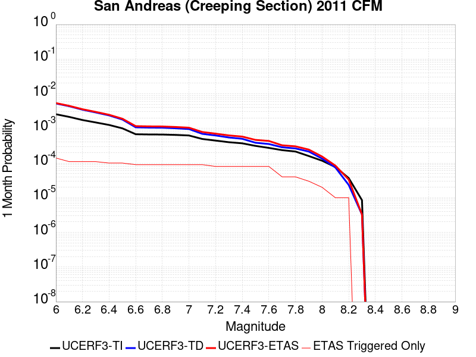 |  |  |

| Magnitude | 1 wk TI Prob | 1 wk TD Prob | 1 wk ETAS Prob | 1 wk ETAS/TD Gain | 1 wk ETAS Triggered Only | 1 mo TI Prob | 1 mo TD Prob | 1 mo ETAS Prob | 1 mo ETAS/TD Gain | 1 mo ETAS Triggered Only | 1 yr TI Prob | 1 yr TD Prob | 1 yr ETAS Prob | 1 yr ETAS/TD Gain | 1 yr ETAS Triggered Only | 10 yr TI Prob | 10 yr TD Prob | 10 yr ETAS Prob | 10 yr ETAS/TD Gain | 10 yr ETAS Triggered Only |
|-----|-----|-----|-----|-----|-----|-----|-----|-----|-----|-----|-----|-----|-----|-----|-----|-----|-----|-----|-----|-----|
| 6.0 | 5.986481E-4 | 0.0012275929 | 0.001270466 | 1.0349245 | 4.2925825E-5 | 0.0025631124 | 0.005245547 | 0.005330948 | 1.0162808 | 8.585165E-5 | 0.030762846 | 0.06120491 | 0.061285507 | 1.0013168 | 8.585165E-5 | 0.26835477 | 0.42593494 | 0.42605814 | 1.0002893 | 2.1462912E-4 |
| 6.1 | 5.015945E-4 | 0.0010217986 | 0.0010646805 | 1.0419672 | 4.2925825E-5 | 0.00214792 | 0.0043678596 | 0.004453336 | 1.0195695 | 8.585165E-5 | 0.025839351 | 0.05124837 | 0.05132982 | 1.0015893 | 8.585165E-5 | 0.23032776 | 0.37285668 | 0.3729913 | 1.000361 | 2.1462912E-4 |
| 6.2 | 4.073338E-4 | 8.1073755E-4 | 8.5362856E-4 | 1.0529037 | 4.2925825E-5 | 0.0017445484 | 0.0034671477 | 0.0035527016 | 1.0246756 | 8.585165E-5 | 0.021034058 | 0.04093317 | 0.041015506 | 1.0020115 | 8.585165E-5 | 0.19150782 | 0.31303346 | 0.31312194 | 1.0002826 | 1.2877748E-4 |
| 6.3 | 3.464099E-4 | 6.7391695E-4 | 7.1681384E-4 | 1.0636531 | 4.2925825E-5 | 0.0014837692 | 0.0028829593 | 0.0029685635 | 1.0296931 | 8.585165E-5 | 0.017915873 | 0.034189582 | 0.0342725 | 1.0024252 | 8.585165E-5 | 0.16538359 | 0.2713166 | 0.2714104 | 1.0003458 | 1.2877748E-4 |
| 6.4 | 2.935057E-4 | 5.5442745E-4 | 5.9732946E-4 | 1.0773808 | 4.2925825E-5 | 0.0012572751 | 0.0023725363 | 0.0024581843 | 1.0360998 | 8.585165E-5 | 0.015200248 | 0.02826451 | 0.028347936 | 1.0029516 | 8.585165E-5 | 0.14201577 | 0.23298529 | 0.23308405 | 1.0004239 | 1.2877748E-4 |
| 6.5 | 2.3409708E-4 | 4.2093755E-4 | 4.6384532E-4 | 1.1019337 | 4.2925825E-5 | 0.0010028875 | 0.0018019684 | 0.0018876654 | 1.0475574 | 8.585165E-5 | 0.012141965 | 0.021587461 | 0.021671461 | 1.0038911 | 8.585165E-5 | 0.11499573 | 0.18682368 | 0.1869284 | 1.0005605 | 1.2877748E-4 |
| 6.6 | 1.5842178E-4 | 2.506933E-4 | 2.9360838E-4 | 1.1711855 | 4.2925825E-5 | 6.7877385E-4 | 0.0010739497 | 0.0011597092 | 1.0798542 | 8.585165E-5 | 0.0082328 | 0.012995575 | 0.013080311 | 1.0065204 | 8.585165E-5 | 0.07934396 | 0.12314638 | 0.1232593 | 1.000917 | 1.2877748E-4 |
| 6.7 | 1.5616413E-4 | 2.4605883E-4 | 2.889741E-4 | 1.1744106 | 4.2925825E-5 | 6.691031E-4 | 0.0010541069 | 0.0011398679 | 1.081359 | 8.585165E-5 | 0.0081159435 | 0.01275744 | 0.012842197 | 1.0066437 | 8.585165E-5 | 0.0782586 | 0.12117351 | 0.12128668 | 1.000934 | 1.2877748E-4 |
| 6.8 | 1.5538467E-4 | 2.4429744E-4 | 2.8721278E-4 | 1.1756684 | 4.2925825E-5 | 6.6576427E-4 | 0.0010465645 | 0.0011323263 | 1.081946 | 8.585165E-5 | 0.008075596 | 0.012666838 | 0.012751603 | 1.0066918 | 8.585165E-5 | 0.07788358 | 0.120404355 | 0.12051763 | 1.0009408 | 1.2877748E-4 |
| 6.9 | 1.5153569E-4 | 2.3539034E-4 | 2.7830605E-4 | 1.1823173 | 4.2925825E-5 | 6.49277E-4 | 0.0010084276 | 0.0010941927 | 1.0850483 | 8.585165E-5 | 0.007876333 | 0.01220901 | 0.012293814 | 1.006946 | 8.585165E-5 | 0.07602952 | 0.11647445 | 0.11658823 | 1.0009768 | 1.2877748E-4 |
| 7.0 | 1.4588932E-4 | 2.2396253E-4 | 2.6687875E-4 | 1.1916223 | 4.2925825E-5 | 6.250901E-4 | 9.5948833E-4 | 0.0010452577 | 1.0893906 | 8.585165E-5 | 0.0075839474 | 0.011619697 | 0.011704551 | 1.0073026 | 8.585165E-5 | 0.073302895 | 0.11132046 | 0.1114349 | 1.0010281 | 1.2877748E-4 |
| 7.1 | 1.1565079E-4 | 1.6281738E-4 | 2.0573621E-4 | 1.2636011 | 4.2925825E-5 | 4.955521E-4 | 6.9760304E-4 | 7.833948E-4 | 1.1229807 | 8.585165E-5 | 0.006016669 | 0.0084604435 | 0.008545568 | 1.0100616 | 8.585165E-5 | 0.058563538 | 0.08367046 | 0.08378846 | 1.0014104 | 1.2877748E-4 |
| 7.2 | 1.0393792E-4 | 1.4615769E-4 | 1.8907724E-4 | 1.2936524 | 4.2925825E-5 | 4.4537216E-4 | 6.2624045E-4 | 7.1203837E-4 | 1.1370047 | 8.585165E-5 | 0.005408933 | 0.0075979927 | 0.007683192 | 1.0112134 | 8.585165E-5 | 0.052791595 | 0.07561969 | 0.07573873 | 1.0015742 | 1.2877748E-4 |
| 7.3 | 9.332884E-5 | 1.2780898E-4 | 1.7072933E-4 | 1.3358163 | 4.2925825E-5 | 3.999194E-4 | 5.4763845E-4 | 6.3344307E-4 | 1.1566812 | 8.585165E-5 | 0.0048581534 | 0.006647249 | 0.00673253 | 1.0128295 | 8.585165E-5 | 0.047533102 | 0.06648326 | 0.066603474 | 1.0018082 | 1.2877748E-4 |
| 7.4 | 8.670252E-5 | 1.17032345E-4 | 1.5995314E-4 | 1.3667431 | 4.2925825E-5 | 3.715293E-4 | 5.0147134E-4 | 5.8727997E-4 | 1.1711136 | 8.585165E-5 | 0.004513991 | 0.006088443 | 0.006173772 | 1.014015 | 8.585165E-5 | 0.044233937 | 0.061151642 | 0.061272547 | 1.0019771 | 1.2877748E-4 |
| 7.5 | 7.3036405E-5 | 9.005856E-5 | 1.3298052E-4 | 1.4766005 | 4.2925825E-5 | 3.129756E-4 | 3.8590826E-4 | 4.717268E-4 | 1.2223806 | 8.585165E-5 | 0.0038038217 | 0.0046883323 | 0.0047737816 | 1.0182259 | 8.585165E-5 | 0.03739367 | 0.047877792 | 0.048000406 | 1.002561 | 1.2877748E-4 |
| 7.6 | 6.3935775E-5 | 8.280385E-5 | 1.2572612E-4 | 1.5183609 | 4.2925825E-5 | 2.7398168E-4 | 3.5482543E-4 | 4.4064663E-4 | 1.2418687 | 8.585165E-5 | 0.0033306254 | 0.004311461 | 0.004396943 | 1.0198265 | 8.585165E-5 | 0.032811474 | 0.04399201 | 0.04411512 | 1.0027986 | 1.2877748E-4 |
| 7.7 | 5.5050095E-5 | 6.6618326E-5 | 1.09541295E-4 | 1.6443117 | 4.2925825E-5 | 2.3590765E-4 | 2.854759E-4 | 3.7130303E-4 | 1.3006458 | 8.585165E-5 | 0.0028683927 | 0.003470134 | 0.0035556876 | 1.0246543 | 8.585165E-5 | 0.0283165 | 0.035796214 | 0.03592038 | 1.0034688 | 1.2877748E-4 |
| 7.8 | 5.027131E-5 | 6.162871E-5 | 1.0455189E-4 | 1.6964803 | 4.2925825E-5 | 2.1543067E-4 | 2.640963E-4 | 3.4992528E-4 | 1.3249912 | 8.585165E-5 | 0.0026197135 | 0.003210635 | 0.003296211 | 1.0266539 | 8.585165E-5 | 0.025890453 | 0.03312666 | 0.03325117 | 1.0037587 | 1.2877748E-4 |
| 7.9 | 3.7271806E-5 | 5.022507E-5 | 9.314874E-5 | 1.8546264 | 4.2925825E-5 | 1.5972654E-4 | 2.1523255E-4 | 3.010657E-4 | 1.3987927 | 8.585165E-5 | 0.0019429359 | 0.002617309 | 0.002702936 | 1.0327157 | 8.585165E-5 | 0.019260362 | 0.027067466 | 0.027192757 | 1.0046289 | 1.2877748E-4 |
| 8.0 | 2.7310243E-5 | 3.1427757E-5 | 7.435223E-5 | 2.3658142 | 4.2925825E-5 | 1.17038646E-4 | 1.3468343E-4 | 1.7760348E-4 | 1.3186735 | 4.2925825E-5 | 0.0014240141 | 0.0016385383 | 0.0016813938 | 1.0261548 | 4.2925825E-5 | 0.014149235 | 0.01721386 | 0.017256048 | 1.0024507 | 4.2925825E-5 |
| 8.1 | 1.7940547E-5 | 1.7399378E-5 | 1.7399378E-5 | 1.0 | 0.0 | 7.688579E-5 | 7.456663E-5 | 7.456663E-5 | 1.0 | 0.0 | 9.3568244E-4 | 9.074711E-4 | 9.074711E-4 | 1.0 | 0.0 | 0.009317525 | 0.009798636 | 0.009798636 | 1.0 | 0.0 |
| 8.2 | 8.643924E-6 | 5.473668E-6 | 5.473668E-6 | 1.0 | 0.0 | 3.704486E-5 | 2.3458366E-5 | 2.3458366E-5 | 1.0 | 0.0 | 4.5092785E-4 | 2.8556827E-4 | 2.8556827E-4 | 1.0 | 0.0 | 0.0045001395 | 0.0032481793 | 0.0032481793 | 1.0 | 0.0 |
| 8.3 | 1.983087E-6 | 7.6564595E-7 | 7.6564595E-7 | 1.0 | 0.0 | 8.498917E-6 | 3.281336E-6 | 3.281336E-6 | 1.0 | 0.0 | 1.034694E-4 | 3.9949547E-5 | 3.9949547E-5 | 1.0 | 0.0 | 0.0010342124 | 4.717979E-4 | 4.717979E-4 | 1.0 | 0.0 |

## Ventura-Pitas Point
*[(top)](#table-of-contents)*

| 1 Week | 1 Month | 1 Year | 10 Year |
|-----|-----|-----|-----|
|  |  |  |  |

| Magnitude | 1 wk TI Prob | 1 wk TD Prob | 1 wk ETAS Prob | 1 wk ETAS/TD Gain | 1 wk ETAS Triggered Only | 1 mo TI Prob | 1 mo TD Prob | 1 mo ETAS Prob | 1 mo ETAS/TD Gain | 1 mo ETAS Triggered Only | 1 yr TI Prob | 1 yr TD Prob | 1 yr ETAS Prob | 1 yr ETAS/TD Gain | 1 yr ETAS Triggered Only | 10 yr TI Prob | 10 yr TD Prob | 10 yr ETAS Prob | 10 yr ETAS/TD Gain | 10 yr ETAS Triggered Only |
|-----|-----|-----|-----|-----|-----|-----|-----|-----|-----|-----|-----|-----|-----|-----|-----|-----|-----|-----|-----|-----|
| 6.0 | 3.3179622E-5 | 3.373519E-5 | 7.665956E-5 | 2.2723918 | 4.2925825E-5 | 1.4219063E-4 | 1.4457281E-4 | 2.3041204E-4 | 1.5937439 | 8.585165E-5 | 0.0017297962 | 0.0017590097 | 0.001930411 | 1.0974419 | 1.717033E-4 | 0.017163932 | 0.017476497 | 0.017687375 | 1.0120664 | 2.1462912E-4 |
| 6.1 | 3.3179622E-5 | 3.373519E-5 | 7.665956E-5 | 2.2723918 | 4.2925825E-5 | 1.4219063E-4 | 1.4457281E-4 | 2.3041204E-4 | 1.5937439 | 8.585165E-5 | 0.0017297962 | 0.0017590097 | 0.001930411 | 1.0974419 | 1.717033E-4 | 0.017163932 | 0.017476497 | 0.017687375 | 1.0120664 | 2.1462912E-4 |
| 6.2 | 3.3179622E-5 | 3.373519E-5 | 7.665956E-5 | 2.2723918 | 4.2925825E-5 | 1.4219063E-4 | 1.4457281E-4 | 2.3041204E-4 | 1.5937439 | 8.585165E-5 | 0.0017297962 | 0.0017590097 | 0.001930411 | 1.0974419 | 1.717033E-4 | 0.017163932 | 0.017476497 | 0.017687375 | 1.0120664 | 2.1462912E-4 |
| 6.3 | 3.3179622E-5 | 3.373519E-5 | 7.665956E-5 | 2.2723918 | 4.2925825E-5 | 1.4219063E-4 | 1.4457281E-4 | 2.3041204E-4 | 1.5937439 | 8.585165E-5 | 0.0017297962 | 0.0017590097 | 0.001930411 | 1.0974419 | 1.717033E-4 | 0.017163932 | 0.017476497 | 0.017687375 | 1.0120664 | 2.1462912E-4 |
| 6.4 | 1.8754668E-5 | 1.7019594E-5 | 1.7019594E-5 | 1.0 | 0.0 | 8.037467E-5 | 7.2939205E-5 | 7.2939205E-5 | 1.0 | 0.0 | 9.781223E-4 | 8.8769617E-4 | 9.3058386E-4 | 1.0483135 | 4.2925825E-5 | 0.009738282 | 0.008843943 | 0.008886488 | 1.0048108 | 4.2925825E-5 |
| 6.5 | 1.8754668E-5 | 1.7019594E-5 | 1.7019594E-5 | 1.0 | 0.0 | 8.037467E-5 | 7.2939205E-5 | 7.2939205E-5 | 1.0 | 0.0 | 9.781223E-4 | 8.8769617E-4 | 9.3058386E-4 | 1.0483135 | 4.2925825E-5 | 0.009738282 | 0.008843943 | 0.008886488 | 1.0048108 | 4.2925825E-5 |
| 6.6 | 1.4361558E-5 | 1.2122258E-5 | 1.2122258E-5 | 1.0 | 0.0 | 6.154808E-5 | 5.1951512E-5 | 5.1951512E-5 | 1.0 | 0.0 | 7.490902E-4 | 6.323284E-4 | 6.323284E-4 | 1.0 | 0.0 | 0.0074657016 | 0.006305652 | 0.006305652 | 1.0 | 0.0 |
| 6.7 | 1.4361558E-5 | 1.2122258E-5 | 1.2122258E-5 | 1.0 | 0.0 | 6.154808E-5 | 5.1951512E-5 | 5.1951512E-5 | 1.0 | 0.0 | 7.490902E-4 | 6.323284E-4 | 6.323284E-4 | 1.0 | 0.0 | 0.0074657016 | 0.006305652 | 0.006305652 | 1.0 | 0.0 |
| 6.8 | 1.3663846E-5 | 1.1344401E-5 | 1.1344401E-5 | 1.0 | 0.0 | 5.8558027E-5 | 4.8617967E-5 | 4.8617967E-5 | 1.0 | 0.0 | 7.127108E-4 | 5.917649E-4 | 5.917649E-4 | 1.0 | 0.0 | 0.007104293 | 0.0059022107 | 0.0059022107 | 1.0 | 0.0 |
| 6.9 | 1.3644157E-5 | 1.1322501E-5 | 1.1322501E-5 | 1.0 | 0.0 | 5.8473648E-5 | 4.8524114E-5 | 4.8524114E-5 | 1.0 | 0.0 | 7.116841E-4 | 5.906229E-4 | 5.906229E-4 | 1.0 | 0.0 | 0.007094092 | 0.0058908514 | 0.0058908514 | 1.0 | 0.0 |
| 7.0 | 1.3568845E-5 | 1.12420685E-5 | 1.12420685E-5 | 1.0 | 0.0 | 5.8150898E-5 | 4.8179416E-5 | 4.8179416E-5 | 1.0 | 0.0 | 7.077572E-4 | 5.8642845E-4 | 5.8642845E-4 | 1.0 | 0.0 | 0.007055073 | 0.005849128 | 0.005849128 | 1.0 | 0.0 |
| 7.1 | 1.306572E-5 | 1.0720521E-5 | 1.0720521E-5 | 1.0 | 0.0 | 5.599474E-5 | 4.594429E-5 | 4.594429E-5 | 1.0 | 0.0 | 6.815227E-4 | 5.5923004E-4 | 5.5923004E-4 | 1.0 | 0.0 | 0.0067943637 | 0.005578536 | 0.005578536 | 1.0 | 0.0 |
| 7.2 | 1.232604E-5 | 9.995121E-6 | 9.995121E-6 | 1.0 | 0.0 | 5.2824813E-5 | 4.283554E-5 | 4.283554E-5 | 1.0 | 0.0 | 6.429523E-4 | 5.2139966E-4 | 5.2139966E-4 | 1.0 | 0.0 | 0.0064109527 | 0.005202059 | 0.005202059 | 1.0 | 0.0 |
| 7.3 | 1.0917261E-5 | 8.843812E-6 | 8.843812E-6 | 1.0 | 0.0 | 4.678742E-5 | 3.7901507E-5 | 3.7901507E-5 | 1.0 | 0.0 | 5.69488E-4 | 4.6135474E-4 | 4.6135474E-4 | 1.0 | 0.0 | 0.0056803077 | 0.004604239 | 0.004604239 | 1.0 | 0.0 |
| 7.4 | 1.039959E-5 | 8.42354E-6 | 8.42354E-6 | 1.0 | 0.0 | 4.456891E-5 | 3.6100395E-5 | 3.6100395E-5 | 1.0 | 0.0 | 5.424914E-4 | 4.394352E-4 | 4.394352E-4 | 1.0 | 0.0 | 0.0054116896 | 0.0043859277 | 0.0043859277 | 1.0 | 0.0 |
| 7.5 | 9.015877E-6 | 7.29752E-6 | 7.29752E-6 | 1.0 | 0.0 | 3.86389E-5 | 3.1274718E-5 | 3.1274718E-5 | 1.0 | 0.0 | 4.7032707E-4 | 3.8070456E-4 | 3.8070456E-4 | 1.0 | 0.0 | 0.004693329 | 0.003800772 | 0.003800772 | 1.0 | 0.0 |
| 7.6 | 4.900162E-6 | 3.874119E-6 | 3.874119E-6 | 1.0 | 0.0 | 2.1000526E-5 | 1.6603262E-5 | 1.6603262E-5 | 1.0 | 0.0 | 2.556514E-4 | 2.0212609E-4 | 2.0212609E-4 | 1.0 | 0.0 | 0.0025535747 | 0.002019436 | 0.002019436 | 1.0 | 0.0 |
| 7.7 | 3.8850626E-6 | 3.12676E-6 | 3.12676E-6 | 1.0 | 0.0 | 1.6650163E-5 | 1.3400332E-5 | 1.3400332E-5 | 1.0 | 0.0 | 2.0269687E-4 | 1.6313691E-4 | 1.6313691E-4 | 1.0 | 0.0 | 0.002025121 | 0.0016301809 | 0.0016301809 | 1.0 | 0.0 |
| 7.8 | 2.4654719E-6 | 2.029902E-6 | 2.029902E-6 | 1.0 | 0.0 | 1.0566265E-5 | 8.699551E-6 | 8.699551E-6 | 1.0 | 0.0 | 1.2863669E-4 | 1.0591193E-4 | 1.0591193E-4 | 1.0 | 0.0 | 0.0012856225 | 0.0010586192 | 0.0010586192 | 1.0 | 0.0 |
| 7.9 | 4.095894E-7 | 3.2765078E-7 | 3.2765078E-7 | 1.0 | 0.0 | 1.7553821E-6 | 1.4042168E-6 | 1.4042168E-6 | 1.0 | 0.0 | 2.1371567E-5 | 1.709621E-5 | 1.709621E-5 | 1.0 | 0.0 | 2.1369511E-4 | 1.7094925E-4 | 1.7094925E-4 | 1.0 | 0.0 |
| 8.0 | 7.791402E-9 | 5.6836056E-9 | 5.6836056E-9 | 1.0 | 0.0 | 3.3391725E-8 | 2.4358311E-8 | 2.4358311E-8 | 1.0 | 0.0 | 4.0654416E-7 | 2.965624E-7 | 2.965624E-7 | 1.0 | 0.0 | 4.065434E-6 | 2.9656223E-6 | 2.9656223E-6 | 1.0 | 0.0 |

## San Diego Trough north alt1
*[(top)](#table-of-contents)*

| 1 Week | 1 Month | 1 Year | 10 Year |
|-----|-----|-----|-----|
|  |  |  |  |

| Magnitude | 1 wk TI Prob | 1 wk TD Prob | 1 wk ETAS Prob | 1 wk ETAS/TD Gain | 1 wk ETAS Triggered Only | 1 mo TI Prob | 1 mo TD Prob | 1 mo ETAS Prob | 1 mo ETAS/TD Gain | 1 mo ETAS Triggered Only | 1 yr TI Prob | 1 yr TD Prob | 1 yr ETAS Prob | 1 yr ETAS/TD Gain | 1 yr ETAS Triggered Only | 10 yr TI Prob | 10 yr TD Prob | 10 yr ETAS Prob | 10 yr ETAS/TD Gain | 10 yr ETAS Triggered Only |
|-----|-----|-----|-----|-----|-----|-----|-----|-----|-----|-----|-----|-----|-----|-----|-----|-----|-----|-----|-----|-----|
| 6.0 | 7.329252E-5 | 8.821269E-5 | 1.3113473E-4 | 1.4865744 | 4.2925825E-5 | 3.14073E-4 | 3.7800326E-4 | 4.6382245E-4 | 1.2270329 | 8.585165E-5 | 0.0038171355 | 0.0045930487 | 0.004678506 | 1.0186058 | 8.585165E-5 | 0.03752231 | 0.045045137 | 0.045209106 | 1.00364 | 1.717033E-4 |
| 6.1 | 3.7940346E-5 | 4.4884906E-5 | 4.4884906E-5 | 1.0 | 0.0 | 1.6259136E-4 | 1.9235026E-4 | 2.3526783E-4 | 1.223122 | 4.2925825E-5 | 0.0019777524 | 0.002339431 | 0.0023822563 | 1.0183059 | 4.2925825E-5 | 0.019602431 | 0.023156732 | 0.023282528 | 1.0054324 | 1.2877748E-4 |
| 6.2 | 2.8645263E-5 | 3.329672E-5 | 3.329672E-5 | 1.0 | 0.0 | 1.2275964E-4 | 1.4269259E-4 | 1.8561228E-4 | 1.3007843 | 4.2925825E-5 | 0.0014935739 | 0.0017359206 | 0.0017787719 | 1.024685 | 4.2925825E-5 | 0.0148357535 | 0.017226268 | 0.017268453 | 1.0024489 | 4.2925825E-5 |
| 6.3 | 2.8645263E-5 | 3.329672E-5 | 3.329672E-5 | 1.0 | 0.0 | 1.2275964E-4 | 1.4269259E-4 | 1.8561228E-4 | 1.3007843 | 4.2925825E-5 | 0.0014935739 | 0.0017359206 | 0.0017787719 | 1.024685 | 4.2925825E-5 | 0.0148357535 | 0.017226268 | 0.017268453 | 1.0024489 | 4.2925825E-5 |
| 6.4 | 2.2204576E-5 | 2.544832E-5 | 2.544832E-5 | 1.0 | 0.0 | 9.5159E-5 | 1.0905972E-4 | 1.5198087E-4 | 1.3935564 | 4.2925825E-5 | 0.001157945 | 0.0013270028 | 0.0013698717 | 1.032305 | 4.2925825E-5 | 0.011519298 | 0.013191959 | 0.013234318 | 1.003211 | 4.2925825E-5 |
| 6.5 | 2.1004838E-5 | 2.4024695E-5 | 2.4024695E-5 | 1.0 | 0.0 | 9.0017624E-5 | 1.0295897E-4 | 1.4588037E-4 | 1.4168787 | 4.2925825E-5 | 0.0010954136 | 0.0012528135 | 0.0012956855 | 1.0342206 | 4.2925825E-5 | 0.010900296 | 0.012458592 | 0.012500983 | 1.0034026 | 4.2925825E-5 |
| 6.6 | 1.820557E-5 | 2.070479E-5 | 2.070479E-5 | 1.0 | 0.0 | 7.802154E-5 | 8.8731824E-5 | 1.3165384E-4 | 1.4837273 | 4.2925825E-5 | 9.4949827E-4 | 0.0010797799 | 0.0011226594 | 1.0397114 | 4.2925825E-5 | 0.009454516 | 0.010746005 | 0.01078847 | 1.0039517 | 4.2925825E-5 |
| 6.7 | 1.5884485E-5 | 1.7983646E-5 | 1.7983646E-5 | 1.0 | 0.0 | 6.807459E-5 | 7.707051E-5 | 1.1999303E-4 | 1.5569253 | 4.2925825E-5 | 8.284929E-4 | 9.3793223E-4 | 9.808178E-4 | 1.0457236 | 4.2925825E-5 | 0.008254109 | 0.009340104 | 0.009382628 | 1.004553 | 4.2925825E-5 |
| 6.8 | 1.4331171E-5 | 1.6201066E-5 | 1.6201066E-5 | 1.0 | 0.0 | 6.141786E-5 | 6.94313E-5 | 1.12354144E-4 | 1.618206 | 4.2925825E-5 | 7.4750587E-4 | 8.450002E-4 | 8.8788976E-4 | 1.0507568 | 4.2925825E-5 | 0.0074499645 | 0.008418139 | 0.008460703 | 1.0050563 | 4.2925825E-5 |
| 6.9 | 1.2574203E-5 | 1.4205835E-5 | 1.4205835E-5 | 1.0 | 0.0 | 5.3888325E-5 | 6.0880735E-5 | 1.0380395E-4 | 1.7050376 | 4.2925825E-5 | 6.558929E-4 | 7.409723E-4 | 7.8386633E-4 | 1.0578889 | 4.2925825E-5 | 0.0065396037 | 0.007385203 | 0.007427812 | 1.0057695 | 4.2925825E-5 |
| 7.0 | 1.0883844E-5 | 1.2289262E-5 | 1.2289262E-5 | 1.0 | 0.0 | 4.664421E-5 | 5.2667205E-5 | 9.559077E-5 | 1.814996 | 4.2925825E-5 | 5.677453E-4 | 6.4103556E-4 | 6.8393385E-4 | 1.0669203 | 4.2925825E-5 | 0.00566297 | 0.006391993 | 0.006434644 | 1.0066726 | 4.2925825E-5 |
| 7.1 | 9.393088E-6 | 1.060702E-5 | 1.060702E-5 | 1.0 | 0.0 | 4.025547E-5 | 4.545787E-5 | 4.545787E-5 | 1.0 | 0.0 | 4.900001E-4 | 5.533098E-4 | 5.533098E-4 | 1.0 | 0.0 | 0.0048892107 | 0.005519418 | 0.005519418 | 1.0 | 0.0 |
| 7.2 | 8.190791E-6 | 9.258625E-6 | 9.258625E-6 | 1.0 | 0.0 | 3.510292E-5 | 3.9679224E-5 | 3.9679224E-5 | 1.0 | 0.0 | 4.2729423E-4 | 4.8298817E-4 | 4.8298817E-4 | 1.0 | 0.0 | 0.0042647356 | 0.004819465 | 0.004819465 | 1.0 | 0.0 |
| 7.3 | 6.268162E-6 | 7.089716E-6 | 7.089716E-6 | 1.0 | 0.0 | 2.6863276E-5 | 3.0384144E-5 | 3.0384144E-5 | 1.0 | 0.0 | 3.2701128E-4 | 3.6986457E-4 | 3.6986457E-4 | 1.0 | 0.0 | 0.003265305 | 0.003692536 | 0.003692536 | 1.0 | 0.0 |
| 7.4 | 4.985186E-6 | 5.6426816E-6 | 5.6426816E-6 | 1.0 | 0.0 | 2.1364907E-5 | 2.4182698E-5 | 2.4182698E-5 | 1.0 | 0.0 | 2.600867E-4 | 2.9438498E-4 | 2.9438498E-4 | 1.0 | 0.0 | 0.002597825 | 0.0029399914 | 0.0029399914 | 1.0 | 0.0 |
| 7.5 | 1.7489613E-6 | 1.969678E-6 | 1.969678E-6 | 1.0 | 0.0 | 7.495527E-6 | 8.4414505E-6 | 8.4414505E-6 | 1.0 | 0.0 | 9.125422E-5 | 1.02770035E-4 | 1.02770035E-4 | 1.0 | 0.0 | 9.1216754E-4 | 0.0010272472 | 0.0010272472 | 1.0 | 0.0 |
| 7.6 | 1.6988751E-7 | 1.7533823E-7 | 1.7533823E-7 | 1.0 | 0.0 | 7.2808916E-7 | 7.5144936E-7 | 7.5144936E-7 | 1.0 | 0.0 | 8.864449E-6 | 9.14886E-6 | 9.14886E-6 | 1.0 | 0.0 | 8.8640954E-5 | 9.1485024E-5 | 9.1485024E-5 | 1.0 | 0.0 |

## Lost Hills
*[(top)](#table-of-contents)*

| 1 Week | 1 Month | 1 Year | 10 Year |
|-----|-----|-----|-----|
|  | 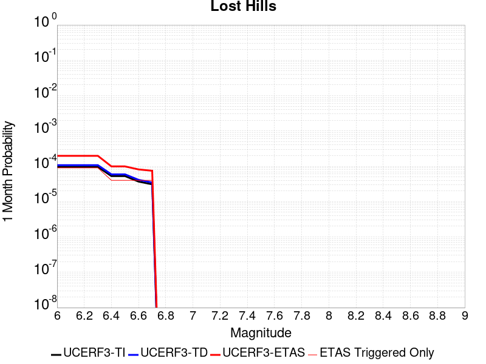 |  |  |

| Magnitude | 1 wk TI Prob | 1 wk TD Prob | 1 wk ETAS Prob | 1 wk ETAS/TD Gain | 1 wk ETAS Triggered Only | 1 mo TI Prob | 1 mo TD Prob | 1 mo ETAS Prob | 1 mo ETAS/TD Gain | 1 mo ETAS Triggered Only | 1 yr TI Prob | 1 yr TD Prob | 1 yr ETAS Prob | 1 yr ETAS/TD Gain | 1 yr ETAS Triggered Only | 10 yr TI Prob | 10 yr TD Prob | 10 yr ETAS Prob | 10 yr ETAS/TD Gain | 10 yr ETAS Triggered Only |
|-----|-----|-----|-----|-----|-----|-----|-----|-----|-----|-----|-----|-----|-----|-----|-----|-----|-----|-----|-----|-----|
| 6.0 | 2.233523E-5 | 2.5106583E-5 | 6.803133E-5 | 2.7097008 | 4.2925825E-5 | 9.571891E-5 | 1.0759615E-4 | 1.5051736E-4 | 1.3989103 | 4.2925825E-5 | 0.0011647546 | 0.001309364 | 0.0014808425 | 1.1309632 | 1.717033E-4 | 0.011586686 | 0.013033091 | 0.013202556 | 1.0130028 | 1.717033E-4 |
| 6.1 | 2.233523E-5 | 2.5106583E-5 | 6.803133E-5 | 2.7097008 | 4.2925825E-5 | 9.571891E-5 | 1.0759615E-4 | 1.5051736E-4 | 1.3989103 | 4.2925825E-5 | 0.0011647546 | 0.001309364 | 0.0014808425 | 1.1309632 | 1.717033E-4 | 0.011586686 | 0.013033091 | 0.013202556 | 1.0130028 | 1.717033E-4 |
| 6.2 | 2.233523E-5 | 2.5106583E-5 | 6.803133E-5 | 2.7097008 | 4.2925825E-5 | 9.571891E-5 | 1.0759615E-4 | 1.5051736E-4 | 1.3989103 | 4.2925825E-5 | 0.0011647546 | 0.001309364 | 0.0014808425 | 1.1309632 | 1.717033E-4 | 0.011586686 | 0.013033091 | 0.013202556 | 1.0130028 | 1.717033E-4 |
| 6.3 | 2.233523E-5 | 2.5106583E-5 | 6.803133E-5 | 2.7097008 | 4.2925825E-5 | 9.571891E-5 | 1.0759615E-4 | 1.5051736E-4 | 1.3989103 | 4.2925825E-5 | 0.0011647546 | 0.001309364 | 0.0014808425 | 1.1309632 | 1.717033E-4 | 0.011586686 | 0.013033091 | 0.013202556 | 1.0130028 | 1.717033E-4 |
| 6.4 | 1.2288092E-5 | 1.3781108E-5 | 1.3781108E-5 | 1.0 | 0.0 | 5.2662188E-5 | 5.906108E-5 | 5.906108E-5 | 1.0 | 0.0 | 6.409735E-4 | 7.189252E-4 | 7.618202E-4 | 1.0596654 | 4.2925825E-5 | 0.006391279 | 0.0071752006 | 0.0072178184 | 1.0059396 | 4.2925825E-5 |
| 6.5 | 1.2288092E-5 | 1.3781108E-5 | 1.3781108E-5 | 1.0 | 0.0 | 5.2662188E-5 | 5.906108E-5 | 5.906108E-5 | 1.0 | 0.0 | 6.409735E-4 | 7.189252E-4 | 7.618202E-4 | 1.0596654 | 4.2925825E-5 | 0.006391279 | 0.0071752006 | 0.0072178184 | 1.0059396 | 4.2925825E-5 |
| 6.6 | 8.58281E-6 | 9.63377E-6 | 9.63377E-6 | 1.0 | 0.0 | 3.6782953E-5 | 4.12874E-5 | 4.12874E-5 | 1.0 | 0.0 | 4.4774043E-4 | 5.026414E-4 | 5.026414E-4 | 1.0 | 0.0 | 0.0044683935 | 0.005023205 | 0.005023205 | 1.0 | 0.0 |
| 6.7 | 7.205685E-6 | 8.088302E-6 | 8.088302E-6 | 1.0 | 0.0 | 3.088114E-5 | 3.466415E-5 | 3.466415E-5 | 1.0 | 0.0 | 3.7591302E-4 | 4.2203604E-4 | 4.2203604E-4 | 1.0 | 0.0 | 0.0037527776 | 0.0042203604 | 0.0042203604 | 1.0 | 0.0 |

## Deep Springs
*[(top)](#table-of-contents)*

| 1 Week | 1 Month | 1 Year | 10 Year |
|-----|-----|-----|-----|
|  |  |  |  |

| Magnitude | 1 wk TI Prob | 1 wk TD Prob | 1 wk ETAS Prob | 1 wk ETAS/TD Gain | 1 wk ETAS Triggered Only | 1 mo TI Prob | 1 mo TD Prob | 1 mo ETAS Prob | 1 mo ETAS/TD Gain | 1 mo ETAS Triggered Only | 1 yr TI Prob | 1 yr TD Prob | 1 yr ETAS Prob | 1 yr ETAS/TD Gain | 1 yr ETAS Triggered Only | 10 yr TI Prob | 10 yr TD Prob | 10 yr ETAS Prob | 10 yr ETAS/TD Gain | 10 yr ETAS Triggered Only |
|-----|-----|-----|-----|-----|-----|-----|-----|-----|-----|-----|-----|-----|-----|-----|-----|-----|-----|-----|-----|-----|
| 6.0 | 1.9810619E-5 | 2.311252E-5 | 1.0896219E-4 | 4.7144227 | 8.585165E-5 | 8.489989E-5 | 9.9052755E-5 | 1.8489591E-4 | 1.8666407 | 8.585165E-5 | 0.001033166 | 0.0012058078 | 0.0012915559 | 1.0711126 | 8.585165E-5 | 0.010283757 | 0.01204243 | 0.012212066 | 1.0140865 | 1.717033E-4 |
| 6.1 | 1.9810619E-5 | 2.311252E-5 | 1.0896219E-4 | 4.7144227 | 8.585165E-5 | 8.489989E-5 | 9.9052755E-5 | 1.8489591E-4 | 1.8666407 | 8.585165E-5 | 0.001033166 | 0.0012058078 | 0.0012915559 | 1.0711126 | 8.585165E-5 | 0.010283757 | 0.01204243 | 0.012212066 | 1.0140865 | 1.717033E-4 |
| 6.2 | 1.9810619E-5 | 2.311252E-5 | 1.0896219E-4 | 4.7144227 | 8.585165E-5 | 8.489989E-5 | 9.9052755E-5 | 1.8489591E-4 | 1.8666407 | 8.585165E-5 | 0.001033166 | 0.0012058078 | 0.0012915559 | 1.0711126 | 8.585165E-5 | 0.010283757 | 0.01204243 | 0.012212066 | 1.0140865 | 1.717033E-4 |
| 6.3 | 1.9810619E-5 | 2.311252E-5 | 1.0896219E-4 | 4.7144227 | 8.585165E-5 | 8.489989E-5 | 9.9052755E-5 | 1.8489591E-4 | 1.8666407 | 8.585165E-5 | 0.001033166 | 0.0012058078 | 0.0012915559 | 1.0711126 | 8.585165E-5 | 0.010283757 | 0.01204243 | 0.012212066 | 1.0140865 | 1.717033E-4 |
| 6.4 | 1.9810619E-5 | 2.311252E-5 | 1.0896219E-4 | 4.7144227 | 8.585165E-5 | 8.489989E-5 | 9.9052755E-5 | 1.8489591E-4 | 1.8666407 | 8.585165E-5 | 0.001033166 | 0.0012058078 | 0.0012915559 | 1.0711126 | 8.585165E-5 | 0.010283757 | 0.01204243 | 0.012212066 | 1.0140865 | 1.717033E-4 |
| 6.5 | 1.7190405E-5 | 2.0050558E-5 | 1.05900486E-4 | 5.281673 | 8.585165E-5 | 7.367108E-5 | 8.593096E-5 | 1.7177523E-4 | 1.9989911 | 8.585165E-5 | 8.9657627E-4 | 0.0010462092 | 0.001131971 | 1.0819739 | 8.585165E-5 | 0.008929676 | 0.010462061 | 0.010631967 | 1.0162402 | 1.717033E-4 |
| 6.6 | 1.7190405E-5 | 2.0050558E-5 | 1.05900486E-4 | 5.281673 | 8.585165E-5 | 7.367108E-5 | 8.593096E-5 | 1.7177523E-4 | 1.9989911 | 8.585165E-5 | 8.9657627E-4 | 0.0010462092 | 0.001131971 | 1.0819739 | 8.585165E-5 | 0.008929676 | 0.010462061 | 0.010631967 | 1.0162402 | 1.717033E-4 |

## Big Pine (Central)
*[(top)](#table-of-contents)*

| 1 Week | 1 Month | 1 Year | 10 Year |
|-----|-----|-----|-----|
|  |  |  |  |

| Magnitude | 1 wk TI Prob | 1 wk TD Prob | 1 wk ETAS Prob | 1 wk ETAS/TD Gain | 1 wk ETAS Triggered Only | 1 mo TI Prob | 1 mo TD Prob | 1 mo ETAS Prob | 1 mo ETAS/TD Gain | 1 mo ETAS Triggered Only | 1 yr TI Prob | 1 yr TD Prob | 1 yr ETAS Prob | 1 yr ETAS/TD Gain | 1 yr ETAS Triggered Only | 10 yr TI Prob | 10 yr TD Prob | 10 yr ETAS Prob | 10 yr ETAS/TD Gain | 10 yr ETAS Triggered Only |
|-----|-----|-----|-----|-----|-----|-----|-----|-----|-----|-----|-----|-----|-----|-----|-----|-----|-----|-----|-----|-----|
| 6.0 | 1.2706755E-5 | 1.4250602E-5 | 1.00101024E-4 | 7.024337 | 8.585165E-5 | 5.4456385E-5 | 6.107279E-5 | 1.898424E-4 | 3.1084614 | 1.2877748E-4 | 6.628048E-4 | 7.433441E-4 | 8.720258E-4 | 1.1731119 | 1.2877748E-4 | 0.006608314 | 0.007413639 | 0.0075840694 | 1.0229888 | 1.717033E-4 |
| 6.1 | 8.342579E-6 | 9.510835E-6 | 9.536167E-5 | 10.026634 | 8.585165E-5 | 3.5753423E-5 | 4.076021E-5 | 1.2660836E-4 | 3.1061754 | 8.585165E-5 | 4.3521097E-4 | 4.9616426E-4 | 5.8197335E-4 | 1.1729448 | 8.585165E-5 | 0.0043435963 | 0.004954155 | 0.0050822943 | 1.0258651 | 1.2877748E-4 |
| 6.2 | 6.923899E-6 | 7.967221E-6 | 9.3818184E-5 | 11.775521 | 8.585165E-5 | 2.9673516E-5 | 3.4144894E-5 | 1.19993616E-4 | 3.5142474 | 8.585165E-5 | 3.6121515E-4 | 4.1565404E-4 | 5.0147E-4 | 1.2064601 | 8.585165E-5 | 0.003606286 | 0.0041521094 | 0.004280352 | 1.0308862 | 1.2877748E-4 |
| 6.3 | 2.728396E-6 | 3.4243646E-6 | 3.4243646E-6 | 1.0 | 0.0 | 1.1693074E-5 | 1.4675771E-5 | 1.4675771E-5 | 1.0 | 0.0 | 1.4235388E-4 | 1.7866373E-4 | 1.7866373E-4 | 1.0 | 0.0 | 0.0014226272 | 0.0017867433 | 0.0018295924 | 1.0239817 | 4.2925825E-5 |
| 6.4 | 2.7136944E-6 | 3.4086581E-6 | 3.4086581E-6 | 1.0 | 0.0 | 1.1630066E-5 | 1.4608458E-5 | 1.4608458E-5 | 1.0 | 0.0 | 1.4158686E-4 | 1.7784433E-4 | 1.7784433E-4 | 1.0 | 0.0 | 0.0014149669 | 0.0017785623 | 0.0018214118 | 1.0240922 | 4.2925825E-5 |
| 6.5 | 2.6971882E-6 | 3.3910032E-6 | 3.3910032E-6 | 1.0 | 0.0 | 1.1559327E-5 | 1.4532795E-5 | 1.4532795E-5 | 1.0 | 0.0 | 1.4072572E-4 | 1.7692328E-4 | 1.7692328E-4 | 1.0 | 0.0 | 0.0014063664 | 0.0017693666 | 0.0018122165 | 1.0242176 | 4.2925825E-5 |
| 6.6 | 2.669092E-6 | 3.3610236E-6 | 3.3610236E-6 | 1.0 | 0.0 | 1.1438916E-5 | 1.4404312E-5 | 1.4404312E-5 | 1.0 | 0.0 | 1.3925991E-4 | 1.7535927E-4 | 1.7535927E-4 | 1.0 | 0.0 | 0.0013917267 | 0.0017537511 | 0.0017966017 | 1.0244336 | 4.2925825E-5 |
| 6.7 | 2.6408059E-6 | 3.3310494E-6 | 3.3310494E-6 | 1.0 | 0.0 | 1.1317691E-5 | 1.4275853E-5 | 1.4275853E-5 | 1.0 | 0.0 | 1.3778417E-4 | 1.737955E-4 | 1.737955E-4 | 1.0 | 0.0 | 0.0013769877 | 0.0017381381 | 0.0017809893 | 1.0246536 | 4.2925825E-5 |
| 6.8 | 2.1786943E-6 | 2.8545066E-6 | 2.8545066E-6 | 1.0 | 0.0 | 9.337228E-6 | 1.2233547E-5 | 1.2233547E-5 | 1.0 | 0.0 | 1.1367482E-4 | 1.4893398E-4 | 1.4893398E-4 | 1.0 | 0.0 | 0.0011361669 | 0.0014898704 | 0.0015327323 | 1.0287689 | 4.2925825E-5 |
| 6.9 | 1.4411696E-6 | 2.0685677E-6 | 2.0685677E-6 | 1.0 | 0.0 | 6.1764263E-6 | 8.865261E-6 | 8.865261E-6 | 1.0 | 0.0 | 7.51954E-5 | 1.0792949E-4 | 1.0792949E-4 | 1.0 | 0.0 | 7.5169955E-4 | 0.0010802548 | 0.0011231343 | 1.0396938 | 4.2925825E-5 |
| 7.0 | 1.0073411E-6 | 1.5543274E-6 | 1.5543274E-6 | 1.0 | 0.0 | 4.317169E-6 | 6.661387E-6 | 6.661387E-6 | 1.0 | 0.0 | 5.2560266E-5 | 8.109952E-5 | 8.109952E-5 | 1.0 | 0.0 | 5.2547833E-4 | 8.1217213E-4 | 8.1217213E-4 | 1.0 | 0.0 |
| 7.1 | 8.947104E-7 | 1.430316E-6 | 1.430316E-6 | 1.0 | 0.0 | 3.834468E-6 | 6.1299124E-6 | 6.1299124E-6 | 1.0 | 0.0 | 4.6683643E-5 | 7.462928E-5 | 7.462928E-5 | 1.0 | 0.0 | 4.6673836E-4 | 7.4751483E-4 | 7.4751483E-4 | 1.0 | 0.0 |
| 7.2 | 5.215166E-7 | 1.0112277E-6 | 1.0112277E-6 | 1.0 | 0.0 | 2.2350691E-6 | 4.333826E-6 | 4.333826E-6 | 1.0 | 0.0 | 2.7211627E-5 | 5.27631E-5 | 5.27631E-5 | 1.0 | 0.0 | 2.7208295E-4 | 5.289683E-4 | 5.289683E-4 | 1.0 | 0.0 |
| 7.3 | 4.4024807E-7 | 9.220183E-7 | 9.220183E-7 | 1.0 | 0.0 | 1.8867761E-6 | 3.951501E-6 | 3.951501E-6 | 1.0 | 0.0 | 2.2971257E-5 | 4.8108504E-5 | 4.8108504E-5 | 1.0 | 0.0 | 2.2968883E-4 | 4.824433E-4 | 4.824433E-4 | 1.0 | 0.0 |
| 7.4 | 3.6130905E-7 | 8.359109E-7 | 8.359109E-7 | 1.0 | 0.0 | 1.5484665E-6 | 3.5824705E-6 | 3.5824705E-6 | 1.0 | 0.0 | 1.8852415E-5 | 4.3615746E-5 | 4.3615746E-5 | 1.0 | 0.0 | 1.8850817E-4 | 4.3752496E-4 | 4.3752496E-4 | 1.0 | 0.0 |
| 7.5 | 3.408184E-7 | 8.1087245E-7 | 8.1087245E-7 | 1.0 | 0.0 | 1.4606494E-6 | 3.475163E-6 | 3.475163E-6 | 1.0 | 0.0 | 1.7783263E-5 | 4.230933E-5 | 4.230933E-5 | 1.0 | 0.0 | 1.778184E-4 | 4.2444657E-4 | 4.2444657E-4 | 1.0 | 0.0 |
| 7.6 | 3.1428627E-7 | 7.732167E-7 | 7.732167E-7 | 1.0 | 0.0 | 1.3469405E-6 | 3.313782E-6 | 3.313782E-6 | 1.0 | 0.0 | 1.6398877E-5 | 4.0344585E-5 | 4.0344585E-5 | 1.0 | 0.0 | 1.6397667E-4 | 4.0477706E-4 | 4.0477706E-4 | 1.0 | 0.0 |
| 7.7 | 1.7972785E-7 | 5.0782415E-7 | 5.0782415E-7 | 1.0 | 0.0 | 7.70262E-7 | 2.1763874E-6 | 2.1763874E-6 | 1.0 | 0.0 | 9.377899E-6 | 2.6497206E-5 | 2.6497206E-5 | 1.0 | 0.0 | 9.377503E-5 | 2.6633305E-4 | 2.6633305E-4 | 1.0 | 0.0 |
| 7.8 | 4.9230927E-8 | 1.1981747E-7 | 1.1981747E-7 | 1.0 | 0.0 | 2.1098968E-7 | 5.135033E-7 | 5.135033E-7 | 1.0 | 0.0 | 2.5687964E-6 | 6.2518866E-6 | 6.2518866E-6 | 1.0 | 0.0 | 2.5687666E-5 | 6.2971965E-5 | 6.2971965E-5 | 1.0 | 0.0 |
| 7.9 | 3.6805972E-9 | 4.1051638E-9 | 4.1051638E-9 | 1.0 | 0.0 | 1.5773987E-8 | 1.7593557E-8 | 1.7593557E-8 | 1.0 | 0.0 | 1.9204828E-7 | 2.1420155E-7 | 2.1420155E-7 | 1.0 | 0.0 | 1.920481E-6 | 2.1898923E-6 | 2.1898923E-6 | 1.0 | 0.0 |

## Cleghorn Lake
*[(top)](#table-of-contents)*

| 1 Week | 1 Month | 1 Year | 10 Year |
|-----|-----|-----|-----|
| 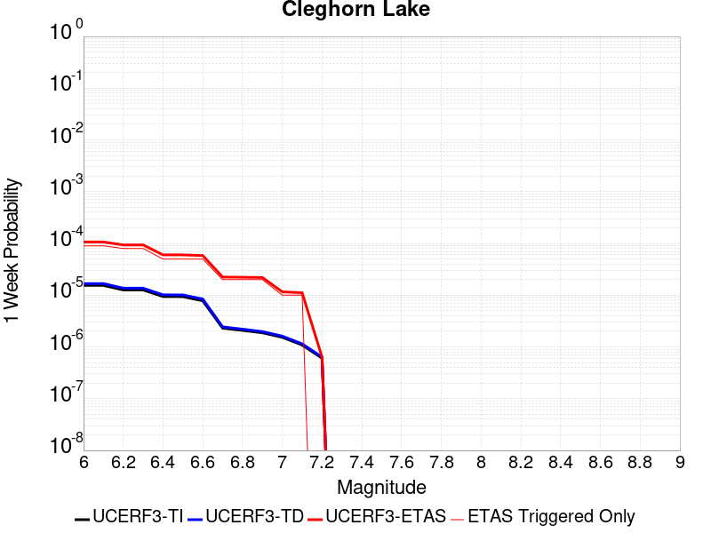 |  | 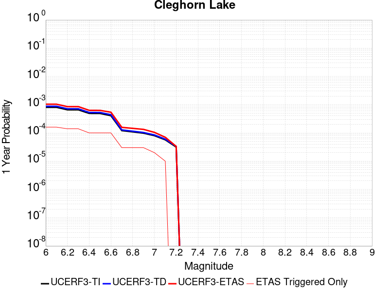 |  |

| Magnitude | 1 wk TI Prob | 1 wk TD Prob | 1 wk ETAS Prob | 1 wk ETAS/TD Gain | 1 wk ETAS Triggered Only | 1 mo TI Prob | 1 mo TD Prob | 1 mo ETAS Prob | 1 mo ETAS/TD Gain | 1 mo ETAS Triggered Only | 1 yr TI Prob | 1 yr TD Prob | 1 yr ETAS Prob | 1 yr ETAS/TD Gain | 1 yr ETAS Triggered Only | 10 yr TI Prob | 10 yr TD Prob | 10 yr ETAS Prob | 10 yr ETAS/TD Gain | 10 yr ETAS Triggered Only |
|-----|-----|-----|-----|-----|-----|-----|-----|-----|-----|-----|-----|-----|-----|-----|-----|-----|-----|-----|-----|-----|
| 6.0 | 1.5467183E-5 | 1.6794203E-5 | 5.9719307E-5 | 3.5559475 | 4.2925825E-5 | 6.6286244E-5 | 7.197348E-5 | 1.1489622E-4 | 1.5963688 | 4.2925825E-5 | 8.067362E-4 | 8.759797E-4 | 0.0010046444 | 1.1468809 | 1.2877748E-4 | 0.008038137 | 0.008730696 | 0.008900899 | 1.0194949 | 1.717033E-4 |
| 6.1 | 1.5467183E-5 | 1.6794203E-5 | 5.9719307E-5 | 3.5559475 | 4.2925825E-5 | 6.6286244E-5 | 7.197348E-5 | 1.1489622E-4 | 1.5963688 | 4.2925825E-5 | 8.067362E-4 | 8.759797E-4 | 0.0010046444 | 1.1468809 | 1.2877748E-4 | 0.008038137 | 0.008730696 | 0.008900899 | 1.0194949 | 1.717033E-4 |
| 6.2 | 1.2624631E-5 | 1.3681544E-5 | 5.6606783E-5 | 4.1374555 | 4.2925825E-5 | 5.410444E-5 | 5.863415E-5 | 1.0155745E-4 | 1.732053 | 4.2925825E-5 | 6.585225E-4 | 7.1368564E-4 | 8.423712E-4 | 1.1803113 | 1.2877748E-4 | 0.0065657445 | 0.0071187317 | 0.0072892127 | 1.0239482 | 1.717033E-4 |
| 6.3 | 1.2624631E-5 | 1.3681544E-5 | 5.6606783E-5 | 4.1374555 | 4.2925825E-5 | 5.410444E-5 | 5.863415E-5 | 1.0155745E-4 | 1.732053 | 4.2925825E-5 | 6.585225E-4 | 7.1368564E-4 | 8.423712E-4 | 1.1803113 | 1.2877748E-4 | 0.0065657445 | 0.0071187317 | 0.0072892127 | 1.0239482 | 1.717033E-4 |
| 6.4 | 9.417684E-6 | 1.0170118E-5 | 1.0170118E-5 | 1.0 | 0.0 | 4.036088E-5 | 4.3585722E-5 | 4.3585722E-5 | 1.0 | 0.0 | 4.912829E-4 | 5.3056807E-4 | 6.1637413E-4 | 1.1617249 | 8.585165E-5 | 0.004901982 | 0.005297049 | 0.0054251445 | 1.0241824 | 1.2877748E-4 |
| 6.5 | 9.368219E-6 | 1.0117545E-5 | 1.0117545E-5 | 1.0 | 0.0 | 4.014889E-5 | 4.3360415E-5 | 4.3360415E-5 | 1.0 | 0.0 | 4.8870314E-4 | 5.2782625E-4 | 6.136326E-4 | 1.1625655 | 8.585165E-5 | 0.004876298 | 0.0052697617 | 0.0053978604 | 1.0243083 | 1.2877748E-4 |
| 6.6 | 7.803798E-6 | 8.441831E-6 | 8.441831E-6 | 1.0 | 0.0 | 3.3444423E-5 | 3.6179E-5 | 3.6179E-5 | 1.0 | 0.0 | 4.0710976E-4 | 4.4043022E-4 | 5.2624405E-4 | 1.1948409 | 8.585165E-5 | 0.0040636472 | 0.0043994905 | 0.0045277015 | 1.0291423 | 1.2877748E-4 |
| 6.7 | 2.3108669E-6 | 2.4438336E-6 | 2.4438336E-6 | 1.0 | 0.0 | 9.903678E-6 | 1.0473532E-5 | 1.0473532E-5 | 1.0 | 0.0 | 1.205706E-4 | 1.2750797E-4 | 1.2750797E-4 | 1.0 | 0.0 | 0.001205052 | 0.0012743667 | 0.0012743667 | 1.0 | 0.0 |
| 6.8 | 2.0882828E-6 | 2.2062823E-6 | 2.2062823E-6 | 1.0 | 0.0 | 8.949753E-6 | 9.455462E-6 | 9.455462E-6 | 1.0 | 0.0 | 1.08957785E-4 | 1.1511434E-4 | 1.1511434E-4 | 1.0 | 0.0 | 0.0010890438 | 0.0011505639 | 0.0011505639 | 1.0 | 0.0 |
| 6.9 | 1.876935E-6 | 1.981051E-6 | 1.981051E-6 | 1.0 | 0.0 | 8.043982E-6 | 8.490192E-6 | 8.490192E-6 | 1.0 | 0.0 | 9.7931086E-5 | 1.03363345E-4 | 1.03363345E-4 | 1.0 | 0.0 | 9.788794E-4 | 0.0010331686 | 0.0010331686 | 1.0 | 0.0 |
| 7.0 | 1.5357559E-6 | 1.6202807E-6 | 1.6202807E-6 | 1.0 | 0.0 | 6.5817944E-6 | 6.9440425E-6 | 6.9440425E-6 | 1.0 | 0.0 | 8.01304E-5 | 8.454057E-5 | 8.454057E-5 | 1.0 | 0.0 | 8.010151E-4 | 8.450965E-4 | 8.450965E-4 | 1.0 | 0.0 |
| 7.1 | 1.0905424E-6 | 1.1497619E-6 | 1.1497619E-6 | 1.0 | 0.0 | 4.6737446E-6 | 4.9275427E-6 | 4.9275427E-6 | 1.0 | 0.0 | 5.6901354E-5 | 5.999128E-5 | 5.999128E-5 | 1.0 | 0.0 | 5.6886784E-4 | 5.997606E-4 | 5.997606E-4 | 1.0 | 0.0 |
| 7.2 | 6.06668E-7 | 6.387277E-7 | 6.387277E-7 | 1.0 | 0.0 | 2.600003E-6 | 2.7374022E-6 | 2.7374022E-6 | 1.0 | 0.0 | 3.1654577E-5 | 3.3327433E-5 | 3.3327433E-5 | 1.0 | 0.0 | 3.1650066E-4 | 3.3323118E-4 | 3.3323118E-4 | 1.0 | 0.0 |

## Red Mountain
*[(top)](#table-of-contents)*

| 1 Week | 1 Month | 1 Year | 10 Year |
|-----|-----|-----|-----|
|  |  |  | 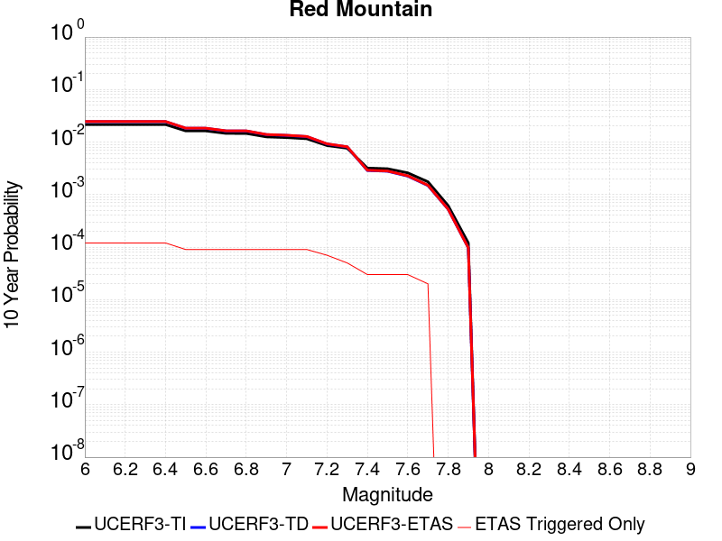 |

| Magnitude | 1 wk TI Prob | 1 wk TD Prob | 1 wk ETAS Prob | 1 wk ETAS/TD Gain | 1 wk ETAS Triggered Only | 1 mo TI Prob | 1 mo TD Prob | 1 mo ETAS Prob | 1 mo ETAS/TD Gain | 1 mo ETAS Triggered Only | 1 yr TI Prob | 1 yr TD Prob | 1 yr ETAS Prob | 1 yr ETAS/TD Gain | 1 yr ETAS Triggered Only | 10 yr TI Prob | 10 yr TD Prob | 10 yr ETAS Prob | 10 yr ETAS/TD Gain | 10 yr ETAS Triggered Only |
|-----|-----|-----|-----|-----|-----|-----|-----|-----|-----|-----|-----|-----|-----|-----|-----|-----|-----|-----|-----|-----|
| 6.0 | 4.1810763E-5 | 4.7590016E-5 | 4.7590016E-5 | 1.0 | 0.0 | 1.7917668E-4 | 2.039422E-4 | 2.039422E-4 | 1.0 | 0.0 | 0.0021792934 | 0.0024803334 | 0.0025231526 | 1.0172635 | 4.2925825E-5 | 0.021580452 | 0.02454411 | 0.024669727 | 1.005118 | 1.2877748E-4 |
| 6.1 | 4.1810763E-5 | 4.7590016E-5 | 4.7590016E-5 | 1.0 | 0.0 | 1.7917668E-4 | 2.039422E-4 | 2.039422E-4 | 1.0 | 0.0 | 0.0021792934 | 0.0024803334 | 0.0025231526 | 1.0172635 | 4.2925825E-5 | 0.021580452 | 0.02454411 | 0.024669727 | 1.005118 | 1.2877748E-4 |
| 6.2 | 4.1810763E-5 | 4.7590016E-5 | 4.7590016E-5 | 1.0 | 0.0 | 1.7917668E-4 | 2.039422E-4 | 2.039422E-4 | 1.0 | 0.0 | 0.0021792934 | 0.0024803334 | 0.0025231526 | 1.0172635 | 4.2925825E-5 | 0.021580452 | 0.02454411 | 0.024669727 | 1.005118 | 1.2877748E-4 |
| 6.3 | 4.1810763E-5 | 4.7590016E-5 | 4.7590016E-5 | 1.0 | 0.0 | 1.7917668E-4 | 2.039422E-4 | 2.039422E-4 | 1.0 | 0.0 | 0.0021792934 | 0.0024803334 | 0.0025231526 | 1.0172635 | 4.2925825E-5 | 0.021580452 | 0.02454411 | 0.024669727 | 1.005118 | 1.2877748E-4 |
| 6.4 | 4.1810763E-5 | 4.7590016E-5 | 4.7590016E-5 | 1.0 | 0.0 | 1.7917668E-4 | 2.039422E-4 | 2.039422E-4 | 1.0 | 0.0 | 0.0021792934 | 0.0024803334 | 0.0025231526 | 1.0172635 | 4.2925825E-5 | 0.021580452 | 0.02454411 | 0.024669727 | 1.005118 | 1.2877748E-4 |
| 6.5 | 3.154503E-5 | 3.5359757E-5 | 3.5359757E-5 | 1.0 | 0.0 | 1.3518598E-4 | 1.5153353E-4 | 1.5153353E-4 | 1.0 | 0.0 | 0.0016446467 | 0.0018434518 | 0.0018862984 | 1.0232426 | 4.2925825E-5 | 0.01632528 | 0.018291244 | 0.018417666 | 1.0069116 | 1.2877748E-4 |
| 6.6 | 3.1535834E-5 | 3.5349138E-5 | 3.5349138E-5 | 1.0 | 0.0 | 1.3514658E-4 | 1.5148803E-4 | 1.5148803E-4 | 1.0 | 0.0 | 0.0016441676 | 0.0018428987 | 0.0018857454 | 1.0232496 | 4.2925825E-5 | 0.01632056 | 0.018285805 | 0.018412229 | 1.0069137 | 1.2877748E-4 |
| 6.7 | 2.8267326E-5 | 3.1469353E-5 | 3.1469353E-5 | 1.0 | 0.0 | 1.2114006E-4 | 1.3486217E-4 | 1.3486217E-4 | 1.0 | 0.0 | 0.0014738824 | 0.0016407954 | 0.0016836508 | 1.0261186 | 4.2925825E-5 | 0.014641452 | 0.01629557 | 0.016422251 | 1.0077739 | 1.2877748E-4 |
| 6.8 | 2.8212884E-5 | 3.1407242E-5 | 3.1407242E-5 | 1.0 | 0.0 | 1.20906756E-4 | 1.3459599E-4 | 1.3459599E-4 | 1.0 | 0.0 | 0.0014710457 | 0.0016375595 | 0.0016804151 | 1.0261704 | 4.2925825E-5 | 0.014613459 | 0.016263688 | 0.01639037 | 1.0077894 | 1.2877748E-4 |
| 6.9 | 2.4227871E-5 | 2.6706994E-5 | 2.6706994E-5 | 1.0 | 0.0 | 1.03829596E-4 | 1.1445395E-4 | 1.1445395E-4 | 1.0 | 0.0 | 0.0012633923 | 0.0013926621 | 0.001435528 | 1.03078 | 4.2925825E-5 | 0.012562336 | 0.0138470335 | 0.013974028 | 1.0091712 | 1.2877748E-4 |
| 7.0 | 2.348524E-5 | 2.5835778E-5 | 2.5835778E-5 | 1.0 | 0.0 | 1.0064714E-4 | 1.10720495E-4 | 1.10720495E-4 | 1.0 | 0.0 | 0.0012246901 | 0.001347264 | 0.001390132 | 1.0318185 | 4.2925825E-5 | 0.012179627 | 0.013398598 | 0.01352565 | 1.0094825 | 1.2877748E-4 |
| 7.1 | 2.2311642E-5 | 2.4462845E-5 | 2.4462845E-5 | 1.0 | 0.0 | 9.561782E-5 | 1.04836974E-4 | 1.04836974E-4 | 1.0 | 0.0 | 0.0011635252 | 0.0012757176 | 0.0013185886 | 1.0336055 | 4.2925825E-5 | 0.01157452 | 0.01269146 | 0.012818603 | 1.010018 | 1.2877748E-4 |
| 7.2 | 1.6533986E-5 | 1.7670362E-5 | 1.7670362E-5 | 1.0 | 0.0 | 7.085802E-5 | 7.572828E-5 | 7.572828E-5 | 1.0 | 0.0 | 8.623549E-4 | 9.2166534E-4 | 9.645516E-4 | 1.0465313 | 4.2925825E-5 | 0.008590161 | 0.009184707 | 0.00926977 | 1.0092614 | 8.585165E-5 |
| 7.3 | 1.4703092E-5 | 1.5559537E-5 | 1.5559537E-5 | 1.0 | 0.0 | 6.301173E-5 | 6.668237E-5 | 6.668237E-5 | 1.0 | 0.0 | 7.668978E-4 | 8.1161706E-4 | 8.1161706E-4 | 1.0 | 0.0 | 0.0076425658 | 0.008092604 | 0.008135182 | 1.0052614 | 4.2925825E-5 |
| 7.4 | 6.1331984E-6 | 5.5288874E-6 | 5.5288874E-6 | 1.0 | 0.0 | 2.6284872E-5 | 2.3695018E-5 | 2.3695018E-5 | 1.0 | 0.0 | 3.199713E-4 | 2.884492E-4 | 2.884492E-4 | 1.0 | 0.0 | 0.0031951098 | 0.0028808024 | 0.0028808024 | 1.0 | 0.0 |
| 7.5 | 5.954766E-6 | 5.338517E-6 | 5.338517E-6 | 1.0 | 0.0 | 2.5520176E-5 | 2.2879161E-5 | 2.2879161E-5 | 1.0 | 0.0 | 3.1066386E-4 | 2.785187E-4 | 2.785187E-4 | 1.0 | 0.0 | 0.003102299 | 0.0027817504 | 0.0027817504 | 1.0 | 0.0 |
| 7.6 | 4.9726646E-6 | 4.315309E-6 | 4.315309E-6 | 1.0 | 0.0 | 2.1311245E-5 | 1.8494053E-5 | 1.8494053E-5 | 1.0 | 0.0 | 2.5943352E-4 | 2.2514217E-4 | 2.2514217E-4 | 1.0 | 0.0 | 0.0025913084 | 0.0022491754 | 0.0022491754 | 1.0 | 0.0 |
| 7.7 | 3.3613894E-6 | 2.8526886E-6 | 2.8526886E-6 | 1.0 | 0.0 | 1.4405875E-5 | 1.22257525E-5 | 1.22257525E-5 | 1.0 | 0.0 | 1.7537741E-4 | 1.4883863E-4 | 1.4883863E-4 | 1.0 | 0.0 | 0.0017523908 | 0.0014874157 | 0.0014874157 | 1.0 | 0.0 |
| 7.8 | 1.1828961E-6 | 1.0122935E-6 | 1.0122935E-6 | 1.0 | 0.0 | 5.069545E-6 | 4.338394E-6 | 4.338394E-6 | 1.0 | 0.0 | 6.171996E-5 | 5.281869E-5 | 5.281869E-5 | 1.0 | 0.0 | 6.170282E-4 | 5.280643E-4 | 5.280643E-4 | 1.0 | 0.0 |
| 7.9 | 2.2967266E-7 | 1.861919E-7 | 1.861919E-7 | 1.0 | 0.0 | 9.843111E-7 | 7.97965E-7 | 7.97965E-7 | 1.0 | 0.0 | 1.19839215E-5 | 9.715184E-6 | 9.715184E-6 | 1.0 | 0.0 | 1.1983275E-4 | 9.714788E-5 | 9.714788E-5 | 1.0 | 0.0 |

## Santa Cruz Island
*[(top)](#table-of-contents)*

| 1 Week | 1 Month | 1 Year | 10 Year |
|-----|-----|-----|-----|
|  |  |  |  |

| Magnitude | 1 wk TI Prob | 1 wk TD Prob | 1 wk ETAS Prob | 1 wk ETAS/TD Gain | 1 wk ETAS Triggered Only | 1 mo TI Prob | 1 mo TD Prob | 1 mo ETAS Prob | 1 mo ETAS/TD Gain | 1 mo ETAS Triggered Only | 1 yr TI Prob | 1 yr TD Prob | 1 yr ETAS Prob | 1 yr ETAS/TD Gain | 1 yr ETAS Triggered Only | 10 yr TI Prob | 10 yr TD Prob | 10 yr ETAS Prob | 10 yr ETAS/TD Gain | 10 yr ETAS Triggered Only |
|-----|-----|-----|-----|-----|-----|-----|-----|-----|-----|-----|-----|-----|-----|-----|-----|-----|-----|-----|-----|-----|
| 6.0 | 2.9164563E-5 | 3.1599742E-5 | 7.4524214E-5 | 2.3583803 | 4.2925825E-5 | 1.2498499E-4 | 1.3542121E-4 | 2.6418123E-4 | 1.9508114 | 1.2877748E-4 | 0.0015206301 | 0.0016476426 | 0.001819063 | 1.1040398 | 1.717033E-4 | 0.015102667 | 0.016368 | 0.016536891 | 1.0103185 | 1.717033E-4 |
| 6.1 | 2.9164563E-5 | 3.1599742E-5 | 7.4524214E-5 | 2.3583803 | 4.2925825E-5 | 1.2498499E-4 | 1.3542121E-4 | 2.6418123E-4 | 1.9508114 | 1.2877748E-4 | 0.0015206301 | 0.0016476426 | 0.001819063 | 1.1040398 | 1.717033E-4 | 0.015102667 | 0.016368 | 0.016536891 | 1.0103185 | 1.717033E-4 |
| 6.2 | 2.9164563E-5 | 3.1599742E-5 | 7.4524214E-5 | 2.3583803 | 4.2925825E-5 | 1.2498499E-4 | 1.3542121E-4 | 2.6418123E-4 | 1.9508114 | 1.2877748E-4 | 0.0015206301 | 0.0016476426 | 0.001819063 | 1.1040398 | 1.717033E-4 | 0.015102667 | 0.016368 | 0.016536891 | 1.0103185 | 1.717033E-4 |
| 6.3 | 1.6635553E-5 | 1.780436E-5 | 1.780436E-5 | 1.0 | 0.0 | 7.1293274E-5 | 7.630227E-5 | 1.6214736E-4 | 2.125066 | 8.585165E-5 | 8.6765E-4 | 9.286024E-4 | 0.0010143743 | 1.0923667 | 8.585165E-5 | 0.008642701 | 0.009249094 | 0.009334152 | 1.0091963 | 8.585165E-5 |
| 6.4 | 1.6635553E-5 | 1.780436E-5 | 1.780436E-5 | 1.0 | 0.0 | 7.1293274E-5 | 7.630227E-5 | 1.6214736E-4 | 2.125066 | 8.585165E-5 | 8.6765E-4 | 9.286024E-4 | 0.0010143743 | 1.0923667 | 8.585165E-5 | 0.008642701 | 0.009249094 | 0.009334152 | 1.0091963 | 8.585165E-5 |
| 6.5 | 1.2238748E-5 | 1.3042996E-5 | 1.3042996E-5 | 1.0 | 0.0 | 5.2450723E-5 | 5.5897377E-5 | 9.8820805E-5 | 1.7678969 | 4.2925825E-5 | 6.3840044E-4 | 6.8034173E-4 | 7.232384E-4 | 1.0630516 | 4.2925825E-5 | 0.0063656955 | 0.006782988 | 0.0068256226 | 1.0062855 | 4.2925825E-5 |
| 6.6 | 1.0489767E-5 | 1.1156636E-5 | 1.1156636E-5 | 1.0 | 0.0 | 4.495537E-5 | 4.781329E-5 | 4.781329E-5 | 1.0 | 0.0 | 5.4719415E-4 | 5.819736E-4 | 5.819736E-4 | 1.0 | 0.0 | 0.005458487 | 0.005804736 | 0.005804736 | 1.0 | 0.0 |
| 6.7 | 8.699222E-6 | 9.236783E-6 | 9.236783E-6 | 1.0 | 0.0 | 3.7281847E-5 | 3.958561E-5 | 3.958561E-5 | 1.0 | 0.0 | 4.5381195E-4 | 4.818488E-4 | 4.818488E-4 | 1.0 | 0.0 | 0.0045288634 | 0.004808108 | 0.004808108 | 1.0 | 0.0 |
| 6.8 | 8.307732E-6 | 8.8169045E-6 | 8.8169045E-6 | 1.0 | 0.0 | 3.560408E-5 | 3.7786187E-5 | 3.7786187E-5 | 1.0 | 0.0 | 4.3339343E-4 | 4.5995016E-4 | 4.5995016E-4 | 1.0 | 0.0 | 0.004325492 | 0.0045900354 | 0.0045900354 | 1.0 | 0.0 |
| 6.9 | 8.073121E-6 | 8.564939E-6 | 8.564939E-6 | 1.0 | 0.0 | 3.459863E-5 | 3.670637E-5 | 3.670637E-5 | 1.0 | 0.0 | 4.2115687E-4 | 4.4680882E-4 | 4.4680882E-4 | 1.0 | 0.0 | 0.004203596 | 0.004459156 | 0.004459156 | 1.0 | 0.0 |
| 7.0 | 7.617019E-6 | 8.074665E-6 | 8.074665E-6 | 1.0 | 0.0 | 3.264396E-5 | 3.4605247E-5 | 3.4605247E-5 | 1.0 | 0.0 | 3.9736772E-4 | 4.2123784E-4 | 4.2123784E-4 | 1.0 | 0.0 | 0.003966579 | 0.0042044413 | 0.0042044413 | 1.0 | 0.0 |
| 7.1 | 7.1224836E-6 | 7.5457883E-6 | 7.5457883E-6 | 1.0 | 0.0 | 3.052457E-5 | 3.2338692E-5 | 3.2338692E-5 | 1.0 | 0.0 | 3.715733E-4 | 3.9365282E-4 | 3.9365282E-4 | 1.0 | 0.0 | 0.003709526 | 0.0039295983 | 0.0039295983 | 1.0 | 0.0 |
| 7.2 | 6.441115E-6 | 6.8273835E-6 | 6.8273835E-6 | 1.0 | 0.0 | 2.7604487E-5 | 2.9259889E-5 | 2.9259889E-5 | 1.0 | 0.0 | 3.360328E-4 | 3.5618115E-4 | 3.5618115E-4 | 1.0 | 0.0 | 0.0033552512 | 0.0035561312 | 0.0035561312 | 1.0 | 0.0 |
| 7.3 | 5.494274E-6 | 5.8199944E-6 | 5.8199944E-6 | 1.0 | 0.0 | 2.3546674E-5 | 2.4942596E-5 | 2.4942596E-5 | 1.0 | 0.0 | 2.8664304E-4 | 3.03634E-4 | 3.03634E-4 | 1.0 | 0.0 | 0.002862736 | 0.0030322145 | 0.0030322145 | 1.0 | 0.0 |
| 7.4 | 4.0802624E-6 | 4.3122564E-6 | 4.3122564E-6 | 1.0 | 0.0 | 1.7486722E-5 | 1.8480969E-5 | 1.8480969E-5 | 1.0 | 0.0 | 2.1288003E-4 | 2.2498264E-4 | 2.2498264E-4 | 1.0 | 0.0 | 0.0021267622 | 0.0022475577 | 0.0022475577 | 1.0 | 0.0 |
| 7.5 | 2.3584746E-6 | 2.4753099E-6 | 2.4753099E-6 | 1.0 | 0.0 | 1.0107709E-5 | 1.0608428E-5 | 1.0608428E-5 | 1.0 | 0.0 | 1.2305441E-4 | 1.2915001E-4 | 1.2915001E-4 | 1.0 | 0.0 | 0.0012298629 | 0.0012907545 | 0.0012907545 | 1.0 | 0.0 |
| 7.6 | 9.4981914E-7 | 9.860934E-7 | 9.860934E-7 | 1.0 | 0.0 | 4.0706473E-6 | 4.2261076E-6 | 4.2261076E-6 | 1.0 | 0.0 | 4.9559E-5 | 5.1451658E-5 | 5.1451658E-5 | 1.0 | 0.0 | 4.954795E-4 | 5.1439874E-4 | 5.1439874E-4 | 1.0 | 0.0 |
| 7.7 | 2.6013532E-7 | 2.6416632E-7 | 2.6416632E-7 | 1.0 | 0.0 | 1.1148652E-6 | 1.1321408E-6 | 1.1321408E-6 | 1.0 | 0.0 | 1.3573399E-5 | 1.3783729E-5 | 1.3783729E-5 | 1.0 | 0.0 | 1.357257E-4 | 1.378288E-4 | 1.378288E-4 | 1.0 | 0.0 |
| 7.8 | 4.1522263E-8 | 3.965698E-8 | 3.965698E-8 | 1.0 | 0.0 | 1.7795254E-7 | 1.6995848E-7 | 1.6995848E-7 | 1.0 | 0.0 | 2.16657E-6 | 2.0692428E-6 | 2.0692428E-6 | 1.0 | 0.0 | 2.1665488E-5 | 2.0692256E-5 | 2.0692256E-5 | 1.0 | 0.0 |
| 7.9 | 7.7242046E-10 | 5.9475225E-10 | 5.9475225E-10 | 1.0 | 0.0 | 3.3103735E-9 | 2.5489382E-9 | 2.5489382E-9 | 1.0 | 0.0 | 4.0303796E-8 | 3.1033323E-8 | 3.1033323E-8 | 1.0 | 0.0 | 4.030379E-7 | 3.103332E-7 | 3.103332E-7 | 1.0 | 0.0 |

## Rose Canyon
*[(top)](#table-of-contents)*

| 1 Week | 1 Month | 1 Year | 10 Year |
|-----|-----|-----|-----|
|  |  | 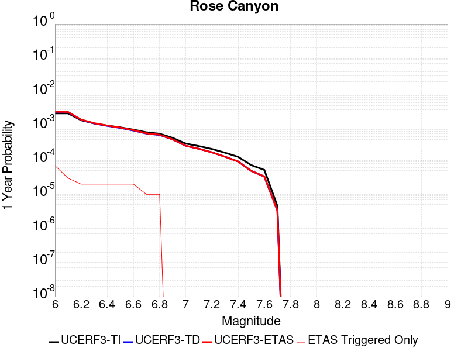 | 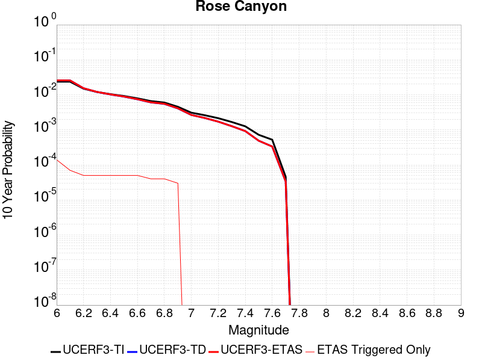 |

| Magnitude | 1 wk TI Prob | 1 wk TD Prob | 1 wk ETAS Prob | 1 wk ETAS/TD Gain | 1 wk ETAS Triggered Only | 1 mo TI Prob | 1 mo TD Prob | 1 mo ETAS Prob | 1 mo ETAS/TD Gain | 1 mo ETAS Triggered Only | 1 yr TI Prob | 1 yr TD Prob | 1 yr ETAS Prob | 1 yr ETAS/TD Gain | 1 yr ETAS Triggered Only | 10 yr TI Prob | 10 yr TD Prob | 10 yr ETAS Prob | 10 yr ETAS/TD Gain | 10 yr ETAS Triggered Only |
|-----|-----|-----|-----|-----|-----|-----|-----|-----|-----|-----|-----|-----|-----|-----|-----|-----|-----|-----|-----|-----|
| 6.0 | 4.5923203E-5 | 4.9714607E-5 | 1.3556199E-4 | 2.726804 | 8.585165E-5 | 1.9679888E-4 | 2.1304654E-4 | 2.988799E-4 | 1.4028854 | 8.585165E-5 | 0.0023933933 | 0.0025909478 | 0.002676577 | 1.0330493 | 8.585165E-5 | 0.023677798 | 0.025618518 | 0.025743997 | 1.004898 | 1.2877748E-4 |
| 6.1 | 4.5923203E-5 | 4.9714607E-5 | 9.26383E-5 | 1.863402 | 4.2925825E-5 | 1.9679888E-4 | 2.1304654E-4 | 2.5596324E-4 | 1.2014427 | 4.2925825E-5 | 0.0023933933 | 0.0025909478 | 0.0026337625 | 1.0165247 | 4.2925825E-5 | 0.023677798 | 0.025618518 | 0.025702171 | 1.0032653 | 8.585165E-5 |
| 6.2 | 2.8844734E-5 | 2.9669678E-5 | 2.9669678E-5 | 1.0 | 0.0 | 1.2361443E-4 | 1.2714976E-4 | 1.2714976E-4 | 1.0 | 0.0 | 0.0015039665 | 0.001546976 | 0.001546976 | 1.0 | 0.0 | 0.0149382865 | 0.015364873 | 0.015407139 | 1.0027509 | 4.2925825E-5 |
| 6.3 | 2.3171577E-5 | 2.3162425E-5 | 2.3162425E-5 | 1.0 | 0.0 | 9.9302975E-5 | 9.926383E-5 | 9.926383E-5 | 1.0 | 0.0 | 0.0012083431 | 0.0012078804 | 0.0012078804 | 1.0 | 0.0 | 0.012017938 | 0.012012152 | 0.012054563 | 1.0035306 | 4.2925825E-5 |
| 6.4 | 2.0066604E-5 | 1.9668067E-5 | 1.9668067E-5 | 1.0 | 0.0 | 8.599689E-5 | 8.428905E-5 | 8.428905E-5 | 1.0 | 0.0 | 0.0010465092 | 0.001025746 | 0.001025746 | 1.0 | 0.0 | 0.010415946 | 0.010211479 | 0.010253966 | 1.0041608 | 4.2925825E-5 |
| 6.5 | 1.776989E-5 | 1.7115402E-5 | 1.7115402E-5 | 1.0 | 0.0 | 7.615444E-5 | 7.33497E-5 | 7.33497E-5 | 1.0 | 0.0 | 9.267859E-4 | 8.926737E-4 | 8.926737E-4 | 1.0 | 0.0 | 0.009229303 | 0.008874663 | 0.008917208 | 1.004794 | 4.2925825E-5 |
| 6.6 | 1.5227364E-5 | 1.4340872E-5 | 1.4340872E-5 | 1.0 | 0.0 | 6.52585E-5 | 6.145947E-5 | 6.145947E-5 | 1.0 | 0.0 | 7.942326E-4 | 7.480173E-4 | 7.480173E-4 | 1.0 | 0.0 | 0.007914 | 0.0074410336 | 0.0074836398 | 1.0057259 | 4.2925825E-5 |
| 6.7 | 1.2703898E-5 | 1.1674277E-5 | 1.1674277E-5 | 1.0 | 0.0 | 5.4444143E-5 | 5.0031682E-5 | 5.0031682E-5 | 1.0 | 0.0 | 6.626558E-4 | 6.089697E-4 | 6.089697E-4 | 1.0 | 0.0 | 0.006606833 | 0.0060623093 | 0.006104975 | 1.0070379 | 4.2925825E-5 |
| 6.8 | 1.1554917E-5 | 1.0610384E-5 | 1.0610384E-5 | 1.0 | 0.0 | 4.9520135E-5 | 4.547231E-5 | 4.547231E-5 | 1.0 | 0.0 | 6.0274085E-4 | 5.5348873E-4 | 5.5348873E-4 | 1.0 | 0.0 | 0.0060110865 | 0.005504414 | 0.0055471035 | 1.0077555 | 4.2925825E-5 |
| 6.9 | 8.732078E-6 | 7.882285E-6 | 7.882285E-6 | 1.0 | 0.0 | 3.7422655E-5 | 3.37808E-5 | 3.37808E-5 | 1.0 | 0.0 | 4.5552556E-4 | 4.112066E-4 | 4.112066E-4 | 1.0 | 0.0 | 0.0045459294 | 0.004089515 | 0.004132265 | 1.0104536 | 4.2925825E-5 |
| 7.0 | 5.9337494E-6 | 5.107436E-6 | 5.107436E-6 | 1.0 | 0.0 | 2.5430107E-5 | 2.1888829E-5 | 2.1888829E-5 | 1.0 | 0.0 | 3.0956755E-4 | 2.6646405E-4 | 2.6646405E-4 | 1.0 | 0.0 | 0.0030913667 | 0.002661461 | 0.002661461 | 1.0 | 0.0 |
| 7.1 | 5.013409E-6 | 4.17734E-6 | 4.17734E-6 | 1.0 | 0.0 | 2.1485863E-5 | 1.7902763E-5 | 1.7902763E-5 | 1.0 | 0.0 | 2.6155898E-4 | 2.1794444E-4 | 2.1794444E-4 | 1.0 | 0.0 | 0.0026125133 | 0.0021773188 | 0.0021773188 | 1.0 | 0.0 |
| 7.2 | 4.120763E-6 | 3.2820917E-6 | 3.2820917E-6 | 1.0 | 0.0 | 1.7660293E-5 | 1.4066032E-5 | 1.4066032E-5 | 1.0 | 0.0 | 2.1499286E-4 | 1.7124058E-4 | 1.7124058E-4 | 1.0 | 0.0 | 0.0021478499 | 0.0017110958 | 0.0017110958 | 1.0 | 0.0 |
| 7.3 | 3.2081239E-6 | 2.4404965E-6 | 2.4404965E-6 | 1.0 | 0.0 | 1.374903E-5 | 1.0459229E-5 | 1.0459229E-5 | 1.0 | 0.0 | 1.6738157E-4 | 1.2733374E-4 | 1.2733374E-4 | 1.0 | 0.0 | 0.0016725556 | 0.0012726148 | 0.0012726148 | 1.0 | 0.0 |
| 7.4 | 2.4194755E-6 | 1.7680321E-6 | 1.7680321E-6 | 1.0 | 0.0 | 1.0369139E-5 | 7.5772587E-6 | 7.5772587E-6 | 1.0 | 0.0 | 1.2623696E-4 | 9.224927E-5 | 9.224927E-5 | 1.0 | 0.0 | 0.0012616527 | 9.221151E-4 | 9.221151E-4 | 1.0 | 0.0 |
| 7.5 | 1.3842889E-6 | 9.3782967E-7 | 9.3782967E-7 | 1.0 | 0.0 | 5.9326535E-6 | 4.019264E-6 | 4.019264E-6 | 1.0 | 0.0 | 7.222766E-5 | 4.8933474E-5 | 4.8933474E-5 | 1.0 | 0.0 | 7.220419E-4 | 4.8923056E-4 | 4.8923056E-4 | 1.0 | 0.0 |
| 7.6 | 1.0021575E-6 | 6.4113493E-7 | 6.4113493E-7 | 1.0 | 0.0 | 4.2949537E-6 | 2.7477186E-6 | 2.7477186E-6 | 1.0 | 0.0 | 5.2289808E-5 | 3.345298E-5 | 3.345298E-5 | 1.0 | 0.0 | 5.2277505E-4 | 3.344816E-4 | 3.344816E-4 | 1.0 | 0.0 |
| 7.7 | 8.7620116E-8 | 6.449304E-8 | 6.449304E-8 | 1.0 | 0.0 | 3.7551473E-7 | 2.763987E-7 | 2.763987E-7 | 1.0 | 0.0 | 4.5718825E-6 | 3.3651493E-6 | 3.3651493E-6 | 1.0 | 0.0 | 4.5717883E-5 | 3.3651013E-5 | 3.3651013E-5 | 1.0 | 0.0 |

## Mission Ridge-Arroyo Parida-Santa Ana
*[(top)](#table-of-contents)*

| 1 Week | 1 Month | 1 Year | 10 Year |
|-----|-----|-----|-----|
|  |  |  |  |

| Magnitude | 1 wk TI Prob | 1 wk TD Prob | 1 wk ETAS Prob | 1 wk ETAS/TD Gain | 1 wk ETAS Triggered Only | 1 mo TI Prob | 1 mo TD Prob | 1 mo ETAS Prob | 1 mo ETAS/TD Gain | 1 mo ETAS Triggered Only | 1 yr TI Prob | 1 yr TD Prob | 1 yr ETAS Prob | 1 yr ETAS/TD Gain | 1 yr ETAS Triggered Only | 10 yr TI Prob | 10 yr TD Prob | 10 yr ETAS Prob | 10 yr ETAS/TD Gain | 10 yr ETAS Triggered Only |
|-----|-----|-----|-----|-----|-----|-----|-----|-----|-----|-----|-----|-----|-----|-----|-----|-----|-----|-----|-----|-----|
| 6.0 | 4.169034E-5 | 4.7137048E-5 | 9.006085E-5 | 1.9106171 | 4.2925825E-5 | 1.7866064E-4 | 2.0200513E-4 | 2.449223E-4 | 1.2124557 | 4.2925825E-5 | 0.0021730233 | 0.0024574657 | 0.0025431064 | 1.0348492 | 8.585165E-5 | 0.021518968 | 0.02438483 | 0.024552345 | 1.0068697 | 1.717033E-4 |
| 6.1 | 1.73813E-5 | 1.6854203E-5 | 5.9779304E-5 | 3.5468483 | 4.2925825E-5 | 7.4489166E-5 | 7.223036E-5 | 1.1515308E-4 | 1.5942477 | 4.2925825E-5 | 9.065282E-4 | 8.790605E-4 | 9.219486E-4 | 1.0487885 | 4.2925825E-5 | 0.009028391 | 0.008757128 | 0.008884778 | 1.0145767 | 1.2877748E-4 |
| 6.2 | 1.4622182E-5 | 1.3673262E-5 | 5.65985E-5 | 4.1393557 | 4.2925825E-5 | 6.2664985E-5 | 5.85984E-5 | 1.0152171E-4 | 1.7324996 | 4.2925825E-5 | 7.6267915E-4 | 7.132059E-4 | 7.561011E-4 | 1.0601442 | 4.2925825E-5 | 0.007600669 | 0.007109767 | 0.007237629 | 1.017984 | 1.2877748E-4 |
| 6.3 | 1.3552434E-5 | 1.2482174E-5 | 1.2482174E-5 | 1.0 | 0.0 | 5.8080568E-5 | 5.349395E-5 | 5.349395E-5 | 1.0 | 0.0 | 7.069015E-4 | 6.510974E-4 | 6.510974E-4 | 1.0 | 0.0 | 0.00704657 | 0.006492415 | 0.006577709 | 1.0131376 | 8.585165E-5 |
| 6.4 | 1.30977305E-5 | 1.1979128E-5 | 1.1979128E-5 | 1.0 | 0.0 | 5.613192E-5 | 5.133813E-5 | 5.133813E-5 | 1.0 | 0.0 | 6.831918E-4 | 6.2486547E-4 | 6.2486547E-4 | 1.0 | 0.0 | 0.006810953 | 0.006231584 | 0.0063169007 | 1.013691 | 8.585165E-5 |
| 6.5 | 1.225205E-5 | 1.1048776E-5 | 1.1048776E-5 | 1.0 | 0.0 | 5.2507727E-5 | 4.735105E-5 | 4.735105E-5 | 1.0 | 0.0 | 6.3909404E-4 | 5.7634927E-4 | 5.7634927E-4 | 1.0 | 0.0 | 0.006372592 | 0.005749009 | 0.005791688 | 1.0074238 | 4.2925825E-5 |
| 6.6 | 1.1352241E-5 | 1.0063508E-5 | 1.0063508E-5 | 1.0 | 0.0 | 4.8651553E-5 | 4.3128617E-5 | 4.3128617E-5 | 1.0 | 0.0 | 5.921717E-4 | 5.249665E-4 | 5.249665E-4 | 1.0 | 0.0 | 0.0059059616 | 0.0052376646 | 0.0052803652 | 1.0081527 | 4.2925825E-5 |
| 6.7 | 1.0864116E-5 | 9.517E-6 | 9.517E-6 | 1.0 | 0.0 | 4.6559664E-5 | 4.0786515E-5 | 4.0786515E-5 | 1.0 | 0.0 | 5.667165E-4 | 4.964647E-4 | 4.964647E-4 | 1.0 | 0.0 | 0.005652734 | 0.0049539437 | 0.004996657 | 1.008622 | 4.2925825E-5 |
| 6.8 | 1.0666365E-5 | 9.299752E-6 | 9.299752E-6 | 1.0 | 0.0 | 4.571219E-5 | 3.985548E-5 | 3.985548E-5 | 1.0 | 0.0 | 5.564038E-4 | 4.8513446E-4 | 4.8513446E-4 | 1.0 | 0.0 | 0.005550127 | 0.00484114 | 0.004883858 | 1.008824 | 4.2925825E-5 |
| 6.9 | 1.0038665E-5 | 8.592018E-6 | 8.592018E-6 | 1.0 | 0.0 | 4.302214E-5 | 3.682243E-5 | 3.682243E-5 | 1.0 | 0.0 | 5.236687E-4 | 4.4822265E-4 | 4.4822265E-4 | 1.0 | 0.0 | 0.005224364 | 0.0044735507 | 0.004516285 | 1.0095526 | 4.2925825E-5 |
| 7.0 | 9.5379955E-6 | 8.025047E-6 | 8.025047E-6 | 1.0 | 0.0 | 4.0876483E-5 | 3.439261E-5 | 3.439261E-5 | 1.0 | 0.0 | 4.975576E-4 | 4.1865133E-4 | 4.1865133E-4 | 1.0 | 0.0 | 0.00496445 | 0.00417898 | 0.004221726 | 1.0102289 | 4.2925825E-5 |
| 7.1 | 9.207389E-6 | 7.652347E-6 | 7.652347E-6 | 1.0 | 0.0 | 3.945964E-5 | 3.2795375E-5 | 3.2795375E-5 | 1.0 | 0.0 | 4.803152E-4 | 3.992122E-4 | 3.992122E-4 | 1.0 | 0.0 | 0.004792784 | 0.003985301 | 0.004028056 | 1.0107281 | 4.2925825E-5 |
| 7.2 | 7.638091E-6 | 5.9310923E-6 | 5.9310923E-6 | 1.0 | 0.0 | 3.2734264E-5 | 2.5418722E-5 | 2.5418722E-5 | 1.0 | 0.0 | 3.984668E-4 | 3.094293E-4 | 3.094293E-4 | 1.0 | 0.0 | 0.0039775306 | 0.0030901956 | 0.0030901956 | 1.0 | 0.0 |
| 7.3 | 7.2500147E-6 | 5.596131E-6 | 5.596131E-6 | 1.0 | 0.0 | 3.1071122E-5 | 2.3983199E-5 | 2.3983199E-5 | 1.0 | 0.0 | 3.7822526E-4 | 2.9195662E-4 | 2.9195662E-4 | 1.0 | 0.0 | 0.0037758215 | 0.0029159402 | 0.0029159402 | 1.0 | 0.0 |
| 7.4 | 6.3899715E-6 | 4.9184864E-6 | 4.9184864E-6 | 1.0 | 0.0 | 2.7385306E-5 | 2.1079059E-5 | 2.1079059E-5 | 1.0 | 0.0 | 3.3336508E-4 | 2.566075E-4 | 2.566075E-4 | 1.0 | 0.0 | 0.0033286542 | 0.002563311 | 0.002563311 | 1.0 | 0.0 |
| 7.5 | 5.379025E-6 | 4.0838477E-6 | 4.0838477E-6 | 1.0 | 0.0 | 2.305276E-5 | 1.7502087E-5 | 1.7502087E-5 | 1.0 | 0.0 | 2.806312E-4 | 2.1306718E-4 | 2.1306718E-4 | 1.0 | 0.0 | 0.0028027708 | 0.0021286402 | 0.0021286402 | 1.0 | 0.0 |
| 7.6 | 4.1270696E-6 | 3.0883373E-6 | 3.0883373E-6 | 1.0 | 0.0 | 1.768732E-5 | 1.32356645E-5 | 1.32356645E-5 | 1.0 | 0.0 | 2.1532185E-4 | 1.6113237E-4 | 1.6113237E-4 | 1.0 | 0.0 | 0.0021511333 | 0.0016101635 | 0.0016101635 | 1.0 | 0.0 |
| 7.7 | 2.5406805E-6 | 1.8282044E-6 | 1.8282044E-6 | 1.0 | 0.0 | 1.0888585E-5 | 7.835139E-6 | 7.835139E-6 | 1.0 | 0.0 | 1.3256045E-4 | 9.53887E-5 | 9.53887E-5 | 1.0 | 0.0 | 0.0013248142 | 9.534837E-4 | 9.534837E-4 | 1.0 | 0.0 |
| 7.8 | 4.8608285E-7 | 3.509864E-7 | 3.509864E-7 | 1.0 | 0.0 | 2.0832106E-6 | 1.5042266E-6 | 1.5042266E-6 | 1.0 | 0.0 | 2.5362791E-5 | 1.8313805E-5 | 1.8313805E-5 | 1.0 | 0.0 | 2.5359896E-4 | 1.8312308E-4 | 1.8312308E-4 | 1.0 | 0.0 |
| 7.9 | 2.0472514E-8 | 1.2688718E-8 | 1.2688718E-8 | 1.0 | 0.0 | 8.7739345E-8 | 5.438022E-8 | 5.438022E-8 | 1.0 | 0.0 | 1.068226E-6 | 6.6207895E-7 | 6.6207895E-7 | 1.0 | 0.0 | 1.0682209E-5 | 6.620771E-6 | 6.620771E-6 | 1.0 | 0.0 |
| 8.0 | 4.443582E-9 | 2.032067E-9 | 2.032067E-9 | 1.0 | 0.0 | 1.9043922E-8 | 8.7088585E-9 | 8.7088585E-9 | 1.0 | 0.0 | 2.3185973E-7 | 1.0603035E-7 | 1.0603035E-7 | 1.0 | 0.0 | 2.3185949E-6 | 1.0603031E-6 | 1.0603031E-6 | 1.0 | 0.0 |

## Independence rev 2011
*[(top)](#table-of-contents)*

| 1 Week | 1 Month | 1 Year | 10 Year |
|-----|-----|-----|-----|
| 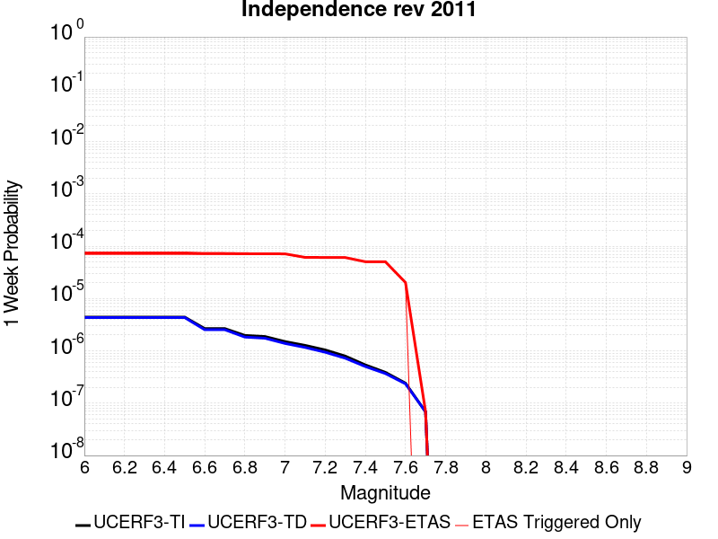 |  |  |  |

| Magnitude | 1 wk TI Prob | 1 wk TD Prob | 1 wk ETAS Prob | 1 wk ETAS/TD Gain | 1 wk ETAS Triggered Only | 1 mo TI Prob | 1 mo TD Prob | 1 mo ETAS Prob | 1 mo ETAS/TD Gain | 1 mo ETAS Triggered Only | 1 yr TI Prob | 1 yr TD Prob | 1 yr ETAS Prob | 1 yr ETAS/TD Gain | 1 yr ETAS Triggered Only | 10 yr TI Prob | 10 yr TD Prob | 10 yr ETAS Prob | 10 yr ETAS/TD Gain | 10 yr ETAS Triggered Only |
|-----|-----|-----|-----|-----|-----|-----|-----|-----|-----|-----|-----|-----|-----|-----|-----|-----|-----|-----|-----|-----|
| 6.0 | 4.422171E-6 | 4.3262253E-6 | 4.3262253E-6 | 1.0 | 0.0 | 1.8952025E-5 | 1.8540852E-5 | 6.146588E-5 | 3.3151596 | 4.2925825E-5 | 2.3071647E-4 | 2.2571447E-4 | 3.5446286E-4 | 1.5704039 | 1.2877748E-4 | 0.0023047708 | 0.0022551457 | 0.0023836328 | 1.056975 | 1.2877748E-4 |
| 6.1 | 4.422171E-6 | 4.3262253E-6 | 4.3262253E-6 | 1.0 | 0.0 | 1.8952025E-5 | 1.8540852E-5 | 6.146588E-5 | 3.3151596 | 4.2925825E-5 | 2.3071647E-4 | 2.2571447E-4 | 3.5446286E-4 | 1.5704039 | 1.2877748E-4 | 0.0023047708 | 0.0022551457 | 0.0023836328 | 1.056975 | 1.2877748E-4 |
| 6.2 | 4.422171E-6 | 4.3262253E-6 | 4.3262253E-6 | 1.0 | 0.0 | 1.8952025E-5 | 1.8540852E-5 | 6.146588E-5 | 3.3151596 | 4.2925825E-5 | 2.3071647E-4 | 2.2571447E-4 | 3.5446286E-4 | 1.5704039 | 1.2877748E-4 | 0.0023047708 | 0.0022551457 | 0.0023836328 | 1.056975 | 1.2877748E-4 |
| 6.3 | 4.422171E-6 | 4.3262253E-6 | 4.3262253E-6 | 1.0 | 0.0 | 1.8952025E-5 | 1.8540852E-5 | 6.146588E-5 | 3.3151596 | 4.2925825E-5 | 2.3071647E-4 | 2.2571447E-4 | 3.5446286E-4 | 1.5704039 | 1.2877748E-4 | 0.0023047708 | 0.0022551457 | 0.0023836328 | 1.056975 | 1.2877748E-4 |
| 6.4 | 4.422171E-6 | 4.3262253E-6 | 4.3262253E-6 | 1.0 | 0.0 | 1.8952025E-5 | 1.8540852E-5 | 6.146588E-5 | 3.3151596 | 4.2925825E-5 | 2.3071647E-4 | 2.2571447E-4 | 3.5446286E-4 | 1.5704039 | 1.2877748E-4 | 0.0023047708 | 0.0022551457 | 0.0023836328 | 1.056975 | 1.2877748E-4 |
| 6.5 | 4.422171E-6 | 4.3262253E-6 | 4.3262253E-6 | 1.0 | 0.0 | 1.8952025E-5 | 1.8540852E-5 | 6.146588E-5 | 3.3151596 | 4.2925825E-5 | 2.3071647E-4 | 2.2571447E-4 | 3.5446286E-4 | 1.5704039 | 1.2877748E-4 | 0.0023047708 | 0.0022551457 | 0.0023836328 | 1.056975 | 1.2877748E-4 |
| 6.6 | 2.663744E-6 | 2.5319846E-6 | 2.5319846E-6 | 1.0 | 0.0 | 1.1415996E-5 | 1.08513195E-5 | 5.377668E-5 | 4.955773 | 4.2925825E-5 | 1.3898089E-4 | 1.321073E-4 | 1.7502745E-4 | 1.3248886 | 4.2925825E-5 | 0.0013889399 | 0.0013203359 | 0.001363205 | 1.0324683 | 4.2925825E-5 |
| 6.7 | 2.663744E-6 | 2.5319846E-6 | 2.5319846E-6 | 1.0 | 0.0 | 1.1415996E-5 | 1.08513195E-5 | 5.377668E-5 | 4.955773 | 4.2925825E-5 | 1.3898089E-4 | 1.321073E-4 | 1.7502745E-4 | 1.3248886 | 4.2925825E-5 | 0.0013889399 | 0.0013203359 | 0.001363205 | 1.0324683 | 4.2925825E-5 |
| 6.8 | 1.9716529E-6 | 1.8322567E-6 | 1.8322567E-6 | 1.0 | 0.0 | 8.449913E-6 | 7.852505E-6 | 5.077799E-5 | 6.4664702 | 4.2925825E-5 | 1.0287284E-4 | 9.560019E-5 | 1.3852191E-4 | 1.448971 | 4.2925825E-5 | 0.0010282523 | 9.5560355E-4 | 9.984884E-4 | 1.0448772 | 4.2925825E-5 |
| 6.9 | 1.8788617E-6 | 1.7429976E-6 | 1.7429976E-6 | 1.0 | 0.0 | 8.0522395E-6 | 7.4699688E-6 | 5.0395472E-5 | 6.74641 | 4.2925825E-5 | 9.80316E-5 | 9.09432E-5 | 1.3386512E-4 | 1.471964 | 4.2925825E-5 | 9.798837E-4 | 9.090718E-4 | 9.5195865E-4 | 1.0471765 | 4.2925825E-5 |
| 7.0 | 1.5045488E-6 | 1.3849498E-6 | 1.3849498E-6 | 1.0 | 0.0 | 6.44805E-6 | 5.9354857E-6 | 5.9354857E-6 | 1.0 | 0.0 | 7.8502184E-5 | 7.226219E-5 | 7.226219E-5 | 1.0 | 0.0 | 7.8474457E-4 | 7.223921E-4 | 7.223921E-4 | 1.0 | 0.0 |
| 7.1 | 1.272341E-6 | 1.1625089E-6 | 1.1625089E-6 | 1.0 | 0.0 | 5.4528787E-6 | 4.9821715E-6 | 4.9821715E-6 | 1.0 | 0.0 | 6.6386776E-5 | 6.0656283E-5 | 6.0656283E-5 | 1.0 | 0.0 | 6.636695E-4 | 6.064005E-4 | 6.064005E-4 | 1.0 | 0.0 |
| 7.2 | 1.0416892E-6 | 9.409871E-7 | 9.409871E-7 | 1.0 | 0.0 | 4.464375E-6 | 4.032796E-6 | 4.032796E-6 | 1.0 | 0.0 | 5.4352407E-5 | 4.9098202E-5 | 4.9098202E-5 | 1.0 | 0.0 | 5.4339116E-4 | 4.908754E-4 | 4.908754E-4 | 1.0 | 0.0 |
| 7.3 | 7.9450155E-7 | 7.2350036E-7 | 7.2350036E-7 | 1.0 | 0.0 | 3.4050022E-6 | 3.1007123E-6 | 3.1007123E-6 | 1.0 | 0.0 | 4.1455114E-5 | 3.7750528E-5 | 3.7750528E-5 | 1.0 | 0.0 | 4.144738E-4 | 3.7744228E-4 | 3.7744228E-4 | 1.0 | 0.0 |
| 7.4 | 5.3893444E-7 | 5.0195166E-7 | 5.0195166E-7 | 1.0 | 0.0 | 2.309717E-6 | 2.1512196E-6 | 2.1512196E-6 | 1.0 | 0.0 | 2.8120441E-5 | 2.6190788E-5 | 2.6190788E-5 | 1.0 | 0.0 | 2.8116882E-4 | 2.6187746E-4 | 2.6187746E-4 | 1.0 | 0.0 |
| 7.5 | 3.8852085E-7 | 3.6825622E-7 | 3.6825622E-7 | 1.0 | 0.0 | 1.6650882E-6 | 1.57824E-6 | 1.57824E-6 | 1.0 | 0.0 | 2.027226E-5 | 1.9214905E-5 | 1.9214905E-5 | 1.0 | 0.0 | 2.0270412E-4 | 1.9213265E-4 | 1.9213265E-4 | 1.0 | 0.0 |
| 7.6 | 2.414929E-7 | 2.3457605E-7 | 2.3457605E-7 | 1.0 | 0.0 | 1.0349692E-6 | 1.0053255E-6 | 1.0053255E-6 | 1.0 | 0.0 | 1.2600677E-5 | 1.2239771E-5 | 1.2239771E-5 | 1.0 | 0.0 | 1.2599962E-4 | 1.223911E-4 | 1.223911E-4 | 1.0 | 0.0 |
| 7.7 | 6.8298014E-8 | 6.8589785E-8 | 6.8589785E-8 | 1.0 | 0.0 | 2.9270575E-7 | 2.939562E-7 | 2.939562E-7 | 1.0 | 0.0 | 3.5636867E-6 | 3.5789112E-6 | 3.5789112E-6 | 1.0 | 0.0 | 3.5636294E-5 | 3.5788584E-5 | 3.5788584E-5 | 1.0 | 0.0 |

## San Cayetano
*[(top)](#table-of-contents)*

| 1 Week | 1 Month | 1 Year | 10 Year |
|-----|-----|-----|-----|
|  | 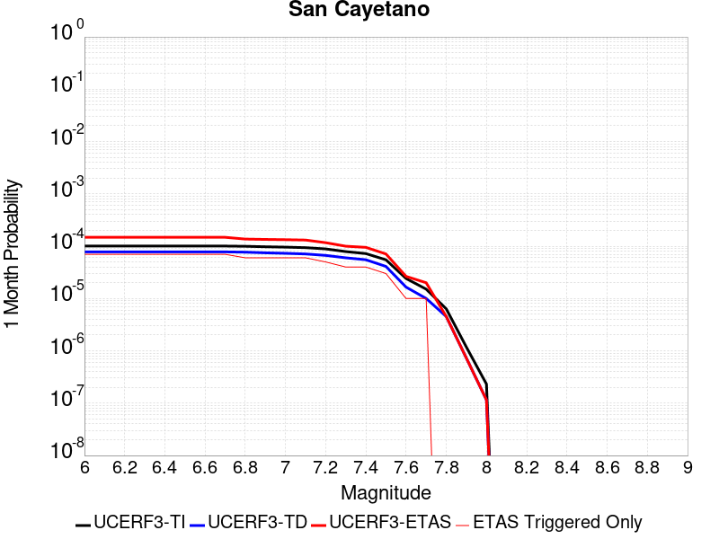 |  | 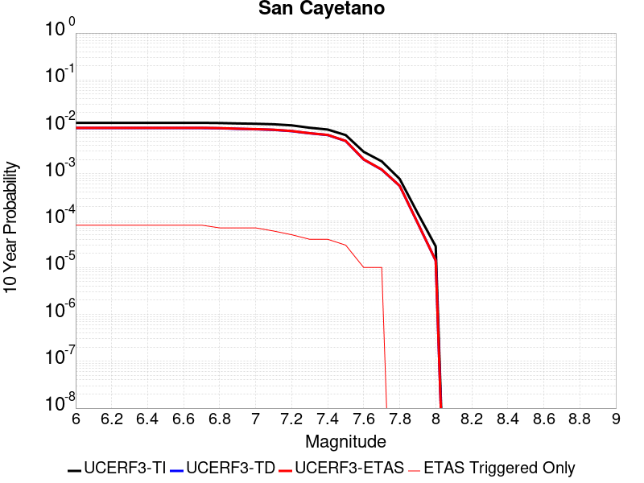 |

| Magnitude | 1 wk TI Prob | 1 wk TD Prob | 1 wk ETAS Prob | 1 wk ETAS/TD Gain | 1 wk ETAS Triggered Only | 1 mo TI Prob | 1 mo TD Prob | 1 mo ETAS Prob | 1 mo ETAS/TD Gain | 1 mo ETAS Triggered Only | 1 yr TI Prob | 1 yr TD Prob | 1 yr ETAS Prob | 1 yr ETAS/TD Gain | 1 yr ETAS Triggered Only | 10 yr TI Prob | 10 yr TD Prob | 10 yr ETAS Prob | 10 yr ETAS/TD Gain | 10 yr ETAS Triggered Only |
|-----|-----|-----|-----|-----|-----|-----|-----|-----|-----|-----|-----|-----|-----|-----|-----|-----|-----|-----|-----|-----|
| 6.0 | 2.3476267E-5 | 1.8169216E-5 | 1.040193E-4 | 5.72503 | 8.585165E-5 | 1.0060869E-4 | 7.786576E-5 | 2.0663321E-4 | 2.6537106 | 1.2877748E-4 | 0.0012242225 | 9.4760704E-4 | 0.0010762624 | 1.1357688 | 1.2877748E-4 | 0.012175002 | 0.00943675 | 0.009564312 | 1.0135176 | 1.2877748E-4 |
| 6.1 | 2.3476267E-5 | 1.8169216E-5 | 1.040193E-4 | 5.72503 | 8.585165E-5 | 1.0060869E-4 | 7.786576E-5 | 2.0663321E-4 | 2.6537106 | 1.2877748E-4 | 0.0012242225 | 9.4760704E-4 | 0.0010762624 | 1.1357688 | 1.2877748E-4 | 0.012175002 | 0.00943675 | 0.009564312 | 1.0135176 | 1.2877748E-4 |
| 6.2 | 2.3476267E-5 | 1.8169216E-5 | 1.040193E-4 | 5.72503 | 8.585165E-5 | 1.0060869E-4 | 7.786576E-5 | 2.0663321E-4 | 2.6537106 | 1.2877748E-4 | 0.0012242225 | 9.4760704E-4 | 0.0010762624 | 1.1357688 | 1.2877748E-4 | 0.012175002 | 0.00943675 | 0.009564312 | 1.0135176 | 1.2877748E-4 |
| 6.3 | 2.3476267E-5 | 1.8169216E-5 | 1.040193E-4 | 5.72503 | 8.585165E-5 | 1.0060869E-4 | 7.786576E-5 | 2.0663321E-4 | 2.6537106 | 1.2877748E-4 | 0.0012242225 | 9.4760704E-4 | 0.0010762624 | 1.1357688 | 1.2877748E-4 | 0.012175002 | 0.00943675 | 0.009564312 | 1.0135176 | 1.2877748E-4 |
| 6.4 | 2.3476267E-5 | 1.8169216E-5 | 1.040193E-4 | 5.72503 | 8.585165E-5 | 1.0060869E-4 | 7.786576E-5 | 2.0663321E-4 | 2.6537106 | 1.2877748E-4 | 0.0012242225 | 9.4760704E-4 | 0.0010762624 | 1.1357688 | 1.2877748E-4 | 0.012175002 | 0.00943675 | 0.009564312 | 1.0135176 | 1.2877748E-4 |
| 6.5 | 2.3476267E-5 | 1.8169216E-5 | 1.040193E-4 | 5.72503 | 8.585165E-5 | 1.0060869E-4 | 7.786576E-5 | 2.0663321E-4 | 2.6537106 | 1.2877748E-4 | 0.0012242225 | 9.4760704E-4 | 0.0010762624 | 1.1357688 | 1.2877748E-4 | 0.012175002 | 0.00943675 | 0.009564312 | 1.0135176 | 1.2877748E-4 |
| 6.6 | 2.3476267E-5 | 1.8169216E-5 | 1.040193E-4 | 5.72503 | 8.585165E-5 | 1.0060869E-4 | 7.786576E-5 | 2.0663321E-4 | 2.6537106 | 1.2877748E-4 | 0.0012242225 | 9.4760704E-4 | 0.0010762624 | 1.1357688 | 1.2877748E-4 | 0.012175002 | 0.00943675 | 0.009564312 | 1.0135176 | 1.2877748E-4 |
| 6.7 | 2.3476267E-5 | 1.8169216E-5 | 1.040193E-4 | 5.72503 | 8.585165E-5 | 1.0060869E-4 | 7.786576E-5 | 2.0663321E-4 | 2.6537106 | 1.2877748E-4 | 0.0012242225 | 9.4760704E-4 | 0.0010762624 | 1.1357688 | 1.2877748E-4 | 0.012175002 | 0.00943675 | 0.009564312 | 1.0135176 | 1.2877748E-4 |
| 6.8 | 2.3241924E-5 | 1.7936945E-5 | 1.0378705E-4 | 5.7862167 | 8.585165E-5 | 9.960445E-5 | 7.687038E-5 | 1.6271543E-4 | 2.1167507 | 8.585165E-5 | 0.0012120095 | 9.354987E-4 | 0.0010212699 | 1.0916852 | 8.585165E-5 | 0.012054204 | 0.0093166195 | 0.009401671 | 1.009129 | 8.585165E-5 |
| 6.9 | 2.2761007E-5 | 1.7432383E-5 | 1.0328254E-4 | 5.9247513 | 8.585165E-5 | 9.7543525E-5 | 7.47081E-5 | 1.6055333E-4 | 2.1490753 | 8.585165E-5 | 0.0011869454 | 9.09195E-4 | 9.949686E-4 | 1.0943402 | 8.585165E-5 | 0.011806256 | 0.009055741 | 0.009140816 | 1.0093945 | 8.585165E-5 |
| 7.0 | 2.240283E-5 | 1.7066137E-5 | 1.0291632E-4 | 6.0304403 | 8.585165E-5 | 9.600859E-5 | 7.313856E-5 | 1.5898392E-4 | 2.173736 | 8.585165E-5 | 0.0011682777 | 8.9010154E-4 | 9.758768E-4 | 1.0963657 | 8.585165E-5 | 0.011621549 | 0.008866336 | 0.0089514265 | 1.0095971 | 8.585165E-5 |
| 7.1 | 2.1871154E-5 | 1.658602E-5 | 1.0243624E-4 | 6.1760592 | 8.585165E-5 | 9.373015E-5 | 7.108103E-5 | 1.5692657E-4 | 2.207714 | 8.585165E-5 | 0.0011405671 | 8.6507126E-4 | 9.508486E-4 | 1.0991564 | 8.585165E-5 | 0.011347309 | 0.008617996 | 0.008703108 | 1.009876 | 8.585165E-5 |
| 7.2 | 2.0714133E-5 | 1.5564563E-5 | 1.0141487E-4 | 6.515755 | 8.585165E-5 | 8.8771834E-5 | 6.670358E-5 | 1.525495E-4 | 2.2869763 | 8.585165E-5 | 0.0010802611 | 8.118168E-4 | 8.975987E-4 | 1.1056666 | 8.585165E-5 | 0.010750249 | 0.008089443 | 0.0081746 | 1.0105269 | 8.585165E-5 |
| 7.3 | 1.8408395E-5 | 1.3996829E-5 | 5.692205E-5 | 4.066782 | 4.2925825E-5 | 7.8890735E-5 | 5.9985046E-5 | 1.0290829E-4 | 1.7155658 | 4.2925825E-5 | 9.600714E-4 | 7.300762E-4 | 7.7297067E-4 | 1.0587535 | 4.2925825E-5 | 0.009559342 | 0.0072776447 | 0.007320258 | 1.0058554 | 4.2925825E-5 |
| 7.4 | 1.6856795E-5 | 1.285006E-5 | 5.577533E-5 | 4.3404727 | 4.2925825E-5 | 7.2241404E-5 | 5.5070537E-5 | 9.7993994E-5 | 1.7794269 | 4.2925825E-5 | 8.7918417E-4 | 6.7028037E-4 | 7.1317743E-4 | 1.0639987 | 4.2925825E-5 | 0.00875714 | 0.0066834087 | 0.0067260475 | 1.0063798 | 4.2925825E-5 |
| 7.5 | 1.2822778E-5 | 9.577415E-6 | 9.577415E-6 | 1.0 | 0.0 | 5.495361E-5 | 4.1045427E-5 | 4.1045427E-5 | 1.0 | 0.0 | 6.688548E-4 | 4.9961504E-4 | 4.9961504E-4 | 1.0 | 0.0 | 0.006668452 | 0.0049851923 | 0.0049851923 | 1.0 | 0.0 |
| 7.6 | 5.6272684E-6 | 3.854899E-6 | 3.854899E-6 | 1.0 | 0.0 | 2.4116642E-5 | 1.6520893E-5 | 1.6520893E-5 | 1.0 | 0.0 | 2.9358055E-4 | 2.0112342E-4 | 2.0112342E-4 | 1.0 | 0.0 | 0.0029319301 | 0.0020094248 | 0.0020094248 | 1.0 | 0.0 |
| 7.7 | 3.5261346E-6 | 2.3407094E-6 | 2.3407094E-6 | 1.0 | 0.0 | 1.5111918E-5 | 1.0031574E-5 | 1.0031574E-5 | 1.0 | 0.0 | 1.8397206E-4 | 1.2212765E-4 | 1.2212765E-4 | 1.0 | 0.0 | 0.0018381984 | 0.0012206127 | 0.0012206127 | 1.0 | 0.0 |
| 7.8 | 1.4826929E-6 | 1.0564395E-6 | 1.0564395E-6 | 1.0 | 0.0 | 6.354383E-6 | 4.52759E-6 | 4.52759E-6 | 1.0 | 0.0 | 7.736187E-5 | 5.5122033E-5 | 5.5122033E-5 | 1.0 | 0.0 | 7.733494E-4 | 5.510856E-4 | 5.510856E-4 | 1.0 | 0.0 |
| 7.9 | 2.7568166E-7 | 1.6977887E-7 | 1.6977887E-7 | 1.0 | 0.0 | 1.1814923E-6 | 7.276235E-7 | 7.276235E-7 | 1.0 | 0.0 | 1.4384574E-5 | 8.85878E-6 | 8.85878E-6 | 1.0 | 0.0 | 1.4383643E-4 | 8.858431E-5 | 8.858431E-5 | 1.0 | 0.0 |
| 8.0 | 5.407832E-8 | 2.688677E-8 | 2.688677E-8 | 1.0 | 0.0 | 2.3176422E-7 | 1.15229014E-7 | 1.15229014E-7 | 1.0 | 0.0 | 2.8217257E-6 | 1.4029123E-6 | 1.4029123E-6 | 1.0 | 0.0 | 2.8216898E-5 | 1.40290385E-5 | 1.40290385E-5 | 1.0 | 0.0 |

## Hayward (So) 2011 CFM
*[(top)](#table-of-contents)*

| 1 Week | 1 Month | 1 Year | 10 Year |
|-----|-----|-----|-----|
|  |  |  |  |

| Magnitude | 1 wk TI Prob | 1 wk TD Prob | 1 wk ETAS Prob | 1 wk ETAS/TD Gain | 1 wk ETAS Triggered Only | 1 mo TI Prob | 1 mo TD Prob | 1 mo ETAS Prob | 1 mo ETAS/TD Gain | 1 mo ETAS Triggered Only | 1 yr TI Prob | 1 yr TD Prob | 1 yr ETAS Prob | 1 yr ETAS/TD Gain | 1 yr ETAS Triggered Only | 10 yr TI Prob | 10 yr TD Prob | 10 yr ETAS Prob | 10 yr ETAS/TD Gain | 10 yr ETAS Triggered Only |
|-----|-----|-----|-----|-----|-----|-----|-----|-----|-----|-----|-----|-----|-----|-----|-----|-----|-----|-----|-----|-----|
| 6.0 | 1.8091932E-4 | 3.570673E-4 | 3.570673E-4 | 1.0 | 0.0 | 7.751381E-4 | 0.0015294008 | 0.0015294008 | 1.0 | 0.0 | 0.00939654 | 0.018463885 | 0.018463885 | 1.0 | 0.0 | 0.090090066 | 0.1667085 | 0.16678002 | 1.0004292 | 8.585165E-5 |
| 6.1 | 1.8091932E-4 | 3.570673E-4 | 3.570673E-4 | 1.0 | 0.0 | 7.751381E-4 | 0.0015294008 | 0.0015294008 | 1.0 | 0.0 | 0.00939654 | 0.018463885 | 0.018463885 | 1.0 | 0.0 | 0.090090066 | 0.1667085 | 0.16678002 | 1.0004292 | 8.585165E-5 |
| 6.2 | 1.8091932E-4 | 3.570673E-4 | 3.570673E-4 | 1.0 | 0.0 | 7.751381E-4 | 0.0015294008 | 0.0015294008 | 1.0 | 0.0 | 0.00939654 | 0.018463885 | 0.018463885 | 1.0 | 0.0 | 0.090090066 | 0.1667085 | 0.16678002 | 1.0004292 | 8.585165E-5 |
| 6.3 | 1.7322872E-4 | 3.4263515E-4 | 3.4263515E-4 | 1.0 | 0.0 | 7.4219756E-4 | 0.0014676197 | 0.0014676197 | 1.0 | 0.0 | 0.0089988755 | 0.017724147 | 0.017724147 | 1.0 | 0.0 | 0.08643075 | 0.16065954 | 0.1607316 | 1.0004485 | 8.585165E-5 |
| 6.4 | 1.6334097E-4 | 3.2345165E-4 | 3.2345165E-4 | 1.0 | 0.0 | 6.998449E-4 | 0.0013854936 | 0.0013854936 | 1.0 | 0.0 | 0.008487372 | 0.016739927 | 0.016739927 | 1.0 | 0.0 | 0.081704415 | 0.15256606 | 0.15263881 | 1.0004768 | 8.585165E-5 |
| 6.5 | 1.5600289E-4 | 3.101982E-4 | 3.101982E-4 | 1.0 | 0.0 | 6.684125E-4 | 0.0013287518 | 0.0013287518 | 1.0 | 0.0 | 0.008107598 | 0.016059443 | 0.016059443 | 1.0 | 0.0 | 0.078181036 | 0.14684291 | 0.14691615 | 1.0004988 | 8.585165E-5 |
| 6.6 | 1.4046066E-4 | 2.8034003E-4 | 2.8034003E-4 | 1.0 | 0.0 | 6.018354E-4 | 0.0012009109 | 0.0012009109 | 1.0 | 0.0 | 0.0073027555 | 0.014524571 | 0.014524571 | 1.0 | 0.0 | 0.07067384 | 0.13393044 | 0.1340048 | 1.0005552 | 8.585165E-5 |
| 6.7 | 1.14696966E-4 | 2.3272466E-4 | 2.3272466E-4 | 1.0 | 0.0 | 4.914658E-4 | 9.970153E-4 | 9.970153E-4 | 1.0 | 0.0 | 0.0059671924 | 0.012072163 | 0.012072163 | 1.0 | 0.0 | 0.058094822 | 0.11274141 | 0.1127795 | 1.0003378 | 4.2925825E-5 |
| 6.8 | 9.3874296E-5 | 1.8862431E-4 | 1.8862431E-4 | 1.0 | 0.0 | 4.0225635E-4 | 8.081431E-4 | 8.081431E-4 | 1.0 | 0.0 | 0.0048864787 | 0.009795489 | 0.009795489 | 1.0 | 0.0 | 0.047804173 | 0.092592984 | 0.092631936 | 1.0004207 | 4.2925825E-5 |
| 6.9 | 5.551852E-5 | 1.0729875E-4 | 1.0729875E-4 | 1.0 | 0.0 | 2.3791482E-4 | 4.5977137E-4 | 4.5977137E-4 | 1.0 | 0.0 | 0.0028927654 | 0.005583468 | 0.005583468 | 1.0 | 0.0 | 0.028553981 | 0.054246075 | 0.05428667 | 1.0007484 | 4.2925825E-5 |
| 7.0 | 4.2662363E-5 | 8.246792E-5 | 8.246792E-5 | 1.0 | 0.0 | 1.8282588E-4 | 3.5338648E-4 | 3.5338648E-4 | 1.0 | 0.0 | 0.0022236328 | 0.0042940658 | 0.0042940658 | 1.0 | 0.0 | 0.022015138 | 0.04206509 | 0.04210621 | 1.0009775 | 4.2925825E-5 |
| 7.1 | 3.305886E-5 | 6.302183E-5 | 6.302183E-5 | 1.0 | 0.0 | 1.4167312E-4 | 2.7006568E-4 | 2.7006568E-4 | 1.0 | 0.0 | 0.0017235056 | 0.003283111 | 0.003283111 | 1.0 | 0.0 | 0.017101998 | 0.032453902 | 0.032495435 | 1.0012797 | 4.2925825E-5 |
| 7.2 | 2.9856887E-5 | 5.701622E-5 | 5.701622E-5 | 1.0 | 0.0 | 1.2795182E-4 | 2.4433242E-4 | 2.4433242E-4 | 1.0 | 0.0 | 0.0015567001 | 0.0029707062 | 0.0029707062 | 1.0 | 0.0 | 0.015458403 | 0.029454801 | 0.029496463 | 1.0014144 | 4.2925825E-5 |
| 7.3 | 2.4559737E-5 | 4.599286E-5 | 4.599286E-5 | 1.0 | 0.0 | 1.0525176E-4 | 1.9709744E-4 | 1.9709744E-4 | 1.0 | 0.0 | 0.0012806869 | 0.0023970334 | 0.0023970334 | 1.0 | 0.0 | 0.012733313 | 0.023858516 | 0.023900418 | 1.0017563 | 4.2925825E-5 |
| 7.4 | 1.9002231E-5 | 3.505084E-5 | 3.505084E-5 | 1.0 | 0.0 | 8.143559E-5 | 1.502093E-4 | 1.502093E-4 | 1.0 | 0.0 | 9.910273E-4 | 0.001827274 | 0.001827274 | 1.0 | 0.0 | 0.009866194 | 0.018258808 | 0.018300949 | 1.002308 | 4.2925825E-5 |
| 7.5 | 1.2783333E-5 | 2.3331182E-5 | 2.3331182E-5 | 1.0 | 0.0 | 5.4784563E-5 | 9.998698E-5 | 9.998698E-5 | 1.0 | 0.0 | 6.667979E-4 | 0.0012166675 | 0.0012166675 | 1.0 | 0.0 | 0.006648007 | 0.012209443 | 0.012251846 | 1.0034728 | 4.2925825E-5 |
| 7.6 | 4.8149627E-6 | 8.888056E-6 | 8.888056E-6 | 1.0 | 0.0 | 2.063539E-5 | 3.8091122E-5 | 3.8091122E-5 | 1.0 | 0.0 | 2.5120692E-4 | 4.6366194E-4 | 4.6366194E-4 | 1.0 | 0.0 | 0.0025092314 | 0.0046805087 | 0.0046805087 | 1.0 | 0.0 |
| 7.7 | 6.0838227E-7 | 1.205754E-6 | 1.205754E-6 | 1.0 | 0.0 | 2.6073499E-6 | 5.1675065E-6 | 5.1675065E-6 | 1.0 | 0.0 | 3.174402E-5 | 6.291258E-5 | 6.291258E-5 | 1.0 | 0.0 | 3.1739488E-4 | 6.5296254E-4 | 6.5296254E-4 | 1.0 | 0.0 |
| 7.8 | 4.5542808E-7 | 9.792941E-7 | 9.792941E-7 | 1.0 | 0.0 | 1.9518332E-6 | 4.196968E-6 | 4.196968E-6 | 1.0 | 0.0 | 2.376331E-5 | 5.109689E-5 | 5.109689E-5 | 1.0 | 0.0 | 2.3760769E-4 | 5.321693E-4 | 5.321693E-4 | 1.0 | 0.0 |
| 7.9 | 3.3016747E-7 | 7.3869535E-7 | 7.3869535E-7 | 1.0 | 0.0 | 1.4150027E-6 | 3.1658333E-6 | 3.1658333E-6 | 1.0 | 0.0 | 1.7227521E-5 | 3.854334E-5 | 3.854334E-5 | 1.0 | 0.0 | 1.7226185E-4 | 3.9932923E-4 | 3.9932923E-4 | 1.0 | 0.0 |
| 8.0 | 2.347038E-7 | 5.471963E-7 | 5.471963E-7 | 1.0 | 0.0 | 1.0058731E-6 | 2.3451248E-6 | 2.3451248E-6 | 1.0 | 0.0 | 1.2246436E-5 | 2.8551523E-5 | 2.8551523E-5 | 1.0 | 0.0 | 1.2245761E-4 | 2.9357258E-4 | 2.9357258E-4 | 1.0 | 0.0 |
| 8.1 | 1.18822804E-7 | 2.6060948E-7 | 2.6060948E-7 | 1.0 | 0.0 | 5.092405E-7 | 1.1168972E-6 | 1.1168972E-6 | 1.0 | 0.0 | 6.1999854E-6 | 1.359814E-5 | 1.359814E-5 | 1.0 | 0.0 | 6.199812E-5 | 1.3918082E-4 | 1.3918082E-4 | 1.0 | 0.0 |

## Mono Lake 2011 CFM
*[(top)](#table-of-contents)*

| 1 Week | 1 Month | 1 Year | 10 Year |
|-----|-----|-----|-----|
|  |  |  |  |

| Magnitude | 1 wk TI Prob | 1 wk TD Prob | 1 wk ETAS Prob | 1 wk ETAS/TD Gain | 1 wk ETAS Triggered Only | 1 mo TI Prob | 1 mo TD Prob | 1 mo ETAS Prob | 1 mo ETAS/TD Gain | 1 mo ETAS Triggered Only | 1 yr TI Prob | 1 yr TD Prob | 1 yr ETAS Prob | 1 yr ETAS/TD Gain | 1 yr ETAS Triggered Only | 10 yr TI Prob | 10 yr TD Prob | 10 yr ETAS Prob | 10 yr ETAS/TD Gain | 10 yr ETAS Triggered Only |
|-----|-----|-----|-----|-----|-----|-----|-----|-----|-----|-----|-----|-----|-----|-----|-----|-----|-----|-----|-----|-----|
| 6.0 | 2.0341662E-5 | 2.3828192E-5 | 6.675299E-5 | 2.8014293 | 4.2925825E-5 | 8.717564E-5 | 1.0211982E-4 | 1.4504125E-4 | 1.4203048 | 4.2925825E-5 | 0.0010608466 | 0.0012431308 | 0.0012860033 | 1.0344875 | 4.2925825E-5 | 0.010557966 | 0.012413842 | 0.01254102 | 1.010245 | 1.2877748E-4 |
| 6.1 | 2.0341662E-5 | 2.3828192E-5 | 6.675299E-5 | 2.8014293 | 4.2925825E-5 | 8.717564E-5 | 1.0211982E-4 | 1.4504125E-4 | 1.4203048 | 4.2925825E-5 | 0.0010608466 | 0.0012431308 | 0.0012860033 | 1.0344875 | 4.2925825E-5 | 0.010557966 | 0.012413842 | 0.01254102 | 1.010245 | 1.2877748E-4 |
| 6.2 | 2.0341662E-5 | 2.3828192E-5 | 6.675299E-5 | 2.8014293 | 4.2925825E-5 | 8.717564E-5 | 1.0211982E-4 | 1.4504125E-4 | 1.4203048 | 4.2925825E-5 | 0.0010608466 | 0.0012431308 | 0.0012860033 | 1.0344875 | 4.2925825E-5 | 0.010557966 | 0.012413842 | 0.01254102 | 1.010245 | 1.2877748E-4 |
| 6.3 | 2.0341662E-5 | 2.3828192E-5 | 6.675299E-5 | 2.8014293 | 4.2925825E-5 | 8.717564E-5 | 1.0211982E-4 | 1.4504125E-4 | 1.4203048 | 4.2925825E-5 | 0.0010608466 | 0.0012431308 | 0.0012860033 | 1.0344875 | 4.2925825E-5 | 0.010557966 | 0.012413842 | 0.01254102 | 1.010245 | 1.2877748E-4 |
| 6.4 | 1.749821E-5 | 2.049101E-5 | 6.341595E-5 | 3.0948184 | 4.2925825E-5 | 7.499018E-5 | 8.781861E-5 | 1.3074066E-4 | 1.4887581 | 4.2925825E-5 | 9.1262296E-4 | 0.0010691914 | 0.0011120713 | 1.040105 | 4.2925825E-5 | 0.009088841 | 0.01069187 | 0.010819271 | 1.0119157 | 1.2877748E-4 |
| 6.5 | 1.749821E-5 | 2.049101E-5 | 6.341595E-5 | 3.0948184 | 4.2925825E-5 | 7.499018E-5 | 8.781861E-5 | 1.3074066E-4 | 1.4887581 | 4.2925825E-5 | 9.1262296E-4 | 0.0010691914 | 0.0011120713 | 1.040105 | 4.2925825E-5 | 0.009088841 | 0.01069187 | 0.010819271 | 1.0119157 | 1.2877748E-4 |

## Oceanic - West Huasna
*[(top)](#table-of-contents)*

| 1 Week | 1 Month | 1 Year | 10 Year |
|-----|-----|-----|-----|
|  |  |  | 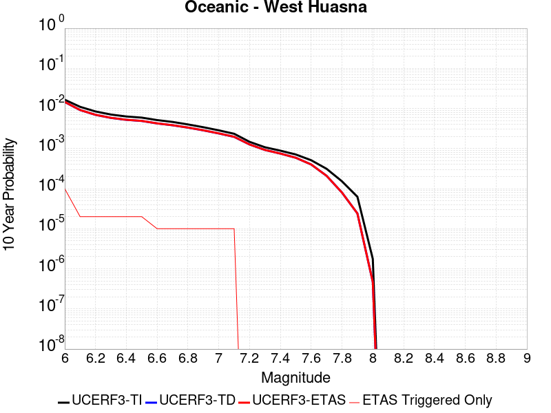 |

| Magnitude | 1 wk TI Prob | 1 wk TD Prob | 1 wk ETAS Prob | 1 wk ETAS/TD Gain | 1 wk ETAS Triggered Only | 1 mo TI Prob | 1 mo TD Prob | 1 mo ETAS Prob | 1 mo ETAS/TD Gain | 1 mo ETAS Triggered Only | 1 yr TI Prob | 1 yr TD Prob | 1 yr ETAS Prob | 1 yr ETAS/TD Gain | 1 yr ETAS Triggered Only | 10 yr TI Prob | 10 yr TD Prob | 10 yr ETAS Prob | 10 yr ETAS/TD Gain | 10 yr ETAS Triggered Only |
|-----|-----|-----|-----|-----|-----|-----|-----|-----|-----|-----|-----|-----|-----|-----|-----|-----|-----|-----|-----|-----|
| 6.0 | 3.195567E-5 | 2.7926368E-5 | 7.085099E-5 | 2.5370643 | 4.2925825E-5 | 1.3694567E-4 | 1.19679185E-4 | 1.6259987E-4 | 1.3586311 | 4.2925825E-5 | 0.0016660384 | 0.0014561634 | 0.0014990267 | 1.0294358 | 4.2925825E-5 | 0.016536033 | 0.01447077 | 0.01455538 | 1.0058469 | 8.585165E-5 |
| 6.1 | 2.1156782E-5 | 1.7573117E-5 | 1.7573117E-5 | 1.0 | 0.0 | 9.066878E-5 | 7.531123E-5 | 7.531123E-5 | 1.0 | 0.0 | 0.0011033333 | 9.1653795E-4 | 9.1653795E-4 | 1.0 | 0.0 | 0.010978713 | 0.009128587 | 0.009171121 | 1.0046594 | 4.2925825E-5 |
| 6.2 | 1.6195117E-5 | 1.3327227E-5 | 1.3327227E-5 | 1.0 | 0.0 | 6.9405796E-5 | 5.7115452E-5 | 5.7115452E-5 | 1.0 | 0.0 | 8.44688E-4 | 6.9516135E-4 | 6.9516135E-4 | 1.0 | 0.0 | 0.008414844 | 0.0069301617 | 0.00697279 | 1.0061511 | 4.2925825E-5 |
| 6.3 | 1.3559345E-5 | 1.1179013E-5 | 1.1179013E-5 | 1.0 | 0.0 | 5.811018E-5 | 4.7909183E-5 | 4.7909183E-5 | 1.0 | 0.0 | 7.072618E-4 | 5.8313913E-4 | 5.8313913E-4 | 1.0 | 0.0 | 0.0070501505 | 0.005816208 | 0.005858884 | 1.0073375 | 4.2925825E-5 |
| 6.4 | 1.2120619E-5 | 1.0000874E-5 | 1.0000874E-5 | 1.0 | 0.0 | 5.1944477E-5 | 4.2860185E-5 | 4.2860185E-5 | 1.0 | 0.0 | 6.322405E-4 | 5.216983E-4 | 5.216983E-4 | 1.0 | 0.0 | 0.006304447 | 0.005204804 | 0.005247506 | 1.0082045 | 4.2925825E-5 |
| 6.5 | 1.13511915E-5 | 9.367378E-6 | 9.367378E-6 | 1.0 | 0.0 | 4.8647056E-5 | 4.0145293E-5 | 4.0145293E-5 | 1.0 | 0.0 | 5.9211696E-4 | 4.886598E-4 | 4.886598E-4 | 1.0 | 0.0 | 0.0059054173 | 0.0048759114 | 0.004918628 | 1.0087607 | 4.2925825E-5 |
| 6.6 | 9.850605E-6 | 8.1353155E-6 | 8.1353155E-6 | 1.0 | 0.0 | 4.2216197E-5 | 3.4865174E-5 | 3.4865174E-5 | 1.0 | 0.0 | 5.1386096E-4 | 4.2440102E-4 | 4.2440102E-4 | 1.0 | 0.0 | 0.0051267436 | 0.0042359377 | 0.0042359377 | 1.0 | 0.0 |
| 6.7 | 8.8558645E-6 | 7.318341E-6 | 7.318341E-6 | 1.0 | 0.0 | 3.7953152E-5 | 3.1363943E-5 | 3.1363943E-5 | 1.0 | 0.0 | 4.6198163E-4 | 3.8178926E-4 | 3.8178926E-4 | 1.0 | 0.0 | 0.004610224 | 0.0038113592 | 0.0038113592 | 1.0 | 0.0 |
| 6.8 | 7.67136E-6 | 6.39169E-6 | 6.39169E-6 | 1.0 | 0.0 | 3.2876844E-5 | 2.739267E-5 | 2.739267E-5 | 1.0 | 0.0 | 4.0020206E-4 | 3.3345487E-4 | 3.3345487E-4 | 1.0 | 0.0 | 0.003994821 | 0.0033295664 | 0.0033295664 | 1.0 | 0.0 |
| 6.9 | 6.534529E-6 | 5.458261E-6 | 5.458261E-6 | 1.0 | 0.0 | 2.8004823E-5 | 2.3392338E-5 | 2.3392338E-5 | 1.0 | 0.0 | 3.4090536E-4 | 2.8476462E-4 | 2.8476462E-4 | 1.0 | 0.0 | 0.0034038287 | 0.002844014 | 0.002844014 | 1.0 | 0.0 |
| 7.0 | 5.460525E-6 | 4.5699203E-6 | 4.5699203E-6 | 1.0 | 0.0 | 2.3402039E-5 | 1.9585226E-5 | 1.9585226E-5 | 1.0 | 0.0 | 2.8488258E-4 | 2.3842414E-4 | 2.3842414E-4 | 1.0 | 0.0 | 0.0028451765 | 0.0023816973 | 0.0023816973 | 1.0 | 0.0 |
| 7.1 | 4.4825083E-6 | 3.7524153E-6 | 3.7524153E-6 | 1.0 | 0.0 | 1.9210609E-5 | 1.6081682E-5 | 1.6081682E-5 | 1.0 | 0.0 | 2.3386406E-4 | 1.9577699E-4 | 1.9577699E-4 | 1.0 | 0.0 | 0.002336181 | 0.001956057 | 0.001956057 | 1.0 | 0.0 |
| 7.2 | 2.821708E-6 | 2.424941E-6 | 2.424941E-6 | 1.0 | 0.0 | 1.2092979E-5 | 1.0392562E-5 | 1.0392562E-5 | 1.0 | 0.0 | 1.4722206E-4 | 1.265221E-4 | 1.265221E-4 | 1.0 | 0.0 | 0.0014712457 | 0.0012645032 | 0.0012645032 | 1.0 | 0.0 |
| 7.3 | 2.0644757E-6 | 1.7687502E-6 | 1.7687502E-6 | 1.0 | 0.0 | 8.847723E-6 | 7.580336E-6 | 7.580336E-6 | 1.0 | 0.0 | 1.0771569E-4 | 9.228668E-5 | 9.228668E-5 | 1.0 | 0.0 | 0.001076635 | 9.224854E-4 | 9.224854E-4 | 1.0 | 0.0 |
| 7.4 | 1.6980367E-6 | 1.4379966E-6 | 1.4379966E-6 | 1.0 | 0.0 | 7.27728E-6 | 6.1628284E-6 | 6.1628284E-6 | 1.0 | 0.0 | 8.8597284E-5 | 7.502986E-5 | 7.502986E-5 | 1.0 | 0.0 | 8.8561967E-4 | 7.5004686E-4 | 7.5004686E-4 | 1.0 | 0.0 |
| 7.5 | 1.3637683E-6 | 1.1302697E-6 | 1.1302697E-6 | 1.0 | 0.0 | 5.844708E-6 | 4.844004E-6 | 4.844004E-6 | 1.0 | 0.0 | 7.1156996E-5 | 5.897415E-5 | 5.897415E-5 | 1.0 | 0.0 | 7.1134215E-4 | 5.8958656E-4 | 5.8958656E-4 | 1.0 | 0.0 |
| 7.6 | 9.802994E-7 | 7.6772847E-7 | 7.6772847E-7 | 1.0 | 0.0 | 4.2012766E-6 | 3.2902608E-6 | 3.2902608E-6 | 1.0 | 0.0 | 5.1149345E-5 | 4.005819E-5 | 4.005819E-5 | 1.0 | 0.0 | 5.113757E-4 | 4.0051117E-4 | 4.0051117E-4 | 1.0 | 0.0 |
| 7.7 | 5.986191E-7 | 4.0050708E-7 | 4.0050708E-7 | 1.0 | 0.0 | 2.5655079E-6 | 1.7164577E-6 | 1.7164577E-6 | 1.0 | 0.0 | 3.1234613E-5 | 2.0897673E-5 | 2.0897673E-5 | 1.0 | 0.0 | 3.123022E-4 | 2.0895849E-4 | 2.0895849E-4 | 1.0 | 0.0 |
| 7.8 | 2.9189815E-7 | 1.5285202E-7 | 1.5285202E-7 | 1.0 | 0.0 | 1.2509914E-6 | 6.5507993E-7 | 6.5507993E-7 | 1.0 | 0.0 | 1.5230714E-5 | 7.975569E-6 | 7.975569E-6 | 1.0 | 0.0 | 1.522967E-4 | 7.97542E-5 | 7.97542E-5 | 1.0 | 0.0 |
| 7.9 | 1.2057845E-7 | 4.6208047E-8 | 4.6208047E-8 | 1.0 | 0.0 | 5.1676466E-7 | 1.9803447E-7 | 1.9803447E-7 | 1.0 | 0.0 | 6.2915915E-6 | 2.411067E-6 | 2.411067E-6 | 1.0 | 0.0 | 6.2914136E-5 | 2.4111772E-5 | 2.4111772E-5 | 1.0 | 0.0 |
| 8.0 | 3.3806387E-9 | 9.0093144E-10 | 9.0093144E-10 | 1.0 | 0.0 | 1.4488451E-8 | 3.8611354E-9 | 3.8611354E-9 | 1.0 | 0.0 | 1.7639688E-7 | 4.7009323E-8 | 4.7009323E-8 | 1.0 | 0.0 | 1.7639674E-6 | 4.712806E-7 | 4.712806E-7 | 1.0 | 0.0 |

## Kern Canyon (North Kern) 2011
*[(top)](#table-of-contents)*

| 1 Week | 1 Month | 1 Year | 10 Year |
|-----|-----|-----|-----|
|  |  |  |  |

| Magnitude | 1 wk TI Prob | 1 wk TD Prob | 1 wk ETAS Prob | 1 wk ETAS/TD Gain | 1 wk ETAS Triggered Only | 1 mo TI Prob | 1 mo TD Prob | 1 mo ETAS Prob | 1 mo ETAS/TD Gain | 1 mo ETAS Triggered Only | 1 yr TI Prob | 1 yr TD Prob | 1 yr ETAS Prob | 1 yr ETAS/TD Gain | 1 yr ETAS Triggered Only | 10 yr TI Prob | 10 yr TD Prob | 10 yr ETAS Prob | 10 yr ETAS/TD Gain | 10 yr ETAS Triggered Only |
|-----|-----|-----|-----|-----|-----|-----|-----|-----|-----|-----|-----|-----|-----|-----|-----|-----|-----|-----|-----|-----|
| 6.0 | 6.6264497E-6 | 6.75733E-6 | 4.9682865E-5 | 7.35244 | 4.2925825E-5 | 2.8398761E-5 | 2.895971E-5 | 7.188429E-5 | 2.4822173 | 4.2925825E-5 | 3.4570007E-4 | 3.5253543E-4 | 4.383568E-4 | 1.2434404 | 8.585165E-5 | 0.0034516277 | 0.0035205502 | 0.0036488743 | 1.03645 | 1.2877748E-4 |
| 6.1 | 6.6264497E-6 | 6.75733E-6 | 4.9682865E-5 | 7.35244 | 4.2925825E-5 | 2.8398761E-5 | 2.895971E-5 | 7.188429E-5 | 2.4822173 | 4.2925825E-5 | 3.4570007E-4 | 3.5253543E-4 | 4.383568E-4 | 1.2434404 | 8.585165E-5 | 0.0034516277 | 0.0035205502 | 0.0036488743 | 1.03645 | 1.2877748E-4 |
| 6.2 | 6.6264497E-6 | 6.75733E-6 | 4.9682865E-5 | 7.35244 | 4.2925825E-5 | 2.8398761E-5 | 2.895971E-5 | 7.188429E-5 | 2.4822173 | 4.2925825E-5 | 3.4570007E-4 | 3.5253543E-4 | 4.383568E-4 | 1.2434404 | 8.585165E-5 | 0.0034516277 | 0.0035205502 | 0.0036488743 | 1.03645 | 1.2877748E-4 |
| 6.3 | 6.6264497E-6 | 6.75733E-6 | 4.9682865E-5 | 7.35244 | 4.2925825E-5 | 2.8398761E-5 | 2.895971E-5 | 7.188429E-5 | 2.4822173 | 4.2925825E-5 | 3.4570007E-4 | 3.5253543E-4 | 4.383568E-4 | 1.2434404 | 8.585165E-5 | 0.0034516277 | 0.0035205502 | 0.0036488743 | 1.03645 | 1.2877748E-4 |
| 6.4 | 6.6264497E-6 | 6.75733E-6 | 4.9682865E-5 | 7.35244 | 4.2925825E-5 | 2.8398761E-5 | 2.895971E-5 | 7.188429E-5 | 2.4822173 | 4.2925825E-5 | 3.4570007E-4 | 3.5253543E-4 | 4.383568E-4 | 1.2434404 | 8.585165E-5 | 0.0034516277 | 0.0035205502 | 0.0036488743 | 1.03645 | 1.2877748E-4 |
| 6.5 | 3.2162225E-6 | 3.2570915E-6 | 4.6182777E-5 | 14.179146 | 4.2925825E-5 | 1.3783738E-5 | 1.3958894E-5 | 5.6884117E-5 | 4.0751166 | 4.2925825E-5 | 1.6780409E-4 | 1.6993708E-4 | 2.1285561E-4 | 1.2525554 | 4.2925825E-5 | 0.0016767744 | 0.001698151 | 0.001741004 | 1.025235 | 4.2925825E-5 |
| 6.6 | 3.2162225E-6 | 3.2570915E-6 | 4.6182777E-5 | 14.179146 | 4.2925825E-5 | 1.3783738E-5 | 1.3958894E-5 | 5.6884117E-5 | 4.0751166 | 4.2925825E-5 | 1.6780409E-4 | 1.6993708E-4 | 2.1285561E-4 | 1.2525554 | 4.2925825E-5 | 0.0016767744 | 0.001698151 | 0.001741004 | 1.025235 | 4.2925825E-5 |
| 6.7 | 2.1908265E-6 | 2.2071222E-6 | 4.5132852E-5 | 20.448732 | 4.2925825E-5 | 9.389223E-6 | 9.459062E-6 | 5.238448E-5 | 5.5380206 | 4.2925825E-5 | 1.1430779E-4 | 1.1515819E-4 | 1.5807907E-4 | 1.3727124 | 4.2925825E-5 | 0.0011424901 | 0.0011510046 | 0.001193881 | 1.0372514 | 4.2925825E-5 |
| 6.8 | 1.7303895E-6 | 1.736553E-6 | 4.46623E-5 | 25.71894 | 4.2925825E-5 | 7.415934E-6 | 7.442349E-6 | 5.0367853E-5 | 6.767736 | 4.2925825E-5 | 9.028525E-5 | 9.060693E-5 | 1.3352887E-4 | 1.4737158 | 4.2925825E-5 | 9.024858E-4 | 9.0570963E-4 | 9.485966E-4 | 1.0473517 | 4.2925825E-5 |
| 6.9 | 1.3700314E-6 | 1.3688623E-6 | 4.429463E-5 | 32.358715 | 4.2925825E-5 | 5.87155E-6 | 5.86654E-6 | 4.8792113E-5 | 8.317017 | 4.2925825E-5 | 7.148377E-5 | 7.142283E-5 | 1.1434559E-4 | 1.6009669 | 4.2925825E-5 | 7.146078E-4 | 7.140033E-4 | 7.568985E-4 | 1.060077 | 4.2925825E-5 |
| 7.0 | 1.1467797E-6 | 1.1413805E-6 | 4.4067157E-5 | 38.608646 | 4.2925825E-5 | 4.9147607E-6 | 4.8916218E-6 | 4.7817237E-5 | 9.775333 | 4.2925825E-5 | 5.983557E-5 | 5.95539E-5 | 1.0247717E-4 | 1.7207465 | 4.2925825E-5 | 5.981946E-4 | 5.9538253E-4 | 6.382828E-4 | 1.072055 | 4.2925825E-5 |
| 7.1 | 9.3952065E-7 | 9.3026915E-7 | 9.3026915E-7 | 1.0 | 0.0 | 4.026511E-6 | 3.986862E-6 | 3.986862E-6 | 1.0 | 0.0 | 4.9021666E-5 | 4.853898E-5 | 4.853898E-5 | 1.0 | 0.0 | 4.901085E-4 | 4.8528553E-4 | 4.8528553E-4 | 1.0 | 0.0 |
| 7.2 | 6.858055E-7 | 6.7193014E-7 | 6.7193014E-7 | 1.0 | 0.0 | 2.939163E-6 | 2.8796974E-6 | 2.8796974E-6 | 1.0 | 0.0 | 3.5783723E-5 | 3.5059762E-5 | 3.5059762E-5 | 1.0 | 0.0 | 3.5777962E-4 | 3.5054318E-4 | 3.5054318E-4 | 1.0 | 0.0 |
| 7.3 | 5.1101983E-7 | 4.939301E-7 | 4.939301E-7 | 1.0 | 0.0 | 2.1900833E-6 | 2.1168414E-6 | 2.1168414E-6 | 1.0 | 0.0 | 2.6663936E-5 | 2.5772246E-5 | 2.5772246E-5 | 1.0 | 0.0 | 2.6660739E-4 | 2.5769303E-4 | 2.5769303E-4 | 1.0 | 0.0 |
| 7.4 | 3.4999414E-7 | 3.2995916E-7 | 3.2995916E-7 | 1.0 | 0.0 | 1.499974E-6 | 1.4141099E-6 | 1.4141099E-6 | 1.0 | 0.0 | 1.8262032E-5 | 1.7216655E-5 | 1.7216655E-5 | 1.0 | 0.0 | 1.826053E-4 | 1.7215345E-4 | 1.7215345E-4 | 1.0 | 0.0 |
| 7.5 | 1.7021522E-7 | 1.4750053E-7 | 1.4750053E-7 | 1.0 | 0.0 | 7.2949354E-7 | 6.32145E-7 | 6.32145E-7 | 1.0 | 0.0 | 8.881548E-6 | 7.696339E-6 | 7.696339E-6 | 1.0 | 0.0 | 8.8811925E-5 | 7.696081E-5 | 7.696081E-5 | 1.0 | 0.0 |
| 7.6 | 2.572245E-8 | 1.735264E-8 | 1.735264E-8 | 1.0 | 0.0 | 1.10239064E-7 | 7.436845E-8 | 7.436845E-8 | 1.0 | 0.0 | 1.3421597E-6 | 9.0543557E-7 | 9.0543557E-7 | 1.0 | 0.0 | 1.3421517E-5 | 9.054324E-6 | 9.054324E-6 | 1.0 | 0.0 |

## Calaveras (Central) 2011 CFM
*[(top)](#table-of-contents)*

| 1 Week | 1 Month | 1 Year | 10 Year |
|-----|-----|-----|-----|
|  | 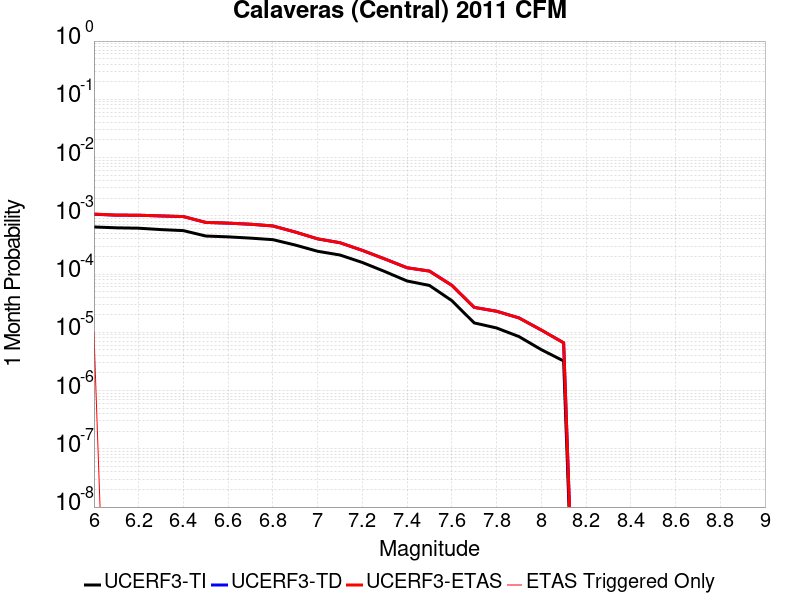 |  |  |

| Magnitude | 1 wk TI Prob | 1 wk TD Prob | 1 wk ETAS Prob | 1 wk ETAS/TD Gain | 1 wk ETAS Triggered Only | 1 mo TI Prob | 1 mo TD Prob | 1 mo ETAS Prob | 1 mo ETAS/TD Gain | 1 mo ETAS Triggered Only | 1 yr TI Prob | 1 yr TD Prob | 1 yr ETAS Prob | 1 yr ETAS/TD Gain | 1 yr ETAS Triggered Only | 10 yr TI Prob | 10 yr TD Prob | 10 yr ETAS Prob | 10 yr ETAS/TD Gain | 10 yr ETAS Triggered Only |
|-----|-----|-----|-----|-----|-----|-----|-----|-----|-----|-----|-----|-----|-----|-----|-----|-----|-----|-----|-----|-----|
| 6.0 | 1.5010907E-4 | 2.4804124E-4 | 2.909564E-4 | 1.1730163 | 4.2925825E-5 | 6.4316596E-4 | 0.001062498 | 0.0011053781 | 1.040358 | 4.2925825E-5 | 0.0078024664 | 0.012850443 | 0.012892817 | 1.0032974 | 4.2925825E-5 | 0.07534136 | 0.120411225 | 0.12048674 | 1.0006272 | 8.585165E-5 |
| 6.1 | 1.4521465E-4 | 2.3965565E-4 | 2.3965565E-4 | 1.0 | 0.0 | 6.222001E-4 | 0.0010265942 | 0.0010265942 | 1.0 | 0.0 | 0.0075490056 | 0.012419763 | 0.012419763 | 1.0 | 0.0 | 0.07297657 | 0.11668273 | 0.11672065 | 1.000325 | 4.2925825E-5 |
| 6.2 | 1.429998E-4 | 2.3896809E-4 | 2.3896809E-4 | 1.0 | 0.0 | 6.127123E-4 | 0.0010236499 | 0.0010236499 | 1.0 | 0.0 | 0.007434286 | 0.012384372 | 0.012384372 | 1.0 | 0.0 | 0.07190444 | 0.11633677 | 0.1163747 | 1.000326 | 4.2925825E-5 |
| 6.3 | 1.3536277E-4 | 2.3227946E-4 | 2.3227946E-4 | 1.0 | 0.0 | 5.799972E-4 | 9.950127E-4 | 9.950127E-4 | 1.0 | 0.0 | 0.0070386264 | 0.012040534 | 0.012040534 | 1.0 | 0.0 | 0.0681982 | 0.113249525 | 0.11328759 | 1.0003362 | 4.2925825E-5 |
| 6.4 | 1.2993296E-4 | 2.2651516E-4 | 2.2651516E-4 | 1.0 | 0.0 | 5.5673666E-4 | 9.703276E-4 | 9.703276E-4 | 1.0 | 0.0 | 0.006757223 | 0.011743338 | 0.011743338 | 1.0 | 0.0 | 0.06555412 | 0.11052752 | 0.11056571 | 1.0003455 | 4.2925825E-5 |
| 6.5 | 1.0498927E-4 | 1.7981966E-4 | 1.7981966E-4 | 1.0 | 0.0 | 4.498764E-4 | 7.7042676E-4 | 7.7042676E-4 | 1.0 | 0.0 | 0.005463498 | 0.00933952 | 0.00933952 | 1.0 | 0.0 | 0.053311124 | 0.08920739 | 0.08924648 | 1.0004382 | 4.2925825E-5 |
| 6.6 | 1.0157505E-4 | 1.7469494E-4 | 1.7469494E-4 | 1.0 | 0.0 | 4.35249E-4 | 7.4847665E-4 | 7.4847665E-4 | 1.0 | 0.0 | 0.0052862884 | 0.009074567 | 0.009074567 | 1.0 | 0.0 | 0.05162293 | 0.08678487 | 0.086824074 | 1.0004517 | 4.2925825E-5 |
| 6.7 | 9.660386E-5 | 1.6728783E-4 | 1.6728783E-4 | 1.0 | 0.0 | 4.1395082E-4 | 7.167497E-4 | 7.167497E-4 | 1.0 | 0.0 | 0.0050282106 | 0.008691474 | 0.008691474 | 1.0 | 0.0 | 0.049159497 | 0.08327401 | 0.08331336 | 1.0004725 | 4.2925825E-5 |
| 6.8 | 9.089927E-5 | 1.5643238E-4 | 1.5643238E-4 | 1.0 | 0.0 | 3.8951015E-4 | 6.702511E-4 | 6.702511E-4 | 1.0 | 0.0 | 0.0047319788 | 0.008129742 | 0.008129742 | 1.0 | 0.0 | 0.046324775 | 0.078163 | 0.07820257 | 1.0005063 | 4.2925825E-5 |
| 6.9 | 7.353187E-5 | 1.2295779E-4 | 1.2295779E-4 | 1.0 | 0.0 | 3.150985E-4 | 5.2685605E-4 | 5.2685605E-4 | 1.0 | 0.0 | 0.0038295772 | 0.006395728 | 0.006395728 | 1.0 | 0.0 | 0.037642512 | 0.06218928 | 0.062229536 | 1.0006473 | 4.2925825E-5 |
| 7.0 | 5.746064E-5 | 9.3890936E-5 | 9.3890936E-5 | 1.0 | 0.0 | 2.4623662E-4 | 4.0232803E-4 | 4.0232803E-4 | 1.0 | 0.0 | 0.0029938098 | 0.0048874132 | 0.0048874132 | 1.0 | 0.0 | 0.02953797 | 0.04798713 | 0.048027992 | 1.0008516 | 4.2925825E-5 |
| 7.1 | 4.9557195E-5 | 8.052768E-5 | 8.052768E-5 | 1.0 | 0.0 | 2.123707E-4 | 3.4507332E-4 | 3.4507332E-4 | 1.0 | 0.0 | 0.0025825473 | 0.004193237 | 0.004193237 | 1.0 | 0.0 | 0.0255274 | 0.041373473 | 0.041414622 | 1.0009946 | 4.2925825E-5 |
| 7.2 | 3.687595E-5 | 5.952694E-5 | 5.952694E-5 | 1.0 | 0.0 | 1.5803022E-4 | 2.5509068E-4 | 2.5509068E-4 | 1.0 | 0.0 | 0.0019223199 | 0.003101335 | 0.003101335 | 1.0 | 0.0 | 0.01905776 | 0.030883823 | 0.030925423 | 1.001347 | 4.2925825E-5 |
| 7.3 | 2.5846984E-5 | 4.2473923E-5 | 4.2473923E-5 | 1.0 | 0.0 | 1.1076809E-4 | 1.820185E-4 | 1.820185E-4 | 1.0 | 0.0 | 0.0013477671 | 0.0022138404 | 0.0022138404 | 1.0 | 0.0 | 0.013396223 | 0.022175217 | 0.022217192 | 1.0018928 | 4.2925825E-5 |
| 7.4 | 1.7747854E-5 | 2.993759E-5 | 2.993759E-5 | 1.0 | 0.0 | 7.6060016E-5 | 1.2829766E-4 | 1.2829766E-4 | 1.0 | 0.0 | 9.2563726E-4 | 0.0015609078 | 0.0015609078 | 1.0 | 0.0 | 0.009217911 | 0.015708687 | 0.015750939 | 1.0026897 | 4.2925825E-5 |
| 7.5 | 1.4883479E-5 | 2.6244672E-5 | 2.6244672E-5 | 1.0 | 0.0 | 6.378478E-5 | 1.12472335E-4 | 1.12472335E-4 | 1.0 | 0.0 | 7.76303E-4 | 0.0013684932 | 0.0013684932 | 1.0 | 0.0 | 0.0077359667 | 0.013801667 | 0.013844 | 1.0030673 | 4.2925825E-5 |
| 7.6 | 8.166975E-6 | 1.4964299E-5 | 1.4964299E-5 | 1.0 | 0.0 | 3.5000852E-5 | 6.413114E-5 | 6.413114E-5 | 1.0 | 0.0 | 4.2605202E-4 | 7.805183E-4 | 7.805183E-4 | 1.0 | 0.0 | 0.004252361 | 0.007939203 | 0.007939203 | 1.0 | 0.0 |
| 7.7 | 3.3858064E-6 | 6.254251E-6 | 6.254251E-6 | 1.0 | 0.0 | 1.4510518E-5 | 2.6803657E-5 | 2.6803657E-5 | 1.0 | 0.0 | 1.7665124E-4 | 3.2628572E-4 | 3.2628572E-4 | 1.0 | 0.0 | 0.0017651088 | 0.003388363 | 0.003388363 | 1.0 | 0.0 |
| 7.8 | 2.7721615E-6 | 5.366695E-6 | 5.366695E-6 | 1.0 | 0.0 | 1.1880637E-5 | 2.2999919E-5 | 2.2999919E-5 | 1.0 | 0.0 | 1.4463716E-4 | 2.7998807E-4 | 2.7998807E-4 | 1.0 | 0.0 | 0.0014454306 | 0.002907615 | 0.002907615 | 1.0 | 0.0 |
| 7.9 | 1.9736292E-6 | 4.128705E-6 | 4.128705E-6 | 1.0 | 0.0 | 8.4583835E-6 | 1.769433E-5 | 1.769433E-5 | 1.0 | 0.0 | 1.0297595E-4 | 2.1540721E-4 | 2.1540721E-4 | 1.0 | 0.0 | 0.0010292825 | 0.0022237299 | 0.0022237299 | 1.0 | 0.0 |
| 8.0 | 1.1767289E-6 | 2.5546633E-6 | 2.5546633E-6 | 1.0 | 0.0 | 5.0431145E-6 | 1.0948511E-5 | 1.0948511E-5 | 1.0 | 0.0 | 6.139818E-5 | 1.3329E-4 | 1.3329E-4 | 1.0 | 0.0 | 6.1381224E-4 | 0.001366126 | 0.001366126 | 1.0 | 0.0 |
| 8.1 | 7.5112825E-7 | 1.541076E-6 | 1.541076E-6 | 1.0 | 0.0 | 3.2191172E-6 | 6.604595E-6 | 6.604595E-6 | 1.0 | 0.0 | 3.9192048E-5 | 8.0408E-5 | 8.0408E-5 | 1.0 | 0.0 | 3.9185135E-4 | 8.2356273E-4 | 8.2356273E-4 | 1.0 | 0.0 |

## San Jacinto (Coyote Creek)
*[(top)](#table-of-contents)*

| 1 Week | 1 Month | 1 Year | 10 Year |
|-----|-----|-----|-----|
|  | 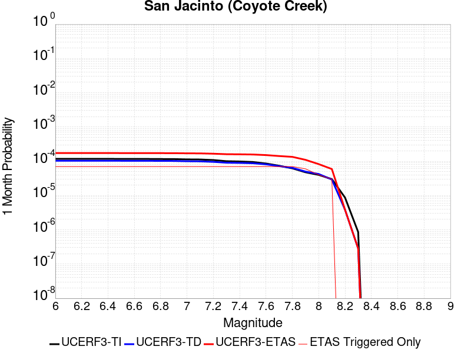 | 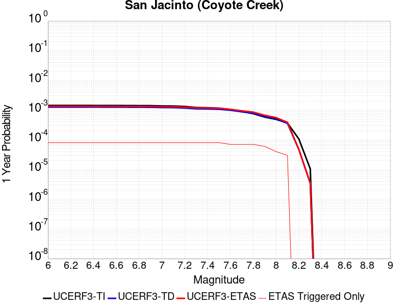 |  |

| Magnitude | 1 wk TI Prob | 1 wk TD Prob | 1 wk ETAS Prob | 1 wk ETAS/TD Gain | 1 wk ETAS Triggered Only | 1 mo TI Prob | 1 mo TD Prob | 1 mo ETAS Prob | 1 mo ETAS/TD Gain | 1 mo ETAS Triggered Only | 1 yr TI Prob | 1 yr TD Prob | 1 yr ETAS Prob | 1 yr ETAS/TD Gain | 1 yr ETAS Triggered Only | 10 yr TI Prob | 10 yr TD Prob | 10 yr ETAS Prob | 10 yr ETAS/TD Gain | 10 yr ETAS Triggered Only |
|-----|-----|-----|-----|-----|-----|-----|-----|-----|-----|-----|-----|-----|-----|-----|-----|-----|-----|-----|-----|-----|
| 6.0 | 2.7374346E-5 | 2.41444E-5 | 6.706919E-5 | 2.7778363 | 4.2925825E-5 | 1.1731335E-4 | 1.034719E-4 | 2.3223605E-4 | 2.2444358 | 1.2877748E-4 | 0.0014273542 | 0.001259045 | 0.0013876604 | 1.1021531 | 1.2877748E-4 | 0.01418221 | 0.012928195 | 0.013055308 | 1.0098321 | 1.2877748E-4 |
| 6.1 | 2.7374346E-5 | 2.41444E-5 | 6.706919E-5 | 2.7778363 | 4.2925825E-5 | 1.1731335E-4 | 1.034719E-4 | 2.3223605E-4 | 2.2444358 | 1.2877748E-4 | 0.0014273542 | 0.001259045 | 0.0013876604 | 1.1021531 | 1.2877748E-4 | 0.01418221 | 0.012928195 | 0.013055308 | 1.0098321 | 1.2877748E-4 |
| 6.2 | 2.7374346E-5 | 2.41444E-5 | 6.706919E-5 | 2.7778363 | 4.2925825E-5 | 1.1731335E-4 | 1.034719E-4 | 2.3223605E-4 | 2.2444358 | 1.2877748E-4 | 0.0014273542 | 0.001259045 | 0.0013876604 | 1.1021531 | 1.2877748E-4 | 0.01418221 | 0.012928195 | 0.013055308 | 1.0098321 | 1.2877748E-4 |
| 6.3 | 2.7374346E-5 | 2.41444E-5 | 6.706919E-5 | 2.7778363 | 4.2925825E-5 | 1.1731335E-4 | 1.034719E-4 | 2.3223605E-4 | 2.2444358 | 1.2877748E-4 | 0.0014273542 | 0.001259045 | 0.0013876604 | 1.1021531 | 1.2877748E-4 | 0.01418221 | 0.012928195 | 0.013055308 | 1.0098321 | 1.2877748E-4 |
| 6.4 | 2.7374346E-5 | 2.41444E-5 | 6.706919E-5 | 2.7778363 | 4.2925825E-5 | 1.1731335E-4 | 1.034719E-4 | 2.3223605E-4 | 2.2444358 | 1.2877748E-4 | 0.0014273542 | 0.001259045 | 0.0013876604 | 1.1021531 | 1.2877748E-4 | 0.01418221 | 0.012928195 | 0.013055308 | 1.0098321 | 1.2877748E-4 |
| 6.5 | 2.7282445E-5 | 2.4030476E-5 | 6.695527E-5 | 2.7862647 | 4.2925825E-5 | 1.16919524E-4 | 1.0298371E-4 | 2.3174792E-4 | 2.2503357 | 1.2877748E-4 | 0.0014225657 | 0.001253108 | 0.0013817241 | 1.1026376 | 1.2877748E-4 | 0.014134934 | 0.012869522 | 0.012996643 | 1.0098776 | 1.2877748E-4 |
| 6.6 | 2.7282445E-5 | 2.4030476E-5 | 6.695527E-5 | 2.7862647 | 4.2925825E-5 | 1.16919524E-4 | 1.0298371E-4 | 2.3174792E-4 | 2.2503357 | 1.2877748E-4 | 0.0014225657 | 0.001253108 | 0.0013817241 | 1.1026376 | 1.2877748E-4 | 0.014134934 | 0.012869522 | 0.012996643 | 1.0098776 | 1.2877748E-4 |
| 6.7 | 2.7216198E-5 | 2.3955597E-5 | 6.688039E-5 | 2.7918484 | 4.2925825E-5 | 1.1663563E-4 | 1.02662816E-4 | 2.3142707E-4 | 2.2542443 | 1.2877748E-4 | 0.0014191137 | 0.0012492058 | 0.0013778224 | 1.1029587 | 1.2877748E-4 | 0.014100855 | 0.012830934 | 0.012958059 | 1.0099077 | 1.2877748E-4 |
| 6.8 | 2.7078617E-5 | 2.3872815E-5 | 6.679761E-5 | 2.7980618 | 4.2925825E-5 | 1.1604605E-4 | 1.0230807E-4 | 2.3107236E-4 | 2.2585938 | 1.2877748E-4 | 0.001411945 | 0.0012448917 | 0.0013735088 | 1.103316 | 1.2877748E-4 | 0.014030075 | 0.0127880825 | 0.012915213 | 1.0099413 | 1.2877748E-4 |
| 6.9 | 2.6982952E-5 | 2.3792329E-5 | 6.671713E-5 | 2.8041446 | 4.2925825E-5 | 1.15636096E-4 | 1.0196315E-4 | 2.307275E-4 | 2.2628517 | 1.2877748E-4 | 0.0014069602 | 0.0012406971 | 0.0013693149 | 1.1036657 | 1.2877748E-4 | 0.013980856 | 0.012746378 | 0.012873515 | 1.0099742 | 1.2877748E-4 |
| 7.0 | 2.6449972E-5 | 2.3369357E-5 | 6.6294175E-5 | 2.8367994 | 4.2925825E-5 | 1.1335209E-4 | 1.0015055E-4 | 2.2891513E-4 | 2.28571 | 1.2877748E-4 | 0.001379188 | 0.0012186535 | 0.001347274 | 1.1055431 | 1.2877748E-4 | 0.0137065975 | 0.012527733 | 0.012654897 | 1.0101507 | 1.2877748E-4 |
| 7.1 | 2.6257849E-5 | 2.3195396E-5 | 6.612023E-5 | 2.8505754 | 4.2925825E-5 | 1.1252879E-4 | 9.940507E-5 | 2.2816974E-4 | 2.2953532 | 1.2877748E-4 | 0.0013691769 | 0.0012095873 | 0.001338209 | 1.1063352 | 1.2877748E-4 | 0.013607717 | 0.012437661 | 0.012564836 | 1.010225 | 1.2877748E-4 |
| 7.2 | 2.5270041E-5 | 2.2390155E-5 | 6.531502E-5 | 2.9171312 | 4.2925825E-5 | 1.0829568E-4 | 9.5954296E-5 | 2.247194E-4 | 2.3419423 | 1.2877748E-4 | 0.0013177024 | 0.0011676198 | 0.0012962469 | 1.1101618 | 1.2877748E-4 | 0.013099162 | 0.0120187905 | 0.01214602 | 1.0105859 | 1.2877748E-4 |
| 7.3 | 2.339701E-5 | 2.1122027E-5 | 6.4046944E-5 | 3.0322347 | 4.2925825E-5 | 1.0026905E-4 | 9.051985E-5 | 2.1928566E-4 | 2.4225147 | 1.2877748E-4 | 0.001220092 | 0.001101524 | 0.0012301597 | 1.1167797 | 1.2877748E-4 | 0.012134149 | 0.011357642 | 0.011484957 | 1.0112096 | 1.2877748E-4 |
| 7.4 | 2.296333E-5 | 2.0852396E-5 | 6.377733E-5 | 3.0585132 | 4.2925825E-5 | 9.841056E-5 | 8.936436E-5 | 2.1813033E-4 | 2.4409096 | 1.2877748E-4 | 0.0011974899 | 0.0010874701 | 0.0012161075 | 1.1182905 | 1.2877748E-4 | 0.011910575 | 0.011216754 | 0.011344086 | 1.0113521 | 1.2877748E-4 |
| 7.5 | 2.2188895E-5 | 2.037534E-5 | 6.330029E-5 | 3.1067107 | 4.2925825E-5 | 9.50918E-5 | 8.731998E-5 | 2.160862E-4 | 2.474648 | 1.2877748E-4 | 0.0011571277 | 0.0010626042 | 0.0011912449 | 1.1210617 | 1.2877748E-4 | 0.011511209 | 0.010966369 | 0.011093735 | 1.0116142 | 1.2877748E-4 |
| 7.6 | 2.0013189E-5 | 1.8961666E-5 | 6.1886676E-5 | 3.2637784 | 4.2925825E-5 | 8.5767984E-5 | 8.126176E-5 | 2.1002877E-4 | 2.5845954 | 1.2877748E-4 | 0.001043725 | 9.889146E-4 | 0.0011175647 | 1.1300923 | 1.2877748E-4 | 0.010388365 | 0.010224371 | 0.010351832 | 1.0124663 | 1.2877748E-4 |
| 7.7 | 1.7230794E-5 | 1.6743043E-5 | 5.966815E-5 | 3.5637577 | 4.2925825E-5 | 7.384417E-5 | 7.175393E-5 | 2.0052216E-4 | 2.794581 | 1.2877748E-4 | 8.986819E-4 | 8.732547E-4 | 0.0010019197 | 1.1473396 | 1.2877748E-4 | 0.008950562 | 0.00906292 | 0.0091905305 | 1.0140805 | 1.2877748E-4 |
| 7.8 | 1.4478809E-5 | 1.499039E-5 | 5.791557E-5 | 3.8635132 | 4.2925825E-5 | 6.205057E-5 | 6.424295E-5 | 1.9301215E-4 | 3.0044098 | 1.2877748E-4 | 7.552038E-4 | 7.8187784E-4 | 9.1055466E-4 | 1.164574 | 1.2877748E-4 | 0.0075264242 | 0.008141388 | 0.008269117 | 1.0156889 | 1.2877748E-4 |
| 7.9 | 1.1114467E-5 | 1.1644517E-5 | 5.4569842E-5 | 4.686312 | 4.2925825E-5 | 4.7632562E-5 | 4.990412E-5 | 1.7867517E-4 | 3.580369 | 1.2877748E-4 | 5.797721E-4 | 6.074139E-4 | 7.361131E-4 | 1.2118807 | 1.2877748E-4 | 0.0057826187 | 0.0063803545 | 0.0065083103 | 1.0200547 | 1.2877748E-4 |
| 8.0 | 9.327402E-6 | 9.8986575E-6 | 5.2824056E-5 | 5.336487 | 4.2925825E-5 | 3.9973966E-5 | 4.2422133E-5 | 8.534613E-5 | 2.0118303 | 4.2925825E-5 | 4.8657437E-4 | 5.163676E-4 | 5.5927126E-4 | 1.0830874 | 4.2925825E-5 | 0.0048551033 | 0.00544994 | 0.0054926323 | 1.0078335 | 4.2925825E-5 |
| 8.1 | 7.0235833E-6 | 6.826985E-6 | 4.9752514E-5 | 7.2876263 | 4.2925825E-5 | 3.0100724E-5 | 2.9258183E-5 | 7.218275E-5 | 2.4670963 | 4.2925825E-5 | 3.664147E-4 | 3.5616063E-4 | 3.9907117E-4 | 1.1204809 | 4.2925825E-5 | 0.003658111 | 0.0037874572 | 0.0038302206 | 1.0112908 | 4.2925825E-5 |
| 8.2 | 2.0358202E-6 | 8.9912584E-7 | 8.9912584E-7 | 1.0 | 0.0 | 8.724915E-6 | 3.853391E-6 | 3.853391E-6 | 1.0 | 0.0 | 1.06220665E-4 | 4.6914047E-5 | 4.6914047E-5 | 1.0 | 0.0 | 0.001061699 | 5.3239096E-4 | 5.3239096E-4 | 1.0 | 0.0 |
| 8.3 | 2.0051264E-7 | 6.61379E-8 | 6.61379E-8 | 1.0 | 0.0 | 8.5933965E-7 | 2.8344812E-7 | 2.8344812E-7 | 1.0 | 0.0 | 1.046241E-5 | 3.450976E-6 | 3.450976E-6 | 1.0 | 0.0 | 1.0461917E-4 | 4.0120205E-5 | 4.0120205E-5 | 1.0 | 0.0 |

## Tin Mountain
*[(top)](#table-of-contents)*

| 1 Week | 1 Month | 1 Year | 10 Year |
|-----|-----|-----|-----|
|  |  | 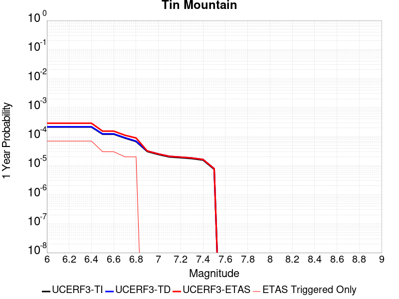 |  |

| Magnitude | 1 wk TI Prob | 1 wk TD Prob | 1 wk ETAS Prob | 1 wk ETAS/TD Gain | 1 wk ETAS Triggered Only | 1 mo TI Prob | 1 mo TD Prob | 1 mo ETAS Prob | 1 mo ETAS/TD Gain | 1 mo ETAS Triggered Only | 1 yr TI Prob | 1 yr TD Prob | 1 yr ETAS Prob | 1 yr ETAS/TD Gain | 1 yr ETAS Triggered Only | 10 yr TI Prob | 10 yr TD Prob | 10 yr ETAS Prob | 10 yr ETAS/TD Gain | 10 yr ETAS Triggered Only |
|-----|-----|-----|-----|-----|-----|-----|-----|-----|-----|-----|-----|-----|-----|-----|-----|-----|-----|-----|-----|-----|
| 6.0 | 4.083776E-6 | 4.1815365E-6 | 4.1815365E-6 | 1.0 | 0.0 | 1.750178E-5 | 1.792077E-5 | 1.792077E-5 | 1.0 | 0.0 | 2.1306332E-4 | 2.1816725E-4 | 3.0400016E-4 | 1.3934271 | 8.585165E-5 | 0.0021285915 | 0.0021798965 | 0.0023083931 | 1.0589463 | 1.2877748E-4 |
| 6.1 | 4.083776E-6 | 4.1815365E-6 | 4.1815365E-6 | 1.0 | 0.0 | 1.750178E-5 | 1.792077E-5 | 1.792077E-5 | 1.0 | 0.0 | 2.1306332E-4 | 2.1816725E-4 | 3.0400016E-4 | 1.3934271 | 8.585165E-5 | 0.0021285915 | 0.0021798965 | 0.0023083931 | 1.0589463 | 1.2877748E-4 |
| 6.2 | 4.083776E-6 | 4.1815365E-6 | 4.1815365E-6 | 1.0 | 0.0 | 1.750178E-5 | 1.792077E-5 | 1.792077E-5 | 1.0 | 0.0 | 2.1306332E-4 | 2.1816725E-4 | 3.0400016E-4 | 1.3934271 | 8.585165E-5 | 0.0021285915 | 0.0021798965 | 0.0023083931 | 1.0589463 | 1.2877748E-4 |
| 6.3 | 4.083776E-6 | 4.1815365E-6 | 4.1815365E-6 | 1.0 | 0.0 | 1.750178E-5 | 1.792077E-5 | 1.792077E-5 | 1.0 | 0.0 | 2.1306332E-4 | 2.1816725E-4 | 3.0400016E-4 | 1.3934271 | 8.585165E-5 | 0.0021285915 | 0.0021798965 | 0.0023083931 | 1.0589463 | 1.2877748E-4 |
| 6.4 | 4.083776E-6 | 4.1815365E-6 | 4.1815365E-6 | 1.0 | 0.0 | 1.750178E-5 | 1.792077E-5 | 1.792077E-5 | 1.0 | 0.0 | 2.1306332E-4 | 2.1816725E-4 | 3.0400016E-4 | 1.3934271 | 8.585165E-5 | 0.0021285915 | 0.0021798965 | 0.0023083931 | 1.0589463 | 1.2877748E-4 |
| 6.5 | 2.3143427E-6 | 2.3731573E-6 | 2.3731573E-6 | 1.0 | 0.0 | 9.9185745E-6 | 1.0170638E-5 | 1.0170638E-5 | 1.0 | 0.0 | 1.2075195E-4 | 1.2382126E-4 | 1.2382126E-4 | 1.0 | 0.0 | 0.0012068636 | 0.0012375986 | 0.0012375986 | 1.0 | 0.0 |
| 6.6 | 2.3143427E-6 | 2.3731573E-6 | 2.3731573E-6 | 1.0 | 0.0 | 9.9185745E-6 | 1.0170638E-5 | 1.0170638E-5 | 1.0 | 0.0 | 1.2075195E-4 | 1.2382126E-4 | 1.2382126E-4 | 1.0 | 0.0 | 0.0012068636 | 0.0012375986 | 0.0012375986 | 1.0 | 0.0 |
| 6.7 | 1.7029532E-6 | 1.7497915E-6 | 1.7497915E-6 | 1.0 | 0.0 | 7.2983503E-6 | 7.499088E-6 | 7.499088E-6 | 1.0 | 0.0 | 8.885379E-5 | 9.1298105E-5 | 9.1298105E-5 | 1.0 | 0.0 | 8.881827E-4 | 9.1265864E-4 | 9.1265864E-4 | 1.0 | 0.0 |
| 6.8 | 1.2914646E-6 | 1.3299378E-6 | 1.3299378E-6 | 1.0 | 0.0 | 5.534837E-6 | 5.6997237E-6 | 5.6997237E-6 | 1.0 | 0.0 | 6.738455E-5 | 6.939237E-5 | 6.939237E-5 | 1.0 | 0.0 | 6.736412E-4 | 6.9375033E-4 | 6.9375033E-4 | 1.0 | 0.0 |
| 6.9 | 5.8708974E-7 | 6.1169936E-7 | 6.1169936E-7 | 1.0 | 0.0 | 2.5160964E-6 | 2.6215664E-6 | 2.6215664E-6 | 1.0 | 0.0 | 3.0633044E-5 | 3.1917145E-5 | 3.1917145E-5 | 1.0 | 0.0 | 3.0628822E-4 | 3.191297E-4 | 3.191297E-4 | 1.0 | 0.0 |
| 7.0 | 4.6248786E-7 | 4.832015E-7 | 4.832015E-7 | 1.0 | 0.0 | 1.9820893E-6 | 2.0708624E-6 | 2.0708624E-6 | 1.0 | 0.0 | 2.413167E-5 | 2.5212494E-5 | 2.5212494E-5 | 1.0 | 0.0 | 2.412905E-4 | 2.5210003E-4 | 2.5210003E-4 | 1.0 | 0.0 |
| 7.1 | 3.804606E-7 | 3.987147E-7 | 3.987147E-7 | 1.0 | 0.0 | 1.6305444E-6 | 1.7087764E-6 | 1.7087764E-6 | 1.0 | 0.0 | 1.9851697E-5 | 2.0804187E-5 | 2.0804187E-5 | 1.0 | 0.0 | 1.9849923E-4 | 2.0802575E-4 | 2.0802575E-4 | 1.0 | 0.0 |
| 7.2 | 3.5864858E-7 | 3.7616863E-7 | 3.7616863E-7 | 1.0 | 0.0 | 1.5370645E-6 | 1.6121504E-6 | 1.6121504E-6 | 1.0 | 0.0 | 1.87136E-5 | 1.9627789E-5 | 1.9627789E-5 | 1.0 | 0.0 | 1.8712023E-4 | 1.9626386E-4 | 1.9626386E-4 | 1.0 | 0.0 |
| 7.3 | 3.342063E-7 | 3.506347E-7 | 3.506347E-7 | 1.0 | 0.0 | 1.4323119E-6 | 1.5027196E-6 | 1.5027196E-6 | 1.0 | 0.0 | 1.7438259E-5 | 1.829549E-5 | 1.829549E-5 | 1.0 | 0.0 | 1.743689E-4 | 1.8294314E-4 | 1.8294314E-4 | 1.0 | 0.0 |
| 7.4 | 2.971242E-7 | 3.1165817E-7 | 3.1165817E-7 | 1.0 | 0.0 | 1.2733886E-6 | 1.3356774E-6 | 1.3356774E-6 | 1.0 | 0.0 | 1.5503398E-5 | 1.6261785E-5 | 1.6261785E-5 | 1.0 | 0.0 | 1.5502315E-4 | 1.6260923E-4 | 1.6260923E-4 | 1.0 | 0.0 |
| 7.5 | 1.4326713E-7 | 1.5012525E-7 | 1.5012525E-7 | 1.0 | 0.0 | 6.140018E-7 | 6.433939E-7 | 6.433939E-7 | 1.0 | 0.0 | 7.4754466E-6 | 7.8333205E-6 | 7.8333205E-6 | 1.0 | 0.0 | 7.475195E-5 | 7.833321E-5 | 7.833321E-5 | 1.0 | 0.0 |

## Hosgri
*[(top)](#table-of-contents)*

| 1 Week | 1 Month | 1 Year | 10 Year |
|-----|-----|-----|-----|
|  | 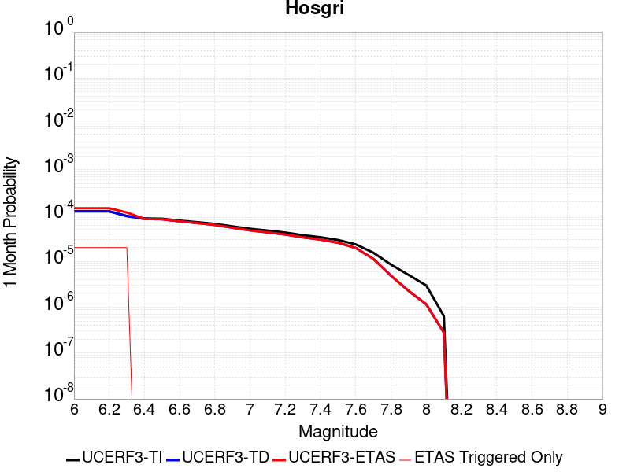 | 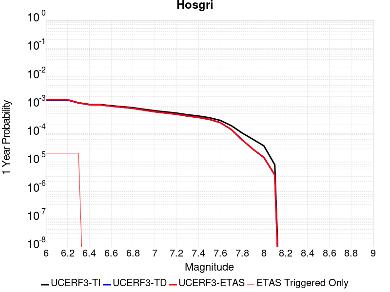 |  |

| Magnitude | 1 wk TI Prob | 1 wk TD Prob | 1 wk ETAS Prob | 1 wk ETAS/TD Gain | 1 wk ETAS Triggered Only | 1 mo TI Prob | 1 mo TD Prob | 1 mo ETAS Prob | 1 mo ETAS/TD Gain | 1 mo ETAS Triggered Only | 1 yr TI Prob | 1 yr TD Prob | 1 yr ETAS Prob | 1 yr ETAS/TD Gain | 1 yr ETAS Triggered Only | 10 yr TI Prob | 10 yr TD Prob | 10 yr ETAS Prob | 10 yr ETAS/TD Gain | 10 yr ETAS Triggered Only |
|-----|-----|-----|-----|-----|-----|-----|-----|-----|-----|-----|-----|-----|-----|-----|-----|-----|-----|-----|-----|-----|
| 6.0 | 2.883978E-5 | 2.9128403E-5 | 7.205298E-5 | 2.4736328 | 4.2925825E-5 | 1.235932E-4 | 1.248302E-4 | 2.1067112E-4 | 1.6876616 | 8.585165E-5 | 0.0015037085 | 0.0015187752 | 0.0016044965 | 1.0564411 | 8.585165E-5 | 0.01493574 | 0.01508773 | 0.015214564 | 1.0084065 | 1.2877748E-4 |
| 6.1 | 2.883978E-5 | 2.9128403E-5 | 7.205298E-5 | 2.4736328 | 4.2925825E-5 | 1.235932E-4 | 1.248302E-4 | 2.1067112E-4 | 1.6876616 | 8.585165E-5 | 0.0015037085 | 0.0015187752 | 0.0016044965 | 1.0564411 | 8.585165E-5 | 0.01493574 | 0.01508773 | 0.015214564 | 1.0084065 | 1.2877748E-4 |
| 6.2 | 2.883978E-5 | 2.9128403E-5 | 7.205298E-5 | 2.4736328 | 4.2925825E-5 | 1.235932E-4 | 1.248302E-4 | 2.1067112E-4 | 1.6876616 | 8.585165E-5 | 0.0015037085 | 0.0015187752 | 0.0016044965 | 1.0564411 | 8.585165E-5 | 0.01493574 | 0.01508773 | 0.015214564 | 1.0084065 | 1.2877748E-4 |
| 6.3 | 2.2914428E-5 | 2.2641956E-5 | 6.556681E-5 | 2.8958101 | 4.2925825E-5 | 9.8200995E-5 | 9.703337E-5 | 1.828767E-4 | 1.8846782 | 8.585165E-5 | 0.0011949413 | 0.001180746 | 0.0012664963 | 1.0726238 | 8.585165E-5 | 0.011885363 | 0.011746123 | 0.011873388 | 1.0108346 | 1.2877748E-4 |
| 6.4 | 2.0195741E-5 | 1.9696547E-5 | 1.9696547E-5 | 1.0 | 0.0 | 8.65503E-5 | 8.4411055E-5 | 8.4411055E-5 | 1.0 | 0.0 | 0.0010532405 | 0.001027222 | 0.001027222 | 1.0 | 0.0 | 0.010482626 | 0.010225783 | 0.01026827 | 1.0041549 | 4.2925825E-5 |
| 6.5 | 1.9924333E-5 | 1.9408968E-5 | 1.9408968E-5 | 1.0 | 0.0 | 8.53872E-5 | 8.317865E-5 | 8.317865E-5 | 1.0 | 0.0 | 0.0010390934 | 0.0010122315 | 0.0010122315 | 1.0 | 0.0 | 0.010342481 | 0.010077244 | 0.010119736 | 1.0042168 | 4.2925825E-5 |
| 6.6 | 1.809694E-5 | 1.7458287E-5 | 1.7458287E-5 | 1.0 | 0.0 | 7.7556004E-5 | 7.4819094E-5 | 7.4819094E-5 | 1.0 | 0.0 | 9.438353E-4 | 9.105431E-4 | 9.105431E-4 | 1.0 | 0.0 | 0.009398366 | 0.009069063 | 0.0091116 | 1.0046903 | 4.2925825E-5 |
| 6.7 | 1.675989E-5 | 1.6042752E-5 | 1.6042752E-5 | 1.0 | 0.0 | 7.182612E-5 | 6.8752845E-5 | 6.8752845E-5 | 1.0 | 0.0 | 8.7413215E-4 | 8.3674554E-4 | 8.3674554E-4 | 1.0 | 0.0 | 0.008707017 | 0.008336853 | 0.008379421 | 1.005106 | 4.2925825E-5 |
| 6.8 | 1.5401129E-5 | 1.4614069E-5 | 1.4614069E-5 | 1.0 | 0.0 | 6.6003166E-5 | 6.263023E-5 | 6.263023E-5 | 1.0 | 0.0 | 8.032922E-4 | 7.6225714E-4 | 7.6225714E-4 | 1.0 | 0.0 | 0.008003947 | 0.0075972863 | 0.0075972863 | 1.0 | 0.0 |
| 6.9 | 1.356559E-5 | 1.2689955E-5 | 1.2689955E-5 | 1.0 | 0.0 | 5.8136946E-5 | 5.438439E-5 | 5.438439E-5 | 1.0 | 0.0 | 7.0758746E-4 | 6.6192925E-4 | 6.6192925E-4 | 1.0 | 0.0 | 0.007053386 | 0.006600378 | 0.006600378 | 1.0 | 0.0 |
| 7.0 | 1.2030819E-5 | 1.1095949E-5 | 1.1095949E-5 | 1.0 | 0.0 | 5.155963E-5 | 4.75532E-5 | 4.75532E-5 | 1.0 | 0.0 | 6.275577E-4 | 5.788065E-4 | 5.788065E-4 | 1.0 | 0.0 | 0.006257884 | 0.0057737473 | 0.0057737473 | 1.0 | 0.0 |
| 7.1 | 1.0972698E-5 | 1.0022167E-5 | 1.0022167E-5 | 1.0 | 0.0 | 4.7025E-5 | 4.2951437E-5 | 4.2951437E-5 | 1.0 | 0.0 | 5.72379E-4 | 5.2280835E-4 | 5.2280835E-4 | 1.0 | 0.0 | 0.0057090693 | 0.005216533 | 0.005216533 | 1.0 | 0.0 |
| 7.2 | 9.961926E-6 | 9.034732E-6 | 9.034732E-6 | 1.0 | 0.0 | 4.2693267E-5 | 3.8719707E-5 | 3.8719707E-5 | 1.0 | 0.0 | 5.1966653E-4 | 4.7131052E-4 | 4.7131052E-4 | 1.0 | 0.0 | 0.00518453 | 0.0047038523 | 0.0047038523 | 1.0 | 0.0 |
| 7.3 | 8.700929E-6 | 7.828089E-6 | 7.828089E-6 | 1.0 | 0.0 | 3.7289166E-5 | 3.354852E-5 | 3.354852E-5 | 1.0 | 0.0 | 4.53901E-4 | 4.083767E-4 | 4.083767E-4 | 1.0 | 0.0 | 0.00452975 | 0.004076999 | 0.004076999 | 1.0 | 0.0 |
| 7.4 | 7.866285E-6 | 6.9987263E-6 | 6.9987263E-6 | 1.0 | 0.0 | 3.3712215E-5 | 2.9994197E-5 | 2.9994197E-5 | 1.0 | 0.0 | 4.103689E-4 | 3.6511818E-4 | 3.6511818E-4 | 1.0 | 0.0 | 0.004096119 | 0.0036459167 | 0.0036459167 | 1.0 | 0.0 |
| 7.5 | 6.8381305E-6 | 5.9596814E-6 | 5.9596814E-6 | 1.0 | 0.0 | 2.9305946E-5 | 2.5541241E-5 | 2.5541241E-5 | 1.0 | 0.0 | 3.5674145E-4 | 3.1092027E-4 | 3.1092027E-4 | 1.0 | 0.0 | 0.0035616932 | 0.003105584 | 0.003105584 | 1.0 | 0.0 |
| 7.6 | 5.503376E-6 | 4.595227E-6 | 4.595227E-6 | 1.0 | 0.0 | 2.3585684E-5 | 1.9693682E-5 | 1.9693682E-5 | 1.0 | 0.0 | 2.8711787E-4 | 2.397442E-4 | 2.397442E-4 | 1.0 | 0.0 | 0.002867472 | 0.0023955852 | 0.0023955852 | 1.0 | 0.0 |
| 7.7 | 3.6144982E-6 | 2.6521896E-6 | 2.6521896E-6 | 1.0 | 0.0 | 1.5490614E-5 | 1.1366477E-5 | 1.1366477E-5 | 1.0 | 0.0 | 1.8858191E-4 | 1.3837808E-4 | 1.3837808E-4 | 1.0 | 0.0 | 0.0018842196 | 0.001383647 | 0.001383647 | 1.0 | 0.0 |
| 7.8 | 1.9853494E-6 | 1.1360784E-6 | 1.1360784E-6 | 1.0 | 0.0 | 8.508612E-6 | 4.8688985E-6 | 4.8688985E-6 | 1.0 | 0.0 | 1.0358743E-4 | 5.9277223E-5 | 5.9277223E-5 | 1.0 | 0.0 | 0.0010353916 | 5.933389E-4 | 5.933389E-4 | 1.0 | 0.0 |
| 7.9 | 1.1818757E-6 | 5.29477E-7 | 5.29477E-7 | 1.0 | 0.0 | 5.0651715E-6 | 2.269185E-6 | 2.269185E-6 | 1.0 | 0.0 | 6.1666724E-5 | 2.7626977E-5 | 2.7626977E-5 | 1.0 | 0.0 | 6.1649614E-4 | 2.7691363E-4 | 2.7691363E-4 | 1.0 | 0.0 |
| 8.0 | 6.962958E-7 | 2.71365E-7 | 2.71365E-7 | 1.0 | 0.0 | 2.9841215E-6 | 1.1629924E-6 | 1.1629924E-6 | 1.0 | 0.0 | 3.6331072E-5 | 1.415934E-5 | 1.415934E-5 | 1.0 | 0.0 | 3.6325134E-4 | 1.4215276E-4 | 1.4215276E-4 | 1.0 | 0.0 |
| 8.1 | 1.5033264E-7 | 6.52693E-8 | 6.52693E-8 | 1.0 | 0.0 | 6.442826E-7 | 2.7972553E-7 | 2.7972553E-7 | 1.0 | 0.0 | 7.844113E-6 | 3.4056532E-6 | 3.4056532E-6 | 1.0 | 0.0 | 7.843835E-5 | 3.4072833E-5 | 3.4072833E-5 | 1.0 | 0.0 |

## Coronado Bank alt1
*[(top)](#table-of-contents)*

| 1 Week | 1 Month | 1 Year | 10 Year |
|-----|-----|-----|-----|
| 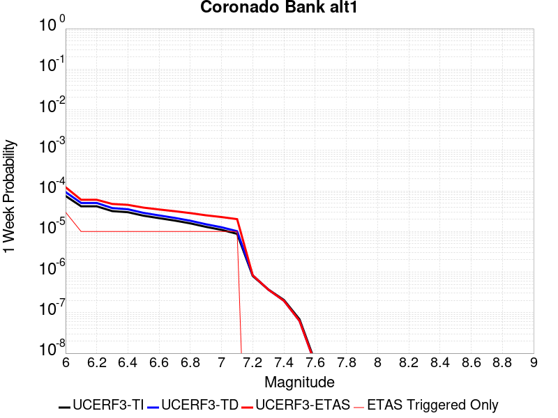 |  |  | 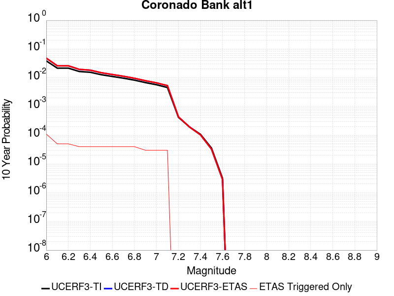 |

| Magnitude | 1 wk TI Prob | 1 wk TD Prob | 1 wk ETAS Prob | 1 wk ETAS/TD Gain | 1 wk ETAS Triggered Only | 1 mo TI Prob | 1 mo TD Prob | 1 mo ETAS Prob | 1 mo ETAS/TD Gain | 1 mo ETAS Triggered Only | 1 yr TI Prob | 1 yr TD Prob | 1 yr ETAS Prob | 1 yr ETAS/TD Gain | 1 yr ETAS Triggered Only | 10 yr TI Prob | 10 yr TD Prob | 10 yr ETAS Prob | 10 yr ETAS/TD Gain | 10 yr ETAS Triggered Only |
|-----|-----|-----|-----|-----|-----|-----|-----|-----|-----|-----|-----|-----|-----|-----|-----|-----|-----|-----|-----|-----|
| 6.0 | 7.533492E-5 | 9.3951705E-5 | 1.7979529E-4 | 1.913699 | 8.585165E-5 | 3.22824E-4 | 4.025903E-4 | 4.884074E-4 | 1.2131623 | 8.585165E-5 | 0.0039233007 | 0.004891121 | 0.004976553 | 1.0174667 | 8.585165E-5 | 0.03854755 | 0.047904 | 0.04802661 | 1.0025594 | 1.2877748E-4 |
| 6.1 | 4.1807285E-5 | 5.0493105E-5 | 9.341676E-5 | 1.8500896 | 4.2925825E-5 | 1.7916178E-4 | 2.1638138E-4 | 2.592979E-4 | 1.1983374 | 4.2925825E-5 | 0.0021791123 | 0.0026313365 | 0.0026741493 | 1.0162704 | 4.2925825E-5 | 0.021578677 | 0.026011124 | 0.026052933 | 1.0016074 | 4.2925825E-5 |
| 6.2 | 4.1807285E-5 | 5.0493105E-5 | 9.341676E-5 | 1.8500896 | 4.2925825E-5 | 1.7916178E-4 | 2.1638138E-4 | 2.592979E-4 | 1.1983374 | 4.2925825E-5 | 0.0021791123 | 0.0026313365 | 0.0026741493 | 1.0162704 | 4.2925825E-5 | 0.021578677 | 0.026011124 | 0.026052933 | 1.0016074 | 4.2925825E-5 |
| 6.3 | 3.1793104E-5 | 3.7711125E-5 | 8.0635335E-5 | 2.1382372 | 4.2925825E-5 | 1.3624904E-4 | 1.6160926E-4 | 2.0452814E-4 | 1.265572 | 4.2925825E-5 | 0.0016575698 | 0.001965849 | 0.0020086905 | 1.0217929 | 4.2925825E-5 | 0.016452603 | 0.019488495 | 0.019530585 | 1.0021597 | 4.2925825E-5 |
| 6.4 | 2.9878007E-5 | 3.5335797E-5 | 7.8260106E-5 | 2.214754 | 4.2925825E-5 | 1.2804232E-4 | 1.5143053E-4 | 1.9434985E-4 | 1.2834258 | 4.2925825E-5 | 0.0015578003 | 0.0018421395 | 0.0018849862 | 1.0232593 | 4.2925825E-5 | 0.015469253 | 0.018272463 | 0.018314606 | 1.0023062 | 4.2925825E-5 |
| 6.5 | 2.4512565E-5 | 2.8764101E-5 | 7.168869E-5 | 2.4922972 | 4.2925825E-5 | 1.0504962E-4 | 1.2326906E-4 | 1.6618958E-4 | 1.3481858 | 4.2925825E-5 | 0.0012782287 | 0.0014997943 | 0.0015426558 | 1.0285782 | 4.2925825E-5 | 0.012709012 | 0.0148996925 | 0.014941979 | 1.002838 | 4.2925825E-5 |
| 6.6 | 2.1317413E-5 | 2.490667E-5 | 6.7831425E-5 | 2.7234242 | 4.2925825E-5 | 9.135714E-5 | 1.0673863E-4 | 1.4965987E-4 | 1.4021153 | 4.2925825E-5 | 0.0011117056 | 0.0012987903 | 0.0013416604 | 1.0330077 | 4.2925825E-5 | 0.011061605 | 0.012914407 | 0.0129567785 | 1.003281 | 4.2925825E-5 |
| 6.7 | 1.8585655E-5 | 2.1634882E-5 | 6.4559776E-5 | 2.9840596 | 4.2925825E-5 | 7.9650374E-5 | 9.271774E-5 | 1.3563958E-4 | 1.4629302 | 4.2925825E-5 | 9.6931186E-4 | 0.0011282744 | 0.0011711518 | 1.0380026 | 4.2925825E-5 | 0.0096509475 | 0.011227623 | 0.011270067 | 1.0037804 | 4.2925825E-5 |
| 6.8 | 1.5862879E-5 | 1.8419476E-5 | 6.134451E-5 | 3.3304155 | 4.2925825E-5 | 6.798199E-5 | 7.8938334E-5 | 1.21860765E-4 | 1.5437465 | 4.2925825E-5 | 8.273665E-4 | 9.606697E-4 | 0.0010035543 | 1.0446403 | 4.2925825E-5 | 0.008242928 | 0.009567151 | 0.009609666 | 1.0044439 | 4.2925825E-5 |
| 6.9 | 1.3021509E-5 | 1.5095266E-5 | 5.8020443E-5 | 3.8436184 | 4.2925825E-5 | 5.5805274E-5 | 6.46925E-5 | 1.0761554E-4 | 1.6634935 | 4.2925825E-5 | 6.792174E-4 | 7.873646E-4 | 8.302566E-4 | 1.0544754 | 4.2925825E-5 | 0.006771452 | 0.007847573 | 0.007890162 | 1.005427 | 4.2925825E-5 |
| 7.0 | 1.0974371E-5 | 1.2720105E-5 | 5.564538E-5 | 4.374601 | 4.2925825E-5 | 4.7032172E-5 | 5.4513697E-5 | 9.743718E-5 | 1.787389 | 4.2925825E-5 | 5.7246623E-4 | 6.635197E-4 | 7.06417E-4 | 1.0646513 | 4.2925825E-5 | 0.0057099373 | 0.0066171354 | 0.006659777 | 1.0064441 | 4.2925825E-5 |
| 7.1 | 8.766221E-6 | 1.0163833E-5 | 5.308922E-5 | 5.223346 | 4.2925825E-5 | 3.7568978E-5 | 4.3558655E-5 | 8.648261E-5 | 1.9854288 | 4.2925825E-5 | 4.573063E-4 | 5.302148E-4 | 5.7311787E-4 | 1.0809164 | 4.2925825E-5 | 0.0045636636 | 0.005291197 | 0.005333896 | 1.0080698 | 4.2925825E-5 |
| 7.2 | 8.026024E-7 | 8.331776E-7 | 8.331776E-7 | 1.0 | 0.0 | 3.43972E-6 | 3.5707562E-6 | 3.5707562E-6 | 1.0 | 0.0 | 4.1877785E-5 | 4.34731E-5 | 4.34731E-5 | 1.0 | 0.0 | 4.1869894E-4 | 4.3464705E-4 | 4.3464705E-4 | 1.0 | 0.0 |
| 7.3 | 3.7293114E-7 | 3.700106E-7 | 3.700106E-7 | 1.0 | 0.0 | 1.5982754E-6 | 1.5857588E-6 | 1.5857588E-6 | 1.0 | 0.0 | 1.9458828E-5 | 1.9306442E-5 | 1.9306442E-5 | 1.0 | 0.0 | 1.9457124E-4 | 1.9304773E-4 | 1.9304773E-4 | 1.0 | 0.0 |
| 7.4 | 2.0557036E-7 | 1.9674441E-7 | 1.9674441E-7 | 1.0 | 0.0 | 8.810155E-7 | 8.4319004E-7 | 8.4319004E-7 | 1.0 | 0.0 | 1.0726311E-5 | 1.02657905E-5 | 1.02657905E-5 | 1.0 | 0.0 | 1.0725793E-4 | 1.026532E-4 | 1.026532E-4 | 1.0 | 0.0 |
| 7.5 | 6.845446E-8 | 6.2794086E-8 | 6.2794086E-8 | 1.0 | 0.0 | 2.9337625E-7 | 2.6911746E-7 | 2.6911746E-7 | 1.0 | 0.0 | 3.5718497E-6 | 3.2765004E-6 | 3.2765004E-6 | 1.0 | 0.0 | 3.5717923E-5 | 3.276453E-5 | 3.276453E-5 | 1.0 | 0.0 |
| 7.6 | 6.0975145E-9 | 5.531901E-9 | 5.531901E-9 | 1.0 | 0.0 | 2.6132206E-8 | 2.3708148E-8 | 2.3708148E-8 | 1.0 | 0.0 | 3.1815955E-7 | 2.8864667E-7 | 2.8864667E-7 | 1.0 | 0.0 | 3.181591E-6 | 2.886464E-6 | 2.886464E-6 | 1.0 | 0.0 |

## Great Valley 05 Pittsburg - Kirby Hills alt1
*[(top)](#table-of-contents)*

| 1 Week | 1 Month | 1 Year | 10 Year |
|-----|-----|-----|-----|
| 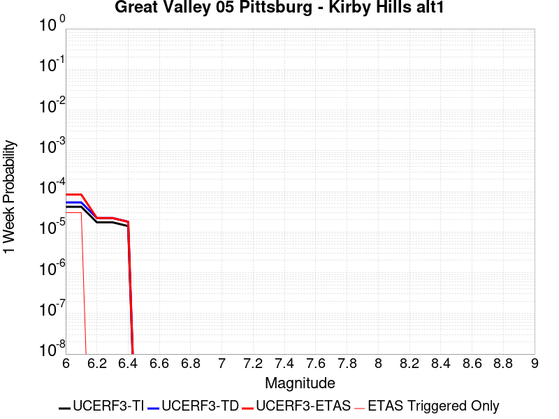 |  |  |  |

| Magnitude | 1 wk TI Prob | 1 wk TD Prob | 1 wk ETAS Prob | 1 wk ETAS/TD Gain | 1 wk ETAS Triggered Only | 1 mo TI Prob | 1 mo TD Prob | 1 mo ETAS Prob | 1 mo ETAS/TD Gain | 1 mo ETAS Triggered Only | 1 yr TI Prob | 1 yr TD Prob | 1 yr ETAS Prob | 1 yr ETAS/TD Gain | 1 yr ETAS Triggered Only | 10 yr TI Prob | 10 yr TD Prob | 10 yr ETAS Prob | 10 yr ETAS/TD Gain | 10 yr ETAS Triggered Only |
|-----|-----|-----|-----|-----|-----|-----|-----|-----|-----|-----|-----|-----|-----|-----|-----|-----|-----|-----|-----|-----|
| 6.0 | 4.187212E-5 | 5.344289E-5 | 1.3928996E-4 | 2.6063325 | 8.585165E-5 | 1.794396E-4 | 2.2902661E-4 | 3.148586E-4 | 1.3747686 | 8.585165E-5 | 0.002182488 | 0.0027857998 | 0.0029142185 | 1.0460976 | 1.2877748E-4 | 0.021611776 | 0.027603218 | 0.02772844 | 1.0045365 | 1.2877748E-4 |
| 6.1 | 4.187212E-5 | 5.344289E-5 | 1.3928996E-4 | 2.6063325 | 8.585165E-5 | 1.794396E-4 | 2.2902661E-4 | 3.148586E-4 | 1.3747686 | 8.585165E-5 | 0.002182488 | 0.0027857998 | 0.0029142185 | 1.0460976 | 1.2877748E-4 | 0.021611776 | 0.027603218 | 0.02772844 | 1.0045365 | 1.2877748E-4 |
| 6.2 | 1.7353306E-5 | 2.2154672E-5 | 2.2154672E-5 | 1.0 | 0.0 | 7.436919E-5 | 9.4947456E-5 | 9.4947456E-5 | 1.0 | 0.0 | 9.050688E-4 | 0.0011557573 | 0.0011557573 | 1.0 | 0.0 | 0.009013915 | 0.0115352 | 0.0115352 | 1.0 | 0.0 |
| 6.3 | 1.7353306E-5 | 2.2154672E-5 | 2.2154672E-5 | 1.0 | 0.0 | 7.436919E-5 | 9.4947456E-5 | 9.4947456E-5 | 1.0 | 0.0 | 9.050688E-4 | 0.0011557573 | 0.0011557573 | 1.0 | 0.0 | 0.009013915 | 0.0115352 | 0.0115352 | 1.0 | 0.0 |
| 6.4 | 1.4028824E-5 | 1.7901062E-5 | 1.7901062E-5 | 1.0 | 0.0 | 6.0122147E-5 | 7.671883E-5 | 7.671883E-5 | 1.0 | 0.0 | 7.3174125E-4 | 9.340303E-4 | 9.340303E-4 | 1.0 | 0.0 | 0.0072933645 | 0.009338211 | 0.009338211 | 1.0 | 0.0 |

## Camp Rock 2011
*[(top)](#table-of-contents)*

| 1 Week | 1 Month | 1 Year | 10 Year |
|-----|-----|-----|-----|
|  |  |  |  |

| Magnitude | 1 wk TI Prob | 1 wk TD Prob | 1 wk ETAS Prob | 1 wk ETAS/TD Gain | 1 wk ETAS Triggered Only | 1 mo TI Prob | 1 mo TD Prob | 1 mo ETAS Prob | 1 mo ETAS/TD Gain | 1 mo ETAS Triggered Only | 1 yr TI Prob | 1 yr TD Prob | 1 yr ETAS Prob | 1 yr ETAS/TD Gain | 1 yr ETAS Triggered Only | 10 yr TI Prob | 10 yr TD Prob | 10 yr ETAS Prob | 10 yr ETAS/TD Gain | 10 yr ETAS Triggered Only |
|-----|-----|-----|-----|-----|-----|-----|-----|-----|-----|-----|-----|-----|-----|-----|-----|-----|-----|-----|-----|-----|
| 6.0 | 1.6710783E-5 | 4.249999E-6 | 9.010128E-5 | 21.200306 | 8.585165E-5 | 7.161568E-5 | 1.8214158E-5 | 1.04064246E-4 | 5.713371 | 8.585165E-5 | 8.7157206E-4 | 2.2173533E-4 | 3.0756794E-4 | 1.3870949 | 8.585165E-5 | 0.008681616 | 0.0022151938 | 0.002343686 | 1.058005 | 1.2877748E-4 |
| 6.1 | 1.6710783E-5 | 4.249999E-6 | 9.010128E-5 | 21.200306 | 8.585165E-5 | 7.161568E-5 | 1.8214158E-5 | 1.04064246E-4 | 5.713371 | 8.585165E-5 | 8.7157206E-4 | 2.2173533E-4 | 3.0756794E-4 | 1.3870949 | 8.585165E-5 | 0.008681616 | 0.0022151938 | 0.002343686 | 1.058005 | 1.2877748E-4 |
| 6.2 | 1.6710783E-5 | 4.249999E-6 | 9.010128E-5 | 21.200306 | 8.585165E-5 | 7.161568E-5 | 1.8214158E-5 | 1.04064246E-4 | 5.713371 | 8.585165E-5 | 8.7157206E-4 | 2.2173533E-4 | 3.0756794E-4 | 1.3870949 | 8.585165E-5 | 0.008681616 | 0.0022151938 | 0.002343686 | 1.058005 | 1.2877748E-4 |
| 6.3 | 1.6710783E-5 | 4.249999E-6 | 9.010128E-5 | 21.200306 | 8.585165E-5 | 7.161568E-5 | 1.8214158E-5 | 1.04064246E-4 | 5.713371 | 8.585165E-5 | 8.7157206E-4 | 2.2173533E-4 | 3.0756794E-4 | 1.3870949 | 8.585165E-5 | 0.008681616 | 0.0022151938 | 0.002343686 | 1.058005 | 1.2877748E-4 |
| 6.4 | 7.982846E-6 | 3.6820359E-6 | 8.9533365E-5 | 24.316267 | 8.585165E-5 | 3.421175E-5 | 1.578006E-5 | 1.0163035E-4 | 6.4404287 | 8.585165E-5 | 4.1644843E-4 | 1.9210564E-4 | 2.779408E-4 | 1.4468123 | 8.585165E-5 | 0.0041566887 | 0.0019194306 | 0.0020479609 | 1.0669627 | 1.2877748E-4 |
| 6.5 | 7.982846E-6 | 3.6820359E-6 | 8.9533365E-5 | 24.316267 | 8.585165E-5 | 3.421175E-5 | 1.578006E-5 | 1.0163035E-4 | 6.4404287 | 8.585165E-5 | 4.1644843E-4 | 1.9210564E-4 | 2.779408E-4 | 1.4468123 | 8.585165E-5 | 0.0041566887 | 0.0019194306 | 0.0020479609 | 1.0669627 | 1.2877748E-4 |
| 6.6 | 7.048869E-6 | 3.4242998E-6 | 8.927565E-5 | 26.071215 | 8.585165E-5 | 3.0209088E-5 | 1.467549E-5 | 1.0052588E-4 | 6.8499165 | 8.585165E-5 | 3.677336E-4 | 1.7865976E-4 | 2.6449608E-4 | 1.4804457 | 8.585165E-5 | 0.0036712566 | 0.0017851929 | 0.0019137405 | 1.0720077 | 1.2877748E-4 |
| 6.7 | 6.987307E-6 | 3.3622775E-6 | 8.921364E-5 | 26.533693 | 8.585165E-5 | 2.9945259E-5 | 1.4409683E-5 | 1.0026009E-4 | 6.957828 | 8.585165E-5 | 3.6452254E-4 | 1.7542407E-4 | 2.6126066E-4 | 1.4893091 | 8.585165E-5 | 0.0036392517 | 0.0017528872 | 0.0018814389 | 1.0733372 | 1.2877748E-4 |
| 6.8 | 6.3737602E-6 | 3.1178672E-6 | 8.8969246E-5 | 28.53529 | 8.585165E-5 | 2.731583E-5 | 1.3362222E-5 | 9.9212724E-5 | 7.424867 | 8.585165E-5 | 3.3251947E-4 | 1.6267318E-4 | 2.4851089E-4 | 1.5276695 | 8.585165E-5 | 0.0033202237 | 0.0016255698 | 0.0017541378 | 1.0790911 | 1.2877748E-4 |
| 6.9 | 6.112211E-6 | 2.933078E-6 | 8.878447E-5 | 30.27007 | 8.585165E-5 | 2.6194928E-5 | 1.2570275E-5 | 9.8420845E-5 | 7.829649 | 8.585165E-5 | 3.1887658E-4 | 1.5303263E-4 | 2.3887114E-4 | 1.5609164 | 8.585165E-5 | 0.003184194 | 0.0015293002 | 0.0016578808 | 1.0840781 | 1.2877748E-4 |
| 7.0 | 5.5140117E-6 | 2.64191E-6 | 8.849333E-5 | 33.495968 | 8.585165E-5 | 2.3631264E-5 | 1.1322423E-5 | 9.71731E-5 | 8.582359 | 8.585165E-5 | 2.8767265E-4 | 1.3784204E-4 | 2.2368185E-4 | 1.6227405 | 8.585165E-5 | 0.0028730053 | 0.0013775907 | 0.0015061907 | 1.0933515 | 1.2877748E-4 |
| 7.1 | 4.8151105E-6 | 2.1342612E-6 | 8.7985725E-5 | 41.22538 | 8.585165E-5 | 2.0636026E-5 | 9.146803E-6 | 9.499767E-5 | 10.385888 | 8.585165E-5 | 2.5121463E-4 | 1.1135685E-4 | 1.9719894E-4 | 1.7708739 | 8.585165E-5 | 0.0025093083 | 0.0011130325 | 0.0012416666 | 1.1155709 | 1.2877748E-4 |
| 7.2 | 3.818335E-6 | 1.2937372E-6 | 1.2937372E-6 | 1.0 | 0.0 | 1.6364189E-5 | 5.5445767E-6 | 5.5445767E-6 | 1.0 | 0.0 | 1.9921579E-4 | 6.750321E-5 | 6.750321E-5 | 1.0 | 0.0 | 0.0019903728 | 6.7483535E-4 | 6.7483535E-4 | 1.0 | 0.0 |
| 7.3 | 2.7166698E-6 | 7.383078E-7 | 7.383078E-7 | 1.0 | 0.0 | 1.1642818E-5 | 3.1641725E-6 | 3.1641725E-6 | 1.0 | 0.0 | 1.4174209E-4 | 3.852314E-5 | 3.852314E-5 | 1.0 | 0.0 | 0.0014165172 | 3.8516664E-4 | 3.8516664E-4 | 1.0 | 0.0 |
| 7.4 | 2.0893426E-6 | 5.4614605E-7 | 5.4614605E-7 | 1.0 | 0.0 | 8.954295E-6 | 2.340624E-6 | 2.340624E-6 | 1.0 | 0.0 | 1.0901308E-4 | 2.8496728E-5 | 2.8496728E-5 | 1.0 | 0.0 | 0.0010895962 | 2.849313E-4 | 2.849313E-4 | 1.0 | 0.0 |
| 7.5 | 1.1681728E-6 | 3.6028484E-7 | 3.6028484E-7 | 1.0 | 0.0 | 5.0064455E-6 | 1.544077E-6 | 1.544077E-6 | 1.0 | 0.0 | 6.0951766E-5 | 1.879898E-5 | 1.879898E-5 | 1.0 | 0.0 | 6.093505E-4 | 1.8797436E-4 | 1.8797436E-4 | 1.0 | 0.0 |
| 7.6 | 1.3154387E-7 | 7.1196716E-8 | 7.1196716E-8 | 1.0 | 0.0 | 5.6375933E-7 | 3.0512876E-7 | 3.0512876E-7 | 1.0 | 0.0 | 6.863748E-6 | 3.714938E-6 | 3.714938E-6 | 1.0 | 0.0 | 6.863536E-5 | 3.7148915E-5 | 3.7148915E-5 | 1.0 | 0.0 |

## Owens Valley
*[(top)](#table-of-contents)*

| 1 Week | 1 Month | 1 Year | 10 Year |
|-----|-----|-----|-----|
|  |  |  |  |

| Magnitude | 1 wk TI Prob | 1 wk TD Prob | 1 wk ETAS Prob | 1 wk ETAS/TD Gain | 1 wk ETAS Triggered Only | 1 mo TI Prob | 1 mo TD Prob | 1 mo ETAS Prob | 1 mo ETAS/TD Gain | 1 mo ETAS Triggered Only | 1 yr TI Prob | 1 yr TD Prob | 1 yr ETAS Prob | 1 yr ETAS/TD Gain | 1 yr ETAS Triggered Only | 10 yr TI Prob | 10 yr TD Prob | 10 yr ETAS Prob | 10 yr ETAS/TD Gain | 10 yr ETAS Triggered Only |
|-----|-----|-----|-----|-----|-----|-----|-----|-----|-----|-----|-----|-----|-----|-----|-----|-----|-----|-----|-----|-----|
| 6.0 | 4.83821E-5 | 3.6210524E-6 | 3.6210524E-6 | 1.0 | 0.0 | 2.0733538E-4 | 1.551871E-5 | 1.0136903E-4 | 6.5320525 | 8.585165E-5 | 0.002521386 | 1.889249E-4 | 2.7476033E-4 | 1.4543363 | 8.585165E-5 | 0.024929691 | 0.0019297141 | 0.0020582431 | 1.0666052 | 1.2877748E-4 |
| 6.1 | 4.83821E-5 | 3.6210524E-6 | 3.6210524E-6 | 1.0 | 0.0 | 2.0733538E-4 | 1.551871E-5 | 1.0136903E-4 | 6.5320525 | 8.585165E-5 | 0.002521386 | 1.889249E-4 | 2.7476033E-4 | 1.4543363 | 8.585165E-5 | 0.024929691 | 0.0019297141 | 0.0020582431 | 1.0666052 | 1.2877748E-4 |
| 6.2 | 4.83821E-5 | 3.6210524E-6 | 3.6210524E-6 | 1.0 | 0.0 | 2.0733538E-4 | 1.551871E-5 | 1.0136903E-4 | 6.5320525 | 8.585165E-5 | 0.002521386 | 1.889249E-4 | 2.7476033E-4 | 1.4543363 | 8.585165E-5 | 0.024929691 | 0.0019297141 | 0.0020582431 | 1.0666052 | 1.2877748E-4 |
| 6.3 | 3.953008E-5 | 3.1530958E-6 | 3.1530958E-6 | 1.0 | 0.0 | 1.6940363E-4 | 1.3513202E-5 | 9.936369E-5 | 7.3530827 | 8.585165E-5 | 0.002060538 | 1.6451156E-4 | 2.5034908E-4 | 1.521772 | 8.585165E-5 | 0.020415364 | 0.0016621627 | 0.0017907262 | 1.077347 | 1.2877748E-4 |
| 6.4 | 3.953008E-5 | 3.1530958E-6 | 3.1530958E-6 | 1.0 | 0.0 | 1.6940363E-4 | 1.3513202E-5 | 9.936369E-5 | 7.3530827 | 8.585165E-5 | 0.002060538 | 1.6451156E-4 | 2.5034908E-4 | 1.521772 | 8.585165E-5 | 0.020415364 | 0.0016621627 | 0.0017907262 | 1.077347 | 1.2877748E-4 |
| 6.5 | 3.457342E-5 | 2.9707387E-6 | 2.9707387E-6 | 1.0 | 0.0 | 1.4816338E-4 | 1.273168E-5 | 9.858223E-5 | 7.743066 | 8.585165E-5 | 0.0018023965 | 1.5499788E-4 | 2.4083622E-4 | 1.5538033 | 8.585165E-5 | 0.017878477 | 0.0015563119 | 0.0016848888 | 1.0826166 | 1.2877748E-4 |
| 6.6 | 3.1127765E-5 | 2.8737306E-6 | 2.8737306E-6 | 1.0 | 0.0 | 1.3339789E-4 | 1.2315934E-5 | 9.816652E-5 | 7.9706926 | 8.585165E-5 | 0.0016229092 | 1.4993687E-4 | 2.3577565E-4 | 1.5724994 | 8.585165E-5 | 0.016111081 | 0.0015013438 | 0.0016299279 | 1.085646 | 1.2877748E-4 |
| 6.7 | 2.806885E-5 | 2.8101606E-6 | 2.8101606E-6 | 1.0 | 0.0 | 1.2028952E-4 | 1.2043493E-5 | 9.789411E-5 | 8.128382 | 8.585165E-5 | 0.001463541 | 1.4662035E-4 | 2.3245941E-4 | 1.5854512 | 8.585165E-5 | 0.014539397 | 0.0014656087 | 0.0015941975 | 1.0877374 | 1.2877748E-4 |
| 6.8 | 2.524524E-5 | 2.2351392E-6 | 2.2351392E-6 | 1.0 | 0.0 | 1.0818939E-4 | 9.579134E-6 | 9.542996E-5 | 9.962275 | 8.585165E-5 | 0.0013164099 | 1.16620016E-4 | 2.0246166E-4 | 1.7360798 | 8.585165E-5 | 0.01308639 | 0.001165827 | 0.0012944544 | 1.1103314 | 1.2877748E-4 |
| 6.9 | 2.2704568E-5 | 1.6079711E-6 | 1.6079711E-6 | 1.0 | 0.0 | 9.730166E-5 | 6.8912864E-6 | 9.2742346E-5 | 13.457914 | 8.585165E-5 | 0.0011840039 | 8.38982E-5 | 1.6974265E-4 | 2.0231977 | 8.585165E-5 | 0.011777153 | 8.38853E-4 | 9.675225E-4 | 1.1533873 | 1.2877748E-4 |
| 7.0 | 2.0871712E-5 | 1.5393621E-6 | 1.5393621E-6 | 1.0 | 0.0 | 8.944713E-5 | 6.5972495E-6 | 4.952279E-5 | 7.5065813 | 4.2925825E-5 | 0.0010884746 | 8.031857E-5 | 1.2324094E-4 | 1.5344017 | 4.2925825E-5 | 0.010831586 | 8.030395E-4 | 8.8882225E-4 | 1.1068225 | 8.585165E-5 |
| 7.1 | 1.944928E-5 | 1.3862556E-6 | 1.3862556E-6 | 1.0 | 0.0 | 8.335139E-5 | 5.941082E-6 | 4.8866652E-5 | 8.225211 | 4.2925825E-5 | 0.0010143308 | 7.233028E-5 | 1.15253E-4 | 1.5934267 | 4.2925825E-5 | 0.010097133 | 7.2319806E-4 | 8.089876E-4 | 1.1186253 | 8.585165E-5 |
| 7.2 | 1.7876306E-5 | 1.2487686E-6 | 1.2487686E-6 | 1.0 | 0.0 | 7.6610486E-5 | 5.3518543E-6 | 4.827745E-5 | 9.020696 | 4.2925825E-5 | 9.3233347E-4 | 6.515689E-5 | 1.0807991E-4 | 1.6587642 | 4.2925825E-5 | 0.009284316 | 6.5148395E-4 | 7.3727965E-4 | 1.1316928 | 8.585165E-5 |
| 7.3 | 1.2618672E-5 | 1.1113839E-6 | 1.1113839E-6 | 1.0 | 0.0 | 5.40789E-5 | 4.763065E-6 | 4.7688685E-5 | 10.012184 | 4.2925825E-5 | 6.582117E-4 | 5.7988782E-5 | 1.0091212E-4 | 1.7402006 | 4.2925825E-5 | 0.0065626553 | 5.7983754E-4 | 6.656394E-4 | 1.1479757 | 8.585165E-5 |
| 7.4 | 7.4874442E-6 | 8.547518E-7 | 8.547518E-7 | 1.0 | 0.0 | 3.208865E-5 | 3.6632168E-6 | 4.6588884E-5 | 12.718025 | 4.2925825E-5 | 3.906093E-4 | 4.4598757E-5 | 8.752267E-5 | 1.9624463 | 4.2925825E-5 | 0.003899234 | 4.459579E-4 | 5.317713E-4 | 1.1924248 | 8.585165E-5 |
| 7.5 | 2.4734156E-6 | 6.0679935E-7 | 6.0679935E-7 | 1.0 | 0.0 | 1.060031E-5 | 2.6005662E-6 | 4.5526278E-5 | 17.506294 | 4.2925825E-5 | 1.2905113E-4 | 3.1661435E-5 | 7.45859E-5 | 2.3557334 | 4.2925825E-5 | 0.0012897621 | 3.1656958E-4 | 4.0239404E-4 | 1.2711078 | 8.585165E-5 |
| 7.6 | 1.1328841E-6 | 3.1961991E-7 | 3.1961991E-7 | 1.0 | 0.0 | 4.8552088E-6 | 1.369799E-6 | 4.4295564E-5 | 32.337273 | 4.2925825E-5 | 5.9110564E-5 | 1.6677177E-5 | 5.9602284E-5 | 3.5738833 | 4.2925825E-5 | 5.9094845E-4 | 1.6675945E-4 | 2.5259677E-4 | 1.5147375 | 8.585165E-5 |
| 7.7 | 4.8613185E-7 | 8.962742E-8 | 8.962742E-8 | 1.0 | 0.0 | 2.0834207E-6 | 3.8411747E-7 | 3.8411747E-7 | 1.0 | 0.0 | 2.536535E-5 | 4.676621E-6 | 4.676621E-6 | 1.0 | 0.0 | 2.5362454E-4 | 4.676529E-5 | 4.676529E-5 | 1.0 | 0.0 |

## San Clemente
*[(top)](#table-of-contents)*

| 1 Week | 1 Month | 1 Year | 10 Year |
|-----|-----|-----|-----|
|  |  | 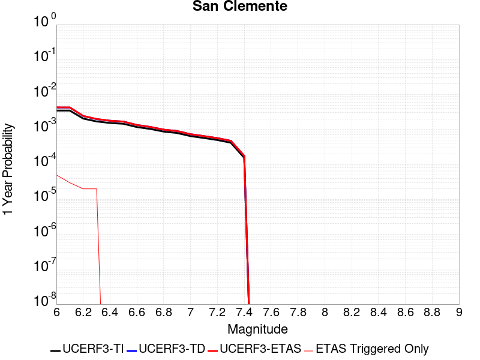 |  |

| Magnitude | 1 wk TI Prob | 1 wk TD Prob | 1 wk ETAS Prob | 1 wk ETAS/TD Gain | 1 wk ETAS Triggered Only | 1 mo TI Prob | 1 mo TD Prob | 1 mo ETAS Prob | 1 mo ETAS/TD Gain | 1 mo ETAS Triggered Only | 1 yr TI Prob | 1 yr TD Prob | 1 yr ETAS Prob | 1 yr ETAS/TD Gain | 1 yr ETAS Triggered Only | 10 yr TI Prob | 10 yr TD Prob | 10 yr ETAS Prob | 10 yr ETAS/TD Gain | 10 yr ETAS Triggered Only |
|-----|-----|-----|-----|-----|-----|-----|-----|-----|-----|-----|-----|-----|-----|-----|-----|-----|-----|-----|-----|-----|
| 6.0 | 6.681379E-5 | 8.163834E-5 | 1.2456065E-4 | 1.5257618 | 4.2925825E-5 | 2.8631336E-4 | 3.4983488E-4 | 3.9274571E-4 | 1.1226602 | 4.2925825E-5 | 0.003480294 | 0.00425141 | 0.0042941533 | 1.0100539 | 4.2925825E-5 | 0.03426291 | 0.04175603 | 0.041838296 | 1.0019702 | 8.585165E-5 |
| 6.1 | 6.681379E-5 | 8.163834E-5 | 1.2456065E-4 | 1.5257618 | 4.2925825E-5 | 2.8631336E-4 | 3.4983488E-4 | 3.9274571E-4 | 1.1226602 | 4.2925825E-5 | 0.003480294 | 0.00425141 | 0.0042941533 | 1.0100539 | 4.2925825E-5 | 0.03426291 | 0.04175603 | 0.041838296 | 1.0019702 | 8.585165E-5 |
| 6.2 | 3.9400576E-5 | 4.6452373E-5 | 8.9376204E-5 | 1.9240396 | 4.2925825E-5 | 1.6884868E-4 | 1.9906677E-4 | 2.4198405E-4 | 1.2155924 | 4.2925825E-5 | 0.0020537945 | 0.0024209984 | 0.0024638204 | 1.0176877 | 4.2925825E-5 | 0.020349167 | 0.023952903 | 0.023994802 | 1.0017492 | 4.2925825E-5 |
| 6.3 | 3.2590255E-5 | 3.792912E-5 | 8.0853315E-5 | 2.131695 | 4.2925825E-5 | 1.3966505E-4 | 1.6254342E-4 | 2.0546226E-4 | 1.2640455 | 4.2925825E-5 | 0.0016990956 | 0.0019772002 | 0.002020041 | 1.0216675 | 4.2925825E-5 | 0.01686163 | 0.019599883 | 0.019641966 | 1.0021472 | 4.2925825E-5 |
| 6.4 | 2.9454652E-5 | 3.4097764E-5 | 3.4097764E-5 | 1.0 | 0.0 | 1.2622811E-4 | 1.4612524E-4 | 1.4612524E-4 | 1.0 | 0.0 | 0.0015357438 | 0.0017776493 | 0.0017776493 | 1.0 | 0.0 | 0.015251739 | 0.01763747 | 0.01763747 | 1.0 | 0.0 |
| 6.5 | 2.790836E-5 | 3.2247463E-5 | 3.2247463E-5 | 1.0 | 0.0 | 1.1960178E-4 | 1.3819624E-4 | 1.3819624E-4 | 1.0 | 0.0 | 0.001455179 | 0.0016812662 | 0.0016812662 | 1.0 | 0.0 | 0.014456868 | 0.016688485 | 0.016688485 | 1.0 | 0.0 |
| 6.6 | 2.2492153E-5 | 2.5762702E-5 | 2.5762702E-5 | 1.0 | 0.0 | 9.639138E-5 | 1.1040699E-4 | 1.1040699E-4 | 1.0 | 0.0 | 0.0011729331 | 0.0013433909 | 0.0013433909 | 1.0 | 0.0 | 0.011667615 | 0.013354417 | 0.013354417 | 1.0 | 0.0 |
| 6.7 | 1.9862755E-5 | 2.2666423E-5 | 2.2666423E-5 | 1.0 | 0.0 | 8.512331E-5 | 9.713826E-5 | 9.713826E-5 | 1.0 | 0.0 | 0.0010358836 | 0.0011820279 | 0.0011820279 | 1.0 | 0.0 | 0.010310682 | 0.011758701 | 0.011758701 | 1.0 | 0.0 |
| 6.8 | 1.6697575E-5 | 1.897771E-5 | 1.897771E-5 | 1.0 | 0.0 | 7.155907E-5 | 8.133056E-5 | 8.133056E-5 | 1.0 | 0.0 | 8.7088346E-4 | 9.897591E-4 | 9.897591E-4 | 1.0 | 0.0 | 0.008674784 | 0.0098545365 | 0.0098545365 | 1.0 | 0.0 |
| 6.9 | 1.5218415E-5 | 1.72694E-5 | 1.72694E-5 | 1.0 | 0.0 | 6.522015E-5 | 7.4009666E-5 | 7.4009666E-5 | 1.0 | 0.0 | 7.93766E-4 | 9.00704E-4 | 9.00704E-4 | 1.0 | 0.0 | 0.007909367 | 0.008971481 | 0.008971481 | 1.0 | 0.0 |
| 7.0 | 1.2392958E-5 | 1.4033016E-5 | 1.4033016E-5 | 1.0 | 0.0 | 5.3111595E-5 | 6.014015E-5 | 6.014015E-5 | 1.0 | 0.0 | 6.4644177E-4 | 7.319679E-4 | 7.319679E-4 | 1.0 | 0.0 | 0.0064456454 | 0.0072963564 | 0.0072963564 | 1.0 | 0.0 |
| 7.1 | 1.0934128E-5 | 1.2375138E-5 | 1.2375138E-5 | 1.0 | 0.0 | 4.6859706E-5 | 5.303527E-5 | 5.303527E-5 | 1.0 | 0.0 | 5.7036756E-4 | 6.455204E-4 | 6.455204E-4 | 1.0 | 0.0 | 0.0056890585 | 0.0064371997 | 0.0064371997 | 1.0 | 0.0 |
| 7.2 | 9.5798805E-6 | 1.0844935E-5 | 1.0844935E-5 | 1.0 | 0.0 | 4.1055984E-5 | 4.6477508E-5 | 4.6477508E-5 | 1.0 | 0.0 | 4.9974193E-4 | 5.657239E-4 | 5.657239E-4 | 1.0 | 0.0 | 0.0049861963 | 0.0056435615 | 0.0056435615 | 1.0 | 0.0 |
| 7.3 | 8.0167365E-6 | 9.083918E-6 | 9.083918E-6 | 1.0 | 0.0 | 3.4356988E-5 | 3.8930535E-5 | 3.8930535E-5 | 1.0 | 0.0 | 4.1821605E-4 | 4.7388324E-4 | 4.7388324E-4 | 1.0 | 0.0 | 0.0041742986 | 0.0047294297 | 0.0047294297 | 1.0 | 0.0 |
| 7.4 | 2.9581017E-6 | 3.3623792E-6 | 3.3623792E-6 | 1.0 | 0.0 | 1.2677518E-5 | 1.4410146E-5 | 1.4410146E-5 | 1.0 | 0.0 | 1.5433785E-4 | 1.7543444E-4 | 1.7543444E-4 | 1.0 | 0.0 | 0.001542307 | 0.0017534546 | 0.0017534546 | 1.0 | 0.0 |

## Big Pine (East)
*[(top)](#table-of-contents)*

| 1 Week | 1 Month | 1 Year | 10 Year |
|-----|-----|-----|-----|
|  |  |  |  |

| Magnitude | 1 wk TI Prob | 1 wk TD Prob | 1 wk ETAS Prob | 1 wk ETAS/TD Gain | 1 wk ETAS Triggered Only | 1 mo TI Prob | 1 mo TD Prob | 1 mo ETAS Prob | 1 mo ETAS/TD Gain | 1 mo ETAS Triggered Only | 1 yr TI Prob | 1 yr TD Prob | 1 yr ETAS Prob | 1 yr ETAS/TD Gain | 1 yr ETAS Triggered Only | 10 yr TI Prob | 10 yr TD Prob | 10 yr ETAS Prob | 10 yr ETAS/TD Gain | 10 yr ETAS Triggered Only |
|-----|-----|-----|-----|-----|-----|-----|-----|-----|-----|-----|-----|-----|-----|-----|-----|-----|-----|-----|-----|-----|
| 6.0 | 9.916913E-6 | 1.28172705E-5 | 5.5742545E-5 | 4.349018 | 4.2925825E-5 | 4.250036E-5 | 5.493013E-5 | 9.78536E-5 | 1.7814194 | 4.2925825E-5 | 5.173191E-4 | 6.685912E-4 | 7.5438543E-4 | 1.1283209 | 8.585165E-5 | 0.0051611643 | 0.006670449 | 0.006798367 | 1.0191768 | 1.2877748E-4 |
| 6.1 | 9.916913E-6 | 1.28172705E-5 | 5.5742545E-5 | 4.349018 | 4.2925825E-5 | 4.250036E-5 | 5.493013E-5 | 9.78536E-5 | 1.7814194 | 4.2925825E-5 | 5.173191E-4 | 6.685912E-4 | 7.5438543E-4 | 1.1283209 | 8.585165E-5 | 0.0051611643 | 0.006670449 | 0.006798367 | 1.0191768 | 1.2877748E-4 |
| 6.2 | 9.916913E-6 | 1.28172705E-5 | 5.5742545E-5 | 4.349018 | 4.2925825E-5 | 4.250036E-5 | 5.493013E-5 | 9.78536E-5 | 1.7814194 | 4.2925825E-5 | 5.173191E-4 | 6.685912E-4 | 7.5438543E-4 | 1.1283209 | 8.585165E-5 | 0.0051611643 | 0.006670449 | 0.006798367 | 1.0191768 | 1.2877748E-4 |
| 6.3 | 5.479711E-6 | 8.1132375E-6 | 5.1038714E-5 | 6.290795 | 4.2925825E-5 | 2.3484265E-5 | 3.4770575E-5 | 7.76949E-5 | 2.2345016 | 4.2925825E-5 | 2.858834E-4 | 4.232527E-4 | 5.09068E-4 | 1.202752 | 8.585165E-5 | 0.0028551589 | 0.0042272513 | 0.004355484 | 1.0303348 | 1.2877748E-4 |
| 6.4 | 5.465009E-6 | 8.0975315E-6 | 5.102301E-5 | 6.3010573 | 4.2925825E-5 | 2.3421257E-5 | 3.4703262E-5 | 7.76276E-5 | 2.2368963 | 4.2925825E-5 | 2.851165E-4 | 4.2243348E-4 | 5.0824886E-4 | 1.2031453 | 8.585165E-5 | 0.0028475097 | 0.00421909 | 0.0043473244 | 1.0303938 | 1.2877748E-4 |
| 6.5 | 4.826767E-6 | 7.4225877E-6 | 5.034809E-5 | 6.783092 | 4.2925825E-5 | 2.068598E-5 | 3.1810716E-5 | 7.473517E-5 | 2.349371 | 4.2925825E-5 | 2.518227E-4 | 3.8722943E-4 | 4.7304784E-4 | 1.2216216 | 8.585165E-5 | 0.0025153751 | 0.0038682907 | 0.00399657 | 1.0331618 | 1.2877748E-4 |
| 6.6 | 4.3146847E-6 | 6.8825234E-6 | 4.980805E-5 | 7.236888 | 4.2925825E-5 | 1.8491375E-5 | 2.949621E-5 | 7.242077E-5 | 2.4552567 | 4.2925825E-5 | 2.2510924E-4 | 3.5905963E-4 | 4.4488045E-4 | 1.2390155 | 8.585165E-5 | 0.0022488134 | 0.0035875062 | 0.0037158215 | 1.0357673 | 1.2877748E-4 |
| 6.7 | 3.6968106E-6 | 5.9957474E-6 | 4.8921313E-5 | 8.159335 | 4.2925825E-5 | 1.5843378E-5 | 2.5695816E-5 | 6.862054E-5 | 2.6704946 | 4.2925825E-5 | 1.9287605E-4 | 3.128032E-4 | 3.9862798E-4 | 1.2743732 | 8.585165E-5 | 0.0019270873 | 0.0031262499 | 0.0032546248 | 1.0410635 | 1.2877748E-4 |
| 6.8 | 3.4671132E-6 | 5.7024477E-6 | 4.8628026E-5 | 8.527571 | 4.2925825E-5 | 1.4858972E-5 | 2.4438841E-5 | 6.736362E-5 | 2.756416 | 4.2925825E-5 | 1.8089297E-4 | 2.9750372E-4 | 3.833298E-4 | 1.2884876 | 8.585165E-5 | 0.0018074579 | 0.0029736666 | 0.003102061 | 1.0431771 | 1.2877748E-4 |
| 6.9 | 2.7686972E-6 | 4.8254797E-6 | 4.77511E-5 | 9.895617 | 4.2925825E-5 | 1.1865792E-5 | 2.0680467E-5 | 6.36054E-5 | 3.075627 | 4.2925825E-5 | 1.4445644E-4 | 2.5175634E-4 | 3.375864E-4 | 1.340925 | 8.585165E-5 | 0.0014436257 | 0.002517256 | 0.002645709 | 1.0510291 | 1.2877748E-4 |
| 7.0 | 2.1472624E-6 | 3.985277E-6 | 4.691093E-5 | 11.771059 | 4.2925825E-5 | 9.20252E-6 | 1.707965E-5 | 6.0004742E-5 | 3.51323 | 4.2925825E-5 | 1.12034926E-4 | 2.0792543E-4 | 2.9375922E-4 | 1.4128104 | 8.585165E-5 | 0.0011197845 | 0.0020798238 | 0.002165497 | 1.0411925 | 8.585165E-5 |
| 7.1 | 1.7018335E-6 | 3.3450835E-6 | 3.3450835E-6 | 1.0 | 0.0 | 7.293552E-6 | 1.4335996E-5 | 1.4335996E-5 | 1.0 | 0.0 | 8.879537E-5 | 1.7452713E-4 | 1.7452713E-4 | 1.0 | 0.0 | 8.87599E-4 | 0.0017463792 | 0.0017463792 | 1.0 | 0.0 |
| 7.2 | 1.25603E-6 | 2.794679E-6 | 2.794679E-6 | 1.0 | 0.0 | 5.3829745E-6 | 1.1977142E-5 | 1.1977142E-5 | 1.0 | 0.0 | 6.553574E-5 | 1.4581217E-4 | 1.4581217E-4 | 1.0 | 0.0 | 6.551642E-4 | 0.0014596173 | 0.0014596173 | 1.0 | 0.0 |
| 7.3 | 1.112297E-6 | 2.610519E-6 | 2.610519E-6 | 1.0 | 0.0 | 4.7669787E-6 | 1.1187892E-5 | 1.1187892E-5 | 1.0 | 0.0 | 5.803642E-5 | 1.3620428E-4 | 1.3620428E-4 | 1.0 | 0.0 | 5.802127E-4 | 0.001363502 | 0.001363502 | 1.0 | 0.0 |
| 7.4 | 1.0137181E-6 | 2.4836752E-6 | 2.4836752E-6 | 1.0 | 0.0 | 4.3444993E-6 | 1.064428E-5 | 1.064428E-5 | 1.0 | 0.0 | 5.2892992E-5 | 1.2958662E-4 | 1.2958662E-4 | 1.0 | 0.0 | 5.288041E-4 | 0.0012971918 | 0.0012971918 | 1.0 | 0.0 |
| 7.5 | 9.598608E-7 | 2.407328E-6 | 2.407328E-6 | 1.0 | 0.0 | 4.1136827E-6 | 1.03170805E-5 | 1.03170805E-5 | 1.0 | 0.0 | 5.0082934E-5 | 1.2560343E-4 | 1.2560343E-4 | 1.0 | 0.0 | 5.007165E-4 | 0.0012572132 | 0.0012572132 | 1.0 | 0.0 |
| 7.6 | 7.929459E-7 | 2.0450152E-6 | 2.0450152E-6 | 1.0 | 0.0 | 3.3983351E-6 | 8.764322E-6 | 8.764322E-6 | 1.0 | 0.0 | 4.1373947E-5 | 1.0670057E-4 | 1.0670057E-4 | 1.0 | 0.0 | 4.1366243E-4 | 0.0010685825 | 0.0010685825 | 1.0 | 0.0 |
| 7.7 | 4.155788E-7 | 1.1606729E-6 | 1.1606729E-6 | 1.0 | 0.0 | 1.7810507E-6 | 4.974303E-6 | 4.974303E-6 | 1.0 | 0.0 | 2.1684076E-5 | 6.05605E-5 | 6.05605E-5 | 1.0 | 0.0 | 2.1681961E-4 | 6.085995E-4 | 6.085995E-4 | 1.0 | 0.0 |
| 7.8 | 1.14666925E-7 | 2.592197E-7 | 2.592197E-7 | 1.0 | 0.0 | 4.914296E-7 | 1.1109411E-6 | 1.1109411E-6 | 1.0 | 0.0 | 5.9831386E-6 | 1.3525627E-5 | 1.3525627E-5 | 1.0 | 0.0 | 5.9829777E-5 | 1.3636416E-4 | 1.3636416E-4 | 1.0 | 0.0 |
| 7.9 | 2.9231824E-8 | 4.1462318E-8 | 4.1462318E-8 | 1.0 | 0.0 | 1.2527924E-7 | 1.7769564E-7 | 1.7769564E-7 | 1.0 | 0.0 | 1.5252737E-6 | 2.1634426E-6 | 2.1634426E-6 | 1.0 | 0.0 | 1.5252632E-5 | 2.197062E-5 | 2.197062E-5 | 1.0 | 0.0 |

## Hayward (So) extension 2011 CFM
*[(top)](#table-of-contents)*

| 1 Week | 1 Month | 1 Year | 10 Year |
|-----|-----|-----|-----|
|  |  |  |  |

| Magnitude | 1 wk TI Prob | 1 wk TD Prob | 1 wk ETAS Prob | 1 wk ETAS/TD Gain | 1 wk ETAS Triggered Only | 1 mo TI Prob | 1 mo TD Prob | 1 mo ETAS Prob | 1 mo ETAS/TD Gain | 1 mo ETAS Triggered Only | 1 yr TI Prob | 1 yr TD Prob | 1 yr ETAS Prob | 1 yr ETAS/TD Gain | 1 yr ETAS Triggered Only | 10 yr TI Prob | 10 yr TD Prob | 10 yr ETAS Prob | 10 yr ETAS/TD Gain | 10 yr ETAS Triggered Only |
|-----|-----|-----|-----|-----|-----|-----|-----|-----|-----|-----|-----|-----|-----|-----|-----|-----|-----|-----|-----|-----|
| 6.0 | 1.1721256E-4 | 2.3671088E-4 | 2.3671088E-4 | 1.0 | 0.0 | 5.022428E-4 | 0.0010138806 | 0.0010138806 | 1.0 | 0.0 | 0.0060976758 | 0.012250609 | 0.012250609 | 1.0 | 0.0 | 0.0593305 | 0.11284437 | 0.11292054 | 1.000675 | 8.585165E-5 |
| 6.1 | 6.99169E-5 | 1.3808164E-4 | 1.3808164E-4 | 1.0 | 0.0 | 2.9960944E-4 | 5.9155683E-4 | 5.9155683E-4 | 1.0 | 0.0 | 0.0036416445 | 0.0071723475 | 0.0071723475 | 1.0 | 0.0 | 0.035825435 | 0.067804344 | 0.06788437 | 1.0011803 | 8.585165E-5 |
| 6.2 | 6.99169E-5 | 1.3808164E-4 | 1.3808164E-4 | 1.0 | 0.0 | 2.9960944E-4 | 5.9155683E-4 | 5.9155683E-4 | 1.0 | 0.0 | 0.0036416445 | 0.0071723475 | 0.0071723475 | 1.0 | 0.0 | 0.035825435 | 0.067804344 | 0.06788437 | 1.0011803 | 8.585165E-5 |
| 6.3 | 6.970908E-5 | 1.3776305E-4 | 1.3776305E-4 | 1.0 | 0.0 | 2.9871898E-4 | 5.9019245E-4 | 5.9019245E-4 | 1.0 | 0.0 | 0.0036308395 | 0.007155884 | 0.007155884 | 1.0 | 0.0 | 0.035720866 | 0.0676533 | 0.06773335 | 1.0011832 | 8.585165E-5 |
| 6.4 | 6.9517155E-5 | 1.3743227E-4 | 1.3743227E-4 | 1.0 | 0.0 | 2.9789665E-4 | 5.8877567E-4 | 5.8877567E-4 | 1.0 | 0.0 | 0.0036208609 | 0.0071387975 | 0.0071387975 | 1.0 | 0.0 | 0.03562429 | 0.06749734 | 0.0675774 | 1.0011861 | 8.585165E-5 |
| 6.5 | 4.786248E-5 | 9.415232E-5 | 9.415232E-5 | 1.0 | 0.0 | 2.0510878E-4 | 4.0344993E-4 | 4.0344993E-4 | 1.0 | 0.0 | 0.0024943394 | 0.0049013784 | 0.0049013784 | 1.0 | 0.0 | 0.02466527 | 0.046900697 | 0.04694161 | 1.0008724 | 4.2925825E-5 |
| 6.6 | 4.4662214E-5 | 8.8819244E-5 | 8.8819244E-5 | 1.0 | 0.0 | 1.9139545E-4 | 3.80601E-4 | 3.80601E-4 | 1.0 | 0.0 | 0.0023277493 | 0.0046244357 | 0.0046244357 | 1.0 | 0.0 | 0.02303517 | 0.04429206 | 0.04433308 | 1.0009263 | 4.2925825E-5 |
| 6.7 | 3.884542E-5 | 7.8650686E-5 | 7.8650686E-5 | 1.0 | 0.0 | 1.6646975E-4 | 3.3703333E-4 | 3.3703333E-4 | 1.0 | 0.0 | 0.002024885 | 0.0040961048 | 0.0040961048 | 1.0 | 0.0 | 0.020065336 | 0.039332055 | 0.039332055 | 1.0 | 0.0 |
| 6.8 | 3.4221863E-5 | 6.855886E-5 | 6.855886E-5 | 1.0 | 0.0 | 1.4665688E-4 | 2.9379298E-4 | 2.9379298E-4 | 1.0 | 0.0 | 0.0017840851 | 0.0035714838 | 0.0035714838 | 1.0 | 0.0 | 0.017698295 | 0.034419462 | 0.034419462 | 1.0 | 0.0 |
| 6.9 | 1.6927712E-5 | 3.006262E-5 | 3.006262E-5 | 1.0 | 0.0 | 7.2545314E-5 | 1.2883375E-4 | 1.2883375E-4 | 1.0 | 0.0 | 8.828813E-4 | 0.0015674793 | 0.0015674793 | 1.0 | 0.0 | 0.008793819 | 0.015463544 | 0.015463544 | 1.0 | 0.0 |
| 7.0 | 1.2509653E-5 | 2.246337E-5 | 2.246337E-5 | 1.0 | 0.0 | 5.3611697E-5 | 9.626828E-5 | 9.626828E-5 | 1.0 | 0.0 | 6.525269E-4 | 0.0011714802 | 0.0011714802 | 1.0 | 0.0 | 0.0065061417 | 0.011583166 | 0.011583166 | 1.0 | 0.0 |
| 7.1 | 8.751583E-6 | 1.4926157E-5 | 1.4926157E-5 | 1.0 | 0.0 | 3.750624E-5 | 6.396771E-5 | 6.396771E-5 | 1.0 | 0.0 | 4.5654282E-4 | 7.785344E-4 | 7.785344E-4 | 1.0 | 0.0 | 0.0045560603 | 0.007764457 | 0.007764457 | 1.0 | 0.0 |
| 7.2 | 6.354379E-6 | 1.1499087E-5 | 1.1499087E-5 | 1.0 | 0.0 | 2.7232769E-5 | 4.9280898E-5 | 4.9280898E-5 | 1.0 | 0.0 | 3.3150852E-4 | 5.9983454E-4 | 5.9983454E-4 | 1.0 | 0.0 | 0.0033101442 | 0.006001243 | 0.006001243 | 1.0 | 0.0 |
| 7.3 | 4.645554E-6 | 8.818441E-6 | 8.818441E-6 | 1.0 | 0.0 | 1.9909365E-5 | 3.7792794E-5 | 3.7792794E-5 | 1.0 | 0.0 | 2.4236954E-4 | 4.6003403E-4 | 4.6003403E-4 | 1.0 | 0.0 | 0.0024210536 | 0.004611421 | 0.004611421 | 1.0 | 0.0 |
| 7.4 | 4.23437E-6 | 7.992759E-6 | 7.992759E-6 | 1.0 | 0.0 | 1.8147173E-5 | 3.425425E-5 | 3.425425E-5 | 1.0 | 0.0 | 2.2091944E-4 | 4.1696956E-4 | 4.1696956E-4 | 1.0 | 0.0 | 0.0022069993 | 0.0041826614 | 0.0041826614 | 1.0 | 0.0 |
| 7.5 | 2.2187417E-6 | 3.952336E-6 | 3.952336E-6 | 1.0 | 0.0 | 9.508858E-6 | 1.6938488E-5 | 1.6938488E-5 | 1.0 | 0.0 | 1.157642E-4 | 2.0620918E-4 | 2.0620918E-4 | 1.0 | 0.0 | 0.0011570391 | 0.0020739497 | 0.0020739497 | 1.0 | 0.0 |
| 7.6 | 2.7952495E-8 | 3.8785874E-8 | 3.8785874E-8 | 1.0 | 0.0 | 1.1979641E-7 | 1.6622516E-7 | 1.6622516E-7 | 1.0 | 0.0 | 1.4585203E-6 | 2.0237894E-6 | 2.0237894E-6 | 1.0 | 0.0 | 1.4585107E-5 | 2.0317146E-5 | 2.0317146E-5 | 1.0 | 0.0 |
| 7.7 | 1.7192724E-8 | 2.3436652E-8 | 2.3436652E-8 | 1.0 | 0.0 | 7.36831E-8 | 1.0044278E-7 | 1.0044278E-7 | 1.0 | 0.0 | 8.9709135E-7 | 1.2228902E-6 | 1.2228902E-6 | 1.0 | 0.0 | 8.970877E-6 | 1.2285953E-5 | 1.2285953E-5 | 1.0 | 0.0 |

## Robinson Creek
*[(top)](#table-of-contents)*

| 1 Week | 1 Month | 1 Year | 10 Year |
|-----|-----|-----|-----|
|  |  |  |  |

| Magnitude | 1 wk TI Prob | 1 wk TD Prob | 1 wk ETAS Prob | 1 wk ETAS/TD Gain | 1 wk ETAS Triggered Only | 1 mo TI Prob | 1 mo TD Prob | 1 mo ETAS Prob | 1 mo ETAS/TD Gain | 1 mo ETAS Triggered Only | 1 yr TI Prob | 1 yr TD Prob | 1 yr ETAS Prob | 1 yr ETAS/TD Gain | 1 yr ETAS Triggered Only | 10 yr TI Prob | 10 yr TD Prob | 10 yr ETAS Prob | 10 yr ETAS/TD Gain | 10 yr ETAS Triggered Only |
|-----|-----|-----|-----|-----|-----|-----|-----|-----|-----|-----|-----|-----|-----|-----|-----|-----|-----|-----|-----|-----|
| 6.0 | 1.3705327E-5 | 1.5285013E-5 | 1.5285013E-5 | 1.0 | 0.0 | 5.8735794E-5 | 6.55072E-5 | 6.55072E-5 | 1.0 | 0.0 | 7.1487366E-4 | 7.9755014E-4 | 8.4044173E-4 | 1.0537791 | 4.2925825E-5 | 0.0071257832 | 0.007975501 | 0.008060669 | 1.0106785 | 8.585165E-5 |
| 6.1 | 1.3705327E-5 | 1.5285013E-5 | 1.5285013E-5 | 1.0 | 0.0 | 5.8735794E-5 | 6.55072E-5 | 6.55072E-5 | 1.0 | 0.0 | 7.1487366E-4 | 7.9755014E-4 | 8.4044173E-4 | 1.0537791 | 4.2925825E-5 | 0.0071257832 | 0.007975501 | 0.008060669 | 1.0106785 | 8.585165E-5 |
| 6.2 | 1.3705327E-5 | 1.5285013E-5 | 1.5285013E-5 | 1.0 | 0.0 | 5.8735794E-5 | 6.55072E-5 | 6.55072E-5 | 1.0 | 0.0 | 7.1487366E-4 | 7.9755014E-4 | 8.4044173E-4 | 1.0537791 | 4.2925825E-5 | 0.0071257832 | 0.007975501 | 0.008060669 | 1.0106785 | 8.585165E-5 |
| 6.3 | 1.3705327E-5 | 1.5285013E-5 | 1.5285013E-5 | 1.0 | 0.0 | 5.8735794E-5 | 6.55072E-5 | 6.55072E-5 | 1.0 | 0.0 | 7.1487366E-4 | 7.9755014E-4 | 8.4044173E-4 | 1.0537791 | 4.2925825E-5 | 0.0071257832 | 0.007975501 | 0.008060669 | 1.0106785 | 8.585165E-5 |
| 6.4 | 1.3705327E-5 | 1.5285013E-5 | 1.5285013E-5 | 1.0 | 0.0 | 5.8735794E-5 | 6.55072E-5 | 6.55072E-5 | 1.0 | 0.0 | 7.1487366E-4 | 7.9755014E-4 | 8.4044173E-4 | 1.0537791 | 4.2925825E-5 | 0.0071257832 | 0.007975501 | 0.008060669 | 1.0106785 | 8.585165E-5 |

## Palos Verdes
*[(top)](#table-of-contents)*

| 1 Week | 1 Month | 1 Year | 10 Year |
|-----|-----|-----|-----|
|  |  |  |  |

| Magnitude | 1 wk TI Prob | 1 wk TD Prob | 1 wk ETAS Prob | 1 wk ETAS/TD Gain | 1 wk ETAS Triggered Only | 1 mo TI Prob | 1 mo TD Prob | 1 mo ETAS Prob | 1 mo ETAS/TD Gain | 1 mo ETAS Triggered Only | 1 yr TI Prob | 1 yr TD Prob | 1 yr ETAS Prob | 1 yr ETAS/TD Gain | 1 yr ETAS Triggered Only | 10 yr TI Prob | 10 yr TD Prob | 10 yr ETAS Prob | 10 yr ETAS/TD Gain | 10 yr ETAS Triggered Only |
|-----|-----|-----|-----|-----|-----|-----|-----|-----|-----|-----|-----|-----|-----|-----|-----|-----|-----|-----|-----|-----|
| 6.0 | 6.126063E-5 | 7.622572E-5 | 7.622572E-5 | 1.0 | 0.0 | 2.6251914E-4 | 3.266441E-4 | 3.6955593E-4 | 1.1313717 | 4.2925825E-5 | 0.0031914865 | 0.0039701737 | 0.0040556844 | 1.0215383 | 8.585165E-5 | 0.031460393 | 0.03904909 | 0.039131586 | 1.0021127 | 8.585165E-5 |
| 6.1 | 6.126063E-5 | 7.622572E-5 | 7.622572E-5 | 1.0 | 0.0 | 2.6251914E-4 | 3.266441E-4 | 3.6955593E-4 | 1.1313717 | 4.2925825E-5 | 0.0031914865 | 0.0039701737 | 0.0040556844 | 1.0215383 | 8.585165E-5 | 0.031460393 | 0.03904909 | 0.039131586 | 1.0021127 | 8.585165E-5 |
| 6.2 | 6.126063E-5 | 7.622572E-5 | 7.622572E-5 | 1.0 | 0.0 | 2.6251914E-4 | 3.266441E-4 | 3.6955593E-4 | 1.1313717 | 4.2925825E-5 | 0.0031914865 | 0.0039701737 | 0.0040556844 | 1.0215383 | 8.585165E-5 | 0.031460393 | 0.03904909 | 0.039131586 | 1.0021127 | 8.585165E-5 |
| 6.3 | 4.0838047E-5 | 4.9749007E-5 | 4.9749007E-5 | 1.0 | 0.0 | 1.7500846E-4 | 2.1319388E-4 | 2.5611054E-4 | 1.2013035 | 4.2925825E-5 | 0.0021286458 | 0.002592754 | 0.0026783831 | 1.0330263 | 8.585165E-5 | 0.021083709 | 0.025646746 | 0.025730398 | 1.0032616 | 8.585165E-5 |
| 6.4 | 4.0838047E-5 | 4.9749007E-5 | 4.9749007E-5 | 1.0 | 0.0 | 1.7500846E-4 | 2.1319388E-4 | 2.5611054E-4 | 1.2013035 | 4.2925825E-5 | 0.0021286458 | 0.002592754 | 0.0026783831 | 1.0330263 | 8.585165E-5 | 0.021083709 | 0.025646746 | 0.025730398 | 1.0032616 | 8.585165E-5 |
| 6.5 | 3.0512005E-5 | 3.6561592E-5 | 3.6561592E-5 | 1.0 | 0.0 | 1.3075917E-4 | 1.566838E-4 | 1.996029E-4 | 1.2739217 | 4.2925825E-5 | 0.0015908304 | 0.001906072 | 0.00199176 | 1.0449553 | 8.585165E-5 | 0.015794903 | 0.018909173 | 0.0189934 | 1.0044544 | 8.585165E-5 |
| 6.6 | 2.9255087E-5 | 3.5154393E-5 | 3.5154393E-5 | 1.0 | 0.0 | 1.2537291E-4 | 1.5065364E-4 | 1.93573E-4 | 1.2848877 | 4.2925825E-5 | 0.0015253464 | 0.0018327782 | 0.0019184725 | 1.0467565 | 8.585165E-5 | 0.015149189 | 0.018188244 | 0.018272534 | 1.0046344 | 8.585165E-5 |
| 6.7 | 2.287198E-5 | 2.724828E-5 | 2.724828E-5 | 1.0 | 0.0 | 9.801909E-5 | 1.16773626E-4 | 1.5969443E-4 | 1.3675557 | 4.2925825E-5 | 0.001192729 | 0.0014208833 | 0.001506613 | 1.0603355 | 8.585165E-5 | 0.011863477 | 0.014127217 | 0.014211857 | 1.0059912 | 8.585165E-5 |
| 6.8 | 2.1325764E-5 | 2.5431878E-5 | 2.5431878E-5 | 1.0 | 0.0 | 9.139293E-5 | 1.0898972E-4 | 1.5191086E-4 | 1.3938091 | 4.2925825E-5 | 0.001112141 | 0.0013262323 | 0.0014119701 | 1.0646477 | 8.585165E-5 | 0.011065915 | 0.013192211 | 0.01327693 | 1.0064219 | 8.585165E-5 |
| 6.9 | 1.9009392E-5 | 2.2613547E-5 | 2.2613547E-5 | 1.0 | 0.0 | 8.1466285E-5 | 9.6912096E-5 | 1.3983376E-4 | 1.4428928 | 4.2925825E-5 | 9.914007E-4 | 0.0011793535 | 0.0012222286 | 1.0363548 | 4.2925825E-5 | 0.009869894 | 0.011739633 | 0.011782055 | 1.0036136 | 4.2925825E-5 |
| 7.0 | 1.7098473E-5 | 2.0319356E-5 | 2.0319356E-5 | 1.0 | 0.0 | 7.3277115E-5 | 8.708052E-5 | 1.300026E-4 | 1.4929011 | 4.2925825E-5 | 8.917837E-4 | 0.001059775 | 0.0011026553 | 1.0404618 | 4.2925825E-5 | 0.008882134 | 0.010555646 | 0.010598119 | 1.0040237 | 4.2925825E-5 |
| 7.1 | 1.5982785E-5 | 1.899476E-5 | 1.899476E-5 | 1.0 | 0.0 | 6.849585E-5 | 8.1404054E-5 | 1.2432638E-4 | 1.5272751 | 4.2925825E-5 | 8.336179E-4 | 9.907284E-4 | 0.0010336117 | 1.0432847 | 4.2925825E-5 | 0.008304977 | 0.009871479 | 0.009913982 | 1.0043056 | 4.2925825E-5 |
| 7.2 | 1.4468002E-5 | 1.7197237E-5 | 1.7197237E-5 | 1.0 | 0.0 | 6.200425E-5 | 7.370083E-5 | 1.16623494E-4 | 1.5823904 | 4.2925825E-5 | 7.546402E-4 | 8.970222E-4 | 9.3990954E-4 | 1.0478108 | 4.2925825E-5 | 0.007520827 | 0.008942284 | 0.008984826 | 1.0047574 | 4.2925825E-5 |
| 7.3 | 5.288233E-6 | 6.2036747E-6 | 6.2036747E-6 | 1.0 | 0.0 | 2.2663658E-5 | 2.6587102E-5 | 2.6587102E-5 | 1.0 | 0.0 | 2.7589512E-4 | 3.236848E-4 | 3.236848E-4 | 1.0 | 0.0 | 0.0027555283 | 0.0032355562 | 0.0032355562 | 1.0 | 0.0 |
| 7.4 | 8.279556E-7 | 8.408347E-7 | 8.408347E-7 | 1.0 | 0.0 | 3.5483763E-6 | 3.6035726E-6 | 3.6035726E-6 | 1.0 | 0.0 | 4.3200624E-5 | 4.3872686E-5 | 4.3872686E-5 | 1.0 | 0.0 | 4.3192226E-4 | 4.3864746E-4 | 4.3864746E-4 | 1.0 | 0.0 |
| 7.5 | 6.559831E-7 | 6.667229E-7 | 6.667229E-7 | 1.0 | 0.0 | 2.8113532E-6 | 2.857381E-6 | 2.857381E-6 | 1.0 | 0.0 | 3.4227687E-5 | 3.4788125E-5 | 3.4788125E-5 | 1.0 | 0.0 | 3.4222414E-4 | 3.4783344E-4 | 3.4783344E-4 | 1.0 | 0.0 |
| 7.6 | 3.5018968E-7 | 3.5620027E-7 | 3.5620027E-7 | 1.0 | 0.0 | 1.500812E-6 | 1.526572E-6 | 1.526572E-6 | 1.0 | 0.0 | 1.8272232E-5 | 1.8585903E-5 | 1.8585903E-5 | 1.0 | 0.0 | 1.8270731E-4 | 1.8584808E-4 | 1.8584808E-4 | 1.0 | 0.0 |
| 7.7 | 1.1986104E-7 | 1.2198376E-7 | 1.2198376E-7 | 1.0 | 0.0 | 5.1369005E-7 | 5.2278745E-7 | 5.2278745E-7 | 1.0 | 0.0 | 6.2541585E-6 | 6.364919E-6 | 6.364919E-6 | 1.0 | 0.0 | 6.2539824E-5 | 6.364741E-5 | 6.364741E-5 | 1.0 | 0.0 |
| 7.8 | 3.0445005E-8 | 3.1027582E-8 | 3.1027582E-8 | 1.0 | 0.0 | 1.3047858E-7 | 1.3297536E-7 | 1.3297536E-7 | 1.0 | 0.0 | 1.5885756E-6 | 1.6189739E-6 | 1.6189739E-6 | 1.0 | 0.0 | 1.5885644E-5 | 1.6189642E-5 | 1.6189642E-5 | 1.0 | 0.0 |

## San Jacinto (Borrego)
*[(top)](#table-of-contents)*

| 1 Week | 1 Month | 1 Year | 10 Year |
|-----|-----|-----|-----|
|  |  | 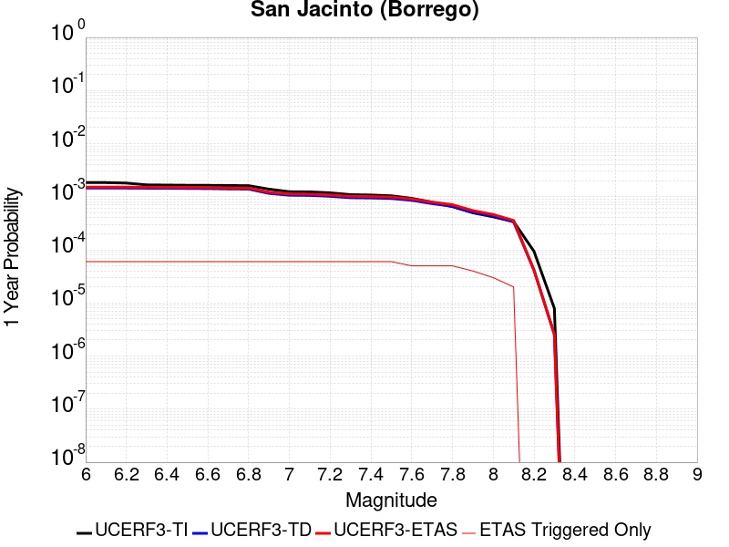 |  |

| Magnitude | 1 wk TI Prob | 1 wk TD Prob | 1 wk ETAS Prob | 1 wk ETAS/TD Gain | 1 wk ETAS Triggered Only | 1 mo TI Prob | 1 mo TD Prob | 1 mo ETAS Prob | 1 mo ETAS/TD Gain | 1 mo ETAS Triggered Only | 1 yr TI Prob | 1 yr TD Prob | 1 yr ETAS Prob | 1 yr ETAS/TD Gain | 1 yr ETAS Triggered Only | 10 yr TI Prob | 10 yr TD Prob | 10 yr ETAS Prob | 10 yr ETAS/TD Gain | 10 yr ETAS Triggered Only |
|-----|-----|-----|-----|-----|-----|-----|-----|-----|-----|-----|-----|-----|-----|-----|-----|-----|-----|-----|-----|-----|
| 6.0 | 3.543992E-5 | 2.7925962E-5 | 7.085059E-5 | 2.5370867 | 4.2925825E-5 | 1.5187653E-4 | 1.1967727E-4 | 2.0551865E-4 | 1.7172738 | 8.585165E-5 | 0.0018475284 | 0.0014561092 | 0.0015418358 | 1.0588738 | 8.585165E-5 | 0.018322436 | 0.01486815 | 0.014952726 | 1.0056883 | 8.585165E-5 |
| 6.1 | 3.542281E-5 | 2.7925962E-5 | 7.085059E-5 | 2.5370867 | 4.2925825E-5 | 1.5180321E-4 | 1.1967727E-4 | 2.0551865E-4 | 1.7172738 | 8.585165E-5 | 0.0018466372 | 0.0014561092 | 0.0015418358 | 1.0588738 | 8.585165E-5 | 0.018313672 | 0.01486815 | 0.014952726 | 1.0056883 | 8.585165E-5 |
| 6.2 | 3.4688688E-5 | 2.7925962E-5 | 7.085059E-5 | 2.5370867 | 4.2925825E-5 | 1.4865733E-4 | 1.1967727E-4 | 2.0551865E-4 | 1.7172738 | 8.585165E-5 | 0.0018084005 | 0.0014561091 | 0.0015418358 | 1.0588738 | 8.585165E-5 | 0.017937548 | 0.01486815 | 0.014952726 | 1.0056883 | 8.585165E-5 |
| 6.3 | 3.2087122E-5 | 2.7771312E-5 | 7.069595E-5 | 2.5456464 | 4.2925825E-5 | 1.3750899E-4 | 1.1901455E-4 | 2.0485598E-4 | 1.7212684 | 8.585165E-5 | 0.0016728862 | 0.0014480512 | 0.0015337785 | 1.0592018 | 8.585165E-5 | 0.016603488 | 0.014789308 | 0.01487389 | 1.0057192 | 8.585165E-5 |
| 6.4 | 3.1828724E-5 | 2.773829E-5 | 7.066292E-5 | 2.5474868 | 4.2925825E-5 | 1.364017E-4 | 1.1887303E-4 | 2.0471448E-4 | 1.7221271 | 8.585165E-5 | 0.0016594254 | 0.0014463306 | 0.001532058 | 1.0592724 | 8.585165E-5 | 0.016470885 | 0.014772502 | 0.0148570845 | 1.0057257 | 8.585165E-5 |
| 6.5 | 3.1563577E-5 | 2.7477974E-5 | 7.040262E-5 | 2.5621474 | 4.2925825E-5 | 1.3526545E-4 | 1.17757496E-4 | 2.0359903E-4 | 1.7289687 | 8.585165E-5 | 0.0016456128 | 0.0014327668 | 0.0015184955 | 1.0598344 | 8.585165E-5 | 0.0163348 | 0.01463991 | 0.014724505 | 1.0057783 | 8.585165E-5 |
| 6.6 | 3.1467625E-5 | 2.7322194E-5 | 7.0246846E-5 | 2.5710542 | 4.2925825E-5 | 1.3485427E-4 | 1.17089934E-4 | 2.0293152E-4 | 1.7331253 | 8.585165E-5 | 0.0016406142 | 0.0014246498 | 0.0015103791 | 1.0601758 | 8.585165E-5 | 0.016285548 | 0.014560228 | 0.01464483 | 1.0058105 | 8.585165E-5 |
| 6.7 | 3.1223695E-5 | 2.6940217E-5 | 6.986489E-5 | 2.5933304 | 4.2925825E-5 | 1.3380898E-4 | 1.1545303E-4 | 2.0129477E-4 | 1.7435209 | 8.585165E-5 | 0.0016279068 | 0.0014047464 | 0.0014904775 | 1.0610296 | 8.585165E-5 | 0.01616033 | 0.01436451 | 0.014449128 | 1.0058908 | 8.585165E-5 |
| 6.8 | 3.1015585E-5 | 2.6761221E-5 | 6.96859E-5 | 2.603988 | 4.2925825E-5 | 1.3291716E-4 | 1.1468597E-4 | 2.0052778E-4 | 1.7484944 | 8.585165E-5 | 0.001617065 | 0.0013954195 | 0.0014811513 | 1.0614381 | 8.585165E-5 | 0.016053487 | 0.014271772 | 0.014356398 | 1.0059296 | 8.585165E-5 |
| 6.9 | 2.6641965E-5 | 2.2183434E-5 | 6.51083E-5 | 2.9349966 | 4.2925825E-5 | 1.1417485E-4 | 9.506842E-5 | 1.809119E-4 | 1.9029653 | 8.585165E-5 | 0.0013891924 | 0.0011568473 | 0.0012425997 | 1.0741259 | 8.585165E-5 | 0.0138054015 | 0.011882191 | 0.011967022 | 1.0071394 | 8.585165E-5 |
| 7.0 | 2.3854353E-5 | 2.047825E-5 | 6.34032E-5 | 3.0961237 | 4.2925825E-5 | 1.02228936E-4 | 8.776099E-5 | 1.736051E-4 | 1.978158 | 8.585165E-5 | 0.0012439266 | 0.0010679689 | 0.0011537288 | 1.0803019 | 8.585165E-5 | 0.012369866 | 0.0109826205 | 0.011067529 | 1.0077312 | 8.585165E-5 |
| 7.1 | 2.3672901E-5 | 2.0314741E-5 | 6.323969E-5 | 3.1129954 | 4.2925825E-5 | 1.0145135E-4 | 8.706028E-5 | 1.7290446E-4 | 1.9860314 | 8.585165E-5 | 0.0012344702 | 0.0010594461 | 0.0011452067 | 1.0809486 | 8.585165E-5 | 0.0122763505 | 0.010897858 | 0.010982774 | 1.007792 | 8.585165E-5 |
| 7.2 | 2.2717244E-5 | 1.9542116E-5 | 6.24671E-5 | 3.1965373 | 4.2925825E-5 | 9.735599E-5 | 8.3749255E-5 | 1.6959371E-4 | 2.0250175 | 8.585165E-5 | 0.0011846646 | 0.0010191725 | 0.0011049367 | 1.0841508 | 8.585165E-5 | 0.01178369 | 0.010495322 | 0.010580272 | 1.0080942 | 8.585165E-5 |
| 7.3 | 2.1016205E-5 | 1.8383771E-5 | 6.1308805E-5 | 3.3349419 | 4.2925825E-5 | 9.006634E-5 | 7.878522E-5 | 1.6463011E-4 | 2.0896065 | 8.585165E-5 | 0.001096006 | 9.5879E-4 | 0.0010445594 | 1.0894558 | 8.585165E-5 | 0.010906163 | 0.009890901 | 0.009975904 | 1.008594 | 8.585165E-5 |
| 7.4 | 2.0683625E-5 | 1.8186302E-5 | 6.111134E-5 | 3.3602953 | 4.2925825E-5 | 8.86411E-5 | 7.7938974E-5 | 1.6378393E-4 | 2.101438 | 8.585165E-5 | 0.001078671 | 9.48496E-4 | 0.0010342662 | 1.0904276 | 8.585165E-5 | 0.010734501 | 0.0097876275 | 0.00987264 | 1.0086856 | 8.585165E-5 |
| 7.5 | 1.9993966E-5 | 1.7781347E-5 | 6.0706407E-5 | 3.4140499 | 4.2925825E-5 | 8.568561E-5 | 7.6203556E-5 | 1.6204866E-4 | 2.1265235 | 8.585165E-5 | 0.001042723 | 9.2738547E-4 | 0.0010131575 | 1.092488 | 8.585165E-5 | 0.010378438 | 0.009574548 | 0.009659578 | 1.0088809 | 8.585165E-5 |
| 7.6 | 1.788966E-5 | 1.6434618E-5 | 5.9359736E-5 | 3.611872 | 4.2925825E-5 | 7.666772E-5 | 7.043219E-5 | 1.5627779E-4 | 2.2188406 | 8.585165E-5 | 9.3302975E-4 | 8.5717626E-4 | 9.429543E-4 | 1.1000705 | 8.585165E-5 | 0.00929122 | 0.008866415 | 0.008951506 | 1.009597 | 8.585165E-5 |
| 7.7 | 1.5125781E-5 | 1.4236738E-5 | 5.716195E-5 | 4.015102 | 4.2925825E-5 | 6.4823165E-5 | 6.101317E-5 | 1.4685957E-4 | 2.4070144 | 8.585165E-5 | 7.889362E-4 | 7.4258295E-4 | 8.2837086E-4 | 1.1155263 | 8.585165E-5 | 0.007861412 | 0.007714161 | 0.0077993507 | 1.0110432 | 8.585165E-5 |
| 7.8 | 1.250089E-5 | 1.262994E-5 | 5.555522E-5 | 4.3986926 | 4.2925825E-5 | 5.3574146E-5 | 5.4127195E-5 | 1.399742E-4 | 2.5860233 | 8.585165E-5 | 6.5207E-4 | 6.588E-4 | 7.445951E-4 | 1.1302294 | 8.585165E-5 | 0.006501599 | 0.006867759 | 0.006953021 | 1.0124148 | 8.585165E-5 |
| 7.9 | 9.561E-6 | 9.754065E-6 | 5.2679472E-5 | 5.4007707 | 4.2925825E-5 | 4.0975072E-5 | 4.180247E-5 | 1.2765054E-4 | 3.05366 | 8.585165E-5 | 4.987573E-4 | 5.0882675E-4 | 5.9463474E-4 | 1.1686388 | 8.585165E-5 | 0.0049763937 | 0.0053523607 | 0.0054377527 | 1.0159541 | 8.585165E-5 |
| 8.0 | 8.01699E-6 | 8.292994E-6 | 5.1218463E-5 | 6.1761127 | 4.2925825E-5 | 3.4358076E-5 | 3.554092E-5 | 7.846522E-5 | 2.207743 | 4.2925825E-5 | 4.1822926E-4 | 4.3262533E-4 | 4.7553258E-4 | 1.0991788 | 4.2925825E-5 | 0.0041744304 | 0.0045733186 | 0.004616048 | 1.0093433 | 4.2925825E-5 |
| 8.1 | 6.541947E-6 | 6.461784E-6 | 4.938733E-5 | 7.6429873 | 4.2925825E-5 | 2.8036617E-5 | 2.7693068E-5 | 7.06177E-5 | 2.5500138 | 4.2925825E-5 | 3.4129233E-4 | 3.3711144E-4 | 3.800228E-4 | 1.1272913 | 4.2925825E-5 | 0.0034076865 | 0.0035805756 | 0.0036233475 | 1.0119456 | 4.2925825E-5 |
| 8.2 | 1.7968189E-6 | 7.9684827E-7 | 7.9684827E-7 | 1.0 | 0.0 | 7.70063E-6 | 3.4150596E-6 | 3.4150596E-6 | 1.0 | 0.0 | 9.3751136E-5 | 4.157758E-5 | 4.157758E-5 | 1.0 | 0.0 | 9.371159E-4 | 4.7107413E-4 | 4.7107413E-4 | 1.0 | 0.0 |
| 8.3 | 1.5167889E-7 | 4.8951257E-8 | 4.8951257E-8 | 1.0 | 0.0 | 6.500522E-7 | 2.0979108E-7 | 2.0979108E-7 | 1.0 | 0.0 | 7.9143565E-6 | 2.5542038E-6 | 2.5542038E-6 | 1.0 | 0.0 | 7.914075E-5 | 2.9679897E-5 | 2.9679897E-5 | 1.0 | 0.0 |

## Elysian Park (Upper)
*[(top)](#table-of-contents)*

| 1 Week | 1 Month | 1 Year | 10 Year |
|-----|-----|-----|-----|
|  |  |  |  |

| Magnitude | 1 wk TI Prob | 1 wk TD Prob | 1 wk ETAS Prob | 1 wk ETAS/TD Gain | 1 wk ETAS Triggered Only | 1 mo TI Prob | 1 mo TD Prob | 1 mo ETAS Prob | 1 mo ETAS/TD Gain | 1 mo ETAS Triggered Only | 1 yr TI Prob | 1 yr TD Prob | 1 yr ETAS Prob | 1 yr ETAS/TD Gain | 1 yr ETAS Triggered Only | 10 yr TI Prob | 10 yr TD Prob | 10 yr ETAS Prob | 10 yr ETAS/TD Gain | 10 yr ETAS Triggered Only |
|-----|-----|-----|-----|-----|-----|-----|-----|-----|-----|-----|-----|-----|-----|-----|-----|-----|-----|-----|-----|-----|
| 6.0 | 3.1876025E-5 | 3.7035275E-5 | 7.995951E-5 | 2.1590095 | 4.2925825E-5 | 1.3660437E-4 | 1.5871569E-4 | 2.016347E-4 | 1.2704145 | 4.2925825E-5 | 0.0016618895 | 0.001931122 | 0.001973965 | 1.0221856 | 4.2925825E-5 | 0.016495159 | 0.019189863 | 0.019274065 | 1.004388 | 8.585165E-5 |
| 6.1 | 3.1876025E-5 | 3.7035275E-5 | 7.995951E-5 | 2.1590095 | 4.2925825E-5 | 1.3660437E-4 | 1.5871569E-4 | 2.016347E-4 | 1.2704145 | 4.2925825E-5 | 0.0016618895 | 0.001931122 | 0.001973965 | 1.0221856 | 4.2925825E-5 | 0.016495159 | 0.019189863 | 0.019274065 | 1.004388 | 8.585165E-5 |
| 6.2 | 3.1876025E-5 | 3.7035275E-5 | 7.995951E-5 | 2.1590095 | 4.2925825E-5 | 1.3660437E-4 | 1.5871569E-4 | 2.016347E-4 | 1.2704145 | 4.2925825E-5 | 0.0016618895 | 0.001931122 | 0.001973965 | 1.0221856 | 4.2925825E-5 | 0.016495159 | 0.019189863 | 0.019274065 | 1.004388 | 8.585165E-5 |
| 6.3 | 3.1876025E-5 | 3.7035275E-5 | 7.995951E-5 | 2.1590095 | 4.2925825E-5 | 1.3660437E-4 | 1.5871569E-4 | 2.016347E-4 | 1.2704145 | 4.2925825E-5 | 0.0016618895 | 0.001931122 | 0.001973965 | 1.0221856 | 4.2925825E-5 | 0.016495159 | 0.019189863 | 0.019274065 | 1.004388 | 8.585165E-5 |
| 6.4 | 1.9273462E-5 | 2.120244E-5 | 6.412736E-5 | 3.0245268 | 4.2925825E-5 | 8.259794E-5 | 9.086542E-5 | 1.3378734E-4 | 1.4723681 | 4.2925825E-5 | 0.001005166 | 0.0011058967 | 0.0011487751 | 1.0387725 | 4.2925825E-5 | 0.010006315 | 0.011020744 | 0.011105649 | 1.0077041 | 8.585165E-5 |
| 6.5 | 1.9273462E-5 | 2.120244E-5 | 6.412736E-5 | 3.0245268 | 4.2925825E-5 | 8.259794E-5 | 9.086542E-5 | 1.3378734E-4 | 1.4723681 | 4.2925825E-5 | 0.001005166 | 0.0011058967 | 0.0011487751 | 1.0387725 | 4.2925825E-5 | 0.010006315 | 0.011020744 | 0.011105649 | 1.0077041 | 8.585165E-5 |
| 6.6 | 9.813258E-6 | 9.665589E-6 | 5.2590996E-5 | 5.441055 | 4.2925825E-5 | 4.205614E-5 | 4.1423333E-5 | 8.4347375E-5 | 2.0362287 | 4.2925825E-5 | 5.119132E-4 | 5.042196E-4 | 5.471238E-4 | 1.0850903 | 4.2925825E-5 | 0.005107356 | 0.0050314795 | 0.005116899 | 1.0169771 | 8.585165E-5 |
| 6.7 | 9.801478E-6 | 9.653158E-6 | 5.257857E-5 | 5.446774 | 4.2925825E-5 | 4.2005657E-5 | 4.137006E-5 | 8.429411E-5 | 2.037563 | 4.2925825E-5 | 5.112989E-4 | 5.0357135E-4 | 5.464755E-4 | 1.0851998 | 4.2925825E-5 | 0.0051012407 | 0.005025026 | 0.0051104464 | 1.016999 | 8.585165E-5 |
| 6.8 | 8.102489E-6 | 7.772994E-6 | 5.0698483E-5 | 6.5223885 | 4.2925825E-5 | 3.4724493E-5 | 3.3312434E-5 | 7.623683E-5 | 2.2885396 | 4.2925825E-5 | 4.2268867E-4 | 4.0550836E-4 | 4.4841677E-4 | 1.1058139 | 4.2925825E-5 | 0.004218856 | 0.0040481784 | 0.004133682 | 1.0211216 | 8.585165E-5 |
| 6.9 | 6.08275E-6 | 5.481441E-6 | 4.840703E-5 | 8.831078 | 4.2925825E-5 | 2.6068668E-5 | 2.3491682E-5 | 6.64165E-5 | 2.8272345 | 4.2925825E-5 | 3.173398E-4 | 2.8597447E-4 | 3.28888E-4 | 1.1500608 | 4.2925825E-5 | 0.0031688702 | 0.0028561424 | 0.0028989457 | 1.0149864 | 4.2925825E-5 |
| 7.0 | 5.5995934E-6 | 4.9827686E-6 | 4.790838E-5 | 9.614811 | 4.2925825E-5 | 2.3998036E-5 | 2.1354552E-5 | 6.427946E-5 | 3.0101056 | 4.2925825E-5 | 2.9213692E-4 | 2.5996132E-4 | 3.02876E-4 | 1.1650809 | 4.2925825E-5 | 0.0029175316 | 0.0025966396 | 0.0026394539 | 1.0164883 | 4.2925825E-5 |
| 7.1 | 4.709881E-6 | 4.0873906E-6 | 4.0873906E-6 | 1.0 | 0.0 | 2.0185047E-5 | 1.7517272E-5 | 1.7517272E-5 | 1.0 | 0.0 | 2.4572524E-4 | 2.1325232E-4 | 2.1325232E-4 | 1.0 | 0.0 | 0.002454537 | 0.0021305184 | 0.0021305184 | 1.0 | 0.0 |
| 7.2 | 3.6063436E-6 | 2.9779412E-6 | 2.9779412E-6 | 1.0 | 0.0 | 1.5455667E-5 | 1.27625435E-5 | 1.27625435E-5 | 1.0 | 0.0 | 1.881565E-4 | 1.55373E-4 | 1.55373E-4 | 1.0 | 0.0 | 0.0018799726 | 0.0015526549 | 0.0015526549 | 1.0 | 0.0 |
| 7.3 | 2.471135E-6 | 2.0954562E-6 | 2.0954562E-6 | 1.0 | 0.0 | 1.0590536E-5 | 8.980496E-6 | 8.980496E-6 | 1.0 | 0.0 | 1.2893214E-4 | 1.0933213E-4 | 1.0933213E-4 | 1.0 | 0.0 | 0.0012885736 | 0.0010927906 | 0.0010927906 | 1.0 | 0.0 |
| 7.4 | 1.163943E-6 | 1.0275061E-6 | 1.0275061E-6 | 1.0 | 0.0 | 4.988318E-6 | 4.40359E-6 | 4.40359E-6 | 1.0 | 0.0 | 6.0731076E-5 | 5.361242E-5 | 5.361242E-5 | 1.0 | 0.0 | 6.071448E-4 | 5.3599785E-4 | 5.3599785E-4 | 1.0 | 0.0 |
| 7.5 | 4.99459E-7 | 4.917601E-7 | 4.917601E-7 | 1.0 | 0.0 | 2.140537E-6 | 2.1075416E-6 | 2.1075416E-6 | 1.0 | 0.0 | 2.6060725E-5 | 2.5659032E-5 | 2.5659032E-5 | 1.0 | 0.0 | 2.605767E-4 | 2.5656226E-4 | 2.5656226E-4 | 1.0 | 0.0 |
| 7.6 | 2.4667852E-7 | 2.4778313E-7 | 2.4778313E-7 | 1.0 | 0.0 | 1.0571932E-6 | 1.0619274E-6 | 1.0619274E-6 | 1.0 | 0.0 | 1.2871251E-5 | 1.2928893E-5 | 1.2928893E-5 | 1.0 | 0.0 | 1.2870505E-4 | 1.2928178E-4 | 1.2928178E-4 | 1.0 | 0.0 |
| 7.7 | 8.2312795E-8 | 7.3864214E-8 | 7.3864214E-8 | 1.0 | 0.0 | 3.527691E-7 | 3.165609E-7 | 3.165609E-7 | 1.0 | 0.0 | 4.294955E-6 | 3.854123E-6 | 3.854123E-6 | 1.0 | 0.0 | 4.2948723E-5 | 3.854068E-5 | 3.854068E-5 | 1.0 | 0.0 |
| 7.8 | 2.7819295E-8 | 1.7565618E-8 | 1.7565618E-8 | 1.0 | 0.0 | 1.1922555E-7 | 7.528122E-8 | 7.528122E-8 | 1.0 | 0.0 | 1.45157E-6 | 9.1654863E-7 | 9.1654863E-7 | 1.0 | 0.0 | 1.45156055E-5 | 9.165463E-6 | 9.165463E-6 | 1.0 | 0.0 |

## Cleghorn
*[(top)](#table-of-contents)*

| 1 Week | 1 Month | 1 Year | 10 Year |
|-----|-----|-----|-----|
|  | 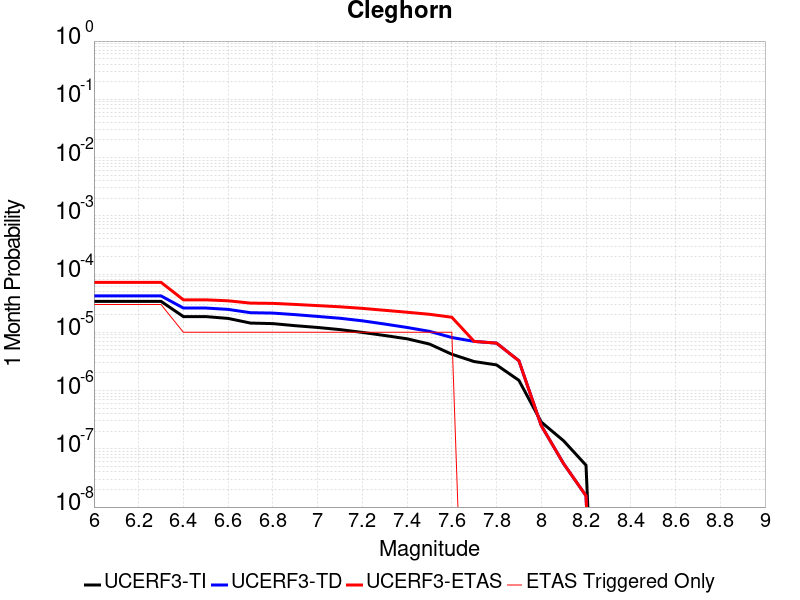 |  |  |

| Magnitude | 1 wk TI Prob | 1 wk TD Prob | 1 wk ETAS Prob | 1 wk ETAS/TD Gain | 1 wk ETAS Triggered Only | 1 mo TI Prob | 1 mo TD Prob | 1 mo ETAS Prob | 1 mo ETAS/TD Gain | 1 mo ETAS Triggered Only | 1 yr TI Prob | 1 yr TD Prob | 1 yr ETAS Prob | 1 yr ETAS/TD Gain | 1 yr ETAS Triggered Only | 10 yr TI Prob | 10 yr TD Prob | 10 yr ETAS Prob | 10 yr ETAS/TD Gain | 10 yr ETAS Triggered Only |
|-----|-----|-----|-----|-----|-----|-----|-----|-----|-----|-----|-----|-----|-----|-----|-----|-----|-----|-----|-----|-----|
| 6.0 | 7.9267165E-6 | 9.831764E-6 | 5.275717E-5 | 5.3659916 | 4.2925825E-5 | 3.39712E-5 | 4.2135514E-5 | 1.2798354E-4 | 3.037427 | 8.585165E-5 | 4.1352084E-4 | 5.1288976E-4 | 5.9869734E-4 | 1.1673023 | 8.585165E-5 | 0.004127522 | 0.005132214 | 0.0052176253 | 1.0166421 | 8.585165E-5 |
| 6.1 | 7.9267165E-6 | 9.831764E-6 | 5.275717E-5 | 5.3659916 | 4.2925825E-5 | 3.39712E-5 | 4.2135514E-5 | 1.2798354E-4 | 3.037427 | 8.585165E-5 | 4.1352084E-4 | 5.1288976E-4 | 5.9869734E-4 | 1.1673023 | 8.585165E-5 | 0.004127522 | 0.005132214 | 0.0052176253 | 1.0166421 | 8.585165E-5 |
| 6.2 | 7.9267165E-6 | 9.831764E-6 | 5.275717E-5 | 5.3659916 | 4.2925825E-5 | 3.39712E-5 | 4.2135514E-5 | 1.2798354E-4 | 3.037427 | 8.585165E-5 | 4.1352084E-4 | 5.1288976E-4 | 5.9869734E-4 | 1.1673023 | 8.585165E-5 | 0.004127522 | 0.005132214 | 0.0052176253 | 1.0166421 | 8.585165E-5 |
| 6.3 | 7.9267165E-6 | 9.831764E-6 | 5.275717E-5 | 5.3659916 | 4.2925825E-5 | 3.39712E-5 | 4.2135514E-5 | 1.2798354E-4 | 3.037427 | 8.585165E-5 | 4.1352084E-4 | 5.1288976E-4 | 5.9869734E-4 | 1.1673023 | 8.585165E-5 | 0.004127522 | 0.005132214 | 0.0052176253 | 1.0166421 | 8.585165E-5 |
| 6.4 | 4.3445207E-6 | 6.0916254E-6 | 4.9017188E-5 | 8.046652 | 4.2925825E-5 | 1.8619241E-5 | 2.6106709E-5 | 6.903141E-5 | 2.644202 | 4.2925825E-5 | 2.2666567E-4 | 3.1780385E-4 | 3.6071602E-4 | 1.1350273 | 4.2925825E-5 | 0.0022643462 | 0.0031877246 | 0.0032305135 | 1.0134231 | 4.2925825E-5 |
| 6.5 | 4.3445207E-6 | 6.0916254E-6 | 4.9017188E-5 | 8.046652 | 4.2925825E-5 | 1.8619241E-5 | 2.6106709E-5 | 6.903141E-5 | 2.644202 | 4.2925825E-5 | 2.2666567E-4 | 3.1780385E-4 | 3.6071602E-4 | 1.1350273 | 4.2925825E-5 | 0.0022643462 | 0.0031877246 | 0.0032305135 | 1.0134231 | 4.2925825E-5 |
| 6.6 | 4.040109E-6 | 5.774033E-6 | 4.869961E-5 | 8.434245 | 4.2925825E-5 | 1.7314638E-5 | 2.4745626E-5 | 6.7670386E-5 | 2.7346404 | 4.2925825E-5 | 2.1078532E-4 | 3.0123728E-4 | 3.4415018E-4 | 1.1424555 | 4.2925825E-5 | 0.002105855 | 0.0030225143 | 0.0030653104 | 1.0141591 | 4.2925825E-5 |
| 6.7 | 3.3632055E-6 | 5.06753E-6 | 4.7993137E-5 | 9.470716 | 4.2925825E-5 | 1.4413658E-5 | 2.1717806E-5 | 6.46427E-5 | 2.9764838 | 4.2925825E-5 | 1.7547216E-4 | 2.643825E-4 | 3.0729698E-4 | 1.1623197 | 4.2925825E-5 | 0.0017533366 | 0.0026548486 | 0.0026976604 | 1.0161259 | 4.2925825E-5 |
| 6.8 | 3.2902772E-6 | 4.9894375E-6 | 4.7915048E-5 | 9.603296 | 4.2925825E-5 | 1.4101111E-5 | 2.138313E-5 | 6.4308035E-5 | 3.0074193 | 4.2925825E-5 | 1.716675E-4 | 2.6030882E-4 | 3.0322347E-4 | 1.1648605 | 4.2925825E-5 | 0.0017153495 | 0.0026142076 | 0.0026570212 | 1.0163773 | 4.2925825E-5 |
| 6.9 | 3.031547E-6 | 4.6911987E-6 | 4.761682E-5 | 10.150246 | 4.2925825E-5 | 1.299228E-5 | 2.0104984E-5 | 6.302995E-5 | 3.1350408 | 4.2925825E-5 | 1.5816953E-4 | 2.4475096E-4 | 2.8766628E-4 | 1.1753428 | 4.2925825E-5 | 0.00158057 | 0.0024589805 | 0.0025018007 | 1.0174139 | 4.2925825E-5 |
| 7.0 | 2.8259715E-6 | 4.3707637E-6 | 4.7296402E-5 | 10.821083 | 4.2925825E-5 | 1.211125E-5 | 1.8731711E-5 | 6.1656734E-5 | 3.2915695 | 4.2925825E-5 | 1.4744449E-4 | 2.2803496E-4 | 2.70951E-4 | 1.1881994 | 4.2925825E-5 | 0.001473467 | 0.0022921748 | 0.0023350022 | 1.0186841 | 4.2925825E-5 |
| 7.1 | 2.5962665E-6 | 4.065983E-6 | 4.6991634E-5 | 11.557262 | 4.2925825E-5 | 1.1126809E-5 | 1.7425526E-5 | 6.03506E-5 | 3.4633446 | 4.2925825E-5 | 1.3546048E-4 | 2.1213535E-4 | 2.5505206E-4 | 1.2023082 | 4.2925825E-5 | 0.0013537793 | 0.0021334959 | 0.00217633 | 1.020077 | 4.2925825E-5 |
| 7.2 | 2.3247253E-6 | 3.6765352E-6 | 4.6602203E-5 | 12.675575 | 4.2925825E-5 | 9.96307E-6 | 1.5756486E-5 | 5.8681635E-5 | 3.7242844 | 4.2925825E-5 | 1.21293626E-4 | 1.9181852E-4 | 2.347361E-4 | 1.2237406 | 4.2925825E-5 | 0.0012122744 | 0.0019307166 | 0.0019735596 | 1.0221902 | 4.2925825E-5 |
| 7.3 | 2.056928E-6 | 3.235253E-6 | 4.6160938E-5 | 14.268108 | 4.2925825E-5 | 8.815376E-6 | 1.3865297E-5 | 5.6790526E-5 | 4.0958753 | 4.2925825E-5 | 1.0732192E-4 | 1.6879707E-4 | 2.1171565E-4 | 1.2542614 | 4.2925825E-5 | 0.001072701 | 0.0017009423 | 0.0017437951 | 1.0251936 | 4.2925825E-5 |
| 7.4 | 1.8055999E-6 | 2.8256538E-6 | 4.5751356E-5 | 16.191423 | 4.2925825E-5 | 7.738263E-6 | 1.210989E-5 | 5.5035194E-5 | 4.5446486 | 4.2925825E-5 | 9.4209274E-5 | 1.4742807E-4 | 1.9034756E-4 | 1.2911216 | 4.2925825E-5 | 9.4169343E-4 | 0.0014876705 | 0.0015305324 | 1.0288115 | 4.2925825E-5 |
| 7.5 | 1.4683443E-6 | 2.4248943E-6 | 4.5350615E-5 | 18.702099 | 4.2925825E-5 | 6.292889E-6 | 1.0392363E-5 | 5.331774E-5 | 5.130473 | 4.2925825E-5 | 7.661323E-5 | 1.2651978E-4 | 1.6944017E-4 | 1.3392386 | 4.2925825E-5 | 7.658682E-4 | 0.0012788812 | 0.0013217522 | 1.0335222 | 4.2925825E-5 |
| 7.6 | 9.804088E-7 | 1.9004091E-6 | 4.4826153E-5 | 23.587633 | 4.2925825E-5 | 4.201745E-6 | 8.144585E-6 | 5.107006E-5 | 6.270431 | 4.2925825E-5 | 5.1155046E-5 | 9.915586E-5 | 1.4207744E-4 | 1.4328697 | 4.2925825E-5 | 5.114327E-4 | 0.0010055583 | 0.001048441 | 1.0426456 | 4.2925825E-5 |
| 7.7 | 7.3434086E-7 | 1.6285549E-6 | 1.6285549E-6 | 1.0 | 0.0 | 3.1471714E-6 | 6.9795024E-6 | 6.9795024E-6 | 1.0 | 0.0 | 3.831614E-5 | 8.4972155E-5 | 8.4972155E-5 | 1.0 | 0.0 | 3.8309532E-4 | 8.6387293E-4 | 8.6387293E-4 | 1.0 | 0.0 |
| 7.8 | 6.434184E-7 | 1.5221389E-6 | 1.5221389E-6 | 1.0 | 0.0 | 2.7575045E-6 | 6.523436E-6 | 6.523436E-6 | 1.0 | 0.0 | 3.35721E-5 | 7.9419966E-5 | 7.9419966E-5 | 1.0 | 0.0 | 3.3567028E-4 | 8.080443E-4 | 8.080443E-4 | 1.0 | 0.0 |
| 7.9 | 3.4943926E-7 | 7.5750586E-7 | 7.5750586E-7 | 1.0 | 0.0 | 1.497596E-6 | 3.2464498E-6 | 3.2464498E-6 | 1.0 | 0.0 | 1.8233079E-5 | 3.9524817E-5 | 3.9524817E-5 | 1.0 | 0.0 | 1.8231584E-4 | 4.0401975E-4 | 4.0401975E-4 | 1.0 | 0.0 |
| 8.0 | 6.717524E-8 | 5.837515E-8 | 5.837515E-8 | 1.0 | 0.0 | 2.8789387E-7 | 2.501792E-7 | 2.501792E-7 | 1.0 | 0.0 | 3.505102E-6 | 3.0459275E-6 | 3.0459275E-6 | 1.0 | 0.0 | 3.5050467E-5 | 3.2751934E-5 | 3.2751934E-5 | 1.0 | 0.0 |
| 8.1 | 3.1984914E-8 | 1.2949885E-8 | 1.2949885E-8 | 1.0 | 0.0 | 1.370782E-7 | 5.549951E-8 | 5.549951E-8 | 1.0 | 0.0 | 1.6689258E-6 | 6.757063E-7 | 6.757063E-7 | 1.0 | 0.0 | 1.6689133E-5 | 7.741151E-6 | 7.741151E-6 | 1.0 | 0.0 |
| 8.2 | 1.21887656E-8 | 3.6471115E-9 | 3.6471115E-9 | 1.0 | 0.0 | 5.2237567E-8 | 1.563048E-8 | 1.563048E-8 | 1.0 | 0.0 | 6.359922E-7 | 1.9030107E-7 | 1.9030107E-7 | 1.0 | 0.0 | 6.3599036E-6 | 2.245849E-6 | 2.245849E-6 | 1.0 | 0.0 |

## Pitas Point (Lower West)
*[(top)](#table-of-contents)*

| 1 Week | 1 Month | 1 Year | 10 Year |
|-----|-----|-----|-----|
| 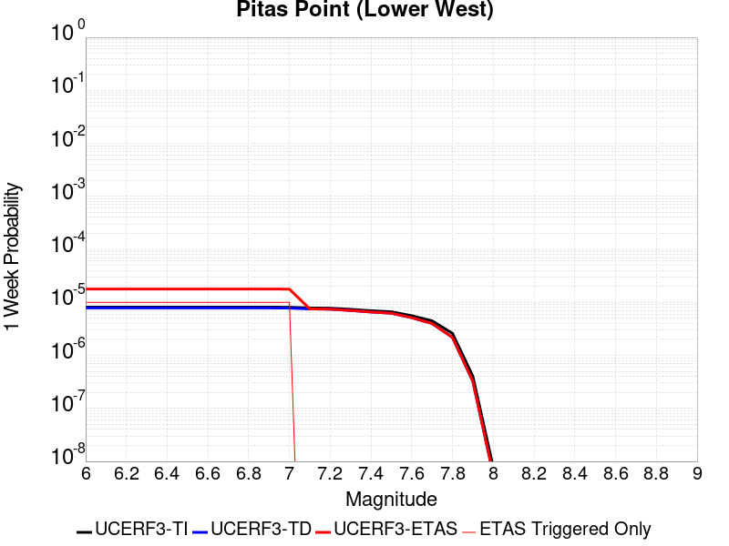 |  |  |  |

| Magnitude | 1 wk TI Prob | 1 wk TD Prob | 1 wk ETAS Prob | 1 wk ETAS/TD Gain | 1 wk ETAS Triggered Only | 1 mo TI Prob | 1 mo TD Prob | 1 mo ETAS Prob | 1 mo ETAS/TD Gain | 1 mo ETAS Triggered Only | 1 yr TI Prob | 1 yr TD Prob | 1 yr ETAS Prob | 1 yr ETAS/TD Gain | 1 yr ETAS Triggered Only | 10 yr TI Prob | 10 yr TD Prob | 10 yr ETAS Prob | 10 yr ETAS/TD Gain | 10 yr ETAS Triggered Only |
|-----|-----|-----|-----|-----|-----|-----|-----|-----|-----|-----|-----|-----|-----|-----|-----|-----|-----|-----|-----|-----|
| 6.0 | 8.151497E-6 | 7.855796E-6 | 5.0781284E-5 | 6.4641805 | 4.2925825E-5 | 3.493452E-5 | 3.3667267E-5 | 7.659165E-5 | 2.2749588 | 4.2925825E-5 | 4.252448E-4 | 4.0982262E-4 | 4.956391E-4 | 1.209399 | 8.585165E-5 | 0.0042443196 | 0.004090749 | 0.0041762497 | 1.020901 | 8.585165E-5 |
| 6.1 | 8.151497E-6 | 7.855796E-6 | 5.0781284E-5 | 6.4641805 | 4.2925825E-5 | 3.493452E-5 | 3.3667267E-5 | 7.659165E-5 | 2.2749588 | 4.2925825E-5 | 4.252448E-4 | 4.0982262E-4 | 4.956391E-4 | 1.209399 | 8.585165E-5 | 0.0042443196 | 0.004090749 | 0.0041762497 | 1.020901 | 8.585165E-5 |
| 6.2 | 8.151497E-6 | 7.855796E-6 | 5.0781284E-5 | 6.4641805 | 4.2925825E-5 | 3.493452E-5 | 3.3667267E-5 | 7.659165E-5 | 2.2749588 | 4.2925825E-5 | 4.252448E-4 | 4.0982262E-4 | 4.956391E-4 | 1.209399 | 8.585165E-5 | 0.0042443196 | 0.004090749 | 0.0041762497 | 1.020901 | 8.585165E-5 |
| 6.3 | 8.151497E-6 | 7.855796E-6 | 5.0781284E-5 | 6.4641805 | 4.2925825E-5 | 3.493452E-5 | 3.3667267E-5 | 7.659165E-5 | 2.2749588 | 4.2925825E-5 | 4.252448E-4 | 4.0982262E-4 | 4.956391E-4 | 1.209399 | 8.585165E-5 | 0.0042443196 | 0.004090749 | 0.0041762497 | 1.020901 | 8.585165E-5 |
| 6.4 | 8.151497E-6 | 7.855796E-6 | 5.0781284E-5 | 6.4641805 | 4.2925825E-5 | 3.493452E-5 | 3.3667267E-5 | 7.659165E-5 | 2.2749588 | 4.2925825E-5 | 4.252448E-4 | 4.0982262E-4 | 4.956391E-4 | 1.209399 | 8.585165E-5 | 0.0042443196 | 0.004090749 | 0.0041762497 | 1.020901 | 8.585165E-5 |
| 6.5 | 8.151497E-6 | 7.855796E-6 | 5.0781284E-5 | 6.4641805 | 4.2925825E-5 | 3.493452E-5 | 3.3667267E-5 | 7.659165E-5 | 2.2749588 | 4.2925825E-5 | 4.252448E-4 | 4.0982262E-4 | 4.956391E-4 | 1.209399 | 8.585165E-5 | 0.0042443196 | 0.004090749 | 0.0041762497 | 1.020901 | 8.585165E-5 |
| 6.6 | 8.151497E-6 | 7.855796E-6 | 5.0781284E-5 | 6.4641805 | 4.2925825E-5 | 3.493452E-5 | 3.3667267E-5 | 7.659165E-5 | 2.2749588 | 4.2925825E-5 | 4.252448E-4 | 4.0982262E-4 | 4.956391E-4 | 1.209399 | 8.585165E-5 | 0.0042443196 | 0.004090749 | 0.0041762497 | 1.020901 | 8.585165E-5 |
| 6.7 | 8.151497E-6 | 7.855796E-6 | 5.0781284E-5 | 6.4641805 | 4.2925825E-5 | 3.493452E-5 | 3.3667267E-5 | 7.659165E-5 | 2.2749588 | 4.2925825E-5 | 4.252448E-4 | 4.0982262E-4 | 4.956391E-4 | 1.209399 | 8.585165E-5 | 0.0042443196 | 0.004090749 | 0.0041762497 | 1.020901 | 8.585165E-5 |
| 6.8 | 8.151497E-6 | 7.855796E-6 | 5.0781284E-5 | 6.4641805 | 4.2925825E-5 | 3.493452E-5 | 3.3667267E-5 | 7.659165E-5 | 2.2749588 | 4.2925825E-5 | 4.252448E-4 | 4.0982262E-4 | 4.956391E-4 | 1.209399 | 8.585165E-5 | 0.0042443196 | 0.004090749 | 0.0041762497 | 1.020901 | 8.585165E-5 |
| 6.9 | 8.151497E-6 | 7.855796E-6 | 5.0781284E-5 | 6.4641805 | 4.2925825E-5 | 3.493452E-5 | 3.3667267E-5 | 7.659165E-5 | 2.2749588 | 4.2925825E-5 | 4.252448E-4 | 4.0982262E-4 | 4.956391E-4 | 1.209399 | 8.585165E-5 | 0.0042443196 | 0.004090749 | 0.0041762497 | 1.020901 | 8.585165E-5 |
| 7.0 | 8.103535E-6 | 7.805226E-6 | 5.0730716E-5 | 6.4995832 | 4.2925825E-5 | 3.4728975E-5 | 3.3450542E-5 | 7.6374934E-5 | 2.2832196 | 4.2925825E-5 | 4.2274324E-4 | 4.07185E-4 | 4.9300166E-4 | 1.2107561 | 8.585165E-5 | 0.0042193993 | 0.0040644696 | 0.0041499725 | 1.0210366 | 8.585165E-5 |
| 7.1 | 7.853298E-6 | 7.540917E-6 | 7.540917E-6 | 1.0 | 0.0 | 3.3656554E-5 | 3.2317817E-5 | 3.2317817E-5 | 1.0 | 0.0 | 4.096915E-4 | 3.9339912E-4 | 4.3630804E-4 | 1.1090723 | 4.2925825E-5 | 0.00408937 | 0.0039271032 | 0.0039698603 | 1.0108877 | 4.2925825E-5 |
| 7.2 | 7.771102E-6 | 7.453199E-6 | 7.453199E-6 | 1.0 | 0.0 | 3.33043E-5 | 3.1941894E-5 | 3.1941894E-5 | 1.0 | 0.0 | 4.0540437E-4 | 3.8882386E-4 | 4.31733E-4 | 1.1103562 | 4.2925825E-5 | 0.0040466557 | 0.003881511 | 0.00392427 | 1.0110161 | 4.2925825E-5 |
| 7.3 | 7.3945344E-6 | 7.0493033E-6 | 7.0493033E-6 | 1.0 | 0.0 | 3.1690477E-5 | 3.0210955E-5 | 3.0210955E-5 | 1.0 | 0.0 | 3.8576324E-4 | 3.677569E-4 | 3.677569E-4 | 1.0 | 0.0 | 0.0038509427 | 0.003671551 | 0.003671551 | 1.0 | 0.0 |
| 7.4 | 6.964645E-6 | 6.5901527E-6 | 6.5901527E-6 | 1.0 | 0.0 | 2.9848137E-5 | 2.8243208E-5 | 2.8243208E-5 | 1.0 | 0.0 | 3.6334046E-4 | 3.438073E-4 | 3.438073E-4 | 1.0 | 0.0 | 0.0036274698 | 0.0034328073 | 0.0034328073 | 1.0 | 0.0 |
| 7.5 | 6.6525035E-6 | 6.259191E-6 | 6.259191E-6 | 1.0 | 0.0 | 2.851042E-5 | 2.6824831E-5 | 2.6824831E-5 | 1.0 | 0.0 | 3.4705905E-4 | 3.2654387E-4 | 3.2654387E-4 | 1.0 | 0.0 | 0.0034651754 | 0.0032606919 | 0.0032606919 | 1.0 | 0.0 |
| 7.6 | 5.613338E-6 | 5.15142E-6 | 5.15142E-6 | 1.0 | 0.0 | 2.405694E-5 | 2.2077327E-5 | 2.2077327E-5 | 1.0 | 0.0 | 2.928539E-4 | 2.6875862E-4 | 2.6875862E-4 | 1.0 | 0.0 | 0.0029246826 | 0.0026843674 | 0.0026843674 | 1.0 | 0.0 |
| 7.7 | 4.494704E-6 | 3.996945E-6 | 3.996945E-6 | 1.0 | 0.0 | 1.9262876E-5 | 1.7129652E-5 | 1.7129652E-5 | 1.0 | 0.0 | 2.3450027E-4 | 2.0853379E-4 | 2.0853379E-4 | 1.0 | 0.0 | 0.0023425296 | 0.0020834052 | 0.0020834052 | 1.0 | 0.0 |
| 7.8 | 2.6075882E-6 | 2.1836663E-6 | 2.1836663E-6 | 1.0 | 0.0 | 1.117533E-5 | 9.358537E-6 | 9.358537E-6 | 1.0 | 0.0 | 1.3605114E-4 | 1.1393427E-4 | 1.1393427E-4 | 1.0 | 0.0 | 0.0013596788 | 0.0011387634 | 0.0011387634 | 1.0 | 0.0 |
| 7.9 | 4.045984E-7 | 3.2424057E-7 | 3.2424057E-7 | 1.0 | 0.0 | 1.733992E-6 | 1.3896017E-6 | 1.3896017E-6 | 1.0 | 0.0 | 2.1111147E-5 | 1.6918271E-5 | 1.6918271E-5 | 1.0 | 0.0 | 2.1109142E-4 | 1.6917015E-4 | 1.6917015E-4 | 1.0 | 0.0 |
| 8.0 | 7.791402E-9 | 5.6836056E-9 | 5.6836056E-9 | 1.0 | 0.0 | 3.3391725E-8 | 2.4358311E-8 | 2.4358311E-8 | 1.0 | 0.0 | 4.0654416E-7 | 2.965624E-7 | 2.965624E-7 | 1.0 | 0.0 | 4.065434E-6 | 2.9656223E-6 | 2.9656223E-6 | 1.0 | 0.0 |

## San Juan
*[(top)](#table-of-contents)*

| 1 Week | 1 Month | 1 Year | 10 Year |
|-----|-----|-----|-----|
|  |  |  |  |

| Magnitude | 1 wk TI Prob | 1 wk TD Prob | 1 wk ETAS Prob | 1 wk ETAS/TD Gain | 1 wk ETAS Triggered Only | 1 mo TI Prob | 1 mo TD Prob | 1 mo ETAS Prob | 1 mo ETAS/TD Gain | 1 mo ETAS Triggered Only | 1 yr TI Prob | 1 yr TD Prob | 1 yr ETAS Prob | 1 yr ETAS/TD Gain | 1 yr ETAS Triggered Only | 10 yr TI Prob | 10 yr TD Prob | 10 yr ETAS Prob | 10 yr ETAS/TD Gain | 10 yr ETAS Triggered Only |
|-----|-----|-----|-----|-----|-----|-----|-----|-----|-----|-----|-----|-----|-----|-----|-----|-----|-----|-----|-----|-----|
| 6.0 | 8.682808E-6 | 8.74917E-6 | 8.74917E-6 | 1.0 | 0.0 | 3.72115E-5 | 3.749593E-5 | 3.749593E-5 | 1.0 | 0.0 | 4.5295584E-4 | 4.5642213E-4 | 4.9932837E-4 | 1.0940056 | 4.2925825E-5 | 0.004520337 | 0.004555389 | 0.0046408493 | 1.0187603 | 8.585165E-5 |
| 6.1 | 8.682808E-6 | 8.74917E-6 | 8.74917E-6 | 1.0 | 0.0 | 3.72115E-5 | 3.749593E-5 | 3.749593E-5 | 1.0 | 0.0 | 4.5295584E-4 | 4.5642213E-4 | 4.9932837E-4 | 1.0940056 | 4.2925825E-5 | 0.004520337 | 0.004555389 | 0.0046408493 | 1.0187603 | 8.585165E-5 |
| 6.2 | 8.682808E-6 | 8.74917E-6 | 8.74917E-6 | 1.0 | 0.0 | 3.72115E-5 | 3.749593E-5 | 3.749593E-5 | 1.0 | 0.0 | 4.5295584E-4 | 4.5642213E-4 | 4.9932837E-4 | 1.0940056 | 4.2925825E-5 | 0.004520337 | 0.004555389 | 0.0046408493 | 1.0187603 | 8.585165E-5 |
| 6.3 | 6.3054235E-6 | 6.282591E-6 | 6.282591E-6 | 1.0 | 0.0 | 2.7022963E-5 | 2.692512E-5 | 2.692512E-5 | 1.0 | 0.0 | 3.2895492E-4 | 3.2776545E-4 | 3.2776545E-4 | 1.0 | 0.0 | 0.003284684 | 0.0032730205 | 0.003315806 | 1.0130721 | 4.2925825E-5 |
| 6.4 | 6.1490473E-6 | 6.1144706E-6 | 6.1144706E-6 | 1.0 | 0.0 | 2.6352795E-5 | 2.6204618E-5 | 2.6204618E-5 | 1.0 | 0.0 | 3.2079802E-4 | 3.189959E-4 | 3.189959E-4 | 1.0 | 0.0 | 0.0032033534 | 0.0031855768 | 0.003228366 | 1.0134321 | 4.2925825E-5 |
| 6.5 | 5.204848E-6 | 5.137238E-6 | 5.137238E-6 | 1.0 | 0.0 | 2.23063E-5 | 2.2016555E-5 | 2.2016555E-5 | 1.0 | 0.0 | 2.7154534E-4 | 2.6801953E-4 | 2.6801953E-4 | 1.0 | 0.0 | 0.0027121378 | 0.0026771172 | 0.0027199283 | 1.0159914 | 4.2925825E-5 |
| 6.6 | 4.5179986E-6 | 4.415036E-6 | 4.415036E-6 | 1.0 | 0.0 | 1.9362706E-5 | 1.892145E-5 | 1.892145E-5 | 1.0 | 0.0 | 2.3571544E-4 | 2.303451E-4 | 2.303451E-4 | 1.0 | 0.0 | 0.0023546559 | 0.0023012008 | 0.0023012008 | 1.0 | 0.0 |
| 6.7 | 3.9442616E-6 | 3.8198336E-6 | 3.8198336E-6 | 1.0 | 0.0 | 1.6903869E-5 | 1.6370615E-5 | 1.6370615E-5 | 1.0 | 0.0 | 2.0578515E-4 | 1.9929469E-4 | 1.9929469E-4 | 1.0 | 0.0 | 0.002055947 | 0.001991285 | 0.001991285 | 1.0 | 0.0 |
| 6.8 | 3.4536245E-6 | 3.3163408E-6 | 3.3163408E-6 | 1.0 | 0.0 | 1.4801163E-5 | 1.4212815E-5 | 1.4212815E-5 | 1.0 | 0.0 | 1.8018926E-4 | 1.7302789E-4 | 1.7302789E-4 | 1.0 | 0.0 | 0.0018004322 | 0.001729051 | 0.001729051 | 1.0 | 0.0 |
| 6.9 | 3.059865E-6 | 2.9120363E-6 | 2.9120363E-6 | 1.0 | 0.0 | 1.3113641E-5 | 1.2480099E-5 | 1.2480099E-5 | 1.0 | 0.0 | 1.596469E-4 | 1.5193518E-4 | 1.5193518E-4 | 1.0 | 0.0 | 0.0015953224 | 0.0015184281 | 0.0015184281 | 1.0 | 0.0 |
| 7.0 | 2.6504351E-6 | 2.492005E-6 | 2.492005E-6 | 1.0 | 0.0 | 1.1358958E-5 | 1.0679981E-5 | 1.0679981E-5 | 1.0 | 0.0 | 1.3828653E-4 | 1.3002155E-4 | 1.3002155E-4 | 1.0 | 0.0 | 0.0013820052 | 0.001299567 | 0.001299567 | 1.0 | 0.0 |
| 7.1 | 2.2039317E-6 | 2.0338366E-6 | 2.0338366E-6 | 1.0 | 0.0 | 9.445387E-6 | 8.716416E-6 | 8.716416E-6 | 1.0 | 0.0 | 1.1499152E-4 | 1.0611773E-4 | 1.0611773E-4 | 1.0 | 0.0 | 0.0011493203 | 0.0010607811 | 0.0010607811 | 1.0 | 0.0 |
| 7.2 | 1.0786707E-6 | 8.770239E-7 | 8.770239E-7 | 1.0 | 0.0 | 4.622866E-6 | 3.7586685E-6 | 3.7586685E-6 | 1.0 | 0.0 | 5.628194E-5 | 4.576084E-5 | 4.576084E-5 | 1.0 | 0.0 | 5.6267687E-4 | 4.5757365E-4 | 4.5757365E-4 | 1.0 | 0.0 |
| 7.3 | 6.846433E-7 | 4.868812E-7 | 4.868812E-7 | 1.0 | 0.0 | 2.9341822E-6 | 2.086632E-6 | 2.086632E-6 | 1.0 | 0.0 | 3.5723086E-5 | 2.5404452E-5 | 2.5404452E-5 | 1.0 | 0.0 | 3.571734E-4 | 2.5405022E-4 | 2.5405022E-4 | 1.0 | 0.0 |
| 7.4 | 5.23043E-7 | 3.2627884E-7 | 3.2627884E-7 | 1.0 | 0.0 | 2.2416111E-6 | 1.3983371E-6 | 1.3983371E-6 | 1.0 | 0.0 | 2.7291273E-5 | 1.7024622E-5 | 1.7024622E-5 | 1.0 | 0.0 | 2.7287923E-4 | 1.7026608E-4 | 1.7026608E-4 | 1.0 | 0.0 |
| 7.5 | 4.648444E-7 | 2.723464E-7 | 2.723464E-7 | 1.0 | 0.0 | 1.9921886E-6 | 1.1671983E-6 | 1.1671983E-6 | 1.0 | 0.0 | 2.4254627E-5 | 1.4210547E-5 | 1.4210547E-5 | 1.0 | 0.0 | 2.425198E-4 | 1.4212691E-4 | 1.4212691E-4 | 1.0 | 0.0 |
| 7.6 | 3.9906567E-7 | 2.2083036E-7 | 2.2083036E-7 | 1.0 | 0.0 | 1.7102802E-6 | 9.4641547E-7 | 9.4641547E-7 | 1.0 | 0.0 | 2.0822463E-5 | 1.1522548E-5 | 1.1522548E-5 | 1.0 | 0.0 | 2.0820512E-4 | 1.15244526E-4 | 1.15244526E-4 | 1.0 | 0.0 |
| 7.7 | 1.8784601E-7 | 5.366277E-8 | 5.366277E-8 | 1.0 | 0.0 | 8.0505407E-7 | 2.2998329E-7 | 2.2998329E-7 | 1.0 | 0.0 | 9.80149E-6 | 2.800043E-6 | 2.800043E-6 | 1.0 | 0.0 | 9.801057E-5 | 2.8008939E-5 | 2.8008939E-5 | 1.0 | 0.0 |
| 7.8 | 1.00154914E-7 | 1.2412917E-8 | 1.2412917E-8 | 1.0 | 0.0 | 4.2923529E-7 | 5.3198217E-8 | 5.3198217E-8 | 1.0 | 0.0 | 5.225927E-6 | 6.476881E-7 | 6.476881E-7 | 1.0 | 0.0 | 5.225804E-5 | 6.4827886E-6 | 6.4827886E-6 | 1.0 | 0.0 |
| 7.9 | 6.171429E-8 | 4.2946513E-9 | 4.2946513E-9 | 1.0 | 0.0 | 2.6448978E-7 | 1.8405647E-8 | 1.8405647E-8 | 1.0 | 0.0 | 3.2201583E-6 | 2.2408874E-7 | 2.2408874E-7 | 1.0 | 0.0 | 3.2201115E-5 | 2.2462114E-6 | 2.2462114E-6 | 1.0 | 0.0 |
| 8.0 | 1.3974572E-8 | 3.3737857E-10 | 3.3737857E-10 | 1.0 | 0.0 | 5.989102E-8 | 1.4459075E-9 | 1.4459075E-9 | 1.0 | 0.0 | 7.2917294E-7 | 1.760392E-8 | 1.760392E-8 | 1.0 | 0.0 | 7.2917055E-6 | 1.8038004E-7 | 1.8038004E-7 | 1.0 | 0.0 |
| 8.1 | 1.8403477E-9 | 1.1291601E-10 | 1.1291601E-10 | 1.0 | 0.0 | 7.887204E-9 | 4.839261E-10 | 4.839261E-10 | 1.0 | 0.0 | 9.602671E-8 | 5.8917977E-9 | 5.8917977E-9 | 1.0 | 0.0 | 9.602667E-7 | 6.0206084E-8 | 6.0206084E-8 | 1.0 | 0.0 |

## Ortigalita (North)
*[(top)](#table-of-contents)*

| 1 Week | 1 Month | 1 Year | 10 Year |
|-----|-----|-----|-----|
|  |  |  |  |

| Magnitude | 1 wk TI Prob | 1 wk TD Prob | 1 wk ETAS Prob | 1 wk ETAS/TD Gain | 1 wk ETAS Triggered Only | 1 mo TI Prob | 1 mo TD Prob | 1 mo ETAS Prob | 1 mo ETAS/TD Gain | 1 mo ETAS Triggered Only | 1 yr TI Prob | 1 yr TD Prob | 1 yr ETAS Prob | 1 yr ETAS/TD Gain | 1 yr ETAS Triggered Only | 10 yr TI Prob | 10 yr TD Prob | 10 yr ETAS Prob | 10 yr ETAS/TD Gain | 10 yr ETAS Triggered Only |
|-----|-----|-----|-----|-----|-----|-----|-----|-----|-----|-----|-----|-----|-----|-----|-----|-----|-----|-----|-----|-----|
| 6.0 | 7.711876E-5 | 1.0505308E-4 | 1.0505308E-4 | 1.0 | 0.0 | 3.3046713E-4 | 4.501601E-4 | 4.501601E-4 | 1.0 | 0.0 | 0.004016016 | 0.0054680547 | 0.005510746 | 1.0078074 | 4.2925825E-5 | 0.039442103 | 0.053455614 | 0.053536873 | 1.0015202 | 8.585165E-5 |
| 6.1 | 4.607858E-5 | 6.0239887E-5 | 6.0239887E-5 | 1.0 | 0.0 | 1.9746469E-4 | 2.5814763E-4 | 2.5814763E-4 | 1.0 | 0.0 | 0.0024014818 | 0.0031387366 | 0.0031815276 | 1.0136333 | 4.2925825E-5 | 0.023756953 | 0.030975312 | 0.031016907 | 1.0013429 | 4.2925825E-5 |
| 6.2 | 4.607858E-5 | 6.0239887E-5 | 6.0239887E-5 | 1.0 | 0.0 | 1.9746469E-4 | 2.5814763E-4 | 2.5814763E-4 | 1.0 | 0.0 | 0.0024014818 | 0.0031387366 | 0.0031815276 | 1.0136333 | 4.2925825E-5 | 0.023756953 | 0.030975312 | 0.031016907 | 1.0013429 | 4.2925825E-5 |
| 6.3 | 3.327423E-5 | 4.2476124E-5 | 4.2476124E-5 | 1.0 | 0.0 | 1.4259605E-4 | 1.8202956E-4 | 1.8202956E-4 | 1.0 | 0.0 | 0.0017347244 | 0.002214206 | 0.0022570367 | 1.0193436 | 4.2925825E-5 | 0.017212452 | 0.02194574 | 0.021987723 | 1.0019131 | 4.2925825E-5 |
| 6.4 | 2.7732503E-5 | 3.4999008E-5 | 3.4999008E-5 | 1.0 | 0.0 | 1.1884817E-4 | 1.499886E-4 | 1.499886E-4 | 1.0 | 0.0 | 0.001446016 | 0.0018248158 | 0.0018676632 | 1.0234804 | 4.2925825E-5 | 0.014366428 | 0.018121297 | 0.018163444 | 1.0023259 | 4.2925825E-5 |
| 6.5 | 2.7689714E-5 | 3.4948822E-5 | 3.4948822E-5 | 1.0 | 0.0 | 1.186648E-4 | 1.4977354E-4 | 1.4977354E-4 | 1.0 | 0.0 | 0.0014437864 | 0.0018222018 | 0.0018650495 | 1.0235142 | 4.2925825E-5 | 0.014344421 | 0.018095585 | 0.018137733 | 1.0023292 | 4.2925825E-5 |
| 6.6 | 2.2976905E-5 | 2.871829E-5 | 2.871829E-5 | 1.0 | 0.0 | 9.846873E-5 | 1.23074E-4 | 1.23074E-4 | 1.0 | 0.0 | 0.0011981975 | 0.0014976348 | 0.0015404964 | 1.0286195 | 4.2925825E-5 | 0.011917574 | 0.014898733 | 0.01494102 | 1.0028383 | 4.2925825E-5 |
| 6.7 | 1.9871539E-5 | 2.4904637E-5 | 2.4904637E-5 | 1.0 | 0.0 | 8.516096E-5 | 1.067312E-4 | 1.067312E-4 | 1.0 | 0.0 | 0.0010363415 | 0.0012989199 | 0.0013417901 | 1.0330044 | 4.2925825E-5 | 0.010315218 | 0.012936938 | 0.012979308 | 1.0032752 | 4.2925825E-5 |
| 6.8 | 6.5640475E-6 | 7.6054926E-6 | 7.6054926E-6 | 1.0 | 0.0 | 2.813133E-5 | 3.2594577E-5 | 3.2594577E-5 | 1.0 | 0.0 | 3.424451E-4 | 3.9676955E-4 | 3.9676955E-4 | 1.0 | 0.0 | 0.0034191788 | 0.003960899 | 0.003960899 | 1.0 | 0.0 |
| 6.9 | 5.6219683E-6 | 6.5018376E-6 | 6.5018376E-6 | 1.0 | 0.0 | 2.4093928E-5 | 2.7864735E-5 | 2.7864735E-5 | 1.0 | 0.0 | 2.933041E-4 | 3.3920293E-4 | 3.3920293E-4 | 1.0 | 0.0 | 0.0029291727 | 0.003387109 | 0.003387109 | 1.0 | 0.0 |
| 7.0 | 3.875591E-6 | 4.4847548E-6 | 4.4847548E-6 | 1.0 | 0.0 | 1.6609569E-5 | 1.9220248E-5 | 1.9220248E-5 | 1.0 | 0.0 | 2.0220275E-4 | 2.339835E-4 | 2.339835E-4 | 1.0 | 0.0 | 0.0020201886 | 0.0023375798 | 0.0023375798 | 1.0 | 0.0 |
| 7.1 | 1.6017933E-6 | 1.8570418E-6 | 1.8570418E-6 | 1.0 | 0.0 | 6.8648105E-6 | 7.958732E-6 | 7.958732E-6 | 1.0 | 0.0 | 8.357586E-5 | 9.689432E-5 | 9.689432E-5 | 1.0 | 0.0 | 8.3544437E-4 | 9.686254E-4 | 9.686254E-4 | 1.0 | 0.0 |

## Hunting Creek - Berryessa 2011 CFM
*[(top)](#table-of-contents)*

| 1 Week | 1 Month | 1 Year | 10 Year |
|-----|-----|-----|-----|
| 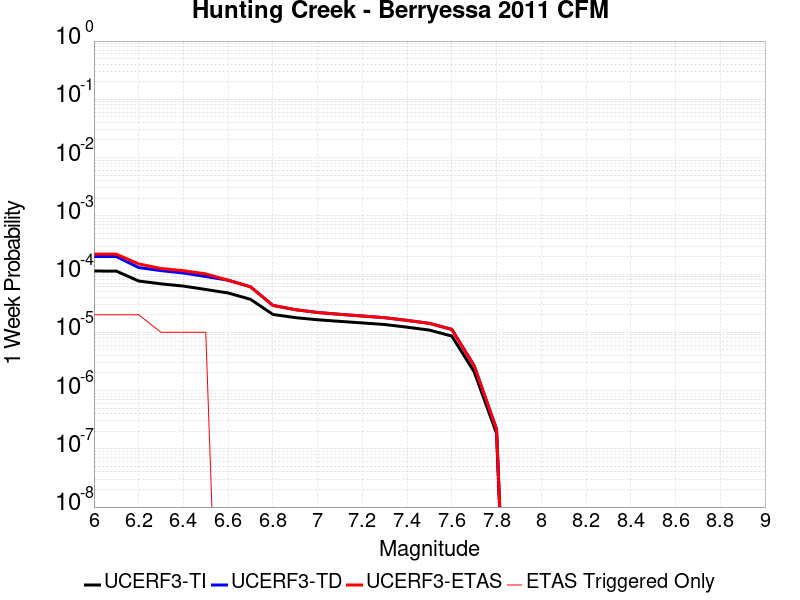 |  |  |  |

| Magnitude | 1 wk TI Prob | 1 wk TD Prob | 1 wk ETAS Prob | 1 wk ETAS/TD Gain | 1 wk ETAS Triggered Only | 1 mo TI Prob | 1 mo TD Prob | 1 mo ETAS Prob | 1 mo ETAS/TD Gain | 1 mo ETAS Triggered Only | 1 yr TI Prob | 1 yr TD Prob | 1 yr ETAS Prob | 1 yr ETAS/TD Gain | 1 yr ETAS Triggered Only | 10 yr TI Prob | 10 yr TD Prob | 10 yr ETAS Prob | 10 yr ETAS/TD Gain | 10 yr ETAS Triggered Only |
|-----|-----|-----|-----|-----|-----|-----|-----|-----|-----|-----|-----|-----|-----|-----|-----|-----|-----|-----|-----|-----|
| 6.0 | 1.1270982E-4 | 2.0028367E-4 | 2.0028367E-4 | 1.0 | 0.0 | 4.8295266E-4 | 8.579912E-4 | 8.579912E-4 | 1.0 | 0.0 | 0.0058641075 | 0.010386173 | 0.010386173 | 1.0 | 0.0 | 0.057117578 | 0.09804048 | 0.0980792 | 1.0003949 | 4.2925825E-5 |
| 6.1 | 1.1239393E-4 | 1.9976508E-4 | 1.9976508E-4 | 1.0 | 0.0 | 4.8159933E-4 | 8.557703E-4 | 8.557703E-4 | 1.0 | 0.0 | 0.0058477195 | 0.010359417 | 0.010359417 | 1.0 | 0.0 | 0.056962132 | 0.09779895 | 0.09783768 | 1.000396 | 4.2925825E-5 |
| 6.2 | 7.596265E-5 | 1.2933646E-4 | 1.2933646E-4 | 1.0 | 0.0 | 3.2551357E-4 | 5.5415573E-4 | 5.5415573E-4 | 1.0 | 0.0 | 0.0039559277 | 0.0067213587 | 0.0067213587 | 1.0 | 0.0 | 0.038862433 | 0.06459229 | 0.06463244 | 1.0006217 | 4.2925825E-5 |
| 6.3 | 6.78794E-5 | 1.1448377E-4 | 1.1448377E-4 | 1.0 | 0.0 | 2.9087928E-4 | 4.9052597E-4 | 4.9052597E-4 | 1.0 | 0.0 | 0.003535705 | 0.005952661 | 0.005952661 | 1.0 | 0.0 | 0.034799766 | 0.057466213 | 0.05750667 | 1.000704 | 4.2925825E-5 |
| 6.4 | 6.2165134E-5 | 1.0434825E-4 | 1.0434825E-4 | 1.0 | 0.0 | 2.6639478E-4 | 4.4711027E-4 | 4.4711027E-4 | 1.0 | 0.0 | 0.0032385332 | 0.0054274183 | 0.0054274183 | 1.0 | 0.0 | 0.03191742 | 0.05255138 | 0.05259205 | 1.0007739 | 4.2925825E-5 |
| 6.5 | 5.4368087E-5 | 9.070258E-5 | 9.070258E-5 | 1.0 | 0.0 | 2.3298527E-4 | 3.886537E-4 | 3.886537E-4 | 1.0 | 0.0 | 0.0028329059 | 0.0047197016 | 0.0047197016 | 1.0 | 0.0 | 0.027970633 | 0.045881182 | 0.045922138 | 1.0008926 | 4.2925825E-5 |
| 6.6 | 4.729947E-5 | 7.847101E-5 | 7.847101E-5 | 1.0 | 0.0 | 2.0269625E-4 | 3.3624718E-4 | 3.3624718E-4 | 1.0 | 0.0 | 0.002465034 | 0.004084746 | 0.004084746 | 1.0 | 0.0 | 0.02437869 | 0.03985269 | 0.039893903 | 1.0010341 | 4.2925825E-5 |
| 6.7 | 3.6875328E-5 | 6.0443555E-5 | 6.0443555E-5 | 1.0 | 0.0 | 1.5802756E-4 | 2.5900968E-4 | 2.5900968E-4 | 1.0 | 0.0 | 0.0019222875 | 0.0031482724 | 0.0031482724 | 1.0 | 0.0 | 0.019057442 | 0.03089371 | 0.03093531 | 1.0013466 | 4.2925825E-5 |
| 6.8 | 2.0292036E-5 | 2.8976721E-5 | 2.8976721E-5 | 1.0 | 0.0 | 8.6962966E-5 | 1.2417998E-4 | 1.2417998E-4 | 1.0 | 0.0 | 0.0010582599 | 0.0015108302 | 0.0015108302 | 1.0 | 0.0 | 0.010532344 | 0.0149790775 | 0.01502136 | 1.0028228 | 4.2925825E-5 |
| 6.9 | 1.7871042E-5 | 2.4472653E-5 | 2.4472653E-5 | 1.0 | 0.0 | 7.658793E-5 | 1.04878585E-4 | 1.04878585E-4 | 1.0 | 0.0 | 9.320591E-4 | 0.0012761486 | 0.0012761486 | 1.0 | 0.0 | 0.009281595 | 0.012680395 | 0.012722775 | 1.0033423 | 4.2925825E-5 |
| 7.0 | 1.6415532E-5 | 2.1906566E-5 | 2.1906566E-5 | 1.0 | 0.0 | 7.035038E-5 | 9.388191E-5 | 9.388191E-5 | 1.0 | 0.0 | 8.561793E-4 | 0.0011424144 | 0.0011424144 | 1.0 | 0.0 | 0.008528882 | 0.011365017 | 0.0114074545 | 1.0037341 | 4.2925825E-5 |
| 7.1 | 1.5409885E-5 | 2.0346588E-5 | 2.0346588E-5 | 1.0 | 0.0 | 6.6040695E-5 | 8.719676E-5 | 8.719676E-5 | 1.0 | 0.0 | 8.0374884E-4 | 0.0010611062 | 0.0010611062 | 1.0 | 0.0 | 0.00800848 | 0.010560924 | 0.010560924 | 1.0 | 0.0 |
| 7.2 | 1.4497423E-5 | 1.905519E-5 | 1.905519E-5 | 1.0 | 0.0 | 6.213033E-5 | 8.166256E-5 | 8.166256E-5 | 1.0 | 0.0 | 7.5617427E-4 | 9.937913E-4 | 9.937913E-4 | 1.0 | 0.0 | 0.0075360634 | 0.00989425 | 0.00989425 | 1.0 | 0.0 |
| 7.3 | 1.3615175E-5 | 1.7826347E-5 | 1.7826347E-5 | 1.0 | 0.0 | 5.8349444E-5 | 7.6396405E-5 | 7.6396405E-5 | 1.0 | 0.0 | 7.101729E-4 | 9.297323E-4 | 9.297323E-4 | 1.0 | 0.0 | 0.0070790765 | 0.009259124 | 0.009259124 | 1.0 | 0.0 |
| 7.4 | 1.2252825E-5 | 1.6026455E-5 | 1.6026455E-5 | 1.0 | 0.0 | 5.251105E-5 | 6.868302E-5 | 6.868302E-5 | 1.0 | 0.0 | 6.391345E-4 | 8.3589775E-4 | 8.3589775E-4 | 1.0 | 0.0 | 0.0063729943 | 0.008328172 | 0.008328172 | 1.0 | 0.0 |
| 7.5 | 1.0913301E-5 | 1.4241286E-5 | 1.4241286E-5 | 1.0 | 0.0 | 4.6770452E-5 | 6.103267E-5 | 6.103267E-5 | 1.0 | 0.0 | 5.6928146E-4 | 7.428222E-4 | 7.428222E-4 | 1.0 | 0.0 | 0.0056782532 | 0.0074039865 | 0.0074039865 | 1.0 | 0.0 |
| 7.6 | 8.623192E-6 | 1.12347825E-5 | 1.12347825E-5 | 1.0 | 0.0 | 3.6956015E-5 | 4.8148195E-5 | 4.8148195E-5 | 1.0 | 0.0 | 4.4984656E-4 | 5.8604917E-4 | 5.8604917E-4 | 1.0 | 0.0 | 0.00448937 | 0.005845504 | 0.005845504 | 1.0 | 0.0 |
| 7.7 | 2.0993634E-6 | 2.66264E-6 | 2.66264E-6 | 1.0 | 0.0 | 8.997241E-6 | 1.1411265E-5 | 1.1411265E-5 | 1.0 | 0.0 | 1.09535904E-4 | 1.3892337E-4 | 1.3892337E-4 | 1.0 | 0.0 | 0.0010948193 | 0.0013883994 | 0.0013883994 | 1.0 | 0.0 |
| 7.8 | 1.8428308E-7 | 2.1674624E-7 | 2.1674624E-7 | 1.0 | 0.0 | 7.897844E-7 | 9.289122E-7 | 9.289122E-7 | 1.0 | 0.0 | 9.615583E-6 | 1.130945E-5 | 1.130945E-5 | 1.0 | 0.0 | 9.615166E-5 | 1.1308173E-4 | 1.1308173E-4 | 1.0 | 0.0 |

## San Diego Trough south
*[(top)](#table-of-contents)*

| 1 Week | 1 Month | 1 Year | 10 Year |
|-----|-----|-----|-----|
|  |  | 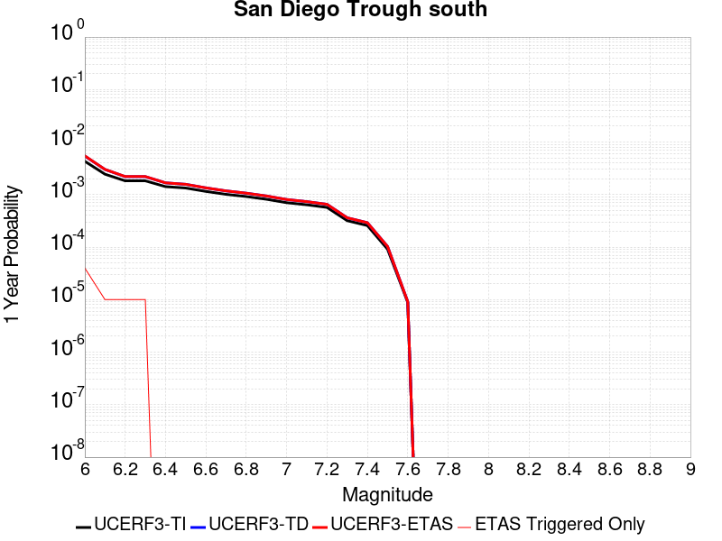 |  |

| Magnitude | 1 wk TI Prob | 1 wk TD Prob | 1 wk ETAS Prob | 1 wk ETAS/TD Gain | 1 wk ETAS Triggered Only | 1 mo TI Prob | 1 mo TD Prob | 1 mo ETAS Prob | 1 mo ETAS/TD Gain | 1 mo ETAS Triggered Only | 1 yr TI Prob | 1 yr TD Prob | 1 yr ETAS Prob | 1 yr ETAS/TD Gain | 1 yr ETAS Triggered Only | 10 yr TI Prob | 10 yr TD Prob | 10 yr ETAS Prob | 10 yr ETAS/TD Gain | 10 yr ETAS Triggered Only |
|-----|-----|-----|-----|-----|-----|-----|-----|-----|-----|-----|-----|-----|-----|-----|-----|-----|-----|-----|-----|-----|
| 6.0 | 8.279495E-5 | 1.0425541E-4 | 1.4717676E-4 | 1.4116942 | 4.2925825E-5 | 3.5478722E-4 | 4.4673498E-4 | 4.896416E-4 | 1.096045 | 4.2925825E-5 | 0.004310982 | 0.0054259133 | 0.0054686065 | 1.0078683 | 4.2925825E-5 | 0.042283054 | 0.05299303 | 0.053074334 | 1.0015342 | 8.585165E-5 |
| 6.1 | 4.6961468E-5 | 5.773024E-5 | 5.773024E-5 | 1.0 | 0.0 | 2.0124791E-4 | 2.473905E-4 | 2.473905E-4 | 1.0 | 0.0 | 0.00244744 | 0.003007886 | 0.003007886 | 1.0 | 0.0 | 0.024206603 | 0.029679636 | 0.029679636 | 1.0 | 0.0 |
| 6.2 | 3.5079658E-5 | 4.214258E-5 | 4.214258E-5 | 1.0 | 0.0 | 1.5033272E-4 | 1.8059829E-4 | 1.8059829E-4 | 1.0 | 0.0 | 0.0018287642 | 0.002196587 | 0.002196587 | 1.0 | 0.0 | 0.018137876 | 0.021751188 | 0.021751188 | 1.0 | 0.0 |
| 6.3 | 3.5079658E-5 | 4.214258E-5 | 4.214258E-5 | 1.0 | 0.0 | 1.5033272E-4 | 1.8059829E-4 | 1.8059829E-4 | 1.0 | 0.0 | 0.0018287642 | 0.002196587 | 0.002196587 | 1.0 | 0.0 | 0.018137876 | 0.021751188 | 0.021751188 | 1.0 | 0.0 |
| 6.4 | 2.7196904E-5 | 3.208715E-5 | 3.208715E-5 | 1.0 | 0.0 | 1.16552954E-4 | 1.3750911E-4 | 1.3750911E-4 | 1.0 | 0.0 | 0.0014181085 | 0.0016728995 | 0.0016728995 | 1.0 | 0.0 | 0.014090929 | 0.016604666 | 0.016604666 | 1.0 | 0.0 |
| 6.5 | 2.5584688E-5 | 3.0101632E-5 | 3.0101632E-5 | 1.0 | 0.0 | 1.0964406E-4 | 1.2900059E-4 | 1.2900059E-4 | 1.0 | 0.0 | 0.0013340989 | 0.0015694627 | 0.0015694627 | 1.0 | 0.0 | 0.013261181 | 0.015585332 | 0.015585332 | 1.0 | 0.0 |
| 6.6 | 2.2034688E-5 | 2.574271E-5 | 2.574271E-5 | 1.0 | 0.0 | 9.443096E-5 | 1.1032127E-4 | 1.1032127E-4 | 1.0 | 0.0 | 0.0011490905 | 0.0013423412 | 0.0013423412 | 1.0 | 0.0 | 0.011431668 | 0.013343325 | 0.013343325 | 1.0 | 0.0 |
| 6.7 | 1.9394853E-5 | 2.254176E-5 | 2.254176E-5 | 1.0 | 0.0 | 8.311815E-5 | 9.6604E-5 | 9.6604E-5 | 1.0 | 0.0 | 0.0010114936 | 0.0011755243 | 0.0011755243 | 1.0 | 0.0 | 0.01006902 | 0.011693766 | 0.011693766 | 1.0 | 0.0 |
| 6.8 | 1.7615313E-5 | 2.0403182E-5 | 2.0403182E-5 | 1.0 | 0.0 | 7.549201E-5 | 8.743931E-5 | 8.743931E-5 | 1.0 | 0.0 | 9.1872766E-4 | 0.0010640579 | 0.0010640579 | 1.0 | 0.0 | 0.009149387 | 0.010590198 | 0.010590198 | 1.0 | 0.0 |
| 6.9 | 1.5621423E-5 | 1.8026114E-5 | 1.8026114E-5 | 1.0 | 0.0 | 6.6947236E-5 | 7.725251E-5 | 7.725251E-5 | 1.0 | 0.0 | 8.147778E-4 | 9.40147E-4 | 9.40147E-4 | 1.0 | 0.0 | 0.008117969 | 0.009362142 | 0.009362142 | 1.0 | 0.0 |
| 7.0 | 1.3444376E-5 | 1.544809E-5 | 1.544809E-5 | 1.0 | 0.0 | 5.7617483E-5 | 6.620443E-5 | 6.620443E-5 | 1.0 | 0.0 | 7.0126704E-4 | 8.057436E-4 | 8.057436E-4 | 1.0 | 0.0 | 0.006990582 | 0.008028555 | 0.008028555 | 1.0 | 0.0 |
| 7.1 | 1.2268361E-5 | 1.407303E-5 | 1.407303E-5 | 1.0 | 0.0 | 5.2577634E-5 | 6.0311606E-5 | 6.0311606E-5 | 1.0 | 0.0 | 6.399447E-4 | 7.3404907E-4 | 7.3404907E-4 | 1.0 | 0.0 | 0.0063810493 | 0.0073165493 | 0.0073165493 | 1.0 | 0.0 |
| 7.2 | 1.0922655E-5 | 1.2513563E-5 | 1.2513563E-5 | 1.0 | 0.0 | 4.681054E-5 | 5.3628468E-5 | 5.3628468E-5 | 1.0 | 0.0 | 5.697693E-4 | 6.5273355E-4 | 6.5273355E-4 | 1.0 | 0.0 | 0.0056831064 | 0.0065084435 | 0.0065084435 | 1.0 | 0.0 |
| 7.3 | 6.1106753E-6 | 6.928925E-6 | 6.928925E-6 | 1.0 | 0.0 | 2.6188345E-5 | 2.9695057E-5 | 2.9695057E-5 | 1.0 | 0.0 | 3.1879646E-4 | 3.6147775E-4 | 3.6147775E-4 | 1.0 | 0.0 | 0.0031833951 | 0.003608943 | 0.003608943 | 1.0 | 0.0 |
| 7.4 | 4.933187E-6 | 5.5895525E-6 | 5.5895525E-6 | 1.0 | 0.0 | 2.114206E-5 | 2.3955008E-5 | 2.3955008E-5 | 1.0 | 0.0 | 2.5737417E-4 | 2.9161357E-4 | 2.9161357E-4 | 1.0 | 0.0 | 0.002570763 | 0.0029123505 | 0.0029123505 | 1.0 | 0.0 |
| 7.5 | 1.7489613E-6 | 1.969678E-6 | 1.969678E-6 | 1.0 | 0.0 | 7.495527E-6 | 8.4414505E-6 | 8.4414505E-6 | 1.0 | 0.0 | 9.125422E-5 | 1.02770035E-4 | 1.02770035E-4 | 1.0 | 0.0 | 9.1216754E-4 | 0.0010272472 | 0.0010272472 | 1.0 | 0.0 |
| 7.6 | 1.6988751E-7 | 1.7533823E-7 | 1.7533823E-7 | 1.0 | 0.0 | 7.2808916E-7 | 7.5144936E-7 | 7.5144936E-7 | 1.0 | 0.0 | 8.864449E-6 | 9.14886E-6 | 9.14886E-6 | 1.0 | 0.0 | 8.8640954E-5 | 9.1485024E-5 | 9.1485024E-5 | 1.0 | 0.0 |

## Whittier alt 1
*[(top)](#table-of-contents)*

| 1 Week | 1 Month | 1 Year | 10 Year |
|-----|-----|-----|-----|
|  |  |  |  |

| Magnitude | 1 wk TI Prob | 1 wk TD Prob | 1 wk ETAS Prob | 1 wk ETAS/TD Gain | 1 wk ETAS Triggered Only | 1 mo TI Prob | 1 mo TD Prob | 1 mo ETAS Prob | 1 mo ETAS/TD Gain | 1 mo ETAS Triggered Only | 1 yr TI Prob | 1 yr TD Prob | 1 yr ETAS Prob | 1 yr ETAS/TD Gain | 1 yr ETAS Triggered Only | 10 yr TI Prob | 10 yr TD Prob | 10 yr ETAS Prob | 10 yr ETAS/TD Gain | 10 yr ETAS Triggered Only |
|-----|-----|-----|-----|-----|-----|-----|-----|-----|-----|-----|-----|-----|-----|-----|-----|-----|-----|-----|-----|-----|
| 6.0 | 4.2554693E-5 | 4.7252182E-5 | 9.017598E-5 | 1.9083982 | 4.2925825E-5 | 1.8236451E-4 | 2.0249544E-4 | 2.4541258E-4 | 1.2119412 | 4.2925825E-5 | 0.002218027 | 0.0024629163 | 0.0025057364 | 1.017386 | 4.2925825E-5 | 0.02196019 | 0.024390263 | 0.024474021 | 1.0034341 | 8.585165E-5 |
| 6.1 | 4.2554693E-5 | 4.7252182E-5 | 9.017598E-5 | 1.9083982 | 4.2925825E-5 | 1.8236451E-4 | 2.0249544E-4 | 2.4541258E-4 | 1.2119412 | 4.2925825E-5 | 0.002218027 | 0.0024629163 | 0.0025057364 | 1.017386 | 4.2925825E-5 | 0.02196019 | 0.024390263 | 0.024474021 | 1.0034341 | 8.585165E-5 |
| 6.2 | 4.2554693E-5 | 4.7252182E-5 | 9.017598E-5 | 1.9083982 | 4.2925825E-5 | 1.8236451E-4 | 2.0249544E-4 | 2.4541258E-4 | 1.2119412 | 4.2925825E-5 | 0.002218027 | 0.0024629163 | 0.0025057364 | 1.017386 | 4.2925825E-5 | 0.02196019 | 0.024390263 | 0.024474021 | 1.0034341 | 8.585165E-5 |
| 6.3 | 1.9617712E-5 | 1.826841E-5 | 1.826841E-5 | 1.0 | 0.0 | 8.40732E-5 | 7.829095E-5 | 7.829095E-5 | 1.0 | 0.0 | 0.0010231105 | 9.527944E-4 | 9.527944E-4 | 1.0 | 0.0 | 0.01018413 | 0.0094904 | 0.0094904 | 1.0 | 0.0 |
| 6.4 | 1.5611336E-5 | 1.3604089E-5 | 1.3604089E-5 | 1.0 | 0.0 | 6.690401E-5 | 5.8301972E-5 | 5.8301972E-5 | 1.0 | 0.0 | 8.142519E-4 | 7.096013E-4 | 7.096013E-4 | 1.0 | 0.0 | 0.008112748 | 0.0070753377 | 0.0070753377 | 1.0 | 0.0 |
| 6.5 | 1.5150166E-5 | 1.3100744E-5 | 1.3100744E-5 | 1.0 | 0.0 | 6.492767E-5 | 5.614487E-5 | 5.614487E-5 | 1.0 | 0.0 | 7.9020765E-4 | 6.8335526E-4 | 6.8335526E-4 | 1.0 | 0.0 | 0.007874036 | 0.006814508 | 0.006814508 | 1.0 | 0.0 |
| 6.6 | 1.295588E-5 | 1.0380544E-5 | 1.0380544E-5 | 1.0 | 0.0 | 5.552402E-5 | 4.44873E-5 | 4.44873E-5 | 1.0 | 0.0 | 6.7579525E-4 | 5.415002E-4 | 5.415002E-4 | 1.0 | 0.0 | 0.006737438 | 0.005403343 | 0.005403343 | 1.0 | 0.0 |
| 6.7 | 1.2542085E-5 | 9.899189E-6 | 9.899189E-6 | 1.0 | 0.0 | 5.3750682E-5 | 4.2424414E-5 | 4.2424414E-5 | 1.0 | 0.0 | 6.542181E-4 | 5.163967E-4 | 5.163967E-4 | 1.0 | 0.0 | 0.006522954 | 0.005153464 | 0.005153464 | 1.0 | 0.0 |
| 6.8 | 1.2195878E-5 | 9.49523E-6 | 9.49523E-6 | 1.0 | 0.0 | 5.2267E-5 | 4.069322E-5 | 4.069322E-5 | 1.0 | 0.0 | 6.36165E-4 | 4.9532915E-4 | 4.9532915E-4 | 1.0 | 0.0 | 0.0063434686 | 0.0049436963 | 0.0049436963 | 1.0 | 0.0 |
| 6.9 | 1.1580298E-5 | 8.772739E-6 | 8.772739E-6 | 1.0 | 0.0 | 4.9628903E-5 | 3.759692E-5 | 3.759692E-5 | 1.0 | 0.0 | 6.040644E-4 | 4.5764804E-4 | 4.5764804E-4 | 1.0 | 0.0 | 0.00602425 | 0.0045684646 | 0.0045684646 | 1.0 | 0.0 |
| 7.0 | 1.0964795E-5 | 8.083794E-6 | 8.083794E-6 | 1.0 | 0.0 | 4.6991136E-5 | 3.4644378E-5 | 3.4644378E-5 | 1.0 | 0.0 | 5.7196687E-4 | 4.217152E-4 | 4.217152E-4 | 1.0 | 0.0 | 0.0057049696 | 0.004210459 | 0.004210459 | 1.0 | 0.0 |
| 7.1 | 1.0230601E-5 | 7.32646E-6 | 7.32646E-6 | 1.0 | 0.0 | 4.3844695E-5 | 3.1398744E-5 | 3.1398744E-5 | 1.0 | 0.0 | 5.336784E-4 | 3.8221394E-4 | 3.8221394E-4 | 1.0 | 0.0 | 0.005323986 | 0.0038167592 | 0.0038167592 | 1.0 | 0.0 |
| 7.2 | 9.40865E-6 | 6.5430822E-6 | 6.5430822E-6 | 1.0 | 0.0 | 4.032216E-5 | 2.8041486E-5 | 2.8041486E-5 | 1.0 | 0.0 | 4.908117E-4 | 3.4135283E-4 | 3.4135283E-4 | 1.0 | 0.0 | 0.0048972913 | 0.0034094024 | 0.0034094024 | 1.0 | 0.0 |
| 7.3 | 8.237384E-6 | 5.5975433E-6 | 5.5975433E-6 | 1.0 | 0.0 | 3.5302593E-5 | 2.3989258E-5 | 2.3989258E-5 | 1.0 | 0.0 | 4.2972428E-4 | 2.920311E-4 | 2.920311E-4 | 1.0 | 0.0 | 0.0042889426 | 0.0029167992 | 0.0029167992 | 1.0 | 0.0 |
| 7.4 | 7.5316966E-6 | 5.0276153E-6 | 5.0276153E-6 | 1.0 | 0.0 | 3.2278298E-5 | 2.154675E-5 | 2.154675E-5 | 1.0 | 0.0 | 3.9291743E-4 | 2.623011E-4 | 2.623011E-4 | 1.0 | 0.0 | 0.0039222343 | 0.0026200267 | 0.0026200267 | 1.0 | 0.0 |
| 7.5 | 6.149649E-6 | 3.9336355E-6 | 3.9336355E-6 | 1.0 | 0.0 | 2.6355372E-5 | 1.6858336E-5 | 1.6858336E-5 | 1.0 | 0.0 | 3.208294E-4 | 2.052318E-4 | 2.052318E-4 | 1.0 | 0.0 | 0.003203666 | 0.0020505118 | 0.0020505118 | 1.0 | 0.0 |
| 7.6 | 5.457711E-6 | 3.3951796E-6 | 3.3951796E-6 | 1.0 | 0.0 | 2.338998E-5 | 1.4550694E-5 | 1.4550694E-5 | 1.0 | 0.0 | 2.8473578E-4 | 1.771411E-4 | 1.771411E-4 | 1.0 | 0.0 | 0.0028437122 | 0.0017700798 | 0.0017700798 | 1.0 | 0.0 |
| 7.7 | 4.1676276E-6 | 2.3329922E-6 | 2.3329922E-6 | 1.0 | 0.0 | 1.7861139E-5 | 9.998504E-6 | 9.998504E-6 | 1.0 | 0.0 | 2.1743766E-4 | 1.2172572E-4 | 1.2172572E-4 | 1.0 | 0.0 | 0.0021722503 | 0.0012166635 | 0.0012166635 | 1.0 | 0.0 |
| 7.8 | 2.2692414E-7 | 9.384417E-8 | 9.384417E-8 | 1.0 | 0.0 | 9.725317E-7 | 4.0218927E-7 | 4.0218927E-7 | 1.0 | 0.0 | 1.1840509E-5 | 4.8966467E-6 | 4.8966467E-6 | 1.0 | 0.0 | 1.1839878E-4 | 4.8965718E-5 | 4.8965718E-5 | 1.0 | 0.0 |
| 7.9 | 6.676829E-9 | 3.4397174E-9 | 3.4397174E-9 | 1.0 | 0.0 | 2.861498E-8 | 1.4741646E-8 | 1.4741646E-8 | 1.0 | 0.0 | 3.4838732E-7 | 1.7947953E-7 | 1.7947953E-7 | 1.0 | 0.0 | 3.4838679E-6 | 1.794794E-6 | 1.794794E-6 | 1.0 | 0.0 |

## Channel Islands Western Deep Ramp
*[(top)](#table-of-contents)*

| 1 Week | 1 Month | 1 Year | 10 Year |
|-----|-----|-----|-----|
|  |  |  |  |

| Magnitude | 1 wk TI Prob | 1 wk TD Prob | 1 wk ETAS Prob | 1 wk ETAS/TD Gain | 1 wk ETAS Triggered Only | 1 mo TI Prob | 1 mo TD Prob | 1 mo ETAS Prob | 1 mo ETAS/TD Gain | 1 mo ETAS Triggered Only | 1 yr TI Prob | 1 yr TD Prob | 1 yr ETAS Prob | 1 yr ETAS/TD Gain | 1 yr ETAS Triggered Only | 10 yr TI Prob | 10 yr TD Prob | 10 yr ETAS Prob | 10 yr ETAS/TD Gain | 10 yr ETAS Triggered Only |
|-----|-----|-----|-----|-----|-----|-----|-----|-----|-----|-----|-----|-----|-----|-----|-----|-----|-----|-----|-----|-----|
| 6.0 | 6.0213506E-6 | 6.2548684E-6 | 6.2548684E-6 | 1.0 | 0.0 | 2.5805533E-5 | 2.6806329E-5 | 6.9731E-5 | 2.6012888 | 4.2925825E-5 | 3.1413708E-4 | 3.2632265E-4 | 3.6923445E-4 | 1.1315012 | 4.2925825E-5 | 0.0031369338 | 0.0032588763 | 0.003344448 | 1.0262581 | 8.585165E-5 |
| 6.1 | 6.0213506E-6 | 6.2548684E-6 | 6.2548684E-6 | 1.0 | 0.0 | 2.5805533E-5 | 2.6806329E-5 | 6.9731E-5 | 2.6012888 | 4.2925825E-5 | 3.1413708E-4 | 3.2632265E-4 | 3.6923445E-4 | 1.1315012 | 4.2925825E-5 | 0.0031369338 | 0.0032588763 | 0.003344448 | 1.0262581 | 8.585165E-5 |
| 6.2 | 6.0213506E-6 | 6.2548684E-6 | 6.2548684E-6 | 1.0 | 0.0 | 2.5805533E-5 | 2.6806329E-5 | 6.9731E-5 | 2.6012888 | 4.2925825E-5 | 3.1413708E-4 | 3.2632265E-4 | 3.6923445E-4 | 1.1315012 | 4.2925825E-5 | 0.0031369338 | 0.0032588763 | 0.003344448 | 1.0262581 | 8.585165E-5 |
| 6.3 | 6.0213506E-6 | 6.2548684E-6 | 6.2548684E-6 | 1.0 | 0.0 | 2.5805533E-5 | 2.6806329E-5 | 6.9731E-5 | 2.6012888 | 4.2925825E-5 | 3.1413708E-4 | 3.2632265E-4 | 3.6923445E-4 | 1.1315012 | 4.2925825E-5 | 0.0031369338 | 0.0032588763 | 0.003344448 | 1.0262581 | 8.585165E-5 |
| 6.4 | 6.0213506E-6 | 6.2548684E-6 | 6.2548684E-6 | 1.0 | 0.0 | 2.5805533E-5 | 2.6806329E-5 | 6.9731E-5 | 2.6012888 | 4.2925825E-5 | 3.1413708E-4 | 3.2632265E-4 | 3.6923445E-4 | 1.1315012 | 4.2925825E-5 | 0.0031369338 | 0.0032588763 | 0.003344448 | 1.0262581 | 8.585165E-5 |
| 6.5 | 6.0213506E-6 | 6.2548684E-6 | 6.2548684E-6 | 1.0 | 0.0 | 2.5805533E-5 | 2.6806329E-5 | 6.9731E-5 | 2.6012888 | 4.2925825E-5 | 3.1413708E-4 | 3.2632265E-4 | 3.6923445E-4 | 1.1315012 | 4.2925825E-5 | 0.0031369338 | 0.0032588763 | 0.003344448 | 1.0262581 | 8.585165E-5 |
| 6.6 | 6.0213506E-6 | 6.2548684E-6 | 6.2548684E-6 | 1.0 | 0.0 | 2.5805533E-5 | 2.6806329E-5 | 6.9731E-5 | 2.6012888 | 4.2925825E-5 | 3.1413708E-4 | 3.2632265E-4 | 3.6923445E-4 | 1.1315012 | 4.2925825E-5 | 0.0031369338 | 0.0032588763 | 0.003344448 | 1.0262581 | 8.585165E-5 |
| 6.7 | 5.313309E-6 | 5.5252403E-6 | 5.5252403E-6 | 1.0 | 0.0 | 2.2771126E-5 | 2.367941E-5 | 6.660422E-5 | 2.8127482 | 4.2925825E-5 | 2.772032E-4 | 2.8826276E-4 | 3.311762E-4 | 1.1488692 | 4.2925825E-5 | 0.0027685766 | 0.0028792918 | 0.002922094 | 1.0148655 | 4.2925825E-5 |
| 6.8 | 5.313309E-6 | 5.5252403E-6 | 5.5252403E-6 | 1.0 | 0.0 | 2.2771126E-5 | 2.367941E-5 | 6.660422E-5 | 2.8127482 | 4.2925825E-5 | 2.772032E-4 | 2.8826276E-4 | 3.311762E-4 | 1.1488692 | 4.2925825E-5 | 0.0027685766 | 0.0028792918 | 0.002922094 | 1.0148655 | 4.2925825E-5 |
| 6.9 | 4.744377E-6 | 4.9394303E-6 | 4.9394303E-6 | 1.0 | 0.0 | 2.0332885E-5 | 2.1168837E-5 | 2.1168837E-5 | 1.0 | 0.0 | 2.4752476E-4 | 2.5770385E-4 | 2.5770385E-4 | 1.0 | 0.0 | 0.0024724922 | 0.0025744175 | 0.0025744175 | 1.0 | 0.0 |
| 7.0 | 4.722209E-6 | 4.9164732E-6 | 4.9164732E-6 | 1.0 | 0.0 | 2.0237881E-5 | 2.107045E-5 | 2.107045E-5 | 1.0 | 0.0 | 2.4636835E-4 | 2.5650626E-4 | 2.5650626E-4 | 1.0 | 0.0 | 0.002460954 | 0.0025624693 | 0.0025624693 | 1.0 | 0.0 |
| 7.1 | 4.611174E-6 | 4.801409E-6 | 4.801409E-6 | 1.0 | 0.0 | 1.9762025E-5 | 2.0577325E-5 | 2.0577325E-5 | 1.0 | 0.0 | 2.4057609E-4 | 2.5050386E-4 | 2.5050386E-4 | 1.0 | 0.0 | 0.002403158 | 0.002502582 | 0.002502582 | 1.0 | 0.0 |
| 7.2 | 4.043994E-6 | 4.2120264E-6 | 4.2120264E-6 | 1.0 | 0.0 | 1.7331287E-5 | 1.8051438E-5 | 1.8051438E-5 | 1.0 | 0.0 | 2.10988E-4 | 2.1975765E-4 | 2.1975765E-4 | 1.0 | 0.0 | 0.002107878 | 0.0021957543 | 0.0021957543 | 1.0 | 0.0 |
| 7.3 | 2.1233036E-6 | 2.2297875E-6 | 2.2297875E-6 | 1.0 | 0.0 | 9.099841E-6 | 9.556197E-6 | 9.556197E-6 | 1.0 | 0.0 | 1.1078493E-4 | 1.1634055E-4 | 1.1634055E-4 | 1.0 | 0.0 | 0.0011072971 | 0.001162802 | 0.001162802 | 1.0 | 0.0 |
| 7.4 | 1.9051884E-6 | 2.0014973E-6 | 2.0014973E-6 | 1.0 | 0.0 | 8.165067E-6 | 8.577817E-6 | 8.577817E-6 | 1.0 | 0.0 | 9.940516E-5 | 1.0442998E-4 | 1.0442998E-4 | 1.0 | 0.0 | 9.93607E-4 | 0.0010438144 | 0.0010438144 | 1.0 | 0.0 |
| 7.5 | 1.2408497E-6 | 1.3038839E-6 | 1.3038839E-6 | 1.0 | 0.0 | 5.317916E-6 | 5.588062E-6 | 5.588062E-6 | 1.0 | 0.0 | 6.4743705E-5 | 6.8032554E-5 | 6.8032554E-5 | 1.0 | 0.0 | 6.4724847E-4 | 6.8011944E-4 | 6.8011944E-4 | 1.0 | 0.0 |
| 7.6 | 6.5440025E-7 | 6.886718E-7 | 6.886718E-7 | 1.0 | 0.0 | 2.8045695E-6 | 2.9514472E-6 | 2.9514472E-6 | 1.0 | 0.0 | 3.4145098E-5 | 3.593329E-5 | 3.593329E-5 | 1.0 | 0.0 | 3.4139853E-4 | 3.5927625E-4 | 3.5927625E-4 | 1.0 | 0.0 |
| 7.7 | 3.985963E-7 | 4.1930787E-7 | 4.1930787E-7 | 1.0 | 0.0 | 1.7082689E-6 | 1.7970326E-6 | 1.7970326E-6 | 1.0 | 0.0 | 2.0797976E-5 | 2.1878664E-5 | 2.1878664E-5 | 1.0 | 0.0 | 2.0796029E-4 | 2.1876628E-4 | 2.1876628E-4 | 1.0 | 0.0 |
| 7.8 | 3.706329E-8 | 3.8591796E-8 | 3.8591796E-8 | 1.0 | 0.0 | 1.5884267E-7 | 1.653934E-7 | 1.653934E-7 | 1.0 | 0.0 | 1.9339077E-6 | 2.0136629E-6 | 2.0136629E-6 | 1.0 | 0.0 | 1.933891E-5 | 2.0136458E-5 | 2.0136458E-5 | 1.0 | 0.0 |

## Pleito
*[(top)](#table-of-contents)*

| 1 Week | 1 Month | 1 Year | 10 Year |
|-----|-----|-----|-----|
|  | 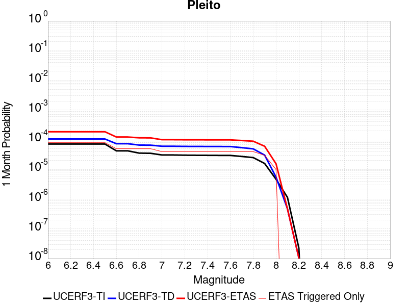 |  |  |

| Magnitude | 1 wk TI Prob | 1 wk TD Prob | 1 wk ETAS Prob | 1 wk ETAS/TD Gain | 1 wk ETAS Triggered Only | 1 mo TI Prob | 1 mo TD Prob | 1 mo ETAS Prob | 1 mo ETAS/TD Gain | 1 mo ETAS Triggered Only | 1 yr TI Prob | 1 yr TD Prob | 1 yr ETAS Prob | 1 yr ETAS/TD Gain | 1 yr ETAS Triggered Only | 10 yr TI Prob | 10 yr TD Prob | 10 yr ETAS Prob | 10 yr ETAS/TD Gain | 10 yr ETAS Triggered Only |
|-----|-----|-----|-----|-----|-----|-----|-----|-----|-----|-----|-----|-----|-----|-----|-----|-----|-----|-----|-----|-----|
| 6.0 | 1.6763008E-5 | 2.4764735E-5 | 6.76895E-5 | 2.7333019 | 4.2925825E-5 | 7.183948E-5 | 1.0613067E-4 | 1.4905194E-4 | 1.4044191 | 4.2925825E-5 | 8.742947E-4 | 0.001291447 | 0.0013343174 | 1.0331956 | 4.2925825E-5 | 0.00870863 | 0.012954412 | 0.013039151 | 1.0065414 | 8.585165E-5 |
| 6.1 | 1.6763008E-5 | 2.4764735E-5 | 6.76895E-5 | 2.7333019 | 4.2925825E-5 | 7.183948E-5 | 1.0613067E-4 | 1.4905194E-4 | 1.4044191 | 4.2925825E-5 | 8.742947E-4 | 0.001291447 | 0.0013343174 | 1.0331956 | 4.2925825E-5 | 0.00870863 | 0.012954412 | 0.013039151 | 1.0065414 | 8.585165E-5 |
| 6.2 | 1.6763008E-5 | 2.4764735E-5 | 6.76895E-5 | 2.7333019 | 4.2925825E-5 | 7.183948E-5 | 1.0613067E-4 | 1.4905194E-4 | 1.4044191 | 4.2925825E-5 | 8.742947E-4 | 0.001291447 | 0.0013343174 | 1.0331956 | 4.2925825E-5 | 0.00870863 | 0.012954412 | 0.013039151 | 1.0065414 | 8.585165E-5 |
| 6.3 | 1.6763008E-5 | 2.4764735E-5 | 6.76895E-5 | 2.7333019 | 4.2925825E-5 | 7.183948E-5 | 1.0613067E-4 | 1.4905194E-4 | 1.4044191 | 4.2925825E-5 | 8.742947E-4 | 0.001291447 | 0.0013343174 | 1.0331956 | 4.2925825E-5 | 0.00870863 | 0.012954412 | 0.013039151 | 1.0065414 | 8.585165E-5 |
| 6.4 | 1.6763008E-5 | 2.4764735E-5 | 6.76895E-5 | 2.7333019 | 4.2925825E-5 | 7.183948E-5 | 1.0613067E-4 | 1.4905194E-4 | 1.4044191 | 4.2925825E-5 | 8.742947E-4 | 0.001291447 | 0.0013343174 | 1.0331956 | 4.2925825E-5 | 0.00870863 | 0.012954412 | 0.013039151 | 1.0065414 | 8.585165E-5 |
| 6.5 | 1.6763008E-5 | 2.4764735E-5 | 6.76895E-5 | 2.7333019 | 4.2925825E-5 | 7.183948E-5 | 1.0613067E-4 | 1.4905194E-4 | 1.4044191 | 4.2925825E-5 | 8.742947E-4 | 0.001291447 | 0.0013343174 | 1.0331956 | 4.2925825E-5 | 0.00870863 | 0.012954412 | 0.013039151 | 1.0065414 | 8.585165E-5 |
| 6.6 | 9.910213E-6 | 1.721552E-5 | 6.0140606E-5 | 3.4933946 | 4.2925825E-5 | 4.247165E-5 | 7.3778734E-5 | 1.1670139E-4 | 1.5817754 | 4.2925825E-5 | 5.169696E-4 | 8.9788967E-4 | 9.407769E-4 | 1.0477645 | 4.2925825E-5 | 0.0051576863 | 0.009051226 | 0.0091363005 | 1.0093992 | 8.585165E-5 |
| 6.7 | 9.910213E-6 | 1.721552E-5 | 6.0140606E-5 | 3.4933946 | 4.2925825E-5 | 4.247165E-5 | 7.3778734E-5 | 1.1670139E-4 | 1.5817754 | 4.2925825E-5 | 5.169696E-4 | 8.9788967E-4 | 9.407769E-4 | 1.0477645 | 4.2925825E-5 | 0.0051576863 | 0.009051226 | 0.0091363005 | 1.0093992 | 8.585165E-5 |
| 6.8 | 8.300162E-6 | 1.5475129E-5 | 5.840029E-5 | 3.7738159 | 4.2925825E-5 | 3.557164E-5 | 6.63203E-5 | 1.0924328E-4 | 1.6472071 | 4.2925825E-5 | 4.3299864E-4 | 8.07152E-4 | 8.500432E-4 | 1.0531389 | 4.2925825E-5 | 0.004321559 | 0.008150663 | 0.008235815 | 1.0104473 | 8.585165E-5 |
| 6.9 | 8.183114E-6 | 1.5346344E-5 | 5.827151E-5 | 3.7970939 | 4.2925825E-5 | 3.5070017E-5 | 6.57684E-5 | 1.086914E-4 | 1.6526387 | 4.2925825E-5 | 4.2689382E-4 | 8.0043747E-4 | 8.4332895E-4 | 1.053585 | 4.2925825E-5 | 0.0042607468 | 0.008084008 | 0.008169166 | 1.010534 | 8.585165E-5 |
| 7.0 | 7.1748823E-6 | 1.4133306E-5 | 5.705852E-5 | 4.0371675 | 4.2925825E-5 | 3.0749135E-5 | 6.0569906E-5 | 1.03493134E-4 | 1.708656 | 4.2925825E-5 | 3.743064E-4 | 7.3718966E-4 | 7.800838E-4 | 1.058186 | 4.2925825E-5 | 0.0037367654 | 0.0074553755 | 0.0075405873 | 1.0114295 | 8.585165E-5 |
| 7.1 | 7.1671807E-6 | 1.4123676E-5 | 5.7048892E-5 | 4.0392385 | 4.2925825E-5 | 3.0716128E-5 | 6.0528637E-5 | 1.03451865E-4 | 1.7091391 | 4.2925825E-5 | 3.7390468E-4 | 7.366875E-4 | 7.795817E-4 | 1.0582258 | 4.2925825E-5 | 0.0037327618 | 0.0074503883 | 0.0075356 | 1.0114373 | 8.585165E-5 |
| 7.2 | 7.0649667E-6 | 1.3970962E-5 | 5.6896188E-5 | 4.07246 | 4.2925825E-5 | 3.0278077E-5 | 5.987418E-5 | 1.02797436E-4 | 1.7168909 | 4.2925825E-5 | 3.6857324E-4 | 7.287248E-4 | 7.716194E-4 | 1.0588624 | 4.2925825E-5 | 0.0036796255 | 0.0073711374 | 0.007456356 | 1.0115612 | 8.585165E-5 |
| 7.3 | 7.02082E-6 | 1.3914415E-5 | 5.6839643E-5 | 4.0849466 | 4.2925825E-5 | 3.008888E-5 | 5.9631846E-5 | 1.0255511E-4 | 1.7198044 | 4.2925825E-5 | 3.6627054E-4 | 7.257764E-4 | 7.686711E-4 | 1.0591018 | 4.2925825E-5 | 0.0036566744 | 0.0073416373 | 0.007426859 | 1.011608 | 8.585165E-5 |
| 7.4 | 6.987146E-6 | 1.3873975E-5 | 5.6799203E-5 | 4.093939 | 4.2925825E-5 | 2.9944567E-5 | 5.9458544E-5 | 1.0238181E-4 | 1.7219025 | 4.2925825E-5 | 3.6451413E-4 | 7.2366785E-4 | 7.665626E-4 | 1.0592741 | 4.2925825E-5 | 0.0036391679 | 0.007320571 | 0.0074057947 | 1.0116416 | 8.585165E-5 |
| 7.5 | 6.9494554E-6 | 1.383088E-5 | 5.675611E-5 | 4.103579 | 4.2925825E-5 | 2.9783041E-5 | 5.9273858E-5 | 1.0219713E-4 | 1.724152 | 4.2925825E-5 | 3.625482E-4 | 7.2142074E-4 | 7.643156E-4 | 1.0594589 | 4.2925825E-5 | 0.0036195726 | 0.007298199 | 0.007383424 | 1.0116775 | 8.585165E-5 |
| 7.6 | 6.92694E-6 | 1.3789992E-5 | 5.6715224E-5 | 4.1127815 | 4.2925825E-5 | 2.9686547E-5 | 5.909863E-5 | 1.0202192E-4 | 1.7262992 | 4.2925825E-5 | 3.6137376E-4 | 7.192888E-4 | 7.6218374E-4 | 1.0596353 | 4.2925825E-5 | 0.0036078666 | 0.007276951 | 0.007362178 | 1.011712 | 8.585165E-5 |
| 7.7 | 6.395867E-6 | 1.26690065E-5 | 5.5594286E-5 | 4.388212 | 4.2925825E-5 | 2.741057E-5 | 5.4294615E-5 | 9.721811E-5 | 1.7905663 | 4.2925825E-5 | 3.336726E-4 | 6.6083675E-4 | 7.0373423E-4 | 1.0649139 | 4.2925825E-5 | 0.0033317201 | 0.0066955453 | 0.0067808223 | 1.0127363 | 8.585165E-5 |
| 7.8 | 5.8664327E-6 | 1.1536581E-5 | 5.446191E-5 | 4.720802 | 4.2925825E-5 | 2.5141611E-5 | 4.9441554E-5 | 9.2365255E-5 | 1.8681706 | 4.2925825E-5 | 3.060561E-4 | 6.0178485E-4 | 6.446849E-4 | 1.0712879 | 4.2925825E-5 | 0.0030563495 | 0.0061010164 | 0.006186344 | 1.0139859 | 8.585165E-5 |
| 7.9 | 3.7167474E-6 | 7.1145205E-6 | 7.1145205E-6 | 1.0 | 0.0 | 1.592882E-5 | 3.0490448E-5 | 3.0490448E-5 | 1.0 | 0.0 | 1.9391612E-4 | 3.7115812E-4 | 3.7115812E-4 | 1.0 | 0.0 | 0.0019374699 | 0.0037676243 | 0.0038103885 | 1.0113504 | 4.2925825E-5 |
| 8.0 | 1.0903841E-6 | 1.2879104E-6 | 1.2879104E-6 | 1.0 | 0.0 | 4.6730665E-6 | 5.5196047E-6 | 5.5196047E-6 | 1.0 | 0.0 | 5.68931E-5 | 6.719913E-5 | 6.719913E-5 | 1.0 | 0.0 | 5.6878536E-4 | 6.942094E-4 | 6.942094E-4 | 1.0 | 0.0 |
| 8.1 | 2.6894583E-7 | 1.1056095E-7 | 1.1056095E-7 | 1.0 | 0.0 | 1.1526245E-6 | 4.7383253E-7 | 4.7383253E-7 | 1.0 | 0.0 | 1.4033113E-5 | 5.768896E-6 | 5.768896E-6 | 1.0 | 0.0 | 1.4032227E-4 | 6.454915E-5 | 6.454915E-5 | 1.0 | 0.0 |
| 8.2 | 5.2967013E-9 | 2.4567874E-9 | 2.4567874E-9 | 1.0 | 0.0 | 2.2700148E-8 | 1.0529089E-8 | 1.0529089E-8 | 1.0 | 0.0 | 2.7637427E-7 | 1.2819166E-7 | 1.2819166E-7 | 1.0 | 0.0 | 2.7637393E-6 | 1.4588004E-6 | 1.4588004E-6 | 1.0 | 0.0 |

## San Jacinto (Clark) rev
*[(top)](#table-of-contents)*

| 1 Week | 1 Month | 1 Year | 10 Year |
|-----|-----|-----|-----|
|  |  | 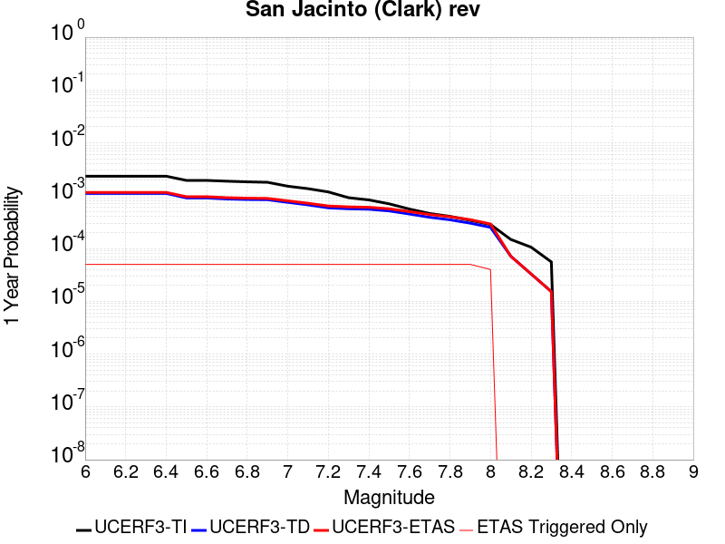 |  |

| Magnitude | 1 wk TI Prob | 1 wk TD Prob | 1 wk ETAS Prob | 1 wk ETAS/TD Gain | 1 wk ETAS Triggered Only | 1 mo TI Prob | 1 mo TD Prob | 1 mo ETAS Prob | 1 mo ETAS/TD Gain | 1 mo ETAS Triggered Only | 1 yr TI Prob | 1 yr TD Prob | 1 yr ETAS Prob | 1 yr ETAS/TD Gain | 1 yr ETAS Triggered Only | 10 yr TI Prob | 10 yr TD Prob | 10 yr ETAS Prob | 10 yr ETAS/TD Gain | 10 yr ETAS Triggered Only |
|-----|-----|-----|-----|-----|-----|-----|-----|-----|-----|-----|-----|-----|-----|-----|-----|-----|-----|-----|-----|-----|
| 6.0 | 4.482615E-5 | 2.1153059E-5 | 1.0700289E-4 | 5.0585065 | 8.585165E-5 | 1.9209793E-4 | 9.065287E-5 | 1.7649673E-4 | 1.9469514 | 8.585165E-5 | 0.0023362834 | 0.0011031491 | 0.001188906 | 1.0777383 | 8.585165E-5 | 0.02311874 | 0.011485709 | 0.011570575 | 1.0073888 | 8.585165E-5 |
| 6.1 | 4.482615E-5 | 2.1153059E-5 | 1.0700289E-4 | 5.0585065 | 8.585165E-5 | 1.9209793E-4 | 9.065287E-5 | 1.7649673E-4 | 1.9469514 | 8.585165E-5 | 0.0023362834 | 0.0011031491 | 0.001188906 | 1.0777383 | 8.585165E-5 | 0.02311874 | 0.011485709 | 0.011570575 | 1.0073888 | 8.585165E-5 |
| 6.2 | 4.482615E-5 | 2.1153059E-5 | 1.0700289E-4 | 5.0585065 | 8.585165E-5 | 1.9209793E-4 | 9.065287E-5 | 1.7649673E-4 | 1.9469514 | 8.585165E-5 | 0.0023362834 | 0.0011031491 | 0.001188906 | 1.0777383 | 8.585165E-5 | 0.02311874 | 0.011485709 | 0.011570575 | 1.0073888 | 8.585165E-5 |
| 6.3 | 4.482615E-5 | 2.1153059E-5 | 1.0700289E-4 | 5.0585065 | 8.585165E-5 | 1.9209793E-4 | 9.065287E-5 | 1.7649673E-4 | 1.9469514 | 8.585165E-5 | 0.0023362834 | 0.0011031491 | 0.001188906 | 1.0777383 | 8.585165E-5 | 0.02311874 | 0.011485709 | 0.011570575 | 1.0073888 | 8.585165E-5 |
| 6.4 | 4.482615E-5 | 2.1153059E-5 | 1.0700289E-4 | 5.0585065 | 8.585165E-5 | 1.9209793E-4 | 9.065287E-5 | 1.7649673E-4 | 1.9469514 | 8.585165E-5 | 0.0023362834 | 0.0011031491 | 0.001188906 | 1.0777383 | 8.585165E-5 | 0.02311874 | 0.011485709 | 0.011570575 | 1.0073888 | 8.585165E-5 |
| 6.5 | 3.7294863E-5 | 1.7354667E-5 | 1.03204824E-4 | 5.9468055 | 8.585165E-5 | 1.5982533E-4 | 7.437504E-5 | 1.6022031E-4 | 2.1542213 | 8.585165E-5 | 0.0019441366 | 9.051445E-4 | 9.909184E-4 | 1.0947627 | 8.585165E-5 | 0.01927216 | 0.009485902 | 0.00957094 | 1.0089645 | 8.585165E-5 |
| 6.6 | 3.7294863E-5 | 1.7354667E-5 | 1.03204824E-4 | 5.9468055 | 8.585165E-5 | 1.5982533E-4 | 7.437504E-5 | 1.6022031E-4 | 2.1542213 | 8.585165E-5 | 0.0019441366 | 9.051445E-4 | 9.909184E-4 | 1.0947627 | 8.585165E-5 | 0.01927216 | 0.009485902 | 0.00957094 | 1.0089645 | 8.585165E-5 |
| 6.7 | 3.6039248E-5 | 1.6602684E-5 | 1.02452905E-4 | 6.170864 | 8.585165E-5 | 1.5444479E-4 | 7.115244E-5 | 1.5699798E-4 | 2.2065017 | 8.585165E-5 | 0.0018787434 | 8.659408E-4 | 9.5171813E-4 | 1.0990567 | 8.585165E-5 | 0.01862939 | 0.009088189 | 0.009173261 | 1.0093607 | 8.585165E-5 |
| 6.8 | 3.5031844E-5 | 1.6231123E-5 | 1.0208138E-4 | 6.289237 | 8.585165E-5 | 1.5012783E-4 | 6.956012E-5 | 1.554058E-4 | 2.234122 | 8.585165E-5 | 0.0018262739 | 8.4656954E-4 | 9.323485E-4 | 1.1013254 | 8.585165E-5 | 0.01811338 | 0.008888788 | 0.008973876 | 1.0095726 | 8.585165E-5 |
| 6.9 | 3.435112E-5 | 1.6061658E-5 | 1.0191193E-4 | 6.345044 | 8.585165E-5 | 1.4721078E-4 | 6.8833884E-5 | 1.5467963E-4 | 2.2471435 | 8.585165E-5 | 0.0017908178 | 8.377344E-4 | 9.2351413E-4 | 1.1023949 | 8.585165E-5 | 0.017764548 | 0.008796512 | 0.008881608 | 1.0096738 | 8.585165E-5 |
| 7.0 | 2.8959772E-5 | 1.43355255E-5 | 1.0018594E-4 | 6.9886484 | 8.585165E-5 | 1.241074E-4 | 6.1436534E-5 | 1.472829E-4 | 2.397318 | 8.585165E-5 | 0.0015099603 | 7.477359E-4 | 8.3352334E-4 | 1.1147296 | 8.585165E-5 | 0.014997416 | 0.007868331 | 0.007953507 | 1.0108252 | 8.585165E-5 |
| 7.1 | 2.6002877E-5 | 1.2827699E-5 | 9.867825E-5 | 7.692591 | 8.585165E-5 | 1.11436144E-4 | 5.4974706E-5 | 1.4082163E-4 | 2.5615714 | 8.585165E-5 | 0.0013558907 | 6.6911365E-4 | 7.5490784E-4 | 1.1282207 | 8.585165E-5 | 0.013476475 | 0.0070483433 | 0.00713359 | 1.0120945 | 8.585165E-5 |
| 7.2 | 2.2544838E-5 | 1.1260331E-5 | 9.711101E-5 | 8.62417 | 8.585165E-5 | 9.661716E-5 | 4.825768E-5 | 1.3410518E-4 | 2.7789397 | 8.585165E-5 | 0.001175679 | 5.873803E-4 | 6.731815E-4 | 1.1460744 | 8.585165E-5 | 0.011694785 | 0.00619256 | 0.0062778797 | 1.0137779 | 8.585165E-5 |
| 7.3 | 1.75334E-5 | 1.0810585E-5 | 9.666131E-5 | 8.941358 | 8.585165E-5 | 7.514098E-5 | 4.6330264E-5 | 1.3217794E-4 | 2.85295 | 8.585165E-5 | 9.144575E-4 | 5.6392635E-4 | 6.497296E-4 | 1.1521533 | 8.585165E-5 | 0.009107036 | 0.0059332196 | 0.006018562 | 1.0143838 | 8.585165E-5 |
| 7.4 | 1.5924552E-5 | 1.0610475E-5 | 9.646121E-5 | 9.09113 | 8.585165E-5 | 6.82463E-5 | 4.547268E-5 | 1.3132043E-4 | 2.8878973 | 8.585165E-5 | 8.305819E-4 | 5.534906E-4 | 6.3929474E-4 | 1.1550237 | 8.585165E-5 | 0.008274844 | 0.0058205863 | 0.0059059383 | 1.0146638 | 8.585165E-5 |
| 7.5 | 1.3428931E-5 | 9.851045E-6 | 9.570185E-5 | 9.714892 | 8.585165E-5 | 5.7551293E-5 | 4.221809E-5 | 1.2806611E-4 | 3.0334418 | 8.585165E-5 | 7.004617E-4 | 5.1388505E-4 | 5.9969263E-4 | 1.166978 | 8.585165E-5 | 0.006982579 | 0.005406209 | 0.005491596 | 1.0157944 | 8.585165E-5 |
| 7.6 | 1.0688787E-5 | 8.614091E-6 | 9.4465E-5 | 10.966334 | 8.585165E-5 | 4.5808283E-5 | 3.6917012E-5 | 1.2276549E-4 | 3.325445 | 8.585165E-5 | 5.5757316E-4 | 4.4937237E-4 | 5.3518545E-4 | 1.1909621 | 8.585165E-5 | 0.005561762 | 0.0047413614 | 0.004826806 | 1.0180211 | 8.585165E-5 |
| 7.7 | 8.81236E-6 | 7.4673385E-6 | 9.331835E-5 | 12.496868 | 8.585165E-5 | 3.776671E-5 | 3.200249E-5 | 1.1785139E-4 | 3.6825695 | 8.585165E-5 | 4.597127E-4 | 3.8956082E-4 | 4.7537903E-4 | 1.2202947 | 8.585165E-5 | 0.0045876284 | 0.0041344194 | 0.004219916 | 1.0206792 | 8.585165E-5 |
| 7.8 | 7.780431E-6 | 6.695928E-6 | 9.2547E-5 | 13.821386 | 8.585165E-5 | 3.3344273E-5 | 2.8696519E-5 | 1.14545706E-4 | 3.9916236 | 8.585165E-5 | 4.0589093E-4 | 3.4932428E-4 | 4.3514595E-4 | 1.245679 | 8.585165E-5 | 0.0040515037 | 0.0037226272 | 0.0038081591 | 1.0229763 | 8.585165E-5 |
| 7.9 | 6.5437994E-6 | 5.7797783E-6 | 9.163093E-5 | 15.85371 | 8.585165E-5 | 2.8044553E-5 | 2.4770245E-5 | 1.1061977E-4 | 4.4658327 | 8.585165E-5 | 3.4138895E-4 | 3.0153614E-4 | 3.873619E-4 | 1.2846284 | 8.585165E-5 | 0.0034086495 | 0.0032343294 | 0.0033199033 | 1.026458 | 8.585165E-5 |
| 8.0 | 5.4488164E-6 | 4.812793E-6 | 9.066403E-5 | 18.83813 | 8.585165E-5 | 2.3351862E-5 | 2.0626094E-5 | 1.0647597E-4 | 5.1621976 | 8.585165E-5 | 2.8427184E-4 | 2.510939E-4 | 3.36924E-4 | 1.3418247 | 8.585165E-5 | 0.0028390845 | 0.0027107038 | 0.0027963226 | 1.0315855 | 8.585165E-5 |
| 8.1 | 2.8397242E-6 | 1.3665673E-6 | 1.3665673E-6 | 1.0 | 0.0 | 1.217019E-5 | 5.856704E-6 | 5.856704E-6 | 1.0 | 0.0 | 1.4816198E-4 | 7.1303046E-5 | 7.1303046E-5 | 1.0 | 0.0 | 0.0014806325 | 8.113543E-4 | 8.113543E-4 | 1.0 | 0.0 |
| 8.2 | 2.030244E-6 | 6.3151083E-7 | 6.3151083E-7 | 1.0 | 0.0 | 8.701017E-6 | 2.7064723E-6 | 2.7064723E-6 | 1.0 | 0.0 | 1.05929736E-4 | 3.2950808E-5 | 3.2950808E-5 | 1.0 | 0.0 | 0.0010587925 | 3.9470522E-4 | 3.9470522E-4 | 1.0 | 0.0 |
| 8.3 | 1.0659804E-6 | 2.9230563E-7 | 2.9230563E-7 | 1.0 | 0.0 | 4.568479E-6 | 1.2527379E-6 | 1.2527379E-6 | 1.0 | 0.0 | 5.5619817E-5 | 1.5251981E-5 | 1.5251981E-5 | 1.0 | 0.0 | 5.5605895E-4 | 1.8556409E-4 | 1.8556409E-4 | 1.0 | 0.0 |

## Bullion Mountains
*[(top)](#table-of-contents)*

| 1 Week | 1 Month | 1 Year | 10 Year |
|-----|-----|-----|-----|
|  |  |  |  |

| Magnitude | 1 wk TI Prob | 1 wk TD Prob | 1 wk ETAS Prob | 1 wk ETAS/TD Gain | 1 wk ETAS Triggered Only | 1 mo TI Prob | 1 mo TD Prob | 1 mo ETAS Prob | 1 mo ETAS/TD Gain | 1 mo ETAS Triggered Only | 1 yr TI Prob | 1 yr TD Prob | 1 yr ETAS Prob | 1 yr ETAS/TD Gain | 1 yr ETAS Triggered Only | 10 yr TI Prob | 10 yr TD Prob | 10 yr ETAS Prob | 10 yr ETAS/TD Gain | 10 yr ETAS Triggered Only |
|-----|-----|-----|-----|-----|-----|-----|-----|-----|-----|-----|-----|-----|-----|-----|-----|-----|-----|-----|-----|-----|
| 6.0 | 1.6420427E-5 | 1.4692009E-5 | 1.005424E-4 | 6.8433385 | 8.585165E-5 | 7.037136E-5 | 6.296445E-5 | 1.488107E-4 | 2.363408 | 8.585165E-5 | 8.5643446E-4 | 7.6636096E-4 | 8.5214677E-4 | 1.1119392 | 8.585165E-5 | 0.008531413 | 0.0076409746 | 0.0077261706 | 1.0111499 | 8.585165E-5 |
| 6.1 | 1.6420427E-5 | 1.4692009E-5 | 1.005424E-4 | 6.8433385 | 8.585165E-5 | 7.037136E-5 | 6.296445E-5 | 1.488107E-4 | 2.363408 | 8.585165E-5 | 8.5643446E-4 | 7.6636096E-4 | 8.5214677E-4 | 1.1119392 | 8.585165E-5 | 0.008531413 | 0.0076409746 | 0.0077261706 | 1.0111499 | 8.585165E-5 |
| 6.2 | 1.6420427E-5 | 1.4692009E-5 | 1.005424E-4 | 6.8433385 | 8.585165E-5 | 7.037136E-5 | 6.296445E-5 | 1.488107E-4 | 2.363408 | 8.585165E-5 | 8.5643446E-4 | 7.6636096E-4 | 8.5214677E-4 | 1.1119392 | 8.585165E-5 | 0.008531413 | 0.0076409746 | 0.0077261706 | 1.0111499 | 8.585165E-5 |
| 6.3 | 1.2046778E-5 | 9.862255E-6 | 9.5713054E-5 | 9.704987 | 8.585165E-5 | 5.1628023E-5 | 4.2266256E-5 | 1.2811428E-4 | 3.0311244 | 8.585165E-5 | 6.283899E-4 | 5.144933E-4 | 6.003008E-4 | 1.1667806 | 8.585165E-5 | 0.0062661595 | 0.0051353034 | 0.0052207145 | 1.0166321 | 8.585165E-5 |
| 6.4 | 1.2046778E-5 | 9.862255E-6 | 9.5713054E-5 | 9.704987 | 8.585165E-5 | 5.1628023E-5 | 4.2266256E-5 | 1.2811428E-4 | 3.0311244 | 8.585165E-5 | 6.283899E-4 | 5.144933E-4 | 6.003008E-4 | 1.1667806 | 8.585165E-5 | 0.0062661595 | 0.0051353034 | 0.0052207145 | 1.0166321 | 8.585165E-5 |
| 6.5 | 1.0244343E-5 | 7.879378E-6 | 9.373035E-5 | 11.895653 | 8.585165E-5 | 4.390359E-5 | 3.3768443E-5 | 1.19617194E-4 | 3.5422773 | 8.585165E-5 | 5.343951E-4 | 4.1107394E-4 | 4.968903E-4 | 1.2087613 | 8.585165E-5 | 0.005331118 | 0.0041051665 | 0.0041906657 | 1.0208272 | 8.585165E-5 |
| 6.6 | 9.605408E-6 | 7.1774166E-6 | 9.302845E-5 | 12.961272 | 8.585165E-5 | 4.1165385E-5 | 3.0760108E-5 | 1.1660912E-4 | 3.79092 | 8.585165E-5 | 5.010733E-4 | 3.7446033E-4 | 4.602798E-4 | 1.2291818 | 8.585165E-5 | 0.00499945 | 0.0037402906 | 0.0038258212 | 1.0228673 | 8.585165E-5 |
| 6.7 | 8.60418E-6 | 6.123926E-6 | 9.1975046E-5 | 15.018968 | 8.585165E-5 | 3.687454E-5 | 2.6245243E-5 | 1.1209464E-4 | 4.2710457 | 8.585165E-5 | 4.48855E-4 | 3.195085E-4 | 4.053327E-4 | 1.2686132 | 8.585165E-5 | 0.004479495 | 0.0031924031 | 0.0032779807 | 1.0268066 | 8.585165E-5 |
| 6.8 | 5.187994E-6 | 2.563117E-6 | 4.5488832E-5 | 17.747465 | 4.2925825E-5 | 2.223407E-5 | 1.0984763E-5 | 5.3910117E-5 | 4.907717 | 4.2925825E-5 | 2.7066618E-4 | 1.3373529E-4 | 1.7665536E-4 | 1.3209331 | 4.2925825E-5 | 0.0027033675 | 0.0013369396 | 0.0013798081 | 1.0320646 | 4.2925825E-5 |
| 6.9 | 4.5302368E-6 | 2.3442778E-6 | 4.527E-5 | 19.31085 | 4.2925825E-5 | 1.9415156E-5 | 1.0046889E-5 | 5.2972282E-5 | 5.2725058 | 4.2925825E-5 | 2.3635388E-4 | 1.2231797E-4 | 1.6523855E-4 | 1.3508934 | 4.2925825E-5 | 0.0023610266 | 0.0012228956 | 0.0012657689 | 1.0350589 | 4.2925825E-5 |
| 7.0 | 3.431668E-6 | 1.6882177E-6 | 1.6882177E-6 | 1.0 | 0.0 | 1.4707065E-5 | 7.2352186E-6 | 7.2352186E-6 | 1.0 | 0.0 | 1.7904381E-4 | 8.808879E-5 | 8.808879E-5 | 1.0 | 0.0 | 0.0017889962 | 8.8088785E-4 | 8.8088785E-4 | 1.0 | 0.0 |

## Cucamonga
*[(top)](#table-of-contents)*

| 1 Week | 1 Month | 1 Year | 10 Year |
|-----|-----|-----|-----|
|  |  |  |  |

| Magnitude | 1 wk TI Prob | 1 wk TD Prob | 1 wk ETAS Prob | 1 wk ETAS/TD Gain | 1 wk ETAS Triggered Only | 1 mo TI Prob | 1 mo TD Prob | 1 mo ETAS Prob | 1 mo ETAS/TD Gain | 1 mo ETAS Triggered Only | 1 yr TI Prob | 1 yr TD Prob | 1 yr ETAS Prob | 1 yr ETAS/TD Gain | 1 yr ETAS Triggered Only | 10 yr TI Prob | 10 yr TD Prob | 10 yr ETAS Prob | 10 yr ETAS/TD Gain | 10 yr ETAS Triggered Only |
|-----|-----|-----|-----|-----|-----|-----|-----|-----|-----|-----|-----|-----|-----|-----|-----|-----|-----|-----|-----|-----|
| 6.0 | 1.1848348E-5 | 1.1737109E-5 | 5.466243E-5 | 4.657231 | 4.2925825E-5 | 5.0777642E-5 | 5.0300943E-5 | 9.3224604E-5 | 1.8533372 | 4.2925825E-5 | 6.180424E-4 | 6.122446E-4 | 6.5514416E-4 | 1.0700693 | 4.2925825E-5 | 0.0061632637 | 0.006106745 | 0.0061920723 | 1.0139726 | 8.585165E-5 |
| 6.1 | 1.1848348E-5 | 1.1737109E-5 | 5.466243E-5 | 4.657231 | 4.2925825E-5 | 5.0777642E-5 | 5.0300943E-5 | 9.3224604E-5 | 1.8533372 | 4.2925825E-5 | 6.180424E-4 | 6.122446E-4 | 6.5514416E-4 | 1.0700693 | 4.2925825E-5 | 0.0061632637 | 0.006106745 | 0.0061920723 | 1.0139726 | 8.585165E-5 |
| 6.2 | 1.1848348E-5 | 1.1737109E-5 | 5.466243E-5 | 4.657231 | 4.2925825E-5 | 5.0777642E-5 | 5.0300943E-5 | 9.3224604E-5 | 1.8533372 | 4.2925825E-5 | 6.180424E-4 | 6.122446E-4 | 6.5514416E-4 | 1.0700693 | 4.2925825E-5 | 0.0061632637 | 0.006106745 | 0.0061920723 | 1.0139726 | 8.585165E-5 |
| 6.3 | 1.1848348E-5 | 1.1737109E-5 | 5.466243E-5 | 4.657231 | 4.2925825E-5 | 5.0777642E-5 | 5.0300943E-5 | 9.3224604E-5 | 1.8533372 | 4.2925825E-5 | 6.180424E-4 | 6.122446E-4 | 6.5514416E-4 | 1.0700693 | 4.2925825E-5 | 0.0061632637 | 0.006106745 | 0.0061920723 | 1.0139726 | 8.585165E-5 |
| 6.4 | 1.1848348E-5 | 1.1737109E-5 | 5.466243E-5 | 4.657231 | 4.2925825E-5 | 5.0777642E-5 | 5.0300943E-5 | 9.3224604E-5 | 1.8533372 | 4.2925825E-5 | 6.180424E-4 | 6.122446E-4 | 6.5514416E-4 | 1.0700693 | 4.2925825E-5 | 0.0061632637 | 0.006106745 | 0.0061920723 | 1.0139726 | 8.585165E-5 |
| 6.5 | 1.16988695E-5 | 1.157614E-5 | 5.4501466E-5 | 4.7080865 | 4.2925825E-5 | 5.013705E-5 | 4.9611102E-5 | 9.253479E-5 | 1.8652034 | 4.2925825E-5 | 6.102476E-4 | 6.0385047E-4 | 6.467503E-4 | 1.071044 | 4.2925825E-5 | 0.006085745 | 0.0060232594 | 0.0061085937 | 1.0141675 | 8.585165E-5 |
| 6.6 | 1.16988695E-5 | 1.157614E-5 | 5.4501466E-5 | 4.7080865 | 4.2925825E-5 | 5.013705E-5 | 4.9611102E-5 | 9.253479E-5 | 1.8652034 | 4.2925825E-5 | 6.102476E-4 | 6.0385047E-4 | 6.467503E-4 | 1.071044 | 4.2925825E-5 | 0.006085745 | 0.0060232594 | 0.0061085937 | 1.0141675 | 8.585165E-5 |
| 6.7 | 1.1397107E-5 | 1.1115039E-5 | 5.4040385E-5 | 4.861916 | 4.2925825E-5 | 4.884383E-5 | 4.7635025E-5 | 9.05588E-5 | 1.901097 | 4.2925825E-5 | 5.9451134E-4 | 5.798046E-4 | 6.2270556E-4 | 1.073992 | 4.2925825E-5 | 0.005929234 | 0.005784061 | 0.005826738 | 1.0073785 | 4.2925825E-5 |
| 6.8 | 1.058387E-5 | 9.785037E-6 | 5.2710442E-5 | 5.3868413 | 4.2925825E-5 | 4.5358654E-5 | 4.1935207E-5 | 8.485923E-5 | 2.0235796 | 4.2925825E-5 | 5.521017E-4 | 5.1044265E-4 | 5.5334653E-4 | 1.0840523 | 4.2925825E-5 | 0.00550732 | 0.005093702 | 0.0051364093 | 1.0083843 | 4.2925825E-5 |
| 6.9 | 9.690046E-6 | 8.579504E-6 | 5.1504958E-5 | 6.0032563 | 4.2925825E-5 | 4.1528107E-5 | 3.6768783E-5 | 7.969303E-5 | 2.16741 | 4.2925825E-5 | 5.054874E-4 | 4.475684E-4 | 4.90475E-4 | 1.0958661 | 4.2925825E-5 | 0.005043391 | 0.0044675954 | 0.0045103296 | 1.0095654 | 4.2925825E-5 |
| 7.0 | 9.381461E-6 | 8.18712E-6 | 5.1112595E-5 | 6.243049 | 4.2925825E-5 | 4.020564E-5 | 3.508719E-5 | 7.801151E-5 | 2.2233615 | 4.2925825E-5 | 4.893937E-4 | 4.2710314E-4 | 4.7001062E-4 | 1.1004616 | 4.2925825E-5 | 0.0048831734 | 0.004263747 | 0.00430649 | 1.0100247 | 4.2925825E-5 |
| 7.1 | 8.946492E-6 | 7.781904E-6 | 5.0707393E-5 | 6.516065 | 4.2925825E-5 | 3.8341543E-5 | 3.3350592E-5 | 7.6274984E-5 | 2.2870653 | 4.2925825E-5 | 4.667083E-4 | 4.0596814E-4 | 4.4887653E-4 | 1.105694 | 4.2925825E-5 | 0.0046572937 | 0.0040531927 | 0.0040959446 | 1.0105476 | 4.2925825E-5 |
| 7.2 | 8.251016E-6 | 6.9752878E-6 | 4.9900813E-5 | 7.153943 | 4.2925825E-5 | 3.5361016E-5 | 2.9893748E-5 | 7.281829E-5 | 2.4359035 | 4.2925825E-5 | 4.3043532E-4 | 3.6389584E-4 | 4.0680607E-4 | 1.117919 | 4.2925825E-5 | 0.0042960253 | 0.0036339252 | 0.003676695 | 1.0117697 | 4.2925825E-5 |
| 7.3 | 7.717881E-6 | 6.4863584E-6 | 4.9411905E-5 | 7.617819 | 4.2925825E-5 | 3.3076216E-5 | 2.7798384E-5 | 7.0723014E-5 | 2.5441413 | 4.2925825E-5 | 4.026285E-4 | 3.38393E-4 | 3.813043E-4 | 1.1268091 | 4.2925825E-5 | 0.004018998 | 0.0033797103 | 0.003422491 | 1.0126581 | 4.2925825E-5 |
| 7.4 | 7.275623E-6 | 6.032004E-6 | 4.895757E-5 | 8.1163025 | 4.2925825E-5 | 3.118087E-5 | 2.5851192E-5 | 6.877591E-5 | 2.660454 | 4.2925825E-5 | 3.7956095E-4 | 3.1469302E-4 | 3.5760534E-4 | 1.1363624 | 4.2925825E-5 | 0.0037891332 | 0.0031434046 | 0.0031861956 | 1.0136129 | 4.2925825E-5 |
| 7.5 | 6.5109502E-6 | 5.100593E-6 | 4.80262E-5 | 9.415807 | 4.2925825E-5 | 2.7903774E-5 | 2.1859503E-5 | 6.478439E-5 | 2.9636717 | 4.2925825E-5 | 3.3967546E-4 | 2.661071E-4 | 3.090215E-4 | 1.1612674 | 4.2925825E-5 | 0.0033915674 | 0.0026588016 | 0.0027016134 | 1.0161018 | 4.2925825E-5 |
| 7.6 | 5.4495326E-6 | 3.908547E-6 | 4.6834204E-5 | 11.98251 | 4.2925825E-5 | 2.335493E-5 | 1.6750808E-5 | 5.9675913E-5 | 3.5625691 | 4.2925825E-5 | 2.8430918E-4 | 2.0392207E-4 | 2.4683913E-4 | 1.2104582 | 4.2925825E-5 | 0.0028394572 | 0.0020382616 | 0.0020811 | 1.0210171 | 4.2925825E-5 |
| 7.7 | 4.7997164E-6 | 3.2002263E-6 | 3.2002263E-6 | 1.0 | 0.0 | 2.057005E-5 | 1.3715184E-5 | 1.3715184E-5 | 1.0 | 0.0 | 2.504116E-4 | 1.6696959E-4 | 1.6696959E-4 | 1.0 | 0.0 | 0.002501296 | 0.0016693701 | 0.0016693701 | 1.0 | 0.0 |
| 7.8 | 3.3941733E-6 | 2.0641678E-6 | 2.0641678E-6 | 1.0 | 0.0 | 1.4546376E-5 | 8.846404E-6 | 8.846404E-6 | 1.0 | 0.0 | 1.7708774E-4 | 1.07699656E-4 | 1.07699656E-4 | 1.0 | 0.0 | 0.0017694668 | 0.0010766032 | 0.0010766032 | 1.0 | 0.0 |
| 7.9 | 9.750552E-7 | 5.155798E-7 | 5.155798E-7 | 1.0 | 0.0 | 4.178801E-6 | 2.2096258E-6 | 2.2096258E-6 | 1.0 | 0.0 | 5.0875715E-5 | 2.6901867E-5 | 2.6901867E-5 | 1.0 | 0.0 | 5.086407E-4 | 2.689865E-4 | 2.689865E-4 | 1.0 | 0.0 |
| 8.0 | 1.133857E-7 | 6.053372E-8 | 6.053372E-8 | 1.0 | 0.0 | 4.8593864E-7 | 2.594302E-7 | 2.594302E-7 | 1.0 | 0.0 | 5.9162867E-6 | 3.1585582E-6 | 3.1585582E-6 | 1.0 | 0.0 | 5.916129E-5 | 3.158515E-5 | 3.158515E-5 | 1.0 | 0.0 |

## San Pedro Basin
*[(top)](#table-of-contents)*

| 1 Week | 1 Month | 1 Year | 10 Year |
|-----|-----|-----|-----|
|  |  |  |  |

| Magnitude | 1 wk TI Prob | 1 wk TD Prob | 1 wk ETAS Prob | 1 wk ETAS/TD Gain | 1 wk ETAS Triggered Only | 1 mo TI Prob | 1 mo TD Prob | 1 mo ETAS Prob | 1 mo ETAS/TD Gain | 1 mo ETAS Triggered Only | 1 yr TI Prob | 1 yr TD Prob | 1 yr ETAS Prob | 1 yr ETAS/TD Gain | 1 yr ETAS Triggered Only | 10 yr TI Prob | 10 yr TD Prob | 10 yr ETAS Prob | 10 yr ETAS/TD Gain | 10 yr ETAS Triggered Only |
|-----|-----|-----|-----|-----|-----|-----|-----|-----|-----|-----|-----|-----|-----|-----|-----|-----|-----|-----|-----|-----|
| 6.0 | 5.3449043E-5 | 6.337018E-5 | 6.337018E-5 | 1.0 | 0.0 | 2.2904722E-4 | 2.7156167E-4 | 3.1447585E-4 | 1.1580273 | 4.2925825E-5 | 0.0027850836 | 0.0033018515 | 0.0033874195 | 1.0259153 | 8.585165E-5 | 0.027504366 | 0.03258948 | 0.032672536 | 1.0025485 | 8.585165E-5 |
| 6.1 | 5.3449043E-5 | 6.337018E-5 | 6.337018E-5 | 1.0 | 0.0 | 2.2904722E-4 | 2.7156167E-4 | 3.1447585E-4 | 1.1580273 | 4.2925825E-5 | 0.0027850836 | 0.0033018515 | 0.0033874195 | 1.0259153 | 8.585165E-5 | 0.027504366 | 0.03258948 | 0.032672536 | 1.0025485 | 8.585165E-5 |
| 6.2 | 2.3189454E-5 | 2.6642829E-5 | 2.6642829E-5 | 1.0 | 0.0 | 9.9379584E-5 | 1.1417881E-4 | 1.1417881E-4 | 1.0 | 0.0 | 0.0012092749 | 0.0013892875 | 0.0013892875 | 1.0 | 0.0 | 0.012027155 | 0.01381089 | 0.01381089 | 1.0 | 0.0 |
| 6.3 | 2.3189454E-5 | 2.6642829E-5 | 2.6642829E-5 | 1.0 | 0.0 | 9.9379584E-5 | 1.1417881E-4 | 1.1417881E-4 | 1.0 | 0.0 | 0.0012092749 | 0.0013892875 | 0.0013892875 | 1.0 | 0.0 | 0.012027155 | 0.01381089 | 0.01381089 | 1.0 | 0.0 |
| 6.4 | 1.966056E-5 | 2.246342E-5 | 2.246342E-5 | 1.0 | 0.0 | 8.425682E-5 | 9.626848E-5 | 9.626848E-5 | 1.0 | 0.0 | 0.001025344 | 0.0011714787 | 0.0011714787 | 1.0 | 0.0 | 0.010206259 | 0.011657119 | 0.011657119 | 1.0 | 0.0 |
| 6.5 | 1.7342953E-5 | 1.9745152E-5 | 1.9745152E-5 | 1.0 | 0.0 | 7.4324824E-5 | 8.461954E-5 | 8.461954E-5 | 1.0 | 0.0 | 9.04529E-4 | 0.0010297929 | 0.0010297929 | 1.0 | 0.0 | 0.009008561 | 0.010253932 | 0.010253932 | 1.0 | 0.0 |
| 6.6 | 1.439804E-5 | 1.6322716E-5 | 1.6322716E-5 | 1.0 | 0.0 | 6.170443E-5 | 6.99528E-5 | 6.99528E-5 | 1.0 | 0.0 | 7.509924E-4 | 8.513747E-4 | 8.513747E-4 | 1.0 | 0.0 | 0.0074845953 | 0.008484333 | 0.008484333 | 1.0 | 0.0 |
| 6.7 | 1.2634884E-5 | 1.4285298E-5 | 1.4285298E-5 | 1.0 | 0.0 | 5.414838E-5 | 6.122144E-5 | 6.122144E-5 | 1.0 | 0.0 | 6.590571E-4 | 7.451466E-4 | 7.451466E-4 | 1.0 | 0.0 | 0.006571059 | 0.007429502 | 0.007429502 | 1.0 | 0.0 |
| 6.8 | 1.146091E-5 | 1.2933193E-5 | 1.2933193E-5 | 1.0 | 0.0 | 4.911726E-5 | 5.542696E-5 | 5.542696E-5 | 1.0 | 0.0 | 5.9783855E-4 | 6.74644E-4 | 6.74644E-4 | 1.0 | 0.0 | 0.0059623276 | 0.0067288997 | 0.0067288997 | 1.0 | 0.0 |
| 6.9 | 9.109035E-6 | 1.0235013E-5 | 1.0235013E-5 | 1.0 | 0.0 | 3.9038136E-5 | 4.386376E-5 | 4.386376E-5 | 1.0 | 0.0 | 4.7518566E-4 | 5.339384E-4 | 5.339384E-4 | 1.0 | 0.0 | 0.0047417083 | 0.0053293095 | 0.0053293095 | 1.0 | 0.0 |
| 7.0 | 5.9351028E-6 | 6.583965E-6 | 6.583965E-6 | 1.0 | 0.0 | 2.5435906E-5 | 2.821682E-5 | 2.821682E-5 | 1.0 | 0.0 | 3.0963816E-4 | 3.4350925E-4 | 3.4350925E-4 | 1.0 | 0.0 | 0.0030920706 | 0.0034320997 | 0.0034320997 | 1.0 | 0.0 |
| 7.1 | 2.1557585E-6 | 2.2096492E-6 | 2.2096492E-6 | 1.0 | 0.0 | 9.238933E-6 | 9.469892E-6 | 9.469892E-6 | 1.0 | 0.0 | 1.1247819E-4 | 1.15289986E-4 | 1.15289986E-4 | 1.0 | 0.0 | 0.0011242128 | 0.0011523172 | 0.0011523172 | 1.0 | 0.0 |
| 7.2 | 2.1251979E-6 | 2.1779954E-6 | 2.1779954E-6 | 1.0 | 0.0 | 9.107958E-6 | 9.334234E-6 | 9.334234E-6 | 1.0 | 0.0 | 1.1088375E-4 | 1.13638525E-4 | 1.13638525E-4 | 1.0 | 0.0 | 0.0011082845 | 0.0011358195 | 0.0011358195 | 1.0 | 0.0 |
| 7.3 | 1.7145798E-6 | 1.7442885E-6 | 1.7442885E-6 | 1.0 | 0.0 | 7.3481783E-6 | 7.475501E-6 | 7.475501E-6 | 1.0 | 0.0 | 8.94604E-5 | 9.1010515E-5 | 9.1010515E-5 | 1.0 | 0.0 | 8.9424395E-4 | 9.0974156E-4 | 9.0974156E-4 | 1.0 | 0.0 |
| 7.4 | 1.4467993E-6 | 1.4641878E-6 | 1.4641878E-6 | 1.0 | 0.0 | 6.200554E-6 | 6.275076E-6 | 6.275076E-6 | 1.0 | 0.0 | 7.548913E-5 | 7.639644E-5 | 7.639644E-5 | 1.0 | 0.0 | 7.546349E-4 | 7.6370913E-4 | 7.6370913E-4 | 1.0 | 0.0 |
| 7.5 | 1.2803735E-6 | 1.2931506E-6 | 1.2931506E-6 | 1.0 | 0.0 | 5.487303E-6 | 5.5420624E-6 | 5.5420624E-6 | 1.0 | 0.0 | 6.680587E-5 | 6.747259E-5 | 6.747259E-5 | 1.0 | 0.0 | 6.678579E-4 | 6.745281E-4 | 6.745281E-4 | 1.0 | 0.0 |
| 7.6 | 6.755009E-7 | 6.76947E-7 | 6.76947E-7 | 1.0 | 0.0 | 2.8950008E-6 | 2.9011985E-6 | 2.9011985E-6 | 1.0 | 0.0 | 3.5246063E-5 | 3.532158E-5 | 3.532158E-5 | 1.0 | 0.0 | 3.5240475E-4 | 3.5316538E-4 | 3.5316538E-4 | 1.0 | 0.0 |
| 7.7 | 6.211885E-8 | 4.5699714E-8 | 4.5699714E-8 | 1.0 | 0.0 | 2.6622362E-7 | 1.9585592E-7 | 1.9585592E-7 | 1.0 | 0.0 | 3.2412677E-6 | 2.3845432E-6 | 2.3845432E-6 | 1.0 | 0.0 | 3.2412205E-5 | 2.3845198E-5 | 2.3845198E-5 | 1.0 | 0.0 |
| 7.8 | 2.6580573E-9 | 1.5138054E-9 | 1.5138054E-9 | 1.0 | 0.0 | 1.1391674E-8 | 6.4877375E-9 | 6.4877375E-9 | 1.0 | 0.0 | 1.3869362E-7 | 7.89882E-8 | 7.89882E-8 | 1.0 | 0.0 | 1.3869354E-6 | 7.89882E-7 | 7.89882E-7 | 1.0 | 0.0 |

## Maacama 2011 CFM
*[(top)](#table-of-contents)*

| 1 Week | 1 Month | 1 Year | 10 Year |
|-----|-----|-----|-----|
| 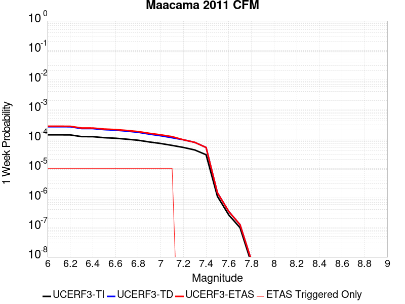 |  |  |  |

| Magnitude | 1 wk TI Prob | 1 wk TD Prob | 1 wk ETAS Prob | 1 wk ETAS/TD Gain | 1 wk ETAS Triggered Only | 1 mo TI Prob | 1 mo TD Prob | 1 mo ETAS Prob | 1 mo ETAS/TD Gain | 1 mo ETAS Triggered Only | 1 yr TI Prob | 1 yr TD Prob | 1 yr ETAS Prob | 1 yr ETAS/TD Gain | 1 yr ETAS Triggered Only | 10 yr TI Prob | 10 yr TD Prob | 10 yr ETAS Prob | 10 yr ETAS/TD Gain | 10 yr ETAS Triggered Only |
|-----|-----|-----|-----|-----|-----|-----|-----|-----|-----|-----|-----|-----|-----|-----|-----|-----|-----|-----|-----|-----|
| 6.0 | 1.368203E-4 | 2.579087E-4 | 3.0082345E-4 | 1.1663952 | 4.2925825E-5 | 5.862409E-4 | 0.0011047592 | 0.0011476375 | 1.0388124 | 4.2925825E-5 | 0.0071141496 | 0.013350345 | 0.013392698 | 1.0031724 | 4.2925825E-5 | 0.06890667 | 0.1241916 | 0.12422919 | 1.0003027 | 4.2925825E-5 |
| 6.1 | 1.368203E-4 | 2.579087E-4 | 3.0082345E-4 | 1.1663952 | 4.2925825E-5 | 5.862409E-4 | 0.0011047592 | 0.0011476375 | 1.0388124 | 4.2925825E-5 | 0.0071141496 | 0.013350345 | 0.013392698 | 1.0031724 | 4.2925825E-5 | 0.06890667 | 0.1241916 | 0.12422919 | 1.0003027 | 4.2925825E-5 |
| 6.2 | 1.360743E-4 | 2.566557E-4 | 2.9957053E-4 | 1.1672077 | 4.2925825E-5 | 5.8304524E-4 | 0.001099394 | 0.0011422727 | 1.0390021 | 4.2925825E-5 | 0.007075496 | 0.013285898 | 0.013328253 | 1.003188 | 4.2925825E-5 | 0.06854413 | 0.123625994 | 0.12366361 | 1.0003043 | 4.2925825E-5 |
| 6.3 | 1.1917239E-4 | 2.236021E-4 | 2.6651833E-4 | 1.1919312 | 4.2925825E-5 | 5.1063887E-4 | 9.578717E-4 | 0.0010007564 | 1.0447708 | 4.2925825E-5 | 0.0061993203 | 0.0115873255 | 0.011629754 | 1.0036616 | 4.2925825E-5 | 0.060292065 | 0.108845875 | 0.108884126 | 1.0003514 | 4.2925825E-5 |
| 6.4 | 1.1859289E-4 | 2.2263796E-4 | 2.6555423E-4 | 1.1927626 | 4.2925825E-5 | 5.0815626E-4 | 9.537432E-4 | 9.966281E-4 | 1.0449648 | 4.2925825E-5 | 0.006169266 | 0.011537647 | 0.011580077 | 1.0036776 | 4.2925825E-5 | 0.06000784 | 0.10840272 | 0.108440995 | 1.0003531 | 4.2925825E-5 |
| 6.5 | 1.09512424E-4 | 2.0517908E-4 | 2.480961E-4 | 1.2091686 | 4.2925825E-5 | 4.6925453E-4 | 8.7897904E-4 | 9.2186715E-4 | 1.0487931 | 4.2925825E-5 | 0.005698218 | 0.010639169 | 0.0106816385 | 1.0039917 | 4.2925825E-5 | 0.055543028 | 0.1004949 | 0.10053351 | 1.0003842 | 4.2925825E-5 |
| 6.6 | 1.0502928E-4 | 1.9675294E-4 | 2.396703E-4 | 1.2181283 | 4.2925825E-5 | 4.500478E-4 | 8.429031E-4 | 8.857927E-4 | 1.0508833 | 4.2925825E-5 | 0.0054655746 | 0.010205293 | 0.010247781 | 1.0041633 | 4.2925825E-5 | 0.053330887 | 0.0966474 | 0.09668618 | 1.0004013 | 4.2925825E-5 |
| 6.7 | 9.739358E-5 | 1.8259176E-4 | 2.2550975E-4 | 1.2350489 | 4.2925825E-5 | 4.173343E-4 | 7.822563E-4 | 8.2514854E-4 | 1.0548315 | 4.2925825E-5 | 0.0050692135 | 0.009475343 | 0.0095178615 | 1.0044874 | 4.2925825E-5 | 0.049551267 | 0.09012011 | 0.09015916 | 1.0004334 | 4.2925825E-5 |
| 6.8 | 8.969524E-5 | 1.6658378E-4 | 2.0950244E-4 | 1.2576402 | 4.2925825E-5 | 3.8435153E-4 | 7.1369443E-4 | 7.5658964E-4 | 1.060103 | 4.2925825E-5 | 0.0046694432 | 0.00864909 | 0.008691645 | 1.0049201 | 4.2925825E-5 | 0.045725387 | 0.08265246 | 0.08269184 | 1.0004765 | 4.2925825E-5 |
| 6.9 | 7.838291E-5 | 1.4418772E-4 | 1.8710736E-4 | 1.297665 | 4.2925825E-5 | 3.358835E-4 | 6.1778206E-4 | 6.6068134E-4 | 1.0694408 | 4.2925825E-5 | 0.0040817154 | 0.007491724 | 0.0075343284 | 1.0056869 | 4.2925825E-5 | 0.04007554 | 0.07205298 | 0.07209281 | 1.0005528 | 4.2925825E-5 |
| 7.0 | 6.961957E-5 | 1.2708071E-4 | 1.7000108E-4 | 1.337741 | 4.2925825E-5 | 2.9833548E-4 | 5.445059E-4 | 5.874083E-4 | 1.0787915 | 4.2925825E-5 | 0.0036261857 | 0.006606692 | 0.0066493344 | 1.0064543 | 4.2925825E-5 | 0.035675827 | 0.063871816 | 0.063912 | 1.0006292 | 4.2925825E-5 |
| 7.1 | 5.999398E-5 | 1.09053384E-4 | 1.5197453E-4 | 1.3935792 | 4.2925825E-5 | 2.570917E-4 | 4.6728246E-4 | 5.101882E-4 | 1.0918198 | 4.2925825E-5 | 0.0031255994 | 0.00567284 | 0.005715522 | 1.007524 | 4.2925825E-5 | 0.030820016 | 0.055139277 | 0.055179834 | 1.0007355 | 4.2925825E-5 |
| 7.2 | 5.116532E-5 | 9.305489E-5 | 9.305489E-5 | 1.0 | 0.0 | 2.1926152E-4 | 3.9874107E-4 | 3.9874107E-4 | 1.0 | 0.0 | 0.002666241 | 0.00484315 | 0.00484315 | 1.0 | 0.0 | 0.026344774 | 0.047303654 | 0.047303654 | 1.0 | 0.0 |
| 7.3 | 4.2087835E-5 | 7.617064E-5 | 7.617064E-5 | 1.0 | 0.0 | 1.8036396E-4 | 3.264016E-4 | 3.264016E-4 | 1.0 | 0.0 | 0.0021937196 | 0.0039662397 | 0.0039662397 | 1.0 | 0.0 | 0.0217219 | 0.038905017 | 0.038905017 | 1.0 | 0.0 |
| 7.4 | 2.8991652E-5 | 5.1163643E-5 | 5.1163643E-5 | 1.0 | 0.0 | 1.2424402E-4 | 2.1925455E-4 | 2.1925455E-4 | 1.0 | 0.0 | 0.0015116213 | 0.0026661097 | 0.0026661097 | 1.0 | 0.0 | 0.015013801 | 0.026332043 | 0.026332043 | 1.0 | 0.0 |
| 7.5 | 1.1292299E-6 | 1.4950216E-6 | 1.4950216E-6 | 1.0 | 0.0 | 4.8395473E-6 | 6.407227E-6 | 6.407227E-6 | 1.0 | 0.0 | 5.8919897E-5 | 7.8006444E-5 | 7.8006444E-5 | 1.0 | 0.0 | 5.890428E-4 | 7.805042E-4 | 7.805042E-4 | 1.0 | 0.0 |
| 7.6 | 2.6535366E-7 | 3.4720998E-7 | 3.4720998E-7 | 1.0 | 0.0 | 1.1372296E-6 | 1.4880419E-6 | 1.4880419E-6 | 1.0 | 0.0 | 1.3845682E-5 | 1.811676E-5 | 1.811676E-5 | 1.0 | 0.0 | 1.3844819E-4 | 1.8170691E-4 | 1.8170691E-4 | 1.0 | 0.0 |
| 7.7 | 9.727789E-8 | 1.2302418E-7 | 1.2302418E-7 | 1.0 | 0.0 | 4.1690518E-7 | 5.2724636E-7 | 5.2724636E-7 | 1.0 | 0.0 | 5.0758085E-6 | 6.419206E-6 | 6.419206E-6 | 1.0 | 0.0 | 5.0756928E-5 | 6.456404E-5 | 6.456404E-5 | 1.0 | 0.0 |
| 7.8 | 6.1939325E-9 | 7.711711E-9 | 7.711711E-9 | 1.0 | 0.0 | 2.6545425E-8 | 3.305019E-8 | 3.305019E-8 | 1.0 | 0.0 | 3.231905E-7 | 4.0238598E-7 | 4.0238598E-7 | 1.0 | 0.0 | 3.2319003E-6 | 4.0597915E-6 | 4.0597915E-6 | 1.0 | 0.0 |

## Hector Mine
*[(top)](#table-of-contents)*

| 1 Week | 1 Month | 1 Year | 10 Year |
|-----|-----|-----|-----|
|  |  |  |  |

| Magnitude | 1 wk TI Prob | 1 wk TD Prob | 1 wk ETAS Prob | 1 wk ETAS/TD Gain | 1 wk ETAS Triggered Only | 1 mo TI Prob | 1 mo TD Prob | 1 mo ETAS Prob | 1 mo ETAS/TD Gain | 1 mo ETAS Triggered Only | 1 yr TI Prob | 1 yr TD Prob | 1 yr ETAS Prob | 1 yr ETAS/TD Gain | 1 yr ETAS Triggered Only | 10 yr TI Prob | 10 yr TD Prob | 10 yr ETAS Prob | 10 yr ETAS/TD Gain | 10 yr ETAS Triggered Only |
|-----|-----|-----|-----|-----|-----|-----|-----|-----|-----|-----|-----|-----|-----|-----|-----|-----|-----|-----|-----|-----|
| 6.0 | 1.8760093E-5 | 2.7962699E-6 | 4.5721976E-5 | 16.351059 | 4.2925825E-5 | 8.039792E-5 | 1.19839815E-5 | 5.490929E-5 | 4.5818906 | 4.2925825E-5 | 9.78405E-4 | 1.458992E-4 | 1.8881877E-4 | 1.2941726 | 4.2925825E-5 | 0.009741086 | 0.0014584264 | 0.0015012895 | 1.0293901 | 4.2925825E-5 |
| 6.1 | 1.8760093E-5 | 2.7962699E-6 | 4.5721976E-5 | 16.351059 | 4.2925825E-5 | 8.039792E-5 | 1.19839815E-5 | 5.490929E-5 | 4.5818906 | 4.2925825E-5 | 9.78405E-4 | 1.458992E-4 | 1.8881877E-4 | 1.2941726 | 4.2925825E-5 | 0.009741086 | 0.0014584264 | 0.0015012895 | 1.0293901 | 4.2925825E-5 |
| 6.2 | 1.8760093E-5 | 2.7962699E-6 | 4.5721976E-5 | 16.351059 | 4.2925825E-5 | 8.039792E-5 | 1.19839815E-5 | 5.490929E-5 | 4.5818906 | 4.2925825E-5 | 9.78405E-4 | 1.458992E-4 | 1.8881877E-4 | 1.2941726 | 4.2925825E-5 | 0.009741086 | 0.0014584264 | 0.0015012895 | 1.0293901 | 4.2925825E-5 |
| 6.3 | 1.8760093E-5 | 2.7962699E-6 | 4.5721976E-5 | 16.351059 | 4.2925825E-5 | 8.039792E-5 | 1.19839815E-5 | 5.490929E-5 | 4.5818906 | 4.2925825E-5 | 9.78405E-4 | 1.458992E-4 | 1.8881877E-4 | 1.2941726 | 4.2925825E-5 | 0.009741086 | 0.0014584264 | 0.0015012895 | 1.0293901 | 4.2925825E-5 |
| 6.4 | 1.0888055E-5 | 2.7962699E-6 | 4.5721976E-5 | 16.351059 | 4.2925825E-5 | 4.666226E-5 | 1.19839815E-5 | 5.490929E-5 | 4.5818906 | 4.2925825E-5 | 5.679649E-4 | 1.458992E-4 | 1.8881877E-4 | 1.2941726 | 4.2925825E-5 | 0.0056651547 | 0.0014584264 | 0.0015012895 | 1.0293901 | 4.2925825E-5 |
| 6.5 | 1.0888055E-5 | 2.7962699E-6 | 4.5721976E-5 | 16.351059 | 4.2925825E-5 | 4.666226E-5 | 1.19839815E-5 | 5.490929E-5 | 4.5818906 | 4.2925825E-5 | 5.679649E-4 | 1.458992E-4 | 1.8881877E-4 | 1.2941726 | 4.2925825E-5 | 0.0056651547 | 0.0014584264 | 0.0015012895 | 1.0293901 | 4.2925825E-5 |
| 6.6 | 1.0730738E-5 | 2.7962699E-6 | 4.5721976E-5 | 16.351059 | 4.2925825E-5 | 4.5988065E-5 | 1.19839815E-5 | 5.490929E-5 | 4.5818906 | 4.2925825E-5 | 5.5976084E-4 | 1.458992E-4 | 1.8881877E-4 | 1.2941726 | 4.2925825E-5 | 0.0055835294 | 0.0014584264 | 0.0015012895 | 1.0293901 | 4.2925825E-5 |
| 6.7 | 7.881326E-6 | 2.770952E-6 | 4.569666E-5 | 16.49132 | 4.2925825E-5 | 3.3776672E-5 | 1.1875478E-5 | 5.4800792E-5 | 4.614618 | 4.2925825E-5 | 4.111534E-4 | 1.4457834E-4 | 1.8749796E-4 | 1.2968606 | 4.2925825E-5 | 0.0041039353 | 0.001445235 | 0.0014880988 | 1.0296587 | 4.2925825E-5 |
| 6.8 | 7.5683483E-6 | 2.7327321E-6 | 4.565844E-5 | 16.707983 | 4.2925825E-5 | 3.2435375E-5 | 1.1711679E-5 | 5.4637E-5 | 4.665172 | 4.2925825E-5 | 3.9482914E-4 | 1.4258435E-4 | 1.8550406E-4 | 1.3010128 | 4.2925825E-5 | 0.0039412836 | 0.0014253207 | 0.0014681853 | 1.0300736 | 4.2925825E-5 |
| 6.9 | 6.473048E-6 | 2.513824E-6 | 4.543954E-5 | 18.075863 | 4.2925825E-5 | 2.7741338E-5 | 1.07735095E-5 | 5.369887E-5 | 4.9843435 | 4.2925825E-5 | 3.3769844E-4 | 1.3116356E-4 | 1.7408375E-4 | 1.3272265 | 4.2925825E-5 | 0.0033718573 | 0.001311251 | 0.0013541204 | 1.0326936 | 4.2925825E-5 |
| 7.0 | 4.9959954E-6 | 1.8564588E-6 | 1.8564588E-6 | 1.0 | 0.0 | 2.1411232E-5 | 7.956248E-6 | 7.956248E-6 | 1.0 | 0.0 | 2.6065056E-4 | 9.686658E-5 | 9.686658E-5 | 1.0 | 0.0 | 0.0026034506 | 9.685931E-4 | 9.685931E-4 | 1.0 | 0.0 |
| 7.1 | 1.2997541E-6 | 1.5599346E-7 | 1.5599346E-7 | 1.0 | 0.0 | 5.5703626E-6 | 6.685433E-7 | 6.685433E-7 | 1.0 | 0.0 | 6.7817055E-5 | 8.139488E-6 | 8.139488E-6 | 1.0 | 0.0 | 6.779636E-4 | 8.1392296E-5 | 8.1392296E-5 | 1.0 | 0.0 |
| 7.2 | 8.392699E-7 | 9.725453E-8 | 9.725453E-8 | 1.0 | 0.0 | 3.596866E-6 | 4.1680505E-7 | 4.1680505E-7 | 1.0 | 0.0 | 4.3790962E-5 | 5.0745916E-6 | 5.0745916E-6 | 1.0 | 0.0 | 4.3782333E-4 | 5.074495E-5 | 5.074495E-5 | 1.0 | 0.0 |
| 7.3 | 3.13015E-7 | 4.8283802E-8 | 4.8283802E-8 | 1.0 | 0.0 | 1.3414921E-6 | 2.0693057E-7 | 2.0693057E-7 | 1.0 | 0.0 | 1.6332544E-5 | 2.5193776E-6 | 2.5193776E-6 | 1.0 | 0.0 | 1.6331344E-4 | 2.5193574E-5 | 2.5193574E-5 | 1.0 | 0.0 |

## Gillem - Big Crack 2011 CFM
*[(top)](#table-of-contents)*

| 1 Week | 1 Month | 1 Year | 10 Year |
|-----|-----|-----|-----|
|  |  |  |  |

| Magnitude | 1 wk TI Prob | 1 wk TD Prob | 1 wk ETAS Prob | 1 wk ETAS/TD Gain | 1 wk ETAS Triggered Only | 1 mo TI Prob | 1 mo TD Prob | 1 mo ETAS Prob | 1 mo ETAS/TD Gain | 1 mo ETAS Triggered Only | 1 yr TI Prob | 1 yr TD Prob | 1 yr ETAS Prob | 1 yr ETAS/TD Gain | 1 yr ETAS Triggered Only | 10 yr TI Prob | 10 yr TD Prob | 10 yr ETAS Prob | 10 yr ETAS/TD Gain | 10 yr ETAS Triggered Only |
|-----|-----|-----|-----|-----|-----|-----|-----|-----|-----|-----|-----|-----|-----|-----|-----|-----|-----|-----|-----|-----|
| 6.0 | 2.196852E-5 | 2.3604485E-5 | 2.3604485E-5 | 1.0 | 0.0 | 9.4147406E-5 | 1.01158665E-4 | 1.01158665E-4 | 1.0 | 0.0 | 0.0011456419 | 0.0012309998 | 0.0012738728 | 1.0348278 | 4.2925825E-5 | 0.011397537 | 0.012250669 | 0.01229307 | 1.003461 | 4.2925825E-5 |
| 6.1 | 9.992795E-6 | 1.071189E-5 | 1.071189E-5 | 1.0 | 0.0 | 4.2825563E-5 | 4.5907396E-5 | 4.5907396E-5 | 1.0 | 0.0 | 5.2127644E-4 | 5.587975E-4 | 6.0169934E-4 | 1.0767753 | 4.2925825E-5 | 0.0052005537 | 0.0055757347 | 0.005618421 | 1.0076557 | 4.2925825E-5 |
| 6.2 | 9.992795E-6 | 1.071189E-5 | 1.071189E-5 | 1.0 | 0.0 | 4.2825563E-5 | 4.5907396E-5 | 4.5907396E-5 | 1.0 | 0.0 | 5.2127644E-4 | 5.587975E-4 | 6.0169934E-4 | 1.0767753 | 4.2925825E-5 | 0.0052005537 | 0.0055757347 | 0.005618421 | 1.0076557 | 4.2925825E-5 |
| 6.3 | 4.6127884E-6 | 4.942657E-6 | 4.942657E-6 | 1.0 | 0.0 | 1.9768944E-5 | 2.1182668E-5 | 2.1182668E-5 | 1.0 | 0.0 | 2.406603E-4 | 2.5787292E-4 | 2.5787292E-4 | 1.0 | 0.0 | 0.0024039985 | 0.0025761751 | 0.0025761751 | 1.0 | 0.0 |
| 6.4 | 4.6127884E-6 | 4.942657E-6 | 4.942657E-6 | 1.0 | 0.0 | 1.9768944E-5 | 2.1182668E-5 | 2.1182668E-5 | 1.0 | 0.0 | 2.406603E-4 | 2.5787292E-4 | 2.5787292E-4 | 1.0 | 0.0 | 0.0024039985 | 0.0025761751 | 0.0025761751 | 1.0 | 0.0 |
| 6.5 | 2.716712E-6 | 2.9111113E-6 | 2.9111113E-6 | 1.0 | 0.0 | 1.1643E-5 | 1.24761455E-5 | 1.24761455E-5 | 1.0 | 0.0 | 1.417443E-4 | 1.5188892E-4 | 1.5188892E-4 | 1.0 | 0.0 | 0.0014165393 | 0.001518089 | 0.001518089 | 1.0 | 0.0 |
| 6.6 | 1.3818255E-6 | 1.4820689E-6 | 1.4820689E-6 | 1.0 | 0.0 | 5.922096E-6 | 6.3517155E-6 | 6.3517155E-6 | 1.0 | 0.0 | 7.209913E-5 | 7.7330624E-5 | 7.7330624E-5 | 1.0 | 0.0 | 7.2075747E-4 | 7.7315804E-4 | 7.7315804E-4 | 1.0 | 0.0 |

## Hayward (No) 2011 CFM
*[(top)](#table-of-contents)*

| 1 Week | 1 Month | 1 Year | 10 Year |
|-----|-----|-----|-----|
| 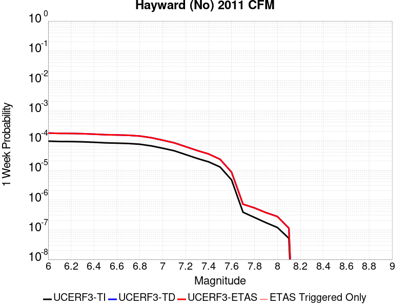 |  |  |  |

| Magnitude | 1 wk TI Prob | 1 wk TD Prob | 1 wk ETAS Prob | 1 wk ETAS/TD Gain | 1 wk ETAS Triggered Only | 1 mo TI Prob | 1 mo TD Prob | 1 mo ETAS Prob | 1 mo ETAS/TD Gain | 1 mo ETAS Triggered Only | 1 yr TI Prob | 1 yr TD Prob | 1 yr ETAS Prob | 1 yr ETAS/TD Gain | 1 yr ETAS Triggered Only | 10 yr TI Prob | 10 yr TD Prob | 10 yr ETAS Prob | 10 yr ETAS/TD Gain | 10 yr ETAS Triggered Only |
|-----|-----|-----|-----|-----|-----|-----|-----|-----|-----|-----|-----|-----|-----|-----|-----|-----|-----|-----|-----|-----|
| 6.0 | 9.3068506E-5 | 1.739643E-4 | 1.739643E-4 | 1.0 | 0.0 | 3.9880406E-4 | 7.453474E-4 | 7.453474E-4 | 1.0 | 0.0 | 0.0048446343 | 0.009036727 | 0.009036727 | 1.0 | 0.0 | 0.047403704 | 0.086396605 | 0.086435825 | 1.000454 | 4.2925825E-5 |
| 6.1 | 9.055486E-5 | 1.6947639E-4 | 1.6947639E-4 | 1.0 | 0.0 | 3.880345E-4 | 7.2612526E-4 | 7.2612526E-4 | 1.0 | 0.0 | 0.0047140904 | 0.008804814 | 0.008804814 | 1.0 | 0.0 | 0.046153355 | 0.08428568 | 0.08432498 | 1.0004663 | 4.2925825E-5 |
| 6.2 | 9.006742E-5 | 1.6868232E-4 | 1.6868232E-4 | 1.0 | 0.0 | 3.859461E-4 | 7.227246E-4 | 7.227246E-4 | 1.0 | 0.0 | 0.0046887742 | 0.00876378 | 0.00876378 | 1.0 | 0.0 | 0.0459107 | 0.08390991 | 0.08394923 | 1.0004686 | 4.2925825E-5 |
| 6.3 | 8.8336754E-5 | 1.6547782E-4 | 1.6547782E-4 | 1.0 | 0.0 | 3.7853114E-4 | 7.0899865E-4 | 7.0899865E-4 | 1.0 | 0.0 | 0.004598882 | 0.008598051 | 0.008598051 | 1.0 | 0.0 | 0.04504866 | 0.08240195 | 0.08244134 | 1.000478 | 4.2925825E-5 |
| 6.4 | 8.526157E-5 | 1.5974796E-4 | 1.5974796E-4 | 1.0 | 0.0 | 3.6535555E-4 | 6.844552E-4 | 6.844552E-4 | 1.0 | 0.0 | 0.0044391346 | 0.00830156 | 0.00830156 | 1.0 | 0.0 | 0.043514993 | 0.07968467 | 0.07972417 | 1.0004958 | 4.2925825E-5 |
| 6.5 | 8.152396E-5 | 1.5307199E-4 | 1.5307199E-4 | 1.0 | 0.0 | 3.493416E-4 | 6.558586E-4 | 6.558586E-4 | 1.0 | 0.0 | 0.0042449418 | 0.007955993 | 0.007955993 | 1.0 | 0.0 | 0.04164765 | 0.07651448 | 0.07655413 | 1.0005181 | 4.2925825E-5 |
| 6.6 | 7.987405E-5 | 1.5011412E-4 | 1.5011412E-4 | 1.0 | 0.0 | 3.4227243E-4 | 6.431883E-4 | 6.431883E-4 | 1.0 | 0.0 | 0.0041592065 | 0.007802858 | 0.007802858 | 1.0 | 0.0 | 0.04082218 | 0.075105876 | 0.07514557 | 1.0005286 | 4.2925825E-5 |
| 6.7 | 7.777665E-5 | 1.4650672E-4 | 1.4650672E-4 | 1.0 | 0.0 | 3.332859E-4 | 6.277355E-4 | 6.277355E-4 | 1.0 | 0.0 | 0.004050208 | 0.007616053 | 0.007616053 | 1.0 | 0.0 | 0.039771806 | 0.0733825 | 0.073422275 | 1.000542 | 4.2925825E-5 |
| 6.8 | 7.3284005E-5 | 1.3801287E-4 | 1.3801287E-4 | 1.0 | 0.0 | 3.140365E-4 | 5.9135025E-4 | 5.9135025E-4 | 1.0 | 0.0 | 0.0038166929 | 0.007176059 | 0.007176059 | 1.0 | 0.0 | 0.037518036 | 0.06929624 | 0.0693362 | 1.0005765 | 4.2925825E-5 |
| 6.9 | 6.458263E-5 | 1.21319164E-4 | 1.21319164E-4 | 1.0 | 0.0 | 2.7675333E-4 | 5.1983615E-4 | 5.1983615E-4 | 1.0 | 0.0 | 0.0033642664 | 0.0063107396 | 0.0063107396 | 1.0 | 0.0 | 0.033137884 | 0.061224625 | 0.06126492 | 1.0006582 | 4.2925825E-5 |
| 7.0 | 5.3853604E-5 | 1.00254634E-4 | 1.00254634E-4 | 1.0 | 0.0 | 2.3078074E-4 | 4.295923E-4 | 4.295923E-4 | 1.0 | 0.0 | 0.0028061352 | 0.0052178074 | 0.0052178074 | 1.0 | 0.0 | 0.027709642 | 0.050957024 | 0.05099776 | 1.0007994 | 4.2925825E-5 |
| 7.1 | 4.4308683E-5 | 8.17098E-5 | 8.17098E-5 | 1.0 | 0.0 | 1.8988053E-4 | 3.5013806E-4 | 3.5013806E-4 | 1.0 | 0.0 | 0.0023093442 | 0.0042546396 | 0.0042546396 | 1.0 | 0.0 | 0.022854926 | 0.041824497 | 0.04186563 | 1.0009834 | 4.2925825E-5 |
| 7.2 | 3.295973E-5 | 6.0774026E-5 | 6.0774026E-5 | 1.0 | 0.0 | 1.4124835E-4 | 2.6043423E-4 | 2.6043423E-4 | 1.0 | 0.0 | 0.0017183421 | 0.0031661994 | 0.0031661994 | 1.0 | 0.0 | 0.017051157 | 0.031370014 | 0.031411592 | 1.0013255 | 4.2925825E-5 |
| 7.3 | 2.452256E-5 | 4.518223E-5 | 4.518223E-5 | 1.0 | 0.0 | 1.05092455E-4 | 1.9362383E-4 | 1.9362383E-4 | 1.0 | 0.0 | 0.0012787496 | 0.0023548352 | 0.0023548352 | 1.0 | 0.0 | 0.0127141625 | 0.023442036 | 0.023483956 | 1.0017883 | 4.2925825E-5 |
| 7.4 | 1.8829967E-5 | 3.4604043E-5 | 3.4604043E-5 | 1.0 | 0.0 | 8.069736E-5 | 1.4829468E-4 | 1.4829468E-4 | 1.0 | 0.0 | 9.820475E-4 | 0.0018040023 | 0.0018040023 | 1.0 | 0.0 | 0.009777189 | 0.01802003 | 0.018062184 | 1.0023392 | 4.2925825E-5 |
| 7.5 | 1.26374125E-5 | 2.292219E-5 | 2.292219E-5 | 1.0 | 0.0 | 5.4159216E-5 | 9.823428E-5 | 9.823428E-5 | 1.0 | 0.0 | 6.5918895E-4 | 0.0011953521 | 0.0011953521 | 1.0 | 0.0 | 0.00657237 | 0.011988704 | 0.012031116 | 1.0035377 | 4.2925825E-5 |
| 7.6 | 4.666429E-6 | 8.479636E-6 | 8.479636E-6 | 1.0 | 0.0 | 1.9998828E-5 | 3.6340796E-5 | 3.6340796E-5 | 1.0 | 0.0 | 2.4345852E-4 | 4.423606E-4 | 4.423606E-4 | 1.0 | 0.0 | 0.0024319198 | 0.004458377 | 0.004458377 | 1.0 | 0.0 |
| 7.7 | 3.8399318E-7 | 7.1343146E-7 | 7.1343146E-7 | 1.0 | 0.0 | 1.6456839E-6 | 3.0575598E-6 | 3.0575598E-6 | 1.0 | 0.0 | 2.003602E-5 | 3.7225156E-5 | 3.7225156E-5 | 1.0 | 0.0 | 2.0034213E-4 | 3.86166E-4 | 3.86166E-4 | 1.0 | 0.0 |
| 7.8 | 2.5637698E-7 | 5.3666145E-7 | 5.3666145E-7 | 1.0 | 0.0 | 1.098758E-6 | 2.2999754E-6 | 2.2999754E-6 | 1.0 | 0.0 | 1.3377297E-5 | 2.8001843E-5 | 2.8001843E-5 | 1.0 | 0.0 | 1.3376492E-4 | 2.9246495E-4 | 2.9246495E-4 | 1.0 | 0.0 |
| 7.9 | 1.7141245E-7 | 3.7293606E-7 | 3.7293606E-7 | 1.0 | 0.0 | 7.3462456E-7 | 1.5982963E-6 | 1.5982963E-6 | 1.0 | 0.0 | 8.944017E-6 | 1.9459085E-5 | 1.9459085E-5 | 1.0 | 0.0 | 8.943657E-5 | 2.0246378E-4 | 2.0246378E-4 | 1.0 | 0.0 |
| 8.0 | 1.1808895E-7 | 2.7512246E-7 | 2.7512246E-7 | 1.0 | 0.0 | 5.060954E-7 | 1.1790958E-6 | 1.1790958E-6 | 1.0 | 0.0 | 6.161694E-6 | 1.4355397E-5 | 1.4355397E-5 | 1.0 | 0.0 | 6.161523E-5 | 1.4817173E-4 | 1.4817173E-4 | 1.0 | 0.0 |
| 8.1 | 5.138535E-8 | 1.12307575E-7 | 1.12307575E-7 | 1.0 | 0.0 | 2.2022292E-7 | 4.8131807E-7 | 4.8131807E-7 | 1.0 | 0.0 | 2.6812106E-6 | 5.860032E-6 | 5.860032E-6 | 1.0 | 0.0 | 2.6811784E-5 | 6.0156468E-5 | 6.0156468E-5 | 1.0 | 0.0 |

## Dry Mountain
*[(top)](#table-of-contents)*

| 1 Week | 1 Month | 1 Year | 10 Year |
|-----|-----|-----|-----|
|  |  |  | 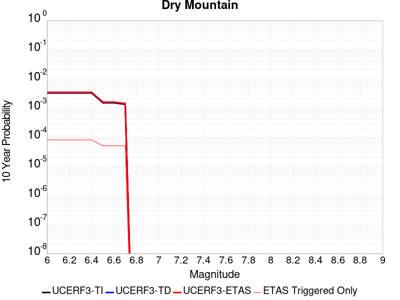 |

| Magnitude | 1 wk TI Prob | 1 wk TD Prob | 1 wk ETAS Prob | 1 wk ETAS/TD Gain | 1 wk ETAS Triggered Only | 1 mo TI Prob | 1 mo TD Prob | 1 mo ETAS Prob | 1 mo ETAS/TD Gain | 1 mo ETAS Triggered Only | 1 yr TI Prob | 1 yr TD Prob | 1 yr ETAS Prob | 1 yr ETAS/TD Gain | 1 yr ETAS Triggered Only | 10 yr TI Prob | 10 yr TD Prob | 10 yr ETAS Prob | 10 yr ETAS/TD Gain | 10 yr ETAS Triggered Only |
|-----|-----|-----|-----|-----|-----|-----|-----|-----|-----|-----|-----|-----|-----|-----|-----|-----|-----|-----|-----|-----|
| 6.0 | 6.222801E-6 | 6.439381E-6 | 6.439381E-6 | 1.0 | 0.0 | 2.6668875E-5 | 2.7597147E-5 | 2.7597147E-5 | 1.0 | 0.0 | 3.2464517E-4 | 3.3595937E-4 | 3.3595937E-4 | 1.0 | 0.0 | 0.0032417132 | 0.0033560768 | 0.0033988587 | 1.0127475 | 4.2925825E-5 |
| 6.1 | 6.222801E-6 | 6.439381E-6 | 6.439381E-6 | 1.0 | 0.0 | 2.6668875E-5 | 2.7597147E-5 | 2.7597147E-5 | 1.0 | 0.0 | 3.2464517E-4 | 3.3595937E-4 | 3.3595937E-4 | 1.0 | 0.0 | 0.0032417132 | 0.0033560768 | 0.0033988587 | 1.0127475 | 4.2925825E-5 |
| 6.2 | 6.222801E-6 | 6.439381E-6 | 6.439381E-6 | 1.0 | 0.0 | 2.6668875E-5 | 2.7597147E-5 | 2.7597147E-5 | 1.0 | 0.0 | 3.2464517E-4 | 3.3595937E-4 | 3.3595937E-4 | 1.0 | 0.0 | 0.0032417132 | 0.0033560768 | 0.0033988587 | 1.0127475 | 4.2925825E-5 |
| 6.3 | 6.222801E-6 | 6.439381E-6 | 6.439381E-6 | 1.0 | 0.0 | 2.6668875E-5 | 2.7597147E-5 | 2.7597147E-5 | 1.0 | 0.0 | 3.2464517E-4 | 3.3595937E-4 | 3.3595937E-4 | 1.0 | 0.0 | 0.0032417132 | 0.0033560768 | 0.0033988587 | 1.0127475 | 4.2925825E-5 |
| 6.4 | 6.222801E-6 | 6.439381E-6 | 6.439381E-6 | 1.0 | 0.0 | 2.6668875E-5 | 2.7597147E-5 | 2.7597147E-5 | 1.0 | 0.0 | 3.2464517E-4 | 3.3595937E-4 | 3.3595937E-4 | 1.0 | 0.0 | 0.0032417132 | 0.0033560768 | 0.0033988587 | 1.0127475 | 4.2925825E-5 |
| 6.5 | 2.8528623E-6 | 2.9521684E-6 | 2.9521684E-6 | 1.0 | 0.0 | 1.22264955E-5 | 1.2652138E-5 | 1.2652138E-5 | 1.0 | 0.0 | 1.4884741E-4 | 1.540376E-4 | 1.540376E-4 | 1.0 | 0.0 | 0.0014874774 | 0.0015401616 | 0.0015830214 | 1.0278281 | 4.2925825E-5 |
| 6.6 | 2.8528623E-6 | 2.9521684E-6 | 2.9521684E-6 | 1.0 | 0.0 | 1.22264955E-5 | 1.2652138E-5 | 1.2652138E-5 | 1.0 | 0.0 | 1.4884741E-4 | 1.540376E-4 | 1.540376E-4 | 1.0 | 0.0 | 0.0014874774 | 0.0015401616 | 0.0015830214 | 1.0278281 | 4.2925825E-5 |
| 6.7 | 2.541E-6 | 2.6293578E-6 | 2.6293578E-6 | 1.0 | 0.0 | 1.0889954E-5 | 1.1268677E-5 | 1.1268677E-5 | 1.0 | 0.0 | 1.3257713E-4 | 1.3719614E-4 | 1.3719614E-4 | 1.0 | 0.0 | 0.0013249806 | 0.0013719613 | 0.0014148284 | 1.031245 | 4.2925825E-5 |

## Great Valley 04b Gordon Valley
*[(top)](#table-of-contents)*

| 1 Week | 1 Month | 1 Year | 10 Year |
|-----|-----|-----|-----|
|  |  |  |  |

| Magnitude | 1 wk TI Prob | 1 wk TD Prob | 1 wk ETAS Prob | 1 wk ETAS/TD Gain | 1 wk ETAS Triggered Only | 1 mo TI Prob | 1 mo TD Prob | 1 mo ETAS Prob | 1 mo ETAS/TD Gain | 1 mo ETAS Triggered Only | 1 yr TI Prob | 1 yr TD Prob | 1 yr ETAS Prob | 1 yr ETAS/TD Gain | 1 yr ETAS Triggered Only | 10 yr TI Prob | 10 yr TD Prob | 10 yr ETAS Prob | 10 yr ETAS/TD Gain | 10 yr ETAS Triggered Only |
|-----|-----|-----|-----|-----|-----|-----|-----|-----|-----|-----|-----|-----|-----|-----|-----|-----|-----|-----|-----|-----|
| 6.0 | 2.1181217E-5 | 2.3981951E-5 | 2.3981951E-5 | 1.0 | 0.0 | 9.077348E-5 | 1.02776685E-4 | 1.02776685E-4 | 1.0 | 0.0 | 0.0011046068 | 0.0012507545 | 0.0012507545 | 1.0 | 0.0 | 0.010991322 | 0.0124536 | 0.012495992 | 1.0034039 | 4.2925825E-5 |
| 6.1 | 2.1181217E-5 | 2.3981951E-5 | 2.3981951E-5 | 1.0 | 0.0 | 9.077348E-5 | 1.02776685E-4 | 1.02776685E-4 | 1.0 | 0.0 | 0.0011046068 | 0.0012507545 | 0.0012507545 | 1.0 | 0.0 | 0.010991322 | 0.0124536 | 0.012495992 | 1.0034039 | 4.2925825E-5 |
| 6.2 | 2.1181217E-5 | 2.3981951E-5 | 2.3981951E-5 | 1.0 | 0.0 | 9.077348E-5 | 1.02776685E-4 | 1.02776685E-4 | 1.0 | 0.0 | 0.0011046068 | 0.0012507545 | 0.0012507545 | 1.0 | 0.0 | 0.010991322 | 0.0124536 | 0.012495992 | 1.0034039 | 4.2925825E-5 |
| 6.3 | 2.1181217E-5 | 2.3981951E-5 | 2.3981951E-5 | 1.0 | 0.0 | 9.077348E-5 | 1.02776685E-4 | 1.02776685E-4 | 1.0 | 0.0 | 0.0011046068 | 0.0012507545 | 0.0012507545 | 1.0 | 0.0 | 0.010991322 | 0.0124536 | 0.012495992 | 1.0034039 | 4.2925825E-5 |
| 6.4 | 1.0988268E-5 | 1.2254499E-5 | 1.2254499E-5 | 1.0 | 0.0 | 4.7091726E-5 | 5.2518313E-5 | 5.2518313E-5 | 1.0 | 0.0 | 5.731909E-4 | 6.392388E-4 | 6.392388E-4 | 1.0 | 0.0 | 0.005717147 | 0.0063755875 | 0.00641824 | 1.0066899 | 4.2925825E-5 |
| 6.5 | 1.0988268E-5 | 1.2254499E-5 | 1.2254499E-5 | 1.0 | 0.0 | 4.7091726E-5 | 5.2518313E-5 | 5.2518313E-5 | 1.0 | 0.0 | 5.731909E-4 | 6.392388E-4 | 6.392388E-4 | 1.0 | 0.0 | 0.005717147 | 0.0063755875 | 0.00641824 | 1.0066899 | 4.2925825E-5 |
| 6.6 | 1.0517822E-5 | 1.1724062E-5 | 1.1724062E-5 | 1.0 | 0.0 | 4.5075605E-5 | 5.02451E-5 | 5.02451E-5 | 1.0 | 0.0 | 5.4865726E-4 | 6.11578E-4 | 6.11578E-4 | 1.0 | 0.0 | 0.0054730466 | 0.0061005033 | 0.006143167 | 1.0069935 | 4.2925825E-5 |
| 6.7 | 7.789219E-6 | 8.6776445E-6 | 8.6776445E-6 | 1.0 | 0.0 | 3.3381937E-5 | 3.7189402E-5 | 3.7189402E-5 | 1.0 | 0.0 | 4.063493E-4 | 4.526921E-4 | 4.526921E-4 | 1.0 | 0.0 | 0.004056071 | 0.0045182165 | 0.0045609483 | 1.0094577 | 4.2925825E-5 |
| 6.8 | 7.5850853E-6 | 8.452389E-6 | 8.452389E-6 | 1.0 | 0.0 | 3.2507105E-5 | 3.622405E-5 | 3.622405E-5 | 1.0 | 0.0 | 3.957021E-4 | 4.409437E-4 | 4.409437E-4 | 1.0 | 0.0 | 0.0039499826 | 0.0044012 | 0.004443937 | 1.0097103 | 4.2925825E-5 |
| 6.9 | 6.604105E-6 | 7.3585493E-6 | 7.3585493E-6 | 1.0 | 0.0 | 2.8303E-5 | 3.153628E-5 | 3.153628E-5 | 1.0 | 0.0 | 3.4453452E-4 | 3.8389044E-4 | 3.8389044E-4 | 1.0 | 0.0 | 0.0034400085 | 0.0038326595 | 0.0038326595 | 1.0 | 0.0 |
| 7.0 | 5.3701115E-6 | 5.9884183E-6 | 5.9884183E-6 | 1.0 | 0.0 | 2.301456E-5 | 2.5664414E-5 | 2.5664414E-5 | 1.0 | 0.0 | 2.8016625E-4 | 3.1242234E-4 | 3.1242234E-4 | 1.0 | 0.0 | 0.0027981328 | 0.00312012 | 0.00312012 | 1.0 | 0.0 |
| 7.1 | 4.4685607E-6 | 4.986478E-6 | 4.986478E-6 | 1.0 | 0.0 | 1.9150835E-5 | 2.1370459E-5 | 2.1370459E-5 | 1.0 | 0.0 | 2.3313647E-4 | 2.6015675E-4 | 2.6015675E-4 | 1.0 | 0.0 | 0.0023289204 | 0.0025987667 | 0.0025987667 | 1.0 | 0.0 |
| 7.2 | 2.833378E-6 | 3.164419E-6 | 3.164419E-6 | 1.0 | 0.0 | 1.2142991E-5 | 1.3561736E-5 | 1.3561736E-5 | 1.0 | 0.0 | 1.4783088E-4 | 1.6510337E-4 | 1.6510337E-4 | 1.0 | 0.0 | 0.0014773258 | 0.0016499789 | 0.0016499789 | 1.0 | 0.0 |
| 7.3 | 7.0087293E-7 | 7.7728157E-7 | 7.7728157E-7 | 1.0 | 0.0 | 3.0037377E-6 | 3.3312049E-6 | 3.3312049E-6 | 1.0 | 0.0 | 3.656989E-5 | 4.0557123E-5 | 4.0557123E-5 | 1.0 | 0.0 | 3.6563876E-4 | 4.055422E-4 | 4.055422E-4 | 1.0 | 0.0 |
| 7.4 | 3.112171E-8 | 3.2068368E-8 | 3.2068368E-8 | 1.0 | 0.0 | 1.3337875E-7 | 1.3743585E-7 | 1.3743585E-7 | 1.0 | 0.0 | 1.6238852E-6 | 1.6732803E-6 | 1.6732803E-6 | 1.0 | 0.0 | 1.6238733E-5 | 1.6732685E-5 | 1.6732685E-5 | 1.0 | 0.0 |

## Malibu Coast (Extension) alt 1
*[(top)](#table-of-contents)*

| 1 Week | 1 Month | 1 Year | 10 Year |
|-----|-----|-----|-----|
|  |  |  |  |

| Magnitude | 1 wk TI Prob | 1 wk TD Prob | 1 wk ETAS Prob | 1 wk ETAS/TD Gain | 1 wk ETAS Triggered Only | 1 mo TI Prob | 1 mo TD Prob | 1 mo ETAS Prob | 1 mo ETAS/TD Gain | 1 mo ETAS Triggered Only | 1 yr TI Prob | 1 yr TD Prob | 1 yr ETAS Prob | 1 yr ETAS/TD Gain | 1 yr ETAS Triggered Only | 10 yr TI Prob | 10 yr TD Prob | 10 yr ETAS Prob | 10 yr ETAS/TD Gain | 10 yr ETAS Triggered Only |
|-----|-----|-----|-----|-----|-----|-----|-----|-----|-----|-----|-----|-----|-----|-----|-----|-----|-----|-----|-----|-----|
| 6.0 | 8.930738E-6 | 9.3292765E-6 | 5.22547E-5 | 5.6011524 | 4.2925825E-5 | 3.827403E-5 | 3.998201E-5 | 8.290612E-5 | 2.0735855 | 4.2925825E-5 | 4.6588664E-4 | 4.86674E-4 | 5.2957895E-4 | 1.0881594 | 4.2925825E-5 | 0.0046491115 | 0.004856264 | 0.0048989817 | 1.0087963 | 4.2925825E-5 |
| 6.1 | 7.199952E-6 | 7.5302974E-6 | 5.0455797E-5 | 6.7003727 | 4.2925825E-5 | 3.0856572E-5 | 3.2272306E-5 | 7.5196745E-5 | 2.3300703 | 4.2925825E-5 | 3.75614E-4 | 3.928451E-4 | 4.3575407E-4 | 1.1092261 | 4.2925825E-5 | 0.0037497976 | 0.0039215726 | 0.00396433 | 1.0109031 | 4.2925825E-5 |
| 6.2 | 6.3721413E-6 | 6.666792E-6 | 4.959233E-5 | 7.4387093 | 4.2925825E-5 | 2.7308892E-5 | 2.8571656E-5 | 7.149625E-5 | 2.502349 | 4.2925825E-5 | 3.3243504E-4 | 3.4780474E-4 | 3.9071564E-4 | 1.1233764 | 4.2925825E-5 | 0.0033193815 | 0.0034726441 | 0.003515421 | 1.0123183 | 4.2925825E-5 |
| 6.3 | 6.016345E-6 | 6.295159E-6 | 4.9220715E-5 | 7.8188195 | 4.2925825E-5 | 2.578408E-5 | 2.6978976E-5 | 6.990364E-5 | 2.5910413 | 4.2925825E-5 | 3.1387596E-4 | 3.2841985E-4 | 3.7133158E-4 | 1.1306611 | 4.2925825E-5 | 0.00313433 | 0.0032793812 | 0.0033221662 | 1.0130467 | 4.2925825E-5 |
| 6.4 | 5.8104883E-6 | 6.0795455E-6 | 4.900511E-5 | 8.060654 | 4.2925825E-5 | 2.4901856E-5 | 2.6054937E-5 | 6.897964E-5 | 2.6474693 | 4.2925825E-5 | 3.031379E-4 | 3.17173E-4 | 3.600852E-4 | 1.1352959 | 4.2925825E-5 | 0.0030272473 | 0.0031672379 | 0.0032100277 | 1.0135101 | 4.2925825E-5 |
| 6.5 | 5.476925E-6 | 5.727514E-6 | 4.865309E-5 | 8.494626 | 4.2925825E-5 | 2.3472323E-5 | 2.454626E-5 | 6.747103E-5 | 2.7487297 | 4.2925825E-5 | 2.8573806E-4 | 2.9881002E-4 | 3.41723E-4 | 1.143613 | 4.2925825E-5 | 0.0028537093 | 0.0029841145 | 0.003026912 | 1.0143418 | 4.2925825E-5 |
| 6.6 | 5.222387E-6 | 5.4585807E-6 | 4.838417E-5 | 8.863874 | 4.2925825E-5 | 2.2381464E-5 | 2.3393708E-5 | 6.631853E-5 | 2.8348873 | 4.2925825E-5 | 2.7246025E-4 | 2.8478145E-4 | 3.2769507E-4 | 1.1506896 | 4.2925825E-5 | 0.0027212645 | 0.002844196 | 0.0028869996 | 1.0150495 | 4.2925825E-5 |
| 6.7 | 5.0337076E-6 | 5.259104E-6 | 4.8184702E-5 | 9.16215 | 4.2925825E-5 | 2.1572854E-5 | 2.2538823E-5 | 6.546368E-5 | 2.9044852 | 4.2925825E-5 | 2.6261783E-4 | 2.743759E-4 | 3.1728996E-4 | 1.156406 | 4.2925825E-5 | 0.002623077 | 0.0027404015 | 0.0027832098 | 1.0156212 | 4.2925825E-5 |
| 6.8 | 4.5675624E-6 | 4.7587173E-6 | 4.7684338E-5 | 10.020418 | 4.2925825E-5 | 1.9575122E-5 | 2.0394344E-5 | 6.331929E-5 | 3.1047478 | 4.2925825E-5 | 2.3830103E-4 | 2.4827302E-4 | 2.911882E-4 | 1.1728548 | 4.2925825E-5 | 0.0023804565 | 0.0024799763 | 0.0025227957 | 1.017266 | 4.2925825E-5 |
| 6.9 | 4.2802412E-6 | 4.4520216E-6 | 4.7377656E-5 | 10.6418295 | 4.2925825E-5 | 1.8343762E-5 | 1.9079953E-5 | 6.200496E-5 | 3.2497437 | 4.2925825E-5 | 2.2331243E-4 | 2.3227383E-4 | 2.7518967E-4 | 1.184764 | 4.2925825E-5 | 0.0022308815 | 0.0023203273 | 0.0023631535 | 1.0184569 | 4.2925825E-5 |
| 7.0 | 3.9794063E-6 | 4.1301E-6 | 4.7055746E-5 | 11.393368 | 4.2925825E-5 | 1.7054486E-5 | 1.770031E-5 | 6.0625374E-5 | 3.4251025 | 4.2925825E-5 | 2.0761859E-4 | 2.1548007E-4 | 2.5839664E-4 | 1.1991673 | 4.2925825E-5 | 0.0020742472 | 0.002152725 | 0.0021955583 | 1.0198973 | 4.2925825E-5 |
| 7.1 | 3.7730424E-6 | 3.911218E-6 | 4.6836874E-5 | 11.97501 | 4.2925825E-5 | 1.6170083E-5 | 1.6762255E-5 | 5.968736E-5 | 3.5608191 | 4.2925825E-5 | 1.9685295E-4 | 2.0406146E-4 | 2.4697854E-4 | 1.2103144 | 4.2925825E-5 | 0.0019667868 | 0.0020387538 | 0.002081592 | 1.021012 | 4.2925825E-5 |
| 7.2 | 3.424985E-6 | 3.541338E-6 | 4.646701E-5 | 13.121315 | 4.2925825E-5 | 1.4678424E-5 | 1.5177075E-5 | 5.8102247E-5 | 3.8282902 | 4.2925825E-5 | 1.7869516E-4 | 1.8476533E-4 | 2.2768322E-4 | 1.2322832 | 4.2925825E-5 | 0.0017855153 | 0.0018461292 | 0.0018889757 | 1.0232089 | 4.2925825E-5 |
| 7.3 | 2.6966375E-6 | 2.759654E-6 | 2.759654E-6 | 1.0 | 0.0 | 1.15569665E-5 | 1.1827035E-5 | 1.1827035E-5 | 1.0 | 0.0 | 1.4069698E-4 | 1.4398468E-4 | 1.4398468E-4 | 1.0 | 0.0 | 0.0014060794 | 0.001438918 | 0.001438918 | 1.0 | 0.0 |
| 7.4 | 2.215957E-6 | 2.249379E-6 | 2.249379E-6 | 1.0 | 0.0 | 9.496924E-6 | 9.64016E-6 | 9.64016E-6 | 1.0 | 0.0 | 1.1561892E-4 | 1.1736266E-4 | 1.1736266E-4 | 1.0 | 0.0 | 0.0011555878 | 0.0011730106 | 0.0011730106 | 1.0 | 0.0 |
| 7.5 | 1.2040218E-6 | 1.2219067E-6 | 1.2219067E-6 | 1.0 | 0.0 | 5.160083E-6 | 5.2367327E-6 | 5.2367327E-6 | 1.0 | 0.0 | 6.2822204E-5 | 6.3755375E-5 | 6.3755375E-5 | 1.0 | 0.0 | 6.280445E-4 | 6.3737266E-4 | 6.3737266E-4 | 1.0 | 0.0 |
| 7.6 | 6.6157446E-7 | 6.6789755E-7 | 6.6789755E-7 | 1.0 | 0.0 | 2.835316E-6 | 2.8624152E-6 | 2.8624152E-6 | 1.0 | 0.0 | 3.4519428E-5 | 3.4849363E-5 | 3.4849363E-5 | 1.0 | 0.0 | 3.4514067E-4 | 3.484405E-4 | 3.484405E-4 | 1.0 | 0.0 |
| 7.7 | 2.6012302E-7 | 2.4357584E-7 | 2.4357584E-7 | 1.0 | 0.0 | 1.1148124E-6 | 1.0438962E-6 | 1.0438962E-6 | 1.0 | 0.0 | 1.3572758E-5 | 1.2709373E-5 | 1.2709373E-5 | 1.0 | 0.0 | 1.3571928E-4 | 1.2708752E-4 | 1.2708752E-4 | 1.0 | 0.0 |
| 7.8 | 2.8323132E-8 | 2.0266642E-8 | 2.0266642E-8 | 1.0 | 0.0 | 1.2138484E-7 | 8.685703E-8 | 8.685703E-8 | 1.0 | 0.0 | 1.4778595E-6 | 1.0574839E-6 | 1.0574839E-6 | 1.0 | 0.0 | 1.4778497E-5 | 1.0574797E-5 | 1.0574797E-5 | 1.0 | 0.0 |

## Oak Ridge (Onshore)
*[(top)](#table-of-contents)*

| 1 Week | 1 Month | 1 Year | 10 Year |
|-----|-----|-----|-----|
|  |  |  |  |

| Magnitude | 1 wk TI Prob | 1 wk TD Prob | 1 wk ETAS Prob | 1 wk ETAS/TD Gain | 1 wk ETAS Triggered Only | 1 mo TI Prob | 1 mo TD Prob | 1 mo ETAS Prob | 1 mo ETAS/TD Gain | 1 mo ETAS Triggered Only | 1 yr TI Prob | 1 yr TD Prob | 1 yr ETAS Prob | 1 yr ETAS/TD Gain | 1 yr ETAS Triggered Only | 10 yr TI Prob | 10 yr TD Prob | 10 yr ETAS Prob | 10 yr ETAS/TD Gain | 10 yr ETAS Triggered Only |
|-----|-----|-----|-----|-----|-----|-----|-----|-----|-----|-----|-----|-----|-----|-----|-----|-----|-----|-----|-----|-----|
| 6.0 | 3.155064E-5 | 2.9526076E-5 | 2.9526076E-5 | 1.0 | 0.0 | 1.3521002E-4 | 1.265344E-4 | 1.265344E-4 | 1.0 | 0.0 | 0.001644939 | 0.0015395058 | 0.0015395058 | 1.0 | 0.0 | 0.01632816 | 0.015293054 | 0.015335324 | 1.002764 | 4.2925825E-5 |
| 6.1 | 3.155064E-5 | 2.9526076E-5 | 2.9526076E-5 | 1.0 | 0.0 | 1.3521002E-4 | 1.265344E-4 | 1.265344E-4 | 1.0 | 0.0 | 0.001644939 | 0.0015395058 | 0.0015395058 | 1.0 | 0.0 | 0.01632816 | 0.015293054 | 0.015335324 | 1.002764 | 4.2925825E-5 |
| 6.2 | 3.155064E-5 | 2.9526076E-5 | 2.9526076E-5 | 1.0 | 0.0 | 1.3521002E-4 | 1.265344E-4 | 1.265344E-4 | 1.0 | 0.0 | 0.001644939 | 0.0015395058 | 0.0015395058 | 1.0 | 0.0 | 0.01632816 | 0.015293054 | 0.015335324 | 1.002764 | 4.2925825E-5 |
| 6.3 | 3.155064E-5 | 2.9526076E-5 | 2.9526076E-5 | 1.0 | 0.0 | 1.3521002E-4 | 1.265344E-4 | 1.265344E-4 | 1.0 | 0.0 | 0.001644939 | 0.0015395058 | 0.0015395058 | 1.0 | 0.0 | 0.01632816 | 0.015293054 | 0.015335324 | 1.002764 | 4.2925825E-5 |
| 6.4 | 3.155064E-5 | 2.9526076E-5 | 2.9526076E-5 | 1.0 | 0.0 | 1.3521002E-4 | 1.265344E-4 | 1.265344E-4 | 1.0 | 0.0 | 0.001644939 | 0.0015395058 | 0.0015395058 | 1.0 | 0.0 | 0.01632816 | 0.015293054 | 0.015335324 | 1.002764 | 4.2925825E-5 |
| 6.5 | 3.155064E-5 | 2.9526076E-5 | 2.9526076E-5 | 1.0 | 0.0 | 1.3521002E-4 | 1.265344E-4 | 1.265344E-4 | 1.0 | 0.0 | 0.001644939 | 0.0015395058 | 0.0015395058 | 1.0 | 0.0 | 0.01632816 | 0.015293054 | 0.015335324 | 1.002764 | 4.2925825E-5 |
| 6.6 | 3.155064E-5 | 2.9526076E-5 | 2.9526076E-5 | 1.0 | 0.0 | 1.3521002E-4 | 1.265344E-4 | 1.265344E-4 | 1.0 | 0.0 | 0.001644939 | 0.0015395058 | 0.0015395058 | 1.0 | 0.0 | 0.01632816 | 0.015293054 | 0.015335324 | 1.002764 | 4.2925825E-5 |
| 6.7 | 3.098897E-5 | 2.8864279E-5 | 2.8864279E-5 | 1.0 | 0.0 | 1.328031E-4 | 1.236984E-4 | 1.236984E-4 | 1.0 | 0.0 | 0.0016156785 | 0.0015050253 | 0.0015050253 | 1.0 | 0.0 | 0.016039822 | 0.014952909 | 0.014995193 | 1.0028278 | 4.2925825E-5 |
| 6.8 | 3.0449872E-5 | 2.8239476E-5 | 2.8239476E-5 | 1.0 | 0.0 | 1.3049292E-4 | 1.2102092E-4 | 1.2102092E-4 | 1.0 | 0.0 | 0.0015875935 | 0.001472471 | 0.001472471 | 1.0 | 0.0 | 0.015762992 | 0.014631658 | 0.014673956 | 1.0028908 | 4.2925825E-5 |
| 6.9 | 2.697928E-5 | 2.4219877E-5 | 2.4219877E-5 | 1.0 | 0.0 | 1.15620365E-4 | 1.03795464E-4 | 1.03795464E-4 | 1.0 | 0.0 | 0.0014067689 | 0.0012629988 | 0.0012629988 | 1.0 | 0.0 | 0.0139789665 | 0.012561066 | 0.012603452 | 1.0033745 | 4.2925825E-5 |
| 7.0 | 2.4893961E-5 | 2.1862146E-5 | 2.1862146E-5 | 1.0 | 0.0 | 1.0668404E-4 | 9.369165E-5 | 9.369165E-5 | 1.0 | 0.0 | 0.0012981043 | 0.0011401166 | 0.0011401166 | 1.0 | 0.0 | 0.012905477 | 0.011345102 | 0.011387541 | 1.0037407 | 4.2925825E-5 |
| 7.1 | 2.0945363E-5 | 1.7354592E-5 | 1.7354592E-5 | 1.0 | 0.0 | 8.976275E-5 | 7.437473E-5 | 7.437473E-5 | 1.0 | 0.0 | 0.0010923136 | 9.0514094E-4 | 9.0514094E-4 | 1.0 | 0.0 | 0.0108696 | 0.009015621 | 0.009058159 | 1.0047183 | 4.2925825E-5 |
| 7.2 | 2.0439404E-5 | 1.680953E-5 | 1.680953E-5 | 1.0 | 0.0 | 8.7594504E-5 | 7.203888E-5 | 7.203888E-5 | 1.0 | 0.0 | 0.0010659413 | 8.767251E-4 | 8.767251E-4 | 1.0 | 0.0 | 0.010608427 | 0.008733723 | 0.0087762745 | 1.0048721 | 4.2925825E-5 |
| 7.3 | 1.8463334E-5 | 1.5381947E-5 | 1.5381947E-5 | 1.0 | 0.0 | 7.912617E-5 | 6.592098E-5 | 6.592098E-5 | 1.0 | 0.0 | 9.6293533E-4 | 8.0229685E-4 | 8.0229685E-4 | 1.0 | 0.0 | 0.009587734 | 0.0079950085 | 0.008037591 | 1.0053262 | 4.2925825E-5 |
| 7.4 | 1.763139E-5 | 1.4516977E-5 | 1.4516977E-5 | 1.0 | 0.0 | 7.556091E-5 | 6.221415E-5 | 6.221415E-5 | 1.0 | 0.0 | 9.1956573E-4 | 7.57198E-4 | 7.57198E-4 | 1.0 | 0.0 | 0.009157699 | 0.007547126 | 0.0075897276 | 1.0056448 | 4.2925825E-5 |
| 7.5 | 1.3594944E-5 | 1.1163363E-5 | 1.1163363E-5 | 1.0 | 0.0 | 5.8262744E-5 | 4.7842117E-5 | 4.7842117E-5 | 1.0 | 0.0 | 7.0911803E-4 | 5.8232463E-4 | 5.8232463E-4 | 1.0 | 0.0 | 0.007068595 | 0.005808362 | 0.005808362 | 1.0 | 0.0 |
| 7.6 | 6.9889534E-6 | 5.6367194E-6 | 5.6367194E-6 | 1.0 | 0.0 | 2.9952313E-5 | 2.4157147E-5 | 2.4157147E-5 | 1.0 | 0.0 | 3.646084E-4 | 2.94074E-4 | 2.94074E-4 | 1.0 | 0.0 | 0.0036401073 | 0.0029368924 | 0.0029368924 | 1.0 | 0.0 |
| 7.7 | 4.0824193E-6 | 3.2832731E-6 | 3.2832731E-6 | 1.0 | 0.0 | 1.7495966E-5 | 1.4071096E-5 | 1.4071096E-5 | 1.0 | 0.0 | 2.1299256E-4 | 1.7130225E-4 | 1.7130225E-4 | 1.0 | 0.0 | 0.0021278851 | 0.0017117155 | 0.0017117155 | 1.0 | 0.0 |
| 7.8 | 1.7023609E-6 | 1.43706E-6 | 1.43706E-6 | 1.0 | 0.0 | 7.295812E-6 | 6.158814E-6 | 6.158814E-6 | 1.0 | 0.0 | 8.882289E-5 | 7.4981006E-5 | 7.4981006E-5 | 1.0 | 0.0 | 8.8787393E-4 | 7.4955984E-4 | 7.4955984E-4 | 1.0 | 0.0 |
| 7.9 | 2.721225E-7 | 2.261692E-7 | 2.261692E-7 | 1.0 | 0.0 | 1.1662388E-6 | 9.692963E-7 | 9.692963E-7 | 1.0 | 0.0 | 1.4198865E-5 | 1.1801121E-5 | 1.1801121E-5 | 1.0 | 0.0 | 1.4197957E-4 | 1.1800523E-4 | 1.1800523E-4 | 1.0 | 0.0 |
| 8.0 | 9.364255E-9 | 5.1204916E-9 | 5.1204916E-9 | 1.0 | 0.0 | 4.0132523E-8 | 2.1944963E-8 | 2.1944963E-8 | 1.0 | 0.0 | 4.8861335E-7 | 2.671799E-7 | 2.671799E-7 | 1.0 | 0.0 | 4.8861225E-6 | 2.6717962E-6 | 2.6717962E-6 | 1.0 | 0.0 |

## Garberville - Briceland 2011 CFM
*[(top)](#table-of-contents)*

| 1 Week | 1 Month | 1 Year | 10 Year |
|-----|-----|-----|-----|
|  |  |  |  |

| Magnitude | 1 wk TI Prob | 1 wk TD Prob | 1 wk ETAS Prob | 1 wk ETAS/TD Gain | 1 wk ETAS Triggered Only | 1 mo TI Prob | 1 mo TD Prob | 1 mo ETAS Prob | 1 mo ETAS/TD Gain | 1 mo ETAS Triggered Only | 1 yr TI Prob | 1 yr TD Prob | 1 yr ETAS Prob | 1 yr ETAS/TD Gain | 1 yr ETAS Triggered Only | 10 yr TI Prob | 10 yr TD Prob | 10 yr ETAS Prob | 10 yr ETAS/TD Gain | 10 yr ETAS Triggered Only |
|-----|-----|-----|-----|-----|-----|-----|-----|-----|-----|-----|-----|-----|-----|-----|-----|-----|-----|-----|-----|-----|
| 6.0 | 4.8399295E-5 | 6.4527754E-5 | 6.4527754E-5 | 1.0 | 0.0 | 2.0740906E-4 | 2.765224E-4 | 2.765224E-4 | 1.0 | 0.0 | 0.002522281 | 0.0033621131 | 0.0034048946 | 1.0127246 | 4.2925825E-5 | 0.024938442 | 0.03317879 | 0.033220295 | 1.0012509 | 4.2925825E-5 |
| 6.1 | 4.8399295E-5 | 6.4527754E-5 | 6.4527754E-5 | 1.0 | 0.0 | 2.0740906E-4 | 2.765224E-4 | 2.765224E-4 | 1.0 | 0.0 | 0.002522281 | 0.0033621131 | 0.0034048946 | 1.0127246 | 4.2925825E-5 | 0.024938442 | 0.03317879 | 0.033220295 | 1.0012509 | 4.2925825E-5 |
| 6.2 | 4.8399295E-5 | 6.4527754E-5 | 6.4527754E-5 | 1.0 | 0.0 | 2.0740906E-4 | 2.765224E-4 | 2.765224E-4 | 1.0 | 0.0 | 0.002522281 | 0.0033621131 | 0.0034048946 | 1.0127246 | 4.2925825E-5 | 0.024938442 | 0.03317879 | 0.033220295 | 1.0012509 | 4.2925825E-5 |
| 6.3 | 4.8399295E-5 | 6.4527754E-5 | 6.4527754E-5 | 1.0 | 0.0 | 2.0740906E-4 | 2.765224E-4 | 2.765224E-4 | 1.0 | 0.0 | 0.002522281 | 0.0033621131 | 0.0034048946 | 1.0127246 | 4.2925825E-5 | 0.024938442 | 0.03317879 | 0.033220295 | 1.0012509 | 4.2925825E-5 |
| 6.4 | 4.8399295E-5 | 6.4527754E-5 | 6.4527754E-5 | 1.0 | 0.0 | 2.0740906E-4 | 2.765224E-4 | 2.765224E-4 | 1.0 | 0.0 | 0.002522281 | 0.0033621131 | 0.0034048946 | 1.0127246 | 4.2925825E-5 | 0.024938442 | 0.03317879 | 0.033220295 | 1.0012509 | 4.2925825E-5 |
| 6.5 | 4.8399295E-5 | 6.4527754E-5 | 6.4527754E-5 | 1.0 | 0.0 | 2.0740906E-4 | 2.765224E-4 | 2.765224E-4 | 1.0 | 0.0 | 0.002522281 | 0.0033621131 | 0.0034048946 | 1.0127246 | 4.2925825E-5 | 0.024938442 | 0.03317879 | 0.033220295 | 1.0012509 | 4.2925825E-5 |
| 6.6 | 4.8399295E-5 | 6.4527754E-5 | 6.4527754E-5 | 1.0 | 0.0 | 2.0740906E-4 | 2.765224E-4 | 2.765224E-4 | 1.0 | 0.0 | 0.002522281 | 0.0033621131 | 0.0034048946 | 1.0127246 | 4.2925825E-5 | 0.024938442 | 0.03317879 | 0.033220295 | 1.0012509 | 4.2925825E-5 |
| 6.7 | 3.495179E-5 | 4.630908E-5 | 4.630908E-5 | 1.0 | 0.0 | 1.4978478E-4 | 1.9845538E-4 | 1.9845538E-4 | 1.0 | 0.0 | 0.0018221042 | 0.0024140473 | 0.0024568695 | 1.0177387 | 4.2925825E-5 | 0.018072363 | 0.023930654 | 0.023972554 | 1.0017508 | 4.2925825E-5 |
| 6.8 | 2.7517597E-5 | 3.62417E-5 | 3.62417E-5 | 1.0 | 0.0 | 1.1792722E-4 | 1.5531495E-4 | 1.5531495E-4 | 1.0 | 0.0 | 0.0014348183 | 0.0018897917 | 0.0018897917 | 1.0 | 0.0 | 0.014255894 | 0.01878354 | 0.01878354 | 1.0 | 0.0 |
| 6.9 | 2.74461E-5 | 3.6159425E-5 | 3.6159425E-5 | 1.0 | 0.0 | 1.1762084E-4 | 1.5496238E-4 | 1.5496238E-4 | 1.0 | 0.0 | 0.001431093 | 0.0018855067 | 0.0018855067 | 1.0 | 0.0 | 0.014219119 | 0.018741412 | 0.018741412 | 1.0 | 0.0 |
| 7.0 | 1.9023773E-5 | 2.4707771E-5 | 2.4707771E-5 | 1.0 | 0.0 | 8.152791E-5 | 1.0588833E-4 | 1.0588833E-4 | 1.0 | 0.0 | 9.921503E-4 | 0.0012888273 | 0.0012888273 | 1.0 | 0.0 | 0.009877323 | 0.012852578 | 0.012852578 | 1.0 | 0.0 |
| 7.1 | 5.566844E-6 | 6.512147E-6 | 6.512147E-6 | 1.0 | 0.0 | 2.3857683E-5 | 2.7908927E-5 | 2.7908927E-5 | 1.0 | 0.0 | 2.9042858E-4 | 3.3974246E-4 | 3.3974246E-4 | 1.0 | 0.0 | 0.002900493 | 0.0033926512 | 0.0033926512 | 1.0 | 0.0 |
| 7.2 | 4.011353E-6 | 4.6746213E-6 | 4.6746213E-6 | 1.0 | 0.0 | 1.7191402E-5 | 2.0033956E-5 | 2.0033956E-5 | 1.0 | 0.0 | 2.0928521E-4 | 2.4388955E-4 | 2.4388955E-4 | 1.0 | 0.0 | 0.0020908823 | 0.0024365564 | 0.0024365564 | 1.0 | 0.0 |
| 7.3 | 2.0974871E-6 | 2.4395908E-6 | 2.4395908E-6 | 1.0 | 0.0 | 8.989199E-6 | 1.0455362E-5 | 1.0455362E-5 | 1.0 | 0.0 | 1.09438006E-4 | 1.272891E-4 | 1.272891E-4 | 1.0 | 0.0 | 0.0010938413 | 0.0012724071 | 0.0012724071 | 1.0 | 0.0 |

## Sierra Madre
*[(top)](#table-of-contents)*

| 1 Week | 1 Month | 1 Year | 10 Year |
|-----|-----|-----|-----|
|  | 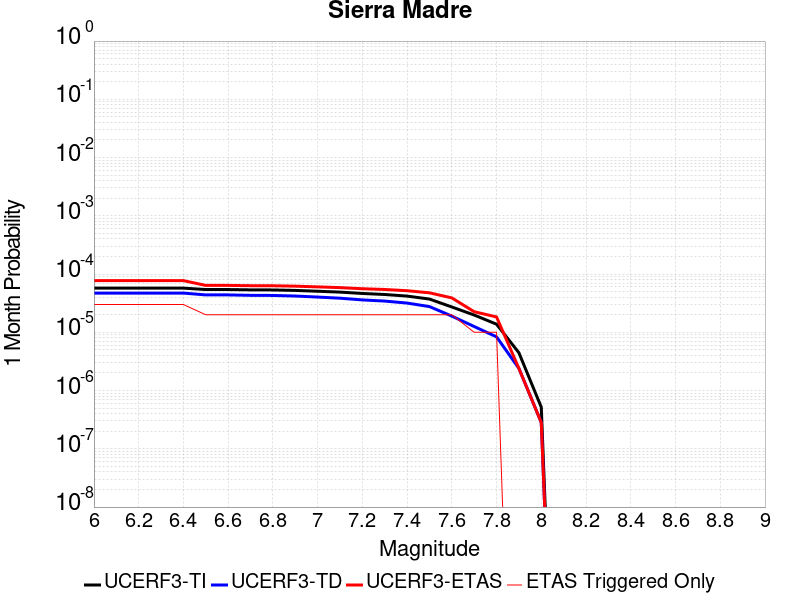 |  |  |

| Magnitude | 1 wk TI Prob | 1 wk TD Prob | 1 wk ETAS Prob | 1 wk ETAS/TD Gain | 1 wk ETAS Triggered Only | 1 mo TI Prob | 1 mo TD Prob | 1 mo ETAS Prob | 1 mo ETAS/TD Gain | 1 mo ETAS Triggered Only | 1 yr TI Prob | 1 yr TD Prob | 1 yr ETAS Prob | 1 yr ETAS/TD Gain | 1 yr ETAS Triggered Only | 10 yr TI Prob | 10 yr TD Prob | 10 yr ETAS Prob | 10 yr ETAS/TD Gain | 10 yr ETAS Triggered Only |
|-----|-----|-----|-----|-----|-----|-----|-----|-----|-----|-----|-----|-----|-----|-----|-----|-----|-----|-----|-----|-----|
| 6.0 | 1.3379373E-5 | 1.1000776E-5 | 5.3926127E-5 | 4.9020295 | 4.2925825E-5 | 5.7338908E-5 | 4.714534E-5 | 9.006914E-5 | 1.9104569 | 4.2925825E-5 | 6.978776E-4 | 5.738448E-4 | 6.16746E-4 | 1.0747609 | 4.2925825E-5 | 0.0069569005 | 0.0057238447 | 0.005766525 | 1.0074565 | 4.2925825E-5 |
| 6.1 | 1.3379373E-5 | 1.1000776E-5 | 5.3926127E-5 | 4.9020295 | 4.2925825E-5 | 5.7338908E-5 | 4.714534E-5 | 9.006914E-5 | 1.9104569 | 4.2925825E-5 | 6.978776E-4 | 5.738448E-4 | 6.16746E-4 | 1.0747609 | 4.2925825E-5 | 0.0069569005 | 0.0057238447 | 0.005766525 | 1.0074565 | 4.2925825E-5 |
| 6.2 | 1.3379373E-5 | 1.1000776E-5 | 5.3926127E-5 | 4.9020295 | 4.2925825E-5 | 5.7338908E-5 | 4.714534E-5 | 9.006914E-5 | 1.9104569 | 4.2925825E-5 | 6.978776E-4 | 5.738448E-4 | 6.16746E-4 | 1.0747609 | 4.2925825E-5 | 0.0069569005 | 0.0057238447 | 0.005766525 | 1.0074565 | 4.2925825E-5 |
| 6.3 | 1.3379373E-5 | 1.1000776E-5 | 5.3926127E-5 | 4.9020295 | 4.2925825E-5 | 5.7338908E-5 | 4.714534E-5 | 9.006914E-5 | 1.9104569 | 4.2925825E-5 | 6.978776E-4 | 5.738448E-4 | 6.16746E-4 | 1.0747609 | 4.2925825E-5 | 0.0069569005 | 0.0057238447 | 0.005766525 | 1.0074565 | 4.2925825E-5 |
| 6.4 | 1.3379373E-5 | 1.1000776E-5 | 5.3926127E-5 | 4.9020295 | 4.2925825E-5 | 5.7338908E-5 | 4.714534E-5 | 9.006914E-5 | 1.9104569 | 4.2925825E-5 | 6.978776E-4 | 5.738448E-4 | 6.16746E-4 | 1.0747609 | 4.2925825E-5 | 0.0069569005 | 0.0057238447 | 0.005766525 | 1.0074565 | 4.2925825E-5 |
| 6.5 | 1.26563245E-5 | 1.0230232E-5 | 5.3155618E-5 | 5.195935 | 4.2925825E-5 | 5.4240263E-5 | 4.384312E-5 | 8.676706E-5 | 1.9790348 | 4.2925825E-5 | 6.601751E-4 | 5.3366035E-4 | 5.7656324E-4 | 1.0803937 | 4.2925825E-5 | 0.006582173 | 0.0053239604 | 0.0053666574 | 1.0080198 | 4.2925825E-5 |
| 6.6 | 1.26563245E-5 | 1.0230232E-5 | 5.3155618E-5 | 5.195935 | 4.2925825E-5 | 5.4240263E-5 | 4.384312E-5 | 8.676706E-5 | 1.9790348 | 4.2925825E-5 | 6.601751E-4 | 5.3366035E-4 | 5.7656324E-4 | 1.0803937 | 4.2925825E-5 | 0.006582173 | 0.0053239604 | 0.0053666574 | 1.0080198 | 4.2925825E-5 |
| 6.7 | 1.2502474E-5 | 1.00663765E-5 | 5.2991767E-5 | 5.264235 | 4.2925825E-5 | 5.3580934E-5 | 4.3140906E-5 | 8.606488E-5 | 1.9949715 | 4.2925825E-5 | 6.521526E-4 | 5.25115E-4 | 5.680183E-4 | 1.0817026 | 4.2925825E-5 | 0.0065024206 | 0.0052389116 | 0.0052816123 | 1.0081507 | 4.2925825E-5 |
| 6.8 | 1.2454966E-5 | 1.0018662E-5 | 5.2944055E-5 | 5.284544 | 4.2925825E-5 | 5.3377335E-5 | 4.293642E-5 | 8.58604E-5 | 1.9997103 | 4.2925825E-5 | 6.4967526E-4 | 5.226266E-4 | 5.6553E-4 | 1.0820918 | 4.2925825E-5 | 0.006477792 | 0.0052141445 | 0.0052568465 | 1.0081897 | 4.2925825E-5 |
| 6.9 | 1.2225574E-5 | 9.792639E-6 | 5.2718042E-5 | 5.3834357 | 4.2925825E-5 | 5.2394265E-5 | 4.196778E-5 | 8.4891806E-5 | 2.0227852 | 4.2925825E-5 | 6.3771347E-4 | 5.10839E-4 | 5.5374287E-4 | 1.0839871 | 4.2925825E-5 | 0.006358865 | 0.0050968137 | 0.005139521 | 1.0083792 | 4.2925825E-5 |
| 7.0 | 1.182946E-5 | 9.399179E-6 | 5.23246E-5 | 5.5669327 | 4.2925825E-5 | 5.06967E-5 | 4.0281582E-5 | 8.3205676E-5 | 2.065601 | 4.2925825E-5 | 6.1705755E-4 | 4.903189E-4 | 5.332237E-4 | 1.0875038 | 4.2925825E-5 | 0.006153469 | 0.004892533 | 0.0049352488 | 1.0087308 | 4.2925825E-5 |
| 7.1 | 1.14369095E-5 | 8.986194E-6 | 5.1911633E-5 | 5.7768207 | 4.2925825E-5 | 4.9014405E-5 | 3.85117E-5 | 8.143587E-5 | 2.114575 | 4.2925825E-5 | 5.9658696E-4 | 4.6878002E-4 | 5.1168574E-4 | 1.0915263 | 4.2925825E-5 | 0.005949879 | 0.0046780678 | 0.0047207926 | 1.0091331 | 4.2925825E-5 |
| 7.2 | 1.0836419E-5 | 8.39959E-6 | 5.1325052E-5 | 6.110424 | 4.2925825E-5 | 4.644097E-5 | 3.599775E-5 | 7.892203E-5 | 2.1924157 | 4.2925825E-5 | 5.652721E-4 | 4.3818538E-4 | 4.810924E-4 | 1.0979198 | 4.2925825E-5 | 0.0056383642 | 0.0043733614 | 0.0044160997 | 1.0097724 | 4.2925825E-5 |
| 7.3 | 1.0403439E-5 | 8.020854E-6 | 5.0946335E-5 | 6.351734 | 4.2925825E-5 | 4.4585406E-5 | 3.437464E-5 | 7.729899E-5 | 2.2487214 | 4.2925825E-5 | 5.426921E-4 | 4.184318E-4 | 4.6133966E-4 | 1.1025444 | 4.2925825E-5 | 0.005413687 | 0.004176585 | 0.0042193313 | 1.0102348 | 4.2925825E-5 |
| 7.4 | 9.768864E-6 | 7.4144855E-6 | 5.033999E-5 | 6.7894115 | 4.2925825E-5 | 4.186589E-5 | 3.1775984E-5 | 7.4700445E-5 | 2.350846 | 4.2925825E-5 | 5.09598E-4 | 3.868048E-4 | 4.2971404E-4 | 1.1109325 | 4.2925825E-5 | 0.0050843097 | 0.0038614576 | 0.0039042176 | 1.0110736 | 4.2925825E-5 |
| 7.5 | 8.687089E-6 | 6.450183E-6 | 4.937573E-5 | 7.654935 | 4.2925825E-5 | 3.722985E-5 | 2.7643353E-5 | 7.056799E-5 | 2.5528014 | 4.2925825E-5 | 4.5317915E-4 | 3.3650672E-4 | 3.7941808E-4 | 1.1275201 | 4.2925825E-5 | 0.004522561 | 0.003360109 | 0.0034028906 | 1.0127321 | 4.2925825E-5 |
| 7.6 | 6.3506063E-6 | 4.430329E-6 | 4.7355963E-5 | 10.689039 | 4.2925825E-5 | 2.72166E-5 | 1.8986988E-5 | 6.1912E-5 | 3.260759 | 4.2925825E-5 | 3.3131172E-4 | 2.3114232E-4 | 2.7405823E-4 | 1.1856687 | 4.2925825E-5 | 0.003308182 | 0.0023090935 | 0.0023519204 | 1.0185469 | 4.2925825E-5 |
| 7.7 | 4.62223E-6 | 2.9329542E-6 | 2.9329542E-6 | 1.0 | 0.0 | 1.9809406E-5 | 1.2569743E-5 | 1.2569743E-5 | 1.0 | 0.0 | 2.4115283E-4 | 1.5302589E-4 | 1.5302589E-4 | 1.0 | 0.0 | 0.0024089129 | 0.0015292577 | 0.0015292577 | 1.0 | 0.0 |
| 7.8 | 3.2145008E-6 | 1.949411E-6 | 1.949411E-6 | 1.0 | 0.0 | 1.3776359E-5 | 8.354592E-6 | 8.354592E-6 | 1.0 | 0.0 | 1.6771426E-4 | 1.01712416E-4 | 1.01712416E-4 | 1.0 | 0.0 | 0.0016758774 | 0.0010166786 | 0.0010166786 | 1.0 | 0.0 |
| 7.9 | 1.0391769E-6 | 5.602482E-7 | 5.602482E-7 | 1.0 | 0.0 | 4.4536077E-6 | 2.4010617E-6 | 2.4010617E-6 | 1.0 | 0.0 | 5.4221324E-5 | 2.9232539E-5 | 2.9232539E-5 | 1.0 | 0.0 | 5.4208096E-4 | 2.9228735E-4 | 2.9228735E-4 | 1.0 | 0.0 |
| 8.0 | 1.210983E-7 | 6.613497E-8 | 6.613497E-8 | 1.0 | 0.0 | 5.1899264E-7 | 2.8343558E-7 | 2.8343558E-7 | 1.0 | 0.0 | 6.3187167E-6 | 3.4508228E-6 | 3.4508228E-6 | 1.0 | 0.0 | 6.318537E-5 | 3.450771E-5 | 3.450771E-5 | 1.0 | 0.0 |

## Great Valley 04a Trout Creek
*[(top)](#table-of-contents)*

| 1 Week | 1 Month | 1 Year | 10 Year |
|-----|-----|-----|-----|
|  |  | 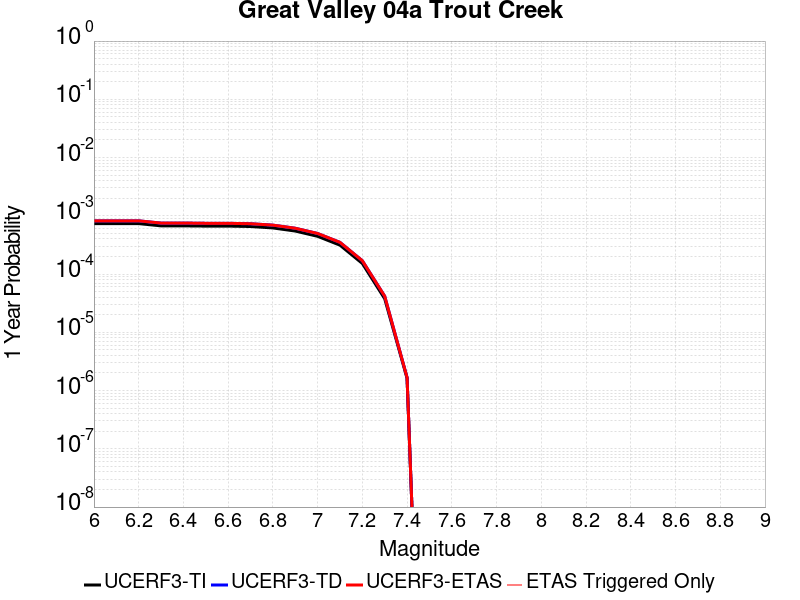 |  |

| Magnitude | 1 wk TI Prob | 1 wk TD Prob | 1 wk ETAS Prob | 1 wk ETAS/TD Gain | 1 wk ETAS Triggered Only | 1 mo TI Prob | 1 mo TD Prob | 1 mo ETAS Prob | 1 mo ETAS/TD Gain | 1 mo ETAS Triggered Only | 1 yr TI Prob | 1 yr TD Prob | 1 yr ETAS Prob | 1 yr ETAS/TD Gain | 1 yr ETAS Triggered Only | 10 yr TI Prob | 10 yr TD Prob | 10 yr ETAS Prob | 10 yr ETAS/TD Gain | 10 yr ETAS Triggered Only |
|-----|-----|-----|-----|-----|-----|-----|-----|-----|-----|-----|-----|-----|-----|-----|-----|-----|-----|-----|-----|-----|
| 6.0 | 1.4088538E-5 | 1.5719554E-5 | 1.5719554E-5 | 1.0 | 0.0 | 6.037805E-5 | 6.7367844E-5 | 6.7367844E-5 | 1.0 | 0.0 | 7.3485484E-4 | 8.199074E-4 | 8.199074E-4 | 1.0 | 0.0 | 0.007324295 | 0.008170108 | 0.008212683 | 1.0052111 | 4.2925825E-5 |
| 6.1 | 1.4088538E-5 | 1.5719554E-5 | 1.5719554E-5 | 1.0 | 0.0 | 6.037805E-5 | 6.7367844E-5 | 6.7367844E-5 | 1.0 | 0.0 | 7.3485484E-4 | 8.199074E-4 | 8.199074E-4 | 1.0 | 0.0 | 0.007324295 | 0.008170108 | 0.008212683 | 1.0052111 | 4.2925825E-5 |
| 6.2 | 1.4088538E-5 | 1.5719554E-5 | 1.5719554E-5 | 1.0 | 0.0 | 6.037805E-5 | 6.7367844E-5 | 6.7367844E-5 | 1.0 | 0.0 | 7.3485484E-4 | 8.199074E-4 | 8.199074E-4 | 1.0 | 0.0 | 0.007324295 | 0.008170108 | 0.008212683 | 1.0052111 | 4.2925825E-5 |
| 6.3 | 1.2882862E-5 | 1.4378603E-5 | 1.4378603E-5 | 1.0 | 0.0 | 5.5211098E-5 | 6.1621184E-5 | 6.1621184E-5 | 1.0 | 0.0 | 6.7198783E-4 | 7.4999005E-4 | 7.4999005E-4 | 1.0 | 0.0 | 0.0066995937 | 0.0074756527 | 0.007518258 | 1.0056992 | 4.2925825E-5 |
| 6.4 | 1.2882862E-5 | 1.4378603E-5 | 1.4378603E-5 | 1.0 | 0.0 | 5.5211098E-5 | 6.1621184E-5 | 6.1621184E-5 | 1.0 | 0.0 | 6.7198783E-4 | 7.4999005E-4 | 7.4999005E-4 | 1.0 | 0.0 | 0.0066995937 | 0.0074756527 | 0.007518258 | 1.0056992 | 4.2925825E-5 |
| 6.5 | 1.2762329E-5 | 1.424516E-5 | 1.424516E-5 | 1.0 | 0.0 | 5.469455E-5 | 6.1049315E-5 | 6.1049315E-5 | 1.0 | 0.0 | 6.657027E-4 | 7.430323E-4 | 7.430323E-4 | 1.0 | 0.0 | 0.00663712 | 0.0074065393 | 0.007449147 | 1.0057527 | 4.2925825E-5 |
| 6.6 | 1.2762329E-5 | 1.424516E-5 | 1.424516E-5 | 1.0 | 0.0 | 5.469455E-5 | 6.1049315E-5 | 6.1049315E-5 | 1.0 | 0.0 | 6.657027E-4 | 7.430323E-4 | 7.430323E-4 | 1.0 | 0.0 | 0.00663712 | 0.0074065393 | 0.007449147 | 1.0057527 | 4.2925825E-5 |
| 6.7 | 1.2557959E-5 | 1.4019395E-5 | 1.4019395E-5 | 1.0 | 0.0 | 5.3818712E-5 | 6.0081795E-5 | 6.0081795E-5 | 1.0 | 0.0 | 6.5504585E-4 | 7.312607E-4 | 7.312607E-4 | 1.0 | 0.0 | 0.006531183 | 0.007289598 | 0.0073322114 | 1.0058457 | 4.2925825E-5 |
| 6.8 | 1.1871544E-5 | 1.3258823E-5 | 1.3258823E-5 | 1.0 | 0.0 | 5.0877054E-5 | 5.6822348E-5 | 5.6822348E-5 | 1.0 | 0.0 | 6.1925204E-4 | 6.916025E-4 | 6.916025E-4 | 1.0 | 0.0 | 0.0061752927 | 0.0068955184 | 0.0069381483 | 1.0061822 | 4.2925825E-5 |
| 6.9 | 1.0500373E-5 | 1.1731261E-5 | 1.1731261E-5 | 1.0 | 0.0 | 4.5000823E-5 | 5.0275914E-5 | 5.0275914E-5 | 1.0 | 0.0 | 5.4774724E-4 | 6.119459E-4 | 6.119459E-4 | 1.0 | 0.0 | 0.005463991 | 0.0061034737 | 0.0061034737 | 1.0 | 0.0 |
| 7.0 | 8.524332E-6 | 9.5334835E-6 | 9.5334835E-6 | 1.0 | 0.0 | 3.653234E-5 | 4.0857187E-5 | 4.0857187E-5 | 1.0 | 0.0 | 4.4469046E-4 | 4.9733004E-4 | 4.9733004E-4 | 1.0 | 0.0 | 0.0044380166 | 0.004962902 | 0.004962902 | 1.0 | 0.0 |
| 7.1 | 6.006849E-6 | 6.711559E-6 | 6.711559E-6 | 1.0 | 0.0 | 2.5743384E-5 | 2.876354E-5 | 2.876354E-5 | 1.0 | 0.0 | 3.1338062E-4 | 3.501454E-4 | 3.501454E-4 | 1.0 | 0.0 | 0.0031293905 | 0.0034964874 | 0.0034964874 | 1.0 | 0.0 |
| 7.2 | 2.9122193E-6 | 3.2465305E-6 | 3.2465305E-6 | 1.0 | 0.0 | 1.248088E-5 | 1.3913637E-5 | 1.3913637E-5 | 1.0 | 0.0 | 1.5194413E-4 | 1.6938712E-4 | 1.6938712E-4 | 1.0 | 0.0 | 0.0015184027 | 0.0016927521 | 0.0016927521 | 1.0 | 0.0 |
| 7.3 | 7.2194007E-7 | 7.988761E-7 | 7.988761E-7 | 1.0 | 0.0 | 3.0940253E-6 | 3.4237528E-6 | 3.4237528E-6 | 1.0 | 0.0 | 3.7669106E-5 | 4.1683852E-5 | 4.1683852E-5 | 1.0 | 0.0 | 3.766272E-4 | 4.168053E-4 | 4.168053E-4 | 1.0 | 0.0 |
| 7.4 | 3.112171E-8 | 3.2068368E-8 | 3.2068368E-8 | 1.0 | 0.0 | 1.3337875E-7 | 1.3743585E-7 | 1.3743585E-7 | 1.0 | 0.0 | 1.6238852E-6 | 1.6732803E-6 | 1.6732803E-6 | 1.0 | 0.0 | 1.6238733E-5 | 1.6732685E-5 | 1.6732685E-5 | 1.0 | 0.0 |

## Monterey Bay-Tularcitos
*[(top)](#table-of-contents)*

| 1 Week | 1 Month | 1 Year | 10 Year |
|-----|-----|-----|-----|
|  |  |  | 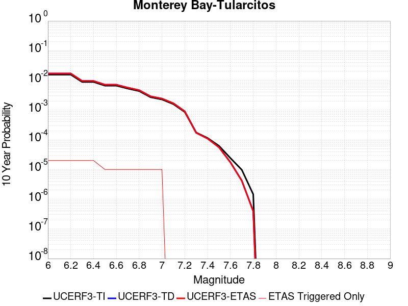 |

| Magnitude | 1 wk TI Prob | 1 wk TD Prob | 1 wk ETAS Prob | 1 wk ETAS/TD Gain | 1 wk ETAS Triggered Only | 1 mo TI Prob | 1 mo TD Prob | 1 mo ETAS Prob | 1 mo ETAS/TD Gain | 1 mo ETAS Triggered Only | 1 yr TI Prob | 1 yr TD Prob | 1 yr ETAS Prob | 1 yr ETAS/TD Gain | 1 yr ETAS Triggered Only | 10 yr TI Prob | 10 yr TD Prob | 10 yr ETAS Prob | 10 yr ETAS/TD Gain | 10 yr ETAS Triggered Only |
|-----|-----|-----|-----|-----|-----|-----|-----|-----|-----|-----|-----|-----|-----|-----|-----|-----|-----|-----|-----|-----|
| 6.0 | 3.0131365E-5 | 3.279877E-5 | 7.572319E-5 | 2.3087204 | 4.2925825E-5 | 1.2912804E-4 | 1.4055918E-4 | 1.8347897E-4 | 1.3053503 | 4.2925825E-5 | 0.001571 | 0.0017100703 | 0.0017529227 | 1.0250589 | 4.2925825E-5 | 0.015599402 | 0.016979916 | 0.017022114 | 1.0024852 | 4.2925825E-5 |
| 6.1 | 3.0131365E-5 | 3.279877E-5 | 7.572319E-5 | 2.3087204 | 4.2925825E-5 | 1.2912804E-4 | 1.4055918E-4 | 1.8347897E-4 | 1.3053503 | 4.2925825E-5 | 0.001571 | 0.0017100703 | 0.0017529227 | 1.0250589 | 4.2925825E-5 | 0.015599402 | 0.016979916 | 0.017022114 | 1.0024852 | 4.2925825E-5 |
| 6.2 | 3.0131365E-5 | 3.279877E-5 | 7.572319E-5 | 2.3087204 | 4.2925825E-5 | 1.2912804E-4 | 1.4055918E-4 | 1.8347897E-4 | 1.3053503 | 4.2925825E-5 | 0.001571 | 0.0017100703 | 0.0017529227 | 1.0250589 | 4.2925825E-5 | 0.015599402 | 0.016979916 | 0.017022114 | 1.0024852 | 4.2925825E-5 |
| 6.3 | 1.6998249E-5 | 1.8330798E-5 | 6.1255836E-5 | 3.3416896 | 4.2925825E-5 | 7.28476E-5 | 7.85583E-5 | 1.21480756E-4 | 1.5463771 | 4.2925825E-5 | 8.865586E-4 | 9.5604634E-4 | 9.989311E-4 | 1.0448564 | 4.2925825E-5 | 0.0088303005 | 0.009521258 | 0.009563775 | 1.0044655 | 4.2925825E-5 |
| 6.4 | 1.6998249E-5 | 1.8330798E-5 | 6.1255836E-5 | 3.3416896 | 4.2925825E-5 | 7.28476E-5 | 7.85583E-5 | 1.21480756E-4 | 1.5463771 | 4.2925825E-5 | 8.865586E-4 | 9.5604634E-4 | 9.989311E-4 | 1.0448564 | 4.2925825E-5 | 0.0088303005 | 0.009521258 | 0.009563775 | 1.0044655 | 4.2925825E-5 |
| 6.5 | 1.27470785E-5 | 1.3693312E-5 | 1.3693312E-5 | 1.0 | 0.0 | 5.4629192E-5 | 5.8684363E-5 | 5.8684363E-5 | 1.0 | 0.0 | 6.649074E-4 | 7.1425823E-4 | 7.1425823E-4 | 1.0 | 0.0 | 0.0066292146 | 0.007120678 | 0.007120678 | 1.0 | 0.0 |
| 6.6 | 1.2739422E-5 | 1.36854E-5 | 1.36854E-5 | 1.0 | 0.0 | 5.4596385E-5 | 5.8650454E-5 | 5.8650454E-5 | 1.0 | 0.0 | 6.645082E-4 | 7.1384566E-4 | 7.1384566E-4 | 1.0 | 0.0 | 0.0066252467 | 0.007116579 | 0.007116579 | 1.0 | 0.0 |
| 6.7 | 1.0160109E-5 | 1.0885755E-5 | 1.0885755E-5 | 1.0 | 0.0 | 4.35426E-5 | 4.665244E-5 | 4.665244E-5 | 1.0 | 0.0 | 5.300022E-4 | 5.6785246E-4 | 5.6785246E-4 | 1.0 | 0.0 | 0.005287399 | 0.0056647263 | 0.0056647263 | 1.0 | 0.0 |
| 6.8 | 8.349859E-6 | 8.932587E-6 | 8.932587E-6 | 1.0 | 0.0 | 3.578462E-5 | 3.8281985E-5 | 3.8281985E-5 | 1.0 | 0.0 | 4.3559066E-4 | 4.6598914E-4 | 4.6598914E-4 | 1.0 | 0.0 | 0.004347378 | 0.004650685 | 0.004650685 | 1.0 | 0.0 |
| 6.9 | 5.193639E-6 | 5.53643E-6 | 5.53643E-6 | 1.0 | 0.0 | 2.2258262E-5 | 2.372736E-5 | 2.372736E-5 | 1.0 | 0.0 | 2.7096065E-4 | 2.8884556E-4 | 2.8884556E-4 | 1.0 | 0.0 | 0.0027063051 | 0.0028850224 | 0.0028850224 | 1.0 | 0.0 |
| 7.0 | 4.359381E-6 | 4.643366E-6 | 4.643366E-6 | 1.0 | 0.0 | 1.8682927E-5 | 1.9900004E-5 | 1.9900004E-5 | 1.0 | 0.0 | 2.274409E-4 | 2.422586E-4 | 2.422586E-4 | 1.0 | 0.0 | 0.0022720827 | 0.002420238 | 0.002420238 | 1.0 | 0.0 |
| 7.1 | 3.0398533E-6 | 3.2310427E-6 | 3.2310427E-6 | 1.0 | 0.0 | 1.3027877E-5 | 1.3847267E-5 | 1.3847267E-5 | 1.0 | 0.0 | 1.5860285E-4 | 1.6858005E-4 | 1.6858005E-4 | 1.0 | 0.0 | 0.001584897 | 0.0016847793 | 0.0016847793 | 1.0 | 0.0 |
| 7.2 | 1.642335E-6 | 1.7333153E-6 | 1.7333153E-6 | 1.0 | 0.0 | 7.0385595E-6 | 7.428485E-6 | 7.428485E-6 | 1.0 | 0.0 | 8.569109E-5 | 9.044012E-5 | 9.044012E-5 | 1.0 | 0.0 | 8.5658056E-4 | 9.042358E-4 | 9.042358E-4 | 1.0 | 0.0 |
| 7.3 | 3.356842E-7 | 3.2952389E-7 | 3.2952389E-7 | 1.0 | 0.0 | 1.4386458E-6 | 1.4122445E-6 | 1.4122445E-6 | 1.0 | 0.0 | 1.7515373E-5 | 1.7193941E-5 | 1.7193941E-5 | 1.0 | 0.0 | 1.7513991E-4 | 1.719262E-4 | 1.719262E-4 | 1.0 | 0.0 |
| 7.4 | 2.1973483E-7 | 2.1006414E-7 | 2.1006414E-7 | 1.0 | 0.0 | 9.417204E-7 | 9.002746E-7 | 9.002746E-7 | 1.0 | 0.0 | 1.1465385E-5 | 1.0960788E-5 | 1.0960788E-5 | 1.0 | 0.0 | 1.1464794E-4 | 1.0960251E-4 | 1.0960251E-4 | 1.0 | 0.0 |
| 7.5 | 1.1944135E-7 | 1.0696035E-7 | 1.0696035E-7 | 1.0 | 0.0 | 5.118914E-7 | 4.5840142E-7 | 4.5840142E-7 | 1.0 | 0.0 | 6.23226E-6 | 5.581023E-6 | 5.581023E-6 | 1.0 | 0.0 | 6.2320854E-5 | 5.5808843E-5 | 5.5808843E-5 | 1.0 | 0.0 |
| 7.6 | 4.636058E-8 | 3.3364433E-8 | 3.3364433E-8 | 1.0 | 0.0 | 1.9868818E-7 | 1.4299042E-7 | 1.4299042E-7 | 1.0 | 0.0 | 2.419026E-6 | 1.740907E-6 | 1.740907E-6 | 1.0 | 0.0 | 2.4189996E-5 | 1.7408936E-5 | 1.7408936E-5 | 1.0 | 0.0 |
| 7.7 | 1.8588572E-8 | 8.003168E-9 | 8.003168E-9 | 1.0 | 0.0 | 7.9665305E-8 | 3.429929E-8 | 3.429929E-8 | 1.0 | 0.0 | 9.699246E-7 | 4.1759378E-7 | 4.1759378E-7 | 1.0 | 0.0 | 9.699204E-6 | 4.1759304E-6 | 4.1759304E-6 | 1.0 | 0.0 |
| 7.8 | 2.7960154E-9 | 7.608624E-10 | 7.608624E-10 | 1.0 | 0.0 | 1.1982923E-8 | 3.2608392E-9 | 3.2608392E-9 | 1.0 | 0.0 | 1.4589209E-7 | 3.9700716E-8 | 3.9700716E-8 | 1.0 | 0.0 | 1.4589199E-6 | 3.970071E-7 | 3.970071E-7 | 1.0 | 0.0 |

## Santa Susana East (connector)
*[(top)](#table-of-contents)*

| 1 Week | 1 Month | 1 Year | 10 Year |
|-----|-----|-----|-----|
|  |  |  |  |

| Magnitude | 1 wk TI Prob | 1 wk TD Prob | 1 wk ETAS Prob | 1 wk ETAS/TD Gain | 1 wk ETAS Triggered Only | 1 mo TI Prob | 1 mo TD Prob | 1 mo ETAS Prob | 1 mo ETAS/TD Gain | 1 mo ETAS Triggered Only | 1 yr TI Prob | 1 yr TD Prob | 1 yr ETAS Prob | 1 yr ETAS/TD Gain | 1 yr ETAS Triggered Only | 10 yr TI Prob | 10 yr TD Prob | 10 yr ETAS Prob | 10 yr ETAS/TD Gain | 10 yr ETAS Triggered Only |
|-----|-----|-----|-----|-----|-----|-----|-----|-----|-----|-----|-----|-----|-----|-----|-----|-----|-----|-----|-----|-----|
| 6.0 | 2.858397E-5 | 3.2021693E-5 | 3.2021693E-5 | 1.0 | 0.0 | 1.2249697E-4 | 1.3723019E-4 | 1.3723019E-4 | 1.0 | 0.0 | 0.0014903803 | 0.00166977 | 0.00166977 | 1.0 | 0.0 | 0.014804244 | 0.016599316 | 0.01664153 | 1.0025431 | 4.2925825E-5 |
| 6.1 | 2.858397E-5 | 3.2021693E-5 | 3.2021693E-5 | 1.0 | 0.0 | 1.2249697E-4 | 1.3723019E-4 | 1.3723019E-4 | 1.0 | 0.0 | 0.0014903803 | 0.00166977 | 0.00166977 | 1.0 | 0.0 | 0.014804244 | 0.016599316 | 0.01664153 | 1.0025431 | 4.2925825E-5 |
| 6.2 | 2.858397E-5 | 3.2021693E-5 | 3.2021693E-5 | 1.0 | 0.0 | 1.2249697E-4 | 1.3723019E-4 | 1.3723019E-4 | 1.0 | 0.0 | 0.0014903803 | 0.00166977 | 0.00166977 | 1.0 | 0.0 | 0.014804244 | 0.016599316 | 0.01664153 | 1.0025431 | 4.2925825E-5 |
| 6.3 | 1.943582E-5 | 2.0367343E-5 | 2.0367343E-5 | 1.0 | 0.0 | 8.329371E-5 | 8.7286324E-5 | 8.7286324E-5 | 1.0 | 0.0 | 0.001013629 | 0.001062305 | 0.001062305 | 1.0 | 0.0 | 0.010090181 | 0.010583852 | 0.0106263235 | 1.0040128 | 4.2925825E-5 |
| 6.4 | 1.943582E-5 | 2.0367343E-5 | 2.0367343E-5 | 1.0 | 0.0 | 8.329371E-5 | 8.7286324E-5 | 8.7286324E-5 | 1.0 | 0.0 | 0.001013629 | 0.001062305 | 0.001062305 | 1.0 | 0.0 | 0.010090181 | 0.010583852 | 0.0106263235 | 1.0040128 | 4.2925825E-5 |
| 6.5 | 1.943582E-5 | 2.0367343E-5 | 2.0367343E-5 | 1.0 | 0.0 | 8.329371E-5 | 8.7286324E-5 | 8.7286324E-5 | 1.0 | 0.0 | 0.001013629 | 0.001062305 | 0.001062305 | 1.0 | 0.0 | 0.010090181 | 0.010583852 | 0.0106263235 | 1.0040128 | 4.2925825E-5 |
| 6.6 | 1.943582E-5 | 2.0367343E-5 | 2.0367343E-5 | 1.0 | 0.0 | 8.329371E-5 | 8.7286324E-5 | 8.7286324E-5 | 1.0 | 0.0 | 0.001013629 | 0.001062305 | 0.001062305 | 1.0 | 0.0 | 0.010090181 | 0.010583852 | 0.0106263235 | 1.0040128 | 4.2925825E-5 |
| 6.7 | 1.9404439E-5 | 2.0354766E-5 | 2.0354766E-5 | 1.0 | 0.0 | 8.3159226E-5 | 8.723242E-5 | 8.723242E-5 | 1.0 | 0.0 | 0.0010119933 | 0.0010616493 | 0.0010616493 | 1.0 | 0.0 | 0.010073971 | 0.010577358 | 0.01061983 | 1.0040153 | 4.2925825E-5 |
| 6.8 | 1.2217526E-5 | 1.1593157E-5 | 1.1593157E-5 | 1.0 | 0.0 | 5.2359774E-5 | 4.9684106E-5 | 4.9684106E-5 | 1.0 | 0.0 | 6.372938E-4 | 6.047529E-4 | 6.047529E-4 | 1.0 | 0.0 | 0.0063546924 | 0.006033274 | 0.006075941 | 1.007072 | 4.2925825E-5 |
| 6.9 | 1.2217526E-5 | 1.1593157E-5 | 1.1593157E-5 | 1.0 | 0.0 | 5.2359774E-5 | 4.9684106E-5 | 4.9684106E-5 | 1.0 | 0.0 | 6.372938E-4 | 6.047529E-4 | 6.047529E-4 | 1.0 | 0.0 | 0.0063546924 | 0.006033274 | 0.006075941 | 1.007072 | 4.2925825E-5 |
| 7.0 | 9.276017E-6 | 8.059273E-6 | 8.059273E-6 | 1.0 | 0.0 | 3.9753755E-5 | 3.4539302E-5 | 3.4539302E-5 | 1.0 | 0.0 | 4.8389446E-4 | 4.2043833E-4 | 4.2043833E-4 | 1.0 | 0.0 | 0.0048284214 | 0.0041973097 | 0.0042400556 | 1.010184 | 4.2925825E-5 |
| 7.1 | 9.130355E-6 | 7.942446E-6 | 7.942446E-6 | 1.0 | 0.0 | 3.9129503E-5 | 3.4038632E-5 | 3.4038632E-5 | 1.0 | 0.0 | 4.7629757E-4 | 4.1434498E-4 | 4.1434498E-4 | 1.0 | 0.0 | 0.00475278 | 0.0041366047 | 0.004179353 | 1.0103341 | 4.2925825E-5 |
| 7.2 | 8.851015E-6 | 7.741608E-6 | 7.741608E-6 | 1.0 | 0.0 | 3.7932372E-5 | 3.317792E-5 | 3.317792E-5 | 1.0 | 0.0 | 4.6172875E-4 | 4.038697E-4 | 4.038697E-4 | 1.0 | 0.0 | 0.0046077054 | 0.0040322347 | 0.0040749875 | 1.0106027 | 4.2925825E-5 |
| 7.3 | 8.573006E-6 | 7.5503312E-6 | 7.5503312E-6 | 1.0 | 0.0 | 3.6740938E-5 | 3.235818E-5 | 3.235818E-5 | 1.0 | 0.0 | 4.472291E-4 | 3.9389305E-4 | 3.9389305E-4 | 1.0 | 0.0 | 0.004463301 | 0.003932817 | 0.003975574 | 1.0108719 | 4.2925825E-5 |
| 7.4 | 7.852282E-6 | 6.8178556E-6 | 6.8178556E-6 | 1.0 | 0.0 | 3.36522E-5 | 2.921907E-5 | 2.921907E-5 | 1.0 | 0.0 | 4.096385E-4 | 3.5568717E-4 | 3.5568717E-4 | 1.0 | 0.0 | 0.0040888423 | 0.0035519868 | 0.0035947603 | 1.012042 | 4.2925825E-5 |
| 7.5 | 4.8869324E-6 | 4.2790975E-6 | 4.2790975E-6 | 1.0 | 0.0 | 2.0943828E-5 | 1.833887E-5 | 1.833887E-5 | 1.0 | 0.0 | 2.5496128E-4 | 2.2325452E-4 | 2.2325452E-4 | 1.0 | 0.0 | 0.0025466895 | 0.00223057 | 0.00223057 | 1.0 | 0.0 |
| 7.6 | 1.3894544E-6 | 1.1568394E-6 | 1.1568394E-6 | 1.0 | 0.0 | 5.954791E-6 | 4.957875E-6 | 4.957875E-6 | 1.0 | 0.0 | 7.249717E-5 | 6.036068E-5 | 6.036068E-5 | 1.0 | 0.0 | 7.247352E-4 | 6.0346466E-4 | 6.0346466E-4 | 1.0 | 0.0 |
| 7.7 | 2.9924632E-7 | 2.3719332E-7 | 2.3719332E-7 | 1.0 | 0.0 | 1.2824837E-6 | 1.0165425E-6 | 1.0165425E-6 | 1.0 | 0.0 | 1.5614127E-5 | 1.2376341E-5 | 1.2376341E-5 | 1.0 | 0.0 | 1.5613029E-4 | 1.2375724E-4 | 1.2375724E-4 | 1.0 | 0.0 |
| 7.8 | 4.8188564E-8 | 2.6321862E-8 | 2.6321862E-8 | 1.0 | 0.0 | 2.065224E-7 | 1.12807975E-7 | 1.12807975E-7 | 1.0 | 0.0 | 2.5144072E-6 | 1.3734362E-6 | 1.3734362E-6 | 1.0 | 0.0 | 2.5143789E-5 | 1.3734286E-5 | 1.3734286E-5 | 1.0 | 0.0 |
| 7.9 | 2.6127251E-9 | 2.7681102E-9 | 2.7681102E-9 | 1.0 | 0.0 | 1.1197393E-8 | 1.186333E-8 | 1.186333E-8 | 1.0 | 0.0 | 1.3632825E-7 | 1.4443603E-7 | 1.4443603E-7 | 1.0 | 0.0 | 1.3632817E-6 | 1.4443604E-6 | 1.4443604E-6 | 1.0 | 0.0 |

## Santa Cruz Catalina Ridge alt1
*[(top)](#table-of-contents)*

| 1 Week | 1 Month | 1 Year | 10 Year |
|-----|-----|-----|-----|
|  |  |  |  |

| Magnitude | 1 wk TI Prob | 1 wk TD Prob | 1 wk ETAS Prob | 1 wk ETAS/TD Gain | 1 wk ETAS Triggered Only | 1 mo TI Prob | 1 mo TD Prob | 1 mo ETAS Prob | 1 mo ETAS/TD Gain | 1 mo ETAS Triggered Only | 1 yr TI Prob | 1 yr TD Prob | 1 yr ETAS Prob | 1 yr ETAS/TD Gain | 1 yr ETAS Triggered Only | 10 yr TI Prob | 10 yr TD Prob | 10 yr ETAS Prob | 10 yr ETAS/TD Gain | 10 yr ETAS Triggered Only |
|-----|-----|-----|-----|-----|-----|-----|-----|-----|-----|-----|-----|-----|-----|-----|-----|-----|-----|-----|-----|-----|
| 6.0 | 3.2833184E-5 | 3.6558402E-5 | 3.6558402E-5 | 1.0 | 0.0 | 1.4070606E-4 | 1.5667039E-4 | 1.5667039E-4 | 1.0 | 0.0 | 0.00171175 | 0.0019059594 | 0.0019488034 | 1.0224789 | 4.2925825E-5 | 0.016986247 | 0.018913032 | 0.018955147 | 1.0022267 | 4.2925825E-5 |
| 6.1 | 1.9835548E-5 | 2.1659505E-5 | 2.1659505E-5 | 1.0 | 0.0 | 8.500672E-5 | 9.282326E-5 | 9.282326E-5 | 1.0 | 0.0 | 0.0010344655 | 0.0011295575 | 0.0011295575 | 1.0 | 0.0 | 0.010296632 | 0.011240296 | 0.011240296 | 1.0 | 0.0 |
| 6.2 | 1.9835548E-5 | 2.1659505E-5 | 2.1659505E-5 | 1.0 | 0.0 | 8.500672E-5 | 9.282326E-5 | 9.282326E-5 | 1.0 | 0.0 | 0.0010344655 | 0.0011295575 | 0.0011295575 | 1.0 | 0.0 | 0.010296632 | 0.011240296 | 0.011240296 | 1.0 | 0.0 |
| 6.3 | 1.5728183E-5 | 1.703395E-5 | 1.703395E-5 | 1.0 | 0.0 | 6.7404755E-5 | 7.300063E-5 | 7.300063E-5 | 1.0 | 0.0 | 8.2034385E-4 | 8.884264E-4 | 8.884264E-4 | 1.0 | 0.0 | 0.008173222 | 0.008849427 | 0.008849427 | 1.0 | 0.0 |
| 6.4 | 1.5728183E-5 | 1.703395E-5 | 1.703395E-5 | 1.0 | 0.0 | 6.7404755E-5 | 7.300063E-5 | 7.300063E-5 | 1.0 | 0.0 | 8.2034385E-4 | 8.884264E-4 | 8.884264E-4 | 1.0 | 0.0 | 0.008173222 | 0.008849427 | 0.008849427 | 1.0 | 0.0 |
| 6.5 | 1.3707734E-5 | 1.4794522E-5 | 1.4794522E-5 | 1.0 | 0.0 | 5.8746107E-5 | 6.3403575E-5 | 6.3403575E-5 | 1.0 | 0.0 | 7.1499916E-4 | 7.716686E-4 | 7.716686E-4 | 1.0 | 0.0 | 0.0071270303 | 0.0076902895 | 0.0076902895 | 1.0 | 0.0 |
| 6.6 | 1.2539813E-5 | 1.3510219E-5 | 1.3510219E-5 | 1.0 | 0.0 | 5.3740947E-5 | 5.789967E-5 | 5.789967E-5 | 1.0 | 0.0 | 6.540996E-4 | 7.0470315E-4 | 7.0470315E-4 | 1.0 | 0.0 | 0.0065217763 | 0.0070249885 | 0.0070249885 | 1.0 | 0.0 |
| 6.7 | 1.1504083E-5 | 1.2377375E-5 | 1.2377375E-5 | 1.0 | 0.0 | 4.930228E-5 | 5.3044827E-5 | 5.3044827E-5 | 1.0 | 0.0 | 6.0008996E-4 | 6.456314E-4 | 6.456314E-4 | 1.0 | 0.0 | 0.005984721 | 0.006437786 | 0.006437786 | 1.0 | 0.0 |
| 6.8 | 1.012739E-5 | 1.0877071E-5 | 1.0877071E-5 | 1.0 | 0.0 | 4.340238E-5 | 4.6615194E-5 | 4.6615194E-5 | 1.0 | 0.0 | 5.282958E-4 | 5.673937E-4 | 5.673937E-4 | 1.0 | 0.0 | 0.0052704164 | 0.0056596193 | 0.0056596193 | 1.0 | 0.0 |
| 6.9 | 8.9607865E-6 | 9.609117E-6 | 9.609117E-6 | 1.0 | 0.0 | 3.8402806E-5 | 4.1181287E-5 | 4.1181287E-5 | 1.0 | 0.0 | 4.6745385E-4 | 5.012679E-4 | 5.012679E-4 | 1.0 | 0.0 | 0.0046647177 | 0.005001492 | 0.005001492 | 1.0 | 0.0 |
| 7.0 | 8.046829E-6 | 8.619746E-6 | 8.619746E-6 | 1.0 | 0.0 | 3.4485955E-5 | 3.694125E-5 | 3.694125E-5 | 1.0 | 0.0 | 4.1978562E-4 | 4.496677E-4 | 4.496677E-4 | 1.0 | 0.0 | 0.004189935 | 0.0044876686 | 0.0044876686 | 1.0 | 0.0 |
| 7.1 | 7.136131E-6 | 7.637656E-6 | 7.637656E-6 | 1.0 | 0.0 | 3.0583058E-5 | 3.2732405E-5 | 3.2732405E-5 | 1.0 | 0.0 | 3.7228514E-4 | 3.9844486E-4 | 3.9844486E-4 | 1.0 | 0.0 | 0.0037166206 | 0.003977381 | 0.003977381 | 1.0 | 0.0 |
| 7.2 | 6.362014E-6 | 6.8049585E-6 | 6.8049585E-6 | 1.0 | 0.0 | 2.726549E-5 | 2.9163786E-5 | 2.9163786E-5 | 1.0 | 0.0 | 3.3190678E-4 | 3.550119E-4 | 3.550119E-4 | 1.0 | 0.0 | 0.0033141149 | 0.003544516 | 0.003544516 | 1.0 | 0.0 |
| 7.3 | 5.004101E-6 | 5.351715E-6 | 5.351715E-6 | 1.0 | 0.0 | 2.1445969E-5 | 2.2935723E-5 | 2.2935723E-5 | 1.0 | 0.0 | 2.6107338E-4 | 2.792072E-4 | 2.792072E-4 | 1.0 | 0.0 | 0.002607669 | 0.0027886187 | 0.0027886187 | 1.0 | 0.0 |
| 7.4 | 3.4901443E-6 | 3.7320526E-6 | 3.7320526E-6 | 1.0 | 0.0 | 1.4957676E-5 | 1.5994416E-5 | 1.5994416E-5 | 1.0 | 0.0 | 1.8209449E-4 | 1.9471499E-4 | 1.9471499E-4 | 1.0 | 0.0 | 0.0018194534 | 0.0019454823 | 0.0019454823 | 1.0 | 0.0 |
| 7.5 | 1.1215045E-6 | 1.189387E-6 | 1.189387E-6 | 1.0 | 0.0 | 4.806439E-6 | 5.097363E-6 | 5.097363E-6 | 1.0 | 0.0 | 5.851682E-5 | 6.205866E-5 | 6.205866E-5 | 1.0 | 0.0 | 5.850142E-4 | 6.2041637E-4 | 6.2041637E-4 | 1.0 | 0.0 |
| 7.6 | 2.8599047E-7 | 2.9951994E-7 | 2.9951994E-7 | 1.0 | 0.0 | 1.2256729E-6 | 1.2836562E-6 | 1.2836562E-6 | 1.0 | 0.0 | 1.4922465E-5 | 1.5628404E-5 | 1.5628404E-5 | 1.0 | 0.0 | 1.4921463E-4 | 1.5627318E-4 | 1.5627318E-4 | 1.0 | 0.0 |
| 7.7 | 2.0781519E-7 | 2.1744323E-7 | 2.1744323E-7 | 1.0 | 0.0 | 8.906362E-7 | 9.3189925E-7 | 9.3189925E-7 | 1.0 | 0.0 | 1.08434415E-5 | 1.13458145E-5 | 1.13458145E-5 | 1.0 | 0.0 | 1.0842913E-4 | 1.1345245E-4 | 1.1345245E-4 | 1.0 | 0.0 |
| 7.8 | 3.614776E-8 | 3.764102E-8 | 3.764102E-8 | 1.0 | 0.0 | 1.5491896E-7 | 1.6131864E-7 | 1.6131864E-7 | 1.0 | 0.0 | 1.8861368E-6 | 1.9640527E-6 | 1.9640527E-6 | 1.0 | 0.0 | 1.8861208E-5 | 1.9640367E-5 | 1.9640367E-5 | 1.0 | 0.0 |

## Cedar Mtn-Mahogany Mtn
*[(top)](#table-of-contents)*

| 1 Week | 1 Month | 1 Year | 10 Year |
|-----|-----|-----|-----|
|  |  |  |  |

| Magnitude | 1 wk TI Prob | 1 wk TD Prob | 1 wk ETAS Prob | 1 wk ETAS/TD Gain | 1 wk ETAS Triggered Only | 1 mo TI Prob | 1 mo TD Prob | 1 mo ETAS Prob | 1 mo ETAS/TD Gain | 1 mo ETAS Triggered Only | 1 yr TI Prob | 1 yr TD Prob | 1 yr ETAS Prob | 1 yr ETAS/TD Gain | 1 yr ETAS Triggered Only | 10 yr TI Prob | 10 yr TD Prob | 10 yr ETAS Prob | 10 yr ETAS/TD Gain | 10 yr ETAS Triggered Only |
|-----|-----|-----|-----|-----|-----|-----|-----|-----|-----|-----|-----|-----|-----|-----|-----|-----|-----|-----|-----|-----|
| 6.0 | 2.7763876E-5 | 2.9588866E-5 | 2.9588866E-5 | 1.0 | 0.0 | 1.1898261E-4 | 1.2680366E-4 | 1.2680366E-4 | 1.0 | 0.0 | 0.0014476506 | 0.0015428112 | 0.0015428112 | 1.0 | 0.0 | 0.0143825635 | 0.015328225 | 0.015370493 | 1.0027575 | 4.2925825E-5 |
| 6.1 | 1.6162443E-5 | 1.7142966E-5 | 1.7142966E-5 | 1.0 | 0.0 | 6.926578E-5 | 7.346788E-5 | 7.346788E-5 | 1.0 | 0.0 | 8.4298453E-4 | 8.941221E-4 | 8.941221E-4 | 1.0 | 0.0 | 0.008397939 | 0.008907059 | 0.008907059 | 1.0 | 0.0 |
| 6.2 | 1.6162443E-5 | 1.7142966E-5 | 1.7142966E-5 | 1.0 | 0.0 | 6.926578E-5 | 7.346788E-5 | 7.346788E-5 | 1.0 | 0.0 | 8.4298453E-4 | 8.941221E-4 | 8.941221E-4 | 1.0 | 0.0 | 0.008397939 | 0.008907059 | 0.008907059 | 1.0 | 0.0 |
| 6.3 | 9.746053E-6 | 1.0303152E-5 | 1.0303152E-5 | 1.0 | 0.0 | 4.1768133E-5 | 4.415564E-5 | 4.415564E-5 | 1.0 | 0.0 | 5.0840835E-4 | 5.3746643E-4 | 5.3746643E-4 | 1.0 | 0.0 | 0.0050724675 | 0.005362084 | 0.005362084 | 1.0 | 0.0 |
| 6.4 | 9.746053E-6 | 1.0303152E-5 | 1.0303152E-5 | 1.0 | 0.0 | 4.1768133E-5 | 4.415564E-5 | 4.415564E-5 | 1.0 | 0.0 | 5.0840835E-4 | 5.3746643E-4 | 5.3746643E-4 | 1.0 | 0.0 | 0.0050724675 | 0.005362084 | 0.005362084 | 1.0 | 0.0 |
| 6.5 | 7.290083E-6 | 7.695325E-6 | 7.695325E-6 | 1.0 | 0.0 | 3.124284E-5 | 3.297956E-5 | 3.297956E-5 | 1.0 | 0.0 | 3.8031515E-4 | 4.014543E-4 | 4.014543E-4 | 1.0 | 0.0 | 0.0037966494 | 0.004007511 | 0.004007511 | 1.0 | 0.0 |
| 6.6 | 5.67907E-6 | 5.9891527E-6 | 5.9891527E-6 | 1.0 | 0.0 | 2.4338644E-5 | 2.5667552E-5 | 2.5667552E-5 | 1.0 | 0.0 | 2.962827E-4 | 3.12459E-4 | 3.12459E-4 | 1.0 | 0.0 | 0.0029588798 | 0.003120333 | 0.003120333 | 1.0 | 0.0 |
| 6.7 | 3.4853963E-6 | 3.672631E-6 | 3.672631E-6 | 1.0 | 0.0 | 1.4937327E-5 | 1.5739755E-5 | 1.5739755E-5 | 1.0 | 0.0 | 1.8184677E-4 | 1.916153E-4 | 1.916153E-4 | 1.0 | 0.0 | 0.0018169804 | 0.0019145629 | 0.0019145629 | 1.0 | 0.0 |
| 6.8 | 2.7535168E-6 | 2.9015764E-6 | 2.9015764E-6 | 1.0 | 0.0 | 1.1800733E-5 | 1.2435271E-5 | 1.2435271E-5 | 1.0 | 0.0 | 1.4366445E-4 | 1.5138938E-4 | 1.5138938E-4 | 1.0 | 0.0 | 0.0014357162 | 0.0015129098 | 0.0015129098 | 1.0 | 0.0 |
| 6.9 | 1.6594106E-6 | 1.7496985E-6 | 1.7496985E-6 | 1.0 | 0.0 | 7.1117406E-6 | 7.4986883E-6 | 7.4986883E-6 | 1.0 | 0.0 | 8.6582E-5 | 9.129302E-5 | 9.129302E-5 | 1.0 | 0.0 | 8.654827E-4 | 9.125856E-4 | 9.125856E-4 | 1.0 | 0.0 |
| 7.0 | 5.10215E-7 | 5.389254E-7 | 5.389254E-7 | 1.0 | 0.0 | 2.186634E-6 | 2.3096788E-6 | 2.3096788E-6 | 1.0 | 0.0 | 2.6621943E-5 | 2.8120105E-5 | 2.8120105E-5 | 1.0 | 0.0 | 2.6618753E-4 | 2.81178E-4 | 2.81178E-4 | 1.0 | 0.0 |

## Ortigalita (South)
*[(top)](#table-of-contents)*

| 1 Week | 1 Month | 1 Year | 10 Year |
|-----|-----|-----|-----|
|  |  |  |  |

| Magnitude | 1 wk TI Prob | 1 wk TD Prob | 1 wk ETAS Prob | 1 wk ETAS/TD Gain | 1 wk ETAS Triggered Only | 1 mo TI Prob | 1 mo TD Prob | 1 mo ETAS Prob | 1 mo ETAS/TD Gain | 1 mo ETAS Triggered Only | 1 yr TI Prob | 1 yr TD Prob | 1 yr ETAS Prob | 1 yr ETAS/TD Gain | 1 yr ETAS Triggered Only | 10 yr TI Prob | 10 yr TD Prob | 10 yr ETAS Prob | 10 yr ETAS/TD Gain | 10 yr ETAS Triggered Only |
|-----|-----|-----|-----|-----|-----|-----|-----|-----|-----|-----|-----|-----|-----|-----|-----|-----|-----|-----|-----|-----|
| 6.0 | 3.72394E-5 | 4.32556E-5 | 4.32556E-5 | 1.0 | 0.0 | 1.5958765E-4 | 1.8536886E-4 | 1.8536886E-4 | 1.0 | 0.0 | 0.0019412481 | 0.0022546863 | 0.0022546863 | 1.0 | 0.0 | 0.019243775 | 0.022334501 | 0.022376468 | 1.001879 | 4.2925825E-5 |
| 6.1 | 2.7299884E-5 | 3.1492036E-5 | 3.1492036E-5 | 1.0 | 0.0 | 1.16994255E-4 | 1.349592E-4 | 1.349592E-4 | 1.0 | 0.0 | 0.0014234743 | 0.0016419457 | 0.0016419457 | 1.0 | 0.0 | 0.014143906 | 0.016304072 | 0.016346298 | 1.00259 | 4.2925825E-5 |
| 6.2 | 2.7299884E-5 | 3.1492036E-5 | 3.1492036E-5 | 1.0 | 0.0 | 1.16994255E-4 | 1.349592E-4 | 1.349592E-4 | 1.0 | 0.0 | 0.0014234743 | 0.0016419457 | 0.0016419457 | 1.0 | 0.0 | 0.014143906 | 0.016304072 | 0.016346298 | 1.00259 | 4.2925825E-5 |
| 6.3 | 2.0546433E-5 | 2.3631454E-5 | 2.3631454E-5 | 1.0 | 0.0 | 8.805317E-5 | 1.0127383E-4 | 1.0127383E-4 | 1.0 | 0.0 | 0.00107152 | 0.0012323305 | 0.0012323305 | 1.0 | 0.0 | 0.010663681 | 0.012257031 | 0.012299431 | 1.0034592 | 4.2925825E-5 |
| 6.4 | 2.0546433E-5 | 2.3631454E-5 | 2.3631454E-5 | 1.0 | 0.0 | 8.805317E-5 | 1.0127383E-4 | 1.0127383E-4 | 1.0 | 0.0 | 0.00107152 | 0.0012323305 | 0.0012323305 | 1.0 | 0.0 | 0.010663681 | 0.012257031 | 0.012299431 | 1.0034592 | 4.2925825E-5 |
| 6.5 | 1.7779594E-5 | 2.0446974E-5 | 2.0446974E-5 | 1.0 | 0.0 | 7.619603E-5 | 8.762703E-5 | 8.762703E-5 | 1.0 | 0.0 | 9.272918E-4 | 0.0010663505 | 0.0010663505 | 1.0 | 0.0 | 0.009234319 | 0.010613804 | 0.010613804 | 1.0 | 0.0 |
| 6.6 | 1.6272212E-5 | 1.8714967E-5 | 1.8714967E-5 | 1.0 | 0.0 | 6.973618E-5 | 8.0204605E-5 | 8.0204605E-5 | 1.0 | 0.0 | 8.487073E-4 | 9.760659E-4 | 9.760659E-4 | 1.0 | 0.0 | 0.008454733 | 0.009719091 | 0.009719091 | 1.0 | 0.0 |
| 6.7 | 1.3051484E-5 | 1.5038758E-5 | 1.5038758E-5 | 1.0 | 0.0 | 5.593373E-5 | 6.445028E-5 | 6.445028E-5 | 1.0 | 0.0 | 6.807804E-4 | 7.844092E-4 | 7.844092E-4 | 1.0 | 0.0 | 0.006786986 | 0.007817388 | 0.007817388 | 1.0 | 0.0 |
| 6.8 | 1.04277415E-5 | 1.1987235E-5 | 1.1987235E-5 | 1.0 | 0.0 | 4.4689557E-5 | 5.1372896E-5 | 5.1372896E-5 | 1.0 | 0.0 | 5.439595E-4 | 6.2529295E-4 | 6.2529295E-4 | 1.0 | 0.0 | 0.0054262993 | 0.00623609 | 0.00623609 | 1.0 | 0.0 |
| 6.9 | 7.639968E-6 | 8.791503E-6 | 8.791503E-6 | 1.0 | 0.0 | 3.274231E-5 | 3.767736E-5 | 3.767736E-5 | 1.0 | 0.0 | 3.9856473E-4 | 4.586312E-4 | 4.586312E-4 | 1.0 | 0.0 | 0.003978506 | 0.004577433 | 0.004577433 | 1.0 | 0.0 |
| 7.0 | 3.919831E-6 | 4.5334014E-6 | 4.5334014E-6 | 1.0 | 0.0 | 1.679917E-5 | 1.942873E-5 | 1.942873E-5 | 1.0 | 0.0 | 2.045107E-4 | 2.3652123E-4 | 2.3652123E-4 | 1.0 | 0.0 | 0.0020432258 | 0.0023629034 | 0.0023629034 | 1.0 | 0.0 |
| 7.1 | 1.6017933E-6 | 1.8570418E-6 | 1.8570418E-6 | 1.0 | 0.0 | 6.8648105E-6 | 7.958732E-6 | 7.958732E-6 | 1.0 | 0.0 | 8.357586E-5 | 9.689432E-5 | 9.689432E-5 | 1.0 | 0.0 | 8.3544437E-4 | 9.686254E-4 | 9.686254E-4 | 1.0 | 0.0 |

## Santa Ynez River
*[(top)](#table-of-contents)*

| 1 Week | 1 Month | 1 Year | 10 Year |
|-----|-----|-----|-----|
|  | 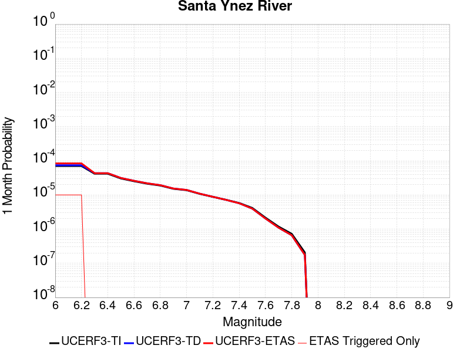 |  |  |

| Magnitude | 1 wk TI Prob | 1 wk TD Prob | 1 wk ETAS Prob | 1 wk ETAS/TD Gain | 1 wk ETAS Triggered Only | 1 mo TI Prob | 1 mo TD Prob | 1 mo ETAS Prob | 1 mo ETAS/TD Gain | 1 mo ETAS Triggered Only | 1 yr TI Prob | 1 yr TD Prob | 1 yr ETAS Prob | 1 yr ETAS/TD Gain | 1 yr ETAS Triggered Only | 10 yr TI Prob | 10 yr TD Prob | 10 yr ETAS Prob | 10 yr ETAS/TD Gain | 10 yr ETAS Triggered Only |
|-----|-----|-----|-----|-----|-----|-----|-----|-----|-----|-----|-----|-----|-----|-----|-----|-----|-----|-----|-----|-----|
| 6.0 | 1.6396456E-5 | 1.7209444E-5 | 1.7209444E-5 | 1.0 | 0.0 | 7.026863E-5 | 7.3752875E-5 | 7.3752875E-5 | 1.0 | 0.0 | 8.551848E-4 | 8.976069E-4 | 9.404942E-4 | 1.0477796 | 4.2925825E-5 | 0.0085190125 | 0.008943363 | 0.008985905 | 1.0047568 | 4.2925825E-5 |
| 6.1 | 1.6396456E-5 | 1.7209444E-5 | 1.7209444E-5 | 1.0 | 0.0 | 7.026863E-5 | 7.3752875E-5 | 7.3752875E-5 | 1.0 | 0.0 | 8.551848E-4 | 8.976069E-4 | 9.404942E-4 | 1.0477796 | 4.2925825E-5 | 0.0085190125 | 0.008943363 | 0.008985905 | 1.0047568 | 4.2925825E-5 |
| 6.2 | 1.6396456E-5 | 1.7209444E-5 | 1.7209444E-5 | 1.0 | 0.0 | 7.026863E-5 | 7.3752875E-5 | 7.3752875E-5 | 1.0 | 0.0 | 8.551848E-4 | 8.976069E-4 | 9.404942E-4 | 1.0477796 | 4.2925825E-5 | 0.0085190125 | 0.008943363 | 0.008985905 | 1.0047568 | 4.2925825E-5 |
| 6.3 | 9.736976E-6 | 1.01223395E-5 | 1.01223395E-5 | 1.0 | 0.0 | 4.172923E-5 | 4.338076E-5 | 4.338076E-5 | 1.0 | 0.0 | 5.0793495E-4 | 5.280378E-4 | 5.280378E-4 | 1.0 | 0.0 | 0.005067755 | 0.0052683367 | 0.0052683367 | 1.0 | 0.0 |
| 6.4 | 9.736976E-6 | 1.01223395E-5 | 1.01223395E-5 | 1.0 | 0.0 | 4.172923E-5 | 4.338076E-5 | 4.338076E-5 | 1.0 | 0.0 | 5.0793495E-4 | 5.280378E-4 | 5.280378E-4 | 1.0 | 0.0 | 0.005067755 | 0.0052683367 | 0.0052683367 | 1.0 | 0.0 |
| 6.5 | 7.081964E-6 | 7.329905E-6 | 7.329905E-6 | 1.0 | 0.0 | 3.035092E-5 | 3.141351E-5 | 3.141351E-5 | 1.0 | 0.0 | 3.694598E-4 | 3.8239395E-4 | 3.8239395E-4 | 1.0 | 0.0 | 0.0036884616 | 0.0038175215 | 0.0038175215 | 1.0 | 0.0 |
| 6.6 | 5.873247E-6 | 6.0597517E-6 | 6.0597517E-6 | 1.0 | 0.0 | 2.5170815E-5 | 2.5970112E-5 | 2.5970112E-5 | 1.0 | 0.0 | 3.064116E-4 | 3.161411E-4 | 3.161411E-4 | 1.0 | 0.0 | 0.0030598943 | 0.003157001 | 0.003157001 | 1.0 | 0.0 |
| 6.7 | 4.973277E-6 | 5.11591E-6 | 5.11591E-6 | 1.0 | 0.0 | 2.1313872E-5 | 2.1925147E-5 | 2.1925147E-5 | 1.0 | 0.0 | 2.5946548E-4 | 2.6690646E-4 | 2.6690646E-4 | 1.0 | 0.0 | 0.0025916274 | 0.0026659078 | 0.0026659078 | 1.0 | 0.0 |
| 6.8 | 4.396492E-6 | 4.510987E-6 | 4.510987E-6 | 1.0 | 0.0 | 1.884197E-5 | 1.933266E-5 | 1.933266E-5 | 1.0 | 0.0 | 2.2937685E-4 | 2.3535005E-4 | 2.3535005E-4 | 1.0 | 0.0 | 0.0022914023 | 0.0023510433 | 0.0023510433 | 1.0 | 0.0 |
| 6.9 | 3.5255632E-6 | 3.6013423E-6 | 3.6013423E-6 | 1.0 | 0.0 | 1.5109469E-5 | 1.5434234E-5 | 1.5434234E-5 | 1.0 | 0.0 | 1.8394225E-4 | 1.8789574E-4 | 1.8789574E-4 | 1.0 | 0.0 | 0.0018379007 | 0.001877385 | 0.001877385 | 1.0 | 0.0 |
| 7.0 | 3.211603E-6 | 3.273663E-6 | 3.273663E-6 | 1.0 | 0.0 | 1.376394E-5 | 1.402991E-5 | 1.402991E-5 | 1.0 | 0.0 | 1.6756308E-4 | 1.708009E-4 | 1.708009E-4 | 1.0 | 0.0 | 0.0016743679 | 0.0017067104 | 0.0017067104 | 1.0 | 0.0 |
| 7.1 | 2.5094619E-6 | 2.5409295E-6 | 2.5409295E-6 | 1.0 | 0.0 | 1.0754793E-5 | 1.0889652E-5 | 1.0889652E-5 | 1.0 | 0.0 | 1.3093173E-4 | 1.325735E-4 | 1.325735E-4 | 1.0 | 0.0 | 0.0013085462 | 0.0013249503 | 0.0013249503 | 1.0 | 0.0 |
| 7.2 | 2.0515774E-6 | 2.0619466E-6 | 2.0619466E-6 | 1.0 | 0.0 | 8.792445E-6 | 8.836884E-6 | 8.836884E-6 | 1.0 | 0.0 | 1.0704277E-4 | 1.0758379E-4 | 1.0758379E-4 | 1.0 | 0.0 | 0.0010699122 | 0.0010753215 | 0.0010753215 | 1.0 | 0.0 |
| 7.3 | 1.6845745E-6 | 1.6773996E-6 | 1.6773996E-6 | 1.0 | 0.0 | 7.219585E-6 | 7.1888358E-6 | 7.1888358E-6 | 1.0 | 0.0 | 8.78949E-5 | 8.752059E-5 | 8.752059E-5 | 1.0 | 0.0 | 8.7860145E-4 | 8.7486405E-4 | 8.7486405E-4 | 1.0 | 0.0 |
| 7.4 | 1.3600285E-6 | 1.3333447E-6 | 1.3333447E-6 | 1.0 | 0.0 | 5.82868E-6 | 5.714322E-6 | 5.714322E-6 | 1.0 | 0.0 | 7.096187E-5 | 6.956967E-5 | 6.956967E-5 | 1.0 | 0.0 | 7.0939213E-4 | 6.9548114E-4 | 6.9548114E-4 | 1.0 | 0.0 |
| 7.5 | 9.735342E-7 | 9.2901894E-7 | 9.2901894E-7 | 1.0 | 0.0 | 4.172283E-6 | 3.9815036E-6 | 3.9815036E-6 | 1.0 | 0.0 | 5.079636E-5 | 4.8473747E-5 | 4.8473747E-5 | 1.0 | 0.0 | 5.0784746E-4 | 4.8463346E-4 | 4.8463346E-4 | 1.0 | 0.0 |
| 7.6 | 5.067187E-7 | 4.778609E-7 | 4.778609E-7 | 1.0 | 0.0 | 2.1716498E-6 | 2.0479738E-6 | 2.0479738E-6 | 1.0 | 0.0 | 2.6439517E-5 | 2.4933803E-5 | 2.4933803E-5 | 1.0 | 0.0 | 2.643637E-4 | 2.493108E-4 | 2.493108E-4 | 1.0 | 0.0 |
| 7.7 | 2.769089E-7 | 2.5759346E-7 | 2.5759346E-7 | 1.0 | 0.0 | 1.1867519E-6 | 1.1039714E-6 | 1.1039714E-6 | 1.0 | 0.0 | 1.4448608E-5 | 1.344077E-5 | 1.344077E-5 | 1.0 | 0.0 | 1.444767E-4 | 1.343996E-4 | 1.343996E-4 | 1.0 | 0.0 |
| 7.8 | 1.7044663E-7 | 1.5449208E-7 | 1.5449208E-7 | 1.0 | 0.0 | 7.3048534E-7 | 6.6210873E-7 | 6.6210873E-7 | 1.0 | 0.0 | 8.893623E-6 | 8.061144E-6 | 8.061144E-6 | 1.0 | 0.0 | 8.893267E-5 | 8.060854E-5 | 8.060854E-5 | 1.0 | 0.0 |
| 7.9 | 4.8344287E-8 | 4.0911143E-8 | 4.0911143E-8 | 1.0 | 0.0 | 2.0718979E-7 | 1.7533345E-7 | 1.7533345E-7 | 1.0 | 0.0 | 2.5225327E-6 | 2.1346827E-6 | 2.1346827E-6 | 1.0 | 0.0 | 2.5225041E-5 | 2.1346626E-5 | 2.1346626E-5 | 1.0 | 0.0 |

## Kern Canyon (South Kern) 2011
*[(top)](#table-of-contents)*

| 1 Week | 1 Month | 1 Year | 10 Year |
|-----|-----|-----|-----|
|  |  | 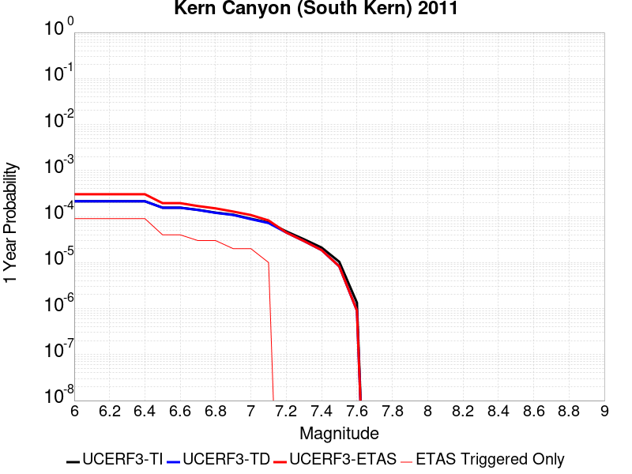 |  |

| Magnitude | 1 wk TI Prob | 1 wk TD Prob | 1 wk ETAS Prob | 1 wk ETAS/TD Gain | 1 wk ETAS Triggered Only | 1 mo TI Prob | 1 mo TD Prob | 1 mo ETAS Prob | 1 mo ETAS/TD Gain | 1 mo ETAS Triggered Only | 1 yr TI Prob | 1 yr TD Prob | 1 yr ETAS Prob | 1 yr ETAS/TD Gain | 1 yr ETAS Triggered Only | 10 yr TI Prob | 10 yr TD Prob | 10 yr ETAS Prob | 10 yr ETAS/TD Gain | 10 yr ETAS Triggered Only |
|-----|-----|-----|-----|-----|-----|-----|-----|-----|-----|-----|-----|-----|-----|-----|-----|-----|-----|-----|-----|-----|
| 6.0 | 4.105075E-6 | 4.113726E-6 | 4.7039375E-5 | 11.434737 | 4.2925825E-5 | 1.7593058E-5 | 1.7630138E-5 | 6.0555205E-5 | 3.434755 | 4.2925825E-5 | 2.1417443E-4 | 2.1462643E-4 | 2.5754303E-4 | 1.1999596 | 4.2925825E-5 | 0.0021396813 | 0.0021442554 | 0.002187089 | 1.019976 | 4.2925825E-5 |
| 6.1 | 4.105075E-6 | 4.113726E-6 | 4.7039375E-5 | 11.434737 | 4.2925825E-5 | 1.7593058E-5 | 1.7630138E-5 | 6.0555205E-5 | 3.434755 | 4.2925825E-5 | 2.1417443E-4 | 2.1462643E-4 | 2.5754303E-4 | 1.1999596 | 4.2925825E-5 | 0.0021396813 | 0.0021442554 | 0.002187089 | 1.019976 | 4.2925825E-5 |
| 6.2 | 4.105075E-6 | 4.113726E-6 | 4.7039375E-5 | 11.434737 | 4.2925825E-5 | 1.7593058E-5 | 1.7630138E-5 | 6.0555205E-5 | 3.434755 | 4.2925825E-5 | 2.1417443E-4 | 2.1462643E-4 | 2.5754303E-4 | 1.1999596 | 4.2925825E-5 | 0.0021396813 | 0.0021442554 | 0.002187089 | 1.019976 | 4.2925825E-5 |
| 6.3 | 4.105075E-6 | 4.113726E-6 | 4.7039375E-5 | 11.434737 | 4.2925825E-5 | 1.7593058E-5 | 1.7630138E-5 | 6.0555205E-5 | 3.434755 | 4.2925825E-5 | 2.1417443E-4 | 2.1462643E-4 | 2.5754303E-4 | 1.1999596 | 4.2925825E-5 | 0.0021396813 | 0.0021442554 | 0.002187089 | 1.019976 | 4.2925825E-5 |
| 6.4 | 4.105075E-6 | 4.113726E-6 | 4.7039375E-5 | 11.434737 | 4.2925825E-5 | 1.7593058E-5 | 1.7630138E-5 | 6.0555205E-5 | 3.434755 | 4.2925825E-5 | 2.1417443E-4 | 2.1462643E-4 | 2.5754303E-4 | 1.1999596 | 4.2925825E-5 | 0.0021396813 | 0.0021442554 | 0.002187089 | 1.019976 | 4.2925825E-5 |
| 6.5 | 2.9849807E-6 | 2.973154E-6 | 2.973154E-6 | 1.0 | 0.0 | 1.2792712E-5 | 1.2742028E-5 | 1.2742028E-5 | 1.0 | 0.0 | 1.5574014E-4 | 1.551233E-4 | 1.551233E-4 | 1.0 | 0.0 | 0.0015563103 | 0.0015501654 | 0.0015501654 | 1.0 | 0.0 |
| 6.6 | 2.9849807E-6 | 2.973154E-6 | 2.973154E-6 | 1.0 | 0.0 | 1.2792712E-5 | 1.2742028E-5 | 1.2742028E-5 | 1.0 | 0.0 | 1.5574014E-4 | 1.551233E-4 | 1.551233E-4 | 1.0 | 0.0 | 0.0015563103 | 0.0015501654 | 0.0015501654 | 1.0 | 0.0 |
| 6.7 | 2.6756725E-6 | 2.6582202E-6 | 2.6582202E-6 | 1.0 | 0.0 | 1.1467117E-5 | 1.1392323E-5 | 1.1392323E-5 | 1.0 | 0.0 | 1.396032E-4 | 1.386928E-4 | 1.386928E-4 | 1.0 | 0.0 | 0.0013951553 | 0.0013860734 | 0.0013860734 | 1.0 | 0.0 |
| 6.8 | 2.3283721E-6 | 2.3047783E-6 | 2.3047783E-6 | 1.0 | 0.0 | 9.9787E-6 | 9.877584E-6 | 9.877584E-6 | 1.0 | 0.0 | 1.214839E-4 | 1.2025302E-4 | 1.2025302E-4 | 1.0 | 0.0 | 0.001214175 | 0.001201887 | 0.001201887 | 1.0 | 0.0 |
| 6.9 | 2.0972677E-6 | 2.0696405E-6 | 2.0696405E-6 | 1.0 | 0.0 | 8.988259E-6 | 8.869858E-6 | 8.869858E-6 | 1.0 | 0.0 | 1.0942656E-4 | 1.0798523E-4 | 1.0798523E-4 | 1.0 | 0.0 | 0.0010937268 | 0.0010793334 | 0.0010793334 | 1.0 | 0.0 |
| 7.0 | 1.7132242E-6 | 1.6787029E-6 | 1.6787029E-6 | 1.0 | 0.0 | 7.3423685E-6 | 7.1944214E-6 | 7.1944214E-6 | 1.0 | 0.0 | 8.938967E-5 | 8.75886E-5 | 8.75886E-5 | 1.0 | 0.0 | 8.935372E-4 | 8.755446E-4 | 8.755446E-4 | 1.0 | 0.0 |
| 7.1 | 1.4215541E-6 | 1.3815746E-6 | 1.3815746E-6 | 1.0 | 0.0 | 6.0923603E-6 | 5.9210206E-6 | 5.9210206E-6 | 1.0 | 0.0 | 7.417196E-5 | 7.208607E-5 | 7.208607E-5 | 1.0 | 0.0 | 7.414721E-4 | 7.206296E-4 | 7.206296E-4 | 1.0 | 0.0 |
| 7.2 | 9.097853E-7 | 8.60377E-7 | 8.60377E-7 | 1.0 | 0.0 | 3.899074E-6 | 3.6873246E-6 | 3.6873246E-6 | 1.0 | 0.0 | 4.7470192E-5 | 4.4892266E-5 | 4.4892266E-5 | 1.0 | 0.0 | 4.7460053E-4 | 4.4883305E-4 | 4.4883305E-4 | 1.0 | 0.0 |
| 7.3 | 6.144169E-7 | 5.628199E-7 | 5.628199E-7 | 1.0 | 0.0 | 2.6332125E-6 | 2.4120832E-6 | 2.4120832E-6 | 1.0 | 0.0 | 3.205889E-5 | 2.9366722E-5 | 2.9366722E-5 | 1.0 | 0.0 | 3.2054266E-4 | 2.9362892E-4 | 2.9362892E-4 | 1.0 | 0.0 |
| 7.4 | 4.049844E-7 | 3.5728252E-7 | 3.5728252E-7 | 1.0 | 0.0 | 1.7356463E-6 | 1.5312098E-6 | 1.5312098E-6 | 1.0 | 0.0 | 2.1131287E-5 | 1.8642324E-5 | 1.8642324E-5 | 1.0 | 0.0 | 2.1129279E-4 | 1.8640784E-4 | 1.8640784E-4 | 1.0 | 0.0 |
| 7.5 | 1.9871162E-7 | 1.5830383E-7 | 1.5830383E-7 | 1.0 | 0.0 | 8.5162094E-7 | 6.784448E-7 | 6.784448E-7 | 1.0 | 0.0 | 1.0368436E-5 | 8.260035E-6 | 8.260035E-6 | 1.0 | 0.0 | 1.0367952E-4 | 8.259736E-5 | 8.259736E-5 | 1.0 | 0.0 |
| 7.6 | 2.572245E-8 | 1.735264E-8 | 1.735264E-8 | 1.0 | 0.0 | 1.10239064E-7 | 7.436845E-8 | 7.436845E-8 | 1.0 | 0.0 | 1.3421597E-6 | 9.0543557E-7 | 9.0543557E-7 | 1.0 | 0.0 | 1.3421517E-5 | 9.054324E-6 | 9.054324E-6 | 1.0 | 0.0 |

## San Gorgonio Pass
*[(top)](#table-of-contents)*

| 1 Week | 1 Month | 1 Year | 10 Year |
|-----|-----|-----|-----|
|  |  |  |  |

| Magnitude | 1 wk TI Prob | 1 wk TD Prob | 1 wk ETAS Prob | 1 wk ETAS/TD Gain | 1 wk ETAS Triggered Only | 1 mo TI Prob | 1 mo TD Prob | 1 mo ETAS Prob | 1 mo ETAS/TD Gain | 1 mo ETAS Triggered Only | 1 yr TI Prob | 1 yr TD Prob | 1 yr ETAS Prob | 1 yr ETAS/TD Gain | 1 yr ETAS Triggered Only | 10 yr TI Prob | 10 yr TD Prob | 10 yr ETAS Prob | 10 yr ETAS/TD Gain | 10 yr ETAS Triggered Only |
|-----|-----|-----|-----|-----|-----|-----|-----|-----|-----|-----|-----|-----|-----|-----|-----|-----|-----|-----|-----|-----|
| 6.0 | 7.644328E-6 | 1.331474E-5 | 1.331474E-5 | 1.0 | 0.0 | 3.2760996E-5 | 5.706197E-5 | 5.706197E-5 | 1.0 | 0.0 | 3.987921E-4 | 6.945166E-4 | 6.945166E-4 | 1.0 | 0.0 | 0.003980772 | 0.006930024 | 0.0069726524 | 1.0061512 | 4.2925825E-5 |
| 6.1 | 7.644328E-6 | 1.331474E-5 | 1.331474E-5 | 1.0 | 0.0 | 3.2760996E-5 | 5.706197E-5 | 5.706197E-5 | 1.0 | 0.0 | 3.987921E-4 | 6.945166E-4 | 6.945166E-4 | 1.0 | 0.0 | 0.003980772 | 0.006930024 | 0.0069726524 | 1.0061512 | 4.2925825E-5 |
| 6.2 | 7.644328E-6 | 1.331474E-5 | 1.331474E-5 | 1.0 | 0.0 | 3.2760996E-5 | 5.706197E-5 | 5.706197E-5 | 1.0 | 0.0 | 3.987921E-4 | 6.945166E-4 | 6.945166E-4 | 1.0 | 0.0 | 0.003980772 | 0.006930024 | 0.0069726524 | 1.0061512 | 4.2925825E-5 |
| 6.3 | 7.644328E-6 | 1.331474E-5 | 1.331474E-5 | 1.0 | 0.0 | 3.2760996E-5 | 5.706197E-5 | 5.706197E-5 | 1.0 | 0.0 | 3.987921E-4 | 6.945166E-4 | 6.945166E-4 | 1.0 | 0.0 | 0.003980772 | 0.006930024 | 0.0069726524 | 1.0061512 | 4.2925825E-5 |
| 6.4 | 7.644328E-6 | 1.331474E-5 | 1.331474E-5 | 1.0 | 0.0 | 3.2760996E-5 | 5.706197E-5 | 5.706197E-5 | 1.0 | 0.0 | 3.987921E-4 | 6.945166E-4 | 6.945166E-4 | 1.0 | 0.0 | 0.003980772 | 0.006930024 | 0.0069726524 | 1.0061512 | 4.2925825E-5 |
| 6.5 | 7.644328E-6 | 1.331474E-5 | 1.331474E-5 | 1.0 | 0.0 | 3.2760996E-5 | 5.706197E-5 | 5.706197E-5 | 1.0 | 0.0 | 3.987921E-4 | 6.945166E-4 | 6.945166E-4 | 1.0 | 0.0 | 0.003980772 | 0.006930024 | 0.0069726524 | 1.0061512 | 4.2925825E-5 |
| 6.6 | 7.644328E-6 | 1.331474E-5 | 1.331474E-5 | 1.0 | 0.0 | 3.2760996E-5 | 5.706197E-5 | 5.706197E-5 | 1.0 | 0.0 | 3.987921E-4 | 6.945166E-4 | 6.945166E-4 | 1.0 | 0.0 | 0.003980772 | 0.006930024 | 0.0069726524 | 1.0061512 | 4.2925825E-5 |
| 6.7 | 6.987586E-6 | 1.2619013E-5 | 1.2619013E-5 | 1.0 | 0.0 | 2.9946454E-5 | 5.408041E-5 | 5.408041E-5 | 1.0 | 0.0 | 3.645371E-4 | 6.582382E-4 | 6.582382E-4 | 1.0 | 0.0 | 0.0036393967 | 0.0065694 | 0.006612044 | 1.0064913 | 4.2925825E-5 |
| 6.8 | 6.987586E-6 | 1.2619013E-5 | 1.2619013E-5 | 1.0 | 0.0 | 2.9946454E-5 | 5.408041E-5 | 5.408041E-5 | 1.0 | 0.0 | 3.645371E-4 | 6.582382E-4 | 6.582382E-4 | 1.0 | 0.0 | 0.0036393967 | 0.0065694 | 0.006612044 | 1.0064913 | 4.2925825E-5 |
| 6.9 | 5.504702E-6 | 1.1049877E-5 | 1.1049877E-5 | 1.0 | 0.0 | 2.3591367E-5 | 4.7355785E-5 | 4.7355785E-5 | 1.0 | 0.0 | 2.8718702E-4 | 5.764092E-4 | 5.764092E-4 | 1.0 | 0.0 | 0.0028681618 | 0.0057553523 | 0.005798031 | 1.0074155 | 4.2925825E-5 |
| 7.0 | 5.4825764E-6 | 1.1026218E-5 | 1.1026218E-5 | 1.0 | 0.0 | 2.3496545E-5 | 4.725439E-5 | 4.725439E-5 | 1.0 | 0.0 | 2.8603288E-4 | 5.751754E-4 | 5.751754E-4 | 1.0 | 0.0 | 0.00285665 | 0.0057430784 | 0.0057857577 | 1.0074314 | 4.2925825E-5 |
| 7.1 | 5.4692787E-6 | 1.1011928E-5 | 1.1011928E-5 | 1.0 | 0.0 | 2.3439556E-5 | 4.719315E-5 | 4.719315E-5 | 1.0 | 0.0 | 2.8533922E-4 | 5.744302E-4 | 5.744302E-4 | 1.0 | 0.0 | 0.0028497311 | 0.0057356646 | 0.0057783443 | 1.007441 | 4.2925825E-5 |
| 7.2 | 5.453661E-6 | 1.0994954E-5 | 1.0994954E-5 | 1.0 | 0.0 | 2.3372622E-5 | 4.712041E-5 | 4.712041E-5 | 1.0 | 0.0 | 2.8452452E-4 | 5.7354505E-4 | 5.7354505E-4 | 1.0 | 0.0 | 0.002841605 | 0.005726859 | 0.0057695387 | 1.0074526 | 4.2925825E-5 |
| 7.3 | 5.4422303E-6 | 1.09818775E-5 | 1.09818775E-5 | 1.0 | 0.0 | 2.3323635E-5 | 4.7064368E-5 | 4.7064368E-5 | 1.0 | 0.0 | 2.8392827E-4 | 5.728631E-4 | 5.728631E-4 | 1.0 | 0.0 | 0.0028356577 | 0.0057200743 | 0.0057627545 | 1.0074615 | 4.2925825E-5 |
| 7.4 | 5.398595E-6 | 1.0929241E-5 | 1.0929241E-5 | 1.0 | 0.0 | 2.313663E-5 | 4.6838795E-5 | 4.6838795E-5 | 1.0 | 0.0 | 2.8165206E-4 | 5.701182E-4 | 5.701182E-4 | 1.0 | 0.0 | 0.0028129534 | 0.0056927665 | 0.005735448 | 1.0074975 | 4.2925825E-5 |
| 7.5 | 5.3578788E-6 | 1.0855785E-5 | 1.0855785E-5 | 1.0 | 0.0 | 2.2962136E-5 | 4.6523994E-5 | 4.6523994E-5 | 1.0 | 0.0 | 2.7952815E-4 | 5.662875E-4 | 5.662875E-4 | 1.0 | 0.0 | 0.002791768 | 0.0056546913 | 0.005697374 | 1.0075482 | 4.2925825E-5 |
| 7.6 | 4.8091474E-6 | 9.604131E-6 | 9.604131E-6 | 1.0 | 0.0 | 2.0610469E-5 | 4.1159943E-5 | 4.1159943E-5 | 1.0 | 0.0 | 2.5090357E-4 | 5.010119E-4 | 5.010119E-4 | 1.0 | 0.0 | 0.0025062046 | 0.0050054584 | 0.0050481693 | 1.0085329 | 4.2925825E-5 |
| 7.7 | 1.5991155E-6 | 3.353035E-6 | 3.353035E-6 | 1.0 | 0.0 | 6.853334E-6 | 1.4370073E-5 | 1.4370073E-5 | 1.0 | 0.0 | 8.343615E-5 | 1.7494184E-4 | 1.7494184E-4 | 1.0 | 0.0 | 8.340483E-4 | 0.0017535852 | 0.0017535852 | 1.0 | 0.0 |
| 7.8 | 9.258398E-7 | 2.0581049E-6 | 2.0581049E-6 | 1.0 | 0.0 | 3.967879E-6 | 8.82042E-6 | 8.82042E-6 | 1.0 | 0.0 | 4.8307855E-5 | 1.0738334E-4 | 1.0738334E-4 | 1.0 | 0.0 | 4.8297356E-4 | 0.0010788103 | 0.0010788103 | 1.0 | 0.0 |
| 7.9 | 5.975575E-7 | 1.2292295E-6 | 1.2292295E-6 | 1.0 | 0.0 | 2.5609581E-6 | 5.2681157E-6 | 5.2681157E-6 | 1.0 | 0.0 | 3.117922E-5 | 6.413743E-5 | 6.413743E-5 | 1.0 | 0.0 | 3.1174847E-4 | 6.464778E-4 | 6.464778E-4 | 1.0 | 0.0 |
| 8.0 | 3.4413725E-7 | 6.714992E-7 | 6.714992E-7 | 1.0 | 0.0 | 1.4748731E-6 | 2.8778506E-6 | 2.8778506E-6 | 1.0 | 0.0 | 1.7956432E-5 | 3.5037272E-5 | 3.5037272E-5 | 1.0 | 0.0 | 1.7954981E-4 | 3.5392298E-4 | 3.5392298E-4 | 1.0 | 0.0 |
| 8.1 | 1.1787731E-8 | 9.6332045E-9 | 9.6332045E-9 | 1.0 | 0.0 | 5.0518846E-8 | 4.1285162E-8 | 4.1285162E-8 | 1.0 | 0.0 | 6.1506677E-7 | 5.0264674E-7 | 5.0264674E-7 | 1.0 | 0.0 | 6.1506507E-6 | 5.2417968E-6 | 5.2417968E-6 | 1.0 | 0.0 |

## Sierra Madre (San Fernando)
*[(top)](#table-of-contents)*

| 1 Week | 1 Month | 1 Year | 10 Year |
|-----|-----|-----|-----|
|  | 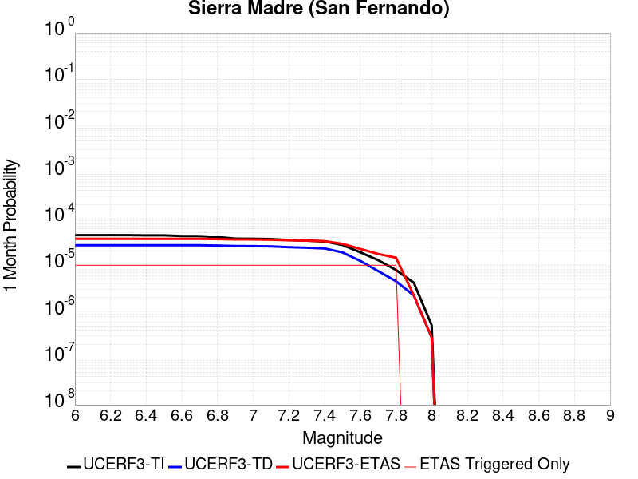 |  | 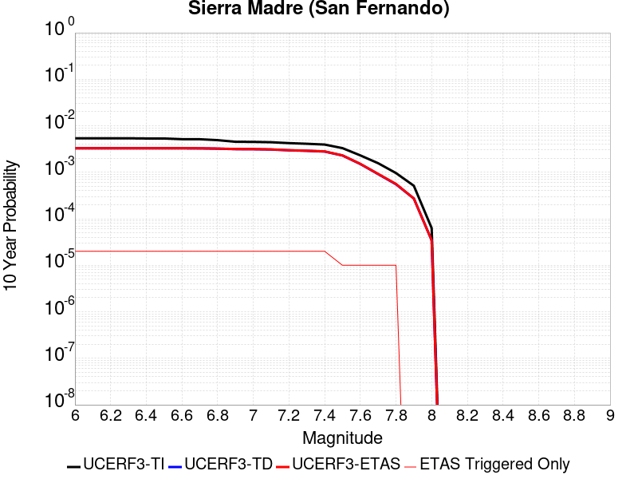 |

| Magnitude | 1 wk TI Prob | 1 wk TD Prob | 1 wk ETAS Prob | 1 wk ETAS/TD Gain | 1 wk ETAS Triggered Only | 1 mo TI Prob | 1 mo TD Prob | 1 mo ETAS Prob | 1 mo ETAS/TD Gain | 1 mo ETAS Triggered Only | 1 yr TI Prob | 1 yr TD Prob | 1 yr ETAS Prob | 1 yr ETAS/TD Gain | 1 yr ETAS Triggered Only | 10 yr TI Prob | 10 yr TD Prob | 10 yr ETAS Prob | 10 yr ETAS/TD Gain | 10 yr ETAS Triggered Only |
|-----|-----|-----|-----|-----|-----|-----|-----|-----|-----|-----|-----|-----|-----|-----|-----|-----|-----|-----|-----|-----|
| 6.0 | 1.0346413E-5 | 6.2872386E-6 | 6.2872386E-6 | 1.0 | 0.0 | 4.4341014E-5 | 2.6945036E-5 | 2.6945036E-5 | 1.0 | 0.0 | 5.3971814E-4 | 3.2800753E-4 | 3.2800753E-4 | 1.0 | 0.0 | 0.0053840918 | 0.0032753467 | 0.003318132 | 1.0130628 | 4.2925825E-5 |
| 6.1 | 1.0346413E-5 | 6.2872386E-6 | 6.2872386E-6 | 1.0 | 0.0 | 4.4341014E-5 | 2.6945036E-5 | 2.6945036E-5 | 1.0 | 0.0 | 5.3971814E-4 | 3.2800753E-4 | 3.2800753E-4 | 1.0 | 0.0 | 0.0053840918 | 0.0032753467 | 0.003318132 | 1.0130628 | 4.2925825E-5 |
| 6.2 | 1.0346413E-5 | 6.2872386E-6 | 6.2872386E-6 | 1.0 | 0.0 | 4.4341014E-5 | 2.6945036E-5 | 2.6945036E-5 | 1.0 | 0.0 | 5.3971814E-4 | 3.2800753E-4 | 3.2800753E-4 | 1.0 | 0.0 | 0.0053840918 | 0.0032753467 | 0.003318132 | 1.0130628 | 4.2925825E-5 |
| 6.3 | 1.0346413E-5 | 6.2872386E-6 | 6.2872386E-6 | 1.0 | 0.0 | 4.4341014E-5 | 2.6945036E-5 | 2.6945036E-5 | 1.0 | 0.0 | 5.3971814E-4 | 3.2800753E-4 | 3.2800753E-4 | 1.0 | 0.0 | 0.0053840918 | 0.0032753467 | 0.003318132 | 1.0130628 | 4.2925825E-5 |
| 6.4 | 1.0249558E-5 | 6.2872386E-6 | 6.2872386E-6 | 1.0 | 0.0 | 4.392594E-5 | 2.6945036E-5 | 2.6945036E-5 | 1.0 | 0.0 | 5.3466705E-4 | 3.2800753E-4 | 3.2800753E-4 | 1.0 | 0.0 | 0.0053338245 | 0.0032753467 | 0.003318132 | 1.0130628 | 4.2925825E-5 |
| 6.5 | 1.0249558E-5 | 6.2872386E-6 | 6.2872386E-6 | 1.0 | 0.0 | 4.392594E-5 | 2.6945036E-5 | 2.6945036E-5 | 1.0 | 0.0 | 5.3466705E-4 | 3.2800753E-4 | 3.2800753E-4 | 1.0 | 0.0 | 0.0053338245 | 0.0032753467 | 0.003318132 | 1.0130628 | 4.2925825E-5 |
| 6.6 | 9.9035515E-6 | 6.2872386E-6 | 6.2872386E-6 | 1.0 | 0.0 | 4.2443102E-5 | 2.6945036E-5 | 2.6945036E-5 | 1.0 | 0.0 | 5.166222E-4 | 3.2800753E-4 | 3.2800753E-4 | 1.0 | 0.0 | 0.0051542283 | 0.0032753467 | 0.003318132 | 1.0130628 | 4.2925825E-5 |
| 6.7 | 9.87217E-6 | 6.274661E-6 | 6.274661E-6 | 1.0 | 0.0 | 4.2308613E-5 | 2.6891132E-5 | 2.6891132E-5 | 1.0 | 0.0 | 5.149856E-4 | 3.2735144E-4 | 3.2735144E-4 | 1.0 | 0.0 | 0.005137938 | 0.003268805 | 0.0033115905 | 1.0130891 | 4.2925825E-5 |
| 6.8 | 9.4359175E-6 | 6.1786473E-6 | 6.1786473E-6 | 1.0 | 0.0 | 4.043902E-5 | 2.6479653E-5 | 2.6479653E-5 | 1.0 | 0.0 | 4.9223384E-4 | 3.223432E-4 | 3.223432E-4 | 1.0 | 0.0 | 0.0049114493 | 0.0032188678 | 0.0032616556 | 1.0132928 | 4.2925825E-5 |
| 6.9 | 8.700447E-6 | 6.0399334E-6 | 6.0399334E-6 | 1.0 | 0.0 | 3.72871E-5 | 2.5885178E-5 | 2.5885178E-5 | 1.0 | 0.0 | 4.5387587E-4 | 3.1510755E-4 | 3.1510755E-4 | 1.0 | 0.0 | 0.0045295 | 0.0031467169 | 0.0031895076 | 1.0135986 | 4.2925825E-5 |
| 7.0 | 8.648878E-6 | 6.014848E-6 | 6.014848E-6 | 1.0 | 0.0 | 3.7066096E-5 | 2.5777672E-5 | 2.5777672E-5 | 1.0 | 0.0 | 4.5118626E-4 | 3.1379904E-4 | 3.1379904E-4 | 1.0 | 0.0 | 0.004502713 | 0.0031336688 | 0.0031764603 | 1.0136553 | 4.2925825E-5 |
| 7.1 | 8.505786E-6 | 5.9244794E-6 | 5.9244794E-6 | 1.0 | 0.0 | 3.645286E-5 | 2.5390384E-5 | 2.5390384E-5 | 1.0 | 0.0 | 4.437232E-4 | 3.0908515E-4 | 3.0908515E-4 | 1.0 | 0.0 | 0.0044283825 | 0.0030866617 | 0.003129455 | 1.0138639 | 4.2925825E-5 |
| 7.2 | 8.139752E-6 | 5.698777E-6 | 5.698777E-6 | 1.0 | 0.0 | 3.4884186E-5 | 2.4423107E-5 | 2.4423107E-5 | 1.0 | 0.0 | 4.246322E-4 | 2.973118E-4 | 2.973118E-4 | 1.0 | 0.0 | 0.004238217 | 0.0029692466 | 0.0030120448 | 1.0144138 | 4.2925825E-5 |
| 7.3 | 7.8816E-6 | 5.5520936E-6 | 5.5520936E-6 | 1.0 | 0.0 | 3.3777847E-5 | 2.3794475E-5 | 2.3794475E-5 | 1.0 | 0.0 | 4.111677E-4 | 2.8966027E-4 | 2.8966027E-4 | 1.0 | 0.0 | 0.004104078 | 0.0028929329 | 0.0029357343 | 1.0147952 | 4.2925825E-5 |
| 7.4 | 7.5810603E-6 | 5.356333E-6 | 5.356333E-6 | 1.0 | 0.0 | 3.2489854E-5 | 2.2955517E-5 | 2.2955517E-5 | 1.0 | 0.0 | 3.9549218E-4 | 2.7944864E-4 | 2.7944864E-4 | 1.0 | 0.0 | 0.0039478904 | 0.0027910774 | 0.0028338835 | 1.0153368 | 4.2925825E-5 |
| 7.5 | 6.349153E-6 | 4.4075887E-6 | 4.4075887E-6 | 1.0 | 0.0 | 2.7210372E-5 | 1.8889532E-5 | 1.8889532E-5 | 1.0 | 0.0 | 3.312359E-4 | 2.2995661E-4 | 2.2995661E-4 | 1.0 | 0.0 | 0.0033074263 | 0.0022972687 | 0.0022972687 | 1.0 | 0.0 |
| 7.6 | 4.430576E-6 | 2.8905786E-6 | 2.8905786E-6 | 1.0 | 0.0 | 1.8988047E-5 | 1.23881355E-5 | 1.23881355E-5 | 1.0 | 0.0 | 2.3115493E-4 | 1.5081534E-4 | 1.5081534E-4 | 1.0 | 0.0 | 0.0023091463 | 0.0015071525 | 0.0015071525 | 1.0 | 0.0 |
| 7.7 | 3.005066E-6 | 1.7509823E-6 | 1.7509823E-6 | 1.0 | 0.0 | 1.2878791E-5 | 7.504188E-6 | 7.504188E-6 | 1.0 | 0.0 | 1.56788E-4 | 9.135967E-5 | 9.135967E-5 | 1.0 | 0.0 | 0.0015667742 | 9.1322226E-4 | 9.1322226E-4 | 1.0 | 0.0 |
| 7.8 | 1.8459098E-6 | 1.0581826E-6 | 1.0581826E-6 | 1.0 | 0.0 | 7.911018E-6 | 4.5350607E-6 | 4.5350607E-6 | 1.0 | 0.0 | 9.631238E-5 | 5.5212968E-5 | 5.5212968E-5 | 1.0 | 0.0 | 9.627065E-4 | 5.5199297E-4 | 5.5199297E-4 | 1.0 | 0.0 |
| 7.9 | 9.839262E-7 | 5.2340516E-7 | 5.2340516E-7 | 1.0 | 0.0 | 4.2168194E-6 | 2.243163E-6 | 2.243163E-6 | 1.0 | 0.0 | 5.1338568E-5 | 2.731017E-5 | 2.731017E-5 | 1.0 | 0.0 | 5.132671E-4 | 2.7306844E-4 | 2.7306844E-4 | 1.0 | 0.0 |
| 8.0 | 1.210983E-7 | 6.613497E-8 | 6.613497E-8 | 1.0 | 0.0 | 5.1899264E-7 | 2.8343558E-7 | 2.8343558E-7 | 1.0 | 0.0 | 6.3187167E-6 | 3.4508228E-6 | 3.4508228E-6 | 1.0 | 0.0 | 6.318537E-5 | 3.450771E-5 | 3.450771E-5 | 1.0 | 0.0 |

## Great Valley 07 (Orestimba)
*[(top)](#table-of-contents)*

| 1 Week | 1 Month | 1 Year | 10 Year |
|-----|-----|-----|-----|
|  |  |  |  |

| Magnitude | 1 wk TI Prob | 1 wk TD Prob | 1 wk ETAS Prob | 1 wk ETAS/TD Gain | 1 wk ETAS Triggered Only | 1 mo TI Prob | 1 mo TD Prob | 1 mo ETAS Prob | 1 mo ETAS/TD Gain | 1 mo ETAS Triggered Only | 1 yr TI Prob | 1 yr TD Prob | 1 yr ETAS Prob | 1 yr ETAS/TD Gain | 1 yr ETAS Triggered Only | 10 yr TI Prob | 10 yr TD Prob | 10 yr ETAS Prob | 10 yr ETAS/TD Gain | 10 yr ETAS Triggered Only |
|-----|-----|-----|-----|-----|-----|-----|-----|-----|-----|-----|-----|-----|-----|-----|-----|-----|-----|-----|-----|-----|
| 6.0 | 2.9687902E-5 | 3.27575E-5 | 3.27575E-5 | 1.0 | 0.0 | 1.2722766E-4 | 1.4038214E-4 | 1.4038214E-4 | 1.0 | 0.0 | 0.0015478961 | 0.0017078844 | 0.001750737 | 1.0250909 | 4.2925825E-5 | 0.015371585 | 0.016955135 | 0.016997334 | 1.0024889 | 4.2925825E-5 |
| 6.1 | 2.9687902E-5 | 3.27575E-5 | 3.27575E-5 | 1.0 | 0.0 | 1.2722766E-4 | 1.4038214E-4 | 1.4038214E-4 | 1.0 | 0.0 | 0.0015478961 | 0.0017078844 | 0.001750737 | 1.0250909 | 4.2925825E-5 | 0.015371585 | 0.016955135 | 0.016997334 | 1.0024889 | 4.2925825E-5 |
| 6.2 | 1.9231524E-5 | 2.1159167E-5 | 2.1159167E-5 | 1.0 | 0.0 | 8.2418206E-5 | 9.067912E-5 | 9.067912E-5 | 1.0 | 0.0 | 0.0010029797 | 0.0011034822 | 0.0011463608 | 1.0388575 | 4.2925825E-5 | 0.00998465 | 0.010982441 | 0.011024895 | 1.0038657 | 4.2925825E-5 |
| 6.3 | 1.324766E-5 | 1.4548534E-5 | 1.4548534E-5 | 1.0 | 0.0 | 5.6774446E-5 | 6.234942E-5 | 6.234942E-5 | 1.0 | 0.0 | 6.910097E-4 | 7.5884897E-4 | 8.017422E-4 | 1.056524 | 4.2925825E-5 | 0.006888649 | 0.0075635235 | 0.007606125 | 1.0056324 | 4.2925825E-5 |
| 6.4 | 7.818645E-6 | 8.57284E-6 | 8.57284E-6 | 1.0 | 0.0 | 3.3508048E-5 | 3.6740246E-5 | 3.6740246E-5 | 1.0 | 0.0 | 4.078841E-4 | 4.4722404E-4 | 4.901307E-4 | 1.0959399 | 4.2925825E-5 | 0.004071363 | 0.0044635804 | 0.0045063146 | 1.0095739 | 4.2925825E-5 |
| 6.5 | 5.3076565E-6 | 5.8178007E-6 | 5.8178007E-6 | 1.0 | 0.0 | 2.27469E-5 | 2.4933206E-5 | 2.4933206E-5 | 1.0 | 0.0 | 2.7690834E-4 | 3.035216E-4 | 3.464344E-4 | 1.141383 | 4.2925825E-5 | 0.0027656353 | 0.00303128 | 0.0030740756 | 1.0141181 | 4.2925825E-5 |
| 6.6 | 3.6003578E-6 | 3.9484953E-6 | 3.9484953E-6 | 1.0 | 0.0 | 1.5430012E-5 | 1.6922022E-5 | 1.6922022E-5 | 1.0 | 0.0 | 1.8784421E-4 | 2.0600771E-4 | 2.4892468E-4 | 1.208327 | 4.2925825E-5 | 0.0018768552 | 0.0020583214 | 0.002101159 | 1.0208118 | 4.2925825E-5 |
| 6.7 | 2.5361826E-6 | 2.7834678E-6 | 2.7834678E-6 | 1.0 | 0.0 | 1.0869308E-5 | 1.1929101E-5 | 1.1929101E-5 | 1.0 | 0.0 | 1.3232579E-4 | 1.4522845E-4 | 1.8814804E-4 | 1.2955315 | 4.2925825E-5 | 0.0013224703 | 0.0014514653 | 0.0014943288 | 1.0295312 | 4.2925825E-5 |
| 6.8 | 1.2115831E-6 | 1.3313797E-6 | 1.3313797E-6 | 1.0 | 0.0 | 5.1924885E-6 | 5.7059065E-6 | 5.7059065E-6 | 1.0 | 0.0 | 6.3216714E-5 | 6.9468166E-5 | 1.12391004E-4 | 1.6178778 | 4.2925825E-5 | 6.3198735E-4 | 6.945596E-4 | 7.374556E-4 | 1.0617601 | 4.2925825E-5 |

## McKinleyville (alt1)
*[(top)](#table-of-contents)*

| 1 Week | 1 Month | 1 Year | 10 Year |
|-----|-----|-----|-----|
|  |  |  |  |

| Magnitude | 1 wk TI Prob | 1 wk TD Prob | 1 wk ETAS Prob | 1 wk ETAS/TD Gain | 1 wk ETAS Triggered Only | 1 mo TI Prob | 1 mo TD Prob | 1 mo ETAS Prob | 1 mo ETAS/TD Gain | 1 mo ETAS Triggered Only | 1 yr TI Prob | 1 yr TD Prob | 1 yr ETAS Prob | 1 yr ETAS/TD Gain | 1 yr ETAS Triggered Only | 10 yr TI Prob | 10 yr TD Prob | 10 yr ETAS Prob | 10 yr ETAS/TD Gain | 10 yr ETAS Triggered Only |
|-----|-----|-----|-----|-----|-----|-----|-----|-----|-----|-----|-----|-----|-----|-----|-----|-----|-----|-----|-----|-----|
| 6.0 | 1.1028524E-5 | 1.1727756E-5 | 1.1727756E-5 | 1.0 | 0.0 | 4.7264242E-5 | 5.0260987E-5 | 5.0260987E-5 | 1.0 | 0.0 | 5.7529024E-4 | 6.1178114E-4 | 6.1178114E-4 | 1.0 | 0.0 | 0.005738032 | 0.0061034784 | 0.0061461423 | 1.0069901 | 4.2925825E-5 |
| 6.1 | 1.1028524E-5 | 1.1727756E-5 | 1.1727756E-5 | 1.0 | 0.0 | 4.7264242E-5 | 5.0260987E-5 | 5.0260987E-5 | 1.0 | 0.0 | 5.7529024E-4 | 6.1178114E-4 | 6.1178114E-4 | 1.0 | 0.0 | 0.005738032 | 0.0061034784 | 0.0061461423 | 1.0069901 | 4.2925825E-5 |
| 6.2 | 1.1028524E-5 | 1.1727756E-5 | 1.1727756E-5 | 1.0 | 0.0 | 4.7264242E-5 | 5.0260987E-5 | 5.0260987E-5 | 1.0 | 0.0 | 5.7529024E-4 | 6.1178114E-4 | 6.1178114E-4 | 1.0 | 0.0 | 0.005738032 | 0.0061034784 | 0.0061461423 | 1.0069901 | 4.2925825E-5 |
| 6.3 | 1.1028524E-5 | 1.1727756E-5 | 1.1727756E-5 | 1.0 | 0.0 | 4.7264242E-5 | 5.0260987E-5 | 5.0260987E-5 | 1.0 | 0.0 | 5.7529024E-4 | 6.1178114E-4 | 6.1178114E-4 | 1.0 | 0.0 | 0.005738032 | 0.0061034784 | 0.0061461423 | 1.0069901 | 4.2925825E-5 |
| 6.4 | 1.1028524E-5 | 1.1727756E-5 | 1.1727756E-5 | 1.0 | 0.0 | 4.7264242E-5 | 5.0260987E-5 | 5.0260987E-5 | 1.0 | 0.0 | 5.7529024E-4 | 6.1178114E-4 | 6.1178114E-4 | 1.0 | 0.0 | 0.005738032 | 0.0061034784 | 0.0061461423 | 1.0069901 | 4.2925825E-5 |
| 6.5 | 1.1028524E-5 | 1.1727756E-5 | 1.1727756E-5 | 1.0 | 0.0 | 4.7264242E-5 | 5.0260987E-5 | 5.0260987E-5 | 1.0 | 0.0 | 5.7529024E-4 | 6.1178114E-4 | 6.1178114E-4 | 1.0 | 0.0 | 0.005738032 | 0.0061034784 | 0.0061461423 | 1.0069901 | 4.2925825E-5 |
| 6.6 | 1.1028524E-5 | 1.1727756E-5 | 1.1727756E-5 | 1.0 | 0.0 | 4.7264242E-5 | 5.0260987E-5 | 5.0260987E-5 | 1.0 | 0.0 | 5.7529024E-4 | 6.1178114E-4 | 6.1178114E-4 | 1.0 | 0.0 | 0.005738032 | 0.0061034784 | 0.0061461423 | 1.0069901 | 4.2925825E-5 |
| 6.7 | 6.483374E-6 | 6.917082E-6 | 6.917082E-6 | 1.0 | 0.0 | 2.7785592E-5 | 2.9644334E-5 | 2.9644334E-5 | 1.0 | 0.0 | 3.3823706E-4 | 3.6086622E-4 | 3.6086622E-4 | 1.0 | 0.0 | 0.003377227 | 0.0036034149 | 0.003646186 | 1.0118697 | 4.2925825E-5 |
| 6.8 | 6.483374E-6 | 6.917082E-6 | 6.917082E-6 | 1.0 | 0.0 | 2.7785592E-5 | 2.9644334E-5 | 2.9644334E-5 | 1.0 | 0.0 | 3.3823706E-4 | 3.6086622E-4 | 3.6086622E-4 | 1.0 | 0.0 | 0.003377227 | 0.0036034149 | 0.003646186 | 1.0118697 | 4.2925825E-5 |
| 6.9 | 4.0394048E-6 | 4.3453424E-6 | 4.3453424E-6 | 1.0 | 0.0 | 1.731162E-5 | 1.8622766E-5 | 1.8622766E-5 | 1.0 | 0.0 | 2.1074859E-4 | 2.2670913E-4 | 2.2670913E-4 | 1.0 | 0.0 | 0.0021054882 | 0.0022648333 | 0.002307662 | 1.0189103 | 4.2925825E-5 |
| 7.0 | 3.7791233E-6 | 4.0721984E-6 | 4.0721984E-6 | 1.0 | 0.0 | 1.6196142E-5 | 1.7452165E-5 | 1.7452165E-5 | 1.0 | 0.0 | 1.9717019E-4 | 2.124599E-4 | 2.124599E-4 | 1.0 | 0.0 | 0.0019699533 | 0.0021226178 | 0.0021654523 | 1.0201801 | 4.2925825E-5 |
| 7.1 | 3.675443E-6 | 3.963499E-6 | 3.963499E-6 | 1.0 | 0.0 | 1.5751802E-5 | 1.6986316E-5 | 1.6986316E-5 | 1.0 | 0.0 | 1.9176133E-4 | 2.0678926E-4 | 2.0678926E-4 | 1.0 | 0.0 | 0.0019159593 | 0.002066018 | 0.0021088552 | 1.0207342 | 4.2925825E-5 |
| 7.2 | 3.0165843E-6 | 3.2720998E-6 | 3.2720998E-6 | 1.0 | 0.0 | 1.2928153E-5 | 1.402321E-5 | 1.402321E-5 | 1.0 | 0.0 | 1.573889E-4 | 1.7071939E-4 | 1.7071939E-4 | 1.0 | 0.0 | 0.0015727748 | 0.0017059012 | 0.0017487538 | 1.0251203 | 4.2925825E-5 |
| 7.3 | 2.307633E-6 | 2.5189145E-6 | 2.5189145E-6 | 1.0 | 0.0 | 9.889818E-6 | 1.0795304E-5 | 1.0795304E-5 | 1.0 | 0.0 | 1.2040188E-4 | 1.3142498E-4 | 1.3142498E-4 | 1.0 | 0.0 | 0.0012033667 | 0.0013134809 | 0.0013134809 | 1.0 | 0.0 |
| 7.4 | 2.0568484E-6 | 2.2517233E-6 | 2.2517233E-6 | 1.0 | 0.0 | 8.8150355E-6 | 9.650207E-6 | 9.650207E-6 | 1.0 | 0.0 | 1.0731777E-4 | 1.1748502E-4 | 1.1748502E-4 | 1.0 | 0.0 | 0.0010726595 | 0.0011742366 | 0.0011742366 | 1.0 | 0.0 |
| 7.5 | 1.7674889E-6 | 1.9414256E-6 | 1.9414256E-6 | 1.0 | 0.0 | 7.5749304E-6 | 8.3203695E-6 | 8.3203695E-6 | 1.0 | 0.0 | 9.222087E-5 | 1.0129585E-4 | 1.0129585E-4 | 1.0 | 0.0 | 9.218261E-4 | 0.0010125034 | 0.0010125034 | 1.0 | 0.0 |
| 7.6 | 1.2944297E-6 | 1.4296386E-6 | 1.4296386E-6 | 1.0 | 0.0 | 5.547544E-6 | 6.1270084E-6 | 6.1270084E-6 | 1.0 | 0.0 | 6.753925E-5 | 7.459382E-5 | 7.459382E-5 | 1.0 | 0.0 | 6.7518733E-4 | 7.456927E-4 | 7.456927E-4 | 1.0 | 0.0 |
| 7.7 | 5.806243E-7 | 6.461009E-7 | 6.461009E-7 | 1.0 | 0.0 | 2.4883875E-6 | 2.769001E-6 | 2.769001E-6 | 1.0 | 0.0 | 3.0295698E-5 | 3.3712084E-5 | 3.3712084E-5 | 1.0 | 0.0 | 3.0291567E-4 | 3.3707137E-4 | 3.3707137E-4 | 1.0 | 0.0 |
| 7.8 | 1.6121008E-7 | 1.8183495E-7 | 1.8183495E-7 | 1.0 | 0.0 | 6.909002E-7 | 7.792924E-7 | 7.792924E-7 | 1.0 | 0.0 | 8.411677E-6 | 9.487846E-6 | 9.487846E-6 | 1.0 | 0.0 | 8.411359E-5 | 9.487466E-5 | 9.487466E-5 | 1.0 | 0.0 |

## Malibu Coast alt 1
*[(top)](#table-of-contents)*

| 1 Week | 1 Month | 1 Year | 10 Year |
|-----|-----|-----|-----|
|  |  |  | 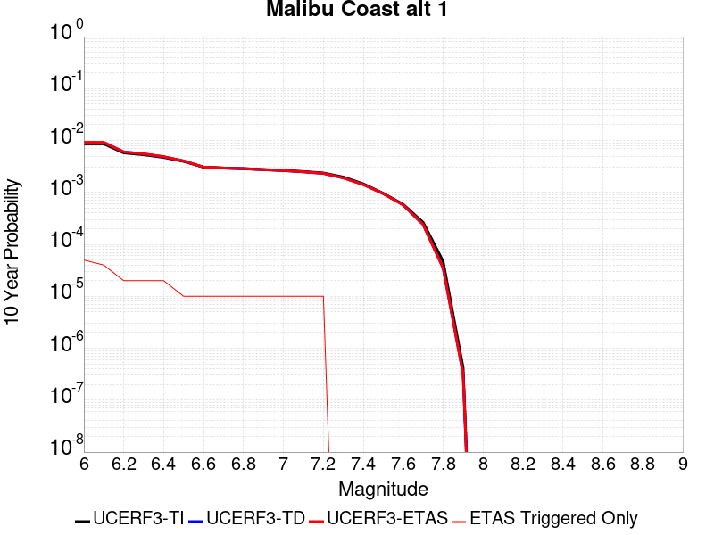 |

| Magnitude | 1 wk TI Prob | 1 wk TD Prob | 1 wk ETAS Prob | 1 wk ETAS/TD Gain | 1 wk ETAS Triggered Only | 1 mo TI Prob | 1 mo TD Prob | 1 mo ETAS Prob | 1 mo ETAS/TD Gain | 1 mo ETAS Triggered Only | 1 yr TI Prob | 1 yr TD Prob | 1 yr ETAS Prob | 1 yr ETAS/TD Gain | 1 yr ETAS Triggered Only | 10 yr TI Prob | 10 yr TD Prob | 10 yr ETAS Prob | 10 yr ETAS/TD Gain | 10 yr ETAS Triggered Only |
|-----|-----|-----|-----|-----|-----|-----|-----|-----|-----|-----|-----|-----|-----|-----|-----|-----|-----|-----|-----|-----|
| 6.0 | 1.6572556E-5 | 1.759807E-5 | 1.759807E-5 | 1.0 | 0.0 | 7.102331E-5 | 7.5418226E-5 | 1.1834081E-4 | 1.5691276 | 4.2925825E-5 | 8.6436566E-4 | 9.1784896E-4 | 9.607354E-4 | 1.0467249 | 4.2925825E-5 | 0.0086101135 | 0.009142514 | 0.009185048 | 1.0046523 | 4.2925825E-5 |
| 6.1 | 1.6572556E-5 | 1.759807E-5 | 1.759807E-5 | 1.0 | 0.0 | 7.102331E-5 | 7.5418226E-5 | 1.1834081E-4 | 1.5691276 | 4.2925825E-5 | 8.6436566E-4 | 9.1784896E-4 | 9.607354E-4 | 1.0467249 | 4.2925825E-5 | 0.0086101135 | 0.009142514 | 0.009185048 | 1.0046523 | 4.2925825E-5 |
| 6.2 | 1.1085717E-5 | 1.155715E-5 | 1.155715E-5 | 1.0 | 0.0 | 4.750935E-5 | 4.9529724E-5 | 9.245342E-5 | 1.8666251 | 4.2925825E-5 | 5.782728E-4 | 6.0286105E-4 | 6.45761E-4 | 1.0711606 | 4.2925825E-5 | 0.0057677035 | 0.0060126274 | 0.006055295 | 1.0070964 | 4.2925825E-5 |
| 6.3 | 1.0208568E-5 | 1.0592241E-5 | 1.0592241E-5 | 1.0 | 0.0 | 4.375027E-5 | 4.5394543E-5 | 8.831842E-5 | 1.9455734 | 4.2925825E-5 | 5.325294E-4 | 5.5254134E-4 | 5.954435E-4 | 1.0776451 | 4.2925825E-5 | 0.0053125503 | 0.0055119833 | 0.0055546723 | 1.0077448 | 4.2925825E-5 |
| 6.4 | 9.0682315E-6 | 9.342641E-6 | 9.342641E-6 | 1.0 | 0.0 | 3.8863272E-5 | 4.0039286E-5 | 8.296339E-5 | 2.0720499 | 4.2925825E-5 | 4.730576E-4 | 4.873713E-4 | 5.302762E-4 | 1.0880333 | 4.2925825E-5 | 0.0047205184 | 0.004863238 | 0.004905955 | 1.0087837 | 4.2925825E-5 |
| 6.5 | 7.605796E-6 | 7.74859E-6 | 7.74859E-6 | 1.0 | 0.0 | 3.259586E-5 | 3.320783E-5 | 3.320783E-5 | 1.0 | 0.0 | 3.9678233E-4 | 4.0423166E-4 | 4.0423166E-4 | 1.0 | 0.0 | 0.0039607463 | 0.0040351013 | 0.0040351013 | 1.0 | 0.0 |
| 6.6 | 5.889873E-6 | 5.8795417E-6 | 5.8795417E-6 | 1.0 | 0.0 | 2.5242069E-5 | 2.5197793E-5 | 2.5197793E-5 | 1.0 | 0.0 | 3.0727885E-4 | 3.0674002E-4 | 3.0674002E-4 | 1.0 | 0.0 | 0.003068543 | 0.0030631793 | 0.0030631793 | 1.0 | 0.0 |
| 6.7 | 5.66586E-6 | 5.6416443E-6 | 5.6416443E-6 | 1.0 | 0.0 | 2.428203E-5 | 2.4178253E-5 | 2.4178253E-5 | 1.0 | 0.0 | 2.955936E-4 | 2.9433056E-4 | 2.9433056E-4 | 1.0 | 0.0 | 0.0029520073 | 0.0029394194 | 0.0029394194 | 1.0 | 0.0 |
| 6.8 | 5.521556E-6 | 5.48943E-6 | 5.48943E-6 | 1.0 | 0.0 | 2.3663597E-5 | 2.3525918E-5 | 2.3525918E-5 | 1.0 | 0.0 | 2.880662E-4 | 2.8639048E-4 | 2.8639048E-4 | 1.0 | 0.0 | 0.0028769306 | 0.0028602257 | 0.0028602257 | 1.0 | 0.0 |
| 6.9 | 5.29752E-6 | 5.2499345E-6 | 5.2499345E-6 | 1.0 | 0.0 | 2.270346E-5 | 2.2499526E-5 | 2.2499526E-5 | 1.0 | 0.0 | 2.7637955E-4 | 2.7389737E-4 | 2.7389737E-4 | 1.0 | 0.0 | 0.0027603607 | 0.0027356083 | 0.0027356083 | 1.0 | 0.0 |
| 7.0 | 5.106743E-6 | 5.0476815E-6 | 5.0476815E-6 | 1.0 | 0.0 | 2.1885859E-5 | 2.1632743E-5 | 2.1632743E-5 | 1.0 | 0.0 | 2.6642776E-4 | 2.6334688E-4 | 2.6334688E-4 | 1.0 | 0.0 | 0.0026610855 | 0.0026303576 | 0.0026303576 | 1.0 | 0.0 |
| 7.1 | 4.8469647E-6 | 4.770376E-6 | 4.770376E-6 | 1.0 | 0.0 | 2.0772539E-5 | 2.044431E-5 | 2.044431E-5 | 1.0 | 0.0 | 2.528763E-4 | 2.488811E-4 | 2.488811E-4 | 1.0 | 0.0 | 0.0025258875 | 0.0024860317 | 0.0024860317 | 1.0 | 0.0 |
| 7.2 | 4.545514E-6 | 4.4481967E-6 | 4.4481967E-6 | 1.0 | 0.0 | 1.9480629E-5 | 1.906356E-5 | 1.906356E-5 | 1.0 | 0.0 | 2.3715083E-4 | 2.3207419E-4 | 2.3207419E-4 | 1.0 | 0.0 | 0.0023689792 | 0.002318326 | 0.002318326 | 1.0 | 0.0 |
| 7.3 | 3.794097E-6 | 3.6519373E-6 | 3.6519373E-6 | 1.0 | 0.0 | 1.6260314E-5 | 1.5651065E-5 | 1.5651065E-5 | 1.0 | 0.0 | 1.9795135E-4 | 1.9053511E-4 | 1.9053511E-4 | 1.0 | 0.0 | 0.001977751 | 0.0019037221 | 0.0019037221 | 1.0 | 0.0 |
| 7.4 | 2.808217E-6 | 2.7190777E-6 | 2.7190777E-6 | 1.0 | 0.0 | 1.203516E-5 | 1.1653137E-5 | 1.1653137E-5 | 1.0 | 0.0 | 1.4651821E-4 | 1.4186774E-4 | 1.4186774E-4 | 1.0 | 0.0 | 0.0014642165 | 0.0014177744 | 0.0014177744 | 1.0 | 0.0 |
| 7.5 | 1.83809E-6 | 1.8190703E-6 | 1.8190703E-6 | 1.0 | 0.0 | 7.877505E-6 | 7.795992E-6 | 7.795992E-6 | 1.0 | 0.0 | 9.59044E-5 | 9.4912095E-5 | 9.4912095E-5 | 1.0 | 0.0 | 9.5863023E-4 | 9.487176E-4 | 9.487176E-4 | 1.0 | 0.0 |
| 7.6 | 1.1292672E-6 | 1.1001456E-6 | 1.1001456E-6 | 1.0 | 0.0 | 4.839708E-6 | 4.7149015E-6 | 4.7149015E-6 | 1.0 | 0.0 | 5.8921847E-5 | 5.7402427E-5 | 5.7402427E-5 | 1.0 | 0.0 | 5.890623E-4 | 5.7387765E-4 | 5.7387765E-4 | 1.0 | 0.0 |
| 7.7 | 5.065272E-7 | 4.6091537E-7 | 4.6091537E-7 | 1.0 | 0.0 | 2.170829E-6 | 1.9753502E-6 | 1.9753502E-6 | 1.0 | 0.0 | 2.6429525E-5 | 2.4049634E-5 | 2.4049634E-5 | 1.0 | 0.0 | 2.642638E-4 | 2.4047145E-4 | 2.4047145E-4 | 1.0 | 0.0 |
| 7.8 | 8.952991E-8 | 6.707853E-8 | 6.707853E-8 | 1.0 | 0.0 | 3.8369956E-7 | 2.874794E-7 | 2.874794E-7 | 1.0 | 0.0 | 4.671532E-6 | 3.5000562E-6 | 3.5000562E-6 | 1.0 | 0.0 | 4.671434E-5 | 3.500003E-5 | 3.500003E-5 | 1.0 | 0.0 |
| 7.9 | 8.007447E-10 | 6.161581E-10 | 6.161581E-10 | 1.0 | 0.0 | 3.4317629E-9 | 2.640678E-9 | 2.640678E-9 | 1.0 | 0.0 | 4.1781714E-8 | 3.2150254E-8 | 3.2150254E-8 | 1.0 | 0.0 | 4.1781706E-7 | 3.2150248E-7 | 3.2150248E-7 | 1.0 | 0.0 |

## North Frontal  (West)
*[(top)](#table-of-contents)*

| 1 Week | 1 Month | 1 Year | 10 Year |
|-----|-----|-----|-----|
|  |  |  |  |

| Magnitude | 1 wk TI Prob | 1 wk TD Prob | 1 wk ETAS Prob | 1 wk ETAS/TD Gain | 1 wk ETAS Triggered Only | 1 mo TI Prob | 1 mo TD Prob | 1 mo ETAS Prob | 1 mo ETAS/TD Gain | 1 mo ETAS Triggered Only | 1 yr TI Prob | 1 yr TD Prob | 1 yr ETAS Prob | 1 yr ETAS/TD Gain | 1 yr ETAS Triggered Only | 10 yr TI Prob | 10 yr TD Prob | 10 yr ETAS Prob | 10 yr ETAS/TD Gain | 10 yr ETAS Triggered Only |
|-----|-----|-----|-----|-----|-----|-----|-----|-----|-----|-----|-----|-----|-----|-----|-----|-----|-----|-----|-----|-----|
| 6.0 | 4.7316266E-6 | 4.852674E-6 | 4.777829E-5 | 9.845765 | 4.2925825E-5 | 2.0278241E-5 | 2.0797017E-5 | 6.372195E-5 | 3.0639946 | 4.2925825E-5 | 2.4685962E-4 | 2.5317573E-4 | 2.960907E-4 | 1.1695065 | 4.2925825E-5 | 0.0024658558 | 0.002529019 | 0.0025718363 | 1.0169303 | 4.2925825E-5 |
| 6.1 | 4.7316266E-6 | 4.852674E-6 | 4.777829E-5 | 9.845765 | 4.2925825E-5 | 2.0278241E-5 | 2.0797017E-5 | 6.372195E-5 | 3.0639946 | 4.2925825E-5 | 2.4685962E-4 | 2.5317573E-4 | 2.960907E-4 | 1.1695065 | 4.2925825E-5 | 0.0024658558 | 0.002529019 | 0.0025718363 | 1.0169303 | 4.2925825E-5 |
| 6.2 | 4.7316266E-6 | 4.852674E-6 | 4.777829E-5 | 9.845765 | 4.2925825E-5 | 2.0278241E-5 | 2.0797017E-5 | 6.372195E-5 | 3.0639946 | 4.2925825E-5 | 2.4685962E-4 | 2.5317573E-4 | 2.960907E-4 | 1.1695065 | 4.2925825E-5 | 0.0024658558 | 0.002529019 | 0.0025718363 | 1.0169303 | 4.2925825E-5 |
| 6.3 | 4.7316266E-6 | 4.852674E-6 | 4.777829E-5 | 9.845765 | 4.2925825E-5 | 2.0278241E-5 | 2.0797017E-5 | 6.372195E-5 | 3.0639946 | 4.2925825E-5 | 2.4685962E-4 | 2.5317573E-4 | 2.960907E-4 | 1.1695065 | 4.2925825E-5 | 0.0024658558 | 0.002529019 | 0.0025718363 | 1.0169303 | 4.2925825E-5 |
| 6.4 | 4.7316266E-6 | 4.852674E-6 | 4.777829E-5 | 9.845765 | 4.2925825E-5 | 2.0278241E-5 | 2.0797017E-5 | 6.372195E-5 | 3.0639946 | 4.2925825E-5 | 2.4685962E-4 | 2.5317573E-4 | 2.960907E-4 | 1.1695065 | 4.2925825E-5 | 0.0024658558 | 0.002529019 | 0.0025718363 | 1.0169303 | 4.2925825E-5 |
| 6.5 | 4.7316266E-6 | 4.852674E-6 | 4.777829E-5 | 9.845765 | 4.2925825E-5 | 2.0278241E-5 | 2.0797017E-5 | 6.372195E-5 | 3.0639946 | 4.2925825E-5 | 2.4685962E-4 | 2.5317573E-4 | 2.960907E-4 | 1.1695065 | 4.2925825E-5 | 0.0024658558 | 0.002529019 | 0.0025718363 | 1.0169303 | 4.2925825E-5 |
| 6.6 | 4.7316266E-6 | 4.852674E-6 | 4.777829E-5 | 9.845765 | 4.2925825E-5 | 2.0278241E-5 | 2.0797017E-5 | 6.372195E-5 | 3.0639946 | 4.2925825E-5 | 2.4685962E-4 | 2.5317573E-4 | 2.960907E-4 | 1.1695065 | 4.2925825E-5 | 0.0024658558 | 0.002529019 | 0.0025718363 | 1.0169303 | 4.2925825E-5 |
| 6.7 | 3.5382777E-6 | 3.6308872E-6 | 4.6556557E-5 | 12.822363 | 4.2925825E-5 | 1.516396E-5 | 1.5560858E-5 | 5.8486014E-5 | 3.7585342 | 4.2925825E-5 | 1.8460557E-4 | 1.8943775E-4 | 2.3235544E-4 | 1.226553 | 4.2925825E-5 | 0.0018445229 | 0.0018928396 | 0.0019356841 | 1.0226351 | 4.2925825E-5 |
| 6.8 | 3.5382777E-6 | 3.6308872E-6 | 4.6556557E-5 | 12.822363 | 4.2925825E-5 | 1.516396E-5 | 1.5560858E-5 | 5.8486014E-5 | 3.7585342 | 4.2925825E-5 | 1.8460557E-4 | 1.8943775E-4 | 2.3235544E-4 | 1.226553 | 4.2925825E-5 | 0.0018445229 | 0.0018928396 | 0.0019356841 | 1.0226351 | 4.2925825E-5 |
| 6.9 | 3.0428037E-6 | 3.1227619E-6 | 4.604845E-5 | 14.746065 | 4.2925825E-5 | 1.30405215E-5 | 1.3383201E-5 | 5.630845E-5 | 4.207398 | 4.2925825E-5 | 1.5875678E-4 | 1.6292896E-4 | 2.058478E-4 | 1.2634205 | 4.2925825E-5 | 0.0015864341 | 0.0016281622 | 0.0016710182 | 1.0263216 | 4.2925825E-5 |
| 7.0 | 2.538778E-6 | 2.6060916E-6 | 4.5531804E-5 | 17.471298 | 4.2925825E-5 | 1.0880432E-5 | 1.116892E-5 | 5.4094264E-5 | 4.8432856 | 4.2925825E-5 | 1.324612E-4 | 1.3597358E-4 | 1.7889356E-4 | 1.3156495 | 4.2925825E-5 | 0.0013238228 | 0.0013589506 | 0.0014018181 | 1.0315446 | 4.2925825E-5 |
| 7.1 | 2.2418935E-6 | 2.3012087E-6 | 4.5226934E-5 | 19.653557 | 4.2925825E-5 | 9.60808E-6 | 9.862288E-6 | 5.2787687E-5 | 5.352479 | 4.2925825E-5 | 1.1697209E-4 | 1.2006718E-4 | 1.6298785E-4 | 1.3574721 | 4.2925825E-5 | 0.0011691054 | 0.0012000671 | 0.0012429414 | 1.0357265 | 4.2925825E-5 |
| 7.2 | 1.6526745E-6 | 1.6924864E-6 | 4.461824E-5 | 26.362537 | 4.2925825E-5 | 7.082872E-6 | 7.2534945E-6 | 5.017901E-5 | 6.9179077 | 4.2925825E-5 | 8.623055E-5 | 8.830797E-5 | 1.3123E-4 | 1.4860494 | 4.2925825E-5 | 8.61971E-4 | 8.8275387E-4 | 9.256418E-4 | 1.0485842 | 4.2925825E-5 |
| 7.3 | 1.0246019E-6 | 1.0442274E-6 | 4.3970005E-5 | 42.107693 | 4.2925825E-5 | 4.391144E-6 | 4.4752533E-6 | 4.7400885E-5 | 10.591777 | 4.2925825E-5 | 5.3460866E-5 | 5.4484964E-5 | 9.740845E-5 | 1.7878042 | 4.2925825E-5 | 5.344801E-4 | 5.4472755E-4 | 5.8762997E-4 | 1.0787594 | 4.2925825E-5 |
| 7.4 | 8.9045164E-7 | 9.056572E-7 | 4.3831442E-5 | 48.39739 | 4.2925825E-5 | 3.8162157E-6 | 3.881383E-6 | 4.680704E-5 | 12.059372 | 4.2925825E-5 | 4.646144E-5 | 4.725492E-5 | 9.017872E-5 | 1.9083455 | 4.2925825E-5 | 4.6451724E-4 | 4.7245962E-4 | 5.1536516E-4 | 1.0908132 | 4.2925825E-5 |
| 7.5 | 6.3357E-7 | 6.4027137E-7 | 4.356607E-5 | 68.04313 | 4.2925825E-5 | 2.7152971E-6 | 2.7440176E-6 | 4.5669723E-5 | 16.64338 | 4.2925825E-5 | 3.305824E-5 | 3.340797E-5 | 7.633236E-5 | 2.284855 | 4.2925825E-5 | 3.3053322E-4 | 3.3403604E-4 | 3.7694754E-4 | 1.1284636 | 4.2925825E-5 |
| 7.6 | 2.5087024E-7 | 2.436123E-7 | 4.3169424E-5 | 177.20543 | 4.2925825E-5 | 1.0751578E-6 | 1.0440525E-6 | 4.396983E-5 | 42.11458 | 4.2925825E-5 | 1.3089967E-5 | 1.2711286E-5 | 5.5636563E-5 | 4.376942 | 4.2925825E-5 | 1.3089196E-4 | 1.2710765E-4 | 1.7002801E-4 | 1.3376695 | 4.2925825E-5 |
| 7.7 | 3.282987E-8 | 2.2875435E-8 | 2.2875435E-8 | 1.0 | 0.0 | 1.4069944E-7 | 9.8037575E-8 | 9.8037575E-8 | 1.0 | 0.0 | 1.7130144E-6 | 1.193607E-6 | 1.193607E-6 | 1.0 | 0.0 | 1.7130013E-5 | 1.1936014E-5 | 1.1936014E-5 | 1.0 | 0.0 |
| 7.8 | 8.77499E-9 | 5.6817466E-9 | 5.6817466E-9 | 1.0 | 0.0 | 3.7607098E-8 | 2.4350342E-8 | 2.4350342E-8 | 1.0 | 0.0 | 4.578663E-7 | 2.964654E-7 | 2.964654E-7 | 1.0 | 0.0 | 4.5786537E-6 | 2.9646512E-6 | 2.9646512E-6 | 1.0 | 0.0 |

## White Wolf
*[(top)](#table-of-contents)*

| 1 Week | 1 Month | 1 Year | 10 Year |
|-----|-----|-----|-----|
| 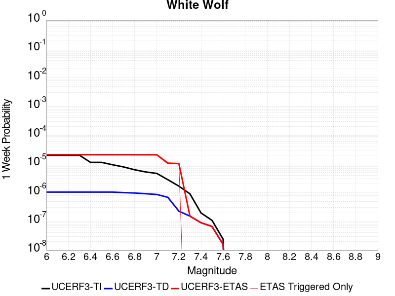 |  |  | 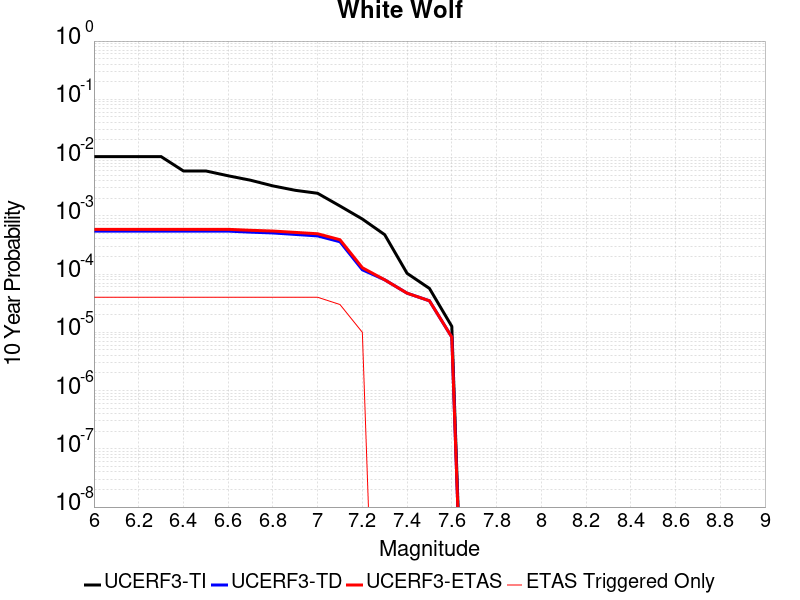 |

| Magnitude | 1 wk TI Prob | 1 wk TD Prob | 1 wk ETAS Prob | 1 wk ETAS/TD Gain | 1 wk ETAS Triggered Only | 1 mo TI Prob | 1 mo TD Prob | 1 mo ETAS Prob | 1 mo ETAS/TD Gain | 1 mo ETAS Triggered Only | 1 yr TI Prob | 1 yr TD Prob | 1 yr ETAS Prob | 1 yr ETAS/TD Gain | 1 yr ETAS Triggered Only | 10 yr TI Prob | 10 yr TD Prob | 10 yr ETAS Prob | 10 yr ETAS/TD Gain | 10 yr ETAS Triggered Only |
|-----|-----|-----|-----|-----|-----|-----|-----|-----|-----|-----|-----|-----|-----|-----|-----|-----|-----|-----|-----|-----|
| 6.0 | 2.0037822E-5 | 1.0468583E-6 | 4.397264E-5 | 42.004383 | 4.2925825E-5 | 8.587355E-5 | 4.4865283E-6 | 4.741216E-5 | 10.567673 | 4.2925825E-5 | 0.001045009 | 5.4622164E-5 | 9.754564E-5 | 1.7858254 | 4.2925825E-5 | 0.010401085 | 5.4609246E-4 | 5.889948E-4 | 1.0785625 | 4.2925825E-5 |
| 6.1 | 2.0037822E-5 | 1.0468583E-6 | 4.397264E-5 | 42.004383 | 4.2925825E-5 | 8.587355E-5 | 4.4865283E-6 | 4.741216E-5 | 10.567673 | 4.2925825E-5 | 0.001045009 | 5.4622164E-5 | 9.754564E-5 | 1.7858254 | 4.2925825E-5 | 0.010401085 | 5.4609246E-4 | 5.889948E-4 | 1.0785625 | 4.2925825E-5 |
| 6.2 | 2.0037822E-5 | 1.0468583E-6 | 4.397264E-5 | 42.004383 | 4.2925825E-5 | 8.587355E-5 | 4.4865283E-6 | 4.741216E-5 | 10.567673 | 4.2925825E-5 | 0.001045009 | 5.4622164E-5 | 9.754564E-5 | 1.7858254 | 4.2925825E-5 | 0.010401085 | 5.4609246E-4 | 5.889948E-4 | 1.0785625 | 4.2925825E-5 |
| 6.3 | 2.0037822E-5 | 1.0468583E-6 | 4.397264E-5 | 42.004383 | 4.2925825E-5 | 8.587355E-5 | 4.4865283E-6 | 4.741216E-5 | 10.567673 | 4.2925825E-5 | 0.001045009 | 5.4622164E-5 | 9.754564E-5 | 1.7858254 | 4.2925825E-5 | 0.010401085 | 5.4609246E-4 | 5.889948E-4 | 1.0785625 | 4.2925825E-5 |
| 6.4 | 1.132487E-5 | 1.0468583E-6 | 4.397264E-5 | 42.004383 | 4.2925825E-5 | 4.8534253E-5 | 4.4865283E-6 | 4.741216E-5 | 10.567673 | 4.2925825E-5 | 5.907443E-4 | 5.4622164E-5 | 9.754564E-5 | 1.7858254 | 4.2925825E-5 | 0.005891764 | 5.4609246E-4 | 5.889948E-4 | 1.0785625 | 4.2925825E-5 |
| 6.5 | 1.132487E-5 | 1.0468583E-6 | 4.397264E-5 | 42.004383 | 4.2925825E-5 | 4.8534253E-5 | 4.4865283E-6 | 4.741216E-5 | 10.567673 | 4.2925825E-5 | 5.907443E-4 | 5.4622164E-5 | 9.754564E-5 | 1.7858254 | 4.2925825E-5 | 0.005891764 | 5.4609246E-4 | 5.889948E-4 | 1.0785625 | 4.2925825E-5 |
| 6.6 | 9.347473E-6 | 1.0468583E-6 | 4.397264E-5 | 42.004383 | 4.2925825E-5 | 4.0059982E-5 | 4.4865283E-6 | 4.741216E-5 | 10.567673 | 4.2925825E-5 | 4.8762115E-4 | 5.4622164E-5 | 9.754564E-5 | 1.7858254 | 4.2925825E-5 | 0.0048655253 | 5.4609246E-4 | 5.889948E-4 | 1.0785625 | 4.2925825E-5 |
| 6.7 | 7.842647E-6 | 1.0047773E-6 | 4.393056E-5 | 43.721687 | 4.2925825E-5 | 3.361091E-5 | 4.306182E-6 | 4.723182E-5 | 10.968376 | 4.2925825E-5 | 4.0913603E-4 | 5.2426552E-5 | 9.535012E-5 | 1.8187373 | 4.2925825E-5 | 0.004083836 | 5.241468E-4 | 5.670501E-4 | 1.0818536 | 4.2925825E-5 |
| 6.8 | 6.26597E-6 | 9.734289E-7 | 4.389921E-5 | 45.097504 | 4.2925825E-5 | 2.685388E-5 | 4.1718313E-6 | 4.7097477E-5 | 11.2894 | 4.2925825E-5 | 3.2689696E-4 | 5.0790914E-5 | 9.371456E-5 | 1.8451048 | 4.2925825E-5 | 0.003264165 | 5.07798E-4 | 5.50702E-4 | 1.0844903 | 4.2925825E-5 |
| 6.9 | 5.258436E-6 | 9.1827343E-7 | 4.384406E-5 | 47.74619 | 4.2925825E-5 | 2.2535958E-5 | 3.935452E-6 | 4.6861107E-5 | 11.907427 | 4.2925825E-5 | 2.7434074E-4 | 4.7913123E-5 | 9.083689E-5 | 1.8958666 | 4.2925825E-5 | 0.0027400232 | 4.7903272E-4 | 5.2193797E-4 | 1.0895665 | 4.2925825E-5 |
| 7.0 | 4.675028E-6 | 8.660704E-7 | 4.3791857E-5 | 50.563854 | 4.2925825E-5 | 2.003568E-5 | 3.7117254E-6 | 4.663739E-5 | 12.564881 | 4.2925825E-5 | 2.4390711E-4 | 4.518937E-5 | 8.811325E-5 | 1.9498669 | 4.2925825E-5 | 0.0024363957 | 4.518065E-4 | 4.947129E-4 | 1.0949664 | 4.2925825E-5 |
| 7.1 | 2.8270078E-6 | 6.8737717E-7 | 4.361317E-5 | 63.448677 | 4.2925825E-5 | 1.2115692E-5 | 2.945899E-6 | 4.5871595E-5 | 15.571341 | 4.2925825E-5 | 1.4749856E-4 | 3.586577E-5 | 7.879006E-5 | 2.1968036 | 4.2925825E-5 | 0.001474007 | 3.5860392E-4 | 4.0151435E-4 | 1.1196597 | 4.2925825E-5 |
| 7.2 | 1.6881406E-6 | 2.2703432E-7 | 4.315285E-5 | 190.07191 | 4.2925825E-5 | 7.2348685E-6 | 9.730038E-7 | 4.3898784E-5 | 45.116764 | 4.2925825E-5 | 8.808096E-5 | 1.1846259E-5 | 5.4771575E-5 | 4.6235332 | 4.2925825E-5 | 8.8046055E-4 | 1.1845643E-4 | 1.6137717E-4 | 1.3623335 | 4.2925825E-5 |
| 7.3 | 9.086107E-7 | 1.5264496E-7 | 1.5264496E-7 | 1.0 | 0.0 | 3.8940398E-6 | 6.5419255E-7 | 6.5419255E-7 | 1.0 | 0.0 | 4.7408903E-5 | 7.964766E-6 | 7.964766E-6 | 1.0 | 0.0 | 4.739879E-4 | 7.964489E-5 | 7.964489E-5 | 1.0 | 0.0 |
| 7.4 | 1.9717383E-7 | 9.003399E-8 | 9.003399E-8 | 1.0 | 0.0 | 8.450304E-7 | 3.8585992E-7 | 3.8585992E-7 | 1.0 | 0.0 | 1.0288197E-5 | 4.697835E-6 | 4.697835E-6 | 1.0 | 0.0 | 1.028772E-4 | 4.6977384E-5 | 4.6977384E-5 | 1.0 | 0.0 |
| 7.5 | 1.086975E-7 | 6.659662E-8 | 6.659662E-8 | 1.0 | 0.0 | 4.6584634E-7 | 2.8541407E-7 | 2.8541407E-7 | 1.0 | 0.0 | 5.6716644E-6 | 3.474911E-6 | 3.474911E-6 | 1.0 | 0.0 | 5.6715195E-5 | 3.474859E-5 | 3.474859E-5 | 1.0 | 0.0 |
| 7.6 | 2.4217808E-8 | 1.5820849E-8 | 1.5820849E-8 | 1.0 | 0.0 | 1.03790605E-7 | 6.780364E-8 | 6.780364E-8 | 1.0 | 0.0 | 1.2636499E-6 | 8.25509E-7 | 8.25509E-7 | 1.0 | 0.0 | 1.2636427E-5 | 8.255064E-6 | 8.255064E-6 | 1.0 | 0.0 |

## Hunting Creek - Bartlett Springs connector 2011
*[(top)](#table-of-contents)*

| 1 Week | 1 Month | 1 Year | 10 Year |
|-----|-----|-----|-----|
|  |  | 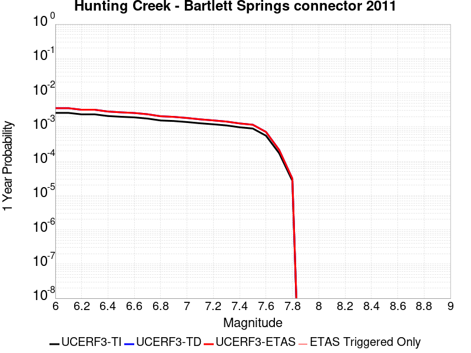 |  |

| Magnitude | 1 wk TI Prob | 1 wk TD Prob | 1 wk ETAS Prob | 1 wk ETAS/TD Gain | 1 wk ETAS Triggered Only | 1 mo TI Prob | 1 mo TD Prob | 1 mo ETAS Prob | 1 mo ETAS/TD Gain | 1 mo ETAS Triggered Only | 1 yr TI Prob | 1 yr TD Prob | 1 yr ETAS Prob | 1 yr ETAS/TD Gain | 1 yr ETAS Triggered Only | 10 yr TI Prob | 10 yr TD Prob | 10 yr ETAS Prob | 10 yr ETAS/TD Gain | 10 yr ETAS Triggered Only |
|-----|-----|-----|-----|-----|-----|-----|-----|-----|-----|-----|-----|-----|-----|-----|-----|-----|-----|-----|-----|-----|
| 6.0 | 4.940016E-5 | 6.7870766E-5 | 6.7870766E-5 | 1.0 | 0.0 | 2.1169778E-4 | 2.9084194E-4 | 2.9084194E-4 | 1.0 | 0.0 | 0.002574374 | 0.0035350819 | 0.0035350819 | 1.0 | 0.0 | 0.025447546 | 0.03477475 | 0.034816183 | 1.0011915 | 4.2925825E-5 |
| 6.1 | 4.940016E-5 | 6.7870766E-5 | 6.7870766E-5 | 1.0 | 0.0 | 2.1169778E-4 | 2.9084194E-4 | 2.9084194E-4 | 1.0 | 0.0 | 0.002574374 | 0.0035350819 | 0.0035350819 | 1.0 | 0.0 | 0.025447546 | 0.03477475 | 0.034816183 | 1.0011915 | 4.2925825E-5 |
| 6.2 | 4.472471E-5 | 6.100572E-5 | 6.100572E-5 | 1.0 | 0.0 | 1.9166325E-4 | 2.6142647E-4 | 2.6142647E-4 | 1.0 | 0.0 | 0.0023310026 | 0.0031781218 | 0.0031781218 | 1.0 | 0.0 | 0.02306703 | 0.031317808 | 0.03135939 | 1.0013278 | 4.2925825E-5 |
| 6.3 | 4.472471E-5 | 6.100572E-5 | 6.100572E-5 | 1.0 | 0.0 | 1.9166325E-4 | 2.6142647E-4 | 2.6142647E-4 | 1.0 | 0.0 | 0.0023310026 | 0.0031781218 | 0.0031781218 | 1.0 | 0.0 | 0.02306703 | 0.031317808 | 0.03135939 | 1.0013278 | 4.2925825E-5 |
| 6.4 | 4.0001003E-5 | 5.410516E-5 | 5.410516E-5 | 1.0 | 0.0 | 1.714216E-4 | 2.318579E-4 | 2.318579E-4 | 1.0 | 0.0 | 0.0020850603 | 0.0028191686 | 0.0028191686 | 1.0 | 0.0 | 0.02065605 | 0.027829198 | 0.02787093 | 1.0014995 | 4.2925825E-5 |
| 6.5 | 3.8033053E-5 | 5.126649E-5 | 5.126649E-5 | 1.0 | 0.0 | 1.6298861E-4 | 2.1969521E-4 | 2.1969521E-4 | 1.0 | 0.0 | 0.0019825802 | 0.0026714848 | 0.0026714848 | 1.0 | 0.0 | 0.019649856 | 0.026391273 | 0.026433067 | 1.0015836 | 4.2925825E-5 |
| 6.6 | 3.653754E-5 | 4.912955E-5 | 4.912955E-5 | 1.0 | 0.0 | 1.5658008E-4 | 2.1053842E-4 | 2.1053842E-4 | 1.0 | 0.0 | 0.0019046954 | 0.0025602889 | 0.0025602889 | 1.0 | 0.0 | 0.018884527 | 0.025307199 | 0.02534904 | 1.0016533 | 4.2925825E-5 |
| 6.7 | 3.372024E-5 | 4.5140216E-5 | 4.5140216E-5 | 1.0 | 0.0 | 1.4450731E-4 | 1.9344388E-4 | 1.9344388E-4 | 1.0 | 0.0 | 0.0017579567 | 0.0023526535 | 0.0023526535 | 1.0 | 0.0 | 0.017441148 | 0.023278862 | 0.023320789 | 1.001801 | 4.2925825E-5 |
| 6.8 | 2.9650024E-5 | 3.9411647E-5 | 3.9411647E-5 | 1.0 | 0.0 | 1.2706534E-4 | 1.6889606E-4 | 1.6889606E-4 | 1.0 | 0.0 | 0.0015459227 | 0.0020543607 | 0.0020543607 | 1.0 | 0.0 | 0.015352124 | 0.020351961 | 0.020394014 | 1.0020663 | 4.2925825E-5 |
| 6.9 | 2.860775E-5 | 3.7812886E-5 | 3.7812886E-5 | 1.0 | 0.0 | 1.2259888E-4 | 1.620452E-4 | 1.620452E-4 | 1.0 | 0.0 | 0.0014916194 | 0.0019711219 | 0.0019711219 | 1.0 | 0.0 | 0.014816469 | 0.019536555 | 0.019578643 | 1.0021542 | 4.2925825E-5 |
| 7.0 | 2.6696067E-5 | 3.5067544E-5 | 3.5067544E-5 | 1.0 | 0.0 | 1.144067E-4 | 1.5028086E-4 | 1.5028086E-4 | 1.0 | 0.0 | 0.0013920115 | 0.0018281427 | 0.0018281427 | 1.0 | 0.0 | 0.013833242 | 0.01813184 | 0.018173987 | 1.0023245 | 4.2925825E-5 |
| 7.1 | 2.456087E-5 | 3.2013326E-5 | 3.2013326E-5 | 1.0 | 0.0 | 1.0525662E-4 | 1.3719281E-4 | 1.3719281E-4 | 1.0 | 0.0 | 0.001280746 | 0.0016690517 | 0.0016690517 | 1.0 | 0.0 | 0.012733897 | 0.016566671 | 0.016566671 | 1.0 | 0.0 |
| 7.2 | 2.295761E-5 | 2.9823148E-5 | 2.9823148E-5 | 1.0 | 0.0 | 9.8386045E-5 | 1.2780727E-4 | 1.2780727E-4 | 1.0 | 0.0 | 0.0011971919 | 0.0015549522 | 0.0015549522 | 1.0 | 0.0 | 0.011907627 | 0.015442378 | 0.015442378 | 1.0 | 0.0 |
| 7.3 | 2.1256936E-5 | 2.7542124E-5 | 2.7542124E-5 | 1.0 | 0.0 | 9.109797E-5 | 1.1803238E-4 | 1.1803238E-4 | 1.0 | 0.0 | 0.0011085535 | 0.0014361058 | 0.0014361058 | 1.0 | 0.0 | 0.011030397 | 0.014269741 | 0.014269741 | 1.0 | 0.0 |
| 7.4 | 1.8784336E-5 | 2.430697E-5 | 2.430697E-5 | 1.0 | 0.0 | 8.050181E-5 | 1.0416861E-4 | 1.0416861E-4 | 1.0 | 0.0 | 9.796688E-4 | 0.0012675226 | 0.0012675226 | 1.0 | 0.0 | 0.009753612 | 0.012604194 | 0.012604194 | 1.0 | 0.0 |
| 7.5 | 1.7248298E-5 | 2.2269056E-5 | 2.2269056E-5 | 1.0 | 0.0 | 7.391918E-5 | 9.543537E-5 | 9.543537E-5 | 1.0 | 0.0 | 8.9959445E-4 | 0.0011613137 | 0.0011613137 | 1.0 | 0.0 | 0.008959615 | 0.011553645 | 0.011553645 | 1.0 | 0.0 |
| 7.6 | 1.0653709E-5 | 1.3722259E-5 | 1.3722259E-5 | 1.0 | 0.0 | 4.5657955E-5 | 5.880837E-5 | 5.880837E-5 | 1.0 | 0.0 | 5.557438E-4 | 7.157594E-4 | 7.157594E-4 | 1.0 | 0.0 | 0.0055435603 | 0.0071350415 | 0.0071350415 | 1.0 | 0.0 |
| 7.7 | 3.286316E-6 | 4.0903997E-6 | 4.0903997E-6 | 1.0 | 0.0 | 1.4084137E-5 | 1.7530168E-5 | 1.7530168E-5 | 1.0 | 0.0 | 1.7146087E-4 | 2.1340905E-4 | 2.1340905E-4 | 1.0 | 0.0 | 0.0017132863 | 0.0021320845 | 0.0021320845 | 1.0 | 0.0 |
| 7.8 | 5.1855085E-7 | 5.972095E-7 | 5.972095E-7 | 1.0 | 0.0 | 2.222359E-6 | 2.5594668E-6 | 2.5594668E-6 | 1.0 | 0.0 | 2.7056883E-5 | 3.1161075E-5 | 3.1161075E-5 | 1.0 | 0.0 | 2.705359E-4 | 3.1156064E-4 | 3.1156064E-4 | 1.0 | 0.0 |

## Santa Rosa Island
*[(top)](#table-of-contents)*

| 1 Week | 1 Month | 1 Year | 10 Year |
|-----|-----|-----|-----|
| 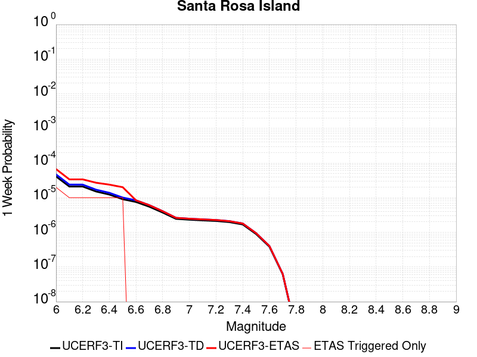 |  | 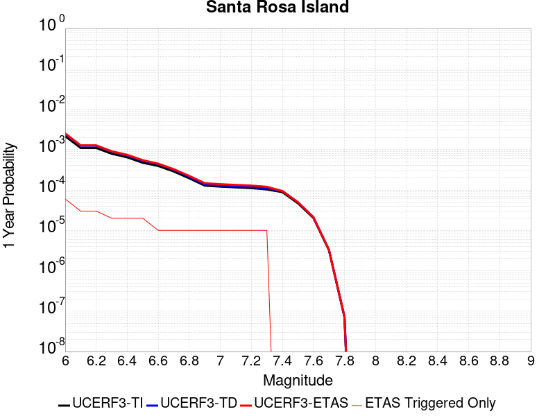 |  |

| Magnitude | 1 wk TI Prob | 1 wk TD Prob | 1 wk ETAS Prob | 1 wk ETAS/TD Gain | 1 wk ETAS Triggered Only | 1 mo TI Prob | 1 mo TD Prob | 1 mo ETAS Prob | 1 mo ETAS/TD Gain | 1 mo ETAS Triggered Only | 1 yr TI Prob | 1 yr TD Prob | 1 yr ETAS Prob | 1 yr ETAS/TD Gain | 1 yr ETAS Triggered Only | 10 yr TI Prob | 10 yr TD Prob | 10 yr ETAS Prob | 10 yr ETAS/TD Gain | 10 yr ETAS Triggered Only |
|-----|-----|-----|-----|-----|-----|-----|-----|-----|-----|-----|-----|-----|-----|-----|-----|-----|-----|-----|-----|-----|
| 6.0 | 4.1143165E-5 | 4.709113E-5 | 9.001493E-5 | 1.9115051 | 4.2925825E-5 | 1.7631594E-4 | 2.0180462E-4 | 2.4472177E-4 | 1.2126669 | 4.2925825E-5 | 0.002144533 | 0.0024543991 | 0.0024972195 | 1.0174464 | 4.2925825E-5 | 0.021239553 | 0.024293557 | 0.02433544 | 1.001724 | 4.2925825E-5 |
| 6.1 | 2.1061249E-5 | 2.3864959E-5 | 6.678976E-5 | 2.7986538 | 4.2925825E-5 | 9.0259375E-5 | 1.0227455E-4 | 1.4519598E-4 | 1.4196688 | 4.2925825E-5 | 0.0010983539 | 0.0012445103 | 0.0012873828 | 1.0344492 | 4.2925825E-5 | 0.01092941 | 0.01237845 | 0.012420844 | 1.0034249 | 4.2925825E-5 |
| 6.2 | 2.1061249E-5 | 2.3864959E-5 | 6.678976E-5 | 2.7986538 | 4.2925825E-5 | 9.0259375E-5 | 1.0227455E-4 | 1.4519598E-4 | 1.4196688 | 4.2925825E-5 | 0.0010983539 | 0.0012445103 | 0.0012873828 | 1.0344492 | 4.2925825E-5 | 0.01092941 | 0.01237845 | 0.012420844 | 1.0034249 | 4.2925825E-5 |
| 6.3 | 1.5158236E-5 | 1.7074419E-5 | 5.999951E-5 | 3.5140002 | 4.2925825E-5 | 6.496225E-5 | 7.3174095E-5 | 1.1609678E-4 | 1.586583 | 4.2925825E-5 | 7.906284E-4 | 8.9054246E-4 | 9.3343004E-4 | 1.048159 | 4.2925825E-5 | 0.007878214 | 0.00887099 | 0.008913536 | 1.004796 | 4.2925825E-5 |
| 6.4 | 1.2341918E-5 | 1.3852917E-5 | 5.6778146E-5 | 4.098642 | 4.2925825E-5 | 5.2892858E-5 | 5.9368336E-5 | 1.0229161E-4 | 1.7229995 | 4.2925825E-5 | 6.437803E-4 | 7.225779E-4 | 7.654727E-4 | 1.0593636 | 4.2925825E-5 | 0.006419184 | 0.0072031217 | 0.007245738 | 1.0059164 | 4.2925825E-5 |
| 6.5 | 9.061158E-6 | 1.0117032E-5 | 5.3042422E-5 | 5.242884 | 4.2925825E-5 | 3.883296E-5 | 4.3358017E-5 | 8.628198E-5 | 1.9899892 | 4.2925825E-5 | 4.726887E-4 | 5.277613E-4 | 5.706645E-4 | 1.0812927 | 4.2925825E-5 | 0.004716845 | 0.0052656177 | 0.0053083175 | 1.0081092 | 4.2925825E-5 |
| 6.6 | 7.5461685E-6 | 8.400734E-6 | 8.400734E-6 | 1.0 | 0.0 | 3.2340322E-5 | 3.600267E-5 | 3.600267E-5 | 1.0 | 0.0 | 3.936723E-4 | 4.3824868E-4 | 4.3824868E-4 | 1.0 | 0.0 | 0.003929756 | 0.0043742736 | 0.0043742736 | 1.0 | 0.0 |
| 6.7 | 5.5023775E-6 | 6.087381E-6 | 6.087381E-6 | 1.0 | 0.0 | 2.3581404E-5 | 2.6088532E-5 | 2.6088532E-5 | 1.0 | 0.0 | 2.8706578E-4 | 3.1758484E-4 | 3.1758484E-4 | 1.0 | 0.0 | 0.0028669522 | 0.0031716316 | 0.0031716316 | 1.0 | 0.0 |
| 6.8 | 3.7351679E-6 | 4.0831405E-6 | 4.0831405E-6 | 1.0 | 0.0 | 1.6007763E-5 | 1.7499071E-5 | 1.7499071E-5 | 1.0 | 0.0 | 1.948771E-4 | 2.1303285E-4 | 2.1303285E-4 | 1.0 | 0.0 | 0.0019470629 | 0.0021285315 | 0.0021285315 | 1.0 | 0.0 |
| 6.9 | 2.456366E-6 | 2.6292707E-6 | 2.6292707E-6 | 1.0 | 0.0 | 1.0527241E-5 | 1.1268255E-5 | 1.1268255E-5 | 1.0 | 0.0 | 1.2816161E-4 | 1.3718239E-4 | 1.3718239E-4 | 1.0 | 0.0 | 0.0012808773 | 0.0013709799 | 0.0013709799 | 1.0 | 0.0 |
| 7.0 | 2.3245157E-6 | 2.4827784E-6 | 2.4827784E-6 | 1.0 | 0.0 | 9.962172E-6 | 1.0640436E-5 | 1.0640436E-5 | 1.0 | 0.0 | 1.2128269E-4 | 1.2953962E-4 | 1.2953962E-4 | 1.0 | 0.0 | 0.0012121652 | 0.0012946434 | 0.0012946434 | 1.0 | 0.0 |
| 7.1 | 2.2248344E-6 | 2.37325E-6 | 2.37325E-6 | 1.0 | 0.0 | 9.53497E-6 | 1.0171032E-5 | 1.0171032E-5 | 1.0 | 0.0 | 1.1608207E-4 | 1.238253E-4 | 1.238253E-4 | 1.0 | 0.0 | 0.0011602144 | 0.0012375651 | 0.0012375651 | 1.0 | 0.0 |
| 7.2 | 2.1350402E-6 | 2.2761542E-6 | 2.2761542E-6 | 1.0 | 0.0 | 9.150141E-6 | 9.75491E-6 | 9.75491E-6 | 1.0 | 0.0 | 1.1139726E-4 | 1.1875957E-4 | 1.1875957E-4 | 1.0 | 0.0 | 0.0011134144 | 0.0011869629 | 0.0011869629 | 1.0 | 0.0 |
| 7.3 | 1.9793572E-6 | 2.1087192E-6 | 2.1087192E-6 | 1.0 | 0.0 | 8.482932E-6 | 9.037337E-6 | 9.037337E-6 | 1.0 | 0.0 | 1.032748E-4 | 1.1002403E-4 | 1.1002403E-4 | 1.0 | 0.0 | 0.0010322682 | 0.0010996974 | 0.0010996974 | 1.0 | 0.0 |
| 7.4 | 1.6951194E-6 | 1.8045735E-6 | 1.8045735E-6 | 1.0 | 0.0 | 7.264777E-6 | 7.733864E-6 | 7.733864E-6 | 1.0 | 0.0 | 8.844508E-5 | 9.415574E-5 | 9.415574E-5 | 1.0 | 0.0 | 8.840988E-4 | 9.411601E-4 | 9.411601E-4 | 1.0 | 0.0 |
| 7.5 | 8.987207E-7 | 9.512216E-7 | 9.512216E-7 | 1.0 | 0.0 | 3.8516546E-6 | 4.0766577E-6 | 4.0766577E-6 | 1.0 | 0.0 | 4.6892885E-5 | 4.9632188E-5 | 4.9632188E-5 | 1.0 | 0.0 | 4.688299E-4 | 4.962122E-4 | 4.962122E-4 | 1.0 | 0.0 |
| 7.6 | 3.8783037E-7 | 4.0529335E-7 | 4.0529335E-7 | 1.0 | 0.0 | 1.6621291E-6 | 1.7369704E-6 | 1.7369704E-6 | 1.0 | 0.0 | 2.0236233E-5 | 2.1147416E-5 | 2.1147416E-5 | 1.0 | 0.0 | 2.023439E-4 | 2.114547E-4 | 2.114547E-4 | 1.0 | 0.0 |
| 7.7 | 6.181804E-8 | 6.339047E-8 | 6.339047E-8 | 1.0 | 0.0 | 2.6493444E-7 | 2.7167343E-7 | 2.7167343E-7 | 1.0 | 0.0 | 3.225572E-6 | 3.307619E-6 | 3.307619E-6 | 1.0 | 0.0 | 3.225525E-5 | 3.3075703E-5 | 3.3075703E-5 | 1.0 | 0.0 |
| 7.8 | 1.3704449E-9 | 1.3964153E-9 | 1.3964153E-9 | 1.0 | 0.0 | 5.873335E-9 | 5.984637E-9 | 5.984637E-9 | 1.0 | 0.0 | 7.1507856E-8 | 7.286295E-8 | 7.286295E-8 | 1.0 | 0.0 | 7.1507833E-7 | 7.286294E-7 | 7.286294E-7 | 1.0 | 0.0 |

## Great Valley 08 (Quinto)
*[(top)](#table-of-contents)*

| 1 Week | 1 Month | 1 Year | 10 Year |
|-----|-----|-----|-----|
|  |  |  |  |

| Magnitude | 1 wk TI Prob | 1 wk TD Prob | 1 wk ETAS Prob | 1 wk ETAS/TD Gain | 1 wk ETAS Triggered Only | 1 mo TI Prob | 1 mo TD Prob | 1 mo ETAS Prob | 1 mo ETAS/TD Gain | 1 mo ETAS Triggered Only | 1 yr TI Prob | 1 yr TD Prob | 1 yr ETAS Prob | 1 yr ETAS/TD Gain | 1 yr ETAS Triggered Only | 10 yr TI Prob | 10 yr TD Prob | 10 yr ETAS Prob | 10 yr ETAS/TD Gain | 10 yr ETAS Triggered Only |
|-----|-----|-----|-----|-----|-----|-----|-----|-----|-----|-----|-----|-----|-----|-----|-----|-----|-----|-----|-----|-----|
| 6.0 | 7.737697E-6 | 8.253038E-6 | 8.253038E-6 | 1.0 | 0.0 | 3.3161137E-5 | 3.536979E-5 | 3.536979E-5 | 1.0 | 0.0 | 4.0366207E-4 | 4.3056096E-4 | 4.734683E-4 | 1.0996546 | 4.2925825E-5 | 0.004029296 | 0.0042991205 | 0.0043418617 | 1.0099418 | 4.2925825E-5 |
| 6.1 | 7.737697E-6 | 8.253038E-6 | 8.253038E-6 | 1.0 | 0.0 | 3.3161137E-5 | 3.536979E-5 | 3.536979E-5 | 1.0 | 0.0 | 4.0366207E-4 | 4.3056096E-4 | 4.734683E-4 | 1.0996546 | 4.2925825E-5 | 0.004029296 | 0.0042991205 | 0.0043418617 | 1.0099418 | 4.2925825E-5 |
| 6.2 | 7.737697E-6 | 8.253038E-6 | 8.253038E-6 | 1.0 | 0.0 | 3.3161137E-5 | 3.536979E-5 | 3.536979E-5 | 1.0 | 0.0 | 4.0366207E-4 | 4.3056096E-4 | 4.734683E-4 | 1.0996546 | 4.2925825E-5 | 0.004029296 | 0.0042991205 | 0.0043418617 | 1.0099418 | 4.2925825E-5 |
| 6.3 | 5.374012E-6 | 5.7505736E-6 | 5.7505736E-6 | 1.0 | 0.0 | 2.3031276E-5 | 2.4645145E-5 | 2.4645145E-5 | 1.0 | 0.0 | 2.803697E-4 | 3.0002446E-4 | 3.0002446E-4 | 1.0 | 0.0 | 0.0028001624 | 0.0029972875 | 0.0029972875 | 1.0 | 0.0 |
| 6.4 | 5.374012E-6 | 5.7505736E-6 | 5.7505736E-6 | 1.0 | 0.0 | 2.3031276E-5 | 2.4645145E-5 | 2.4645145E-5 | 1.0 | 0.0 | 2.803697E-4 | 3.0002446E-4 | 3.0002446E-4 | 1.0 | 0.0 | 0.0028001624 | 0.0029972875 | 0.0029972875 | 1.0 | 0.0 |
| 6.5 | 3.65427E-6 | 3.941324E-6 | 3.941324E-6 | 1.0 | 0.0 | 1.5661062E-5 | 1.689132E-5 | 1.689132E-5 | 1.0 | 0.0 | 1.9065675E-4 | 2.0563944E-4 | 2.0563944E-4 | 1.0 | 0.0 | 0.0019049325 | 0.0020551833 | 0.0020551833 | 1.0 | 0.0 |
| 6.6 | 3.6143538E-6 | 3.8985104E-6 | 3.8985104E-6 | 1.0 | 0.0 | 1.5489995E-5 | 1.6707834E-5 | 1.6707834E-5 | 1.0 | 0.0 | 1.8857437E-4 | 2.0340596E-4 | 2.0340596E-4 | 1.0 | 0.0 | 0.0018841444 | 0.0020328893 | 0.0020328893 | 1.0 | 0.0 |
| 6.7 | 2.4821015E-6 | 2.6857067E-6 | 2.6857067E-6 | 1.0 | 0.0 | 1.0637535E-5 | 1.1510153E-5 | 1.1510153E-5 | 1.0 | 0.0 | 1.2950429E-4 | 1.4013276E-4 | 1.4013276E-4 | 1.0 | 0.0 | 0.0012942884 | 0.0014009989 | 0.0014009989 | 1.0 | 0.0 |
| 6.8 | 4.7110538E-7 | 5.193021E-7 | 5.193021E-7 | 1.0 | 0.0 | 2.0190216E-6 | 2.2255786E-6 | 2.2255786E-6 | 1.0 | 0.0 | 2.458131E-5 | 2.70961E-5 | 2.70961E-5 | 1.0 | 0.0 | 2.457859E-4 | 2.7092977E-4 | 2.7092977E-4 | 1.0 | 0.0 |
| 6.9 | 3.958685E-7 | 4.3703452E-7 | 4.3703452E-7 | 1.0 | 0.0 | 1.6965782E-6 | 1.8730038E-6 | 1.8730038E-6 | 1.0 | 0.0 | 2.0655643E-5 | 2.28036E-5 | 2.28036E-5 | 1.0 | 0.0 | 2.0653724E-4 | 2.2801422E-4 | 2.2801422E-4 | 1.0 | 0.0 |
| 7.0 | 2.70294E-7 | 2.9920008E-7 | 2.9920008E-7 | 1.0 | 0.0 | 1.1584025E-6 | 1.2822856E-6 | 1.2822856E-6 | 1.0 | 0.0 | 1.4103458E-5 | 1.5611728E-5 | 1.5611728E-5 | 1.0 | 0.0 | 1.4102564E-4 | 1.5610759E-4 | 1.5610759E-4 | 1.0 | 0.0 |
| 7.1 | 1.4828602E-7 | 1.6469107E-7 | 1.6469107E-7 | 1.0 | 0.0 | 6.3551136E-7 | 7.058187E-7 | 7.058187E-7 | 1.0 | 0.0 | 7.737323E-6 | 8.593317E-6 | 8.593317E-6 | 1.0 | 0.0 | 7.737054E-5 | 8.593065E-5 | 8.593065E-5 | 1.0 | 0.0 |

## Eaton Roughs 2011 CFM
*[(top)](#table-of-contents)*

| 1 Week | 1 Month | 1 Year | 10 Year |
|-----|-----|-----|-----|
|  |  |  |  |

| Magnitude | 1 wk TI Prob | 1 wk TD Prob | 1 wk ETAS Prob | 1 wk ETAS/TD Gain | 1 wk ETAS Triggered Only | 1 mo TI Prob | 1 mo TD Prob | 1 mo ETAS Prob | 1 mo ETAS/TD Gain | 1 mo ETAS Triggered Only | 1 yr TI Prob | 1 yr TD Prob | 1 yr ETAS Prob | 1 yr ETAS/TD Gain | 1 yr ETAS Triggered Only | 10 yr TI Prob | 10 yr TD Prob | 10 yr ETAS Prob | 10 yr ETAS/TD Gain | 10 yr ETAS Triggered Only |
|-----|-----|-----|-----|-----|-----|-----|-----|-----|-----|-----|-----|-----|-----|-----|-----|-----|-----|-----|-----|-----|
| 6.0 | 6.8044945E-5 | 8.8434645E-5 | 8.8434645E-5 | 1.0 | 0.0 | 2.9158857E-4 | 3.7895713E-4 | 3.7895713E-4 | 1.0 | 0.0 | 0.0035443127 | 0.0046046837 | 0.0046046837 | 1.0 | 0.0 | 0.03488314 | 0.04516368 | 0.045204666 | 1.0009075 | 4.2925825E-5 |
| 6.1 | 6.8044945E-5 | 8.8434645E-5 | 8.8434645E-5 | 1.0 | 0.0 | 2.9158857E-4 | 3.7895713E-4 | 3.7895713E-4 | 1.0 | 0.0 | 0.0035443127 | 0.0046046837 | 0.0046046837 | 1.0 | 0.0 | 0.03488314 | 0.04516368 | 0.045204666 | 1.0009075 | 4.2925825E-5 |
| 6.2 | 6.8044945E-5 | 8.8434645E-5 | 8.8434645E-5 | 1.0 | 0.0 | 2.9158857E-4 | 3.7895713E-4 | 3.7895713E-4 | 1.0 | 0.0 | 0.0035443127 | 0.0046046837 | 0.0046046837 | 1.0 | 0.0 | 0.03488314 | 0.04516368 | 0.045204666 | 1.0009075 | 4.2925825E-5 |
| 6.3 | 6.8044945E-5 | 8.8434645E-5 | 8.8434645E-5 | 1.0 | 0.0 | 2.9158857E-4 | 3.7895713E-4 | 3.7895713E-4 | 1.0 | 0.0 | 0.0035443127 | 0.0046046837 | 0.0046046837 | 1.0 | 0.0 | 0.03488314 | 0.04516368 | 0.045204666 | 1.0009075 | 4.2925825E-5 |
| 6.4 | 4.5830013E-5 | 5.71553E-5 | 5.71553E-5 | 1.0 | 0.0 | 1.9639956E-4 | 2.4493135E-4 | 2.4493135E-4 | 1.0 | 0.0 | 0.0023885423 | 0.002978342 | 0.002978342 | 1.0 | 0.0 | 0.023630321 | 0.029421948 | 0.029421948 | 1.0 | 0.0 |
| 6.5 | 4.5830013E-5 | 5.71553E-5 | 5.71553E-5 | 1.0 | 0.0 | 1.9639956E-4 | 2.4493135E-4 | 2.4493135E-4 | 1.0 | 0.0 | 0.0023885423 | 0.002978342 | 0.002978342 | 1.0 | 0.0 | 0.023630321 | 0.029421948 | 0.029421948 | 1.0 | 0.0 |
| 6.6 | 3.222194E-5 | 3.8262962E-5 | 3.8262962E-5 | 1.0 | 0.0 | 1.3808672E-4 | 1.6397446E-4 | 1.6397446E-4 | 1.0 | 0.0 | 0.0016799092 | 0.0019946485 | 0.0019946485 | 1.0 | 0.0 | 0.016672665 | 0.019776754 | 0.019776754 | 1.0 | 0.0 |
| 6.7 | 2.4155654E-5 | 2.7786275E-5 | 2.7786275E-5 | 1.0 | 0.0 | 1.0352012E-4 | 1.1907864E-4 | 1.1907864E-4 | 1.0 | 0.0 | 0.0012596287 | 0.0014488265 | 0.0014488265 | 1.0 | 0.0 | 0.012525126 | 0.01439499 | 0.01439499 | 1.0 | 0.0 |
| 6.8 | 2.1814667E-5 | 2.4940904E-5 | 2.4940904E-5 | 1.0 | 0.0 | 9.348808E-5 | 1.0688523E-4 | 1.0688523E-4 | 1.0 | 0.0 | 0.001137623 | 0.0013005546 | 0.0013005546 | 1.0 | 0.0 | 0.011318169 | 0.012930086 | 0.012930086 | 1.0 | 0.0 |
| 6.9 | 2.0700467E-5 | 2.362897E-5 | 2.362897E-5 | 1.0 | 0.0 | 8.871327E-5 | 1.01263104E-4 | 1.01263104E-4 | 1.0 | 0.0 | 0.0010795488 | 0.0012321841 | 0.0012321841 | 1.0 | 0.0 | 0.010743194 | 0.012254083 | 0.012254083 | 1.0 | 0.0 |
| 7.0 | 2.0104066E-5 | 2.2936536E-5 | 2.2936536E-5 | 1.0 | 0.0 | 8.615744E-5 | 9.829576E-5 | 9.829576E-5 | 1.0 | 0.0 | 0.0010484619 | 0.0011960969 | 0.0011960969 | 1.0 | 0.0 | 0.010435291 | 0.01189712 | 0.01189712 | 1.0 | 0.0 |
| 7.1 | 1.8225232E-5 | 2.0773083E-5 | 2.0773083E-5 | 1.0 | 0.0 | 7.81058E-5 | 8.902447E-5 | 8.902447E-5 | 1.0 | 0.0 | 9.5052324E-4 | 0.0010833355 | 0.0010833355 | 1.0 | 0.0 | 0.009464677 | 0.010780873 | 0.010780873 | 1.0 | 0.0 |
| 7.2 | 1.7526572E-5 | 1.9993524E-5 | 1.9993524E-5 | 1.0 | 0.0 | 7.511172E-5 | 8.568373E-5 | 8.568373E-5 | 1.0 | 0.0 | 9.141015E-4 | 0.0010427017 | 0.0010427017 | 1.0 | 0.0 | 0.009103506 | 0.010378398 | 0.010378398 | 1.0 | 0.0 |
| 7.3 | 1.5727232E-5 | 1.8021543E-5 | 1.8021543E-5 | 1.0 | 0.0 | 6.740067E-5 | 7.72329E-5 | 7.72329E-5 | 1.0 | 0.0 | 8.2029426E-4 | 9.399062E-4 | 9.399062E-4 | 1.0 | 0.0 | 0.008172729 | 0.009359558 | 0.009359558 | 1.0 | 0.0 |
| 7.4 | 1.4457361E-5 | 1.6598395E-5 | 1.6598395E-5 | 1.0 | 0.0 | 6.195865E-5 | 7.113405E-5 | 7.113405E-5 | 1.0 | 0.0 | 7.540854E-4 | 8.657138E-4 | 8.657138E-4 | 1.0 | 0.0 | 0.007515317 | 0.008623603 | 0.008623603 | 1.0 | 0.0 |
| 7.5 | 1.33280955E-5 | 1.5345471E-5 | 1.5345471E-5 | 1.0 | 0.0 | 5.711916E-5 | 6.576465E-5 | 6.576465E-5 | 1.0 | 0.0 | 6.9520384E-4 | 8.0039137E-4 | 8.0039137E-4 | 1.0 | 0.0 | 0.00693033 | 0.007975256 | 0.007975256 | 1.0 | 0.0 |
| 7.6 | 1.0699478E-5 | 1.2387852E-5 | 1.2387852E-5 | 1.0 | 0.0 | 4.5854096E-5 | 5.3089716E-5 | 5.3089716E-5 | 1.0 | 0.0 | 5.581306E-4 | 6.461761E-4 | 6.461761E-4 | 1.0 | 0.0 | 0.005567309 | 0.0064430824 | 0.0064430824 | 1.0 | 0.0 |
| 7.7 | 5.9390236E-6 | 6.8529853E-6 | 6.8529853E-6 | 1.0 | 0.0 | 2.545271E-5 | 2.9369607E-5 | 2.9369607E-5 | 1.0 | 0.0 | 3.0984267E-4 | 3.5751655E-4 | 3.5751655E-4 | 1.0 | 0.0 | 0.0030941102 | 0.0035694393 | 0.0035694393 | 1.0 | 0.0 |
| 7.8 | 2.1622036E-6 | 2.329702E-6 | 2.329702E-6 | 1.0 | 0.0 | 9.266554E-6 | 9.984399E-6 | 9.984399E-6 | 1.0 | 0.0 | 1.1281446E-4 | 1.21553356E-4 | 1.21553356E-4 | 1.0 | 0.0 | 0.001127572 | 0.0012148687 | 0.0012148687 | 1.0 | 0.0 |
| 7.9 | 4.9586197E-7 | 5.2189216E-7 | 5.2189216E-7 | 1.0 | 0.0 | 2.125121E-6 | 2.2366787E-6 | 2.2366787E-6 | 1.0 | 0.0 | 2.5873042E-5 | 2.7231245E-5 | 2.7231245E-5 | 1.0 | 0.0 | 2.5870028E-4 | 2.7228118E-4 | 2.7228118E-4 | 1.0 | 0.0 |

## Shoreline
*[(top)](#table-of-contents)*

| 1 Week | 1 Month | 1 Year | 10 Year |
|-----|-----|-----|-----|
|  | 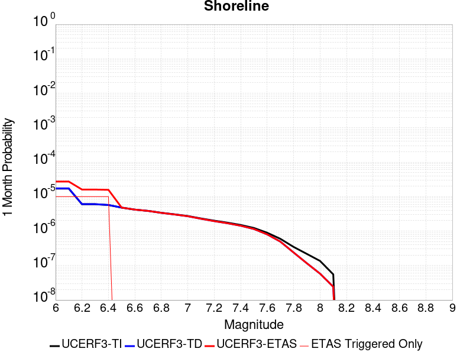 |  |  |

| Magnitude | 1 wk TI Prob | 1 wk TD Prob | 1 wk ETAS Prob | 1 wk ETAS/TD Gain | 1 wk ETAS Triggered Only | 1 mo TI Prob | 1 mo TD Prob | 1 mo ETAS Prob | 1 mo ETAS/TD Gain | 1 mo ETAS Triggered Only | 1 yr TI Prob | 1 yr TD Prob | 1 yr ETAS Prob | 1 yr ETAS/TD Gain | 1 yr ETAS Triggered Only | 10 yr TI Prob | 10 yr TD Prob | 10 yr ETAS Prob | 10 yr ETAS/TD Gain | 10 yr ETAS Triggered Only |
|-----|-----|-----|-----|-----|-----|-----|-----|-----|-----|-----|-----|-----|-----|-----|-----|-----|-----|-----|-----|-----|
| 6.0 | 3.9888673E-6 | 4.0479285E-6 | 4.697358E-5 | 11.60435 | 4.2925825E-5 | 1.7095033E-5 | 1.7348182E-5 | 6.027326E-5 | 3.4743273 | 4.2925825E-5 | 2.0811215E-4 | 2.1119922E-4 | 2.54116E-4 | 1.2032051 | 4.2925825E-5 | 0.0020791737 | 0.0021105339 | 0.0021533691 | 1.020296 | 4.2925825E-5 |
| 6.1 | 3.9888673E-6 | 4.0479285E-6 | 4.697358E-5 | 11.60435 | 4.2925825E-5 | 1.7095033E-5 | 1.7348182E-5 | 6.027326E-5 | 3.4743273 | 4.2925825E-5 | 2.0811215E-4 | 2.1119922E-4 | 2.54116E-4 | 1.2032051 | 4.2925825E-5 | 0.0020791737 | 0.0021105339 | 0.0021533691 | 1.020296 | 4.2925825E-5 |
| 6.2 | 1.4039653E-6 | 1.4100885E-6 | 4.433585E-5 | 31.44189 | 4.2925825E-5 | 6.0169805E-6 | 6.043223E-6 | 4.8968788E-5 | 8.103091 | 4.2925825E-5 | 7.325427E-5 | 7.357382E-5 | 1.16496485E-4 | 1.583396 | 4.2925825E-5 | 7.3230127E-4 | 7.355006E-4 | 7.7839487E-4 | 1.0583198 | 4.2925825E-5 |
| 6.3 | 1.4039653E-6 | 1.4100885E-6 | 4.433585E-5 | 31.44189 | 4.2925825E-5 | 6.0169805E-6 | 6.043223E-6 | 4.8968788E-5 | 8.103091 | 4.2925825E-5 | 7.325427E-5 | 7.357382E-5 | 1.16496485E-4 | 1.583396 | 4.2925825E-5 | 7.3230127E-4 | 7.355006E-4 | 7.7839487E-4 | 1.0583198 | 4.2925825E-5 |
| 6.4 | 1.3314152E-6 | 1.33616E-6 | 4.4261928E-5 | 33.126217 | 4.2925825E-5 | 5.7060524E-6 | 5.726388E-6 | 4.8651968E-5 | 8.4961 | 4.2925825E-5 | 6.946897E-5 | 6.9716596E-5 | 1.1263943E-4 | 1.6156759 | 4.2925825E-5 | 6.9447263E-4 | 6.9695263E-4 | 7.3984853E-4 | 1.0615478 | 4.2925825E-5 |
| 6.5 | 1.1187026E-6 | 1.1203634E-6 | 1.1203634E-6 | 1.0 | 0.0 | 4.794431E-6 | 4.801549E-6 | 4.801549E-6 | 1.0 | 0.0 | 5.8370628E-5 | 5.8457317E-5 | 5.8457317E-5 | 1.0 | 0.0 | 5.83553E-4 | 5.844219E-4 | 5.844219E-4 | 1.0 | 0.0 |
| 6.6 | 9.793089E-7 | 9.784915E-7 | 9.784915E-7 | 1.0 | 0.0 | 4.1970316E-6 | 4.193528E-6 | 4.193528E-6 | 1.0 | 0.0 | 5.1097657E-5 | 5.1055024E-5 | 5.1055024E-5 | 1.0 | 0.0 | 5.108591E-4 | 5.104342E-4 | 5.104342E-4 | 1.0 | 0.0 |
| 6.7 | 8.995986E-7 | 8.972795E-7 | 8.972795E-7 | 1.0 | 0.0 | 3.8554167E-6 | 3.8454777E-6 | 3.8454777E-6 | 1.0 | 0.0 | 4.693869E-5 | 4.68177E-5 | 4.68177E-5 | 1.0 | 0.0 | 4.6928777E-4 | 4.680793E-4 | 4.680793E-4 | 1.0 | 0.0 |
| 6.8 | 7.931612E-7 | 7.8803976E-7 | 7.8803976E-7 | 1.0 | 0.0 | 3.3992578E-6 | 3.377309E-6 | 3.377309E-6 | 1.0 | 0.0 | 4.1385178E-5 | 4.1117964E-5 | 4.1117964E-5 | 1.0 | 0.0 | 4.1377472E-4 | 4.1110412E-4 | 4.1110412E-4 | 1.0 | 0.0 |
| 6.9 | 7.1465956E-7 | 7.078001E-7 | 7.078001E-7 | 1.0 | 0.0 | 3.062823E-6 | 3.0334254E-6 | 3.0334254E-6 | 1.0 | 0.0 | 3.7289232E-5 | 3.693133E-5 | 3.693133E-5 | 1.0 | 0.0 | 3.7282976E-4 | 3.6925232E-4 | 3.6925232E-4 | 1.0 | 0.0 |
| 7.0 | 6.389046E-7 | 6.299453E-7 | 6.299453E-7 | 1.0 | 0.0 | 2.7381598E-6 | 2.699763E-6 | 2.699763E-6 | 1.0 | 0.0 | 3.3336586E-5 | 3.286912E-5 | 3.286912E-5 | 1.0 | 0.0 | 3.3331584E-4 | 3.286428E-4 | 3.286428E-4 | 1.0 | 0.0 |
| 7.1 | 5.4300875E-7 | 5.311126E-7 | 5.311126E-7 | 1.0 | 0.0 | 2.3271782E-6 | 2.276195E-6 | 2.276195E-6 | 1.0 | 0.0 | 2.8333026E-5 | 2.7712322E-5 | 2.7712322E-5 | 1.0 | 0.0 | 2.8329415E-4 | 2.7708875E-4 | 2.7708875E-4 | 1.0 | 0.0 |
| 7.2 | 4.6768855E-7 | 4.5348904E-7 | 4.5348904E-7 | 1.0 | 0.0 | 2.0043778E-6 | 1.9435229E-6 | 1.9435229E-6 | 1.0 | 0.0 | 2.4403027E-5 | 2.3662134E-5 | 2.3662134E-5 | 1.0 | 0.0 | 2.4400349E-4 | 2.3659621E-4 | 2.3659621E-4 | 1.0 | 0.0 |
| 7.3 | 4.0966103E-7 | 3.9385614E-7 | 3.9385614E-7 | 1.0 | 0.0 | 1.7556889E-6 | 1.6879537E-6 | 1.6879537E-6 | 1.0 | 0.0 | 2.1375303E-5 | 2.0550642E-5 | 2.0550642E-5 | 1.0 | 0.0 | 2.1373246E-4 | 2.0548746E-4 | 2.0548746E-4 | 1.0 | 0.0 |
| 7.4 | 3.5105785E-7 | 3.3363924E-7 | 3.3363924E-7 | 1.0 | 0.0 | 1.5045327E-6 | 1.4298816E-6 | 1.4298816E-6 | 1.0 | 0.0 | 1.8317533E-5 | 1.7408669E-5 | 1.7408669E-5 | 1.0 | 0.0 | 1.8316023E-4 | 1.740731E-4 | 1.740731E-4 | 1.0 | 0.0 |
| 7.5 | 2.8737534E-7 | 2.681999E-7 | 2.681999E-7 | 1.0 | 0.0 | 1.2316079E-6 | 1.1494276E-6 | 1.1494276E-6 | 1.0 | 0.0 | 1.4994724E-5 | 1.399419E-5 | 1.399419E-5 | 1.0 | 0.0 | 1.4993713E-4 | 1.3993312E-4 | 1.3993312E-4 | 1.0 | 0.0 |
| 7.6 | 2.0924051E-7 | 1.8778938E-7 | 1.8778938E-7 | 1.0 | 0.0 | 8.967448E-7 | 8.0481135E-7 | 8.0481135E-7 | 1.0 | 0.0 | 1.0917813E-5 | 9.798534E-6 | 9.798534E-6 | 1.0 | 0.0 | 1.0917276E-4 | 9.798103E-5 | 9.798103E-5 | 1.0 | 0.0 |
| 7.7 | 1.392265E-7 | 1.1543341E-7 | 1.1543341E-7 | 1.0 | 0.0 | 5.9668486E-7 | 4.9471447E-7 | 4.9471447E-7 | 1.0 | 0.0 | 7.2646135E-6 | 6.0231323E-6 | 6.0231323E-6 | 1.0 | 0.0 | 7.2643765E-5 | 6.0229693E-5 | 6.0229693E-5 | 1.0 | 0.0 |
| 7.8 | 8.1080074E-8 | 5.5866355E-8 | 5.5866355E-8 | 1.0 | 0.0 | 3.4748598E-7 | 2.394272E-7 | 2.394272E-7 | 1.0 | 0.0 | 4.2306337E-6 | 2.9150222E-6 | 2.9150222E-6 | 1.0 | 0.0 | 4.230553E-5 | 2.9149842E-5 | 2.9149842E-5 | 1.0 | 0.0 |
| 7.9 | 5.0859036E-8 | 2.7243395E-8 | 2.7243395E-8 | 1.0 | 0.0 | 2.1796728E-7 | 1.16757406E-7 | 1.16757406E-7 | 1.0 | 0.0 | 2.6537484E-6 | 1.4215204E-6 | 1.4215204E-6 | 1.0 | 0.0 | 2.6537167E-5 | 1.4215115E-5 | 1.4215115E-5 | 1.0 | 0.0 |
| 8.0 | 3.1760536E-8 | 1.3575991E-8 | 1.3575991E-8 | 1.0 | 0.0 | 1.3611657E-7 | 5.8182817E-8 | 5.8182817E-8 | 1.0 | 0.0 | 1.6572179E-6 | 7.083755E-7 | 7.083755E-7 | 1.0 | 0.0 | 1.6572056E-5 | 7.083733E-6 | 7.083733E-6 | 1.0 | 0.0 |
| 8.1 | 1.2947896E-8 | 5.6625185E-9 | 5.6625185E-9 | 1.0 | 0.0 | 5.5490982E-8 | 2.4267937E-8 | 2.4267937E-8 | 1.0 | 0.0 | 6.756025E-7 | 2.954621E-7 | 2.954621E-7 | 1.0 | 0.0 | 6.7560045E-6 | 2.9546172E-6 | 2.9546172E-6 | 1.0 | 0.0 |

## Great Valley 09 (Laguna Seca)
*[(top)](#table-of-contents)*

| 1 Week | 1 Month | 1 Year | 10 Year |
|-----|-----|-----|-----|
|  |  |  |  |

| Magnitude | 1 wk TI Prob | 1 wk TD Prob | 1 wk ETAS Prob | 1 wk ETAS/TD Gain | 1 wk ETAS Triggered Only | 1 mo TI Prob | 1 mo TD Prob | 1 mo ETAS Prob | 1 mo ETAS/TD Gain | 1 mo ETAS Triggered Only | 1 yr TI Prob | 1 yr TD Prob | 1 yr ETAS Prob | 1 yr ETAS/TD Gain | 1 yr ETAS Triggered Only | 10 yr TI Prob | 10 yr TD Prob | 10 yr ETAS Prob | 10 yr ETAS/TD Gain | 10 yr ETAS Triggered Only |
|-----|-----|-----|-----|-----|-----|-----|-----|-----|-----|-----|-----|-----|-----|-----|-----|-----|-----|-----|-----|-----|
| 6.0 | 5.4353277E-5 | 7.050019E-5 | 7.050019E-5 | 1.0 | 0.0 | 2.3292181E-4 | 3.0211007E-4 | 3.0211007E-4 | 1.0 | 0.0 | 0.0028321352 | 0.0036720056 | 0.0037147738 | 1.0116471 | 4.2925825E-5 | 0.02796312 | 0.036115844 | 0.03615722 | 1.0011456 | 4.2925825E-5 |
| 6.1 | 4.5578287E-5 | 5.822054E-5 | 5.822054E-5 | 1.0 | 0.0 | 1.953209E-4 | 2.4949352E-4 | 2.4949352E-4 | 1.0 | 0.0 | 0.0023754383 | 0.0030333549 | 0.0030333549 | 1.0 | 0.0 | 0.023502063 | 0.029919893 | 0.029919893 | 1.0 | 0.0 |
| 6.2 | 2.8536782E-5 | 3.4736422E-5 | 3.4736422E-5 | 1.0 | 0.0 | 1.2229476E-4 | 1.4886161E-4 | 1.4886161E-4 | 1.0 | 0.0 | 0.0014879217 | 0.0018108576 | 0.0018108576 | 1.0 | 0.0 | 0.014779986 | 0.017958276 | 0.017958276 | 1.0 | 0.0 |
| 6.3 | 2.3698774E-5 | 2.8213344E-5 | 2.8213344E-5 | 1.0 | 0.0 | 1.01562226E-4 | 1.2090833E-4 | 1.2090833E-4 | 1.0 | 0.0 | 0.0012358186 | 0.001471051 | 0.001471051 | 1.0 | 0.0 | 0.012289686 | 0.014611455 | 0.014611455 | 1.0 | 0.0 |
| 6.4 | 1.9191197E-5 | 2.212289E-5 | 2.212289E-5 | 1.0 | 0.0 | 8.2245395E-5 | 9.4808805E-5 | 9.4808805E-5 | 1.0 | 0.0 | 0.0010008777 | 0.0011536906 | 0.0011536906 | 1.0 | 0.0 | 0.009963818 | 0.011477022 | 0.011477022 | 1.0 | 0.0 |
| 6.5 | 1.5203241E-5 | 1.6801298E-5 | 1.6801298E-5 | 1.0 | 0.0 | 6.5155116E-5 | 7.200338E-5 | 7.200338E-5 | 1.0 | 0.0 | 7.9297484E-4 | 8.76301E-4 | 8.76301E-4 | 1.0 | 0.0 | 0.007901512 | 0.008729581 | 0.008729581 | 1.0 | 0.0 |
| 6.6 | 1.0984925E-5 | 1.12425605E-5 | 1.12425605E-5 | 1.0 | 0.0 | 4.70774E-5 | 4.8181533E-5 | 4.8181533E-5 | 1.0 | 0.0 | 5.730166E-4 | 5.8645604E-4 | 5.8645604E-4 | 1.0 | 0.0 | 0.005715413 | 0.0058494755 | 0.0058494755 | 1.0 | 0.0 |
| 6.7 | 9.134616E-6 | 9.019868E-6 | 9.019868E-6 | 1.0 | 0.0 | 3.9147766E-5 | 3.865602E-5 | 3.865602E-5 | 1.0 | 0.0 | 4.7651984E-4 | 4.7053778E-4 | 4.7053778E-4 | 1.0 | 0.0 | 0.004754993 | 0.00469566 | 0.00469566 | 1.0 | 0.0 |
| 6.8 | 7.785589E-6 | 7.4519185E-6 | 7.4519185E-6 | 1.0 | 0.0 | 3.3366385E-5 | 3.1936415E-5 | 3.1936415E-5 | 1.0 | 0.0 | 4.0616E-4 | 3.887585E-4 | 3.887585E-4 | 1.0 | 0.0 | 0.0040541845 | 0.003880988 | 0.003880988 | 1.0 | 0.0 |
| 6.9 | 5.579095E-6 | 4.8984666E-6 | 4.8984666E-6 | 1.0 | 0.0 | 2.3910188E-5 | 2.0993268E-5 | 2.0993268E-5 | 1.0 | 0.0 | 2.9106764E-4 | 2.5556443E-4 | 2.5556443E-4 | 1.0 | 0.0 | 0.002906867 | 0.0025528427 | 0.0025528427 | 1.0 | 0.0 |
| 7.0 | 2.6816688E-6 | 1.521587E-6 | 1.521587E-6 | 1.0 | 0.0 | 1.1492816E-5 | 6.521071E-6 | 6.521071E-6 | 1.0 | 0.0 | 1.3991605E-4 | 7.939124E-5 | 7.939124E-5 | 1.0 | 0.0 | 0.0013982799 | 7.936375E-4 | 7.936375E-4 | 1.0 | 0.0 |
| 7.1 | 1.9951021E-6 | 7.45357E-7 | 7.45357E-7 | 1.0 | 0.0 | 8.55041E-6 | 3.1943835E-6 | 3.1943835E-6 | 1.0 | 0.0 | 1.0409627E-4 | 3.889097E-5 | 3.889097E-5 | 1.0 | 0.0 | 0.0010404752 | 3.8884574E-4 | 3.8884574E-4 | 1.0 | 0.0 |
| 7.2 | 1.9951021E-6 | 7.45357E-7 | 7.45357E-7 | 1.0 | 0.0 | 8.55041E-6 | 3.1943835E-6 | 3.1943835E-6 | 1.0 | 0.0 | 1.0409627E-4 | 3.889097E-5 | 3.889097E-5 | 1.0 | 0.0 | 0.0010404752 | 3.8884574E-4 | 3.8884574E-4 | 1.0 | 0.0 |
| 7.3 | 1.7087556E-6 | 6.578663E-7 | 6.578663E-7 | 1.0 | 0.0 | 7.3232177E-6 | 2.819424E-6 | 2.819424E-6 | 1.0 | 0.0 | 8.915652E-5 | 3.432599E-5 | 3.432599E-5 | 1.0 | 0.0 | 8.9120766E-4 | 3.432109E-4 | 3.432109E-4 | 1.0 | 0.0 |
| 7.4 | 1.3804846E-6 | 6.0737113E-7 | 6.0737113E-7 | 1.0 | 0.0 | 5.916349E-6 | 2.6030168E-6 | 2.6030168E-6 | 1.0 | 0.0 | 7.2029165E-5 | 3.169131E-5 | 3.169131E-5 | 1.0 | 0.0 | 7.200583E-4 | 3.168719E-4 | 3.168719E-4 | 1.0 | 0.0 |
| 7.5 | 1.3804846E-6 | 6.0737113E-7 | 6.0737113E-7 | 1.0 | 0.0 | 5.916349E-6 | 2.6030168E-6 | 2.6030168E-6 | 1.0 | 0.0 | 7.2029165E-5 | 3.169131E-5 | 3.169131E-5 | 1.0 | 0.0 | 7.200583E-4 | 3.168719E-4 | 3.168719E-4 | 1.0 | 0.0 |

## Channel Islands Thrust
*[(top)](#table-of-contents)*

| 1 Week | 1 Month | 1 Year | 10 Year |
|-----|-----|-----|-----|
|  |  |  |  |

| Magnitude | 1 wk TI Prob | 1 wk TD Prob | 1 wk ETAS Prob | 1 wk ETAS/TD Gain | 1 wk ETAS Triggered Only | 1 mo TI Prob | 1 mo TD Prob | 1 mo ETAS Prob | 1 mo ETAS/TD Gain | 1 mo ETAS Triggered Only | 1 yr TI Prob | 1 yr TD Prob | 1 yr ETAS Prob | 1 yr ETAS/TD Gain | 1 yr ETAS Triggered Only | 10 yr TI Prob | 10 yr TD Prob | 10 yr ETAS Prob | 10 yr ETAS/TD Gain | 10 yr ETAS Triggered Only |
|-----|-----|-----|-----|-----|-----|-----|-----|-----|-----|-----|-----|-----|-----|-----|-----|-----|-----|-----|-----|-----|
| 6.0 | 2.2156251E-5 | 2.4092022E-5 | 6.7016816E-5 | 2.7817013 | 4.2925825E-5 | 9.495191E-5 | 1.03248036E-4 | 1.4616943E-4 | 1.4157114 | 4.2925825E-5 | 0.0011554264 | 0.0012564266 | 0.0012992984 | 1.0341221 | 4.2925825E-5 | 0.011494373 | 0.0125038205 | 0.01254621 | 1.0033901 | 4.2925825E-5 |
| 6.1 | 2.2156251E-5 | 2.4092022E-5 | 6.7016816E-5 | 2.7817013 | 4.2925825E-5 | 9.495191E-5 | 1.03248036E-4 | 1.4616943E-4 | 1.4157114 | 4.2925825E-5 | 0.0011554264 | 0.0012564266 | 0.0012992984 | 1.0341221 | 4.2925825E-5 | 0.011494373 | 0.0125038205 | 0.01254621 | 1.0033901 | 4.2925825E-5 |
| 6.2 | 2.2156251E-5 | 2.4092022E-5 | 6.7016816E-5 | 2.7817013 | 4.2925825E-5 | 9.495191E-5 | 1.03248036E-4 | 1.4616943E-4 | 1.4157114 | 4.2925825E-5 | 0.0011554264 | 0.0012564266 | 0.0012992984 | 1.0341221 | 4.2925825E-5 | 0.011494373 | 0.0125038205 | 0.01254621 | 1.0033901 | 4.2925825E-5 |
| 6.3 | 2.2156251E-5 | 2.4092022E-5 | 6.7016816E-5 | 2.7817013 | 4.2925825E-5 | 9.495191E-5 | 1.03248036E-4 | 1.4616943E-4 | 1.4157114 | 4.2925825E-5 | 0.0011554264 | 0.0012564266 | 0.0012992984 | 1.0341221 | 4.2925825E-5 | 0.011494373 | 0.0125038205 | 0.01254621 | 1.0033901 | 4.2925825E-5 |
| 6.4 | 2.2156251E-5 | 2.4092022E-5 | 6.7016816E-5 | 2.7817013 | 4.2925825E-5 | 9.495191E-5 | 1.03248036E-4 | 1.4616943E-4 | 1.4157114 | 4.2925825E-5 | 0.0011554264 | 0.0012564266 | 0.0012992984 | 1.0341221 | 4.2925825E-5 | 0.011494373 | 0.0125038205 | 0.01254621 | 1.0033901 | 4.2925825E-5 |
| 6.5 | 2.2156251E-5 | 2.4092022E-5 | 6.7016816E-5 | 2.7817013 | 4.2925825E-5 | 9.495191E-5 | 1.03248036E-4 | 1.4616943E-4 | 1.4157114 | 4.2925825E-5 | 0.0011554264 | 0.0012564266 | 0.0012992984 | 1.0341221 | 4.2925825E-5 | 0.011494373 | 0.0125038205 | 0.01254621 | 1.0033901 | 4.2925825E-5 |
| 6.6 | 2.2156251E-5 | 2.4092022E-5 | 6.7016816E-5 | 2.7817013 | 4.2925825E-5 | 9.495191E-5 | 1.03248036E-4 | 1.4616943E-4 | 1.4157114 | 4.2925825E-5 | 0.0011554264 | 0.0012564266 | 0.0012992984 | 1.0341221 | 4.2925825E-5 | 0.011494373 | 0.0125038205 | 0.01254621 | 1.0033901 | 4.2925825E-5 |
| 6.7 | 1.0601296E-5 | 1.1379544E-5 | 5.430488E-5 | 4.772149 | 4.2925825E-5 | 4.5433335E-5 | 4.876859E-5 | 9.169232E-5 | 1.8801512 | 4.2925825E-5 | 5.5301044E-4 | 5.936007E-4 | 6.3650106E-4 | 1.0722713 | 4.2925825E-5 | 0.005516363 | 0.005920653 | 0.005963325 | 1.0072073 | 4.2925825E-5 |
| 6.8 | 1.0246747E-5 | 1.0996669E-5 | 5.392202E-5 | 4.9034867 | 4.2925825E-5 | 4.391389E-5 | 4.7127756E-5 | 9.005156E-5 | 1.9107966 | 4.2925825E-5 | 5.345204E-4 | 5.7363417E-4 | 6.1653537E-4 | 1.0747885 | 4.2925825E-5 | 0.0053323656 | 0.005722025 | 0.005764705 | 1.0074589 | 4.2925825E-5 |
| 6.9 | 9.049551E-6 | 9.699645E-6 | 5.262505E-5 | 5.425462 | 4.2925825E-5 | 3.878322E-5 | 4.1569267E-5 | 8.44933E-5 | 2.0325909 | 4.2925825E-5 | 4.7208337E-4 | 5.059924E-4 | 5.488965E-4 | 1.084792 | 4.2925825E-5 | 0.0047108172 | 0.0050488203 | 0.0050915293 | 1.0084592 | 4.2925825E-5 |
| 7.0 | 8.6542195E-6 | 9.274603E-6 | 5.220003E-5 | 5.6282763 | 4.2925825E-5 | 3.7088983E-5 | 3.9747716E-5 | 8.267183E-5 | 2.079914 | 4.2925825E-5 | 4.5146482E-4 | 4.8382508E-4 | 5.2673015E-4 | 1.0886788 | 4.2925825E-5 | 0.004505487 | 0.0048281294 | 0.004870848 | 1.0088478 | 4.2925825E-5 |
| 7.1 | 8.391028E-6 | 8.992925E-6 | 5.1918363E-5 | 5.7732453 | 4.2925825E-5 | 3.5961057E-5 | 3.8540562E-5 | 8.146473E-5 | 2.1137402 | 4.2925825E-5 | 4.3773788E-4 | 4.6913436E-4 | 5.1204005E-4 | 1.0914571 | 4.2925825E-5 | 0.004368766 | 0.0046818503 | 0.004724575 | 1.0091256 | 4.2925825E-5 |
| 7.2 | 5.965188E-6 | 6.3716957E-6 | 4.9297247E-5 | 7.736912 | 4.2925825E-5 | 2.556484E-5 | 2.7306984E-5 | 7.023164E-5 | 2.5719295 | 4.2925825E-5 | 3.1120746E-4 | 3.3241237E-4 | 3.753239E-4 | 1.1290914 | 4.2925825E-5 | 0.00310772 | 0.0033192094 | 0.0033619928 | 1.0128896 | 4.2925825E-5 |
| 7.3 | 4.877518E-6 | 5.206007E-6 | 5.206007E-6 | 1.0 | 0.0 | 2.0903482E-5 | 2.231127E-5 | 2.231127E-5 | 1.0 | 0.0 | 2.5447016E-4 | 2.716063E-4 | 2.716063E-4 | 1.0 | 0.0 | 0.0025417898 | 0.0027127897 | 0.0027127897 | 1.0 | 0.0 |
| 7.4 | 3.8829853E-6 | 4.141863E-6 | 4.141863E-6 | 1.0 | 0.0 | 1.664126E-5 | 1.7750723E-5 | 1.7750723E-5 | 1.0 | 0.0 | 2.0258849E-4 | 2.1609403E-4 | 2.1609403E-4 | 1.0 | 0.0 | 0.002024039 | 0.002158881 | 0.002158881 | 1.0 | 0.0 |
| 7.5 | 1.3489616E-6 | 1.4277905E-6 | 1.4277905E-6 | 1.0 | 0.0 | 5.7812517E-6 | 6.119088E-6 | 6.119088E-6 | 1.0 | 0.0 | 7.038446E-5 | 7.449739E-5 | 7.449739E-5 | 1.0 | 0.0 | 7.036218E-4 | 7.4472814E-4 | 7.4472814E-4 | 1.0 | 0.0 |
| 7.6 | 6.058192E-7 | 6.35378E-7 | 6.35378E-7 | 1.0 | 0.0 | 2.5963652E-6 | 2.7230458E-6 | 2.7230458E-6 | 1.0 | 0.0 | 3.161029E-5 | 3.3152595E-5 | 3.3152595E-5 | 1.0 | 0.0 | 3.1605794E-4 | 3.314781E-4 | 3.314781E-4 | 1.0 | 0.0 |
| 7.7 | 2.2170494E-7 | 2.2607924E-7 | 2.2607924E-7 | 1.0 | 0.0 | 9.5016367E-7 | 9.689107E-7 | 9.689107E-7 | 1.0 | 0.0 | 1.1568181E-5 | 1.17964355E-5 | 1.17964355E-5 | 1.0 | 0.0 | 1.1567579E-4 | 1.179592E-4 | 1.179592E-4 | 1.0 | 0.0 |
| 7.8 | 2.1613102E-8 | 1.5466837E-8 | 1.5466837E-8 | 1.0 | 0.0 | 9.262757E-8 | 6.628645E-8 | 6.628645E-8 | 1.0 | 0.0 | 1.1277401E-6 | 8.070372E-7 | 8.070372E-7 | 1.0 | 0.0 | 1.1277344E-5 | 8.07035E-6 | 8.07035E-6 | 1.0 | 0.0 |

## South Cuyama
*[(top)](#table-of-contents)*

| 1 Week | 1 Month | 1 Year | 10 Year |
|-----|-----|-----|-----|
|  |  |  |  |

| Magnitude | 1 wk TI Prob | 1 wk TD Prob | 1 wk ETAS Prob | 1 wk ETAS/TD Gain | 1 wk ETAS Triggered Only | 1 mo TI Prob | 1 mo TD Prob | 1 mo ETAS Prob | 1 mo ETAS/TD Gain | 1 mo ETAS Triggered Only | 1 yr TI Prob | 1 yr TD Prob | 1 yr ETAS Prob | 1 yr ETAS/TD Gain | 1 yr ETAS Triggered Only | 10 yr TI Prob | 10 yr TD Prob | 10 yr ETAS Prob | 10 yr ETAS/TD Gain | 10 yr ETAS Triggered Only |
|-----|-----|-----|-----|-----|-----|-----|-----|-----|-----|-----|-----|-----|-----|-----|-----|-----|-----|-----|-----|-----|
| 6.0 | 1.2747308E-6 | 1.2818697E-6 | 1.2818697E-6 | 1.0 | 0.0 | 5.4631205E-6 | 5.4937163E-6 | 5.4937163E-6 | 1.0 | 0.0 | 6.6511464E-5 | 6.6884015E-5 | 1.0980696E-4 | 1.6417521 | 4.2925825E-5 | 6.649156E-4 | 6.686458E-4 | 7.115429E-4 | 1.0641552 | 4.2925825E-5 |
| 6.1 | 1.2747308E-6 | 1.2818697E-6 | 1.2818697E-6 | 1.0 | 0.0 | 5.4631205E-6 | 5.4937163E-6 | 5.4937163E-6 | 1.0 | 0.0 | 6.6511464E-5 | 6.6884015E-5 | 1.0980696E-4 | 1.6417521 | 4.2925825E-5 | 6.649156E-4 | 6.686458E-4 | 7.115429E-4 | 1.0641552 | 4.2925825E-5 |
| 6.2 | 1.2747308E-6 | 1.2818697E-6 | 1.2818697E-6 | 1.0 | 0.0 | 5.4631205E-6 | 5.4937163E-6 | 5.4937163E-6 | 1.0 | 0.0 | 6.6511464E-5 | 6.6884015E-5 | 1.0980696E-4 | 1.6417521 | 4.2925825E-5 | 6.649156E-4 | 6.686458E-4 | 7.115429E-4 | 1.0641552 | 4.2925825E-5 |
| 6.3 | 1.2747308E-6 | 1.2818697E-6 | 1.2818697E-6 | 1.0 | 0.0 | 5.4631205E-6 | 5.4937163E-6 | 5.4937163E-6 | 1.0 | 0.0 | 6.6511464E-5 | 6.6884015E-5 | 1.0980696E-4 | 1.6417521 | 4.2925825E-5 | 6.649156E-4 | 6.686458E-4 | 7.115429E-4 | 1.0641552 | 4.2925825E-5 |
| 6.4 | 1.2747308E-6 | 1.2818697E-6 | 1.2818697E-6 | 1.0 | 0.0 | 5.4631205E-6 | 5.4937163E-6 | 5.4937163E-6 | 1.0 | 0.0 | 6.6511464E-5 | 6.6884015E-5 | 1.0980696E-4 | 1.6417521 | 4.2925825E-5 | 6.649156E-4 | 6.686458E-4 | 7.115429E-4 | 1.0641552 | 4.2925825E-5 |
| 6.5 | 1.2747308E-6 | 1.2818697E-6 | 1.2818697E-6 | 1.0 | 0.0 | 5.4631205E-6 | 5.4937163E-6 | 5.4937163E-6 | 1.0 | 0.0 | 6.6511464E-5 | 6.6884015E-5 | 1.0980696E-4 | 1.6417521 | 4.2925825E-5 | 6.649156E-4 | 6.686458E-4 | 7.115429E-4 | 1.0641552 | 4.2925825E-5 |
| 6.6 | 1.2747308E-6 | 1.2818697E-6 | 1.2818697E-6 | 1.0 | 0.0 | 5.4631205E-6 | 5.4937163E-6 | 5.4937163E-6 | 1.0 | 0.0 | 6.6511464E-5 | 6.6884015E-5 | 1.0980696E-4 | 1.6417521 | 4.2925825E-5 | 6.649156E-4 | 6.686458E-4 | 7.115429E-4 | 1.0641552 | 4.2925825E-5 |
| 6.7 | 1.2747308E-6 | 1.2818697E-6 | 1.2818697E-6 | 1.0 | 0.0 | 5.4631205E-6 | 5.4937163E-6 | 5.4937163E-6 | 1.0 | 0.0 | 6.6511464E-5 | 6.6884015E-5 | 1.0980696E-4 | 1.6417521 | 4.2925825E-5 | 6.649156E-4 | 6.686458E-4 | 7.115429E-4 | 1.0641552 | 4.2925825E-5 |
| 6.8 | 1.2747308E-6 | 1.2818697E-6 | 1.2818697E-6 | 1.0 | 0.0 | 5.4631205E-6 | 5.4937163E-6 | 5.4937163E-6 | 1.0 | 0.0 | 6.6511464E-5 | 6.6884015E-5 | 1.0980696E-4 | 1.6417521 | 4.2925825E-5 | 6.649156E-4 | 6.686458E-4 | 7.115429E-4 | 1.0641552 | 4.2925825E-5 |
| 6.9 | 8.4566324E-7 | 8.507883E-7 | 8.507883E-7 | 1.0 | 0.0 | 3.624266E-6 | 3.6462304E-6 | 3.6462304E-6 | 1.0 | 0.0 | 4.4124543E-5 | 4.439196E-5 | 8.731588E-5 | 1.96693 | 4.2925825E-5 | 4.4115784E-4 | 4.4383196E-4 | 4.8673875E-4 | 1.0966735 | 4.2925825E-5 |
| 7.0 | 8.2277904E-7 | 8.27782E-7 | 8.27782E-7 | 1.0 | 0.0 | 3.526191E-6 | 3.5476323E-6 | 3.5476323E-6 | 1.0 | 0.0 | 4.293053E-5 | 4.3191576E-5 | 8.611555E-5 | 1.9938042 | 4.2925825E-5 | 4.292224E-4 | 4.3183283E-4 | 4.747401E-4 | 1.0993608 | 4.2925825E-5 |
| 7.1 | 6.7661887E-7 | 6.80913E-7 | 6.80913E-7 | 1.0 | 0.0 | 2.899792E-6 | 2.9181954E-6 | 2.9181954E-6 | 1.0 | 0.0 | 3.5304394E-5 | 3.5528454E-5 | 3.5528454E-5 | 1.0 | 0.0 | 3.5298787E-4 | 3.552281E-4 | 3.552281E-4 | 1.0 | 0.0 |
| 7.2 | 5.783336E-7 | 5.8211907E-7 | 5.8211907E-7 | 1.0 | 0.0 | 2.4785702E-6 | 2.4947938E-6 | 2.4947938E-6 | 1.0 | 0.0 | 3.0176174E-5 | 3.0373692E-5 | 3.0373692E-5 | 1.0 | 0.0 | 3.0172078E-4 | 3.0369565E-4 | 3.0369565E-4 | 1.0 | 0.0 |
| 7.3 | 5.136759E-7 | 5.170938E-7 | 5.170938E-7 | 1.0 | 0.0 | 2.2014663E-6 | 2.2161144E-6 | 2.2161144E-6 | 1.0 | 0.0 | 2.6802521E-5 | 2.698086E-5 | 2.698086E-5 | 1.0 | 0.0 | 2.679929E-4 | 2.6977606E-4 | 2.6977606E-4 | 1.0 | 0.0 |
| 7.4 | 4.3370295E-7 | 4.3665364E-7 | 4.3665364E-7 | 1.0 | 0.0 | 1.8587256E-6 | 1.8713713E-6 | 1.8713713E-6 | 1.0 | 0.0 | 2.2629749E-5 | 2.278371E-5 | 2.278371E-5 | 1.0 | 0.0 | 2.2627445E-4 | 2.278139E-4 | 2.278139E-4 | 1.0 | 0.0 |
| 7.5 | 3.3242574E-7 | 3.3476465E-7 | 3.3476465E-7 | 1.0 | 0.0 | 1.4246809E-6 | 1.4347048E-6 | 1.4347048E-6 | 1.0 | 0.0 | 1.7345352E-5 | 1.7467393E-5 | 1.7467393E-5 | 1.0 | 0.0 | 1.7343998E-4 | 1.7466032E-4 | 1.7466032E-4 | 1.0 | 0.0 |
| 7.6 | 2.0627535E-7 | 2.07789E-7 | 2.07789E-7 | 1.0 | 0.0 | 8.840369E-7 | 8.90524E-7 | 8.90524E-7 | 1.0 | 0.0 | 1.0763096E-5 | 1.0842076E-5 | 1.0842076E-5 | 1.0 | 0.0 | 1.0762575E-4 | 1.0841556E-4 | 1.0841556E-4 | 1.0 | 0.0 |
| 7.7 | 6.15236E-8 | 6.1983044E-8 | 6.1983044E-8 | 1.0 | 0.0 | 2.6367252E-7 | 2.656416E-7 | 2.656416E-7 | 1.0 | 0.0 | 3.2102084E-6 | 3.2341818E-6 | 3.2341818E-6 | 1.0 | 0.0 | 3.210162E-5 | 3.234136E-5 | 3.234136E-5 | 1.0 | 0.0 |
| 7.8 | 1.1765573E-8 | 1.1873414E-8 | 1.1873414E-8 | 1.0 | 0.0 | 5.0423886E-8 | 5.0886058E-8 | 5.0886058E-8 | 1.0 | 0.0 | 6.1391063E-7 | 6.195376E-7 | 6.195376E-7 | 1.0 | 0.0 | 6.1390897E-6 | 6.19536E-6 | 6.19536E-6 | 1.0 | 0.0 |
| 7.9 | 6.0381755E-10 | 6.10058E-10 | 6.10058E-10 | 1.0 | 0.0 | 2.5877895E-9 | 2.614534E-9 | 2.614534E-9 | 1.0 | 0.0 | 3.1506335E-8 | 3.1831952E-8 | 3.1831952E-8 | 1.0 | 0.0 | 3.1506332E-7 | 3.183195E-7 | 3.183195E-7 | 1.0 | 0.0 |

## Santa Monica alt 1
*[(top)](#table-of-contents)*

| 1 Week | 1 Month | 1 Year | 10 Year |
|-----|-----|-----|-----|
|  |  |  |  |

| Magnitude | 1 wk TI Prob | 1 wk TD Prob | 1 wk ETAS Prob | 1 wk ETAS/TD Gain | 1 wk ETAS Triggered Only | 1 mo TI Prob | 1 mo TD Prob | 1 mo ETAS Prob | 1 mo ETAS/TD Gain | 1 mo ETAS Triggered Only | 1 yr TI Prob | 1 yr TD Prob | 1 yr ETAS Prob | 1 yr ETAS/TD Gain | 1 yr ETAS Triggered Only | 10 yr TI Prob | 10 yr TD Prob | 10 yr ETAS Prob | 10 yr ETAS/TD Gain | 10 yr ETAS Triggered Only |
|-----|-----|-----|-----|-----|-----|-----|-----|-----|-----|-----|-----|-----|-----|-----|-----|-----|-----|-----|-----|-----|
| 6.0 | 1.1066008E-5 | 1.1480312E-5 | 1.1480312E-5 | 1.0 | 0.0 | 4.742488E-5 | 4.920049E-5 | 4.920049E-5 | 1.0 | 0.0 | 5.7724497E-4 | 5.9886527E-4 | 5.9886527E-4 | 1.0 | 0.0 | 0.005757478 | 0.0059739016 | 0.0060165706 | 1.0071427 | 4.2925825E-5 |
| 6.1 | 1.1066008E-5 | 1.1480312E-5 | 1.1480312E-5 | 1.0 | 0.0 | 4.742488E-5 | 4.920049E-5 | 4.920049E-5 | 1.0 | 0.0 | 5.7724497E-4 | 5.9886527E-4 | 5.9886527E-4 | 1.0 | 0.0 | 0.005757478 | 0.0059739016 | 0.0060165706 | 1.0071427 | 4.2925825E-5 |
| 6.2 | 1.1066008E-5 | 1.1480312E-5 | 1.1480312E-5 | 1.0 | 0.0 | 4.742488E-5 | 4.920049E-5 | 4.920049E-5 | 1.0 | 0.0 | 5.7724497E-4 | 5.9886527E-4 | 5.9886527E-4 | 1.0 | 0.0 | 0.005757478 | 0.0059739016 | 0.0060165706 | 1.0071427 | 4.2925825E-5 |
| 6.3 | 1.1066008E-5 | 1.1480312E-5 | 1.1480312E-5 | 1.0 | 0.0 | 4.742488E-5 | 4.920049E-5 | 4.920049E-5 | 1.0 | 0.0 | 5.7724497E-4 | 5.9886527E-4 | 5.9886527E-4 | 1.0 | 0.0 | 0.005757478 | 0.0059739016 | 0.0060165706 | 1.0071427 | 4.2925825E-5 |
| 6.4 | 1.1066008E-5 | 1.1480312E-5 | 1.1480312E-5 | 1.0 | 0.0 | 4.742488E-5 | 4.920049E-5 | 4.920049E-5 | 1.0 | 0.0 | 5.7724497E-4 | 5.9886527E-4 | 5.9886527E-4 | 1.0 | 0.0 | 0.005757478 | 0.0059739016 | 0.0060165706 | 1.0071427 | 4.2925825E-5 |
| 6.5 | 8.183544E-6 | 8.335434E-6 | 8.335434E-6 | 1.0 | 0.0 | 3.5071862E-5 | 3.572281E-5 | 3.572281E-5 | 1.0 | 0.0 | 4.2691626E-4 | 4.3483998E-4 | 4.3483998E-4 | 1.0 | 0.0 | 0.0042609703 | 0.004340057 | 0.004340057 | 1.0 | 0.0 |
| 6.6 | 8.1543285E-6 | 8.303648E-6 | 8.303648E-6 | 1.0 | 0.0 | 3.4946657E-5 | 3.558659E-5 | 3.558659E-5 | 1.0 | 0.0 | 4.2539247E-4 | 4.3318217E-4 | 4.3318217E-4 | 1.0 | 0.0 | 0.0042457907 | 0.004323543 | 0.004323543 | 1.0 | 0.0 |
| 6.7 | 8.110878E-6 | 8.257045E-6 | 8.257045E-6 | 1.0 | 0.0 | 3.4760444E-5 | 3.5386864E-5 | 3.5386864E-5 | 1.0 | 0.0 | 4.231262E-4 | 4.3075148E-4 | 4.3075148E-4 | 1.0 | 0.0 | 0.0042232145 | 0.004299331 | 0.004299331 | 1.0 | 0.0 |
| 6.8 | 7.644036E-6 | 7.751063E-6 | 7.751063E-6 | 1.0 | 0.0 | 3.275974E-5 | 3.3218425E-5 | 3.3218425E-5 | 1.0 | 0.0 | 3.9877684E-4 | 4.043607E-4 | 4.043607E-4 | 1.0 | 0.0 | 0.00398062 | 0.004036396 | 0.004036396 | 1.0 | 0.0 |
| 6.9 | 7.3698293E-6 | 7.4557215E-6 | 7.4557215E-6 | 1.0 | 0.0 | 3.15846E-5 | 3.195271E-5 | 3.195271E-5 | 1.0 | 0.0 | 3.8447464E-4 | 3.889562E-4 | 3.889562E-4 | 1.0 | 0.0 | 0.0038381014 | 0.0038828978 | 0.0038828978 | 1.0 | 0.0 |
| 7.0 | 7.209872E-6 | 7.2856283E-6 | 7.2856283E-6 | 1.0 | 0.0 | 3.0899086E-5 | 3.1223753E-5 | 3.1223753E-5 | 1.0 | 0.0 | 3.7613141E-4 | 3.800843E-4 | 3.800843E-4 | 1.0 | 0.0 | 0.0037549543 | 0.003794485 | 0.003794485 | 1.0 | 0.0 |
| 7.1 | 5.603456E-6 | 5.5238947E-6 | 5.5238947E-6 | 1.0 | 0.0 | 2.4014591E-5 | 2.3673623E-5 | 2.3673623E-5 | 1.0 | 0.0 | 2.923384E-4 | 2.8818863E-4 | 2.8818863E-4 | 1.0 | 0.0 | 0.0029195412 | 0.002878191 | 0.002878191 | 1.0 | 0.0 |
| 7.2 | 4.7483613E-6 | 4.591135E-6 | 4.591135E-6 | 1.0 | 0.0 | 2.0349962E-5 | 1.9676147E-5 | 1.9676147E-5 | 1.0 | 0.0 | 2.4773262E-4 | 2.3953087E-4 | 2.3953087E-4 | 1.0 | 0.0 | 0.0024745662 | 0.0023927412 | 0.0023927412 | 1.0 | 0.0 |
| 7.3 | 3.829015E-6 | 3.6342271E-6 | 3.6342271E-6 | 1.0 | 0.0 | 1.6409962E-5 | 1.5575166E-5 | 1.5575166E-5 | 1.0 | 0.0 | 1.9977297E-4 | 1.8961124E-4 | 1.8961124E-4 | 1.0 | 0.0 | 0.0019959346 | 0.0018945034 | 0.0018945034 | 1.0 | 0.0 |
| 7.4 | 2.610755E-6 | 2.4995722E-6 | 2.4995722E-6 | 1.0 | 0.0 | 1.1188902E-5 | 1.0712408E-5 | 1.0712408E-5 | 1.0 | 0.0 | 1.3621636E-4 | 1.304158E-4 | 1.304158E-4 | 1.0 | 0.0 | 0.001361329 | 0.0013033971 | 0.0013033971 | 1.0 | 0.0 |
| 7.5 | 1.792146E-6 | 1.7584194E-6 | 1.7584194E-6 | 1.0 | 0.0 | 7.680603E-6 | 7.5360617E-6 | 7.5360617E-6 | 1.0 | 0.0 | 9.3507326E-5 | 9.174772E-5 | 9.174772E-5 | 1.0 | 0.0 | 9.3467993E-4 | 9.1710157E-4 | 9.1710157E-4 | 1.0 | 0.0 |
| 7.6 | 1.1473018E-6 | 1.102916E-6 | 1.102916E-6 | 1.0 | 0.0 | 4.9169985E-6 | 4.7267745E-6 | 4.7267745E-6 | 1.0 | 0.0 | 5.986281E-5 | 5.7546975E-5 | 5.7546975E-5 | 1.0 | 0.0 | 5.984669E-4 | 5.753224E-4 | 5.753224E-4 | 1.0 | 0.0 |
| 7.7 | 5.330919E-7 | 4.7452562E-7 | 4.7452562E-7 | 1.0 | 0.0 | 2.2846775E-6 | 2.0336797E-6 | 2.0336797E-6 | 1.0 | 0.0 | 2.7815593E-5 | 2.4759782E-5 | 2.4759782E-5 | 1.0 | 0.0 | 2.7812112E-4 | 2.4757136E-4 | 2.4757136E-4 | 1.0 | 0.0 |
| 7.8 | 1.1668574E-7 | 8.296564E-8 | 8.296564E-8 | 1.0 | 0.0 | 5.000816E-7 | 3.5556698E-7 | 3.5556698E-7 | 1.0 | 0.0 | 6.0884768E-6 | 4.3290197E-6 | 4.3290197E-6 | 1.0 | 0.0 | 6.08831E-5 | 4.3289383E-5 | 4.3289383E-5 | 1.0 | 0.0 |
| 7.9 | 8.007447E-10 | 6.161581E-10 | 6.161581E-10 | 1.0 | 0.0 | 3.4317629E-9 | 2.640678E-9 | 2.640678E-9 | 1.0 | 0.0 | 4.1781714E-8 | 3.2150254E-8 | 3.2150254E-8 | 1.0 | 0.0 | 4.1781706E-7 | 3.2150248E-7 | 3.2150248E-7 | 1.0 | 0.0 |

## Great Valley 03a Dunnigan Hills
*[(top)](#table-of-contents)*

| 1 Week | 1 Month | 1 Year | 10 Year |
|-----|-----|-----|-----|
|  |  |  |  |

| Magnitude | 1 wk TI Prob | 1 wk TD Prob | 1 wk ETAS Prob | 1 wk ETAS/TD Gain | 1 wk ETAS Triggered Only | 1 mo TI Prob | 1 mo TD Prob | 1 mo ETAS Prob | 1 mo ETAS/TD Gain | 1 mo ETAS Triggered Only | 1 yr TI Prob | 1 yr TD Prob | 1 yr ETAS Prob | 1 yr ETAS/TD Gain | 1 yr ETAS Triggered Only | 10 yr TI Prob | 10 yr TD Prob | 10 yr ETAS Prob | 10 yr ETAS/TD Gain | 10 yr ETAS Triggered Only |
|-----|-----|-----|-----|-----|-----|-----|-----|-----|-----|-----|-----|-----|-----|-----|-----|-----|-----|-----|-----|-----|
| 6.0 | 1.6591328E-5 | 1.8107954E-5 | 1.8107954E-5 | 1.0 | 0.0 | 7.110376E-5 | 7.7603596E-5 | 7.7603596E-5 | 1.0 | 0.0 | 8.6534437E-4 | 9.444834E-4 | 9.873686E-4 | 1.0454061 | 4.2925825E-5 | 0.008619824 | 0.009411525 | 0.009454047 | 1.004518 | 4.2925825E-5 |
| 6.1 | 8.041125E-6 | 8.769726E-6 | 8.769726E-6 | 1.0 | 0.0 | 3.4461507E-5 | 3.7584115E-5 | 3.7584115E-5 | 1.0 | 0.0 | 4.194881E-4 | 4.5751085E-4 | 5.00417E-4 | 1.0937818 | 4.2925825E-5 | 0.004186971 | 0.004567687 | 0.004610417 | 1.0093548 | 4.2925825E-5 |
| 6.2 | 3.2807004E-6 | 3.5795688E-6 | 3.5795688E-6 | 1.0 | 0.0 | 1.4060069E-5 | 1.5340942E-5 | 1.5340942E-5 | 1.0 | 0.0 | 1.7116789E-4 | 1.8676413E-4 | 2.2968193E-4 | 1.2297969 | 4.2925825E-5 | 0.0017103611 | 0.0018664796 | 0.0019093254 | 1.0229553 | 4.2925825E-5 |
| 6.3 | 1.9339366E-6 | 2.1103806E-6 | 2.1103806E-6 | 1.0 | 0.0 | 8.288273E-6 | 9.044474E-6 | 9.044474E-6 | 1.0 | 0.0 | 1.00905054E-4 | 1.1011375E-4 | 1.5303485E-4 | 1.3897887 | 4.2925825E-5 | 0.0010085925 | 0.0011008718 | 0.0011437504 | 1.0389496 | 4.2925825E-5 |
| 6.4 | 1.3142635E-6 | 1.4339867E-6 | 1.4339867E-6 | 1.0 | 0.0 | 5.6325457E-6 | 6.145657E-6 | 6.145657E-6 | 1.0 | 0.0 | 6.857408E-5 | 7.482337E-5 | 1.17745985E-4 | 1.5736525 | 4.2925825E-5 | 6.8552926E-4 | 7.4823375E-4 | 7.9112744E-4 | 1.0573266 | 4.2925825E-5 |

## Santa Susana alt 1
*[(top)](#table-of-contents)*

| 1 Week | 1 Month | 1 Year | 10 Year |
|-----|-----|-----|-----|
|  |  |  | 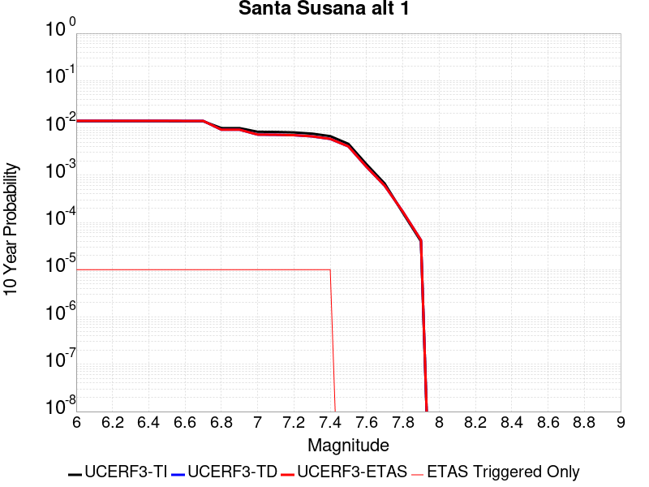 |

| Magnitude | 1 wk TI Prob | 1 wk TD Prob | 1 wk ETAS Prob | 1 wk ETAS/TD Gain | 1 wk ETAS Triggered Only | 1 mo TI Prob | 1 mo TD Prob | 1 mo ETAS Prob | 1 mo ETAS/TD Gain | 1 mo ETAS Triggered Only | 1 yr TI Prob | 1 yr TD Prob | 1 yr ETAS Prob | 1 yr ETAS/TD Gain | 1 yr ETAS Triggered Only | 10 yr TI Prob | 10 yr TD Prob | 10 yr ETAS Prob | 10 yr ETAS/TD Gain | 10 yr ETAS Triggered Only |
|-----|-----|-----|-----|-----|-----|-----|-----|-----|-----|-----|-----|-----|-----|-----|-----|-----|-----|-----|-----|-----|
| 6.0 | 2.674877E-5 | 2.7198214E-5 | 2.7198214E-5 | 1.0 | 0.0 | 1.1463255E-4 | 1.16559204E-4 | 1.16559204E-4 | 1.0 | 0.0 | 0.0013947578 | 0.0014182981 | 0.0014182981 | 1.0 | 0.0 | 0.013860362 | 0.014104388 | 0.014146708 | 1.0030005 | 4.2925825E-5 |
| 6.1 | 2.674877E-5 | 2.7198214E-5 | 2.7198214E-5 | 1.0 | 0.0 | 1.1463255E-4 | 1.16559204E-4 | 1.16559204E-4 | 1.0 | 0.0 | 0.0013947578 | 0.0014182981 | 0.0014182981 | 1.0 | 0.0 | 0.013860362 | 0.014104388 | 0.014146708 | 1.0030005 | 4.2925825E-5 |
| 6.2 | 2.674877E-5 | 2.7198214E-5 | 2.7198214E-5 | 1.0 | 0.0 | 1.1463255E-4 | 1.16559204E-4 | 1.16559204E-4 | 1.0 | 0.0 | 0.0013947578 | 0.0014182981 | 0.0014182981 | 1.0 | 0.0 | 0.013860362 | 0.014104388 | 0.014146708 | 1.0030005 | 4.2925825E-5 |
| 6.3 | 2.674877E-5 | 2.7198214E-5 | 2.7198214E-5 | 1.0 | 0.0 | 1.1463255E-4 | 1.16559204E-4 | 1.16559204E-4 | 1.0 | 0.0 | 0.0013947578 | 0.0014182981 | 0.0014182981 | 1.0 | 0.0 | 0.013860362 | 0.014104388 | 0.014146708 | 1.0030005 | 4.2925825E-5 |
| 6.4 | 2.674877E-5 | 2.7198214E-5 | 2.7198214E-5 | 1.0 | 0.0 | 1.1463255E-4 | 1.16559204E-4 | 1.16559204E-4 | 1.0 | 0.0 | 0.0013947578 | 0.0014182981 | 0.0014182981 | 1.0 | 0.0 | 0.013860362 | 0.014104388 | 0.014146708 | 1.0030005 | 4.2925825E-5 |
| 6.5 | 2.674877E-5 | 2.7198214E-5 | 2.7198214E-5 | 1.0 | 0.0 | 1.1463255E-4 | 1.16559204E-4 | 1.16559204E-4 | 1.0 | 0.0 | 0.0013947578 | 0.0014182981 | 0.0014182981 | 1.0 | 0.0 | 0.013860362 | 0.014104388 | 0.014146708 | 1.0030005 | 4.2925825E-5 |
| 6.6 | 2.6647976E-5 | 2.7074553E-5 | 2.7074553E-5 | 1.0 | 0.0 | 1.14200615E-4 | 1.16029274E-4 | 1.16029274E-4 | 1.0 | 0.0 | 0.0013895056 | 0.0014118546 | 0.0014118546 | 1.0 | 0.0 | 0.013808494 | 0.014040773 | 0.014083096 | 1.0030143 | 4.2925825E-5 |
| 6.7 | 2.6647976E-5 | 2.7074553E-5 | 2.7074553E-5 | 1.0 | 0.0 | 1.14200615E-4 | 1.16029274E-4 | 1.16029274E-4 | 1.0 | 0.0 | 0.0013895056 | 0.0014118546 | 0.0014118546 | 1.0 | 0.0 | 0.013808494 | 0.014040773 | 0.014083096 | 1.0030143 | 4.2925825E-5 |
| 6.8 | 1.9073179E-5 | 1.7637467E-5 | 1.7637467E-5 | 1.0 | 0.0 | 8.1739636E-5 | 7.558706E-5 | 7.558706E-5 | 1.0 | 0.0 | 9.947256E-4 | 9.19902E-4 | 9.19902E-4 | 1.0 | 0.0 | 0.009902848 | 0.009163361 | 0.009205894 | 1.0046415 | 4.2925825E-5 |
| 6.9 | 1.9041876E-5 | 1.7619597E-5 | 1.7619597E-5 | 1.0 | 0.0 | 8.160549E-5 | 7.551048E-5 | 7.551048E-5 | 1.0 | 0.0 | 9.930939E-4 | 9.189705E-4 | 9.189705E-4 | 1.0 | 0.0 | 0.0098866755 | 0.009154123 | 0.009196656 | 1.0046463 | 4.2925825E-5 |
| 7.0 | 1.5917482E-5 | 1.3864049E-5 | 1.3864049E-5 | 1.0 | 0.0 | 6.8215995E-5 | 5.9416023E-5 | 5.9416023E-5 | 1.0 | 0.0 | 8.302132E-4 | 7.2315463E-4 | 7.2315463E-4 | 1.0 | 0.0 | 0.008271185 | 0.0072090672 | 0.0072516836 | 1.0059115 | 4.2925825E-5 |
| 7.1 | 1.577788E-5 | 1.3744056E-5 | 1.3744056E-5 | 1.0 | 0.0 | 6.761774E-5 | 5.890179E-5 | 5.890179E-5 | 1.0 | 0.0 | 8.2293496E-4 | 7.16898E-4 | 7.16898E-4 | 1.0 | 0.0 | 0.008198941 | 0.0071469042 | 0.0071895234 | 1.0059633 | 4.2925825E-5 |
| 7.2 | 1.5416446E-5 | 1.34701295E-5 | 1.34701295E-5 | 1.0 | 0.0 | 6.606882E-5 | 5.7727877E-5 | 5.7727877E-5 | 1.0 | 0.0 | 8.0409093E-4 | 7.026149E-4 | 7.026149E-4 | 1.0 | 0.0 | 0.008011877 | 0.0070049763 | 0.0070476015 | 1.0060849 | 4.2925825E-5 |
| 7.3 | 1.4534083E-5 | 1.2718032E-5 | 1.2718032E-5 | 1.0 | 0.0 | 6.228744E-5 | 5.4504737E-5 | 5.4504737E-5 | 1.0 | 0.0 | 7.580857E-4 | 6.633976E-4 | 6.633976E-4 | 1.0 | 0.0 | 0.007555048 | 0.0066151717 | 0.0066578137 | 1.0064461 | 4.2925825E-5 |
| 7.4 | 1.2858995E-5 | 1.1229814E-5 | 1.1229814E-5 | 1.0 | 0.0 | 5.5108816E-5 | 4.812691E-5 | 4.812691E-5 | 1.0 | 0.0 | 6.7074323E-4 | 5.8579154E-4 | 5.8579154E-4 | 1.0 | 0.0 | 0.0066872234 | 0.0058433902 | 0.0058860653 | 1.0073031 | 4.2925825E-5 |
| 7.5 | 8.827668E-6 | 7.805494E-6 | 7.805494E-6 | 1.0 | 0.0 | 3.7832317E-5 | 3.3451703E-5 | 3.3451703E-5 | 1.0 | 0.0 | 4.605111E-4 | 4.072008E-4 | 4.072008E-4 | 1.0 | 0.0 | 0.0045955796 | 0.0040648985 | 0.0040648985 | 1.0 | 0.0 |
| 7.6 | 3.2533426E-6 | 2.8720106E-6 | 2.8720106E-6 | 1.0 | 0.0 | 1.3942822E-5 | 1.230856E-5 | 1.230856E-5 | 1.0 | 0.0 | 1.6974064E-4 | 1.4984679E-4 | 1.4984679E-4 | 1.0 | 0.0 | 0.0016961104 | 0.0014974943 | 0.0014974943 | 1.0 | 0.0 |
| 7.7 | 1.2751709E-6 | 1.1491339E-6 | 1.1491339E-6 | 1.0 | 0.0 | 5.4650063E-6 | 4.9248506E-6 | 4.9248506E-6 | 1.0 | 0.0 | 6.653442E-5 | 5.99585E-5 | 5.99585E-5 | 1.0 | 0.0 | 6.6514505E-4 | 5.9943215E-4 | 5.9943215E-4 | 1.0 | 0.0 |
| 7.8 | 3.067544E-7 | 3.240052E-7 | 3.240052E-7 | 1.0 | 0.0 | 1.3146611E-6 | 1.3885931E-6 | 1.3885931E-6 | 1.0 | 0.0 | 1.600588E-5 | 1.6906E-5 | 1.6906E-5 | 1.0 | 0.0 | 1.6004729E-4 | 1.6904817E-4 | 1.6904817E-4 | 1.0 | 0.0 |
| 7.9 | 7.622999E-8 | 8.0879715E-8 | 8.0879715E-8 | 1.0 | 0.0 | 3.2669993E-7 | 3.4662733E-7 | 3.4662733E-7 | 1.0 | 0.0 | 3.977564E-6 | 4.220182E-6 | 4.220182E-6 | 1.0 | 0.0 | 3.977493E-5 | 4.2201224E-5 | 4.2201224E-5 | 1.0 | 0.0 |

## Mendocino
*[(top)](#table-of-contents)*

| 1 Week | 1 Month | 1 Year | 10 Year |
|-----|-----|-----|-----|
|  | 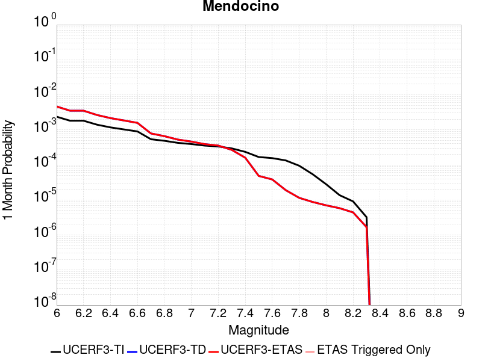 |  |  |

| Magnitude | 1 wk TI Prob | 1 wk TD Prob | 1 wk ETAS Prob | 1 wk ETAS/TD Gain | 1 wk ETAS Triggered Only | 1 mo TI Prob | 1 mo TD Prob | 1 mo ETAS Prob | 1 mo ETAS/TD Gain | 1 mo ETAS Triggered Only | 1 yr TI Prob | 1 yr TD Prob | 1 yr ETAS Prob | 1 yr ETAS/TD Gain | 1 yr ETAS Triggered Only | 10 yr TI Prob | 10 yr TD Prob | 10 yr ETAS Prob | 10 yr ETAS/TD Gain | 10 yr ETAS Triggered Only |
|-----|-----|-----|-----|-----|-----|-----|-----|-----|-----|-----|-----|-----|-----|-----|-----|-----|-----|-----|-----|-----|
| 6.0 | 5.5409013E-4 | 0.0010840978 | 0.0010840978 | 1.0 | 0.0 | 0.0023725112 | 0.0046357135 | 0.0046357135 | 1.0 | 0.0 | 0.028505474 | 0.054677837 | 0.054677837 | 1.0 | 0.0 | 0.25113493 | 0.41188422 | 0.41190946 | 1.0000613 | 4.2925825E-5 |
| 6.1 | 4.2515888E-4 | 8.229105E-4 | 8.229105E-4 | 1.0 | 0.0 | 0.0018208373 | 0.003520157 | 0.003520157 | 1.0 | 0.0 | 0.021944538 | 0.041751582 | 0.041751582 | 1.0 | 0.0 | 0.19899574 | 0.32995522 | 0.32998398 | 1.0000871 | 4.2925825E-5 |
| 6.2 | 4.2515888E-4 | 8.229105E-4 | 8.229105E-4 | 1.0 | 0.0 | 0.0018208373 | 0.003520157 | 0.003520157 | 1.0 | 0.0 | 0.021944538 | 0.041751582 | 0.041751582 | 1.0 | 0.0 | 0.19899574 | 0.32995522 | 0.32998398 | 1.0000871 | 4.2925825E-5 |
| 6.3 | 3.2773745E-4 | 6.193633E-4 | 6.193633E-4 | 1.0 | 0.0 | 0.0014038329 | 0.0026503794 | 0.0026503794 | 1.0 | 0.0 | 0.016958237 | 0.031593565 | 0.031593565 | 1.0 | 0.0 | 0.1572094 | 0.26077798 | 0.2608097 | 1.0001217 | 4.2925825E-5 |
| 6.4 | 2.7417165E-4 | 5.04789E-4 | 5.04789E-4 | 1.0 | 0.0 | 0.0011744922 | 0.002160561 | 0.002160561 | 1.0 | 0.0 | 0.014205975 | 0.02583886 | 0.02583886 | 1.0 | 0.0 | 0.13331394 | 0.21948014 | 0.21951365 | 1.0001527 | 4.2925825E-5 |
| 6.5 | 2.3984899E-4 | 4.323638E-4 | 4.323638E-4 | 1.0 | 0.0 | 0.0010275192 | 0.0018508366 | 0.0018508366 | 1.0 | 0.0 | 0.012438473 | 0.02218166 | 0.02218166 | 1.0 | 0.0 | 0.11764851 | 0.19203737 | 0.19203737 | 1.0 | 0.0 |
| 6.6 | 2.1023539E-4 | 3.6936256E-4 | 3.6936256E-4 | 1.0 | 0.0 | 9.0069766E-4 | 0.0015813457 | 0.0015813457 | 1.0 | 0.0 | 0.010910975 | 0.018990727 | 0.018990727 | 1.0 | 0.0 | 0.10390546 | 0.16749373 | 0.16749373 | 1.0 | 0.0 |
| 6.7 | 1.2592976E-4 | 1.8425964E-4 | 1.8425964E-4 | 1.0 | 0.0 | 5.395873E-4 | 7.8937394E-4 | 7.8937394E-4 | 1.0 | 0.0 | 0.006549705 | 0.009556835 | 0.009556835 | 1.0 | 0.0 | 0.063599944 | 0.09096922 | 0.09096922 | 1.0 | 0.0 |
| 6.8 | 1.13663555E-4 | 1.5401552E-4 | 1.5401552E-4 | 1.0 | 0.0 | 4.8703855E-4 | 6.5987057E-4 | 6.5987057E-4 | 1.0 | 0.0 | 0.0059135845 | 0.008000202 | 0.008000202 | 1.0 | 0.0 | 0.057586733 | 0.07739247 | 0.07739247 | 1.0 | 0.0 |
| 6.9 | 9.926894E-5 | 1.2300287E-4 | 1.2300287E-4 | 1.0 | 0.0 | 4.2536893E-4 | 5.2704377E-4 | 5.2704377E-4 | 1.0 | 0.0 | 0.0051665753 | 0.006396927 | 0.006396927 | 1.0 | 0.0 | 0.050480947 | 0.06285957 | 0.06285957 | 1.0 | 0.0 |
| 7.0 | 9.168125E-5 | 1.0784103E-4 | 1.0784103E-4 | 1.0 | 0.0 | 3.9286047E-4 | 4.6208999E-4 | 4.6208999E-4 | 1.0 | 0.0 | 0.004772591 | 0.005611076 | 0.005611076 | 1.0 | 0.0 | 0.04671385 | 0.0556208 | 0.0556208 | 1.0 | 0.0 |
| 7.1 | 8.2854116E-5 | 9.1051006E-5 | 9.1051006E-5 | 1.0 | 0.0 | 3.5504074E-4 | 3.9016042E-4 | 3.9016042E-4 | 1.0 | 0.0 | 0.004314056 | 0.0047399225 | 0.0047399225 | 1.0 | 0.0 | 0.042312626 | 0.047480468 | 0.047480468 | 1.0 | 0.0 |
| 7.2 | 7.8255274E-5 | 8.300352E-5 | 8.300352E-5 | 1.0 | 0.0 | 3.3533663E-4 | 3.556817E-4 | 3.556817E-4 | 1.0 | 0.0 | 0.0040750825 | 0.004321974 | 0.004321974 | 1.0 | 0.0 | 0.040011603 | 0.043524873 | 0.043524873 | 1.0 | 0.0 |
| 7.3 | 6.887904E-5 | 6.258733E-5 | 6.258733E-5 | 1.0 | 0.0 | 2.9516246E-4 | 2.6820437E-4 | 2.6820437E-4 | 1.0 | 0.0 | 0.0035876823 | 0.0032605957 | 0.0032605957 | 1.0 | 0.0 | 0.035303112 | 0.03335046 | 0.03335046 | 1.0 | 0.0 |
| 7.4 | 5.4898497E-5 | 3.7397505E-5 | 3.7397505E-5 | 1.0 | 0.0 | 2.3525805E-4 | 1.6026547E-4 | 1.6026547E-4 | 1.0 | 0.0 | 0.0028605047 | 0.0019495422 | 0.0019495422 | 1.0 | 0.0 | 0.02823963 | 0.020406872 | 0.020406872 | 1.0 | 0.0 |
| 7.5 | 3.9103943E-5 | 1.1304096E-5 | 1.1304096E-5 | 1.0 | 0.0 | 1.6757756E-4 | 4.8445232E-5 | 4.8445232E-5 | 1.0 | 0.0 | 0.0020383475 | 5.896627E-4 | 5.896627E-4 | 1.0 | 0.0 | 0.020197518 | 0.0066229533 | 0.0066229533 | 1.0 | 0.0 |
| 7.6 | 3.641042E-5 | 8.981182E-6 | 8.981182E-6 | 1.0 | 0.0 | 1.5603533E-4 | 3.849022E-5 | 3.849022E-5 | 1.0 | 0.0 | 0.0018980748 | 4.6851902E-4 | 4.6851902E-4 | 1.0 | 0.0 | 0.018819444 | 0.0053467555 | 0.0053467555 | 1.0 | 0.0 |
| 7.7 | 3.1318774E-5 | 4.452091E-6 | 4.452091E-6 | 1.0 | 0.0 | 1.342164E-4 | 1.9080253E-5 | 1.9080253E-5 | 1.0 | 0.0 | 0.0016328598 | 2.322775E-4 | 2.322775E-4 | 1.0 | 0.0 | 0.016209139 | 0.0028640495 | 0.0028640495 | 1.0 | 0.0 |
| 7.8 | 2.209241E-5 | 2.679371E-6 | 2.679371E-6 | 1.0 | 0.0 | 9.467832E-5 | 1.1482968E-5 | 1.1482968E-5 | 1.0 | 0.0 | 0.001152099 | 1.397962E-4 | 1.397962E-4 | 1.0 | 0.0 | 0.011461443 | 0.001736627 | 0.001736627 | 1.0 | 0.0 |
| 7.9 | 1.2640477E-5 | 2.041037E-6 | 2.041037E-6 | 1.0 | 0.0 | 5.4172346E-5 | 8.747273E-6 | 8.747273E-6 | 1.0 | 0.0 | 6.593487E-4 | 1.06492866E-4 | 1.06492866E-4 | 1.0 | 0.0 | 0.006573958 | 0.0012974226 | 0.0012974226 | 1.0 | 0.0 |
| 8.0 | 6.5548907E-6 | 1.6379622E-6 | 1.6379622E-6 | 1.0 | 0.0 | 2.8092087E-5 | 7.019819E-6 | 7.019819E-6 | 1.0 | 0.0 | 3.4196748E-4 | 8.546297E-5 | 8.546297E-5 | 1.0 | 0.0 | 0.0034144172 | 0.0010306032 | 0.0010306032 | 1.0 | 0.0 |
| 8.1 | 3.1916707E-6 | 1.357735E-6 | 1.357735E-6 | 1.0 | 0.0 | 1.3678517E-5 | 5.818851E-6 | 5.818851E-6 | 1.0 | 0.0 | 1.6652321E-4 | 7.084223E-5 | 7.084223E-5 | 1.0 | 0.0 | 0.0016639848 | 8.624329E-4 | 8.624329E-4 | 1.0 | 0.0 |
| 8.2 | 2.1193785E-6 | 1.0297509E-6 | 1.0297509E-6 | 1.0 | 0.0 | 9.083019E-6 | 4.413211E-6 | 4.413211E-6 | 1.0 | 0.0 | 1.1058014E-4 | 5.372954E-5 | 5.372954E-5 | 1.0 | 0.0 | 0.0011052513 | 6.500931E-4 | 6.500931E-4 | 1.0 | 0.0 |
| 8.3 | 7.536878E-7 | 3.9261332E-7 | 3.9261332E-7 | 1.0 | 0.0 | 3.2300866E-6 | 1.6826275E-6 | 1.6826275E-6 | 1.0 | 0.0 | 3.9325594E-5 | 2.048581E-5 | 2.048581E-5 | 1.0 | 0.0 | 3.9318635E-4 | 2.4124846E-4 | 2.4124846E-4 | 1.0 | 0.0 |

## Los Osos 2011
*[(top)](#table-of-contents)*

| 1 Week | 1 Month | 1 Year | 10 Year |
|-----|-----|-----|-----|
|  |  |  |  |

| Magnitude | 1 wk TI Prob | 1 wk TD Prob | 1 wk ETAS Prob | 1 wk ETAS/TD Gain | 1 wk ETAS Triggered Only | 1 mo TI Prob | 1 mo TD Prob | 1 mo ETAS Prob | 1 mo ETAS/TD Gain | 1 mo ETAS Triggered Only | 1 yr TI Prob | 1 yr TD Prob | 1 yr ETAS Prob | 1 yr ETAS/TD Gain | 1 yr ETAS Triggered Only | 10 yr TI Prob | 10 yr TD Prob | 10 yr ETAS Prob | 10 yr ETAS/TD Gain | 10 yr ETAS Triggered Only |
|-----|-----|-----|-----|-----|-----|-----|-----|-----|-----|-----|-----|-----|-----|-----|-----|-----|-----|-----|-----|-----|
| 6.0 | 4.8871775E-6 | 4.9814826E-6 | 4.9814826E-6 | 1.0 | 0.0 | 2.0944879E-5 | 2.1349053E-5 | 2.1349053E-5 | 1.0 | 0.0 | 2.5497406E-4 | 2.598965E-4 | 2.598965E-4 | 1.0 | 0.0 | 0.002546817 | 0.0025962 | 0.0026390143 | 1.0164912 | 4.2925825E-5 |
| 6.1 | 4.8871775E-6 | 4.9814826E-6 | 4.9814826E-6 | 1.0 | 0.0 | 2.0944879E-5 | 2.1349053E-5 | 2.1349053E-5 | 1.0 | 0.0 | 2.5497406E-4 | 2.598965E-4 | 2.598965E-4 | 1.0 | 0.0 | 0.002546817 | 0.0025962 | 0.0026390143 | 1.0164912 | 4.2925825E-5 |
| 6.2 | 4.8871775E-6 | 4.9814826E-6 | 4.9814826E-6 | 1.0 | 0.0 | 2.0944879E-5 | 2.1349053E-5 | 2.1349053E-5 | 1.0 | 0.0 | 2.5497406E-4 | 2.598965E-4 | 2.598965E-4 | 1.0 | 0.0 | 0.002546817 | 0.0025962 | 0.0026390143 | 1.0164912 | 4.2925825E-5 |
| 6.3 | 4.8871775E-6 | 4.9814826E-6 | 4.9814826E-6 | 1.0 | 0.0 | 2.0944879E-5 | 2.1349053E-5 | 2.1349053E-5 | 1.0 | 0.0 | 2.5497406E-4 | 2.598965E-4 | 2.598965E-4 | 1.0 | 0.0 | 0.002546817 | 0.0025962 | 0.0026390143 | 1.0164912 | 4.2925825E-5 |
| 6.4 | 4.8871775E-6 | 4.9814826E-6 | 4.9814826E-6 | 1.0 | 0.0 | 2.0944879E-5 | 2.1349053E-5 | 2.1349053E-5 | 1.0 | 0.0 | 2.5497406E-4 | 2.598965E-4 | 2.598965E-4 | 1.0 | 0.0 | 0.002546817 | 0.0025962 | 0.0026390143 | 1.0164912 | 4.2925825E-5 |
| 6.5 | 3.1724062E-6 | 3.2233943E-6 | 3.2233943E-6 | 1.0 | 0.0 | 1.3595956E-5 | 1.3814474E-5 | 1.3814474E-5 | 1.0 | 0.0 | 1.6551818E-4 | 1.6817838E-4 | 1.6817838E-4 | 1.0 | 0.0 | 0.0016539496 | 0.0016805246 | 0.0017233782 | 1.0255002 | 4.2925825E-5 |
| 6.6 | 3.1022591E-6 | 3.1511038E-6 | 3.1511038E-6 | 1.0 | 0.0 | 1.3295328E-5 | 1.3504661E-5 | 1.3504661E-5 | 1.0 | 0.0 | 1.618586E-4 | 1.6440697E-4 | 1.6440697E-4 | 1.0 | 0.0 | 0.0016174077 | 0.0016428662 | 0.0016428662 | 1.0 | 0.0 |
| 6.7 | 2.611518E-6 | 2.6491825E-6 | 2.6491825E-6 | 1.0 | 0.0 | 1.1192172E-5 | 1.1353591E-5 | 1.1353591E-5 | 1.0 | 0.0 | 1.3625617E-4 | 1.3822124E-4 | 1.3822124E-4 | 1.0 | 0.0 | 0.0013617266 | 0.0013813572 | 0.0013813572 | 1.0 | 0.0 |
| 6.8 | 2.4780884E-6 | 2.5121587E-6 | 2.5121587E-6 | 1.0 | 0.0 | 1.0620336E-5 | 1.076635E-5 | 1.076635E-5 | 1.0 | 0.0 | 1.2929492E-4 | 1.3107246E-4 | 1.3107246E-4 | 1.0 | 0.0 | 0.0012921972 | 0.0013099556 | 0.0013099556 | 1.0 | 0.0 |
| 6.9 | 2.1376322E-6 | 2.1635049E-6 | 2.1635049E-6 | 1.0 | 0.0 | 9.161248E-6 | 9.272131E-6 | 9.272131E-6 | 1.0 | 0.0 | 1.1153249E-4 | 1.1288237E-4 | 1.1288237E-4 | 1.0 | 0.0 | 0.0011147653 | 0.0011282521 | 0.0011282521 | 1.0 | 0.0 |
| 7.0 | 1.9282882E-6 | 1.949458E-6 | 1.949458E-6 | 1.0 | 0.0 | 8.264066E-6 | 8.354793E-6 | 8.354793E-6 | 1.0 | 0.0 | 1.0061036E-4 | 1.0171487E-4 | 1.0171487E-4 | 1.0 | 0.0 | 0.0010056482 | 0.0010166845 | 0.0010166845 | 1.0 | 0.0 |
| 7.1 | 1.6353226E-6 | 1.6501111E-6 | 1.6501111E-6 | 1.0 | 0.0 | 7.0085066E-6 | 7.0718856E-6 | 7.0718856E-6 | 1.0 | 0.0 | 8.532523E-5 | 8.6096814E-5 | 8.6096814E-5 | 1.0 | 0.0 | 8.529247E-4 | 8.6063537E-4 | 8.6063537E-4 | 1.0 | 0.0 |
| 7.2 | 1.4446276E-6 | 1.4553335E-6 | 1.4553335E-6 | 1.0 | 0.0 | 6.191247E-6 | 6.2371287E-6 | 6.2371287E-6 | 1.0 | 0.0 | 7.537582E-5 | 7.59344E-5 | 7.59344E-5 | 1.0 | 0.0 | 7.535026E-4 | 7.590851E-4 | 7.590851E-4 | 1.0 | 0.0 |
| 7.3 | 1.2014582E-6 | 1.2069066E-6 | 1.2069066E-6 | 1.0 | 0.0 | 5.149096E-6 | 5.172447E-6 | 5.172447E-6 | 1.0 | 0.0 | 6.268844E-5 | 6.297272E-5 | 6.297272E-5 | 1.0 | 0.0 | 6.267076E-4 | 6.295492E-4 | 6.295492E-4 | 1.0 | 0.0 |
| 7.4 | 9.707733E-7 | 9.709767E-7 | 9.709767E-7 | 1.0 | 0.0 | 4.16045E-6 | 4.161322E-6 | 4.161322E-6 | 1.0 | 0.0 | 5.0652303E-5 | 5.066292E-5 | 5.066292E-5 | 1.0 | 0.0 | 5.064076E-4 | 5.065139E-4 | 5.065139E-4 | 1.0 | 0.0 |
| 7.5 | 7.174908E-7 | 7.114907E-7 | 7.114907E-7 | 1.0 | 0.0 | 3.074957E-6 | 3.0492424E-6 | 3.0492424E-6 | 1.0 | 0.0 | 3.743696E-5 | 3.7123897E-5 | 3.7123897E-5 | 1.0 | 0.0 | 3.7430652E-4 | 3.7117713E-4 | 3.7117713E-4 | 1.0 | 0.0 |
| 7.6 | 4.5535776E-7 | 4.4207857E-7 | 4.4207857E-7 | 1.0 | 0.0 | 1.9515319E-6 | 1.8946212E-6 | 1.8946212E-6 | 1.0 | 0.0 | 2.3759641E-5 | 2.3066768E-5 | 2.3066768E-5 | 1.0 | 0.0 | 2.37571E-4 | 2.3064384E-4 | 2.3064384E-4 | 1.0 | 0.0 |
| 7.7 | 2.1173553E-7 | 1.9060734E-7 | 1.9060734E-7 | 1.0 | 0.0 | 9.0743765E-7 | 8.1688836E-7 | 8.1688836E-7 | 1.0 | 0.0 | 1.1047998E-5 | 9.94557E-6 | 9.94557E-6 | 1.0 | 0.0 | 1.1047449E-4 | 9.945128E-5 | 9.945128E-5 | 1.0 | 0.0 |
| 7.8 | 9.873608E-8 | 7.367457E-8 | 7.367457E-8 | 1.0 | 0.0 | 4.2315455E-7 | 3.1574814E-7 | 3.1574814E-7 | 1.0 | 0.0 | 5.1518946E-6 | 3.8442267E-6 | 3.8442267E-6 | 1.0 | 0.0 | 5.1517753E-5 | 3.844161E-5 | 3.844161E-5 | 1.0 | 0.0 |
| 7.9 | 5.4399106E-8 | 3.187941E-8 | 3.187941E-8 | 1.0 | 0.0 | 2.33139E-7 | 1.3662603E-7 | 1.3662603E-7 | 1.0 | 0.0 | 2.8384638E-6 | 1.6634207E-6 | 1.6634207E-6 | 1.0 | 0.0 | 2.8384275E-5 | 1.6634083E-5 | 1.6634083E-5 | 1.0 | 0.0 |
| 8.0 | 1.817203E-8 | 8.420079E-9 | 8.420079E-9 | 1.0 | 0.0 | 7.7880124E-8 | 3.6086053E-8 | 3.6086053E-8 | 1.0 | 0.0 | 9.481901E-7 | 4.393476E-7 | 4.393476E-7 | 1.0 | 0.0 | 9.481861E-6 | 4.393468E-6 | 4.393468E-6 | 1.0 | 0.0 |

## Green Valley 2011 CFM
*[(top)](#table-of-contents)*

| 1 Week | 1 Month | 1 Year | 10 Year |
|-----|-----|-----|-----|
| 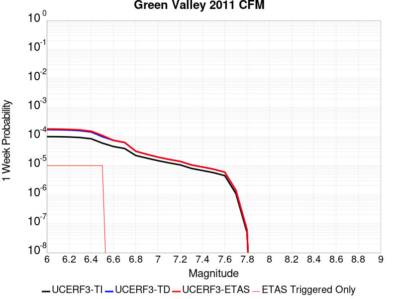 |  |  |  |

| Magnitude | 1 wk TI Prob | 1 wk TD Prob | 1 wk ETAS Prob | 1 wk ETAS/TD Gain | 1 wk ETAS Triggered Only | 1 mo TI Prob | 1 mo TD Prob | 1 mo ETAS Prob | 1 mo ETAS/TD Gain | 1 mo ETAS Triggered Only | 1 yr TI Prob | 1 yr TD Prob | 1 yr ETAS Prob | 1 yr ETAS/TD Gain | 1 yr ETAS Triggered Only | 10 yr TI Prob | 10 yr TD Prob | 10 yr ETAS Prob | 10 yr ETAS/TD Gain | 10 yr ETAS Triggered Only |
|-----|-----|-----|-----|-----|-----|-----|-----|-----|-----|-----|-----|-----|-----|-----|-----|-----|-----|-----|-----|-----|
| 6.0 | 9.9629346E-5 | 1.7302863E-4 | 1.7302863E-4 | 1.0 | 0.0 | 4.2691303E-4 | 7.41326E-4 | 7.41326E-4 | 1.0 | 0.0 | 0.0051852856 | 0.00898692 | 0.00898692 | 1.0 | 0.0 | 0.050659515 | 0.08553951 | 0.08557876 | 1.000459 | 4.2925825E-5 |
| 6.1 | 9.88615E-5 | 1.7150163E-4 | 1.7150163E-4 | 1.0 | 0.0 | 4.2362334E-4 | 7.347854E-4 | 7.347854E-4 | 1.0 | 0.0 | 0.0051454236 | 0.008907947 | 0.008907947 | 1.0 | 0.0 | 0.050279044 | 0.08482712 | 0.0848664 | 1.0004631 | 4.2925825E-5 |
| 6.2 | 9.696895E-5 | 1.6789208E-4 | 1.6789208E-4 | 1.0 | 0.0 | 4.15515E-4 | 7.1932544E-4 | 7.1932544E-4 | 1.0 | 0.0 | 0.0050471667 | 0.00872133 | 0.00872133 | 1.0 | 0.0 | 0.04934063 | 0.08313578 | 0.083175145 | 1.0004734 | 4.2925825E-5 |
| 6.3 | 9.275224E-5 | 1.5968543E-4 | 1.5968543E-4 | 1.0 | 0.0 | 3.9744904E-4 | 6.841728E-4 | 6.841728E-4 | 1.0 | 0.0 | 0.0048282105 | 0.008296652 | 0.008296652 | 1.0 | 0.0 | 0.047246475 | 0.07927481 | 0.07931433 | 1.0004985 | 4.2925825E-5 |
| 6.4 | 8.391499E-5 | 1.4365884E-4 | 1.4365884E-4 | 1.0 | 0.0 | 3.595861E-4 | 6.155238E-4 | 6.155238E-4 | 1.0 | 0.0 | 0.004369175 | 0.007467181 | 0.007467181 | 1.0 | 0.0 | 0.04284265 | 0.07164672 | 0.071686566 | 1.0005562 | 4.2925825E-5 |
| 6.5 | 5.9519385E-5 | 9.932622E-5 | 9.932622E-5 | 1.0 | 0.0 | 2.5505814E-4 | 4.2560388E-4 | 4.2560388E-4 | 1.0 | 0.0 | 0.0031009112 | 0.005168341 | 0.005168341 | 1.0 | 0.0 | 0.030579966 | 0.05014692 | 0.050187692 | 1.0008131 | 4.2925825E-5 |
| 6.6 | 4.5361558E-5 | 7.4019794E-5 | 7.4019794E-5 | 1.0 | 0.0 | 1.9439218E-4 | 3.1717744E-4 | 3.1717744E-4 | 1.0 | 0.0 | 0.0023641558 | 0.0038538678 | 0.0038538678 | 1.0 | 0.0 | 0.023391623 | 0.03766727 | 0.037708577 | 1.0010967 | 4.2925825E-5 |
| 6.7 | 3.8808106E-5 | 6.264382E-5 | 6.264382E-5 | 1.0 | 0.0 | 1.6630985E-4 | 2.6843755E-4 | 2.6843755E-4 | 1.0 | 0.0 | 0.0020229418 | 0.0032627317 | 0.0032627317 | 1.0 | 0.0 | 0.020046256 | 0.032007415 | 0.032048967 | 1.0012982 | 4.2925825E-5 |
| 6.8 | 2.2284667E-5 | 3.128574E-5 | 3.128574E-5 | 1.0 | 0.0 | 9.550222E-5 | 1.3407487E-4 | 1.3407487E-4 | 1.0 | 0.0 | 0.0011621192 | 0.0016311383 | 0.0016311383 | 1.0 | 0.0 | 0.011560607 | 0.01616672 | 0.016208952 | 1.0026122 | 4.2925825E-5 |
| 6.9 | 1.8050168E-5 | 2.4448536E-5 | 2.4448536E-5 | 1.0 | 0.0 | 7.735557E-5 | 1.0477527E-4 | 1.0477527E-4 | 1.0 | 0.0 | 9.4139716E-4 | 0.0012748954 | 0.0012748954 | 1.0 | 0.0 | 0.009374191 | 0.012669067 | 0.012711449 | 1.0033454 | 4.2925825E-5 |
| 7.0 | 1.4763166E-5 | 1.9583236E-5 | 1.9583236E-5 | 1.0 | 0.0 | 6.326917E-5 | 8.3925464E-5 | 8.3925464E-5 | 1.0 | 0.0 | 7.7002996E-4 | 0.001021315 | 0.001021315 | 1.0 | 0.0 | 0.007673672 | 0.01016625 | 0.01020874 | 1.0041795 | 4.2925825E-5 |
| 7.1 | 1.2399713E-5 | 1.6304042E-5 | 1.6304042E-5 | 1.0 | 0.0 | 5.3140546E-5 | 6.987261E-5 | 6.987261E-5 | 1.0 | 0.0 | 6.467941E-4 | 8.5036893E-4 | 8.5036893E-4 | 1.0 | 0.0 | 0.006449148 | 0.008471781 | 0.008471781 | 1.0 | 0.0 |
| 7.2 | 1.0584195E-5 | 1.39220465E-5 | 1.39220465E-5 | 1.0 | 0.0 | 4.5360044E-5 | 5.966456E-5 | 5.966456E-5 | 1.0 | 0.0 | 5.521186E-4 | 7.2617555E-4 | 7.2617555E-4 | 1.0 | 0.0 | 0.0055074887 | 0.0072386027 | 0.0072386027 | 1.0 | 0.0 |
| 7.3 | 7.998173E-6 | 1.0544255E-5 | 1.0544255E-5 | 1.0 | 0.0 | 3.4277433E-5 | 4.5188888E-5 | 4.5188888E-5 | 1.0 | 0.0 | 4.1724785E-4 | 5.500369E-4 | 5.500369E-4 | 1.0 | 0.0 | 0.004164653 | 0.005487135 | 0.005487135 | 1.0 | 0.0 |
| 7.4 | 6.7571127E-6 | 8.932903E-6 | 8.932903E-6 | 1.0 | 0.0 | 2.8958733E-5 | 3.8283313E-5 | 3.8283313E-5 | 1.0 | 0.0 | 3.5251552E-4 | 4.660006E-4 | 4.660006E-4 | 1.0 | 0.0 | 0.0035195686 | 0.004650633 | 0.004650633 | 1.0 | 0.0 |
| 7.5 | 5.69878E-6 | 7.516483E-6 | 7.516483E-6 | 1.0 | 0.0 | 2.4423114E-5 | 3.2213105E-5 | 3.2213105E-5 | 1.0 | 0.0 | 2.9731085E-4 | 3.9212484E-4 | 3.9212484E-4 | 1.0 | 0.0 | 0.002969134 | 0.0039147018 | 0.0039147018 | 1.0 | 0.0 |
| 7.6 | 4.503664E-6 | 5.9358217E-6 | 5.9358217E-6 | 1.0 | 0.0 | 1.9301275E-5 | 2.5438992E-5 | 2.5438992E-5 | 1.0 | 0.0 | 2.3496768E-4 | 3.0967654E-4 | 3.0967654E-4 | 1.0 | 0.0 | 0.002347194 | 0.0030927279 | 0.0030927279 | 1.0 | 0.0 |
| 7.7 | 1.0873546E-6 | 1.410754E-6 | 1.410754E-6 | 1.0 | 0.0 | 4.6600826E-6 | 6.0460743E-6 | 6.0460743E-6 | 1.0 | 0.0 | 5.6735033E-5 | 7.36085E-5 | 7.36085E-5 | 1.0 | 0.0 | 5.672055E-4 | 7.3587085E-4 | 7.3587085E-4 | 1.0 | 0.0 |
| 7.8 | 4.9373917E-8 | 6.177967E-8 | 6.177967E-8 | 1.0 | 0.0 | 2.1160248E-7 | 2.6477002E-7 | 2.6477002E-7 | 1.0 | 0.0 | 2.5762572E-6 | 3.2235714E-6 | 3.2235714E-6 | 1.0 | 0.0 | 2.5762274E-5 | 3.2228E-5 | 3.2228E-5 | 1.0 | 0.0 |

## North Frontal  (East)
*[(top)](#table-of-contents)*

| 1 Week | 1 Month | 1 Year | 10 Year |
|-----|-----|-----|-----|
|  |  |  |  |

| Magnitude | 1 wk TI Prob | 1 wk TD Prob | 1 wk ETAS Prob | 1 wk ETAS/TD Gain | 1 wk ETAS Triggered Only | 1 mo TI Prob | 1 mo TD Prob | 1 mo ETAS Prob | 1 mo ETAS/TD Gain | 1 mo ETAS Triggered Only | 1 yr TI Prob | 1 yr TD Prob | 1 yr ETAS Prob | 1 yr ETAS/TD Gain | 1 yr ETAS Triggered Only | 10 yr TI Prob | 10 yr TD Prob | 10 yr ETAS Prob | 10 yr ETAS/TD Gain | 10 yr ETAS Triggered Only |
|-----|-----|-----|-----|-----|-----|-----|-----|-----|-----|-----|-----|-----|-----|-----|-----|-----|-----|-----|-----|-----|
| 6.0 | 7.135738E-6 | 7.4771765E-6 | 5.040268E-5 | 6.7408705 | 4.2925825E-5 | 3.0581377E-5 | 3.204476E-5 | 7.496921E-5 | 2.3395152 | 4.2925825E-5 | 3.7226462E-4 | 3.9009505E-4 | 4.3300414E-4 | 1.1099964 | 4.2925825E-5 | 0.0037164164 | 0.0038960609 | 0.0039388193 | 1.0109748 | 4.2925825E-5 |
| 6.1 | 7.135738E-6 | 7.4771765E-6 | 5.040268E-5 | 6.7408705 | 4.2925825E-5 | 3.0581377E-5 | 3.204476E-5 | 7.496921E-5 | 2.3395152 | 4.2925825E-5 | 3.7226462E-4 | 3.9009505E-4 | 4.3300414E-4 | 1.1099964 | 4.2925825E-5 | 0.0037164164 | 0.0038960609 | 0.0039388193 | 1.0109748 | 4.2925825E-5 |
| 6.2 | 7.135738E-6 | 7.4771765E-6 | 5.040268E-5 | 6.7408705 | 4.2925825E-5 | 3.0581377E-5 | 3.204476E-5 | 7.496921E-5 | 2.3395152 | 4.2925825E-5 | 3.7226462E-4 | 3.9009505E-4 | 4.3300414E-4 | 1.1099964 | 4.2925825E-5 | 0.0037164164 | 0.0038960609 | 0.0039388193 | 1.0109748 | 4.2925825E-5 |
| 6.3 | 7.135738E-6 | 7.4771765E-6 | 5.040268E-5 | 6.7408705 | 4.2925825E-5 | 3.0581377E-5 | 3.204476E-5 | 7.496921E-5 | 2.3395152 | 4.2925825E-5 | 3.7226462E-4 | 3.9009505E-4 | 4.3300414E-4 | 1.1099964 | 4.2925825E-5 | 0.0037164164 | 0.0038960609 | 0.0039388193 | 1.0109748 | 4.2925825E-5 |
| 6.4 | 7.135738E-6 | 7.4771765E-6 | 5.040268E-5 | 6.7408705 | 4.2925825E-5 | 3.0581377E-5 | 3.204476E-5 | 7.496921E-5 | 2.3395152 | 4.2925825E-5 | 3.7226462E-4 | 3.9009505E-4 | 4.3300414E-4 | 1.1099964 | 4.2925825E-5 | 0.0037164164 | 0.0038960609 | 0.0039388193 | 1.0109748 | 4.2925825E-5 |
| 6.5 | 7.135738E-6 | 7.4771765E-6 | 5.040268E-5 | 6.7408705 | 4.2925825E-5 | 3.0581377E-5 | 3.204476E-5 | 7.496921E-5 | 2.3395152 | 4.2925825E-5 | 3.7226462E-4 | 3.9009505E-4 | 4.3300414E-4 | 1.1099964 | 4.2925825E-5 | 0.0037164164 | 0.0038960609 | 0.0039388193 | 1.0109748 | 4.2925825E-5 |
| 6.6 | 7.135738E-6 | 7.4771765E-6 | 5.040268E-5 | 6.7408705 | 4.2925825E-5 | 3.0581377E-5 | 3.204476E-5 | 7.496921E-5 | 2.3395152 | 4.2925825E-5 | 3.7226462E-4 | 3.9009505E-4 | 4.3300414E-4 | 1.1099964 | 4.2925825E-5 | 0.0037164164 | 0.0038960609 | 0.0039388193 | 1.0109748 | 4.2925825E-5 |
| 6.7 | 7.135738E-6 | 7.4771765E-6 | 5.040268E-5 | 6.7408705 | 4.2925825E-5 | 3.0581377E-5 | 3.204476E-5 | 7.496921E-5 | 2.3395152 | 4.2925825E-5 | 3.7226462E-4 | 3.9009505E-4 | 4.3300414E-4 | 1.1099964 | 4.2925825E-5 | 0.0037164164 | 0.0038960609 | 0.0039388193 | 1.0109748 | 4.2925825E-5 |
| 6.8 | 5.959142E-6 | 6.236683E-6 | 4.9162238E-5 | 7.8827543 | 4.2925825E-5 | 2.553893E-5 | 2.6728469E-5 | 6.965314E-5 | 2.6059535 | 4.2925825E-5 | 3.108921E-4 | 3.253886E-4 | 3.6830045E-4 | 1.1318789 | 4.2925825E-5 | 0.0031045752 | 0.0032508948 | 0.003293681 | 1.0131614 | 4.2925825E-5 |
| 6.9 | 2.2946929E-6 | 2.3824605E-6 | 4.530818E-5 | 19.017391 | 4.2925825E-5 | 9.834361E-6 | 1.0210508E-5 | 5.3135893E-5 | 5.2040405 | 4.2925825E-5 | 1.1972676E-4 | 1.2430632E-4 | 1.672268E-4 | 1.34528 | 4.2925825E-5 | 0.0011966228 | 0.0012424142 | 0.0012852867 | 1.0345074 | 4.2925825E-5 |
| 7.0 | 2.2468673E-6 | 2.3321538E-6 | 4.525788E-5 | 19.406044 | 4.2925825E-5 | 9.629396E-6 | 9.994909E-6 | 5.2920303E-5 | 5.294726 | 4.2925825E-5 | 1.1723159E-4 | 1.21681696E-4 | 1.6460229E-4 | 1.3527285 | 4.2925825E-5 | 0.0011716976 | 0.0012161969 | 0.0012590706 | 1.0352522 | 4.2925825E-5 |
| 7.1 | 1.9921076E-6 | 2.0646032E-6 | 4.499034E-5 | 21.791277 | 4.2925825E-5 | 8.537577E-6 | 8.848272E-6 | 5.1773717E-5 | 5.85128 | 4.2925825E-5 | 1.0394004E-4 | 1.0772282E-4 | 1.5064402E-4 | 1.3984411 | 4.2925825E-5 | 0.0010389143 | 0.0010767487 | 0.0011196283 | 1.0398232 | 4.2925825E-5 |
| 7.2 | 1.4524545E-6 | 1.5045148E-6 | 4.4430275E-5 | 29.531298 | 4.2925825E-5 | 6.2247905E-6 | 6.447906E-6 | 4.9373455E-5 | 7.6572847 | 4.2925825E-5 | 7.5784184E-5 | 7.850068E-5 | 1.2142313E-4 | 1.5467782 | 4.2925825E-5 | 7.575835E-4 | 7.8475394E-4 | 8.2764606E-4 | 1.0546567 | 4.2925825E-5 |
| 7.3 | 8.9802575E-7 | 9.3087283E-7 | 4.3856657E-5 | 47.11348 | 4.2925825E-5 | 3.848676E-6 | 3.9894494E-6 | 4.6915102E-5 | 11.759794 | 4.2925825E-5 | 4.685662E-5 | 4.857058E-5 | 9.1494316E-5 | 1.8837395 | 4.2925825E-5 | 4.6846745E-4 | 4.8561094E-4 | 5.285159E-4 | 1.0883526 | 4.2925825E-5 |
| 7.4 | 7.776139E-7 | 8.0604747E-7 | 4.3731838E-5 | 54.254665 | 4.2925825E-5 | 3.3326266E-6 | 3.4544853E-6 | 4.6380163E-5 | 13.42607 | 4.2925825E-5 | 4.0573974E-5 | 4.2057654E-5 | 8.498167E-5 | 2.0205994 | 4.2925825E-5 | 4.0566566E-4 | 4.205077E-4 | 4.634155E-4 | 1.102038 | 4.2925825E-5 |
| 7.5 | 5.244417E-7 | 5.441219E-7 | 4.346992E-5 | 79.89004 | 4.2925825E-5 | 2.2476054E-6 | 2.3319494E-6 | 4.5257675E-5 | 19.407658 | 4.2925825E-5 | 2.7364253E-5 | 2.839118E-5 | 7.1315786E-5 | 2.5118992 | 4.2925825E-5 | 2.7360884E-4 | 2.8388205E-4 | 3.2679568E-4 | 1.1511672 | 4.2925825E-5 |
| 7.6 | 1.5489647E-7 | 1.6089504E-7 | 4.308671E-5 | 267.7939 | 4.2925825E-5 | 6.6384183E-7 | 6.895501E-7 | 4.3615346E-5 | 63.251884 | 4.2925825E-5 | 8.082245E-6 | 8.395261E-6 | 5.1320723E-5 | 6.113059 | 4.2925825E-5 | 8.08195E-5 | 8.395143E-5 | 1.2687365E-4 | 1.5112745 | 4.2925825E-5 |

## Mission Hills 2011
*[(top)](#table-of-contents)*

| 1 Week | 1 Month | 1 Year | 10 Year |
|-----|-----|-----|-----|
|  |  |  |  |

| Magnitude | 1 wk TI Prob | 1 wk TD Prob | 1 wk ETAS Prob | 1 wk ETAS/TD Gain | 1 wk ETAS Triggered Only | 1 mo TI Prob | 1 mo TD Prob | 1 mo ETAS Prob | 1 mo ETAS/TD Gain | 1 mo ETAS Triggered Only | 1 yr TI Prob | 1 yr TD Prob | 1 yr ETAS Prob | 1 yr ETAS/TD Gain | 1 yr ETAS Triggered Only | 10 yr TI Prob | 10 yr TD Prob | 10 yr ETAS Prob | 10 yr ETAS/TD Gain | 10 yr ETAS Triggered Only |
|-----|-----|-----|-----|-----|-----|-----|-----|-----|-----|-----|-----|-----|-----|-----|-----|-----|-----|-----|-----|-----|
| 6.0 | 1.8765717E-5 | 1.9054629E-5 | 1.9054629E-5 | 1.0 | 0.0 | 8.0422025E-5 | 8.1662074E-5 | 8.1662074E-5 | 1.0 | 0.0 | 9.786983E-4 | 9.941256E-4 | 9.941256E-4 | 1.0 | 0.0 | 0.009743992 | 0.00993045 | 0.0099729495 | 1.0042797 | 4.2925825E-5 |
| 6.1 | 1.8765717E-5 | 1.9054629E-5 | 1.9054629E-5 | 1.0 | 0.0 | 8.0422025E-5 | 8.1662074E-5 | 8.1662074E-5 | 1.0 | 0.0 | 9.786983E-4 | 9.941256E-4 | 9.941256E-4 | 1.0 | 0.0 | 0.009743992 | 0.00993045 | 0.0099729495 | 1.0042797 | 4.2925825E-5 |
| 6.2 | 1.8765717E-5 | 1.9054629E-5 | 1.9054629E-5 | 1.0 | 0.0 | 8.0422025E-5 | 8.1662074E-5 | 8.1662074E-5 | 1.0 | 0.0 | 9.786983E-4 | 9.941256E-4 | 9.941256E-4 | 1.0 | 0.0 | 0.009743992 | 0.00993045 | 0.0099729495 | 1.0042797 | 4.2925825E-5 |
| 6.3 | 1.8765717E-5 | 1.9054629E-5 | 1.9054629E-5 | 1.0 | 0.0 | 8.0422025E-5 | 8.1662074E-5 | 8.1662074E-5 | 1.0 | 0.0 | 9.786983E-4 | 9.941256E-4 | 9.941256E-4 | 1.0 | 0.0 | 0.009743992 | 0.00993045 | 0.0099729495 | 1.0042797 | 4.2925825E-5 |
| 6.4 | 4.566357E-6 | 2.5148213E-6 | 2.5148213E-6 | 1.0 | 0.0 | 1.9569954E-5 | 1.0777771E-5 | 1.0777771E-5 | 1.0 | 0.0 | 2.3823815E-4 | 1.3121328E-4 | 1.3121328E-4 | 1.0 | 0.0 | 0.002379829 | 0.0013115364 | 0.0013115364 | 1.0 | 0.0 |
| 6.5 | 4.566357E-6 | 2.5148213E-6 | 2.5148213E-6 | 1.0 | 0.0 | 1.9569954E-5 | 1.0777771E-5 | 1.0777771E-5 | 1.0 | 0.0 | 2.3823815E-4 | 1.3121328E-4 | 1.3121328E-4 | 1.0 | 0.0 | 0.002379829 | 0.0013115364 | 0.0013115364 | 1.0 | 0.0 |
| 6.6 | 4.566357E-6 | 2.5148213E-6 | 2.5148213E-6 | 1.0 | 0.0 | 1.9569954E-5 | 1.0777771E-5 | 1.0777771E-5 | 1.0 | 0.0 | 2.3823815E-4 | 1.3121328E-4 | 1.3121328E-4 | 1.0 | 0.0 | 0.002379829 | 0.0013115364 | 0.0013115364 | 1.0 | 0.0 |
| 6.7 | 2.3266773E-6 | 1.3296132E-6 | 1.3296132E-6 | 1.0 | 0.0 | 9.971435E-6 | 5.69833E-6 | 5.69833E-6 | 1.0 | 0.0 | 1.2139547E-4 | 6.937502E-5 | 6.937502E-5 | 1.0 | 0.0 | 0.0012132917 | 6.935397E-4 | 6.935397E-4 | 1.0 | 0.0 |
| 6.8 | 2.032735E-6 | 1.1894101E-6 | 1.1894101E-6 | 1.0 | 0.0 | 8.711692E-6 | 5.0974622E-6 | 5.0974622E-6 | 1.0 | 0.0 | 1.06059684E-4 | 6.205988E-5 | 6.205988E-5 | 1.0 | 0.0 | 0.0010600908 | 6.204304E-4 | 6.204304E-4 | 1.0 | 0.0 |
| 6.9 | 1.3186259E-6 | 1.0561989E-6 | 1.0561989E-6 | 1.0 | 0.0 | 5.6512413E-6 | 4.526559E-6 | 4.526559E-6 | 1.0 | 0.0 | 6.8801695E-5 | 5.5109493E-5 | 5.5109493E-5 | 1.0 | 0.0 | 6.8780396E-4 | 5.5096124E-4 | 5.5096124E-4 | 1.0 | 0.0 |
| 7.0 | 1.2726016E-6 | 1.0159295E-6 | 1.0159295E-6 | 1.0 | 0.0 | 5.4539955E-6 | 4.3539762E-6 | 4.3539762E-6 | 1.0 | 0.0 | 6.6400375E-5 | 5.30084E-5 | 5.30084E-5 | 1.0 | 0.0 | 6.6380535E-4 | 5.299604E-4 | 5.299604E-4 | 1.0 | 0.0 |
| 7.1 | 1.2063913E-6 | 9.570282E-7 | 9.570282E-7 | 1.0 | 0.0 | 5.170238E-6 | 4.101543E-6 | 4.101543E-6 | 1.0 | 0.0 | 6.294583E-5 | 4.9935166E-5 | 4.9935166E-5 | 1.0 | 0.0 | 6.2928005E-4 | 4.9924204E-4 | 4.9924204E-4 | 1.0 | 0.0 |
| 7.2 | 9.105806E-7 | 7.3767757E-7 | 7.3767757E-7 | 1.0 | 0.0 | 3.9024826E-6 | 3.1614716E-6 | 3.1614716E-6 | 1.0 | 0.0 | 4.7511687E-5 | 3.8490252E-5 | 3.8490252E-5 | 1.0 | 0.0 | 4.7501532E-4 | 3.8483742E-4 | 3.8483742E-4 | 1.0 | 0.0 |
| 7.3 | 7.020432E-7 | 5.7103375E-7 | 5.7103375E-7 | 1.0 | 0.0 | 3.0087533E-6 | 2.4472852E-6 | 2.4472852E-6 | 1.0 | 0.0 | 3.6630954E-5 | 2.9795303E-5 | 2.9795303E-5 | 1.0 | 0.0 | 3.6624918E-4 | 2.979144E-4 | 2.979144E-4 | 1.0 | 0.0 |
| 7.4 | 5.3900635E-7 | 4.4483278E-7 | 4.4483278E-7 | 1.0 | 0.0 | 2.3100251E-6 | 1.9064248E-6 | 1.9064248E-6 | 1.0 | 0.0 | 2.8124194E-5 | 2.3210489E-5 | 2.3210489E-5 | 1.0 | 0.0 | 2.8120633E-4 | 2.3208185E-4 | 2.3208185E-4 | 1.0 | 0.0 |
| 7.5 | 2.907075E-7 | 2.2875324E-7 | 2.2875324E-7 | 1.0 | 0.0 | 1.2458887E-6 | 9.803706E-7 | 9.803706E-7 | 1.0 | 0.0 | 1.5168589E-5 | 1.1935949E-5 | 1.1935949E-5 | 1.0 | 0.0 | 1.5167553E-4 | 1.1935326E-4 | 1.1935326E-4 | 1.0 | 0.0 |
| 7.6 | 1.6903675E-7 | 1.2353401E-7 | 1.2353401E-7 | 1.0 | 0.0 | 7.2444305E-7 | 5.2943136E-7 | 5.2943136E-7 | 1.0 | 0.0 | 8.820059E-6 | 6.4458086E-6 | 6.4458086E-6 | 1.0 | 0.0 | 8.8197085E-5 | 6.445634E-5 | 6.445634E-5 | 1.0 | 0.0 |
| 7.7 | 7.168073E-8 | 3.9134374E-8 | 3.9134374E-8 | 1.0 | 0.0 | 3.072031E-7 | 1.6771872E-7 | 1.6771872E-7 | 1.0 | 0.0 | 3.7401915E-6 | 2.0419736E-6 | 2.0419736E-6 | 1.0 | 0.0 | 3.7401285E-5 | 2.041956E-5 | 2.041956E-5 | 1.0 | 0.0 |
| 7.8 | 6.564101E-8 | 3.3834656E-8 | 3.3834656E-8 | 1.0 | 0.0 | 2.813186E-7 | 1.4500566E-7 | 1.4500566E-7 | 1.0 | 0.0 | 3.4250486E-6 | 1.7654426E-6 | 1.7654426E-6 | 1.0 | 0.0 | 3.424996E-5 | 1.7654296E-5 | 1.7654296E-5 | 1.0 | 0.0 |
| 7.9 | 1.0029074E-8 | 3.728858E-9 | 3.728858E-9 | 1.0 | 0.0 | 4.2981743E-8 | 1.598082E-8 | 1.598082E-8 | 1.0 | 0.0 | 5.2330256E-7 | 1.945665E-7 | 1.945665E-7 | 1.0 | 0.0 | 5.2330133E-6 | 1.9456643E-6 | 1.9456643E-6 | 1.0 | 0.0 |

## Trinidad (alt1)
*[(top)](#table-of-contents)*

| 1 Week | 1 Month | 1 Year | 10 Year |
|-----|-----|-----|-----|
|  |  | 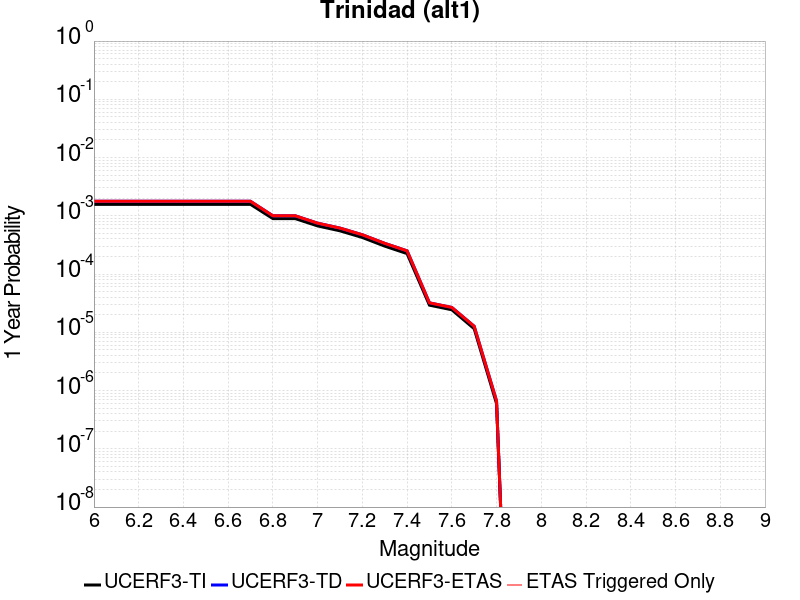 |  |

| Magnitude | 1 wk TI Prob | 1 wk TD Prob | 1 wk ETAS Prob | 1 wk ETAS/TD Gain | 1 wk ETAS Triggered Only | 1 mo TI Prob | 1 mo TD Prob | 1 mo ETAS Prob | 1 mo ETAS/TD Gain | 1 mo ETAS Triggered Only | 1 yr TI Prob | 1 yr TD Prob | 1 yr ETAS Prob | 1 yr ETAS/TD Gain | 1 yr ETAS Triggered Only | 10 yr TI Prob | 10 yr TD Prob | 10 yr ETAS Prob | 10 yr ETAS/TD Gain | 10 yr ETAS Triggered Only |
|-----|-----|-----|-----|-----|-----|-----|-----|-----|-----|-----|-----|-----|-----|-----|-----|-----|-----|-----|-----|-----|
| 6.0 | 3.0167168E-5 | 3.4033183E-5 | 3.4033183E-5 | 1.0 | 0.0 | 1.2928146E-4 | 1.4584929E-4 | 1.4584929E-4 | 1.0 | 0.0 | 0.0015728653 | 0.0017744373 | 0.0017744373 | 1.0 | 0.0 | 0.0156177925 | 0.017619645 | 0.017661816 | 1.0023934 | 4.2925825E-5 |
| 6.1 | 3.0167168E-5 | 3.4033183E-5 | 3.4033183E-5 | 1.0 | 0.0 | 1.2928146E-4 | 1.4584929E-4 | 1.4584929E-4 | 1.0 | 0.0 | 0.0015728653 | 0.0017744373 | 0.0017744373 | 1.0 | 0.0 | 0.0156177925 | 0.017619645 | 0.017661816 | 1.0023934 | 4.2925825E-5 |
| 6.2 | 3.0167168E-5 | 3.4033183E-5 | 3.4033183E-5 | 1.0 | 0.0 | 1.2928146E-4 | 1.4584929E-4 | 1.4584929E-4 | 1.0 | 0.0 | 0.0015728653 | 0.0017744373 | 0.0017744373 | 1.0 | 0.0 | 0.0156177925 | 0.017619645 | 0.017661816 | 1.0023934 | 4.2925825E-5 |
| 6.3 | 3.0167168E-5 | 3.4033183E-5 | 3.4033183E-5 | 1.0 | 0.0 | 1.2928146E-4 | 1.4584929E-4 | 1.4584929E-4 | 1.0 | 0.0 | 0.0015728653 | 0.0017744373 | 0.0017744373 | 1.0 | 0.0 | 0.0156177925 | 0.017619645 | 0.017661816 | 1.0023934 | 4.2925825E-5 |
| 6.4 | 3.0167168E-5 | 3.4033183E-5 | 3.4033183E-5 | 1.0 | 0.0 | 1.2928146E-4 | 1.4584929E-4 | 1.4584929E-4 | 1.0 | 0.0 | 0.0015728653 | 0.0017744373 | 0.0017744373 | 1.0 | 0.0 | 0.0156177925 | 0.017619645 | 0.017661816 | 1.0023934 | 4.2925825E-5 |
| 6.5 | 3.0167168E-5 | 3.4033183E-5 | 3.4033183E-5 | 1.0 | 0.0 | 1.2928146E-4 | 1.4584929E-4 | 1.4584929E-4 | 1.0 | 0.0 | 0.0015728653 | 0.0017744373 | 0.0017744373 | 1.0 | 0.0 | 0.0156177925 | 0.017619645 | 0.017661816 | 1.0023934 | 4.2925825E-5 |
| 6.6 | 3.0167168E-5 | 3.4033183E-5 | 3.4033183E-5 | 1.0 | 0.0 | 1.2928146E-4 | 1.4584929E-4 | 1.4584929E-4 | 1.0 | 0.0 | 0.0015728653 | 0.0017744373 | 0.0017744373 | 1.0 | 0.0 | 0.0156177925 | 0.017619645 | 0.017661816 | 1.0023934 | 4.2925825E-5 |
| 6.7 | 3.0167168E-5 | 3.4033183E-5 | 3.4033183E-5 | 1.0 | 0.0 | 1.2928146E-4 | 1.4584929E-4 | 1.4584929E-4 | 1.0 | 0.0 | 0.0015728653 | 0.0017744373 | 0.0017744373 | 1.0 | 0.0 | 0.0156177925 | 0.017619645 | 0.017661816 | 1.0023934 | 4.2925825E-5 |
| 6.8 | 1.717077E-5 | 1.9195684E-5 | 1.9195684E-5 | 1.0 | 0.0 | 7.358694E-5 | 8.226487E-5 | 8.226487E-5 | 1.0 | 0.0 | 8.9555274E-4 | 0.0010011591 | 0.0010011591 | 1.0 | 0.0 | 0.008919522 | 0.009970939 | 0.010013437 | 1.0042622 | 4.2925825E-5 |
| 6.9 | 1.717077E-5 | 1.9195684E-5 | 1.9195684E-5 | 1.0 | 0.0 | 7.358694E-5 | 8.226487E-5 | 8.226487E-5 | 1.0 | 0.0 | 8.9555274E-4 | 0.0010011591 | 0.0010011591 | 1.0 | 0.0 | 0.008919522 | 0.009970939 | 0.010013437 | 1.0042622 | 4.2925825E-5 |
| 7.0 | 1.2858572E-5 | 1.433737E-5 | 1.433737E-5 | 1.0 | 0.0 | 5.5107E-5 | 6.14446E-5 | 6.14446E-5 | 1.0 | 0.0 | 6.707212E-4 | 7.478634E-4 | 7.478634E-4 | 1.0 | 0.0 | 0.006687004 | 0.0074566454 | 0.007499251 | 1.0057138 | 4.2925825E-5 |
| 7.1 | 1.0588431E-5 | 1.1801269E-5 | 1.1801269E-5 | 1.0 | 0.0 | 4.53782E-5 | 5.057605E-5 | 5.057605E-5 | 1.0 | 0.0 | 5.5233954E-4 | 6.156183E-4 | 6.156183E-4 | 1.0 | 0.0 | 0.005509687 | 0.006141979 | 0.006141979 | 1.0 | 0.0 |
| 7.2 | 8.138061E-6 | 9.067213E-6 | 9.067213E-6 | 1.0 | 0.0 | 3.487694E-5 | 3.8859045E-5 | 3.8859045E-5 | 1.0 | 0.0 | 4.2454398E-4 | 4.7303102E-4 | 4.7303102E-4 | 1.0 | 0.0 | 0.0042373384 | 0.0047226823 | 0.0047226823 | 1.0 | 0.0 |
| 7.3 | 5.787542E-6 | 6.46032E-6 | 6.46032E-6 | 1.0 | 0.0 | 2.4803514E-5 | 2.7686914E-5 | 2.7686914E-5 | 1.0 | 0.0 | 3.0194095E-4 | 3.3705754E-4 | 3.3705754E-4 | 1.0 | 0.0 | 0.00301531 | 0.0033675742 | 0.0033675742 | 1.0 | 0.0 |
| 7.4 | 4.303563E-6 | 4.800851E-6 | 4.800851E-6 | 1.0 | 0.0 | 1.844371E-5 | 2.0575026E-5 | 2.0575026E-5 | 1.0 | 0.0 | 2.2452902E-4 | 2.504919E-4 | 2.504919E-4 | 1.0 | 0.0 | 0.0022430231 | 0.0025040337 | 0.0025040337 | 1.0 | 0.0 |
| 7.5 | 5.6063425E-7 | 6.142982E-7 | 6.142982E-7 | 1.0 | 0.0 | 2.402716E-6 | 2.632704E-6 | 2.632704E-6 | 1.0 | 0.0 | 2.9252675E-5 | 3.2052718E-5 | 3.2052718E-5 | 1.0 | 0.0 | 2.9248823E-4 | 3.2048248E-4 | 3.2048248E-4 | 1.0 | 0.0 |
| 7.6 | 4.6699128E-7 | 5.1257996E-7 | 5.1257996E-7 | 1.0 | 0.0 | 2.0013897E-6 | 2.1967694E-6 | 2.1967694E-6 | 1.0 | 0.0 | 2.4366647E-5 | 2.6745354E-5 | 2.6745354E-5 | 1.0 | 0.0 | 2.4363975E-4 | 2.6742276E-4 | 2.6742276E-4 | 1.0 | 0.0 |
| 7.7 | 2.2080937E-7 | 2.4346897E-7 | 2.4346897E-7 | 1.0 | 0.0 | 9.4632554E-7 | 1.043438E-6 | 1.043438E-6 | 1.0 | 0.0 | 1.15214525E-5 | 1.270379E-5 | 1.270379E-5 | 1.0 | 0.0 | 1.1520855E-4 | 1.2703124E-4 | 1.2703124E-4 | 1.0 | 0.0 |
| 7.8 | 1.1438307E-8 | 1.2682963E-8 | 1.2682963E-8 | 1.0 | 0.0 | 4.9021317E-8 | 5.4355557E-8 | 5.4355557E-8 | 1.0 | 0.0 | 5.9683435E-7 | 6.6177887E-7 | 6.6177887E-7 | 1.0 | 0.0 | 5.9683275E-6 | 6.617789E-6 | 6.617789E-6 | 1.0 | 0.0 |

## San Luis Range - Pecho 2011 CFM
*[(top)](#table-of-contents)*

| 1 Week | 1 Month | 1 Year | 10 Year |
|-----|-----|-----|-----|
|  |  |  |  |

| Magnitude | 1 wk TI Prob | 1 wk TD Prob | 1 wk ETAS Prob | 1 wk ETAS/TD Gain | 1 wk ETAS Triggered Only | 1 mo TI Prob | 1 mo TD Prob | 1 mo ETAS Prob | 1 mo ETAS/TD Gain | 1 mo ETAS Triggered Only | 1 yr TI Prob | 1 yr TD Prob | 1 yr ETAS Prob | 1 yr ETAS/TD Gain | 1 yr ETAS Triggered Only | 10 yr TI Prob | 10 yr TD Prob | 10 yr ETAS Prob | 10 yr ETAS/TD Gain | 10 yr ETAS Triggered Only |
|-----|-----|-----|-----|-----|-----|-----|-----|-----|-----|-----|-----|-----|-----|-----|-----|-----|-----|-----|-----|-----|
| 6.0 | 1.687423E-6 | 1.6921944E-6 | 4.4617947E-5 | 26.366915 | 4.2925825E-5 | 7.231793E-6 | 7.252243E-6 | 5.0177754E-5 | 6.9189296 | 4.2925825E-5 | 8.804352E-5 | 8.829272E-5 | 1.3121475E-4 | 1.4861333 | 4.2925825E-5 | 8.8008645E-4 | 8.826003E-4 | 9.254883E-4 | 1.0485927 | 4.2925825E-5 |
| 6.1 | 1.687423E-6 | 1.6921944E-6 | 4.4617947E-5 | 26.366915 | 4.2925825E-5 | 7.231793E-6 | 7.252243E-6 | 5.0177754E-5 | 6.9189296 | 4.2925825E-5 | 8.804352E-5 | 8.829272E-5 | 1.3121475E-4 | 1.4861333 | 4.2925825E-5 | 8.8008645E-4 | 8.826003E-4 | 9.254883E-4 | 1.0485927 | 4.2925825E-5 |
| 6.2 | 1.0765672E-6 | 1.0770541E-6 | 4.400283E-5 | 40.854805 | 4.2925825E-5 | 4.613851E-6 | 4.615938E-6 | 4.7541565E-5 | 10.299437 | 4.2925825E-5 | 5.617219E-5 | 5.6197663E-5 | 9.9121076E-5 | 1.7637936 | 4.2925825E-5 | 5.6157995E-4 | 5.618408E-4 | 6.0474244E-4 | 1.0763592 | 4.2925825E-5 |
| 6.3 | 8.523104E-7 | 8.5130216E-7 | 4.377709E-5 | 51.42368 | 4.2925825E-5 | 3.6527538E-6 | 3.648433E-6 | 4.65741E-5 | 12.765509 | 4.2925825E-5 | 4.447137E-5 | 4.4418797E-5 | 8.734271E-5 | 1.9663458 | 4.2925825E-5 | 4.4462472E-4 | 4.441024E-4 | 4.8700915E-4 | 1.0966146 | 4.2925825E-5 |
| 6.4 | 8.523104E-7 | 8.5130216E-7 | 4.377709E-5 | 51.42368 | 4.2925825E-5 | 3.6527538E-6 | 3.648433E-6 | 4.65741E-5 | 12.765509 | 4.2925825E-5 | 4.447137E-5 | 4.4418797E-5 | 8.734271E-5 | 1.9663458 | 4.2925825E-5 | 4.4462472E-4 | 4.441024E-4 | 4.8700915E-4 | 1.0966146 | 4.2925825E-5 |
| 6.5 | 7.0029404E-7 | 6.976438E-7 | 6.976438E-7 | 1.0 | 0.0 | 3.0012568E-6 | 2.9898988E-6 | 2.9898988E-6 | 1.0 | 0.0 | 3.6539688E-5 | 3.6401427E-5 | 3.6401427E-5 | 1.0 | 0.0 | 3.653368E-4 | 3.6395632E-4 | 3.6395632E-4 | 1.0 | 0.0 |
| 6.6 | 5.583906E-7 | 5.5428296E-7 | 5.5428296E-7 | 1.0 | 0.0 | 2.3931002E-6 | 2.3754963E-6 | 2.3754963E-6 | 1.0 | 0.0 | 2.9135606E-5 | 2.892129E-5 | 2.892129E-5 | 1.0 | 0.0 | 2.9131788E-4 | 2.89176E-4 | 2.89176E-4 | 1.0 | 0.0 |
| 6.7 | 4.73441E-7 | 4.6830658E-7 | 4.6830658E-7 | 1.0 | 0.0 | 2.0290313E-6 | 2.0070268E-6 | 2.0070268E-6 | 1.0 | 0.0 | 2.4703175E-5 | 2.4435281E-5 | 2.4435281E-5 | 1.0 | 0.0 | 2.470043E-4 | 2.443264E-4 | 2.443264E-4 | 1.0 | 0.0 |
| 6.8 | 4.1466086E-7 | 4.087795E-7 | 4.087795E-7 | 1.0 | 0.0 | 1.7771167E-6 | 1.751911E-6 | 1.751911E-6 | 1.0 | 0.0 | 2.1636182E-5 | 2.132931E-5 | 2.132931E-5 | 1.0 | 0.0 | 2.1634075E-4 | 2.1327297E-4 | 2.1327297E-4 | 1.0 | 0.0 |
| 6.9 | 3.2056641E-7 | 3.13293E-7 | 3.13293E-7 | 1.0 | 0.0 | 1.3738553E-6 | 1.3426836E-6 | 1.3426836E-6 | 1.0 | 0.0 | 1.6726559E-5 | 1.6347052E-5 | 1.6347052E-5 | 1.0 | 0.0 | 1.67253E-4 | 1.6345865E-4 | 1.6345865E-4 | 1.0 | 0.0 |
| 7.0 | 2.6315942E-7 | 2.5489675E-7 | 2.5489675E-7 | 1.0 | 0.0 | 1.1278256E-6 | 1.0924141E-6 | 1.0924141E-6 | 1.0 | 0.0 | 1.3731191E-5 | 1.3300061E-5 | 1.3300061E-5 | 1.0 | 0.0 | 1.3730342E-4 | 1.3299273E-4 | 1.3299273E-4 | 1.0 | 0.0 |
| 7.1 | 2.1832436E-7 | 2.0917312E-7 | 2.0917312E-7 | 1.0 | 0.0 | 9.356755E-7 | 8.9645596E-7 | 8.9645596E-7 | 1.0 | 0.0 | 1.13917895E-5 | 1.0914297E-5 | 1.0914297E-5 | 1.0 | 0.0 | 1.1391206E-4 | 1.0913766E-4 | 1.0913766E-4 | 1.0 | 0.0 |
| 7.2 | 1.7393015E-7 | 1.6376592E-7 | 1.6376592E-7 | 1.0 | 0.0 | 7.454147E-7 | 7.018537E-7 | 7.018537E-7 | 1.0 | 0.0 | 9.075386E-6 | 8.545036E-6 | 8.545036E-6 | 1.0 | 0.0 | 9.075015E-5 | 8.54471E-5 | 8.54471E-5 | 1.0 | 0.0 |
| 7.3 | 1.3744894E-7 | 1.263862E-7 | 1.263862E-7 | 1.0 | 0.0 | 5.890667E-7 | 5.4165497E-7 | 5.4165497E-7 | 1.0 | 0.0 | 7.1718637E-6 | 6.5946297E-6 | 6.5946297E-6 | 1.0 | 0.0 | 7.171632E-5 | 6.5944354E-5 | 6.5944354E-5 | 1.0 | 0.0 |
| 7.4 | 1.0915278E-7 | 9.727534E-8 | 9.727534E-8 | 1.0 | 0.0 | 4.6779755E-7 | 4.1689424E-7 | 4.1689424E-7 | 1.0 | 0.0 | 5.6954204E-6 | 5.0756753E-6 | 5.0756753E-6 | 1.0 | 0.0 | 5.6952744E-5 | 5.0755603E-5 | 5.0755603E-5 | 1.0 | 0.0 |
| 7.5 | 9.490291E-8 | 8.257131E-8 | 8.257131E-8 | 1.0 | 0.0 | 4.0672668E-7 | 3.53877E-7 | 3.53877E-7 | 1.0 | 0.0 | 4.9518862E-6 | 4.308444E-6 | 4.308444E-6 | 1.0 | 0.0 | 4.951776E-5 | 4.308361E-5 | 4.308361E-5 | 1.0 | 0.0 |
| 7.6 | 7.256678E-8 | 5.942529E-8 | 5.942529E-8 | 1.0 | 0.0 | 3.1100043E-7 | 2.546798E-7 | 2.546798E-7 | 1.0 | 0.0 | 3.7864236E-6 | 3.100722E-6 | 3.100722E-6 | 1.0 | 0.0 | 3.7863592E-5 | 3.100679E-5 | 3.100679E-5 | 1.0 | 0.0 |
| 7.7 | 5.446273E-8 | 4.057937E-8 | 4.057937E-8 | 1.0 | 0.0 | 2.3341168E-7 | 1.7391157E-7 | 1.7391157E-7 | 1.0 | 0.0 | 2.8417835E-6 | 2.1173712E-6 | 2.1173712E-6 | 1.0 | 0.0 | 2.8417471E-5 | 2.1173511E-5 | 2.1173511E-5 | 1.0 | 0.0 |
| 7.8 | 3.5850867E-8 | 2.1520364E-8 | 2.1520364E-8 | 1.0 | 0.0 | 1.5364655E-7 | 9.2230124E-8 | 9.2230124E-8 | 1.0 | 0.0 | 1.8706452E-6 | 1.1229012E-6 | 1.1229012E-6 | 1.0 | 0.0 | 1.8706294E-5 | 1.1228955E-5 | 1.1228955E-5 | 1.0 | 0.0 |
| 7.9 | 2.45879E-8 | 1.1394102E-8 | 1.1394102E-8 | 1.0 | 0.0 | 1.0537671E-7 | 4.883186E-8 | 4.883186E-8 | 1.0 | 0.0 | 1.2829606E-6 | 5.9452776E-7 | 5.9452776E-7 | 1.0 | 0.0 | 1.2829532E-5 | 5.945262E-6 | 5.945262E-6 | 1.0 | 0.0 |
| 8.0 | 1.8151761E-8 | 7.4404523E-9 | 7.4404523E-9 | 1.0 | 0.0 | 7.779326E-8 | 3.188765E-8 | 3.188765E-8 | 1.0 | 0.0 | 9.4713255E-7 | 3.8823208E-7 | 3.8823208E-7 | 1.0 | 0.0 | 9.471285E-6 | 3.882314E-6 | 3.882314E-6 | 1.0 | 0.0 |
| 8.1 | 9.559205E-9 | 4.100115E-9 | 4.100115E-9 | 1.0 | 0.0 | 4.096802E-8 | 1.7571923E-8 | 1.7571923E-8 | 1.0 | 0.0 | 4.9878554E-7 | 2.1393814E-7 | 2.1393814E-7 | 1.0 | 0.0 | 4.987844E-6 | 2.1393794E-6 | 2.1393794E-6 | 1.0 | 0.0 |

## Elmore Ranch
*[(top)](#table-of-contents)*

| 1 Week | 1 Month | 1 Year | 10 Year |
|-----|-----|-----|-----|
| 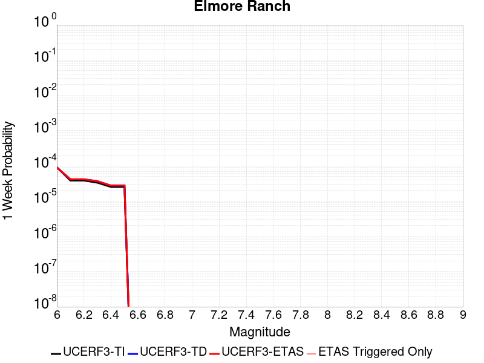 |  |  |  |

| Magnitude | 1 wk TI Prob | 1 wk TD Prob | 1 wk ETAS Prob | 1 wk ETAS/TD Gain | 1 wk ETAS Triggered Only | 1 mo TI Prob | 1 mo TD Prob | 1 mo ETAS Prob | 1 mo ETAS/TD Gain | 1 mo ETAS Triggered Only | 1 yr TI Prob | 1 yr TD Prob | 1 yr ETAS Prob | 1 yr ETAS/TD Gain | 1 yr ETAS Triggered Only | 10 yr TI Prob | 10 yr TD Prob | 10 yr ETAS Prob | 10 yr ETAS/TD Gain | 10 yr ETAS Triggered Only |
|-----|-----|-----|-----|-----|-----|-----|-----|-----|-----|-----|-----|-----|-----|-----|-----|-----|-----|-----|-----|-----|
| 6.0 | 9.102099E-5 | 8.953848E-5 | 8.953848E-5 | 1.0 | 0.0 | 3.9003167E-4 | 3.836898E-4 | 3.836898E-4 | 1.0 | 0.0 | 0.0047383 | 0.004662132 | 0.0047048577 | 1.0091645 | 4.2925825E-5 | 0.046385348 | 0.04583787 | 0.04587883 | 1.0008936 | 4.2925825E-5 |
| 6.1 | 3.8306698E-5 | 4.14921E-5 | 4.14921E-5 | 1.0 | 0.0 | 1.6416123E-4 | 1.7781362E-4 | 1.7781362E-4 | 1.0 | 0.0 | 0.0019968306 | 0.0021632186 | 0.0022060515 | 1.0198005 | 4.2925825E-5 | 0.019789828 | 0.021595007 | 0.021637006 | 1.0019449 | 4.2925825E-5 |
| 6.2 | 3.8306698E-5 | 4.14921E-5 | 4.14921E-5 | 1.0 | 0.0 | 1.6416123E-4 | 1.7781362E-4 | 1.7781362E-4 | 1.0 | 0.0 | 0.0019968306 | 0.0021632186 | 0.0022060515 | 1.0198005 | 4.2925825E-5 | 0.019789828 | 0.021595007 | 0.021637006 | 1.0019449 | 4.2925825E-5 |
| 6.3 | 3.3197924E-5 | 3.6550366E-5 | 3.6550366E-5 | 1.0 | 0.0 | 1.4226905E-4 | 1.56639E-4 | 1.56639E-4 | 1.0 | 0.0 | 0.0017307495 | 0.0019059771 | 0.0019488211 | 1.0224788 | 4.2925825E-5 | 0.017173318 | 0.019057386 | 0.019099493 | 1.0022095 | 4.2925825E-5 |
| 6.4 | 2.5148964E-5 | 2.7420736E-5 | 2.7420736E-5 | 1.0 | 0.0 | 1.0777682E-4 | 1.17515796E-4 | 1.17515796E-4 | 1.0 | 0.0 | 0.0013113929 | 0.0014304637 | 0.0014733281 | 1.0299654 | 4.2925825E-5 | 0.01303681 | 0.014365338 | 0.014407647 | 1.0029452 | 4.2925825E-5 |
| 6.5 | 2.5148964E-5 | 2.7420736E-5 | 2.7420736E-5 | 1.0 | 0.0 | 1.0777682E-4 | 1.17515796E-4 | 1.17515796E-4 | 1.0 | 0.0 | 0.0013113929 | 0.0014304637 | 0.0014733281 | 1.0299654 | 4.2925825E-5 | 0.01303681 | 0.014365338 | 0.014407647 | 1.0029452 | 4.2925825E-5 |

## Fickle Hill (alt1)
*[(top)](#table-of-contents)*

| 1 Week | 1 Month | 1 Year | 10 Year |
|-----|-----|-----|-----|
|  |  |  |  |

| Magnitude | 1 wk TI Prob | 1 wk TD Prob | 1 wk ETAS Prob | 1 wk ETAS/TD Gain | 1 wk ETAS Triggered Only | 1 mo TI Prob | 1 mo TD Prob | 1 mo ETAS Prob | 1 mo ETAS/TD Gain | 1 mo ETAS Triggered Only | 1 yr TI Prob | 1 yr TD Prob | 1 yr ETAS Prob | 1 yr ETAS/TD Gain | 1 yr ETAS Triggered Only | 10 yr TI Prob | 10 yr TD Prob | 10 yr ETAS Prob | 10 yr ETAS/TD Gain | 10 yr ETAS Triggered Only |
|-----|-----|-----|-----|-----|-----|-----|-----|-----|-----|-----|-----|-----|-----|-----|-----|-----|-----|-----|-----|-----|
| 6.0 | 5.491893E-6 | 5.826998E-6 | 5.826998E-6 | 1.0 | 0.0 | 2.3536471E-5 | 2.4972622E-5 | 2.4972622E-5 | 1.0 | 0.0 | 2.8651886E-4 | 3.040015E-4 | 3.040015E-4 | 1.0 | 0.0 | 0.0028614972 | 0.0030360806 | 0.003078876 | 1.0140957 | 4.2925825E-5 |
| 6.1 | 5.491893E-6 | 5.826998E-6 | 5.826998E-6 | 1.0 | 0.0 | 2.3536471E-5 | 2.4972622E-5 | 2.4972622E-5 | 1.0 | 0.0 | 2.8651886E-4 | 3.040015E-4 | 3.040015E-4 | 1.0 | 0.0 | 0.0028614972 | 0.0030360806 | 0.003078876 | 1.0140957 | 4.2925825E-5 |
| 6.2 | 5.491893E-6 | 5.826998E-6 | 5.826998E-6 | 1.0 | 0.0 | 2.3536471E-5 | 2.4972622E-5 | 2.4972622E-5 | 1.0 | 0.0 | 2.8651886E-4 | 3.040015E-4 | 3.040015E-4 | 1.0 | 0.0 | 0.0028614972 | 0.0030360806 | 0.003078876 | 1.0140957 | 4.2925825E-5 |
| 6.3 | 5.491893E-6 | 5.826998E-6 | 5.826998E-6 | 1.0 | 0.0 | 2.3536471E-5 | 2.4972622E-5 | 2.4972622E-5 | 1.0 | 0.0 | 2.8651886E-4 | 3.040015E-4 | 3.040015E-4 | 1.0 | 0.0 | 0.0028614972 | 0.0030360806 | 0.003078876 | 1.0140957 | 4.2925825E-5 |
| 6.4 | 5.491893E-6 | 5.826998E-6 | 5.826998E-6 | 1.0 | 0.0 | 2.3536471E-5 | 2.4972622E-5 | 2.4972622E-5 | 1.0 | 0.0 | 2.8651886E-4 | 3.040015E-4 | 3.040015E-4 | 1.0 | 0.0 | 0.0028614972 | 0.0030360806 | 0.003078876 | 1.0140957 | 4.2925825E-5 |
| 6.5 | 5.491893E-6 | 5.826998E-6 | 5.826998E-6 | 1.0 | 0.0 | 2.3536471E-5 | 2.4972622E-5 | 2.4972622E-5 | 1.0 | 0.0 | 2.8651886E-4 | 3.040015E-4 | 3.040015E-4 | 1.0 | 0.0 | 0.0028614972 | 0.0030360806 | 0.003078876 | 1.0140957 | 4.2925825E-5 |
| 6.6 | 5.491893E-6 | 5.826998E-6 | 5.826998E-6 | 1.0 | 0.0 | 2.3536471E-5 | 2.4972622E-5 | 2.4972622E-5 | 1.0 | 0.0 | 2.8651886E-4 | 3.040015E-4 | 3.040015E-4 | 1.0 | 0.0 | 0.0028614972 | 0.0030360806 | 0.003078876 | 1.0140957 | 4.2925825E-5 |
| 6.7 | 5.491893E-6 | 5.826998E-6 | 5.826998E-6 | 1.0 | 0.0 | 2.3536471E-5 | 2.4972622E-5 | 2.4972622E-5 | 1.0 | 0.0 | 2.8651886E-4 | 3.040015E-4 | 3.040015E-4 | 1.0 | 0.0 | 0.0028614972 | 0.0030360806 | 0.003078876 | 1.0140957 | 4.2925825E-5 |
| 6.8 | 5.2207747E-6 | 5.5457263E-6 | 5.5457263E-6 | 1.0 | 0.0 | 2.2374557E-5 | 2.3767194E-5 | 2.3767194E-5 | 1.0 | 0.0 | 2.7237617E-4 | 2.8932936E-4 | 2.8932936E-4 | 1.0 | 0.0 | 0.0027204256 | 0.002889745 | 0.0029325467 | 1.0148116 | 4.2925825E-5 |
| 6.9 | 5.2186956E-6 | 5.5435466E-6 | 5.5435466E-6 | 1.0 | 0.0 | 2.2365646E-5 | 2.3757853E-5 | 2.3757853E-5 | 1.0 | 0.0 | 2.722677E-4 | 2.8921568E-4 | 2.8921568E-4 | 1.0 | 0.0 | 0.0027193436 | 0.0028886108 | 0.0029314128 | 1.0148175 | 4.2925825E-5 |
| 7.0 | 4.403045E-6 | 4.69848E-6 | 4.69848E-6 | 1.0 | 0.0 | 1.8870056E-5 | 2.0136196E-5 | 2.0136196E-5 | 1.0 | 0.0 | 2.297187E-4 | 2.4513193E-4 | 2.4513193E-4 | 1.0 | 0.0 | 0.0022948137 | 0.0024487455 | 0.0024915664 | 1.0174868 | 4.2925825E-5 |
| 7.1 | 3.5911396E-6 | 3.8479548E-6 | 3.8479548E-6 | 1.0 | 0.0 | 1.5390508E-5 | 1.6491134E-5 | 1.6491134E-5 | 1.0 | 0.0 | 1.8736332E-4 | 2.0076182E-4 | 2.0076182E-4 | 1.0 | 0.0 | 0.0018720542 | 0.002005878 | 0.0020487176 | 1.021357 | 4.2925825E-5 |
| 7.2 | 2.888171E-6 | 3.114158E-6 | 3.114158E-6 | 1.0 | 0.0 | 1.2377816E-5 | 1.3346325E-5 | 1.3346325E-5 | 1.0 | 0.0 | 1.5068949E-4 | 1.6247964E-4 | 1.6247964E-4 | 1.0 | 0.0 | 0.0015058735 | 0.0016236332 | 0.0016664893 | 1.0263952 | 4.2925825E-5 |
| 7.3 | 2.275019E-6 | 2.4675212E-6 | 2.4675212E-6 | 1.0 | 0.0 | 9.750045E-6 | 1.0575049E-5 | 1.0575049E-5 | 1.0 | 0.0 | 1.1870033E-4 | 1.2874375E-4 | 1.2874375E-4 | 1.0 | 0.0 | 0.0011863695 | 0.0012867056 | 0.0012867056 | 1.0 | 0.0 |
| 7.4 | 2.076662E-6 | 2.2576116E-6 | 2.2576116E-6 | 1.0 | 0.0 | 8.8999495E-6 | 9.675444E-6 | 9.675444E-6 | 1.0 | 0.0 | 1.08351494E-4 | 1.1779229E-4 | 1.1779229E-4 | 1.0 | 0.0 | 0.0010829868 | 0.0011773116 | 0.0011773116 | 1.0 | 0.0 |
| 7.5 | 1.6450799E-6 | 1.7954102E-6 | 1.7954102E-6 | 1.0 | 0.0 | 7.0503233E-6 | 7.694593E-6 | 7.694593E-6 | 1.0 | 0.0 | 8.5834305E-5 | 9.367772E-5 | 9.367772E-5 | 1.0 | 0.0 | 8.580116E-4 | 9.3639E-4 | 9.3639E-4 | 1.0 | 0.0 |
| 7.6 | 1.168891E-6 | 1.282952E-6 | 1.282952E-6 | 1.0 | 0.0 | 5.009523E-6 | 5.4983543E-6 | 5.4983543E-6 | 1.0 | 0.0 | 6.098924E-5 | 6.694047E-5 | 6.694047E-5 | 1.0 | 0.0 | 6.09725E-4 | 6.6920865E-4 | 6.6920865E-4 | 1.0 | 0.0 |
| 7.7 | 3.9871026E-7 | 4.4271442E-7 | 4.4271442E-7 | 1.0 | 0.0 | 1.708757E-6 | 1.8973462E-6 | 1.8973462E-6 | 1.0 | 0.0 | 2.0803918E-5 | 2.3099954E-5 | 2.3099954E-5 | 1.0 | 0.0 | 2.0801972E-4 | 2.3097637E-4 | 2.3097637E-4 | 1.0 | 0.0 |
| 7.8 | 1.14295965E-7 | 1.2853816E-7 | 1.2853816E-7 | 1.0 | 0.0 | 4.8983975E-7 | 5.5087776E-7 | 5.5087776E-7 | 1.0 | 0.0 | 5.9637828E-6 | 6.7069177E-6 | 6.7069177E-6 | 1.0 | 0.0 | 5.9636226E-5 | 6.70673E-5 | 6.70673E-5 | 1.0 | 0.0 |

## Fontana (Seismicity)
*[(top)](#table-of-contents)*

| 1 Week | 1 Month | 1 Year | 10 Year |
|-----|-----|-----|-----|
|  |  |  |  |

| Magnitude | 1 wk TI Prob | 1 wk TD Prob | 1 wk ETAS Prob | 1 wk ETAS/TD Gain | 1 wk ETAS Triggered Only | 1 mo TI Prob | 1 mo TD Prob | 1 mo ETAS Prob | 1 mo ETAS/TD Gain | 1 mo ETAS Triggered Only | 1 yr TI Prob | 1 yr TD Prob | 1 yr ETAS Prob | 1 yr ETAS/TD Gain | 1 yr ETAS Triggered Only | 10 yr TI Prob | 10 yr TD Prob | 10 yr ETAS Prob | 10 yr ETAS/TD Gain | 10 yr ETAS Triggered Only |
|-----|-----|-----|-----|-----|-----|-----|-----|-----|-----|-----|-----|-----|-----|-----|-----|-----|-----|-----|-----|-----|
| 6.0 | 7.1789214E-6 | 7.5520006E-6 | 7.5520006E-6 | 1.0 | 0.0 | 3.076644E-5 | 3.2365548E-5 | 3.2365548E-5 | 1.0 | 0.0 | 3.7451705E-4 | 3.9402005E-4 | 4.3692897E-4 | 1.1089003 | 4.2925825E-5 | 0.003738865 | 0.003937214 | 0.0039799707 | 1.0108596 | 4.2925825E-5 |
| 6.1 | 7.1789214E-6 | 7.5520006E-6 | 7.5520006E-6 | 1.0 | 0.0 | 3.076644E-5 | 3.2365548E-5 | 3.2365548E-5 | 1.0 | 0.0 | 3.7451705E-4 | 3.9402005E-4 | 4.3692897E-4 | 1.1089003 | 4.2925825E-5 | 0.003738865 | 0.003937214 | 0.0039799707 | 1.0108596 | 4.2925825E-5 |
| 6.2 | 7.1789214E-6 | 7.5520006E-6 | 7.5520006E-6 | 1.0 | 0.0 | 3.076644E-5 | 3.2365548E-5 | 3.2365548E-5 | 1.0 | 0.0 | 3.7451705E-4 | 3.9402005E-4 | 4.3692897E-4 | 1.1089003 | 4.2925825E-5 | 0.003738865 | 0.003937214 | 0.0039799707 | 1.0108596 | 4.2925825E-5 |
| 6.3 | 7.1789214E-6 | 7.5520006E-6 | 7.5520006E-6 | 1.0 | 0.0 | 3.076644E-5 | 3.2365548E-5 | 3.2365548E-5 | 1.0 | 0.0 | 3.7451705E-4 | 3.9402005E-4 | 4.3692897E-4 | 1.1089003 | 4.2925825E-5 | 0.003738865 | 0.003937214 | 0.0039799707 | 1.0108596 | 4.2925825E-5 |
| 6.4 | 7.1789214E-6 | 7.5520006E-6 | 7.5520006E-6 | 1.0 | 0.0 | 3.076644E-5 | 3.2365548E-5 | 3.2365548E-5 | 1.0 | 0.0 | 3.7451705E-4 | 3.9402005E-4 | 4.3692897E-4 | 1.1089003 | 4.2925825E-5 | 0.003738865 | 0.003937214 | 0.0039799707 | 1.0108596 | 4.2925825E-5 |
| 6.5 | 5.2611317E-6 | 5.532726E-6 | 5.532726E-6 | 1.0 | 0.0 | 2.2547512E-5 | 2.3711682E-5 | 2.3711682E-5 | 1.0 | 0.0 | 2.744814E-4 | 2.8868974E-4 | 3.3160317E-4 | 1.148649 | 4.2925825E-5 | 0.002741426 | 0.0028868972 | 0.0029296991 | 1.0148263 | 4.2925825E-5 |
| 6.6 | 5.2611317E-6 | 5.532726E-6 | 5.532726E-6 | 1.0 | 0.0 | 2.2547512E-5 | 2.3711682E-5 | 2.3711682E-5 | 1.0 | 0.0 | 2.744814E-4 | 2.8868974E-4 | 3.3160317E-4 | 1.148649 | 4.2925825E-5 | 0.002741426 | 0.0028868972 | 0.0029296991 | 1.0148263 | 4.2925825E-5 |

## Mad River (alt1)
*[(top)](#table-of-contents)*

| 1 Week | 1 Month | 1 Year | 10 Year |
|-----|-----|-----|-----|
| 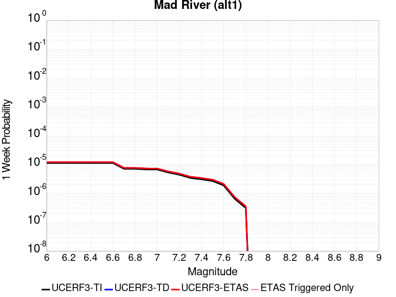 |  |  |  |

| Magnitude | 1 wk TI Prob | 1 wk TD Prob | 1 wk ETAS Prob | 1 wk ETAS/TD Gain | 1 wk ETAS Triggered Only | 1 mo TI Prob | 1 mo TD Prob | 1 mo ETAS Prob | 1 mo ETAS/TD Gain | 1 mo ETAS Triggered Only | 1 yr TI Prob | 1 yr TD Prob | 1 yr ETAS Prob | 1 yr ETAS/TD Gain | 1 yr ETAS Triggered Only | 10 yr TI Prob | 10 yr TD Prob | 10 yr ETAS Prob | 10 yr ETAS/TD Gain | 10 yr ETAS Triggered Only |
|-----|-----|-----|-----|-----|-----|-----|-----|-----|-----|-----|-----|-----|-----|-----|-----|-----|-----|-----|-----|-----|
| 6.0 | 1.1255216E-5 | 1.2039658E-5 | 1.2039658E-5 | 1.0 | 0.0 | 4.8235746E-5 | 5.1597595E-5 | 5.1597595E-5 | 1.0 | 0.0 | 5.87112E-4 | 6.280341E-4 | 6.280341E-4 | 1.0 | 0.0 | 0.0058556325 | 0.006264031 | 0.006306688 | 1.0068098 | 4.2925825E-5 |
| 6.1 | 1.1255216E-5 | 1.2039658E-5 | 1.2039658E-5 | 1.0 | 0.0 | 4.8235746E-5 | 5.1597595E-5 | 5.1597595E-5 | 1.0 | 0.0 | 5.87112E-4 | 6.280341E-4 | 6.280341E-4 | 1.0 | 0.0 | 0.0058556325 | 0.006264031 | 0.006306688 | 1.0068098 | 4.2925825E-5 |
| 6.2 | 1.1255216E-5 | 1.2039658E-5 | 1.2039658E-5 | 1.0 | 0.0 | 4.8235746E-5 | 5.1597595E-5 | 5.1597595E-5 | 1.0 | 0.0 | 5.87112E-4 | 6.280341E-4 | 6.280341E-4 | 1.0 | 0.0 | 0.0058556325 | 0.006264031 | 0.006306688 | 1.0068098 | 4.2925825E-5 |
| 6.3 | 1.1255216E-5 | 1.2039658E-5 | 1.2039658E-5 | 1.0 | 0.0 | 4.8235746E-5 | 5.1597595E-5 | 5.1597595E-5 | 1.0 | 0.0 | 5.87112E-4 | 6.280341E-4 | 6.280341E-4 | 1.0 | 0.0 | 0.0058556325 | 0.006264031 | 0.006306688 | 1.0068098 | 4.2925825E-5 |
| 6.4 | 1.1255216E-5 | 1.2039658E-5 | 1.2039658E-5 | 1.0 | 0.0 | 4.8235746E-5 | 5.1597595E-5 | 5.1597595E-5 | 1.0 | 0.0 | 5.87112E-4 | 6.280341E-4 | 6.280341E-4 | 1.0 | 0.0 | 0.0058556325 | 0.006264031 | 0.006306688 | 1.0068098 | 4.2925825E-5 |
| 6.5 | 1.1255216E-5 | 1.2039658E-5 | 1.2039658E-5 | 1.0 | 0.0 | 4.8235746E-5 | 5.1597595E-5 | 5.1597595E-5 | 1.0 | 0.0 | 5.87112E-4 | 6.280341E-4 | 6.280341E-4 | 1.0 | 0.0 | 0.0058556325 | 0.006264031 | 0.006306688 | 1.0068098 | 4.2925825E-5 |
| 6.6 | 1.1255216E-5 | 1.2039658E-5 | 1.2039658E-5 | 1.0 | 0.0 | 4.8235746E-5 | 5.1597595E-5 | 5.1597595E-5 | 1.0 | 0.0 | 5.87112E-4 | 6.280341E-4 | 6.280341E-4 | 1.0 | 0.0 | 0.0058556325 | 0.006264031 | 0.006306688 | 1.0068098 | 4.2925825E-5 |
| 6.7 | 7.0564884E-6 | 7.6054325E-6 | 7.6054325E-6 | 1.0 | 0.0 | 3.0241743E-5 | 3.2594315E-5 | 3.2594315E-5 | 1.0 | 0.0 | 3.68131E-4 | 3.967657E-4 | 3.967657E-4 | 1.0 | 0.0 | 0.0036752177 | 0.0039607957 | 0.0040035513 | 1.0107948 | 4.2925825E-5 |
| 6.8 | 7.0564884E-6 | 7.6054325E-6 | 7.6054325E-6 | 1.0 | 0.0 | 3.0241743E-5 | 3.2594315E-5 | 3.2594315E-5 | 1.0 | 0.0 | 3.68131E-4 | 3.967657E-4 | 3.967657E-4 | 1.0 | 0.0 | 0.0036752177 | 0.0039607957 | 0.0040035513 | 1.0107948 | 4.2925825E-5 |
| 6.9 | 6.727494E-6 | 7.2572843E-6 | 7.2572843E-6 | 1.0 | 0.0 | 2.8831799E-5 | 3.110229E-5 | 3.110229E-5 | 1.0 | 0.0 | 3.509706E-4 | 3.786067E-4 | 3.786067E-4 | 1.0 | 0.0 | 0.003504168 | 0.0037798323 | 0.0038225958 | 1.0113136 | 4.2925825E-5 |
| 7.0 | 6.7021124E-6 | 7.2301245E-6 | 7.2301245E-6 | 1.0 | 0.0 | 2.8723021E-5 | 3.098589E-5 | 3.098589E-5 | 1.0 | 0.0 | 3.4964667E-4 | 3.7719007E-4 | 3.7719007E-4 | 1.0 | 0.0 | 0.0034909705 | 0.003765714 | 0.0038084781 | 1.0113562 | 4.2925825E-5 |
| 7.1 | 5.2784667E-6 | 5.7322395E-6 | 5.7322395E-6 | 1.0 | 0.0 | 2.2621804E-5 | 2.4566516E-5 | 2.4566516E-5 | 1.0 | 0.0 | 2.7538565E-4 | 2.990572E-4 | 2.990572E-4 | 1.0 | 0.0 | 0.0027504463 | 0.0029866395 | 0.0030294373 | 1.0143297 | 4.2925825E-5 |
| 7.2 | 4.4085446E-6 | 4.819547E-6 | 4.819547E-6 | 1.0 | 0.0 | 1.8893625E-5 | 2.0655041E-5 | 2.0655041E-5 | 1.0 | 0.0 | 2.3000561E-4 | 2.514465E-4 | 2.514465E-4 | 1.0 | 0.0 | 0.0022976769 | 0.0025116608 | 0.0025544788 | 1.0170476 | 4.2925825E-5 |
| 7.3 | 3.4060627E-6 | 3.7531752E-6 | 3.7531752E-6 | 1.0 | 0.0 | 1.459733E-5 | 1.6084938E-5 | 1.6084938E-5 | 1.0 | 0.0 | 1.77708E-4 | 1.9581676E-4 | 1.9581676E-4 | 1.0 | 0.0 | 0.0017756595 | 0.0019564657 | 0.0019564657 | 1.0 | 0.0 |
| 7.4 | 3.0570902E-6 | 3.3802967E-6 | 3.3802967E-6 | 1.0 | 0.0 | 1.310175E-5 | 1.4486906E-5 | 1.4486906E-5 | 1.0 | 0.0 | 1.5950213E-4 | 1.7636403E-4 | 1.7636403E-4 | 1.0 | 0.0 | 0.0015938769 | 0.0017622622 | 0.0017622622 | 1.0 | 0.0 |
| 7.5 | 2.674048E-6 | 2.9692678E-6 | 2.9692678E-6 | 1.0 | 0.0 | 1.1460155E-5 | 1.27253725E-5 | 1.27253725E-5 | 1.0 | 0.0 | 1.3951845E-4 | 1.5492059E-4 | 1.5492059E-4 | 1.0 | 0.0 | 0.0013943089 | 0.0015481455 | 0.0015481455 | 1.0 | 0.0 |
| 7.6 | 1.8806261E-6 | 2.1046062E-6 | 2.1046062E-6 | 1.0 | 0.0 | 8.059801E-6 | 9.01971E-6 | 9.01971E-6 | 1.0 | 0.0 | 9.812366E-5 | 1.0980956E-4 | 1.0980956E-4 | 1.0 | 0.0 | 9.808034E-4 | 0.0010975654 | 0.0010975654 | 1.0 | 0.0 |
| 7.7 | 6.461283E-7 | 7.3407836E-7 | 7.3407836E-7 | 1.0 | 0.0 | 2.7691183E-6 | 3.1460463E-6 | 3.1460463E-6 | 1.0 | 0.0 | 3.371349E-5 | 3.8302456E-5 | 3.8302456E-5 | 1.0 | 0.0 | 3.370838E-4 | 3.8296005E-4 | 3.8296005E-4 | 1.0 | 0.0 |
| 7.8 | 3.0785324E-7 | 3.5290012E-7 | 3.5290012E-7 | 1.0 | 0.0 | 1.3193703E-6 | 1.5124282E-6 | 1.5124282E-6 | 1.0 | 0.0 | 1.6063215E-5 | 1.8413664E-5 | 1.8413664E-5 | 1.0 | 0.0 | 1.6062055E-4 | 1.8412202E-4 | 1.8412202E-4 | 1.0 | 0.0 |

## Johnson Valley (No) 2011 rev
*[(top)](#table-of-contents)*

| 1 Week | 1 Month | 1 Year | 10 Year |
|-----|-----|-----|-----|
|  |  |  | 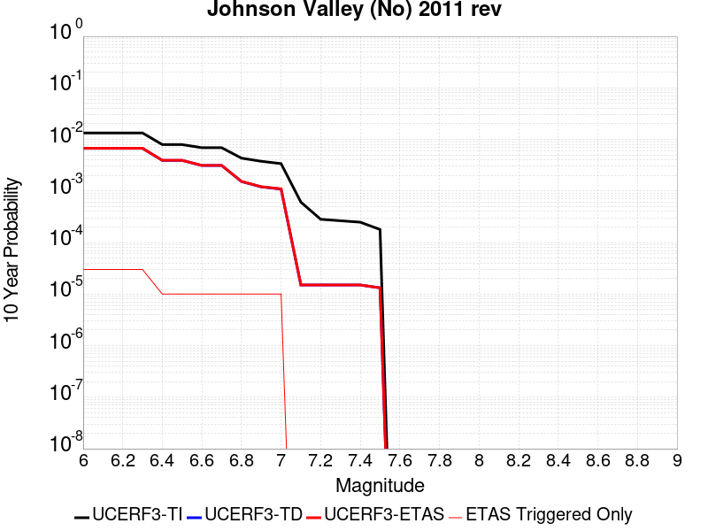 |

| Magnitude | 1 wk TI Prob | 1 wk TD Prob | 1 wk ETAS Prob | 1 wk ETAS/TD Gain | 1 wk ETAS Triggered Only | 1 mo TI Prob | 1 mo TD Prob | 1 mo ETAS Prob | 1 mo ETAS/TD Gain | 1 mo ETAS Triggered Only | 1 yr TI Prob | 1 yr TD Prob | 1 yr ETAS Prob | 1 yr ETAS/TD Gain | 1 yr ETAS Triggered Only | 10 yr TI Prob | 10 yr TD Prob | 10 yr ETAS Prob | 10 yr ETAS/TD Gain | 10 yr ETAS Triggered Only |
|-----|-----|-----|-----|-----|-----|-----|-----|-----|-----|-----|-----|-----|-----|-----|-----|-----|-----|-----|-----|-----|
| 6.0 | 2.577707E-5 | 1.2901208E-5 | 5.5826476E-5 | 4.327229 | 4.2925825E-5 | 1.1046848E-4 | 5.528994E-5 | 9.821339E-5 | 1.7763338 | 4.2925825E-5 | 0.0013441239 | 6.729868E-4 | 7.1588374E-4 | 1.0637411 | 4.2925825E-5 | 0.013360229 | 0.006713397 | 0.0067560347 | 1.0063511 | 4.2925825E-5 |
| 6.1 | 2.577707E-5 | 1.2901208E-5 | 5.5826476E-5 | 4.327229 | 4.2925825E-5 | 1.1046848E-4 | 5.528994E-5 | 9.821339E-5 | 1.7763338 | 4.2925825E-5 | 0.0013441239 | 6.729868E-4 | 7.1588374E-4 | 1.0637411 | 4.2925825E-5 | 0.013360229 | 0.006713397 | 0.0067560347 | 1.0063511 | 4.2925825E-5 |
| 6.2 | 2.577707E-5 | 1.2901208E-5 | 5.5826476E-5 | 4.327229 | 4.2925825E-5 | 1.1046848E-4 | 5.528994E-5 | 9.821339E-5 | 1.7763338 | 4.2925825E-5 | 0.0013441239 | 6.729868E-4 | 7.1588374E-4 | 1.0637411 | 4.2925825E-5 | 0.013360229 | 0.006713397 | 0.0067560347 | 1.0063511 | 4.2925825E-5 |
| 6.3 | 2.577707E-5 | 1.2901208E-5 | 5.5826476E-5 | 4.327229 | 4.2925825E-5 | 1.1046848E-4 | 5.528994E-5 | 9.821339E-5 | 1.7763338 | 4.2925825E-5 | 0.0013441239 | 6.729868E-4 | 7.1588374E-4 | 1.0637411 | 4.2925825E-5 | 0.013360229 | 0.006713397 | 0.0067560347 | 1.0063511 | 4.2925825E-5 |
| 6.4 | 1.5296591E-5 | 7.5369735E-6 | 7.5369735E-6 | 1.0 | 0.0 | 6.555518E-5 | 3.230102E-5 | 3.230102E-5 | 1.0 | 0.0 | 7.97842E-4 | 3.9321271E-4 | 3.9321271E-4 | 1.0 | 0.0 | 0.007949836 | 0.003927011 | 0.003927011 | 1.0 | 0.0 |
| 6.5 | 1.5296591E-5 | 7.5369735E-6 | 7.5369735E-6 | 1.0 | 0.0 | 6.555518E-5 | 3.230102E-5 | 3.230102E-5 | 1.0 | 0.0 | 7.97842E-4 | 3.9321271E-4 | 3.9321271E-4 | 1.0 | 0.0 | 0.007949836 | 0.003927011 | 0.003927011 | 1.0 | 0.0 |
| 6.6 | 1.3289383E-5 | 5.9919316E-6 | 5.9919316E-6 | 1.0 | 0.0 | 5.6953253E-5 | 2.567955E-5 | 2.567955E-5 | 1.0 | 0.0 | 6.9318525E-4 | 3.1262063E-4 | 3.1262063E-4 | 1.0 | 0.0 | 0.0069102696 | 0.0031234731 | 0.0031234731 | 1.0 | 0.0 |
| 6.7 | 1.3289383E-5 | 5.9919316E-6 | 5.9919316E-6 | 1.0 | 0.0 | 5.6953253E-5 | 2.567955E-5 | 2.567955E-5 | 1.0 | 0.0 | 6.9318525E-4 | 3.1262063E-4 | 3.1262063E-4 | 1.0 | 0.0 | 0.0069102696 | 0.0031234731 | 0.0031234731 | 1.0 | 0.0 |
| 6.8 | 8.330789E-6 | 2.9214577E-6 | 2.9214577E-6 | 1.0 | 0.0 | 3.570289E-5 | 1.2520505E-5 | 1.2520505E-5 | 1.0 | 0.0 | 4.34596E-4 | 1.524322E-4 | 1.524322E-4 | 1.0 | 0.0 | 0.0043374705 | 0.0015238364 | 0.0015238364 | 1.0 | 0.0 |
| 6.9 | 7.2359003E-6 | 2.3014702E-6 | 2.3014702E-6 | 1.0 | 0.0 | 3.1010633E-5 | 9.863436E-6 | 9.863436E-6 | 1.0 | 0.0 | 3.7748902E-4 | 1.2008605E-4 | 1.2008605E-4 | 1.0 | 0.0 | 0.0037684843 | 0.0012007345 | 0.0012007345 | 1.0 | 0.0 |
| 7.0 | 6.5149957E-6 | 2.0886398E-6 | 2.0886398E-6 | 1.0 | 0.0 | 2.792111E-5 | 8.951313E-6 | 8.951313E-6 | 1.0 | 0.0 | 3.398865E-4 | 1.0898209E-4 | 1.0898209E-4 | 1.0 | 0.0 | 0.003393671 | 0.0010898062 | 0.0010898062 | 1.0 | 0.0 |
| 7.1 | 1.1662233E-6 | 2.8793124E-8 | 2.8793124E-8 | 1.0 | 0.0 | 4.9980904E-6 | 1.2339909E-7 | 1.2339909E-7 | 1.0 | 0.0 | 6.0850052E-5 | 1.5023832E-6 | 1.5023832E-6 | 1.0 | 0.0 | 6.083339E-4 | 1.5023746E-5 | 1.5023746E-5 | 1.0 | 0.0 |
| 7.2 | 5.413881E-7 | 2.8793124E-8 | 2.8793124E-8 | 1.0 | 0.0 | 2.3202326E-6 | 1.2339909E-7 | 1.2339909E-7 | 1.0 | 0.0 | 2.8248465E-5 | 1.5023832E-6 | 1.5023832E-6 | 1.0 | 0.0 | 2.8244875E-4 | 1.5023746E-5 | 1.5023746E-5 | 1.0 | 0.0 |
| 7.3 | 5.076821E-7 | 2.8793124E-8 | 2.8793124E-8 | 1.0 | 0.0 | 2.1757785E-6 | 1.2339909E-7 | 1.2339909E-7 | 1.0 | 0.0 | 2.648978E-5 | 1.5023832E-6 | 1.5023832E-6 | 1.0 | 0.0 | 2.6486625E-4 | 1.5023746E-5 | 1.5023746E-5 | 1.0 | 0.0 |
| 7.4 | 4.7568687E-7 | 2.8775073E-8 | 2.8775073E-8 | 1.0 | 0.0 | 2.0386565E-6 | 1.2332174E-7 | 1.2332174E-7 | 1.0 | 0.0 | 2.482036E-5 | 1.5014413E-6 | 1.5014413E-6 | 1.0 | 0.0 | 2.4817587E-4 | 1.5014328E-5 | 1.5014328E-5 | 1.0 | 0.0 |
| 7.5 | 3.435626E-7 | 2.5350424E-8 | 2.5350424E-8 | 1.0 | 0.0 | 1.4724103E-6 | 1.0864467E-7 | 1.0864467E-7 | 1.0 | 0.0 | 1.7926448E-5 | 1.3227482E-6 | 1.3227482E-6 | 1.0 | 0.0 | 1.7925001E-4 | 1.3227419E-5 | 1.3227419E-5 | 1.0 | 0.0 |

## Breckenridge 2011
*[(top)](#table-of-contents)*

| 1 Week | 1 Month | 1 Year | 10 Year |
|-----|-----|-----|-----|
|  | 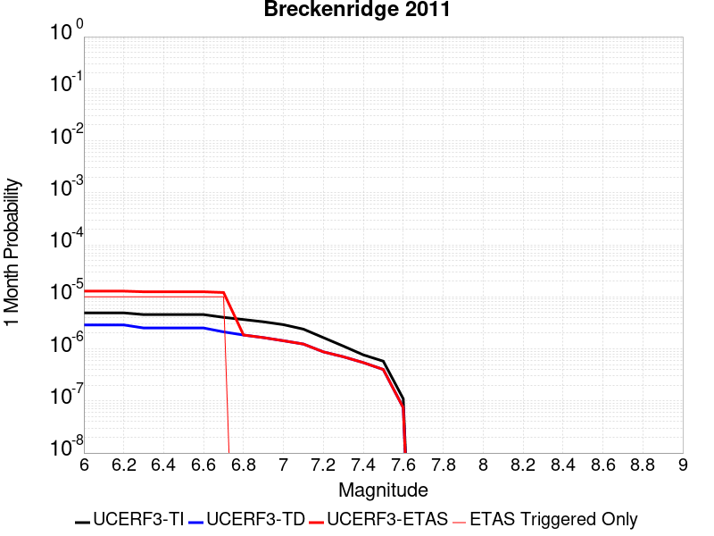 |  |  |

| Magnitude | 1 wk TI Prob | 1 wk TD Prob | 1 wk ETAS Prob | 1 wk ETAS/TD Gain | 1 wk ETAS Triggered Only | 1 mo TI Prob | 1 mo TD Prob | 1 mo ETAS Prob | 1 mo ETAS/TD Gain | 1 mo ETAS Triggered Only | 1 yr TI Prob | 1 yr TD Prob | 1 yr ETAS Prob | 1 yr ETAS/TD Gain | 1 yr ETAS Triggered Only | 10 yr TI Prob | 10 yr TD Prob | 10 yr ETAS Prob | 10 yr ETAS/TD Gain | 10 yr ETAS Triggered Only |
|-----|-----|-----|-----|-----|-----|-----|-----|-----|-----|-----|-----|-----|-----|-----|-----|-----|-----|-----|-----|-----|
| 6.0 | 1.1490393E-6 | 6.738007E-7 | 6.738007E-7 | 1.0 | 0.0 | 4.924445E-6 | 2.8877141E-6 | 4.5813413E-5 | 15.864941 | 4.2925825E-5 | 5.995347E-5 | 3.5157373E-5 | 7.808169E-5 | 2.2209194 | 4.2925825E-5 | 5.9937296E-4 | 3.5152017E-4 | 3.944309E-4 | 1.1220719 | 4.2925825E-5 |
| 6.1 | 1.1490393E-6 | 6.738007E-7 | 6.738007E-7 | 1.0 | 0.0 | 4.924445E-6 | 2.8877141E-6 | 4.5813413E-5 | 15.864941 | 4.2925825E-5 | 5.995347E-5 | 3.5157373E-5 | 7.808169E-5 | 2.2209194 | 4.2925825E-5 | 5.9937296E-4 | 3.5152017E-4 | 3.944309E-4 | 1.1220719 | 4.2925825E-5 |
| 6.2 | 1.1490393E-6 | 6.738007E-7 | 6.738007E-7 | 1.0 | 0.0 | 4.924445E-6 | 2.8877141E-6 | 4.5813413E-5 | 15.864941 | 4.2925825E-5 | 5.995347E-5 | 3.5157373E-5 | 7.808169E-5 | 2.2209194 | 4.2925825E-5 | 5.9937296E-4 | 3.5152017E-4 | 3.944309E-4 | 1.1220719 | 4.2925825E-5 |
| 6.3 | 1.064617E-6 | 5.886405E-7 | 5.886405E-7 | 1.0 | 0.0 | 4.5626366E-6 | 2.5227425E-6 | 4.5448458E-5 | 18.015495 | 4.2925825E-5 | 5.5548684E-5 | 3.071397E-5 | 7.3638475E-5 | 2.3975565 | 4.2925825E-5 | 5.55348E-4 | 3.070984E-4 | 3.5001105E-4 | 1.1397358 | 4.2925825E-5 |
| 6.4 | 1.064617E-6 | 5.886405E-7 | 5.886405E-7 | 1.0 | 0.0 | 4.5626366E-6 | 2.5227425E-6 | 4.5448458E-5 | 18.015495 | 4.2925825E-5 | 5.5548684E-5 | 3.071397E-5 | 7.3638475E-5 | 2.3975565 | 4.2925825E-5 | 5.55348E-4 | 3.070984E-4 | 3.5001105E-4 | 1.1397358 | 4.2925825E-5 |
| 6.5 | 1.064617E-6 | 5.886405E-7 | 5.886405E-7 | 1.0 | 0.0 | 4.5626366E-6 | 2.5227425E-6 | 4.5448458E-5 | 18.015495 | 4.2925825E-5 | 5.5548684E-5 | 3.071397E-5 | 7.3638475E-5 | 2.3975565 | 4.2925825E-5 | 5.55348E-4 | 3.070984E-4 | 3.5001105E-4 | 1.1397358 | 4.2925825E-5 |
| 6.6 | 1.064617E-6 | 5.886405E-7 | 5.886405E-7 | 1.0 | 0.0 | 4.5626366E-6 | 2.5227425E-6 | 4.5448458E-5 | 18.015495 | 4.2925825E-5 | 5.5548684E-5 | 3.071397E-5 | 7.3638475E-5 | 2.3975565 | 4.2925825E-5 | 5.55348E-4 | 3.070984E-4 | 3.5001105E-4 | 1.1397358 | 4.2925825E-5 |
| 6.7 | 9.4219524E-7 | 4.954012E-7 | 4.954012E-7 | 1.0 | 0.0 | 4.037973E-6 | 2.1231463E-6 | 4.504888E-5 | 21.217981 | 4.2925825E-5 | 4.916122E-5 | 2.5849005E-5 | 6.877372E-5 | 2.6605945 | 4.2925825E-5 | 4.9150345E-4 | 2.5846064E-4 | 3.0137537E-4 | 1.1660397 | 4.2925825E-5 |
| 6.8 | 8.556422E-7 | 4.311915E-7 | 4.311915E-7 | 1.0 | 0.0 | 3.667033E-6 | 1.8479623E-6 | 1.8479623E-6 | 1.0 | 0.0 | 4.464521E-5 | 2.2498712E-5 | 2.2498712E-5 | 1.0 | 0.0 | 4.4636242E-4 | 2.2496474E-4 | 2.2496474E-4 | 1.0 | 0.0 |
| 6.9 | 7.7357794E-7 | 3.841983E-7 | 3.841983E-7 | 1.0 | 0.0 | 3.3153299E-6 | 1.6465632E-6 | 1.6465632E-6 | 1.0 | 0.0 | 4.0363393E-5 | 2.0046726E-5 | 2.0046726E-5 | 1.0 | 0.0 | 4.035606E-4 | 2.0044947E-4 | 2.0044947E-4 | 1.0 | 0.0 |
| 7.0 | 6.8172454E-7 | 3.3470985E-7 | 3.3470985E-7 | 1.0 | 0.0 | 2.9216735E-6 | 1.43447E-6 | 1.43447E-6 | 1.0 | 0.0 | 3.5570793E-5 | 1.7464534E-5 | 1.7464534E-5 | 1.0 | 0.0 | 3.55651E-4 | 1.7463184E-4 | 1.7463184E-4 | 1.0 | 0.0 |
| 7.1 | 5.5936397E-7 | 2.8909366E-7 | 2.8909366E-7 | 1.0 | 0.0 | 2.397272E-6 | 1.2389722E-6 | 1.2389722E-6 | 1.0 | 0.0 | 2.9186394E-5 | 1.5084385E-5 | 1.5084385E-5 | 1.0 | 0.0 | 2.9182562E-4 | 1.5083379E-4 | 1.5083379E-4 | 1.0 | 0.0 |
| 7.2 | 3.8420822E-7 | 2.0468183E-7 | 2.0468183E-7 | 1.0 | 0.0 | 1.6466057E-6 | 8.772076E-7 | 8.772076E-7 | 1.0 | 0.0 | 2.004724E-5 | 1.0679951E-5 | 1.0679951E-5 | 1.0 | 0.0 | 2.004543E-4 | 1.06794454E-4 | 1.06794454E-4 | 1.0 | 0.0 |
| 7.3 | 2.6405158E-7 | 1.6473078E-7 | 1.6473078E-7 | 1.0 | 0.0 | 1.1316491E-6 | 7.0598884E-7 | 7.0598884E-7 | 1.0 | 0.0 | 1.37777415E-5 | 8.595381E-6 | 8.595381E-6 | 1.0 | 0.0 | 1.3776887E-4 | 8.595055E-5 | 8.595055E-5 | 1.0 | 0.0 |
| 7.4 | 1.792114E-7 | 1.2725252E-7 | 1.2725252E-7 | 1.0 | 0.0 | 7.6804866E-7 | 5.453678E-7 | 5.453678E-7 | 1.0 | 0.0 | 9.3509525E-6 | 6.639834E-6 | 6.639834E-6 | 1.0 | 0.0 | 9.350559E-5 | 6.63964E-5 | 6.63964E-5 | 1.0 | 0.0 |
| 7.5 | 1.3548703E-7 | 9.385346E-8 | 9.385346E-8 | 1.0 | 0.0 | 5.8065854E-7 | 4.0222903E-7 | 4.0222903E-7 | 1.0 | 0.0 | 7.0694946E-6 | 4.897128E-6 | 4.897128E-6 | 1.0 | 0.0 | 7.0692695E-5 | 4.8970236E-5 | 4.8970236E-5 | 1.0 | 0.0 |
| 7.6 | 2.572245E-8 | 1.735264E-8 | 1.735264E-8 | 1.0 | 0.0 | 1.10239064E-7 | 7.436845E-8 | 7.436845E-8 | 1.0 | 0.0 | 1.3421597E-6 | 9.0543557E-7 | 9.0543557E-7 | 1.0 | 0.0 | 1.3421517E-5 | 9.054324E-6 | 9.054324E-6 | 1.0 | 0.0 |

## Calaveras (So) - Paicines extension 2011 CFM
*[(top)](#table-of-contents)*

| 1 Week | 1 Month | 1 Year | 10 Year |
|-----|-----|-----|-----|
|  |  |  |  |

| Magnitude | 1 wk TI Prob | 1 wk TD Prob | 1 wk ETAS Prob | 1 wk ETAS/TD Gain | 1 wk ETAS Triggered Only | 1 mo TI Prob | 1 mo TD Prob | 1 mo ETAS Prob | 1 mo ETAS/TD Gain | 1 mo ETAS Triggered Only | 1 yr TI Prob | 1 yr TD Prob | 1 yr ETAS Prob | 1 yr ETAS/TD Gain | 1 yr ETAS Triggered Only | 10 yr TI Prob | 10 yr TD Prob | 10 yr ETAS Prob | 10 yr ETAS/TD Gain | 10 yr ETAS Triggered Only |
|-----|-----|-----|-----|-----|-----|-----|-----|-----|-----|-----|-----|-----|-----|-----|-----|-----|-----|-----|-----|-----|
| 6.0 | 1.5183659E-4 | 3.0520977E-4 | 3.0520977E-4 | 1.0 | 0.0 | 6.5056595E-4 | 0.0013068188 | 0.0013068188 | 1.0 | 0.0 | 0.007891912 | 0.015696203 | 0.015696203 | 1.0 | 0.0 | 0.076174594 | 0.13848905 | 0.13852604 | 1.000267 | 4.2925825E-5 |
| 6.1 | 1.5024997E-4 | 3.021517E-4 | 3.021517E-4 | 1.0 | 0.0 | 6.437695E-4 | 0.0012937278 | 0.0012937278 | 1.0 | 0.0 | 0.0078097614 | 0.015539596 | 0.015539596 | 1.0 | 0.0 | 0.075409345 | 0.13715863 | 0.13719568 | 1.00027 | 4.2925825E-5 |
| 6.2 | 1.2743923E-4 | 2.5313982E-4 | 2.5313982E-4 | 1.0 | 0.0 | 5.460538E-4 | 0.0010839999 | 0.0010839999 | 1.0 | 0.0 | 0.0066279583 | 0.013046881 | 0.013046881 | 1.0 | 0.0 | 0.064337276 | 0.117256075 | 0.11729396 | 1.0003232 | 4.2925825E-5 |
| 6.3 | 1.1525114E-4 | 2.2599236E-4 | 2.2599236E-4 | 1.0 | 0.0 | 4.9383997E-4 | 9.678718E-4 | 9.678718E-4 | 1.0 | 0.0 | 0.0059959386 | 0.011668079 | 0.011668079 | 1.0 | 0.0 | 0.058367174 | 0.106372125 | 0.10641048 | 1.0003606 | 4.2925825E-5 |
| 6.4 | 1.07200925E-4 | 2.0840544E-4 | 2.0840544E-4 | 1.0 | 0.0 | 4.5935164E-4 | 8.926123E-4 | 8.926123E-4 | 1.0 | 0.0 | 0.0055782744 | 0.010772959 | 0.010772959 | 1.0 | 0.0 | 0.0544031 | 0.099194765 | 0.09923343 | 1.0003898 | 4.2925825E-5 |
| 6.5 | 9.69631E-5 | 1.8734725E-4 | 1.8734725E-4 | 1.0 | 0.0 | 4.1548995E-4 | 8.024631E-4 | 8.024631E-4 | 1.0 | 0.0 | 0.0050468626 | 0.009694842 | 0.009694842 | 1.0 | 0.0 | 0.04933773 | 0.090086564 | 0.09012563 | 1.0004336 | 4.2925825E-5 |
| 6.6 | 8.0552316E-5 | 1.507068E-4 | 1.507068E-4 | 1.0 | 0.0 | 3.4517853E-4 | 6.4569083E-4 | 6.4569083E-4 | 1.0 | 0.0 | 0.0041944524 | 0.007826508 | 0.007826508 | 1.0 | 0.0 | 0.04116161 | 0.0748563 | 0.074896015 | 1.0005305 | 4.2925825E-5 |
| 6.7 | 7.815757E-5 | 1.4611272E-4 | 1.4611272E-4 | 1.0 | 0.0 | 3.34918E-4 | 6.26014E-4 | 6.26014E-4 | 1.0 | 0.0 | 0.004070005 | 0.007589312 | 0.007589312 | 1.0 | 0.0 | 0.039962657 | 0.07270582 | 0.07274563 | 1.0005475 | 4.2925825E-5 |
| 6.8 | 6.965264E-5 | 1.2722758E-4 | 1.2722758E-4 | 1.0 | 0.0 | 2.9847719E-4 | 5.4513285E-4 | 5.4513285E-4 | 1.0 | 0.0 | 0.0036279052 | 0.0066135945 | 0.0066135945 | 1.0 | 0.0 | 0.03569247 | 0.063801065 | 0.06384125 | 1.0006299 | 4.2925825E-5 |
| 6.9 | 5.8000453E-5 | 1.01439E-4 | 1.01439E-4 | 1.0 | 0.0 | 2.4854968E-4 | 4.346666E-4 | 4.346666E-4 | 1.0 | 0.0 | 0.0030218933 | 0.005279322 | 0.005279322 | 1.0 | 0.0 | 0.029811295 | 0.051502965 | 0.05154368 | 1.0007906 | 4.2925825E-5 |
| 7.0 | 4.9865852E-5 | 8.568029E-5 | 8.568029E-5 | 1.0 | 0.0 | 2.1369329E-4 | 3.6715003E-4 | 3.6715003E-4 | 1.0 | 0.0 | 0.0025986114 | 0.004460979 | 0.004460979 | 1.0 | 0.0 | 0.025684336 | 0.043782018 | 0.043823063 | 1.0009375 | 4.2925825E-5 |
| 7.1 | 4.283875E-5 | 7.1124625E-5 | 7.1124625E-5 | 1.0 | 0.0 | 1.8358172E-4 | 3.0478454E-4 | 3.0478454E-4 | 1.0 | 0.0 | 0.0022328163 | 0.003704494 | 0.003704494 | 1.0 | 0.0 | 0.022105146 | 0.03673582 | 0.036777172 | 1.0011256 | 4.2925825E-5 |
| 7.2 | 3.450115E-5 | 5.5778568E-5 | 5.5778568E-5 | 1.0 | 0.0 | 1.478537E-4 | 2.3902925E-4 | 2.3902925E-4 | 1.0 | 0.0 | 0.0017986323 | 0.0029063264 | 0.0029063264 | 1.0 | 0.0 | 0.017841442 | 0.029079042 | 0.02912072 | 1.0014333 | 4.2925825E-5 |
| 7.3 | 2.5709045E-5 | 4.059001E-5 | 4.059001E-5 | 1.0 | 0.0 | 1.1017697E-4 | 1.7394568E-4 | 1.7394568E-4 | 1.0 | 0.0 | 0.0013405791 | 0.0021157486 | 0.0021157486 | 1.0 | 0.0 | 0.013325208 | 0.02129686 | 0.021338873 | 1.0019727 | 4.2925825E-5 |
| 7.4 | 1.8003093E-5 | 2.8511378E-5 | 2.8511378E-5 | 1.0 | 0.0 | 7.715383E-5 | 1.2218591E-4 | 1.2218591E-4 | 1.0 | 0.0 | 9.3894306E-4 | 0.0014866006 | 0.0014866006 | 1.0 | 0.0 | 0.009349857 | 0.015051589 | 0.0150938695 | 1.0028089 | 4.2925825E-5 |
| 7.5 | 1.5595824E-5 | 2.5823752E-5 | 2.5823752E-5 | 1.0 | 0.0 | 6.683753E-5 | 1.10668545E-4 | 1.10668545E-4 | 1.0 | 0.0 | 8.134431E-4 | 0.0013465589 | 0.0013465589 | 1.0 | 0.0 | 0.008104719 | 0.013651571 | 0.013693911 | 1.0031015 | 4.2925825E-5 |
| 7.6 | 1.1110309E-5 | 1.9223195E-5 | 1.9223195E-5 | 1.0 | 0.0 | 4.761474E-5 | 8.2382525E-5 | 8.2382525E-5 | 1.0 | 0.0 | 5.795553E-4 | 0.0010025471 | 0.0010025471 | 1.0 | 0.0 | 0.0057804612 | 0.01020344 | 0.01020344 | 1.0 | 0.0 |
| 7.7 | 6.2140443E-6 | 1.04376995E-5 | 1.04376995E-5 | 1.0 | 0.0 | 2.6631347E-5 | 4.4732235E-5 | 4.4732235E-5 | 1.0 | 0.0 | 3.241884E-4 | 5.4447894E-4 | 5.4447894E-4 | 1.0 | 0.0 | 0.0032371588 | 0.005620102 | 0.005620102 | 1.0 | 0.0 |
| 7.8 | 5.305533E-6 | 9.433651E-6 | 9.433651E-6 | 1.0 | 0.0 | 2.27378E-5 | 4.0429306E-5 | 4.0429306E-5 | 1.0 | 0.0 | 2.7679754E-4 | 4.9211574E-4 | 4.9211574E-4 | 1.0 | 0.0 | 0.0027645302 | 0.005074622 | 0.005074622 | 1.0 | 0.0 |
| 7.9 | 3.363505E-6 | 7.3854467E-6 | 7.3854467E-6 | 1.0 | 0.0 | 1.4414942E-5 | 3.1651532E-5 | 3.1651532E-5 | 1.0 | 0.0 | 1.7548777E-4 | 3.8528934E-4 | 3.8528934E-4 | 1.0 | 0.0 | 0.0017534926 | 0.003948784 | 0.003948784 | 1.0 | 0.0 |
| 8.0 | 2.0271132E-6 | 4.4134235E-6 | 4.4134235E-6 | 1.0 | 0.0 | 8.687599E-6 | 1.8914534E-5 | 1.8914534E-5 | 1.0 | 0.0 | 1.05766376E-4 | 2.3026018E-4 | 2.3026018E-4 | 1.0 | 0.0 | 0.0010571606 | 0.002351194 | 0.002351194 | 1.0 | 0.0 |
| 8.1 | 1.2206116E-6 | 2.3752666E-6 | 2.3752666E-6 | 1.0 | 0.0 | 5.2311816E-6 | 1.0179674E-5 | 1.0179674E-5 | 1.0 | 0.0 | 6.3687774E-5 | 1.2393051E-4 | 1.2393051E-4 | 1.0 | 0.0 | 6.366953E-4 | 0.0012705618 | 0.0012705618 | 1.0 | 0.0 |

## Raymond
*[(top)](#table-of-contents)*

| 1 Week | 1 Month | 1 Year | 10 Year |
|-----|-----|-----|-----|
|  |  |  |  |

| Magnitude | 1 wk TI Prob | 1 wk TD Prob | 1 wk ETAS Prob | 1 wk ETAS/TD Gain | 1 wk ETAS Triggered Only | 1 mo TI Prob | 1 mo TD Prob | 1 mo ETAS Prob | 1 mo ETAS/TD Gain | 1 mo ETAS Triggered Only | 1 yr TI Prob | 1 yr TD Prob | 1 yr ETAS Prob | 1 yr ETAS/TD Gain | 1 yr ETAS Triggered Only | 10 yr TI Prob | 10 yr TD Prob | 10 yr ETAS Prob | 10 yr ETAS/TD Gain | 10 yr ETAS Triggered Only |
|-----|-----|-----|-----|-----|-----|-----|-----|-----|-----|-----|-----|-----|-----|-----|-----|-----|-----|-----|-----|-----|
| 6.0 | 1.5157413E-5 | 1.5810125E-5 | 1.5810125E-5 | 1.0 | 0.0 | 6.4958724E-5 | 6.775606E-5 | 6.775606E-5 | 1.0 | 0.0 | 7.905855E-4 | 8.246429E-4 | 8.246429E-4 | 1.0 | 0.0 | 0.007877788 | 0.008218355 | 0.008260927 | 1.0051802 | 4.2925825E-5 |
| 6.1 | 1.5157413E-5 | 1.5810125E-5 | 1.5810125E-5 | 1.0 | 0.0 | 6.4958724E-5 | 6.775606E-5 | 6.775606E-5 | 1.0 | 0.0 | 7.905855E-4 | 8.246429E-4 | 8.246429E-4 | 1.0 | 0.0 | 0.007877788 | 0.008218355 | 0.008260927 | 1.0051802 | 4.2925825E-5 |
| 6.2 | 1.5157413E-5 | 1.5810125E-5 | 1.5810125E-5 | 1.0 | 0.0 | 6.4958724E-5 | 6.775606E-5 | 6.775606E-5 | 1.0 | 0.0 | 7.905855E-4 | 8.246429E-4 | 8.246429E-4 | 1.0 | 0.0 | 0.007877788 | 0.008218355 | 0.008260927 | 1.0051802 | 4.2925825E-5 |
| 6.3 | 1.5157413E-5 | 1.5810125E-5 | 1.5810125E-5 | 1.0 | 0.0 | 6.4958724E-5 | 6.775606E-5 | 6.775606E-5 | 1.0 | 0.0 | 7.905855E-4 | 8.246429E-4 | 8.246429E-4 | 1.0 | 0.0 | 0.007877788 | 0.008218355 | 0.008260927 | 1.0051802 | 4.2925825E-5 |
| 6.4 | 1.3941944E-5 | 1.4454688E-5 | 1.4454688E-5 | 1.0 | 0.0 | 5.9749822E-5 | 6.194732E-5 | 6.194732E-5 | 1.0 | 0.0 | 7.2721124E-4 | 7.53971E-4 | 7.53971E-4 | 1.0 | 0.0 | 0.007248361 | 0.007516471 | 0.007559074 | 1.0056679 | 4.2925825E-5 |
| 6.5 | 1.3941944E-5 | 1.4454688E-5 | 1.4454688E-5 | 1.0 | 0.0 | 5.9749822E-5 | 6.194732E-5 | 6.194732E-5 | 1.0 | 0.0 | 7.2721124E-4 | 7.53971E-4 | 7.53971E-4 | 1.0 | 0.0 | 0.007248361 | 0.007516471 | 0.007559074 | 1.0056679 | 4.2925825E-5 |
| 6.6 | 1.0542609E-5 | 1.067111E-5 | 1.067111E-5 | 1.0 | 0.0 | 4.5181827E-5 | 4.573256E-5 | 4.573256E-5 | 1.0 | 0.0 | 5.499499E-4 | 5.566571E-4 | 5.566571E-4 | 1.0 | 0.0 | 0.005485909 | 0.0055531966 | 0.005595884 | 1.007687 | 4.2925825E-5 |
| 6.7 | 1.0542609E-5 | 1.067111E-5 | 1.067111E-5 | 1.0 | 0.0 | 4.5181827E-5 | 4.573256E-5 | 4.573256E-5 | 1.0 | 0.0 | 5.499499E-4 | 5.566571E-4 | 5.566571E-4 | 1.0 | 0.0 | 0.005485909 | 0.0055531966 | 0.005595884 | 1.007687 | 4.2925825E-5 |
| 6.8 | 1.0079132E-5 | 1.0176644E-5 | 1.0176644E-5 | 1.0 | 0.0 | 4.3195567E-5 | 4.3613487E-5 | 4.3613487E-5 | 1.0 | 0.0 | 5.257791E-4 | 5.308702E-4 | 5.308702E-4 | 1.0 | 0.0 | 0.0052453685 | 0.0052965777 | 0.005339276 | 1.0080615 | 4.2925825E-5 |
| 6.9 | 7.721598E-6 | 7.548902E-6 | 7.548902E-6 | 1.0 | 0.0 | 3.3092143E-5 | 3.2352043E-5 | 3.2352043E-5 | 1.0 | 0.0 | 4.0282236E-4 | 3.9381615E-4 | 3.9381615E-4 | 1.0 | 0.0 | 0.0040209293 | 0.003931324 | 0.003931324 | 1.0 | 0.0 |
| 7.0 | 7.137566E-6 | 6.911303E-6 | 6.911303E-6 | 1.0 | 0.0 | 3.058921E-5 | 2.961954E-5 | 2.961954E-5 | 1.0 | 0.0 | 3.7236E-4 | 3.605593E-4 | 3.605593E-4 | 1.0 | 0.0 | 0.0037173668 | 0.003599869 | 0.003599869 | 1.0 | 0.0 |
| 7.1 | 5.654976E-6 | 5.299538E-6 | 5.299538E-6 | 1.0 | 0.0 | 2.4235387E-5 | 2.2712107E-5 | 2.2712107E-5 | 1.0 | 0.0 | 2.9502588E-4 | 2.7648505E-4 | 2.7648505E-4 | 1.0 | 0.0 | 0.0029463451 | 0.0027614492 | 0.0027614492 | 1.0 | 0.0 |
| 7.2 | 4.9358455E-6 | 4.526655E-6 | 4.526655E-6 | 1.0 | 0.0 | 2.1153453E-5 | 1.9399806E-5 | 1.9399806E-5 | 1.0 | 0.0 | 2.5751285E-4 | 2.3616718E-4 | 2.3616718E-4 | 1.0 | 0.0 | 0.0025721465 | 0.002359192 | 0.002359192 | 1.0 | 0.0 |
| 7.3 | 4.2368597E-6 | 3.8056128E-6 | 3.8056128E-6 | 1.0 | 0.0 | 1.8157843E-5 | 1.6309668E-5 | 1.6309668E-5 | 1.0 | 0.0 | 2.2104931E-4 | 1.9855222E-4 | 1.9855222E-4 | 1.0 | 0.0 | 0.0022082955 | 0.0019837746 | 0.0019837746 | 1.0 | 0.0 |
| 7.4 | 3.4999923E-6 | 3.0437407E-6 | 3.0437407E-6 | 1.0 | 0.0 | 1.49998805E-5 | 1.3044538E-5 | 1.3044538E-5 | 1.0 | 0.0 | 1.8260824E-4 | 1.5880575E-4 | 1.5880575E-4 | 1.0 | 0.0 | 0.0018245826 | 0.0015869461 | 0.0015869461 | 1.0 | 0.0 |
| 7.5 | 2.738017E-6 | 2.3020405E-6 | 2.3020405E-6 | 1.0 | 0.0 | 1.1734306E-5 | 9.865851E-6 | 9.865851E-6 | 1.0 | 0.0 | 1.428558E-4 | 1.20110184E-4 | 1.20110184E-4 | 1.0 | 0.0 | 0.0014276401 | 0.0012004747 | 0.0012004747 | 1.0 | 0.0 |
| 7.6 | 1.8186392E-6 | 1.442302E-6 | 1.442302E-6 | 1.0 | 0.0 | 7.794145E-6 | 6.1812802E-6 | 6.1812802E-6 | 1.0 | 0.0 | 9.488958E-5 | 7.5254524E-5 | 7.5254524E-5 | 1.0 | 0.0 | 9.4849075E-4 | 7.5230957E-4 | 7.5230957E-4 | 1.0 | 0.0 |
| 7.7 | 1.0660348E-6 | 7.6437E-7 | 7.6437E-7 | 1.0 | 0.0 | 4.5687125E-6 | 3.2758674E-6 | 3.2758674E-6 | 1.0 | 0.0 | 5.5622655E-5 | 3.988297E-5 | 3.988297E-5 | 1.0 | 0.0 | 5.5608735E-4 | 3.9877492E-4 | 3.9877492E-4 | 1.0 | 0.0 |
| 7.8 | 6.913602E-7 | 4.3202903E-7 | 4.3202903E-7 | 1.0 | 0.0 | 2.962969E-6 | 1.8515517E-6 | 1.8515517E-6 | 1.0 | 0.0 | 3.607355E-5 | 2.2542416E-5 | 2.2542416E-5 | 1.0 | 0.0 | 3.6067693E-4 | 2.2541684E-4 | 2.2541684E-4 | 1.0 | 0.0 |
| 7.9 | 7.425201E-8 | 5.322267E-8 | 5.322267E-8 | 1.0 | 0.0 | 3.1822285E-7 | 2.2809714E-7 | 2.2809714E-7 | 1.0 | 0.0 | 3.874356E-6 | 2.7770805E-6 | 2.7770805E-6 | 1.0 | 0.0 | 3.8742884E-5 | 2.7770588E-5 | 2.7770588E-5 | 1.0 | 0.0 |

## Kern Canyon (Lake Isabella) 2011
*[(top)](#table-of-contents)*

| 1 Week | 1 Month | 1 Year | 10 Year |
|-----|-----|-----|-----|
| 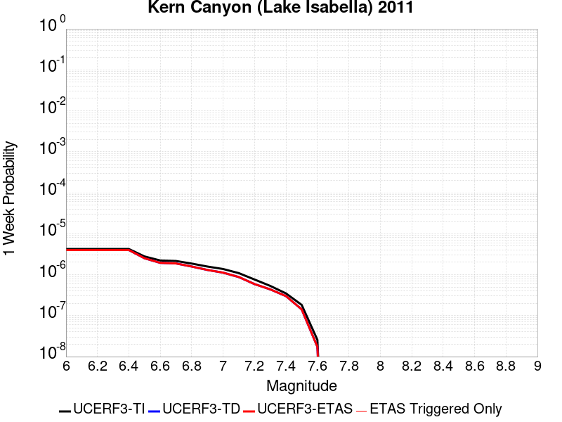 |  |  |  |

| Magnitude | 1 wk TI Prob | 1 wk TD Prob | 1 wk ETAS Prob | 1 wk ETAS/TD Gain | 1 wk ETAS Triggered Only | 1 mo TI Prob | 1 mo TD Prob | 1 mo ETAS Prob | 1 mo ETAS/TD Gain | 1 mo ETAS Triggered Only | 1 yr TI Prob | 1 yr TD Prob | 1 yr ETAS Prob | 1 yr ETAS/TD Gain | 1 yr ETAS Triggered Only | 10 yr TI Prob | 10 yr TD Prob | 10 yr ETAS Prob | 10 yr ETAS/TD Gain | 10 yr ETAS Triggered Only |
|-----|-----|-----|-----|-----|-----|-----|-----|-----|-----|-----|-----|-----|-----|-----|-----|-----|-----|-----|-----|-----|
| 6.0 | 4.2387383E-6 | 4.0016344E-6 | 4.0016344E-6 | 1.0 | 0.0 | 1.8165894E-5 | 1.7149758E-5 | 6.0074846E-5 | 3.502956 | 4.2925825E-5 | 2.2114732E-4 | 2.0878017E-4 | 2.5169703E-4 | 1.2055601 | 4.2925825E-5 | 0.0022092736 | 0.002086024 | 0.0021288604 | 1.0205349 | 4.2925825E-5 |
| 6.1 | 4.2387383E-6 | 4.0016344E-6 | 4.0016344E-6 | 1.0 | 0.0 | 1.8165894E-5 | 1.7149758E-5 | 6.0074846E-5 | 3.502956 | 4.2925825E-5 | 2.2114732E-4 | 2.0878017E-4 | 2.5169703E-4 | 1.2055601 | 4.2925825E-5 | 0.0022092736 | 0.002086024 | 0.0021288604 | 1.0205349 | 4.2925825E-5 |
| 6.2 | 4.2387383E-6 | 4.0016344E-6 | 4.0016344E-6 | 1.0 | 0.0 | 1.8165894E-5 | 1.7149758E-5 | 6.0074846E-5 | 3.502956 | 4.2925825E-5 | 2.2114732E-4 | 2.0878017E-4 | 2.5169703E-4 | 1.2055601 | 4.2925825E-5 | 0.0022092736 | 0.002086024 | 0.0021288604 | 1.0205349 | 4.2925825E-5 |
| 6.3 | 4.2387383E-6 | 4.0016344E-6 | 4.0016344E-6 | 1.0 | 0.0 | 1.8165894E-5 | 1.7149758E-5 | 6.0074846E-5 | 3.502956 | 4.2925825E-5 | 2.2114732E-4 | 2.0878017E-4 | 2.5169703E-4 | 1.2055601 | 4.2925825E-5 | 0.0022092736 | 0.002086024 | 0.0021288604 | 1.0205349 | 4.2925825E-5 |
| 6.4 | 4.2387383E-6 | 4.0016344E-6 | 4.0016344E-6 | 1.0 | 0.0 | 1.8165894E-5 | 1.7149758E-5 | 6.0074846E-5 | 3.502956 | 4.2925825E-5 | 2.2114732E-4 | 2.0878017E-4 | 2.5169703E-4 | 1.2055601 | 4.2925825E-5 | 0.0022092736 | 0.002086024 | 0.0021288604 | 1.0205349 | 4.2925825E-5 |
| 6.5 | 2.7857532E-6 | 2.5178624E-6 | 2.5178624E-6 | 1.0 | 0.0 | 1.1938888E-5 | 1.0790796E-5 | 5.3716158E-5 | 4.9779606 | 4.2925825E-5 | 1.4534626E-4 | 1.3137035E-4 | 1.7429053E-4 | 1.3267113 | 4.2925825E-5 | 0.0014525123 | 0.0013129596 | 0.0013558291 | 1.0326511 | 4.2925825E-5 |
| 6.6 | 2.2233348E-6 | 1.944119E-6 | 1.944119E-6 | 1.0 | 0.0 | 9.528543E-6 | 8.331913E-6 | 5.125738E-5 | 6.151934 | 4.2925825E-5 | 1.1600384E-4 | 1.014364E-4 | 1.4435787E-4 | 1.4231367 | 4.2925825E-5 | 0.001159433 | 0.0010139096 | 0.001056792 | 1.042294 | 4.2925825E-5 |
| 6.7 | 2.1635126E-6 | 1.8834991E-6 | 1.8834991E-6 | 1.0 | 0.0 | 9.272164E-6 | 8.072114E-6 | 5.099759E-5 | 6.317749 | 4.2925825E-5 | 1.1288274E-4 | 9.827364E-5 | 1.4119524E-4 | 1.436756 | 4.2925825E-5 | 0.0011282542 | 9.8231E-4 | 0.0010251936 | 1.0436559 | 4.2925825E-5 |
| 6.8 | 1.8685711E-6 | 1.583138E-6 | 1.583138E-6 | 1.0 | 0.0 | 8.008137E-6 | 6.7848596E-6 | 6.7848596E-6 | 1.0 | 0.0 | 9.74947E-5 | 8.2602586E-5 | 8.2602586E-5 | 1.0 | 0.0 | 9.745194E-4 | 8.2572375E-4 | 8.2572375E-4 | 1.0 | 0.0 |
| 6.9 | 1.5815071E-6 | 1.3064887E-6 | 1.3064887E-6 | 1.0 | 0.0 | 6.77787E-6 | 5.5992255E-6 | 5.5992255E-6 | 1.0 | 0.0 | 8.251744E-5 | 6.816846E-5 | 6.816846E-5 | 1.0 | 0.0 | 8.248681E-4 | 6.8147824E-4 | 6.8147824E-4 | 1.0 | 0.0 |
| 7.0 | 1.3772564E-6 | 1.1210681E-6 | 1.1210681E-6 | 1.0 | 0.0 | 5.9025137E-6 | 4.8045686E-6 | 4.8045686E-6 | 1.0 | 0.0 | 7.186073E-5 | 5.8494075E-5 | 5.8494075E-5 | 1.0 | 0.0 | 7.18375E-4 | 5.8478885E-4 | 5.8478885E-4 | 1.0 | 0.0 |
| 7.1 | 1.0916998E-6 | 8.7637505E-7 | 8.7637505E-7 | 1.0 | 0.0 | 4.678705E-6 | 3.7558877E-6 | 3.7558877E-6 | 1.0 | 0.0 | 5.6961744E-5 | 4.5726985E-5 | 4.5726985E-5 | 1.0 | 0.0 | 5.6947145E-4 | 4.571771E-4 | 4.571771E-4 | 1.0 | 0.0 |
| 7.2 | 7.6277024E-7 | 5.901439E-7 | 5.901439E-7 | 1.0 | 0.0 | 3.2690114E-6 | 2.5291856E-6 | 2.5291856E-6 | 1.0 | 0.0 | 3.9799485E-5 | 3.0792406E-5 | 3.0792406E-5 | 1.0 | 0.0 | 3.9792358E-4 | 3.07882E-4 | 3.07882E-4 | 1.0 | 0.0 |
| 7.3 | 5.3265916E-7 | 4.3824264E-7 | 4.3824264E-7 | 1.0 | 0.0 | 2.282823E-6 | 1.8781814E-6 | 1.8781814E-6 | 1.0 | 0.0 | 2.7793016E-5 | 2.2866623E-5 | 2.2866623E-5 | 1.0 | 0.0 | 2.778954E-4 | 2.2864307E-4 | 2.2864307E-4 | 1.0 | 0.0 |
| 7.4 | 3.4946007E-7 | 3.0065647E-7 | 3.0065647E-7 | 1.0 | 0.0 | 1.497685E-6 | 1.2885271E-6 | 1.2885271E-6 | 1.0 | 0.0 | 1.8234163E-5 | 1.5687707E-5 | 1.5687707E-5 | 1.0 | 0.0 | 1.8232666E-4 | 1.5686621E-4 | 1.5686621E-4 | 1.0 | 0.0 |
| 7.5 | 1.8317026E-7 | 1.4244755E-7 | 1.4244755E-7 | 1.0 | 0.0 | 7.850152E-7 | 6.1048934E-7 | 6.1048934E-7 | 1.0 | 0.0 | 9.557518E-6 | 7.432683E-6 | 7.432683E-6 | 1.0 | 0.0 | 9.5571064E-5 | 7.432442E-5 | 7.432442E-5 | 1.0 | 0.0 |
| 7.6 | 2.572245E-8 | 1.735264E-8 | 1.735264E-8 | 1.0 | 0.0 | 1.10239064E-7 | 7.436845E-8 | 7.436845E-8 | 1.0 | 0.0 | 1.3421597E-6 | 9.0543557E-7 | 9.0543557E-7 | 1.0 | 0.0 | 1.3421517E-5 | 9.054324E-6 | 9.054324E-6 | 1.0 | 0.0 |

## Puente Hills
*[(top)](#table-of-contents)*

| 1 Week | 1 Month | 1 Year | 10 Year |
|-----|-----|-----|-----|
|  |  |  | 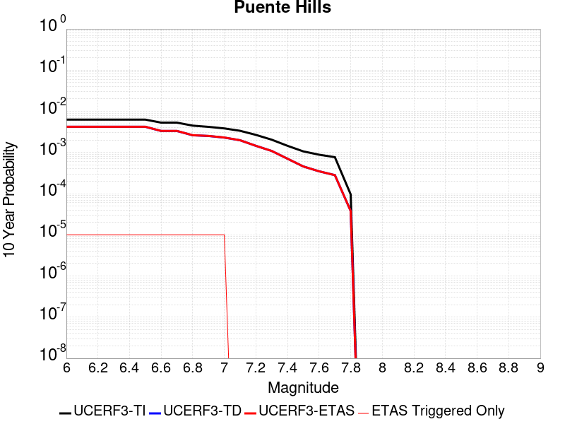 |

| Magnitude | 1 wk TI Prob | 1 wk TD Prob | 1 wk ETAS Prob | 1 wk ETAS/TD Gain | 1 wk ETAS Triggered Only | 1 mo TI Prob | 1 mo TD Prob | 1 mo ETAS Prob | 1 mo ETAS/TD Gain | 1 mo ETAS Triggered Only | 1 yr TI Prob | 1 yr TD Prob | 1 yr ETAS Prob | 1 yr ETAS/TD Gain | 1 yr ETAS Triggered Only | 10 yr TI Prob | 10 yr TD Prob | 10 yr ETAS Prob | 10 yr ETAS/TD Gain | 10 yr ETAS Triggered Only |
|-----|-----|-----|-----|-----|-----|-----|-----|-----|-----|-----|-----|-----|-----|-----|-----|-----|-----|-----|-----|-----|
| 6.0 | 1.2101656E-5 | 8.098448E-6 | 5.1023926E-5 | 6.300457 | 4.2925825E-5 | 5.1863204E-5 | 3.4707205E-5 | 7.7631536E-5 | 2.2367558 | 4.2925825E-5 | 6.312516E-4 | 4.2248392E-4 | 4.653916E-4 | 1.1015605 | 4.2925825E-5 | 0.0062946146 | 0.0042173676 | 0.0042601125 | 1.0101354 | 4.2925825E-5 |
| 6.1 | 1.2101656E-5 | 8.098448E-6 | 5.1023926E-5 | 6.300457 | 4.2925825E-5 | 5.1863204E-5 | 3.4707205E-5 | 7.7631536E-5 | 2.2367558 | 4.2925825E-5 | 6.312516E-4 | 4.2248392E-4 | 4.653916E-4 | 1.1015605 | 4.2925825E-5 | 0.0062946146 | 0.0042173676 | 0.0042601125 | 1.0101354 | 4.2925825E-5 |
| 6.2 | 1.2101656E-5 | 8.098448E-6 | 5.1023926E-5 | 6.300457 | 4.2925825E-5 | 5.1863204E-5 | 3.4707205E-5 | 7.7631536E-5 | 2.2367558 | 4.2925825E-5 | 6.312516E-4 | 4.2248392E-4 | 4.653916E-4 | 1.1015605 | 4.2925825E-5 | 0.0062946146 | 0.0042173676 | 0.0042601125 | 1.0101354 | 4.2925825E-5 |
| 6.3 | 1.2101656E-5 | 8.098448E-6 | 5.1023926E-5 | 6.300457 | 4.2925825E-5 | 5.1863204E-5 | 3.4707205E-5 | 7.7631536E-5 | 2.2367558 | 4.2925825E-5 | 6.312516E-4 | 4.2248392E-4 | 4.653916E-4 | 1.1015605 | 4.2925825E-5 | 0.0062946146 | 0.0042173676 | 0.0042601125 | 1.0101354 | 4.2925825E-5 |
| 6.4 | 1.2101656E-5 | 8.098448E-6 | 5.1023926E-5 | 6.300457 | 4.2925825E-5 | 5.1863204E-5 | 3.4707205E-5 | 7.7631536E-5 | 2.2367558 | 4.2925825E-5 | 6.312516E-4 | 4.2248392E-4 | 4.653916E-4 | 1.1015605 | 4.2925825E-5 | 0.0062946146 | 0.0042173676 | 0.0042601125 | 1.0101354 | 4.2925825E-5 |
| 6.5 | 1.2101656E-5 | 8.098448E-6 | 5.1023926E-5 | 6.300457 | 4.2925825E-5 | 5.1863204E-5 | 3.4707205E-5 | 7.7631536E-5 | 2.2367558 | 4.2925825E-5 | 6.312516E-4 | 4.2248392E-4 | 4.653916E-4 | 1.1015605 | 4.2925825E-5 | 0.0062946146 | 0.0042173676 | 0.0042601125 | 1.0101354 | 4.2925825E-5 |
| 6.6 | 1.0222488E-5 | 6.399079E-6 | 4.932463E-5 | 7.708082 | 4.2925825E-5 | 4.3809923E-5 | 2.742435E-5 | 7.0349E-5 | 2.565202 | 4.2925825E-5 | 5.332553E-4 | 3.3384276E-4 | 3.7675427E-4 | 1.128538 | 4.2925825E-5 | 0.0053197746 | 0.0033336577 | 0.0033764404 | 1.0128336 | 4.2925825E-5 |
| 6.7 | 1.0222488E-5 | 6.399079E-6 | 4.932463E-5 | 7.708082 | 4.2925825E-5 | 4.3809923E-5 | 2.742435E-5 | 7.0349E-5 | 2.565202 | 4.2925825E-5 | 5.332553E-4 | 3.3384276E-4 | 3.7675427E-4 | 1.128538 | 4.2925825E-5 | 0.0053197746 | 0.0033336577 | 0.0033764404 | 1.0128336 | 4.2925825E-5 |
| 6.8 | 8.6367845E-6 | 5.028129E-6 | 4.7953738E-5 | 9.537093 | 4.2925825E-5 | 3.7014266E-5 | 2.1548949E-5 | 6.447385E-5 | 2.9919717 | 4.2925825E-5 | 4.505555E-4 | 2.6232743E-4 | 3.05242E-4 | 1.1635916 | 4.2925825E-5 | 0.004496431 | 0.002620234 | 0.0026630473 | 1.0163395 | 4.2925825E-5 |
| 6.9 | 8.066481E-6 | 4.8360116E-6 | 4.7761627E-5 | 9.876244 | 4.2925825E-5 | 3.4570177E-5 | 2.0725602E-5 | 6.3650536E-5 | 3.0711067 | 4.2925825E-5 | 4.2081063E-4 | 2.523055E-4 | 2.952205E-4 | 1.1700914 | 4.2925825E-5 | 0.0042001465 | 0.0025202443 | 0.0025630621 | 1.0169895 | 4.2925825E-5 |
| 7.0 | 7.393828E-6 | 4.4172275E-6 | 4.7342863E-5 | 10.717777 | 4.2925825E-5 | 3.168745E-5 | 1.8930841E-5 | 6.1855855E-5 | 3.2674646 | 4.2925825E-5 | 3.857264E-4 | 2.3045906E-4 | 2.73375E-4 | 1.1862193 | 4.2925825E-5 | 0.0038505755 | 0.0023022462 | 0.002345073 | 1.0186023 | 4.2925825E-5 |
| 7.1 | 6.4660953E-6 | 3.8043859E-6 | 3.8043859E-6 | 1.0 | 0.0 | 2.7711543E-5 | 1.630441E-5 | 1.630441E-5 | 1.0 | 0.0 | 3.373358E-4 | 1.9848847E-4 | 1.9848847E-4 | 1.0 | 0.0 | 0.0033682417 | 0.0019831478 | 0.0019831478 | 1.0 | 0.0 |
| 7.2 | 5.143232E-6 | 2.7864896E-6 | 2.7864896E-6 | 1.0 | 0.0 | 2.2042237E-5 | 1.1942045E-5 | 1.1942045E-5 | 1.0 | 0.0 | 2.6833118E-4 | 1.453848E-4 | 1.453848E-4 | 1.0 | 0.0 | 0.002680074 | 0.0014529065 | 0.0014529065 | 1.0 | 0.0 |
| 7.3 | 3.928255E-6 | 2.091338E-6 | 2.091338E-6 | 1.0 | 0.0 | 1.683527E-5 | 8.962847E-6 | 8.962847E-6 | 1.0 | 0.0 | 2.0495013E-4 | 1.0911726E-4 | 1.0911726E-4 | 1.0 | 0.0 | 0.002047612 | 0.0010906435 | 0.0010906435 | 1.0 | 0.0 |
| 7.4 | 2.7894434E-6 | 1.3546429E-6 | 1.3546429E-6 | 1.0 | 0.0 | 1.1954703E-5 | 5.8056E-6 | 5.8056E-6 | 1.0 | 0.0 | 1.4553878E-4 | 7.068093E-5 | 7.068093E-5 | 1.0 | 0.0 | 0.001454435 | 7.0658885E-4 | 7.0658885E-4 | 1.0 | 0.0 |
| 7.5 | 2.041735E-6 | 8.786996E-7 | 8.786996E-7 | 1.0 | 0.0 | 8.750263E-6 | 3.7658504E-6 | 3.7658504E-6 | 1.0 | 0.0 | 1.06529245E-4 | 4.5848297E-5 | 4.5848297E-5 | 1.0 | 0.0 | 0.0010647819 | 4.5839173E-4 | 4.5839173E-4 | 1.0 | 0.0 |
| 7.6 | 1.6959062E-6 | 6.698339E-7 | 6.698339E-7 | 1.0 | 0.0 | 7.268149E-6 | 2.8707138E-6 | 2.8707138E-6 | 1.0 | 0.0 | 8.848612E-5 | 3.4950408E-5 | 3.4950408E-5 | 1.0 | 0.0 | 8.84509E-4 | 3.4945202E-4 | 3.4945202E-4 | 1.0 | 0.0 |
| 7.7 | 1.4767965E-6 | 5.407146E-7 | 5.407146E-7 | 1.0 | 0.0 | 6.3291122E-6 | 2.3173466E-6 | 2.3173466E-6 | 1.0 | 0.0 | 7.705422E-5 | 2.8213353E-5 | 2.8213353E-5 | 1.0 | 0.0 | 7.702751E-4 | 2.8210029E-4 | 2.8210029E-4 | 1.0 | 0.0 |
| 7.8 | 1.8432911E-7 | 7.2811105E-8 | 7.2811105E-8 | 1.0 | 0.0 | 7.8998164E-7 | 3.1204758E-7 | 3.1204758E-7 | 1.0 | 0.0 | 9.617985E-6 | 3.799176E-6 | 3.799176E-6 | 1.0 | 0.0 | 9.617568E-5 | 3.7991435E-5 | 3.7991435E-5 | 1.0 | 0.0 |

## Hosgri (Extension)
*[(top)](#table-of-contents)*

| 1 Week | 1 Month | 1 Year | 10 Year |
|-----|-----|-----|-----|
|  |  |  |  |

| Magnitude | 1 wk TI Prob | 1 wk TD Prob | 1 wk ETAS Prob | 1 wk ETAS/TD Gain | 1 wk ETAS Triggered Only | 1 mo TI Prob | 1 mo TD Prob | 1 mo ETAS Prob | 1 mo ETAS/TD Gain | 1 mo ETAS Triggered Only | 1 yr TI Prob | 1 yr TD Prob | 1 yr ETAS Prob | 1 yr ETAS/TD Gain | 1 yr ETAS Triggered Only | 10 yr TI Prob | 10 yr TD Prob | 10 yr ETAS Prob | 10 yr ETAS/TD Gain | 10 yr ETAS Triggered Only |
|-----|-----|-----|-----|-----|-----|-----|-----|-----|-----|-----|-----|-----|-----|-----|-----|-----|-----|-----|-----|-----|
| 6.0 | 1.1369135E-5 | 1.2083073E-5 | 1.2083073E-5 | 1.0 | 0.0 | 4.8723956E-5 | 5.17837E-5 | 5.17837E-5 | 1.0 | 0.0 | 5.9305265E-4 | 6.303069E-4 | 6.303069E-4 | 1.0 | 0.0 | 0.005914725 | 0.00628744 | 0.006330096 | 1.0067843 | 4.2925825E-5 |
| 6.1 | 6.934979E-6 | 7.324556E-6 | 7.324556E-6 | 1.0 | 0.0 | 2.9721E-5 | 3.13906E-5 | 3.13906E-5 | 1.0 | 0.0 | 3.617931E-4 | 3.821177E-4 | 3.821177E-4 | 1.0 | 0.0 | 0.0036120464 | 0.003815019 | 0.0038577812 | 1.0112089 | 4.2925825E-5 |
| 6.2 | 6.934979E-6 | 7.324556E-6 | 7.324556E-6 | 1.0 | 0.0 | 2.9721E-5 | 3.13906E-5 | 3.13906E-5 | 1.0 | 0.0 | 3.617931E-4 | 3.821177E-4 | 3.821177E-4 | 1.0 | 0.0 | 0.0036120464 | 0.003815019 | 0.0038577812 | 1.0112089 | 4.2925825E-5 |
| 6.3 | 4.5484676E-6 | 4.769331E-6 | 4.769331E-6 | 1.0 | 0.0 | 1.9493287E-5 | 2.0439833E-5 | 2.0439833E-5 | 1.0 | 0.0 | 2.3730492E-4 | 2.4882698E-4 | 2.4882698E-4 | 1.0 | 0.0 | 0.0023705168 | 0.0024855263 | 0.0025283454 | 1.0172274 | 4.2925825E-5 |
| 6.4 | 4.218095E-6 | 4.416863E-6 | 4.416863E-6 | 1.0 | 0.0 | 1.8077424E-5 | 1.8929275E-5 | 1.8929275E-5 | 1.0 | 0.0 | 2.2007042E-4 | 2.3043988E-4 | 2.3043988E-4 | 1.0 | 0.0 | 0.002198526 | 0.002302043 | 0.0023448698 | 1.0186039 | 4.2925825E-5 |
| 6.5 | 3.717374E-6 | 3.883879E-6 | 3.883879E-6 | 1.0 | 0.0 | 1.5931506E-5 | 1.664509E-5 | 1.664509E-5 | 1.0 | 0.0 | 1.9394881E-4 | 2.026353E-4 | 2.026353E-4 | 1.0 | 0.0 | 0.0019377962 | 0.0020245241 | 0.0020673631 | 1.02116 | 4.2925825E-5 |
| 6.6 | 3.4605036E-6 | 3.6083072E-6 | 3.6083072E-6 | 1.0 | 0.0 | 1.4830645E-5 | 1.5464082E-5 | 1.5464082E-5 | 1.0 | 0.0 | 1.8054814E-4 | 1.8825909E-4 | 1.8825909E-4 | 1.0 | 0.0 | 0.0018040152 | 0.0018810107 | 0.0019238557 | 1.0227777 | 4.2925825E-5 |
| 6.7 | 3.123439E-6 | 3.2465698E-6 | 3.2465698E-6 | 1.0 | 0.0 | 1.33860985E-5 | 1.39137965E-5 | 1.39137965E-5 | 1.0 | 0.0 | 1.6296357E-4 | 1.6938741E-4 | 1.6938741E-4 | 1.0 | 0.0 | 0.001628441 | 0.001692594 | 0.0017354471 | 1.025318 | 4.2925825E-5 |
| 6.8 | 2.8290783E-6 | 2.9305413E-6 | 2.9305413E-6 | 1.0 | 0.0 | 1.2124565E-5 | 1.2559403E-5 | 1.2559403E-5 | 1.0 | 0.0 | 1.4760658E-4 | 1.5290009E-4 | 1.5290009E-4 | 1.0 | 0.0 | 0.0014750857 | 0.0015279576 | 0.0015279576 | 1.0 | 0.0 |
| 6.9 | 2.454112E-6 | 2.5283207E-6 | 2.5283207E-6 | 1.0 | 0.0 | 1.0517581E-5 | 1.0835615E-5 | 1.0835615E-5 | 1.0 | 0.0 | 1.2804402E-4 | 1.3191569E-4 | 1.3191569E-4 | 1.0 | 0.0 | 0.0012797028 | 0.0013183799 | 0.0013183799 | 1.0 | 0.0 |
| 7.0 | 2.1008145E-6 | 2.1498715E-6 | 2.1498715E-6 | 1.0 | 0.0 | 9.003459E-6 | 9.2137025E-6 | 9.2137025E-6 | 1.0 | 0.0 | 1.096116E-4 | 1.1217109E-4 | 1.1217109E-4 | 1.0 | 0.0 | 0.0010955755 | 0.0011211485 | 0.0011211485 | 1.0 | 0.0 |
| 7.1 | 1.744384E-6 | 1.7686364E-6 | 1.7686364E-6 | 1.0 | 0.0 | 7.47591E-6 | 7.579848E-6 | 7.579848E-6 | 1.0 | 0.0 | 9.1015405E-5 | 9.228076E-5 | 9.228076E-5 | 1.0 | 0.0 | 9.097813E-4 | 9.224261E-4 | 9.224261E-4 | 1.0 | 0.0 |
| 7.2 | 1.5456587E-6 | 1.5562894E-6 | 1.5562894E-6 | 1.0 | 0.0 | 6.6242346E-6 | 6.6697944E-6 | 6.6697944E-6 | 1.0 | 0.0 | 8.064707E-5 | 8.120173E-5 | 8.120173E-5 | 1.0 | 0.0 | 8.0617814E-4 | 8.117219E-4 | 8.117219E-4 | 1.0 | 0.0 |
| 7.3 | 1.3775123E-6 | 1.3766092E-6 | 1.3766092E-6 | 1.0 | 0.0 | 5.9036106E-6 | 5.8997407E-6 | 5.8997407E-6 | 1.0 | 0.0 | 7.187409E-5 | 7.182699E-5 | 7.182699E-5 | 1.0 | 0.0 | 7.185085E-4 | 7.180387E-4 | 7.180387E-4 | 1.0 | 0.0 |
| 7.4 | 1.214491E-6 | 1.2023471E-6 | 1.2023471E-6 | 1.0 | 0.0 | 5.2049513E-6 | 5.152906E-6 | 5.152906E-6 | 1.0 | 0.0 | 6.336844E-5 | 6.2734835E-5 | 6.2734835E-5 | 1.0 | 0.0 | 6.335037E-4 | 6.2717206E-4 | 6.2717206E-4 | 1.0 | 0.0 |
| 7.5 | 1.0101123E-6 | 9.842256E-7 | 9.842256E-7 | 1.0 | 0.0 | 4.3290456E-6 | 4.218103E-6 | 4.218103E-6 | 1.0 | 0.0 | 5.2704854E-5 | 5.13542E-5 | 5.13542E-5 | 1.0 | 0.0 | 5.2692357E-4 | 5.1342393E-4 | 5.1342393E-4 | 1.0 | 0.0 |
| 7.6 | 8.1558215E-7 | 7.765977E-7 | 7.765977E-7 | 1.0 | 0.0 | 3.4953473E-6 | 3.3282718E-6 | 3.3282718E-6 | 1.0 | 0.0 | 4.255502E-5 | 4.0520958E-5 | 4.0520958E-5 | 1.0 | 0.0 | 4.2546875E-4 | 4.0513615E-4 | 4.0513615E-4 | 1.0 | 0.0 |
| 7.7 | 4.757816E-7 | 4.1308996E-7 | 4.1308996E-7 | 1.0 | 0.0 | 2.0390623E-6 | 1.7703843E-6 | 1.7703843E-6 | 1.0 | 0.0 | 2.4825302E-5 | 2.1554217E-5 | 2.1554217E-5 | 1.0 | 0.0 | 2.482253E-4 | 2.1552139E-4 | 2.1552139E-4 | 1.0 | 0.0 |
| 7.8 | 2.782787E-7 | 2.004783E-7 | 2.004783E-7 | 1.0 | 0.0 | 1.1926223E-6 | 8.591924E-7 | 8.591924E-7 | 1.0 | 0.0 | 1.452008E-5 | 1.0460618E-5 | 1.0460618E-5 | 1.0 | 0.0 | 1.4519131E-4 | 1.04601284E-4 | 1.04601284E-4 | 1.0 | 0.0 |
| 7.9 | 1.6948086E-7 | 9.243938E-8 | 9.243938E-8 | 1.0 | 0.0 | 7.2634634E-7 | 3.961687E-7 | 3.961687E-7 | 1.0 | 0.0 | 8.843231E-6 | 4.8233433E-6 | 4.8233433E-6 | 1.0 | 0.0 | 8.842879E-5 | 4.8232392E-5 | 4.8232392E-5 | 1.0 | 0.0 |
| 8.0 | 1.0225492E-7 | 4.473497E-8 | 4.473497E-8 | 1.0 | 0.0 | 4.382353E-7 | 1.917213E-7 | 1.917213E-7 | 1.0 | 0.0 | 5.335502E-6 | 2.3342043E-6 | 2.3342043E-6 | 1.0 | 0.0 | 5.335374E-5 | 2.33418E-5 | 2.33418E-5 | 1.0 | 0.0 |
| 8.1 | 1.43711345E-8 | 5.78716E-9 | 5.78716E-9 | 1.0 | 0.0 | 6.1590576E-8 | 2.4802116E-8 | 2.4802116E-8 | 1.0 | 0.0 | 7.4986497E-7 | 3.019657E-7 | 3.019657E-7 | 1.0 | 0.0 | 7.4986247E-6 | 3.0196536E-6 | 3.0196536E-6 | 1.0 | 0.0 |

## Calaveras (So) 2011 CFM
*[(top)](#table-of-contents)*

| 1 Week | 1 Month | 1 Year | 10 Year |
|-----|-----|-----|-----|
|  |  |  |  |

| Magnitude | 1 wk TI Prob | 1 wk TD Prob | 1 wk ETAS Prob | 1 wk ETAS/TD Gain | 1 wk ETAS Triggered Only | 1 mo TI Prob | 1 mo TD Prob | 1 mo ETAS Prob | 1 mo ETAS/TD Gain | 1 mo ETAS Triggered Only | 1 yr TI Prob | 1 yr TD Prob | 1 yr ETAS Prob | 1 yr ETAS/TD Gain | 1 yr ETAS Triggered Only | 10 yr TI Prob | 10 yr TD Prob | 10 yr ETAS Prob | 10 yr ETAS/TD Gain | 10 yr ETAS Triggered Only |
|-----|-----|-----|-----|-----|-----|-----|-----|-----|-----|-----|-----|-----|-----|-----|-----|-----|-----|-----|-----|-----|
| 6.0 | 1.5950744E-4 | 3.0713255E-4 | 3.0713255E-4 | 1.0 | 0.0 | 6.834242E-4 | 0.001315409 | 0.001315409 | 1.0 | 0.0 | 0.00828899 | 0.015858326 | 0.015858326 | 1.0 | 0.0 | 0.079865426 | 0.14440185 | 0.14443858 | 1.0002544 | 4.2925825E-5 |
| 6.1 | 1.3584697E-4 | 2.603514E-4 | 2.603514E-4 | 1.0 | 0.0 | 5.8207137E-4 | 0.0011151754 | 0.0011151754 | 1.0 | 0.0 | 0.007063716 | 0.013461385 | 0.013461385 | 1.0 | 0.0 | 0.06843361 | 0.124029994 | 0.1240676 | 1.0003031 | 4.2925825E-5 |
| 6.2 | 1.14676266E-4 | 2.1714384E-4 | 2.1714384E-4 | 1.0 | 0.0 | 4.9137714E-4 | 9.30223E-4 | 9.30223E-4 | 1.0 | 0.0 | 0.0059661185 | 0.011245058 | 0.011245058 | 1.0 | 0.0 | 0.058084648 | 0.10502057 | 0.10505898 | 1.0003659 | 4.2925825E-5 |
| 6.3 | 8.691518E-5 | 1.5987935E-4 | 1.5987935E-4 | 1.0 | 0.0 | 3.7244044E-4 | 6.849807E-4 | 6.849807E-4 | 1.0 | 0.0 | 0.004525038 | 0.008301122 | 0.008301122 | 1.0 | 0.0 | 0.044339992 | 0.0793365 | 0.07937602 | 1.0004982 | 4.2925825E-5 |
| 6.4 | 8.50982E-5 | 1.5694331E-4 | 1.5694331E-4 | 1.0 | 0.0 | 3.646556E-4 | 6.724042E-4 | 6.724042E-4 | 1.0 | 0.0 | 0.0044306475 | 0.008149155 | 0.008149155 | 1.0 | 0.0 | 0.04343345 | 0.07794268 | 0.077982254 | 1.0005078 | 4.2925825E-5 |
| 6.5 | 8.4062965E-5 | 1.5518743E-4 | 1.5518743E-4 | 1.0 | 0.0 | 3.602201E-4 | 6.6488347E-4 | 6.6488347E-4 | 1.0 | 0.0 | 0.004376863 | 0.008058365 | 0.008058365 | 1.0 | 0.0 | 0.042916555 | 0.07711388 | 0.0771535 | 1.0005137 | 4.2925825E-5 |
| 6.6 | 8.194716E-5 | 1.5154552E-4 | 1.5154552E-4 | 1.0 | 0.0 | 3.5115483E-4 | 6.492843E-4 | 6.492843E-4 | 1.0 | 0.0 | 0.0042669317 | 0.007870209 | 0.007870209 | 1.0 | 0.0 | 0.04185927 | 0.07539919 | 0.07543888 | 1.0005264 | 4.2925825E-5 |
| 6.7 | 8.012326E-5 | 1.4822475E-4 | 1.4822475E-4 | 1.0 | 0.0 | 3.433402E-4 | 6.350612E-4 | 6.350612E-4 | 1.0 | 0.0 | 0.004172157 | 0.007698701 | 0.007698701 | 1.0 | 0.0 | 0.040946912 | 0.07384132 | 0.073881075 | 1.0005383 | 4.2925825E-5 |
| 6.8 | 7.119773E-5 | 1.2881879E-4 | 1.2881879E-4 | 1.0 | 0.0 | 3.0509746E-4 | 5.519494E-4 | 5.519494E-4 | 1.0 | 0.0 | 0.0037082357 | 0.006696066 | 0.006696066 | 1.0 | 0.0 | 0.036469642 | 0.06468575 | 0.0647259 | 1.0006207 | 4.2925825E-5 |
| 6.9 | 5.7343088E-5 | 9.919277E-5 | 9.919277E-5 | 1.0 | 0.0 | 2.4573295E-4 | 4.25043E-4 | 4.25043E-4 | 1.0 | 0.0 | 0.0029876942 | 0.005162694 | 0.005162694 | 1.0 | 0.0 | 0.02947844 | 0.05051036 | 0.05055112 | 1.0008069 | 4.2925825E-5 |
| 7.0 | 4.8746577E-5 | 8.2850725E-5 | 8.2850725E-5 | 1.0 | 0.0 | 2.0889717E-4 | 3.5502657E-4 | 3.5502657E-4 | 1.0 | 0.0 | 0.0025403565 | 0.004313948 | 0.004313948 | 1.0 | 0.0 | 0.025115121 | 0.042485245 | 0.042526346 | 1.0009675 | 4.2925825E-5 |
| 7.1 | 4.2998014E-5 | 7.265203E-5 | 7.265203E-5 | 1.0 | 0.0 | 1.8426418E-4 | 3.1132903E-4 | 3.1132903E-4 | 1.0 | 0.0 | 0.002241108 | 0.003783903 | 0.003783903 | 1.0 | 0.0 | 0.022186412 | 0.037423562 | 0.03746488 | 1.0011041 | 4.2925825E-5 |
| 7.2 | 3.221292E-5 | 5.390791E-5 | 5.390791E-5 | 1.0 | 0.0 | 1.3804805E-4 | 2.3101359E-4 | 2.3101359E-4 | 1.0 | 0.0 | 0.0016794393 | 0.0028089907 | 0.0028089907 | 1.0 | 0.0 | 0.016668037 | 0.02803602 | 0.028077744 | 1.0014882 | 4.2925825E-5 |
| 7.3 | 2.3756531E-5 | 3.9473416E-5 | 3.9473416E-5 | 1.0 | 0.0 | 1.0180973E-4 | 1.6916092E-4 | 1.6916092E-4 | 1.0 | 0.0 | 0.0012388286 | 0.0020576057 | 0.0020576057 | 1.0 | 0.0 | 0.012319452 | 0.020643145 | 0.020685185 | 1.0020365 | 4.2925825E-5 |
| 7.4 | 1.5997684E-5 | 2.7342163E-5 | 2.7342163E-5 | 1.0 | 0.0 | 6.8559704E-5 | 1.1717545E-4 | 1.1717545E-4 | 1.0 | 0.0 | 8.343947E-4 | 0.00142568 | 0.00142568 | 1.0 | 0.0 | 0.008312687 | 0.014376011 | 0.01441832 | 1.002943 | 4.2925825E-5 |
| 7.5 | 1.3814293E-5 | 2.4783874E-5 | 2.4783874E-5 | 1.0 | 0.0 | 5.9202768E-5 | 1.062123E-4 | 1.062123E-4 | 1.0 | 0.0 | 7.205553E-4 | 0.00129237 | 0.00129237 | 1.0 | 0.0 | 0.007182234 | 0.013055085 | 0.01309745 | 1.0032451 | 4.2925825E-5 |
| 7.6 | 8.817309E-6 | 1.6430757E-5 | 1.6430757E-5 | 1.0 | 0.0 | 3.7787922E-5 | 7.0415634E-5 | 7.0415634E-5 | 1.0 | 0.0 | 4.5997082E-4 | 8.569745E-4 | 8.569745E-4 | 1.0 | 0.0 | 0.004590199 | 0.008719284 | 0.008719284 | 1.0 | 0.0 |
| 7.7 | 4.0352206E-6 | 7.707318E-6 | 7.707318E-6 | 1.0 | 0.0 | 1.7293689E-5 | 3.3030945E-5 | 3.3030945E-5 | 1.0 | 0.0 | 2.1053031E-4 | 4.0207763E-4 | 4.0207763E-4 | 1.0 | 0.0 | 0.0021033096 | 0.004165172 | 0.004165172 | 1.0 | 0.0 |
| 7.8 | 3.413169E-6 | 6.787282E-6 | 6.787282E-6 | 1.0 | 0.0 | 1.4627784E-5 | 2.9088029E-5 | 2.9088029E-5 | 1.0 | 0.0 | 1.7807873E-4 | 3.5408925E-4 | 3.5408925E-4 | 1.0 | 0.0 | 0.0017793609 | 0.0036665166 | 0.0036665166 | 1.0 | 0.0 |
| 7.9 | 2.4740732E-6 | 5.2791843E-6 | 5.2791843E-6 | 1.0 | 0.0 | 1.06031275E-5 | 2.262488E-5 | 2.262488E-5 | 1.0 | 0.0 | 1.2908543E-4 | 2.7542314E-4 | 2.7542314E-4 | 1.0 | 0.0 | 0.0012901047 | 0.0028347955 | 0.0028347955 | 1.0 | 0.0 |
| 8.0 | 1.5231818E-6 | 3.2889548E-6 | 3.2889548E-6 | 1.0 | 0.0 | 6.527906E-6 | 1.40954435E-5 | 1.40954435E-5 | 1.0 | 0.0 | 7.9474354E-5 | 1.7159856E-4 | 1.7159856E-4 | 1.0 | 0.0 | 7.944594E-4 | 0.0017564303 | 0.0017564303 | 1.0 | 0.0 |
| 8.1 | 1.0104524E-6 | 2.045782E-6 | 2.045782E-6 | 1.0 | 0.0 | 4.330503E-6 | 8.767608E-6 | 8.767608E-6 | 1.0 | 0.0 | 5.2722597E-5 | 1.0674043E-4 | 1.0674043E-4 | 1.0 | 0.0 | 5.271009E-4 | 0.001092934 | 0.001092934 | 1.0 | 0.0 |

## Silver Creek 2011 CFM
*[(top)](#table-of-contents)*

| 1 Week | 1 Month | 1 Year | 10 Year |
|-----|-----|-----|-----|
|  |  |  | 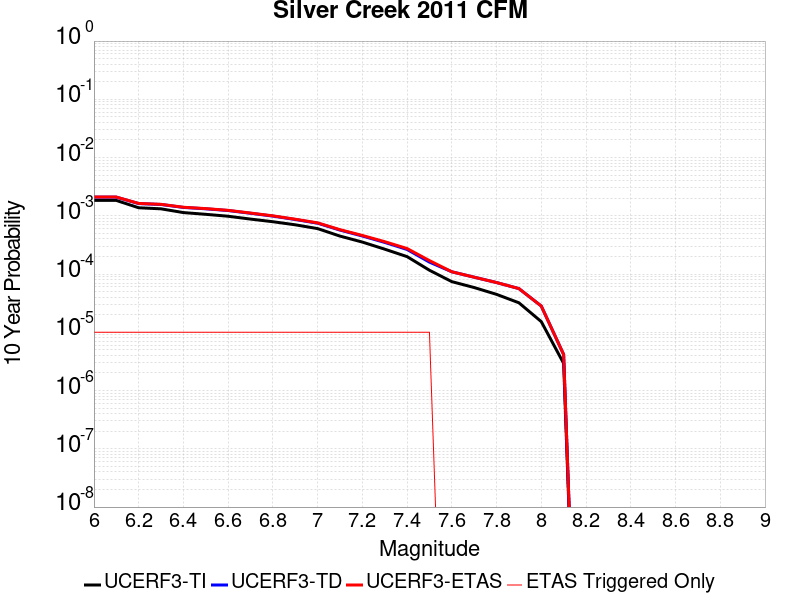 |

| Magnitude | 1 wk TI Prob | 1 wk TD Prob | 1 wk ETAS Prob | 1 wk ETAS/TD Gain | 1 wk ETAS Triggered Only | 1 mo TI Prob | 1 mo TD Prob | 1 mo ETAS Prob | 1 mo ETAS/TD Gain | 1 mo ETAS Triggered Only | 1 yr TI Prob | 1 yr TD Prob | 1 yr ETAS Prob | 1 yr ETAS/TD Gain | 1 yr ETAS Triggered Only | 10 yr TI Prob | 10 yr TD Prob | 10 yr ETAS Prob | 10 yr ETAS/TD Gain | 10 yr ETAS Triggered Only |
|-----|-----|-----|-----|-----|-----|-----|-----|-----|-----|-----|-----|-----|-----|-----|-----|-----|-----|-----|-----|-----|
| 6.0 | 3.5229125E-6 | 4.008142E-6 | 4.008142E-6 | 1.0 | 0.0 | 1.5098109E-5 | 1.717764E-5 | 1.717764E-5 | 1.0 | 0.0 | 1.8380396E-4 | 2.0911806E-4 | 2.0911806E-4 | 1.0 | 0.0 | 0.0018365202 | 0.0020895726 | 0.0021324086 | 1.0205 | 4.2925825E-5 |
| 6.1 | 3.5229125E-6 | 4.008142E-6 | 4.008142E-6 | 1.0 | 0.0 | 1.5098109E-5 | 1.717764E-5 | 1.717764E-5 | 1.0 | 0.0 | 1.8380396E-4 | 2.0911806E-4 | 2.0911806E-4 | 1.0 | 0.0 | 0.0018365202 | 0.0020895726 | 0.0021324086 | 1.0205 | 4.2925825E-5 |
| 6.2 | 2.6363234E-6 | 3.1105278E-6 | 3.1105278E-6 | 1.0 | 0.0 | 1.129848E-5 | 1.3330766E-5 | 1.3330766E-5 | 1.0 | 0.0 | 1.375503E-4 | 1.6229005E-4 | 1.6229005E-4 | 1.0 | 0.0 | 0.0013746519 | 0.0016220442 | 0.0016649005 | 1.0264211 | 4.2925825E-5 |
| 6.3 | 2.5275126E-6 | 3.0001668E-6 | 3.0001668E-6 | 1.0 | 0.0 | 1.0832152E-5 | 1.2857795E-5 | 1.2857795E-5 | 1.0 | 0.0 | 1.3187347E-4 | 1.5653246E-4 | 1.5653246E-4 | 1.0 | 0.0 | 0.0013179524 | 0.00156455 | 0.0016074086 | 1.0273936 | 4.2925825E-5 |
| 6.4 | 2.178732E-6 | 2.6707307E-6 | 2.6707307E-6 | 1.0 | 0.0 | 9.337389E-6 | 1.1445939E-5 | 1.1445939E-5 | 1.0 | 0.0 | 1.1367678E-4 | 1.3934543E-4 | 1.3934543E-4 | 1.0 | 0.0 | 0.0011361865 | 0.0013929061 | 0.001435772 | 1.0307745 | 4.2925825E-5 |
| 6.5 | 2.0341574E-6 | 2.5298211E-6 | 2.5298211E-6 | 1.0 | 0.0 | 8.717788E-6 | 1.0842045E-5 | 1.0842045E-5 | 1.0 | 0.0 | 1.061339E-4 | 1.3199393E-4 | 1.3199393E-4 | 1.0 | 0.0 | 0.0010608323 | 0.0013194805 | 0.0013623496 | 1.0324894 | 4.2925825E-5 |
| 6.6 | 1.8856827E-6 | 2.3613982E-6 | 2.3613982E-6 | 1.0 | 0.0 | 8.0814725E-6 | 1.0120239E-5 | 1.0120239E-5 | 1.0 | 0.0 | 9.838748E-5 | 1.2320696E-4 | 1.2320696E-4 | 1.0 | 0.0 | 9.834393E-4 | 0.0012317112 | 0.0012745841 | 1.0348077 | 4.2925825E-5 |
| 6.7 | 1.6844668E-6 | 2.1197875E-6 | 2.1197875E-6 | 1.0 | 0.0 | 7.2191233E-6 | 9.0847725E-6 | 9.0847725E-6 | 1.0 | 0.0 | 8.788928E-5 | 1.10601504E-4 | 1.10601504E-4 | 1.0 | 0.0 | 8.785453E-4 | 0.0011057886 | 0.001148667 | 1.0387763 | 4.2925825E-5 |
| 6.8 | 1.5177161E-6 | 1.8953942E-6 | 1.8953942E-6 | 1.0 | 0.0 | 6.504481E-6 | 8.123093E-6 | 8.123093E-6 | 1.0 | 0.0 | 7.918918E-5 | 9.8894176E-5 | 9.8894176E-5 | 1.0 | 0.0 | 7.9160964E-4 | 9.888251E-4 | 0.0010317086 | 1.043368 | 4.2925825E-5 |
| 6.9 | 1.3437394E-6 | 1.6561632E-6 | 1.6561632E-6 | 1.0 | 0.0 | 5.7588704E-6 | 7.097823E-6 | 7.097823E-6 | 1.0 | 0.0 | 7.011199E-5 | 8.6412576E-5 | 8.6412576E-5 | 1.0 | 0.0 | 7.0089876E-4 | 8.6411275E-4 | 9.070015E-4 | 1.0496333 | 4.2925825E-5 |
| 7.0 | 1.1563575E-6 | 1.4313372E-6 | 1.4313372E-6 | 1.0 | 0.0 | 4.9558084E-6 | 6.1342876E-6 | 6.1342876E-6 | 1.0 | 0.0 | 6.03353E-5 | 7.46824E-5 | 7.46824E-5 | 1.0 | 0.0 | 6.0318917E-4 | 7.4689585E-4 | 7.8978966E-4 | 1.0574294 | 4.2925825E-5 |
| 7.1 | 8.602183E-7 | 1.0891652E-6 | 1.0891652E-6 | 1.0 | 0.0 | 3.6866445E-6 | 4.6678424E-6 | 4.6678424E-6 | 1.0 | 0.0 | 4.4883975E-5 | 5.68295E-5 | 5.68295E-5 | 1.0 | 0.0 | 4.4874908E-4 | 5.684724E-4 | 6.113738E-4 | 1.075468 | 4.2925825E-5 |
| 7.2 | 6.788407E-7 | 8.6221576E-7 | 8.6221576E-7 | 1.0 | 0.0 | 2.9093142E-6 | 3.695205E-6 | 3.695205E-6 | 1.0 | 0.0 | 3.5420322E-5 | 4.498819E-5 | 4.498819E-5 | 1.0 | 0.0 | 3.541468E-4 | 4.5011353E-4 | 4.9302E-4 | 1.0953237 | 4.2925825E-5 |
| 7.3 | 5.1292045E-7 | 6.693958E-7 | 6.693958E-7 | 1.0 | 0.0 | 2.1982287E-6 | 2.8688357E-6 | 2.8688357E-6 | 1.0 | 0.0 | 2.6763106E-5 | 3.4927514E-5 | 3.4927514E-5 | 1.0 | 0.0 | 2.6759884E-4 | 3.495429E-4 | 3.9245375E-4 | 1.1227627 | 4.2925825E-5 |
| 7.4 | 3.820994E-7 | 5.0624527E-7 | 5.0624527E-7 | 1.0 | 0.0 | 1.6375678E-6 | 2.1696205E-6 | 2.1696205E-6 | 1.0 | 0.0 | 1.9937206E-5 | 2.6414811E-5 | 2.6414811E-5 | 1.0 | 0.0 | 1.9935417E-4 | 2.6443938E-4 | 3.0735385E-4 | 1.1622847 | 4.2925825E-5 |
| 7.5 | 2.2292595E-7 | 3.066783E-7 | 3.066783E-7 | 1.0 | 0.0 | 9.553966E-7 | 1.3143348E-6 | 1.3143348E-6 | 1.0 | 0.0 | 1.16318915E-5 | 1.600191E-5 | 1.600191E-5 | 1.0 | 0.0 | 1.16312825E-4 | 1.6033021E-4 | 2.0324916E-4 | 1.2676909 | 4.2925825E-5 |
| 7.6 | 1.420587E-7 | 2.0913494E-7 | 2.0913494E-7 | 1.0 | 0.0 | 6.088228E-7 | 8.9629225E-7 | 8.9629225E-7 | 1.0 | 0.0 | 7.4123927E-6 | 1.0912303E-5 | 1.0912303E-5 | 1.0 | 0.0 | 7.412145E-5 | 1.0944006E-4 | 1.0944006E-4 | 1.0 | 0.0 |
| 7.7 | 1.1250075E-7 | 1.6871893E-7 | 1.6871893E-7 | 1.0 | 0.0 | 4.82146E-7 | 7.230809E-7 | 7.230809E-7 | 1.0 | 0.0 | 5.8701116E-6 | 8.803475E-6 | 8.803475E-6 | 1.0 | 0.0 | 5.8699567E-5 | 8.834876E-5 | 8.834876E-5 | 1.0 | 0.0 |
| 7.8 | 8.592761E-8 | 1.3650167E-7 | 1.3650167E-7 | 1.0 | 0.0 | 3.682611E-7 | 5.8500706E-7 | 5.8500706E-7 | 1.0 | 0.0 | 4.48357E-6 | 7.122437E-6 | 7.122437E-6 | 1.0 | 0.0 | 4.4834796E-5 | 7.152824E-5 | 7.152824E-5 | 1.0 | 0.0 |
| 7.9 | 6.156529E-8 | 1.0743081E-7 | 1.0743081E-7 | 1.0 | 0.0 | 2.638512E-7 | 4.6041765E-7 | 4.6041765E-7 | 1.0 | 0.0 | 3.212384E-6 | 5.6055705E-6 | 5.6055705E-6 | 1.0 | 0.0 | 3.2123375E-5 | 5.6315246E-5 | 5.6315246E-5 | 1.0 | 0.0 |
| 8.0 | 2.9230547E-8 | 5.3892336E-8 | 5.3892336E-8 | 1.0 | 0.0 | 1.2527377E-7 | 2.3096713E-7 | 2.3096713E-7 | 1.0 | 0.0 | 1.525207E-6 | 2.8120212E-6 | 2.8120212E-6 | 1.0 | 0.0 | 1.5251966E-5 | 2.8256853E-5 | 2.8256853E-5 | 1.0 | 0.0 |
| 8.1 | 5.6062213E-9 | 7.9031315E-9 | 7.9031315E-9 | 1.0 | 0.0 | 2.4026663E-8 | 3.387056E-8 | 3.387056E-8 | 1.0 | 0.0 | 2.925246E-7 | 4.1237402E-7 | 4.1237402E-7 | 1.0 | 0.0 | 2.925242E-6 | 4.1619833E-6 | 4.1619833E-6 | 1.0 | 0.0 |

## Hollywood
*[(top)](#table-of-contents)*

| 1 Week | 1 Month | 1 Year | 10 Year |
|-----|-----|-----|-----|
|  | 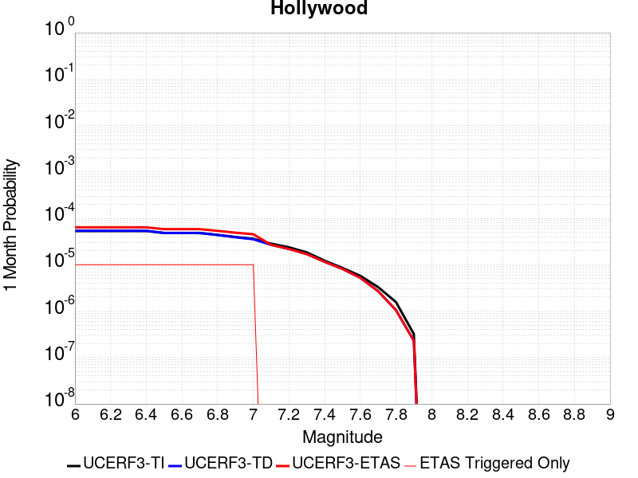 | 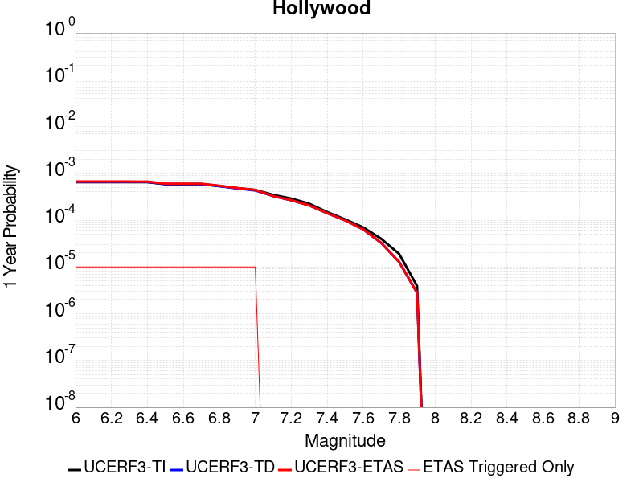 | 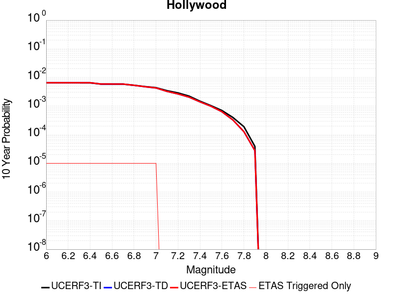 |

| Magnitude | 1 wk TI Prob | 1 wk TD Prob | 1 wk ETAS Prob | 1 wk ETAS/TD Gain | 1 wk ETAS Triggered Only | 1 mo TI Prob | 1 mo TD Prob | 1 mo ETAS Prob | 1 mo ETAS/TD Gain | 1 mo ETAS Triggered Only | 1 yr TI Prob | 1 yr TD Prob | 1 yr ETAS Prob | 1 yr ETAS/TD Gain | 1 yr ETAS Triggered Only | 10 yr TI Prob | 10 yr TD Prob | 10 yr ETAS Prob | 10 yr ETAS/TD Gain | 10 yr ETAS Triggered Only |
|-----|-----|-----|-----|-----|-----|-----|-----|-----|-----|-----|-----|-----|-----|-----|-----|-----|-----|-----|-----|-----|
| 6.0 | 1.24487615E-5 | 1.2593229E-5 | 5.5518514E-5 | 4.4086003 | 4.2925825E-5 | 5.3350745E-5 | 5.3969892E-5 | 9.6893404E-5 | 1.7953231 | 4.2925825E-5 | 6.4935174E-4 | 6.5689E-4 | 6.9978763E-4 | 1.0653042 | 4.2925825E-5 | 0.0064745755 | 0.0065499707 | 0.0065926155 | 1.0065106 | 4.2925825E-5 |
| 6.1 | 1.24487615E-5 | 1.2593229E-5 | 5.5518514E-5 | 4.4086003 | 4.2925825E-5 | 5.3350745E-5 | 5.3969892E-5 | 9.6893404E-5 | 1.7953231 | 4.2925825E-5 | 6.4935174E-4 | 6.5689E-4 | 6.9978763E-4 | 1.0653042 | 4.2925825E-5 | 0.0064745755 | 0.0065499707 | 0.0065926155 | 1.0065106 | 4.2925825E-5 |
| 6.2 | 1.24487615E-5 | 1.2593229E-5 | 5.5518514E-5 | 4.4086003 | 4.2925825E-5 | 5.3350745E-5 | 5.3969892E-5 | 9.6893404E-5 | 1.7953231 | 4.2925825E-5 | 6.4935174E-4 | 6.5689E-4 | 6.9978763E-4 | 1.0653042 | 4.2925825E-5 | 0.0064745755 | 0.0065499707 | 0.0065926155 | 1.0065106 | 4.2925825E-5 |
| 6.3 | 1.24487615E-5 | 1.2593229E-5 | 5.5518514E-5 | 4.4086003 | 4.2925825E-5 | 5.3350745E-5 | 5.3969892E-5 | 9.6893404E-5 | 1.7953231 | 4.2925825E-5 | 6.4935174E-4 | 6.5689E-4 | 6.9978763E-4 | 1.0653042 | 4.2925825E-5 | 0.0064745755 | 0.0065499707 | 0.0065926155 | 1.0065106 | 4.2925825E-5 |
| 6.4 | 1.2431024E-5 | 1.25738425E-5 | 5.5499127E-5 | 4.4138556 | 4.2925825E-5 | 5.327473E-5 | 5.388681E-5 | 9.681032E-5 | 1.7965494 | 4.2925825E-5 | 6.4842677E-4 | 6.558791E-4 | 6.9877674E-4 | 1.0654049 | 4.2925825E-5 | 0.0064653796 | 0.0065399213 | 0.006582566 | 1.0065207 | 4.2925825E-5 |
| 6.5 | 1.1242222E-5 | 1.1317804E-5 | 5.424314E-5 | 4.792727 | 4.2925825E-5 | 4.8180063E-5 | 4.8503985E-5 | 9.1427726E-5 | 1.8849529 | 4.2925825E-5 | 5.864344E-4 | 5.903787E-4 | 6.332792E-4 | 1.072666 | 4.2925825E-5 | 0.0058488925 | 0.00588839 | 0.005931063 | 1.007247 | 4.2925825E-5 |
| 6.6 | 1.1234066E-5 | 1.1308918E-5 | 5.4234257E-5 | 4.795707 | 4.2925825E-5 | 4.8145106E-5 | 4.8465907E-5 | 9.138965E-5 | 1.8856483 | 4.2925825E-5 | 5.86009E-4 | 5.899153E-4 | 6.328158E-4 | 1.0727232 | 4.2925825E-5 | 0.005844661 | 0.0058837803 | 0.0059264535 | 1.0072527 | 4.2925825E-5 |
| 6.7 | 1.12294E-5 | 1.1303661E-5 | 5.4229E-5 | 4.797472 | 4.2925825E-5 | 4.812511E-5 | 4.8443377E-5 | 9.1367125E-5 | 1.8860601 | 4.2925825E-5 | 5.857657E-4 | 5.896412E-4 | 6.325417E-4 | 1.072757 | 4.2925825E-5 | 0.0058422405 | 0.005881054 | 0.005923727 | 1.007256 | 4.2925825E-5 |
| 6.8 | 1.0252819E-5 | 1.0218449E-5 | 5.3143835E-5 | 5.2007732 | 4.2925825E-5 | 4.3939912E-5 | 4.3792625E-5 | 8.671657E-5 | 1.9801637 | 4.2925825E-5 | 5.3483713E-4 | 5.330469E-4 | 5.7594985E-4 | 1.0804863 | 4.2925825E-5 | 0.005335517 | 0.0053179096 | 0.005360607 | 1.008029 | 4.2925825E-5 |
| 6.9 | 9.252289E-6 | 9.110309E-6 | 5.2035743E-5 | 5.7117424 | 4.2925825E-5 | 3.9652066E-5 | 3.9043607E-5 | 8.196776E-5 | 2.0993898 | 4.2925825E-5 | 4.8265693E-4 | 4.752539E-4 | 5.181593E-4 | 1.090279 | 4.2925825E-5 | 0.0048161 | 0.004742549 | 0.004785271 | 1.0090083 | 4.2925825E-5 |
| 7.0 | 8.474604E-6 | 8.25826E-6 | 5.118373E-5 | 6.1978827 | 4.2925825E-5 | 3.6319227E-5 | 3.5392073E-5 | 7.831638E-5 | 2.2128227 | 4.2925825E-5 | 4.4209688E-4 | 4.3081472E-4 | 4.7372206E-4 | 1.0995958 | 4.2925825E-5 | 0.004412184 | 0.0042999457 | 0.004342687 | 1.0099399 | 4.2925825E-5 |
| 7.1 | 6.643643E-6 | 6.2683707E-6 | 6.2683707E-6 | 1.0 | 0.0 | 2.8472443E-5 | 2.686417E-5 | 2.686417E-5 | 1.0 | 0.0 | 3.4659685E-4 | 3.2702263E-4 | 3.2702263E-4 | 1.0 | 0.0 | 0.0034605677 | 0.0032654598 | 0.0032654598 | 1.0 | 0.0 |
| 7.2 | 5.549002E-6 | 5.1087086E-6 | 5.1087086E-6 | 1.0 | 0.0 | 2.378122E-5 | 2.1894282E-5 | 2.1894282E-5 | 1.0 | 0.0 | 2.8949787E-4 | 2.665304E-4 | 2.665304E-4 | 1.0 | 0.0 | 0.0028912104 | 0.002662124 | 0.002662124 | 1.0 | 0.0 |
| 7.3 | 4.3059727E-6 | 3.9598913E-6 | 3.9598913E-6 | 1.0 | 0.0 | 1.8454039E-5 | 1.6970853E-5 | 1.6970853E-5 | 1.0 | 0.0 | 2.2465475E-4 | 2.0660064E-4 | 2.0660064E-4 | 1.0 | 0.0 | 0.0022442779 | 0.0020640958 | 0.0020640958 | 1.0 | 0.0 |
| 7.4 | 2.8550733E-6 | 2.7013002E-6 | 2.7013002E-6 | 1.0 | 0.0 | 1.2235971E-5 | 1.1576949E-5 | 1.1576949E-5 | 1.0 | 0.0 | 1.4896276E-4 | 1.4094029E-4 | 1.4094029E-4 | 1.0 | 0.0 | 0.0014886294 | 0.0014085141 | 0.0014085141 | 1.0 | 0.0 |
| 7.5 | 1.9927045E-6 | 1.8976393E-6 | 1.8976393E-6 | 1.0 | 0.0 | 8.540134E-6 | 8.132714E-6 | 8.132714E-6 | 1.0 | 0.0 | 1.0397117E-4 | 9.901134E-5 | 9.901134E-5 | 1.0 | 0.0 | 0.0010392254 | 9.896759E-4 | 9.896759E-4 | 1.0 | 0.0 |
| 7.6 | 1.345084E-6 | 1.2216018E-6 | 1.2216018E-6 | 1.0 | 0.0 | 5.764633E-6 | 5.2354258E-6 | 5.2354258E-6 | 1.0 | 0.0 | 7.018215E-5 | 6.373946E-5 | 6.373946E-5 | 1.0 | 0.0 | 7.0159987E-4 | 6.372138E-4 | 6.372138E-4 | 1.0 | 0.0 |
| 7.7 | 7.6835164E-7 | 6.2777013E-7 | 6.2777013E-7 | 1.0 | 0.0 | 3.2929315E-6 | 2.6904406E-6 | 2.6904406E-6 | 1.0 | 0.0 | 4.00907E-5 | 3.2755637E-5 | 3.2755637E-5 | 1.0 | 0.0 | 4.0083472E-4 | 3.2750957E-4 | 3.2750957E-4 | 1.0 | 0.0 |
| 7.8 | 3.6562128E-7 | 2.4534745E-7 | 2.4534745E-7 | 1.0 | 0.0 | 1.5669474E-6 | 1.0514887E-6 | 1.0514887E-6 | 1.0 | 0.0 | 1.9077417E-5 | 1.2801803E-5 | 1.2801803E-5 | 1.0 | 0.0 | 1.907578E-4 | 1.2801103E-4 | 1.2801103E-4 | 1.0 | 0.0 |
| 7.9 | 7.5024424E-8 | 5.381742E-8 | 5.381742E-8 | 1.0 | 0.0 | 3.215332E-7 | 2.3064608E-7 | 2.3064608E-7 | 1.0 | 0.0 | 3.91466E-6 | 2.8081138E-6 | 2.8081138E-6 | 1.0 | 0.0 | 3.9145907E-5 | 2.8080913E-5 | 2.8080913E-5 | 1.0 | 0.0 |

